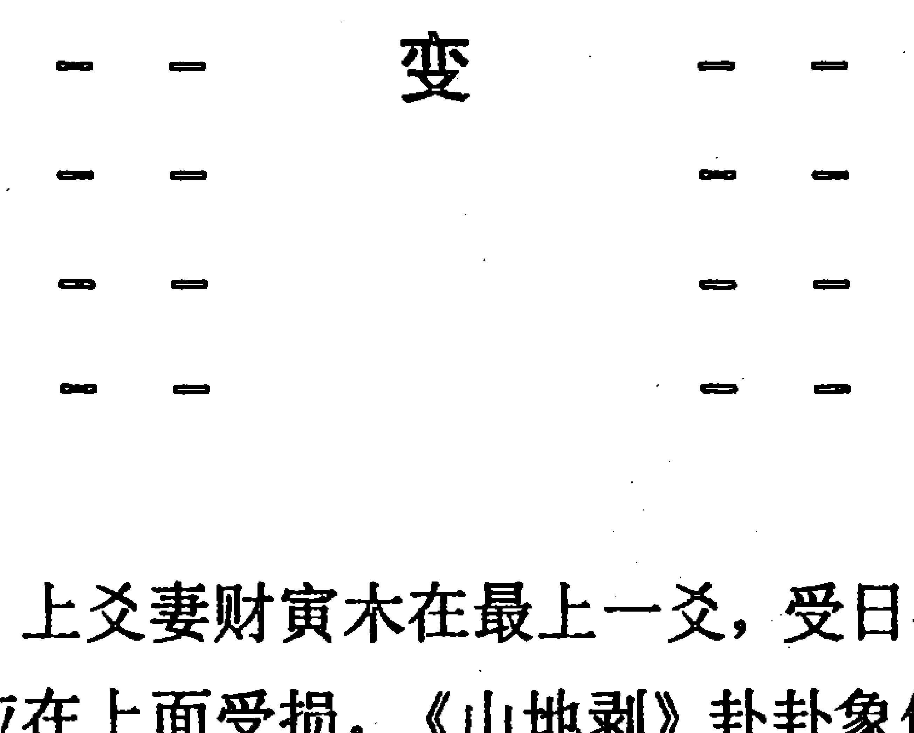
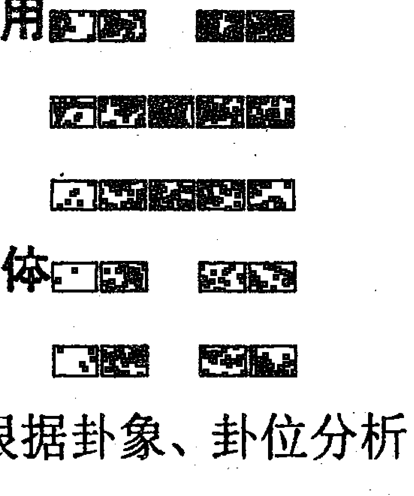
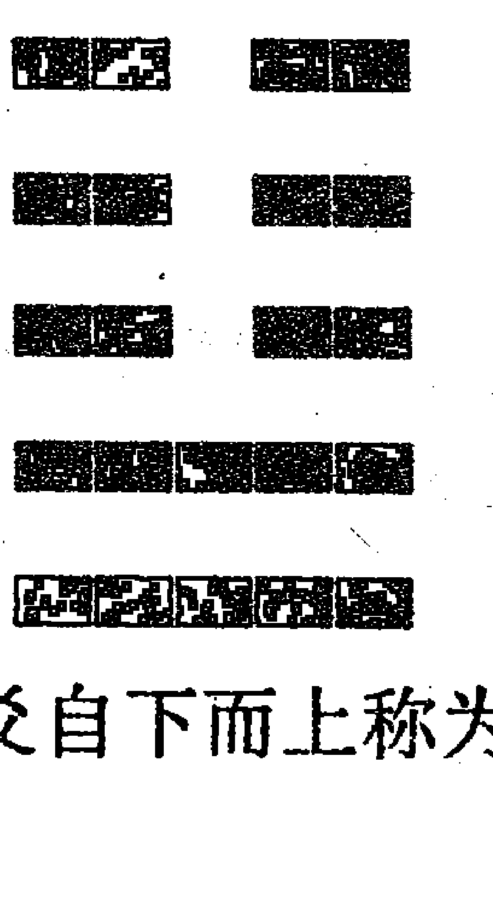

# 内部资料

## 六爻详真

曲炜 著

- 作者：曲炜
- 责任编辑：蓝天
- 封面设计：韩冰
- 出版者：内部刊物
- 幅面尺寸：145×210
- 开本：889×1194 1/32
- 字数：105千字
- 印数：1—3000册
- 出版时间：2015年4月第1版
- 印刷时间：2015年4月第1次印刷
- 定价：48.00元

## 作者简介

曲炜（本名曲宝兵），道号“若水”居士，易界领军人物。69年生于辽宁，89年开始步入易学殿堂，95年拜龙潭寺云清道长（在风水调整和勘探上有独门绝学）为师。为了积累经验，曾到过全国许多地方拜师访友，曾参加过李洪成老师周易培训班，在易学思维上有很大提高。曲炜善于博取众长，经过大量的实践探索、比较、筛选、归纳，总结了一套具有自己独特风格的学术理论，在易理上有了巨大突破。尤其在八字（四柱）、八卦、起名学、择日择吉、阴阳风水的选址与调整等方面有很高造诣。曲老师的易学风格基本属于传统派，在传统理论基础上，又有新的发展与创新。

曲炜先生在六爻预测学上提出“六爻的四个层次理论”“六亲通变原理”“卦象信息定向锁定原理”“六爻用神转换原理”“两象定一象原理”等等，这些理论的提出，进一步完善了六爻理论和六爻的实用性。在四柱预测学上，提出了“命理三个层次理论”，解决了千百年来岁运关系的痼疾。很多易学研究者反映，此理论的提出在四柱预测史上具有里程碑作用。还有“四柱定象原理”“六亲论”“作用论”等《曲氏二十一论》，都是四柱预测史上十分精辟、完善的学术理论。曲炜先生已发表的易学论文近百篇，现已有《四柱详真》《六爻详真》《四柱信息取象》《六爻多重取象》等二十余部易学著作问世。

曲炜先生易经理论体系得到了广大易学爱好者和易学专家的高度好评，有很多理论都填补了易学空白。曲先生正直的为人、高尚的学术情操已得到越来越多社会各界人士的认可，“技术精湛，德艺双馨”是各界人士对他的品评。曲炜老师的个人业绩及名字已免费载入《中国专家人名大辞典》第十三卷中。2005年元月8日，曲炜老师被中国当代名人论坛组委会评为“2004年度中国易学名人”，在人民大会堂由党和国家领导人给予颁奖，成为2004年度中国最具有影响力的100人之一。

另外，曲炜老师的业绩被免费载入中国工人出版社编辑的大型文献史册《中流砥柱》一书，此书是为中华民族伟大复兴而奋斗的功勋人物而编著，记载着为中华民族做出辉煌成就的功勋人物的先进事迹。曲炜老师能够收入其中，这是莫大的光荣！我们将会倍加努力回报伟大的祖国和人民！

## 目录

- 前言 …… 1
- 代序（一） …… 4
- 代序（二） …… 7
- 曲炜小记 …… 9
- 第一章 周易预测起卦模式与思维方式 …… 12
  - 第一节 梅花易数预测思维 …… 13
  - 第二节 六爻的预测思维 …… 15
  - 第三节 根据实际选择预测模式 …… 16
- 第二章 断卦的基本规律 …… 18
- 第三章 爻的四个层次理论 …… 24
  - 第一节 爻的四个层次 …… 24
  - 第二节 爻四个层次的具体应用 …… 31
- 第四章 爻生克权的判断 …… 35
  - 第一节 爻逢冲对生克权的影响 …… 35
  - 第二节 爻逢合对生克权的影响 …… 44
  - 第三节 入墓对生克权的影响 …… 51
  - 第四节 空亡对爻生克权的影响 …… 59
  - 第五节 卦爻的旺衰及生克权的判断标准 …… 64
- 第五章 六爻取用 …… 72
  - 第一节 世应 …… 76
  - 第二节 测人的取用方法 …… 79
  - 第三节 测事与物的取用方法 …… 88
  - 第四节 用神两现取用方法 …… 94
- 第六章 六爻位象与爻象 …… 98
  - 第一节 卦位与卦象 …… 98
  - 第二节 爻位 …… 107
  - 第三节 爻位细分法 …… 112
- 第七章 六神信息之象 …… 118
- 第八章 如何具体断卦 …… 130
  - 第一节 断卦前先联系实际 …… 130
  - 第二节 卦的内因与外因 …… 133
  - 第三节 卦象信息定向锁定原理 …… 136
- 第九章 测来意 …… 140
- 第十章 断应期 …… 145
- 第十一章 分类预测 …… 153
  - 第一节 测求财 …… 153
  - 第二节 测婚姻 …… 165
  - 第三节 测失物 …… 178
  - 第四节 测病 …… 192
  - 第五节 测出行 …… 202
  - 第六节 官司诉讼 …… 216
  - 第七节 测竞争与比赛 …… 223
  - 第八节 断流年 …… 228
- 第十二章 六亲通变 …… 237
- 附录：曲炜专著介绍 …… 244

## 前言

与命理结缘，那是在一九八九年，正是笔者升学之际。当时笔者对命理学一无所知，所以对算命、卜卦不但不信，反而认为是迷信。可是，在升学前夕，由于拗不过父母的强拉硬拽，才不得已到当地较有名气的一位老先生家卜算了一下前程。先生所测算之事绝大多数都准确，尤其是提前卜算出我八九年升学情况，事后的经历均如所测，不由得使我对“算命学”作了重新审视，就想探究探究到底是科学还是迷信。于是我一边读书一边探研易理。在几年的命理研究实践中发现，周易的确是一门科学，不是简单“迷信”二字便可否定其真正的实用价值。一种理论也好，一种思维也好，一件物品也好，它之所以能够流传千年而不衰，肯定有它存在的理由。没有做过深入研究，哪能知道其科学性所在？毛泽东说得好：“没有调查研究，就没有发言权。”葡萄是酸是甜只有亲自尝尝才知道，道听途说未必都可信。

93年毕业分配工作后，逢休假日便到专职摆卦摊师傅那里学习，时间长了从他们断卦之中也学到了不少命理及断卦技巧。97年到湖北咸宁邵伟华易学服务中心求学。经过十余年来自己不断地探索，广采众家之长，使自己易技有了质的飞跃，终于悟到一些易理精髓所在。笔者能有今天的成绩，能够在前圣今贤的理论与实践基础上有了一些新的认识，并提出了一些新观点，无不依赖于这些无数位师傅一招一语教诲，是他们的真心相传才铺出我今天成功之路，在此表示衷心地感谢！

自八九年易坛泰斗邵伟华大师出山以后，我国被禁锢四十余年的易学，出现了勃勃生机景象。易学热从国内到国外，一个热潮接着一个热潮。全国各地如雨后春笋般地成立了许多易学机构，于是所谓“绝招”、秘传“漫天飞舞”，一些心术不正者借机浑水摸鱼捞取不义之财。许多善良的易学爱好者被求知欲所驱使，屡次上当受骗。各类易学学习班、函授班参加了很多次，结果拿来八字还是无从下手，越学越糊涂，越学越觉得还不如从前，所以许多易学爱好者处在欲学无门、欲罢难舍状态。易学界的良莠不齐，使许多求学者难以区分真假。笔者对那些丧尽天良骗取钱财的易学界败类深恶痛绝。许多与我探研过易理及跟我学过易理的易友，都希望我能够写部命理六爻书，点拨至今还在迷途的易学爱好者，使他们走出玄学的泥潭，真正踏入科学预测轨道上。说句心里话，笔者毕竟资历有限，唯恐自己学识不高而贻误了广大易学爱好者。因为易学博大精深，许多古圣今贤皓首穷经，也难言登峰造极，何况正在苦苦探索之中的我，更不敢夸下海口说精通易理，只能说我比一些易学爱好者早些找到通往科学预测的道路。很多地方还得不断地吸取各位易友的独到见解。

笔者在本书中对古圣今贤的易理观点的肯定与否定，决无恶意，更无攻击和吹捧之心。人家正确简单实用的成功经验，尽可以拿来运用。我不想处心积虑、别出新裁，把本来简单的理论再复杂化，改头换面，变为自己的。同时对一些命理上有误之处，或有争议之处，笔者也阐明了自己的见解与主张，读者可以在实践中进一步检验。

> “不要轻易否定一个观点，也不要轻易肯定一个观点。这才是一个真正做学问之人应有的思想和求学态度。”

本书将在以后章节中尽量详细阐述四柱五行内部生克机理，及真正生克路线，使读者对四柱批命有“法”可依，有规可循。可以肯定地说，只要领会笔者思维方式，细心体会书中的字字句句，都会在命理预测学上走出一条成功道路！

后学：曲炜  
庚辰年 戊子月 于敝所

## 代序（一）

结识曲炜是在九九年的秋天。当时我在海口桥路公司任《中国四柱大词典》编委会主任兼副主编。

曲炜在中专读书时，开始接触《周易》八卦，后来又对“四柱”有了兴趣。中专毕业之后，该是有缘，在一个偶然的机会里，接触到李洪成老师的“文章”，从李洪成老师的文章里感受到希望之火花，开始决心攀登“易学”这座天堂。为了自己的追求，放弃了有多少人羡慕的公职，先后几下江南，寻师拜友，几经周折，毅然决定投入李洪成老师门下，跟随李老师学易。

九九年秋，《四柱详真》《六爻详真》作者曲炜，为了实现对《周易》八卦和四柱命理的追求，不远千里，从东北的大连来到祖国南端——美丽的宝岛海口市，步入李洪成老师的桥路公司之门。同为大连人，在海口桥路公司会面，倍感亲切。听了年轻人的述说，深为小曲的勇气和学术追求精神所感动。酷热的海南，他带着种种期望，不忘亲人的嘱咐，深知失去公职所带来的经济压力，克服种种困难，夜不释卷地充实自己；勤奋、刻苦之极，见了真是让人心痛。几个月下来，给我的印象：这个年轻人有点不寻常；厚道、老诚、踏实、好学，虚心求教，真有股子钻劲，有不服输的精神，真是后生可畏，坚持下去，能够学出点名堂来。

去年初，家中有事，我离开桥路公司返回大连。之后，我们往返大连与瓦房店之间，常常为《周易》八卦或四柱命理中某一疑难不解之题在一起切磋。由于小曲虚心，有股子钻劲，能联系实际，对“易道”的理解和应用，简直是突飞猛进。要不是常常在一起探讨，还真有点不敢相信。有一天，一位易友打来电话：“曲炜出了两本书，是真的吗？”他有点惊讶。我说真有其事，正在排版印刷，不久即可面世。做为年长者，真心为这样有志于华夏文化的年轻人而高兴。为此在《四柱详真》《六爻详真》出版之际，写了这篇序。

本书所写的内容，突出在现实社会、市场经济中如何应用方面下大手笔，其中大量的篇幅是介绍怎样应用，如看仕途、事业、财运、婚姻、健康病伤、狱灾。

相信有缘本书的读者会有兴趣的，读后能感受到：此书是按读者的需求所写，范围广，由浅入深，好学易懂，对于读者开阔视野、拓宽思路，是当今容易理解和应用的易学书籍。

本书还提出很多新的观点和断易诀窍，看似普通，没什么新奇，可真正一用，仔细琢磨，会发现作者胸怀宽广，用心良苦，时时处处都没忘记为读者着想，不忘“点窍”这条线，把在海口学到的、寻师访友得到的以及自己实践中探索的易学知识，都毫无保留地写进本书里。如能细心思考、实践，会有一个质的飞跃，且能吃到味道甜美的硕果。

本书是作者以卦例、命例探讨为基础，通过实践验证。对有志于研易、学易、用易的读者，藉此可少走弯路、误区，尽早步入易学大雅之堂。如果不以词难为重，相信本书会给读者意想不到的益处。

为了不使《四柱详真》《六爻详真》成为墓绝空破，如果你能够从中获益，请别忘了用电话或书信鼓励作者继续奋力，可望不久，能在他的下部“专著”里看到更为实用、见解独到、新颖的作品，以励后学。

相信在中国这块神圣的土地上，华夏文化——周易八卦终有一天将被现代社会所承认、重视和接受，这一天为期不远了。

石祥山  
辛巳年夏 于大连

## 代序（二）

我是在《桥路咨询》上认识曲炜的。当时他在刊物上经常发表“四柱”“六爻”方面文章。他的文章以文字流畅、朴实无华、思路清晰、观点新颖而令易学同行们折服。

其实我真正认识曲炜是在易学殿堂——海口桥路咨询公司。99年，我在“桥路咨询公司”任“四柱词典”编委会副主任，听说学员中有几个是辽宁来的，我便去宿舍看望，当时曲炜也在其中。瘦高、清癯，一看便知是很内秀、做学问型的知识分子。一番接触，给我印象是朴实、厚道，说话办事实实在在，不掺一点水分。

曲炜思路清晰，思维敏捷，观点新颖。同行们争论“四柱”“六爻”时，他的观点常常让易友们惊叹折服。

2000年，曲炜邀我合办了一期“四柱”“六爻”学习班，我到了曲炜家乡——辽宁省瓦房店市下龙口。下龙口紧贴着长兴岛海滨浴场。这里山青水秀，难怪素称之为“下龙口”啊！

地杰人灵，曲炜就是在这块秀美水土中，从18岁开始学易，凭着执着、凭着聪明、凭着悟性，一点一滴地筑起了自己的丰厚、踏实的易学功底。

曲炜在家乡有相当高的威信。我在下龙口仅呆了十五天，亲闻求测者电话铃声不断，亲见登门求测者络绎不绝。曲炜断的“卦”和我的“四柱”几乎百发百中，让求测者佩服得五体投地。因此方圆百里之地，大到几百万元投资，小到几十元买卖……总之，事无巨细，都要来求测一下。经过曲炜点拨后，方才心中踏实，事实也证明，按着曲炜点拨的路走，获益匪浅。

现在，曲炜把自己数年来积累的心血总结为《四柱详真》和《六爻详真》两部书。

这两部书如从浩瀚的易学书海中竖起的一株红高粱，实实在在，不掺一点水分，不含一点哗众取宠成分。

这两部书观点新颖，文字通俗，程序井然，重点突出，理论联系实际。与其它易学书籍不同之处，是有其自己独特的风格和特点的。

像这样的书，无论是易学入门者，还是有一定功底的学易者，读过之后，都将会有打开一扇窗，啊！看见一片新绿洲的感觉。

书还没有打印完，订购者信件和电话已经不断寄来。什么叫真才实学？这就叫真才实学。难怪乎曲炜的人气足，人气旺啊！

孟范瀚  
辛巳年己月于大连

## 曲炜小记

铃、铃、铃……

曲炜拿起电话：“喂。”

电话是一个学员打来的，“老师，我有一个难题……”说话很急。“别着急，慢慢说。”“请你看个卦，我解不了……”

曲炜一边听电话，一边在纸上记下八卦图样。大约五分钟，曲炜断出五点，告诉对方：

- 摇卦的是一个大老板，办厂的，是从事生产与火或金属、电有关系的产品。
- 这个厂从98年到2000年一直亏损，亏损的原因主要是因为厂里布局风水有问题。迄今为止大约已亏损30万元左右。
- 老板曾经请过不少个高级技术人员到其厂去勘察，都没有解决问题。
- 这个厂址原来是个坟地，施工时地下的白骨未清理干净，厂里的布局风水有问题，须调理。

“对，太对了，太对了！……”对方电话是开免提，能听得出有不少人赞不绝口。

“曲师傅，本来我是信主的，不相信什么八卦算命的，现在没办法了，被逼急了，才找人算算。方才你指出的那几……”

点都对，现在我算是服了。”老板迫不及待，亲自对话。

事实上，的确如此。

摇卦者是个私营企业老板，生产电缆。不知为什么，生产的电缆最后一道工序压制绝缘皮，老是跑偏，一边薄、一边厚，次品太多……到现在为止确实亏损了30万元。

2001年3月12日，电缆厂老板把曲炜接到开原。经过曲炜的风水调理，三天后，此厂再生产的电缆包皮已经过关，真是神奇呀！

此事传为佳话，竟惊动了某市的一位高干夫人。她找到曲炜，让曲炜给预测一下新居房子如何。

曲炜让她意念集中摇了一卦，断了四条：

- 你家有钱，丈夫是当官的，且级别不低；
- 从搬进新居后，你们夫妻感情开始不好；
- 这房子不利丈夫，不利子女；
- 要注意丈夫和子女易有手脚之伤。

她听完后，几乎惊呆了。片刻，拍着大腿说“大神了，大神了！”

事实上，自从搬进新居，夫妻二人不知为什么老闹别扭。在新房装修时，丈夫被电锯割伤腿部住院。前些日子，女儿又被三轮车撞倒在地。

曲炜是外地人，对此女人一点不了解，可他断的这四条条条应验。你说神不！

周易是一座神秘殿堂，曲炜已经走进这座殿堂，拿起这块瑰宝，为人们服务了。

如果所有的预测者都能像曲炜测得这样准，还有谁会说周易是迷信，是伪科学呢。

谭子和  
2001年7月20日

# 第一章 周易预测起卦模式与思维方式

当今周易预测最普遍的是六爻纳甲和梅花易数两种易占方法。六爻纳甲是由西汉时期著名易学家京房发明的，当时起卦是用蓍草，后经唐末宋初陈抟老祖发展到火珠林法，就改用三枚铜钱代替蓍草，沿用至今。

梅花易数是宋代著名易学家邵康节发明的。梅花易数的起卦方法主要分两类：一是先天起卦法，如以数起卦、按时间起卦、按字数起卦及以字的笔画数起卦等等。总而言之，是先有数而后才有卦。另一种是后天起卦法，这种方法是上卦以万物类象为准，例如见到老太太为坤卦，见到鸡为巽卦等等；下卦以后天八卦方位来定，例西北方为乾，如老太太从西北方向来，后天卦是《地天泰》。动爻则按上下卦后天八卦序数再加当时时辰数之和，除六之余数为动爻，余一为初爻动，余五则为五爻动。

由于起卦方法不同，预测推断的主体思维方式及推断规律必然有所差异：你是按梅花易起卦的，只有按梅花易的预测方式去判断吉凶最准确；你若是摇卦，以六爻纳甲法的推断方法去判断吉凶最准确，这是真言。很多易学爱好者不知此理，占卜时必有失偏，自己却找不出理论根据来，很多时候就是预测者的起卦模式与推断思维方式不统一所造成的。

本是以梅花易方法起出的卦，偏要用六爻推算方法去推断；本是摇出的卦，却用梅花易的方法去推断。还大言不惭地说这是活学活用，是易之变通原理。其实易道的确是以变为根本，以灵活为根本，但也不是无道理、无原则的胡乱通变。每种起卦模式都配备相应的推算机制，只有模式和推算机制相符合，才能最准确地推断出预测结果。

因此很有必要在开篇第一章予以澄清，使读者先有一个正确的预测思维意识，才能在实际预测中少走弯路，免除一些不必要的错误。

## 第一节 梅花易数预测思维

梅花易数以简单、迅速、准确而广泛流传于世。梅花易由于起卦模式所定，它不受求测者思想意识干扰，没有求测者主观意识成分。所以，在重大事情决策时，往往利用梅花易数再起一卦，配合六爻卦共同决断，利用两卦参考事之吉凶成败，往往准确率会更高。

梅花易占断思维方式是：成卦之后首先看爻辞；第二看成卦的体用关系；第三看卦名；第四根据自身的动静定应期。

梅花易数断事情的吉凶成败注重卦气，即注重时令（节气），不太注重日辰。喜体卦卦气旺，例春占得震与巽卦为体卦，则体卦气旺；夏占得离、艮、坤卦是体卦时，为体卦卦气旺。卦气旺是成事的首要条件，体卦卦气旺盛则不怕用卦、变卦克、泄、耗。若体卦衰，逢用、变卦克、泄、耗必主不吉。

由于梅花易起卦只有一个动爻，因此，反映事情的原象比较专一集中，所以在测行人走失时，其动爻往往是行人的去向和方向变化的主要标志。例如行人走失得《天风姤》卦，三爻动。下卦为巽，是用卦，是行人；巽动变坎，其人是先去东南（巽）而后又去北方（坎）。

用梅花易推断事情吉凶，往往较直观，不像六爻那样繁琐。六爻用神不好取，爻间的各种规定、规则很多，有一个规则没弄明白，此卦就很难有把握断准。况且现代事物繁多，给六爻取用带来很多麻烦，用神取不准也难以预测准确。而梅花易却只有体用之分，用卦生助体则吉，克体则凶，这是个大原则。以此推断，无须像六爻那样担心用神找不准，担心六爻复杂的规则上有漏洞，便可以迅速而较准确地推断出事情吉凶。

为什么有的易学爱好者，刚开始学周易时觉得测事很准，后来又觉得越学越不如以前了？这可能有多种因素，但可能有一种就是：你原来断卦用的是梅花易，简单明了，所以断得准；后来觉得梅花易虽然结果测得准，但包含信息少，不像六爻那样断事情细致入微。为求更高技艺而学起六爻，结果六爻的复杂、六爻的变化无穷，要参考的因素太多，往往是吉凶难定，反而主要性结论却拿不准，致使预测准确率下降。

任何一门预测术都有它的长处，也有它的短处，所以预测者可以多掌握几门预测技术，针对求测者欲求测之事合理取用预测门类，或几种预测术相互参断，方能更全面、更准确、更细致地为人预测。欲想利用梅花易详断，必须将万物类象掌握精熟，知道物象愈多，断事愈细，这也是细断六爻的基本功。

## 第二节 六爻的预测思维

六爻卦预测起卦方式是：求测者用三个铜钱（现代人用三枚硬币也可）合扣于手心，集中意念想欲测之事，摇六次而成卦。其原理就是利用铜的磁场传导性能将人的意念传递于铜钱之上，由铜钱自然落地时形成的阴阳组合而产生卦象。因此，六爻预测准确度高低主要由两方面因素决定：预测者水平高低是一个方面，另一方面就是求测者意念集不集中。意念杂，不专一，显示的卦象卦体必然不清，结果自然就不十分准确。

这是六爻卦的缺点。其优点是：当求测者意念集中，不受他人和外界干扰时，特别是有急事要办时，其所摇出的卦必是动爻少，往往动爻与所求测之事密切相关，显象明显，利用六爻推断往往可以细致活灵活现地断出许多事象来，令人叫绝！若意念不集中、思维混乱之人摇出的卦，往往是动爻多，至少三个以上，甚至六爻全动，定然主此人心神不定；一是摇出的卦象不太精确，二是所测之事，事体多翻腾无头绪，像卦爻一样乱动，乱糟糟的，所测之事吉凶难明。

六爻预测比较重视日、月、动爻、变爻，测长远之事也参看流年太岁，短期之事也参看时辰。

六爻预测主要是利用日、月、动、变、用、忌、仇、原神之间的五行生克制化规律去判断吉凶，并配以六神辅助参断事情发生的类别，而不需看卦辞、爻辞及体用关系。至于卦名，也只是有个参考作用，不能仅以卦名定吉凶。具体六爻预测方法是本书论述核心，将在以下章节中详细论述。

## 第三节 根据实际选择预测模式

六爻预测法与梅花易占法，各有所长。在实际预测中，如何选择最合适的预测模式是比较关键的。预测模式选择适宜，起出的卦信息集中且明显，易于推断；选择不适宜，容易占此应彼，或信息不明显，甚至出现错卦。那么如何选择最适宜的预测模式呢？我的经验如下：

- 首先看预测者最擅长哪种模式，首选自己最擅长的预测模式。
- 其次是重要事件、突发性事情，以时间卦为最好（以事发时间为主），以六爻与梅花易参断，二者矛盾时以梅花易占为准。
- 第三是环境嘈杂、人心不稳，在求测者不能心静时，以梅花易方法预测较好。
- 第四是当求测者心稳，没有外界干扰时，以摇卦为好。
- 第五，不是突然事件，不可随意采用时间起卦法。例测求财、婚姻、工作等等，一般是不能以时间来起卦的。
- 第六，测随机事情，采用梅花易较准。什么是随机事情呢？就是求测者在求测前并没有处心积虑要测此事，而是有意识无意识地随口说要测某事。例，在饭店吃饭，菜已上毕，有人提议测一下这桌饭菜要多少钱，此属随机求测，你可以用梅花易数方式起卦推算，大可不必拿出铜钱正儿八经地摇起卦来。这样摇出的卦反而没有随意起出的卦准。笔者认为卦随自然，随意的事，用随意的方式起卦反而最灵验；庄重、严肃的事，用摇卦方式比较合适。
- 第七是以自己第一意念为准。你的第一意念想用什么方式起卦，就用什么方式起卦预测。

以上七点关于预测模式及起卦方式的选择，还需广大易学爱好者在实际断卦中不断体味。那么有的读者会问，梅花易与六爻预测方法能不能融汇贯通、融合在一起呢？回答是：能。但是有条件的，条件是只有起出的卦二者预测结果一致时，才可互相参断；若结果不一致，以其所起的卦对应的预测方式去推断。

# 第二章 断卦的基本规律

每一位预测师就好像一个裁判员，裁判员分国际级、国家级等级别，都是根据该裁判员掌握比赛的基本规律规则的多少与熟练程度来评定的。预测师的水平高低，关键看预测准确度的高低。你掌握断卦基本规律、规则愈多，并能熟练灵活运用，断卦的准确度也愈高。

在六爻预测中，有上百成千种断卦内部规律、规则，每断一卦都得用上几十种这些规律、规则。如果其中有一种小规则你没把握好，那么这卦就没法断下去了，勉强去断只是蒙，是猜测，不是真正意义上的预测。因此掌握断卦的基本规律、规则是断准卦的首要条件。因此笔者将在本章及以后章节中不断详细阐述这六爻间基本规律、规则，力求给读者一个明确认识。对一些有争议的规律、规则，笔者依个人经验，也提出自己的看法。至于是否正确，我认为：实践是检验真理的唯一标准，不要迷信于古书和名人，要借鉴地吸收，用实践去验证。

刑、冲、合、害实质也是生克的一种特殊表现形式，无论在四柱和六爻预测学上，都是根据五行的生克制化刑冲合害这一基本规律来体现五行间的生克推断吉凶的。所有的六爻、命理书都讲生克制化刑冲合害，但到底怎样应用，诸书都没有详细说明，尤其在六爻中好像刑与害没有什么大作用，一般只按生克看，其实刑害也要看。六爻预测都是以地支五行为主来论生克，但这些地支间生克是有先有后的。凡是五行间有刑、冲、合、害这些特殊关系的，都具有优先生克权。在同层次爻中，首论合与冲，其次再论刑，接着论害，最后才论没有特殊关系五行间之生克。这是一个大原则。当爻的层次不同，这些生克顺序便发生改变，下层次爻间的生克制化刑冲合害都得让位于上层次爻。

例《天山遁》卦：

## 《天山遁》

- 父母戌土、
- 兄弟申金、应
- 官鬼午火、
- 兄弟申金、
- 官鬼午火× 世
- 父母辰土、、

卦中世爻午火动，可生上爻父母戌土，也可以生初爻父母辰土。而实际上官鬼午火虽离父母辰土近，但生辰土力量却没有生戌土力量大，为何？因为午与戌有半合的关系，有优先生克权，而午与辰没有特殊关系。这午、戌有半合的关系就像有亲属、好友关系一样，自然就把好处多给戌土；而辰土与午火没有什么特殊关系，就好像平常关系或不太熟及根本不认识的人。所以世爻如果有一样东西要送给人，而又有两个人都需要这东西，按常理推世爻的东西必然是给自己有特殊关系的，例如亲人、朋友等等，而不熟悉之人、没有什么关系之人，就得不到。除非是世爻东西多，也就是说很旺，也可以给辰土一些，但只要有戌土在，辰土得到的好处总要比戌土少；如果无戌土，只有辰土，那自然好处会给辰土了。这是生。如果是相克关系，自然是先论有特殊关系的。

举个例子来说明一下：

## 《水风井》

- 父母子水、、
- 妻财戌土、世
- 官鬼申金、、
- 官鬼酉金、
- 父母亥水、应
- 妻财丑土×

此卦初爻妻财丑土动，克上父母子水力量大，克父母亥水力量小。因子与丑有合的关系，而丑与亥无特殊关系，所以当父母子水为用时，就有被合住之象；若父母子水弱，则被合克，无生克权。（又如巳申合，申旺以合论，申弱以受克论，此时申金失去生克权，卯戌合亦同）

举例说明，如：

## 《水火既济》

- 兄弟子水、、应
- 官鬼戌土、
- 父母申金、、
- 兄弟亥水、世
- 官鬼丑土×
- 子孙卯木、

如测竞争官位，在不考虑其它因素条件下，此官位应被谁得呢？卦中官鬼丑土动，为用神的情况下，此官一定是被应方所得，而与世爻无缘。因为官鬼丑土与应爻有合的关系，而与世爻无特殊关系；自然先论合。官合应爻与世爻无缘，这一点很关键。有的读者会问，官鬼丑土离世爻近，离应爻远，应该以近者为先才是。在六爻中动爻在卦中与其它各爻是不分远近的，因为它是动爻就有流动性，可以运动到任一爻上，与所有的卦爻都是一种贴近关系，是不分距离的。当然在静爻与静爻之间是要论距离的，此时要看远近。

再如《山泽损》：

- 官鬼寅木、应
- 妻财子水×
- 兄弟戌土、、
- 兄弟丑土× 世
- 官鬼卯木○
- 父母巳火、

卦中有子爻、丑爻、卯爻动，有子丑合，有子卯刑，到底论哪个？因合冲在先，所以首论合冲，应以子丑合来论。子水不刑卯木，也就是说子水不能主动生卯木，但不等于卯木不刑子水。卯木刑子水，是卯木主动盗泄子水力量，使子水减力。子丑合，结果也是子水被合克减力。此卦如果丑土为静爻，则先论子卯刑，子水主动生卯木，卯木也积极盗泄子水的力量。在实际断卦中就会有这样信息之象：若子爻、丑爻、卯爻俱动，是财爻子水与丑合又被卯木刑，说明此钱财被兄弟所代表的人、事、物合去（骗去），是自己主动给兄弟的。卯木刑子水，卯木主动盗泄子水，子水被动地生卯木，说明有一部分钱财耗损是被官爻卯木所代表的人、事、物主动要去的，不是自己主动给的，自己不愿意拿给官爻的，不是主动拿给官爻的。就好象日常生活中被动向官方交税了，被动把钱交给丈夫啦等等。看是测何事，看官爻在所测的具体事中代表什么，也就是对应的是什么人、事、物，以此推钱财是给了谁，被什么人、事、物耗费去。

其实五行间的生克制化刑冲合害，并不单纯只是一种生克关系，也揭示了人世间事物的内涵。如上面所言的信息之象，也都是从五行生克制化刑冲合害这一角度提炼出来的，这是其它书中所没有谈到的（六爻中如此，四柱也是如此，详见笔者的《四柱详真》一书）。生克制化刑冲合害，既要论其实质是一种生克关系，也要更深一层地看到它同样揭示了一种信息之象。只单论生克就有些太简单、太肤浅了。俗语说得好，师傅领进门，修行在个人。教不教是师傅的问题，学不学，能不能举一反三灵活运用，则是徒弟自己的问题了。学易，不能单靠书本，单靠师傅一句一句传，一口口喂，把道理给你说透了，剩下的全凭自己去悟！

合与害有什么区别？除了有先后之分外，其实质二者都是一种生克关系，但同样也揭示一种信息之象。如丑午相害，实质是午火生丑土，或说丑土盗泄午火之力。是一种什么象呢？就是我午火给你丑土好处，去帮你，但不太心甘情愿。相害嘛，主不太友好。好比平常中我可以把钱借给你，或给你帮助，但我不太情愿，我得说你几句。而午与未相合，虽也是午火生未土，但体现信息之象就不一样了：午火若不动，那是午火情愿把好处给未土，毫不怨言，甚至还会说：钱你尽管拿去用，不够再来拿。显示一种特别友好、情愿、主动信息之象，因为是合嘛，合有合好、情愿之意。其它如刑、冲等大家也都可以去联想，在此就不一一细说。总之只要发挥联想多去悟，很快就可以提高一个层次，就不会把生克制化刑冲合害认为是一种单纯的五行生克了。

## 第二章 爻的四个层次理论

李洪成大师提出了爻的三个层次理论，在实际断卦中确实起到了纲举目张的重要作用，笔者也是此理论的受益者。所以没有看过李老师《具体断六爻讲义》的读者，或是过去没有认真看过李老师《讲义》的易学爱好者，请您多研究一下李老师的著作。在此提出爻的四个层次，实际是在爻的三个层次理论基础上经过大量实践而有所改进的。为了使读者阅读方便，更加深对李老师的爻的三个层次认识，笔者在此章虽有些重复论述，主要是给那些没读过李老师著作的读者一个从头到尾的理论认识，以免有断档之感，使这一部分读者能更好理解本书的思想内容。总之一句话，读者就是上帝，本书的写作宗旨就是让每一位读者都能从中受益！

## 第一节 爻的四个层次

### 一、爻的第一层次

在六爻中，一个完整的卦象包括：日、月建（有时也包括年、时）、主卦、变卦、六神几个组成部分，其中将日、月建及年、时也作为一个具体爻来看待。

在六爻预测中，日、月建是各个爻的旺衰来源，各爻的生克权大小主要根据此爻在日、月处于什么状态来衡定。日、月建对卦中任何一爻都有生、克、拱、合作用，所以日、月建的生克权最大，排在第一位，为第一层次爻。

### 二、爻的第二层次

爻的第二层次是变爻。这里指的变爻是主卦发动之爻变出在变卦中的同位爻。

为什么把变爻排在第二层次？因为变爻除了对本位动爻有生克拱合的作用外，对主卦其它爻也有生克拱合的作用。变爻可以生克主卦中的动爻和静爻，而主卦中的动爻和静爻无权生克变爻。变爻的生克权大小决定于日、月建，受日、月建制约，所以变爻为第二层次爻。很多易友只知道变爻对本位动爻发生作用，而不知变爻对主卦其它动静之爻也有生克拱合的作用。但这种作用是有条件的：当变爻对本位动爻有生、克、合、冲作用时，由于它与本位动爻最近，所以就有优先生克权，这时它只对本位动爻产生作用，而不对其他爻产生作用，或说对其他旁爻作用力很小。当变爻对本位动爻没有生、克、合、冲关系时，它就会对主卦中其它旁爻产生生、克、合、冲作用。

例如：

| 《山水蒙》 | 《风水涣》 |
|---|---|
| 父母寅木、<br>官鬼子水×<br>子孙戌土、、世<br>兄弟午火、、<br>子孙辰土、<br>父母寅木、、应 | 父母卯木、<br>兄弟巳火、<br>子孙未土、、<br>兄弟午火、、<br>子孙辰土、<br>父母寅木、、 |

此卦官鬼子水动而化兄弟巳火，由于巳火对子水没有生、克、合、冲这些关系，所以兄弟巳火对主卦其它旁爻就有作用力：巳火可以生主卦辰、戌土，可以助兄弟午火，可以盗泄父母寅木力量。

例：

| 《乾为天》 | 《天泽履》 |
|---|---|
| 父母戌土、世<br>兄弟申金、<br>官鬼午火、、<br>父母辰土○应<br>妻财寅木、<br>子孙子水、 | 父母戌土、<br>兄弟申金、<br>官鬼午火、、<br>父母丑土、、<br>妻财卯木、<br>官鬼巳火、 |

此卦应爻父母辰土动化退，是辰土力量一种减退之势。但因变爻丑土对本位动爻辰土没有生克作用，那么此丑土便可以合主卦初爻子孙子水。子丑虽合，但子水合不住丑土（丑土爻层次比子水爻高），即使此卦子水动，也合不住丑土。

丑土也有生主卦兄弟申金之权，但力量有所减弱，主要还是以子丑合来论，因为首论合冲。

例：

- 《巽为风》
- 兄弟卯木、、世
- 子孙巳火、
- 妻财未土、、
- 官鬼酉金、应
- 父母亥水、
- 妻财丑土×　父母子水、

此卦初爻妻财丑土动，变父母子水。由于子丑有相合的关系，子水将丑土合住，丑土与本位爻发生了合的关系，丑土便不再与主卦中的其它爻发生作用，只论子丑合便可以了。

### 三、爻的第三个层次

爻的第三个层次就是主卦中的动爻、暗动之爻。动爻在主卦中能生、克、合、冲同层次的动爻，也能生、克、冲、合主卦中的静爻；但动爻受制于日、月建及变爻，尤其是本位变爻，动爻无权生克日月及变爻。

例：卯月甲午日

| 《水泽节》 | 《兑为泽》 |
|---|---|
| 兄 子、、 | 官 未、、 |
| 官 戌、 | 财 酉、 |
| 父 申× 应 | 兄 亥、 |
| 官 丑、、 | 官 丑、、 |
| 子 卯、 | 子 卯、 |
| 妻 巳、世 | 妻 巳、 |

此卦兄弟子水在日、月都休囚，按一般六爻书论，兄弟子水为日破。笔者认为：静爻在日、月两处都休囚，但不受克，日辰对爻只冲不克的条件下，此静爻处于日破与暗动的临界状态。至于论破还是论暗动，这取决于卦中的动爻及变爻。如果有动爻或变爻生扶则为暗动，若有动变爻克、泄、耗此爻，则为日破。此卦兄弟子水，得第三层次爻父母申金之生，又得变爻亥水之助，已由临界状态上升为暗动的第三层次爻。如此卦申金不动，而官鬼戌土发动，或丑土发动，使子水受克减力，那兄弟子水就是日破了。正是这些小小微妙之差，往往决定了事情的吉凶成败。此卦中申金发动，与世爻相合。由于申金为第三层次，比第四层次静爻层次高，所以巳申合，巳火合不住申金，申金照样有权去生兄弟子水；若巳火也发动，则申金被合住减力，难生兄弟子水，因为巳火动与申金为同层次爻，可以相互绊住而减力。

### 四、爻的第四层次

爻的第四层次就是卦中的静爻，包括伏藏之爻。卦中静爻受制于其它三个层次爻，它只能生、克同层次的静爻，而不能生、克动爻。当动爻被克时，静爻根本不能起到通关作用，即使静爻临日、月，相当于第一层次爻，也是无奈。

例如下卦：

卯月 申日

| 《水山蹇》 | 《水火既济》 |
|---|---|
| 子 子、、 | 子 子、、 |
| 父 戌、 | 父 戌、 |
| 兄 申、、世 | 兄 申、、 |
| 兄 申、 | 子 亥、 |
| 官 午、、 | 父 丑、、 |
| 父 辰×应 | 财 卯、 |

卦中午火为静爻，它再旺也不能生父母辰土。但辰土动，可盗泄午火的力量。至于辰土能否有能力盗泄午火之力，取决于辰土是否旺相、是否受制。本卦父母辰土动化回头克，又受月建之制，已无生克权，所以父母辰土没有能力盗泄午火，而午火又无权主动生辰土。若父母辰土为用神的话，所求之事必然不吉。

### 五、爻层次的转换

卦中的爻，无论是动爻、静爻、变爻，有时也值日或月建，这叫日、月入卦。这时的静爻、动爻、变爻的层次也随之发生改变，相当于第一层次之爻。但值日、月建的静爻不发动，对卦中的动爻也无生克权，也不被动爻、变爻所克伤。同理，动爻值日、月，也不被变爻所克伤。当然，这是暂时的现象，待更变日、月建，主克之爻上升为第一层次爻时，也可以克伤原象值日、月建的第一层次爻。静爻值日、月建上升为第一层次爻，只是相当于第一层次爻，它并不具有第一层次爻的权力，只是具有第一层次爻的力量。力量和权力是两个概念，读者要分清不要混淆。当日、月变更时，所有爻的层次也不断发生改变。

例：王某测财运。

巳月丁酉日（辰巳空）

| 《火水未济》 | 《火风鼎》 |
|---|---|
| 兄巳、应 | 兄巳、 |
| 子未、、 | 子未、、 |
| 妻酉、 | 妻酉、 |
| 兄午×世 | 妻酉、 |
| 子辰、 | 官亥、 |
| 父寅、、 | 子丑、、 |

断其午月破财，果然在午月破财。卦中兄弟午火持世旺动而劫财。为何不断巳月或四月有破财之患，而断午月呢？因为卦中财爻酉金虽静，但临日建，相当于第一层次爻；午火虽旺动，为第二层次爻。低层次爻是克不伤高层次爻的，只有当兄弟午火进入午月，上升为第一层次爻时，而财爻酉金由于日、月的转变，不再是第一层次爻，午火才能克伤原象为第一层次之妻财酉金。所以断午月破财。因此搞清爻的层次转化，对于断应期是十分关键的。

## 第二节 爻四个层次的具体应用

爻间的生克原则是：上层次爻有权生克下层次爻，而下层次爻无权生克上层次爻。上层次爻对下层次爻有主动生克权。在卦中同层次爻间可以相互发生生、克、冲、合作用，当有上层次爻介入时，它们之间的合冲生克都让位于上层次爻。同层次爻相生相克是一种牵制和流通，谁也伤不了谁，只有当双方力量相差太悬殊或多个动爻，及动爻形成三合局去克一个单独的动爻时，此动爻才能被制住而受伤。

掌握了爻的四个层次理论，可以理清卦爻中五行间相生相克顺序，避免陷入五行恶性循环之中。

例：某女测姐姐外出治病吉凶？能否安全到达目的地？

丙子年 辛卯月 庚戌日（寅卯）

| 《坎为水》 | 《泽地萃》 |
|---|---|
| 兄 子、、世 | 官 未、、 |
| 官 戌、 | 父 酉、 |
| 父 申× | 兄 亥、 |
| 财 午、、应 | 子 卯、、 |
| 官 辰○ | 财 巳、、 |
| 子 寅、、 | 官 未、、 |

此卦用神为兄弟子水。卦中世爻子水与动爻申金及官鬼辰土形成三合局；又有官鬼辰土动冲戌土；月令卯木又合官鬼戌土；日建戌土又冲官鬼辰土；变爻巳火生官鬼辰土，又合父母爻申金，又入日墓等等。这些错综复杂的关系怎样理顺？按爻的四个层次理论，这些问题便迎刃而解。

原卦中有申子辰三合局，变爻巳火合申金是否成立？若申子辰成立，就有被合住之象，人就走不了。

看卦，首先看日、月对卦爻的生克冲合作用。因为日、月为第一层次爻，卦中所有的冲合关系都让位于日月。所以卦中有申子辰三合局，但要让位于日建戌冲官鬼辰土，破了原局的三合局，兄弟子水用神没有被合住。断其能走成。

人能走成，这个大象定了，下面看人安全否？人是否安全，关键看用神兄弟子水受生受克程度，是否有救。

用神兄弟子水在月休囚，在日受克，说明现在处境很不好，外界环境对她不利（日月代表外界环境）。这是外因，正反映其姐病重这一事实。至于能否有救，是否安全，关键看内因，就是卦的内部机制。现卦中忌神辰土动，又冲起官鬼戌土，戌土因冲而暗动，但幸卦中有原神父母申金发动通关，申金是救应。就看申金有无通关能力。但申金只有一个，只能通一个土之关，难通两土之关，且变爻巳火合申金是否能合住申金呢？等等这些问题关键看日、月第一层次爻能否解救。

卦中官鬼戌土暗动，但又被月令卯木合住，辰戌冲让位于第二层次爻卯戌合，看来戌土由暗动又被月建合住，减力，戌土的毛病解决了。变爻巳火由于生本位动爻辰土，故对申金合力不大。更关键一点是巳火入日墓，月建为第一层次爻有优先收火入墓权力，所以巳火不能合住申金。这样申金在卦中及日月处都没有克它的五行，申金完全可以通辰土克子水之关，生兄弟子水。用神危而有救应，且又临太岁，故人会平安到达，不至于危及生命。

当时，我分析整个卦象后断其姐不会有生命危险，再活十年也无事。求测者说：“不太可能，医院检查是肠癌晚期，早晨坐车走的，到石家庄找气功师去治疗，临走前痛得受不了，还打了杜冷丁，我们都担心人到不了石家庄就会有生命之忧……你算得不准！”我说：“我只是根据卦理推测，至于结果如何日后自会有验证。”

事实上，其姐平安到达了石家庄。后来又反馈：其姐被误诊为肠癌，于98年手术治好了。

爻的四个层次可以解决合与冲相互破解关系。什么情况下论合解冲？什么情况下为冲解合？什么情况下叫二冲一？什么情况下不算二冲一或三冲一？什么情况下为争合？等等一些纠缠不清的问题。读者只要记住：卦中同层次爻的合冲都让位于上层次爻的合与冲这一关键性规则。月建与卦爻之冲，日合可解。月建与卦爻相合，日冲可解。说白了，只要记住成卦顺序，就可以知道是冲解合，还是合解冲。起卦顺序是：先有主卦，后有变卦，然后是月建，接着是日建，最后是进行时的月、日建。主卦的合冲，变爻可解；日、月建可解；动爻与变爻的合冲，日、月建可解；月建与主卦、变爻的合冲，日建可解；日建与主卦有合、冲，逢进行时之日、月可解。

在这方面李洪成大师的《具体断六爻讲义》论述十分透彻，读者可以仔细研读。在此不再一一举例，因为有缘购笔者书的读者，大多数都读过李老师的《讲义》，如果再写与李老师内容相近、无所深化的书，就毫无意义，妄耗读者钱财。我们学易之人都不容易，大多是经历坎坷，生活条件窘困，才与命理结缘，钱财本来就不宽裕；如果再让他们受骗上当，无异于雪上加霜，情理不容！所以笔者写这本《六爻详真》时力求突破和深化，因此欲看本书最好先看李老师的《讲义》，相信您对本书就会有更好的理解与消化。

# 第四章 变生克权的判断

用神爻有生克权，就具备了成事条件，无生克权就难以成事。原、忌、仇神也是如此，忌神无生克权，忌神就不能克用神。因此判断爻的生克权之大小及有无，是断卦的基本功，也是断卦的核心所在。所以如何判断爻是否有生克权，是每一位六爻预测者必须要掌握的一项基本功。在本章节将详尽论述爻的生克权之有无。读者对其中的规定、规则必须理解并牢牢记住！

## 第一节 爻逢冲对生克权的影响

我们知道，爻相冲有两种形式：即同层次爻相冲和高层次爻冲低层次爻两种。由于爻相冲形式不同，爻的本身旺衰不同，对被冲之爻的生克权影响就大不相同。

### 一、同层次爻相冲

同层次爻间相冲有四种情况：

- 第一层次爻相冲（月建与日建相冲）。
- 卦中动爻与动爻（暗动也算）相冲。
- 卦中静爻与静爻相冲。
- 变爻与变爻相冲。

#### （一）日建与月建相冲

在六爻断卦中，年、月、日、时为卦的外部环境，一般只论日、月建对具体卦爻的冲克生合作用，不看日建与月建相合还是相冲，看日月相冲对断卦没有多大实际意义。

#### （二）动爻与动爻相冲

- 旺者胜，衰者败。旺者照样有生克权，衰者因冲而散，无生克权。
- 两方都旺：相冲，双方均减力，但主克方减力小，被克方减力大。主生相冲，双方均增力。
- 双方都休囚，为两败俱伤，都无生克权。

#### （三）静爻与静爻相冲

静爻与静爻相冲，在有动爻或暗动之爻的卦中，一般不论。因为它静，没有发动不能相冲，只有冲象没有冲力；而在六静卦中还是论冲的，但静爻相冲，双方谁也冲不败谁，除非一方特别弱。反映在人事上是：内部、内心矛盾，不稳，心绪、事绪紊乱，但没有明显的行动。

#### （四）变爻与变爻相冲

在六爻断卦中，变爻与变爻之冲一般不看，只看变爻对主卦之爻的作用。

### 二、高层次爻冲低层次爻

高层次爻冲低层次爻有六种情况：

- 日、月建冲变爻；
- 日、月建冲动爻；
- 日、月建冲静爻；
- 变爻冲主卦中静爻；
- 变爻冲动爻；
- 动爻冲静爻。

#### （一）日、月建冲变爻

日、月建为第一层次爻。变爻为第二层次爻（这里说的变爻是指主卦动爻所变出的本位爻）。这是上层次爻冲下层次爻，能把下层次爻冲散、冲脱，失去正常生克权。

例：测合同能否签成？

寅月乙未日 （辰巳）

| 《山雷颐》 | 《天雷无妄》 |
|---|---|
| 兄 寅、 | 财 戌、 |
| 父 子× | 官 申、 |
| 财 戌× 世 | 子 午、 |
| 财 辰、、 | 财 辰、、 |
| 兄 寅、、 | 兄 寅、、 |
| 父 子、应 | 父 子、 |

测合同能否签成，一看世爻旺衰，二看应爻旺衰，三看世应关系，四看父母爻旺衰。综合此四个方面来论断此事能成否。

- 世爻的旺衰代表自己的实力，代表自己对签合同的态度、努力程度。世爻得日建帮扶又发动，化午火回头生，说明自己有实力，且发动说明对此事采取积极主动态度，具备成事最起码的条件。
- 应爻代表对方，在月休囚，在日受克，一是可能对方没有实力，二是对方对签合同之事采取消极态度，对此事没有信心，没有诚意。总之这两个方面必有其一，对方不积极这事就难成了，只世爻一头热不行。
- 世应相克，说明意见不统一。
- 父母爻代表合同书，应爻所临之父母爻代表对方，五爻之父母爻为合同。父母爻虽休囚，但动化回头生，又生应爻父母子水，看来有希望，但不宜月建寅冲变爻申金，申金月破，不能生父母子水，所以卦中不利条件太多，合同签不成。

后果然未签成。

日月建冲变爻，变爻被冲脱、冲散，便不能正常发挥作用，对主卦中的动静之爻没有多大生克权。

#### （二）日、月冲动爻

日月建冲卦中的动爻，动爻便会被冲散或冲脱，失去正常生克权。就像一列正常运行的火车，如果受到比它层次高、力量大的冲击力，便会脱轨，偏离正常运行轨迹，再不能正常向前行驶。日、月建冲动爻，动爻不论旺衰都无生克权，除非有上层次爻将此动爻合住，有解救才能再正常发挥作用。

如月冲，日合可解，但得爻旺相。日冲逢进行时这日、月合住可解。变爻也是如此解法。

月、日建冲旺相动爻叫冲脱，按上述解法可解。  
月、日建冲休囚动爻为冲散，此动爻永无生克权，不可解。

月建冲动爻无论旺衰都为月破。但旺相之动爻或虽休囚但不受克之动爻逢月冲，在动爻值日，或逢合之日，也有生克权，出月有生克权。变爻月破与此相同。

休囚动爻，又受制，月破永无生克权。

#### （三）日、月建冲静爻

- 日建冲静爻，看静爻的旺衰。日建冲旺相静爻为暗动，静爻不但不受伤，反而因冲而动，由第四层次上升为第三层次，与卦中的动爻同一层次。
- 日建冲休囚静爻有两种情况：
  - 一种是只冲不克；
  - 一种是连冲带克。

休囚静爻（在日月建只休囚并不受克）日建只冲不克，介于暗动与日破之间的临界状态。至于是暗动还是日破，看卦中动、变之爻的向背。

例：卯月 巳日 亥爻

亥水在日、月休囚，但并不受克，日建冲之，介于暗动与日破之间。当卦中有动、变之爻生之为暗动，若卦中有爻动克、泄、耗亥爻时则为日破，这一点很关键。若休囚之爻在日、月一方以上受克，日建又冲之，无论是只冲不克，还是连冲带克，此爻为日破无生克权。

另外土爻相冲有特殊性。

- 申（酉）月 辰日 戌爻  
  戌土爻在月只休囚不受克，在日建为土帮扶旺相，此戌爻为暗动。
- 寅（卯）月 辰日 戌爻  
  戌土爻在月休囚受克，在日得帮扶相冲，此为介于暗动与日破之间，至于以破论还是以暗动论，看卦中动爻、变爻对戌土爻的向背。

在月休囚之爻逢日辰连冲带克为日破：

- 丑月 酉日 卯爻，为日破。
- 巳月 申日 寅爻，为日破。

任何命理书上没有讲爻受日冲有介于暗动与日破的临界状态，都是非此即彼，没有中间态。在现实之中许多事物都是有两面性，客观上存在着临界状态，六爻是反映世上万事万物的，其理只有与自然一致才能客观反映现实状况，才能测准世上的万事万物。只承认世上有临界状态之物，不承认卦理也有临界状态存在，岂不否定卦理同自然这一预测原理？

### 3. 月建冲静爻

月建冲静爻为月破，但分下列情况：

- 月建冲休囚静爻为彻底破，永无生克权。
- 月建冲旺相静爻，在月内为月破，无生克权。逢合、值日及出月也有生克权。
- 月建冲值日建之静爻，不但不论破，反而为暗动。

例：

- 卯月 酉日 酉爻，为暗动。
- 申月 寅日 寅爻，为暗动。
- 辰月 戌日 戌爻，为暗动。

#### （四）变爻冲主卦中动爻

变爻对主卦中动爻之冲，一是冲本位动爻，二是冲主卦中其它动爻。由于变爻的层次比动爻高，所以它有主动生克权，这是由它的地位决定的，而不是由其力量决定的。变爻有无能力去冲动爻及主卦其它爻，关键看日、月建对它的作用。如果变爻被日、月制住、合住、冲散、冲脱，变爻就没有权力去冲本位动爻及其它旁爻；当变爻有能力去冲本位动爻及其它旁爻时，分下面情况：

- 变爻对本位动爻有冲的关系时，变爻只与本位动爻发生冲的作用，不再与其它爻产生生、克、冲、合作用。本位动爻休囚时，被变爻冲而冲散，失去生克权。当本位动爻旺相时，如果变爻对动爻只冲不克时，本位动爻减力，但仍有生克权。变爻对本位动爻连冲带克，不论动爻旺衰，动爻无生克权。只有本位动爻临日、月建时，本位动爻才不受伤有生克权，这是指测短期之事；若测长期之事，动爻逢日、月的改变，层次发生转变时，动爻也将失去生克权。

例：午月辰日测外出求财，有财否？

| 《雷风恒》 | 《雷地豫》 |
|---|---|
| 财 戌、、应 | 财 戌、、 |
| 官 申、、 | 官 申、、 |
| 子 午、 | 子 午、 |
| 官 酉○ 世 | 兄 卯、、 |
| 父 亥○ | 子 巳、、 |
| 财 丑、、 | 财 未、、 |

此卦世爻酉金动化回头冲，卯对酉只冲不克，世爻酉金只是减力，但仍有生克权；况日辰辰土生合酉金，卯酉冲让位于酉辰合，此为合解冲，世爻旺相，没有失去生克权，就有成事条件，就有担财能力。

二爻父母亥水动变巳火回头冲，虽只冲不克，但亥水在月休囚，在日入墓受克，亥水已无生克权。此处论亥水入墓，只有当亥水出墓之时，巳火才能冲实。巳火冲休囚亥水，出不出墓，亥水都无生克权。亥水为仇神，失去生克权，对求财有利。

卦中应爻妻财戌土，日冲为暗动生世，所以断：求财可得，但有反复，因卦变反吟，主事体反复。实际此人在外求财反反复复，来来去去，几经折腾，最后还是得到一些辛苦之财。

### 2. 变爻对主卦中其它旁爻之冲

变爻对本位爻有生、克、合、冲作用时，就不再与主卦中其它爻发生作用，这在前面已交代过。当变爻与本位动爻无生、克、合、冲作用时，变爻对主卦中其它动静之爻也有冲克之作用。变爻对旁爻连冲带克与本位动爻相冲道理是一样的，在此不再复述。

### （五）变爻冲主卦中的静爻

当变爻有冲主卦中的静爻的条件时，变爻冲旺相静爻，此静爻为暗动，上升为第三层次爻；冲休囚静爻时为破或介于临界状态，理同于日建冲静爻。

### （六）动爻冲静爻

动爻冲旺相静爻时，静爻为暗动，为冲起；冲休囚静爻时，理同于月建冲静爻。至于动爻能否有能力冲静爻，要看日、月，动、变对其制约情况。动爻有生克权时，可以冲静爻；无生克权时，也不能冲静爻。

## 第二节 爻逢合对生克权的影响

爻逢合主要是三合、六合。合局成化条件是：

- 必须六合两个爻，三合三个爻都动，或者一方是日、月或是变爻（变爻与日、月，变爻与本位动爻）形成三合、六合局。
- 必须在日或月建上有化神，且日、月任何一方不得为化神之克神。

三合、六合局合而不化，论绊住减力，暂时失去生克权。同层次爻作合，合而不化，双方均减力。如果作合一方特别旺，另一方不旺，或是高层爻同低层次爻作合，则不旺相一方及低层次爻一方暂时失去生克权。

在六爻卦中，静爻与静爻只有合象没有合力。因双方都静而不动，这种合一般没有力量，不论合，但能体现一种信息之象。

三合、六合合化成功后，以合化出之五行论生克；若合而不化，低层次爻或衰弱之爻暂时失去生克权，待上一层次爻解合时方能有生克权。上层爻解合就是遇到上层次爻冲开。

### 一、六合

六合成化：

- 一、必须是卦中两个爻都动，或卦中动爻与本位变爻之合。
- 二、必须日或月建为化神，且日、月任何一方不能是克化神之五行。

- 例①：未月午日，卦中戌爻、卯爻动，卯戌合化火成功。
- 例②：亥月午日，卦中戌爻、卯爻动，卯戌合而不化，双方均减力。

在六合中，凡日或月与卦中之爻相合都为合而不化。凡动爻逢日或月合，无论旺衰均论绊住，暂时失去生克权。但用神爻动逢生合，不论绊住，为增力；而原、忌、仇、闲神无论生合、克合都为绊住，暂时失去生克权，相当于静爻。

凡静爻逢日、月合，有些书说为合起，笔者认为并非全是如此。静爻逢生合在静爻旺相之时，谓之合起，相当于动爻；逢日、月与静爻为克合时，无论爻旺衰都不论合起。在测出行中，用神无论动静、无论旺衰、无论生合还是克合、无论合化成功与否，都有一种合住之象。这种时候，往往体现是一种信息之象，是因事件住，暂时不能出行之象。至于因何事件住，看主合之五行为何爻。如用神被日月建临父母爻合住，是因父母、车辆、文书之事件住。

- 例：某妇女测女儿几天未来电话，何因？
- 条件：女儿在外经商，以前天天有电话来跟家人沟通。

卯月癸酉日（戌亥）  
《天水讼》 六神

| 六亲 | 地支 | 六神 |
|---|---|---|
| 子 | 戌、 | 白虎 |
| 财 | 申、 | 腾蛇 |
| 兄 | 午、世 | 勾陈 |
| 兄 | 午、、 | 朱雀 |
| 子 | 辰、 | 青龙 |
| 父 | 寅、、应 | 玄武 |

此卦很多易友都断过，都说子孙戌土用神在月、日休囚，又临白虎，且月建合克，必是有血光之灾及其它凶祸之事。

我仔细分析了一下卦象，断说：其女儿在外绝无凶险，平安无事，是因钱财和通讯之类事情所困而没来电话。明日是戌日，子孙用神出空，又冲动二爻子孙辰土，必会有音信。果然，第二天戌日中午，其女儿给家来电话，说手机欠费，在外地没法交款，又回到本市交费后又匆匆赶到外地去，这才给家来电话。

为什么断其女儿在外平安无凶险？因为取子孙戌土为用，兼看子孙辰土爻。子孙戌土在日、月虽休囚，但因旬空不受克，这是其一。其二，卦中没有动爻克子孙爻，这就是说，外部因素日、月虽对用神不利，但卦的内部因素没有给用神造成伤害。外因要制约某爻，是要靠内因起作用的。且此卦原神兄弟爻旺相，子孙爻生源不断，故断人安全。仅凭六神及在日、月处休囚，而不注重卦的内因组合是断不好卦的。既然人安全，便看是因何事阻碍没来电话。月建卯合子孙戌土，卯为父母爻，为电话、通讯、文书、房屋之事；日建酉合子孙辰土，酉为财爻，主钱财、经济、费用等。二者揉合在一起，便可推出是因通讯、钱财之类事而绊住，所以断因手机欠费就顺理成章了。

断卦要有联想思维，要善于把零碎的信息组合在一起，理出头绪，依据社会常理，结合要测的具体事，合理提取信息之象。要提取符合常理、符合所测之事实际情况那一部分信息。此例中，父母合子孙爻，父母还代表房子、车辆，如果我提取因车辆、房屋之事没来电话，显然是不太符合实际，因为车辆、房屋方面出现问题不至于导致不来电话，而只有通讯方面发生问题不来电话更切合实际。同理，财爻合子孙爻，推断欠费，更符合实际。总之，只以卦论卦，脱离实际只认卦理，你的理论水平再高，你的卦理基础再好，也很难预测得精确。因为断卦不是无条件的，要断准一卦，必须是要有一定条件才行，要根据已知条件，结合实际推断，你的预测才能达到细致精确。

### 二、三合

三合局者即：申子辰三合水局；巳酉丑三合金局；寅午戌三合火局；亥卯未三合木局。

三合局有两种情况：一种是实合局，就是卦中形成三合局的三个爻都动，或日、月、动、变之爻与卦中的其它动爻形成三合局；另一种情况为待合局，就是三合局中有一爻不动或逢空，待填实值日之时成局。

三合局少一字、多一字都不能成局，待日、月补上缺那一字时则成局。多一字者必须都是动爻，若一静一动不算。多一字待日、月合去多余一字才能成局。

三合局成局后，同样也有合而不化与合化成功两种情况，并不是三个字凑齐都动就能合化成功。三合局合化成功必须是在日、月有化神，且日月任一方不能有克化神之五行，否则论合而不论化。合而不化，论绊住，卦中动爻暂时失去生克权，只有待上层次爻解合时才有生克权。

例：陈某问近期能否提干？

| 左列 | 右列 |
|---|---|
| 申月辛卯日 | （午未） |
| 《山天大畜》 | 《风泽中孚》 |
| 官 寅、 | 官 卯、 |
| 妻 子×应 | 父 巳、 |
| 兄 戌、、 | 兄 未、、 |
| 兄 辰○ | 兄 丑、、 |
| 官 寅、世 | 官 卯、 |
| 妻 子、 | 父 巳、 |

卦中世爻得日建生扶有气，但月冲为月破。应爻子水动，三爻辰土动与月建申形成申子辰三合局。由于三合局没有化神引化，故合而不化，应爻子水被绊住不能生世爻官鬼寅木，所以世爻官鬼寅木用神月破无救，断近期内不能被提干。果然如此。

无论三合、六合，低层次爻之合要让位于高层次爻之合。在六爻中，合与冲互解互破顺序是：

- 先有主卦之合冲，变卦可解主卦之合冲；
- 变卦爻与主卦爻之合冲，月、日可解；
- 月建与变爻、主卦之爻的合冲，日建可解；
- 日建与卦爻之合冲，逢进行时之日、月可解。

弄清这一合冲互解互破顺序十分关键，读者务必牢记。

如：王某测到大连办事能走成否？

| 辰月 | 己酉日 | （午未） |
|---|---|---|
| 《火山旅》 |  | 《山火贲》 |
| 兄 巳、 |  | 父 寅、 |
| 子 未、、 |  | 官 子、、 |
| 财 酉○ 应 |  | 子 戌、、 |
| 财 申、 |  | 官 亥、 |
| 兄 午、、 |  | 子 丑、、 |
| 子 辰× 世 |  | 父 卯、 |

测出行关键看世爻是否被合住，合住是有事而走不了。逢冲是能走成之象，当然也得参考世爻旺衰、有无生克权。

此卦世爻动与应爻酉金作合绊住，但月建冲世爻解了卦中酉辰之合，不利的是日建为酉金，又与世爻合，此合解了月建与世爻之冲。在一系列合冲互解互破中，最终是以日建与世爻合来论，世爻被绊住，失去生克权，且世爻又化卯木回头克，所以必因有事缠身走不了。因什么走不了呢？卦中日辰酉金合住世爻，日辰为高层次爻，是世爻自身难以解脱之事。日辰酉金为财爻，世爻又化父母卯木回头克。主要是因这两大阻力使世爻走不了。财爻主经济问题，父母爻主文书、证件、合同之类。所以可判断主要是因经济合同方面的事情暂时去不成。实际是为了按期完成一家经济合同项目而脱不开身，没去成。

## 第二节 入墓对生克权的影响

入墓是六爻卦中一种特殊规定，卦爻不论旺衰，逢高层次墓都有入墓之象。卦爻只入高于自己层次爻的墓，不入与自己同层次及低层次爻之墓。

卦爻入墓期间内暂时失去生克权，但也不受其它爻生和克。爻入墓的形式主要有：

- 1. 无论动、变、静爻，逢日、月为墓，必入墓。

例：巳未月　壬子日

| 《山水蒙》 | 《地水师》 |
|---|---|
| 父 寅○ | 财 酉、、 |
| 官 子、、 | 官 亥、、 |
| 子 戌、、世 | 子 丑、、 |
| 兄 午、、 | 兄 午、、 |
| 子 辰、 | 子 辰、 |
| 父 寅、、应 | 父 寅、、 |

卦中上爻父母寅木与初爻父母寅木都入月墓，暂时失去了生克权，但也不受其它动变爻生克。如上爻父母寅木动化酉金回头克，现父母寅木入月墓，暂时不受酉金之克，待出墓时才受克。

- 2. 主卦中静爻可入卦中动爻之墓，而不入主卦静爻之墓。

例：辰月　酉日

| 《火地晋》 |  | 《天地否》 |
|---|---|---|
| 官 巳、 |  | 父 戌、 |
| 父 未× |  | 兄 申、 |
| 兄 酉、 | 世 | 官 午、 |
| 妻 卯、、 |  | 妻 卯、、 |
| 官 巳、、 |  | 官 巳、、 |
| 父 未、、 | 应 | 父 未、、 |

此卦妻财卯木，入五爻父母未土之墓，而不入初爻父母未土之墓。

另外静爻虽可入卦中动爻之墓，但若此墓爻受到上层次爻（日、月、变爻）克制受伤，或合、冲失去生克权时，静爻也不入此动爻之墓。（简言之，动爻自身要有生克权才能收静爻入墓。）

例：壬寅月　丙寅日

| 《泽水困》 |  | 《泽雷随》 |
|---|---|---|
| 父 未、、 |  | 父 未、、 |
| 兄 酉、 |  | 兄 酉、 |
| 子 亥、 | 应 | 子 亥、 |
| 官 午、、 |  | 父 辰、、 |
| 父 辰○ |  | 财 寅、、 |
| 财 寅× 世 |  | 子 子、 |

应爻子孙亥水之墓父母辰土虽动，但由于父母辰土受日、月、动爻、变爻之克制，已完全失去生克权，所以子孙亥水不能入父母辰土之墓。此卦如不是寅月、寅日，卦中也无动、变爻克辰土，但有日或月或动变爻为酉，将父母辰土合住，父母辰土相当于静爻，也暂时失去了生克权，子孙亥水也不入父母辰土之墓。

- 3. 动爻可入变爻之墓，可入日、月之墓。

动爻可入变爻之墓，但动爻不入动爻之墓，因为是同层次权力平等。变爻不入动爻之墓；日、月也不入动变爻之墓。

动爻入变爻之墓，它只能入本位变爻之墓，而不能入其它动爻变出的墓。当变爻受制失去生克权时，动爻也不能入变爻之墓，理同于静爻入动爻之墓。

例：巳月　亥日

| 《雷天大壮》 | 《地山谦》 |
|---|---|
| 兄 戌× | 官 卯、、 |
| 子 申× | 父 巳、、 |
| 父 午○ 世 | 兄 未、、 |
| 兄 辰、、 | 子 申、、 |
| 官 寅○ | 父 午、、 |
| 妻 子○ 应 | 兄 辰、、 |

此卦应爻妻财子水变兄弟辰土，子水入变爻辰土之墓。官鬼寅木不入世爻午火变出未土之墓。

上面阐述了常见的主要入墓形式。出墓有三种形式：一是冲墓；二是冲入墓之爻；三是合墓。有的书上说爻入日墓过月则出墓；爻入月墓过月则出墓。在实际预测中并非如此。一般来说爻入墓，必待合冲解墓，因为爻入墓就留下了入墓这种原象，这种原象必待合冲才能解除。

由于爻入墓的形式不同，解墓的方式就不同。下面把各种入墓形式的解墓方式一一详述如下：

- 1. 静爻、动爻、变爻入日、月墓的破墓方式，是冲墓爻而不能冲日、月。

例：测朋友病

| 项 | 左列 | 右列 |
|---|---|---|
| 日月 | 辰月 己未日 | （子丑） |
| 卦象 | 《山风蛊》 | 《地水师》 |
| 初爻 | 兄 寅○ 应 | 官 酉、、 |
| 二爻 | 父 子、、 | 父 亥、、 |
| 三爻 | 妻 戌、、 | 妻 丑、、 |
| 四爻 | 官 酉○ 世 | 子 午、、 |
| 五爻 | 父 亥、 | 妻 辰、 |
| 上爻 | 妻 丑、、 | 兄 寅、、 |

测朋友之病，以应爻兄弟寅木为用神，在月有余气，入日墓，又化官鬼回头克。卦中原神父母亥入月墓，无生克权。用神入日墓，在入墓期间不受克，不受生；待出墓之时，便受生克。故断申月申金冲用神寅木，用神被冲出而受克，必病危。实际正是在申月去世。

有的读者会问：为什么不断申日用神被冲出墓之时有灾呢？因为申日虽将用神寅木冲出受克，情况固然不妙，但一是用神寅木在辰月有余气，是一种有气之象；二是忌神官鬼酉金被月建合住，暂时无生克权，所以用神危而有救。接下来巳、午月用神虽休囚，但入日墓这种原象还存在，过日、过月并没有解墓，况且忌神酉金在巳午月休囚，克用神力也减；未月用神还是入墓不受克；申月不同了，申将兄弟寅木冲出，寅木在申月为遇绝地；忌神申、酉金在申月旺相，所以可以将寅木制死，而应死亡之灾。

- 2. 静爻入动爻墓，合墓、冲墓、冲爻都可解墓。
- 3. 动爻入变爻之墓，解墓方式有三种：一是冲爻；二是冲墓；三是合墓。在六爻中，只有入动、变爻之墓，在合墓时可解墓。

## 例一、刘某测弟弟外出何日回

| 申月 | 丙午日（寅卯） |  |
|---|---|---|
| 《雷火丰》 | 《震为雷》 | 六神 |
| 官 戌、、 | 官 戌、、 | 青 |
| 父 申、、世 | 父 申、、 | 玄 |
| 财 午、 | 财 午、 | 白 |
| 兄 亥○ | 官 辰、、 | 腾 |
| 官 丑、、应 | 子 寅、、 | 勾 |
| 子 卯、 | 兄 子、 | 朱 |

卦中用神兄弟亥水动，说明人已有起程想法，但动而化墓，只有出墓之时才有生克权，人也就到家了。午日，兄弟亥水还是在墓中出不来；未日，同样；申日，也破不了墓；酉日，酉辰合，合化金，月有申金引化成功，辰土墓的性质发生变化，可以解墓。故断酉日人可回来。实际正是此日人回来了。

旺相之爻入墓，在入墓期间内，无论用神还是忌神都发挥不了作用，也不受其它五行生和克，只有出墓时才能正常发挥生克职能，才受其它五行生克。

休囚之爻入墓，在入墓期间不受生，也不受克，出墓便受生克。

## 例二、某人自测明日安全否

| 未月 | 癸巳日 | （午未） |
|---|---|---|
| 《风火家人》 | 《风天小畜》 | 六神 |
| 兄 卯、 | 兄 卯、 | 白 |
| 子 巳、应 | 子 巳、 | 腾 |
| 妻 未、、 | 妻 未、、 | 勾 |
| 父 亥、 | 妻 辰、 | 朱 |
| 妻 丑× 世 | 兄 寅、 | 青 |
| 兄 卯、 | 父 子、 | 玄 |

测人是否安全，主要看世爻是否受克。现卦中世爻得日生，月冲为破，但不是彻底的破，只是比正常损些力而已。卦中世爻动化寅木回头克，显示一种不吉的信息，就看忌神寅木能否发挥作用及发挥作用大小。幸兄弟寅木入月墓，失去生克权，明日为午日，寅木也出不了墓，所以兄弟寅木午日也无生克权。故断：明日平安，没有凶险。果如所测，平安无事。

入墓之象有入医院、牢狱、洞穴、库房、容器之含义。结合具体爻位、爻象、六神及所求测的具体事综合参断，到底是哪方面信息之象。关于六爻信息之象的提取，笔者将在《六爻多重取象》一书中有详述。

例如：一卦中可以提取这样的信息之象：应爻为兄弟所去目的地、所去办事的场所，应爻为官鬼丑土，说明是官方单位；丑土之官为杂气（子、午、卯、酉为正；寅、申、巳、亥为佐；辰、戌、丑、未为杂），说明去办事的单位不是国家事业单位，应是企业单位。此单位经营项目较杂，不是仅出一种产品。应爻官鬼丑上临勾陈，勾陈为旧，引申为老相识、熟人。勾陈又主土特产、文书、契约、房地产。官鬼爻又是土爻，故断兄弟去的地方是兄弟的老客户，曾经常打交道，这个单位是房地产或土特产之类企业单位。实际：是开发土特产的单位。

用神兄弟亥水动化墓，可提取这样的象：用神化墓，这个墓是官鬼爻，是官方的、国家的、非私人的。这个墓库又临螣蛇，螣蛇有细而长之象。墓爻官鬼辰土将用神兄弟亥水收入墓中一起动（取动爻之意）是一种什么象呢？汽车、火车、飞机、轮船等，这些能装载、储存人和物，都可视为广义上的墓库。所以可以断其兄弟是坐火车上回来的（入官方火车这个墓）。断是坐火车，也是结合螣蛇细而长这个象。若父母或用神之墓库在五、六爻临螣蛇动、青龙动，那可能是坐飞机。因为螣蛇有腾飞之喻义，青龙有飞龙之象，龙在天上，且五、六爻为天爻、为高处，所以有坐飞机之象。但断卦也要结合实际和应期综合来看，不能生搬硬套。

在此只对部分卦例做了信息之象的提取，但限于主题，不能在此对每个卦例都一一详细解释。很多卦例不涉及主题的信息之象，也不能一一详列于书中。

## 第四节 空亡对生克权的影响

空亡也是六爻纳甲中一种特殊规定，旬空之爻无论旺衰，在旬空期间内都无生克权，也不受其它爻的生与克。只有出空、填实、冲空之时，才有生克权；休囚之爻逢空，在旬空期间为避空不受克，待出空之时受克。古书把旬空分为两种：一种是真空；一种是假空。所谓真空就是爻休囚逢空，无论出不出空都无生克权。所谓假空，就是爻有气，出空之后便有生克权。

空有不实、落空、虚伪、虚假等喻义。如测合伙生意，应爻逢空主对方不实，世爻空主自己不实，心里没底等等。

爻旬空，解空方式只有两种：一种是出空，另一种是冲空，即冲旬空之爻。一般爻旬空，冲空只能发挥一半力量，只有出空才能全部发挥力量。

一般测月余左右的事情，是按日子推出空；但断卦贵在灵活，根据所测之事的长短期，应变通去看。例测年运，某爻旬空，得按月为单位推出空期。测一日之内事情，也不能按日子推出空，而应以时辰为单位论出空。空亡、入墓在六爻断卦中十分重要，对判断事情的吉凶应期起着举足轻重的作用。初学者往往不重视这两种特殊规定，在此特意强调，以引起注意。其实空亡、入墓也是生克的一种特殊形式，它同正常生克一样都影响着爻的生克权。并且旬空、入墓的权力大于一般生克，在同等条件下有旬空、入墓现象，首先论旬空、入墓。

由于爻旬空形式不同，解空的形式也有些区别：

- 1. 静爻旬空，待冲静爻时，静爻若本身旺相有气可发挥一半力量，待出旬可以完全正常发挥生克职能。
- 2. 动爻旬空，冲空时也可以正常发挥生克职能；出空时也可以正常发挥生克职能。
- 3. 动爻本身不空，但变爻旬空，动爻也不能正常发挥生克权，待变爻出空时才有生克权。冲动爻、冲旬空的变爻都没有用。
- 4. 动爻空，动爻之变爻也逢空，待出空之时才能有生克权。冲动爻、冲变爻都不能正常发挥生克权。
- 5. 伏神逢空，若伏神有气为假空，出空逢值之时有用；若无气，逢值也无用。伏神逢空，冲空、冲飞都无用，解不了空，伏神也引拔不出来。

例：林某测官运。

| 申月 | 甲子日 | （戌亥） |
|---|---|---|
| 《风水涣》 |  | 《地风升》 |
| 父 卯○ |  | 妻 酉、、 |
| 兄 巳○ 世 |  | 官 亥、、 |
| 子 未、、 |  | 子 丑、、 |

| 左列 | 右列 |
|---|---|
| 兄 午× | 妻 酉、 |
| 子 辰、应 | 官 亥、 |
| 父 寅、、 | 子 丑、、 |

世爻为求测者，在月休囚，在日受克，虽卦中有父母爻动而相生，但父母爻未动化回头克，自身难保，难以生世爻（申月酉金旺相，克力十足）。且世爻化官鬼回头克，此种情形若世爻旺相，可担官，是官世同位能得官之象；若世爻休囚时，此官就为鬼，对世爻是一种威胁，不再是官气、名望了。由此可见，不但求官难得，反而有降职丢官之嫌。现官鬼亥水旬空不克世爻，待亥月官鬼亥水出空，这时必克世爻，有丢官之兆。果于亥月罢职。

## 例：某妇测丈夫外出何日回？

| 信息 | 信息 |
|---|---|
| 酉月 | 丙辰日（子丑空） |
| 《水泽节》 | 《风天小畜》 |
| 兄 子、、 | 子 卯、 |
| 官 戌、 | 财 巳、 |
| 父 申、、应 | 官 未、、 |
| 官 丑× | 官 辰、 |
| 子 卯、 | 子 寅、 |
| 财 巳、世 | 兄 子、 |

卦中用神两现，取五爻官鬼戌土为丈夫，为具体的人。人的安全与否看官鬼戌土爻是否受克。现官鬼爻日冲为暗动，说明丈夫已暗地里打算动身要回家了。用神不受克，说明人平安无事。要断应期，我的经验是：取有病的官鬼丑土为断应期用神。用神两现，二者都有参考价值，不可只选其一，因为用神两现就有两现的道理，卦不妄成，必有天机。

从原卦上看动爻，官鬼丑土有病：一是子丑合，合住官鬼丑土，又有月建与卦爻形成巳酉丑三合。在这里以三合局论；因卦中之合要让位于第一层次爻之合。官鬼丑土另一病是旬空。所以其丈夫要想回来，只有丑土这两个毛病全部解决时才是应期。未日，未冲丑，破了巳酉丑三合局，且动爻逢空，日冲为不空，可以正常发挥作用。果于未日其夫回家。

通过丑土官爻动化墓，又为进神临螣蛇这些象，不难推断出此夫是乘火车回来的。

例：刘某打电话求测房子何时可卖出？

| 酉月 | 辛未日（戌亥空） |
|---|---|
| 《水天需》 | 《泽风大过》 |
| 财 子、、 | 兄 未、、 |
| 兄 戌、 | 子 酉、 |
| 子 申× 世 | 财 亥、 |
| 兄 辰、 | 子 酉、 |
| 官 寅、 | 财 亥、 |
| 财 子○ 应 | 兄 丑、、 |

世爻代表求测人；应爻代表买房客户；应爻妻财子水代表欲卖的房子。有的读者会问：不是父母爻代表房子吗？你为什么说财爻代表房子？因为现在欲卖的房子对求测者来说，显示的已不具有居住的保护功能，而是作为商品交换，体现出价值功能。所以取财爻代表欲卖的房子，只有钱到手了，也就表示房子卖出去了。这里有个用神转换之理，笔者将在取用一章中有详论。

要想卖出房子，首先一条就是世应双方能构成某种联系，并且财爻得有用，能与世爻构成某种联系，交易才能成功。现世爻子孙申金暗动化妻财亥水，但亥水旬空，说明求测者暂时没有卖房的目标，与客户没有构成联系。这是卦中一个毛病。待乙亥日妻财亥水出空时，本应是卖房之日，但亥水出空时正是甲戌旬，世爻申金在进神时逢空，又与应爻、财爻没有构成联系。所谓的联系就是有实质的生克冲合这些关系。旬空无生克权，就产生不了实质生克，所以在此旬中世爻与客户难以有实质性买卖交易。此卦虽原有的毛病解决了，新的毛病又出现了。这种情况很多易友都忽视了，因此我断只有待甲申、乙酉日申金出空，世爻与应爻、财爻构成联系，必可将房子卖出。果然求测者反馈，正是乙酉日将房子卖出。

## 第五节 卦爻的旺衰及生克权的判断标准

爻的旺衰及有无生克权，是判断吉凶最根本的依据。不知旺衰，对爻的生克权掌握不好，就无法正确断卦。所以此节是六爻学中的重中之重，读者务必细心体会，灵活掌握。

卦爻的旺衰判断主要是根据日月来衡量的。我们知道，日、月都是第一层次爻，日、月建同功同权。一个具体卦爻有无生克权，日、月建及爻的自身状态是主要因素。旬空、入墓、逢合、逢冲而失去生克权都是暂时性的。

### 一、卦中静爻有无生克权的确定

卦中的静爻层次最低，它只能在同层次列爻间发生生克，而不能去生克动爻。

- 1. 静爻在日、月两方都休囚便无生克权。

| 例：卯月 | 寅日 |
|---|---|
| 《风天小畜》 | 《风雷益》 |
| 兄 卯、 | 兄 卯、 |
| 子 巳、 | 子 巳、 |
| 财 未、、应 | 财 未、、 |
| 财 辰○ | 财 辰、、 |
| 兄 寅○ | 兄 寅、、 |
| 父 子、世 | 父 子、 |

世爻父母子水在日、月两处都休囚无气，世爻无生克权，就不具备成事的最主要、最基本的条件。

- 2. 静爻在日、月一方受克，一方休囚，无生克权。
- 3. 静爻在日、月双方都受克，更无生克权。
- 4. 静爻在日、月一方受生一方受克，处在临界状态；有无生克权关键看卦中动爻的向背。值得注意的是这里说的是受克，而不是连冲带克。

例：子月 卯日

> 《坤为地》

子  酉、、世  
妻  亥、、  
兄  丑、、  
官  卯、、应  
父  巳、、  
兄  未、、

二爻父母巳火在月受克，在日得卯木生，处于临界状态。若卦中有丑动或财爻亥水动，克耗泄父母巳火的力量，父母巳火就无生克权；若卦中有卯木动而生之，巳火就有生克权；如果把月令子水换成亥水，日辰不变，那父母巳火是受月令连冲带克，那就是月破，更没有生克权。

- 5. 静爻入日、月、动爻墓，暂无生克权。至于出墓后有无生克权，关键看静爻在日、月状态（不理卦中状态），是在临界状态上线还是下线。在临界状态上线，出墓后有生克权；在下线就没有生克权。
- 6. 静爻旬空，暂无生克权。至于出空、冲空后有无生克权，关键是看此静爻是在临界状态上线还是下线。
- 7. 静爻被日或月任一方合住，若是生合静爻，有被合起之象，其力量相当于动爻；若是克合，此爻暂无生克权。至于待进行时之日、月解合后有无生克权，也是看此爻是在临界状态的上线还是下线。
- 8. 静爻被动爻合住，无论生合还是克合，暂无生克权。待上层次爻解合后，有无生克权关键是看此爻是在临界状态的上线还是下线。

总而言之，静爻有无生克权关键是看日、月建对它的向背。一生一克为临界状态；一方生一方只是休囚而不受克，静爻有生克权；双方均生扶，更有生克权；一方克一方值临，静爻也有生克权。

例：申月 卯日  
《山火贲》  
官 寅、  
妻 子、、  
兄 戌、、应  
妻 亥、  
兄 丑、、  
官 卯、世世爻官鬼卯木在月受克，日逢卯为值临，世爻官鬼卯木旺相有生克权。

官鬼寅木在申月，是逢冲带克为月破，无生克权。若日辰为寅，则官鬼寅木为值临日建，与月令同功同权，月建冲不败寅木，寅木不但有生克权，而且为暗动上升为第三层次爻。

### 二、卦中动爻有无生克权的判定

- 1. 动爻有无生克权的临界状态是：

动爻在日月双方都休囚，但不受克，动爻处于中和状态，它有无生克权看卦中其它爻的向背。

```text
假设：丑月　丑日
《风天小畜》
兄 卯○　　 子 午
子 巳、
财 未、、应
财 辰、
兄 寅、
父 子、世
```

上爻兄弟卯木在日、月休囚不受克，处在中和状态，还具有一点生克权，但动化午火泄气，已无力劫财，当然这是一种原卦一种状态，逢进衰时卯木临旺地时便可劫财，逢巳、午、未、申、戌月就失去生克权，无力劫财。（也就是说卦中兄弟动必应破财是无可避免，何日破财？必在兄弟值旺之日）

- 2. 动爻被变爻或日、月合住，合而不化，暂无生克权。至于解合后有无生克权关键看此动爻在卦中处于临界状态上线还是下线。另外值得注意的是，除了测出行、走动外，用神逢生合有生克权。但原、忌、仇、闲神无论生合，还是克合都是暂时失去生克权。
- 3. 动爻被日、月、变爻冲破无生克权。
- 4. 动爻入变爻墓，入日、月墓，暂无生克权，出墓之时有无生克权，关键看此爻是在临界状态上线还是下线。
- 5. 动爻逢空，在旬空期间暂无生克权，出空后有无生克权，看此爻是在临界状态上线还是下线。
- 6. 动爻在日、月两处只是休囚，不受克，但化退、化泄、化绝生克权减小，化回头克，无生克权，若化回头生，化进神有生克权。
- 7. 动爻在日、月一方受生，一方受克，动爻有生克权。
- 8. 动爻在日、月两方都得生扶，更有生克权。
- 9. 动爻在日、月一方休囚，一方受克，及在双方均受冲克，都无生克权。

动、静爻只要在日月一方休囚一方受克以上就无生克权，两方休囚在临界（动爻仍稍有生克权），一方受生一方受克，动爻有生克权，静爻在临界。

### 三、变爻生克权的判断

变爻可以生克合冲主卦中任何一爻，但当变爻对本位动爻有生克冲合作用时，对其他旁爻生克权可以不计。

- 1. 变爻的临界状态是：在日月一方受克，一方休囚，为中和状态，即临界状态。
- 2. 变爻在日、月只有双方都受克时才无生克权。
- 3. 变爻在入日、月墓时，暂无生克权，出墓时有无生克权，看变爻处在临界状态上线还是下线。
- 4. 变爻旬空在旬空期间暂无生克权，逢冲、出空之时有无生克权，看变爻处在临界状态上线还是下线。
- 5. 变爻被日、月合住，暂无生克权，解合时有无生克权，看变爻处在临界状态上线还是下线。
- 6. 变爻月破只要不是彻底破，出月值日之时，便有生克权，变爻日破永无生克权。

变爻的生克权大小及有无，只受日、月来制约。不受主、变卦其它爻制约。

确定爻有无生克权，不但要看日、月建，还要结合卦中其它动爻、变爻来看。爻被制住，无论是用神、原神还是忌仇神，都失去生克权。若用神、原神被制，所求之事不成。

制在卦中的表现是：

- 1. 上层次爻对下层次爻的冲克可以达到制的程度。
- 2. 多个同层次爻克一个单独爻，可以达到制。
- 3. 通过合局力量克一个单独爻，可以达到制。
- 4. 同层次爻一个对一个冲，是克不伤，是一种牵制，双方均减力，主克方减力小，被克方减力大些，但二者照样有生克权，制是使对方完全失去生克能力。

例：汤某测求财

| 项 | 左列 | 右列 |
|---|---|---|
| 月日 | 未月、戊子日 |  |
| 卦名 | 《地天泰》 | 《水天需》 |
| 1 | 子 酉、、应 | 财 子、、 |
| 2 | 财 亥× | 兄 戌、 |
| 3 | 兄 丑、、 | 子 申、、 |
| 4 | 兄 辰、世 | 兄 辰、 |
| 5 | 官 寅、 | 官 寅、 |
| 6 | 财 子、 | 财 子、 |

五爻妻财亥水为欲求之财，亥水财爻临日、月一方受克，一方得助又发动，财爻有生克权，但不利的是，财爻亥水动化成土回头克，月建及变爻成土为财爻亥水上层次爻，合力将财爻亥水制服，使财爻失去生克权，不但求不到财，反而有破财之患。后果然破了财，且是破大财，用神爻在临日或月旺相被制服灾大，用神休囚被制服灾小，如求财之卦财爻旺相，被兄弟爻制服，是要破大财，若休囚被克说明破财数目不大。

总而言之，爻的生克权大小及有无，是判断吉凶的关键。

对爻的旺衰生克权的判断标准笔者在前面已有较为详尽的论述。读者务必细细体味，这是利用五行原理断卦最基本最重要的一项硬功夫。

# 第五章 六爻取用

在六爻预测中，用神实质就是所求测人、事、物的对应点，说白了，就是从卦中找出欲测的人、事、物所代表的爻。根据欲测的人、事、物，从卦中找出与所测的人、事、物有关的卦爻，来对应着实际要测之事的方方面面，你对应点找得愈准确，对应点找得愈多，你给人预测就愈全面，愈详细，结果就愈贴切实际。狭义上的取用，往往只找出一个爻代表预测之人、事、物吉凶，而本书所言的取用，指的是取出所有与求测之人、事、物有关的爻，来一一对应着欲测之事物的方方面面，这是六爻预测者进入高层次预测必要的条件。

找取用神，实际就是找对应关系。所有的对应关系找准了，就会形成一个预测网络，你便会将有关所测之事的方方面面信息提取出来，看哪些方面有利，哪些方面不利，是否有补救，来综合判断吉凶；并且以此来摄取更多的信息之象。

- 例：测开饭店有财否？
- 寅月 丁丑日（申酉）
- 艮宫：山火贲（六合）
- 艮宫：风山渐（归魂）

| 六神 | 伏神 | 本卦 | 变卦 |
|---|---|---|---|
| 青龙 |  | 官鬼寅木、、 | 官鬼卯木、、应 |
| 玄武 |  | 妻财子水、、 | 父母巳火、、 |
| 白虎 |  | 兄弟戌土、、应 | 兄弟未土、、 |
| 腾蛇 | 子孙申金 | 妻财亥水、 | 子孙申金、世 |
| 勾陈 | 父母午火 | 兄弟丑土、、 | 父母午火、、 |
| 朱雀 |  | 官鬼卯木、世 | 兄弟辰土、、 |

（中间标注：“×→”、“○→”）

- 1. 此卦世爻对应着求测人。世爻临官鬼发动，说明自己为开店之事已经开始行动；但官鬼持世主不安，说明自己心里有忧虑。世爻发动化兄弟，说明要有些投资。又临朱雀发动，必有口舌官非之事。实际为开此店的确发生口舌之争。（世爻旺相化兄弟，求财心切）
- 2. 财爻代表利润效益，财爻在月休囚在日被合克无生克权；五爻妻财子水动化父母爻，说明一部分资金要花耗在租房费用，及其它经费上。三爻妻财亥水月合、日克也无生克权，月为官鬼爻说明此财要被官方征收或罚款。此卦子孙申金财源没上卦，成了无源之财，所以破财象已定。如果再进一步提取信息之象，利用对应关系多取用神，便可断得更详细具体。
- 3. 子孙爻代表财源，开店求财的财源，代表顾客。兄弟爻代表同行、竞争者。父母爻代表店面。卦中父母爻未上卦，说明卦主正在寻找合适的店面，现在还没有定下来，卦中兄弟爻两现，说明竞争对手、同行很多，临日建旺相，很有竞争力。如果世爻开店，看子孙爻所代表的顾客与世爻的关系，关系好，顾客才能常来，也就会产生效益，此卦子孙申金，月破，又为伏神，说明顾客少或者没有。申金一出现，便入日墓，也等于入二爻兄弟丑土之墓。说明一出现都进入二爻兄弟丑土的饭店里，且这个饭店与自己的饭店很近，隔着一个门，这个饭店在道路拐弯处的内侧。
- 4. 应爻对应着求财环境，临兄弟爻。世爻的求财环境，就是自己的店面。此店面处在竞争激烈的环境中（兄弟爻主竞争），店面临兄弟爻克财，说明店面环境不利求财，是一个破财的环境。
- 5. 官爻对应着官方的税收、制裁、管理。父母爻旺衰代表店面新旧，租价高低，再利用这些对应关系看对财爻，对世爻是否有利，来从多角度提取信息之象，综合判断造成此饭店开业后面临的问题及成败，只有这样卦就会断得很活。在此，由于主题所限不再一一详述。实际此店开不长时间，因违法经营，靠小姐拉客嫖娼而被查封。卦中财爻临玄武动，主是暧昧之财，世爻临官鬼主心不安，又临朱雀，口舌官非之事由此而出。

六爻预测就是通过这些一一对应关系来取出用神，展开信息之象追踪。能否取准用神，找准对应点是六爻预测的首要条件，为什么说你的社会经验越多，社会阅历越丰富，经过的事越多，就越能断好卦。实质是要测准一卦，首先并不是去看卦爻，而是先想象一下要办成此事，在现实生活中都必须具备哪些条件，然后依据所需的条件在卦中一一找出对应点，看哪点条件具备，哪点不具备成事条件，也就是此事要办成的阻碍点所在。如果你没有丰富的阅历，都不知欲办成此事都须具备什么条件，又如何去找对应点，又怎能给人断卦指点迷津？所以，取用神找对应点功夫在事外，断六爻应该在熟练掌握五行机理后，必须了解社会，积累丰富的阅历。这是断好卦一个十分重要的环节，仅靠死抠书本，死套五行之理是断不好六爻卦的。奉劝诸位，六爻基本原理要掌握，更要广泛深入社会实践当中了解万事万物。有了丰富的社会知识，你再去对应到卦中，把社会之理，推衍到卦理之中，你的卦技定会有一次飞跃！

在以后几节里将各六亲及爻位对应的人、事、物即取用原则进行一一详述。

## 第一节 世应

在六爻预测中，世、应是一个对应、对立关系；代表着宇宙万事万物一种对应关系。宇宙间万事万物都是对应、对立存在。例如：有天就有地；有你就有我；有长就有短；有此就有彼；无生就无所谓死了。总之，世应这种对应关系正揭示着世间朴素唯物辩证关系。这也是六爻之所以能断准人事之根源所在。所以断六爻不能舍弃世应不看或只顾其一而忽略另一方都是不全面的。

### 一、世爻

世爻对应着求测者自己，对应着我方、我国、我单位……是断卦的主体，代表着主体的人。

### 二、应爻

应爻在测有两方或多方竞争、比赛时，对应着与世爻竞争、对立者，代表着对方。

例：测合伙经营，世爻代表我方，应爻代表着对方。测婚姻，刚谈对象时或未谈对象之前，以世爻对应求测者自己，应爻对应着对方。

总之在测有对立性、竞争性、有我、你之分之事时，有两方或多方性质之事时，世爻对应着自己一方，应爻即对应着另一方或多方。在测没有对立性、竞争性，没有彼此之分一类事时，世爻仍是对应着自己，应爻则对应着所求测事的环境。例测出行，应爻对应着要去的目的地；测单独求财，应爻对应着求财环境，即求财场所、店面等。

例：测到某地办一个摊位能否批准？

寅月　庚戌日　（寅卯）

坎宫：水雷屯（六冲）　　　　坎宫：水泽节（六合）

| 六神 | 伏神 | 本卦 | 变卦 |
|---|---|---|---|
| 螣蛇 |  | 兄弟子水、、 | 兄弟子水、、 |
| 勾陈 |  | 官鬼戌土、应 | 官鬼戌土、 |
| 朱雀 |  | 父母申金、、 | 父母申金、、应 |
| 青龙 | 妻财午火 | 官鬼辰土、、 | 官鬼丑土、、 |
| 玄武 |  | 子孙寅木、、世 ×→ | 子孙卯木、 |
| 白虎 |  | 兄弟子水、 | 妻财巳火、世 |

世爻对应着求测者为人的主用神，应爻对应着官方，即审批部门，父母爻对应着摊位，为事的主用神。

求审批单位办摊位，首先要想想现实之中要办成此事都须具备哪些条件。办摊位首先欲办的摊位地点、审批项目得符合审批要求，才能审批。父母爻对应审批摊位及审批项目。

现世爻旺相动化进神，但逢空，说明自己心里没底，世爻与应爻官方相克，说明审批部门与自己意见不同。一般来说，求官方办事之卦最忌子孙爻持世，必与官方气场不一致，意见冲突，难于达成共同协议。父母爻代表摊位即审批项目，父母爻申金，月冲为月破。说明审批项目不符合审批要求，摊位办不成。事后求测者反馈：所要办理的摊位因总体规划所限不符合规划要求而未办成。

## 第二节 测人的取用方法

凡测与求测者本人不熟悉，又没有亲属关系、工作关系及虽认识而无深交这类人都取应爻为用神。

对于与求测者有交情，有亲属关系、工作关系等，取用方法如下：

- 1. 测同事、同学、朋友、兄弟姐妹等同辈之人，以兄弟爻为用神。
- 2. 测父母、爷爷、奶奶、叔、大伯、老师、尊长等长辈，以父母爻为用神。
- 3. 测子女、下属、弟子、学员及小辈、僧道等，以子孙爻为用神。
- 4. 测妻子、情人、仆人、佣人、员工、下属，由我所控制，为我所用之人等，取财爻为用。
- 5. 测盗贼、领导、上司、官方、小人、神鬼、妖精怪物、领导管理我的、约束我的人、令我恐惧、胆怯之人，如歹徒、凶手等，以官鬼爻为用神。

在测人取用中，如果是测与求测者有亲属关系之人，在取用方法上有些变通，主要看求测者是站在何角度来求测的。

例：你姐姐是一名教师，你求测你姐姐身体状况，是从兄弟姐妹互相关心这个角度出发的，应取兄弟爻为用，而不能取父母爻为用。因你姐虽是教师，但她却不是你的老师。如果你是公司老板，你姐是您手下职员，她出外为你公司办事，你测她事能办成否，什么时候可回？这是从公司事务这个角度出发的，主要是看财爻，以财爻为用。当然，如果涉及到人身安全之时，也要参考兄弟爻，如果只是关心事能否办成，什么时候回，可不必看兄弟爻，只看财爻即可。

再如，你与父亲下棋，看谁输谁赢，是以世爻代表自己，应爻代表父亲，这是从双方对立这个角度出发来取用的。而不能取父母爻来代表父亲。所以，取用神主要是看求测者的求测角度，求测者求测的角度不同，用神是变化的。

当求测者关心亲属的身体及吉凶祸福时，无论你这个亲属在社会上是什么地位，都是以实际六亲关系来取用的，而不能以他的社会地位、行业、职位来取用。因为求测者是从亲属关系出于关心这个角度出发的。当求测者所求测的六亲虽与自己有亲属关系，但是从公司、单位等角度出发来求测，他为公司办事能否办成等，应以求测者与被测者工作关系来取用。如弟测哥外出何日回？哥、弟是一个公司人，哥为公司老板，求测者为职员。弟弟求测是从公司业务这个角度来求测的，这时，应取官鬼爻代表其哥。即以工作关系来取用，因哥是他的上级，所以以官鬼爻为用。此时不能取兄弟爻为用。

其它无亲属关系用神取用原则，也是从求测者的角度出发来取用的。例：求测者测自己一个弟子吉凶，取子孙爻为用，无论此弟子年龄多大，社会地位多高，都是如此。但你的弟子他原来是你弟子，现在却是你的上级领导时，你从工作这个角度求测时，则以官鬼爻为用而不能取子孙爻为用。当然，若此人虽是求测者的领导，而现在正是求测者培训对象，领导向其求教之时，从培训这个角度出发看领导何时来培训，取子孙爻为用，代表其领导。总之，其中变通之理，读者务必仔细揣摸，不要只看表面六亲关系，而是要深入事物内部本质，以求测者的求测角度来取用，才是取用之正理。

在六亲取用中，除了看求测者的求测角度，还要看是内六亲还是外六亲，内外六亲取用方法不同，有真有假。我们知道，与自己有亲属关系的六亲中，大致分两种：一种是内六亲，即爷爷、奶奶、父母、叔、伯、兄弟、姐妹、儿女、孙子、孙女、妻子、丈夫等，俗称门内六亲；另一种就是外六亲，即外公、外婆、岳父、岳母、姑姑、姨、表兄弟姐妹、姨夫、妹夫、姐夫、舅舅、小舅子等外姓六亲，俗称门外六亲。由于内外六亲有别，取用方法就有所差别。

占测内六亲取用时，取用法是以本宫内卦出现的六亲为真六亲，外卦为假六亲（假也可变真，看实际灵活运用）。

那么内卦不是本宫，没有取用之真六亲怎么办？看内卦之伏神有无取用之六亲；有则取之为用，若还无，那则以世爻为基点，根据所求测之人与世爻（我）实际关系来取用。

### 例：冯某测妹妹有病吉凶？

卯月　乙巳日　（寅卯）

坎宫：地火明夷（游魂）　　坎宫：水火既济

| 六神 | 伏神 | 本卦 | 变卦 |
|---|---|---|---|
| 玄武 |  | 父母酉金、、 | 兄弟子水、、应 |
| 白虎 |  | 兄弟亥水、、 | 官鬼戌土、、 |
| 腾蛇 |  | 官鬼丑土、、世 | 父母申金、、 |
| 勾陈 | 妻财午火 | 兄弟亥水、、 | 兄弟亥水、、世 |
| 朱雀 |  | 官鬼丑土、、 | 官鬼丑土、、 |
| 青龙 |  | 子孙卯木、应 | 子孙卯木、 |

（本卦与变卦之间有“×→”标记）

按以往的取用方法，测妹妹取兄弟爻为用神，现用神两现，取动爻的为用神，兄弟亥水在五爻动化回头克，临白虎，是病重凶象，日冲为日破，原神父母酉金月破，以此来看妹妹定有凶危。

若按内外六亲分真假六亲取用之法，妹妹为内六亲，内六亲取用之法，看本宫内卦有无真六亲。由于内卦不是本宫，所以三爻兄弟亥水不是真六亲，为假六亲。外卦兄弟亥水也为假六亲，再看本宫内卦伏神有无欲取之六亲，在此卦中也没有，最后就以所测之人与世爻实际关系取用。世爻与所测之人是同辈兄弟关系，与世爻是比和关系，由于世爻为土，所以取土爻官鬼为用神代表妹妹。卦中有两官鬼爻，世爻代表自己，二爻官鬼丑土代表妹妹。

从卦上看二爻官鬼丑土月克日生，处在有生克权和无生克权的临界点。卯月过后为辰月是用神旺地，接着巳、午、未月都是用神旺月，所以断妹妹暂时病重，但无妨，三月就好。后果然三月康复。若取五爻兄弟亥水和三爻兄弟亥水为用，辰、巳、午月都用神受克之月，病情会加重，与实际不符。

所以说，在测六亲取用时，真假六亲之别是值得我们认真探讨的。有的读者会问：假六亲就一点用都没吗？笔者认为假六亲是代表一种事物的象，是代表人的表面的、精神的。例如：能力、地位、态度、性格等等；而真六亲则是真正代表此六亲的肉体、身体。所以，我们在断卦过程中，某六亲爻受制，若此六亲爻是假六亲则说明是代表一种事物之象，而不是具体之人。如财爻受克制，若财爻为假六亲，则表示是有破财之灾，而不是妻子有灾；若是真六亲受克制则表示此六亲爻代表的人有灾，当然，也包括财物有损。

上卦兄弟亥水临白虎化回头克，又入日墓，毫无生还之机。给人一种外象是：妹妹有病，逢进行时辰月、巳月、午月、未月对用神都不利，表面看来无药可救，看来活不多久，没有多大希望。而实际真正代表肉体的真用神处在有、无生克权的临界点上，也代表着其妹处在生死的临界点上，即阴阳两界的分界线上。但进行时都是用神旺地，是危而有救之象。

六爻配有六亲即妻财爻、父母爻、官鬼爻、子孙爻、兄弟爻，这些六亲既代表人，又代表了无限的万事万物。我们在测指定的人、事、物时，可以有对应地取之为用，但要是测来意、测流年、测风水等等，如果某一爻受克严重，是断人有灾还是事物上有灾，很难区分得开。我们利用真假六亲取用之法，就可以把人和事物区分开来，人的假用神受克，那可能是事物方面的问题；若是真六亲受克，那很大程度是人的安全方面有问题了。

例：陈先生测年运

| 项 | 左列 | 右列 | 六神 |
|---|---|---|---|
| 月日 | 癸卯月 | 庚申日（子丑） |  |
| 宫卦 | 乾宫：《山地剥》 | 《坤为地》 | 六神 |
| 1 | 妻 寅○ | 兄 酉、、 | 腾 |
| 2 | 子 子、、世 | 子 亥、、 | 勾 |
| 3 | 父 戌、、 | 父 丑、、 | 朱 |
| 4 | 妻 卯、、 | 妻 卯、、 | 青 |
| 5 | 官 巳、、应 | 官 巳、、 | 玄 |
| 6 | 父 未、、 | 父 未、、 | 白 |

此卦一个明显征兆是上爻妻财寅木动化回头克，看来今年妻财爻所代表的人、事、物要有所损害。那么到底是人还是事或物呢？若是人得是真六亲，按真假六亲取用方法，真六亲妻子既不是二爻妻财卯木，也不是上爻妻财寅木。真六亲妻子未上卦，伏在二爻官鬼之下。说明没有妻子或妻子常年不在家。实际此人没有妻子，所以上爻妻财寅代表是事物，应是钱财、经济方面之事，会是什么花钱破财呢？结合爻位、卦象综合推断：



上爻妻财寅木在最上一爻，受日冲，又化回头克，这个物应在上面受损。《山地剥》卦卦象像一个房子形状，上爻是房盖、屋顶。下面五个阴爻断裂如上卦卦象状，犹如房子的空间，上爻为屋顶被冲又为动爻，说明房顶要有变动受损之象。在农村房屋顶一般都是木头檩子架子，妻财寅木临之正符合此象。所以我大胆推断：今年你家房顶有破损，要重修房盖，须花费一些钱财。对方立即惊异地说：“对对！我正有这打算，准备在三月换换房盖，房顶已破损太严重，不得不换”。

关于外六亲取用法理同于此，取外卦本宫出现的六亲为真六亲，如本宫外卦没有欲取之六亲，则看外卦的伏神，若伏神也没有，那还是以世爻为基点，看所测之人与世爻的关系来寻找用神。

例：妹夫早晨打电话说要来，摇卦看人何时到？得《天雷无妄》之《火水未济》。

| 巳月 | 戊子日（午未） |
|---|---|
| 《天雷无妄》 | 《火水未济》 |
| 兄 卯、 | 妻 戌、 |
| 官 申○ | 妻 未、、 |
| 子 午、世 | 官 酉、 |
| 妻 辰、、 | 子 午、、 |
| 兄 寅× | 妻 辰、 |
| 父 子○应 | 兄 寅、、 |

测妹夫，属外六亲，所以内卦兄弟寅木为假六亲；外卦无兄弟爻，又不是本宫，看外卦伏神，兄弟卯木伏在上爻妻财戌土之下，取之为用。用神伏待引拔，引拔者逢值、临、冲出、冲飞神之时，进行时中只有酉时能将兄弟卯木冲出，故断人酉时可到。果然酉时到。如按常规取内卦兄弟寅木为用，是绝然得不出酉时到的结论，可见分辨真假用神不但对吉凶的把握，而且对应期的推断都有十分重要的作用。

笔者在此只想给读者开拓一下思维，开阔一下预测视野。本文所谈的六亲取用之法，善用者用之，不善用者也可以不用。当您去断六亲时如果按以往的思维方法取用推断与实际不相符之时，不妨试试用真假六亲取用之法，也许会对您有所帮助。

另外，像父测儿女工作，测儿女婚姻、升学、应聘、考工之类，尽可以放弃子孙爻及找真假用神之法，就以世爻代表子女，因为此类事属代测之卦，代测之卦尽可以世爻代表要测之人。

## 第三节 测事与物的取用方法

测六亲的取用方法与测事、物取用方法有所差别，测六亲时，分内外六亲，区别真假六亲来取用。在测非亲属关系之人时，例如，同学、领导、不熟悉之人、同事、朋友、老师等，按常规取用，不必分真假。测事物取用，要有辩证思维，同一事、物，由于求测者的求测角度不同，其用神也是变化的，不可死搬硬套，否则用神也取不对。很多卦书取用章都以父母爻代表房子、车辆、文书、证件等等，子孙爻代表六畜、晚辈、儿女……一本书就不一一罗列。这些六亲所代表的人、事、物从一定意义上讲都是对的，是一种事物的表现现象。但是并没有讲清同一人、事、物，由于求测者在求测出发点，即求测角度不同，而其用神是随之改变这一原理。笔者有意在此提出六爻中的用神转换原理，不是异想天开，别出心裁，而是经过大量实践证明具有实际可操作性。读者只要细心体悟，很快就会接受这种思维理念。六爻用神转换原理，正是唯物辩证法的体现。

例：雨伞，这一对象，经销商、生产商来测雨伞营销情况，是以追求利润这个角度来测的，此时雨伞是财源，以子孙爻为用神；若店中有大量雨伞丢失，来求测，这时雨伞对店主来说丢失的是财物，应取财爻为用；若顾客把雨伞买到手，测雨伞的质量好坏，是从防雨、遮光，它是从其使用功能、保护作用这个角度出发来测的，此时取父母爻为用。许多六爻书测雨伞以父母爻为用，是从其使用功能这个角度来看的。

再如测牛，六畜在卦书上都以子孙爻为用，但牛的丢失，由于牛价格较高，也属于财产的一部分，对求测者来说看能否找到，要子孙爻和财爻兼看。子孙爻代表牛的丢失方向，子孙爻旺衰代表牛的生死存亡、体力健康状况等。而以财爻的损益旺衰情况，判断牛能否找回，若财爻严重受损，可断找不到，丢牛破财。如买牛测牛的优劣、有无病情，取子孙爻为用，无须看财爻。如果你要卖牛时，看牛何时能卖出，取财爻为用神，因为此时的牛体现的是价值交换功能。

雨伞、牛是如此，其它万事万物莫不如此，取用不可拘泥于以往卦书所限，其用神根据求测的角度不同是随之转换的。总之无论是测何事物，主要看所测之事物在求测之中显示其实质本质是什么，根据其实际本质来取用，才是六爻真正取用之道。为了使读者有更进一步理解取用之法，现将各六亲取用原则分述如下：

### 一、父母爻取用原则

凡具有承载、保护、抚育功能之人、事、物都以父母爻为用神。以及文化、文书、通讯之类，也以父母爻为用。如测天、地、宅舍、城墙、舟车、衣物、雨具、布匹、文章、契约、通讯、信件、电话、电报、消息、信息、教师、长辈等等都是以父母爻为用。

### 二、官鬼爻取用原则

凡是具有约束我的、陷害我及与我不利、令我恐惧的人、事、物，以及能给我带来名声、地位、名誉等可以荣身之事、物都以官鬼爻为用。

例：盗贼、匪徒、黑道人、小人、仇人、上司、警察、法官、交警，女测婚为丈夫、男朋友，官鬼也对应着社会上广义的男人。官代表的事如：牢狱、诉讼、疾病、灾危、功名、官运、地位、工作等。

### 三、兄弟爻取用原则

凡是与我竞争、有争夺、分割、劫掠性质及能帮助我、与我同类、同辈之人、事、物都以兄弟爻为用神。

如：同行、对手、竞争伙伴、合伙经营的另一方、同辈之人、兄弟姐妹等等。再如假牙、假肢、拐杖等可以帮扶我，都可兄弟爻为用。兄弟爻代表之事如：豪夺、竞争、争斗、口角、打架、骗劫、风云等等。

### 四、子孙爻取用原则

凡是娱乐、开心、自由、放荡、靠口、靠技艺、展示演说、运动及求平安、解灾祸一类人、事、物都以子孙爻为用，子孙爻代表小辈、享乐。

例：医药、宠物、娱乐、财源、演员、流动性之事物、运动员、服装模特等等，都是从不同角度来取之为用的。

### 五、妻财爻取用原则

凡一切为我所用，由我所控制、驱使之人、事、物，及利益、利润之类事物，都以妻财爻为用。

例：代表的人，如妻子、广义上之女人、我的下属、仆人等等；代表的事物如金银财宝、货物、财物、用具、薪水、利润、财产等等。

例（1）：测猪何日可卖出？

未月 辛卯日（午未空）

《风水涣》  
父 卯、  
兄 巳、世  
财酉 子 未、、  
兄 午、、  
子 辰、应  
父 寅、、  

测猪何日卖出，关键看何日得财，因卖猪实际是一种买卖交易，只有钱财到手之时，也是成交之日，所以取财爻为用，子孙爻代表猪，代表财源。子孙爻的旺衰代表猪的质量、肥瘦、等级好坏。此卦子孙爻临月建旺相，说明猪长势很好，健壮，质量好。现财爻未上卦，伏在子孙爻未土之下，只有待妻财爻酉金得以引拔之时，也是卖猪之日。妻财酉金伏，待出现、冲飞、冲出之时。今日日建为卯，正冲伏神妻财酉金，可将伏神冲出。故断今日便可卖出。按进行时推应是在酉时，酉金值时辰出现便可卖出。果然，于当日下午酉时把猪卖出。

例（2）：田某求测想找份工作，挣些钱养家糊口。问年底前能否找到工作？

| 项 | 左 | 右 |
|---|---|---|
| 月日 | 戌月 | 壬子日（寅卯空） |
| 卦象 | 《山雷颐》 | 《风雷益》 |
| 行1 | 兄 寅、 | 兄 卯、 |
| 行2 | 父 子× | 子 巳、 |
| 行3 | 财 戌、、世 | 财 未、、 |
| 行4 | 官酉（伏） 财 辰、、 | 财 辰、、 |
| 行5 | 兄 寅、、 | 兄 寅、、 |
| 行6 | 父 子、应 | 父 子、 |

子巳（左侧标注）  
官酉（左侧标注）

要断准此卦，关键得看条件，此卦条件是求测者找工作的目的是为了养家糊口。所以应以生世之爻为用神，取对世爻有生养作用这一实际意义为主。所以取子孙爻为用，卦中子孙爻未上卦，伏在五爻父母子水之下。此卦世爻代表自己旺相，说明为找工作积极，自己也有一定劳动及工作能力，具备找工作条件之一；但用神子孙爻巳火休囚，伏在父母子水之下，且父母子水动，临日建旺相，子孙爻巳火被飞神制住不得出。故断年底前找不到工作。实际也未找到。

如此卦按以往思维取用，取官鬼爻为用，官鬼酉金伏在三爻妻财辰土之下，官鬼酉金临日月建旺相，世爻临月建也旺相，且戌月令冲飞神辰土，用神官鬼酉金待出，是能在本月内便可找到工作之象，这与事实相反。所以取用关键看所求测之事物的内部本质。如果求测者找工作的目的是为了名声、地位、前程，以工作升职之类来荣身为目的，希望将来有个地位，以官鬼爻为用。若求测者找工作目的不是为了扬眉吐气，不是为了功名前程，而只是为了生存而找工作，应取生世爻之爻为用，才符合事物的本质。

我们断卦取用不要停留在事物的表面现象，一定要深入事物内部看其实质。只有这样，你才能断好卦，才能不被表面现象所迷惑。跟笔者学断卦就要学习这种思维，就要学习变通之理，死抠书本，泥古不化，只能在实践中不断碰壁。

当然，笔者也有很多地方没悟到，有很多地方不如读者，希望读者也要不加保守地互相交流，只有这样，我们易学文化才能更加灿烂辉煌。孔子曰：“三人行，必有吾师也。”广大的读者即是学子，也是我的老师，盲目自大，固步自封，只能使自己停止不前，希望读者对我的不足之处也给予指导，让我们共同提高，共同进步。

## 第四节 用神两现取用方法

用神两现如何取用，在古今卦书上都有论述，《增删卜易》云：

> “舍其休囚，而用旺相；舍其静爻而用动爻；舍其月破，而用不破；舍其旬空，而用不空；舍其破伤，而用不伤”。

以此看来选用神，是专往有利的那一方面选，舍其不利方面。笔者认为此种选法不妥，以此理推断：凡用神两现，有一旺相为用，事情吉的机率就很大，而事实上笔者经过大量实践，并非如此。

邵伟华大师在《周易与预测学》一书对六爻用神两现之取法做了进一步规定，其书云：

> “用神两现，但都不动，或都动，取离世爻近者或用神得生、助或旺于日、月者为用……”

笔者也不敢苟同，实践是检验真理的唯一标准。无论古书、圣人还是易学界权威者，其总体贡献我们都不能不顾事实去否认，但也不能不加验证地将其理论全盘接受。笔者认为：取用之法，贵在灵活、变通，要根据实际，有针对性取准用神。取用神实质就是找对应点，这对应点必须与社会实际相符合才行，才能正确反映欲求测之事本来面貌。因此，不顾事实与社会常理，人为地按古书及权威者所规定的理论来对号入座，只会在实践中不断地碰壁。有些人碰破了脸也不想回头看看究竟，还是认那死理，那笔者只好劝您别再往下学，再往下学流血会更多。

要选准用神找准对应点，首先您得知道预测是有条件的，预测之所以可以称为科学是因为它是“条件预测”。只有玄学，才是无条件预测。天气预报，是气象局根据云团、气压、涡流、湿度等等指数，来推断某一地区未来天气发展状况，这些指数是用仪器测定出来的，提供给专业气象预测者。气象预测者是根据这些已知数据来推测的。如果没有这些数据，没有这些已知条件，说未来天气如何，那只是猜测，就不能确立为科学。其实六爻预测也一样，不要以为卦象一出，不需任何已知条件就能把事情断得完全符合实际。不知条件去断卦也只是一种猜测。至于断来意，也不是无条件的，你首先得知道求卦之人的男女性别、年龄这些条件，然后从卦中寻取有关信息，推断大概是为何事而来。待求测者有了信息反馈后才能再往下推断，也不是不顾事实，不问人家对与不对，就盲目地往下断。

总之，断卦一定要事先问清条件，根据已知条件有针对性选准用神。不要顾着面子不好意思问。我们并不是神仙，任何高手也不可能在没有任何信息提供的情况下，仅凭一卦而把事情断得详细准确。即使偶尔有一两次神断，那也是巧合。不要把六爻预测学看得很神，认为六爻是预测者不需来人开口便可以什么事都可以准确无误地测出，以至于把六爻学说得很玄，外行者也因此来要求预测者不开口测万事。实际六爻预测也达不到那样境界，人家只能说你是搞迷信骗钱。所以，正是盲目夸大六爻的神奇作用，是六爻爱好者自己搞坏了六爻真实性，以至于自毁长城，易学得到国家认可自然就更难。只有实事求是地对待六爻学的预测功能，明白了六爻跟其它科学一样，都是需要条件的，必须有一定的已知条件做参照，才能根据实际在卦中找好对应点（即选准用神），才能给人指点迷津。

笔者在文中穿插了一些好像离题的话语，但其对全书宗旨来看，对纠正盲目夸大六爻、四柱等预测学的预测功能的不正确做法及因此而招来不良后果——自毁长城，给予警示。也许说真话会遭到同道的反对或轻视，但笔者的话最终会得到肯定。笔者也见到过许多易学界高人，甚至堪称易学界顶尖级人物，才知道易学并不是像传说中那样神奇，那样精确无误。

上面说到用神两现要根据社会常理和实际来取用，那么怎样结合实际呢？

例如，测生意求财，财爻两现可能是两笔财，一个内卦，一个外卦，可能是一个本地财，一个外地财，此时就不能只取一个财爻为用，两个都要看，只看其一就不全面。如果你知道已知条件，求测者只是一笔钱，若求测者是在外地求财则取外卦之财爻为用，去内地求财则取内卦财爻为用。

例求官，官爻两现，是身兼数职之象。内卦之官为现在的官位、官级，外卦之官为欲求之官，因外卦之官爻位比内卦宫爻位高。问提升之事，以外卦之官为用；若不问提升，看能否保住官位不降之类的，若官爻两现，世爻临官或世爻在上卦，上卦之官为本身之官位，下卦之官为降级之官。看上卦之官是否破损、无气，以上卦之官为用神，若无气受伤，说明官位要下降。至于降多少级，看下卦之官与上卦之官间隔多少爻位来定，测升职理同于此。

如测朋友外出何日回，兄弟爻两现，以外卦之兄弟爻为用，看人之吉凶，因为外卦主外，符合朋友在外这一事实。当然也不可忽视内卦之兄弟，可作辅助参考用。

还有许多类似这样的情况，读者可以展开思维去联想，但笔者认为卦不妄成，卦象用神两现有两现之道理。不可绝对用一而弃一，二者都有一定参考价值，都显示一定的信息之象，在断卦时只不过要选其一为主而推断。

为了使读者对六爻取用有一个更清楚的认识，希望读者参阅笔者在李洪成大师的《桥路咨询》2000年度辰—王、庚辰—癸，及2001年辛巳—甲、辛巳—乙期发表的《谈六爻取用》系列文章四篇。

没有条件购买《桥路咨询》的读者，可以购买笔者刚刚出版的《曲炜易学论文集》一书，那里收集了本人在2003年5月以前，发表在其它易刊的所有易学文章。

# 第六章 六爻位象与爻象

六爻的位象、爻象是提取信息之象的关键，不知爻象、位象就难以精确推断是因何事引起的吉凶。卦有卦象，爻有爻象；卦有卦位，爻有爻位；卦不妄成，爻不妄动，即得此卦，偏此爻动，为何？卦中自藏玄机，只待卦师道破。最简单最基础的，往往是最适用、最能说明问题的。本章对爻位、爻象等加以阐述，使读者在六爻信息取象上达到更细、更高的境界。当然任何爻位、爻象都含有成千上万种信息之象，至于提取其中哪种象，要结合实际和社会常理。爻象、卦象、位象包罗信息虽然多，但其中只有一种或几种象最符合求测之事，能否提取出来，关键在于悟，在于灵活运用。

## 第一节 卦位与卦象

在六爻预测中，六爻卦的组成，都是由上卦与下卦两个单卦相重而成。起卦时是由自下而上装成，是有一定位置和先后顺序，所以就包含了某些特定意义。

- 一、卦位

既然六爻卦都是上下卦相重而成，不可随意颠倒上下卦，那么，上卦就代表了上面、高处、远处、外面、表面、外层、外界、顶端、外来、领导者、统治者、高贵、高档次等等这些喻义。

下卦在下，主内，代表了心里、内里、深层次、近处、低处、下面、内部、内含、低层次、位置低下、被压迫者、被统治者等等一些喻义。

卦位这些喻义，在断卦时要灵活用，千万不能死搬硬套，要根据所测具体的事情提取最符合实际的那部分喻义才行。例如测雨，上卦为坎，下卦为艮，你不能说上面有雨，下面不下雨，而应断为外地有雨、本地无雨才符合实际常理。

- 二、卦象

六爻八卦的每个单卦都有一定信息之象，现将八卦的类象逐一解释：

- 1. **乾卦**：为天、为圆，圆即易滚动，所以乾主动；乾为金、为金属物、硬物。这是由乾卦的组成是由三个阳爻决定的，因为阳爻主实、主外面、阳性等等。乾卦象征的物体为：硬物、实心体等。乾为金，主白、冷凉。总之，凡是具有阳性刚直、实心的、宁折不弯的一类人、事、物及地理场所，都是《乾》卦代表的物象。
- 2. **坤卦**：为地、为母、为柔软之物。这是因坤卦主象是由三个阴爻组成的，阴主虚、为空，引申为柔软、有可塑性、承载性、有容纳性；坤卦爻象中间断裂，又有为小人、人多之象；坤又为土、为柔物、为布匹、粮食、土中之物。坤为地，乾为天，古有云：“天圆地方”。所以坤卦又代表方形之物，主静，不易动。
- 3. **震卦**：震仰盂，形象如口朝上的碗、缶之类物体；震为振动，有动而不稳之意，人的脚是管行走的，所以震为足；震为雷，为有声音、声响，所以一切有声音、振动性质的物体，都以震卦来代表，如电话、手机、飞机等等；震卦上两爻为阴爻，主柔、主虚空部分，下一爻为阳，主硬、主实部分，凡是有类似此象的物体也是震卦代表的物象。有时一个物体即可用震卦代表，也可以用坤卦代表，也可以用巽卦代表。并不是说卦象取错了，而是从这个物体的不同角度来取象的，或是依据此物质地取象，或是根据形状取，或是根据此物性质取象。由于取象角度不同，卦象就不同。例如：瓷缶，口朝上旋转时，有震象，可以用震卦代表；口朝下，则有艮象。若从质地这个角度分，由于瓷坚硬、有口，可以用兑卦代表，兑为金主坚硬，兑为口，代表瓷缶之口。总之，同是一个瓷缶由于取象角度不同，产生的卦象就不同。读者务必要灵活对待。
- 4. **巽卦**：巽下断，上面实、下面空虚，形象如抽象的床、矮桌，有垫脚的箱柜之类物象；巽为木，为草生之物、为果园、为鸡。卦象代表人体的股部，因巽卦如一个抽象人体状，上面实，下面两阴爻象人的两腿叉开状。巽为风，像风一样捉摸不定，无形无影，反复不定，凡是类似这样的人、事、物都可以用巽卦来代表。
- 5. **坎卦**：坎为水，主流动，有向下特性，所以有下流、不正、盗贼之类意义；坎为中男是因坎由上一阴爻、下一阴爻、中间一阳爻这个象来论的；坎为水、为雨，一切在水中生存之物都是坎的类象，如海产品、鱼类等；坎为车，以坎卦爻象看如车的抽象俯视图，是从这个角度来论的；坎为有核之物，是从坎爻两边阴爻主柔性、中间一阳爻主硬物，有一种阴包阳之象，如桃、杏、李子等带核水果之类。
- 6. **离卦**：离中虚，凡是外表硬中间空或软，及两头硬中间空或软之物，都是离卦的类象。离为火、为光明，有火就有光明，因此离又有文明、文化、文章、书籍之意，因为这些都能给社会带来光明、文明。离为中女是从两阳爻在外、一阴爻在中间，有阳包阴之象，阴爻主女，所以离为中女。
- 7. **艮卦**：艮卦象一个倒扣的碗状，一切像艮卦象那样，上面实下面空或虚，如桌、床、门坎等等，都属艮卦的类象。艮卦上爻为阳爻，主实、主圆，下面为阴爻为空、为方之象，形状如同一个坟墓，所以艮为坟墓。艮为山，主静、不动，山有阻碍、阻隔之意，所以艮为止住了。艮为狗，是因艮为山，有外实中空之象，那么艮就有山洞之象；山洞正是外实中空，戌土为库、为山洞，所以艮也为戌，而戌为狗，因此艮就有狗之象，等等。这些万物类象都是从不同角度上推断引申出来的。

8．兑卦：兑上缺，缺就是残缺、空、虚、不实之象；兑卦上面阴爻，下面阳爻，阴爻主空、缺、柔软之象，下为实、硬为阳爻之象。所以，一切类似此种象的物，都为兑；兑为口，有口则能发出声音，所以兑为说、为歌曲，一切靠口表现求生之类行业也为兑。例：翻译、教师、预测师、演说家、歌唱者、音乐师等等都为兑。

关于万物类象本书不一一列出，本文宗旨只是给大家开拓一下思维。读者可以结合本书物象原理，不难得知八卦其他万物类象是如何引申而来的。

笔者在学梅花易数期间，为锻炼自己灵活运用卦位、卦象本领，经常让母亲藏些物品进行射覆。有一次母亲藏了一件物品，一边跨过门槛一边报了两个数3、7，让我射覆，得《火山旅》卦。

## 【本卦】



根据卦象、卦位分析：离卦在上，为上面，离为火为红色，下卦为艮，为土为黄色，土可晦火，使火焰降下来，使红色隐遁消失。依爻象看，在静止状态时，最上面或外面为阳爻，主硬主实；接着为阴爻，主内、主空、主虚；接着往里又是阳爻主实；下面又是阴爻主虚，说明此物外表或上面为硬质、实的，内部有虚、有实，是一件什么东西呢？还是难以断定。

正在思索间，母亲又跨过门槛问我算出来没有？我抓住母亲跨门槛这一外应，结合卦象的《火山旅》下卦为艮、为门槛、为止、为不动，母亲跨门槛问卦又报数，我立即来个思维飞跃：如果把母亲作为参照物看作静止的，那么母亲跨过门槛走动，相对门槛来说，门槛就是动的，所以我将下卦艮卦视为动，将艮卦整个翻转过来。那么，艮卦变成了震卦，震为木，木能生上卦离之火。这样，离火得震木生，红色昭然。

想到此，我将此物的形象叙述给母亲听，我说：“此物平常时外面是硬的，里面有空有实，下面不动，上面就露不出火焰或红色；下面一动一翻转，上面就露出火焰或红色。”说到此，母亲惊异地说：“算对了，是口红，下面一转上面就露出口红了”。

由此可见，灵活运用卦位、卦象、爻象，结合形象思维，就能把一个枯燥、干巴巴的卦象给断活了，甚至可断到神奇得不可思议的程度。我每每运用卦位、卦象断卦都感到奇妙、准确，让很多卦师觉得难以理解。其实，只要您经常去琢磨卦位、卦象、爻位、爻象这些基本元素的最根本含义，再去拓宽想象一下更深一层的喻义，不断地思考，不断地实践，就能灵活运用，断出奇卦来。

当然，这不是一天两天能办到的，任何知识要运用精熟，要激发出灵感思维，都是经过长期思考、厚积薄发而来的。学易更是如此，若幻想仅凭读一本书，便可大功告成，断事出神入化，那是痴人说梦。真知是靠勤奋与正确指导而得来的。

易学，并非玄学；并不是像有的人所说的非一般人可学的，好像只有他一个人是学易的料，别人都不行。实际在学易过程中，我对此也曾有过迷茫，学来学去几年下来，断卦水平好像还不如刚学时断得干脆、断得具体、断得神奇。于是我陷入深深思索之中：为什么以前断得那样出奇，现在易学知识多了反而不敢断？准确率不如从前呢？难道易学真的是玄学，一般人学不了？自己不是学易的料？还是学偏了？走入误区？

思来想去，终于找出原因：原来由于看书多了，我理论多了，把本来简单的问题、最基本的理论给复杂化了。在过去，由于自己只懂得一些最基本的原理，拿来一卦就只按这个基本原理去断，根本不想别的，结果往往都能断对。现在卦理掌握多了，一卦拿来有很多理一下子全浮现在自己脑海中，有些理论又好像自相矛盾，不知按哪个理断好。其实有些固然是误区，有些理论是有应用条件的。

于是，我得出这样的结论：返璞归真是正道。不要把简单的问题复杂化了，要把复杂的问题简单化。易学中最简单、也是最基本原理，是构成整个预测体系的基本框架，所有的预测方法、预测理论，都是起丰富主体框架作用，都不能违背这些最基本的原理。

卦位、卦象、爻位、爻象，是六爻预测的基础。读者要想在六爻上达到高层次，必须掌握这些基础才行。梅花易数是六爻预测的基础，不要以为梅花易过于简单，其实梅花易断卦有直观、快速简捷的优点，灵活运用梅花易断卦同样可以达到六爻那样的效果。

例：94年，卯月，女同学汤某，结婚戒指丢了，不知丢在哪，便写了一行字来求测。得《风山渐》之《风地观》卦。

| 风山渐 | 火水未济 | 风地观 |
|---|---|---|
| 【本卦】 | 【互卦】 | 【变卦】 |
| （卦象排盘见图） | （卦象排盘见图） | （卦象排盘见图） |

以梅花易断：上卦为体卦，下卦为用卦，体卦在卯月旺相，用卦受囚，体克用，物可寻，但迟得，故断戒指可找到，但待过些日子。

那么戒指丢在何处呢？用卦艮变坤，用卦之变卦是失物之所。艮为门，在内卦动，所以断戒指掉在家里，不是家外。变卦为坤，坤为柔物，为方形物。此卦二爻动，三爻位置高低相当于床、腰这样的高度范围内。《断易天机》《风山渐》三爻辞曰：“物失其宜”，是说其物丢的地方好，所以我推断：戒指在屋里与床、腰高度相当位置上，在方形柔物中找寻，这戒指只有你本人可以找到，其他人找不到。

过了一个星期，女同学高兴地说：“你算得真准，戒指找到了”。我问：“在哪找到的？”汤某说：“昨天我要换洗被罩，一摸被角觉得有硬东西在里面，掏出一看，正是我丢的那个戒指”。

例：94年冬，同事王某有一本《物理》书找了好久未找到，要我测测书放在哪，是否在搬家过程中丢失？我让其报数，他报7、4、6，得《颐》之《复》卦。

| 山雷颐 | 坤为地 | 地雷复 |
|---|---|---|
| 【本卦】 | 【互卦】 | 【变卦】 |
| （以下为各卦爻象排布图） | （以下为各卦爻象排布图） | （以下为各卦爻象排布图） |
| 用/体标注见本卦列 |  |  |

上卦为用，下卦为体，体卦旺克用卦，失物可寻。放在何处呢？我根据主、动、变卦综合参断：用卦在上卦变坤，坤为西南、为方器物。颐卦两端为阳爻，中间全是阴爻，就像一个大离卦之象。离为文书，又像一个大箱子，薄薄的外壳，里面放了许多书这样的象。我说：你《物理》书好像是在你家西南那间房子中，有一个方形器具，这器具中放了许多书，你的《物理》书就在这大堆书的上数第六本那儿。

第二天王某上班见到我说：“书找到了，是在自己家西南屋的电视箱中，这箱里确实装了好多书。”我问：“是否是第六本？”王某说：“当时只顾找书了，没记得是第几本”。

## 第二节 交位

卦有卦位，爻有交位，交位之说，在《说卦》一书有云：

> 立天之道，曰阴曰阳；立地之道，曰柔与刚；立人之道，曰仁与义。兼三才而立之，故易六画而成卦，分阴分阳，迭用刚柔，故易六位而成章。

一个单卦，共有三个交：上交为天位，因天道在上；下交为地位，称地交，因地在下；人交居中，因为人存在于天地之间。由于我们断卦所用的都是重卦，由两个单卦组合而成，共六个交位，所以在六交中天、地、人交位是：五、六交居上为天交、天位；三、四交居中为人交、人位；初、二交在下为地交、地位。

虽然确立了天、地、人三位，那么在实际断卦中有何应用价值？很多命理书都提到了天、地、人之位，至于实际如何用，却没有下文，只是做个理论提出。在此，笔者将天、地、人三交又称三才，实际应用之法传于大家。

### 一、天交

天交在上，主高处、远处、外来、外面、外地、外国、外省、外县市、京都、高贵、高层次、居于首脑地位；主天象、天意、天灾、天时、人命不可违之事及规律；在人体上代表上部、头颈等等一些含义。

如测生意，天交临财发动生合世爻，主得外地之财，得天时之财。天时之财是指受节令影响之财、受天气影响之财、天意之财如中奖等。

如测调动工作，得天交为用神旺相生世爻，会有进京到外地工作之喜。

如测行人，父母爻在天交发动，临腾蛇、青龙、驿马，可断人乘飞机，犹如天马行空、腾云驾雾一般。

如测平安，天交动冲克世爻或用神，主有天灾；若世、用在天交受克，主人在外地有灾等等这些象。

如测官职，官鬼爻在天交主官位高，在地交主官级低，等等。还有许多象，读者可以根据实际灵活运用，无限拓宽、延伸，就会推出更多的象。

### 二、人交

人交在中间，地理上主不远不近之处、中等距离，在本市、县、区、镇间；主中间的、中等的、地位不高也不低、中间人、中介；主人事、人事方面之事、主人祸、人事纠纷、人为灾祸、人为因素；身体上代表人体胸与腰之间的部位。

如测流年，人交发动，主有人事方面之事。若人交发动克世爻，主有人事方面的纠纷、灾难、不顺；如人交动生合世爻，是人事上有喜事，得人事方面之利；如果人交临某六亲遭克伤，会有人员方面灾难，如伤病亡之灾及牢狱官非之灾。何人有灾？看被克之交临何六亲。

如测行人，用神在人交，人未出本市区、本区域管辖范围。如测失物，用神在人交，失物在不上不下位置或在常有人活动地方找寻。

### 三、地交

地交主地理，为本地、近地、家里、为低处、下边，代表下身、腿与足、主地位低贱、官位卑微、身份低下；地理上为农村、乡里、主矿山、地质、为地理上的变故、为地下、暗地里、地墓、地面等等。

如测工作，父母爻在地交，说明工作单位在本地或土产、地质、矿场之类工作。

测出行，父母爻临地交，可断乘车，乘坐地面运行交通工具。

测求财，若土爻、金爻临财居地爻，说明求的是土财、矿产之财，或本地、内地之财等。

测灾殃，地爻发动克世，是地理上发生变故，如地震、洪水、滑坡、泥石流等，或是在本地发生灾祸。

总之，三才的用法要结合六神、六亲，结合实际灵活运用才行，不可死搬硬套。

例：钱某测店面生意。

癸酉月　己巳日（戌亥）  
艮宫：风山渐（归魂）　　巽宫：风雷益

| 六神 | 伏神 | 本卦 | 变卦 |
|---|---|---|---|
| 勾陈 |  | 官鬼卯木、、应 | 官鬼卯木、、应 |
| 朱雀 | 妻财子水 | 父母巳火、、 | 父母巳火、、 |
| 青龙 |  | 兄弟未土、、 | 兄弟未土、、 |
| 玄武 |  | 子孙申金、世 ○→ | 兄弟辰土、、世 |
| 白虎 |  | 父母午火、、 | 官鬼寅木、、 |
| 腾蛇 |  | 兄弟辰土、、 ×→ | 妻财子水、 |

测店面生意，世爻代表求测者；应爻为求财环境；父母巳火为店面、房子。此二爻均在天爻，所以说，他的经营场所、求财环境都是在外地。父母爻旺相，说明店面较大或较新，租金高。应爻也为顾客，应临官鬼又临勾陈；世爻临子孙申金动，子孙申金为财源。应爻为顾客，都是“鬼”之象，官鬼又为病灾，说明世爻的生财之道是克去应爻顾客之病。求测者的求财环境临着鬼——病人之象，临勾陈，勾陈主慢，主陈旧。所以，顾客都是慢性病、旧疾之人，世爻为子孙为医药，可以治应爻顾客之病。因此，我断他店面是经营药物，并且是治慢性病的药物，对方惊奇地说：“太对了，八卦真神！”

卦中世爻、初爻及初爻之变爻，申子辰三合局，合而不化，但由于日建巳火介入，巳合住申金，申子辰三合局让位于巳申合，世爻子孙申金失去生克权。世爻又临玄武，说明什么？说明所经营的药品有不明之象，引申药品有假、有水分、水货，不能起到真正治病的作用；又财爻未上卦，也就生不到财。

应爻顾客官鬼卯木，月冲为月破，说明顾客少，不买自己的药。世爻与应爻是相克关系，说明与顾客关系不好，没有可信度。因此，此药店生意不好。另外还可以看出很多的象，如世爻在内卦被日建父母巳火合住，世临子孙爻，说明自己在家因孩子读书脱不开身，只能在家里，不能亲自到自己店面去经营。

妻财爻子水为财、为利润，没上卦，伏在五爻父母巳火之下。那么这个妻财子水又可不可以代表求测者之妻呢？《风山渐》是艮宫卦，下卦就是本宫，按理说，妻子为内六亲，外卦伏神妻财子水虽为本宫六亲，为假六亲；但如果此人妻子在外地，不在本地，那么伏在五爻父母巳火之下，本宫外卦的妻财子水，就假六亲变为真六亲。实际呢？卦主说，店面是妻子在外地掌管，正应妻财子水伏在父母巳火店面之下这个象。所以，此卦妻财子水即代表妻子，也代表利润。财爻伏说明没见到利润，而财爻一出现那就是被动爻兄弟辰土劫去，世爻申金被合住，通不了关。初爻为地爻临螣蛇，是一种被地面费即店面费连续不断地耗去之象，无财反破财。

卦主反馈：的确如此，效益不好。结果于戌月将店面兑出，总共破财九万余元。

## 第三节 交位细分法

### 一、同位爻

一卦有六爻，其中一、四爻；二、五爻；三、六爻称为同位之爻。

### 二、爻之贵贱之位

六爻是由两个单卦组成，上卦的中爻与下卦的中爻为人位。由于六爻卦上下有组合，上卦的人爻在五爻，下卦的人爻在二爻。在整体六爻卦来说，五爻为天位，主高贵；二爻为地位，地爻主低下、卑贱。所以在古书上就有“天高贵五，坤卦贱二”之说，也就确立了五爻为贵位，二爻为贱位。“九五之尊”指的就是贵为天子的皇帝。测升迁得五爻官鬼生合世爻，会得国家首脑重用。这要根据实际符合社会常理去断，一个普通官，得五爻生世，你不能说得国家首脑提拔，而是得本单位、本管辖区域内首脑重用或资助。

### 三、阴阳之位

一卦有六爻，其中一、三、五爻为奇数位，称为阳位；二、四、六爻为偶数位，称为阴位。阳爻居阳位，阴爻居阴位，称得位，为位正；如阴爻居阳位，及阳爻居阴位，为阴阳不得位，为失位，位不正；理不正，言不顺。得位，主人所处的地理环境、职位、待遇与自己相当、相称；不得位为不相当、不相称。

例如，阴爻居五爻阳位，临官，说明此人之官做得名不正言不顺，不是自己能力不高，不能当此职位，便是做官行事不正，有愧于本职位。也有的如世爻在五爻为阳爻，官爻在二爻也为阳爻，说明官爻位不正，主此人德才高，但却没有得到相应的官位，大才小用，这也是位不正一种体现。

总之，看人的才能、品行，主要看世爻是否旺相及临何六神，位正不正；位正主人光明正大、德高；旺相说明有实力、有才能；位不正，说明阴险狡诈、行事不端；休囚不旺，说明没有实力、没有才能；官爻位正，说明当官与才能、德行相配，位不正说明不相配。官爻旺世爻衰，说明人无能力却做高官；世旺官衰说明能力强却做小官，都为位不正。

在六爻卦中，为分清阴阳性质，阳爻用“九”字代表，阴爻用“六”字来代表：



爻自下而上称为：初九、九二、六三、六四、六五、上九。

### 四、六爻各位代表的具体人、事、物

- 1．从地理上看、从国家区域看：上爻为远地、远方、外省、外国、外市；五爻为首都；四爻为省级市；三爻为地级市；二爻为县城；初爻为乡村、乡镇、本地。
- 2．从企业人事上看：上爻为股东、合作者；五爻为董事；四爻为上层领导（处长级）；三爻为中层领导，实际管事（科长级）；二爻为职员，为小组长、班长等；初爻为临时工，为最低层劳动者。

#### 3．从国政上看

上爻代表人大、政协、总理；五爻为国家元首、主席、总统、天王；四爻为国家部长级；三爻为地方政府首脑代表；二爻为基层领导，乡镇级；初爻为百姓、为村长、村领导。

#### 4．从家庭上看

上爻为祖父母；五爻为丈夫、父亲、为长子、长女；四爻为妻子、妇女；三爻为丈夫、为兄弟；二爻为妻子、女孩；初爻为子孙、晚辈。

#### 5．从家宅上分

上爻为屋顶、瓦梁、天棚、房盖；五爻为入口、为过道、为走廊；四爻为门户、为大门、院门；三爻为家门、内门、房门、为墙壁、为床、为炕、为灶炉（古时灶在二爻，现在有液化气、煤气、电器燃具，灶的高度比以前提高了）；二爻为宅、为灶、为屋内空间；初爻为地面、地基、为水井。

#### 6．从人体上看

上爻为头；五爻为胸部、心脏位置；四爻为腹部、腰部；三爻为腰部、小腹、肚、臀部；二爻为大腿、小腿；初爻为腿、脚。

上面从上下位置看，从里表内外上看，五、六爻为身体外表为皮肉；三、四爻为身体内脏。总之要灵活看。

总之，一卦六个爻代表着无穷无尽的具体物象，至于应该提取哪方面的信息之象，主要看求测什么事，必须提取与所测的事项有关联、符合常理的那一部分信息才行。一卦大可以代表国家、宇宙之事，小则可代表人体、人间小事，大则无外，小则无内，事有多大卦就包含多大，事有多小卦就有多小。

例：母亲一日早晨发现家中一只鸭子不见了，呼来唤去，找来找去就是找不到，摇卦看看鸭子是死是活，是否丢了？

| 庚午月 | 辛亥日（寅卯） |
|---|---|
| 《雷风恒》 | 《雷天大壮》 |
| 妻 戌、、应 | 妻 戌、、 |
| 官 申、、 | 官 申、、 |
| 子 午、 | 子 午、 |
| 官 酉、世 | 妻 辰、 |
| 父 亥、 | 兄 寅、 |
| 妻 丑× | 父 子、 |

子孙爻午火，对应着鸭子，临月建旺相，说明鸭子还活着。那么鸭子在哪呢？主要看用神子孙午火在什么位置。用神在四爻，四爻为大门，所以鸭子在家门院子内。可在院子何处呢？子孙爻临午火，午为马，主卦的下卦变《乾》卦，乾为马，看来用神鸭子处所与马有关联，所以我推断鸭子在马棚周围。在马棚周围什么位置？用神午火处在震宫，震为草木，且上下卦《震》与《巽》全代表草木，又用神在四爻位置，在不中不下之处。由此可进一步推断，鸭子在马棚草堆中间处。去寻之，果然在马棚草堆半腰处正下蛋呢。

此卦能推断如此精细，是自己熟悉环境才能达到，若不知道环境，也难如上那样直断。所以，六爻预测要断细、断得具体是有条件的，你对所测之事越熟悉就能断得越详细；你对所测之事不了解，没有社会实践经验，就很难达到细致入微，所以功夫往往在事外。你的社会阅历越丰富，社会实践愈多，就愈能把卦断得具体详细。

# 第七章 六神信息之象

六神，俗称六兽，即：青龙、朱雀、勾陈、腾蛇、白虎、玄武。

六神具体起法：甲乙起青龙，丙丁起朱雀，戊日起勾陈，己日起腾蛇，庚辛起白虎，壬癸起玄武。此歌诀是六神配六爻的起例方法。如“甲乙起青龙”，就是当天干是甲或者乙的日子起卦，就从初爻开始配青龙，二爻配朱雀，三爻配勾陈，四爻配腾蛇，五爻配白虎，六爻配玄武。“丙丁起朱雀，戊日起勾陈，己日起腾蛇，庚辛起白虎，壬癸起玄武”皆仿此。

六神在具体断卦中主要是用来区分事物的类别，揭示一种信息之象，一般是不主吉凶。关于六神的应用，笔者曾在《桥路咨询》总第十八期、十九期有过论述，有兴趣的读者可以参阅。现将六神组合之象详细叙述如下：

## 一、青龙

青龙方位为东方，五行属木，青龙主喜庆之事，也主酒色；青龙代表的物：蛇、蟒、粗而直之物，代表大树、柱子、大雨、河流；测人的性格、职业时，青龙临世爻，此人从事公职，在国家企事业单位工作。性格上主为人耿直、正义、光明磊落；如休囚，主人固执己见，为人死板等等。

青龙临不同的六亲也就组合成不同的事物类象：

- 1．青龙临官鬼爻：代表法律、官级；女测婚为正夫；代表警察、法官、公安人员等公检法之类人员，代表酒色，代表神位、仙位等等。
- 2．青龙临父母爻：代表文书、证件、法律条文、治安条例，为合同、契约、发票、字据、账目，代表经书、经文，代表亲生父母，代表国家企事业单位，代表学校等等。
- 3．青龙临兄弟爻：为同胞兄弟姐妹，正义的朋友、正直的兄弟、伙伴、朋友等。
- 4．青龙临妻财爻：为正道之财，男占婚为结发之妻、正妻、正房。占运程为福禄之财，为福气等。
- 5．青龙临子孙爻：为亲生子女，嫡系晚辈，为酒色、娱乐，为著作、演示，为宣传材料、为广告、广播、为享乐、开心等等。

## 二、朱雀

朱雀方位为南方，五行属火，朱雀主口舌是非、文书、信息、通讯、文化之类事物。朱雀代表的事物为鸟、雀，能发声之类事物，如汽笛、音乐、歌声、说话、电话、演讲、靠口靠声音表达之事物；测工作为翻译、教师、律师、传教士、预测师等等。朱雀主文印、口舌。世临朱雀表明此人性。性格像火一样急切，热情多礼，为人爱说，口才好，善演讲、表达，好说好笑，其职业适于教师、宣传、推销、广播，并靠口或文化事业工作。

朱雀临不同六亲，组合成不同的信息之象：

- 1. 朱雀临官鬼爻：主口舌官非；测灾情，若火官临朱雀为火灾，水官临朱雀为水灾。测风水，朱雀临官克世更为火形煞，主火灾；为声煞，主官非。
- 2. 朱雀临父母爻：代表书信、邮寄、电报、电话、诉状、供词、唱片、磁带、光盘、录音带；测工作为教师、演说家、文人墨客、演艺界、录音师、通讯工作、文化事业、邮递工作，靠口、靠文化、文字之类的行业。
- 3. 朱雀临兄弟爻：发动主有口舌争端，主吵架、辩论、演说等，主是非争斗。
- 4. 朱雀临妻财爻：代表汇款、存折、支票；工作是动嘴的，靠口挣钱的营生；男测婚，很可能对方有小孩，或女方好说、好歌唱、口无遮挡、能言善辩。若财爻为世爻之原神或合世爻，主对方能说会道，对男方来讲，说话就像百灵鸟般动听；若财爻为世之忌神，冲克世爻，那女方所说的话对男方来说就像乌鸦嘴般难听。
- 5. 朱雀临子孙爻：代表音乐、歌曲场所，为歌舞厅、酒吧、娱乐场。工作方面：为广播员、解说员、歌星、笑星、说书、唱戏的、算命、吃口食之类职业。代表宠物如小狗、小猪、鸟儿等等。也主念佛、诵经、宣传、叫声、喊声、鸣笛等等。

## 三、勾陈

勾陈方位代表中央，五行属土，勾陈主田土、文章、契约之事，勾陈主慢、主牵连，有多人参与之象。测风水，勾陈主中间地带，为转变拐角。勾陈主陈旧、老的，引申为熟人、旧事。测职业，勾陈临世用主田土之类工作，如房地产、农民、专业技术，主合作伙伴。占性格，休囚主为人处事死板，不够圆滑，自我约束力强；旺相主诚实老练，成熟稳重。

勾陈临不同六亲组合而成信息之象：

- 1. 勾陈临官鬼爻：占生意为熟客，女占测婚主男方有脚踏两只船之象，其男友与其他女人有勾连相好之象；男占婚，为情敌；占官司，主纠葛，官司没完没了，没头没绪，纠缠不休；占忧郁主苦恼时间长、难脱身；测职位、职业，种类为房地产工作，为房地产之官，刑警，为拘留所、看守所、监狱之类职业、官位。
- 2. 勾陈临父母爻：占申请为迟滞，很长时间办不下来；占出行主劳苦，有拖累、有停留、耽搁；占生产为难产；占手续为房地产合同、契约、文书。
- 3. 勾陈临兄弟爻：为朋友、同事、老熟人，为合伙人、同伙，主拉帮结派、团伙；测求财，兄弟临勾陈发动，说明是因同事、朋友或熟人引起的破财。
- 4. 勾陈临妻财爻：男占婚主女方有脚踏两只船之象；女占婚，为情敌，为男方的旧情人；占求财为土财，房地产之财，为技艺得来之财。测运气，世爻休囚，财爻临勾陈旺动克世，主受女人之害，受自己熟悉的女人牵连而招祸。
- 5. 勾陈临子孙爻：占工作为靠技术、手艺挣钱，为牵来领去随人走的宠物，如小狗等。

## 四、腾蛇

腾蛇方位为中央，五行属土。腾蛇主虚惊怪异之事，也主牢狱之灾。腾蛇代表的事物：蛇、蟒、神鬼、仙妖、怪事、奇事，代表细而长之物，如绳子、线、软水管、能缠绕之物，代表小雨、小河。在风水学上代表路。腾蛇主捆绑、环绕、困扰、缠绕，有戴手铐之象，也引申出拘留审查之意。

腾蛇临不同六亲组合而成的信息之象：

- 1. 腾蛇临官鬼爻：占官司灾凶，若发动克世爻用神，主有牢狱之灾；占梦主有恶梦、怪梦，令人惊恐、怪异之梦；占宅，主有怪异之事发生，有妖、仙、鬼、神作祟，有异常声音、动静；占病，为虚病、怪病，医院查不出之病症，神经之类病症；女占婚，官爻临腾蛇，为命中注定之丈夫，很难离婚。
- 2. 腾蛇临父母爻：克世主受文书、契约所束缚，受合同所牵制；测父母，主父母有怪病怪事或神经不正常，有虚病，思虑过重多疑；测合同，若父母爻临腾蛇克世爻，主所签合同内容上对方巧设圈套坑害自己，或为无效合同、凭证，为虚假证件等；测平安，腾蛇临父发动克世爻，用神主有车祸之灾。
- 3. 腾蛇临兄弟爻：占官司克世，主有牢狱之灾；测合伙生意，防对方故意巧设圈套坑害自己。
- 4. 腾蛇临妻财爻：男占婚，为命中之妻，不易离婚；占生意，为应得之财，为巧取，靠手段、靠机智得来之财。
- 5. 腾蛇临子孙爻：占有无子女，为注定有子女，子孙持世临腾蛇主人心机多，言语狡诈，虚夸不实。

腾蛇主人手段高明，为人八面玲珑，处事圆滑，适于外交、接待之类交际工作。

## 五、白虎

白虎代表西方，五行属金，主凶灾、横祸。主伤病灾、牢狱之灾、血光之灾，来势凶猛之事。白虎持世主人性格沉稳，城府深，善于心计；职业为医生、律师、屠夫等。白虎代表坚硬之物、金属物，为猛兽、凶器。白虎主孝服、丧事，主风波，测人体临世用主肥大、体胖、面恶。

白虎临不同六亲组合而成的信息之象：

- 1. 白虎临官鬼爻：发动克世用，测运气主有血光之灾、病伤之灾、牢狱之灾，严重者有死亡之灾；测风水，二爻值白虎临官爻旺为喜，主有家中出掌生杀大权之人，休囚主家有暴死、凶死之人。
- 2. 白虎临父母爻：主跌打损伤；测长辈主长辈有病伤之灾；测家宅，主有丧事孝服。白虎临父爻值申酉金，测职业为屠夫。
- 3. 白虎临兄弟爻：占平辈主有病伤缠身或有灾难，有血光之灾、争夺、争斗之事。
- 4. 白虎临妻财爻：占平安，为有钱但有病；男占婚，主女方有病，旺相主女方体态丰满，较胖或长得白；白虎临财生世主暴发，得横财或得丧事白事之财，得从事危险性操作之财。
- 5. 白虎临子孙爻：主女子小辈有病、死、伤、亡之象，主小孩顽皮，不服管。

## 六、玄武

玄武代表北方，五行属水。玄武主暧昧不明、隐私、盗窃，不能光明正大去做之事，主暗地里、心里，主隐性之事物，不易被察觉之事物。玄武持世，主人轻浮，说话华而不实，做事没有信用，明一套暗一套。

玄武临各六亲组合成不同信息之象：

- 1. 玄武临父母爻：克世用，测文书，主文书有伪、证件有伪，不实之象；测长辈，主长辈有难言之隐，不便公开之事困扰。
- 2. 玄武临兄弟爻：主欺诈、欺骗、蒙蔽，测赌博必输。
- 3. 玄武临妻财爻：主非正道之财、骗来之财、暧昧之财、赌博之财、黑道之财、贪污受贿、行贿之财、走私、贩毒、偷漏税等非法之财；男测婚主妻或对象风流，有偷情之事。世爻临玄武主自己有隐私之事。
- 4. 玄武临子孙爻：代表享乐、寻欢作乐、不正当性行为，代表心情舒畅；测小辈主小辈走失，或小辈有暧昧之事。
- 5. 玄武临官鬼爻：为盗贼，克世有被盗之象；世爻官鬼临玄武主自己为梁上君子（小偷）或黑道人，走私、贩毒违法之人；女测婚主夫不正、风流；测风水，主受水害，易有性病、肾病。

上面这些信息之象，一定要活学活用，要看求测什么事。

上面六神临各六亲所显示信息之象，一般当此六亲为动爻时，才明显体现；为静爻一般不体现，为静爻时除非是用神时才能体现。所体现的信息之象是凶象还是吉象，要根据喜忌来分：生世用为原神时，多体现吉象；为忌仇神，多体现凶象。另外当世用临某六神被克时，也体现此六神所代表的凶象。

例：某人测近期运气。

## 未月　乙亥日（申酉）

| 六神 | 伏神 | 本卦（震宫：泽雷随 归魂） | 变卦（巽宫：天雷无妄 六冲） |
|---|---|---|---|
| 玄武 |  | 妻财未土、、应 | 妻财戌土、 |
| 白虎 |  | 官鬼酉金、 | 官鬼申金、 |
| 腾蛇 | 子孙午火 | 父母亥水、 | 子孙午火、世 |
| 勾陈 |  | 妻财辰土、、世 | 妻财辰土、、 |
| 朱雀 |  | 兄弟寅木、、 | 兄弟寅木、、 |
| 青龙 |  | 父母子水、 | 父母子水、应 |

分析：卦中财爻临勾陈持世，勾陈主有束缚不安之象，财爻持世说明是因财方面的事而不安。那么为何会因财而不安呢？神兆基于动，主要看动爻与应爻。现卦中应爻临财值玄武，动化妻财戌土冲世爻，玄武主暗地里，玄武临财主行贿、受贿之象。由于应爻发动，所以断其：是有人主动向她行贿，自己拿了人家钱财而感到不安。具体受贿日期应是昨天戌日，大概是得了一千元左右不义之财。对方反馈说：一点也不错，收了人家钱后总感觉到心里不安，怕出事，故而来求测。我劝其将钱财归还人家，以后不做亏心事自然就不怕鬼叫门了。

断戌日得不义之财者，是因昨天戌日正值应爻之变爻财戌土。我的经验是有时阴爻动，也主过去之事，一般是在此动爻、变爻临所测之日、月过去时为准。在未来时，不论阴动、阳动均不可以主过去之事，一般都主未来之事。说对方主动行贿是应爻动，世爻静；动爻为事情主动参与者，静爻为事情的被动参与者。断得财数一千元左右，是根据两条：一条是取变爻戌土之数，因财爻戌土冲世爻，财爻戌土财是行贿之钱财，戌为11数；二来主卦加变卦之数也为11数，二者相吻合，所以敢确定财数为11。至于一万一、十一万还是一千一及一百一，得根据其人从事什么职业、掌握权力大小来决定。由于此人是做保管员工作，得财之数不太可能是十一万及一万一千这么大之数，一百一也不太可能，一千一百元较贴合实际。

例：一学员在我处学习，正适其女儿在某商场柜台重新租赁调整之际，于是摇了一卦，让我看看其女儿租柜台情况。

得：《天泽履》之《乾为天》卦：  
戊子月　癸丑日（寅卯）  
艮宫：天泽履　　　　　　乾宫：乾为天（六冲）

| 六神 | 伏神 | 本卦 | 变卦 |
|---|---|---|---|
| 白虎 |  | 兄弟戌土、 | 兄弟戌土、世 |
| 腾蛇 | 妻财子水 | 子孙申金、世 | 子孙申金、 |
| 勾陈 |  | 父母午火、 | 父母午火、 |
| 朱雀 |  | 兄弟丑土、、（×→） | 兄弟辰土、、应 |
| 青龙 |  | 官鬼卯木、应 | 官鬼寅木、 |
| 玄武 |  | 父母巳火、 | 妻财子水、 |

由于是学员，我一边分析一边断给她听。我说：看卦关键看卦中动爻，动爻就是卦的中心，有几个动爻，就有多少个中心点。现在卦中兄弟爻临朱雀，在三爻动，三爻为人爻，主人事，兄弟临朱雀在人爻动必主有口舌、争端，所以在租柜台当中必然要有人事方面的口舌争端，有争抢柜台之事发生。那么因何产生争端呢？这里涉及一个事态发展顺序问题。一般来说看事态发展先后次序，要看世爻是阴爻还是阳爻：阴爻持世，事态发展顺序是从上爻向初爻发展进行的。此卦世爻为阳，事态是从初爻开始的。因此先看初爻，初爻父母爻为柜台临玄武，说明在柜台租赁中有不公开、有隐情之事，因此而产生口舌争夺之事，这是起因根源。接着应爻代表对应与世爻相争一方，事态发展是先经应爻后到世爻，也就是说争夺争端是先由对方挑起。世爻子孙爻持世临腾蛇，说明其女儿从中耍手段，依靠手腕来租柜台（世爻合玄武之父母巳火）。那么，其女儿打算租几节柜台？主卦和变卦之数为5，卦中有两父母爻，一个在初爻，一个在四爻，从爻位数相加也是5数。由于父母爻两现说明柜台分两处，总共其女儿要租五个柜台。由于父母生火月破，故不能如数租，能少租一个。

结果，测完卦后，学员向家里打电话询问，果如所测，其女儿欲租五节柜台，利用关系与商场总经理私下要来位置较好的两节柜台，未公开出租，不料被原此两节柜台租赁人察觉，就是不退柜台，并上告，由此而引起争端、争夺之事，后经调解，只租成了四节柜台。

# 第八章 如何具体断卦

卦起出后，如何着手，先从何处分析、理顺其间的生克关系，以何程序去分析具体卦都是十分关键。笔者就自己多年来总结使用的一些断卦入手方法介绍给读者。

## 第一节 断卦前先联系实际

起出卦后欲断好此事，先不急着看卦。你先在脑中想象一下，在实际社会中欲办好此事都需要什么条件，要经过哪些关节才能办成，需要涉及到哪些人、事、物。然后根据现实，结合欲求测之事在卦中一一找准对应关系，将爻一一定位，再分析卦中哪些爻具备成事条件，哪些爻所代表的事项不具备成事条件，有无补救？有补救，逢补救之时便是应期；无补救则事不成。

例：刘某求测与大连外贸联系石灰石出口业务，可谈成否？已知条件：样品已拿到外贸局检验，有朋友帮忙从中洽谈。

| 壬子月 | 乙卯日（子丑） |
|---|---|
| 《山水蒙》 | 《山风蛊》 |
|  | 六神 |

| 项目 | 对应一 | 对应二 | 其他 |
|---|---|---|---|
| 合同书 | 父、寅、 | 父、寅、 | 玄 |
|  | 官 子、、 | 官 子、、 | 白 |
| 求测者 | 子 戌、、世 | 子 戌、、 | 腾 |
| 朋友 | 兄 午× | 财 酉、 | 勾 |
| 样品 | 子 辰、 | 官 亥、 | 朱 |
| 外贸局 | 父 寅、、应 | 子 丑、、 | 青 |

要断好此卦，先想象一下办好此事都要经过什么环节，需要什么条件。如果预测者有办此事的实践经验，就能断得很具体。如果你不知道需什么条件，可以详细问问求测者都需经过什么环节。通过求测者的配合，可以达到细致预测，从而帮助求测者找到要办好此事的薄弱环节，来为人补救。

一般情况，求测者都是诚心来求测的，多数都能配合，他们也希望你详细了解后能给予调整，达到办好此事的目的。所以，你也不要顾面子而不闻不问。凡来人你都想测来意，这样一久，必然失误率高不说，也很难给人详细断卦，找不出事情关键点，也就起不到指点迷津作用。记住一条：求测者多数是来求您指点迷津的，很少是来考你的。

现在我们回过头来看看这一卦，现实中要办成此事，需具备的条件是：一要自己这方有实力、有可信度，产品质量合格；二是对方要有诚意；三是朋友帮忙有力度，也就是中间人要有力度、诚心帮助。知道要办成此事的主要条件，将现实中涉及的人、事、物一一对应到卦中（即取用神）。

父代表求测者；应爻代表对方即外贸局；兄弟午火在间爻代表朋友；子孙爻辰土对应样品。为何世爻子孙戌土不代表样品呢？用神两现要取符合实际的那一个为用神。子孙爻戌土已经代表求测者了，那么子孙辰土自然就代表样品，这是其一；其二，二爻为地爻，样品正是地下矿产，所以取二爻子孙辰土代表样品最符合实际；上爻父母寅木代表合同。

有了这样一个初步定位，你就不难看出事情的端倪。

世爻的旺衰、动静，体现了求测者的努力程度、实力大小、可信度高低，这是成事最关键因素之一。现世爻休囚为静爻，已无生克权，说明现在已成为被动参与者，只能静待消息，听之任之，毫无办法。世爻休囚说明自身实力不足，可信度不高，难以得到对方信任。测签合同，自己的实力及可信度是最关键的，首先这一条世爻就没有具备。世爻临腾蛇，说明自己也曾费心机、拉关系办此事，但休囚无力，动作不是太大，无济于事，或只是心里想想而已，没有实际行动。

应爻为对方，代表外贸局，临日、月旺相，说明实力雄厚，力量强大。旺说明单位大，又临青龙，为国家正式单位。青龙又主正义，所以也主外贸局依章办事，严格把关。

子孙爻辰土为样品，临日月休囚，说明样品质量不好或不符合对方要求；子孙爻衰也说明石灰石储藏量不多。

兄弟爻午火临勾陈为熟人，朋友在间爻动，努力地化泄应爻生世爻，从中说好话，想调解签成合同项目。兄弟爻动说明中间人（朋友）积极主动。他的目的是为什么呢？兄弟发动变妻财酉金，说明是为了钱才积极努力。那么中间人发动生子孙辰土和世爻，想努力为样品、世爻说好听话，的确是向着世爻与样品，欲提高世爻与样品的档次。那么中间人努力结果是否有效呢？看兄弟午火有无生克权。卦中兄弟午火虽动，但月冲为月破，无力化应爻生世爻，所以朋友虽努力但效果不大。由此可推断：此事要成所差的条件太多了，很难补救上去，所以合同签不成。实际未签成。

有的读者会问，父母寅木为合同书临日月旺相，不说明合同能签成吗？产生这种疑问还是以卦论卦，没有联系社会实际。在现实签合同是事情成功最后一个环节，你第一、第二个环节都没有过关，这事就不可能成功，就不必再看下一个环节了。

## 第二节 卦的内因与外因

主卦变卦为卦的内因，卦的外因指的是年、月、日、时，及进行时的日、月为外因。

内因的环境优劣决定事情的成败，外因环境的利弊是吉凶成败的引发因素。就像社会上的人，自身素质是内因，一生的成败关键取决于自身素质。

机遇的多少这就是外因。内因具备了成事的条件，或稍差一些条件，逢外因给以补足，事情就可以办成；如果内因不具备成事条件，或只有一样具备，其他方面有多种条件不具备，外因再好，事情也办不成。就像一个人本身素质太差，纵然有一个熟人亲戚帮他，他也很难当上大官。所以内因决定了成败，外因是事情成败的引发点，即应期。

一个卦外因再差，但内因组合好有救应，终是有凶也不大。外因只能通过内因起作用。如有的卦日、月建都克世爻，但如果卦中没有动爻克世爻，就没大事，世爻只是不顺，不会有大灾。也就是说内因没有伤害世爻的隐患，则不为大碍。

若虽日、月建生扶世爻，说明现在风光，但若卦中有动爻克世爻，无通关，尽管克世之爻休囚，但当变更日、月、动爻旺相之时，世爻必有灾祸。因为内因有不利因素，就像身体内有病灶，机会成熟，受到外界引发，就会恶变，对人造成伤害。

所以，外因对世爻全克之，只能说明目前外界环境不好，自己处于低谷，运气差。主卦代表现在时，卦中每个爻旺衰即表示现在时各种境况。测运气，世爻被日、月建克，若卦中无动爻克之，只是主此人一年平平淡淡，无大灾大难。不要一见日、月全克世爻，就大呼不妙、有大灾。

例：陈女士测流年运气

卯年卯月　辛酉日（子丑）  
震宫：地风升　　　　兑宫：水山蹇

| 六神 | 伏神 | 本卦 | 变卦 |
|---|---|---|---|
| 腾蛇 |  | 官鬼酉金、、 | 父母子水、、 |
| 勾陈 |  | 父母亥水、、 | 妻财戌土、、 |
| 朱雀 | 子孙午火 | 妻财丑土、、世 | 官鬼申金、、世 |
| 青龙 |  | 官鬼酉金、 | 官鬼申金、 |
| 玄武 | 兄弟寅木 | 父母亥水、、 | 子孙午火、、 |
| 白虎 |  | 妻财丑土、、应 | 妻财辰土、、应 |

（本卦与变卦之间有“×→”“○→”标记）

世爻在年、月两处受克，在日休囚毫无生扶，世爻失去生克权。但幸卦中内因较好，没有动爻克世，只是父母亥水两爻动，耗世爻元气。父母爻主劳苦、烦恼，主家事杂乱、劳心劳苦，所以断她一年平平淡淡，多劳苦、多操心，烦心事多而已，无大灾大难。实际上正是如此。卦主为一农村妇女，平平淡淡度过此年，并无什么大灾。如果按有的人的看法，可能断正月二月木旺之月要有大灾了，而实际并无任何明显灾象。此卦主平平。（变爻午火虽可生世爻丑土，但卦中有两个亥水爻发动耗世爻，一生两耗力量，几乎相抵，所以世爻既没有增多少力也没减多少力，自然是平平淡淡。）

一卦起出后，主卦各爻临现在时日月的旺衰情况，代表现在时主卦原象这个基础，就是论断的一个基础线。依这个基础线，按进行时日月推，用神旺度是升高了，还是降低了，升高了则吉，降低则不利。变卦、变爻为事物发展的未来趋势，当然也体现目前面临发展势态，这也是卦的内因。

## 第三节 卦象信息定向锁定原理

关于卦象信息定向锁定问题，很多易学书籍都没有论及。在实际预测中，许多易学爱好者，甚至某些大师也根本不懂此理，因此出现问此说彼现象：人家叫你断婚姻，你却说人家父母有灾；即使有时碰准，那也是巧合。有的人家让你测测能否升上学，一看父母爻休囚受克，便说不但升不上学，而且父母亲有灾。结果人家父母亲没有应灾，自己还不理解：怎么父母爻这么弱，休囚又受克，父母爻代表父母亲，怎么没灾呢？诸如此类画蛇添足、测东说西的预测者大有人在。自己不明正理，却说这叫一卦多断。凡曾有此做法的易学爱好者，不妨回头想想，在实际中这样预测的准确率到底有几何？是否因几次巧合使你执迷不悟？

笔者认为卦象信息定向锁定理论在此提出来十分有必要！使有缘的读者能够开悟，能够真正进入预测学的正途中来，而不至于越学越玄，越学越迷茫。

在六爻预测中，当求测者所欲求之事确定下来后，卦中的各爻信息就都定向锁定下来，而就不再赋有其他与此事毫无关联的信息之象。

例：商某说父亲在外地工作，打电话说要回来，求测能否回来？摇得《巽》之《中孚》卦。

未月　辛未日（戌亥）

## 巽宫：巽为风（六冲）　　艮宫：风泽中孚（游魂）

| 六神 | 伏神 | 本卦 | 变卦 |
|---|---|---|---|
| 螣蛇 |  | 兄弟卯木、、世 | 兄弟卯木、 |
| 勾陈 |  | 子孙巳火、 | 子孙巳火、 |
| 朱雀 |  | 妻财未土、、 | 妻财未土、、世 |
| 青龙 |  | 官鬼酉金、、应 ○→ | 妻财丑土、、 |
| 玄武 |  | 父母亥水、 | 兄弟卯木、 |
| 白虎 |  | 妻财丑土、、 ×→ | 子孙巳火、应 |

卦中二爻父母亥水代表父亲，看父亲能否回来，关键看父母爻有无生克权，有生克权就能回来，无生克权就不能回。

此卦父母亥水旬空，在日、月两处休囚受克，无生克权，是不能回来之象，后果未回来。

有的读者说，世爻代表求测者，入日月墓，卦中又有巳酉丑三合金局冲克世爻，世爻又临螣蛇，变卦又为《风泽中孚》，就是有过错之意，所以推断求测者要有牢狱之灾，或其他灾祸。尽管理论上分析得头头是道，但实际人家什么事也没有，很平安，也没做违法之事，而是财运较好。此卦断世爻自己有灾，是画蛇添足之举，是不明白卦象信息定向锁定之理。

此卦问的是父亲能否回来，所有的六亲代表的事物，都定向于父亲能否回来有关的事物。卦中的官爻也不代表官方，它是父母爻的原神。凡是卦中有克、泄、耗用神父母爻的，都是父亲回来的阻力；原神是回来的动力。这些定位都是由所测的事来决定的。卦中的世爻代表自己的心愿，不代表具体的身体。

由于所测之事不同，各爻的信息定位就不同。所有的爻信息之象提取，都是围绕所测的事来定向锁定的。如自测去参加比赛，世爻的旺衰代表自己的实力、水平发挥程度，代表自己运气，代表竞争力，代表自己信心大小，这些信息之象都是围绕着比赛这一主题而提取的。提取世爻有关信息之象，绝不能偏离比赛这一主题。

当你测求财时，世爻旺衰则代表世爻求财能力、信心大小、担财能力及运气好坏；财爻的旺衰代表财利的多少。此时的世爻并不代表自己的肉体，代表的是一种能力、运气。再如你测文书之事，父母爻就代表文书，其他爻的信息，都锁定于围绕文书有关的信息之上。此时卦中的父母爻并不代表你的父母，也不代表房子等等，所以父母爻受克无生，只主文书之事不成，并不代表父母亲有灾及车辆、房子有损。

由此，笔者认为，测具体事项之时，如测父母、测工作、测官运等定向预测，是绝不可以一卦多断。即使有时兼断准确，那也是碰巧。凡是你看到有此类测单项之事一卦多断文章发表，那都是知道结果后往上附理，或是碰巧之事，不必太相信。

那么什么样的卦可以一卦多断呢？凡是测运程、运气、流年卦测终身之类包含范围广，可以一卦多断。但也不是漫无边际地兼断，也是围绕运气这一主题来信息定向的。你如果是测自己运气，虽然可以涉及到六亲吉凶信息，但也不可以用此卦测你家牛要生产的情况，甚至用此卦来断你领导、朋友情况，这就偏离了主题，必然不准。总之希望读者细细体会个中道理。

# 第九章 测来意

测来意是六爻预测最难的一项，它能够全面考核一个预测师的综合实力。人有万事，事有万种，在没有任何已知条件下，的确很难一下子断准具体是来问什么事，但高明的预测师还是可以从中看出事情的端倪。

有许多预测师给人测来意，死套“何知章”中的断语，有时倒也能碰上，但大多时候是风牛马不相及。笔者认为要测来意，首先要明理，仅凭断语是难以令人满意的，要有扎实的六爻预测功底，才可以达到神断境界。几年来，对于测来意笔者经过大量卦例的剖析，总结出断来意主要从四个方面把握，几乎所有卦的信息都逃不出这四个方面：一看世爻；二看动爻、变爻；三看应爻；四看六神。看是何六神临在上述三个爻位上，综合归纳提取一个具体事项来。

为什么说此四点是断来意的中心呢？因为世爻代表求测者，是一卦的核心。世爻临日、月的旺衰，临何六神及动、变情况，直接反映求测者的处境、状态，以及心理活动；应爻为所求测之事的环境，也是世爻求测者的环境；动爻是一卦的中心点，卦不妄成，爻不妄动，天机尽泄于动、变之间，动爻往往揭示发生了何事，变爻往往表示事情的起因。结合六神临上述三个爻位，可以辅助区分事物类别、性质，起具体定向作用。

所以通过上述四个方面，完全可以把来意推断出来。

例：一位30多岁的女士摇卦测事，并未言欲测何事，有意让笔者测测是为何而来的。摇得《家人》之《巽》卦。  
丙戌月　丁未日（寅卯）  
巽宫：风火家人　　巽宫：巽为风（六冲）

| 六神 | 伏神 | 本卦 | 变卦 |
|---|---|---|---|
| 青龙 |  | 兄弟卯木、 | 兄弟卯木、世 |
| 玄武 |  | 子孙巳火、应 | 子孙巳火、 |
| 白虎 |  | 妻财未土、、 | 妻财未土、、 |
| 螣蛇 | 官酉 | 父母亥水、 | 官鬼酉金、应 |
| 勾陈 |  | 妻财丑土、、世 ×→ | 父母亥水、 |
| 朱雀 |  | 兄弟卯木、○→ | 妻财丑土、、 |

- 1. 先看世爻，财爻持世动，说明发生的事与钱财有关，化父母爻临勾陈，勾陈主田土、文书、房子，父母爻也主房产。变爻为事情的起因，财爻动，说明要动用钱财，是因房子方面而动钱财。
- 2. 再看动爻，兄弟卯木临朱雀发动，说明有纠纷及争斗之事。兄弟动克世爻，兄弟动变丑土，丑土也是世爻，说明这口舌跟求测者发生。由于是阴爻动，说明口舌已发生过。
- 3. 看应爻，应爻是卦所求测之事的环境。临玄武主有暗里、不明不白、不清之事。子孙主说，引申为因事不清要讨说法。

综合推断：第一，此人招了口舌是非，是因田土、房宅方面的事引起的；第二，因房产问题需要动钱而犯难。

实际：此女家欲盖房，由于地基界线不清，与邻居发生争执，引起口舌官非，这是其一；其二盖房的钱财不够，想测测去借钱能否借到。

由此可见，天机尽泄于世、应、动、变、六神之间。

再如：某50岁左右男子来求测，未说测何事，看来不得不测来意了。

| 卯月 | 癸酉日（戌亥） |
|---|---|
| 《乾为天》 | 六神 |
| 父 戌、世 | 白虎 |
| 兄 申、 | 螣蛇 |
| 官 午、 | 勾陈 |
| 父 辰、应 | 朱雀 |
| 财 寅、 | 青龙 |
| 子 子、 | 玄武 |

- 1. 先看世爻，在日、月休囚又旬空，临白虎。白虎主孝服、风波，旬空说明心里没底。
- 2. 再看应爻，应爻为求测者的环境，也为所求测之事的环境。父母辰土临应值朱雀，父母临朱雀为官非口舌，为诉状文书。
- 3. 卦中无动爻及暗动之爻，不必看。

从事态发展看，阳爻持世，事态是从初爻到上爻这个顺序发展。应爻也代表对方，说明诉状是先由对方引起的，告了世爻。

从世爻处境及求测环境看，都休囚无气。应爻为世爻的环境，这个环境不旺，不利这个官司、诉状的环境。因此，世爻空，没有底而来求测。我把卦分析给求测者听，求测者直言我分析得对。实际是卦主为一村之长，因受贿替人办事而招来官非，被人揭露，一纸诉状告上了法庭，卦主只能自作自受了。

另外，除了依据我说的四个方面断来意外，还要结合社会常理来综合推断。例如，一个七八十岁的老人求测，不太可能是为自己婚姻之事，也不太可能问财运、官运，往往可能是为了平安、病灾，或为子女、小辈之事，及赡养自己方面的事。这些都是必须参考的因素。一个没有任何参考条件，只给你卦，不知是男是女摇的，也不知摇卦人年龄，是很难完全推测出来意的。

另外一点是测来意一般都是近期发生的事，或近期要办的事，所以抓住主卦、变卦原象这是关键，因为主卦、变卦原象代表了现在时。世爻旺相得生扶一般多是吉事；世爻休囚或被克，多是有忧心、不顺之事。

本章对于断来意只给读者一个新的分析思路。读者不妨找寻一下以往断过的卦例，不论是测来意的，还是真言所测之事的，看所求测之事是否都在我所提出的四个方面之内。读者只要多加对照，多加思考，会发现我所言不虚。

# 第十章 断应期

断准应期是预测的最后一环，也是最关键一环。对许多预测者来说，也是比较难以定夺的一项硬功夫。事情断对但应期没断准，预测的成功率就大大降低，只能说这一卦只算对了一半，所以推准应期是预测师必须通过的关。

应期大致有两种：一种是可以推断出具体日、月、时的；一种是不可用具体日、月来确定的，往往预测结果同时也是应期。例如，你测感情问题，测何时能忘记女友，这是不能用具体日子来推，只能以年或月为单位大致说一下，因为此类事情没有一个绝对应期。

所以，断应期一定要结合社会实际和社会常理来推断。例如，你测办出国定居手续，何时办成？如果求测者刚开始办理，按一般我国惯例，得几个月时间才能办成。如果你起的卦理论应期在近几天内就到了，这不符合现实，此种应期超前情况往往主办不成。

再如你测有时间限制之事，而理论应期超过办事时效以外，同样主事情办不成。

这种应期超前或落后于办事时限的情况，无论卦的组合如何好，也主事情办不成。

例：预测摸奖能否中奖。此卦已知条件是摸奖期共四天到末日结束。  
子月　甲辰日（寅卯）  
艮宫：山火贲（六合）　　巽宫：风火家人

| 六神 | 伏神 | 本卦 | 变卦 |
|---|---|---|---|
| 玄武 |  | 官鬼寅木、 | 官鬼卯木、 |
| 白虎 |  | 妻财子水、、 | 父母巳火、、应 |
| 螣蛇 |  | 兄弟戌土、、应 | 兄弟未土、、 |
| 勾陈 | 子孙申金 | 妻财亥水、 | 妻财亥水、 |
| 朱雀 | 父母午火 | 兄弟丑土、、 | 兄弟丑土、、世 |
| 青龙 |  | 官鬼卯木、世 | 官鬼卯木、 |

分析：卦中财爻动而生世，世爻也旺相临青龙，主有得外财之喜；卦中财世两旺，财生世，求财易得，从卦象上分析有摸到奖的可能。那么何时得财呢？卦中财爻入墓为病，世爻旬空为病，只有待财爻出墓，世爻出空、冲空之时，卦中这两个毛病都解决了，就是得财之期。按进行时推：

甲辰日接下去是乙巳日，此两个毛病都不能解决。

丙午日，财爻子水日冲出墓，财星的毛病解决了，但世爻未出空；财爻与世爻还是构不成联系，世爻不受生，还是得不到财。

丁未日，世爻仍然未出空，得不到财。

己酉日，世爻逢冲出空，可以受财爻生，有得财之象。但摸奖期已在末日结束，酉日不开奖，理论应期超过了摸奖时限，所以卦主是摸不到奖的。后果未摸到。

由此可见，断应期已知条件很重要，不知已知条件，此卦就会断错。

断应期的实质就是治病，就是看卦中测事的主用神与人的主用神、世爻等在卦中有何病，有几处病。只有逢进行时的日、月将卦中所有的病全部治好时，才是应期，这是指吉的应期。凶的应期，理同于此，忌神有病，逢忌神病得治之时，凶的应期便到了。

病的种类及对症下药医治法：动为病，以合来治；静为病，以冲来治；衰是病，待值日临旺相时得治；空是病，待冲空、出空时得治；入墓是病，出墓之时得治……古人在断应期方面总结了许多宝贵经验，今综合实践详述如下：

## 一、吉的应期

- 1. 用神得原神动而相生，但原神入墓或旬空，待原神出墓出空之时应吉。
- 2. 用神弱，待旺相日、月应吉。
- 3. 用神旺相安静，待日、月冲动之时为应期。
- 4. 用神旺动，逢合之时为应期。
- 5. 用神太旺、太多，待合或墓库之日、月为应期。
- 6. 用神逢冲，待合之日、月为应期。
- 7. 用神逢合，待冲动之日、月为应期。
- 8. 用神入墓、旬空，待出墓、冲空、出空之时为应期。
- 9. 用神伏藏旺相，待引拔出现之时为应期。
- 10. 用神安静、旬空，出空逢冲之日应吉。
- 11. 用神旬空发动，出空之时应吉。
- 12. 用神旬空被冲，出空逢合之时应吉。
- 13. 用神旬空发动逢冲，谓之冲实，测近期事以本日为应期。
- 14. 用神旺相被日辰合，或日辰值用神，测近期事可以本日为应期。

上面是卦中只有一处毛病断应期之法。很多时候卦中主用神、原神的病不止一处，必须以上述治病之法，待卦中所有的病都治好时才为应期。只治好一处病，一般不能为应期。当然极个别情况例外，这主要看测何事。

## 二、凶的应期

一般多数是在忌神旺相、用神受克严重之时为应期。有时卦中有原神动而生用，逢原神受制时为凶的应期。

有时不吉之事是不可以确定具体日期，如测工作调动能不能调成，你推断出调不成，即是结果也是应期。此类事情无法确定是哪日办不成，也没这个必要。

另外，除了以病药为总原则推断应期外，有许多卦应期与病药、用神无太大关联，从理论上看很难解释。这种特殊情况有些特殊规律，有待于我们进一步总结研究。笔者在大量实践中发现，在只有一个动爻的卦中，应期往往就是动爻、变爻所值的月、日。正应了古人一句话：“神兆基于动”。

## 例一、某人得了病，测病情发展

酉月　戊午日（子丑）

| 《天山遁》 | 《火风鼎》 |
|---|---|
| 父 戌、 | 官 巳、 |
| 兄 申○ 应 | 父 未、、 |
| 官 午、 | 兄 酉、 |
| 兄 申、 | 兄 酉、 |
| 官 午× 世 | 子 亥、 |
| 父 辰、、 | 父 丑、、 |

卦中世爻官鬼午火在月休囚，临日建旺相，好像无大碍。但不宜世动化回头克，内因动变中预示着危机。变爻主未来发展情况，看来将来情势不妙，故断亥月有大凶之兆，果然此人因病死于亥月。

此卦应期为何不断于子月，而断亥月？正是神兆显于动变之间。卦中内因有亥水回头克，亥水可直接对午火世爻产生克的作用，而卦中无子水冲克世爻，也就是内因不具备子水冲克午火。所以逢子月，世爻由于内因无子，子水对午火产生冲克，力度不大，不是直接的，因此断亥月有凶灾。

## 例二、陈某测父病，已知其父近期得病

辛未月　辛巳日（申酉）

| 《山天大畜》 | 《山火贲》 |
|---|---|
| 官 寅、 | 官 寅、 |
| 财 子、、应 | 财 子、、 |
| 兄 戌、、 | 兄 戌、、 |
| 兄 辰、 | 财 亥、 |
| 官 寅○ 世 | 兄 丑、、 |
| 财 子、 | 官 卯、 |

卦中用神父母午火，伏在世爻下；得飞神官鬼寅木相生旺相，故断其父有病无妨，能康复。何时康复呢？卦中只有一个动爻，寅木变丑土，所以断丑日可以康复出院。果然其父丑日康复出院。

断应期要结合所测之事的长短期来定，要依据社会常理。如测当天内可完成之事，或几个时辰之内就完成之事，应期应推到时辰上，及分令时上，准确到10分钟之内才行。

什么是分令时呢？就是把一个时辰（2个小时）分成12等份，每份正好10分钟，每10分钟为一个分令时。每个时辰的初分令时都为子分令时，接下去为丑……依十二支次序顺排到亥分令时止。这样120分钟一个时辰，用十二支分野，预测的精确度就大大提高。

例：吕某测女婿何时到，条件是：女婿打电话说要过来，女婿家离自己家50里左右；由于将近下午七点了，老人有些担心，故摇卦测测何时到。

丁丑月　己丑日（午未空）

| 《雷天大壮》 | 《地泽临》 |
|---|---|
| 兄 戌、、 | 子 酉、、 |
| 子 申、、 | 财 亥、、 |
| 父 午○ 世 | 兄 丑、、 |
| 兄 辰○ | 兄 丑、、 |
| 官 寅、 | 官 卯、 |
| 财 子、应 | 父 巳、 |

以子孙申金为用，在日、月旺相，用神在五爻为道路，说明人已在路上，但用神入墓。何时到呢？按常理推，女婿家离自己家50里路，女婿是开车来的，应期一定在戌时之内。由于用神申金入丑库，必得冲出之时为应期，戌时的寅分令时，寅冲申金，用神出墓人便到。戌时寅分令时为7:20—7:30之间。果然7:29分人平安到来。

总之，断卦之法在于灵活通变。卦的应期的精确度，要根据所测的事情长短期来决定。例如：你测几年或一年内的事情，只能精确到月上，很难精确到日和时上，因为它的精确度最小分值是月，日只是估计值。就像尺一样，有米尺、千分尺等，它们的精确度不一样。六爻预测也是一样，要测的事情时间跨度不同，所达到的精确度也有所区别。你测月余左右的事情，可以准确推断到日上，至于时辰那也只是估。断日内事情可以准确到时辰上，至于分令时也是估计。

几个时辰之内之事情可以精确到分令时上。

所以推断应期一定要明白这个道理。你不明理硬要钻牛角尖，硬要把年内、月内之事的应期准确推到日上、时辰上，甚至分令时上，那你只能以失败告终，因为根本也达不到。也就像你拿米尺去量一物体，硬要精确到微米上，事实上米尺又没达到那种精确度，又如何测得出呢？

关于应期推断法，笔者不再举太多的例子，读者可以看看本书中有些例子，在应期的推断上都讲得很明白。

# 第十一章 分类预测

在实际断卦中，由于所测的事物类别不同，预测的方法就有所不同。每一种事物都有一定的预测方法。例如，在测有竞争性、对抗性及测合伙生意等事时，预测时除了看测事主用神外，关键看世应双方力量、关系等。总之预测之法不尽相同，在本章就各种事项预测方法分类论述，以便使读者掌握更多人、事、物预测方法与窍门。

## 第一节 测求财

测求财是当今经济社会中求测率最高的一项预测。因此，断好求财卦就显得尤为重要。

### 一、看财之有无

由于实际求财对应方式不同，预测的方法也就各异。求财方式大致有：生意求财、合伙求财、空手求财（如靠手艺、出劳力、靠动口、动手不投资）、讨债、借贷、中介等等。按期限分：分长期求财与短期求财两种。

#### （一）长期求财

长期求财要得财，除具备财、世两旺或有气外，还必须是财交持世或生合世爻才可得财。因为你要长期得财，你就得和财搞好关系。就像开店，你得和客户关系搞好，关系不好，人家不来买你的货，你哪能赚钱。如果财爻冲克世爻，有通关才行。总之，长期求财一般要财与世爻是相生相合关系，相克有通关，可得财，否则难得财。

#### （二）短期求财

短期求财与长期求财有所不同，只要财世两旺，无论财爻是冲、克、生、合世爻，只要财爻与世爻能发生某种联系，都可以得财。就像社会上的骗子，骗你一把就走，因为它是一次性交易、短期行为，不需凭关系，所以兄弟持世，也照样可得财。而长期求财就不行，你不能骗，你骗一下，下次人家就不来了。你生意就会愈做愈死，财路愈来愈窄。

#### （三）生意求财

生意求财都是自己有资金投入的，所以给人预测时要慎重，一句不负责任的话，有时会导致对方损失惨重。

生意求财，世爻代表求测者，应爻代表客户及求财环境。世爻的旺衰代表自己担财能力，财爻旺衰代表挣钱多少。父爻、官爻是耗财因素。如果财爻休囚，卦中官爻或父爻动而耗泄财爻，多数是因管理不善、生意费用过大、税收租金多而不挣钱。若兄弟爻旺动劫财，不但不挣钱反而要赔钱。若见子孙爻发动，子孙爻旺，表示财源广而且财来得快，源源不断。

#### （四）空手求财

空手求财是指自己不需什么资金投入，靠信息、中介、技艺或体力挣钱。靠技艺挣钱关键看官爻旺衰，因为官爻代表名气，你名气大，自然财来得广，当然也要兼顾一下财爻与世爻的旺衰。

凭体力挣钱，主要看世爻的旺衰。世爻旺说明体力充沛、毅力坚强，若财爻旺相有气，就可以得财；若财爻无气或逢空、破，主白搭功夫，挣不到多少钱。

#### （五）合伙求财

合伙求财，以世爻代表自己，应爻代表对方。一看世应关系，二看财爻旺衰，三看财爻向着世还是应爻。

世空自己不实，应空对方不实。财爻旺衰表示利润大小及有无，若财爻旺说明有财；但财爻生合应爻，说明钱财被人把握，人家得财自己没有财。若财生合世爻，说明财由自己把握，对应方不利。若财多，看财爻生合哪方力量大。

凡合伙经营，若正准备合伙，世应皆空，或一方逢空，主不实，合伙难成，哪方空哪方不实；世应相生者为吉，世应相克者，世克应对方听自己的，应克世自己听人家的。在合伙生意中，世持财，应临兄，谨防上当受骗。如果是应临玄武发动或螣蛇动，防止对方耍手段，暗做文章巧设圈套。

合伙卦中世、应临官鬼、兄弟者，主各怀鬼胎，互相算计，不能同舟共济，各打各的算盘。

测合伙经营，卦中世爻临官鬼和勾陈，主自己心中有担心、害怕、惶恐不安心态，应爻临之也同样。

合伙经营应爻被日、月、变爻合或冲破，主对方会改变主意，合伙不成。世爻遇此也同样。

合伙经营中，应爻克世爻，必因账目不清而生是非。

合伙经营，忌兄弟爻发动临朱雀，必有口舌是非。

测合伙生意，若世动化回头克，化空、破、墓、绝，主自己有退悔不想合伙之意；应爻逢之，对方也是如此。

#### （六）贷款与讨债

测借、贷款主要看世爻、应爻、财爻。世爻旺，说明信任度高，自己有实力；应爻为银行，为放贷单位、借贷人，宜应生合世爻或与世爻比合，不宜应冲克世爻，主对方不想借贷。财爻旺衰代表贷款数额多少。

讨债，在现社会来说，简直成了一大难题。现在债主是孙子，欠债的是老爷。别说无钱难还，很多人即便有钱也不想还。因此，应运而生，出现了债主求测何时能将债务讨来，这自古很少问卦新课题。

讨债，主要看三个爻：一看世爻，二看应爻与世爻的关系，三看财爻的旺衰及有无。

世爻旺，代表求测者运气和讨债方法高不高明；世爻克多，说明自己能压住对方，可以迫使对方还债。世爻与应爻相生相合，说明对方有诚心要还钱的意思。至于能否还钱，还要看对方有没有钱。财爻旺说明有钱可以要求；若休囚空、破，主对方无钱，想还钱但心有余而力不足，难以还债。若应爻冲克世爻，说明对方根本不想还钱，自己也拿对方没办法。财爻空说明对方无钱，财爻旺说明有钱不还。

### 二、如何看得财数目多少

得财之数，少有百十元，多则亿、万，如何确定？要根据实际，结合此人是做什么生意，求什么财，利润多大等等实际情况，要符合社会常理来确定钱款数量单位是用元，还是千、万、百万等。

从卦中看财的数目方法很多，各种方法得出的数据又不尽相同，哪种方法符合实际之数目，主要靠社会经验，靠你对此项投资及利润大小的了解程度。

#### （一）取财爻纳甲之数定财之数目

甲己子午九、乙庚丑未八、丙辛寅申七、丁壬卯酉六、戊癸辰戌五、己亥常加四。

如卦中有两个财爻，世爻下伏财、变爻是财，四值又临财，卦宫又是财者，就以纳甲之数累计起来计算，旺相数目加倍，休囚如数，死绝克破减半。

#### （二）取财爻之支数

地支之数为：子一、丑二、寅三、卯四、辰五、巳六、午七、未八、申九、酉十、戌十一、亥十二。此法在江湖算卦常用，有一定准确度。

#### （三）以卦数定钱数

卦数：乾一、兑二、离三、震四、巽五、坎六、艮七、坤八。

- 以主卦上下卦数之和看财数目。
- 以主卦加变卦数之和确定财之数目。
- 以主、变、互卦数之和确定财之数目。

上面这些方法贵在灵活，至于使用哪种方法，关键在你第一意念。你第一意念想用哪种方法，就用哪种方法。

### 三、怎样看得何财

看得何财，以财爻地支五行属性及财爻所在的卦来断，并结合财爻在卦中位置及所值六神辅助参断。

#### （一）以财爻之支断

- 如财爻临亥、子水，得水性财、流动性质之财，如出租车、鱼、虾、水产品等财。
- 财爻临辰、戌、丑、未土，得土性之财，固定不动性质之财。例土产、畜牧、矿场、砖石、房地产等等。
- 财爻临金，得金属性质之财，硬物类质之财，如钢材、金属、器具、打造，得白色物之财等等。
- 财爻临木，得木性质之财，如树木、草料、植物、花草、蔬菜等等。
- 财爻临火，得文书、燃料、液化气、灯具、光明、理发、美容、印刷、文字之类火性之财。

#### （二）以财爻所值卦来断

看财爻值临何卦。财临乾卦，得乾卦所代表万类物象之财。财爻临何卦，就会得此卦所代表万类物象之财。由于各卦万类物象千千万，要结合财爻之支综合参断，以缩小范围。

#### （三）以财爻位置来参断

在一卦中，财爻在五、六爻为天位，为外面、远方、高处，所以可以断得天财。什么是天财？是不劳而获之财，如摸奖、运气财、股票之财等；可断得远方之财、空中之财。财在五爻可以断得动中之财、路上之财等等。

另外财爻在日、月建上，主外面，主得远方之财，得外省市、外国之财，这也得结合实际，不要妄断。

财爻在三、四爻，三、四爻为门户，为人爻，主得不远不近之财；得人事方面之财，得人上之财。

财爻在初、二爻，主得近地、土产、地面、土建等方面之财。

上面三个方面综合参考，联系在一起来推断才能更贴近实际，有时也要结合六神辅助参断就更精确。

### 四、得哪方之财

在实际预测中，很多求测者会问，我在哪方求财？关于求财方位是以本人居住地为原点来看的。看求财方位有三种方法：

### （一）以财爻之论方位

如子在北方，丑、寅在东北，卯在东方，午在南方等。以地支五行看方位。

#### （二）以世爻为基点论财方

以世爻所克的方位为求财方向，因世为我，我克者为财。如世爻为丑，世爻所克五行为水，水主北方，即求的是北方之财。

#### （三）以财爻所值的卦看求财方位

财在巽卦，方位东南；财在坤卦，方位西南；财在乾卦，方位西北；财在兑卦，方位西方；财在坎卦，方位北方；财在艮卦，方位东北；财在离卦，方位南方；财在震卦，方位东方。

以上三种方法综合参考，若这三种方法看求财方向有两种一致或三种一致，就以一致的方向定之。若三种方法论求财方向各不相同，说明此人求财无方向性，不定向，今天东明天西，流动性较大，无固定方位。

## 例一：张某测当日有财否。（短期求财）

| 项目 | 左列 | 右列 |
|---|---|---|
| 日期 | 丙寅月 | 己亥日（辰巳） |
| 卦名 | 《风泽中孚》 | 《天泽履》 |
| 行1 | 官 卯、 | 兄 戌、 |
| 行2 | 妻子 父 巳、 | 子 申、 |
| 行3 | 兄 未× 世 | 父 午、 |
| 行4 | 兄 丑、、 | 兄 丑、、 |
| 行5 | 官 卯、 | 官 卯、 |
| 行6 | 父 巳、应 | 父 巳、 |

世爻在月受克，在日休囚，但发动又化回头生，对世爻有利。且五爻父母巳火暗动相生，世爻有担财能力。财爻临日建旺相，但伏于父母巳火之下，幸有日建引拔，且日冲飞神巳火，子水得出。由于是短期求财，财爻与世爻无论是冲克合生关系，只要有联系，世、财两旺便可得财。所以断可以得到财。

得多少财呢？①以财爻之支子水论，子数为1；②以主卦加变卦之数和为10，所以可以确定得财之数为1打头。根据其求财规模，断其当日可得100元左右的财，结果整整得了100元。

### 例二：测合伙短期求财，有财否

| 左列 | 右列 |
|---|---|
| 丙寅月 | 戊戌日（辰巳） |
| 《泽天夬》 | 《乾为天》 |
| 兄 未× | 兄 戌、、朱 |
| 子 酉、、世 | 子 申、、青 |
| 财 亥、、 | 父 午、、玄 |
| 兄 辰、、 | 兄 辰、、白 |
| 官 寅、、应 | 官 寅、、腾 |
| 财 子 | 财 子、勾 |

分析：世爻为求测者，在月休囚，在日得生拱平，有动爻兄弟未土生之，说明世爻旺相有生克权。应爻为对方，临月建旺相无疑。财爻亥、子水在月休囚，在日受克无生克权，由此可见，对世爻来说是无财之象。且财爻与应爻是相生关系，财生应而不生世，世爻生财，财生应，世爻之财流入对方手中之象。且卦中兄弟爻动而化进神，必劫财，故必有破财之忧。

那么破财多少？主卦加变卦之数为5数，结合合伙投资规模，断其要破财5000元左右。后果然破了5200元。

本卦应爻临腾蛇，又值官鬼，是一种设圈套之象，本身心怀不轨。世虽克应，但应临月建，为第一层次，世爻克不动。且兄弟爻未土动化进神，又临朱雀，必有口舌之争。财爻临玄武，说明合伙做不正当生意，挣不正当之财。自己被骗，也只能哑巴吃黄连不能告官。

例三：朱某求测去摸彩票了能中奖否？我问其摸奖期到何日止，朱某说大概五、六天时间。摇得《地水师》之《水泽节》卦。

| 左列 | 右列 | 六神 |
|---|---|---|
| 己月 | 丁丑日（申酉空） |  |
| 《地水师》 | 《水泽节》 |  |
| 父 酉、、应 | 兄 子、、 | 青 |
| 兄 亥× | 官 戌、、 | 玄 |
| 官 丑、、 | 父 申、、 | 白 |
| 财 午、、世 | 官 丑、、 | 腾 |
| 官 辰、 | 子 卯、 | 勾 |
| 子 寅× | 财 巳、 | 朱 |

此卦主也是一位易学爱好者，摇完卦打电话问我，能否摸到奖。我审视了一会卦象说，如果摸奖期到午日结束，你摸不到奖。如果未日这天还开奖，未日可摸到。对方说：“此卦拿给了许多卦师看，都说从寅日开始到午日，天天能摸着奖。”我说：“不信你可以去试试。”结果到午日这天晚，朱某打电话来说：“确实未摸到奖，且巳、午日这两天我以为财爻旺相值日，可以摸到，摸奖钱花得格外多，这三、四天共花了近千元，什么也没摸到”。他问我为什么，我说：“卦中寅世临财旺相，但应期是在合日、墓日，应期不到，如何能摸得着？明天是未日，是得奖的应期，你去摸，定会中奖。”未日晚，朱某打来电话说：“你算得真准，今日我摸奖得了三千元，你的卦技真高！”

此卦从事态顺序看，也是先破财后得财之象。明爻持世，事态顺序是从上交往下交发展，先是国家单位（父母酉金临青龙）卖体育彩票，接着发展到五爻兄弟动劫财，劫世爻之财，兄动化官是官方得益，官方劫的。后再发展到世爻财上，世爻才有了得财之喜。总之是先破后得之象。测求财，若财爻太旺，应期并非是在生财日、月或财爻值临的日、月，而往往是在财爻被合或入墓之日、月为应期。

### 例四：厉先生测去讨债，能否讨来？摇得《大有》之《家人》卦

| 左列 | 右列 |
|---|---|
| 庚午月 | 丁酉日（辰巳空） |
| 《火天大有》 | 《风火家人》 |
| 官 巳、应 | 才 卯、 |
| 父 未× | 官 巳、 |
| 兄 酉○ | 父 未、、 |
| 父 辰、世 | 子 亥、 |
| 财 寅○ | 父 丑、、 |
| 子 子、 | 才 卯、 |

分析：测讨债，首先看对方即应爻想不想还。二看对方有没有钱。三看世爻旺衰，有无担财之力，有无讨来的运气。

- 讨债同测长期求财一样，得财爻生合世爻才行，此卦财爻克世，不利。
- 应爻为对方，生世爻，说明对方有还钱之心，但逢空，说明只是说要还钱，不会有钱不还。
- 卦中财爻休囚，尤其外卦无财，说明对方现在的确没有钱，想还钱心有余而力不足。
- 财爻在内卦动化父母爻，内卦之财是世爻之财，财动化父母，说明卦主有因房子、学习等方面投资花钱，自己钱财不足，不得已向应方讨要；但世爻空，说明自己心里没底，也有对此次讨债也不是非要不可的态度，而是抱着可要可不要的想法。

可不要的心态，求测者反馈：的确是这样心态，自己想到外地学习技艺，缺些钱。

- 结论：钱要不过来，世应皆空，无所得。

结果，求测者通过电话与欠债人联系，欠债人说现在实在没有钱，待有钱后定会还。

## 第二节 测婚姻

婚姻的看法分两种：已婚与未婚，二者看法不同。未结婚，如初看对象时，无论你与对方认不认识，只要未确立婚姻关系之前，都是以世爻为自己，以应爻为对象，同时也兼看财爻（男测）、官爻（女测）。对于已成婚者或婚姻关系已确立，看婚姻感情、婚姻家庭未来走势，男测以财爻为对方，世爻为自己，女测以官爻为丈夫。

### 一、未婚看法

未结婚前，双方未确立婚姻关系，不能以财官为主来看，此时主要以世应来看。

世爻为自己，世爻旺衰代表自身的条件、能力及对此婚姻态度、信心。世爻旺说明自己信心强，自身素质、条件好。

应爻代表对方，应爻旺衰所含之意义与世爻相同。

未婚测婚姻可成否，观世应相生：应生世，主对方喜欢自己；世生应，自己喜欢对方；世应相合，彼此相互爱慕。世应相冲、相克主不成。世应都是阴爻主关系慢慢冷淡；若世应皆阳爻发动相克，主一谈即崩。世爻或应爻与他爻或日、月有合，主另有选择之象：世爻与他爻合，自己另有选择；应爻逢之，主对方另有选择。男测婚，世宜阳；女测婚，世宜阴，此为阴阳得位，否则婚姻不顺。阴阳反错，即男阴爻持世、女阳爻持世，除非倒插门，即男到女家或女方掌家权，婚姻才可成。世爻动生合应爻，说明相处之中自己主动；应爻动生合世爻，说明相处之中对方主动。世爻动化回头克或变入墓化空，是因自己而败事；世爻化退，自己有退悔之意。应爻遇此同理，这些事项则反应在对方身上。世爻旬空，主自己心里没底，有不实之象；应爻旬空，对方也是如此；世应皆空，双方均无诚意。

### 二、已婚看法

夫妻已经结合，看婚姻关系能否和谐、长久，主要看世爻与财、官两爻。

男测世爻与财爻相生相合为好；女测世爻与官爻相生相合为好。但忌财官两现，必主有二婚或外遇之象。忌世爻与财、官相冲相克，主婚姻关系不顺，有生死别离之兆。

测婚无论已婚、未婚，最忌逢六冲卦，主不出三年必有分离之象，因为婚姻为合和之事，逢冲必散。

男测婚最忌兄弟爻持世，未婚主不成，已婚主夫妻失和，有生死别离之忧。

女测婚最忌子孙爻持世，未婚主不成，已婚主夫妻失和，有生死别离之忧。

男测兄弟爻持世临白虎发动，主男方对妻子凶，常常动手打妻子。

若女测子孙爻临白虎持世发动，主自己先动手与丈夫撕打，对丈夫凶。

男测婚，官爻为情敌（若官鬼爻持世主位正，无妨）。若官爻临勾陈，说明妻子有旧情人；若财爻发动与官爻合，说明妻子主动在外找情人；若官爻发动合财爻，主有男人勾引妻子。

女测婚，财爻为情敌。若财爻临勾陈，主丈夫有旧情人；财临玄武，主丈夫与其他女人有暧昧关系。

不论男女测婚，兄弟爻持世都有离散之象，婚姻不能长久。若兄弟爻临朱雀，主双方争吵不休。

男测婚朱雀临财，冲、克世爻，主妻子唠叨，好骂夫，纠缠谩骂不休，好挑男的毛病。同样，女测官爻临朱雀，丈夫也是如此；若生合世爻则不为此象，反而主相互言语多，感情交流多，有说不完的知心话。

男测婚，财爻临玄武主妻风流、不正、好赌；财爻临青龙主妻子正派。

测婚，男官鬼持世、女财爻持世为位正，吉利。若男财爻持世、女官爻持世为位不正。此种情况要世爻休囚才好，旺必有婚上之不顺；另一种象就是必须对方说了算，自己听对方才行，否则必有争执不合。

### 三、看双方家庭情况

此项内容对于未婚男女有很大意义，对于已婚者意义不大。

以世爻所在的卦为自己的家庭，旺相说明自己家庭条件好，休囚说明自己家庭条件差。

以应爻所在的卦为对方的家庭，旺相说明对方家庭条件好，休囚说明对方家庭生活条件差。

若世爻旺而世爻所在的卦休囚，说明自己本人素质好，自身条件好，但家庭条件不太好。

应爻遇此同理。若世或应爻休囚，卦也休囚，说明本人及家庭条件都不好；都旺，说明两方面条件均好。

### 四、看对方相貌

未婚，以应爻与财爻综合参断。临子、午、卯、酉为俊俏、端正。临木，主高挺，休囚中等身材，发秀。子为单眼皮，爻为双眼皮。

临辰戌丑未，主人敦厚、朴实，但人长得较丑；临寅申巳亥，主人聪明，长相一般。

但若应爻或财爻值日、月建，不论临何地支都主人长得好或能力强。

已婚的主要看财、官两爻（男看财爻、女看官爻）。另外结合六神参断：青龙临之主端正，朱雀主面红，但有麻或痣；勾陈主丑；腾蛇主瘦高；白虎主体胖面白；玄武主面黑但机灵。

### 五、看距离远近

男以财爻为主，女以官爻为主来看。

- 男财爻持世，女官爻持世，必是娶近地之妻，嫁近地之夫。
- 财爻或官爻与世爻在同一卦中，娶近地之女，嫁近地之夫。
- 财爻或官爻与世爻不在同一卦中，一个在上卦，一个在下卦，主对方是远地。
- 财爻或官爻与世爻被日、月、动爻、变爻隔断者，必主对象为外市、外省。

如：《乾卦》

- 父 戌、世
- 兄 申、
- 官 午、
- 父 辰、应
- 妻 寅、
- 子 子、

若男测，寅财爻寅木为对象，卦中若申爻动或午爻动或辰爻动，或月、日并值申、午、辰爻，俱为隔断，主对象为远方之人。

- 若财爻或官爻不上卦，主对象为远方之人。
- 凡财在三爻，为宅爻，主为童养媳。现在无童养媳，多主对象为邻里之人。

### 六、看对象在何方向上

主要看夫、妻星在何卦上，以所值的卦定方向。乾为西北，坤为西南，离为南；坎为北，艮为东北，震为东，兑为西，巽为东南。

### 七、看年龄差距

八卦看夫妻年龄差距，只能大致看双方谁大谁小。相差岁数以求测人的属相，对照应爻（指未婚），已婚对着财爻（男）、女看官爻，地支之差来定。这是其一。其二，将世爻与用神（代表对方之爻）地支纳甲（配上天干）以六十甲子排序来分先后，看谁大小，以其序数之差为年龄差距。

以上两种方法均可综合参考，并不是定律，要结合实际看，不能死搬硬套。

还有结合世爻与用神（财、官爻）所处的卦看：乾为老男，坤为老妇，兑为少女，艮为少年，离为中女，坎为中男，震为长男，巽为长女。具体应用结合下例：

例：程小姐来测婚。条件：未婚，摇得《泽天夬》之《泽火革》卦。

| 左列 | 右列 |
|---|---|
| 辰月 | 己亥月（辰巳） |
| 《泽天夬》 | 《泽火革》 |
| 兄 未、、 | 兄 未、、 |
| 子 酉、世 | 子 酉、 |
| 妻 亥、 | 妻 亥、 |
| 兄 辰、 | 妻 亥、 |
| 官 寅○应 | 兄 丑、、 |
| 妻 子、 | 官 卯、 |

此卦世爻临兑卦为少女，应爻、官鬼值乾卦为老男，是一种少女配老男之象。因此，我说：“你现在有一个对象，年龄比你大许多。”程小姐说：“对，对！”你看能大多少岁数？“那我得知道你属什么？”程小姐说：“我属兔。”我以应爻为其现在男朋友，又临官鬼寅木，且官鬼寅木排在卯木之前，又为阳爻动，说明自己大。寅与卯顺数差1岁，逆数差13岁。因为是少女配老男，肯定不止差1岁，应是13岁。于是我说：“你这对象他属虎，比你大13岁，对不对？”程小姐惊奇地说：“简直是神了，一点也不差，八卦这东西真是科学，怎么这么准！”

- 看双方年龄大小，未婚主要看世、应所临的卦来断，上例根据卦象代表男女、长幼来分析的。
- 已婚主要看财爻、官爻与世爻处于何卦，理同于上。
- 阳爻主年龄大，阴爻主年龄小，老阳爻即“○”比静阳爻大，老阴“×”主未来之事有年纪小之意，比静阴爻还小。

世爻阳说明自己大。若世爻为阳，应爻也为阳，或财爻为阳，说明年龄相仿。若双方均阳爻，发动一方年龄大；若世爻、应爻或财官爻均为阴，也主年龄相仿，但若有一方动，动方年龄稍小些。

此是看年龄差距一个较直观之法，多数情况可以应验，但要结合卦宫，如上面所叙述的一些因素参考方能定论。

### 八、看对方在家中排行

此项看法随着时代变迁越来越无用武之地，因为现代社会实行计划生育，兄弟姐妹不可能太多，所以现在之人，在79年以后生人看排行问题就不太准了。出于探研目的，笔者将此法提供给广大读者作为参考。

看对方在家中行位，主要看财爻与官爻临何地支，再结合所临卦来综合参断。

- 如财官临辰、戌、丑、未是长男、长女。
- 如财官临子、午、卯、酉为中男、中女。
- 如财官临寅、申、巳、亥为最小的。

再配合财、官所值的卦：

- 临乾卦为老男、老父，父愈老，生儿女愈小，所以为最小的。
- 临兑卦为最小的。
- 临艮卦为最小的。
- 临坤卦，坤为母为老母，母愈老，生的子女愈小，故为最小。
- 临坎卦居中。
- 临离卦居中。
- 临巽卦为最大。
- 临震卦为最大。

若夫妻星所临的卦及地支所主的长幼一致，则可以确定是长是幼。

若夫妻星所临的卦与地支所主的长幼不一致，如支主长女，卦却主幼女，那可能是居中。若卦主是中女，支为长女，可能是不为老大但排行偏上，应为老二。

前面关于婚姻的看法，读者应做理解性记忆，不要死记硬背，要灵活运用，不能死套理论，卦有万变但不离其中。

### 综合举例

#### 例一

魏某求测与刚见面的对象，能成否？摇得《临》之《谦》卦。

| 酉月 | 癸酉日（戌亥空） | 六神 |
|---|---|---|
| 《地泽临》 | 《地山谦》 |  |
| 子 酉、、 | 子 酉、、 | 白 |
| 妻 亥、、应 | 妻 亥、、 | 腾 |
| 兄 丑、、 | 兄 丑、、 | 勾 |
| 兄 丑× | 子 申、、 | 朱 |
| 官 卯○ 世 | 父 午、、 | 青 |
| 父 巳○ | 兄 辰、、 | 玄 |

分析：

- 1. 世爻代表求测者，应爻为女方。凡测婚姻，以合为吉，财官与世相生相合为宜，忌逢爻、日、月冲破。逢冲主散，无论旺衰均如此。但若卦中有冲，日、月合住可解无妨。
- 2. 此卦从世应组合上看，官鬼爻持世为位正，又是阳爻，应爻临财，且为应爻，阴阳得位，可谓良配。世爻临阳爻，应爻为阴爻，是男大于女之象。事实也是如此。但不宜应爻旬空，世爻日、月破，应爻空说明女方不实。世爻日、月破说明自己没有信心，自身条件自愧不如女方。
- 3. 应爻虽生世，但旬空难以生世，是一种假意之生，且世爻为动爻，应爻为静爻，静爻不能生动爻。世爻想盗泄应爻之力，使对方的心倾向自己，但世爻实在是一破象，毫无生克权，无力盗泄应爻，应爻又不能主动生世，所以此婚不成已成定局。
- 4. 应爻亥水临日、月建旺相，说明女方自身条件优于男方；但应爻处在坤卦，坤卦在酉月、酉日建处休囚状态，说明女方家庭条件一般，不如男方。男方世爻处兑卦临日、月建旺，说明男方家庭条件好。
- 5. 从卦中还可以提取很多信息之象。  
  如卦中兄弟丑土动临朱雀，说明有一个女的是应爻的同事或朋友，说男方坏话，阻应爻生世（朱雀主说）。  
  初爻父母巳火冲应爻又化辰土克应爻，说明有一个年龄大的人也不赞同此女嫁给男的。  
  等等，一些不利之象不在此一一提取，读者自悟。

事实均如我所测，此婚谈不久便告黄。（世应一空一破皆无生克权，婚必不成）

#### 例二

今年卯月，有一求测者张某来测年运，摇得《大壮》之《归妹》卦。

辛巳年　卯月　己卯日（申酉空）

| 《雷天大壮》 | 《雷泽归妹》 | 六神 |
|---|---|---|
| 兄 戌、、 | 兄 戌、、 | 勾 |
| 子 申、、 | 子 申、、 | 朱 |
| 父 午、世 | 父 午、 | 青 |
| 兄 辰○ | 兄 丑、、 | 玄 |
| 官 寅、 | 官 卯、 | 白 |
| 妻 子、应 | 父 巳、 | 腾 |

卦象排完，笔者见兄弟辰土临阳爻动，去年庚辰年，正值兄弟辰土值令之年，我开口第一句便说：“你去年破财了，从阴历三月到腊月一直在赔钱。”对方反馈：“完全正确，简直是赔惨了”。我接着说：“不但如此，你是赔了夫人又折兵，我敢断定，你的妻子现在定不在家中！”对方露出惊异的面孔：“怎么见得？”我说：“看卦象，从你年龄上看，应有三十六、七岁，这个年龄绝大多数是已婚之人，既然已婚，夫妻应在一家才是正理，而你的妻子代表星财星却跑到应爻那里，也就是说跑到别人家里，你们分两家居住，所以我说你妻子不在家。”对方说：“完全正确，我妻子的确不在家，你能否看出是在外地工作，还是在别人家里？”我说：“你妻子是跟一个男的在一起，在那个男的家里，当然，也跟那个男的做生意或别的话”。对方点头说：“是这样的，跟一个男的跑了，不过每月还能回家一次，送些钱给孩子，她跟那男的做生意。”

此卦世应相冲是一种夫妻分散之象，且间爻兄弟辰土动化兄弟丑土，临玄武，与应爻妻财子水相合，主有暧昧关系，说明妻子被人合走难以回心转意。

#### 例三

邓女士慕名而来求测，摇了一卦测婚姻状况。然后带着考问的口气说：“如果你能把我这事测准，我就服你。我找很多大仙看过，都说我婚姻不顺，你看看是否是这样”。我问邓女士：“你年龄多大？”对方说：“今年30岁，属鼠的”。我列出了卦象：

未月　甲戌日（申酉空）  
《火水未济》　《天泽履》　六神

| 火水未济 |  | 天泽履 | 六神 |
|---|---|---|---|
| 兄巳、应 |  | 子戌、 | 玄 |
| 子未× |  | 财申、 | 白 |
| 财酉、 |  | 兄午、 | 腾 |
| 官亥、（伏）兄午、、世 |  | 子丑、、 | 勾 |
| 子辰、 |  | 父卯、 | 朱 |
| 父寅× |  | 兄巳、 | 青 |

分析：我见官爻未上卦，伏在世爻下，在日月休囚受克不得出，前半年、辰、巳月，尤其巳月冲破官鬼亥水，定有生死别离这象。由于官鬼亥水伏在下卦坎卦之中，得卦气气场之生助不至于死，应是离婚之象。分析到此，我把笔一放，对邓女士说：“那些大仙看得不错，你婚姻的确不顺，我也是这种看法。我敢肯定，你现在已经离婚了，是在今年的阴历四月离的！”听了这话，对方才放下架子，低声说：“你真是名不虚传，一语道破！刚才那番话是想误导你，没想到没起作用。我是今年四月离婚的，你看离婚怨谁？”我看了一下卦象，离婚后，夫妻双方应以对方来处理，我取应爻为其原夫，因此我说：“你们俩平常谁也不服谁，互不相让，老是吵架，关系闹得很僵，由于感情不好，你在外面有了外遇。”我顿了一下问：“有没有？”对方摇头说：“没有！”我说：“你可要说实话呀，你把信息正确反馈出来有利于我对你以后婚姻作指导。”对方才不好意思地说：“你说得对，我有。”我接着说：“由于你感情转移，加上夫妻感情老不和致使婚姻破裂。”对方说：“就是这样，你看他有没有外遇？”我看了一下卦象，应爻临玄武，说：“你们俩彼此彼此。”邓女士说：“他有外遇，不过离婚前我并不知道，离婚后我听别人说的。”

此卦子孙发动，就是克夫克官鬼用神之象，明显婚姻离散之兆。再狡猾的求测者也难逃卦象显示的信息。

## 第二节 测失物

测失物，看丢失何物，分类取用。如六畜有失，以子孙爻为用爻；文书、证件有失取父母爻为用。贵重之物无论何物都要以财爻为主来看。

### 一、失物可寻之象

- 1. 用神在内卦本宫，无伤无劫，失物未出家门，可寻。
- 2. 用神旺相安静，持世或生合世爻，失物可寻。
- 3. 用神宜静不宜动，动则地点有变，静则不动，易于寻找。
- 4. 鬼爻不上卦或官鬼爻落空亡，或官鬼爻衰、墓、绝，不动，失物非人偷，易寻。
- 5. 世应相生、相合，物不失非人偷，特别是应爻生世爻，主失物可寻。
- 6. 鬼爻临日、月建，无人偷，是自己丢失的。
- 7. 卦遇游魂多属忘记，不是丢失。
- 8. 用爻临应或伏于应下是借给别人，至于借于何人，以应爻之六亲定之。

### 二、失物难寻之象

- 1. 用神无故旬空或发动化空皆难寻。
- 2. 财、用在外卦、外宫，旺相发动，失物在外转移不定，难以找寻。
- 3. 用爻不宜动，动则难寻，如衰、绝、墓、空、无气，或旺而受制无生克权也难寻。
- 4. 鬼爻发动或变爻为鬼，为别人偷难以找寻。
- 5. 内卦用神无气（无生克权）难寻。
- 6. 用动化鬼难寻。
- 7. 用交伏而休囚难寻。

### 三、看失物在何处

用神在内卦本宫，在家中丢失。用神在外卦本宫，在家外丢失；财在外宫，推行在外边。

- 1. 按宫位论：
  - 用神在乾卦，方位西北，或在寺庙、楼房、观宇、城墙等乾卦代表的地理及对象附近。
  - 用神在坤卦，方位西南，或在坟墓、荒郊、野外、粮食、车辆等坤卦代表的地理及对象附近。
  - 用神在震卦，方位东方，或在加工厂、森林、木材、有声音之处等震卦代表的地理及对象附近。
  - 用神在巽卦，方位东南，或在市场、庄园、果园等巽卦所代表的地理及对象附近。
  - 用神在坎卦，方位在北，或在水边、车辆、酒店等坎卦代表的地理及对象周围。
  - 用神在艮卦，方位东北，或在山林、坟地、山边、路边、门坎、床边等艮卦代表的物象周围。
  - 用神在离卦，方位在南，或在冶炼、砖窑、窗户、闹市、书边等离卦代表的地理及物象周围。
  - 用神在兑卦，方位西方，或在酒店、歌舞厅、妓院等兑卦代表物象附近。
- 2. 用爻为伏神：
  - 用神伏子孙爻下：物在寺院，或禽畜、门、院之中，及小辈、僧道之处。
  - 用神伏父母爻下：在屋中、尊长处、衣服、书箱中、厨房中。
  - 用神伏兄下：在兄弟姐妹处，如在三四爻兄弟下是在门边、墙下。
  - 用神伏财下：与妇人有关，或粮食、仓库中找，或厨房中。
  - 用神伏鬼下：与军役人有关，或在厅堂、病人、神案处。
- 3. 按爻位看：
  - 用神在上爻：在本宫为屋顶、天棚、梁柱间；在上爻它宫，失物在远地，如庙宇、亭间等。
  - 用神在五爻：本宫为家中箱柜、桌边或人常走动处；用在五爻它宫，多在路边，如用神发动，失物更远。
  - 用神在四爻：本宫在门前、不远处、卫生间；在它宫，则在自家或办公室外，在不高不低处。
  - 用神在三爻：本宫，失物在房中；在外宫，在屋外看，屋外门边在腰胁高低处。
  - 用神在二爻：本宫，寻与灶不相上下处找；在它宫寻于地上。
  - 用神在初爻：本宫，在家屋内或地面上被物掩盖着；被何物掩盖看初爻六亲、五行有关之物象。

### 四、其它信息之象

用神入墓、化墓、伏墓下，是在某物体中或是在固定的地方。

如果用神不入墓而是持墓爻，主皿物边。看墓爻为何五行、六亲之墓，定在何皿物边。

用临鬼墓，失物在神庙处，戾气在坟内，螣蛇是在神图、佛像有关之处。

用爻发动被日辰合住，必然有物遮掩。

用化子孙，子孙化用，物易在禽畜处及动物巢穴洞中。

### 五、卦无官鬼或官鬼空亡，而世爻发动

是自己遗失，不是人偷。要知何故失落，以世爻临六神断之：

- 1. 世临青龙，在酒店、饭店，或参加喜庆之事而失落。
- 2. 世临白虎，因病、探病或医院、丧事或跌倒而失。
- 3. 世临勾陈，因起落、走路或工作、干活而失；及与朋友与熟人聚会而失。
- 4. 世临螣蛇或与应爻相冲克，是打架、打闹而失。
- 5. 世临朱雀，是在口舌、竞争、歌唱、吵闹中而丢失。
- 6. 世临玄武，被人偷。
- 7. 如用伏逢日辰、动爻暗冲，若鬼爻安静，是有人将物移动收起来。是何人移动，看日辰及相冲之爻是何六亲。
- 8. 看谁拾到失物：  
  兄弟、官鬼在外卦动是外人得，不认识人拾去。  
  兄弟、官鬼在内卦动是家人或熟人拣去。

### 六、丢失财物知情人

以子孙爻为丢失财物知情人，但必须子孙爻发动，才有知情人；不发动没有知情人或找不到知情人。

- 子孙临子水发动：穿黑衣、秃顶男人、与水有关之人、打鱼、属鼠之人等等。
- 子孙临丑土发动：农民、放牧或上坟、属牛之人。
- 子孙临寅木发动：小孩、与木有关之人或属虎之人，及上山、林间、山野之人。
- 子孙临卯木发动：穿青衣之人、妇女、属兔之人，或种园、种菜及与花草有关之人。
- 子孙临辰土发动：穿黄衣人、男子、肩挑手提之人、属龙人、无妻或有宗教信仰之人、在水库边之人。
- 子孙临巳火发动：穿红衣女子或闲人、小玩童、玩蛇、抓蛇人、属蛇之人、好说话之人。
- 子孙临午火发动：穿红衣人、男子、骑马人、牵马人、属马之人等。
- 子孙临未土发动：与土有关之人、土字部姓氏、放羊、属羊人、种花、种菜之人。
- 子孙临申金发动：白衣人、男子、军警、属猴、耍猴之人，铺路、修路人、开车之人。
- 子孙临酉金发动：白衣之人、女子、做针工、织衣、酒店之人、医务人员、买卖之人、属鸡、养鸡之人。
- 子孙临戌土发动：狱官、犯过法之人、与狗有关之人、属狗之人、烧窑之人、信佛、烧香之人、会五术玄学之人。
- 子孙临亥水发动：黑衣人、女子、与水有关之人、养猪之人、属猪之人、赶猪之人。

### 七、看贼或拾物者年龄相貌及方位、远近

- 1. 看贼或拾物者，以发动之官鬼爻或兄弟爻为准。旺相为青年人偷或拾物者；休囚为老年人偷或拾物者；临胎、养、长生者为小孩偷或拾物者。
- 2. 看贼在何方，主要看兄、鬼在何卦发动：鬼在乾卦为西北；在坤卦为西南；在兑卦为西；在离卦为南；在震卦为东；在巽卦为东南；在坎卦为北；在艮卦为东北。
- 3. 看贼的远近：兄、鬼在本宫内卦动为家贼或亲邻之人；兄、鬼在本宫外卦动为本地之贼；兄、鬼在外宫外卦，贼是外地人。  
  另一种看法是：兄、鬼在五、六爻动为远方之贼；在三、四爻动为不远不近之贼，未出市县区；在初、二爻动为本地邻里、家人所为。
- 4. 看贼的相貌：主要以兄、鬼爻（发动的为准）所临地支及所值六神参断。  
  - 水主黑、金主白、土主黄、木主青灰色、火主红色，这是以地支五行看肤色。  
  - 以地支字形看脸型：子为圆型脸，略显中间凸；丑为长型脸；寅为短圆型脸；卯为上宽下窄瓜子型脸；辰为方型脸；巳为上尖下阔型脸；午为上宽下尖脸；未为长方圆脸；申为上宽下尖型脸；酉为长方型脸；戌为方型脸；亥为圆型脸。  
  - 根据官、兄临六神动，看身型面貌：青龙主高大挺直；朱雀脸有麻阔，中等身材，面赤；勾陈，个矮，面黄，面目局促；螣蛇，体瘦高，弓曲，有蛇背弓腰型；白虎，体胖，面凶，色白；玄武，体圆面黑。

以上介绍了测失物各种方法，读者要灵活运用，根据具体环境、具体实际合理取用，并无限拓伸信息之象。

### 综合举例

#### 例一

公历99年7月22日晚，亥时，笔者正在看书，忽然一阵急促的叫门声，使我不得不放下手中的书去开门。是村里一位大伯，牛走失了，找了半天没找着，天色已黑，没法子，来测测牛跑到哪去了。由于事出突然，我按问事时间起了一卦：

| 辛未月 | 乙亥日（申酉空） |  |  |
|---|---|---|---|
| 震宫《雷地豫》 | 《雷水解》 |  | 六神 |
| 财 戌、、 | 财 戌、、 |  | 玄 |
| 官 申、、 | 官 申、、 |  | 白 |
| 子 午、（应） | 子 午、 |  | 腾 |
| 兄 卯、、 | 子 午、、 |  | 勾 |
| 子 巳× | 财 辰、 |  | 朱 |
| 财 未、、（世） | 兄 寅、、 |  | 青 |

分析：测牛丢失，取子孙爻为用神，卦中用神两现，就有两种象。静爻的子孙爻代表原来牛的信息之象，动爻之子孙爻代表牛走后的动向、去向。

卦中世应相生，且用神与世爻相生，用神有气，故牛只是走失，丢不了。卦中官、兄爻安静，且官爻逢空，兄爻入月墓，故不是人偷，是牛自己走失的。

静态的子孙午火为原来牛走失前之象，子孙午火临螣蛇，螣蛇为绳索之象，被月建未土合，未为果园，子孙午火又处在震卦，震为树木，所以我断：牛原先拴在果园的树上，而且是你自己拴的。老伯说：“对对！”

动态的子孙巳火为牛后来的去向，巳火用神发动又被日建冲，冲有冲开之意，动爻逢冲为冲脱，由此可推断：“你的牛是自己挣脱了绳索跑了”。对方说：“是这样的，我拴在自家的果树叉上，这牛把果树枝都扯断了”。我接着分析，子孙巳火动变辰土，变爻是最终信息所在，是牛现在所处环境。子孙巳火在坤卦，坤为平地，巳火为东南；辰也为东南，辰又为水库、为田地。由于在二爻动为地爻，故牛应在水库、田地中无疑。所以我说：“赶快往你家东南不远的田地或河边去找，很快会找到，你边找边呼唤，牛听到呼唤声会叫着响应。”

果然不到十几分钟，此大伯按我指点的方向、处所边找边呼唤，得到牛的叫声响应。牛正在河边的田地里。

可见八卦之神奇，它能活灵活现地反映事情的前前后后，不得不佩服我们先人的智慧。易学，确确实实能为人解忧，指明方向，我们国人不要再往它身上泼脏水了！笔者为了探研易理，自95年始，放弃了国家企业单位工作，当时家人、周围的众人都不理解；鄙视的目光、讥讽的言语……现在想一想真令人生畏。好在我终于挺过来了，近五、六年时间，可以说到了农村，过着隐居般的生活，整天遨游在易海之中，几乎没有一天停止过。其中的苦与乐又有谁知晓？学易难，没有好书，没有明师指点更难，我想到各位读者，也会有同样的遭遇和感受。为了使我们易学界这些“难兄、难弟们”早日挺起腰杆，只有大家共同努力，学好本领，让事实证明周易是科学的，让国家承认我们。只有这样，我们才能扬眉吐气，才能使神奇的周易得到更广泛的应用与发展，为人类做出她应有的贡献！

#### 例二

去年十月，一农村妇女家刚买来仔猪跑失了，求测能否找到？到哪方向去找？摇得《乾》之《大有》卦：

亥月　己丑日（午未空）

| 《乾为天》 | 《火天大有》 | 六神 |
|---|---|---|
| 父 戌、世 | 官 巳、 | 勾 |
| 兄 申○ | 父 未、、 | 朱 |
| 官 午、 | 兄 酉、 | 青 |
| 父 辰、应 | 父 辰、 | 玄 |
| 财 寅、 | 财 寅、 | 白 |
| 子 子、 | 子 子、 | 腾 |

分析：

用神子孙子水在月旺相，卦中又有兄弟申金动而相生，且用神子水在内卦本宫，说明猪不会丢。那猪跑到哪？主卦用神子孙爻子水化子孙子水，说明猪开始往北跑。由于兄弟申金动变离卦，离主南，所以猪后来又向南边跑。主卦为六冲，主猪在外边北一头南一头乱窜，幸日建丑土将子孙子水合住，冲中逢合，说明猪被人捉住跑不了，所以断：猪现在南面不远处别人家，午时左右猪便可以找到。

后果然被别人家捉住，捉猪人家到处打听是谁家丢的猪，失主过去一看正是自己家丢的猪，找到猪时正是午时。

#### 例三

某人骡子跑失，测找寻方向。

亥月　午日

| 《天泽履》 | 《雷天大壮》 |
|---|---|
| 兄 戌○ | 兄 戌、、 |
| 子 申○ 世 | 子 申、、 |
| 父 午、 | 父 午、 |
| 兄 丑× | 兄 辰、 |
| 官 卯、应 | 官 寅、 |
| 父 巳、 | 财 子、 |

分析：以子孙爻为用神，子孙申金在月休囚，在日受克，但自身发动，又有两兄弟爻动而相生，又持世，说明骡子不能丢。子孙爻休囚，说明骡子是个老骡子，体力不好，顾客反馈：的确如此。

变卦为六冲卦，说明骡子在外乱跑，东一头西一头，没有定向。现子孙爻在五爻为道路，说明骡子在道路边。用神申金化申金，说明骡子在西南方，往西南方路边找，在申时前可找到。失主按指点方向去找，结果在未时找到了骡子，正在西南方的一条道路边。

#### 例四

李某家钱被盗，测是什么样人盗取？

乙酉月　戊子日（午未空）

| 《山雷颐》 | 《地雷复》 | 六神 |
|---|---|---|
| 兄 寅○ | 官 酉、、 | 朱 |
| 父 子、、 | 父 亥、、 | 青 |
| 财 戌、、世 | 财 丑、、 | 玄 |
| 财 辰、、 | 财 辰、、 | 白 |
| 兄 寅、、 | 兄 寅、、 | 腾 |
| 父 子、应 | 父 子、 | 勾 |

分析：

此卦主变卦四重财爻，说明钱分多处放着，应分四处。且颐卦上为阳爻下为阴爻，中间全是阴爻，犹如一个大箱柜，上有盖下有底中间空，因此我说：“你家钱都放在一个箱柜之中，且在箱柜中分四处放着钱。”求测者说：“是这样的。”兄弟爻为盗贼（克财爻）动，是盗贼自己打开箱盖，偷走了钱。

反馈说：“箱子原来锁着，钱被偷后箱子也是按原来那样锁着，很可能小偷配了我家的钥匙，看来是熟人所为。”

看小偷是什么身份，什么样之人？关键看兄弟爻。

兄弟爻克世爻，说明这个兄弟原先是自己同辈之人、要好之人，现在变成世爻的官鬼（小偷），且与世爻都在一个卦中，都在本宫，更说明这个小偷是自己家本姓之人，亲属所为。且兄弟临朱雀化官鬼回头克，说明这个小偷以前曾遭过官司。兄弟寅木为阳爻，又在上爻动，说明这个小偷在家中排行为老大；在月休囚在日受生，但化回头克，不太旺；说明是一个中老年人，55岁开外。方位在其家东北方向，常来求测者的家。

求测者根据我的分析说：“我们全家也最怀疑此人，这人和你说的一点不差！”

我说：“钱大概丢了四百元左右吧？”“对，四百元”。四百元者主、互、变卦数之和为39，不可能是39元，财爻休囚也不太可能是三千九及三万九，而三百九可能性大。

卦主问我：“钱能否要回来？”根据卦象兄弟爻动，财爻休囚，我说：“想要回不太可能，但报官可要回。”卦主说：“唉！都是自家人，为了三、四百元去报官，不值得，算了吧。”

后果然未报官，此事不了了之，钱也没去要回。

此卦涉及一个坐标转换问题，卦中兄弟爻克世爻。实际这个兄弟爻就是世爻的官鬼——小偷，兄弟爻再不是兄弟、朋友了，而变成有害于世爻的小人。在实际断卦中，凡是此种情况，都说明表面是兄弟、朋友，而实际却是小人，由原来的好友、兄弟，转换成小人、仇敌了。

坐标转换是六爻深层次问题，可以揭示出很多信息之象。一卦起出后，便配上了六亲，这些六亲所代表的人、事、物，只是代表了一种表面的象，是一种表面的关系，真正的利害关系主要看各六亲爻与世爻是生还是克的关系，来分清敌我。此类问题在笔者写的《六爻多重取象》一书中有详论。

## 第四节 测病

测病，自古都以官鬼爻为病症，以子孙爻为医药。说鬼爻旺相主病重，鬼爻弱主病轻。但在实际当中并非如此，如果官鬼爻持世、休囚，自测病，被子孙爻旺克，不但病不好，反而有生命之灾。再如父母爻持世，官鬼爻为世爻的原神，如果官鬼爻被子孙爻克制，不但病难治，还要加重。类似此类卦例恐广大读者都见过。因此，我们不得不重新审视自古传下来这种断疾病方法的可靠性。

笔者经过大量实践认为：当官鬼爻为忌神、闲神、仇神时，并不代表病症，一般只代表病的位置，官爻的位置往往揭示病的部位，如官爻在五爻病可能在胸部，在六爻为头上，在四爻为胸膈部；在三爻为腹部，在二爻为腿部，在初爻为脚上。当官爻为原神或世爻时（自测）被克，才表示病症，如官鬼卯木为世爻或原神被克，可能是肝病，也可能是四肢之病，可能手上之病，具体何病看官鬼爻在何爻位受克来综合参断。

上面是一般性经验，但笔者在日常断病中很多时候并不着重看官爻，而是着眼于整体卦象。我把主卦就当做一个人体来看，无论自测，还是代测，只要是你来测病，卦象一成，这一卦的上下左右就标示了这个病人的身体方方面面。阴阳失衡，五行失衡是造成人体有病的主要原因，因此看卦测病，就看卦中过旺与不及之五行，看卦的阴阳是否失衡。往往一卦之中，最旺五行及被最旺五行克制之五行就是病症所在。结合爻位及其五行代表的身体部位和器官就可以推断出是什么病，不用专看官鬼爻。

另外动爻及被日、月建冲之爻位，也往往是病位所在。再结合六神来断就不难测出是何病。

至于病能否治愈，关键看用神旺衰及原神救应程度及忌神力量大小。

为了验证笔者的立论，特举一些实际例子来辅助说明，同时也录用一些其它书中测病的卦例，用笔者的理论来验证是否同样适用。实践是检验真理的唯一标准，实际例子是最有力的说明。

### 下面请看测病卦例

### 例一：某儿媳测公公之病

辰月　乙巳日（寅卯空）

| 《风火家人》 | 《地火明夷》 | 六神 |
|---|---|---|
| 兄 卯○ | 官 酉、 | 玄 |
| 子 巳○ 应 | 父 亥、、 | 白 |
| 财 未、、 | 财 丑、、 | 腾 |
| 父 亥、 | 父 亥、 | 勾 |
| 财 丑、、 世 | 财 丑、、 | 朱 |
| 兄 卯、 | 兄 卯、 | 青 |

测病，无论自测、代测，可以不看官爻，紧紧抓住最旺、最衰及受冲克之爻，便可以推断大致是何病症。

- 1. 此卦最衰之爻为父母亥水，在日受冲入月墓，在日受冲为日破，卦中又有动爻巳火相冲，因此亥水代表的器官有病。由于父母亥水在三爻为腹部位置，故断肾有病。反馈：正是得了肾结石。
- 2. 上爻兄弟卯木发动化回头克，兄弟卯木在月有气，在日休囚，所以卯木有受伤之象，卯在巽宫，木动风生。所以断还有风疾，如脑血栓、中风、头风之疾（因卯在上爻为头部）。时而头脑清晰，时而头脑不清之症（卯木临玄武，玄武主不明不白）。反馈：脑中风，头脑不清好骂人。
- 3. 卦中巳火虽化亥水回头克，但巳火临日建旺相；而亥水休囚，日冲为破，故无力克子孙巳火，所以此处无病。

上面将病症一一测准，并没有用官鬼爻，而只是把一卦就当做一个人体来看，依据五行生克之理，推断病症直观、准确，如只看官爻又能得出何结论？

八卦测病，不但可以测出实病，也可以测出虚病。实病是指人肉体上有病灶，医院通过仪器可以测出病灶，通过吃药、打针、手术可以起到医治作用。

而虚病则是医生通过仪器难以检查出是患什么病，人体器官没有什么病灶，但人却觉得某方面不适，甚至痛苦难忍，诸如此类之病症为虚病。

八卦如何区分实病与虚病呢？实病都是阴阳失衡，某五行太旺或受克、太弱造成的，很多时候是用神、原神受克或休囚无气。而虚病是用神不受克，往往是世、用爻临螣蛇或玄武。

### 例二：董女士测父病

辛巳年　未月　甲戌日（申酉空）

| 《地火明夷》 | 《地山谦》 | 六神 |
|---|---|---|
| 父 酉、、 | 父 酉、、 | 玄 |
| 兄 亥、、 | 兄 亥、、 | 白 |
| 官 丑、、世 | 官 丑、、 | 螣 |
| 财 午、、 | 父 申、 | 勾 |
| 官 丑、、 | 财 午、、 | 朱 |
| 子 卯○ 应 | 官 辰、、 | 青 |

此卦，初爻卯木动冲上爻父母酉金，说明病位在头部。另外此卦真六亲——父亲财爻午火伏在三爻兄弟亥水之下，卦中土多火晦，火代表系统有病，火为眼目精神。反馈：眼睛正患白内障。

子孙卯木动克二爻官鬼丑土及四爻官鬼丑土，但土在卦中旺，木克易犯土怒。一般太旺之五行逢克犯怒易遭伤灾，而不是病灾。由于子孙卯木临阳爻动而化官鬼辰土，去年度辰年正值变爻之令，故断：去年庚辰其父腰腿有伤灾。反馈：完全正确，去年其父腰脚被砸伤住院了几个月，现在还未痊愈。断腰腿部，一是官鬼在四爻为腰部，官鬼在二爻……为腿部，卯木动就克此二爻，犯了此两个爻位之怒。另外笔者有一个经验，就是初爻动，卯变辰、辰变卯，为卯辰相加，必有腰脚刑狱之灾。

### 例三：子女测病

己月　戊寅日（申酉空）

| 《风天小畜》 | 《水泽节》 | 六神 |
|---|---|---|
| 兄 卯○ | 父 子、、 | 朱 |
| 子 巳、 | 财 戌、 | 青 |
| 财 未、、应 | 官 申、、 | 玄 |
| 财 辰○ | 财 丑、、 | 白 |
| 兄 寅、 | 兄 卯、 | 腾 |
| 父 子、世 | 子 巳、 | 勾 |

分析：此卦最弱五行为水，且卦中动爻辰土又克之，水五行代表的身体器官易有病。由于白虎临辰土有三爻动，白虎之位时常也代表病位，三爻为胸腹部，腹部属水器官，是泌尿系统，所以断肾和泌尿系统有病。反馈：正确。由于三爻辰土动又克初爻子水，子水为足，初爻也为足，应断还应注意腿脚有伤瘫。对方说：脚暂无大病伤，只是有脚气，不严重。

上爻兄弟卯木动，临朱雀，木动风生，头部也有不适，恐有头昏之症。反馈：正确。

对方说现在肾病最重，是肾结石复发，问会不会有问题？

世爻父母子水在日月休囚无气，卦中有忌神财爻辰土动而克之，看来不妙，但幸有兄弟卯木发动克辰土，辰土有牵制。此卦财爻辰土实际就是世爻的官鬼，兄弟卯木实际是世爻的子孙爻，为世爻的福神，为药，而官鬼爻不是世爻之忌神，为原神，相当于父母爻。这其中的六亲转换之理读者要理清，你的预测水平才能上档次，不能只停留在原有卦中六亲的表象上。现在知道忌神财爻有牵制，财爻是实际的官鬼为病，兄弟爻动克之，说明此病可治。这是其一；其二，世爻休囚是一种原象，代表现在时，世爻处在乾卦受乾卦小气场所生，且变卦为兑也生世爻，所以变卦气场、世爻所值之卦的气场都生世爻，所以不会有大的问题。

我根据卦象，兄弟爻临朱雀动，朱雀主说、念叨，兄弟爻实质也为世爻之子孙爻也主说，且临“○”阳爻动，“○”爻也象征一个张开的口，上爻为头，在头上部位动，更代表口。我说：“我提供给你一组数据，你没事就默念，这是象数疗法，你试试看。”结果，卦主照我说的做资料默念，不到两天病好了，可谓神奇，看来根据卦意，指示方法来治病，会起到事半功倍的效果。

后来，午月求测者又打来电话说，在午月自己的脚在上下楼梯时不小心碰伤了，正应了卦意。

### 例四：母亲牙痛好几天了，老不见好，摇卦测病哪天能好？摇得《同人》之《离》卦

| 丙子月 | 乙巳日（寅卯空） |
|---|---|
| 《天火同人》 | 《离为火》 |
| 父 戌、应 | 官 巳、 玄 |
| 兄 申○ | 父 未、、 白 |
| 官 午、 | 兄 酉、 腾 |
| 子 亥、世 | 子 亥、 勾 |
| 父 丑、、 | 父 丑、、 朱 |
| 财 卯、 | 财 卯、 青 |

分析：（此卦六亲排错当时未发现，但错卦错断，往往反而是正确的）

卦中兄弟申金独动，被月合克，申金休囚无力。金为牙齿，在五爻动，又为“○”爻有口之象，且临白虎又值申金；看来牙痛之病在卦象上显露无疑，符合卦象。

看病何日好，关键看世爻与原神申金。变卦为六冲卦，近病逢冲则愈，况世子孙亥水逢日建冲暗动，只差兄弟申金原神休囚无力，待原神旺相之时便是应期。卦中申金独爻发动，天机尽泄于动、变之间，故断，未日可好，未日不好申日也会好（但用神在父母丑土，申金非原神啊）。

结果，母亲未日牙痛好了。应未日者一是变爻暗示，二是变爻未土生原神申金之故。

### 例五：郑女士测身体状况

| 栏目 | 左侧 | 右侧 | 附注 |
|---|---|---|---|
| 月日 | 癸未月 | 丙戌日（午未） |  |
| 卦名 | 《雷水解》 | 《坤为地》 |  |
| 1 | 财 戌、、 | 官 酉、、 | 青 |
| 2 | 官 申、、 应 | 父 亥、、 | 玄 |
| 3 | 子 午○ | 财 丑、、 | 白 |
| 4 | 子 午、、 | 兄 卯、、 | 腾 |
| 5 | 财 辰○ 世 | 子 巳、、 | 勾 |
| 6 | 兄 寅、、 | 财 未、、 | 朱 |

分析：

- (1) 卦中土最旺，且又有动爻午火相生，辰土又动化回头生，土太旺本身五行代表器官及被克之五行代表器官易有病，故断：脾胃及血液、肾脏系统有病。
- (2) 火也旺，在四爻又临白虎，白虎主病，故火代表系统，结合白虎所在位置断：心脏系统也不太好。
- (3) 辰土动，冲上爻戌土，上爻为头部，故头脑方面不好，有头痛、头昏之症。

笔者将卦象分析结果说给求测者听。求测者反馈：这些病全有，完全正确。

为了使读者充分认识到本书中提出的断病方法的可靠性，笔者从其它六爻书中摘一些卦例，以增强说服力。

摘录例一：（选自《周易预测例题解》邵伟华著）

### 肝病卦例（自测病）

| 贲月 | 癸亥日 |
|---|---|
| 《地泽临》 | 《雷泽归妹》 |
| 子 酉、、 | 兄 戌、、 |
| 妻 亥、、应 | 子 申、、 |
| 兄 丑× | 父 午、 |
| 兄 丑、、 | 兄 丑、、 |
| 官 卯、世 | 官 卯、 |
| 父 巳、 | 父 巳、 |

释：卦中卯木得月建之助，又得日建生最旺，又未发动，力量只能积蓄下来造成肝病，若动克土，则脾胃会有病，此正应：病症在卦中最旺之五行代表的身体器官易有病。

摘录例二：（选自《周易预测例题解》邵伟华著）

### 肝病例（父代子摇卦例）

| 甲申月 | 辛未日 |
|---|---|
| 《巽为风》 | 《风地观》 |
| 兄 卯、世 | 兄 卯、 |
| 子 巳、 | 子 巳、 |
| 财 未、、 | 财 未、、 |
| 官 酉○应 | 兄 卯、、 |
| 父 亥○ | 子 巳、、 |
| 财 丑、、 | 财 未、、 |

卦中金最旺，但金发动，力量积蓄不下来有耗处，本身五行代表器官，就不会憋出病，而被旺五行克之五行，也是此卦中最弱之五行所代表身体器官易有病。此卦酉金动冲卯木，卯木为肝，故有肝病。

另外，虽是代测之卦，只依卦象断病情不需怀疑。要看儿子病何日好，得结合用神、原神来看。无论自测代测，这一卦就代表欲测之人的身体各方面。从五行旺衰生克上来评断，不必苦心寻求官鬼。如只看官鬼爻为病，遇上测夫病、测父病，及自测官鬼爻持世，这卦就出现矛盾了。

笔者查了很多关于断病的卦例，很少有从卦中如何看得何病的具体例子。大多是看病何时好或何时死。我想原因就是许多写书之人对此问题也不太清楚，没做过深入研究，断不好具体病症，只好断病能否治愈。本书着重于如何断病症，对病如何好及何时为凶期就不多论及，各书均有。其实断人病何时好及病情发展，只看用神、原神力量及忌神力量就可以了。而断病症，不需看用、原、忌、仇神，只看卦中五行力量哪五行旺，哪五行衰而受克，哪爻位动即可。

摘录例三：（选自《周易预测例题解》邵伟华著）

### 腿痛例（自测卦）

| 酉月 | 戊子日 |
|---|---|
| 《地泽临》 | 《地雷复》 |

| 左列 | 右列 |
|---|---|
| 子 酉、、 | 子 酉、、 |
| 财 亥、、应 | 财 亥、、 |
| 兄 丑、、 | 兄 丑、、 |
| 兄 丑、、 | 兄 辰、、 |
| 官 卯○ 世 | 官 寅、、 |
| 父 巳、 | 财 子、 |

原断曰：近来腿痛，子日世爻卯木得生，已不痛了。

释：二爻为腿，被月建酉金冲为月破，故腿痛。卯木得生扶之时，也是世爻旺相之时，腿痛病症消失。如果鬼爻真的为病，得生应是病重才对。

此卦变卦为《地雷复》，主病有反复之意，可以断定此人以后腿痛病还会有复发之兆，不会永久好了而不再犯。

不再一一摘录，读者可以在日常生活中找寻一些测病的卦例，结合本书的理论，看看是否真的有道理，是否有研究价值，不要急于肯定与否定。读者如在此方面有体会，或有新的启发与见解可与我联系。我们大家共同提高，共同学习。

## 第五节 测出行

出，指外出；行，指行人、在外之人、走失之人等。

测出行要分清求测者是问平安，还是问能否走得脱或人能否回来。二者是两个概念，一般地测平安与能否回来与能否走成不能一起论。人家是来问你行人能否回来，用神休囚受克是不能回来之象，你不要看用神受克就说行人在外有灾；如测平安遇此可断有灾。测外出也是一样，问能否走成，世爻休囚或入墓受克，说明走不成，不能说人家有灾。若问外出是否平安，遇此才可断要有凶险。所以测平安也好，测能否走脱也罢，关键要分清求测者问的是什么，最关心的是什么，若两种意念都有才可以一起论。

### 一、预测外出

测外出，世爻为求测者，应爻为要去的目的地，应爻旬空、休囚，去的地方衰败、冷落，去了也不顺。应爻旺，去的地方大，比较热闹。

测出行，以父母爻代表行李、包裹。父母爻休囚带的东西少，旺相则带的东西多。若旺相逢空是带了很多不值钱的东西，父母爻被刑冲克害，带的东西为旧物。

间爻为伴侣，间爻旬空，主出行无伴侣，自己单独出门。父母爻持世，路上辛苦、劳累、颠簸、疲惫不堪。

出行，人是从世爻开始起程，经过间爻到达应爻目的地，间爻安静往来平安，间爻发动必有阻碍。

占出行，世爻安静不发动，主行期未定；若发动，行期已定。若应爻同时也发动，主对方来信、来电话催促。

官鬼爻持世，出行顾虑重重。世爻安静被日辰或动爻冲起，是给他人办事；如果世爻发动逢日辰或动爻合住，主绊住不能出行或出行不顺。

世爻旬空，主去不成，如果硬要去终不顺。

占出行，玄武并官鬼冲克世爻或兄弟爻临朱雀发动，主有口舌争斗；若兄弟临玄武发动，主有失盗之事。

兄弟爻临白虎或官鬼爻临白虎，冲克世爻主有跌打损伤及风波之事。

财爻发动克世爻，世爻休囚无气，主因钱财或女人招灾。占出行，子孙爻持世最好，但子孙爻宜旺，不宜被冲克。测出行，看能否走得脱，最怕日、月动变合住用神，必主因事走不了。

测出行，要特别注意求测者的问法，问法很关键，一念之差天壤之别。求测者问何日可走与问能否走成断法不一样。测出行问何日可走成，世爻静，合待冲日、月、世爻；入墓待出墓；空待填实，逢冲之日、月可走。若问能否走成，世爻被合、入墓、休囚、逢空等都是走不成之象。因为大象逢合就把结果定下来了，不必再往下推了。断卦，卦的原象决定事情的吉凶，应期从进行时上推。很多易友没有领悟此中道理，往往错误百出。

#### 例一：吴某测到上海，能走成否？

| 项目 | 内容 |
|---|---|
| 月日 | 酉月　丁巳日（子丑空） |
| 本卦/变卦 | 《水山蹇》　《泽山咸》 |

| 左列 | 标记 | 右列 |
|---|---|---|
| 子 子、、 |  | 父 未、、 |
| 父 戌、 |  | 兄 酉、 |
| 兄 申× | 世 | 子 亥、 |
| 兄 申、 |  | 兄 申、 |
| 官 午、、 |  | 官 午、、 |
| 父 辰、、 | 应 | 父 辰、、 |

卦中世爻旺相发动，说明行期已定，但世爻逢日建巳火合住，所以断他会因工作方面之事脱不开身，走不成，果然因工作缠身，没有去成。

#### 例二：黄女士身体一直不太好，摇卦测到我处学习平安否？病情能否有恶化？打电话让我看看

| 信息 | 本卦 | 变卦 | 六神 |
|---|---|---|---|
| 年月 / 癸丑日（寅卯空） | 《水山蹇》 | 《火天大有》 |  |
|  | 子 子× | 官 巳、 | 白 |
|  | 父 戌○ | 父 未、、 | 螣 |
|  | 兄 申× 世 | 兄 酉、 | 勾 |
|  | 兄 申、 | 父 辰、 | 朱 |
|  | 官 午× | 财 寅、 | 青 |
|  | 父 辰× 应 | 子 子、 | 玄 |

### 分析

看人外出平安否关键看世爻旺衰及卦中原神、忌神力量。

此卦世爻发动，说明行期已定。世爻兄弟动又临勾陈，说明有同伴同行。世爻动而化进，在月受克，在日得生。卦中虽有官鬼午火动而为忌，但卦中有两个爻发动通关，不但官鬼午火克不了世爻，反而加强了世爻原神之力量，有利于身体。且应爻代表目的地，临父母爻生世爻，说明要去的地方对自己有生养作用，不但对身体有利，更代表得父母爻文书之生，在文书方面有益于自己。应爻旺相，代表对方有实力。所以推断：到我处来学习平安无事。

结果，此学员来我处后自感身体比以前好多了，心情也好，在学习上长进很大，回去路途也很平安。

### 二、测行人

测行人，以求测者与所测之人的关系来取用。在测人安全与否时，一定要结合真假六亲来看，真六亲受克，人身体方面不安全；若假六亲受克，多数主事不顺，有麻烦。如不看人安全否，只测人何时回来，可不必分辨真假六亲，按一般常规取用之法取用即可。

预测行人，用神发动或暗动，主行人已经动身；如用神安静不动无回归之意，逢冲之时回。

测行人，用神发动克世或世爻逢空，行人很快就到来。用神临三、四爻，为用神临门户，也主行人速归（但得旺相）；或用神发动生合三、四爻，主速归。

用神动而化进速归，用神化退神是回来又返回去。

用神安静行人不思归，如果用神休囚被制，虽有动爻日辰冲之是想回来，但没有能力回来。

用神发动，但日辰、动变爻合住，是因事绊住而不能回来，逢冲之时回。

用神旬空难回，用神入墓、衰逢破、用神安静都是行人难回之象。

预测短期出行（知道一定能回来），用神伏待引拔之日归。如用神安静，逢冲之日归；用神旬空，出空之日归；用神入墓，出墓冲日归。

测行人能否回，日、月动变皆无财爻是因无路费不能回。用神动入墓或伏墓下受克，是生病；如果用神伏鬼下又临白虎，主有刑罚拘留而回不来。

父母爻发动，主有音讯，暗动也如此，但得父母爻旺相为前提。

测行人的归期，主要看卦中用神的病。病指合、墓、旬空、安静、伏藏、衰弱这类现象。有时用神犯的不是一种病，有多种病，只有待所有的病都得治之时才为回归之应期。

用神发动被合，合就是病，冲日可回。

用神逢冲，是病，合日归。

用神旬空，待出空之时归。

用神月破，出月旺相日归或逢合日归。

用神化绝，逢长生日归。  
用神入墓，出墓日归。

例三：司某测伯父在远地工作，近期能否回来。已知条件：伯父打电话说近期要回来。

|  |  |
|---|---|
| 未月 | 辛未日（戌亥） |
| 《巽为风》 | 《风泽中孚》 |
| 兄 卯、、世 | 兄 卯、、 |
| 子 巳、 | 子 巳、 |
| 财 未、、 | 财 未、、 |
| 官 酉○应 | 财 丑、、 |
| 父 亥、 | 兄 卯、 |
| 财 丑× | 子 巳、 |

分析：取二爻父母亥水为用，在日、月建休囚受克，又逢空，此空为真空，用神毫无生克权，虽有巳酉日三合局生用，但用神真空不受生，故断其伯父近期回不来。后反馈，其伯父果然没有回来。

### 三、测来人

测来人，与测行人道理相同。一般测来人，看人能否来及何时到。主要看用神是否有病，病得治之时即为应期。若用神病太多很难治愈，人则不能来；如用神无生克权，不受生，人难来；用神有生克权，人才能来。在确定能来的条件下，看用神在卦中有何病，病逢治之时便是应期。

例四：一位客户打电话说要过来求测，我一看表已是上午10点多钟。由于此客户是旅顺人，离瓦房店有三百里左右的路程，恰我有点事要出去办，摇卦看看此客户何时能到，以便我安排好办事时间。

| 项目 | 内容 |
|---|---|
| 月日信息 | 未月 辛未日（戌亥空）巳时测 |
| 本卦 | 《火风鼎》 |
| 变卦 | 《火山旅》 |
| 六爻 | 兄巳、、→ 兄巳、；子未、、应 → 子未、；财酉、→ 子酉、；财酉、→ 财申、；官亥○世 → 兄午、、；子丑、、→ 子辰、 |

### 分析

取应爻为顾客，应爻值日、月建旺相无疑。一般来说，用神爻值日或月建，往往代表一种时间信息，表示人在未时到。按实际距离看，未时到的可能性也最大。那么到底在未时哪个时间段人能到来呢？得依分令时来断。现应爻未土旺相安静，待冲之时便到，因此我推断：未时丑分令时人可到来，即1点10分—1点20分之间。于是我把预测结果及卦例一齐写好放在桌面上，出去办事。

午后1点12分，一阵急促叫门声，使我不得不停下手中的笔，出去开门。正是从旅顺来的那位客户。他见我桌面摆着一个卦例，上面清清楚楚写着我预测他到来的时间，双手一拱：“佩服！佩服！八卦预测竟这样精确，真是科学！”

例五：三姐说要到我这儿来，为了便于安排事务，看看三姐到底能否来？何时能来？

| 已月 | 丁丑日（申酉） |
|---|---|
| 《风雷益》 | 《地雷复》 |
| 兄 卯○应 | 子 酉、、 |
| 子 巳○ | 父 亥、、 |
| 财 未、、 | 财 丑、、 |
| 财 辰、、世 | 财 辰、、 |
| 兄 寅、、 | 兄 寅、、 |
| 父 子、 | 父 子、 |

取应爻兄弟卯木为用，在日、月休囚，虽动，行期已定，但动化回头克，已无生克权，必会因某事阻碍不能来；况应爻兄弟卯木动而化空，也是不能来之象。结果因事缠身没能过来。

### 四、测走失之行人

#### （一）人至何方判别方法

凡测行人去向，看用神所属五行之方。如用神安静，看其所值五行之方。用神不动，其它两爻动或多爻动，其去向为用神变爻之方向。

用神伏，方向在飞神或飞神所在卦中所值之向；若飞神发动，则在飞神变爻五行所值的方向。

如用神发动，用神所值五行为先去之方，变爻之五行为后去之方，或与变爻对冲之方向为后去方向。具体是变爻所值之向还是对冲之向，以变爻所在之卦决之。

若用神独动，用神所属五行为先去之方，变爻为后去方向。若变卦为各宫首卦，则可能是首卦所属之方向。若用爻不动，其它爻动，则以用神之变爻为先去方向，以动爻变出之爻为后去之方向。但若用爻之变爻恰为用神之墓，人则现在正在墓爻代表的方向。

#### （二）看人离家之距离

用神在内卦本宫，人走不远，定在本地范围内。

用神在外卦本宫，在本市、县、区、镇范围内。

用神在外卦外宫，主人已去远方，出市、县、省。

具体距离看卦数，及用动而随之产生变卦的卦数。总之，具体距离数是个活数，没有定律。

#### （三）看人在外处所及人事状况

- 1. 测行人遇《大畜》卦，是被人留住或扣押之兆。
- 2. 遇用神在艮卦，人在山上或殿宇之中。
- 3. 遇用神在乾卦、震卦，在城里市区。
- 4. 遇用神在坤卦、内宫，在农村。
- 5. 若用神动而入墓，旺则可能在医院、洞穴、牢狱之中。
- 6. 用神遇官鬼墓又临勾陈、玄武，或是被其克之，则是被抓坐牢之象；若用神无气入墓则死或不回来。
- 7. 若用神动，变《艮》卦，也很可能人在山上、寺庙之处。
- 8. 遇《风地观》卦，可能人去游山玩水了。
- 9. 测行人遇《天山遁》，人有逃走之象。
- 10. 卦遇六冲，居无定所，不顺；遇六合卦，人走不远、顺利。
- 11. 用神伏兄下为赌博；临朱雀者，口舌争斗；临白虎者为风波；临玄武为盗窃。
- 12. 用神伏子孙下，不是因饮酒难回，就是乐以忘返，或僧道、幼辈所阻留。
- 13. 用伏在父母爻下，不为文书所阻，就因长辈、艺人阻留。
- 14. 用伏财下，因买卖得利而忘返；如遇空亡或兄动，多因折本而难回；加咸池定因酒色忘归。
- 15. 用伏应之财下，用伏阴应阴财之下，必被他人招女婿；伏应爻阳财之生合世爻，定为他人掌财。
- 16. 用神旺而伏于财库之下，遇长生者吉，或被官贵留住；衰而克者，不病也有官灾。
- 17. 用神持库、化库、入库或伏于鬼库之下，其人在外有病不能归。若鬼临白虎者，必在狱中。
- 18. 用神临玄武，动而遇财爻相合，或用伏财下临玄武，必是贪色不归。用神伏鬼临玄武与财无合，其人在外做贼。
- 19. 卦逢游魂卦，用神发动，行人在外东奔西跑，游够方休。
- 20. 用神伏勾陈，跌打损伤；伏螣蛇，勾连惊恐；伏白虎又临土鬼，卧病不归；伏玄武，不为盗贼，定主好色。
- 21. 卦中无财缺路费。卦中动变，日、月都无财爻出现，因无路费而阻。
- 22. 用神库、绝、空破，杳无音信；化合有阻，化鬼有灾，化克为凶。
- 23. 用逢四库：辰在水边；戌在寺庙；丑在银匠、炼冶之处；未在园林、柴草间。
- 24. 父爻动有信至；财爻动音信无，财爻持世，旺也如此。
- 25. 用神伏五爻官鬼之下，因港口、关卡不通而有阻。
- 26. 用神在兑卦，在寺庙观院之中。

#### （四）归期判定方法

- 1. 世爻发动克用神，人未出门。
- 2. 用神持世发动，人立归。
- 3. 忌神持世发动，主不归；日辰克用也主不归。
- 4. 用神克世，人即回；用神安静旺，逢冲之日、时归；用安静衰，待临用之日、月归，或待生旺之日归。
- 5. 用神临三、四爻不受制伏，不动来生合世者，可立候。
- 6. 用伏不空飞之下，待冲飞之日可到；伏空飞之下，待日辰合之，值日便到。
- 7. 外卦伏吟，用神旺相必归，不然移住他处。
- 8. 用神旺静，逢冲之日回。
- 9. 世应俱动，近期可归，或立而待之。
- 10. 用神旬空，待出空之日可到；用神伏，待值日归。
- 11. 用神破，日、月动爻合，冲开之日归；用神临日、月之破本是归期，如不归，待合之日归；用神入库，冲开之日归；用神休囚，待生旺日归或原神生助之日归。
- 12. 用生合世，归晚；世爻克用，人未能归。
- 13. 用爻化退，来而又返；用爻化进，入即回来。
- 14. 用神被日、动爻合住，因有事绊住不得回，遇冲之日归。
- 15. 用神安静，受克，人未动不归。
- 16. 用伏必因事归迟，出现之日到；若伏而受飞神克不归。
- 17. 世爻、用神值空，人不回。

例六：村里李某，有人在沈阳给他找了份工作，让他去。此人于某日一早便乘车走了，按正常应当在当日中午便到沈阳。可到第二天晚，接到沈阳来的电话说李某还没有到，不知何因？我有些好奇，便按来电话时间起了一卦，看看李某到底出了何事。

| 辛未月 | 丙寅日（戌亥） | 六神 |
|---|---|---|
| 《火雷噬嗑》 | 《火泽睽》 |  |
| 子 巳、 | 子 巳、 | 青 |
| 妻 未、、世 | 妻 未、、 | 玄 |
| 官 酉、 | 官 酉、 | 白 |
| 妻 辰、、 | 妻 丑、、 | 腾 |
| 兄 寅×应 | 兄 卯、 | 勾 |
| 父 子、 | 子 巳、 | 朱 |

卦象一出，我分析完毕，下了结论：

- 1. 人在外安全。
- 2. 现人在东方，在瓦房店市内，没有去沈阳，可能被朋友勾去留住。
- 3. 明天卯日人能回来，不会去沈阳。

我把结果告诉其家人，因其家人都不信算命（这是我自己出于好奇而自测的），对我的预测结果不太相信，说：

> “不太可能，都定好的事，去沈阳工作，人已走了，怎么还能回来？”

结果，卯日李某果然回到家中，并没有去沈阳。问其原因，说在瓦房店被朋友留住。朋友劝他不要去了，自己也不太愿去，这也就回来了。

解卦：我测李某在外何因无消息，取的是应爻为用神。用神发动变卯木，卯为东方，所以断人在东方。由于用神在内卦，故人走不远，未出市政边界。

被朋友留住者，用神应爻值勾陈，临兄弟是朋友，勾连在一起之象。应爻用神虽发动，但入月墓，没有生克权，便有去不成之象。且月建入卦与世爻相并，用神相当于入世爻之墓，墓相当于归宿、停留、积存之地。由于我在家摇的卦，相当于本地，所以推断归宿应在家里。应卯日者，天机尽显于动、变之间，用神临日建，相当于时间的量，变卯，故断卯日回家。

人平安者，应爻临日建旺相，卦中又无动爻冲克，故平安无事。

## 第六节 官司诉讼

预测官司诉讼，无论与谁打官司，也不论单位与单位、个人与单位、个人与个人打官司，都以世爻为我方，应爻为对方。官司输赢不是看世克应还是应克世，而是看世与应爻相对比哪个力量大，哪个力量大哪个胜，不论世应临何六亲都如此。很多书都云：世爻临鬼、世爻变鬼，世有凶。我认为此话欠妥，世爻临鬼旺相照样胜官司；父母爻持世，动化鬼回头生世，官司对我有利，何有遭凶之说？

世爻克应爻不一定是我胜，是我欺人之象。应爻克世，也不一定他胜，是他欺我之象。双方胜负取决于世、应双方谁旺谁衰，谁的力量大谁胜。

太岁临官鬼，官司必升级。日、月为贵人，日为小贵人，月为大贵人，世爻得月或日生主有贵人帮忙，应爻得月、日生亦如此。

测诉讼，世爻发动，我方想方设法出点子；如化回头克，是聪明反被聪明误，出了馊主意反而害了自己；应爻遇此也同论。

凡测官司，财爻主理，财爻持世主我有理，财临应，对方有理。若鬼来克世，虽有理而官不听；兄弟爻动，不容自己辩解。

世爻旬空，我心不实，有撤诉之意；应爻遇此也同论。

子孙爻在卦中旺动，主有人调和，有和解之象。

应爻生世爻，他欲求和解；世爻生应爻，我想和解。如果官鬼爻发动，想和解官方不让。

父母爻主诉状，若休囚或无父母爻，主证据不足，不能立案，官司打不起来。

若未打官司前看官司能否打起来、能否成讼，财爻发动克制父爻，主官司打不起来；或父爻空、无气，主未起诉，没有写诉状。

卦中官爻两重，测打官司，主事有反复，重告之象。卦中两官权不一，主事经反复方能结案。

原告、被告看父爻。父爻持世，为我告他，或申诉；应临父母，他告我。

间爻为证人，间爻空主无人作证。若间爻发动，克谁主证词不利谁，生谁则证词利于谁。兄弟在间爻，官司内牵连众人极多，动冲克世爻，证人向我勒索钱物；冲克应则向对方勒索。

卦无官鬼爻，主无官主事，官司难以告成。官鬼爻休囚逢空也如此，主官方不想管此事。

兄弟爻代表耗财，兄弟爻临世，主打官司我耗财；兄弟爻临应主他耗财。

测打官司，遇六冲卦，冲之必散，主官司了结快。至于输赢，看双方旺衰。遇六合卦，主官司拖延，不易了结。

测官司，世应旺衰力量接近时，关键看官爻向着哪方，生哪方哪方胜，克哪方哪方败。

卦中世应相生相合，主官司有和解之象。世应比和也有此象。世生应我欲求和，应生世他欲求和。世应发动化官临空，有假和之象：世空我假议和，应空他假议和。但世应比和虽有议和之兆，如官动，官方不准议和，官司不想打也得打。

官司打起来，起因为何？预测者如果给人家断出来，无异于锦上添花。那么官司的起因如何推断？主要以三个大方面把握：

第一方面是：某六亲临朱雀发动；第二是：某六亲发动变官鬼爻；第三是：官鬼爻临某六神发动。这三个方面就是官司的起因。

朱雀临某六亲发动，与某六亲发动变官鬼爻，官司的起因是一样的。

- 1. 兄弟发动临朱雀，或兄弟发动变官鬼爻。  
一般该官司口舌发生原因与兄弟爻所代表的事象有关，如朋友、同事、伴侣、中保中介、打架斗殴、经济纠纷、赌博、竞争、意气之争等等而引起官非口舌。

- 2. 妻财爻发动临朱雀，或妻财爻发动变官鬼爻。  
此官司起因与妻财爻所代表的事象有关，如女人、妻子、下属、佣人、买卖、经济问题、租借、财物等等一类事情而引起口舌官非。

- 3. 子孙爻发动临朱雀，或子孙爻发动变官鬼爻。  
此官司起因与子孙爻所代表的事象有关，如吃喝玩乐、嫖娼嫖宿、男女情事、牲口畜类、信誉名声、为人担保、市场买卖、投资、为某件事讨个说法、公安、医院、产权、版权受侵等事而引起口舌官非。

- 4. 父母爻发动临朱雀，或父母爻发动变官鬼爻。  
事情起因与父母爻代表的事象有关，如父母、尊长、领导上级、单位厂家、文书合同、房屋、车辆、地产、墓地、考试、应聘、工作调动等等。

第三个方面是官鬼爻临某六神动，揭示了官司起因是：

- 1. 官鬼临青龙发动，且官鬼爻去冲克刑害世爻或应爻。官司起因必是因婚姻、酒色、喜事庆典、盈利分红、乔迁新居等等青龙代表之事象而引起的。
- 2. 官鬼爻临玄武发动，且官鬼爻又去冲克刑害世爻或应爻者。官司起因是水产、水利、奸淫、失盗、男女情事、第三者插足、婚外恋、贪污受贿、营私舞弊、走私贩毒等等不正当违犯法规之事，而引起口舌官非。
- 3. 官鬼爻临勾陈发动，且官鬼爻又去冲克刑害世爻或应爻者。起因必是因房屋、田地、产权、契约、团伙争斗、熟人相害、无故侵害等。
- 4. 官鬼爻临螣蛇发动，且官鬼爻又去冲克刑害世爻或应爻者。起因必是因积怨结恨、株连叠发、无理取闹等事而引起口舌官非。
- 5. 官鬼爻临白虎发动，且官鬼爻又去冲克刑害世爻或应爻者。起因必是因丧事、病伤、唇舌、捕猎、谋害争斗等事引起的口舌纠纷。
- 6. 官鬼爻临朱雀发动，且官鬼爻又去冲克刑害世爻或应爻者。起因必是因口舌传话、声音干扰、文书材料、通讯信件、火灾电力、名誉受侵、违法宣传等事而引起官非口舌。
- 7. 若官鬼爻不上卦，但被日辰冲之暗动，克世或应爻者，必是因他人牵连而引发口舌官司。起因看飞神六亲所代表事象。

以上所有的官司起因，如此类爻在本宫发动，多为家中亲属间引起官非口舌；在外宫是邻里单位、同事、朋友间引起口舌官非；在内卦但非本宫，多为近邻之间官非口舌纠纷；在外卦外宫，为远方人与自己引起口舌官非。

### 例一、陈某测官司能否再起？

| 丙戌月 | 丙寅日（戌亥空） | 六神 |
|---|---|---|
| 《坤为地》 | 《山地剥》 |  |
| 子酉×世 | 官寅、 | 青 |
| 财亥、、 | 财子、、 | 玄 |
| 兄丑、、 | 兄戌、、 | 白 |
| 官卯、、应 | 官卯、、 | 腾 |
| 父巳、、 | 父巳、、 | 勾 |
| 兄未、、 | 兄未、、 | 朱 |

测官司喜子孙爻持世，千灾万祸化为尘。此卦世爻临子孙爻，且旺相。官鬼爻虽旺，但安静；世爻临子孙爻发动，又值六冲卦，忧事逢冲必散。因此，断此官司会平息下来，不会再起。果如所测，至今官司也未再起。测官司子孙爻旺、独动，官司很难打起来，因为子孙爻克制官爻，是不经官之象。

### 例二、赵某测朋友官司发展趋势，摇得《雷山小过》变《火地晋》卦

| 丙戌月 | 丙寅日（戌亥空） |
|---|---|
| 《雷山小过》 | 《火地晋》 |
| 父 戌× | 官 巳、、 |
| 兄 申、、 | 父 未、、 |
| 官 午、世 | 兄 酉、 |
| 兄 申○ | 财 卯、、 |
| 财卯 官 午、、 | 官 巳、、 |
| 父 辰、、应 | 父 未、、 |

测朋友官司属代测之卦，无论代测自测，都以世爻代表当事人，代表其朋友。

此卦世爻入月墓，说明其朋友现在已被官方关押（反馈的确如此）。

但父母爻戌土旬空，说明人虽被关押，但证据不足，难以成讼。

看官司，关键看世应双方之力量。此卦世爻官鬼午火临日建旺相，应爻逢月冲，日克，力量稍次于世爻，所以断此官司难以打起来。在10月11日辰日冲父母戌土，世爻出墓，人便会被放出来，但要有钱财上的损失，恐钱财有被封锁起来之象。

果然，未日来电话，说其朋友于辰日被放出来。由于证据不足，没有成讼，但事关重大，其朋友的钱财的确被封锁起来（暂时性封锁）。

## 第七节 测竞争与比赛

测竞争、比赛，无论对方是何人、何单位，都是以世爻代表自己，代表我方；以应爻代表对方。输赢不是以世应谁克谁来论，而是看哪方力量大而论，谁力量大谁胜出。测比赛，往往时辰很重要，因为比赛一般都是短期行为，日辰、时辰对比赛影响很大，一般不看太岁。

测竞争、比赛，以月令代表天时，以日辰代表地利，以时辰代表人和。哪方得月生者，为得天时之助；得日建生，得地利之力；得时辰生助者，得人和。若月令克世应，主不得天时，受天气、气候、时差等影响，水平不能正常发挥；若日辰克世、应爻，主不得地利，如客场作战等不占地利。时辰冲克世、应爻，主缺少人和，不得人气之帮，没有助威等等。日、月冲克哪方，哪方就在条件上欠佳。

间爻代表观众，生哪方，观众对哪方有利。

父母爻代表教练，父母爻生世，主教练指挥、指导有利。若父母爻动冲克世爻，主教练指导上有误，不利于水平发挥。若父母爻静，教练影响力度不大；若发动、暗动，影响力就大。间爻观众对比赛影响力大小及利弊看法也是如此，关键看是否动，是否旺相有力。

竞争也是同样道理，看世应双方哪个力量大，竞争力就强，就易在竞争中获胜。

世爻的旺衰，代表自身的竞争力大小、实力强弱及自信心高低，这是取胜最关键因素，是决定性因素。

例：牵动亿万中国人之心的申办2008年奥运会主办权，终于在公历7月13日晚10点零8分圆了一个期待已久的梦。北京的申奥成功鼓舞着每一个有爱国之心的仁人志士。在未选举前一天，几个易友聚在一起谈论起北京申奥之事，于是起几卦，预测北京申奥成功。卦象一出，心中有了底，提前知道在申奥竞选中，2008年奥运会主办权非我北京莫属！事实众所周知，与预测结果一致。虽易友起出的卦不同，但得出结论却是一致的，更证明八卦预测未知之事的可靠性。本人已将预测结果提前通报给当地有关领导，现仅取其中两卦分析一下：

未月 丙子日（申酉空）

| 《天山遁》 | 《兑为泽》 |
|---|---|
| 父 戌○ | 父 未、、 |
| 兄 申、应 | 兄 酉、 |
| 官 午、 | 子 亥、 |
| 兄 申○ | 父 丑、、 |
| 官 午×世 | 财 卯、 |
| 父 辰× | 官 巳、 |

分析：申办2008年奥运会主办权，是由我国北京与其它几个国家进行竞争选举的。世爻代表我国北京，应爻代表其它几个国家。看能否申办成功，关键看世应双方力量谁强。现就世应双方力量及有利、不利条件分析一下：

- 1. 世爻本身发动，在爻的层次上就比应爻高，说明其它几个国家城市在竞争层次上与北京相比，不是一个层次上，北京要高一个层次。
- 2. 世爻发动又化回头生，本身力量递增，此是非常关键因素之一。
- 3. 世爻动被月建合，由于是生合，世爻虽减些力，有些不利因素，说明我方还有些不足之处；但喜的是日建冲午火，合中逢冲，世爻没有被月建合住。所以北京虽有不足之处，条件差那么一点点，但这一点点自身可以解决。

再看对方即应爻：

- 1. 首先应爻逢空，空是无所得之象，况在丑日选举之前……应爻出不了空，不受生。

- 2. 其次应爻安静不发动，层次不如世爻。
- 3. 卦中虽有父母戌土动而相生，但应爻处于空不受生，这个自身难以解决的因素，就决定了应方必败的结果。

另一卦是：

| 未月 | 丙子日（申酉） |
|---|---|
| 《巽为风》 | 《水风井》 |
| 兄 卯○世 | 父 子、、 |
| 子 巳、 | 财 戌、 |
| 财 未、、 | 官 申、、 |
| 官 酉、应 | 官 酉、 |
| 父 亥、 | 父 亥、 |
| 财 丑、、 | 财 丑、、 |

很明显，世爻发动，在层次上高于应爻，这是其一；其二，世爻化回头生后劲足，而应爻静而逢空，主动性不强，是一种事与愿违之兆。

世爻在月入墓不利，但得日建生又得回头生，有利条件多，不利条件逢进行时在选举之日又可以得到解决，故北京定能申办成功。应爻得月令有气，但在日休囚自身又不发动，又旬空，不利条件多，故只能空手而归。

至于测球赛、跳高、赛跑等等一些体育比赛方法与此相同。还有竞争、投标等，也是着重看世应双方力量，谁力量强谁就胜。力量越大，卦中有利条件愈多，取胜把握就越大，世应相比，差距越大，成绩差距也越大。

利用爻的四个层次理论对于解决旺衰、层次、能动性发挥程度等也有十分重要参考价值。往往一静一动，除动爻化回头克外，动爻便要高于静爻，世应双方谁临动爻谁就有主动权，谁的级别高，力量就发挥得好，当然化回头克另当别论。若世应均动，说明双方都积极，能动性都强，这时看日、月、动变对双方的利弊来综合参考哪方力量强些，哪方差些，此种情况竞争非常激烈，胜负正如卦爻所示，难以分辨。

实际是怎样的情况，卦就是怎样显示的。这是八卦能断准事的原因所在，测其它事也是一样。在你有一定基本功时，当你很难决定此事吉凶时，也正反映现实中此事也是吉凶难料，吉凶未明。卦的信息与测事当时信息是同步的，事情越明了，卦象也越明了。当一个卦象六爻多动、乱动，说明所要测的事也是多枝节、头绪乱，也主求测者心境不一、神不守舍。一卦有时也代表一个人的精神情志，一个心境不佳的人，经常神不守舍之人，办事必然一塌糊涂，成功率就低。

这是从卦理联系实际而言。卦中许多道理都要一一去悟，去联系实际，才能不断提高预测水平。

## 第八节 断流年

流年卦是考核一个卦师综合实力最好的预测课题。每逢春节，来求测年运的人很多，都想提前知道自己在新的一年当中各方面情况如何，因此断好流年卦，对一个专职预测师来说，预测内容大体上分三个方面：第一是平安，看此人在一年之中身体状况有无病伤，及危及生命之事，所以首看平安，身体是革命的本钱，平安应放在第一位；其次看事业、财运方面，从事公职的看官位、人事方面是否有利，有无提升降职可能；无公职的可以主要看其财运状况，哪些月份好，哪些月份差，应当注意什么。第三，就是看六亲，看六亲主要看六亲是否平安，有无灾祸及不利之事。这是流年卦的主体内容，卦中的喜事、凶事，具体落在何月份上，卦师都应给予定论，是何喜事、何凶事，也应给以明示。

那么怎样具体看流年卦呢？一卦排出，首看世爻是否有生克权，看世爻旺衰。世爻有生克权就有用，就具备能动性，在一年之中必然能主动去做事，也就具备成事条件。若世爻无生克权，既无用，主一年平平不能成事，主动性不强，与财官无缘，得益不大。世爻如此，其它爻原、忌、仇神（财爻、官爻、兄爻、父爻等）均如此。在原卦中有生克权，称之为有用之爻，就能够发挥本爻的力量，产生吉凶祸福，逢流月出现时，吉凶之事就能兑现。如无生克权，为无用之爻，逢流月出现之时，吉凶之事也无法兑现。所以，关于爻的生克权判断，笔者在前面已讲得很清楚，读者务必灵活掌握。

一卦起出，各爻的旺衰状况，财爻、官爻、兄弟爻等旺衰状态，世爻旺衰状态就是一个底，代表现在时。一年的利弊、吉凶，都是从这个基础的底上来评断的。至于一年各月会发生何事，要结合六亲类象、爻位、六神相对于世爻来说是喜是忌等等综合参断。如，父母爻在卦中受克，说明父母爻所代表的人、事、物要有灾，那么是人有灾还是事物呢？此时要结合此父母爻是代表人，还是代表事物来评定。一般来说，父母爻在三、四爻受克时，主人事上有灾，因为三、四爻代表人爻。若父母爻为真六亲时，多数是人有灾，可能是父母有灾；若非真六亲在五、六爻受克时，多数代表事物，如工作、车辆、房屋、契约。再结合六神参断，可以确定一两个具体的事项。

- 1. 兄弟发动，破财难免，尤其是克世。
- 2. 兄弟临勾陈克世，为熟人相害，因朋友、兄弟、姐妹等破财。
- 3. 兄弟临玄武发动克世，易受人欺骗，犯小人，防盗贼，如赌博必大输。
- 4. 兄弟带朱雀动而克世，易招口舌官非破财。
- 5. 如果兄弟生世爻，是得朋友相助，有益无害。
- 6. 官爻发动，生世者吉；克世者凶。
- 7. 官父生世主得贵人、官方扶持，求事易成。
- 8. 官父动而克世，易招官非、口舌、疾病等忧愁之事。
- 9. 官鬼临青龙动而克世，易有官方法律惩罚，有官灾，因自己有违法行为而致。
- 10. 官鬼临勾陈动而克世，有拘留、审查之象。
- 11. 官鬼临白虎克世，有开刀、手术、有血光之灾。
- 12. 官鬼临玄武克世，易有身体损伤或财物被劫盗之事。
- 13. 在流年的卦中，某六亲冲世爻，则一年中易与此六亲关系失和，有矛盾纠纷（以发动为准）。
- 14. 如果世爻逢空，在世爻未出空前做事不成，事与愿违，出空后世爻有生克权方能有所成就。（注：流年卦出空方式是以月为单位推，而不能以日为单位推出空）
- 15. 如果世爻在日、月都受克，世爻无生克权，若卦中再无其它爻克世爻，主一年平平淡淡无大灾，但也无多少收获；如果卦中有爻冲克世爻，则必有灾，无论世爻旺衰均如此。
- 16. 如果世爻入墓，主全年运气不好，难有所作为；如果再有爻冲克世爻，易有凶灾。
- 17. 世爻为求测者，官鬼爻为病伤之灾，忌神也主病伤之灾，如果发动克世爻，主有病伤之灾或口舌官非；官鬼爻、忌神不克世爻则无疾病之灾。

### 例一、温先生测一年运气

| 己卯月 | 己卯日（申酉） | 六神 |
|---|---|---|
| 《山风蛊》 | 《火风鼎》 |  |
| 兄 寅、应 | 子 巳、 | 勾 |
| 父 子、、 | 财 未、、 | 朱 |
| 财 戌× | 官 酉、 | 青 |
| 官 酉、世 | 官 酉、 | 玄 |
| 父 亥、 | 父 亥、 | 白 |
| 财 丑、、 | 财 丑、、 | 腾 |

世爻临月、日休囚受冲，为破；且又旬空，幸卦中无动爻克世爻，而有财爻戌土动而相生，卦中的内因没有对世爻构成太大威胁，所以可以断定，温先生一年平平淡淡，稍有些收入，但得未月以后世爻得生出空后才行。

- 1. 正、二月木旺，世爻休囚逢空，不会有什么作为，平平淡淡无所收获，但也不会有大灾。  
  （实际也是如此，平平淡淡）
- 2. 三月（辰月）世爻未出空，虽财爻临月合生合世爻，但自己本身又未出空，创造不了财富；但却冲开四爻财戌土，戌土又化酉金并入世爻。四爻为人爻，在本宫外卦，说明妻子会挣些钱，补贴家里。财爻临青龙，青龙主喜庆，说明妻子挣些喜庆、玩乐方面之财（实际其妻在辰月挣了些节日装饰方面之财）。此卦辰冲戌是同气相击，只冲不克，因此到辰月实际是戌土得助，比原来更旺相些。
- 3. 巳月、午月同样妻子挣钱，自己却压力重重，火月克世爻，妻挣钱是子孙生财爻。
- 4. 未月，冲动初爻丑土，有投资之象，丑爻动合父母爻子水，向水边、摊位、房子方面投资。（实际到海边花钱租了摊位，买些游乐器具、吃喝玩乐物器，花费较大。）
- 5. 申月世爻出空得财爻之生，自己方有所作为，见些财利。（事实如此）
- 6. 酉月财运可以，戌月财气退下。
- 7. 亥、子月无所收获。（泄世爻之气，所以无收获）
- 8. 丑月平平，因丑爻未发动，生世力不大。

实际卦主此年未月自己投资1万元左右去海边公园搞游乐业，到戌月结束。据卦主说，除了投资钱外，只剩了1000元左右，算是白忙了一场，总算没赔上。其它月份只能说平平，什么也没干，没挣钱也没花多少钱。

### 例二、程先生测年运

卯年 寅月：己丑日（午未）

| 《天火同人》 | 《火山旅》 | 六神 |
|---|---|---|
| 子戌、应 | 兄巳、 | 勾 |
| 财申○ | 子未、 | 朱 |
| 兄午、 | 财酉、 | 青 |
| 官 亥、世 | 财 申、 | 玄 |
| 子 丑、、 | 兄 午、、 | 白 |
| 父 卯○ | 子 辰、、 | 腾 |

此卦世爻休囚，无生克权，卦中无动爻克之，主此年平平淡淡不会有大灾。

卦中财爻动化回头生，虽月冲为破但出月不破，财爻有生克权。财爻动有克父母爻木之兆，但暂时财爻月破又入日墓，克不动父母爻；待财爻旺相不破出墓之时必克父母爻。父母卯木在内卦本宫，为真六亲，又是阳爻、阳位，主其父亲在此年有灾。财爻临朱雀主炎症，父卯木临螣蛇象肠，故断其父今年未月会有炎症之类病，如肠炎之类。结果，未月其父患了阑尾炎，做手术。应未月者，申金动化未土，且在未月得生；更重要的是财爻申金入丑墓，未冲丑，财爻申金出墓，便有能力克父母卯木，而未又是父爻之墓，墓代表医院，故其父必此月应灾无疑。

另外，此卦世爻临马星，主有外出走动之事，且变卦《火山旅》，“旅”有外出旅行之意，故断其戌、亥月外出之象，实际于戌月去南方学习。

### 例三、司先生测后半年运程

午月 丙子日（申酉）

| 《天水讼》 | 《水地比》 | 六神 |
|---|---|---|
| 子 戌○ | 官 子、、 | 青 |
| 财 申、 | 子 戌、 | 玄 |
| 兄 午○世 | 财 申、、 | 白 |
| 兄 午、、 | 父 卯、、 | 腾 |
| 子 辰○ | 兄 巳、、 | 勾 |
| 父 寅、、应 | 子 未、、 | 朱 |

官玄

分析：卦逢兄弟持世，即使得财也要伴随着口舌或官非。

- 1. 此卦世爻午火临月建旺相有用。
- 2. 父爻得日生扶有用，有用为在职，或说是现在有工作（无用则无工作）。
- 3. 官爻虽伏，但得日建之助有用，卦中虽有子孙戌土与子孙辰土动克官爻，但官代表官府，在实际生活中是制不住官的。
- 4. 子孙戌土变出官鬼爻子水，冲克世爻，官爻又临青龙，代表法律官员，说明求测人会有口舌官司，亥子月官爻值令之时必有官司。此官司是因投资、财源方面之事而产生的，因为官爻子水是由子孙戌土变出的，子孙戌土为财源，所以子孙戌土爻便成了官司的起因。
- 5. 世爻午火发动变妻财申金，申金冲应爻父母寅木，现申金逢空，待申月出空便有权冲克父母寅木。父母寅木代表单位工作，所以申月有丢失工作之事。

子孙发动，虽不能完全制官，但起了调解作用，说明有口舌官非也不大。此卦世爻、官爻两旺相战，有官司口舌；若一方旺，一方无气，便不会产生官司。官旺而世爻休囚多数为病灾。两旺互不服气，必然有口舌纠纷，这是断有官司的一个窍门。

实际此人于申月离职。在亥月、子月与单位因钱财之事发生纠纷，而引起官司。

### 例四、王女士测年运，摇得《山天大畜》之《地火明夷》卦

| 寅月 | 辛丑日（辰巳空） |  |
|---|---|---|
| 《山天大畜》 | 《地火明夷》 | 六神 |
| 官 寅○ | 子 酉、、 | 腾 |
| 财 子、、应 | 财 亥、、 | 勾 |
| 兄 戌、、 | 兄 丑、、 | 朱 |
| 兄 辰、 | 财 亥、 | 青 |
| 官 寅○世 | 兄 丑、、 | 玄 |
| 财 子、 | 官 卯、 | 白 |

### 分析

测流年运气，官鬼爻持世，对当官人来说有利；但对于没有官位人来说，那就主不安忧愁之事。由于王女士非当官之人，故主一年不守静，心里不踏实，不安心，且玄武临世爻，主多有暧昧之事。

世爻官鬼动化兄弟丑土，临日建，这丑土一年都旺，兄丑土可合克卦中财爻子水。财爻子水在日、月休囚，所以财爻无用，逢辰戌丑未之月土旺，便有破财之事发生。

上爻官鬼寅木动化子孙酉金，克官鬼爻、世爻。由于官鬼爻旺，不服子孙爻克，必须引起官非口舌；由于子孙爻是由上爻官鬼寅木变出来的，上爻为本宫，可能是丈夫引起的口舌官非。

卦中财爻临勾陈，主是丈夫的旧情人，说明丈夫与其旧情人有勾连，被求测者发觉而引起口舌是非，闹离婚，逢申、酉月金旺之时，便是应期。

初爻子水临白虎有凶象，因为财爻是世爻的原神，是世爻有用之神，不能伤，伤了就等于伤了世爻本身；初爻在人体位置上为足，子水藏有癸水也为足，白虎主病伤，被变爻兄弟丑土合克，说明在丑月兄弟临月令旺时，脚有病伤之灾。

卦中财爻无用，逢申、酉、亥、子月也生扶不起来，财爻无用没有生克权，主一年无财。

实际卦主一年没挣着钱，申、酉月因丈夫有外遇，与丈夫打架，闹离婚打官司，在丑月脚被车轧伤，花费不少，辰、未、戌月也多有破财耗钱的事。总之一年不得安心，不得安稳。

# 第十二章 六亲通变

六亲通变是六爻预测的高层次内容，是以辩证思维，从实际角度对原卦的六亲做重新审视。依据所测的具体人、事、物类别不同，以此作为坐标原点（也就是立太极点），按“克我者为官鬼；我克者为妻财；生我者为父母；我生者为子孙；与我比和者为兄弟”这个原则，把原卦六亲进行合理通变，又产生新的六亲复合之象。

例：《风地观》

- 妻 卯、
- 官 巳、
- 父 未、、世
- 妻 卯、、
- 官 巳、、
- 父 未、、应

原卦象父母爻未土持世，如是某男得此卦，测运气，卦中的官鬼爻，实际并不是世爻的官鬼（因官鬼爻并不克世爻），此官鬼爻是世爻的原神，对世爻有利。因此，此卦中官鬼爻代表疾病、祸患、小人、忧患、凶灾等等。因官鬼爻生世爻，相当于世爻的父母爻，实际此卦中的官鬼爻具有父母爻的作用，对世爻有保护、生育、养护作用。那么反映在现实生活中，就是这种象：表面上，是克制我的人，是我的领导、压力；实际上都是我荣身之物，使我得益的父母。由于这父母是由官鬼爻通变过来的，在现实之中就是管我的人、官方、官贵之人并不是世爻的敌人，是世爻的后盾、支持者、靠山，他们会给世爻带来好处，带来名利。

卦中的妻财爻，实际就是世爻的官鬼，因为财爻克世。本来财爻是世爻所克制的，为世爻所用之人、事、物，被我所驱使，反过来却是对世爻进行压制、驱使。反映到实际中去就是：本来是妻子及钱、财、物，本是被我驱使之物，但世爻却成了妻子及钱财的奴隶，反被应该受自己支配的人、事、物而支配。在论夫妻关系时，此人是妻管严，受妻子支配；挣钱方面不是主动，而是迫于钱财的压力而去挣钱。如果世爻弱，财爻发动，旺相克世爻，父母爻持世，代表辛苦。在现实生活中，会因挣钱而辛苦，会因挣钱而累坏了身体，积劳成疾。这钱、财、物对世爻产生官鬼的作用，越想多挣钱就越不利于世爻，往往会因财或女人之事而遭灾，产生病伤灾及官非口舌等，财爻体现的是一种官鬼之象。俗话说：“人为财死，鸟为食亡。”说的就是这种情况。所以父母爻持世，利于从文，利于求官、求名，不利经商求财，都是从此六亲通变关系推导而来的。

总之，原卦中的六亲，代表着一种表面的人、事、物信息之象，揭示着人、事、物与我一种表面的关系，而实质关系，应以各六亲爻与我的实质生克关系来论。欲测之事是世爻的原神，求之易得；为世爻忌神，求之难得，或虽得之也不尽人意，有损于我。例：测文书，以父母爻为用，若兄弟爻持世，求之易得，文书有益于我；若财爻持世，文书求之不顺，即使得文书，也不尽人意。

测人事关系，你的朋友对你如何？领导对你是怎样？你的下属与你关系如何？通过六亲通变，此中实质关系一一揭示出来。如，财爻持世，你的朋友在卦中是以兄弟爻为对应点，由于兄弟爻是克世爻的，那么你的朋友表面是朋友，实质是小人，不利于你。不发动，对你危害不大；若发动克世，会因同事、朋友而招是非，昔日的朋友会变成自己的敌人。

你的领导是以官鬼爻为对应点，若官鬼爻是世爻所生的，虽泄世爻之气，但是世爻情愿相生，给领导好处，有益于领导，领导自然不会难为世爻，关系融洽。下属以子孙爻为对应点，子孙爻生世爻，为世爻的原神，相当于父母爻功能，那么他的下属处处保护他，拥护他，并且能给他带来利益、效益，关系自然融洽。这样上下一团和气，只有“朋友”是小人，处处为难自己，表面是朋友，暗地里下黑手。通过六亲通变，不仅可以揭示社会人际关系，对于家庭六亲间的关系，对于人世间事与物的关系同样可以揭示。

自测是如此，如你测父母身体，是以父母爻为原点，其它六亲关系以此为坐标原点进行转换通变。测父母，原卦官鬼不是忌神，而是父母爻的原神，所以官鬼爻不代表病症。财爻是父母爻之忌神，财爻实质就是父母的官鬼，财爻动父母才会有灾。官鬼爻动，不但不会对父母爻产生危害，反而有利于父母。所以，以官鬼来定位灾祸、小人，在此不成立。测其它六亲，道理相同，读者自悟。

只有懂得六亲通变之理，才能在六爻预测上有所突破。原卦六亲是一种表面信息之象，通变后之六亲又呈现另一种信息之象。如果说人都是带着面具生活在世间，在不同场合、不同时刻所带的面具不同，那卦也是一样。原卦之六亲是一个面具，代表着一种表面的象；真正的内涵却是藏在面具的后面。既看到面具之象，又识破面具后的真面目，才是一个完整的卦义，一个全面的卦象。

例：刘先生测工作情况，摇得《复》变《明夷》卦。

申月 乙巳日（寅卯）

| 《地雷复》 | 《地火明夷》 | 六神 |
|---|---|---|
| 子 酉、、 | 子 酉、、 | 玄 |
| 财 亥、、 | 财 亥、、 | 白 |
| 兄 丑、、应 | 兄 丑、、 | 腾 |
| 兄 辰× | 财 亥、 | 勾 |
| 官 寅、、 | 兄 丑、、 | 朱 |
| 财 子、世 | 官 卯、 | 青 |

测工作情况，世爻的旺衰代表个人素质、能力。应爻为世爻的环境，是世爻所求测之事的环境，代表其所在单位的处境。官鬼爻代表自己的职位、官位，也代表自己的领导。世爻所在的卦代表其单位。单位景不景气：一看世爻所在的卦临日、月建状态；二看受本宫气场影响如何。兄弟爻代表同事，财爻代表经济钱财等，子孙爻代表自己的下属。

我们确定了求测者一些工作的对应事项，再根据这些人、事、物，即这些对应事项与世爻的关系，利用六亲通变观点来推断其人现在工作状况如何。

- 1. 世爻临月建旺相，说明自己有一定工作能力，财爻持世主实际，能够脚踏实地工作。但因兄弟辰土动，主卦有变，世爻虽未动，但因主卦有变，世爻之变爻也随之有变。世爻之变爻为官鬼卯木逢空，说明世爻心里不踏实。由于是兄弟爻动，才产生了变卦。兄弟爻为同事，在三爻主人事，说明同事有行动。兄弟爻又临勾陈，与自己相当熟又比较要好，但动而克世，相当于世爻的官鬼、小人。此时兄弟朋友、同事，体现的是官鬼、小人之心性。说明世爻产生这些不踏实、不利的因素，是由同事、好友变为小人，在人事方面捣鬼，排挤自己，使自己工作职位产生威胁。这些威胁、压力，全是来自朋友、同事。
- 2. 官爻代表职位，也代表单位领导。现单位领导官鬼寅木月破又逢空，说明领导对自己心里不实，信任度不高。官鬼爻为真空，克不了兄弟爻，说明领导对兄弟爻的所说、所做并不反对。从官父代表自己职位这个角度来说，说明自己职位落空、真破，有罢官免职之象。

- 3. 单位现状以世爻所在的卦来看，世临《雷》卦，与世爻关系是泄世爻之气，说明单位不太利于自己，且《雷》卦在月建受克，在日建休囚，说明单位不景气，效益不好，连开支都得靠外借贷，因外卦有财爻亥水暗动生《雷》卦。
- 4. 子孙爻代表下属，与世爻是相生关系，说明下属对自己信任，得下属拥护。但下属子孙酉金安静都不动，在层次上低，化解不了兄弟爻同事对自己的工作、职位方面的威胁。所以下属即使有心相帮，但由于地位、层次不够资格，化解不了高层次间的争斗。
- 5. 兄弟爻同事为什么要威胁世爻呢？他一定有目的。什么目的？关键看兄弟爻动变什么，兄弟爻动变财爻亥水，财爻亥水又去合二爻官鬼寅木，所以，目的只想排挤自己，夺取世爻的权职。兄弟爻又临勾陈，说明这个同事有一个小团伙，共同对付世爻。
- 6. 应爻代表所求测事的环境，这个环境被忌神兄弟爻占据，也就是说，他现在的工作环境充满了小人与阻力，充满了威胁，处于一种被动无能为力的环境。

通过以上分析，推断此人工作职位会被架空或撤职。实际所推断之事，完全与实际相符，求测者不久被同事排挤出去。

利用六亲通变原理可揭示人世间万事万物的相互实质关系，对于人生、人事关系处理把握，了解你周围环境之人对你真正的利弊，对于公司企业人员调整、分配及运用等等，都具有十分重要的指导意义。

例如，你是一个公司老板，在人员、工作配置上，企业人员、人才运用上，此人适于干什么角色，对你的利弊，运用六亲通变原理便可以揭示出来。你可以以应爻来定位你所要应用之人。看应爻与世爻的关系来安排他的位置：如果应爻与世爻是比和关系，可以安排他当你的助手，你与他在关系相处中可以朋友身份相处较为合适；如果应爻生世爻，说明对方有利于你，真心帮助爱护你，可以安排他做文书、计划、合同、策划工作；如果世爻生应爻，可以利用他搞生产、跑供销工作；如果世爻克应爻，可以用他干实质性工作，搞实际操作工作；如果应爻克世爻，你与他气场不合，他老不服你管，老挑剔你，这样之人可以弃之不用，用之对你有危害，因为他可能成为你的小人，不利于你事业的发展。

从上面的例子中，读者可以领悟出六爻通变后所揭示的深层次信息。有关这方面的详细论述还请详见笔者的《六爻多重取象》一书，那里对此有更详尽的论述。

本书是《六爻详真》第五次印刷，尽管在每一次印刷之前都进行重新改版、校对（内容基本没有变动），但疏漏之处还是难免，请广大易学爱好者指正为盼！

# 附录：曲炜专著介绍

曲炜的十部著作简单介绍如下：

## 《实战卦例精解》

此部书收录了曲老师以往在实际预测中的许多精彩卦例，并在书中作了详细透彻的卦例剖析，使读者能够充分领会曲老师的断卦思路和断卦关键所在。尤其对断卦技巧与方法，曲老师作了详细的解说，目的是让读者从这些实战卦例中，很快把握断卦要领，从而断出许多精彩之卦。另外，本书重点突出一卦多断的技巧，对如何提出更多的信息之象，结合实例作了大量而详细的说明。可以肯定地说，只要仔细领悟书中各处画龙点睛之笔，您的断卦水平会有大幅度的提高。

另外补充说明一下，本书也将以往曲老师著作中的精彩卦例收录进来，但由于篇幅所限，也很难将曲老师所有的实战卦例都收录进来，只是收录一些预测各方面事情的典型卦例、代表性卦例。通过这些代表性卦例，可以折射出断每一项事物的技巧与方法。

## 《四柱答疑》《六爻答疑》

此两本书收录了近几年来曲炜培训班学员疑问解答，本书中的答疑有一部分是曲老师亲自解答的，也有一部分是中心高级预测师解答的。有很多是曲老师著作中的问题，也有很多是学员在实践预测中遇到的问题。总之这两本书的问答涉及面很广，都是学员在学习中遇到的实际问题。为了丰富书中的内容，同时也收入了一少部分其它书中的经典答疑，目的只有一个，就是让读者从此书中能够解决更多在学易过程中遇到的难题。

答疑是专门解决问题的，是专门排除学易过程中遇到的障碍，所以通过阅读答疑这方面书籍，是学易的最好方法，是开启预测大门的一把金钥匙。

## 《四柱信息取象》

现在很多易学爱好者，已基本掌握了四柱预测技术，也能够为人预测吉凶，但往往只能简单地说出几条，而且说得很笼统，大运、流年说一通，完后就没话可说了。究其根源，是实在看不出有什么其它信息了。其实命局潜藏着大量有关日主及其家庭、环境风水等等许许多多大象及细微的信息之象。读者只要熟读《四柱信息取象》一书，这方面的困惑就会烟消云散，您也会在四柱预测中随心取象，信手拈来，而且精细得让人吃惊。

《四柱信息取象》一书专门讲述如何提取命局表面信息之象。例如：怎样看出命主腿脚有伤病？是在左腿还是右腿？如何看出命主是养子？如何看出是剖腹产的八字？如何从八字看出命主的祖坟漏水或积水，是哪个祖坟漏水或积水？如何从八字看出命主祖坟在沟内还是在沟边？如何看出命主是走江湖的术士？如何看出命主是偏房（母亲为继室）所生？如何看出命主的妻子或丈夫被人夺去？如何看出命主是婚前已破过身？等等一些细微、详尽的信息之象本书都毫无保留地一一披露出来，并且一语道破天机，决不兜圈子。这些千金难买的命理精髓，都用通俗易懂的语言，把其中的道理全盘托出，让读者透彻明白一“理”字。不需死背断语，只要抓住一“理”字，很多细微的信息之象读者马上就可推断出来。所以本书最大的特点是根据一些“道理”去推断命理现象，本书既有理论又有实际的例子，使读者很容易理解和把握。

《四柱信息取象》详细破译了“五行藏干密码”“宫位信息密码”等，并提出“四柱对应论”“两象定一象”原理，这些都是提取原命局信息之象的法宝。尤其“两象定一象”理论的提出，可以大大提高预测精确度，利用这种原理，很多信息之象可以一锤定音，使您铁口直断！

《四柱信息取象》一书，很大一部分信息之象的提取都不用分析日主旺衰及取用，很多是从命局表面信息直接提取。所以本书不论您四柱水平有多高，哪怕您刚入门，甚至根本不太会分析命局取用神，也能照猫画虎运用书中的理论给人断出许多事象来；也不论您学的是哪种风格和体系，保证都适用，决不会出现由于所学的派系不同使您不知所从的现象。本书所教给您提取命局信息之象的理论和方法，十分简单易学，道理浅显易懂，一看便会，无需像断流年、大运那样错综复杂，让人理不清头绪。您若想丰富您的预测内容，让那些大师都望尘莫及，请您试着看看本书！定能使您悟性大开！

## 《六爻多重取象》

《六爻多重取象》一书，是作者曲炜先生继《四柱详真》《四柱信息取象》《六爻详真》之后的又一部力作。本书着眼于怎样从卦中提取更多的信息之象，即如何做到一卦多断。预测学实际就是“理”与“象”的结合，笔者《六爻详真》与《四柱详真》两部书，主要是讲述“理”的问题，而《四柱信息取象》与《六爻多重取象》则主要是侧重于对“象”的阐述，所教给广大易学爱好者提取信息之象的法宝是如何以“理”去推“象”，几乎没有一句死记硬背的断语，而是从多角度、多侧面、多层次阐述了提取信息之象的方法与技巧。读者只要按这本书的思维理论去学习，相信很快就能学会一卦多断，断卦取象信手拈来！

在六爻书籍中，几乎没有一部详尽论述六爻取象方面的专著，从古至今只有曲老师的《六爻多重取象》一书开历史先河，是现存唯一一部专门论述如何用六爻提取信息之象的书。

## 《曲炜易学论文集》

此是新版《曲炜易学论文集》，原来论文集收集整理了曲炜老师在2003年5月以前所有发表在其他各家易刊上的周易应用方面的文章及论文。绝大多数文章都保持了原有的风貌，没有作改动。

新版的《曲炜易学论文集》内容量大大增加，收集曲老师网站上、博客中以及在其它地方发表的易学文章，全是经典文章。新版的《曲炜易学论文集》内容量是老版的二倍。原来只是收集曲炜老师四柱六爻方面文章，这次有风水文章、起名文章几十篇，还有经典易学问答文章，有关五行奥秘论述文章。您如果想专看曲老师文章，看《曲炜易学论文集》是一个不错的选择。此中收集曲老师经典文章及问答。

可以说曲老师每一篇论文及文章，都渗透了一些断四柱、六爻的技巧与诀窍。有一定易学水平的易友，可以从这些文章中体悟到很多易学精髓。这要比看易学书籍来得直接，每一篇文章都有一个及几个知识点，既有理论又有实际例子配合说明，读者很容易领悟。不像看有些易学书籍，看了一大堆，真正能让人受益的只有那么一两条。有些不会看书的，一本书看下来，天旋地转，根本找不出来重点，更别说受益了。

一篇论文往往总结、阐述了作者在某一方面见解心得。这些心得与体会往往要是写在书中，就须一一分解开，零碎地插在全书中，读者很难串联起来。而论文由于篇幅有限，还要阐明问题，所以就会将这些经验与心得进行高度浓缩，全面地展现出来，所以有的时候读一篇好文章所吸取的营养，甚至超过读一本书。

## 《四柱特训班讲义》与《六爻特训班讲义》

由笔者亲自执教的三个月特训班在2003年6月15日圆满结束了。令人欣喜的是，特训班学员都100%达到了预期效果，完全超过笔者的承诺底线。依据这次特训班讲课记录整理出《四柱特训班讲义》《六爻特训班讲义》两部书。原来没有打算要出这样一部书，说句真心话，就是不想将书中这些诀窍性的东西这么早地公布于众。有很多特训班学员恳求笔者不要轻易传出去，因为它的确太珍贵了。

特训班的培训教材是以《四柱详真》《六爻详真》为大纲，又推出许多新的研究成果，并且毫不保留地披露了许多《详真》中未道出的断命与断卦技巧。无论从论述深度和详细度都远远超出《详真》。可以说，此书的理论性、系统性、实用性更强，因为有很多绝技只有在特训班才传授。在本书的编辑整理中也毫不删除地保留下来。可以说，只要易友仔细参研本书，完全可以达到与参加特训班同等效果。

两部《讲义》中，将许多断卦诀窍和知识点都明明白白地标注在书中，有的怕读者忽略还特地加了黑体字。这种毫不保留的教学风格和写作文风易界少见，并且这些诀窍都是笔者多年实践总结，都是自己的研究成果。可以说很多诀窍都是崭新的，都是经过实践验证的精辟之论，因此说此二书是满盘珠玉，颗颗耀眼。

## 《详批命例精解》

此部书收录了笔者近年来部分函、面测的实例，详细阐述了每一例子的批断思路和批断技巧，使读者可以透过实例，学会如何具体断好一个四柱，按何种程序去推断四柱。

在此书中，笔者几乎对每一断语都有详细的解析，可以使读者通过具体的例子，学会如何推断流年吉凶，如何推断流年会有何事发生。书中还披露了大量断命心法，这里有很多是秘而不传的，更有笔者的独家心法，都毫不保留地写在书中。笔者对书中命理推断的释语，是当时易学书海中最详尽、最具体的，也是最有指导性、最有深度的解析。不敢说这样的解析会后无来者，但至少可以称为前无古人。

纵观其它命例批断之书，有的虽然有批断终生之断语，却只是做一些提示性的解释，轻描淡写地一语带过，让读者根本也弄不懂推断思路和推断依据。笔者在此书中，主要就是将推断思路与推断技巧明明白白地告诉大家，并且不惜笔墨详细地对推断依据做了透彻的解析，让读者切切实实能有所学、有所领悟，更有所得。

学四柱最好的方法就是根据实际的例子来学习，笔者所选择的这些例子，都是经过验证过的，所选择的例子都是具有一定的代表性。书中收录了各种类型的命局，目的是让读者学会断各种类型的命。读者只要认真参研这些例子，相信很快就会依据书中所教你的方法，顺利进入四柱预测的殿堂。

## 《曲氏二十一论》

曲炜老师只传弟子不传外人的四柱最上乘精华之论“曲氏二十一论”，由于有人私自盗卖“曲氏二十一论”，故曲老师决定公开“二十一论”。注：本书《曲氏二十一论》只包含二十一论中前九论，十到十四论是光碟加笔记形式，后七论没有公开。

此《曲氏二十一论》及《断命秘典》的公开，在现代四柱研究史上，必将具有划时代意义！犹如石破天惊！对四柱预测研究必将是一次极大的飞跃。

曲炜老师经过多年实践总结归纳出命理21论，是四柱命理最精华部分。可以说只要掌握这最关键的21论，便可以顺利进入命学的最高层次。每一论都经过大量实践验证，实际可操作性极高，一语道破天机，且每一论都有大量实际例子配合说明。

- 1. 旺衰论：此论是如何准确、迅速判断命局各五行的旺衰技巧与方法。掌握此论可在半分钟之内准确地判断出日主的实际旺衰。此是曲老师的经验总结，可操作性极强，一语透天机。
- 2. 用神论：此论详细披露了四柱取用秘法，四柱取用由低到高依次为：“五行取用”，然后是“阴阳取用”，接着是“干支分取”，最高层次是“逐字分取”。只有达到“逐字分取”这个层次，才算真正领悟四柱命理的精髓。此论详细论述各个取用层次，尤其对“干支分取”与“逐字取用”作了详细论述，保证在顷刻间便领悟其中的实质，从而达到四柱预测的最高境界。
- 3. 作用论：此论详细透彻披露了四柱内部相互作用关系，揭露了四柱内部作用规律的实质。可以毫不夸张地说：此论就是打开四柱内部运化规律的一把金钥匙，掌握了它，您的四柱推断水平就会有质的飞跃！此论向来都是不轻易外传的。
- 4. 生克论：此论披露四柱五行间生克的实质与路线，都体现何种信息之象等等。
- 5. 刑冲论：此论揭示刑冲的实质，及如何具体运用，在实际中都有何信息之象等。
- 6. 合化论：此论揭示合化的实质，合化都体现什么样的信息之象，合化成功如何？合化不成功如何？如何判断合化成与不成？成与不成都如何具体运用等。这是断四柱的关键。
- 7. 位置组合论：组合可以说是四柱预测最主要、最关键因素。位置组合、阴阳组合、刑冲组合等等组合形式不同，就决定着四柱内部五行运化路线是截然不同，自然人生的运行轨迹就有很大区别。此论专门论述组合形式、组合位置对四柱、人生的具体影响。
- 8. 十神论：十神是揭示个人性情、个人爱好、从事职业、会有何作为、有无官运、有无牢狱之灾、以及身体状况等等一类问题最直观、最重要的参考因素。此论披露了大量以十神断事的诀窍。
- 9. 六亲论：此论揭露六亲判断真谛，如六亲的关系、对日主的影响力大小、身体状况、有无富贵、哪个先去世、是哪部运哪年去世的等等一类关于六亲的所有问题都可据此推断。