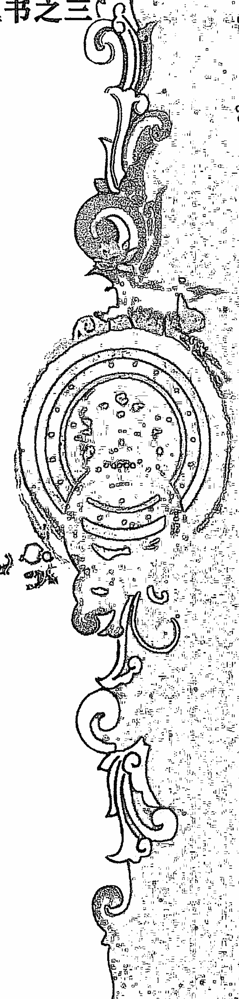

# 青岚易学会系列丛书之三

# 六爻象法进阶·下

> 得真谛者不自知
> 握玄机者定自秘

青岚
庚子年巳月

# 目 录

- 第四章 三刑之象
  - 第一节 子卯刑
  - 第二节 寅巳申刑
  - 第三节 丑未戌刑
  - 第四节 双刑
  - 第五节 自刑
- 第五章 伏神之象
  - 1，躲藏，遮盖
  - 2，潜藏，暗藏
  - 3，没有，不能
  - 4，卧床，住院
- 第六章 旬空之象
  - 1，五行旬空
  - 2，心里没底
  - 3，不诚心
  - 4，没有，不成功
  - 5，空想，想当然
  - 6，减少，减半
- 第七章 卦之反吟
  - 1，上下反吟
  - 2，方位相冲
- 第八章 进退位之象
- 第九章 隔山化爻
- 第十章 六害之象
  - 1，生中带害
  - 2，克中带害
  - 3，纯相害
  - 4，全化害
- 第十一章 卦象的参考意义
  - 第一节 乾宫八卦
  - 第二节 兑宫八卦
  - 第三节 离宫八卦
  - 第四节 震宫八卦
  - 第五节 巽宫八卦
  - 第六节 坎宫八卦
  - 第七节 艮宫八卦
  - 第八节 坤宫八卦

# 第四章 三刑之象

刑在古代代表刑罚的意思，用来惩戒罪犯，树立威严，维持相关秩序。三刑共有四种，分别是指子卯刑，寅巳申刑，丑未戌刑，辰午酉亥自刑。在六爻预测中，三刑多为负面寓意，但不能独立代表吉凶，只能附和卦象提取信息。我们来看《增删卜易》的相关记载。

> “夫三刑者，余屡试之，或因用神休囚，再兼他爻之克，内有兼犯三刑者，则见凶灾。若只独犯三刑，得验者少，占过数十年来，只验一卦：寅月 庚申日，占子痘症，得“家人之离””

主变卦 风火家人(巽宫) 之 离为火(离宫) [空亡:子、丑]

| 六神 | 主卦 | 变卦 |
| :--- | :--- | :--- |
| 螣蛇 | □□□□□ 兄弟卯木 | □□□□□ 子孙巳火 世 |
| 勾陈 | □□□□□○ 子孙巳火 应 | □□ □□ 妻财未土 |
| 朱雀 | □□ □□× 妻财未土 | □□□□□ 官鬼酉金 |
| 青龙 | 官酉□□□□□ 父母亥水 | □□□□□ 父母亥水 应 |
| 玄武 | □□ □□ 妻财丑土 世 | □□ □□ 妻财丑土 |
| 白虎 | □□□□□ 兄弟卯木 | □□□□□ 兄弟卯木 |

原注：巳火子孙，既当春令，子孙旺相，许之可治。后死于寅日、寅时，始悟：月建在寅，日建在申，与巳爻子孙共作三刑故耳。无他爻之伤而得验者，独此一卦，至于子卯、辰戌丑未，亦有验者，然皆附和而为凶者也。

在此卦中，野鹤老人原先以为子孙旺相无妨，结果孩子几天以后去世了，百思不得其解之下，野鹤老人看到月建为寅，日辰为申，用神为巳，刚好组成寅巳申三刑，所以应凶，这其实是不对的。野鹤老人自己也承认，三刑并不能独立代表吉凶，必须要根据卦象吉凶来取辅助信息，然而无法解释之下，却犯了圆卦的错误。这也是我们很多初学者的通病，遇到一个网路卦，在自己知识体系解释不了的情况下，不去问清楚背景和细节，偏偏胡乱圆卦，不仅无法解释卦象，还对原本正确的理论形成冲击，最后学成个四不像，吃了大亏，后悔莫及，这是十分危险的。

本卦之所以应凶，是因为在古代医疗条件下，孩子出痘症是十分凶险的疾病，甚至被称为“痘疫”，一旦得了痘症，死亡率高的吓人，别说一般老百姓的孩子，很多皇室王公的孩子得了痘症都大多夭折，能救活的少之又少。如此重病，变出离为火六冲卦，重病逢冲即死，已经不可能救活。而用神巳火月建相生，日辰相合，属于特殊旺相范畴，明显与重症不符，待到寅月寅日寅时再生旺时应凶，也是理所当然，符合过旺再生旺应凶的规律。本卦中的三刑，不过是起到了应验急促的辅助作用，病情来的快，孩子去世的也快，并不是三刑主宰了吉凶。本卦还可以用隔山化爻来辅助判断，留与读者参研。

在实际预测中，三刑往往多代表一些不利的信息，并不独立代表吉凶，而是根据卦象吉凶来辅助取象。解卦时，必须先判断卦象吉凶，再根据具体问题对应提取细节，切不可直接以三刑判断吉凶。

对于这四种三刑，很多易友都仅对寅巳申三刑印象深刻，而对于其他三刑，往往一知半解，特别是辰午酉亥自刑，不仅初学的易友完全摸不着头脑，一些水平较高的易友也心存疑惑，各种古籍的记载也语焉不详。本人经过长期论证研究，总结出了一部分三刑的具体用法，供易友参考。

## 第一节 子卯刑

子卯刑是指卦中子与卯相见，会产生相刑的效果，称之为无礼之刑。代表刑罚、处罚、手段、不高兴、不开心、不舒服、痛苦、难受、煎熬、烦躁、抓狂、纠结、胡思乱想、压力巨大、精神疾病、思想不正常、抑郁症、安全感缺失症、心理疾病、傲慢、骂人、不讲礼貌、轻视、蔑视、看不顺眼、无法胜任、达不到预期、效果不好等意思。又因为子与卯之间为沐浴关系，引申为不正当、不合规、不符合要求、打擦边球、违背公德、出轨、包养等意思。

子与卯刑分为两个大类。一是卯刑子。比较常见的有三种模式。最常见的一种模式是上爻子水发动化卯木相刑，第二种模式是卦中卯木发动刑子水，第三种模式是日月为卯木刑卦中子水爻，这几种模式在实战中大量存在，其用法也较为简单。

求测人：男，手工指定(起卦方式)
占问事宜：去法院申请强制执行是否顺利
公历：2018年5月30日9时38分，星期三。
农历：戊戌年 四月 十六日 巳时。
神煞：驿马-申 桃花-卯 干禄-亥 贵人-卯、巳
干支：戊戌年 丁巳月 壬戌日 乙巳时
主变卦 水山蹇(兑宫) 之 风山渐(艮宫) [空亡:子、丑]

| 六神 | 主卦 | 变卦 |
| :--- | :--- | :--- |
| 白虎 | □□ □□× 子孙子水 | □□□□□ 妻财卯木 应 |
| 螣蛇 | □□□□□ 父母戌土 | □□□□□ 官鬼巳火 |
| 勾陈 | □□ □□ 兄弟申金 世 | □□ □□ 父母未土 |
| 朱雀 | □□□□□ 兄弟申金 | □□□□□ 兄弟申金 世 |
| 青龙 | 财卯 □□ □□ 官鬼午火 | □□ □□ 官鬼午火 |
| 玄武 | □□ □□ 父母辰土 应 | □□ □□ 父母辰土 |

申请强制执行，主要是为了得财。卦中上爻子水独发化财，属于动爻化用，已经预示着可以得财。细节上，子孙子水发动冲二爻官鬼午火，官鬼在这里为老赖，子孙就是专门克制老赖的法院，子水化刑冲午火，就是法院强制执行的意思，这里的刑取处罚，手段的意思。子水冲开午火，伏藏的妻财卯木得出，顺利得到了钱财。

反馈：强制执行，十分顺利。

求测人：男，手工指定(起卦方式)
占问事宜：问同事的母亲的重病发展趋势
公历：2017年5月25日17时6分，星期四。
农历：丁酉年 四月 三十日 酉时。
神煞：驿马-寅 桃花-酉 干禄-亥 贵人-卯、巳
干支：丁酉年 乙巳月 壬子日 己酉时
主变卦 水地比(坤宫-归魂) 风泽中孚(艮宫) [空亡:寅、卯]

| 六神 | 主卦 | 变卦 |
| :--- | :--- | :--- |
| 白虎 | □□ □□× 妻财子水 应 | □□□□□ 官鬼卯木 |
| 螣蛇 | □□□□□ 兄弟戌土 | □□□□□ 父母巳火 |
| 勾陈 | □□ □□ 子孙申金 | □□ □□ 兄弟未土 世 |
| 朱雀 | □□ □□ 官鬼卯木 世 | □□ □□ 兄弟丑土 |
| 青龙 | □□ □□× 父母巳火 | □□□□□ 官鬼卯木 |
| 玄武 | □□ □□× 兄弟未土 | □□□□□ 父母巳火 应 |

取应爻为用神，兼看父母爻。应爻子水临白虎，白虎为生病，发动化官鬼卯木，官鬼卯木旬空，二爻父母巳火发动虽然化官鬼卯木回头生，然而也是化空，重病化空大凶之象，出空即死。上爻子水化出卯木，此为化刑，化刑为煎熬，痛苦，难受的意思，可以看出，同事的母亲已经重病煎熬了很久了，也是时候解脱了。反馈：巳日卯时去世。

求测人：女，手工指定(起卦方式)
占问事宜：想开一个店看看财运
公历：2019年4月23日17时4分，星期二。
农历：己亥年 三月 十九日 酉时。
神煞：驿马-申 桃花-卯 干禄-申 贵人-寅、午
干支：己亥年 戊辰月 庚寅日 乙酉时
主变卦 水天需(坤宫-游魂) 风天小畜(巽宫) [空亡:午、未]

| 六神 | 主卦 | 变卦 |
| :--- | :--- | :--- |
| 螣蛇 | □□ □□× 妻财子水 | □□□□□ 官鬼卯木 |
| 勾陈 | □□□□□ 兄弟戌土 | □□□□□ 父母巳火 |
| 朱雀 | □□ □□ 子孙申金 世 | □□ □□ 兄弟未土 应 |
| 青龙 | □□□□□ 兄弟辰土 | □□□□□ 兄弟辰土 |
| 玄武 父巳 | □□□□□ 官鬼寅木 | □□□□□ 官鬼寅木 |
| 白虎 | □□□□□ 妻财子水 应 | □□□□□ 妻财子水 世 |

以妻财为用神，兼看子孙。妻财子水在上爻毕竟发动，还是有用的，世爻子孙月生旺相，日冲暗动，说明卦主确实想去开店，不是说着玩的。然而，子水发动化卯木为化刑，又临螣蛇，螣蛇为压力大，烦躁，世爻虽然短期暗动，长期必破，又是被官鬼冲破，鬼为疾病，烦恼，所以这个生意只能短期做一做，长期必定亏本，到时候各种烦心事不可开交，身体也生病变差，得不偿失，建议不开店为好。

反馈：虽然一直以来财运还可以，但是生活，感情，婚姻是一团糟，见怪不怪了，现在身体就很差，一直在生病。后卦主经过慎重考虑，于巳月放弃了开店打算。

求测人：女，手工指定(起卦方式)
占问事宜：今晚去理发，能不能理到称心如意的发型
公历：2019年8月19日12时40分，星期一。
农历：己亥年 七月 十九日 午时。
神煞：驿马-寅 桃花-酉 干禄-巳 贵人-丑、未
干支：己亥年 壬申月 戊子日 戊午时
主变卦 水火既济(坎宫) 之 风火家人(巽宫) [空亡:午、未]

| 六神 | 主卦 | 变卦 |
| :--- | :--- | :--- |
| 朱雀 | □□ □□× 兄弟子水 应 | □□□□□ 子孙卯木 |
| 青龙 | □□□□□ 官鬼戌土 | □□□□□ 妻财巳火 应 |
| 玄武 | □□ □□ 父母申金 | □□ □□ 官鬼未土 |
| 白虎 财午 | □□□□□ 兄弟亥水 世 | □□□□□ 兄弟亥水 |
| 螣蛇 | □□ □□ 官鬼丑土 | □□ □□ 官鬼丑土 世 |
| 勾陈 | □□□□□ 子孙卯木 | □□□□□ 子孙卯木 |

以上爻为头发。上爻发动化出子孙爻，子孙为福神，大体还是满意的，但是子水发动化卯木为化刑，化刑多多少少还是不太满意，达不到预期。

反馈：我去理发，大约七点多吧，理的也就那么回事，好在理发师人还算和善，整体感受不算太差。

求测人：女，手工指定(起卦方式)
占问事宜：老公联系不上了，是不是工作上出了什么事
公历：2019年3月2日21时15分，星期六。
农历：己亥年 正月 廿六日 亥时。
神煞：驿马-申 桃花-卯 干禄-巳 贵人-丑、未
干支：己亥年 丙寅月 戊戌日 癸亥时
主变卦 水雷屯(坎宫) 之 风雷益(巽宫) [空亡:辰、巳]

| 六神 | 主卦 | 变卦 |
| :--- | :--- | :--- |
| 朱雀 | □□ □□× 兄弟子水 | □□□□□ 子孙卯木 应 |
| 青龙 | □□□□□ 官鬼戌土 应 | □□□□□ 妻财巳火 |
| 玄武 | □□ □□ 父母申金 | □□ □□ 官鬼未土 |
| 白虎 财午 | □□ □□ 官鬼辰土 | □□ □□ 官鬼辰土 世 |
| 螣蛇 | □□ □□ 子孙寅木 世 | □□ □□ 子孙寅木 |
| 勾陈 | □□□□□ 兄弟子水 | □□□□□ 兄弟子水 |

以应爻官鬼戌土为用神。官鬼戌土在第五爻，临青龙，必定是正式单位工作，月克临日，仍然旺相，又是子孙持世，安危无妨。父母申金为消息，被月建冲破，这是联系不上了，兄弟子水独发化子孙福神，啥问题都没有。不过子水为世爻元神，发动又化卯木相刑，相刑为担心，操心，着急之象，着实让卦主担心不小。

反馈：于当夜丑时得到消息，执行公务去了。

求测人：男，手工指定(起卦方式)
占问事宜：想辞职能否辞职
公历：2019年9月15日7时6分，星期日。
农历：己亥年 八月 十七日 辰时。
神煞：驿马-巳 桃花-子 干禄-卯 贵人-子、申
干支：己亥年 癸酉月 乙卯日 庚辰时
主变卦 坎为水(坎宫) 之 风地观(乾宫) [空亡:子、丑]

| 六神 | 本卦 | 变卦 |
| :--- | :--- | :--- |
| 玄武 | □□ □□× 兄弟子水 世 | □□□□□ 子孙卯木 |
| 白虎 | □□□□□ 官鬼戌土 | □□□□□ 妻财巳火 |
| 螣蛇 | □□ □□ 父母申金 | □□ □□ 官鬼未土 世 |
| 勾陈 | □□ □□ 妻财午火 应 | □□ □□ 子孙卯木 |
| 朱雀 | □□□□□○ 官鬼辰土 | □□ □□ 妻财巳火 |
| 青龙 | □□ □□ 子孙寅木 | □□ □□ 官鬼未土 应 |

以官鬼为用神。世爻为子水，发动化出子孙卯木，为官鬼忌神，又在上爻退位，可以看出卦主确实想离职了。然而子水化卯木也为化刑，化刑在这里取难受，纠结，烦躁的意思，临玄武为暗地里，说明卦主为了离职的事也是纠结了很久。卦中官鬼辰土发动克世爻，在官鬼克世爻的模式下，官爻越旺，对世爻的克制力量越大，也就越容易离职。第二天就是辰日，官鬼临值，可以离职。世爻发动变出的卯木与五爻官鬼戌土相合，想离职后去五爻那里。

反馈：丙辰日离职。

求测人：女，手工指定(起卦方式)
占问事宜：测父亲病
公历：2019年9月23日7时6分，星期一。
农历：己亥年 八月 廿五日 辰时。
神煞：驿马-巳 桃花-子 干禄-子 贵人-卯、巳
干支：己亥年 癸酉月 癸亥日 丙辰时
主变卦 水地比(坤宫-归魂) 之 风地观(乾宫) [空亡:子、丑]

| 六神 | 本卦 | 变卦 |
| :--- | :--- | :--- |
| 白虎 | □□ □□× 妻财子水 应 | □□□□□ 官鬼卯木 |
| 螣蛇 | □□□□□ 兄弟戌土 | □□□□□ 父母巳火 |
| 勾陈 | □□ □□ 子孙申金 | □□ □□ 兄弟未土 世 |
| 朱雀 | □□ □□ 官鬼卯木 世 | □□ □□ 官鬼卯木 |
| 青龙 | □□ □□ 父母巳火 | □□ □□ 父母巳火 |
| 玄武 | □□ □□ 兄弟未土 | □□ □□ 兄弟未土 应 |

以父母为用神，兼看应爻。本卦重点在应爻，应爻妻财子水在最上爻临白虎，白虎为病，上爻为头部，看来是头部疾病。白虎为暴躁，狂躁，发动化官鬼卯木，此为化刑，化刑常见精神类疾病，必定与此有关，刑为煎熬，痛苦之意，看来病情不轻。用神父母巳火在月建休囚，被日辰相冲，应爻相克，十分不吉，要治愈恐怕是希望渺茫了。

反馈：一直以为父亲只是身体不好，脾气不好，情绪不稳定，无法正常交流沟通，现在看来确实是精神疾病。

求测人：女，手工指定(起卦方式)
占问事宜：这次会换护工吗
公历：2019年8月22日7时6分，星期四。
农历：己亥年 七月 廿二日 辰时。
神煞：驿马-巳 桃花-子 干禄-酉 贵人-寅、午
干支：己亥年 壬申月 辛卯日 壬辰时
主变卦 水雷屯(坎宫) 之 风雷益(巽宫) [空亡:午、未]

| 六神 | 主卦 | 变卦 |
| :--- | :--- | :--- |
| 螣蛇 | □□ □□× 兄弟子水 | □□□□□ 子孙卯木 应 |
| 勾陈 | □□□□□ 官鬼戌土 应 | □□□□□ 妻财巳火 |
| 朱雀 | □□ □□ 父母申金 | □□ □□ 官鬼未土 |
| 青龙 财午 | □□ □□ 官鬼辰土 | □□ □□ 官鬼辰土 世 |
| 玄武 | □□ □□ 子孙寅木 世 | □□ □□ 子孙寅木 |
| 白虎 | □□□□□ 兄弟子水 | □□□□□ 兄弟子水 |

背景：卦主姑妈身体不好，请了一个护工，但是姑妈对这个护工不满意，总说要换人。

以应爻为护工。应爻官鬼戌土被日辰相克，临勾陈，确实能力一般，为人死板不太灵光。世爻克应爻，卦主方对这个护工也心存不满，但是世爻毕竟破败，无力克应爻，上爻元神子水发动化子孙卯木相刑，相刑也是纠结，无法取舍之象，变出的卯木既克应爻，又合应爻，把她留下来吧，不太满意，换人吧，又没有合适的人，加上世爻月破，一时半会也克不了应爻。所以短期是不会换人的，等时机成熟，世爻发力，肯定还是要换的。

反馈：换护工会引起后面一大堆事，刚才找护工谈了，她愿意改正错误留下来继续做，而且态度不错，暂时就不换了。虽然这次换不了，以后一定会换。

求测人：男，手工指定(起卦方式)
占问事宜：血压偏高是否严重
公历：2018年3月30日15时47分，星期五。
农历：戊戌年 二月 十四日 申时。
神煞：驿马-亥 桃花-午 干禄-酉 贵人-寅、午
干支：戊戌年 乙卯月 辛酉日 丙申时
主变卦 水泽节(坎宫) 之 风雷益(巽宫) [空亡:子、丑]

| 六神 | 主卦 | 变卦 |
| :--- | :--- | :--- |
| 螣蛇 | □□ □□× 兄弟子水 | □□□□□ 子孙卯木 应 |
| 勾陈 | □□□□□ 官鬼戌土 | □□□□□ 妻财巳火 |
| 朱雀 | □□ □□ 父母申金 应 | □□ □□ 官鬼未土 |
| 青龙 | □□ □□ 官鬼丑土 | □□ □□ 官鬼辰土 世 |
| 玄武 | □□□□□○ 子孙卯木 | □□ □□ 子孙寅木 |
| 白虎 | □□□□□ 妻财巳火 世 | □□□□□ 兄弟子水 |

以世爻为用神。按照卦中组合，兄弟子水发动生子孙卯木，子孙卯木发动生世爻，形成了连续相生，好像没啥问题。然而，二爻子孙卯木发动化退神，此为变废，又被日辰相冲为散，只不过目前卯木临月建旺相，暂时冲不散，所以就造成了一个死循环，卯木旺相的时候，可以通关形成连续相生没啥事，卯木衰败的时候被日辰冲散，则上爻的兄弟子水直接发动克世爻，世爻临白虎属火，白虎为病，妻财属火为血，就成了高血压，随着卯木旺衰情况变化而反复发作。

上爻兄弟子水发动化卯木为化刑，临螣蛇，螣蛇为胡思乱想，化刑也为胡思乱想，压力大，痛苦难受。

二爻临玄武的卯木发动，也可以去刑上爻的子水，二爻为宅，玄武为不正当的，引申为不健康的生活方式，共同造成了高血压。

反馈：确实是这样的，压力大，生活不规律，每次高血压发作特别难受。

求测人：女，手工指定(起卦方式)
占问事宜：我暗恋的人对我有意思吗
公历：2018年3月26日15时47分，星期一。
农历：戊戌年 二月 初十日 申时。
神煞：驿马-亥 桃花-午 干禄-午 贵人-亥、酉
干支：戊戌年 乙卯月 丁巳日 戊申时
主变卦 水天需(坤宫-游魂) 风天小畜(巽宫) [空亡:子、丑]

| 六神 | 主卦 | 变卦 |
| :--- | :--- | :--- |
| 青龙 | □□ □□×妻财子水 | □□□□□官鬼卯木 |
| 玄武 | □□□□□ 兄弟戌土 | □□□□□父母巳火 |
| 白虎 | □□ □□ 子孙申金 世 | □□ □□兄弟未土 应 |
| 螣蛇 | □□□□□ 兄弟辰土 | □□□□□兄弟辰土 |
| 勾陈 父巳 | □□□□□ 官鬼寅木 | □□□□□官鬼寅木 |
| 朱雀 | □□□□□ 妻财子水 应 | □□□□□妻财子水 世 |

取应爻为用神。应爻妻财子水旬空，在姻缘卦中，旬空为不诚心的意思，这里引申为对方对卦主没有意思，是卦主一厢情愿了。上爻子水发动化官鬼卯木，此为化刑，上爻为头部，思想，上爻化刑，又与月建卯木相刑，月主过去，这说明卦主可能一直以来头脑有些不正常。

反馈：卦主经常幻想小叔子喜欢自己，其实并没有这回事。卦主也会经常幻想网上某位男士是不是对她有意思。

第二大类为子刑卯，这一类相刑难度较大，用法也较为复杂。很多易友认为，卯木刑子水可以理解，但是子水生卯木，怎么也会相刑呢？这种思想完全是理象不分的缘故。刑与生克无关，他只是一种取象，一种细节，结合子生卯来说，这叫生中带刑。比如，一个男人为卯，其情人为子，虽然子生卯，两人感情甚好，但是毕竟违背社会公德，这就是典型的相刑；再比如，做生意，妻财子水发动生世爻卯木，虽然得财，但是所做生意必定有某些不合规或者其他不太如意的地方，相刑并不一定要应凶，也可以应验在不方便，不习惯，不喜欢，不正当，不合情理等，取其细节即可。

求测人：女，手工指定(起卦方式)
占问事宜：单位一位女性同事不理我了，怎么回事
公历：2019年8月5日16时38分，星期一。
农历：己亥年 七月 初五日 申时。
神煞：驿马-申  桃花-卯  干禄-寅  贵人-丑、未
干支：己亥年 辛未月 甲戌日 壬申时
主变卦  风天小畜(巽宫) 之  水泽节(坎宫) [空亡:申、酉]

| 六神 | 主卦 | 变卦 |
| :--- | :--- | :--- |
| 玄武 | □□□□□○兄弟卯木 | □□ □□父母子水 |
| 白虎 | □□□□□ 子孙巳火 | □□□□□妻财戌土 |
| 螣蛇 | □□ □□ 妻财未土 应 | □□ □□官鬼申金 应 |
| 勾陈 官酉 | □□□□□○妻财辰土 | □□ □□妻财丑土 |
| 朱雀 | □□□□□ 兄弟寅木 | □□□□□兄弟卯木 |
| 青龙 | □□□□□ 父母子水 世 | □□□□□子孙巳火 世 |

以世爻为卦主，以应爻为这位同事。应爻克世，对方本身就对卦主没有多少好感，间爻妻财辰土为阻隔，更加关系一般，好在辰土发动化退神，又化月破，阻隔可以逐渐消除，倒也没什么深仇大恨的。

上爻兄弟卯木为其他同事，发动克应爻，又刑世爻，临玄武，这就像个搅屎棍，暗地里挑拨双方关系，刑为痛苦，难受的意思，所以卦主很憋屈。大家注意兄弟卯木的变爻父母子水，这个子水生卯木的同时，也有刑的意思，这个刑表示不真实，不合规等意思，父母子水为消息，信息，玄武为不正当的，结合起来，这就是虚假的小道消息，说明这个同事用虚假的小道消息挑拨两人关系，致使应爻同事不理卦主了。

反馈：这家公司是两家公司合并管理的，领导和员工之间都是交叉的，本来就二十来人的公司，却是各种勾心斗角，三五成群，拉帮结派！卦主怀疑是自己的一位男下属挑拨，这人是另一公司的，自己来到公司就是他的上司，这人不服气。

求测人：男，手工指定(起卦方式)
占问事宜：测 100 岁老奶奶病
公历：2018 年 12 月 18 日 17 时 40 分，星期二。
农历：戊戌年 十一月 十二日 酉时。
神煞：驿马-寅  桃花-酉  干禄-寅  贵人-丑、未
干支：戊戌年 甲子月 甲申日 癸酉时
主变卦  风山渐(艮宫-归魂) 之  水地比(坤宫) [空亡:午、未]

| 六神 | 主卦 | 变卦 |
| :--- | :--- | :--- |
| 玄武 | □□□□□○官鬼卯木 应 | □□妻财子水 应 |
| 白虎 财子 | □□□□□ 父母巳火 | □□□□□兄弟戌土 |
| 螣蛇 | □□ □□ 兄弟未土 | □□ □□子孙申金 |
| 勾陈 | □□□□□○子孙申金 世 | □□官鬼卯木 世 |
| 朱雀 | □□ □□ 父母午火 | □□ □□父母巳火 |
| 青龙 | □□ □□ 兄弟辰土 | □□ □□兄弟未土 |

这是学员测奶奶卦。以父母午火为用神。父母午火被月建冲破，又旬空，100 岁的老奶奶，遇到空破，显然是不行了。元神官鬼卯木发动来生午火，但是午火空破，生之不起。卯木发动化妻财子水，妻财为饮食，卯化子有相刑的象，这里就是饮食已经受影响了。
反馈：年纪大了，嘴里长疮，于丑月去世。

## 第二节 寅巳申刑

寅巳申三刑是指当卦中世爻、用神、元神、动爻或日月上寅巳申三个地支全部出现或出现两个地支时，会有相刑的作用。寅巳申三刑被称为持势之刑，多根据卦象吉凶，提取敌对、反感、烦恼、烦躁、暴躁、狂躁、煎熬、精神不正常、精神分裂症、焦虑症、狂躁症、暴躁症、路怒症、训斥、竞争、争吵、纠纷、打架、斗殴、受伤、事故、灾祸、流血、生病、有毛病、不足、不够、限制自由、拘束、拘谨、拘留、官非、官司、牢狱、死亡等凶危信息。本章开篇引用的《增删卜易》卦例就是在卦象不吉的情况下，附带提取了三刑死亡的寓意。寅巳申三刑共有以下4种模式：

### 1，卦中三刑俱全，全部出现。

求测人：男，手工指定(起卦方式)
占问事宜：坚持还是另谋出路
公历：2018年4月16日13时56分，星期一。
农历：戊戌年 三月 初一日 未时。
神煞：驿马-申 桃花-卯 干禄-巳 贵人-丑、未
干支：戊戌年 丙辰月 戊寅日 己未时
主变卦 坎为水(坎宫) 之 水泽节(坎宫) [空亡:申、酉]

| 六神 | 主卦 | 变卦 |
| :--- | :--- | :--- |
| 朱雀 | □□ □□ 兄弟子水 世 | □□ □□ 兄弟子水 |
| 青龙 | □□□□□ 官鬼戌土 | □□□□□ 官鬼戌土 |
| 玄武 | □□ □□ 父母申金 | □□ □□ 父母申金 应 |
| 白虎 | □□ □□ 妻财午火 应 | □□ □□ 官鬼丑土 |
| 螣蛇 | □□□□□ 官鬼辰土 | □□□□□ 子孙卯木 |
| 勾陈 | □□ □□ × 子孙寅木 | □□□□□ 妻财巳火 世 |

以世爻为当前工作，应爻为另谋出路。世爻兄弟子水月建克墓，衰败不吉，又是兄弟爻在退位，花费甚大，想另谋出路也在情理之中。元神父母申金被日辰相冲暗动，加上初爻子孙寅木，变爻妻财巳火，刚好三刑俱全。元神为思想，想法，元神入三刑，又临玄武，说明卦主为了这件事纠结许久，反复煎熬而不能抉择。应爻为将来的去路，应爻妻财午火日生为旺，初爻子孙发动又来相生，明显强于世爻当前的工作。卦六冲变六合，另谋出路一定能改变目前局势，前程似锦。

反馈：确实是这样，会认真考虑相关建议。

求测人：男，手工指定(起卦方式)
占问事宜：测早餐店生意如何
公历：2019年5月10日15时55分，星期五。
农历：己亥年 四月 初六日 申时。
神煞：驿马-巳 桃花-子 干禄-午 贵人-亥、酉
干支：己亥年 己巳月 丁未日 戊申时
主变卦 天泽履(艮宫) 之 泽水困(兑宫) [空亡:寅、卯]

| 六神 | 主卦 | 变卦 |
| :--- | :--- | :--- |
| 青龙 | □□□□□○兄弟戌土 | □□ □□兄弟未土 |
| 玄武 财子 | □□□□□ 子孙申金 世 | □□□□□子孙酉金 |
| 白虎 | □□□□□ 父母午火 | □□□□□妻财亥水 应 |
| 螣蛇 | □□ □□ 兄弟丑土 | □□ □□父母午火 |
| 勾陈 | □□□□□ 官鬼卯木 应 | □□□□□兄弟辰土 |
| 朱雀 | □□□□□○父母巳火 | □□ □□官鬼寅木 世 |

以妻财为用神，还要兼看子孙爻。妻财子水伏藏衰败不吉。子孙申金持世，卦中父母巳火发动生上爻戌土，戌土发动生世爻，看起来连续相生大吉，然而戌土化退神，无法通关，初爻父母巳火临朱雀发动克合世爻，父母为店铺，执照，证件之类，寅巳申又三刑，三刑加朱雀在这里可以代表官非之象。卦变泽水困卦，恐怕不是赚钱问题了，安全能否保证都未可知了。

反馈：不出一个月，因为无法办理营业执照，公家要强制性搬走店里的东西，想尽了各种办法都不能解决。

求测人：男，手工指定(起卦方式)
占问事宜：测父亲走失
公历：2019年6月17日14时10分，星期一。
农历：己亥年 五月 十五日 未时。
神煞：驿马-亥 桃花-午 干禄-卯 贵人-子、申
干支：己亥年 庚午月 乙酉日 癸未时
主变卦 坎为水(坎宫) 之 兑为泽(兑宫) [空亡:午、未]

| 六神 | 主卦 | 变卦 |
| :--- | :--- | :--- |
| 玄武 | 兄弟子水 世 | 官鬼未土 世 |
| 白虎 | 官鬼戌土 | 父母酉金 |
| 螣蛇 | 父母申金 × | 兄弟亥水 |
| 勾陈 | 妻财午火 应 | 官鬼丑土 应 |
| 朱雀 | 官鬼辰土 | 子孙卯木 |
| 青龙 | 子孙寅木 × | 妻财巳火 |

以父母为用神。父母申金月克日扶平相，发动生世爻为吉。初爻寅木发动与申金相冲，两个变爻巳亥也互冲，然而，两个动爻之间交叉相合，这种格局是一种很奇特的凶中带吉格局，说明父亲可以找回，这个理论将在《六爻实战技法》动变冲合十种格局章节中详细论述。

初爻子孙寅木，变爻妻财巳火，用神父母申金刚好构成三刑，父母临螣蛇，元神临白虎为病，说明父亲精神异常或者老年痴呆。
反馈：戌日找回，父亲精神不太正常。

### 2，卦中出现两个地支，借日月之一成三刑。

求测人：女，手工指定(起卦方式)
占问事宜：某产品能不能加大投资
公历：2019年3月5日14时10分，星期二。
农历：己亥年 正月 廿九日 未时。
神煞：驿马-亥 桃花-午 干禄-酉 贵人-寅、午
干支：己亥年 丙寅月 辛丑日 乙未时
主变卦 水泽节(坎宫) 之 水天需(坤宫) [空亡:辰、巳]

| 六神 | 主卦 | 变卦 |
| :--- | :--- | :--- |
| 螣蛇 | 兄弟子水 | 兄弟子水 |
| 勾陈 | 官鬼戌土 | 官鬼戌土 |
| 朱雀 | 父母申金 应 | 父母申金 世 |
| 青龙 | 官鬼丑土 × | 官鬼辰土 |
| 玄武 | 子孙卯木 | 子孙寅木 |
| 白虎 | 妻财巳火 世 | 兄弟子水 应 |

以妻财为用神，子孙为财源，应爻为产品。卦中妻财巳火持世旺相，子孙卯木也旺，说明这个产品还是可以盈利的。然而，间爻官鬼丑土化进神阻隔，鬼爻阻隔为不顺利，烦恼的意思，世爻巳火临白虎、应爻产品申金，再借月建子孙财源寅木刚好构成三刑，这里的三刑就是烦躁，难受，焦躁，说明这个产品虽然有钱赚，但是一大堆烦心事。

反馈：确实是这样，这个产品虽然每年还可以赚个百八十万，但是特别麻烦，正打算放弃。

求测人：男，手工指定(起卦方式)
占问事宜：合同找不到了，让银行查借款合同能查到吗
公历：2018年8月9日14时10分，星期四。
农历：戊戌年 六月 廿八日 未时。
神煞：驿马-亥 桃花-午 干禄-子 贵人-卯、巳
干支：戊戌年 庚申月 癸酉日 己未时
主变卦 山水蒙(离宫) 之 风泽中孚(艮宫) [空亡:戌、亥]

| 六神 | 主卦 | 变卦 |
| :--- | :--- | :--- |
| 白虎 | □□□□□ 父母寅木 | □□□□□ 父母卯木 |
| 螣蛇 | □□ □□× 官鬼子水 | □□□□□ 兄弟巳火 |
| 勾陈 财酉 | □□ □□ 子孙戌土 世 | □□ □□ 子孙未土 世 |
| 朱雀 | □□ □□ 兄弟午火 | □□ □□ 子孙丑土 |
| 青龙 | □□□□□ 子孙辰土 | □□□□□ 父母卯木 |
| 玄武 | □□ □□× 父母寅木 应 | □□□□□ 兄弟巳火 应 |

以应爻为借款合同，以官鬼子水为银行官方。应爻发动克世爻，并且应爻寅木，变爻巳火，再借月建申金构成三刑，三刑临玄武克世爻，并不是说这个合同有什么问题，一般银行的合同都是非常严谨的，是不会出问题的，这里只能解释为因为这个合同丢失，让卦主非常被动，很不方便，十分难受。官鬼为银行，发动生应爻，表面看是帮忙找合同，实际上，应爻寅木被月建冲破，官爻根本生之不起。况且，官鬼化绝，绝情的意思，也懒得帮卦主找，估计一句话就把卦主打发了。

反馈：银行找了个借口，就是不给查。

求测人：男，手工指定(起卦方式)
占问事宜：昨天省考我进面试没
公历：2019年1月20日14时10分，星期日。
农历：戊戌年 十二月 十五日 未时。
神煞：驿马-亥 桃花-午 干禄-午 贵人-亥、酉
干支：戊戌年 乙丑月 丁巳日 丁未时
主变卦 水天需(坤宫-游魂) 水火既济(坎宫) [空亡:子、丑]

| 六神 | 主卦 | 变卦 |
| :--- | :--- | :--- |
| 青龙 | 妻财子水 | 妻财子水 应 |
| 玄武 | 兄弟戌土 | 兄弟戌土 |
| 白虎 | 子孙申金 世 | 子孙申金 |
| 螣蛇 | 兄弟辰土 | 妻财亥水 世 |
| 勾陈 | 父巳 官鬼寅木 | 兄弟丑土 |
| 朱雀 | 妻财子水 应 | 官鬼卯木 |

以发动的官鬼寅木为用神。官鬼寅木发动冲世爻不吉，应爻旬空，也不吉，看来难以进面试。官鬼寅木，世爻申金加上日辰巳火构成三刑，三刑为难受，世爻临白虎，白虎为烦躁，看来因为省考没有进面试，对卦主心情有影响。
反馈：没有通过。

求测人：女，手工指定(起卦方式)
占问事宜：出行是否顺利
公历：2018年12月6日14时10分，星期四。
农历：戊戌年 十月 廿九日 未时。
神煞：驿马-寅 桃花-酉 干禄-亥 贵人-卯、巳
干支：戊戌年 癸亥月 壬申日 丁未时
主变卦 风水涣(离宫) 之 风泽中孚(艮宫) [空亡:戌、亥]

| 六神 | 本卦 | 变卦 |
| :--- | :--- | :--- |
| 白虎 | □□□□□ 父母卯木 | □□□□□ 父母卯木 |
| 螣蛇 | □□□□□ 兄弟巳火 世 | □□□□□ 兄弟巳火 |
| 勾陈 财酉 | □□ □□ 子孙未土 | □□ □□ 子孙未土 世 |
| 朱雀 官亥 | □□ □□ 兄弟午火 | □□ □□ 子孙丑土 |
| 青龙 | □□□□□ 子孙辰土 应 | □□□□□ 父母卯木 |
| 玄武 | □□ □□× 父母寅木 | □□□□□ 兄弟巳火 应 |

这是学员卦例。本卦无需取用神，主要看具体卦象。世爻月破日合解破，初爻父母寅木独发生世爻，按照格局来说，还是吉利的。但是世爻毕竟被月建官鬼冲破，官鬼临朱雀，朱雀为口舌，信息等，卦主必定受口舌或者信息影响。初爻寅木，变爻巳火，日辰申金构成三刑，而且三刑中的申金合绊世爻，合绊则无法行动，但是卦象毕竟是动爻独发生世应吉，那么三刑在这里就不能取凶险之象，而是指难受，纠结，烦恼等意思，结合前面官鬼临朱雀冲世爻，很显然卦主应该是收到了某些信息而影响了出行。

结果，学员看到卦中官爻冲世，三刑俱全，认为卦主出行大凶，极力劝阻卦主出行，卦主也比较害怕，不敢行动，后来还是换了个地方出行了，一切顺利。

求测人：女，手工指定(起卦方式)
占问事宜：测与男友缘分
公历：2018年12月6日14时10分，星期四。
农历：戊戌年 十月 廿九日 未时。
神煞：驿马-寅 桃花-酉 干禄-亥 贵人-卯、巳
干支：戊戌年 癸亥月 壬申日 丁未时
主变卦 山水蒙(离宫) 之 地泽临(坤宫) [空亡:戌、亥]

| 六神 | 本卦 | 变卦 |
| :--- | :--- | :--- |
| 白虎 | □□□□□○父母寅木 | □□ □□妻财酉金 |
| 螣蛇 | □□ □□ 官鬼子水 | □□ □□官鬼亥水 应 |
| 勾陈 财酉 | □□ □□ 子孙戌土 世 | □□ □□子孙丑土 |
| 朱雀 | □□ □□ 兄弟午火 | □□ □□子孙丑土 |
| 青龙 | □□□□□ 子孙辰土 | □□□□□父母卯木 世 |
| 玄武 | □□ □□×父母寅木 应 | □□□□□兄弟巳火 |

以官鬼为用神，兼看应爻。官鬼子水月扶日生旺相，虽然忌神持世，但是休囚旬空，暂不克官爻，所以短期也不会分开，还是有缘在一起的。应爻也可以代指对方，为父母寅木，父母为婚姻，与月建相合，初爻为以前，合月建也为以前，说明此人有过婚姻，被日辰妻财申金相冲，和老婆离异了。父母寅木，变爻巳火加上日辰申金构成三刑，这个三刑除了代表对方以前的婚姻争吵得天翻地覆以外，还因为临玄武可以代表此人受过刑罚，而被处罚原因必定与妻财和玄武有关，不是偷盗诈骗，就是跟女人有关。

反馈：以上都对，确实离异了，而且坐过牢，具体原因不好意思说。本卦中也可以看出卦主也是离异，而且生活混乱，留与易友研究。

求测人：女，手工指定(起卦方式)
占问事宜：幼儿园新来一个股东对自己影响大不大
公历：2018年8月29日14时10分，星期三。
农历：戊戌年 七月 十九日 未时。
神煞：驿马-亥 桃花-午 干禄-子 贵人-卯、巳
干支：戊戌年 庚申月 癸巳日 己未时
主变卦 山水蒙(离宫) 之 山泽损(艮宫) [空亡:午、未]

| 六神 | 主卦 | 变卦 |
| :--- | :--- | :--- |
| 白虎 | □□□□□ 父母寅木 | □□□□□ 父母寅木 应 |
| 螣蛇 | □□ □□ 官鬼子水 | □□ □□ 官鬼子水 |
| 勾陈 财酉 | □□ □□ 子孙戌土 世 | □□ □□ 子孙戌土 |
| 朱雀 | □□ □□ 兄弟午火 | □□ □□ 子孙丑土 世 |
| 青龙 | □□□□□ 子孙辰土 | □□□□□ 父母卯木 |
| 玄武 | □□ □□× 父母寅木 应 | □□□□□ 兄弟巳火 |

以应爻为幼儿园，变爻兄弟巳火为新加的股东。应爻父母寅木独发克世爻，大凶之象，一定有重大影响。父母寅木、变爻巳火、月建申金构成三刑，父母又临玄武被月建相冲为破，玄武为不正当的，月破加三刑为被官方处罚之象，这个幼儿园一定是因为什么事情不合规，被教育局处罚了，而且应爻独发加三刑克世，幼儿园也对卦主进行了处理，让卦主焦头烂额，很难受。

卦主反馈：因为自己的失误，给幼儿园造成了重大损失，教育局让幼儿园停业整顿，进行了处罚，并且不许卦主再任幼儿园股东。幼儿园没办法，只好新增了一个股东替代卦主，现在卦主眼看着股东当不成了，不知道如何是好。

卦中虽然显示幼儿园以兄弟巳火替代卦主股东地位，但是变爻的兄弟巳火无法克伏藏在世爻下的妻财酉金，巳火不仅不克酉金，反而临日辰生世爻，说明幼儿园也不想卦主撤资退出。所以只要卦主以退为进，明面上退出股东行列，实际上和幼儿园谈好持暗股，一样不影响幼儿园和自身利益。卦主如梦方醒，按照指点当晚就和幼儿园负责人达成一致，事件得到圆满解决，目前一切顺利。

求测人：女，手工指定(起卦方式)
占问事宜：投资会赔钱吗，对方会崩盘吗
公历：2019年8月12日16时16分，星期一。
农历：己亥年 七月 十二日 申时。

神煞：驿马-亥 桃花-午 干禄-酉 贵人-寅、午
干支：己亥年 壬申月 辛巳日 丙申时
主变卦 地泽临(坤宫) 之 坎为水(坎宫) [空亡:申、酉]

| 六神 | 主卦 | 变卦 |
|---|---|---|
| 螣蛇 | □□ □□ 子孙酉金 | □□ □□妻财子水 世 |
| 勾陈 | □□ □□×妻财亥水 应 | □□□□□兄弟戌土 |
| 朱雀 | □□ □□ 兄弟丑土 | □□ □□子孙申金 |
| 青龙 | □□ □□ 兄弟丑土 | □□ □□父母午火 应 |
| 玄武 | □□□□□ 官鬼卯木 世 | □□□□□兄弟辰土 |
| 白虎 | □□□□□○父母巳火 | □□ □□官鬼寅木 |

这是学员卦例。以应爻为用神。应爻妻财亥水发动化兄弟戌土回头克，被日辰相冲，十分不吉，有冲散之象，预示着会崩盘。初爻父母巳火发动冲应爻，巳火与变爻寅木，再借月建申金刚好形成三刑，这里的三刑意味着对方必定会崩盘而受官方处罚，只是目前变爻寅木月破，出月解破就有危险，建议不要投资。

反馈：看到卦象不吉，放弃投资。

3，卦中出现一个地支，借日月成三刑。这种三刑多因日积月累、时间较长或日常因素造成。

求测人：女，手工指定，占问事宜：女自占婚姻如何
公历：2019年8月24日17时40分，星期六。
农历：己亥年 七月 廿四日 酉时。
神煞：驿马-亥 桃花-午 干禄-子，贵人-卯、巳
干支：己亥年 壬申月 癸巳日 辛酉时
主变卦 地天泰(坤宫) [空亡:午、未]

| 六神 | 主卦 |
|---|---|
| 白虎 | □□ □□ 子孙酉金 应 |
| 螣蛇 | □□ □□ 妻财亥水 |
| 勾陈 | □□ □□ 兄弟丑土 |
| 朱雀 | □□□□□ 兄弟辰土 世 |
| 青龙 父巳 | □□□□□ 官鬼寅木 |
| 玄武 | □□□□□ 妻财子水 |

这是易友卦例。以官鬼为用神。官鬼寅木被月建冲破不吉，与日月刚好组成三刑而克世爻，这种借日月成三刑的格局多因日积月累或者日常生活琐事引发，从这里可以看出，两人平时三观不合，感情很差。但是本卦又是六合卦，世应相生相合，表面上还是顾点面子，实际上内部已经烂透了。五爻妻财亥水被日冲暗动合官爻，男方还出轨了。另外月建冲破官爻，月建入卦为子孙临白虎，白虎为病，二爻为生殖的爻位，男方身体不太好，体质有点虚。

反馈：基本是这样。

求测人：男，手工指定(起卦方式)
占问事宜：妻车祸住院测吉凶
公历：2016年5月14日9时20分，星期六。
农历：丙申年 四月 初八日 巳时。
神煞：驿马-寅 桃花-酉 干禄-巳 贵人-亥、酉
干支：丙申年 癸巳月 丙申日 癸巳时
主变卦 泽水困(兑宫) [空亡:辰、巳]

| 六神 | 卦象 | 六亲 | 爻位 |
| :--- | :--- | :--- | :--- |
| 青龙 | □□ □□ | 父母未土 | |
| 玄武 | □□□□□ | 兄弟酉金 | |
| 白虎 | □□□□□ | 子孙亥水 | 应 |
| 螣蛇 | □□ □□ | 官鬼午火 | |
| 勾陈 | □□□□□ | 父母辰土 | |
| 朱雀 | □□ □□ | 妻财寅木 | 世 |

以妻财为用神。妻财寅木持世，在月建休囚，被日辰相冲为破，十分不吉，而且妻财与日月组成三刑，说明住院很久了。应爻子孙亥水为妻财元神，被月建官鬼冲破临白虎，白虎为血，一定是被撞伤了，虽然有日辰相生，全力救治，然而月破之爻逢生不起，仍然不吉，看来凶多吉少了。

反馈：于18天后的甲寅日亡。

求测人：男，手工指定(起卦方式)
占问事宜：想去西藏工作
公历：2019年2月16日17时40分，星期六。
农历：己亥年 正月十二日 酉时。
神煞：驿马-寅 桃花-酉 干禄-寅 贵人-丑、未
干支：己亥年 丙寅月 甲申日 癸酉时
主变卦 火泽睽(艮宫) 之 火雷噬嗑(巽宫) [空亡:午、未]

| 六神 | 主卦 | 变卦 |
|---|---|---|
| 玄武 | □□□□□ 父母巳火 | □□□□□父母巳火 |
| 白虎 财子 | □□ □□ 兄弟未土 | □□ □□兄弟未土 世 |
| 螣蛇 | □□□□□ 子孙酉金 世 | □□□□□子孙酉金 |
| 勾陈 | □□ □□ 兄弟丑土 | □□ □□兄弟辰土 |
| 朱雀 | □□□□□○官鬼卯木 | □□ □□官鬼寅木 应 |
| 青龙 | □□□□□ 父母巳火 应 | □□□□□妻财子水 |

卦主想去西藏工作很久了，刚好有个机会，问该不该去西藏工作。
以应爻代表西藏。应爻父母巳火克世爻，又是世爻长生，金遇长生，乃是凤凰涅槃之意，卦主选择去西藏，除了赚钱，一定还想学习进步，改变生活。但是应爻与日月构成三刑，三刑克世，必定长期烦恼纠结，无法抉择。二爻官鬼卯木为这个机会，独发冲世爻又化退，这个职位不适合卦主，而且近期职位有变，建议三思，静观其变。
反馈：去西藏当然不只是为了钱，确实想学习进步，也知道去了不合适，不适应，因为还有家小要养，必定会分居两地，是否有高原反应也不确定。后来得到消息，西藏职位取消，去不成了。

求测人：男，手工指定(起卦方式)
占问事宜：让同事帮忙炒股
公历：2019年5月11日17时40分，星期六。
农历：己亥年 四月初七日 酉时。
神煞：驿马-寅 桃花-酉 干禄-巳 贵人-丑、未
干支：己亥年 己巳月 戊申日 辛酉时
主变卦 天水讼(离宫-游魂) 之 天地否(乾宫) [空亡:寅、卯]

| 六神 | 主卦 | 变卦 |
|---|---|---|
| 朱雀 | □□□□□ 子孙戌土 | □□□□□ 子孙戌土 应 |
| 青龙 | □□□□□ 妻财申金 | □□□□□ 妻财申金 |
| 玄武 | □□□□□ 兄弟午火 世 | □□□□□ 兄弟午火 |
| 白虎 | 官亥 □□ □□ 兄弟午火 | □□ □□ 父母卯木 世 |
| 螣蛇 | □□□□□○ 子孙辰土 | □□ □□ 兄弟巳火 |
| 勾陈 | □□ □□ 父母寅木 应 | □□ □□ 子孙未土 |

以应爻为同事，应爻父母寅木被日辰相冲暗动生世爻，表面上看对方帮自己炒股，实际上按照动动相连的原则，应爻暗动首先会克子孙辰土，会冲妻财申金，对卦主并无好处。应爻父母寅木旬空，与日月成三刑，应爻又是世爻元神，元神为想法，旬空为不诚心，三刑在这里取不足，有毛病，不信任的意思，这说明卦主还是不太相信对方实力，而且应爻衰败，也确实没这个实力。

反馈：放弃了，没有投资让对方炒股。

求测人：男，手工指定(起卦方式)
占问事宜：能否找到实习工作，工作如何
公历：2019年8月21日17时40分，星期三。
农历：己亥年 七月 廿一日 酉时。
神煞：驿马-申 桃花-卯 干禄-申 贵人-寅、午
干支：己亥年 壬申月 庚寅日 乙酉时
主变卦 风地观(乾宫) 之 山地剥(乾宫) [空亡:午、未]

| 六神 | 主卦 | 变卦 |
|---|---|---|
| 螣蛇 | □□□□□ 妻财卯木 | □□□□□ 妻财寅木 |
| 勾陈 | 兄申 □□□□□○ 官鬼巳火 | □□ □□ 子孙子水 世 |
| 朱雀 | □□ □□ 父母未土 世 | □□ □□ 父母戌土 |
| 青龙 | □□ □□ 妻财卯木 | □□ □□ 妻财卯木 |
| 玄武 | □□ □□ 官鬼巳火 | □□ □□ 官鬼巳火 应 |
| 白虎 | 子子 □□ □□ 父母未土 应 | □□ □□ 父母未土 |

以官鬼为工作，兼看应爻。官鬼巳火独发生世爻，看起来还是吉利的，但是官爻发动化回头克，又与日月构成三刑，这里就代表要找工作不太顺利或者工作不太适合卦主。官爻巳火同时也是世爻元神，元神为思想，临勾陈，勾陈为懒，再看世应都空，空为不诚心，就是自己也不太愿意花大力气去找。不过既然官爻独发生世，既然发动，必定应验，到世爻出空时，还是会找到的。

反馈：月底面试了一家，未通过。

4，两个地支之间单独相刑。当寅巳申只有两个地支出现时，一般只根据地支之间的相互关系和具体情况附带提取细节。如申寅刑，申金本身与寅木相冲，所以相刑的细节往往忽略不计，只需要在相冲的基础上附带取刑的意思即可；寅巳刑，当巳火遇到寅木时，直接论相生，长生，其刑的意思一般忽略，只有寅木遇巳火论刑；巳申刑，除了相刑，还相克相合，巳火还是申金长生，就像一对欢喜冤家，互相看不顺眼，互相诋毁敌对，但是又离不开，还可以互相激励成长进步，颇有点相爱相杀的意味。

求测人：女，手工指定(起卦方式)
占问事宜：这次联系对我们的关系能有好转吗
公历：2018年8月21日17时40分，星期二。
农历：戊戌年 七月 十一日 酉时。
神煞：驿马-亥 桃花-午 干禄-卯 贵人-子、申
干支：戊戌年 庚申月 乙酉日 乙酉时
主变卦 火雷噬嗑(巽宫) [空亡:午、未]

| 六神 | 卦象 | 六亲 |
|---|---|---|
| 玄武 | □□·□□ | 子孙巳火 |
| 白虎 | □□ □□ | 妻财未土 世 |
| 螣蛇 | □□□□□ | 官鬼酉金 |
| 勾陈 | □□ □□ | 妻财辰土 |
| 朱雀 | □□ □□ | 兄弟寅木 应 |
| 青龙 | □□□□□ | 父母子水 |

取父母为这次联系，应爻为对方。父母子水为这次联系，虽然生寅木，然而寅木月破，生之不起，联系必定不起作用。应爻被月建官鬼冲破，也被月建相刑，官为官方，又临朱雀，刑加朱雀是口舌官非的意思，此人必定有官司在身。

反馈：对方欠了很多钱，在外躲债，目前官司缠身。

求测人：女，手工指定(起卦方式)
占问事宜：测买的鞋子发货了没有
公历：2018年12月3日17时40分，星期一。
农历：戊戌年 十月 廿六日 酉时。
神煞：驿马-亥 桃花-午 干禄-午 贵人-子、申
干支：戊戌年 癸亥月 己巳日 癸酉时
主变卦 泽水困(兑宫) [空亡:戌、亥]

| 六神 | 卦爻 | 六亲 |
|---|---|---|
| 勾陈 | □□ □□ | 父母未土 |
| 朱雀 | □□□□□ | 兄弟酉金 |
| 青龙 | □□□□□ | 子孙亥水 应 |
| 玄武 | □□ □□ | 官鬼午火 |
| 白虎 | □□□□□ | 父母辰土 |
| 螣蛇 | □□ □□ | 妻财寅木 世 |

以应爻为用神。应爻亥水旬空，旬空就是没有发货。亥水临月建，被日辰相冲暗动生世爻，是在日辰相冲的前提下，应爻才会暗动生世。而日辰与世爻相刑，入卦为官鬼爻，官鬼为烦恼，相刑也为烦躁，这就是说，卦主得知对方还没有发货，有点恼火，催促对方，对方才发货。

反馈：问了对方，果然没发货，催促之下对方才发货。

求测人：男，手工指定(起卦方式)
占问事宜：睡梦中听到三声清脆的鸟叫声主何吉凶
公历：2018年11月16日15时22分，星期五。
农历：戊戌年 十月 初九日 申时。
神煞：驿马-寅 桃花-酉 干禄-亥 贵人-卯、巳
干支：戊戌年 癸亥月 壬子日 戊申时
主变卦 水天需(坤宫-游魂) 水火既济(坎宫) [空亡:寅、卯]

| 六神 | 主卦 | 六亲 | 变卦 | 六亲 |
|---|---|---|---|---|
| 白虎 | □□ □□ | 妻财子水 | □□ □□ | 妻财子水 应 |
| 螣蛇 | □□□□□ | 兄弟戌土 | □□□□□ | 兄弟戌土 |
| 勾陈 | □□ □□ | 子孙申金 世 | □□ □□ | 子孙申金 |
| 朱雀 | □□□□□ | 兄弟辰土 | □□□□□ | 妻财亥水 世 |
| 青龙 | 父巳 □□□□□○ | 官鬼寅木 | □□ □□ | 兄弟丑土 |
| 玄武 | □□□□□ | 妻财子水 应 | □□□□□ | 官鬼卯木 |

无需取用神，看卦中动变趋势即可。二爻官鬼寅木旺相独发冲世爻，官下伏父母巳火，临青龙，这就是卦主听到的鸟叫声。世爻子孙休囚衰败，被官鬼相冲为破，子孙为孩子，官鬼为疾病、灾祸，又与子孙冲中带刑，相刑也有生病灾祸之意，谨防孩子生病受伤。官动化兄弟，也是病灾破财之象，注意破财。

反馈：孩子肺炎，已经住院了，确实花了不少钱。

从以上几个卦可以看出，当寅巳申三刑中只有两个地支相刑时，其相刑的寓意基本不太明显，只需要根据卦象吉凶，附带取相刑的意思即可，或者直接忽略不计。

## 第三节 丑未戌刑

丑未戌三刑又称为无恩之刑。由于丑未戌三个地支都属土，属于同根，相当于三兄弟在一起不顾恩情与亲情，同室操戈，互相争斗。多表示争斗、争执、争吵、打架、竞争、反抗、同行、不靠谱、不满意、不高兴、不顺利、烦恼、苦恼、不能信任、不能合作等，特殊卦象中也可以表示刑罚，处罚，聚众闹事，凶危之事，疾病灾祸等。

求测人：女，手工指定(起卦方式)
占问事宜：测与男友能否结婚
公历：2018年1月15日15时22分，星期一。
农历：丁酉年 十一月 廿九日 申时。
神煞：驿马-巳 桃花-子 干禄-午 贵人-亥、酉
干支：丁酉年 癸丑月 丁未日 戊申时
主变卦 水雷屯(坎宫) [空亡:寅、卯]

| 六神 | 卦象 | 六亲 |
|---|---|---|
| 青龙 | □□ □□ | 兄弟子水 |
| 玄武 | □□□□□ | 官鬼戌土 应 |
| 白虎 | □□ □□ | 父母申金 |
| 螣蛇 财午 | □□ □□ | 官鬼辰土 |
| 勾陈 | □□ □□ | 子孙寅木 世 |
| 朱雀 | □□□□□ | 兄弟子水 |

以官鬼为男友。官爻日月相扶旺相无妨，但是静卦忌神子孙持世，卦主必定对男方有所不满，目前寅木旬空，又入日墓，只要寅木出空出墓旺相时，一定会分手。由于是静卦，应验时间较慢，断其亥年寅月或者辰月分手。究其原因，应爻官鬼戌土虽然旺相，但是与日月形成丑未戌三刑，三刑在这里有不靠谱，不满意的意思，又临玄武，玄武也为不靠谱，总结起来用女生的话来说：你是个好人，但是我不喜欢你，对你的一些做法表示不满意。

反馈：亥年寅月矛盾爆发，提出分手，断断续续到辰月左右结束。

求测人：男，手工指定(起卦方式)
占问事宜：去这个学校上学对自己是否有提升
公历：2018年11月11日16时16分，星期日。
农历：戊戌年 十月 初四日 申时。
神煞：驿马-巳 桃花-子 干禄-午 贵人-亥、酉
干支：戊戌年 癸亥月 丁未日 戊申时
主变卦 山泽损(艮宫) 之 火泽睽(艮宫) [空亡:寅、卯]

| 六神 | 主卦 | 变卦 |
|---|---|---|
| 青龙 | 官鬼寅木 应 | 父母巳火 |
| 玄武 | 妻财子水 | 兄弟未土 |
| 白虎 | 兄弟戌土 × | 子孙酉金 世 |
| 螣蛇 | 兄弟丑土 世 | 兄弟丑土 |
| 勾陈 | 官鬼卯木 | 官鬼卯木 |
| 朱雀 | 父母巳火 | 父母巳火 应 |

以应爻为这个学校。应爻官鬼寅木月建生合为旺，临青龙，名气很大。但是寅木旬空，入日辰墓库，又克世爻，也就是空有名气，对卦主没有帮助。既然没有帮助，此时世爻被日辰相冲，只能论冲破了。间爻兄弟戌土为阻隔，与世爻丑土，日辰未土构成三刑，阻隔临三刑说明这个学校去不成，卦主对这个学校也不是特别满意。

反馈：直接舍弃了，学校名不符实。

求测人：女，手工指定(起卦方式)
占问事宜：是否会离婚
公历：2018年10月19日16时16分，星期五。
农历：戊戌年 九月 十一日 申时。
神煞：驿马-寅 桃花-酉 干禄-寅 贵人-丑、未
干支：戊戌年 壬戌月 甲申日 壬申时
主变卦 坤为地(坤宫) 之 山水蒙(离宫) [空亡:午、未]

| 六神 | 主卦 | 变卦 |
|---|---|---|
| 玄武 | 子孙酉金 世 × | 官鬼寅木 |
| 白虎 | 妻财亥水 | 妻财子水 |
| 螣蛇 | 兄弟丑土 | 兄弟戌土 世 |
| 勾陈 | 官鬼卯木 应 | 父母午火 |
| 朱雀 | 父母巳火 × | 兄弟辰土 |
| 青龙 | 兄弟未土 | 官鬼寅木 应 |

以应爻官鬼卯木为用神。官鬼卯木与月建相合，月建入卦为兄弟爻，说明老公出轨。世爻在退位，发动冲应爻，卦主想离婚，但是又发动化绝，变爻又被日辰冲破，暂时离不了婚，也不舍得离婚。世爻临玄武化绝，玄武为胡思乱想，元神两现，一个未土，一个丑土，两爻互冲，元神为思想，互冲为混乱，加上月建戌土，刚好构成三刑，说明卦主思维混乱，疑神疑鬼，六神无主，一片哀怨之象。

反馈：老公以前出轨过，现在怀疑他在外面仍然没断干净，也不信任他，只要有可疑的地方就会觉得他又有问题了。两个人整天争吵，生活一片混乱，苦不堪言。

求测人：女，手工指定(起卦方式)
占问事宜：女问儿子出车祸吉凶
公历：2017年2月21日8时33分，星期二。
农历：丁酉年 正月 廿五日 辰时。
神煞：驿马-巳 桃花-子 干禄-午 贵人-子、申
干支：丁酉年 壬寅月 己卯日 戊辰时
主变卦 天风姤(乾宫) 泽风大过(震宫) [空亡:申、酉]

| 六神 | 主卦 | 变卦 |
|---|---|---|
| 勾陈 | □□□□□○父母戌土 | □□ □□父母未土 |
| 朱雀 | □□□□□ 兄弟申金 | □□□□□兄弟酉金 |
| 青龙 | □□□□□ 官鬼午火 应 | □□□□□子孙亥水世 |
| 玄武 | □□□□□ 兄弟酉金 | □□□□□兄弟酉金 |
| 白虎 | 财寅□□□□□ 子孙亥水 | □□□□□子孙亥水 |
| 螣蛇 | □□ □□ 父母丑土 世 | □□ □□父母丑土应 |

以子孙为用神。按照一般断法，子孙亥水月建平合有气，虽有上爻父母戌土独发克用，毕竟戌土衰败，三爻酉金又被日冲暗动通关，形成连续相生，孩子应该无妨。

但是此卦疑点众多，绝不简单。一是子孙元神两现，在车祸这样的凶险之事中，元神主思维，意识，元神申金明显月破旬空，足以说明此次车祸的严重程度，孩子必定已经意识模糊昏迷；这与三爻元神酉金旬空被日辰相冲暗动完全不符，所以在如此危险的车祸卦中，酉金是否暗动无法下定论，如果酉金无法暗动，戌土独发克用神，必应凶危。二是应爻也可以代表所测的人，如果以应爻为孩子，应爻官鬼午火日月相生为旺，在测凶险之事中，应爻如果临鬼爻，越旺越凶险，这一点将在后续书籍中陆续论述，更何况，应爻临鬼入上爻父母戌土墓库，此为随鬼入墓，大凶之象；三是上爻戌土，变爻未土，与世爻丑土刚好构成三刑，三刑临螣蛇，螣蛇是惊恐，惊吓的意思，三刑本身就代表凶危之事，重大灾祸，更增加了卦主这种惊吓的程度，也说明了车祸严重，事情重大；四是可以从变出的泽风大过卦进行佐证，大过者，必有重大过失，可不是一般的小事。

反馈：辰时车祸死亡。应辰时是因为戌土被日辰合绊，辰时冲开应凶。

求测人：男，手工指定(起卦方式)
占问事宜：明天情人节送花给对方能得到爱情吗
公历：2019年8月6日19时9分，星期二。
农历：己亥年 七月初六日 戌时。
神煞：驿马-巳 桃花-子 干禄-卯 贵人-子、申
干支：己亥年 辛未月 乙亥日 丙戌时
主变卦 兑为泽(兑宫) 之 天泽履(艮宫) [空亡:申、酉]

| 六神 | 主卦 | 变卦 |
|---|---|---|
| 玄武 | □□ □□× 父母未土 世 | □□□□□ 父母戌土 |
| 白虎 | □□□□□ 兄弟酉金 | □□□□□ 兄弟申金 世 |
| 螣蛇 | □□□□□ 子孙亥水 | □□□□□ 官鬼午火 |
| 勾陈 | □□ □□ 父母丑土 应 | □□ □□ 父母丑土 |
| 朱雀 | □□□□□ 妻财卯木 | □□□□□ 妻财卯木 应 |
| 青龙 | □□□□□ 官鬼巳火 | □□□□□ 官鬼巳火 |

这是学员卦例。以妻财为用神，兼看应爻。妻财卯木日辰相生旺相，说明有缘分，但是卯木克世爻，对方对卦主没有多少感情，世爻发动化进神纳妻财入墓，卦主铁了心要把对方追到手。应爻也可以代表对方，临父母被月建冲破，父母代表婚姻，对方一定是离异的，子孙亥水为卯木长生，带着一个孩子。初爻官鬼巳火在月建有气，被日辰相冲为暗动，官鬼为阻碍，暗动说明有暗中的阻碍，这个阻碍就是对方的前夫。动，身边还有其他男性出现。世应变爻丑未戌三刑俱全，刑为苦恼、烦躁、不顺之象，卦主想要得到爱情谈何容易。
反馈：此女确实离异，带着一个小男孩。测完卦卦主有些失落，没有去送花，只在网上点了一个对方最爱吃的披萨，两人也没有见面。不过卦主表示自己一定要跟她结婚，要把孩子养大成人，不会放弃的。

求测人：男，手工指定(起卦方式)
占问事宜：父亲私卖烟花被拘留，春节前能否出来
公历：2020年1月20日14时58分，星期一。
农历：己亥年 十二月 廿六日 未时。
神煞：驿马-申 桃花-卯 干禄-亥 贵人-卯、巳
干支：己亥年 丁丑月 壬戌日 丁未时
主变卦 泽山咸(兑宫) 之 地山谦(兑宫) [空亡:子、丑]

| 白虎 | □□ □□ | 父母未土 应 | □□ □□ | 兄弟酉金 |
| 螣蛇 | □□□□□○ | 兄弟酉金 | □□ □□ | 子孙亥水 世 |
| 勾陈 | □□□□□○ | 子孙亥水 | □□ □□ | 父母丑土 |
| 朱雀 | □□□□□ | 兄弟申金 世 | □□□□□ | 兄弟申金 |
| 青龙 财卯 | □□ □□ | 官鬼午火 | □□ □□ | 官鬼午火 应 |
| 玄武 | □□ □□ | 父母辰土 | □□ □□ | 父母辰土 |

这是学员卦例。以应爻父母未土为用神。未土被月建冲破，与日月构成丑未戌三刑，大凶之象，元神官鬼午火入日墓，妻财伏藏被日合，间爻酉金发动冲财为破，毫无生机，拘留罚款无疑，春节前恐怕不能出来。也可以兼看初爻父母辰土，辰土在初爻临玄武，玄武为不正当的，正好对应私卖烟花，辰土被日辰相冲为暗动，暗动为偷偷的，但是又被五爻兄弟酉金合绊而拘留，到卯辰日冲开合绊或用神临值方能得出。

反馈：大年初一早上五点多放出来，罚款3000，店里大约5000元烟花被举报。

在实际预测中，丑未戌三刑俱全的情况一般并不多见，更多的是三刑中出现两个地支的情况，不过这类相刑是同属性相刑，我将其进行了归纳整理，发现十二地支之间只要是同属性，都有相刑的作用，不必拘泥于是否是丑未戌三个地支，这种相刑称之为“双刑”，在下一节详细论述。

## 第四节 双刑

双刑是指同属性的两个地支相刑，只存在于爻与爻之间，与日月及变爻一般关系不大。双刑多表示竞争、争吵、争执、打架、有影响、处罚刑罚、谈不拢、感情淡、没有共同语言、关系一般、反感、厌恶、厌烦、讨厌、敌对等，其表现形式主要分为两种：

一是同属性但不同地支相刑，如寅与卯，巳与午，申与酉，亥与子，丑辰未戌之间相刑。由于爻与爻之间不存在相扶助的关系，当同属性两个爻在卦中同时出现，一个爻发动时，就会去刑另一个爻。或者当世爻与应爻，世爻与用神属性相同时，就会相刑。如兑为泽卦，世爻为未土，应爻为丑土，自带相刑属性，而且相冲，所以兑卦为争吵，争执。水火既济卦，世爻为亥水，应爻为子水，火水未济卦世爻为午火，应爻为巳火，也自带相刑属性，这类卦在测姻缘、合作等类别时往往不吉，多应验谈判不顺利，感情平淡，缺少交流等。

求测人：男，手工指定(起卦方式)
占问事宜：测公务员考试能否通过
公历：2019年3月4日19时9分，星期一。
农历：己亥年 正月 廿八日 戌时。
神煞：驿马-寅  桃花-酉  干禄-申  贵人-寅、午
干支：己亥年 丙寅月 庚子日 丙戌时

主变卦 地天泰(坤宫) 之 雷火丰(坎宫) [空亡:辰、巳]

| 螣蛇 | □□ □□ | 子孙酉金 应 | □□ □□ | 兄弟戌土 |
| 勾陈 | □□ □□ | 妻财亥水 | □□ □□ | 子孙申金 世 |
| 朱雀 | □□ □□ | ×兄弟丑土 | □□□□□ | 父母午火 |
| 青龙 | □□□□□ | 兄弟辰土 世 | □□□□□ | 妻财亥水 |
| 玄武 父巳 | □□□□□ | ○官鬼寅木 | □□ □□ | 兄弟丑土 应 |
| 白虎 | □□□□□ | 妻财子水 | □□□□□ | 官鬼卯木 |

以官鬼为用神。官鬼寅木在日月特殊旺相，发动克世爻，十分不吉，考试无法通过。兄弟丑土在间爻为阻隔，发动与世爻相刑，兄弟丑土与世爻同属性，代表其他考生，相刑为竞争，争执之意，说明卦主会被其他人淘汰。卦主又测一卦：

求测人：男，手工指定(起卦方式)
占问事宜：测公务员考试能否通过
公历：2019年3月10日19时9分，星期日。
农历：己亥年 二月 初四日 戌时。
神煞：驿马-申 桃花-卯 干禄-巳 贵人-亥、酉
干支：己亥年 丁卯月 丙午日 戊戌时

主变卦 山泽损(艮宫) 之 雷泽归妹(兑宫) [空亡:寅、卯]

| 青龙 | □□□□□ | ○官鬼寅木 应 | □□ □□ | 兄弟戌土 应 |
| 玄武 | □□ □□ | 妻财子水 | □□ □□ | 子孙申金 |
| 白虎 | □□ □□ | ×兄弟戌土 | □□□□□ | 父母午火 |
| 螣蛇 子申 | □□ □□ | 兄弟丑土 世 | □□ □□ | 兄弟丑土 世 |
| 勾陈 | □□□□□ | 官鬼卯木 | □□□□□ | 官鬼卯木 |
| 朱雀 | □□□□□ | 父母巳火 | □□□□□ | 父母巳火 |

以应爻官鬼为用神。官鬼寅木临青龙，旬空，发动克世爻，仍然不吉。与上一卦如出一辙的是，间爻兄弟戌土又发动与世爻丑土相刑，同样预示着会被其他人竞争淘汰。

反馈：笔试通过，面试失败。

求测人：女，手工指定(起卦方式)
占问事宜：测保姆人品如何带宝宝怎么样
公历：2018年9月6日19时48分，星期四。
农历：戊戌年 七月 廿七日 戌时。
神煞：驿马-亥 桃花-午 干禄-酉 贵人-寅、午
干支：戊戌年 庚申月 辛丑日 戊戌时
主变卦 雷泽归妹(兑宫-归魂) [空亡:辰、巳]

| 六神 | 卦爻 | 六亲 |
|---|---|---|
| 螣蛇 | □□ □□ | 父母戌土 应 |
| 勾陈 | □□ □□ | 兄弟申金 |
| 朱雀 子亥 | □□□□□ | 官鬼午火 |
| 青龙 | □□ □□ | 父母丑土 世 |
| 玄武 | □□□□□ | 妻财卯木 |
| 白虎 | □□□□□ | 官鬼巳火 |

以应爻为保姆。应爻日扶旺相，说明能力尚可。但是，应爻临螣蛇，又是鬼库，与世爻相刑，必定与卦主性格不合拍。居上爻，上爻为退位，也干不长，建议换人。

反馈：由于比较急，请不到其他人，只能暂时让这位保姆带一带，一个月后又换了一位保姆，确实不合拍。

求测人：男，手工指定(起卦方式)
占问事宜：测能否顺利开出发票
公历：2018年12月18日19时48分，星期二。
农历：戊戌年 十一月 十二日 戌时。
神煞：驿马-寅 桃花-酉 干禄-寅 贵人-丑、未
干支：戊戌年 甲子月 甲申日 甲戌时
主变卦 雷泽归妹(兑宫-归魂) [空亡:午、未]

| 玄武 | □□ □□ | 父母戌土 应 |
| 白虎 | □□ □□ | 兄弟申金 |
| 螣蛇 子亥 | □□□□□ | 官鬼午火 |
| 勾陈 | □□ □□ | 父母丑土 世 |
| 朱雀 | □□□□□ | 妻财卯木 |
| 青龙 | □□□□□ | 官鬼巳火 |

这是学员所测卦例。以父母丑土为用神。静卦父母丑土持世，元神上卦，一定可以开出发票。只是卦中元神被日辰合绊带刑，世应丑戌相刑，相刑为不顺利的意思，过程一定艰难。

反馈：开出来了，但过程艰辛。

求测人：女，手工指定(起卦方式)
占问事宜：测儿子能不能考进一中
公历：2019年7月7日20时7分，星期日。
农历：己亥年 六月 初五日 戌时。
神煞：驿马-亥 桃花-午 干禄-卯 贵人-子、申
干支：己亥年 辛未月 乙巳日 丙戌时
主变卦 水火既济(坎宫) 之 风雷益(巽宫) [空亡:寅、卯]

| 玄武 | □□ □□× | 兄弟子水 应 | □□□□□ | 子孙卯木 应 |
| 白虎 | □□□□□ | 官鬼戌土 | □□□□□ | 妻财巳火 |
| 螣蛇 | □□ □□ | 父母申金 | □□ □□ | 官鬼未土 |
| 勾陈 财午 | □□□□□○ | 兄弟亥水 世 | □□ □□ | 官鬼辰土 世 |
| 朱雀 | □□ □□ | 官鬼丑土 | □□ □□ | 子孙寅木 |
| 青龙 | □□□□□ | 子孙卯木 | □□□□□ | 兄弟子水 |

本卦世应同动，直接以应爻为学校即可。世爻亥水，应爻子水，同时发动就会相刑，相刑为不顺利，不靠谱之意，世动化鬼回头克又入墓，都不吉利，必定不能考进一中。子孙卯木为卦主儿子，休囚旬空，元神临勾陈玄武，懒惰之象，虽然临青龙，不过是志大才疏而已。
反馈：没有考上，儿子学艺术的，志向很高，但是成绩一般，也不太努力。

求测人：男，手工指定(起卦方式)
占问事宜：想去找某个老中医
公历：2019年8月1日20时31分，星期四。
农历：己亥年 七月 初一日 戌时。
神煞：驿马-申 桃花-卯 干禄-申 贵人-寅、午
干支：己亥年 辛未月 庚午日 丙戌时
主变卦 山风蛊(巽宫-归魂) 之 风山渐(艮宫) [空亡:戌、亥]

| 螣蛇 | □□□□□ | 兄弟寅木 应 | □□□□□ | 兄弟卯木 应 |
| 勾陈 | 子巳 □□ □□ | ×父母子水 | □□□□□ | 子孙巳火 |
| 朱雀 | □□ □□ | 妻财戌土 | □□ □□ | 妻财未土 |
| 青龙 | □□□□□ | 官鬼酉金 世 | □□□□□ | 官鬼申金 世 |
| 玄武 | □□□□□ | ○父母亥水 | □□ □□ | 子孙午火 |
| 白虎 | □□ □□ | 妻财丑土 | □□ □□ | 妻财辰土 |

这是学员所测卦例。卦中父母两现，都发动，显然心里不止一个医生。官鬼酉金持世，持世的官鬼就是身上有疾病。两处父母发动都不直接克世爻官鬼，都是通过变爻间接克世，说明都无法对症医治，效果一般，建议另寻名医。亥与子同时发动相刑，又交叉相冲，刑在这里为竞争的意思，这是两个医生份属同行，存在互相竞争之意。
阶段反馈：一直到现在，病情也没有好转。

求测人：女，手工指定(起卦方式)
占问事宜：测哥哥和嫂子的婚姻
公历：2020年1月4日22时32分，星期六。
农历：己亥年 十二月 初十日 亥时。
神煞：驿马-申 桃花-卯 干禄-巳 贵人-亥、酉
干支：己亥年 丙子月 丙午日 己亥时

主变卦 水火既济(坎宫)之风雷益(巽宫) [空亡:寅、卯]

| 青龙 | □□ □□× | 兄弟子水 应 | □□□□□ | 子孙卯木 应 |
| 玄武 | □□□□□ | 官鬼戌土 | □□□□□ | 妻财巳火 |
| 白虎 | □□ □□ | 父母申金 | □□ □□ | 官鬼未土 |
| 螣蛇 财午 | □□□□□○ | 兄弟亥水 世 | □□ □□ | 官鬼辰土 世 |
| 勾陈 | □□ □□ | 官鬼丑土 | □□ □□ | 子孙寅木 |
| 朱雀 | □□□□□ | 子孙卯木 | □□□□□ | 兄弟子水 |

以世爻兄弟亥水为哥哥，以妻财午火为嫂子，并兼看应爻。妻财午火伏藏不现，与世爻水火不容，伏藏为躲避之象，所以卦主的哥哥嫂子一定是吵架了，而且不在一起。午火月破临日，这是日月往来的意思，说明闹矛盾不是一回两回了，都成为常态了。世应亥子水同时发动相刑，代表互相看不顺眼。世爻入墓，入墓为躲避，不想正面面对解决问题，应爻发动化刑化空在退位，嫂子也对老公伤心失望透顶了，这样的格局，基本是神仙难救，无力回天了。

反馈：确实是这样。我们家人想去劝解，哥哥却说，这事不要你们管，迟早要离，态度十分坚决。

而从这个卦象寻找离婚原因，基本可以发现双方都有责任。世爻哥哥临螣蛇，发动入墓，本身性格怪异，不好相处，而且化官爻回头克，恐怕还有官非难免。而妻财午火也临螣蛇伏藏，基本属于同一类人。两人分别临亥水午火，都自刑（下一节具体论述），也算是自作自受。应爻也代表嫂子，临青龙居上位化空，这是一种不能踏实过日子，太过感性理想化之象，而且应爻发动化刑，又化出子孙爻，对应于现实则比较作，也难怪卦主哥哥铁了心不想过下去了。只是这些内容不太好给卦主明说，只能稍加劝解，让他们顺其自然了。

求测人：女，手工指定(起卦方式)
占问事宜：失业测找工作
公历：2018年1月2日20时50分，星期二。
农历：丁酉年 十一月 十六日 戌时。
神煞：驿马-申 桃花-卯 干禄-寅 贵人-丑、未
干支：丁酉年 壬子月 甲午日 甲戌时
主变卦 雷风恒(震宫) 之 泽山咸(兑宫) [空亡:辰、巳]

| 六神 | 主卦 | 变卦 |
|---|---|---|
| 玄武 | □□ □□ 妻财戌土 应 | □□ □□ 妻财未土 应 |
| 白虎 | □□ □□×官鬼申金 | □□□□□官鬼酉金 |
| 螣蛇 | □□□□□ 子孙午火 | □□□□□父母亥水 |
| 勾陈 | □□□□□ 官鬼酉金 世 | □□□□□官鬼申金 世 |
| 朱雀 兄寅 | □□□□□○父母亥水 | □□ □□ 子孙午火 |
| 青龙 | □□ □□ 妻财丑土 | □□ □□ 妻财辰土 |

卦主失业在家，测找工作，则持世的官鬼必定不是工作，而是卦主身有疾病。五爻官鬼申金临白虎，也代表疾病，发动化进神与世爻相刑，刑是病灾之象，这是代表疾病会越来越严重，无法好转的意思。至于工作问题，在前面书中已经论述过，在此不多赘述。
反馈：腿部残疾，行走不便，无法治愈。

二是完全相同的两个地支相刑。可以是相同地支的两爻分别在世应相刑，也可以是一个爻发动刑另一个相同地支的爻。如世应都是未土，则会相刑，这种相刑一般用来判断双方关系，前面已经论述过，仅简单举例。

求测人：女，手工指定(起卦方式)
占问事宜：测与男友缘分
公历：2018年2月2日13时53分，星期五。
农历：丁酉年 十二月 十七日 未时。
神煞：驿马-亥 桃花-午 干禄-卯 贵人-子、申
干支：丁酉年 癸丑月 乙丑日 癸未时
主变卦 风地观(乾宫) [空亡:戌、亥]

| 玄武 | □□□□□ | 妻财卯木 |
| 白虎 兄申 | □□□□□ | 官鬼巳火 |
| 螣蛇 | □□ □□ | 父母未土 世 |
| 勾陈 | □□ □□ | 妻财卯木 |
| 朱雀 | □□ □□ | 官鬼巳火 |
| 青龙 孙子 | □□ □□ | 父母未土 应 |

女测与男友缘分，以官爻为用神，卦中官爻两现，均休囚不旺。官下伏藏兄弟申金，为男友另有他人之象。世应都是未土，则会相刑，这种相刑体现在感情上会表现为双方感情平淡，缺乏深度交流，聊不到一块去等。而且世应都被日月同时相冲，此为日破月破，十分不吉。结果，刚进卯月，两人分手了，男方明确告知不喜欢卦主，另有缘分。

而一个动爻发动去刑另一个相同地支的情况则需要引起注意，很多书中理论都认为辰午酉亥自刑是辰见辰，午见午，酉见酉，亥见亥才能相刑，殊不知在十二地支中，任何一个爻发动遇见与之相同的爻都可以相刑，并不局限于辰午酉亥四个地支。而辰午酉亥自刑另有用法，将在下一节论述。我们先来看看辰午酉亥相刑的情况。

求测人：男，手工指定(起卦方式)
占问事宜：这块土地能不能投资
公历：2019年10月15日15时5分，星期二。
农历：己亥年 九月 十七日 申时。
神煞：驿马-亥 桃花-午 干禄-卯 贵人-子、申
干支：己亥年 甲戌月 乙酉日 甲申时

主变卦 雷山小过(兑宫-游魂) 之 雷天大壮(坤宫) [空亡:午、未]

| 玄武 | □□ □□ | 父母戌土 | □□ □□ | 父母戌土 |
| 白虎 | □□ □□ | 兄弟申金 | □□ □□ | 兄弟申金 |
| 螣蛇 子亥 | □□□□□ | 官鬼午火 世 | □□□□□ | 官鬼午火 世 |
| 勾陈 | □□□□□ | 兄弟申金 | □□□□□ | 父母辰土 |
| 朱雀 财卯 | □□ □□× | 官鬼午火 | □□□□□ | 妻财寅木 |
| 青龙 | □□ □□× | 父母辰土 应 | □□□□□ | 子孙子水 应 |

某跨国企业老总在国外看中一块土地，问能不能投资，以应爻为这块土地。应爻父母辰土临青龙，属于新规划的土地，但是月破，没规划好，日合，正在加紧规划中。世爻官鬼午火为卦主，间爻也为官鬼午火，官鬼为官方，政策等因素，午火发动有两个作用方向，一是去生应爻辰土，这是官方准备规划开发这块土地，二是午火发动带财刑世爻，这个刑并不是说官方要处罚卦主，毕竟投资还没开始，不存在处罚现象，而应该理解为世爻因为官方或政策的原因而受损，建议卦主不要投资，先摸清楚相关政策再做打算。

反馈：土地大小格局已经大致规划出来了，就是因为现在政策不明朗，迟迟不敢下手。不知道官方准备规划建居民区还是建公园，如果是建公园，那会造成巨大损失，毕竟是上亿的投资。

求测人：男，手工指定(起卦方式)
占问事宜：信用卡申请能否通过
公历：2017年10月18日19时53分，星期三。
农历：丁酉年 八月 廿九日 戌时。
神煞：驿马-申 桃花-卯 干禄-巳 贵人-丑、未
干支：丁酉年 庚戌月 戊寅日 壬戌时

主变卦 雷山小过(兑宫-游魂) 之 地天泰(坤宫) [空亡:申、酉]

| 六神 | 主卦 | 变卦 |
|---|---|---|
| 朱雀 | 父母戌土 | 兄弟酉金 应 |
| 青龙 | 兄弟申金 | 子孙亥水 |
| 玄武 | 孙亥 ○ 官鬼午火 世 | 父母丑土 |
| 白虎 | 兄弟申金 | 父母辰土 世 |
| 螣蛇 | 财卯 × 官鬼午火 | 妻财寅木 |
| 勾陈 | 父母辰土 应 × | 子孙子水 |

信用卡以应爻父母辰土为用神，辰土月破，日辰相克，衰败彻底，虽然发动，但是发动化子孙子水，变爻与世爻相冲，对方不同意。这种格局之下，即使卦中两处午火相生，也无济于事，其申请必定不能通过。另外，世爻为官鬼午火，临玄武，这是卦主信用有问题之象，间爻也为官鬼午火，两个午火发动相刑，二爻官鬼可以当做官方、审核方，说明官方因为卦主信用分太差，而拒绝了卦主的申请。世爻化出另外的父母丑土，卦主一定还会去申请其他银行的信用卡。
反馈：没有通过，肯定还会申请其他信用卡。

求测人：女，手工指定(起卦方式)
占问事宜：是否该辞去企业法人
公历：2018年5月16日15时43分，星期三。
农历：戊戌年 四月 初二日 申时。
神煞：驿马-寅 桃花-酉 干禄-巳 贵人-丑、未
干支：戊戌年 丁巳月 戊申日 庚申时

主变卦 天山遁(乾宫) 之 风山渐(艮宫) [空亡:寅、卯]

| 六神 | 主卦 | 变卦 |
|---|---|---|
| 朱雀 | 父母戌土 | 妻财卯木 应 |
| 青龙 | 兄弟申金 应 | 官鬼巳火 |
| 玄武 | 官鬼午火 ○ | 父母未土 |
| 白虎 | 兄弟申金 | 兄弟申金 世 |
| 螣蛇 | 官鬼午火 世 | 官鬼午火 |
| 勾陈 | 父母辰土 | 父母辰土 |

卦主为某公司企业法人，目前公司合伙人以公司名义借贷了很多钱，卦主有些害怕，想辞去法人。

以世爻为卦主，官鬼午火持世临螣蛇为害怕，下伏妻财就是担心钱出问题。四爻也是官鬼午火，可以当做那个合伙人，临玄武发动直接来刑世爻，玄武为不正当的，此人必定会给卦主带来大麻烦，官非之象不可避免。趁现在午火发动被未土合绊，还没有对世爻造成实质性的影响，卦又为天山遁卦，赶紧辞任退出才是上策。

反馈：卦主也明白这个道理，抓紧实施去了，具体结果无从得知了。

求测人：男，手工指定(起卦方式)
占问事宜：与女方能否复合
公历：2019年3月9日15时58分，星期六。
农历：己亥年 二月初三日 申时。
神煞：驿马-亥 桃花-午 干禄-卯 贵人-子、申
干支：己亥年 丁卯月 乙巳日 甲申时

主变卦 天山遁(乾宫) 之 风山渐(艮宫) [空亡:寅、卯]

| 六神 | 主卦 | 变卦 |
|---|---|---|
| 玄武 | 父母戌土 | 妻财卯木 应 |
| 白虎 | 兄弟申金 应 | 官鬼巳火 |
| 螣蛇 | 官鬼午火 ○ | 父母未土 |
| 勾陈 | 兄弟申金 | 兄弟申金 世 |
| 朱雀 | 官鬼午火 世 | 官鬼午火 |
| 青龙 | 父母辰土 | 父母辰土 |

以妻财为用神，兼看应爻。妻财寅木月建相扶旺相，但是伏藏又旬空，伏藏为躲避之象，旬空为不想复合。应爻申金也可以代表女方，与日辰巳火克合，日辰为官鬼爻，说明女方身边有男士，间爻官鬼午火独发化出父母爻，午火为男人，父母爻为婚姻，显然是一个已婚男人，午火与世爻相刑，一个已婚男人为什么要来刑世爻，而且在世应中间形成阻隔，阻止两人复合？只有唯一的解释是，间爻午火是女方老公，卦主与女方是婚外情。目前午火发动化未土合绊，还不会刑世爻，卦主如果坚持复合，总有一天要被对方老公知道，到时候肯定要吃大亏。

反馈：暗地里的婚外情，女方后悔了要结束关系，但是卦主仍然不放手。

求测人：男，手工指定(起卦方式)
占问事宜：测与某女士缘分，能不能在一起
公历：2019年6月24日15时58分，星期一。
农历：己亥年 五月 廿二日 申时。
神煞：驿马-寅  桃花-酉  干禄-亥  贵人-卯、巳
干支：己亥年 庚午月 壬辰日 戊申时
主变卦  天水讼(离宫-游魂) 之  泽天夬(坤宫) [空亡:午、未]

| 六神 | 主卦 | 变卦 |
|---|---|---|
| 白虎 | □□□□□○子孙戌土 | □□ □□子孙未土 |
| 螣蛇 | □□□□□ 妻财申金 | □□□□□妻财酉金 世 |
| 勾陈 | □□□□□ 兄弟午火 世 | □□□□□官鬼亥水 |
| 朱雀 官亥 | □□ □□×兄弟午火 | □□□□□子孙辰土 |
| 青龙 | □□□□□ 子孙辰土 | □□□□□父母寅木 应 |
| 玄武 | □□ □□×父母寅木 应 | □□□□□官鬼子水 |

这是学员卦例。以妻财为用神。妻财申金在日月平相，卦中寅午戌三合午火局克用神，十分不吉，午火为兄弟爻，兄弟为其他竞争者，除了克用神外，还与世爻相刑，相刑为竞争，这是非常典型的女方被别人抢走之象。

反馈：没缘分。

求测人：男，手工指定(起卦方式)
占问事宜：测科目三考试能不能过
公历：2017年12月6日16时28分，星期三。
农历：丁酉年 十月 十九日 申时。
神煞：驿马-巳  桃花-子  干禄-午  贵人-亥、酉
干支：丁酉年 辛亥月 丁卯日 戊申时

主变卦 天山遁(乾宫) 之 水山蹇(兑宫) [空亡:戌、亥]

| 六神 | 主卦 | 变卦 |
|---|---|---|
| 青龙 | □□□□□○父母戌土 | □□ □□子孙子水 |
| 玄武 | □□□□□ 兄弟申金 应 | □□□□□父母戌土 |
| 白虎 | □□□□□○官鬼午火 | □□ □□兄弟申金 世 |
| 螣蛇 | □□□□□ 兄弟申金 | □□□□□兄弟申金 |
| 勾陈 财寅 | □□ □□ 官鬼午火 世 | □□ □□官鬼午火 |
| 朱雀 子子 | □□ □□ 父母辰土 | □□ □□父母辰土 应 |

以父母为用神。世爻官鬼午火入上爻戌土墓库，此为随鬼入墓，十分不吉。父母戌土发动又去生应爻，间爻官鬼午火临白虎发动，与世爻相刑，白虎为马虎，发挥失常，也说明考试失利。

反馈：没有通过。

求测人：男，手工指定(起卦方式)
占问事宜：学员吃了没熟的蘑菇吉凶
公历：2019年12月6日23时32分，星期五。
农历：己亥年 十一月 十二日 子时。
神煞：驿马-申 桃花-卯 干禄-巳 贵人-丑、未
干支：己亥年 乙亥月 戊寅日 壬子时

主变卦 泽火革(坎宫) 之 地雷复(坤宫) [空亡:申、酉]

| 六神 | 主卦 | 变卦 |
|---|---|---|
| 朱雀 | □□ □□ 官鬼未土 | □□ □□父母酉金 |
| 青龙 | □□□□□○父母酉金 | □□ □□兄弟亥水 |
| 玄武 | □□□□□○兄弟亥水 世 | □□ □□官鬼丑土 应 |
| 白虎 财午 | □□□□□○兄弟亥水 | □□ □□官鬼辰土 |
| 螣蛇 | □□ □□ 官鬼丑土 | □□ □□子孙寅木 |
| 勾陈 | □□□□□ 子孙卯木 应 | □□□□□兄弟子水 世 |

进阶班的一位新学员吃了没熟的蘑菇，其初级班带班的张老师非常担心他会食物中毒，于是起了一卦。卦象一出，吓了一跳。世爻兄弟亥水为这位学员，发动化官鬼丑土回头克，丑土临二爻螣蛇，丑为胃，螣蛇加二爻为肠，觉得肯定会中毒。由于事情重大，虽然已近接近凌晨，还是把卦发给我，让我看一看。我看了一眼，回复啥问题都没有，最多上个厕所，拉点肚子。第二天新学员反馈，没什么事，就是晚上上了几次厕所，人轻飘飘的。

前面的分析思路基本没有问题，三爻的兄弟亥水发动与世爻相刑，下伏妻财，妻财为饮食，这就是因为吃了蘑菇会有一些症状。只是亥水临月建，日辰相合，元神酉金发动来生，本身就非常旺相甚至有些过旺了，此时发动化官鬼丑土回头克，当然没有什么大问题。而官鬼丑土虽然对世爻不能造成大的伤害，好歹也是官鬼爻，多多少少还是要应验一下的。鬼临二爻螣蛇，典型的就是拉肚子。至于轻飘飘的症状那是因为元神酉金临青龙旬空，所以才会这样。

除了辰午酉亥四个地支两两双刑以外，其他地支之间也同样存在双刑现象。

某学员老婆应聘老师，经过考核，有两所学校都成功录取，问选择哪所学校更好，并分别对两所学校起卦如下：

求测人：女，手工指定(起卦方式)
占问事宜：选择 A 学校工作好不好
公历：2019年7月28日17时31分，星期日。
农历：己亥年 六月 廿六日 酉时。
神煞：驿马-申  桃花-卯  干禄-巳  贵人-亥、酉
干支：己亥年 辛未月 丙寅日 丁酉时
主变卦  雷火丰(坎宫) [空亡:戌、亥]

| 六神 | 卦象 | 爻辞 |
|---|---|---|
| 青龙 | □□ □□ | 官鬼戌土 |
| 玄武 | □□ □□ | 父母申金 世 |
| 白虎 | □□□□□ | 妻财午火 |
| 螣蛇 | □□□□□ | 兄弟亥水 |
| 勾陈 | □□ □□ | 官鬼丑土 应 |
| 朱雀 | □□□□□ | 子孙卯木 |

求测人：女，手工指定(起卦方式)
占问事宜：选择B学校工作好不好
公历：2019年7月28日17时31分，星期日。
农历：己亥年 六月 廿六日 酉时。
神煞：驿马-申 桃花-卯 干禄-巳 贵人-亥、酉
干支：己亥年 辛未月 丙寅日 丁酉时
主变卦 地火明夷(坎宫-游魂) 之 地风升(震宫) [空亡:戌、亥]

| 六神 | 主卦 | 变卦 |
|---|---|---|
| 青龙 | □□ □□ 父母酉金 | □□ □□父母酉金 |
| 玄武 | □□ □□ 兄弟亥水 | □□ □□兄弟亥水 |
| 白虎 | □□ □□ 官鬼丑土 世 | □□ □□官鬼丑土 世 |
| 螣蛇 财午 | □□□□□ 兄弟亥水 | □□□□□父母酉金 |
| 勾陈 | □□ □□×官鬼丑土 | □□□□□兄弟亥水 |
| 朱雀 | □□□□□○子孙卯木 应 | □□ □□官鬼丑土 应 |

首先看A学校。世爻父母申金月生为旺，父母为文书，说明卦主能力还是很强的。应爻官鬼丑土为学校，丑土生世爻，对世爻有利，妻财午火月合日生，待遇也挺好。然而丑土被月冲日克特殊衰败，又临勾陈，学校条件一般，月建未土为世爻元神，元神为想法，卦主必定会嫌弃这个学校。而且在用神衰败的情况下，日辰寅木冲世爻为冲走冲开，寅木入卦在初爻子孙卯木临朱雀，卦主一定会因为其他人说了什么不会选择这个学校，可能是家里人商议后放弃。

再来看B学校。直接取应爻为学校。应爻子孙卯木发动，临朱雀克世爻，朱雀为口舌，争论，应爻隔着官爻动化空为不诚心，从这里已经发现学校对卦主并不重视。二爻官鬼丑土发动与世爻相刑，官鬼丑土为官方，校方，刑是不满意，有争议的意思，结合应爻，基本可以得出去B学校工作必不顺利，会比较失望。世爻又是官鬼爻临白虎，过去工作除了不顺心，还要注意身体健康。不过世爻毕竟被月冲日克特殊衰败，再受应爻相克，也有过衰反吉，否极泰来之意，如果能够努力工作，踏实积累，将来也是有发展的。

综合两卦来说，还是建议去A学校。

反馈：正在纠结的时候，A 学校考试第二名的选手联系卦主，愿意给卦主一笔钱，让卦主选择 B 学校，把 A 学校让给他。卦主方经过考虑，觉得可行，于是答应后选择了 B 学校。然而去了 B 学校才知道，学校领导强制要求卦主这一批老师当班主任，并且必须签订长期合同，卦主十分不满，但是也无可奈何了。第一卦中的日辰子孙竟然应在其他选手，着实没有想到。

求测人：男，手工指定(起卦方式)
占问事宜：这个月会不会出车祸
公历：2019年8月14日17时31分，星期三。
农历：己亥年 七月 十四日 酉时。
神煞：驿马-巳 桃花-子 干禄-子 贵人-卯、巳
干支：己亥年 壬申月 癸未日 辛酉时
主变卦 山天大畜(艮宫) 之 地天泰(坤宫) [空亡:申、酉]

| 六神 | 主卦 | 变卦 |
|---|---|---|
| 白虎 | □□□□□○官鬼寅木 | □□ □□子孙酉金 应 |
| 螣蛇 | □□ □□ 妻财子水 应 | □□ □□妻财亥水 |
| 勾陈 | □□ □□ 兄弟戌土 | □□ □□兄弟丑土 |
| 朱雀 子申 | □□□□□ 兄弟辰土 | □□□□□兄弟辰土 世 |
| 青龙 父午 | □□□□□ 官鬼寅木 世 | □□□□□官鬼寅木 |
| 玄武 | □□□□□ 妻财子水 | □□□□□妻财子水 |

这是学员卦例。卦主已经连续两个月出车祸了，半个月都不敢碰车了。这是一个典型的心态卦，担心再次出车祸。世爻为担心，被月建相冲，入日辰墓，特殊衰败，不会再出车祸。上爻官鬼寅木发动来刑世爻，官鬼为担心，忧患，刑也为忧虑，煎熬，化出子孙福神回头克，也是告诉卦主无需担心了。

反馈：没有出车祸了。

求测人：男，手工指定(起卦方式)
占问事宜：这单生意能成吗
公历：2018年12月18日17时31分，星期二。
农历：戊戌年 十一月 十二日 酉时。
神煞：驿马-寅 桃花-酉 干禄-寅 贵人-丑、未
干支：戊戌年 甲子月 甲申日 癸酉时
主变卦 山天大畜(艮宫) [空亡:午、未]

| 六神 | 卦象 | 爻辞 |
|---|---|---|
| 玄武 | □□□□□ | 官鬼寅木 |
| 白虎 | □□ □□ | 妻财子水 应 |
| 螣蛇 | □□ □□ | 兄弟戌土 |
| 勾陈 子申 | □□□□□ | 兄弟辰土 |
| 朱雀 父午 | □□□□□ | 官鬼寅木 世 |
| 青龙 | □□□□□ | 妻财子水 |

以应爻为对方。应爻妻财子水特殊旺相生世爻，看起来大吉，但是日辰申金冲世爻，申金为应爻元神，元神为思想，这说明对方表面上想与卦主合作，实际上内心不想合作。元神申金伏藏在第三爻兄弟辰土之下，兄弟为竞争者，对方心里还有其他合作对象。世爻之下也伏藏了一个父母午火，与应爻相冲，伏神为卦主内心的想法，也说明卦主和对方没谈拢。上爻还有个官鬼寅木临玄武暗动，与世爻相刑，相刑为竞争之意，玄武为暗地里，此人一定会暗箱操作，挤走卦主而与应爻合作。而我们回头再看应爻妻财子水，虽然在理论上没有达到过旺反衰，实际上已经可以验证出子水其实是与实际情况不符而过旺了，这一点在《六爻理法进阶》一书中已经描述过，在此不多论述了。

反馈：因要价太高没有谈拢。

求测人：男，手工指定(起卦方式)
占问事宜：我最近会有灾祸吗
公历：2019年7月15日18时21分，星期一。
农历：己亥年 六月 十三日 酉时。
神煞：驿马-亥 桃花-午 干禄-子 贵人-卯、巳
干支：己亥年 辛未月 癸丑日 辛酉时

主变卦 风地观(乾宫) 之 风雷益(巽宫) [空亡:寅、卯]

| 六神 | 本卦 | 变卦 |
|---|---|---|
| 白虎 | □□□□□ 妻财卯木 | □□□□□ 妻财卯木 应 |
| 螣蛇 兄申 | □□□□□ 官鬼巳火 | □□□□□ 官鬼巳火 |
| 勾陈 | □□ □□ 父母未土 世 | □□ □□ 父母未土 |
| 朱雀 | □□ □□ 妻财卯木 | □□ □□ 父母辰土 世 |
| 青龙 | □□ □□ 官鬼巳火 | □□ □□ 妻财寅木 |
| 玄武 子子 | □□ □□× 父母未土 应 | □□□□□ 子孙子水 |

这是学员所测卦例。卦主在某征婚平台认识了一位女性，想进一步接触，问安全与否。取妻财为用神，兼看应爻。妻财卯木两现，休囚衰败又旬空，一看就不是正经谈朋友，临白虎朱雀克世爻，十分不吉。应爻也可以代表此人，父母未土临玄武独发刑世爻，玄武为欺骗，诈骗，刑为对卦主造成影响，不安好心之象，此人绝不可交往。好在应爻被日辰相冲，已经发生的现象再被日辰相冲多为冲散，只要不再联系，不会对卦主造成什么问题。

反馈：对方在平台上语音留言，给了卦主一个微信号，而且说话怪怪的，卦主随即把对方删除了，后来也没什么事发生。

求测人：男，手工指定(起卦方式)
占问事宜：测与女友感情走向
公历：2018年4月16日18时31分，星期一。
农历：戊戌年 三月 初一日 酉时。
神煞：驿马-申 桃花-卯 干禄-巳 贵人-丑、未
干支：戊戌年 丙辰月 戊寅日 辛酉时

主变卦 风地观(乾宫) 之 水雷屯(坎宫) [空亡:申、酉]

| 六神 | 本卦 | 变卦 |
|---|---|---|
| 朱雀 | □□□□□○妻财卯木 | □□ □□子孙子水 |
| 青龙 兄申 | □□□□□ 官鬼巳火 | □□□□□父母戌土 应 |
| 玄武 | □□ □□ 父母未土 世 | □□ □□兄弟申金 |
| 白虎 | □□ □□ 妻财卯木 | □□ □□父母辰土 |
| 螣蛇 | □□ □□ 官鬼巳火 | □□ □□妻财寅木 世 |
| 勾陈 子子 | □□ □□×父母未土 应 | □□□□□子孙子水 |

以妻财为用神，兼看应爻。上爻妻财卯木在辰月有气，日扶为旺，发动克世爻。妻财克世，又在上爻退位，这是女友想要分手离开的意思。应爻父母未土发动刑世爻，刑为反感的意思，也说明女友对卦主十分不满。究其原因，是因为世爻父母未土为妻财墓库，就是卦主对女友管的过多，好在世爻没有发动，还比较克制。世临玄武，元神为鬼爻分别临螣蛇青龙，这是喜欢胡思乱想，胡乱猜疑，精神焦虑之象，女友当然受不了要想退出了。

反馈：确实是这样的，自己总喜欢瞎想，没办法控制住，导致和女友经常关系很紧张。

## 第五节 自刑

在古籍中经常可见辰午酉害四个地支自刑的记载，然而什么是自刑，却很少有人能够研究透彻，大多数易友认为卦中辰见辰，午见午，酉见酉，亥见亥这种两两双刑为自刑，实则不然，这个我们上一节已经论述过，在此不再赘述。那么什么是自刑呢，经过长时间探索研究，发现辰午酉亥四个地支只要出现，本身就带有自刑的意思，就像一种特殊体质一样。尤其是当辰午酉亥四个地支持世，或者为用神元神时，可以附带取其自刑的意思，用于辅助卦象信息。

自刑多代表自作自受，因自身原因造成某种后果。如在感情卦中，多表示自己性格不好，太过在乎对方，自己不珍惜对方，太作等等，在工作中，多表示自身懒惰，不努力，或者因工作失误，马虎等造成事故或不好的影响。

求测人：女，手工指定(起卦方式)
占问事宜：怀孕不久，测胎儿健康
公历：2017年4月13日9时20分，星期四。
农历：丁酉年 三月 十七日 巳时。
神煞：驿马-申 桃花-卯 干禄-申 贵人-寅、午
干支：丁酉年 甲辰月 庚午日 辛巳时
主变卦 火地晋(乾宫-游魂) 之 山地剥(乾宫) [空亡:戌、亥]

| 六神 | 主卦 | 变卦 |
|---|---|---|
| 螣蛇 | □□□□□ 官鬼巳火 | □□□□□ 妻财寅木 |
| 勾陈 | □□ □□ 父母未土 | □□ □□ 子孙子水 世 |
| 朱雀 | □□□□□○ 兄弟酉金 世 | □□ □□ 父母戌土 |
| 青龙 | □□ □□ 妻财卯木 | □□ □□ 妻财卯木 |
| 玄武 | □□ □□ 官鬼巳火 | □□ □□ 官鬼巳火 应 |
| 白虎 | 子子 □□ □□ 父母未土 应 | □□ □□ 父母未土 |

以子孙为用神。子孙子水伏藏在初爻，月建相克，日辰相冲，飞神相克，十分衰败，又临白虎不吉。兄弟酉金为子孙元神，发动化空化破，虽然回头生，但这在怀孕初期是大凶之象，发育一定会出问题，孩子恐怕不保。酉金持世独发，世爻为卦主，酉金又自刑，一定是卦主自己不小心造成的。建议赶紧去医院检查，遵医处理。

反馈：因为不知道自己怀孕了，感冒后打针吃药了。问了医生，医生也说风险太大，可能存在重大缺陷，后于未日流产。本卦中，酉金持世，就可以直接取自刑之象，说明胎儿不吉利是因自身原因造成的，这种自刑的用法只能根据卦象取附带信息，并不能决定吉凶走势。

求测人：女，手工指定(起卦方式)
占问事宜：淘宝店铺被封，申诉能恢复营业吗
公历：2018年1月11日13时45分，星期四。
农历：丁酉年 十一月 廿五日 未时。
神煞：驿马-巳 桃花-子 干禄-子 贵人-卯、巳
干支：丁酉年 癸丑月 癸卯日 己未时
主变卦 天火同人(离宫-归魂) 之 天泽履(艮宫) [空亡:辰、巳]

| 六神 | 本卦 | 变卦 |
|---|---|---|
| 白虎 | □□□□□ 子孙戌土 应 | □□□□□ 子孙戌土 |
| 螣蛇 | □□□□□ 妻财申金 | □□□□□ 妻财申金 世 |
| 勾陈 | □□□□□ 兄弟午火 | □□□□□ 兄弟午火 |
| 朱雀 | □□□□○ 官鬼亥水 世 | □□ □□ 子孙丑土 |
| 青龙 | □□ □□× 子孙丑土 | □□□□□ 父母卯木 应 |
| 玄武 | □□□□□ 父母卯木 | □□□□□ 兄弟巳火 |

以世爻为淘宝店铺。世爻官鬼亥水被月建丑土相克，日辰不相生，发动化丑土回头克，二爻丑土又发动克世爻，这看起来符合过衰反吉的套路。然而，二爻子孙丑土发动，化出的父母卯木临日辰回头克，日月相抵，丑土的力量被压制，无法形成过衰格局，此淘宝店铺一定不能恢复营业。世爻官鬼亥水自刑发动，必定是卦主自己违反了淘宝的相关规定而被封店。变爻父母卯木临日辰，又临青龙，日辰为领导，青龙指官方，看来官方是不会同意的。

反馈：申诉无效，官方没有同意。

求测人：女，手工指定(起卦方式)
占问事宜：考试错过了能不能补考能不能通过
公历：2018年7月9日 17时 17分，星期一。
农历：戊戌年 五月 廿六日 酉时。
神煞：驿马-申 桃花-卯 干禄-亥 贵人-卯、巳
干支：戊戌年 己未月 壬寅日 己酉时

主变卦 火天大有(乾宫-归魂) 之 山风蛊(巽宫) [空亡:辰、巳]

| 六神 | 主卦 | 变卦 |
|---|---|---|
| 白虎 | □□□□□ 官鬼巳火 应 | □□□□□ 妻财寅木 应 |
| 螣蛇 | □□ □□ 父母未土 | □□ □□ 子孙子水 |
| 勾陈 | □□□□□○兄弟酉金 | □□ □□ 父母戌土 |
| 朱雀 | □□□□□ 父母辰土 世 | □□□□□ 兄弟酉金 世 |
| 青龙 | □□□□□ 妻财寅木 | □□□□□ 子孙亥水 |
| 玄武 | □□□□□○子孙子水 | □□ □□ 父母丑土 |

以父母为用神。父母辰土持世旬空，辰土自刑，看来确实是卦主自己错过了考试，怨不得别人。卦中两个动爻，都化出父母爻，必定可以补考，而且能通过。初爻子水化出父母丑土被月建冲破，丑月补考。

反馈：确实是自己错过了，求领导后，领导同意了，后于丑月补考，寅月出成绩通过了。

求测人：女，手工指定(起卦方式)
占问事宜：何时能结婚
公历：2019年12月10日17时27分，星期二。
农历：己亥年 十一月 十五日 酉时。
神煞：驿马-亥 桃花-午 干禄-酉 贵人-寅、午
干支：己亥年 丙子月 辛巳日 丁酉时
主变卦 风雷益(巽宫) [空亡:申、酉]

| 六神 | 主卦 | 变卦 |
|---|---|---|
| 螣蛇 | □□□□□ 兄弟卯木 应 | |
| 勾陈 | □□□□□ 子孙巳火 | |
| 朱雀 | □□ □□ 妻财未土 | |
| 青龙 官酉 | □□ □□ 妻财辰土 世 | |
| 玄武 | □□ □□ 兄弟寅木 | |
| 白虎 | □□□□□ 父母子水 | |

先看官爻。官鬼酉金伏藏在世爻下，伏神为想法，所以卦主所求的重点并不在什么时候结婚，而是什么时候找到一个称心如意的对象。官鬼酉金伏藏衰败旬空为真空，古籍有

# 第五章 伏神之象

伏神是指卦中没有出现，伏藏起来的爻。在《六爻理法进阶》一书中，已经详细论述了日月动爻对伏神与飞神的作用关系及用法，本章重点论述伏神在实际预测中所代表的寓意和细节。

1，伏神顾名思义可以代表躲避、躲藏、隐藏、隐瞒、欺骗、丢失、走失、被遮盖、被阻挡、看不清、看不见、退出、逃跑等寓意。在寻物寻人卦中，如果用神伏藏，正好对应走失和丢失之意，在抓捕小偷或寻找某人时，代表某人的用神伏藏不现为躲避，躲藏，逃跑之象，而如果代表公安机关的官鬼或子孙爻伏藏，则说明公安机关敷衍塞责，不愿意出力抓贼。

求测人：男，手工指定(起卦方式)
占问事宜：财务被盗能否寻回
公历：2017年5月15日17时32分，星期一。
农历：丁酉年 四月 二十日 酉时。
神煞：驿马-申 桃花-卯 干禄-亥 贵人-卯、巳
干支：丁酉年 乙巳月 壬寅日 己酉时
主变卦 风天小畜(巽宫) [空亡:辰、巳]

| 六神 | 六亲 | 卦爻 | 世应 |
| :--- | :--- | :--- | :--- |
| 白虎 | 兄弟卯木 | □□□□□ | |
| 螣蛇 | 子孙巳火 | □□□□□ | |
| 勾陈 | 妻财未土 | □□ □□ | 应 |
| 朱雀 | 官鬼酉金 | □□□□□ | 妻财辰土 |
| 青龙 | 兄弟寅木 | □□□□□ | |
| 玄武 | 父母子水 | □□□□□ | 世 |

以妻财为财物，官鬼为小偷，子孙为警察。应爻妻财未土在日月平相克世爻，世爻父母子水为证据，衰败不吉，很难找回。官鬼酉金为小偷，伏藏不现，这是小偷已经躲起来了的意思，子孙为公安机关，虽然在五爻特殊旺相，然而旬空，旬空预示着公安机关不会管这事，所以钱肯定是找不回来了。

反馈：查遍了监控，由于当天人太多，找不到线索，也没有报警。

求测人：男，手工指定(起卦方式)
占问事宜：电动车丢了，能否寻回
公历：2017年9月4日19时27分，星期一。
农历：丁酉年 七月 十四日 戌时。
神煞：驿马-申 桃花-卯 干禄-寅 贵人-丑、未
干支：丁酉年 戊申月 甲午日 甲戌时
主变卦 天山遁(乾宫) [空亡:辰、巳]

| 六神 | 卦爻 | 世应 |
| :--- | :--- | :--- |
| 玄武 | 父母戌土 | |
| 白虎 | 兄弟申金 | 应 |
| 螣蛇 | 官鬼午火 | |
| 勾陈 | 兄弟申金 | |
| 朱雀 | 官鬼午火 | 世 |
| 青龙 | 父母辰土 | |

伏神：妻财寅木、子孙子水

这是《六爻基础入门》里面的卦例，我父亲所测。以官鬼爻为偷车的贼，伏藏的子孙子水为公安机关。官鬼临日辰旺相，而公安机关子孙子水却伏藏被日辰相冲，子孙虽旺，在这里仍然为冲破，伏藏破败之下，报警肯定是没用的，子孙还是被代表小偷的官鬼爻冲破的，只能自认倒霉了。最终结果也是没有报警，花了2000多元又买了一辆新车。具体过程不过多论述，各位可在基础入门第六章其他类参看。

求测人：男，手工指定(起卦方式)
占问事宜：儿子该去哪所学校上学
公历：2018年2月26日14时34分，星期一。
农历：戊戌年 正月 十一日 未时。
神煞：驿马-亥 桃花-午 干禄-午 贵人-子、申
干支：戊戌年 甲寅月 己丑日 辛未时
主变卦 山火贲(艮宫) [空亡:午、未]

| 六神 | 卦爻 | 世应 |
| :--- | :--- | :--- |
| 勾陈 | 官鬼寅木 | |
| 朱雀 | 妻财子水 | |
| 青龙 | 兄弟戌土 | 应 |
| 玄武 | 妻财亥水 | |
| 白虎 | 兄弟丑土 | |
| 螣蛇 | 官鬼卯木 | 世 |

伏神：子孙申金、父母午火

这是理法进阶中的卦例。子孙伏藏临玄武，被代表学校的官鬼寅木冲破，这个子孙爻在吉凶上基本属于废爻，伏藏是逃避的意思，说明孩子不听话，在学校不愿意好好上学，所以卦主才想给孩子挑个好学校，反馈情况基本无误。

求测人：女，手工指定(起卦方式)
占问事宜：周一学生会来报名上课吗
公历：2018年3月3日15时8分，星期六。
农历：戊戌年 正月 十六日 申时。
神煞：驿马-申 桃花-卯 干禄-寅 贵人-丑、未
干支：戊戌年 甲寅月 甲午日 壬申时
主变卦 山雷颐(巽宫-游魂) 之 地天泰(坤宫) [空亡:辰、巳]

| 六神 | 主卦 | 变卦 |
| :--- | :--- | :--- |
| 玄武 | 兄弟寅木 ○ | 官鬼酉金 应 |
| 白虎 | 父母子水 | 父母亥水 |
| 螣蛇 | 妻财戌土 世 | 妻财丑土 |
| 勾陈 | 妻财辰土 × | 妻财辰土 世 |
| 朱雀 | 兄弟寅木 × | 兄弟寅木 |
| 青龙 | 父母子水 应 | 父母子水 |

伏神：子孙巳火、官鬼酉金

学生以子孙为用神。子孙巳火伏藏于五爻父母子水之下，虽然旬空，但月生日扶为旺，巳火生世爻，但被飞神子水压制不得出，这里就不能取学生躲避上课，而是说明学生想来，但被父母阻挡之象。三爻妻财辰土为父母爻墓库，家长是因为价格原因不想让孩子来上课。日辰午火冲父母子水，日辰午火又是子孙，上卦艮坤反吟，这是学生坚持要来上课，反复与父母沟通争执之象。飞神子水被冲开，巳火得出，吉利之象，学生一定会按时来上课。

反馈，周一学生交钱上课了。后来问学生，果然是父母不同意，说价格贵了，在学生的坚持下又来了。

求测人：男，手工指定(起卦方式)
占问事宜：测是否该去纪委工作
公历：2017年4月3日9时20分，星期一。
农历：丁酉年 三月 初七日 巳时。
神煞：驿马-寅 桃花-酉 干禄-申 贵人-寅、午
干支：丁酉年 癸卯月 庚申日 辛巳时
主变卦 风水涣(离宫) 之 巽为风(巽宫) [空亡:子、丑]

| 六神 | 主卦 | 变卦 |
| :--- | :--- | :--- |
| 螣蛇 | 父母卯木 | 父母卯木 世 |
| 勾陈 | 兄弟巳火 世 | 兄弟巳火 |
| 朱雀 | 子孙未土 | 子孙未土 |
| 青龙 | 兄弟午火 × | 妻财酉金 应 |
| 玄武 | 子孙辰土 应 | 官鬼亥水 |
| 白虎 | 父母寅木 | 子孙丑土 |

伏神：官鬼亥水、妻财酉金

以官鬼为纪委的工作。世爻兄弟巳火月建相生旺相，日辰相合，说明卦主在原单位工作能力强，受领导器重，而且日辰合绊世爻，领导必定是再三挽留。官鬼亥水是纪委的工作，伏藏在兄弟午火之下，兄弟午火为同事，发动刑世爻，这就是去了纪委之后竞争较大。初爻父母寅木本来暗动生世爻，但是被午火截胡，升迁也不顺利，建议尽量留在原单位为好。官爻伏藏临青龙，伏藏为隐藏，躲避之象，我也在纪委工作了多年，深刻了解在纪委各部门中，只有案件检查室是平时都在办案基地工作，神龙见首不见尾的，所以卦主如果去纪委工作，必定会去案件室参与办案，而不是去机关科室工作。

反馈：由于机构改革，检察院部分科室被合并到纪委，后来还是去了纪委，名义上分配到机关，实际上一直在参与办案，压力很大，竞争激烈，心也很累。

在姻缘卦中，用神伏藏一般代表对方躲着自己，态度不明朗，也可以引申为两人不在一起，异地恋等，已婚测婚姻也可以表示分居两地、冷战等。

求测人：男，手工指定(起卦方式)
占问事宜：是否该见女友最后一面
公历：2017年12月9日16时6分，星期六。
神煞：驿马-申 桃花-卯 干禄-申 贵人-寅、午
干支：丁酉年 壬子月 庚午日 甲申时
主变卦 水火既济(坎宫) 之 水山蹇(兑宫) [空亡:戌、亥]

| 六神 | 主卦 | 变卦 |
| :--- | :--- | :--- |
| 螣蛇 | 兄弟子水 应 | 兄弟子水 |
| 勾陈 | 官鬼戌土 | 官鬼戌土 |
| 朱雀 | 父母申金 | 父母申金 世 |
| 青龙 | 兄弟亥水 世 | 父母申金 |
| 玄武 | 官鬼丑土 | 妻财午火 |
| 白虎 | 子孙卯木 ○ | 官鬼辰土 应 |

伏神：妻财午火

卦主女友要和他分手，想去见最后一面挽留一下。卦中妻财午火伏藏世爻之下，被月建直接冲破了。月建与应爻的兄弟子水相同，兄弟为竞争者，这就是很强势的竞争者把女友破身了。用神午火伏藏是一种躲避之象，女友根本不想见卦主，去了也无济于事。初爻子孙卯木为世爻死地独发，卦主也该死心了。最后卦主想通放弃了，觉得没有意义了。

求测人：女，手工指定(起卦方式)
占问事宜：测与男友缘分
公历：2018年8月2日22时22分，星期四。
农历：戊戌年 六月 廿一日 亥时。
神煞：驿马-申 桃花-卯 干禄-巳 贵人-亥、酉
干支：戊戌年 己未月 丙寅日 己亥时
主变卦 天水讼(离宫-游魂) [空亡:戌、亥]

| 六神 | 卦爻 | 世应 |
| :--- | :--- | :--- |
| 青龙 | 子孙戌土 | |
| 玄武 | 妻财申金 | |
| 白虎 | 兄弟午火 | 世 |
| 螣蛇 | 兄弟午火 | |
| 勾陈 | 子孙辰土 | |
| 朱雀 | 父母寅木 | 应 |

伏神：官鬼亥水

以官鬼为用神。官鬼亥水衰败伏藏，又旬空，伏藏为躲避躲藏隐瞒之象，旬空为不诚心，此人一定不是诚心交往，并且有意欺瞒。亥水伏藏在兄弟午火之下，兄弟为竞争者，又与日辰父母相合，显然已婚，欺瞒卦主。

反馈：与此人4月认识，6月分手，对方一直忽冷忽热，满嘴假话，也不知道是怎么回事。

求测人：女，手工指定(起卦方式)
占问事宜：与前任失联很久了，能否与前任和好
公历：2017年7月18日10时35分，星期二。
农历：丁酉年 六月 廿五日 巳时。
神煞：驿马-申 桃花-卯 干禄-巳 贵人-亥、酉
干支：丁酉年 丁未月 丙午日 癸巳时
主变卦 水山蹇(兑宫) 之 泽山咸(兑宫) [空亡:寅、卯]

| 六神 | 主卦 | 变卦 |
| :--- | :--- | :--- |
| 青龙 | 子孙子水 | 父母未土 应 |
| 玄武 | 父母戌土 | 兄弟酉金 |
| 白虎 | 兄弟申金 世 × | 子孙亥水 |
| 螣蛇 | 兄弟申金 | 兄弟申金 世 |
| 勾陈 | 官鬼午火 | 官鬼午火 |
| 朱雀 | 父母辰土 应 | 父母辰土 |

伏神：妻财卯木

卦主说与前任失联很久了。如果取官爻，官鬼午火在日月如此旺相，父母爻又不空破，与实际情况完全不符。只有妻财卯木伏藏旬空，伏藏为躲避，失踪之象，这才与失联很久相对应。也就是说，卦主与对方可能是同性恋人，如果据此判断，妻财伏藏旬空，伏居空地，事与愿违，两人自然是不可能复合了。

反馈：是同性，后来也没有取得联系。

求测人：女，手工指定(起卦方式)
占问事宜：测与女友何时见面
公历：2018年3月19日13时48分，星期一。
农历：戊戌年 二月 初三日 未时。
神煞：驿马-申 桃花-卯 干禄-申 贵人-寅、午
干支：戊戌年 乙卯月 庚戌日 癸未时
主变卦 地火明夷(坎宫-游魂) [空亡:寅、卯]

| 六神 | 卦爻 | 世应 |
| :--- | :--- | :--- |
| 螣蛇 | 父母酉金 | |
| 勾陈 | 兄弟亥水 | |
| 朱雀 | 官鬼丑土 | 世 |
| 青龙 | 兄弟亥水 | |
| 玄武 | 官鬼丑土 | |
| 白虎 | 子孙卯木 | 应 |

伏神：妻财午火

取妻财为用神。妻财午火旺相，但是伏藏不现，又被飞神亥水压制，亥水为兄弟，此为竞争者。另外，妻财又入日辰墓库，日辰入卦为官爻，这里官爻可不是男人，而是与世爻相同，都为女性。这都说明，卦主女友已经又有女友了。另外，应爻也可以代表对方，应爻子孙卯木旬空，与日辰相合，旬空为不诚心，不想见面，与日合也为有别人了。

反馈：有人了，根本不理卦主。

求测人：男，手工指定(起卦方式)
占问事宜：测与相亲对象缘分
公历：2019年6月23日19时40分，星期日。
农历：己亥年 五月 廿一日 戌时。
神煞：驿马-巳 桃花-子 干禄-酉 贵人-寅、午
干支：己亥年 庚午月 辛卯日 戊戌时
主变卦 火泽睽(艮宫) 之 地泽临(坤宫) [空亡:午、未]

| 六神 | 主卦 | 变卦 |
| :--- | :--- | :--- |
| 螣蛇 | 父母巳火 ○ | 子孙酉金 |
| 勾陈 | 兄弟未土 | 妻财亥水 应 |
| 朱雀 | 子孙酉金 世 ○ | 兄弟丑土 |
| 青龙 | 兄弟丑土 | 兄弟丑土 |
| 玄武 | 官鬼卯木 | 官鬼卯木 世 |
| 白虎 | 父母巳火 应 | 父母巳火 |

伏神：妻财子水

以妻财为用神。卦中巳酉丑三合子孙局生妻财子水，这就是多人介绍之意。妻财子水临桃花，颜值不错，伏藏在兄弟未土之下，被月建午火冲破，十分不吉。伏藏为躲避之象，退缩，隐瞒的意思，这位相亲对象一定是躲躲闪闪，不表露心意，吊着卦主胃口。究其原因，是因为妻财的飞神兄弟未土旬空，兄弟为竞争者，也就是这位相亲对象的前任男朋友，对她不诚心，感情不好，但是毕竟妻财还伏藏在兄弟之下，没有完全断开，所以才对卦主既不热情也不冷淡，当个备胎而已。

反馈：确实很漂亮，但是总感觉一直在敷衍，这下明白了。后卦主果断退出。

求测人：女，手工指定(起卦方式)
占问事宜：测与男友缘分
公历：2019年5月25日13时48分，星期六。
农历：己亥年 四月 廿一日 未时。
神煞：驿马-申 桃花-卯 干禄-亥 贵人-卯、巳
干支：己亥年 己巳月 壬戌日 丁未时
主变卦 火水未济(离宫) 之 山地剥(乾宫) [空亡:子、丑]

| 六神 | 主卦 | 变卦 |
| :--- | :--- | :--- |
| 白虎 | 兄弟巳火 应 | 父母寅木 |
| 螣蛇 | 子孙未土 | 官鬼子水 世 |
| 勾陈 | 妻财酉金 ○ | 子孙戌土 |
| 朱雀 | 兄弟午火 世 | 父母卯木 |
| 青龙 | 子孙辰土 ○ | 兄弟巳火 应 |
| 玄武 | 父母寅木 | 子孙未土 |

伏神：官鬼亥水

以官鬼为用神。官鬼亥水月破日克，十分衰败，又伏藏不现，伏藏为躲避之象，世应又比合，说明两人已经感情很差，面临分手了，而且男方躲着卦主。世爻为午火，临朱雀，火加朱雀是一种外向性格，然而入日辰墓库，上下动爻都发动相合，刚好把世爻包在中间，这就像个牢笼，这是卦主外表外向，实际抑郁的意思。

反馈：男友主动提了分手，并且不理她了，卦主一下子不知道该怎么办了，整个人都傻了。

如果两人正在谈朋友，用神下伏藏妻财、官鬼、兄弟等爻，要注意防止对方另有其他缘分，如用神下伏藏父母爻，要注意防止对方隐婚，伏藏子孙爻，防止带着孩子等。这一类卦在前面书中已多次论述，在此不过多展开。

2，伏神可以代表一个人内心的真实想法或者潜藏的事物。有时候卦主明面上测某件事，但是内心其实还有其他想法，判断卦主真实想法的方法之一，就是看世爻下伏藏之爻。有时候伏藏之爻平时不应事，到了临值出伏时，必定应验，不可不防。

在少数已婚卦中，当用神伏藏于世爻之下时，有时候并不一定代表分居，而是代表暗藏情人，隐形出轨，或者卦主在家中占主导，另一人属于从属地位。

求测人：女，手工指定(起卦方式)
占问事宜：已婚测婚姻
公历：2017年11月7日13时1分，星期二。
农历：丁酉年 九月 十九日 未时。
神煞：驿马-申 桃花-卯 干禄-巳 贵人-丑、未
干支：丁酉年 庚戌月 戊戌日 己未时
主变卦 火水未济(离宫) 之 天水讼(离宫) [空亡:辰、巳]

| 六神 | 主卦 | 变卦 |
| :--- | :--- | :--- |
| 朱雀 | 兄弟巳火 应 | 子孙戌土 |
| 青龙 | 子孙未土 × | 妻财申金 |
| 玄武 | 妻财酉金 | 兄弟午火 世 |
| 白虎 | 兄弟午火 世 | 兄弟午火 |
| 螣蛇 | 子孙辰土 | 子孙辰土 |
| 勾陈 | 父母寅木 | 父母寅木 应 |

伏神：官鬼亥水

当时我正在卦馆整理卦例，来了一位30多岁的女性测婚姻，没有告知其他任何条件。按照一般规则，取官爻为用神，官鬼亥水伏藏不现，伏藏为躲避，分居之象，官爻与世爻水火不容，又临白虎，必定不和睦。世应比合，感情一般，又是虎雀对立，肯定经常吵架。五爻子孙未土临青龙合世，世爻入日月子孙墓库，卦主现在心思都在孩子身上。应爻也可以代表男方，应爻旬空入墓在上爻，老公可能对卦主没什么心思了。

结果卦主反馈，除了孩子以外，其他都不太对。和老公没有吵架，也没有分居，老公每天回家，生活平静，感情不说有多好，也不太差，要说吵架，那是以前，现在也懒得吵架了。我一时很尴尬，表示测错了概不收费，卦主倒没太在意，仍然付了卦金，我也顺带预测了卦主身体上的一些疾病，提醒卦主注意，卦主表示身体上确实有这些问题，然后就离开了。

卦主离开后，我重新审视卦象。世应虽然虎雀对立，毕竟双双入墓，入墓有收敛的意思，也符合卦主所说以前常吵架，现在懒得吵架之象，如果以应爻定位为老公，确实没什么问题。而世下伏官，与应爻相冲，却无法得出老公每天回家，两人感情尚可，那这个伏藏的官爻必定不是卦主老公，而是另有其人，卦主应该是正和婚外情人吵架中，世下伏神才是卦主真正的想法，此行的目的，并非真正问婚姻，而是问这个婚外情。只是这种问题实在没法向卦主求证，毕竟已经测错了，如果求证再出错，那就不太好了。

此卦如骨鲠在喉，一直百思不得其解，到了亥月，实在忍不住，委婉向卦主求证，卦主既不否认，也不承认，只说师傅还是有真本事的，算是侧面回应了。后来在实战中，又多次遇到类似卦例，都是已婚暗藏情人或者暗地里谈多个男女朋友，各位易友需要引起警惕。

求测人：女，手工指定(起卦方式)
占问事宜：测何时怀孕
公历：2017年9月21日13时1分
神煞：驿马-亥 桃花-午 干禄-午 贵人-子、申
干支：丁酉年 己酉月 己酉日 辛未时
主变卦 地风升(震宫) 之 山天大畜(艮宫) [空亡:寅、卯]

| 六神 | 主卦 | 变卦 |
| :--- | :--- | :--- |
| 勾陈 | 官鬼酉金 × | 兄弟寅木 |
| 朱雀 | 父母亥水 | 父母子水 应 |
| 青龙 | 妻财丑土 世 | 妻财戌土 |
| 玄武 | 官鬼酉金 | 妻财辰土 |
| 白虎 | 父母亥水 | 兄弟寅木 世 |
| 螣蛇 | 妻财丑土 应 × | 父母子水 |

伏神：子孙午火、兄弟寅木

以子孙为用神。子孙午火伏藏于世爻之下，刚好又是世爻元神，伏藏在世爻下，伏神为想法，元神也主思想，两象合一，可以完全肯定卦主确实想怀孕。午火休囚无伤，应爻发动化出胎爻相合，只需要午火子孙临值或者冲开世爻飞神即可，断其午未月即可怀孕。

反馈：戊年底，同学聚会时，发现卦主已经快要生了，到了亥年卯月孩子出生，往前推算，大致是午月怀孕。

求测人：男，手工指定(起卦方式)
占问事宜：测这次能否升职
公历：2019年1月24日13时1分，星期四。
农历：戊戌年 十二月 十九日 未时。
神煞：驿马-亥 桃花-午 干禄-酉 贵人-寅、午
干支：戊戌年 乙丑月 辛酉日 乙未时
主变卦 水火既济(坎宫) 之 风山渐(艮宫)[空亡:子、丑]

| 六神 | 主卦 | 变卦 |
|---|---|---|
| 螣蛇 | □□ □□×兄弟子水 | 应□□□□□子孙卯木应 |
| 勾陈 | □□□□□ 官鬼戌土 | □□□□□妻财巳火 |
| 朱雀 | □□ □□ 父母申金 | □□ □□官鬼未土 |
| 青龙 | 财午□□□□□ 兄弟亥水 | 世□□□□□父母申金世 |
| 玄武 | □□ □□ 官鬼丑土 | □□ □□妻财午火 |
| 白虎 | □□□□□○子孙卯木 | □□ □□官鬼辰土 |

以官爻为用神。官鬼戌土月建相扶旺相，但是不该初爻子孙发动克合戌土，十分不吉。应爻兄弟子水为竞争对手，发动与世相刑，也不乐观，看来升职无望。世下伏妻财午火，此为卦主内心想法，不仅想利用钱财去生官爻，同时想冲开应爻子水，干掉竞争对手，只不过，午火只是个伏神，起不到任何作用，也就是想想罢了。
反馈：确实找了关系，但是升职名单已经出来了，没有自己。不过这次虽然不成功，下次一定升职。

求测人：女，手工指定(起卦方式)
占问事宜：问此次公司内部调岗是否顺利
公历：2020年3月1日17时6分，星期日。
农历：庚子年 二月 初八日 酉时。
神煞：驿马-巳 桃花-子 干禄-子 贵人-卯、巳
干支：庚子年 戊寅月 癸卯日 辛酉时
主变卦 火水未济(离宫) 之 火风鼎(离宫) [空亡:辰、巳]

| 六神 | 主卦 | 变卦 |
|---|---|---|
| 白虎 | □□□□□ 兄弟巳火 | 应□□□□□兄弟巳火 |
| 螣蛇 | □□ □□ 子孙未土 | □□ □□子孙未土 应 |
| 勾陈 | □□□□□ 妻财酉金 | □□□□□妻财酉金 |
| 朱雀 | 官亥□□ □□×兄弟午火 | 世□□□□□妻财酉金 |
| 青龙 | □□□□□ 子孙辰土 | □□□□□官鬼亥水 世 |
| 玄武 | □□ □□ 父母寅木 | □□ □□子孙丑土 |

这是学员卦例。本卦世下伏藏着官鬼亥水，伏神是心中所想，这就是卦主所要调动的岗位。世爻兄弟午火发动，化出妻财酉金，但是酉金被日辰冲破，应爻又旬空，显然调动不会成功。世爻发动合君位，世下所伏的官鬼亥水合月建，这些都说明，卦主不甘于现状，想要有所作为，只是目前运势一般，将来还是有前途的。
反馈：亥日反馈调动没有成功，已经申请离职。

求测人：男，手工指定(起卦方式)
占问事宜：网站是否该继续做下去
公历：2010年3月22日13时1分，星期一。
农历：庚寅年 二月 初七日 未时。
神煞：驿马-巳 桃花-子 干禄-酉 贵人-寅、午
干支：庚寅年 己卯月 辛未日 乙未时
主变卦 水火既济(坎宫) 之 坎为水(坎宫) [空亡:戌、亥]

| 六神 | 主卦 | 变卦 |
|---|---|---|
| 螣蛇 | □□ □□ 兄弟子水 | 应□□ □□兄弟子水世 |
| 勾陈 | □□□□□ 官鬼戌土 | □□□□□官鬼戌土 |
| 朱雀 | □□ □□ 父母申金 | □□ □□父母申金 |
| 青龙 | 财午□□□□□○兄弟亥水 | 世□□ □□妻财午火应 |
| 玄武 | □□ □□×官鬼丑土 | □□□□□官鬼辰土 |
| 白虎 | □□□□□○子孙卯木 | □□ □□子孙寅木 |

网站一般取父母为用神，但是此卦中，妻财午火伏藏于世爻之下，很显然，卦主真正的意图是问网站做下去最后赚不赚钱，而不是网站能不能做好，应该取妻财为用神，这也是客观取用法之一。二爻官鬼丑土发动化进神克世爻，又临玄武，这是卦主担心之象，但是世爻既然发动化出妻财午火，说明最终可以得到钱，根本无需担心。
反馈：甲戌日晚上10点左右对方打钱付款。

还有一些卦中官鬼直接伏藏在世爻下，也代表卦主十分担心，具体吉凶按卦象分析即可。

求测人：男，手工指定(起卦方式)
占问事宜：问合作项目前景如何，已投资
公历：2019年11月22日13时1分，星期五。
农历：己亥年 十月 廿六日 未时。
神煞：驿马-巳 桃花-子 干禄-子 贵人-卯、巳
干支：己亥年 乙亥月 癸亥日 己未时
主变卦 火水未济(离宫) 之 雷地豫(震宫) [空亡:子、丑]

| 六神 | 主卦 | 变卦 |
|---|---|---|
| 白虎 | □□□□□○兄弟巳火 | 应□□ □□子孙戌土 |
| 螣蛇 | □□ □□ 子孙未土 | □□ □□妻财申金 |
| 勾陈 | □□□□□ 妻财酉金 | □□□□□兄弟午火应 |
| 朱雀 | 官亥□□ □□ 兄弟午火 | 世□□ □□父母卯木 |
| 青龙 | □□□□□○子孙辰土 | □□ □□兄弟巳火 |
| 玄武 | □□ □□ 父母寅木 | □□ □□子孙未土世 |

卦主表示，和一个关系非常好的兄弟合伙投资了一个项目，并再三强调对对方非常信任，自己根本不操心，只是问问前景怎么样，能不能赚钱。然而此卦，却分明看出卦主与对方关系一般，仍然以利益为主。一是世应比合，关系平淡，虎雀相对，此为江湖义气。二是世下伏藏着官鬼亥水，亥水为担心之象，又与应爻相冲，很显然卦主对对方不放心，才来找我预测。而应爻被日月官爻相冲临白虎，又发动入墓，官爻为官方，入墓为牢狱，必定坐过牢。既然不放心，又为何要投资呢？这是因为世爻午火自刑，临朱雀，喜欢江湖义气，吹牛，一不小心就答应了，又不能丢了面子，只好硬着头皮投资了。而且卦中妻财衰败，子孙财源变爻被日月双破，短期是不可能有起色的了，只看长期能不能坚持了。
反馈：对方确实被公安机关处理过，此次投资也确实心里没底，不过都是小钱，也就200来万。

求测人：男，手工指定(起卦方式)
占问事宜：近年财运如何，合伙还是单干
公历：2017年11月29日13时1分，星期三。
农历：丁酉年 十月 十二日 未时。
神煞：驿马-寅 桃花-酉 干禄-申 贵人-寅、午
干支：丁酉年 辛亥月 庚申日 癸未时
主变卦 火水未济(离宫) 之 地风升(震宫) [空亡:子、丑]

| 六神 | 主卦 | 变卦 |
|---|---|---|
| 螣蛇 | □□□□□○兄弟巳火 | 应□□ □□妻财酉金 |
| 勾陈 | □□ □□ 子孙未土 | □□ □□官鬼亥水 |
| 朱雀 | □□□□□○妻财酉金 | □□ □□子孙丑土世 |
| 青龙 | 官亥□□ □□×兄弟午火 | 世□□□□□妻财酉金 |
| 玄武 | □□□□□ 子孙辰土 | □□□□□官鬼亥水 |
| 白虎 | □□ □□ 父母寅木 | □□ □□子孙丑土应 |

以妻财为用神。先看流年财运，妻财酉金临太岁，丁酉年财运必定不错，戊戌年虽然也生财，但生中带害（六害的用法，以后章节论述），并且世爻入戌墓，所以戊戌年财运有所下降，到己亥年，亥水对财爻并无帮扶，并且伏藏的官鬼亥水为担忧，忧患，己亥年出伏，这种伏藏的鬼爻就是潜藏的祸患，此年财运必定大降，运势低迷，各方面都不顺利，需要引起重视。应爻兄弟巳火为合作伙伴，巳酉丑三合财局，但是与世爻无关，并且世应相刑，合作必不乐观。而世爻发动化出妻财酉金，自己出去闯，也能闯出一片天地，建议单干。
反馈：卦主仍然选择了合伙，酉年财运不错，戌年略差，亥年财运很不好，欠了不少钱。卦主表示合伙确实不对，但是现在再单干又迟了点，很是苦恼。

3，伏藏之爻可以直接表示没有，不成功的意思。因为伏藏之爻按理本身是不存在的，只是因为卦中没有用神，不得已才去找伏神，所以当卦象不吉时，有些卦用神伏藏可以取没有、不能、不成功的意思，直接断凶即可。

求测人：女，手工指定(起卦方式)
占问事宜：春节左右能否升职
公历：2017年8月24日16时40分，星期四。
农历：丁酉年 七月 初三日 申时。
神煞：驿马-巳 桃花-子 干禄-子 贵人-卯、巳
干支：丁酉年 戊申月 癸未日 庚申时
主变卦 天水讼(离宫-游魂)之火风鼎(离宫) [空亡:申、酉]

| 六神 | 主卦 | 变卦 |
|---|---|---|
| 白虎 | □□□□□ 子孙戌土 | □□□□□ 兄弟巳火 |
| 螣蛇 | □□□□○ 妻财申金 | □□ □□ 子孙未土应 |
| 勾陈 | □□□□□ 兄弟午火 世 | □□□□□ 妻财酉金 |
| 朱雀 | 官亥□□ □□× 兄弟午火 | □□□□□ 妻财酉金 |
| 青龙 | □□□□□ 子孙辰土 | □□□□□ 官鬼亥水世 |
| 玄武 | □□ □□ 父母寅木 应 | □□ □□ 子孙丑土 |

以官爻为用神。官鬼亥水在日月平相伏藏不吉，应爻又被月建冲破入日辰墓库，寅木正是春节期间，这种格局下，直接断不能成功即可。另从细节来论，三爻兄弟午火发动刑世爻，也预示着别的同事升职了。
反馈：久拖无法升职。

求测人：女，手工指定(起卦方式)
占问事宜：测工作调动能否成功
公历：2016年9月12日8时37分，星期一。
农历：丙申年 八月 十二日 辰时。
神煞：驿马-亥 桃花-午 干禄-午 贵人-亥、酉
干支：丙申年 丁酉月 丁酉日 甲辰时
主变卦 天水讼(离宫-游魂) 之 巽为风(巽宫) [空亡:辰、巳]

| 六神 | 主卦 | 变卦 |
|---|---|---|
| 青龙 | □□□□□ 子孙戌土 | □□□□□ 父母卯木世 |
| 玄武 | □□□□□ 妻财申金 | □□□□□ 兄弟巳火 |
| 白虎 | □□□□○ 兄弟午火 世 | □□ 子孙未土 |
| 螣蛇 | 官亥□□ □□× 兄弟午火 | □□□□□ 妻财酉金应 |
| 勾陈 | □□□□□ 子孙辰土 | □□□□□ 官鬼亥水 |
| 朱雀 | □□ □□ 父母寅木 应 | □□ 子孙丑土 |

取官鬼亥水为用神。官鬼亥水伏藏不现，间爻兄弟午火发动与世相刑，卦化六冲，已经不吉，虽然官爻旺相也无济于事，仍然代表不能成功。此卦取应爻父母寅木为用神也可以得到同样的结论。
反馈：调动没成功。

求测人：男，手工指定(起卦方式)
占问事宜：测大姨夫重病
公历：2018年11月19日15时30分，星期一。
农历：戊戌年 十月 十二日 申时。
神煞：驿马-巳 桃花-子 干禄-卯 贵人-子、申
干支：戊戌年 癸亥月 乙卯日 甲申时
主变卦 地火明夷(坎宫-游魂) 山火贲(艮宫) [空亡:子、丑]

| 六神 | 主卦 | 变卦 |
|---|---|---|
| 玄武 | □□ □□× 父母酉金 | □□□□□ 子孙寅木 |
| 白虎 | □□ □□ 兄弟亥水 | □□ □□ 兄弟子水 |
| 螣蛇 | □□ □□ 官鬼丑土 世 | □□ □□ 官鬼戌土 应 |
| 勾陈 | 财午□□□□ 兄弟亥水 | □□□□□ 兄弟亥水 |
| 朱雀 | □□ □□ 官鬼丑土 | □□ □□ 官鬼丑土 |
| 青龙 | □□□□□ 子孙卯木 应 | □□□□□ 子孙卯木 世 |

取父母为用神。父母酉金在日月休囚衰败，月建亥水为病地，月为过去，说明是久病。日辰卯木冲用神酉金，久病逢冲大凶，用神又在退位发动化绝，命不久矣。当日卯木冲用神，次日辰与用神相合必凶。卦中妻财午火伏藏不现，妻财为饮食，不上卦直接断没有，说明饮食俱废，已经不行了。
反馈：于13天后戊辰日去世。

求测人：男，手工指定(起卦方式)
占问事宜：承包工程有钱赚吗
公历：2017年9月21日16时40分，星期四。
农历：丁酉年 八月 初二日 申时。
神煞：驿马-巳 桃花-子 干禄-酉 贵人-寅、午
干支：丁酉年 己酉月 辛亥日 丙申时
主变卦 地山谦(兑宫) 之 坤为地(坤宫)[空亡:寅、卯]

| 六神 | 主卦 | 变卦 |
|---|---|---|
| 螣蛇 | □□ □□ 兄弟酉金 | □□ □□ 兄弟酉金世 |
| 勾陈 | □□ □□ 子孙亥水 世 | □□ □□ 子孙亥水 |
| 朱雀 | □□ □□ 父母丑土 | □□ □□ 父母丑土 |
| 青龙 | □□□□□○ 兄弟申金 | □□ □□ 妻财卯木应 |
| 玄武 | 财卯□□ □□ 官鬼午火 应 | □□ □□ 官鬼巳火 |
| 白虎 | □□ □□ 父母辰土 | □□ □□ 父母未土 |

承包工程一般不涉及客户，以妻财为用神。妻财卯木伏藏，伏藏为没有，又月破旬空，显然没有钱赚。世爻子孙亥水月建相生临日辰，间爻兄弟申金再发动相生为过旺反衰，十分不吉。虽然间爻化出了妻财卯木，属于先投入后得财之象，但是兄弟申金如此旺相，妻财卯木破败旬空，投入与产出完全不成正比，这个工程一定不能接手，否则必定亏本。
反馈：卦主没有承包，别人承包了。承包人每个月不管赚多少，都要上交2万元，一直到现在月月都在亏钱，承包人也在到处找下家接手。

求测人：男，手工指定(起卦方式)
占问事宜：测想开羊肉汤馆
公历：2018年11月2日16时40分，星期五。
农历：戊戌年 九月 廿五日 申时。
神煞：驿马-申 桃花-卯 干禄-巳 贵人-丑、未
干支：戊戌年 壬戌月 戊戌日 庚申时
主变卦 火山旅(离宫) 之 雷山小过(兑宫) [空亡:辰、巳]

| 六神 | 主卦 | 变卦 |
|---|---|---|
| 朱雀 | □□□□□○兄弟巳火 | □□ □□子孙戌土 |
| 青龙 | □□ □□ 子孙未土 | □□ □□妻财申金 |
| 玄武 | □□□□□ 妻财酉金 应 | □□□□□兄弟午火世 |
| 白虎 | 官亥□□□□□ 妻财申金 | □□□□□妻财申金 |
| 螣蛇 | □□ □□ 兄弟午火 | □□ □□兄弟午火 |
| 勾陈 | 父卯□□ □□ 子孙辰土 世 | □□ □□子孙辰土应 |

以妻财为用神，兼看子孙。妻财酉金日月相生旺相，说明这个羊肉汤馆市场还是可行的。但是世爻子孙辰土旬空，子孙也为技术，从这里可以看，卦主技术还不到家。世爻旬空也为心里没底，被日月双冲为月破暗动，目前想要开馆，并有所行动。父母为店铺，伏藏不现，伏藏为没有，说明店铺还没有找好。上爻兄弟巳火为世爻元神，发动入戌土墓库，戌刚好为太岁，当年是开不起来的。建议其练好技术，待以后再开店。
卦主经过反复思考，自己也认为技术不过关，盲目开店必定不行，于是暂时找了个工作先做着，慢慢研究练好技术再开店。

4，伏藏之爻在预测疾病时，往往代表卧床、住院、行动不便的意思，具体吉凶还需要综合判断。

求测人：女，手工指定(起卦方式)
占问事宜：丈夫发烧什么时候好
公历：2017年3月26日9时20分，星期日。
农历：丁酉年 二月 廿九日 巳时。
神煞：驿马-寅 桃花-酉 干禄-亥 贵人-卯、巳
干支：丁酉年 癸卯月 壬子日 乙巳时
主变卦 风天小畜(巽宫) 之 风水涣(离宫) [空亡:寅、卯]

| 六神 | 主卦 | 变卦 |
|---|---|---|
| 白虎 | □□□□□ 兄弟卯木 | □□□□□ 兄弟卯木 |
| 螣蛇 | □□□□□ 子孙巳火 | □□□□□ 子孙巳火世 |
| 勾陈 | □□ □□ 妻财未土 应 | □□ □□ 妻财未土 |
| 朱雀 | 官酉□□□□□○ 妻财辰土 | □□ □□ 子孙午火 |
| 青龙 | □□□□□ 兄弟寅木 | □□□□□ 妻财辰土应 |
| 玄武 | □□□□□○ 父母子水 世 | □□ □□ 兄弟寅木 |

以官鬼为用神。官鬼酉金伏藏在第三爻之下，第三爻为床的爻位，伏藏也为卧床之象，说明卦主老公因为发烧，躺床上休养中。酉金被月建卯木冲破，卯主风寒，看来还比较严重，好在飞神辰土发动合破用神，凶象已解，到酉金临值之时必可痊愈。卦主又测一卦：

求测人：女，手工指定(起卦方式)
占问事宜：丈夫发烧什么时候好
公历：2017年3月26日9时30分，星期日。
农历：丁酉年 二月 廿九日 巳时。
神煞：驿马-寅 桃花-酉 干禄-亥 贵人-卯、巳
干支：丁酉年 癸卯月 壬子日 乙巳时
主变卦 风水涣(离宫) 之 天水讼(离宫) [空亡:寅、卯]

| 六神 | 主卦 | 变卦 |
|---|---|---|
| 白虎 | □□□□□ 父母卯木 | □□□□□ 子孙戌土 |
| 螣蛇 | □□□□□ 兄弟巳火 世 | □□□□□ 妻财申金 |
| 勾陈 | 财酉□□ □□× 子孙未土 | □□□□□ 兄弟午火世 |
| 朱雀 | 官亥□□ □□ 兄弟午火 | □□ □□ 兄弟午火 |
| 青龙 | □□□□□ 子孙辰土 应 | □□□□□ 子孙辰土 |
| 玄武 | □□ □□ 父母寅木 | □□ □□ 父母寅木应 |

仍然以官爻为用神。官爻亥水又伏藏在第三爻下，看来真的卧床不起了。亥水日辰相扶旺相，飞神午火被日辰相冲，伏神已出，只是元神酉金破败伏藏，只要到酉日元神临值又生用神亥水时，必定痊愈。
反馈：于寅日开始退烧，到申酉日基本痊愈。

求测人：女，手工指定(起卦方式)
占问事宜：外婆重病何时好
公历：2018年5月16日15时8分，星期三。
农历：戊戌年 四月 初二日 申时。
神煞：驿马-寅 桃花-酉 干禄-巳 贵人-丑、未
干支：戊戌年 丁巳月 戊申日 庚申时
主变卦 地雷复(坤宫) [空亡:寅、卯]

| 六神 | 主卦 | 变卦 |
|---|---|---|
| 朱雀 | □□ □□ 子孙酉金 | |
| 青龙 | □□ □□ 妻财亥水 | |
| 玄武 | □□ □□ 兄弟丑土 应 | |
| 白虎 | □□ □□ 兄弟辰土 | |
| 螣蛇 | 父巳□□ □□ 官鬼寅木 | |
| 勾陈 | □□□□□ 妻财子水 世 | |

测外婆病，以父母为用神。父母巳火伏藏于二爻官鬼寅木之下，父母伏藏有住院卧床之象，说明确实病重。父母临月建旺相，但是不该日辰冲官鬼寅木，由于寅木是父母巳火的元神，即使寅木旬空，日辰冲之也不为暗动而冲开，而是直接冲破，况且重病逢冲大凶之象，寅巳申又三刑俱全，寅日实破必危。后卦主外婆果于实破的寅日去世。

求测人：男，手工指定(起卦方式)
占问事宜：测父亲病
公历：2005年9月1日9时20分，星期四。
农历：乙酉年 七月 廿八日 巳时。
神煞：驿马-寅 桃花-酉 干禄-巳 贵人-丑、未
干支：乙酉年 甲申月 戊子日 丁巳时
主变卦 地雷复(坤宫) [空亡:午、未]

| 六神 | 主卦 | 变卦 |
|---|---|---|
| 朱雀 | □□ □□ 子孙酉金 | |
| 青龙 | □□ □□ 妻财亥水 | |
| 玄武 | □□ □□ 兄弟丑土 应 | |
| 白虎 | □□ □□ 兄弟辰土 | |
| 螣蛇 | 父巳□□ □□ 官鬼寅木 | |
| 勾陈 | □□□□□□ 妻财子水 世 | |

以父母为用神。父母巳火伏藏于寅木之下，伏藏为住院之象。飞神寅木为用神的元神，月建申金冲破飞神寅木，此象大凶，又是寅巳申三刑俱全，亥月必危。
反馈：果于亥月乙未日去世。

这两卦几乎一模一样，只有元神被日冲和月冲的区别，虽然吉凶和住院卧床的细节相同，但是应期却相差甚远，这其中的原因并不复杂，留与易友研讨。

# 第六章 旬空之象

在《六爻基础入门》一书中，已经介绍过旬空的相关知识，如真空、假空、避空、冲空等，这些知识多应用于吉凶理法上，在实际预测中，旬空还有很多象法中的知识，本章就从旬空的实际象法意义入手进行论述，供易友参考。

1，结合五行的特征，五行旬空从本质上具有一定的特性，古籍将其归纳为“金空则鸣，木空则朽，水空则泛，火空则发，土空则陷”。大致解析为：

- 申酉金旬空，则有声响，就像寺庙里的铜钟，敲之响彻山谷。多用来表示声音、说话、争吵、嘈杂等，或用来表示某物品、事务、场所、身体部位等。如中空的金属材质物品、开会、演出、聚会、学校、声带、喉部等。
- 寅卯木旬空，则易腐朽，就像腐烂的树木，已毫无生机。多用来表示生病、稀少、垮塌、崩盘、混乱或形容某人徒有其表，知人知面不知心，或者形容某事另有玄机，暗藏机关等。
- 亥子水旬空，则会泛滥，就像海啸，泛滥起来破坏力极大，造成损失。在实际预测中，多应验在某人内心不安分，不守纪，比较作，性格不好，而导致一些不好的现象。如测姻缘时，世临亥子水旬空，多为自己对感情不重视，不投入，或找对方麻烦而导致分手等。
- 巳午火旬空，则会张扬，就像火借风势，会愈加猛烈，然而这种猛烈只是假象，并不持久，一旦离开外部条件和媒介，则会很快消散，所以代表张扬。在实际预测中，如巳午火安静旬空，并不会太过张扬，相反势头较衰，不过是死要面子吹吹牛，假话连篇而已，但如果发动旬空，或暗动而空，则有根基不稳、心浮气躁、不够沉稳、虚张声势，心术不正，甚至坑蒙拐骗之意。
- 辰戌丑未旬空，代表塌陷，就像一个土坑，可以表示粪坑、泥坑、污水沟、水库、陷阱、山洼，盆地等，又可以结

## 旬空的象类与应用

合墓库的特性来取象，如辰土旬空代表枯井，戌土旬空代表空置的砖厂，丑土旬空代表废弃的金矿、未土旬空代表被砍伐的树林等。在以上象类中，金空则鸣，土空则陷应用较为广泛，还有很多具体的类象各位易友可以根据实际情况参研。

2，旬空代表心里没底、心慌意乱、左右为难、无法抉择、没有主见等意思。在预测中，世爻或元神旬空，再临螣蛇玄武，或者世爻、元神旬空入墓，轻则胡思乱想、优柔寡断、反复纠结、六神无主，重则精神错乱或有精神类疾病。在预测纠纷、官司等卦中，旬空为不利之象，谁旬空谁不利，世爻旬空我方没底，应爻旬空对方理亏。

求测人：男，手工指定(起卦方式)
占问事宜：已换新岗位适合自己吗
公历：2017年11月5日20时42分，星期日。
农历：丁酉年 九月 十七日 戌时。
神煞：驿马-寅  桃花-酉  干禄-巳  贵人-亥、酉
干支：丁酉年 庚戌月 丙申日 戊戌时
主变卦  离为火(离宫) 之  风火家人(巽宫)  [空亡:辰、巳]

| 六神 | 主卦 | 变卦 |
| :--- | :--- | :--- |
| 青龙 | □□□□□ 兄弟巳火 世 | □□□□□ 父母卯木 |
| 玄武 | □□ □□× 子孙未土 | □□□□□ 兄弟巳火 应 |
| 白虎 | □□□□□○ 妻财酉金 | □□ □□ 子孙未土 |
| 螣蛇 | □□□□□ 官鬼亥水 应 | □□□□□ 官鬼亥水 |
| 勾陈 | □□ □□ 子孙丑土 | □□ □□ 子孙丑土 世 |
| 朱雀 | □□□□□ 父母卯木 | □□□□□ 父母卯木 |

以应爻官鬼亥水为新岗位，世应相冲，世爻旬空，说明刚开始去肯定不适应工作，而且自己心里没底，比较担心害怕。卦中官鬼亥水有日辰相生，又有子孙未土发动生妻财，妻财发动生应爻官鬼，说明这个工作很不错。日辰申金合世爻，日辰为领导，说明在新岗位多得领导照顾，和领导关系处理的很好。

反馈：刚开始去的时候很不适应，后来工作了一段时间逐渐适应了，和领导同事关系处理的蛮好。

求测人：女，手工指定(起卦方式)
占问事宜：找公司要补偿能否要到
公历：2017年9月16日15时5分，星期六。
农历：丁酉年 七月 廿六日 申时。
神煞：驿马-申 桃花-卯 干禄-巳 贵人-亥、酉
干支：丁酉年 己酉月 丙午日 丙申时
主变卦 天泽履(艮宫) 之 火雷噬嗑(巽宫) [空亡:寅、卯]

| 六神 | 主卦 | 变卦 |
| :--- | :--- | :--- |
| 青龙 | □□□□□ 兄弟戌土 | □□□□□ 父母巳火 |
| 玄武 | □□□□□○ 子孙申金 世 | □□□□□ 兄弟未土 世 |
| 白虎 | □□□□□ 父母午火 | □□□□□ 子孙酉金 |
| 螣蛇 | □□ □□ 兄弟丑土 | □□ □□ 兄弟辰土 |
| 勾陈 | □□□□□○ 官鬼卯木 应 | □□□□□ 官鬼寅木 应 |
| 朱雀 | □□□□□ 父母巳火 | □□□□□ 妻财子水 |

以世爻为自己，应爻为公司。世爻子孙申金发动化兄弟回头生，兄弟为同事，说明不是自己一个人面对这件事，兄弟未土在变爻，变爻为幕后，日辰午火与变爻生合，午火入爻为父母，父母代表信息，消息，资料等，综合起来说就是卦主背后有同事帮忙出谋划策。再看应爻，月破化退旬空，根本就是理亏，也不是世爻对手，要钱岂有不给之理？
反馈：在同事的暗中帮助下，找公司要了5万元补偿。

3，旬空代表不诚心的意思。第一，在姻缘、合作、面试等类型卦中，用神旬空为不诚心之象，一般不吉，即使用神旺相也无济于事，仍然不能以吉断。

求测人：男，手工指定(起卦方式)
占问事宜：测与某姑娘能不能谈朋友
公历：2019年10月19日17时8分，星期六。
农历：己亥年 九月 廿一日 酉时。
神煞：驿马-亥 桃花-午 干禄-午 贵人-子、申
干支：己亥年 甲戌月 己丑日 癸酉时
主变卦 风火家人(巽宫)之天火同人(离宫) [空亡:午、未]

| 六神 | 主卦 | 变卦 |
| :--- | :--- | :--- |
| 勾陈 | □□□□□ 兄弟卯木 | □□□□□ 妻财戌土 应 |
| 朱雀 | □□□□□ 子孙巳火 应 | □□□□□ 官鬼申金 |
| 青龙 | □□ □□× 妻财未土 | □□□□□ 子孙午火 |
| 玄武 | □□□□□ 父母亥水 | □□□□□ 父母亥水 世 |
| 白虎 | □□ □□ 妻财丑土 世 | □□ □□ 妻财丑土 |
| 螣蛇 | □□□□□ 兄弟卯木 | □□□□□ 兄弟卯木 |

根据这个卦，我在半分钟内断了几点：此女非常漂亮，活泼开朗，喜欢运动，会享受生活，有艺术细胞，朋友不少，异性缘好，很吸引人。但是这个姑娘对你没有任何想法，最多搞个暧昧，你也掌控不了。卦主反馈：确实是这样，丝毫不差，后来也没有太多实质性的接触。

以妻财为用神，由于还没有谈朋友，应该以发动的妻财未土为用神。未土发动与子孙午火相合，子孙为艺术，又是桃花，临青龙，一定多才多艺又长得漂亮。未土为兄弟墓库，又发动，外向性格朋友众多。但是妻财未土毕竟旬空，旬空为不诚心的意思，发动又冲世爻，即使日辰冲实未土，也不过是短期暧昧一下，长期没有缘分。

求测人：男，手工指定(起卦方式)
占问事宜：测北京书局负责人邀请讲学能不能成
公历：2018年2月26日13时37分，星期一。
农历：戊戌年 正月 十一日 未时。
神煞：驿马-亥 桃花-午 干禄-午 贵人-子、申
干支：戊戌年 甲寅月 己丑日 辛未时
主变卦 风天小畜(巽宫)之火天大有(乾宫) [空亡:午、未]

| 六神 | 主卦 | 变卦 |
| :--- | :--- | :--- |
| 勾陈 | □□□□□ 兄弟卯木 | □□□□□ 子孙巳火 应 |
| 朱雀 | □□□□○ 子孙巳火 | □□ □□ 妻财未土 |
| 青龙 | □□ □□× 妻财未土 应 | □□□□□ 官鬼酉金 |
| 玄武 | □□□□□ 妻财辰土 | □□□□□ 妻财辰土 世 |
| 白虎 | □□□□□ 兄弟寅木 | □□□□□ 兄弟寅木 |
| 螣蛇 | □□□□□ 父母子水 世 | □□□□□ 父母子水 |

对方邀请卦主去讲学，按道理只要卦主同意，自然是没问题。然而此卦代表对方的应爻却旬空，发动克世爻，旬空说明不诚心，克世说明不会邀请，且世爻被日辰合绊，应爻被日辰相冲，日冲已经发生的动爻必散，显然无法去讲学，像是面子上的客套话，可能卦主当真了。

反馈：对方亲自说了到时候邀请去讲学，但是最后还是没有音信，可能是客套话。

求测人：女，手工指定(起卦方式)
占问事宜：去面试某职位能否成功
公历：2018年7月27日13时37分，星期五。
农历：戊戌年 六月 十五日 未时。
神煞：驿马-寅 桃花-酉 干禄-申 贵人-寅、午
干支：戊戌年 己未月 庚申日 癸未时
主变卦 水天需(坤宫-游魂) [空亡:子、丑]

| 六神 | 主卦 |
| :--- | :--- |
| 螣蛇 | □□ □□ 妻财子水 |
| 勾陈 | □□□□□ 兄弟戌土 |
| 朱雀 | □□ □□ 子孙申金 世 |
| 青龙 | □□□□□ 兄弟辰土 |
| 玄武 | □□□□□ 官鬼寅木 |
| 白虎 | □□□□□ 妻财子水 应 |

面试某职位，一般来说取父母为用神，本卦中父母巳火伏藏不现，所以取官鬼寅木更恰当。官鬼寅木被日辰相冲为破，日辰与世相同，应该是其他竞争者，面试恐怕不顺利。代表对方的应爻子水旬空，旬空为不诚心之象，也说明对方对卦主不看好。
卦主反馈：面试不成功，但感觉对方不是不看好我，而是他们根本就不是诚心招聘，走个过场而已。

求测人：女，手工指定(起卦方式)
占问事宜：这个人能不能帮忙把事情办成
公历：2018年10月7日13时37分，星期日。
农历：戊戌年 八月 廿八日 未时。
神煞：驿马-寅 桃花-酉 干禄-亥 贵人-卯、巳
干支：戊戌年 辛酉月 壬申日 丁未时
主变卦 山火贲(艮宫)之天火同人(离宫) [空亡:戌、亥]

| 六神 | 主卦 | 变卦 |
| :--- | :--- | :--- |
| 白虎 | □□□□□ 官鬼寅木 | □□□□□ 兄弟戌土 应 |
| 螣蛇 | □□□□□ 妻财子水 | □□□□□ 子孙申金 |
| 勾陈 | □□ □□ 兄弟戌土 应 | □□□□□ 父母午火 |
| 朱雀 | □□□□□ 妻财亥水 | □□□□□ 妻财亥水 世 |
| 青龙 | □□ □□ 兄弟丑土 | □□ □□ 兄弟丑土 |
| 玄武 | □□□□□ 官鬼卯木 世 | □□□□□ 官鬼卯木 |

以应爻为用神。世爻官鬼卯木月破日克，特殊衰败，卦主肯定是遇到麻烦事了，所以求助应爻。应爻兄弟戌土发动合世爻，刚好解了世爻之破。按道理，这个人一定能帮忙解决卦主的问题，即使只是平合，不能全部顺利解决，也可以帮大忙。然而，应爻毕竟旬空，旬空是不诚心之象，主动来合世也是表面的，必定是嘴上说得好听，一口答应，实际出工不出力。

反馈：对方果然答应了，但是根本没当回事。后来卦主又多方找人，才把事情办成了。

求测人：女，手工指定(起卦方式)
占问事宜：与某男下一步该怎么走
公历：2018年8月7日17时8分，星期二。
农历：戊戌年 六月 廿六日 酉时。
神煞：驿马-巳 桃花-子 干禄-酉 贵人-寅、午
干支：戊戌年 己未月 辛未日 丁酉时
主变卦 离为火(离宫)之天雷无妄(巽宫) [空亡:戌、亥]

| 六神 | 主卦 | 变卦 |
| :--- | :--- | :--- |
| 螣蛇 | □□□□□ 兄弟巳火 世 | □□□□□ 子孙戌土 |
| 勾陈 | □□ □□× 子孙未土 | □□□□□ 妻财申金 |
| 朱雀 | □□□□□ 妻财酉金 | □□□□□ 兄弟午火 世 |
| 青龙 | □□□□○ 官鬼亥水 应 | □□ □□ 子孙辰土 |
| 玄武 | □□ □□ 子孙丑土 | □□ □□ 父母寅木 |
| 白虎 | □□□□□ 父母卯木 | □□□□□ 官鬼子水 应 |

以官鬼为用神。官鬼亥水被日月双克，发动化回头克，又被五爻未土相克，颇有过度反吉的意思，可惜，应爻官鬼旬空，旬空则代表对方对卦主不诚心，而且应爻发动冲世，三观差异较大，五爻子孙未土发动化出另一个妻财申金，下月就是申月，也说明男方很快另有缘分。世爻在上爻退位临螣蛇，螣蛇是思维混乱胡乱猜想的意思，所以，卦主一定是为了这位男生而反复纠结中，想离开，又舍不得。

反馈：明知道对方不靠谱，想离开，还真下不了决心。

求测人：男，手工指定(起卦方式)
占问事宜：测与女方缘分
公历：2017年11月27日13时37分，星期一。
农历：丁酉年 十月 初十日 未时。
神煞：驿马-申 桃花-卯 干禄-巳 贵人-丑、未
干支：丁酉年 辛亥月 戊午日 己未时
主变卦 地风升(震宫) [空亡:子、丑]

| 六神 | 主卦 |
| :--- | :--- |
| 朱雀 | □□ □□ 官鬼酉金 |
| 青龙 | □□ □□ 父母亥水 |
| 玄武 | □□ □□ 妻财丑土 世 |
| 白虎 | □□□□□ 官鬼酉金 |
| 螣蛇 | □□□□□ 父母亥水 |
| 勾陈 | □□ □□ 妻财丑土 应 |

以世爻为卦主，应爻妻财为女方。世应都是丑土，比合之象，说明感觉一般，感情平淡。世应俱空，人无准实，双方都不诚心，各怀鬼胎，逢场作戏而已。

反馈：随即分手。

如果在姻缘卦中用神不旬空而元神旬空，虽然也代表不诚心，但是却不能以元神旬空判断吉凶，而应该以用神判断吉凶。那种明明不喜欢对方却还是要结婚的例子生活中也是比比皆是，不可忽视。

求测人：女，手工指定(起卦方式)
占问事宜：测与这个男生缘分如何
公历：2019年12月3日19时44分，星期二。
农历：己亥年 十一月 初八日 戌时。
神煞：驿马-申 桃花-卯 干禄-寅 贵人-丑、未
干支：己亥年 乙亥月 甲戌日 甲戌时
主变卦 地泽临(坤宫) 之 山泽损(艮宫) [空亡:申、酉]

| 六神 | 主卦 | 变卦 |
| :--- | :--- | :--- |
| 玄武 | □□ □□× 子孙酉金 | □□□□□ 官鬼寅木 应 |
| 白虎 | □□ □□ 妻财亥水 应 | □□ □□ 妻财子水 |
| 螣蛇 | □□ □□ 兄弟丑土 | □□ □□ 兄弟戌土 |
| 勾陈 | □□ □□ 兄弟丑土 | □□ □□ 兄弟丑土 世 |
| 朱雀 | □□□□□ 官鬼卯木 世 | □□□□□ 官鬼卯木 |
| 青龙 | □□□□□ 父母巳火 | □□□□□ 父母巳火 |

以官爻为用神，兼看应爻。官爻卯木旺相持世，又临桃花，此人长相帅气，条件非常好，结合应在君位临白虎，此人必是公职，而且是武职，可能是公检法单位。官与日辰戌土相合，日辰入卦为兄弟爻，这是还有其他人竞争之象。子孙独发化官爻寅木，将来会另有缘分，与此男无缘。如果以应爻为对方，应爻亥水旺相，但是元神子孙酉金发动冲世爻，又旬空，元神是一个人的思想，说明对方心里不喜欢卦主，对卦主没想法，但是这个元神空不能作为判断吉凶的依据，还是要以用神为主。

反馈：消防部门营职干部，长得不错，条件很好，但是对卦主没什么心思。后来过了很久，卦主父亲还在努力争取撮合，可惜仍然不成功。

第二，在姻缘和合作类卦中，用神虽然旺相，但是只要应爻旬空，也说明对方不诚心，一样不吉。

求测人：男，手工指定(起卦方式)
占问事宜：测相亲对象是不是将来的正式缘分
公历：2018年1月5日16时54分，星期五。
农历：丁酉年 十一月 十九日 申时。
神煞：驿马-亥 桃花-午 干禄-午 贵人-亥、酉
干支：丁酉年 壬子月 丁酉日 戊申时
主变卦 风火家人(巽宫) [空亡:辰、巳]

| 六神 | 主卦 |
| :--- | :--- |
| 青龙 | □□□□□ 兄弟卯木 |
| 玄武 | □□□□□ 子孙巳火 应 |
| 白虎 | □□ □□ 妻财未土 |
| 螣蛇 | □□□□□ 父母亥水 |
| 勾陈 | □□ □□ 妻财丑土 世 |
| 朱雀 | □□□□□ 兄弟卯木 |

以妻财为用神，兼看应爻。用神妻财丑土持世，月建平合有气，日辰冲上爻兄弟卯木暗动克世爻妻财，十分不吉。兄弟为竞争者，说明会有强有力的人参与竞争。如果直接看应爻，更加直接，应爻旬空，旬空为不诚心，对方根本没把这次相亲太当回事，就谈不上什么正式缘分了。

反馈：本来自己也不愿意见面，算了不去了。（如果把应爻子孙巳火当世爻元神，元神为一个人的想法，可以看出卦主也不诚心。）

求测人：男，手工指定(起卦方式)
占问事宜：测与某女缘分
公历：2018年3月22日21时40分，星期四。
农历：戊戌年 二月 初六日 亥时。
神煞：驿马-亥 桃花-午 干禄-子 贵人-卯、巳
干支：戊戌年 乙卯月 癸丑日 癸亥时
主变卦 山泽损(艮宫) 之 地泽临(坤宫) [空亡:寅、卯]

| 六神 | 主卦 | 变卦 |
| :--- | :--- | :--- |
| 白虎 | □□□□□○ 官鬼寅木 应 | □□ □□ 子孙酉金 |
| 螣蛇 | □□ □□ 妻财子水 | □□ □□ 妻财亥水 应 |
| 勾陈 | □□ □□ 兄弟戌土 | □□ □□ 兄弟丑土 |
| 朱雀 | □□ □□ 兄弟丑土 世 | □□ □□ 兄弟丑土 |
| 青龙 | □□□□□ 官鬼卯木 | □□□□□ 官鬼卯木 世 |
| 玄武 | □□□□□ 父母巳火 | □□□□□ 父母巳火 |

以妻财为用神，兼看应爻。妻财子水衰败，与日辰丑土克合，日辰为丑土，世爻也为丑土，世爻为卦主，是个男的，那么日辰同样也是一个男的，说明女方最少已经和别人好上了，那个人不是卦主。应爻也可以代表女方，旬空化回头克，也直接说明两人无缘。

反馈：两人是单位同事，由于单位其他同事起哄让他们在一起，所以起卦测一下，卦主也知道没戏。

第三，如果世爻旬空，或者世爻的元神旬空，虽说应该理解为心里没底，但是其实也是一种不诚心的表现。

求测人：女，手工指定(起卦方式)
占问事宜：测弟弟和相亲对象能否成功
公历：2018年5月25日19时44分，星期五。
农历：戊戌年 四月 十一日 戌时。
神煞：驿马-亥 桃花-午 干禄-午 贵人-亥、酉
干支：戊戌年 丁巳月 丁巳日 庚戌时
主变卦 坎为水(坎宫) 之 地风升(震宫) [空亡:子、丑]

| 六神 | 主卦 | 变卦 |
| :--- | :--- | :--- |
| 青龙 | □□ □□ 兄弟子水 世 | □□ □□ 父母酉金 |
| 玄武 | □□□□□○ 官鬼戌土 | □□ □□ 兄弟亥水 |
| 白虎 | □□ □□ 父母申金 | □□ □□ 官鬼丑土 世 |
| 螣蛇 | □□ □□× 妻财午火 应 | □□□□□ 父母酉金 |
| 勾陈 | □□□□□ 官鬼辰土 | □□□□□ 兄弟亥水 |
| 朱雀 | □□ □□ 子孙寅木 | □□ □□ 官鬼丑土 应 |

以世爻为弟弟，以应爻为相亲对象。应爻妻财午火旺相，而且临螣蛇桃花，这个姑娘一定长的好看。应爻发动冲世爻，说明女方根本瞧不上男方，而且间爻官星戌土发动阻隔，妻财发动生成戌土，还有入墓象，这是女方心里另有他人的意思。只不过戌土的变爻被日月冲破，相当于官爻变废，女方与此男无缘，刚分手不久，才来和卦主弟弟相亲。而卦主弟弟也不傻，世爻旬空，说明也不怎么上心，相亲当然不可能成功了。

反馈：女方长得蛮好，家里很满意，但是弟弟好像不怎么上心，约了一两次，对方也不怎么热情，索性懒得约了，最后不了了之。

求测人：女，手工指定(起卦方式)
占问事宜：这个人能来我公司工作吗
公历：2019年2月18日19时44分，星期一。
农历：己亥年 正月 十四日 戌时。
神煞：驿马-申 桃花-卯 干禄-巳 贵人-亥、酉
干支：己亥年 丙寅月 丙戌日 戊戌时
主变卦 天雷无妄(巽宫) [空亡:午、未]

| 六神 | 主卦 |
| :--- | :--- |
| 青龙 | □□□□□ 妻财戌土 |
| 玄武 | □□□□□ 官鬼申金 |
| 白虎 | □□□□□ 子孙午火 世 |
| 螣蛇 | □□ □□ 妻财辰土 |
| 勾陈 | □□ □□ 兄弟寅木 |
| 朱雀 | □□□□□ 父母子水 应 |

以应爻为对方。应爻父母子水在日月衰败，能力较差，与世爻相冲，理念不合，不会来的。世爻午火旬空临白虎，旬空为不诚心之象，白虎为急躁，恐怕卦主并不是诚心要对方来上班，而是迫于无奈。

反馈：我也知道这个人不行，但是实在是没人了，才想起这个人。后来没有要对方来上班，对方也不会来。

求测人：女，手工指定(起卦方式)
占问事宜：测和前夫能否复婚
公历：2016年12月11日8时37分，星期日。
农历：丙申年 十一月 十三日 辰时。
神煞：驿马-巳 桃花-子 干禄-午 贵人-亥、酉
干支：丙申年 庚子月 丁卯日 甲辰时
主变卦 火风鼎(离宫) [空亡:戌、亥]

| 六神 | 主卦 |
| :--- | :--- |
| 青龙 | □□□□□ 兄弟巳火 |
| 玄武 | □□ □□ 子孙未土 应 |
| 白虎 | □□□□□ 妻财酉金 |
| 螣蛇 | □□□□□ 妻财酉金 |
| 勾陈 | □□□□□ 官鬼亥水 世 |
| 朱雀 | □□ □□ 子孙丑土 |

某朋友测与前夫复婚，随手而占。以官爻为用神。官鬼亥水持世旺相，但是旬空，姻缘卦最忌旬空，空则不诚心，官与世同，说明卦主与前夫都没有复婚的意愿，卦主此时测

### 4，在部分卦中，旬空直接代表没有、不成功的意思。除涉及他人之姻缘合作等类型卦以外，还有在指定某人某事某时间范围而占时，只要指定之爻旬空，一般可直接取指定之爻代表没有、不成功、不同意等意思。指定某事应爻旬空，或者发动化空时，也常常直接代表不成功。

求测人：女，手工指定，占问事宜：账号能申诉成功吗
公历：2019年2月6日13时37分，星期三。
农历：己亥年 正月 初二日 未时。
神煞：驿马-申 桃花-卯 干禄-寅 贵人-丑、未
干支：己亥年 丙寅月 甲戌日 辛未时
主变卦 火山旅(离宫) 之 火风鼎(离宫) [空亡:申、酉]

| 六神 | 主卦 | 变卦 |
|---|---|---|
| 玄武 | 兄弟巳火 | 兄弟巳火 |
| 白虎 | 子孙未土 | 子孙未土应 |
| 螣蛇 | 妻财酉金 应 | 妻财酉金 |
| 勾陈 | 妻财申金 | 妻财酉金 |
| 朱雀 | 兄弟午火 × | 官鬼亥水世 |
| 青龙 | 子孙辰土 世 | 子孙丑土 |

申诉账号，重点看官方的态度，而不是账号本身。所以本卦应该以官爻为用神。兄弟午火临朱雀独发化官鬼回头克，朱雀就是申诉，官鬼为官方，可惜被官方否决。应爻也可以代表申诉这件事，应爻旬空，直接判断申诉不成功。
反馈：百度账号，申诉了十多次都没有成功。

求测人：女，手工指定(起卦方式)
占问事宜：借调能否成功
公历：2016年7月23日13时44分，星期六。
神煞：驿马-申 桃花-卯 干禄-巳 贵人-亥、酉
干支：丙申年 乙未月 丙午日 乙未时
主变卦 火雷噬嗑(巽宫) 之 天雷无妄(巽宫) [空亡:寅、卯]

| 六神 | 主卦 | 变卦 |
|---|---|---|
| 青龙 | 子孙巳火 | 妻财戌土 |
| 玄武 | 妻财未土 世 × | 官鬼申金 |
| 白虎 | 官鬼酉金 | 子孙午火 世 |
| 螣蛇 | 妻财辰土 | 妻财辰土 |
| 勾陈 | 兄弟寅木 应 | 兄弟寅木 |
| 朱雀 | 父母子水 | 父母子水 应 |

以官鬼为用神。官鬼酉金月生日克平相，世爻妻财玄武发动生官，财动生官临玄武，这是走关系的意思，世爻又化出官爻，世动化用属于吉利之象，说明卦主通过走关系有机会借调成功。然而应爻休囚旬空，属于真空，应爻可以直接代表此次借调，旬空又预示着这次借调不能成功。综合起来说明这次不能成，将来可以。
反馈：果然没有成功，但是第二年自己考进去了。

求测人：女，手工指定(起卦方式)
占问事宜：这几天能成功借到钱吗
公历：2017年4月9日19时25分，星期日。
农历：丁酉年 三月 十三日 戌时。
神煞：驿马-申 桃花-卯 干禄-巳 贵人-亥、酉
干支：丁酉年 甲辰月 丙寅日 戊戌时
主变卦 地泽临(坤宫) [空亡:戌、亥]

| 六神 | 卦象 | 六亲 | 爻位 |
|---|---|---|---|
| 青龙 | 子孙酉金 | | |
| 玄武 | 妻财亥水 | 应 | |
| 白虎 | 兄弟丑土 | | |
| 螣蛇 | 兄弟丑土 | | |
| 勾陈 | 官鬼卯木 | 世 | |
| 朱雀 | 父母巳火 | | |

以应爻妻财为用神。妻财亥水衰败旬空，被日辰相合为绊，直接判断借不到钱。旬空就是借不到。
反馈：没借到钱。

求测人：女，手工指定(起卦方式)
占问事宜：明天面试能否成功
公历：2019年2月22日17时27分，星期五。
农历：己亥年 正月 十八日 酉时。
神煞：驿马-申 桃花-卯 干禄-申 贵人-寅、午
干支：己亥年 丙寅月 庚寅日 乙酉时
主变卦 泽雷随(震宫-归魂) [空亡:午、未]

| 六神 | 卦象 | 六亲 | 爻位 |
|---|---|---|---|
| 螣蛇 | 妻财未土 | 应 | |
| 勾陈 | 官鬼酉金 | | |
| 朱雀 | 父母亥水 | | |
| 青龙 | 妻财辰土 | 世 | |
| 玄武 | 兄弟寅木 | | |
| 白虎 | 父母子水 | | |

指定明天面试，按说应该取父母为用神，但是本卦应爻旬空，应爻可以代表所求之事，旬空直接判断面试不成功。
反馈：果然不成功。

求测人：女，手工指定(起卦方式)
占问事宜：捉奸能捉到吗
公历：2019年9月29日17时27分，星期日。
农历：己亥年 九月 初一日 酉时。
神煞：驿马-亥 桃花-午 干禄-午 贵人-子、申
干支：己亥年 癸酉月 己巳日 癸酉时
主变卦 水雷屯(坎宫) 之 地雷复(坤宫) [空亡:戌、亥]

| 六神 | 主卦 | 变卦 |
|---|---|---|
| 勾陈 | 兄弟子水 | 父母酉金 |
| 朱雀 | 官鬼戌土 应 | 兄弟亥水 |
| 青龙 | 父母申金 | 官鬼丑土 应 |
| 玄武 | 官鬼辰土 | 官鬼辰土 |
| 白虎 | 子孙寅木 世 | 子孙寅木 |
| 螣蛇 | 兄弟子水 | 兄弟子水 世 |

这是群内讨论卦例。以官鬼戌土为老公，以变出的兄弟亥水为情人。应爻官鬼戌土发动化兄弟亥水，说明卦主老公确实出轨了。世临白虎克应爻，就是卦主想捉奸，然而应爻旬空，又发动化空，这是到处更换地点，多处打游击之象，恐怕卦主是捉不到的。
反馈：打游击战，换地方了，没有找到。
虽然这次没找到，但是日辰冲变爻亥水短期为冲实，长期可以冲破，要找到只是时间问题了。

求测人：女，手工指定(起卦方式)
占问事宜：测面试的这个工作能不能成
公历：2017年5月18日19时9分，星期四。
农历：丁酉年 四月 廿三日 戌时。
神煞：驿马-亥 桃花-午 干禄-卯 贵人-子、申
干支：丁酉年 乙巳月 乙巳日 丙戌时
主变卦 天雷无妄(巽宫) 之 天水讼(离宫) [空亡:寅、卯]

| 六神 | 主卦 | 变卦 |
|---|---|---|
| 玄武 | 妻财戌土 | 妻财戌土 |
| 白虎 | 官鬼申金 | 官鬼申金 |
| 螣蛇 | 子孙午火 世 | 子孙午火 世 |
| 勾陈 | 妻财辰土 | 子孙午火 |
| 朱雀 | 兄弟寅木 | 妻财辰土 |
| 青龙 | 父母子水 应 | 兄弟寅木 应 |

直接看应爻。本卦应爻发动生寅木，寅木发动生世爻，看起来是连续相生大吉之象，然而，应爻发动化寅木旬空，虽然不是应爻直接旬空，但是化空也往往预示着不成功。同时用神刚好临应爻，用神化空，也说明对方不诚心。
反馈：当天反馈，面试没有成功。原本很有希望，最后总经理说不外招了，招聘了内部人员。

求测人：男，手工指定(起卦方式)
占问事宜：测工作调动能否成功
公历：2018年8月12日13时46分，星期日。
农历：戊戌年 七月 初二日 未时。
神煞：驿马-寅 桃花-酉 干禄-巳 贵人-亥、酉
干支：戊戌年 庚申月 丙子日 乙未时
主变卦 天山遁(乾宫) [空亡:申、酉]

| 六神 | 六亲 | 卦爻 | 世应 |
|---|---|---|---|
| 青龙 | 父母 | 戌土 | |
| 玄武 | 兄弟 | 申金 | 应 |
| 白虎 | 官鬼 | 午火 | |
| 螣蛇 | 兄弟 | 申金 | |
| 勾陈 | 官鬼 | 午火 | 世 |
| 朱雀 | 父母 | 辰土 | |

测工作调动，以官鬼为用神。世爻官鬼午火被日辰冲破不吉，调动难成。应爻为所求之事，应爻虽旺，但是旬空，旬空为不成功之意，也预示着调动不成。不过世爻官鬼毕竟被日辰相冲，凡冲皆有动的象，虽然破，仍然有变动的意思，只是所求的地方是去不成了。
反馈：调动不成功，死活就是办不成。后来过了一年多，大致在亥年冬季，卦主无奈之下，还是换了一个不太满意的地方。

旬空是一个十分复杂，很难讲清楚的问题，对于真空假空避空，旺不为空动不为空毕竟为空，空不受生等问题，很多学习多年的易友都没搞明白，很多学员和易友也多次私下询问请教，我也表示无可奈何。因为这一大类问题很烧脑，需要有扎实的基本功才能听得懂，所以这一类问题我在理法和基础一书中并没有详细论述，象法进阶中也只是简单带过，主要还是因为不好写，只能在今后逐步讲解了。

### 5，旬空可以代表空想，想当然，做白日梦的意思。如果卦中世爻或元神旬空化空，或者世爻元神旬空被合绊、入墓、伏藏，临青龙玄武螣蛇，多有空想不切实际之象。如元神临青龙旬空破败，或居五爻君位和六爻天位，而世爻休囚衰败失陷，也有自身能力跟不上理想的意思。

求测人：男，手工指定(起卦方式)
占问事宜：再测工作调动能否成功
公历：2018年8月12日13时46分，星期日。
农历：戊戌年 七月 初二日 未时。
神煞：驿马-寅 桃花-酉 干禄-巳 贵人-亥、酉
干支：戊戌年 庚申月 丙子日 乙未时
主变卦 山地剥(乾宫) 之 坤为地(坤宫) [空亡:申、酉]

| 六神 | 主卦 | 变卦 |
|---|---|---|
| 青龙 | 妻财寅木 ○ | 兄弟酉金世 |
| 玄武 | 子孙子水 世 | 子孙亥水 |
| 白虎 | 父母戌土 | 父母丑土 |
| 螣蛇 | 妻财卯木 | 妻财卯木应 |
| 勾陈 | 官鬼巳火 应 | 官鬼巳火 |
| 朱雀 | 父母未土 | 父母未土 |

本卦同为上一卦卦主所测，卦主认为自己能力不差，不太愿意接受上一卦的结论，要求重新测一卦。仍然以应爻官鬼为用神。官鬼巳火月合日克衰败，上爻虽然有妻财寅木独发生官，然而寅木破败，又化回头克，自身难保，无法生官，所以调动必不成功。而古籍有言，财动生官，侥幸得名，妻财毕竟动而生官，总该要应验一下，现在不成，将来妻财发力之时，还是可以凑合着调动一下的。
反馈：同上卦。

这里大家可以重点研究一下第五爻。子孙子水持世，特殊旺相，卦主确实有本事。子水为官鬼忌神，又临日辰，日辰为现状，所以从这里判断，卦主当前确实不喜欢现在的工作，急切想要调动走人。元神申金临月建，伏藏在五爻下，临玄武合应爻官，元神空而伏藏在君位下，这里就是空想，想当然的意思，认为自己完全有能力调动。只是调动成功与否，从来都不是用元神或世爻旺衰去判断的，必须以用神为主，世爻再旺，能力再强，用神失陷，一切枉然。所谓冯唐易老，李广难封，时也命也！

求测人：女，手工指定(起卦方式)
占问事宜：要不要辞职和闺蜜去美国
公历：2019年3月10日13时46分，星期日。
农历：己亥年 二月 初四日 未时。
神煞：驿马-申 桃花-卯 干禄-巳 贵人-亥、酉
干支：己亥年 丁卯月 丙午日 乙未时
主变卦 水雷屯(坎宫) [空亡:寅、卯]

| 六神 | 六亲 | 卦象 | 爻辞 | 备注 |
|---|---|---|---|---|
| 青龙 | | 兄弟子水 | | |
| 玄武 | | 官鬼戌土 | 应 | |
| 白虎 | | 父母申金 | | |
| 螣蛇 | 财午 | 官鬼辰土 | | |
| 勾陈 | | 子孙寅木 | 世 | |
| 朱雀 | | 兄弟子水 | | |

这是学员所测卦。看到这个卦，我就把学员一顿批评。为啥要批评？世爻子孙寅木为官鬼忌神，确实有辞去工作的念头，不过子孙忌神旬空，暂不克用神，用神在日月偏旺，暂时是不会辞职的。而且世爻空的同时，两个元神临青龙朱雀被日辰妻财冲破，工作辞了就没钱了，世爻临勾陈为懒惰，到时候得喝西北风。所以这是一个完全不切实际，逃避现实想当然的卦象，当然得挨批评。
反馈：刚谈的男友不同意，不去了。想想也确实不太现实。

2017年，我在本地开了一家青岚周易会馆，认识了一位研究卦辞爻辞易理的同行，这位易友是一位老师，一来二往多有接触，平时闲来无事，在我这测了很多卦，仅摘取一部分卦例供参考。

求测人：男，手工指定(起卦方式)
占问事宜：明年能否去荆门讲学
公历：2017年12月20日13时46分，星期三。
农历：丁酉年 十一月 初三日 未时。
神煞：驿马-亥 桃花-午 干禄-酉 贵人-寅、午
干支：丁酉年 壬子月 辛巳日 乙未时
主变卦 泽山咸(兑宫) [空亡:申、酉]

| 六神 | 卦象 | 六亲 | 爻位 |
|---|---|---|---|
| 螣蛇 | 父母未土 | 应 | |
| 勾陈 | 兄弟酉金 | | |
| 朱雀 | 子孙亥水 | | |
| 青龙 | 兄弟申金 | 世 | |
| 玄武 | 官鬼午火 | | |
| 白虎 | 父母辰土 | | |

以应爻代表荆门。应爻父母未土生世，对方确实有意向让卦主去讲学，而且未与申同宫，荆门那边必定有熟人关系，搞不好还是本家。然而世爻被日辰克合，此为合绊，日辰为官爻，官爻为官方或者工作，必因这两个原因去不成。世爻旬空临青龙，旬空加青龙有空想的意思，元神应爻在退位，此事最终恐怕难成。
反馈：卦主认为此事应该十拿九稳，对方和卦主关系很好，非常熟悉，要没有特殊情况，不可能去不成。后来果然没有去成，对方说由于今年学校工作安排原因，没有邀请讲学计划，所以取消了。

求测人：男，手工指定(起卦方式)
占问事宜：测能否去深圳讲学
公历：2018年2月25日13时46分，星期日。
农历：戊戌年 正月 初十日 未时。
神煞：驿马-寅 桃花-酉 干禄-巳 贵人-丑、未
干支：戊戌年 甲寅月 戊子日 己未时
主变卦 雷地豫(震宫) 之 天地否(乾宫) [空亡:午、未]

| 六神 | 主卦 | 变卦 |
|---|---|---|
| 朱雀 | 妻财戌土 × | 妻财戌土应 |
| 青龙 | 官鬼申金 × | 官鬼申金 |
| 玄武 | 子孙午火 应 | 子孙午火 |
| 白虎 | 兄弟卯木 | 兄弟卯木世 |
| 螣蛇 | 子孙巳火 | 子孙巳火 |
| 勾陈 | 妻财未土 世 | 妻财未土 |

以应爻为深圳。本卦世应皆空，是一种不可信之象。应爻被日辰相冲暗动合世，旬空临玄武，这就是说，对方主动给卦主说邀请卦主去深圳讲学，但是这话是空话，并不靠谱，然后卦主就傻傻的当真了。外卦伏吟，六合化六合，卦主一定会长时间期待，而代表消息，信息的父母爻伏藏不现，最终毫无音信，失望收场。
反馈：对方说的很诚恳，说今年安排我去深圳讲学的，不像是开玩笑。一年后反馈，等了一年，杳无音信。

求测人：男，手工指定(起卦方式)
占问事宜：职业学院招聘教师我能否应聘成功
公历：2018年2月25日13时42分，星期日。
农历：戊戌年 正月 初十日 未时。
神煞：驿马-寅 桃花-酉 干禄-巳 贵人-丑、未
干支：戊戌年 甲寅月 戊子日 己未时
主变卦 风泽中孚(艮宫-游魂) 之 火泽睽(艮宫) [空亡:午、未]

| 六神 | 主卦 | 变卦 |
|---|---|---|
| 朱雀 | 官鬼卯木 | 父母巳火 |
| 青龙 | 父母巳火 ○ | 兄弟未土 |
| 玄武 | 兄弟未土 世 × | 子孙酉金世 |
| 白虎 | 兄弟丑土 | 兄弟丑土 |
| 螣蛇 | 官鬼卯木 | 官鬼卯木 |
| 勾陈 | 父母巳火 应 | 父母巳火应 |

以官鬼卯木为职位。官鬼卯木月扶日生旺相，说明此事是真实的。世爻为官鬼墓库发动，想纳官爻入墓，这就是卦主想去应聘得到职位。然而世爻旬空，发动化出子孙酉金，酉金为官爻忌神与卯木相冲，又表示不想得到这个职位。元神父母巳火为官鬼病地，发动又化空，结合起来就是，卦主想得到这个职位，但是思想上挑挑拣拣懒得行动，最终放弃。这是一种典型的空想卦象，十分形象。
反馈：看了一下招聘要求，觉得麻烦，算了。

求测人：男，手工指定(起卦方式)
占问事宜：明年能借调到省城上班吗
公历：2018年8月6日17时27分，星期一。
农历：戊戌年 六月 廿五日 酉时。
神煞：驿马-申 桃花-卯 干禄-申 贵人-寅、午
干支：戊戌年 己未月 庚午日 乙酉时
主变卦 山火贲(艮宫) [空亡:戌、亥]

| 六神 | 卦象 | 六亲 | 爻位 |
|---|---|---|---|
| 螣蛇 | 官鬼寅木 | | |
| 勾陈 | 妻财子水 | | |
| 朱雀 | 兄弟戌土 | 应 | |
| 青龙 | 妻财亥水 | | |
| 玄武 | 兄弟丑土 | | |
| 白虎 | 官鬼卯木 | 世 | |

按照一般思路，工作调动应该取官爻为用神。静卦官鬼持世，元神上卦，应该是可以调动吉利的。但是这种指定明年能不能调动的卦中，代表调动之事的应爻旬空，即使应爻月扶日生，如此旺相，依然不吉。除了应爻旬空，世爻元神也临青龙旬空，在这里代表此事子虚乌有，就是卦主想多了。
反馈：一个朋友说明年省教育厅有新部门要成立，有机会帮他调动到省城工作，还是有点期待的，后来还是没有任何音信。

这种空想，想当然的卦象多见于无聊而占，各种贴吧群内等免费预测卦中占比例较大，一般来说，除了练手，还是不太建议看太多这一类卦象。

### 6，旬空代表减少、减半的意思。在涉及到数字、数量预测时，用神旬空多为少量、减半、一部分的意思，寓意所求数量较少，达不到预期，或者实际与表面数字不符等。

求测人：男，手工指定(起卦方式)
占问事宜：27岁男测财运
公历：2019年3月19日14时50分，星期二。
农历：己亥年 二月 十三日 未时。
神煞：驿马-巳 桃花-子 干禄-卯 贵人-子、申
干支：己亥年 丁卯月 乙卯日 癸未时
主变卦 天泽履(艮宫) 之 火泽睽(艮宫) [空亡:子、丑]

| 六神 | 主卦 | 变卦 |
|---|---|---|
| 玄武 | 兄弟戌土 | 父母巳火 |
| 白虎 | 子孙申金 世 ○ | 兄弟未土 |
| 螣蛇 | 父母午火 | 子孙酉金世 |
| 勾陈 | 兄弟丑土 | 兄弟丑土 |
| 朱雀 | 官鬼卯木 应 | 官鬼卯木 |
| 青龙 | 父母巳火 | 父母巳火应 |

以妻财为用神。子孙申金持世，不得日月生扶，却偏偏独发化回头生，这种就是《增删卜易》上所说的自强自旺，此人必定家境一般，但是靠自身努力而学了一身本事，有一定成就。不过呢，世下虽然伏财，毕竟旬空，旬空是名不符实之意，这就是在外人眼中他很有钱，但是实际上没这么多钱，也过的很难。
反馈：说的太对了，拼了这么多年赚了点钱，但是还要还贷款，日常开销也很大，别人都以为我有钱，其实也就那样，日子过的紧巴巴，压力很大。

求测人：女，手工指定(起卦方式)
占问事宜：何时能收到这笔钱
公历：2019年12月25日14时50分，星期三。
农历：己亥年 十一月 三十日 未时。
神煞：驿马-寅 桃花-酉 干禄-巳 贵人-亥、酉

干支：己亥年 丙子月 丙申日 乙未时

主变卦 水泽节(坎宫) 之 地风升(震宫) [空亡:辰、巳]

| 六神 | 主卦 | 变卦 |
|---|---|---|
| 青龙 | 兄弟子水 | 父母酉金 |
| 玄武 | 官鬼戌土 | 兄弟亥水 |
| 白虎 | 父母申金 应 | 官鬼丑土 世 |
| 螣蛇 | 官鬼丑土 | 父母酉金 |
| 勾陈 | 子孙卯木 | 兄弟亥水 |
| 朱雀 | 妻财巳火 世 | 官鬼丑土 应 |

这是学员所测卦例，以妻财为用神。妻财巳火持世，说明这笔钱肯定可以得到，但被日辰申金合绊，要得到钱，必须冲开合绊。恰好世爻妻财旬空，也需要冲实，所以选亥日冲世爻是最恰当的。世财旬空，也说明不能如数得到钱财。

反馈：亥日得到钱，但扣了一小部分。

求测人：女，手工指定(起卦方式)

占问事宜：舅婆家能借到钱吗

公历：2018年4月26日14时50分，星期四。

农历：戊戌年 三月 十一日 未时。

神煞：驿马-寅 桃花-酉 干禄-巳 贵人-丑、未

干支：戊戌年 丙辰月 戊子日 己未时

主变卦 巽为风(巽宫) [空亡:午、未]

| 六神 | 主卦 |
|---|---|
| 朱雀 | 兄弟卯木 世 |
| 青龙 | 子孙巳火 |
| 玄武 | 妻财未土 |
| 白虎 | 官鬼酉金 应 |
| 螣蛇 | 父母亥水 |
| 勾陈 | 妻财丑土 |

以妻财为用神，兼看应爻。应爻酉金得月建妻财生合，对方有钱，卦中妻财月扶旺相，世爻也得日生旺相，借钱没问题。只是妻财未土旬空，恐怕不能借到想要的数目。

反馈：借3万，给了2万。5月2日巳时拿到了钱。

求测人：女，手工指定(起卦方式)
占问事宜：对方下午会不会把钱给老公转过来
公历：2020年1月8日13时14分，星期三。
农历：己亥年 十二月 十四日 未时。
神煞：驿马-申 桃花-卯 干禄-申 贵人-寅、午
干支：己亥年 丁丑月 庚戌日 癸未时
主变卦 兑为泽(兑宫) 之 天水讼(离宫) [空亡:寅、卯]

| 六神 | 主卦 | 变卦 |
| :--- | :--- | :--- |
| 螣蛇 | □□ □□×父母未土 世 | □□□□□父母戌土 |
| 勾陈 | □□□□□ 兄弟酉金 | □□□□□兄弟申金 |
| 朱雀 | □□□□□ 子孙亥水 | □□□□□官鬼午火 世 |
| 青龙 | □□ □□ 父母丑土 应 | □□ □□官鬼午火 |
| 玄武 | □□□□□ 妻财卯木 | □□□□□父母辰土 |
| 白虎 | □□□□□○官鬼巳火 | □□ □□妻财寅木 应 |

这是学员所测卦例。以妻财为用神。妻财卯木休囚旬空，被日辰相合，在指定日期而占中，日辰合用神为吉利之象（详见理法进阶指定而占）。初爻官鬼巳火发动化出妻财，而去生世爻，这也是得财的征兆，说明下午会把钱转过来。不过此卦有两个隐患：一是妻财毕竟旬空，旬空有减半，减少的意思，说明钱不能如数付清；二是变出的寅木相对于卯木，此为退位（将在后续章节详细论述），也说明不能全部付清。

反馈：约戌时末转过来一半的钱。应在了世爻父母发动化戌土进神，父母正是得财的消息。

此外，旬空可以代表表面上，浮于表面的意思，常常可以反向提取信息。如某人临白虎旬空，白虎是一种暴躁，脾气不好之象，而旬空是没有的意思，所以表面上脾气还好，实际上内心十分暴躁，也有可能表面上脾气暴躁，大嗓门，实际上却是刀子嘴豆腐心。如临青龙旬空，青龙为正直，旬空为表面上，组合在一起就是表面正直，实际上假正经。或者青龙为高大上，体面，如果旬空，则为表面高大上，实际上名不符实。由于六神之象太过灵活多变，用起来比较复杂，旬空取表面上，反断意思的时候一定要小心仔细，稍有不慎就可能会出错，慎用之。

求测人：女，手工指定，占问事宜：明年换工作如何
公历：2020年1月10日19时32分，星期五。
农历：己亥年 十二月 十六日 戌时。
神煞：驿马-寅 桃花-酉 干禄-亥 贵人-卯、巳
干支：己亥年 丁丑月 壬子日 庚戌时
主变卦 泽天夬(坤宫) 之 火水未济(离宫) [空亡:寅、卯]

| 六神 | 主卦 | 变卦 |
|---|---|---|
| 白虎 | □□ □□×兄弟未土 | □□□□□父母巳火应 |
| 螣蛇 | □□□□□○子孙酉金 世 | □□ □□兄弟未土 |
| 勾陈 | □□□□□ 妻财亥水 | □□□□□子孙酉金 |
| 朱雀 | □□□□□○兄弟辰土 | □□ □□父母午火世 |
| 青龙 | 父巳□□□□□ 官鬼寅木 应 | □□□□□兄弟辰土 |
| 玄武 | □□□□□○妻财子水 | □□ □□官鬼寅木 |

这是学员的朋友所测卦例。以应爻官鬼寅木为用神。子孙酉金持世，而且发动，说明卦主确实想换工作。而世爻并不衰，只是因为变爻未土被月建冲破，说明短期不太顺利而已。根据重内轻外的原则，等到变爻不破就好了。应爻为要换的工作，应爻官鬼寅木日生为旺，临青龙入元神未土墓库，这就是卦主想换一个更加体面的工作。然而官爻虽旺临青龙，毕竟旬空，看起来体面，不过是浮于表面，只能说外面的世界很精彩，外面的世界也很无奈。世爻既动，一定会行动，只是间爻兄弟辰土发动与世爻相合为绊，兄弟为好友，经过好友劝诫，卦主短期是不会行动的，到了冲开合绊的时候，卦主还是会换工作。而且卦主指定庚子年，初爻临太岁化出另外的官爻，也说明卦主会换工作。

反馈：情况基本是这样。经学员劝解，卦主暂时放弃了换工作的打算，后续还没有反馈。

# 第七章 卦之反吟

卦之反吟是指八个卦方位互冲而形成的反吟现象，共有四组，分别为乾巽反吟、坎离反吟、艮坤反吟、震兑反吟。这种卦之反吟也表示事情反复多变，过程不顺，但是并没有爻之反吟信息明显，只能作为参考信息取象。

卦之反吟可以分为三种类型：

第一种是上下卦反吟。是指该卦本身上卦和下卦方位互冲，共有八个：天风姤，风天小畜，水火既济，火水未济，地山谦，山地剥，泽雷随，雷泽归妹。这八个卦都是上卦和下卦方位互冲，本身卦象不吉。不过预测时，仅仅只能作为参考因素，并不能代表吉凶，仍然需要以用神为主。当用神不吉，事情不顺时，可进行参考，结合卦中其他因素，取过程艰难，事有反复之意。当用神为吉时，可弃之不用，或取虽然有些不顺，最终仍然吉利之意。

求测人：女，手工指定(起卦方式)
占问事宜：测下周出国考试能否通过
公历：2018年5月1日13时14分，星期二。
农历：戊戌年 三月 十六日 未时。
神煞：驿马-亥 桃花-午 干禄-子 贵人-卯、巳
干支：戊戌年 丙辰月 癸巳日 己未时
主变卦 风天小畜(巽宫)之风山渐(艮宫) [空亡:午、未]

| 六神 | 主卦 | 变卦 |
| :--- | :--- | :--- |
| 白虎 | □□□□□ 兄弟卯木 | □□□□□ 兄弟卯木应 |
| 螣蛇 | □□□□□ 子孙巳火 | □□□□□ 子孙巳火 |
| 勾陈 | □□ □□ 妻财未土 应 | □□ □□ 妻财未土 |
| 朱雀 | 官酉 □□□□□ 妻财辰土 | □□□□□ 官鬼申金世 |
| 青龙 | □□□□□○ 兄弟寅木 | □□ □□ 子孙午火 |
| 玄武 | □□□□□○ 父母子水 世 | □□ □□ 妻财辰土 |

以父母为用神。父母子水在日月为衰，发动化出妻财辰土回头克，辰土临月建，月建代表过去或者当月，说明卦主已经考试失败过一次了。卦为风天小畜，上下反吟，事情必定有反复，需要重考。应爻代表所测的事，应爻未土旬空，根据上一章旬空的定义，下周考试也肯定不能过。好在二爻兄弟寅木发动化出子孙午火福神，临青龙为喜庆之象，如果能到午月考试，刚好应爻未土也出空，那就可以过了。

卦主反馈说，确实是刚刚考试完，没通过，需要补考。出国考试时间可以自由申请，既然如此，那下周就不考了，午月再申请考试。后于午月反馈，考试顺利通过。

求测人：女，手工指定(起卦方式)
占问事宜：测开饭店财运如何
公历：2018年5月6日13时14分，星期日。
农历：戊戌年 三月 廿一日 未时。
神煞：驿马-申 桃花-卯 干禄-巳 贵人-丑、未
干支：戊戌年 丁巳月 戊戌日 己未时
主变卦 天风姤(乾宫) 之 雷风恒(震宫) [空亡:辰、巳]

| 六神 | 主卦 | 变卦 |
| :--- | :--- | :--- |
| 朱雀 | □□□□□○父母戌土 | □□ □□父母戌土应 |
| 青龙 | □□□□□○兄弟申金 | □□ □□兄弟申金 |
| 玄武 | □□□□□ 官鬼午火 应 | □□□□□官鬼午火 |
| 白虎 | □□□□□ 兄弟酉金 | □□□□□兄弟酉金世 |
| 螣蛇 | 财寅□□□□□ 子孙亥水 | □□□□□子孙亥水 |
| 勾陈 | □□ □□ 父母丑土 世 | □□ □□父母丑土 |

以妻财为用神，兼看子孙爻。卦中上卦伏吟，天风姤卦上下反吟，这些现象表明，卦主并不只是随意说说，而是经过长时间反复思考下定决心要去开饭店。但卦中妻财休囚伏藏，子孙亥水月破日克特殊衰败，这样的卦象，开饭店显然不妥，建议其上班为好。

反馈：卦主仍然去开了饭店，亥年生意一般，苦苦支撑，子年初，湖北新冠肺炎爆发，全城封禁，损失很大。

占问事宜：测脚疾会不会复发

公历：2018年3月27日14时4分，星期二。
农历：戊戌年 二月十一日 未时。
神煞：驿马-申 桃花-卯 干禄-巳 贵人-丑、未
干支：戊戌年 乙卯月 戊午日 己未时
主变卦 山地剥(乾宫) [空亡:子、丑]

| 六神 | 主卦 |
|---|---|
| 朱雀 | □□□□□ 妻财寅木 |
| 青龙 | 兄申 □□ □□ 子孙子水 世 |
| 玄武 | □□ □□ 父母戌土 |
| 白虎 | □□ □□ 妻财卯木 |
| 螣蛇 | □□ □□ 官鬼巳火 应 |
| 勾陈 | □□ □□ 父母未土 |

测疾病，以官鬼为病，子孙为医药。本卦子孙持世静卦，日辰冲世去克应爻官鬼，这是去医院治疗之象。官鬼如此旺相，世爻子孙虽然暗动克官，但力量不足，日辰官鬼冲世爻，官鬼为病，长期也必不吉利，山地剥卦上下相冲反吟，必定会复发。

原来卦主脚底长疣，本来不想治疗，但是不去不行，不得已，去医院用激光切除了，但是一般激光不能完全杀死病毒，复发率极高。

第二种是上卦或下卦变出方位相冲之卦。这种反吟出现频率较多，如天雷无妄变天泽履卦，下卦震变兑，山地剥变坤为地卦，上卦艮变坤，就属于卦变反吟，结合卦中其他信息，一般可以取事有反复，过程不顺的意思，用于辅助参考。一般来说，上卦反吟多为因外部条件而导致事有反复或不顺，内卦反吟多为因内部或自身原因导致事有反复，但在实际预测中，也有交叉出现的情况，不可拘泥。

求测人：女，手工指定(起卦方式)
占问事宜：感情能不能坚持到国庆节
公历：2016年2月19日16时27分，星期五。
农历：丙申年 正月 十二日 申时。
神煞：驿马-巳 桃花-子 干禄-酉 贵人-寅、午
干支：丙申年 庚寅月 辛未日 丙申时
主变卦 天水讼(离宫-游魂) 之 风水涣(离宫) [空亡:戌、亥]

| 六神 | 主卦 | 变卦 |
|---|---|---|
| 螣蛇 | □□□□□ 子孙戌土 | □□□□□父母卯木 |
| 勾陈 | □□□□□ 妻财申金 | □□□□□兄弟巳火世 |
| 朱雀 | □□□□□○ 兄弟午火世 | □□ □□子孙未土 |
| 青龙 | 官亥□□ □□ 兄弟午火 | □□ □□兄弟午火 |
| 玄武 | □□□□□ 子孙辰土 | □□□□□子孙辰土应 |
| 白虎 | □□ □□ 父母寅木应 | □□ □□父母寅木 |

此卦是我第一次注意到卦之反吟，取官鬼为用神。官鬼亥水在日月衰败，又旬空，毫无疑问，卦主男友对感情并不诚心，官临青龙旬空，伏藏于兄弟午火之下，这里青龙为好色之意，兄弟为其他竞争者，说明男友还喜欢其他姑娘，到巳月官鬼逢冲必定分手。这么简单一个感情卦按说没什么好研究的，但反馈却十分蹊跷。卦主反馈，巳月确实分手了，到亥月又复合了。然而卦中却怎么也找不到复合的迹象，百思不得其解之下，只好把卦例留存，便于以后再研究。

2016年11月底，我从单位辞职专心研究六爻，12月整理疑难卦例的时候，突然悟到了卦中上卦乾变巽卦之反吟，不正预示了事有反复吗。一时如醍醐灌顶，赶紧从卦例库找了三十多个卦之反吟卦例进行总结验证，发现确有规律可循，经过一年多的归纳总结，理论才逐步成型。

求测人：男，手工指定(起卦方式)
占问事宜：测与某相亲女缘分如何
公历：2018年1月30日 15时8分，星期二。
农历：丁酉年 十二月 十四日 申时。
神煞：驿马-申 桃花-卯 干禄-亥 贵人-卯、巳
干支：丁酉年 癸丑月 壬戌日 戊申时

主变卦 水雷屯(坎宫) 之 水泽节(坎宫) [空亡:子、丑]

| 六神 | 主卦 | 变卦 |
|---|---|---|
| 白虎 | □□ □□ 兄弟子水 | □□ □□ 兄弟子水 |
| 螣蛇 | □□□□□ 官鬼戌土 应 | □□□□□ 官鬼戌土 |
| 勾陈 | □□ □□ 父母申金 | □□ □□ 父母申金应 |
| 朱雀 财午 | □□ □□ 官鬼辰土 | □□ □□ 官鬼丑土 |
| 青龙 | □□ □□× 子孙寅木 世 | □□□□□ 子孙卯木 |
| 玄武 | □□□□□ 兄弟子水 | □□□□□ 妻财巳火世 |

以妻财为用神。本卦中妻财午火伏藏不现，伏藏在三爻官鬼辰土之下，财伏在官下，说明对方有男友。日辰戌土冲官鬼辰土为冲开，说明两人分手了。此时，飞神被冲开，妻财午火则出伏有用。然而，午火休囚入日墓，世动化进神，下卦震兑反吟，这些对于测姻缘来说都是不吉之象，入墓为躲避，躲闪之意，世化进，在感情中是离开之意，下卦反吟，反复之意，这说明，虽然午火出伏，两人可以接触一段时间，但是反反复复，长期是不吉利的，世爻寅化卯，卯月分手可能性大。

反馈，与相亲女接触后，感觉还不错，还去互相见了家长。但是之后，两人感情毫无进展，聊不到一起去，多次分合后，于卯月彻底结束。

2019年底，有人购买了理法进阶和象法进阶上册，看过之后，给了差评，原因是读者看到书中出现了基础性错误，认为这两本书简直是胡说八道，具体卦象如下：

求测人：女，手工指定(起卦方式)
占问事宜：周一学生会来报名上课吗
公历：2018年3月3日15时8分，星期六。
农历：戊戌年 正月 十六日 申时。
神煞：驿马-申 桃花-卯 干禄-寅 贵人-丑、未
干支：戊戌年 甲寅月 甲午日 壬申时

主变卦 山雷颐(巽宫-游魂) 之 地天泰(坤宫) [空亡:辰、巳]

| 六神 | 主卦 | 变卦 |
|---|---|---|
| 玄武 | □□□□□○兄弟寅木 | □□ □□官鬼酉金应 |
| 白虎 孙巳 | □□ □□ 父母子水 | □□ □□父母亥水 |
| 螣蛇 | □□ □□ 妻财戌土 世 | □□ □□妻财丑土 |
| 勾陈 官酉 | □□ □□×妻财辰土 | □□□□□妻财辰土世 |
| 朱雀 | □□ □□×兄弟寅木 | □□□□□兄弟寅木 |
| 青龙 | □□□□□ 父母子水 应 | □□□□□父母子水 |

学生以子孙为用神。子孙巳火伏藏于五爻父母子水之下，虽然旬空，但月生日扶为旺，巳火生世爻，说明学生想来上课。子孙巳火被飞神子水压制不得出，这是学生父母不让孩子来上课，三爻妻财辰土为父母爻墓库，家长是因为价格原因不想让孩子来上课。日辰午火冲父母子水，日辰午火又是子孙，上卦艮坤反吟，这是学生坚持要来上课，反复与父母沟通争执之象。飞神子水被冲开，巳火得出，吉利之象，学生一定会按时来上课。反馈：周一学生交钱上课了。后来问学生，果然是父母不同意，说价格贵了，在学生的坚持下又来了。

以上为理法进阶日冲飞神章的卦例。这位读者认为：明明是内卦伏吟，书上却写的上卦艮坤反吟，作者连伏吟和反吟都搞不清楚，连这种基本的东西都出错，其他理论显然也是胡说八道不足取信。无论怎么解释，这位读者都坚定的认为书上写错了，顺手把象法进阶上册也给了个差评，只留下作者无奈的叹息。

求测人：男，手工指定(起卦方式)

占问事宜：对方答应赞助，什么时候能给

神煞：驿马-亥 桃花-午 干禄-酉 贵人-寅、午

干支：丙申年 子月 辛酉日 戊戌时

主变卦 泽地萃(兑宫) 之 震为雷(震宫)[空亡:子、丑]

| 六神 | 主卦 | 变卦 |
|---|---|---|
| 螣蛇 | □□ □□ 父母未土 | □□ □□父母戌土 世 |
| 勾陈 | □□□□□○兄弟酉金 应 | □□ □□兄弟申金 |
| 朱雀 | □□□□□ 子孙亥水 | □□□□□官鬼午火 |
| 青龙 | □□ □□ 妻财卯木 | □□ □□父母辰土 应 |
| 玄武 | □□ □□ 官鬼巳火 世 | □□ □□妻财寅木 |
| 白虎 | □□ □□×父母未土 | □□□□□子孙子水 |

这是一个网络研讨卦。直接以应爻为对方。应爻兄弟酉金发动化退神，化退神是一种退缩之象，初爻元神发动化空，又墓妻财，元神化空，说明并不是诚心赞助，墓妻财有吝啬小气的意思。上卦兑变震反吟，事有反复，恐怕赞助给不了了。

反馈：对方反悔了，没给。

求测人：男，手工指定(起卦方式)

占问事宜：测儿子感冒何时好

公历：2018年6月28日20时37分，星期四。

农历：戊戌年 五月 十五日 戌时。

神煞：驿马-巳 桃花-子 干禄-酉 贵人-寅、午

干支：戊戌年 戊午月 辛卯日 戊戌时

主变卦雷泽归妹(兑宫-归魂)之泽天夬(坤宫)[空亡:午、未]

| 六神 | 主卦 | 变卦 |
|---|---|---|
| 螣蛇 | □□ □□ 父母戌土 应 | □□ □□父母未土 |
| 勾陈 | □□ □□×兄弟申金 | □□□□□兄弟酉金世 |
| 朱雀子亥 | □□□□□ 官鬼午火 | □□□□□子孙亥水 |
| 青龙 | □□ □□×父母丑土 世 | □□□□□父母辰土 |
| 玄武 | □□□□□ 妻财卯木 | □□□□□妻财寅木应 |
| 白虎 | □□□□□ 官鬼巳火 | □□□□□子孙子水 |

这是老婆测儿子感冒卦例。以子孙为用神。子孙亥水在日月休囚，伏藏在四爻官鬼午火之下，官鬼为病，午火加朱雀，就是感冒发烧了。好在飞神官鬼旬空，所谓空下伏神易引拔，问题不大。卦中有父母丑土发动生元神申金，元神申金发动生子孙亥水形成连续相生，只是因为元神虽然化进神，但变爻酉金却被日辰相冲暂时为破，所以到了第二天辰日合破变爻酉金，必定好转，到申酉日，元神实破发力，子孙得生，必定痊愈。只是上卦震变兑反吟，要注意病情反复，用心照顾。

反馈：当天吃了药，第二天就好多了，可以自己玩耍了，哪知道第三天巳日开始，病情突然加重，高烧39度，赶紧送医院治疗，一直到了酉日才基本痊愈，亥子日完全康复。

求测人：女，手工指定(起卦方式)
占问事宜：起诉保险公司能赢吗
公历：2018年9月5日20时37分，星期三。
农历：戊戌年七月廿六日戌时。
神煞：驿马-寅 桃花-酉 干禄-申 贵人-寅、午
干支：戊戌年 庚申月 庚子日 丙戌时
主变卦 水山蹇(兑宫) 之 风地观(乾宫) [空亡:辰、巳]

| 六神 | 主卦 | 变卦 |
| :--- | :--- | :--- |
| 螣蛇 | □□ □□× 子孙子水 | □□□□□ 妻财卯木 |
| 勾陈 | □□□□□ 父母戌土 | □□□□□ 官鬼巳火 |
| 朱雀 | □□ □□ 兄弟申金 世 | □□ □□ 父母未土 世 |
| 青龙 | □□□□□○ 兄弟申金 | □□ □□ 妻财卯木 |
| 玄武 | 财卯 □□ □□ 官鬼午火 | □□ □□ 官鬼巳火 |
| 白虎 | □□ □□ 父母辰土 应 | □□ □□ 父母未土 应 |

这是学员所测卦例。以世爻为己方，以应爻为保险公司。应爻旬空，说明对方理亏，若按照世应旺衰来看，世爻临月建旺相，应爻休囚旬空，要打官司当然可以赢。但是父母辰土旬空说明证据资料等并不齐全，间爻兄弟为阻隔耗财之爻，内卦艮变坤反吟，这个官司如果要打，必定反复折腾，久拖不决，而且需要一大笔费用。起诉保险公司无非是要获得赔偿，而卦中两处动爻发动化出妻财，世应毕竟相

# 第八章 进退位之象

所谓进退位是根据进神与退神理论演化而来，与进神退神有一定区别，多用于取象，而没有进退的吉凶属性，只能根据进退位的比较，提取细节信息，重点要突出“相比较”三字。进退位大致有两种：

一是根据十二地支顺序比较进退位。在《六爻基础入门》一书中，我们知道一般的进退神只有四组：寅卯、申酉、丑辰、未戌，而其他的进退神如巳化午，亥化子等根据卦的动变规则，是根本不可能出现的。那么除了这四组进退神，其他的进退神该如何使用呢？经研究整理，虽然其他进退神不可能出现，也不存在着吉凶属性，但是却可以在动爻化出另一个用神时，按照十二地支排列顺序，将变出的用神与原卦中用神相比较而提取细节信息。进位多表示继续努力，由此而进，越来越好等，退位多表示更换物品，变更想法，退而求其次，暂避锋芒等，也可以代表大小、多少等，这些信息与吉凶并无关系，只能作为细节参考。

求测人：女，占问事宜：对方会是我的合作对象吗
公历：2018年4月11日15时0分，星期三。
农历：戊戌年 二月 廿六日 申时。
神煞：驿马-亥 桃花-午 干禄-子 贵人-卯、巳
干支：戊戌年 丙辰月 癸酉日 庚申时
主变卦 风泽中孚(艮宫-游魂) 天雷无妄(巽宫) [空亡:戌、亥]

| 六神 | 主卦 | 变卦 |
| :--- | :--- | :--- |
| 白虎 | 官鬼卯木 | 兄弟戌土 |
| 螣蛇 | 父母巳火 | 子孙申金 |
| 勾陈 | 兄弟未土 世 | 父母午火 世 |
| 朱雀 | 兄弟丑土 | 兄弟辰土 |
| 青龙 | 官鬼卯木 | 官鬼寅木 |
| 玄武 | 父母巳火 应 | 妻财子水 应 |

以应爻为对方。应爻父母巳火休囚衰败，元神官鬼卯木发动生应爻，然而卯木发动化退神不说，还被日辰冲散了，这说明，对方思想上本来就打退堂鼓，现在被日辰一冲，彻底放弃了。世爻发动，化出了另一个父母午火，午火相比于巳火，为进位，又与世爻相生相合，说明午未月必有另一人选，比目前这位更加适合，会合作的很好，很顺利。

反馈：对方果然不愿意合作，话没说完就感觉不耐烦了，后于午未月左右成功与他人合作。

求测人：女，手工指定(起卦方式)
占问事宜：这个兼职可以做吗
公历：2017年4月23日15时53分，星期日。
农历：丁酉年 三月 廿七日 申时。
神煞：驿马-寅  桃花-酉  干禄-申  贵人-寅、午
干支：丁酉年 甲辰月 庚辰日 甲申时
主变卦  天地否(乾宫) 之  天水讼(离宫)  [空亡:申、酉]

| 六神 | 主卦 | 变卦 |
| :--- | :--- | :--- |
| 螣蛇 | 父母戌土 应 | 父母戌土 |
| 勾陈 | 兄弟申金 | 兄弟申金 |
| 朱雀 | 官鬼午火 | 官鬼午火 世 |
| 青龙 | 妻财卯木 世 | 官鬼午火 |
| 玄武 | 官鬼巳火 | 父母辰土 |
| 白虎 | 父母未土 | 妻财寅木 应 |

以应爻父母戌土为所要做的兼职，兼看财爻。应爻戌土被日月相冲，好在官鬼巳火发动来相生，所以这种情况下，应爻为月破暗动有用的格局，世应相合，卦主肯定会去。然而，世应虽合，毕竟相克，二爻官鬼又化出了另外的父母辰土，辰土相对于戌土为退位，此为退出、退缩、变动的意思，妻财卯木仅仅有余气，说明这个兼职收入有限，肯定干不长久。

反馈：去做了此兼职，一直断断续续的，到酉月因家里有事，没去了，赚了点零花钱。

求测人：男，手工指定　占问事宜：测老婆出国考试
公历：2018年4月17日20时44分，星期二。
农历：戊戌年 三月 初二日 戌时。
神煞：驿马-巳　桃花-子　干禄-午　贵人-子、申
干支：戊戌年 丙辰月 己卯日 甲戌时
主变卦　水雷屯(坎宫)　之　水地比(坤宫)　[空亡:申、酉]

| 六神 | 主卦 | 变卦 |
| :--- | :--- | :--- |
| 勾陈 | 兄弟子水 | 兄弟子水 应 |
| 朱雀 | 官鬼戌土 应 | 官鬼戌土 |
| 青龙 | 父母申金 | 父母申金 |
| 玄武 | 官鬼辰土 | 子孙卯木 世 |
| 白虎 | 子孙寅木 世 | 妻财巳火 |
| 螣蛇 | 兄弟子水 | 官鬼未土 |

根据客观取用法，取应爻官鬼戌土为出国考试。官鬼戌土月破，日辰克合为衰，月破对应于考试失败过，日辰克合虽然解破，然而仍然衰败，加上妻财午火伏藏临玄武，说明卦主老婆没用功，此次参与考试，也难以考过。

卦主反馈：前不久考过一次，没考过，但是老婆又不复习，整天不知道在干什么，马上就要再次参加考试，也不做准备。考试的时间可以自己选择，一周后有一次机会，已经报名了，还有下个月有一次机会，不知道该选哪一次。

卦中初爻兄弟子水发动化出官鬼未土，为化用神吉利，未土相比于应爻戌土为退位，预示暂缓，退缩，下一次。结合应爻出月不破，于是果断建议卦主选择下个月的那一次，而且告诫卦主，这次只要努力，必定通过。卦主马上去取消了老婆一周后的考试，改到了下个月，在家天天督促老婆复习，后于午月得到消息，考试通过了。

求测人：女，手工指定(起卦方式)
占问事宜：测是否会离婚
公历：2018年10月19日17时17分，星期五。
农历：戊戌年 九月 十一日 酉时。
神煞：驿马-寅 桃花-酉 干禄-寅 贵人-丑、未
干支：戊戌年 壬戌月 甲申日 癸酉时
主变卦 坤为地(坤宫) 之 山水蒙(离宫) [空亡:午、未]

| 六神 | 主卦 | 变卦 |
| :--- | :--- | :--- |
| 玄武 | 子孙酉金 世 | 官鬼寅木 |
| 白虎 | 妻财亥水 | 妻财子水 |
| 螣蛇 | 兄弟丑土 | 兄弟戌土 世 |
| 勾陈 | 官鬼卯木 应 | 父母午火 |
| 朱雀 | 父母巳火 | 兄弟辰土 |
| 青龙 | 兄弟未土 | 官鬼寅木 应 |

以应爻官鬼卯木为用神。卯木与月建相合，说明男方出轨，在日月又衰败，世爻在上爻退位发动冲克应爻，卦主因为老公出轨要离婚。然而世爻的变爻被日辰冲破，暂不克应爻，又有二爻父母巳火发动克世，父母临朱雀，这是家里长辈和朋友都在劝卦主不要冲动，所以暂时卦主还不会离婚。

不过世爻既动，必定应验，又化出另外的官爻，这是将来有其他缘分之象，两人离婚不过是时间问题，断其亥年婚姻就危机重重，寅卯年有再婚之象。化出的寅木相比于卯木，为退位，又被日辰冲破，将来的男人还不如现在的老公，劝其尽量维持婚姻为好。

反馈：卦主认为非离婚不可，不能给机会。过了几个月，再次反馈，已经平静多了，只是再也不信任对方了，心里总会胡思乱想。到亥年，婚姻矛盾已基本不可调和，具体结果只能静待反馈了。

求测人：男，手工指定(起卦方式)
占问事宜：测中介能否把房子卖出，价格是否满意
公历：2018年7月18日17时17分，星期三。
农历：戊戌年 六月 初六日 酉时。
神煞：驿马-巳 桃花-子 干禄-酉 贵人-寅、午
干支：戊戌年 己未月 辛亥日 丁酉时
主变卦 火山旅(离宫) 之 天山遁(乾宫) [空亡:寅、卯]

| 六神 | 主卦 | 变卦 |
| :--- | :--- | :--- |
| 螣蛇 | 兄弟巳火 | 子孙戌土 |
| 勾陈 | 子孙未土 | 妻财申金 应 |
| 朱雀 | 妻财酉金 应 | 兄弟午火 |
| 青龙 | 妻财申金 | 妻财申金 |
| 玄武 | 兄弟午火 | 兄弟午火 世 |
| 白虎 | 子孙辰土 世 | 子孙辰土 |

测房子能否卖出，应该取妻财为用神，卖了房子就有钱，卖不出去就没钱，而不能取父母爻。应爻妻财酉金月建相生旺相，世爻也旺相，世应相合，完全可以卖出去。五爻子孙未土发动化出妻财，属于动爻化用，也说明可以卖出去。只是变出的申金相对于应爻酉金来说，为退位，应爻为卦主理想的价格，那么实际卖出去的申金价格肯定不如预期，好在申金也旺相，大体还是可以接受的。

反馈：中介成功把房子卖出去了，价格比预期略低了一点点，不过还算满意。

求测人：男，手工指定(起卦方式)
占问事宜：朋友邀请投资是否该投
公历：2017年12月9日14时24分，星期六。
农历：丁酉年 十月 廿二日 未时。
神煞：驿马-申 桃花-卯 干禄-申 贵人-寅、午
干支：丁酉年 壬子月 庚午日 癸未时
主变卦 地水师(坎宫-归魂)之艮为山(艮宫) [空亡:戌、亥]

| 六神 | 主卦 | 变卦 |
| :--- | :--- | :--- |
| 螣蛇 | 父母酉金 应 | 子孙寅木 世 |
| 勾陈 | 兄弟亥水 | 兄弟子水 |
| 朱雀 | 官鬼丑土 | 官鬼戌土 |
| 青龙 | 妻财午火 世 | 父母申金 应 |
| 玄武 | 官鬼辰土 | 妻财午火 |
| 白虎 | 子孙寅木 | 官鬼辰土 |

这是易友所测卦例。按照一般思路，测投资，取妻财为用神。本卦妻财持世，月破临日平相，不太好辨别吉凶，而如果以应爻父母酉金为投资，应动化绝，世爻又化出父母申金，申金相对于酉金为退位，预示着卦主退缩婉拒，不会参与投资。

反馈：没有参与投资。

求测人：女，手工指定(起卦方式)
占问事宜：下半年能不能赚300万
公历：2019年9月7日16时7分，星期六。
农历：己亥年 八月 初九日 申时。
神煞：驿马-巳 桃花-子 干禄-午 贵人-亥、酉
干支：己亥年 壬申月 丁未日 戊申时
主变卦 火风鼎(离宫) 之 天风姤(乾宫) [空亡:寅、卯]

| 六神 | 主卦 | 变卦 |
| :--- | :--- | :--- |
| 青龙 | 兄弟巳火 | 子孙戌土 |
| 玄武 | 子孙未土 应 | 妻财申金 |
| 白虎 | 妻财酉金 | 兄弟午火 应 |
| 螣蛇 | 妻财酉金 | 妻财酉金 |
| 勾陈 | 官鬼亥水 世 | 官鬼亥水 |
| 朱雀 | 子孙丑土 | 子孙丑土 世 |

这是一个朋友所测卦，卦主为生意人，由于上半年整体行情一般，故测财运。此卦明面上是测财运，实际上符合心态卦的特征。以妻财酉金为钱财，世爻官鬼亥水为卦主的担忧，应爻福神子孙未土独发克世鬼，此为吉利之象，说明卦主无需担忧，钱还是有的赚的。但是应爻变出的妻财申金相对于酉金来说，为退位，此为实际收入还是达不到理想预期，不过也相差无几。

反馈：收入不算少，不过实际数目没有300万，因为很多欠账收不回。

特别提醒，在十二地支顺序中，亥与子这两个地支顺序比较特殊，亥到子为进位，子到亥为退位。

求测人：男，手工指定(起卦方式)
占问事宜：笔试能否通过
公历：2017年2月18日14时51分，星期六。
农历：丁酉年 正月 廿二日 未时。
神煞：驿马-寅 桃花-酉 干禄-巳 贵人-亥、酉
干支：丁酉年 壬寅月 丙子日 乙未时
主变卦 巽为风(巽宫) 之 风天小畜(巽宫) [空亡:申、酉]

| 六神 | 主卦 | 变卦 |
| :--- | :--- | :--- |
| 青龙 | 兄弟卯木 世 | 兄弟卯木 |
| 玄武 | 子孙巳火 | 子孙巳火 |
| 白虎 | 妻财未土 | 妻财未土 应 |
| 螣蛇 | 官鬼酉金 应 | 妻财辰土 |
| 勾陈 | 父母亥水 | 兄弟寅木 |
| 朱雀 | 妻财丑土 | 父母子水 世 |

这是《六爻基础入门》中的例子。测笔试，以父母亥水为用神。父母亥水在日月虽然旺相，但是被初爻丑土相克不吉，应爻代指所测之事，旬空也不吉利，所以此次笔试不能通过。但是初爻发动，化出了一个用神父母子水，这是忌神化用，说明下次考试可以通过，这个子水相对于亥水来说，为化进位，说明下次考试比这一次分数高，考的更好。

求测人：男，手工指定(起卦方式)
占问事宜：公务员笔试能否通过
公历：2010年4月25日16时36分，星期日。
农历：庚寅年 三月 十二日 申时。
神煞：驿马-亥 桃花-午 干禄-卯 贵人-子、申
干支：庚寅年 庚辰月 乙巳日 甲申时
主变卦 水风井(震宫) 之 水天需(坤宫) [空亡:寅、卯]

| 六神 | 主卦 | 变卦 |
| :--- | :--- | :--- |
| 玄武 | 父母子水 | 父母子水 |
| 白虎 | 妻财戌土 世 | 妻财戌土 |
| 螣蛇 | 官鬼申金 | 官鬼申金 世 |
| 勾陈 | 官鬼酉金 | 妻财辰土 |
| 朱雀 | 父母亥水 应 | 兄弟寅木 |
| 青龙 | 妻财丑土 | 父母子水 应 |

这是一个网络卦例。测公务员笔试，仍然以父母为用神。应爻父母亥水月建相克，日辰相冲为破，初爻妻财丑土又发动来克，必定不过。不过初爻又化出了一个父母子水，属于动爻化用，而且子水相对于亥水为化进位，下次再考还是有希望的。反馈，没有通过。

求测人：男，手工指定(起卦方式)
占问事宜：我家的这两处板房能抗住这次台风吗
公历：2019年8月10日 17时05分，星期六。
农历：己亥年 七月 初十日 酉时。
神煞：驿马-巳 桃花-子 干禄-午 贵人-子、申
干支：己亥年 壬申月 己卯日 癸酉时
主变卦 雷风恒(震宫) 之 雷天大壮(坤宫) [空亡:申、酉]

| 六神 | 主卦 | 变卦 |
| :--- | :--- | :--- |
| 勾陈 | 妻财戌土 应 | 妻财戌土 |
| 朱雀 | 官鬼申金 | 官鬼申金 |
| 青龙 | 子孙午火 | 子孙午火 世 |
| 玄武 | 官鬼酉金 世 | 妻财辰土 |
| 白虎 | 父母亥水 | 兄弟寅木 |
| 螣蛇 | 妻财丑土 | 父母子水 应 |

这是学员卦例。以父母亥水为这两处板房。世爻官鬼酉金旬空临玄武，鬼爻加玄武还旬空，就是卦主心里没底。父母亥水月建相生旺相，本来无妨，但是初爻妻财丑土独发克亥水不吉，妻财丑土就是台风。世爻酉金被日辰相冲暗动，刚好形成丑土生世爻，世爻生亥水的吉利格局，但是暗动必须有所行动，所以只要卦主略微加固一下板房，抗住台风是没问题的。初爻发动化出父母子水，子水相对于亥水为进位，预示着将来还要对板房进行改造或重建。

反馈：由于测卦时天快黑了，第二天早晨卦主去板房看了下，发现房顶西北角由于年久失修开了个大口子，于是卦主弄了根绳子把房顶整个给箍起来固定住。到12号，房子没出现任何问题，台风已过！不过房子毕竟不能撑几年了，也打算好再过几年造新房子了！

二是根据爻位上下来提取进退位信息。当两个地支相同，不存在顺序进退时，可以根据爻位的上下判断进退关系，以上为进，以下为退。这种方法有一定的使用条件，需要谨慎。

求测人：女，手工指定(起卦方式)
占问事宜：测父母是否会给钱买房买车
公历：2018年1月10日13时13分，星期三。
农历：丁酉年 十一月 廿四日 未时。
神煞：驿马-申 桃花-卯 干禄-亥 贵人-卯、巳
干支：丁酉年 癸丑月 壬寅日 丁未时
主变卦 水地比(坤宫-归魂) 之 艮为山(艮宫) [空亡:辰、巳]

| 六神 | 主卦 | 变卦 |
| :--- | :--- | :--- |
| 白虎 | 妻财子水 应 | 官鬼寅木 世 |
| 螣蛇 | 兄弟戌土 | 妻财子水 |
| 勾陈 | 子孙申金 | 兄弟戌土 |
| 朱雀 | 官鬼卯木 世 | 子孙申金 应 |
| 青龙 | 父母巳火 | 父母午火 |
| 玄武 | 兄弟未土 | 兄弟辰土 |

卦主是富二代，在国外留学，想找父母要钱买房买车，数额约300万。本卦以应爻妻财子水为父母的钱财，应爻妻财子水发动生世爻，这是吉利之象。然而，妻财子水被月建丑土克合，日辰不生，属于衰败之象。月建克合妻财，月为过去，说明父母经济情况已经不太好，资金出了问题，不能按照自己的想法要到那么多钱。然而既然应爻妻财子水生世，兄弟又化出妻财子水来合世，两个子水地支一样，五爻相比于六爻爻位稍低，数字较小，只要开口去要，即使不能要到300万，买车的钱应该还是没问题。世动化回头克，自己也有点不好意思要，有放弃之象。

卦主听我这么说，也承认父亲最近生意资金套牢很严重，确实没多少钱了，于是决定成熟一回不要了。到了辰月，卦主还是找父母要了几十万买了辆越野车。

求测人：男，手工指定，占问事宜：卖房创业是否可行
公历：2018年11月2日14时24分，星期五。
农历：戊戌年 九月 廿五日 未时。
神煞：驿马-申 桃花-卯 干禄-巳 贵人-丑、未
干支：戊戌年 壬戌月 戊戌日 己未时
主变卦 水地比(坤宫-归魂)之山地剥(乾宫) [空亡:辰、巳]

| 六神 | 主卦 | 变卦 |
|---|---|---|
| 朱雀 | □□ □□×妻财子水 应 | □□□□□官鬼寅木 |
| 青龙 | □□□□□○兄弟戌土 | □□ □□妻财子水 世 |
| 玄武 | □□ □□ 子孙申金 | □□ □□兄弟戌土 |
| 白虎 | □□ □□ 官鬼卯木 世 | □□ □□官鬼卯木 |
| 螣蛇 | □□ □□ 父母巳火 | □□ □□父母巳火 应 |
| 勾陈 | □□ □□ 兄弟未土 | □□ □□兄弟未土 |

以应爻妻财子水为卖房创业。应爻发动生世爻，看起来可行，但是被五爻兄弟戌土临日月相克所阻，世爻又被日月合绊不能动，所以卖房创业是根本不可能实现的。虽然卖房不能实现，但是五爻兄弟戌土发动化出妻财子水，相比于六爻来说，为退位，寓意可以变更想法，通过其他方式获得创业资金。兄弟戌土临青龙合世，有一位朋友会主动投资。

反馈：没有卖房，亥年卯月，一位朋友主动投资几十万创业。

# 第九章 隔山化爻

隔山化爻是王虎应大师提出的易学名词，是指卦中动爻发动化出变爻，另有与变爻相同的地支发动再变出其他爻的一种格局。其中初始动爻为起始爻，中间相同的地支为隔爻，最后变出的地支为终止爻。起始爻表示事件的起因，隔爻表示过程经过，终止爻表示最终的趋势。

隔山化爻有两种含义：一是表示事情中间存在间隔、阻隔，牵扯多人等。其中隔爻多表示牵线搭桥、中间商、中介、介绍人、二房东、二老板、投资人、合伙人等。又根据六爻的排卦顺序，从下往上为顺隔，从上往下为逆隔，用来表示事物的进展及顺逆程度，过程是否顺利等。

求测人：女，手工指定(起卦方式)
占问事宜：做生意能不能赚钱
公历：2019年11月29日16时7分，星期五。
农历：己亥年 十一月 初四日 申时。
神煞：驿马-申 桃花-卯 干禄-申 贵人-寅、午
干支：己亥年 乙亥月 庚午日 甲申时
主变卦 火地晋(乾宫-游魂)之风地观(乾宫) [空亡:戌、亥]

| 六神 | 本卦 | 变卦 |
|---|---|---|
| 螣蛇 | □□□□□ 官鬼巳火 | □□□□□ 妻财卯木 |
| 勾陈 | □□ □□ ×父母未土 | □□□□□ 官鬼巳火 |
| 朱雀 | □□□□□ ○兄弟酉金 世 | □□ □□ 父母未土 世 |
| 青龙 | □□ □□ 妻财卯木 | □□ □□ 妻财卯木 |
| 玄武 | □□ □□ 官鬼巳火 | □□ □□ 官鬼巳火 |
| 白虎 | 子子 □□ □□ 父母未土 应 | □□ □□ 父母未土 应 |

如本卦中，世爻兄弟酉金发动化出父母未土，五爻又有一个父母未土发动化出官鬼巳火，这里兄弟酉金为起始爻，为起因，父母未土为隔爻，代表中间细节经过，官鬼巳火为终止爻，代表最终趋势。一般在取象和细节上理解为兄弟酉金隔着父母未土变出官鬼巳火，但是不能在吉凶理法上看成兄弟酉金化官鬼巳火回头克，这只是一种趋势判断，仅能作为细节参考，与吉凶理法不能混为一谈。

卦主预测做生意，而世爻与终止爻之间却隔着父母未土，父母为店铺，说明卦主做生意的场所隔着其他人，要么是与他人共用店铺，要么是其他租户或二房东转让而来。至于做生意前景如何，仍然要按照正常财运思路分析，取妻财为利润，子孙为财源，本卦财源失陷，已经不吉，开店前景不乐观，世爻酉金隔化官鬼巳火，巳火是克酉金的，整个隔山化爻趋势也不吉利，建议谨慎开店。

反馈：做美甲的，想在别人的店里弄个地方开店，也不指望挣多少钱。

本卦中，虽然由四爻隔化到五爻属于顺隔，最多只能说明卦主占用他人店铺开店比较顺利，并不能表示其他吉凶问题。而最终的趋势不吉不等同于不能赚钱，也有可能短期赚了钱但是最终倒闭，或者赚了钱因为其他因素开不下去等，真正决定是否赚钱的因素仍然要以用神为主。

求测人：男，手工指定(起卦方式)
占问事宜：测找某教授作序可成否
公历：2018年10月10日16时7分，星期三。
农历：戊戌年 九月 初二日 申时。
神煞：驿马-巳 桃花-子 干禄-卯 贵人-子、申
干支：戊戌年 壬戌月 乙亥日 甲申时
主变卦 火地晋(乾宫-游魂)之火泽睽(艮宫)[空亡:申、酉]

| 六神 | 主卦 | 变卦 |
|---|---|---|
| 玄武 | □□□□□ 官鬼巳火 | □□□□□官鬼巳火 |
| 白虎 | □□ □□ 父母未土 | □□ □□父母未土 |
| 螣蛇 | □□□□□ 兄弟酉金 世 | □□□□□兄弟酉金世 |
| 勾陈 | □□ □□ 妻财卯木 | □□ □□父母丑土 |
| 朱雀 | □□ □□×官鬼巳火 | □□□□□妻财卯木 |
| 青龙子子 | □□ □□×父母未土 应 | □□□□□官鬼巳火应 |

以应爻为用神。应爻父母未土发动生世爻，虽然变爻被日辰冲破，好在回头生无妨，对方还是会帮忙作序的。应爻发动隔化妻财卯木，隔着官鬼巳火说明需要这位教授作序得通过官鬼巳火牵线搭桥，化出妻财卯木趋势上克父母爻说明作序还需要有所花费。

卦主反馈：找大教授作序肯定是要花钱的，不可能白白作序，后来通过一位朋友牵线搭桥，送了礼物，作序成功。

这个隔山化爻中未土隔着巳火化妻财卯木虽然不是直接回头克，趋势却不吉利。卦主所著的书籍过了一年多也没有出版成功，花费了大量金钱和精力，仍然在不断修订中。

求测人：男，手工指定(起卦方式)
占问事宜：对方会不会如约还钱
公历：2018年10月7日16时7分，星期日。
农历：戊戌年 八月 廿八日 申时。
神煞：驿马-寅 桃花-酉 干禄-亥 贵人-卯、巳
干支：戊戌年 辛酉月 壬申日 戊申时
主变卦 天水讼(离宫-游魂)之天山遁(乾宫)[空亡:戌、亥]

| 六神 | 主卦 | 变卦 |
|---|---|---|
| 白虎 | □□□□□ 子孙戌土 | □□□□□ 子孙戌土 |
| 螣蛇 | □□□□□ 妻财申金 | □□□□□ 妻财申金应 |
| 勾陈 | □□□□□ 兄弟午火 世 | □□□□□ 兄弟午火 |
| 朱雀 | 官亥□□ □□× 兄弟午火 | □□□□□ 妻财申金 |
| 青龙 | □□□□□○ 子孙辰土 | □□ □□ 兄弟午火世 |
| 玄武 | □□ □□ 父母寅木 应 | □□ □□ 子孙辰土 |

对方欠卦主钱，经起诉，法院判决对方如约还钱，卦主担心对方耍赖不按约定还钱。以应爻为对方，临父母爻，父母正好为判决或者约定。父母寅木月克日冲为破，临玄武，对方肯定不会按照约定还钱。虽然应爻不会还钱，但是卦中二爻辰土隔着兄弟午火化出了妻财，辰土是起因，隔爻午火是具体过程，变出的妻财申金是最终结局。所以只要找到辰土，通过兄弟午火的努力，就可以让对方还钱。辰土为官鬼墓库，代表官方法院，兄弟午火是执行人，所以建议卦主赶紧通过法院施加压力，申请强制执行，才可以拿到钱，不过兄弟发动必定耗材，可能要破费了。

反馈：卦主听从劝告，到法院找关系强制执行。对方本来根本没有还钱的意思，后来看到法院来硬的，害怕上征信，只好还了钱。卦主再花钱请客感谢，这是后话了。

求测人：男，手工指定(起卦方式)
占问事宜：创业前景如何
公历：2018年3月4日20时21分，星期日。
农历：戊戌年 正月 十七日 戌时。
神煞：驿马-巳 桃花-子 干禄-卯 贵人-子、申
干支：戊戌年 甲寅月 乙未日 丙戌时
主变卦 风火家人(巽宫) 之 风泽中孚(艮宫) [空亡:辰、巳]

| 六神 | 主卦 | 变卦 |
|---|---|---|
| 玄武 | □□□□□ 兄弟卯木 | □□□□□兄弟卯木 |
| 白虎 | □□□□□ 子孙巳火 应 | □□□□□子孙巳火 |
| 螣蛇 | □□ □□ 妻财未土 | □□ □□妻财未土世 |
| 勾陈 官酉 | □□□□□○父母亥水 | □□ □□妻财丑土 |
| 朱雀 | □□ □□×妻财丑土 世 | □□□□□兄弟卯木 |
| 青龙 | □□□□□ 兄弟卯木 | □□□□□子孙巳火应 |

创业是为了求财，以妻财为用神。妻财丑土持世，发动化回头克，说明卦主创业前景堪忧。世爻又被日辰未土相冲，此时为冲散，由此看来，卦主想去创业的愿景是难以实现的，最后只能放弃。后来果然没有去创业，仍然在上班。

如果要分析细节，则应该从父母亥水入手，因为父母亥水是起始爻，隔着世爻妻财化出兄弟卯木，从这里看，并不是卦主自己本身一定要去创业，而是受到了外界信息的影响而挑起了卦主创业的欲望，后被日辰冲散而放弃。如果没有日辰冲散世爻，卦主必定会行动，最终也是惨淡收场。

求测人：男，手工指定(起卦方式)
占问事宜：4S店能赔我多少钱
公历：2019年7月9日14时41分，星期二。
农历：己亥年 六月 初七日 未时。
神煞：驿马-巳 桃花-子 干禄-午 贵人-亥、酉
干支：己亥年 辛未月 丁未日 丁未时
主变卦 火地晋(乾宫-游魂)之火泽睽(艮宫) [空亡:寅、卯]

| 六神 | 主卦 | 变卦 |
|---|---|---|
| 青龙 | □□□□□ 官鬼巳火 | □□□□□ 官鬼巳火 |
| 玄武 | □□ □□ 父母未土 | □□ □□ 父母未土 |
| 白虎 | □□□□□ 兄弟酉金 世 | □□□□□ 兄弟酉金 世 |
| 螣蛇 | □□ □□ 妻财卯木 | □□ □□ 父母丑土 |
| 勾陈 | □□ □□× 官鬼巳火 | □□□□□ 妻财卯木 |
| 朱雀 | 子子 □□ □□× 父母未土 应 | □□□□□ 官鬼巳火 应 |

这是学员卦例。学员一位朋友的车被4S店损坏，这位朋友开出了如下条件，让4S店赔偿：1、4S店把车修好，破损零部件全部更换为新的原装零部件；2、赔偿车辆贬值损失5万元；3、赔偿打车费误工费等每天300元直到事件解决为止。

此卦中，应该以世爻为卦主，以应爻父母未土为4S店。世爻临白虎日月生旺，白虎为暴躁愤怒，应爻临朱雀发动生世爻，这是4S店理亏，主动向卦主提出解决方案。应爻父母隔着官鬼巳火化出妻财卯木，官鬼巳火这里应该是调解管理方，这是通过管理方调解，4S店最终会答应给予相应的赔偿。不过，变出的妻财卯木在第二爻，与第三爻妻财卯木相比，爻位较低，为退位，况且妻财本身旬空休囚入墓，不可能按照卦主理想的价格赔付。应爻从发动生世爻演变为妻财冲世爻，卦从火地晋变为火泽睽，睽有反目之意，卦主临白虎又强势，最终恐怕会变成双方反目，卦主得不偿失的格局。如果卦主能够接受官鬼巳火从中调解，接受旬空减半的赔偿金额，此事就会得到很好的解决。

反馈：卦主一开始态度十分强硬，非要按照自己的要求赔偿，后来听从学员劝告，接受调解，4S店把车修好，车损定了1万8，额外赔偿2万告终。

求测人：男，手工指定(起卦方式)
占问事宜：男测姻缘，刚分手
公历：2020年4月13日10时54分，星期一。
农历：庚子年 三月 廿一日 巳时。
神煞：驿马-申 桃花-卯 干禄-巳 贵人-亥、酉
干支：庚子年 庚辰月 丙戌日 癸巳时
主变卦 泽地萃(兑宫) 之 坤为地(坤宫) [空亡:午、未]

| 六神 | 主卦 | 变卦 |
|---|---|---|
| 青龙 | □□ □□ 父母未土 | □□ □□兄弟酉金 世 |
| 玄武 | □□□□□○兄弟酉金 应 | □□ □□子孙亥水 |
| 白虎 | □□□□□○子孙亥水 | □□ □□父母丑土 |
| 螣蛇 | □□ □□ 妻财卯木 | □□ □□妻财卯木 应 |
| 勾陈 | □□ □□ 官鬼巳火 世 | □□ □□官鬼巳火 |
| 朱雀 | □□ □□ 父母未土 | □□ □□父母未土 |

这是学员卦例。世持官鬼巳火，入日辰墓库，此为随鬼入墓，沉迷其中之象，日辰合三爻妻财卯木，卯木又刚好是世爻元神，临腾蛇，腾蛇为胡思乱想，思绪混乱，所以卦主仍然沉浸在与前女友失恋的痛苦之中不可自拔。应爻兄弟酉金发动冲开卯木，隔着子孙亥水化出父母丑土，子孙亥水又可以冲世爻出墓，兄弟为朋友，子孙为娱乐，临玄武为享受，所以要走出失恋的阴影，不如和朋友一起多出去玩乐享受，自然就慢慢忘记了。

二是表示事情不像表面那样，而是另有玄机。多代表另有出路，柳暗花明，峰回路转，起死回生，逢凶化吉，吉中藏凶，暗藏祸端之象。

求测人：男，手工指定(起卦方式)
占问事宜：这家公司会贷款给我吗
公历：2018年9月21日16时7分，星期五。
农历：戊戌年 八月 十二日 申时。
神煞：驿马-寅 桃花-酉 干禄-巳 贵人-亥、酉
干支：戊戌年 辛酉月 丙辰日 丙申时
主变卦 天泽履(艮宫) 之 离为火(离宫) [空亡:子、丑]

| 六神 | 主卦 | 变卦 |
|---|---|---|
| 青龙 | □□□□□ 兄弟戌土 | □□□□□父母巳火世 |
| 玄武财子 | □□□□□○子孙申金 世 | □□ □□兄弟未土 |
| 白虎 | □□□□□ 父母午火 | □□□□□子孙酉金 |
| 螣蛇 | □□ □□×兄弟丑土 | □□□□□妻财亥水应 |
| 勾陈 | □□□□□○官鬼卯木 应 | □□ □□兄弟丑土 |
| 朱雀 | □□□□□ 父母巳火 | □□□□□官鬼卯木 |

以应爻为这家公司。本卦世应相克，应爻官鬼卯木月破，又发动化丑土旬空，应爻旬空为对方不愿意贷款给卦主。虽然卦象不吉，好在三爻丑土又发动化出了妻财亥水，形成了应爻卯木隔着兄弟丑土化出妻财亥水的格局，说明另有公司会贷款给卦主，而且这个公司还跟所测的公司颇有关系，建议卦主不必在这个公司这里浪费时间精力，赶紧寻找下一家公司为上策。

反馈：这家公司果然拒绝了卦主的贷款申请，由于卦主早有准备，随即就在另一家公司成功贷款。

求测人：男，手工指定，占问事宜：小狗被撞了能活吗
公历：2019年8月1日16时7分，星期四。
农历：己亥年 七月 初一日 申时。
神煞：驿马-申 桃花-卯 干禄-申 贵人-寅、午
干支：己亥年 辛未月 庚午日 甲申时
主变卦 地山谦(兑宫) 之 雷水解(震宫) [空亡:戌、亥]

| 六神 | 主卦 | 变卦 |
|---|---|---|
| 螣蛇 | □□ □□ 兄弟酉金 | □□ □□父母戌土 |
| 勾陈 | □□ □□ 子孙亥水 世 | □□ □□兄弟申金应 |
| 朱雀 | □□ □□×父母丑土 | □□□□□官鬼午火 |
| 青龙 | □□□□□○兄弟申金 | □□ □□官鬼午火 |
| 玄武财卯 | □□ □□×官鬼午火 应 | □□□□□父母辰土世 |
| 白虎 | □□ □□ 父母辰土 | □□ □□妻财寅木 |

这是一个探讨卦例，仅做参考，不对真实性负责。测小狗，子孙为用神。子孙亥水持世，月克为衰，卦中父母丑土发动克子孙亥水，父母为车，五爻为路，这就是小狗被撞了。元神兄弟申金发动生用神，形成通关，那么申金的状态则是小狗能否存活的关键因素。可惜申金化出官鬼午火回头克，而且午火临日辰，按照重内轻外法则，当天必死。不过此卦却另有玄机，申金虽然化官鬼回头克，而二爻官鬼午火又发动化出父母辰土，形成隔山化爻，由回头克变成了申金隔着午火化出父母辰土的趋势，这个趋势虽然不能等同于申金直接化辰土回头生，但却预示了小狗不会马上死亡，还有生还机会。

反馈：当天看着奄奄一息估计是活不了了，但是到了申日却奇迹般的活过来了。

求测人：女，手工指定(起卦方式)
占问事宜：女测婚姻
公历：2019年6月14日14时41分，星期五。
农历：己亥年 五月 十二日 未时。
神煞：驿马-申 桃花-卯 干禄-亥 贵人-卯、巳
干支：己亥年 庚午月 壬午日 丁未时
主变卦 水火既济(坎宫) 之 水泽节(坎宫) [空亡:申、酉]

| 六神 | 主卦 | 变卦 |
|---|---|---|
| 白虎 | 兄弟子水 应 | 兄弟子水 |
| 螣蛇 | 官鬼戌土 | 官鬼戌土 |
| 勾陈 | 父母申金 | 父母申金 应 |
| 朱雀 | 财午 兄弟亥水 世 | 官鬼丑土 |
| 青龙 | 官鬼丑土 | 子孙卯木 |
| 玄武 | 子孙卯木 | 妻财巳火 世 |

这是学员卦例。以官鬼为用神。世爻亥水发动化出官鬼丑土回头克，这是离婚之象。世下伏午火临日月冲应爻，如果把应爻当所测之事，日月为长期以来，那么午火临日月冲应爻就是卦主很早就想和老公离婚了（这是一种判断人的真

实想法的格局，将在六爻实战技法详细论述）。不过卦主虽然想离婚，却一直没有离成，其主要原因是虽然世爻化出官鬼回头克，但是二爻官鬼又发动化出子孙卯木克制官爻，形成了世爻隔着官鬼变出子孙的趋势，看似凶险，实则难离，说明卦主正是为了孩子才一直隐忍至今没有离婚。

反馈：早就想离了，因为怕影响孩子高考忍了很多年了，现在孩子高考也结束了，想离婚了。最终是否离婚没有反馈。

求测人：女，手工指定(起卦方式)
占问事宜：六爻初级班考试能及格吗
公历：2019年6月4日14时41分，星期二。
农历：己亥年 五月 初二日 未时。
神煞：驿马-寅 桃花-酉 干禄-亥 贵人-卯、巳
干支：己亥年 己巳月 壬申日 丁未时
主变卦 风水涣(离宫) 之 风雷益(巽宫) [空亡:戌、亥]

| 六神 | 主卦 | 变卦 |
|---|---|---|
| 白虎 | □□□□□ 父母卯木 | □□□□□父母卯木应 |
| 螣蛇 | □□□□□ 兄弟巳火 | 世□□□□□兄弟巳火 |
| 勾陈财酉 | □□ □□ 子孙未土 | □□ □□子孙未土 |
| 朱雀官亥 | □□ □□ 兄弟午火 | □□ □□子孙辰土世 |
| 青龙 | □□□□□○子孙辰土 | 应□□ □□父母寅木 |
| 玄武 | □□ □□×父母寅木 | □□□□□官鬼子水 |

测六爻初级班考试，以父母代表成绩。初级班学员中对这个卦有两种截然不同的思路：一种认为初爻父母寅木发动生世爻为吉，虽然被日辰相冲，毕竟父母发动化回头生，影响不大；第二种认为应爻也可以代表所测之事，应爻发动化父母寅木回头克，而且化破，寅木与日月刚好构成三刑，看起来又不吉利。两种观点争执不下，各有道理。

如果按隔山化爻来看，就很清晰了。应爻代表这次考试，发动隔着代表成绩的父母爻而变出官鬼子水，子孙临青龙代表喜庆，官鬼临玄武代表忧虑，由子孙变出官鬼爻，代表着卦主在此事的心态变化过程，先以为必定能及格，后来却没有及格。

反馈：42分，没有及格，很是意外。

除了以上情况外，动爻与隔爻之间即使相差好几个爻位，也是可以形成隔山化爻的。

求测人：男，手工指定(起卦方式)
占问事宜：某老总测运势
公历：2020年3月7日14时7分，星期六。
农历：庚子年 二月 十四日 未时。
神煞：驿马-亥 桃花-午 干禄-午 贵人-子、申
干支：庚子年 己卯月 己酉日 辛未时
主变卦 水火既济(坎宫) 之 地水师(坎宫) [空亡:寅、卯]

| 六神 | 主卦 | 变卦 |
|---|---|---|
| 勾陈 | □□ □□ 兄弟子水 | 应□□ □□父母酉金应 |
| 朱雀 | □□□□□○官鬼戌土 | □□ □□兄弟亥水 |
| 青龙 | □□ □□ 父母申金 | □□ □□官鬼丑土 |
| 玄武 | 财午□□□□□○兄弟亥水 | 世□□ □□妻财午火世 |
| 白虎 | □□ □□×官鬼丑土 | □□□□□官鬼辰土 |
| 螣蛇 | □□□□□○子孙卯木 | □□ □□子孙寅木 |

初爻子孙财源旬空化退不吉，说明财运不太好。卦中两官发动克世，五爻官鬼戌土发动化兄弟亥水，三爻兄弟亥水持世发动化妻财午火，戌土临朱雀，朱雀为口舌纠纷，变出的妻财为钱财，世爻刚好在中间是隔爻，所以卦主必定陷入了经济纠纷中。二爻官鬼丑土临白虎发动化进神克世，白虎为烦躁，烦恼，所以卦主现在焦头烂额，不知道该怎么办。

反馈：运势很差，财运也不好，目前和几个股东之间纠纷很大，每天都很烦躁。

一个卦中除单个隔山化爻格局外，还可以同时出现多个隔山化爻或者多重隔山化爻，一般寓意事件较为复杂，多人参与、多个层级或有多重头绪。

求测人：女，手工指定(起卦方式)
占问事宜：测男友会不会被判刑坐牢
公历：2018年11月17日14时41分，星期六。
农历：戊戌年 十月 初十日 未时。
神煞：驿马-亥 桃花-午 干禄-子 贵人-卯、巳
干支：戊戌年 癸亥月 癸丑日 己未时
主变卦水地比(坤宫-归魂)之雷山小过(兑宫)[空亡：寅、卯]

| 六神 | 主卦 | 变卦 |
| :--- | :--- | :--- |
| 白虎 | □□ □□ 妻财子水 应 | □□ □□ 兄弟戌土 |
| 螣蛇 | □□□□□○兄弟戌土 | □□ □□ 子孙申金 |
| 勾陈 | □□ □□×子孙申金 | □□□□□父母午火 世 |
| 朱雀 | □□ □□×官鬼卯木 世 | □□□□□子孙申金 |
| 青龙 | □□ □□ 父母巳火 | □□ □□ 父母午火 |
| 玄武 | □□ □□ 兄弟未土 | □□ □□ 兄弟辰土 应 |

这是易友咨询卦例。卦主男友因卖车只收了定金就让别人开走了几十辆车，老板报警，认为卦主男友伙同他人诈骗，卦主男友随即被拘留，问男友是否会被判刑。

本卦很多易友认为会被判刑，因为卦中代表男友的官鬼卯木临朱雀发动化子孙申金回头克，四爻子孙申金临勾陈发动克世爻，朱雀为官非，勾陈主牢狱，所以判断男友会被判刑。实际上此卦却是两个隔山化爻格局，世爻官鬼卯木隔着子孙申金变出父母午火，父母午火其趋势可以克制忌神申金，这就是转机。而五爻兄弟戌土也发动，隔着子孙申金变出父母午火，也可以克制申金的力量。五爻为君位，戌土为父母墓库，父母为权势，所以戌土必定是一位领导，此事可以找领导帮忙的同时，卦主方也主动配合，一起向公安机关申金说情便可以解决，不会坐牢。

反馈：拘留了十几天，中间花了点钱，最后放出来了。

此卦中有两个隔山化爻最终都指向午火，说明此事是一个涉及多人的事件，过程比较复杂，而且要解决此事，必须多重发力才可以产生效果。

# 第十章 六害之象

六害是指子与未相害，丑与午相害，寅与巳相害，卯与辰相害，申与亥相害，酉与戌相害。对于六害，很多人可能知道地支相害的关系，但对其用法比较陌生。如丑与午明明相生，但又说相害，不知道如何运用。所以野鹤老人在著《增删卜易》时，认为六害对吉凶全无用处，完全不应验，直接将其删除。由于增删的巨大普及度，所以现今学习传统六爻的易友自然而然的将六害完全舍弃和忽视了。我在预测中经过大量实践，发现六害虽然与吉凶并无关系，却可以提取很多具体的细节信息，具有重要的参考意义。

地支之间相害有着固定的规律，两个地支都与对方相合的地支互冲，如子与未相害中，子水与未土相合的午火相冲，未土与子水相合的丑土相冲；寅与巳相害中，寅木与巳火相合的申金相冲，巳火与寅木相合的亥水相冲。要找到地支相害的爻，只需要先找到这个地支相合的爻，再找这个合爻相冲的爻即可。如卯木与戌土相合，戌土又与辰土相冲，所以卯木与辰土相害，其余以此类推。这也比较好理解，我和A是朋友，你和A是敌人，那么我和你也关系不会好到哪里去。

害代表不舒服，不高兴，不合拍，不对付，不符合，不匹配，不正常，不正经，不合时宜等，不能作为吉凶判断的标准，却可以用来分析细节，提取信息。本章由于是新的知识点，将用大量的卦例进行论述，便于读者掌握。在实际预测中，相害主要有四种类型：

一是生中带害。如午火发动生丑土，这叫生中带害。在吉凶上，生中带害与发动相生完全一样，没有区别，但在细节上，生中带害则表现为表面很好内心有所保留，不完全真心实意，存有一定的私心；虽是好心却让人有些膈应，做事方式不当，说的话难以接受，或者找借口，敷衍；思想混乱不太正常，虽然可以获得短暂快乐解脱但与主流观点和社会公德相违背（如吸毒、自杀、抑郁、偷情、出轨、乱伦、特殊癖好等）；虽然是为他人好但是强加意志给他人（如长辈总喜欢说都是为了你好）等。

求测人：女，手工指定(起卦方式)
占问事宜：何时结婚
公历：2017年11月24日14时49分，星期五。
农历：丁酉年 十月 初七日 未时。
神煞：驿马-巳 桃花-子 干禄-卯 贵人-子、申
干支：丁酉年 辛亥月 乙卯日 癸未时
主变卦 泽火革(坎宫) 之 水火既济(坎宫) [空亡:子、丑]

| 六神 | 主卦 | 变卦 |
| :--- | :--- | :--- |
| 玄武 | □□ □□ 官鬼未土 | □□ □□ 兄弟子水 应 |
| 白虎 | □□□□□ 父母酉金 | □□□□□ 官鬼戌土 |
| 螣蛇 | □□□□□○ 兄弟亥水 世 | □□ □□ 父母申金 |
| 勾陈 | 财午□□□□□ 兄弟亥水 | □□□□□ 兄弟亥水 世 |
| 朱雀 | □□ □□ 官鬼丑土 | □□ □□ 官鬼丑土 |
| 青龙 | □□□□□ 子孙卯木 应 | □□□□□ 子孙卯木 |

本卦中，世爻发动化出代表婚姻的父母申金回头生，这就是结婚信息。世临亥水，直接断亥年结婚即可。
细节上，世爻虽然化回头生，但是申金与亥水除了相生，还相害，这叫生中带害，寓意虽然可以结婚，但是心里却并不是特别满意，或者是无奈之下的一种选择。
反馈：于亥年巳月结婚。卦主在多人之间纠结再三，与男友已经订婚了都几次想要悔婚，想和异地恋的情人私奔，后来还是认清现实结婚了。

求测人：女，手工指定(起卦方式)
占问事宜：与某男缘分如何
公历：2017年10月24日15时20分，星期二。
农历：丁酉年 九月 初五日 申时。
神煞：驿马-寅 桃花-酉 干禄-寅 贵人-丑、未
干支：丁酉年 庚戌月 甲申日 壬申时
主变卦 天风姤(乾宫) 之 巽为风(巽宫) [空亡:午、未]

| 六神 | 主卦 | 变卦 |
| :--- | :--- | :--- |
| 玄武 | □□□□□ 父母戌土 | □□□□□ 妻财卯木 世 |
| 白虎 | □□□□□ 兄弟申金 | □□□□□ 官鬼巳火 |
| 螣蛇 | □□□□○ 官鬼午火 应 | □□ 父母未土 |
| 勾陈 | □□□□□ 兄弟酉金 | □□□□□ 兄弟酉金 应 |
| 朱雀 财寅 | □□□□□ 子孙亥水 | □□□□□ 子孙亥水 |
| 青龙 | □□ □□ 父母丑土 世 | □□ □□ 父母丑土 |

女测男，以官鬼为用神。本卦中官鬼午火休囚，发动生世爻，本来为吉利之象，表面看，这个男人对卦主还是很好的，有感情的。然而，官爻旬空，旬空在姻缘中很不吉利，代表不诚心。午火发动虽然生世，但却生中带害，这种喜欢并不是真心实意的，而是有所保留，停留在表面的，稍有难处就会分道扬镳。午火发动又化出父母未土相合，此为合绊，不生世爻，父母指长辈，家庭，说明对方家庭反对，男方也不是太诚心。卦化六冲，冲为散，缘分渺茫了。

反馈：对方家里不同意，男友也不给个明确答复，也不敢跟家里人争，感觉是无望了。

在这类姻缘卦中，如果仅仅只是看生克关系，无法真正的去看清楚一个人的内心，如果我们掌握了生中带害的用法，就可以在姻缘抉择的关键时刻认清对方的本质，做出正确的选择。

求测人：男，手工指定(起卦方式)
占问事宜：和这个姑娘缘分如何
公历：2019年1月30日15时39分，星期三。
农历：戊戌年 十二月 廿五日 申时。
神煞：驿马-巳 桃花-子 干禄-午 贵人-亥、酉
干支：戊戌年 乙丑月 丁卯日 戊申时
主变卦 雷风恒(震宫)之雷天大壮(坤宫) [空亡:戌、亥]

| 六神 | 主卦 | 变卦 |
| :--- | :--- | :--- |
| 青龙 | □□ □□ 妻财戌土 应 | □□ □□ 妻财戌土 |
| 玄武 | □□ □□ 官鬼申金 | □□ □□ 官鬼申金 |
| 白虎 | □□□□□ 子孙午火 | □□□□□ 子孙午火 世 |
| 螣蛇 | □□□□□ 官鬼酉金 世 | □□□□□ 妻财辰土 |
| 勾陈 兄寅 | □□□□□ 父母亥水 | □□□□□ 兄弟寅木 |
| 朱雀 | □□ □□×妻财丑土 | □□□□□ 父母子水 应 |

指定这个姑娘，以应爻妻财戌土为用神。妻财戌土临青龙，颜值较高，静而生世，表面看起来，这个姑娘对卦主还略有好感，但是戌土旬空，已经说明姑娘不真心。戌土在生世的同时，还与世爻相害，这种好感也是浮于表面，仅限于暧昧。戌土还与日辰兄弟相合，青龙加兄弟爻克合，说明这个姑娘感情十分混乱，还有其他男人纠缠不清，只不过日辰卯木与戌土为克合，两人关系不好罢了，卦主只不过是个替补备胎。建议卦主还是不要去掺和为好，免得到时候日辰兄弟冲世，惹上不必要的麻烦。

初爻妻财丑土独发化出父母生世爻，这才是卦主真正的缘分，只不过妻财化父母，这个姑娘可能是二婚，子丑年必现，到时候可要睁大眼睛了。

反馈：卦主30多岁了，离过婚，所测这个的姑娘才20出头，大了十多岁，对方姑娘确实长得比较好，身边有很多男生，感情比较乱，估计是没有机会的。至于将来遇到的姑娘是二婚也没啥的，本身自己也离过婚。

求测人：女，手工指定(起卦方式)
占问事宜：前夫心里还有没有我
公历：2019年6月12日15时39分，星期三。
农历：己亥年 五月 初十日 申时。
神煞：驿马-寅 桃花-酉 干禄-申 贵人-寅、午
干支：己亥年 庚午月 庚辰日 甲申时
主变卦 天风姤(乾宫) [空亡:申、酉]

| 六神 | 主卦 |
| :--- | :--- |
| 螣蛇 | □□□□□ 父母戌土 |
| 勾陈 | □□□□□ 兄弟申金 |
| 朱雀 | □□□□□ 官鬼午火 应 |
| 青龙 | □□□□□ 兄弟酉金 |
| 玄武 | 财寅 □□□□□ 子孙亥水 |
| 白虎 | □□ □□ 父母丑土 世 |

以应爻官鬼午火为前夫。官鬼午火临月建旺相生世，显然前夫心里还是有卦主的。上爻父母戌土月生日冲暗动，纳官鬼入墓，入墓为躲避之象，前夫肯定不理卦主了。上爻父母戌土可以理解为长辈，戌土又与世爻丑土相刑，应该是婆媳不和。而官虽然生世爻，却与世爻生中带害，虎雀对立，前夫也有些责怪卦主和婆婆闹矛盾。矛盾爆发后，虽然前夫还想着自己，但是入父母墓，选择了听婆婆的话。而且正是官爻临月建生成戌土，戌土才暗动而刑世，显然在婆媳吵架时，正是前夫给婆婆撑腰，婆婆才会肆无忌惮与卦主争执。

反馈：婆媳严重不合，前夫维护婆婆，目前已经和前夫离婚，互相拉黑了。

此卦中前夫午火毕竟旺相，墓库戌土也仅仅暗动，只是短期维护婆婆，天风姤卦本身上下乾巽反吟，还是有复婚的机会的。希望到时候卦主改掉临白虎脾气暴躁的毛病，前夫也不再一味的为婆婆撑腰，婆婆也少作妖，一家人好好过日子。

求测人：女，手工指定(起卦方式)
占问事宜：明天找哥哥借钱能不能借到
公历：2019年3月18日15时39分，星期一。
农历：己亥年 二月 十二日 申时。
神煞：驿马-申 桃花-卯 干禄-寅 贵人-丑、未
干支：己亥年 丁卯月 甲寅日 壬申时
主变卦 山风蛊(巽宫-归魂)之火风鼎(离宫)[空亡:子、丑]

| 六神 | 主卦 | 变卦 |
| :--- | :--- | :--- |
| 玄武 | □□□□□ 兄弟寅木 应 | □□□□□ 子孙巳火 |
| 白虎 子巳 | □□ □□ 父母子水 | □□ □□ 妻财未土 应 |
| 螣蛇 | □□ □□×妻财戌土 | □□□□□ 官鬼酉金 |
| 勾陈 | □□□□□ 官鬼酉金 世 | □□□□□ 官鬼酉金 |
| 朱雀 | □□□□□ 父母亥水 | □□□□□ 父母亥水 世 |
| 青龙 | □□ □□ 妻财丑土 | □□ □□ 妻财丑土 |

以妻财为用神。卦中妻财戌土独发生世爻，看起来吉利，实际上世爻月冲日绝特殊衰败，根本生之不起，何况妻财戌土也发动变废，指定明天借钱，日辰偏偏又克妻财，当然借不到了。

若要分析卦中细节，以应爻兄弟寅木为哥哥，哥哥临日辰克财，又是世爻绝地，绝为绝情，拒绝的意思，所以哥哥是不会借钱的。而妻财又独发生世，毕竟是有借钱的象，只是生中带害，这就是表面上答应借钱，口头敷衍，实际上没有借。世爻和妻财的变爻都被月建卯木冲破，应爻寅木临日辰为哥哥，那么这个月建卯木到底是谁呢？难道借钱时旁边有其他兄弟姐妹也不让借？

反馈：哥哥答应借钱了，过了两天，哥哥说，你嫂子不借给你，最终没有借钱。看到反馈才突然醒悟，原来这个月建卯木嫂子才是家里的一把手，临日辰的寅木哥哥是二把手，根本没有财政大权。至于嫂子为什么不借钱给卦主，卦里也有显示，留与读者研究。

求测人：女，手工指定(起卦方式)
占问事宜：测做微商
公历：2019年2月10日15时39分，星期日。
农历：己亥年 正月 初六日 申时。
神煞：驿马-申 桃花-卯 干禄-巳 贵人-丑、未
干支：己亥年 丙寅月 戊寅日 庚申时
主变卦 地水师(坎宫-归魂)之地风升(震宫) [空亡:申、酉]

| 六神 | 主卦 | 变卦 |
| :--- | :--- | :--- |
| 朱雀 | □□ □□ 父母酉金 应 | □□ □□ 父母酉金 |
| 青龙 | □□ □□ 兄弟亥水 | □□ □□ 兄弟亥水 |
| 玄武 | □□ □□ 官鬼丑土 | □□ □□ 官鬼丑土 世 |
| 白虎 | □□ □□×妻财午火 世 | □□□□□ 父母酉金 |
| 螣蛇 | □□□□□ 官鬼辰土 | □□□□□ 兄弟亥水 |
| 勾陈 | □□ □□ 子孙寅木 | □□ □□ 官鬼丑土 应 |

以妻财为用神，兼看子孙。妻财午火持世，日月双生为旺，子孙寅木临日月特殊旺相，看起来要挣大钱。实际上，世爻独发化出父母酉金旬空，又化死地，搞微商不过是看起来有钱赚，实际也是死路一条，不可能赚的到钱。但是为了照顾卦主情绪，只好说可以少量挣点零花钱。

世应虎雀对立，应爻父母为家人，说明家里人根本不同意卦主做微商。世爻发动生四爻官鬼，卦主想给老公好好解释，希望老公同意，但是午火发动化空不说，对丑土也是生中带害，卦主所说的根本不起作用，老公不愿意听，无法获得老公的理解和支持。

反馈：家里人都不支持，特别是老公反对，为这事还吵过架。后微商做了一年左右，也没赚钱。

求测人：女，手工指定(起卦方式)
占问事宜：测胎儿健康
公历：2017年4月13日9时20分，星期四。
农历：丁酉年 三月 十七日 巳时。
神煞：驿马-申 桃花-卯 干禄-申 贵人-寅、午
干支：丁酉年 甲辰月 庚午日 辛巳时
主变卦 火地晋(乾宫-游魂) 之 山地剥(乾宫) [空亡:戌、亥]

| 六神 | 主卦 | 变卦 |
| :--- | :--- | :--- |
| 螣蛇 | □□□□□ 官鬼巳火 | □□□□□ 妻财寅木 |
| 勾陈 | □□ □□ 父母未土 | □□ □□ 子孙子水 世 |
| 朱雀 | □□□□□○ 兄弟酉金 世 | □□ □□ 父母戌土 |
| 青龙 | □□ □□ 妻财卯木 | □□ □□ 妻财卯木 |
| 玄武 | □□ □□ 官鬼巳火 | □□ □□ 官鬼巳火 应 |
| 白虎 子子 | □□ □□ 父母未土 应 | □□ □□ 父母未土 |

这是理法进阶中的卦例，结果为孩子于未日流产，具体卦理请看理法进阶一书，这里我们只分析细节原因。本卦只有世爻一爻独发，独发代表事件的起因，又刚好是子孙元神。世爻独发表面上是化戌土回头生，看起来并无不妥，实际上在胎产这类特殊卦中，子孙元神化空又生中带害对胎儿十分不吉，这里的害就是做事方式不当而导致的。

反馈：因不知道怀孕了，感冒后吃了大量感冒药，后在医生建议下引产。

求测人：女，手工指定(起卦方式)
占问事宜：53岁女士测运气
公历：2019年2月13日15时39分，星期三。
农历：己亥年 正月 初九日 申时。
神煞：驿马-亥 桃花-午 干禄-酉 贵人-寅、午
干支：己亥年 丙寅月 辛巳日 丙申时
主变卦泽风大过(震宫-游魂)之水风井(震宫) [空亡:申、酉]

| 六神 | 主卦 | 变卦 |
| :--- | :--- | :--- |
| 螣蛇 | □□ □□ 妻财未土 | □□ □□ 父母子水 |
| 勾陈 | □□□□□ 官鬼酉金 | □□□□□ 妻财戌土 世 |
| 朱雀 子午 | □□□□□○ 父母亥水 世 | □□ □□ 官鬼申金 |
| 青龙 | □□□□□ 官鬼酉金 | □□□□□ 官鬼酉金 |
| 玄武 兄寅 | □□□□□ 父母亥水 | □□□□□ 父母亥水 应 |
| 白虎 | □□ □□ 妻财丑土 应 | □□ □□ 妻财丑土 |

这是学员探讨卦例，以世爻为用神。世爻父母亥水发动化回头生，然而变爻申金旬空月破，又与日月三刑，申金为元神，变爻元神与世爻生中带害，元神为一个人的思想，说明卦主思想上有问题。世爻被日辰相冲，日辰为子孙，子孙为娱乐，高兴，说明卦主高兴不起来，世爻临朱雀自刑，朱雀为口舌，自刑为自身原因所致，这是一种因自身原因导致的思维混乱不太正常，时常闷闷不乐，偶尔大呼小叫。结合卦主53岁，立刻想到卦主可能是更年期综合症。

学员反馈：确实有这症状，经常对她老公发脾气。

求测人：女，手工指定(起卦方式)
占问事宜：测与某位男士缘分如何
公历：2016年12月11日8时37分，星期日。
农历：丙申年 十一月 十三日 辰时。
神煞：驿马-巳 桃花-子 干禄-午 贵人-亥、酉
干支：丙申年 庚子月 丁卯日 甲辰时
主变卦 火泽睽(艮宫) 之 山泽损(艮宫) [空亡:戌、亥]

| 六神 | 主卦 | 变卦 |
| :--- | :--- | :--- |
| 青龙 | □□□□□ 父母巳火 | □□□□□ 官鬼寅木 应 |
| 玄武 | 财子□□ □□ 兄弟未土 | □□ □□ 妻财子水 |
| 白虎 | □□□□□○子孙酉金 世 | □□ □□ 兄弟戌土 |
| 螣蛇 | □□ □□ 兄弟丑土 | □□ □□ 兄弟丑土 世 |
| 勾陈 | □□□□□ 官鬼卯木 | □□□□□ 官鬼卯木 |
| 朱雀 | □□□□□ 父母巳火 应 | □□□□□ 父母巳火 |

以官爻为用神。官鬼卯木在日月特殊旺相，在二爻临勾陈，二爻为宅，勾陈主办公室，此人看起来是个公职，小干部。世爻子孙独发冲官，这说明卦主根本不喜欢这位男士，然而变爻元神又与官爻相合，元神为思想，卦主思想上又想与这位男士有所接触。而变爻元神与世爻相害，这就是卦主明明不喜欢对方，思想上还存在侥幸或者暧昧的心理。

反馈：确实不喜欢他，只是他工作好，想着是不是有点可能，后来明确表示对这位男士没有好感，不愿意接触了。

求测人：女，手工指定(起卦方式)
占问事宜：某女士测与女友能否复合
公历：2018年2月22日15时39分，星期四。
农历：戊戌年 正月 初七日 申时。
神煞：驿马-亥 桃花-午 干禄-卯 贵人-子、申
干支：戊戌年 甲寅月 乙酉日 甲申时
主变卦 火水未济(离宫)之山水蒙(离宫) [空亡:午、未]

| 六神 | 主卦 | 变卦 |
| :--- | :--- | :--- |
| 玄武 | 兄弟巳火 应 | 父母寅木 |
| 白虎 | 子孙未土 | 官鬼子水 |
| 螣蛇 | 妻财酉金 O | 子孙戌土 世 |
| 勾陈 | 兄弟午火 世 | 兄弟午火 |
| 朱雀 | 子孙辰土 | 子孙辰土 |
| 青龙 | 父母寅木 | 父母寅木 应 |

卦主与女友为女同，测能否复合，以妻财为用神。妻财酉金临日辰发动化回头生，复合没问题，发动应逢合，断其辰月即可复合。不过，虽然能复合，两人感情却并不乐观。一是世爻旬空，卦主也内心不定，二是妻财虽然化回头生，但是生中带害，女友也并非真心实意，三是代表对方的应爻在退位临玄武，与世爻比合相刑，这说明两人之间感情并不深，复合只是形势所迫而已。

反馈：没有到辰月，寅月就复合了，一年后再次分手。

二是克中带害。如卯木发动克辰土，卯木不仅克辰土而且还相害，子水发动化未土，未土不仅回头克子水，而且克中带害。这种模式下，其吉凶与五行生克没有任何区别，但是细节上，却克之更甚，更加凶险，影响更大。一般代表问题严重，影响较大，表现为怀恨某人，仇恨较深，心狠手辣，置之死地，不留活口，心态失衡，阴险狡诈，报复社会，凶险异常等。

求测人：男，手工指定(起卦方式)

占问事宜：能拿到证书吗
公历：2017年12月11日14时49分，星期一。
农历：丁酉年 十月 廿四日 未时。
神煞：驿马-寅 桃花-酉 干禄-亥 贵人-卯、巳
干支：丁酉年 壬子月 壬申日 丁未时
主变卦 震为雷(震宫)之雷地豫(震宫) [空亡:戌、亥]

| 六神 | 主卦 | 变卦 |
|---|---|---|
| 白虎 | □□ □□ 妻财戌土 世 | □□ □□ 妻财戌土 |
| 螣蛇 | □□ □□ 官鬼申金 | □□ □□ 官鬼申金 |
| 勾陈 | □□□□□ 子孙午火 | □□□□□ 子孙午火 应 |
| 朱雀 | □□ □□ 妻财辰土 应 | □□ □□ 兄弟卯木 |
| 青龙 | □□ □□ 兄弟寅木 | □□ □□ 子孙巳火 |
| 玄武 | □□□□□○父母子水 | □□ □□ 妻财未土 世 |

取父母为用神。父母子水在日月上特殊旺相，虽然发动化回头克，好在特殊旺相不怕回头克，但是世爻休囚还旬空，属于真空，不满足用旺世兴的条件，证书怕是拿不到了。这个卦中，父母子水发动化出未土，属于回头克中带害，这里的相害，主要是突出这件事的重要性，说明这个证书对卦主十分重要，而这次没有拿到证书对卦主影响很大。

反馈：考试没过，没有拿到证书。

求测人：女，手工指定(起卦方式)
占问事宜：测和姐姐合伙的饭店生意如何
公历：2018年9月22日14时49分，星期六。
农历：戊戌年 八月 十三日 未时。
神煞：驿马-亥 桃花-午 干禄-午 贵人-亥、酉
干支：戊戌年 辛酉月 丁巳日 丁未时

主变卦 山雷颐(巽宫-游魂)之山地剥(乾宫) [空亡：子、丑]

| 六神 | 本卦 | 变卦 |
|---|---|---|
| 青龙 | □□□□□ 兄弟寅木 | □□□□□ 兄弟寅木 |
| 玄武 | □□ □□ 父母子水 | □□ □□ 父母子水世 |
| 白虎 | □□ □□ 妻财戌土 世 | □□ □□ 妻财戌土 |
| 螣蛇 | □□ □□ 妻财辰土 | □□ □□ 兄弟卯木 |
| 勾陈 | □□ □□ 兄弟寅木 | □□ □□ 子孙巳火应 |
| 朱雀 | □□□□□○ 父母子水 应 | □□ □□ 妻财未土 |

饭店生意以妻财为用神，子孙为财源，而且财源是重点。卦中妻财持世旺相，子孙财源临日辰伏藏，被飞神父母压制，十分不吉，子孙为财之来源，在五爻核心位置，又临玄武，玄武为不靠谱，对于饭店来说，一个饭店最重要的核心人物就是厨师，所以饭店厨师必定不行。

卦主反馈说，都知道厨师不行，但是老板（卦主姐姐）就是没意识到，不知道该怎么办。我说到了子月就意识到了。原因是目前子孙虽然伏藏，但是临日辰，飞神又旬空，空下伏神易引拔，所以饭店里还是有些生意的。应爻父母也可以代表饭店，虽然化妻财未土克中带害，影响很大，但是父母子水毕竟旬空，此为避空，重大影响还没有出现，老板当然体会不到了。而子水一旦出空填实，子孙财源被压制不得出，店里没有生意，而应爻店铺被财克中带害，必定大有损耗，那时候老板就会意识到厨师不行了。

反馈：到了子月，卦主姐姐果然主动提出要换厨师了。

求测人：女，手工指定(起卦方式)

占问事宜：婚姻与情人该如何抉择

公历：2018年12月4日14时49分，星期二。

农历：戊戌年十月 廿七日 未时。

神煞：驿马-申 桃花-卯 干禄-申 贵人-寅、午

干支：戊戌年 癸亥月 庚午日 癸未时

主变卦 山雷颐(巽宫-游魂)之山地剥(乾宫)[空亡:戌、亥]

| 六神 | 主卦 | 变卦 |
|---|---|---|
| 螣蛇 | □□□□□ 兄弟寅木 | □□□□□ 兄弟寅木 |
| 勾陈 | □□ □□ 父母子水 | □□ □□ 父母子水世 |
| 朱雀 | □□ □□ 妻财戌土 世 | □□ □□ 妻财戌土 |
| 青龙 | □□ □□ 妻财辰土 | □□ □□ 兄弟卯木 |
| 玄武 | □□ □□ 兄弟寅木 | □□ □□ 子孙巳火应 |
| 白虎 | □□□□□○ 父母子水 应 | □□ □□ 妻财未土 |

卦主由于心情很差，无法摇卦，由我代摇。这是一个典型的选择类卦，《六爻实战技法》中将重点论述选择类卦的解析方法。

本卦以应爻父母子水为婚姻，以伏藏的官鬼酉金为情人。世爻生官，生中带害，而且与辰土相冲，这是卦主想赶走情人老婆，和情人长相厮守的意思。官鬼酉金在日月衰败，伏藏在妻财辰土之下，那么妻财辰土应该就是情人的老婆，辰酉相合，夫妻感情尚好，且官爻酉金与世爻和辰土都为沐浴，情人与卦主在一起不过是欲望作祟，并不是真感情，否则也不会伏藏躲避着卦主。

应爻为卦主自身的婚姻，父母子水发动化妻财未土回头克，且克中带害，说明卦主婚姻岌岌可危，处于离婚边缘，而且影响甚大，卦主十分痛苦。好在日辰午火冲应爻为冲散，又合绊变爻未土，暂时没到离婚地步，日辰为子孙，必定是因为孩子的原因，卦主的婚姻才没有分崩离析。如不回头，结局必定是夫离子散，情人抛弃，最终一场空。

卦主反馈：与情人闹矛盾，情人不给明确答复，已经感觉不到未来。这时候卦主老公又对卦主说，等到孩子长大了一定要和她离婚，现在不离婚是不想让孩子受苦，卦主一时觉得全世界都抛弃了她，感觉很无助，一个人坐在雨里哭了很久。一向不愿意管这些琐事的我也起了恻隐之心，于是从家庭责任孩子等各方面劝诫卦主，要以家庭为重，趁现在事情还没有到不可挽回的地步，赶紧修复婚姻，尽到自己的责任。劝诫了两三个小时，卦主貌似听懂了，表示回去会好好过日子的。过了两三天，卦主再次找到我，问我有没有什么办法让情人回心转意继续走下去。

求测人：女，手工指定(起卦方式)
占问事宜：测婚姻走向，能否离婚
公历：2018年4月20日14时49分，星期五。
农历：戊戌年 三月 初五日 未时。
神煞：驿马-申 桃花-卯 干禄-亥 贵人-卯、巳
干支：戊戌年 丙辰月 壬午日 丁未时
主变卦 泽雷随(震宫-归魂)之泽地萃(兑宫)[空亡:申、酉]

| 六神 | 本卦 | 变卦 |
|---|---|---|
| 白虎 | □□ □□ 妻财未土 应 | □□ □□妻财未土 |
| 螣蛇 | □□□□□ 官鬼酉金 | □□□□□官鬼酉金应 |
| 勾陈 | □□□□□ 父母亥水 | □□□□□父母亥水 |
| 朱雀 | □□ □□ 妻财辰土 世 | □□ □□兄弟卯木 |
| 青龙 | □□ □□ 兄弟寅木 | □□ □□子孙巳火世 |
| 玄武 | □□□□□○父母子水 | □□ □□妻财未土 |

卦主想要离婚，所以官爻越衰越好。本卦中官鬼酉金在君位，应该是公职，酉金在日月旺相，这就说明暂时离不了。世应相刑，虎雀对立，夫妻感情确实很差，两人都不是善茬。酉金与月建辰土相合，辰土为妻财，很显然老公出轨另有女人了。初爻父母子水独发，父母为婚姻，子水独发化未土回头克中带害，这里的害，表示因为婚姻的事情，让卦主十分苦恼烦躁，对卦主影响非常大。同上卦一样，这里变爻未土被日辰合绊，暂时无法克子水，官爻又旺，短期一样无法离婚。

卦主不信，觉得婚姻已经名存实亡了，没有必要这么耗着，肯定可以离的。过了一段时间，卦主突然给我发了个消息说你算错了，我们要离婚了。我反复查看卦象，认为不可能这么快离婚，追问卦主什么时候离的，卦主说自己单位检察院的领导已经同意了，和自己老公谈一谈，让他离婚。我表示这是不可能的事情，任何一个单位的领导都不可能干的出来这种傻事，去干涉人家婚姻生活。果然又过了几天，卦主反馈说领导没有找老公谈，可能是托词。

又过了几个月，卦主再次反馈说，你还是算错了，这次真的要离婚了，因为已经上法院起诉了，马上就要开庭。这一次我倒不慌了，因为按照卦象，即使上了法院，也不会判离，果然法院没有判决离婚。卦主后来又多次请求预测婚姻之事，都被我一口拒绝，由于卦主说话太难听，已经不愿意再管卦主的婚姻问题了。

三是无生克纯相害。如世爻为寅木，卦中巳火发动，此时巳火可以叫做世爻的病地发动，也可以与世爻相害；如申金发动化亥水，叫做纯化害。这种无生克直接相害的模式多为不吉利之象，一般表示事情不顺，不合时宜，不太正规，偷偷摸摸，不好意思，心情不好，心烦意乱，心术不正，关系不融洽，互相排斥，不喜欢某人，身体某处有些小毛病，质量有些小问题等，大多不是什么核心问题，也有极少数特殊情况会出现较为严重的结果。

求测人：女，手工指定(起卦方式) 占问事宜：测工作调动
公历：2018年3月26日14时49分，星期一。
农历：戊戌年 二月 初十日 未时。
神煞：驿马-亥 桃花-午 干禄-午 贵人-亥、酉
干支：戊戌年 乙卯月 丁巳日 丁未时
主变卦山雷颐(巽宫-游魂)之火雷噬嗑(巽宫) [空亡:子、丑]

| 六神 | 主卦 | 变卦 |
|---|---|---|
| 青龙 | 兄弟寅木 | 子孙巳火 |
| 玄武 | 父母子水 | 妻财未土世 |
| 白虎 | 妻财戌土世 | 官鬼酉金 |
| 螣蛇 | 妻财辰土 | 妻财辰土 |
| 勾陈 | 兄弟寅木 | 兄弟寅木应 |
| 朱雀 | 父母子水应 | 父母子水 |

以官鬼为用神。世爻发动，化出官鬼酉金，这就是调动信息，目前官鬼月破，出月以后就可以调动了。月建为领导，官爻临白虎为职位，月建冲官，说明领导非常严厉，导致工作难以开展。世爻戌土化酉金为化害，卦主在工作中也不能很好的胜任。

反馈：出月后调动了工作，领导确实很严厉，经常训斥员工，这个工作做的也不太开心，总怕出错挨骂。

求测人：女，手工指定(起卦方式)
占问事宜：测面试结果如何
公历：2016年12月12日14时49分，星期一。
农历：丙申年 十一月 十四日 未时。
神煞：驿马-寅 桃花-酉 干禄-巳 贵人-丑、未
干支：丙申年 庚子月 戊辰日 己未时
主变卦 雷风恒(震宫)之地风升(震宫) [空亡:戌、亥]

| 六神 | 主卦 | 变卦 |
|---|---|---|
| 朱雀 | □□ □□ 妻财戌土 应 | □□ □□ 官鬼酉金 |
| 青龙 | □□ □□ 官鬼申金 | □□ □□ 父母亥水 |
| 玄武 | □□□□○ 子孙午火 | □□ □□ 妻财丑土 世 |
| 白虎 | □□□□□ 官鬼酉金 世 | □□□□□ 官鬼酉金 |
| 螣蛇 | □□□□□ 父母亥水 | □□□□□ 父母亥水 |
| 勾陈 | □□ □□ 妻财丑土 | □□ □□ 妻财丑土 应 |

面试一般以父母为用神。父母亥水月扶日克平相，又旬空入日辰墓库不吉，间爻子孙午火独发形成阻隔，更不吉利，面试恐怕无法通过。独发代表事件的原因，子孙午火在间爻独发，临玄武，又发动化害，玄武和相害都为私底下，不正当的，这就是有人暗箱操作。应爻戌土代表应聘方，戌土旬空为不诚心，但是仍然被日辰相冲暗动临朱雀来生世，而且生中带害，朱雀为说话，像极了面试官微笑着给卦主说小姑娘你还是不错的，回去等消息吧，然后由于父母旬空，就再也没有消息了。

反馈：对方对我印象还不错，后来啥消息也没有收到。

求测人：男，手工指定(起卦方式)
占问事宜：测岳母重病
公历：2019年3月4日14时49分，星期一。
农历：己亥年 正月 廿八日 未时。
神煞：驿马-寅 桃花-酉 干禄-申 贵人-寅、午
干支：己亥年 丙寅月 庚子日 癸未时
主变卦 坤为地(坤宫)之地雷复(坤宫) [空亡:辰、巳]

| 六神 | 主卦 | 变卦 |
|---|---|---|
| 螣蛇 | □□ □□ 子孙酉金 世 | □□ □□ 子孙酉金 |
| 勾陈 | □□ □□ 妻财亥水 | □□ □□ 妻财亥水 |
| 朱雀 | □□ □□ 兄弟丑土 | □□ □□ 兄弟丑土 应 |
| 青龙 | □□ □□ 官鬼卯木 应 | □□ □□ 兄弟辰土 |
| 玄武 | □□ □□ 父母巳火 | □□ □□ 官鬼寅木 |
| 白虎 | □□ □□× 兄弟未土 | □□□□□ 妻财子水 世 |

以父母巳火为用神。父母巳火在日月平相，但是旬空，重病逢空大凶，应爻官鬼卯木为岳母元神，入初爻兄弟墓库，说明岳母意识已然不太清醒，寿数将尽。卦六冲化六合，还可以拖一阵子，到卯月入墓或者巳月出空即危。
具体看病症，父母巳火旬空为年老血衰，属于较常见的老年病。初爻兄弟未土临白虎独发，白虎为病，未土为肠胃消化系统，说明肠胃较差，化出妻财相害，与饮食相排斥，兄弟发动克财又化财一般代表呕吐拉肚子等，已经不能正常进食。
反馈：心老血衰，长期呕吐，于3月21日去世。

求测人：女，手工指定(起卦方式)
占问事宜：测这个员工怎么样
公历：2019年2月23日15时42分，星期六。
农历：己亥年 正月 十九日 申时。
神煞：驿马-巳 桃花-子 干禄-酉 贵人-寅、午
干支：己亥年 丙寅月 辛卯日 丙申时

主变卦 水山蹇(兑宫) 之 泽山咸(兑宫) [空亡:午、未]

| 六神 | 主卦 | 变卦 |
|---|---|---|
| 螣蛇 | □□ □□ 子孙子水 | □□ □□父母未土应 |
| 勾陈 | □□□□□ 父母戌土 | □□□□□兄弟酉金 |
| 朱雀 | □□ □□×兄弟申金 世 | □□□□□子孙亥水 |
| 青龙 | □□□□□ 兄弟申金 | □□□□□兄弟申金世 |
| 玄武 | □□ □□ 官鬼午火 | □□ □□官鬼午火 |
| 白虎 | □□ □□ 父母辰土 应 | □□ □□父母辰土 |

这是某好友闲聊时，考我的一卦，以应爻为员工。应爻父母辰土被日月双克衰败，临白虎，此人能力不足，办事马虎，毛手毛脚，脾气还很臭。元神午火日月相生旺相临玄武，又旬空，元神旬空为空想之象，下伏旺财，这就是说此人虽然本事不大，想的还挺多，要挣大钱，典型的眼高手低。世爻申金独发化害，这个害是一种无可奈何，相当苦恼，不知所措的状态，卦主拿这个员工没办法。

反馈：这是卦主表弟，钱也给的不少了，但是还是不满足，总想着发大财，不好好做事，又碍于亲戚关系不好开除，很是苦恼。

求测人：女，手工指定(起卦方式) 占问事宜：面试是否顺利

公历：2019年2月23日 15时42分，星期六。

农历：己亥年 正月 十九日 申时。

神煞：驿马-巳 桃花-子 干禄-酉 贵人-寅、午

干支：己亥年 丙寅月 辛卯日 丙申时

主变卦 风地观(乾宫) 之 风雷益(巽宫) [空亡:午、未]

| 六神 | 主卦 | 变卦 |
|---|---|---|
| 螣蛇 | □□□□□ 妻财卯木 | □□□□□妻财卯木应 |
| 勾陈 | □□□□□ 官鬼巳火 | □□□□□官鬼巳火 |
| 朱雀 | □□ □□ 父母未土 世 | □□ □□父母未土 |
| 青龙 | □□ □□ 妻财卯木 | □□ □□父母辰土世 |
| 玄武 | □□ □□ 官鬼巳火 | □□ □□妻财寅木 |
| 白虎 | □□ □□×父母未土 应 | □□□□□子孙子水 |

以应爻父母未土为用神。应爻未土日月双克，又旬空，世爻未土也旬空被日月双克，十分衰败，世应皆空，人无准实，面试必定不顺利。应爻未土发动化出子水，此为化害，面试方对卦主印象不太好，不是太满意，也不想招聘卦主。
反馈：果然没有通过面试。

求测人：男，手工指定(起卦方式)
占问事宜：测婚纱照能定下来吗
公历：2018年12月23日15时42分，星期日。
农历：戊戌年 十一月 十七日 申时。
神煞：驿马-亥 桃花-午 干禄-午 贵人-子、申
干支：戊戌年 甲子月 己丑日 壬申时
主变卦 水地比(坤宫-归魂)之泽雷随(震宫)[空亡:午、未]

| 六神 | 主卦 | 变卦 |
|---|---|---|
| 勾陈 | □□ □□ 妻财子水 应 | □□ □□兄弟未土 应 |
| 朱雀 | □□□□□ 兄弟戌土 | □□□□□子孙酉金 |
| 青龙 | □□ □□×子孙申金 | □□□□□妻财亥水 |
| 玄武 | □□ □□ 官鬼卯木 世 | □□ □□兄弟辰土 世 |
| 白虎 | □□ □□ 父母巳火 | □□ □□官鬼寅木 |
| 螣蛇 | □□ □□×兄弟未土 | □□□□□妻财子水 |

这是学员自测卦例。婚纱照按道理应该取父母为用神，但是本卦中，父母爻为闲爻，而世爻官鬼临玄武，显然是卦主担心婚纱照定不下来。初爻兄弟未土发动生子孙申金，子孙申金福神发动克世爻官鬼，所以婚纱照一定可以定下来。只是两个动爻都化出妻财相害，估计会因为价格原因而心疼不已。
反馈：原价6999，只要了4999，便宜了2000块，还是很开心的，但是后来把所有费用加起来一算，还是花了6500多，心疼的不得了。

四是全化害。指的是内卦三个爻或者外卦三个爻全部发动，动爻与变爻全部相害。这种类型多指事件整体比较麻烦繁琐，不被看好，状态不佳等，具体吉凶还要以用神为主。
本节内容留到《六爻格局浅谈》一书中论述，在这里仅举一例供读者参考。

求测人：男，手工指定(起卦方式)
占问事宜：测财运
公历：2017年9月6日18时30分，星期三。
农历：丁酉年 七月 十六日 酉时。
神煞：驿马-寅  桃花-酉  干禄-巳  贵人-亥、酉
干支：丁酉年 戊申月 丙申日 丁酉时
主变卦  坤为地(坤宫) 之  天山遁(乾宫) [空亡:辰、巳]

| 六神 | 主卦 | 变卦 |
|---|---|---|
| 青龙 | □□ □□×子孙酉金 世 | □□□□□ 兄弟戌土 |
| 玄武 | □□ □□×妻财亥水 | □□□□□ 子孙申金 应 |
| 白虎 | □□ □□×兄弟丑土 | □□□□□ 父母午火 |
| 螣蛇 | □□ □□×官鬼卯木 应 | □□□□□ 子孙申金 |
| 勾陈 | □□ □□ 父母巳火 | □□ □□ 父母午火 世 |
| 朱雀 | □□ □□ 兄弟未土 | □□ □□ 兄弟辰土 |

本卦中，上卦三个爻全部发动，全部与变爻相害，这种格局就叫全化害。既然测财运，取妻财为用神。妻财亥水在五爻，日月同时相生，又发动化回头生，世爻再发动相生属于过旺，过旺则衰，说明卦主不仅没钱，反而代表卦主的整个生活处境都是一种不太满意的的状态，但是又无力改变。

反馈：确实如此，上班族一枚，过日子都难，想努力又没有方向。

# 第十一章 卦象的参考意义

六十四卦的卦象对六爻预测是否有参考意义，这个课题相信很多易友都有一定的研究。虽然卦象并不能决定整个卦的吉凶，传统六爻预测体系也很少去研究卦辞与爻辞，但是熟练掌握和了解卦的格局与所代表的大致寓意，对于剖析和提取细节信息还是很有帮助的。有鉴于此，本章将六十四卦的基本卦象与含义在六爻预测中的运用进行大致归纳，供易友参考。在此慎重提醒各位易友，卦象是非常灵活多变的，本章只是根据卦的固定格式进行一些分析梳理，用于帮助易友更好的理解卦象信息，而不能作为解卦的吉凶理法依据。

在实际预测中，一般来说，以本卦卦象为主，变卦卦象为辅；本卦卦象为现状或问题，变卦卦象为趋势或建议，所以我们在详细分析本卦卦象的同时，变卦也可以参考，多取字面意思即可。如泰卦，泰卦卦意虽吉，但实际并不吉利，而如果变出泰卦，一般取泰卦卦意所代表的安泰，安康，平顺之意即可。

## 第一节 乾宫八卦

乾为天。很多读过易经的朋友总认为乾为天卦应该是大吉之卦，因为乾为天卦卦辞有云“天行健，君子以自强不息”，看起来一片生机勃发，努力向上的气势，然而在六爻预测时不难发现，乾为天卦多半不吉，其主要原因正是由于其特殊格局与寓意所造成的。乾为天卦为六十四卦之首，八纯卦之一，代表阳刚，正直之象。又是六冲卦，卦象世应相冲，一片混乱之象，而世爻在最上爻，爻位太高，结合乾卦阳刚之气，极易造成性格太过刚强固执，自持过高，眼高手低，现状与期望不符，高傲不合群，瞧不起人，放不下面子等现象，如果临青龙，更加应验。

天风姤。姤代表邂逅，遇到，姤合，暧昧之意。天风姤

## 第二节 兑宫八卦

兑为泽。兑为泽卦上下都是兑，兑为口，寓意两个人交谈，说话，但是由于兑卦世应相冲，双方意见不一，容易引起口舌争执或是纠纷冲突，易有口舌官非。兑卦男女测婚都不吉利，男测婚世在上爻远方，妻财临宅克世，而初爻官鬼就在妻财身边，易形成男方在外，与家里妻子感情不和，妻子变心；如女测婚，世在上爻，官在初爻，天地相隔，妻财临宅生官，也容易夫妻感情不和，被他人乘虚而入。不过兑卦利求财，只要世爻旺相，妻财克世就必定得财，且世为财库，挣的钱也能够积攒，只是父母同时也主辛劳，这个钱财来之不易，还是比较辛苦的。

泽水困。困卦上卦为泽，下卦为水，沼泽里面的水下降了，水源枯竭，处于困境，引申为困境，困难，困惑的意思。泽水困虽然是六合卦，而且爻位组合也并无凶险的地方，但是却往往以困境无法摆脱，深陷其中无法自拔的情况出现。究其原因，是因为世爻爻位太低，处境安逸而不警醒，以至于当逆境缓慢而至的时候，缺乏果断的应变能力，而使得情况越来越糟糕，终至身处困境，颇有点温水煮青蛙的意味。而若要冲破困境，有所改变，则需要世爻主动发动。

卦被很多民间师傅称为败风卦，爻辞也有“女壮，勿用娶女”的说法。这主要是由于天风姤卦为五个阳爻一个阴爻组成，有一女侍五夫的意思，而且卦中并无妻财爻，妻财寅木伏藏于二爻子孙亥水之下，寅亥相合，子孙又为娱乐，享受的意思，妻财寅木又克世爻生应爻官鬼，如男测姻缘遇到此卦，多寓意所测女方为人贪图享乐，感情混乱，暗生情愫，不可信任，瞧不起原配，红杏出墙，严重者甚至水性杨花，在风月场所从事非正当工作等。在实际预测中，也不必谈“姤”色变，有时候也会应验在女方对卦主没有好感，心里另有他人，躲避卦主等。姤卦除了姻缘以外，还可以表示不好意思的，偷偷的，隐晦的，暧昧的，遇到等意思，实际占验时可以适当参考。

天山遁。遁为躲避，逃避，退缩之意。天山遁由于世在二爻，二爻为宅，卦中财子皆伏而不现，有一种弹尽粮绝在家里躲避的意思。而应爻为兄弟爻，兄弟为竞争者，又在五爻君位，寓意对手十分强大，目前正当权，不可硬拼，需要采取策略，以退为进，暂时躲避或采取迂回战术。这种躲避并非是一味的逃避，因为世爻为官鬼克应爻，官爻也代表事业，上进心，元神妻财正伏藏在世爻下，表示将自己的心意隐藏起来，蛰伏待机。元神与应爻相冲，时刻准备着与对手抗衡，一旦时机成熟，必将给对手致命一击。

天地否。别看天地否卦是个六合卦，但是由于否有上下不通的意思，多代表问题长期不能解决，政令长期无法传达执行，状况迟迟得不到改善，烦恼长期无法排解，疾病久治不愈等。根据天地否卦的卦象格局，世爻上下都是官鬼爻，官鬼为烦恼，福神子孙又伏藏不现，所以寓意烦恼缠身，问题不断，毫无办法。而应爻父母戌土又在最上爻，虽是官鬼墓库，表面上可以收服鬼爻，但无奈爻位太高，世应中间又隔着官鬼和兄弟爻，重重阻隔，远水救不了近火，远朋解不了近忧。

风地观。观，观望，观察，多代表停滞不前，没有进展，小心谨慎等意思。风地观卦上下卦地支排列完全相同，世应也完全相同，如测感情，合作等，世应比合，感情关系平淡，难有进一步发展，妻财同时入世应墓库，有两男抢夺一女之象；如测财运，世应都是财库，财爻既可以入世爻库，又可以入应爻库，测官运，官星既可以生世爻，又可以生应爻，这都是一种势均力敌的竞争之象，所以此时就需要静观其变，等待有利时机，切不可莽撞行事。

山地剥。山地剥卦上面为山，下面为地，山上的石头从高处落下，就是剥，所以象征剥落，剥夺，下滑，下降的意思。本卦中子孙持世在五爻君位，已经达到极限，应爻官鬼为世爻绝地，下面有无数双眼睛盯着自己，暗中使坏，一不小心就从高位掉落下来。在测事业运势类卦中，一定要小心谨慎，不可得罪小人，否则必定遭受排挤，或被暗中算计，导致出现不必要的损失。女测姻缘，官居宅爻，子孙持世居五爻，属于女方在家掌权的格局，十分不吉，婚姻极易破裂，但如果世旺官也旺，虽然经常吵架闹别扭，也不失为一对欢喜冤家。山地剥卦象虽然不吉利，但是冰冻三尺，非一日之寒，目前出现的不利局面大多是以往长时间积累而来，而集中爆发，或者随着时间的推移而逐渐应验。

火地晋。火地晋卦上卦为离卦，象征光明和太阳，下卦为坤，象征大地，整个卦就像太阳刚刚从地面升起来，表示晋升，向上，前进的意思。而且卦中格局也比较吉利，应爻父母未土作为财库生世，应在初爻，比喻事业正式起步，前途无可限量，所以诸书都对火地晋卦大加赞赏。实际此卦寓意虽然吉利，但也同样困难重重。一是本卦为兄弟持世，兄弟为破耗、阻隔、艰难险阻；二是卦中官居上爻克世，如求工作官运，仍然步履维艰，忧愁难解；三是火地晋为太阳刚刚升起，还处于摆脱黑暗刚刚起步的时刻，所谓病来如山倒，病去如抽丝，想要达到理想的层次，还需要长时间的努力和积累才行。

火天大有。本卦上卦为离，下卦为乾，太阳在天空之上，阳光普照之意，比喻某人很富有，心胸宽广，事业有成，一片富贵之气。上爻官鬼生世，得贵人相助，兄弟酉金与世爻相合，交游广阔，亲朋满座，妻财寅木居二爻宅爻，家底雄厚，世爻为子孙墓库，人丁兴旺，儿孙满堂，几乎是全美之卦。世为父母，父母为辛劳，此家业多为努力拼搏而来，世在三爻，爻位不高，多为中上层富裕之家，难出显贵之人。

求测人：男，手工指定(起卦方式)
占问事宜：测文章能否发表
公历：2018年12月9日17时9分，星期日。
农历：戊戌年 十一月 初三日 酉时。
神煞：驿马-巳 桃花-子 干禄-卯 贵人-子、申
干支：戊戌年 甲子月 乙亥日 乙酉时
主变卦 乾为天(乾宫)之 泽火革(坎宫) [空亡:申、酉]

| 六神 | 主卦 | 变卦 |
| :--- | :--- | :--- |
| 玄武 | 父母戌土 世○ | 父母未土 |
| 白虎 | 兄弟申金 | 兄弟酉金 |
| 螣蛇 | 官鬼午火 | 子孙亥水 世 |
| 勾陈 | 父母辰土 应 | 子孙亥水 |
| 朱雀 | 妻财寅木 ○ | 父母丑土 |
| 青龙 | 子孙子水 | 妻财卯木 应 |

这是表哥所测之卦。测文章发表，以世爻父母戌土为用神，父母戌土在日月休囚发动化退不吉，忌神寅木又发动来克，当然无法发表。不过二爻寅木又化出用神，将来还是可以发表文章的。后果于亥年寅月发表重要论文。

本卦为乾为天卦，乾为天一片阳刚坚强之气，我这位表哥从小就自律性很强，一直都是学霸，并从剑桥大学博士毕业到复旦大学任教。但是此卦，世爻在上爻，爻位过高，又休囚不旺，元神午火临螣蛇被月建冲破，本卦六冲，显然表哥现状并不太顺利，焦头烂额的。我从此处出发，分析了其目前处境不顺完全是由于以前一直没有遇到太大的挫折，长期被光环所笼罩，而现在走向工作岗位，困难扎堆而来，心理准备不足所导致的，好在变出了泽火革卦，只要调整心态，努力变革，一切都会逐渐好起来的。表哥深以为然，觉得说的很有道理，确实是自己思想准备不足，又不服输造成的，后来及时调整心态，稳扎稳打，情况逐渐好转。

求测人：女，手工指定(起卦方式)
占问事宜：测妹妹该不该离婚
公历：2020年3月1日14时53分，星期日。
农历：庚子年 二月 初八日 未时。
神煞：驿马-巳 桃花-子 干禄-子 贵人-卯、巳
干支：庚子年 戊寅月 癸卯日 己未时
主变卦 乾为天(乾宫) 之 天火同人(离宫) [空亡:辰、巳]

| 六神 | 主卦 | 变卦 |
| :--- | :--- | :--- |
| 白虎 | 父母戌土 世 | 父母戌土 应 |
| 螣蛇 | 兄弟申金 | 兄弟申金 |
| 勾陈 | 官鬼午火 | 官鬼午火 |
| 朱雀 | 父母辰土 应 | 子孙亥水 世 |
| 青龙 | 妻财寅木 ○ | 父母丑土 |
| 玄武 | 子孙子水 | 妻财卯木 |

以官鬼代表男方，以世爻代表妹妹，兼看兄弟爻。官鬼午火日月生旺，显然还没有到要离婚的程度，然而卦中妻财临青龙独发，化出父母爻生官，应爻又旬空，两口子感情确实出了问题，预防有家室的第三者插足。世应虎雀对立，争吵不断，且都是父母爻，两家闹得不可开交。

哪知卦主反馈，确实吵的很厉害，双方家庭都牵扯其中，但是却没有第三者插足。我重新审视卦象，既然青龙妻财独发化父母爻，那么必定会应验，此妻财既然不是第三者，结合日辰妻财克合世爻，那妻财必定是钱财之事。而妻财寅木化父母生官，寅木临月建，月主过去，父母为婚姻，明显也有女人牵扯其中的信息，莫非妻财寅木是男方前妻？

这时卦主又反馈，两人都是二婚，男方确实还与前妻有联系，不过这次问题不在前妻，在于男方家庭。原来是男方的父母在外面欠了一屁股债，让媳妇儿（卦主妹妹）拿私房钱还，每次要个一两万，要了很多次，问他们一共欠人家多少钱，他们也不说，反正就是要钱。后来媳妇儿实在不愿意帮他们还钱了，又让自己儿子去找媳妇儿要，于是家庭矛盾爆发。我看此卦并无离婚之象，于是从世爻和兄弟爻入手进行建议。世在上爻临白虎，白虎为急躁，又是乾卦，乾为刚强之象，卦主妹妹必定是十分强势不服软的性格。兄弟申金也代表妹妹，在第五爻君位，君位必掌权，所以家里大事小事她都喜欢管。然而申金月破，又被妻财寅木独发相冲，管又管不了，申金临螣蛇，元神临白虎朱雀，所以经常烦恼不已，常常闹得不可开交。建议卦主妹妹少管他们家的一些破事，把钱留好，公婆有啥债务让老公去还，自己的钱留着开支养孩子。

卦主再次反馈：你说的这些很对，我们娘家人劝了很久，让她不要管了，但是她脾气就这样，什么事都要插一手，什么事都要分的清清楚楚，性子又犟，谁的都不听，也是没办法。

求测人：女，手工指定(起卦方式)
占问事宜：某女士测疾病
公历：2018年1月13日16时36分，星期六。
农历：丁酉年 十一月 廿七日 申时。
神煞：驿马-亥 桃花-午 干禄-卯 贵人-子、申
干支：丁酉年 癸丑月 乙巳日 甲申时
主变卦 天风姤(乾宫) 之 天水讼(离宫) [空亡:寅、卯]

| 六神 | 主卦 | 变卦 |
| :--- | :--- | :--- |
| 玄武 | 父母戌土 | 父母戌土 |
| 白虎 | 兄弟申金 | 兄弟申金 |
| 螣蛇 | 官鬼午火 应 | 官鬼午火 世 |
| 勾陈 | 兄弟酉金 ○ | 官鬼午火 |
| 朱雀 | 子孙亥水 | 父母辰土 |
| 青龙 | 父母丑土 世 | 妻财寅木 应 |

卦主并没有说测什么病，此类测疾病，主要是寻找卦中的病处，没有固定用神。卦中二爻子孙亥水在月建衰败，被日辰相冲为破，十分不吉。三爻兄弟酉金发动生亥水，但是酉金发动化回头克，无力生亥水，亥水无救则仍然为破。二爻为胎位，又是子孙爻临朱雀，朱雀主炎症，三爻勾陈独发，勾陈为肿胀，所以断其疾病必定跟妇科子宫有关。反馈，有妇科炎症和子宫肌瘤，也正是为此事而测。

经常有易友问，二爻除了代表胎位，还可以代表很多部位，如二爻可以代表腿部，肠，亥水又可以代表肾，加上朱雀，可以是肠炎或者肾炎，那为什么偏偏要取胎位？这个问题其实是十分复杂的，并不是一个爻位就可以判断的，本卦就可以从天风姤代表隐晦，暗昧的卦意去参考，先定卦象，再定细节，从而综合得出结论。

求测人：男，手工指定(起卦方式)
占问事宜：可以与女友结婚吗
公历：2020年3月5日15时9分，星期四。
农历：庚子年 二月 十二日 申时。
神煞：驿马-巳 桃花-子 干禄-午 贵人-亥、酉
干支：庚子年 己卯月 丁未日 戊申时
主变卦 天风姤(乾宫) 之 天水讼(离宫) [空亡:寅、卯]

| 六神 | 主卦 | 变卦 |
| :--- | :--- | :--- |
| 青龙 | 父母戌土 | 父母戌土 |
| 玄武 | 兄弟申金 | 兄弟申金 |
| 白虎 | 官鬼午火 应 | 官鬼午火 世 |
| 螣蛇 | 兄弟酉金 ○ | 官鬼午火 |
| 勾陈 | 子孙亥水 | 父母辰土 |
| 朱雀 | 父母丑土 世 | 妻财寅木 应 |

这是学员卦例，以妻财为用神。妻财寅木伏藏在二爻下，伏藏为异地，说明两人不在一起。妻财旬空，旬空为不诚心，伏居空地，事与愿违，结婚恐怕无望。本卦为天风姤，天风姤为败风卦，妻财入日辰墓，日辰与世爻相同，利用比较法可知日辰是另一个男人。如果把应爻当成女友，应爻合日辰，也说明女友暗地里有其他人了。间爻兄弟酉金独发化官爻为阻隔，兄弟爻也好，官爻也好，这是明显的其他男士插足，只是酉金月破，阻隔作用很小，再加上世应相生，所以卦主还没有察觉罢了。

大致反馈：两人异地，但是卦主觉得学员断的不对，两人感情很好，女友不可能和其他人有牵扯。

求测人：男，手工指定(起卦方式)
占问事宜：与这位姑娘能不能在一起
公历：2017年10月7日14时33分，星期六。
农历：丁酉年 八月 十八日 未时。
神煞：驿马-巳 桃花-子 干禄-午 贵人-亥、酉
干支：丁酉年 己酉月 丁卯日 丁未时
主变卦 风山渐(艮宫-归魂) 之 天山遁(乾宫) [空亡:戌、亥]

| 六神 | 本卦 | 变卦 |
| :--- | :--- | :--- |
| 青龙 | 官鬼卯木 应 | 兄弟戌土 |
| 玄武 | 父母巳火 | 子孙申金 应 |
| 白虎 | 兄弟未土 × | 父母午火 |
| 螣蛇 | 子孙申金 世 | 子孙申金 |
| 勾陈 | 父母午火 | 父母午火 世 |
| 朱雀 | 兄弟辰土 | 兄弟辰土 |

本卦吉凶卦象比较明显，在此不多分析。妻财子水伏藏，躲避之象，应爻也可以代表此女，在上爻退位，退出躲避之象，兄弟墓库独发，躲在竞争者那里，卦化出天山遁卦，这里的遁，既可以代表女方躲避卦主，也可以代表卦象在告诫卦主，还是放弃为好。

反馈：暧昧了一下，没有结果，可能是想多了。

求测人：男，手工指定(起卦方式)
占问事宜：与前女友缘分
公历：2017年12月8日15时24分，星期五。
农历：丁酉年 十月 廿一日 申时。
神煞：驿马-亥 桃花-午 干禄-午 贵人-子、申
干支：丁酉年 壬子月 己巳日 壬申时
主变卦 天山遁(乾宫) 之 雷山小过(兑宫) [空亡:戌、亥]

| 六神 | 主卦 | 变卦 |
| :--- | :--- | :--- |
| 勾陈 | 父母戌土 ○ | 父母戌土 |
| 朱雀 | 兄弟申金 应○ | 兄弟申金 |
| 青龙 | 官鬼午火 | 官鬼午火 世 |
| 玄武 | 兄弟申金 | 兄弟申金 |
| 白虎 | 官鬼午火 世 | 官鬼午火 |
| 螣蛇 | 父母辰土 | 父母辰土 应 |

此卦与上卦如出一辙，妻财伏藏为躲避之象，应爻元神父母戌土旬空，空为不诚心，应爻又伏吟中合日辰官鬼，伏吟为呻吟之意，这不仅仅是发动与官相合，而且是前女友沉浸于与其他人的交往中，心里早已没有卦主了，而且连卦神都看不下去了，直接给出了一个天山遁卦，告诉卦主，还是放弃退出为好。

反馈：女方相亲认识了一个男的，他们已经开始交往了，对卦主已经非常冷淡了。

求测人：男，手工指定
占问事宜：测和某女缘分
公历：2020年3月9日13时32分，星期一。
农历：庚子年 二月 十六日 未时。
神煞：驿马-巳 桃花-子 干禄-酉 贵人-寅、午
干支：庚子年 己卯月 辛亥日 乙未时
主变卦 风地观(乾宫) 之 天泽履(艮宫) [空亡:寅、卯]

| 六神 | 主卦 | 变卦 |
| :--- | :--- | :--- |
| 螣蛇 | 妻财卯木 | 父母戌土 |
| 勾陈 | 官鬼巳火 | 兄弟申金 世 |
| 朱雀 | 父母未土 世× | 官鬼午火 |
| 青龙 | 妻财卯木 | 父母丑土 |
| 玄武 | 官鬼巳火 × | 妻财卯木 应 |
| 白虎 | 父母未土 应× | 官鬼巳火 |

这是学员卦例。以妻财卯木为用神。妻财卯木临月建旺相，又临青龙，美女一枚，颜值较高，但是旬空，旬空说明不诚心。应爻也可以代表此女，应爻父母未土发动，化出官鬼巳火，应下又伏藏了子孙爻，看起来就是一家三口，除此以外，二爻官鬼巳火也发动生应爻，临玄武，且官鬼巳火化妻财，这应该是另一个已婚男士与此女有关系。除这两爻外，还有五爻官鬼巳火被日冲暗动来相生，由此来看，妻财卯木临青龙除了说明此女长得好看，更加说明了这位女士感情生活十分混乱。世应都是父母未土，未土为妻财墓库，世应都发动，纳妻财入墓，这里我们把妻财转换成钱财，就可以判断出女方只认钱，不认人。本卦为风地观卦，观为观望，停滞不前，有两男夺女之象，所以劝诫卦主一定要头脑清醒，及时醒悟，千万不能因为这样的女人最后倾家荡产，后悔莫及。

求测人：女，手工指定(起卦方式)
占问事宜：测报名参加自考是否可行
公历：2018年5月10日14时43分，星期四。
农历：戊戌年 三月 廿五日 未时。
神煞：驿马-申  桃花-卯  干禄-亥  贵人-卯、巳
干支：戊戌年 丁巳月 壬寅日 丁未时
主变卦  风地观(乾宫)  之  风雷益(巽宫)  [空亡:辰、巳]

| 六神 | 本卦 | 变卦 |
| :--- | :--- | :--- |
| 白虎 | 妻财卯木 | 妻财卯木 应 |
| 螣蛇 | 官鬼巳火 | 官鬼巳火 |
| 勾陈 | 父母未土 世 | 父母未土 |
| 朱雀 | 妻财卯木 | 父母辰土 世 |
| 青龙 | 官鬼巳火 | 妻财寅木 |
| 玄武 | 父母未土 应× | 子孙子水 |

这是我在开卦馆时，隔壁的一个十几岁的小姑娘所测卦。测报名自考，以父母为用神。应爻父母未土独发化子孙，报考一定有益。应爻虽动，毕竟平相临玄武，所以这个学校肯定存在一些虚假宣传，而且应爻发动刑世爻，说明过程还是不简单的。世爻元神两现，一个在二爻临青龙，一个在五爻临螣蛇，都旬空，青龙为理想，螣蛇为胡思乱想，这就是典型的心里想报考，但是难以行动，仅仅停留在想的层面，加上本卦为风地观，观望之意，没有下定决心。

一个十几岁的小姑娘，早早步入社会，从事的都是一些辛苦活，能测到这样的卦象实属难得，所以在解卦中，我不停的给卦主打气，讲述学历的重要性，告诉她现在还小，正是学习的时候，一定要把握机会，好好努力，吃苦在前，为将来做准备。小姑娘一直听了一个多小时，听的十分认真，觉得我说的非常有道理，表示一定努力学习，不辜负我的一番好意。几天后，再问起报名的事，小姑娘回答：觉得太麻烦了，算了，不报了。

求测人：女，手工指定(起卦方式)
占问事宜：测儿子嘴角何时好
公历：2019年12月24日14时58分，星期二。
农历：己亥年 十一月 廿九日 未时。
神煞：驿马-巳 桃花-子 干禄-卯 贵人-子、申
干支：己亥年 丙子月 乙未日 癸未时
主变卦 山地剥(乾宫) 之 雷山小过(兑宫) [空亡:辰、巳]

| 六神 | 主卦 | 变卦 |
| :--- | :--- | :--- |
| 玄武 | 妻财寅木 ○ | 父母戌土 |
| 白虎 | 子孙子水 世 | 兄弟申金 |
| 螣蛇 | 父母戌土 × | 官鬼午火 世 |
| 勾陈 | 妻财卯木 × | 兄弟申金 |
| 朱雀 | 官鬼巳火 应 | 官鬼午火 |
| 青龙 | 父母未土 | 父母辰土 应 |

这是老婆手摇卦例，儿子嘴角长了东西，有些日子了，一直好不了，以子孙为用神。子孙子水临白虎，又在五爻，白虎为病，五爻为五官，正好对应嘴角长东西。子孙子水临月建旺相，基本可以判断是小问题，根据卦中动变趋势，可以看出成因极其复杂。上下两处妻财分别为子孙病死地，妻财为饮食，跟饮食有关；四爻父母戌土为官鬼墓库，发动克子孙，官鬼临朱雀，朱雀为炎症，像是口角炎；外卦三合官鬼午火局冲子孙，临玄武螣蛇，玄武为湿气，三合局为多种原因，看来不单单是口角炎这么简单。卦为山地剥，剥为逐渐剥落的意思，想要治好，看来不是一两天的事情，需要长时间慢慢调理。

反馈：经过多次反复找医生，最后发现是口角炎加湿疹，缺乏维生素，一直到卯月，才逐渐好转，整整拖延了四个月。

### 泽地萃

萃的主要意思是聚集，团聚，汇总，集中，合作，多用来表示人比较多，亲朋好友齐聚一堂，或者一起合作做什么事情，事情一件接着一件等。萃卦的卦象比较特殊，从六爻往下，一直到初爻，按顺序全部连续相生，而且妻财生世，求财易得，总体一幅多人一起干事创业的热闹场面。世居宅爻，总领调度一切，所以世爻为官鬼爻，这里官鬼爻既可以代表指挥调动，统领全局，又可以代表烦恼麻烦，就好像一家之主，掌管家里各种事务，同时所有烦心事都要管，也是操碎了心。在测凶危之事时，如测重病，萃卦往往大凶，多寓意人死之后，亲友都聚集送行，或重病住院，亲友看望之象。

### 泽山咸

咸者，感也。咸卦上卦为兑，为少女，下卦为艮，为少男，所以整个卦表达的是少男少女之间的感情、思念、想念、感想之事，或者因某事十分想念，向往，沉迷其中，胡思乱想，满面忧愁等。男测姻缘，易有三角恋，女友另有他人，或者女方二婚；女测姻缘，易男方脚踏两只船，不忘旧情，藕断丝连，金屋藏娇或男方已婚，所以都不吉利。而且本卦世为申金，金主声音，元神两现，分别居上下爻，易深陷感情漩涡，胡思乱想，思而不得，唉声叹气，苦苦哀求，痛哭流涕，一片哀怨凄惨之象。

### 水山蹇

蹇卦上卦为坎，为险阻，下卦为艮，为艰难，所以古籍常说水山蹇，行路难！此卦无论男女，测婚也多为不吉之象，女测姻缘，官鬼克世，下伏妻财，也易出现男方有女友或已婚现象；男测姻缘，妻财伏藏官爻之下，且三爻兄弟为阻隔，女友或妻子被他人所夺。测事业，官鬼克世不吉；测财运，妻财伏藏不吉；测运势，山高水远，艰难异常。然而此卦虽然艰险，卦中却有两处父母相生，特别是五爻君位的父母戌土，为官鬼墓库，此必为有身份有地位的贵人，若能坚持不懈，努力拼搏，得到戌土贵人赏识提携，有朝一日，冲破艰难险阻，必有锦绣前程。

### 地山谦

谦卦上卦为坤为地，下卦为艮为山，山在地下，所以为谦，有一种谦虚谨慎，虚怀若谷，不骄不躁，彬彬有礼，退让退缩的意思。谦卦与遁卦的本质区别是，遁卦是因外界影响不得已而为之，而谦卦多为身怀绝技，道德高尚，心思缜密而主动为之。卦中世爻为子孙亥水，居五爻君位，身处高位，又克应爻官，一般情况下，处在核心地位的人总容易招人算计，所以一定要谦虚谦让，切不可自持过高而到处结怨，当面对困难时，也不要逞强，需以退为进，见好就收，保持实力方为上策。

### 雷山小过

小过，字面意思为小的过错，一般说明虽然有过错，但事情不太严重，或者能及时克制，适可而止或有所纠正，造成的影响或者后果并不严重等。如测事业，官鬼持世自刑而克五爻君位，预示因自身原因造成了一定的过错，面对领导批评心存不满，世爻上下都是兄弟爻，将世爻包围，容易被同伴针对指责。男测姻缘，易被人横刀夺爱，或女方避而不见，另有缘分；女测姻缘，由于世爻已经有一个官鬼爻，而二爻的官鬼爻下伏妻财，所以容易出现自身与有妇之夫产生感情。不过本卦既然为小过卦，说明情况还不是很糟糕，所以只要能及时醒悟，回头是岸，事情还是有转机的。

### 雷泽归妹

归妹卦上卦为震，下卦为兑，方位上下互冲，本身具有反吟象。震为长男，兑为少女，老男娶少女之象。归，回归，归还，妹为少女，合起来就是少女回家，嫁出去的女儿回娘家等，说明感情不和，事情不顺而有反复。本卦如测财运，虽然妻财卯木克世，然而财在二爻，是自己家中的钱，应爻为戌土，卯与戌合，钱去了别人那里，是为不吉。如测姻缘，世应比合，感情平淡，男测妻财合应，女测官爻入应墓，都不吉利，都有男女双方感情一般，离心离德之象。

---

求测人：女，手工指定(起卦方式)
占问事宜：测做口罩如何
公历：2020年3月24日14时53分，星期二。
农历：庚子年 三月 初一日 未时。
神煞：驿马-申 桃花-卯 干禄-巳 贵人-亥、酉
干支：庚子年 己卯月 丙寅日 乙未时
主变卦 兑为泽(兑宫)之 泽火革(坎宫) [空亡:戌、亥]

| 六神 | 本卦 | 变卦 |
|---|---|---|
| 青龙 | □□ □□ 父母未土 世 | □□ □□父母未土 |
| 玄武 | □□□□□ 兄弟酉金 | □□□□□兄弟酉金 |
| 白虎 | □□□□□ 子孙亥水 | □□□□□子孙亥水 世 |
| 螣蛇 | □□ □□×父母丑土 应 | □□□□□子孙亥水 |
| 勾陈 | □□□□□○妻财卯木 | □□ □□父母丑土 |
| 朱雀 | □□□□□ 官鬼巳火 | □□□□□妻财卯木 应 |

卦主在东非务工，近期国际疫情非常严重，口罩奇缺，所以卦主想问问做口罩能否赚钱，以妻财为用神。二爻妻财卯木临月建，日辰相扶，特殊旺相，发动克世爻，看起来大吉，实际上，世爻太衰，根本无法承受妻财相克，又临青龙，此为想当然想的太过美好之象，必定会为财所累。妻财卯木隔父母丑土发动化子孙，这是隔山化爻格局，所以这个口罩应该是和应爻合伙。应临螣蛇发动化空，又冲世爻，化空为不诚心，合伙人恐怕不能信任。此卦为兑卦，兑为争执，争吵，口舌官非之象，所以建议卦主不要投资，以免将来不好收拾，为了让卦主知道事情的严重性，卦主付的卦金都没有收。

---

求测人：男，手工指定(起卦方式)
占问事宜：测舅舅病
公历：2017年1月30日16时57分，星期四。
农历：丙申年 正月 初六日 申时。
神煞：驿马-寅 桃花-酉 干禄-申 贵人-寅、午
干支：丙申年 辛丑月 丁巳日 甲申时
主变卦 泽水困(兑宫) 之 泽火革(坎宫) [空亡:子、丑]

| 六神 | 主卦 | 变卦 |
|---|---|---|
| 青龙 | 父母未土 | 父母未土 |
| 玄武 | 兄弟酉金 | 兄弟酉金 |
| 白虎 | 子孙亥水 应 | 子孙亥水 世 |
| 螣蛇 | 官鬼午火 | 子孙亥水 |
| 勾陈 | 父母辰土 | 父母丑土 |
| 朱雀 | 妻财寅木 世 | 妻财卯木 应 |

以父母为用神。父母辰土发动化退神，好在当前旺相，临旺不退。忌神寅木发动化进神克父母，元神虽然发动，但是化回头克化绝，无法通关，大凶之象。应爻也可以代表舅舅，被日辰巳火冲破，仍然不吉。本卦为困卦，困者，困境也，好在六合，六合主久，治愈已无可能，拖几天日子而已。忌神变爻临值的卯月或冲破应爻的巳月必危。

反馈：脑梗，于巳月乙未日去世。

本卦从应爻被日辰官鬼冲破临白虎可以得知，因为舅舅病情，全家几乎陷入空前的困境，内卦全部发动，由坎变离，反吟之象，又是困卦，非常形象的描述了一个被病人拖垮的家庭。而卦象由困变革卦，也是在告诫卦主家人，尽快从困境中走出来，开始新的生活。

---

求测人：女，手工指定(起卦方式)
占问事宜：测与老同学缘分，对方已婚
公历：2020年4月25日23时26分，星期六。
农历：庚子年 四月 初四日 子时。
神煞：驿马-巳 桃花-子 干禄-午 贵人-子、申
干支：庚子年 庚辰月 己亥日 甲子时
主变卦 泽水困(兑宫) [空亡:辰、巳]

| 六神 | 卦象 | 六亲 |
|---|---|---|
| 勾陈 | □□ □□ | 父母未土 |
| 朱雀 | □□□□□ | 兄弟酉金 |
| 青龙 | □□□□□ | 子孙亥水 应 |
| 玄武 | □□ □□ | 官鬼午火 |
| 白虎 | □□□□□ | 父母辰土 |
| 螣蛇 | □□ □□ | 妻财寅木 世 |

这是学员卦例，卦主与老同学旧情复燃，测感情发展，以官鬼为用神。本卦为六合卦，世应相生相合，应临青龙合世，一片如鱼得水暧昧之象。然而，卦中用神官鬼午火在日月衰败，说明缘分不深，又临玄武，玄武为城府深或者有私心，此人不可信。卦为泽水困，因为困境，困惑之意，世爻又临螣蛇，螣蛇为胡思乱想，可以看出，卦主因为这段感情深陷其中，无法摆脱。

反馈：两人是老同学，大一曾经有过一段感情，后来见面旧情复燃，但是此时男方已经有家室了。卦主并不想与男方分手，也知道男方不会舍弃家庭，卦主曾经向男方老婆透露过两人关系，导致男方与妻子关系闹得很僵，但是也没有离婚，后来男方与卦主也仍然一直保持这种关系。

---

求测人：女，手工指定(起卦方式)
占问事宜：晚上谈事情顺利否
公历：2017年11月28日14时43分，星期二。
农历：丁酉年 十月 十一日 未时。
神煞：驿马-巳 桃花-子 干禄-午 贵人-子、申
干支：丁酉年 辛亥月 己未日 辛未时
主变卦 泽地萃(兑宫) [空亡:子、丑]

| 六神 | 卦象 | 六亲 | 爻位 |
|---|---|---|---|
| 勾陈 | □□ □□ | 父母未土 | 上六 |
| 朱雀 | □□□□□ | 兄弟酉金 | 九五 |
| 青龙 | □□□□□ | 子孙亥水 | 九四 |
| 玄武 | □□ □□ | 妻财卯木 | 六三 |
| 白虎 | □□ □□ | 官鬼巳火 | 九二 |
| 螣蛇 | □□ □□ | 父母未土 | 初六 |

谈事情是否顺利，主要看应爻。应爻日辰相生旺相，说明事情顺利，虽然世爻被月建冲破，但是在指定当天而占中，月破的影响忽略不计，以日辰或时辰为主，所以无妨。本卦为泽地萃，萃是聚集的意思，正好印证了双方聚集洽谈之象。

反馈：很顺利的谈成了。本卦还有一个知识点，世应关系，虽然世应并不相生，但并不影响最终吉凶，有兴趣的易友可以研究。

---

求测人：男，手工指定(起卦方式)
占问事宜：测儿子本次能否考上公务员
公历：2018年7月5日11时41分，星期四。
农历：戊戌年 五月 廿二日 午时。
神煞：驿马-申 桃花-卯 干禄-巳 贵人-丑、未
干支：戊戌年 戊午月 戊戌日 戊午时
主变卦 泽地萃(兑宫) 之 雷山小过(兑宫) [空亡:辰、巳]

| 六神 | 主卦 | 六亲 | 变卦 | 六亲 |
|---|---|---|---|---|
| 朱雀 | □□ □□ | 父母未土 | □□ □□ | 父母戌土 |
| 青龙 | □□□□□○ | 兄弟酉金 | □□ □□ | 兄弟申金 |
| 玄武 | □□□□□ | 子孙亥水 | □□□□□ | 官鬼午火 |
| 白虎 | □□ □□× | 妻财卯木 | □□□□□ | 兄弟申金 |
| 螣蛇 | □□ □□ | 官鬼巳火 | □□ □□ | 官鬼午火 |
| 勾陈 | □□ □□ | 父母未土 | □□ □□ | 父母辰土 |

以官鬼为用神。官鬼巳火持世，月扶为旺，但是旬空入日辰墓库，元神妻财卯木发动生官爻，又被兄弟申金回头克，兄弟为竞争者，寓意被其他竞争者所压制。应爻兄弟酉金也发动来冲元神卯木，虽然化退，仍然有力，看来此次考试竞争非常激烈，并不乐观。本卦为泽地萃卦，萃为聚集之意，象征很多人一起考试，变出雷山小过卦，小过是小的过失，卦中官爻本身旺相，所以最终应该是因为一个很小的问题而导致没有考上。

反馈：考公安局的岗位，笔试面试都过了，体能测试没有过。

---

求测人：男，手工指定(起卦方式)
占问事宜：想做倒卖二手车及抵押能否赚钱
公历：2020年3月24日13时44分，星期二。
农历：庚子年 三月 初一日 未时。
神煞：驿马-申 桃花-卯 干禄-巳 贵人-亥、酉
干支：庚子年 己卯月 丙寅日 乙未时
主变卦 泽山咸(兑宫) [空亡:戌、亥]

| 六神 | 卦象 | 六亲 |
|---|---|---|
| 青龙 | □□ □□ | 父母未土 应 |
| 玄武 | □□□□□ | 兄弟酉金 |
| 白虎 | □□□□□ | 子孙亥水 |
| 螣蛇 | □□□□□ | 兄弟申金 世 |
| 勾陈 财卯 | □□ □□ | 官鬼午火 |
| 朱雀 | □□ □□ | 父母辰土 |

这是学员卦例，以妻财为用神，子孙为财源。妻财卯木在日月特殊旺相，代表这个项目的应爻又是财库，临青龙生世爻，看起来有钱赚，实际上子孙亥水财源在日月休囚，被日辰合绊，世爻又被日辰相冲为破，做生意没有来源，根本不可能赚钱。本卦为泽山咸卦，咸者，感也，世爻临腾蛇有动象，元神临青龙，心动了。实际上，静卦兄弟忌神持世，财运较差，世爻破败，行动力也不足，胡思乱想罢了。

反馈：孩子出生两个月，入不敷出，给别人干了七八年了，不想上班，整天胡思乱想，心神不宁，想找个出路。

---

求测人：女，手工指定(起卦方式)
占问事宜：肚子疼要不要紧
公历：2020年3月5日16时0分，星期四。
农历：庚子年 二月 十二日 申时。
神煞：驿马-巳 桃花-子 干禄-午 贵人-亥、酉
干支：庚子年 己卯月 丁未日 戊申时
主变卦 水山蹇(兑宫)之雷山小过(兑宫) [空亡:寅、卯]

| 六神 | 主卦 | 变卦 |
|---|---|---|
| 青龙 | □□ □□ 子孙子水 | □□ □□父母戌土 |
| 玄武 | □□□□□○父母戌土 | □□ □□兄弟申金 |
| 白虎 | □□ □□×兄弟申金 世 | □□□□□官鬼午火世 |
| 螣蛇 | □□□□□ 兄弟申金 | □□□□□兄弟申金 |
| 勾陈财卯 | □□ □□ 官鬼午火 | □□ □□官鬼午火 |
| 朱雀 | □□ □□ 父母辰土 应 | □□ □□父母辰土应 |

以官鬼为病。世爻申金发动化官鬼午火回头克，临白虎，白虎为病，午火在第二爻，二爻为肠的爻位，临勾陈，勾陈为胀，这就是肚子疼。卦化雷山小过，说明是小的问题，不是什么大病，五爻父母戌土发动墓鬼爻，又化出申金，断第二天申日就好了。不过此卦却隐藏着凶险，世动化官鬼午火回头克，目前午火被日辰合绊，暂不发力，待到临值或者冲开，恐怕要生大病，需要尽快去医院检查。

反馈：肚子胀，第二天就好了，但是这个情况已经有好几次了，肠胃或者妇科肯定是有问题的，待疫情结束就去医院检查。

---

求测人：女，手工指定(起卦方式)
占问事宜：测这个房子该不该买
公历：2019年9月17日17时40分，星期二。
农历：己亥年 八月 十九日 酉时。
神煞：驿马-亥 桃花-午 干禄-午 贵人-亥、酉
干支：己亥年 癸酉月 丁巳日 己酉时
主变卦 水山蹇(兑宫) [空亡:子、丑]

| 六神 | 卦象 | 六亲 |
|---|---|---|
| 青龙 | ☶ ☵ | 子孙子水 |
| 玄武 | ☶ ☵ | 父母戌土 |
| 白虎 | ☶ ☵ | 兄弟申金 世 |
| 螣蛇 | ☶ ☵ | 兄弟申金 |
| 勾陈 财卯 | ☶ ☵ | 官鬼午火 |
| 朱雀 | ☶ ☵ | 父母辰土 应 |

以应爻父母辰土为用神。父母辰土月合日生旺相，又生世爻，辰土为水库，卦中水为子孙，又临青龙，子孙为喜悦，青龙为喜庆，大吉之象，房子可以买。世爻申金临白虎，被日辰克合为绊，又相刑，日辰为官鬼爻，官鬼为纠结，疑惑，临勾陈为勾连，牵扯，相刑为无法抉择，所以导致举棋不定，下不了决心。卦为水山蹇卦，蹇为艰难，困难，所以这个房子虽然不错，但是短期却买不了。

反馈：确实有些下不了决心，既然卦象吉利，那就买了，后于月底付了定金。

这个反馈让我百思不得其解，世爻被克合为绊，卦为蹇，又是静卦，却直接买了房子，于理不合，然而反馈就是如此，只能暂时搁置。到了2020年2月，一个非常偶然的机会，得知卦主并没有买房子，其老公单位的住房公积金因为某些原因无法办理购房贷款，就这么一直放着了。

---

求测人：男，手工指定(起卦方式)
占问事宜：测学生明天能不能来
公历：2019年8月19日19时30分，星期一。
农历：己亥年 七月 十九日 戌时。
神煞：驿马-寅 桃花-酉 干禄-巳 贵人-丑、未
干支：己亥年 壬申月 戊子日 壬戌时
主变卦 地山谦(兑宫) 之 雷山小过(兑宫) [空亡:午、未]

| 六神 | 本卦 | 变卦 |
|---|---|---|
| 朱雀 | □□ □□ 兄弟酉金 | □□ □□父母戌土 |
| 青龙 | □□ □□ 子孙亥水 世 | □□ □□兄弟申金 |
| 玄武 | □□ □□×父母丑土 | □□□□□官鬼午火 世 |
| 白虎 | □□□□□ 兄弟申金 | □□□□□兄弟申金 |
| 螣蛇 财卯 | □□ □□ 官鬼午火 应 | □□ □□官鬼午火 |
| 勾陈 | □□ □□ 父母辰土 | □□ □□父母辰土 应 |

这是学员卦例，某位学生发烧感冒了好几天，一直没来，问明天能不能来，以子孙为用神。子孙亥水持世旺相，说明是小病，卦化雷山小过，也说明没有大的问题。之所以不能来，主要还是间爻父母丑土独发阻隔之故，看来是学生家长比较担心，所以没让来。本卦是指定而占，日辰子水冲变爻午火为冲破，阻隔被冲破，学生就可以来上课了。

反馈：虽然下雨，学生还是来了，比平时晚到一小时。

---

求测人：男，手工指定(起卦方式)
占问事宜：爷爷病危
公历：2018年2月17日9时29分，星期六。
农历：戊戌年 正月 初二日 巳时。
神煞：驿马-寅 桃花-酉 干禄-申 贵人-寅、午
干支：戊戌年 甲寅月 庚辰日 辛巳时
主变卦 火地晋(乾宫-游魂) 之 雷山小过(兑宫) [空亡:申、酉]

| 六神 | 本卦 | 变卦 |
|---|---|---|
| 螣蛇 | □□□□□○官鬼巳火 | □□ □□父母戌土 |
| 勾陈 | □□ □□ 父母未土 | □□ □□兄弟申金 |
| 朱雀 | □□□□□ 兄弟酉金 世 | □□□□□官鬼午火世 |
| 青龙 | □□ □□×妻财卯木 | □□□□□兄弟申金 |
| 玄武 | □□ □□ 官鬼巳火 | □□ □□官鬼午火 |
| 白虎 孙子 | □□ □□ 父母未土 应 | □□ □□父母辰土应 |

测爷爷病，父母为用神。本卦应爻虽然有用神，上爻却更明显。上爻官鬼巳火发动化出父母戌土，鬼化父，大凶之象，戌土月建相克，日辰相冲为破，重病逢冲大凶，日冲为近期，说明确实命不久矣。巳鬼化父，断巳日危。结果，午日去世。此卦虽然化出小过，但并不能理解为只是小病无足轻重，因为卦主已经告知爷爷病危，而且卦象十分凶险，就要灵活变通，这里的小过可以理解为虽然爷爷病危，但是家里人已经做好了思想准备，或是悲伤程度并不是很深等等。

---

求测人：女，手工指定(起卦方式)
占问事宜：测能否与前男友复合
公历：2020年4月19日14时58分，星期日。
农历：庚子年 三月 廿七日 未时。
神煞：驿马-寅 桃花-酉 干禄-亥 贵人-卯、巳
干支：庚子年 庚辰月 壬辰日 丁未时
主卦 雷山小过(兑宫-游魂) 之 雷泽归妹(兑宫) [空亡:午、未]

| 六神 | 主卦 | 变卦 |
|---|---|---|
| 白虎 | □□ □□ 父母戌土 | □□ □□ 父母戌土 应 |
| 螣蛇 | □□ □□ 兄弟申金 | □□ □□ 兄弟申金 |
| 勾陈 子亥 | □□□□□ 官鬼午火 世 | □□□□□ 官鬼午火 |
| 朱雀 | □□□□□○ 兄弟申金 | □□ □□ 父母丑土 世 |
| 青龙 财卯 | □□ □□× 官鬼午火 | □□□□□ 妻财卯木 |
| 玄武 | □□ □□× 父母辰土 应 | □□□□□ 官鬼巳火 |

这是学员卦例。以二爻官鬼午火为用神。官鬼午火旬空，发动与世爻相刑，说明前男友不想和卦主和好，而世爻也旬空，自己也不诚心。官鬼发动化出妻财卯木回头生，好在午火旬空，只待午火出空，前男友就会另有缘分。应爻也可以代表对方，应爻临日月发动化回头生，此为过旺反衰，一般过旺反衰多显示太过自信，事情做得过头了而导致最终不吉利，应爻又化出官鬼巳火，巳火为卦主将来的缘分，巳与午相比，为退位，预示着将来的缘分还不如目前这一位。本卦为雷山小过，小过有所节制，虽然太过自信，好在有所醒悟，变卦雷泽归妹，姻缘反复之意，官爻虽空，毕竟无伤，还是有机会复合的，只是最终无缘了。

反馈：这位卦主说只要自己愿意，复合还是没问题的，男的对自己还是有感情的，但是听说将来的缘分还不如这位，马上觉得慌了，觉得是不是该主动去找前男友复合了。

求测人：男，手工指定(起卦方式)
占问事宜：测求财
公历：2020年3月24日13时44分，星期二。
农历：庚子年 三月 初一日 未时。
神煞：驿马-申 桃花-卯 干禄-巳 贵人-亥、酉
干支：庚子年 己卯月 丙寅日 乙未时
主变卦 雷泽归妹(兑宫-归魂) [空亡:戌、亥]

| 六神 | 卦爻 | 六亲 |
|---|---|---|
| 青龙 | □□ □□ | 父母戌土 应 |
| 玄武 | □□ □□ | 兄弟申金 |
| 白虎 子亥 | □□□□□ | 官鬼午火 |
| 螣蛇 | □□ □□ | 父母丑土 世 |
| 勾陈 | □□□□□ | 妻财卯木 |
| 朱雀 | □□□□□ | 官鬼巳火 |

这是学员卦例，以妻财为用神。妻财卯木临月建，日辰相扶，特殊旺相，看起来大吉，然而世爻被日月双克衰败，用旺世衰，无法担财，子孙财源伏藏不现，被日辰合绊，长久难出，求财无望。本卦为雷泽归妹，归妹卦虽然妻财克世，然而应爻合宅爻之财，本身属于自己的钱财去了别人那里，不吉之象。

## 第三节 离宫八卦

离为火。离为火本意为火光，光明，光亮，温暖，炎热的意思，而在六爻预测中，离为火多为不吉之象。世在最上爻，又是兄弟巳火，寓意姿态过高，华而不实，世与应爻互冲，水火不容，应爻为官鬼，代表官方，有藐视法律，不服管理之意。测工作事业，不服从领导安排，与同事不和睦；男测婚姻感情，世持兄弟居上爻克妻财，不会与异性相处，情商较低，姻缘难成；女测姻缘感情，世爻直接冲官，双方水火不容，三观不合，争吵不断，极易分手离婚。测财运，世克妻财，开支花销不小，财运不好，不过如果世旺财旺子孙旺，虽然有花销，也有多处来源，仍可得财。

火山旅。旅，旅行外出之意，引申为离开家乡，到外地谋生、外出办事或在外旅行。本卦子孙持世，在初爻，初爻为足，行走之象，子孙为福神，为娱乐，快乐，所以虽然出门在外，倒也平安顺利，没有大的危险。若求财，卦有两财，又是财源持世，得财之象；男求姻缘，世应相生相合，感情顺遂甜蜜，唯独女求姻缘不吉，官爻亥水伏藏在三爻妻财之下，世爻又是官爻墓库，虽为六合，乃是男方另有所属，求之不得之象，或是男方出轨，女方还要在他人面前努力装作感情很好的样子。此卦卦象虽吉，然而却不可掉以轻心，鬼伏财下，祸之所伏，危险就在身边，切忌得意忘形。

火风鼎。鼎卦上卦为离主火，下卦为巽主木，以木生火，烹煮之象，所以叫鼎。上古时期鼎就是用来祭祀和煮东西吃的，由于一般鼎有三足，所以也寓意合作，合伙去做什么事。鼎卦官鬼持世，两财来生，比较适合做生意求财，而且有合伙求财之象，只不过本卦世应相克，合伙过程中也会出现纷争，纠纷等。男测姻缘，两财生世，虽然吉利，也易出现两女争夫的格局，女测姻缘，官鬼持世，妻财来生，也怕另有女人来相争，总体体现出一种多人参与，插足，争执的迹象。

火水未济。未济，顾名思义代表没有成功，没有放下，没有完结，无济于事，有所欠缺，经验不足等。由于世应都是兄弟爻相刑，且都为克财之爻，世下伏着官鬼亥水，与应爻相冲，且为应爻绝地，私底下使尽手段，十分绝情，就像一家的两个兄弟，为了争夺财产而相互争执，互不相让，或是两兄弟本来合作做事，但为了财产利益而起争执。此卦无论是单独求财，合作求财，求官，还是男女求姻缘，测运势，其格局都不吉利，一片混乱之象。

山水蒙。本卦子孙戌土持世，元神午火入世爻墓库，元神为思想，代表自己对某些事情想不明白，搞不清楚，比较迷茫。世下伏妻财酉金，但是戌酉又相害，上下父母寅木都克世爻，父母为文书，文化，多代表不爱读书，文化水平较低，虽然有财，但多为凭生意，手艺，技术吃饭，而且内心比较迷茫。男测婚姻，妻财伏藏，应爻父母婚姻克世，此为婚姻不顺，心有佳人而不可得，或是思念某人；女测婚姻，子孙持世克君位官星，对丈夫不满，男女双方都各有心事，同床异梦之象。

风水涣。涣者，散也。包含破败，破散，消耗，损失，不听从号令，散兵游勇等意思。本卦兄弟巳火持世，居五爻，五爻为路，象征在路上不断花钱，而且妻财伏藏不现，钱财将尽，危机降临。五爻为君位，为领导，而官鬼亥水却伏藏在三爻兄弟之下，官鬼为权利，与世爻相冲，表示自己没有权利，手下的兄弟午火不听号令，阳奉阴违，甚至各自为政，凝聚力和效率较差。此卦若测姻缘，无论男女都不吉利，男测姻缘，妻财伏藏与官沐浴，男女出轨偷情，且与应爻子孙相合，贪图享乐；女测姻缘，官鬼伏藏兄弟之下，与世爻相冲互绝，男方另有他人，对世爻不理不睬，十分绝情，都为姻缘将散，缘分将尽之象。

天水讼。讼卦代表争吵，诉讼，官司的意思。本卦兄弟持世，克五爻妻财，为财而起争执，官爻伏藏在三爻兄弟之下，合应克世，有一种官方偏向对方的迹象，而应爻父母为文书，证据，应爻生世，证据对自己有利，也表示对方并不想把争执官司闹到底，有和好和解的想法。本卦如测姻缘，由于父母婚姻生世，姻缘可成，但争吵不断，三观不合，夫妻离心；测财运事业多坎坷波折，合伙易有争吵；测应聘考学文书之事反倒吉利。

天火同人。上卦为乾为天，下卦为离为火，光明绚丽之象，同人代表朋友亲属，本家本族，志同道合的朋友，有着共同目标的伙伴，同在一起工作的同事，同宗的亲属，同一类人，一丘之貉，一条绳上的蚂蚱等。本卦世爻官鬼亥水，应爻子孙戌土，本来世应相克，但是由于戌与亥同在乾位，份属同根，所以叫同人。不过虽然是同根，双方却情分淡薄，并不能同心同德，所以应在最上爻克世，有一种应爻想要离开团队，独自发展之象。然而不管应爻对世爻看法如何，两人有什么意见，戌土毕竟与初爻父母卯木相合，初爻为根，为家乡，其心里还是顾念同根的感情的。

求测人：男，手工指定(起卦方式)
占问事宜：测大爷病
公历：2018年6月28日19时30分，星期四。
农历：戊戌年 五月 十五日 戌时。
神煞：驿马-巳 桃花-子 干禄-酉 贵人-寅、午
干支：戊戌年 戊午月 辛卯日 戊戌时
主变卦 火山旅(离宫) 之 艮为山(艮宫) [空亡:午、未]

| 六神 | 主卦 | 变卦 |
| :--- | :--- | :--- |
| 螣蛇 | 兄弟巳火 | 父母寅木 世 |
| 勾陈 | 子孙未土 | 官鬼子水 |
| 朱雀 | 妻财酉金 应 | 子孙戌土 |
| 青龙 | 妻财申金 | 妻财申金 应 |
| 玄武 | 兄弟午火 | 兄弟午火 |
| 白虎 | 子孙辰土 世 | 子孙辰土 |

这是易友所测之卦。取父母为用神。父母卯木伏藏在世爻下，临白虎，符合大爷生病之象，月建午火为卯木死地，必是久病。卦中应爻妻财酉金独发冲卯木，酉金化戌土，没有变废，此卦必凶。卦中用神元神都伏藏不现，基本是油尽灯枯了，第二天辰日合酉金必危。卦为火山旅变艮为山，火山旅寓意人生的旅程，艮为止，人生旅程到此终止。
反馈：辰日去世，肺癌。

求测人：女，手工指定(起卦方式)
占问事宜：测和相亲男的缘分如何
公历：2020年3月25日19时17分，星期三。
农历：庚子年 三月 初二日 戌时。
神煞：驿马-巳 桃花-子 干禄-午 贵人-亥、酉
干支：庚子年 己卯月 丁卯日 庚戌时
主变卦 火风鼎(离宫) 之 地风升(震宫) [空亡:戌、亥]

| 六神 | 主卦 | 变卦 |
|---|---|---|
| 青龙 | □□□□□○兄弟巳火 | □□ □□妻财酉金 |
| 玄武 | □□ □□ 子孙未土 应 | □□ □□官鬼亥水 |
| 白虎 | □□□□□○妻财酉金 | □□ □□子孙丑土世 |
| 螣蛇 | □□□□□ 妻财酉金 | □□□□□妻财酉金 |
| 勾陈 | □□□□□ 官鬼亥水 世 | □□□□□官鬼亥水 |
| 朱雀 | 父卯□□ □□ 子孙丑土 | □□ □□子孙丑土应 |

此卦是我写书休息之余，偶尔到初级培训班看一看的时候发现的卦，是初级班学员的闺蜜所摇。从官鬼持世旬空，三合财局生官可以看出，姻缘并不顺利，在此不多分析。本卦官鬼持世，在第二爻，休囚旬空临勾陈，所谓勾陈临宅少奔波，从这里看，卦主应该是个宅女。上爻兄弟巳火临青龙驿马发动冲世爻暗动，又在三合财局内，卦为火风鼎，鼎为多人的意思，这就像一群朋友邀请卦主出去吃喝玩乐，不过世爻旬空被冲，为极不情愿去做某事，卦主又宅，必定是每次都不想去，但是毕竟三合财局生世爻，卦主也受不住劝还是被拉出去了。此卦还有很多细节可以分析，如日月为世爻死地，入卦在初爻父母，初爻为小时候，日月为长久以来，父母为学业，所以可以判断卦主是个学渣，日月父母冲破元神妻财，元神为思想，所以一学习就犯困等等。还有一些性格，身体状况，隐私等也比较明显，在此就不多分析了。

学员反馈：闺蜜很懒不想动，是个学渣，经常拉她周末逛街，还没走多远就喊累。

求测人：男，手工指定(起卦方式)
占问事宜：测与女友缘分
公历：2018年5月1日20时25分，星期二。
农历：戊戌年 三月十六日 戌时。
神煞：驿马-亥 桃花-午 干禄-子 贵人-卯、巳
干支：戊戌年 丙辰月 癸巳日 壬戌时
主变卦 火风鼎(离宫) 之 火天大有(乾宫) [空亡:午、未]

| 六神 | 主卦 | 变卦 |
|---|---|---|
| 白虎 | □□□□□ 兄弟巳火 | □□□□□ 兄弟巳火 应 |
| 螣蛇 | □□ □□ 子孙未土 应 | □□ □□ 子孙未土 |
| 勾陈 | □□□□□ 妻财酉金 | □□□□□ 妻财酉金 |
| 朱雀 | □□□□□ 妻财酉金 | □□□□□ 子孙辰土 世 |
| 青龙 | □□□□□ 官鬼亥水 世 | □□□□□ 父母寅木 |
| 玄武 | 父卯 □□ □□ × 子孙丑土 | □□□□□ 官鬼子水 |

以妻财为用神。妻财酉金旺相，但初爻墓库独发，墓库为收藏，结束的意思，应爻又旬空，两人感情必定不好，面临分手，在此不多论述。

世爻官鬼亥水临青龙，被日辰相冲为破，有暗动象，巳火入卦为兄弟，兄弟代表朋友，官鬼为工作，项目，卦为鼎，鼎是多人的意思，近期必定有朋友邀请卦主一同去投资做项目，由于兄弟临白虎，应爻子孙又旬空，建议不要去。

卦主反馈：确实准备和女友分手。近期有朋友约好一起出去做事，还在犹豫中。

求测人：女，手工指定(起卦方式)
占问事宜：下一任姻缘会更好吗
公历：2020年4月10日23时20分，星期五。
农历：庚子年 三月十九日 子时。
神煞：驿马-寅 桃花-酉 干禄-寅 贵人-丑、未
干支：庚子年 庚辰月 甲申日 甲子时
主变卦 火水未济(离宫) 之 泽水困(兑宫) [空亡:午、未]

| 六神 | 本卦 | 变卦 |
|---|---|---|
| 玄武 | □□□□□○兄弟巳火 应□□ | □□子孙未土 |
| 白虎 | □□ □□×子孙未土 | □□□□□妻财酉金 |
| 螣蛇 | □□□□□ 妻财酉金 | □□□□□官鬼亥水 应 |
| 勾陈 官亥 | □□ □□ 兄弟午火 世□□ | □□兄弟午火 |
| 朱雀 | □□□□□ 子孙辰土 | □□□□□子孙辰土 |
| 青龙 | □□ □□ 父母寅木 | □□ □□父母寅木 世 |

这是学员卦例，卦主和男友谈了一年多，感情甚好，都准备结婚了，但是被卦主母亲拆散了。本卦中官鬼亥水伏藏在世爻下临勾陈就很好的对应了与男友分手，并且卦主心里非常怀恋前男友。本卦为火水未济，未济卦表示卦主还放不下，变出泽水困卦，世爻又旬空，说明卦主目前内心一片迷茫不知所措。不过以卦来看，应爻为将来缘分，应动化出未土，与世相合，将来的缘分也是可以的。应爻冲破伏藏在世爻下的官鬼爻，随着时间的推移，卦主会认识新的缘分，就会逐渐淡忘前男友了。

求测人：男，手工指定(起卦方式)
占问事宜：对方会不会如约还钱
公历：2018年10月7日19时30分，星期日。
农历：戊戌年 八月 廿八日 戌时。
神煞：驿马-寅 桃花-酉 干禄-亥 贵人-卯、巳
干支：戊戌年 辛酉月 壬申日 庚戌时
主变卦 天水讼(离宫-游魂) 之 天山遁(乾宫) [空亡:戌、亥]

| 六神 | 本卦 | 变卦 |
|---|---|---|
| 白虎 | □□□□□ 子孙戌土 | □□□□□子孙戌土 |
| 螣蛇 | □□□□□ 妻财申金 | □□□□□妻财申金 应 |
| 勾陈 | □□□□□ 兄弟午火 世□□□□□ | 兄弟午火 |
| 朱雀 官亥 | □□ □□×兄弟午火 | □□□□□妻财申金 |
| 青龙 | □□□□□○子孙辰土 | □□ □□兄弟午火 世 |
| 玄武 | □□ □□ 父母寅木 应□□ | □□子孙辰土 |

本卦为天水讼，诉讼之意，应爻父母寅木代表对方，临玄武被日辰冲破，玄武为不靠谱，不守信用，此人一定不能守约。间爻子孙辰土发动隔着兄弟午火化出申金，兄弟午火临朱雀，朱雀也代表诉讼，这就是需要第三方介入才行，所以不经过法院强制执行此人是不会如约还钱的。

反馈：卦主经过指点，去法院申请强制执行，对方刚开始死活不认账，后来看法院来真的，怕影响征信，最后还是还钱了。

求测人：女，手工指定(起卦方式)
占问事宜：测与男友缘分
公历：2020年4月18日14时58分，星期六。
农历：庚子年 三月 廿六日 未时。
神煞：驿马-巳 桃花-子 干禄-酉 贵人-寅、午
干支：庚子年 庚辰月 辛卯日 乙未时
主变卦 天火同人(离宫-归魂) 之 天泽履(艮宫) [空亡:午、未]

| 六神 | 主卦 | 变卦 |
|---|---|---|
| 螣蛇 | □□□□□ 子孙戌土 应 | □□□□□ 子孙戌土 |
| 勾陈 | □□□□□ 妻财申金 | □□□□□ 妻财申金 世 |
| 朱雀 | □□□□□ 兄弟午火 | □□□□□ 兄弟午火 |
| 青龙 | □□□□○ 官鬼亥水 世 | □□ □□ 子孙丑土 |
| 玄武 | □□ □□× 子孙丑土 | □□□□□ 父母卯木 应 |
| 白虎 | □□□□□ 父母卯木 | □□□□□ 兄弟巳火 |

这是学员卦例，以官鬼为用神。官鬼亥水持世被月建相克衰败，又发动化回头克，自化回头克有退出分手之象，此卦显然不吉利，二爻丑土临玄武发动克世，玄武为不靠谱，此男必定有事欺瞒卦主。应爻也可以代表对方，应爻被月建冲破，元神旬空，说明对方对这段感情并不诚心，日辰克合解破但仍然为衰，这是先分后合之象，卦主与对方一定闹过分手，现在又和好了，而且感情一般。

虽然世官化回头克，但是又隔山化爻，化出父母卯木，卯木临玄武，玄武为暗地里，父母卯木与代表对方的应爻克合，这里可以取象为虽然暗地里不满对方，但却不舍，还有一些幻想。本卦为天火同人，世官一体，说明卦主与男友其实是一路人，都不是省油的灯，各自都存有私心，为了某些利益，对感情都不真诚，最终必定分道扬镳。

阶段反馈：卦主与对方是网络认识，已经闹过一次分手了，对方送过卦主不少礼物，但觉得可能都是赝品。对方还可以拿到卦主的聊天记录，说是有朋友在腾讯内部上班，但卦主怀疑对方监听自己的手机信息。

求测人：女，手工指定(起卦方式)
占问事宜：测与此人缘分
公历：2020年4月17日15时20分，星期五。
农历：庚子年 三月 廿五日 申时。
神煞：驿马-申  桃花-卯  干禄-申  贵人-寅、午
干支：庚子年 庚辰月 庚寅日 甲申时
主变卦 天火同人(离宫-归魂) 之 风雷益(巽宫) [空亡:午、未]

| 六神 | 主卦 | 变卦 |
|---|---|---|
| 螣蛇 | □□□□□ 子孙戌土 应 | □□□□□ 父母卯木 应 |
| 勾陈 | □□□□□ 妻财申金 | □□□□□ 兄弟巳火 |
| 朱雀 | □□□□□○ 兄弟午火 | □□ □□ 子孙未土 |
| 青龙 | □□□□□○ 官鬼亥水 世 | □□ □□ 子孙辰土 世 |
| 玄武 | □□ □□ 子孙丑土 | □□ □□ 父母寅木 |
| 白虎 | □□□□□ 父母卯木 | □□□□□ 官鬼子水 |

以官爻为用神，兼看应爻。本卦难度非常大，需要认真细致的分析。官鬼亥水月克日平合衰败，发动化回头克，好在日辰合绊世爻，回头克暂时无法应验。但是这里有个细节问题不容忽视，官爻与日辰相合，日辰为父母爻，父母代指婚姻，日主当前，又临青龙喜庆之象，说明近期有婚姻。如果以应爻代表此人，应爻月破日克，特殊衰败，又在最上爻退位，明显此人已经和卦主不可能了，而且世爻化出辰土临月冲破应爻，月主过去，说明卦主已经在心底放弃了对方，这与婚期临近完全不符，所以这里必定牵扯多人，卦中世爻官鬼与所测的应爻必定不是同一人。本卦为天火同人，世应同宫，卦主与所测之人必定是旧相识，然而缘分已尽，不可能在一起。所以卦主当前又认识了官鬼亥水，并且准备结婚，只是心里还放不下。

反馈：和这个人是多年情人关系，彼此知根知底，也知道不可能在一起。现在谈了个男友，各方面条件都满意，确实很快就要结婚了。

## 第四节 震宫八卦

震为雷。震为雷上下都是震卦，震为响动，声音，争吵，运动，变动，所以震为雷卦就像是一个吵闹的学校，或是健身房，或是轰鸣的工厂等。本卦世应都是妻财，并且互冲，所以求财时，极易因为钱财而起争执，而且闹得不可开交，影响很大。测夫妻或男女双方感情，则易双方三观不合，争吵不断，互不相让，甚至会出现打架，家暴等现象。女测姻缘时，虽然世爻生官，但是世在最上爻退位，以前感情再好，现在也消耗殆尽，想要退出了。

雷地豫。本卦为六合卦，世持妻财，与应爻子孙相生相合，子孙巳火入宅爻，子孙为娱乐，快乐，高兴的意思，寓意家里欢声笑语，所以雷地豫卦所表达的是一副美妙和顺，开开心心的意思。此外，雷地豫还可以代表犹豫，疑惑，止步不前，办事拖拉等。测财运，妻财持世，子孙来生，吉利之象；女测姻缘，世爻生官，子孙合世，官居五爻君位，丈夫事业有成，夫妻和睦，家庭幸福；男测姻缘，妻财持世，世应相合，十分圆满。此卦唯独测文书不利，父母文书不上卦，伏藏在世爻下，与世相害，与应相冲，这也说明，整日沉迷享乐，生活太过安逸是无法在学术上有所成就的。

雷水解。解是解散，解放，解开，解决，解脱的意思，寓意双方分离分开，或者从旋涡中走出，困境解除开始向好的方向发展等。世持辰土临二爻宅，有被困之象，父母子水伏藏不现，消息不通，此时应爻官鬼申金冲开初爻飞神寅木，放出父母子水，同时寅木也是世爻忌神，所以世爻得救。如测财运，世持二爻妻财，元神来生吉利，已经摆脱了初爻破财的时候，开始盈利；如测姻缘，初相识时世应相生，可为吉利，但如果已经在一起，女测姻缘则易出现应爻元神在退位冲世爻，处于分手解散边缘，男测姻缘则由于财官颠倒，应居君位，女夺夫权，所以也有不满，抱怨，分开，分离，散伙的想法。

雷风恒。恒，久远之意。本卦官鬼持世，上下爻都是妻财生世，而克财之忌神伏藏不现，代表事业稳定，爱情永恒，也可以代表某件事需要长时间坚持或积累才能够成功。此卦虽代表永恒，但是在测姻缘时却并不吉利。男测姻缘，应爻妻财生世，然而生中带害，又有五爻官鬼申金阻隔，世爻也入初爻妻财墓库，男女双方面和心不和，内心各有归属，同床异梦，或是离异再婚之象；女测姻缘，虽官鬼酉金持世，但是五爻内心还住着官鬼申金，世爻官鬼也入丑墓，双方都难忘旧情。

地风升。升代表上升，努力，进步，变化的意思。本卦上下卦地支完全相同，双官双财双父，寓意两个男人，两个女人，两段婚姻，所以测姻缘时，极易形成再婚二婚或各自另有缘分的格局。升卦初爻三爻，四爻六爻分别为丑土与酉金，很容易形成内外都是巳酉丑三合局，所以有合伙，合作，共赢，一起进步之象。然而本卦世应都是妻财丑土，世应比合，又都是官鬼墓库，世应双方都心怀鬼胎，可共患难，不能共富贵，所以地风升卦也包含了阴险阴暗，争夺争执之象，表面上是合作关系称兄道弟，实际上为了各自利益关系已经开始疏远。

水风井。井卦上卦为坎为水，下卦为巽为入，所以井卦最上爻父母子水与初爻妻财丑土相合，聚集而成井，世持妻财，拥有财富，二爻为宅，代表房子，一般代表拥有，积累，积蓄之意。本卦世持妻财在第五爻，五爻为路，妻财为钱财或者食物，有一种带着钱财食物远走他乡的意思，寓意奔波劳碌，背井离乡。世居五爻君位，大权在握，但是元神却不上卦，伏藏在官鬼爻之下，这种格局一般寓意后劲乏力，晚节不保，陷入困境，或是思维迷茫不知所措，感觉束手束脚，代表束缚，困境等意思。本卦同样也是两财两官两父，测姻缘易再婚或各自另有缘分，并不吉利，且世应同宫，多为双方长期纠缠，虽有缘分，但无法长久。

泽风大过。大过，顾名思义就是大的过错，大的损失，情况不妙，形势凶险等。大过卦之所以寓意如此凶险，主要是因为世爻为父母亥水自刑，又是游魂卦，上下两个官鬼爻夹世，而卦中却无子孙福神，自刑加游魂表示这种格局是由于自己的原因造成的。本卦如测生意由于子孙财源不现，缺少客源，财运不佳；测姻缘，两财两官两父，加上大过的寓意，姻缘易出现重大问题，给当事人心理或生理造成严重的后果。大过卦也并非全都凶险异常，有些卦象多是一种信息提示，如我所遇到的一位官员，一直官运亨通，2015年测官运得泽风大过卦，2017年连升两级，风光无限，但是2018年却因工作严重失职被免职。

泽雷随。随卦上卦为兑，下卦为震，上下卦反吟，兑为说，震为动，就是说话和行动反复纠结，没有主见，有一种随波逐流，随从跟随，附和附属的意思。妻财辰土持世自刑，元神子孙午火伏藏不上卦，元神为思想，说明缺乏主见。午火合上爻未土，上爻爻位太高，体现出一种不切实际，想得多，想当然之象，极易造成自暴自弃，抑郁症，内向等问题。如测财运，特别是合伙求财，双方合作不融洽，多被他人操控，自身缺乏主见；男测姻缘，女方心属他人，双方感情平淡，只能被动接受；女测姻缘，男方占主导，有大男子主义倾向，女方处于从属地位。

求测人：女，手工指定(起卦方式)
占问事宜：测孩子什么时候痊愈

公历：2020年3月1日14时53分，星期日。
农历：庚子年 二月 初八日 未时。
神煞：驿马-巳 桃花-子 干禄-子 贵人-卯、巳
干支：庚子年 戊寅月 癸卯日 己未时
主变卦 雷风恒(震宫) 之 天风姤(乾宫) [空亡:辰、巳]

| 六神 | 本卦 | 变卦 |
|---|---|---|
| 白虎 | □□ □□×妻财戊土 | 应□□□□□妻财戊土 |
| 螣蛇 | □□ □□×官鬼申金 | □□□□□官鬼申金 |
| 勾陈 | □□□□□ 子孙午火 | □□□□□子孙午火应 |
| 朱雀 | □□□□□ 官鬼酉金 世 | □□□□□官鬼酉金 |
| 青龙兄寅 | □□□□□ 父母亥水 | □□□□□父母亥水 |
| 玄武 | □□ □□ 妻财丑土 | □□ □□妻财丑土世 |

这是学员卦例，以子孙为用神。子孙午火日月生旺无妨，说明没有生命危险。午火虽旺，但是不该入上爻戌土墓库，墓库伏吟，入伏吟墓大凶，多为长期不治之症。戌土在上爻，上爻为头部，又临白虎，此病一定与头部或思维有关，而且长时间无法痊愈，看起来像是脑瘫或者自闭症。
反馈：从2岁诊断为自闭症，现在4岁多了，还不会说话，不知道什么时候痊愈。
此卦为雷风恒，恒者，久也，加上墓库伏吟，非一时可以治愈的。好在子孙旺相，到冲开伏吟之辰年或临值之午年，还是有希望的。

求测人：男，手工指定(起卦方式)
占问事宜：岳父病重占吉凶
公历：2017年4月24日9时20分，星期一。
农历：丁酉年 三月 廿八日 巳时。
神煞：驿马-亥 桃花-午 干禄-酉 贵人-寅、午
干支：丁酉年 甲辰月 辛巳日 癸巳时

主变卦 雷风恒(震宫) 之 雷水解(震宫) [空亡:申、酉]

| 螣蛇 | □□ □□ | 妻财戌土 应 | □□ □□ | 妻财戌土 |
| 勾陈 | □□ □□ | 官鬼申金 | □□ □□ | 官鬼申金 |
| 朱雀 | □□□□□ | 子孙午火 | □□□□□ | 子孙午火 |
| 青龙 | □□□□□○ | 官鬼酉金 世 | □□ □□ | 子孙午火 |
| 玄武 兄寅 | □□□□□ | 父母亥水 | □□□□□ | 妻财辰土 |
| 白虎 | □□ □□ | 妻财丑土 | □□ □□ | 兄弟寅木 |

这是理法进阶中的卦例，以父母为用神，后于未日卯时去世，肝癌。

本卦重点研究世爻的动变趋势。世临青龙，又是官鬼爻，官鬼持世，可以是病，也可以是烦恼，因岳父重病，有所烦恼本属人之常情，但是世爻偏偏是临青龙化出子孙爻，子孙青龙为福神，为高兴，难道岳父死了还高兴？这有些不合常理。但是如果我们结合卦象，结合现实，就可以知道，雷风恒，恒主久远之象，岳父久病难治，所谓久病床前无孝子，如今岳父去世，对卦主来说，也算是一种解脱。

求测人：女，手工指定(起卦方式)

占问事宜：女测婚姻

公历：2020年3月9日15时13分，星期一。

农历：庚子年 二月 十六日 申时。

神煞：驿马-巳 桃花-子 干禄-酉 贵人-寅、午

干支：庚子年 己卯月 辛亥日 丙申时

主变卦 水风井(震宫) [空亡:寅、卯]

| 螣蛇 | □□ □□ | 父母子水 |
| 勾陈 | □□□□□ | 妻财戌土 世 |
| 朱雀 子午 | □□ □□ | 官鬼申金 |
| 青龙 | □□□□□ | 官鬼酉金 |
| 玄武 兄寅 | □□□□□ | 父母亥水 应 |
| 白虎 | □□ □□ | 妻财丑土 |

这是学员卦例，以官鬼为用神。本卦两官，两父，三爻官鬼酉金月破，月主过去，像是前夫，而四爻官鬼申金也休囚衰败，世应相克，同样感情较差，世爻元神伏藏不上卦，上爻头部爻位临螣蛇，想法奇特不太好惹。世临五爻君位克应爻，掌控欲强烈，虽然克应，好歹生官，又临勾陈，虽蛮横但对男方也是有感情的。本卦为井卦，井为困境，束缚，迷茫，不知所措的意思，从这里看，卦主现在的婚姻是一团糟，也不知如何是好。

反馈：想离离不了，又不知道该怎么办，问学员扎小人管用吗？

求测人：女，手工指定(起卦方式)
占问事宜：什么时候能提职
公历：2020年3月9日15时13分，星期一。
农历：庚子年 二月 十六日 申时。
神煞：驿马-巳 桃花-子 干禄-酉 贵人-寅、午
干支：庚子年 己卯月 辛亥日 丙申时
主变卦泽风大过(震宫-游魂)之水风井(震宫)[空亡:寅、卯]

| 螣蛇 | □□ □□ | 妻财未土 | □□ □□ | 父母子水 |
| 勾陈 | □□□□□ | 官鬼酉金 | □□□□□ | 妻财戌土世 |
| 朱雀子午 | □□□□□○ | 父母亥水 世 | □□ □□ | 官鬼申金 |
| 青龙 | □□□□□ | 官鬼酉金 | □□□□□ | 官鬼酉金 |
| 玄武兄寅 | □□□□□ | 父母亥水 | □□□□□ | 父母亥水应 |
| 白虎 | □□ □□ | 妻财丑土 应 | □□ □□ | 妻财丑土 |

这是学员卦例，以官鬼为用神。本卦吉凶较为明显，世动化官鬼申金回头生，此为调动之象，申亥月有望，难点在分析细节。

世持父母亥水自刑，卦中两元神官鬼酉金都被月建冲破，官鬼为职位，月建为兄弟，从这里就可以看出，卦主目前的工作十分不顺心，与同事关系不太好，父母主辛劳，工作也比较累。世下伏子孙午火，午火与上爻妻财未土相合，应爻也为妻财丑土，说明卦主调动也是为了增加收入。五爻可以代表领导，五爻官鬼临勾陈破，勾陈为固执，死板，世爻为酉金病地，既可以说卦主挑这个职位的毛病，也可以说卦主对领导不满。本卦为泽风大过变水风井，大过加世爻自刑是形容卦主心中十分不满，而水风井则说明卦主目前的处境，左右为难，非常拘束，所以才迫切想要调动。具体结果尚无反馈。

求测人：男，手工指定(起卦方式)
占问事宜：测买这个房子怎么样
公历：2020年4月27日17时6分，星期一。
农历：庚子年 四月 初五日 酉时。
神煞：驿马-寅  桃花-酉  干禄-申  贵人-寅、午
干支：庚子年 庚辰月 庚子日 乙酉时
主变卦  泽风大过(震宫-游魂) [空亡:辰、巳]

| 六神 | 本卦 | 变卦 |
|---|---|---|
| 螣蛇 | □□ □□ 妻财未土 | □□ □□ 妻财未土 |
| 勾陈 | □□□□□ 官鬼酉金 | □□□□□ 官鬼酉金 |
| 朱雀 子午 | □□□□□ 父母亥水 世 | □□□□□ 父母亥水 世 |
| 青龙 | □□□□□ 官鬼酉金 | □□□□□ 官鬼酉金 |
| 玄武 兄寅 | □□□□□ 父母亥水 | □□□□□ 父母亥水 |
| 白虎 | □□ □□ 妻财丑土 应 | □□ □□ 妻财丑土 应 |

以父母为用神。父母亥水持世，在日月平相，看起来无妨。然而本卦为泽风大过卦，大过一般必定有大的缺陷，何况是买房子这种大事，一定要慎重。世持亥水临朱雀，根据移神辨爻法，二爻父母亥水临玄武也可以一并取象，玄武临宅为幽暗潮湿之处，应爻也可以代表所测的房屋，临白虎克世，虎为病灾。世爻上下都是官鬼爻，所谓两鬼夹世，不死也昏，青龙鬼爻为庙宇神像，勾陈鬼爻为坟头土丘，这些都说明，这个房屋质量本身没问题，但是格局风水太差，住进去短期无妨，时间一长，必生病灾，不宜购买。

卦主反馈：这是一栋别墅，确实有些暗淡，旁边有个庙，其他的没有细致观察，看来真的不宜购买。

## 第五节 巽宫八卦

巽为风。巽为长女，代表柔顺，善良，轻盈，仁慈等意思，就像家里的大姐，对兄弟姐妹及子女极其照顾，所以巽卦为兄弟持世，且生五爻子孙。如卦象不吉，也会显示出软弱无能，毫无主见，不能争取自身利益之象。巽卦测姻缘十分不吉，男测姻缘，世应相冲，世爻在退位克妻财丑土，又入妻财未土墓库，有抛弃结发妻子，迷恋其他女人，姻缘将散之象；女测姻缘，世爻直接与应爻官鬼相冲，被官鬼酉金冲破，世在退位，就像一个女人被丈夫伤害，心灰意冷，想要放弃退出之象。除此以外，巽宫卦还有一个独有的特性，凡巽宫卦涉及到男女之事，多与出轨，好色，第三者等有关，大多不吉。

风天小畜。小畜，小的积累，短暂停留，时间很短，小有积蓄等意思。本卦世在初爻，且为父母爻，初爻为开始，父母为辛劳，代表辛辛苦苦积攒下一点积蓄，父母也可以代表房屋，也代表在房子里短暂休息，略做停留。风天小畜卦还有一个非常有名的寓意：“风天小畜，夫妻反目”，意思是在测婚姻卦时，常见夫妻反目成仇的现象。此卦全卦各爻两两相害，格局不利，如男测姻缘，应爻妻财未土与世爻克中带害，这不仅仅是夫妻双方不和的问题，而是两人分歧十分严重；如女测婚姻，除了世应相克相害外，官鬼酉金伏藏在三爻妻财辰土之下，财官相合，预示男方出轨，婚姻状况堪忧，十分不吉。

风火家人。家人卦上卦为巽，为长女，下卦为离，为中女，相当于两姐妹，世持妻财在二爻宅爻，妻财为饮食，应爻巳火来相生，就像两姐妹在家里烧火做饭一样。本卦测财运，妻财持世，应爻元神来生大吉，常遇到家族企业或家人亲属合伙操办。测姻缘世应相生，但是官爻却伏藏不现，世爻妻财临宅，又为官爻墓库，有掌控，管控的意思，一般寓意家里为女人操持，男方被管的较严，有所不满之象。妻财元神巳火冲飞神亥水，想让官鬼出伏，女方也怪男方不争气，没有本事。另外，持世的妻财克父母亥水，元神巳火冲父母亥水，也有婆媳不和之象，整个卦就是一直在描述一些家庭琐事。

风雷益。本卦上卦为巽，为长女，下卦为震，为长男，长女配长男，门当户对，所以有益。测财运，妻财持世，五爻子孙元神来生，吉利之象；测姻缘，妻财持世，官爻伏藏在世爻之下，财官相合，两情相悦。然而，本卦格局却是阴盛阳衰，世爻自刑，暗藏凶象，会因自身原因而导致灾祸，所以风雷益表面虽吉，但是切不可大意。测财运虽然得财，应爻却是兄弟而克世爻，世爻又自刑，不利合伙，且喜欢露富而不知隐藏，易被他人惦记而失财；测姻缘，虽然财官相合，然而官爻伏藏不上卦，被世爻相合而不得出，世爻自刑，女强男弱，应爻兄弟又冲官爻，容易出现男方被管的太严心生不满，而与他人暧昧之象。

天雷无妄。无妄不是没有灾祸，相反代表无妄之灾。本卦子孙午火持世自刑，冲初爻父母，初爻父母代表家乡或长辈，比喻为人不孝，忘本。午火克五爻官鬼申金，五爻为尊位，为领导的爻位，说明不敬尊长，狂妄自大，入上爻妻财戌土墓库，引申为贪财好色，鬼迷心窍，又是六冲卦，必定要出事端，而且多应验在因为自身或不可抗力的原因而导致的灾祸，或自己无法解决的灾祸。本卦测财运，短期有财，但是容易出现心态膨胀，不能脚踏实地而出现重大亏损；男测姻缘，易抛弃结发妻子，迷恋其他女人或不忘旧情；女测姻缘，易嫌弃丈夫，不孝敬公婆而导致婚姻破败。

火雷噬嗑。噬嗑是吃东西，咀嚼的意思，引申为交谈，讨论，议论，争论，辩解，啰嗦，烦躁，暴躁，口舌，是非，官非等。本卦世持妻财，应为兄弟寅木与世相克，寓意双方不和，世爻与应爻的元神子水相害，应爻与世爻的元神巳火相害，互相看不顺眼。男测姻缘，世居五爻君位墓应爻，有大男子主义倾向，对女方管的太严，双方闹得不愉快；女测姻缘，妻财持世生四爻官鬼酉金，但是官爻却与三爻妻财辰土相合，全然不理睬世爻，偏偏世爻又居五爻君位，又是应爻墓库，说一不二，不会善罢甘休，容易造成两女争一夫，或原配打小三的格局。

山雷颐。颐卦上爻和下爻为阳爻，中间四个阴爻，看起来像一个嘴巴，引申为吃喝，饮食，说话，争吵，求教，求人办事，努力拼搏，自力更生等。颐有颐养，修养，养生，谨小慎微，低头做人的意思，多指环境不利，遇事不顺而应有所收敛。颐卦测生意财运和姻缘皆不吉利，测财运，子孙财源伏藏不上卦，被飞神父母子水压制不得出，多指开支巨大，成本过高，选址有误而导致客户较少；测姻缘，世应相克，官爻伏藏在妻财辰土之下，世爻又与辰土相冲，多为三角恋情或与他人争夺而不可得之象。

山风蛊。蛊代表虫或者巢穴，一般表示蛊惑，迷茫，入迷，痴迷，迷恋，深陷其中，想不通，诱惑，欺诈，灾祸等意思。本卦官鬼酉金持世，鬼持身为灾祸，入初爻妻财丑土墓库，此为随鬼入墓之象，并不吉利，酉金自刑，所以此卦多为因自身不注意，不小心，不了解实情原委而导致不利局面。测财运，虽然两处妻财生世，然而应爻兄弟为世爻绝地，如果合伙，防止被合伙对象欺诈，蒙蔽；男测姻缘，本有四爻妻财戌土生世，然而戌与酉之间，生中带害，感情一般，所以世爻入初爻妻财墓库，迷恋女色，有好色出轨之象；女测姻缘，虽官鬼持世，然官入财墓，世应为绝，也有夫妻感情即将断绝，婚姻名存实亡，对未来一片迷茫之意。

求测人：男，手工指定(起卦方式)
占问事宜：租楼下门面卖菜如何
公历：2019年6月9日20时45分，星期日。
农历：己亥年 五月初七日 戌时。
神煞：驿马-亥 桃花-午 干禄-午 贵人-亥、酉
干支：己亥年 庚午月 丁丑日 庚戌时
主变卦 风火家人(巽宫) [空亡:申、酉]

| 六神 | 卦爻 | 六亲 |
|---|---|---|
| 青龙 | □□□□□ | 兄弟卯木 |
| 玄武 | □□□□□ | 子孙巳火 应 |
| 白虎 | □□ □□ | 妻财未土 |
| 螣蛇 官酉 | □□□□□ | 父母亥水 |
| 勾陈 | □□ □□ | 妻财丑土 世 |
| 朱雀 | □□□□□ | 兄弟卯木 |

以妻财为用神，兼看子孙爻。妻财丑土持世月生临日特殊旺相，应爻子孙旺相生世，完全可以租下门面卖菜。虽然吉利，但是风险同样不小。一是间爻妻财未土临白虎暗动冲世爻，未土为同行，被日辰相冲，又来冲世爻，有因自身原因与人争吵之象，本卦又是家人卦，家人卦多为居家邻里之间的琐碎小事；二是此卦虽是静卦，却有过旺之嫌，且应爻可生可绝，此门面卖菜可以盈利，但是必不长久，建议见好就收。

卦主反馈：有利就行，也没打算长期经营。一年多后再次遇到卦主，卦主已经退租了。本卦中静卦过旺的标准与一般过旺标准是有区别的，有兴趣的易友可以仔细研究。

求测人：女，手工指定(起卦方式)
占问事宜：问父亲病情
公历：2020年4月12日19时20分，星期日。
农历：庚子年 三月 二十日 戌时。
神煞：驿马-亥 桃花-午 干禄-卯 贵人-子、申
干支：庚子年 庚辰月 乙酉日 丙戌时

主变卦 天雷无妄(巽宫) 之 天地否(乾宫) [空亡:午、未]

| 玄武 | □□□□□ | 妻财戌土 | □□□□□ | 妻财戌土 应 |
| 白虎 | □□□□□ | 官鬼申金 | □□□□□ | 官鬼申金 |
| 螣蛇 | □□□□□ | 子孙午火 世 | □□□□□ | 子孙午火 |
| 勾陈 | □□ □□ | 妻财辰土 | □□ □□ | 兄弟卯木 世 |
| 朱雀 | □□ □□ | 兄弟寅木 | □□ □□ | 子孙巳火 |
| 青龙 | □□□□□○ | 父母子水 应 | □□ □□ | 妻财未土 |

以父母为用神。应爻父母子水在日月平相，发动化妻财未土回头克，临青龙，忌神为妻财加青龙，必定与饮食有关，目前变爻未土旬空，出空后还要更加严重。卦中上爻月破临玄武，上爻为头，初爻为脚，看着像是中风。

卦主反馈：因为喝酒了，脑梗发作，腿脚浮肿。

本卦为天雷无妄，寓意无妄之灾。用神自己发动化回头克，咎由自取，不怨他人。用神临青龙，青龙为倔强，元神临白虎，脾气暴躁之人，必定不会听从他人劝告。待到未土出空，还要再次复发，更加严重，而且化出六合卦，长时间无法治愈，甚至性命堪忧。

卦主再次反馈，说家人也是很无奈，父亲谁的话都不听，每次非要躺下不能动了才去医院，前阵子去医院打了几天针，觉得太贵了不肯去了，这刚刚好转一点，又不听医生叮嘱喝酒了，拿他没办法。

求测人：男，手工指定(起卦方式)
占问事宜：这次能不能解决水质问题
公历：2020年4月19日 10时54分，星期日。
农历：庚子年 三月 廿七日 巳时。
神煞：驿马-寅 桃花-酉 干禄-亥 贵人-卯、巳
干支：庚子年 庚辰月 壬辰日 乙巳时

主变卦 天雷无妄(巽宫) 之 泽雷随(震宫) [空亡:午、未]

| 六神 | 本卦 | 变卦 |
|---|---|---|
| 白虎 | □□□□□○妻财戌土 | □□ □□妻财未土 应 |
| 螣蛇 | □□□□□ 官鬼申金 | □□□□□官鬼酉金 |
| 勾陈 | □□□□□ 子孙午火 世 | □□□□□父母亥水 |
| 朱雀 | □□ □□ 妻财辰土 | □□ □□妻财辰土 世 |
| 青龙 | □□ □□ 兄弟寅木 | □□ □□兄弟寅木 |
| 玄武 | □□□□□ 父母子水 应 | □□□□□父母子水 |

这是学员卦例，小区水质一直不好，居民反应强烈，意见很大，这次物业对水质进行改造，不知道是否可以解决问题，以应爻父母子水为用神。父母子水代表水质，临玄武，入日月墓，日月为长期以来，玄武为脏，浑浊，对应小区水质长期不好。本卦为天雷无妄，代表无妄之灾，这里主要是形容居民意见很大，又无可奈何，除了抱怨，别无他法。本卦中应爻父母子水被日月双克入墓，上爻妻财戌土临白虎独发克应爻，戌土虽然化退，但根本无法解决子水入日月墓的问题，退不退都无关大局。子孙午火持世，午火本来是可以冲子水出墓的，代表解决办法，现在旬空又入上爻墓库，显然是不能解决问题的。不过本卦好歹是子孙持世，又是忌神独发化退，虽然解决不了根本问题，好歹还是起一点表面作用的，只是不持久罢了。

反馈：改造后不到半个月，又回到了原来的样子。

求测人：男，手工指定(起卦方式)

占问事宜：单身测姻缘

公历：2020年3月19日15时13分，星期四。

农历：庚子年 二月 廿六日 申时。

神煞：驿马-亥 桃花-午 干禄-酉 贵人-寅、午

干支：庚子年 己卯月 辛酉日 丙申时

主变卦火地晋(乾宫-游魂)之火雷噬嗑(巽宫)[空亡:子、丑]

| 螣蛇 | □□□□□ | 官鬼巳火 | □□□□□ | 官鬼巳火 |
| 勾陈 | □□ □□ | 父母未土 | □□ □□ | 父母未土世 |
| 朱雀 | □□□□□ | 兄弟酉金 世 | □□□□□ | 兄弟酉金 |
| 青龙 | □□ □□ | 妻财卯木 | □□ □□ | 父母辰土 |
| 玄武 | □□ □□ | 官鬼巳火 | □□ □□ | 妻财寅木应 |
| 白虎 | 子子 □□ □□ | ×父母未土 应 | □□□□□ | 子孙子水 |

这是学员卦例。某男在某平台上找学员测卦，脾气非常暴躁，打字速度飞快，不断刨根问底，一旦回复速度慢一点，就很不满。不过这位客户并不是不讲道理，只是性格使然，测完后学员要给他退卦金，他仍然执意要付钱。

从本卦中，我们完全可以找出相对应的地方。世临朱雀自刑，月破日填实，仍然不吉，所以不太会说话，元神在应爻临白虎独发化空，白虎为暴躁，急躁，卦变火雷噬嗑，噬嗑就是嘴巴不停的动，所以表现得很急很啰嗦。世被妻财冲破，妻财为女人，月破临日为日月往来，所以这位卦主以前一定是遇到了好几个都没成，反馈情况确实是如此。

求测人：女，手工指定(起卦方式)

占问事宜：测婚姻

公历：2018年2月26日14时4分，星期一。

神煞：驿马-亥 桃花-午 干禄-午 贵人-子、申

干支：戊戌年 甲寅月 己丑日 辛未时

主变卦 火雷噬嗑(巽宫) [空亡:午、未]

| 勾陈 | □□□□□ | 子孙巳火 |
| 朱雀 | □□ □□ | 妻财未土 世 |
| 青龙 | □□□□□ | 官鬼酉金 |
| 玄武 | □□ □□ | 妻财辰土 |
| 白虎 | □□ □□ | 兄弟寅木 应 |
| 螣蛇 | □□□□□ | 父母子水 |

这是理法进阶中的卦例。女测婚姻，以官鬼为丈夫。官鬼酉金日辰相生为旺，但是世爻旬空，世应相克，虎雀对立，卦又是火雷噬嗑，争吵之象，这就是夫妻双方三观不合，经常吵架的意思。卦主反馈说，确实是这样，两人脾气都很倔，谁也不服谁，经常为了一些小事就吵的很凶。

求测人：女，手工指定(起卦方式)
占问事宜：16岁女生测疾病
公历：2020年4月27日17时6分，星期一。
农历：庚子年 四月 初五日 酉时。
神煞：驿马-寅 桃花-酉 干禄-申 贵人-寅、午
干支：庚子年 庚辰月 庚子日 乙酉时
主变卦 山雷颐(巽宫-游魂) 之 火雷噬嗑(巽宫) [空亡:辰、巳]

| 六神 | 本卦 | 变卦 |
| :--- | :--- | :--- |
| 螣蛇 | ▅▅▅▅▅ 兄弟寅木 | ▅▅▅▅▅ 子孙巳火 |
| 勾陈 子巳 | ▅▅ ▅▅ 父母子水 | ▅▅ ▅▅ 妻财未土 世 |
| 朱雀 | ▅▅ ▅▅ ×妻财戌土 世 | ▅▅▅▅▅ 官鬼酉金 |
| 青龙 官酉 | ▅▅ ▅▅ 妻财辰土 | ▅▅ ▅▅ 妻财辰土 |
| 玄武 | ▅▅ ▅▅ 兄弟寅木 | ▅▅ ▅▅ 兄弟寅木 应 |
| 白虎 | ▅▅▅▅▅ 父母子水 应 | ▅▅▅▅▅ 父母子水 |

这是学员卦例。世爻妻财戌土被月建冲破，发动化官鬼爻，戌为肠胃，妻财为饮食，化鬼又化害，显然肠胃不好。本卦为山雷颐，变卦为火雷噬嗑，两卦都为吃喝的意思，更加确定是肠胃问题。子孙巳火伏藏不现，又旬空，这是不注意身体，没有治疗的意思。

反馈：卦主妈妈开出租车，卦主从小都是在外面买东西吃，确实一直有腹痛的毛病。

求测人：女，手工指定(起卦方式)
占问事宜：找老板谈加薪是否可行
公历：2020年4月22日15时20分，星期三。
农历：庚子年 三月 三十日 申时。
神煞：驿马-巳 桃花-子 干禄-卯 贵人-子、申
干支：庚子年 庚辰月 乙未日 甲申时
主变卦 山风蛊(巽宫-归魂) 之 山天大畜(艮宫) [空亡:辰、巳]

| 六神 | 主卦 | 变卦 |
|---|---|---|
| 玄武 | □□□□□ 兄弟寅木 应 | □□□□□ 兄弟寅木 |
| 白虎 子巳 | □□ □□ 父母子水 | □□ □□ 父母子水 应 |
| 螣蛇 | □□ □□ 妻财戌土 | □□ □□ 妻财戌土 |
| 勾陈 | □□□□□ 官鬼酉金 世 | □□□□□ 妻财辰土 |
| 朱雀 | □□□□□ 父母亥水 | □□□□□ 兄弟寅木 世 |
| 青龙 | □□ □□× 妻财丑土 | □□□□□ 父母子水 |

这是学员所测卦例，根据客观取用法，取初爻妻财丑土为用神。妻财丑土独发生世爻，临青龙，本来代表喜庆之事，说明加薪有望，但是世爻官鬼酉金月建生合，日辰相生已经特殊旺相，再得妻财来生属于过旺反衰，显然是不会加薪的。本卦为山风蛊，蛊为痴迷，想不通，加上过旺，寓意卦主非常想要加薪，可不仅仅是嘴上说说而已。应爻代表领导，应爻兄弟寅木为世爻绝地，在上爻退位，领导会毫不留情的拒绝卦主。

反馈：申请加薪，领导直接拒绝。

求测人：男，手工指定(起卦方式)
占问事宜：测体虚何时好
公历：2020年4月21日17时6分，星期二。
农历：庚子年 三月 廿九日 酉时。
神煞：驿马-申 桃花-卯 干禄-寅 贵人-丑、未
干支：庚子年 庚辰月 甲午日 癸酉时
主变卦 山风蛊(巽宫-归魂) [空亡:辰、巳]

| 六神 | 主卦 |
|---|---|
| 玄武 | □□□□□ 兄弟寅木 应 |
| 白虎 子巳 | □□ □□ 父母子水 |
| 螣蛇 | □□ □□ 妻财戌土 |
| 勾陈 | □□□□□ 官鬼酉金 世 |
| 朱雀 | □□□□□ 父母亥水 |
| 青龙 | □□ □□ 妻财丑土 |

这是学员求测卦，以官鬼为用神。官鬼酉金持世，月建生合旺相，静卦世持鬼爻旺，十分不吉，寓意疾病缠绕，长期难以根治。卦为山风蛊，蛊为迷茫，深陷其中的意思，说明学员因为这件事很是烦恼。

反馈：现在比以前好多了，但是也一直时好时坏，不知道啥时候能治愈。

## 第六节 坎宫八卦

坎为水。坎卦代表智慧，陷阱，凶险，低谷，困境等意思，是一个比较凶险的卦象。由于世爻在最上爻，爻位太高，又是兄弟持世，与应爻妻财相冲，被官鬼相克，所以有弹尽粮绝，钱财尽失，困难重重，身处险境之象。男测婚姻，冲克应爻妻财，双方矛盾极深，而且妻财生二爻官鬼，入五爻官鬼墓库，有分手后女方另有缘分但自己孤身一人之象；女测姻缘，世被官爻所克，常被男方抛弃，孤苦之象；测安危，事业，财运等，双鬼克世，运势不佳，虽有智慧，但自持过高，不能将智慧用于正途，不能和其他人和平共处，性格上比较孤僻，也容易陷入被动的局面。

水泽节。节代表节约，节俭，节省，节制，克制，终止，适可而止，谨小慎微，把握分寸的意思。本卦世持妻财在初爻，财源子孙在二爻，官鬼丑土在三爻，像一个底层人家，家里并不富裕，一家人勤勉节俭的过日子，事事小心，脚踏实地，抚养孩子长大。世入五爻官鬼戌土墓库，五爻为路，为远方，思念远在他乡的情郎，或是心里埋藏着梦想，而世应克合，世爻元神与戌土也是克合，虽然思念情郎，心系远方，但心里却有分寸，不会轻易改变现状而造成实质性的祸端。本卦测财运、测姻缘婚姻都有一种克制节制之象，珍惜现状，小富即安，难有大的作为。

水雷屯。屯代表停留、驻扎、防卫、保护、另寻机会的意思。世持子孙在二爻，应爻临官居五爻，世应相克，互有争执，对方有权有势，十分强大，而我方比较弱小，所以需要采取守势，另寻良机。本卦如测财运，妻财伏藏不现，虽世持子孙，空有一身本领，但时机未到，还需要蛰伏待机。男测姻缘，妻财不现，伏于官爻之下，心中的姑娘份属他人，需要等待时机或另想办法；女测姻缘，子孙忌神持世，官鬼辰土下伏妻财，官鬼戌土临五爻君位，男方不是已有心上人，就是与世爻层次相隔太远，姻缘不顺，不敢吐露心扉，面对机会会有退缩迹象。

水火既济。既济和未济卦的寓意刚好相反，表示平稳，互补，帮助，吻合，完结，成功的意思，然而，实际预测中，既济卦与未济卦一样不吉。本卦兄弟亥水持世自刑，世应比合，世下伏妻财午火冲应爻，表面看双方都很客气，称兄道弟，互相扶持，实际上为了利益，暗中较劲，欲致对方于死地。男测姻缘，夫妻感情淡薄，世克妻财，应爻合官，各怀鬼胎，同床异梦；女测姻缘，两官克世，姻缘极其不顺，世下伏财冲应，暗中争利隐瞒财产，整个卦表现出一副假意维持，浮于表面，暗中使坏的意思。

泽火革。革，变革，变化，改革，修改，更换的意思，革卦的卦意在实际预测中具有很强的参考意义，需要引起重视。本卦兄弟亥水持世，妻财伏藏不现，卦内无财，子孙财源在初爻，能力以及技术不足，两官克世，内外交困，必须改变思路，寻求变革，方才有出路，世爻元神在五爻君位，求卦之人也正在努力寻求变通。男测姻缘，妻财伏藏于三爻兄弟亥水之下，女方已有缘分，不必过分追求，深陷其中，应该改变想法另觅良缘；女测姻缘，世爻自刑，两官克世，应爻冲世爻元神，两人三观不合，缘分堪忧，早早退出方是上策。

雷火丰。丰卦上卦为震，为声音，下卦为离，代表火光，看起来就是一幅灯火辉煌，车水马龙，热闹的景象，代表丰收，丰盛，高兴，热闹的意思。本卦世持父母申金在五爻君位，应爻官鬼丑土相生，上爻戌官又是财库来生世爻，身份地位钱财俱全，高朋满座，众人尊敬，乃是全美之卦。然而此卦由于太过圆满，暗藏祸患，元神居上爻退位，容易得意忘形而生事端。二爻官鬼虽然生世，但是生中带墓，是一种曲意奉承，有蒙蔽之象，四爻妻财近五爻而克世，有身边人侍机蛰伏反目之象，有朝一日灾祸降临，则会亲朋远遁，落井下石。

地火明夷。明夷卦上卦为坤为地，下卦为离为火，火在地下，象征太阳落山，已进入夜晚，本卦中没有火爻，妻财午火伏藏在三爻下，一片黑暗，预示着危险，所以明夷卦表示黑暗，夜晚，危险，受伤，伤害，情况不明，摸不清头脑等意思，古籍甚至有“地火明夷，行之有伤，行之有险”的说法。本卦官鬼持世，宅爻也是官鬼爻，官鬼为灾祸，世爻被两个兄弟亥水相夹，破财耗财之象，元神妻财午火又伏藏不现，凶险异常，不可轻动，本卦测财运，男女测姻缘，测吉凶安危皆不吉利，不可不防。

地水师。师卦为行军打仗的意思，多与军旅，部队，从军，战斗，士兵有关，也可以代表出行，旅行，敌对，争吵，纠纷，打架，混乱，意见不和，互不相让，心惊肉跳等。本卦世持妻财，克上爻父母酉金，上爻为远方，而宅爻官鬼辰土却与父母酉金相合，像极了家里女人掌权，将公婆赶出家门，而家里的丈夫虽然心系父母，却无可奈何，双方为此长期争吵，甚至大打出手，不得安宁。除此以外，师卦还有人数众多的意思，测事业财运多为合伙或多人，测姻缘多为多方牵扯，少有单独行动。

求测人：男，手工指定(起卦方式)
占问事宜：测生意财运
公历：2020年1月3日14时58分，星期五。
农历：己亥年 十二月 初九日 未时。
神煞：驿马-亥 桃花-午 干禄-卯 贵人-子、申
干支：己亥年 丙子月 乙巳日 癸未时

主变卦 坎为水(坎宫) 之 风水涣(离宫) [空亡:寅、卯]

| 六神 | 本卦 | 变卦 |
|---|---|---|
| 玄武 | □□ □□× 兄弟子水 世 | □□□□□ 子孙卯木 |
| 白虎 | □□□□□ 官鬼戌土 | □□□□□ 妻财巳火 世 |
| 螣蛇 | □□ □□ 父母申金 | □□ □□ 官鬼未土 |
| 勾陈 | □□ □□ 妻财午火 应 | □□ □□ 妻财午火 |
| 朱雀 | □□□□□ 官鬼辰土 | □□□□□ 官鬼辰土 应 |
| 青龙 | □□ □□ 子孙寅木 | □□ □□ 子孙寅木 |

以妻财为用神，兼看子孙爻。应爻妻财月破，月建入爻为世爻，月又主过去，仅此一条，预示卦主因为自己操作不当已经生意亏本了。虽然世动化子孙卯木，子孙寅木也旺，然而子孙旬空，又化子卯刑，预示着想了很多办法，目前还没有起色。子水忌神又是庚子年太岁，可以预见，2020年必定要破大财。本卦为坎为水，坎为险阻，麻烦，变卦风水涣，涣散之意，建议卦主一定要谨慎起见，稳妥为主，否则怕撑不到东山再起的那一天。

卦主觉得虽然目前生意不好，确实亏了一些钱，但是应该不至于这么严重，哪想到三个月后，疫情爆发，生意大受影响，目前正在努力止损中。

求测人：男，手工指定(起卦方式)
占问事宜：今年能否买到这个楼盘的房子
公历：2020年5月4日10时54分，星期一。
农历：庚子年 四月 十二日 巳时。
神煞：驿马-巳 桃花-子 干禄-午 贵人-亥、酉
干支：庚子年 庚辰月 丁未日 乙巳时

主变卦 水泽节(坎宫) [空亡:寅、卯]

| 六神 | 主卦 |
|---|---|
| 青龙 | □□ □□ 兄弟子水 |
| 玄武 | □□□□□ 官鬼戌土 |
| 白虎 | □□ □□ 父母申金 应 |
| 螣蛇 | □□ □□ 官鬼丑土 |
| 勾陈 | □□□□□ 子孙卯木 |
| 朱雀 | □□□□□ 妻财巳火 世 |

买房以父母为用神。应爻父母申金即为指定要买的楼盘，申金日月相生旺相，与世相合，吉利之象，可以买到房子，到入秋申酉月开盘。只可惜应爻虽旺，毕竟临白虎，宅爻子孙临勾陈空亡，所以这个房子其实还是有瑕疵的，不算太好。本卦为水泽节，节为谨慎、准备周到之象，提前做好准备即可。

卦主反馈：楼盘确实是8-9月开盘，由于这边房子都需要摇号，很难买到，比较担心。楼盘的老板不是房地产出身，所以房子肯定会有一些不满意的地方，但是家人都比较着急买房，提前就给领导打招呼预定名额，相关材料都准备齐全了，考虑的非常细致周到。

求测人：男，手工指定(起卦方式)

占问事宜：看中一个厂房能不能买

公历：2019年11月26日14时38分，星期二。

农历：己亥年 十一月 初一日 未时。

神煞：驿马-巳 桃花-子 干禄-午 贵人-亥、酉
干支：己亥年 乙亥月 丁卯日 丁未时

主变卦 泽火革(坎宫) 之 泽水困(兑宫) [空亡:戌、亥]

| 六神 | 主卦 | 变卦 |
|---|---|---|
| 青龙 | □□ □□ 官鬼未土 | □□ □□ 官鬼未土 |
| 玄武 | □□□□□ 父母酉金 | □□□□□ 父母酉金 |
| 白虎 | □□□□□ 兄弟亥水 世 | □□□□□ 兄弟亥水 应 |
| 螣蛇 | 财午 □□□□□○ 兄弟亥水 | □□ □□ 妻财午火 |
| 勾陈 | □□ □□× 官鬼丑土 | □□□□□ 官鬼辰土 |
| 朱雀 | □□□□□○ 子孙卯木 应 | □□ □□ 子孙寅木 世 |

卦主是生意人，买厂房当然是为了生产挣钱，以妻财为用神，兼看子孙爻，至于厂房的相关情况，可以参考父母爻。妻财午火平相，伏藏不现，应爻子孙卯木特殊旺相，又有兄弟亥水相生，过旺了，投资不利。更关键的是，二爻官鬼丑土发动化进神，临勾陈克世爻，应爻朱雀发动冲代表厂房的父母爻，父母又临玄武，此象大凶，勾陈加朱雀为官非之象，买了之后必定纷争不断，甚至闹官司，要破大财。好在卦中兄弟亥水发动，按照动爻为先的原则，官鬼发动首先要克三爻兄弟亥水，兄弟为其他竞争者，而卦又是泽火革卦，寓意变革，改变，这就是告诫卦主不要购买这个厂房，再慢慢找其他厂房，这个麻烦自然会应验在三爻亥水身上。

反馈：卦主听从劝告，没有购买，仅仅一个多月后，新冠肺炎疫情爆发，工厂全部停工，卦主十分庆幸，否则损失巨大，至于三爻亥水是否购买了厂房，那就不得而知了。

求测人：女，手工指定(起卦方式)

占问事宜：测想离职

公历：2018年3月19日20时45分，星期一。

农历：戊戌年 二月初三日 戌时。

神煞：驿马-申 桃花-卯 干禄-申 贵人-寅、午
干支：戊戌年 乙卯月 庚戌日 丙戌时

主变卦 泽火革(坎宫) 之 天火同人(离宫) [空亡:寅、卯]

| 螣蛇 | □□ □□×官鬼未土 | □□□□□官鬼戌土 应 |
| 勾陈 | □□□□□ 父母酉金 | □□□□□父母申金 |
| 朱雀 | □□□□□ 兄弟亥水 世 | □□□□□妻财午火 |
| 青龙 财午 | □□□□□ 兄弟亥水 | □□□□□兄弟亥水 世 |
| 玄武 | □□ □□ 官鬼丑土 | □□ □□官鬼丑土 |
| 白虎 | □□□□□ 子孙卯木 应 | □□□□□子孙卯木 |

以官爻为用神。官鬼未土临螣蛇发动克世爻，螣蛇为烦恼，又在最上爻，上爻为退出的爻位，印证卦主因为工作不顺，一大堆烦心事，所以想离职。官动化进神克世，必定会离职，只是时间问题。卦为泽火革，变革之意，说明卦主确实想要换个环境重新开始了。应爻为将来的职位，应爻子孙旺相，辞职后的工作也挺好，但是毕竟临白虎旬空，也有很多不如意烦躁的地方。应爻被日辰戌土合绊，冲开合绊的辰或酉月就可以离职了，建议卦主做好准备，到下半年秋季酉月离职为好。

反馈：等不了了，辰月离职了。后到北方某直辖市从事人力资源工作，虽然工作也经常有烦恼，但是还是比较满意的。

求测人：女，手工指定(起卦方式)
占问事宜：去这个工作好吗
公历：2019年6月2日20时45分，星期日。
农历：己亥年 四月 廿九日 戌时。
神煞：驿马-申 桃花-卯 干禄-申 贵人-寅、午
干支：己亥年 己巳月 庚午日 丙戌时

主变卦 地火明夷(坎宫-游魂) 之 火山旅(离宫) [空亡:戌、亥]

| 螣蛇 | □□ □□×父母酉金 | □□□□□妻财巳火 |
| 勾陈 | □□ □□ 兄弟亥水 | □□ □□官鬼未土 |
| 朱雀 | □□ □□×官鬼丑土 世 | □□□□□父母酉金 应 |
| 青龙 财午 | □□□□□ 兄弟亥水 | □□□□□父母申金 |
| 玄武 | □□ □□ 官鬼丑土 | □□ □□妻财午火 |
| 白虎 | □□□□□○子孙卯木 应 | □□ □□官鬼辰土 世 |

卦主应聘了一个去非洲刚果的工作，由于没有去过非洲，不太放心。本卦官鬼持世，这个官爻应该代表卦主担心之象，应爻子孙福神临白虎发动克世爻，本来是克去世上鬼，然而子孙又发动化出官鬼辰土。丑到辰为进位，更加不吉，辰鬼临白虎，世爻临朱雀，防止吵架斗殴，以及身患疾病，水土不服等。本卦为地火明夷卦，明夷者，凶险也，变出火山旅卦，旅为出门在外之意，说明这个工作并不顺利。好在卦中世爻入三合父母酉金局冲开卯木，问题虽然有，倒是可以解决。

反馈：去了之后，刚开始倒还好，后来果然与同事爆发矛盾，有同事对卦主不满，闹得很不愉快，工作很不顺心。

求测人：男，手工指定(起卦方式)
占问事宜：租这个别墅做办公室好不好
公历：2020年1月3日14时58分，星期五。
农历：己亥年 十二月 初九日 未时。
神煞：驿马-亥 桃花-午 干禄-卯 贵人-子、申
干支：己亥年 丙子月 乙巳日 癸未时

主变卦 地火明夷(坎宫-游魂) 之 地山谦(兑宫) [空亡:寅、卯]

| 六神 | 主卦 | 变卦 |
|---|---|---|
| 玄武 | 父母酉金 | 父母酉金 |
| 白虎 | 兄弟亥水 | 兄弟亥水 世 |
| 螣蛇 | 官鬼丑土 世 | 官鬼丑土 |
| 勾陈 | 兄弟亥水 | 父母申金 |
| 朱雀 | 官鬼丑土 | 妻财午火 应 |
| 青龙 | 子孙卯木 应 | 官鬼辰土 |

卦主为澳洲某大型公司老总，想租个大型别墅做公司办公室。此卦虽然问的是租别墅，但是世应分别为官鬼子孙，且应爻子孙一爻独发，显然是心态卦。本来应爻子孙卯木独发克世鬼，又临青龙大吉之象，然而应爻独发又化出官鬼辰土，辰土相对于世爻丑土为进位，预示着虽然租用这个别墅刚开始很好，大家都很高兴，但是到了辰月，必定要出事端。本卦为地火明夷卦，行之有险，好在应爻旬空，不一定会应验，所以强烈建议不要租这个别墅做办公室。

卦主与我相识很久，知道我一般极力劝阻必定不吉，由于公司急需要一个办公场地，所以过了几天，卦主又找到我，想将租别墅换成了租用一般写字楼做办公室。

求测人：男，手工指定(起卦方式)
占问事宜：租这个写字楼做办公室好不好
公历：2020年1月10日14时58分，星期五。
农历：己亥年 十二月 十六日 未时。
神煞：驿马-寅 桃花-酉 干禄-亥 贵人-卯、巳

干支：己亥年 丁丑月 壬子日 丁未时

主变卦 火天大有(乾宫-归魂) 之 火泽睽(艮宫) [空亡:寅、卯]

| 六神 | 本卦 | 变卦 |
|---|---|---|
| 白虎 | □□□□□ 官鬼巳火 应 | □□□□□ 官鬼巳火 |
| 螣蛇 | □□ □□ 父母未土 | □□ □□ 父母未土 |
| 勾陈 | □□□□□ 兄弟酉金 | □□□□□ 兄弟酉金 世 |
| 朱雀 | □□□□□○ 父母辰土 世 | □□ □□ 父母丑土 |
| 青龙 | □□□□□ 妻财寅木 | □□□□□ 妻财卯木 |
| 玄武 | □□□□□ 子孙子水 | □□□□□ 官鬼巳火 应 |

本卦问题是租这个写字楼做办公室好不好，重点涉及财运以及安全顺利问题。父母辰土持世发动克子孙财源，本身不吉，租这个写字楼不利财运，好在世动化退，不利因素会逐渐减轻。按说租这个写字楼并不吉利，但是过渡一下还是可以的，只要不长久租用就可以了，两相比较租写字楼显然要比租别墅更划算。

卦主听从劝告，完全放下租别墅的想法，租了写字楼过渡一下。到了辰月，澳洲疫情大爆发，公司停业，虽然损失不大，也是心急如焚，好在写字楼租金开支较小，压力不算太大，也算是不幸中的万幸了。

求测人：女，手工指定，占问事宜：测赔偿款何时到位

公历：2017年2月27日8时33分，星期一。

农历：丁酉年 二月 初二日 辰时。

神煞：驿马-亥 桃花-午 干禄-卯 贵人-子、申

干支：丁酉年 壬寅月 乙酉日 庚辰时

主变卦 地水师(坎宫-归魂) 之 地风升(震宫) [空亡:午、未]

| 六神 | 本卦 | 变卦 |
|---|---|---|
| 玄武 | □□ □□ 父母酉金 应 | □□ □□ 父母酉金 |
| 白虎 | □□ □□ 兄弟亥水 | □□ □□ 兄弟亥水 |
| 螣蛇 | □□ □□ 官鬼丑土 | □□ □□ 官鬼丑土 世 |
| 勾陈 | □□ □□× 妻财午火 世 | □□□□□ 父母酉金 |
| 朱雀 | □□□□□ 官鬼辰土 | □□□□□ 兄弟亥水 |
| 青龙 | □□ □□ 子孙寅木 | □□ □□ 官鬼丑土 应 |

背景：卦主父亲出了车祸，修车垫付了4万元，保险公司说由于该车是分期付款，车主仍然是卖车的公司，该公司由于涉及纠纷，账户被冻结，等纠纷完结，账户解冻就赔付，卦主心中不安，故测此卦。

以妻财为用神。应爻为对方账户，临玄武，玄武为不靠谱，卦为地水师，师卦有官非，纠纷，麻烦，兴师动众之象，与事实对应。妻财持世旺相发动化出酉金，酉金临日辰，此为化旺，酉金又临父母爻，父母为账户或者消息，说明钱一定会到账，只待午月填实，或者酉月变爻临值即可。

反馈：午月，没有到账，到了酉月，仍然没有到账，让我一度怀疑是不是卦给看错了，一直到亥月才到账。

求测人：男，手工指定(起卦方式)
占问事宜：官司能赢吗
公历：2017年11月16日10时11分，星期四。
农历：丁酉年 九月 廿八日 巳时。
神煞：驿马-巳 桃花-子 干禄-午 贵人-亥、酉
干支：丁酉年 辛亥月 丁未日 乙巳时
主变卦 地水师(坎宫-归魂) 之 泽风大过(震宫) [空亡:寅、卯]

| 六神 | 主卦 | 变卦 |
|---|---|---|
| 青龙 | □□ □□ 父母酉金 应 | □□ □□ 官鬼未土 |
| 玄武 | □□ □□×兄弟亥水 | □□□□□ 父母酉金 |
| 白虎 | □□ □□×官鬼丑土 | □□□□□ 兄弟亥水 世 |
| 螣蛇 | □□ □□×妻财午火 世 | □□□□□ 父母酉金 |
| 勾陈 | □□□□□ 官鬼辰土 | □□□□□ 兄弟亥水 |
| 朱雀 | □□ □□ 子孙寅木 | □□ □□ 官鬼丑土 应 |

测打官司，以世爻为自己，应爻为对方。世爻妻财午火发动克应，说明卦主是因为钱的事情主动告对方，而且已经告了。卦为地水师卦，官非纠纷，兴师动众之意，与现状对轨。然而，日辰合绊世爻，又生应爻，日辰为官鬼爻，官鬼为官方，法院，说明法院会从中说合，劝卦主撤诉，维护对方。两间爻发动为阻隔，案件也非常艰难，不如撤诉，讲和为上策。

反馈：确实是因为钱的事情告对方，后来卦主说觉得打官司太麻烦了，不想打官司，撤诉了。

## 第七节 艮宫八卦

艮为山。艮代表险阻，停止，结束，尽头，散伙，退休，死亡的意思。本卦为六冲卦，冲为散，世持官鬼在最上爻，官鬼为事业官运，说明事业上已经没有了进步空间，即将退休或结束。本卦测财运，虽有五爻妻财生世，然而应爻财源却与世爻相冲，目前虽然还可以得利，但是已经持续不了多久。测姻缘，世应互冲，矛盾尖锐，也代表缘分将尽之象。如测忧患之事，测危机何时解除，纠纷何时停止，遇到艮卦反而为吉，官鬼灾祸虽然持世，毕竟在退位，应爻子孙福神冲克世上鬼爻，代表忧患即将解除，纠纷即将停止。

山火贲。贲为装饰，代表化妆，装修，装饰，洗漱，鲜艳，炫耀等意思，贲卦如果与十二长生中的冠带结合，其装饰的意象更加明显。本卦官鬼卯木持世，两处妻财来生，又是六合卦，就像一个打扮俊俏的男士，获得了多名异性的青睐，左右逢源，有点类似于现在的娱乐圈明星。如果是女测姻缘，虽然官星持世，然而由于男方过于优秀显眼，竞争过多，上爻官鬼寅木有与妻财亥水相合，极易被他人所夺，导致事主整日活在担心之中。

山天大畜。大畜与小畜类似，都代表积蓄，准备，停留之意，只是大畜代表大的积累，长时间准备，长时间停留等，其程度要比小畜更多更长久。本卦官鬼持世，初爻和五爻君位妻财都来生世爻，此为得财的吉兆，而且所得之财还可以储存起来。世持二爻临宅，也有回家，睡觉，休息，长期不出门的意思。此卦测财运，事业，姻缘都较为吉利，易得大财，或遇良缘，但由于世应中间是两处兄弟爻，实际占验时，间爻兄弟发动容易形成阻隔之象，所以过程却并非一帆风顺，仍然要付出艰苦努力才能得到。

山泽损。损为损失，花销，消耗，丢失，损坏的意思。卦中兄弟丑土持世，必然有所破耗，然而损卦虽然代表损失，实际上却损失不大，有止损之意。本卦虽兄弟持世，但是五爻君位妻财子水与世相合，损失小财而得大财，此为投资之象，或虽有损失但因祸得福，有一种塞翁失马，焉知非福的迹象。男测姻缘，世合妻财，有入赘为婿攀高之意，女测姻缘，双官克世，有爱慕虚荣，嫌弃丈夫，向往豪门而不可得之意。

火泽睽。睽的意思是两个人睁大眼睛互相看着对方，引申为争执，生气，发火，怒目而视，纠纷，发脾气，意见不和，分手，离开，敌对，反对，干瞪眼，无可奈何等意思。本卦子孙酉金持世自刑，上下两个巳火克世，巳火引申为眼睛，就像两只眼睛瞪着事主，所以为睽。卦中妻财伏藏不现，世应相克，如测合伙求财，双方不和，必有纠纷。男测姻缘，妻财伏于兄弟爻之下，乃女方出轨或抢夺他人女友之象；女测姻缘，官居宅爻与世爻相冲，两人争吵不断，互相排斥，甚至有家暴、互相动手打架的可能。

天泽履。履，代表脚，行走的意思，此卦与旅卦意思相近，代表外出，旅游，大步向前，逐步发展的意思。本卦世持子孙申金，居五爻，五爻为路，就是行走在路上，子孙为高兴，娱乐，开心的意思，下伏妻财，有带着钱财食物旅游之意。履卦除了旅行，还有如履薄冰之意，代表艰难，小心翼翼，进退两难等。测财运事业，适合从事技术，艺术类工作，或做生意；男测姻缘，妻财伏藏，世合初爻父母，有外出，出差，分居之象；女测姻缘，世爻克应，双方感情不和，女方过于强势，瞧不起对方，但元神戌土合应，世下伏子水生应爻，内心又不愿意与对方完全分开，还有一定感情。

风泽中孚。中孚是诚信的意思，表示道德高尚，有诚心，有诚信，有爱心，有孝心，心地善良，敦厚老实等，但有时候卦象不吉凶险之时，常常反断，代表性格较差，不道德，不讲孝心，重利轻义，或者告诫卦主要脚踏实地，循规蹈矩等。本卦兄弟未土持世，初爻父母巳火发动相生，父母为长辈，初爻为老家，祖先，所以此人不忘本，有孝心。二爻和上爻两处官鬼克世，官鬼为灾祸，麻烦，而世爻为官鬼墓库，墓库有包容的意思，面对他人陷害中伤，都能以最大的耐心去包容理解，足以见心地善良，但有时候太过善良，反倒显得有些迂腐不堪。

风山渐。渐，逐渐的意思，既可以表示逐渐向好，也可以表示逐渐变差，其变化比较缓慢，需要一个时间过程。本卦世持子孙，克上爻官鬼，官鬼为病灾，有生病治疗之象，寓意身体缓慢恢复，或病情逐渐加重。测财运事业，有压力逐渐增大或减轻，项目逐渐开展或结束，职位逐步晋升或退休之象；测姻缘，有男女双方分歧越来越大，感情逐渐淡薄，从意见不合到争吵不断，再到分居或相隔两地，渐行渐远，最终不可挽回。

求测人：女，手工指定(起卦方式)
占问事宜：此人找我借钱会还给我吗
公历：2020年4月19日14时58分，星期日。
农历：庚子年 三月 廿七日 未时。
神煞：驿马-寅  桃花-酉  干禄-亥  贵人-卯、巳
干支：庚子年 庚辰月 壬辰日 丁未时
主变卦  艮为山(艮宫) 之  山泽损(艮宫)  [空亡:午、未]

| 六神 | 本卦 | 变卦 |
|---|---|---|
| 白虎 | 官鬼寅木 世 | 官鬼寅木 应 |
| 螣蛇 | 妻财子水 | 妻财子水 |
| 勾陈 | 兄弟戌土 | 兄弟戌土 |
| 朱雀 | 子孙申金 应 | 兄弟丑土 世 |
| 青龙 | 父母午火 | 官鬼卯木 |
| 玄武 | 兄弟辰土 | 父母巳火 |

以应爻为对方。本卦世应相冲，应爻子孙申金日月相生，动化回头生，内卦还连续相生，已经过旺反衰，此钱不能借。应爻子孙又是财源，财源过旺，此人必定志大才疏，不堪大任。本卦为艮，艮为停止，结束，变卦为损，损为损失，一定不能借钱给此人，借了必定蒙受损失。

反馈：已经拒绝了，没有借给她。此人确实心很大，一心想挣大钱。

求测人：女，手工指定(起卦方式)
占问事宜：测何时能和男友和好
公历：2017年6月18日16时43分，星期日。
农历：丁酉年 五月 廿四日 申时。
神煞：驿马-寅 桃花-酉 干禄-巳 贵人-亥、酉
干支：丁酉年 丙午月 丙子日 丙申时
主变卦 山火贲(艮宫) 之 风雷益(巽宫) [空亡:申、酉]

| 六神 | 主卦 | 变卦 |
|---|---|---|
| 青龙 | 官鬼寅木 | 官鬼卯木 应 |
| 玄武 | 妻财子水 × | 父母巳火 |
| 白虎 | 兄弟戌土 应 | 兄弟未土 |
| 螣蛇 | 妻财亥水 ○ | 兄弟辰土 世 |
| 勾陈 | 兄弟丑土 | 官鬼寅木 |
| 朱雀 | 官鬼卯木 世 | 妻财子水 |

取官鬼为用神。官鬼卯木持世，日生为旺，两财相生，这要说问最终结婚或者感情好坏，那自然不吉利，但是要问复合，这就是短期可以复合之象。至于男方与妻财的关系，复合后会不会再分手，那已经不重要了。

官鬼卯木持世，两财分别为长生和沐浴，沐浴为洗漱，卦为山火贲，贲为装饰，打扮的意思，官爻临朱雀青龙，青龙为光鲜亮丽之象，由此判断，卦主男友一定是个帅哥，异性缘极好，而且十分爱打扮的一个人。

反馈：卯日和好，外形判断十分准确。

求测人：女，占问事宜：测前男友会不会还钱
公历：2017年5月1日16时4分，星期一。
农历：丁酉年 四月 初六日 申时。
神煞：驿马-寅 桃花-酉 干禄-巳 贵人-丑、未
干支：丁酉年 甲辰月 戊子日 庚申时

主变卦 山天大畜(艮宫) 之 山水蒙(离宫) [空亡:午、未]

| 六神 | 本卦 | 变卦 |
|---|---|---|
| 朱雀 | □□□□□ 官鬼寅木 | □□□□□ 官鬼寅木 |
| 青龙 | □□ □□ 妻财子水 应 | □□ □□ 妻财子水 |
| 玄武 | □□ □□ 兄弟戌土 | □□ □□ 兄弟戌土 世 |
| 白虎 孙申 | □□□□□○ 兄弟辰土 | □□ □□ 父母午火 |
| 螣蛇 父午 | □□□□□ 官鬼寅木 世 | □□□□□ 兄弟辰土 |
| 勾陈 | □□□□□○ 妻财子水 | □□ □□ 官鬼寅木 应 |

测还钱，妻财为用神。卦中初爻妻财子水临日辰旺相，发动化出官爻生世，官鬼为男友，这就是前男友还钱之象，钱一定会还。但是三爻兄弟辰土临月建发动克妻财子水，辰土发动化出午火回头生旬空，日辰子水冲午火为冲实有用，那么辰土仍然可以克制妻财子水，这是目前不会还钱的意思。本卦为山天大畜，大畜可不是说男友有很多钱，而是代表此事会拖延时日，需要很长时间才能得到钱财。从辰月开始，一直到未月，辰土都旺相有力，妻财子水则衰败无力，必须到辰土衰弱，子水得生的秋季之时还钱。而且既然兄弟辰土旺相发动克妻财，必定不会原数还完，能还一部分都不错了。

结果，前男友酉月与卦主复合了，然后开始还钱，一直到戌月还了一小部分钱，然后又和卦主分手了。

求测人：女，手工指定(起卦方式)
占问事宜：测男友工作升迁调动
公历：2020年2月5日16时16分，星期三。
农历：庚子年 正月 十二日 申时。
神煞：驿马-申 桃花-卯 干禄-巳 贵人-丑、未
干支：庚子年 戊寅月 戊寅日 庚申时

主变卦 火泽睽(艮宫) 之 水泽节(坎宫) [空亡:申、酉]

| 六神 | 本卦 | 变卦 |
|---|---|---|
| 朱雀 | □□□□□○父母巳火 | □□ □□妻财子水 |
| 青龙 财子 | □□ □□×兄弟未土 | □□□□□兄弟戌土 |
| 玄武 | □□□□□○子孙酉金 世 | □□ □□子孙申金 应 |
| 白虎 | □□ □□ 兄弟丑土 | □□ □□兄弟丑土 |
| 螣蛇 | □□□□□ 官鬼卯木 | □□□□□官鬼卯木 |
| 勾陈 | □□□□□ 父母巳火 应 | □□□□□父母巳火 世 |

以官爻为用神，以世爻为男友。官爻卯木日月相扶旺相，但是世爻酉金发动化退，变爻又被日月双冲，虽然短期暗动，但是卦化六合，也不是短期的事，长期为破。日月为官，是为领导，说明卦主男友不得领导赏识，一直难以升迁。官爻又入五爻兄弟未土墓库，这里五爻为一爻两象：一是代表世爻男友元神，化进神可以当做男友特别想升迁，二是代表兄弟竞争者，说明职位被他人夺去。本卦为火泽睽，也有干瞪眼，干着急的意思。

阶段反馈：男友在国企工作，但是事业运一直很不顺利，长期难以升迁，多次机会都被他人抢走了，可能是没有关系的缘故。

而从本卦看，虽然说没有关系确实是原因之一，然而卦主男友自身原因更大。世持子孙忌神，日月为绝，发动化退化破，又临玄武，又旬空不诚心，这是自身能力不足，工作态度也差，心思根本不在工作上，而偏偏元神临五爻青龙化进神，不干事还想的挺美。不仅如此，本卦卦名火泽睽，睽为睁大眼睛瞪着对方，说明卦主男友看到他人升迁，内心十分不平衡，公开表达不满，这样的人，要能升迁，那才奇怪了。所以变卦为水泽节，节者，节制也，是告诫卦主要有所节制，懂得收敛，搞好各种关系，才能有所裨益。

求测人：男，手工指定(起卦方式)

占问事宜：34 岁男测什么时候能发财
公历：2020年3月14日13时32分，星期六。
农历：庚子年 二月 廿一日 未时。
神煞：驿马-寅 桃花-酉 干禄-巳 贵人-亥、酉
干支：庚子年 己卯月 丙辰日 乙未时

主变卦 风泽中孚(艮宫-游魂) [空亡:子、丑]

| 六神 | 伏神 | 六爻 | 六亲世应 |
|---|---|---|---|
| 青龙 | | □□□□□ | 官鬼卯木 |
| 玄武 | 财子 | □□□□□ | 父母巳火 |
| 白虎 | | □□ □□ | 兄弟未土 世 |
| 螣蛇 | 子申 | □□ □□ | 兄弟丑土 |
| 勾陈 | | □□□□□ | 官鬼卯木 |
| 朱雀 | | □□□□□ | 父母巳火 应 |

这是学员卦例。妻财为用神。妻财子水伏藏在五爻君位元神之下，又旬空临玄武，元神为思想，世临白虎，白虎为急躁，说明卦主确实想尽快发财。然而本卦财子皆伏，财子皆伏无来源，世爻仅仅是平相，又是妻财忌神，说明卦主能力有限，且花销较大，根本没有钱。好在伏藏的子孙申金得日辰相生旺相，还有点来路，过个日子倒是可以，发财恐怕无望。本卦为风泽中孚卦，中孚为道德、诚信、敦厚老实的意思，卦象不吉时，常常反断，说明卦主不老实，急于求成，心浮气躁，这也是卦象在告诫卦主，不要一心想着发财，应该脚踏实地，努力拼搏才是正途。

求测人：女，手工指定(起卦方式)
占问事宜：拉肚子明天去医院检查
公历：2020年4月3日19时20分，星期五。
农历：庚子年 三月十一日 戌时。
神煞：驿马-寅 桃花-酉 干禄-巳 贵人-亥、酉
干支：庚子年 己卯月 丙子日 戊戌时

主变卦 风泽中孚(艮宫-游魂) 之 风水涣(离宫) [空亡:申、酉]

| 六神 | 本卦 | 变卦 |
|---|---|---|
| 青龙 | □□□□□ 官鬼卯木 | □□□□□官鬼卯木 |
| 玄武 财子 | □□□□□ 父母巳火 | □□□□□父母巳火 世 |
| 白虎 | □□ □□ 兄弟未土 世 | □□ □□兄弟未土 |
| 螣蛇 子申 | □□ □□ 兄弟丑土 | □□ □□父母午火 |
| 勾陈 | □□□□□ 官鬼卯木 | □□□□□兄弟辰土 应 |
| 朱雀 | □□□□□○父母巳火 应 | □□ □□官鬼寅木 |

这是学员卦例，以应爻为医院。应爻父母巳火独发生世爻大吉，所以去医院一定有效。卦中官鬼卯木在二爻，正好对应肠道疾病，临勾陈又临月建，说明不是一两天了，好在卦象应吉，可以治愈。本卦为风泽中孚卦，中孚的意思，是告诫卦主要循规蹈矩，养成良好的健康习惯，而世爻临白虎衰败，又是鬼库，卦主偏偏不注意身体，应爻虽然生世，毕竟又化出官鬼寅木，将来仍然会时不时的生病的。

反馈：去医院治疗后果然有好转。

求测人：男，手工指定(起卦方式)
占问事宜：测与前妻复婚
公历：2020年3月25日13时44分，星期三。
农历：庚子年 三月 初二日 未时。
神煞：驿马-巳 桃花-子 干禄-午 贵人-亥、酉
干支：庚子年 己卯月 丁卯日 丁未时

主变卦风泽中孚(艮宫-游魂) 之 风天小畜(巽宫) [空亡:戌、亥]

| 六神 | 本卦 | 变卦 |
|---|---|---|
| 青龙 | □□□□□ 官鬼卯木 | □□□□□官鬼卯木 |
| 玄武 财子 | □□□□□ 父母巳火 | □□□□□父母巳火 |
| 白虎 | □□ □□ 兄弟未土 世 | □□ □□兄弟未土 应 |
| 螣蛇 子申 | □□ □□×兄弟丑土 | □□□□□兄弟辰土 |
| 勾陈 | □□□□□ 官鬼卯木 | □□□□□官鬼寅木 |
| 朱雀 | □□□□□ 父母巳火 应 | □□□□□妻财子水 世 |

这是学员卦例。测复婚，以妻财为用神。妻财子水在日月休囚，伏藏临玄武，伏藏为躲避之象，与离婚对轨。间爻兄弟丑土独发化辰土进神，这里有两个含义，一是丑土为阻隔，阻隔化进，说明复婚无望，二是丑土发动合用神子水，丑土为竞争者，说明已有他人竞争。本卦为风泽中孚，中孚本意为人品正直，敦厚诚信之象，此卦中世爻兄弟未土衰败临玄武，又是妻财忌神，显然要取相反的意思，代表卦主为人品德较差，性格急躁，也正是这个原因，前妻才坚决离婚不愿意复婚。

这位卦主一听学员判断复婚希望渺茫后，非常不满，强烈要求退钱，学员给卦主发红包补偿，卦主也不同意，后来无奈告诉卦主怎么删除订单，卦主随即收了红包，不仅没有花钱，反而赚了钱。

## 第八节 坤宫八卦

坤为地。坤为女性，柔和，温顺，包容，慈爱的意思，“地势坤，君子以厚德载物”就是描述坤卦包容性强，度量大，为人可靠，值得信赖和托付，然而在六爻预测中，坤卦却与其卦意不相匹配。本卦世持子孙在上爻，又自刑，与应爻官鬼卯木相冲，卦象六冲，这是和他人有矛盾纠纷之象，虽然世在退位，有退出、息事宁人之意，然而事情却是由自己引起，世爻元神两现，丑未互冲，思维混乱，总体表现为一个人因自身原因操作不当，总容易惹事，但是有了纠纷又不敢正面去面对，性格软弱，逃避责任，不敢担当，一幅让人看着很可怜的样子，然而可怜之人，必有可恨之处，并不值得同情。

地雷复。复卦上面五个爻全部是阴，只有初爻为阳，有阳气初生，植物发芽之象，与二十四节气中的冬至相吻合，代表生长，出发，开始，出现等意思，由于节气每年周而复始，反复出现，所以也代表反复，重复，再次，多次，累计，叠加等意思。本卦妻财持世，子孙财源在最上爻，有初

### 地泽临

临，代表来临，临近，靠近，亲近，亲临的意思，表示事情将要发生，时间紧迫，或地位较高、名气较大的人到来等。本卦官鬼卯木持世，应爻妻财居五爻君位，冲破两个间爻兄弟阻隔来生世爻，给人一种受宠若惊，十分惊讶，非常不容易的感觉。全卦卦象较为吉利，测求财，多为付出很大的努力，即将获得财富；男测姻缘，多为经过长期坚持，即将打动芳心，抱得美人归；女测姻缘，官鬼持世，经过长时间恋爱，即将要修成正果，成为一家人。

### 地天泰

泰为安泰，安宁，顺畅，稳健，平安，安全的意思，不管是古籍，还是现代易学书籍，无不以泰卦为吉，对泰卦多有赞颂，然而在六爻预测中，泰卦却名不符实，常见凶危之象。测财运，兄弟辰土持世，虽然辰为财库，拥有财富，但兄弟持世毕竟耗财，世又合上爻子孙酉金，子孙为娱乐，享乐，这就像一个富二代，虽然得到祖辈传承下来的巨额财富，却只知吃喝玩乐，不知节俭。男测姻缘，兄弟辰土持世，为财库，纳妻财子水亥水入墓，有异性缘，但毕竟克财，最终却难成良缘；女测姻缘，官居二爻克世，官又与妻财亥水相合，虽卦象六合，于事无补，只是表面看起来夫妻和睦，姻缘平顺，实际早已另有他缘。所以泰卦多为表面平安稳健，实际却暗藏不安，名实不符。

### 雷天大壮

大壮，上卦为震为雷，下卦为乾为天，天上响雷，代表声音响亮，声势浩大，力量强大，欣欣向荣之意。本卦世持父母午火自刑，世爻冲初爻妻财，卦象六冲，父母为证据，文书，这就有掌握了证据，抓住了把柄气势冲冲的去找对方麻烦的意思，也有得理不饶人，故意把事情闹大之象。测财运，应爻妻财冲克世爻，如世爻旺相，自然可以得财，但过程并不顺利，常有纠纷，如世爻衰败，要防因财而生是非。男测姻缘，妻财冲世，双方大打出手，争吵不断，闹的人尽皆知，不可开交；女测姻缘，虽然世应相冲，但毕竟官爻生世，虽大吵大闹，但姻缘却不易散，像一对相爱相杀的欢喜冤家。

### 泽天夬

夬是缺的一半，代表缺陷，缺失，也是决的一半，所以代表决定，下决心，表决。本卦子孙持世居五爻君位，本来十分圆满，然而应爻官鬼为世爻绝地，官为名声名气，虽身居高位但名声不显，所以有缺陷，不过世爻自刑，这个缺陷也是由自己造成的，与他人无关。测财运，子孙财源持世，身怀技术，有生财之道，而世爻自刑克应，性格古怪，不能与他人合伙共事。男测姻缘，世爻生财，但财合应爻官鬼，落花有意，流水无情之象；女测姻缘，官居应爻，为世爻绝地，与财相合，表示男方已有心上人，对卦主全无好感，十分失望绝情。

### 水天需

需，表示需要，需求，犹豫，观望，等待的意思。本卦子孙申金持世，生应爻妻财子水，然而子水入三爻兄弟辰土墓库，又有二爻官鬼寅木阻隔，最上爻妻财子水也被五爻兄弟戌土所阻，所以需要等待时机，另想办法才能获得成功。同时卦中世爻上下都为兄弟爻，又是世爻元神，辰戌互冲，也代表思维混乱，还没有想出好办法，需要等待。男测姻缘，上爻妻财居退位，与前任已分手，应爻妻财在初爻，刚刚出现，不可操之过急；女测姻缘，官鬼寅木与世爻相冲，三观不合，缘分较浅，需要另寻良缘。

### 水地比

比是和的意思，表示和气，和睦，亲密，亲近，甜蜜，有比翼双飞，水到渠成之象。测财运，世持官爻，得应爻妻财子水来生，合伙求财得财之兆。男测姻缘，应爻远方妻财生世，父母与子孙围绕世爻，有夫唱妇随，尊老爱幼之意；女测姻缘，官鬼持世，父母子孙围绕，有操持家中事务，贤妻良母之象，世爻就像家中的顶梁柱，是老人和孩子的依靠，所以比卦也有依赖，依靠，依附的意思。不过此卦也伴随着极大的隐患，卦中官爻卯木与五爻兄弟戌土相合，又入初爻兄弟未土墓库，在预测时，如果兄弟爻发动，容易造成有他人插足，男方出轨的问题；妻财子水在上爻远方，爻位太高，心高气傲，也容易形成女方与男方分隔两地，瞧不起男方而被兄弟戌土与未土插足，不过毕竟是水地比卦，所谓一日夫妻百日恩，以前也有真情在，只能好聚好散了。

---

**求测人：** 女，手工指定(起卦方式)
**占问事宜：** 丢了个钱包有希望找回吗
**公历：** 2017年4月4日9时20分，星期二。
**农历：** 丁酉年 三月 初八日 巳时。
**神煞：** 驿马-亥 桃花-午 干禄-酉 贵人-寅、午
**干支：** 丁酉年 癸卯月 辛酉日 癸巳时
**主变卦：** 坤为地(坤宫) 之 雷风恒(震宫) [空亡:子、丑]

| 六神 | 本卦 | 变卦 |
| :--- | :--- | :--- |
| 螣蛇 | □□ □□ 子孙酉金 世 | □□ □□ 兄弟戌土 应 |
| 勾陈 | □□ □□ 妻财亥水 | □□ □□ 子孙申金 |
| 朱雀 | □□ □□× 兄弟丑土 | □□□□□ 父母午火 |
| 青龙 | □□ □□× 官鬼卯木 应 | □□□□□ 子孙酉金 世 |
| 玄武 | □□ □□× 父母巳火 | □□□□□ 妻财亥水 |
| 白虎 | □□ □□ 兄弟未土 | □□ □□ 兄弟丑土 |

卦主是一位女生，目前在学校宿舍居住，钱包在宿舍不见了，钱倒是小事，关键里面有一些很重要的卡片照片，所以很心急。

本卦为坤卦，坤卦六爻全阴，正好对应女生宿舍。卦中父母巳火正对应钱包，在二爻反吟，二爻为宅，确实是宿舍，反吟就是反复寻找而不可得。间爻兄弟丑土为阻隔，兄弟为室友，临朱雀旬空发动化出父母爻，钱包被室友拿走。兄弟虽然可以生世爻，但是世爻月破，逢生不起，兄弟爻又旬空，旬空为假象，那么这里就可以不用取相生，而取墓库，墓库为蒙骗，室友必定不会对卦主说真话，这个钱包恐怕是找不到了。

反馈：问了室友，室友都说没看到，然而钱包明明就在宿舍不见的，又没有其他人来过，到后来一直没找到。
此卦中还有很多细节问题可以研究，如从本卦可以研究卦主宿舍同学关系如何，以及变出的父母午火到底是代表什么等等。

---

**求测人：** 男，手工指定(起卦方式)
**占问事宜：** 对方春节前会给钱吗
**公历：** 2017年1月21日20时45分，星期六。
**农历：** 丙申年 十二月 廿四日 戌时。
**神煞：** 驿马-寅  桃花-酉  干禄-巳  贵人-丑、未
**干支：** 丙申年 辛丑月 戊申日 壬戌时
**主变卦：** 地雷复(坤宫) 之  水火既济(坎宫) [空亡:寅、卯]

| 六神 | 本卦 | 变卦 |
| :--- | :--- | :--- |
| 朱雀 | □□ □□ 子孙酉金 | □□ □□ 妻财子水 应 |
| 青龙 | □□ □□× 妻财亥水 | □□□□□ 兄弟戌土 |
| 玄武 | □□ □□ 兄弟丑土 应 | □□ □□ 子孙申金 |
| 白虎 | □□ □□× 兄弟辰土 | □□□□□ 妻财亥水 世 |
| 螣蛇 | □□ □□ 官鬼寅木 | □□ □□ 兄弟丑土 |
| 勾陈 | □□□□□ 妻财子水 世 | □□□□□ 官鬼卯木 |

以妻财和应爻为用神。妻财亥水在日月平相，被两处兄弟爻相克为衰，春节前怕是无法给钱了。然而三爻兄弟辰土发动又化出妻财亥水，此为动爻化用，本卦为六合卦，应爻临兄弟爻与世克合，说明对方也不是不认账，只是目前没钱。卦为地雷复，复有重复，多次的意思，这笔钱一定会给，但必定会拖延时日，分多次还清。

反馈：卦主卖水果的钱，后来一直分批付款，到申月才还清。

---

**求测人：** 男，手工指定(起卦方式)
**占问事宜：** 测辞职外出从事农产品行业如何
**公历：** 2018年2月8日20时45分，星期四。
**农历：** 戊戌年 十二月 廿三日 戌时。
**神煞：** 驿马-巳 桃花-子 干禄-酉 贵人-寅、午
**干支：** 戊戌年 甲寅月 辛未日 戊戌时
**主变卦：** 地雷复(坤宫) 之 地泽临(坤宫) [空亡:戌、亥]

| 六神 | 本卦 | 变卦 |
| :--- | :--- | :--- |
| 螣蛇 | □□ □□ 子孙酉金 | □□ □□ 子孙酉金 |
| 勾陈 | □□ □□ 妻财亥水 | □□ □□ 妻财亥水 应 |
| 朱雀 | □□ □□ 兄弟丑土 应 | □□ □□ 兄弟丑土 |
| 青龙 | □□ □□ 兄弟辰土 | □□ □□ 兄弟丑土 |
| 玄武 | □□ □□× 官鬼寅木 | □□□□□ 官鬼卯木 世 |
| 白虎 | □□□□□ 妻财子水 世 | □□□□□ 父母巳火 |

以世爻和官鬼寅木为目前的工作，以应爻或者妻财亥水为农产品行业。世在初爻衰败，官鬼寅木为世爻病地独发，从这里看，卦主目前的工作半死不活，卦主已经非常厌烦想要离开了，所以才会世临白虎，而官爻化进神，白虎主急躁，进神为离开之意。应爻为将要去的工作，月克日冲为破，官爻独发化进神再去相克，更加衰败，但是这里有一种过衰反吉的趋势，只是这种格局短时间内不可能形成过衰反吉，需要长期坚持，努力拼搏才有机会。五爻妻财亥水临勾陈，正是农产品项目，在日月上也衰败，还旬空，说明辞职出去，可并不会一帆风顺，也不是卦主想的那么美好，不过相比于世爻，还是有希望的。本卦为地雷复，复为反复的意思，内卦震兑反吟，可以看出卦主内心的纠结，变卦为地泽临卦，临者，近也，官爻既然已经发动化进神，辞职已定，卦主近期必定会行动。

反馈：经过再三权衡，卦主于卯月以停薪离职的形式外出（父爻伏藏临玄武），半年后完全离职。所从事的农产品行业也是一波三折，并不乐观，但是卦主认为，离职后短短几个月学到了工作十几年没有学到的东西，非常值得，不管以后形势如何，也不后悔。

---

**求测人：** 男，手工指定(起卦方式)
**占问事宜：** 对方收了钱会不会给我口罩
**公历：** 2020年4月23日10时54分，星期四。
**农历：** 庚子年 四月 初一日 巳时。
**神煞：** 驿马-寅 桃花-酉 干禄-巳 贵人-亥、酉
**干支：** 庚子年 庚辰月 丙申日 癸巳时
**主变卦：** 地泽临(坤宫) 之 火泽睽(艮宫) [空亡:辰、巳]

| 六神 | 主卦 | 变卦 |
| :--- | :--- | :--- |
| 青龙 | □□ □□× 子孙酉金 | □□□□□ 父母巳火 |
| 玄武 | □□ □□ 妻财亥水 应 | □□ □□ 兄弟未土 |
| 白虎 | □□ □□× 兄弟丑土 | □□□□□ 子孙酉金 世 |
| 螣蛇 | □□ □□ 兄弟丑土 | □□ □□ 兄弟丑土 |
| 勾陈 | □□□□□ 官鬼卯木 世 | □□□□□ 官鬼卯木 |
| 朱雀 | □□□□□ 父母巳火 | □□□□□ 父母巳火 应 |

这是学员卦例，卦主找同事代买口罩，付款之后，两天没有消息，打电话不接，担心被骗。本卦显然是一个心态忧虑卦，官鬼卯木持世代表担心，上卦巳酉丑三合子孙青龙局冲世爻鬼，吉利之象，对方不是骗子。卦为地泽临，临是近的意思，表示很快就可以拿到口罩了。
反馈：当天中午就联系上了对方拿到了口罩。

---

**求测人：** 女，手工指定(起卦方式)
**占问事宜：** 测与男友感情
**公历：** 2020年3月19日15时13分，星期四。
**农历：** 庚子年 二月 廿六日 申时。
**神煞：** 驿马-亥 桃花-午 干禄-酉 贵人-寅、午
**干支：** 庚子年 己卯月 辛酉日 丙申时
**主变卦：** 地天泰(坤宫) [空亡:子、丑]

| 六神 | 卦爻 |
| :--- | :--- |
| 螣蛇 | □□ □□ 子孙酉金 应 |
| 勾陈 | □□ □□ 妻财亥水 |
| 朱雀 | □□ □□ 兄弟丑土 |
| 青龙 | □□□□□ 兄弟辰土 世 |
| 玄武 | □□□□□ 官鬼寅木 |
| 白虎 | □□□□□ 妻财子水 |

这是学员卦例，以官鬼为用神。虽然说地天泰为六合卦，世应相生相合，两人感情应该很好才对，但官鬼寅木在日月平相，临玄武克世爻不吉，说明两人感情一般，易有争执，只是表面看起来比较好。应爻也可以代表男方，应爻月破，临日填实，体现出一种日月往来的信息，说明感情时好时坏，反复无常。

反馈：要结婚家里不同意，卦主比较慌，又刚打了一架，不过又和好了。

---

**求测人：** 男，手工指定(起卦方式)
**占问事宜：** 60 岁某男测儿子吉凶
**公历：** 2020年2月6日15时5分，星期四。
**农历：** 庚子年 正月 十三日 申时。
**神煞：** 驿马-巳 桃花-子 干禄-午 贵人-子、申
**干支：** 庚子年 戊寅月 己卯日 壬申时
**主变卦：** 地天泰(坤宫) [空亡:申、酉]

| 六神 | 卦爻 |
| :--- | :--- |
| 勾陈 | □□ □□ 子孙酉金 应 |
| 朱雀 | □□ □□ 妻财亥水 |
| 青龙 | □□ □□ 兄弟丑土 |
| 玄武 | □□□□□ 兄弟辰土 世 |
| 白虎 | □□□□□ 官鬼寅木 |
| 螣蛇 | □□□□□ 妻财子水 |

这是学员卦例，以子孙为用神。子孙酉金在上爻衰败，月建取象为绝，日辰相冲，短期虽暗动，出空即破。日月都是官鬼爻，子孙又临勾陈，典型的牢狱之灾，大凶之象。本卦虽然为泰卦，实际对吉凶毫无用处，不过是一个老父亲希望儿子能逃过一劫的心理期盼罢了。

反馈：儿子借了高利贷，为了几十万元伙同他人抢劫杀人，必判重罪。

---

**求测人：** 男，手工指定(起卦方式)
**占问事宜：** 文章能否发表
**公历：** 2020年3月29日14时43分，星期日。
**农历：** 庚子年 三月 初六日 未时。
**神煞：** 驿马-巳 桃花-子 干禄-酉 贵人-寅、午
**干支：** 庚子年 己卯月 辛未日 乙未时
**主变卦：** 泽天夬(坤宫) 之 天火同人(离宫) [空亡:戌、亥]

| 六神 | 本卦 | 变卦 |
| :--- | :--- | :--- |
| 螣蛇 | □□ □□× 兄弟未土 | □□□□□ 兄弟戌土 应 |
| 勾陈 | □□□□□ 子孙酉金 世 | □□□□□ 子孙申金 |
| 朱雀 | □□□□□ 妻财亥水 | □□□□□ 父母午火 |
| 青龙 | □□□□□ 兄弟辰土 | □□□□□ 妻财亥水 世 |
| 玄武 | □□□□□○ 官鬼寅木 应 | □□ □□ 兄弟丑土 |
| 白虎 | □□□□□ 妻财子水 | □□□□□ 官鬼卯木 |

以父母代表文章。父母巳火月生为旺，伏藏在二爻之下，文章质量还行，但是临玄武伏藏，寓意有点拿不出手，卦为泽天夬，夬者，缺陷也，说明文章还是有些缺陷的。应爻官鬼寅木为审核方，临玄武绝地发动，审核方必定不能公正审核。上爻元神发动化进神，化空，说明卦主也没有什么把握。

阶段反馈：这次确实没什么把握，自己也认为文章写的一般般，希望渺茫。这个刊物是国内顶级刊物，一般发表的都是很有名气的大人物的文章，其他人要发表需要找关系才行。

---

**求测人：** 男，手工指定(起卦方式)
**占问事宜：** 测与介绍的姑娘缘分
**公历：** 2019年6月4日19时30分，星期二。
**农历：** 己亥年 五月初二日 戌时。
**神煞：** 驿马-寅 桃花-酉 干禄-亥 贵人-卯、巳
**干支：** 己亥年 己巳月 壬申日 庚戌时
**主变卦：** 泽天夬(坤宫) [空亡:戌、亥]

| 六神 | 卦爻 |
| :--- | :--- |
| 白虎 | □□ □□ 兄弟未土 |
| 螣蛇 | □□□□□ 子孙酉金 世 |
| 勾陈 | □□□□□ 妻财亥水 |
| 朱雀 | □□□□□ 兄弟辰土 |
| 青龙 | □□□□□ 官鬼寅木 应 |
| 玄武 | □□□□□ 妻财子水 |

以妻财为用神。卦中两处妻财，以妻财亥水为用神。本卦前面已经论述过，在这里只简单分析。妻财亥水月破旬空，明显没有缘分，亥水临勾陈衰败，为懒散，而应爻也可以代表对方，临青龙，与日月三刑，青龙为漂亮，大气，这就是表面光鲜亮丽，实际懒惰散漫。夬，缺陷、欠缺的意思，卦主必定对这位姑娘不太满意。

反馈：对女方长相不满意，准备接触下一位女士（初爻子水），听你这么一说，更加不想继续了。

---

**求测人：** 男，手工指定(起卦方式)
**占问事宜：** 已婚男测婚姻
**公历：** 2020年3月16日15时13分，星期一。
**农历：** 庚子年 二月 廿三日 申时。
**神煞：** 驿马-申 桃花-卯 干禄-巳 贵人-丑、未
**干支：** 庚子年 己卯月 戊午日 庚申时
**主变卦：** 水地比(坤宫-归魂) [空亡：子、丑]

| 六神 | 卦爻 | 六亲 | 爻位 |
| :--- | :--- | :--- | :--- |
| 朱雀 | □□ □□ | 妻财子水 | 应 |
| 青龙 | □□□□□ | 兄弟戌土 | |
| 玄武 | □□ □□ | 子孙申金 | |
| 白虎 | □□ □□ | 官鬼卯木 | 世 |
| 螣蛇 | □□ □□ | 父母巳火 | |
| 勾陈 | □□ □□ | 兄弟未土 | |

这是学员卦例，以妻财为用神。妻财子水休囚旬空不吉，又在上爻退位，旬空为不诚心，加上退位，说明妻子想离开。世爻临月建刑应爻，月主过去，世临白虎，由于以往卦主不懂过日子，导致夫妻感情较差。日辰父母午火冲妻财，短期暗动，长期必破，这里可以表现为女方想要离婚，但因家庭原因对离婚暂时还有顾虑。水地比卦，表面上比翼双飞，实际上格局很不稳定，除了妻子对卦主已经十分失望以外，五爻临青龙的兄弟戌土阻隔也是原因之一。

卦主反馈：妻子于去年十一开始出轨，还带着孩子和男方一起吃饭亲热，还把卦主从家里赶出去，卦主和父母反复挽留也无济于事，之前谈好了抚养费，现在又变卦了。

虽然卦主如此反馈，但是根据卦象，我对卦主反馈的内容并不完全相信。世持官鬼临白虎，白虎为病，元神旬空不能生世爻，日辰为父母，父母为信息，为世爻死地，父母入卦临螣蛇，从这里分析，卦主所说恐怕有一部分是自己臆想出来的。本卦虽然有兄弟阻隔，但是兄弟爻既不发动，也与妻财不相合，要说女方出轨的实质，无法下定论。在实际预测中，有很多这样的卦主，会反馈一些自认为的信息，对卦象分析干扰较大，各位易友要注意对轨分辨。

---

**求测人：** 男，手工指定(起卦方式)
**占问事宜：** 测与某女缘分
**公历：** 2019年3月28日19时17分，星期四。
**农历：** 己亥年 二月 廿二日 戌时。
**神煞：** 驿马-寅 桃花-酉 干禄-寅 贵人-丑、未
**干支：** 己亥年 丁卯月 甲子日 甲戌时
**主变卦：** 水地比(坤宫-归魂) [空亡:戌、亥]

| 六神 | 卦爻 | 六亲 | 世应 |
| :--- | :--- | :--- | :--- |
| 玄武 | □□ □□ | 妻财子水 | 应 |
| 白虎 | □□□□□ | 兄弟戌土 | |
| 螣蛇 | □□ □□ | 子孙申金 | |
| 勾陈 | □□ □□ | 官鬼卯木 | 世 |
| 朱雀 | □□ □□ | 父母巳火 | |
| 青龙 | □□ □□ | 兄弟未土 | |

以妻财为用神。妻财子水居应爻，临日辰旺相，临玄武为性感美貌，又生世爻，卦为水地比，比翼双飞之象，看起来非常完美。然而世爻官鬼卯木临月建，日辰相生，本身特殊旺相，两人如果不在一起，那自然是感觉良好，只要在一起，应爻再来生，就会过旺。世爻过旺，则会因自身操作不当而姻缘难成。水地比除了比翼双飞以外，当卦象不吉时，也极易形成女方心高气傲瞧不起男方的格局。本卦为静卦过旺的典型卦例，十分少见，各位易友可留意研究。

反馈：确实是由于自己操作不当，没有成功。

本书到这里就告一段落了，原本计划写一章卦例，后发现卦例问题比较复杂，很多知识点需要细致系统的论述，所以决定另编一本《六爻卦例集锦》，专门用来总结分析实战中比较有代表性的知识点，供易友参考，预计2020年年底完稿，敬请期待。