# 六爻预测入门

# 序

李汶钊乃我入室弟子，性格憨厚，做事精细。学艺期间，刻苦用功，收获不小；后经实践锤炼，技术更上层楼。现在羽翼已丰，不仅造福民众、开班授从，还著书立说，为易学界添砖加瓦，使人甚感欣慰。

《六爻预测入门》虽是入门书籍，但每个部分都写得细致入微，配合大量的实例和图解，特别适合自学者研读。从书中实例可看到其已日趋成熟，虽亦有欠完善之处，但毕竟是他多年刻苦学习和实践的心血结晶。相信在不久的将来，其技术会更加成熟和完善，为发扬中华易学作更多的贡献。

为予鼓励，是为序。

李顺祥
壬辰年孟秋

## 自 序

随着易学的发展与兴起，易学已成为我们生活中一个非常重要的组成部份，在不知不觉中，人人学易、人人用易。自学已是最多人选择的方式，然而大部份书籍都只是简明扼要表达内容、甚至引经据典，使读者觉得中国易学玄之又玄、莫测高深，只能望而却步，无法进入第一关——入门。而入门又是自学中最重要的第一步，也是最难的一关。

本人也曾经有过自学的经验，曾拜读某些大师的著作，连续反反复复地看了几年才能达到入门的水平。所以，本人希望写一本人人都能读懂、学会的书，不要求读者有很高的文化程度，也不是花十遍、百遍的时间，而是只花两三遍的时间便能读懂。结合自己多年的自学经验及教学经验，运用严密的逻辑思维及图文并茂等方式，使读者一看即明、一学即懂，节约时间、少走湾路，

本人研习易学已超过二十年，有幸拜得中国易学界四大神算李顺祥教授为师，跟随其身边走遍中国大江南北，为无数集团、公司、个人等指点迷津，使自己的易学预测水平突飞猛进；此书的编写过程中也得到恩师李顺祥教授的指导和点阅，借此，致以深深的谢意！

本书花了近三年的时间去编写，在出版前派给一些读者看，以作修改，也得到较高的评价。如拙著能达到预期地帮助读者，则是本人最大的欣慰。本人的水平非常有限，也并非神仙，在写作的过程中，很易封闭在自己的思路上，所谓旁观者清，所以有赖你的意见和更正。

李汶钊
辛卯年冬于香港

# 第一部

## 八卦基础知识

### 第一章 八卦的特点

#### 一、八卦是什么

《易经》又名为《周易》，为中国古代文化群经之首，是一门博大精深的社会哲学，其内容包罗万象，更蕴藏了现代科学中之“数、象、理”等学问。根据宇宙万物运行和相互关系的发展规律原理，如春夏秋冬、生老病死等规律，寻找事物的发展路径，从而可以准确地推断出任何事物的以前、现在及未来的现象。这种推理运算，称之为预测。

文王卦又名卜卦或六爻预测，统称八卦，为中国古代周易的重要组成部分，已有五千多年的文化历史，是龟卜、梅花易数之后的进一步发展和完善；简单地说，文王卦是周文王在梅花易数的基础上装上天干、地支、六亲及世应等而成。它运用数、理、象为一体，通过阴阳、五行、八卦、干支的组合运算，准确、快捷、有效地推算出过去、现在及未来发生的事情，广泛有效地应用于社会中。

八卦预测是预测术中非常简单、快捷、准确的一种预测。就是走在街上，心中可随机地起出一卦，即刻运算而得出准确的结果，整个过程不需一分钟，而且可以不需要用文房四宝（纸、笔等）。当然，要有一定的运算基础才能快且准确，就像恩师李顺祥教授，一个卦可在十秒钟内用脑运算完毕，而且可准确地推算出结果，因此，坊间给了他一个外号叫“预测活电脑”。

起卦方法简单灵活多变。较为常用的方法为用三个铜钱或三个相同面值的硬币放在两掌中摇，也可放在龟壳内摇；古代较为常用的是用时间起卦；可随机地在身边找一组数字起卦，如书中的页码，小时数、分钟数，日期数或随眼见到的一组数字等等，也可利用颜色、首饰、衣服、方向等方法起卦。

我在香港中文大学、香港科技大学进行易学演讲时，即场为几十个学生用八卦进行预测。要在较短的时间内完成为他们预测，往往只能用最简单的方法起卦。例如从他们的头发颜色、衣物颜色、衣服形状、首饰、眼镜及出身年份、岁数等即时起卦推算。

#### 二、八卦可预测哪些问题

八卦预测的范围非常广，日常生活中的事情基本上都可以预测。如婚姻感情、投资、财运、事业、股票、学业、疾病、风水、天气及流年运程等，只要熟练，日常生活中遇到的问题，都可以预测。

#### 三、八卦的构成

文王卦由以下五部分组成：

- A. 拟定要预测的问题
- B. 记下起卦的时间
- C. 主卦的卦名和变卦的卦名 (不一定有变卦)
- D. 主卦及变卦 (主卦和变卦有干支、六亲、世应等组成)
- E. 六兽 (也称为六神)

例如：

测投资房地产生意的前景如何？

丁亥年 壬寅月 己丑日 己巳时 (午未空)

| 火雷噬嗑 | | (变) 震为雷 | | |
|---|---|---|---|---|
| 子孙 己巳 火 | ○ | 妻财 庚戌 土 | -- -- | 勾陈 |
| 妻财 己未 土 | -- -- | 世 | 官鬼 庚申 金 | -- -- | 朱雀 |
| 官鬼 己酉 金 | —— | 子孙 庚午 火 | —— | 青龙 |
| 妻财 庚辰 土 | -- -- | 妻财 应辰 土 | -- -- | 玄武 |
| 兄弟 庚寅 木 | -- -- | 应 | 兄弟 庚寅 木 | -- -- | 白虎 |
| 父母 庚子 水 | —— | 父母 庚子 水 | —— | 螣蛇 |

此卦中：

A. 要预测的问题：投资房地产生意的前景如何？

B. 起卦时的时间为：丁亥年 壬寅月 己丑日 己巳时 (与平时用公历或农历的记录方法不同)。

C. 主卦的名称为“火雷噬嗑”，变卦的名称为“震为雷”。

D-a. 主卦的卦象为：

| 火雷噬嗑 | | |
|---|---|---|
| 子孙 己巳 火 | ○ | |
| 妻财 己未 土 | -- -- | 世 |
| 官鬼 己酉 金 | —— | |
| 妻财 庚辰 土 | -- -- | |
| 兄弟 庚寅 木 | -- -- | 应 |
| 父母 庚子 水 | —— | |

D-b. 变卦的卦象为：

| 震为雷 | |
|---|---|
| 妻财 庚戌 土 | -- -- |
| 官鬼 庚申 金 | -- -- |
| 子孙 庚午 火 | ——— |
| 妻财 庚辰 土 | -- -- |
| 兄弟 庚寅 木 | -- -- |
| 父母 庚子 水 | ——— |

变卦，一般写在卦的右方

E. 六神为：螣蛇、白虎、玄武、青龙、朱雀、勾陈。

##### 四、八卦卦象的书写方式

我们现在文字书写的方式是横向式，所以排卦时是从左至右排，主卦在左，变卦在右；不同于古代，古代的文字是直式书写，直式书写的文字排列是从右向左，其主卦在右，变卦在左。

中国国内的书写方式取用横式，而香港、澳门、台湾地区等一部分书籍还是保留古代的直式书写，尤其是易学方面的书籍。卦象的记录方法有很多种，每个人会因自己的习惯方式不同而不同。如：

A. 主卦在右，变卦在左。

(主卦为“火雷噬嗑”，变卦为“震为雷”)。此多用于直式书写：

| 震为雷 | 变 | 火雷噬嗑 | | |
|---|---|---|---|---|
| 妻财 庚戌 土 | -- -- | 子孙 己巳 火 | ○ | 勾陈 |
| 官鬼 庚申 金 | -- -- | 妻财 己未 土 | -- -- | 世 | 朱雀 |
| 子孙 庚午 火 | ——— | 官鬼 己酉 金 | ——— | 青龙 |
| 妻财 庚辰 土 | -- -- | 妻财 庚辰 土 | -- -- | 玄武 |
| 兄弟 庚寅 木 | -- -- | 兄弟 庚寅 木 | -- -- | 应 | 白虎 |
| 父母 庚子 水 | ——— | 父母 庚子 水 | ——— | 螣蛇 |

变卦在左方

主卦在右方

##### B. 世及应写在爻位之间或卦象的左方：

| 火雷噬嗑 | | (变) 震为雷 | | |
|---|---|---|---|---|
| 子孙 己巳 火 | ○ | 妻财 庚戌 土 | -- | 勾陈 |
| 妻财 己未 土 | -- | 官鬼 庚申 金 | -- | 朱雀 |
| 官鬼 己酉 金 | — | 子孙 庚午 火 | — | 青龙 |
| 妻财 庚辰 土 | -- | 妻财 庚辰 土 | -- | 玄武 |
| 兄弟 庚寅 木 | -- | 兄弟 庚寅 木 | -- | 白虎 |
| 父母 庚子 水 | — | 父母 庚子 水 | — | 螣蛇 |

或者：

| 火雷噬嗑 | | (变) 震为雷 | | |
|---|---|---|---|---|
| 子孙 己巳 火 | ○ | 妻财 庚戌 土 | -- | 勾陈 |
| 妻财 己未 土 | -- | 官鬼 庚申 金 | -- | 朱雀 |
| 官鬼 己酉 金 | — | 子孙 庚午 火 | — | 青龙 |
| 妻财 庚辰 土 | -- | 妻财 庚辰 土 | -- | 玄武 |
| 兄弟 庚寅 木 | -- | 兄弟 庚寅 木 | -- | 白虎 |
| 父母 庚子 水 | — | 父母 庚子 水 | — | 螣蛇 |

##### C. 把六兽写在两卦之卦间或卦的左边：

| 火雷噬嗑 | | 变 | | 震为雷 | |
|---|---|---|---|---|---|
| 子孙 己巳 火 | ○ | 勾陈 | | 妻财 庚戌 土 | -- |
| 妻财 己未 土 | -- | 朱雀 | 世 | 官鬼 庚申 金 | -- |
| 官鬼 己酉 金 | — | 青龙 | | 子孙 庚午 火 | — |
| 妻财 庚辰 土 | -- | 玄武 | | 妻财 庚辰 土 | -- |
| 兄弟 庚寅 木 | -- | 白虎 | 应 | 兄弟 庚寅 木 | -- |
| 父母 庚子 水 | — | 螣蛇 | | 父母 庚子 水 | — |

| | 火雷噬嗑 | | | (变) 震为雷 | |
|---|---|---|---|---|---|
| 勾陈 | 子孙 己巳 火 | ○ | | 妻财 庚戌 土 | -- -- |
| 朱雀 | 妻财 己未 土 | -- -- | 世 | 官鬼 庚申 金 | -- -- |
| 青龙 | 官鬼 己酉 金 | —— | | 子孙 庚午 火 | —— |
| 玄武 | 妻财 庚辰 土 | -- -- | | 妻财 庚辰 土 | -- -- |
| 白虎 | 兄弟 庚寅 木 | -- -- | 应 | 兄弟 庚寅 木 | -- -- |
| 螣蛇 | 父母 庚子 水 | —— | | 父母 庚子 水 | —— |

卦象的左方
六兽写在

##### 五、时间的书写方式

时间的书写方式主要有两种，是横式及直式。横式为现代人的写法，中国大陆多用横式；直式为古代人的写法，港澳台多用直式。

##### A. 横式

丁亥年 壬寅月 己丑日 己巳时
或：丁 壬 己 己
亥 寅 丑 巳

现代人采用横式
的记录时间方法

或：
丁亥年
壬寅月
己丑日
己巳时

古代人采用横式
的记录时间方法

##### B. 直式

| 己 | 己 | 壬 | 丁 |
|---|---|---|---|
| 巳 | 丑 | 寅 | 亥 |
| 时 | 日 | 月 | 年 |

古代人采用直式记录时间的方法，在港澳台还喜欢保留这种书写方法

##### 六、学习易卦的步骤及所需的时间

1. 学习易卦五行基础知识
如金木水火土、十天干、十二地支 (请参考“记录易经预测的主要元素”节)，及其互相间的关系，即相生相克的关系。其相生相克的关系不需要太过深入了解也可以运用，比学八字的要求要简单得多。如果你已有八字基础的，则事半功倍。

2. 学会装卦
装卦较简单，有些预测师傅把卦象直接印成一张表格，随时拿出来抄写，根本不用学、不用记。如果学也是很短的时间可以学会。

3. 学习解卦象
解卦象是最终目的，学解卦所需的时间要长一些，如果达到一般的解卦水平也不要太长的时间。
这本书的最大特点便是一看即明，一学即会，大大缩短自学的时间。我在面授的教学过程中，一个没任何命理基础的学生跟我学，学懂第一点只需十个小时，第二点只需一个半小时，从第一至第三点只需花三十个小时，便可达到专业的预测水平。
本人以前也是从自学开始的，但由于所看的书的著书者往往不明白自学者需要什么、什么地方不易明白，及不懂用什么方式给读者表达，所以一本书也看了几年才开始有一点点明白。若以此本书自学，如果花上比面授多两三倍的时间，也一样可以达到面授的效果。

### 第二章 太极图

#### 一、太极的特征

##### 1. 含义

太极图由一个圆点所组成，只有黑色和白色两部份，但其已准确无疑地表达了中国的易经哲学思想。简单地说，一个圆点代表一个物体或一件事情，没大小之分，大可以代表一个城市、一个国家、整个地球甚至整个宇宙，小则可以代表一个村庄、一个套房、一个身躯、一个内脏等；事情可代表国事、家事等。即其大无外、其小无内。事物总是对立地存在着，所以出现黑和白两种颜色，当其中一种颜色顺着某一方向发展、壮大时，则另一种颜色会相反地渐渐消失。称之为此消彼长，或者说阴消阳长、阳消阴长。但事物不是绝对的，而是相对的，所以白中藏一点黑、黑中藏一点白；事物在对立中存在，对立中发展，所以他们组成一个圆点、成为一个整体。

##### 2. 形式

大多数人用左白右黑及顺时针转的方式表达太极图，也有人用左黑右白、上黑下白、下黑上白及逆时针转等方式表达。太极图代表事物的变化，无所谓顺逆、终始、左右、上下等，如一年四季有春夏秋冬、一天有白天黑夜等，没所谓起、没所谓止、没所谓先、没所谓后。如：

| 顺时针转 | 逆时针转 |
| :---: | :---: |
|  |  |

| 左白右黑 | 左黑右白 | 上黑下白 | 上白下黑 |
| :---: | :---: | :---: | :---: |
|  |  |  |  |

#### 二、太极的时空演变

太极图为一个整体的圆点，可理解为事物“混沌未分”的状态，而事物总是不断地发展变化中，在发展变化的过程中又出两极对立而统一的局面，于是出现阴阳“两仪”，当事物发展到一定的量时便会出现质变，阴极则阳生、阳极则阴生，即“四象”；四象再生八卦。

古人有云：
太极→两仪→四象→八卦→八卦定吉凶→吉凶生大业

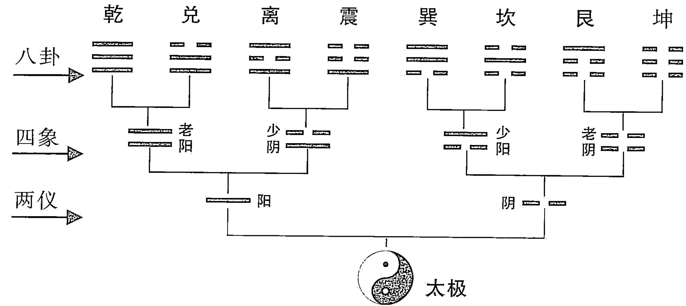

太极：“○”事物混沌未分的状态。
两仪：“☯”即天和地，也就是阴和阳，以阳爻“—”代表天，以阴爻“--”代表地。
四象：“☯”阴阳二气继续运动，再次一分为二，便产生了四象。这就是在一个阴爻或一个阳爻上再迭上一个阴爻或一个阳爻，就形成了老阳、老阴、少阳、少阴四种符号，这就是四象，分别代表春、夏、秋、冬四时（四季）。

八卦：在四象的基础上再重上一阴爻或一阳爻，就形成了八个符号，这八个符号便是乾、兑、离、震、巽、坎、艮、坤八个卦形。他们分别代表自然界（宇宙间）的八种最基本物质，即天、泽、火、雷、风、水、山、地。也表示了西北、西、南、东、东南、北、东北、西南八个方位。根据他们的阴阳结构分别代表家庭成员中的父亲、少女、中女、长男、长女、中男、少男和母亲。也称父母和六子。

| 八卦符号 | 乾☰ | 兑☱ | 离☲ | 震☳ | 巽☴ | 坎☵ | 艮☶ | 坤☷ |
| :--- | :--- | :--- | :--- | :--- | :--- | :--- | :--- | :--- |
| 基本物质 | 天 | 泽 | 火 | 雷 | 风 | 水 | 山 | 地 |
| 方向 | 西北 | 西 | 南 | 东 | 东南 | 北 | 东北 | 西南 |
| 家庭成员 | 父亲 | 少女 | 中女 | 长男 | 长女 | 中男 | 少男 | 母亲 |

八卦定吉凶，吉凶定大业：就是说八卦作为阴阳二气之上的一个变化系统，可以用来断吉和凶，只要趋吉避凶，就能成就大事业。

天人合一：中国传统哲学中关于天人关系的学说,包括天人相类、天人相通、天人感应、天道与人道统一等思想。人与天地宇宙相感应，可以通过修炼气功等来提高效果；尤其是我们预测师，其效果表现在第六感上，在预测的过程中，脑中随时会浮现某一些与预测有关的讯息，而且与事实完全吻合。

易经哲学采用了整体、全息、系统的思维方式。而我们就生活在一个全息的宇宙中。正因为如此，我们才可以根据不同的时间、不同的讯息，利用宇宙的运行轨迹，追寻过去已发生的及展现未来的结果。

#### 三、先天八卦与后天八卦

##### 1. 八卦符号

卦象由实线“—”和虚线“--”两种符号所组成。而一个卦由三个这样的符号所组成。这两种符号可以用阴阳去区分。

“—”属阳：是实线，为一划即单数，单数为阳。

“--”属阴：是虚线，为两划即双数，双数为阴。

每一个卦都有一个数值，而其数值有先天数与后天数之分。在八卦预测中，用的是先天数。初学者只要记得先天数即可，不必记后天数，以免混淆。

共八个卦分别为：

| 乾卦 ☰ | 兑卦 ☱ | 离卦 ☲ | 震卦 ☳ |
| :--- | :--- | :--- | :--- |
| 巽卦 ☴ | 坎卦 ☵ | 艮卦 ☶ | 坤卦 ☷ |

##### 2. 八卦的方向性

八卦具有方向性，即是有八个不同的方向：北方、东北方、东方、东南方、南方、西南方、西方、西北方。

中国在方向上的记录与现代人所记录的方法不一致，如坐北向南，前方为南方，在地图上为上方，那么下方为北方，左为东方，右为西方。这并非习惯，而是玄学的依据。无论在观相或看掌上，也都要遵循这个规律。如：

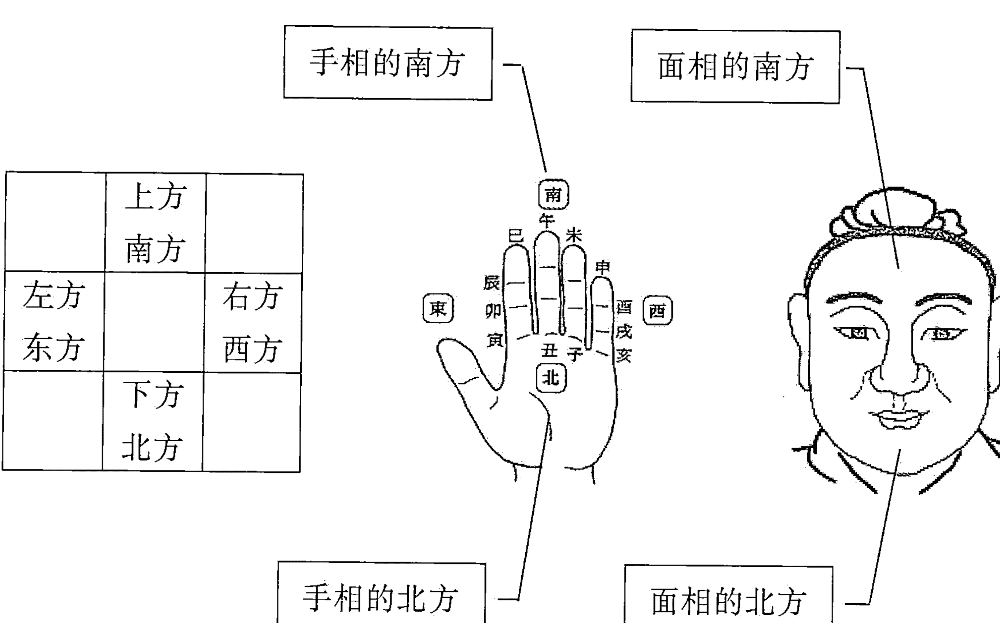

##### 3. 先天八卦与后天八卦的区别

先天八卦也叫伏羲八卦，是八卦刚形成的初期，相传由伏羲根据河图洛书演变而成，其原理是太阳一年四季在地球的投影规律而成，其线路为 S 状，我们可以根据先天八卦排列次序，顺着乾、兑、离、震、巽、坎、艮、坤划一条连线，结果会见到一个 “S”；有先天，也意味着有后天。后天八卦，是周文王根据四时的推移、万物的生长、收藏规律演算出来，即春生、夏长、秋收、冬藏，所以后天八卦又叫文王卦。

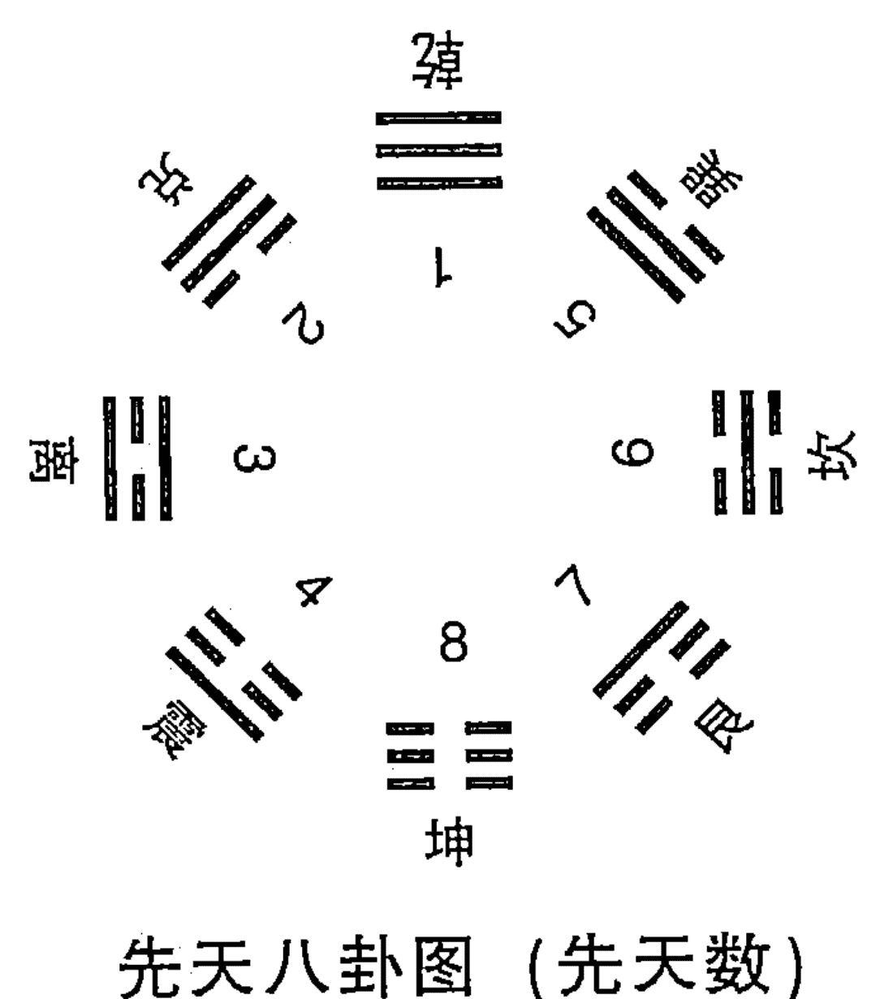

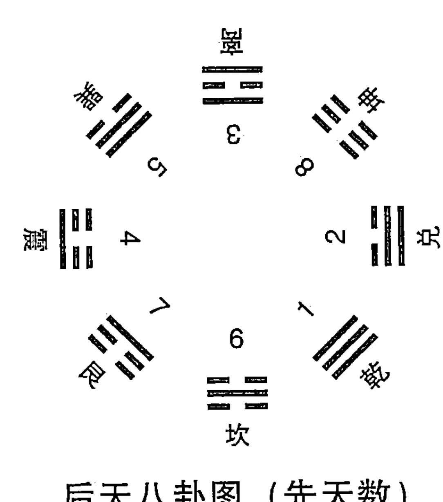

先天八卦与后天八卦的比较如下：

###### A. 八卦之先天数及方位

乾 1 数居南方， 兑 2 数居东南方， 离 3 数居东方， 震 4 数居东北方，

巽 5 数居西南方，坎 6 数居西方，艮 7 数居西北方，坤 8 数居北方。

###### B. 八卦之后天数及方位

乾 6 数居西北方，兑 7 数居西方，离 9 数居南方，震 3 数居东方，巽 4 数居东南方，坎 1 数居北方，艮 8 数居东北方，坤 2 数居西南方。

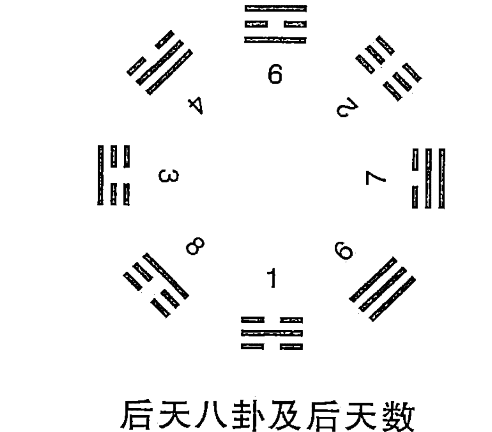

同是一个卦象，因先天卦与后天卦的分别，其数值和方位都不一样。比较如下：

| 八卦名称 | 卦象 | 先天数 | 后天数 | 先天八卦方位 | 后天八卦方位 |
| :--- | :--- | :--- | :--- | :--- | :--- |
| 乾宫 | ☰ | 1 | 6 | 南方 | 西北方 |
| 兑宫 | ☱ | 2 | 7 | 东南方 | 西方 |
| 离宫 | ☲ | 3 | 9 | 东方 | 南方 |
| 震宫 | ☳ | 4 | 3 | 东北方 | 东方 |
| 巽宫 | ☴ | 5 | 4 | 西南方 | 东南方 |
| 坎宫 | ☵ | 6 | 1 | 西方 | 北方 |
| 艮宫 | ☶ | 7 | 8 | 西北方 | 东北方 |
| 坤宫 | ☷ | 8 | 2 | 北方 | 西南方 |

我们在八卦预测应用中，用的只是先八卦数及后八卦的方位。为了方便读者不至混淆，只要记住下图即可：

| 八卦名称 | 卦象 | 先天八卦数 | 后天八卦方位 |
| :--- | :--- | :--- | :--- |
| 乾卦 | ☰ | 1 | 西北方 |
| 兑卦 | ☱ | 2 | 西方 |
| 离卦 | ☲ | 3 | 南方 |
| 震卦 | ☳ | 4 | 东方 |
| 巽卦 | ☴ | 5 | 东南方 |
| 坎卦 | ☵ | 6 | 北方 |
| 艮卦 | ☶ | 7 | 东北方 |
| 坤卦 | ☷ | 8 | 西南方 |

#### 四、八卦的基本含义

在八卦预测中，把宇宙万事万物分为八大类，分别放在八个宫中，即“乾、兑、离、震、巽、坎、艮、坤”。在梅花易数的预测中，主要是根据八卦万物类象中提取讯息进行。

卦象的含义中，数字、自然现象、人物、方向、五行、颜色等，在现实预测中会常用到。如表：

| 卦名 | 卦象 | 卦数 | 自然 | 家族 | 方位 | 五行 | 颜色 |
| :--- | :--- | :--- | :--- | :--- | :--- | :--- | :--- |
| 乾 | ☰ | 1 | 天 | 父 | 西北方 | 金 | 白色 |
| 兑 | ☱ | 2 | 泽 | 少女 | 西方 | 金 | 白色 |
| 离 | ☲ | 3 | 火 | 中女 | 南方 | 火 | 红色 |
| 震 | ☳ | 4 | 雷 | 长男 | 东方 | 木 | 绿色 |
| 巽 | ☴ | 5 | 风 | 长女 | 东南方 | 木 | 绿色 |
| 坎 | ☵ | 6 | 水 | 中男 | 北方 | 水 | 黑色 |
| 艮 | ☶ | 7 | 山 | 少男 | 东北方 | 土 | 黄色 |
| 坤 | ☷ | 8 | 地 | 母 | 西南方 | 土 | 黄色 |

### 第三章 卦象的含义与记忆

八卦万物类象是宋代梅花易数预测大师邵康节所创，因时代的变化，其所表达的内容也有所出入。只要熟记卦象内容，在预测时便可以灵活运用，通过逻辑推理、物象联想、同类引申，简单实用，达到更理想的效果。

#### 一、八卦万物类象

由于八卦万物类象所涉及的内容太多，需要花费较多的时间记忆，对初学者来说是一道难题，所以可以略过此节不记。具体可参考本书“附录一”部份内容。

#### 二、卦象符号的记忆方法

##### 1. 按性别分类记忆

可按性别分类，也即阴与阳的分别。万事万物都可按阴阳分成两大类，男性属阳，如父、长男、中男、少男；女性属阴，如母、长女、中女、少女。

阳性卦象之笔划为奇数所组成：

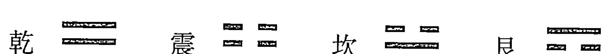

在数量上也可分阴阳，即奇数为阳、偶数为阴，或者说单数为阳、双数为阴。从以上四个阳性之卦象中可以看到，除了乾卦为三划组成外，其余都是五划所组成，且全部都是奇数。

阴性卦象之笔划为偶数所组成：

坤 ☷ 巽 ☴ 离 ☲ 兑 ☱

从以上阴性之卦象中可以看到，除了坤卦为六划组成外，其余都是四划所组成，且全部都是偶数。

##### 2. 从阴阳爻的位置记忆

初学者会觉得有很多东西要牢记，所以很易中途放弃，但细心想想，要牢记的东西只是一次性，待入门之后，便没什么需要再记忆的了，请读者在此部份稍稍下功夫则一劳永逸。卦象可通过阴爻或阳爻在卦中的不同位置，而寻找有规律的记忆方法，缩短记忆时间。

**阳卦：**

☰ 乾为老父，三条爻均为阳爻，没阴爻，称为纯阳卦，阳爻之数量为奇数（划数最少）。

☳ 震为长男，卦爻的读法是从下向上读，只有初爻为阳爻，所以为长男。且阳爻之数量为奇数。

☵ 坎为中男，只有阳爻在中间的位置，所以为中男，且阳爻之数量为奇数。

☶ 艮为少男，只有阳爻在第三爻的位置，所以为少男，且阳爻之数量为奇数。

**阴卦：**

☷ 坤为老母，三条爻均为阴爻，没阳爻，为老阴，称为纯阴卦（划数最多）。

☴ 巽为长女，初爻为阴爻，所以为长女，且阳爻之数量为偶数。

☲ 离为中女，只有阴爻在中间的位置，所以为中女，且阳爻之数量为偶数。

☱ 兑为少女，只有阴爻在第三爻的位置，所以为少女，且阳爻之数量为偶数。

从以上阴阳卦象中看到，乾卦与坤卦其相对应的爻位互补，震卦与巽卦其相对应的爻位互补，坎卦与离卦其相对应的爻位互补，艮卦与兑卦其相对应的爻位互补：

> 以老父乾卦和老母坤卦为例，乾卦三个爻皆为阳爻，则坤卦三个爻皆为阴爻；乾卦共三划为奇数，坤卦共六划为偶数

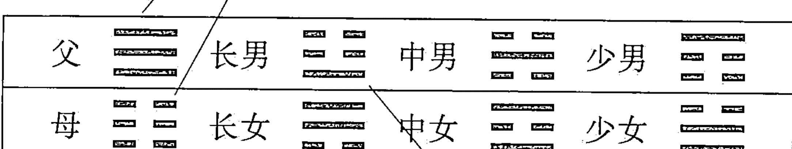

> 以长男震卦和长女巽卦为例，震之初爻为阳，则巽之初爻为阴，震之二三爻为阴，则巽之二三爻为阳

##### 3. 记住八卦符号口诀

口诀如下：

乾三连，坤六断。
震仰盂，艮覆碗。
离中虚，坎中满。
兑上缺，巽下断。

### 第四章 装卦

#### 一、重卦

##### 1. 经卦

卦象有三条卦爻组成，这样的卦象称为经卦，也可以称为单卦。

##### 2. 重卦

经卦与经卦重迭，称为重卦，又称为别卦。经卦八个，经卦与经卦互相重迭后，组成六十四个重卦。

##### 3. 八纯卦

经卦与经卦互相重迭，如果上卦与下卦相同的称为八纯卦。六十四卦平分在八个宫中，每个宫有八个卦；其中有一个为八纯卦，其余七个卦由八纯卦演变出来。所以八纯卦也称为母卦或第一卦，由母卦演变出来的称为子卦。

##### 4. 八宫及其演变

把六十四个卦平分八个宫，所以每个宫共八个卦。每宫的八个卦由一个母卦和七个子卦所组成。

每个宫的子卦，由母卦从初爻向第五爻续步演变，变完第五爻后回落至四爻(第七卦)，接着最后一次 (第八卦) 是初、二、三爻同时一起变。在卦的演变过程中，阴爻变阳爻，阳爻则变阴爻。

##### 5. 重卦的命名

母卦 (八纯卦) 以本宫的名称及自然现象来命名。如乾宫代的自然现象为“天”，所以其母卦命名为“乾为天”，兑卦所代表的自然现象为“泽”，所以其母卦命名为“兑为泽”；子卦则以两个经卦的自然现象命名，并重组出一个新的名称，读法从上卦向下卦读，如上卦“乾”与下卦“兑”组合，乾的自然现象为“天”、兑的自然现象为“泽”，重新组合新的名为“天泽履”。读法从上卦向下卦读。

**乾宫演变及命名：**

| 1 | 2 | 3 | 4 | 5 | 6 | 7 | 8 |
|---|---|---|---|---|---|---|---|
| 乾为天 | 天风姤 | 天山遁 | 天地否 | 风地观 | 山地剥 | 火地晋 | 火天大有 |
| ☰ | ☴ | ☶ | ☷ | ☴ | ☶ | ☲ | ☲ |

**兑宫演变及命名：**

| 1 | 2 | 3 | 4 | 5 | 6 | 7 | 8 |
|---|---|---|---|---|---|---|---|
| 兑为泽 | 泽水困 | 泽地萃 | 泽山咸 | 水山蹇 | 地山谦 | 雷山小过 | 雷泽归妹 |
| ☱ | ☵ | ☷ | ☶ | ☵ | ☶ | ☳ | ☳ |

**离宫演变及命名：**

| 1 | 2 | 3 | 4 | 5 | 6 | 7 | 8 |
|---|---|---|---|---|---|---|---|
| 离为火 | 火山旅 | 火风鼎 | 火水未济 | 山水蒙 | 风水涣 | 天水讼 | 天火同人 |
| ☲ | ☶ | ☴ | ☵ | ☶ | ☵ | ☰ | ☰ |

**震宫演变及命名：**

| 1 | 2 | 3 | 4 | 5 | 6 | 7 | 8 |
|---|---|---|---|---|---|---|---|
| 震为雷 | 雷地豫 | 雷水解 | 雷风恒 | 地风升 | 水风井 | 泽风大过 | 泽雷随 |
| ☳ | ☷ | ☵ | ☴ | ☷ | ☵ | ☱ | ☱ |

**巽宫演变及命名：**

| 1 | 2 | 3 | 4 | 5 | 6 | 7 | 8 |
|---|---|---|---|---|---|---|---|
| 巽为风 | 风天小畜 | 风火家人 | 风雷益 | 天雷无妄 | 火雷噬嗑 | 山雷颐 | 山风蛊 |
| ☴ | ☰ | ☲ | ☳ | ☰ | ☲ | ☶ | ☶ |

**坎宫演变及命名：**

| 1 | 2 | 3 | 4 | 5 | 6 | 7 | 8 |
|---|---|---|---|---|---|---|---|
| 坎为水 | 水泽节 | 水雷屯 | 水火既济 | 泽火革 | 雷火丰 | 地火明夷 | 地水师 |
| ☵ | ☱ | ☳ | ☲ | ☱ | ☳ | ☷ | ☷ |

**艮宫演变及命名：**

| 1 | 2 | 3 | 4 | 5 | 6 | 7 | 8 |
|---|---|---|---|---|---|---|---|
| 艮为山 | 山火贲 | 山天大畜 | 山泽损 | 火泽睽 | 天泽履 | 风泽中孚 | 风山渐 |
| ☶ | ☲ | ☰ | ☱ | ☲ | ☱ | ☴ | ☴ |

**坤宫演变及命名：**

| 1 | 2 | 3 | 4 | 5 | 6 | 7 | 8 |
|---|---|---|---|---|---|---|---|
| 坤为地 | 地雷复 | 地泽临 | 地天泰 | 雷天大壮 | 泽天夬 | 水天需 | 水地比 |
| ☷ | ☳ | ☱ | ☰ | ☳ | ☱ | ☵ | ☵ |

##### 6. 变化中的卦

事物总是不断地变化的。当物质达到某一程度、符合一定的条件，便会发生质变。有变化，即是有运动，相反有运动也即是有变化。易经也完全遵循这个规律，即老阳和老阴。老阳是在少阳的基础上不断发展壮大，当达到某一定的量便产生质变，即阳变阴；相反，老阴是在少阴的基础上不断发展壮大，当达到某一定的量便产生质变，即阴变阳。我们可以记作：

A. “—动”阳动变阴 “- -” 或写作 “○”阳动变阴 “- -” 手写方式：“○”阳动变阴 “、、”

B. “--动”阴动变阳“—” 或写作“x”阴动变阳“—” 手写方式：“x”阴动变阳“、”

#### 二、装卦步骤

##### 1. 纳地支

八卦中有四个阳卦：乾卦、震卦、坎卦、艮卦，以家庭中的人员代表分别是父亲、长男、中男、少男。

八卦中有四个阴卦：坤卦、巽卦、离卦、兑卦，以家庭中的人员代表分别是母亲、长女、中女、少女。

一个重卦共有六个爻，而地支共有十二个：子、丑、寅、卯、辰、巳、午、未、申、酉、戌、亥。地支有阳支和阴支，卦有阳卦和阴卦，所以六个阳支配六个阳卦，六个阴支配六个阴卦。即子、寅、辰、午、申、戌属阳配乾卦、震卦、坎卦、艮卦；丑、卯、巳、未、酉、亥属阴配坤卦、巽卦、离卦、兑卦。

| 数序 | 1 | 2 | 3 | 4 | 5 | 6 | 7 | 8 | 9 | 10 | 11 | 12 |
|---|---|---|---|---|---|---|---|---|---|---|---|---|
| 阴阳 | 阳 | 阴 | 阳 | 阴 | 阳 | 阴 | 阳 | 阴 | 阳 | 阴 | 阳 | 阴 |
| 地支 | 子 | 丑 | 寅 | 卯 | 辰 | 巳 | 午 | 未 | 申 | 酉 | 戌 | 亥 |

纳支只要找出八个母卦（八纯卦）的六个地支，其他五十六个子卦的地支自然迎刃而解。

###### A. 阳卦

阳卦由乾卦、震卦、坎卦、艮卦共四个卦，阳卦配阳支，阳支共六个：子、寅、辰、午、申、戌。只要找出初爻的第一个地支，其余五个地支顺时针隔位取得：

1. 子为阳气初生，以乾配之；其它五个阳支顺时针隔位取
2. 震为长子继父位，初爻取子
3. 坎为中男次之，初爻取寅
4. 艮为少男再次之，初爻取辰

| 六亲 | 父亲→长男→中男→少男 |
|---|---|
| 卦象 | 乾卦→震卦→坎卦→艮卦 |
| 初爻 | 子 → 子 → 寅 → 辰 |

乾卦：子水为阴极，阴极则阳生，所以子水为阳的开始；乾为父，有父母才有儿女，所以“子”配给乾作初爻；阳卦顺排，所以顺时针隔位取其余五个阳支：寅、辰、午、申、戌。

| 乾为天 | | |
|---|---|---|
| 上爻 | 戌土 | —— |
| 五爻 | 申金 | —— |
| 四爻 | 午火 | —— |
| 三爻 | 辰土 | —— |
| 二爻 | 寅木 | —— |
| 初爻 | 子水 | —— |

震卦：长子继父位，震为长子，所以与乾的取法一样初爻取“子”，再顺时针隔位取其余五个阳支：寅、辰、午、申、戌。

| 震为雷 | | |
|---|---|---|
| 上爻 | 戌土 | —— |
| 五爻 | 申金 | —— |
| 四爻 | 午火 | —— |
| 三爻 | 辰土 | —— |
| 二爻 | 寅木 | —— |
| 初爻 | 子水 | —— |

坎卦：坎为中男，在长男的基础上顺时针取下一个阳支“寅”起初爻，其余五个阳支顺时针隔位取：辰、午、申、戌、子。

| 坎为水 | | |
|---|---|---|
| 上爻 | 子水 | —— |
| 五爻 | 戌土 | —— |
| 四爻 | 申金 | —— |
| 三爻 | 午火 | —— |
| 二爻 | 辰土 | —— |
| 初爻 | 寅木 | —— |

艮卦：艮为少男，在中男的基础上顺时针取下一个阳支“辰”起初爻，其余五个阳支顺时针隔位取：午、申、戌、子、寅。

| 艮为山 | | |
|---|---|---|
| 上爻 | 寅木 | —— |
| 五爻 | 子水 | —— |
| 四爻 | 戌土 | —— |
| 三爻 | 申金 | —— |
| 二爻 | 午火 | —— |
| 初爻 | 辰土 | —— |

###### B. 阴卦

阴卦由坤卦、巽卦、离卦、兑卦共四个卦，阴卦配阴支，阴支共六个：丑、卯、巳、未、酉、亥。阴性逆排，所以四个卦的排列次序为：坤卦、兑卦、离卦、巽卦；阳极阴生，未为阴的开始，所以阴支的排列次序为：未、巳、卯、丑、亥、酉。只要找出初爻的第一个地支，其余五个地支逆时针隔位取得：

| 六亲 | 母亲→少女→中女→长女 |
|---|---|
| 卦象 | 坤卦→兑卦→离卦→巽卦 |
| 初爻 | 未 → 巳 → 卯 → 丑 |

坤卦：未为阴气已生，所以以“未”为阴的开始；坤为母，有父母才有儿女，所以未配给坤作初爻；阴卦逆排，所以逆时针隔位再取其余五个阴支：巳、卯、丑、亥、酉。

| 坤为地 | | |
|---|---|---|
| 上爻 | 酉金 | —— |
| 五爻 | 亥水 | —— |
| 四爻 | 丑土 | —— |
| 三爻 | 卯木 | —— |
| 二爻 | 巳火 | —— |
| 初爻 | 未土 | —— |

兑卦：阴行逆，以坤母为初再逆排则至兑少女。在坤的基础上逆时针取下一个阴支“巳”起初爻，其他五个阴支逆时针隔位取：卯、丑、亥、酉、未。

| 兑为泽 | | |
|---|---|---|
| 上爻 | 未土 | —— |
| 五爻 | 酉金 | —— |
| 四爻 | 亥水 | —— |
| 三爻 | 丑土 | —— |
| 二爻 | 卯木 | —— |
| 初爻 | 巳火 | —— |

离卦：离为中女，在少女的基础上逆时针取下一个阴支“卯”起初爻，其余五个阴支逆时针隔位取：丑、亥、酉、未、巳。

| 离为火 | | |
|---|---|---|
| 上爻 | 巳火 | —— |
| 五爻 | 未土 | —— |
| 四爻 | 酉金 | —— |
| 三爻 | 亥水 | —— |
| 二爻 | 丑土 | —— |
| 初爻 | 卯木 | —— |

巽卦：巽为长女，在中女的基础上逆时针取下一个阴支“丑”起初爻，其余五个阴支逆时针隔位取：亥、酉、未、巳、卯。

| 巽为风 | | |
|---|---|---|
| 上爻 | 卯木 | —— |
| 五爻 | 巳火 | —— |
| 四爻 | 未土 | —— |
| 三爻 | 酉金 | —— |
| 二爻 | 亥水 | —— |
| 初爻 | 丑土 | —— |

以上八个卦皆为母卦，只要记好八母卦，就可以轻易把六十四卦的地支全部排出。而记八母卦，只要记好每一个卦的初爻，其余的五个爻隔位相取，并遵守阳顺阴逆的规则。

八卦纳支口诀：乾子震子坎寅艮辰，坤未兑巳离卯巽丑。

例如：装《火地晋》的地支

1. 纳地支

a. 《火地晋》的上卦为离，可先把离的母卦《离为火》的上卦（四爻、五爻、上爻）直接移到《火地晋》的上卦：

母卦的初爻必然与四爻相冲，只要记得其初爻，也可以轻易记得第四爻。

b. 《火地晋》的下卦为坤，再把坤的母卦《坤为地》的下卦（初爻、二爻、三爻）直接移到《火地晋》的下卦：

其余装卦仿此。

##### 2. 寻母宫，装世应

文王卦里，每个卦都有“世”和“应”。

六十四个卦中，有五十六个子卦。装世应要知道其在何宫里的第几卦，母卦的世在六爻，第二卦的世在初爻，第三卦的世在二爻，第四卦的世在三爻，第五卦的世在四爻，第六卦的世在五爻，第七卦的世在四爻，第八卦的世在三爻；凡应爻则与世爻隔两个位。

| 世位 | 卦序 |
|---|---|
| 上爻 | 母卦（第一卦） |
| 五爻 | 第六卦 |
| 四爻 | 第五卦、第七卦 |
| 三爻 | 第四卦、第八卦 |
| 二爻 | 第三卦 |
| 初爻 | 第二卦 |

当起出一个卦后，如果是子卦（上卦与下卦不相同便属子卦），可以用母卦演变子卦的方法去反寻其母卦，当变到上下卦相同时，则这个卦便是其母卦，也是其所在的卦宫。

例如：起得《火地晋》之子卦，要寻母卦（或卦宫）及世应

从初爻起变，阳则变阴、阴则变阳，当变至第五爻时，再回落至四爻。这时上下卦相同都为《乾》卦，《火地晋》变至《乾为天》时共七个卦，所以《火地晋》为《乾宫》里的第七卦；变至第四爻时上下卦才相同（或者说母卦才出现），所以《火地晋》的世爻居第四爻。

“应”爻则是相对应的意思，与世爻相对应。如果世居上卦，应必居下卦，如果世居下卦，应必居上卦；如世居上卦的人位，应必居下卦的人位，如果世居上卦的天位，应必居下卦的天位……

一个经卦有三个爻，初爻称为地位，中间的爻称为人位，上爻称为天位。

象《火地晋》变至第五爻再回落到第四爻，即世居四爻，又为第七卦，此卦称之为游魂卦。游魂卦每宫一个，六十四卦中共八个。

| 火地晋 | | | |
|---|---|---|---|
| 上爻 | 巳火 | —— | |
| 五爻 | 未土 | —— | |
| 四爻 | 酉金 | —— | 世 |
| 三爻 | 卯木 | —— | |
| 二爻 | 巳火 | —— | |
| 初爻 | 未土 | —— | 应 |

世居上卦的地位，所以应取下卦的地位。即世应隔两个位。

为了方便初学者装世应，可以根据口诀去寻找，但此口诀找不到子卦的母宫：

天同二世天异五 地同四世地异初
人同四位人异三 纯六三异下天处

为了初学者理解以上口诀，以下作一些简单的解释。

天同二世：上卦及下卦只有天位的爻相同，则世在二爻。例《火风鼎》。
天异五：上卦及下卦只有天位的爻不相同，则世在五爻。例《山地剥》。
地同四世：上卦及下卦只有地位的爻相同，则世在四爻。例《水山蹇》。
地异初：上卦及下卦只有地位的爻不相同，则世在初爻。例《山火贲》。
人同四位：上卦及下卦只有人位的爻相同，则世在四爻。例《地火明夷》。
人异三：上卦及下卦只有人位的爻不相同，则世在三爻。例《雷泽归妹》。
纯六：上卦及下卦的爻都相同，则世在六爻。例《乾为天》。
三异下天处：上卦及下卦三个爻都不相同，则世在三爻。例《山泽损》。

##### 3. 装伏爻

当主卦缺少一个或两个五行或六亲（一个卦最多缺少两五行或六亲）时，要到母卦里寻，因母卦的五行（六亲）齐全。把母卦相对应的五行移到子卦，爻位与母卦的相对应，六亲不变（请参考本部“第四章 装卦 装六亲”篇）。

例如：起得《山风蛊》之子卦，五行缺火，先寻得母卦《巽为风》，再从母卦中补：

| 1 | 2 | 3 | 4 | 5 | 6 | 7 | 8 |
|---|---|---|---|---|---|---|---|
| ☶ | → | ☴ | → | ☵ | → | ☲ | → | ☳ | → | ☷ | → | ☰ | → | ☱ |

##### 4. 纳天干

地支配以天干，才可以成为较完整的五行组合。在文王卦的预测中，一般人较少用到纳天干，在高级技法上才用上。现写出来让初学者有一个初步的印象。

八卦共八个宫，而天干共十个，如果每一个宫配一个天干，则剩下两个天干，所以有六个天干配给六个宫，有四个天干配给两个宫。

乾与坤为阴阳一对，分别为父与母，所以甲、乙、壬、癸分别配给乾、坤；艮与兑为阴阳一对，分别为少男与少女，所以丙、丁分别配给艮、兑；坎与离为阴阳一对，分别为中男与中女，所以戊、己分别配给坎、离；震与巽为阴阳一对，分为长男与长女，所以庚、辛分别配给震与巽。

四个阴卦：坤、兑、离、巽，配五个阴干：乙、丁、己、辛、癸 (天干排序分别为 2、4、6、8、10)。即乙配给坤、丁配给兑、己配给离、辛配给巽，剩下癸再配给坤。

其四阴卦的规律是，五阴干按顺序先配给母，然后逆至少女、中女、长女，再至母。装卦从下向上装，所以乙在下卦、癸在上卦：

| 母 | 少女 | 中女 | 长女 | 母 |
|---|---|---|---|---|
| 坤 | 兑 | 离 | 巽 | 坤 |
| (甲)乙 | (丙)丁 | (戊)己 | (庚)辛 | (壬)癸 |

###### 1. 坤宫纳干

| | | |
|---|---|---|
| 癸酉金 | —— | 世 |
| 癸亥水 | —— | |
| 癸丑土 | —— | |
| 乙卯木 | —— | 应 |
| 乙巳火 | —— | |
| 乙未土 | —— | |

###### 2. 兑宫纳干

| | | |
|---|---|---|
| 丁未土 | —— | 世 |
| 丁酉金 | —— | |
| 丁亥水 | —— | |
| 丁丑土 | —— | 应 |
| 丁卯木 | —— | |
| 丁巳火 | —— | |

###### 3. 离宫纳干

| | | |
|---|---|---|
| 己巳火 | —— | 世 |
| 己未土 | —— | |
| 己酉金 | —— | |
| 己亥水 | —— | 应 |
| 己丑土 | —— | |
| 己卯木 | —— | |

###### 4. 巽宫纳干

| | | |
|---|---|---|
| 辛卯木 | —— | 世 |
| 辛巳火 | —— | |
| 辛未土 | —— | |
| 辛酉金 | —— | 应 |
| 辛亥水 | —— | |
| 辛丑土 | —— | |

四个阳卦：乾、艮、坎、震，配五个阳干：甲、丙、戊、庚、壬（天干排序分别为 1、3、5、7、9）。即甲配给乾、丙配给艮、戊配给坎、庚配给震，剩下壬再配给乾。

其四阳卦的规律是，五阳干按顺序先配给父，然后逆至少男、中男、长男，再至父。装卦从下向上装，所以甲在下卦、壬在上卦。

| 父 | 少男 | 中男 | 长男 | 父 |
|---|---|---|---|---|
| 乾 | 艮 | 坎 | 震 | 乾 |
| 甲(乙) | 丙(丁) | 戊(己) | 庚(辛) | 壬(癸) |

###### 1. 乾宫纳干
| 壬戌土 | — | 世 |
|---|---|---|
| 壬申金 | — | |
| 壬午火 | — | |
| 甲辰土 | — | 应 |
| 甲寅木 | — | |
| 甲子水 | — | |

###### 2. 艮宫纳干
| 丙寅木 | — | 世 |
|---|---|---|
| 丙子水 | - - | |
| 丙戌土 | - - | |
| 丙申金 | — | 应 |
| 丙午火 | - - | |
| 丙辰土 | - - | |

###### 3. 坎宫纳干
| 戊子水 | - - | 世 |
|---|---|---|
| 戊戌土 | — | |
| 戊申金 | - - | |
| 戊午火 | - - | 应 |
| 戊辰土 | — | |
| 戊寅木 | - - | |

###### 4. 震宫纳干
| 庚戌土 | - - | 世 |
|---|---|---|
| 庚申金 | - - | |
| 庚午火 | — | |
| 庚辰土 | - - | 应 |
| 庚寅木 | - - | |
| 庚子水 | — | |

| 四阳卦纳干 | 四阴卦纳干 |
| :--- | :--- |
| 父亲 乾宫：甲壬 | 母亲 坤宫：乙癸 |
| 少男 艮宫：丙 | 少女 兑宫：丁 |
| 中男 坎宫：戊 | 中女 离宫：己 |
| 长男 震宫：庚 | 长女 巽宫：辛 |

口诀：
父少与中长，甲丙戊庚壬。
母少与中长，乙丁己辛癸。

##### 5. 装六亲

每个宫都有一个五行，如乾宫属金，兑宫属金，离宫属火，震宫属木，巽宫属木，坎宫属水，艮宫属土，坤宫土。以某一宫位的五行为中心，分别与其他地支五行产生不同的关系，我们以六亲的形式来表达这种关系，如：兄弟、子孙、妻财、官鬼、父母。

六亲是不同信息的载体，尤如八卦万物类象，因求测的内容不同，所代表的信息也有所出入，应灵活运用。通过六亲之间的相生、相克及刑冲合害等关系，展现出生活中复杂的人事因果关系，及其运动、变化的过程，起到准确预测的效果。这类似于四柱中的六亲。

- 兄弟：其五行与我相同者。
- 子孙：其五行被我所生。
- 妻财：其五行被我所克。
- 官鬼：其五行克我者。
- 父母：其五行生我者。

乾宫、兑宫五行属金，其六亲关如下：

离宫五行属火，其六亲关如下：

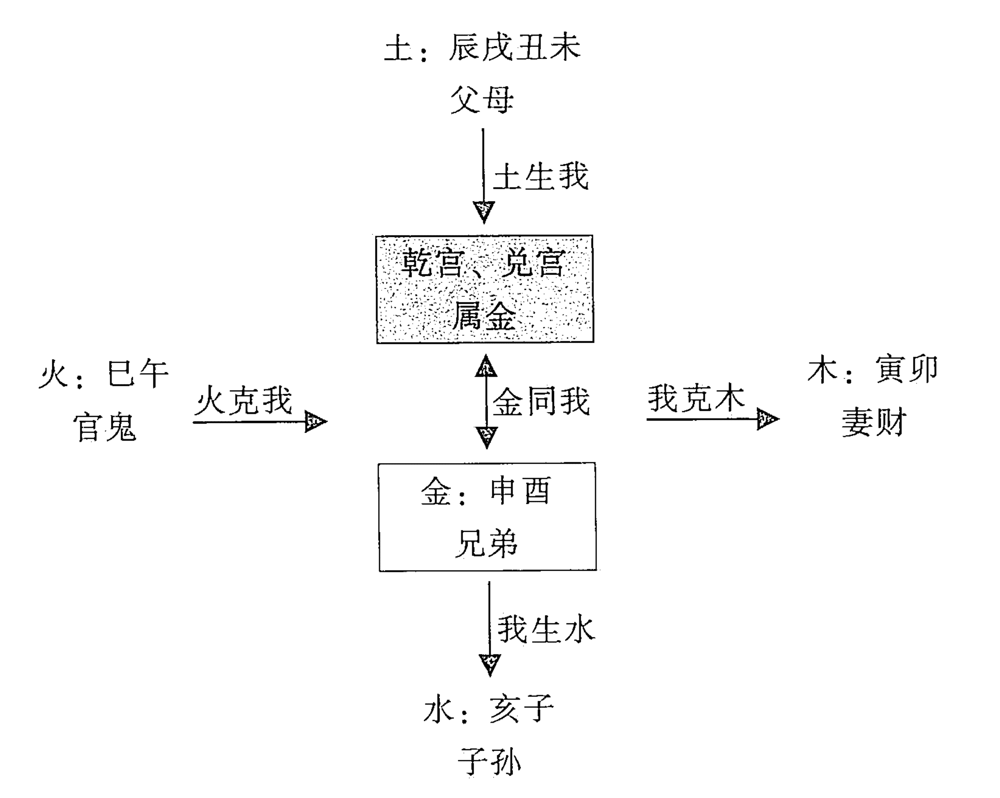

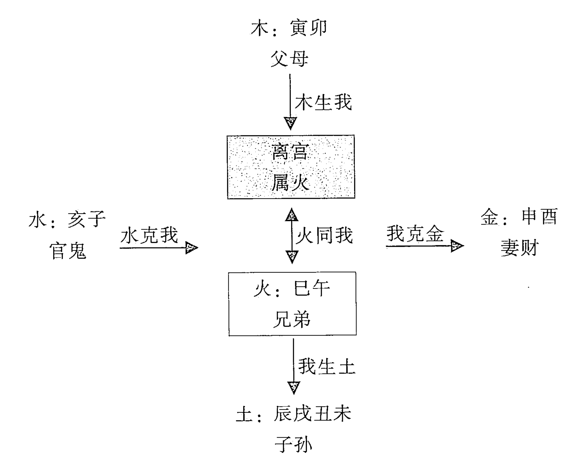

震宫、巽宫五行属木，其六亲关如下：

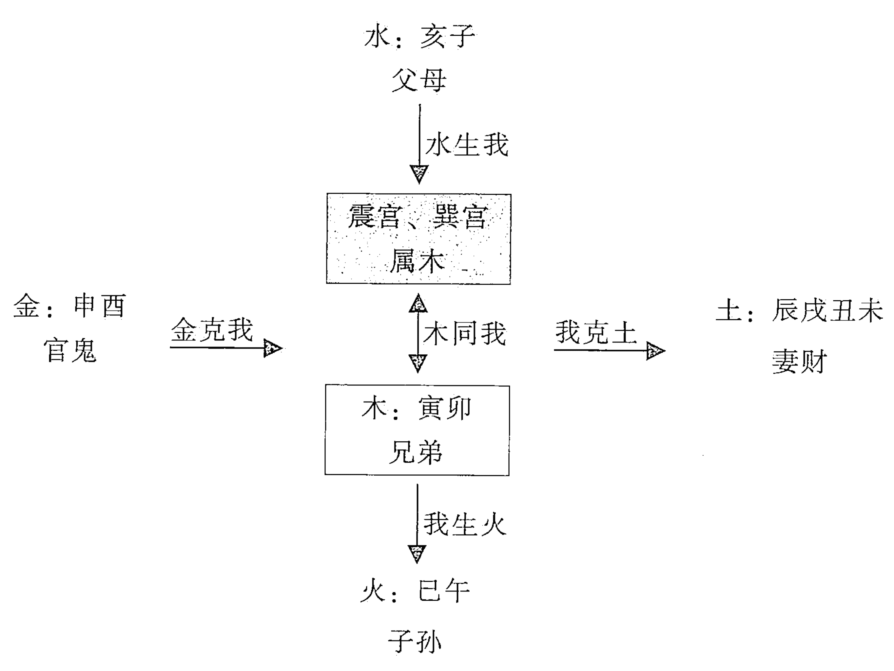

坎宫五行属水，其六亲关如下：

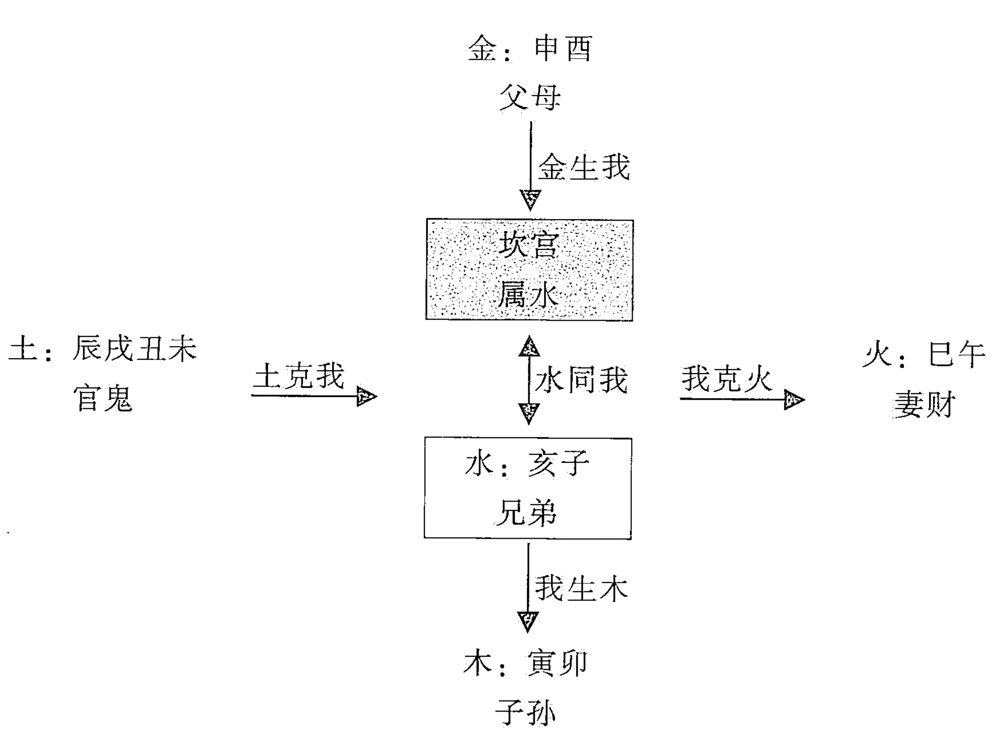

艮宫、坤宫五行属土，其六亲关如下：

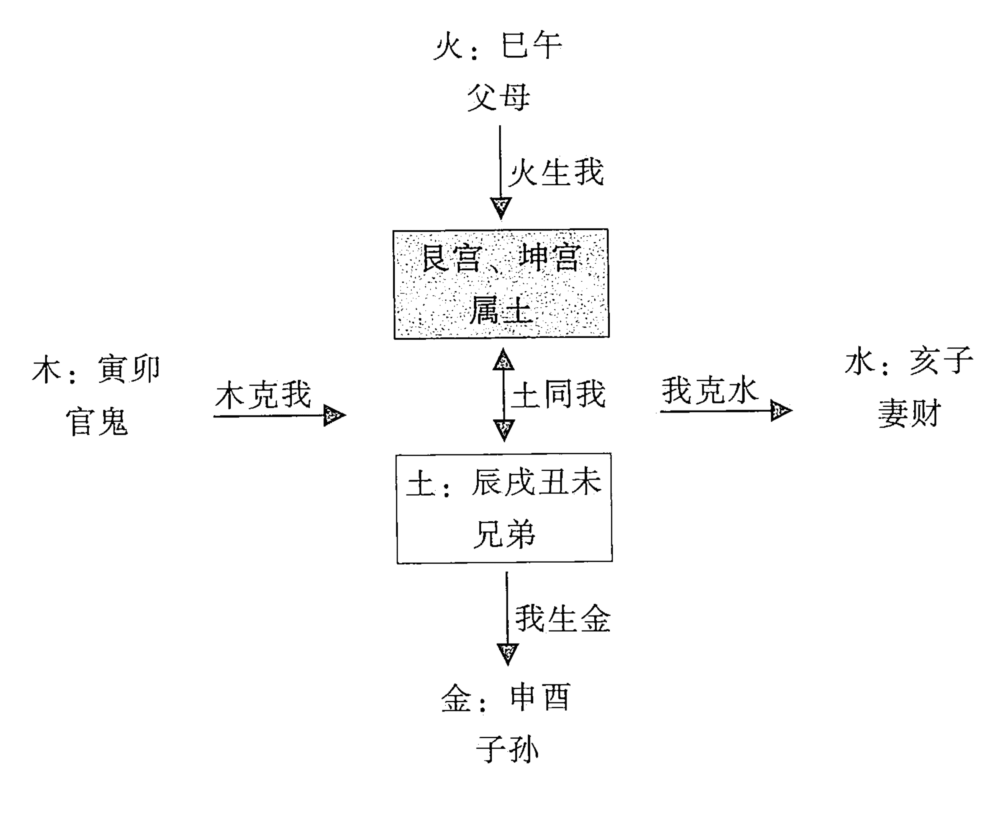

注：五行及相生、相克、比和的关系可参考本书“第二部 第三章”。

| 六亲\五行 | 乾宫兑宫 | 离宫 | 震宫巽宫 | 坎宫 | 艮宫坤宫 |
| :--- | :--- | :--- | :--- | :--- | :--- |
| 金 | 兄弟 | 妻财 | 官鬼 | 父母 | 子孙 |
| 水 | 子孙 | 官鬼 | 父母 | 兄弟 | 妻财 |
| 木 | 妻财 | 父母 | 兄弟 | 子孙 | 官鬼 |
| 火 | 官鬼 | 兄弟 | 子孙 | 妻财 | 父母 |
| 土 | 父母 | 子孙 | 妻财 | 官鬼 | 兄弟 |

##### 6. 取六神 (六兽)

六神又名六兽，相传为六种动物。分别为青龙、朱雀、勾陈、腾蛇、白虎、玄武。

家居风水 (以坐北向南为标准)，分别有左青龙 (东方)、右白虎 (西方)、前朱雀 (南方)、后玄武 (北方) 的用法，中间为勾陈、腾蛇。

甲乙属木在东方，因青龙属木，所以甲乙配青龙；丙丁属火在南方，因朱雀属火，所以丙丁配朱雀；戊己属土在中间，因勾陈、腾蛇属土，所以戊配勾陈、己配腾蛇；庚辛属金在西方，因白虎属金，所以庚辛配白虎；壬癸属水在北方，因玄武属水，所以壬癸配玄武。

| | 丙 丁
南方火
朱 雀 | |
| --- | --- | --- |
| 甲 乙
东方木
青 龙 | 戊勾陈
中间土
己腾蛇 | 庚 辛
西方金
白 虎 |
| | 壬 癸
北方水
玄 武 | |

六兽为一个有规律的五行循环相生连接组合：

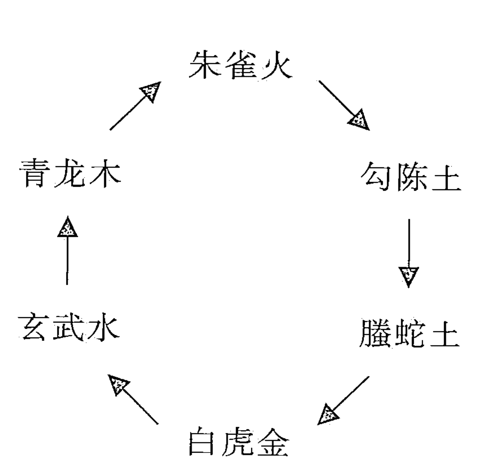

十个天干配六个兽，有两个天干为一干配一兽，其余其八个天干为二干配一兽。

一个卦有六个爻，六兽分别安排在六个爻的相应位置上。先要确定初爻的六兽，其余五个则顺时针向二爻、三爻…排列。而初爻的六兽与起卦日的天干成直接的关系，如果起卦日的天干为甲或乙，则初爻为青龙；如果起卦日的天干为丙或丁，则初爻为朱雀；如果起卦日的天干为戊，则初爻为勾陈；如果起卦日的天干为己，则初爻为螣蛇；如果起卦日的天干为庚或辛，则初爻为白虎；如果起卦日的天干为壬或癸，则初爻为玄武。

六兽按日干之五行属性取其初爻的六兽，其余的六兽向上顺时针排：

1. 甲或乙日属木：青龙 (木) 起初爻，其余的顺排：

| 上爻 | 玄武 |
| 五爻 | 白虎 |
| 四爻 | 螣蛇 |
| 三爻 | 勾陈 |
| 二爻 | 朱雀 |
| 初爻 | 青龙 |

2. 丙或丁日属火：朱雀 (火) 起初爻，其余的顺排：

| 上爻 | 青龙 |
| 五爻 | 玄武 |
| 四爻 | 白虎 |
| 三爻 | 螣蛇 |
| 二爻 | 勾陈 |
| 初爻 | 朱雀 |

3. 戊日属土：勾陈（土）起初爻，其余的顺排：

| 上爻 | 朱雀 |
| 五爻 | 青龙 |
| 四爻 | 玄武 |
| 三爻 | 白虎 |
| 二爻 | 螣蛇 |
| 初爻 | 勾陈 |

4. 己日属土：螣蛇（土）起初爻，其余的顺排：

| 上爻 | 勾陈 |
| 五爻 | 朱雀 |
| 四爻 | 青龙 |
| 三爻 | 玄武 |
| 二爻 | 白虎 |
| 初爻 | 螣蛇 |

5. 庚或辛日属金：白虎（金）起初爻，其余的顺排：

| 上爻 | 螣蛇 |
| 五爻 | 勾陈 |
| 四爻 | 朱雀 |
| 三爻 | 青龙 |
| 二爻 | 玄武 |
| 初爻 | 白虎 |

6. 壬或癸日属水：玄武（水）起初爻，其余的顺排：

| 上爻 | 白虎 |
| 五爻 | 螣蛇 |
| 四爻 | 勾陈 |
| 三爻 | 朱雀 |
| 二爻 | 青龙 |
| 初爻 | 玄武 |

我们平时只记住日干与相对应的初爻便可，其余的可以顺推：

| 日干 | 初爻的六神 |
| 甲乙 | 青龙 |
| 丙丁 | 朱雀 |
| 戊 | 勾陈 |
| 己 | 螣蛇 |
| 庚辛 | 白虎 |
| 壬癸 | 玄武 |

例如：2009年正月，某公司总经理来测生意的前景。得《火丰鼎》之《山风蛊》：

| 申酉空 | | 庚 | 壬 | 丙 | 己 |
| | | 戌 | 午 | 寅 | 丑 |
| | | 时 | 日 | 月 | 年 |

| | 火风鼎 | | | 山风蛊 | |
|---|---|---|---|---|---|
| 上爻 | 兄弟 己巳 火 | —— | | 父母 丙寅 木 | —— | 白虎 |
| 五爻 | 子孙 己未 土 | - - | 应 | 官鬼 丙子 水 | - - | 螣蛇 |
| 四爻 | 妻财 己酉 金 | ○ | | 子孙 丙戌 土 | - - | 勾陈 |
| 三爻 | 妻财 辛酉 金 | —— | | 妻财 辛酉 金 | —— | 朱雀 |
| 二爻 | 官鬼 辛亥 水 | —— | 世 | 官鬼 辛亥 水 | —— | 青龙 |
| 初爻 | 父母 己卯 木 | 子孙 辛丑 土 | - - | | 子孙 辛丑 土 | - - | 玄武 |

> 起卦日为壬午日，日干壬水配玄武，所以初爻以玄武起，其余的顺排

六神有青龙、玄武、白虎、螣蛇、勾陈、朱雀，在文王卦预测中占相当重要的地位。犹如命理中的神煞，可以洞悉人的内心世界及更加形象地分析每种事物的特性、特征和形态等。

卦爻临青龙，表露出来的为人正直、高贵、光明磊落、喜庆、权力或色情、乱性等，与升迁、婚庆、酒色、滥情等有关；卦爻临朱雀表露出口齿伶俐、热情大方有礼、或是急躁、冲动等，与是非、官非、文书、音乐、电器、文职等有关；卦爻临勾陈表露出为人憨厚，诚信、有原则，或是忧虑、牵挂、固执等、与房产、田园、疾病、医院、争讼、牢狱之灾有关。卦爻临螣蛇，表露出为人热情好客、灵活多变，或猜忌、怪异、心神不安、多梦失眠等，与精神紧张、神经质、病毒、长形物等有关。卦爻临白虎表露出威武、豪爽、冲动、性急、凶险等，与血光、伤残、战争、打斗等有关。卦爻临玄武表露出智慧、计谋、旁门左道、风流好色等，与男女关系、色情、性病、赌博、偷窃、走私、江河等有关。

##### 7. 六十四卦总表

###### 乾宫八卦（金）

| 乾为天 | |
|---|---|
| 父母 壬戌 土 | — 世 |
| 兄弟 壬申 金 | — |
| 官鬼 壬午 火 | — |
| 父母 甲辰 土 | — 应 |
| 妻财 甲寅 木 | — |
| 子孙 甲子 水 | — |

| 天风姤 | |
|---|---|
| 父母 壬戌 土 | — |
| 兄弟 壬申 金 | — |
| 官鬼 壬午 火 | — 应 |
| 兄弟 辛酉 金 | — |
| 妻财 甲寅 木 子孙 辛亥 水 | — |
| 父母 辛丑 土 | -- 世 |

| 天山遁 | |
|---|---|
| 父母 壬戌 土 | — |
| 兄弟 壬申 金 | — 应 |
| 官鬼 壬午 火 | — |
| 兄弟 丙申 金 | — |
| 妻财 甲寅 木 官鬼 丙午 火 | -- 世 |
| 子孙 甲子 水 父母 丙辰 土 | -- |

| 天地否 | |
|---|---|
| 父母 壬戌 土 | — 应 |
| 兄弟 壬申 金 | — |
| 官鬼 壬午 火 | — |
| 妻财 乙卯 木 | -- 世 |
| 官鬼 乙巳 火 | -- |
| 子孙 甲子 水 父母 乙未 土 | -- |

| 风地观 | |
|---|---|
| 妻财 辛卯 木 | — |
| 兄弟 壬申 金 官鬼 辛巳 火 | — |
| 父母 辛未 土 | -- 世 |
| 妻财 乙卯 木 | -- |
| 官鬼 乙巳 火 | -- |
| 子孙 甲子 水 父母 乙未 土 | -- 应 |

| 山地剥 | |
|---|---|
| 妻财 丙寅 木 | — |
| 兄弟 壬申 金 子孙 丙子 水 | -- 世 |
| 父母 丙戌 土 | -- |
| 妻财 乙卯 木 | -- |
| 官鬼 乙巳 火 | -- 应 |
| 父母 乙未 土 | -- |

| 火地晋 | |
|---|---|
| 官鬼 己巳 火 | — |
| 父母 己未 土 | -- |
| 兄弟 己酉 金 | — 世 |
| 妻财 乙卯 木 | -- |
| 官鬼 乙巳 火 | -- |
| 子孙 甲子 水 父母 乙未 土 | -- 应 |

| 火天大有 | |
|---|---|
| 官鬼 己巳 火 | — 应 |
| 父母 己未 土 | -- |
| 兄弟 己酉 金 | — |
| 父母 甲辰 土 | — 世 |
| 妻财 甲寅 木 | — |
| 子孙 甲子 水 | — |

###### 兑宫八卦（金）

| 兑为泽 | |
|---|---|
| 父母 丁未 土 | -- 世 |
| 兄弟 丁酉 金 | — |
| 子孙 丁亥 水 | — |
| 父母 丁丑 土 | -- 应 |
| 妻财 丁卯 木 | — |
| 官鬼 丁巳 火 | — |

| 泽水困 | |
|---|---|
| 父母 丁未 土 | -- |
| 兄弟 丁酉 金 | — |
| 子孙 丁亥 水 | — 应 |
| 官鬼 戊午 火 | -- |
| 父母 戊辰 土 | — |
| 妻财 戊寅 木 | -- 世 |

| 泽地萃 | |
|---|---|
| 父母 丁未 土 | -- |
| 兄弟 丁酉 金 | — 应 |
| 子孙 丁亥 水 | — |
| 妻财 乙卯 木 | -- |
| 官鬼 乙巳 火 | -- 世 |
| 父母 乙未 土 | -- |

| 泽山咸 | |
|---|---|
| 父母 丁未 土 | -- 应 |
| 兄弟 丁酉 金 | — |
| 子孙 丁亥 水 | — |
| 兄弟 丙申 金 | — 世 |
| 官鬼 丙午 火 | -- |
| 父母 丙辰 土 | -- |

| 水山蹇 | |
|---|---|
| 子孙 戊子 水 | -- |
| 父母 戊戌 土 | — |
| 兄弟 戊申 金 | -- 世 |
| 兄弟 丙申 金 | — |
| 官鬼 丙午 火 | -- |
| 父母 丙辰 土 | -- 应 |

| 地山谦 | |
|---|---|
| 兄弟 癸酉 金 | -- |
| 子孙 癸亥 水 | -- 世 |
| 父母 癸丑 土 | -- |
| 兄弟 丙申 金 | — |
| 官鬼 丙午 火 | -- 应 |
| 父母 丙辰 土 | -- |

| 雷山小过 | |
|---|---|
| 父母 庚戌 土 | -- |
| 兄弟 庚申 金 | -- |
| 官鬼 庚午 火 | — 世 |
| 兄弟 丙申 金 | — |
| 官鬼 丙午 火 | -- |
| 父母 丙辰 土 | -- 应 |

| 雷泽归妹 | |
|---|---|
| 父母 庚戌 土 | -- 应 |
| 兄弟 庚申 金 | -- |
| 官鬼 庚午 火 | — |
| 父母 丁丑 土 | -- 世 |
| 妻财 丁卯 木 | — |
| 官鬼 丁巳 火 | — |

###### 离宫八卦（火）

| 离为火 | |
|---|---|
| 兄弟 己巳 火 | — 世 |
| 子孙 己未 土 | -- |
| 妻财 己酉 金 | — |
| 官鬼 己亥 水 | — 应 |
| 子孙 己丑 土 | -- |
| 父母 己卯 木 | — |

| 火山旅 | |
|---|---|
| 兄弟 己巳 火 | — |
| 子孙 己未 土 | -- |
| 妻财 己酉 金 | — 应 |
| 官鬼 己亥 水 妻财 丙申 金 | — |
| 兄弟 丙午 火 | -- |
| 父母 己卯 木 子孙 丙辰 土 | -- 世 |

| 火风鼎 | |
|---|---|
| 兄弟 己巳 火 | — |
| 子孙 己未 土 | -- 应 |
| 妻财 己酉 金 | — |
| 妻财 辛酉 金 | — |
| 官鬼 辛亥 水 | — 世 |
| 父母 己卯 木 子孙 辛丑 土 | -- |

| 火水未济 | |
|---|---|
| 兄弟 己巳 火 | — 应 |
| 子孙 己未 土 | -- |
| 妻财 己酉 金 | — |
| 官鬼 己亥 水 兄弟 戊午 火 | -- 世 |
| 子孙 戊辰 土 | — |
| 父母 戊寅 木 | -- |

| 山水蒙 | |
|---|---|
| 父母 丙寅 木 | — |
| 官鬼 丙子 水 | -- |
| 妻财 己酉 金 子孙 丙戌 土 | -- 世 |
| 兄弟 戊午 火 | -- |
| 子孙 戊辰 土 | — |
| 父母 戊寅 木 | -- 应 |

| 风水涣 | |
|---|---|
| 父母 辛卯 木 | — |
| 兄弟 辛巳 火 | — 世 |
| 妻财 己酉 金 子孙 辛未 土 | -- |
| 官鬼 己亥 水 兄弟 戊午 火 | -- |
| 子孙 戊辰 土 | — 应 |
| 父母 戊寅 木 | -- |

| 天水讼 | |
|---|---|
| 子孙 壬戌 土 | — |
| 妻财 壬申 金 | — |
| 兄弟 壬午 火 | — 世 |
| 官鬼 己亥 水 兄弟 戊午 火 | -- |
| 子孙 戊辰 土 | — |
| 父母 戊寅 木 | -- 应 |

| 天火同人 | |
|---|---|
| 子孙 壬戌 土 | — 应 |
| 妻财 壬申 金 | — |
| 兄弟 壬午 火 | — |
| 官鬼 己亥 水 | — 世 |
| 子孙 己丑 土 | -- |
| 父母 己卯 木 | — |

###### 震宫八卦（木）

| 震为雷 | |
|---|---|
| 妻财 庚戌 土 | -- 世 |
| 官鬼 庚申 金 | -- |
| 子孙 庚午 火 | — |
| 妻财 庚辰 土 | -- 应 |
| 兄弟 庚寅 木 | -- |
| 父母 庚子 水 | — |

| 雷地豫 | |
|---|---|
| 妻财 庚戌 土 | -- |
| 官鬼 庚申 金 | -- |
| 子孙 庚午 火 | — 应 |
| 兄弟 乙卯 木 | -- |
| 子孙 乙巳 火 | -- |
| 父母 庚子 水 妻财 乙未 土 | -- 世 |

| 雷水解 | |
|---|---|
| 妻财 庚戌 土 | -- |
| 官鬼 庚申 金 | -- 应 |
| 子孙 庚午 火 | — |
| 子孙 戊午 火 | -- |
| 妻财 戊辰 土 | — 世 |
| 兄弟 戊寅 木 | -- |

| 雷风恒 | |
|---|---|
| 妻财 庚戌 土 | -- 应 |
| 官鬼 庚申 金 | -- |
| 子孙 庚午 火 | — |
| 官鬼 辛酉 金 | — 世 |
| 兄弟 庚寅 木 父母 辛亥 水 | — |
| 妻财 辛丑 土 | -- |

| 地风升 | |
|---|---|
| 官鬼 癸酉 金 | -- |
| 父母 癸亥 水 | -- |
| 子孙 庚午 火 妻财 癸丑 土 | -- 世 |
| 官鬼 辛酉 金 | — |
| 兄弟 庚寅 木 父母 辛亥 水 | — |
| 妻财 辛丑 土 | -- 应 |

| 水风井 | |
|---|---|
| 父母 戊子 水 | -- |
| 妻财 戊戌 土 | — 世 |
| 子孙 庚午 火 官鬼 戊申 金 | -- |
| 官鬼 辛酉 金 | — |
| 兄弟 庚寅 木 父母 辛亥 水 | — 应 |
| 妻财 辛丑 土 | -- |

| 泽风大过 | |
|---|---|
| 妻财 丁未 土 | -- |
| 官鬼 丁酉 金 | — |
| 子孙 庚午 火 父母 丁亥 水 | — 世 |
| 官鬼 辛酉 金 | — |
| 兄弟 庚寅 木 父母 辛亥 水 | — |
| 妻财 辛丑 土 | -- 应 |

| 泽雷随 | |
|---|---|
| 妻财 丁未 土 | -- 应 |
| 官鬼 丁酉 金 | — |
| 子孙 庚午 火 父母 丁亥 水 | — |
| 妻财 庚辰 土 | -- 世 |
| 兄弟 庚寅 木 | -- |
| 父母 庚子 水 | — |

###### 巽宫八卦（木）

| 巽为风 | |
|---|---|
| 兄弟 辛卯 木 | — 世 |
| 子孙 辛巳 火 | — |
| 妻财 辛未 土 | -- |
| 官鬼 辛酉 金 | — 应 |
| 父母 辛亥 水 | — |
| 妻财 辛丑 土 | -- |

| 风天小畜 | |
|---|---|
| 兄弟 辛卯 木 | — |
| 子孙 辛巳 火 | — |
| 妻财 辛未 土 | -- 应 |
| 官鬼 辛酉 金 妻财 甲辰 土 | — |
| 兄弟 甲寅 木 | — |
| 父母 甲子 水 | — 世 |

| 风火家人 | |
|---|---|
| 兄弟 辛卯 木 | — |
| 子孙 辛巳 火 | — 应 |
| 妻财 辛未 土 | -- |
| 官鬼 辛酉 金 父母 己亥 水 | — |
| 妻财 己丑 土 | -- 世 |
| 兄弟 己卯 木 | — |

| 风雷益 | |
|---|---|
| 兄弟 辛卯 木 | — 应 |
| 子孙 辛巳 火 | — |
| 妻财 辛未 土 | -- |
| 官鬼 辛酉 金 妻财 庚辰 土 | -- 世 |
| 兄弟 庚寅 木 | -- |
| 父母 庚子 水 | — |

| 天雷无妄 | |
|---|---|
| 妻财 壬戌 土 | — |
| 官鬼 壬申 金 | — |
| 子孙 壬午 火 | — 世 |
| 妻财 庚辰 土 | -- |
| 兄弟 庚寅 木 | -- |
| 父母 庚子 水 | — 应 |

| 火雷噬嗑 | |
|---|---|
| 子孙 己巳 火 | — |
| 妻财 己未 土 | -- 世 |
| 官鬼 己酉 金 | — |
| 妻财 庚辰 土 | -- |
| 兄弟 庚寅 木 | -- 应 |
| 父母 庚子 水 | — |

| 山雷颐 | |
|---|---|
| 兄弟 丙寅 木 | — |
| 子孙 辛巳 火 父母 丙子 水 | -- |
| 妻财 丙戌 土 | -- 世 |
| 官鬼 辛酉 金 妻财 庚辰 土 | -- |
| 兄弟 庚寅 木 | -- |
| 父母 庚子 水 | — 应 |

| 山风蛊 | |
|---|---|
| 兄弟 丙寅 木 | — 应 |
| 子孙 辛巳 火 父母 丙子 水 | -- |
| 妻财 丙戌 土 | -- |
| 官鬼 辛酉 金 | — 世 |
| 父母 辛亥 水 | — |
| 妻财 辛丑 土 | -- |

###### 坎宫八卦（水）

| 坎为水 | |
|---|---|
| 兄弟 戊子 水 | -- 世 |
| 官鬼 戌戌 土 | — |
| 父母 戌申 金 | -- |
| 妻财 戌午 火 | -- 应 |
| 官鬼 戌辰 土 | — |
| 子孙 戌寅 木 | -- |

| 水泽节 | |
|---|---|
| 兄弟 戌子 水 | -- |
| 官鬼 戌戌 土 | — |
| 父母 戌申 金 | -- 应 |
| 官鬼 丁丑 土 | -- |
| 子孙 丁卯 木 | — |
| 妻财 丁巳 火 | — 世 |

| 水雷屯 | |
|---|---|
| 兄弟 戌子 水 | -- |
| 官鬼 戌戌 土 | — 应 |
| 父母 戌申 金 | -- |
| 妻财 戌午 火 | 官鬼 庚辰 土 | -- |
| 子孙 庚寅 木 | -- 世 |
| 兄弟 庚子 水 | — |

| 水火既济 | |
|---|---|
| 兄弟 戌子 水 | -- 应 |
| 官鬼 戌戌 土 | — |
| 父母 戌申 金 | -- |
| 妻财 戌午 火 | 兄弟 己亥 水 | — 世 |
| 官鬼 己丑 土 | -- |
| 子孙 己卯 木 | — |

| 泽火革 | |
|---|---|
| 官鬼 丁未 土 | -- |
| 父母 丁酉 金 | — |
| 兄弟 丁亥 水 | — 世 |
| 妻财 戌午 火 | 兄弟 己亥 水 | — |
| 官鬼 己丑 土 | -- |
| 子孙 己卯 木 | — 应 |

| 雷火丰 | |
|---|---|
| 官鬼 庚戌 土 | -- |
| 父母 庚申 金 | -- 世 |
| 妻财 庚午 火 | — |
| 兄弟 己亥 水 | — |
| 官鬼 己丑 土 | -- 应 |
| 子孙 己卯 木 | — |

| 地火明夷 | |
|---|---|
| 父母 癸酉 金 | -- |
| 兄弟 癸亥 水 | -- |
| 官鬼 癸丑 土 | -- 世 |
| 妻财 戌午 火 | 兄弟 己亥 水 | — |
| 官鬼 己丑 土 | -- |
| 子孙 己卯 木 | — 应 |

| 地水师 | |
|---|---|
| 父母 癸酉 金 | -- 应 |
| 兄弟 癸亥 水 | -- |
| 官鬼 癸丑 土 | -- |
| 妻财 戌午 火 | -- 世 |
| 官鬼 戌辰 土 | — |
| 子孙 戌寅 木 | -- |

###### 艮宫八卦（土）

| 艮为山 | |
|---|---|
| 官鬼 丙寅 木 | — 世 |
| 妻财 丙子 水 | -- |
| 兄弟 丙戌 土 | -- |
| 子孙 丙申 金 | — 应 |
| 父母 丙午 火 | -- |
| 兄弟 丙辰 土 | -- |

| 山火贲 | |
|---|---|
| 官鬼 丙寅 木 | — |
| 妻财 丙子 水 | -- |
| 兄弟 丙戌 土 | -- 应 |
| 子孙 丙申 金 | 妻财 己亥 水 | — |
| 父母 丙午 火 | 兄弟 己丑 土 | -- |
| 官鬼 己卯 木 | — 世 |

| 山天大畜 | |
|---|---|
| 官鬼 丙寅 木 | — |
| 妻财 丙子 水 | -- 应 |
| 兄弟 丙戌 土 | -- |
| 子孙 丙申 金 | 兄弟 甲辰 土 | — |
| 父母 丙午 火 | 官鬼 甲寅 木 | — 世 |
| 妻财 甲子 水 | — |

| 山泽损 | |
|---|---|
| 官鬼 丙寅 木 | — 应 |
| 妻财 丙子 水 | -- |
| 兄弟 丙戌 土 | -- |
| 子孙 丙申 金 | 兄弟 丁丑 土 | -- 世 |
| 官鬼 丁卯 木 | — |
| 父母 丁巳 火 | — |

| 火泽睽 | |
|---|---|
| 父母 己巳 火 | — |
| 妻财 丙子 水 | 兄弟 己未 土 | -- |
| 子孙 己酉 金 | — 世 |
| 兄弟 丁丑 土 | -- |
| 官鬼 丁卯 木 | — |
| 父母 丁巳 火 | — 应 |

| 天泽履 | |
|---|---|
| 兄弟 壬戌 土 | — |
| 妻财 丙子 水 | 子孙 壬申 金 | — 世 |
| 父母 壬午 火 | — |
| 兄弟 丁丑 土 | -- |
| 官鬼 丁卯 木 | — 应 |
| 父母 丁巳 火 | — |

| 风泽中孚 | |
|---|---|
| 官鬼 辛卯 木 | — |
| 妻财 丙子 水 | 父母 辛巳 火 | — |
| 兄弟 辛未 土 | -- 世 |
| 子孙 丙申 金 | 兄弟 丁丑 土 | -- |
| 官鬼 丁卯 木 | — |
| 父母 丁巳 火 | — 应 |

| 风山渐 | |
|---|---|
| 官鬼 辛卯 木 | — 应 |
| 妻财 丙子 水 | 父母 辛巳 火 | — |
| 兄弟 辛未 土 | -- |
| 子孙 丙申 金 | — 世 |
| 父母 丙午 火 | -- |
| 兄弟 丙辰 土 | -- |

###### 坤宫八卦（土）

| 坤为地 | |
|---|---|
| 子孙 癸酉 金 | -- 世 |
| 妻财 癸亥 水 | -- |
| 兄弟 癸丑 土 | -- |
| 官鬼 乙卯 木 | -- 应 |
| 父母 乙巳 火 | -- |
| 兄弟 乙未 土 | -- |

| 地雷复 | |
|---|---|
| 子孙 癸酉 金 | -- |
| 妻财 癸亥 水 | -- |
| 兄弟 癸丑 土 | -- 应 |
| 兄弟 庚辰 土 | -- |
| 父母 乙巳 火 官鬼 庚寅 木 | -- |
| 妻财 庚子 水 | — 世 |

| 地泽临 | |
|---|---|
| 子孙 癸酉 金 | -- |
| 妻财 癸亥 水 | -- 应 |
| 兄弟 癸丑 土 | -- |
| 兄弟 丁丑 土 | -- |
| 官鬼 丁卯 木 | — 世 |
| 父母 丁巳 火 | — |

| 地天泰 | |
|---|---|
| 子孙 癸酉 金 | -- 应 |
| 妻财 癸亥 水 | -- |
| 兄弟 癸丑 土 | -- |
| 兄弟 甲辰 土 | — 世 |
| 父母 乙巳 火 官鬼 甲寅 木 | — |
| 妻财 甲子 水 | — |

| 雷天大壮 | |
|---|---|
| 兄弟 庚戌 土 | -- |
| 子孙 庚申 金 | -- |
| 父母 庚午 火 | — 世 |
| 兄弟 甲辰 土 | — |
| 官鬼 甲寅 木 | — |
| 妻财 甲子 水 | — 应 |

| 泽天夬 | |
|---|---|
| 兄弟 丁未 土 | -- |
| 子孙 丁酉 金 | — 世 |
| 妻财 丁亥 水 | — |
| 兄弟 甲辰 土 | — |
| 父母 乙巳 火 官鬼 甲寅 木 | — 应 |
| 妻财 甲子 水 | — |

| 水天需 | |
|---|---|
| 妻财 戊子 水 | -- |
| 兄弟 戌戌 土 | — |
| 子孙 戊申 金 | -- 世 |
| 兄弟 甲辰 土 | — |
| 父母 乙巳 火 官鬼 甲寅 木 | — |
| 妻财 甲子 水 | — 应 |

| 水地比 | |
|---|---|
| 妻财 戊子 水 | -- 应 |
| 兄弟 戌戌 土 | — |
| 子孙 戊申 金 | -- |
| 官鬼 乙卯 木 | -- 世 |
| 父母 乙巳 火 | -- |
| 兄弟 乙未 土 | -- |

# 第二部

## 五行基础知识

### 第一章 时间

#### 一、时间记录的分类

时间的记录方法只要有三大类：

1. 公历 (也称新历)、
2. 农历 (也称旧历)、
3. 八字 (也称四柱)。

农历和八字都是中国的历法，而公历是西方的历法，现在在世界通用，所以叫公历。

时间在预测的过程中占极重要的地位，它关系到以前、现在、以后发生的事情及吉凶的因果。而同一个时间，可以用不同的历法去记录，相反，如果我们已知道了其中一种历法的时间，便可以通过万年历转换成另两种历法的时间。

如公历：2009年2月27日12时45分钟
农历记作：二零零九年二月初三午时
八字记作：己丑年丙寅月癸卯日戊午时

#### 二、记录命理预测的主要元素

记录八字的元素有二十二种，分别是十天干和十二地支。也是易经中的主要组成部份。

十天干：甲、乙、丙、丁、戊、己、庚、辛、壬、癸。
十二地支：子、丑、寅、卯、辰、巳、午、未、申、酉、戌、亥。

天干一般要结合地支使用，对地支起到某程度的修饰、限制作用，不会独立地表示时间；而且地支也要天干的结合才能准确地表达时间，但有时也会独立地表达时间。如己丑年、甲子时，或者可简单地说丑年、子时，但一般不会说己年、甲时。

一个天干加一个地支组成一个基本的时间单位，而命理的完整时间有四个单位组成，共八个字，所以称八字。古代的文字书写方式为上下排列，每个时间单位都象一条柱状，所以又叫四柱。

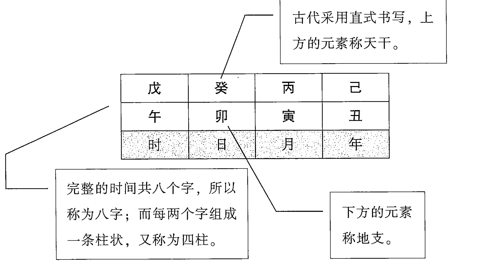

天干十个、地支十二个，按次序先后组合排列，总共有六十个不同的组合。

| 天干 | 1 | 2 | 3 | 4 | 5 | 6 | 7 | 8 | 9 | 10 | |
| :--- | :--- | :--- | :--- | :--- | :--- | :--- | :--- | :--- | :--- | :--- | :--- |
| | 甲 | 乙 | 丙 | 丁 | 戊 | 己 | 庚 | 辛 | 壬 | 癸 | |
| 地支 | 1 | 2 | 3 | 4 | 5 | 6 | 7 | 8 | 9 | 10 | 11 | 12 |
| | 子 | 丑 | 寅 | 卯 | 辰 | 巳 | 午 | 未 | 申 | 酉 | 戌 | 亥 |

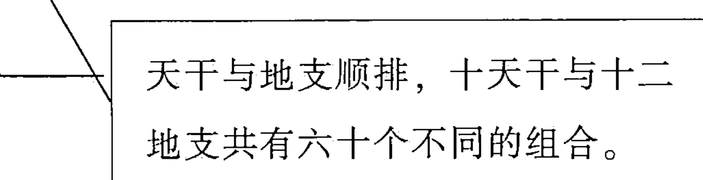

| 甲子旬 | 甲子 | 乙丑 | 丙寅 | 丁卯 | 戊辰 | 己巳 | 庚午 | 辛未 | 壬申 | 癸酉 |
| 甲戌旬 | 甲戌 | 乙亥 | 丙子 | 丁丑 | 戊寅 | 己卯 | 庚辰 | 辛巳 | 壬午 | 癸未 |
| 甲申旬 | 甲申 | 乙酉 | 丙戌 | 丁亥 | 戊子 | 己丑 | 庚寅 | 辛卯 | 壬辰 | 癸巳 |
| 甲午旬 | 甲午 | 乙未 | 丙申 | 丁酉 | 戊戌 | 己亥 | 庚子 | 辛丑 | 壬寅 | 癸卯 |
| 甲辰旬 | 甲辰 | 乙巳 | 丙午 | 丁未 | 戊申 | 己酉 | 庚戌 | 辛亥 | 壬子 | 癸丑 |
| 甲寅旬 | 甲寅 | 乙卯 | 丙辰 | 丁巳 | 戊午 | 己未 | 庚申 | 辛酉 | 壬戌 | 癸亥 |

#### 三、旬与旬空

##### 1. 旬

我们习惯把一个月分为三旬。即上、中、下三旬，一个月三十天，每旬正好十天。十天，十个天干循环刚好一个周期。

每一旬都有一个名称。由第一个天干甲及相应的地支作为该旬的名称，也即以每旬的第一组柱命名。有甲子层、甲戌层、甲申层、甲午层、甲辰层、甲寅层。共六层，即有六十个不同的组合，所以又叫六十甲子。

##### 2. 旬空

每十天为一旬，每天配一个天干，天干共十个，所以一旬刚好把十个天干用完；而每天也配一个地支，一旬十天只配去十个地支，这样，剩下的两个地支没天干配，这两个地支便叫旬空，或称空亡。

| 天干 | 1 | 2 | 3 | 4 | 5 | 6 | 7 | 8 | 9 | 10 | |
| --- | --- | --- | --- | --- | --- | --- | --- | --- | --- | --- | --- |
| | 甲 | 乙 | 丙 | 丁 | 戊 | 己 | 庚 | 辛 | 壬 | 癸 | |
| 地支 | 1 | 2 | 3 | 4 | 5 | 6 | 7 | 8 | 9 | 10 | 11 | 12 |
| | 子 | 丑 | 寅 | 卯 | 辰 | 巳 | 午 | 未 | 申 | 酉 | 戌 | 亥 |

甲子旬戌亥空亡

如上表，每旬以甲开始、癸结束。可以看到，在十个天干所组成的旬中，凡是癸后的两个地支便叫空亡；也可以反推，甲之前的两个地支也为空亡。

每旬中，以甲及其相配地支作为这一旬的命名。如甲子旬、甲戌旬、甲申旬、甲午旬、甲辰旬、甲寅旬。

甲子旬戌亥空亡，甲戌旬申酉空亡，甲申旬午未空亡，甲午旬辰巳空亡，甲辰旬寅卯空亡，甲寅旬子丑空亡。如下表：

| 旬 | 空亡 |
| --- | --- |
| 甲子 | 戌亥 |
| 甲戌 | 申酉 |
| 甲申 | 午未 |
| 甲午 | 辰巳 |
| 甲辰 | 寅卯 |
| 甲寅 | 子丑 |

#### 四、地支

##### 1. 代表时辰

在八字的时间记录上，把一天分为十二个时辰，每天二十四小时，所以每个时辰正好两个小时。共十二个地支，每个地支代表一个时辰。

1 天=12 时辰=24 小时
1 时辰=2 小时=120 分钟
每天第一个时辰是子时，按十二个地支顺推，最后一个是亥时：
子时→丑时→寅时→卯时→辰时→巳时→午时→未时→申时→酉时→戌时→亥时。
公历每天的交界时在零时零分，即零时零分之后进入第二天；而八字在二十三点零分钟进入第二天。

十二个时辰：
子时：23:00-01:00
丑时：01:00-03:00
寅时：03:00-05:00
卯时：05:00-07:00
辰时：07:00-09:00
巳时：09:00-11:00
午时：11:00-13:00
未时：13:00-15:00
申时：15:00-17:00
酉时：17:00-19:00
戌时：19:00-21:00
亥时：21:00-23:00

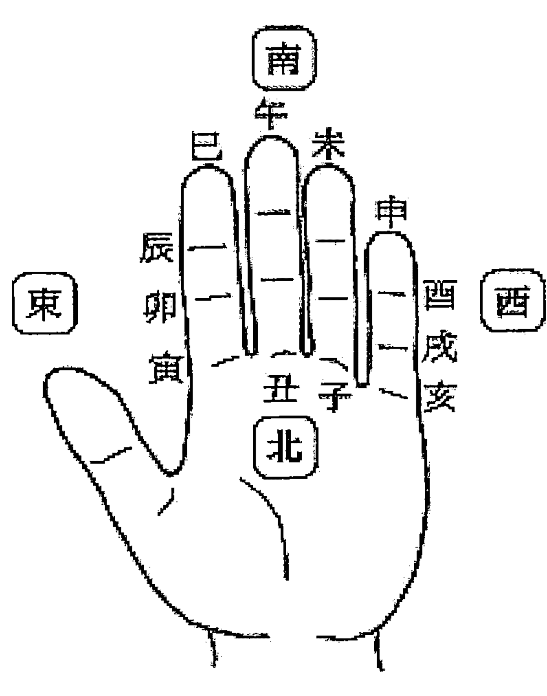

##### 2. 代表月建

一年共十二个月，分别用十二个地支去代表。正月建在寅、二月建在卯、三月建在辰、四月建在巳、五月建在午、六月建在未、七月建在申、八月建在酉、九月建在戌、十月建在亥、十一月建在子、十二月建在丑。
而八字中的月份，或者说命理预测中的月份，与公历及农历月份的起止都不一致，而是以二十四节气为分界。即节为每一个月的开始，气为每一个月的中间。如立春、惊蛰、清明、立夏…为节；雨水、春分、谷雨、小满…

为中气。立春是一月的开始、惊蛰为二月的开始、清明为三月的开始、立夏为四月的开始…如下：

| 月份 | 正月 | 二月 | 三月 | 四月 | 五月 | 六月 | 七月 | 八月 | 九月 | 十月 | 十一月 | 十二月 |
|---|---|---|---|---|---|---|---|---|---|---|---|---|
| 地支 | 寅 | 卯 | 辰 | 巳 | 午 | 未 | 申 | 酉 | 戌 | 亥 | 子 | 丑 |
| 节令 | 立春 | 惊蛰 | 清明 | 立夏 | 芒种 | 小暑 | 立秋 | 白露 | 寒露 | 立冬 | 大雪 | 小寒 |

节令的记忆口诀：春惊清明夏种暑，秋露寒冬大雪寒。
(春：立春；惊：惊蛰；清明：清明；夏：立夏；种：芒种；暑：小暑；秋：立秋；露：白露；寒：寒露；冬：立冬；大雪：大雪；寒：小寒。)
为了方便了解二十四节气，现将其全部列出。而在预测的过程中，很少用到中气：

| 月份 | 正月 | 二月 | 三月 | 四月 | 五月 | 六月 | 七月 | 八月 | 九月 | 十月 | 十一月 | 十二月 |
|---|---|---|---|---|---|---|---|---|---|---|---|---|
| 节令 | 立春 | 惊蛰 | 清明 | 立夏 | 芒种 | 小暑 | 立秋 | 白露 | 寒露 | 立冬 | 大雪 | 小寒 |
| 中气 | 雨水 | 春分 | 谷雨 | 小满 | 夏至 | 大暑 | 处暑 | 秋分 | 霜降 | 小雪 | 冬至 | 大寒 |

##### 3. 代表生肖

每个地支代表一个生肖，十二个地支代表十二个生肖。子肖老鼠、丑肖牛、寅肖老虎、卯肖兔、辰肖龙、巳肖蛇、午肖马、未肖羊、申肖猴、酉肖鸡、戌肖狗、亥肖猪。

| 地支 | 子 | 丑 | 寅 | 卯 | 辰 | 巳 | 午 | 未 | 申 | 酉 | 戌 | 亥 |
|---|---|---|---|---|---|---|---|---|---|---|---|---|
| 生肖 | 鼠 | 牛 | 虎 | 兔 | 龙 | 蛇 | 马 | 羊 | 猴 | 鸡 | 狗 | 猪 |

##### 4. 地支数序

地支根据其排序的先后，可以给予一个相对应的数字，也即排序。年序、月序、时序以十二为一个周期，较有规律，所以可以给予一定的数序，而日子以六十为一个周期，习惯上不给予一定的数序。

年序以子为始，以亥为终。所以子年数为 1、丑年数为 2、寅年数为 3、卯年数为 4、辰年数为 5、巳年数为 6、午年数为 7、未年数为 8、申年数为 9、酉年数为 10、戌年数为 11、亥年数为 12。

寅月是一年中的第一个月建，丑月是一年中最后的一个月建，所以月序以寅始，以丑为终。所以寅月数为 1、卯月数为 2、辰月数为 3、巳月数为 4、午月数为 5、未月数为 6、申月数为 7、酉月数为 8、戌月数为 9、亥月数为 10、子月数为 11、丑月数为 12。

子时是一天中第一个时辰，亥时是一天中最后一个时辰，所以时序以子为始，以亥为终。所以子时数为 1、丑时数为 2、寅时数为 3、卯时数为 4、辰时数为 5、巳时数为 6、午时数为 7、未时数为 8、申时数为 9、酉时数为 10、戌时数为 11、亥时数为 12。

年序数与时序数一致，月序数则相差 2。

| 数序 | 1 | 2 | 3 | 4 | 5 | 6 | 7 | 8 | 9 | 10 | 11 | 12 |
|---|---|---|---|---|---|---|---|---|---|---|---|---|
| 年支 | 子 | 丑 | 寅 | 卯 | 辰 | 巳 | 午 | 未 | 申 | 酉 | 戌 | 亥 |
| 时支 | 子 | 丑 | 寅 | 卯 | 辰 | 巳 | 午 | 未 | 申 | 酉 | 戌 | 亥 |
| 月支 | 寅 | 卯 | 辰 | 巳 | 午 | 未 | 申 | 酉 | 戌 | 亥 | 子 | 丑 |

##### 5. 代表方位

地支具有方向性。十二个地支有十二个不同的方向，其方向是固定不变的，而且带有绝对性。子在正北方，丑、寅在东北方，卯在正东方，辰、巳在东南方，午在正南方，未、申在西南方，酉在正西方，戌、亥在西北方。

从下图可以看到，十二个地支组成一个圆圈，子在正北、卯在正东、午在正南、酉在正西：

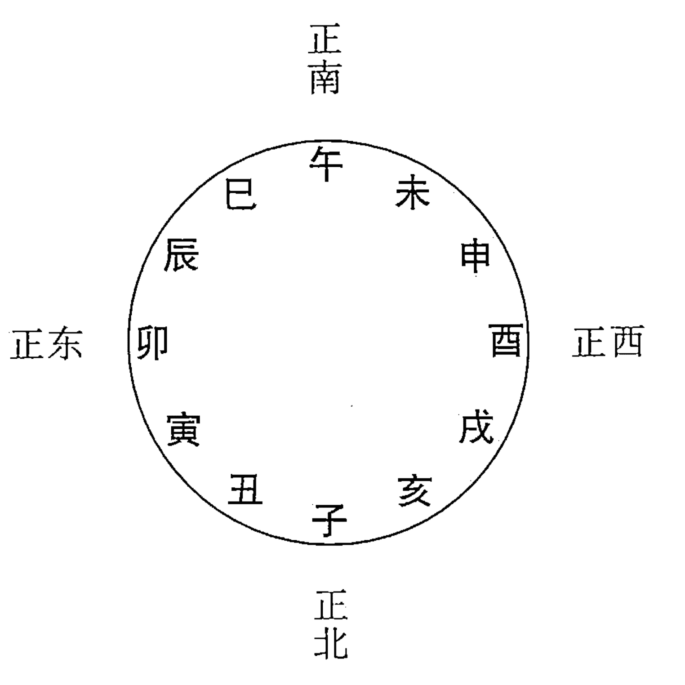

##### 6. 地支与手指

为了方便地支与天干组合变化的推算，我们习惯用自己的左手找出十二个点，分别代表十二个地支。以无名指第一节起子，顺时针推算。

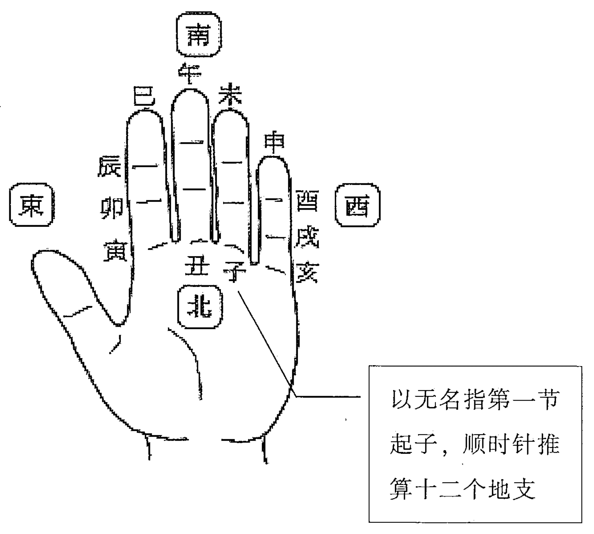

##### 总结：

| 地支 | 数序 | 月份 | 时辰 | 生肖 | 方位 | 相应节令 | 五行 | 阴阳 |
|---|---|---|---|---|---|---|---|---|
| 子 | 1/11 | 十一 | 23:00~01:00 | 鼠 | 北 | 大雪 | 水 | 阳 |
| 丑 | 2/12 | 十二 | 01:00~03:00 | 牛 | 东北 | 小寒 | 土 | 阴 |
| 寅 | 3/1 | 一 | 03:00~05:00 | 虎 | 东北 | 立春 | 木 | 阳 |
| 卯 | 4/2 | 二 | 05:00~07:00 | 兔 | 东 | 惊蛰 | 木 | 阴 |
| 辰 | 5/3 | 三 | 07:00~09:00 | 龙 | 东南 | 清明 | 土 | 阳 |
| 巳 | 6/4 | 四 | 09:00~11:00 | 蛇 | 东南 | 立夏 | 火 | 阴 |
| 午 | 7/5 | 五 | 11:00~13:00 | 马 | 南 | 芒种 | 火 | 阳 |
| 未 | 8/6 | 六 | 13:00~15:00 | 羊 | 西南 | 小暑 | 土 | 阴 |
| 申 | 9/7 | 七 | 15:00~17:00 | 猴 | 西南 | 立秋 | 金 | 阳 |
| 酉 | 10/8 | 八 | 17:00~19:00 | 鸡 | 西 | 白露 | 金 | 阴 |
| 戌 | 11/9 | 九 | 19:00~21:00 | 狗 | 西北 | 寒露 | 土 | 阳 |
| 亥 | 12/10 | 十 | 21:00~23:00 | 猪 | 西北 | 立冬 | 水 | 阴 |

例如：
公历：2010年9月7日 10:34。
农历：二零一零年七月二十九日巳时。
八字：庚寅年甲申月庚申日辛巳时。
命理用八字，而不是用公历或农历，所以：
寅年：数序为3 (从子数起)，生肖为虎，方位东北方，五行属木，特性属阳；
申月：数序为7 (从寅数起)，月份为七月，方位西南方，节令在立秋至白露之间，五行属金，特性属阳；
申日：数序为9 (从子数起)，方位西南方，五行属金，特性属阳；
巳时：数序为6 (从子数起)，时间从 09:00 至 11:00，方位东南方，五行属火，特性属阴。

注：地支在不同的年、月、日、时所代表的意义有所出入。

#### 五、时间的交接点(日、月、年)

初学者，很易被时间的交接点混淆。如日、月和年的交接点与我们平常习惯的理解有出入。

##### 1. 日的交接时间

公历：00:00 (零时零分) 为一天的交接时间。

农历：23:00 为一天的交接时间。也即 23 点后进入子时、为一日的开始。

八字：23:00 为一天的交接时间。也即 23 点后进入子时、为一日的开始，与农历的一致。

##### 2. 月的交接时间

公历：每逢 1 号都是月的开始。如 2 月 1 日为 2 月的开始。

农历：每逢初一都是月的开始。如二月初一为二月的开始。

八字：每逢节令都是月的开始。如惊蛰为二月的开始。

公历和农历月的开始较易理解，节令难理解些。节令的时间相对于公历，有机会在公历的 4 号，也有机会在 8 号及其两者之间等；而节令的时间相对于农历，有机会在初一至三十日之间的任何一天；公历的月交接时辰在零时零分，农历的月交接时辰在子时 (23:00)，而节令有机会在一天中的任何一个时刻。

如公历的 2010 年 7 月 1 日零时零分钟是 7 月的开始。落在农历的二零一零年五月二十日子时上；落在八字的庚寅年壬午月 (五月) 壬子日庚子时上。

如农历的二零一零年七月初一子时是七月的开始。落公历 2010 年 8 月 9 日 23:00 分钟上；落在八字庚寅年甲申月 (七月) 壬辰日庚子时上。

如八字的庚寅年甲申月 (二零一零年七月) 的开始。落公历 2010 年 8 月 7 日 22:49 分钟上；落在农历的二零一零年六月二十七日亥时上。

##### 3. 年的交接时间

**公历：** 每逢 1 月 1 日便是新一年的开始。如公历 2011 年 1 月 1 日是 2011 年开始的第一天。

**农历：** 每逢正月的初一便是新一年的开始。如农历二零一一年正月初一是二零一一年开始的一天。

**八字：** 每逢立春便是新一年的开始。也即以寅月为本年的第一个月，注意，并不是子月为一年的第一个月。如公历 2011 年 2 月 4 日或农历二零一一年正月初二 (立春) 是八字辛卯年开始的第一天。

#### 六、太阳时

我们在八字或农历的时间上，习惯把一天分为十二等份，也即十二个时辰，十二个时辰地球刚好自转一周。我们利用太阳与地球之间的不同角度来划分及记录时间，古代人利用太阳照射到地球产生的投影，一天中以影子最短的一刻为正午时。地球是圆的，当某一地点为正午的时候，也证明了这个地点在当天中，此刻离太阳的距离最近；相反，如果是正子时，此刻离太阳的距离最远。所以时辰是指地球上的某一点与太阳所产生的角度。

正午前一小时及后一小时的范围称为午时。以此为基准，再推算出其它十一个时辰。我们称以这种方法推算出的时间为太阳时。

如果在香港为正午时的时候，其太阳的投影已是最短，而同时在中国的新疆，其太阳的影子还拉得很长，象香港上午九点多钟的太阳，还要过两个多小时，其太阳的投影才达到最短。这便出现了时差问题，两地的钟点一样，都用北京时间，而实际在时辰上却出现了误差。

一个国家无论多大，都只能用一个时区的标准时间，不可能同时用几个时区的时间，只要有利于管理，及有利于人们的交往，我们称这个时间为行政管理时间。中国北京时间以东经 120 度的时区为标准，也是说以东经 120 度的太阳时为标准时间，作为国家的行政管理时间。东经 120 度以外的中国地区，可以此为标准进行换算找出太阳时。

地球自转的度数称为经度。自转一周可分为 360 度，每天自转一周要 24 小时。可以通过换算得：

1 天 = 24 小时 × 60 分钟/小时 = 1440 分钟
地球 1 天自转 360 度，
所以：
1 度 = 1440 分钟 ÷ 360 度 = 4 分钟/度

在换算时辰时，以时区的经度为标准，往西的地区用减法获得相应的太阳时，即减去两地区的度数差；往东的地区用加法获得相应的太阳时，即加上两地区的度数差。

严格地说，同一个经度，因落在不同的纬度 (经度是地球的东西走向点，纬度是地球的南北走向点)，其时差也有出入；同一地点在不同的季节、日子，其时差也有出入。这与地球自转、公转的角度有关。在此不作太过深入的研究。

例如：

如果你的手表用的是北京时间 (东经 120 度时区)，现在手表时为 12:00:00 (12 点 0 分 0 秒)，而你现在正在新疆省乌鲁木齐市，查得乌鲁木齐东经约87.6 度，其太阳时的时差为：

(87.6-120) 度 × 4 分钟/度 = -129.6 分钟 (差 2 小时 9 分钟 36 秒)
因相差-129.6 分钟，即乌鲁木齐的太阳时间约为 09:50:24 (9 点 50 分钟 24 秒)。

如果同一时间在香港，查得东经约 114 度，其太阳时的时差为：
(114-120) 度 × 4 分钟/度 = -24 分钟
因相差-24 分钟，即香港的太阳时间约为 11:36:00 (11 点 36 分 0 秒)。

如果同一时间在黑龙江省的哈尔滨市，查得哈尔滨东经约 126.6 度，其太阳时的时差为：
(126.6-120) 度 × 4 分钟/度 = 26.4 分钟 (26 分钟 24 秒)
因相差 26.4 分钟，即哈尔滨的太阳时间约为 12:26:24 (12 点 26 分钟 24 秒)。

东西半球时差太阳时的换算法则：往西减去时区差，往东加上时区差。

##### 北京时区的东西半球时差

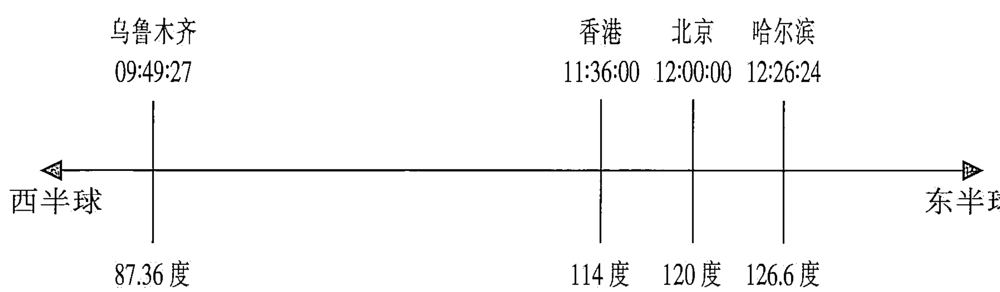

### 第二章 查万年历

#### 一、时间转换

##### 1. 时间转换

万年历的目的，便是将时间互相转换。我们现在常用的年、月、日时间，只要是使用公历和农历，而在预测的过程中，只要是以八字为依据。通过万年历，将农历时间或公历时间转换为八字。当然，只要知道公历、农历或八字的其中一个时间，都可以互相转换。

现代很多人都误以为，算命一定要用农历时间。其实算命不是用农历时间，也不是用公历时间，而是用四柱（或称八字）时间。四柱其实是一个独立的时间，与农历不是等量关系。只是我们平时习惯用公历时间或农历时间，然后通过万年历把公历、农历或四柱互相转换。

另外，有很多人误以为农历的月份等于四柱中的月份，这也是一个很大的错误，包括一些术数师傅在内。他们觉得四柱是中国发明的，所以四柱中的月份以农历时间为标准，即农历的正月初一误以为是四柱一月份的开始，农历的二月初一误以为是四柱二月的开始。其实四柱中无论年和月都以节气中的节为标准。如四柱以立春为年的开始，也是一月的开始，并非农历的正月初一。

请看 2009 年及 2010 年的万年历：

##### 2009 己丑 牛年

小寒为节令，农历廿一 19:09 进入小寒，是八字十一月的开始。

十一月小 丙子

十二月大 丁丑

冬至 初七 丑时 01:47

小寒 廿一 戌时 19:09

大寒 初六 午时 12:28

立春 廿一 卯时 06:48

初一，是农历月份的开始

农历廿一 06:48 分立春，是八字二零一零年寅月的开始

1月1日是公历新年的开始

1日是公历月份的开始

中文数字代表农历的日

阿拉伯数字代表公历，左边的数字为月，右边的数字为日

干支分别代表八字时间的日柱

| 月 | 日 | 干支 | 月 | 日 | 干支 | 农历 |
|---|---|---|---|---|---|---|
| 12 | 16 | 乙未 | 1 | 15 | 乙丑 | 初一 |
| 12 | 17 | 丙申 | 1 | 16 | 丙寅 | 初二 |
| 12 | 18 | 丁酉 | 1 | 17 | 丁卯 | 初三 |
| 12 | 19 | 戊戌 | 1 | 18 | 戊辰 | 初四 |
| 12 | 20 | 己亥 | 1 | 19 | 己巳 | 初五 |
| 12 | 21 | 庚子 | 1 | 20 | 庚午 | 初六 |
| 12 | 22 | 辛丑 | 1 | 21 | 辛未 | 初七 |
| 12 | 23 | 壬寅 | 1 | 22 | 壬申 | 初八 |
| 12 | 24 | 癸卯 | 1 | 23 | 癸酉 | 初九 |
| 12 | 25 | 甲辰 | 1 | 24 | 甲戌 | 初十 |
| 12 | 26 | 乙巳 | 1 | 25 | 乙亥 | 十一 |
| 12 | 27 | 丙午 | 1 | 26 | 丙子 | 十二 |
| 12 | 28 | 丁未 | 1 | 27 | 丁丑 | 十三 |
| 12 | 29 | 戊申 | 1 | 28 | 戊寅 | 十四 |
| 12 | 30 | 己酉 | 1 | 29 | 己卯 | 十五 |
| 12 | 31 | 庚戌 | 1 | 30 | 庚辰 | 十六 |
| 1 | 1 | 辛亥 | 1 | 31 | 辛巳 | 十七 |
| 1 | 2 | 壬子 | 2 | 1 | 壬午 | 十八 |
| 1 | 3 | 癸丑 | 2 | 2 | 癸未 | 十九 |
| 1 | 4 | 甲寅 | 2 | 3 | 甲申 | 二十 |
| 1 | 5 | 乙卯 | 2 | 4 | 乙酉 | 廿一 |
| 1 | 6 | 丙辰 | 2 | 5 | 丙戌 | 廿二 |
| 1 | 7 | 丁巳 | 2 | 6 | 丁亥 | 廿三 |
| 1 | 8 | 戊午 | 2 | 7 | 戊子 | 廿四 |
| 1 | 9 | 己未 | 2 | 8 | 己丑 | 廿五 |
| 1 | 10 | 庚申 | 2 | 9 | 庚寅 | 廿六 |
| 1 | 11 | 辛酉 | 2 | 10 | 辛卯 | 廿七 |
| 1 | 12 | 壬戌 | 2 | 11 | 壬辰 | 廿八 |
| 1 | 13 | 癸亥 | 2 | 12 | 癸巳 | 廿九 |
| 1 | 14 | 甲子 | 2 | 13 | 甲午 | 三十 |

##### 2010 庚寅 虎年

| 正月大 戊寅 | 二月小 己卯 |
|---|---|
| 雨水 初六 丑时 02:36 | 惊蛰 廿一 子时 00:46 | 春分 初六 丑时 01:32 | 清明 廿一 卯时 05:30 |
| 初一 | 2 | 14 | 乙未 | 3 | 16 | 乙丑 |
| 初二 | 2 | 15 | 丙申 | 3 | 17 | 丙寅 |
| 初三 | 2 | 16 | 丁酉 | 3 | 18 | 丁卯 |
| 初四 | 2 | 17 | 戊戌 | 3 | 19 | 戊辰 |
| 初五 | 2 | 18 | 己亥 | 3 | 20 | 己巳 |
| 初六 | 2 | 19 | 庚子 | 3 | 21 | 庚午 |
| 初七 | 2 | 20 | 辛丑 | 3 | 22 | 辛未 |
| 初八 | 2 | 21 | 壬寅 | 3 | 23 | 壬申 |
| 初九 | 2 | 22 | 癸卯 | 3 | 24 | 癸酉 |
| 初十 | 2 | 23 | 甲辰 | 3 | 25 | 甲戌 |
| 十一 | 2 | 24 | 乙巳 | 3 | 26 | 乙亥 |
| 十二 | 2 | 25 | 丙午 | 3 | 27 | 丙子 |
| 十三 | 2 | 26 | 丁未 | 3 | 28 | 丁丑 |
| 十四 | 2 | 27 | 戊申 | 3 | 29 | 戊寅 |
| 十五 | 2 | 28 | 己酉 | 3 | 30 | 己卯 |
| 十六 | 3 | 1 | 庚戌 | 3 | 31 | 庚辰 |
| 十七 | 3 | 2 | 辛亥 | 4 | 1 | 辛巳 |
| 十八 | 3 | 3 | 壬子 | 4 | 2 | 壬午 |
| 十九 | 3 | 4 | 癸丑 | 4 | 3 | 癸未 |
| 二十 | 3 | 5 | 甲寅 | 4 | 4 | 甲申 |
| 廿一 | 3 | 6 | 乙卯 | 4 | 5 | 乙酉 |
| 廿二 | 3 | 7 | 丙辰 | 4 | 6 | 丙戌 |
| 廿三 | 3 | 8 | 丁巳 | 4 | 7 | 丁亥 |
| 廿四 | 3 | 9 | 戊午 | 4 | 8 | 戊子 |
| 廿五 | 3 | 10 | 己未 | 4 | 9 | 己丑 |
| 廿六 | 3 | 11 | 庚申 | 4 | 10 | 庚寅 |
| 廿七 | 3 | 12 | 辛酉 | 4 | 11 | 辛卯 |
| 廿八 | 3 | 13 | 壬戌 | 4 | 12 | 壬辰 |
| 廿九 | 3 | 14 | 癸亥 | 4 | 13 | 癸巳 |
| 三十 | 3 | 15 | 甲子 | | | |

> 正月初一，是农历新年的开始

例如：
已知公历时间为 2010 年 1 月 5 日 19 时 01 分钟，通过万年历转换成农历或八字：

**A. 转换成农历：**
二零零九年：还在二零零九年的页数上，而且还在十一月份的下旬。
十一月：我们可以看到 1 月 5 日在十一月份的栏中。
廿一日：从 1 月 5 日向右方水平看齐，见到“廿一”。
戌时：19:00 至 21:00 为戌时。
整个农历时间为：二零零九年十一月廿一日戌时。

**B. 转换成八字：**
己丑年：在己丑年立春之后，庚寅年立春之前。
丙子月：在节令大雪之后，小寒之前，还未进入丑月。
乙卯日：1 月 5 日 23:00 前都为乙卯日。
丙戌时：19:00 至 21:00 为戌时。乙日戌时的天干纳“丙”（可参考“八字纳干”法）。
整个八字时间为：己丑年丙子月乙卯日丙戌时。

例如：
已知农历时间为二零零九年十一月廿一日 19 时 09 分钟，通过万年历转换成公历或八字：

**A. 转换成公历：**
2010 年：已经过了公历的 1 月 1 日，进入了 2010 年。
1 月：我们可以看到在农历的十一月份栏中与廿一日平齐有“1”和“5”。左边的阿拉伯数字“1”代表公历的月份。
5 日：从廿一日向左方水平看齐，见到“1”和“5”。右边的阿拉伯数字“5”代表公历的日数。
19:09：已知。
整个公历时间为：2010 年 1 月 5 日 19 时 09 分钟。

##### B. 转换成八字：

己丑年：在己丑年立春之后，庚寅年立春之前。
丁丑月：小寒为丑月的开始，现在小寒节令之后，刚踏进入丑月。
乙卯日：1月5日23:00前都为乙卯日。
丙戌时：19:00至21:00为戌时。乙日戌时，时的天干纳“丙”（可参考“八字纳干”法）。
整个八字时间为：己丑年丁丑月乙卯日丙戌时。
以上两个公历时间只相差八分钟，农历的时间记录没变化，而八字的月份时间已前进了一个月，其年、日、时三条柱的时间都不变；公历的年、月、日没变化。

例如：
已知公历时间为2010年2月4日06时50分钟，通过万年历转换成农历或八字：

##### A. 转换成农历：

二零零九年：还在二零零九年的页数上，而且还在十二月份的下旬。
十二月：我们可以看到2月4日在十二月份的栏中。
廿一日：从2月4日向右方水平看齐，见到“廿一”。
卯时：05:00至07:00为卯时。
整个农历时间为：二零零九年十二月廿一日卯时。

##### B. 转换成八字：

庚寅年：06时48分已踏入立春，已是新一年的开始。
戊寅月：立春是寅月节令的开始，也是一年的第一个月份。从2010年的页面上方看到“正月大”与“戊寅”同栏，从中得知“寅”月的纳干为“戊”。
乙酉日：2月4日上正与乙酉日相并列。
己卯时：05:00至07:00为卯时。乙日卯时，时的天干纳“己”（可参考“八字纳干”法）。
整个八字时间为：庚寅年戊寅月乙酉日己卯时。

例如：
已知公历 2010 年 2 月 13 日 23:01，通过万年历转换成农历或八字：

##### A. 转换成农历：

二零一零年：23:01 已踏入子时，也即是正月初一的开始，正月初一是农历年新年的开始。
正月：2 月 13 日 23:00 前是十二月三十日，23:00 后已进入第二天，也即是正月初一。
初一：解释同上。
子时：23:00 至 01:00 为子时。
整个农历时间为：二零一零年正月（一月）初一子时。

##### B. 转换成八字：

庚寅年：公历 2 月 4 日立春便开始进入庚寅年。
戊寅月：公历 2 月 4 日立春便开始进入寅月的节令，至惊蛰前都是寅月。从2010 年的页面上方看到“正月大”与“戊寅”栏，得知“寅”月的纳干为“戊”。
乙未日：23:00 后已进入第二天。
丙子时：23:00 至 01:00 为子时。乙日子时，时的天干纳“丙”。
整个八字时间为：庚寅年戊寅月乙未日丙子时。

#### 二、八字纳干

##### 1. 日上起时干法

日柱的干支，一般要经过万年历查得，但时上的天干在万年历上没办法查。通过已知的日干去查时干的方法，叫五鼠遁日法。鼠即是“子”之意，子属阳支，与子组合的天干只有甲、丙、戊、庚、壬五个，所以又称五鼠。
八字有四组时间元素组成，即年柱、月柱、日柱和时柱，而每一组时间都有机会由六十甲子中的其中一组时间单位组成，他们也都顺着这六十组时间不断地循环重复使用。如年份每六十年便重复一遍，年过花甲，便是六十甲子已行完一遍，指人已超过六十岁的意思；同理月柱的干支每六十个月循环一周，日柱的干支每六十日循环一周，时柱的干支每六十个时辰循环一周。

通过年、月、日、时都是每行六十个时间单位便重复一遍的规律，我们可以根据已知年柱的天干去推算月份的天干，或根据已知日柱的天干去推算时柱的天干。

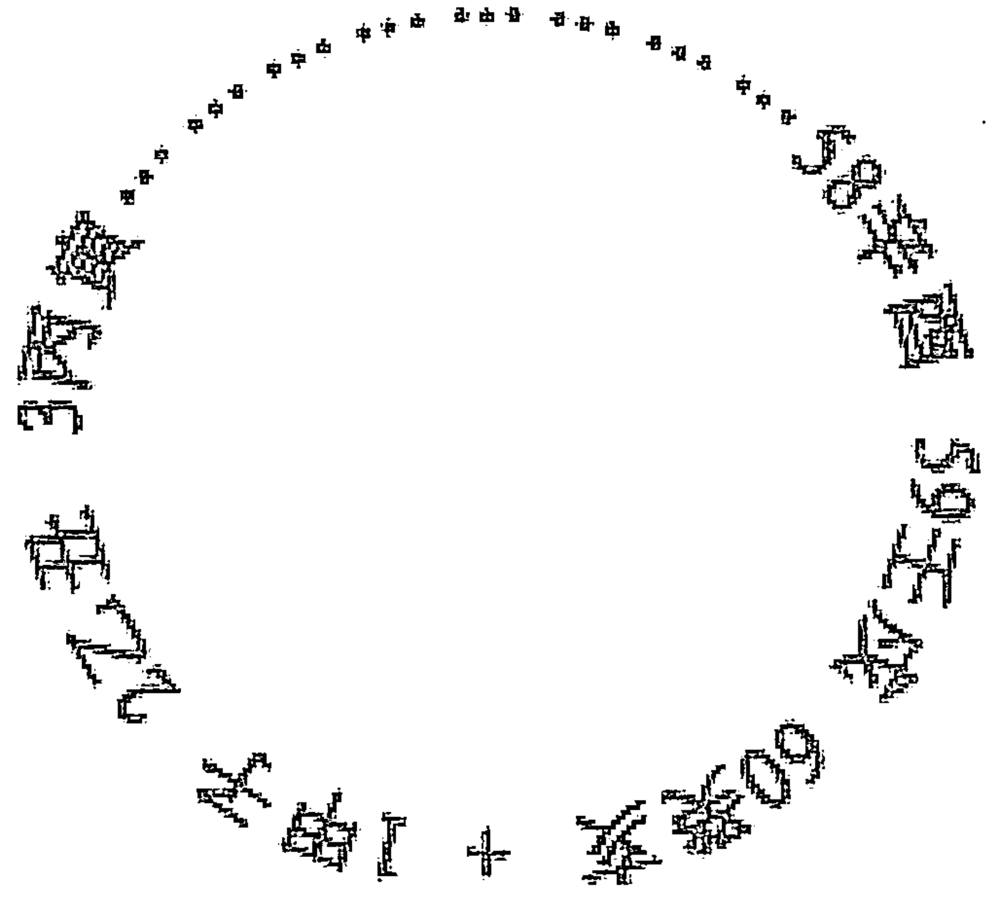

六十甲子循环一周共代表六十个时间单位。
如六十个时辰、六十日、六十个月、六十年。

每日十二个时辰，十二个时辰刚好配完十二个地支，即地支每日循环一周。五日共六十个时辰，六十组干支刚好行完一周，即每五日干支循环一周，每十日循环两周。地支较天干有规律。

- 1 日=12 个时辰，十二地支循环一周。
- 5 日=60 个时辰，60 甲子循环 1 周。
- 10 日=120 时辰，60 甲子循环 2 周…

甲为第一个天干元素，子为第一个地支元素，第一天应配“甲子”日，而第一个时辰便配“甲子”时。

请看下表：

六爻预测入门

| | 1 | 2 | 3 | 4 | 5 | 6 | 7 | 8 | 9 | 10 | 11 | 12 |
|---|---|---|---|---|---|---|---|---|---|---|---|---|
| 第1天 | 甲子日 | 甲子时 | 乙丑时 | 丙寅时 | 丁卯时 | 戊辰时 | 己巳时 | 庚午时 | 辛未时 | 壬申时 | 癸酉时 | 甲戌时 | 乙亥时 |
| 第2天 | 乙丑日 | 丙子时 | 丁丑时 | 戊寅时 | 己卯时 | 庚辰时 | 辛巳时 | 壬午时 | 癸未时 | 甲申时 | 乙酉时 | 丙戌时 | 丁亥时 |
| 第3天 | 丙寅日 | 戊子时 | 己丑时 | 庚寅时 | 辛卯时 | 壬辰时 | 癸巳时 | 甲午时 | 乙未时 | 丙申时 | 丁酉时 | 戊戌时 | 己亥时 |
| 第4天 | 丁卯日 | 庚子时 | 辛丑时 | 壬寅时 | 癸卯时 | 甲辰时 | 乙巳时 | 丙午时 | 丁未时 | 戊申时 | 己酉时 | 庚戌时 | 辛亥时 |
| 第5天 | 戊辰日 | 壬子时 | 癸丑时 | 甲寅时 | 乙卯时 | 丙辰时 | 丁巳时 | 戊午时 | 己未时 | 庚申时 | 辛酉时 | 壬戌时 | 癸亥时 |

第一天最后一个时辰和第二天第一个时辰连接，余仿此

从子到亥共十二个地支，每天循环一周

从甲子至癸亥共六十个时间单位，每五天循环一周，每十天循环两周

第六天的时柱再从甲子起顺排

| | 1 | 2 | 3 | 4 | 5 | 6 | 7 | 8 | 9 | 10 | 11 | 12 |
|---|---|---|---|---|---|---|---|---|---|---|---|---|
| 第6天 | 己巳日 | 甲子时 | 乙丑时 | 丙寅时 | 丁卯时 | 戊辰时 | 己巳时 | 庚午时 | 辛未时 | 壬申时 | 癸酉时 | 甲戌时 | 乙亥时 |
| 第7天 | 庚午日 | 丙子时 | 丁丑时 | 戊寅时 | 己卯时 | 庚辰时 | 辛巳时 | 壬午时 | 癸未时 | 甲申时 | 乙酉时 | 丙戌时 | 丁亥时 |
| 第8天 | 辛未日 | 戊子时 | 己丑时 | 庚寅时 | 辛卯时 | 壬辰时 | 癸巳时 | 甲午时 | 乙未时 | 丙申时 | 丁酉时 | 戊戌时 | 己亥时 |
| 第9天 | 壬申日 | 庚子时 | 辛丑时 | 壬寅时 | 癸卯时 | 甲辰时 | 乙巳时 | 丙午时 | 丁未时 | 戊申时 | 己酉时 | 庚戌时 | 辛亥时 |
| 第10天 | 癸酉日 | 壬子时 | 癸丑时 | 甲寅时 | 乙卯时 | 丙辰时 | 丁巳时 | 戊午时 | 己未时 | 庚申时 | 辛酉时 | 壬戌时 | 癸亥时 |

己日的十二个时辰干支与甲日的一样。其余庚、辛、壬、癸的类推

74

五个日柱（甲子日、乙丑日、丙寅日、丁卯日、戊辰日）的时辰，便把甲子至癸亥的六十个单元行完一周，而日柱只行了五个天干（甲、乙、丙、丁、戊），天干十个，还有五个天干未行。于是第 6 天的时柱再从甲子起顺排，第 10 天的最后一个时辰为癸亥，“癸亥”为六十甲子中最后一个时间单位。到第 11 天便和第 1 天一样，第一个时辰用甲子时。即第 11 天的时柱纳干和第 1 天的一样，第 12 天的时柱纳干和第 2 天的一样……依此类推。

可以归类：

- 第 1 天甲日干，其第一个时干为甲，即甲子时；
- 第 2 天乙日干，其第一个时干为丙，即丙子时；
- 第 3 天丙日干，其第一个时干为戊，即戊子时；
- 第 4 天丁日干，其第一个时干为庚，即庚子时；
- 第 5 天戊日干，其第一个时干为壬，即壬子时；
- 第 6 天己日干，纳干与第 1 天相同，即甲子时；
- 第 7 天庚日干，纳干与第 2 天相同，即丙子时；
- 第 8 天辛日干，纳干与第 3 天相同，即戊子时；
- 第 9 天壬日干，纳干与第 4 天相同，即庚子时；
- 第 10 天癸日干，纳干与第 5 天相同，即壬子时。

如此类推，周而复始。

| 日干 | 第一时柱 |
| :--- | :--- |
| 1. 甲 6. 己 | 甲子 |
| 2. 乙 7. 庚 | 丙子 |
| 3. 丙 8. 辛 | 戊子 |
| 4. 丁 9. 壬 | 庚子 |
| 5. 戊 10. 癸 | 壬子 |

从上两个表可以看到，日干和时干有一定的规律：

甲日、己日干的第一个时柱为甲子时；
乙日、庚日干的第一个时柱为丙子时；
丙日、辛日干的第一个时柱为戊子时；
丁日、壬日干的第一个时柱为庚子时；
戊日、癸日干的第一个时柱为壬子时。
子时为一日的第一个时辰，只要记住第一个时辰，其余的时辰便可以通过自己的左手掌进行顺时针推算。

例如：
已知庚寅年壬午月乙卯日的戌时，求其戌时要配的天干：
从前面的表查得乙日的第一个时柱为丙子，把天干“丙”与地支“子”重迭组成丙子时，然后分别顺时针推算：

| 丙子时 | 丁丑时 | 戊寅时 | 己卯时 | 庚辰时 | 辛巳时 | 壬午时 | 癸未时 | 甲申时 | 乙酉时 | 丙戌时 |
| :---: | :---: | :---: | :---: | :---: | :---: | :---: | :---: | :---: | :---: | :---: |

所以得出乙卯日丙戌时。
我们还可发现一个规律，从子顺数到酉为第十个地支，天干刚行完一周。成为第十一个地支，天干会重新开始，即子的天干和戌的天干是一样的。

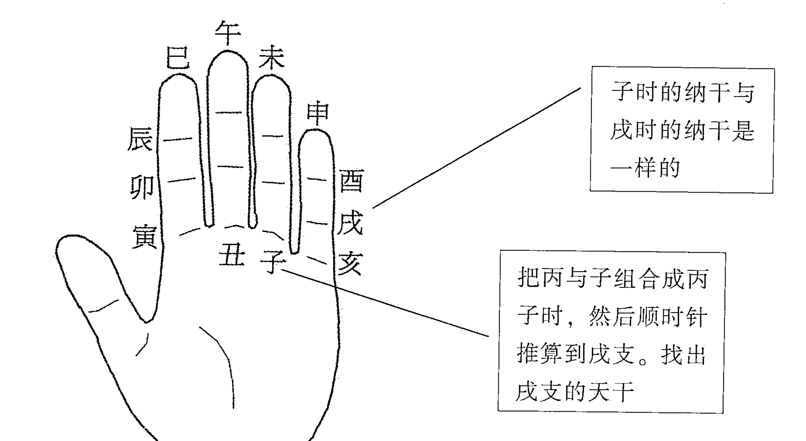

从上表中还可寻找一些规律，十个天干，甲、丙、戊、庚、壬共五个为都单数、属阳，乙、丁、己、辛、癸为双数属阴；而第一个时辰为“子”单数、属阳，阳干与阳支相配或者说单数与单数相配，可以得出第一个时柱只有五种机会：甲子、丙子、戊子、庚子、壬子。十个天干，只取其五个阳干与子相组合，而且顺时针推算。

| 1 | 2 | 3 | 4 | 5 | 6 | 7 | 8 | 9 | 10 |
|---|---|---|---|---|---|---|---|---|----|
| 甲 | 乙 | 丙 | 丁 | 戊 | 己 | 庚 | 辛 | 壬 | 癸 |

日干的数序1与6、2与7、3与8、4与9、5与10，其时支的纳干是一样。

还有一个规律：1与6合，即甲己合；2与7合，即乙庚合；3与8合，即丙与辛合；4与9合，即丁与壬合；5与10合，即戊与癸合。（可参考“天干相合”章节）

日上起时干口诀：

> 甲己还加甲 乙庚丙作初
> 丙辛从戊起 丁壬庚子居
> 戊癸何方发 壬子是真途

“甲己还加甲”是指逢甲日干或己日干，第一个时柱为“甲子”时；“乙庚丙作初”是指逢乙日干或庚日干，第一个时柱为“丙子”时；“丙辛从戊起”是指逢丙日干或辛日干，第一个时柱为“戊子”时；“丁壬庚子居”是指逢丁日干或壬日干，第一个时柱为“庚子”时；“戊癸何方发，壬子是真途”是指逢戊日干或癸日干，第一个时柱为“壬子”时。

如上一例是乙卯日，根据口诀“乙庚丙作初”，得第一个时辰为“丙子”时。

##### 2. 年上起月干法

年上起月干法与日上起时干法基本一致。不同之处是，时辰的第一个地支从子起，而月令的第一个地支从寅起，相差两个位置。通过已知的年干去查月干的方法，叫五虎遁月法。虎即是“寅”之意，寅属阳支，与寅组合的天干只有甲、丙、戊、庚、壬五个，组成甲寅、丙寅、戊寅、庚寅，所以又称五虎。

第一个时间单位为“甲子”，所以第一年为甲子年，同样道理，第一个月为甲子月。而寅月才是一年的开始，在甲子月的基础上再向前推两步：
甲子月→乙丑月→丙寅月
所以甲子年的第一个月为丙寅月。

| | | 1 | 2 | 3 | 4 | 5 | 6 | 7 | 8 | 9 | 10 | 11 | 12 |
|---|---|---|---|---|---|---|---|---|---|---|---|---|---|
| 第1年 | 甲子年 | 丙寅月 | 丁卯月 | 戊辰月 | 己巳月 | 庚午月 | 辛未月 | 壬申月 | 癸酉月 | 甲戌月 | 乙亥月 | 丙子月 | 丁丑月 |
| 第2年 | 乙丑年 | 戊寅月 | 己卯月 | 庚辰月 | 辛巳月 | 壬午月 | 癸未月 | 甲申月 | 乙酉月 | 丙戌月 | 丁亥月 | 戊子月 | 己丑月 |
| 第3年 | 丙寅年 | 庚寅月 | 辛卯月 | 壬辰月 | 癸巳月 | 甲午月 | 乙未月 | 丙申月 | 丁酉月 | 戊戌月 | 己亥月 | 庚子月 | 辛丑月 |
| 第4年 | 丁卯年 | 壬寅月 | 癸卯月 | 甲辰月 | 乙巳月 | 丙午月 | 丁未月 | 戊申月 | 己酉月 | 庚戌月 | 辛亥月 | 壬子月 | 癸丑月 |
| 第5年 | 戊辰年 | 甲寅月 | 乙卯月 | 丙辰月 | 丁巳月 | 戊午月 | 己未月 | 庚申月 | 辛酉月 | 壬戌月 | 癸亥月 | 甲子月 | 乙丑月 |

五年共六十个月，便把丙寅至乙丑的六十个单元行完一周，而年的天干只行了五个，天干共十个，还有五个年的天干未行。于是第六年的月柱再从丙寅起顺排：

| | 1 | 2 | 3 | 4 | 5 | 6 | 7 | 8 | 9 | 10 | 11 | 12 |
|---|---|---|---|---|---|---|---|---|---|---|---|---|
| 第6年 己巳年 | 丙寅月 | 丁卯月 | 戊辰月 | 己巳月 | 庚午月 | 辛未月 | 壬申月 | 癸酉月 | 甲戌月 | 乙亥月 | 丙子月 | 丁丑月 |
| 第7年 庚午年 | 戊寅月 | 己卯月 | 庚辰月 | 辛巳月 | 壬午月 | 癸未月 | 甲申月 | 乙酉月 | 丙戌月 | 丁亥月 | 戊子月 | 己丑月 |
| 第8年 辛未年 | 庚寅月 | 辛卯月 | 壬辰月 | 癸巳月 | 甲午月 | 乙未月 | 丙申月 | 丁酉月 | 戊戌月 | 己亥月 | 庚子月 | 辛丑月 |
| 第9年 壬申年 | 壬寅月 | 癸卯月 | 甲辰月 | 乙巳月 | 丙午月 | 丁未月 | 戊申月 | 己酉月 | 庚戌月 | 辛亥月 | 壬子月 | 癸丑月 |
| 第10年 癸酉年 | 甲寅月 | 乙卯月 | 丙辰月 | 丁巳月 | 戊午月 | 己未月 | 庚申月 | 辛酉月 | 壬戌月 | 癸亥月 | 甲子月 | 乙丑月 |

> 己年的十二个月令干支与甲年的一样。其余庚、辛、壬、癸年的类推

| 年干 | 第一月柱 |
|---|---|
| 1. 甲 6. 己 | 丙寅 |
| 2. 乙 7. 庚 | 戊寅 |
| 3. 丙 8. 辛 | 庚寅 |
| 4. 丁 9. 壬 | 壬寅 |
| 5. 戊 10. 癸 | 甲寅 |

年上起月干与日上起时干的原理一样，所以不再细述。

年上起月干口诀：

甲己之年丙作初 乙庚之年戊为头
丙辛之岁从庚上 丁壬壬寅顺水流
戊癸之岁何方发 甲寅之上好追求

年上起月干与日上起时干只差两条柱，只要记住其中一种方法即可：

甲日第一柱时柱为甲子时。

甲年第一柱月柱为丙寅月。与甲日的差两柱。

| 1 | 2 | 3 | 4 | 5 | ... |
|---|---|---|---|---|---|
| 甲子 | 乙丑 | 丙寅 | 丁卯 | 戊辰 | ... |

### 第三章 五行

#### 一、阴阳

##### 1. 阴阳的特征

阴阳是中国古代哲学的重要思想之一，把事物按其对立的属性分为阴、阳两大类。阴阳是互相对立、互相依赖而又互相统一的事物，在某条件下又会互相转化。广泛地表现在自然现象和人士关系上。如阳表现为光、热、动、男、君、高、积极等状态，如阴则与阳相对，表现为暗、冷、静、女、民、低、消极等状态。

| 现象 | 阳 | 阴 | 现象 | 阳 | 阴 |
| :--- | :--- | :--- | :--- | :--- | :--- |
| 自然现象 | 暖 | 冷 | 人事现象 | 男 | 女 |
| | 天 | 地 | | 少 | 老 |
| | 暑 | 寒 | | 贵 | 贱 |
| | 上 | 下 | | 官 | 民 |
| | 左 | 右 | | 君子 | 小人 |
| | 长 | 短 | | 健康 | 疾病 |
| | 快 | 慢 | | 生 | 死 |
| | 动 | 静 | | 快乐 | 忧愁 |
| | 外 | 内 | | 爱 | 恨 |
| | 日 | 月 | | 心 | 肝 |

##### 2. 地支的阴阳

地支共十二个，按数序排列为 1 至 12，共六个单数、六个双数。我们知道单数为阳、双数为阴。

| 阴阳 | 阳 | 阴 | 阳 | 阴 | 阳 | 阴 | 阳 | 阴 | 阳 | 阴 | 阳 | 阴 |
|---|---|---|---|---|---|---|---|---|---|---|---|---|
| 数序 | 1 | 2 | 3 | 4 | 5 | 6 | 7 | 8 | 9 | 10 | 11 | 12 |
| 地支 | 子 | 丑 | 寅 | 卯 | 辰 | 巳 | 午 | 未 | 申 | 酉 | 戌 | 亥 |

六个阳支：子 1、寅 3、辰 5、午 7、申 9、戌 11。
六个阴支：丑 2、卯 4、巳 6、未 8、酉 10、亥 12。

##### 3. 天干的阴阳

天干共十个，按数序排列为 1 至 10，共五个单数、五个双数。我们知道单数为阳、双数为阴。

| 阴阳 | 阳 | 阴 | 阳 | 阴 | 阳 | 阴 | 阳 | 阴 | 阳 | 阴 |
|---|---|---|---|---|---|---|---|---|---|---|
| 数序 | 1 | 2 | 3 | 4 | 5 | 6 | 7 | 8 | 9 | 10 |
| 天干 | 甲 | 乙 | 丙 | 丁 | 戊 | 己 | 庚 | 辛 | 壬 | 癸 |

五个阳干：甲 1、丙 3、戊 5、庚 7、壬 9。
五个阴干：乙 2、丁 4、己 6、辛 8、癸 10。

#### 二、五行

##### 1. 万物分类

宇宙万物有无数的物质、事物，不断地发生、发展、变化，出现互相扶助、促进、抑制等现象。我们把这些事物按其特征分为五大类：金、木、水、火、土，称为五行。
这五大类物质之间的关系，互相间存在滋生、促进等状态，称之为相生；互相间存在抑制、制约等状态，称之为相克；互相间同类、平等、互相帮助，称之为比和。如木可以助长火的燃烧，称之为相生，而水可以熄灭火的燃烧，称之为相克；火与火之间互相帮助、扶持，称之为比和。

##### 2. 相生

木生火：木会生出火，并助长火的燃烧。
火生土：火燃烧后变为灰烬，成为尘土。
土生金：金藏在土中，被土滋生。
金生水：金为固体，在某种情况下会变为液体。
水生木：木有赖于水的滋生。

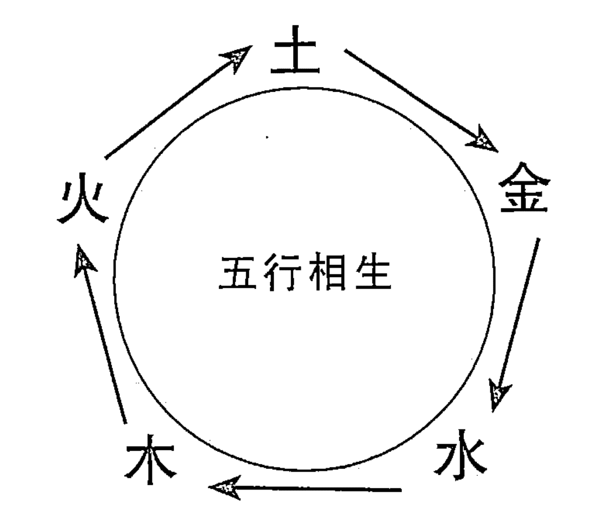

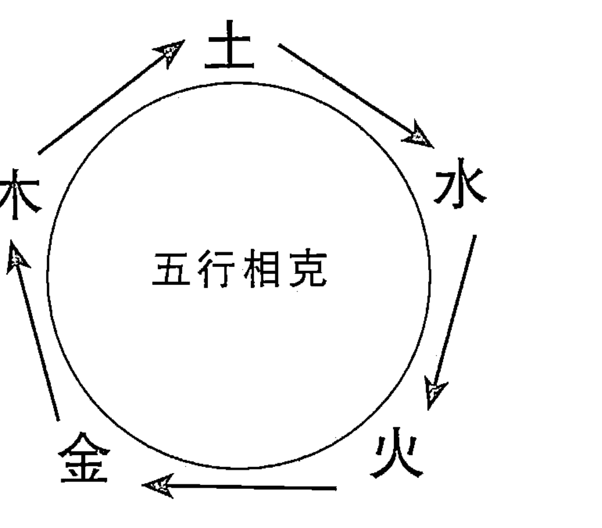

##### 3. 相克

木克土：树木之根深入土壤中牵制着土。
土克水：土围水、止水之流向。
水克火：水可将火熄灭。
火克金：火可将金熔化、挫其锐气。
金克木：金属可将木砍伐及制成成品。

上图：在五行相生的基础上，相隔一位则为相克。如水生木、木生火，水与火相隔一位，则水与火相克。

##### 4. 比和

比和是两个五行的性质相同。如木与木、水与水、金与金、土与土、火与火。比和有互相帮助的作用，即是互相增力。

##### 5. 季节与五行

把一年分为春、夏、秋、冬四季。季节是时空的变化、宇宙万物的组成部份，所以也离不开五行的范畴。

春季，万物复苏，花草树木一片欣欣向荣，五行属木；夏季，火焰气燥，气温上升，五行属火；秋季，木雕叶落，果园收藏，一片肃杀，五行属金；冬天，冰封雪地，气寒水冷，五行属水。

一年四个季节，一个季节有三个月，每个季节之末为万物收藏之地，五行属土。季末指三、六、九、十二月。

##### 6. 地支的五行及生克

地支也有五行的属性，既然有五行，也离不开相生相克的关系。先了解地支的五行：

- 寅、卯为一、二月在春季，所以属木。
- 巳、午为四、五月在夏季，所以属火。
- 申、酉为七、八月在秋季，所以属金。
- 亥、子为十、十一月在冬季，所以属水。
- 辰、未、戌、丑是三、六、九、十二月在季末，所以属土。

| 五行 | 水 | 土 | 木 | 木 | 土 | 火 | 火 | 土 | 金 | 金 | 土 | 水 |
|---|---|---|---|---|---|---|---|---|---|---|---|---|
| 地支 | 子 | 丑 | 寅 | 卯 | 辰 | 巳 | 午 | 未 | 申 | 酉 | 戌 | 亥 |

地支之间的相生关系：

地支之间的相克关系：

##### 7. 地支相冲

地支有方向性，如果两个地支的方位完全相反，我们称之为相冲。如午在正南方，子在正北方，午与子相冲；十二个地支便有十二个不同的方向，共有六组方向是完全相反的，所以又叫六冲。
子与午冲，丑与未冲，寅与申冲，卯与酉冲，辰与戌冲，巳与亥冲。阳支与阳支相冲，阴支与阴支相冲。相冲的地支，相隔六个位置。

##### 8. 天干的五行及生克

甲、乙寄在东方，五行属木。
丙、丁寄在南方，五行属火。
戊、己寄在中宫，五行属土。
庚、辛寄在西方，五行属金。
壬、癸寄在北方，五行属水。

天干之间的相生关系：

天干之间的相克关系：

#### 三、天干的其它形式

##### 1. 天干相冲

两个方向完全相反的两个五行便叫相冲。天干十个，阳干五个、阴干五个，但土居中央而不出现相冲，所以剩下阳干和阴干各四个。

从上图可以看到，东方的寅、卯木分别与西方的申、酉金相冲，同理，东方的甲、乙木分别与西方的庚、辛金相冲；南方的巳、午火分别与北方的亥、子水相冲，同理，南方的丙、丁火分别与北方的壬、癸水相冲。地支与地支隔六位相冲，天干相冲也隔六位。

| 数序 | 1 | 2 | 3 | 4 | 5 | 6 | 7 | 8 | 9 | 10 |
| :--- | :--- | :--- | :--- | :--- | :--- | :--- | :--- | :--- | :--- | :--- |
| 天干 | 甲 | 乙 | 丙 | 丁 | 戊 | 己 | 庚 | 辛 | 壬 | 癸 |

| 1 甲 | 冲 | 7 庚 |
| :--- | :--- | :--- |
| 2 乙 | 冲 | 8 辛 |
| 3 丙 | 冲 | 9 壬 |
| 4 丁 | 冲 | 10 癸 |

甲庚相冲、丙壬相冲，为阳干与阳干相冲；乙辛相冲、丁癸相冲，为阴干与阴干相冲。

冲是一种克的形式，但天干在占卦的运算中较少使用，可以不必深入研究。

##### 2. 天干相合

天干有冲也有合，冲有散之意，合有聚之情。天干的土不参与相冲，但参与相合。天干相合后会转化出它们之间的其中一种五行，或它们之外的另一种新的五行。

甲己合化土，乙庚合化金，丙辛合化水，丁壬合化木，戊癸合化火。天干隔五位相合。

“河图洛书”中记述：一六共宗，二七同道、三八为朋、四九为友、五十共守。即天干之间相隔五位相合。

| 数序 | 1 | 2 | 3 | 4 | 5 | 6 | 7 | 8 | 9 | 10 |
| :--- | :--- | :--- | :--- | :--- | :--- | :--- | :--- | :--- | :--- | :--- |
| 天干 | 甲 | 乙 | 丙 | 丁 | 戊 | 己 | 庚 | 辛 | 壬 | 癸 |

| 1 甲 | 合 | 6 己 | 化土 |
| :--- | :--- | :--- | :--- |
| 2 乙 | 合 | 7 庚 | 化金 |
| 3 丙 | 合 | 8 辛 | 化水 |
| 4 丁 | 合 | 9 壬 | 化木 |
| 5 戊 | 合 | 10 癸 | 化火 |

#### 四、地支的其它形式

##### 1. 地支藏干

一个地支往往有不同的五行元素组成，或者说有不同五行的天干组成，我们称之为地支藏干，又称人元。地支藏干的技术在八字的运算中要求较高，在八卦的运用稍次些。具体可参考本书“附录”的“地支藏干”部分。

##### 2. 地支相冲的实质

地支相冲，是地支的藏干与藏干相冲，而且地支的阳干与阳相冲、阴干与阴干相冲。具体可参考本书后“地支相冲的实质”部分。

##### 3. 六合

事物是相对的，有冲也有合。当两个地支相合后，其五行组合往往会产生新的变化。子丑合化土，寅亥合化木，卯戌合化火，辰酉合化金，巳申合化水，午未合化火。六合必然是阴与阳相合，与六冲相反，六冲必是阳与阳冲、阴与阴冲，这尤如异性相吸、同性相斥的道理。
亦有一些书把午未合化土论。

| 地支 | 状态 | 地支 | 合化 |
| :---: | :---: | :---: | :---: |
| 子 | 合 | 丑 | 土 |
| 寅 | 合 | 亥 | 木 |
| 卯 | 合 | 戌 | 火 |
| 辰 | 合 | 酉 | 金 |
| 巳 | 合 | 申 | 水 |
| 午 | 合 | 未 | 火 |

##### 4. 十二长生

地支是时间的记录，十二个地支，则有十二个不同的时间表现。时间不断地流转、循环，所以五行的状态也随之不断地变化，十二个地支，则有十二种不同的状态。这十二种状态，我们称之为十二长生。
十二长生为：长生、沐浴、冠带、临官、帝旺、衰、病、死、墓、绝、胎、养。
十二长生是事物在自然界的表现形式，反映事物的出现、发展、壮大、衰退以至灭亡的自然规律，正因为这个规律，寻找不同的时空出现的不同状态、发生不同的事情。

以人为例在十二长生状态中的解释：
长生：人之初生。
沐浴：出生后清洗身上的污垢。
冠带：渐渐生长成人，穿衣戴帽。
临官：事业有成，加封进爵。
帝旺：人生达到颠峰时期，犹如辅助皇帝左右完成大业。
衰：物极必反，人生机能开始下滑。
病：出现衰老病变。
死：气数已尽而死亡。
墓：死后回归于大自然、埋葬于泥土中。
绝：分解、消失、转化，万物循环周而复始。
胎：男女相交而胎结、产生新的生命。
养：胎在母亲的腹中渐渐生长成形。

从以上十二长生的解释可以了解到，长生至帝旺为旺相、健康的状态，衰至养为休囚、衰弱的状态。

在十二地支中，不同的五行临之均有不同的状态。
金长生于巳，其余宫位及状态按顺时针推算：

| 长生 | 沐浴 | 冠带 | 临官 | 帝旺 | 衰 | 病 | 死 | 墓 | 绝 | 胎 | 养 |
| :---: | :---: | :---: | :---: | :---: | :---: | :---: | :---: | :---: | :---: | :---: | :---: |
| 巳 | 午 | 未 | 申 | 酉 | 戌 | 亥 | 子 | 丑 | 寅 | 卯 | 辰 |

水长生于申，其余宫位及状态按顺时针推算：

| 长生 | 沐浴 | 冠带 | 临官 | 帝旺 | 衰 | 病 | 死 | 墓 | 绝 | 胎 | 养 |
|---|---|---|---|---|---|---|---|---|---|---|---|
| 申 | 酉 | 戌 | 亥 | 子 | 丑 | 寅 | 卯 | 辰 | 巳 | 午 | 未 |

木长生于亥，其余宫位及状态按顺时针推算：

| 长生 | 沐浴 | 冠带 | 临官 | 帝旺 | 衰 | 病 | 死 | 墓 | 绝 | 胎 | 养 |
|---|---|---|---|---|---|---|---|---|---|---|---|
| 亥 | 子 | 丑 | 寅 | 卯 | 辰 | 巳 | 午 | 未 | 申 | 酉 | 戌 |

火长生于寅，其余宫位及状态按顺时针推算：

| 长生 | 沐浴 | 冠带 | 临官 | 帝旺 | 衰 | 病 | 死 | 墓 | 绝 | 胎 | 养 |
|---|---|---|---|---|---|---|---|---|---|---|---|
| 寅 | 卯 | 辰 | 巳 | 午 | 未 | 申 | 酉 | 戌 | 亥 | 子 | 丑 |

土没自己的宫位，寄存火宫，所以与火的十二长生相同：

| 长生 | 沐浴 | 冠带 | 临官 | 帝旺 | 衰 | 病 | 死 | 墓 | 绝 | 胎 | 养 |
|---|---|---|---|---|---|---|---|---|---|---|---|
| 寅 | 卯 | 辰 | 巳 | 午 | 未 | 申 | 酉 | 戌 | 亥 | 子 | 丑 |

##### 5. 真假长生

按照十二长生的理论，沐浴比长生旺、冠带比沐浴旺、临官比冠带旺…等。而事实还要看其五行与宫位的实际相生、相克或比和关系。

如水在申地为长生，得申金相生旺相，在酉地为沐浴，也得酉金之相生旺相，在戌地为冠带，但被戌土之克，非为旺地，比起申、酉之地要弱得多，从此可以看到，临官并不比长生、沐浴之地旺；又如金在巳为长生之地，而巳属火却克金，在丑为墓，而丑属土却生金，可以看到，金在巳长生之地却不比在丑之墓地要旺。这种宫位与旺弱不成正比的关系，称之为假长生。

十二长生与旺弱的判断，只能作一种参考，并非绝对的等量关系。

例如：
得《火雷噬嗑》变《震为雷》：

| 乙 | 甲 | 己 | 庚 |
|---|---|---|---|
| 丑 | 子 | 卯 | 寅 |
| 时 | 日 | 月 | 年 |

> 巳火在寅为长生之地，在卯沐浴之地，都是旺相之地

| 火雷噬嗑 | | | 震为雷 | | | |
|---|---|---|---|---|---|---|
| 子孙 己巳 火 | ○ | | 妻财 庚戌 土 | -- | | 玄武 |
| 妻财 己未 土 | -- | 世 | 官鬼 庚申 金 | -- | | 白虎 |
| 官鬼 己酉 金 | —— | | 子孙 庚午 火 | —— | | 螣蛇 |
| 妻财 庚辰 土 | -- | | 妻财 庚辰 土 | -- | | 勾陈 |
| 兄弟 庚寅 木 | -- | 应 | 兄弟 庚寅 木 | -- | | 朱雀 |
| 父母 庚子 水 | —— | | 父母 庚子 水 | —— | | 青龙 |

> 未土在寅为长生之地，在卯沐浴之地，但都属受克，为衰弱之地

巳火与未土的十二长生排列一样，同时在寅年、卯月，其旺弱却有相当大的出入。寅、卯五行属木，木可以生火，所以巳火在寅年、卯月为旺相状态，也属长生、沐浴之地；木克土，所以未土在寅年、卯月为受克状态，为休囚之地，为假长生、假沐浴之地。

##### 6. 长生的含义

长生有刚好出生、事物正开始生长阶段，会不断地发展壮大，前景欣欣向荣。如果为喜用神则吉，如果为忌神则凶。

例如：
如测求财得《水泽节》：

| 壬 | 甲 | 丙 | 戊 |
|---|---|---|---|
| 申 | 午 | 辰 | 寅 |
| 时 | 日 | 月 | 年 |

| 水泽节 | | |
|---|---|---|
| 兄弟 戊子 水 | -- -- | |
| 官鬼 戊戌 土 | ——— | |
| 父母 戊申 金 | -- -- | 应 |
| 官鬼 丁丑 土 | -- -- | |
| 子孙 丁卯 木 | ——— | |
| 妻财 丁巳 火 | ——— | 世 |

妻财巳火在寅年为长生之地旺相

求财以财为用神。以初爻之妻财爻丁巳为用神，巳火在寅年为长生之地，为旺相有气，源源不断，在午日为帝旺之地，所以财运理想，前景光明。

##### 7. 沐浴的运用

沐浴有更衣冲洗之意，也意味着脱光衣服，在断卦时可以引申为桃花、男女关系密切。如上卦中为巳火，起卦之时若在卯月（也可以在卯年、卯日或卯时），则巳火在月为沐浴之地。

木沐浴在子，火、土沐浴在卯，金沐浴在午，水沐浴在酉。子、午、卯、酉又名桃花星，指有利姻缘的出现，也指有利人缘、交际等。

例如：

广东古先生 (已婚) 2010 年的运气：

| 申 | 壬 | 乙 | 辛 | 己 |
|---|---|---|---|---|
| 酉 | 午 | 亥 | 未 | 丑 |
| 空 | 时 | 日 | 月 | 年 |

| 山水蒙 | 地水师 |
|---|---|
| 父母 丙寅 木 ○ | 妻财 癸酉 金 -- -- |
| 官鬼 丙子 水 -- -- | 官鬼 癸亥 水 -- -- |
| 妻财 己酉 金 子孙 丙戌 土 -- -- 世 | 子孙 癸丑 土 -- -- |
| 兄弟 戊午 火 -- -- | 兄弟 戊午 火 -- -- |
| 子孙 戊辰 土 ——— | 子孙 戊辰 土 ——— |
| 父母 戊寅 木 -- -- 应 | 父母 戊寅 木 -- -- |

> 妻财酉在午为沐浴，伏世爻下主金屋藏娇

世代表自己，男人以财代表女人、情人。妻财酉金的沐浴在午，起卦时正好是午时，会有桃花，也即是有婚外情；世爻下伏财爻，伏藏有收藏不见光之意，也主金屋藏娇，可根据已知信息反推以前发生的事情。现酉金临空亡，在酉金出空当值之年、月、日、时为填实，也即是应期。故断其 2004 年、2005 年有婚外情。事实 2004 年和 2005 年与一女子发生一段恋情。

##### 8. 墓的运用

墓有收藏之意，一般可以代表房屋、医院、牢房或墓地等。若用神被墓收藏，如果这时的墓代表房屋，则意味着走到房屋里；如果墓代表医院，则代表有病患之灾；如果墓代表牢房，则代表有官非之灾；如果墓代表墓地，则代表有生死之灾。代表什么，要具体看预测什么问题。如巳火化出戌土，戌为巳火之墓，为巳火化入墓。

木之墓在未，火、土之墓在戌（土一般不论入墓），金之墓在丑，水之墓在辰。

例如：
张先生测与妻子会不会离婚？

| 申 | 戊 | 癸 | 辛 | 己 |
|---|---|---|---|---|
| 酉 | 午 | 未 | 未 | 丑 |
| 空 | 时 | 日 | 月 | 年 |

> 妻财入墓于月、日父母，官鬼爻也与月、日相合，双双走进同一房子里

> 妻财伏在应爻官鬼下，妻子藏在别的男人里

| 地山谦 | 地火明夷 |
|---|---|
| 兄弟 癸酉 金 -- -- | 兄弟 癸酉 金 -- -- |
| 子孙 癸亥 水 -- -- 世 | 子孙 癸亥 水 -- -- |
| 父母 癸丑 土 -- -- | 父母 癸丑 土 -- -- |
| 兄弟 丙申 金 ——— | 子孙 己亥 水 ——— |
| 妻财 丁卯 木 官鬼 丙午 火 -- -- 应 | 父母 己丑 土 -- -- |
| 父母 丙辰 土 × | 妻财 己卯 木 ——— |

一师兄拿来为朋友占的卦问我，根据卦中的象，我断其妻子已有婚外情。结果，不到一个月，果然发现其妻子有婚外情。
男人以妻财代表妻子，世爻代表自己。妻财爻入墓于月支、日支未中，有收藏之象，未为父母爻代表房屋，而应爻之官鬼则代表其它男人，也与月支、日支相合，很明显妻子与其它男人一起走进同一间房子去了，月支和日支分别代表两个不同的地方；妻财爻不上卦，意味着妻子对自己有回避之意，伏应爻的官鬼下，即收藏在别的男人里。

##### 9. 胎的运用

胎爻多用来预测怀孕。以子孙爻代表子女、晚辈，若子孙爻在四值中临胎地，则有怀孕的现象。如巳、午为火在子为胎地；申、酉为金在卯为胎地；亥、子为水在午为胎地；寅、卯为木在酉为胎地。
木之胎在酉，火、土之胎在子，金之胎在卯，水之胎在午。

例如：
测妻子是否怀孕？

| 辰 | 壬 | 庚 | 戊 | 丁 |
|---|---|---|---|---|
| 巳 | 午 | 子 | 申 | 亥 |
| 空 | 时 | 日 | 月 | 年 |

| | 天山遁 | | | |
|---|---|---|---|---|
| | 父母 壬戌 土 | —— | | |
| | 兄弟 壬申 金 | —— | 应 | |
| | 官鬼 壬午 火 | —— | | |
| | 兄弟 丙申 金 | —— | | |
| 妻财 甲寅 木 | 官鬼 丙午 火 | — — | 世 | |
| 子孙 甲子 水 | 父母 丙辰 土 | — — | | |

> 子水在午时临胎，伏而不现怀孕之象

> 子辰半合，母子脐带相连；申子辰合为子孙局，不断给胎儿输入营养

一行家李师傅较擅长于奇门遁甲，文王卦则稍弱些，所以常拿一些文王卦和我研究。这是他的师兄弟求测的卦，正遇上我，便把自己的思路分析给我听：子孙没出现，又伏空亡，空亡则未怀孕。

子孙得太岁帮、在月为长生之地、又临日令旺相无疑，在时为胎地，临胎及旺相都有怀孕之象，临日令又代表近日之事；父母爻辰土代表妈妈的腹部，没空亡又怎能藏身胎儿？正因为空亡才可以藏胎儿，子辰半合，就象妈妈的脐带与胎儿相连，与月令组成申子辰三合水局，辰土生申金、申金生子水，父母辰土不但不克子孙爻，反而化成了子孙爻，不断给胎儿输送营养，使胎儿不断地壮大。

不久，果然传来怀孕的消息。

#### 五、地支的特殊组合形式

##### 1. 三会局

春季由寅月、卯月和辰月组成，如果寅卯辰三个地支会在一起，便形成一个强大的五行之气——木。我们称寅卯辰为三会木局，或者称寅卯辰三会东方木局。辰土被化为木。

同样道理，巳午未三会火局，未土被化为火；申酉戌三会金局，戌土被化为金；亥子丑三会水局，丑土被化为水。三会局的五行力量在合局中威力是最大的，易对其他五行构成较大的影响作用。

例如：

柳州覃女士测炭厂的风水如何？

| 戊 | 癸 | 乙 | 庚 | 丙 |
|---|---|---|---|---|
| 亥 | 未 | 丑 | 寅 | 戌 |
| 空 | 时 | 日 | 月 | 年 |

| 泽水困 | | 雷水解 | |
|---|---|---|---|
| 父母 丁未 土 | -- | 父母 庚戌 土 | -- | 玄武 |
| 兄弟 丁酉 金 | ○ | 兄弟 庚申 金 | -- | 白虎 |
| 子孙 丁亥 水 | — | 应 | 官鬼 庚午 火 | — | 螣蛇 |
| 官鬼 戊午 火 | -- | 官鬼 戊午 火 | -- | 勾陈 |
| 父母 戊辰 土 | — | 父母 戊辰 土 | — | 朱雀 |
| 妻财 戊寅 木 | -- | 世 | 妻财 戊寅 木 | -- | 青龙 |

> 酉金在五爻为道路，临白虎在右方

> 白虎发动三会局冲克世爻主血光之灾，财受克也主破财

覃女士带我去看她厂的风水，厂已经营近半年时间。

厂的右方有一条马路直冲下来，而且紧迫贴门口而过，路急气散，门前又没明堂聚气化解，而且右高左低白虎欺青龙，很明显是一种凶象。阳宅风水以大门为主，因为大门为出入必经之路，如果大门呈凶象，整个风水已大打折扣。我还是习惯地为她起了一卦综合分析。

世爻财持世临月令旺相，有“财持世财荣”之断言，似很有利求财，应爻子孙生合世爻，市场的环境也似不错。但子孙爻休囚衰弱且空亡，不生世爻，市场的环境只是一种假象；五爻兄弟发动克世爻财、化出兄弟爻又回冲世爻，与太岁三会申酉戌金局、加之六爻父母未土被日冲暗动相生为忌，其威力之大可想而知，五爻为道路、白虎为右边，不正是大门右边的马路！父母为房屋、六爻为远处、玄武为后方，厂的后方必有一建筑且对厂构成一股煞气。

覃女士点点头，厂后方有一房子。

白虎在五爻冲克世爻，不是血光之灾又是什么？初爻代表脚、寅木也代表脚，酉金动则应期在去年2005年，化出申金应在七月，世临青龙是左脚伤。

覃女士去年七月因车祸而伤了左脚，而且留下了一块很大的伤痕。

现在寅月及下一个月卯月世财临旺地，生意还可以维持下去，一进入辰月生旺忌神，恐怕神仙也难有回天之力，还不如早点把厂处理为妙。我只看了十多分钟，最终未为她作风水布局。

结果，自开业以来，只有寅、卯月没亏本，过了卯月不久便结束了经营，总的亏了一大笔财。

##### 2. 三合局

火长生于寅，帝旺于午，收藏于戌，如果把三者合在一起为寅午戌，对中神午火有强大的生护作用，称之为寅午戌三合火局。寅为火之长生之地，使火之源不绝，戌为火之库，将能量收藏储蓄，水来克中神火时，由木化泄通关、土回克水，象一艘航空母舰防卫能力最强。寅木与戌土会顺势化为火。

同样道理，巳酉丑三合金局，巳火与丑土顺势化为金；申子辰三合水局，申金与辰土顺势化为水；亥卯未三合木局，亥水与未土顺势化为木。

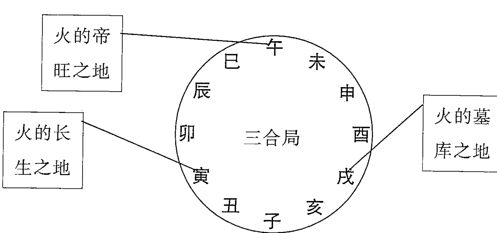

| 状态 | | 合火局 | 合金局 | 合水局 | 合木局 |
|---|---|---|---|---|---|
| 长生之地 | → | 寅 | 巳 | 申 | 亥 |
| 帝旺之地 | → | 午 | 酉 | 子 | 卯 |
| 墓库之地 | → | 戌 | 丑 | 辰 | 未 |

例如：
测美国乔治布什 2004 年参选总统连任能否当选？

| 申 | 庚 | 壬 | 甲 | 甲 |
|---|---|---|---|---|
| 酉 | 子 | 午 | 戌 | 申 |
| 空 | 时 | 日 | 月 | 年 |

| 火雷噬嗑 | | | 地风升 | | |
|---|---|---|---|---|---|
| 子孙 己巳 火 | ○ | | 官鬼 癸酉 金 | -- -- | 白虎 |
| 妻财 己未 土 | -- -- | 世 | 父母 癸亥 水 | -- -- | 螣蛇 |
| 官鬼 己酉 金 | ○ | | 妻财 癸丑 土 | ——— | 勾陈 |
| 妻财 庚辰 土 | × | | 官鬼 辛酉 金 | ——— | 朱雀 |
| 兄弟 庚寅 木 | × | 应 | 父母 辛亥 水 | ——— | 青龙 |
| 父母 庚子 水 | ○ | | 妻财 辛丑 土 | -- -- | 玄武 |

> 巳酉丑三合官局克应，官与对方无缘

> 世得月帮、日生旺相，先天条件占优势

参选是两者对立的竞争活动，所以在卦中找出另一个对立的对象进行比较，这两个对立的便是世和应，世爻代表我方、应爻代表对方，即世爻代表乔治布殊，应爻代表克里；以四值、卦中其它爻代表选民，然后根据选民对双方的生扶、克制等走势及力量大小等，以最终力量的强弱分出胜负。

卦中世爻得月令帮、日令生，先天条件已不错，而应爻被太岁冲破、在月、日休囚，只有时上得生，先天的条件已处下风；应克世，表面上对手占上风；上卦六爻、四爻及化出之爻组成巳酉丑三合金局，此金局直克应爻，太岁与初爻、三爻组成三合水局化解金局，即对手采取相应措施化解我方的攻势，但三合水局的中神子水化出丑回头克合、被日冲，合局无力，除此之外应爻还发动化亥水回生，只因应爻寅木太弱不受生，各种应对措施功效不大；而世爻得月、日之帮已旺相，再有六爻生、三爻相帮，可得到不少选民的支持。

两力量对比之下，世爻占优势。所以乔治布什会胜出当选。

结果乔治布殊胜出当选总统。

##### 3. 地支六害

子与丑合，未冲丑使丑与子不能相合，则未害子；同样道理，午与未合，子冲午使午与未不能相合，子害未。总之子与未相害。他们的关系是互相六合互相六冲 (子与丑合、午与未合，子与午冲、丑与未冲)。

同样道理，卯与辰相害，寅与巳相害，丑与午相害，亥与申相害，戌与酉相害。

相害是生克制化的一种形式，又名相穿。

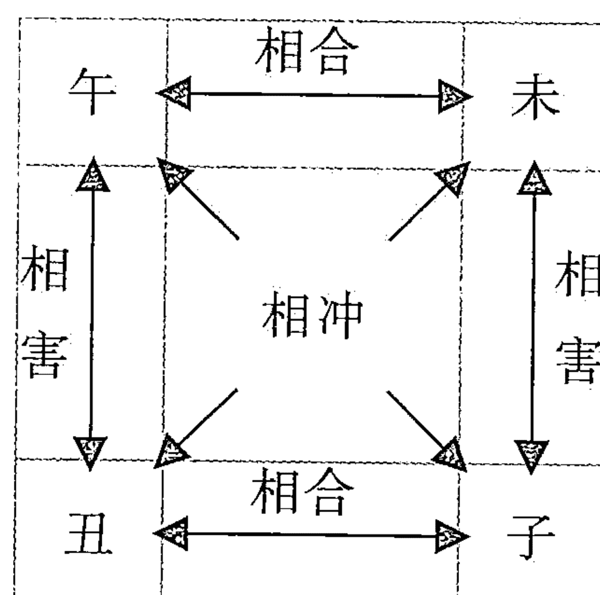

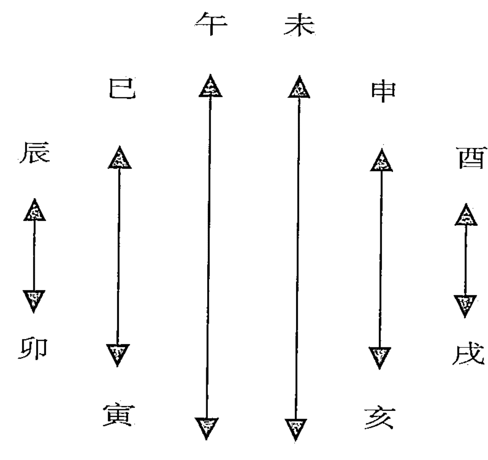

例如：

庞先生测 2007 年运气吉凶如何？

| 寅卯空 | 乙亥时 | 己酉日 | 癸卯月 | 丁亥年 |
| :--- | :--- | :--- | :--- | :--- |
| | 时 | 日 | 月 | 年 |

| | 泽火革 | | 泽山咸 | | |
| :--- | :--- | :--- | :--- | :--- | :--- |
| | 官鬼 丁未 土 | -- | 官鬼 丁未 土 | -- | 勾陈 |
| | 父母 丁酉 金 | —— | 父母 丁酉 金 | —— | 朱雀 |
| | 兄弟 丁亥 水 | —— | 世 | 兄弟 丁亥 水 | —— | 青龙 |
| 妻财 戊午 火 | 兄弟 己亥 水 | —— | | 父母 丙申 金 | —— | 玄武 |
| | 官鬼 己丑 土 | -- | | 妻财 丙午 火 | -- | 白虎 |
| | 子孙 己卯 木 | ○ | 应 | 官鬼 丙辰 土 | -- | 螣蛇 |

> 化出鬼官相害且又被日冲克，临空亡、螣蛇主伤灾

> 初爻代表脚，居离卦属阴主右脚

初爻子孙卯木化官鬼辰土相耗、卯与辰相害、被日令冲克，主刑伤，卯又临空亡、螣蛇，必主伤灾；初爻代表脚，居离卦属阴，阴代表右脚，阳爻发动代表已发生的事。

庞先生反馈在占卦前不久，右脚有意外之伤。

##### 4. 相刑

**恃势之刑：** 寅巳申三刑。

木在寅为临官、火在巳为临官、金在申为临官，三者皆在临宫的位置。顾名思义，有官有权力，滥用权力，所以为恃势之刑。

无恩之刑：丑未戌三刑。
丑未戌都为土，五行相同者为比劫、为兄弟。骨肉相残，所以为无恩之刑。

无礼之刑：子卯刑。
子水生卯木，相生者为母子关系。母子反目成仇，所以为无礼之刑。

自刑之刑：辰辰、午午、酉酉、亥亥自刑。
辰见辰为自己见自己、午见午为自己见自己、酉见酉为自己见自己、亥见亥为自己见自己。由自己不义的行为引起致灾，所以为自刑。

例如：
克里参选美国总统能否当选？

| 申 | 庚 | 壬 | 甲 | 甲 |
|---|---|---|---|---|
| 酉 | 子 | 午 | 戌 | 申 |
| 空 | 时 | 日 | 月 | 年 |

| | 泽风大过 | | | 乾为天 | | |
|---|---|---|---|---|---|---|
| | 妻财 丁未 土 | × | | 妻财 壬戌 土 | — | 白虎 |
| | 官鬼 丁酉 金 | — | | 官鬼 壬申 金 | — | 螣蛇 |
| 子孙 庚午 火 | 父母 丁亥 水 | — | 世 | 子孙 壬午 火 | — | 勾陈 |
| | 官鬼 辛酉 金 | — | | 妻财 甲辰 土 | — | 朱雀 |
| 兄弟 庚寅 木 | 父母 辛亥 水 | — | | 兄弟 甲寅 木 | — | 青龙 |
| | 妻财 辛丑 土 | × | 应 | 父母 甲子 水 | — | 玄武 |

> 初爻、六爻及其化出之爻形成丑未戌三刑围克世爻

以世爻代表克里先生，在月上受克、在日上休囚，但在年上得生及时上得帮不弱，应爻代表竞争对手乔治布殊，得月令帮及日令生旺相旺，相比之下应爻较世爻旺相，也是对方的实力比自己强。

应爻旺相发动克世爻，对方采取有力的攻势，化出父母爻子水回头合、泄气及帮世爻，父母代表策略、宣传及言论等有失误，对我方也有一定的帮助，只是子水与丑合化土，失误不大；再者初爻与六爻及六爻化出之戌土形成丑未戌三刑局面，土与土刑令土变得更旺，对应爻有利，对世爻反而不利；四爻及五爻保护世爻，化土生水，化解对方的强力攻势，只是酉金临空亡又安静起不了什么作用。很明显世爻处下风、应爻占上风，必是对手乔治布殊胜出。

结果克里失败、乔治布什当选总统。

#### 六、季节与五行的旺衰

寅、卯月为春季属木，木当令，当令尤如有至高无上的权力，掌握一切生死大权，所以木最旺；火被木生，尤如加封进爵，一人之下万人之上，所以火为相地；水生木，如生育皇上的父母，年迈退休，所以水失令为休地；金克木，木当令难被克，尤如以下犯上必被囚禁，所以金处囚地；土被木克，尤如判以死刑，所以处死地。寅、卯月的五行旺弱如下：

| 旺 | 相 | 休 | 囚 | 死 |
|---|---|---|---|---|
| 木 | 火 | 水 | 金 | 土 |
| 最旺 | | | | 最弱 |

同样道理，巳、午月的五行旺弱如下：

| 旺 | 相 | 休 | 囚 | 死 |
|---|---|---|---|---|
| 火 | 土 | 木 | 水 | 金 |
| 最旺 | | | | 最弱 |

申、酉月的五行旺弱如下：

| 旺 | 相 | 休 | 囚 | 死 |
|---|---|---|---|---|
| 金 | 水 | 土 | 火 | 木 |
| 最旺 | | | | 最弱 |

亥、子月的五行旺弱如下：

| 旺 | 相 | 休 | 囚 | 死 |
|---|---|---|---|---|
| 水 | 木 | 金 | 土 | 火 |
| 最旺 | | | | 最弱 |

辰、未、戌、丑月的五行旺弱如下：

| 旺 | 相 | 休 | 囚 | 死 |
|---|---|---|---|---|
| 土 | 金 | 火 | 木 | 水 |
| 最旺 | | | | 最弱 |

# 第三部

## 八卦预测

### 第一章 文王卦的基础

#### 一、起卦法

##### 1. 摇卦法

摇卦法为现代最常用的方法之一。一般用三个乾隆的铜钱、一个龟壳，把三个铜钱放在龟壳内，闭目静心地想要预测的问题及与其有关的人事，然后摇动龟壳，最后把三个铜钱随机地丢到桌面或地面等地方，把三个铜钱的状态记下。这样一次代表一个卦爻，一共六次，便完成一个完整的卦象。用古铜钱的原因，因古铜钱历史长久，吸收了大量的宇宙信息，会令预测的准确率提高；现在引申为用三个一元或其它面值的现代硬币代替古铜钱；也可以用双手代替龟壳摇卦。

硬币有两个面，一面代表阴、另一面则代表阳。铜钱以有中文字的一面为阴，有花的一面为阳；现代硬币以有数字一面的为阴，有花的一面为阳。

有人会问：以现代的硬币代替古代的硬币进行预测，是否影响预测结果？其实只要预测技术过硬，其结果都是一样。

A. 以古铜钱“乾隆通宝”为例：

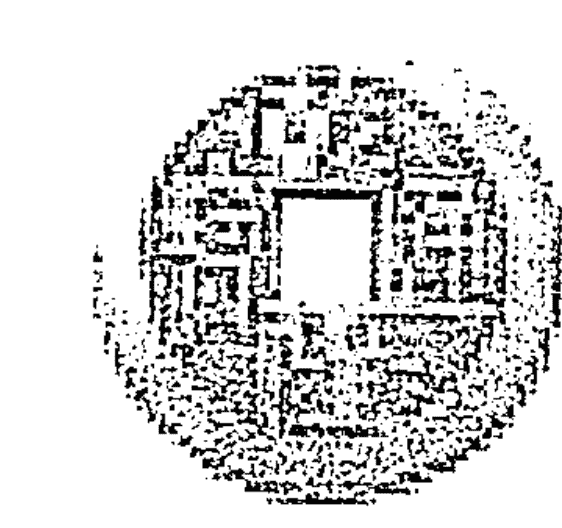

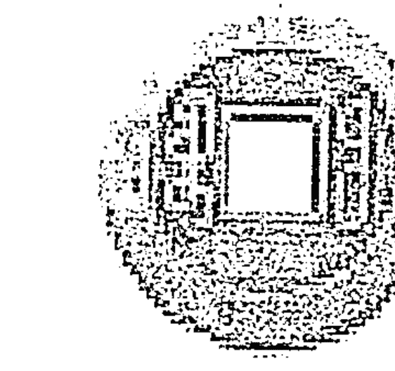

古铜币有“乾隆通宝”字样的一面为正面、为阴。

古铜币有两个“花”（满文）字样的一面为背面、为阳。

B. 以现代港币一元为例：

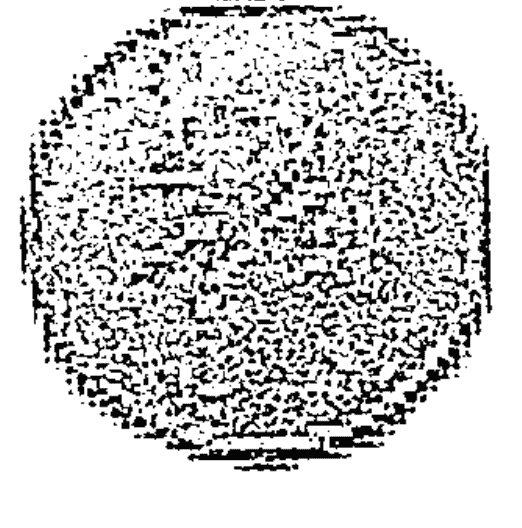

用三个币摇卦，一共会出现四种不同的结果：

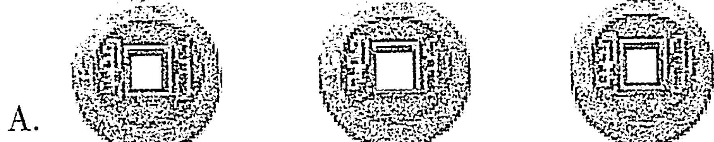

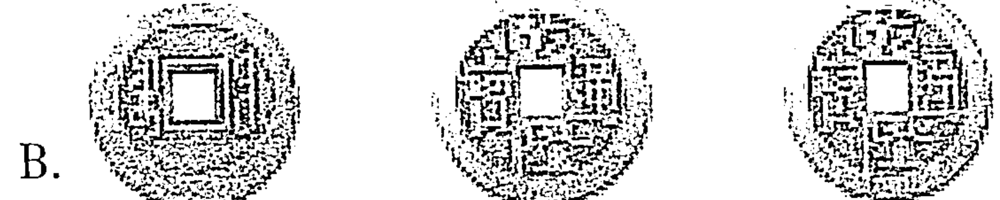

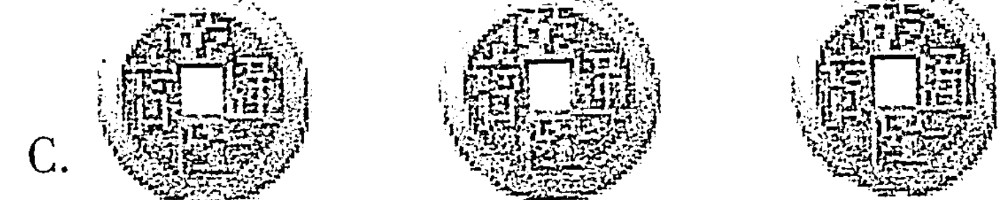

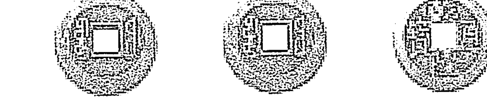

例如：

如摇卦测财运如何，得雷风恒变地天泰：

第一次：字字字，记作“-- 动”或“x”，老阴。

第二次：花字字，记作“—”或“、”，少阳。

第三次：花字字，记作“—”或“、”，少阳。

第四次：花花花，记作“— 动”或“○”，老阳。

第五次：字花花，记作“--”或“、、”，少阴。

第六次：字花花，记作“-- 动”或“、、”，少阴。

| | 雷风恒 | 变 | 地天泰 |
|---|---|---|---|
| 上爻 | -- | | -- |
| 五爻 | -- | | -- |
| 四爻 | ○ | | -- |
| 三爻 | — | | — |
| 二爻 | — | | — |
| 初爻 | x | | — |

卦爻的排法是从下向上排，所以第一次摇得三个字为老阴记在初爻，依此类推，最后一次记在上爻。初爻为老阴，所以相对应的变爻为阳；四爻为老阳，所以相变应的变爻为阴。

##### 2. 蓍草法

蓍草是一种长寿的草，每年生一茎，可达百年以上的寿命，能吸收天地之灵气，用来占卜预测，可大大提高精确度。据说蓍草只生长在河南汤阴羑里城，因为太少，所以可以用其它草甚至筷子、吸管等代替。

易经的起源“河图洛书”中记述：一六共宗水，二七同道火、三八为朋木、四九为友金、五十共守土…凡天地之数五十有五（一至十连续相加，其和为五十五）。即金木水火土包含天地间的万物，而万物之数为五十五。所以取五十五根蓍草。

A. 把五十五根抽取六根放在桌面，剩下四十九根，四十九为天地循环之数。
B. 将四十九根随机地一分为二，象征太极的两仪。一份置于左手象征天，另一份置于右手象征地。
C. 从右手中取出一根置于左手小指与无名指之间，象征人。于是出现三份，即天、人、地。
D. 以四根为一组分别数左手（天）及右手（地）的蓍草，四根象征春夏秋冬四季。其余数分别为一、二、三、四和三、二、一、四之间（余数最少一根，最多四根），其左（天）右（地）手余数之和不是四便是八。
E. 将左手的余数置于左手的中指与无名指之间，右手的余数置于左手的食指与中指之间。这样象征累积余日而成闰月，五年闰月两次称“五岁再闰”。
F. 这时，左手蓍草的总数不是五根便是九根，并另放在桌面上，则以每四根一组数出来的蓍草总数之和不是四十四根便是四十根（49-5=44 或 49-9=40）。到此便算完成“一变”。
G. 将剩下的四十四根，或四十根蓍草，重复 B 至 E 的步骤。这时，左手指缝间数之总和，不是四根便是八根，而以每四根一组数出来的总数之和，不是四十根便是三十六，或三十二根（44-4=40 或 44-8=36 或 40-4=36 或 40-8=32）。到此完成“二变”。
H. 将剩下的四十根，或三十六根，或三十二根蓍草，再重复 B 至 E 的步骤。这时，左手指缝间数之总和，不是四根便是八根，而以每四根一组数出来的总数之和，不是三十六根便是三十二，或二十八，或二十四根（40-4=36 或40-8=32 或 36-4=32 或 36-8=28 或 32-4=28 或 32-8=24）。到此完成“三变”。

I. 经过三变之后，将最后一次总数之和除以四，其结果有四种可能：
36÷4=9 为单数、为老阳，记作“○”。
32÷4=8 为双数、为老阴，记作“×”。
28÷4=7 为单数、为少阳，记作“、”。
24÷4=6 为双数、为少阴，记作“、、”。
这时便完成初爻，初爻为老阳，或老阴，或少阳，或少阴。

J. 再重复 A 至 I 的步骤五遍，便完成一个完整的卦象。装卦从下向上排列。

注：结果中“9”为老阳，“7”为少阳，“8”为老阴，“6”为少阴。

##### 3. 按时间起卦

时间起卦法，以中国农历为准，以年、月、日、时之数进行计算取卦象。年、时则取其地支之数作计算；月份则取当月之数值；而日则以当日的日数参与计算。

(年数+月数+日数) ÷8，取余数为上卦。若刚好除尽，则取八数为上卦，因卦宫共有八个，所以除以八。

(年数+月数+日数+时数) ÷8，取余数为下卦。若刚好除尽，则取八数为上卦，因卦宫共有八个，所以除以八。

(年数+月数+日数+时数) ÷6，取余数为动爻。若刚好除尽，则取六数为动爻，因每个卦共有六个爻，所以除以六。

为何刚好除尽时则取其商数为卦象或动爻？因与断卦无关，所以在此不再细述，让读者自悟。

年支与时支取数表：

| 数序 | 1 | 2 | 3 | 4 | 5 | 6 | 7 | 8 | 9 | 10 | 11 | 12 |
|---|---|---|---|---|---|---|---|---|---|---|---|---|
| 年支 | 子 | 丑 | 寅 | 卯 | 辰 | 巳 | 午 | 未 | 申 | 酉 | 戌 | 亥 |
| 时支 | 子 | 丑 | 寅 | 卯 | 辰 | 巳 | 午 | 未 | 申 | 酉 | 戌 | 亥 |

例如：

按农历二零一零年二月十三日巳时 (公历 2010 年 3 月 28 日) 起卦：

二零一零为庚寅年，寅数为 3，二月则取数为 2，十三日则取数为 13，
巳时则取数为 6：

上卦： (年数+月数+日数) ÷8= (3+2+13) ÷8=2…2

下卦： (年数+月数+日数+时数) ÷8= (3+2+13+6) ÷8=3…0 (余数 0 与 8
相等)

动爻： (年数+月数+日数+时数) ÷6= (3+2+13+6) ÷6=4…0 (余数 0 与 6
相等)

兑卦数理为 2，所以上卦为兑；坤卦数理为 8，所以下卦为坤；动爻数
为 6，所以上爻动。

得卦象为：

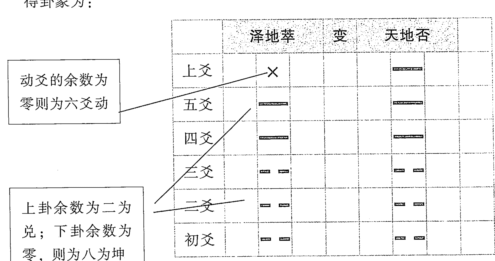

用时间起卦，是梅花易数常用的起卦方法。一个时辰只有一个卦，如果
遇到几个人同时来算卦，便可以用每个人的姓名笔划总数加入时间数中 (也
可以只取姓的数，但无论取姓或姓名，只要是区别不同的人有不同的卦象)。
取姓名的笔划数一般以康熙字典的笔划数为主，但法无定法，也可以取繁体
字或简体字的笔划数。例如，农历二零一零年二月十三日巳时中有一个求测
者叫张明昌， “张明昌” 的笔划总数为 27，则：

##### 4. 按字数起卦

按数字起卦的方法比较方便随机。如求测的人多时，可随机地从身边看到的某一组数字起卦；走在路上起卦时，也可以从周围环境随机找一组数字起卦；客人在远方，可以通过电话叫对方找一本书，随机打开取一个页码起卦象。数字可以是一个数或多个数。
如果只得一位数时，将其除以 8 取其余数分别作上卦和下卦，除以 6 取其余数作动爻。

例如：得数 7 起卦：
上卦：7÷8=0…7
下卦：7÷8=0…7
动爻：7÷6=1…1
上卦数为 7，7 为艮；下卦数为 7，7 为艮；动爻为 1。得《艮为山》变《山火贲》：

| 艮为山 | 变 | 山火贲 |
|---|---|---|
| ⚊ | | ⚊ |
| ⚋ | | ⚋ |
| ⚋ | | ⚋ |
| ⚊ | | ⚊ |
| ⚋ | | ⚋ |
| × | | ⚊ |

例如：得数 20 起卦：
得两位数时，将十位数“2”除以 8 取其余数作上卦；将个位数“0”除以 8 取其余数作下卦；将十位数与个位数相加，把两数之和除以 6 取其余数作动爻：

上卦：2÷8=0…2
下卦：0÷8=0…0 （余数 0 与 8 相等）
动爻：（2+0）÷6=0…2

上卦数为 2，2 为兑；下卦数为 0，0 当 8 为坤；动爻为 2。得《泽地萃》变《泽水困》。

| 泽地萃 | 变 | 泽水困 |
|---|---|---|
| ⚋ | | ⚋ |
| ⚊ | | ⚊ |
| ⚊ | | ⚊ |
| ⚋ | | ⚋ |
| × | | ⚊ |
| ⚋ | | ⚋ |

例如：得数 369 起卦：

得三位数时，将百位数“3”除以 8 取其余数作上卦；将十位数“6”除以 8 取其余数作下卦；将个位数“9”除以 6 取其余数作动爻：

上卦：3÷8=0…3
下卦：6÷8=0…6
动爻：9÷6=1…3

上卦数为 3，3 为离；下卦数为 6，6 为坎；动爻为 3。得《火水未济》变《火风鼎》：

例如：得数 3032 起卦：

得四位数时，将千位数与百位数重新组合成一组两位数“30”，除以 8 取余数作上卦；将十位数与个位数重新组合成一组两位数“32”，除以 8 取余数作下卦；将以上新组合的两组数相加后除以 6 取余数作动爻：

上卦：30÷8=3…6
下卦：32÷8=4…0（余数 0 与 8 相等）
动爻：(30+32) ÷6=10…2

上卦数为 6，6 为坎；下卦数为 0，0 为坤；动爻为 2。得《水地比》变《坎为水》：

| 水地比 | 变 | 坎为水 |
|---|---|---|
| -- -- | | -- -- |
| ——— | | ——— |
| -- -- | | -- -- |
| -- -- | | -- -- |
| X | | ——— |
| -- -- | | -- -- |

例如：得数 28955 起卦：

得五位数时，将万位数与千位数重新组合成一组两位数 “28”，除以 8 取余数作上卦；将百位数与十位数重新组合成一组两位数 “95”，除以 8 取余数作下卦；将个位数 “5” 除以 6 取余数作动爻：

上卦：28÷8=3…4
下卦：95÷8=11…7
动爻：5÷6=0…5

上卦数为 4，4 为震，下卦数为 7，7 为艮，动爻为 5，得《雷山小过》变《泽山咸》：

| 雷山小过 | 变 | 泽山咸 |
|---|---|---|
| -- -- | | -- -- |
| X | | ——— |
| ——— | | ——— |
| ——— | | ——— |
| -- -- | | -- -- |
| -- -- | | -- -- |

在此不再举例，读者可以举一反三，灵活运用。

##### 5. 按文字起卦

文字起卦，可以根据看到的某一个字或某一段文章起卦。由一个字和多个字不等。如果字少的，可以根据字里的笔划数取卦象，如果字数多的，可以根据字数的数量取卦象。

例如：得个“好”字起卦：
上卦根据左边的偏旁“女”字取笔划数除以 8 取余数，共 3 划，余数为 3，3 为离卦；下卦根据右边的偏旁“子”字取笔划数除以 8 取余数，共 3 划，余数为 3，3 为离卦；动爻根据“好”字整个字的笔划数之和除以 6 取余数，共为 6 划，余数为 0，即 6 爻动。得《离为火》变《雷火丰》：

上卦：3÷8=0…3
下卦：3÷8=0…3
动爻：(3+3) ÷6=1…0 (余数 0 与 6 相等)

| 离为火 | 变 | 雷火丰 |
| :---: | :---: | :---: |
| ○ | | ▅▅▅▅▅ |
| ▅▅▅▅▅ | | ▅▅▅▅▅ |
| ▅▅▅▅▅ | | ▅▅▅▅▅ |
| ▅▅▅▅▅ | | ▅▅▅▅▅ |
| ▅▅▅▅▅ | | ▅▅▅▅▅ |
| ▅▅▅▅▅ | | ▅▅▅▅▅ |

例如：得个“莫”字起卦：
可根据“莫”的结构特征分开上、中、下三个部份，分别作上卦、下卦和动爻。上卦根据字的上方部首“艹”取笔划数除以 8 取余数，共 3 划 (也可以“艹”旁计6划)，余数为3，3为离卦；下卦根据中部“曰”字取笔划数除以8取余数，共4划，余数为4，4为震卦；动爻根据下部“大”字取笔划数除以6取余数，共3划，余数为3，则3爻动。得《火雷噬嗑》变《离为火》：

上卦：3÷8=0…3
下卦：4÷8=0…4
动爻：3÷6=0…3

| 火雷噬嗑 | 变 | 离为火 |
| :---: | :---: | :---: |
| —— | | —— |
| —— | | —— |
| —— | | —— |
| × | | —— |
| —— | | —— |
| —— | | —— |

例如：得个“口”字起卦：
“口”字不分左右上下，而字的笔划总数为3，起卦方法与一位数字起卦法相同。上卦、下卦及动爻都分别以“3”数取象。上卦以3除以8取余数，余数为3，3为离卦；下卦以3除以8取余数，余数为3，3为离卦；动爻以3除以6取余数，余数为3，3爻动。得《离为火》变《火雷噬嗑》：

上卦：3÷8=0…3
下卦：3÷8=0…3
动爻：3÷6=0…3

例如：得“你好”两字起卦：
可将第一个字的笔划数作上卦，第二个字的笔划数作下卦，两个字的笔划数之和作动爻。
“你”字作上卦共7划，除以8取余数，余数为7，7为艮；“好”字作下卦共6划，除以8取余数，余数为6，6为坎；两字数之和除以6取余数作动爻，余数为1，1爻动。得《山水蒙》变《山泽损》：

上卦：7÷8=0…7
下卦：6÷8=0…6
动爻：(7+6) ÷6=2…1

例如：得“今晚回家吃饭吗”一段文起卦：

A. 共7个字，可把其分成三段，分别2+2+3。上卦以第一组字数2除以8取余数，余数为2，2为兑；下卦以中间字数2除以8取余数，余数为2，2为兑；动爻以后一组字数3除以6取余数，余数为3，3爻动。得《兑为泽》变《泽天夬》：

上卦：2÷8=0…2
下卦：2÷8=0…2
动爻：3÷6=0…3

| 兑为泽 | 变 | 泽天夬 |
|---|---|---|
| ⚊ | | ⚊ |
| ⚊ | | ⚊ |
| ⚊ | | ⚊ |
| × | | ⚊ |
| ⚊ | | ⚊ |
| ⚊ | | ⚊ |

B. 也可以把这段文字分成两段3+4（前少后多）。上卦以第一组字数3除以8取余数，余数为3，3为离；下卦以后一组字数4除以8取余数，余数为4，4为震；动爻以两组字数之和除以6取余数，余数为1，初爻动。得《火雷噬嗑》变《火地晋》：

上卦：3÷8=0…3
下卦：4÷8=0…4
动爻：7÷6=0…1

##### 6. 按量度长度起卦

取量度单位的长度起卦，也不例外取其单位的数值而得卦象。

例如：以一个人身高六呎八吋起卦：

上卦取六呎得 6 数，除以 8 取余数，余数为 6，6 为坎卦；下卦取八吋得 8 数，除以 8 取余数，余数为 0，0 当 8，8 为坤卦；动爻以两数之和除以 6 取余数，余数为 2，则动爻为 2。得《水地比》变《坎为水》：

上卦：6÷8=0…6
下卦：8÷8=1…0（余数 0 与 8 相等）
动爻：(6+8) ÷6=2…2

例如：一张纸的长为 28 厘米，宽为 21 厘米起卦：

取长度 28 作上卦，除以 8 取余数，余数为 4， 4 为震；取宽度 21 作下卦，除以 8 取余数，余数为 5， 5 为巽；动爻以两数之和 49 除以 6 取余数，余数为 1，则动爻为 1。得《雷风恒》变《雷天大壮》：

上卦：28÷8=3…4
下卦：21÷8=2…5
动爻： (28+21) ÷6=8…1

| 雷风恒 | 变 | 雷天大壮 |
|---|---|---|
| -- -- | | -- -- |
| -- -- | | -- -- |
| ——— | | ——— |
| ——— | | ——— |
| ——— | | ——— |
| × | | ——— |

##### 7. 按颜色起卦

例如：一女求测者上衣为蓝色，下衣为绿色起卦：

上卦取上衣颜色，蓝色属水，水与坎卦对应，所以为坎卦；下卦取下衣颜色，绿色属木，木与震卦和巽卦对应，震卦属阳主男人、巽卦属阴主女人，因测者是女人，所以下卦取巽卦；动爻根据上、下卦象数之和为 11 (坎卦为 6 数，巽卦为 5 数)，除以 6 取余数，余数为 5，所以动爻为 5。得《水风井》变《地风升》：

上卦：蓝色=坎卦
下卦：绿色=震卦和巽卦=女人取巽卦
动爻： (坎数+巽数) ÷6= (6+5) ÷6=1…5

| 水风井 | 变 | 地风升 |
| :---: | :---: | :---: |
| ⚊⚊ | | ⚊⚊ |
| ○ | | ⚋⚋ |
| ⚊⚊ | | ⚊⚊ |
| ⚋⚋ | | ⚋⚋ |
| ⚋⚋ | | ⚋⚋ |
| ⚊⚊ | | ⚊⚊ |

例如：见一朵黄色的花被风吹落起卦：

上卦取花的颜色黄，黄色属土，土的卦象有艮卦和坤卦，而花为阴柔之物，相对属阴，所以取坤卦 (坤为母为阴，艮为少男为阳)；下卦取与花相关的事物“风”，风为巽，动爻取上下卦数之和 13 (坤数 8 巽数 5)，除以 6 取余数，余数为 1，则初爻动。得《地风升》变《地天泰》：

上卦：黄色=坤卦和艮卦=花属阴性取坤卦
下卦：风=巽卦
动爻： (坤卦+巽卦) ÷6= (8+5) ÷6=2…1

| 地风升 | 变 | 地天泰 |
| :---: | :---: | :---: |
| ⚊⚊ | | ⚊⚊ |
| ⚋⚋ | | ⚋⚋ |
| ⚊⚊ | | ⚊⚊ |
| ⚋⚋ | | ⚋⚋ |
| ⚋⚋ | | ⚋⚋ |
| × | | ⚊⚊ |

##### 8. 按方位起卦

根据有关的事物及其所在的方位取卦象。

例如：一少女坐在（起卦者的）东方：

少女为兑，作上卦；东方为震，作下卦；兑数为2，震数为4，上卦与下卦数之和6（兑数为2、震数为4）除以6取余数作动爻，余数为0，则六爻动。得《泽雷随》变《天雷无妄》：

上卦：少女=兑卦
下卦：东方=震卦
动爻：（兑卦+震卦）÷6=（2+4）÷6=1…0（余数0与6相等）

| 泽雷随 | 变 | 天雷无妄 |
|---|---|---|
| × | | — |
| — | | — |
| — | | — |
| — — | | — — |
| — — | | — — |
| — | | — |

##### 9. 按动象起卦

例如：一个人的特别动作，把两手高高举起，而且张大个口：

可根据两个明显的动作取象起卦。手与艮相对应，以艮作上卦；口与兑相对应，以兑作下卦；动爻取上卦数与下卦数之和9（艮数为7、兑数为2）除以6取余数，余数为3，则三爻动。得《山泽损》变《山天大畜》：

上卦：手=艮卦
下卦：口=兑卦
动爻：（艮卦+口卦）÷6=（7+2）÷6=1…3

| 山泽损 | 变 | 山天大畜 |
| :---: | :---: | :---: |
| ▅▅▅▅▅ | | ▅▅▅▅▅ |
| ▅▅ ▅▅ | | ▅▅ ▅▅ |
| ▅▅ ▅▅ | | ▅▅ ▅▅ |
| × | | ▅▅▅▅▅ |
| ▅▅▅▅▅ | | ▅▅▅▅▅ |
| ▅▅▅▅▅ | | ▅▅▅▅▅ |

注：手的动作较口的动作明显，所以先以手作上卦，再以口作下卦。

##### 10. 按静象起卦

例如：一台黑色的手提电脑放在地上：
黑色属水与坎卦相对应，以坎作上卦；地与坤卦相对应，以坤作下卦；
动爻取上下卦数之和 14 (坎数为 6、坤数为 8) 除以 6，余数为 2，则二爻
动。得《水地比》变《坎为水》：

- 上卦：黑色=坎卦
- 下卦：地面=坤卦
- 动爻：(坎卦+坤卦) ÷6= (6+8) ÷6=2…2

| 水地比 | 变 | 坎为水 |
| :---: | :---: | :---: |
| ▅▅ ▅▅ | | ▅▅ ▅▅ |
| ▅▅▅▅▅ | | ▅▅▅▅▅ |
| ▅▅ ▅▅ | | ▅▅ ▅▅ |
| ▅▅ ▅▅ | | ▅▅ ▅▅ |
| × | | ▅▅▅▅▅ |
| ▅▅ ▅▅ | | ▅▅ ▅▅ |

##### 11. 按声音起卦

例如：天空传来小鸟的两次叫声，接着再传来三次叫声：
两次叫声为兑作上卦；三次叫声为离作下卦；动爻取上下卦数之和 5 (兑为 2、离为 3) 除以 6，余数为 5，则五爻动。得《泽火革》变《雷火丰》。

- 上卦：2=兑卦
- 下卦：3=离卦
- 动爻： (2+3) ÷6=0…5

| 泽火革 | 变 | 雷火丰 |
|---|---|---|
| ⚊ | | ⚋ |
| ○ | | ⚋ |
| ⚋ | | ⚊ |
| ⚊ | | ⚊ |
| ⚋ | | ⚋ |
| ⚊ | | ⚊ |

##### 12. 按意念起卦

心中可随意想出一个卦。
例如：如心中想着《雷水解》变《雷地豫》：

| 雷水解 | 变 | 雷地豫 |
|---|---|---|
| ⚋ | | ⚋ |
| ⚋ | | ⚋ |
| ⚊ | | ⚊ |
| ⚋ | | ⚋ |
| ○ | | ⚋ |
| ⚋ | | ⚋ |

起卦的方法很多，在此不再介绍。读者可以灵活运用变通，不要因为某一“大师”的定义，而把自己绑死在其中。所为法无定法，大师也是人，你也可以成为大师，你也可以制定定义、法则。

#### 二、认识卦的内部

##### 1. 爻数的读法

一个卦共有六个爻，文王卦的爻是从下向上排列的，所以从下向上的读法为：初爻、二爻、三爻、四爻、五爻、六爻。

卦爻又可以根据其所属的阴阳而分阴阳两大类，以“六”代表阴、以“九”代表阳；在读法上为了区分阴和阳，可在阴爻前加“六”，在阳爻前“九”，如初六、六二、六三、六四、六五、上六，初九、九二、九三、九四、九五、上九。

六为双数，所以代表阴，九为单数，所以代表阳。

例如：得《风水涣》卦：

| | | 风水涣 | |
|---|---|---|---|
| 阳爻读“九” | 上九 | 父母 辛卯 木 | —— |
| | 九五 | 兄弟 辛巳 火 | —— 世 |
| | 六四 | 妻财 己酉 金 | 子孙 辛未 土 | - - |
| | 六三 | 官鬼 己亥 水 | 兄弟 戊午 火 | - - |
| 阴爻读“六” | 九二 | 子孙 戊辰 土 | —— 应 |
| | 初六 | 父母 戊寅 木 | - - |

从下往上读：初六、九二、六三、六四、九五、上九。即父母爻分别在初六位和上九位，子孙爻分别在九二位和六四位，兄弟爻分别在六三位和九五位。

##### 2. 天人地

上为天、下为地、中间为人。一个经卦有三个爻所组成，根据其上中下的位置，可分为天位、人位、地位。

例如：得《地泽临》卦：

| | | 地泽临 | | |
|---|---|---|---|---|
| 上卦 | 天位 | 子孙 癸酉 金 | -- -- | |
| | 人位 | 妻财 癸亥 水 | -- -- | 应 |
| | 地位 | 兄弟 癸丑 土 | -- -- | |
| 下卦 | 天位 | 兄弟 丁丑 土 | -- -- | |
| | 人位 | 官鬼 丁卯 木 | ——— | 世 |
| | 地位 | 父母 丁巳 火 | ——— | |

##### 3. 阴阳得位

一个卦有六个爻，根据所居的位置分阴和阳。从下向上数，初爻、三爻、五爻为奇数属阳位，二爻、四爻、六爻为偶数属阴位。如果阳爻居初爻、三爻、五爻为阳爻居阳位，也称得位，如果居二爻、四爻、六爻，阳爻居阴位为失位；如果阴爻居二爻、四爻、六爻，阴爻居阴位为得位，如果居初爻、三爻、五爻，阴爻居阳位为失位。

得位又称正位或当位。

阴阳得位者，其气正，刚柔并济，符合事物的发展规律，德临天下，进展顺利；若阴阳失位者，位不正、气不顺，背逆正道，违反事物的发展规律，难得真果。

在预测权力上，五爻为上卦之人位，若阳爻居之，为君临天下之象，代表至尊至贵，称之为九五之尊；二爻为下卦之人位，以阴爻居之，为至阴至柔，至卑至微，代表平民，与五爻相呼应。

二爻为下卦之中位，五爻为上卦之中位。如果阴爻居二位或阳爻居五位，称之为中正。

在实际预测中，只作一定的参考，并非绝对性的决定意义。

例如：陈先生测先母升仙后会否再回家？

| 寅卯空 | 辛亥时 | 壬子日 | 壬午月 | 庚寅年 |
| :--- | :--- | :--- | :--- | :--- |
| | | | | |

| | 风水涣 | | | |
| :--- | :--- | :--- | :--- | :--- |
| | 父母 辛卯 木 | —— | | 白虎 |
| | 兄弟 辛巳 火 | —— | 世 | 螣蛇 |
| 妻财 己酉 金 | 子孙 辛未 土 | - - | | 勾陈 |
| 官鬼 己亥 水 | 兄弟 戊午 火 | - - | | 朱雀 |
| | 子孙 戊辰 土 | —— | 应 | 青龙 |
| | 父母 戊寅 木 | - - | | 玄武 |

世居九五得位
有权力在手，
且得六爻之父
母相生主升迁

仙母以父母爻表示。

父母爻临空亡，意味着已离开人世去到了另一世界，正与事实相符；卦中父母爻两现，只能取一个代表，初爻与世爻较远，而六爻与世爻紧贴相生，缘份较足，六爻代表高处，也意味已升仙，所以取六爻代表仙母。

用神父母爻与世紧贴相生，相生表示有情，证明仙母会再回家中。

陈先生点头称是，近期在自己的床头捡到一根仙母的头发，足已证明了这一点。

世爻居五爻阳位，必有权力在手；六爻临太岁紧贴相生，今年得仙母的保佑而升迁加薪。

陈先生自从第二次找我算卦开始，都多赠送润金，说我年纪轻轻的算得很准，少少钱起不到什么作用，只作鼓励云云。

我丈二和尚摸不到头脑。原来他第一次算卦时也是测问仙母之事，我顺便写下批文断他之后几个月将要发生的事情，结果都一一言中了。但如此小

##### 4. 方位

当一个卦象形成后，如果预测问题涉及到位置、高低、距离等问题时，可以根据上卦及下卦的象，或根据用神在六个爻中所居的位置而判断。

上卦为阳，代表外面、远处、高处、上方、前面、明显的地方；下卦为阴，代表里面、近处、低处、下方、后面、隐藏的地方等。

初爻、二爻为家中，三爻、四爻为门口，五爻为路上，六爻为远处。初爻为地下、二爻为接近地面、三爻为与床的高度、四爻为中上高度、五爻为顶部稍下、六爻为顶部。

初爻为原定的地点、二爻为原定地点的附近、三爻为地区交界的内部、四爻为地区交界的外部、五爻为外区中部、六爻为外区远处。

例如：测求财运，得《火风鼎》变《山风蛊》：

| | 火风鼎 | | 山风蛊 | |
|---|---|---|---|---|
| 六爻 | 兄弟 己巳 火 | —— | 父母 丙寅 木 | —— |
| 五爻 | 子孙 己未 土 | - - | 应 官鬼 丙子 水 | - - |
| 四爻 | 妻财 己酉 金 | ○ | 子孙 丙戌 土 | - - |
| 三爻 | 妻财 辛酉 金 | —— | 妻财 辛酉 金 | —— |
| 二爻 | 官鬼 辛亥 水 | —— | 世 官鬼 辛亥 水 | —— |
| 初爻 | 父母 己卯 木 | 子孙 辛丑 土 | - - | 子孙 辛丑 土 | - - |

求财则以财为用神，卦中三爻与四爻均为财，根据求财的实际情况，可以理解为本区与外区交界的地方有利求财，四爻之财爻动化回头生，动则有力，四爻之财比三爻之财旺，所以到外区求财比本区求财有利；地区的范围也可以理解为本村与外村交界、本镇与外镇交界、本县与外县的交界、本省与外省的交界、本国与外国的交界处。要根据实际情况而定。

### 第二章 梅花易数的认识

#### 一、什么是梅花易数

“梅花易数”相传为宋代易学家邵雍所著。梅花易数依先天八卦数理，即乾一、兑二、离三、震四、巽五、坎六、艮七、坤八共八个卦，根据阴阳变化及五行相生相克的原理，有效地推断事物的发展过程及吉凶结果。整个过程，只有阴阳符号变化的卦象，没其它任何文字，可谓无字天书。

例如：得《天地否》变《天山遁》：

#### 二、主卦、体卦、用卦、互卦、变卦及其运用

1. 什么是主卦、变卦、体卦、用卦和互卦？

主卦：是卦象刚生成之时，由两个经卦重迭组成。

**变卦：** 由主卦变化而成。梅花易数只有一个爻变动，阳爻动则变出阴爻，阴爻动则变出阳爻，其余静爻不变。

**体卦：** 在主卦的卦象中，安静不动的经卦为体卦。是预测过程中的核心，也代表人物或事情的主体。

**用卦：** 在主卦的卦象中，发生动变的经卦为用卦。在预测过程中代表着周围的环境、相对应的人物、事物等，是事情的客体。

**互卦：** 由主卦中的二爻至五爻组成。即三爻、四爻、五爻作互卦的上卦，二爻、三爻和四爻作互卦的下卦。

主卦分体卦和用卦两大部份。体卦代表所测的人和事，是预测的核心，用卦是所测之人和事的外部环境，也是事物发展的初步阶段。

互卦是由主卦中提取出来而成的象，也是所测之人和事的外部环境，是事物发展的中途阶段。

变卦则是主卦发展变化的最终结果；则是事物发展的最终阶段。

例如：得《风山渐》变《风地观》：

##### 2. 体卦、用卦、互卦和变卦的关系及旺弱

在梅花易数的预测中，体卦是预测的核心，用卦、互卦和变卦对体卦产生吉或凶的作用，是决定吉凶成败的主要因素。而用卦、变卦、互卦对体卦的作用关系，是主动性的，而体卦是被动性的，它们的作用方式主要是以五行生克制化的方式进行。

体卦宜得到用卦、互卦及变卦的生、助，而不宜被用卦、互卦及变卦之克、泄。若体卦及生助体卦的卦象当令旺相，克、泄体卦的卦象宜休囚失令，则事态显吉象；若克泄体卦的卦象当令旺相，生、助体卦的卦象休囚失令，则事态显凶象。

用生体，有进益之喜，诸事顺遂；体用比和，则诸事较顺畅；体克用为小吉，成事但较迟；体生用不吉，有耗失之患；用克体事遇逆境，诸事凶。

用卦是事物的开始，直接对体卦产生作用，所以其威力不可忽视；而变卦为结果，是事情的终结点，它对体卦是生助还是克泄，起到极重要的影响；互卦是中间的过程，其重要性稍次，有时可忽略不看。但事物是相对，如果用卦克体卦有力，而互卦也一致对体卦进行强力围攻，就是变卦生助体卦，而事情只到中途已气绝身亡，变卦已不再起任何作用。所以，不可以明确地肯定用卦、互卦、变卦哪一个重要。

寅月、卯月或木当令的时空，震卦、巽卦为当令最旺地，离卦次旺为相地，坎卦处休地居其三，乾卦、兑卦处囚地居其四，坤卦、艮卦处死地最弱。

巳月、午月或火当令的时空，离卦为当令最旺地，坤卦、艮卦次旺为相地，震卦、巽卦处休地居其三，坎卦处囚地居其四，乾卦、兑卦处死地最弱。

申月、酉月或金当令的时空，乾卦、兑卦为当令最旺地，坎卦次旺为相地，坤卦、艮卦处休地居其三，离卦处囚地居其四，震卦、巽卦处死地最弱。

亥月、子月或水当令的时空，坎卦为当令最旺地，震卦、巽卦次旺为相地，乾卦、兑卦处休地居其三，坤卦、艮卦处囚地居其四，离卦处死地最弱。

辰月、未月、戌月、丑或土当令的时空，坤卦、艮卦为当令最旺地，乾卦、兑卦次旺为相地，离卦处休地居其三，震卦、巽卦处囚地居其四，坎卦处死地最弱。

###### 时空与卦象旺弱的先后排列

| 时 空 | 旺 弱 状 态 |
| :--- | :--- | :--- | :--- | :--- | :--- |
| | 1 旺地 | 2 相地 | 3 休地 | 4 囚地 | 5 死地 |
| 寅卯月或木当令 | 震巽 | 离 | 坎 | 乾兑 | 坤艮 |
| 巳午月或火当令 | 离 | 坤艮 | 震巽 | 坎 | 乾兑 |
| 申酉月或金当令 | 乾兑 | 坎 | 坤艮 | 离 | 震巽 |
| 亥子月或水当令 | 坎 | 震巽 | 乾兑 | 坤艮 | 离 |
| 辰未戌丑月或土当令 | 坤艮 | 乾兑 | 离 | 震巽 | 坎 |

##### 3. 实例演示

梅花易数是我国有文字记载以来较早的占卜术。只有阳“—”和阴“- -”两种符号所组成，可谓无字天书。
文王卦是在梅花易数的基础上发展进化而来。在文王卦的预测操作过程中，若能与梅花易数有机地结合运用，可达到出神入化的效果。所以有必要对梅花易数的预测技术进行一定的了解。要学好梅花易数，首先要记熟八卦万物类象，及灵活运用。

例如：以街上看到的“187”数字测今晚有多少个学生来学卦？
以第一个数“1”作上卦为乾，以第二个数“8”作下卦为坤，以第三个数“7”作动爻为初爻动，得《天地否》变《天雷无妄》：

第一晚人数：
主卦乾=1
主卦坤=8
变卦乾=1
变卦震=4
(主卦数+变卦数) = (1+8) + (1+4) =14 (人)

第二晚人数：
主卦乾=1
主卦坤=8
互卦巽=5
互卦艮=7
(主卦数+互卦数) = (1+8) + (5+7) =21 (人)

以主卦的上、下卦之卦数再加上变卦上、下卦之卦数，其和是 14，则可以断定共有 14 个学生来学卦。

本人在 2008 年秋登报纸招学生，打电话查询的约有好几人，另外有四、五个是客户及学生介绍的，也说要来学。共有多少个学生，心中实是无数，说要来的未必会来，未说来的反而有机会跟朋友结伴而来。今晚有两堂课，第一堂是原来教开的八字班，第二堂是今天新开始的八卦班。第一堂的时间就到了，但八卦班的教材还未印。为了确定教材的份数，在回馆的路上，见到茶餐厅门口的招牌上有不少数字，便随机选了一组起卦测有多少个学生来学卦，主卦数加变卦数得 14。回到馆，便叫八字班的学生李毓麟帮忙印 14 份八卦教材。

八卦班刚开始上课时，来了 13 个学生，过了约四分一时间时后，又再来多一个学生，共 14 个学生。

想不到的第二堂来多了几个学生，共21个。再查看卦象，是主卦数加互卦卦数之和，刚好21。

例如：某女去见工是否成功？得《火山旅》变《艮为山》，互卦为《泽风大过》：

主卦的用卦离火生体卦艮土，离火为电、为文书、信息，可以推算出招聘公司已来电约好见面的时间，离为中女，来电是一个女人；下卦艮属土、为小山，主不动，有站立不动之象；上卦离象口状 (取卦的形状)，火为文书、语言，互卦的上卦也是兑，与口有关，互卦的下卦为巽为风主走动，变卦的上下卦皆为艮，艮为山为停止，艮为凳状 (取卦爻的形状)，两个艮组成排列状，即停止后便在凳子上坐下。根据以上种种象，再结合现实生活进分析、取象，可以得出结论：这份工作是支客，客人进来便坐下；离为火克兑卦之口，为高温的食物，巽卦属木主条状，兑克巽是条状的食物，巽主风，吃的过程产生风。可以得出结论是以面食为主的餐厅。

泽风大过为一长条状，初爻及六爻都为阴爻，象两个车头，互卦也是事情发展的中间过程，理解为去见工前坐的交通工具，根据香港的实际情况，这么长的交通工具只有火车或地铁；互卦兑泄体卦、巽卦克体卦，中途不顺利，兑克巽，兑为门，巽为脚而在下卦，在车厢关门时不小心弄伤了脚，但体卦有两个艮卦帮及离卦相生、化泄巽卦，所以没受到明显的伤。

变卦的上卦艮为用与下卦的体卦艮比和，见工顺利。互卦为“大过”，见工的人不少，兑为2、巽为5，当时共有7人见工。变卦上下卦比和，本人最终被聘请。

变卦为最终的结果，艮又为停止之象，上为艮为7，下卦的艮也为7，根据当地当时（2003年）的实际人工在八仟元左右，所以断月薪为7700元而非14000元，结果正确。

离卦生体卦，生为受益之时，离为3，故第三天开始上班。

离为火在上卦，当天上午阳光灿烂，下卦艮主云、主雾，既然有太阳便不是雾而是云，所以天空上也间中有云，出现阴天；互卦有巽主风，中午有风，但巽被兑卦所克，风不大；变卦上、下卦皆为艮，艮为云，下午没太阳，只有云，即出现阴天。

例如：戊子年春张女士测感情的前景如何？得《火泽睽》变《火天大有》，互卦为《水火既济》：

| 主卦 | 动爻 | 互卦 | 变卦 |
|---|---|---|---|
| ☲ (离) | | ☵ (坎) | ☲ (离) |
| ☱ (兑) | | ☲ (离) | ☰ (乾) |

三爻动，即下卦动变，下卦为用，上卦为体。

用卦耗体卦。用卦兑为口，男朋友不懂得话技巧，兑又为口舌是非，体用相克，双方常有口角。

用为兑属金，金主白，男朋友长得较白，在下卦，又被用卦及互卦克，长得不高，会比自己矮；离为文书、证书克用卦，男朋友学历不高；兑为口主说话受克，平时少说话，性格内向。

互卦水火既济，为水火相克、相战。水火相克必有烟雾，即曾经大吵，水旺于冬季，在去年的冬季大吵并分手；“既济”有和好协调之意，今年春季木当令，水生木、木生火，和好如初。坎为中男，吵架的原因是一个中年男子使对方吃醋引起。

变卦为结果。体克用，因性格不合最终以分手收场。体克用，是女方提出分手，夏季火旺是应期，在夏季提出分手。

例如：测一客人送的是什么礼物？得《天水讼》变《天地否》：

- 上卦：1÷8=0…1
- 下卦：6÷8=0…6
- 动爻：2÷6=0…2

2009年11月，我帮一深圳客人看完风水后，她特意给我送了一份礼物作为谢礼。此礼物是一长方形的包装，象一条砖块状，但比正常砖块的宽度要窄些、高度稍矮些，手感很重。在的士上，我想知道里面是什么礼物，正看到车里收录音机上一组号码“106.2”，于是以“1”为上卦乾，以“6”为下卦坎，以“2”为动爻。首先要根据已知的条件去预测，其大小、重量已知道，不可能是一件衣服 (正常是不会送内衣)、一台计算机、一台洗衣机、一本书等，所以忽略已知条件。

上卦乾为金、玉石、圆形，下卦为坎为水，互卦的上卦巽为木为风为运动，互卦的下卦为离为火主文书，变卦《天地否》乾与坤各分为上下两大部份，坤大乾小，即一半大一半小，又为六合卦 (根据文王卦天地否为六合卦)，可以合起来。根据以上的零碎讯息，把它串在一起：一半有金属、一半有水，当运动是便有文字出现，上下分为两大部份，上下大小不一，并可合在一起，应该是一支笔。

而根据其重量，不应该是一支笔。难度是皮带、手机、眼镜、MP3…？回到家里拆开，结果是一支名贵的“万宝龙”笔，因包装合太过精美，再加上有一本小的说明书，所以重量不小。笔头上还镶嵌有一颗半圆形透明的水晶石，与“乾”卦相符。

### 第三章 解卦的形式

#### 一、解卦步骤

##### 1. 捉用神

在文王卦预测的过程中，把卦中相生相克的关系用一定的人事关系来代表，如兄弟、子孙、妻财、官鬼、父母。在预测过程中，把要预测的事物在卦中寻找相对应的六亲来代表，这六亲便叫用神；能使用神达到平衡、健康吉利发展的六亲或五行，便叫喜神；不利用神的健康、正确常发发的六亲或五行，便叫忌神。其实，用神是相对，而不是绝对的，同一个卦，站在不同的角度看问题，则用神也会随之而改变。

如预测财运，则以妻财爻用神为中心，通过卦中的生、克、制、化等，对财是受生助还是受克泄耗，反映财运的得、失变化过程。

例如：测财运的前景得《火雷噬嗑》变《火泽睽》：

| | 火雷噬嗑 | | | 火泽睽 | |
|---|---|---|---|---|---|
| 六爻 | 子孙 己巳 火 | —— | | 子孙 己巳 火 | —— |
| 五爻 | 妻财 己未 土 | — — | 世 | 妻财 己未 土 | — — |
| 四爻 | 官鬼 己酉 金 | —— | | 官鬼 己酉 金 | —— |
| 三爻 | 妻财 庚辰 土 | — — | | 妻财 丁丑 土 | — — |
| 二爻 | 兄弟 庚寅 木 | × | 应 | 兄弟 丁卯 木 | —— |
| 初爻 | 父母 庚子 水 | —— | | 子孙 丁巳 火 | —— |

从以上的卦得知，世爻为妻财土，以下为各五行生克关系：

《火雷噬嗑》在巽宫，巽宫属木以土为妻财，世爻未土妻财得子孙巳火生及三爻妻财辰土相帮则为吉象，妻财爻持世易得财，若遇到火土当令的年月日时，便为进财之应期，如遇到辰、未、戌、丑及巳、午的年、月、日、时为财运理想，原局兄弟动克妻财为忌，所以以巳、午火通关最佳，使兄弟寅木生火、火生妻财土，化敌为友、克力大大减弱；妻财被兄弟木克、父母水耗、官鬼金泄使财力量减弱则不利，若遇到木、水、金当令的年月日时，便为破财或财运差的应期，原局兄弟寅木动了，是主要信息提示，在寅、卯的年、月、日、时其力量大大加强，为破财或财运差的时间，其次是亥、子的年、月、日、时，因为水生木旺，生旺了忌神。

测官运、事业运，则以四爻的官鬼己酉为用神；男人测感情以三爻庚辰及五爻己未妻财为用神，女人测感情以四爻官鬼己酉为用神；测父母、长辈以初爻父母庚子为用神；测兄弟姐妹、朋友、同事以二兄弟庚寅为用神；测子女、晚辈、下属、动物以六爻子孙己巳为用神；竞争对手、对方、对应的事物或不在六亲范围的，以应爻为用神…

其实万事万物都可以在卦中六亲找到代表，初学者较难分辨。可以通过六亲的归类去找答案，如果熟练后便可以灵活运用。

根据以上原理，可把要预测的事物分为兄弟、子孙、妻财、官鬼、父母五大类，或者说以兄弟、子孙、妻财、官鬼、父母代表所要预测的万事万物。

六亲具体含义如下：

| 六亲 | 含义 |
| :--- | :--- |
| 兄弟 | 兄弟姐妹、表兄弟姐妹、唐兄弟姐妹、姐妹夫、师兄弟师姐妹、朋友、同事、同辈、竞争者、损耗、同行、求财、门、风云等。 |
| 子孙 | 子女、晚辈、侄辈、女婿、弟子、门徒、学生、下属、僧道、臣将、器官、牲畜、动物、娱乐、财源、思想、开心、快乐、欢笑、解忧、技术、艺术、饰物、字画、创意、公安、武警、士兵、攻击、旅行、医生、武器、法律、药物、厕所、晴天等。 |
| 妻财 | 金钱、财物、财运、妻子、婶嫂、未婚妻、女朋友、情人 (相对男人而言)、货物、仓库、价格、金银珠宝、薪酬、厨房、炉灶、食物、粮食、晴天等。 |
| 官鬼 | 政府、官方、政府机构、军队、上级、领导者、功名、丈夫、未婚丈、男朋友、情人 (相对女人而言)、盗匪、忧虑、疾病、痛苦、尸首、灾害、阴灵、怪异、仙人、墓地、是非、官非、破坏、法官、裁判官、刑法、雷电、客厅等。 |
| 父母 | 父亲、母亲、岳父、岳母、祖辈、长辈、叔伯、养父养母、继父继母、师父、辛苦、奉献、爱心、房屋、卧室、屋宇、风水、考试、成绩、交通工具、契约、发票、证据、文书、证书、合约、文字、信件、书本、电话、衣物、保护我的物品、标志、广告、防雨工具、雨天等。 |

##### 2. 原神、忌神、仇神和闲神

以用神为中心，习惯上把生旺用神的称为原神，克用神的称为忌神，被用神克的称为仇神，被用神生的称为闲神。

例如：得《地泽临》卦：

| 地泽临 | | |
| :--- | :--- | :--- |
| 子孙 癸酉 金 | -- -- | |
| 妻财 癸亥 水 | -- -- | 应 |
| 兄弟 癸丑 土 | -- -- | |
| 兄弟 丁丑 土 | -- -- | |
| 官鬼 丁卯 木 | ——— | 世 |
| 父母 丁巳 火 | ——— | |

如果测兄弟姐妹、朋友、同事等，以三爻、四爻兄弟为用神，初爻父母为原神，二爻官鬼为忌神，五爻妻财为仇神，六爻子孙为闲神。

如果测子女、门徒、下属、动物、器官、技术等，以六爻子孙为用神，三爻、四爻兄弟为原神，初爻父母为忌神，二爻官鬼为仇神，五爻妻财为闲神。

如果测女朋友、妻子、财运、价格、货物、食物等，以五爻妻财为用神，六爻子孙为原神，三爻、四爻兄弟为忌神，初爻父母为仇神，二爻官鬼为闲神。

##### 3. 用神多现或不现

在主卦中，有时用神两现或不现（变卦的不计在内）。当用神两现时，便要根据实际情况选出相应的其中一个作代表；当用神不现时，便在主卦中寻伏爻。

用神两现时，必然一个在上卦、另一个在下卦。

用神两现时，如果其中一个临世爻，则以世爻的为用；如果世爻和应爻中，只有应爻临用神，则以应爻为用神；如果一个发动另一个安静时，以发动的为用神；如果两个都发动或两个都安静时，以与世爻同卦的为用神（世爻在上卦则以上卦的为用神，世爻在下卦，则以下卦的为用神）；如一个与世爻相合、别一个不合，则以相合的为用神。具体要根据实际情况灵活运用。

用神两现未必一定要舍弃其中一个。如测感情时，用神两现，可能是感情出现三角或多角现象；如果求财，可能财路多现。

例如：如得《风水涣》之《巽为风》：

| | 风水涣 | | | 巽为风 | |
|---|---|---|---|---|---|
| | 父母 辛卯 木 | —— | | 父母 辛卯 木 | —— |
| | 兄弟 辛巳 火 | —— | 世 | 兄弟 辛巳 火 | —— |
| 妻财 己酉 金 | 子孙 辛未 土 | - - | | 子孙 辛未 土 | - - |
| 官鬼 己亥 水 | 兄弟 戊午 火 | × | | 妻财 辛酉 金 | —— |
| | 子孙 戊辰 土 | —— | 应 | 官鬼 辛亥 水 | —— |
| | 父母 戊寅 木 | - - | | 子孙 辛丑 土 | - - |

如果测父或母，以六爻与世爻紧贴相生的为用神，如果父或母不在本地，在较远的他方，则以初爻为用神；如果测兄弟、朋友、同事等，世爻的兄弟代表自己，以三爻发动的兄弟为用神；如果测子女、晚辈等，应爻有相对应之意，以应爻的子孙为用神；如果测财运、男人测感情，妻财不上主卦，则以伏爻妻财为用神；如果测事业、女人则感情，官鬼不上主卦，以伏爻官鬼为用神。

##### 4. 世应

在文王卦的预测中，必须要有世爻和应爻。
以世爻代表求测者本人或事物的核心，应爻代表相对应的事物、环境、人物或对立的竞争者等。

例如：一国内亲戚郭先生测问自己生产的配件以“三T”命名如何？根据来电时间起得《地火明夷》之《地山谦》：

| 寅卯空 | | 庚 | 丁 | 丁 | 甲 |
|---|---|---|---|---|---|
| | | 戌 | 未 | 卯 | 申 |
| | | 时 | 日 | 月 | 年 |

| | 地火明夷 | | 地山谦 | |
|---|---|---|---|---|
| | 父母 癸酉 金 | -- | 父母 癸酉 金 | -- 青龙 |
| | 兄弟 癸亥 水 | -- | 兄弟 癸亥 水 | -- 玄武 |
| | 官鬼 癸丑 土 | -- 世 | 官鬼 癸丑 土 | -- 白虎 |
| 妻财 戊午 火 | 兄弟 己亥 水 | —— | 父母 丙申 金 | —— 螣蛇 |
| | 官鬼 己丑 土 | -- | 妻财 丙午 火 | -- 勾陈 |
| | 子孙 己卯 木 | ○ 应 | 官鬼 丙辰 土 | -- 朱雀 |

> 应三合局且临朱雀克世主是非

> 世临白虎主血光之灾

应为市场、环境，应临月令旺相发动克世爻，证明不受市场欢迎，销售量不如意，也即是打不开市场的销路。如果一个产品打不开市场的销路，会以失败收场。具体原因何在？只要是受子孙爻之克，子孙爻为技术，子孙爻化官鬼，证明在技术上出现问题。

再者，应爻临朱雀克世，朱雀代表是非，世爻临官鬼，官鬼代表是非、口舌、疾病、忧虑，临白虎代表血光之灾。是非加血光之灾意味着出现打架事件，世爻受克自己会严重受伤，因五爻、三爻、初爻与日令组成亥卯未三合局直克世爻，对方人多直围攻自己。现在卯临空亡，再过八日为乙卯日，忌神当值克世为应期。我一再叮嘱他这天不要和别人打架，凡事一定要忍，否则只有吃亏，而且一定受重伤至入住医院。

乙卯日上午，他的朋友因前一天通过电话投注买中了地下庄的六合彩，赔偿金额较大，地下庄的老板赖帐否认有此交易，于是叫他出面去推对方的摩托车顶数。他刚出门口，天上一鸟飞过拉屎落在他的额头上，突然想起我的警告，便退了回家，并避过了这一劫。

其产品推出市场后一直打不开销路，最终失败收场。

##### 5. 六亲持世的含义

不同的六亲持世都含有不同的特别意义。可根据求测者的内容而提取不同的信息。

不同六亲持世的含义：

| 六亲持世 | 含义 |
| :--- | :--- |
| 兄弟持世 | 得兄弟、朋友之帮助，有长辈之贵人，公司、单位、房屋、文书、合约、成绩、语言等对自己有利，不服上司、受上司打压排斥，是非、官非，求财，竞争，花费、消耗等。 |
| 子孙持世 | 与子女、动物有缘，得晚辈、下属之助，有利技术、创新、思维的发展，逢凶化吉，医生、药物有效，利于求医，不利功名、升迁，兄弟、姐妹、朋友为贵人，文书、合约对自己不利，受单位、公司的排斥，被长辈责骂，生财有道等。 |
| 妻财持世 | 与财有缘、财源滚滚，与女性缘份好，与妻子感情好，有情人（适合男性），多得女性及晚辈之助，与兄弟姐妹不合，与父母、长辈不和，旺夫，对上司有助力等。 |
| 官鬼持世 | 利功名、学业、仕途、升迁、名气，忧虑不安，多疑，官非，被下属攻击，与下属意见不合，下属不力，与子女关系欠和睦，得财易，受贿，排斥兄弟姐姐、朋友，违法，与丈夫感情好，有情人（适合女性）等。 |
| 父母持世 | 与父母、长辈有缘，房屋、合约、文书、单位对自己有利，得上司提携，有利功名、学业，成绩理想，得官之助，辛苦，与妻子不和，与情人不和（适合男性）等。 |

例如：张女士测办公室如何调整风水？

| 寅卯空 | 庚戌时 | 丁未日 | 丁卯月 | 甲申年 |
| :--- | :--- | :--- | :--- | :--- |
| | | | | |

| | 火风鼎 | | 巽为风 | |
| :--- | :--- | :--- | :--- | :--- |
| | 兄弟 己巳 火 | | 父母 辛卯 木 | 青龙 |
| | 子孙 己未 土 | × 应 | 兄弟 辛巳 火 | 玄武 |
| | 妻财 己酉 金 | ○ | 子孙 辛未 土 | 白虎 |
| | 妻财 辛酉 金 | | 妻财 辛酉 金 | 螣蛇 |
| | 官鬼 辛亥 水 | 世 | 官鬼 辛亥 水 | 勾陈 |
| 父母 己卯 木 | 子孙 辛丑 土 | | 子孙 辛丑 土 | 朱雀 |

> 官持世有利求官升迁

> 兄弟生子孙、子孙生妻财、妻财生世爻官星

官鬼持世有利求财、升迁。四爻之妻财动化回头生、五爻子孙发动也化回头生，形成兄弟生子孙、子孙生妻财、妻财生世爻官鬼，源远流长，最终是世爻得益。现妻财被月令冲破难生世，待酉月旺相之时生世之力便大增，到时必可升迁。

调整风水后果于酉月升迁。

##### 6. 世爻或用神所属五行

世爻或用神临不同的五行，其所含的意义都有所不同，主要表现在人物的性格特征上。可通过五行特性去捕捉其内心世界。

###### 世爻或用神临不同五行的含义：

| 临五行 | 含义 |
|---|---|
| 土爻 | 为人讲多诚实、讲信用、有包容心、稳重、忠孝，有时会变得倔强、固执、封闭、欠缺灵活变通、食古不化等。 |
| 金爻 | 为人讲义气、勇敢、果断、威严、豪爽，有时会变得好胜、冲动、挑战、好勇斗狠、妄顾法律等。 |
| 水爻 | 为人聪明、精明多智、善于计谋、灵活多变、多才多艺，有时则表现为奸诈、狡猾、泛滥多情、阴谋等。 |
| 木爻 | 为仁慈、有爱心、有原则、善于逻辑思维、做事有计划性，有时则表现为自私、嫉妒、狭窄、麻木不仁、做事有欠原则等。 |
| 火爻 | 为人热情、大方、坦诚、光明正大、黑白分明，有时则表现为急躁、不安、冲动、爱面子、谎言等。 |

一个人往往有多重性格，在不同的时段往表现出不同的性格，而占卦一般是较短期的事情。如果用爻旺弱适中、不被其它爻冲克等，则易表现出正面的心性；若亢旺或过弱不足，或与其它爻冲战而为忌时，则表面出负面的心性；若测第三者，当用神爻对世爻是生扶有情时，站在世爻的角度评价对方，当然是正面的心性，若用神对世爻是冲克泄等无情时，世爻对其评价则是负面的心性。世事是没绝对的，看你站在哪一个角度看问题，同一事物，不同的角度看的效果往往出入很大。

例如：陈先生测与女朋友感情的前景如何？

| 辰 | | 癸 | 戊 | 壬 | 丁 |
|---|---|---|---|---|---|
| 巳 | | 亥 | 戌 | 寅 | 亥 |
| 空 | | 时 | 日 | 月 | 年 |

| 火泽睽 | 火雷噬嗑 |
|---|---|
| 父母 己巳 火 —— | 父母 己巳 火 —— 朱雀 |
| 妻财 丙子 水 兄弟 己未 土 - - | 兄弟 己未 土 - - 青龙 |
| 子孙 己酉 金 —— 世 | 子孙 己酉 金 —— 玄武 |
| 兄弟 丁丑 土 - - | 兄弟 庚辰 土 - - 白虎 |
| 官鬼 丁卯 木 ○ | 官鬼 庚寅 木 - - 螣蛇 |
| 父母 丁巳 火 —— 应 | 妻财 庚子 水 —— 勾陈 |

> 应临巳火表现热情、大方及急躁、胡闹等

> 应休囚时便合世，得官爻生旺时便克世

以世爻代表自己，应爻代表女朋友。应临巳火合世爻，巳酉半合局，表现出正面的心性：热情、大方、坦诚；而巳火又克世爻金，在火旺的时候则又表现出：急躁、谎言、胡闹、霸道不讲道理。在恋爱过程表现出双重性格。

卦中二爻官鬼动生应爻，应爻得生旺之时便克世爻。这官是什么？官代表男人，官紧贴应爻发动相生而冲世爻，已有一个男人追自己的女朋友，女朋友有其它男子追还不发威？自己被“冲”得远远的。陈先生正为此事来问卦。

他们之间有没有结果？官爻卯木临桃花，得年时之妻财亥相合，妻财代表女人，证明此男子是一个花花公子，虽然旺相发动，但化退，化退代表放弃，那男的最终会放弃这段情。陈先生听了分析，内心似乎轻松了些。

##### 7. 六神临世爻或用神

六神又称六兽，为青龙、朱雀、勾陈、螣蛇、白虎、玄武。在断卦过程中是常用的一环，使卦象看得精细、事物看得清晰，达到出神入化的境界。是基本的必用的神煞。

###### A. 六神的基本含义：

六神根据其五行属性和基本特征归纳为：

| 六神 | 含义 |
| :--- | :--- |
| 青龙（木） | 主慈祥，仁义，智慧，高贵，官方，合法，政府部门，权力，升迁，富有，贵族，贵人，正直，正义，光明磊落，礼貌，男俊挺，女瑞庄，清秀，高雅，华丽，喜庆之事，快乐，宴会，吉祥，崭新，新产品，光明，正财，正配夫妻，房事，怀孕，添丁，桃花，酒色，乱性，娼妓，乐极生悲，蛇，地震，左方，东方，绿色等。 |
| 朱雀（火） | 是非，官非，纠纷，争吵，诽谤，喋喋不休，唠叨，咀咒，急躁，热闹，闹市，学校，礼貌，唇齿，口舌，口才，朗诵，音乐，唱歌，声音，言辞，巧辩，文书，书信，经文，信件，印刷品，讯息，电邮，文学，文职，文员，教师，校长，表演，表达能力强，火光，火灾，电器产品，电流，发热，易燃物，爆炸品，活泼，飞鸟，有翅膀的动物，前方，南方，红色，赤色等。 |
| 勾陈（土） | 律己严，不够圆滑，憨厚，诚实，规则，保守，固执，古板，安定，隐伏，牵挂，忧虑，抱怨，不满，田园，农作物，粮食，五谷，地产，房屋，家居，医院，墓地，牢房，牢狱之灾，争讼，迟缓，缓慢，停滞不前，肿胀，肿瘤，卧病，纠缠，情人，结伙，勾结，中央，中间，黄色等。 |
| 螣蛇（土） | 热闹，热情，好客，灵活，怪异，多疑，猜忌，虚伪，居心，心神不安，烦躁，心乱，坐立不定，想不开，惊恐，恶梦，多梦，失眠，神经病，犯阴邪，因果，阴私，诽谤，狡辩，小人，毒蛇，恶毒，毒液，毒物，药物，生疮，牢狱之灾，丑陋，外貌平平，纠缠，绳子，长形物，弯曲，道路，小路，中间，黄色等。 |
| 白虎（金） | 血光，孕产，病患，损伤，伤残，金属伤，手术，咬伤（被动物），凶险，强悍，冷酷，心毒，打架，凶杀，屠杀，死亡，危险，灾殃，流产，孝服，不安，冲动，好胜，有个性、魄力，果断，刚直，豪爽，威武，军队，武职，武官，武警，军人，保安，战争，专制，刑法，诉讼，律师，金属，刀械，武器，金融，金钱，水泥路，沥青路，台风，水源，右方，西方，白色等。 |
| 玄武（水） | 有人缘、桃花、智慧，计谋，策划，旁门左道，风流，好色，撒娇，暗昧，黑暗，隐藏，情人，暧昧，情欲，色欲，好色，风流，色情，男女性关系，盗贼，小偷，流氓，犯法，失窃，失踪，奸诈，阴谋，暗算，不忠，秘密，处心积虑，冷酷，贪污，不义之财，偏财，赌博，走私漏税，伪造，冒牌货，旁门左道，犯法，阴沟，遗精，肾病，性病，性器官，私稳，水渠，污水，垃圾，厕所，雨水，江河，湖泊，清洁，水的行业，后方，北方，黑色、蓝色等。 |

###### B. 六神临世爻或用神

通过六神去捕捉其性格特征、内心世界或近期的运程：

| 世爻或用神 | 含义 |
| :--- | :--- |
| 青龙（木） | 为人正直高贵、富有正义感、五官清秀、升迁、喜庆、幸福、得达官贵人之助，有时表现为好酒色、滥情、喜乐无常等。 |
| 朱雀（火） | 口齿伶俐、口才出众、热情大方、文质彬彬，或有时表现为急躁、冲动、诽谤、狡辩、唠叨、官非缠身等。 |
| 勾陈（土） | 为人憨厚、诚实、讲信用，有时表现为保守、固执、纠缠、勾结等。 |
| 螣蛇（土） | 为人热情、好客、灵活，或有时表现为惊慌、猜疑、神经质、心神不定等。 |
| 白虎（金） | 威武、果断、豪爽、正义，或表现为冲动、性急、好强、气势汹汹、凶猛、心毒、伤残、病态等。 |
| 玄武（水） | 为人聪明、机智、好学、多才多艺，有时表现为狡诈、欺骗、城府、隐藏、风流、偷情、通奸、背叛等。 |

例如：测深圳许先生帮我写的网页质量如何？

经元朗的王小姐介绍写一个简单的网站，王小姐说一千元便可以了，先交一半钱，几天可以交货。谁知过了几天，王小姐传话说要二千元，因钱不多，我与王小姐又是好朋友，还是答应了她。于是还是起卦测之。

| 申 | | × | 丁 | 庚 | 甲 |
| 酉 | | × | 丑 | 午 | 申 |
| 空 | | 时 | 日 | 月 | 年 |

| 离为火 | | | |
| --- | --- | --- | --- |
| 兄弟 己巳 火 | ——— | 世 | 青龙 |
| 子孙 己未 土 | - - | | 玄武 |
| 妻财 己酉 金 | ——— | | 白虎 |
| 官鬼 己亥 水 | ——— | 应 | 螣蛇 |
| 子孙 己丑 土 | - - | | 勾陈 |
| 父母 己卯 木 | ——— | | 朱雀 |

应临官鬼冲克世爻不能交货

应临腾蛇表现出虚伪的特性

应爻代表写网页的许先生，临螣蛇冲克世爻，表现出虚伪、居心，六冲卦主散，最终不能成交网页。问题在哪里？五爻子孙被日令冲为暗动而克应，子孙代表技术，对方因为技术不过关而不能交货。

再过一段时间还未能交货，她辩称因技术难度太大，更要求提高造价到三千九百元，我想要照顾朋友之间的情谊，只要能交货，贵便贵点。约过了半年时间，王小姐带我到许先生家里看网页，感觉不错，于是他们再提出先交足现金，我是计算机初哥，不知道在自家的计算机看没问题，不等于上传到网站也没问题，包括租用上传空间等费用，金钱花了不少。后来网站因技术问题一直不能交货，钱也不肯退，打电话对方也不敢接。结果，得知许先生是一个自学者，根本技术不达标。

##### 8. 世爻或用神所居的卦象

通过世爻或用神落在不同的卦象，去推断其人物的性格、特征、性别、方位等。

世爻或用神所居卦象的含义：

| 卦象 | 含义 |
| :--- | :--- |
| 乾卦 | 多为长者、男性，高贵、官员、经理、有权力在手、自尊，在西北方、大都市、官邸、政府部门、大会堂、广场、博物馆、高级会所的地方，处事果断、成熟、稳重、威严、讲义气，易霸道、冲动、骄傲、任性、头痛、高血压、肺疾、骨疾，脸形偏向圆形，皮肤偏白等。 |
| 兑卦 | 多为少女、口齿伶俐、能言善辩、爱好音乐，在西方，近水、沼泽、潮湿地、凹地、地下道、洞穴、垃圾场的地方，易产生争执、口舌是非、毁谤、损伤或血光之灾、手术、咽喉病、气管病、多痰、肺病、牙齿病，脸型偏向凹型或有破相，皮肤偏白等。 |
| 离卦 | 多为中女，有文化、有修养、对人有礼、热情、学历高、聪明好学、美丽、有文凭、文职、与文书有关，在南方、学校、交易场所、电站、窑、旅游胜地、高温的地方，易有急躁、冲动、近视、眼疾、高血压、血液病、发烧、烧伤、炎症、烫伤、乳疾，脸型偏向尖型，皮肤偏红等。 |
| 震卦 | 多为长男，精力充沛、好动、勇敢、仁慈、倔强，在东方，近闹市、公园、运动场、停车场、树木多的地方，易情绪化、神经质、暴躁、精神病、失眠、受惊、癫痫病、咽喉疾、肝胆病、头发受损，脸型偏向长型，皮肤偏青等。 |
| 巽卦 | 多为长女，性情温柔、圆滑、细心、善交际、懂得生财之道，在东南方，近机场、鸡场、飞鸟、公园、花草多的地方，易薄情、说谎、犹豫不决、股腿之疾、中风、抽筋、风湿、支气管病、感冒、神经痛、肝病、性病、脱髮，脸型偏向长型，皮肤偏青色等。 |
| 坎卦 | 多为中男，善于思考，深谋远虑，以柔克刚，性情柔和，在北方，近河流、海洋、湖水、冷库、厕所的地方，易拿不定注意、漂泊不定、随波逐流、城府深、阴险卑鄙、奸诈、肾病、腰病、膀胱病、性病、阳痿、血症、性病、耳疾，脸型偏向波浪型，皮肤偏黑色等。 |
| 艮卦 | 多为少男，天真、坦诚、诚信、憨厚、喜静不动，在东北方，近山、阶梯、宗教场所、监狱的地方，易顽固、迟滞、保守、食古不化、手指疾、脚指疾、关节炎、鼻炎、脾胃、皮肤之疾、乳疾、气血不通、麻木症、结石，脸型偏向四正厚实，皮肤偏黄色等。 |
| 坤卦 | 多为长者、女性，温顺、平凡、贞节、诚信、大腹，在西南方，近农村、老家、田野、广场、操场、空地、仓库的地方，易懦弱、迟钝、吝惜、多疑、脾胃病、消化不良、皮肤病、浮肿、慢性病、肿瘤、癌症、精神不振，脸型偏向四正厚实，皮肤偏黄色等。 |

###### 例如：柳州杨大姐测姻缘是否会成功？

| 戌亥空 | × | 癸 | 己 | 己 |
|---|---|---|---|---|
| | × | 酉 | 巳 | 卯 |
| | 时 | 日 | 月 | 年 |

| | 天风姤 | | | 乾为天 | | |
|---|---|---|---|---|---|---|
| | 父母 壬戌 土 | —— | | 父母 壬戌 土 | —— | 白虎 |
| | 兄弟 壬申 金 | —— | | 兄弟 壬申 金 | —— | 螣蛇 |
| | 官鬼 壬午 火 | —— | 应 | 官鬼 壬午 火 | —— | 勾陈 |
| | 兄弟 辛酉 金 | —— | | 父母 甲辰 土 | —— | 朱雀 |
| 妻财 甲寅 木 | 子孙 辛亥 水 | —— | | 妻财 甲寅 木 | —— | 青龙 |
| | 父母 辛丑 土 | × | 世 | 子孙 甲子 水 | —— | 玄武 |

> 应爻居乾卦代表高贵、权力

应爻代表对方，得月令帮、太岁生，证明男方能力强；应临官星、居乾卦，乾代表高贵、权力，即男方有官职在身；午临桃花、乾为稳重、威严，对方五官端正；午为南方、乾为大都市，在柳州以南的大城市里。

对方正是柳州的南方南宁市，是一个经理。

《天风姤》一阴爻五阳爻，阴阳失调；世爻化子孙爻冲应爻，变卦为六冲卦，冲主散、不会成功。不成功的原因，是因为世爻化出子孙爻回头自合，而子孙爻又冲应，为了自己子女的这份情而放弃这段姻缘。

这段姻缘最终没成功。

杨大姐已四十多岁，人长得清秀标致，已离婚，有一个和自己一样标致的女儿和自己相依为命。

##### 9. 爻位的使用

别卦由两个经卦组成，共六个爻，从下往上分别称为初爻、二爻、三爻、四爻、五爻、六爻。爻位在六爻预测中，主要是起到空间距离的作用，如高度、远近。

如果测人体，初爻代表脚部，二爻代表腿部，三爻代表臀部，四爻代表腹部，五爻代表胸部，六爻代表头部；如果测家居风水，初爻代表地基，二爻代表地面、住宅，三爻代表炉灶、内门，四爻代表外门，五爻代表道路、人口，六爻代表大梁、屋顶、屋外远处；如测以一个国家为中心的距离远近，初爻代表本村或本地方，二爻代表本村、本地方以外的本镇，三爻代表更远的县境内，但又近交界处，四爻代表省内，而近交界处，五爻代表国内，国与国之间，六爻代表国外或更远的地方。

| 爻位 | 人体 | 家居 | 地理位置 |
| :--- | :--- | :--- | :--- |
| 六爻 | 头部 | 大梁、屋顶、屋外远处 | 国外或更远的地方 |
| 五爻 | 胸部 | 道路、人口 | 国内，国与国之间 |
| 四爻 | 腹部 | 外门 | 省外，而近交界处 |
| 三爻 | 臀部 | 炉灶、内门、床 | 县城境内但又近交界处 |
| 二爻 | 腿部 | 地面、住宅 | 本村、本地方以外的本镇 |
| 初爻 | 脚部 | 地基、井 | 本村或本地方 |

一物一太极，其大无外、其小无内。世事都是相对的，看你测什么问题，根据实际情况按距离的长短、范围的性质分开六个等分进行推算。

###### 例如：刘太太报 300 测问丈夫如何？

| | | 癸 | 甲 | 戊 | 乙 |
|---|---|---|---|---|---|
| 申 | | 酉 | 戌 | 寅 | 酉 |
| 酉 | | 时 | 日 | 月 | 年 |
| 空 | | | | | |

| | | 火地晋 | | 火水未济 | |
|---|---|---|---|---|---|
| 六爻 | | 官鬼 己巳 火 | — | 官鬼 己巳 火 | — | 玄武 |
| 五爻 | | 父母 己未 土 | - - | 父母 己未 土 | - - | 白虎 |
| 四爻 | | 兄弟 己酉 金 | — | 世 | 兄弟 己酉 金 | — | 螣蛇 |
| 三爻 | | 妻财 乙卯 木 | - - | | 官鬼 戊午 火 | - - | 勾陈 |
| 二爻 | | 官鬼 乙巳 火 | × | | 父母 戊辰 土 | — | 朱雀 |
| 初爻 | 子孙 甲子 水 | 父母 乙未 土 | - - | 应 | 妻财 戊寅 木 | - - | 青龙 |

一天下午到朋友家作客，我的朋友说，他有一个朋友刘太太想占卦。于是打通了电话，在电话上叫对方随意报一组数字起卦。

以世爻代表丈夫，官鬼克世爻，证明丈夫的运气不好；兄弟持世，兄弟代表竞争、争斗、求财，官鬼克世，鬼临朱雀代表与口舌、是非、官非等有关；三爻妻财与世相冲、妻财生官鬼、官鬼生应，财落在别人手上。必与钱财有关。

刘太太听我的分析完全正确，便即刻约我见面。

在生意上因别人故意拖欠货款，丈夫滥用私刑捉人后出了问题。对方把钱用到什么地方去了？拖欠的金额是多少？

财入墓于应爻未土，未土为父母、在坤卦，与土地、建筑、房屋等方面有关，初爻为地下、坤为众多及成排列状，被拖欠的钱投资在地铺去了，临青龙为新的铺位；妻财在三爻欠数为三字头，在月令旺相金额较大，如果三万则太少，正常不会为三万元搞到如此地步，三百万数又大了些，因妻财爻也不是十分旺，三十万较适中。

对方所欠之数刚好三十万，听说对方拿钱投资铺位去了。而事情的发展及结果又如何？

世居四爻在外地而又近本地的边界上，符合这种情况只有深圳，被官克、临腾蛇，丈夫在深圳被扣留了；应临青龙生世，对方想和解了事，无奈间爻官鬼发动克世，官方介入不易罢休。而官动既克世又半合世，软硬兼施、手下留情，官动泄财，解决问题花钱破耗少不免。五爻未土化巳火通关生世、临白虎为有实力的官方朋友相帮，但未土不动及在阴位，此官帮力不是太大；巳火化辰土回头生合世爻，最终可以解决问题，不会判刑。

化出辰土生世，辰月应可以把事情解决及人可出来。

二爻发动为忌，二爻为住宅，家中住宅风水出了问题。官鬼为客厅，坤为四方、柔软，巳火及朱雀都属火代表红色，化出父母为字画；巳及辰的方位都是东南方；巳为巳年，即2001年，此字画是2001年挂上去的。串在一起，2001年在客厅的东南方挂了一幅布料做的红色字画，此字画不利风水，是引起这次官非的主要原因。

刘太太回应：事实上是在客厅的东南方挂了一幅布做的红色的挥春，已挂了三、四年，具体时间已忘记了。

结果巳月才出来。应巳月者，巳动化辰。具体日子没记录下来。

##### 10. 动爻与吉凶

动爻在卦中往往占主导地位，如果不被四值克制、合化或动化回头克制住，也不是弱极，都有对其他爻有生、扶和克、泄、耗的能力。这种能力，往往直接影响到事物发展的最终结果。

###### A. 单一动爻发动

一个卦中只有一个动爻，较易判断其吉凶结果，对初学者来说较易掌握。

如兄弟爻发动，则兄弟爻在卦中占主导的地位，卦中其它爻的强弱、吉凶都受其牵制着，尤其是静爻：对兄弟爻有帮扶的作用，对子孙爻有生助的作用，对财爻有克制的作用，对官鬼爻有耗的作用，对父母爻泄的作用。

如果兄弟爻为用神，需要兄弟动爻帮扶时，则有利结果应吉，应期往往在兄弟当令旺相之时。

如果子孙爻为用神，需要兄弟动爻生助时，则有利结果应吉，应期往往在兄弟爻当令旺相之时。

如果妻财爻或官鬼爻、父母爻为用神而不宜受兄弟爻克、耗、泄时，则结果往往应凶，应期在兄弟爻当令旺相之时。

例如：得《雷天大壮》变《雷泽归妹》：

| 雷天大壮 | | | 雷泽归妹 | |
| :--- | :--- | :--- | :--- | :--- |
| 兄弟 庚戌 土 | -- -- | | 兄弟 庚戌 土 | -- -- |
| 子孙 庚申 金 | -- -- | | 子孙 庚申 金 | -- -- |
| 父母 庚午 火 | —— | 世 | 父母 庚午 火 | —— |
| 兄弟 甲辰 土 | ○ | | 兄弟 丁丑 土 | -- -- |
| 官鬼 甲寅 木 | —— | | 官鬼 丁卯 木 | —— |
| 妻财 甲子 水 | —— | 应 | 父母 丁巳 火 | —— |

> 被动爻生、扶则增力，克、泄、耗则减力

卦中第三爻兄弟辰土发动。若以兄弟戌土为用神，则有相帮加力的作用；若以子孙申金为用神，则有得生加力的作用；若以妻财子水为用神，则有被克减力的作用；若以官鬼寅木为用神，则有被耗减力的作用；若以父母午火为用神，则有被泄减力的作用。辰土对用神来说，为吉则应吉，为凶则应凶，应期往往在土旺的年或月或日或时。

###### B. 动爻与动爻相生

如果一个动爻 A 对另一个动爻 B 相生，能量集中在 B 动爻上，B 爻的力量受到大大的加强，若受 B 爻生助而为喜用时，则应吉更明显；而受 B 爻克、泄、耗而为忌时，则应凶更明显。

例如：得《雷火丰》变《山火贲》之卦：

| 雷火丰 | | | 山火贲 | |
|---|---|---|---|---|
| 官鬼 庚戌 土 | × | | 子孙 丙寅 木 | —— |
| 父母 庚申 金 | — — | 世 | 兄弟 丙子 水 | — — |
| 妻财 庚午 火 | ○ | | 官鬼 丙戌 土 | — — |
| 兄弟 己亥 水 | —— | | 兄弟 己亥 水 | —— |
| 官鬼 己丑 土 | — — | 应 | 官鬼 己丑 土 | — — |
| 子孙 己卯 木 | —— | | 子孙 己卯 木 | —— |

卦中四爻午火动生六爻戌土，戌土的力量会在原来的基础上进一步加强。若父母申金为用神，受戌土生的力量得到加强；若兄弟亥水为用神，受戌土克的力量得到加强；若子孙卯木为用神，受戌土耗的力量得到加强；若妻财午火为用神，受戌土耗的力量和午火不动的看法基本一样（此卦中午火发动比不发动要旺些，因与六爻及其变爻会构成寅午戌三合火局，对火的助力相对要大些）。

###### C. 动爻与动爻相克

动爻与动爻相克，其实与只有一动爻的原理一样，受克的动爻处于被动的状态。

例如：得《水天需》变《坎为水》之卦：

| | 水天需 | | 坎为水 | |
|---|---|---|---|---|
| | 妻财 戊子 水 | -- | 妻财 戊子 水 | -- |
| | 兄弟 戊戌 土 | —— | 兄弟 戊戌 土 | —— |
| | 子孙 戊申 金 | -- | 世 | 子孙 戊申 金 | -- |
| | 兄弟 甲辰 土 | ○ | | 父母 戊午 火 | -- |
| 父母 乙巳 火 | 官鬼 甲寅 木 | —— | | 兄弟 戊辰 土 | —— |
| | 妻财 甲子 水 | ○ | 应 | 官鬼 戊寅 木 | -- |

> 初爻虽发动，但被三爻发动相克也主受伤

卦中动爻兄弟辰土处于主动状态，而动爻妻财子水处于被动状态，当兄弟辰土行到当令旺相的时空时（辰土与子水是两个对立的五行，当土处于旺相的时空时，则水便处于休囚之地），则妻财子水便会受克，妻财子水所代表的含义便有灾。除非子水动化申金或酉金回头生，可化解辰土的克，否则其发动没太大的意义。

##### 11. 定旺衰

卦中所有爻的原始旺衰，以四值（年月日时）为基础作判断。而四值中的旺弱，又以月令为主导，其次用日令去衡量，再次以年令，最后为时令。天干与地支之间，一般只以地支为旺弱的标准，可以忽略天干不用。

如果用神的原始状态非常旺，而忌神虽发动但很弱，就是到忌神当旺的时空也不会有大的灾祸；相反，如果用神的原始状态非常弱，而忌神发动且很旺，当到了忌神当令的时空则有较大的灾祸。所以卦爻原始的旺弱是非常重要的。

如果卦爻地支临四值的地支，为最旺论，被四值同类五行相扶次之，相生再次之，被克最弱。四值对卦爻的旺弱关系排列如下：临>扶>生>泄>耗>克。

如：庚寅日起卦
若卦中有“寅”支，与庚寅日的地支相同处于旺地，称之为临，卦中有“卯”支，与庚寅日地支的五行相同，即被日支五行的力量扶起，其力量次于“寅”支；卦中有巳火，被日令所生处于旺相地；卦中有“子”水，子水被日支泄，力量减弱，处休地；卦中有“酉”金，酉金克日令徒劳（或说以下犯上），处于囚地；卦中有“辰”土，被日令克处于死地。相比较之下，它们在寅日旺弱的排位是：寅>卯>子>酉>辰。当然还要综合考虑年，月，时的影响。

(四值的地支与卦中的地支一样，称为“临”，或称为“四值入爻”；四值的地支与卦中的地支不一样，但五行相同，称之为“相帮”或“帮扶”。对卦爻而言，临比扶的力度要大。)

对于初学者，较难定义某一五行的旺弱，可以用一些简单的方法参考：

- A. 如果卦爻临四值中的其中一个地支，或被其中一个地支帮扶，都不算太弱。
- B. 如果卦爻临四值中的其中一个地支，或被其中一个地支帮扶，若再有另一个地支帮扶或相生，也可以以中和偏旺论之。
- C. 在四值中没有相临或帮扶，只有一个地支相生，则意味着另有三个地支对其是或克或泄或耗，以较弱论。
- D. 有两个地支相生，另外两个对其或克或泄或耗，可以当中和偏弱论。

得月令帮扶或相生的，旺相更明显，而被月令相克或相冲战（土与土相冲外，因土与土相冲以旺论）的，则衰弱更明显；日令的影响次之，年令再次之，时令最弱；还要考虑到合化、刑、害等因素的影响。

例如：得《地火明夷》之卦：

| 辰 | 壬 | 甲 | 甲 | 己 |
|---|---|---|---|---|
| 巳 | 申 | 午 | 戌 | 丑 |
| 空 | 时 | 日 | 月 | 年 |

| | 地火明夷 | | | |
|---|---|---|---|---|
| | 父母 癸酉 金 | -- -- | | 玄武 |
| | 兄弟 癸亥 水 | -- -- | | 白虎 |
| | 官鬼 癸丑 土 | -- -- | 世 | 螣蛇 |
| 妻财 戊午 火 | 兄弟 己亥 水 | ——— | | 勾陈 |
| | 官鬼 己丑 土 | -- -- | | 朱雀 |
| | 子孙 己卯 木 | ——— | 应 | 青龙 |

卦中丑土临太岁 (年)、得月令戌土帮，再有日令午火之生，在四值中已有三个对自己有利，而其中一个为月令，所以丑土最旺，而二爻之丑土纳干为己土、四爻之丑土纳干为癸水，所以二爻之丑土又比四爻之丑土旺相，当然还可以参考四爻之丑土居坤卦 (土) 及螣蛇 (土) 之帮，二爻丑土居离卦(火) 及朱雀 (火) 之生，以帮的力量大于生的力量，但纳干的意义更大；上爻之酉金得时令之帮，年、月令之生，日令之克，其旺度仅次于土；伏神午火临日令，其旺相本来不亚于酉金，但年、月令对其化泄有力、并入墓于月令，入墓即有收敛的作用，及时令对其有耗，所以次于酉金居第三；亥水得时令申金之生，被年、月令克，日令耗，居第四，而五爻之亥水纳干癸水相帮，居坤卦土克、白虎金生，三爻亥水被纳干己土克、居离卦火耗、勾陈土克，相对五爻之亥水纳干有力及得白虎相生，比三爻之亥水要旺；初爻之卯木在年、月令为耗、在日令为泄、在时令为受克，在四值中完全没有生、扶，所以最弱。其旺弱排列如下：
己丑>癸丑>癸酉>戊午>癸亥>己亥>己卯。

##### 12. 分层次

在断卦的过程中，首先要分清生克的先后层次，才能进一步作出准确的判断。

- A. 可以将四值与卦爻分为两个层次。四值为第一层次，卦爻为第二层次，四值为君、卦爻为臣。第一层次对第二层次起主导及制约的作用，第一层次对第二层次有生、克、冲、合、刑等权力，而第二层次则处于被动状态，没权力对第一层次进行生、合、冲、刑等权力。
- B. 可将卦中的动爻 (包括暗动) 与静爻分为两个层次，动爻 (包括暗动) 为第一层次，静爻为第二层次。在卦中动爻 (包括暗动) 占主导地位，对其他动爻 (包括暗动)、静爻有生、克、冲、合、刑等权力，而静爻则处于受生、克、冲、合刑等被动地位，对其他爻基本没有生、克、冲、合、刑等权力(只是相对动爻及四值而言，可忽略不计)。
- C. 可将主卦与变卦分为两个层次，变卦为第一层次，主卦为第二层次。变卦的爻占主导地位，对主卦的爻有生、克、冲、合、刑等权力，而主卦则处于受生、克、冲、合刑等被动地位，对变卦的爻基本没有生、克、冲、合、刑等权力。
- D. 如果求得六静卦，卦中又没暗动之爻，则卦中每个爻的生、克、冲、合、刑等权力相等，但以最旺的爻占主导地位。因为每个爻都是静爻，他们生、克、冲、合、刑等特征不明显，所以事物的发展变化相对平稳些，其吉凶变化便不太明显。

六静卦相对平稳，不等于所求的卦便是吉卦。世上没有绝对的，只有相对的。

总结：
四值 > 卦爻；动爻 > 静爻；变爻 > 主爻。

###### 例如：张先生较信塔罗牌占卜，不太相信中国的文王卦占卜，试测今年财运的前景如何？

| 申 | 庚 | 丁 | 戊 | 丁 |
|---|---|---|---|---|
| 酉 | 子 | 丑 | 申 | 亥 |
| 空 | 时 | 日 | 月 | 年 |

| | 泽雷随 | | | 震为雷 | | |
|---|---|---|---|---|---|---|
| | 妻财 丁未 土 | -- -- | 应 | 妻财 庚戌 土 | -- -- | 青龙 |
| | 官鬼 丁酉 金 | ○ | | 官鬼 庚申 金 | -- -- | 玄武 |
| 子孙 庚午 火 | 父母 丁亥 水 | —— | | 子孙 庚午 火 | —— | 白虎 |
| | 妻财 庚辰 土 | -- -- | 世 | 妻财 庚辰 土 | -- -- | 螣蛇 |
| | 兄弟 庚寅 木 | -- -- | | 兄弟 庚寅 木 | -- -- | 勾陈 |
| | 父母 庚子 水 | —— | | 父母 庚子 水 | —— | 朱雀 |

> 五爻发动合泄世爻之财，主破财

> 酉代表西方，合世主自己坐位在西方

四值亥年、申月、丑日、子时为第一层次，对卦爻的旺弱起决定性的作用：测财运以财为用神，世爻为自己，又以世爻之财为先，先看财爻的旺弱状态，在年为耗、在月为泄、在日为帮、在时为耗，财爻土中和偏弱，而四值中年日时亥子丑三会水局，及月时与世爻申子辰三会水局化泄土之力量，使土变得更弱；卦中六爻被日令冲为暗动，对世爻有相帮的作用；求财还要看财源子孙火，主卦没子孙爻，取其伏在四爻的午火，而午火在年时令为受克、月为耗、日令为泄，再加上被年日时令三会水局相冲，被四爻飞神亥水克，完全没生扶，弱到极点，根本没生世爻财的能力；五爻官鬼酉金得月令之帮、日令之生旺相，再有六爻暗相生，在爻中占主导的地位，对其他爻有生、克、冲、合、刑等权力，因其旺相，所以其作用力非常大。

财爻持世，求财的欲望强烈，自己觉得与财有缘；应爻临财，应为环境，周围的环境充满了求财的机会；世应比和，有求财易得的感觉。

财爻宜受到生扶，但原神午火弱极又不上卦，没有生的来源；六爻暗动帮世爻，但偏弱，又被五爻动化泄，基本没帮的来源。五爻之官鬼酉金旺相动而化泄世爻，而且辰酉合化金、化为忌神，财被泄被合化为忌神，是财的力量不断地减弱，意味着钱财在不断地减少，即是破财。官鬼酉金临玄武，玄武指看不见的、暗的，破财时别人并未觉察到；世爻辰土为自己，被酉金动合去，酉为西方，自己坐的位是坐西向东，也是决策错误导致破财的主要原因；五爻为阳爻，阳爻主事情已发生，酉金正得月令之扶，在一年中正处于最旺的时刻（旺度仅次于酉月），时间应是不远。

未来的月份有酉、亥、子都是对财爻土泄耗，当然不利财运，更不宜风险求财，戌月、丑月对财爻土有帮扶的作用，但由于原局的土太弱及处于被泄的状态，只能较平稳些而已。

结果在几天前因炒股亏了不少钱，还扬言以后都不再炒股了；公司上的坐位正是坐西向东。张先生因我的准确预测而对中国的文王卦有了极大的改观，并成了我的常客。

##### 13. 找趋势（吉凶）

###### A. 向吉方向发展

断卦首先定两极吉或凶，简称吉凶，是断卦最重要的一环。如果此步断错，应期已毫无意义。

通过卦中各五行生克的变化，把五行分开用神和忌神两大类，如果卦爻生扶用神，或用神的力量占上风，忌神被抑制或完全起不了忌神的作用，那么事情朝吉的方向发展，则其结果最终为吉利。最后根据卦中生克制化组合及其旺弱找应期。

###### 例如：测坐丙寅日的航班去参加师父的面授班课程是否顺利？

| 子 | 癸 | 庚 | 辛 | 己 |
|---|---|---|---|---|
| 丑 | 未 | 申 | 未 | 丑 |
| 空 | 时 | 日 | 月 | 年 |

> 只有原神发动生世，所以只有吉利的事发生

| | 泽风大过 | | | 雷风恒 | |
|---|---|---|---|---|---|
| | 妻财 丁未 土 | -- | | 妻财 庚戌 土 | -- | 螣蛇 |
| | 官鬼 丁酉 金 | ○ | | 官鬼 庚申 金 | -- | 勾陈 |
| 子孙 庚午 火 | 父母 丁亥 水 | — | 世 | 子孙 庚午 火 | — | 朱雀 |
| | 官鬼 辛酉 金 | — | | 官鬼 辛酉 金 | — | 青龙 |
| 兄弟 庚寅 木 | 父母 辛亥 水 | — | | 父母 辛亥 水 | — | 玄武 |
| | 妻财 辛丑 土 | -- | 应 | 妻财 辛丑 土 | -- | 白虎 |

外出是否顺利，只要是看自己是否有灾，而世爻代表自己，则只要是看世爻是否受克制、受伤。

世爻亥水在年、月、时都受克，但在日为长生之地有气，又得二爻之亥水相帮。只要月令是土，五行以土最旺、水处死地，所以水偏弱；卦中六爻未土被年支冲为暗动、初爻丑土被月支冲也是暗动，土动则克世爻之水，好在五爻酉金旺相发动通关，化泄六爻之未土、半合初爻之丑土（酉丑半合金局）向金再生水，再者三爻酉金紧贴世爻，也起到一定的通关、保护的作用。结果形成了土生金、金生水，直生到世爻，土本是世爻的忌神，现在反而成了世爻的原神，世爻完全没受克的现象。

卦中五行组合向着吉的方向发展，所以只有吉而没有凶。于是便买了丙寅日的机票前往。

父母持世临朱雀，有利名气，而官动相生则更明显；财通过官再生到世上，不但有名气，还可以得到财。结果，在学习的中途，有些师兄妹独自来请教我八字和卦，并封了不少红包；在学习结束的那天，有位师兄说：他找了全国过百位师傅都批不准他的八字。我心一痒，都想试一试，于是要了他的八字，帮他批了最近几年的财运：2004、2005年财运好，2006年已变差、下滑，2007年财运不利，会破大财，2008年有一点财。结果全批中，令在场的师兄妹们大吃一惊。最后还帮其它的师兄妹批了八字和卦，都非常准确。来学习的师兄妹来自全国各地，平时默默无闻的我，一下子把名气扬开了。

###### B. 向凶方向发展

如果卦中忌神力量强大，又没原神通关化解，或者忌神的力量占上风，用神、喜神的力量受制，其事物发展的趋势向凶的方向发展，则可以断定其最终结果为不利或凶，再根据卦中的组合特点或各五行的旺弱寻应期。

例如：女士来电报数测何时会怀孕？

| 子 | 癸 | 己 | 甲 | 癸 |
|---|---|---|---|---|
| 丑 | 酉 | 未 | 寅 | 未 |
| 空 | 时 | 日 | 月 | 年 |

| | 天地否 | | | 天山遁 | |
|---|---|---|---|---|---|
| | 父母 壬戌 土 | —— | 应 | 父母 壬戌 土 | —— | 勾陈 |
| | 兄弟 壬申 金 | —— | | 兄弟 壬申 金 | —— | 朱雀 |
| | 官鬼 壬午 火 | —— | | 官鬼 壬午 火 | —— | 青龙 |
| | 妻财 乙卯 木 | × | 世 | 兄弟 丙申 金 | —— | 玄武 |
| | 官鬼 乙巳 火 | — — | | 官鬼 丙午 火 | — — | 白虎 |
| 子孙 甲子 水 | 父母 乙未 土 | — — | | 父母 丙辰 土 | — — | 螣蛇 |

> 三爻代表腹部、子宫，化回克子宫有病患

> 坤卦代表通道，初爻与三爻合为输卵管阻塞

一老同学打来电话要求为其妹测怀孕。其妹在读小学时有过一面之缘，至现在已二十多年了，长得什么样、什么时候结婚也不知道。

一个女士要怀孕，最基本的是子宫要健康。此女士只有三十岁，是朋友的妹妹，但与其近期未见过面，按常规推理，怀孕只是时间的问题。我们从命理的角度看，世爻代表自己要旺相，则代表身体健康，更重要的是子宫要健康，若子宫健康则基本没问题。子宫的位置在三爻，而世爻正好也在三爻，若三爻旺相不受克则有机会受孕，若受克，则难以受孕。

三爻卯木得月令帮扶旺相，但动化回头克，虽然世爻旺相，但化出之爻申金得年支、日支之生及时支帮扶也旺相有力，完全能把三爻克伤。三爻为子宫受伤，又入墓于年、日，更受到绑缚，在四值及卦中又没水相生，难以救应，而且化回头克之力特别大、特别直接，特别难以化解。

我们可以看到其发展趋势是受到克制而完全没化解，则处于一种永远受克的状态，也永远不会怀孕。金克木，若水通关，则可变成金生水、水生木。为了安慰她，说未来的 2007 年 (丁亥年)、2008 年 (戊子年) 水旺之年有机会怀孕。

主要是什么原因没怀孕？我们看下卦坤 “☷”，中间象一条通道，即是输卵管，而三爻卯木动与初爻未土半合，合则为封闭，我们应该理解为通道阻塞，必是输卵管阻塞！

事实上已结婚四、五年了还未生小孩，原因是输卵管阻塞，寻找了不少医生也没法医治。笔者根据其八字推断，还警告她 2007 年会离婚。她与丈夫的感情一直都不错，因至 2007 年还未能怀孕，不能为其传宗接代，受压力于长辈，最终自己提出离婚。

###### C. 吉凶参半

所有的事物都不是绝对的，所谓的吉凶是相对而言。例如测医治疾病，病虽然被医好了，但却花耗了相当大的钱财，从健康角度看为吉，而从财运角度看则为凶。又如求测一年内的财运，在十二个月中，某些月份破了大财，而某些月份又得了大财。所以，吉凶是相对某一角度去看问题或某一时空的状态。

###### 例如：黄先生测公司风水对生意前景如何？

> 兄弟动克财为忌，兄旺之年不利财运

| 申酉空 | 甲己庚丁 |
|---|---|
| | 戌卯戌亥 |
| | 时日月年 |

| 艮为山 | | | 火山旅 | | |
|---|---|---|---|---|---|
| 官鬼 丙寅 木 | —— | 世 | 父母 己巳 火 | —— | 勾陈 |
| 妻财 丙子 水 | - - | | 兄弟 己未 土 | - - | 朱雀 |
| 兄弟 丙戌 土 | × | | 子孙 己酉 金 | —— | 青龙 |
| 子孙 丙申 金 | —— | 应 | 子孙 丙申 金 | —— | 玄武 |
| 父母 丙午 火 | - - | | 父母 丙午 火 | - - | 白虎 |
| 兄弟 丙辰 土 | - - | | 兄弟 丙辰 土 | - - | 螣蛇 |

做生意，首先要考虑财运，如果财不受克制、又生世爻，则有利求财、发展；如财生世爻，但被忌神克制则不利，当财旺相、忌神休囚时还有利求财，当财休囚、忌神旺相时则不利求财。

卦中世爻官鬼得日令帮、太岁生旺相，旺相则有能力求财；五爻之财只得太岁帮、在戌月为死地，而卦中原神申金空亡，只有生之心却无生之力，财偏弱。卦中忌神兄弟戌土当令旺动、初爻辰土被月令冲暗动直克用神财爻，好在四爻戌土被化出之酉金泄气而减力，酉金还可回头生帮子水，但酉金在四值无根，又临空亡，生力有限。现在财临太岁，在一年中都受太岁帮扶，明年戊子年又是水旺之年，财星还有用；一到 2009 己丑年，土旺水处死地，出现一百八十度的大反差，丑土扶起兄弟爻直克子水财，及丑合子，子难生世爻，生意会大落。

我断其 2009 年前生意还可以，一到 2009 年则生意会大落，建议到时最好另寻新铺位。随后为其布一个催旺子孙局的风水后，2008 年的生意为前所未有的好转，订单不断飞过来，一直排期到 2009 年，营业额比往年好了四、五倍。一到 2009 年，因受到金融海啸的影响，所有订单全部消失，生意一落千丈。黄先生还是采纳了我的意见，重新选了一间铺位，生意逆境而上，很快又恢复了原状。

注：四值无根，是指某一五行在四值中没有与自己相类同的五行。

##### 14. 五行旺弱的循环规律

五行与时空有直接的关系。地球绕太阳公转和自转，产生了春夏秋冬四季和白天黑夜。

较明显的是，夏天天气炎热，热是火的特征，即是火当令，夏季有巳月、午月、未月；冬天寒冷，寒冷是水的特征，即是水当令，冬季有亥月、子月和丑月。从上可以看到，不同的季节有不同的五行当令，其它五行会随之变化：夏天火当令处旺地，土受生处相地，木受泄处休地，水克火处囚地，金受克处死地；冬天水当令处旺地，木受生处相地，金受泄处休地，土克水处囚地，火受克处死地。季节的变化，我们以月为单位计算，一年十二个月，所以每十二个月循环一次。

因地球自转一周为一天，每天都产生了十二个不同的时空状态，我们自身感应比较明显的是中午气温较高，出现巳时、午时和未时，类似夏季的巳月、午月和未月；半夜气温较低，出现亥时、子时和丑时，类似冬季的亥月、子月和丑月。

从以上的例子可以看到，五行的变化是随着时空的变化而变化。地球是圆形运动，其五行的变化也是圆周性变化。其变化有大小旺弱、长短的规律，大致可以以年、月为单位，小致可以以月、时为单位，再细者可以以刻、分为单位。时间的长短，根据实际预测的内容、情况而定。

所以，某五行的旺衰是相对某一时空而言。当某一五行在某一时空较弱时，便发挥不了其应有的五行作用力，而过了一定的时空，踏入当值之时，则旺相有力，能发挥其五行应有的力量；某一五行在当时的时空较旺相，能发挥其五行应有的作用力，过了一定的时间，踏入失令、衰退的时空时，便变得休囚无力，失去原应有的五行作用力。

例如：香港沙士何时受控制？

| 子 | × | 己 | 丙 | 癸 |
|---|---|---|---|---|
| 丑 | × | 未 | 辰 | 未 |
| 空 | 时 | 日 | 月 | 年 |

| 雷天大壮 | | 雷泽归妹 | |
|---|---|---|---|
| 兄弟 庚戌 土 | -- -- | 兄弟 庚戌 土 | -- -- 勾陈 |
| 子孙 庚申 金 | -- -- | 子孙 庚申 金 | -- -- 朱雀 |
| 父母 庚午 火 | —— 世 | 父母 庚午 火 | —— 青龙 |
| 兄弟 甲辰 土 | ○ | 兄弟 丁丑 土 | -- -- 玄武 |
| 官鬼 甲寅 木 | —— | 官鬼 丁卯 木 | —— 白虎 |
| 妻财 甲子 水 | —— 应 | 父母 丁巳 火 | —— 螣蛇 |

> 兄弟动克妻财，以金水之年有利经济发展

> 申子辰三合财局之时经济有明显的好转

世爻午火代表香港，五爻庚申金代表香港政府。以子孙代表香港政府，得四值之生及卦中动爻相生旺相，证明政府全力以赴，子孙克鬼官病毒，最终可逢凶化吉。

午火在辰月休囚，到了火旺之月免疫力大大加强，沙士自然受到控制。巳月已进入夏天，沙士会开始受控，午月火进入最旺的帝旺之地，也是世爻当值之时，沙士自然受到彻底的控制。

结果在巳月沙士已受到了控制，午月份已不再有人感染沙士病毒。公历6月23日，世卫将香港从沙士疫区的名单上除名。

香港受到沙士的冲击后，依然人心惶惶、百业萧条，于是根据此卦再推算香港的经济何复苏。

以财爻为用神代表经济。三爻之兄弟发动及六爻兄弟暗动为忌，而年、月、日皆兄弟当值，财受克正与目前的情况相吻合。以子孙化兄弟生妻财最理想，子孙有申金和酉金两个，申金和初爻、三爻组成申子辰三合财局，化解忌神为我所用最理想。申月金当值经济必有明显的复苏。

根据以上原理，2004甲申年申子辰三合局更有力，2005乙酉年辰酉合金、申酉戌三会金局，都可化泄忌神生旺用神，2007丁亥年及2008戊子年财星当值，都是经济繁荣的年份。

2004年合局非常有力，土金水相生，香港很多经济预算师都大跌眼镜，预测香港经济增长时，上调了几次增长指数才跟上实际增长指数；而2006丙戌年，忌神当值，经济是否回落？因前两年及之后两年都理想，按常理中间不会大落，应是一路平稳地发展，但按五行分析是不利的，所以应有稍回落的现象。2009年开始，一路土木旺地、金水休囚，所以2008年必是经济高峰期。

结果2003年公历7月中央宣布开放香港个人游，8月份（申月）大批游客涌入香港，给香港的经济带来了一支强心针。

2004年至2008年的经济一路平稳发展，2006年并未有下落的现象，2008年因受到金融海啸的影响，还未踏入2009年各行各业已出现大动荡。

我把这推算结果告诉了一些好友，同时也贴在香港百佳超市的“百佳顾客告示”和寄给香港某大报纸，但报纸并未刊登。

#### 二、卦爻的特殊现象

##### 1. 破

卦中之弱爻被四值之地支相冲，称之为破。破有岁破 (被年支冲)、月破 (被月支冲)、日破 (被日支冲)、时破 (被时支冲)。时支只在断卦中起旺弱的参考作用，一般不论时破，若断的事物以时辰或更短的时间为应期时，才用时破。只有卦中的地支受冲才能论破，四值为主冲方，不以破论。

共十二个地支，可组成六组地支相冲，而每组地支根据其五行的特性、主冲方与被冲方、地支藏干的不同，其受伤的程度都有出入。如子冲午与午冲子，水为主克方、火为受克方，水已占了先天的优势，在同等的条件下，火受伤的程度较大。

假设其它条件都相同的情况下，十二个地支相冲后受伤的程度从大至小的排列如下：

| 强弱 | 主冲方 | 受伤方 |
| :--- | :--- | :--- |
| 强 | 酉 | 卯 |
| | 子 | 午 |
| | 申 | 寅 |
| | 亥 | 巳 |
| | 巳 | 亥 |
| | 寅 | 申 |
| | 午 | 子 |
| | 卯 | 酉 |
| | 未 | 丑 |
| | 戌 | 辰 |
| | 辰 | 戌 |
| 弱 | 丑 | 未 |

> 其它条件相同的情况下，受伤最重的地支

> 土与土相冲，以冲起土旺论

在地支相冲中，辰戌、丑未相冲，只论土与土相冲，为冲起土旺，不以破论。

地支被冲破后，难以发挥其原五行的特性，若有其它四值生扶或卦中其它地支生扶不致太弱，称为有气，若此支当值或临旺地时，便有生克的能力或能发挥本五行的功效。

例如：吴先生在电话上报数测与女朋友能否复合？

| 戌亥空 | 癸未时 | 庚午日 | 戊寅月 | 乙酉年 |
| :--- | :--- | :--- | :--- | :--- |
| | | | | |

| 泽山咸 | | | 泽地萃 | |
| :--- | :--- | :--- | :--- | :--- |
| 妻财 丁卯 木 | -- | 应 | 妻财 丁卯 木 | -- | 螣蛇 |
| 父母 丁丑 土 | —— | | 父母 丁丑 土 | —— | 勾陈 |
| 子孙 丁亥 水 | —— | | 子孙 丁亥 水 | —— | 朱雀 |
| 兄弟 丙申 金 | ○ | 世 | 妻财 乙卯 木 | -- | 青龙 |
| 官鬼 丙午 火 | -- | | 官鬼 乙巳 火 | -- | 玄武 |
| 父母 丙辰 土 | -- | | 父母 乙未 土 | -- | 白虎 |

> 世应相克不利感情的进一步发展

> 世动化出财，会有新的姻缘出现

世爻与应爻相克，双方性格、观点有较大的出入，不但难达到恩爱甜蜜的地步，而且还会常出现口角；世爻动与应爻暗合（申的藏干庚金与卯的藏干乙木相合），自己还有留恋之心，但世爻被月令寅冲为破，根本已无力去暗合应爻，即无力挽留这份情。世爻动化出一财爻回头与世暗合，财代表女朋友、情人等，临青龙代表将有新认识的女朋友，化出的动爻与世爻距离更近、更直接，因此世爻也不再与较远的应爻相合了。

事实上女朋友去了加拿大，之后一直未有复合。吴先生随后也有了其他女朋友。

后来才发现上卦装错，六爻本为未土父母爻。文王卦有一个随机性较强的特性，会随着不同的环境、时空得出不同的卦象，如果装错爻在当时没发现，也可以错有错断。

##### 2. 暗动

卦中旺相的地支被四值的地支冲为暗动。暗动对其他爻有生、扶、克、泄、耗、合、冲、刑等能力，类似于明动的爻。若此暗动之爻被四值其它地支克、泄、耗之力较大时，或被卦中其它地支克、泄、耗之力较大时，相对难发挥较大的作用力。

暗动之爻，在生活现实中表现的特征为不知不觉地发生某一些事情。当暗动之爻为喜用神时，有意想不到的收获；当暗动之爻为忌神时，有意想不到的祸害。有“祸来而不知，福来而不觉”之说。

例如：王女士测与公司某人感情的前景如何？

| 辰 | 丁 | 丁 | 壬 | 丁 |
|---|---|---|---|---|
| 巳 | 未 | 酉 | 寅 | 亥 |
| 空 | 时 | 日 | 月 | 年 |

| | 天泽履 | | | |
|---|---|---|---|---|
| | 兄弟 壬戌 土 | ——— | | 青龙 |
| 妻财 丙子 水 | 子孙 壬申 金 | ——— | 世 | 玄武 |
| | 父母 壬午 火 | ——— | | 白虎 |
| | 兄弟 丁丑 土 | - - | | 螣蛇 |
| | 官鬼 丁卯 木 | ——— | 应 | 勾陈 |
| | 父母 丁巳 火 | ——— | | 朱雀 |

> 世暗动克应，自己要求高及制造矛盾令对方回避、感情恶化

世为自己，应为对方。六静卦，表面平静，世爻得日令帮、时令相生旺相，被月令冲为暗动，应爻得月令帮、太岁生为旺相，被日令冲为暗动，世临玄武行为偷偷摸摸、应临勾陈暗中勾结，世应暗合，即暗中来往偷情。

世应相克，双方的感情不是太融洽，因世、应的旺弱相当，又有太岁之水通关，暂时也不致有太大的矛盾出现。世临子孙克应，子孙为技术、感情、玩乐等，对对方有太多精神上的要求；世比应旺且克应，女占上风、男处下风，阴阳失调，对方受克则会有回避之意，而世居五爻君位、在乾卦有实权在手，对方因工作与自己保持一定的距离。

王女士已结婚，大家都在同一间公司工作，双方的感情不能公开，只能地下式进行相恋。最近双方的感情出现磨擦，故摇卦测之。

##### 3. 动爻与变出之爻

事物的动与静是相对的。凡是明动的爻都有变爻，他们之间的生克关系特别直接。变出之爻对主卦中任何一个爻都有一定的影响力，尤其对同位动爻的影响力最大，对其生扶则其力大增，对其克、泄、耗则其力大减。其表现出的状态有化生、化进、化退、化泄、化耗、化克、及化合、化刑、化害、化冲等。而化生、化进、化退、化泄、化耗、化克可以同时含有合、刑、害、冲的组合在内。

而动爻对其变爻一般不论生、克、合、刑、害、冲等的作用，只有变爻对动爻产生相生、克、合、刑、害、冲等作用。

动爻在预测中占极重要的地位，对结果的吉凶起到决定性的影响（当然，包括暗动之爻）。静爻在卦中处被动状态，对结果的吉凶影响不大，所以，只要把动爻的力量、相互间之制衡、吉凶及发展趋势搞清楚，其问题便迎刃而解。动爻为用神，若不被忌神或其它动爻、四值克制则主吉，休囚应期缓，旺相则应期速；动爻为忌神，若没有其它动爻克制或没有源神发动通关化解则主凶。动爻在卦中起主导发展趋势的作用，而四值则起约制或催化作用，也占极重要的地位。

###### 例如：得《风山渐》变《泽水困》：

| | 风山渐 | | | 泽水困 | |
|---|---|---|---|---|---|
| | 官鬼 辛卯 木 | ○ | 应 | 兄弟 丁未 土 | -- -- |
| 妻财 丙子 水 | 父母 辛巳 火 | —— | | 子孙 丁酉 金 | —— |
| | 兄弟 辛未 土 | × | | 妻财 丁亥 水 | —— |
| | 子孙 丙申 金 | ○ | 世 | 父母 戊午 火 | -- -- |
| | 父母 丙午 火 | × | | 兄弟 戊辰 土 | —— |
| | 兄弟 丙辰 土 | -- -- | | 官鬼 戊寅 木 | -- -- |

> 化出之亥水可耗本位爻、回克二爻、回生六爻及与六爻组成亥卯未三合局等

> 午火回克申金，申金减力

动爻对其变出之爻，称为本位爻，即主卦和变卦都在一个爻位上。卦中三爻变出之午火回克主卦三爻申金，可称之为午火克本位爻申金。除本位爻以外的其它五个爻，称之为旁爻。变爻对本位爻的作用力最大，对其他旁爻的作用力则较小，尤其对本位爻产生生克、冲战的时候，会消耗较大的能量，对其他旁爻的作用便较小。相对地说，变卦的爻可以对主卦的爻产生生、克、合、刑、害、冲等作用，主卦的爻不能对变卦的爻产生生、克、合、刑、害、冲等作用。

二爻午火动化辰土，辰土对午火有化泄的作用，也可帮扶初爻辰土及四爻未土；三爻申金动化午火，午火对申金有克的作用，午火也可以生初爻辰土、四爻未土、帮二爻午火、五爻巳火；四爻未土动化亥水，亥水对未土有化耗的作用，也可生主卦六爻卯木、冲五爻巳火、克二爻午火，可以与主卦六爻卯、四爻未合为亥卯未木局；六爻卯木动化未土，未土对卯木有耗的作用，未为木的墓库，对卯木又有收敛入墓的作用，也可以帮扶四爻未土、初爻辰土及生三爻申金。

###### A. 化生

动爻化回头生，使动爻增力，若此动爻为用神，则应吉更明显，若是忌神，则忌神的作用力大大加强。

例如：学生报 368 测辛酉月己巳日去烧烤是否下雨？

| 戌 | 丙 | 乙 | 辛 | 戌 |
|---|---|---|---|---|
| 亥 | 戌 | 丑 | 酉 | 子 |
| 空 | 时 | 日 | 月 | 年 |

子孙爻主晴天，发动化回生更明显

| 泽雷随 | | | 震为雷 | | |
|---|---|---|---|---|---|
| 兄弟 己巳 火 | —— | 应 | 兄弟 己巳 火 | —— | 玄武 |
| 子孙 己未 土 | — — | | 子孙 己未 土 | — — | 白虎 |
| 妻财 己酉 金 | —— | | 妻财 己酉 金 | —— | 螣蛇 |
| 官鬼 己亥 水 | 兄弟 戊午 火 | — — | 世 | 父母 乙卯 木 | — — | 勾陈 |
| 子孙 戊辰 土 | ○ | | 兄弟 乙巳 火 | — — | 朱雀 |
| 父母 戊寅 木 | — — | | 子孙 乙未 土 | — — | 青龙 |

测天气以官鬼爻、父母爻主雷雨，子孙爻、妻财爻主晴天，测己巳日是否下雨，则看己巳日的官鬼、父母爻占主导地位还是子孙、妻财爻占主导地位。

以卦中初爻父母为雨，在月、日、时都休囚又安静，只得年支相生，卦中官鬼爻亥水为父母爻的原神，虽得月令生年支帮扶，但空亡而伏在三爻下，难生父母爻；卦中二爻子孙爻旺相动化回头生有力，可克制官鬼爻及耗父母爻，再加上己巳日官鬼爻、父母爻处休囚之地，必然没雨。

子孙爻动化兄弟爻，兄弟爻主风云，子孙爻主晴天。兄弟爻生旺了子孙爻，即这个兄弟爻还有帮助晴天，兄弟是风，风一吹来，却把原来的雨天都吹走了，太阳出来了。

事实上我和一批学生、同行早已约好己巳日晚去烧烤，但乙丑日晚上上课时，一个学生说天气已挂一号风球，天气预告明天挂九号风球，连续下雨几天，己巳日也下雨。因为我们的烧烤是露天的，另一学生李毓麟说不如起卦测一下，我便让他报数，他随便报了 368 后，自己还能即时断出是晴天。我赞同他的意见，并当场为学生们作详细的讲解。

结果第二天丙寅日狂风雷暴，丁卯、戊辰日都一直连日下雨。戊辰日，天文台的天气预告己巳日还是下雨，但到己巳日却晴空万里，阳光普照，当晚的烧烤顺利进行。

###### B. 化进

动爻化进，是变出之爻与动爻的五行一致，但其在十二地支的排列上顺时针前进了一个位置，如寅变卯、巳变午等。是力量不断地壮大，与动爻化回生的原理、功效基本一致。其区别在：化回生的如果原动爻太弱时，则有弱不受生的现象，或变出之爻如果太弱，也难以生动爻；化进则是五行相同、力量相对的关系，是自身的力量不断壮大中。

例如：一朋友测在政府部门工作的前景如何？

| 午 | 甲 | 甲 | 庚 | 丁 |
|---|---|---|---|---|
| 未 | 戌 | 申 | 戌 | 亥 |
| 空 | 时 | 日 | 月 | 年 |

| | 山雷颐 | | | 山泽损 | | |
|---|---|---|---|---|---|---|
| | 兄弟 丙寅 木 | — | | 兄弟 丙寅 木 | — | 玄武 |
| 子孙 辛巳 火 | 父母 丙子 水 | - - | | 父母 丙子 水 | - - | 白虎 |
| | 妻财 丙戌 土 | - - | 世 | 妻财 丙戌 土 | - - | 螣蛇 |
| 官鬼 辛酉 金 | 妻财 庚辰 土 | - - | | 妻财 丁丑 土 | - - | 勾陈 |
| | 兄弟 庚寅 木 | x | | 兄弟 丁卯 木 | — | 朱雀 |
| | 父母 庚子 水 | — | 应 | 子孙 丁巳 火 | — | 青龙 |

> 忌神发动且化进，克世之力大增

> 兄弟临朱雀代表是非

世临月令及时令旺相，有三爻被月令冲为暗动相帮，旺相则有能力把工作做好。虽然有能力把工作做好，却不代表可以把工作做好，因为周围的工作环境也十分重要。兄弟为同事，二爻的兄弟动而克世，虽然在月、日、时处休囚、死地，被日冲为日破，但有年生且动而化进，化进便是处于一种不断壮大的状态，既然不断壮大便有力去克世爻。兄弟临朱雀，朱雀代表是非口舌，很明显是同事间有很多是非口舌。木克土以火通关为妙，但巳火休囚无力，又伏在子水下受克，完全起不到通关的作用。

到 2010 庚寅年、2011 辛卯年兄弟临太岁填实克世更有力；六爻的兄弟爻虽然日破，到了庚寅、辛卯年也能发挥克世的能力，到时是非会更多。

算卦的是一年轻未婚女子，而且貌美似花，在此工作不久已有不少男士献殷勤、追求，因此引起不少是非。

###### C. 化退

动爻化退与化进的原理相反，变出之爻与动爻的五行一致，但其在十二地支的排列上逆时针倒退了一个位置，如卯变寅、午变巳等。其力量不断减弱、下降。如果此爻休囚或受克制，则很难起到其原有五行的作用；若得四值生扶而旺相有力，则在短时间内其力量没太大的改变，对其他爻仍然有较大的生克之力。

例如：一已婚女士测与情人之间的前景如何？

化退无论在心态或行动上都表现出退让、回避、放弃等象。若临世爻，是自己的心态或行动变化，临应爻或用神，是他人的心态或行动变化。旺相之爻化退的特征不明显，尤其在短时间内更不明显，休囚之爻化退的特征明显，尤其长时间的更明显。

忌神宜化退化空，用神则宜化进化实。

化退与化进效果相反。

| 申酉空 | 己酉时 | 壬午日 | 壬寅月 | 丁亥年 |
|---|---|---|---|---|

| | 泽天夬 | | | 雷泽归妹 | | |
|---|---|---|---|---|---|---|
| | 兄弟 丁未 土 | -- | | 兄弟 庚戌 土 | -- | 白虎 |
| | 子孙 丁酉 金 | ○ | 世 | 子孙 庚申 金 | -- | 螣蛇 |
| | 妻财 丁亥 水 | — | | 父母 庚午 火 | — | 勾陈 |
| | 兄弟 甲辰 土 | ○ | | 兄弟 丁丑 土 | -- | 朱雀 |
| 父母 乙巳 火 | 官鬼 甲寅 木 | — | 应 | 官鬼 丁卯 木 | — | 青龙 |
| | 妻财 甲子 水 | — | | 父母 丁巳 火 | — | 玄武 |

> 世爻临空亡信心不足，及动而化退有放弃之心

> 应爻得太岁财合及初爻生，多得女子青睐

世爻代表自己，以应爻代表对方。世爻克应爻，表面上与对方没感情联系，但初爻子水得太岁帮、时令生及世爻发动相生旺相，日冲为暗动，世爻动与三爻辰合使辰不克水、化出申金与初爻、三爻合为申子辰水局，世爻排除种种阻力、通过初爻把感情转到应爻的男朋友身上，初爻临玄武为暗渡陈仓。人不是独立地存在这个世上，除了世爻和应爻，其它爻可以代表其它人和事。应爻临青龙，青龙为喜庆、色情、滥情等，妻财代表女人，初爻之财与应爻紧贴相生，则有一女人长期在他的身边、四爻及太岁的妻财爻也与应相合，证明他的身边不少女人与其有染。

周围的环境会影响自己的心态及取向，世爻动而化退，化退则有回避、退出之意；空而化空（申酉临空亡），空是没信心，化空为不再持有、放弃；又化申回头冲应，冲应则与对方分手。总的来说自己会放弃这段感情。

世居五爻为君位，且为阳爻，有高居临下发号司令之状，即权力在手，但休囚无力、动而克二爻之官鬼爻，官为自己的上级，而二爻之官临月令、得太岁生旺相威不可犯，世爻克之，以下犯上，以卵击石。

事实上双方都有已结婚，对方还另其他女子喜欢，自己心虚，欲进不得、欲退不能，听了我的推断及分析后，决定抽身退出；在公司上有职权在手，但常顶撞上司，今天正被公司炒了。

一般来说，一卦只测一件事情，若再根据此卦推测另一件不相及的事情为一卦多断。一卦多断不是每一个卦都必然存在的，也不要刻意追求，尤其初学者，只要把基本功打好，则水到渠成。

###### D. 化泄

动爻化泄，是主卦之动爻生其变出之爻。动爻化泄是力量减弱的运动状态，如果动爻在四值旺相，而化出之爻相对较弱，动爻受得起变爻之泄，则此动爻能发挥其五行应有的能力，有较强的生克能力，为用神易应吉，为忌神易应凶；若此动爻在四值休囚衰弱，而化出之爻较旺相，动爻受不起变爻之泄，则此动爻难发挥其五行应有的生克能力，为用神难以应吉，为忌神难以应凶。

例如：张小姐测与一男子婚姻的前景如何？

如申、酉金化亥水或子水；亥、子水化寅木或卯木；寅、卯木化巳火或午火等。动爻对世爻或用神无论是生、克、刑、冲、合、害等，只要化泄，都意味着因其它原因而导致力量减弱，变化的原因，可根据化出的六亲推断。

动爻是用神宜得四值生扶旺相，变爻宜受四值克制休囚；动爻是忌神宜得四值克制囚休，变爻宜受四值生扶旺相。

| 午 | 戊 | 丙 | 丁 | 壬 |
|---|---|---|---|---|
| 未 | 戊 | 戊 | 未 | 午 |
| 空 | 时 | 日 | 月 | 年 |

| 水泽节 | | | 兑为泽 | | |
|---|---|---|---|---|---|
| 兄弟 戊子 水 | -- | | 官鬼 丁未 土 | -- | 青龙 |
| 官鬼 戊戌 土 | —— | | 父母 丁酉 金 | —— | 玄武 |
| 父母 戊申 金 | × | 应 | 兄弟 丁亥 水 | —— | 白虎 |
| 官鬼 丁丑 土 | -- | | 官鬼 丁丑 土 | -- | 螣蛇 |
| 子孙 丁卯 木 | —— | | 子孙 丁卯 木 | —— | 勾陈 |
| 妻财 丁巳 火 | —— | 世 | 妻财 丁巳 火 | —— | 朱雀 |

> 应来合世，主动追求自己，但化泄意志会动摇

> 化兄回冲克世爻，难有好结果

应为对方，动而合世，对方主动追求自己，但申金耗世爻之气、申巳相合的本意化水回克世爻，无论化水与不化水都是对世不利，而应又化出亥水泄气主放弃，回头冲克世爻，相冲相克为散之象；主卦中有两个官爻、四值中又有三个官爻，女测婚姻官多不利婚姻的稳定。综合看是完全不会有结果，尤其下半年的亥、子月扶起变爻之亥水直冲世爻，更加不利。

这是一位在国内相认的朋友，她说即将结婚了，所以专请我吃饭为其预测。而她的心中早已沉醉在那种幸福、快乐之中，叫我来只是希望我认同她的看法和希望而已。我不能欺骗她说很好，但又不能给她泼冷水。如果说假话则对她不负责任，自己也过意不去，如果说真话又怕给正想要结婚的她太大的打击。

“我一生人未谈过恋爱。他很爱我，我们一定会很好的？”她问我。

我沉了一下，婉转地说：“不要太急，年底有变化，过了年底再结婚会好些。”

但她根本听不进去。

事实上一男子通过媒体对她一见钟情，不断地对她狂追，并提出下个月和她结婚，但到目前双方还未真正见过面。

事过一两年后再与她相遇，得知他们没有结婚，当然，之后也没有结果。但碍于礼节，再没有追问其细节。

###### E. 化耗

化耗的组合状态与化泄的原理基本一样。化耗是主卦之动爻克变出之爻。动爻化耗是力量减弱的运动状态，如果动爻在四值处旺相，而化出之爻相对较弱，动爻受得起变爻之耗，则此动爻有较强的生克能力，能发挥其五行应有的能力，为用神易应吉，为忌神易应凶；若此动爻在四值处休囚衰弱，而化出之爻较旺相，动爻受不起变爻之耗，则此动爻难发挥其五行应有的生克能力，为用神难以应吉，为忌神难以应凶。

例如：女儿测今年丙辰月庚辰日至乙酉日考试如何？

如申、酉金化寅木或卯木；亥、子水化巳火或化午火；寅、卯木化辰土或未土或戌土或丑土等。动爻对世爻或用神无论是生、克、刑、冲、合、害等，只要化耗，都意味着因其它原因而导致力量减弱，变化的原因，可根据化出的六亲推断。

动爻是用神宜得四值生扶旺相，变爻宜受四值克制休囚；动爻是忌神宜得四值克制囚休，变爻宜受四值生扶旺相。

| 戌亥空 | 庚午时 | 己巳日 | 乙卯月 | 戊子年 |
|---|---|---|---|---|

| 火风鼎 | | | 地山谦 | | |
|---|---|---|---|---|---|
| 兄弟 己巳 火 | ○ | | 妻财 癸酉 金 | -- | 勾陈 |
| 子孙 己未 土 | -- | 应 | 官鬼 癸亥 水 | -- | 朱雀 |
| 妻财 己酉 金 | ○ | | 子孙 癸丑 土 | -- | 青龙 |
| 妻财 辛酉 金 | —— | | 妻财 丙申 金 | —— | 玄武 |
| 官鬼 辛亥 水 | ○ | 世 | 兄弟 丙午 火 | -- | 白虎 |
| 父母 己卯 木 | 子孙 辛丑 土 | -- | 子孙 丙辰 土 | -- | 螣蛇 |

> 子孙生妻财、妻财生官鬼，有利功名

> 世爻居二爻本应考第二名，但化耗则降至第三名

考试以官鬼代表名气、父母爻代表成绩。官鬼爻持世则有利名气。世爻虽然失令于月，在日、时都囚休，好在有年相帮，被日冲处于半破状态，原神酉金被月冲为破，好在三爻与四爻的酉金紧贴在一起互相增力，三爻之酉金纳天干为辛金、四爻之酉金纳天干为己土都是对金加力，上爻之巳火旺相发动本是克酉金，但与四爻发动的酉金及变出之丑土合成一个巳酉丑金局，合忌神为喜用神，上爻再变出之酉金对巳火半合向金、再回头生世爻；世临白虎，白虎为金也可生世。这样化种种不利为有利，成绩必然不错。世临白虎主金榜题名，居二爻，本可得全班第二名，但变出兄弟爻耗气，世爻动化耗则是自己在考试时失误导致，化兄则把第二名让给了同学。

我提醒她在考试时一定要小心检查，尽量考至全班第二名，否则会是第三名。结果还是全班第三名。是不是因自己的失误引起就很难求证了。

###### F. 化回克

化回克是动爻被化出之爻所克。是动爻与变爻之间的组合中，动爻受伤最严重的一种组合。除非变爻休囚于四值或被四值所制，只要变爻不是太弱都会对动爻构成较大的威胁。就是变爻暂时休囚起不了作用，但在其当令旺相之时，也会对动爻构成较大的伤害。

例如：自测支气管病的前景如何？

| 申酉空 | 庚辰时 | 乙亥日 | 壬辰月 | 丙戌年 |
|---|---|---|---|---|

| 地水师 | | | 坎为水 | | |
|---|---|---|---|---|---|
| 父母 癸酉 金 | -- -- | 应 | 兄弟 戊子 水 | -- -- | 玄武 |
| 兄弟 癸亥 水 | x | | 官鬼 戊戌 土 | —— | 白虎 |
| 官鬼 癸丑 土 | -- -- | | 父母 戊申 金 | -- -- | 螣蛇 |
| 妻财 戊午 火 | -- -- | 世 | 妻财 戊午 火 | -- -- | 勾陈 |
| 官鬼 戊辰 土 | —— | | 官鬼 戊辰 土 | —— | 朱雀 |
| 子孙 戊寅 木 | -- -- | | 子孙 戊寅 木 | -- -- | 青龙 |

> 化回克的力量特别大，有病也难康复

> 五爻代表呼吸道，受克代表此处有病

自测病，首先看世爻，世爻旺相或弱极而从则没大问题。若在某一五行或爻位受到克制，则这个五行或爻位所代表的身体便有健康问题。

世爻午火在年、月、日、时一片克泄耗，被卦中五爻临日令旺相动而相克、二爻临月、时令旺相被太岁冲暗动化泄，初爻有生世之象，但安静不动，而且世爻为弱不受生，所以世爻弱极而从，意味着身体健康没大的问题。

五爻动而化回克，五爻虽临日令、又有纳干癸水相帮，但变出之戌土临太岁、得地于月令及时令，比动爻更加旺相，而且土的本性便是克水，再加之还有二爻暗动相帮围克，亥水严重受伤。受伤位置便是病患的所在，五爻为呼吸道，坤卦的中间是一条通道，也主呼吸道，通道的中间受伤，很明显支气管有病，与所测的问题相符。五爻临日建旺相，病情不至太严重，但化回头克有力，及化回头克的爻是最难被化解的，况且通关之神酉金临空亡。

丙戌年官临太岁克亥水有力，病较严重，丁亥、戊子扶起五爻，病情有所缓和。

喉部常发炎，平时说话都不能大声。后来去看医，医生说是不能根治之病，只开了一些消炎止痛药，建议每次刷牙时在水里加一些食盐，可起到暂时消炎的作用。

事实上丙戌年常发炎，丁亥、戊子年稍缓和。发炎时也懒得去看医生。

###### G. 化合

化合是动爻与化出之爻相合。合中有六合和半三合，半三合缺一，如果卦中有其他动爻或四值介入补上，可构成全三合局。

六合指子丑合、寅亥合、卯戌合、辰酉合、巳申合、午未合。六合只要论变爻对动爻的相生、相克、相泄、相耗为主，但变爻对动爻有羁绊的作用，使动爻的作用力大大受到牵制，尤其是克、泄、耗的，因生合的对其加力，所以影响不太大。若相合时，有四值或卦中旺五行作催化剂，合化出与动爻不同的另一五行，则此动爻完全失去原有五行的作用力。如子丑合化土、寅亥合化木、卯戌合化火、辰酉合化金、巳申合化水、午未合化火。

半三合有寅午、午戌、巳酉、酉丑、申子、子辰、亥卯、卯未八种。其原理只要与六合的相似，论相生、相克、相泄、相耗为主。

例如：柳州张小姐打电话测母亲的病如何？

| 子 | 甲 | 己 | 甲 | 庚 |
|---|---|---|---|---|
| 丑 | 戌 | 未 | 申 | 辰 |
| 空 | 时 | 日 | 月 | 年 |

| | 水天需 | | | 水风井 | | |
|---|---|---|---|---|---|---|
| | 妻财 戊子 水 | -- | | 妻财 戊子 水 | -- | 勾陈 |
| | 兄弟 戌戌 土 | — | | 兄弟 戌戌 土 | — | 朱雀 |
| | 子孙 戊申 金 | -- | 世 | 子孙 戊申 金 | -- | 青龙 |
| | 兄弟 甲辰 土 | — | | 子孙 辛酉 金 | — | 玄武 |
| 父母 乙巳 火 | 官鬼 甲寅 木 | — | | 妻财 辛亥 水 | — | 白虎 |
| | 妻财 甲子 水 | ○ | 应 | 兄弟 辛丑 土 | -- | 螣蛇 |

> 忌神动而化合难发挥其应有作用

根据来电的时间辰年八月初一戌时起卦。

以父母爻巳火代表母亲，在年、月、日、时皆休囚，再与二爻、月令构成三刑，为重病之象，父母爻休囚也代表身体十分虚弱或已是病患多年。好在巳火纳干为乙木相生、伏在寅木长生之地，而原神寅木在四值休囚又被月令冲克掉，初爻子水发动乘机相克，好在子水被化出的丑土克合，丑土旺相完全有能力把子水制住，子水被制则没能力克用神巳火了。

忌神受制，用神在卦中有源为凶中有救。既然有救，则在用神旺相的时候会病愈。现在是辰年泄用神之气，明年为巳年，用神临太岁旺相有力会病愈。愈。

她听了我的分析后十分开心，当时她告诉我：她妈妈的病被医生判断是医不好的。

我也不问她是什么病。后来她告诉我，她妈妈得了癌症，最后医好了。

###### H. 化冲

冲是生克中的其中一种形式。化冲是动爻被化出之变爻回头冲。变爻可以回头冲克动爻，动爻不可以冲克变爻。

冲有子午、丑未、寅申、卯酉、辰戌、巳亥。六冲是方位相隔180度、位置对立的运动形式。子午、寅申、卯酉、巳亥本是相克的组合，冲则加大了其相克的程度；丑未、辰戌为土冲土，加大了土的力度。子化午回冲及午化子回冲，其性质有别，子水为克方，午火为受克方，前者受伤较后者要轻。

例如：李先生测找工作是否成功？

| 午 | 丙 | 丁 | 癸 | 辛 |
|---|---|---|---|---|
| 未 | 午 | 亥 | 巳 | 巳 |
| 空 | 时 | 日 | 月 | 年 |

用神化回冲则难发挥应有的作用

| | 风地观 | | 坤为地 | | |
|---|---|---|---|---|---|
| | 妻财 辛卯 木 | ○ | 兄弟 癸酉 金 | -- | 青龙 |
| 兄弟 壬申 金 | 官鬼 辛巳 火 | ○ | 子孙 癸亥 水 | -- | 玄武 |
| | 父母 辛未 土 | -- | 世 | 父母 癸丑 土 | -- | 白虎 |
| | 妻财 乙卯 木 | -- | | 妻财 乙卯 木 | -- | 螣蛇 |
| | 官鬼 乙巳 火 | -- | | 官鬼 乙巳 火 | -- | 勾陈 |
| | 父母 乙未 土 | -- | 应 | 父母 乙未 土 | -- | 朱雀 |

一次在国内时，一亲戚过来找我算卦。他摇好卦后对我说：你试试看能否知道我想问什么？

测来意是一种高难度的技术，就是功力高深的师傅也很易出错，但为了提高自己的水准，我也很乐意一试。他以前一直都是做生意的，但卦中之妻财动克世爻，而五爻之官鬼发动通关，便形成了妻财生官鬼、官鬼生世，钱财要经过官方才到自己的手，父母持世，父母代表单位，很明显是想找一政府工作做；这个官临太岁、月令又得时辰帮，临四值主高官，在本市市长最高权力，临太岁则为市长，生世为官帮助自己。

亲戚点了点头，承认想通过做市长的亲戚帮助到某一些政府部门工作，结束那些奔波劳碌的小生意，过一些平稳的日子。这事情什么时候开始办、有否结果？

巳火官生世之时便是行动开始之时，巳火临月令，正在当值生世有力之时，动爻又为阳爻，阳动主过去、阴动主未来，所以事情已在进行中；五爻生世是事情的希望所在，但化亥水回头冲，亥水临日令，所谓日月同功，临日令之亥水虽然被月令冲也不为破，但亥水的先天条件便是克火，所以五爻之官会受到克制而难生世爻，生不了世爻则事难以办成。子孙代表政策，冲克用神是受到政策影响。

他的事情已在办理中，但最终因未符合政策的条件而未能办成。

###### I. 化墓

墓有收藏、收敛的作用。化墓指变爻是动爻的墓库。如果某一五行或六亲动而化出墓，化出之墓对动爻有收敛、束缚的作用，使其暂时失去应有的能力，待动爻旺相或墓被冲开、被合破时，才能出现及发挥其作用；若动爻休囚无气则永远丧失其应有的能力。

例如：自测近日家电常坏，家居风水是否有问题？

如申、酉金化丑；亥、子水化辰；寅、卯木化未；巳、午火化戌等。

动爻是用神宜得四值生扶旺相，不宜化墓；动爻是忌神宜得四值克制囚休，宜化墓。

| 子 | 甲 | 庚 | 丙 | 甲 |
|---|---|---|---|---|
| 丑 | 申 | 申 | 寅 | 申 |
| 空 | 时 | 日 | 月 | 年 |

| 雷火丰 | | | 山火贲 | | |
|---|---|---|---|---|---|
| 官鬼 庚戌 土 | × | | 子孙 丙寅 木 | —— | 螣蛇 |
| 父母 庚申 金 | —— | 世 | 兄弟 丙子 水 | —— | 勾陈 |
| 妻财 庚午 火 | ○ | | 官鬼 丙戌 土 | —— | 朱雀 |
| 兄弟 己亥 水 | —— | | 兄弟 己亥 水 | —— | 青龙 |
| 官鬼 己丑 土 | —— | 应 | 官鬼 己丑 土 | —— | 玄武 |
| 子孙 己卯 木 | —— | | 子孙 己卯 木 | —— | 白虎 |

> 用神化入墓，有收敛、坏死、失效的现象

家电是自己的财产，家电坏了则财产变成废品而破财，所以以财来代表家电。

以四爻的妻财午火代表电器，临朱雀为声音、发光、发热也代表电器，火在寅月为长生之地，在年、日、时皆为休囚之地，中和偏弱，但动化墓。戌土墓不但有收敛火的作用、还有化泄火的作用；六爻之戌土也发动对午火收敛及化泄，六爻之戌土虽然化出寅木再与四爻构成寅午戌三合火局，但寅木在变卦并直接与动爻相克、又被年、日、时冲散，生午火之力较微。午火有泄无生意味着电器产品在不断地报废。

四爻变出之戌土并入主卦的六爻，戌的方位是西北方，六爻在家内最高的地方。官鬼为客厅，客厅西北方正是一个电视柜，电视柜的最上方是一个装着电话机的盒，盒的外面印有一个狗的图像，盒里面正是一个啡色狗形状的电话机。戌代表的肖像是“狗”，中国的易经真是“巧合”！

这个“狗”是买其它电话机时送的，当时“买一送一”（两个电话机的品牌一样，但款式完全不一样），由于当时我的运气忌“狗”，所以被打入“冷宫”——一直空置未用，谁知随手一放，还是放中了玄机。最近约一周内坏了五件电器：打印机、录音笔、CD机、厨房灯及大房灯。风水是一种看不见的气场，人可感应、接收，但电器也能感应接收？谁也解释不了，没真正实践过，自己也会怀疑。

辰日的午时，我把电话机“狗”取下丢到垃圾房去。“辰”冲戌，把不利的戌冲走，“午”时扶起四爻午火，使电器产品恢复“健康”。结果，到了下午打印机也可以用了，断断续续再用多一个多月，随后也发现录音笔和CD机都能使用，大约可再用一年左右（没太留意多长时间），而坏去的灯泡当然早已经换了新的。

##### 4. 旬空

在文王卦的预测中，旬空是以日柱为基础进行推算而得出的一种特殊现象。它在占卦运算中起到相当重要的一环。旬空又名空亡。

空亡有不当值、不在位的之意，引申为退隐、退居二线、不存在、没有诚意、虚伪、回避、信心不足等。空亡因测的问题不同，其显示的内容也不一样：

- A. 如果世爻空亡，意味着自己信心不足，或自己有回避、或自己缺乏诚意。
- B. 空亡在应爻，应代表对方或周围的环境。如果测人事关系上，意味对方缺乏诚意、有回避之意，或对方信心不足；如测环境或目的地，则表明环境或目的地对自己不利，各方面的条件未成熟。
- C. 如果测求财、姻缘、寻物等，相应的象暂时还未到手，或根本与自己无缘等。
- D. 如果测工作或官职等用神临空亡，代表工作不稳定，有职无实权，或者已退居二线。

当空亡之爻（地支）当值之时，便叫出空。空亡以日柱的时间推算而得，所以出空也是以紧接着的日柱推算下去，最长时间在十二日内会见到这个地支当值（即出空）；在预测的过程中，因预测不同的事，应期有长短，于是出空不只限于日为应期出空，短的可以为时上出空，长远的可以为月上出空及年上出空。

空亡之爻有“不当值”、“不在位”之意，如果被其它爻进行生、克、泄等五行形式时，有暂时不起任何作用，此空亡之爻也不会对其他爻进行生、克、泄等五行形式。空亡的爻，就象被完全隔离在另一个世界里一样，当空亡之爻出空时，“空亡”的性质便完全消失，其它爻可以对其进行生、克、泄等五行形式，出空之爻也可以对其他爻进行生、克、泄等五行形式。

例如：测香港下半年的股市走势？

| 戌 | 甲 | 丙 | 丁 | 丁 |
|---|---|---|---|---|
| 亥 | 午 | 寅 | 未 | 亥 |
| 空 | 时 | 日 | 月 | 年 |

| 震为雷 | | | 雷火丰 | |
|---|---|---|---|---|
| 妻财 庚戌 土 | -- -- | 世 | 妻财 庚戌 土 | -- -- | 青龙 |
| 官鬼 庚申 金 | -- -- | | 官鬼 庚申 金 | -- -- | 玄武 |
| 子孙 庚午 火 | ——— | | 子孙 庚午 火 | ——— | 白虎 |
| 妻财 庚辰 土 | x | 应 | 父母 己亥 水 | ——— | 螣蛇 |
| 兄弟 庚寅 木 | -- -- | | 妻财 己丑 土 | -- -- | 勾陈 |
| 父母 庚子 水 | ——— | | 兄弟 己卯 木 | ——— | 朱雀 |

> 财动化空化泄，出空时令股市大跌

> 父代表讯息，亥水主北方、临太岁代表中央政府

我从来没炒股，对股票一窍不通，但因香港股市出现较大的动荡，《奇闻杂志》的编辑找我预测，便以卦测之。

以世爻代表香港股市，财持世得月令帮、时令相生旺相，子孙爻旺相及三爻之财动而相帮，股市大方向造好；现在世爻临空亡，股市难有明显的升幅，戌月出空且当令，此月必然出现非常大的升幅；卦逢六冲，有较大的起伏，辰动化出亥水便为玄机所在，亥月亥爻出空，财在亥月处囚地，又被亥水狂泄股市必大跌。大跌的原因是什么？亥为父母为代表信息，亥水为北方、临太岁为中央，必会因为中央发布一些不利的信息而导致股市大跌。

结果正如所测，起卦时恒生指数才二万二左右，到了戌月突然升至三万多点，为香港有史以来最高位，亥月中央突然宣布取消直通车（内地人不可以到香港炒股），造成股市大跌。

(此卦发表于二00七年331期的《奇闻杂志》上)。

##### 5. 真假空亡

###### A. 假空亡

空亡有真空亡和假空亡之分。假空亡，是指空亡的爻旺相有气，或虽然受克但有救应。

空亡有：甲子旬戌亥空，甲戌旬申酉空，甲申旬午未空，甲午旬辰巳空，甲辰旬寅卯空，甲寅句子丑空。

假空之爻，意味着时机暂时未到，未能发挥其特性，待其出空时即可发挥其生克之权力；相反，若受其它爻之克，在出空之时反受其制，为用神则应凶，为忌神则应吉。

例如：老陈的上司测太太何时生子？

老陈对命理和文王卦的研究已有十多年，我们常一起共同研究。他长期居住在澳门，每当回到香港都拿一些卦例或八字进行研究。这次回来也不例外地拿来一个为上司测生子的卦。

亚李，我上司的太太何时生？老陈带有一些考验的口气，想看看我预测的结果与他的相差有多远。

| 午 | × | 甲 | 丁 | 甲 |
|---|---|---|---|---|
| 未 | × | 申 | 卯 | 申 |
| 空 | 时 | 日 | 月 | 年 |

| | 地风升 | | 水风井 | |
|---|---|---|---|---|
| | 官鬼 癸酉 金 | -- -- | 父母 戊子 水 | -- -- | 玄武 |
| | 父母 癸亥 水 | × | 妻财 戊戌 土 | —— | 白虎 |
| 子孙 庚午 火 | 妻财 癸丑 土 | -- -- | 世 | 官鬼 戊申 金 | -- -- | 螣蛇 |
| | 官鬼 辛酉 金 | —— | | 官鬼 辛酉 金 | —— | 勾陈 |
| 兄弟 庚寅 木 | 父母 辛亥 水 | —— | | 父母 辛亥 水 | —— | 朱雀 |
| | 妻财 辛丑 土 | -- -- | 应 | 妻财 辛丑 土 | -- -- | 青龙 |

旺相之爻为假空亡，出空为应期

妻财休囚不利妻子

父母爻临白虎化回克不利生产

以子孙代表子女，在卦中伏藏不现，当子孙爻出现之时，便是分娩期。子孙爻得月生旺相，但临空亡，甲午日出空又当值兼旺相，旺相则会出伏出现，也即来到这个人世间。
老陈便是因看漏了“空亡”而断错分娩日期。那在什么时辰？
父母代表生产，五爻父母动化出戌便是玄机所在，不在戌时在何时？
生产是否顺利？
生产是否顺利只要是看子孙爻和妻财爻，子孙爻代表胎儿、世爻之妻财爻代表太太。子孙爻旺相则胎儿没问题，而妻财爻休囚化官鬼，又得五爻之父母临白虎发动而相耗，岌岌可危，必然难产，好在居坤卦、有初爻之妻财及五爻化出之财妻帮，生产之日午火当令出伏也生妻财爻，这BB给妈妈也带来了一枚强心针，逢凶化吉；五爻为产道，临白虎发动，剖腹产子也。

生男或生女？

子孙伏阴爻之下、又居坤卦，明显产女。

###### B. 真空亡

真空亡是指空亡的爻休囚无气，不受生、不受扶，或受克过度而没救应，就是出空也发挥不了其应有的能力。

卦爻因原始的状态太弱，会弱不受生，虽出空或待四值生扶，亦生扶不起。与假空亡相比，假空亡较旺相。

例如：测祖母健康的前景如何？

| 申 | 癸 | 癸 | 辛 | 己 |
|---|---|---|---|---|
| 酉 | 亥 | 未 | 未 | 丑 |
| 空 | 时 | 日 | 月 | 年 |

| 地水师 | | 坎为水 | |
|---|---|---|---|
| 父母 癸酉 金 | -- -- | 应 | 兄弟 戊子 水 | -- -- | 白虎 |
| 兄弟 癸亥 水 | x | | 官鬼 戊戌 土 | -- -- | 螣蛇 |
| 官鬼 癸丑 土 | -- -- | | 父母 戊申 金 | -- -- | 勾陈 |
| 妻财 戊午 火 | -- -- | 世 | 妻财 戊午 火 | -- -- | 朱雀 |
| 官鬼 戊辰 土 | —— | | 官鬼 戊辰 土 | —— | 青龙 |
| 子孙 戊寅 木 | -- -- | | 子孙 戊寅 木 | -- -- | 玄武 |

> 用神临空亡，有消失之意，居六爻亢龙有悔

> 临白虎主孝服

> 归魂卦变卦六冲卦，魂飞魄散

我出差到国内，吃完晚饭正漫步在重庆市美丽的滨江的时候，一老朋友从香港打来电话要求测祖母的健康。

以父母爻为用神。父母酉金被五爻亥水动泄及化出子水泄，在未月，未月燥土不生金（或者说脆金），年、月、日皆土，及四爻之土暗动，土与金的力量悬殊大，为土多埋金，金弱极又临空亡，为真空；四爻官鬼暗动把酉金收入墓，称之为入鬼墓、入土为安；用神居六爻亢龙有悔，临白虎主孝服；主卦逢归魂卦、变卦六冲卦，魂飞魄散。明天交入壬申月、甲申日，月与日相帮还可以扶起用神，再过几天卦中的亥、子水当值恐怕是不利的应期。

结果祖母在戊子日的戌时去世。与卦中第六爻变出之“子”水及第五爻变出之“戌”土互相呼应。

##### 6. 伏神与飞神

一个主卦中如果金、木、水、火、土五行都齐全，则为全卦，如果缺一行或两行，便要找伏神。一个卦最多缺两个五行，找伏神一定在自己的母卦里找，因母卦的五行全部齐全。

伏神有收藏、未出现、事情未明朗等含义，当伏神出现时，伏神所代表的人物、事情、意义等便会明朗化。伏神的出现，需要伏神自身旺相当值之时，或被四值冲出、或四值将飞神冲开，使伏神直接显露出来。

飞神对伏神是生或克、泄、耗都不同程度地影响着伏神的出现。若飞神生伏神，给伏神增力，伏神便较易出现；若飞神对伏神是克，使伏神减力，则伏神较难出现，尤其伏神休囚无气更甚，若飞神泄、耗伏神则次之。

在生活中表现出财藏而不露，钱财要经过别人才可得，感情暧昧，金屋藏娇，条件未出现等。一般情况下，用神宜现不宜伏，忌神宜伏不宜现。若忌神发动，用神伏藏反可避其克。

例如：《地风升》卦找伏神与飞神

| 主卦：地风升 | | | |
|---|---|---|---|
| 上爻 | 官鬼 癸酉 金 | -- -- | |
| 五爻 | 父母 癸亥 水 | -- -- | |
| 四爻 | 子孙 庚午 火 | 妻财 癸丑 土 | -- -- | 世 |
| 三爻 | | 官鬼 辛酉 金 | —— | |
| 二爻 | 兄弟 庚寅 木 | 父母 辛亥 水 | —— | |
| 初爻 | | 妻财 辛丑 土 | -- -- | 应 |

飞神生伏神，伏神易出伏

飞神泄伏神，不利伏神出伏

卦中二爻伏神兄弟得飞神父母爻相生、相合增力，较易出伏；四爻子孙被飞神泄气减力，不利出伏。其它条件相同的情况下，二爻伏神较四爻伏神易出伏。

在火旺相的时候，午火便可出伏，如四值临寅、卯或巳、午，或四值把丑土冲开，午火也可以出伏；在寅木旺相的时候，寅木便可出伏，如四值临亥、子或寅、卯，或四值把亥水冲开，寅木也可以出伏。

如果午火为用神亥水为忌神时，当亥水发动，午火出伏便受亥水所克；如果寅木为用神酉金为忌神时，当酉金发动，寅木出伏便本应受酉金克，但飞神有通关的作用，所以不受其克。

例如：测中国何时开放直销市场？

| 子 | × | 庚 | 戊 | 癸 |
|---|---|---|---|---|
| 丑 | × | 申 | 午 | 未 |
| 空 | 时 | 日 | 月 | 年 |

| | 山雷颐 | | | 水雷屯 | | |
|---|---|---|---|---|---|---|
| | 兄弟 丙寅 木 | ○ | | 父母 戊子 水 | -- | 螣蛇 |
| 子孙 辛巳 火 | 父母 丙子 水 | × | | 妻财 戊戌 土 | — | 勾陈 |
| | 妻财 丙戌 土 | -- | 世 | 官鬼 戊申 金 | -- | 朱雀 |
| 官鬼 辛酉 金 | 妻财 庚辰 土 | -- | | 妻财 庚辰 土 | -- | 青龙 |
| | 兄弟 庚寅 木 | -- | | 兄弟 庚寅 木 | -- | 玄武 |
| | 父母 庚子 水 | — | 应 | 父母 庚子 水 | — | 白虎 |

> 伏神被飞神所生，已呈吉祥，当旺之时则为应期

开放直销市场，是由政府决定，所以以官鬼为用神。如果官鬼旺相不受克则开放，若休囚又受克则暂时不会开放。因开放与否，只是时间问题，不可能永远都不开放，断卦的最高境界便是将卦与生活融为一体，所以要结合实际情况而灵活变通。主卦中官鬼不现，找伏在三爻的伏神；父母为文书、语言、信息、章程、批文等，如果官方批准了还要经过批文发布，卦中两个父母爻，以五爻动的为用神。

伏神官鬼酉金虽然在月令受克为休囚，但得日令相帮有力不弱，自身纳干辛金增力，伏三爻妻财辰土下，得飞神辰土之生。伏神得飞神之生最易出现。现在午月火旺金受制之地，太岁未土为燥土难生酉金；五爻的父母子水在日为长生有气，但在月为月破，又化戌土回头克，被六爻的兄弟动而化泄，好在兄弟爻休囚无气又被日冲破，难以化泄父母爻，反而化出父母爻回头帮。现在未年太岁对官鬼爻和父母爻都不利，所以在未年不会开放；2004年甲申年，太岁申金扶起官鬼酉金，酉金得帮旺相出伏，即官方会同意直销市场；太岁申金化泄五爻变出的戌土，使戌土克子水变为生子水之源头，而且戌土在申地休囚、子水在申地为相地、长生之地，一弱一旺、一化一生，土和水出现较大的反差，父旺即是公布开放直销市场。

结果中国于2004年公布开放直销市场，直销公司于2005年正式投入运作。

我于2003年认识一些在香港做直销的朋友，他们都憧憬中国开放直销市场，因为中国是一个非常庞大的市场，有很大的发展空间。于是便起卦测之，并告诉那些朋友2004年会公布开放。

##### 7. 六静卦

六静卦每个爻的生克权都相对平等，又因为没有变卦，所以相对被预测的事情较稳定，事物内部及外部的发展较平稳。卦的组合较简单，对初学者来说也较易掌握及判断其吉凶。

以卦中较旺相的爻作主导。临四值或得四值帮扶的较旺相，被四值相生的次之，被四值相克的最弱。若在四值中有临，有扶，有生，有泄，有耗，有克等现象，则要各方面比较衡量，找出较旺和较弱的，以定吉凶。用神宜旺相，忌神宜休囚。

没有动爻时如果有暗动之爻以暗动之爻为主。暗动的爻在卦中起决定性作用，是用神则易应吉，是忌神则易应凶。

有些爻虽被冲破，但有气，或在卦中有其它爻相生相扶，在旺相当值之时也能应吉凶，为用神则应吉，为忌神则应凶。

例如：师父何日通知我上重庆？

##### 8. 静变爻

爻发动会直接变出一个爻，于是便出现了主卦和变卦。主卦不发动的爻，在变卦也有相对应的变爻，这个变爻称为静变爻。
静变的爻往往也含有大量的信息，在断卦中不可忽略不看。
例如：测问已投资的股票如何？

| 申 | 辛 | 甲 | 乙 | 戊 |
|---|---|---|---|---|
| 酉 | 未 | 戌 | 丑 | 子 |
| 空 | 时 | 日 | 月 | 年 |

| 艮为山 | | | 地山谦 | | |
|---|---|---|---|---|---|
| 官鬼 丙寅 木 | ○ | 世 | 子孙 癸酉 金 | -- | 玄武 |
| 妻财 丙子 水 | -- | | 妻财 癸亥 水 | -- | 白虎 |
| 兄弟 丙戌 土 | -- | | 兄弟 癸丑 土 | -- | 螣蛇 |
| 子孙 丙申 金 | — | 应 | 子孙 丙申 金 | — | 勾陈 |
| 父母 丙午 火 | -- | | 父母 丙午 火 | -- | 朱雀 |
| 兄弟 丙辰 土 | -- | | 兄弟 丙辰 土 | -- | 青龙 |

> 六爻代头脑，化回头则决策错误

> 妻财化退，钱财越来越少

朋友来电，说他的朋友炒股票，想知道财运的前景如何？根据来电时间起了此卦。
五爻之财生世爻本来可得财之象，但静变化退，化退代表财越来越少，而且被月令合克、日时之克，及初爻墓库暗动将其克入墓，已奄奄一息；世爻临鬼已见忧虑；动化子孙爻回克，子孙代表技术、六爻代表大脑，明显是大脑决策失误。

所破之财是多少？朋友问。

财只临太岁偏弱，财受克重重金额不会太小，应以万为单位计算。世在六爻受克，即破财六万也。

是否可以继续持有此股？

外卦卦象艮坤相冲反吟，是反复不利，六爻化回克，变出之爻现临空亡克力有减，待出空之日克力大增，如果继续持有，到时破财更大。

##### 9. 伏吟

伏吟是卦中动爻及其变爻的地支相同。伏吟有内卦（下卦）伏吟和外卦（上卦）伏吟。如果内卦伏吟，则内卦三个地支及其变卦三个地支都一样；外卦伏吟，则外卦三个地支及其变卦的三个地支都一样。

伏吟主要有乾卦和震卦相互伏吟，也只有乾卦与震卦之间才有伏吟现象。乾卦和震卦都是纳阳支，而且纳的地支完全一致。无论乾卦化出震卦还是震卦化出乾卦，都是伏吟。

上卦伏吟必是午、申、戌化午、申、戌，下卦伏吟必是子、寅、辰化子、寅、辰。

伏吟多指事情反复，本来一次可以办好的事，往往要两次或以上，或者是同样的事情多次重复出现。如果动爻是忌神，则化出的也是忌神，变爻对动爻有帮扶的作用，加大了忌神的作用，往往使事情发展走向不利；如果动爻是用神，则化出的也是用神，加大了用神的作用，往往使事情发展走向吉利；内卦伏吟，往往是自己或内部、近处的问题，外卦伏吟，往往是对方或外界、远处的问题。

伏吟是一种信息，不要一见伏吟即有以上的问题出现，判断的主要依据还是要看卦的组合及所预测的内容灵活运用。

例如：崔小姐测买此幢别墅住进去的前景如何？

| 午 | 己 | 癸 | 壬 | 丁 |
|---|---|---|---|---|
| 未 | 未 | 巳 | 子 | 亥 |
| 空 | 时 | 日 | 月 | 年 |

| | 天地否 | | | 雷地颐 | | |
|---|---|---|---|---|---|---|
| | 父母 壬戌 土 | ○ | 应 | 父母 庚戌 土 | -- | 白虎 |
| | 兄弟 壬申 金 | ○ | | 兄弟 庚申 金 | -- | 螣蛇 |
| | 官鬼 壬午 火 | —— | | 官鬼 庚午 火 | —— | 勾陈 |
| | 妻财 乙卯 木 | -- | 世 | 妻财 乙卯 木 | -- | 朱雀 |
| | 官鬼 乙巳 火 | -- | | 官鬼 乙巳 火 | -- | 青龙 |
| 子孙 甲子 水 | 父母 乙未 土 | -- | | 父母 乙未 土 | -- | 玄武 |

> 外卦临忌神伏吟，主外部风水环境不利

> 六爻生五爻、五爻克世爻，主破财、血光之灾

财爻持世得年月之生，有利求财和自己的身体健康，三爻为内门，也说明门向大吉；但外卦临忌神伏吟，主外部风水环境不利，五爻之兄弟为道路，临螣蛇发动冲克世爻，是反弓之凶路，再加上六爻发动生旺五爻加大了忌神的力量，白虎主右方，路从右方冲过来，白虎也主血光之灾。住在这里不但会破财，而且还会有病灾、血光之灾等。

元旦那天，我接到一位女士的电话，在电话中说：“李汶钊师傅，我看中一幢别墅，很满意，想叫你来看一下风水。不过无论好与否，我都会把它买下来。”她这么说法，似乎已下定了决心要买这幢别墅，只是希望我去认同一下即可。

那别墅里有一个几千尺的大花园，后方有一座高大的山、山势顺着左右两边环抱而下，是一个藏风聚气的上等天然佳局。只是右前方这条马路反弓直冲下来，形成一道很强的煞气，把整个风水局破了。她有一位朋友曾在此租住，也应了血光之灾。本来计划两三天内把这别墅买下的，听了我的分析，犹豫了两三个月后最终还是买了下来，并叫我为其作风水布局。我唯有下足功夫为其布局化解、催旺，主要是在对着马路的宫位建一大水池。结果住进去后还算平安、顺利，也因炒楼得了不少财。

##### 10. 反吟 (爻象反吟、卦象反吟)

反吟指变卦与主卦相冲。反吟有卦爻反吟和卦象反吟两大类。

卦爻反吟，是变卦的三个爻分别与主卦的三个爻相冲，分下卦反吟和上卦反吟两种形式。即变卦的初爻、二爻、三爻分别与主卦的初爻、二爻、三爻相冲，或变卦的四爻、五爻、六爻分别与主卦的四爻、五爻、六爻相冲。其形式有：子午冲、丑未冲、寅申冲、卯酉冲、辰戌冲、巳亥冲。与六冲卦相似。

卦爻反吟只有巽卦与坤卦的地支参与，即只有阴卦的卦爻有反吟，阳卦的卦爻没有反吟。巽卦的下卦丑、亥、酉与坤卦下卦的未、巳、卯反吟；巽卦的上卦未、巳、卯与坤卦的上卦丑、亥、酉反吟。

卦象反吟，是变卦的卦象与主卦的卦象相冲，分下卦反吟和上卦反吟两种形式。即下卦被变卦相冲，或上卦被变卦相冲。其形式有：坎卦与离卦相冲、艮卦与坤卦相冲、震卦与兑卦相冲、巽卦与乾卦相冲。

反吟，多为事情反复、波折、痛苦等，或多次重复相同的一件事情。如果用神受伤，则雪上加霜；如果忌神受伤，则事情最终结果理想，只是事情不会一帆风顺而已。

###### A. 爻象反吟

例如：王先生的女朋友闹分手，测问感情的前景如何？

| 辰 | 丙 | 壬 | 戊 | 己 |
|---|---|---|---|---|
| 巳 | 午 | 寅 | 辰 | 丑 |
| 空 | 时 | 日 | 月 | 年 |

| | 地火明夷 | | | 风山渐 | | |
|---|---|---|---|---|---|---|
| | 父母 癸酉 金 | × | | 子孙 辛卯 木 | —— | 白虎 |
| | 兄弟 癸亥 水 | × | | 妻财 辛巳 火 | —— | 螣蛇 |
| | 官鬼 癸丑 土 | — — | 世 | 官鬼 辛未 土 | — — | 勾陈 |
| 妻财 戊午 火 | 兄弟 己亥 水 | —— | | 父母 丙申 金 | —— | 朱雀 |
| | 官鬼 己丑 土 | — — | | 妻财 丙午 火 | — — | 青龙 |
| | 子孙 己卯 木 | ○ | 应 | 官鬼 丙辰 土 | — — | 玄武 |

> 卦爻伏吟，事情反反复复离离合合

> 应爻化出官鬼，女友受工作及其它男子的影响

以世爻代表自己、应爻代表对方、财爻也代表女朋友。一件事往往表现出几个问题、几种特征，所以财爻和应爻都代表女朋友并不自相矛盾。

酉金动生亥水、亥水动生应爻，应爻动克世爻，证明女朋友是真的很想分手；官鬼持世临勾陈为忧虑；财爻伏在兄弟爻下受克，临时辰、在日上长生之地旺相，在木、火当值的月、日会出伏生世爻，也可以化解应爻之克，再过几天癸巳月火当令，女朋友的想法会改变，双方再和好。然而上卦卯酉冲、巳亥冲、丑未冲为爻反吟，反吟代表事情反反复复，冬季水旺木相，火收敛起不到通关的作用时，应爻木旺相再克世，感情再出现问题。

什么原因令女朋友如此反复无常？应爻化出官鬼，官鬼代表工作；官临玄武又代表另有男子出现，只是此官星临空亡，还未发展到有感情关系。

事实上女朋友常因工作上的问题吵闹，也发现有其他男子追。过了几天双方再复合，之后也都是如此反反复复地分手、复合。

###### B. 卦象反吟

例如：朋友来电叫办身后事心中报 657 起卦测之？

| 子丑空 | 甲甲乙甲 | 戊寅亥申 | 时日月年 |

> 用神在年月旺相及原神相生意志坚强

| | 水风井 | | 水天需 | |
|---|---|---|---|---|
| | 父母 戊子 水 | -- | 父母 戊子 水 | -- 玄武 |
| | 妻财 戊戌 土 | —— 世 | 妻财 戊戌 土 | —— 白虎 |
| 子孙 庚午 火 | 官鬼 戊申 金 | -- | 官鬼 戊申 金 | -- 螣蛇 |
| | 官鬼 辛酉 金 | —— | 妻财 甲辰 土 | —— 勾陈 |
| 兄弟 庚寅 木 | 父母 辛亥 水 | —— 应 | 兄弟 甲寅 木 | —— 朱雀 |
| | 妻财 辛丑 土 | × | 父母 甲子 水 | —— 青龙 |

> 下卦卦象反吟，意味痛苦、失落

> 初爻空化空，有失去双脚之象

我有一个老朋友，他所经受的人生挫折是一般人难以理解和承受的，不但孤身一人，而且还负债累累。

一天傍晚，我坐在回家的公共巴士上，突然收到他的电话，他交代我为其办理身后事。心中一动，便随意报一组号码测之。这时，正吃力地上坡而行的车，突然死火停车，车上所有的灯也同时熄灭，但车在几秒钟内重新起动并继续向前行，车上的灯也同时恢复明亮。这个外应，也反应了当事人的环境状况及心态变化，虽然很吃力、很辛苦，想到放弃，但最终会坚强地生存下来。

测对方，以应爻代表对方，应爻亥水临月令、得太岁生旺相，又得四爻暗动相生，意味着不会轻生；初爻妻财动而克应，会因为钱而引起，但初爻化出子水及二爻亥水会成三会水局，丑土克应的力量被化解。下卦巽化乾回冲为卦象反吟，代表痛苦、失落。

乾为天、巽为风为高速度，巽化乾回冲，巽为股为腿；初爻也代表脚，空亡化空亡，空亡则没有了。如果轻生，必是从高处堕下，从而失去双脚。

幸好用神旺相，意志坚强地面对现实，最终放弃轻生念头。

##### 11. 游魂卦

游魂卦是卦宫里的第七卦，游魂卦的世爻居第四爻（但世爻居第四爻的未必都是游魂卦），每个卦宫只有一个游魂卦，六十四卦共有八个游魂卦，分别是：《火地晋》、《雷山小过》、《天水讼》、《泽风大过》、《山雷颐》、《地火明夷》、《风泽中孚》、《水天需》。

游魂卦，顾名思义是外出游走，一时难以回归。如果测外出之人何时回，则意味着对方一时未有回归之意，或短期时间内不会回归；如果测办事，意味着要办的事一下子未能去到重点，事情反复，加大了办事的难度；在某种程度上，游魂卦也代表变动，易有环境、位置等方面的变化。

若测感情，感情也是反复不定，大多是因为自己未下定决心，如果世爻、应爻及用神皆旺相不受克，用神与世爻有情，虽然反复，但最终结果理想。同样道理，测事业、财运、学业、仕途等都要世爻、用神旺相不受克制，用神及应爻对世爻有情，虽然反复，但终结果理想；如果世爻、用神休囚受克制，用神及应爻对世爻无情，不但反复，而且结果欠理想。

例如：测许先生何日能写好网站交给我？

| 寅卯空 | × | 己 | 丁 | 甲 |
|---|---|---|---|---|
| | × | 酉 | 卯 | 申 |
| | 时 | 日 | 月 | 年 |

| 地火明夷 | | | 雷山小过 | | |
|---|---|---|---|---|---|
| 父母 癸酉 金 | -- | | 官鬼 庚戌 土 | -- | 勾陈 |
| 兄弟 癸亥 水 | -- | | 父母 庚申 金 | -- | 朱雀 |
| 官鬼 癸丑 土 | × | 世 | 妻财 庚午 火 | — | 青龙 |
| 妻财 戊午 火 | 兄弟 己亥 水 | — | 父母 丙申 金 | — | 玄武 |
| 官鬼 己丑 土 | -- | | 妻财 丙午 火 | -- | 白虎 |
| 子孙 己卯 木 | ○ | 应 | 官鬼 丙辰 土 | -- | 螣蛇 |

> 逢游魂卦事情反复不定

> 应爻子孙化官鬼因技术不过关

应爻临月令发动克世，对方很难把网站交给我；卦逢游魂卦，也意味着遥遥无期。什么原因交不了货？子孙代表技术，临空亡又化官鬼，是技术没过关。结果因技术问题，一直未能交货。

##### 12. 归魂卦

归魂卦是卦宫里的最后一个卦，即第八卦。世爻居第三爻 (世爻居第三爻的未必都是归魂卦)，每个卦宫里只有一个归魂卦，六十四卦共有八个归魂卦，分别是：《火天大有》、《雷泽归妹》、《天火同人》、《泽雷随》、《山风蛊》、《地水师》、《风山渐》、《水地比》。
归魂卦有回归之象，与游魂卦有相反的意义。如果测外出之人何时回，则在较短的时间内会回归；如果测办事情，则事情较稳定、顺利、较易成功。

例如：自测 2006 年是否有大灾？

| 申 | 甲 | 己 | 庚 | 甲 |
| 酉 | 戊 | 卯 | 午 | 申 |
| 空 | 时 | 日 | 月 | 年 |

| 天火同人 | | 乾为天 | |
|---|---|---|---|
| 子孙 壬戌 土 | 应 | 子孙 壬戌 土 | 勾陈 |
| 妻财 壬申 金 | | 妻财 壬申 金 | 朱雀 |
| 兄弟 壬午 火 | | 兄弟 壬午 火 | 青龙 |
| 官鬼 己亥 水 | 世 | 子孙 甲辰 土 | 玄武 |
| 子孙 己丑 土 | x | 父母 甲寅 木 | 白虎 |
| 父母 己卯 木 | | 官鬼 甲子 水 | 螣蛇 |

> 临归魂卦主事情较稳定

> 忌神发动但化回克，凶中有救应

从自己的八字看，2006 年有一大劫，于是提前做好各种化解措施，并迫不及待地起一卦测 2006 年的自身情况。

世爻只得太岁之生偏弱，二爻子孙临白虎发动，在 2006 年丙戌年当旺而克世，官鬼持世主忧虑、疾病。亥水在三爻临玄武受克主泌尿科的病；土本来已旺相，在 2006 年丙戌年更旺，亢旺也为灾，土主脾胃之病。是否有大灾？卦逢归魂卦主较稳定，二爻忌神发动但化回克，忌神有制，虽然有灾，还不至于有生死之灾。

起完卦后，听到电视机对白：吃两剂药便无事。

结果 2006 年有胃炎、鼻窦炎、痔疮发作，泌尿科疾病等。虽然有不少疾病出现，但都不至于很严重，而且都是可以医治的病。泌尿科疾病只吃了几天的西药便治好，胃炎、鼻窦炎、痔疮等也在三四年之后，偶然经一客户介绍吃了一些健康产品而治好。

##### 13. 六冲卦

六冲卦是卦中初爻与四爻相冲、二爻与五爻相冲、三爻与上爻相冲，即是卦中六个爻都参与相冲。冲的形式有：子午冲、丑未冲、寅申冲、卯酉冲、辰戌冲、巳亥冲。每个宫的第一卦 (母卦) 都是六冲卦，六十四卦共有十个六冲卦，即八个母卦、两个子卦 (巽宫和坤宫分别各多一个六冲子卦)，分别是：《乾为天》、《兑为泽》、《离为火》、《震为雷》、《巽为风》、《坎为水》、《艮为山》、《坤为地》、《天雷无妄》、《雷天大壮》。

冲主动、变化、短暂、分散、疏远、冷淡、恶意等现象。所以六冲卦相对易有动象，易有较大的变化；冲也意味着离散，如果问合作、感情，易出现分手收场；如果测官司则易结束双方之争斗；如果测出行，则易出门、走动；如果测疾病，易把疾病冲去，使身体康复，但若用神受伤无救应时，则应灾甚至死亡。

例如：测女儿左眼肿何时好？

女儿先右眼发肿，刚恢复健康左眼又肿了。于是叫她起卦测何时会再好。

以初爻子孙代表眼睛为用神。现子孙在太岁为长生、得日令帮旺相，证明没大问题。虽然月令入四爻发动冲用神、生旺六爻克用神，但午火化申金回头生用神、戌土化子水回头帮用神，而且日月同功，月令午火不能把子水冲破；主卦为六冲卦，用神旺相逢冲代表把病冲去。用神现在空亡，出空之日便会康复。

| 子 | | × | 癸 | 庚 | 甲 |
| 丑 | | × | 亥 | 午 | 申 |
| 空 | | 时 | 日 | 月 | 年 |

| | 乾为天 | | | 水天需 | | |
|---|---|---|---|---|---|---|
| | 父母 壬戌 土 | ○ | 世 | 子孙 戊子 水 | -- | 白虎 |
| | 兄弟 壬申 金 | —— | | 父母 戊戌 土 | —— | 螣蛇 |
| | 官鬼 壬午 火 | ○ | | 兄弟 戊申 金 | -- | 勾陈 |
| | 父母 甲辰 土 | —— | 应 | 父母 甲辰 土 | —— | 朱雀 |
| | 妻财 甲寅 木 | —— | | 妻财 甲寅 木 | —— | 青龙 |
| | 子孙 甲子 水 | —— | | 子孙 甲子 水 | —— | 玄武 |

> 用神旺相病情较轻，逢六冲卦主把病冲去

果于第二天甲子日明显好转，乙丑日完全康复。

##### 14. 六合卦

六合卦是卦中的初爻与四爻相合、二爻与五爻相合、三爻与六爻相合，即卦中六个爻都参与相合。合的形式有：子丑合、寅亥合、卯戌合、辰酉合、巳申合、午未合。不是每个卦宫都会有六合卦 (巽宫没六合卦及坤宫有两个六合卦)，六十四卦共有八个六合卦，分别是：《天地否》、《泽水困》、《火山旅》、《雷地豫》、《水泽节》、《山火贲》、《地雷复》、《地天泰》。

合主静、稳定、长久、和合、亲近、热情、善意等现象。如果问合作、感情则较为友好、美满、长久；如果测官司则易长期持续、互不相让；如果测出行则会因其它原因羁绊一时难出行。

###### 例如：测到幼儿园工作的前景如何？

| 申 | 庚 | 戊 | 甲 | 丁 |
|---|---|---|---|---|
| 酉 | 申 | 寅 | 辰 | 亥 |
| 空 | 时 | 日 | 月 | 年 |

| | 地风升 | | 地天泰 | |
|---|---|---|---|---|
| | 官鬼 癸酉 金 | -- | 官鬼 癸酉 金 | -- | 朱雀 |
| | 父母 癸亥 水 | -- | 父母 癸亥 水 | -- | 青龙 |
| 子孙 庚午 火 | 妻财 癸丑 土 | -- | 世 | 妻财 癸丑 土 | -- | 玄武 |
| | 官鬼 辛酉 金 | — | | 妻财 甲辰 土 | — | 白虎 |
| 兄弟 庚寅 木 | 父母 辛亥 水 | — | | 兄弟 甲寅 木 | — | 螣蛇 |
| | 妻财 辛丑 土 | × | 应 | 父母 甲子 水 | — | 勾陈 |

> 世应比和，工作环境有利自己发展

> 卦变六合，主长久、稳定、协调

年轻而又美丽的小姐现有两份工作机会，一份在幼儿园，另外在赛马会，不知做哪一份有前途？因她不想用摇卦法起卦，于是叫她随机地打开一本书取出一个页码“85”，根据页码起卦。

此卦财旺持世，很明显有利事业和财运，自己也有能力把工作做好；应代表去到的公司，也为财且世应比和，工作环境有利自己发展；子孙爻伏世下而生世，也有利于工作及加薪等；变卦为六合卦，六合代表长久、稳定、协调；而太岁泄世爻，必然辛苦。

我建议她选择这份工作，她接受了我的建议。结果，从辰月工作至戌月仅有半年时间便加了两次工资，月薪由八仟多加至一万三仟几，而自己的学历只有中五程度，相当于其它同等学历的同事做了十年的月薪。主要原因是只有她能胜任这份工作，其他同事代替不了她，而且相当辛苦。

### 附录一

#### 一、断卦应期时间“刻与分”的划分及应用

在命理上能用到干、支记录的最小时间单位只划分到时辰，而在现实生活中可以去到更细、更精确的计算单位。

古代将时间最细划分到刻和秒。北宋时开始将时间细到刻，每1刻等于1昼夜的1/100，一个时辰有8.333…个刻，等于现代时间的14分钟26秒；到清代将1昼夜正式定为96刻，一个时辰有8个刻，等于现代时间的15分钟；一刻又分成三字，一字等于现代时间的5分钟，字再划分到秒，秒划分到忽。但到字以下的换算方法便没有具体的记载。

在命理运用上，时间必须用干、支记录，也就是说天干和地支是记录时间的基本元素，而且符合一定的换算法则。十二地支是记录时间的基本单位，如以十二地支代表十二个不同的年份、十二个不同的月份、十二个不同的时辰。很明显，古代在记录时间上，刻、字、秒、忽等单位，只为记录时间的需要而设，与命理的运用无关。

我们可以将一个时辰细分为十二等份，每一个等份称之为“刻”，也即是现代时间的10分钟；再将一刻细分为十二等分，每一个等份称之为“分”，也即是现代时间的50秒钟。即：

- 1天=12时辰
- 1时辰=12刻
- 1刻=12分
- 1分=50秒

刻的记法有：子刻、丑刻、寅刻、卯刻、辰刻、巳刻、午刻、未刻、申刻、酉刻、戌刻、亥刻。

刻与现代钟表相对应的位置：

- 子刻 0 分钟至 10 分钟，
- 丑刻 10 分钟至 20 分钟，
- 寅刻 20 分钟至 30 分钟，
- 卯刻 30 分钟至 40 分钟，
- 辰刻 40 分钟至 50 分钟，
- 巳刻 50 分钟至 0 分钟，
- 午刻 0 分钟至 10 分钟，
- 未刻 10 分钟至 20 分钟，
- 申刻 20 分钟至 30 分钟，
- 酉刻 30 分钟至 40 分钟，
- 戌刻 40 分钟至 50 分钟，
- 亥刻 50 分钟至 0 分钟。

一个时辰有两小时，所以子与午的分钟数相同，丑与未的分钟数相同，寅与申的分钟数相同，卯与酉的分钟数相同，辰与戌的分钟数相同，巳与亥的分钟数相同：

| 刻支 | 分钟范围 |
| :--- | :--- |
| 子 午 | 00~10 |
| 丑 未 | 10~20 |
| 寅 申 | 20~30 |
| 卯 酉 | 30~40 |
| 辰 戌 | 40~50 |
| 巳 亥 | 50~60 |

分的记法有：子分、丑分、寅分、卯分、辰分、巳分、午分、未分、申分、酉分、戌分、亥分。

我们知道年上遁月、日上遁时的法测，都是以六十甲子第一柱“甲子”作依据推算。根据这个原理，可以推算出刻、分的干支。日上起时是以“子”时为第一个单位，而刻和分都是以“子”为第一个单位，所以时上起“刻”和刻上起“分”的遁法与日上起时的遁法一样。它们纳干法与日上起时干口诀一样：

> 甲己还加甲 乙庚丙作初
> 丙辛从戊起 丁壬庚子居
> 戊癸何方发 壬子是真途

时上起子刻天干表：

| 时干 | 第一刻柱 |
|---|---|
| 1. 甲 6. 己 | 甲子刻 |
| 2. 乙 7. 庚 | 丙子刻 |
| 3. 丙 8. 辛 | 戊子刻 |
| 4. 丁 9. 壬 | 庚子刻 |
| 5. 戊 10. 癸 | 壬子刻 |

刻上起子分天干表：

| 刻干 | 第一分柱 |
|---|---|
| 1. 甲 6. 己 | 甲子分 |
| 2. 乙 7. 庚 | 丙子分 |
| 3. 丙 8. 辛 | 戊子分 |
| 4. 丁 9. 壬 | 庚子分 |
| 5. 戊 10. 癸 | 壬子分 |

##### 例如：测中国神舟七号飞船几点几分（太阳时）升空？

| 戌亥空 | 壬戌时 | 戊辰日 | 辛酉月 | 戊子年 |
|---|---|---|---|---|

| | 风火家人 | | 水雷屯 | |
|---|---|---|---|---|
| | 兄弟 辛卯 木 | ○ | 父母 戊子 水 | -- 朱雀 |
| | 子孙 辛巳 火 | —— 应 | 妻财 戊戌 土 | —— 青龙 |
| | 妻财 辛未 土 | -- | 官鬼 戊申 金 | -- 玄武 |
| 官鬼 辛酉 金 | 父母 己亥 水 | ○ | 妻财 庚辰 土 | -- 白虎 |
| | 妻财 己丑 土 | -- 世 | 兄弟 庚寅 木 | -- 螣蛇 |
| | 兄弟 己卯 木 | —— | 父母 庚子 水 | —— 勾陈 |

> 忌神发动，戌合之为应期，应戌时戌刻

> 忌神发动化出用神辰土，辰分为应期

2008年9月25日傍晚，隐约听到客厅电视机的新闻，报导今晚神七升空的时间。19时半左右女儿走进我的房间时，便向她了解，得知今晚北京时间21时零7分钟后神七升空，最迟截止到哪一段时间内已忘记了。于是起卦测具体的升空时间。

以世爻丑土代表神七，在日、时得帮扶旺相，旺相则可升空。卦中忌神父母亥水动生兄弟卯木，兄弟动又化回生，兄弟卯木再直克世爻，世爻受克则难升空。阻止升空的主要原因是天气，父母代雨，临白虎代表冰、霜，兄弟代表风、云，天上有风、云、冰等影响升空。

在今天戌时最有利，扶起世爻及三爻化出之辰土回克亥水、合住发动的卯木忌神；戌时中又以戌刻最有利，因动逢合，可合住忌神卯木，三爻动化出辰回克是玄机所在，取辰分。即是戌时、戌刻、辰分，以干支记录：

“壬戌时”起刻的天干：“丁壬庚子居”，第一个刻纳“庚”，庚子刻→辛丑刻→壬寅刻→癸卯刻→甲辰刻→乙巳刻→丙午刻→丁未刻→戊申刻→己酉刻→庚戌刻。

“庚戌刻”起分的天干：“乙庚丙作初”，第一个分纳“丙”，丙子分→丁丑分→戊寅分→己卯分→庚辰分。

得六柱：戊子年、辛酉月、戊辰日、壬戌时、庚戌刻、庚辰分。

具体可以参考“日上起时干法”。

戌时：19:00:00 至 21:00:00

10 分钟一刻，从子刻推算到戌刻：

- 戌时子刻 19:00:00 至 19:10:00，
- 戌时丑刻 19:10:00 至 19:20:00，
- 戌时寅刻 19:20:00 至 19:30:00，
- 戌时卯刻 19:30:00 至 19:40:00，
- 戌时辰刻 19:40:00 至 19:50:00，
- 戌时巳刻 19:50:00 至 20:00:00，
- 戌时午刻 20:00:00 至 20:10:00，
- 戌时未刻 20:10:00 至 20:20:00，
- 戌时申刻 20:20:00 至 20:30:00，
- 戌时酉刻 20:30:00 至 20:40:00，
- 戌时戌刻 20:40:00 至 20:50:00。

50 秒一分，从子分推算到辰分：

- 戌时戌刻子分 20:40:00 至 20:40:50，
- 戌时戌刻丑分 20:40:50 至 20:41:40，
- 戌时戌刻寅分 20:41:40 至 20:42:30，
- 戌时戌刻卯分 20:42:30 至 20:43:20，
- 戌时戌刻辰分 20:44:10 至 20:45:00。

我住香港东涌区，太阳时与北京时时差约 25 分钟，我心目中也认定时差是25 分钟，起卦时也以太阳时作标准进行预测。要把预测时间换成现代时间则要加上 25 分钟：

神七升空的现代时间：21:09:10 至 21:10:00。

当时，我从子分数到辰分时，只数得 4 分，于时对女说，神七会在二十一时零九分钟升空 (略去秒误差不计)。

你的时间误差多少？一小时？女儿讥笑地说。

误差一分钟。我纠正地说。

结果神七在当晚的二十一时十分钟升空，果然误差一分钟。我再查核卦象，发现从子分数到辰分应得 5 分，刚才计少了 1 分。

> 注：暂且将一个时辰的十二份之一的时间单位定为 “刻”，一个刻的十二份之一的时间单位定为 “分”。

#### 二、八卦万物类象

八卦万物类象是宋代梅花易数预测大师邵康节所创，因时代的变化，其所表达的内容也有所出入。现在在邵康节大师的基础上，引进、延伸、创新及归类如下：

##### 乾卦

- 【天象】晴天、冰、雹、雾、太阳、天空、日照。
- 【地理】西北方、京都、大郡、形胜之地、高亢之所。
- 【人物】君、老人、父、祖父、长者、夫、大人、主人、宦官、名人、领导者、有地位的人、有权力的人、上层人物、执法者、厂长、经理、主任、书记、董事、专家。
- 【人事】刚健勇武、重义气、领导者、军人、威严之人、君子、果决、多动少静、正直、勤勉、骄傲、霸道。
- 【人体】首、颈、骨、脊髓、肺、骨瘦。
- 【时序】秋、九十月之交、寒露起至大雪的二个月间、戌亥的年月日时、五金的年月日时。
- 【动物】龙、马、天鹅、鹤、狮子、象。
- 【静物】金玉、宝珠、珍珠、首饰、玛瑙、高档用品、帽子、圆物、木果、刚物、冠、镜、高级车辆、飞机、机器、金属制品、金钱、钟表、眼镜、古董文物、辛辣之物。
- 【屋宿】公厕、楼台、高堂、大厦、驿宿、西北方向的房屋。
- 【场所】政府机构、大会堂、广场、皇宫、京城、都市、办公室、经理室、会议室、博物馆、寺院、名胜、古迹、金行、矿场、停车场、机场、训练所。
- 【家宅】秋占宅兴隆、夏占有祸、冬占冷落、春占吉利。
- 【婚姻】官贵之眷、有声名之家、秋占宜成、冬夏不利。
- 【生产】易生、秋占生贵子、夏占有损、坐宜向西北。
- 【饮食】兽肉珍味、多骨、肝肺、干肉、木果、动物脑袋、圆物、辛辣之物。
- 【求名】有名、宜随内任、刑官、武职、掌权、天使、驿官、宜向西北之任。
- 【谋望】策略有成、利公门、动中有财、夏占不成、冬占多谋。
- 【交易】宜金、石、珍珠宝贵之货、易成、夏占不利。
- 【求利】有金、玉之利、公门中得财、秋占大利、夏占损财、冬占无财。
- 【出行】利于出行、宜入京师、利西北行、夏占不利。
- 【谒见】利见大人、有德行之人、宜见贵官、可见。
- 【疾病】头面之疾、肺疾、筋骨疾、上焦疾、夏占不安、脑充血、头晕、头痛、高血压、神经系病症、急性、激烈病症。
- 【官讼】健讼、有贵人助、秋占得胜、夏占失理。
- 【坟墓】宜向西北、宜干山气脉、宜天穴、宜高、秋占出贵、夏占大凶。
- 【方位】西北方。
- 【色彩】银色、金色、白色。
- 【数目】一、四、九。
- 【姓字】带金傍者、商音、此人在兄弟中排行老大、或老四、或老九。
- 【五味】辛、辣。
- 【五行】金。

##### 坤卦

- 【天象】阴云、雾气、露、冰霜、阴天。
- 【地理】原野、乡里、平地、田舍、故乡、农庄、农地、西南方、寂静黑暗的地方。
- 【人物】老母、后母、农夫、乡人、众人、老妇人、大腹人、妻子、女主人、忠厚之人、胆怯者、温文者、房地产者、尸。
- 【人事】吝啬、卑贱、狭小、邪恶、小人、固执、迟钝、柔顺、懦弱、众多、平凡之人、贞节、俭约、守信诚实、暧昧。
- 【人体】腹、脾、肉、皮肤、胃。
- 【时序】辰戌丑未月、未申的年月日时、自小暑起至白露的二个月间、八五十月日。
- 【动物】牛、百兽、牡马、家畜、蚂蚁、雌性动物、地下虫类、猫类动物、夜行动物。
- 【静物】方物、柔物、布帛、丝棉、袋子、箱包袋子、床单、被褥、内衣、妇女用品、五谷、瓦器、石灰水泥、砖砂、土中之物、釜、车轮。
- 【屋宿】西南方、村居、田舍、短屋、土阶、仓库。
- 【场所】乡村、田野、平原、平地、郊外、牧场、庄稼地、老家、故乡、操场、广场、空地、平房、农舍、旧屋、粮库、贮藏室、农贸市场。
- 【家宅】安稳、多阴气、春占宅舍不安。
- 【婚姻】利于婚姻、乡村之家、宜税产之家、寡妇之家、春占不利。
- 【生产】易产、春占难产、有损或不利于母、坐宜西南方。
- 【饮食】牛肉、土中之物、甘味、野味、五谷之味、芋笋之物、腹脏之物。
- 【求名】有名、宜西南方或教官、农官守土之职、春占虚。
- 【谋望】利求谋、邻里求谋、静中求谋、春占少遂、或谋于妇人。
- 【交易】宜田土交易、宜五谷、贱货、重物、布帛、静中有财、不动产、古董、日用品、传统、旧式、土器、陶磁器、锅、容器、春占不利。
- 【求利】有利、宜土中之利、贱货重物之利、静中得财、春占无财、多中取利。
- 【出行】可行、宜西南行、宜往乡里行、宜陆行、春不利。
- 【谒见】可见、利见乡人、宜见亲朋或阴人（女人）、春不宜见。
- 【疾病】腹疾、脾胃之疾、消化道之疾、谷食不化、消化不良、食欲不振、拉肚子、便秘、皮肤病、湿重浮肿、湿疹、慢性病、癌症、过度疲劳、老化。
- 【官讼】理顺、得众情、讼当解散。
- 【坟墓】宜向西南之穴、平阳之地、近田野、宜低葬、春不可葬。
- 【方位】西南。
- 【色彩】黄、黑。
- 【数目】八、五、十。
- 【姓字】带土姓人、行位（排行）八五十。
- 【五味】甘。
- 【五行】土。

##### 震卦

- 【天象】晴、骤雨、地震、火山喷发、雷鸣。
- 【地理】东方、树木、闹市、大途、竹林、草木茂盛之所。
- 【人物】长男、中年人、出林中人、宣传员、播音员、乘务员、勇者、喧闹之人、吼叫之人、仁慈之人。
- 【人事】起动、多动少静、怒、虚惊、鼓噪、性急易怒、仁慈直爽、勤奋、倔强。
- 【人体】足、腿部、筋、肝脏、头发、神经系统、声音、肋骨。
- 【时序】春二月、卯年月日时、四三八月日、自惊蛰至清明的一个月间。
- 【动物】龙、蛇、鹰、百虫、马鸣。
- 【静物】木竹、苇、木竹制器、花草繁鲜之物、树苗、乐器、音响、闹钟、蹄、会发出声音之物、鞭炮、多节物、电器用品、飞机、飞船、车类、铃、电话、广告传单、烟火、灯火、火箭、剑、武器、中年人的用品、新品。
- 【屋舍】东向之居、山林之处、楼阁。
- 【场所】山林野地、林区、东向屋舍、茶地、菜市场、火山口、演凑会场、广播电台、邮电局、电器店、乐器店、歌舞厅、音乐茶座、杂技场、花店、闹市、喧哗地、游乐场所、大道、机场、发射场、邮购场、战场、军警公安部门、营房、军队、车场、车站。
- 【家宅】宅中不时有虚惊、春冬占吉、秋占不利。
- 【婚姻】可婚、有成、声名之家、利长男之婚、秋占不利。
- 【生产】虚惊、胎动不安、头胎必生男、坐宜向东、秋不吉。
- 【饮食】蹄、肉、山林野味、鲜味、果酸味、菜蔬、鲤鱼。
- 【求名】有名、宜东方之任、施号发令之职、掌刑狱之官、有茶木税课之任、或闹市司贷之职。
- 【谋望】可望、可求、宜动中谋、秋占不遂。
- 【交易】利于成交、秋占难成、动而可成、山林、木竹茶货之利。
- 【求利】山林竹木之财、动处求财、或山林、竹木茶货之利。
- 【出行】宜行、利东方、利山林之行、秋占不宜行、但恐虚惊。
- 【谒见】可见、宜见山林之人、利见宜有声名之人。
- 【疾病】足疾、肝脏病、惊恐不安、咳嗽、声带咽喉病症、突发性疾病、羊癫病、晕眩、歇斯底里、神经痛、神经过敏、惊吓病、多动症、外伤。
- 【官讼】健讼、有虚惊、行移取勘反复。
- 【坟墓】利于东向、山林中穴、秋不利。
- 【方位】东。
- 【色彩】青、绿、碧。
- 【数目】四、八、三。
- 【姓字】带木姓人、行位四八三。
- 【五味】酸味。
- 【五行】木。

##### 巽卦

- 【天象】风。
- 【地理】东南方之地、草木茂秀之所、花果菜园。
- 【人物】长女、秀士、寡妇之人、山林中人、僧道、气功师、医生、销售员、商人、公关、外交人员、旅行者、邮差、来客、迷惘之人、练功者、优柔寡断之人、头发稀少者、额阔。
- 【人事】柔和、细心、不定、鼓舞、利市三倍、进退不果。
- 【人体】肱、股、气、风疾、呼吸器官、肠、大腿、食道、血管、肝脏、胆经、淋巴系统。
- 【时序】春夏之交、二五八之时月日、三月、四月、辰巳年月日时、自清明至芒种的二个月间。
- 【动物】鸡、鸭、鹅、百禽、蛇、鸟、蝴蝶、蜻蜓、山林中之禽虫、蚯蚓、地虫、蛇、带鱼、鳗鱼、鳝鱼、细长动物。
- 【静物】木香、绳、纤维品、丝线、麻、带子、海带、直物、花草、长物、柳、竹木、旗杆、管形物、笔、工巧之器、臼、鸡毛、羽毛、帆、扇、电风扇、气球、气艇、帆船、飞船、冷气机、风机、飞机、木制品、加工品、纸、面、香水。
- 【屋舍】东南向之居、寺观楼台、山林之居。
- 【场所】竹林区、草原、高速公路、过道、长廊、寺观、各种线路、管道、通风管、出入通道、邮局、商店、码头、港口、机场、发射场、索道、升降机、传送带、工艺工厂。
- 【家宅】安稳利市、春占吉、秋占不安。
- 【婚姻】可成、宜长女之婚、秋占不利。
- 【生产】易生、头胎产女、秋占损胎、宜向东南坐。
- 【饮食】鸡肉、山林之味、蔬果酸味。
- 【求名】有名、宜文职有风宪（法律）之力、宜入风宪、宜茶果竹、木税货之职、宜东南之任。
- 【谋望】可谋望、有财可成、秋占多谋小遂。
- 【交易】可成、进退不一、交易之利、山林交易、山林木茶之利。
- 【求利】有利三倍、宜山之利、竹货木货之利、秋不利。
- 【出行】可行、有出入之利、宜向东南行、秋占不行。
- 【谒见】可见、利见山林之人、利见文人秀士。
- 【疾病】股肱之疾、风疾、中风、塞邪气疾、感冒、呼吸器官之疾病、肠疾、胀气、狐臭、性病、流行性疾病、肝病、神经痛、神经炎、抽筋、哮喘、淋巴疾病、忧郁症。
- 【官讼】宜和、恐遭风宪（法律）之责。
- 【坟墓】宜东南方向、山林之穴、多树木、秋占不利。
- 【方位】东南。
- 【色彩】青绿、碧洁白。
- 【数目】五三八。
- 【姓字】草木傍姓氏、行位五三八。
- 【五味】酸味。
- 【五行】木。

##### 坎卦

- 【天象】月、雨、雪、露、霜、水、寒气。
- 【地理】北方、江湖、溪涧、泉井、卑湿之地、沟渎、池沼、有水之处。
- 【人物】中男、江湖之人、舟人、强盗、船员、律师、思想家、媒人、色情之人、病人、死者。
- 【人事】险陷卑下、外示以柔、内存以利、漂泊不定、随波逐流。
- 【人体】耳、血、肾、肛门、臀部、子宫。
- 【时序】冬十一月、子年月日时、一六月日。自大雪至小寒的一个月间。
- 【动物】猪、鱼、鼠、贝、水中之物、狐、水族。
- 【静物】水带子、液体物质、饮料、油、酒、醋、海味产品、淹藏之物、脂肪、精液、污物、浴室、卫生间、酒器、水具、供排水设备、潜艇、水车、轮、弓箭、车、带核之物、波浪形物、磁盘、工、栋、丛棘、藜、桎梏、黑色之物。
- 【屋宿】向北之居、近水、水阁、江楼、茶酒肆、宅中湿地之处。
- 【场所】向北之居、水阁、水源地、瀑布、河川、湖海、水库、澡堂、地下水、冷库、井边、潮湿、厕所、酒店、地下、里侧、后门、江楼、茶酒、洞穴。
- 【家宅】不安、暗昧、防盗、匪。
- 【婚姻】利中男之婚、宜北方之婚、不利成婚、不可在辰戌丑未月婚。
- 【生产】难产有险、宜次胎、男、中男、辰戌丑未月有损、宜北向。
- 【饮食】猪肉、酒、冷味、海味、汤汁、酸味、宿食、血、有核之物、水中之物、多骨之物、泉水、牛奶、酱油、海带、豆腐。
- 【求名】艰难、恐有灾险、宜北方之任、鱼盐河泊之职、酒兼醋。
- 【谋望】不宜谋旺、不能成就、冬占可谋。
- 【交易】恐防失陷、宜水边交易、宜鱼盐货、酒之交易。
- 【求利】有财防失、宜水边财、恐有失险、宜鱼盐酒货之利、防阴失、防盗。
- 【出行】不宜远行、宜涉舟、宜北方之行、防盗匪、恐遇险阻陷溺之事。

##### 坎卦

【谒见】难见、宜见江湖之人、或有水傍姓氏之人。

【疾病】耳痛、心疾、感染、肾病、胃冷、腹泻、涸冷之疾、血症、糖尿病、出血、脓、盗汗、中毒、拉肚子、妇人病、月经不顺、性病、痔疮。

【官讼】不利、有阴险、有失因讼、失陷。

【坟墓】宜北向之穴、近水旁之墓、不利葬。

【方位】北方。

【色彩】蓝、黑。

【数目】一、六。

【姓字】点水傍姓氏。

【五味】咸、酸。

【五行】水。

##### 离卦

【天象】日、电、虹、霓、霞、晴。

【地理】南方、干亢之地、窖、炉冶之所、干燥厥地、向阳处。

【人物】中女、文人、教师、美人、艺术家、法官、作家、裁判、美容师、设计家、学者、消防队员、演员、设计师、大腹、目疾人、军人。

【人事】文化之所、聪明才学、相见虚心、热情、重礼、孝顺、知书达理、书画、文章、美丽、性急、冲动、好动。

【人体】眼睛、视力、脸、心、上焦、心脏、血液病、烧伤、烫伤、灼伤、发烧、热病、炎症、尿赤黄。

【时序】夏五月、午火年月日时、三二七日、自芒种至小暑的一个月间。

【动物】雉（野鸡）、金鱼、孔雀、萤火虫、龟、鳖、蚌、蟹。

【静物】火、甲骨、文学、书画、艺术、文章、文件、信、书报、杂志、课本、合同、地图、文具、股票、支票、奖状、旗帜、广告、样品、花卉、枯木、干燥之物、蜡烛、火柴、药品、厨灶、烧烤物品、干货、电器、照像机、电视、化妆品、眼镜、印鉴、镜子、玻璃、枪、干戈。

【屋舍】南舍之居、向阳之宅、明窗、虚室。

【场所】美容院、图书馆、名胜地、证券交易所、数据馆、教会、法院、剧场、药店、学校、文具店、眺望台、灯塔。

【家宅】安稳、平善、冬占不安、克体主火灾。

【婚姻】不成、利中女之婚、夏占可成、冬占不利。

【生产】易生、产中女、冬占有损、坐宜向南。

【饮食】雉肉、煎炒、烧炙之物、干脯之体、熟肉。

【求名】有名、宜南方之职、文官之任、宜炉冶亢场之职。

【谋望】可以谋望、宜文书之事。

【交易】可成、宜有文书之交易。

【求利】有财、宜南方求、有文书之财、冬占有失。

【出行】可行、宜动向南方、就文书之行、冬占不宜行、不宜行舟。

【谒见】可见南方人、冬占不顺、秋见文书考察才士。

【疾病】眼疾、心疾、上焦病、热病、火伤、便秘、夏占伏暑、瘟疫。

【官讼】易散、文书动、辞讼明辨。

【坟墓】南向之墓、无树木之处、阳穴、夏占出文人、冬不利。

【方位】南。

【色彩】红、紫、赤。

【数目】三二七。

【姓字】带火字旁姓氏、行位三二七。

【五味】苦。

【五行】火。

##### 艮卦

【天象】云、雾、阴天。

【地理】山径路、近山城、丘陵、坟墓、东北方、门阙。

【人物】少男、闲人、山中人、和尚、童子、继承人、家人、亲戚、友人、同行、革命家、顽固者、高尚之人、开矿人、怪人、警备人员、仓库管理员。

【人事】阻隔、宁静、安静、保守、固执、迟滞、审慎、憨厚、诚实、守信用、进退不决、反背、止住、不见。

【人体】手指、手、关节、骨、胃、鼻、皮、脚背、背。

【时序】冬春之月、十二月、丑寅年月日时、七五十月日、土年日时。小寒至惊蛰的两个月间。

【动物】有牙的动物、虎、狗、鼠、百兽、黔啄（黑嘴壳）之物、狐。

【静物】岩石、土石、石碑、砖瓦、陶瓷制品、阶梯、土堆、黄物、土中之物、闾寺、不动产、门、桌子、凳、床、柜、桌、屏风、伞、木生之物、瓜果、藤生之瓜。

【屋舍】东北方之居、山居近石、寺庙、近路之宅。

【场所】城、堤防、石墙、山岳、山林、高山、庙宇、高台、宿舍、旅馆、仓库、置物小屋、二楼、楼梯、角落、门口、出口、椅子、山路、境界、贮藏所、桥。

【家宅】安稳、诸事有阻、家人不睦、春占不安。

【婚姻】阻隔难成、成亦迟、利少男之婚、宜对乡里婚、春占不利。

【生产】难产、有险阻之厄、宜向东北、春占有损。

【饮食】土中物味、诸兽之肉、墓畔竹笋之属、野味。

【求名】阻隔无名、宜东北方之任、宜土官山城之职。

【谋望】阻隔难成、进退不决。

【交易】难成、宜山林田土之交易、春占有失。

【求利】求财阻隔、宜山林中取材、春占不利有失。

【出行】不宜远行、有阻、宜近陆行。

【谒见】不可见、有阻、宜见山林之人。

【疾病】手指之疾、关节痛、骨折、鼻炎、腰痛、血行不顺、肿瘤、癌症、结石、背骨之疾病、挫伤、脾胃之疾。

【官讼】贵人阻滞、官讼未解、牵连不决。

【坟墓】东北之穴、山中之穴、近路旁有石、春占不利。

【方位】东北方。

【色彩】黄。

【数目】五十七。

【姓字】带土字傍之姓氏、行位五十七。

【五味】甘。

【五行】土。

##### 兑卦

【天象】星、多云、雨泽、新月、星空。

【地理】泽、水际、缺池、废井、山崩破裂之地、其它为刚卤。

【人物】少女、妾、歌妓、伶人、译人、游人、巫师、奴仆、婢女、通译、中间人、贷款人、老板、银行职员、歌手。

【人事】喜悦、口舌、吵架、毁谤、谤说、唱歌、色情、喜重义气、饮食。

【人体】舌、口、牙齿、肛门、喉、呼吸器官、肺、痰、涎。

【时序】秋八月、酉年月日时、金年月日时、二四九月日。白露至寒露的一个月间。

【动物】鸟、鸡、河鱼、羊、泽中之物。

【静物】金属刀、刀剑、剪刀、金属制品、金属币、饮食用具、开口容器、乐器、表类、废物、垃圾、玩具、带口之物、器皿、毁拆之物、无头物、缺损之物、破损物。

【屋舍】西向之居、近泽之居、败墙壁宅、户有损。

【场所】沼泽地、池、谷湖、凹地、低地、水边、峡谷、讲习会场、咖啡店、食堂、音乐厅、娱乐场所、花柳之所、旧宅、银行、厨房。

【家宅】不安、防口舌、秋占喜悦、夏占家宅有祸。

【婚姻】不成、秋占可成、有喜、主成婚之吉、利婚少女、夏占不利。

【生产】不利、恐有损胎或则生女、夏占不利、宜坐向西。

【饮食】羊肉、鸟肉、甜酒、泽中之物、宿味、辛辣之物味。

【求名】难成、因名有损、利西之任、宜刑官、武职、伶官、译官。

【谋望】难成、谋中有损、秋占有喜、夏占不遂。

【交易】难有利、防口舌、有竞争、秋占有交易之财、夏占不利。

【求利】无利有损、财利主口舌、秋占有财喜、夏占不利。

【出行】不宜远行、防口舌、或损失、宜西行、秋占有利宜行。

【谒见】利行西方、见有咒诅。

【疾病】口舌、咽喉之疾、肺部疾病、咳嗽、胸部、气逆喘疾、语言障碍、痔疮、食欲不振、外伤、挫伤、残疾、金属致伤、破相、手术。

【官讼】争讼不已、曲直未决、因讼有损、防刑、秋占为体得理胜讼。

【坟墓】宜西向、防穴中有水、近泽之墓、或葬废穴、夏占不宜。

【方位】西方。

【色彩】白。

【数目】四二九。

【姓字】带口带金字傍姓氏、行位四二九。

【五味】辛辣。

【五行】金。

#### 三、地支藏干

一个地支往往有不同的五行元素组成，或者说有不同五行的天干组成，我们称之为地支藏干，又称人元。对地支结构的理解有利进一步记忆地支的藏干。

地支藏干在命理预测中占极重要的地位，掌握地支藏干的特性，也可以应用到六爻的预测技术上，令到结果更加准确。如辰、戌、丑、未四土，因其地支藏干不一样，其旺弱程度也有出入。未土在夏季火有余气，藏己丁乙，木火土相生，在四土中最旺，戌土在秋季金有余气，藏戊辛丁，火土金相生，在土中次旺，丑土在冬季水有余气，藏己癸辛，土金水相生，在土中第三旺，辰土在春季木有余气，藏戊乙癸，水生木、木克土，在土中最弱。

十二地支的藏干如下：

**子：** 藏癸——子属水，藏干为癸水，在仲季为阴干水。

**丑：** 藏己癸辛——丑属土，藏干主气为己土，冬季为一年的第四季，四为偶数为阴，所以取阴土；在冬季，所以藏有中气癸水，在季月，所以为阴干；丑为金之库，所以藏有余气阴干辛金。

**寅：** 藏甲丙戊——寅属木，藏干主气为甲；寅为火之长生之地，所以藏有中气丙火，寅在丑之后土有余气，所以藏有余气戊土；在孟季，所以全部为阳干。

**卯：** 藏乙——卯属木，藏干为乙木；在仲季为阴干。

**辰：** 藏戊乙癸——辰属土，藏干主气为戊土，春季为一年的第一季，一为奇数为阳，所以取阳土；在春季，所以藏有中气乙木，在季月为阴干；辰为水库，所以藏有余气阴干癸水。

**巳：** 藏丙庚戊——巳属火，藏干主气为丙火，已在辰之后土有余气，所以藏有中气戊土，巳为金的长生之地，所以藏有余气庚金；在孟季，所以全部为阳干。

**午：** 藏丁己——午属火，藏干主气为丁，午为火最旺之地，也是土寄居的宫位，所以藏中气己土。在仲季，所以全部为阴干。

**未：** 藏己丁乙——未属土，藏干主气为己，夏季为一年的第二季，二为偶数为阴，所以取阴土；在夏天，所以藏中气丁火，在季月为阴干；未为木库，所以藏有余气阴干乙木。

**申：** 藏庚壬戊——申属金，藏干主气为庚金；申为水的长生之地，所以藏有中气壬水；申在未之后土有余气，所以藏有戊土。在孟季，所以全部为阳干。

**酉：** 藏辛——酉属金，藏干为辛金，在仲季为阴干。

**戌：** 藏戊辛丁——戌属土，藏干主气为戊土，秋季为一年的第三季，三为奇数为阳，所以取阳土；戌在秋天，所以藏有中气辛金，在季月为阴干；戌为火库，所以藏有余气阴干丁火。

**亥：** 藏壬甲——亥属水，藏干主气为壬水；亥为木的长生之地，所以藏有中气甲木。在孟季，所以全部是阳干（亥在戌之后，本应藏有戊土，但亥中藏壬甲为水木，水木两旺克土、土难存留）。

孟季为本季五行的气已开始渐进，而且旺盛，所以此月地支的藏干全部为阳干；仲季其气旺至极点，物极必反，其气开始转向衰退，所以此月地支的藏干全部为阴干；季月其气已明显衰弱，所以此月地支的藏干也以阴干为主。

春季五行属木，所以三个地支都藏有木，夏季五行属火，所以三个地支都藏有火，秋季五行属金，所以三个地支都藏有金，冬季五行属水，所以三个地支都藏有水；每季的季未便是前一个季节五行的墓库，所以都藏有前一个季节的五行，而且全部是阴干。

注：每季的第一个月称为孟季，每季的第二个月称为仲季，每季的第三个月称为季月。

子、午、卯、酉在四季的中央，五行之气最旺，所以其藏干最专，称为四专。除了午火有两个藏干之外，其它三个都是一个藏干。

对初学者来说，由于没什么五行基础，很多理论知识没法连贯起来，易出现脱节及不明白，可以来电探讨。香港电话六零六零六三零零或国内电话一五零一七六零六三零零。若有修改的建议也可以向自本人提出。

#### 四、地支相冲的实质

地支相冲是个较复杂的藏干混合冲战问题。

我们知道甲与庚相冲，乙与辛相冲，丙与壬相冲，丁与癸相冲，戊和己在中央不相冲。

六冲卦是六个阳支相冲或六个阴支相冲，六合卦是三个阳支分别与三个阴支相合。同性相斥异性相吸，所以六冲卦往往较无情，聚散匆匆，六合卦往往有情有义，天长地久。有利我的事情宜六合卦，如测感情，财运等，不利我的事宜六冲卦，如测官非，疾病等。

子与午相冲：子中癸水与午中丁火相冲。

丑与未相冲：丑、未皆藏阴干己土，土与土不相冲；丑中癸水与未中丁火相冲；丑中辛金与未中乙木相冲。

寅与申相冲：寅中甲木与申中庚金相冲；寅中丙火与申中壬水相冲；寅、申皆藏阳干戊土，土与土不相冲。

卯与酉相冲：卯中乙木与酉中辛金相冲。

辰与戌相冲：辰、戌皆藏阳干戊土，土与土不相冲；辰中乙木与戌中辛金相冲；辰中癸水与戌中丁火相冲。

巳与亥相冲：巳中丙火与亥中壬水相冲；巳中庚金与亥中甲木相冲；巳中戊土不相冲。

##### 地支相冲及其藏干相冲

| 地支 | 藏干 | 状态 | 藏干 | 地支 |
| :---: | :---: | :---: | :---: | :---: |
| 子 | 癸 | 冲 | 丁 | 午 |
| | | (土不冲) | 己 | |
| 丑 | 己 | (土不冲) | 己 | 未 |
| | 癸 | 冲 | 丁 | |
| | 辛 | 冲 | 乙 | |
| 寅 | 甲 | 冲 | 庚 | 申 |
| | 丙 | 冲 | 壬 | |
| | 戊 | (土不冲) | 戊 | |
| 卯 | 乙 | 冲 | 辛 | 酉 |
| 辰 | 戊 | (土不冲) | 戊 | 戌 |
| | 乙 | 冲 | 辛 | |
| | 癸 | 冲 | 丁 | |
| 巳 | 丙 | 冲 | 壬 | 亥 |
| | 庚 | 冲 | 甲 | |
| | 戊 | (土不冲) | | |

#### 五、查神煞

神煞在预测上起到修饰的作用，给预测带来更加准确、更加精彩的效果，给预测者带来神秘的感觉，又如文王卦中的六神。神煞有数百种之多，人的记忆有限，而且不同的预测工具、不同的预测范围对神煞的需求不同，所以我们只能有选择地记忆及运用。

在文王卦预测中，也可以运用神煞进行综合判断。现编辑一些常用的让读者认识及参考。

##### 天乙贵人

口诀：甲戊并牛羊，乙己鼠猴乡，丙丁猪鸡位，壬癸兔蛇藏，庚辛逢虎马，此是贵人方。

查法：以年干、日干查地支，地支见者便是。

含义：命中最吉之神，若人遇之则荣，功名早达，官禄易进，如用神旺相，有高官厚禄、权力在手之征。

##### 太极贵人

口诀：甲乙生人子午中，丙丁鸡兔定亨通，戊己两干临四季，庚辛寅亥禄丰隆，壬癸巳申偏喜美，值此应当福气中，更须贵格来相扶，候封万户到三公。

查法：以年干、日干查地支，地支见者便是。

含义：主聪明好学，喜静多思，感悟力强，与玄学、宗教有缘，有时也难免孤独，多愁善感；也主气宇轩昂，福寿双全，有贵神相扶。

##### 文昌贵人

口诀：甲乙巳午报君知，丙戊申宫丁己鸡。庚猪辛鼠壬逢虎，癸人见卯入云梯。

查法：以年干或日干查其余地支，地支见者便是。

含义：智慧超群，才华横溢，聪颖好学，刻苦勤勉，气质儒雅有内涵。

##### 国印贵人

口诀：甲见戌，乙见亥，丙见丑，丁见寅，戊见丑，己见寅，庚见辰，辛见巳。壬见未，癸见申。

查法：以年干或日干为主，地支见者便是。

含义：主人诚实可靠，严守清规，照章行事，办事公道；为人和悦，礼义仁慈，气质轩昂。

##### 金舆

口诀：甲龙乙蛇丙戊羊，丁己猴歌庚犬旁，辛猪壬牛癸逢虎，此是金舆禄神方。

查法：以年干日干查地支，地支见者便是。

含义：金舆，金者，贵也，舆者，车也。故金舆有金车之象，为君子，贵人所乘之车，譬之君子居官得禄，须坐车以载之。金舆为吉星，为华丽之车，是富贵之征，为高官显贵人所乘之交通工具，也主聪明多富贵，举止温和，一身清泰无虞。为忌神时则主车祸。

##### 以天干查的神煞表

| 神煞 | 查法 | 甲 | 乙 | 丙 | 丁 | 戊 | 己 | 庚 | 辛 | 壬 | 癸 |
|---|---|---|---|---|---|---|---|---|---|---|---|
| 天乙 | 年日干 | 丑未 | 申子 | 酉亥 | 酉亥 | 丑未 | 申子 | 寅午 | 寅午 | 巳卯 | 巳卯 |
| 太极 | 年日干 | 子午 | 子午 | 卯酉 | 卯酉 | 辰戌丑未 | 辰戌丑未 | 寅亥 | 寅亥 | 巳申 | 巳申 |
| 文昌 | 年日干 | 巳 | 午 | 申 | 酉 | 申 | 酉 | 亥 | 子 | 寅 | 卯 |
| 国印 | 年日干 | 戌 | 亥 | 丑 | 寅 | 丑 | 寅 | 辰 | 巳 | 未 | 申 |
| 金舆 | 年日干 | 辰 | 巳 | 未 | 申 | 未 | 申 | 戌 | 亥 | 丑 | 寅 |

##### 咸池

口诀：申子辰在酉，寅午戌在卯，巳酉丑在午，亥卯未在子。

查法：以年支或日支查其它地支，见者便是咸池。

含义：咸池又名桃花。主姿容俊美，异性缘佳，喜美色，风流倜傥，性巧聪明，多才多艺，富有艺术才华。

##### 驿马

口诀：申子辰马在寅，寅午戌马在申，巳酉丑马在亥，亥卯未马在巳。

查法：以年支或日支查其余地支，见者便是驿马星。

含义：主奔波好动、心神不定，多主走动、转移或升迁等。

##### 空亡

口诀：甲子旬戌亥空、甲戌旬申酉空、甲申旬午未空、甲午旬辰巳空、甲辰旬寅卯空、甲寅句子丑空。

查法：以日柱为主查其它地支，见者便是空亡。

含义：(参考空亡篇)

##### 亡神

口诀：寅午戌见巳，亥卯未见寅，巳酉丑见申，申子辰见亥。

查法：以年支或日支查其余地支，见者便是亡神。

含义：亡者，失也，自内失之谓之亡。也主谋略深远，聪明过人，料事如神，有较强的第六灵感；如为忌则性燥心窄，颠诈狂妄，浮荡是非，酒色风流，官符狱讼，兵刑责难等。

##### 月天德贵人

口诀：正月者见丁，二月者见申，三月者见壬，四月者见辛，五月者见亥，六月者见甲，七月者见癸，八月者见寅，九月者见丙，十月者见乙，十一月者见巳，十二月者见庚。

查法：以月支查天干或其余地支，见者便是天德贵人。

含义：遇到天月德贵人主不会触犯刑法、是非，也不会遇盗匪，或即使遇事也有贵人相助可逢凶化吉。

##### 天德合

口诀：正月者见壬，二月者见巳，三月者见丁，四月者见丙，五月者见寅，六月者见己，七月者见戊，八月者见亥，九月者见辛，十月者见庚，十一月者见申，十二月者见乙。

查法：以月支查天干或其余地支，见者便是天德合。（即是与月天德贵人合）

含义：与月天德贵人的意义一样。

##### 月德贵人

口诀：寅午戌月见丙，申子辰月见壬，亥卯未月见甲，巳酉丑月见庚。

查法：以月支查天干，见者便是月德贵人。

含义：贵人照临，官刑不至，多得贵人提携，遇难呈祥。

##### 月德合

口诀：寅午戌月见辛，申子辰月见丁，亥卯未月见己，巳酉丑月见乙（即是与月德贵人天干相合）。

查法：以月支查天干，见者便是月德合。

含义：与月德贵人的意义一样。

##### 华盖

口诀：寅午戌见戌，亥卯未见未，申子辰见辰，巳酉丑见丑。

查法：以年支或日支查其余地支，见者便是华盖。

含义：与宗教、玄学等文化有缘，喜欢神秘事物、艺术、思考，有天然的预知能力，第六感觉敏锐。又主孤寡，纵贵亦不免孤独。

##### 将星

口诀：寅午戌见午，巳酉丑见酉，申子辰见子，亥卯未见卯。

查法：以年支或日支查其余地支，见者便是将星。

含义：掌握权柄，有组织领导才能，处事有气魄有威信，德高望重，有大将之风。也主成就卓越。

##### 天医

口诀：正月生见丑，二月生见寅，三月生见卯，四月生见辰，五月生见巳，六月生见午，七月生见未，八月生见申，九月生见酉，十月生见戌，十一月生见亥，十二月生见子。

查法：以月支查其它地支，见者便是天医。

含义：主健康少病，身体健壮，有病遇良医、逢凶化吉，也主与医学有缘。

##### 天罗地网

口诀：辰见巳，巳见辰为地网；戌见亥，亥见戌为天罗。

查法：以年支或日支查其余地支，见者便是。

含义：天罗地网，主疾病、牢狱、诉讼、是非等灾。

##### 以地支查的神煞表

| 神煞 | 查法 | 子 | 丑 | 寅 | 卯 | 辰 | 巳 | 午 | 未 | 申 | 酉 | 戌 | 亥 |
| :--- | :--- | :--- | :--- | :--- | :--- | :--- | :--- | :--- | :--- | :--- | :--- | :--- | :--- |
| 咸池 | 年日支 | 酉 | 午 | 卯 | 子 | 酉 | 午 | 卯 | 子 | 酉 | 午 | 卯 | 子 |
| 驿马 | 年日支 | 寅 | 亥 | 申 | 巳 | 寅 | 亥 | 申 | 巳 | 寅 | 亥 | 申 | 巳 |
| 亡神 | 年日支 | 亥 | 申 | 巳 | 寅 | 亥 | 申 | 巳 | 寅 | 亥 | 申 | 巳 | 寅 |
| 天德 | 月支 | 巳 | 庚 | 丁 | 申 | 壬 | 辛 | 亥 | 甲 | 癸 | 寅 | 丙 | 乙 |
| 天德合 | 月支 | 申 | 乙 | 壬 | 巳 | 丁 | 丙 | 寅 | 己 | 戌 | 亥 | 辛 | 庚 |
| 月德 | 月支 | 壬 | 庚 | 丙 | 甲 | 壬 | 庚 | 丙 | 甲 | 壬 | 庚 | 丙 | 甲 |(续上表)

| 月德合 | 月支 | 丁 | 乙 | 辛 | 己 | 丁 | 乙 | 辛 | 己 | 丁 | 乙 | 辛 | 己 |
| :--- | :--- | :--- | :--- | :--- | :--- | :--- | :--- | :--- | :--- | :--- | :--- | :--- | :--- |
| 华盖 | 年日支 | 辰 | 丑 | 戌 | 未 | 辰 | 丑 | 戌 | 未 | 辰 | 丑 | 戌 | 未 |
| 将星 | 年日支 | 子 | 酉 | 午 | 卯 | 子 | 酉 | 午 | 卯 | 子 | 酉 | 午 | 卯 |
| 天医 | 月支 | 亥 | 子 | 丑 | 寅 | 卯 | 辰 | 巳 | 午 | 未 | 申 | 酉 | 戌 |
| 天罗地网 | 年日支 | | | | | 巳 | 辰 | | | | | 亥 | 戌 |

#### 六、起卦的技巧

宇宙是一个全息世界，事物与事物之间息息相关，互相影响、互相因果。在预测的过程中，只需要求测者配合提供某一信息，把这一信息转换成相应的卦象，预测师根据卦象的全息原理，寻找相应的数据，最后翻译成文字或语言。

“无事不占”，求测者若没实质想知道的问题便不要占算，否则自己没发出清晰、准确的信息，令预测出现较大的错误。古人更要求“每次占卦前要斋戒、沐浴更衣，然后上香开坛……”等一些庄严的仪式。这并非故弄玄虚。如果求测者没什么实质性的问题或只随便地占一卦，甚至还带着怀疑的心态，则起卦过程的意念、信息会出现较大的误差，起出的卦也会出现较大偏差。有些师傅提出，不付款的卦不灵验，也不无道理，因为当要付款时，就会出现“无事不占”，起卦时较投入状态，得出的卦的信息会较能表现求测者的状况。

一般情况下可以选择用摇卦方法起卦预测。首先要确定心中要想知道的问题，选择好要预测的标题，越是渴望想知的便越好，然后把双手洗干净，把三个铜钱放入两手掌心中合十，心中静想自己要想知的问题及相关的人士、环境等。注意不要想一些祈祷的意念，如“请保佑我一切事情顺利，财运亨通”等，这样有违背“预测”的原理。约一分钟左右（只是开始摇卦前想一分钟，时间长短些都没问题，不要刻意要求一分钟），之后摇动双手，使三个铜钱在掌心中滚动，最后掷在平坦的地方上，这样为一次，共六次。整个过程的意念都是想着同一问题。

#### 七、占卦常用术语

太岁：正在当值的年份。也称流年。

文王卦：是周文王在梅花易数的基础上装上天干、地支、六亲、六神及世应而成。

太极：事物混沌未分的状态。

两仪：即天和地，也就是阴和阳，以阳爻“—”代表天，以阴爻“--”代表地。

四象：老阳、老阴、少阳、少阴，分别代表春、夏、秋、冬四时（四季）。

八卦：分别是乾、兑、离、震、巽、坎、艮、坤八个卦。

重卦：经卦与经卦重迭，又称为别卦。

八纯卦：经卦与经卦互相重迭，而且上卦与下卦相同。也称为母卦或第一卦。

子卦：由母卦演变出来的。

四阳卦：乾卦、震卦、坎卦、艮卦。

四阴卦：坤卦、巽卦、离卦、兑卦。

六神：相传为六种动物，分别为青龙、朱雀、勾陈、螣蛇、白虎、玄武。又名六兽。

八字：命理的完整时间有四个基本时间单元组成，共八个字，所以称八字。古代的文字书写方式为上下排列，每个时间单位都象一条柱状，所以又叫四柱。

空亡：一天时间配一个天干及一个地支，一旬十天配去十个天干及十个地支，剩下的两个地支没天干配，称之为空亡，或称旬空。

十二节令：立春、惊蛰、清明、立夏、芒种、小暑、立秋、白露、寒露、立冬、大雪、小寒。

正午时：利用太阳照射到地球产生的投影，一天中以影子最短的一刻为正午时。

行政管理时间：一个国家无论多大，都只能用一个时区的标准时间，只要有利于管理，及有利于人们的交往，我们称这个时间为行政管理时间。

阴阳：是把事物按其对立的属性分为阴、阳两大类。

五行：把事物按其特征分为金、木、水、火、土五大类，称为五行。

相生：五行之间存在互相滋生、促进等状态，我们称为相生。

相克：五行之间存在互相抑制、制约等状态，我们称为相克。

比和：五行之间互相同类、平等、互相帮助，我们称为比和。

地支六冲：十二个地支有十二个不同的方向，共有六组方向是完全相反的，称之为六冲。有子午冲、丑未冲、寅申冲、卯酉冲、辰戌冲、巳亥冲。

天干四冲：甲庚相冲、丙壬相冲，为阳干与阳干相冲；乙辛相冲、丁癸相冲，为阴干与阴干相冲。

天干五合：甲己合，乙庚合，丙辛合，丁壬合，戊癸合。

孟季：每季的第一个月。

仲季：每季的第二个月。

季月：每季的第三个月。

四专：子、午、卯、酉在四季的中央，五行之气最旺，所以其藏干最专，称为四专。

地支六合：子丑合，寅亥合，卯戌合，辰酉合，巳申合，午未合。

十二长生：长生、沐浴、冠带、临官、帝旺、衰、病、死、墓、绝、胎、养。

假长生：金在巳长生之地却不比在丑之墓地要旺。这种宫位与旺弱不成正比的关系，称之为假长生。

三会局：寅卯辰三会木局，巳午未三会火局，申酉戌三会金局，亥子丑三会水局。

三合局：寅午戌三合火局，巳酉丑三合金局，申子辰三合水局，亥卯未三合木局。

六害：卯与辰相害，寅与巳相害，丑与午相害，子与未相害，亥与申相害，戌与酉相害。又名相穿。

相刑：寅巳申三刑，丑未戌三刑，子卯刑，辰辰、午午、酉酉、亥亥自刑。

阳位：初爻、三爻、五爻为奇数属阳位。

阴位：二爻、四爻、六爻为偶数属阴位。

得位：如果阳爻居初爻、三爻、五爻，阴爻居二爻、四爻、六爻，为阴阳得位。

失位：如果阳爻居二爻、四爻、六爻，阴爻居初爻、三爻、五爻，为阴阳失位。

主卦：是卦象刚生成之时，由两个经卦重迭组成。

变卦：由主卦变化而成，是事情发展变化后所呈现出结果的载体。

体卦：在主卦的卦象中，安静不动的经卦为体卦。是在预测过程中的核心，也代表人物或事情的主体（主要运用于梅花易数预测）。

用卦：在主卦的卦象中，发生动变的经卦为用卦。在预测过程中的代表着周围的环境、相对应的人事等，是事情的客体（主要运用于梅花易数预测）。

互卦：由主卦中的二爻至五爻组成。即三爻、四爻、五爻作互卦的上卦，二爻、三爻和四爻作互卦的下卦。

用神：在预测过程中，把要预测的事物在卦中寻找相对应的六亲来代表，这六亲便叫用神。

喜神：能使用神达到平衡、健康吉利发展的六亲或五行，便叫喜神。

忌神：不利用神的健康、正常发展的六亲或五行，便叫忌神。

原神：把生用神的五行或六亲称为原神。

忌神：克用神的称为忌神。

仇神：被用神克的称为仇神。

闲神：被用神生的称为闲神。

世爻：代表求测者本人或事物的核心。

应爻：则相对应的事物、环境、人物或对立的竞争者等。

破：卦中之弱爻被四值之地支相冲，称之为破。

暗动：卦中旺相的地支被四值的地支冲为暗动。

化进：是变出之爻与动爻的五行一致，但其地支的排列上顺时针前进了
一个位置，如寅变卯、巳变午等。

化退：是变出之爻与动爻的五行一致，但其地支的排列上逆时针后退了
一个位置，如卯变寅、午变巳等。

本位爻：变爻对其变出之动爻，即主卦和变卦都在一个爻位上。

化泄：是主卦之动爻生其变出之爻。

化耗：是主卦之动爻克其变出之爻。

化回克：是动爻被其化出之爻所克。

化合：是动爻与其化出之爻相合。

化冲：是动爻被其化出之变爻回头冲。

化墓：变爻是动爻的墓库。

出空：当空亡之爻（地支）当值之时，便叫出空，也称填实。

伏神：主卦上所缺的六亲在母卦里寻，然后记在主卦的旁边，其爻位与
母卦的爻位一致，这个六亲称伏神。

飞神：主卦上与伏神同位的六亲称飞神。

静变爻：主卦不发动的爻，在变卦也有相对应的变爻，这个变爻称为静变爻。

伏吟：是卦中动爻及其变爻的地支相同。

反吟：指变卦与主卦相冲。反吟有卦爻反吟和卦象反吟两大类。

游魂卦：是卦宫里的第七卦，游魂卦的世爻居第四爻，每个卦宫只有一个游魂卦。

归魂卦：是卦宫里的最后一个卦，即第八卦。世爻居第三爻，每个卦宫里只有一个归魂卦。

六冲卦：卦中初爻与四爻相冲、二爻与五爻相冲、三爻与上爻相冲，即是卦中六个爻都参与相冲。

六合卦：是卦中的初爻与四爻相合、二爻与五爻相合、三爻与六爻相合，即卦中六个爻相参与相合。

### 附录二

#### 一、黄金策之白话译注

黄金策相传是刘伯温所传。经印证非常应验，是文王卦预测中一个重要组成部份，是一份非常珍贵之资料，无论初学者还是深入研究者，都应该熟知，对推断预测有极大的帮助。是文言文，而且以口诀的形式传下来，对于初者来说，由于五行生克制化基础未牢固及缺乏推断的经验，一般很难明白其中精髓；由于年代的变迁，理论不断进化，并非所有的理论都适用，如“身上鬼不去不安”，并非见“鬼”则不安，还要看求测何事，若求功名反而宜“身上鬼”；以前只用“月、日”来衡量卦爻旺弱及推断吉凶，但现代不但用月和日，还运用年和时去衡量卦爻旺弱及推断吉凶，这些都是一些不容争议的事实。虽然刘伯温是易学上的圣贤，但并不代表将来无人能超越他。

所以，根据初学者的需要，有必要地作了选择，并以现代白话文的形式翻译出来，尽量保持原意，让初学者更好地理解。

《黄金策》有不少的翻译版本，大部分作者都在翻译的过程中加入自己的见解及推理，并非原著之意，对初学者来说无所适从。

现实生活中，来求测者，大部分最关心的是姻缘，可占求测比例的七至八成，其次是财运和事业，此两项占求测案例的九成以上。感情是最令人牵肠挂肚的事，现代人追求高质量的自由恋爱，但又不懂得互相体谅，所以常出现问题，出现问题时只好找预测师预测，祈望有好的结果，及指点和倾诉。

姻缘方面在古代没有自由恋爱的观念，所以媒人在其中的角色相当重要，而现代媒人的角色已基本被取代，取而代之的是三角恋爱、四角恋爱，甚至更复杂，在断卦上也要与时并进，灵活运用。

《天时》已没人问津，因现代有高科技的天气预测技术，但鉴于其预测技术值得我们学习及用于其它预测上，所以也应作深入的研究；《种作》、《蚕桑》、《六畜》已与现代工业社会脱节，不适合现代社会，甚至完全无这方面的认识。所以本人有所选择地作了翻译，尽量保留原著的原意。因本人的水平有限及时间仓促，错误之处在所难免。读者可以来电商讨，香港电话：+852-60606300，中国手机：15017606300。也可以在本人网站 www.hue.hk 或电邮 agrade99@yahoo.com.hk 交流。

本人在四柱命理、文王卦预测及风水上有今日的成就，因得到恩师李顺祥教授多年用心栽培，并跟随其身边踏遍中国大江南北，为无数公司及个人指点迷津，借此致以深深的谢意！

#### 二、总断千金赋

动静阴阳 反复迁变 虽万象之纷纭 须一理而融贯

六十四卦因动静、阴阳而形成了千变万化。动者为阳、静者为阴，有动则有变化，阳动变阴、阴动变阳。也体现了事物的千姿百态、吉凶祸福。但必有一个理论对整个过程作指导。

夫人有贤 不肖之殊 卦有过 不及之异 太过者 损之斯成 不及者 益之则利

五行讲求中庸为贵，卦中之爻太旺或太弱都会失去平衡发展。用神太旺，过刚则折，要抑制不宜生扶，宜四值、动爻等对其克泄耗；用神太弱，太弱则力度不及，要生扶，不能抑制，宜四值、动爻等对其相生相助。这样才能应吉。

##### 生扶拱合 时雨滋苗 克害刑冲 秋霜杀草

五行被其它五行相生、帮扶、拱、合，有如春天的雨水滋润禾苗，令到禾苗不断地茁壮成长；若被其它五行克、害、刑、冲，就象草遇到萧杀的秋天，渐渐枯萎。

注：

**五行相生有：** 申酉金生亥子水、亥子水生寅卯木、寅卯木生巳午火、巳午火生辰戌丑未土、辰戌丑未土生申酉金；

**五行相克：** 寅卯木克辰戌丑未土，巳午火克申酉金、辰戌丑未土克亥子水、申酉金克寅卯木、亥子水克巳午火；

**五行相同类的为扶：** 寅与卯相扶、巳与午相扶、申与酉相扶、亥与子相扶、辰戌丑未相扶；

**三合局：** 寅午戌三合火局、巳酉丑三合金局、申子辰三合水局、亥卯未三合木局；

**三合局只欠中间的地支为拱：** 寅戌拱午火、巳丑拱酉金、申辰拱子水、亥未拱卯木；

**六合：** 子丑合化土、寅亥合化木、卯戌合化火、辰酉合化金、巳申合化水、午未合化土（也有午未合化火的说法）；

**三会局：** 寅卯辰三会木局、巳午未三会火局、申酉戌三会金局、亥子丑三会水局；

**相刑：** 子卯刑、寅巳申三刑、丑未戌三刑、辰辰、午午、酉酉、亥亥自刑；

**相害又名相穿：** 卯辰、寅巳、丑午、子未、亥申、戌酉相害；

**六冲：** 子午冲、丑未冲、寅申冲、卯酉冲、辰戌冲、巳亥冲。

##### 长生帝旺 争如金谷之园 死墓绝空 乃是泥犁之地

卦爻在四值处长生、帝旺之地，为旺相有力，主应吉；卦爻在四值遇死、墓、绝、空之地，则衰弱无力，如人病老体弱则有气无力，如入地狱发挥不了作用。

注：长生，如人之初生长，不断茁壮成长；帝旺如人已长至强壮阶段，精力旺盛、经验丰富，用神遇之则吉、忌神遇之则凶。

十二宫指长生、沐浴、冠带、临官、帝旺、衰、病、死、墓、绝、胎、养。如木长生在亥、帝旺在卯。空为旬空、空亡。如甲子旬戌亥空，甲戌旬申酉空、甲申旬午未空、甲午旬辰巳空、甲辰旬寅卯空、甲寅旬子丑空。

##### 日辰为六爻之主宰 喜其灭项以安刘

日令为六爻的主宰，对卦爻的旺弱或生扶、抑制起到了极大的作用力。日令宜生扶用神克制忌神为美，故“灭项以安刘”。

日令可以对卦爻进行生、克或刑冲会合的作用，而卦爻不能对日令进行生、克或刑冲会合的作用，衰弱的爻能扶助帮比，强旺的爻能抑挫制伏，所以日令在吉凶上起到很大的作用。

##### 月建乃万卦之提纲 岂可助桀为虐

月建为占卜所有五行之提纲，岂可助纣为虐。

注：月建为五行强弱的依据，春季木当令旺相、夏季火当令旺相、秋季金当令旺相、冬季水当令旺相、季末土当令旺相，月建宜生助用神，不宜生助忌神。所以月建为万卜之提纲。虽有“日月同功”之说，但日月有别，月令比日令强，被月令冲者易被冲破；月建的祸福主一个月，而日令则应长久。

##### 最恶者岁君 宜静而不宜动

太岁入爻为忌神时则宜安静不动。

注：本年太岁便为岁君。若发动刑克世爻，则命主一年内灾厄不断，故最恶；若太岁入爻为喜用神生合世爻，一年内多得贵人之助，逢凶化吉喜事连连。

##### 最要者身位 喜扶而不喜伤

最重要是卦身，宜生扶不宜受刑克。

##### 世为己 应为人 大宜契合

世爻代表自己，应爻代表他人。求谋做事世应相合，尤宜应爻生合世爻或世应比合，其次则是世爻克合应爻。则谋事顺利如意。

##### 动为始 变为终 最怕交争

动爻为事物的开始，变爻为事物的终结。若用神发动，最怕被变出之爻回克，若被变爻回头冲克刑害乃大凶之兆，即使用爻旺相，也难称心如意；若忌神发动被变爻回头冲克刑害，则忌神难起作用，凶中有救。

##### 应位遭伤 不利他人之事 世爻受制 岂宜自己之谋

世为自己，应为他人。应爻受伤，不利他人，世爻受伤不利自己。
注：代占往往以应为主，但要看实际情况。

##### 世应俱空 人无准实

世应俱空，彼此皆不实，双方佳未尽力而为或无诚意、失信。
注：世爻空亡自己不实，应爻空亡他人不实。

##### 内外竞发 事必翻腾

内卦和外卦的爻都乱动，必主事情复杂多变，反复无常吉凶难定。

##### 世或爻重 两目顾瞻于马首 应如发动 一心似托于猿攀

世爻发动主本人三心二意，左顾右盼；应爻发动恐他人心似猿猴，容易变迁。
注：世爻发动是自己主动行动，亲自出擎之意，其它人为我马首是瞻。若应爻发动，人家采取了主动，自己就要被动依附，跟随对方的行动来适应或改变，如猿猴一定要攀于树上一样。

##### 用神有气无他故 所作皆成 主象徒存更被伤 凡谋不遂

用神得四值（年月日时）生扶为有气，没有被忌神刑冲克害，凡谋皆成；若用爻在四值休囚无气，又被忌神刑冲克害者，凡谋枉费心机，徒劳无功。

##### 有伤须救

若用神被忌神发动制伤，必须要有其它动爻把忌神刑冲克合，或通关；或四值将忌神刑冲克合把其制伏，用神便有了救应。

##### 无故勿空

一般情况下用神不宜空亡。
注：凡遇日月动爻伤克而在空亡，为有故而空；若无刑冲克害而身世主象自落空亡，为无故而空。

##### 空逢冲而有用

空亡之爻被日辰冲为冲实，冲实则有用，可以发挥其应有的作用力。

##### 合遭破以无功

两爻相合同心协力，若被冲破则散，受到外来力量干扰，虽合而无功。

##### 自空化空 必成凶咎

用神之爻临空亡发动，又化出空亡之爻，则谋事难成。

##### 刑合克合 终见乖淫

合中有刑、合中有克，最终为不吉之象。

##### 动值合而绊住

爻发动被合为羁绊。

注：爻发动能对其它爻有生克刑冲合等的功效，若被合则羁绊住，既动不能动，便不能对其它爻进行生克刑冲合等的功效。合逢冲则可解合，所以逢冲之时可应吉凶，动爻为用神应吉，为忌神应凶。

##### 静得冲而暗兴

安静之爻被冲为暗动。

注：暗动之爻代表暗中行事，不知不觉中进行，有福来而不知、祸来而不觉之象。为用神，得贵人暗中相助，为忌神，被人暗中谋害。

##### 入墓难克

爻入墓难被其它爻所克。

注：爻入墓于四值，或发动入变爻之墓，入墓有收藏、回避之意，所以难被其它爻所克；入墓之爻也难对其它爻进行刑克等形式。

水入墓于辰，木入墓于未，火入墓于戌，金入墓于丑。

##### 带旺匪空

空亡之爻，如果旺相不作真空论。

注：在出空之时能发挥其五行应有的作用。

##### 有助有扶 衰弱休囚亦吉

用神之爻虽然衰弱休囚，但若有其它爻扶助相帮，也主吉。

##### 贪生贪合 刑冲克害皆忘

卦中爻若有其它爻与它相合，或生变出之爻或其它动爻，则贪生贪合而不会对其它爻进行刑冲克害。

##### 别衰旺以明克合 辨动静以定刑冲

卦中之爻要分辨其旺衰然后才可以明确其生克制化，分辨其动静变化然后才可以明确其生克制化的先后。

注：旺相之爻有能力对休囚之爻进行刑冲会合，休囚之爻没有能力对旺相之爻进步刑冲会合；分辨其动静变化然后才可以明确其生克制化的先后，发动之爻有能力对静爻进行刑冲会合，安静之爻没有能力对动爻进步刑冲会合。当然五行之旺弱会随着时空的转移而产生变化，旺相之爻会变弱，休囚之爻会变旺，但原卦的旺弱是基础，是事物发展的基本，不可本末倒置；动爻可以对静爻进行刑冲会合，但不能对四值（日辰）进行刑冲会合，相反四值（日辰）可以对动爻及静爻进行刑冲会合，在卦象中占最高的主导地位。

##### 并不并 冲不冲 因多字眼 刑非刑 合非合 为少支神

并不能并、冲不能冲，因为多了个相同的地支；三刑不能刑、三合不能合，只因为少了一个地支。

注：日辰的地支与卦中的地支相同为并，或卦中动爻变出的地支与主卦傍爻的地支相同也为并。

##### 爻遇令星 物难我害

卦中之爻临月令旺相有力，卦中其它爻难克制我。

注：令星，指当令之意，一般指月令或日令。

##### 伏居空地 事与心违

伏神值旬空则谋事难成，事与心违也。

注：伏神旬空但旺相有气，又得飞神生扶，出空之时事成。

##### 伏无提拔终徒尔 飞不摧开亦枉然

伏爻若得不到四值（日辰）的生扶拱合，则无用；飞神不被冲开，谋事也枉然。

注：伏神所依之爻为飞神，两者在同一爻位上。若四值（日辰）将飞神冲开，伏神便会出现。

##### 空下伏神 易于引拔

飞神临空亡，其意义似有若无，伏神便易于引拔。

注：飞神对伏神的克、泄、耗，使其出现有阻隔、约制的作用；若相生则有引拔的作用。

##### 制中弱主 难以维持

休囚衰弱之爻被四值所制，纵使得卦爻相生也无济于事，如朽木逢春也难再生机。

##### 日伤爻真罹其祸 爻伤日徒受其名

日辰（四值）伤卦爻，如无救应，必应其祸，卦爻克日辰（四值）则徒劳无功。

注：日辰为君、卦爻为臣，君为主臣仆，日辰可以克制卦爻、卦爻不能克制日辰。

##### 墓中人不冲不发

用爻入墓，必须待日辰将墓库冲破或直接将用爻冲出，才能有用。

##### 身上鬼不去不安

世爻上的官鬼不冲去不安。

注：世爻为自己，无论官鬼爻或其它持世，其实都不宜被冲克，宜被生扶为佳。

##### 德入卦而无谋不遂

注：此“德”不好理解。有人把“德”解释为“合”，有人解释为“天德贵人”、“月德贵人”、“岁德贵人”等。在这里本人很难推断出作者之原意。

##### 忌临身而多阻无成

忌神临世爻事多受阻、事难成。

注：测求财运不宜兄弟爻持世，仕途不宜子孙爻持世，学业不宜妻财爻持世，官司不宜兄弟爻持世，子嗣不宜父母爻持世。

##### 卦遇凶星 避之则吉

用神爻遇忌神发动相克，若能回避则吉，若不能回避则凶。

注：如忌神发动，用神临空亡或伏藏则能避其克，但在出空或出伏之时便受其害；若忌神发动，在其休囚的时空避之则吉，在其旺相当之时便受其害。时空是事物发展的状态、是吉凶的应期，避凶就吉是学易的根本。

##### 爻逢忌杀 敌之无伤

用爻见忌神，但忌神被其它爻制服，则用神无伤。

##### 主象休囚 怕见刑冲克害 用爻变动 忌遭死墓绝空

用神休囚无气不吉，若再被刑冲克害，雪上加霜，大凶之象；用神发动，最忌化克、化死、化墓、化绝、化空等，必会有灾厄。

##### 用化用 有用无用 空化空 虽空不空

用神发动化出用神之爻，谓用化用，分有用和无用。空亡之爻发动化出空亡之爻，谓空化空，空爻发动不作空真论，待出空之时便有用了。

注：用神化进为有用，用神化退为无用；如寅动化卯为化进，卯动化寅为化退，余仿此。

##### 养主狐疑

用神化养地，凡事未决、狐疑不定。

注：养为十二长生之一。十二长生有长生、沐浴、冠带、临官、帝旺、衰、病、死、墓、绝、胎、养。

##### 墓多暗昧

用神入墓，事情暗昧不明。

注：忌神宜入墓、用神不宜入墓。

##### 化病兮伤损

用神化病凡事有损。

##### 化胎兮勾连

化胎有羁绊未能如期顺利进行。

##### 凶化长生 炽而未散

忌神化长生之地，祸根始萌，日渐增长也，其气势不但未减，反而与日俱增。

##### 吉连沐浴 败而不成

用神程吉象但带沐浴，事反胜为败。

##### 戒回头之克我 勿反德以扶人

用神发动化忌神回克，属大凶之象；用神发动不合世爻，反而合应爻或他爻，为反德以扶人，损己利人之象，求谋不成。

##### 恶曜孤寒 怕日辰之并起

忌神孤独无生扶、休囚无气则不会为我所忌，唯怕日辰并起，孤寒得助，终难免受其所害。

##### 用爻重迭 喜墓库之收藏

卦中用神之爻重迭太多无损，喜墓库收藏。

注：临墓库收藏之时为应吉之期。

##### 事阻隔兮间发

间爻发动为忌时，遇事有阻。

注：世应之间的爻为间爻，间爻共两个；何原因要看间爻是何六亲作推断。

##### 心退悔兮世空

本人有退悔之意，皆因世爻空亡。

##### 卦爻发动 须看交重 动变比和 当明进退

卦爻发动，须看阴阳。动爻变比和，须看其化进还是化退，化进则力量不断壮大，吉凶倍增，化退则力量渐减，吉凶渐退。

注：交者阴动，重者阳动；阳爻动主过去的事、阴爻动主未来的发展趋势。

##### 动变比和 当明进退

动爻变出比和之爻，即可明白事情的进退。

注：化比和之爻，必出现化进或化退的现象。如寅化卯为化比和、化进，卯为寅为化退。

##### 煞生身 莫将吉断 用克世勿作用凶看 生中有刑害之两防 而合处有克伤之虑

忌神生世莫作吉断，用神克世莫作凶看；生中防有刑、有害，合中有相克之虑。

##### 刑害不宜临用

用神不宜受刑、害之伤。

##### 死绝岂可持身

世爻岂可以处死绝之地。

注：死绝指十二宫的旺弱状态。

##### 动逢冲而事散

动爻被四值相冲则冲散，又名冲脱。

注：被冲散之爻难发挥其作用，为用神难应吉、为忌神难应凶。

##### 绝处逢生而事成

用神临死绝之地，指休囚衰弱，但卦中有生扶为绝处逢生，凶中有救而应吉。

##### 如逢合住 须冲破以功

卦爻被日辰（四值）合，或被化出之动爻相合、或他爻动来合住，都不能发挥其功能，待日辰（四值）冲开之时方能应事。

##### 若遇休囚必生旺而成事

若卦爻休囚，必在生旺或当值的时空（四值）应吉凶。

注：用神休囚，在生旺或当值之时空（四值）应吉；忌神休囚，在生旺或当值之时空（四值）应凶。此为断应期的其中一种法则。

##### 速则动而克世 缓则静而生身

爻动主速，应期急，爻静主缓，应期慢。

注：用动静生克来断应期的法则。若占来人，用神克世，主应期快，生世则应期慢；动而克世更急，静而生世更慢。

##### 父亡而事无头绪 福隐而事不称情

父母爻临空亡则事无头绪；子孙爻伏而不现，事不如意、有忧无喜。

注：父母爻代表文书、讯息、单位、考试、功名等，如果所临空亡则事无头绪；子孙爻克官鬼，官鬼为忧患之神，子孙爻又代表晚辈、少年、天真、快乐，所以称之为福神，故卦中子孙爻伏而不现，事不如意、有忧无喜。但事物是相对的，不要被某断言迷惑，若问功名宜官鬼持世，反忌子孙爻现而克世。读者要明白事理，举一反三，不可亡从。

##### 鬼虽祸灾 伏犹无气

官鬼虽然是灾祸之神，如果伏藏犹如卦中无气。

注：占功名、仕途、盗贼、怪异等以官鬼爻为用神，占文书、考试、批文等以官鬼为原神；求财遇到兄弟爻旺相，不可无官鬼制等。

##### 子虽福德 多反无功

子爻为福德之神，太多了会克官鬼爻、反克父母爻，不利升迁、考学。所以“多反无功”。

注：若求财、测问子女，子孙爻多而旺反而为喜。

究父母推为体统 论官鬼断作祸殃 财乃禄神 子为福德 兄弟爻重必主谋为多阻滞 卦身重迭 须知事体两交关

终究父母爻为承传；官鬼爻为祸殃；妻财爻乃禄神；子孙爻为福德；兄弟爻旺动，必主谋事多阻滞；卦身重迭，应知道事体两面。

虎兴而遇吉神 不害其为吉 龙动而逢凶曜 难掩其为凶 玄武主盗贼之事 亦必官爻 朱雀本口舌之神 然须兄弟 病痛大宜天喜 若临凶煞必生悲 出行最怕往亡 如系吉神终获利 是故吉凶神煞之多端 何如生克制化之一理

白虎兴风作浪而临吉爻，不但无灾反而应吉；青龙发动而逢凶爻也难避其灾厄；玄武主盗贼，但必须临官鬼爻才应；朱雀本主口舌之神，但须临兄弟爻才能应之；测病痛最宜天喜之神，若临忌神刑克也必见灾祸；出行最怕应爻临空亡，但如果应临喜神，最终也可获利。所以，虽然神煞非常多，但终究不能离开生克制化之一理。

注：白虎发动主血光之灾、孝服、刑事等灾难；青龙主喜庆、升迁、吉祥等。

> 鸣呼 卜易者知前则易 求占者签后则灵 筮必诚心 何仿子曰

卜易者要掌握占卜的法则，不要拘泥死法而要灵活变通，求占者也要知道心诚则灵，不必介意“子不问卜”的说法！

##### 天时

> 天道杳冥 岂可度思夫旱潦 易爻微妙 自能验彼之阴晴 当究父财 勿凭水火

天气变化无常，岂可推断旱涝？易爻精密美妙，自然能知天气的阴晴，应当以父母、妻财爻去推断，不应只凭水、火去推断。

注：断天气以六亲为依据去推断风云、雷电、阴雨天晴等变化。而有些书籍认为只用水、火去推断，其实是一种错误。

> 妻财发动 八方咸仰晴光 父母兴隆 四海尽沾雨泽

妻财爻发动，八方晴空万里；父母爻兴起，四海尽沾雨泽。

> 应乃太虚 逢空而雨晴难拟

应爻为天，临空亡而雨晴难断。

注：应为天空，世为大地。

> 世为大地 受克则天变非常

世为大地，受克则天气变化无常。

##### 日辰主一日之阴晴

日辰主一日之阴晴。

注：日辰扶起妻财爻克制父母爻主晴，扶起父母爻而克制妻财爻，则主阴雨。

##### 子孙管九天之日月

子孙爻管白天与夜晚之阴雨明晦。

##### 若论风云 全凭兄弟

若论风云的大小、浓淡全看兄弟爻。

##### 要知雷电 但看官爻

要知雷电，则看官鬼爻。

##### 更随四季推详 须配五行参决

推四季的天气变化，须配合五行作决定。

注：水主雨；木主风；火主晴；土主止，久雨则晴，久旱则雨；金主烟雾，在春夏季主晴，在（北方）冬季主冰；火土有雨不久，金水有雨难止。

##### 晴或逢官 为烟为雾 雨而遇福 为电为虹

卦象晴兆逢官爻发动，有烟雾；雨象而遇子孙爻发动，非闪电则有彩虹。

##### 应值子孙 碧落无瑕疵之半点

应临子孙爻，天空碧色无半点瑕疵。

##### 世临土鬼 黄沙多散漫于千村

世临土鬼，黄沙漫天之象。

##### 三合成财 问雨那堪入卦

三合财局，必然无雨。

##### 五乡连父 求晴怪杀临空

五行连续相生致父母爻，父母的忌神妻财爻再临空亡时，天气难晴。

注：五乡指金木水火土五行；克我者为杀，克父母者为妻财。

##### 财化鬼 阴晴未定

妻财爻动化官鬼爻，阴晴不定。

注：官鬼爻化妻财爻亦然。先晴后阴，或先阴后晴。

##### 父化兄 风雨靡常

父母爻化兄弟爻，风雨交加。

##### 母化子孙 雨后长虹垂螮蝀 弟连福德 云中明月出蟾蜍

父母化出子孙爻，雨后见彩虹；兄弟爻化出子孙爻，云中见日月。

##### 父持月建 必然阴雨连旬

父母爻临月建，必然阴雨长久。

##### 兄坐长生 拟定狂风累日

兄弟遇长生之地，狂风连日。

##### 父财无助 旱涝有常

父母爻、妻财爻无助，旱涝有常。

##### 福德带刑 日月必蚀

子孙爻被刑克，日月必然被云雨遮蔽。

##### 雨嫌妻位之逢冲

占雨最怕妻财爻被冲动。

##### 晴利父爻之入墓

若要天晴宜父母爻入墓。

##### 子伏财飞 檐下曝夫犹抑郁

虽然妻财爻出现，但子孙爻伏藏时，在屋檐下晒太阳的人心中仍感郁闷，担心天气转阴甚至下雨。

##### 父衰官旺 门前行客尚趑趄

父母爻衰弱而官鬼爻旺相，门前过路客欲进不前。

注：父母爻衰弱但得旺相之官鬼爻生旺，也主有雨，但若父母爻空亡则暂时无雨。

##### 福合应爻木动爻而游丝漫野

子孙爻属木发动合应爻，风和日丽、游丝荡扬。

##### 鬼冲身位 金星会而阴雾迷空

官鬼属金发动来冲克身世，主有浓烟重雾遮天蔽日。

##### 卦值暗冲 虽空有望

卦中爻值暗动，虽然空亡但有希望。

##### 爻逢合住 纵动无功

卦中爻被合住，纵使发动也发挥不了其功效。

合父鬼冲开 有雷则雨 合财兄克破 无风不晴

父母爻逢合被官鬼爻冲开，主雷后降雨；妻财爻逢合被兄弟爻冲开，无风不晴。

坎巽互交 此日雪花飞六出

(在冬季) 坎卦变巽或巽卦变坎，此日风雪飘扬。

阴阳各半 今朝霖雨慰三农

卦中阴爻、阳爻各半，当日有雨慰三农。

兄弟木兴系巽风 而冯姨何其肆恶

兄弟爻属木在巽宫发动，主有飓风暴雨之灾。

注：兄弟爻主风、木主风、巽卦也主风，三样具备飓风大作。

妻财火动属于阳 而旱魃胡尔行凶

妻财爻属火在干宫发动，必主大旱。

六龙御天 只为蛇兴震卦

注：“六龙”在天上不好理解，此应指天象；“蛇兴震卦”，“蛇”可以理解为“巳”，但震卦属阳纳的全是阳支，根本没有“蛇”，只有理解为“螣蛇”，而《黄金策》中不用六神断天气。所以，此句很难理解作者的原意。

五雷驱电 盖缘鬼发离宫

雷电交加，只因为官鬼在离宫发动。

土星依父 云行雨施之天 木德扶身 日暖风和之景

父母爻属土，行云雨施之象；世爻五行持木，日暖风和之景。

注：土主云，木主风。

##### 半晴半雨 卦中财爻同兴

半晴半雨，只因卦中的妻财爻和父母爻同时发动。

##### 多雾多烟 爻上财官皆动

多雾多烟，皆因妻财爻、官鬼爻同动。

##### 身值同人 虽晴而日轮含耀 世持福德 纵雨而雷鼓藏声

兄弟持世，虽然晴天但也不会阳光灿烂；子孙持世，即使有雨而雷声也不大。

注：兄弟爻克妻财不利阳光，子孙爻克官鬼不利雷电。

##### 父空财伏 须究辅爻

父母爻空亡、妻财爻伏藏，则须要察看它们的原神。

注：父母爻主雨，空亡或不出现时，应查看它的原神官鬼爻，若旺相发动也主雨；妻财爻伏藏不现，应查看它的原神子孙爻，若旺相发动也主晴。

##### 克日取期 当明占法

取应期，当明白占卦的法则。

注：法则离不开生克制化、旺弱生扶等原则。休囚在生旺、当值之时，受克在制去忌神之时，安静在冲动之时，伏藏在出伏之时，空亡在出空之时等。一理通百理明。

##### 要尽其详 别阴阳而分昼夜

要更详细，分别其阴阳来定白昼黑夜。

注：阳爻为昼、阴爻为夜；阳爻在上卦应上午，在下卦应下午，阴爻在上卦应上半夜，在下卦应下半夜；阳爻化阴，昼兴夜作，阴爻化阳，夜兴昼作。

##### 欲推其细 明衰旺以定重轻

要详细推断，以旺衰来定其轻重。

##### 能穷易道之精微 自与天机而吻合

能明白易经变化之精微之理，预测结果自然与天机吻合。

##### 婚姻

男女合婚 契于前定 朱陈缔结 分在夙成 然非月老 焉知夫妇于当时 不有宓羲 岂识吉凶于今日 欲谐伉俪 须定阴阳

男女的婚姻冥冥之中已有主宰，要不然，茫茫人海中你又怎会和她(他)结合在一起呢？孤阴不长、独阳不生，阴阳结合万物才能自然生长，男人属阳、女人属阴，男女结合符合阴阳之道。

注：卦和爻都分阴阳，纯阳或纯阴都不利婚姻的发展。欲得伉俪，男人测问婚姻宜世居阳爻、应居阴爻，女人测问则宜世居阴爻、应居阳爻，相反则不利。六合卦便是阴阳相合之卦，初爻与四爻阴阳相合、二爻与五爻阴阳相合、三爻与六爻阴阳相合，所以六合卦是测问婚姻中最好的卦。

阴阳交错 难期琴瑟之和鸣

阴阳交错，是男人测问婚姻时世居阴爻、应居阳爻，女人测问婚姻时世居阳爻、应居阴爻，为阴阳失位，不符合阴阳之道，难达到如胶似漆，甚至夫妻反目成仇。

注：初、三、五爻居阳位宜阳爻居之，二、四、六爻居阴位宜阴爻居之，为阴阳之道。

##### 内外互摇 定见家庭之挠括

内卦、外卦都发动，六亲相战，必主家庭有阻。

注：卦中宜安静，事情发展才顺利。妻财爻动克父母爻婆媳不和，官鬼爻动克兄弟爻妯娌不和，父母爻动克子孙爻父子不和，兄弟爻动克妻财爻兄嫂不和，子孙爻动克官鬼爻夫妻不和。

##### 六合则易而且吉

六合卦事易成功而且吉。

注：六合卦是阴阳相合之卦，初爻与四爻阴阳相合、二爻与五爻阴阳相合、三爻与六爻阴阳相合。合主稳定、和谐及长久。

##### 六冲则难而又凶

六冲卦事难成而且又主凶。

六冲卦必然六个阳支相冲或六个阴支相冲，初爻与四爻相冲、二爻与五爻相冲、三爻与六爻相冲。冲主矛盾、变化、分手。

##### 阴而阳 阳而阴 偏利牵丝之举

阴阳要协调，若男人测问婚姻时世居阴爻、应居阳爻，女人测问婚姻时世居阳爻、应居阴爻，或官临阴爻、财临阳爻，为阴阳失位，不符合阴阳之道，而男方入赘女家反主吉。

##### 世合应 应合世 终成种玉之缘

世合应或应合世，两情相悦，最终会缔结美好的姻缘。

##### 欲求庚帖 岂宜应动应空 若论聘仪 安可世蛇世弟

欲求姻缘，应爻宜安静不宜发动，发动则易有变卦，应爻宜实不宜空亡，空亡则回避、缺乏诚意；若论礼金，不可螣蛇持世、兄弟持世，否则礼聘不多，发动更甚。

注：男测得螣蛇、兄弟持世，男方礼金稀少，女测得螣蛇、兄弟持世，女方嫁妆无几。

##### 应生世 悦服成亲 世克应 用强劫娶

无论男女预测，如果应爻生合世爻，对方对我有情意，开心且易成事；若世爻旺相刑克休囚之应爻，自己恃势凌人，强劫强娶。

##### 如日合而世应比和 因人成事

世应比和，互相尊重、两情相悦，如得日辰合世或合应，会因媒人撮而成事。

##### 若父动而子孙墓绝 为嗣求婚

若父母爻兴动、子孙临死墓绝休囚，子息稀少，必因子嗣而求婚。

##### 财官动合 先私而后公

财官两爻俱动且合，互相倾慕动情，必是先通而后娶。

注：若临玄武，自私相通而暗中来往。

##### 世应化空 始成而终悔

世化空或应化空，虽然可以成婚，但最终会后悔，或先成而后散。

##### 六合而动象刑伤 必多破阻 世冲而日辰扶助 当有吹嘘

遇上六合卦或用神与世爻相合是易成之象，但若被动爻或日辰冲破刑伤，必有阻挠；世应相冲或与用神相冲，指事难成，但得日辰生合扶助，当有贵人出口讲好话调解而事成。

##### 鬼克世爻 果信绿窗之难嫁 用合身位 方知绮席之易婚

女测得官爻冲克世爻，或应爻冲克世爻，皆主难成嫁；用来合世爻或应爻来合世爻，才知道姻缘的顺利。

注：女测得官鬼爻合应爻或合其它妻财爻，主男方他情别恋；男测得妻财爻合应爻或合其它官鬼爻亦然。

##### 财鬼如无刑害 夫妻定主和谐

妻财爻和官鬼爻都旺相无刑伤，主夫妻 (情人) 和睦，爱友甜蜜、婚嫁幸福。

##### 文书若动当权 子嗣必然萧索

父母爻当令旺相发动，子孙爻受克，必主子嗣稀少，甚至断绝后代。

##### 若在一宫 当有通家之好 若加三合 曾叨会面之亲

用神与世爻在同一宫，是亲上力亲，若用神与世爻三合局，必曾相识。

注：三合局主亥卯未合、寅午戌合、巳酉丑合、申子辰合。

##### 如逢财鬼空亡 乃婚姻之大忌 苟遇阴阳得位 实天命之所关

如果妻财和官鬼临空亡，一方或双回避且缺乏诚意，是婚姻之大忌；阴阳得位，男人测问婚姻时世居阳爻、应居阴爻，女人测问婚姻时世居阴爻、应居阳爻，或官临阳爻、财临阴爻，天公作美的关键。

##### 应财世鬼 终须夫唱妇随 应鬼世财 不免夫权妻夺

男测，应临财爻、世临官爻，应爻财生世爻官，夫唱妇随，符合阴阳之道，婚姻和谐；若应爻临官、世爻临财，世生应，阴阳失调，难免夫权妇夺。

##### 妯娌不和 只为官爻发动 翁姑不睦 定因妻位交重

妯娌不和，只因官鬼爻发动；翁媳不和，皆因妻财爻发动克父母爻。

父合财爻 异日有新台之行 世临妻位 他时无就养之心

父母爻动合妻财爻，他日家翁淫欲子媳；财爻旺相持世，来日媳妇没有孝敬翁姑之心。

空鬼伏财 必是望门之寡妇 动财值虎 定然带服之嫠娘

财伏空亡之官鬼下，空者亡也，女方已受聘礼于男方，但未过门丈夫先死之望门寡妇；爻妻财发动临白虎，必然是带孝服之寡妇。

世应俱空 难遂百年之连理

世应俱临空亡，事难成，就是勉强撮合在一起，也难天长地久。

财官迭见 重为一度之新人

男占财爻重迭、女占官爻重迭，必是生离死别、断弦再续，再度成为新人。

注：在现代社会中，男占见两财以上与世相合、女占见两官以上与世相合，必是一脚踏两船；未婚的，财官重迭，必缘来缘去。

夫若才能 官位占长生之地 妻如丑拙 财爻落墓库之乡

男人有才华，因官鬼爻在日月（四值）处长生之地旺相有气；女方样貌丑陋，皆因妻财爻在日月（四值）墓库休囚之地。

命旺则荣华可拟 时衰则发达难期

世爻旺相得生扶，荣华福贵指日可待；世爻休囚无气则发达无期。

注：这里的“命”是否指求测的年命或时辰八字或世爻，后人有不同的理解。本人认为，此是论文王卦非论四柱，文王卦不能与四柱混为一谈，若年命那么重要，《黄金策》里的其它地方为何不重复提及？据我所知，极少人用结合年命运用。在文王卦中，世爻的旺衰占非常重要的意义，本人认为“命”应代表“世”较合情理。

##### 财合财 一举两得 鬼化鬼 四复三番

妻财爻动合世，化出之妻财爻再合世，一举两得；官鬼爻为忌神，得官鬼化官鬼，事情阻滞三番两次。

注：在文王卦里不存在“财合财”的组合，此句子有多重财之意，与下一句“鬼化鬼”并列，根据下一句推断上一句之意，则是“财化财”，既然是“合”，而且“一举两得”，当然要与世爻相合才能如意。

##### 兄动而爻临玄武 须防劫骗之谋

兄动又临玄武须防欺骗之阴谋。

注：兄动主劫财，玄武主暗昧、欺骗、盗贼。

##### 应空而卦伏文书 未有执盟之主

应临空亡及父母爻不上卦，没长辈参与主持婚礼。

注：文书即父母爻，在婚姻上代表主持人。

##### 两父齐兴 必有争盟之象 双官俱动 斯为竞娶之端

两父母爻同动，主女家与男家争做婚姻盟主；两官鬼爻同时发动，主两男争娶一女之象。

父母爻代表长辈及婚姻主持人。

##### 日逢父合 已期合卺于三星

日辰与父母爻相合，婚期已定。

注：父母爻代表婚期。

##### 世获财生 终得妆奁千百两

世得财爻来生，可得丰厚的嫁妆。

注：财来生我，必是官持世。财爻旺相或得日辰生扶有力，动来生合世爻时，女方嫁妆丰厚；若财爻休囚受克或临空亡，女方嫁妆稀少。

##### 欲通媒妁 须论间爻 应或相生 乃女家之瓜葛 世如相合 必男室之葭莩

谈婚论嫁上要看间爻。男家占，间爻与世爻生合，媒人偏向男家或与男家有亲密关系，与应爻生合，偏向女家或与女家有亲密关系。

注：世爻与应爻之间为间爻，在谈婚论嫁上代表媒人，所以看媒人要看间爻。若间爻生合世爻而冲克应爻，或生合应爻冲克世爻等，表出媒人在中间表露出的做事方式及态度。但在现代生活中，已是自由恋爱的社会，媒人的角色已基本被淘汰，易学也要与时并进，灵活运用。

##### 先观卦象之阴阳 则男女可决 次看卦爻之动静 则老幼堪推

要断媒人是男性或女性，则要观察间爻的阴阳；其次要看卦爻的动静，发动的爻代表年长、安静的爻代表年少。

注：阳爻代表是男性，阴爻代表女性；阳卦代表男性，如干震坎艮属阳卦，阴卦代表女性，如坤巽离兑属阴卦。

##### 论贫富 当究身命 决美恶 可验性情

论贫贱富贵，当要看用神爻；定其善恶、美丑，验其五行之特性。

注：男占以妻财爻代表女方，女占以官鬼爻代表男方，世为我家、应为对家，皆宜旺相、被生扶拱合，属富贵之象，若休囚、被刑克属贫贱之象；用神临桃花旺相五官端正清秀，临辰戌丑未四库又休囚，其貌不扬，在巽宫身材苗条，在坤宫身材臃肿等，以此类推。

##### 雀值兄临 惯在其中得利

朱雀临兄弟爻，以媒介获利为目的。

注：朱雀代表口齿伶俐、会说能辩，兄弟为劫财之神，求财为目的，若兴旺发动则变本加厉。

世应冲合 浣他出以为媒 两间同发 定多月老以争盟 二间俱空 必无通好以为礼

世爻或应爻冲合间爻，是我方或对方要求媒人说合；两间爻同时发动，有两个或以相争为媒；两间爻都临空亡，必无媒人通合说礼。

世应不和 仗冰言而通好 间爻受克 总绮语亦无从

世应相克相冲，男女双方不和，间爻合世或合应，或通世应之相克，媒人从中说好话化干戈为玉帛；若间爻受克，双方都不理会媒人的花言巧语。

财官冲克 反招就里怨尤

财冲克间爻，女方对媒人有怨言，官冲克间爻，男方对媒人有怨言；世爻冲克间爻，我家对媒人有怨言，应爻冲克间爻，对家对媒人有怨言。

注：相反，财生合间爻，女方对媒人有感恩，官生合间爻，男方对媒人有感恩；世爻生合间爻，我家对媒人有感恩，应爻生合间爻，对家对媒人有感恩。

世应生扶 必得其中厚惠

世应都生扶间爻，媒人必得到两家丰厚的报酬。

注：世爻旺我家的报酬丰，应爻旺，对家的报酬丰。还要参考财爻的旺弱及是否受到克制。

一卦吉凶 须察精微委曲 百年夫妇 方知到底团圆

##### 病症

人孰无常 疾病无常 事孰为大 死生为大

人生无常，疾病无常；疾病与生死为人生之大事。

火属心经 发热咽干口燥 水归肾部 恶寒盗汗遗精 金肺木肝 土乃病侵脾胃 衰轻旺重 动则煎迫身躯

火属心经，其症状发热、咽喉干燥；水归肾部，其症恶寒、盗汗、遗精或白浊；金主肺、木主肝，土则主脾胃之病。五行休囚衰弱或旺相重迭，发动则直迫身躯。

注：五行过旺或过弱都会导致阴阳失去平衡。易经讲求中庸之道。五行相克、相冲、相战，或亢旺发动，都是导致五行失去平衡的原因，是疾病的根源。

**若在坎宫 中满血虚兼湿毒 如当离卦 内虚眼赤及尿黄**

在坎宫，坎卦中爻满、上下爻虚，故血虚兼湿毒；离卦间爻虚，眼赤及尿黄。

注：坎卦属水，所以主血液；离卦属火主热症，所以赤、黄等。

**坤腹干头 兑必喉风咳嗽 艮足震手 巽须瘫痪肠风**

坤主腹干主头，兑卦必主咽喉伤风咳嗽；艮主足、震主手，巽卦必主瘫痪、肠风之病。

**螣蛇心惊 青龙则酒色过度 勾陈肿胀 朱雀则言语颠狂 白虎有损伤 女子则血崩血晕 玄武忧郁 男人则阴症阴虚**

螣蛇主心惊、恶梦，心神不定，青龙则酒色过度、虚弱无力；勾陈主肿胀气血不通；朱雀则狂言乱语、身热面赤；白虎主血光、损伤，女子则血崩血晕；玄武主忧郁，男人则阴虚、阳痿。

**鬼伏卦中 病来莫觉**

官鬼爻伏藏，病来而不觉。

注：古人以官鬼爻代表疾病为忌神，以子孙代表医生药物、为用神。此观点不正确，世事没有一成不变的定规，而总是相对的，由于篇幅问题，在此不作详述，读者自悟。

##### 官藏世下 病起如前

官鬼伏藏于世爻下，旧病重发。

##### 若伏妻财 必是伤饥失饱 如藏福德 必然酒醉耽淫 乃劳伤所致 兄为气食相侵

官鬼伏妻财爻下，必是伤饥失饱，或因食物而起；伏在子孙爻下，必是酒色过度；伏在父母爻下，劳累过度、积劳成疾；伏兄弟爻下，口舌之争、心动气乱所致。

##### 官化官 新旧两病 鬼化鬼 迁变百端

官（官鬼）化官，新病旧病；鬼（官鬼）化鬼，病情进退变化、寒热不定。

##### 化出文书在五爻 则途中遇雨 变成兄弟居三位 则房内伤风

五爻发动化出父母爻，则途中遇雨；三爻发动化出兄弟爻，则在家里风寒感冒所致。

注：五爻为道路、父母代表雨水；三爻为房门、兄弟也指门口、风云。

##### 本宫为在家得病 下必内伤 他卦为别处染灾 上须外感

(病因) 在本宫为即家内得病，下卦必然是内伤；(病因) 在他卦为别处染病，上卦是外感、外科等症候。

注：某五行过旺或过弱、受克制都会令到阴阳失调，五行失去平衡是病因之所在。

##### 上实下空 夜轻日重

上卦填实、下卦空亡，上卦旺相、下卦休囚，或上卦发动、下卦安静，病情必是夜轻日重。

##### 动生变克 暮热朝凉

卦爻发动，动爻生用神而变爻克用神，其病症暮热朝凉。

##### 水化火 火化水 往来寒热

动爻属水化出火爻、或动爻属火化出水爻，寒热往来之症。

注：水旺火衰，寒多热少，火旺水衰，热多寒少；坎宫火动，内寒外热；离宫水动，外寒内热。

##### 上冲下 下冲上 内外感伤

上卦冲下卦，或下卦冲上卦，身体内外感伤。

##### 火鬼冲财 上临则呕逆多吐

火鬼冲克财爻，若财在上卦则反胃呕吐。

注：财代表食物，上卦代表上躯、下卦代表下躯。

##### 水官化土 下值则小便不通

官鬼属水化土回克，在下卦则小便不通。

##### 若患牙疗 兑鬼金连火煞

若患牙疗，是兑宫里的官鬼属金且被火所克。

注：兑代表口腔，金代表骨骼、牙齿。

##### 如生脚气 震宫土化木星

如果生脚气病，是震宫里的土化木回克。

注：震代脚，土代表皮肤。

鬼在离宫化水 痰火何疑 官来干象变木 头风有准 震遇腾蛇仍发动 惊悸颠狂 艮逢巳午又交重 痈疽疮毒

官鬼爻在离宫化水，痰火症何须疑；官鬼爻在干宫化木，头有风必准；动爻临螣蛇在震宫发动，必是颠狂惊痫之症；艮卦见巳午而且发动，痈疽疮毒。

##### 卦内无财 饮食不纳

卦中财爻不现，食欲不振。

注：财为食物，无财没食欲。

##### 间中有鬼 胸膈不宽

世应之间的间爻有官鬼，胸膈不宽。

##### 鬼绝逢生 病体安而复作

官鬼爻绝处逢生，其病既轻复重。

注：古代以官鬼代表病，以弱为吉、以旺为凶。

##### 世衰入墓 神思困而不清

世爻衰弱入墓，思想昏沉不清。

##### 应鬼合身 缠染他人之症

应爻之官鬼合世爻，病症由他人传染。

##### 世官伤用 重发旧日之灾

官鬼持世伤用神，旧病复发。

##### 用受金伤 肢体必然酸痛 主遭木克 皮骨定见伤残 火为仇 则喘咳之灾 水来害 则恍惚之症

用神受金伤，肢体必然酸痛；世受木克，皮肤、骨骼定见损伤；火为忌神，则有喘咳之灾；水来害我，则恍惚之症。

##### 空及第三 此病须知腰软

第三爻临空亡，病症是腰酸背痛。

注：初爻为足、二爻为腿、三爻为腰腹、四爻为胸背、五爻为项、六爻为头。

##### 官伤上六 斯人当主头疼

官鬼伤六爻，当主头痛。

##### 财动卦中 不吐则泻

财在卦中动，不吐则泻。

##### 木兴世上 非痒即疼

世爻属木旺动，非痒即痛。

注：木代表神经，所以主痛痒。

##### 病体

既明症候 当决安危 再把爻神搜索 个中之玄妙 重加参考 方穷就里之精微 先看子孙 最喜生扶拱合

既明确以症候决定安危，再寻用神，其中的之玄妙，还要结合各方面的因素参考，方能明白变化无穷的精微之处。（占病）先看子孙爻，最喜得生扶、拱合旺相。

注：古人占病以官鬼代表忌神，宜休囚无力受克制为吉，以子孙爻克制官鬼为吉，宜旺相生扶为美。

##### 次观主象怕逢克害刑冲

次观看（用神）之主象，最怕被克害刑冲。

注：自占以世为主，妻子以妻财爻为主、丈夫以官鬼为主、父母长辈以父母爻为主、兄弟姐妹以兄弟爻为主、子女晚辈以子孙爻为主，代占以应爻为主。

**世持鬼爻 病纵轻而难疗**

世爻持官鬼爻，病情即使轻也亦难痊愈。

**身临福德 势虽险而堪医**

世爻临子孙爻，病即使凶险，医药可以痊愈。

**用壮有扶 切恐太刚则折 主空无救 须防中道而殂**

用爻旺相再有生扶，恐怕太旺过刚则折，反而见凶；用神（休囚）亡空无生扶救应，须防中途而亡。

注：用神以中和或偏旺为佳，如果太过旺则为亢旺，过旺或过弱都是阴阳失衡是病患之征；若旺至极点至专旺，或弱至弱极点至从旺，属物极必反，反属吉象。

**禄系妻财 空则不思饮食 寿属父母 动则反促天年**

妻财爻为食禄，临空亡则不思饮食；父母爻为寿辰，发动则反促天年。

注：以子孙爻生旺妻财爻、克制官鬼爻为福神，父母爻动克子孙爻为忌，所以“动则反促天年”。

**主象伏藏 定主迁延乎岁月**

用神伏藏，定主长时间才能痊愈，以年月作应期。

**子孙空绝 必乏调理之肥甘**

子孙爻空亡死绝，必然缺乏调理身体的营养。

注：子孙爻又代表酒肉。

##### 世上鬼临 不可随官入墓

世爻持官鬼不宜入墓，入墓主凶。

注：世爻持官鬼入墓，称之“随鬼入墓”。入墓有入四值之墓、入动爻之墓、自己发动入变爻之墓。

##### 身临福德 岂宜父动来伤

世临子孙爻，不宜父母爻动来相克。

##### 鬼化长生 日下正当沉重

官鬼动化出长生，现在的病情必然严重。

##### 用连鬼杀 目前必见倾危

用神化出官鬼，目前必见病危。

##### 福化忌爻 病势增加于小愈

子孙化出忌神，病情会减轻，但会反复以致加沉重。

##### 世挠兄弟 饮食减省于平时

兄弟爻持世，饮食比平时少。

注：兄弟爻为克财之神，持世不利饮食，若安静不动，而子孙爻旺相生助妻财爻则不然。

##### 用绝逢生 危而有救

用神绝处逢生，危而有救。

##### 主衰得助 重亦何妨

用神休囚，如果得生助，病情虽重亦无妨。

##### 鬼伏空亡 早备衣冠防不测

官鬼不上卦伏在空亡之爻下，应早备衣冠以防不测。

注：官鬼代疾病，伏于空亡难受制病难愈，在病情严重的情况下“防不测”。

##### 日辰带鬼 亟为祈祷保无虞

日辰临官鬼，须祈祷以保平安。

##### 动化父来冲克 劳役堪忧

动爻化父母爻回冲世爻，劳碌则病情加重或旧病复发。

注：冲世爻者，父母爻与劳碌有关，兄弟爻主恼气、子孙爻被药物所误、妻财爻防饮食酒色、官鬼爻心中忧郁。

##### 日加福去生扶 药医则愈

日辰临子孙爻生扶用神，医药到则愈。

##### 身上飞伏双官 膏盲之疾

卦身、世爻皆为官鬼，世爻或用神前后被官鬼所夹，病入膏盲。

注：此句原意世爻或用神被官鬼夹住或官鬼太多，都是不利健康。

##### 命入幽明两墓 泉世之人

世爻入四值之墓及入变爻之墓，黄泉之人。

##### 应合而变财伤 勿食馈来之物

应爻动来合世爻，但变出财爻克世，不要食对方馈赠的食物。

##### 鬼动而逢日破 何妨见险之虞

官鬼发动而逢日破，凶中有救，其病虽危必不至死。

欲决病痊 当究福神之动静 要知命尽 须详鬼杀之旺衰

欲决定病是否痊愈，应当研究子孙爻之动静旺衰；要知道人的寿辰是否已尽，须明确官鬼爻之旺衰。

##### 医药

病不求医 全生者寡 药不对症 枉死者多 欲择善者而从之 须就蓍人而问也 应作医人 空则闲亡而不遇 子为药饵 伏则扞格以无功

有病不求医，能长生者少；药不对症，枉死的人多。若想选择好的医生医治，必须就占卜师查询。应爻为医生，临空亡则难找到医生；子孙爻为药物，伏藏则药物无功。

鬼动卦中 眼下速难取效

官鬼爻发动卦中，眼前的病情难见效。

空临世上 心中强欲求医

世爻空亡，自己信心不足、犹豫不决。

官旺福衰 药饵轻而病重

官鬼旺子孙爻衰弱，药轻病重。

应衰世旺 病家富而医贫

应爻衰弱世爻旺相，病者富而医者贫。

注：病者占以世爻为自己，应爻为医生；若应爻旺相世爻衰弱，则病贫者而医者富。

父母不宜持世 鬼杀岂可临身

不宜父母爻持世，也不宜鬼官临卦身。

注：父母有克子孙爻之患，所以父母爻持世药物难起作用。

##### 官化官 病变不一

官鬼爻化出官鬼爻，病症有变、病势不定或不一。

##### 子化子 药杂不精

子孙爻化出子孙爻，医生用药不精，功效欠佳。

##### 福化忌爻 误服杀身之恶剂

子孙爻动化出忌神，误服药物以至令病情恶化。

##### 应临官鬼 防投增病之药汤

应临官鬼爻，防食错药物令病情恶化。

注：应临官鬼医生技术较劣，对己不利。

##### 鬼带日辰 定非久病

官鬼临日辰，必不是久患之病。

##### 应临月建 必是官医

应临月令，必是官医。

注：应临太岁是世医，临日初出道；应临父母，是僧道或兼艺术家，临兄弟，是庸医或专为求财而来，临子孙爻，是专业医生，临财爻是富贵医生或女医生。

##### 世下伏官子动 则药虽妙而病根常在

官鬼伏世爻下，子孙爻发动，药物虽然美妙有效，但是病根常在。

衰中坐鬼身临 则病虽轻而药力难扶

世爻衰弱又临官鬼，病情虽然轻但药物难见效。

父若伏藏 名虽医而未谙脉理

父母爻伏藏不现，医生虽然能用药，但却不明脉理。

注：父母爻代表脉理，伏藏则脉理难明。

鬼不出现 药纵用而不识病源

官鬼爻不出现，不识病源，即使用药也难取效。

主绝受伤 卢医难救

用神在休囚死墓绝之地，而被动爻刑克，虽有良医亦难救。

父兴得地 扁鹊无功

父母爻临四值发动，扁鹊在世亦无功。

察官爻而用药 火土寒凉

研究官鬼爻的五行而用药，五行属火土病症燥热宜用寒凉之药。

注：金水主病症寒凉，宜用温热之药物。

验福德以迎医 丑寅东北

看子孙爻的地支所属的方向以此求医，如子孙爻为丑、寅，宜找东北方的医生。

注：以此类推找医生的方向：卯在东方，辰巳在东南方，午在南方，未申在西南方，酉在西方，戌亥在西北方，子在北方。

水带财兴 大忌鱼鲜生冷

妻财爻五行属水发动，大忌鱼鲜类、生冷类之食物。

注：妻财发动生官鬼为忌，妻财为食物，五行属水、主生冷，则忌水冷之食物；属木则忌风之食物，属火则忌炙热之食物，属土则忌油腻之食物，属金则忌坚硬之食物。也可以以忌神之生肖定动物，如亥为猪、子为老鼠、丑为牛、寅为虎……

##### 木加龙助 偏宜舒畅情怀

世爻属木又临青龙，病人开放情怀、舒畅情绪，而且药物有效。

注：或木爻临青龙生用神亦然。

##### 财合用神居外动 吐之则痊

妻财爻在外卦发动生合用神，吐之则病愈。

##### 子逢火德寓离宫 灸之则愈

子孙爻五行属火又在离宫，宜用艾灸治疗。

注：也可以用其它热疗进行。

##### 坎卦子孙 必须发汗 木爻官鬼 先要疏风

子孙爻在坎卦，必须出汗才有利；官鬼爻五行属木，先要去风邪，然后用药才有效。

##### 用旺有扶 勿再补

用神旺相有生扶，不能再用补药。

##### 鬼衰属水 莫行针

官鬼爻衰弱属水，不宜用针刀等金属工具治疗。

注：官鬼为忌神不宜生旺，针刀等五行属金，金生水反助其弊。

##### 福鬼俱空 当不治而自愈 子官皆动 宜内补而外修

子孙爻、官鬼爻皆空亡，病不治而自愈；若子孙爻、官鬼爻皆动，必需药物及祈祷同时进行才能有效。

##### 卦动两孙 用药须当间服

卦中两个子孙爻同时发动，用药不宜速服，宜分段进行服用。

注：或两种以上的药物交替进行服用。

##### 鬼伤二间 立方须用宽胸

官鬼爻冲克刑伤两个间爻，病在胸隔，处方须用宽胸汤药。

##### 父合变孙 莫若闭门修养

父母爻发动被化出的子孙爻回头合，不如把日常锁事抛之脑后，闭门修养为皆。

注：亦有作者把“父合”解释为“父母爻动来生合世身”，而“变孙”则不提。其实我们都是在推测原作者的意思，究竟谁的答案正确只有原作者才知。

##### 五兴化福可用 路遇医人

五爻发动化出子孙爻，可用路上遇到的草医生治疗。

注：五爻为道路，化出子孙爻为医生。

##### 世应比和无福德 须用更医

世应比和而子孙爻不上卦，须更换医生才望有理想的疗效。

注：子孙爻代表疗效，不上卦则疗效不佳，世应比和不过不失。

##### 财官发动子孙空 徒劳服药

妻财爻、官鬼爻发动但子孙爻临空亡，纵服药也徒劳无功。

##### 求名

书读五车 固欲致身于廊廓 胸藏万卷 肯甘遁迹于丘园 要相国家 当详易卦 父爻旺相 文成掷地金声 鬼位兴隆 家报泥金喜捷

书读五车，固然是想致身于辅助帝王左右的大臣；学识万卷，岂会甘心默默无闻。要效力国家，应当认真以易卦测之，父母爻旺相，文章必佳；官鬼旺动，金榜题名。

财若爻重 休望青钱中选 福如发动 难期金榜题名

若财爻发动，休望榜上有名；子孙爻发动，必会名落孙山。

注：高考以官、父为用神，父代表文章、成绩，官代表名气、考官。财动克父、子孙爻动克官，皆为用神受伤。

兄弟同经 乃夺标之恶客

兄弟爻为同类，乃是与我争夺功名的忌神。

注：兄弟为用类，若空亡、休囚或不上卦对我有利，若旺相发动，则竞争激烈，冲克世爻更甚，令到我名落孙山。

日辰辅德 实劝驾之良朋

日辰生扶用神、世爻，有亲朋好友劝勉进取或资助盘费，助其前往求取功名。

注：世爻、官鬼及父母得日辰生扶，或克制忌神，必利功名。

两用相冲 题目生疏而不熟

两个用神相冲，题目生疏不熟。

注：考试以官、父为用神，官与父必然相生，而两个相生的五行是不会出现相冲的现象；同一五行而又相冲的只有只有辰戌、丑未，而土与土相冲只冲起土旺，不会构成伤害。用神除了官鬼、父母爻外，世爻也是用神，“两用相冲”可以理解为“用神与世爻相冲”较为恰当。

##### 六爻竞发 功名惚惚以难成

卦中六爻乱动，功名惚惚难以成功。

注：卦中六爻乱动，易出现五行相战的局面，用神与忌神相战，无论忌神占上风还是用神占上风，对用神都不利，妻财爻动克父母爻不利文章、子孙爻动克官鬼爻不利名气、兄弟动克妻财令到官鬼无源头，官鬼动变刑克泄耗事体有变，父母动变刑克泄耗文章不显；虽然六爻乱动，只要组合有情、五行顺生，也未必坏事。

##### 月克文书 程序背而不中

月建克父母爻，考试背道而驰。

注：得月建、日辰生扶必考得优异成绩；若用神休囚无气，卦中再遇兄弟刑冲，文章陈腐无新意，妻财克伤，必多破绽；子孙刑害，乃弄巧成拙。

##### 世伤官鬼 仕路窒而不通

世爻克伤官鬼爻，仕途不通。

注：世爻克官鬼，必是子孙爻持世，“子孙持世不利功名”。官鬼或父母爻持世有利功名，或得官鬼、父母爻相生、相合也为吉。

##### 妻财助鬼父爻空 可图侥幸

妻财爻发动生助官鬼，父母爻临空亡可侥幸成功。

注：妻财发动生助官鬼，但会克父母爻，若父母爻临空亡则可避其克，但父母爻空亡不利文章、成绩，若父母爻得月、日生扶旺相，虽空不空更理想。

##### 福德变官身位合 亦忝科名

子孙爻发动变出官鬼爻，官鬼爻合世爻，亦有希望考取功名。

注：主卦官鬼不上卦，子孙虽发动也不克官鬼爻，若变出官鬼爻回合世爻也是美事。

##### 出现无情 难遂青云之志

用神出现与世爻无情，难遂青云之志。

注：用神即官鬼爻和父母爻，与应爻相生相合或冲克世爻，谓出现与我无情。

##### 伏藏有用 终辞白屋之人

用神伏藏有用，最终会辞去贫困的处境而平步青云。

注：用神伏藏，若旺相，又得飞神、日月生扶最吉；若被飞神克制，得月日冲去飞神，用神出现也谓有用。

##### 月建克身当被责

月建世爻会被考官责斥。

注：月建为卦中之主，对卦中各爻都有刑冲合害生克等的权力，所以在此代表考官。

##### 财如生世必帮粮

妻财爻生世必获帮。

“帮粮”即粮食，尤如现代的助学金。

##### 父官三合相逢 连科及第 龙虎二爻俱动 一举成名

父母爻与官鬼爻三合成局，必然连科及第；青龙、白虎二爻俱发动，一举成名。

注：“青龙”代表喜庆、吉祥，“白虎”代表金榜题名。当然青龙、白虎要临用神生合世爻才显其吉，若刑克世爻则主凶。

##### 煞化生身之鬼 恐发青衣

注：此句话不好理解。“煞”和“鬼”，都可否解释为“官鬼爻”？“生身之鬼”意味着父母爻持世，若官鬼爻动化出生世爻的官鬼爻，与“恐发青衣”不相呼应。有些书解释为“官鬼动化退”，如果化退原作者为何不直接用“化退”这个词？“煞化生身之鬼”，意味“煞”不生身、“鬼”可生身，所以有些作者把“煞”解释为克官鬼的“子孙”，把“官”解释为“官鬼”，我本人较接受后者的解释。整句翻译为：子孙爻发动化出生世爻的官鬼爻，恐会降职。

##### 岁加有气之官 终登黄甲

太岁值官鬼爻，而且旺相有气，最终高中科甲。

##### 病阻试期 无故空临于世位

有病不能如期应试，是世爻无故临空亡。
注：世爻旺相、有气病轻，世爻休囚、受克病重，若无救应又入墓，大凶之兆。

##### 喜添场屋 有青龙合于身爻

喜得金榜题名，皆因有青龙合世爻。

##### 财伏逢空 行粮必乏

妻财爻伏藏又临空亡，必然缺乏路费。

##### 身兴变鬼 来试方成

世爻兴动变出官鬼，下次才能中试。

##### 卦值六冲 此去难题雁塔 爻逢六合 这回必占鳌头

卦值六冲，此去应考遇到难题而落败；卦逢六合，这次必然独占鳌头。

注：六冲或六合还要结合用神的旺衰及吉凶，不可一概而论。

父旺官衰 可惜刘贲之下第 父衰官旺 堪嗟张奭之登科
父母爻旺相而官鬼爻衰弱，就象刘贲之文章，虽然锦绣竟然落第；父母爻衰弱而官鬼爻旺相，就如张奭之文章，虽然欠完美却能高中。

应合日生 必资鹦荐 动伤日克 还守鸡窗
应爻合世爻、日辰生世爻，必得贵人之推荐；世爻被动爻所伤或日辰所克，还得依旧守在寒窗里苦读。

世动化空用旺 则豹变翻成蝶梦
用神旺相，但世爻发动化空亡，就是高中，恐怕也没福气享受。

身官化鬼月扶 则鹏程连步蟾宫
如果卦身临官鬼，或卦身发动化出官鬼爻，并得月令生扶主大吉，必主联科及第、平步青云。

更详本主之爻神 方论其人之命运
要详细分辨求测人与用神的关系，方可论其人运气的吉凶。
注：若代测，子侄、晚辈以子孙爻为用神；朋友、兄弟姐妹以兄弟爻为用神；父母、长辈以父母爻为用神；长丈、男朋友、姐夫、上级以官鬼爻为用神；妻子、女朋友以妻财为用神。

虽赋数言 总论穷居之得失 再将八卦 重推致用之吉凶

##### 仕宦

为国求贤 治国之本 致身辅相 禄养为先 旺相妻财 必得千钟之粟

为国求贤，治国之本；官至承相，以财为先。妻财爻旺相，必得“千钟之粟”。

注：“仕宦”以官为用神，以财为源神、子孙为忌神。所以以财为先，财旺不但能生官，令官运亨通、必得“千钟之粟”，而且化可解忌神子孙的刑克。

##### 兴隆官鬼 定居一品之尊

官鬼旺相有气发动，定为一品之高官。

注：财官休囚无气，职位低微。

##### 子若爻重 当虑剥官削职

若子孙爻发动刑克官鬼爻，小心会丢官罢职。

##### 兄如发动 须防减俸除粮

兄弟爻发动，须防减俸禄。

注：兄弟爻为劫财之神，财代表薪俸，兄爻发动未免财受伤。

##### 父母空亡 休望差除宣敕

父母爻空亡，任命、遣调无望。

注：官鬼代表职位，父母代表文书、表彰、召书、委任状。父母爻临空亡，官不显。

##### 官爻隐伏 莫思爵位升迁

官爻伏藏，不要期望升迁。

##### 月建生身 当际风云之会 岁君合世 必承雨露之恩

月建生世，仕途风云际会；太岁生合世爻，必承雨露之恩。

注：太岁代表君，有至高无上的权力，月、日为臣，卦爻为民，所以得太岁、月日之生，必得上级的赏识及扶持，官运亨通前景美好。

##### 世动逢空 官居不久

世爻发动逢空亡，已任的官职不会太久。

注：发动代表变化，若是出巡之职反而有利。

##### 身空无救 命尽当危

世爻休囚空亡受刑克无救，有死亡之灾。

##### 鬼化福冲当代职

官鬼化子孙爻回冲，必有其它官员代替自己的职位。

注：官鬼化子孙回克是丢官罢职之象，受克无救应，且临朱雀、勾陈，甚至有官非、牢狱之灾。

##### 财临虎动必丁忧

财临白虎动，必有父母之忧。

注：财动克父母，白虎主病灾、血光、孝服，若财动化子孙爻回生，其克父母爻之力尤甚，若有官鬼通关或日辰解救则可免。

##### 日辰冲克 定然诽谤之多招

日辰冲克世爻，定多招攻击、诽谤。

注：诽谤者何人可以依六亲类推：临兄弟爻，因贿赂征科太急；妻财爻，因无调度或财赋不起；子孙爻，嗜酒好游怠于政事；父母爻，因事繁剧不能料理；官鬼爻，非酷刑则同僚不和。

##### 鬼煞伤身 因见灾殃之不免

官鬼克世爻，必有凶祸。

##### 兄爻化鬼无情 同僚不协

兄爻发动化官鬼回克，同僚不和。

注：动爻刑克世爻，为他人欺我；世爻刑克兄爻，我欺他人。

##### 太岁加刑不顺 贬责难逃

太岁来刑克世爻更加不顺，贬责之罪难免。

注：太岁为至高无上之权力，月、日刑克世爻也可以同论。若世爻休囚无救应，丢官罢职，甚至刑罚加身。

##### 卦静世空 退休之兆 身空杀动 避祸之征

卦中六爻安静世爻空亡，是退休之兆；官鬼动克世，世爻空亡，是避灾之征。

##### 身边伏鬼若非空 头上乌纱不脱

世爻下伏官鬼，官鬼若非临空亡，虽受刑罚，但官职尚在。

##### 财空鬼动 声名振而囊箧空虚

妻财爻临空亡，官鬼发动名誉高，但为人廉洁。

注：财爻旺相非空，官鬼爻动或合妻财爻，以权谋私、贪赃枉法。

##### 官旺父衰 职任高而衙门冷落

官鬼爻旺相而父母爻衰弱无气，职位虽然高但衙门冷落。

注：官鬼代表职位、父母代表衙门（部门），官鬼旺相职位高、官鬼休囚职位低，父母旺相代表衙门大或热闹、休囚则小或冷落。

##### 职居风宪 皆因月值官爻

官居风宪之职，皆因月建值官爻。

##### 官在贰司 只为鬼临旁位

官在副职，只因为官鬼爻不临月建。

##### 抚绥百姓 兄动则难化愚顽

安抚百姓，若兄弟爻发动财赋不起，要教化他们却是一件难事。

注：财爻旺相安静、父母爻得生扶而不空亡，地方资源丰富；财爻空绝、父母爻受制，则地瘠民贫。

##### 巡察四方 路空则多忧惊险

出巡视察，路爻空亡，途中多惊险。

注：五爻为道路，临空亡、冲破多主路途不顺，临玄武主盗贼、临朱雀主是非口舌、临白虎主血光之灾、临青龙主酒色、临勾陈主病灾、临螣蛇主惊险，刑克世爻更须防死于意外。

##### 出征剿捕 福德兴而寇贼歼亡

出征剿捕，子孙兴动而寇贼歼亡。

注：出征以官鬼代表寇贼，子孙发动克制官鬼，必有剿捕之功。若太岁、月建冲动官鬼或世爻，主有敕命征讨之事，得太岁、月建生合，仍有升赏。

##### 镇守边陲 卦爻静而华夷安泰

镇守边疆，卦爻安静安然无恙。

注：世应相生、相合，与邻国和睦共处，世应皆空亡亦主吉，世应相冲克必多侵扰。

##### 奏陈谏诤 那堪太岁刑冲

向上递奏章、奏折、谏诤、谏劝等，忌被太岁刑冲。

注：太岁、月建刑冲克世爻，不但不接受自己的意见，还须防不测，太岁、月建安静不带刑冲克，即使不接受意见，也不至有灾；若得太岁、月建生合世爻，必见详允。

##### 僧道医官 岂可文书发动

僧、道、医的官，岂可以父母爻发动？
注：僧、道、医以子孙爻为用神，“文书”即父母爻，所以忌“文书发动”。

##### 但随职分以推详 可识仕途之否泰

要根据不同的职业加以区分推断，可知事业的前景是否安危。

##### 求财

居货曰贾 行货曰商 总为资生之计 蓍所以筮 龟所以卜 莫非就利之谋 要问吉凶 但看财福
做生意无论批发或零售，总的是谋求生计为目的，以蓍草法或龟卜法预测，莫非就是趋吉避凶以获财利，要知道吉凶，最紧要是看财爻和子孙爻。

##### 财旺福兴 无问公私皆称意 财空福绝 不拘营运总违心

财爻旺相及子孙爻兴动，无论公私都称心如意；财临空亡、子孙临绝地，无论如何劳心劳力，都事与愿违。
注：“福”即是子孙爻。因子孙爻克官鬼，官鬼被称为祸害之神，所以子孙便称为福神了。

##### 有福无财 兄弟爻重偏有望 有财无福 官爻发动亦堪求

妻财爻不上卦、只有子孙爻上卦，虽然兄弟爻兴动，但反而有希望求财；若妻财爻上卦但子孙爻不上卦，兄弟爻兴动，有官鬼爻发动克制兄弟爻，也有财可求。

##### 有财无福 官爻发动亦堪求

有妻财爻无子孙爻，即使官鬼爻发动亦难求财。

##### 财福俱无 何异守株而待兔 父兄皆动 无殊缘木以求鱼

财爻及子孙都不上卦或都休囚无气，无异守株待兔；父兄同动，财爻受伤，等同于缘木求鱼。

##### 月带财神 卦虽无而月中必有 日伤妻位 财虽旺而当日应无

月令临财星当值，卦中虽然妻财爻不上卦，但月内必有财进；日辰临比劫克制财星，妻财爻虽然旺相，而当日不会有财进帐。

##### 多财反复 必须墓库以收藏

卦中财爻重迭太多，必须在财临墓库收藏之时才能得财。

##### 无鬼分争 又怕爻重而阻滞

无官鬼爻则兄弟爻会肆无忌惮，但又怕官鬼狂动泄耗财。

##### 兄如太过 反不克财

兄弟爻太强旺，反而不克财。

注：兄弟爻太过强旺，兄弟达到专旺的程度，意味着财爻休囚无气，弱极而从。此是特殊格局的一种，对初、中级学者来说较难理解和掌握。

##### 身或兄临 必难求望

兄弟持世，必然难求财。

注：兄弟是克财之神，兄持世与财克无情，自然与财无缘。

##### 财来就我终须易 我去寻财必是难

财来生合我，必然易得，我去求财必然艰难。

##### 身遇旺财 似取囊中之物 世持动弟 如捞水底之针

旺财持世，似取囊中之物；世临兄弟爻且发动，如捞海底之针。

##### 福变财生 滚滚财源不竭 兄连鬼克 纷纷口舌难逃 父化财 必辛勤而有得 财化鬼 防耗折而惊忧

妻财爻发动化子孙爻回生，财源滚滚；兄动化官鬼回克，口舌是非难免；父母爻化妻财爻回克必然辛勤、劳苦才有所得；妻财爻化官鬼爻，要防破耗及惊忧。

注：父母爻主辛苦、任劳任怨；官鬼代表官方、盗贼、忧患、破耗。

##### 财局合福神 万倍利源可许

子孙爻与妻财爻合成三合局，源源不绝，可获万倍的财利。

##### 岁君逢劫杀 一年生意无聊

忌神临太岁，一年内的生意都萧条。

##### 世应二爻空合 虚约难凭

世应二爻空亡相合，虽有约，只是虚言无凭，也难实现。

注：世空我不实、应空他不诚。

##### 主人一位刑伤 往求不遇

世爻受冲克刑伤，前往谋求则不利。

注：主人应理解为世爻。

##### 世持空鬼 多因自己迟疑

官鬼持世又临空亡，多因为自己迟疑不决。

注：鬼官主忧虑。

##### 辰合动财 (日合动财) 却被他人把住

财爻发动被日辰合住，财被他人操纵住。

##### 要知何日得财 不离旺衰生合

要知道何日得财，离不开休囚待旺相之时，太旺太多临墓库收藏，合住逢冲之时。

注：断应期的法则还有很多，如空亡在出空时，入墓在旺相出墓或冲开、合破墓之时，爻破在填实之时等。

##### 欲决何时有利 但详春夏秋冬

要知何时得价，要根据财爻五行在春夏秋冬四季的旺弱推断。

##### 合伙不嫌兄弟

合伙做生意，不忌兄弟爻。

注：合伙宜兄弟爻旺相，不宜休囚、冲破或受刑克，宜兄弟爻生合世爻，兄爻兴旺得子孙爻发动连续相生为佳象。

##### 公门何虑官爻

在政府部门的何惧官爻持世？

##### 九流术士 偏宜鬼动生身；

九流术士偏宜官鬼爻发动生世。

注：官鬼生世，意味着父母持世，官生世，名扬四海，以名获利。

##### 六畜血财 尤喜福兴持世

六畜牲口，尤喜子孙爻兴旺发动持世。

注：子孙爻代表六畜，所以宜子孙爻旺相及持世，更宜兄弟爻发动相生，但忌父爻发动相克。

##### 世应同人 放债必然连本失

凡放债、借贷，得世应都临兄弟爻，必然血本无归。

##### 日月相合 开行定主有人投

日月合世爻，开张必然客似云来。

##### 应落空亡 索借者失望

应爻落空亡，追索无利而归。

##### 世遭刑克 赌博者必输

世爻受刑克，去赌博必输。

##### 鬼克身爻 商贩者必遭盗贼

贩卖经商被鬼官爻动来相克，必遭盗贼之劫。

##### 间兴害世 置货者当虑牙人 停榻者 喜财安而鬼静 脱货者 宜财动而身兴

间爻兴动克害世爻，囤积货物时要谨防中介者有诈。囤积贷物喜妻财爻及官鬼爻都安静；出货时宜妻财爻、世爻同时兴动。

##### 路上有官休出外 宅中有鬼勿居家

五爻有官鬼爻兴动为忌神时，不宜外出；二爻临官鬼刑克世爻为忌神时，此住宅不宜居位。
注：五爻为道路，二爻为住宅。

##### 内外无财伏又空 必然乏本

内卦、外卦妻财爻不但不上卦，而且又临空亡，必然缺乏资本。

##### 父兄有气财还绝 莫若安贫

父、兄二爻旺相有气，而妻财爻处死绝之地，不如安分守纪，不可轻举妄动。
注：五行旺弱是相对的，当某五行处旺相之地时，相对另一五行便处休囚之地。若忌神处旺相之地，再发动又没解救，用神必严重受伤。

##### 生计多端 占法不一 但宜诚敬以祈求 自可预知其得失

谋生的方法很多，占算的方法都有所不同，但应以真诚的态度，自然可预知其得失的结果。

##### 家宅

创基立业 虽本人之经纬 关风敛气 每由宅以肇端 故要知人宅之兴衰 当察卦爻之内外 内为宅 外为人 详审爻中之真假
创基立业，每个人的际遇不同；涉及到风水的吉凶，应由阳宅开始。所以要知道阳宅的吉凶，应观察卦的内卦和外卦。内卦代表住宅，外卦代表人，还要详细辩证每爻的真假。

合为门 冲为路 不论卦内之有无
合二爻的地支代表门的方向，冲二爻的地支代表住宅进来的路，不论卦中有没有与其相冲或相合的地支。
注：风水以二爻代表宅、五爻代表人。与二爻相合的为门，与二爻相合的地支不一定在卦中出现，如二爻为辰，与辰相合的是酉，所以门开在酉方，即正西方；路一般都是冲着住宅而来，所以与二爻相冲的为进门的路（住宅周围可能有几条路），如二爻为辰，冲辰为戌，所以入门的路在戌方，即西北方。

##### 龙德贵人乘旺 岳岳之侯门 官星父母长生 潭潭之相府

用神临青龙、月德贵人、天乙贵人旺相，雄伟之诸侯大门；官鬼爻、父母爻处长生之地，富丽堂皇之相府。

##### 门庭新气象 重交得合青龙 堂宇旧规模 宅舍重侵白虎

门庭新气象，因二爻发动临青龙；房屋破旧，因二爻临白虎及休囚受重克。

注：青龙代表喜庆、新装，“重交”为发动、变化。要知何处翻新、装修，可根据六亲推断：父母为房舍、兄弟为门口、子孙为厕所、妻财为厨房、官鬼为客厅。

##### 土金发动 开辟之基

土爻、金爻同时发动，或土爻化金、金爻化土，都是新开发的房产。

##### 父母空亡 租赁之宅

父母爻临空亡，是租赁之宅。

注：父母代表证件、凭据，临空亡即房产证非自己所拥有。

##### 门庭热闹 财官临帝旺之乡 家道兴隆 福禄在长生之地

门庭若市，因财、官二爻临帝旺之乡；家道兴旺，因妻财爻、子孙爻在长生之地。

注：财官两旺、财官相生，主家出官显贵，自然“门庭热闹”；福代表子孙爻，又代财源、子女，禄代表钱财及妻妾，家中富有，妻妾、子女满屋自然“家道兴隆”。

##### 爻重生克 重新更换厅堂

二爻兴动化回头生或化回头克，都是重新装修厅堂之象。

注：二爻代表住宅，在位置上也代表厅堂，发动则有变化、变更的现象。

##### 世应比和 一合两般门扇

世应比和，若其中有一个爻与二爻相合则有两道门出入。

注：世和应分别在内卦和外卦（或上卦和下卦），比和则有同类、相同之意，与二爻相合者为门。

##### 门路与日辰隔断 偏曲往来

门的爻与日辰（或发动的爻）相隔一个地支，主门与路之间弯曲往来。

注：如二爻为亥代表宅，与亥相合的寅代表门，日辰（动爻）临子或辰与寅相隔一个地支；巳冲二爻亥为路，日辰（动爻）临未或卯与巳相隔一个地支。都是“偏曲往来”之象。

##### 宅基与世应爻临 互相换易

宅爻并世爻、世爻并应爻，宅爻发动，主换易祖宗家族之基地。

##### 世与日辰克宅 破祖不宁

世爻与日辰去克宅爻，破祖、家宅不宁。

##### 宅临月破克身 生灾不已

宅爻临月破、世爻被克，灾劫不停。

##### 应飞入宅 合招异姓同居

应爻临宅爻，有异性同居。

##### 宅动生身 决主近年迁住

宅爻发动生世爻，必主近年迁住。

##### 门逢三破 朽败崩颓

门爻被年、月、日冲破，门户破旧朽坏之象。

##### 宅遇两空 荒闲虚废

宅爻、人爻都临空亡，荒闲虚废。

注：风水以宅、人为本，二爻为宅、五爻为人，若此二爻都临空亡，为荒废之家。

##### 世临外宅 离祖分居

世居外卦、世爻与宅爻相同，离祖分居

##### 应入中庭 外人同住

应在二爻或应爻与宅相同，与外人同住。

##### 宅合有情之玄武 门庭柳陌花街 木临无气之螣蛇 宅舍茅檐蓬户 (宅舍茆檐蓬户)

二爻与临玄武之爻相合，不被其它爻刑冲克害等破坏，主女人淫欲；木爻无气又临螣蛇茅屋，（简陋）之家。

##### 鬼有助而无制 鬼旺人衰

官鬼得生助旺相而无克制，家人运气衰弱。

注：官鬼为忌神而且旺相、发动刑克世爻或用神主凶，若官鬼爻或父母爻持世、临人爻，得官鬼爻发动生扶时，主功成名就、地位显赫。

##### 宅无破而逢生 宅兴财旺

宅爻无破而且被生扶，宅兴财旺。

##### 有财无鬼 耗散多端

有财但官鬼不上卦或休囚无气，财物多耗散。

注：兄弟旺相为破耗财物之象，需要官鬼上卦克制方为吉。

##### 有鬼无财 灾生不已

有官鬼爻无妻财爻，官鬼动克宅爻或世爻，灾祸不断。

注：财为养命之源不可无，官鬼克宅爻或世爻为忌时，则灾祸不断，若官鬼生宅爻、世爻为喜用时，则吉庆连连。

##### 有人制鬼 鬼动无妨

有子孙爻克制官鬼爻，鬼官爻发动也无妨。

注：制官鬼者子孙爻也。也书籍把“人”解释为占卜者之本命五行，或本命之纳音五行，占卜者本命五行克卦中鬼官爻则无惧官鬼爻发动。

##### 助鬼伤身 财多何益

生助官鬼爻而官鬼爻克世为忌，财爻多了又有什么好处？

##### 忌鬼爻交重临白虎 须防人眷刑伤

官鬼爻临白虎发动为忌时，须防人眷有刑伤。

##### 催尸煞身命入黄泉 大忌墓门开合

人命爻因无气被官鬼爻发动刑克为黄泉路，更忌世爻或用神之爻的墓库被冲开、合动。

##### 木金年命 最嫌干兑卦之火爻

木命人得干兑卦，最怕火之官鬼爻来克。金命亦然。

##### 水火命人 不怕震巽宫之金鬼

水命、火命之人，不怕震宫、巽宫五行属金之官鬼爻。

注：震宫、巽宫以金为官鬼，水命人能令金生水、火命人能克金，所水火命人不怕震巽宫之官鬼。

##### 官星佩印居玉堂 乃食禄之人

官星临玉堂贵人而且官父相生，是食俸禄之人。

注：“玉堂”是黄道、黑道中的神煞之一。

##### 贵刃加刑控宝马 必提兵之将

用神得贵人星相辅、临羊刃，必然是提兵将帅也。

注：此“刃”为羊刃，羊刃应用于四柱。羊刃指天干在地支有相同的五行通根，但阴阳相反。在此不明其原意，可否理解为用神在四值上有相同的五行，而且互为阴阳？

##### 财化福爻 入公门多致滞留

财动化子孙爻回生，入政府部门仕途不佳。

注：公门以官鬼为用神，妻财生官鬼为喜神，而财动化子孙爻回生，形成子孙爻生妻财爻、妻财爻生官鬼爻之连续相生吉象，此不明作者为以凶论？

##### 贵印加官 在仕途必然迁转

官父相生而且贵人临世，在仕途上必然有升迁之喜。

子承父业 子有跨灶之风 妻夺夫权 妻有能家之兆 弟终乃兄之臂 身命相伤 妇僭姑嫜之爻 家声可见 妻犯夫家之杀 妻破夫家 夫临妻禄之爻 夫食妻禄

注：以上句子主要是讲结果，但未解释原因。

##### 爻重兄弟克妻身 再理丝弦

兄弟爻发动克妻之身命，主再续情弦。

##### 内外子孙生世位 多招财物

内外卦子孙爻发动生世爻之财，多招财物。

##### 世为日辰飞入宅 鹊据鸠巢

世爻临日辰、与宅爻相同，是他人之屋，或租赁之宅。

##### 应临父母动生身 龙生蛇腹

应临父母爻发动生世爻，偏生庶出。

注：有作者把“身”解释为儿子之“身命”，即出生之年命。

##### 世应隔异 兄弟多因两姓

世爻与应爻相隔他宫之兄弟爻，兄弟之间多为两姓。

注：如干宫之兄弟爻为壬申。《天风姤》卦在干宫，干宫壬申为真兄弟，世爻在初爻、应爻在四爻，世应之间的第三爻为辛酉兄弟，此辛酉为假兄弟，即多为两姓之兄弟。

##### 应爻就妻相合 外人入宅为夫

应爻与妻爻相合，主招外人为人入舍为夫。

注：也有人解释为应临二爻，及应爻与妻子的年命相合，女招外人入舍为夫。

##### 假宫有子 飞来异姓过房作嗣

他宫有子孙爻伏藏，出伏飞来生合世爻，是异性过房之子。

注：有人把“假宫”解释为“本宫”；“飞来”意味本是伏藏，因旺相有气，所以出伏“飞来”，也只有旺相才“有子”。

##### 妻带子临夫位 引子嫁人

妻子的年命在卦中并子孙爻临夫位，女方引子嫁人。

注：夫位者，男占以世爻为夫位，女占以应爻为夫位。

##### 夫身起合妻爻 将身就妇

世爻发动去合妻财爻，委屈自己迁就女方。

注：此主男方占的卦。“夫身”除了理解为“世”爻外，也有解释为男方的“年命”。

##### 本命就中空子 见子应迟

本年命为子孙爻而旬空，主得子迟。

##### 身爻合处逢妻 娶婚必早

夫命爻合妻之命爻，必早娶；妻命爻合夫命爻，必早嫁。

##### 夫妇合爻见鬼 婚配不明

男方合的爻是官鬼、女方合的爻是官鬼，婚配不明确。

##### 子孙绝处刑伤 儿多不育

子孙爻逢死绝刑伤，儿子多不生育。

##### 夫妻反目 互见刑冲 兄弟无情 互相凌制

夫妻反目，只因财爻与世爻刑冲；兄弟无情，兄爻与世爻冲战。

##### 日辰与世身相生 当主双胎

日辰与世爻、身命相生，当主双胎。

注：此日辰生世爻、身命与“双胎”似没什么关系。

##### 身命与世应同爻 多应两姓

身命与世应同爻，多应两姓。

##### 妻财发动 不堪父值丧门 父母交重 最忌子临死绝

妻财爻发动，更忌父母爻值丧门吊客，主父母有灾；父母爻发动，最怕子孙爻临死绝之地，则子女有灾。

##### 妻克世身重合应 妻必重婚

妻财爻发动克世爻、夫命爻且合应爻，妻必重婚。

##### 夫刑妻命两逢财 夫当再娶

夫命刑克妻命，而卦中又有两个妻财爻，夫必再娶。

##### 妻与应爻相合 外有私通

妻财爻与应爻相合，主妻有私通。

注：若财爻值桃花、临玄武发动与应相合则更明显。

##### 男临女子互爻 内多淫欲

男命爻合女命爻，或女命爻合男命爻，主有淫乱。

注：用现代的说话：先同居后结婚。

##### 青龙水木临妻位 多获奁财

青龙之妻财爻临水旺相生世爻之木，主妻子陪嫁的财物多。

注：青龙主喜庆、正室，水临财来生我之木，财易得。

##### 玄武桃花犯命中 荒淫酒色

身命带玄武、桃花，主荒淫酒色。

##### 世应妻爻三合 当招偏正之夫

妻财爻与世、应成三合局，主有正偏之夫。

##### 财爻世应六冲 必是生离之妇

财爻发动与世、应相冲，必是生离之妇。

##### 世应为妻爻相隔逢冲 必招外郡之人 夫妻与福德相逢带合 必近亲邻之女

世应佳为财爻分别在上下卦而且相冲，必娶外郡之人；妻财爻、官鬼爻与子孙爻在本宫或同一卦上相遇而且带合，必娶近亲之女子。

##### 命逢死气 最嫌煞忌当头

主象逢死绝无气，更忌日辰动爻来冲克，易有死亡之灾。

注：命可以理解为用神之年命或世爻。

##### 鬼入墓乡 尤忌身爻溅血 恶莫恶于三刑迭刃 凶莫凶于四虎交加 四鬼贴身 防生灾咎 三传克世 易惹灾危

世临官鬼入墓库，更忌被刑克；恶莫过于被三刑刑克，而且三刑重迭、在日辰逢羊刃有根；凶莫过于忌神临白虎交加；官鬼重迭围克、泄世爻，慎防灾祸；太岁、月建、日辰刑克世爻，易生灾危。

##### 劫亡两贼伤身 青草坟头之鬼 身命两空遇煞 黄泉路上之人

休囚空亡再被仇神、忌神发动连续相生所克，或年命、世爻 (用神) 皆空亡再遇刑克，有死亡之患。

##### 勾陈伤玄武之身财 女多凶祸 白虎损青龙之官鬼 男忌死亡

妻财爻临玄武被勾陈刑克，女多凶祸；官鬼爻临青龙被白虎爻刑克，男有死亡之灾。

## 后记

易经是中国几千年的传统文化，其原理来自于宇宙运行的自然规律，如天有阴阳月缺，一年有春夏秋冬，人有生老病死等。谁也离不开这个规律，易经是遵循这个规律推断出吉凶祸福。

自七运以来，易经渐渐兴起，如雨后春笋，满地开花结果，无论在香港、台湾还是中国，人人爱易、人人学易、人人用易，甚至在华人的地方及世界各地，都有不同程度的研究与应用。电视、报纸等媒体纷纷开设易学专栏，书刊、杂志更是满天飞，人人添砖加瓦，百家争鸣。

人们有意无意地把易学广泛应用于日常生活中，如恋爱对象、结婚对象、招聘人员、从事行业、衣着颜色、买楼租铺、家居布局、择吉行事等；从事此行业的人士便应运而生，然而人们对师傅的要求也越来越高。

易学知识博大精深，只要掌握其真理，能预知天下事。“冰厚三尺非一日之寒”，其原理虽然源于自然的发展规律，但其内容千变万化，高深莫测，要学好除了下一翻苦功外，还须名师的指点。由于国内地方辽阔、人口分散，开班教学还比不上香港、台湾成熟，爱好者及有志成为专业人士者，苦于求学无门，只能闭门自学，或攀山涉水去求学。所以真正可以成才的真是凤毛麟角。本人也试过自学之苦，遇到难题无法解决，后有幸得到易学界之名师李顺祥教授的厚爱和用心栽培，无论在占卦、命理或风水上的专业知识一日千里。

现代科技发达，通过视频令千里之外如临眼前，广大易学者可进入我的免费教学视频。若遇到不明的地方也可以与本人联络：

电话：（中国）15017606300 （香港）00852-60606300
网址：www.hue.hk
QQ：133885679
邮箱：agrade99@yahoo.com.hk
YY教学：631923459

李汶钊
辛卯年冬于香港