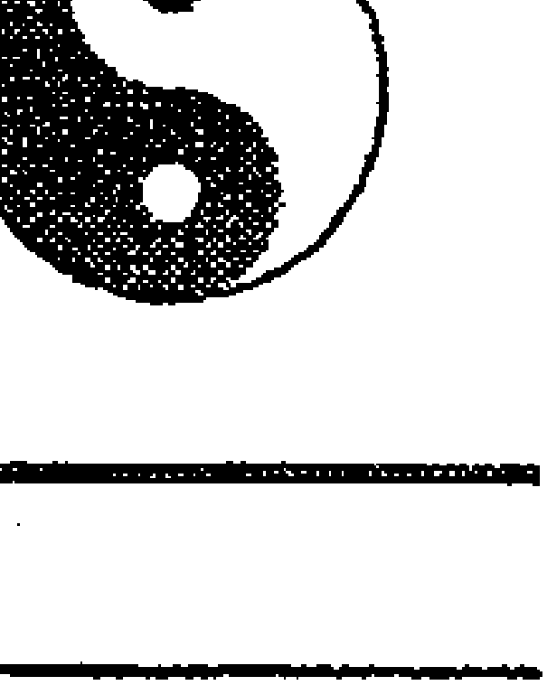
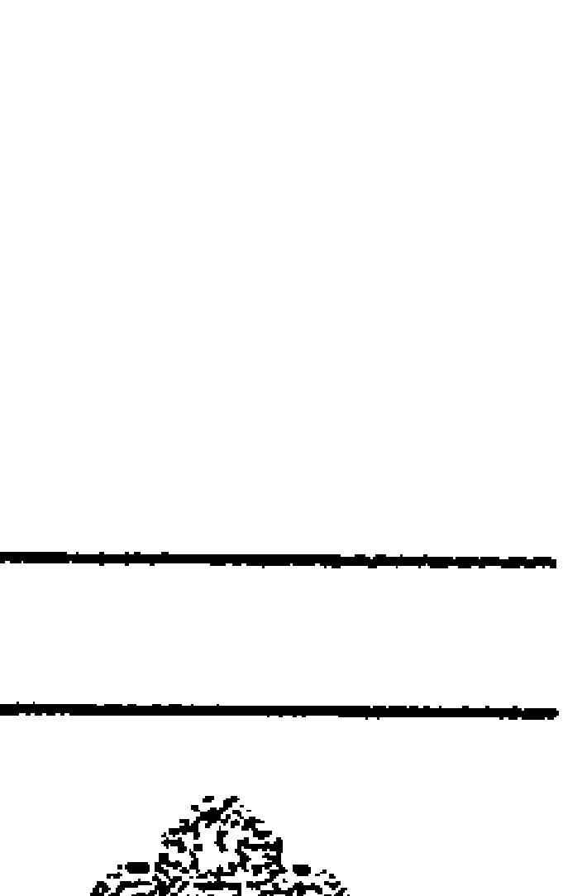
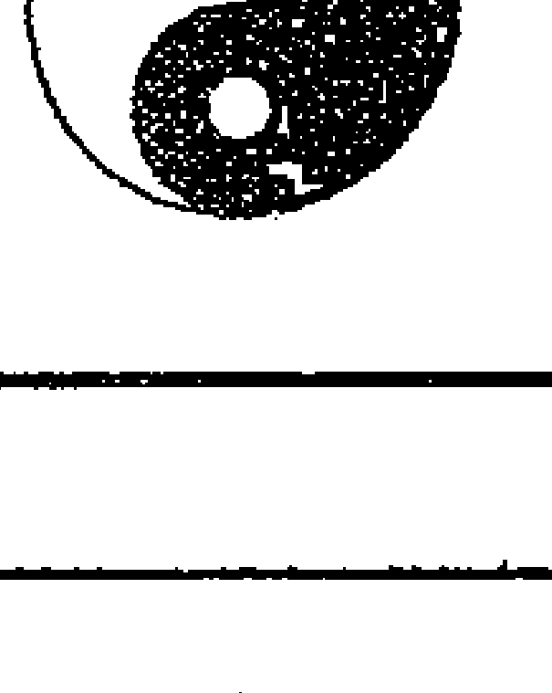
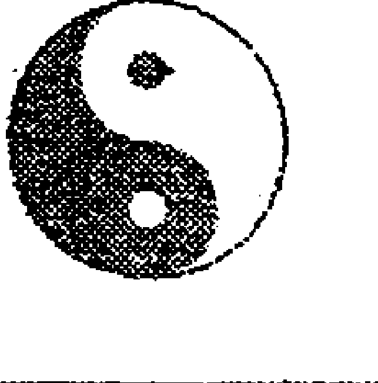
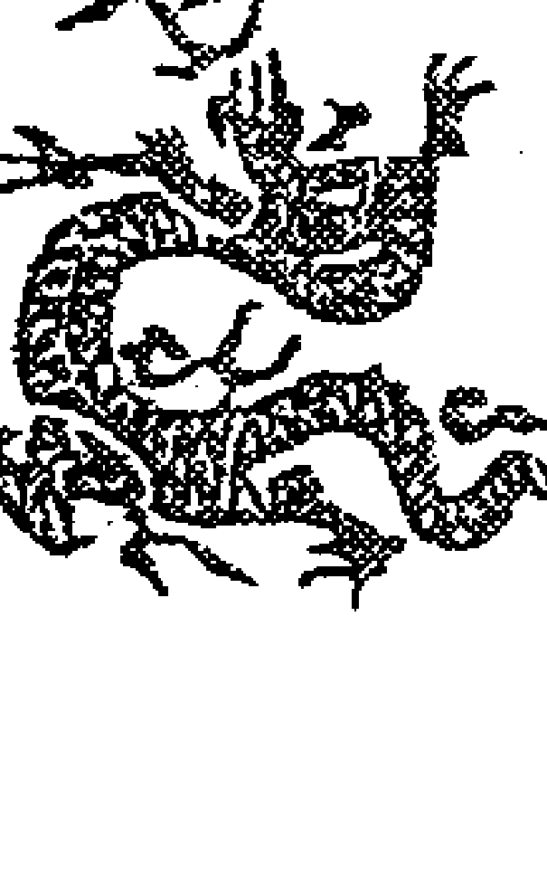

权威讲解

周易与堪舆经典文集

# 六爻预测学

梁光祥著

中医古籍出版社

## 周易与堪舆经典文集

# 六爻预测学

黎光 著

中医古籍出版社

## 图书在版编目（CIP）数据

周易与堪舆经典文集／黎光 著．北京：中医古籍出版社，2010.6

（六爻预测学）

ISBN 978-7-80174-860-7

I.①周…  II.①黎…  III.①风水—中国—古代—文集  IV.①B992.4—53

中国版本图书馆CIP数据核字（2010）第083634号

## 周易与堪舆经典文集（六爻预测学）

| 项目 | 内容 |
|---|---|
| 原著 | 黎光 |
| 责任编辑 | 杜杰慧 |
| 封面设计 | 五星设计 |
| 出版社 | 中医古籍出版社 |
| 地址 | 北京东直门内南小街16号（100700） |
| 印刷 | 河南省新乡市印刷厂 |
| 开本 | 700×1030毫米 |
| 印张 | 全套240印张 |
| 字数 | 3600千字 |
| 版次 | 2010年6月第1版 |
| 印次 | 2010年6月第1次印刷 |
| 印数 | 0001-5000套 |
| 书号 | ISBN 978-7-80174-860-7 |
| 定价 | 360.00（全套） |

## 前言

（2009年修订版）

《六爻预测学》一书首版于05年在台湾出版，后于06年底在内地出版，读者反响与销量还不错，内地的版本在国内已基本售完，今应出版商之邀将原书修订补充，重新再版，希望能带给读者更好的一个版本。

这次的修订比着原版重新整理了以下内容：

- 1. 增加了《六爻发展史》，阐明了六爻预测学在各个时期的演变，及不同时代的不同解卦方法。
- 2. 06年的内地版在排版时有些不足之处，主卦与变卦分成了上下两排，这样导致读者阅读起来很不方便，这次作者重新修订，将主卦与变卦排成一排。
- 3. 对原版一些错字做了修改，缺漏之处做了补充。

在序言的最后，需要提醒读者，这本书是作者研究易经的心得体会，其中上篇讲得是千年六爻的发展史，中篇是《六爻三大技法》（也称为《六爻三大规则》），内容为作者把古人教材整理得简单易学，是作者出版过的书籍里面最心血的结晶；引用的卦例多是《增删卜易》与《卜筮正宗》的古例，下篇的现代卦例全是作者前几年的亲身卜例，没有一例是伪造。

本书的精华内容在于中篇的《六爻三大技法》。有读者曾于2007年1月12日在网络上发言：我也是很认同周易的预测，从1月4号开始学习周易，从黎光先生的《六爻预测学》开始学起，现已能简单地看卦了。这个读者阅读九天就能够根据本书自学算卦，我想也主要是中篇的功劳。

写作这本书，也并非是作者在大力提倡算卦占卜，就其本身而言，在中国的传统易学书籍当中，也夹杂着神秘迷信、违反科学的东西，这是不容讳言的事实。对于这些书籍该如何批判地继承，首先需要我们严谨而深入的研究，其次我们必须保持清醒的头脑，我希望本书的读者能抱着一个了解传统文化、开拓视野的心态来看这本书，去粗取精，去伪存真，开启自己的智慧之光。

## 再版前言

（2006年国内版本）

中华的传统文化，源远流长，不仅以其悠久丰富闻名于世，还因其神秘性为中外瞩目。其中的神秘文化为中华民族所独有，它复杂奇异，变化无穷，植根与藏匿于民间与宗教当中，在中国古代的哲学史、宗教史、思想史、科技史里都占有重要的地位，是中国传统文化当中不可缺少的组成部分，其公开发布出版的著作还比较少见。今湖北邱烨泰先生联络各方专家，整理出《中国神秘文化大系》丛书，将中国哲学、周易术数、风水宗教等古代神秘文化编辑成著，相信对于继承传统文化，发挥古学今扬的精神会起到较大的促进作用。

笔者祖籍江西赣州，早年跟随祖辈学习易经风水，成年之后足迹遍及祖国各地。现应湖北邱烨泰先生之邀，将前几年在香港以及台湾出版的几本《易经》应用著作重新编辑出版，供应内地读者，其共包括《筮学通考》与《隐易千金断》、《六爻预测学》与《商业易经占卜指南》四本书籍。

《筮学通考》与《隐易千金断》于2003年在香港中国哲学文化出版社出版，此二书本为供应港澳台与外籍地区，出版之后流传至内地，被不法商贩盗版了十余个版本，盗版书印刷粗糙，质量低劣，错字连篇而导致谬以千里，更令内地读者不适的是，其是直接按照香港著作竖排繁体的编排习惯来印刷，使内地读者阅读起来十分不便。现将此二书按国内熟悉的横排简体的方式重新编排，相信能使广大的易学爱好者阅读起来更为方便。

《六爻预测学》与《商业易经占卜指南》原于05年与06年在台湾武陵出版公司出版，由台湾中央图书馆预行收藏，首次在内地面世。其中《六爻预测学》里将我多年研究六爻占卜学的心血材料《文王卦七大规则》中的《六爻三大潜规则》里面部分内容录入，而《商业易经占卜指南》则非常简单实用，相信可以为经商做企业的朋友提供一个比较准确的意见参考。

黎光  
2006年8月1日

## 前言

（2005年台湾版本）

作者于二○○一年在香港编著了两本六爻占卜书，一本名为《筮学通考》，一本名为《隐易千金断》。《筮学通考》属于文理法卷，它讲述了当今流行的六爻占卜学从西汉至今的演变过程；而《隐易千金断》则属于六爻技法卷，它详细地搜录了六爻占卜学古代众多的秘传技法。在此二书在港澳台东南亚地区发行之后，纷纷有读者来电来函，希望作者能再出一本以预测实例为主的六爻占卜书，以便读者能够根据预测实例，配合理解以上二书关于理法与技法的运用。

有台湾读者陈明晖先生，沿途通过电子邮件，与我交流探讨，并义务帮我联系出版社，力助我出版一事。于是自己闭门不出三月，共选出九九、两千年来自预测的一百四十余个应验卦例，编排整理，并将每卦的预测步骤与要点，以及注意事项，均详尽地写在书里面，以供读者参考研究。

本书共有十二章，头一章为《筮学通考》中的一个卦例，此卦当时发挥很好，断出了很多内容，但在拙作《筮学通考》中只讲了应验结果，而没有讲解推断理由，此次一并详细讲解，读者由此例可知一卦多断、层层递进的预测技巧。而后面十章，均是根据卦例的种类不同而分章节，并且在每章前面均讲解了不同点事的预测要点，如运气家宅章，先讲解了预测运气家宅的步骤与要点，然后附上运气家宅的相关卦例，其它各章均仿此类推。读者可先学习预测理论，然后以后面的实际卦例验证其理论，这样可收速成之效。由于本书是一本实例卦书，而非是理论著作，所以只论述了简单断法，关于详细断法，请读者参见作者所著《隐易千金断》。

值得读者格外注意的是最后一章，最后一章是作者在自己的网站上随缘帮人预测的实际卦例，有些是以论坛帖子的形式存在，有些是以即时聊天的形式存在，并且附录了作者使用《文王卦身命占》即时占测学员父母属相的例子，都是真实卦例，绝非事后附会所编，读者由此章可知本书作者实际预测时的真实步骤。在本书的后记中，不仅毫不保留地将高层次的一卦细断法的正确预测步骤详细说明，实为本书之最大泄秘之处。

在去年九月，作者前往江苏常州，遇到作者的网站管理员。管理员问道：黎老师，我马上要到上海做生意，您给帮忙看看这个出行卦。我看卦后道：有人想和你一起去上海，这个人是男性，属兔，今年二十八岁，职业也是经商。管理员连忙说，是呀，就是这个人，当初有个老先生也是这样测的，虽然他没老师你测得这么详细，但是他也说间爻发动，要有人同行。我道：此卦虽然间爻发动，要有人同行，但最后此人却是难以落实，还是要你单独前去。管理员道：此卦难道不是间爻发动吗？我道：《黄金策》出行章有云：间爻发动，有人同行。这个断语是准确的，恰反映了你现在与人相约同行；但你这个卦虽然是间爻发动，间爻却是动而化空，所以这个同伴最终是落实不了。一周后这个管理员给我打电话道：临行前同伴突然有事，难以相陪。

由上例读者可知，卦是固定的，断语技巧是固定的，但实际当中的断卦却是灵活多变的，决非读者死记断语便能应验如神。要想真的应验如神，一要掌握六爻占卜学中各类事项的基本断语与预测技巧，这点存在于拙作《隐易千金断》与《筮学通考》当中；二来更要掌握六爻占卜学当中的基本规则，例如生克冲合旬空月破等，这点存在于《六爻三大潜规则学员版》当中。以上两点读者若能认真学习，并配合卦例参考研究，达到互相结合、灵活运用的程度，则是读者六爻占卜有成之日。

读者须知，六爻占卜学历经千年，博大精深，决非月内即能迅速精通，要想真正学好六爻占卜学，第一先要熟背《卜筮正宗》中的十八问卦例与《黄金策》，以此筑基；二要熟习《增删卜易》，以此书深入；三要深入研究《易隐》一书，以此书精进。如读者能将此三本经典教材领悟于心，则六爻占卜学中的核心内容已被掌握，再来观看其它占卜书籍，也必然是水到渠成，毫无阻碍。

黎光  
2005年6月

## 目录

## 目 录

- 前言（2009修订版）……（1）
- 前言（2006年内地版）……（3）
- 前言（2005年台湾版）……（5）

## 上篇 六爻发展史（历史的传承与演变）

- 第一章 筮法的三个时代……（1）
- 第二章 三个时代的断法……（4）
- 第三章 京房易、火珠林、六爻现代应用……（7）

## 中篇 六爻筑基篇（尖端讲义）

- 第一章 六爻预测学基础信息……（11）
  - 第一节 干支五行……（11）
  - 第二节 起卦法……（12）
  - 第三节 装卦……（13）
  - 第四节 六十四卦纳甲图……（18）
- 第二章 六爻预测学的基本要素……（26）
  - 第一节 用神……（26）
  - 第二节 原神、忌神、仇神……（27）
  - 第三节 进神、退神……（27）
  - 第四节 飞神、伏神……（27）
- 第三章 五行生克……（29）
  - 第一节 支之生克……（29）
  - 第二节 支之合冲……（29）
  - 第三节 重要概念解释……（31）
- 第四章 旺衰与墓破旬空……（32）
  - 第一节 四时旺相……（32）
  - 第二节 论入墓……（33）
  - 第三节 月破……（33）
  - 第四节 旬空……（33）

## 中篇 六爻三大潜规则

- 六爻三大规则总论……（36）
- 第一大规则 吉凶占……（37）
  - 一、吉之总论……（41）
    - （一）用旺逢生……（41）
    - （二）用旺无克……（47）
  - 二、凶之总论……（53）
    - （一）用神旺极……（53）
    - （二）用神弱极……（54）
    - （三）用旺受克……（56）
    - （四）原神受伤……（66）
    - （五）用鬼互化……（70）
- 第二大规则 得失占……（76）
  - 一、取用神……（77）
  - 二、辨世爻与用爻的旺衰……（77）
  - 三、世爻定位五神……（78）
  - 四、以用世爻组合定得失趋势……（79）
    - （一）以卦体来看……（80）
    - （二）以世用组合来看……（80）
- 卦例篇……（83）
  - （一）卦体章……（83）
  - （二）世化用神章……（89）
  - （三）用神持世章……（93）
  - （四）进神持世章……（100）
  - （五）原神持世章……（104）
  - （六）仇神持世……（108）
  - （七）忌神持世章……（111）
  - （八）用动生应章……（117）

### 第三大规则 应期占（119）

- 一、取用神……（120）
- 二、查用爻用病处……（120）
- 三、观病求药，定出应期……（120）
- 附：应期占的五大组合……（121）
  - （一）单占应期法……（121）
  - （二）事体快慢……（124）
  - （三）卦技快慢法……（125）
  - （四）病处断应法……（128）
  - （五）进行时断应期法……（134）
- 本篇后记……（137）

### 下篇 六爻提升篇（预测现代例集）

- 第一章 六爻卦技卦例总论……（139）
  - 第一节 六爻占卜学的预测要点与技巧……（139）
  - 第二节 六爻占卜学的断语技法应用原则……（140）
  - 第三节 《筮学通考》书末的卦例解释……（141）
- 第二章 运气家宅……（158）
- 第三章 文书考试……（163）
- 第四章 工作官运……（173）
- 第五章 恋爱婚姻……（201）
- 第六章 商业求财……（209）
- 第七章 是非官司……（245）
- 第八章 出行行人……（252）
- 第九章 疾病身体……（261）
- 第十章 盗贼失物……（269）
- 第十一章 杂事预测……（274）
- 第十二章 网上即时测断……（279）

## 附录一

- 作者文章……（304）
  - 点睛之道（学易问答）……（304）
  - 新书《六爻潜规则》（暂定名）之部分章节……（308）

## 附录二

- 读者文章附录……（317）
  - 山西鼎升谈六爻传承……（317）
  - 台湾学员对作者的暗地评价……（319）
  - 香港拳师将作者理论引用到形意拳法当中……（320）

## 上篇 六爻发展史

（历史的传承与演变）

### 第一章 筮法的三个时代

序曲：偶向江边采白菽，还随女伴赛江神。众人不敢分明语，暗掷金钱卜远人（唐代诗人于鹄所作《江南曲》）。

自从京房易学在西汉出现以后，数千年来流传不衰，历代都有学者对此术进行研究、充实、修正、提高，其著作层出不穷。如晋代的《洞林》、唐宋时的《火珠林》、明代时的《断易天机》《卜筮元龟》《易林补遗》《易冒》《卜筮全书》，以及前清的《易隐》、乾嘉之后的《增删卜易》与《卜筮正宗》。

以上筮书虽都源于西汉京房氏，同属火珠林法的范围，但其各朝代的筮法风格并不相同，其筮断风格主要可分为三个时期。现介绍如下。

第一时期：即是流传于西汉以后，用的即是《京房易传》所示的预测之法，其简称《京房易学》。该法将阴阳五行日月星辰纳入卦中，用数学积算的模式推断灾祥。其易学体系共纳阴阳五行、干支、卦变、世应、六亲、星宿、节气、五星、建候、消息、飞伏、积算于其中，天地人三才合一，为当时第一大法。

第二时期：即是流传于晋代到前清之间，其所用即是《火珠林》所示的推断方法，其简称《火珠林筮法》。其代表作为晋代的《洞林》、唐宋的《火珠林》、明代的《易林补遗》《易冒》《断易天机》、前清的《易隐》。

第三时期：即是流传于清代乾嘉之后，直到如今，我们的六爻学者均是用的这种推断方法，其简称《纳甲筮法》或《六爻筮法》。其最早的代表作即是清代出现的《增删卜易》《卜筮正宗》二书。而现代学者所著之说，更是层出不穷。

现代学者多以为现今流行的六爻筮法即是古典的火珠林法，其实不然。古典火珠林筮断区别于现在流行的六爻筮法的特点即是：两者的取用神与推断方法均有所不同。如《火珠林》一书开篇的六亲根源节中即言：卦定根源，六亲为主；交究旁通，五行而取。其意即为：根源者，乃八宫之卦主也。而原有六亲旁通者，六爻之飞象也，而上下相乘。五行者，金木水火土也。而定四时六亲者，六宫也。六爻，父，子，兄弟，妻财，官鬼。定一宫管八卦，七卦俱从一宫出。旁通者，上下宫飞象六爻也。盖本宫在下为伏之六亲，旁宫在上为飞之六爻；如六壬有天盘、地盘也。先看六亲之下，后看六亲之上，所乘得何爻，而辨吉凶存亡也。

以上所说甚为详尽，卦定八宫，本宫为主，乃是根源，由此本宫而衍生演变出其它七卦，其它七卦之下也各伏本宫之六亲爻，故其取用神用本宫，断吉凶也用本宫，这点与现代六爻筮法只用主卦六亲各爻显是不同。而《京氏易传》亦云：“阴阳变化往往处于隐显、有无、往来等状态。显见者为飞，隐藏者为伏；有者为飞，无者为伏；来者为飞，往者为伏。”此语正是火珠林法的《六亲根源说》的渊源所在。而后来的《易隐》等著作在其《身命占》中经常也是取其本宫各爻来断卦，本宫用神为真，非本宫用神（即使其是主卦用神）为假。主卦动爻可以带出伏下本宫各爻而动，然后以此本宫动爻来断吉凶得失，此完全继承的是《火珠林》的断法。

### 第二章 三个时期的筮断浅谈

以三个筮法时期的筮断风格来看

#### 一、《京房易传》预测体系（早期筮断时期）

京氏易学虽然部分书籍已经遗失，但从京氏的部分遗留可以看出其筮断的风格。

京氏在第一封奏折中提出：“辛酉以来，蒙气衰去，太阳精明，臣独欣然，以为陛下有所定也。然少阴倍力而乘消息，臣疑陛下虽行此道，犹不得如意，臣窃悼惧……乃辛巳，蒙气复乘卦，太阳侵色，此上大夫忧阳而上意疑也。己卯庚辰之间，必有欲隔绝臣令不得乘传奏事者。”（《汉书》京房传）

在第三封奏折中，京房又提出：“乃丙戌小雨，丁亥蒙气去，然少阴并力而乘消息……戊子益甚，到五十分，蒙气复起，此陛下欲正消息，杂卦之党并力而争，消息之气不胜，强弱安危之机不可不察。己丑夜有还风，尽辛卯，太阳复侵色。至癸巳，日月相薄，此邪阴同力而太阳为疑也。臣前白九年不改，必有星亡之异。臣愿出任良试考功，臣得居内，星亡之异可去……”

> “陛下不违其言而遂听之，此乃蒙气所以不解，太阳亡色者也。臣去朝稍远，太阳侵色益甚，唯陛下勿难还臣而易逆天意。邪说虽安于人，天气必变，故人可欺，天不可欺也，愿陛下察焉。”

#### 二、《火珠林法》筮断体系（中期筮断时期）

火珠林法的主要筮断方法即是用本宫，也即是火珠林所谓的“卦定根源，六亲为主；交究旁通，五行而取”。这与现代的六爻方法显是不同，在现代的六爻筮法中，只要主卦出现六亲用神，即可直接吸收来进行推断，只有主卦没有用神的时候，方取本宫的用神。而火珠林这个方法却是大为不同，在使用火珠林推断卦象中，即使主卦出现用神与卦爻，火珠林法也不用，而是直接取本宫的六亲用神。学者由以下二例可知火珠林之法区别于现代六爻法的所在。

- 1、一日占孚病吉凶，得水雷屯卦。

| 本宫伏神 | 水雷屯 |
|---|---|
|  | 兄弟子水‖ |
|  | 官鬼戌土‖ 应 |
|  | 父母申金‖ |
|  | 官鬼辰土‖ |
| 子孙寅木 | 子孙寅木‖ 世 |
|  | 兄弟子水｜ |

此卦如果以近代的六爻筮法推断，应该取二爻的子孙寅木为用神，但是因为这是宋元时代的中期火珠林筮法，所以主卦有子孙爻，却不能去用它，还是要查阅本宫的子孙爻，本宫的子孙爻伏藏在初爻兄弟子水下面，受兄弟水相生，故断吉利。后果然应验。

- 2、妻有孕，占吉凶。

秋月壬午日占得蒙之升。

| 本宫伏神 | 山水蒙 | 地风升 |
|---|---|---|
| 兄弟巳火 | 父母寅木○ | 妻财酉金 |
| 子孙未土 | 官鬼子水‖ |  |
| 妻财酉金 | 子孙戌土‖ 世 |  |
| 官鬼亥水 | 兄弟午火× |  |
| 子孙丑土 | 子孙辰土｜ |  |
| 父母卯木 | 父母寅木‖ 应 |  |

> 别人说道：主卦兄弟发动克妻爻，父母发动克子爻，必定是母子都有大灾。

我心里很是恐惧，使用中期火珠林筮法查阅本宫用神，看到本宫子……孙伏神与主卦的伏神五行相同，为比和吉利。本宫父母爻又没有发动，不克本宫的子爻，而且日辰临火，又生子爻，所以孩子必然无灾。本宫妻爻伏于主卦世爻之下，受子孙土相生，为吉象。虽然也有本宫的兄弟发动，但却得本宫三爻鬼动制之，妻爻有救，所以妻子也必然无灾。

后于九月（冲辰现本宫子丑）己卯日（冲本宫妻爻）己时生男（子孙阳卦阳爻），母子平安。

#### 三、《纳甲（六爻）筮法》体系（晚期筮断时期）

晚期的筮断体系即是现今流传的六爻筮法，如今已极为普遍，举例如下。

- 求测者性别：女
- 所占事情：占丈夫疾病
- 申月戊辰日

| 离宫：天火同人 |  | 离宫：离为火 |
|---|---|---|
| 子孙戌土 | 应 | 兄弟巳火 世 |
| 妻财申金 | ○→ | 子孙未土 |
| 兄弟午火 |  | 妻财酉金 |
| 官鬼亥水 | 世 | 官鬼亥水 应 |
| 子孙丑土 |  | 子孙丑土 |
| 父母卯木 |  | 父母卯木 |

断卦：取官鬼亥水为用，用神逢月生为旺，又得卦中动爻相生，此为用旺逢生，所以吉而无凶。

## 第三章 京易、火珠林、六爻预测三法解

以下文章引自互联网论坛。

研究京氏言：京房在易学史上，是一个传奇式的悲剧人物。焦氏云：得吾道以亡身者，京生也。果然。传世《京氏易传》，有四部丛刊本、四库全书本。我的四库全书这张盘坏了，读不了，所以仅读四部丛刊本。民国有徐昂《京氏易传笺》，未见。

研读经年，心得如下：

- 1. 汉代，有《连山》《归藏》《周易》并行，这一点，从易纬可以看出来。京房纳甲，应该是根据《归藏》算法创制的，是《周易》和《归藏》的统一体。
- 2. 荀爽言升降，虞翻言旁通，《火珠林》亦言旁通。焦循《易学三书》全以旁通升降为说，今本《周易》卦辞、爻辞、彖辞可以互证，但不取京房纳甲法。
- 3. 京房八宫卦，由爻变升降而来。飞伏，其本质就是旁通。换而言之，焦循的旁通，就是京房飞伏条例、虞翻旁通条例的扩展和系统化。
- 4. 今本《周易》以二为中和，五为中正，是二五为君子之道也。京房儒生，继承了这一点。所以，凡卦之言，升降必二五先行。
- 5. 《京氏易传》有六亲，无六神。但有五星二十八宿。以其五行属性算定吉凶。故今所用之六神，来历不详，或为唐以后数术家添加，本非京氏所有。
- 6. 京氏月建、积算法，与今天的月建、日建不同。京房的日建，也就是积算，是动的。月建主月，积算主日。
- 7. 京房卦气说，与《乾凿度》不同，与孟氏不同。用之皆验。

网友问：大师您能否说说，京氏积算法，举两个卦例？

研究京氏道：京氏古法，失传已久，假以时日，或可研究明白。目前头绪不多，仍待研究。

签者发言：京房是焦延寿的弟子，所以以京房易及其演变的六爻预测加配焦氏易林的卦辞共同分析，则是象加理，直接传承民国尚秉和先生的断法，使预测更为多面，比着结合周易卦辞更为合适。

研究京氏道：京房法，至今仍未完全明白，惭愧。焦延寿的方法，可能跟目前的《断易鬼灵经》是一个脉络，完全不看占时，只以得卦论。而且《易林》的一交动法，似乎对梅易也有影响，这几个关系比较大。焦氏，其实跟参考梅易断法差不多，《易林》刻板一些；梅易灵活一些。

京房的体系非常复杂，复杂到一旦要运用京房的体系去运算，会非常耗费心力。京氏易排出的卦盘，已经让人眼花了，要加入《易林》，可不容易。不过易兄的设想非常好，只要想个办法解决一交动与乱动的关系即可。

签者言：易兄有时间不妨试试，京氏古法可见此例：http://yuanyi81212.blog.163.com，少见应用京氏易学断法的例子，版主可做参考。

先生在网上使用《筮学通考》一书介绍的三种纳甲筮法（京房易、火珠林、当今六爻）公开为网友“易初”预测官运。

> 绝对的经典：黎光先生给我预测工作的反馈！！——「作者：易初」

> “丙午月戊午日”

| 坎宫：地水师 | 震宫：地风升 |
|---|---|
| ●●父母癸酉金 应 | ●●父母癸酉金 |
| ●●兄弟癸亥水 | ●●兄弟癸亥水 |
| ●●官鬼癸丑土 | ●●官鬼癸丑土 世 |
| ●●妻财戊午火 世 X-> | ●父母辛酉金 |
| ●官鬼戊辰土 | ●兄弟亥水 |
| ●●子孙戊寅木 | ●●官鬼辛丑土 应 |

## 关于易初见工作的预测结果

- 1、使用京房易卦来断：得鬼易，主拘泥停滞。世为卦主，居于三公之位，而得上交宗庙政策佐之，此为政策昏暗。京房云：三公居世上交宗庙为应，君子以待时，小人为交。所以易初占得此卦，若易初见作君子的话当可退隐避乱，若为小人的话当可趁时而动。五星人师卦世爻星木司生又主万物，所以易初暂当采效隐士之流，敞开心怀参玄悟易，不入名利之场。归卦辰午酉亥自刑俱见，京氏受刑见害，气不和也。而亥水支位在五，当有领导愤恨之事，世下所伏建侯主辰辰午自刑，值于清明，故至辰月清明，易初当因官事耗散钱财。所积算为官，财官相生，节为秋分，至时必有好处。

- 2、用火珠林法断：占公者以官为用，以父卫之。此卦本宫有官无父，少其护卫，在子孙寅月必有损官伤职之忧。本宫官伏兄下，主同事欺凌，人不一心多虚诈，更怕赚钱。世爻化出父母克子卫官，卦身亦在申，待申酉月必有工作喜讯传来。世爻自动化父，至时也可自去见贵，必有好处。

- 3、用六爻断：两鬼夹世泄身多有忧，占公者有被他人谋骗之事。世得初爻生日，已得群众好感，不得领导之心。卦中一父两官，或自己工作一地而涉及两个部门业务（或金融后勤之类），内卦衰而外卦旺，可委旧而图新。外官下伏申金，世动化酉金，至申酉月必可图谋成功。

以上卦是我摇的，请黎光先生为我断的，真是厉害！

首先是寅月伤官损职一事属实，确有此事。我率领的一部门工作被合并入别人的部门。在申月己巳日我部门又重新分离出来，初步达到了我的愿望，可是我个人相应的待遇还没有恢复。

其次是在巳酉月丁亥日午时得到通知：我自己又被领导安排到一个和我原部门工作不相干的部门工作，工作权限比以前大点，而且我的待遇也恢复了，可是实在太累，去了不到十天就病了一场，这不刚有点好转。但是无论怎么说，领导说锻炼也好，重用也罢，我的工作环境确实发生了变化，虽然累，是朝好的方向变化。

> “卦中一父两官，或自己工作一地而涉及两个部门业务（或金融后勤之类）。”

此断语见真是神断，我目前工作岗位是全市的公用电话管理和电话卡的销售，以前电话卡的销售确实不在一个部门，刚合并过来，而且确实是金融之类的。我在申月想我已经遂心如意，可是在酉月连我自己也没有想到去这个部门，呵呵，我真是佩服的……

研究京氏道：大喜大喜，初看一过，此高手所用《京氏易》，传神之处很多，可圈可点，不过有三个主要的工具没有使用，不知何故，就是星宿、候建、积算。若有师传，当不致如此；若无师传，可称聪慧异常了。据小的所知，京氏易在明朝还流传在民间，不知现在是否还有传人。回头再好好研究，多谢多谢！

研究京氏道：原来候建、积算也用在其中了，现在条例清楚，京氏断法的奥妙，可以学到很多了，再次表示感谢！

看来黎先生断卦，确实是京氏一脉了，必有师传。有了此卦，京氏的奥秘，小的几乎都明白了，呵呵。

近来忙于复习，准备考博。他日好好整理，再参考《筮学通考》一书，厘定条例用法。考证问题不大，只是实战检验，尚须时日。若侥幸成功，必送易兄一份，聊表谢意。

## 中篇 六爻筑基篇

（尖端讲义）

### 第一章 六爻预测学基础信息

### 第一节、干支五行

天干，是古人用来记录时间的符号，共有十位，分别是：甲、乙、丙、丁、戊、己、庚、辛、壬、癸。

- 十天干分为阴干和阳干两大类：
- 阳干：甲、丙、戊、庚、壬
- 阴干：乙、丁、己、辛、癸

- 十天干与五行、五方组合结果如下：
- 甲乙→东方→木；戊己→中央→土；
- 丙丁→南方→火；庚辛→西方→金；
- 壬癸→北方→水。

地支，是古人用来记录时间的符号，共有十二位，分别是：子、丑、寅、卯、辰、巳、午、未、申、酉、戌、亥。十二地支共分为阳支和阴支两类：

- 阳支：子、寅、辰、午、申、戌；
- 阴支：丑、卯、巳、未、酉、亥。
- 十二地支与五行组合结果如下：
  - 寅卯——→木。寅为阳木，卯为阴木。
  - 巳午——→火。巳为阳火，午为阴火。
  - 申酉——→金。申为阳金，酉为阴金。
  - 亥子——→水。亥为阳水，子为阴水。
  - 辰戌丑未→土。辰戌为阳土，丑未为阴土。

### 第二节、起卦法

##### 一、起卦心态

起卦时最好找一个安静的地方，意念集中，不可玩笑试之，否则会因为信息干扰而导致预测不准。

起卦画卦方法：将三枚铜钱合于双手掌，此时默念自己所需预测之事，静心一分钟，摇六次，记下每一次的爻象。有字的一面称为面，无字的一面称为背。

- 摇的铜钱会出现如下组合情况：
- 一个背、两个面，称作“单”，画作“/”，为少阳。
- 两个背一个面，称作“拆”，画作“//”，为少阴。
- 三个背，没有面，称作“重”，画作“O”，为老阳，是变爻。
- 三个面，没有背，称作“交”，画作“×”，为老阴，是变爻。
- 每摇出一次画出一爻，六爻成卦，需摇六次，画六次。第一次为初爻，画在卦的最下面，依次上升，第六次为第六爻，画在最上边，如遇有×、O，再画出变卦来。

#### 第三节 装卦

> （一般的读者可以直接查第四节的爻象表，省略此节）

装卦就是把用以预测的诸信息元素标记在画出的卦上。

（1）装卦名

确定卦的名称，该卦属于何宫及五行属性。纳甲法把六十四卦分为八宫，每宫八卦。

- 乾宫八卦，属金。
- 乾为天，天风姤，天山遁，天地否，风地观，山地剥，火地晋，火天大有。
- 兑宫八卦，属金。
- 兑为泽，泽水困，泽地萃，泽山咸，水山蹇，地山谦，雷山小过，雷泽归妹。
- 离宫八卦，属火。
- 离为火，火山旅，火风鼎，火水未济，山水蒙，风水涣，天水讼，天火同人。
- 震宫八卦，属木。
- 震为雷，雷地豫，雷水解，雷风恒，地风升，水风井，泽风大过，泽雷随。
- 巽宫八卦，属木。
- 巽为风，风天小畜，风火家人，风雷益，天雷无妄，火雷噬嗑，山雷颐，山风蛊。
- 坎宫八卦，属水。
- 坎为水，水泽节，水雷屯，水火既济，泽火革，雷火丰，地火明夷，地水师。
- 艮宫八卦，属土。
- 艮为山，山火贲，山天大畜，山泽损，火泽睽，天泽履，风泽中孚，风山渐。
- 坤宫八卦，属土。
- 坤为地，地雷复，地泽临，地天泰，雷天大壮，泽天夬，水天需，水地比。

##### （2）装世应

世与应是预测中使用较多的概念，一般把世当作自己或自己的方面，把应当作他人或与自己对应的方面。卦中装世应，就是确定卦中哪一爻是世爻，哪一爻是应爻。世与应在卦中，都是中间隔两位。如世在初爻则应在四爻；世在二爻，应在五爻；世在三爻，应在六爻；世在四爻，应在一爻；世在五爻，应在二爻；世在六爻，应在三爻。世与应中间隔着的两爻，叫间爻。

确定卦的世爻，依据的是前面所讲的卦在八宫中的位置。八纯卦的世在六爻，也就是上爻。一世卦世在初爻，二世卦世在二爻，三世卦世在三爻，四世卦世在四爻，五世卦世在五爻，游魂卦世在四爻，归魂卦世在三爻。

世爻确定后，隔两位即是应爻。

##### （3）装纳甲

装纳甲，就是将六十四卦中每个卦爻标出自身所代表的天干和地支。

乾卦在内卦，初爻为甲子，二爻为甲寅，三爻为甲辰；乾卦在外卦，四爻为壬午，五爻为壬申，六爻为壬戌。因为乾卦属阳，所以配的天干地支都属阳，阳卦隔位顺数，内外卦六爻顺序为子寅辰、午申戌。

坤卦在内卦，初爻为乙未，二爻为乙巳，三爻为乙卯；坤卦在外卦，四爻为癸丑，五爻为癸亥，六爻为癸酉。

坎卦在内卦，初爻为戊寅，二爻为戊辰，三爻为戊午；坎卦在外卦，四爻为戊申，五爻为戊戌，六爻为戊子。

艮卦在内卦，初爻为丙辰，二爻为丙午，三爻为丙申；艮卦在外卦，四爻为丙戌，五爻为丙子，六爻为丙寅。

震卦在内卦，初爻起庚子，二爻为庚寅，三爻为庚辰；震卦在外卦，四爻起庚午，五爻为庚申，六爻为庚戌。

巽卦在内卦，初爻起辛丑，二爻为辛亥，三爻为辛酉；巽卦在外卦，四爻为辛未，五爻为辛巳，六爻为辛卯。

离卦在内卦，初爻为己卯，二爻为己丑，三爻为己亥；离卦在外卦，四爻为己酉，五爻为己未，六爻为己巳。

兑卦在内卦，初爻为丁巳，二爻为丁卯，三爻为丁丑；兑卦在外卦，四爻为丁亥，五爻为丁酉，六爻为丁未。

有一个简单的歌诀：

乾在内子寅辰，乾在外午申戌；巽在内丑亥酉，巽在外未巳卯；坎在内寅辰午，坎在外申戌子；离在内卯丑亥，离在外酉未巳；艮在内辰午申，艮在外戌子寅；兑在内巳卯丑，兑在外亥酉未；震在内子寅辰，震在外午申戌；坤在内未巳卯，坤在外丑亥酉。

例：得一雷风恒卦，内卦为风，即巽在内，初爻为丑，二爻为亥，三爻为酉；外卦为雷，即震在外，四爻为午，五爻为申，六爻为戌。

##### （4）装五行

根据卦中每爻的地支，标上五行金木水火土，十二地支与五行配合如下：

子为水，丑为土，寅为木，卯为木，辰为土，巳为火，午为火，未为土，申为金，酉为金，戌为土，亥为水。

##### （5）装六亲

六亲指父母、子孙、官鬼、妻财、兄弟五类象征性的名词。这五类与卦身合在一起，总称六亲。六亲（除卦身外）是依据五行的生克来确定。

确定六亲以该卦所在宫的五行属性为我，看卦中各爻与本宫五行属性的生克关系，按“生我者父母，我生者子孙，克我者官鬼，我克者妻财，比和者兄弟”的规则来确定每爻是何六亲。

##### （6）安卦身

卦身，又叫月卦身。

安月卦身，看世爻的阴阳。诀曰：阴世则从午月起，阳世还从子月生；欲得识其卦中意，从初数至世方真。如测得乾为天卦，六爻世，世为阳爻，从初爻为子数起，二为丑、三寅、四卯、五辰、六为巳，巽卦第五爻辛巳，所以第五爻为卦身。

##### （7）记日月

测卦时先要用天干和地支记下预测的月和日，有时也需要年和时。在预测中，月份的起止日是按照节、气的起止日算。立春为正月节，惊蛰为二月节，清明为三月节，立夏为四月节，芒种为五月节，小暑为六月节，立秋为七月节，白露为八月节，寒露为九月节，立冬为十月节，大雪为十一月节，小寒为十二月（腊月）节。如头年十二月二十五日立春，就从头年十二月二十五日起正月，止于今年的惊蛰前。如头年十二月二十五日立春后算卦，月份就为寅，而不是头一年腊月的丑。

日的干支可借助《万年历》查定。

##### （8）装六兽

六兽，也称为“六神”。依次为青龙、朱雀、勾陈、腾蛇、白虎、玄武。

卦中装六兽主要依据测日的天干，诀曰：甲乙起青龙，丙丁起朱雀；戊日起勾陈，己日起腾蛇；庚辛起白虎，壬癸起玄武。即如果甲日或乙日预测，卦的初爻为青龙，二爻为朱雀，三爻为勾陈，四爻为腾蛇，五爻为白虎，六爻为玄武。

列表如下：

|  | 甲乙日 | 丙丁日 | 戊日 | 己日 | 庚辛日 | 壬癸日 |
|---|---|---|---|---|---|---|
| 六爻 | 玄武 | 青龙 | 朱雀 | 勾陈 | 腾蛇 | 白虎 |
| 五爻 | 白虎 | 玄武 | 青龙 | 朱雀 | 勾陈 | 腾蛇 |
| 四爻 | 腾蛇 | 白虎 | 玄武 | 青龙 | 朱雀 | 勾陈 |
| 三爻 | 勾陈 | 腾蛇 | 白虎 | 玄武 | 青龙 | 朱雀 |
| 二爻 | 朱雀 | 勾陈 | 腾蛇 | 白虎 | 玄武 | 青龙 |
| 初爻 | 青龙 | 朱雀 | 勾陈 | 腾蛇 | 白虎 | 玄武 |

##### （9）装变爻

卦遇变爻，要把变化出来的爻装上纳甲、五行、六亲。装变爻法与前面所述装主卦卦爻法相同，如变出的卦是乾卦在内，则以“乾在内子寅辰”记。但在装六亲的时候，要按主卦卦宫五行来确定六亲，而不能按下面的六十四卦纳甲图来定。

如测得山天大畜之山风蛊卦。山天大畜为本卦，初爻是变爻，内卦艮变为巽，依“巽在内，丑亥酉”记下初爻为辛丑土。山天大畜属艮宫，艮宫的五行属土，变爻也随本宫来定，变爻为辛丑土，与艮宫之土为相同五行，所以变爻为兄弟丑土。

#### 第四节 六十四卦纳甲图

乾宫八卦属金：

| 乾为天 | 天风姤 | 天山遁 | 天地否 |
|---|---|---|---|
| 父母戌土● 世 | 父母戌土● | 父母戌土● | 父母戌土● 应 |
| 兄弟申金● | 兄弟申金● | 兄弟申金● 应 | 兄弟申金● |
| 官鬼午火● | 官鬼午火● 应 | 官鬼午火● | 官鬼午火● |
| 父母辰土● 应 | 兄弟酉金● | 兄弟申金● | 妻财卯木●● 世 |
| 妻财寅木● | 子孙亥水● | 官鬼午火●● 世 | 官鬼巳火●● |
| 子孙子水 | 父母丑土○● 世 | 父母辰土●● | 父母未土●● |

| 风地观 | 山地剥 | 火地晋 | 火天大有 |
|---|---|---|---|
| 妻财卯木● | 妻财寅木● | 官鬼巳火● | 官鬼巳火● 应 |
| 官鬼巳火● | 子孙子水●● 世 | 父母未土●● | 父母未土●● |
| 父母未土●● 世 | 父母戌土●● | 兄弟酉金● 世 | 兄弟酉金● |
| 妻财卯木●● | 妻财卯木●● | 妻财卯木●● | 父母辰土● 世 |
| 官鬼巳火●● | 官鬼巳火●● 应 | 官鬼巳火●● | 妻财寅木● |
| 父母未土●● 应 | 父母未土●● | 父母未土●● 应 | 子孙子水● |

兑宫八卦属金：

| 兑为泽 | 泽水困 | 泽地萃 | 泽山咸 |
|---|---|---|---|
| 父母未土●●世 | 父母未土●● | 父母未土●● | 父母未土●●应 |
| 兄弟酉金● | 兄弟酉金● | 兄弟酉金●应 | 兄弟酉金● |
| 子孙亥水● | 子孙亥水●应 | 子孙亥水● | 子孙亥水● |
| 父母丑土●●应 | 官鬼午火●● | 妻财卯木●● | 兄弟申金●世 |
| 妻财卯木● | 父母辰土● | 官鬼巳火●●世 | 官鬼午火●● |
| 官鬼巳火● | 妻财寅木●●世 | 父母未土●● | 父母辰土●● |

| 水山蹇 | 地山谦 | 雷山小过 | 雷泽归妹 |
|---|---|---|---|
| 子孙子水●● | 兄弟酉金●● | 父母戌土●● | 父母戌土●●应 |
| 父母戌土● | 子孙亥水●●世 | 兄弟申金●● | 兄弟申金●● |
| 兄弟申金●●世 | 父母丑土●● | 官鬼午火●世 | 官鬼午火● |
| 兄弟申金● | 兄弟申金● | 兄弟申金● | 父母丑土●●世 |
| 官鬼午火●● | 官鬼午火●●应 | 官鬼午火●● | 妻财卯木● |
| 父母辰土●●应 | 父母辰土●● | 父母辰土●●应 | 官鬼巳火● |

离宫八卦属火：

| 离为火 | 火山旅 | 火风鼎 | 火水未济 |
|---|---|---|---|
| 兄弟巳火●世 | 兄弟巳火● | 兄弟巳火● | 兄弟巳火● 应 |
| 子孙未土●● | 子孙未土●● | 子孙未土●●应 | 子孙未土●● |
| 妻财酉金● | 妻财酉金● 应 | 妻财酉金● | 妻财酉金● |
| 官鬼亥水●应 | 妻财申金● | 妻财酉金● | 兄弟午火●●世 |
| 子孙丑土●● | 兄弟午火●● | 官鬼亥水● 世 | 子孙辰土● |
| 父母卯木● | 子孙辰土●●世 | 子孙丑土●● | 父母寅木●● |

| 山水蒙 | 风水涣 | 天水讼 | 天火同人 |
|---|---|---|---|
| 父母寅木● | 父母卯木● | 子孙戌土● | 子孙戌土●应 |
| 官鬼子水●● | 兄弟巳火●世 | 妻财申金● | 妻财申金● |
| 子孙戌土●●世 | 子孙未土●● | 兄弟午火● 世 | 兄弟午火● |
| 兄弟午火●● | 兄弟午火●● | 兄弟午火●● | 官鬼亥水●世 |
| 子孙辰土● | 子孙辰土●应 | 子孙辰土● | 子孙丑土●● |
| 父母寅木●●应 | 父母寅木●● | 父母寅木●●应 | 父母卯木● |

##### 震宫八卦属木

| 震为雷 | 雷地豫 | 雷水解 | 雷风恒 |
|---|---|---|---|
| 妻财戌土●●世 | 妻财戌土●● | 妻财戌土●● | 妻财戌土●●应 |
| 官鬼申金●● | 官鬼申金●● | 官鬼申金●●应 | 官鬼申金●● |
| 子孙午火● | 子孙午火●应 | 子孙午火● | 子孙午火● |
| 妻财辰土●●应 | 兄弟卯木●● | 子孙午火●● | 官鬼酉金●世 |
| 兄弟寅木●● | 子孙巳火●● | 妻财辰土●世 | 父母亥水● |
| 父母子水● | 妻财未土●●世 | 兄弟寅木●● | 妻财丑土●● |

| 地风升 | 水风井 | 泽风大过 | 泽雷随 |
|---|---|---|---|
| 官鬼酉金●● | 父母子水●● | 妻财未土●● | 妻财未土●●应 |
| 父母亥水●● | 妻财戌土●●世 | 官鬼酉金● | 官鬼酉金● |
| 妻财丑土●●世 | 官鬼申金●● | 父母亥水●世 | 父母亥水● |
| 官鬼酉金● | 官鬼酉金● | 官鬼酉金● | 妻财辰土●●世 |
| 父母亥水● | 父母亥水●应 | 父母亥水● | 兄弟寅木●● |
| 妻财丑土●●应 | 妻财丑土●● | 妻财丑土●●应 | 父母子水● |

##### 巽宫八卦属木

| 巽为风 | 风天小畜 | 风火家人 | 风雷益 |
|---|---|---|---|
| 兄弟卯木●世 | 兄弟卯木● | 兄弟卯木● | 兄弟卯木●应 |
| 子孙巳火● | 子孙巳火● | 子孙巳火●应 | 子孙巳火● |
| 妻财未土●● | 妻财未土●●应 | 妻财未土●● | 妻财未土●● |
| 官鬼酉金●应 | 妻财辰土● | 父母亥水● | 妻财辰土●●世 |
| 父母亥水● | 兄弟寅木● | 妻财丑土●●世 | 兄弟寅木●● |
| 妻财丑土●● | 父母子水●世 | 兄弟卯木● | 父母子水● |

| 天雷无妄 | 火雷噬嗑 | 山雷颐 | 山风蛊 |
|---|---|---|---|
| 妻财戌土● | 子孙巳火● | 兄弟寅木● | 兄弟寅木●应 |
| 官鬼申金● | 妻财未土●●世 | 父母子水●● | 父母子水●● |
| 子孙午火●世 | 官鬼酉金● | 妻财戌土●●世 | 妻财戌土●● |
| 妻财辰土●● | 妻财辰土●● | 妻财辰土●● | 官鬼酉金●世 |
| 兄弟寅木●● | 兄弟寅木●●应 | 兄弟寅木●● | 父母亥水● |
| 父母子水●应 | 父母子水● | 父母子水●应 | 妻财丑土●● |

##### 坎宫八卦属水

| 坎为水 | 水泽节 | 水雷屯 | 水火既济 |
|---|---|---|---|
| 兄弟子水●●世 | 兄弟子水●● | 兄弟子水●● | 兄弟子水●●应 |
| 官鬼戌土● | 官鬼戌土● | 官鬼戌土●应 | 官鬼戌土● |
| 父母申金●● | 父母申金●●应 | 父母申金●● | 父母申金●● |
| 妻财午火●●应 | 官鬼丑土●● | 官鬼辰土●● | 兄弟亥水●世 |
| 官鬼辰土● | 子孙卯木● | 子孙寅木●●世 | 官鬼丑土●● |
| 子孙寅木●● | 妻财巳火●世 | 兄弟子水● | 子孙卯木● |

| 泽火革 | 雷火丰 | 地火明夷 | 地水师 |
|---|---|---|---|
| 官鬼未土●● | 官鬼戌土●● | 父母酉金●● | 父母酉金●●应 |
| 父母酉金● | 父母申金●●世 | 兄弟亥水●● | 兄弟亥水●● |
| 兄弟亥水●世 | 妻财午火● | 官鬼丑土●●世 | 官鬼丑土●● |
| 兄弟亥水● | 兄弟亥水● | 兄弟亥水● | 妻财午火●●世 |
| 官鬼丑土●● | 官鬼丑土●●应 | 官鬼丑土●● | 官鬼辰土● |
| 子孙卯木●应 | 子孙卯木● | 子孙卯木●应 | 子孙寅木●● |

##### 艮宫八卦属土

| 艮为山 | 山火贲 | 山天大畜 | 山泽损 |
|---|---|---|---|
| 官鬼寅木☉世 | 官鬼寅木☉ | 官鬼寅木☉ | 官鬼寅木☉应 |
| 妻财子水☉☉ | 妻财子水☉☉ | 妻财子水☉☉应 | 妻财子水☉☉ |
| 兄弟戌土☉☉ | 兄弟戌土☉☉应 | 兄弟戌土☉☉ | 兄弟戌土☉☉ |
| 子孙申金☉应 | 妻财亥水☉ | 兄弟辰土☉ | 兄弟丑土☉☉世 |
| 父母午火☉☉ | 兄弟丑土☉☉ | 官鬼寅木☉世 | 官鬼卯木☉ |
| 兄弟辰土☉☉ | 官鬼卯木☉世 | 妻财子水☉ | 父母巳火☉ |

| 火泽睽 | 天泽履 | 风泽中孚 | 风山渐 |
|---|---|---|---|
| 父母巳火☉ | 兄弟戌土☉ | 官鬼卯木☉ | 官鬼卯木☉应 |
| 兄弟未土☉☉ | 子孙申金☉世 | 父母巳火☉ | 父母巳火☉ |
| 子孙酉金☉☉世 | 父母午火☉ | 兄弟未土☉☉世 | 兄弟未土☉☉ |
| 兄弟丑土☉☉ | 兄弟丑土☉☉ | 兄弟丑土☉☉ | 子孙申金☉世 |
| 官鬼卯木☉ | 官鬼卯木☉应 | 官鬼卯木☉ | 父母午火☉☉ |
| 父母巳火☉应 | 父母巳火☉ | 父母巳火☉应 | 兄弟辰土☉☉ |

##### 坤宫八卦属土

| 坤为地 | 地雷复 | 地泽临 | 地天泰 |
|---|---|---|---|
| 子孙酉金●●世 | 子孙酉金●● | 子孙酉金●● | 子孙酉金●●应 |
| 妻财亥水●● | 妻财亥水●● | 妻财亥水●●应 | 妻财亥水●● |
| 兄弟丑土●● | 兄弟丑土●●应 | 兄弟丑土●● | 兄弟丑土●● |
| 官鬼卯木●●应 | 兄弟辰土●● | 兄弟丑土●● | 兄弟辰土●世 |
| 父母巳火●● | 官鬼寅木●● | 官鬼卯木●世 | 官鬼寅木● |
| 兄弟未土●● | 妻财子水●世 | 父母巳火● | 妻财子水● |

| 雷天大壮 | 泽天夬 | 水天需 | 水地比 |
|---|---|---|---|
| 兄弟戌土●● | 兄弟未土●● | 妻财子水●● | 妻财子水●●应 |
| 子孙申金●● | 子孙酉金●世 | 兄弟戌土● | 兄弟戌土● |
| 父母午火●世 | 妻财亥水● | 子孙申金●●世 | 子孙申金●● |
| 兄弟辰土● | 兄弟辰土● | 兄弟辰土● | 官鬼卯木●●世 |
| 官鬼寅木● | 官鬼寅木●应 | 官鬼寅木● | 父母巳火●● |
| 妻财子水●应 | 妻财子水● | 妻财子水●应 | 兄弟未土●● |

### 第二章 六爻预测学的基本要素

#### 第一节 用神

用神又称主事爻与用爻，其确定大体如下：

- 1. 自测吉凶，以世爻为用神，用神即为自己，应爻为他人。
- 2. 测父母辈以上亲人、师长等以父母爻为用神。测天地、城市、住宅、船车、衣服、雨具、文书、合同等，大体上凡是能保护“我”的物品都以父母爻为用神。
- 3. 女人测丈夫，及丈夫的兄弟、朋友，以官鬼为用神。凡人测求功名、工作、测公事、测官员等凡是能拘束“我”的事物，都以官鬼为用神。
- 4. 测兄弟朋友同辈等同辈人事，以兄弟爻为用神。
- 5. 男人测妻及妻的同辈女亲、女友等以妻财为用神。凡人测钱、财、粮食、器皿等凡为“我”所驱使之物，也以妻财为用神。
- 6. 测儿女、子孙等晚辈人，及医生、医药、兵士、僧道、禽畜等均以子孙爻为用神。

卦中没有出现用神的时候查伏神，卦中出现两个用神的时候，一般选择旺相有力的爻为用神，舍弃衰弱无力的爻。

#### 第二节 原神、忌神、仇神

用神之外，还有原神、忌神和仇神。  
原神是生用神的爻，如用神为兄弟，父母爻就是原神。  
忌神是克制用神的爻，如用神是兄弟，官鬼爻就是忌神。  
仇神是生忌神的爻，如兄弟为用神，官鬼爻为忌神，生官鬼的妻财爻即是仇神。

#### 第三节 进神、退神

进神，卦爻之动而化进，即为寅化卯、巳化午、申化酉、亥化子、丑化辰、辰化未、未化戌、戌化丑。  
退神，卦爻之动而化退，即为卯化寅、午化巳、酉化申、子化亥、辰化丑、丑化戌、戌化未、未化辰。  
进神，表示事物向前发展；退神，表示事物变化而倒退。吉神宜化进神，凶神宜化退神。

#### 第四节 飞神、伏神

如果卦中不见用神，则需要在本宫主卦（八纯卦）中去找到用神，这个用神即是伏神。找伏神的方法是看本宫的八纯卦。如测父母事得山火贲卦，测父母应以父母爻为用神，而山火贲卦中没有父母爻，需要在艮卦中找到，二爻丙午火为父母，记在山火贲二爻己丑土下，丙午火为伏神作用神用，山火贲二爻己丑土就是飞神。

##### 飞伏歌诀

伏克飞神为出暴，飞来克伏反伤身。  
伏去生飞名泄气，飞来生伏得长生。  
爻逢伏克飞无事，用见飞伤伏不宁。  
飞伏不和为无助，伏藏出现障来因。

### 第三章 五行生克

#### 第一节 爻之生克

卦象中的生克共有四个原则：

- 1. 月建、日辰可以生克卦中之爻，卦中之爻不能生克月建和日辰。
- 2. 卦中动爻可以生克其它动静爻，静爻一般没有作用。
- 3. 卦中变出之爻可以回头生克变出自己的动爻，变爻不能生克卦中其他爻。
- 4. 卦中旺相之爻能生克衰弱之爻，衰弱之爻不能生克旺相之爻。

#### 第二节 爻之合冲

合和冲都是卦中经常出现的特定组合。

- 1. 初级六爻主要用到地支合，地支合有二合与三合。
- 2. 二合者，子与丑合，寅与亥合，卯与戌合，辰与酉合，巳与申合，午与未合。

卦中构成三合是有条件的，主要有：

- 1. 月、日可以与卦中的爻合。月日与卦中静爻相合，谓之合起。静爻被合起，有旺相之意；月日与卦中动爻相合，谓之合住，使动爻不能发动而起作用。
- 2. 卦中爻与爻合，必须是两爻皆动，有一爻不动也不能成合。两爻俱静更不成合。两爻俱动而成合，谓之合好，使用神更为旺相有力。
- 3. 动爻化出之爻，可以与本动爻合。如卦中丑动化出子水，子丑相合，谓之化拱，为得化爻扶助之意。
- 4. 卦中六爻，内外三对都合，谓之卦逢六合，不论爻动与静。
- 5. 六冲卦变为六合卦，先为凶后吉，先散后成之象。

以上五条得其一，即可称为合。遇合则诸事必得久远，有始有终。但需注意，吉事宜逢合，合则事宜成；凶事不宜逢合，逢则凶事难解。

##### 二、三合又称三合成局

亥卯未合成木局，寅午戌合成火局，巳酉丑合成金局，申子辰合成水局。三合成局也是有条件的：

- 1. 卦中三爻都动可成合局。
- 2. 有两爻动，一爻不动，也可成局，谓之合起不动之爻。两动包括一明动，一暗动。
- 3. 内卦初、三爻动化出变爻可以成局。
- 4. 外卦四、六爻动化出变爻可以成局。
- 5. 卦内有两个动爻，可和月日之一合局。如测卦之日月不成合局，待后来日月补凑仍可成局，这叫虚一待用。

三合成局有吉有凶，不能一概而论吉。如测求谋喜庆之事，宜于成局，表示长久牢固之意。如若测官讼忧疑之事，如成合局则难消释。如测功名，合成官局，谓之官旺；合成财局，财能生官，都为吉兆；但若合成子局，子能伤官，则不能成其事。

##### 三、冲

冲，是指地支子午相冲，丑未相冲，寅申相冲，卯酉相冲，辰戌相冲，巳亥相冲。

### 相冲之法为

- 1. 日月可以冲爻。
- 2. 卦逢六冲。
- 3. 六合卦变六冲。
- 4. 六冲卦变六冲。
- 5. 动爻变冲。
- 6. 爻与爻相冲。

爻遇月冲为月破，爻遇日冲为暗动，爻本身休囚又遇日冲为日破。

#### 第三节 墓破概念解释

- 1. **回头生**：回头生者，乃变爻地支生动爻地支。例动爻巳火化出卯木，则木生火，是谓化回头生。
- 2. **回头克**：回头克者，乃变爻地支克动爻地支。例动爻巳火化出子水，则水克火，是谓化回头克。
- 3. **回头冲**：回头冲者，乃变爻地支与动爻地支呈六冲状态。例动爻子水化出午火，则午火冲子水，是谓化回头冲。
- 4. **回头合**：回头合者，乃变爻地支与动爻地支呈六合状态。例动爻午火化出未土，则午火合未土，是谓化回头合。
- 5. **冲起**：六爻中旬空安静之爻，逢日辰冲为冲起。
- 6. **冲实**：六爻中旬空发动之爻，逢日辰冲为冲实。
- 7. **暗动**：六爻中安静旺相不空之爻，逢日辰冲动为暗动，需察其吉凶。
- 8. **冲散**：六爻中发动不空之爻，逢日辰冲动为冲散，无吉凶可言。

### 第四章 旺衰与墓破旬空

#### 第一节 四时旺相

卦爻在十二月中旺衰如下：

- 正月寅为月建，寅木旺，卯木次旺，金、水、土休囚。
- 二月卯为月建，卯木旺，寅木次旺，金、水、土休囚。
- 三月辰为月建，辰土旺，丑未土次旺，金相，木衰但有余气，水火休囚。
- 四月巳为月建，巳火旺，午火次旺，金、水、木休囚。
- 五月午为月建，午火旺，巳火次旺，金、水、木休囚。
- 六月未为月建，未土旺，辰戌土次之，金相，火衰但有余气，水木休囚。
- 七月申为月建，申金旺，酉金次旺，木、火、土休囚。
- 八月酉为月建，酉金旺，申金次旺，木、火、土休囚。
- 九月戌为月建，戌土旺，丑未土次旺，金为相，火水木休囚。
- 十月亥为月建，亥水旺，子水次旺，木为相，火土金休囚。
- 十一月子为月建，子水旺，亥水次旺，火土金休囚。
- 十二月丑为月建，丑土旺，辰戌土次旺，金相，水衰但有余气，木火休囚。

卦爻在旺相时，谓之有气、有力、为强；在休囚时，谓之无气、无力、为衰。

#### 第二节 论入墓

入墓者，水土墓在辰，木墓在未，火墓在戌，金墓在丑。墓并不主吉凶，只是在测应期时多有使用，其它情况下仍是以五行旺衰生克为主。

#### 第三节 月破

正月申破，二月酉破，三月戌破，四月亥破，五月子破，六月丑破，七月寅破，八月卯破，九月辰破，十月巳破，十一月午破，十二月未破。

月破为最衰之象，逢生不起，逢克更伤。

#### 第四节 旬空

旬空，也称空或空亡。六十天内共有六旬，由于每一旬十天，所以每一旬必有两个地支轮空，这两个轮空的地支即为旬空。如下表：

| 干支排列 | 旬空 |
|---|---|
| 甲乙丙丁戊己庚辛壬癸 / 子丑寅卯辰巳午未申酉 | 甲子旬戌亥空 |
| 甲乙丙丁戊己庚辛壬癸 / 戌亥子丑寅卯辰巳午未 | 甲戌旬申酉空 |
| 甲乙丙丁戊己庚辛壬癸 / 申酉戌亥子丑寅卯辰巳 | 甲申旬午未空 |
| 甲乙丙丁戊己庚辛壬癸 / 午未申酉戌亥子丑寅卯 | 甲午旬辰巳空 |
| 甲乙丙丁戊己庚辛壬癸 / 辰巳午未申酉戌亥子丑 | 甲辰旬寅卯空 |
| 甲乙丙丁戊己庚辛壬癸 / 寅卯辰巳午未申酉戌亥 | 甲寅旬子丑空 |

空有到底空及待时而用空两种。

到底空有以下几种：爻逢空爻，又被月建相冲；爻空安静不动；空爻休囚又被受克；伏神空又被克。

真空诀曰：

春土夏金秋日木，三冬逢火是真空。辰戌丑未月，以水为真空。

总之，旺相之空不为空，发动之空不为空，其它衰囚无力并安静之空俱为真空。

空只主应期，具体吉凶成败仍是以旺衰生克来断。

## 中篇 六爻三大潜规则

为了帮助各类易学爱好者系统全面地学习六爻卜筮技术，黎光先生根据日常生活各类占事的实用基本要点而编写出此《六爻三大潜规则》一书。

此稿件为首次面世，根据黎光先生数十年的预测经验，并吸收晚期六爻古籍的理论精华与数千卦例规则而成，使之紧扣六爻思想，突出实用特点，系统性强，便于自学。

此稿把日常生活所需要咨询的事体共分为三类：吉凶占、得失占、应期占。每一种占法为一单元，进行相关的基础知识教学和基本预测能力训练。

每一单元有下列项目：

- 1、单元学习要点：明确本单元的学习重点。
- 2、学习提示：课文前的学习提示指明本课文的学习重点，指导读者阅读课文，进行复习。
- 3、课文：课文配有相关的理论注释。
- 4、卦例：以其卦例验证其课文理论。
- 5、思考：课文学习后的思考，引导读者掌握课文，理解理论和卦例，培养解卦能力，开发预测悟性。

为了把本稿编写得更好，对本书存在的不足之处，欢迎读者在作者的网站：yuanyi81212.blog.163.com 或电子邮件：yuanyi81212@163.com 中批评指正。

### 六爻三大规则总论

六爻三大规则总论：吉凶观生克（即用爻所受生克）；得失观组合（即世爻与用神组合）；应期观病处（即卦之病处）；细节观杂处（以后专门的书稿会有所论及）。

六爻预测学渊远流长，在西汉至今的流传中共有三种以上的独特点法，其中包括《京房易》《火珠林》《当今六爻》三种（详见拙作《筮学通考》，香港中国哲学文化出版社出版），而现今流传最广与最成熟的也就是晚清乾嘉后的六爻预测学了。现今六爻著作虽然层出不穷，但是简单实用、系统扼要的著作很少，于是黎光先生根据数十年的预测经验，以及数千卦例的重点规则，花费精力将现今六爻重编整理，紧抓现今六爻的要点，将其尽量简单规则化，意图使作者的读者一个月内即能打下此六爻基础，使之能够深入探讨（拙作《隐易千金断》中提供的所有技法均是在理解本稿的基础上方能更加正确完善地使用，这点须要读者明白）。

这里，我们讲一下黎先生的断卦思路。我们讲，预测是为求测者服务的，而求测者的测事意念不一样，断法也不一样，所以断卦时求测者的测事意念是最重要的。而求测者的测事意念无非可总结成三种：一为占吉凶，二为占得失，三为占应期。下面分述此三种占法。

- 各占法的主要特点可用四句话代替：
- 吉凶观生克（即用爻所受月日与变动爻的生克）；
- 得失观组合（即世爻与用神的组合）；
- 应期观病处（即卦象与用神的病处）；
- 细节观杂处（高级教材会有所论及）。

以下分别解之。

### 第一大规则 吉凶占

#### 《单元学习要点》

- 一、吉凶占的理论要点；
- 二、吉凶占的预测步骤；
- 三、卦爻旺衰的区别；
- 四、物极必反的特点。

#### 学习提示

1、凡占事物吉凶者，均称之为吉凶占。  
如占父母疾病、兄弟官非、子畜平安、妻子生产等，凡占一切人物吉凶者，均以吉凶占来论。

2、吉凶观生克  
吉凶占的要点就是看用爻所处的状态来定出吉凶。吉凶占不须要看世爻、应爻及卦象。

3、吉凶占要诀  
凡占吉凶者，先观用爻状态，以月令日建定出用爻旺衰，然后再顺序观其变爻或动爻对用爻的生克损益，由此三点顺序判断，即可分出事体的吉凶之别。

#### 课文

本单元系统地讲解了吉凶占的主要特点。

读者学习吉凶占的步骤如下：

- 一、取用爻；
- 二、辨旺衰；
- 三、查生克；
- 四、定吉凶。

下面详解如下：

#### 一、取用神

- 占父母长辈吉凶则取父母爻为用神；
- 占兄弟姐妹及朋友吉凶则取兄弟爻为用神；
- 占子女晚辈牲畜吉凶则取子孙爻为用神；
- 占妻子女人情人货物吉凶则取妻财爻为用神；
- 占官员上级吉凶则取官鬼爻为用神。

#### 二、辨旺衰

##### 用神临土者

辰土旺相于辰丑未巳午月，休囚于其它月份，月破于戌月；  
戌土旺相于戌丑未巳午月，休囚于其它月份，月破于辰月；  
丑土旺相于丑戌辰巳午月，休囚于其它月份，月破于未月；  
未土旺相于未戌辰巳午月，休囚于其它月份，月破于丑月。

##### 用神临金者

旺相于申酉辰戌丑未月，休囚于其它月份。申金月破于寅月，酉金月破于卯月。

##### 用神临水者

旺相于亥子申酉月，休囚于其它月份。子水月破于午月，亥水月破于巳月。

##### 用神临木者

旺相于寅卯亥子月，休囚于其它月份。寅木月破于申月，卯木月破于酉月。

##### 用神临火者

旺相于巳午寅卯月，休囚于其它月份。午火月破于子月，巳火月破于亥月。

（月日同看法：用神在月令休囚逢日建生扶，或在月令旺相逢日建克损者，此称为中和状态。用神中和者，不吉不凶。此时须看卦中变动爻……）对用神的生克，用神中和逢生者为吉，中和逢克者为凶）。

#### 三、查生克

查生克，也即是查出卦中变动爻对用神的生克。

- 1. 用爻在月日旺相，然后或受变爻，或受动爻，或受变动爻两者相生，此即称为用旺逢生；
- 2. 用爻在月日旺相，然后或受变爻，或受动爻，或受变动爻两者相克，此即称为用旺逢克；
- 3. 用爻在月日休囚，然后或受变爻，或受动爻，或受变动爻两者相生，此即称为用衰逢生；
- 4. 用爻在月日休囚，然后或受变爻，或受动爻，或受变动爻两者相克，此即称为用衰逢克；
- 5. 用爻在月日变动爻均得相扶相生，无一处损耗之处，此即称为用爻旺极；
- 6. 用爻在月日变动爻均得相克泄耗，无一处生扶之处，此即称为用爻弱极。

（生克规则）

- 1. 动爻可生克主卦中任何一个动爻或静爻；
- 2. 变爻只生克主卦中与变爻同爻位的那个动爻，也即是动出变爻的那个动爻）。

#### 四、定吉凶

定吉凶，也即是根据前几步骤，以用爻的最后状态定出最终吉凶。简要说来，吉凶的情况一般有以下几种。

吉：

- 1. 用神有生（注：用神有源）；
- 2. 用神无克（注：用神无伤）。

凶：

- 1. 用神无生（注：原神受伤，用神的根蒂受伤）；
- 2. 用神受克（注：用神有损）；
- 3. 用神太旺（注：物极必反）；
- 4. 用神太弱（注：用神弱极而不受原神之生）；
- 5. 用鬼互化（注：用鬼互化均为凶）。

希望读者能抓以上要点来学习。

#### 吉凶占标准特例

求测者性别：男

所占事情：上乱兵到，一家当避何处？

甲寅年乙卯日

| 巽宫：天雷无妄 | 坤宫：雷天大壮 |
|---|---|
| 妻财戌土 ○→ | 妻财戌土 |
| 官鬼申金 ○→ | 官鬼申金 |
| 子孙午火 世 | 子孙午火 世 |
| 妻财辰土 ×→ | 妻财辰土 |
| 兄弟寅木 ×→ | 兄弟寅木 |
| 父母子水 应 | 父母子水 应 |

断卦：占一家人吉凶者，则看六亲各爻。

六亲者，父兄子财官，自己、父母、兄弟姐妹、子孙、妻妾。

以此卦通一来看各六亲之吉凶，可知吉凶占的标准风格。

拿此卦来看自己：以世爻为用，世爻得月旺日生，为中和状态。此时重点看卦中变动爻对用神的生克，现在卦中并无生克世爻之处，仍是中和状态，所以自己必然无凶。

拿此卦来看父母：以父母爻为用，父母爻得月生日泄，为旺相状态。而卦中又有动爻官鬼动来相生父母用神，此为旺相逢生，必然无凶。

拿此卦来看兄弟姐妹：以兄弟爻为用，兄弟爻逢月破，所以日生也生之不起，且又得卦中动爻官鬼相克，此为衰处逢克，大凶之象。而官鬼又临白虎，此更代表血光凶象。

拿此卦来看子孙：以子孙爻为用，子孙爻得月耗日生，为中和状态。而卦中又无变动爻来相克，必然无凶。

拿此卦来看妻子：以妻财爻为用，妻财爻得月耗日克，为休囚状态。卦中虽有动爻相克，但克神休囚无力，克不动用神，所以妻子也必然无凶。

后果然一家俱得平安，只有弟弟因为牵念父母而前往探视，行至半途而被乱兵所害。

#### 一、吉之总论

在占事情吉凶时，用爻在卦中1、或有生；2、或无克时，均为吉象。

注：用爻在月日弱衰或旺衰时，即使用爻有生无克，也未必做吉论。此点请参见凶之总论。

以用爻顺序分析则为以下四点：

- 1、用旺有生（用爻在月日旺相，又得卦中变动爻相生）；
- 2、用旺无克（用爻在月日旺相，卦中虽无变动爻相生，但也无变动爻相克）；
- 3、用衰逢生（用爻在月日休囚，但得卦中变动爻相生）；
- 4、用衰无克（用爻在月日休囚，卦中虽无变动爻相生，但也无变动爻相克）。

##### （一）用旺

###### 1、用旺逢生例

用爻在月日旺相者，再逢变爻、或动爻、或变动爻相生者，此称为用旺逢生，为吉象。

> （注：用神虽然旺相，但如果相生用爻之爻休囚受伤，此称为用旺无生，原神受伤，做凶论。）

### 例一

- 求测者性别：男
- 所占事情：父近病
- 辰月戊申日

| 乾宫：乾为天 | 巽宫：风天小畜 |
| --- | --- |
| 父母戌土 世 | 妻财卯木 |
| 兄弟申金 | 官鬼巳火 |
| 官鬼午火 ○→ | 父母辛未土 应 |
| 父母辰土 应 | 父母辰土 |
| 妻财寅木 | 妻财寅木 |
| 子孙子水 | 子孙子水 世 |

断卦：父母三现，取旺相的辰土为用。用神月比为旺，又得卦中动爻相生，此为用旺逢生，所以吉而无凶。

### 例二

求测者性别：女

所占事情：占丈夫疾病

申月戊辰日

| 离宫：天火同人 | 离宫：离为火 |
| --- | --- |
| 子孙戌土 应 | 兄弟巳火 世 |
| 妻财申金 ○→ | 子孙未土 |
| 兄弟午火 | 妻财酉金 |
| 官鬼亥水 世 | 官鬼亥水 应 |
| 子孙丑土 | 子孙丑土 |
| 父母卯木 | 父母卯木 |

断卦：取官鬼亥水为用，用神月生为旺，又得卦中动爻相生，此为用旺逢生，所以吉而无凶。

### 例三

求测者性别：男

所占事情：父病

卯月丙辰日

### 坤宫：地雷复

- 子孙酉金
- 妻财亥水
- 兄弟丑土（应）
- 兄弟辰土
- 官鬼寅木
- 妻财子水（世）
- 父母巳火

断卦：取伏神父母巳火为用，用神月生为旺，又得卦中飞神相生，此为用旺逢生，所以吉而无凶。

### 例四

- 求测者性别：男
- 所占事情：坟地
- 申月戊子日

- 乾宫：山地剥
- 妻财寅木
- 子孙子水（世）
- 父母戌土
- 妻财卯木
- 官鬼巳火（应）
- 父母未土

断卦：取世爻为用，用神月生日比为旺，此为旺而无克，吉而无凶。且世爻又临子孙，更显子孙福神之吉。

###### 2、用旺无克例

用爻在月日旺相者，而卦中又无变动爻来克者，此称为用旺无克，为吉象。

### 例一

- 求测者性别：男
- 所占事情：寿命
- 辰月乙巳日

艮宫：风泽中孚  
官鬼卯木  
父母巳火  
兄弟未土 世  
兄弟丑土  
官鬼卯木  
父母巳火 应

断卦：取世爻为用，用神月比日生为旺，而卦中又无动爻相克，此为用旺无克，所以吉而无凶。

### 例二

求测者性别：男  
所占事情：妻子疾病  
午月己卯日

| 震宫：震为雷 | 坎宫：雷火丰 |
|---|---|
| 妻财戌土 世 | 妻财戌土 |
| 官鬼申金 | 官鬼申金 世 |
| 子孙午火 | 子孙午火 |
| 妻财辰土 应×→ | 父母亥水 |
| 兄弟寅木 | 妻财丑土 应 |
| 父母子水 | 兄弟卯木 |

断卦：取妻财辰土为用，用神月生日克仍不弱，而卦中又无动爻相克，此为用旺无克，所以吉而无凶。

### 例三

求测者性别：男  
所占事情：父亲疾病  
丑月庚子日

### 乾宫：天风姤

- 父母戌土
- 兄弟申金
- 官鬼午火 应
- 兄弟酉金
- 子孙亥水
- 父母丑土 世

断卦：取父母丑土为用，用神月比日耗为旺，而卦中又无动爻相克，此为用旺无克，所以吉而无凶。

### 例四

求测者性别：男

所占事情：母亲寿命

寅月己卯日

### 艮宫：风泽中孚

- 官鬼卯木
- 父母巳火
- 兄弟未土 世
- 兄弟丑土
- 官鬼卯木
- 父母巳火 应

断卦：取父母巳火为用，用神得月日相生为旺，而卦中又无动爻相克，此为用旺无克，所以吉而无凶。

### 例五

求测者性别：男

所占事情：自身疾病

申月己丑日

震宫：雷风恒

- 妻财戌土 应
- 官鬼申金
- 子孙午火
- 官鬼酉金 世
- 父母亥水
- 妻财丑土

断卦：取世爻酉金为用，用神得月日生扶为旺，而卦中又无动爻相克，此为用旺无克，所以吉而无凶。

### 例六

求测者性别：男  
所占事情：寿命  
辰月乙巳日

艮宫：风泽中孚

- 官鬼卯木
- 父母巳火
- 兄弟未土 世
- 兄弟丑土
- 官鬼卯木
- 父母巳火 应

断卦：取世爻为用，用神月比日生为旺，而卦中又无动爻相克，此为用旺无克，所以吉而无凶。

### 例七

求测者性别：男  
所占事情：父亲在外任职吉凶  
申月癸巳日

| 乾宫：天风姤 | 震宫：雷风恒 |
|---|---|
| 父母戌土 ○→ | 父母戌土 应 |
| 兄弟申金 ○→ | 兄弟申金 |
| 官鬼午火 应 | 官鬼午火 |
| 兄弟酉金 | 兄弟酉金 世 |
| 子孙亥水 | 子孙亥水 |
| 父母丑土 世 | 父母丑土 |

断卦：取动爻父母戌土为用，用神受月泄日生不旺，但卦中并无相克之处，此为中和无克，所以平平无凶。

##### （二）用衰

###### 1、用衰逢生

用爻在月日休囚者，再逢变爻、或动爻、或变动爻相生者，此称为用衰逢生，为危而有救之象。

- 1) 用神如果太弱者，即使逢变动爻相生，此也难做吉象。此象如树之无根，水之无源，旺水难救无根之木，为凶象。此点详见凶象的用神弱极章节。
- 2) 古人有谓“绝处逢生”者，其理论正与此相同。

### 例一

求测者性别：男  
所占事情：兄弟病危，占吉凶如何。  
辰月丙申日

| 坎宫：水火既济 | 坎宫：泽火革 |
|---|---|
| 兄弟子水 应 | 官鬼未土 |
| 官鬼戌土 | 父母酉金 |
| 父母申金 ×→ | 兄弟亥水 世 |
| 兄弟亥水 世 | 兄弟亥水 |
| 官鬼丑土 | 官鬼丑土 |
| 子孙卯木 | 子孙卯木 应 |

断卦：取兄弟亥水为用，用神受月克日生不旺，但得卦中动爻相生，此为衰处逢生，所以危而无凶，于本日得名医救活。

### 例二

求测者性别：男

所占事情：妹妹临产吉凶

午月戊辰日

| 乾宫：火地晋 |
|---|
| 官鬼巳火 |
| 父母未土 |
| 兄弟酉金 世 |
| 妻财卯木 |
| 官鬼巳火 |
| 子孙子水 父母未土 应 |

断卦：取兄弟酉金为用，用神在月令休囚日建逢生，此为衰处逢生，所以于次日生产，母子俱得平安。

### 例三

求测者性别：男

所占事情：兄得重罪最终吉凶

卯月己卯日

| 坤宫：地雷复 | 震宫：震为雷 |
|---|---|
| 子孙酉金 | 兄弟戌土 世 |
| 妻财亥水 | 子孙申金 |
| 兄弟丑土 应×→ | 父母午火 |
| 兄弟辰土 | 兄弟辰土 应 |
| 官鬼寅木 | 官鬼寅木 |
| 妻财子水 世 | 妻财子水 |

断卦：取动爻兄弟丑土为用，用神受月日克之为衰，但得变爻相生，此为衰处逢生，所以最终凶而有救，蒙恩免死。

### 例四

求测者性别：男

所占事情：女儿疾病

寅月庚戌日

| 离宫：火水未济 | 兑宫：水山蹇 |
|---|---|
| 兄弟巳火 应○→ | 官鬼子水 |
| 子孙未土 ×→ | 子孙戌土 |
| 妻财酉金 ○→ | 妻财申金 世 |
| 兄弟午火 世×→ | 妻财申金 |
| 子孙辰土 ○→ | 兄弟午火 |
| 父母寅木 | 子孙辰土 应 |

断卦：取动爻子孙未土为用，用神受月克不旺，但得动爻相生，此为衰处逢生，所以最终凶而有救，于独静寅日病起。

### 例五

求测者性别：女

所占事情：女儿疾病

寅月庚戌日

| 乾宫：天风姤 | 巽宫：天雷无妄 |
|---|---|
| 父母戌土 | 父母戌土 |
| 兄弟申金 | 兄弟申金 |
| 官鬼午火 应 | 官鬼午火 世 |
| 兄弟酉金 ○→ | 父母辰土 |
| 子孙亥水 ○→ | 妻财寅木 |
| 父母丑土 世×→ | 子孙子水 应 |

断卦：取动爻子孙亥水为用，用神受月泄日克为衰，但得动爻相生，此为衰处逢生，所以最终凶而有救，于出空寅日病起。

### 例六

求测者性别：男

所占事情：妻子疾病

午月癸丑日

| 艮宫：泽地萃 | 坤宫：水地比 |
|---|---|
| 父母未土 | 子孙子水 应 |
| 兄弟酉金 应 | 父母戌土 |
| 子孙亥水 ○→ | 兄弟申金 |
| 妻财卯木 | 妻财卯木 世 |
| 官鬼巳火 世 | 官鬼巳火 |
| 父母未土 | 父母未土 |

断卦：取妻财卯木为用，用神受月泄日耗为衰，但得动爻相生，此为衰处逢生，所以最终凶而有救，于填实寅日病愈。

### 例七

求测者性别：男  
所占事情：占坟地造葬可否  
寅月戊午日

| 巽宫：山雷颐 | 巽宫：天雷无妄 |
|---|---|
| 兄弟寅木 | 妻财戌土 |
| 父母子水 ×→ | 官鬼申金 |
| 妻财戌土 世 ×→ | 子孙午火 世 |
| 妻财辰土 | 妻财辰土 |
| 兄弟寅木 | 兄弟寅木 |
| 父母子水 应 | 父母子水 应 |

断卦：取世爻为用，用神受月克为衰，但得日建动爻相生，此为衰处逢生，所以葬后吉。

### 例八

求测者性别：男  
所占事情：占女儿疾病  
寅月己未日

## 中篇 六爻三大潜规则

| 左 | 右 |
|---|---|
| 坤宫：坤为地<br>子孙酉金 世<br>妻财亥水<br>兄弟丑土<br>官鬼卯木 应<br>父母巳火 x→<br>兄弟未土 | 坎宫：地水师<br>子孙酉金 应<br>妻财亥水<br>兄弟丑土<br>父母午火 世<br>兄弟辰土<br>官鬼寅木 |

断卦：取子孙酉金为用，用神在月令休囚不旺，但得日建及暗动的动爻相生，此为衰处逢生，所以后于当日冲动用神丑库的未申时得名医救治。

### 例九

求测者性别：女  
所占事情：兄长重罪能否救助  
卯月戊辰日

| 左 | 右 |
|---|---|
| 乾宫：天地否<br>父母戌土 应<br>兄弟申金<br>官鬼午火<br>妻财卯木 世<br>官鬼巳火 x→<br>父母未土 | 离宫：天水讼<br>父母戌土<br>兄弟申金<br>官鬼午火 世<br>官鬼午火<br>父母辰土<br>妻财寅木 应 |

断卦：取兄弟申金为用，用神受月耗日生不旺，虽有官鬼动来克之，但得暗动的父母辰土发动相生以化解，此为衰处逢生，所以危而有救，得以免死。

###### 2、用衰无克

用爻在月日休囚者，而卦中又无变爻或动爻相克者，此称为用衰无克，为危而无凶之象。

注：此法须用爻弱而有气，如果用爻在月日太弱，即使卦中并无克处，也仍为凶象。

### 例一

求测者性别：男

所占事情：向上级控告别人是否有害？

申月戊辰日

| 巽宫：风泽中孚 | 艮宫：山泽损 |
|---|---|
| 官鬼卯木 | 官鬼寅木 应 |
| 父母巳火 ○→ | 妻财子水 |
| 兄弟未土 世 | 兄弟戌土 |
| 兄弟丑土 | 兄弟丑土 世 |
| 官鬼卯木 | 官鬼卯木 |
| 父母巳火 应 | 父母巳火 |

断卦：占上书者，取父母为用。卦中用神逢月耗日泄为衰，得变爻克之为衰中逢克，所以此次控告难以见到效果。

占自己吉凶者，取世爻为用。卦中世爻逢月泄日比不弱，卦中又无克处，此为用衰无克，无凶。后果然控告之后毫无效果，但也没有受到打击报复。

### 例二

求测者性别：男

所占事情：孩子疾病发展

酉月丙辰日

| 震宫：地风升 |  |
|---|---|
| 官鬼酉金 |  |
| 父母亥水 |  |
| 子孙午火 | 妻财丑土 世 |
| 官鬼酉金 |  |
| 兄弟寅木 | 父母亥水 |
| 妻财丑土 应 |  |

断卦：占孩子吉凶者，取子孙为用。卦中用神逢月耗日泄为衰，但月日及卦中均无克处，此为衰处无克，所以下次日子孙出空之午日起床。

#### 二、凶之总论

在占事情吉凶时，用爻在卦中1、或无生；2、或有克时；3、或旺极弱极；4、或用鬼互化，此均为凶象。

以用爻顺序分析则为以下五点：

- 1. （一）、用爻旺极（用爻在月日变动爻中俱受生扶，无一处克损，此在老年人测病时为旺极之灾）；
- 2. （二）、用爻弱极（用爻在月日变动爻中俱受伤损，无一处生扶之处）；
- 3. （三）、用爻受变动爻之克（用爻在月日旺相者，再受变动爻之克，此为用旺逢克，此为小凶；用爻在月日休囚者，再受变动爻之克，此为用衰逢克，此为大凶）；
- 4. （四）、原神受伤（原神者，相生用爻的那个爻，也即是用爻之生处。原神若受月日变动爻克伤者，即为原神受伤）；
- 5. （五）、用鬼互化（用爻自动化官鬼爻者，此为凶象。如再配用爻休囚或原神受伤者，更加定为大凶之象）。

##### （一）用神旺极

用爻在月日及变动爻四处中俱得生扶，无一处损害者，此为用爻旺极，为物极必反之凶。

> （注：占老人及重病时遇此旺极，则以旺极反衰做凶论，而占年轻人及轻近病时遇此旺极，则难做此论）。

例一  
求测者性别：男  
所占事情：老人自占病  
巳月戊午日

| 左 | 右 |
|---|---|
| 离宫：火水未济 | 艮宫：火泽睽 |
| 兄弟巳火 应 | 兄弟巳火 |
| 子孙未土 | 子孙未土 |
| 妻财酉金 | 妻财酉金 世 |
| 兄弟午火 世 | 子孙丑土 |
| 子孙辰土 | 父母卯木 |
| 父母寅木 ×→ | 兄弟巳火 应 |

断卦：自占病取世爻为用。老人已是病重体虚，现世爻得月日帮扶旺极，正谓“老怕旺矣少忌衰”，旺极反衰，为回光返照之象，故终于入墓之戌日。

### 例二

求测者性别：女

所占事情：老妇占夫病

酉月壬申日

| 项目 |
|---|
| 离宫：天火同人 |
| 子孙戌土 应 |
| 妻财申金 |
| 兄弟午火 |
| 官鬼亥水 世 |
| 子孙丑土 |
| 父母卯木 |

断卦：妻占夫病者，取官鬼为用。用神得月日相生旺极，老人得此旺极者，必为凶象，所以终于世爻出空填实之亥日。

注：官爻临水，是肾血之疾；二爻临鬼，是腰部之病；二爻逢空，腰部软弱，或闪着腰；朱雀逢空，现在老人已不能言语。

### （三）、用神弱极

用爻在月日变动者四处俱得损害，无一处生扶者，此为用爻弱极，为凶。

> （注：用爻弱极时，逢生难救，逢克更伤，所以俱做凶论）。

### 例一

求测者性别：男

所占事情：自占病

巳月乙未日

| 震宫：泽风大过 |  | 离宫：火风鼎 |
|---|---|---|
| 妻财未土 | ×→ | 子孙巳火 |
| 官鬼酉金 | ○→ | 妻财未土 应 |
| 父母亥水 | 世 | 官鬼酉金 |
| 官鬼酉金 |  | 官鬼酉金 |
| 父母亥水 |  | 父母亥水 世 |
| 妻财丑土 | 应 | 妻财丑土 |

断卦：取世爻为用，世爻得原神旺动相生，本为吉象，只是世爻月破日克，弱极无力，逢生亦生之不起，有如树之无根，寒谷不能回春。卯日冲伤原神，所以为凶期。

### 例二

求测者性别：男

占事：占婶娘疾病发展如何？

丑月戊午日

| 离宫：离为火 |  | 坎宫：地火明夷 |
|---|---|---|
| 兄弟巳火 | 世○→ | 妻财酉金 |
| 子孙未土 |  | 官鬼亥水 |
| 妻财酉金 | ○→ | 子孙丑土 世 |
| 官鬼亥水 | 应 | 官鬼亥水 |
| 子孙丑土 |  | 子孙丑土 |
| 父母卯木 |  | 父母卯木 应 |

断卦：取父母卯木为用，卯木得月耗日泄为衰，又被动爻相克，此为用衰逢克，所以大凶。后果病亡于本月乙丑日。

### 例三

求测者性别：男

占事：占子病

酉月丁卯日

| 坎宫：水火既济 | 坎宫：泽火革 |
|---|---|
| 兄弟子水　应 | 官鬼未土 |
| 官鬼戌土 | 父母酉金 |
| 父母申金 | 兄弟亥水　世 |
| 兄弟亥水　世 | 兄弟亥水 |
| 官鬼丑土 | 官鬼丑土 |
| 子孙卯木 | 子孙卯木　应 |

父母申金 ×→ 兄弟亥水

断卦：取子孙卯木为用，用逢月令冲破，此为衰，又逢动爻相克，此为用衰逢克，所以卯日病亡。

### 例四

求测者性别：男  
占事：占自身的官司发展如何？

戌月丁卯日

| 坤宫：地天泰 |
|---|
| 子孙酉金　应 |
| 妻财亥水 |
| 兄弟丑土 |
| 兄弟辰土　世 |
| 官鬼寅木 |
| 妻财子水 |

断卦：取世爻为用，用逢月破日克谓之散，大凶。后果败诉。

##### （三）用神受克

用爻受卦中变动爻相克者，此为凶象。

- 1. 用爻受卦中变动爻相克者，如用爻旺相或变动爻克神休囚者，此为旺而受克，只克不伤，危而无凶。
- 2. 用爻受卦中变动爻相克者，如用爻休囚或变动爻克神旺相者，为弱而受克，大凶。

###### 1、用旺逢克

### 例一

求测者性别：男

所占事情：占吉凶

五月戊子日

| 巽宫：风雷益 | 艮宫：风泽中孚 |
|---|---|
| 兄弟卯木 应 | 兄弟卯木 |
| 子孙巳火 | 子孙巳火 |
| 妻财未土 | 妻财未土 世 |
| 妻财辰土 世 | 妻财丑土 |
| 兄弟寅木 ×→ | 兄弟卯木 |
| 父母子水 | 子孙巳火 应 |

断卦：取世爻为用。世爻临月令旺相，受动爻寅木相克，此为旺相受克。故本人在五月旺相之时无事，而至寅月亥日，寅木当旺之时而受其克伤，此日受盗贼劫掠，身受兵器所伤。

### 例二

求测者性别：男

所占事情：占自己治病

申月癸卯日

| 艮宫：天泽履 | 乾宫：天地否 |
|---|---|
| 兄弟戌土 | 兄弟戌土 应 |
| 子孙申金 世 | 子孙申金 |
| 父母午火 | 父母午火 |
| 兄弟丑土 | 官鬼卯木 世 |
| 官鬼卯木 应 ○→ | 父母巳火 |
| 父母巳火 ○→ | 兄弟未土 |

断卦：取世爻为用。世爻临月令旺相，受动爻巳火相克，此为旺相受克。所以本人在巳日病重，但因此为旺相受克，所以危而有救。

### 例三

求测者性别：男

所占事情：占自己治病

申月癸卯日

| 艮宫：天泽履 | 乾宫：天地否 |
|---|---|
| 兄弟戌土 | 兄弟戌土 应 |
| 子孙申金 世 | 子孙申金 |
| 父母午火 | 父母午火 |
| 兄弟丑土 | 官鬼卯木 世 |
| 官鬼卯木 应 ○→ | 父母巳火 |
| 父母巳火 ○→ | 兄弟未土 |

断卦：取世爻为用。世爻临月令旺相，受动爻巳火相克，此为旺相受克。所以本人在巳日病重，但因此为旺相受克，所以危而有救。

###### 2、用衰逢克

### 例一

求测者性别：男

所占事情：占岳父近期之病况如何？

酉月庚辰日

| 坎宫：地水师 | 震宫：地风升 |
|---|---|
| 父母酉金 应 | 父母酉金 |
| 兄弟亥水 | 兄弟亥水 |
| 官鬼丑土 | 官鬼丑土 世 |
| 妻财午火 世 ×→ | 父母辛酉金 |
| 官鬼辰土 | 兄弟亥水 |
| 子孙寅木 | 官鬼丑土 应 |

断卦：取父母酉金为用。世爻临月令旺相，但近病逢合则凶，此一比一合而持平，但又不宜动爻来克，所以凶。

### 例二

求测者性别：男

所占事情：占去外地任职，吉凶如何？

卯月壬申日

| 坤宫：水地比 | 震宫：水风井 |
|---|---|
| 妻财子水 | 妻财子水 |
| 兄弟戌土 | 兄弟戌土 世 |
| 子孙申金 | 子孙申金 |
| 官鬼卯木 世 ×→ | 子孙酉金 |
| 父母巳火 ×→ | 妻财亥水 应 |
| 兄弟未土 | 兄弟丑土 |

断卦：取世爻为用。世爻临月比日克而为中和，但不宜世爻受变爻来克，所以往往后遇害。

### 例三

求测者性别：女

所占事情：占自身吉凶

午月丁亥日

| 坎宫：水火既济 | 坤宫：地泽临 |
|---|---|
| 兄弟子水 应 | 父母酉金 |
| 官鬼戌土 ○→ | 兄弟亥水 应 |
| 父母申金 | 官鬼丑土 |
| 兄弟亥水 世 ○→ | 官鬼丑土 |
| 官鬼丑土 ×→ | 子孙卯木 世 |
| 子孙卯木 | 妻财巳火 |

断卦：取世爻为用。世爻临月因日比为中和，但不宜世爻受变爻动爻俱来克之，所以凶。后果终亡于腊月。

### 例四

求测者性别：男

占事：占比赛

巳月戊申日

| 艮宫：风山渐 | 巽宫：巽为风 |
|---|---|
| 官鬼卯木（应） | 官鬼卯木（世） |
| 父母巳火 | 父母巳火 |
| 兄弟未土 | 兄弟未土 |
| 子孙申金（世） | 子孙酉金（应） |
| 父母午火 | 妻财亥水 |
| 兄弟辰土 | 兄弟丑土 |

变爻：`x ->`

断卦：取世爻申金为用，用逢月令相克日建比扶，此为中和状态，但又逢动爻相克，此为用衰逢克，所以大输。

### 例五

求测者性别：男

占事：占儿子吉凶

寅月戊午日

| 离宫：火山旅 | 离宫：离为火 |
|---|---|
| 兄弟巳火 | 兄弟巳火（世） |
| 子孙未土 | 子孙未土 |
| 妻财酉金（应） | 妻财酉金 |
| 官鬼亥水 | 官鬼亥水（应） |
| 兄弟午火 | 子孙丑土 |
| 父母卯木（子孙辰土） | 父母卯木 |

变爻：`世 x ->`

断卦：取子孙辰土为用，用逢月令相克日建生扶为中和状态，但又逢变爻交相克，所以不吉，最后果然折伤手臂。

### 例六

求测者性别：男

占事：占父亲寿命

巳月乙酉日

| 巽宫：巽为风 | 乾宫：天风姤 |
|---|---|
| 兄弟卯木　世 | 妻财戌土 |
| 子孙巳火 | 官鬼申金 |
| 妻财未土 | 子孙午火　应 |
| 官鬼酉金　应 | 官鬼酉金 |
| 父母亥水 | 父母亥水 |
| 妻财丑土 | 妻财丑土　世 |

断卦：取父母亥水为用，用逢月令冲破，所以日建也帮扶不起，此为衰，又逢动爻相克，此为用衰逢克，所以本年冬季就病亡。

### 例七

求测者性别：男  
占事：占官讼  
五月壬子日

| 乾宫：天山遁 |
|---|
| 父母戌土 |
| 兄弟申金　应 |
| 官鬼午火 |
| 兄弟申金 |
| 官鬼午火　世 |
| 父母辰土 |

断卦：取世爻午火为用，用在月令休囚，此为衰，又被日建相克，此为用衰逢克，所以败讼，并受其责罚。

### 例八

求测者性别：男  
占事：占父亲近病  
五月甲午日

| 坤宫：地雷复 | 巽宫：火雷噬嗑 |
|---|---|
| 子孙酉金 | 父母巳火 |
| 妻财亥水 | 兄弟未土（世） |
| 兄弟丑土（应）×→ | 子孙酉金 |
| 兄弟辰土 | 兄弟辰土 |
| 官鬼寅木 | 官鬼寅木（应） |
| 妻财子水（世） | 妻财子水 |

断卦：取父母巳火为用，用在月令休囚日建帮扶，此为中和。但近病逢合则凶，且父母又被暗动的世爻子水相克，原神官鬼又被子孙酉金相克，所以于亥日父亲病亡。

### 例九

求测者性别：男

占事：占自己的疾病发展如何？

申月戊午日

| 乾宫：天山遁 | 乾宫：天风姤 |
|---|---|
| 父母戌土 | 父母戌土 |
| 兄弟申金（应） | 兄弟申金 |
| 官鬼午火 | 官鬼午火（应） |
| 兄弟申金 | 兄弟酉金 |
| 官鬼午火（世）×→ | 子孙亥水 |
| 父母辰土 | 父母丑土（世） |

断卦：取世爻午火为用，用爻逢月耗日帮为中和，但被变爻相克，此为用衰逢克，所以病亡于本年亥月。

### 例十

求测者性别：男

占事：占自己的仆人在外吉凶如何？

巳月丁亥日

| 坤宫：泽天夬 | 艮宫：天泽履 |
|---|---|
| 兄弟未土 | 兄弟戌土 |
| 子孙酉金 世 | 子孙申金 世 |
| 妻财亥水 | 父母午火 |
| 兄弟辰土 ○→ | 兄弟丑土 |
| 官鬼寅木 应 | 官鬼卯木 应 |
| 妻财子水 | 父母巳火 |

断卦：取妻财亥水为用，用逢月破日帮为衰，又被两个动爻来克，此为用衰逢克，所以凶，后来得知仆人在外已经死亡。

### 例十一

求测者性别：男

占事：占自身的年运如何？

未月戊辰日

| 坤宫：地雷复 | 兑宫：地山谦 |
|---|---|
| 子孙酉金 | 子孙酉金 |
| 妻财亥水 | 妻财亥水 世 |
| 兄弟丑土 应 | 兄弟丑土 |
| 兄弟辰土 ×→ | 子孙申金 |
| 官鬼寅木 | 父母午火 应 |
| 妻财子水 世 ○→ | 兄弟辰土 |

断卦：取世爻子水为用，用被月日相克，此为衰，又被变爻动爻俱来克之，此为用衰逢克，所以本年大病。

### 例十二

求测者性别：男

占事：一官员被下级控告，占自身此次是否能够逃脱？

酉月甲辰日

| 坎宫：地水师 | 坎宫：地火明夷 |
|---|---|
| 父母酉金 | 父母酉金 |
| 兄弟亥水 | 兄弟亥水 |
| 官鬼丑土 | 官鬼丑土（世） |
| 妻财午火（世，×→） | 兄弟亥水 |
| 官鬼辰土（○→） | 官鬼丑土 |
| 子孙寅木（×→） | 子孙卯木（应） |

断卦：取世爻为用，用逢月耗日泄为衰，又逢变爻相克，此为用衰逢克，为凶，所以第二年的二月入狱。

### 例十三

求测者性别：男

占事：占一家人的吉凶如何？

卯月癸亥日

| 坤宫：水天需 | 乾宫：乾为天 |
|---|---|
| 妻财子水（×→） | 兄弟戌土（世） |
| 兄弟戌土 | 子孙申金 |
| 子孙申金（世，×→） | 父母午火 |
| 兄弟辰土 | 兄弟辰土（应） |
| 官鬼寅木 | 官鬼寅木 |
| 妻财子水（应） | 妻财子水 |

断卦：取世爻子孙为用，代表自身与子孙，用逢月耗日泄为衰，又逢变爻相克，此为用衰逢克，为凶。而妻财爻逢月泄日帮为中和，但又被变爻相克，此为中和受克，也为凶。此卦实为一家俱受克之卦，所以至夏季午月，火旺克泄，又助土克财，财逢月破，一家数口俱被烧死。

### 例十四

求测者性别：女

占事：占丈夫的疾病发展如何？

亥月丙寅日

| 艮宫：泽山咸 | 兑宫：水山蹇 |
|---|---|
| 父母未土 应 | 子孙子水 |
| 兄弟酉金 | 父母戌土 |
| 子孙亥水 ○→ | 兄弟申金 世 |
| 兄弟申金 世 | 兄弟申金 |
| 官鬼午火 | 官鬼午火 |
| 父母辰土 | 父母辰土 应 |

断卦：取官鬼为用，用逢月克日生为中和，又逢动爻相克，此为用衰逢克，为凶，所以本月的乙亥日病亡。

### 例十五

求测者性别：男  
占事：占自身运气如何？  
寅月丁巳日

| 离宫：火山旅 | 坎宫：地火明夷 |
|---|---|
| 兄弟巳火 ○→ | 妻财酉金 |
| 子孙未土 | 官鬼亥水 |
| 妻财酉金 应 ○→ | 子孙丑土 世 |
| 妻财申金 | 官鬼亥水 |
| 兄弟午火 | 子孙丑土 |
| 子孙辰土 世 ×→ | 父母卯木 应 |

断卦：取世爻为用，用逢月克日生为中和，又逢变爻相克，此为用神逢克，不吉，后果本月受伤见凶。

### 例十六

求测者性别：男  
占事：占儿子久病如何？  
寅月甲午日

| 坤宫：雷天大壮 | 坤宫：地天泰 |
|---|---|
| 兄弟戌土 | 子孙酉金 应 |
| 子孙申金 | 妻财亥水 |
| 父母午火 世 ○→ | 兄弟丑土 |
| 兄弟辰土 | 兄弟辰土 世 |
| 官鬼寅木 | 官鬼寅木 |
| 妻财子水 应 | 妻财子水 |

断卦：取子孙为用，用逢月破日克谓之散，为凶，后果当日病亡。

### 例十七

求测者性别：男

占事：占问弟弟的官司结果如何？

午月丁未日

| 兑宫：泽水困 | 震宫：雷风恒 |
|---|---|
| 父母未土 | 父母戌土 应 |
| 兄弟酉金 ○→ | 兄弟申金 |
| 子孙亥水 应 | 官鬼午火 |
| 官鬼午火 ×→ | 兄弟酉金 世 |
| 父母辰土 | 子孙亥水 |
| 妻财寅木 世 | 父母丑土 |

断卦：取兄弟酉金为用，用得月克日生为中和，但用鬼互化，此为凶象。用爻又被月令动爻俱来克之，此为用衰逢克，所以本年入狱，后判死刑。

##### （四）原神受伤

不管用爻在月日的旺衰如何，如果原神受伤，则用神的根蒂受伤，有如树之无根，水之无源，此为凶象。

- 1）旺相而原神受伤者，当时小凶，用神逢衰时大凶；用神衰弱而原神受伤者，必为速凶。
- 2）原神者，即是相生用爻那个爻。例如，妻财爻的原神是子孙爻，子孙爻的原神是兄弟爻，兄弟爻的原神是父母爻，父母爻的原神是官鬼爻，官鬼爻的原神是妻财爻。

### 例一

求测者性别：男

占事：占自己的疾病发展如何？

巳月戊申日

| 离宫：风水涣 | 艮宫：风泽中孚 |
|---|---|
| 父母辛卯木 | 父母辛卯木 |
| 兄弟巳火（世） | 兄弟巳火 |
| 子孙未土 | 子孙未土（世） |
| 兄弟午火 | 子孙丑土 |
| 子孙辰土（应） | 父母卯木 |
| 父母寅木 ×→ | 兄弟巳火（应） |

断卦：取世爻巳火为用，用神临月令旺相，但是相生用神的父母寅木发动，在月令休囚，又受日建相冲克，此为原神动而受伤，相生无力，所以后因疾病而亡。

### 例二

求测者性别：男

占事：占自己的疾病发展如何？

寅月己酉日

| 乾宫：山地剥 | 巽宫：天雷无妄 |
|---|---|
| 妻财寅木 | 父母戌土 |
| 子孙子水（世）×→ | 兄弟申金 |
| 父母戌土 ×→ | 官鬼午火（世） |
| 妻财卯木 | 父母辰土 |
| 官鬼巳火（应） | 妻财寅木 |
| 父母未土 ×→ | 子孙子水（应） |

断卦：取世爻为用，用神逢月令休囚日建相生为中和，但是相生用神的兄弟申金被月令冲破，此为原神受伤，所以后因此病而亡。

### 例三

求测者性别：男

占事：占自己最近的疾病发展如何？

丑月戊子日

| 离宫：天火同人 | 离宫：火山旅 |
|---|---|
| 子孙戌土 应 | 兄弟巳火 |
| 妻财申金 ○→ | 子孙未土 |
| 兄弟午火 | 妻财酉金 应 |
| 官鬼亥水 世 | 妻财申金 |
| 子孙丑土 | 兄弟午火 |
| 父母卯木 ○→ | 子孙辰土 世 |

断卦：取世爻为用，用神逢月令休囚日建帮扶为中和状态，但是相生用神的妻财申金动化未土旬空月破，此为原神化破，有如水之无源，树之无根，所以凶。后果病亡于次年寅月。

### 例四

求测者性别：男

占事：占自己最近的疾病发展如何？

寅月己酉日

| 乾宫：山地剥 | 巽宫：天雷无妄 |
|---|---|
| 妻财寅木 | 父母戌土 |
| 子孙子水 世 ×→ | 兄弟申金 |
| 父母戌土 ×→ | 官鬼午火 世 |
| 妻财卯木 | 父母辰土 |
| 官鬼巳火 应 | 妻财寅木 |
| 父母未土 ×→ | 子孙子水 应 |

断卦：取世爻为用，用神逢月令泄气日建相生为中和状态，但是相生用神的兄弟申金被月令冲破，此为凶象。并且用神又被两个动爻相克，所以大凶。后果因此病而亡。

### 例五

求测者性别：男

占事：占父亲在外地吉凶如何？

子月壬申日

| 艮宫：山天大畜 | 坎宫：泽地萃 |
|---|---|
| 官鬼寅木 | ○→ 兄弟未土 |
| 妻财子水 | 应 ×→ 子孙酉金 应 |
| 兄弟戌土 | ×→ 妻财亥水 |
| 兄弟辰土 | ○→ 官鬼卯木 |
| 官鬼寅木 世 | 世 ○→ 父母巳火 世 |
| 妻财子水 | ○→ 兄弟未土 |

断卦：取三爻化出的父母巳火为用，用神逢月令克之，月建耗之，本来就衰，并且相生用神的原神官鬼寅木被日建冲破，此为原神受伤，卦中又是用鬼互化，更为凶象。后其父果然在外死亡。

### 例六

求测者性别：男

占事：占父亲疾病发展如何？

寅月乙丑日

| 震宫：地风升 | 坎宫：地水师 |
|---|---|
| 官鬼酉金 | 官鬼酉金 应 |
| 父母亥水 | 父母亥水 |
| 妻财丑土 世 | 妻财丑土 |
| 官鬼酉金 | ○→ 子孙午火 世 |
| 父母亥水 | 妻财辰土 |
| 妻财丑土 应 | 兄弟寅木 |

断卦：取父母亥水为用，用神逢月令泄气日建相克，本来就衰，并且相生用神的原神官鬼酉金自己动化回头克，此为原神受伤，为凶象。后其父因此病死亡于卯日。

##### （五）用鬼互化

用爻与官鬼互化者，此为凶象。

- 注：
- 1. 用鬼互化共包括：1）用爻动化官鬼者；2）官鬼动化用爻者。
- 2. 用鬼互化只是一种凶象，最终结果是否真的大凶，还须要其它凶象来配合，其凶象补充得越多，其为大凶的可能性也就越大。
- 3. 父母与官鬼互化者不为凶象。

### 例一

求测者性别：男  
占事：占幼子运气如何？是否有灾？  
亥月丙辰日

| 乾宫：天风姤 |  | 兑宫：泽山咸 |
|---|---|---|
| 父母戌土 | ○→ | 父母未土 应 |
| 兄弟申金 |  | 兄弟酉金 |
| 官鬼午火 应 |  | 子孙亥水 |
| 兄弟酉金 |  | 兄弟申金 世 |
| 子孙亥水 | ○→ | 官鬼午火 |
| 父母丑土 世 |  | 父母辰土 |

断卦：占孩子有灾否，实际就是测孩子的吉凶，取子孙为用。此卦子孙用神动化官鬼，为凶象，后其子果然死于次年午月。

### 例二

求测者性别：男  
占事：占自己的子孙后代有多少？  
寅月癸亥日

| 坤宫：坤为地 | 艮宫：艮为山 |
|---|---|
| 子孙酉金 | 官鬼寅木（世） |
| 妻财亥水 | 妻财子水 |
| 兄弟丑土 | 兄弟戌土 |
| 官鬼卯木 | 子孙申金（应） |
| 父母巳火 | 父母午火 |
| 兄弟未土 | 兄弟辰土 |

世 ×→（对应右列上部）；应 ×→（对应右列中部）

断卦：取子孙为用，此卦子孙用神与官鬼互化，为凶象。果然其人生有九子，俱早亡，并无一存。

### 例三

求测者性别：男

占事：占孩子的疾病发展如何？

申月庚寅日

| 震宫：雷风恒 | 震宫：雷水解 |
|---|---|
| 妻财戌土（应） | 妻财戌土 |
| 官鬼申金 | 官鬼申金（应） |
| 子孙午火 | 子孙午火 |
| 官鬼酉金（世 ○→） | 子孙午火 |
| 父母亥水 | 妻财辰土（世） |
| 妻财丑土 | 兄弟寅木 |

断卦：取子孙为用，此卦子孙用神与官鬼互化，为凶象，后其子果因此病而亡。

### 例四

求测者性别：男

占事：因得罪强盗，占家人受其伤害否？

申月己未日

| 艮宫：山天大畜 | 坤宫：地天泰 |
|---|---|
| 官鬼寅木 | 子孙酉金 应 |
| 妻财子水 应 | 妻财亥水 |
| 兄弟戌土 | 兄弟丑土 |
| 兄弟辰土 | 兄弟辰土 世 |
| 官鬼寅木 世 | 官鬼寅木 |
| 妻财子水 | 妻财子水 |

○→

断卦：此卦子孙用神与官鬼互化，为凶象，后其子果然因盗而亡。取世爻为用，世爻逢月被日墓，为衰而无救，说明自身也有灾，所以最终自己与孩子俱被强盗所害。

### 例五

求测者性别：男

占事：妻子怀孕平安否？

子月乙亥日

| 坎宫：雷火丰 | 兑宫：雷山小过 |
|---|---|
| 官鬼戌土 | 官鬼戌土 |
| 父母申金 世 | 父母申金 |
| 妻财午火 | 妻财午火 世 |
| 兄弟亥水 | 父母申金 |
| 官鬼丑土 应 | 妻财午火 |
| 子孙卯木 | 官鬼辰土 应 |

○→

断卦：此卦子孙用神与官鬼互化，为凶象，后胎儿果然死亡。妻爻逢月破日克，为衰处逢克，也为凶。所以最终母子性命都没有保住。

### 例六

求测者性别：男  
占事：占购买房子吉利否？

申月辛卯日

| 坎宫：泽火革 | 坤宫：泽天夬 |
|---|---|
| 官鬼未土 | 官鬼未土 |
| 父母酉金 | 父母酉金 世 |
| 兄弟亥水 世 | 兄弟亥水 |
| 兄弟亥水 | 官鬼辰土 |
| 官鬼丑土 ×→ | 子孙寅木 应 |
| 子孙卯木 应 | 兄弟子水 |

此卦子孙用神与官鬼互化，子孙为凶象，后其子果然在住进此房后因病而亡。

### 例七

求测者性别：男

占事：妻子怀孕平安否？

寅月戊子日

| 乾宫：山地剥 | 乾宫：风地观 |
|---|---|
| 妻财寅木 | 妻财卯木 |
| 子孙子水 世×→ | 官鬼巳火 |
| 父母戌土 | 父母辛未土 世 |
| 妻财卯木 | 妻财卯木 |
| 官鬼巳火 应 | 官鬼巳火 |
| 父母未土 | 父母未土 应 |

此卦子孙用神与官鬼互化，为凶象，后生产时胎儿死亡。

### 例八

求测者性别：男

占事：占自己久远的疾病发展如何？

丑月己未日

| 兑宫：泽水困 | 兑宫：兑为泽 |
|---|---|
| 父母未土 | 父母未土 世 |
| 兄弟酉金 | 兄弟酉金 |
| 子孙亥水 应 | 子孙亥水 |
| 官鬼午火 | 父母丑土 应 |
| 父母辰土 | 妻财卯木 |
| 妻财寅木 世×→ | 官鬼巳火 |

断卦：取世爻为用，此卦用神在月令休囚，日建入墓，为休囚无生，并且用神与官鬼互化，为凶象，此人月内果然因此病死亡。

### 例九

求测者性别：男

占事：占坟地吉凶如何？

卯月戊子日

| 巽宫：巽为风 | 震宫：地风升 |
|---|---|
| 兄弟卯木 世○→ | 官鬼酉金 |
| 子孙巳火 ○→ | 父母亥水 |
| 妻财未土 | 妻财丑土 世 |
| 官鬼酉金 应 | 官鬼酉金 |
| 父母亥水 | 父母亥水 |
| 妻财丑土 | 妻财丑土 应 |

此卦外卦反吟，主反复痛苦，且世爻代表自己之家运，现世爻化鬼，为凶象，又被官鬼克之，更为大凶之象。所以自己用了此坟地后一家数口俱得不治之症。

### 例十

求测者性别：男

占事：因自己与孩子俱因事入狱，占能否解救？

申月乙卯日

| 巽宫：巽为风 | 坤宫：坤为地 |
|---|---|
| 兄弟卯木 世○→ | 官鬼酉金 世 |
| 子孙巳火 ○→ | 父母亥水 |
| 妻财未土 | 妻财丑土 |
| 官鬼酉金 应○→ | 兄弟卯木 应 |
| 父母亥水 ○→ | 子孙巳火 |
| 妻财丑土 | 妻财未土 |

断卦：取世爻与子孙爻为用，世爻休囚化鬼，并且受鬼回头之克，子孙爻也是受其父母爻之动克，俱为凶象。所以最终本人与孩子俱受极刑。

#### 思考

- 1. 吉凶占是如何根据客人预测的意念来决定其吉凶算法的？能不能从吉凶占的算法事先预演出成败占的吉凶算法？
- 2. 同是参与卦象，月日与动变爻对卦中用爻的生克意义有何不同？为什么说月日只决定用爻旺衰，而动变爻才真正决定用爻的吉凶？

## 第二大规则　得失占

## ＜单元学习要点＞

- 一、得失占的理论要点；
- 二、得失占的预测步骤；
- 三、世爻与用爻的不同组合；
- 四、大象转化的特点。

#### 学习提示

- 1、凡占事情得失者，均称之为得失占。  
  如占求财得失，求官得失，求名得失，求学得失等，凡占一切事情的得失成败均以得失占来论。
- 2、得失观组合  
  得失占的要点就是看用爻与世爻的组合，不同的组合决定事体的得失。
- 3、得失占要诀  
  凡占吉凶者，先查出世爻的定位五神，再观用爻与世爻的旺衰状态，最后根据世用爻的不同组合来对应不同的测事，即可得出正确的预测答案。

#### 课文

读者学习得失占的步骤如下：

- 一、取用爻；
- 二、辨世用旺衰；
- 三、查世爻的定位五神；
- 四、以世爻与用爻的不同组合来确定所测事情得失。

下面详解如下：

## 二、取用神

- 用神就是事体。
- 占求财求物以及妻子女人之事者，取妻财爻为用；
- 占求官求名以及丈夫男人之事者，取官鬼爻为用；
- 占求名考试文书档案之事者，取父母爻为用；
- 占求子游玩快乐之事者，取子孙爻为用；
- 占兄弟姐妹朋友之事者，则取兄弟爻为用。

#### 二、辨世爻与用爻的旺衰

##### 世爻或用爻临土者

辰土旺相于辰丑未巳午月，休囚于其它月份，月破于戌月；  
戌土旺相于戌丑未巳午月，休囚于其它月份，月破于辰月；  
丑土旺相于丑戌辰巳午月，休囚于其它月份，月破于未月；  
未土旺相于未戌辰巳午月，休囚于其它月份，月破于丑月。

##### 世爻或用爻临金者

旺相于申酉戌辰丑未月，休囚于其它月份。申金月破于寅月，酉金月破于卯月。

##### 世爻或用爻临水者

旺相于亥子申酉月，休囚于其它月份。子水月破于午月，亥水月破于巳月。

##### 世爻或用爻临木者

旺相于寅卯亥子月，休囚于其它月份。寅木月破于申月，卯木月破于酉月。

##### 世爻或用爻临火者

旺相于巳午寅卯月，休囚于其它月份。午火月破于子月，巳火月破于亥月。

世爻代表自己，用爻代表所求的事情。  
世爻旺相者，说明求测者本人信心很大，对这件事很是渴求，一心想去做成此事。  
世爻衰弱受伤者，说明求测者能力有限，很难把握住此事。  
用爻旺相者，说明求测者所测之事机会很大，很得天时。  
用爻衰弱受伤者，说明求测者所测之事机会很小，阻力重重，较有难度。

#### 三、世爻定位五神

- 1. 世爻为用神，称为用神持世。  
  如求财求物得妻财持世，求官求名得官鬼持世，求名考试得父母持世，占兄弟姐妹得兄弟持世，求子旅行快乐享受得子孙持世，以上均是用神持世。  
  用神持世者，为事体临身之象，说明所测的事情与求测人比较贴近，比较熟练，求测人有近水楼台的好处。

- 2. 用神生世爻者，称为泄神持世。  
  如求财求物得官鬼持世，求官求名得父母持世，考试求文书得兄弟持世，占兄弟姐妹朋友帮忙者得子孙持世，出门游玩享乐求子者得妻财持世，以上均是泄神持世。  
  泄神持世者，为事体生身之象，说明所测的事情比较能够帮助求测者人，求测人容易在其中得到好处，求测人有先天有利的环境与条件，秘诀上是垂手易得。

- 3、世爻生用爻者，称为原神持世。  
  如求财求物得子孙持世，求官求名得妻财持世，考试求文书得官鬼持世，占兄弟姐妹朋友者得父母持世，出门游玩享乐求子者得兄弟持世，以上均是原神持世。  
  原神持世者，也为身享相生之象，但因为世爻代表自己，一直是生着用神的，说明求测人会一直费心着做事，而且自己在得到这件事前要先投入本钱与精力的。

- 4、用神克世爻者，称为仇神持世。  
  如求财求物得父母持世，求官求名得兄弟持世，考试求文书得子孙持世，占兄弟姐妹朋友者得妻财持世，出门游玩享乐求子者得官鬼持世，以上均是仇神持世。  
  仇神持世者，为事体克身之象，除了求财求物与出门游玩享乐求子者为吉象外，其它都是不利之象，它代表因为求测者能力与环境不适应，而使所测之事对求测者造成压力，所测之事阻力重重，求测者有独木难支之感。

- 5、世爻克用神者，称为忌神持世。  
  如求财求物得兄弟持世，求官求名得子孙持世，考试求文书得妻财持世，占兄弟姐妹朋友者得官鬼持世，出门游玩享乐求子者得父母持世，以上均是忌神持世。  
  忌神持世者，为自身见阻之象，说明求测者根本没有素质与环境去适合自己想做的事，凡遇到忌神持世者，多数都是事体难成之象的。只有少数卦象组合例外，下文会有所详释。

## 四、以用世爻组合定得失趋势

简要说来，看得失一般是从以下几个方面来看。

### （一）、以卦体来看

吉象：卦体六冲变六合（注：先难后易，先败后成）

凶象：六合化六冲（注：先易后难，先成后败）

六冲化六冲（事体受伤，多谋少成）

### （二）、以世用组合来看

- 1. 世化用神
  - 得象：世用交均在月日旺相有气，且又无动变爻来伤克。
  - 失象：世或用爻有一个在月日休囚无气，或旬空月破，并受变动爻的克伤。

- 2. 用神持世
  - 得象：世爻在月日旺相有气，且又无动变爻来伤克（如果再遇到原神动而生世，则为源远流长之象；如遇到原神休囚受伤者，则为难以长久之象）。
  - 失象：世爻在月日休囚无气，或旬空月破，并受变动爻的克伤。

- 3. 泄神持世
  - 得象：世用爻均在月日旺相有气，且又无动变爻来伤克。如果再遇到用爻动而生世，则更为大吉之象。
  - 失象：世或用爻有一个在月日休囚无气，或旬空月破，并受变动爻的克伤。

- 4. 原神持世
  - 得象：世用爻均在月日旺相有气，且又无动变爻来伤克（如果再遇到世爻动而生用，说明经过求测者的努力，也能成就其事）。
  - 失象：世或用爻有一个在月日休囚无气，或旬空月破，并受变动爻的克伤。

- 5. 仇神持世
  - 得象（1）：占治病去忧游玩求子时，用神旺相克世者，为得象。
  - 得象（2）：占求财索物时，用世交均旺相有气者。
  - 得象（3）：世用交之间有动爻通关生世者，此为化煞生身，为成象。
  - 失象：仇神持世者，都为用神克世，所以除了以上三种类型外，仇神持世者都为事体不成，甚至是因事引祸之象。

###### 6、忌神持世

- 吉象：占求财索物时  
  （1）用神临月日动来冲世者，或月日作用神来冲世者；  
  （2）用神动来合世者；  
  （3）世爻动化用神者；  
  （4）世爻入墓不克用神者。

凶象：忌临身而多谋少成，所以除了以上四种类型外，忌神持世者一般都是多谋少成之象。

7、用神旺相动生应爻者，如果是在双方竞争的事态下，则说明此事有情于彼，无情于己，是对方有利之象。

#### 得失特例

求测者性别：男  
占事：占终生运气  
子月乙未日

兑宫：兑为泽

父母未土 世  
兄弟酉金  
子孙亥水  
父母丑土 应  
妻财卯木  
官鬼巳火

断卦：世爻得日建帮扶，说明本人有能力。世临父母旺相，更说明本人才学高明。

只是论求官来讲，则取卦中的官爻为用神，世爻为泄神持世，本来为吉，只是卦中官爻在月日休囚无气，则用神无力生世，说明本人无官。

论求财来讲，则取卦中的财爻为用神，世爻为仇神持世，求财得仇神持世者，说明是财来找我，也为吉象，只是财爻入月墓休囚，则无力克世，说明本人也无财。

况且卦得六冲，占人命者，为阻力缠身，一事无成之象。

后此人屡逢官员招聘，只是本人才高气傲，不到任期完成就自己辞职。十年之中，生活贫寒淡泊，后随亲友而走，不知所终。

求测者性别：男

占事：占终生除了求官求名外适合做何种职业？

酉月癸丑日

| 乾宫：天风姤 | 乾宫：天山遁 |
|---|---|
| 父母戌土 | 父母戌土 |
| 兄弟申金 | 兄弟申金 应 |
| 官鬼午火 应 | 官鬼午火 |
| 兄弟酉金 | 兄弟申金 |
| 子孙亥水 ○→ | 官鬼午火 世 |
| 父母丑土 世 | 父母辰土 |

断卦：占终身命运者，取财官为用。

只是论求官来讲，则取卦中的官爻为用神，世爻为泄神持世，本来为吉，只是官爻在月日休囚无气，又被动爻相克，则用神无力生世，说明本人无官。

论求财来讲，则取卦中的财爻为用神，卦中财爻伏而不现；又值空亡，说明钱财也难以聚集。

而卦中子孙独动临青龙，虽然并不持世，但也主清高正直；说明本人平生非义不取，不以富贵开心。

此人点头，道正是无心仕财二途，现正欲出外游历。后此人游历大江南北，最后进入华山修道，不知所踪。

## 封例篇

## （一）、卦体章

- 1、卦得六冲化六合者，此为先散后成，先难后易之象。  
  卦中的用爻逢冲中化合者，也为事体先难后易，先散后成之象。

注：卦得六冲化六合者即是主卦得六冲，而变卦得六合。

用爻得冲化合者即是：  
1）主卦得六冲，而用爻得变爻或月令或日建来合；  
2）用爻虽得动爻相冲，而得变爻或月令或日建来合；  
3）用爻虽得变爻相冲，而得月令或日建来合；  
4）用爻虽得月令相冲，而得日建来合。

### 例一

求测者性别：男

占事：自己离婚后甚为后悔，占能否和妻子复和？

未月丁巳日

| 离宫：离为火 | 离宫：火山旅 |
|---|---|
| 兄弟巳火（世） | 兄弟巳火 |
| 子孙未土 | 子孙未土 |
| 妻财酉金 | 妻财酉金（应） |
| 官鬼亥水（应） | 妻财申金 |
| 子孙丑土 | 兄弟午火 |
| 父母卯木（○→） | 子孙辰土（世） |

断卦：卦得六冲变六合者，为先散后和，离而必合之象。后果然于第二年的阴历三月复婚。

### 例二

求测者性别：男

占事：占丢失的财物能否找得回来？

寅月戊戌日

| 巽宫：巽为风 | 离宫：天水讼 |
|---|---|
| 兄弟卯木 世 | 妻财戌土 |
| 子孙巳火 | 官鬼申金 |
| 妻财未土 | 子孙午火 世 |
| 官鬼酉金 应 | 子孙午火 |
| 父母亥水 | 妻财辰土 |
| 妻财丑土 | 兄弟寅木 应 |

（中间爻位标注：`×→`、`○→`）

断卦：卦得六冲，本为不吉，但是财爻用神逢变爻生合，此为冲中逢合之象（卦体冲而用神合）之象，所以最后找到丢失的财物。

### 例三

求测者性别：男

占事：占能否借到钱？

戌月甲辰日

| 坤宫：坤为地 |
|---|
| 子孙酉金 世 |
| 妻财亥水 |
| 兄弟丑土 |
| 官鬼卯木 应 |
| 父母巳火 |
| 兄弟未土 |

断卦：卦得世应相冲，本来不吉，但月令合世爻，日建合应爻，此为冲中逢合，为先败后成之象。后果然在数日后借得此钱。

### 例四

求测者性别：男

占事：占出外贸易财运如何？

午月丙辰日

| 震宫：雷风恒 |  | 震宫：雷地豫 |
|---|---|---|
| 妻财戌土 | 应 | 妻财戌土 |
| 官鬼申金 |  | 官鬼申金 |
| 子孙午火 |  | 子孙午火 应 |
| 官鬼酉金 | 世○→ | 兄弟卯木 |
| 父母亥水 | ○→ | 子孙巳火 |
| 妻财丑土 |  | 妻财未土 世 |

断卦：世爻化变爻相冲，为反复不顺之象。幸好辰日相合世爻，此为冲中逢合，先逆后顺之象。而且有应爻妻财戌土暗动生世，说明出外贸易虽然反复，但终有利。后此人去而复返三次，均在中途发货，赢得利益。

### 例五

求测者性别：男

占事：占何年能够生出儿子？

酉月庚戌日

| 坎宫：水雷屯 |  | 坎宫：水泽节 |
|---|---|---|
| 兄弟子水 |  | 兄弟子水 |
| 官鬼戌土 | 应 | 官鬼戌土 |
| 父母申金 |  | 父母申金 应 |
| 官鬼辰土 |  | 官鬼丑土 |
| 子孙寅木 | 世×→ | 子孙卯木 |
| 兄弟子水 |  | 妻财巳火 世 |

断卦：取子孙寅木为用神，动爻寅木逢月令冲克，而化出之变爻卯木却得日建合，此为冲中逢合，先损后得之象。后得知此人婚后一直无子，而在摇了卦后的寅年卯月，此人开始得子。

- 2、合化冲，冲化冲  
  卦象六合化六冲者，此为先成后散，先易后难之象。用爻在卦中逢合化冲者，也为事体先成后散，先得后失之象。

# 六爻预测学

卦六冲化六冲者，此为事体受伤，遇事皆散之象。凡占官非灾祸事，得合化冲、冲化冲者，只要世爻不受克太过，则为灾祸消除之吉象。

注：卦得六合化六冲者即是主卦得六合，而变卦得六冲。

- 1. 主卦得六合，而用爻得变爻或月令或日建来冲；
- 2. 用爻虽得动爻相合，而得变爻或月令或日建来冲；
- 3. 用爻虽得变爻相合，而得月令或日建来冲；
- 4. 用爻虽得月令相合，而得日建来冲。

### 例一

求测者性别：男  
占事：占孩子上学发展如何？  
五月甲寅日

| 本卦 | 关系/标记 | 变卦 |
|---|---|---|
| 乾宫：天地否 |  | 乾宫：乾为天 |
| 父母戌土 | 应 | 父母戌土 世 |
| 兄弟申金 |  | 兄弟申金 |
| 官鬼午火 |  | 官鬼午火 |
| 妻财卯木 世 | ×→ | 父母辰土 应 |
| 官鬼巳火 | ×→ | 妻财寅木 |
| 父母未土 | ×→ | 子孙子水 |
| 子孙子水 |  |  |

断卦：卦得六合，本为吉象，但不宜卦变六冲，此为合处逢冲，为先和后逆，不能长久之象。求测者问道，因何事而使之不能长久呢？答道，子孙子水无故旬空，又逢父母动爻相克，且临勾陈，代表跌打损伤，须要防止孩子有灾祸发生。后果然在两月后，孩子因为生病而辍学，没过多久孩子便因病去世了。

### 例二

求测者性别：男  
占事：占自己与某女能不能结成婚姻？  
辰月丁酉日

乾宫：天地否  
父母戌土 应  
兄弟申金  
官鬼午火  
妻财卯木 世  
官鬼巳火  
父母未土

断卦：卦得六合，本来为吉，可惜世爻日建相冲，应爻被月令相冲，此为合处逢冲，先合后散之象。后果然于本月自己得了一场大病，女方也于三月寅因病去世。

### 例三

求测者性别：男  
占事：占签合同的求财结果？  
卯月乙卯日

离宫：火山旅  
兄弟巳火  
子孙未土  
妻财酉金 应  
妻财申金  
兄弟午火  
子孙辰土 世

断卦：卦得六合，本吉。现在相合世爻的财爻酉金被月日相冲，此为合处逢冲，为先顺后逆之象。后果然开始签合同，但于数日后反悔，致使合同作废，求财不得。

### 例四

求测者性别：男  
占事：占坟地风水的吉凶？  
辰月甲子日

| 乾宫：乾为天 |  | 坤宫：坤为地 |
|---|---|---|
| 父母戌土 世○→ |  | 兄弟酉金 世 |
| 兄弟申金 ○→ |  | 子孙亥水 |
| 官鬼午火 ○→ |  | 父母丑土 |
| 父母辰土 应○→ |  | 妻财卯木 应 |
| 妻财寅木 ○→ |  | 官鬼巳火 |
| 子孙子水 ○→ |  | 父母未土 |

断卦：占坟地风水者，六冲又化六冲，且卦爻俱乱动，此为大凶之象。后掘开土地一看，地下果然全是石头，难以成其坟地。

### 例五

求测者性别：男

占事：占出外贸易财运如何？

未月乙亥日

| 兑宫：兑为泽 |  | 震宫：震为雷 |
|---|---|---|
| 父母未土 世 |  | 父母戌土 世 |
| 兄弟酉金 ○→ |  | 兄弟申金 |
| 子孙亥水 |  | 官鬼午火 |
| 父母丑土 应 |  | 父母辰土 应 |
| 妻财卯木 ○→ |  | 妻财寅木 |
| 官鬼巳火 |  | 子孙子水 |

断卦：占求财者，六冲化六冲，必然求财亏损。后果然亏本。

### 例六

求测者性别：男

占事：占开店财运如何？

午月丙子日

| 坤宫：雷天大壮 | 巽宫：巽为风 |
|---|---|
| 兄弟戌土 | 官鬼卯木 世 |
| 子孙申金 | 父母巳火 |
| 父母午火 世○→ | 兄弟未土 |
| 兄弟辰土 | 子孙酉金 应 |
| 官鬼寅木 | 妻财亥水 |
| 妻财子水 应○→ | 兄弟丑土 |

断卦：占求财者，六冲化六冲，必然求财亏损。求测者道，店面已成矣。答道：月令午火持世化未土相合，逢日冲也冲不散，但只恐今冬逢冲之时变凶。后果然在冬季之时因为店面职员惹事而关闭。

## （二）、世化用神章

- 1、世爻动化用爻者，世用爻均在月日旺相有气，又无卦中动爻相克者，则为得象。

### 例一

求测者性别：男  
占事：占求官应试得失？  
辰月庚午日

| 乾宫：风地观 | 乾宫：天地否 |
|---|---|
| 妻财卯木 | 父母戌土 应 |
| 官鬼巳火 | 兄弟申金 |
| 父母辛未土 世×→ | 官鬼午火 |
| 妻财卯木 | 妻财卯木 世 |
| 官鬼巳火 | 官鬼巳火 |
| 父母未土 应 | 父母未土 |

断卦：取官爻为用，世爻动化用神，世用爻均旺相有气，世爻又被用神回头生合，所以最终得官。

### 例二

求测者性别：男

占事：占修改风水后自己运气如何？

戊月己亥日

| 坎宫：火雷噬嗑 | 巽宫：天雷无妄 |
|---|---|
| 子孙巳火 | 妻财戌土 |
| 妻财未土（世×→） | 官鬼申金 |
| 官鬼酉金 | 子孙午火（世） |
| 妻财辰土 | 妻财辰土 |
| 兄弟寅木（应） | 兄弟寅木 |
| 父母子水 | 父母子水（应） |

断卦：取官爻为用，世爻动化用神，世用爻均旺相有气，所以最终得官。

### 例三

求测者性别：男

占事：占求财如何？

己月丁巳日

| 坎宫：水火既济 | 离宫：风水涣 |
|---|---|
| 兄弟子水（应×→） | 子孙卯木 |
| 官鬼戌土 | 妻财巳火（世） |
| 父母申金 | 官鬼未土 |
| 兄弟亥水（世○→） | 妻财午火 |
| 官鬼丑土（×→） | 官鬼辰土（应） |
| 子孙卯木（○→） | 子孙寅木 |

断卦：取财爻为用。兄弟持世者，占久远财者，则为忌神持世，必定无财。但是此卦世爻动化用神，用神旺相有气，月日临火又作财星来冲世，所以最终得财。

### 例四

求测者性别：男

占事：占求财如何？

酉月辛亥日

| 兑宫：兑为泽 | 震宫：雷水解 |
|---|---|
| 父母未土（世） | 父母戌土 |
| 兄弟酉金（○→） | 兄弟申金（应） |
| 子孙亥水 | 官鬼午火 |
| 父母丑土（应） | 官鬼午火 |
| 妻财卯木 | 父母辰土（世） |
| 官鬼巳火（○→） | 妻财寅木 |

断卦：取财爻为用。动爻化出用神，且用爻临日旺相，所以为吉。现在财爻旬空，待出空之甲寅日必然得财。后果应验。

### 例五

求测者性别：男

占事：占求官如何？

子月戊寅日

| 兑宫：泽水困 | 兑宫：兑为泽 |
|---|---|
| 父母未土 | 父母未土（世） |
| 兄弟酉金 | 兄弟酉金 |
| 子孙亥水（应） | 子孙亥水 |
| 官鬼午火 | 父母丑土（应） |
| 父母辰土 | 妻财卯木 |
| 妻财寅木（世×→） | 官鬼巳火 |

断卦：取官爻为用。世爻化出用神，且世用爻临月日旺相，所以为吉。后果于次年春季升迁。

### 例六

求测者性别：男

占事：占夫妻能否白头偕老？

巳月丁未日

| 巽宫：天雷无妄 | 乾宫：风地观 |
|---|---|
| 妻财戌土 | 兄弟卯木 |
| 官鬼申金 | 子孙巳火 |
| 子孙午火（世○→） | 妻财未土（世） |
| 妻财辰土 | 兄弟卯木 |
| 兄弟寅木 | 子孙巳火 |
| 父母子水（应○→） | 妻财未土（应） |

断卦：取妻爻为用。世爻化出用神，世用爻临月日旺相，并且世用相合，所以为吉。所以后来夫妻偕老到八十有余，妻子贤良聪慧。

- 2、世爻动化用神者，如果世用爻在月日休囚无气，逢空受伤者，则为失而不成之象。

### 例一

- 求测者性别：男
- 占事：占求官如何？
- 戊月甲寅日

| 巽宫：风雷益 | 艮宫：水山蹇 |
|---|---|
| 兄弟卯木（应○→） | 父母子水 |
| 子孙巳火 | 妻财戌土 |
| 妻财未土 | 官鬼申金（世） |
| 妻财辰土（世×→） | 官鬼申金 |
| 兄弟寅木 | 子孙午火 |
| 父母子水（○→） | 妻财辰土（应） |

断卦：取官爻为用。此为世爻化用，为吉象。只是世爻月破、寅日伤克，又被动爻来克，有克无生扶，此时世爻化官并非化官之象，而是化鬼见灾之象。后果然没有得到官职，并于次年寅月死亡。

## （三）、用神持世章

- 1、用爻持世，世爻在月日旺相有气，又无动变爻相克者，均为成象。

（注：1、某事为成象，再观原神，原神旺相有气者，其事不但能成，而且渊源流长；原神休囚无气者，其占近期之事仍吉，占久远之事则后继无力。）

2、用爻受旺相忌神克者，其事中途见伤。

3、用爻受破散忌神相克者，其事中途小有阻碍，待冲去忌神之时则能成事。

### 例一

求测者性别：男

占事：占考试成绩？

申月乙巳日

| 震宫：泽风大过 | 离宫：火风鼎 |
|---|---|
| 妻财未土 | 子孙巳火 |
| 官鬼酉金 | 妻财未土（应） |
| 父母亥水（世） | 官鬼酉金 |
| 官鬼酉金 | 官鬼酉金 |
| 父母亥水 | 父母亥水（世） |
| 妻财丑土（应） | 妻财丑土 |

断卦：取父母为用，此为用神持世，为吉组合。用神旺相暗动，又得原神官爻旺生，大吉之象，所以成绩优异。

### 例二

求测者性别：男

占事：占考试成绩？

亥月丙戌日

| 坎宫：雷火丰 | 坎宫：泽火革 |
|---|---|
| 官鬼戌土 | 官鬼未土 |
| 父母申金（世） | 父母酉金 |
| 妻财午火 | 兄弟亥水（世） |
| 兄弟亥水 | 兄弟亥水 |
| 官鬼丑土（应） | 官鬼丑土 |
| 子孙卯木 | 子孙卯木（应） |

断卦：取父母为用，此为用神持世，为吉组合。用神旺相化进，又得日建作官星生世，大吉之象，所以成绩优异。

### 例三

求测者性别：男

占事：占能否升官？

酉月乙巳日

| 兑宫：泽地萃 | 乾宫：天地否 |
|---|---|
| 父母未土 | 父母戌土（应） |
| 兄弟酉金（应） | 兄弟申金 |
| 子孙亥水 | 官鬼午火 |
| 妻财卯木 | 妻财卯木（世） |
| 官鬼巳火（世） | 官鬼巳火 |
| 父母未土 | 父母未土 |

断卦：取官爻为用，此为用神持世，为吉组合。用神又临日建旺相，为成象。且巳日冲动亥水，与发动的未土三合原神局，因卦中卯木并未发动，所以在第二年的卯月合局成功之时，得到官职。

### 例四

求测者性别：男

占事：占能否升官？

卯月乙亥日

| 坤宫：地泽临 | 动变 | 艮宫：风泽中孚 |
|---|---|---|
| 子孙酉金 | ×→ | 官鬼卯木 |
| 妻财亥水（应） | ×→ | 父母巳火 |
| 兄弟丑土 |  | 兄弟未土（世） |
| 兄弟丑土 |  | 兄弟丑土 |
| 官鬼卯木（世） |  | 官鬼卯木 |
| 父母巳火 |  | 父母巳火（应） |

断卦：取官爻为用，此为用神持世，为吉组合。用神在月日旺相，又得原神动而生世，大吉之象，所以顺利得官。

### 例五

求测者性别：男

占事：占何日得财？

巳月戊戌日

- 巽宫：风雷益
- 兄弟卯木（应）
- 子孙巳火
- 妻财未土
- 妻财辰土（世）
- 兄弟寅木
- 父母子水

断卦：取财爻为用，此为用神持世，为吉组合。用神逢月令相生旺相，被日建冲之暗动，用神旺相无伤，大吉之象，所以顺利得财。

### 例六

求测者性别：男

占事：占求婚能否成功？

卯月乙丑日

| 巽宫：火雷噬嗑 | 动变 | 坤宫：坤为地 |
|---|---|---|
| 子孙巳火 | ○→ | 官鬼酉金（世） |
| 妻财未土（世） |  | 父母亥水 |
| 官鬼酉金 | ○→ | 妻财丑土 |
| 妻财辰土 |  | 兄弟卯木（应） |
| 兄弟寅木（应） |  | 子孙巳火 |
| 父母子水 | ○→ | 妻财未土 |

断卦：取妻爻为用，此为用神持世，为吉组合。用神旺相暗动有气，又得合局原神动来生世，大吉之象，所以求婚成功。

### 例七

求测者性别：男

占事：占考试求官

申月癸卯日

| 震宫：雷风恒 | 动变 | 震宫：泽风大过 |
|---|---|---|
| 妻财戌土（应） |  | 妻财未土 |
| 官鬼申金 | ×→ | 官鬼酉金 |
| 子孙午火 |  | 父母亥水（世） |
| 官鬼酉金（世） |  | 官鬼酉金 |
| 父母亥水 |  | 父母亥水 |
| 妻财丑土 |  | 妻财丑土（应） |

断卦：取官鬼爻为用，此为用神持世，为吉组合。用神旺相暗动，又得五爻官鬼化进神相助，且又动生文书父母爻，此为大吉之象，所以考试优异。

### 例八

求测者性别：男

占事：占能否得财？

巳月丁丑日

| 巽宫：风雷益 | 兑宫：泽地萃 |
|---|---|
| 兄弟卯木（应○→） | 妻财未土 |
| 子孙巳火 | 官鬼酉金（应） |
| 妻财未土（×→） | 父母亥水 |
| 妻财辰土（世） | 兄弟卯木 |
| 兄弟寅木 | 子孙巳火（世） |
| 父母子水（○→） | 妻财未土 |

断卦：取财爻为用，此为用神持世，为吉组合。用神旺相逢生，又得动爻化财，虽有忌神相克，忌神休囚于月日，入库于未土，也无力克用；只是说明中途小滞，仍为吉象，所以顺利得财。

### 例九

求测者性别：男

占事：占能否得财？

巳月戊戌日

| 巽宫：风雷益 |
|---|
| 兄弟卯木（应） |
| 子孙巳火 |
| 妻财未土 |
| 妻财辰土（世） |
| 兄弟寅木 |
| 父母子水 |

断卦：取财爻为用，此为用神持世，为吉组合。用神旬空不吉，但得当日辰土作财星冲世，使之冲空而起，所以当日得财。

- 2、用爻持世，世爻受克且月日休囚无气，旬空月破，又无动变爻相生救者，均为不成象。

注：  
1）用爻休囚无气者，其为不成之象。若再受动变爻相克者，此事非但不成，更见损失灾祸。  
2）原神休囚无气又受动变爻相克，占事为原神受伤，轻则难以长久，重则产生凶灾祸。

### 例一

求测者性别：男

占事：占求财结果？

辰月乙卯日

| 巽宫：风火家人 | 艮宫：山火贲 |
|---|---|
| 兄弟卯木 | 兄弟寅木 |
| 子孙巳火（应○→） | 父母子水 |
| 妻财未土 | 妻财戌土（应） |
| 父母亥水 | 父母亥水 |
| 妻财丑土（世） | 妻财丑土 |
| 兄弟卯木 | 兄弟卯木（世） |

断卦：取财爻为用，此为用神持世。用神不仅休囚，而且旬空，不吉。而原神月日生扶为中和，但动化回头之克，此为中和受克，休囚而难以生用，所以求财不得。

### 例二

求测者性别：男

占事：占升官何处？

午月庚寅日

| 艮宫：山天大畜 | 艮宫：风泽中孚 |
|---|---|
| 官鬼寅木 | 官鬼卯木 |
| 妻财子水（应×→） | 父母巳火 |
| 兄弟戌土 | 兄弟未土（世） |
| 兄弟辰土（○→） | 兄弟丑土 |
| 官鬼寅木（世） | 官鬼卯木 |
| 妻财子水 | 父母巳火（应） |

断卦：取官爻为用，此为用神持世，用神得日建比扶有气，为吉。只是原神财爻子水受克化绝，此为原神受伤，难以生用，也难以生世。所以本人不仅求官难得，自身也因生病而死。

### 例三

求测者性别：男

占事：占升官何处？

午月甲午日

| 坤宫：地泽临 | 坎宫：水泽节 |
|---|---|
| 子孙酉金 | 妻财子水 |
| 妻财亥水 | 兄弟戌土 |
| 兄弟丑土 | 子孙申金（应） |
| 兄弟丑土 | 兄弟丑土 |
| 官鬼卯木（世） | 官鬼卯木 |
| 父母巳火 | 父母巳火（世） |

应爻：左列二爻 → 右列二爻

断卦：取官爻为用，此为用神持世。用神休囚无力，且原神休囚化克；此谓之原神受伤，难以生用，也难以生世，所以最后此人不仅求官不得，自身也生病而死。

### 例四

求测者性别：男

占事：因官运有滞，而占前途如何？

卯月辛巳日

| 震宫：雷风恒 | 震宫：地风升 |
|---|---|
| 妻财戌土（应） | 官鬼酉金 |
| 官鬼申金 | 父母亥水 |
| 子孙午火 | 妻财丑土（世） |
| 官鬼酉金（世） | 官鬼酉金 |
| 父母亥水 | 父母亥水 |
| 妻财丑土 | 妻财丑土（应） |

动爻：左列三爻（○→）右列三爻

断卦：取官爻为用，此为用神持世。用神月破，并且旬空，又有动爻来克，用神受克且世爻受克，不仅求事难成，而且本人还要有灾。后果然到了阴历六月本人不仅官运有失，自身还因官入狱。

### 例五

求测者性别：男

占事：占官司前景如何？

丑月壬子日

| 乾宫：天山遁 |
|---|
| 父母戌土 |
| 兄弟申金（应） |
| 官鬼午火 |
| 兄弟申金 |
| 官鬼午火（世） |
| 父母辰土 |

断卦：占官司取世应为用，取世爻代表自己，应爻代表对方。此卦世爻在月令休囚，又被子水冲克，所以本人当日即受官方责罚。

##### （四）进神持世章

- 1、进爻持世，世用爻均在月日旺相有气，又无动变爻相克者，均为得象。

注：  
1）用爻动而生世者，此为事体找我，所求之事不求自合；  
2）用爻世爻俱静或世动者，即使世用爻旺相，此事也须自身多加努力方能成功。

### 例一

求测者性别：男

占事：因要通过官员索求钱财，占前景如何？

申月丁卯日

| 离宫：天火同人 |
|---|
| 子孙戌土（应） |
| 妻财申金 |
| 兄弟午火 |
| 官鬼亥水（世） |
| 子孙丑土 |
| 父母卯木 |

断卦：取财爻为用，此为泄神持世。此卦用神临月令旺相，世爻得月令相生也为旺相，此为世用旺相且相生，为吉象。所以最后得到钱财。

### 例二

求测者性别：男

占事：占将来有无官职？

亥月己丑日

| 兑宫：兑为泽 | 动变 | 离宫：天水讼 |
|---|---|---|
| 父母未土 | 世×→ | 父母戌土 |
| 兄弟酉金 |  | 兄弟申金 |
| 子孙亥水 |  | 官鬼午火（世） |
| 父母丑土 | 应 | 官鬼午火 |
| 妻财卯木 |  | 父母辰土 |
| 官鬼巳火 | ○→ | 妻财寅木（应） |

断卦：取官爻为用，此为泄神持世。此卦用神逢月令冲破，但化出的变爻却逢月令生合，此为冲中逢合，先散后成。而世爻旬空，又逢日建冲空而起，谓之解救，为吉象。所以最后仍然得官。

### 例三

求测者性别：男

占事：占进入中文系将来能否找到好工作？

酉月丙子日

| 坎宫：雷火丰 | 动变 | 离宫：离为火 |
|---|---|---|
| 官鬼戌土 | ×→ | 妻财巳火（世） |
| 父母申金（世） |  | 官鬼未土 |
| 妻财午火 |  | 父母酉金 |
| 兄弟亥水 |  | 兄弟亥水（应） |
| 官鬼丑土（应） |  | 官鬼丑土 |
| 子孙卯木 |  | 子孙卯木 |

断卦：取官爻为用，此为泄神持世。此卦世爻在月日休囚，但得用神有气动而生世，此为衰处逢生，为吉象。所以四年后即因此学问而求职顺利。

### 例四

求测者性别：男

占事：占求婚能否成功？

子月癸酉日

| 震宫：雷风恒 | 离宫：火风鼎 |
|---|---|
| 妻财戌土（应×→） | 子孙巳火 |
| 官鬼申金 | 妻财未土（应） |
| 子孙午火 | 官鬼酉金 |
| 官鬼酉金（世） | 官鬼酉金 |
| 父母亥水 | 父母亥水（世） |
| 妻财丑土 | 妻财丑土 |

断卦：取财爻为用，此为泄神持世。此卦世爻临月令旺相，又得用神有气动而生世，此为世用旺而相生，为吉象。所以次日即得女方允婚。

### 例五

求测者性别：男

占事：占竞选官职能否成功？

寅月丙辰日

| 乾宫：乾为天 | 巽宫：风天小畜 |
|---|---|
| 父母戌土（世） | 妻财卯木 |
| 兄弟申金 | 官鬼巳火 |
| 官鬼午火（○→） | 父母辛未土（应） |
| 父母辰土（应） | 父母辰土 |
| 妻财寅木 | 妻财寅木 |
| 子孙子水 | 子孙子水（世） |

断卦：取官爻为用，此为泄神持世。此卦世爻戌土暗动，与月令用神三合用神局来生世，此为吉象。后果然于本月得官。

### 例六

求测者性别：男

占事：占求官能否成功？

巳月丁酉日

| 乾宫：乾为天 | 坤宫：水天需 |
|---|---|
| 父母戌土（世○→） | 子孙子水 |
| 兄弟申金 | 父母戌土 |
| 官鬼午火（○→） | 兄弟申金（世） |
| 父母辰土（应） | 父母辰土 |
| 妻财寅木 | 妻财寅木 |
| 子孙子水 | 子孙子水（应） |

断卦：取官爻为用，此为泄神持世。此卦两个动爻三合用神局来生世，此为吉象。只是其中寅木未动，后到寅日合局成功之时，果然得到官职。

- 2、泄神持世，世用爻有一个在月日休囚无气、旬空月破，又被动变爻相克者，此为求事不成之象。

注：  
1）世爻休囚无气旬空月破者，说明自己能力活动力欠佳；  
2）用爻休囚无气旬空月破者，说明所求之事机会不到；  
3）用爻受动变爻相克者，说明其事有人竞争。用爻受克越多，竞争越大；用爻受克越少，竞争越小。  
4）世爻受动变爻相克者，说明本人在所求之事上面有仇人相害。

### 例一

求测者性别：男

占事：占索求文书能否成功？

寅月丙申日

| 坤宫：地天泰 |
|---|
| 子孙酉金（应） |
| 妻财亥水 |
| 兄弟丑土 |
| 兄弟辰土（世） |
| 父母巳火（伏：官鬼寅木） |
| 妻财子水 |

断卦：取父母为用，此为泄神持世。卦中世爻休囚，并且原神伏藏不现，并且旬空，不能相生世爻，所以最后文书不成。

##### （五）原神持世章

- 1、原神持世，世用爻均在月日旺相有气，又无动变爻相克者，此为做事有成之象。

注：  
1）世爻动而生用神者，说明其事须要通过自己先期拿出物资本钱投资，并且花费精力才能成；  
2）用爻动而相合世爻者，说明其事为货主上门，事不求自合。

### 例一

求测者性别：男  
占事：占考试成绩如何？  
卯月甲申日

| 艮宫：艮为山 | 巽宫：风火家人 |
|---|---|
| 官鬼寅木（世） | 官鬼卯木 |
| 妻财子水 | 父母巳火（应） |
| 兄弟戌土 | 兄弟未土 |
| 子孙申金（应） | 妻财亥水 |
| 父母午火 | 兄弟丑土（世） |
| 兄弟辰土 | 官鬼卯木 |

变爻：  
- 妻财子水 ×→ 父母巳火（应）  
- 兄弟辰土 ×→ 官鬼卯木

断卦：取父母为用，此为原神持世。世爻旺相，又暗动来相生用神，为吉象。所以后来考试成绩第一。

### 例二

求测者性别：男

占事：占能否升职？

未月甲午日

| 坎宫：地水师 | 动变 | 离宫：风水涣 |
|---|---|---|
| 父母酉金 | 应×→ | 子孙卯木 |
| 兄弟亥水 | ×→ | 妻财巳火（世） |
| 官鬼丑土 |  | 官鬼未土 |
| 妻财午火（世） |  | 妻财午火 |
| 官鬼辰土 |  | 官鬼辰土（应） |
| 子孙寅木 |  | 子孙寅木 |

断卦：取官爻为用，此为原神持世。用爻鬼临月令旺相来合世爻，此为用神合我之吉象。说明所测之事不求也自合。后果然官运亨通。

### 例三

求测者性别：男

占事：占考试成绩如何？

戌月甲寅日

| 兑宫：雷山小过 | 动变 | 离宫：火山旅 |
|---|---|---|
| 父母戌土 | ×→ | 官鬼巳火 |
| 兄弟申金 |  | 父母未土 |
| 官鬼午火（世） |  | 兄弟酉金（应） |
| 兄弟申金 |  | 兄弟申金 |
| 官鬼午火 |  | 官鬼午火 |
| 父母辰土（应） |  | 父母辰土（世） |

断卦：取父母为用，此为原神持世。用神旺相并与世爻三合原神局生用，此为吉象。后果然考试一等奖。

### 例四

求测者性别：男

占事：占出外贸易能否赚到钱财？

未月戊申日

- 离宫：火山旅
- 兄弟巳火
- 子孙未土
- 妻财酉金（应）
- 妻财申金
- 兄弟午火
- 子孙辰土（世）

断卦：取财爻为用，此为原神持世。用神旺相与世爻相合，世爻也旺相无伤，说明此事不求也自合。最终果然得到钱财。

### 例五

求测者性别：男

占事：占考试成绩如何？

巳月壬子日

- 坤宫：水地比
- 妻财子水（应）
- 兄弟戌土
- 子孙申金
- 官鬼卯木（世）
- 父母巳火
- 兄弟未土

断卦：取父母为用，此为原神持世。用神父母临月令旺相，虽然世爻旬空，但是旺而不空，待世爻出空之时必是成名之时。后果然于卯年成名。

- 2、原神持世，世或用爻在月日有一个休囚无气或旬空月破者，或又被动变爻相克者，则为不成之象。

注：  
1）用爻受动变爻相克者，其事有人竞争，受克越多，竞争越大；受克越少，竞争越小。  
2）用爻休囚受克者，其事非但不成，且见损失。  
3）世爻受动变爻相克者，其事辛劳费力多端。

### 例一

求测者性别：男

占事：占求财结果？

辰月乙卯日

| 艮宫：火泽睽 | 艮宫：山泽损 |
|---|---|
| 父母巳火 | 官鬼寅木 应 |
| 兄弟未土 | 妻财子水 |
| 子孙酉金 世○→ | 兄弟戌土 |
| 兄弟丑土 | 兄弟丑土 世 |
| 官鬼卯木 | 官鬼卯木 |
| 父母巳火 应 | 父母巳火 |

断卦：取财爻为用，此为原神持世。用神财爻伏藏不现，且又旬空受克，此为不成之象。后果无财。

### 例二

求测者性别：男

占事：占挖掘古窖能否得到钱财？

辰月丙辰日

| 艮宫：火泽睽 | 巽宫：山风蛊 |
|---|---|
| 父母巳火 | 官鬼寅木 应 |
| 兄弟未土 | 妻财子水 |
| 子孙酉金 世○→ | 兄弟戌土 |
| 兄弟丑土 ×→ | 子孙酉金 世 |
| 官鬼卯木 | 妻财亥水 |
| 父母巳火 应○→ | 兄弟丑土 |

断卦：取财爻为用，此为原神持世。卦中用神伏而又空，又被日月飞神克伤，卦中虽有子孙动而相生财爻，只是财爻弱极，难以受生，此为不成之象。后果无财。

### 例三

求测者性别：男

占事：进入数学系将来能否成名？

酉月丙子日

- 离宫：天火同人
- 子孙戌土 应
- 妻财申金
- 兄弟午火
- 官鬼亥水 世
- 子孙丑土
- 父母卯木

断卦：占求名取父母为用，此为原神持世。卦中原神临月日为旺，只是用神月破受伤，学也难成。

## （六）仇神持世

仇神持世者，都为用爻克世，说明因事而见压力困难，只有得以下三处占事类型者，方为吉象。

- 1. 占治病、去忧、解灾、官非、交祸以及出门游玩、求子之事者，凡此仇神持世为吉象（占治病去忧官非交祸游玩求子者，都取子孙为用，而仇神持世的世爻必是官鬼爻，所以得用旺克世者，必是子孙爻克世。此谓之身上鬼不去不发，为吉象。）
- 2. 占求财索物时，用世爻均旺相有气者，则此仇神持世为吉象（占求财索物时，财来克世者为财来找我之象，如果财爻旺相，世爻也有气不伤者，则为吉象。）
- 3. 测其它之事，如测求文凭证件、求房子、求官职工作、求朋友帮忙者，则此仇神持世都不吉。只有世用爻之间有动爻通关生世，化解用爻克世者，方可化凶为吉，此说明事情中间会有贵人帮助解劝而成。

### 例一

求测者性别：男

占事：占求财结果？

未月庚子日

- 巽宫：风天小畜
- 兄弟卯木
- 子孙巳火
- 妻财未土（应）
- 妻财辰土
- 兄弟寅木
- 父母子水（世）

断卦：取财爻为用，此为仇神持世。月令作用神克世，且世爻临日建旺相，此为世用两旺，为吉象。后果于本月辰日得财。

### 例二

求测者性别：男

占事：占求财结果？

寅月庚戌日

- 乾宫：火天大有
- 官鬼巳火（应）
- 父母未土
- 兄弟酉金
- 父母辰土（世）
- 妻财寅木
- 子孙子水

断卦：取财爻为用，此为仇神持世。月令作用神克世，为吉象。后果于本月寅日得财。

### 例三

求测者性别：男

占事：占何月能够重新安排官职？

戌月辛酉日

| 艮宫：水山蹇 | 坤宫：水天需 |
|---|---|
| 子孙子水 | 子孙子水 |
| 父母戌土 | 父母戌土 |
| 兄弟申金 世 | 兄弟申金 世 |
| 兄弟申金 | 父母辰土 |
| 官鬼午火 ×→ | 妻财寅木 |
| 父母辰土 应 ×→ | 子孙子水 应 |

断卦：取官鬼为用，此为用神克世。鬼来克世者，为大凶之象。幸好有辰土发动泄官鬼之气来生世爻，此为通关相生化煞生身，转凶为吉。后果于本年冬季安排官职。

2、仇神持世者，在测其它之事，如测求文凭证件、求房子、求官职工作、求朋友帮忙者，则此仇神持世不吉，卦中又不得动爻生世通关化解者，均说明所测之事对自己造成压力，其事阻力难成，且见波折伤害。

注：

- 1) 财爻太旺而世爻太弱者，此为身弱难以禁财，为因财致祸之象；
- 2) 占求官求名者得官鬼动来克世者，此为大凶之象。世动化鬼回头克者则为更凶。轻则其事难成，重则见官非伤灾。

### 例一

- 求测者性别：男
- 占事：占应征求官情况？
- 卯月戊辰日

| 离宫：离为火 | 坎宫：水火既济 |
|---|---|
| 兄弟巳火 世○→ | 官鬼子水 应 |
| 子孙未土 ×→ | 子孙戌土 |
| 妻财酉金 ○→ | 妻财申金 |
| 官鬼亥水 应 | 官鬼亥水 世 |
| 子孙丑土 | 子孙丑土 |
| 父母卯木 | 父母卯木 |

断卦：占求官取官鬼为用，此为仇神持世。此卦世爻动化官鬼回头克，为世动化鬼，大凶之象，不仅考试不吉，还见大凶。后果无官，本人客死于他乡。

### 例二

求测者性别：男

占事：占能否求到官职？

丑月庚子日

| 坤宫：地天泰 | 坎宫：地火明夷 |
|---|---|
| 子孙酉金 应 | 子孙酉金 |
| 妻财亥水 | 妻财亥水 |
| 兄弟丑土 | 兄弟丑土 世 |
| 兄弟辰土 世 | 妻财亥水 |
| 官鬼寅木 ○→ | 兄弟丑土 |
| 妻财子水 | 官鬼卯木 应 |

断卦：占求官取官鬼为用，此为仇神持世。世爻被官鬼相克，此谓之凶杀克身，不仅求官不吉，还见大凶。后虽然后得到官职，但次年三月即死于所任之所。

##### （七）忌神持世章

1、忌神持世者，凡事多谋少成，阻力缠身，一般都是不成之象。但也有例外的组合，其组合如下：

- 1) 世爻动化用爻；
- 2) 占求财时财临月日冲世；
- 3) 用爻动来相合世爻；
- 4) 忌神世爻动而入墓，此为阻力消除，其事仍然可成。

### 例一

求测者性别：男

占事：占求财结果？

巳月丁巳日

| 坎宫：水火既济 | 离宫：风水涣 |
|---|---|
| 兄弟子水 应×→ | 子孙卯木 |
| 官鬼戌土 | 妻财巳火 世 |
| 父母申金 | 官鬼未土 |
| 兄弟亥水 世○→ | 妻财午火 |
| 官鬼丑土 ×→ | 官鬼辰土 应 |
| 子孙卯木 ○→ | 子孙寅木 |

断卦：取财爻为用，此为忌神持世。此卦占久远财者，则无财也。若是求一时之财者，则世爻动化用神，用神旺相有气，且月日临火作用神冲世，所以最终得到钱财。

### 例二

求测者性别：男

占事：占求财结果？

巳月丙申日

| 离宫：火水未济 | 离宫：火风鼎 |
|---|---|
| 兄弟巳火 应 | 兄弟巳火 |
| 子孙未土 | 子孙未土 应 |
| 妻财酉金 | 妻财酉金 |
| 兄弟午火 世×→ | 妻财酉金 |
| 子孙辰土 | 官鬼亥水 世 |
| 父母寅木 | 子孙丑土 |

断卦：取财爻为用，此为忌神持世。此卦占久远财者，则无财也。若是所求一时之财者，则世爻动化用神，且用神旺相有气，所以最终得到钱财。

### 例三

求测者性别：男

占事：占索求文书的结果？

申月戊午日

| 巽宫：风雷益 | 巽宫：风火家人 |
|---|---|
| 兄弟卯木 | 兄弟卯木 |
| 子孙巳火 | 子孙巳火 |
| 妻财未土 | 妻财未土 |
| 妻财辰土（世） | 父母亥水 |
| 兄弟寅木 | 妻财丑土（世） |
| 父母子水 | 兄弟卯木 |

旁注：左列见“应”“世×→”，右列见“应”“世”标记。

断卦：取父母为用，此为忌神持世。此卦世爻动化用神，且用神旺相有气，为吉象，所以最终得到文书。

### 例四

求测者性别：男

占事：占贷款能否成功？

未月丁卯日

- 乾宫：火地晋
- 官鬼巳火
- 父母未土
- 兄弟酉金（世）
- 妻财卯木
- 官鬼巳火
- 父母未土（应）

断卦：取财爻为用，此为忌神持世。忌神持世本来凶，但喜卯日即是财星，古人言财爻冲世者必得财。此为吉象。后果于辰日得财。应于辰日者，卦中世爻暗动，动而逢合之日。

### 例五

求测者性别：男

占事：占走失的孩子能否找回？

申月丙子日

| 乾宫：风地观 | 兑宫：泽地萃 |
|---|---|
| 妻财卯木 | 父母未土 |
| 官鬼巳火 | 兄弟酉金（应） |
| 父母未土（世，×→） | 子孙亥水 |
| 妻财卯木 | 妻财卯木 |
| 官鬼巳火 | 官鬼巳火（世） |
| 父母未土（应） | 父母未土 |

断卦：取子孙为用，此为忌神持世。忌神持世者，本为不吉，但喜世爻动而化出子孙用神，此为忌神化用，为吉象。且世爻与子孙用爻三合成局，正是自己与孩子相会之象。后果于三月后找到孩子。

### 例六

求测者性别：男

占事：占近期财运？

未月甲戌日

| 艮宫：山泽损 | 艮宫：风泽中孚 |
|---|---|
| 官鬼寅木（应） | 官鬼卯木 |
| 妻财子水（×→） | 父母巳火 |
| 兄弟戌土 | 兄弟未土（世） |
| 兄弟丑土（世） | 兄弟丑土 |
| 官鬼卯木 | 官鬼卯木 |
| 父母巳火 | 父母巳火（应） |

断卦：取财爻为用，此为忌神持世。忌神持世本为不吉，但喜用神动来合世，所以最后得到钱财。

### 例七

求测者性别：男

占事：占何日得财？

巳月戊寅日

| 离宫：离为火 | 坎宫：雷火丰 |
|---|---|
| 兄弟巳火 世○→ | 子孙戌土 |
| 子孙未土 | 妻财申金 世 |
| 妻财酉金 | 兄弟午火 |
| 官鬼亥水 应 | 官鬼亥水 |
| 子孙丑土 | 子孙丑土 应 |
| 父母卯木 | 父母卯木 |

断卦：取财爻为用，此为忌神持世。忌神持世本为不吉，但喜忌神世爻动而入墓，无法劫财。后果然于次日得到钱财。

2、忌临身而多谋少成，所以除了以上所讲的吉凶组合外，忌神持世一般都是不成之象。

### 例一

求测者性别：男  
占事：占一年能否求到官职？  
戊月丁卯日

| 坤宫：水天需 |
|---|
| 妻财子水 |
| 兄弟戌土 |
| 子孙申金 世 |
| 兄弟辰土 |
| 官鬼寅木 |
| 妻财子水 应 |

断卦：取官爻为用，此为忌神持世，所以此人终生无官。

### 例二

求测者性别：男  
占事：占一生有无官位  
己月乙卯日

离宫：火山旅  
兄弟巳火  
子孙未土  
妻财酉金 应  
妻财申金  
兄弟午火  
子孙辰土 世

断卦：取官父为用，此为忌神持世，所以此人终生无官。

### 例三

求测者性别：男  
占事：占求财结果？  
酉月戊午日

坎宫：泽火革  
官鬼未土  
父母酉金  
兄弟亥水 世  
兄弟亥水  
官鬼丑土  
子孙卯木 应

断卦：取财父为用，此为忌神持世，所以此人求财不得。

### 例四

求测者性别：男  
占事：占学习本专业能否成功？  
酉月丙子日

| 巽宫：风雷益 | 乾宫：风地观 |
|---|---|
| 兄弟卯木（应） | 兄弟卯木 |
| 子孙巳火 | 子孙巳火 |
| 妻财未土 | 妻财未土（世） |
| 妻财辰土（世） | 兄弟卯木 |
| 兄弟寅木 | 子孙巳火 |
| 父母子水（○→） | 妻财未土（应） |

断卦：取父母爻为用，此为忌神持世，所以此人学后无成。

### 例五

求测者性别：男

占事：占夫妻将来能不能和好？

酉月辛巳日

| 坤宫：地天泰 |  |
|---|---|
| 子孙酉金（应） |  |
| 妻财亥水 |  |
| 兄弟丑土 |  |
| 兄弟辰土（世） |  |
| 官鬼寅木 |  |
| 妻财子水 |  |

断卦：取妻爻为用，此为忌神持世，所以此人与妻子终生不和，最后离婚。

##### （八）用动生应章

凡占有竞争之事者，虽然世用均旺相有气，但用爻却动来生应而不生世爻，说明所测之事无情于我，有情于他，是利他损己之象。

### 例一

求测者性别：男

占事：占能否得到官位？

申月乙亥日

| 震宫：水风井 | 坎宫：水泽节 |
|---|---|
| 父母子水 | 父母子水 |
| 妻财戌土（世） | 妻财戌土 |
| 官鬼申金 | 官鬼申金（应） |
| 官鬼酉金 ○→ | 妻财丑土 |
| 父母亥水（应） | 兄弟卯木 |
| 妻财丑土 ×→ | 子孙巳火（世） |

内卦巳酉丑三合用神官局而生应爻，不生世爻，正所谓用神出现而无情，此官不得。对方问道：如何不得？答：官鬼用爻相生应爻而不生世爻，此官只利他人而不利于自己。后果然选上别人。

### 例二

求测者性别：男  
占事：占自己与邻居两个人，哪一个人能够中奖？  
酉月辛卯日

| 震宫：雷风恒 | 巽宫：山风蛊 |
|---|---|
| 妻财戌土（应）×→ | 兄弟寅木（应） |
| 官鬼申金 | 父母子水 |
| 子孙午火 ○→ | 妻财戌土 |
| 官鬼酉金（世） | 官鬼酉金（世） |
| 父母亥水 | 父母亥水 |
| 妻财丑土 | 妻财丑土 |

若按古法来讲，此卦财动福生，此奖必得。但这个卦则不同，此卦用神临应爻，说明此财与对方有缘。卦中寅午戌合成火局相生应爻而克世爻，而卯月合应冲世，所谓出现无情于我，会局有情于他，必是对方得奖。后此奖果然被对方所得。

#### 思考

- 1. 古书中的“六亲持世歌诀”是否与本章所指的“六亲定位”一说理论相同？
- 2. 世爻与用爻是什么关系？各种组合的吉凶区别来源在哪？

### 第三大潜规则 应期占

### 〈单元学习要点〉

- 1. 应期占的独特理论；
- 2. 病的概念；
- 3. 生克动静的快慢之别；
- 4. 断应期的六大组合。

#### 学习提示

一、应期占  
凡占事情应验的时间者，均称之为应期占。  
如占孩子何时回家，天气何时下雨，文书何时到达等一切事情的结局时间者，均指应期占。

二、应期观病处  
应期占的要点就是看用爻与卦爻病处，卦象中不同的病处决定不同的应期时间。

三、应期占要诀  
凡占应期者，先要查用爻与卦爻的病处，然后依病寻药，自可找出事情结果的时间。

课文  
本单元系统地讲解了应期占的主要特点。  
读者学习应期占的步骤如下：

- 1. 取用爻；
- 2. 查用爻病处；
- 3. 观病求药，定出应期。

附：断应期的五大组合。

下面详解如下：

#### 一、取用神

用神即是事体，以用神事体在卦中的状态来断出事情时间。

- 占求财、求物、妻子、女人之类事情的结局时间者，取妻财爻为用；
- 占求官、求名、文夫、男人、官员之类事情的结局时间者，取官鬼爻为用；
- 占求名、考试、父母、长辈、车辆、工程之类事情的结局时间者，取父母爻为用；
- 占兄弟姐妹、兄弟朋友之类事情的结局时间者，取兄弟爻为用；
- 占孩子、旅行、快乐、游玩之类事情的结局时间者，取子孙爻为用。

#### 二、查用爻病处

用爻病处者，即是指用爻的遗漏无力之处。如用爻或旬空，或月破，或伏藏，或逢合，或逢冲，或入墓，或独动，或独静，或受忌神相克，此均为用爻所病之处。

#### 三、观病求药，定出应期

既然已经查出用爻所病之处，自然可以依病寻药，定出应期。药者：旬空之病，出空或冲空为药；月破之药，出月或逢合为药；伏藏之病，冲飞或露伏为药；逢合之病，冲开为药；逢冲之病，相合为药；入墓之病，冲墓冲用为药；独发之病，逢合或临日为药；独静之病，临日或逢冲为药；如受用爻相生，用爻所临之日为药；如受忌神相克，冲去忌神之日为药。以上所指之药，即是应期时间。

#### 附：应期占的五大组合

- （一）单占应期法；
- （二）事体快慢法；
- （三）卦技结合法；
- （四）病处断应法；
- （五）进行时断应法。

下面详解如下：

## 一、单占应期法

单占应期者，如占孩子何时回家，父母何时下班，天气何时下雨，电视节目何时开始等事，这些事情都是已经定出吉凶成败之事，现在只需单占此事情的结局时间即可。

此种单占应期者，不须看用爻的旺相休囚逢生受克，以及用神持世或忌神持世等组合，只用看用爻的病处，然后依病寻药，即可断出应期。

所以遇到占应期之卦者，即使断卦者看到用爻休囚受伤，也未必就是不成，只须补上其伤，即可定出应期占准卦。学者须知，单占应期者只是需要你断出事情的应期，而不是让你断出事情的吉凶成败。

如用爻月破为病，未必为凶，只须见破寻合寻实，可选出用爻逢合或填实之日即是应期。

### 例一

求测者性别：男  
占事：占下级职员何时回家？  
亥月甲子日

| 坎宫：泽火革 | 坤宫：泽天夬 |
|---|---|
| 官鬼未土 | 官鬼未土 |
| 父母酉金 | 父母酉金 世 |
| 兄弟亥水 世 | 兄弟亥水 |
| 兄弟亥水 | 官鬼辰土 |
| 官鬼丑土 ×→ | 子孙寅木 应 |
| 子孙卯木 应 | 兄弟子水 |

断卦：占我所管理的人员者，取财爻为用。此卦若是问职员吉凶者，必然在外大凶，难以回来。为什么呢？财爻伏藏而被月日相克，按本资料吉凶占来讲，休囚受克，是为凶象。但是此卦则不以此断，此卦为占职员回家的时间，为应期占。所以只须看出用爻之病处，然后依病寻药，即可定出应期。此卦世爻旬空，按拙著《隐易千金断》一书行人章来讲，世空者行人速至，此人必回，可定己巳日回家。应于巳日者：一是冲开飞神亥水，露出伏藏的用爻午火；二是巳日也是财星用爻。后果然于巳日到家。

### 例二

求测者性别：男

占事：占伯父何时回家？

酉月戊申日

| 离宫：火山旅 | 艮宫：山火贲 |
|---|---|
| 兄弟巳火 | 父母寅木 |
| 子孙未土 | 官鬼子水 |
| 妻财酉金 应○→ | 子孙戌土 应 |
| 妻财申金 | 官鬼亥水 |
| 兄弟午火 | 子孙丑土 |
| 子孙辰土 世×→ | 父母卯木 世 |

断卦：占父母长辈者，取父母爻为用。此卦若是问父母吉凶者，父母爻伏藏而被月日相克，按本资料吉凶占来讲，休囚受克，是为凶象，必然在外大凶。但是此卦则不以此断，此卦为占父母回家的时间，为应期占，所以此卦父母用爻受克者，只是指伯父暂时不来。后果然伯父暂时不回，在外平安。

### 例三

求测者性别：男

占事：占父亲何时回家？

辰月戊子日

| 乾宫：乾为天 | 坤宫：泽天夬 |
|---|---|
| 父母戌土 | 父母未土 |
| 兄弟申金 | 兄弟酉金（世） |
| 官鬼午火 | 子孙亥水 |
| 父母辰土（应） | 父母辰土 |
| 妻财寅木 | 妻财寅木（应） |
| 子孙子水 | 子孙子水 |

断卦：占父母长辈者，取父母爻为用。此卦若是问父母吉凶者，父母爻破而化空，既无日生又无动爻相生，按本资料吉凶占来讲，休囚无生，也为不吉。只是此卦则不以此断，此卦为占父母回家的时间，为应期占，父母爻临朱雀动而持世，为有消息之象。因为用爻月破，所以卯日相合用爻，当日得到父亲消息。用爻化空，正是在出空乙未日回家。

### 例四

求测者性别：男

占事：占安排好的批文何日能领？

卯月壬辰日

- 艮宫：山火贲
- 官鬼寅木
- 妻财子水
- 兄弟戌土（应）
- 妻财亥水
- 兄弟丑土
- 官鬼卯木（世）

断卦：占批文者，取父母爻为用。此卦若是问批文能否得到者，父母爻伏藏而又旬空，按本资料得失占来讲，此为原神持世，世爻虽然有气，但是用爻旬空伏藏，与世无法相生，为不得之象。幸好此卦为应期占，用爻伏藏旬空为病，伏藏的药是露出，旬空的药是出空，用爻的露出与出空的日子正是二日后的甲午日，所以批文的得到时间正是甲午日。

##### （二）事体快慢

因为不同的事情有不同的应验时间，有的事情结果快，有的事情结果慢，所以其应期也应根据所测的事情不同而决定其应期单位的不同。比如占一生何年结婚，则其应期自然是以年来计；如占本年的运气，则其吉凶得失的应期自然是以月来计；如占本月的运气，则其吉凶得失的应期自然是以日来计；如占当日的运气，则其吉凶得失的应期自然是以时来计。

总之，在一生中需要解决的事，其应期单位为年；在一年内需要解决的事，其应期单位为月；在一月内需要解决的事，其应期单位为日；在当日需要解决的事，其应期单位为时。

读者需要记住，由事体快慢所定出的应期单位并非是由卦象所决定的，而是由于现实情况来决定的。

### 例一

求测者性别：男

占事：占本年到外地任官职吉凶如何？

卯月壬申日

| 坤宫：水地比 | 震宫：水风井 |
|---|---|
| 妻财子水（应） | 妻财子水 |
| 兄弟戌土 | 兄弟戌土（世） |
| 子孙申金 | 子孙申金 |
| 官鬼卯木（世）×→ | 子孙酉金 |
| 父母巳火 ×→ | 妻财亥水（应） |
| 兄弟未土 | 兄弟丑土 |

断卦：此卦世爻动化回头克，为凶象。此为不长不短之事，所以事应凶于酉月，而不是酉年与酉日。

### 例二
求测者性别：男  
占事：占孩子的急病发展如何？  
酉月壬辰日

震宫：泽风大过  
- 妻财未土  
- 官鬼酉金  
- 父母亥水 世  
- 官鬼酉金  
- 父母亥水  
- 妻财丑土 应  

断卦：取子孙午火为用，用父伏于亥水之下而受克，月令又生助亥水，用爻休囚受克，为凶象。只是用爻暂时旬空而不受克，所以到了甲午日其子病死。

##### （三）卦象快慢法

由于卦象组合不同，所以应期时间也有快慢之分，有的卦象应验的时间来得快，有的卦象应验的时间来得慢，这些都是由卦象所决定的。

其要点有二：

### （一）卦象三速

克比生快，动比静快，旺比衰快，以上三种须结合来断。  
详解：以上为断日期快慢之法。  
举例来说，如有朋友相约来访，占其来家是迟是速。  
如果卦中用神动来克世，说明朋友来家必迅速。  
如用神动来生世，说明朋友来家则迟。  
如果用神静而生世则更迟。  
更适宜加以用神的动静旺衰详加推验，则更加是万无一错了。如用神衰弱克世生世就比用神旺动克世生世又慢了，其它均仿此而断。

### （二）四时快慢

太岁做吉凶者，吉凶现于当年；月令做吉凶者，吉凶现于当月；日建做吉凶者，吉凶现于当日；时辰做吉凶者，吉凶现于时。

详解：以上断应期之法应从长到近来断，如先断年应期，再断月应期，再断日应期，再断时应期，以此思路来断出的应期才能称之为细致入微。

## 例一

求测者性别：男

占事：占孩子的疾病发展如何？

寅月甲午日

| 艮宫：艮为山 | 离宫：山水蒙 |
|---|---|
| 官鬼寅木 世 | 官鬼寅木 |
| 妻财子水 | 妻财子水 |
| 兄弟戌土 | 兄弟戌土 世 |
| 子孙申金 应○→ | 父母午火 |
| 父母午火 ×→ | 兄弟辰土 |
| 兄弟辰土 | 官鬼寅木 应 |

断卦：取子孙为用神，用爻临月破，所以本月不吉；用爻受日建克，所以本日凶；用爻又受动爻变爻午火都克，所以其子本日午时因病而亡。

## 例二

求测者性别：男

占事：占朋友的父亲疾病发展如何？

辰月甲寅日

| 坎宫：水雷屯 |  | 震宫：震为雷 |
|---|---|---|
| 兄弟子水 |  | 官鬼戌土 世 |
| 官鬼戌土 | 应○→ | 父母申金 |
| 父母申金 | ×→ | 妻财午火 |
| 官鬼辰土 |  | 官鬼辰土 应 |
| 子孙寅木 世 |  | 子孙寅木 |
| 兄弟子水 |  | 兄弟子水 |

断卦：取父母为用，原神官鬼在当月月破，所以当月不吉；用爻在当日日破，所以当日不吉；用爻动化午火回头克，所以午时不吉。后来果然在当日午时因病死亡。

## 例三

求测者性别：男  
占事：占孩子的疾病发展如何？  
子月辛未日

| 艮宫：风山渐 |  | （变）风泽中孚 |
|---|---|---|
| 官鬼卯木 | 应 | 官鬼卯木 |
| 父母巳火 |  | 父母巳火 |
| 兄弟未土 |  | 兄弟未土 世 |
| 子孙申金 | 世○→ | 兄弟丑土 |
| 父母午火 | ×→ | 官鬼卯木 |
| 兄弟辰土 | ×→ | 父母巳火 应 |

断卦：取子孙为用。用爻得日建与辰土动爻相生，此为用衰逢生，为病愈之象。更是用爻持世化丑土，金库在丑，当日未日正好冲开丑库，所以本日未时病情好转。

## 例四

求测者性别：男  
占事：弟弟疾病已经危险，占最终吉凶如何？  
辰月丙申日

| 坎宫：水火既济 | 坎宫：泽火革 |
|---|---|
| 兄弟子水 | 官鬼未土 |
| 官鬼戌土 | 父母酉金 |
| 父母申金 ×→ | 兄弟亥水 世 |
| 兄弟亥水 世 | 兄弟亥水 |
| 官鬼丑土 | 官鬼丑土 |
| 子孙卯木 | 子孙卯木 应 |

断卦：取兄弟亥水为用。用爻得辰月克之，所以本月身体不好，得病。当日申金生世，所以本日病情会有好转，而且申金动爻又临日建旺相生世，所以本日酉时其弟得名医救治，其病好转，后于亥日痊愈。

##### （四）病处断应法

此即为本技法头篇所详解的病处断应之法。断应之法是应期占的常规大家之法。其药常常是由卦中病处所来的。

病药表如下：

| 病 | 药 |
|---|---|
| 用爻安静 | 用爻逢值或逢冲的时候 |
| 用爻发动 | 用爻逢合或逢值或应于变爻的时候 |
| 用爻太旺 | 用爻入墓的时候 |
| 用爻衰绝 | 用爻旺相或长生的时候 |
| 用爻入墓 | 冲墓或冲用的时候 |
| 用爻逢合 | 用爻待冲的时候 |
| 月破 | 逢值或逢合的时候 |
| 用爻旺相而受克 | 冲去克神的时候 |
| 用爻化进 | 用爻逢值或逢合的时候 |
| 用爻化退 | 逢值逢冲时为凶险的时候 |
| 用爻发动化出变爻 | 变爻逢值的时候 |
| 用爻旬空 | 用爻出空或逢冲的时候 |
| 卦爻五爻俱动 | 取卦中静爻地支值日的时候 |
| 卦爻五爻俱静 | 取卦中动爻地支值日的时候 |

#### 卦例

### 例一

求测者性别：男

占事：占孩子何时能够摆脱危险？

亥月丙午日

| 震宫：雷地豫 | 兑宫：雷泽归妹 |
|---|---|
| 妻财戌土 | 妻财戌土 应 |
| 官鬼申金 | 官鬼申金 |
| 子孙午火 应 | 子孙午火 |
| 兄弟卯木 | 妻财丑土 世 |
| 子孙巳火 ×→ | 兄弟卯木 |
| 妻财未土 世 ×→ | 子孙巳火 |

断卦：取子孙为用，子孙两现都来生世，此为用神生世，为吉象。日建午火做子孙生世安静，二爻子孙巳火用神月破，是为病处，所以告诉他孩子在巳年可以摆脱危险。后果然应验。

此乃用神多现而使用月破来断应期，就是使用有病之爻断应期之法。

### 例二

求测者性别：男

占事：占何日有雨？

未月戊戌日

| 乾宫：风地观 |  |
|---|---|
| 妻财卯木 |  |
| 官鬼巳火 |  |
| 父母未土 世 |  |
| 妻财卯木 |  |
| 官鬼巳火 |  |
| 父母未土 应 |  |

断卦：占下雨取父母为用，父母爻临月令旺相，日建帮扶，有雨必大。只是官鬼巳火为用神的原神，值旬空安静而难以生用，此为病处。

静为病处，则以冲为药；空为病处，则以出空为药，所以必待出空又逢冲的辛亥日才能有雨。后果然在此月申酉时下了大雨。

### 例三

求测者性别：男

占事：占父亲何日从外地回来？

巳月丙申日

| 艮宫：山天大畜 | 乾宫：乾为天 |
|---|---|
| 官鬼寅木 | 兄弟戌土 世 |
| 妻财子水 应×→ | 子孙申金 |
| 兄弟戌土 ×→ | 父母午火 |
| 兄弟辰土 | 兄弟辰土 应 |
| 官鬼寅木 世 | 官鬼寅木 |
| 妻财子水 | 妻财子水 |

断卦：取父母爻为用，卦中寅午戌三合父母局，独有寅支被日建相冲，且绝于申日，此为病处，所以必待亥日合寅木之日方能回家。后果然在己亥日到家。此即是冲中逢合、绝处逢生之意。

### 例四

求测者性别：男

占事：占何日能够下雨？

酉月丙寅日

| 巽宫：山风蛊 | 离宫：山水蒙 |
|---|---|
| 兄弟寅木 应 | 兄弟寅木 |
| 父母子水 | 父母子水 |
| 妻财戌土 | 妻财戌土 世 |
| 官鬼酉金 世○→ | 子孙午火 |
| 父母亥水 | 妻财辰土 |
| 妻财丑土 | 兄弟寅木 应 |

断卦：取父母亥水为用，值旬空。原神酉金是用神的原神，现在被午火回头克，暂时难以相生用神，此为原神旺而受克，是为病处，此病需要冲去克神为药。后果然在子日下了大雨。

### 例五

求测者性别：男

占事：占批文何日能够到手？

巳月丁酉日

乾宫：乾为天  
- 父母戌土 世  
- 兄弟申金  
- 官鬼午火  
- 父母辰土 应  
- 妻财寅木  
- 子孙子水  

断卦：取父母为用，卦中父母两现，断应期时取旬空有病的应爻父母为用，旬空之病须待出空填实时为药。所以此批文果然在甲辰日到达。

### 例六

求测者性别：男

占事：占职员近日出差，何日能够回公司？

午月庚辰日

离宫：离为火  
- 兄弟巳火 世  
- 子孙未土  
- 妻财酉金  
- 官鬼亥水 应  
- 子孙丑土  
- 父母卯木  

断卦：取财爻为用。用神逢月克日生为中和。只是财爻逢旬空与日建相合，此为用神病处，旬空需要出旬为药，用神逢合需要逢冲为药，所以最后在辛卯日职员回家。应其辛卯日者，即是用爻出空时，又是用爻逢冲时。

### 例七

求测者性别：男

占事：孩子在外面打工数年，占何时能够回家？

未月丁丑日

| 离宫：火风鼎 | 坤宫：水天需 |
|---|---|
| 兄弟巳火 ○→ | 官鬼子水 |
| 子孙未土 应×→ | 子孙戌土 |
| 妻财酉金 ○→ | 妻财申金 世 |
| 妻财酉金 | 子孙辰土 |
| 官鬼亥水 世 | 父母寅木 |
| 子孙丑土 ×→ | 官鬼子水 应 |

断卦：取子孙丑土为用，用神逢变交相合与原神动化回头克，此俱说明孩子在外面暂时难以回家。

子孙用神逢变交相合，此为病处，需待冲的时候为解药的时候。原神旺而受克，须待冲去克神为解药的时候，所以最终于午年方能回家。应于午年者，巳冲卯戌，又冲去原神的克神。

### 例八

求测者性别：男

占事：占何日下雨？

午月戊午日

| 震宫：地风升 | 震宫：雷风恒 |
|---|---|
| 官鬼酉金 | 妻财戌土 应 |
| 父母亥水 | 官鬼申金 |
| 妻财丑土 世×→ | 子孙午火 |
| 官鬼酉金 | 官鬼酉金 世 |
| 父母亥水 | 父母亥水 |
| 妻财丑土 应 | 妻财丑土 |

断卦：取父母为用。父母休囚受克为弱极，似乎为无雨之象。但是天气不可能永远不下雨。此为应期占，必然有个下雨的时候。观此卦中子孙临月日旺极，此乃太旺须墓库收藏为药，子孙入墓为戌日。后果然在戌日下雨。

### 例九

求测者性别：男

占事：占一个普通朋友何日来见自己？

未月戊戌日

兑宫：水山蹇  
- 子孙子水  
- 父母戌土  
- 兄弟申金 世  
- 兄弟申金  
- 官鬼午火  
- 父母辰土 应  

断卦：占普通朋友取应爻为用。现在应爻旬空为病，得日建冲起，所以在甲辰日出空之时见面。

### 例十

求测者性别：男

占事：占父亲远出，何日能够回家？

寅月甲辰日

| 乾宫：天山遁 | 艮宫：雷泽归妹 |
|---|---|
| 父母戌土 ○→ | 父母戌土 应 |
| 兄弟申金 应○→ | 兄弟申金 |
| 官鬼午火 | 官鬼午火 |
| 兄弟申金 ○→ | 父母丑土 世 |
| 官鬼午火 世×→ | 妻财卯木 |
| 父母辰土 ×→ | 官鬼巳火 |

断卦：外卦伏吟，在外面有忧愁之象。求测者问道：父亲在外是否有灾呢？答：父母辰土用神临日建旺相，又得变爻相生，此为旺相逢生，依本资料吉凶占来讲是吉象。只是卦中乱动为病，只有第四爻午火安静，应取独静之爻为药应期。后其父在外面果然遇到惊吓不安，于五月平安归来。

##### （五）进行时断应期法

进行时断应期之法，即是从当年或当月或当日开始，顺序地往后推算应期。如当年干支做应期不成，则顺序地从次年开始往后推之，如此一直地往后推算。如此则每年及每月及每日及每时的事体进展以及顺利阻力的增减，均可由此法判断出来。

#### 卦例

### 例一

求测者性别：男

占事：兄弟惹上官司，占最终吉凶如何？

午月丁未日

| 兑宫：泽水困 | 震宫：雷风恒 |
|---|---|
| 父母未土 | 父母戌土 应 |
| 兄弟酉金 ○→ | 兄弟申金 |
| 子孙亥水 应 | 官鬼午火 |
| 官鬼午火 ×→ | 兄弟酉金 世 |
| 父母辰土 | 子孙亥水 |
| 妻财寅木 世 | 父母丑土 |

断卦：取兄弟酉金为用，午月克用，未日生用，为中和状态。但是被动爻午火相克，此为中和受克，为凶象。求测者问道：凶在何时呢？

答：以进行时断应期法来看，今年为辰年，相合用爻，所以今年无事，恐怕会危险于午年受克之时。后来果然在午年兄弟受其重刑。

### 例二

求测者性别：男

占事：占自己的官运何时升迁？

未月甲午日

| 坎宫：地水师 |  | 离宫：风水涣 |
|---|---|---|
| 父母酉金 | 应×→ | 子孙卯木 |
| 兄弟亥水 | ×→ | 妻财巳火 世 |
| 官鬼丑土 |  | 官鬼未土 |
| 妻财午火 世 |  | 妻财午火 |
| 官鬼辰土 |  | 官鬼辰土 应 |
| 子孙寅木 |  | 子孙寅木 |

断卦：世爻临日建旺相，得月令未土作官星合世，按本资料得失占篇讲是世用两旺，用来合世，为得官之象。只是卦中用神官星两现，一空一破，取何为断应期的用神呢？答：以进行时断应期法来看，今年是卯年，相克用神，必是难以得官。明年是辰年，正好是旬空的官鬼用爻出空之时，必是得官之时。后果然在次年升官。

### 例三

求测者性别：男

占事：占考试成绩如何？

申月癸卯日

| 震宫：雷风恒 |  | 震宫：泽风大过 |
|---|---|---|
| 妻财戌土 | 应 | 妻财未土 |
| 官鬼申金 | ×→ | 官鬼酉金 |
| 子孙午火 |  | 父母亥水 世 |
| 官鬼酉金 世 |  | 官鬼酉金 |
| 父母亥水 |  | 父母亥水 |
| 妻财丑土 |  | 妻财丑土 应 |

断卦：取父母为用，父母用神在月令旺相，又得原神官鬼申金酉金动来生世，必然考试优秀。再以进行时断应期法来看，还不仅仅只有今年成绩优秀，明年为辰年，又来合住逢冲的官鬼酉金，必然是再次成名的时候。后果应验。

### 例四

求测者性别：男

占事：占兄弟最近的疾病发展如何？

寅月戊辰日

乾宫：火地晋  
- 官鬼巳火  
- 父母未土  
- 兄弟酉金 世  
- 妻财卯木  
- 官鬼巳火  
- 父母未土 应  

断卦：取兄弟酉金为用。用神在今天逢日建辰土相合，近病不宜逢合，以进行时断应期法来看，明天即交卯日，用神合处逢冲，必是吉祥之时。后果然于次日病愈。

### 例五

求测者性别：男

占事：占自己的老师最近的疾病发展如何？

午月辛亥日

坎宫：水泽节  
- 兄弟子水  
- 官鬼戌土  
- 父母申金 应  
- 官鬼丑土  
- 子孙卯木  
- 妻财巳火 世  

断卦：取父母申金为用，用神逢世爻巳火相合，占近病不吉。现在世爻巳火逢日建亥水相冲，使父母用爻不受巳火之合，为合处逢冲，临危有救之象。求测者问道：危险于何日？得救于何日呢？答：用神临金，库于后天丑日，后天有危险。丑日后为寅日，冲发用爻申金，使之用爻合处逢冲，才是有救的时候。后果然于丑日老师人事不醒，寅日病愈。

#### 思考

- 应期占中细节的区别在哪里？
- 如何能分出应期占中各种断法的不同之处？
- 如何将应期占能灵活使用？

#### 本篇后记

本稿为黎光先生领悟古籍精华与规则而成，十分简单有效，希望读者在读本稿之前能够先行打下部分六爻基础，如此才能领悟其中精华，识得其稿好处，也必能与作者心有灵犀一点通。也希望读者在读了本稿之后能够详加运用，并能多加参考六爻经典古籍，如《卜筮正宗》与《增删卜易》两书，详观《卜筮正宗》十八问以及十八问卦例，详加练习，如此则能很快地熟习六爻，将六爻精华俱能巩固掌握，也不负黎先生之期望。

读者有不明之处，可参加《六爻三大潜规则学员版》的学习班，并加入网站：yuanyi81212.blog.163.com 上的读者加密论坛，相关工作人员可为您详细解答，以便使您学习通畅，不为疑难所困。

## 下篇 六爻技术提升篇

（预测现代例集）

### 第一章 六爻卦技卦例总论

### 第一节、六爻占卜学的预测要点与技巧

在断一个卦的时候，一要能够打好基础，掌握比较好的术数基础；二要能根据真实的事情来推断这个卦，就像梅花易数中邵康节断借物那个例子；三要有一定的灵感。

同时在断卦时也需要一定的必要条件，例如说断一个人的妻子属相，例如有两个妻子属相供自己选，那么在知道此人属相的前提中选出靠近自己的属相，一般就比较准确。

还有就是断卦时的层层递进法，就像铁板中的刻定分一样，我们看到卦中勾陈发动，就可以说，最近单位修整动土了。如果对方确认，说明这条勾陈的信息准确，我们就可以接着断修整的方向，修整花了多少钱，以及其它一系列的信息。如果对方摇头，那么可能这个勾陈就代表其它的情况，比如跌打损伤，而不是修整动土了。

还有就是我们要根据真实的情况来断卦，比如此人职业是商人，那么我们在断卦时主要侧重于断财运，不要过多地牵涉到官运上，那样容易出错。这就好像是一个男人摇卦，或是一个年老妇人摇得一个卦，即使我们看到卦中子孙临胎爻发动，也不能断此二人怀孕，我们可以断是这个男人的妻子或是这个老妇的女儿或媳妇要怀孕等情况。

这使我想起我原来听的一个笑话，某瞎子给人算命，瞎子拿手一掐，便道：你的八字水旺土虚，最近必是月经不调。此人大怒，叫道：我是男的！

### 第二节、六爻占卜学的断语技法应用原则

- 1. 根据问事不同，断语也应各从其类，以一理而推之，此为重点断语。即《火珠林》总断：“占公事看官父，以官为用，以父卫之；占私事用于财，以财为用，以子辅之。”而以后的《黄金策》所云：官父两旺，文章可许；《增删卜易》所云：官父两旺扶身世，功名立发。以上种种言语，俱是由《火珠林》总断二句发展演变而来。
- 2. 一个断语的组成条件越多，要求越是严格，这个断语越是可信。
- 3. 根据占事不同，其详细技法的细节也各有不同。如占官运，出巡之官与地方之官，驻守边疆之官与医卜僧道之官，此中断官运之法亦各有不同（参拙作《隐易千金断》官职占）。又如未婚断婚姻与已婚断婚姻又有不同：未婚者得二财入卦者，可定本人有两个女朋友；已婚者得二财入卦者，可定本人有外遇偷情之事。未婚者得财伏官下者，可知其女乃是有夫之妇；已婚者得财伏官下者，可知夫妻分居，妻有外心。如此等等，明理方能断之。
- 4. 根据来人情形不同，其断法也应随机而变。如卦中同是父母旺相合日辰者，若是未婚男子占得，则主婚期已定（当然还要看世应财官生合之态综合分析）；若是年长之人，如四五十岁男人类占得此卦，则主其人克子，因为婚后无子而欲再改婚姻。虽占相同的事，而卦象也相似，但占卦者实际情况不同，其真实断法也不相同，学者当通变决之。
- 5. 掌握技法熟练，当可通用断语。
- 6. 如同铁版神数一样，只要对于技法了解较深，原理明了，当可自创断语。

### 第三节、《筮学通考》书末的卦例解释

在作者于二〇〇一年编写出版《筮学通考》一书之后，不时有读者来函来电，希望能将此书后记当中一个只有预测结果的卦例能够做详细的讲解，下面作者就将此卦详解一下。

> 原文在此：辛巳年庚子月癸丑日申时，某集团公司总经理占问公司发展及个人工作，起得噬嗑之颐卦，先生当时断出三十条信息，无一不验。先生当时断道，这个公司较大，但现在效益不佳，年底只能进十五之数，一千五百万或为增减十倍数之。公司只能待到明年夏天方有进展。再断公司近期有引进资金的好消息，方位在北方及东北方，对方单位较大，且有政府背景，但此事仅为虚喜，终不会成。再断此人是负责基建后勤的领导，目前是心绪不定。再断前数日工厂有修整动土之事，从西边开始，至西北结束。再断工厂在卯年戌年有损伤人口之事，且是工伤。再断总经理本人相信鬼神，许有口愿，但尚未还愿。再断此人金屋藏娇，情妇属龙或是于龙年相识，本人现在仍有妻子，尚未离婚，只是分居而已。再断其情妇原有丈夫，现因刑伤口舌之事而不在身边，此情妇尚有一女留在身边。断至此时，此人问道，能否用此卦断出风水呢？先生再断此人居住于工厂后方，门前有青石及花草，工厂大门西边有神鬼怪异之物，公司中心偏西四尺处有镇物一处，败坏公司运气，再……断此人结婚早，有一马年结婚或妻子属马等等。先生所言之处，或大或小，毫无遗漏，言无不中，令人叹为观止。

- 求测者性别：男
- 占事：集团公司总经理占问集团发展个人工作
- 辛巳年庚子月癸丑日甲申时

| 巽宫：火雷噬嗑 |  | 巽宫：山雷颐 |
|---|---|---|
| 子孙巳火 |  | 兄弟寅木 |
| 妻财未土 | 世 | 父母子水 |
| 官鬼酉金 | ○→ | 妻财戌土 世 |
| 妻财辰土 |  | 妻财辰土 |
| 兄弟寅木 | 应 | 兄弟寅木 |
| 父母子水 |  | 父母子水 应 |

卦中父母旺相，父母代表公司，同时此卦父母在初爻，初爻为地基，加父母者，更是代表此公司的地皮。卦中父母在月令旺相，说明这个集团公司较大，所占用的地皮也多。

年月日时四时代表上级主管领导，月令代表市级主管领导；日建代表县级。此说明在本市范围内，这个集团公司得到本市领导的照顾。而日建代表县级领导，现在相合父母爻，所以此处给这个集团建厂（父母为厂）时照顾。是什么照顾呢？看日建在卦中是何六亲，日建为丑土，在本卦中是财，此说明有本县的银行给这个公司照顾，给这个公司建厂时贷款。贷款有多少呢？观丑土为五十之数，现在旺于月令，则应十，应该是一亿左右。只是丑未相冲，日建丑土相合父母子水，相冲世爻，说明这个本县的银行原来在这个集团建厂时给了贷款，而在现在则不给集团拿钱，反而因为钱财上扯皮（丑土相冲世爻）。

卦中财爻两衰，所以这个集团现在经济效益不好，但是卦中官鬼爻动而化出财爻，此谓之变出之财。在《增删卜易》中曾言：在测子孙时，变出子孙代表要收义子。而此卦也是同样的道理，说明到了年底会有别人的投资进到里面。是什么样的投资呢？此财是由官鬼爻化出来的，应该还是有官方背景的人投资，又在他宫外卦，应该是远方的人投资，官为酉，财为戌，为西方北方的人。当时在写《卜学通考》之时，只是说年底会有一千五百万左右的收入。实际于前年得知，在当年年底，此集团得到北京一个部队企业的投资，收入一千三百余万元。

卦中财爻辰土逢动爻酉金相合，有合动之象，说明近期此集团财有动象；同时此财临朱雀，朱雀为消息也，此综合来讲，必是有进财引资的好消息。而引资的对方必观应爻，应爻临兄弟，说明现在联系的人都没有钱，同时应爻旬空，说明现在联系的人都是虚假不实的。但是应爻下面伏藏了本宫的父母亥水，此说明北京北方的企业还是有背景后台的，父母者，公家也，是有政府背景。应爻临青龙，本为喜，但旬空，所以为虚喜了。

卦中官鬼临勾陈与世爻相生，官鬼代表职权，酉为饮食，所以为后勤之官，化戌为土堆，并且官临勾陈动，勾陈者，代表基建实权，所以说此人是负责后勤基建的领导。

卦中勾陈发动，说明厂子会动土修整。此勾陈临阳爻发动，所以是前些日（包括秋季）修整的，同时在六爻中三爻为表门，四爻代表户，户者，为室内，应在这个卦里面就是代表是厂子里面修整的。勾陈临酉动化戌，说明此修整是由西修到西北的。

卦中鬼爻发动，为灾，又临勾陈，代表跌打损伤，逢冲鬼合鬼时必有工伤之事。（注意：这个卦断工伤还是根据实际情况来定的，这个厂里几千人，是做炼钢行业，都是重体力劳动，所以断工伤，而如果测卦的是一个小公司，可能只会应一点小伤，小牵连是非罢了。）

官鬼动化戌，戌为烧香，四柱亦云：生于戌亥时为信佛之人。此说明在断卦时只要开拓思路，各术数的信息，都可为我所用。朱雀临财合身，说明口愿未还。

官鬼代表集团的最高领导，现在下面伏藏个财爻，此为所藏之金娇。财爻临辰，所以是辰年认识或是此娇属辰。卦中辰酉自刑，以后两人要闹矛盾。而官鬼变出之财戌（此财戌为正妻）与财辰（此财辰为小娇）相冲，说明此领导的妻子已经对此小娇之事清楚，双方已经有了打闹。

卦是都能反应出实情的，那么这个小娇的情况应该从哪里看出来的呢？这个小娇临辰土本来伏藏，但是现在也透出到了主卦上，此说明主卦的这个辰土就是登台的小娇。这个小娇下面伏藏了个官鬼爻，此说明这个小娇原来也有过丈夫，但是这个丈夫临酉金自刑，又临朱雀，说明这个丈夫原来因为口舌刑伤的事情而不在身边，致使这个小娇被那个老板勾引到手（官鬼临酉，为辰土的沐浴桃花之地，动来合财；代表勾引）。此时总经理告诉这个小娇原来的丈夫出了工伤事故，已经死亡。财爻所生者为子孙，现在临酉金与财爻相合，酉金居于离卦，所以有一女在身（此条断对有推理的程度，一来此小娇原来有丈夫，而且此丈夫非正常死亡，双方并无感情伤害，加上得知反馈此小娇属龙之后，说明此小娇也有三十六七岁了，怎么可能没有孩子呢？如此再配上卦上有这么一点信息，就连推理带技术地把其子女情况说出来了。）

接着此人请算风水，那么世爻居于五爻，说明本人居于集团后方，四爻为五爻的前方，临酉金，说明此人房前有大块金属或石头；世爻临腾蛇，为花草缠绕之物。三爻为门，下面伏藏官鬼酉金，此说明在门边（三爻）西方（酉金之方）有虚幻怪异（官鬼爻之象）的东西。酉金为朱砂镇物，为何断是镇物，因为酉金伏藏，是暗中搞的。此人告知，大门后的西方正有镇物一处。因为此镇物临酉泄财又丑刑，所以在搞了这个镇物后厂里犯口舌以灾损财。

此人道，再算他本人的运气，那么就接着以这个卦参断运气。卦中财爻持世，说明这个人财运来得早，结婚结得早。以持世的妻财爻代表此人妻子，配合起来批断其妻多是属马。其它信息略。

### 第二章 运气家宅章

运气家宅：每个六亲爻即代表着其相应亲人，财爻代表钱财，子孙代表游玩喜事，兄弟代表破耗，父母代表工作与辛苦，官鬼对平民而言代表是非凶事，对有公职之人而言代表官运权利。

- 公职人员如占一年运气，宜官星持世，财动相生，皆许吉庆。若遇官鬼相克，日月、动爻作子孙冲克世爻；或作官鬼冲克世爻；或世空世破，官破官空；或世动化回头克及子孙持世皆为凶兆。
- 平民百姓如占一年运气，最喜财爻及子孙爻持世，可许一岁亨通。若遇官鬼持世，得日月、动爻作财星生合世爻者，更主吉利。若无财动生合世爻而官鬼持世者，必见灾非。倘世破、世空及鬼动克世，多见凶灾。兄动克世，口舌破财。
- 不论公职还是平民百姓占流年，合世之月则吉，冲世之月则凶，皆不宜世爻变鬼及化回头之克，定见凶危。
- 财动化父、父化财爻、鬼化父母必有长上之灾；弟兄变鬼、鬼变弟兄，防手足之厄；财化鬼、鬼化财、财化兄、兄化财，主伤妻妾婢仆；子化鬼、鬼化子、父化子孙、子孙化父，小口有伤。
- 青龙大喜持世生世而有喜，虎鬼发动主孝服，腾蛇朱雀临兄鬼动而克世者须防口舌，玄武临兄鬼动而克世者防盗贼及阴人。

### 例一

求测者性别：男  
占事：朋友在一起喝茶，朋友占当日有何事发生？  
丁丑月 己丑日

| 坎宫：泽火革 | 坎宫：雷火丰 |
|---|---|
| 官鬼未土 | 官鬼戌土 |
| 父母酉金 | 父母申金 世 |
| 兄弟亥水 世 | 妻财午火 |
| 兄弟亥水 | 兄弟亥水 |
| 官鬼丑土 | 官鬼丑土 应 |
| 子孙卯木 应 | 子孙卯木 |

断卦：本人在未申时有文件资料方面的收获。  
后于未时收到外地寄来资料一份，申时得到长辈的帮助。  
解卦：卦中父母爻旺动相生世爻，说明本人有文书资料之喜，又临朱雀，代表好的消息。父母爻入库于月日库，待到未时冲开丑库放出父母爻，申时父母爻旺相生世，所以此二时得到了资料长辈的好处。

### 例二

求测者性别：男  
占事：出租车司机占问第二天的出车运气？  
丁丑月 戊子日

| 震宫：雷地豫 |
|---|
| 妻财戌土 |
| 官鬼申金 |
| 子孙午火 应 |
| 兄弟卯木 |
| 子孙巳火 |
| 妻财未土 世 |

断卦：次日不安，不可出车，轻则损财，重则伤身。  
第二天司机刚起来，即与家人大吵一架，停车一天。  
解卦：  
- 取世爻代表司机本人，应爻代表所去之地，官鬼代表凶灾不顺，财爻代表钱财收入。  
- 主卦六合，行车者本来为往来通顺之象。只是世爻受月令冲破，此为合处逢冲，说明先顺后逆。世爻月破，又无他爻来合，此为凶象。且财爻同时月破，说明财运也是不佳。  
- 世爻临勾陈，此为牵连阻绊之象，所以第二天没有出门。  
- 此司机于次日受家人斥责而没有出车，此为因小祸而避大凶也。

### 例三

求测者性别：男  
占事：朋友于年初自占本年年运。  
己卯年丙寅月己亥日

| 兑宫：水山蹇 | 坎宫：水火既济 |
|---|---|
| 子孙子水 | 子孙子水 应 |
| 父母戌土 | 父母戌土 |
| 兄弟申金 世 | 兄弟申金 |
| 兄弟申金 | 子孙亥水 世 |
| 官鬼午火 | 父母丑土 |
| 父母辰土 应×→ | 妻财卯木 |

断卦：本人今年一事无成，工作财运均不顺利，只宜静养休整，在家学习。  
朋友当年于二月辞职，无事可做，在家休养一年，看书读报，发表论文多篇。

- 取世爻代表自己，世爻逢月令冲破，一年不顺。  
- 世爻临兄弟爻，说明当年财不能聚。而卦中财爻又不出现，说明朋友这一年手中无钱可用。  
- 卦中父母爻动生世爻，虽然父母爻休囚，但是动则有因，旺时自得，所以在阴历三月及年底，本人有文书之喜。不过父母爻动化回头克，所以没有大的文书之喜，只是发表论文而已。

### 例四

求测者性别：男  
占事：朋友于年初自占本年年运。  
己卯年丙寅月丁酉日

| 坎宫：雷火丰 | 坤宫：雷天大壮 |
|---|---|
| 官鬼戌土 | 官鬼戌土 |
| 父母申金 | 父母申金 |
| 妻财午火 | 妻财午火 |
| 兄弟亥水 | 官鬼辰土 |
| 官鬼丑土（应×→） | 子孙寅木 |
| 子孙卯木 | 兄弟子水（应） |

（世、应位置如原文所示）

断卦：  
- 今年正月工作会有损失。  
- 本人有搬迁动房之事。

实际此人当年于正月自动辞职，二月正式脱离工作岗位，当年家运很差，房子拆迁，毫无栖身之所，全家人租住于乡下。幸好本人安贫乐道，看书读报，自得其乐。

解卦：  
- 卦中官鬼爻代表工作职位，现在动化回头克，说明本人当年工作会有损失，官鬼受寅木回头克，说明是在正月份工作的损失。  
- 在六爻预测中，二爻代表房子，现在此卦二爻发动，又临勾陈，勾陈者，主居处装修之类，所以断本人当年搬迁动房。依筮书《黄金策》之房屋占来讲，二爻临官鬼应爻者，是租房之象。

### 例五

求测者性别：男  
占事：刘同学突眼皮乱跳，占次日何事发生？  
乙亥月辛卯日子时

| 兑宫：雷山小过 | 乾宫：火地晋 |
|---|---|
| 父母戌土 | 官鬼巳火 |
| 兄弟申金 | 父母未土 |
| 官鬼午火（世） | 兄弟酉金（世） |
| 兄弟申金（○→） | 妻财卯木 |
| 官鬼午火 | 官鬼巳火 |
| 父母辰土（应） | 父母未土（应） |

（×→、○→及世应位置按原文）

解卦：  
- 占运气者，最忌世爻临官鬼持世，为什么呢？世爻代表自己，官鬼代表祸患，世爻临官鬼者，说明自身有祸之象，除非他处还有子孙发动来克去身上之鬼，方可解除祸患。  
- 那么从此卦中怎么看出招祸何来呢？以官鬼所临六神与卦宫来论，此卦官鬼临朱雀，朱雀代表言语，此说明次日会因为言语致祸。官鬼又在震宫，震宫代表行走与车辆，此说明次日不利出门，会因为车辆致祸。  
- 问及兄弟发动，兄弟爻代表朋友，此说明在次日过程中会与朋友联系。和朋友联系做什么事呢？观此卦兄弟爻临青龙，青龙代表吃喝玩乐。兄弟又在三爻发动，三爻为门户，所以也可能是自己去朋友家串门的。

实际上，此人第二天午时（官鬼所临之时）无故受其长辈责骂（上爻父母居世，使世爻随鬼入墓），此人于下午出门散心，将车辆撞坏，然后找朋友吃喝散心，并住在朋友家里，第二天方回。

### 例六

- 求测者性别：男
- 占事：刘男占次日有何事发生？
- 丙子月丙午日

| 坤宫：水天需 | 坎宫：水泽节 |
|---|---|
| 妻财子水 | 妻财子水 |
| 兄弟戌土 | 兄弟戌土 |
| 子孙申金 世 | 子孙申金 应 |
| 兄弟辰土 ○→ | 兄弟丑土 |
| 官鬼寅木 | 官鬼卯木 |
| 妻财子水 应 | 父母巳火 世 |

断卦：  
- 卦得游魂，世爻又临驿马星，本来有出门的意愿。刘男道，正是想出门散心。只是世爻逢子水辰土三合，此为出行受绊之象。  
- 卦中三合财局，并且将世爻合入局中，此为得财之象。后果没有出行，于申时得到钱财一笔。

### 例七

求测者性别：女  
占事：当年运气。  
庚辰月 丁酉日

| 左列 | 中间 | 右列 |
|---|---|---|
| 兑宫：雷泽归妹 |  | 兑宫：泽水困 |
| 父母戌土 | 应 | 父母未土 |
| 兄弟申金 | ×→ | 兄弟酉金 |
| 官鬼午火 |  | 子孙亥水 应 |
| 父母丑土 | 世 | 官鬼午火 |
| 妻财卯木 |  | 父母辰土 |
| 官鬼巳火 | ○→ | 妻财寅木 世 |

- 当年工作顺利，阴历四五月本人有工作名气之喜。  
- 丈夫于夏季有工作职务之喜。  
- 阴历七八月本人会有损财之事，是因为出门或在道路上遗失。  
- 平时的日常生活中经常会有口舌发生，家庭生活应特别注意，其丈夫有其它的女人喜欢。

此女于夏季四月工作成名，五月丈夫升职，七八月单位组织外出学习，花费数千。同年因为丈夫外遇之事大吵大闹，次年竟至自杀割腕，好在没有死亡。

- 卦中父母持世，又得官鬼爻动来生之，父母爻代表单位，而官鬼爻代表领导，此为官父两旺，事业兴隆。官鬼临巳火动来生世，所以在当年四月本人得领导器重而出名。  
- 卦中官鬼爻代表丈夫，官鬼爻动而受回头之生，说明丈夫会有工作之喜。同时官鬼爻临火，按十二长生诀来讲，火长生在寅；现在官鬼动而化长生，长生者，又代表崭新，所以其丈夫夏季升职，并有了新的工作职务。  
- 卦中兄弟爻发动，兄弟爻代表劫财与花钱，现兄弟爻临申酉而动，申酉者，即是阴历七八月份。因为何事花钱呢？兄弟爻逢五爻而动，五爻代表道路，所以言会因为出门而花钱。而兄弟爻又临玄武神而动，玄武就代表欺骗被盗，故言失盗。  
- 卦中兄官俱动，主口舌欺骗。兄弟爻代表竞争而与官鬼爻相合，此说明丈夫有其它的女人牵扯。官鬼爻又临朱雀而动，更是代表吵架是非。卦中兄弟爻相合官鬼爻，也说明当年会在丈夫的身上花钱。

### 例八

求测者性别：男  
占事：徐某占次日有何事发生。  
丙子月乙未日

| 艮宫：艮为山 | 艮宫：山火贲 |
|---|---|
| 官鬼寅木 世 | 官鬼寅木 |
| 妻财子水 | 妻财子水 |
| 兄弟戌土 | 兄弟戌土 应 |
| 子孙申金 应 | 妻财亥水 |
| 父母午火 | 兄弟丑土 |
| 兄弟辰土 ×→ | 官鬼卯木 世 |

断卦：次日有出行之事，并有文书钱财可得。  
次日此人下午申时得到远方书信，并随车出门，得到钱财若干。

- 次日为申日，冲着世爻，又申子辰驿马星在寅，次日正是世爻的驿马星，所以拟断次日出行。  
- 卦中父母爻逢月令冲破，日建相合，此为先冲后合之吉象，所以有文书之喜。  
- 妻财子水临月令旺相相生世爻，次日又是申日，为冲克忧身之鬼之日，且又是财爻长生之时，所以是得财之日。

### 例九

求测者性别：男  
占事：自占次日有何事发生？  
丙子月壬戌日

| 巽宫：风天小畜 | 巽宫：风火家人 |
|---|---|
| 兄弟卯木 | 兄弟卯木 |
| 子孙巳火 | 子孙巳火 应 |
| 妻财未土 应 | 妻财未土 |
| 妻财辰土 | 父母亥水 |
| 兄弟寅木 ○→ | 妻财丑土 世 |
| 父母子水 世 | 兄弟卯木 |

断卦：次日不宜出门，有不顺或受伤之事。  
后为避灾，在家休息一天，仍不小心在开门时把脚给碰伤。

- 批断自己运气者，取世爻为用。  
- 世爻代表自己，应爻代表所去的地头，现在应来克世，所以说自己不适宜出门。  
- 三爻辰土被日建冲之暗动，世爻被暗动的辰土相克，又被二爻的兄弟寅木化泄，为不吉有灾之象。三爻辰土为勾陈，勾陈代表跌打损伤，所以言有伤灾。  
- 兄弟爻在二爻动来泄世，二爻代表宅爻，财爻辰土在三爻发动，三爻代表门，所以最后是在家中门的附近处受伤。  
- 父母子水在初爻受伤，也代表初爻这个爻位受伤，而依六爻的爻位来说，初爻代表脚部，而子水又化变爻卯木相刑，刑者，刑伤也。子卯相刑者，为手脚受伤之象，而结合初爻来讲，初爻又代表脚部，所以最终是脚部受伤。

### 例十

求测者性别：女  
占事：自身运气吉凶。  
未月辛未日

- 巽宫：泽水困
- 父母未土
- 兄弟酉金
- 子孙亥水（应）
- 官鬼午火
- 父母辰土
- 妻财寅木（世）

断卦：占自身运气者，取世爻为用。世爻寅木休囚入库于月日，说明自己运气多滞之态。世爻又为临财休囚入库，明现自身财运多般不利。现在世爻入库，为躲藏之意，待到下月为申月，申金冲破世爻，还防自己有出行（申冲寅，世爻之寅为申之驿马星，驿马者，出行之意）血光（金木相克主血光之灾，并且世爻又临白虎受克，明显的是利器伤害之象）之灾。

后于阴历七月得知，此女在树林附近被人杀害。

### 例十一

占者姓名：张先生  
占问之事：占年运

癸未年甲寅月戊申日庚申时

| 离宫：天水讼 | 乾宫：天风姤 |
|---|---|
| 子孙戌土 | 子孙戌土 |
| 妻财申金 | 妻财申金 |
| 兄弟午火（世） | 兄弟午火（应） |
| 兄弟午火 ×→ | 妻财酉金 |
| 子孙辰土 | 官鬼亥水 |
| 父母寅木（应） | 子孙丑土（世） |

断卦：初爻父母暗动生世，说明本人有工作安排；父母临寅，寅指正月份。

父母寅木又是世爻的长生，说明必是新的工作机会。

父母临驿马，本月及工作又多有出门的机会。

只是世下伏财，一般来讲，本人应该有存货求财的事，在八月时财透出时可卖出进财。

张先生道：没有呀，自己在工厂做技术员，又不做生意，哪有货呀？

后于二月张先生反馈：自己在正月被工厂重新调换了工作，由技术员转换成业务员，正是有了新的工作，且变成销售工厂货物之人了。

世下有伏财者，都是以伏财所居卦宫及地支类象断货物品种的。现财爻居离宫临酉金，为金属电器类的货物，而张先生正是销售厂里的电力器材，与卦象所示相符。

### 例十二

占者姓名：超市经理  
占问之事：运气  
农历时间：癸未年正月二十亥时  
癸未年甲寅月甲子日乙亥时

| 坎宫：水雷屯 | 艮宫：山雷颐 |
|---|---|
| 兄弟子水 | ×→ 子孙寅木 |
| 官鬼戌土 | 应○→ 兄弟子水 |
| 父母申金 | 官鬼戌土 世 |
| 官鬼辰土 | 官鬼辰土 |
| 子孙寅木 世 | 子孙寅木 |
| 兄弟子水 | 兄弟子水 应 |

断卦：世坐禄地，本人确是有身份之人。

此人现与妻子分居不和（财爻不现）。

本人经常出门（世坐驿马），在本月与寅申年见（逢冲）。

从去年十月见新的事业或开店（世逢长生）。

今年不能行车（五爻临官鬼白虎）。

本人腰疼肾亏（三爻临鬼）。

以上俱验，其人经常出行外省，九八年在外省做生意，去年十月开张新店。

### 例十三

喝酒的朋友预测运气，起卦如下：

壬午年癸丑月乙酉日丙戌时

| 坎宫：地火明夷 | 艮宫：山天大畜 |
|---|---|
| 父母酉金 | ×→ 子孙寅木 |
| 兄弟亥水 | 兄弟子水 应 |
| 官鬼丑土 世 | 官鬼戌土 |
| 兄弟亥水 | 官鬼辰土 |
| 官鬼丑土 | ×→ 子孙寅木 世 |
| 子孙卯木 应 | 兄弟子水 |

断卦：此人最近工作不理想（卦身临父母动），想调动（父官俱动）。此月运作（官临丑土当月而动），正月工作就会有变动（父化寅绝，官化寅回头克）。

对方点头。

断此人于阴历八月时就考虑调动的事了（卦身临酉动）。

答确，问父母情况如何？

答：多注意母亲身体（父母入墓且父母临阴爻），母亲脾胃不好（鬼临土），胸闷（鬼临四爻），小腿酸软（鬼临二爻）。

对方点头，再问妻子如何？

答：妻子易病（冬季妻爻休囚且处绝地），两人交流不好（财伏不现）。

再问孩子如何？

答：孩子最近身体不好（子孙休囚受克），有变动（子孙受冲），或应于升学（父母克她），或应于到外婆家住（卯酉相冲主门户变动，也就是搬家走动等）。最近有感冒咳嗽（子孙临木受克，木代表肝部，主感冒风寒，金克子孙，金为肺，代表咳嗽）的病。

### 例十四

- 求测者性别：女  
- 占事：占家宅吉凶与亲人吉凶？  
- 庚午月辛丑日

| 巽宫：山雷颐 | 兑宫：雷山小过 |
|---|---|
| 兄弟寅木 | 妻财戌土 |
| 父母子水 | 官鬼申金 |
| 妻财戌土 世×→ | 子孙午火 世 |
| 妻财辰土 ×→ | 官鬼申金 |
| 兄弟寅木 | 子孙午火 |
| 父母子水 应○→ | 妻财辰土 应 |

断卦：房子是老房子，家中父母，特别是父亲身体不好，行走不便。

以上两点俱验，房子是十几年的老房子，而父亲于前数月突患偏瘫，现在行动不能自主。

解卦：二爻为宅爻，在月日休囚，说明此房不新。卦中父母爻逢月破且克泄之散，又自动化回头克，必是父母身体虚弱，又临白虎代表伤病。此卦父母爻临阴爻，所以是父亲之灾。父母爻临水动而入库，所以是行动不便之象。

### 例十五

- 求测者性别：女  
- 占事：老妇占问房子修建的情况。  
- 庚午月戊戌日

| 艮宫：天泽履 | 坤宫：雷天大壮 |
|---|---|
| 兄弟戌土 ○→ | 兄弟戌土 |
| 子孙申金 世○→ | 子孙申金 |
| 父母午火 | 父母午火 世 |
| 兄弟丑土 ×→ | 兄弟辰土 |
| 官鬼卯木 应 | 官鬼寅木 |
| 父母巳火 | 妻财子水 应 |

我看卦道，你这个房子是旧房，但是住人不少，比较热闹。

此妇道，是呀是呀，十几年的老房子了，现在我把里面的房间都租赁给了别人，人很多，很复杂。

解卦：卦中二爻代表宅爻，在月日休囚无气，说明此房是旧房。五爻代表人爻，现在二爻比五爻衰，说明房子里面住人不少。

我道，你的丈夫已经去世了。

此妇道，你怎么知道呀，真是神。

解卦：二爻为宅爻，现在临官鬼爻，女人在测卦时官鬼代表丈夫。现在此卦之官鬼卯木在月令处于死地，又休囚于日建，更被动爻子孙克伤，说明此妇的丈夫有灾。卦中子孙爻临阳爻而动，阳爻发动者，代表过去之事，说明此妇之丈夫已经死亡了。

我道，去世的时间应该是九二年。

此妇道，正是那个时期，一点不错。你看我这个房子改造的话吉利不吉利？

卦中二五爻相克，此为人宅相克，不吉。并且变卦代表以后的趋势，现在变卦六冲，修建后会有口舌不顺的事情发生。

解卦：二爻为宅爻，临腾蛇而动，说明最近这个房子有虚幻不实、因为他人牵连的麻烦事情发生。外卦伏吟，本人最近因为外面的事情痛苦不堪，兄弟爻临朱雀发动，为口舌是非之象。

此妇道，你真神了，最近邻居想强占我房子旁边的地皮，我正在和他协商，不知最后结果如何？

断：今天你已经和邻居争执吵架过了。

解卦：《黄金策》有云：鬼逢玄武，为盗贼之象；兄临朱雀，为口舌是非之象。此卦兄弟爻临朱雀发动，说明有口舌发生。兄弟爻临卯爻发动，说明口舌已经发生过了。兄弟爻临戌土发动，而今天正好是戌日，说明是今天刚发生过口舌，然后她在口舌之后通过朋友介绍来找我看卦。

我道，这个事情你有道理，不用担心，找你兄弟帮忙，最后邻居占不了你任何便宜。

解卦：在断官司时，财爻代表道理。此卦无财，只有世下伏有财，说明仍是自己占道理。世爻代表自己，应爻代表邻居，此卦世爻动来克应，说明自己经过一番运作可以制住邻居。卦中财爻代表利益，现在伏于世爻之后，丝毫没有被应爻官鬼所泄走，说明此次对方占不住自己的任何便宜。而卦中两个兄弟爻都是动来生世，说明此事可找兄弟助阵。

此妇喜道，我等一下就是要找兄弟帮忙的，你可看得真准。数日后此妇告知，经过自己与兄弟的一番交涉，邻居已经退让出去。

### 例十六

王姓农民自占运气。  
癸未年壬辰月己未日己巳时

| 六神 | 本卦（乾宫：风地观） | 变卦（震宫：水风井） |
|---|---|---|
| 勾陈 | 妻财卯木 | 子孙子水 |
| 朱雀 | 兄弟申金 官鬼巳火 | 父母戌土 世 |
| 青龙 | 父母辛未土 世 | 兄弟申金 |
| 玄武 | 妻财卯木 | 兄弟酉金 |
| 白虎 | 官鬼巳火 | 子孙亥水 应 |
| 螣蛇 | 子孙子水 父母未土 应 | 父母丑土 |

断卦：观为观望，本人现在做事还拿不定主意。

卦中财爻两现，本人有多个求财的门路。一财居上爻，说明有个财路是在外地远方的。生世之官爻居三爻，三爻为宅，说明另有个财路在本地或家中的。上爻之财临勾陈，说明有个财路是与房产田地有关。二爻之官临白虎，说明有个财路是与屠宰加工机器类有关。只是上爻之财动化空，远方之财尚未落实。三爻之财动化克，本地尚要损财。财运总之不吉。

答：确是如此，本人家中有田，自种棉花。另外在家尚有对外加工棉花之生意。最近财运确是不佳。

常人得鬼来生世者，必有忧虑生灾之事。而此鬼临白虎，是否与加工机器类有关？

答：确是如此，想卖掉加工机器的。生世之官下伏财爻，代表为我所用的加工机器。财爻临寅木，此加工机器是九八年买的吗？

此人道：正是九八年六月购得此加工机器。

此机器逢飞神动而刑泄，现在必是毛病较多，在2001年已是毛病显出，让自己甚为忧虑的。

答：确是在2001年秋冬时坏了数次，后来专门跑到河北花钱修理。

鬼临巳火生世，所以断本人阴历四月（巳月）家中是非众多。卦中鬼巳生世，又鬼子互化，两月内需防止本人及孩子因铁器车辆受伤。阴历八月（酉月）本人须防丢东西及上当被盗之事（财爻动化酉金回头克，且兄弟临玄武而动，代表丢东西与上当被盗），同时当月妻子身体还不好（妻财爻化回头克），有腰胁（财居三爻，三爻代表腰胁）之疾。

到阴历十月（亥月）本人运气转好（子孙亥水回头克忧身之鬼），十一月后（上爻之财所化之子孙填实）到春季（财居旺地），财运转好。后此人于所测之月被财伤身，丢失牲畜并被机器割断手指三支。

### 例十七

朋友介绍的男士占运气。

- 求测者性别：男  
- 所占事情：运气  
- 癸未年庚申月丙子日丙申时（旬空：申酉）

| 六神 | 离宫：天火同人 | 标记 | 艮宫：山火贲 | 标记 |
|---|---|---|---|---|
| 青龙 | 子孙戌土 | 应 | 父母寅木 |  |
| 玄武 | 妻财申金 | ○→ | 官鬼子水 |  |
| 白虎 | 兄弟午火 | ○→ | 子孙戌土 | 应 |
| 螣蛇 | 官鬼亥水 | 世 | 官鬼亥水 |  |
| 勾陈 | 子孙丑土 |  | 子孙丑土 |  |
| 朱雀 | 父母卯木 |  | 父母卯木 | 世 |

断卦：卦中世爻临官鬼，说明最近自己运气不佳；临螣蛇，说明自己最近有虚惊怪异烦心之事，睡觉也睡不好。卦中财爻动而化泄，最近还有损财之事。财爻化泄给官鬼玄武，说明此财化泄给不良小人了。

答：确是如此。

财爻化泄临旧动，可能是前面已经发生之事，且财爻临申金，可能还是本月发生。

答：确是如此，能看出此事进程吗？

断：此事中间有朋友出卖参与（间爻临兄弟动）。

答：可能如此，不知何时能有线索？

断：本日即有线索（本日日建作官鬼冲克兄弟劫财之爻）。

问自己以后运气如何？

断：明年自己有新的财运与事业（明年为申年，而世爻长生在申，说明明年自己有新的机遇。而申又为财来生世，所以是新的财运机会）。

后得知此人前数日为人绑架，勒索数万元方回，目前本人正通过关系查找线索。

官鬼临亥水螣蛇，此人不务正业，为黑社会小头目。

### 例十八

商人占运气。

- 求测者性别：男  
- 所占事情：运气  
- 癸未年庚申月丙子日丁酉时（旬空：申酉）

### 巽宫：山风蛊　艮宫：山天大畜

| 六神 | 本卦（巽宫：山风蛊） | 标记 | 变卦（艮宫：山天大畜） | 标记 |
|---|---|---|---|---|
| 青龙 | 兄弟寅木 | 应 | 兄弟寅木 |  |
| 玄武 | 父母子水 |  | 父母子水 | 应 |
| 白虎 | 妻财戌土 |  | 妻财戌土 |  |
| 腾蛇 | 官鬼酉金 | 世 | 妻财辰土 |  |
| 勾陈 | 父母亥水 |  | 兄弟寅木 | 世 |
| 朱雀 | 妻财丑土 | ×→ | 父母子水 |  |

断卦：世爻官鬼临腾蛇，最近自己忧虑的比较多。而初爻妻财临朱雀动，最近自己因为钱财而多费口舌。财爻动化父母相合，是钱财被人拿走了吗？

答：前数日确是要钱去了。

断：此财是被北方之人借走的（财爻动化子相合）。

答：正是北方的交警部门。

财爻临土，为五数，在申月泄气，取其半，得二点五数，断借出去的钱是二点五五数吗？

答：原来是三十多万，后来还了一些，现在还余二十余万。

接着断其流年，断本人七九年参加工作（官鬼入于丑库，七九年为未年，正好冲开丑库，为工作之时），八一年有工作之喜（官鬼酉金填实），所得工作与军警（官鬼临金）、道路管理（父母临五爻，五爻代表道路）有关。

答：是七九年当兵，八一年转到道路管理处工作，也即是现在交警队的前身。而自己是经常变动工作，八四年又变动了一次（父母临子水）。

断：八四年的单位应该还是与道路有关。

答：是其它部门。

看父母临子水，水为墨池，难道是文化文书类的单位？

答：是文化局。

断：自己逢申年为财运开始的时候（财爻临土，逢申为长生之时）。

答：自己即是九二年辞职下海经商。

断：九八年自己因为朋友而花钱（九八年为寅年，正是卦中兄弟寅木当令之时）。

答：此二年因为小弟介绍恋上赌博，到澳门、武汉、北京等地输了近两千万。

断：二零零一年本人有出行或动迁房子事（此年冲击父母爻，父母代表长辈、房产、置产，且此卦之父母又居二爻，二爻为宅位，此二点合一，更多代表房子）。

答：此年自己买了三套房子。

断：今年重新有所投资（未年冲克卦中财爻丑土，冲克财库为投资出钱）。

答：自己今年投资一个洗浴中心。

断：明年自己还有新的生意（财临长生）。

答：确是如此，现在已经准备好了，已承包了市府四星级的招待酒店。

卦中多财生世，世爻又临桃花，本人女人甚多。

另官鬼持世临金旺相，本人是本市的黑社会头目。

### 例十九

2001年省医学院一教授请我为他的朋友测运，此人八字为辛卯年庚子月癸巳日壬戌时。  
己亥月癸未日申时。

| 坎宫：水雷屯 | 坎宫：水泽节 |
|---|---|
| 兄弟子水 | 兄弟子水 |
| 官鬼戌土 | 官鬼戌土 |
| 父母申金 | 父母申金 |
| 官鬼辰土（应） | 官鬼丑土（应） |
| 子孙寅木（世） | 子孙卯木 |
| 兄弟子水 | 妻财巳火（世） |

观八字与卦速断：此人结婚后运气就转好，九八九九年发财，但从庚辰年开始走下坡路，破财并有口舌，当年妻子体弱。

对方点头，确是如此。

进一步断是庚辰年下半年开始破财的，妻子在九十月体差。

对方点头：是下半年投资的，十月妻子做手术（日支的原因）。

能否看出破财原因？

庚午乙，辰伤巳，莫非与车路有关。

对方道：正是下半年修高速路赔钱，与朋友出口舌。

再断：当时合同书出了问题，使自己有损失。

对方道：合作方把合同书给偷走了，而且合同签订的也不利自己。

断：九八年自己认识个女人（世临青龙主酒色，世逢合则交谊广阔，动与伏财相合有女人缘），其事发生在正五九月（观《易隐》官禄占一例与此相仿）。

答：确，发生在九月。

断：此女为有夫之妇（官下伏财），当时她丈夫不在身边（九月冲辰，辰为丈夫），所以勾搭成功。

答：确。

再断：此女属相狗马（沿式铁板之用）。

答：为马。

问何时转运？

断：此月有新的事业（世逢合为有机遇，且此月长生，正是新机）。

答：此月确是联系了新的工程，问该如何运作？

断：好好找朋友帮忙（世逢月令作兄弟生合），多请客喝酒（世逢合见青龙）。

教授插话道：正是我找着他，我们在一起请领导喝酒。

我道：你应该是上周二三见面的，而且是晚上九到十一点。

教授道：就是这样，当时我正在乡里，刚和乡长说完话，然后就找到他了。

我道：你找到他后又补了次饭。

教授点头，确是如此。

算到这里后，教授就笑：这月我找到你，就说明我是你的贵人了；还有我介绍你的黎大师，更是你的贵人。

某人点头：是的是的，名不虚传。

命卦合参断事，断事也是由粗到细，多种信息结合，这样断卦就容易多了。

### 第三章 文书考试章

测文书考试：世爻为自己，应爻为考试场地，父母爻为考分文书，官鬼爻为考试名气，兄弟爻为对手，妻财爻为粗心破绽，子孙爻为懒惰贪玩。

简单断法：父与世爻旺相及得日月动爻生扶及动而化吉，全无破绽者，定考超等；若此两爻旺相而逢生，上等；旺而无生，相而遇扶，无刑冲克破者次之；有一面遇刑冲克者又次之；世爻受克，受刑不免；世父同受克，劣等无疑。

- 1. 财若爻重，休望青钱之中选；福如发动，难期金榜题名。  
  解：财动克父，子动克官，这类事的占断最忌，妻财子孙是忌神。  
- 2. 兄弟同爻，乃夺金标之恶客。  
  解：兄弟爻主竞争。  
- 3. 六爻竞发，功名此恨难成。  
  解：内外乱动的卦，测此类事多主不顺。  
- 4. 父官三合相逢，连科及第。  
  解：卦中三合父母局或官鬼局，多主高中。  
- 5. 卦值六冲，此去难题雁塔。  
  解：占功名最忌六冲卦，冲者散也。

### 例一

- 求测者性别：男  
- 占事：考取职称，占考试成绩如何？  
- 庚辰年辛巳月癸未日己未时

| 乾为天 | 天火同人 |
|---|---|
| 父母戌土（世） | 父母戌土（应） |
| 兄弟申金 | 兄弟申金 |
| 官鬼午火 | 官鬼午火 |
| 父母辰土（应） | 子孙亥水（世） |
| 妻财寅木 ○→ | 父母丑土 |
| 子孙子水 | 妻财卯木 |

取父母爻代表考试成绩，取官鬼爻代表名气与职称。

此卦官旺父旺似为吉象，只是卦得六冲，父母爻互冲而散，且有财爻动克父母用神，所以难考取。

后果名落孙山。

### 例二

- 求测者性别：男  
- 占事：招标一项工程，占问前景如何  
- 戊午月辛丑日

| 兑宫：泽地萃 | 兑宫：泽山咸 |
|---|---|
| 父母未土 | 父母未土（应） |
| 兄弟酉金（应） | 兄弟酉金 |
| 子孙亥水 | 子孙亥水 |
| 妻财卯木 ×→ | 兄弟申金（世） |
| 官鬼巳火（世） | 官鬼午火 |
| 父母未土 | 父母辰土 |

断卦：此项目难以竞上标。

后果然一事无成。

解卦：占竞争项目者取父母为用。

卦中原神持世，但是旬空，难以相生父母用神，而且卦中财爻动来克制父母用神，所以此项目必是难求。

原神为官代表官方，现在旬空，说明此招标的管理方必是不帮其事。财爻为忌神，发动者说明有蹊跷。财爻在间爻，间爻代表中间环节与中间人，此说明在招标的运作当中必有暗昧情节，中间有人破坏其事，致使不成。

### 例三

- 求测者性别：男  
- 占事：某单位要送给张小姐一幅书法，张小姐占能否得到？  
- 午月丁酉日

| 离宫：离为火 | 标记 |
|---|---|
| 兄弟巳火 | 世 |
| 子孙未土 |  |
| 妻财酉金 |  |
| 官鬼亥水 | 应 |
| 子孙丑土 |  |
| 父母卯木 |  |

断卦：此书法单位难以送给张小姐。  
后一直杳无音讯。

- 1、世爻代表自己，应爻代表单位，父母爻代表书法。  
- 2、卦得六冲，事不易成。  
- 3、应爻为单位，克着世爻，说明单位对自己并无好感。  
- 4、父母爻代表书法，现在在月令休囚，逢日建冲破，此为书法不见音讯之象。  
- 5、世爻代表自己，所临的青龙代表喜悦，由此象可知张小姐知道送字消息时喜形于色之态，只是世爻与青龙在日建旬空，说明此事最终仅是虚喜而已。

### 例四

- 求测者性别：男  
- 占事：占问家乡铁板神数老人的秘传手抄笔记何日能到？  
- 己卯月乙酉日

| 左（本卦） | 右（变卦） |
|---|---|
| 离宫：山水蒙 | 雷水解 |
| 父母寅木 | 子孙戌土 |
| 官鬼子水 | 妻财申金 应 |
| 子孙戌土 世×→ | 兄弟午火 |
| 兄弟午火 | 兄弟午火 |
| 子孙辰土 | 子孙辰土 世 |
| 父母寅木 应 | 父母寅木 |

断卦：亥日手抄笔记能够到手。

果于二日后的亥日收到笔记。

解卦：此为占应期之事，取父母爻代表笔记。现在父母动来克世，用来克世谓之速，笔记定能速到。卦中父母用神发动，应期占有云：动待逢合，所以至相合父母寅木的亥日得到该笔记。

### 例五

- 求测者性别：男  
- 占事：占对方承诺给自己的三份文件能否落实？  
- 丁丑月丙寅日

| 左（本卦） | 右（变卦） |
|---|---|
| 坎宫：水泽节 | 水风井 |
| 兄弟子水 | 兄弟子水 |
| 官鬼戌土 | 官鬼戌土 世 |
| 父母申金 应 | 父母申金 |
| 官鬼丑土 ×→ | 父母辛酉金 |
| 子孙卯木 | 兄弟亥水 应 |
| 妻财巳火 世○→ | 官鬼丑土 |

取父母爻代表文件，现在内卦三合父母局，所以是多份文书。应爻临父母用神，对方正是文件的发件单位。现在世爻与父母三合父母局，正是自己与文件会合到一起之象。本旬太快，依文件的现实批览时间来看必是时间不足。下旬甲戌又是父母用神旬空之时，文件也是难见，所以必是后旬乙酉日父母用神出空之时到手。后果然在乙酉日通过邮局得到此三份文书。

### 例六

- 求测者性别：男  
- 占事：自己的论文能否顺利通过评审？  
- 戊午月己丑日

| 坎宫：地水师 | 离宫：火水未济 |
|---|---|
| 父母酉金 应×→ | 妻财巳火 应 |
| 兄弟亥水 | 官鬼未土 |
| 官鬼丑土 ×→ | 父母酉金 |
| 妻财午火 世 | 妻财午火 世 |
| 官鬼辰土 | 官鬼辰土 |
| 子孙寅木 | 子孙寅木 |

- 1. 此次评审规模较大，很正规。  
- 2. 论文能够顺利通过。

后在下旬得到消息，顺利通过，并有学院看了自己的论文后，邀请自己前去做专场讲演。

解卦：取父母爻为用神，卦中二合父母用神局，为吉象。虽然是财爻持世，但是忌神入库，依拙作《六爻三大潜规则》来讲，一眼即可定出吉象。应爻代表评审单位，现在临父母旺相，父母代表文化单位，所以该评审正是由全国的重点大学举办。

### 例七

- 求测者性别：女  
- 占事：妇女占女儿能否考入市重点高中？  
- 戊辰月丁巳日

| 离宫：火水未济 | 乾宫：火地晋 |
|---|---|
| 兄弟巳火 应 | 兄弟巳火 |
| 子孙未土 | 子孙未土 |
| 妻财酉金 | 妻财酉金 世 |
| 兄弟午火 世 | 父母卯木 |
| 子孙辰土 ○→ | 兄弟巳火 |
| 父母寅木 | 子孙未土 应 |

断卦：考试成绩不好，会出现变动。

此妇道：我女儿在整个初中都是前几名的学习成绩，怎么会考不上呢？

考完试后告诉我，女儿差几分没有考上重点高中，最后上到另外一个高中，并且还交了高价学费。

解卦：取卦中父母爻代表考试成绩，父母爻在月令休囚，且日建相泄，说明成绩不好。卦中官鬼爻为本生父母爻的原神，代表考试名气，现在卦中也没有出现，依拙作《六爻三大潜规则》来讲，一眼即可定出名落孙山。卦中兄弟爻持世，代表劫财花费，所以最后此妇还需要交高价学费。

### 例八

- 求测者性别：女  
- 占事：占女儿高考情况，及适宜报考哪个方向。  
- 戊辰月丁酉日

| 巽宫：巽为风 | 坤宫：水地比 |
|---|---|
| 兄弟卯木 世○→ | 父母子水 应 |
| 子孙巳火 | 妻财戌土 |
| 妻财未土 | 官鬼申金 |
| 官鬼酉金 应○→ | 兄弟卯木 世 |
| 父母亥水 ○→ | 子孙巳火 |
| 妻财丑土 | 妻财未土 |

- 1. 断卦：兄弟持世，显示其竞争之象，动化文章父母子水相生，是文章吉象；卦中虽有官鬼动而克世，也有二爻父母动爻通关化解，此为化官为权，是考试得中之象。  
- 2. 卦中世临兄弟，为竞争，官又克世，虽有父母爻动而通关，但父母爻逢变爻相冲，通关稍有阻碍，所以其第一志愿难以入围，可进第二志愿。  
- 3. 兄弟动化父母子水，子为北方，卯为东方，学院方位应选北方或东北方。

后考上大连海事学院。

## 例九

求测者性别：男

占事：自占拙作《隐易千金断》出版情况如何？

五月壬申日

| 坤宫：地雷复 | 坎宫：水泽节 |
|---|---|
| 子孙酉金 | 妻财子水 |
| 妻财亥水 | 兄弟戌土 |
| 兄弟丑土（应） | 子孙申金（应） |
| 兄弟辰土 | 兄弟丑土 |
| 官鬼寅木 | 官鬼卯木 |
| 妻财子水（世） | 父母巳火（世） |

（中含“×→”动变标记，旁见“父母巳火”伏神）

- 1. 断卦：推断文书的事情，取父母爻为用。
- 2. 卦中父母爻在月令休囚，日建泄气，不利。幸好伏于飞神官鬼寅木之下而得飞神相生，此为飞来生伏为长生，父母爻为绝处逢生之象，事虽危而有救，初逆而终吉。
- 3. 卦中虽是忌神妻财持世，但是得官鬼寅木发动相生，此为通关相生，必是吉相。
- 4. 后果于未年在香港出版《隐易千金断》之理法卷《筮学通考》与技法卷《隐易千金断》二书。

## 例十

求测者性别：男

占事：林局长占问某协会的参考书籍能否经过上级领导审批而得到？

己卯月丁丑日

| 左卦 | 右卦 |
|---|---|
| 坤宫：水天需 | 坎宫：水泽节 |
| 妻财子水 | 妻财子水 |
| 兄弟戌土 | 兄弟戌土 |
| 子孙申金（世） | 子孙申金（应） |
| 兄弟辰土（○→） | 兄弟丑土 |
| 官鬼寅木 | 官鬼卯木 |
| 妻财子水（应） | 父母巳火（世） |

旁注：父母巳火

断卦：

- 1. 父母爻代表书籍，现在父母爻伏藏，说明书籍还没有消息，伏藏在官鬼爻之后，说明此书籍需要上级领导的审批才能到手。
- 2. 世爻与应爻及动爻成三合局，说明自身与对方协会关系不错。林局长道，确实如此，我原来在这个协会发过专业论文，所以协会都知道我。
- 3. 父母爻旺相无伤，说明此书参考价值较高，而父母爻巳火与世爻相合，此为书信到手之象。

后果审批通过，于丁亥日得到此书。

## 例十一

求测者性别：男

占事：孟教授占论文能否发表。

丁卯月庚午日

| 左卦 | 右卦 |
|---|---|
| 乾宫：天山遁 | 艮宫：风山渐 |
| 父母戌土 | 妻财卯木（应） |
| 兄弟申金（应） | 官鬼巳火 |
| 官鬼午火（○→） | 父母辛未土 |
| 兄弟申金 | 兄弟申金（世） |
| 官鬼午火（世） | 官鬼午火 |
| 父母辰土 | 父母辰土 |

断卦：

- 1. 占发表论文者，取父母爻为用，父母爻代表论文与名气。
- 2. 世爻官鬼，相生父母爻，说明此人是迫切地需要发表这个论文。而父母爻辰土受月令相克，日建逢生，此为中和状态，吉凶难显。此时再观动爻作用。卦中只有官鬼午火动来相生父母用爻，此为中和逢合，为言。
- 3. 下月正是父母辰土值月之时，必是下月论文发表。再逢子丑日冲开动爻午未之合，使午火脱合来生用爻，必是发表之日。

后于辰月正式发表于刊物上，本人于辰月壬子日收到刊物。

## 例十二

求测者性别：男

占事：问朋友索要两份风水古籍资料，占对方能否给。

乙亥月辛卯日

| 巽宫：巽为风 |  | 艮宫：风山渐 |
|---|---|---|
| 兄弟卯木 | 世 | 兄弟卯木 |
| 子孙巳火 |  | 子孙巳火 |
| 妻财未土 |  | 妻财未土 |
| 官鬼酉金 | 应 | 官鬼申金（世） |
| 父母亥水 | ○→ | 子孙午火 |
| 妻财丑土 |  | 妻财辰土 |

- 1. 书籍者，取父母爻为用。
- 2. 卦中父母用神爻临月令动而生世，肯定能得之象。
- 3. 只是父母爻动而化空，所以必待出空之后方能得到此书。
- 4. 世应虽然相冲，但有动爻亥水通关相生，也是相见甚欢之象。

后果于父母爻出空的乙未日得到此书，应于乙未日者，亥（父母书籍）卯（世爻自己）未三合局，是自身与书籍合在一起之象。

## 例十三

求测者性别：男

占事：占自己的证件何时能到？

庚子月癸丑日

| 离宫：火风鼎 |  | 乾宫：天风姤 |
|---|---|---|
| 兄弟巳火 |  | 子孙戌土 |
| 子孙未土 | 应×→ | 妻财申金 |
| 妻财酉金 |  | 兄弟午火（应） |
| 妻财酉金 |  | 妻财酉金 |
| 官鬼亥水（世） |  | 官鬼亥水 |
| 父母卯木（伏）子孙丑土 |  | 子孙丑土（世） |

断卦：

- 1. 卦中父母爻代表证件，现在卦中官星旺相，父母爻得月令相生，此为重要证件。

> 小伙子答：正是我所考的会计师证。

- 2. 卦中父母爻代表证件，现在伏藏于子孙爻之下，本来旬空伏藏，说明不易得此证件，但幸好有应爻未土发动，冲开丑土飞神，露出父母证件，所以这次能够得到此证件全靠这个卦中的应爻子孙未土。应爻者，也代表给自己证件之人，现在动来克世，说明这个证件是要别人转交给自己，而且应爻临子孙，而父母证件也是伏藏于子孙之下，子孙者，为年龄小之人，说明这个证件要通过一个比你年龄小的人才能到手，而这个子孙爻又临巽卦阴爻，必然还是一个身材苗条的小姑娘。

- 3. 小伙子答：这个小姑娘是我妻子的妹妹，这个证件就是要先寄到她那里，然后让她转交给我。你看她与我关系怎么样呢？

世爻临官鬼，而这个子孙爻是克世爻的，说明这个小姑娘对这个姐夫有意见，双方关系不谐。

> 小伙子答：正是，前两天还和她吵了一架。

- 4. 小伙子问：你看这个证件哪天能到呢？  
答：卯日父母爻出空，并且透出，虽然有子孙爻未土动来库之，但有日建丑土冲开库爻，未土不能库卯，估计还是卯日能到。

- 5. 世爻官鬼临马星，说明自己性喜自由，不喜受人管制。而世爻临官鬼，官鬼者，代表工作，现在被应爻子孙相克，说明现在工作不吉。而父母爻代表工作单位，现在也是伏藏不现，说明自身已经与单位接触渐少。今年是蛇年，为巳，冲破官爻亥水，今年夏季正是你工作有损之时。

> 小伙子答：我正是今年夏天把工作辞掉的。

后果然于二日后收到证件。

### 第四章 工作官运

测工作官运：  
世爻为自己，应爻为对方，父母爻为考分、为单位，官鬼爻为领导、为工作职权，妻财爻为工资，兄弟爻为竞争对手，子孙爻为傲慢懒惰，不得领导之心。

简单断法：  
假令占功名工作，若得旺官持世，或日月、动爻作官星生合世爻，功名工作如拾芥拣；若遇子孙持世，或子孙动于卦中，不拘占工作、占升迁悉如水中捞月。

## 附简单断语

- 1. 子孙交重，当虑剥官削职。  
  解：子孙爻发动，在职恐怕有罢免之虑，求官者自然是无望，或恐有灾。
- 2. 官爻隐伏，难期露位升迁。  
  解：官爻是用神，不上卦而隐伏，当然是不吉之象。
- 3. 日辰冲克，定然谤谤多招。  
  解：测事业、官运，见日辰冲克世爻，是有人不利于己之兆。
- 4. 鬼煞伤身，因见灾殃于难免。  
  解：鬼爻是用神，生世、合世则求官吉利，如果鬼爻冲克世爻，恐有其他灾祸发生。
- 5. 兄爻化鬼无情，同僚不协。  
  解：兄弟爻又为同事，卦中鬼动而化兄冲克世爻，必会与同事不和。
- 6. 财空鬼动，声名震而囊箧空虚。  
  解：官动生世，为官有声望，又得财生，有贪赃之嫌，但如财爻空而鬼交与世爻旺，定是有名清官。
- 7. 官在二司，只为鬼临傍位。  
  解：官鬼爻临子午卯酉为正职，临寅申巳亥为佐（副）职，临辰戌丑未为杂职。

## 例一

年近四十的妇女占问丈夫官运。  
壬午年乙巳月丙申日戊戌时

| 六神 | 本卦 | 备注 |
|---|---|---|
| 乾宫 | 天地否 |  |
| 青龙 | 父母戌土 | 应 |
| 玄武 | 兄弟申金 |  |
| 白虎 | 官鬼午火 |  |
| 腾蛇 | 妻财卯木 | 世 |
| 勾陈 | 官鬼巳火 |  |
| 朱雀 | 子孙子水 | 父母未土 |

观卦后断道：丈夫近年来工作较顺（六合无冲，鬼爻与卦身俱现），有升迁调动的现象（官父两重乃鸳鸯求壮，舍旧图新之象）。去年丈夫有升迁（内卦官填实），并且工作单位连带变化（父母两重），并且兼职（官鬼代表权力，卦中两重）。

今年名声大振（外卦官临太岁），负责人事宣传文书档案（官鬼临火），很有权力（官临白虎）。只是最近与群众接触较少，适宜走次基层，或是视察一回（否卦为天上地下，虽为君臣得位，但是阴阳不交，民意难以上达）。

此妇点头，去年是这样的情况。

> 《黄金策》有云：官临太岁者，为官者有帝王之贵。但这个断语在现实中却应变通使用。此例虽官临太岁旺相，却只应在当地的重臣，管理一方之长这个级别了，且官临四爻，正是副职辅佐之位，临白虎者为当权之意，所以其夫为本省党委的常务委员。作者想来，为官者占得官临太岁者，有管辖一方之意，在市任职者为市长类，在省者为省长类，根据实际情况，变通使用，不可迟滞。

此妇道能再看看孩子的情况吗？

道此卦显示出孩子目前不在身边（子孙伏藏不现），而在学校寄宿上学（子孙伏于父母朱雀下，父母为学校，朱雀为念书）。

此妇点头是在外地上学，你看她前途怎样？答孩子前途优秀，人缘很好（子孙逢日建生合，合主交流广阔，从容和雅），体形苗条，腰肢细软，夏天常穿裙子，冬天常穿风衣（子孙临子水），口才也好（子孙临朱雀）。2004年有学业文书之喜（子孙逢月绝日建长生，此为《千金赋》所言的绝处逢生，眼下虽然受克，等到申年，申金飞六亲为父母生世，此时必有学业文书之喜）。

此妇点头，她正在2004年考大学。  
我道到时必能得偿所愿，可以让她报考文科，她的文科成绩较好（官临午火主文章）。此妇点头，她正是文科较好，还能再看看我的身体吗？

答本人没大毛病，只是近期神经衰弱，睡不好觉（世临腾蛇），心脑血管的功能偏弱（四爻临鬼主胸，临火主心脏血管），膝腿酸软（二爻为腿临鬼），或是扭闪了腿（二爻值鬼旬空临勾陈）。

此妇道，还能看出什么呢？  
我道最近要落实房子之类的事情（二爻为宅，临勾陈者亦主房产，但是旬空，空必有机，必是因此空而没有落实）。

此妇道您看什么时候能够落实？  
答两个月内（勾陈所临之巳在当月填实，而五月父母证件又遇生合，所以断此二月内可以落实）。

## 例二

求测者性别：女  
占事：占丈夫的工作情况如何？  
庚午月辛丑日

| 艮宫：水山蹇 | 震宫：水风井 |
|---|---|
| 子孙子水 | 子孙子水 |
| 父母戌土 | 父母戌土（世） |
| 兄弟申金（世） | 兄弟申金 |
| 兄弟申金 | 兄弟酉金 |
| 官鬼午火（×→） | 子孙亥水（应） |
| 父母辰土（应） | 父母丑土 |

妻财卯木

断卦：丈夫在冬季工作会有损失。  
其夫是企业车队的队长，后于当年冬季辞职。  
解卦：取卦中官爻代表此妇的丈夫与工作。卦中官鬼动化亥水回头克，说明其夫在阴历十月（即亥月）时工作与运气均为不顺之时。当月官鬼临月令旺相，所以不是亥水之克，待到阴历十月，亥水当令克官之时，必是工作受损之时。

## 例三

求测者性别：男  
占事：市府领导占问自己工作前途。  
丁丑月庚辰日

| 离宫：火风鼎 | 离宫：火水未济 |
|---|---|
| 兄弟巳火 | 兄弟巳火（应） |
| 子孙未土（应） | 子孙未土 |
| 妻财酉金 | 妻财酉金 |
| 妻财酉金（○→） | 兄弟午火（世） |
| 官鬼亥水（世） | 子孙辰土 |
| 子孙丑土 | 父母寅木 |

断卦：此人目前工作境遇不佳，能力发挥不出来，想调动工作。  
此人答确是如此，本人原在下级单位任职一把手，可今年冬天正如你原来所测，十一月份调到上级党委工作，有职无权，很不满意。目前想再到某下级部门任领导职务，不知能否如愿？  
断卦：确实能行，只是还须花部分钱财去打点。  
此人道花钱是小事，只要能调动就行。

道不如再测一卦，以便确定。

## 例四

求测者性别：男

占事：市府领导占问自己能否调往下级单位？

丁丑月庚辰日

| 震宫：雷风恒 |  | 离宫：火风鼎 |
|---|---|---|
| 妻财戌土 | 应×→ | 子孙巳火 |
| 官鬼申金 |  | 妻财未土（应） |
| 子孙午火 |  | 官鬼酉金 |
| 官鬼酉金 | 世 | 官鬼酉金 |
| 父母亥水 |  | 父母亥水（世） |
| 妻财丑土 |  | 妻财丑土 |

断卦：此事必然能成，所去之地很是合意，结合这两个卦来看，调动多是应在春季，近期不会成事。

后此人果然于次年正二月份调往该市下属某机关工作，任正职，工作状态一直良好。

### 第一卦解卦

- 1. 世爻代表自己，入月库，说明此人在这个工作岗位上感觉很拘束，发挥不了自己的特长。
- 2. 世爻临玄武，玄武有游荡思变之意，说明本人有想调动之意。
- 3. 此人求官者，则取官鬼为用，现在是用神持世，又得原神妻财动来相生，为绝处逢生，所以能够得到官职。
- 4. 只是财爻化兄弟回头克，兄弟代表劫财，必然因为求官而破费钱财。

### 第二卦解卦

- 1. 第二卦为专门占问求官之事，此卦世爻临用神官鬼持世，又得原神动来相生，说明必然求职可成。
- 2. 应爻代表所去之地，现在动来生世，说明所去的单位也适合自己发展。
- 3. 依本人拙作《隐易千金断》官运章所讲：官临酉金四正者为正职，所以此人去的时候也是一把手。
- 4. 卦中父母爻代表文书聘书，待到正月，正月为寅，合起父母亥水，必是聘书下来之时。
- 5. 卦中财爻临戌土，被日建冲破，也是花钱求官之意。

## 例五

求测者性别：男

占事：王某占应聘

己卯月庚辰日

| 兑宫：兑为泽 | 兑宫：泽地萃 |
|---|---|
| 父母未土（世） | 父母未土 |
| 兄弟酉金 | 兄弟酉金（应） |
| 子孙亥水 | 子孙亥水 |
| 父母丑土（应） | 妻财卯木 |
| 妻财卯木（○→） | 官鬼巳火（世） |
| 官鬼巳火（○→） | 父母未土 |

断卦：应聘不得。

王某寄去应聘简历后，音讯全无。

解卦：

- 1. 应爻代表所要去应聘的单位，现临父母青龙，正是代表着文职单位（实际正是一个编辑部）。
- 2. 只是卦得六冲，又无合来解救，此事难成。
- 3. 卦中财官两旺，机缘巧合，竟在二年之后得到此单位的职位。

## 例六

求测者性别：男

占事：张小姐为刚毕业的学生，占问应聘情况

己卯月辛巳日

| 艮宫：山火贲 | 巽宫：风火家人 |
|---|---|
| 官鬼寅木 | 官鬼卯木 |
| 妻财子水 | 父母巳火（应） |
| 兄弟戌土（应） | 兄弟未土 |
| 妻财亥水 | 妻财亥水 |
| 兄弟丑土 | 兄弟丑土（世） |
| 官鬼卯木（世） | 官鬼卯木 |

断卦：工作可以得，只是工资较低，只要你不计较待遇的话，完全可以应聘上。

王同学前去应聘，应聘单位道：如果王同学来的话他们绝对欢迎。只是此单位工资较低，王同学自动退出。

- 1. 占求职取官鬼为用，此卦为用神持世且官父两旺，为求职吉象。
- 2. 卦中财爻为原神，现在动而化绝，说明其工资待遇较低。
- 3. 财爻为原神，现在此卦为原神受伤，此为财运凶象，并且财为养命之本，无财又岂会安心工作，也难做吉象。

## 例七

求测者性别：男

占事：朋友的儿子马上就要大学毕业，占分配工作的情况如何？

己卯年丙子月壬子日

| 离宫：天水讼 | 艮宫：火泽睽 |
|---|---|
| 子孙戌土 | 兄弟巳火 |
| 妻财申金 | 子孙未土 |
| 兄弟午火（世） | 妻财酉金（世） |
| 兄弟午火 | 子孙丑土 |
| 子孙辰土 | 父母卯木 |
| 父母寅木（应） | 兄弟巳火（应） |

- 1. 此安排孩子就业之事现在还没有一点头绪，自己还没有去找贵人活动的。
- 2. 孩子现在西北方的外地城市上学。
- 3. 今明两年都安排不好工作，到2001年工作方能很好的落实。

此人接连点头，道孩子现在西安上学，正是西北方的学校，而且今明两年安排不好工作那是肯定的，因为该子到2001年才真正的学习毕业，毕业之后才会是安排的时候。

- 1. 卦中并无卦身，说明此事暂时还没有头绪。世爻代表自己，子孙爻代表孩子。
- 2. 孩子在外卦，说明孩子在外地上学。又在六爻，依古书来讲，六爻为边境，必是出省。子孙戌土又居于乾卦，依戌与乾的方位来讲，都是西北方。
- 3. 2000年为辰年，冲破子孙爻，说明此年孩子运气并不好；2001年为巳年，太岁巳支合住财爻申金，使之不克用神父母爻，此年工作必然容易落实。到了这年的阴历十月、十一月，官星出现，必是得到工作的时候。卦中财爻动化回头生，到时工作待遇都是很不错的。

## 例八

求测者性别：男

占事：胡某应聘南方报社编辑职务，占结果如何？

庚辰月己亥日

| 坎宫：泽火革 | 坤宫：泽天夬 |
|---|---|
| 官鬼未土 | 官鬼未土 |
| 父母酉金 | 父母酉金（世） |
| 兄弟亥水（世） | 兄弟亥水 |
| 兄弟亥水 | 官鬼辰土 |
| 官鬼丑土 | 子孙寅木（应） |
| 子孙卯木（应） | 兄弟子水 |

断卦：应聘难成。

后此人向报社寄去了自身简历文凭证件等物，但一直毫无音讯。

解卦：

- 1. 取世爻代表自己，官鬼爻代表招聘的领导。
- 2. 世爻临兄弟爻，兄弟代表劫财，此说明此次应聘竞争较多。
- 3. 卦中财爻不现，又是兄弟持世，说明这个工作效益也很少。
- 4. 卦中官鬼爻发动来克世，此谓煞来克世，不但招聘领导对自己不满意，自己还要防止灾祸发生。

## 例九

求测者性别：男

占事：前往外地文化单位求职。

乙亥月庚寅日

| 离宫：山水蒙 |  | 艮宫：地山谦 |
|---|---|---|
| 父母寅木 | ○→ | 妻财酉金 |
| 官鬼子水 |  | 官鬼亥水（世） |
| 子孙戌土（世） |  | 子孙丑土 |
| 兄弟午火 | ×→ | 妻财申金 |
| 子孙辰土 | ○→ | 兄弟午火（应） |
| 父母寅木（应） |  | 子孙辰土 |

断卦：

- 1. 自己已经和对方单位联系过了。
- 2. 本人现在无财可用。
- 3. 工作难以求得。
- 4. 本人以后可以靠言语文字工作。

此人反馈确实是当天给对方单位通了电话，但工作最终没有应聘上；此人在数年后通过专职写作为职。

解卦：

- 1. 世爻被日建冲之暗动，动者为冲动，说明自己很想出门动身。世爻又临朱雀而动，朱雀代表音讯联系，此说明自己已经同对方联系过了。
- 2. 主卦中财爻不现，又俱旬空，必是无财。
- 3. 官鬼爻代表对方单位的招聘领导，父母爻代表对方单位及消息，现在此卦子孙持世正是克制官鬼，说明对方单位的领导并不认同自己。卦中父母临应爻克世，说明对方单位对自己也不满意。
- 4. 世下伏财者，以后终有求财之路。以伏财来论，所伏之财位于离宫，代表文书，财临酉者，为方正，亦是书本之象。而财临朱雀，也是代表文化与言语，而此人正好又有此文笔特长，所以最后言此人以后可靠文字工作。

## 例十

求测者性别：男

占事：占自己的工作发展。

己巳月辛巳日

| 乾宫：山地剥 | 坤宫：坤为地 |
|---|---|
| 妻财寅木 | 兄弟酉金（世） |
| 子孙子水（世） | 子孙亥水 |
| 父母戌土 | 父母丑土 |
| 妻财卯木 | 妻财卯木（应） |
| 官鬼巳火（应） | 官鬼巳火 |
| 父母未土 | 父母未土 |

- 1. 最近工作不顺，小心女人之灾，失言而致祸。
- 2. 本人财运与单位效益都较差。
- 3. 阴历五月工作会有损失，同时本人的单位领导会有伤病灾。

后得知此人因为失言而在阴历五月被领导免去了职务，同时在五月份，其人领导病了一月。

- 1. 剥卦者，群阴而剥阳，所以言小心女子之灾。
- 2. 卦中官鬼爻代表自己的职权，现在旺于月日，又得财爻相生旺极，只是旺来与世相克，说明领导对自己有意见。依拙作《六爻三大潜规则》来讲，现在是巳月，而下月正好是午月，正好是官鬼午火冲克世爻之月，所以必断此人五月工作有灾。父母爻与世爻相克，说明此人的工作损失必然与言语文件的失误有关。
- 3. 卦中世爻又在五爻，五爻为君位，代表了此人单位的最高领导，现在逢绝，午月受其冲伤，所以是领导生灾的时候。

## 例十一

求测者性别：男

占事：刘先生占大型冶金厂的工作何时能得？

丙子月乙亥日

| 艮宫：火泽睽 | 离宫：火风鼎 |
|---|---|
| 父母巳火 | 父母巳火 |
| 兄弟未土 | 兄弟未土（应） |
| 子孙酉金（世） | 子孙酉金 |
| 兄弟丑土 ×→ | 子孙酉金 |
| 官鬼卯木 | 妻财亥水（世） |
| 父母巳火（应）○→ | 兄弟丑土 |

断卦：明年二月可以就职，只是工作后财运不会好。

后于次年二月见到此人，此人笑言已于二月在此厂谋得办公室主任之职。只是该厂效益一直欠佳，钱财上并非很是如意。

解卦：此卦如果是单问求职的话，必是不得。幸好以拙作《六爻三大潜规则》来断，必是二月能得到官职。卦中财爻空又逢绝，必是钱财失意。

### 例十二

求测者性别：男

占事：张男占问应聘情况如何？

丙子月丁酉日

| 坤宫：雷天大壮 | 乾宫：火天大有 |
|---|---|
| 兄弟戌土 ×→ | 父母巳火（应） |
| 子孙申金 | 兄弟未土 |
| 父母午火（世） | 子孙酉金 |
| 兄弟辰土 | 兄弟辰土（世） |
| 官鬼寅木 | 官鬼寅木 |
| 妻财子水（应） | 妻财子水 |

断卦：对方单位是个大单位，但是工作得不到。报名应聘之后毫无消息。

- 1、卦中应爻代表对方单位，冲克世爻，说明对方单位不要自己。
- 2、世爻代表自己，所临的父母爻代表本人的文凭与技能，现父母爻月破受伤，说明自己的能力与技能都欠佳，难以达到对方的标准。
- 3、世爻入墓于兄弟戌土，入墓者，烦闷忧郁之象。入巳酉丑火库者，近期还防头晕头痛之疾。

# 六爻预测学

### 例十三

求测者性别：男

占事：王某占前往南方报社应聘情况。

丁卯月辛未日

| 离宫：天火同人 | 乾宫：天山遁 |
|---|---|
| 子孙戌土 | 子孙戌土 |
| 妻财申金 应 | 妻财申金 应 |
| 兄弟午火 | 兄弟午火 |
| 官鬼亥水 世 | 妻财申金 |
| 子孙丑土 | 兄弟午火 世 |
| 父母卯木 ○→ | 子孙辰土 |

断卦：
1、世爻代表自己，应爻代表报社，现世应俱空，古笺《千金赋》有云：世应俱空，人无准实，说明这件事不好落实下来。

2、自己欲去工作者，必会远行南方，只是主卦是归魂卦，归魂不出疆，又主事情拖泥没有进展，并且世爻亦被卦中父母动爻、日建未土三合成局，终是难以出门。

后应聘没有成功，没有出行。

### 例十四

求测者性别：男

占事：陈小姐占应聘某厂的销售代表。

庚午月庚寅日

| 震宫：雷水解 | 兑宫：泽水困 |
|---|---|
| 妻财戌土 | 妻财未土 |
| 官鬼申金 | 官鬼酉金 |
| 子孙午火 | 父母亥水（应） |
| 子孙午火 | 子孙午火 |
| 妻财辰土（世） | 妻财辰土 |
| 兄弟寅木 | 兄弟寅木（世） |

应 ×→

断卦：工作难得。

此人十分希望能进此地工作，听到结果心有不甘，临应聘前又摇了一卦，却看到应爻临驿马日破。应爻代表对方厂，临驿马日破者，说明对方或是假厂，或是自己见不着人，或是对方已经不招人了。此人见到对方领导，对方领导道已经把人都招满了。

- 1、卦中官鬼动来化进与世爻相生，本为吉象。只是官鬼逢月令相克，日建冲破受伤，难以有力相生世爻。
- 2、卦中父母爻代表文凭与消息，现在父母爻伏囚不现，说明自己的文凭与言语能力都不太令对方厂子满意。

### 例十五

求测者性别：男

占事：一直待业的沈同学占问求职情况。

辛未月辛巳日

| 坎宫：地火明夷 | 离宫：火山旅 |
|---|---|
| 父母酉金 | 妻财巳火 |
| 兄弟亥水 | 官鬼未土 |
| 官鬼丑土（世） | 父母酉金（应） |
| 兄弟亥水 | 父母申金 |
| 官鬼丑土 | 妻财午火 |
| 子孙卯木（应） | 官鬼辰土（世） |

世 ×→  
应 ○→

此人的母亲道，已经找到一个领导，想要让这个领导帮助分配工作，不知前景如何？断难以安排。果验。

解卦：世爻为自己，临官鬼爻代表领导，说明自己确是有贵人在身。卦中巳酉丑合成父母局，本为吉象，只是官鬼丑土逢月令冲破，又被动爻子孙动来相克，此为合处逢冲，必然是先合后散不成局。

### 例十六

求测者性别：男

占事：金某希望能调到省政府工作，占情况如何？

丙子月甲辰日

| 巽宫：风火家人 | 兑宫：水山蹇 |
|---|---|
| 兄弟卯木 ○→ | 父母子水 |
| 子孙巳火 应 | 妻财戌土 |
| 妻财未土 | 官鬼申金 世 |
| 父母亥水 | 官鬼申金 |
| 妻财丑土 世 | 子孙午火 |
| 兄弟卯木 ○→ | 妻财辰土 应 |

- 1、卦中官鬼代表贵人，现在伏藏，说明找不到合适的贵人。
- 2、父母爻代表文书，现在又被世爻相克，为文书无得之象。
- 3、卦中兄弟两动，相克世爻，自己要尽少投资，以免损财。

后因领导推托，难以就职。

### 例十七

求测者性别：女

占事：某妇女占工作前景如何？

丁卯月壬戌日

| 离宫：火水未济 | 离宫：火风鼎 |
|---|---|
| 兄弟巳火 应 | 兄弟巳火 |
| 子孙未土 | 子孙未土 应 |
| 妻财酉金 | 妻财酉金 |
| 官鬼亥水，兄弟午火 世×→ | 妻财酉金 |
| 子孙辰土 | 官鬼亥水 世 |
| 父母寅木 | 子孙丑土 |

此妇女因为刚换了一个新单位，占问自己在新单位里工作情况如何。

断卦：工作没有前途，不得领导赏识，到了阴历三月与五月，本人还会有破财口舌之事发生。

此妇于此新单位上班后一直工作平淡，后于三月被盗，失财二千余元，并且家中争吵不绝。

- 1、世爻持世，取世爻为用，世爻在月令旺相，说明本人有一定的工作能力，但入日库，能力暂时发挥不出来。
- 2、卦中财爻酉金逢月令冲破，逢日建相生也生之不起，并且卦中兄弟动、财发动，代表损财之象。现在兄弟入日库，难以劫财，待到辰月冲开戌库，放出兄弟，必是劫财之时。并且兄弟爻代表争夺，又临朱雀代表口舌，所以到时不仅会损钱，还会有吵架口舌之事。
- 3、卦中兄弟持世，代表同事争夺，官鬼代表上级领导，现在伏在世爻下面来克世爻，不仅升职无望，还防领导欺压。
- 4、卦中兄弟化出财爻，此财代表自己的求财方式。此财在巽卦，巽卦代表花草树木，实际此妇正是在种子公司工作。

### 例十八

求测者性别：男

占事：林某应聘普通工人工作，情况如何？

戊寅月癸丑日

| 兑宫：兑为泽 | 艮宫：天泽履 |
|---|---|
| 父母未土 世×→ | 父母戌土 |
| 兄弟酉金 | 兄弟申金 世 |
| 子孙亥水 | 官鬼午火 |
| 父母丑土 应 | 父母丑土 |
| 妻财卯木 | 妻财卯木 应 |
| 官鬼巳火 | 官鬼巳火 |

断卦：此次应聘得贵人赏识，只是因为消息等原因，工作仍是不好落实。

此人于数月后告知，应聘过后，公司就把选出的人名单登在了报纸上，此人正在其中，只是因为没有看报纸，所以误了时机，没有应聘上。

- 1、占应聘者，取父母爻代表工作岗位与应聘消息，官鬼爻代表上级领导。
- 2、此卦官鬼爻在月令旺相，又是相生着世爻，此说明如果在应聘的时候，招聘领导对自己印象很好，可以通过。
- 3、只是卦得六冲，父母爻与父母爻相冲，此说明应聘消息与工作会不好落实，世爻父母又与日建亥爻成丑戌未三刑，此说明此人会在消息（即是那个通知书）的落实上会有所误差，从而导致工作不成。

### 例十九

求测者性别：男

占事：丁某应聘外省报社工作，不知情况如何？

戊寅月辛酉日

| 离宫：火山旅 | 乾宫：天山遁 |
|---|---|
| 兄弟巳火 | 子孙戌土 |
| 子孙未土 | 妻财申金（应） |
| 妻财酉金（应） | 兄弟午火 |
| 妻财申金 | 妻财申金 |
| 兄弟午火 | 兄弟午火（世） |
| 子孙辰土（世） | 子孙辰土 |

断卦：工作有如水中捞月，难成。

后没有应聘上。

解卦：《求财占》中有云：卦中子财不现，无异于水中捞月，因为占求财时取子财为用，所以卦中如果子财均不现的话，定是无财。同理，占求职时取官父为用，那么此卦官父不现，也是求之不得之象。

### 例二十

求测者性别：男

占事：谢某占应聘南方某咨询公司情况。

己卯月癸亥日

| 坤宫：坤为地 | 震宫：雷地豫 |
|---|---|
| 子孙酉金 世 | 兄弟戌土 |
| 妻财亥水 | 子孙申金 |
| 兄弟丑土 ×→ | 父母午火 应 |
| 官鬼卯木 应 | 官鬼卯木 |
| 父母巳火 | 父母巳火 |
| 兄弟未土 | 兄弟未土 世 |

- 1、主卦六冲，变卦六合，此为冲中逢合，先散后成之象。所以我告诉他，此次工作难以聘上，但以后还有在这个公司工作的机会。
- 2、卦中兄弟发动，兄弟动者，代表要有劫财与竞争的事情发生。
- 3、世爻代表自己，应爻代表对方公司，现在双方相冲，说明此次应聘难成，合作不顺。

后此人此次果然没有应聘上，但于第二年的二月在这个公司重新应聘时被招聘。

### 例二十一

求测者性别：男

占事：关某联系某领导办事，问情况如何？

己卯月乙丑日

| 乾宫：火天大有 | 坤宫：雷天大壮 |
|---|---|
| 官鬼巳火 应○→ | 父母戌土 |
| 父母未土 | 兄弟申金 |
| 兄弟酉金 | 官鬼午火 世 |
| 父母辰土 世 | 父母辰土 |
| 妻财寅木 | 妻财寅木 |
| 子孙子水 | 子孙子水 应 |

- 1、卦得归魂，说明办事不容易有进展。
- 2、应爻代表对方之地，现在临官鬼爻，正好代表对方单位的领导，现在应爻动而生世，本为对己有利之象。关某道：正是欲求对方联系安排工作。只是应爻动而化空，这个领导你见不到的，而且应爻动而入库，此领导还是躲着你，不想见你。关某不服，又用336数起得一卦。

### 例二十二

求测者性别：男

占事：关某联系某领导办事，问情况如何？

己卯月乙丑日

| 离宫：离为火 | 坎宫：雷火丰 |
|---|---|
| 兄弟巳火 世○→ | 子孙戌土 |
| 子孙未土 | 妻财申金 世 |
| 妻财酉金 | 兄弟午火 |
| 官鬼亥水 应 | 官鬼亥水 |
| 子孙丑土 | 子孙丑土 应 |
| 父母卯木 | 父母卯木 |

- 1、主卦六冲，一冲则散。世应相冲克，说明双方不和。
- 2、应爻冲克世爻，对方对自己没有好感。
- 3、世爻动者，说明我方主动联系，但世爻化空，说明自己最后白忙活了一场。

后关某打电话到领导处，领导的秘书只做推托之语，没有和领导亲自通上电话。

### 例二十三

求测者性别：男

占事：蔡姓业余作者占问自己何时能有正式工作？

己卯年乙亥月庚辰日

| 艮宫：山泽损 | 巽宫：山雷颐 |
|---|---|
| 官鬼寅木 应 | 官鬼寅木 |
| 妻财子水 | 妻财子水 |
| 兄弟戌土 | 兄弟戌土 世 |
| 兄弟丑土 世 | 兄弟辰土 |
| 官鬼卯木 ○→ | 官鬼寅木 |
| 父母巳火 | 妻财子水 应 |

- 1、为人批断何时工作者，此为占时间，为应期占。因为人不可能一辈子没有工作，工作只是早晚的问题，所以这种占法不需要考虑世用的组合状态，只用查出卦象中的病处，依病寻药，断出应期即可。
- 2、此卦官鬼代表工作，现在官鬼动来克世，但是卦中戌土暗动，动而绊住官鬼卯木，以致于工作无力，所以待到明年三月，明年三月为辰年辰月，正好冲开戌土，救出官鬼卯木，必是得到工作之年。
- 3、只是卦中官鬼动而克世，说明自己到了单位后也不得领导关照。应爻代表对方单位，也临官鬼克世，并且到了单位后自己也感觉并不适宜。
- 4、父母爻代表单位，临火受月令相克，又休于日建，说明到时自己所去的也只是一个小单位。父母爻静化回头克，说明这个单位是慢慢萧条。父母爻临白虎，白虎为破旧之象，说明所去的单位是很破败的。父母爻临巳火，单位应是东南方。

后此人果于次年辰月应聘至一家新开张的杂志社，但由于领导关系与待遇问题上产生矛盾，于数日后自动辞职。

### 例二十四

求测者性别：男

占事：蔡姓业余作者占问自己此次能否应聘成功。

庚辰月庚子日

| 伏神 | 离宫：火水未济 | 乾宫：火地晋 |
|---|---|---|
|  | 兄弟巳火（应） | 兄弟巳火 |
|  | 子孙未土 | 子孙未土 |
|  | 妻财酉金 | 妻财酉金（世） |
| 官鬼亥水 | 兄弟午火（世） | 父母卯木 |
|  | 子孙辰土 | 兄弟巳火 |
|  | 父母寅木 | 子孙未土（应） |

取父母爻为用，父母爻逢月建相生旺相，又相生着世爻，工作为吉，说明自己的技术可以满足单位要求。只是世下官鬼及日建官鬼冲克世爻，此为暗昧之凶灾，说明日后会与单位领导不和，导致工作有损。

### 例二十五

求测者性别：男

占事：蔡姓业余作者占问自己此次能否应聘成功。

庚辰月癸卯日

| 巽宫：火雷噬嗑 | 变动 | 震宫：山雷颐 |
|---|---|---|
| 子孙巳火 |  | 兄弟寅木 |
| 妻财未土（世） |  | 父母子水 |
| 官鬼酉金 | ○→ | 妻财戌土（世） |
| 妻财辰土 |  | 妻财辰土 |
| 兄弟寅木（应） |  | 兄弟寅木 |
| 父母子水 |  | 父母子水（应） |

- 1、此卦应爻代表所去的单位，现在应爻相克世爻，说明对方单位自己并不适应。
- 2、卦中世爻与官鬼爻相生，说明本人与领导关系不错，只是官鬼爻逢月令相生，日建相冲，此为合处逢冲之象，说明本人与领导的关系是先和后散，先顺后逆。

次日晚上此人得到社领导电话，告知应聘通过。

### 例二十六

求测者性别：男

占事：蔡姓业余作者占问自己此次工作前景如何。

庚辰月丙午日

| 坎宫：水泽节 | 变动 | 兑宫：兑为泽 |
|---|---|---|
| 兄弟子水 |  | 官鬼未土（世） |
| 官鬼戌土 |  | 父母酉金 |
| 父母申金（应） | ×→ | 兄弟亥水 |
| 官鬼丑土 |  | 官鬼丑土（应） |
| 子孙卯木 |  | 子孙卯木 |
| 妻财巳火（世） |  | 妻财巳火 |

主卦六合，变卦六冲，此为先合后冲，先成后散之象，恐工作不长。

这个六合变六冲是因为应爻变化而引起，说明此事主要是对方所引起。应爻临白虎发动而冲克世爻，说明对方粗鲁凶恶，霸道无理。

此人数日后到了外地杂志社，发现环境极差，单位也破烂不堪，而领导也是吝啬如鬼，粗鲁多端，于三日后自己辞职。

### 例二十七

求测者性别：男

占事：孙某占问外地记者工作能否应聘成功？

乙亥月乙丑日

| 艮宫：风山渐 | 乾宫：火地晋 |
|---|---|
| 官鬼卯木 应 | 父母巳火 |
| 父母巳火 ○→ | 兄弟未土 |
| 兄弟未土 ×→ | 子孙酉金 世 |
| 子孙申金 世○→ | 官鬼卯木 |
| 父母午火 | 父母巳火 |
| 兄弟辰土 | 兄弟未土 应 |

- 1、卦得归魂不出疆，此是难以出行之象。
- 2、卦中子孙持世，克制官鬼领导，说明招聘领导对自己并不满意。
- 3、父母爻代表工作与考试，现在逢月令冲破，日建休囚，此是考试不过，工作难得之象。

后果一事无成。

### 例二十八

求测者性别：男

占事：市直机关王科长，欲到企业任职，占情形如何。

己卯月庚寅日

| 乾宫：山地剥 | 乾宫：火地晋 |
|---|---|
| 妻财寅木 | 官鬼巳火 |
| 子孙子水 世 | 父母未土 |
| 父母戌土 ×→ | 兄弟酉金 世 |
| 妻财卯木 | 妻财卯木 |
| 官鬼巳火 应 | 官鬼巳火 |
| 父母未土 | 父母未土 应 |

- 1、应爻代表所去的企业，现在临官，说明此次去企业主要是要经过对方单位的领导审批。官爻入库于动爻戌土，说明对方领导躲藏而难见。
- 2、世爻休囚无力，说明自己近期时运不济，欲成新的事业。只是父母爻动来克世，说明文件的审批上难以成功。
- 3、世下伏申金，申金临日建驿马生世。生我者为父母，说明是事业，申金又是世爻长生之地，长生者为崭新的机会，说明此人在中年才能真正开展自己新的事业，临驿马者，说明此事业成于外地。

后对方单位的领导百般推委，终是难以成行，而此人于中年后声名鹊起，得财丰富。

### 例二十九

求测者性别：男

占事：毕业不久的学生占问求职情况。

丙子月甲辰日

| 兑宫：泽水困 | 兑宫：泽地萃 |
|---|---|
| 父母未土 | 父母未土 |
| 兄弟酉金 | 兄弟酉金 应 |
| 子孙亥水 应 | 子孙亥水 |
| 官鬼午火 | 妻财卯木 |
| 父母辰土 ○→ | 官鬼巳火 世 |
| 妻财寅木 世 | 父母未土 |

卦得六合，本为吉象。

只是官鬼爻逢月令冲破，又受日建泄之，招聘领导不会帮助自己，并且辰午自刑，招聘领导还会有凶灾之事。

卦中父母爻动化相生，本为吉象，但又与世爻相克，说明工作也难以落实，并且这次求职主要是看领导的意见，而父母爻所代表的文凭与技能都是相对次要的，所以即使父母爻在卦中做吉象，在现实中也是用不上的。

后求职失败，并且得知此次招聘的领导于招聘中与警察发生冲突，面部被打伤。

### 例三十

求测者性别：男

占事：温某占工作前景如何。

壬午年壬子月庚午日

| 左列 | 中列 | 右列 |
|---|---|---|
| 巽宫：风雷益 |  | 巽宫：巽为风 |
| 兄弟卯木 | 应 | 兄弟卯木 世 |
| 子孙巳火 |  | 子孙巳火 |
| 妻财未土 |  | 妻财未土 |
| 妻财辰土 | 世×→ | 官鬼酉金 应 |
| 兄弟寅木 | ×→ | 父母亥水 |
| 父母子水 | ○→ | 妻财丑土 |

- 1、卦中官爻代表管理自己的领导，现在世动化官，与官相生，说明自己与领导的关系很好。
- 2、财爻代表本人的工资，现在受月令克、日建生，此为中和状态，这时看动爻的生克，兄弟动而相克财爻，此为中和受克，财运中等偏下。
- 3、应爻代表同事与所在的单位，现在与世爻相克，因为静爻不克动爻，说明单位的同事并不能损害着自己的利益，只是毕竟应来克世，自己在公司感觉不适应。
- 4、卦中父母爻代表辛苦，动而化出财爻，说明本人都是靠辛苦求财，越辛苦越得财。

温某道，确实如此。本人做业务工作，领导器重，同事关系也不坏，但是收入偏低，只能在出差的时候能多赚些补助，正是您所说的越辛苦越求财，并且感觉这个岗位不能发挥自己的特长，在这个公司工作只是暂时的生活所迫罢了。

我道，明年癸未，财临太岁，财运必能好转；后年甲申，为世爻、财爻及父母爻长生之年，此年自身辞旧逢新，有新的财运与事业，申又合起亥爻，到时还可到外地谋求发展。

后得知此人于癸未年业务蒸蒸日上，又于甲申年春季辞去工作，二年内行遍祖国大江南北，收入丰盈。

### 例三十一

求测者性别：男

占事：占求职。

戊寅月辛丑日

| 震宫：震风恒 | 震宫：泽风大过 |
|---|---|
| 妻财戌土 应 | 妻财未土 |
| 官鬼申金 | 官鬼酉金 |
| 子孙午火 | 父母亥水 世 |
| 官鬼酉金 世 | 官鬼酉金 |
| 父母亥水 | 父母亥水 |
| 妻财丑土 | 妻财丑土 应 |

（中爻：×→）

- 1、取卦中发动的官父申金为用，官鬼申金动化进神，说明如果参加这个工作，以后前途是很好的。
- 2、只是官鬼申金月破，又入日建丑土之墓，难以相生父母爻，说明领导难以同意，工作难成。

后应聘无得。

### 例三十二

求测者性别：男

占事：杨某近期给女儿安排工作，预测情况如何？

甲子月庚戌日

| 巽宫：山风蛊 | 巽宫：巽为风 |
|---|---|
| 兄弟寅木 应 | 兄弟卯木 世 |
| 父母子水 | 子孙巳火 |
| 妻财戌土 | 妻财未土 |
| 官鬼酉金 世 | 官鬼酉金 应 |
| 父母亥水 | 父母亥水 |
| 妻财丑土 | 妻财丑土 |

（中爻：×→）

卦中父母爻代表工作单位，现在临月令旺相，所去的地方会是个大单位。

卦中财临日建旺相，以后工资效益也不错。

卦中官鬼爻持世，此为求职吉象。卦中父母爻虽发动而化绝，只是父母临本月月令旺相，化绝亦不损力，所以告知，此次工作在这个月最容易落实，宜速求之。

后此女安排到我市劳动局工作。

卦中父母爻动而化绝，可知以后这个单位及这个工作难以长久。

## 例三十三

求测者性别：男

占事：占网上应聘陕西某单位情况如何？

己丑月 丁酉日

| 震宫：泽雷随 | 坎宫：水泽节 |
|---|---|
| 妻财未土 | 父母子水 |
| 官鬼酉金 | 妻财戌土 |
| 父母亥水 ○→ | 官鬼申金 应 |
| 妻财辰土 世 | 妻财丑土 |
| 兄弟寅木 ×→ | 兄弟卯木 |
| 父母子水 | 子孙巳火 世 |

- 应爻临财，对方或者是个女负责人，或者是个财务单位。此男答，对方领导是个女人，就是她直接与我联系的。
- 父母爻代表工作单位，现在临他宫外卦驿马而动，正是代表外地的单位。临亥水，正是西北方向的西安。
- 世应比和，说明双方初步洽谈顺利，只是世爻旬空，说明自己是三心二意，并且应爻月破，恐怕对方到最后也会变卦。

后对方变卦，没有接收，而自己应聘到海南某单位。

## 例三十四

求测者性别：男

占事：占应聘，应聘情况如何？

丙子月 甲辰日

| 艮宫：雷泽归妹 | 震宫：泽雷随 |
|---|---|
| 父母戌土 应 | 父母未土 应 |
| 兄弟申金 | 兄弟酉金 |
| 官鬼午火 | 子孙亥水 |
| 父母丑土 世 | 父母辰土 世 |
| 妻财卯木 | 妻财寅木 |
| 官鬼巳火 | 子孙子水 |

（中间含“×→”“○→”变化标记）

- 世爻代表自己，现在临父母，父母为辛苦，正是普通工人，靠体力赚取工资。
- 间爻临兄弟爻发动，说明中途（间爻的类象）竞争者（兄弟爻的类象）很多。
- 应爻暗动，与世爻相刑，说明对方对自己不是很满意。官爻代表招聘的领导，现在受月令克，日建泄，说明招聘领导已无心招聘，工作难以得到。
- 应爻临父母，父母爻代表工厂，现在逢冲暗动，又是辰戌两土相冲，为动土之象，此说明对方工厂是因为新建厂房、扩大生产线而重新招聘工人的。

此男遂问，正是工厂投资一个食品工业城，所以才重新招聘工人。后此男递上应聘表后，毫无音讯。

## 例三十五

求测者性别：女

占事：要给孩子分配工作，问前景如何。

戊辰月戊子日

| 乾宫：山地剥 | 巽宫：山雷颐 |
|---|---|
| 妻财寅木 | 妻财寅木 |
| 子孙子水 世 | 子孙子水 |
| 父母戌土 | 父母戌土 世 |
| 妻财卯木 | 父母辰土 |
| 官鬼巳火 应 | 妻财寅木 |
| 父母未土 ×→ | 子孙子水 应 |

- 对方单位现在自己还没有落实好，正在整修。
- 花钱也难以得到工作。

此卦讲是要去我市一个监狱，但这个监狱现在正在筹办当中，后无果而终。

- 父母爻代表单位，空动者，说明对方单位没有落实好。同时父母爻临勾陈而动，勾陈动者，为装修建造之象，同时也代表着监狱。
- 父母爻又代表消息，空动者，说明只是虚言，难以落实。世爻子孙为剥官之神，又临日建相克官爻，必是工作难求。

## 例三十六

求测者性别：男

占事：占自己工作情况如何？

己巳月 辛巳日

| 离宫：山水蒙 | 坎宫：地水师 |
|---|---|
| 父母寅木 | 妻财酉金（应） |
| 官鬼子水 | 官鬼亥水 |
| 子孙戌土（世） | 子孙丑土 |
| 兄弟午火 | 兄弟午火（世） |
| 子孙辰土 | 子孙辰土 |
| 父母寅木（应） | 父母寅木 |

- 卦爻辞说：上九为击蒙，不利为寇，利御寇，意思是只宜退守，不可强进。

此男哈哈笑道，我没有什么大志向，只做我的科长就行了。

- 此人既然道出自己是个科长，那么自然可接着从卦中看出此人的官运情况。卦中官爻绝于月日，官运不吉，到了下月为午月，冲破官爻，必是丢职罢官之月。那么此丢职是因为什么事情引起来的呢？观卦中世爻临子孙，说明自己是清高傲气，不服领导，且世爻又临朱雀，说明自己容易对领导乱讲话，小心因为言语之灾而丢掉官职。
- 财爻休囚，现在自己效益不好。
- 到了阴历五月，午火冲击卦中五爻，五爻为君，为单位领导，至时此单位的最高领导还有伤病灾。

此男道，现在单位效益不好，工资不够维持生活的。后本人因为诽谤领导而在阴历五月被领导免去职务，而其领导在阴历五月生了一场大病。

## 第五章　恋爱婚姻

测恋爱婚姻：世爻为自己，也为自己家庭，应爻为对方家庭。男测婚以妻财爻为妻，兄弟爻为竞争对手，为女方压力，官鬼爻为其它男人；女测婚以官鬼爻为夫，兄弟爻为竞争对手，妻财爻为其它女人。间爻为媒，父母爻为消息，为婚姻证书，为双方父母。

简单断法：男卜女，妻财要旺；女占男，官鬼宜兴。男家代占女，专以财为用神，以应爻为女家，财官旺相动而化吉，应爻不宜空破又克世爻。女家代占男，专以官为用神，以应爻为男家，宜官生旺相动而化吉；应爻不宜空破墓绝，不宜克世。男人自占娶者，也以财爻为用神，以应爻为女身，财与应爻皆宜生世持世合世，必成，忌财爻破墓绝空。财旺生身应值破空当娶，应爻生世财爻破绝勿求。

附简单断语：女测男以官鬼爻为用神，男测女以妻财爻为用神。

- 阴阳相得，永结夫妻之道；阴阳相错，难期琴瑟之和鸣。  
  解：女测男遇世阳应阴，男测女逢世阴应阳，为阴阳反错，婚姻终究不美满。
- 内外互摇，定见家庭之扰舌。  
  解：占婚姻卦最喜安静，见内外卦乱动，主家庭不和睦。
- 六合则易而吉，六冲卦则难而又凶。  
  解：六合卦婚姻易成而且和美，六冲卦则难成且有他凶。
- 世合应，应合世，终称玉之缘。  
  解：比如男卜，则应为女方或女家，世应相合即两相情愿，易成又吉利。
- 如日合而世应比和，因人成事。  
  解：世应同是一种五行六亲，得日辰合世合应，或者间交动来生合世应，是媒人尽力促成（如间交动来生世或合世，或生应合应，即媒人与其一方多为有亲而着力促成，观此间交所临之六亲可知为何方亲友做媒）。
- 财官动合，多因先私而后公。  
  解：女占以官为用，男占以财为用，财官动合，是未婚同居之象。
- 世应化空，始成而终悔。  
  解：世应忌化出空亡，多为后悔之事。
- 如逢财鬼空亡，乃为婚姻之大忌。  
  解：测婚以财鬼为用神，用神空亡即万事无成。
- 应财世鬼，终须夫唱妇随；应鬼世财，难免夫权妻夺（男占为此，女占反之）。  
  解：男占婚得世持官鬼及应临妻财，女占婚得应临官鬼与世持妻财，是美满之象，反之多为夫权妻夺，多有争执。
- 财官叠见，重为一度新人。  
  解：男占卦有两财、女占卦有两官，多为再婚之象。财伏鬼下，男方原有妻室；鬼伏财下，女方已有夫君。
- 夫若才能，官临长生之地；妻若丑拙，财居墓库之地。  
  解：此书论男女相貌，用爻临月令旺者肥胖或健康，衰者瘦或体弱；临日建旺者貌美，衰者貌丑。从六神上看，腾蛇、勾陈、玄武相貌一般，青龙则貌美。
- 兄动玄武，须防劫骗之谋。  
  解：兄弟爻主劫财，玄武主暗昧与欺诈，动来刑克世爻，此婚定有危险。
- 日辰临父，婚期已定。  
  解：父母爻与日辰相同，说明婚期已定。

## 例一

求测者性别：男

### 占事：某男士占问姻缘

戊辰月壬子日

| 震宫：雷地豫 | 坤宫：水地比 |
|---|---|
| 妻财戌土 | 父母子水 应 |
| 官鬼申金 ×→ | 妻财戌土 |
| 子孙午火 应○→ | 官鬼申金 |
| 兄弟卯木 | 兄弟卯木 世 |
| 子孙巳火 | 子孙巳火 |
| 妻财未土 世 | 妻财未土 |

此刘姓男士在和同事聚会时认识了一个女子，心里很仰慕，想托同事引荐，占问事情的发展如何。

断卦：此女子身边不少男人追求，此事毫无进展。

此男士专程前往同事处，询问起那位女子，却被告知此女已在外地，无果而终。

解卦：此卦取世爻为刘姓男士，应爻为那位女人。此卦世应相合，本为吉象，只是应爻被日建冲破，此为合处逢冲之象，必然是先合后散、先聚后分之象。卦中上爻官鬼代表男人，应爻动而又化出官鬼，也代表男人，所以言那位女子身边不乏男士。

## 例二

求测者性别：女

占事：与现在恋爱的男朋友能否结成秦晋之好？

癸亥月戊子日

| 艮宫：天泽履 | 兑宫：兑为泽 |
|---|---|
| 兄弟戌土 ○→ | 兄弟未土 世 |
| 子孙申金 世 | 子孙酉金 |
| 父母午火 | 妻财亥水 |
| 兄弟丑土 | 兄弟丑土 应 |
| 官鬼卯木 应 | 官鬼卯木 |
| 父母巳火 | 父母巳火 |

断卦：你男朋友心态很不稳定，有别的女孩子喜欢，以后是口舌难兑，最终难成。

后来双方散伙，只是男朋友中间是不是和别的女孩子好了，那就没有反馈了。

- 卦中以世爻代表此女，官鬼爻代表男朋友。现在世爻与官鬼爻相克，说明自己与男朋友不和。
- 月令亥水是卦里面的财星，现在与官鬼爻半合，说明男朋友与其它的女人眉来眼去。官鬼又得日建子水做财星相生，说明男朋友很有女人缘，子水又是官鬼卯木的沐浴桃花地，说明此女的男朋友也是个风流浪荡之人（官鬼爻得动爻相合，相合者主风流，兄弟爻合官鬼者，也说明恋爱中间会有第三者插足竞争）。

## 例三

求测者性别：男

占事：占外地认识的女子将来进展如何？

壬子月庚午日

| 坎宫：雷火丰 | 坤宫：地天泰 |
|---|---|
| 官鬼戌土 | 父母酉金 应 |
| 父母申金 世 | 兄弟亥水 |
| 妻财午火 ○→ | 官鬼丑土 |
| 兄弟亥水 | 官鬼辰土 世 |
| 官鬼丑土 应 ×→ | 子孙寅木 |
| 子孙卯木 | 兄弟子水 |

- 取妻爻午火为用，妻爻逢月令冲破，日建填实，为中和状态，只是动而克世。卦书有云：妻财发动无贤妇，此是问婚不吉之象。
- 妻爻动而化出官鬼，对方心有所属，并是有夫之妇，劝之不宜投入太深。
- 妻爻又被发动的应爻官鬼相泄，应爻者代表外地，说明双方因为路途阻隔，难有缘份。

后此人往此女公司打过数次电话，因种种原因女子没能接听，后不了了之。

## 例四

求测者性别：男

占事：占恋爱发展？

戊辰月壬寅日

| 震宫：雷地豫 | 坤宫：水地比 |
|---|---|
| 妻财戌土 | 父母子水 应 |
| 官鬼申金 | 妻财戌土 |
| 子孙午火 应○→ | 官鬼申金 |
| 兄弟卯木 | 兄弟卯木 世 |
| 子孙巳火 | 子孙巳火 |
| 妻财未土 世 | 妻财未土 |

卦得六合，本为吉相，只是应爻被日建相冲，此为合处逢冲之象，双方必然联系不久。后此女不辞而别，杳无音讯。

## 例五

一妇女占婚姻  
癸未年丙辰月壬戌日丙午时

| 兑宫：兑为泽 | 艮宫：天泽履 |
|---|---|
| 白虎 父母未土 世×→ | 父母戌土 |
| 腾蛇 兄弟酉金 | 兄弟申金 世 |
| 勾陈 子孙亥水 | 官鬼午火 |
| 朱雀 父母丑土 应 | 父母丑土 |
| 青龙 妻财卯木 | 妻财卯木 应 |
| 玄武 官鬼巳火 | 官鬼巳火 |

卦得六冲，而无合解之，此女婚姻必然不和。而应爻为丈夫，旬空说明丈夫现在不经常在自己身边。

此妇道确实是已经离婚了。

断必是九四年开始婚姻已经不顺了（九四年官爻入于墓地，九五年官爻逢绝受冲）。

此女道确实是九四年离婚的。

应为丈夫临于父母，说明丈夫应是有工作之人，临丑土杂气，应该是单位里面从事后勤管理的类似工作的。

答确实如此，是单位里面的工人。

二爻财临卯木，正是初爻官鬼的桃花，本人丈夫应该风流的，且此财紧贴相生官爻，丈夫风流有外遇的。

此女道离婚确实也是因为这个原因的，而且自从结婚后两人关系就不好的。

应为丈夫，以神数断之应为丑牛，官爻也代表男朋友，以神数断之应为酉丑鸡牛，所以断本人与属牛的男人有缘。

答自己原来的丈夫正是属牛的。

初爻官鬼临巳火，断本人在2001年应该有婚姻恋爱方面的事。

答确实是在2001年认识一个男人，正是属鸡的。

此官鬼临驿马，此男应该喜旅游，经常坐车与出差的，且临玄武人很聪明。

答此人正是这样，而且还是一个乡的党委副书记（官鬼临巳火代表副职）。

断常人的事业最紧要的是看财运，此人得父母爻持世必是可求辛苦之财。子孙临亥水，从九五年开始做生意，财运好转。

答确实如此，这几年经过辛苦做生意，已经买了套房子了。

此妇问今年会遂婚姻吗？

断今年还会有人介绍婚姻的（今年为未年，正冲应爻，冲者必有对象）。

问会成吗？

断不会成，真正的缘份是在2004年（此年为申年，正好合起官爻巳火）。

此妇道现在发觉与刚认识的那个男人性格不合，那就看明年了。

## 例六

女测婚卦。

子月丁丑日

| 兑宫：雷泽归妹 | 艮宫：火泽睽 |
|---|---|
| 父母戌土 | 应×→ 官鬼巳火 |
| 兄弟申金 | 父母未土 |
| 官鬼午火 | 兄弟酉金 世 |
| 父母丑土 | 父母丑土 |
| 妻财卯木 | 妻财卯木 |
| 官鬼巳火 | 官鬼巳火 应 |

断卦：卦现两官，亥月冲巳，本月冲午，说明此二月有两个男朋友可供选择。一官占白虎，其肤白；一官占勾陈，其肤黄（见《增删卜易》之类似卦例）。占虎之官临破，说明皮肤白之友不成。

此女点头，那个皮肤白的确实吹了。

巳火之官生世，但入库于父母应爻，且应爻父母化出官鬼巳火，必是此男的父母长辈所介绍而成。

此女道正是此男的父亲所介绍。

再看此巳火之官，此官入父母之墓，现在上班，并与父母住在一起。

此女点头，在保险公司上班，是与父母呆在一起。

官临朱雀逢胎地，口才表达也不好。

此女道，他有时就是结巴的。

官鬼巳火处于内卦初爻，人必居于本地，离自家近。

此女道正是本地人，与我相距不足一公里。

断此女明年阴历三四月有婚姻喜事（官入墓待冲）。

此女问此男性情，此男属猪。

卦中亥水不现，伏而处官下，此男身有疾，做过手术，性外向贪玩好游乐。

此女问此男兄弟姐妹数量？

兄空逢墓，有亦损伤。

确是独子。

其它预测略。

## 例七

属鸡妇女占婚姻运，学者由此可知断卦的循序渐进法。

子月癸酉日

- 坎宫：地水师
- 父母酉金 应
- 兄弟亥水
- 官鬼丑土
- 妻财午火 世
- 官鬼辰土
- 子孙寅木

断卦：世临破地，运气最近必然不好，卦得归魂，心情亦然不好。世在酉处于死地，也即是从阴历八月起心情与事业不顺。

两鬼夹世，心必有忧。官鬼代表工作与丈夫，必是此两方面的事情。两鬼被日月合起泄世，为此事很费自己心神。鬼临青龙，丈夫必是公职文秀之人，与日应爻相合，交际广阔，但日建应爻所临的酉却正为官爻之桃花，必有外情。

此女此时道：正是为此事而占。

酉为桃花与官相合，此桃花事现在还在进行，没有得到解决。酉临日旺合官，此女缠得紧，摆脱不了。酉为四正，桃花女长相漂亮苗条，皮肤白好……

此妇点头。

此妇本命为酉，临父母，本人相当有文化，临白虎占酉，正是在医院工作，卦亦很符。

而当初断她二十四岁有学习工作事，二十四五岁鸡狗年有婚恋事（冲官与青龙，正应男人婚恋之事），也正相符。

## 第六章　商业求财

测商业求财：世爻为自己，应爻为合伙人，为顾客。如外出推销又为所去之地。妻财爻为本钱，为货物；父母爻为消息，为合同，如开店又为店面，为招牌执照，为名气宣传，为辛苦；官鬼爻为是非，为管理部门，为盗贼小人；兄弟爻为竞争对手；子孙爻为顾客，为财源。

简单断法：占求财若得财星持世，或日月、动爻作子孙生合世爻；或官鬼持世，财动生之；或父母持世，财动克世，皆主求财容易。若遇兄弟持世及兄弟爻动于卦中，或世临旬空月破，均为求财难得之象。

如预测联合经营、合股合资，取世爻代表我方，取应爻代表他方。兄弟爻发动者损财有纠纷，合资联营则不会长久。联合经营最宜世应相合，财爻旺相。

如预测店铺经营，财爻为经济效益，为钱财；而子孙爻则为顾客，应爻也为顾客，因店铺收入主要来自顾客；兄弟发动劫财，为花销，也为同行竞争。

在临时性的经营活动中，官鬼发动临玄武克世，要防被骗被盗。间爻为中间经纪人，如临玄武动来克世，要防中间人诈骗。

- 财旺福兴，无论公私皆称意；财空福绝，不拘营运总违心。  
  解：财旺指的是卦中的妻财爻要旺，福指子孙爻。
- 有财无福，官爻发动亦堪求。  
  解：卦有财爻，但没有子孙爻，遇兄弟爻发动则财被劫，官鬼爻发动可克兄弟，使之不夺财爻。
- 有福无财，兄弟爻重偏有望。

| 艮宫：山天大畜 | 兑宫：地山谦 |
|---|---|
| 官鬼寅木 | 子孙酉金 |
| 妻财子水 | 妻财亥水（世） |
| 兄弟戌土 | 兄弟丑土 |
| 兄弟辰土 | 子孙申金 |
| 官鬼寅木（世） | 父母午火（应） |
| 妻财子水 | 兄弟辰土 |

断本年财运不吉，特别是本月，容易丢失东西，而且因为修车事故等原因而花钱。

司机言本月最是花钱，又要年审又要办证，这些都要三四千元。其后又于子日本人下乡出了车祸，赔偿钱财若干。

解析如下：卦中官鬼持世，为不安多是非之象。

卦中财动化兄回头克，此为损财之象，又临玄武，还要防盗骗失物。

上爻鬼动主是非，因临白虎，所以言其有血光事故以及车辆损坏。

## 例三

求测者性别：男

占事：占汽车客运生意如何？

己卯年癸酉月辛卯日

| 震宫：地风升 | 震宫：雷风恒 |
|---|---|
| 官鬼酉金 | 妻财戌土（应） |
| 父母亥水 | 官鬼申金 |
| 妻财丑土（世×→） | 子孙午火 |
| 官鬼酉金 | 官鬼酉金（世） |
| 父母亥水 | 父母亥水 |
| 妻财丑土（应） | 妻财丑土 |

- 看卦后道：此客车较新，用时不超过一年。
- 此车本月不顺，要出一次事故。
- 本人明年夏季财运转好。
- 本人有新的事业机会。

此人答确，车确是去年十月所购，本月在运输之中撞了一个人，幸好只是小事故。

解析如下：

父母爻代表车辆，现在父母爻逢月生日合旺相，必是新车，而且父母爻逢官鬼相生，官鬼代表名气，此说明此车还是名牌车。卦中官鬼酉金被日建相冲暗动，必然主风波事故，临月令应在本月，鬼临腾蛇代表虚惊，所以仅是小事故，有惊无险。世爻临财动化子孙回头生，此为利财之象，现在子孙旬空，暂时不应，待到明年夏季，子孙财源旺相透出之时，必是进财之时。卦中两官两父，按《隐易千金断》来讲是鸳鸯求往之象，此为舍旧图新，有新的工作机遇之象。

此人道，现在确实想转行做摩托车销售生意，不如再摇一卦预测其前景如何？

## 例四

- 求测者性别：男
- 占事：占转行做销售摩托车生意前景如何？
- 己酉年辛卯日

| 坎宫：雷火丰 |  | 坎宫：地火明夷 |
|---|---|---|
| 官鬼戌土 |  | 父母酉金 |
| 父母申金 世 |  | 兄弟亥水 |
| 妻财午火 | ○→ | 官鬼丑土 世 |
| 兄弟亥水 |  | 兄弟亥水 |
| 官鬼丑土 应 |  | 官鬼丑土 |
| 子孙卯木 |  | 子孙卯木 应 |

卦中应爻代表所去之地，现在临官生世，说明到所去之地销售摩托车对己有利。卦中财爻代表利润，现在动来克世，有些难定吉凶，可按《六爻三大谬规则》所述来讲，必是得利之象。

此人听后甚为信任，至两千年春季之时反馈，摩托车销售生意很是不错，利润可观，本人又买了辆私车。

| 巽宫：火雷噬嗑 | 巽宫：山雷颐 |
|---|---|
| 子孙巳火 | 兄弟寅木 |
| 妻财未土（世） | 父母子水 |
| 官鬼酉金 | 妻财戌土（世） |
| 妻财辰土 | 妻财辰土 |
| 兄弟寅木（应） | 兄弟寅木 |
| 父母子水 | 父母子水（应） |

中间示意：`○→`

断卦：此品牌为知名品牌，并且利润很高，只是现在顾客稀少，是赔本之象，并且近期还需防官非口舌之事。

陈总听后道：此品牌确是国内名牌产品，价格较高，只是开张后门庭冷落，最近就打算转让。

- 1. 取财爻为用，代表利润。舍其月破而用不破，所以取世爻之财为此卦之用神。
- 2. 内卦之财代表此服装的本钱，外卦之财代表此服装的利润。现在内卦月破而外卦旺相，说明此服装成本低而利润高。
- 3. 卦中的官爻代表宣传与名气，现在官爻受月日与动爻相生，说明此服装为名牌产品。
- 4. 卦中的子孙爻代表顾客，现在子孙爻在日月休囚，并且入库，说明顾客稀少，门庭冷落。
- 5. 卦中官爻临朱雀动而泄财爻之气，最后恐因口舌是非而损财。

## 例九

求测者性别：男  
占事：陈总再占自己的工厂引进资金情况  
戊月辛丑日

| 艮宫：山雷颐 | 艮宫：山泽损 |
|---|---|
| 兄弟寅木 | 兄弟寅木（应） |
| 父母子水 | 父母子水 |
| 妻财戌土（世） | 妻财戌土 |
| 妻财辰土 | 妻财丑土（世） |
| 兄弟寅木 ×→ | 兄弟卯木 |
| 父母子水（应） | 子孙巳火 |

断卦：对方无钱，难以引到资金。

陈总道欲与对方合资，需要资金千万余元，现正与河北一家公司联系着。后反馈无成。

- 1. 应爻代表对方公司，现在在月日休囚受克，说明对方公司现在并不景气。又无原神，说明对方公司后继无力。
- 2. 三爻妻财休囚月破，又被兄弟劫财动来相克，说明求财难得。发动的兄弟交相间交发动，说明在引资之中即会出现阻碍，使之难以进行。

## 例十

求测者性别：男

占事：陈总欲引进广西的资金，占前景如何？

戊月辛丑日

| 震宫：泽雷随 | 震宫：震为雷 |
|---|---|
| 妻财未土（应） | 妻财戌土（世） |
| 官鬼酉金 ○→ | 官鬼申金 |
| 父母亥水 | 子孙午火 |
| 妻财辰土（世） | 妻财辰土（应） |
| 兄弟寅木 | 兄弟寅木 |
| 父母子水 | 父母子水 |

断卦：资金难得，近期还须防止因引资而受骗。

事后反馈预测准确。

- 1. 卦得归魂，说明事情拘泥，不易有进展。
- 2. 世爻之财月破旬空，外卦之财暗动三刑，所以此资金决计难得。

## 例十一

求测者性别：男

占事：陈总欲引进郑州的资金，占前景如何？

戊寅月辛丑日

| 离宫：火水未济 |  |
|---|---|
| 兄弟巳火 | 应 |
| 子孙未土 |  |
| 妻财酉金 |  |
| 兄弟午火 | 世 |
| 子孙辰土 |  |
| 父母寅木 |  |

断卦：对方单位落实不下来，合作不成，资金也引不进来。

后果应验。

- 1. 取财爻为用，代表资金。
- 2. 应爻代表对方单位，现空亡，说明对方单位不容易落实。
- 3. 子孙代表财源，现在月破受刑，说明财源受伤。
- 4. 兄弟持世，为劫财之象，此财更是难得。

## 例十二

求测者性别：男

占事：接男占问养猪的生意以后会发展如何？

巳月壬申日

| 本卦：风泽中孚 | 变卦：火泽睽 |
|---|---|
| 官鬼卯木 | 父母巳火 |
| 父母巳火 | 兄弟未土 |
| 兄弟未土 | 子孙酉金（世） |
| 子孙申金 | 兄弟丑土 |
| 官鬼卯木 | 官鬼卯木 |
| 父母巳火（应） | 父母巳火（应） |

断卦：此为破财之象，说明你本人已经开始投资，买了地皮或厂地，现在生意很不好，到了下半年六月以后，猪价会上涨，希望你能抓住这个机会。

此男道确实如此，本人投资了数十万元建了厂，买了猪，可投资了之后，猪价却一直在往下落，现在是天天赔钱，但如果马上转让的话赔的更多，不如就像你说的，再等三两月再说。后果于二月后猪价上涨。

- 1. 占开厂求财者，取财爻为用。此卦兄弟忌神持世，求财阻力，且卦中子财俱不出现，依拙作《隐易千金断》求财章来讲为：子财俱空，无异于水中捞月。
- 2. 兄弟发动代表花钱，化出子孙代表投资，说明本人已经投资了部分钱财，而此投资又临勾陈而动，勾陈代表房产田地，说明此投资为固定的房产建设类的投资。
- 3. 以产品价格来讲，取财爻为用，财爻目前处于绝地，正是代表产品价格最低的时候，然后物极必反，待到申月开始，为财爻长生之时，签书谓之“绝处逢生”，所以断至时猪价必会上涨。

## 例十三

求测者性别：男

占事：王经理占问当日索要欠款发展如何？

辛未月癸巳日

| 离宫：天火同人 |  |
|---|---|
| 子孙戌土 | 应 |
| 妻财申金 |  |
| 兄弟午火 |  |
| 官鬼亥水 | 世 |
| 子孙丑土 |  |
| 父母卯木 |  |

欠款人对王经理讲当日还款，所以王经理要携同一个职员前去提款，提前占问一下当日能否顺利地拿到欠款。

断卦：当日定然拿不到欠款。

王经理当日到了对方公司，对方公司法人却道当日款项尚未到位，仍需再等些时日。

解卦：

- 1. 世爻临官鬼，此为本人担忧之象。世爻临驿马而动，说明本人为此次奔波多次，但因其日破，劳而无功。
- 2. 卦中世爻逢冲日破，并非吉象。而卦中财爻在月令旺相，但被日建合住，拙作《隐易千金断》来讲：财爻逢合为他人把住，说明此财在当日仍然是难以得到。

## 例十四

求测者性别：男

占事：某单位要送王先生名誉教授的职称，王先生占是否对自己的财运有利？

己卯月己丑日

| 艮宫：山天大畜 | 艮宫：山泽损 |
|---|---|
| 官鬼寅木 | 官鬼寅木（应） |
| 妻财子水（应） | 妻财子水 |
| 兄弟戌土 | 兄弟戌土 |
| 兄弟辰土 ○→ | 兄弟丑土（世） |
| 官鬼寅木（世） | 官鬼卯木 |
| 妻财子水 | 父母巳火 |

断卦：无利可图。但在2002年本人会有好的名誉。

王先生听了后并没有办理此事，后于2002年果然得到全国某学术学会的常务委员之职，名利双收。

- 1. 王先生办理此名誉的目的是为了赚钱，所以此卦取财爻为用。
- 2. 卦中兄弟发动，兄弟代表劫财花费，所以如果办理此证的话，王先生还要花费些钱财。
- 3. 只是卦中财爻在月日休囚受克，将来即便是办了该证，也是无利可图。
- 4. 世爻在月令旺相，暗化进神，王先生有较高的能力，将来必有名气方面的前途。世下藏着父母爻，父母爻在世下得长生，为吉象。父母爻代表文书名誉，临个午火，所以在2002年马之年，王先生能得到文书名誉方面的喜事，而且在2003年又出版两本专著，名声大振。

## 例十五

求测者性别：男

占事：刘总占问能否承包到本地一个大型冶金厂？

戊辰月丁酉日

| 震宫：雷风恒 | 兑宫：泽水困 |
|---|---|
| 妻财戌土（应） | 妻财未土 |
| 官鬼申金 ×→ | 官鬼酉金 |
| 子孙午火 | 父母亥水（应） |
| 官鬼酉金（世）○→ | 子孙午火 |
| 父母亥水 | 妻财辰土 |
| 妻财丑土 | 兄弟寅木（世） |

断卦：此事不实，承包不到，并且前景堪忧。

结果至今没有承包到手。

- 1. 世爻代表自己，应爻代表所去之地，父母爻代表冶金厂，财爻代表利润，官爻代表当地官方。
- 2. 世爻动而欲泄应爻之财，说明自身确实打算前去承包求财。只是世爻临官鬼腾蛇而动，此事多忧疑与不实。
- 3. 应爻代表所去之地，现在是月破无救，说明所想所去的承包单位也是极为萧条。应爻月破而难以生世，更说明求不到对方单位的财。
- 4. 世爻临官鬼而旺，但是被四爻及变爻的子孙午火动来相克，说明当地官方对本人并非十分看重，难以得到政府支持。

## 例十六

求测者性别：男

占事：刘经理占自己在外地的几处欠款能否收回？

丁巳月壬申日

| 坤宫：雷天大壮 | 震宫：雷风恒 |
|---|---|
| 兄弟戌土 | 兄弟戌土（应） |
| 子孙申金 | 子孙申金 |
| 父母午火（世） | 父母午火 |
| 兄弟辰土 | 子孙酉金（世） |
| 官鬼寅木 | 妻财亥水 |
| 妻财子水（应）○→ | 兄弟丑土 |

断卦：欠款难还。

此经理也懂六爻，他自己在卦下注明：应在未月、申月、亥月才有希望能得。

至今欠款一点也没有还，经理本来要通过法律诉讼来解决，最后也无果而终。

- 1. 取世爻代表自己，财爻代表欠款，应爻代表欠款的人。
- 2. 卦中父母持世，财爻动来克世，依拙作《隐易千金断》来讲为财来寻我之象，做吉论。现在关键看财爻的状态如何，如果财爻有气来克世，说明此财可得；如果财爻无气的话，则说明无财可寻自己，仍为欠款难寻之象。此卦财爻子水在月令休囚，日建相生，此为中和状态，仍可断吉。只是下宜财爻动而化回头克合，《卜筮正宗》十八问中第一问有云：一生一克如何断？答：用神在月日一生一克者，此时需观动变爻对用神的变化，如果动变爻生世者，此为生多克少，为吉象；如果动变爻克世者，此为克多生少，为凶象。此卦财爻在月令休囚，日建相生，此为月日一生一克，为中和象，但又被动变爻回头克合，此为克多生少，所以为凶象。
- 3. 财爻临应爻，应爻代表对方，说明钱财在对方手里，只是财爻被克受伤，说明对方现在也无钱可还。应爻与财爻均临子水，动化丑土，子水在方位上为北方，丑土在方位上代表东北方，此说明欠款的单位与钱财都是在北方与东北方的。

## 例十七

求测者性别：男

占事：老妇饲养殖蝎子能否赚钱？

| 项目 | 内容 |
|---|---|
| 日期 | 己巳月壬申日 |
| 本卦 | 坤宫：泽天夬 |
| 变卦 | 坎宫：泽火革 |
| 六亲/六神信息（节录） | 兄弟未土、子孙酉金（世）、妻财亥水、兄弟辰土、官鬼寅木（应）、妻财子水 |
| 对应变爻信息（节录） | 兄弟未土、子孙酉金、妻财亥水（世）、妻财亥水、兄弟丑土、官鬼卯木（应） |
| 附注 | 应○→ |

实际情况是这样的，有一个私人家庭工厂，要向外面卖蝎子种，然后回收。作者看卦后道：此事完全会被对方操控，无财可赚，而且对方最后会利用合同条款来欺诈自己。

老妇听后没有做。

- 1. 世爻代表自己，现在临个腾蛇，腾蛇代表疑惑忧虑，此象说明老妇对这件事也是没有把握，比较怀疑。
- 2. 卦中世应相克，交易不吉。应爻代表对方，现在应爻与月日成寅申巳三刑，此为对方刑罚不实之象。并且应爻临官鬼动化兄弟，此为签书中所讲的“兄鬼互化”，官鬼代表欺骗奸诈，兄弟代表狡猾劫财，占家宅者为不安之象，占他人者说明对方有是非骗财之心。
- 3. 卦中本宫五爻的妻财亥水伏于世下，按拙作《隐易千金断》求财章所云：财伏世下者，说明本人有资本货物的投入，如果是索要欠款的话，说明对方也能拿货抵债。是何货物呢？以财爻所居卦宫与财爻所临地支的类象来定。此卦财爻居于坤宫，说明是由产养殖类的财，财又居亥，说明是运动黑色的东西。
- 4. 取内财代表本钱，外财代表利润，现在两个财爻都安静，所以两个财爻都要看。外财亥水旬空月破，说明无财可赚。内财子水安静又被紧贴着自己的应爻官鬼泄走，说明自己的一点本钱也要被对方这个家庭工厂所骗走。
- 5. 卦中的父母爻代表合同与协议，此卦父母爻不现，说明双方合同还没有协议好。父母爻伏藏于应爻之下，应爻代表对方，此象说明合同完全是被对方所控制。父母爻又临巳火与应爻成三刑局，此说明对方会用合同来要挟欺诈自己，最后会因为合同又惹出口舌是非。

## 例十八

求测者性别：男

占事：张先生占岳阳能否把自己的账款偿还？

己巳月壬申日

| 坎宫：水泽节 | 艮宫：山泽损 |
|---|---|
| 兄弟子水 | 子孙寅木（应） |
| 官鬼戌土 | 兄弟子水 |
| 父母申金（应） | 官鬼戌土 |
| 官鬼丑土 | 官鬼丑土（世） |
| 子孙卯木 | 子孙卯木 |
| 妻财巳火（世） | 妻财巳火 |

（卦中含“×→”“○→”变爻标记）

断卦：死账难寻。

后一直毫无消息。

解卦：卦中兄鬼互化，必是被人欺骗而走。财爻被日建申金相合，此为笼书所云：财爻逢合为他人把住。财爻被申金合走，申金正为西南方，为岳阳之地。

## 例十九

求测者性别：男

占事：刘某占问集团公司与香港一基金公司的引资合作情况。

丁丑月乙亥日

| 坎宫：水火既济 |
|---|
| 兄弟子水（应） |
| 官鬼戌土 |
| 父母申金 |
| 兄弟亥水（世） |
| 官鬼丑土 |
| 子孙卯木 |

刘某道，此件招商引资之事，是希望能与对方合作，能让对方入股，同时希望银行能够帮自己做引资的担保。

断卦：难以成功。

- 1. 测此招商引资之事，取世爻代表自己，应爻代表香港的基金公司，财爻为引进的资金，兄弟爻代表竞争与阻力，父母爻代表谈判，官鬼爻代表做担保的银行。
- 2. 世应比和，说明双方都有意合作。但是双方均临兄弟劫财之神，说明不易见效益。兄弟爻又为吝啬之神，临着应爻与财爻午火相冲，说明对方不欲进资。
- 3. 财爻在卦中不现，伏藏于世爻之下，而依拙作《隐易千金断》来讲：世下伏财者，是为存货之象，如果是占问对方还款，则说明对方会拿货抵债。而此卦是自己占问担保引资，则说明自己也会用货来担保。以何物做担保呢？以财爻所临支神与财爻所居卦宫及财爻所临六神终于来定，财爻临午火居坎卦临勾陈，午火代表文书，勾陈代表房产，正是要用房地产做抵押。
- 4. 财爻休囚伏藏，又逢飞神兄弟相克，难以透出，说明此钱终究难以拿到。
- 5. 卦中官鬼爻临土，克着世爻的水，此说明银行不欲为自己做担保。
- 6. 卦中父母爻旬空无气，连初步的合同也难以签上。

## 例二十

求测者性别：男

占事：刘某占问集团公司的引资情况（时间卦）。

丁丑月乙亥日

| 震宫：震为雷 | 巽宫：火雷噬嗑 |
|---|---|
| 妻财戌土 | 子孙巳火 |
| 官鬼申金 | 妻财未土（世） |
| 子孙午火 | 官鬼酉金 |
| 妻财辰土（应） | 妻财辰土 |
| 兄弟寅木 | 兄弟寅木（应） |
| 父母子水 | 父母子水 |

断卦：

- 1. 财爻太旺，说明自己本身需要不少钱财。
- 2. 世爻发动，说明本人已经开始动作。世爻临财发动，说明本人是为财而动作。世爻动化回头相生，说明本人可以求财，只是财爻却动化子孙原神日破，使之财失源头，说明此事是白动一场，徒费功夫。
- 3. 卦中世应相冲，双方合作终有变。
- 4. 父母爻受月令克之，又无官鬼原神相生，说明协议难以落实。没有官鬼相生者，说明银行并不支持。

刘某答道，是已经找了银行，只是银行暂时不欲参与，其它还有待验证。后于次年反馈双方没有合作。

## 例二十一

求测者性别：男

占事：刘某应邀前往宾馆与对方商谈引资情况，占卦如下。  
丁丑月己巳日

| 坎宫：水山蹇 | 坎宫：地山谦 |
|---|---|
| 子孙子水 | 兄弟酉金 |
| 父母戌土 | 子孙亥水（世） |
| 兄弟申金（世） | 父母丑土 |
| 兄弟申金 | 兄弟申金 |
| 官鬼午火 | 官鬼午火（应） |
| 父母辰土（应） | 父母辰土 |

测算双方谈判协议者，一要看世应间的组合，二取父母爻代表协议的主用神。

- 1. 世爻为己方单位，应爻为对方单位，此卦应来生世，说明是对方单位先来找我的。但应爻临腾蛇主虚妄，应爻被戌土动冲，有暗动之嫌，暗动者，对方有偷偷摸摸隐匿不实之意。
- 2. 父母爻旬空而动化日破，说明商谈不成，没有结果。加上父母爻所临的朱雀神也动临空而动，朱雀代表言语，空动者，说明对方言语不实说大话。

刘某于当日携随从一起到了宾馆，对方言其所在公司有很大的政治背景，管理数十亿的投资基金，并言一些虚幻怪异之事，刘某与同伴均有怀疑之意。

## 例二十二

求测者性别：男

占事：刘某的办公室主任占问引资情况。

丁丑月甲戌日

| 左侧 | 标记 | 右侧 |
|---|---|---|
| 兑宫：泽山咸 |  | 兑宫：泽水困 |
| 父母未土 | 应 | 父母未土 |
| 兄弟酉金 |  | 兄弟酉金 |
| 子孙亥水 |  | 子孙亥水（应） |
| 兄弟申金 | 世○→ | 官鬼午火 |
| 官鬼午火 | ×→ | 父母辰土 |
| 父母辰土 |  | 妻财寅木（世） |

- 1. 应来生世，说明这几天对方主动与我联系。
- 2. 只是应爻月破，是对方没有实力与自己合作之象。应爻与月日构成三刑，对方单位有违规犯法之象。应爻又临玄武三刑，有欺骗不实之象。
- 3. 世爻临兄弟动化官鬼回头克，自己不仅有压力，还要防止因为此事而损财犯官。
- 4. 卦中辰土暗动相生世爻兄弟，此谓父兄俱动，求财无异于水中捞月。

刘某道，如此说来我就不再考虑这件事了。

## 例二十三

求测者性别：男

占事：能否代理一品牌服装成功，效益如何？

己卯月戊寅日

| 震宫：雷风恒 |  | 离宫：风水涣 |
|---|---|---|
| 妻财戌土 | 应×→ | 兄弟卯木 |
| 官鬼申金 | ×→ | 子孙巳火（世） |
| 子孙午火 | ○→ | 妻财未土 |
| 官鬼酉金 | 世○→ | 子孙午火 |
| 父母亥水 |  | 妻财辰土（应） |
| 妻财丑土 |  | 兄弟寅木 |

解卦：

- 1. 卦中财官爻俱动，连生父母合同，且父母爻又逢日建寅木合起，此是合同可以签订之象。
- 2. 卦中官鬼持世，应于自己忧虑之象，现在应财动而生世，说明此生意可以赚钱，而变爻子孙又来克去忧身之鬼，此是获利丰厚之象。

后果顺利签订合同，之后经营数年，利润可观。

## 例二十四

求测者性别：男

占事：王某占问引资与工厂发展情况。

己卯月庚寅日

| 乾宫：火天大有 |  | 巽宫：火雷噬嗑 |
|---|---|---|
| 官鬼巳火 | 应 | 官鬼巳火 |
| 父母未土 |  | 父母未土（世） |
| 兄弟酉金 |  | 兄弟酉金 |
| 父母辰土 | 世○→ | 父母辰土 |
| 妻财寅木 | ○→ | 妻财寅木（应） |
| 子孙子水 |  | 子孙子水 |

- 1. 主卦归魂，现在工厂毫无生气。
- 2. 内卦伏吟，现在工厂的内部人员均是忧虑不安。
- 3. 世爻父母持世主辛苦，现在财爻动来克世，为财来找我之象。

只是此卦世爻太弱，财爻太旺，难以禁其旺财，身弱财旺滑之灾，说明不仅钱财难得，以后还会因财致祸。

我在电话里对他讲：你的工厂现在很不景气，资金很紧张，以后还要因为很多钱财的事惹官司。王某道：自己贷款了五千多万买了这个工厂，但厂里设备损耗严重，现在也没有钱来整修，处于停产的状态，贷款也没有办法偿还，很是苦恼。

后于2004年得知，因为此厂前景不明，实在坚持不下去，此人已将此厂转让。

## 例二十五

求测者性别：男  
占事：陈男想要与外地客商合作一桩生意，占问前景。  
丁卯月癸未日

- 坤宫：水地比
- 妻财子水（应）
- 兄弟戌土
- 子孙申金
- 官鬼卯木（世）
- 父母巳火
- 兄弟未土

- 1. 取世爻代表自己，应爻代表外地客商，财爻代表生意利润。
- 2. 卦中应爻生世，说明对方主动，愿意与自己合作。财爻亦来生世，说明此事也有利可图。只是财爻在月令休囚，日建相克，无力可以生世，并且现在是卯月，接下来的时间又是辰巳午未月，更为火旺财衰之时，此财至时更加衰弱，更是难得。如果此卦是摇在戌月，那么接下来就是亥子冬季，正是财爻旺相之时，那么如果自己能够坚持一月，到了冬季也可以求到钱财。此卦的卦象并非完全不好，主要是不占天时的原因。

二十天后，此男反馈说此生意不仅没有合作成，自己反而花了几千块的招待费。

## 例二十六

求测者性别：女  
占事：蒋女占问近期家中财运如何。

庚午月壬寅日

| 乾宫：乾为天 | 巽宫：巽为风 |
|---|---|
| 父母戌土 世 | 妻财卯木 世 |
| 兄弟申金 | 官鬼巳火 |
| 官鬼午火 | 父母辛未土 |
| 父母辰土 应 | 兄弟酉金 应 |
| 妻财寅木 | 子孙亥水 |
| 子孙子水 | 父母丑土 |

断卦：家中操劳求财，临子丑日的29、30号会有是非损财发生。此妇家中是跑出租车的，后于29日没有跑车，而30日行车在北方之地，撞死乡人一条狗，赔偿数百元。

- 卦中父母持世，必是辛苦求财。
- 卦中官鬼发动，鬼动者为是非损财之灾。现在官鬼发动逢变父未土合住，暂时不能显灾。而《应期占》有云：合待冲开，所以待到子丑日冲开官鬼，此时官鬼脱合，必是见灾之时。

## 例二十七

求测者性别：女  
占事：陈妇占问生意情况。  
己巳月戊寅日

| 乾宫：乾为天 | 艮宫：天泽履 |
|---|---|
| 父母戌土 世 | 父母戌土 |
| 兄弟申金 | 兄弟申金 世 |
| 官鬼午火 | 官鬼午火 |
| 父母辰土 应○→ | 父母丑土 |
| 妻财寅木 | 妻财卯木 应 |
| 子孙子水 | 官鬼巳火 |

- 世爻临父母爻，此为求财辛苦之象。
- 卦中财爻休囚于月令，说明现在已经失去求财机会，而财爻在春季为旺相之时，说明此妇在春季时有求财的机会。子孙爻为财源，绝于月令，泄于日建，又入动爻之库，说明本人现有资金很少。
- 夏季与秋季俱是财爻休囚无气之时，说明求财机会不到，需要等到冬季。冬季子孙交旺相，并且财爻临木，也得冬季旺水之生，所以是求财之时。

后此人于冬季开了个停车场，效益可观。

## 例二十八

求测者性别：女

占事：蒋女占问与他们合资开办汽车配件生意，前景如何？

庚午月己丑日

| 艮宫：贲为山 | 乾宫：山地剥 |
|---|---|
| 官鬼寅木（世） | 官鬼寅木 |
| 妻财子水 | 妻财子水（世） |
| 兄弟戌土 | 兄弟戌土 |
| 子孙申金（应）○→ | 官鬼卯木 |
| 父母午火 | 父母巳火（应） |
| 兄弟辰土 | 兄弟未土 |

- 卦得六冲，不吉，说明做事多阻。又应爻动来冲克世爻，合作不顺。
- 财爻代表利润，现在逢月令冲破，但也得日建相合，为破中逢合。虽得破中逢合，但丑子为合克，仍不为吉，并且子孙爻受月克日库，又动化胎地，财源子孙无力，生意只是一般。
- 卦中父母爻旬空，父母代表店面与证件，此说明最后在店面选择上不易落实。
- 卦中官鬼持世临勾陈，近期还防是非牵连之事。

后此妇没有开成商店，并且本月其夫开车出了交通事故，赔偿钱财若干。

## 例二十九

求测者性别：男

占事：王男欲往外地求财，占情况如何。  
己巳月戊寅日

| 左 | 右 |
|---|---|
| 巽宫：风天小畜 | 震宫：地风升 |
| 兄弟卯木 | 官鬼酉金 |
| 子孙巳火 | 父母亥水 |
| 妻财未土（应） | 妻财丑土（世） |
| 妻财辰土 | 官鬼酉金 |
| 兄弟寅木 | 父母亥水 |
| 父母子水（世） | 妻财丑土（应） |

- 论求财者，世下伏财一般是屯货拿物求财之象。此卦世爻下面伏藏妻财丑土，此说明此人是靠此妻财丑土来求财。此时须看妻财丑土所居之卦的万物类象，以及丑土的地支万物类象来判断是靠何物求财。此卦妻财丑土居于巽卦，巽卦的类象有木制品、丝线、车辆类；丑土的类象有牛、田产、水池，而此财又临勾陈，勾陈代表土地田产。世爻临父母爻动化妻财，父母爻者，车辆也，因车求财。于是问道：莫非你这次求财与车辆田土有关？答正是要去开推土机（推土机者，丑土牛象也）。
- 此卦若问求财，倒是可以求到财，只是要严防工伤事情发生。卦中世爻父母爻化财，父母为辛苦之象，说明自己经过一番辛苦能够得到钱财。只是世爻太弱，休囚于月日，又逢卦中动爻卯木刑伤，绝于巳火。如果现在去工作，那么到了巳月午月，冲破世爻，必是见凶之时。此人听从建议，没有参加此项工作。

## 例三十

求测者性别：女  
占事：合同会领能否追索到？  
己巳月丁亥日

| 艮宫：风雷益 | 坎宫：水雷屯 |
|---|---|
| 兄弟卯木 | 父母子水 |
| 子孙巳火 | 妻财戌土 应 |
| 妻财未土 | 官鬼申金 |
| 妻财辰土 世 | 妻财辰土 |
| 兄弟寅木 | 兄弟寅木 世 |
| 父母子水 | 父母子水 |

应○→

- 世下伏鬼，伏鬼者，暗藏之隐忧，说明这件事已经困惑自己好长时间了。
- 应爻动而克自己，说明对方不想还钱。同时应爻临兄弟，兄弟为劫财穷苦，说明对方现在也没有这个偿还能力。

后果一文不得。

## 例三十一

求测者性别：女  
占事：占近两年财运如何。  
己卯年丁卯月丁巳日

| 离宫：火水未济 | 乾宫：火地晋 |
|---|---|
| 兄弟巳火 应 | 兄弟巳火 |
| 子孙未土 | 子孙未土 |
| 妻财酉金 | 妻财酉金 世 |
| 兄弟午火 世 | 父母卯木 |
| 子孙辰土 ○→ | 兄弟巳火 |
| 父母寅木 | 子孙未土 应 |

- 今年为卯年，卯为木，是卦中的父母爻的五行所主。父母者，辛苦忧虑也，说明今年做事不利，辛苦多劳。
- 二爻临勾陈发动，勾陈者，房屋也，二爻也正代表家宅，此说明最近本人有修理、移动房子之事。

此妇答道，我最近正是在转让自己的商店（为何是商店呢，观二爻发动而合住财爻，二爻为房屋，财爻为货物，所以是商店，而非家宅。当月冲破辰酉之合，冲开房屋与货物的联系，所以是将房屋与货物全部转让）。

- 告知此妇，今年都是财运不济之时，明年财运生意转好，其时间也是在下半年。

## 例三十二

求测者性别：男

占事：占猪价何时上涨？

己月己卯日

| 巽宫：风天小畜 | 艮宫：风泽中孚 |
|---|---|
| 兄弟卯木 | 兄弟卯木 |
| 子孙巳火 | 子孙巳火 |
| 妻财未土（应） | 妻财未土（世） |
| 妻财辰土 ○→ | 妻财丑土 |
| 兄弟寅木 | 兄弟卯木 |
| 父母子水（世） | 子孙巳火（应） |

- 占价格者，取财爻为用。现在卦中现出两个财爻，取发动的辰土代表变动的猪肉价格。
- 现在财爻发动，说明猪价一直在变动，不是很平稳。只是现在辰土动化丑土，此为化退，说明价格在往下调。并且已经过去的寅卯辰月均是对动爻辰土不利之月，此说明之前的那几月价格一直都是在往下跌。
- 到了阴历六月，月令未土冲破丑土变爻，此为月破最衰之时，必是猪价最低的时候；然后申月财逢长生，到时价格即可回调，必是开始正式上涨之时。

后果从阴历六月开始价格一直往上涨。

## 例三十三

求测者性别：女

所占事情：刘东灵的女儿占程用柜台生意如何？

癸亥月丙午日

| 艮宫：风天小畜 | 艮宫：巽为风 |
|---|---|
| 兄弟卯木 | 兄弟卯木 世 |
| 子孙巳火 | 子孙巳火 |
| 妻财未土 应 | 妻财未土 |
| 官鬼酉金 | 官鬼酉金 应 |
| 兄弟寅木 | 父母亥水 |
| 父母子水 世○→ | 妻财丑土 |

旁注可见：官鬼酉金、妻财丑土。

《火珠林》云：世下伏财者，主人有积货在身，待透出时方出货之时。此卦世下伏财，说明本人现在已经存有货品。伏财居于巽宫，此货品必是细长、空虚、轻浮之物。财爻又临丑土为金库，必是金属器物，里面有空间可装物。

刘东灵道女儿正是欲开手机配件店，里面有手机充电器、电池等物。卦中父母持世，说明求财辛苦。世爻与妻财变爻相合，说明自己会一直与生意联系着，本为吉象。只是当日为午日，正好冲开世爻父之合，为合处逢冲之象，说明此事先合后散，不为吉象。

刘东灵当天将预测结果与女儿说了后，但其女儿已经签订了柜台租用合同，后果于数日后则因其它原因退了柜台，损失了钱财。

## 例三十四

求测者性别：女  
所占事情：占将要开店的运势。  
壬戌月 丁卯日

| 六神 | 水地比 |
|---|---|
| 青龙 | 妻财子水 应 |
| 玄武 | 兄弟戌土 |
| 白虎 | 子孙申金 |
| 腾蛇 | 官鬼卯木 世 |
| 勾陈 | 父母巳火 |
| 朱雀 | 兄弟未土 |

此女占问开店运势的，现应爻临财生世，可以求利。虽然目前财爻休囚，但过半月则入于冬季，到时必然财运好转。

财爻临朱，正是水性生意，又逢青龙，正是异性洗脚按摩的生意。目前世临官鬼，不病也忧，而鬼临腾蛇，自己多有忧虑烦心事在身。官鬼世爻被月令合起，又被当日并起，快者当日就见烦恼忧心事。答当日街道办事处的人要查证，缠了两天了。

然而应爻临财，虽能生世，但也刑世，且应爻子水又为世爻之败地。至子月之时，须防有小姐（财爻之意象）的桃色事情（子卯为桃花相刑）而引起麻烦。此财临子水，财为女人，而子水则代表这个女人的形象。子水者，此女必腰细，夏天常穿裙子，冬天常穿风衣，且衣服上多有系带；而又临青龙，能饮酒能娱乐，喜打扮装饰。

卦中紧贴世爻的子孙能制去世爻官鬼凶爻。此子孙爻临申金白虎，说明此女贵人为属猴之人，且此人的职业多为拿枪用棒与军警公检法之人。

## 例三十五

求测者性别：女  
所占事情：占开店生意与运气  
癸未年壬戌月丁卯日己酉时（旬空：戌亥）

| 六神 | 坤宫：地天泰 | 标记 | 坤宫：地雷复 | 标记 |
|---|---|---|---|---|
| 青龙 | 子孙酉金 | 应 | 子孙酉金 |  |
| 玄武 | 妻财亥水 |  | 妻财亥水 |  |
| 白虎 | 兄弟丑土 |  | 兄弟丑土 | 应 |
| 腾蛇 | 兄弟辰土 | 世○→ | 兄弟辰土 |  |
| 勾陈 | 官鬼寅木 | ○→ | 官鬼寅木 |  |
| 朱雀 | 妻财子水 |  | 妻财子水 | 世 |

不必详看，此卦甚凶。

世爻月破日克，心力交瘁。内卦伏吟，主痛苦呻吟，官鬼克世，说明有男人的烦恼。而此官鬼居于内卦，说明是邻近之人，又居三爻，三爻为宅爻，说明多是家中丈夫让自己烦恼了。

答确是与家中丈夫关系很差，两天一小吵，三天一大吵。

卦中伏下官鬼克世，此为隐忧。官鬼临卯木，待到卯日之时，本人会有男人的麻烦。而此官鬼又临腾蛇，此男人会让自己很烦心；腾蛇也主腰扰。

三爻自刑，说明本人容易有腰疼方面的事。二爻伏下官鬼说明有腰部的内部疾患。而官鬼临木，木代表骨头，此说明还容易有腰椎方面的毛病。

答确是腰疼。

卦中官鬼临勾陈克世，世爻休囚无救，本人出门在外还须防吃惊受伤的事。

## 例三十六

饭店经理带所携朋友前来测运

癸未年乙卯月丁酉日丁未时

| 离宫：天火同人 | 坤宫：水天需 |
|---|---|
| 青龙 子孙戌土 应○→ | 官鬼子水 |
| 玄武 妻财申金 | 子孙戌土 |
| 白虎 兄弟午火 ○→ | 妻财申金 世 |
| 腾蛇 官鬼亥水 世 | 子孙辰土 |
| 勾陈 子孙丑土 ×→ | 父母寅木 |
| 朱雀 父母卯木 | 官鬼子水 应 |

财爻动库，待冲，阴历六月以后财运必然好。

兄动化财，本人可以求到财，财临申金，到阴历七月后还会通过兄弟朋友得财。

本人讲以后自己的财运都是六月后的。

兄弟动化出之财临白虎，本人的财运也是来源于金属车辆或屠宰血光。

本人讲自己就是开车运肉的。

世爻临官鬼腾蛇，本人最近会有担惊受怕之事。

本人讲就是最近工商税务老找事的，化验什么的很麻烦。

身上鬼不去不发，现有子孙两动克世，至戌丑日，此事必能得到解决。

二爻子孙临勾陈动，本人是想动房子的。

本人讲确实。

但子孙动化回头动，现在还有阻力，最近动不成的。  
本人讲是打算到冬季后再说。  
问还有什么要算的？  
本人道还想问问孩子运气？

子孙动而化鬼，必是要因孩子有所忧虑。初爻父母临朱雀代表文书，居于底层临月令绊上交子孙，孩子必是不爱学习；居于上交而动，贪玩好跑。

答确是学习不好。

子孙动而化鬼，断今冬九月、十一月里防孩子有灾，不能要孩子到外面跑的。

此人道届时必然小心注意。

世爻居于日建驿马星，此人必多行多动，经常坐车。

此人道自己做的贩肉生意，确是常东西往。

## 例三十七

- 求测者性别：男
- 所占事情：占店面生意
- 癸未年庚申月丙子日甲午时（旬空：申酉）

| 离宫：山水蒙 | 乾宫：山地剥 |
|---|---|
| 父母寅木 | 父母寅木 |
| 官鬼子水 | 官鬼子水 世 |
| 子孙戌土 世 | 子孙戌土 |
| 兄弟午火 | 父母卯木 |
| 子孙辰土 | 兄弟巳火 应 |
| 父母寅木 应 | 子孙未土 |

世爻交子孙，说明须投入本钱，而现在世爻正生世下之财，目前已经投入资本。子孙持世在本月为长生，正是此月开张。只是现在财爻伏而不现又旬空，目前生意不佳。只须再等八天，至时财爻出空透出又临月令，生意必然大佳。酉月后是戌月，又是财爻旺相受生之时，财运一直会很好。

只是世下伏空，目前心中不定，尚有忧愁。

此人道确实如此，能否看出忧患所在呢？

卦中二爻子孙动化兄弟，二爻为宅，又临勾陈动，是因为家中房子田产的变动而费心。

答并无此事。

子孙动化兄弟临勾陈，勾陈为是非牵连，莫非是因为家中子女或兄弟牵连之害？

答最近确是因为超生要补交罚款，而且自己的姐夫开车撞伤人了。

卦中兄弟被日建官鬼冲克，目前姐夫已被官方寻找。

答确是现在躲在我的店中，问最终结果如何？

主卦兄弟被日建官星冲克，变爻兄弟被日建财星刑合，官非破财难免。世爻暗动，自己目前正在帮姐夫减轻罪责。子孙暗动，可暗中赔其警官，最终仍可逃脱。

## 例三十八

占者姓名：王先生  
占问之事：生意情况  
壬午年壬子月丁丑日庚戌时

- 巽宫：巽为风
- 兄弟卯木 世
- 子孙巳火
- 妻财未土
- 官鬼酉金 应
- 父母亥水
- 妻财丑土

卦得六冲，无合来解，近费做事必无所成。鬼爻无气，必无运气，且多虚耗。

兄弟持世，近期财运不好，已经有四五天了，到下周二才能生意好转。

官空则无以制兄，兄无制则必克财。明后日财爻受克，财运依旧不好。后天卯日冲起三爻库官，大门处（三爻为门，又是卯酉相冲）必有口舌虚惊（腾蛇）发生。

此人是做饭店生意，饭店于卯日午时在路边竖立广告牌，与城管部门发生冲突，店牌被城管部门打烂。

## 例三十九

张先生占问开店求财。

壬午年戊申月戊寅日

| 六神 | 卦象信息 |
|---|---|
|  | 艮宫：天泽履 |
|  | 艮宫：天泽履 |
| 朱雀 | 兄弟戌土 |
| 青龙 | 妻财子水 / 子孙申金 世 |
| 玄武 | 父母午火 |
| 白虎 | 兄弟丑土 |
| 腾蛇 | 官鬼卯木 应 |
| 勾陈 | 父母巳火 |

观世下伏财，断现有存货。  
张道确有部分，但还要往外地进货。  
断要到北方进货（财爻临子）。  
张点头，是要到郑州进些花草。

作者扭头看到一装饰盆景，又联想到财居艮卦，外应（盆景）加卦技（财居艮卦，艮为山石）加逻辑推理（花草盆景相通），道还要进些盆景。  
张点头，正是一半花草一半盆景。

作者道辛酉日方能进货完毕（子孙空逢冲起，有一半之力，填实时的甲申日、乙酉日必是落实之日）。  
张道正是计划甲日进货。

作者道，财处长生，必能进财。又居乾宫临五爻青龙，生意必多政府单位及领导文人的照应，且财居申月长生，必在本月就要开始运作。而父母在卦中两现，莫非是两个门面？  
答确是如此，两个铺面。

## 例四十

求测者性别：男

占事：学员拿旧卦问我开店效益如何？

午月丁酉日

| 六神 | 离宫：风水涣 | 离宫：山水蒙 |
|---|---|---|
| 青龙 | 父母辛卯木 | 父母寅木 |
| 玄武 | 兄弟巳火（世） | 官鬼子水 |
| 白虎 | 子孙未土 | 子孙戌土（世） |
| 腾蛇 | 兄弟午火 | 兄弟午火 |
| 勾陈 | 子孙辰土（应） | 子孙辰土 |
| 朱雀 | 父母寅木 | 父母寅木（应） |

此卦我当时考虑了一会儿，道：此卦效益可观。

朋友道：此卦兄弟发动，不劫钱财吗？

我道：此卦兄弟动而受制，如何伤财？

朋友道：此卦财爻不现，求财岂利长久？

我道：卦财临日建，怎论不现？且财爻临金，必是立秋之后方能进财。

朋友道：正是，此人做的是皮装生意，必是下半年之利。

我道：秋冬财运俱好，只是年底有失物之事。

后果于年底丢失数件皮装。

朋友问道：如何做年底盗贼之断？

我道：财爻伏藏，故而不受兄弟之克。待到年底子丑月份，子月玄武官鬼动来制世；丑月冲未露出财爻，使之出现而受兄弟之克，至时必是失物之时。

## 例四十一

占者姓名：李先生  
占问之事：生意

壬午年癸丑月乙酉日丙戌时

| 艮宫：地山谦 |  | 艮宫：艮为山 |
|---|---|---|
| 兄弟酉金 | x→ | 妻财寅木 世 |
| 子孙亥水 世 |  | 子孙子水 |
| 父母丑土 |  | 父母戌土 |
| 兄弟申金 |  | 兄弟申金 应 |
| 妻财卯木 |  | 官鬼午火 |
| 官鬼午火 应 |  | 父母辰土 |
| 父母辰土 |  |  |

财伏空地而易出，最近生意应该可以的。

财临卯木，由此类象又可以推导出不少信息，如财之形、财之多少、财之物等等，学员自悟。此人是做白糖生意的。

兄动化财，必得兄弟朋友之财。

答：正是今天老哥要把生意交给自己，想问前景如何。

断兄动化财必可得财，且有子孙财源，兄弟发动亦可求财，只是得财稍缓。

问何时好？

断明后年平常，酉戌年好转，亥子年后必发。

## 例四十二

求测者性别：男  
占事：薛会威之弟占问当年财运（前提：其弟是经商之人）  
壬午年乙巳月丁酉日亥时

| 本宫：坎为水 | 巽宫：风天小畜 | 艮宫：山火贲 |
|---|---|---|
| 青龙 兄弟卯木 | 兄弟卯木 | 兄弟寅木 |
| 玄武 子孙巳火 | 子孙巳火 | 父母子水 |
| 白虎 妻财未土 | 妻财未土 应 | 妻财戌土 应 |
| 腾蛇 官鬼酉金 | 妻财辰土 | 父母亥水 |
| 勾陈 父母亥水 | 兄弟寅木 | 妻财丑土 |
| 朱雀 妻财丑土 | 父母子水 世 | 兄弟卯木 世 |

我看卦道：明年有财（明年财临太岁克世），今年无运，破损多端（卦中兄鬼，多败少成，太岁冲世，一年不顺），本人现在应有货物积压（世下伏财）。

友弟道是没卖完的百多件皮衣。

道此衣质量不错，都是牛皮（财临丑土）。

友弟点头道，这些都是高档皮衣，能看出什么时候处理完吗？

答年底（伏财透出）之时可处理完毕。而今年正月有房产上的争夺与损失（兄弟主争夺，临勾陈带凶伏下父母，故因房产争夺）。

友弟道正是正月别人挤走了我的店面。

断最近应有朋友给提供生意信息（应来克世，世临朱雀）。

友弟道是有，不知能否做？

答对方今年三十六岁，属马（活式铁板之用），主动找你（应克世），很想做此生意（应临白虎暗化进），往前四天左右就已商谈了这件事（未日应来克世，午日冲起朱雀父母消息）。如果要做的话，此生意当月就会进行（应临白虎主迅速，子孙财源临当月月令而动），只是财源动化回头克，恐有不如意处。

友弟道是这个情况，最近此人急着想和我一起从新疆往内地贩卖牛羊（子孙财源牲畜在五爻路上发动之故，临玄武为投机，故为贩卖牛羊），也不知能否赚钱？

答只宜守旧，不能妄行。如若妄行，恐因气候与道路的原因，牛马会在路上丢失或死亡（子孙牲畜在五爻道路动化父母玄武克伤）。

友弟问什么时候转运呢？

答十一月有生意计划（父母子水临卦身），十二月开始进财（伏财透出）。此前数月多凶少吉，本月防盗骗（子孙财源临月令动化玄武回头克）；五月及十一月防自身与长辈不顺，或因车辆造成口舌是非（世逢月破与月破填实，临父母代表长辈车辆，临朱雀代表口舌）；七月多走动出门事（岁马冲寅）；八九月有虚惊费神事（空下伏神易于引拔，酉月官鬼透出，戌月冲辰露鬼，均不为吉，临腾蛇者主虚惊费神）。

写下本文时已经八月，已经应验有五月官非，友弟因停车与他人争吵而论至派出所，七月东奔西走，出行省内外数地。

## 例四十三

安先生领求朋友占问财运

壬午年申月丙辰日酉时

| 巽宫：风天小畜 | 坤宫：泽天夬 |
|---|---|
| 青龙 兄弟卯木 ○→ | 妻财未土 |
| 玄武 子孙巳火 | 官鬼酉金 世 |
| 白虎 妻财未土 应×→ | 父母亥水 |
| 腾蛇 妻财辰土 | 妻财辰土 |
| 勾陈 兄弟寅木 | 兄弟寅木 应 |
| 朱雀 父母子水 世 | 父母子水 |

断本人今年时运不济（世爻岁破），一事无成（世空），毫无计划（身临父母空破），破费多端（无鬼者兄无制），多费口舌而无功（世临朱雀逢空），处于低潮（世居初爻卑位）。

再断春月破财（兄弟当权无制），与酒色房产有关（兄弟临勾陈青龙），夏月东奔西走，深感力不从心（世逢绝破之地）。

来人道此季正是在朋友开的公司工作，瞎忙无功。

断是朋友找你帮忙（应爻动来克世），只是对方公司亦不景气（应爻受克），有债务纠纷（应爻临财被兄克），地势较旧（应临白虎），房子有毛病（应化父母自刑）；有漏雨及积水现象（上爻为房顶，临兄卯为横梁，休囚无气为病处，四爻为屋内，临白虎为破损，化父母为积水）。

对方点头问能看出方向吗？  
答是西南方（应临未土），应。

再断本人于阴历七月有新的工作任务（世爻父母得长生），且多朋友往来（世逢三合），还有积物卖货的迹象（世下伏财）。对方道是七月份开始卖保险。应于保险者，一是伏财旬空，主不是实物，或现未成形；二是财居艮卦，艮为平稳固定，应保障。艮又代表鬼门生死，应危险。两者合之，正是保险之象。

由此作者想起了曹友之弟摇的一例近似卦象，伏财临丑，正是牛皮衣。由此两例观之，两人大致信息相同，都是囤货销售，但细节却有出入，一为牛皮衣，一为保险，这点须要断者详明技法，同时根据求测者的现实情况，配合推理能力与社会经验通变决之。

此人有老房子尚未落实，儿子与妻子俱属马类，不一而足。

## 第七章　是非官司

测是非官司：世爻为自己，应爻为对方，父爻为诉状，官鬼爻为法官，兄弟爻为证人牵连、为破财，妻财爻为道理，子孙爻为息讼调解，间爻为证人。

简单断法：官父克应公庭有理，父官克世受屈含冤。世化退神、世空世破、世被刑冲者宜和，否则败讼破财。财与子孙发动克破文书官鬼，难以成讼。

- 1、世应爻一方偏弱又受官鬼克，则此方官司必然要失败；如果一方旺相，又化进，又得月日及回头生，又得官星生扶，此方必然要胜诉。
- 2、世爻或应爻旬空，旬空一方内心空虚，胆小心怯，易在诉讼中失败，或是无意打这场官司。
- 3、世爻或应爻临官鬼者，不利诉讼，因讼不安之象。如果世爻下伏官鬼，对诉讼也不利，说明案子不易了结，容易日后再起。
- 4、世应两爻比合或相生，双方均有和解的意愿，如同时子孙发动，更宜私下议和。如官鬼发动，是有官方介入，欲和不成。世应相冲，诉讼必要分胜败，胜败则以旺衰强弱定之。
- 5、月建为靠山，谁临之则有力。原告如果只在月日旺相，而在卦中不发动也无动爻生，是开始来势很猛，后渐平息。
- 6、官鬼为法官，在世应力量几近上下时，官鬼克谁，谁就败诉，官爻生合哪一方，就利于哪方。官鬼不上卦，多主法院不受理此案。官鬼两现，主必经二审才能结案，或案情牵扯两地司法。
- 7、父母爻为诉讼材料，父母爻不上卦，表示证据等材料不全，目前不能定案。看父母爻生合哪一方，则材料就利于哪一方。如诉讼已近结束，父母爻也可代表判决书。
- 8、子孙为息讼之神，如子孙持世，再是被告也不易成讼；但也需结合鬼爻父母的动静旺衰来看。
- 9、财爻为理。财爻临世我有理，财爻临应他有理。财爻也代表经济纠纷案中的得失，或一般诉讼案中的耗费。
- 10、兄弟爻代表劫财。兄弟爻旺相临世爻，我方要耗财，临应爻则对方如此。
- 11、间爻在预测官司诉讼卦中代表证人。间爻生合哪一方，证人则对哪一方有利；间爻冲克哪一方，证人则对哪一方不利。如月日官爻冲克间爻，则法庭不相信证人之辞。如间爻逢空破墓伏不得出，则死无对证。
- 12、凡逢六冲卦，讼事大都被冲散。凡遇六合卦，讼事成，且多难分难解。

## 例一

求测者性别：男

占事：占仇家是否会害到自己？

申月己酉日

| 震宫：泽风大过 | 乾宫：天地否 |
|---|---|
| 妻财未土 | 妻财戌土 应 |
| 官鬼酉金 | 官鬼申金 |
| 父母亥水 世 | 子孙午火 |
| 官鬼酉金 ○→ | 兄弟卯木 世 |
| 父母亥水 ○→ | 子孙巳火 |
| 妻财丑土 应 | 妻财未土 |

应爻克世本为凶，只是卦中有官鬼动而通关，故最终必是大事化小，小事化了。

后仍摩擦不断，但无大害。

## 例二

求测者性别：男

占事：朋友入狱，占上诉至省高院能否平反？

癸亥月乙酉日

| 离宫：风水涣 | 离宫：天水讼 |
|---|---|
| 父母辛卯木 | 子孙戌土 |
| 兄弟巳火 世 | 妻财申金 |
| 子孙未土 | 兄弟午火 世 |
| 兄弟午火 | 兄弟午火 |
| 子孙辰土 应 | 子孙辰土 |
| 父母寅木 | 父母寅木 应 |

- 1. 此卦取应爻为用，应爻在月日休囚，又被暗动的父母合局来克，明显此人大凶之象。父母者，文书也，已经定案之意。父母又是三合局，此人是因多方文书的漏洞而引起的官司。
- 2. 占官司以事者，宜合而不宜冲。此卦应爻用神被日建合住，此是官司牵绊而难以逃脱之象。

至今到二零零三，已经入狱八年，以目前的判决来讲还须六七年方能出狱。

## 例三

求测者性别：男

占事：占自己的旧官司何时能够立上案？

卯月己巳日

| 兑宫：泽地萃 |
|---|
| 父母未土 |
| 兄弟酉金 应 |
| 子孙亥水 |
| 妻财卯木 |
| 官鬼巳火 世 |
| 父母未土 |

取父母爻代表文书，官鬼爻代表官方，世爻代表自己，应爻代表官司的对方。

卦身临父母，正是欲起状子之象。世爻官鬼持世，说明自己为此官司是忧心忡忡。

此卦若问官司结局胜负的话，世爻克应，世旺应衰，这是我胜他输之象。只是此卦乃是占问何时立案，卦中间爻亥水被日建冲起暗动克制官爻，此为息讼之象，只恐起诉中间尚有阻碍产生，暂时上诉不成。

后至今竟无结果，上诉不成。

## 例四

求测者性别：男

所占事情：朋友被武警抓走，占情况发展如何？

癸亥月丙申日

| 六神 | 震宫：地风升 | 变爻 | 离宫：火水未济 |
|---|---|---|---|
| 青龙 | 官鬼酉金 | ×→ | 子孙巳火 应 |
| 玄武 | 父母亥水 |  | 妻财未土 |
| 白虎 | 子孙午火 妻财丑土 世×→ |  | 官鬼酉金 |
| 腾蛇 | 官鬼酉金 ○→ |  | 子孙午火 世 |
| 勾陈 | 兄弟寅木 父母亥水 |  | 妻财辰土 |
| 朱雀 | 妻财丑土 应 |  | 兄弟寅木 |

卦身临官鬼，正应预测官非之事。

卦身之官鬼临腾蛇而动，说明此官非乃是因为别人牵连而引起。卦身之官鬼临阳爻发动，说明此官非乃是因为过去之事而引起。

占朋友吉凶者取二爻伏藏的兄弟寅木为用。卦中合成官鬼局克制兄弟用神，说明此次来之不轻。

兄弟伏藏，说明此友现在已难找到。兄弟逢父母相合，说明此友现在已经被别人牵制，难以自由其身。兄弟又临勾陈，更是代表现在已经进了看守所了。

幸好兄弟伏藏于父母亥水之下而受生，父母亥可泄官鬼局之气来生用神，说明此友能有父母长辈帮忙，此灾能救。

用神兄弟伏藏，本来可避开官鬼之克，但如何又被抓，必是兄弟用神透出来的时候能受官鬼之克，六日前是寅日，必是被抓的时候。

## 下篇 六爻技术提升篇

友答，讯是六日前被抓。

兄弟临寅木勾陈，本人必是因为九八寅年之旧事而导致今日之灾。

答确。

卦中官来泄财，必然因为此官非而费财。世去生官，说明自己人必会去巴结执法之人，而世又临财去生官，必要主动地给官员送钱，央求网开一面。

凶事忌逢合，逢合则主其凶事缠绵难脱。此卦兄弟用神伏于父母之下面受合，说明此事难以近期解决。本月为亥月，正好相合兄弟爻，说明本月必是不易摆脱此灾。只有待下月子月，再逢子亥之日，必是得脱灾难之时。

后此友果于子月子日被看守所放出，共进入看守所二十余日，中间由于打通关节花费若干钱财。

学员问：为何在子日放出，亥日冲合为何不能出？请老师解释一下好吗？

黎光答：凶事忌逢合，亥日相合用神兄弟爻，说明亥日兄弟还是被看守所牵绊而不得回。

## 例五

王先生的姐夫占交通肇事的发展情况。

- 求测者性别：男
- 所占事情：交通肇事的发展情况
- 癸未年庚申月丙子日己亥时（旬空：申酉）

| 六神 | 震宫：风雷益 | 应/世 | 艮宫：山天大畜 | 应/世 |
|---|---|---|---|---|
| 青龙 | 兄弟卯木 | 应 | 兄弟寅木 |  |
| 玄武 | 子孙巳火 | ○→ | 父母子水 | 应 |
| 白虎 | 妻财未土 |  | 妻财戌土 |  |
| 腾蛇 | 官鬼酉金 妻财辰土 | 世×→ | 妻财辰土 |  |
| 勾陈 | 兄弟寅木 | ×→ | 兄弟寅木 | 世 |
| 朱雀 | 父母子水 |  | 父母子水 |  |

世爻伏吟，自己目前忧虑不安。世临妻财被兄弟相克，自己已经损了财的。

答确。

世下伏鬼，此事难以和平解决，非要经过官方不可。而世爻与月令官鬼、日建父母相合，凶事最忌相合。此官鬼代表官方，月令代表掌权，父母代表文书通缉令，由上可知此时本人已经被官方发出文书通缉令了。世爻动化入墓，为自己躲藏之象。

答确实如此，自己目前正在躲藏。

世下伏酉鬼，下月正为酉月，下月自己就逃不掉了。

本人问还能看出什么情况呢？

卦中兄弟临勾陈动，兄弟为劫财，而勾陈代表牵连，综合来看，说明此事还有兄弟牵连破财。

答确实是我和朋友在一起开的车，但开车撞人的是我姐夫，我也不想这样躲，但家人却发话让我顶罪。

断要你顶罪的是你家中的女长辈，她帮着你姐夫而不帮你（二爻兄弟代表其姐夫，现受本宫伏下父母相生，说明其姐夫得家人长辈之助，而此父母所属巽宫，巽为女性，说明其为女性长辈相帮）。

答确是我母亲要我给他顶罪，你看最终结果如何？

断本人目前尚有解救（子孙发动生世），有贵人领导相帮（五爻生世，而五爻代表领导），且为副职（子孙临巳为四偏之职）。

答确是当地的警方副职领导，问最终处理结果如何？

断本人目前要自首，而最终入狱的是自己的姐夫（兄弟临勾陈动，兄弟为姐夫，勾陈代表官司牢役，说明最终入狱的是姐夫）。但自己也难以免罪（官鬼与世爻相合，说明与官方躲不开），最终可能只是拘留一月（酉月官合身为拘留之月，戌月冲开世爻，凶事逢冲则散，由此说明阴历八月本人拘留，九月被放），罚款若干（世爻被兄弟劫财相克）。

问被撞的对方情况怎么样？

对方为应爻，现应爻临木被月令申金相克，金木相克，正是伤灾之象。而卯木代表小腿，卦中二爻寅木又被月令冲破，二爻也代表小腿，且临勾陈正代表跌打损伤，三爻代表腰，伏吟又伏官鬼，说明小腿与腰部都有受伤。

答对方目前正在医院治疗，已经知道的是腿断了，骨盆也撞坏了，估计至少是下肢瘫痪。问对方最终会不会被撞死？

答不会死（应爻兄弟临青龙为吉神相救，且又得日建相生）。

### 第八章 出行行人

测出行行人：

世爻为自己，测何六亲即选此行人所属六亲为用。官鬼爻为是非，为盗贼小人，为官方；子孙爻为游玩项目，为娱乐；父母爻为辛苦，为消息，为行李；财爻为路费。

出行简单断法：

官鬼持世或克世或兄弟动来克世，必有祸患，难免破财。若逢父母持世或父母动于卦中，一路辛劳，或风雨有险，或车船延误，皆主路途不顺。若遇子孙持世，或子孙动于卦中，必定一帆风顺。

- 1、占亲人在用神章中求之，疏者以应爻为用神。世克用神却且无归志，用神克世近且回家。用爻逢墓绝空破，归信杳然；明摇暗动，已经动身回家。用爻动化进不返，用神化退则归。用动逢合有事阻隔，动化鬼在外危灾，最怕动而化回头克，还防卦变反吟，以上均为凶象。
- 2、世爻空者，行人即至。用神静逢休囚空破者，行人不思归家。动空旺空者，实空冲空之月日必归。惟恐卦变克绝及反吟卦，用神被克被冲者，皆难望其归也。
- 3、来人若问行人在外平安否，须看有病无病，用神墓绝空破受伤谓之有病，说明行人在外不安，用爻无病方可断其归期。
- 4、来人若单问行人归期，只可看卦象来与不来而断，即使用神有病受克，也只做暂时不回之论，不能言行人在外一定有灾。

例一

网友在我网站上发言求问：本来公司派我在6月9号之前出国开会，却遭拒签，不知道还是否有机会？

时间（阴历）：辛巳年癸巳月丙申日甲午时（辰巳空）

| 乾宫：火天大有 | 坤宫：地天泰 |
|---|---|
| 官鬼巳火 应○→ | 兄弟酉金 应 |
| 父母未土 | 子孙亥水 |
| 兄弟酉金 ○→ | 父母丑土 |
| 父母辰土 世 | 父母辰土 世 |
| 妻财寅木 | 妻财寅木 |
| 子孙子水 | 子孙子水 |

我回复道：地应俱空事无准实，合成兄局有阻碍，官父合兄局为文书长官的阻碍，你的长官出马也无用，此事至6月9日也落实不了。后网友反馈始终没有去成。

## 例二

求测者性别：男  
占事：占母亲最近是否出国？  
巳月戊子日

| 震宫：泽雷随 | 艮宫：火泽睽 |
|---|---|
| 妻财未土 应×→ | 子孙巳火 |
| 官鬼酉金 ○→ | 妻财未土 |
| 父母亥水 | 官鬼酉金 世 |
| 妻财辰土 世 | 妻财丑土 |
| 兄弟寅木 ×→ | 兄弟卯木 |
| 父母子水 | 子孙巳火 应 |

解卦：卦得归魂不出疆，此是不易出门之象。应爻代表地头，现在旬空，说明所去之地也不好落实。卦中兄动克财阻碍，鬼动是非风波，此皆为路途不顺之象。母亲为卦中的父母爻，现在父母爻临勾陈，勾陈主迟缓牵连，此说明母亲最近要因事而牵，难以成行。后果因事而止。

## 例三

求测者性别：男

占事：占最近是否有空到外地旅游？

己卯月甲申日

| 项 | 内容 |
|---|---|
| 卦宫 | 雷泽归妹 |
| 父母戌土 | 应 |
| 兄弟申金 |  |
| 官鬼午火 |  |
| 父母丑土 | 世 |
| 妻财卯木 |  |
| 官鬼巳火 |  |

解卦：卦得归魂不出疆，不易出门。

世临勾陈主牵绊，均说明现在暂时难以出门。

后果失行。

## 例四

求测者性别：男

占事：谢某占有无必要到大学去做专场讲演？

丙戌月癸丑日

| 艮宫：山天大畜 | 变爻 | 艮宫：风山渐 |
|---|---|---|
| 官鬼寅木 |  | 官鬼卯木 应 |
| 妻财子水 应×→ |  | 父母巳火 |
| 兄弟戌土 |  | 兄弟未土 |
| 兄弟辰土 |  | 子孙申金 世 |
| 官鬼寅木 世○→ |  | 父母午火 |
| 妻财子水 ○→ |  | 兄弟辰土 |

断卦：此次出门求名尚可，求财不利。

后谢友中断此行。

解卦：卦中两财生世，本为求财之吉象，而且应爻也生世，说明对方欢迎自己前去做讲演。财在外卦五爻，说明是外地之财，只是五爻之财动而化绝，初爻之财动而化克，此俱为求财不得之象。惟一吉利的是世爻官鬼动而化出父母爻，官父两旺，是求名之吉象。

## 例五

求测者性别：男

占事：当日朋友能否按约定到来？

甲子月庚戌日

| 坎宫：坎为水 | 兑宫：水山蹇 |
|---|---|
| 兄弟子水（世） | 兄弟子水 |
| 官鬼戌土 | 官鬼戌土 |
| 父母申金 | 父母申金（世） |
| 妻财午火（应×→） | 父母申金 |
| 官鬼辰土（○→） | 妻财午火 |
| 子孙寅木 | 官鬼辰土（应） |

断卦：当日朋友失约，因为工作上的急事而走了。当日确实没有来。

- 1. 应爻代表朋友，动而冲世，说明朋友想见我。
- 2. 只是动爻逢冲则散，此卦动爻逢月令冲破，为破散之象，所以应爻无力冲世，说明其人因事而止。
- 3. 应爻动而逢冲，有快速之意，动而化出父母，而此父母又临驿马，代表车辆，说明朋友可能已经坐车而走。
- 4. 应爻动而化出父母青龙，父母青龙皆代表公务，所以朋友是因为工作上的急事而走。

## 例六

求测者性别：男

占事：占朋友是否已经去了广东？

戊辰月癸丑日

| 坤宫：地天泰 | 巽宫：风天小畜 |
|---|---|
| 子孙酉金 应×→ | 官鬼卯木 |
| 妻财亥水 ×→ | 父母巳火 |
| 兄弟丑土 | 兄弟未土 应 |
| 兄弟辰土 世 | 兄弟辰土 |
| 官鬼寅木 | 官鬼寅木 |
| 妻财子水 | 妻财子水 世 |

断卦：此友现在并没有出走，近期即可见到。  
后至当晚即遇。

- 1. 取应爻为用，代表此位朋友。
- 2. 应爻动化卯木回头相冲，冲者有走动变迁之意，说明此友确实想要出门。卦中是官鬼回头相冲应爻，说明此友是因为工作事业而出门。
- 3. 应爻受回头冲，有变动不见之象，幸好应爻被月令相合，此谓先冲后合，为先散后成之象。应爻被月令合住，说明朋友为其他事而暂时被绊住。被什么事件绊着了呢？这时需看相合应爻的是哪里就可定出，此卦中相合应爻的是月令，月令代表父亲，辰土在卦中是兄弟爻，代表兄弟姐妹，此说明此人会因为父亲与兄弟姐妹的事情而绊，致使难以出门。
- 4. 世应相合，世爻代表本人，应爻代表朋友，相合者为相聚之意，所以当晚即见面。

## 例七

求测者性别：男  
占事：林某占问外出学易是否可行。  
丁卯月壬申日

| 离宫：风水涣 | 巽宫：山风蛊 |
|---|---|
| 父母辛卯木 | 父母寅木（应） |
| 兄弟巳火（世○→） | 官鬼子水 |
| 子孙未土 | 子孙戌土 |
| 兄弟午火（×→） | 妻财酉金（世） |
| 子孙辰土（应） | 官鬼亥水 |
| 父母寅木 | 子孙丑土 |

1、占外出学易者，则需要看出两个人情况，一个是外出吉凶，二是学习效果。外出吉凶取世爻为用，看世爻的生克损益；学习效果取父母爻为用，看父母爻与世爻的组合。

2、占出行取世爻为用，卦中世爻发动，说明自己有动身之念。只是临腾蛇而动，腾蛇代表虚幻不实，说明这个念头不好落实，并且世爻动而化鬼，自己不要因为受人欺骗或是因为虚假的宣传而动身，否则见灾。

3、占学习取父母爻为用，卦中父母爻旺于月令，逢日建相冲为暗动，父母爻在初爻暗动相生世爻，此说明此人最后能够学有所成。父母爻临去年太岁生世，说明此人去年学易进步很快。只是父母爻为暗动，说明是暗中学习、函授之类，而非是面授学习。父母爻临寅，莫非是东北方向的老师？

此人道，我现在是函授着一个东北方向的老师学易，但是效果较差，所以是意欲出门深造。告知在家学习即可，不可妄行，否则轻则损财（世爻及卦中兄弟发动，为损财之意），重则见灾（世爻动化官鬼回头克，说明自己动则见灾，如果现实中的自己在家不动，则可避过此灾）。

## 例八例九

2000年12月25日，我从二楼下来，看到一楼客厅等着两位老人，旁边的朋友介绍道，这是我的朋友的阿姨，想麻烦您为她预测一下。我看了一下表道，现在还有事，让她后天来吧。到了晚上，我忽然想起这件事，心道不如提前把这个卦给老人算一下，这样后天就不用再麻烦了。依照时间起卦，得水山蹇之水火既济卦，看了此卦，心里大……一惊，心道待到明天见到老人，再仔细地好好推算一下。

第二天，老妇果然如期而至，我让其自摇一卦，得坤之剥卦。

求测者性别：女

占事：母亲占自己女儿在外情况。

戊子月己未日

| 坤宫：坤为地 | 乾宫：山地剥 |
|---|---|
| 子孙酉金 世×→ | 官鬼寅木 |
| 妻财亥水 | 妻财子水 世 |
| 兄弟丑土 | 兄弟戌土 |
| 官鬼卯木 应 | 官鬼卯木 |
| 父母巳火 | 父母巳火 应 |
| 兄弟未土 | 兄弟未土 |

卦一出来，我心便道不妙，坤卦上六爻辞为：龙战于野，其血玄黄。其诀为：镜破钗分，月缺花残。刚柔相战，其血玄黄。

母亲占孩子之事者，取子孙爻持世，子孙发动而化鬼，此为大凶之象。

我对这个老妇说道：我昨天晚上已经为你看了一下，今天又让你摇一卦证实，觉得你的女儿在外有灾，暂时难以回来。

老妇泣道：我听您说第一句就知道是什么意思了，我早就有了心理准备，只是不死心，还想找人看一下。我的女儿四年前在珠海打工，在打工的第一年每个星期都要往家里打电话，后来在一次电话中告知要和人合伙做生意，然后就开始失去音讯，一直到现在整整三年，一点消息都没有。我早就想到她已经被人害死了，不然哪能三年也不往家里打一个电话呢？

我听得心里也是唏嘘不已，多加善言安慰一番，老妇被人搀扶着告辞而去。

当天晚上，我自己起卦时得到此卦，故而提前知道其事之凶。

求测者性别：女

占事：母亲占自己女儿在外情况。

戊子月丁巳日

| 艮宫：水山蹇 | 坎宫：水火既济 |
|---|---|
| 子孙子水 | 子孙子水（应） |
| 父母戌土 | 父母戌土 |
| 兄弟申金（世） | 兄弟申金 |
| 兄弟申金 | 子孙亥水（世） |
| 官鬼午火 | 父母丑土 |
| 父母辰土（应×→） | 妻财卯木 |

老妇占女儿者，取卦中的子孙爻为用，子孙爻居于上爻，明现女儿身处外地之象。只是子孙临子水，水爻绝于日建又受动爻之克，并且其原神兄弟无力，此为休囚受克，原神无生，依拙作《六爻三大趋避》 中提供的方法速断是大凶之象。

### 例十

占者姓名：冶金厂老刘  
占问之事：占女儿在广西运气  
癸未年甲寅月辛亥日丙申时

| 坤宫：地天泰 | 震宫：地风升 |
|---|---|
| 子孙酉金（应） | 子孙酉金 |
| 妻财亥水 | 妻财亥水 |
| 兄弟丑土 | 兄弟丑土（世） |
| 兄弟辰土（世） | 子孙酉金 |
| 官鬼寅木 | 妻财亥水 |
| 妻财子水（○→） | 兄弟丑土（应） |

取上爻子孙酉金为用，临阴爻阴支正代表其女。现处于坤宫西南，上正是处于广西边境钦州。

子孙酉金与世爻相合，正是与女儿刚刚联系过。而子孙用神临腾蛇，其女在外必心神不安，心乱如麻。

老刘道女儿打电话时向家里要钱做生意，问可否借？

断生意观卦中财爻，卦中初爻妻财子水动化兄弟回头克，定是赔本；且女儿春节前已经损过钱（动化兄弟丑土回头克）。

老刘道正是春节前二十几号出门的，已经花过钱，现要借钱五万（财爻子水除半之数），且是女儿所在单位以交押金的理由索要（变爻……）。

兄弟丑土来劫财爻子水，而变爻兄弟为花费，正为子孙之库，正代表其女的单位了。

答：不要借，否则必赔。

酉金为世爻的沐浴之地，为世爻的桃花，现与世爻相合，老刘必见桃花。

老刘正色道，我从来没有这些桃花事。

正说着，一女人打来电话，问家里有外人没有。老刘道没有。那女人道马上到家去。时间正是晚上七点半（六合待冲，戌时正冲世应双合之桃花）。

我们听后也告辞回家。

后得知其女儿在钦州搞传销，老刘没有拿钱，至今也不知回家没有。

### 第九章 疾病身体

### 测疾病发展：

测何亲人即选此亲人所属六亲为用，卦中官鬼爻、旺极与弱极卦爻所临之五行为病症，妻财爻为饮食，兄弟爻为医药费，子孙爻为医生与药物，父母爻为辛苦劳累。

六亲用神旺相者，病人身体强壮；用神休囚者，病人身体虚弱。官鬼旺相者，病情难愈，心情烦躁；官鬼休囚者，病情易治。子孙旺相者，医药有效，病人心情愉快；子孙休囚者，医药无效。兄弟旺相者，病人没有食欲，花费钱财；兄弟休囚则反断之。妻财旺相，尚能饮食，但动而生鬼则说明病是由饮食所引起；妻财休囚，病人饮食难进。父母旺相，治病过程中病人辛劳苦恼；父母休囚则反断之。

### 简单断法：

- 1. 如自占病，若得世爻旺相或日月动爻生合世爻，或子孙持世，或子孙动于卦中，不拘久病近病，或求神或服药，立保安康。近病者世值旬空或世动化空，或卦逢六冲及卦变六冲，不须服药，即许安痊。久病者官鬼持世，世爻休囚，或遇日月动爻克世，或世值旬空月破，世动化空、化破，或卦逢六冲，卦变六冲，或世动化鬼及化回头克者，速宜救治，迟者庸医难医。
- 2. 占父母病者，以父母爻为用神。若得父爻旺相，或日月动爻生父母，或父动化旺，不拘久病近病，求神服药立见安宁。近病者父爻值旬空，父动化空，或卦逢六冲，不药而痊。久病者父爻值旬空月破，或父动化空、化破，父动化财，财化父母，卦逢六冲，卦变六冲，或父爻休囚又被日月动爻冲克，俱为凶象，为子者须宜急急求医，勿远离也。
- 3. 占兄弟病者，若得兄爻旺相，或临日月与动爻相生，或兄动化旺化生，不拘病之远近，立许全安。近病者，兄爻值旬空及动而化空，卦逢六冲，卦变六冲，服药即愈。久病者见父值旬空月破及动而化空化破，卦逢六冲，卦变六冲，见动化鬼，鬼化兄爻，或见兄爻休囚被日月动爻冲克，急急服药求神，迟则难调理。
- 4. 占子孙病者，子孙爻旺相，或临日月，或日月动爻生合，或子孙爻化回头生、化旺，不拘病之新久，服药求神即愈。近病者子孙爻值旬空及动而化空，卦逢六冲，卦变六冲，不药而愈。出痘者不宜六冲。久病者子孙逢旬空月破及动而化空、化破，卦逢六冲，卦变六冲，子孙动而化鬼，鬼化子孙，父化子，子化父，及日月动爻冲克子孙者，速宜服药，迟则难以治痊。
- 5. 占妻妾病者，以财爻为用神。财爻旺相或临日月，或日月动爻相生，或财化子孙化帝旺者，不拘久病近病，治之即愈。近病者妻财逢旬空及动而化空，或爻逢六冲，卦变六冲，何须服药，即许灾除。久病者财爻逢旬空月破，及动而化空、化破，卦逢六冲，卦变六冲，或财动化鬼，鬼化财爻，兄动化财，财化兄弟，虽有良医也难取效。

关于病症则是以卦中官鬼爻或旺极与弱极卦爻所临之五行及爻位所在为病症之处。如官星发动，则以官鬼爻所临五行及其所临爻位来断病；如果官星无力而卦中用爻受伤太过或旺极太过者，则以卦中旺极弱极之爻所临五行来断病。

- 一、以官鬼爻所在卦宫论，有如下之疾病信息：官鬼在乾宫，主头部或肺部有病；官鬼在兑宫，主咽喉部及饮食等；官鬼在离宫，主有热多燥多，如目疾心疾等；官鬼在震宫，主足疾；官鬼在巽宫，主有风疾，如痉痫之疾等，也主生殖系统，或泌尿系统，或坐骨神经系统之疾；官鬼在坎宫，主有寒多，如胃疾病冷，水泻畏冷及血病等，也主泌尿系统有病；官鬼在艮宫，主手部或脾胃有病；官鬼在坤宫，主腹中或脾胃有病。
- 二、以官鬼爻所临五行来论，有如下之疾病信息：卦中官鬼爻与旺极与弱极卦爻的五行属火，则是心经受病，表现症状为发热咽痛，口干舌燥；官鬼与旺极与弱极卦爻的五行属水，则是肾经或血液受病，表现症状为恶寒盗汗，遗精白浊、浮肿等；官鬼与旺极与弱极卦爻的五行属金，则是肺经受病，表现症状为虚体咳嗽，或气喘痰多咳血等；官鬼与旺极与弱极卦爻的五行属木，则是肝胆受病，表现症状为感冒风寒，四肢不和，虚黄肿水等；官鬼与旺极与弱极卦爻的五行属土，则是脾胃有病，表现症状为胃脘（心口）疼痛、消化不良等。
- 三、以官鬼爻与旺极与弱极卦爻在卦中的爻位来论，爻位表示的疾病部位如下：在初爻，代表足；在二爻，代表腿或股；在三爻，代表肝肾与腰；在四爻，代表脾胃与胸；在五爻，代表心肺与膀胱；在六爻，代表头脑。
- 四、以官鬼爻与旺极与弱极卦爻所临六神论，则有如下之疾病信息：临青龙，酒色过度，虚弱无力；临朱雀，狂言乱语，身热面赤；临勾陈，胸满肿胀，脾胃不和；临腾蛇，坐卧不安，心神不宁；临白虎，跌打气闷，伤筋损骨，女人易得血晕及产后诸病；临玄武，主忧郁阴冷（官鬼临以上诸六神，必须是发动，如不发动一般无事）。

### 例一

求测者性别：男

占事：陈先生拿已过之卦问我。

丙申月甲申日？？

| 六神 | 坎宫：地火明夷 | 地山谦 |
|---|---|---|
| 玄武 | 父母酉金 | 父母酉金 |
| 白虎 | 兄弟亥水 | 兄弟亥水（世） |
| 腾蛇 | 官鬼丑土（世） | 官鬼丑土 |
| 勾陈 | 兄弟亥水 | 父母申金 |
| 朱雀 | 官鬼丑土 | 妻财午火（应） |
| 青龙 | 子孙卯木（应○→） | 官鬼辰土 |

断道：此人所患久病（官鬼持世），病非一处（鬼爻多现），肠胃有病（官鬼临土在三爻），严重些是癌症（鬼爻太旺在坤卦），腿部行走不便或是有扭伤肿胀的现象（初爻临木受伤主筋骨伤，临勾陈主肿胀扭伤）。目前饮食难进（财爻伏藏），虽进医药（子孙发动），但无效果（子孙受克），反能增病（子动化鬼）。八月医药彻底无效（酉月完全制去发动的子孙），病情加重（鬼爻无制），至时大凶。

陈先生点头，确是胃癌，不能进食，八月去世。接着问道：能看出是八月哪天去世的吗？答是酉戌日。陈先生道戌日去世。

占双层应期者，常有逢日月相同时凶，也有验于月合日冲与月冲日合者，此为《千金赋》之语，破待逢合，合遭冲破之意。

### 例二

求测者性别：男

占事：因妻子患有疾病，占身体发展如何？

辛卯月庚寅日

| 坤宫：水天需 | 兑宫：水山蹇 |
|---|---|
| 妻财子水 | 妻财子水 |
| 兄弟戌土 | 兄弟戌土 |
| 子孙申金 世 | 子孙申金 世 |
| 兄弟辰土 | 子孙申金 |
| 官鬼寅木 ○→ | 父母午火 |
| 妻财子水 应○→ | 兄弟辰土 应 |

断妻子的身体，会在阴历三月以后加重，须谨慎防之。

后至阴历四月，此人打电话告知，其妻在阴历三月病情加重，住进了医院。后至当年下半年重新见到此人，此人告知，妻子之病一直持续到阴历午月，午月时最为凶险。

解卦：取妻爻子水代表此人的妻子。卦中财爻休囚无气，可知其妻的身体已经很是虚弱，又被动鬼泄之，鬼爻代表疾病，经此鬼泄，妻子的身体必是雪上加霜。卦中妻爻动化辰土回头克，所以到了阴历三月（也即是辰月）其妻的病情必要加重，再往后的巳午月，妻爻逢绝逢破，故断仍是凶险的时候。

### 例三

一老妇自占病。

壬午年丁未月戊戌日壬戌时？

| 左（离宫：山水蒙） | 右（艮宫：山天大畜） |
|---|---|
| 父母寅木 | 父母寅木 |
| 官鬼子水 | 官鬼子水 应 |
| 子孙戌土 世 | 子孙戌土 |
| 兄弟午火 ×→ | 子孙辰土 |
| 子孙辰土 | 父母寅木 世 |
| 父母寅木 应×→ | 官鬼子水 |

看卦后道：此妇病有多处（卦现多鬼），主要是腰肾有病（三爻发动带出伏鬼），今年加重（辰午亥太岁自刑，并带出本宫之鬼），有血光动刀现象（鬼临白虎）。

此妇道，一点不错，正是因为严重肾炎而手术，你能否看出手术时间？

答是四五月（巳月冲鬼，午月刑鬼带鬼）。

此妇道正是四月四日。

又断本人克夫（子孙持世），房屋风水不好（父动克世），想搬家或是动房（初爻父母临勾陈动）等。

老妇道，我丈夫已去世多年，住在这个房屋里，始终感觉压力很大，早就想搬出去了。

### 例四

求测者性别：男

占事：若男占测自己妻子的疾病发展情况。

己巳月壬午日

| 左（坤宫：地天泰） | 右（坤宫：地泽临） |
|---|---|
| 子孙酉金 应 | 子孙酉金 |
| 妻财亥水 | 妻财亥水 应 |
| 兄弟丑土 | 兄弟丑土 |
| 兄弟辰土 世○→ | 兄弟丑土 |
| 官鬼寅木 | 官鬼卯木 世 |
| 妻财子水 | 父母巳火 |

断卦：  
- 1、妻子肾脏有病，浑身酸痛，虚弱无力，四肢不协，心烦意乱，不思饮食。  
- 2、此为久病，白天病轻，晚上病重，现在的药物都不见效。  
- 3、本人已经为了妻子治病花了不少钱，到了阴历四五月，还会有大的花费。  
- 4、阴历五月，本人妻子大凶，如果能够得到解救，拖得此月，则以后的病情就会趋于好转。

此人听后，目瞪口呆，道太准了，我妻子原来是医生，患的是尿毒症，现在肾脏已经完全失效了，每隔一个星期就要换一次血，已经换了两三个月了，因为此病，妻子还老是生气，已经吵架好多次了！不知妻子五月份能否活过去，或是有什么解法，都请一一告知。

作者于当日到此人家中，于风水等处做了调整。后在阴历六月见到此人，此人道于五月妻子做了一个换肾手术，花费将近十万，现在身体已经逐步好转。

解卦：

- 1、卦中财爻两现，合其月破而日不破，故取内卦的妻爻子水为用神，代表妻子。  
- 2、妻爻临水被日建冲破，水者，肾也，说明妻子的肾脏必是不好。拙作《隐易千金断》疾病章断疾病部位节有云：用神临水受伤者，必是肾经之病。此卦官鬼爻临木，拙作《隐易千金断》有云：此卦官鬼临木者，必是骨骼酸痛四肢不协之疾。卦中子孙爻代表医药，旬空者必是医药无效。  
- 3、卦中官鬼爻代表疾病，现在官鬼爻临太岁，拙作《隐易千金断》疾病章断病之长久节有云：鬼爻临太岁者，必是经年之病。  
- 4、卦中兄弟持世，必是多见花费。现在兄弟爻临辰土而动，辰为三月，下两月又是巳午月，均是财爻受伤之时，故言至时还有较大的花费。  
- 5、现在财爻受伤，而午月妻爻由日破转成月破，所以五月必是凶灾之时。

### 例五

占者姓名：某医生  
占问之事：奶奶病情

壬午年癸丑月乙巳日丙戌时

- 艮宫：风泽中孚
- 官鬼卯木
- 父母巳火
- 兄弟未土（世）
- 兄弟丑土
- 官鬼卯木
- 父母巳火（应）

当时断病是因感冒风寒引起（官临木主肝胆，在二爻为宅，是在家感冒）。

身上原有几处毛病（卦中现出二鬼，主多病）。  
病症表现为心神恍惚（卦得游魂），头晕（六爻临鬼为头病，鬼又临木，主晕），行走不便（二爻官空，主腿病，空则说明还可能有浮肿现象），现在说不出来话（朱雀旬空）。

现在找不到病因（官空），只是老人年龄老迈，自然生病（父母的原神旬空，为用神无源，后继无力）。

断明日2月2日（此日为午日，此日父母爻最旺，卦书有“老怕帝旺”一说，而且此日原神官爻休囚）与2月5日（也即是酉日，此日冲克原神官爻）凶险，时辰是发生在上午9点到11点（巳时）与下午5到7点（酉时）。

该医生于正月初八回到漯河时反馈，确实是2号凶险，5日去世，当时家人围坐在一起看着老人，到了上午十点多老人合上了眼睛。

### 例六

占者姓名：一妇女  
占问之事：占母亲身体  
癸未年甲寅月丙子日乙未时

| 伏神 | 本卦（离宫：火山旅） | 变卦（离宫：火风鼎） |
|---|---|---|
|  | 兄弟巳火 | 兄弟巳火 |
|  | 子孙未土 | 子孙未土 应 |
|  | 妻财酉金 应 | 妻财酉金 |
|  | 妻财申金 | 妻财酉金 |
|  | 兄弟午火 ×→ | 官鬼亥水 世 |
| 父母卯木 | 子孙辰土 世 | 子孙丑土 |

父母爻临月旺而得日生，谓之太旺，是不好。逢日刑，最近是身体不佳，有身体受损之事。卯为胳膊，受了刑之，本人原来胳膊有病。

此女道母亲确是胳膊不好，受过伤，扭不到身后。

最近腰部有病（三爻伏鬼），腰疼（伏下鬼爻白虎）或腰椎间盘突出（二爻临金伏鬼），或是闪着腰（三爻勾陈空）。

父母用神伏来克飞为出暴，现在克着世爻，确是母亲的身体对自己造成了压力。幸好间爻兄弟动，不会有大的凶险的。

断母亲的病现在是找不出来的（鬼爻伏藏），药也不对症，没有效果（主卦子孙克不住伏鬼）。本人家中最近在动房子（二爻为宅，临勾陈发动，合之更为动房子）。

此女道正是政府在搞拆迁，要拆自己的房子。

断阴历五月份可以拆迁（勾陈临午爻动），中间会与官方发生口舌是非（二爻兄官互化，主口舌不安）。

本人有多余的外财（卦现二财），但现在财运不好（财爻休囚且空）。

此女道，确是工作之外还开了个商店，生意现在确是不好。

财爻临酉金，酉金者，酉方方正物，金为坚硬物，断此商店货物应是比较坚硬、比较方正。

答是地板砖商店。

其它预测信息略。

### 第十章 失物盗贼

测失物盗贼：  
世爻为自己，测何失物即选此失物所属六亲为用，官鬼爻为是非盗贼小人，子孙爻为公安，父母爻为消息为车辆，妻财爻为钱财，兄弟爻为破费。

失物简单断法：  
用旺用静，物在原处，易寻。用空动空，物已不见，难寻。用伏暗动，被人移动。用临应上，与世相合，是已借出。用伏父母之下，在长辈或书本之处，其它所伏六亲仿此而断。

- 1. 自空化空，皆当置而不问；日旺月旺，总未散而可得。  
  解：用神空亡或化出空亡，不可寻；用神若旺于日月，可寻。  
- 2. 内卦本宫，搜索家庭定可见；他宫外卦，追来邻里能知。  
  解：用神在本宫内卦，可寻于家中；在外卦他宫，难寻；在间爻，可问邻里。  
- 3. 五路四门，六乃梁阁上。  
  解：五爻为道路，四爻为门户，六爻在栋梁上或楼阁上。  
- 4. 静临世上，物尚在而何妨。  
  解：占失物，用神宜安静，动则有变。  
- 5. 日辰合住，定然器掩遮藏。  
  解：日辰合住发动之用神，必被他物遮住。

盗贼简单断法：  
卦中无鬼或鬼临空亡，无贼，是自己失落。子孙持世，或子孙卦中发动，警察办案有力，贼必能制。日鬼相合，必有窝藏之主。鬼爻入墓，盗贼深藏。鬼爻逢冲，必有他人指点线索。

#### 盗贼占简单断语

- 1. 鬼兴出现，定为贼盗人偷。  
  解：鬼爻不上卦，鬼爻变绝或不动，说明不是人偷。游魂是自己忘记。鬼爻发动是人偷。
- 2. 阴女阳男内卦，家人可决；生壮墓老外卦，外贼无疑。  
  解：鬼爻属阳则是男贼，属阴者则是女贼，阴化阳女偷与男，阳化阴则是男偷与女。长生帝旺即是青壮年，墓绝则是老人，胎养为小孩，带刑害有病之人也。本宫内卦自家人，外卦他宫是外人，如是他宫内卦则是家中借住人或家中外姓人偷。
- 3. 乾宫鬼带螣蛇，西北方瘦长男子；巽宫官加白虎，东南方肥胖阴人。  
  解：以八卦定贼之方位，以六神定贼之形貌。如鬼爻在乾宫，则为西北方人，在巽宫则为东南方人，螣蛇身高且瘦，白虎肥胖。
- 4. 鬼遇生扶，惯得其中滋味。  
  解：鬼爻无气，又临死绝，若得日辰、动爻之生扶，此贼是惯偷。
- 5. 官兴上下，内外勾连。  
  解：卦中有两个鬼爻，贼不止一人，俱动则内外勾结。

### 例一

求测者性别：男

占事：占丢失的钱财能否找到？

丙辰月丁亥日

| 震宫：雷风恒 | 震宫：泽风大过 |
|---|---|
| 妻财戌土（应） | 妻财未土 |
| 官鬼申金 | 官鬼酉金 |
| 子孙午火 | 父母亥水（世） |
| 官鬼酉金（世） | 官鬼酉金 |
| 父母亥水 | 父母亥水 |
| 妻财丑土 | 妻财丑土（应） |

- 1. 卦变游魂，说明是自己丢失。又是鬼爻持世为自丢失，临螣蛇是自己在行动中不慎丢失。
- 2. 子孙爻代表破案线索，现逢月日休囚又化回头克，说明此事毫……无线索。财爻在外卦月破，且鬼爻为盗贼，也是在外卦发动，说明此钱是在外面所失。

- 3、官鬼申金临玄武而动，此代表盗贼，现在卦中临五爻动而化进，说明此钱为西南方的路人拾走。  
- 4、卦中两财一内一外，明现身上有两处钱财，上爻逢月破被动交官鬼泄走，说明丢失的只是其中一笔小钱。  
- 5、卦中鬼动无制来泄财，此财必是难寻。

后此钱果然没有寻得。

### 例二

求测者性别：男

占事：张小姐车辆丢失，占得否找到？

午月庚申日

| 左列 | 右列 |
|---|---|
| 乾宫：风地观 | 乾宫：天地否 |
| 妻财卯木 | 父母戌土 应 |
| 官鬼巳火 | 兄弟申金 |
| 父母辛未土 世×→ | 官鬼午火 |
| 妻财卯木 | 妻财卯木 世 |
| 官鬼巳火 | 官鬼巳火 |
| 子孙子水 父母未土 应 | 父母未土 |

- 1、子孙代表线索与警察，现伏藏受克而难出，说明不会因此而报案。子孙月破又被飞神相克，说明报案亦是难破。  
- 2、父母爻代表丢失的车辆，现在动而被官鬼相合，说明此车现在与盗贼待在一起。未土动化午火之鬼，说明此车被南方的盗贼所偷。  
- 3、财爻代表钱财，现在受月泄日克又入库于动爻父未土，真墓而难出，此为破财之象。

后至今此车没有找到。

### 例三

求测者性别：男

占事：自己在办公桌上将收据丢失，占能否找到？

甲子月甲子日

| 兑宫：雷山小过 | 震宫：雷风恒 |
|---|---|
| 父母戌土 | 父母戌土 应 |
| 兄弟申金 | 兄弟申金 |
| 官鬼午火 世 | 官鬼午火 |
| 兄弟申金 | 兄弟酉金 世 |
| 官鬼午火 ×→ | 子孙亥水 |
| 父母辰土 应 | 父母丑土 |

- 1、卦中官鬼持世者，为自己丢失。  
- 2、世爻临官鬼，代表忧虑，现在被月日相冲，说明忧虑最后会消除。  
- 3、占收据者，取父母为用，现在父母爻在内卦，说明收据就在身边。父母爻安静不动，说明收据现在静止在某处。  
- 4、父母爻在初爻代表在地板上，但我仔细看了看，没有找到，再看本宫的父母丑土伏在三爻下面，说明是在腰这个高度，而变卦为巽，代表桌子，再看看，桌子的边缝也没有，于是把桌子完全拉开，一本收据哗啦一声掉在地上，原来是掉在了桌子背面腰的位置，并被卡在当中，上下无着。

### 例四

占者姓名：刘先生  
占问之事：占送别人的礼物是否会摔坏？  
癸未年甲寅月甲子日辛未时

| 伏神 | 乾宫：天山遁 | 离宫：火山旅 |
|---|---|---|
|  | 父母戌土 | 官鬼巳火 |
|  | 兄弟申金 应○→ | 父母未土 |
|  | 官鬼午火 | 兄弟酉金 应 |
|  | 兄弟申金 | 兄弟申金 |
| 妻财寅木 | 官鬼午火 世 | 官鬼午火 |
| 子孙子水 | 父母辰土 | 父母辰土 世 |

取财爻为用。

财爻居于乾宫，正是坚硬的玻璃装饰品。

财爻临贝，又得日建相生，虽有飞神官鬼泄气，而官鬼爻正被日建冲开，丝毫不损财爻用神之气，必然无碍。

后朋友反馈，礼物完好无损。

### 例五

占者姓名：赵先生  
占问之事：占邮寄出去的书是否找到？  
壬午年辛亥月甲午日乙亥时

| 震宫：泽风大过 | 坎宫：雷火丰 |
|---|---|
| 妻财未土 | 妻财戌土 |
| 官鬼酉金 | 官鬼申金 世 |
| 父母亥水 世 | 子孙午火 |
| 官鬼酉金 | 父母亥水 |
| 父母亥水 | 妻财丑土 应 |
| 妻财丑土 应×→ | 兄弟卯木 |

父母动化回头克，必然难以找到。  
五爻鬼带虎动，必是路途运货中所遗失。  
两位父母，正应两本书。  
结果果验，至今无着。  
财临辛丑，辛为七；丑为八，合为十五，土为冬季为囚，囚死减半，十五除二为七数半，所以正应邮资七十五元。

## 第十一章　杂事预测

此为生活中一些业余杂事的预测，放上来供读者参考研究。

### 例一

求测者性别：男

占事：占回信能否得到？

己月戊寅日

| 震宫：雷水解 |  | 乾宫：火地晋 |
|---|---|---|
| 妻财戌土 | ×→ | 子孙巳火 |
| 官鬼申金 | 应 | 妻财未土 |
| 子孙午火 |  | 官鬼酉金（世） |
| 子孙午火 |  | 兄弟卯木 |
| 妻财辰土（世○→） |  | 子孙巳火 |
| 父母子水 兄弟寅木 |  | 妻财未土（应） |

取父母爻为用神。

卦中不见用神，取伏在初爻兄弟寅木之下的父母子水为用，用爻休囚于月日，休囚无生而难出，必然难以求到。

应爻为对方地址，现在逢日令寅马相冲，说明是因为对方地址有变而难以回信。

后果然寄出之后毫无音讯。

### 例二

求测者性别：男

占事：到胡姓朋友的山庄里游玩，忽然下起雨，占何时雨停？

戌月甲寅日

| 坤宫：雷天大壮 | 兑宫：雷山小过 |
|---|---|
| 兄弟戌土 | 兄弟戌土 |
| 子孙申金 | 子孙申金 |
| 父母午火 世 | 父母午火 世 |
| 兄弟辰土 | 子孙申金 |
| 官鬼寅木 ○→ | 父母午火 |
| 妻财子水 应 ○→ | 兄弟辰土 应 |

断卦：子时子刻雨可稍停。

胡问：何以此断？

答：父母爻代表下雨，而卦中寅午戌三合父母局，只有初爻子水发动能冲克午火父母，故必子时雨能转小。

胡问：卦中父母爻不动，何以三合？

答：此卦取变爻父母午火为用，而不取主卦之父母爻。

胡问：何书有此理论？

答：《黄金策》有云：吉凶应乎动。

果于子时雨停。

### 例三

张先生占问钓鱼情况如何？

壬午年戊申月丙辰日??

| 震宫：水风井 |
|---|
| 父母子水 |
| 妻财戌土 世 |
| 官鬼申金 |
| 官鬼酉金 |
| 父母亥水 应 |
| 妻财丑土 |

官鬼申金。

此卦除了断出相关情况外，作者观世下伏官，便道本月申日有官非口舌事。金祥道申日是自己的官司开庭。作者道，父多而头绪两端，又占官讼者，两官两父为重叠官司，此讼目前尚不能完全了结，还须再次调解。后反馈属实。

### 例四

求测者性别：男

占事：一生疏的朋友托人来找刘某，刘某占问对方是何目的。

庚申月乙卯日

| 兑宫：兑为泽 | 离宫：风水涣 |
|---|---|
| 父母未土 | 妻财卯木 |
| 兄弟酉金 | 官鬼巳火 |
| 子孙亥水 | 父母辛未土 |
| 父母丑土 | 官鬼午火 |
| 妻财卯木 | 父母辰土 |
| 官鬼巳火 | 妻财寅木 |

- 1、卦得六冲，去之不和。  
- 2、应爻旬空，对方虚假不实。  
- 3、世爻动化回头克，见之有损。

后刘某与对方联系上，对方原来也系研习易经的，正在开培训班，希望刘某能去参加他的学习班，学费特低，刘某听后置之不理。卦中应爻临父母爻，说明对方也是搞学习之人，只是父母爻旬空，其腹内空空，无有真才实学。《隐易千金断》求师占有云：问专何经，父属金为春秋，土为易，木为诗，水为书，火为礼记，而此卦父母临土，正应对方是学易之人，卦象果然神验。

### 例五

金祥拿来一卦，问此卦占问打牌是胜是输。

乙未月辛巳日，噬嗑之颐。

| 巽宫：火雷噬嗑 | 巽宫：山雷颐 |
|---|---|
| 螣蛇 子孙巳火 | 兄弟寅木 |
| 勾陈 妻财未土 | 父母子水 |
| 朱雀 官鬼酉金 | 妻财戌土 |
| 青龙 妻财辰土 | 妻财辰土 |
| 玄武 兄弟寅木 | 兄弟寅木 |
| 白虎 父母子水 | 父母子水 |

作者道可胜（世临令星，物难我害，且应爻休囚受克）一百二十元（官化财为十二数），适合坐于南方（子孙临火），而且是在棋牌室打的牌（卦身临间爻鬼动，必有中间组织部门）。

金祥点头确是如此。

作者接着道，你一共在棋牌室花费了四元钱（官鬼为棋牌室，动而泄世之财，金为四数，所以为四元）。其中二元是棋牌室老板的抽头者（社会经验，一元为我市的普遍行情），另一元是你买了盒许昌烟（买烟者，一为随事推理，二是官酉通兑，兑为咽喉，临朱雀主动口舌；又上爻子孙为休闲，临螣蛇正是代表烟雾之象，二合为一，正是吞云吐雾。许昌烟者，我市流行的二元钱一盒的烟，也就是许昌这个牌子了；这仍是根据我市的烟情来定的），以上俱验。

做出以上之断者，完全是根据卦技推算以及打牌吸烟的推理，再加社会经验的丰富，三者合一，综合而断。

### 例六

自己刚填了两首词，要用毛笔写出，占问写字情况如何。  
壬午年癸丑月庚寅日乙酉时

| 震宫：震为雷 | 震宫：泽雷随 |
|---|---|
| 妻财戌土（世） | 妻财未土（应） |
| 官鬼申金 | 官鬼酉金 |
| 子孙午火 | 父母亥水 |
| 妻财辰土（应） | 妻财辰土（世） |
| 兄弟寅木 | 兄弟寅木 |
| 父母子水 | 父母子水 |

卦得六冲，所以是已经写了两幅，但都不满意。

父母为用，在卦中被冲，但被月相合，此为冲中逢合，最终必可写好。

五爻鬼动冲合父母，正是申时起写。

世临螣蛇，心里不平静，心乱而不能写好。

实际是已写两幅，所写第一幅上一半写得自认为不错，字体结构搭配较有趣，后一半写得虽然字体工整，但结构太过平实无趣。第二幅总体写得还可以，只是没有留下末笔，所以也不行。

观卦决定等晚上子时（十一点到一点时）父母旺相时再起写。

## 第十二章  网上即时预测

以下皆为本书作者公开在论坛上与QQ上的预测。

### 例一

帖子主题：陈小姐占问女友新房何时能卖掉  
癸未年甲寅月乙丑日甲申时

| 坤宫：地泽临 |  | 坎宫：地火明夷 |
|---|---|---|
| 子孙酉金 |  | 子孙酉金 |
| 妻财亥水 | 应 | 妻财亥水 |
| 兄弟丑土 |  | 兄弟丑土 世 |
| 兄弟丑土 | ×→ | 妻财亥水 |
| 官鬼卯木 | 世○→ | 兄弟丑土 |
| 父母巳火 |  | 官鬼卯木 应 |

发帖时间：2003-2-21 22:44:51

- 1、要找中介部门帮忙，房子才有可能卖（解卦：阳爻持世者，卦身从初爻起子，起到世爻正是丑土。三爻丑土卦身临间爻发动，卦身者为事件，间爻者为中介部门，现在卦身在间爻动而化财，明显是要通过中介部门才能见利）。  
- 2、此中介之人为女，不苗条，这两天即会与你联系（解卦：卦身临阴爻，说明中介部门是个女人管事。临丑土者，代表身材敦厚）。  
- 3、已经有个消息，而从今天起四天内即还会有买房者与你联系（解卦：卦中朱雀发动者，代表传来消息，现在朱雀又临世爻，说明自己已经有了消息）。  
- 4、最近犯口舌，和家人不和（解卦：《黄金策》有云：兄官互化为口舌争斗；由于临二爻，二爻代表宅爻，说明是宅内口舌争斗，所以没断她是外面口舌，而断她是与家人不和）。  
- 5、本人房子在东南方向，朝向比较好，门前还有花草或流水喷泉（父母爻临巳火，巳火者，东南方。应爻为朝山，现在临玄水，所以言对面有喷泉花草之类）。  
- 6、本人九四年有工作文书之事（解卦：九四年为戌年，合起世爻）。  
- 7、九五年有新的财运事业，并有出门迁居的机会（解卦：九五年为亥年，为世爻长生之年，长生者，新的事业，亥又为卦中之财，所以此新的事业是求财。此年冲着父母巳火，为驿马相冲，所以断有出门迁居的机会）。  
- 8、九六年、九九年有桃花恋爱之事（解卦：九六年为子水，正是世爻卯木沐浴桃花之年）。  
- 9、二〇〇一年有出门迁居动房土之事（解卦：二〇〇一年为巳年，冲着父母爻，所以断有迁活动房之事；又因此年冲着父母巳火，为驿马相冲，所以断要有出门之事）。

发帖时间：2003-2-22 3:38:25

陈小姐：多谢了，先反馈：

- 1、要找中介部门帮忙，房子才有可能卖。——对，现是委托地产公司放楼。  
- 2、此中介之人为女，不苗条，这两天即会与你联系。——近日陆续有电话来询问情况。  
- 3、已经有个消息，而从今天起四天内即还会有买房者与你联系。——静待佳音。  
- 4、最近犯口舌，和家人不和。——对，去年中秋前与男友吵得厉害，从其处搬出，一直暂居我处。  
- 5、本人房子在东南方向，朝向比较好，门前还有花草或流水喷泉。——是第一次买房，新房朝向与景象对。  
- 6、本人九四年有工作文书之事。——对。  
- 7、九五年有新的财运事业，并有出门迁居的机会。——对，辞旧迎新。  
- 8、九六年、九九年有桃花恋爱之事。——对。  
- 9、2001年有出门迁居动房土之事。——对，回老家重修父母住的房子。

### 例二

网上一位易学爱好者在我的论坛上发了个帖子测自身疾病。辛巳年庚子月丁卯日庚戌时，得巽卦。

| 六神 | 本卦 | 变卦 |
|---|---|---|
| 青龙 | 兄弟卯木 | 世 |
| 玄武 | 子孙巳火 |  |
| 白虎 | 妻财未土 |  |
| 螣蛇 | 官鬼酉金 | 应 |
| 勾陈 | 父母亥水 |  |
| 朱雀 | 妻财丑土 |  |

> 此友问道：“测病应以官鬼所处爻位来断，而三爻为大腿，正临官鬼，而我正是腿部受伤，不知以后病情如何？”

> 我看文后回复道：“断病不能只以官鬼来断病症，就如此卦，兄虽言大腿受伤是因为三爻临鬼的缘故，但细观其卦，却不如此。1、世爻旺相，本人平时体质较好；2、鬼为病处，临螣蛇主忧虑，现与世相冲，正应此病目前对自己造成忧虑，但官鬼被日建相冲，可定目前忧虑正在慢慢消除，最迟明春二月，必能见愈；3、二爻父母被太岁冲破，又临勾陈主跌打损伤，不像是临鬼的三爻大腿处受伤，却像是二爻代表的小腿受的伤；4、《黄金策》云：三爻旬空为闪着腰。而此卦二爻值空受冲，按卦理而言可能是本人在躲避之时扭闪着小腿了；5、子孙值火，本人适宜热疗敷烫之类的治疗。”

> 此人马上反馈道：“您算的真准，我给您反馈一下：1、我平时确实体质较好；2、目前正在治疗，确是忧虑正在消除；3、正是小腿处受的伤；4、受伤的详细情况忘了，但和您说得差不多；5、现在确实是热敷与热药同时治疗。”

# 六爻预测学





### 例三

断易友女儿疾病卦（时间为2003-03-01 23:46，22—23:56:26）。

黎光：易初的女儿病了吗？

武先生：你怎么知道的？

黎光：从卦上看的。

预测明年财运，邀请诸位出手，多谢！

占者姓名：易初  
占问之事：明年财运

壬午年壬子月丁巳日辛亥时

```text
兑宫：泽地萃
父母未土
兄弟酉金  应
子孙亥水
妻财卯木
官鬼巳火  世
父母未土
```

子孙暗动临白虎，所以子女要有病。

武先生：能看出什么病吗？

黎光：嗯，是急病，胸部心火之病，感冒咳嗽类的（官鬼代表病症，临火，说明是心脏之病。又四爻代表胸部，现在临亥水自刑，又临白虎，代表疾病损伤，所以断定是心脏胸部之疾。感冒者，子孙临亥水，代表女儿，现在临亥被日建相冲，水火相激而感冒。官鬼巳火临日建来冲子孙爻，冲者，急症也）。

武先生：对，感冒引起的心汗炎。

武先生：看来孩子今年上半年身体不会太好了。

黎光：是的。

### 例四

断论坛的婚姻卦

江小姐：桃花犯，且起一卦，请诸位高手一解，只是卦象很奇怪呀。

壬午年癸丑月甲申日辛未时

艮宫：山天大畜

| 六神 | 本卦 | 标记 |
|---|---|---|
| 玄武 | 官鬼寅木 |  |
| 白虎 | 妻财子水 | 应 |
| 螣蛇 | 兄弟戌土 |  |
| 勾陈 | 兄弟辰土 |  |
| 朱雀 | 官鬼寅木 | 世 |
| 青龙 | 妻财子水 |  |

黎光断卦：子空者不如意，父藏还无头绪，官世心必有忧。  
世应财官相生，现在两人的交往还是可以的。  
应临子水桃花，对方长得不错，阴历七八月时开始认识，在十一月时交往最多，最有感觉。  
世临马星暗动说明自己心有变动，不能怪他。  
世爻临驿马逢冲，自身有逃避心思。  
静卦而无父母，无人介绍，自由恋爱。  
应爻生世，男方对你现在很有感情。  
应临白虎，对方现在为你生病，为你害相思病。  
学员反馈以上所论交往时间、自身心态、现在关系等，均一一如测，并且男方最近确在生病，也正合所断。

### 例五

为学员专区的学员即时断出行卦（时间为2003-01-11 00:44:41—01:50:20）

应先生：黎老师好啊。  
黎光：你好。  
应先生：以时间起的卦，要用梅花看吗？  
黎光：是呀。  
应先生：恭请高人帮看我03年能否出国？谢谢！

壬午年癸丑月癸未日癸亥时

| 左（本卦） | 右（变卦） |
|---|---|
| 离宫：火山旅 | 乾宫：火地晋 |
| 兄弟巳火 | 兄弟巳火 |
| 子孙未土 | 子孙未土 |
| 妻财酉金（应） | 妻财酉金（世） |
| 妻财申金 | 父母卯木 |
| 兄弟午火 | 兄弟巳火 |
| 子孙辰土（世） | 子孙未土（应） |

中爻标记：`○→`

应先生：这个卦是去不了吗？

黎光：你连所去的地方都没选好的，怎么好去呢？（应为地头，空则没落实）

应先生：是的，有点犹豫啊。

黎光：呵呵，先选地方吧，应空对方地头不容易落实的，知道吗？

黎光：先选好地方，然后把文书（父母爻）与钱财（财爻）准备好再说。在这个卦中，显示出这两个方面都没落实（无父母爻与财化胎）好。不过还好，有别人在中间帮忙的（间爻动）。

应先生：呵呵，黎老师，你真是神仙哦！偶稀服啊！

黎光：大家互相学习。

应先生：呵呵，真的很厉害哦。

黎光：应该是个女人在中间帮忙的，上方下尖的白脸，比较漂亮（间爻财动说明有女人帮忙，而财临申，申为金主白，上方下尖的白脸，比较漂亮）。这个女人有丈夫，自身有官位与地位（财下伏官，财临旺地）。现在还不一定出现的，应于今明两天申酉日可见（财临空，所以暂不一定见到，出空之申酉日可见）。

应先生：没错的，是找的女的。

黎光：你找的人是你的亲友（财与世三合，三合为亲友，此断法现于《隐易千金断》之婚姻占中），年龄比你大（财阴世阳，此断法现于《隐易千金断》之婚姻占中）。

应先生：我这个亲戚是在国外的。

黎光：你考虑过西方的（应为地头，临酉金代表西方的）。

应先生：是啊，还有个熟人是在英国啊。

黎光：但不好落实的（应爻占空）。

应先生：是啊，也不知道命里该去那里啊。黎老师，今天我妈就去帮我找个亲友啊，就是为这事去啊。

黎光：我刚才已经给你说过了的。00:58:36 黎光：“现在还不一定出现的，应于今明两天申酉日可见”，今天就是酉日呀。

应先生：能成否？

黎光：谈得不错，但最终结果不好。

应先生：对了，黎老师，从卦上还能看出些什么信息呀？

黎光：你属什么的？

应先生：蛇。

黎光：心思高远，爱交朋友，爱冲动冒险（本命为蛇，在六爻代表心思高远，临兄代表爱交朋友，爱冲动冒险）。

应先生：哈哈哈，是的。

黎光：九七年家中有学业吉事（父母入库要冲，九七年正好冲开它）。

应先生：97年是有学业的喜事，婚姻怎么样啊？

黎光：妻财爻旬空，你现在应该没女朋友的。

应先生：没错啊。

黎光：你等两年吧。

### 例六

为学员专区的学员即时断文书卦，并一卦多断（时间为2004-04-05 12:26:37—13:17:04）

2004-04-05 12:26:37 张小姐：毕业调查搞不下去了啊，怎么办啊。我要找学生调查，如果哪位老师有课，那么行个方便，课间十分钟，我去发调查表，可是没人能帮到我啊。

黎光：老师为什么不帮你？

张小姐：大多数是怕麻烦。

黎光：也不会只有这一个老师的呀。

张小姐：好多都是。

张小姐：我原来也认为是很简单的事，可是找了好几位老师都那样，都闷得我不行了。

黎光：报个数。

张小姐：3

黎光：求测者性别：女

所占事情：占调查文书能否做好？

甲申年戊辰月甲寅日庚午时（旬空：子丑）

| 震宫：水风井 | 坤宫：水天需 |
|---|---|
| 玄武 父母子水 | 父母子水 |
| 白虎 妻财戌土 世 | 妻财戌土 |
| 腾蛇 官鬼申金 | 官鬼申金 世 |
| 勾陈 官鬼酉金 | 妻财辰土 |
| 朱雀 父母亥水 应 | 兄弟寅木 |
| 青龙 妻财丑土 ×→ | 父母子水 应 |

黎光：真是不太好呀，这两个月你都不顺利的。

张小姐：我也觉得不顺利。

黎光：需要做两个文件调查，不止这一个文件就能完成的（卦中两个父母爻，说明是有两个文件）。

张小姐：是呀。先做一个预调查，100份。然后在预调查结果出来后，把调配表完善，然后进行正式的大规模调查。

黎光：前天你开始做文件找人（前天为子日，为父母爻旺相之日，所以是做文件之时），昨天也做了，但昨天那些老师开始拒绝你（昨天为丑日，卦中丑土发动，动克父母爻，所以昨天必是不利文书之日）。

张小姐：是呀，前天我找人了，昨天拒绝我。那些人说好帮我的，昨天开始不露面了（不露面者，是父母爻旬空的原因）。

黎光：有个胖女人拒绝你的（妻财丑土动克父母爻，妻财者，为女人的统称，丑土者，敦厚身材之人）。

张小姐：嗯。反正感觉现在人人都拒绝我，气死了。

张小姐：什么时候会有转机啊？

黎光：你不要担心，今天就有转机（今天为寅日，冲动官鬼申金，使其动而相生父母爻，所以今天应该是有人帮助调查之时），你在今天下午三点以后（三点以后为申时，卦中的申金开始相生父母爻）找一个瘦的男教师（官鬼为男性），应该是尖下巴（申字下面为尖，类象在人的身上，也会是个尖下巴），名字里面带水旁（官鬼在坎宫）的这样一个男老师。他可能是个系副主任（申金得月生旺相，所以身有官职，又《隐易千金赋》官禄章有云：寅申巳亥为副职），他可以帮你，正好他今天下午没上课（申金今天受冲，冲者为动，故言其不上课）。

张小姐：是哦，是有这么一个男老师。好的，我下午去办公室。

黎光：今天冲他暗动，生扶你的文书，如果在下午申时三点后找他，能帮你。这件事情只有他能够帮你的。

张小姐：好吧，谢谢黎老师了，看来只有他能帮我了。嗯，他是个当官的，主任。

黎光：如果做得好，今天就能做些调查（今天为寅日，合起父母爻，所以只要今天努力，应该是有贵人相帮，做调查见效的时候）。

张小姐：谢谢老师，我下午三点后去。

黎光：你的运气到了今年就好了，六月开始进财，九月后利工作考试，有文凭工作之喜（今年为寅年，与月令辰土、卦中子水三合父母水局，合者为喜，合成父母局者，自然是文凭工作之喜）。

张小姐：谢谢老师了。我就是今年毕业拿文凭，年底要找工作，但愿能找到工作。

黎光：你现在还是与人合住的（《黄金策》云：应居二爻，与人合住）。

张小姐：对呀，住宿舍，三个人合住。老师好厉害哦。

黎光：九二年出门学习了（九二年为申年，三合父母局，故言学习；为何断是出门呢？卦中的申金临驿马动生父母，故是出门考试），九八年你又考试了，而且换了个地方学习的（九八年为寅年，合起父母亥水，故而此年学业有喜。又因寅冲申，属于驿马相冲，所以会是出门学习）。

张小姐：对呀，九二年升学，九八年到外地实习，是换地方学习。老师看卦水平真的好高哦。今年的感情如何啊。

黎光：你喜欢瘦男人（官鬼为夫，临金，金主苗条），你2000年也有恋爱（辰年合官，为合夫），今年也有感情之事（今年为申年，而卦中的官星正临申金出现），但明年才是真正有结果的（明年为酉年，不仅官星旺相，而且酉年又是世爻土星的沐浴之年，沐浴者，桃花也）。

张小姐：是呀，2000年恋爱。老师厉害哦。今年是喜欢一个和我同年的人，不过觉得可能是没缘分啊。

黎光：正月你开始喜欢他的。

张小姐：我是正月和他接触过，他去桂林旅游了。

黎光：他是和一个男人一起走的（卦中两个官星紧贴，两官即是两个男人），他是个经常出门的人（官鬼临驿马，身居驿马，必是经常出门），身材比较标准（官鬼临金，金形人的体形即是较为标准）。

张小姐：是呀，他经常出门，长得标准。

黎光：他经常跑，你们不好聚在一起，只有5月才会有机会见次面。

张小姐：是哦，老师厉害哦，是不好聚在一起。确实如果见面只有5月才有机会。

黎光：他正月份的时候就是因为工作而和同事一起出门的。

张小姐：反正他经常出门。是搞审计工作的。和他真的不能成啊？

黎光：不会成的。

张小姐：谢谢老师了，帮学生看得那么详细。老师辛苦了。

黎光：不要紧。

张小姐：下线啦。下午起床去找老师指点的贵人去。呵呵。

2004-04-06 15:11:42 张小姐：老师好呀，我昨天下午找到了那个主任，就是他帮我完成了这个初步的调查计划。

## 例七

黎光给北京学员的QQ断卦（时间为2004-05-07 16:14:16—17:06:19）

满先生：老师是高手呀，能给学生看看吗？

黎光：想看什么？

满先生：看看事业和财运，谢谢老师了。

黎光：有卦吗？

满先生：丙午年戊戌月庚戌日丙戌时（寅卯空）

### 先天命卦：水山蹇　后天命卦：地水师

| 先天命卦（左） | 标记 | 后天命卦（右） |
|---|---|---|
| 子孙子水（25--30） | 应 | 兄弟酉金（43--48） |
| 父母戌土（16--24） |  | 子孙亥水（76--81） |
| 兄弟申金（10--15） |  | 父母丑土（70--75） |
| 兄弟申金（01--09） | 世 | 官鬼午火（64--69） |
| 官鬼午火（37--42） |  | 父母辰土（55--63） |
| 父母辰土（31--36） |  | 妻财寅木（49--54） |

黎光：等我十分钟，我写下几条给你。

满先生：谢谢。

黎光：你好，先给你看了下，并不是很仔细，仅供参考。

本人出生在北方，靠近北京。

出生在城市边，旁边有山或是高大的建筑，旁边水很少，比较干燥。现在居住在四楼。

出生时家庭大门边有树，原来家里也有花草，后来都败了。

本人性格聪慧，本人清高正直，不易求官，易做清高书生。

本人在结婚之前，大致二十一岁时谈了一两个朋友，后来在二十三岁时被别人抢走了。

本人较为晚婚。本人与妻子缘分较浅，一生中有夫妻分居之事，以后也是妻子较自己提前去世。

本人妻子有流产之事。

本人在二十三岁时有工作，是在基层做办公室工作，后来在二十七岁时换了新工作，或是有新的学习机会。

满先生：谢谢，我马上反馈。

满先生：本人出生在北方，靠近北京。--对，河北承德（北京的边上）。

出生在城市边，旁边有山或是高大的建筑，旁边水很少，比较干燥。现在居住在四楼。--对。

出生时家庭大门边有树，原来家里也有花草，后来都败了。--对。

本人性格聪慧，本人清高正直，不易求官，易做清高书生。--对。

本人在结婚之前，大致见了一两个朋友，后来很快就都散了。--



# 六爻预测学

基本上见一个吹一个。

本人较为晚婚。——是的，三十五岁才结婚。

本人与妻子缘分较浅，一生中有夫妻分居之事，以后也恐怕是妻子较自己提前去世。

本人妻子有流产之事。——妻子流过一次产。

本人在二十三岁时有工作，是在基层做办公室工作，后来在二十七岁时换了新工作，或是有新的学习机会。——对。

> 黎光：有空再详细给你断吧，断卦应该像批断铁板神数一样，一个卦要先拿几条断卦验下卦。

满先生：老师说的对。

## 例八

在论坛为济南学员批断求财卦。

易先生：请黎老师批一下，本月癸丑日摇得随之兑，问一生意能否成？我分析如下：世临财得日月生扶旺，子孙不现但临月建旺；世应比和，应为有财可得之象。应临财旺对方是有钱之人，应暗动是对方来找您。兄动化进与变卦六冲不知何象，请黎老师解释一下，谢谢。

求测者性别：男

占事：易先生占一生意

甲申年己巳月癸丑日壬子时

| 震宫：泽雷随 | 兑宫：兑为泽 |
|---|---|
| 妻财未土 | 妻财未土（世） |
| 官鬼酉金 | 官鬼酉金 |
| 父母亥水 | 父母亥水 |
| 妻财辰土（世） | 妻财丑土（应） |
| 兄弟寅木 ×→ | 兄弟卯木 |
| 父母子水 | 子孙巳火 |


黎光：易先生好，您说得很好。此卦与《卜筮正宗》中一例很是相像，都是财爻辰土旺相持世，《正宗》谓之太旺者需待墓库收藏。此卦虽有兄弟发动，但兄弟无气难以克财，又是财爻持世主财荣，是不错的卦。只是这个卦因为是要和别人打交道，所以应爻发动，说明对方心挂不实，有所变动，而应爻暗动库兄弟爻，兄弟爻为竞争者，说明对方也是在考察着其它的公司商户，求卦者宜在这个方面多加注意。同时此卦兄弟发动，需要到未申日（6月8号、9号）内为宜成事的时间，此两日宜多加把握。而卦中子孙爻不现，此为缺少财源，是生意不能长久之意。

另外易先生见，不知对此人的实际情况是否熟悉，我们可以验一下卦象。

应爻暗动是他动我静，对方主动找我联系之象。  
应爻临白虎，对方为有魄力或比较胖，临日建旺地是正当壮年，属马或是属兔之人。  
应爻临他宫外卦，对方是否是外地之人，是否是来采购商品之人？  
应下伏戌，对方是否是屯货卖货之人，临戌为火库，是否是电器金属之类的货物？  
父母爻逢月破，破待逢合，是否是摇卦前三天得到此生意的消息？  
兄弟爻临青龙，代表酒色花费，摇卦后面两天摇卦人容易因此而花费。

另依铁板神数来断摇卦人是否是属申酉之人，正当壮年之人，2000年后财运转好，或是开始求财之时。摇卦人有后天文凭，应在九九五、六、九七之年，房子地基容易漏水有水井，《易隐》云：初爻庚子水屋下井，甲子水门前井也，此卦为庚子，所以定为屋下浅井。又初爻水化火者，说明此井与厨房相连，但易水质不清。

如果以上卦象有验，则我可使此六爻卦使用《铁板神数》为此摇卦人断命。

易先生：谢谢黎老师，老师断得非常准确，通过此卦更加坚定了我向您学易的决心。事情是这样的：摇卦人在济南开一礼品店，6月2日一东北女人（其老公在济南生产销售汽车摩托车润滑油）上门与其谈钥匙扣生意（原要4万个，后改为2万），随后其也和其它商户谈过此生意，因摇卦人价格低所以和他成交；交了定金，是和她老公成交的，其老公是正当壮年，应该有魄力，摇卦后两天摇卦人想宴请对方但未成。

摇卦人正是壮年属酉，35岁，2000年后财运较好，95—97在上海高校学习，老家房子有水井，现住楼房有浅井，水井确是用自来水管与厨房连接。

黎光：您好，易先生！

谢谢您的反馈，我们可以一起探讨一下这个卦象。前面断的这些条我已经附上卦理，后面的也给您讲一下。《易隐》云：断属相取卦爻地支的三合与六合，此卦世爻为辰，其三合为申，其六合为酉，所以我初步定摇卦人的属相在申酉。

2001年为巳年，冲开亥水露出子孙，是此人投资赚钱之时。卦中父母交重虽不旺，但得月建合起，故言此人有文凭，因是月建扶起主晚，所以初断是后天晚期文凭。因月建为丑，故断为九七年丑年。又因父母交临玄武，故断言九五、九六、九七年易有学习考试文凭之事。

老家房子有水井，现住楼房有浅井是由初交父母于此处而来，水质不好是由玄武而来。

以上是直接由卦来断出来的，如果是面测，知道此人的年龄以及生活范围与面相，并且在测算的时候一边反馈一边测算，当可测得更加准确与详细。

易先生：谢谢黎老师，通过此卦我又学到了不少卦技，也证明了您的易学高超水平，我将努力学习，希望有缘一见您的真面。

## 例九、在论坛上为学员“易先生”讲解灵活断卦，并结合六壬活断

- 易先生：老师请看看。求测者性别：男  
- 占事：朋友寄来的书何日到？  
- 公历时间：2004年7月6日8时42分  
- 甲申年庚午月丙戌日壬辰时

| 六神 | 本卦 | 变卦 |
|---|---|---|
|  | **震宫：泽地萃** | **兑宫：泽水困** |
| 青龙 | 父母未土 | 父母未土 |
| 玄武 | 兄弟酉金（应） | 兄弟酉金 |
| 白虎 | 子孙亥水 | 子孙亥水（应） |
| 腾蛇 | 妻财卯木 | 官鬼午火 |
| 勾陈 | 官鬼巳火（世） | 父母辰土 |
| 朱雀 | 父母未土 | 妻财寅木（世） |

取六爻未土为用神，世动生用神主慢，月旺空化空者应于出旬乙未日到，实际是辛日到，为何请老师看看，某烦父未土化回克是何象？2004-7-27 4:58:26

黎光：如按截断，则取世爻化出之父母辰土为用。世化用神旺相，必然可得。只是临勾陈，得之迟缓。卦中父母旬空为病，所以出空临月之未即可解病，而卦中又有官鬼独动，动者取其相合为应，此点或是申日应期之来源。

又世下伏财为存货，易见之书是以书换书而来？或是由所居兑卦类象的金玉缸盘有口金属，或是卯木类象的草木竹器车船盘盒之类物品所换而来。2004-7-27 6:50:49

易先生：老师果然厉害，此人是网上认识的，他说免费给我寄来几本六爻书，我认为不可让他白花费，不等收到书就给他寄去一包几十元的茶叶，没想到收到的却是几张小姐大师的《真传一句话》复印件，请问老师是如何看出的？另老师的新地址能否告诉我？2004-7-28 3:09:51

黎光：应爻临玄武损耗世爻，此书见岂是白得？又《增易千金断》求财章索债节有云：世下伏财为以自身之货物相抵，所以断见是拿货相换。以何货相换？以财爻所临卦宫类象与财爻所临地支类象来定，卦宫为兑，兑的类象是金玉缸盘有口金属类，财爻临卯，卯的类象是草木竹器车船盘盒之物品类。而见所言抵书的茶叶，岂不正是我所讲的草木。

当时脑袋糊涂，只考虑卦象而没有考虑到现实，只是一本书，即使是交换，也不能断到交换金玉车辆，这实在不合情理。

初爻化克不必多加计较，因为静爻回头克，信息未必个个准确。当然如断书籍质量来讲，用神多现者，取动不取静，所以多取世爻所变之父母辰土为用，辰土自刑，又主卦父母旬空，应书籍质量不好，又父母受日刑，应书内现自相矛盾处。

至于兄学六爻，必要学其传统六爻，可先熟读《卜筮正宗》十八问之卦例解析，这点也存在于拙作《筮学通考》中篇第四章，不必看现代著作，不然徒耗精力。2004-7-28 5:02:33

易先生：父母受日刑，应书内现自相矛盾处，老师断得很对。可我有点不理解，受日刑为何断书内有自相矛盾，而不断书有残缺破损？遵师嘱今日起看十八问，老师。2004-7-29 2:48:21

黎光：父母辰土逢日建戌土相冲相刑，《大六壬》云：辰戌相冲为斗讼。斗讼者，必主内容反复与自相矛盾。六爻基础掌握好后，即如铁板神数一样，在断卦时当可融汇百家，灵活批断。2004-7-29 4:13:23

易先生：佩服！老师不但精通六爻，在风水六壬神数方面也有很高的造诣。2004-7-29 4:48:21

黎光：客气了，大家互作探讨而已。2004-7-30 21:46:18

## 例十

在论坛上为易先生学员提前分析中伊足球比赛。

易先生占测今晚中国对伊拉克之战

公历时间：2004年7月30日18时4分

甲申年辛未月戊戌日乙酉时

| 坤宫：水天需 | 坎宫：地水师 |
|---|---|
| 腾蛇 妻财子水 | 子孙酉金 应 |
| 勾陈 兄弟戌土 O→ | 妻财亥水 |
| 朱雀 子孙申金 世 | 兄弟丑土 |
| 青龙 兄弟辰土 O→ | 父母午火 世 |
| 玄武 官鬼寅木 | 兄弟辰土 |
| 白虎 妻财子水 应 O→ | 官鬼寅木 |

易先生：今晚9:00亚洲杯1/4决赛中国对伊拉克。  
世为中国队，得四值之助，应了东道主办的天时地利人和。  
世又得动爻生旺极，中国队今晚发挥超常，并有拿下对手的信心。  
应为伊队，日克时生，但受动爻两重克，且化寅木泄气。  
中国胜2:0。2004-7-30 19:13:00

黎光：原神互冲，我方后卫不严？应白虎，临白虎，伊方是乌龙球？还是因犯规罚球而进？不懂足球，呵呵。2004-7-30 19:37:24

易先生：老师真厉害，比分为3:0，有两球都是对方禁区内犯规而罚进的点球。  
请问老师应化鬼为何断是对方犯规？2004-7-30 23:23:54

黎光：应为对方，自动化鬼，是因为自己的失误而失球，又临白虎主伤害，故言是对方因伤害犯规而失球。2004-7-30 23:43:54

## 例十一

作者在网上使用《篮球通考》一书介绍的三种纳甲筮法（京房易法与火珠林及当今六爻）公开为网友“易初”预测工作。  
绝对的经典：黎光先生给我预测工作的反馈！！——「作者：易初」[ID：40625 点击：701 2002-9-29 20:19:35]（2518Bytes）

黎兄的原文发帖附下：

> “丙午月戊午日”

| 六神 | 本卦（坎宫：地水师） | 变卦（震宫：地风升） |
|---|---|---|
| 朱雀 | 父母酉金 应 | 父母酉金 |
| 青龙 | 兄弟亥水 | 兄弟亥水 |
| 玄武 | 官鬼丑土 | 官鬼丑土 世 |
| 白虎 | 妻财午火 世 ×→ | 父母辛酉金 |
| 腾蛇 | 官鬼辰土 | 兄弟亥水 |
| 勾陈 | 子孙寅木 | 官鬼丑土 应 |

关于易初兄的工作，我的预测结果如下：

- 1、使用京房易学断：卦得兑易主拘泥停滞。世为卦主，居于三公之位，而得上爻宗庙政策佐之，此为政策昏暗。京房云：三公居世，上爻宗庙为应，君子以待时，小人为灾。所以易初占得此卦，若易初兄作君子的话当可退隐避乱，若为小人的话当可逢时而动。五星人师卦，世爻岁星木，可生又主万物，故易兄暂做隐士之流，敞开心怀参玄悟易，不入名利之场。归卦震午酉玄自刑俱见，京房云：受刑见害，气不和也。而亥水支位在五，当有领导读根之事，世下所伏建候王辰，与世爻辰午自刑，值于清明，故致辰月清明，易兄当因官事耗散钱财，所积算为官，财官相生，节为秋分，至时必有好处。

- 2、用火珠林法断：占公者以官为用，以父卫之，此卦有本官之官而无本宫之父，父母爻不能制子卫官，故在子孙寅月必有损官伤职之忧。本宫官伏兄下，主同事欺凌，人不一心多虚诈，更怕赚钱。世爻化出父母克子卫官，卦身亦在申，待申酉月必有工作喜讯传来。世爻自动化父，至时也可自去见贵，必有好处。

- 3、用现代六爻断：两鬼夹世泄身，多有忧虑，占公者有被他人谋骗之事。世得初爻生，自己得群众好感，不得领导之心。卦中一父两官，或自己工作一地而涉及两个部门业务，或金融后勤之类。内卦衰而外卦旺，当可舍旧而图新。外官下伏申金，世爻动化酉金，至申酉月必可图谋成功。

以上卦是我摇的，请黎兄为我断的，真是厉害！

首先是寅月伤官损职一事属实，确有此事，我牵领的一部门工作被合并入别人的部门。在申月己巳日我部门又重新分离出来，初步达到了我的愿望，可是我个人相应的待遇还没有恢复。

其次是在己酉月丁亥日午时得到通知，我自己又被领导安排到一个和我原部门工作不相干的部门工作，工作权限比以前大点，而且我的待遇也恢复了，可是实在太累，去了不到十天就病了一场，这不刚有点好转，但是无论怎么说，领导说锻炼也好，重用也罢，我的工作环境确实发生了变化，虽然累，是朝好的方向变化。

> “卦中一父两官，或自己工作一地而涉及两个部门业务，或金融后勤之类。”

此断语黎兄真是神断，我目前工作岗位是全市的公用电话管理和电话卡的销售，以前电话卡的销售确实不在一个部门，刚合并过来，而且确实是金融之类的。我在申月想我已经遂心如意，可是在酉月连我自己也没有想到去这个部门，呵呵，我真是佩服得无话可说！

不知我在这个岗位会如何，黎光大哥可还有心给兄弟再看看？:)

## 例十二

作者即时为朋友批断六亲属相（时间为2004-06-27 22:08:10—22:53:51）。

求测者性别：女

占事：吴小姐算运气

甲申年庚午月丁丑日辛亥时

| 坎宫：地火明夷 |  | 艮宫：山泽损 |
|---|---|---|
| ●●父母酉金 | X-> | ●子孙寅木 应 |
| ●兄弟亥水 |  | ●●兄弟子水 |
| ●●官鬼丑土 世 |  | ●●官鬼戌土 |
| 妻财午火 ●兄弟亥水 | O-> | ●●官鬼丑土 世 |
| ●●官鬼丑土 | X-> | ●子孙卯木 |
| ●子孙卯木 应 |  | ●妻财巳火 |

黎光：好，我给你看看运气。

吴小姐：行呀。

黎光：以你的运气，二〇〇〇年行官星运，正是开始早恋之时。

吴小姐：应该是2000年的事情。

黎光：二〇〇一年你开始有收入，二〇〇二年收入多起来（二〇〇一年为巳年，冲开亥水，露出财爻；二〇〇二年为午年，也正是财爻透出之年）。

吴小姐：二〇〇一年以后我开始工作，有了收入。

黎光：在你六至十岁的时候身体不好（以《易隐预测身命》的大小限来断，一交五年，此卦初交为零岁至五岁，二交为六岁至十岁，现在二交临鬼，鬼者，病灾也）。

吴小姐：这个再精确点。

黎光：应该是你六七岁的时候（初交为六岁，二交为七岁，又此交六岁为丑年，正是卦中官鬼之年）跌伤腿或是被车吓着了（四交官鬼临白虎，白虎为伤灾；三交官鬼临勾陈，勾陈代表跌打摔倒；又二交在人体上代表小腿）。

吴小姐：外伤，没错。呵呵，不容易，从来没有人能把这个看出来的。

# 六爻预测学

黎光：我算算你父母属相吧。

吴小姐：好呀，这个有难度，非常好。你随便估计一下，不用那么麻烦的，估计你是不成的，算一个都不容易，算两个，说实话，一般都会错的。

黎光：你等两分钟，我推算一下。

吴小姐：弄着玩的，帮助你的功力，要麻烦就算了。

黎光：官鬼丑土，这个是你的父亲。

吴小姐：不懂呀。

黎光：十七数是你的父亲属相数。

吴小姐：属什么嘛？

黎光：子午卯酉里面的，对不对？

黎光：属子的。

吴小姐：说得白话一点呀，我不懂地支属相的。

黎光：属老鼠的。

吴小姐：错啦。

黎光：属鸡的。

吴小姐：确定吗？

黎光：确定。

吴小姐：对啦，看我妈呢？

黎光：父母酉金，这个是你的母亲，也是子午卯酉里面的呀。

吴小姐：属什么，说明白的。

黎光：也是属鸡的。

吴小姐：哇，不错嘛，怎么算的。两个都属鸡，以为你算不准的，谁知道呀。你用时辰算的还是别的算的？

黎光：我用卦算的。

吴小姐：呵呵，你还是六爻厉害。哎，连爸妈的属相都出卖了。

此卦解卦：此卦是以《易隐预测身命》中的“爻父配《铁板神数》断属相法。

## 例十三

为某网友预测其妹妹的属相（聊天时间为2004-07-26 15:49:40—2004-07-26 15:50:16）

> 黎光：问你个事哦，你小妹妹的QQ号码是几呀？

季某：干嘛呀？这怎么可以告诉你嘛，绝对不行哦，呵呵。

黎光：为什么不行呀？你小妹妹属什么的呀？

黎光：你属什么的呀？

季某：我属龙，你能算出来我妹妹属什么？

黎光：你八字克我呀。

出生年：1976年 求测者性别：女

占事：占某妇女的妹妹属相

公历时间：2004年7月26日15时53分

甲申年辛未月丙午日丙申时（旬空：寅卯）

| 离宫：天火同人 |  | 乾宫：天山遁 |
|---|---|---|
| 青龙 子孙戌土 | 应 | 子孙戌土 |
| 玄武 妻财申金 |  | 妻财申金 应 |
| 白虎 兄弟午火 |  | 兄弟午火 |
| 腾蛇 官鬼亥水 | 世 | 妻财申金 |
| 勾陈 子孙丑土 |  | 兄弟午火 世 |
| 朱雀 父母卯木 | ○→ | 子孙辰土 |

> 季某：我哪里有克你啊，我干嘛要克你啊。

黎光：你是丙辰年的人，正好克我。

季某：那也不可能每个丙辰年的人都克你吧？

黎光：7253：两朵名花，一双姊妹。11354：妹属羊，数由前定。

季某：还有呢？

黎光：属相准不准？

季某：准，我妹妹是属羊的，大佩服了，你好厉害啊！

## 例十四

作者即时为武汉朋友断卦：（2004-09-07 23:06—00:33）

林女士：我有一事想先来求卦。

黎光：嗯，什么事？

林女士：很重要的事情，准备和人打官司，问输赢。

黎光：你摇一卦，我看看。

林女士：好。

求测者性别：男

占事：占官司

公历时间：2004年9月7日23时12分

甲申年癸酉月庚寅日丙子时

| 六神 | 震宫：地风升 | 坎宫：地水师 |
|---|---|---|
| 腾蛇 | 官鬼酉金 | 官鬼酉金 应 |
| 勾陈 | 父母亥水 | 父母亥水 |
| 朱雀 | 子孙午火 妻财丑土 世 | 妻财丑土 |
| 青龙 | 官鬼酉金 | 子孙午火 世 |
| 玄武 | 兄弟寅木 父母亥水 | 妻财辰土 |
| 白虎 | 妻财丑土 应 | 兄弟寅木 |

黎光：这个事情是因为钱财或惊吓的事情引起。

林女士：是因为钱发生的，就今天决定打官司的。

黎光：当初就是把钱骗走的，近的话是阴历正二月，是不是那时候把钱骗走的？

林女士：就今年年初的时候。也算是骗，当时说得好好的，现在全变了。

黎光：钱不多，有一万五千块钱左右？

林女士：没有那么多，不是钱多钱少，是他这种做法气人。

黎光：还是尽量和解好了。

林女士：说实在的，我还不要这钱呢，这根本不算什么，是他做法气人，他认为我们拿他没有办法了。

黎光：这点小事，不值得动官司的。

林女士：不是动肝火，你不知道那小子，他还跟我老公翻脸，说你能把我怎么着？我就不给了。他要说他搞坏了就算了，我们也不会要了，但是他这样不是明摆着欺负人吗？

黎光：这个卦间爻发动，找个中间人说一下，这个中间人是个男的。

林女士：是有个中间人，是男的，不想找他，就是他非要我们借他的，我跟他关系好，不想麻烦他。一分钱都可以打官司，我亲戚是律师不怕的，我让那小子连诉讼费一起出。

黎光：呵呵，那你看吧，不过等四天再好好谈谈。

林女士：午日应该是我老公的好日子，他用神为午。

黎光：这个卦是你老公摇的？他是属什么的？

林女士：是的，刚刚把他叫起来摇的，他属寅。

黎光：他现在是有工作。

黎光：在公家大单位是吗？

林女士：对的。

黎光：他的工作是不是比较基层。

黎光：九六或九九年有婚恋的事情。

黎光：2001年换了新的工作。

林女士：好神啊，96年我们认识，99年结婚，工作很基层，一个人也管不了，2001年换了个小单位。

黎光：多管教下他，以后他容易因为打牌惹是非的。

林女士：原来喜欢打，是老出些事，别人总是不还钱他，然后又是无端得多许多事出来。

黎光：嗯，他父母里面是不是有属鼠的？

林女士：全属子。

林女士：知道你神，我觉得你断这些都很神的，你说下那是怎么断的。

黎光：他的父亲容易有外伤或病亡。

林女士：易外伤，老出事，不是烫就是跌。

黎光：他有一个叔伯有三个孩子，家庭条件不好，出浪荡之人。

林女士：他的叔伯是不是指他父亲的兄弟？是有一个，而且是三个孩子，家庭条件特别不好。

黎光：他的外祖母是不是去世较早？原来他的外祖母是个大家闺秀，很聪明的一个人。

林女士：很早去世了，至于是什么人不太清楚，要明天问下，没有人提起过。

黎光：他有两个舅。

林女士：对，是二个。

黎光：他的曾祖是个很有文采的一个人，曾祖就是他爷爷的父亲。

林女士：这个他也不知道，你可不可以算他自己的儿子属什么的啊？

黎光：这个让我想想。

黎光：你儿子能说会道，现在离你很远，但你不经常见他。

林女士：这个对，这小子特别会说，离得远，但我们不是天天去看他。

黎光：这小子经常呆到东南方。

林女士：经常去东南方的商场玩，一天二次。这个你也算得出来，你算得真不错，你能否看下，他今后是不是老在基层？

黎光：2513：前妻生木火之子，后妻生金水之儿。12183：子属马，先天定数。

林女士：啊，他的铁板，你都没有他的八字怎么起的？

黎光：只用说对不对就行了。

林女士：对的，属马。

黎光：9024：父母全属鼠，一定之数。

林女士：对。

林女士：我想问下，你那铁板怎么起的？我觉得很准的。

黎光：活式铁板。

## 例十五

作者为网上学员推断命运（时间为2004-08-06 02:00；06-02:29:32）。

黎光：你最近见什么高人没有呀？

陈小姐：没有啊，很少出门了，道文化明年会有个国际会议，你来不来玩？

黎光：明年的事情，谁知道呢。

陈小姐：是啊。要不要看看我什么时候可以嫁出去？

黎光：嗯，1909：一天又一天，命里犯刑孤。

陈小姐：是啊，你知道我的八字吗？

黎光：没有呀，用卦断的。

陈小姐：要不要看看八字，我写给你。

黎光：嗯。

陈小姐：庚戌年庚辰月己巳日乙丑时。

黎光：你是二刻生人？父金，母火？

陈小姐：丑时头啦，父属牛，母属马。

陈小姐：黎光：午马为火嘛。

陈小姐：是啊是啊。

黎光：你丈夫是属龙的或是属猴的？

陈小姐：对，68年的猴子。

黎光：3748，金水之年，克夫方合。

陈小姐：什么是金水之年啊？庚子、辛亥这样的吗？我夫运不佳啊。

黎光：9063，宾神照命，夫有外遇。

黎光：9315，夫大二年先天注定。10783：夫命戊申生，数中注定。

陈小姐：是啊，他遇见她了，就跑了。

陈小姐：这么准啊。

黎光：其实不该说属龙的，应该直接说属申的，因为如果是属土的，就应该是属龙的，与你的属相相差太大，只有申才最适合。

陈小姐：很厉害啊。

黎光：9560，五载情爱，化作轻烟。

陈小姐：正确，认识到结婚到分开5年。

# 六爻预测学





## 附录一

### 作者文章

### 点睛之道（学易问答）

作者对学生讲解断卦的循序渐进与一卦多断法  
时间为2004-06-04 16:00:03—17:35:29

悟道子：老师六爻看过哪些好资料呀？

黎光：一般都是古书。

悟道子：请问老师在现实中到底应该怎么断卦呢？如何能像老师您断得那么细微神奇呢？

黎光：断卦时应该循序渐进的，这样才能一步一步断出神奇细微的部分。如果想一步断得神奇，肯定是比较难的。

悟道子：向老师学习。

黎光：而且还要深入地挖掘信息，《黄金策》中的断语虽然是古书中最准的，但还是要变通使用，才能应验准确。

悟道子：谢谢老师教导。

黎光：去年我常州的网站管理员让你看过一次出行的卦吧。

悟道子：是呀，我给看错了，真是惭愧。

黎光：呵呵，管理员也让我看那个卦了，管理员对你说我断的意见了吗？

悟道子：没有呀，请老师指教。

黎光：就你上次批断的卦例就说明问题，如照《黄金策》来讲，问爻动为有同行之人。你这个思路是对的，但仔细看那个卦，问爻却是动而化空，这就说明原来有人和他一起出行，但最后那人落实不下来，又不去了。总之，断语就算再好，也是人创的，真正断卦的时候不能死搬硬套。

悟道子：原来以为自己学着一点东西了呢，看来还是要向老师接着学习。

黎光：问出行者，问爻发动为有同伴之人，以阴阳辨男女；以长生墓绝断长幼，以地支辨长相，以六神断职业贵贱。

悟道子：高！老师这些是从哪里来的呀？在出行章中并没有这些多断卦技巧呀？

黎光：以上我讲的这些并非全部出自于《黄金策》出行章的断语，这里面还有其它各章的断语，如果我们对这些测事的断语技巧熟练有加，就可以将它们灵活使用，甚至如同铁板神数一样，我们可以自创断语。

悟道子：好的，我回家就背《黄金策》，可是我仔细看到老师有所断的卦象，其断语技巧在《黄金策》中是找不到的。

黎光：你要知道，如果你能将《黄金策》当中的所有断语了然于胸之时，则这些预测技巧均可被你灵活运用，出行章的预测技巧可以灵活运用到批断官运当中，婚姻章的预测技巧可以灵活运用到批断求财当中，其它所有的这些预测技巧，只要你能真正理解，都可以互相穿插使用，而且准确非常。

悟道子：学生真是鲁钝，老师能举个例子讲解一下吗？

黎光：例如以批断出行卦为例，我们如果看到问爻发动，可以根据《黄金策》出行章所讲的技法，先断出此人要有同伴之人。如果对方答确，则说明此条信息准确，我们就可以接着断这个同伴之人的具体情况。

悟道子：谢谢老师，接着应该怎么判断呢？麻烦老师了。

黎光：接着我们就可以再根据《黄金策》子孙章所讲的技法查看此间爻所临阴阳，如果这个间爻临阳爻，说明这个同伴是男性；如果这个间爻临阴爻，说明这个同伴是女性；

然后我们再根据《隐易千金断》发病章医药效果中预测医生年龄时所讲的那个技法变通来查看这个间爻在月日所临的状态，《隐易千金断》中有讲，专测医生年龄者以应爻所临十二长生诀状态来定，应爻临长生沐浴者为青年医生，临官帝旺者是壮年医生，衰病者是中年医生，死墓绝者是老年医生，临胎养者是年幼医生或是实习医生。这里我们可以将这个技法变通使用在这里，如果这个间爻在月日为长生沐浴状态，则说明这个同伴是青年人；如果这个间爻在月日为冠带临官帝旺状态，则说明这个同伴是壮年人；如果这个同伴在月日为衰病状态，则说明这个同伴是中年人；如果这个间爻在月日为死墓绝状态，则说明这个同伴是老年人；如果这个间爻在月日为胎养状态，则说明这个同伴是小孩子；

接着我们再根据《易隐预测身命》资料所讲的断六亲属相法，查出这个同伴的年龄与属相；

接着我们再根据《隐易千金断》资料所讲的技法查看这个间爻所临的六神，如果这个间爻临青龙，则说明这个同伴属于文秀之人；如果这个间爻临朱雀，则说明这个同伴属于能言善辩之人，其它六神均仿此而断；

然后我们还可以根据《隐易千金断》资料所讲的技法查看这个间爻所临的六亲，如果这个间爻临兄弟爻，则说明这个同伴与我属于兄弟朋友相称之人；如果这个间爻临子孙爻，则说明这个同伴可能是我的晚辈，需要我保护庇护，其它六亲仿此而断；

然后我们再根据《隐易千金断》断职业章所讲的技法查出此同伴的工作类型；

然后我们再根据《隐易千金断》断六亲关系章所讲的技法查看间爻与世爻的生克，如果间爻是克世爻的，说明这个同伴一路要给我增添麻烦；如果间爻是相生世爻的，说明这个同伴一路要帮助于我；

然后我们再根据《隐易千金断》断长相章查看这个间爻所在卦宫与所临地支，如果这个间爻临子，说明这个同伴身材苗条，长相漂亮，腰较细。如果是在夏天测卦而同伴是女性的话，那么她会穿裙子；如果是在冬天测卦，那么他或她会穿风衣，其它也均可照书直断。你要知道，在断卦时如果真有神断的话，那也是要你熟练掌握断卦技法，并且能够灵活运用，这样才能达到钩玄索隐、细致入微的神断地步；

而且你还要知道，即使有神断，这个神断也是一步一步断出来的，很难一步到位的，并且还要结合来人所占测的具体情况来分析卦象，让来人的具体情况与卦象挂上钩，这样才能准确无误地将求测者的过去、现在、未来等所有情况一一预测出来。

悟道子：噢，我明白了，凡是书上讲的技法，都是准确的，只要我能灵活运用，善加发挥，也可以像老师一样将一个卦象准确地测算出几十条的情况。

黎光：你还要记着，在现实的断卦时，还要先断准大方向，然后才能测算大方向里面的小细节。

悟道子：多谢老师，学生今天听老师一番话，受益很多。

### 新书《六爻潜规则》（暂定名）之部分章节

江南，西湖，柳。

岸上二人。

一个带着眼镜的年轻人，一个三十出头的女士。

“偶向江边采白苹，还随女伴赛江神。众中不敢分明语，暗掷金钱卜远人。”吟完之后，眼镜男叹了一口气：“唉，于鹄的这首诗写得真是委婉曲折呀。”

旁边女士道：“黎师傅，您不仅才华横溢，还这么感情丰富，真是让人崇拜。”

眼镜男扭头看了她一眼：“并非是我感情丰富，而是这首诗写得太感人了。‘偶向江边采白苹’，‘偶向’二字在于说明诗中的主人翁‘江边采苹’的举动只是心不在焉。‘还随女伴赛江神’，显然是无可无不可地跟着别人转。这位少妇表面上似乎也和大家一样，向‘江神’做祷告，祈求幸福，实际上她‘暗掷金钱’，占卜‘远人’何时归来。就这样，诗人着力描摹少妇欲言又不敢语，欲卜又不敢掷，欲罢又不甘休，只能‘暗掷’的那种神情，既逼真，又细腻，委婉曲折地表现了一位少妇的深情。”

“唉。”眼镜男叹道：“得到一个真情太不容易呀。”

女士幽幽地说道：“其实，师傅，以您的条件，也不难做到这一点。”

眼镜男道：“感情这个东西，我已经几年没接触了，这种东西太伤人了……”眼镜男声音停顿，眼里似乎含有泪光，陷入了回想当中，然后突然醒过神：“咳咳，这个问题以后再说吧。”

女士道：“我看这首诗，很迷信，还讲神仙。”

眼镜男道：“神是个纪念意义，老百姓怀念一个人，然后把他敬起来，久而久之，就把凡人神化了，至于卜卦，不过是因为世上太多让人疑惑的东西，导致人们对于未来没有把握，所以求助于卜卦。古人云：‘遇事狐疑，故而占卦。’”

女士道：“您对我的卜卦，一直都很准，我是非常佩服您的水平，以前我叫您师傅，但只是您是给我占卦的师傅，现在我想让您教我学卦，做我真正学卦的师傅，我也想像诗里的女人一样，暗掷金钱卜远人。”

眼镜男道：“你和我认识几年了，当然可以教你。但这个卜卦很复杂，共有三派，你想学哪一派？”

女士道：“我当然想学最准的那一派。”

眼镜男道：“卜卦从汉代以来，共有三个时期，共为三派。第一派是汉代的京房易，起源人是西汉的京房，它融阴阳五行、星宿节气于一身，方法最为复杂；第二派是宋朝的火珠林，它起源于麻衣道者，以上两种方法与现代流行的方法差异很大，你学起来，估计除了我之外，没人会教你；第三派就是清朝的六爻，又称为纳甲筮法，其以清代的野鹤老人与王洪绪为尊，这个方法现代最为普遍，而且学起来也最为简单。”

女士道：“那我当然学最简单的。”

眼镜男道：“你要学简单的六爻，那就不需要看古书了，直接跟着我就行了。”

女士道：“愿意跟着师父学。”

眼镜男道：“我有最简单的学习方法，让你三天学会卜卦，达到别人学三年的水平。只不过，你要学这个，先要懂得潜规则。”

女士一惊，然后低下了头，微声说道：“原来师父也喜欢潜规则，我还以为师父和其它男人不一样呢。”

眼镜男瞪了女士一眼：“我说的潜规则是这个学问的潜规则，而不是我对你潜规则，你把我想成什么人了？”眼镜男扫了女士一眼，看到这女士36、36、36的芙蓉三围，不由叹了一口气，心道：我要真想对你潜规则，还用等到现在？

女士叹了一口气：“是我理解错了，还是老师讲吧。”

眼镜男道：“一般人要想学算卦，首先要学起卦。”

女士道：“起卦，是原来我用的铜钱吗？”

眼镜男道：“对。起卦就是用铜钱起出卦象的意思。你先准备三枚铜钱进行摇卦，乾隆币最佳（如实在没有，请依此选取其它类似钱币）。以字为正面，以纹为背面。无字的一面叫做‘背’，你需要记下每次摇卦出现几个‘背’，共摇6次成卦。”

#### 具体操作步骤

- 1. 三枚铜钱放于手心，双手合扣，意念集中于所测之事（比如想一分钟左右）。
- 2. 然后晃动手中的钱并撒手落下（第一次），记下反正，可能出现四种情况：一个背（记作·），两个背（记作..），三个背（记作O），没有背（记作X）。
- 3. 重新拿起铜钱，并晃动撒手落下（第二次，无须再想一分钟，但意念仍要集中），记下反正，记法同上。
- 4. 重新拿起铜钱，并晃动撒手落下（第三次），记下反正。
- 5. 重新拿起铜钱，并晃动撒手落下（第四次），记下反正。
- 6. 重新拿起铜钱，并晃动撒手落下（第五次），记下反正。
- 7. 重新拿起铜钱，并晃动撒手落下（第六次），记下反正。

此时一卦快成了，结果记录示例如下：

- X年X月X日X时测某某某事：
- 第六次：X三正（*）
- 第五次：O三背（圈）
- 第四次：.. 二背一正（两点）
- 第三次：X三正（*）
- 第二次：.. 二背一正（两点）
- 第一次：. 一背二正（一点）

学会起卦之后，就要排卦了，排卦比较复杂，我建议你直接去查卦象。

眼镜男：“学会起卦之后，还要记阴阳五行、四象八卦、天干地支，然后记卦象，知生克，辨合冲，然后记规则，背断语，才能初步地掌握基本知识，这方面下来，一般就要两个月的时间，即便是这样，有”

## 下篇 六爻技术提升篇

拿出一个卦，还是不能断卦，为什么呢？主要就是他没掌握住断卦的流程。而在六爻预测学中，有三个潜规则，掌握这三个规则，三天就能让你学会算卦。

女士道：“这三个规则，是生克的规则，还是冲合的规则？”

眼镜男道：“都不是。说是规则，实际就是三个流程。一个卦出来，你不必像常人一样，看这个卦爻的旺衰，那个卦的冲合。这样的话，你十分钟也断不出一个卦，而且到时候眼花缭乱，还不一定准确。”

女士道：“还请师父详解。”

眼镜男道：“其实世人不能控制的事情很多，需要询问卜卦的事情也很多。包括：父母生病了，想问问病情发展；二爷家的那条狗怀孕了，想算算能生几个狗崽；自己谈恋爱，最终会不会结婚；结了婚了想发展情人，最后会不会发展成；有了情人要离婚，会不会离得顺利。唉，人生百态，多是庸人自扰……”

女士见眼镜男又陷入了回想当中，似乎短时间内不会反应过来，马上嗯了一声，提醒一下，说道：“师父，除了以上之外，还有很多。例如我想算自己的财运，我父亲想算他的官运，我母亲想算我父亲是否有外遇，还有，我家那条三条腿的小猫丢失了，我想算它什么时候走回？巴西的同老虎给我发了一张照片，我想算它哪天过来。这些都是您说的不能控制的事情。这些事情这么多，每种都有不同的算法吗？”

眼镜男道：“一般的人，一般的书，都是一种事情一种算法。例如说，你要算财运，起出来卦后就要查古书的财运章，对照起来看是吉多还是凶多；你要算官运，起出来卦后就要查古书的官运章，等等。”

女士道：“那岂不是相当麻烦。”

眼镜男道：“所以，如果你按这种老程序学的话，至少要学半年以上，才有可能会算卦。而幸亏让你遇到了我，所以让你减少了半年的学习时间。”

女士道：“真是太感谢师父了。”

眼镜男道：“像刚才说的，世间万物，各有所测。虽然众说纷纭，但总体分来，只有三种。一是推算吉凶之事，凡占事物吉凶者，均称之为吉凶占。”

# 六爻预测学

如占父母疾病、兄弟官非、子畜平安、妻子生产等。这种事情的断法，不需要看世应爻及卦象，其要点就是看用爻所处的状态来定出吉凶。这种断语，要先看你要推算的事物在卦中的代表（此称为用爻），然后以月令日建定出用爻旺衰，然后再观变爻或动爻对用爻的生克损益，由此三点顺序判断，即可分出事体的吉凶。”

女士道：“师父，能否举个例子说明一下。”

眼镜男：“我就拿个古例吧。这个例子存在于这一行里面很经典的一本教科书《增删卜易》里面。这本书的作者是丁耀亢，他是明末清初的著名诗人、文学家、剧作家和小说大师（兼算卦大师）。

明末清初的时候，有个男人找到了丁大师，他问的什么事呢？古书原文道：占乱兵到，一家当避何处？于是丁大师让此人起了一卦。此男拿着三个铜钱（看来绝对不是乾隆通宝了）摇了六次，得了个天雷无妄变雷天大壮卦。你看到这两个卦，有什么感觉？”

女士道：“上卦为天，下卦为雷，是打雷的卦。”

眼镜男：“不错，按周易象数学来说，是这个意思。不过按传承千年的占卦学来说，就用不了这些东西了。流传千年的占卦学，不讲卦象，而只讲用神与五行的生克。所以你在跟我学习的过程中，刚才说的这些，都不要再提。

何为用神？比如说，你想测你孩子的吉凶，那你先要在卦中找到代表你孩子的五行；你想测妻子的吉凶，就要从卦中找到妻子的五行代表；如果你想测财运，就要从卦中找代表钱财的五行代表；测官运自然是找官星的代表。这个就叫找用神，是算卦的第一步。”

比如下面这个卦。

申月乙卯日

| 巽宫：天雷无妄 | 坤宫：雷天大壮 |
|---|---|
| 妻财戌土 ○→ | 妻财戌土 |
| 官鬼申金 ○→ | 官鬼申金 |
| 子孙午火 世 | 子孙午火 世 |
| 妻财辰土 ×→ | 妻财辰土 |
| 兄弟寅木 ×→ | 兄弟寅木 |
| 父母子水 应 | 父母子水 应 |

## 下篇 六爻技术提升篇

这个人问自己的家人平安，自己的家人包括有谁呢？众所周知，自己、父母、兄弟姐妹、妻妾、子孙。

我们先进行第一步，找出来代表亲人的代表。

以此卦统一来看各六亲之吉凶，可知吉凶占的标准风格。拿此卦测算自己的吉凶：以世爻为代表。拿此卦来看父母：以父母水为代表。拿此卦来看兄弟姐妹：以兄弟木为代表。拿此卦来看子孙：以卦中的子孙火为代表。拿此卦来看妻子：以卦中的妻财土为代表。”

女士道：“上面说是代表，实际上在算卦学中就是简称用神或用爻。”

眼镜男赞赏地看了她一眼：“不错。这是第一步，然后就根据流程可以算卦了。在算卦之前，你要知道月与日。”

女士看了下手表：“今天是6月20日，阴历五月初二。”

眼镜男摇了摇头：“对于普通人来说，当然是这样看；但对于算卦学来说就不一样了。在古代，是根据天干地支来记时间的。例如说，古代人不会说今年是2009年，他们会说今年是己丑年。己是天干中的第六位，代表土，而丑是地支中的第二位，代表牛。所以对于普通人来说，简称即是土牛年。现在西藏的旧历里面还存在着这种排时方法。”

女士道：“月日也是这样吗？”

眼镜男：“对。年份是六十个干支一循环，月份与日子，包括时间，都是用这种方法记时。

如正月即是寅月，寅为虎，虎为木，其简称即是寅虎木月；二月是卯兔木月，三月是辰龙土月，四月是巳蛇火月，五月是午马火月，六月是未羊土月，七月是申猴金月，八月是酉鸡金月，九月是戌狗土月，十月是亥猪水月，十一月是子鼠水月，十二月是丑牛土月。

而每一天也有自己的干支安排，如今天是戊寅日，戊为天干，寅即是寅虎木日，简称木日。这些你查一下万年历之类的书，就明白了。

所以上面这个卦，其通俗点的排列，即是这样：申金月乙卯木日。你看，月份是五行，日子是五行，而你所要问的事物也是五行，这中间，五行就有生克了，有生克就有吉凶了。”

女士道：“不知道我们普通人与专业卦师所理解的生克有什么区别？”

眼镜男：“基本相同。生，当然为好；你妈生你，能对你不好？克，当然为凶。民间说两人相克，自然为凶。”

女士道：“例如说，我克师父你，也是克。”

眼镜男：“当然。”

女士道：“那是你不好还是我不好。”

眼镜男：“当然是我不好，不过杀敌三千，自损八百，你也称不上好。”

女士道：“怎么样辨别双方是相生还是相克？”

眼镜男：“当然是根据五行来。我们先论克：斧头是可以砍倒树木的，所以金是克木；木能扎根到土里，所以木是克土；土可以埋起水，所以土是克水；水是可以浇熄火，所以水是克火；火可以熔化金，所以火是克金。

再论生：金熔化之后成水状，所以金是生水；水可以滋养树林，所以水是生木；木做原料点燃，所以木是生火；火为阳，可以照耀大地，所以火生土；土中贮藏矿产，所以土生金。”

女士道：“所以把五行的生克应用到卦里，看所算的事物所临的五行受生还是受克，就可以判断出这个事物是吉还是凶？”

眼镜男：“对。一般来说，代表这个事物的五行，受月与日的五行相生的多，就叫旺；相克的多，就叫衰；一生一克，就叫中和。”

女士道：“是否旺就是吉，衰就是凶？”

眼镜男：“当然不是。旺衰只是代表现在状态，不代表最终吉凶。比如，一个小伙子，身强体健，这就叫旺，但你不能说他吉利、运气好。突然他受惊，被车撞了一下，再旺的身体，也叫凶；又有一个老头子，身弱体衰，但没有意外，天天保健得很平安，你不能说他凶，这叫吉。

例如说，你找卦师测卦，问财运，一看卦中代表钱财的五行临金，而月与日都是火，月日的火都来克属金的钱财，说明钱财衰弱，说明最近财运不好。但卦中有土发动来生钱财的金，你觉得它还凶吗？”

女士道：“按学生的理解，说明最近财运不好，但要好转。”

眼镜男：“对。再举个例子，你找卦师测卦，问自己的身体。自己在卦中是以世爻为代表。你一看，卦中世的五行临金，而月与日都是土，月日的土都来生代表你的金，说明最近你很旺，说明身体不错。但卦中有火发动来克代表你的金，你觉得它还吉吗？”

女士道：“依学生的理解，说明最近身体强健，但要有意外的小病出来。”

眼镜男：“不错，算卦就是这样理解。你能理解到这个地步，就可以用上面那个实例教你流程了。

申金月乙卯木日。”

| 巽宫：天雷无妄 | 坤宫：雷天大壮 |
|---|---|
| 妻财戌土 | ○→ 妻财戌土 |
| 官鬼申金 | ○→ 官鬼申金 |
| 子孙午火 世 | 子孙午火 世 |
| 妻财辰土 | ×→ 妻财辰土 |
| 兄弟寅木 | ×→ 兄弟寅木 |
| 父母子水 应 | 父母子水 应 |

你就以刚才的思路，推算这个人的亲人吉凶吧。”

女士道：“拿此卦测算自己的吉凶：以世爻火为用。世爻为火，不得月金生，但得日支木相生，为中和状态。此时重点看卦中变动爻对用神的生克，现在卦中并无生克世爻之处，仍是中和状态，所以自己必然无凶。”

眼镜男：“很好，你再看其它的。”

女士道：“拿此卦来看父母：以父母水为用。父母为水，得月金生，为旺相状态。而卦中又有金动来相生父母水，此为旺相逢生，必然无凶。”

眼镜男：“对。”

女士道：“拿此卦来看兄弟姐妹：以兄弟木为用。兄弟爻逢月克，为衰；已经是免疫力低下，又得动爻金相克，此为衰处逢克，大凶之象。”

眼镜男：“对。”

女士道：“拿此卦来看子孙：以子孙火为用。子孙为火，不得月金生，但得日支木相生，为中和状态。此时重点看卦中变动爻对用神的生克，现在卦中并无生克泄耗之处，仍是中和状态，所以自己必然无凶。”

眼镜男：“对。”

女士道：“拿此卦来看妻子：以妻财土为用。妻财土不得月金相生，又被日支木相克，为衰。卦中又有木来克，为凶。”

眼镜男道：“你这个思路都很对，这点有些误差。在这个卦里面，虽然有木来克妻子土，但木被月金冲克，有克的意思，没克的力量，所以虽有动爻相克，但克神休囚无力，克不动用神，所以妻子也必然无凶。”

女士道：“不好意思。”

眼镜男：“这件事的最后结果是，一家平安，只有弟弟被乱兵所害。你能看这个卦到这个程度，已经有普通人一年的功力了。”

后文待续。

## 附录二

### 读者文章

#### 山西鼎升谈六爻传承

鼎升：在讲这个问题之前，我们先对传统六爻的定义进行一次阐述。传统六爻基本上有三个发展阶段：京房易、火珠林、野鹤六爻。黎光先生写过一本书《筮法通考》，对这个问题阐述得非常到位，建议大家都买来读读。

先说京房易。京房是个人，汉代的李君明，这是我们六爻的祖师爷，心里要立个神位。呵呵。

京房是他自推音律，自己起的。当时汉代有两个李君明。京房的师父是焦延寿，有《焦氏易林》传世。民国时候的尚秉和先生，对易林研究得非常透彻。《周易古筮考》与《周易尚氏学》是尚先生的代表作，发掘出很多古老的易象。想深造的，一定要买来读读。

京房先生创立纳甲之说，我们有时候把六爻叫做纳甲筮法，就是如此。

京房的理论基础是三才之道、天人合一。在这个基础上，京房把阴阳五行、日月星辰纳入卦中，用数学积算的模式推断吉凶。这时候，占卜才真正实用化。详细的东西我不说了，因为我也正在研究。

第二个阶段，是火珠林阶段。《火珠林》据说是五代宋初麻衣道者写的，这个麻衣道者，据说还有《麻衣神相》传世，但不足信。火珠林继承了京房的理论体系，使六爻占筮更进一步实用化。需要指出的，火珠林这个阶段，是摇钱六爻的雏形，占测方法与现在我们习惯的野鹤六爻不尽相同。最大的特点，是对伏神的用法，不取飞而取伏。

总体来说，这段时间的占卜套路，还比较贴近古易。同一阶段的作品，还有《易林补遗》《易冒》《断易天机》，之后就是《易隐》。

《易隐》是一部非常重要的著作，集占筮大成，尤其身命与风水部分，飞宫的用法，叹为观止。现在有九爻卦的说法，基本脱胎于《易隐》。

第三个阶段，就是我刚才提到的野鹤六爻，也就是我们最熟悉的玩法。

野鹤六爻的代表著作，就是《增删卜易》，就是我现在正在校对的《增删》原貌。

据我的考证，野鹤老人精通六爻、六壬、八字，还有相面。李文辉整理的，只是其中六爻的部分。李文辉此人，68岁开始写《增删卜易》，这是我的考证。《增删卜易》还有个名字，叫做《增删黄金策》。李文辉在写完《增删》后，本来计划还要对六壬和八字进行整理，也就是那本野鹤抄本。但是，李文辉没有完成这两项工作。

这个野鹤抄本，就是《增删卜易》的雏形。可以告诉大家的是，这个抄本我已经找到了。

《增删卜易》的别名是《增删黄金策》，可以看出是脱胎于明代刘伯温的《黄金策》。脱胎于《黄金策》的，还有另外两本：《卜筮全书》和《卜筮正宗》。

但是真正我们现在的六爻，只有《增删》和《正宗》这两本是巅峰之作。但是《正宗》的绝大部分卦例，是抄的《增删》的，大约有70多个。

旧注的来源，基本上是几个地方：《黄金策》《易冒》《易林补遗》《卜筮全书》，还有就是野鹤老人本人的注。

我校注的《增删》里，对于这些旧注的出处，能找到的，我都把原文在尾注中标出来了。

#### 台湾学员对我的暗地评价

谢学员年过不惑，高雄人，台湾灵气研究会成员，研易业已二十余载。他认为大陆易坛藏龙卧虎，所以今年六月前来大陆参加了一个大师的六爻面授班。

有一次摇卦，开班大师居然能铁口直断对方是丢了6根木头！他追问大师是怎么看出来的？大师笑着说，只要跟他好好学，将来你也可以断得这么神。可他发现用那位大师的理论，怎么摇、怎么断都弄不出6根木头来。后来一个偶然的机会，他得知大师在断卦时加了外应。恍然大悟的他决定学习外应预测术（此文原载于他人网址）。

黎光注：文中提到的“大陆参加了一个大师的六爻面授班”就是参加的我的班，“大师”就是我。当时我是通过电话用六爻的方法给谢学员预测，并非文章中所提到的外应预测。谢学员，你在背后议论我，你那几万学费真白交了。

#### 香港拳师将作者理论引用到形意拳法当中

下文引自香港保胜心意拳馆的文章

18.《消息》

消息，易学将之与四时有关。  
早在西汉，象数体系把一年十二个月、二十四节气纳入卦中，组成十二消息卦。  
消息，指阴阳消息。消，为退阳进阴；息，为退阴进阳。  
十二消息卦，用途很广，如古人军事、祭祀、乐曲、作业等。  
形意拳谱有云“消息全凭后足蹬”。若参考易卦的意思，可指进退、消长、虚实、长短，简而言之，变化也。  
我认为拳谱所谓的消息，就是变。而变即通，才是拳的真义。  
（参考：《筮法通考》梁光）

- 邵保胜
- 保胜心意拳馆总教练
- 邵保胜传艺中心创立人
- 深圳武协研究会会员
- 香港意拳学会执委

练习国术三十年。曾习咏春拳、六合八法、意拳、形意拳、八卦掌、吴式太极拳、杨式太极拳、陈式太极拳、孙式太极拳及散手。  
电子书籍著作：《功夫小子日记》（邵保胜著），2001年博学堂发行。  
新编太极禅健身功、太极尺，及研创拳意书法。  
登录《2003 中华太极人物志》。兴趣钻研内家拳功法、养生气功。  
致力推广及教授养生太极拳，曾创立 HongKongTaiChiRelaxationClub。

#### 从师学艺列表

- 1. 何家兴师傅（孙禄堂传人）  
  学习寿拳、陈式太极拳、杨式太极拳、六合八法拳
- 2. 张修林师傅（姜容樵、沙国政弟子）  
  学习陈式太极拳、形意拳
- 3. 任永老师（何可才弟子）  
  学习八卦掌
- 4. 蔡小玲老师（中国武术锦标赛冠军）  
  学习陈式太极拳、孙式太极拳、竞赛套路
- 5. 陈俊文老师（散手教练）  
  学习吴式太极拳、龙形拳
- 6. 方伯诚老师（董英杰、梁子鹏弟子）  
  学习杨式太极拳、六合八法拳

学历：University of South Australia 企管硕士（MABP）  
英国 University of Hull 工商管理硕士（MBA）  
香港理工学院机械工程高级文凭  
香港理工学院电机工程高级文凭  
香港理工学院环境工程高级及进修文凭  
香港理工学院生产管理高级文凭