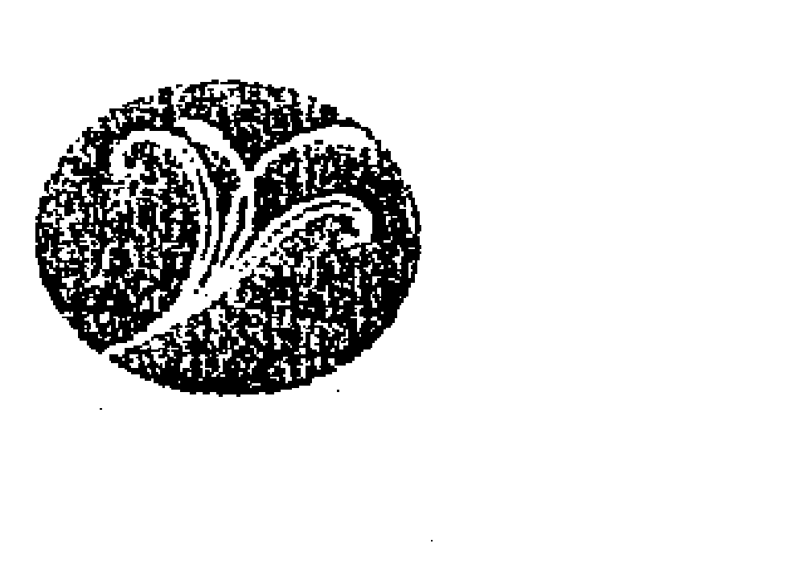
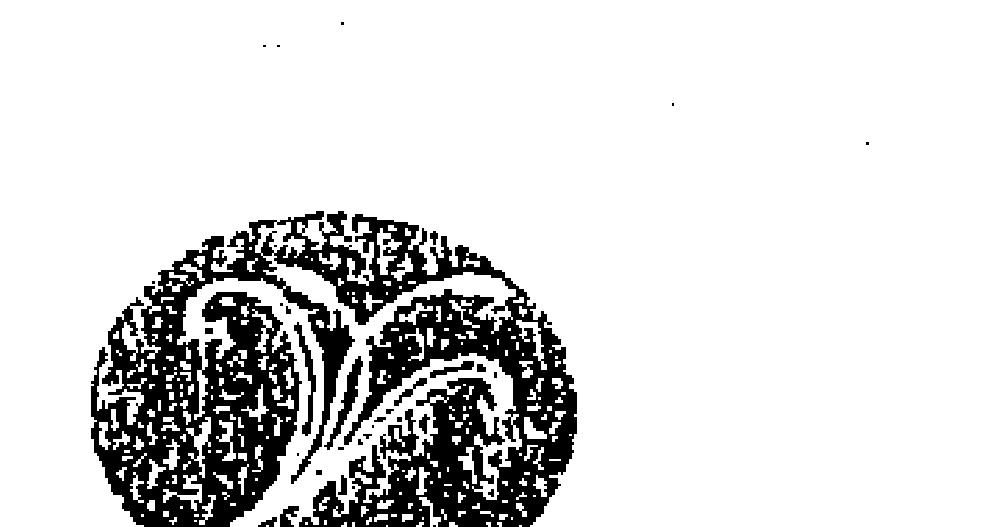
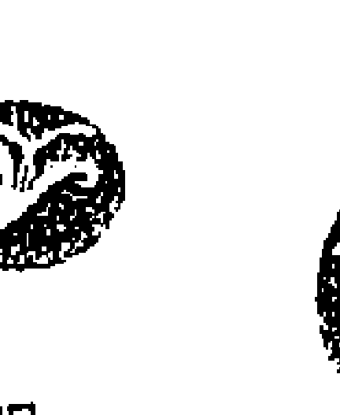
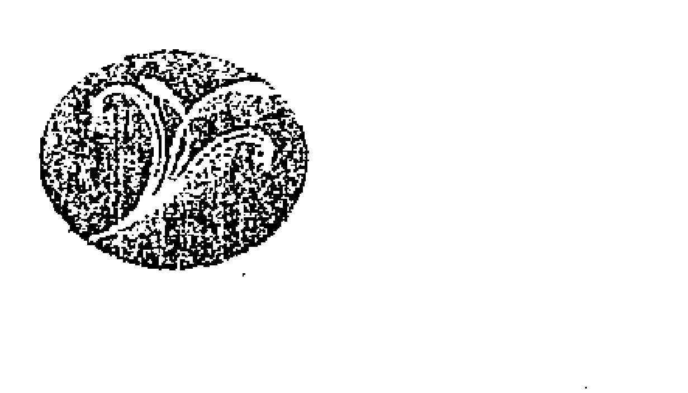
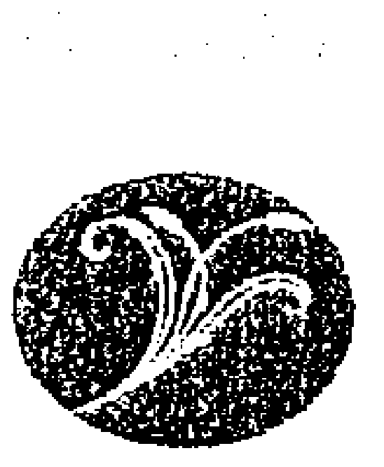
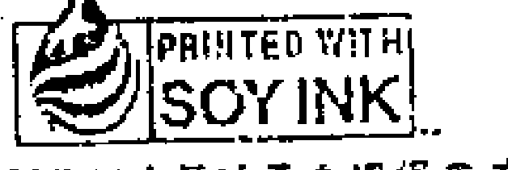

# 关系疗愈

## 〈推薦序一〉

### 以「愛」解開人際千千結
以「情」維繫親情如意結

# 張德聰

人與人的溝通是一種微妙且神奇的歷程，「人間有知己，勝為萬戶侯」、「話若投機千言少，言多必失在無心」。親如夫妻，如果有愛，情意綿綿；如果無心，遠如路人。我國離婚率每千人中有二・九人，為世界第五名，離異原因最多的是個性不合，其實重點在於不能溝通或溝通不良，因而緣盡緣滅。「張老師」歷年來個案問題分析排行榜中，第一名是家庭問題，其次為兩性問題、人際關係問題。綜合而言，前三名皆為人際溝通問題，尤其夫妻、親子、情侶俱為人間至愛，因而愛之深又恨之切，關鍵即在溝通。

本書作者為美國知名兩性關係及人際關係專家，在書中提出具體的檢覈方法，讓我們學習覺察自己的溝通模式，探索自我的情緒如何影響人際溝通的歷程和方式，進而發展自己的情感溝通技巧，並經由回顧過去的情緒經驗，學習省思、嘗試溝通、調適接納，找出彼此願意接納的共同觀點，增進情感交流的態度及技巧，發展良好的溝通方式。書中更充分舉例說明，生動活潑，更具體的量表，有利於讀者檢閱、體會及學習。

於諮商輔導經驗中，深刻體會有效的諮商輔導有許多療效因子，但如何進入當事人的世界去了解，尤其同理、體驗當事人的情緒十分重要，因此諮商督導常會提醒諮商員：「先處理情緒，再處理問題！」一般人際關係亦如此，尤其是中國人的人際關係「討人情、講緣分、重關係」、「見面三分情」，加上「好面子」、「看報應」，不似西方人「社會交易理論」深植人心。然而國際化之後，如何融合東、西方發展出一套適切的人際溝通模式，本書提供讀者一種新的情感溝通覺察與分析架構。此外本書提供的方法不僅適用於諮商輔導助人專業，亦適用於一般社會大眾，尤其增進夫妻及親子情感溝通，以「愛」解開人際千千結，以「情」維繫親情如意結。

> 「先處理情緒，再處理問題！」

個人婚齡邁向三十年，卻願所來徑，蒼蒼橫翠微。然而如同胡適詩中所述：「與您同入老境，人生佳興未盡，來年收成如何，但看當年耕耘！」仔細省思，一則感謝內人與家人之體諒與支持，當年我擔任專任「張老師」期間，因工作需要，全省北、中、南調動頻繁達八次之多，尤其過於投入工作還曾經被她笑罵「專任老師、兼任丈夫」。然而我們堅持工作到哪裡，家搬到哪裡，因此工作再忙，家人的相互關心支持得以持續。另一深刻體會則是「愛需要學習」，沒有一個人天生就會「好好愛人」，有時候甚至因「以為愛」卻傷害了自己的「至愛」！記得讀博士班時，因功課壓力每天回家就猛K書，有一天內人幽默地對我說：「老公，最近我在家裡的地位降了兩級！」我連忙回應：「沒有啊！」她幽幽地說：「你最近每天回家不是看書就是打電腦，都用屁股對著我！」我猛然警覺的確疏忽了老婆，於是提醒自己適時陪太太散步、聊天、爬山、旅行，尤其學習敏察、關懷、重視她的感受，現在每週夫妻的約會是週末屋後劍南山之雙人登山健行，感情自然逐漸增進。

詳讀本書後，個人深刻體會本書作者為西方人，即使談情仍含有理性分析，然而中國人之情「問世間情是何物？直教人生死相許！」我想理性中只因「在情中有恩」、「在情中有寬容」、「在情中有希望」、「在情中有支持」、「在情中有成長」、「在情中有珍惜」。因此我們真心學習覺察情感對自我及他人的影響，並發展適當的情感溝通方式，亦為人生的重要功課之一。

> > 問世間情是何物？直教人生死相許！

> > 「在情中有恩」、「在情中有寬容」、「在情中有希望」、「在情中有支持」、「在情中有成長」、「在情中有珍惜」

藉由本書可以學習情緒的覺察與體會，不僅是一種主觀的感受，亦可學習客觀的覺察。如果人際間有心才有愛，有愛才有美，然而有愛需要有時間、真心的陪伴，有適切行動與方法，更需要有反省、相互鼓勵與支持。

（本文作者為空大生活科學系主任兼「張老師基金會」執行長）

## 〈推薦序二〉

### 與人建立愛的關係 尋得幸福與意義的關鍵

黃維仁

筆者常問自己醫學院的學生：「你們學醫的目的是什麼？是名利嗎？是地位嗎？人生最終追求的到底是什麼？」其實，我們一生奮鬥最終所尋求的是幸福和意義，而尋得幸福與意義的關鍵，在於我們能否與人建立愛的關係。

許多現代實證研究發現，有意義之愛的關係能增強我們的免疫系統，並能促進身心健康。在從事心理治療過程中，筆者清楚看到，愛是所有心靈醫治中最關鍵的要素。

人人都知道愛的重要，但在現代社會中要如何去給予愛、得到愛，卻不容易。現代親密關係極為複雜，充滿著兩難：「一親近你，我就受傷；不親近你，我又孤單。」、「對你傾訴你帶給我的困擾，你會拒我而去，但若不能與你分享真實感受，我心會遠離，我們心靈不再能相契。」

大多數人在結婚時，心中都憧憬能與所愛的人白頭偕老，共譜一支美麗的人生之曲。然而，根據二〇〇四年七月東南亞各國的統計，有些地區的離婚率已趨近 40%，與美國相去不遠。

美國離婚率高居世界之冠，不過近年來許多美國人經過這「嘗試錯誤」（Trial and Error）的過程，痛定思痛，開始反省婚姻失敗的原因。更有一群認真的心理研究者，花下將近三十年的苦工去做實證研究，長期追蹤成千對的夫妻，有系統地觀察他們之間的互動，要找出婚姻成敗的關鍵。

若能綜合過去三十年來最尖端的實證研究，筆者會將婚姻成敗的關鍵歸納成下例兩個看似簡單卻千變萬化之結論：「有效處理衝突與刻意經營友情」。實證研究發現，長期習慣性地避免衝突是造成現代夫妻離婚的首要原因。愛火歷久長新的秘訣，是夫妻學會處理衝突，並藉著「愛的存款」來建立夫妻間的友誼。

筆者的老師約翰·高特曼博士很可能是當今全世界最受尊敬的實證研究者，他的研究為全球婚姻治療界帶來革命性的影響，也推翻了過去許多似是而非、誤導治療的觀念。他更從那些被稱為「幸福婚姻高手」（The marital masters）的個案身上，找出他們活在愛中的秘訣，然後把這些心得拿來教導大家如何保護並強固婚姻。

在處理衝突與經營友情兩大要務中，高特曼博士特別注重友情之建立與維護。他強調夫妻若在「平時」就能注意不斷增進彼此的友誼，他們就能在「赤焰烽火」、「怒火填膺」的「戰時」有效地處理衝突。而有效地處理衝突，又能帶領夫妻進入更深一層的親密感。這些研究結論正好證實了中國人聰明的諺語：「有了關係，就什麼都沒關係了。沒關係，就什麼都有關係了。」

高特曼博士從實證觀察中發現，即使在短短十分鐘的晚餐中，夫妻可以有高達一百次的「溝通嘗試」，筆者把這些互動（Bids）稱為「愛的邀請」。高特曼博士發現，活在愛中的秘訣，竟存在日常生活這些稀鬆平常的互動之中。愛的邀請可以是一個眼神，也可以是有聲或無聲的話語或動作。當別人對我們發出一個愛的邀請時，我們可用「接納讚許」（Turning Toward）、「拒斥批評」（Turning Against）或「相應不理」（Turning Away）做為回應。高特曼博士發現，若想要與人建立「有意義之愛的關係」，我們就不可對人掉以輕心。若想得到愛，我們就當刻意增加對人愛的邀請。同時，當別人向我們發出愛的邀請時，我們要多以「接納讚許」做為回應，盡量減少另外兩種回應方式。

《關係療癒》一書是高特曼博士根據他數十年實證研究與臨床經驗寫成之鉅作。筆者有幸蒙高特曼老師親自指點，每次與他對話，總有「聽君一席話，勝讀十年書」之感。高特曼博士學識淵博，能天衣無縫地整合尖端腦科學、原生家庭、深度心理與行為學派的理念，以深入淺出的方式，把現代婚姻研究之精華，以五大步驟清楚地呈現在讀者面前。此書有許多具體例子與實用練習，一步步教導我們如何與人建立深入而有意義的關係。愛是需要學習的，筆者恭敬地將此書推薦給所有的婚姻輔導與人間有心的尋愛者。

但願天下有情人終成眷屬，
更願天下眷屬終成有情人。

（本文作者為美國西北大學醫學院臨床心理學博士）

# # 〈推薦序三〉

# 關係療癒

解開人際溝通的微妙密碼

簡春安

多年來，我每看到有關如何增進溝通的書就會有一些難免的厭倦。主要的原因是很多理論把夫妻關係或人際關係的關鍵點都只放在溝通的技巧而已，以為改善關係的秘訣就是把溝通的技巧弄好，彷彿只要你表達得很清楚、只要配偶講話時你能專心傾聽、只要在溝通的過程中學習讚美對方，那兩個人的關係一定可以逐漸好轉，以後就享受著幸福快樂的生活。我認為人與人的關係（尤其是男女關係）絕對不是這麼單純，絕對不是只要技巧改善，關係一定就跟著改善。人與人之間的關係牽涉著每一個人的理念、長期以來的生活經驗、加上彼此之間的目標與條件，這些因素化入當事者的意識與潛意識，有形無形地掌控著當事者的生活作息，深切地影響人與人之間的關係。

同樣地，把男女關係寫得太過經典也一樣不能說服人。任何理論應該與當事者的生活細節環環相扣，都應該有實務的經驗當做理論的後盾，否則仍只是空中樓閣而已。試想，沒有經歷愛情痛苦的人，認真地參考了別人的文獻，憑著過人的才華，就整理出來愛情挫折的理論，果真就能說服你？這些理論充其量也只是隔靴搔癢而已，好看但不好用。

《關係療癒》的確是本好書，它最大的特色是有理論背景的充實感，又有實際可用的紮實感。作者能從問題的核心勾勒出理論背景，卻又從日常生活中找出例子來印證。作者在第一章就指出關係是在沒有接納、抗拒與相應不理中受傷，第二章詳細分析並用例子來比對，讓我們恍然大悟，原來我們在不經意中如何傷害了親人；在習以為常的動作中如何造成一些不必要的誤解。

爲了改善我們情感聯繫習慣，作者認爲首要任務是要了解自己在情感聯繫時常犯的六大致命傷，如不用心、開口出錯、指責對方、情緒潰堤、憤世嫉俗等。作者也設計很棒的相關問卷要讀者自行測驗，然後根據測驗的結果來了解狀況。爲了使讀者能有效地做好情感聯繫，作者在第四章中要我們了解自己的溝通模式。了解自我不能只是分辨自己是好人、壞人，或是感性、理性而已。他提出三軍統帥、探索者、哨兵、能量總管、感官享受者、小丑與築巢者等類型，然後從生活例證中分析爲什麼兩種類型的人撞在一起時會產生失望與摩擦，更教導讀者如何從較佳的模式中解套，此章相當精采，不可錯過。

此書也說明每個人的過去經驗也是影響我們情感聯繫的重要因素。這些因素包括每個人的情緒歷史、家庭情緒哲學，以及每個人心中永遠的痛等等。若了解這些因素，我們就認識人際之間所存在的種種情緒哲學，有教導型、不予理會型、不以爲然型及放任型等，此時，我們必然可以理解人際間的種種摩擦是如何與早期的成長經驗進行連結。

作者把增進溝通的技巧放在第六章，介紹舉凡臉部表情、動作、手勢、碰觸、音調、形容用語和種種隱喻等。讀者或許早已耳熟能詳這些資料，但作者在第七章又以找出共享價值與建立情感聯繫的儀式概念來做總結，一方面可看出作者不僅教書、寫作的態度謙虛又認真，本身有深厚的婚姻輔導經驗，更可感受到他對婚姻和情感的尊重，相當完美。

總之，本書幫助讀者面對過去，又能處理未來；理解心理情緒，又能規劃行爲動作的寫作內涵。從學術的觀點來看，相當充實、紮實；從實務的角度來看，更是實在、實用，難能可貴。本人有幸能事前研讀此書，並爲它作序，深以爲榮，我自己得到幫助，也鄭重推薦給我的學生、同好和讀者朋友。

（本文作者爲東海大學社工系教授）

# 前言

我們的研究得出一個重要又簡單的概念：我們發現了親密關係的基本要素，學到了調整人際關係及確定許多人控制人際衝突的基本原則。這個基本概念與人們在日常生活中試圖溝通情緒的方法，以及周遭的人如何回應有關。

這些日常時刻一點也不戲劇化，很容易被忽略，而且不幸地，它們的命運通常如此。但是這些時刻具有強大力量，如果能多留意、用心，我們就可以從最親近的人身上獲得所需的親密感與支持，也能適時對他們同樣付出。

現在我們將有關情緒連結時刻的基本概念與腦部七大情緒指令系統整合起來，這七大指令系統讓我們可以看清楚自己的情緒怎麼來、怎麼去。覺察這些指令系統所引起的情緒，讓我們能夠檢視生活中的欠缺，以及我們與生命中最重要的之人的需求有何不協調之處。覺察自己心中的情緒以及因親密關係而產生的情緒，自然而然就能指引我們找出共享價值，提供我們亟欲追尋的生命方向。 為了增進這些覺察，本書提供了指導方針與技巧。

# # 第一章

## 情緒連結如何產生？

西雅圖一家搖搖欲墜的網路公司，其工作團隊正面臨職場中一個常見問題：他們無法與上司溝通。如果下班後在小酒館遇到這個團隊的成員，可能會聽見類似以下的對話：

「約瑟夫是我工作上遇到最冷淡的人。」

「你說得沒錯。有天我在他辦公室看到一張小男孩的照片，於是問他：『好可愛的小孩啊，是你兒子嗎？』他說：『不是。』」

「就這樣？」

「對啊，所以我就站在那裡，心想：『那你倒是告訴我這是誰呀？你姪兒？你繼子？還是你的私生子？』」

「他就是這麼不上道。我們當初知道他要來帶領這個團隊還高興得不得了，因為他蠻有成就的。」

「他是很聰明沒錯，但他帶給我們什麼好處？我們還是沒把網站做起來嘛。」

「那是因為他根本就不懂如何與人相處。你有沒有注意到，其他部門的經理都躲他躲得遠遠的？」

「是啊，所以我們才會失敗嘛，我們在公司裡根本毫無地位可言。我本來希望他能把我們的想法傳達給高層，以獲得所需的資源，可是他從來不徵詢我們的意見，甚至也不會問問我們週末過得如何。」

「記不記得我們搬到新大樓時，他決定不把辦公室隔成私人隔間？他說開放的空間能『加強溝通』，真是說的比唱的還好聽！」

「你們說夠了沒啊，我真替他感到難過。」

「替他難過？為什麼？有股票選擇權的人可是他喲！」

「我認為他的確想當個好主管，只是不知道怎麼做罷了。」

「哦，是嗎？你怎麼知道？」

「我不知道，只是猜測而已。也許他知道我們對他很失望，這讓他更難做人。我並不清楚他的想法，但是我敢說情形應該就是這樣。」

另一個例子是五十四歲的廣告人克莉絲汀，她母親最近剛被診斷出阿茲海默症（譯註：Alzheimer's disease，即俗稱的老人痴呆症），母親住的地方與克莉絲汀相隔數州，離克莉絲汀的姊姊艾莉絲住處較近，但是克莉絲汀仍然希望能為照護母親盡一己之力。以下是姊妹倆典型的通電話內容：

「媽媽好嗎？」克莉絲汀試探性地詢問。

「等保險公司付了住院帳單，她就會好多了，」艾莉絲回答，「她整天就是談這些。」

「但那是去年十二月的事了，保險公司到現在還沒給付嗎？」

「不是那次住院的事，我是在講她這次發作住院的事。」

「什麼發作？」

「我沒告訴你嗎？」

「告訴我什麼？」

「她上個月發作後住院，院方替她做了些檢測。」

「你居然沒告訴我這件事，為什麼不打電話給我？」

「當時一片混亂，大家忙得人仰馬翻，而且電話老是被轉到你的語音信箱，我根本找不到你。更何況你人在東岸，也沒辦法做什麼。」

「艾莉絲！但是我告訴過你，要在這種時候打電話給我啊！」

「反正現在已經沒事了，他們讓媽媽服用某種新藥，她的情況比以前好多了。我們都撐過來了，不必擔心。」

但是克莉絲汀的確很擔心，也很生氣。她告訴自己，艾莉絲不是故意把她撇在一旁的，艾莉絲當時也是憂心忡忡、無暇他顧。但是現在母親的健康每下愈況，姊妹倆不能繼續這樣下去，必須好好合作才行，否則克莉絲汀可能在母親最需要幫助時錯過了唯一一次在場的機會。萬一真的發生這種情形，她和艾莉絲可能會一輩子怨恨對方。

現在我們來看看菲爾與蒂娜的例子。這對三十多歲的夫妻看起來幸福美滿，什麼都不缺。他們有穩定的工作、兩個可愛的孩子、許多好朋友，且深愛彼此。問題是，他們已經半年沒有性生活了。

夫妻倆坐在治療師辦公室的小沙發上，敘述問題的來龍去脈。

「蒂娜的公司正在進行大規模改組，」菲爾解釋，「她每天回家時總是疲憊不堪。」

「當時真的很累，」蒂娜回憶，「我整天都在開緊張、冗長的會議，想辦法保住同事們的職位。等我回到家還是甩不掉壓力，非常焦慮，不想和任何人說話。我知道菲爾盡量順著我，但是……」

「我希望能幫她，告訴她一切都會好轉，但是我怎麼做都不對。我們並沒有激烈的爭執或什麼的，都只是些瑣碎小事。躺在床上時，我會親吻她的頸背或揉揉她的肚子，從前這些動作都能激起她的反應，但是現在她毫無反應，這讓我很難平衡。」

「而我覺得他碰我的時候，如果不能熱情回應就會傷害他，」蒂娜解釋，「這讓我更緊張。」

菲爾一語道破：「她在工作上有好多人依賴她，等她回家又遇到這個沒安全感、只想到自己需求的老公，她當然興趣缺缺。」

所以，為了保住尊嚴，菲爾不再嘗試。「我不想再被拒絕了，」他向治療師解釋，「我不知道我們這樣還能維持多久，但老是拿自己的熱臉去貼別人的冷屁股很困難。當然，我愛她，但是有時候覺得我們大概維持不下去了。」

「我也沒辦法，」蒂娜淚眼婆娑地說。一陣靜默後，她補充：「我也想念做愛的感覺。我想念從前的日子。」

「妳從來沒告訴我這些，妳從來沒有告訴我妳的想法，」菲爾靜靜地說，「也許我們可以從這裡開始。」

菲爾說得再透徹不過。努力挽救瀕臨破滅的婚姻、在危機中尋求家人合作，或是與難相處的上司建立良好關係都有個共同點：當事人之間必須有情緒訊息（emotional information）的交流，幫助對方感受到彼此的連結。

西雅圖網路公司不滿的員工們必須知道上司與自己擁有「成功架設網站」的相同夢想，必須知道上司賞識自己的工作與想法。但是當他們向上司表達此類訊息時，卻沒有得到回應。事實上，這位上司連友善的寒暄都不能好好回應，也就無法激發屬下的信心，讓他們感到自己是團隊的一份子。

他们相信这个团队能达成目标。

类似的问题也在母亲生病的两姊妹身上出现。克莉丝汀要求爱丽丝随时告知母亲的健康状况。但是她要的其实不只是医疗状况，而且希望有身为家庭一份子的感觉，在这种危急时刻尤其不想被排除在外。母亲住院时，爱丽丝没有打电话给克莉丝汀，显示出爱丽丝并不认为克莉丝汀是她与母亲所在世界的一份子。爱丽丝也许会归咎于相隔两地的距离，但是克莉丝汀所感受到的情感距离可能更遥远。

菲尔和蒂娜就像我在婚姻治疗中遇到的许多夫妻，虽然每对夫妻起冲突的原因各自不同，例如：性生活、金钱、家事、孩子，但是所有人都渴望伴侣愿意理解、关心他们的感受。

透过话语与实际行动分享这种信息，对改善任何人际关系都很重要，包括亲子、手足、朋友、同事关系。但是我们竭尽全力的结果，却可能被一个基本问题所破坏，那就是无法学会我所谓的“邀请（bid）”；“邀请”正是情绪沟通的基本要素。

本书将告诉你学会“邀请”的五步骤，以改善你的人际关系：

-   1. 分析你的“邀请”方式和回应他人的方式。
-   2. 了解脑部的情绪指令系统如何影响你的“邀请”过程。
-   3. 检视你的情绪财产（emotional heritage）如何影响你与他人连结的能力，以及你的“邀请”风格。
-   4. 发展你的情绪沟通技巧。
-   5. 找出共享的价值。

首先，我们先确定你了解我所谓“邀请”的含意。“邀请”可以是一个问题、一个动作、一个眼神、一个碰触，任何“我想与你产生连结”的单一举动都算。所谓对“邀请”的回应，则是“他人渴望发生情绪连结”时，自己的正面或负面回答。

最近我和研究同仁在华盛顿大学发现这种“邀请过程”对人际关系影响深远。举例而言，我们发现打算离婚的丈夫，82%的时间无视于妻子的“邀请”；婚姻关系稳定的丈夫则只有19%的时间会忽略妻子的“邀请”。打算离婚的妻子，在丈夫企图吸引她注意时，50%的时间会表现出忙着做其他事情的样子；拥有快乐婚姻的妻子则只有14%的时间无法回应丈夫的“邀请”。

当我们比较这两类夫妻对“邀请”与回应的频率时，发现差异很大。在晚餐桌上的典型对话中，婚姻幸福的夫妻十分钟内“邀请次数”高达一百次，打算离婚的夫妻则是六十五次，表面上看起来好像差别不大，但是一年累积下来，快乐夫妻多出的情感交流时刻足以写一本俄国小说了。（译注：俄国小说以长篇巨著闻名，如《战争与和平》、《卡拉马助夫兄弟们》。）

我们也发现，高比例的“正面邀请”对许多方面都很有助益。例如，能够正面回应他人“邀请”的人，在与人争论时更容易运用趣味、情感、幽默感，仿佛他们平日因尊重、关怀他人所累积下来的好感，都变成了感情银行的积蓄。发生冲突时，他们就能利用平日储存下来的好感，犹如潜意识有个声音说：“我现在可能气他气得要命，但是每当我抱怨自己的工作，他可是专心聆听哦，这次就别和他计较了吧！”或是“我从来没有这么气她，但是我讲笑话时，她总是哈哈大笑。这次就算了吧！”

在冲突中能够运用幽默感或想到他人的好处，极为可贵，因为这样做有助于降低厌恶感，增进相互了解。能够在争吵中继续沟通、面对彼此的人，更有机会藉由冲突解决问题、修复受伤的感情、建立尊重的态度。但是这种工作必须植基于日常的情绪与兴趣交流，也就是我们所说的“邀请”之上。我们必须早在发生争执之前就开始努力。

然而，如果我们习惯性地无法正面回应他人对情绪连结的“邀请”呢？这种情形很少出于恶意，通常是因为我们对别人的“邀请”毫无所觉或不够敏感所致。但是如果这种粗心变成一种习惯，就可能造成严重后果。

我已经在高特曼研究机构的临床治疗中看到了这些后果。许多前来接受辅导的人都形容他们的生活仿佛被寂寞吞噬。虽然恋人、配偶、朋友、子女、父母、兄弟姊妹、同事等重要他人都在身边，他们还是觉得寂寞，也常诧异于人际关系的恶化，因此感到极度的失望。

“我爱我太太，”一位案主提到他摇摇欲坠的婚姻，“但是我们的关系却很空虚。”他察觉出彼此的热情逐渐消失、爱情褪色，却看不到两人之间其实有许多唾手可得，可促进亲密关系的机会。他和很多沮丧、寂寞的人一样，并非故意忽视或不理会另一半情绪连结的邀请，只是妻子是以简单、寻常的方式表现，让他看不出这些时刻的重要性。

这类案主基本上也会有工作方面的问题。虽然他们在一份新工作刚开始时懂得和同事建立关系，但是很容易就把注意力完全放在手边的工作上，经常伤害了与同事们的关系。等到升迁与他们绝缘，对公司的重要计划毫无影响力时，他们感到迷惑不解，对同事们和上司失望，觉得自己被出卖了。

他们与亲朋好友的关系也充满这种失望与失落感。许多人会形容朋友、手足、子女对自己不忠、不值得信赖。但是如果再深入了解，就会发现类似的模式不断发生。这些案主似乎察觉不出亲朋好友对他们发出的“邀请”讯号，毋怪乎旁人会觉得没有支持他们的必要。

在“邀请过程”中出现困难的人，也比较容易与人发生冲突。

事实上，只要他们能够看出彼此的情绪需求，或许就能避免冲突。许多争端来自于误解与疏离，如果彼此展开必要的对话，就不会产生这些负面情绪了。但是因为缺乏对话，所以发生争执。这类冲突会导致婚姻失和、离婚、子女教养问题、家庭纠纷、友谊变淡甚至恶化、成人的手足关系凋零甚或戛然而止。成长于长期冲突不断家庭中的孩子，容易有学习困难、不易与朋友相处的问题，健康情形也欠佳。无法与他人建立连结的人，比较容易被孤立、工作不稳定且心生不满。这些问题只要出现任何一项，都会对生活造成沉重压力，导致各种生理与心理的疾病。

我们研究“邀请过程”的发现却带来了无限希望。那些经常“邀请”并正面回应他人的人，获得成功人际关系的机会很大。

本书的用意便是和大众分享这些发现。我们希望本书能帮助你建立、维持健康稳固的人际关系，拥有快乐、充实的人生。

## 按部就班：建立更好的人际关系

> 作家安妮·拉莫（Anne Lamott）写过一个故事：学校规定她十岁的弟弟要交一篇有关鸟类的报告，弟弟为此烦恼不已。写报告的繁重与复杂性吓坏了他，于是向父亲求助。她写道：“父亲环抱着弟弟的肩膀，说：‘一次写一只鸟，慢慢来，只要一只、一只慢慢写就好了。’”

我们和朋友、家人、同事的关系也是一样。密切、充实的关系不会突然完整地出现在我们的生活中，这些关系都是一次一次慢慢建立起来。

如果你和我的同事们一样细心观察、分析那些累积过程，就会发现每一次都是由许多更小的交流所组成。先是一次邀请，然后是对那个邀请的回应。这些交流和身体细胞或房屋的砖瓦一样，是情绪沟通的主要元素。每次交流都包含了可以加强或减弱人际连结的情绪讯息。以下是一些例子：

> “嘿，妈，什么时候可以吃晚餐啊？”
> “少烦我！等我弄好自然就可以吃了！”
> “你的每月报告又拖稿了。”
> “你怎麼不去看你的电子信箱？我昨晚就寄给你了。”
> “叩叩叩。”
“是谁啊？”（译注：这是一种口语游戏，一人发出“叩叩”的敲门声，另一人即回应“是谁啊？”然后第一人可以回答一些俏皮话。）
> “你今晚忙吗？”
> “也许忙……也许不忙……不一定。”

邀请与回应可以是情绪奔腾的重大事件，就如电影情节：
> “薇兰，妳愿意嫁给我吗？”
> “我愿意，杰克，我愿意！”

或是日常生活中的平凡对话：
> “顺便帮我拿瓶啤酒，好吗？”
> “没问题，还要什么吗？要不要洋芋片？”

可以委婉：“那件洋装真漂亮。”
也可以直截了当：“我想和你做爱。”
可以是陌生人之间不甚重要的谈话：“你能帮我叫部计程车吗？”
或是朋友间窃窃私语的动人秘密：“你绝对不相信我昨晚发生了什么事！”

邀请让陌生人彼此认识：“我能坐下来吗？”
邀请对于想维持亲密关系的老朋友或伴侣，绝对有必要：“我好想念你啊，我们找个地方坐下来聊聊吧！”
正面回应邀约能使互动持续，通常双方都会继续丢出更多的邀请，这类谈话就像两位球艺精湛的球员在打乒乓球。

> “你今天午餐要吃什么？”
“我买了个三明治，要不要到外面和我一起吃？”
“好啊，不过我得先去福利社买点东西，要不要帮你带点什么？”
“好，帮我买一瓶沙士。你要不要看我们全家团聚时拍的照片？”
“要，我很想看。我们还可以计划一下为佩格开的派对。”
“对啊，我们最好赶快开始计划。”

对邀请的负面回应，则会关闭沟通之门，所有的邀请嘎然停止——比赛结束，大家都想收拾球具赶快回家。

> “你午餐要吃什么？”
“午餐？谁有时间吃午餐啊？”
“那么就改天再一起吃吧。”
“是啊，改天吧。”

我们的研究显示，“改天”鲜少出现。事实上，几乎没有人会在初次邀请被拒绝后，还会想重新再试一次。我并不是要你接受每一个午餐邀约，但是你可以在拒绝邀约的同时，仍然接受对方情绪连结的邀请。

> “你午餐要吃什么？”
“我要是有时间吃就好了，我得先完成这篇报告才行。你要吃什么？”
“我买了个三明治，打算坐在外面吃，不过我得先去福利社买瓶可乐，要不要我替你买什么回来？”
“太好了，你能帮我买个火腿燕麦三明治和一瓶沙士吗？哦——你在外面吃午餐时，记得替我多晒点太阳哟！”
“没问题。”

邀请会随着关系的成长而增强，次数也会增多。想想看你在职场上是怎么交朋友的：你们之间的首次邀请，可能是你在第一天上班时问了同事一个有关软件的问题，然后又隔着隔板讲了个无伤大雅的笑话，对方笑了起来，邀请你一起吃午餐。你们的对话原本只是围绕着与工作相关的日常话题打转，但是相处几次后，某天你壮起胆子问他对你老板的真正看法。他告诉了你，最后你向他请教工作方面的建议。几个月后，你发现你最喜欢的计划喊停，你气坏了！你要到哪里去发泄怒气？当然是到他的办公室啰。你信任他，可以说出心里的话，不怕被出卖。几年过去了，你们开始在周末一起去看球赛，你邀请他和他妻子一起到你家吃晚饭。他对你的家庭、童年、喜好、恐惧都一清二楚，这时你已记不得两人还不认识时的生活是什么样子。你总是先看他寄来的电子邮件，告诉他所有你知道的笑话。

这是怎么做到的？就是一次一个小互动慢慢来。又怎么让它持续下去呢？也是一次又一次以正面方式继续邀请对方、回应对方的邀请。

过程听起来虽简单，大多数人可能都经历过因为未能邀请或好好回应他人的邀请，而失去了好几段关系的经验。

以下列举一些你可能很熟悉的“悲惨”场景。首先看到的例子是在邀请的过程中出了差错，阻碍了彼此的关系发展。然后我们再看一个改造后的邀请，同样的场景，稍微调整一下关键句，让对话进入迥然不同的新领域，将彼此的关系推往比较正面的方向。

我们就从母亲得了阿兹海默症的克莉丝汀与爱丽丝两姊妹开始。虽然这些年来姊妹俩的来往较频繁，但是克莉丝汀希望彼此能够再亲近些。由于两人生活型态迥异，要达到这个目标可得多费些功夫。克莉丝汀大学毕业后就搬到纽约，至今依然单身，生活重心全在事业上。爱丽丝高中毕业后就结婚了，留在家乡小镇，有四个孩子，她的生活完全围绕着家庭与孩子们打转。两姊妹的人生选择差异这么大，偶尔也会想了解对方的想法，希望从对方身上得到一点认可，甚至一点关心也好。但从以下的电话对谈中我们知道，就算是这样小小的心愿也很难达成，因为她们的相似之处实在太少了：“我很好，”爱丽丝很惊讶居然会在周四晚上接到妹妹的电话，“我们都很好，妳呢？”“我还好，”克莉丝汀答道，“其实满不错的。”“怎么回事？”“呃，我最近工作非常忙……终于得到我一直努力争取的大客户了。”“妳是说那家化妆品公司吗？”爱丽丝问。“不是，不是。我好几年前就接下化妆品公司那个客户了，这次是一家网络服务公司。”“什么公司？”“呃……提供网络服务的公司。”“是电脑的东西啊，”爱丽丝紧张地笑了笑，“这我可就一窍不通了。”“是啊……嗯，妳说得没错，就是……电脑的东西。”“哦。”

“你们那里热吗？”
“是啊，大概华氏九十几度吧。”
“孩子们好吗？”
“很好，丹尼的棒球队进入州决赛了。”
“太好了。”
“是啊，我们都为他感到骄傲呢。”
“一定的。”
“对啊，我们真的很高兴。”

这个对话就这么继续下去，姊妹俩交换生活细节，但是对方却无法回应。她们对彼此的世界似乎毫无头绪，因此很难接话。如果这是一场桌球赛的话，两人的球拍都有好几个洞，球老是掉到桌下。不消多久她们就失去兴致、提不起劲，不想打了。你会有种感觉，这两人下次要再拿起电话聊天，恐怕是好久以后的事了。

然而，如果两姊妹能够多给对方一点信息，多问一些能够表现出关心对方生活、可以让对方发挥的问题，整个谈话就会不一样。我们从爱丽丝得知克莉丝汀讲的是与电脑有关的东西开始改造这段对话。

“是啊，就是电脑的东西，”克莉丝汀笑着说，“电脑的术语实在太多了。”
“我真佩服妳懂那么多电脑的东西。”
“其实我总觉得自己懂得还不够，我每天逼自己读报纸的科技版，反正能读多少算多少啰。我想对妳和赖利来说也一样，丹尼不是总想买些电脑的东西吗？”
“是啊，赖利好像老是在替他买新的游戏软件、新配件什么的。对了，我有没有告诉妳，丹尼的棒球队获得州决赛参赛资格了？”
“妳没告诉我！这个消息太棒了！什么时候？”
“月底在林肯市举行，赖利要请假，我们全家都会去加油。”
“太好了！我应该寄个东西给丹尼当幸运符，像是买顶洋基队棒球帽什么的。”
“哇，他一定会很高兴。他到现在还在谈我们那次去参观洋基球场的事呢。”

听出其中的不同了吗？克莉丝汀与爱丽丝对彼此生活所表现的兴趣，有时会让人紧张，但是一方努力沟通，会鼓励另一方也尝试这么做。我们会感觉得出姊妹俩都希望继续交谈，让这段情谊继续发展。

现在我们再来看另一个典型的邀请场景：一对男女试图交往，但眼看着就要不欢而散。

保罗年近五十，是个好几年没交过女朋友的离婚男子。事实上，他因为不喜欢约会时那种容易受伤的感觉，几年来从未与女士约会过。有一天他在朋友的庆生会上遇到玛黎，保罗觉得她虽然有点害羞，但是人很风趣、有魅力，而且居然也是单身。保罗从朋友处拿到她的电话，于是鼓起勇气开口请她喝咖啡。玛黎出人意表地答应了。

玛黎也很惊讶自己居然会答应赴约。她几个月前才伤心地和男友分手，决定暂时不再谈感情，只不过葛瑞格（开庆生会的朋友）对保罗的评价很好，所以答应了保罗的邀约。然而玛黎不擅客套闲聊，实在很痛恨第一次约会。

保罗提早十五分钟抵达咖啡馆，玛黎迟到了约十分钟。她一走进店里，两人就看到对方，玛黎紧张地笑了笑，走向保罗的桌子。

“嗨，你好。”她坐下时保罗打了声招呼。他注意到玛黎的个子比在宴会上见到时更娇小。她非常紧张，拉紧风衣围住身子。

“嗨。”
“这里很难找吗？”
“不会。”
“那就好。”

她看着柜台上方的菜单。
“这是自助式的，我帮妳拿。”
“谢谢。”
“妳想吃些什么？”
“嗯，咖啡就好了，奶精和糖都不要。”

他拿了咖啡回座，把保丽龙杯放在她面前。“这是妳的咖啡。”
“谢谢。”
“呃……哦，”保罗开口，“我那天晚上在葛瑞格和苏珊家玩得很愉快。”
“对啊，满不错的。”
“葛瑞格人很好。”
“对，他很风趣。”
“苏珊也是。”
“我跟苏珊不太熟。”
“妳住这附近吗？”保罗问。
“不是，我住东区。”玛黎回答。
“但是妳在这附近工作吗？”
“对，第六街和枫树街交叉口。”
“那是爱德公司。”
“没错。”
“妳在哪里工作？”
“嗯。”
“通勤要花不少时间吧。”
“是啊，不过我已经习惯了。”
“爱德是家保险公司，对不对？”
“嗯。”
“妳的工作是什么？”
“资料输入。”

整段对话听起来就像一场糟糕的工作面试。“我知道她害羞，但是这也太离谱了吧，”保罗告诉自己，“她看起来有点沮丧。不过话又说回来，这可能是我的问题。也许她不喜欢秃头的男人，也许我应该选个更好的约会地点，也许她很后悔和我见面。”随着气氛愈来愈僵，保罗的内心独白更加抑郁。“这行不通，我根本就不该约会，葛瑞格应该先警告我的。这下子我该怎么解套啊？”

问得好。我们来看看如果保罗能够稍微改变一下问题，玛黎在回应时也多给些信息，这段想增进友谊的对话会是什么样子。我们就从保罗拿了咖啡回来开始：

“这是妳的咖啡。”
“谢谢。”
“呃……哦，我那天晚上在葛瑞格和苏珊家玩得很愉快。”
“对啊，满不错的。”
“葛瑞格和我是老朋友了。我应该告诉过妳，我们是大学室友。”
“对，你们一起念俄亥俄州立大学。”
“那妳是怎么认识他们的？”
“葛瑞格是我以前的同事。”
“东区那家保险公司吗？”
“对，安克公司。”
“我记得葛瑞格痛恨那家公司！他的上司很神经质，哦，糟糕，别跟我说……妳就是那个上司？”
玛黎笑了，“不是，还好不是我，那是萝碧塔。”
“对啦！萝碧塔女王陛下！妳还在那家公司工作吗？”
“不，我现在在爱德公司。”
“那你们有没有去做件运动衫，上面写着：‘一九九九年，我熬过了萝碧塔统治的日子？’”
玛黎微笑，“没有，不过葛瑞格和苏珊在我辞职后，请我吃了一顿很棒的晚餐。”
“妳最后为什么决定离开？”
“我也不知道。有一天我睡醒时，知道自己再也无法忍受。于是打电话请病假，当天我就开始找新工作。”
“妳应该没多久就找到新工作了吧。”
“一个月左右。”
“新工作怎么样？”
“还好，比安克公司好多了。”
“怎么说？”
“比方说，那里的人比较真实。”
“那是什么意思？”
“呃，就是……就是虽然心情不好，可是也不必装成一副没事的模样。”
“能举个例子吗？”
“就拿上星期四来说吧，我刚收到上学期的成绩单……”
“妳在念书吗？”
“对，我想离开保险界，其实我真正感兴趣的是人类学……”
“太酷了，我差点主修人类学耶！”
“真的吗？”
“但我最后选择学商，真是大错特错。哦，妳刚才在说妳想做的事。”
“对啊，因为保险实在是……很无聊，如果我可以念个人类学硕士学位，可能就……”

话匣子就这么打开了。前后两段对话的差别在哪里呢？保罗发挥了一点幽默感是没错，但更重要的是他表现出对玛黎的生活很感兴趣。玛黎刚开始很害羞，所以保罗必须问很多问题，引她走出来。但是这时候他问的不是简单的个人资料，而是有关玛黎的价值观与梦想这类开放式的问题，玛黎一定会有所回应。保罗对“真实”玛黎的兴趣，让她觉得他很可亲，而保罗也看出她的感受，这让他更激起斗志，不会觉得沮丧、不自在。保罗将注意力焦点一直放在玛黎身上，玛黎也对保罗愈来愈有兴趣，这使他觉得自己也许可以与玛黎建立情绪连结。

最后，再让我们来看看最具挑战性的亲子关系。

罗杰是业务员，一天到晚出差，虽然不怎么乐意，但是也没办法。每次他出差回家，看到十三岁的女儿汉娜就觉得她又长高了。

汉娜相信父亲对她说“我好想你”时是出自真心，因为她在父亲出差时也很想念他。然而，自从她上了中学，那种感觉愈来愈淡。现在要想的事情太多了，朋友、学业、田径队、明年的高中生涯。当然她爱父亲，只是他已不再占有首要地位了。

有天晚上，罗杰搭机返家时看到太阳马戏团的公演广告，“没有动物的马戏团，结合了马戏团的壮丽与街头表演的滑稽。”太阳马戏团的票价贵得惊人，但是汉娜一定会喜欢，罗杰高兴地想着，尤其是没有动物这一点，汉娜最近老是在谈动物的权利。罗杰撕下

## 第一章 情绪连结如何产生？

廣告，放入口袋。

第二天吃早餐時，羅傑說：「嘿，寶貝，妳有沒有聽說過太陽馬戲團？」

「沒有。」

「它有點像馬戲團。」

「爸，你知道我對馬戲團的觀感吧。」

「這個不同，沒有動物，比較像戲團，有很多空中飛人和道具戲服，應該很好看，妳應該會喜歡。」

「嗯……也許吧。」

「去把我那件外套口袋裡的東西拿出來。」羅傑指著衣服。漢娜雖然一頭霧水，還是聽話照辦。

「哇，好棒啊！」漢娜邊看邊說。

「所以我想，我應該去買票，」羅傑說，「就我們兩人一起去下週六晚上。」

「下週六？」

「對，妳有重要約會嗎？」羅傑揶揄道。

「呃，那天晚上是瑞秋的睡衣派對。」

「哦，她可能常常舉行睡衣派對吧，」羅傑好脾氣地說，「而且，公演期間我只有那一晚才在家。」

「可是我真的很想參加瑞秋的派對……」

「寶貝女兒啊，妳們這些小女生幾乎每週都有這種派對吧。」

「才不是呢。」

「好吧，也許不是每週，但這可是我們兩人的特別活動哦。」

「我不想那天晚上去嘛。」

「因為妳的朋友比我重要。」

「不是，是因為這次是瑞秋的派對，她從來沒有邀請過我，所以……」

「好吧，如果你覺得她比較重要，你就去吧，隨便你。」

「我做錯事了嗎？」

「不，你沒有做錯事，我只是很失望而已，我們在一起的時間實在不多。」

「那是我的錯嗎？」

「不，那不是你的錯，也不是任何人的錯，算了，就當我沒提過，去參加你那該死的睡衣派對吧。」

羅傑揉掉廣告，漢娜淚眼朦朧地離開早餐桌，這實在不是羅傑原先料想的場面。

這件事可以有不同的結果嗎？我們來看看，就從漢娜告訴羅傑瑞秋的睡衣派對開始。

「哦，她可能常常舉行睡衣派對吧，」 羅傑好脾氣地說，「而且，公演期間我只有那一晚才在家。」

「可是我真的很想參加瑞秋的派對……」

「妳說那是誰的派對？」

「瑞秋·楊莉，她是現在常常和戴娜在一起的新同學，戴娜覺得她很酷。」

「戴娜？妳是說你最要好的朋友戴娜？」

「對，而且戴娜經常在瑞秋家過夜，凱莉和蘿拉也是。」

「哦，這是瑞秋第一次邀請你參加嗎？」

「對啊。」

「所以你覺得去參加派對很重要，因為你喜歡和戴娜、凱莉、蘿拉在一起。」

「沒錯，我覺得她們好像不喜歡我，不過我想那是因為瑞秋和我還不太熟，所以我才很想參加。」

「派對剛好和表演撞期，我覺得有點失望耶。」

「我也是，因為這場表演看起來真的很棒。爸，你真好，會想到帶我去看。」

「我是真的很想帶妳去，不過也許我們可以想點別的活動，改在週六白天一起去。」

「真的嗎？」

「對啊，然後妳就可以去瑞秋家了。」

「你可以帶媽媽去看馬戲團表演，她一定會很喜歡。」

「妳說得對，那是個好主意。妳得開始想想下週六下午我們倆要做些什麼，好嗎？」

「好的，爸，謝謝你。」

雖然羅傑還是無法和漢娜一起去看太陽馬戲團的表演，但是他達到邀請的目的，得到與女兒相處的機會。不只如此，他還得到一般父母鮮少有的機會：讓漢娜知道他關心她的生活，知道他真的了解她的感受。那就是情緒連結。

## 轉捩點：回應對方的邀請

對於建立情緒連結的邀請過程，我的領悟乃來自多年觀察各種真實生活情境中的人類互動。我與同仁研究過各類發展模式，包括友誼、親子關係、成年手足、處於不同婚姻與教養子女階段的夫妻。

最吸引我的是我稱為「婚姻大師」的夫妻，他們非常懂得處理衝突，夫妻的口角看起來就像是在開玩笑。這些夫妻會生氣，也會意見不和，只是他們意見不和時仍能和諧相處、關懷對方。他們不會變得防衛心強，也不會有受傷的感覺，而是以不時流露的情感、關心、相互尊重來緩和爭端。更了不起的是，他們就算在爭吵時也能運用幽默感。如此一來，衝突就能帶來收穫，成為發現問題與解決問題的力量，也展現出他們超越一切的情感與尊重。

我一直很想知道這些夫妻是怎麼做到的。他們一定有什麼秘密武器，能夠對抗輕蔑、挑剔、自我防衛、拒絕合作等足以破壞所有關係的因素。究竟是什麼原因讓這些夫妻在面對典型的家庭生活壓力之際，仍能充滿感情和幽默感？如果我能找到答案，也許就能幫助人們在婚姻與各種重要的人際關係中建立更好的情緒連結。當我開始研究衝突與邀請行為的關連，我在志願前來華盛頓大學家庭研究宿舍共度週末的六十對夫妻身上，找到了部分答案。家庭研究宿舍暱稱為「愛情實驗室」，是位於華盛頓大學校區一處有如公園般的小公寓，參與研究的夫妻從公寓的大觀景窗看出去，可以看到遊船點點，徜徉在連接西雅圖波提灣與華盛頓湖的山湖運河上。

公寓佈置成週末度假的舒適小窩，有廚房、餐廳、電視、錄影機，和一張可收到牆內的床。這些夫妻帶了食材來做菜，帶了遊戲來玩，還帶了電影來看。我們要求他們放輕鬆，生活起居就和他們平常週末在家時一樣。唯一的差別是我們在廚房雙面鏡的後方安排了科學觀測員，觀察這些夫妻的所有互動。牆上安裝了四部錄影機，夫妻倆的衣服都別上麥克風，以捕捉他們所有的動作和對話。他們的身上也放了感應器，以監控任何壓力訊號，如心跳加速或排汗增加。（為尊重隱私，晚上九點到早上九點不實施監控，進洗手間也不會錄影，每天會有半小時的私人時間，讓他們到實驗公寓旁邊的公園散步。）

我們發現人們回應他人邀請的方式有三種：接納、抗拒、相應不理。將這三種行為模式與這些夫妻十年後的關係狀況結合在一起，我們就能看出這些行為模式在長時間內如何影響人們的感情。請看以下說明：

- 接納：意指正面回應他人的邀請。例如：一人說了好笑的話，另一人就笑了；一人指著疾駛而過的名車，他的朋友點點頭，彷彿在說：「我同意，果然是部好車！」或是父親請兒子遞番茄醬，兒子樂意地遞了過去；一位女士在計畫夢想已久的假期，她的同事也加入討論，問她各種問題，提出各種意見，為這段旅程增添多采多姿的細節。

如果人們總是對他人的邀請採取接納的態度，這段關係會是什麼情況？我們的分析顯示，長此以往兩人會發展出穩定持久、充滿好感的關係。和「婚姻大師」一樣，他們即使發生爭吵也充滿幽默感、流露出對配偶的情感與關懷，讓他們能保持情緒連結、解決問題，並避免負面情緒的惡性循環。

- 抗拒：以抗拒態度回應他人邀請的人，可能被視為叛逆或好辯。舉例來說，如果有人幻想自己擁有剛自身旁奔馳而過的跑車，他的朋友卻回他一句：「就憑你的薪水啊？別做夢了！」

抗拒的態度通常伴隨著冷嘲熱諷。在我們的婚姻實驗室中，有位妻子溫柔地要丈夫放下報紙和她講話。

「我們要講些什麼？」

「我們不是想買新電視嗎？」妻子提議，「我們可以談談這件事啊。」

「妳對電視又懂多少？」

丈夫的反應仍然一樣冷酷：他反問。然後妻子就完全不說話了。

我們發現，在另一方習慣性抗拒的情況下，這位妻子的退縮反應很正常。誰喜歡被嘲笑或受斥責呢？在婚姻關係中，這類夫妻最後常以離婚收場；在成年手足間，這種行為會造成情感疏遠，比較無法相互支持。研究也顯示，這種敵意對友情、同事情誼或親人關係亦是致命傷。

有趣的是，在我們的研究中表現出習慣性抗拒行為的夫妻，離婚速度還沒有採取相應不理的夫妻快，不過大部分互相抗拒的夫妻最終還是會走上離異之路。

- 相應不理：這種行爲模式通常是不理會對方的邀請，或是一副在忙其他事的樣子。拿以上的例子來說，有人看到名貴跑車疾駛而過，忍不住發出讚嘆，他的朋友卻連頭都懶得抬起來；或是他可能看一眼，卻說些毫不相干的話：「現在幾點？」或「你有沒有零錢？我有一千塊要換成零錢。」

我曾經做過一個關於童年友誼的研究，經常看到孩子們在假扮遊戲中表現出相應不理的態度。一個小孩說：「我們來假裝自己是海盜，這是我們的船。」另一個並不是故意要唱反調的小孩則回答：「假裝我們要去市場買菜，我要當媽媽。」這個遊戲永遠玩不起來，原因很明顯。

實驗公寓有個令人難過的例子，那晚有位妻子準備晚餐時犯了個錯，打算向丈夫道歉，一整晚她提這件事三次，很明顯是希望丈夫放她一馬。但是她丈夫三次都沉默以對，轉過頭去不肯看她。

另一個例子是，妻子邊看書、邊看電視，丈夫對她說：「晚餐快好了。」妻子卻毫無反應。於是丈夫走到妻子坐的沙發旁說道：「親愛的，書好看嗎？」她還是不予理會。丈夫親了她兩次，妻子一點反應也沒有，丈夫問：「那本書那麼好看啊？」妻子終於回答：「是啊，裡面的圖片很漂亮。」那就是他們全部的對話。

我們的研究顯示，常常不理會他人的邀請絕對會傷感情。我們研究兒童的友誼發現，不能和其他孩子一起幻想的幼童，也無法發展持久的友誼。

我們在婚姻研究中發現，習慣性置之不理的態度具有破壞性。在實驗公寓表現出這種互動模式的夫妻，彼此充滿敵意與戒心，尤其在討論已持續一段時日的老問題時更是如此。這種行爲往往導致婚姻迅速以離婚收場。

在親子互動、成人友誼、成人手足、同事關係的研究中，我們也相信相應不理會嚴重傷害感情。

## 對方不接納怎麼辦？

在一段關係中，如果只有一方採取接納的態度，另一方卻總是抗拒或相應不理怎麼辦？當然猜也猜得到，我們的研究顯示這並不健康。想想看，如果你不斷想得到對方的注意，他卻總是避著你，甚至有時對你的回應充滿敵意，你的挫折感會多麼大啊！

- 我們的研究指出，如果父母一直逃避孩子的邀請，孩子感受到的都是負面情緒、鮮少有正面情緒時，會對孩子造成長期影響。例如，他們難以發展出與朋友和諧相處的社交技巧、學業表現不理想，健康方面的問題也很多。
- 只有單方面的「接納」當然也會傷害婚姻關係。參與實驗的夫妻中，雙方都採取抗拒態度的夫妻，與單方面（通常是妻子）採取接納態度卻得不到回應的夫妻，相較之下前者的婚姻生活還比後者快樂。

我們也觀察到，一旦邀請者遭到忽視或拒絕，通常他們就會放棄以相同的方法繼續溝通。同事們和我都很驚訝，一旦對方以抗拒或相應不理來回應邀請，人們很快就灰心了。我們原本期待大家會更堅持、要求對方給予相當程度的注意和回應，但是這種情形很少發生。邀請失敗者以放棄來回應對方的漠不關心或敵意。在婚姻穩定的人們之中，配偶會再次嘗試邀請的，只有20%而已。婚姻破裂者很少再次嘗試邀請，他們只是慢慢地不再交談，放棄建立連結的嘗試。

此外，我們發現邀請的頻率也有影響。舉例來說，婚姻幸福的人邀請的頻率遠高於婚姻不幸者。如我之前所說，一項關於晚餐時間談話的分析顯示，婚姻幸福的人在十分鐘內邀請的次數高達一百次，婚姻不幸福的人只有六十五次。

然而，這並不是說婚姻幸福的夫妻在對方邀請時都會以接納的態度來回應。要對摯愛的人付出那麼多注意力，可能會把人逼瘋。但是因為這些夫妻給彼此許多建立連結的機會，因此比起較少邀請的夫妻，似乎更可能建立美好的關係。

許多因素會影響一個人接納生命中重要他人的能力與意願，例如：腦部處理感情的方式、原生家庭處理情緒的方式，以及個人的情緒溝通技巧。我們會在以下各章仔細說明，首先來看看無法與人們建立連結會對人際關係造成什麼影響。

### 斷裂：沒有情緒連結的後果

人們嘗試與親人、配偶、朋友、同事建立情緒連結，無非是為了滿足以下三項常見情緒需求之一。每個人都希望（1）有歸屬感；（2）對自己的人生有控制感；（3）受人喜愛。一旦滿足這些需求，人們就會有幸福感，覺得人生很有意義。

但是，如果你們不能有效地邀請或回應他人的邀請時會如何？如此一來，就無法發展情緒連結或使現有的關係惡化。這會為各行各業、各種年齡層的人帶來嚴重問題。

### 當親子無法連結

親子間穩固、健康的情緒連結非常重要，因為此一關係是建立其他所有人際關係的基石。如果一個孩子無法與父母（或擔任父母角色的照顧者）建立情緒連結，日後可能在各種人際關係中都會遇到困難。

許多因素會影響孩子邀請、回應、與他人連結的能力，天生氣質是其中之一。我們天生有某種性格特質，有些人善交際，有些人害羞；有些人嚴謹，有些人隨和。在某種程度上，這些特質決定了我們與他人接觸或回應他人連結需求時的自在感。不過，有很大一部分還是由家庭環境決定，不管有意或無意，父母經由互動與示範教導孩子這方面的能力。

嬰兒每次哭泣都是一種「邀請」。如果父母以安撫的態度——如搖一搖、拍一拍、輕聲細語等來回應，這種交流最終會教導嬰兒安撫自己。經由擁抱父母或童言童語的對話，嬰兒也學到口語及非口語情緒溝通的予和取複雜過程。

生於混亂、受到忽視及虐待環境中的嬰兒就缺乏類似的機會。如果父母對嬰兒總是相應不理、無視他的傷心哭泣，孩子就無法和照顧者練習情緒訊息的交流。有些父母甚至以不耐煩或憤怒等負面情緒來回應吵鬧的嬰兒。這種惡待或忽視會讓嬰兒長期處於壓力狀態，對頭腦與神經系統的發展有不良影響。事實上，在這種環境下成長也會影響孩子未來面對壓力的能力，例如孩子可能會變得毫無感情。畢竟，當你有個冷淡、殘忍、忽視孩子的父母，去感受、表達自己的憤怒與恐懼有什麼好處？

無法在年幼時學會邀請、回應與父母建立連結的孩子，問題很快就如滾雪球般出現。許多孩子無法處理情緒壓力，童年時期一直飽受困擾，例如：無法集中注意力、無法聽別人說話、難以控制不良衝動、無法理解玩伴的社交線索（social cues），大家覺得他們太霸道或害羞，因此常被貼上「惡霸」、「怪胎」等標籤，是校園中不受歡迎的人物。

等這些孩子進了國中、高中，他們很了解青少年社交互動的不成文通則，對打入小圈圈、建立和維持友誼、約會等複雜任務可能覺得很彆扭、一籌莫展。從若隱若現的悲傷、疏離到嚴重的心理健康問題都會出現。對女孩來說，因為她們經常將感情藏在內心，這些問題會導致憂鬱症。男孩當然也會憂鬱，但是他們會把感情發洩出來，變得十足叛逆、充滿敵意，甚至出現暴力行為。

這種疏離所造成的最悲慘例子，就是發生在一九九九年春天科羅拉多州立陶頓哥倫本高中的槍擊事件。艾瑞克·哈里斯與狄倫·克萊波殺害了十二位同學、一位教師並造成二十三人受傷後，兩人舉槍自盡。一連數日我看新聞報導時覺得很驚訝，我們的社會對於這兩個男孩變成殺人兇手的原因竟然如此缺乏認知。媒體對之前發生在阿肯色州瓊斯柏羅與奧勒岡州春田槍擊案的報導也一樣，總是把焦點放在兇手著迷於暴力電影與電玩，以及容易取得槍枝上。這些因素當然對他們的濫殺有影響，但是我認為還有一個更大的因素：這些男孩與家庭、老師、朋友沒有情感的連結。這些原本應該是男孩們最重要盟友的人，似乎不知道他們正承受多少痛苦和折磨。

所幸哥倫本事件是拒絕孩子所造成後果的極端、罕見例子。但是它也提醒我們，我們回應孩子的邀請具有相當驚人的力量：做得好就能撫慰孩子，做得不好會造成傷害。只要父母和照顧者持續正面回應孩子的邀請，孩子的發展一定會有進步。這需要父母無比的耐心與敏銳的知覺。即使困惑不安的孩子發出的邀請非常微弱，父母也必須感受到並給予正面回應。即使面對孩子的冷淡或抵抗，父母仍然得盡心幫助他們。日積月累下來，專注、用心的父母必能贏得孩子的信任，願意與父母建立連結。

### 當夫妻無法連結

連結的問題不是只有童年時期才會發生，而是經常延續到成年時光，妨礙人們尋找另一半、維繫情感的能力。

我們很容易就看出邀請與約會的關係。事實上，有人會說約會就是成功完成邀請、建立情緒的連結。擅於讀取對方的「線索」並能適當回應的人，比起缺乏此一技巧的人在愛情方面會幸運許多。不過，失意者也毋需懷憂喪志，我們在第六章會探討任何年齡的人都能學會和熟練情緒溝通技巧。

這些技巧的最大考驗始於一對伴侶開始尋求更深的親密和理解。如果雙方都能繼續以彼此滿意的方式回應對方，他們的感情就會愈來愈深厚。但是我的研究顯示，如果他們開始慣性地採取抗拒或相應不理的態度，感情就會崩盤。

基於我們的研究，我認為無法建立連結是美國離婚率會這麼高的一個主因。在研究含蓋的四十年間，首次結婚的離婚率是50%，梅開二度的離婚率又高了10%。

婚姻破碎的代價很高，除了夫妻會因關係緊張而情緒混亂外，他們也比其他人更容易生病。研究顯示，婚姻不幸福會提高35%的罹病率，平均減少四年壽命。長期承受壓力會引起高血壓、心臟病等身體毛病，以及憂鬱症、物質濫用等心理問題。壓力也會影響免疫系統，使人容易罹患感染性疾病與癌症。

夫妻缺乏連結所造成的家庭壓力也會影響孩子們的健全發展。我們的研究顯示，在父母彼此充滿敵意環境中長大的孩子，壓力荷爾蒙長期攀升。這些孩子在年幼時罹患感冒、流感等感染性疾病的次數比其他孩子更多。等他們到了十五歲，我們又做一次調查，發現這些孩子出現心理與社交障礙的比例非常高，包括憂鬱症、遭同儕排斥、偏差行為(尤其是攻擊行為)、學業成績普遍低落、逃學等問題。

這些情況都是可以避免的。婚姻不幸福的夫妻與他們的孩子可藉由學習感受對方的邀請、回應對方的邀請，創造更穩定、充滿愛心的家庭環境。這種學習也能幫助決定離婚的夫妻。共同擁有孩子監護權的離婚夫婦都知道，彼此的關係並不是在簽下離婚協議書的那一刻就結束。增進與對方、孩子的情緒連結能力會讓你更容易解決衝突，為孩子創造比較健康的環境。

### 難以與朋友、手足建立連結

我們常常聽到如何改善婚姻、親子關係的忠告，然而對可能是回饋最大的人際關係——與成年手足、朋友的關係，這類的忠告卻顯然少了許多。

基於各種理由，與其他成人建立連結對許多人來說是個挑戰。在手足之間，競爭與嫉妒可能隱約浮現；與新朋友建立友誼時，彼此的信任與親密程度也容易讓人躊躇不前。

近來，成人建立關係最常見的阻礙是缺乏時間。雙薪家庭愈來愈多，上班族的工作時間比二十五年前增加了10%。許多上班族父母盡量把休閒時間留給孩子或照顧上了年紀的父母。時間有限，要做的事情這麼多，於是大部分人犧牲了與朋友、手足相處的時間。

但是切斷生活中與其他成人的互動也得付出代價。研究顯示，擁有好朋友的人，壓力少、活得久、身體比較健康、對感染的抵抗力強、免疫功能佳，而且生病康復的速度也比較快。有些研究指出，壽命長短並非由遺傳決定，主要是與最親密人際關係的狀態有關。我們與他人的情感交流品質，以及從周遭感受到的親切度可能是最重要的因素。

針對加州阿拉米達郡居民一項研究顯示，擁有親密友誼與婚姻的人比沒有的人活得久，這完全與飲食、吸煙、運動等因素無關。另一項對兩千八百名六十五歲以上人士的調查顯示，朋友愈多，健康問題就愈少；真的患病時，康復速度也比較快。此外，耶魯大學一項關於一萬名老年人的研究也顯示，在研究進行的五年期間，沒有朋友的人死於各種原因的機率比享有深厚友誼的人高一倍。

簡單來說，有一群支持你的親朋好友，將使人生的美好時光更棒。當我們遇到人生低潮如離婚、失業、重病或是家人死亡，如果周遭都是自己可信任的人，對於度過難關與復原的能力影響很大。

然而，要長期維持這樣的關係可能是項挑戰。對手足來說，知道彼此太多的過去，可能會使問題惡化。也許多多年來你一直努力往新的方向成長、發展，你與手足共同分享的過去可能會不斷提醒你過去與現在的不完美。此外，年齡、出生排行、性格類型或其他人格特質也會讓兄弟姊妹對相同的童年經驗有不同的認知，這些歧見很難消除。但是從另一方面來說，手足的觀點很有啟發性，可幫助你從新角度解讀過去。

如果我們能靠著共同的過去來建立手足的連結，可能會發現等我們到了中年開始尋找人生更深刻的意義時，手足之情讓我們心與心緊密相連。如果我們在目前的生活狀況下就能與手足建立連結，實在很幸運，因為這讓我們多了一個不僅知道我們的未來，同時也知道我們過去的好朋友。

### 難以在職場上建立連結

近年來，坊間出現許多強調情緒智商（emotional intelligence）重要性的書籍，認為出人頭地不僅靠智商測驗測出的數值而已。情緒智商的定義有很多種，但是我認為它主要包含了我們建立情緒連結的能力。

[PAGE 50]

連結時邀請與回應他人的能力。這種連結能讓同事和諧相處，願意從別人的角度看問題、一起解決問題，也願意投入他人的未來願景。

隨著科技進步，這種能力愈來愈重要。我們花在日常雜務的時間愈來愈少，因為這些工作都交給了電腦與機器。要想在今日的職場成功，我們必須擅於溝通、互助合作、積極進取、懂得適應不斷變化的環境。養成這些技巧都需要了解他人、與他人建立良好關係的能力。

如果在工作上總是無法與他人建立良好關係，會有什麼後果？這與前面所述無法與家人或配偶建立連結的情形一樣。員工或整個工作團隊可能開始感到疏離、意志消沉、充滿敵意。員工可能覺得自己被排除於權力核心之外，接收不到重要訊息。整個部門會覺得受到孤立，與公司其他部門處於「交戰」狀態。主管失去與員工們的接觸，第一線員工認為自己沒有得到管理階層的了解與尊重。在組織結構底層的員工，則無法看出自己的工作對整個公司願景有什麼貢獻，而決策高層卻抓破頭，不懂為什麼員工士氣低落、離職率這麼高。

我很難舉出一家公司因為情緒連結有所改善而在經濟上獲益的例子。我卻看過太多雇主因為無視員工的人性需求而賺大錢的例子，也看過許多人因為專心工作，忽略自己與家人的情緒需求卻賺大錢的例子。

但是我相信，如果雇主與員工能重視公司內部的情緒連結，除了經濟獲利外，應該還會有其他重要收穫，包括工作環境壓力較小、離職率降低、產能增加，以及生活品質更佳。

職場的情緒連結問題，絕大部分繫於組織內部的領導風格，這個因素並不在員工的掌控範圍內。但是我們每個人的日常抉擇，卻足以左右我們在職場所建立、維持的人際關係品質。你如何經營這些關係，不僅決定你今日在職場的際遇，也會決定未來事業走向。

## 關於建立連結的好消息

無法建立連結會阻礙事業發展、影響友誼，使你與孩子、親人的關係疏離，甚至破壞婚姻。

在此要告訴你一個好消息：建立連結不是魔法，它和其他技巧一樣，可以藉由學習、練習而得。學習這些技巧永遠不嫌晚。近來在「情緒大腦」（the emotional brain）方面的科學發現以及對人類互動的最新觀察研究，已幫助我們建立一套科學實證的理論，可做為建立連結與改善生活品質的參考。

這並不是說更有效的連結將會解決所有問題。我記得有位女士在事業大幅變動後前來接受婚姻諮詢。她面臨的問題很嚴重：新的財務壓力、對未來的焦慮、極度想念過去一起工作的朋友們。但是當我問到她的婚姻（也是我們的諮詢重點）時，她表示：「我想不通的就是這一點。先生和我相處愉快，為什麼我還會覺得焦慮、沮喪呢？」

當下我就告訴她：「與先生感情融洽無法解決妳所有的問題。它不能讓妳銀行戶頭飽飽，不能給妳理想的工作，更無法讓妳停止思念朋友。但是如果妳們能一起走過這個過渡期，彼此將會更親密，關係愈來愈好。」

那就是與他人建立情緒連結的美好之處。不管你面對的是重病、離婚、失業或摯愛死亡的哀傷，都不必一個人單打獨鬥。與充滿體諒、有同理心的人們分享你的經驗，對各方面都有助益。參加同儕支持團體的癌症病人存活率就是一例，在其他因素都相同的情況下，參加支持團體的患者都比未參加的人活得久。

建立連結具有療效，但這並不會自動發生。就算人們非常有心，還是需要一定程度的奮鬥和努力，母親和嬰兒之間的溝通就是典型的例子。在一項研究中發現，母親猜錯嬰兒吵鬧原因的機率達70%，例如：嬰兒不是因為肚子餓而哭鬧，母親卻可能以為他肚子餓了；或是母親一下子舉高嬰兒、一會兒又放下，逗弄著嬰兒，結果卻發現這讓他很高興。因此，母親必須改變策略，試試其他方法來滿足嬰兒的需求，雙方都因此逐漸了解彼此。即使進行得不太順利，母親仍然願意繼續嘗試，這也確保母親和嬰兒的關係會隨著時間增加愈來愈好。

夫妻、朋友、親人、同事之間的關係也是如此。如果雙方都願意堅持下去、用心留意、犯錯時調整做法就能增進彼此關係。道歉、調整、修好等行為未必意味著雙方不和，而是表示人們珍視彼此、願意調和格格不入之處，使感情更緊密。婚姻、家庭、友誼與工作團隊都是因為克服了衝突而更茁壯。

下一章將為讀者深入探討建立情緒連結的第一步：分析你的邀請方式與回應他人邀請的方式。你將看到接納、抗拒、相應不理的態度會造成什麼後果。此外，你也可以評估自己或親朋好友在邀請與回應他人邀請方面的能力。

第三章是建立情緒連結的六大致命傷，告訴你如何避開某些最常見的障礙。

第四至第六章是接下來的三個步驟，每一章都討論影響個人成功建立情緒連結能力的重要因素，這些因素是：大腦情緒指令系統、你的情緒財產和情緒溝通技巧。你會學到這些因素如何影響你自己和他人的邀請風格，然後用以改善自己的邀請以及與他人建立連結的能力。

第七章是最後一個步驟：藉由探索彼此的夢想與願景，找出共享的價值與儀式。

建立更良好的情緒連結和其他重要的人生目標一樣，需要關心與努力不懈。我很確定鮮少有其他事物能帶來和建立連結同樣豐富的報酬。藉由建立連結，我們學著去認識、表達、了解彼此經驗中的共享價值。

# 第一章 情緒連結如何產生？

## 第二章

## Step 1 檢視你建立連結的邀請方式

1990年，我和同事們在華盛頓大學設立實驗公寓，很快就有了研究生涯中的重大發現。多年來，我一直思索一個問題：婚姻成功或失敗的關鍵是什麼？當時許多心理學家都同意席尼·裘諾（Sydney Jourard）的看法：維繫良好關係的關鍵在於自我揭露（self-disclosure），亦即一個人向他人吐露自己內心深處不欲人知的想法與經驗的意願。我想，既然有機會在像個家一樣的實驗公寓透過雙面鏡來觀察夫妻的互動，一定會看到許多自我揭露的例子。那麼我就能分析夫妻的對話，找出維持親密連結的方法。

我可真是大錯特錯。我蒐集並觀看了數百小時的錄影帶，發現鮮少有自我揭露的例子，有關未竟夢想、內心恐懼、欲求不滿等心靈交流者更是少之又少。相反地，我卻發現人們的交談絕大多數是以下這幾種：

> 「親愛的，麻煩拿杯咖啡給我，好嗎？」

> 「好啊，我先這些鬆餅翻個面。」

> 「妳打電話給妳姊姊了嗎？她上次看起來心情真的很低落。」

> 「我還沒打，你覺得她是怎麼了？」

> 「這則漫畫很好笑……」

> 「你可不可以安靜點？我想看書耶。」

> 「哇！你看到今天的雙殺鏡頭了嗎？」

> 「看到啦，實在太了不起了！」

> 「你聽聽這個，有個人去看精神科醫師，頭上放了隻鴨子……」

> 「哦，所以怎樣？」

就算是對婚姻滿意度很高的夫妻，大部分時間也都在談論早餐麥片、貸款利率、棒球比賽這些「妙趣橫生」的話題。我心想：「我們花了這麼多心血，蒐集到的卻都是垃圾，真是浪費時間。」但是和學生們一起看了好幾個月的錄影帶之後，我突然想到，也許關鍵不在於對話的深度與親密度，夫妻看法是否相同也不重要，重要的也許是這些夫妻注意對方的方式。我要研究生珍妮·瑞佛（Jani Driver）從這個角度去看錄影帶，果不其然，她發現每一次夫妻間的回應都是固定的幾種選擇：妻子唸雜誌上某篇趣聞給丈夫聽，這時他是抬頭看著她微笑？或是根本不理會？還是高聲地叫她安靜點？

丈夫指著報紙上的音響廣告，這時妻子是跟著看？或是跳過音響廣告，盯著女鞋廣告？還是不以為然地皺眉頭？

妻子告訴丈夫，他在她做的沙拉中放了太多沙拉醬，這時丈夫是淘氣地眨眨眼，說她做的沙拉太少了？或是臉色臭臭地不發一語？還是告訴她，反正沙拉本來就很難吃？

談話主題與這些夫妻的溝通意願幾乎無關。話題不管有趣無趣，有些人似乎就是打定主意不想理會對方。舉例來說，我們看到一位丈夫努力想告訴妻子他在西班牙目睹的可怕軍事政變，但是妻子完全不予理會。相較之下，另一對夫妻完全沉浸在描述彼此母親如何做麵包的對話中。

珍妮開始標示出這些互動，並與我們蒐集的婚姻滿意度測驗資料做比較，很明顯地，這些正是婚姻中的重要時刻。不管配偶為了建立連結所發出的邀請多麼尋常無奇，我們選擇的接納、抗拒或相應不理，決定了這段關係未來成功與否的基礎。

我們也發現，發出邀請時開開玩笑很重要。多年來我一直思索為什麼有些夫妻在吵架時還能開玩笑、表達愛意。這個問題很重要，因為研究顯示這種情感「修補工具」能建立更快樂、穩固的關係。但是我想不透為什麼有些夫妻只要比個頑皮的手勢或抱歉地笑笑就能融化彼此的心，其他人卻根本不想一試。

一旦我們開始研究邀請與回應邀請，答案就很明顯：在日常對話中，能夠俏皮地發出邀請、回應邀請時充滿熱忱的人，發生衝突時比較能發揮幽默感。換句話說，以幽默感回應已經變成習慣，因此非常得心應手。一旦人際關係出現爭執，這些平常在溝通時即相當活潑俏皮的人，立刻能將充分的善意與關懷派上用場。如果他們能把它運用於爭辯時，就能平緩受傷的感覺，找到更好的解決之道，建立更和諧的關係。我們在本章將仔細分析基本的情緒溝通單位——邀請與回應邀請，說明如何將邀請運用在各種狀況中，包括婚姻、友誼、親子、手足與同事關係。成功地發出邀請與回應邀請有助於建立穩定、健康的關係，提高情感的免疫力，抵抗各種會造成傷害的負面攻擊性互動。你可以評估自己與重要他人的邀請與回應邀請的能力，然後將這些運用到人際關係中，找出與他人建立連結的更佳方式。

## 邀請如何運作？

人們因為天生渴望與他人建立連結而發出邀請。這些需要有時短淺，例如和友善的店員多聊幾句；有時則是相當深刻的需要，例如當摯愛的人去世，渴望與其他也認識逝者的好友分享心情、尋求安慰。

每個人對情感的需求各自不同。對你來說最重要的關係，未必對他人也這麼重要。對你目前來說最重要的情感需求，也許在幾年後就不那麼重要了。不管你將某些關係看得多麼重要，在你心中這些情感需求還是有等級之分。以下的例子是將各種情感需求依重要性從1到10排列，10代表最重要的需求，也許有人會這麼排序：

- 1. 購物時，受到店員的尊重。
- 2. 在公車站與鄰居親切地閒聊。
- 3. 在體育館打籃球，與其他人愉快地打成一片。
- 4. 工作表現優異時能得到同事的肯定。
- 5. 為教會成員所接受。
- 6. 在假日打電話給姊妹，她們能體會出我的用心。
- 7. 晚上陪孩子上床睡覺，孩子表現出對我的愛。
- 8. 工作上遇到不如意，最要好的朋友能夠了解我的心情。
- 9. 與伴侶的性關係融洽。
- 10. 為了自己亂發脾氣向伴侶道歉時，對方能原諒。

從這個排列順序可以看出，這個人最重視與配偶、好友等親近人士的情感需求。對鄰居、店員的期望則沒那麼高。這是以邀請建立連結時很典型的情形。愈親近的人，我們欲與他們建立情緒連結的渴求就愈強烈、愈頻繁，對他們的要求也愈高。（你在讀到有關強化邀請的方法時，請記得這個順序。例如，有些需要高度親密感與信任感的練習適用於配偶與好友，但並不適合新同事。）

在友誼或婚姻等特定親密關係中，我們發出邀請時會遵守某種順序。雖然我們並未意識到這種順序，但向他人求助時通常會從花最少時間、最不需關懷或親密感、最沒有風險的事情開始。一旦最初的邀請達到效果，我們就會提高籌碼，開始進行比較深刻的情感溝通。在一段友誼中典型的需求順序可能如下：

- 1. 寒暄或客套
- 2. 開玩笑
- 3. 親切地閒話家常
- 4. 關心
- 5. 支持
- 6. 解決問題
- 7. 討論未來目標、憂慮、價值觀、生命意義等議題

了解這些順序就能從風險最少的邀請開始，再慢慢推進。換句話說，你可以先試探一下，看看情況是否適合你發出進一步的邀請。

## 邀請像什麼？

如果人們建立連結的方法是以正式邀請函的形式書寫，把我們的期待與感受詳細地寫下來，大家就不必猜來猜去了。你再也不會受到「這個人是不是對我有意思？」、「這位客戶還會不會給我案子？」、「昨晚夫妻吵架，對方氣消了沒？」這類問題所困擾，所有答案都清清楚楚，不必揣測對方心思，也不會有猜測和緊張。

不知是好是壞，人類的溝通比上述方式複雜、豐富多了。建立連結的邀請風格千變萬化，有些簡單易解，有些晦澀難懂；有些是口語，有些是非口語；有些靠肢體動作，有些完全靠心領神會；有些有性意涵，有些則無；有些生氣勃勃，有些沉穩隱約；有些活潑有趣，有些則一本正經。邀請方式有發問、說明、評論，內容包括：想法、情感、觀察、意見、邀請。

有些非口語的邀請包括：

- 關懷的接觸：拍背、握手、輕拍、輕握、親吻、擁抱、揉揉背或肩膀。
- 面部表情：微笑、飛吻、翻白眼、吐舌頭。
- 玩耍般撫觸：搔癢、打架、扭打、跳舞、輕撞或輕推。
- 友善的動作：為對方開門、讓座、遞刀叉、邀請手勢。
- 發出聲音：大笑、輕笑、嘟囔、嘆氣、希望引起他人注意的呻吟聲。

如果我們發出邀請時清楚有力，對方就不必猜測我們的意圖：

- 「羅勃，我想回來替你的公司工作。」
- 「哈維，你應該邀我一起吃飯了。」
- 「溫蒂，要不要和我一起來趟自行車環法旅行？」

不過，通常我們的邀請委婉多了，對方得猜猜我們的用意，想想該怎麼回答：

> 理查：「溫蒂，妳喜歡什麼樣的度假方式？」

> 溫蒂：「我最喜歡加勒比海的航海之旅，你為什麼會問這個問題？」

> 理查：「哦，我只是在想……」

> 大衛：「羅勃，我看了有關你們公司的報導，哇，生意很不錯啊！」

> 羅勃：「是啊，今年的業績相當好，幾乎供不應求。」

> 大衛：「所以你們許多部門都在找人，我想……」

> 蓋爾：「哈維，你想問我什麼嗎？」

> 哈維：「是啊，可是我不記得要問你什麼了。」

> 蓋爾：「哈維，好好回憶一下，也許你會想起來。」

## 為什麼你不懂我的心？

為什麼我們說話要如此迂迴呢？原因很多，最重要的就是避免情緒受傷。明白地宣示建立連結的邀請，會讓我們覺得自己很脆弱。尤其在職場與求愛的場合，我們的感情與自我都冒著受傷的風險，藉著模稜兩可或迂迴的邀請，我們就可以降低這種脆弱感，常見的幽默雙關語就是一例（當她說「我喜歡辣」時，她是在講義大利麵的醬汁或是……？）如果另一方能夠正面回應邀請，例如：靦腆地微笑或回以另一個雙關語當然最好，但是如果對方沒有回應，我們也不會覺得丟臉。

就算是相愛已久的兩人，這種「試探氣球」也很常見。舉例來說，瑪莉與傑夫坐在沙發兩端看書，瑪莉希望依偎在傑夫懷中，如果進一步親熱，瑪莉也不反對。但是傑夫今天心情很不好，瑪莉擔心如果靠近傑夫或是對他說：「你能抱我一下嗎？」會遭到傑夫拒絕。所以瑪莉不明白表態，她說：「你不覺得有點冷嗎？」瑪莉很盼望傑夫能回答：「過來我這裡，我會讓妳暖和一點。」但是她也知道傑夫的回應可能是把身後的毯子拿給她。瑪莉委婉的手法有個缺點：傑夫可能根本就不知道瑪莉其實是想親熱。但是她寧可碰碰運氣，而不願意承受被傑夫當面拒絕的風險。

孩子也經常包裝自己的邀請，尤其是成長環境不鼓勵他們明白表達慾望的孩子更是如此。孩子可能會說：「安妮的媽媽每天早上都替她編辮子。」其實她想對忙碌的母親說的是：「我希望妳早上可以多花點心思在我身上。」

這些孩子長大成人後，會習慣以委婉的邀請方式應付所有具挑戰性的社交場合。我們不是常常聽到一種模糊的邀請，如：「找個時間聚聚吧？」收到這種邀請的人，如果不願意的話，也很容易打發過去。對提出邀請的人而言，不管對方的回應如何，都不會傷害到自己的尊嚴。以下是一項接受午餐邀約的例子：

> 傑伊：「我們找個時間一起吃午餐吧。」

> 蓋瑞：「好啊，下週怎麼樣？」

> 傑伊：「我星期一有空。」

> 蓋瑞：「星期一沒問題，就十二點左右吧？」

以下則是遭到拒絕的例子：

> 傑伊：「我們找個時間一起吃午餐吧。」

> 蓋瑞：「好啊，可是你知道，我最近實在忙翻了。」

> 傑伊：「我完全了解，等你有空再打電話給我。」

> 蓋瑞：「好，我一定會。」

因為傑伊並不是要蓋瑞給一個明確的答案，所以蓋瑞是否接受邀約，傑伊都不會感到不自在。不過這種方法也有缺點：傑伊看不出蓋瑞對邀約的真正感受。蓋瑞真的那麼忙嗎？或者這只是避免和傑伊共進午餐的藉口？蓋瑞以後真的會打電話嗎？傑伊無法肯定，只有靠時間來證明了。不過比起提出明確邀約可能遭拒的結果，他還是寧可接受這種不確定感：

> 傑伊：「我們找個時間一起吃午餐吧，下週如何？」

> 蓋瑞：「哦，傑伊，真抱歉。我下週很忙。」

> 傑伊：「真遺憾，那下下週怎麼樣？」

> 蓋瑞：「沒辦法，下下週也不行。」

> 傑伊：「那你到底什麼時候有空？」

> 蓋瑞：「你知道，我實在忙翻了，等我有空再給你電話怎麼樣？」

看出傑伊在這段對話中愈來愈屈居下風嗎？蓋瑞也被逼得說出不中聽的話。如果傑伊不要這麼咄咄逼人，就不會有這些難堪了。當然，我並不是要大家避免採用這種直截了當的方式，在你一定要得到某種承諾時，堅持對方必須有所回應的做法就顯得必要且有效，但是這種對話的風險可不低哦。（「這是我第三次被你放鴿子了，你甚至連一通電話也不肯打，如果你再不對我尊重點，我們之間就到此為止。」或是「你答應替我加薪已經兩年了，如果這次你再做不到，我就必須開始找新工作了。」）

當然，並非所有遮遮掩掩的邀請都是如此刻意迂迴婉轉，有時候純粹只是溝通不良罷了。丈夫對妻子說：「我們來籌劃一趟旅行。」其實他心裡想的是：「我想找點時間和妳獨處。」但是他沒有明白說出他的需要，妻子還以為他指的是在明尼蘇達州的家族聚會。一位上班族很想加入業務部，但是她可能這麼告訴老闆：

「我希望有新挑戰。」結果老闆誤會她的意思，幫她在資料庫管理課程報了名。

有時候人們用非常負面的方法來表達邀請，當然對方也就不會有所回應了。我認識一位先生常用以下方法表達他對妻子的想念：

> 丈夫：「妳今天過得如何？」

> 妻子：「和平常一樣忙翻了。」

> 丈夫：「所以連打一通電話給我都沒有時間？」

稍微修改一下，就能將這句聽起來像是抱怨的話變成簡單的需求陳述：

> 丈夫：「妳今天過得如何？」

> 妻子：「和平常一樣忙翻了。」

> 丈夫：「我很想妳，如果能和妳講個電話就好了。」

> 妻子：「你想打電話給我的時候就打嘛。」

> 丈夫：「我知道妳非常忙。」

> 妻子：「白天偶爾通個電話，感覺很好啊。」

> 丈夫：「太好了，我會常打電話給妳。」

如果發出邀請的人也不清楚自己的需要，要解讀就更難了。在這種情形下，邀請通常以憤怒或哀傷偽裝，尤其是感覺自己與父母、老師、朋友、家人的關係有所欠缺的孩子，由於他們年紀還小，沒有足夠的人生經驗知道問題何在，也無力解決，因此當他們面對轉學、搬家、父母婚姻不睦等壓力，就以不守規矩來發洩情緒。亂發脾氣、愛哭、叛逆、莽撞可能是此類情況下渴望建立連結而發出的邀請。這些孩子希望能夠與可幫助他們的人建立情緒連結，在壓力與困惑中獲得安全感。他們彷彿在說：「請和我談談我的感受和想法吧。」

成人也可能以類似方式表達自己對建立連結的需求，特別是如果他們不學習辨識並注意自己的情緒需求更會如此。最近和丈夫到高特曼研究機構接受治療的莎拉就是一例。

莎拉很不快樂，她在治療會談時表示非常渴望建立與瑞克建立平靜、充滿關懷的關係，但是她的行為卻恰好造成反效果。瑞克表示，兩人相處時，莎拉總是冷淡寡言，「只要我做一點不合她意的事，譬如拿起高爾夫球桿或打開電視，她就抓狂了！好像我什麼事都做不好，我永遠做得不夠，無法讓她滿意。」

> 「只要我做一點不合她意的事，譬如拿起高爾夫球桿或打開電視，她就抓狂了！好像我什麼事都做不好，我永遠做得不夠，無法讓她滿意。」

在治療過程中，我們發現莎拉覺得沒有權利要求對方須時刻注意自己，而她又認為這是幸福婚姻不可或缺的。她這種想法可能與小時候的成長環境有關。莎拉家有七個孩子，父親酗酒，家中經濟拮据，因此莎拉知道自己的需求在家人眼中一點也不重要，只有問題最嚴重的人才會得到注意。

莎拉將這些想法帶進婚姻中，她沒有表達快樂夫妻常見的連結邀請，反而將自己對情感與關懷的渴望放在心中。即使她討厭瑞克加班、討厭瑞克回家後累到不想說話。等到週五晚上瑞克單獨和同事們外出，沒有帶她同行，莎拉更生氣了，但是她仍然把怒氣悶在心裡。到了週末，瑞克去高爾夫練習場打球、看棒球轉播、窩在電腦前面，莎拉仍想辦法壓抑心中的不滿。但是每隔幾週痛苦累積到了一定程度，莎拉就會爆發出來。

「我到底要忍受什麼地步？」莎拉大叫。她覺得自己生氣有理，於是將過去數週的不滿、自己受到的怠慢、瑞克對她的冷漠，一次通通發洩出來。

> 「我到底要忍受什麼地步？」

瑞克震懾於她突如其來的怒火，只好退讓。有時候瑞克會暫時離家，如果情況不允許，他就到另一個房間、打開電視、戴上耳機，只要能躲開暴風圈就好。當然，瑞克的退縮更激怒了莎拉，讓她覺得自己更有理由生氣。

我們在治療過程中討論這些互動時，莎拉的意圖呼之欲出，她想與丈夫的關係更親近，但是以她這種建立連結的邀請方式是做不到的。所以我們把治療的目標分成兩個層面：首先是讓莎拉了解，她不必等到滿腹委屈才表達建立連結的邀請，只要有需要，儘管可以溫和、直接地告訴瑞克；其次是協助瑞克了解莎拉怒火背後的渴望，如此一來，瑞克就能將她的怒氣視為想建立連結的邀請。莎拉的表達方式令人難以接受？沒錯。氣氛難堪？當然。但這仍然是一種邀請。一旦瑞克對莎拉的發怒有了這一層體會，他就比較願意合作，協助她以更有效、更富有感情的方式來表達心中的渴望。

我們若能體認每個人發出邀請與回應邀請的方式各自不同，就比較容易達到效果。若能看穿憤怒、哀傷、恐懼背後所隱藏的需求，這段關係就有了新契機。例如：你知道同事的抑鬱沉默，是在表達「凡是會影響到我工作的決定，請讓我參與」；或是你可以看出，妹妹激動不安是因為她覺得與家人很疏遠；甚至在你的三歲小孩又哭又鬧時，你也可以看出，他吵鬧的原因不僅是你不給他他要的玩具，而且還希望你在這種受挫的情況下好言安慰他一番。

簡言之，出現模稜兩可的邀請原因有很多，包括：

- 故意發出含糊的邀請，以避免感情受傷。
- 出於無心的溝通不良，例如說話時用字遣辭不明確。
- 以負面方式包裝自己的邀請，讓對方難以聽懂或接受。
- 一開始就不了解自己的需求。

難道我們要了解對方的邀請，就必須知道他所有的心事嗎？當然不是，那是不可能的。我也不會因為暴跳如雷或垂頭喪氣等極端表現可能是邀請的方式，而要求大家必須忍耐。但是我們的研究顯示，多一分了解，就更容易看出隱藏在憤怒、哀傷、恐懼之下對連結的邀請。一旦看出此一邀請，我們就可以開始培養凝聚感情的接納態度。

如我們之前所述，人們回應邀請基本上有三種選擇：

1. 接納：
   邀請：「你去度假好玩嗎？」
   回應：「好玩，落磯山的山景很美，但是滑雪狀況很差，你去過嗎？」

2. 相應不理：
   邀請：「你去度假好玩嗎？」
   回應：「有沒有給我的留言？」

3. 抗拒：
   邀請：「你去度假好玩嗎？」
   回應：「你真的關心嗎？」

下頁表格列出每種回應的變項，接下來我們將更進一步檢視每種回應、如何辨識這些回應，以及這些回應如何影響人際關係。

## 採取接納的回應

接納行為的範疇非常廣泛，包括以下各項：

幾近被動的回應：只回答一、兩個字，或是沒有口頭回應，只以輕微的動作改變來表示。回應的人也許不會停下手邊的事與你互動，但是至少你知道對方聽到你說的話了。

> 家長：「今天在學校過得如何？」
> 孩子：「還好。」

有時候沒有口頭回應，只是比個動作而已。

> 朋友甲：「我真不相信居然又下雨了！」
> 朋友乙：（厭惡地搖搖頭）

## 三種回應邀請的方式

||接納|相應不理|抗拒|
|---|---|---|---|
|行為表徵|幾近被動： 點頭、發出「嗯哼」的聲音。  低活力： 「好吧」、「好啊」  留心： 表示認可、發表意見、說出想法與感受、發問  高活力： 全心全意、 熱誠、同理心|埋頭做其他事： 毫無反應  漠不關心： 無關緊要的反應 或毫無反應  打岔： 說些不相干的話或是提出另一個邀請  也許心不在焉，也許有意這麼做|輕蔑： 羞辱、恥笑  好鬥： 挑釁、好戰  抬槓： 好辯，敵意時有時無  專橫： 霸道、跋扈  愛挑剔： 人身攻擊、指責別人  防衛心強： 假的無助感、「受害者」心態|
|對人際關係的影響|更多的邀請與回應  彼此關係日益增長|邀請減少  衝突增加  感情受傷、失去信心  這段關係遲早會結束|邀請減少  避免衝突  壓抑情感  關係會結束，但會花一段時間|

### 低活力的回應：以簡短幾個字或一個問題來回應。

> 上班族甲：「他們喜歡我在芝加哥所做的報告。」
> 上班族乙：「真好。」
> 
> 丈夫：「我穿這件衣服好看嗎？」
> 妻子：「好看。」
> 
> 朋友甲：「你星期六有沒有什麼活動？」
> 朋友乙：「這個星期六嗎？」

### 留心的回應：通常包括意見、想法、感受。

> 姊姊：「妳看，這是我在百貨公司打折時買的衣服。」
> 妹妹：「很好看啊，顏色很適合妳。」

留心的回應通常會呼應對方的說法。

> 妻子：「我今天過得可真慘哪！電話從沒停過。」
> 丈夫：「今天一定很辛苦，妳看起來累壞了。」

這些回應可能很幽默。

> 孩子：「你可以做個三明治給我嗎？」（譯註：意同「你可以把我變成三明治嗎？」）
> 父親：「噗！你變成三明治了！」

也可以是直率的問題。

> 哥哥：「我今天下午遇到羅醫師。」
> 弟弟：「你知道你的檢驗結果了嗎？」

這些回應也可能包含動作。

> 孩子：「爸爸，晚安。」
> 父親：（一邊親吻孩子的額頭，一邊幫他蓋好被子）「晚安，小牛仔。」
> 
> 妻子：「我的背好癢！」
> 丈夫：（替妻子抓背）

如果發出邀請的人講了個笑話，留心聽的人就會笑笑，就算笑話不怎麼精采，至少也會微笑一下。回應者其實並不想判斷發出邀請的人是否有喜劇天分，只是想對他的努力表示讚賞。

### 高活力的回應：包括全神貫注、眼神接觸，這種回應通常極具熱忱。

> 朋友甲：「唐娜和我秋天要結婚了。」
> 朋友乙：「這真是天大的好消息啊！恭喜你！我真為你高興！」

這些回應通常很幽默、愛開玩笑、充滿感情。

> 媽媽：「喂，我是媽媽。」
> 兒子：「修道院院長？什麼修道院院長？」（譯註：mother除了「母親」之意，也指「女修道院院長」。）
> 
> 上班族甲：「有個人走進一家酒吧……」
> 上班族乙：（期待地微笑著，很想聽到另一個「有個人走進一家酒吧」的笑話。）

這些回應可能包含真誠的同理心。

> 朋友甲：「我真無法理解，為什麼那傢伙會開除我。」
> 朋友乙：「這太不公平了，你是很能幹的會計師啊，我想他一定覺得你對他是個威脅。」

高活力的回應通常伴隨大肢體動作，如：大大的擁抱、隆重的親吻、熱情的握手或是握拳模擬拳擊動作。如果發出邀請的人說了個笑話，熱心的回應者會縱聲大笑。其實，一開始講笑話時，回應的人可能就已經準備好要大笑了。

在這三種回應邀請的方式中，接納最具正面的效果，讓發出邀請的人知道：

- 我聽到你說的話了。
- 我對你說的話很有興趣。
- 我了解你的想法（或是想要了解你的想法）。
- 我支持你。
- 我願意幫你（不管我做不做得到）。
- 我願意陪你（不管我做不做得到）。
- 我接受你（雖然我並不能接受你所有的行為）。

當我們以接納來回應邀請時，會讓邀請的人覺得自己不錯，對雙方互動也很滿意。因此他會希望有更多互動，雙方也就有更多邀請與正面彼此回應的機會。

我喜歡將這些互動比喻成即興爵士二重奏，兩位音樂家並不知道完成的作品會是什麼樣子，而是抓住樂句旋律、雙方互相配合順勢而成。第一位音樂家譜出的音符是一項邀請，激發了另一位音樂家的靈感，這種共同合作的作品所展現的魅力不是單一音樂家所能達成，因為此一作品來自兩人自發的正面互動，有其獨特生命。

# 第二章 步驟一：檢視你建立連結的邀請方式

接納能促成所有人際關係的健康成長與發展。習慣接納玩伴的孩子，容易獲得友誼；小時候就互相接納的手足，日後感情比較親密；採取接納態度的人，與同事合作愉快，夫妻間也較少衝突。

接納能減少衝突，因為雙方展開了他們需要的對話，這些對話展現出對彼此的關懷與興趣。有了這種高度表達的興趣，空氣中的火藥味當然降低不少。人們看到摯愛、朋友、同事關心自己的證據，自然就吵不起來了。

我們研究家人之間的感情生活也發現，鮮少起衝突的父母，造就出比較適合孩子成長的環境。和父母常發生衝突的孩子相比，在這種家庭長大的孩子比較專心，在學校的表現較佳。這些孩子心情不好時，懂得安撫自己，能與同學和睦共處，也比較少感冒。

瓊安・吳・雪德（Joann Wu Shortt）在我們的實驗公寓針對青少年手足所做的研究顯示，在對話中採取接納態度的兄弟姊妹，長大後較可能擁有相互支持、令人滿意的關係。

針對職場的研究報告指出，彼此接納的工作者所組成的團隊不但士氣高昂，工作績效也比較傑出。

我們在實驗公寓看到許多彼此接納的愉快夫妻，有時候他們的溝通非常有趣，有位丈夫用捲起來的報紙輕輕打了妻子一下，說：「我想這麼做，已經想一整天了。」妻子於是也捲起報紙，嘻嘻哈哈地繞著沙發追打丈夫。另一個例子是，一位妻子模仿丈夫在吃飯時所做的蠢動作，丈夫當時拿起一個朝鮮薊，一口咬掉可以吃的部分，把剩下的部分猛然丟在桌上，開玩笑地說：「我在喝酒。」二話不說，他的妻子也拿起一個朝鮮薊做出同樣的動作，讓丈夫笑了起來。然後他彷彿遭到挑戰般，又拿起一個朝鮮薊，說：「乾啦！」妻子也跟著做，說：「大碗吃肉！大杯喝酒！乾啦！」兩人就這麼把整盤朝鮮薊吃掉了，他們這個遊戲完全是即興之作，非常好玩。

如同之前所述，這種幽默感對人際關係很有幫助。如何才能做到呢？你必須願意接納對方的胡鬧，在那一刻跟著起舞，開開玩笑。

舉例來說，你在烤餅乾時，十歲的兒子伸手從架上拿了一罐麵粉，一不小心灑了出來，身上、地上都是白麵粉，他覺得自己像個雪人，忍不住笑了出來，這時你會怎麼做？你有兩個選擇，你可以對這團混亂大發雷霆，或是接納他的笨手笨腳、一起大笑。

你和同事正在討論一個嚴重的工作問題，一位女同事突然發現自己無意間講了一個很好笑的雙關語。這個時候雖然不適合開玩笑，她卻忍不住哈哈大笑，這時你可以暫停工作，和她一起開懷大笑，或是嚴肅以對，繼續討論眼前的重要問題。

如果你在日常生活中選擇接納他人的幽默感，不但能促進人際關係，也會增添很多趣味。

在我們的研究中，有位丈夫的性格傾向與實際行為完全相反，令我十分驚訝。他是一位嚴謹穩重的工程師，非常愛妻子，常常想盡各種辦法只為博取佳人一笑。他曾經訓練家中的獵狗臀部著地、坐直身子、頭低下，就像漫畫中的史奴比坐在狗屋上模仿禿鷹。有個星期天早上，在妻子下樓吃早餐之前，只穿著內衣的他把狗放在冰箱上方，然後自己也爬上去，擺出相同的姿勢。等太太走進廚房，看到丈夫和小狗像禿鷹般高高坐在上方，她忍不住笑到在地上打滾。在我看來，這是開玩笑的邀請的極致。當然，並不是開玩笑的邀請都要這麼誇張，不過，愈能運用幽默感，感情就愈穩固。

當然，並非所有建立連結的邀請都這麼親切有趣。人們有時候會用憤怒、恐懼、哀傷來偽裝自己的邀請，表達方式就不像上述例子那麼好玩，而可能以抱怨、批評、自怨自艾的形式表現出來。這種負面的邀請很難辨識，遑論做出回應。此外，就算你看得出來，你還必須有足夠的耐心、創意與信任，才能以有助益的回應來接納對方。

然而，如果想要擁有穩固的長期關係，就必須在各種情況下都願意接納對方。這也是為什麼結婚誓言中要有「同甘共苦」等字眼的原因。人們不喜歡「酒肉朋友」，而渴望擁有在我們疲累、潦倒、害怕、沮喪時，仍繼續表達支持的朋友。

請牢記，我們的研究顯示彼此的接納愈少，關係就愈不理想。

對於各種建立連結的邀請，我們可以接納、抗拒，也可以相應不理，即使是充滿敵意或惹人厭煩的邀請也一樣。看看89頁的「回應態度範例表」，你可能認為最值得努力實踐的是接納，但是我們要面對的壓力這麼多，當然不可能任何時候都採取接納的態度。沒有人有足夠的精神與毅力，能一天二十四小時、全年無休地滿足別人的需求，更何況彼此的需求可能互相抵觸，例如：同事希望你傾聽她訴說心事時，恰好是你該去保母家接孩子的時候；婚姻發生危機的妹妹打電話來，你卻正好要出門享受計劃已久的浪漫假期。

瞭解到一個人的時間與精力有限，讓我想起一對參加實驗的夫妻告訴我的小故事。雖然這對夫婦自認婚姻美滿，不過他們在第二個孩子出世後的確面臨了一些壓力。

> 亞倫說：「有一天我躺在床上，體認到兩歲兒子和新生兒隔開了我與貝嘉，這讓我非常沮喪。我想念貝嘉，我想和她在一起。」

> 亞倫告訴貝嘉：「我要吐吐苦水，我覺得我們兩人都沒有機會獨處，你總是忙著照顧小孩，完全沒注意到我。」

> 貝嘉的反應是什麼呢？「我氣壞了！」她回憶，「一個小孩在我腳邊到處爬，還有個嬰兒黏在我身上喝奶，然後現在這個大小孩告訴我，我疏忽了他的需要！這簡直讓我氣壞了！我告訴他：『我也無法忍受目前的狀況，你去想辦法！』」

> 亞倫做了什麼？貝嘉說：「他真的很了不起，他從沙發上起身，帶著兩歲的兒子去公園。不是只有那個下午哦，接下來一個月，他每天下午都帶著兒子出去，去動物園、水族館、麥當勞，什麼地方都去。我總算能單獨和新生兒在一起了，這正是我最需要的。從他出生以來，我第一次覺得能稍稍放鬆。」

> 至於亞倫的需求呢？「那是幾週之後的事了，」貝嘉說：「過了一陣子，我告訴亞倫：『好啦，我們來談談你的苦水吧，我們該怎么做才能讓你覺得好過些？』」

> 「這段等待時間很值得，」亞倫解釋，「最重要的是貝嘉撐過來了，她總是這麼堅強。」

這個故事的重點在於亞倫需要貝嘉的關注，他以最溫和的方法表達自己的需求，但是貝嘉當時根本無法接受他的說法，她不但採取抗拒的態度，而且反而要他替她做點事！最後問題能夠圓滿解決，是因為亞倫和貝嘉長期以來一直以接納的態度回應彼此。這個基礎讓他們有信心走過危機，堅信最終一定能化險為夷。

我的建議是：如果你想和某人建立比較深厚的情緒連結，一定要盡量採取接納的態度。當然，這要視你們彼此間的親密關係而定，例如：你對孩子表達接納的機會一定比同事多，對配偶表現接納的機會也高於成年的手足。但是一般來說，如果你生氣、沮喪、抱怨、哀傷時也能對重要他人表現出接納的態度，你們的關係就會愈來愈穩固。萬一哪天你無法表現出這種態度，平日所累積的善意也足以讓你安然度過，等待情形好轉。

請記住，孩子不像成人那麼懂得相互對待，這種情形在兒童的情緒發展階段很正常。換句話說，家長和老師也許會覺得自己已經表現出非常接納的態度了，孩子卻沒有什麼回應。我建議家長和老師繼續正面回應孩子希望受到注意的邀請，最終一定會得到回饋。你始終如一的回應讓孩子知道，他可以信任你，也給了他建立正面關係的最好示範。一段時間後，孩子會漸漸表現出接納的回應。

此外，盡量對他人表現出風趣、高活力的回應，亦即開玩笑、發揮幽默感或充滿關心的回應方式。我們的研究顯示，此類熱忱、正面的回應能夠培養人們衝突時運用幽默感的能力。當你和一向支持、關懷你的人發生爭執時，你比較能夠放得開、有心情開玩笑，而幽默正是開啟充滿興味、關懷、支持和同理心的感情之鑰。

## 採取相應不理的回應

相應不理是你沒有注意到他人希望獲得注意所發出的邀請，通常可分成三種形式：

- 埋頭做其他事：對方通常在做其他事情，如：看書或看電視。

> 員工：「對不起，布萊迪先生，我們是不是能談談……」
> 上司：（眼睛瞪著電腦螢幕，舉起手在空中揮了揮，彷彿表示「現在沒空」。）
> 
> 母親：「嘿……大家來吃飯囉。」
> 孩子：（眼睛瞪著電視螢幕，動也不動，沒有反應。）
> 
> 丈夫：（雙手環抱著太太的腰，深情地在她的頸際親吻。）
> 妻子：（推開先生，繼續準備家人的午餐。）
> 
> 友人甲：「報上說利率又要漲了。」
> 友人乙：（繼續看報紙，沒有反應。）

- 漠不關心：對方完全忽略了邀請，或是把注意力放在無關緊要的細節上。

> 前夫：「我們必須討論一下梅根的春假該怎麼辦，她是跟我還是跟你？」
> 前妻：（沉默）
> 
> 戀人甲：「這是我曾祖母的戒指，我覺得妳應該會很喜歡。」
> 戀人乙：（沉默）
> 
> 母親：「你晚餐想吃什麼？烤鮪魚麵捲還是豆腐漢堡？」
> 孩子：（沉默）
> 
> 員工甲：「清潔小組需要一些志願人員，有沒有人願意參加？」
> 員工乙、丙、丁：（沉默）
> 
> 友人甲：「你覺得我寫的稿子如何？」
> 友人乙：「我喜歡你雙行留白的格式。」

- 打岔：對方回以毫不相關的事情或提出另一項邀請。

> 父親：「今晚誰要帶領我們做飯前禱告？」
> 孩子：「請把鹽遞過來。」
> 
> 顧客：「我對你們處理我案子的方式很不滿意。」
> 客服人員：「我們這個月很忙。」
> 
> 孩子：「爸，巴尼跑出圍欄了，我到處都找不到牠！」
> 父親：「看看你的鞋子！你把泥巴弄得滿屋子到處都是。」
> 
> 員工甲：「誰要處理我從客服中心接過來的投訴案？」
> 員工乙：「我們來敲定下一次開會的時間吧！」
> 
> 妻子：「好美的夕陽啊！」
> 丈夫：「我姊姊有沒有打電話來？」

當人們相應不理時會產生一個問題：對方是故意不理我們，或者他們只是「心不在焉」？我們的研究顯示，答案通常是後者。人們相應不理時，很少出於惡意或故意，他們當時的心智處於「自動駕駛」狀態，不知道自己的行為影響了周遭的人。心情煩悶的經理每天早上總是遲到，永遠是匆匆忙忙地趕到辦公室，連和同事打招呼的時間都沒有。過了幾個月，同事開始覺得經理根本就不在意他們。忙碌的少女把朋友和學校擺在第一位，除了要零用錢和借車，很少花時間和父母聊天。除非父母夠敏銳，能夠讓孩子放慢步伐，溝通一下親子感情，否則父母會覺得女兒與自己的距離愈來愈遠。

只要人們對互動更敏感些，就可解決心不在焉的問題，我們在第三章會詳細探討。

然而有時候人們採取相應不理的態度是有原因的：他們可能希望在這段關係中獲得更多的自主性。在這種情況下，相應不理可以調節、平衡自由與相互依賴，這對朋友、戀人、家人、同事等人際關係來說很重要。當然，最好能找出雙方都可以接受的程度，而要找出這種平衡的確要花點時間。隨著我們的成長與改變，這種平衡狀態也會改變。如果一方一直想建立連結，另一方卻總是相應不理，兩方的期待也會失去平衡。

當你發現你們之中經常有人採取相應不理的反應時，就必須仔細檢討你們的動機。如果你們倆都願意為這段親密感情努力，可以一步一步來，先了解彼此的需求，然後就更能接納對方。但是如果你覺得有人是為了在這段關係中獲得更多的自主性而採取相應不理的態度，就必須和對方討論你個人的自主需求。避而不談此類問題只會傷害感情，導致關係瓦解。因為不管一個人是否意識到這種相應不理的回應，也不管是出於有意或無意，發出邀請者收到的訊息不外乎下列幾種：

- 我不在乎你的邀請。
- 我想躲開你的邀請。
- 我對你有興趣的事情沒興趣。
- 我還有更重要的事要處理。
- 我太忙了，無法注意到你的邀請。
- 我的時間不值得花在你的邀請上。
- 我要比你期待的更獨立自主。

這些訊息對發出邀請的人會造成什麼影響？這當然因人而異。但是我們的研究顯示出某些常見模式。首先，大部分人會覺得受到傷害。有人告訴我，那種感覺「比我認為自己應該難過的程度更難過」。他們感到寂寞、孤立，覺得遭到拒絕，這聽起來好像很極端，但是你不妨想像當一個孩子被告知：「不行，你不能加入我這一隊，我們不要你，這方面你根本不行」時，他會是什麼樣的心情。我們每個人的內心都有一個小孩，當我們的邀請遭到忽略或拒絕時，那個孩子的心情就是如此。

當一個人痛苦不堪時，他會變得戒心很重，對他人的怠慢非常敏感。奧勒岡大學的心理學家鮑勃・懷斯（Bob Weiss）稱為「負面情緒凌駕一切」（negative sentiment override），指一個人的負面情緒過於強烈，使他無法體會人際關係中的正面事件。他無法客觀判斷人們對他的回應，（索爾今早真的把我排除在外，還是我太多疑了？）為了找出答案，他開始刻意搜尋人們怠慢他的具體證據，因為他實在太敏感了，所以通常找得到。（這不是我憑空想像的，索爾今天下午針對那項建議開了臨時會，他們卻沒有通知我，這其中一定有問題。）

發出邀請者面對相應不理的反應，和遭遇明顯反擊（抗拒）時大為不同。若對方採取抗拒態度，我們可能會非常生氣、激動不已。相對地，如果對方相應不理，我們會失去信心與自尊。從觀察# 關係療癒——建立良好家庭、友誼、情感五步驟

研究發現，當配偶相應不理時，另一方看起來幾乎要崩潰，他們不會動怒、不會憤慨，似乎縮了起來。我們在錄影帶上看到，他們覺得自己被擊垮了，於是決定放棄。他們的肩膀微微下垂，彷彿洩了氣的皮球。

這種影響對孩子更糟糕。孩子需要父母提供情緒線索，需要父母確認、引導他們。如果父母做不到，孩子就開始自我懷疑。他們開始感到寂寞，將問題內化並思索：「我有這種感覺是不是有問題？」

邀請一旦遭到拒絕或忽視，人們就會氣餒，很少再次嘗試。我原以為關係美滿的夫妻在對方做出傷人之舉時，另一方應該會有所質疑，卻驚訝地發現這些夫妻很少再試一次。他們的內心彷彿在說：「何必呢？反正沒有用。」這種絕望感愈來愈強，邀請愈來愈少，建立連結的機會自然也減少了。

我的研究顯示，習慣性地相應不理最終會破壞關係。就算發出邀請受拒的一方當下並未表現出生氣或受傷，我們的內心似乎有種機制會悄悄記錄下來。同事們和我經過長期觀察，看到遭受忽視的一方終於受夠了，抱怨、責怪對方的相應不理，開始了一連串攻擊與防衛模式。這種模式一旦在一段關係中成型，彼此的互動品質就會迅速走下坡，最後以感情破滅收場。安娜與法蘭克在歐普拉的節目中和我討論他們的婚姻問題，他們的例子清楚說明了感情變化最初的幾個階段。

安娜和法蘭克育有一對雙胞胎，孩子年紀很小，夫妻倆都承受了相當大的壓力。安娜整天在家照顧孩子，法蘭克則從事他痛恨的商業藝術工作。忙了一天下來，法蘭克很想花些時間獨自做些電腦繪圖作品。問題是這個時候通常也是安娜最需要他幫忙照顧雙胞胎的時刻。有時候法蘭克太專心於電腦上，安娜叫他過來幫忙，他也沒理會。當然，法蘭克承認自己的確聽到安娜在叫他，但是他知道只要拖延個幾分鐘，安娜就會自己想辦法解決問題，不再繼續煩他。有天晚上法蘭克又重施故技，忙完自己的作品後，起身到廚房弄了些點心，然後去照顧孩子。

故事並不是到此結束，過了不久安娜走進廚房，看到流理台上放了一把法蘭克做三明治時用的刀子，刀上還沾滿了美乃滋，這下子可讓安娜徹底抓狂。她拿起那把刀子，開始破口大罵法蘭克把廚房弄得一團糟，還把刀子丟了出去。

安娜回憶：「當時我一直在想：『為什麼我要這麼做？為什麼我這麼兇？』不過就是沾了點美乃滋嘛，撿起來放進水槽不就得了？」

我告訴他們：「沒錯，妳是可以把刀子撿起來就算了，但這可不是芝麻小事。」

因為在那個當下，刀子上充滿了安娜因為法蘭克稍早不理會她所激起的怒火與受辱感。這種高能量的憤怒看似無的放矢，其實與她的寂寞和缺乏連結有關。安娜需要法蘭克，但是法蘭克的心不在焉等於拒絕了安娜。

這種情況在孩子們身上也很常見，尤其是雙親忙於工作或面臨家人生病、離婚等危機的兒童更明顯。雖然家中的大人不是故意要忽略或傷害孩子，但是他們都已經被自己的問題搞得心力交瘁，與孩子的互動不是要孩子安靜，就是要孩子走開。麻煩的是，孩子生來就想得到大人的注意，就算變得更叛逆、好鬥也無所謂。一旦孩子這麼做，家中的壓力就更大了。

這就是艾梅的問題。離婚後她帶著兩個十一、二歲的兒子，艾梅獲得法學院的入學許可徹底改變了他們的生活。如今艾梅回想起來，才發現自己就讀法學院的第一年錯過許多與兒子們建立感情的機會。「他們會來問我功課，或是為了芝麻蒜皮的小事吵架來找我，但是我的功課實在太重了，沒時間管他們，所以我會告訴他們：『待會兒再說吧』或『你們自己想辦法解決』諸如此類的話，過了一陣子他們就不來找我了。」

然而就在春季的某一天，艾梅接到兒子就讀的中學打來的電話，大兒子喬許在學校和同學打架。艾梅回憶：「我去接他的時候，老師把我帶到一邊，告訴我他變了好多，成績退步、鬱鬱寡歡，我整個人都愣住了。」

開車回家時，艾梅連珠砲似地問了喬許一大堆問題，絕大部分時間他一句話也不說，突然間他爆發出來：「妳什麼時候關心過了？對妳來說，只有妳的學業才重要，妳根本就不關心我們。」

「我聽了好難過，我當然關心他們，我為什麼要這麼努力，這不就是為了讓我們能夠好好過日子。」艾梅當天晚上仔細想了想，知道自己從來沒有好好地跟你們說過一次話。「我們只是在爭吵，為了作業、家事、電視等吵個不停，我覺得很傷心，因為我們以前相處得非常融洽。」

艾梅決定去找家庭治療師，希望能夠讓全家人再次走上正軌。治療師鼓勵艾梅，告訴她最重要的就是多關心兒子們的生活細節：每天稱讚他們做的事情，而且一定要詢問他們的活動情形，不是盤查，而是傾聽。這對於功課繁重的艾梅來說挑戰很大，但是她表示每天都會找出一點時間，一對一分別陪伴兩個兒子，即使只是開車送孩子去練習美式足球或一起打打電動都好。她和兒子們的關係逐漸好轉，「最大的改變是，我不再認為他們是妨礙我用功的負面因素，停下手邊的工作陪陪他們是給我的獎勵。」

這些故事證實了我們的觀察研究，人們愈採取相應不理的態度，日後就愈容易起衝突；愈能接納彼此的邀請，感情就愈融洽。

# 第二章 步驟一：檢視你建立連結的邀請方式

這並不表示偶爾錯失幾次回應的機會就會釀成災難。每個人都難免會出錯，如果原來的感情就很好，有足夠的正面互動，那麼偶爾錯失一次並不會影響關係的整體品質。但是你不能一貫採取相應不理的態度，卻又希望關係不會出問題。

關於相應不理的態度，我們的研究還發現有兩點值得注意。首先是「打岔」似乎沒有「埋頭做其他事」或「漠不關心」這兩種行為那麼具傷害性。心理學家一向認為打岔是關係出問題的徵兆，代表兩人在爭奪主控權，一方企圖用不公平的手段要另一方閉嘴。但是我認為，打岔也可能是彼此熱切想與對方互動的象徵。兩人想與對方分享的事情太多，因此迫不及待地要對方停下來聽他們說。在這種情形之下，如果兩人都不會因話說到一半被打斷而生氣，打岔就不會造成太大的傷害了。

我們發現，夫妻對於「埋首做其他事」與婚姻滿意度之間的關聯反應有別，相當有趣。妻子正在做其他事情，所以對丈夫置之不理，與丈夫正在做其他事情，所以對妻子置之不理，通常前者對婚姻的不滿意度較高。我們很難確定這種差異的原因何在，可能和男女之間對置之不理的觀念不同有關。女性可能認為置之不理是一種有敵意的行為，所以當她們不理睬對方時，就是刻意表現出對配偶的不滿。但是不理會妻子的男性，可能對自己的行為根本渾然不覺，也就不會想藉此表現敵意了。換句話說，如果正在看電視的妻子不理會丈夫的邀請，她是想藉此表示自己正在生他的氣。但是如果看電視的丈夫不理會妻子的邀請，他並非想藉此表達什麼，也根本不知道這麼做會影響到與妻子的關係。

不論是否有意，漠視他人的邀請或置之不理都會讓人不舒服。如果這種態度變成了一種習慣，就會對所有人際關係造成傷害。

## 採取抗拒的回應

抗拒是採取負面的回應方式，我們的研究發現抗拒包括以下幾種形式：

輕蔑：以充滿優越感的態度，對發出邀請者說些傷人、不尊重的話，彷彿想以此拉開彼此距離，蓄意的侮辱性攻擊通常能達到此一目的。以下試舉數例說明：

> 孩子：「我完全不懂數學作業的內容。」父親：「你當然不懂啦，你就像你媽和她那些沒頭腦的親戚一樣。」

> 丈夫：「妳想吃午餐嗎？」妻子：「你成天就只會想到吃嗎？」

> 上班族甲：「我很喜歡你今早的報告，我學到了很多東西。」上班族乙：「這倒很令人驚訝，因為我的報告並不是為你這種程度的人所準備的。」

好鬥：想惹事生非或好戰的反應。你可以感覺到說話的人想吵上一架。不管說什麼，他就是要反駁。挑釁的回應通常伴隨不公平的指控或揶揄。

> 孩子：「這裡有一篇文章很有趣……」母親：「你沒看到我在看書嗎？」

> 姊姊：「妳可不可以順便替我拿餐巾？」妹妹：「自己去拿。」

> 丈夫：「妳今晚想看電視嗎？」
妻子：「你以為我就只會看電視嗎？只會整天坐在電視機前看不必花大腦的電視節目嗎？」

丈夫：「當然不是，那你想做什麼？也許妳比較想去看舞台劇吧。」

妻子：「哦，你以為這麼說會讓我覺得比較舒服嗎？（模仿先生的語調）『也許妳比較想去看舞台劇吧。』」

> 家長：「我真是拿你沒辦法，不知道該怎麼做才好。」
孩子：「你何不揍我一頓就算了？我知道你早就想揍我了。」

### 抬杠：對方拼命想和你辯論或爭論。抬杠比好鬥稍微緩和些，敵意沒有那麼深，但還是會阻礙彼此的連結。

> 朋友甲：「你想吃個橘子嗎？」
朋友乙：「這不是橘子，這是日本的溫州蜜柑。」

> 上班族甲：「週五前請給我你對這篇報告的評語。」
上班族乙：「為什麼要週五？週一不是很好嗎？」

### 專橫：一方企圖控制另一方。回應者的目標是要讓發出邀請的人退縮、讓步、屈服。不管回應者是否為家長，你常常可以聽出家長式的訓誨之意。

> 哥哥：「你知道我以後想去哪裡嗎？印度！」
弟弟：「別傻了！那裡又窮又擠，你一定會很討厭。北歐的斯堪地那維亞半島才是你會真正喜歡的地方！」

> 朋友甲：「我的車子送修了，你能不能載我一程？」
朋友乙：「可以吧，不過你一定要在五點整準備好才行。」

> 孩子：「媽，拜託你別在我朋友面前叫我『小天使』。」
母親：「可是你就是我的小天使啊，而且你一輩子都是我的小天使。」

愛挑剔：廣泛攻擊對方的人格，這與抱怨不同，抱怨是針對特定事件或特定行爲。人們在挑剔時經常說些籠統的話，如「你總是……」、「你從不……」我們常常在這些回應中聽到責備或洩露真心話的字句。

> 妻子：「我實在太累了，今天下午我需要一點時間獨處。」
丈夫：「想也知道，妳一向就是這麼懶，凡事以自我爲中心，整天只想到自己。」

> 上班族甲：「你有空嗎？我想請教你幾個程序問題。」
上班族乙：「可以啊，可是要快一點，我可沒辦法整天陪你。」

> 孩子：「可以趕快把車子停在路邊嗎？我要上廁所。」
父親：「爲什麼每次我們出門前，你不去上廁所？你永遠都學不會嗎？」

防衛心強：這種回應方式讓說話者能推卸一些責任，有劃清界線的感覺。如果發出邀請的人爲了某些事情不高興，回應者可能會表現出一副被錯怪的無辜受害者模樣。

> 丈夫：「這一天可真夠受的！我累壞了！」
妻子：「你以為我就很輕鬆嗎？我也是很認真工作啊！」

> 上班族甲：「三孔打洞機不見了，有沒有人看到？」
上班族乙：「不要看我！」

> 妻子：「我很擔心付不出帳單。」
丈夫：「買新車又不是我的主意。」

相應不理多是出於無心的回應，比較沒有惡意，抗拒的態度卻具有殺傷性，很難不令人產生「這太刻薄了」、「不必這個樣子吧」的感覺。然而我還是懷疑，大多數對摯愛採取抗拒態度的人，在回應時真的有意要傷害彼此的關係嗎？也許他們已經養成了焦躁易怒的溝通方式。讓他們這麼容易生氣的原因很多，例如：要做的事情太多、內心不平靜、缺乏令人滿意的人生目標或方向，這種態度通常是昔日的自我批判所導致的間接後果，有些則是因為生理因素所造成。

不管根源何在，習慣性地抗拒一定對人際關係有不良影響，這種行為意味著：

- 你想要引人注意，令我生氣。
- 我對你有敵意。
- 我不尊重你。
- 我並不重視你或這段關係。
- 我想傷害你。
- 我想把你趕開。

這些反應比置之不理更容易傷害對方，讓對方覺得遭到拒絕。如果回應者的權力位置比較高，如：上司、老師、父母、有主導權的配偶，就會讓發出邀請者感到緊張，甚至害怕，最後導致壓抑感受與逃避衝突。這些反應很自然，當對方總是以輕蔑、挑釁的態度對待我們，當然我們會開始躲開這些攻擊。如果一個上司總是暴躁、憤怒的態度對待員工，員工在嘗過苦頭之後，當然不會冒險和上司討論自己內心深處的夢想。姑且不論員工是否真的有這層體會，但是他一定會覺得：「我請他在我的出席表上簽名時，他就已經夠兇了，我怎麼可能告訴他我心中真正的想法。」

人們長期處於這種壓抑、逃避衝突的關係，並不罕見：孩子不可能依其意願脫離親子或手足關係；處於這種狀況的不和夫妻，就算再怎麼不快樂，也可能無限期延宕分居或離婚的決定；心有不滿的員工，待在原單位的時間也可能過久。儘管如此，內心還是會有個雷達記錄所有的羞辱，一旦到達臨界點，一切就到此結束。發出邀請的人心想：「何必再費事呢？反正我只會受傷而已。」所有的邀請就此停止，彼此漸行漸遠。也許這段關係還會繼續存在，但是許多人已不再進行互動了。

## 練習：建立情緒紀錄表

情緒紀錄表可記錄增進情緒溝通的進展，包括你發出邀請與回應邀請的方式。就如探險家在偉大的探險旅程中所寫的日誌，請你寫下自己的觀察，隨手記點筆記，各種題材都好，不管這些題材以後是否用得上。重要的是把它都寫下來，你就能看到有趣的模式會漸漸浮現。

選一本你喜歡的空白筆記本，有些人喜歡精裝筆記本，有些人喜歡活頁筆記本，有藝術天分的人可能想用素描簿，還可以畫下面部表情或內心想法。有些人喜歡在餐巾紙或收據上隨手記下，之後再將之塞進檔案夾。不管你喜歡的風格為何，首要工作就是把每天觀察到的邀請與回應邀請記錄下來，記錄內容請參考以下問題：

- 你今天如何向生命中的重要他人發出邀請，以建立連結？
- 你對人們回應你的邀請有何感受？
- 是否有人採取接納、相應不理或抗拒的態度？他們的行為是什麼樣子？
- 你今天如何回應他人的邀請？
- 你採取什麼回應態度？接納、相應不理或抗拒？
- 對方發出邀請的方式，有沒有什麼地方會影響你決定採取何種回應態度？你能想像自己以另一種態度回應嗎？想像一下，那將會如何改變接下來的對話。

## 回應態度範例表

| 建立連結的邀請 | 接納的回應 | 相應不理的回應 | 抗拒的回應 |
|----------------|------------|----------------|------------|
| 「我終於把廚房油漆好了。」 | 「真是項大工程，一定很高興終於完成了。」 | 「你有沒有看到我的眼鏡？」 | 「你花的時間也夠久了。」 |
| 「你願意和我一起吃晚飯嗎？」 | 「好啊，謝謝你。」或「謝謝你的邀請，可是我沒辦法去，我男朋友在家等我。」 | 「不行，抱歉，我很忙。」 | 「不行，我今晚要整理乾衣機裡的棉絮。」 |
| 「我真不敢相信你今晚居然要出去！」 | 「是啊，我八點要和布萊恩見面。你是不是在生氣啊，要不要談一談？」 | 「是啊，我八點要和布萊恩見面，稍後見囉。」 | 「你大可不必相信，反正這又不關你的事。」 |
| 「今晚的派對我晚點才能到，我會盡快趕去。」 | 「太好了！我真的很高興你能來參加。」 | 「我還沒決定要穿什麼。」 | 「難不成你指望我為了你延後上菜嗎？」 |
| 「我從不認為你會想邀我出去走走。」 | 「我可能會哦，嘿，我有個主意：你要不要出去走走？」 | 「我從來沒有過這個念頭。」 | 「你說得沒錯。你那種態度，我怎麼可能會邀你出去。」 |
| 「我昨晚聽到一個很好笑的笑話。」 | 「是什麼笑話？」 | 「你什麼時候回家？」 | 「別又講成冷笑話了。」 |
| 「這部蠢電腦！我真是受夠這個工作了！」 | 「你需要休息一下。去喝杯咖啡吧，我來找技術支援部門的電話。」 | 「嗯，你有沒有磁片可以借我？」 | 「如果你去看看使用手冊，就不會有這些問題了。」 |
| 「媽，我好無聊。」 | 「我也不喜歡無聊的感覺，我們來想想你能做什麼。」 | 「我好忙。」 | 「那是誰的錯？」 |
| 「我討厭像你這種老師！」 | 「哇！這句話好嚴重。你是不是可以進一步說明你剛剛說的話？」 | 「我根本不想回應。」 | 「是嗎？我也很討厭像你這種學生！」 |
| 「來，我替你留了位置。」 | 「謝謝，你真體貼。」或是「謝謝，你真體貼，但是我已經在金姆旁邊留了位置，你要不要過來一起坐？」 | 「你有沒有拿節目單？」 | 「你為什麼總是要坐在前排？」 |
| 「我好喜歡那首歌！」 | 「我從來沒聽過耶，那是誰唱的？」 | 「你能不能把音量關小一點？」 | 「你在說笑吧！」 |

## 男女大不同

許多因素影響人們邀請與回應邀請的方式，性別是其中之一。我們觀察夫妻的互動，發現其中有幾個值得我們注意的重要差異。

首先，我們發現婚姻幸福的丈夫比不幸福的丈夫，更常對妻子採取接納的回應。但是不管婚姻是否幸福，妻子接納丈夫的頻率都一樣。

我們因此推論，男性可能是婚姻成敗的關鍵。妻子是否重視丈夫的需求固然重要，但丈夫是否用心對待妻子，才是讓感情交融、長久享有快樂婚姻的重點所在。

但這並不是說妻子的貢獻毫不重要。我們的研究顯示，妻子的幽默感與關愛之情對丈夫在衝突中保持冷靜的能力有重大影響，而這一點正是決定婚姻穩定性的主要因素。如此說來，妻子正面表達感情所造成的影響又比丈夫深遠了。然而，是什麼原因讓妻子可以在衝突中還能運用幽默感與表達關愛呢？我們的研究指出，是因為妻子在平日的互動中不斷接納丈夫。

我們也發現，夫妻都採取相應不理的態度，兩人在爭執中都會表現出敵意。但是雙方都採取抗拒態度的夫妻，丈夫典型的反應是壓抑感受或敵視對方，而妻子則只有一種反應：壓抑感受。

為什麼這種夫妻都採抗拒態度的婚姻會呈現出性別差異，原因很難說。其中一個原因應該是夫妻關係中的權力平衡，丈夫採取抗拒的態度，許多女性可能因為害怕丈夫的憤怒而不敢在爭執中表現出敵意，所以才會封閉起來，壓抑或逃避她們的負面感受。

另一種理論是，面臨壓力時，男性比女性更容易變得暴躁易怒、吹毛求疵。最近有一項研究男女面對壓力時的行為差異報告指出，面對壓力時，男性傾向「戰或逃」的反應，女性則會有「照料和幫助」的反應，即向他人尋求支持與協助。雖然壓抑感受並不是在尋求協助，但是比起敵意至少不會顯得那麼對立。

## 練習：你的邀請與回應邀請的風格是什麼？

做這個測驗之前，先想好一個最近和你有過衝突或不愉快的重要他人，如：配偶、朋友、孩子、父母、手足或同事。

如果你和這個人很親近，非常信任他，也可以請他一起做這個測驗。如此一來，你們就能分享結果，也許就能進一步了解如何互動才能增進彼此關係。

萬一你無法請他和你一起做測驗，那也沒關係。單方做測驗還是會有幫助，特別是如果這項測驗能夠幫助你從他人的觀點來思考，幫助會更大。測驗的步驟如下：

1.  依據你對這段關係的感受，從「非常同意」、「同意」、「普通」、「不同意」、「非常不同意」等選項中，勾選出適合的答案。
2.  如果你和另一人一起做測驗，完成後兩人可以一起討論，看看能從中學到什麼。如果你是一個人做測驗，做完一次之後，假裝自己是對方，站在對方的立場再做一次。不管採取哪種方式，做完測驗後仔細想想日後該如何改進自己的邀請與回應方式。

### 邀請

1.  當我最需要關心的時候，有時候會受到對方冷落。
□非常同意 □同意 □普通 □不同意 □非常不同意

2.  對方很少注意到我。
□非常同意 □同意 □普通 □不同意 □非常不同意

3.  對方通常對我的感受一無所知。
□非常同意 □同意 □普通 □不同意 □非常不同意

4.  我試過了，但是無法從對方身上獲得所需要的社會支持。
□非常同意 □同意 □普通 □不同意 □非常不同意

5.  我認為即使我不明白表示，對方也應該知道我的需求。
□非常同意 □同意 □普通 □不同意 □非常不同意

6.  我很難和對方進行有意義的對話。
□非常同意 □同意 □普通 □不同意 □非常不同意

7.  我很難和對方建立親密的感情。
□非常同意 □同意 □普通 □不同意 □非常不同意

8.  如果對方無法了解我的需要，我通常的反應就是退縮。
□非常同意 □同意 □普通 □不同意 □非常不同意

9.  我常常覺得對方太忙了，無法提供我情緒支持。
□非常同意 □同意 □普通 □不同意 □非常不同意

10.  對方很難了解我對他的要求或需要。
□非常同意 □同意 □普通 □不同意 □非常不同意

11.  對方常常把焦點從我身上轉移到自己身上。
□非常同意 □同意 □普通 □不同意 □非常不同意

12.  我常常覺得自己受到對方排斥。
□非常同意 □同意 □普通 □不同意 □非常不同意

13.  在這段關係中，我的需求受到漠視。
□非常同意 □同意 □普通 □不同意 □非常不同意## 第十四題

當我得不到對方的注意時，我就會生氣。

- 非常同意
- 同意
- 普通
- 不同意
- 非常不同意

### 第十五題

當我對他失望時，我會明確地讓他知道。

- 非常同意
- 同意
- 普通
- 不同意
- 非常不同意

### 第十六題

我能容忍對方漠視我到某一程度，然後我就發火了。

- 非常同意
- 同意
- 普通
- 不同意
- 非常不同意

### 第十七題

向對方提出我的需求時，我的態度應該果決有力。

- 非常同意
- 同意
- 普通
- 不同意
- 非常不同意

### 第十八題

我經常變得無法容忍對方。

- 非常同意
- 同意
- 普通
- 不同意
- 非常不同意

### 第十九題

我會有挫折感，是因為我必須向對方要求，才能滿足需要。

- 非常同意
- 同意
- 普通
- 不同意
- 非常不同意

### 第二十題

我會生氣，是因我無法從此人身上得到所需的情緒支持。

- 非常同意
- 同意
- 普通
- 不同意
- 非常不同意

### 第二十一題

我常常很氣對方不站在我這邊。

- 非常同意
- 同意
- 普通
- 不同意
- 非常不同意

### 第二十二題

我必須讓對方知道，他未善盡搭檔的職責。

- 非常同意
- 同意
- 普通
- 不同意
- 非常不同意

### 第二十三題

我好像就是沒辦法和他親近。

- 非常同意
- 同意
- 普通
- 不同意
- 非常不同意

### 第二十四題

我無法讓他聽我說話。

- 非常同意
- 同意
- 普通
- 不同意
- 非常不同意

### 第二十五題

我無法讓他和我說話。

- 非常同意
- 同意
- 普通
- 不同意
- 非常不同意

### 第二十六題

我無法讓他信任我。

- 非常同意
- 同意
- 普通
- 不同意
- 非常不同意

### 第二十七題

很難讓對方對我敞開心胸。

- 非常同意
- 同意
- 普通
- 不同意
- 非常不同意

### 第二十八題

對方不會和我分享他真正的感受。

- 非常同意
- 同意
- 普通
- 不同意
- 非常不同意

每題計分方式如下：非常同意得2分，同意得1分，普通得0分，不同意得-1分，非常不同意得-2分。

第一到十二題是測試你在邀請時的緘默程度。如果分數達到6分或6分以上，表示你的邀請方式傾向於隱藏自己的需求，不希望為人所知。你在對這個人表達需求時，態度總是含糊不清，這可能會影響彼此關係，因為你讓對方覺得他必須讀透你的心思，才能了解你的需求。得到6分以下的人，溝通方式較直接，這對人際關係比較有利，因為你能夠清楚對這個人表達出自己的需求。

第十三到二十二題是測試你在邀請時的激烈程度。如果分數達到6分或6分以上，你可能在邀請時表現得過於憤怒，以致將對方拒於千里之外，這可能是你過去對這段關係有挫折感而導致的結果，也可能是你存在已久的個性特徵。無論如何，這都會影響人際關係，因為你的邀請像是在批評別人或自以為是的憤憤不平。得分在6分以下者，表示你對這個人表達需求時不會過於激烈，這對人際關係比較好，因為別人比較容易聽懂你的心聲、了解你的需要。

最後的第二十三到二十八題是在任何關係中都很重要的信任問題，尤其是親子關係。如果你在這六題的得分超過4分，可能就得更加努力，以獲取對方的信任。最好的方法就是留心回應對方的邀請，而不是要求對方來回應你。如果你的得分在4分以下，你可能在這段關係中獲得高度信任。

### 回應對方的邀請

1.  我喜歡獨立自主，覺得對方煩人又讓我有窒息感。
    □非常同意 □同意 □普通 □不同意 □非常不同意

2.  當對方要求我把注意力放在他身上時，常讓我覺得想逃。
    □非常同意 □同意 □普通 □不同意 □非常不同意

3.  坐下來聽對方說話，對我來說真的很困難。
    □非常同意 □同意 □普通 □不同意 □非常不同意

4.  對方說話時，我的心思常常跑到別的地方。
    □非常同意 □同意 □普通 □不同意 □非常不同意

5.  當對方變得感情澎湃時，我就不想和他在一起了。
    □非常同意 □同意 □普通 □不同意 □非常不同意

6.  我認為對方感到難過的時候，應該把情緒放在心中就好。
    □非常同意 □同意 □普通 □不同意 □非常不同意

7.  我希望對方能夠獨自處理自己的需求，少依賴我一些。
    □非常同意 □同意 □普通 □不同意 □非常不同意

8.  我忙碌的時候，討厭被對方打斷。
    □非常同意 □同意 □普通 □不同意 □非常不同意

9.  我希望對方不要期待我照顧他，因為我想擁有自己的空間。
    □非常同意 □同意 □普通 □不同意 □非常不同意

10. 當我想專心做事的時候，很討厭對方打擾。
    □非常同意 □同意 □普通 □不同意 □非常不同意

11. 當對方過於仰賴我的時候，我就很想躲開。
    □非常同意 □同意 □普通 □不同意 □非常不同意

12. 我不常注意到對方的感受。
    □非常同意 □同意 □普通 □不同意 □非常不同意

13. 我似乎一直讓對方失望。
    □非常同意 □同意 □普通 □不同意 □非常不同意

14. 對方接近我的時候，我常常不知道該說些什麼。
    □非常同意 □同意 □普通 □不同意 □非常不同意

15. 我很難提供對方情緒上的支持。
    □非常同意 □同意 □普通 □不同意 □非常不同意

16. 我嘗試去了解對方的情緒狀態。
    □非常同意 □同意 □普通 □不同意 □非常不同意

17. 我常常會詢問對方的狀況。
    □非常同意 □同意 □普通 □不同意 □非常不同意

18. 我樂意滿足對方的需求。
    □非常同意 □同意 □普通 □不同意 □非常不同意

19. 我喜歡聽對方說話。
    □非常同意 □同意 □普通 □不同意 □非常不同意

20. 對我來說，支持對方很重要。
    □非常同意 □同意 □普通 □不同意 □非常不同意

21. 對方需要我的時間和關懷時，我通常都能有所回應。
    □非常同意 □同意 □普通 □不同意 □非常不同意

22. 我看得出對方何時心情不好，而且回能有所回應。
    □非常同意 □同意 □普通 □不同意 □非常不同意

23. 對方擔憂或害怕時，我通常都能給予安慰。
    □非常同意 □同意 □普通 □不同意 □非常不同意

24. 對方遭到挫敗時，我能理解他的處境並伸出援手。
    □非常同意 □同意 □普通 □不同意 □非常不同意

25. 對方想找人說話時，我總能奉陪。
    □非常同意 □同意 □普通 □不同意 □非常不同意

26. 對方需要我的時間和關懷時，我很容易覺得厭煩。
    □非常同意 □同意 □普通 □不同意 □非常不同意

27. 近來只要對方一靠近，我就覺得暴躁易怒。
    □非常同意 □同意 □普通 □不同意 □非常不同意

28. 對方不斷希望我注意他，讓我覺得壓力很大。
    □非常同意 □同意 □普通 □不同意 □非常不同意

29. 我常常會對他的行為吹毛求疵。
    □非常同意 □同意 □普通 □不同意 □非常不同意

30. 對方若想和我長談，會讓我生氣。
    □非常同意 □同意 □普通 □不同意 □非常不同意

31. 對方常會讓我失去耐心。
    □非常同意 □同意 □普通 □不同意 □非常不同意

32. 他對我的要求太多。
    □非常同意 □同意 □普通 □不同意 □非常不同意

每一題的計分方式如下：非常同意得2分，同意得1分，普通得0分，不同意得-1分，非常不同意得-2分。

第一到十五題得分在8分及8分以上者，表示你對這個人通常採取相應不理的態度。7分以下者表示你並不常對此人相應不理，也不會厭煩對方表達的需求。

第十六到二十五題得分在6分及6分以上者，表示你對這個人通常採取接納的態度。得分在5分及5分以下者，表示你通常並不接納這個人的邀請。

第二十六到三十二題總分在4分及4分以上者，表示你對這個人的邀請通常採取抗拒的態度。得分在3分及3分以下者，表示你通常不會對此人採取抗拒的態度。

## 練習：為親愛的人做一張愛的地圖

這個練習和我在另一本著作《恩愛過一生》（天下文化出版）中為配偶設計的練習類似。「愛的地圖」是我為腦中存放摯愛之人資料的區域所取的名字。我認為愈了解彼此的生活細節，就愈能讓關係更穩定、快樂。我相信這對婚姻或任何人際關係都一樣。不管是對配偶、子女、朋友、親戚或同事，你愈清楚他們的日常生活、感受和喜好，就愈容易接納他們、建立情緒的連結。

這個練習的目的是讓雙方都回答以下問題，如此一來，就可以為親近的人建立起一張愛的地圖。你可以單獨做這個練習，雙方一起做會更有趣，讓對方填滿你的地圖，你來填滿對方的地圖。不要將這個練習當成競爭，這種想法並沒有幫助，應該將它視為能夠促進彼此關係的遊戲。

如果你們之中有人在回答問題時有困難，就把問題圈起來，等兩人全部答完之後，請教對方你所答不出的問題。你們可能有很多地方要討論，這是好事，因為這個練習的目的就是促進溝通。

日後你們也可以常常重溫這個練習，例如：每年在生日時做一次，幫助你們了解雙方在這段時間以來的重要改變。

1.  最喜歡的菜：
2.  特別的興趣與喜好：
3.  最要好的兩位朋友：
4.  最大的敵人或對手：
5.  最崇拜的兩個人：
6.  最喜歡的電影：
7.  最喜歡的電視節目：
8.  最喜歡的動物：
9.  最喜歡的度假地點：
10. 最喜歡收看的運動項目：
11. 如果中了樂透，對方最想買的東西：
12. 對方最想改變你的地方：
13. 你可以做什麼來促進這段關係：
14. 最愛穿的衣服：
15. 最討厭的親戚：
16. 最喜歡的親戚：
17. 最喜歡的節日：
18. 最討厭的節日：
19. 理想中的工作：
20. 晚上在家最喜歡的消遣：
21. 最喜歡的書籍類型：
22. 最喜歡的音樂團體、作曲家或樂器：
23. 週末最喜歡做的事：
24. 對方所面臨過最嚴重的問題：
25. 最喜歡的餐廳：
26. 最喜歡的雜誌：
27. 讓對方覺得最不自在的地方或事件：
28. 生病時能獲得最大撫慰的消遣：
29. 生命中最悲傷的經驗：
30. 生命中最惡劣的經驗：
31. 生命中最快樂的經驗：
32. 最喜歡的運動方式：
33. 最想收到的生日禮物：
34. 兩種最恐懼的經驗：
35. 近來最得意的事：
36. 近來最倒楣的事：
37. 會讓對方非常生氣的兩件事：
38. 目前的壓力或擔憂：
39. 對方目前的工作或學校生活中，最好的地方：
40. 對方目前的工作或學校生活中，最糟的地方：
41. 最喜歡與朋友一起做的事：
42. 克服悲傷最喜歡使用的方法：
43. 對方的最佳度假經驗：
44. 最喜歡用來引你注意對方的方法：
45. 對方為自己感到驕傲的兩個理由：
46. 對方會送你的生日禮物：
47. 最渴望的未實現夢想：
48. 對方覺得最拿手的活動：
49. 對方希望達成的個人成長：
50. 藏在心中的抱負：

## 更美好的未來

一旦更了解自己的邀請方式以及它如何在特定的關係中運作，你就會發現以前從未注意到的溝通機會，也更能體認到錯失的機會——亦即希望建立情緒連結卻失敗的時刻。

藉由多年的觀察研究，我與同事們歸納出幾種無法讓人們建立親密關係的常見行為模式。我們也找到改變這些模式的方法，讓你更容易與人溝通。這就是第三章將介紹的內容。

## 第三章

## 避免六大邀請的致命傷

我從觀察研究中看到許多成功建立情緒連結的方法，也看到許多失敗的方法。本章將介紹六大邀請的致命傷，也就是在發出或回應邀請有困難的人身上不斷出現的行爲模式。請讀者看看這些習慣，是否也是你建立連結時的障礙。若是如此，你可以嘗試一些簡單、實際的補救方法來克服。

## 1. 不用心

人們結婚、生子、交友、工作，並非故意要讓這些人際關係破裂，但是我們卻常常看到這些情況——只因爲人們對他人的需求不夠用心。人們之所以未注意到他人的需求，倒不是心存惡意，

而是暫時只看到自己的需要，沒有注意到周遭的人。

但是如果你不用心，就無法建立連結；如果無法建立連結，你心中自然就認定伴侶、朋友、同事不會支持你，因而產生一連串負面互動，包括批評、防衛、攻擊、退縮，最終會毀了這段關係。

從另一方面來說，用心能享有穩定、令人滿意的關係。你若能用點心思，就會注意到他人的邀請，也會有所回應。你可以將注意力從關心自己轉移到關心別人的需求，如此一來就能學著去了解他人的感受，也能感同身受，充分體會對方在「當下」的心情，專注於雙方共享的體會與經驗。你會有種一起進行「發現之旅」的感覺，這也是彼此相互吐露自己生命故事的正面歷程。當我們留意到彼此的需求，這些故事會一天一天不斷上演。

這種過程近似於心理學家米哈里·契克森米哈賴（Mihaly Csikszentmihaly）在《快樂，從心開始》（Flow）一書中描述的「最優經驗」。在這些經驗中，「我們全心投入，根本無暇顧及不相干的事物或擔任何問題，」他寫道，「自我意識消失，時間感也扭曲了，能夠產生這種經驗的活動令人感到如此心滿意足，以至於人們願意為了這種感覺而從事此類活動，毫不在意自己能從中得到什麼好處。」

聽起來很像戀愛的感覺，對嗎？也許那是因為戀愛是人們最願意全心投入的人際關係，但是與朋友、親人、同事的連結，也可以達到相同的程度，只要你願意全心關注對方的感受就行了。

究竟是什麼原因讓人們無法在人際關係中如此投入呢？我認為是他們選擇把注意力放在其他事情上。舉例來說：夫妻兩人可能把心思放在安排孩子的生活、裝潢房子、賺取財富，以致於沒有精力去經營生命中重要的人際關係。夫妻倆也不是不說話，只是他們的對話都環繞在孩子練球的時間、重新裝修房子，以及如何以最低價

買新休旅車等話題。他們的心思都放在克盡家中責任、努力賺取財富，連一點關心對方的時間都沒有。

我也看過事業影響維繫關係能力的例子，這種問題在需要客觀、高超知識、保持情感距離的專業人士身上尤其明顯。在會議室、開刀房中，也許這類特質會受到高度讚賞，卻也可能成爲親密關係的障礙。我有位案主是神經外科醫師，看診時病患很仰賴他對生死狀況的高度客觀臨床分析。當他下班回家後，卻發現很難擺脫掉這種面貌。妻子問他：「你覺得我們倆的夫妻關係如何？」他的回答是長篇大論的高度精準評估。問題是，他解讀錯了妻子的問題，妻子想要的是他的肯定、支持與關懷，而不是臨牀評估。結果妻子眼淚奪眶而出，跑出房間留下他一人困惑不已。這位醫師告訴我：「我永遠都做得不夠，無法討她歡心。」

這位案主的問題並非能力不足。在之前的評估中（包括本書第六章的情緒溝通遊戲），他證明自己頗擅於解讀妻子的情緒，問題在於他過度投入客觀的專家角色，以致於在那個時刻看不出妻子的情緒需求。他的自動反應，使他未能留意到妻子的邀請。

這種不用心的解藥是什麼？簡單來說，與設定目標有關。你必須問自己：在這段關係中，我的主要目標是什麼？是完成工作、掙取財富？是證明我永遠是對的？永遠握有大權？或是互愛互諒、建立情緒連結？如果你的目標是建立情緒連結，本書列出的各項步驟將會很有幫助，但是你也必須願意把注意力放在彼此當下的感受才行。你必須問自己：「我在此時此刻追求的是什麼？」面對相應不理、抗拒、接納三種選擇，要想想哪種選擇更容易達成目標？

使自己更用心的一種方法，就是成爲「情感時刻的蒐集者」。我是從我朋友羅斯·帕克（Ross Parke）那兒第一次聽到這個名詞。羅斯是心理學家，寫了許多兒童發展的著作。在一次非常精采

關係療癒——建立良好家庭、友誼、情感五步驟

的晚宴對話中，羅斯向我解釋他把自己的生命想像成一串珍珠，每顆珍珠就是一個時刻。在這個時刻中，我們全心投入，彼此進行深刻而有意義的連結。羅斯說，他決定努力蒐集這樣的時刻。如此一來，他對人際關係自然更用心，這些關係也會更鞏固。

我這才知道，原來我們每個人都可以成爲情感時刻的蒐集者。關鍵在於找出這些時刻，慶祝你與另一人進行深刻連結的時光。這些時刻通常從注意到對方的邀請開始。你能夠聽出對方話中的含意，了解對方臉部表情與動作所透露的喜怒哀樂、輕視、厭惡等情緒。一旦注意到這一點，你說的話、表情、動作就能讓對方知道，你懂得他們的感受。你表現的體諒建立了情緒連結的橋，鋪成一條通往更深刻、更有意義的關係之路。沒錯，就是這麼簡單。你可以和配偶、家人、朋友、同事，甚至五金行的店員一起分享這些情感時刻。

我舉一個和十歲女兒莫莉亞一起分享情感時刻的例子。我太太茱莉去尼泊爾登山幾週，我知道莫莉亞會想媽媽，因此常常問她：「妳還好嗎？妳今天會不會因爲媽媽不在，覺得有點寂寞？」

「不會，」她通常這麼回答，「我還好，沒問題。」

但是有天晚上我要莫莉亞準備上床睡覺時，她穿著茱莉的浴袍走下樓。

如果我不是那麼留意（包括我在內的所有父母有時會如此），可能就會忽略了這個舉動，甚至被激怒。我可能會說：「妳去翻媽媽的衣櫃做什麼？妳不應該亂翻她的東西。」

但是因爲我一直找機會關懷莫莉亞，看出此舉代表她終於願意談談她的感受了。

「妳穿了媽媽的浴袍。」我點出了明顯之處。

「是啊，」她回答，「這件衣服很舒服。」

「穿起來是不是覺得心情好一點？」我問。

「對，上面有媽媽的味道，」她說，「就好像媽媽還在這裡，讓我不會那麼想她。」

那天稍晚茉莉打了衛星電話回家，雖然她只能和莫莉亞講兩分鐘，但是莫莉亞上床時看起來心情很愉快。我幫她蓋被子時告訴她：「我想媽媽一定知道妳在想她，也知道妳穿上了她的浴袍，所以才會打電話回來。她很愛妳，而且很快就會回家了。」

莫莉亞說：「是啊，我知道。」

只要你用心找尋與他人建立連結的機會，就能成為情感時刻的蒐集者。這麼做能讓你在發展有意義、穩定的關係中扮演積極的角色。如果能天天演練以下的練習，將能幫助你培養這種能力。

## 練習：成為情感時刻的蒐集者

許多人在開始一天的生活時，心中會有某些目標：運動、飲食健康、工作達到績效等，你可以試著加入「至少蒐集三個情感時刻」這一項，在一天接近尾聲時回頭看看自己的成績。你可以把這些時刻填入情緒紀錄表，描述時想一想以下問題：

- 是否有為了建立情緒連結而提出的邀請？這種邀請背後的需求是什麼？
- 你剛開始如何發現對方的情緒波動？對方是以話語、面部表情、動作或其他方式表達感受？
- 你覺得對方感受到什麼情緒？快樂、哀傷、憤怒、害怕、厭惡或是其他？
- 對方需要你做什麼？（例如：陪伴、傾聽、情緒支持、諒解、幽默、開點小玩笑、對話等等。）

## 2. 一開口就說錯話

你是否有過一種經驗，很想把某段對話倒帶、重新再來一次？我最近就發生類似情形。有次吃完晚餐後，我妻子下樓到她的辦公室回覆電子郵件，女兒和我都覺得有點失望，因為我們很期待可以和她共度那個晚上。

所以我朝著樓下大喊：「喂，茱莉，不要工作了！現在是家庭時間！」

我的語氣很嚴厲，讓茱莉起而捍衛自己，她語帶憤怒地回答：「不行！我必須把這件事做完！」

結果呢？茱莉覺得自己遭到批評與誤解，我覺得比剛開始說話時與她距離更遠。

想像一下（我隔天就這麼做了），我可以用什麼不同的方式和茱莉說話？我原本可以說：「嘿，茱莉，我們很想妳，處理完趕快上樓好嗎？」

然而，我們的對話卻是我所謂典型的「嚴苛對話」範例：你希望和某人建立連結，所以發出了邀請。但因為你是用負面、批評或責怪的態度展開對話，因此剛好得到反效果：你把對方趕跑了。

「嚴苛對話」會將各種關係中的有效邀請破壞殆盡。我們以喬治和他的上司為例。喬治在倉庫工作，很關心工作上遇到的一連串問題，如安全問題、新的休假政策等。但是他最擔心的是今年內將裝設的一套自動化庫存系統，不知道有多少人會因此丟掉飯碗。所以喬治決定下次在餐廳遇到上司時一定要問個清楚。問題是，喬治首先提出的就是最具爭議性的休假政策話題。他毫不修飾、一股腦地說出自己的想法，這種語帶指責式的攻擊立刻讓上司採取自我防衛，他告訴喬治，他不喜歡喬治的「態度」。這個字眼總會引發喬治的怒火，兩人不但沒有建設性的談話，反而以激烈的爭吵結束，結果讓喬治更沮喪、更沒有安全感。如果他一開始就告訴上司，他非常看重這份工作，非常關心自動化所造成的衝擊，相信兩人的對話會完全不同。

另一個例子是凱倫與她十多歲的女兒寇特妮。寇特妮最近常和一群新朋友玩到很晚才回家。凱倫擔心自己對女兒的影響力漸失，決定和女兒談一談，希望和她更親密。但是有天吃早餐時，凱倫展開對話的方式立即引起女兒的防衛心。

> 「妳昨晚幾點回家？」凱倫以批評、指責的口吻詢問。

> 「妳明明知道我幾點回家，」寇特妮慍怒地瞪著凱倫，「那時候妳房間的燈還亮著。」

> 「沒錯，」凱倫說，「那時候已經兩點了。」

> 「那妳何必還問我？」寇特妮回答，明顯想激怒媽媽，這招果然奏效。

> 「妳少用那種態度對我說話！」凱倫發飆了。

就這麼短短幾句對話，兩人已經激怒對方，要展開什麼有意義的對話都沒指望了。凱倫沒有機會告訴寇特妮，她擔心的原因；寇特妮也沒機會告訴媽媽，近來生活中發生了什麼事。

如果建立連結的邀請是以這種負面、指責、批判的語氣開始，我們很容易就能猜出接下來會發生什麼情況。事實上，我對婚姻的研究顯示，一段十五分鐘的對話，光看前三分鐘就有96%的機會能猜出對話的結果。如果前三分鐘包含許多負面批評與指責，絕對不會有什麼好結果。

有沒有解決辦法呢？方法之一是一開始就採取比較柔軟的說法，右頁表格提供了一些訣竅，舉例說明如何展開「嚴苛對話」與「軟性對話」。

發生不快時，另一個解決之道是等一段時間，再和對方討論當時的情形。你可以這麼說：「昨天我們簡短的對話讓我難過，我處理得不是很好，想對你說抱歉，而且我希望能改善彼此的關係。」當然，你必須猜測對方對這種說法的接受度。我相信大部分的朋友、手足、戀人、配偶、子女，對這些彌補不良溝通的用心都能有所回應。

事實上，父母願意認錯，孩子受益最大。這讓孩子不必因為犯錯而產生自卑感。

同事應該也能接受彌補溝通不良的用心，尤其是如果你們彼此已有高度信任就更容易了。如果你和同事的關係沒那麼深厚，就要謹慎行事，因為他們對這種修復溝通的嘗試未必覺得恰當。

## 3. 以傷人的批評宣洩不滿

因共同活動或目標而聚在一起的人們，發生衝突在所難免。如何在衝突中表達自己的立場，對於你與他人建立連結影響很大。有一個基本原則是：必須抱怨的時候就抱怨，但是不要批評對方。抱怨與批評的差異何在？抱怨是針對一個特定問題，你可以指出對方的行為，而非對方的性格缺陷。從另一方面來看，批評具有價值判斷及以偏概全的色彩，常常出現「你總是……」、「你從不……」的字眼。批評是攻擊對方的人格、常給人貼上負面標籤、罵些難聽的話、經常歸咎他人。

> 「你說你會寄那個包裹，你並沒有做到！」這是在抱怨。「你忘了寄包裹！真是不負責任！」這是批評。

有時候抱怨不容易說出口，也很不容易聽進去。不過，我們還是應該努力去做，因為抱怨能幫助人們了解彼此、解決問題。批評剛好相反，它會傷害彼此感情，導致兩人關係緊繃，增加厭惡與防衛之心。人們在自我防衛時，無法好好溝通。他們拒絕新訊息，不願敞開心胸接受他人的說法，這些都會妨礙建立情緒的連結。

### 嚴苛對話VS.軟性對話

軟性對話的訣竅

| 別這麼說 | 請這麼說 |
| --- | --- |
| 從正面事物開始 |  |
| 「我們在一起的時候都不好玩，為什麼我們從來不做些冒險的事？」 | 「你看這篇一對夫妻健行走過太平洋頂山徑的文章。這讓我想像，如果能和你一起去探險，一定很好玩。我們現在就來計畫吧。」 |
| 「我受夠了這個工作，我覺得你好像期待我製造奇蹟，這根本不可能發生。」 | 「你記得上個月我們討論過我的績效目標的事嗎？對我真的很有幫助，我們可以再來討論一下嗎？」 |
| 表達感謝與感激 |  |
| 「我從來不知道任何人的消息，家人唯一會聯絡我的時候就是辦喪事時。」 | 「去年受邀參加亨利叔叔的驚喜派對，我感覺很棒。我很想知道家人什麼時候會再安排一次聚會。」 |
| 「為什麼我得開口要求，才能看到這些報告？他們早該寄一份影本給我的。」 | 「謝謝你提供這份報告給我，這些資訊真的很有幫助。下次如果我想要一份影本，我應該聯絡誰？」 |
| 用「我」當主詞，不要用「你」 |  |
| 「你至少可以打通電話給我吧，你讓我整晚因為擔心你而無法睡覺。」 | 「你沒打電話來，讓我好擔心，整晚都沒辦法入眠。」 |
| 「你沒有隨時讓我了解案子的進度，從現在開始，我們每週三早上都要開會。」 | 「我希望你能隨時讓我知道案子的進度，我們每週三早上開個會好嗎？」 |
| 勿累積不滿 |  |
| 「我不想說什麼，可是我已經受不了了。你已經六個多月沒有要求行房，我覺得你已經不愛我了。」 | 「我喜歡你主動要求，但是我們好像已經很久沒親熱了。我們可以談一談嗎？」 |
| 「你很久沒有陪小弟了，你的成績從十月起就一落千丈，而且這六週以來從沒幫忙做家事。」 | 「我很擔心你的成績，每一科都退步了。」（一次只談一個問題，其他問題以後再找時間說。） |

### 批評vs.抱怨

| 聰明抱怨的訣竅 | 批評 | 抱怨 |
| --- | --- | --- |
| 指出你的需要，不要攻擊或責怪對方。 | 「你是怎麼回事啊？滿腦子就只有高爾夫球。你從來就沒有想過我和孩子們。」 | 「我需要你在週末時幫忙照顧孩子，但是過去這三個週末，你都去打高爾夫球。」 |
|  | 「你從來不打電話給我，從來就沒想過寄張卡片什麼的，你只想到自己。」 | 「我希望能常常接到你的電話，沒聽到你的消息，令我覺得你好像不關心我。」 |
|  | 「你怎麼可以沒問我就改掉程序？你真是個呆子，整件事會被你搞砸！」 | 「我生氣是因為你沒問我就改變整個程序，而我卻是最了解整個程序的人。」 |
| 勿將自己的感受放大為「絕對真理」。 | 「不回電子郵件的人沒有團隊精神，每個人都知道該把電子郵件視為人家打來的電話才對。」 | 「你不回覆我的電子郵件，讓我覺得你好像不在意這個企劃案。」 |
| 把焦點放在明確的行為上，勿做以偏概全的論斷。 | 「你對我總是這麼冷淡。」 | 「晚上當我想靠近你時，我可以感到你整個人很緊繃。」 |
|  | 「如果你不告訴我你工作過多，我怎麼會知道呢？你大可不必裝出一副烈士的樣子。」 | 「如果你不告訴我你工作過多，我怎麼會知道呢？我並不想看到你的工作時間這麼長。」 |

## 4. 情緒潰堤

在不甚和諧的關係中，討論彼此間的不快可能會引發強烈的情緒，有時候導致「情緒潰堤」(flooding)。這表示你受到極大的壓力，身體或情緒上完全不知所措。你無法清楚思考，也無法有效地參與談話。你希望自己此時此刻身在他處，就是不要和眼前這個人在一起。顯然這種反應已經妨礙到發出與接受邀請了。

情緒潰堤的身體症狀包括心跳加速、流手汗、呼吸短促或不規則。你無法注意聆聽對方說話，腦中充滿防衛性的想法：「我無法再應付這種情況了。」或是「我無法再忍受下去了。」你可能覺得自己像個無辜的犧牲者，被困在一心只想逃開的對話中。

你有了這種心態，就難以聽進新訊息或接受對方的說法。也許多方向你道歉或安撫你，可是你卻聽不見似的。研究顯示，雖然情緒潰堤可能發生在任何情緒緊繃的人身上，但是男性發生的頻率卻比女性高。

覺得自己快要情緒潰堤時該怎麼做最好？我的建議是暫時停止談話，至少花二十分鐘讓自己冷靜下來，這也是我們的身體從情緒壓力中恢復正常所需的時間。你可以看雜誌、電視或跑步，不管做什麼，在這段時間盡量不要去想剛剛發生的衝突。別老是想著自己有理由生氣，或認定自己是受害者，這麼做沒有效果，無法排除壓力。許多人發現，用這段時間默想或做些放鬆練習（見下頁）很有用。過了這二十分鐘之後，你就會覺得輕鬆很多，這時再來討論問題或設定下次討論的時間。

## 練習：放鬆

當你覺得情緒激動、失控或「潰堤」時，可以採取以下幾個安撫自己的簡單步驟。

1.  採取舒適的坐姿或臥姿。
2.  閉上眼睛，想著自己的呼吸。做幾次緩慢的深呼吸，找出自己覺得舒服的節奏。每分鐘深呼吸十次是個不錯的選擇。
3.  持續緩慢、規則地深呼吸，然後在心中檢查自己的身體，看看有沒有任何部位過度緊張。臉部、下巴、頸部、肩膀、背部是常見的問題部位。你若發現任何地方緊繃，可以故意收緊該部位的肌肉，維持緊繃幾秒鐘，然後再放鬆。重複這個動作，收緊、撐住、放鬆。
4.  現在想像全身非常沉重，放鬆身體所有部位。當你想像自己受到引力的拉引時，你的肌肉就能放鬆，消除緊繃。
5.  接下來想像每一寸肌肉都非常溫暖，想像自己享受著日光浴或是坐在溫馨的火爐附近，你愈能感到溫暖，就愈能消除緊張。
6.  繼續放鬆，想像一個讓你覺得特別安全、平靜的地方，也許是溫暖的海灘、安靜的山頂或是偏僻的森林。在這裡停留幾分鐘，留意周遭環境的細節，享受獨處與平和。每多做一次練習，就更容易出現這個環境的影像，沒多久即可達到只要一想起這個影像就能放鬆。

## 練習：避免情緒潰堤

你可以一開始就採取一些步驟，避免情緒潰堤。在這個練習中，你必須回答幾個有關情緒潰堤時的感受問題，這麼做可以讓你了解引發你情緒潰堤的導火線，進而避免這種情況，也可以找出情緒激動時安撫自己的新方法。不過，不要在經歷情緒潰堤不久時做這個練習，應該等到心情輕鬆、平靜時再做。

當你回答以下問題時，想想最近情緒幾近失控的情況，可能的話，和一位曾與你起衝突的人討論答案，這對以後彼此討論問題會很有幫助。假如你無法和對方討論這些議題，那麼在自行回答問題後，和一位可信任的朋友討論或寫入你的情緒紀錄表中。

-   你覺得情緒快要潰堤之前，通常會有什麼徵候？
-   有沒有任何特定的話語、動作、話題會引發你情緒潰堤？
-   怎麼做能讓你繼續進行「緊張的對話」而不會情緒潰堤？
-   你們如何談到令人不快的話題？
-   你們兩人是以嚴厲的口吻提出這些話題嗎？
-   有沒有什麼方法，可以讓你們在提出這些話題時平靜些？
-   你們兩人之中，是否有人企圖累積問題，然後希望一次解決？
-   一次處理一個問題，你可以表現得比較好嗎？
-   當你覺得易怒、害怕、生氣時，怎麼做可以讓你緩和下來？
-   怎麼做可以讓彼此緩和下來？
-   你們是否可以發展出某種信號，讓彼此知道對方的情緒快潰堤了？
-   你們可以暫時停止談話嗎？
-   在這些暫停時刻，你如何讓自己恢復平靜？
-   你該怎麼做，才能確定自己稍後會繼續處理這個問題？

## 練習：給我一個名詞就好

以下是另一個為發生衝突但是想修復關係的兩人，所設計的練習。這個練習是運動心理學家幫助運動員在壓力下能表現更好的技巧：在激烈的競爭中，人們很難記住複雜的指令，因此教練只給運動員一個名詞，運動員為了求勝必須記住的最重要觀念就濃縮在其中。在比賽開始前，運動員把全副精神都放在這個名詞上。如果他們在比賽中不知所措或是變得激動不已、情緒失控，教練可以不斷重述這個名詞，幫助他們恢復正常。舉例來說，拳擊教練可以利用中場短暫的休息時間告訴拳擊手：「跳步！」足球教練也可以對球員喊：「衝啊！」這樣一個名詞就能讓運動員重新集中精神、充滿鬥志。

這種方法也可以應用在想改善人際關係的人身上。當你與他人產生摩擦，充滿恐懼或憤怒時，所有的善意可能都被拋到九霄雲外了。但是只要你能記住一個名詞，幫助你把心思集中在對方的需要上，就比較能夠找到共同的立場、建立連結。以下是每個人都應該做的練習：

1.  仔細看右頁的字彙表，想一想你在衝突時通常希望從對方那兒得到什麼。
2.  圈出五個最能代表你需要的名詞。
3.  與對方分享這五個名詞。逐一告訴對方這些名詞對你的意義，以及你希望在爭吵時看到對方表現出這些行為。
4.  注意傾聽對方說明他自己圈選的五個名詞，請不要為了某個名詞的正確意義而爭論，這不是字彙課，你的目標應該是想辦法了解該名詞對對方的意義，以及如何付諸實踐。如果有不清楚的地方，就應開口詢問。

### 建議使用的字彙表

-   同理心
-   尊重
-   呵護
-   向我獻殷勤
-   尊嚴
-   重來
-   傾聽
-   愛
-   風趣
-   陪伴
-   認可
-   碰觸
-   關懷
-   原諒
-   幫助
-   尊敬我
-   注意
-   我們
-   界線
-   共生
-   相信
-   軟化
-   重新開始
-   驚喜
-   肯定
-   提問
-   總結
-   同意
-   力量
-   承諾
-   我們
-   退讓
-   給我一個擁抱
-   是的
-   品味
-   安慰
-   團結
-   和睦
-   體諒
-   信任
-   珍視
-   心胸開闊
-   忍受
-   接受我
-   溫柔
-   團隊合作
-   珍惜
-   愛撫
-   裝瘋賣傻
-   中止這場混亂
-   表達感情
-   堅強些
-   別抱怨
-   把話聽進去
-   把我算在內
-   別走
-   掌控
-   認識自己
-   吻我
-   笑
-   為我辯護
-   停止
-   留下
-   創造
-   勇氣
-   面對
-   親切
-   貫徹始終
-   深呼吸
-   接受勸說
-   思考
-   樂觀
-   軟化
-   理性
-   感覺
-   溫和
-   了解我的想法
-   看見
-   說「也許」
-   浪漫
-   修復
-   休息
-   接受
-   關注
-   合作
-   為我挺身而出
-   誠實
-   擁抱我
-   談話
-   良心
-   心連心
-   妥協
-   感受
-   回饋
-   信心
-   解釋
-   嘗試
-   放棄
-   我錯了
-   也許你是對的
-   我懂你的意思
-   幽默
-   療傷止痛
-   成長
-   讓步
-   支持我
-   自發
-   挺身而出
-   抱歉
-   活力
-   同情心
-   小心
-   責任
-   放鬆
-   理智
-   保護
-   原則
-   冷靜
-   愉悅
-   和平
-   修補
-   耐心
-   豁達

5.  不斷討論，直到雙方都清楚了解自己該如何表現出最合乎對方需要的行為。
6.  寫下所有圈選出的名詞，放在你們倆都很容易看到的地方。
7.  下次你與對方又發生爭執時，牢記你自己圈選出的名詞，在爭吵時說出當下你最希望對方表現出的行為，把自己當成兩人加油、在旁打氣的教練。
8.  當你聽到對方也說出他圈選出的名詞，停下來，想一想對方的需求。把對方當成兩人加油、在旁打氣的教練。
9.  利用幾週的時間，持續運用這個練習。使用的機會愈多，就愈容易學習，也愈容易達到效果。

## 5. 憤世嫉俗

喜劇演員喬治·卡林（George Carlin）曾說過，開車的人只有兩種：一種是開得比他快的「瘋子」，另一種則是開得比他慢的「傻子」。我們聽到這個笑話都覺得很好笑，因為它嘲諷人類的通病：憤世嫉俗。

人難免會生氣，然而如果你心中充滿憤世嫉俗的想法，就會老是在生氣。你不斷搜尋證據，證實自己生氣有理。要在這個不完美的世界找到證據，一點兒都不難。（「該死！你又忘了把牛奶放回冰箱了！」、「你看看那個庭院！那些人到底知不知道要割草啊？」、「政客！他們的空話讓我很生氣！」）

憤世嫉俗的人總想矯正不完美的情況，因此會過度在意他人犯的錯誤，結果可能抗拒別人的邀請，使人際關係蒙上陰影。

怎麼做才能祛除憤世嫉俗的想法呢？我相信有一小部分人之所以長期感到憤恨或易怒，是因為內分泌不平衡的關係，這種情形服用百憂解之類的抗抑鬱劑即可治療。如果你認為自己屬於此類，就應該告訴醫師或心理治療師。

但是我也相信，大部分憤世嫉俗的人可以選擇不同的回應方式來調整心態。關鍵就在於平日審視周遭的人事物時，不要只是批評，應盡量從欣賞的角度出發。如此一來你的生活將充滿讚美與感恩，汲汲於找尋向他人道謝的機會，也不再為了別人犯的過錯而讓生活停滯不前。

我在自己和輔導過的夫婦身上都看到這種轉變，讓我來舉個例子。幾年前我加入一所猶太會堂，第一次參加週六聚會時，注意到帶領大家祈禱和唱詩的人有一副非常美妙的歌喉，但是我的第一個反應不是讚美，而是心想：「哼，真是愛現！」

回家後，我體認到自己的反應與去猶太會堂的目的完全相反。安息日的意義在於提醒我們必須保持同情與體諒之心，不要對別人妄下斷言，而我卻在那裡嚴厲批評一個我根本不認識的人！這讓我想自己在許多生活領域中變得多么苛刻、沒耐心，我對太太、同事、朋友愈來愈暴躁，就像一隻為了築巢而蒐集碎物的烏鴉，不斷找碴、找證據，讓我可以合理化自己的易怒以及對他人的反感。和喬治·卡林一樣，我開始認為自己四周都是些瘋子和傻子！

那一天我決心努力改變自己，不去注意別人犯的過錯，而是盡可能看別人的優點，把握機會讚美別人。我經人介紹認識那位在會堂唱詩的人，我說：「你今天的歌聲實在令人陶醉。」這是真話，也是一段長久友誼的開始。

這麼一句話似乎沒什麼了不起。但是如果你能讓讚美與欣賞成為一種習慣，對人際關係將影響深遠。我們的研究顯示，經常表達感謝的夫婦，婚姻比較幸福、穩固。我們在實驗室的親子研究也顯示，父母批評或讚美孩子會讓孩子產生完全不同的反應。在一項研究中，我們要求父母教導孩子一項新事物，如果父母專注於孩子做不好的地方，孩子就會出更多錯；如果父母強調孩子做對的地方，孩子的表現會更好。

我們也觀察到，如果父母不要太在意孩子所犯的錯，孩子遇到問題時，反而會向父母求助。這對愛批評的父母是個教訓，這些父母可能希望孩子視他們為精明、睿智的顧問，但是研究的結果卻完全相反：父母愛批評的孩子在遇到困難時，並不會向父母求助。但是會持續稱讚孩子成就的父母，當孩子遇到不順利時，卻是孩子求助的對象。

這也適用於其他的人際關係。經常表達讚美與感謝能改變整個家庭、職場、親戚、朋友間的氣氛。如果人們知道不論安樂或患難彼此都能互相扶持，感情當然會更親密。

以下練習可以幫助你改掉憤世嫉俗、挑剔成性的習慣，養成懂得讚美、感恩的個性。

## 練習：天天感恩

1.  選定一週隨時注意自己想批評配偶、親戚、朋友、同事的衝動，每天至少找出五次這種時刻，寫在你的情緒紀錄表中。
2.  請你在紀錄表中描述這種想批評別人的感覺，以及引發你想批評別人的來龍去脈，然後想辦法用讚美、欣賞的話加以反制。你可能有點抗拒這麼做，特別是如果你認為自己的批評很有道理，實行起來就更困難。但是請你努力排除這種抗拒心態，先把你在他入身上看到的缺陷放一邊，盡量想出你之所以看重這個人的原因。後面所附的優點表可能對你有幫助。

[你不應該看到這段文字]## 例子
-   批評：你坐在那裡想著酒保傑克愛吹口哨的習慣，這讓你很難忍受。
-   讚美或欣賞：你注意到顧客很喜歡傑克的幽默感，對生意很有幫助。你告訴傑克這個想法。
-   稱讚的效果：傑克笑了，一整晚心情似乎都很好。你以為那會讓他更愛吹口哨，但是大家簇擁著他，傑克賣出了更多飲料。
-   批評：你要女兒把洗乾淨的衣服摺好，她卻忘記了。你心中想著：「她怎麼那麼不懂事。」但是你什麼話也沒說，開始想女兒有什麼值得讚美的地方。
-   讚美或欣賞：你知道女兒為什麼會忘了摺衣服：她的家庭作業好多。至少女兒很用功，成績很好，認真學習，你決定稱讚她在功課方面的表現。
-   稱讚的效果：女兒看起來很平靜，更加認真學習，你發現自己非常以女兒為榮。
-   批評：你哥哥非常主觀，老是表現出一副萬事通的樣子。你什麼話都不說，反而開始思考哥哥的優點。
-   讚美或欣賞：你想到哥哥把媽媽照顧得非常好，他誠實、負責，沒有哥哥的話，這個家還真不知道該怎麼辦。你從沒告訴過哥哥多麼感謝他。你決定現在就對他說。
-   稱讚的效果：哥哥似乎感受到你的真誠謝意，你也發現他似乎變得比較好相處、不那麼想表現自己。也許他只是需要一點感謝吧。

### 值得讚美的優點表
| 第一列 | 第二列 | 第三列 |
| --- | --- | --- |
| 關愛 | 暢朗 | 會照顧人 |
| 能考慮他人的感受 | 擅於協調 | 和煦 |
| 勇敢 | 從容 | 剛健 |
| 明智 | 高雅 | 親切 |
| 體貼 | 寬容 | 文雅 |
| 慷慨 | 淘氣 | 務實 |
| 忠心 | 關心別人 | 生氣勃勃 |
| 誠實 | 好朋友 | 機智 |
| 堅強 | 振奮 | 輕鬆自在 |
| 有活力 | 節儉 | 美麗 |
| 性感 | 善於策劃 | 英俊 |
| 果斷 | 害羞 | 富有 |
| 有創意 | 易接受的不固執 | 平靜 |
| 有想像力 | 堅定 | 朝氣蓬勃 |
| 風趣 | 投入 | 果決 |
| 有魅力 | 表達能力強 | 保護 |
| 有趣 | 活躍 | 甜蜜 |
| 支持他人 | 小心 | 溫柔 |
| 逗趣 | 謹慎 | 強而有力 |
| 體貼 | 敢做敢當 | 通權達變 |
| 重感情 | 願接納別人 | 體諒 |
| 有條有理 | 靠得住 | 愛搞笑 |
| 足智多謀 | 負責任 |  |
| 精力充沛 | 可信賴 |  |

## 6. 該說的話不說
感情不順遂時，人們常問：「是我說錯了什麼嗎？」也許是吧。然而更有可能是因為你「沒有」說什麼，而破壞了彼此的感情。根據心理學家丹·衛爾（Dan Wile）的說法，許多爭執源自某些雙方該討論卻沒有討論的事。

舉例來說，哈利回家時心情很糟，因為這一天他在辦公室過得非常不順。哈利覺得過去兩個月一直在想辦法解決問題，今天似乎危機就在眼前。他筋疲力竭，沮喪不已，還弄不清楚為什麼會如此，眼看業績下跌，今年恐怕不好過了。更糟的是，哈利根本就不喜歡這份工作，他一直想回學校修課，取得高中數學教師的資格，但是這麼一來家庭收入銳減，他擔心妻子不會支持這個決定，所以連提都沒提過。

進了家門，哈利覺得應該一個人靜一靜，想想自己的未來，特別是即將面臨的難題。但是妻子珍今天過得也很不順，想和哈利談一談。珍很擔心大兒子，他一直有偏差行為，學校成績也不理想。今天放學後，珍和大兒子為了成績問題大吵一架。

珍認為自己未善盡母職，需要哈利的協助。但是過去一年哈利工作過度、心情沮喪，一直在逃避珍和孩子。每次珍想和哈利談話時，他總是一拖再拖，最後她只好自行處理問題。但是現在珍覺得非常孤單，兩人已經好幾個月沒親熱了，不過他們的關係可以日後再解決，今晚她一定得和哈利談談兒子的事，而且她下定決心，一定要哈利出面協助。

哈利如何回應她的要求？他大吼：「我已經整天在想辦法解決一個又一個的問題了！回家時只想能得到一點平靜，讓我可以看報紙，放鬆一下。這個要求太過分嗎？」

「是的，太過分了。」珍告訴哈利，尤其是她想到這段時間他很少關心家裡的事。「你已經變成工作機器了，如果你不願意關心我和孩子，一起面對問題，那麼你何不乾脆搬出去，住在辦公室？」

兩人相互說了些難聽的話之後，哈利和珍氣沖沖地各自吃晚餐，屋中一片緊張的沉默。

很明顯地，哈利和珍必須有一次，甚至兩、三次的重要對話，但是因爲他們少了這些對話的機會，纔會發生這次爭吵。

如果你與某人發生衝突的頻率過高，也許應該思考一下兩人從未觸及的話題。這也許是因爲一方想建立連結而一再發出邀請，卻發現對方完全忽略或不理會自己的努力。我們在第二章提過，對他人的邀請總是置之不理，常會導致對立，破壞這份感情。另一個原因是你們兩個人都在躲避某個敏感話題，因爲你們認爲觸及這個話題只會引發更多困擾。問題是不管談或不談，這個話題都已經造成你們的爭執和不快了。

根據衛爾的解釋，當我們面臨人際衝突通常有三種選擇：
1.  攻擊與防衛：你若認爲這是對方的錯或缺失，會抨擊對方，把對方趕跑；如果遭到攻擊的人是你，你會防衛自己，也因此導致兩人的疏離。
2.  逃避或否認：你企圖忽略問題所帶來的負面情緒，或將之最小化。你告訴自己：「我只要不去想它，也許事情就會過去。」當然問題仍然繼續存在，而且愈來愈難逃避。
3.  表白與連結：你能夠討論自己對問題的感受，努力建立共識。就算無法找到兩全其美的解決方法或妥協方案，你至少建立了情緒連結。

# 第三章 避免六大邀請的致命傷
當你厭煩了攻擊與防衛、發現逃避或否認沒有用時，你只剩下一個選擇——表白與連結。討論自己的感受聽起來很簡單，做起來卻未必如此。如果這麼容易的話，你一開始就不會有這些問題了，對不對？我的研究與經驗指出，「把重點放在你當下的感受」是最佳的第一步。你可以談論自己的感受，卻不必真的付諸實踐，你可以說：
-   「我非常生氣，想對你大吼大叫。」但是你不必大吼大叫，你可以談談想大吼大叫的心情，說明你的憤怒。
-   「我想保護自己，所以要責怪你。」但是你不必責怪對方，可以談談你想這麼做的心情，說明你想保護自己的感受。
-   「我非常難過，我想離開。」但是你不必離開，可以留下來，談談你想躲開的心情，說明心中的難過。
-   「我非常害怕，想忽視這個問題，我想假裝這個問題會消失。」但是你不必忽視這個問題，可以談談這個問題如何讓你感到害怕，說明你的恐懼。

以這種方式談論你的感受，無法讓問題消失，也無法解決爭執，但是它能帶來與他人建立連結的機會。你既不攻擊也不退縮，而是伸出雙手、發出邀請。如果對方採取接納的態度，你就不會覺得孤立，不會覺得自己像是在拳擊場上與對方決戰，而會覺得兩人一起面對問題，在解決問題的過程中相互提供支持。

另一個例子是凱爾和潔西卡，兩人因婚姻生活的性問題到高特曼研究機構求助。

潔西卡年幼時曾遭一位近親性侵害，因此在與凱爾的性生活中總是感到不安全、無法放鬆。凱爾的撫觸常常讓她非常焦慮，想把凱爾推開。有時候潔西卡為了讓凱爾離開，甚至告訴凱爾他不夠好、他的身體不夠性感、技巧完全錯誤等等。潔西卡知道這種不公平的指控都是謊話，自己也有很深的罪惡感。但是有時候這似乎是保護自己免受椎心、焦慮之苦的唯一方式。潔西卡的做法是選擇衛爾所說的第一種方式，她以攻擊凱爾來解決問題。

對於潔西卡的焦慮，凱爾覺得自己幫不上忙。他厭倦了每次想親近潔西卡，就會遭拒而受到傷害。所以過了一陣子，他就不再向潔西卡求歡了。凱爾開始把心思放在工作、朋友、嗜好等能夠激發自我的事情上。他選擇的是第二種方式：以逃避潔西卡來解決問題。

當然，這兩種方式對凱爾和潔西卡的婚姻都不好。所以在治療過程中，我說服他們嘗試第三種方式：表白與連結。當凱爾想親熱時，請潔西卡不要攻擊他，只要告訴凱爾她當下感受到的緊張。凱爾也不要退縮，應該繼續與潔西卡討論她的緊張，也告訴妻子自己的感受。他不會強迫潔西卡發生性行為，只是傾聽、鼓勵她說出心中的感受，讓潔西卡決定步調。但是凱爾不會放棄，一走了之。

在某次療程中，我要他們閉上眼睛想像正在床上，等情緒浮現時就說出自己的感受。

沉默幾分鐘後，潔西卡開口：「我覺得很緊張。」
我要她說出所感受到的生理感覺。
「我呼吸困難，」她說，「我的下顎緊繃。」

我問凱爾的感覺。
「我何必忍受這種情形，我只想放棄，只想跑開。」他說。
「你可以告訴潔西卡你的感受嗎？」我問凱爾。凱爾停了一會兒，溫和地開口：「我想就此算了，我覺得妳只想叫我別來煩妳，所以，我也不想在這裡。」

「我知道，」潔西卡也溫柔地說，「一部分的我想要你離開，想把你推開。但我並不是真的想這麼做。」經過一段很長的沉默，她補充：「我只是覺得緊張，就這樣而已，你知道，一直以來就是這樣。」

我要他們兩人呼吸保持目前的狀態，繼續討論那一刻的感受。

「我很焦急，」潔西卡說，「我的肌肉、皮膚都很緊張。」

「我心情很糟，好像妳會說我是個失敗者，什麼事都做不好。」凱爾說。

「不，不是那樣，我知道那不是你的錯，是我，我就是會……緊張。我好緊張。」

「我覺得很……難過，我想幫助妳，卻無能為力。」凱爾說。

「我知道，」潔西卡表示，「但是沒關係。」

「好吧，我沒辦法為妳做什麼事，但是我會留在這裡，好嗎？」

「好，我不要你離開，」潔西卡深呼吸，「沒事了。」

凱爾也深呼吸，說：「我就留在這裡，陪在妳身邊。」

對話就這樣繼續進行，夫妻倆一起呼氣、吸氣，一邊表達自己的感受，一邊相互安撫。我們在隨後的療程中仍沿用這種方法，他們愈來愈能聚焦於目前的感受，並表達出來。我不讓他們互相指責、翻舊帳，只要情況失控，我就會提醒他們：「你們有三種選擇：攻擊、逃避、表白。請你們選第三種方法，告訴對方你目前的感受。」

要選擇表白並不容易。潔西卡並不想一直停留在焦慮狀態，凱爾也不想面對被拒絕的傷害。但是他們願意繼續進行這種練習，因為他們看出這讓彼此更親近，逐漸修復了他們的關係。

隨著時間過去，潔西卡和凱爾懂得如何在家中運用這種練習，他們建立起能讓潔西卡放鬆的情緒連結基礎。她不再推開凱爾，最後終於能夠享受凱爾的求愛。而當凱爾愈來愈有信心，他對這段感情也感到滿足，不再躲避潔西卡。

這種把注意力放在目前感受的方法，可以幫助那些該說的話卻逃避不說的人處理各種人際關係：
-   一位單親母親在辦公室忙了一天後回家，兩個學齡孩子吵吵鬧鬧，博取她的注意。她早已累壞了，很難好好回應孩子們吵著吃晚飯或教他們功課的要求。她可以（1）大發脾氣，叫孩子們少來煩她；（2）把自己鎖在浴室裡，一句話都不說；（3）告訴孩子她的感受，請他們配合：「你們兩個聽著，我今天工作很不順利，現在完全沒力氣了，讓我泡澡二十分鐘，等我出來會盡量幫你們。」這些話讓孩子能了解她為什麼這麼沒精神，他們知道不是自己的錯，甚至還可以協助母親解決問題。也許這不是孩子想要的回答，但是這讓他們了解母親的感受，他們需要聽到這些。
-   一位飽受憂鬱之苦的女性，很想和哥哥談談他們小時候共同經歷的痛苦意外。她的哥哥一向不想談論這場意外，每次都逃避這個話題。有時候嘲笑她，說她應該去寫一本傷感的回憶錄；有時候又不把她的感受當一回事，要她「少自怨自艾了」。哥哥不願意認真地討論這個話題，讓這位女士覺得很受傷。失望之餘，她可以（1）責怪哥哥，罵他是個冷血混蛋；（2）就此放棄，讓憤恨變成兩人之間的心結；（3）當哥哥又不理會她想討論這件事的要求時，告訴哥哥自己當下的感受：「你這麼不關心我的問題，讓我難過。」然後可以請哥哥說出他的感受：「你似乎很不願意談論這事件，我希望知道為什麼。」她甚至可以進一步試著幫助哥哥找出原因：「是不是因為回想這件事讓你太痛苦了，所以才不想談？」、「是不是因為你懊惱當時無法保護我們倆，所以一談起這件事就讓你很難過？」哥哥未必願意談自己的感受，但是如果他願意談的話，就可以幫助兄妹倆建立更深厚的感情。這可能是他們必須展開的對話。

雖然這種信任、自我表白的對話非常重要，但是除非雙方都願意為這段關係盡點心力，否則很難展開對話。如果只有一方願意探討自己的感受，這種談話對他來說所冒的風險就太大了。但是如果兩人都能夠朝著自我表白踏出一小步，就會有很大的不同。就算你無法談論某個話題，只要能說出自己害怕、抗拒、憂慮的心情，就是信任與願意配合的徵兆。這樣的一小步，就足以將這段關係推往正確的方向。

## 向前看
改善邀請與回應邀請的能力並不能解決所有問題，也無法祛除所有負面情緒、消弭所有紛爭。但是它能促進你與他人的相處，共同承受生命的重擔，與生命中的重要他人建立更好的連結。

以下三章主要討論人類情緒的基本面，這類知識有助於你改善邀請與回應邀請的技巧。在「步驟二：了解腦部的情緒指令系統」中，你會學到腦生理學領域的最新發現，亦即每個人腦部情緒指令系統的結構都不一樣。這些系統影響我們感受情緒的方式，也因此影響我們的個性，以及我們邀請與回應他人的方式。藉由一系列問卷，你會看出哪些是你最重要的指令系統、這些系統如何影響你的邀請互動，以及你目前對幸福的感受。

在「步驟三：回顧你的情緒財產」中，你將檢視自己的過去，了解過去的經驗如何影響你的邀請方式。舉例來說，你的家庭歷史也許造成某種根深柢固的弱點，影響你現在對感情的看法與處理他人感情的方式，當然這也會影響你邀請與回應他人邀請的模式。了解這些影響，能幫助你與朋友、家人、同事建立更穩固的關係。

在「步驟四：增進情緒溝通技巧」中，針對邀請過程中收發情緒訊息的技巧提供具體實用的建議。

了解腦生理學、回顧情緒財產、增進溝通技巧三個步驟之所以放在一起說明，是因爲三者的相互作用定義了情緒上的自我。科學研究者仍持續研究腦部神經生理路徑如何影響我們的行爲。在此同時，他們也在研究我們的行爲如何影響神經生理路徑的發展。這種研究的用意很明顯：人類是活生生的有機體，我們有持續成長和發展的能力。有了深刻的體認與逐步培養的技巧，我們就能向上提升，更敏於情緒察覺，建立更美好的人際關係。

## 第四章

## Step 2
## 了解腦部的情緒指令系統
想像一下，七位老友在荒野度假旅館重聚一堂，由於他們幾週來一心期待這次聚會，因此一抵達目的地，每個人都已想好一套讓這次旅遊成功的計畫。但是團體中每個人的個性都不同，想出來的計畫也大相逕庭。不到一個小時，大家都為了自己的計畫紛紛展開「邀請」他人的行動。

我們可以暱稱克里斯多夫為「三軍統帥」，他是這次聚會的策劃人，聚會地點也是他選的。他之所以會選這個地方，是因為周遭沒有其他娛樂，大家可以專心參與他所籌劃的健行、泛舟、攀岩等活動。克里斯多夫猜想大家對攀岩可能有異議，但是他並不擔心，這些意見都可以擺平。克里斯多夫的第一個邀請是什麼？他要大家幫忙卸下裝備，整理妥當。

梅瑞爾是「探索者」，她一抵達就把行李箱往小木屋一丟，抓起地形圖與羅盤，忍不住要出去探險了。梅瑞爾非常興奮，每條小徑、溪流、山頂，她都必須去看一看。「有沒有人想出去走走？」梅瑞爾問。但是沒有人回應，所以她就一個人出門了。

卡洛斯是「哨兵」。當大夥兒走進一家雜貨店買東西時，他注意到小心灰熊攻擊的告示。事實上，他還為大家買了可以繫在背包上的小哨子，以防萬一。他告訴大家，只要你不驚嚇灰熊，牠通常會和人保持距離。卡洛斯把哨子分給大家時，才發現梅瑞爾不見了。「她沒帶哨子就出去了？」卡洛斯嚇了一跳，「我們最好趕快去找她。」

凱蒂是「能量總管」，她到了目的地第一件事就是查看行程菜單、補給用品。「嗯，如果明天要健行十二哩、後天要去攀岩，我們需要許多食物和休息。我們的乾糧和水壺夠不夠？」

戴林是「感官享受者」，他一開始的想法是利用這個機會和梅瑞爾複合。雖然兩人的交往是多年前的事了，但是他忘不了大三那年的濃情蜜意。戴林很高興看到梅瑞爾還梳著性感的法國髻，還有她走路的樣子……當然，凱蒂看起來也不錯。

彼得是個「小丑」，他第一個動作就是架起陽台的搖椅，在附近放張牌桌。他既不關心食物、行程，也不關心灰熊。對彼得來說，最重要就是放輕鬆、開懷大笑、遊戲玩耍和享受周遭環境。

秀碧是「築巢者」，她總是關心其他人，幫克里斯多夫卸下裝備，出面幫忙凱蒂，然後和彼得一起坐在涼椅上開了幾個玩笑。秀碧看到窗邊的煤油燈，說：「太棒了，晚飯後大家一起坐在煤油燈旁聊天，感覺多舒服啊。我真不敢相信大家居然聚在一起了！」

## 七大情緒指令系統
你不覺得這群人很有趣嗎？現在想像你也在場，有沒有一個角色和你的表現類似？在這個場合中，是否也看到你的配偶、其他所愛的人或同事呢？也許你在兩、三個角色身上都可以看到自己或其他人的影子。那倒不必驚訝，因為這七個角色就是根據我們腦中的七個「情緒指令系統」所設計出來的。

這七大系統首先由柏林格州立大學（Bowling Green State University）的神經科學家傑克·潘塞普（Jaak Panksepp）提出。我們為這七大系統取了「三軍統帥」、「感官享受者」等名稱，讓人們容易了解各系統的運作方式。每個系統負責統整攸關生存（休息、生育、自衛等）所需的情緒、行為和生理反應。

根據這個理論，這些系統受到刺激時，每個人的接受度都不同。找出自己的最佳刺激度，有助於感受情緒的幸福感。首先，它能幫助你找出讓你覺得最自在、最容易發揮的角色。其次，它能幫助你了解你的接受度與他人有別，這一點在你邀請他人時很重要。舉例來說，如果你和梅瑞爾一樣是探索者，活動力很強，可能會和哨兵系統發達的卡洛斯起衝突；如果你和克里斯多夫一樣屬於三軍統帥型，下決定時可能會和同屬三軍統帥系統的人起衝突，因為你們兩個人都想掌控主導權。本章稍後會介紹，了解這種情緒上的異同在邀請與回應邀請時相當重要。

這些情緒指令系統到底是什麼？你可以將這些神經系統想像成一條鐵路，你的情緒是火車，情緒指令系統則是鐵軌。端視你需要什麼樣的服務（探索環境、求歡、交朋友等），這些鐵路就載著你的感受往不同方向奔馳。

科學家運用各種實驗方法，證明至少有七種不同的系統存在。這些路徑由一個神經細胞傳遞訊息到下一個神經細胞，直到身體各部位取得執行動作所需的資料為止。

這些系統有多麼重要？想想我們所稱的感官享受者，這是指揮性反應的情緒指令系統。當這個系統啟動時，我們看見對象時可能會感到一陣興奮，伴隨著想親吻、擁抱對方的強烈慾望。如果一切都依據自然安排，兩人會靠在一起，感受到生理刺激，最後發生性行為。目前研究顯示，腦中統合這些複雜功能的特定線路，有助於確保物種透過生殖方式繼續繁衍。其他線路則負責其他重要功能，例如：睡眠（能量總管）、與他人建立情誼（築巢者）、獲得權力（三軍統帥）等等。

每個人對每種情緒指令系統都有自己的舒適區（comfort zone），可能會影響人格特質。生活中發生的事情，可能讓你覺得某個系統不夠活躍或過度活躍。活躍度若超出你的舒適區，你就會覺得悲傷、受挫、焦慮或憤怒。但是如果活躍度「剛剛好」，就會有快樂、平靜、充滿活力的感覺。因此認識情緒指令系統的目標之一就是進一步了解自己。

另一個目標則是了解你和周遭人之間的異同。我們以「築巢者」為例說明：兩位員工受邀與其他同仁一起參加建立團隊精神的聚會。其中一位員工擅於交際，當她的築巢者系統獲得高度發揮時，她感到如魚得水、非常自在，在整個活動中一直很快活，但是另一位員工本來就比較喜歡獨處，不啟動築巢者系統才能讓她感到自在。長時間的團體合作讓她覺得緊張又疲憊，到了活動尾聲，她真是快受不了了。然而三週後，當大家回到安靜孤立的辦公室工作，整個情況剛好相反：有高度築巢需求的員工，對於獨處時間這麼久感到緊張、沮喪；而築巢需求低的員工則因為能夠獨處而覺得平靜。

當情緒指令系統收到刺激，你所能處理的刺激量會對生活造成長期和短期的影響。刺激與處理量若相差太多，你會覺得與目前生活型態或周遭的人格格不入。短期來說，這種格格不入會讓你心情不好；長期則會影響你的個性。如果情緒指令系統長期過度活躍或不夠活躍，可能導致悲觀、易怒、易驚恐、叛逆、好鬥、抑鬱等性格特徵。

這種負面性格會影響一個人的邀約方式，進一步加深情緒壓力。舉例來說，築巢者系統一直處於不夠活躍狀態的人，通常是源於長期孤獨，如果此人對交朋友感到悲觀，也許就會失去信心，邀約方式顯得毫無把握，難與他人建立連結。另一種可能是，他的邀約方式顯得「非常飢渴」，嚇跑了可能成爲朋友的人。

另一個例子是三軍統帥系統長期過於活躍的人。這個人也許沒有領導能力，也沒有領導欲，突然被晉升到經理的職位，使他常常都得邀約他人，要求同仁參與並支持他提出的計畫。但是他並不喜歡掌控全局，長期承受壓力讓他大部分時間都顯得易怒、沮喪。因此他向同仁們發出的邀約不是近乎苛刻就是悲觀不已，使大家紛紛走避、相應不理。同事們的反應讓經理對自己的表現更難過，所以他更加沮喪、焦慮。

這個例子說明人際關係的問題可能來自一個或多個情緒指令系統過度活躍或不夠活躍，這種不平衡會降低你發出邀約與回應他人邀約的成功率。邀約方面的問題，也可能源自人們的情緒指令系統舒適區各有不同而產生的誤解。如果你能夠多了解這些系統，以及這些系統對你自己、家人、朋友和同事們的影響，就可以避免發生這些問題。

## 七大系統的功能與影響

第一位辨識出這些情緒指令系統的潘塞普認為，這些系統可能不止七個，但他搜索科學文獻、尋找解剖與生理證據後發現：目前能證明存在於所有哺乳類腦中的就是這七個系統。所有哺乳類動物都有這七個系統，這點告訴我們這些系統是演化的遺跡。也就是說，我們天生就有這些系統，對環境中的狀況產生反應，影響著我們種族生存和繁衍的能力。

以下是對每個系統的簡介，說明它的職責，以及在活動不足或過度活躍時會發生什麼狀況。145頁的表格可方便讀者查閱。

### 三軍統帥系統
這是我們腦中統整主導、控制、權力等相關功能的情緒指令系統。當你必須掙脫限制、主控整個局面、被迫採取行動時，最可能啟動的就是此系統。你若覺得人身安全受到威脅、遭受不公平待遇或無法達成目標，也可能啟動此系統。在競爭激烈的足球賽或業績割喉戰中，三軍統帥系統可以發揮很大的作用。

如果嬰孩被抱太緊或太久，他會很不舒服。三軍統帥系統於是要他吵鬧、掙扎、扭動、哭泣，他要掙脫出來，而且現在就要！

三軍統帥系統也讓一個權威與權力遭到挑戰的殘酷獨裁者，指責、攻擊挺身反對他的人。或是想像一下你走在街上，有人想搶走你肩上的皮包。三軍統帥系統要你抓緊皮包、努力不讓人搶走。當三軍統帥系統處於最佳啟動狀態，你面對挑戰時覺得很有自信，因為你並不害怕爭取自己的需求。

當三軍統帥系統過度活躍，你在爭取所要的東西時可能會表現出憤怒、暴跳如雷、侵犯，甚至暴力行為。若活躍度過低，你又會感到無能、受挫、過於被動，尤其在面對阻撓、不公或個人攻擊時更是如此。

### 探索者系統
搜尋、學習、滿足好奇心是這個系統的功能。人類的遠祖大概就是仰賴此系統去覓食、尋找水源及乾燥的洞穴，不過我們現在傾向用在購物或上網搜尋好玩的網站。

不管我們是搜尋商業資料、特殊醬料或週六的約會對象，都會運用到探索者系統，該系統牽涉的行為包括發問、搜尋、搜查、分類、處理、計畫、學習、設定目標等。

當你到國外旅遊、選修一門從未修過的專題研究或學打橋牌時，你的探索者系統就很有得發揮了。

探索者系統處於最佳啟動狀態時，你通常會感到很期待、興奮或很有興趣，愈來愈接近渴望的目標時會有種主宰感。

探索者系統過度活躍時，可能會覺得自己必須不斷地探索、搜尋，就算疲累不堪也要繼續鞭策自己前進。在最極端的情況，過度活躍的探索行為可能會被診斷為瘋狂或精神分裂。若探索者系統不夠活躍，你可能會覺得無聊、坐立不安，導致易怒、焦慮或沮喪。

### 感官享受者系統
在這七種系統中，我們可能最熟悉統整性慾與繁殖功能的感官享受者系統。人們常說性慾是種自動反應，「墜入情網」彷彿與理性思考無關，我們用「來電」形容情人間不可捉摸的關係，也接受「與性相關的荷爾蒙，讓年輕人的行為荒誕不經」的說法。

這些現象都可以用感官享受者系統來解釋，它統整各種性功能：春夢、性幻想、性吸引力或性興奮感、陰道濕潤與陰莖勃起等非自主性生理反應，以及挑逗、親吻、性交等性行為。

感官享受者系統處於最佳啟動狀態時，讓人覺得非常有活力，感到愉悅。過度活躍時，人們可能覺得極度性飢渴，導致性侵害等不當行為；或是發生可能危害健康的性行為，例如未採取防護措施就與陌生人發生性行為，或是因外遇而破壞了原來完整的關係。

當感官享受者系統不夠活躍時，可能會對性產生厭惡感，使婚姻或戀情發生問題。他們也許覺得「性趣缺缺」，因而導致沮喪、悲傷。

### 能量總管系統
此系統負責確保身體獲得所需的休息與照顧，以維持健康。當你工作或玩樂過久，能量總管會給身體一個信號，告訴你該停下來休息了。溫和的信號包括疲倦、厭倦感。若短時間內不理會這些信號，你可能會變得昏昏欲睡、易怒；長時間置之不理可能會產生免疫系統變弱、慢性病等嚴重問題。

此外，身體感到餓、渴、熱、冷或其他不舒服的感覺時，能量總管也會發出警告。如果這些需要沒有得到滿足，能量總管會要求腦部與身體為了舒適與生存而做出必要措施。

當我們計畫悠閒的假期、選擇放鬆的活動或決定好好睡一覺時，就會啟動能量總管系統。當我們期待好好泡個熱水澡或享受按摩，能量總管就是至高愉悅的來源；當我們完成龐大的企劃案或工作了一天後躺下來休息，能量總管也會讓我們覺得無比輕鬆。

能量總管的最佳啟動狀態，就是當我們感到身心舒暢、沒有過多壓力、不必過分費力的時刻。若能量總管過度活躍，我們可能滿腦子想著疲乏、壓力、飲食、運動、體重控制等事情，更極端的情況，這些話題甚至變成生活重心，導致失眠、飲食失調等問題。

若能量總管不夠活躍，我們就不會注意到休息、紓解壓力、身體舒適等問題，即使身體告訴我們該停下來了，仍不理會疲態的警訊，還是繼續往前衝。我們也可能會忽視身體需要充分的營養、水分和運動，導致許多與壓力、營養不良、體能不佳、免疫力不足等相關問題。

### 小丑系統
這個系統所統整的功能很受人喜愛，卻被許多人低估，如：遊樂、休閒、消遣。與小丑系統相關的行為包括遊戲玩耍、尋找娛樂、說笑話、想像或只是純粹胡鬧一番。

想像一下，與一位常讓你發笑的朋友共進午餐後，會讓你恢復精神、心情輕鬆，比較能夠面對生活的挑戰。或是想像一群人在進行一場腦力激盪，大家愛講什麼就講什麼，有各式各樣希奇古怪的想法，當然也有集思廣益後的絕妙新點子，這就是小丑系統的作用，協助我們一邊放鬆、一邊充電。就如同「休閒」(recreation) 這個字的含意，嬉戲能刺激創造力 (creative abilities)，進而形成新關係、加強合作、激發我們用創意解決問題的能力。由於嬉戲能減輕壓力，就可降低各種有害健康的風險。

小丑系統在童年時期扮演非常關鍵的角色。兒童從遊戲中學到許多事物，如了解複雜的社會結構、在極度興奮時學習如何調節情緒。這些學習需求並不會隨著年紀增長而消失，這也是小丑系統在我們成人歲月中仍佔有重要地位的原因。

當小丑系統處於理想的啟動狀態時，你會覺得有種輕鬆的激勵感，混和著安詳與喜悅。

當然，小丑系統也可能過度活躍，想想那些吵吵鬧鬧、把屋頂都要給掀起來的孩子，你得把他們分開，才能讓他們安靜下來。和探索者系統過度活躍的人一樣，小丑系統過度活躍的人也可能被視為瘋狂。

小丑系統不夠活躍者，可能覺得受到壓抑、懶洋洋、情緒遲鈍。在極端的情況，可能會變成慢性憂鬱症。

### 哨兵系統
我們很容易就猜出這個情緒指令系統與生存的關係。哨兵系統整合和憂慮、恐懼、戒備、防衛有關的身心功能，讓你在夜間保持清醒、努力想出什麼時候更換過煙霧警報器的電池、在黑暗的車庫聽到腳步聲時悚然一驚、於熙來攘往的馬路上使勁拉住孩子，或是看到山獅出現的那一剎那拔腿就跑。

哨兵系統處於最佳狀態時，能藉著避開危險來調整恐懼。在大部分情況下，是指採取正確的預防措施，例如：
- 騎自行車時戴上安全帽
- 晚上睡覺時鎖門
- 不在酒吧中尋釁

哨兵系統真正大放異彩的時候，是面臨車禍、持武器搶劫、遇到響尾蛇等生死存亡之際，此時哨兵系統發動神經系統，讓你能夠全神戒備、全力回應，決定該抵抗或逃跑，或是為了生存採取其他必要措施。事實上，為了保衛自己與他人，哨兵系統可能會喚起三軍統帥系統，啟動發怒、攻擊的功能。

雖然哨兵系統在威脅當頭時極端活躍，我們卻不認為這是過了頭，因為它能幫助身體對環境中的威脅採取適當措施。所謂哨兵系統過度活躍，是指我們心中有不必要的恐懼，無法享有正常生活。例如有些人做過了各種檢查，還是一直擔心會得癌症；或是即使在很安全的環境中，父母也無法讓孩子離開自己的視線。

最極端的例子，過度活躍的哨兵系統可能有偏執狂、恐懼症、強迫症等症狀。創傷後壓力症候群會讓人們即使在創傷事件過後很久，仍不斷重複感受當時的恐慌與害怕，這也可能是哨兵系統過度活躍的結果。

此系統不夠活躍時，可能就沒有足夠的警覺心來保障自身安全。其中一例就是喜歡找尋刺激、從事危險輕率的活動以挑戰死亡的冒險客。

### 築巢者系統
築巢者統合與歸屬、感情、依附有關的功能，喚起穩固親子關係中常見的照護、歸屬、培養感情的行為與感受。我們在建立友誼、婚姻等人際關係，或是對工作團隊、職業、社團、學校與其他社群產生依附感時，也會啟動這個系統。

築巢者系統促使我們照護他人的成長、關心他人的需要和表達感情。在大一那年交新朋友、參加教會或猶太會堂、在貝蒂阿姨生日那天打電話向她慶生，這些行為都是由築巢者系統所促成。幼兒離開媽媽時之所以會哭泣，也是經由築巢者系統接受到訊號之故。

理想狀況下，啟動築巢者系統能幫助你感到被愛、被需要，帶來生命中可做為慰藉與支持來源的人際關係，並得到歸屬感。由於築巢者系統的統整功能包括建立與維護感情，當死亡、離婚、分手或友誼惡化等情況發生時也會啟動此系統。你因為摯愛的人對待你的方式而受傷，所感受到的痛苦也是由築巢者系統而來。

若築巢者系統長期過度活躍會有什麼後果？可能會出現人際關係的界線問題，例如：總是將他人的需要放在自己的需要之前、無法自主做決定、不斷尋求他人肯定。築巢者系統過度活躍的人，可能會對分開的想法感到恐慌。令人難過的是，人際關係在易怒、憤恨、犧牲的重壓下常會瓦解。

孤立與寂寞可能造成築巢者系統長期不夠活躍，導致哀傷與焦慮感。最極端的情況可能出現慢性憂鬱與絕望感。

### 指令系統通力合作
雖然我們已經分別說明每個情緒指令系統的作用，腦部也可以為了某種需要一次啟動兩種以上的系統。舉例來說，一位母親大聲指責欺負孩子的人，同時啟動了築巢者系統與三軍統帥系統。築巢者系統調節她的護子之心；三軍統帥系統則統整她的攻擊能量。

另一個例子是：一對情侶可能同時啟動感官享受者與小丑系統，而有了一次愉快的約會。如果他們也能啟動築巢者系統，也許就會產生足以持續一生的戀情。

探索者系統經常幫助其他系統找出完成任務的要素，例如：感官享受者系統可能需要探索者的幫忙以找到約會對象；能量總管可能必須靠探索者來覓食。

## 什麼影響你運用指令系統？
當情緒指令系統在不同程度啟動，許多因素會影響你感受的舒適度。有些因素是天生的，其他因素則是後天經驗所造成。

你遺傳的氣質正是天生因素之一。如果你的母親是勇往直前的開拓者性格，你可能也自然偏愛高度啟動的探索者系統。如果你的父親生性保守、深居簡出，你大概也不喜歡冒險。在這種情況下，你就會想將探索者系統控制在靜止狀態。

根據人類學家理查·李基（Richard Leakey）的說法，性別也扮演了很重要的角色。李基指出，男女在啟動感官享受者、探索者、能量總管等系統方面差不多，但是其他方面的差別就比較大。三軍統帥系統的功能是領導，哨兵系統的功能是保護與警戒，男性啟動這兩種系統的傾向似乎比較強。小丑系統負責統整遊戲、娛樂等休閒活動，男性的小丑系統也比較發達。另一方面，女性的築巢者系統較活躍，此一系統控制的是歸屬、依附和感情。

除了天生的性別與氣質外，人生經驗也會影響情緒指令系統的發展。一個在充滿恐懼家庭中長大的孩子，和成長於信任環境中的孩子相比，前者長大後更容易變成一個高度警戒的人。在幽默、風趣、遊戲中成長的孩子，也會喜歡說笑。更令人吃驚的是，環境真的會影響腦部神經路徑的建構方式。換句話說，腦部構造其實非常具有可塑性，而且一輩子都會受到環境影響。腦科學家相信，嬰兒受到溫柔照顧的多寡，會影響腦中築巢者系統神經細胞的排列。因此，嬰兒時期得到許多愛撫和關懷的人，會比沒有得到照顧的人，尋求更多這一類的刺激。同樣地，經常扭打、搔癢、玩遊戲的孩子，可能影響統整玩樂的小丑系統形成。其他情緒指令系統的發展也同樣受到人生經驗的影響。

## 七大情緒指令系統

| 情緒指令系統 | 負責統整的功能 | 相關行為 | 相關感受 | 系統過度活躍時 | 系統不夠活躍時 |
| :--- | :--- | :--- | :--- | :--- | :--- |
| 三軍統帥 | 主導、控制 | 尋求權力、自由；採取行動 | 自信、權力 | 生氣、侵犯、暴怒、暴力性攻擊 | 無能、被動、挫折 |
| 探索者 | 探索、發現 | 搜尋、學習、發問、好奇、期待、興奮、計劃、設定目標 | 好奇、期待、興奮、興趣、控制 | 追求強烈感官刺激、工作過度、瘋狂的行為 | 坐立不安、厭煩、易怒、焦慮 |
| 感官享受者 | 性滿足、生殖療癒 | 找機會、調情、挑逗、撫觸、性行為 | 興奮、愉悅、愉快、滿足 | 冒險的性行為、強制、性騷擾 | 嫌惡、憂鬱 |
| 能量總管 | 調節能量需求、休息、鬆弛身心 | 休息、放鬆、嚐養、運動 | 期待、飽和、愉快、滿足 | 過度注意壓力、解壓、疲憊、筋疲力竭、睡眠、飲食、體重、免疫系統功能減弱 | 疲憊、憂鬱、壓抑 |
| 小丑 | 休閒、娛樂 | 玩鬧、娛樂、開玩笑、追求創意、體育、遊戲、想像 | 放鬆、喜悅、平靜、狂喜 | 極度愚魯、瘋狂的行為 | 懶洋洋、憂鬱、壓抑 |
| 哨兵 | 防衛、警戒 | 擔憂、尋求安全、預防、保護 | 焦躁、緊張、焦慮、恐懼 | 不實際的害怕、恐懼、偏執症：高度焦慮、慮病症：強迫行為 | 海派作風、粗心大意、不安全的冒險行為 |
| 築巢者 | 歸屬、感情、依附 | 照顧、照應、建立友誼、表達關懷、體驗到失落與悲傷 | 愛、歸屬感、自我價值、被需要、易怒、憂鬱、焦慮、分離、壓力、悲傷、恐慌 | 無法從失落或悲傷中痊癒 | 寂寞、憂鬱、焦慮 |

單一經驗也可能改變我們的情緒指令系統，雖然這種情形比較罕見，不過並非不會發生。舉一個極端的例子，有些人在經歷生命受到威脅的可怕事件後，會出現創傷後壓力症候群。在這種生死存亡關頭，統整恐懼與警戒的哨兵系統產生一連串電化信號，引起全身強烈的恐懼反應，影響排汗、心跳速率和其他身體功能。這種強烈反應對當時的狀況也許合宜，但是此一巨大創痛事件的異常力量會改變未來哨兵系統的反應方式。當創傷受害人又回憶起該事件而受到刺激時，即使狀況一點也不危險，他們的哨兵系統也會反應出與當時相同的恐懼。例如經歷過戰爭的老兵，可能聽到國慶煙火的爆炸聲會感到恐慌；年幼時受到性侵害的受害者，遇到令她想起加害者的景象、味道、聲音就會感到焦慮。

了解情緒指令系統能幫助我們認識情緒歷程是演化傳承的一部分。我們的情緒無法自外於身體的神經系統，也不是用來娛樂、折磨自己或操弄他人。相反地，情緒是大自然幫助物種存活的一種設計。就人類來說，我們可以決定如何詮釋或表達自己的感受，但有些非自主性的情緒經驗是神經系統有機電化過程所產生的結果。因此不管我們處理情緒反應的系統是形成自遺傳的基因物質、人生經驗，甚或兩者皆有，我們的情緒一部分會受到腦部與神經系統生理構造的影響。

同樣地，你對某個情緒指令系統所需（或不需）的活躍程度未必有多少控制權。如果你天生需要高度啟動的築巢者系統，可能一輩子都渴望與他人建立依屬感，否則就無法滿足。即使你很想改變這種情形，可能也永遠改變不了。對另一個人的哨兵系統、感官享受者系統來說也一樣。

進一步了解情緒指令系統與其影響力，能為我們的生活與人際關係帶來正面改變。我們也許更能夠看出，與他人發生衝突可能源自指令系統的歧異。辨識出這些歧異，我們比較能夠接受事實並解決問題。

## 評估你的情緒指令系統
接下來是幾項自我測驗，幫助你衡量七大情緒指令系統的舒適範圍。有些問題的設計是要測出你目前的生活經驗對各個系統的刺激是過多或不足。這些測驗對你有三項好處：

1. 了解自己的情緒需求：你的答案可以解釋你為什麼會受到某種人、某種活動或主題的吸引，為什麼你有時候無法克制自己、忍不住表現出某種行為。了解自己情緒指令系統的舒適區，能協助你安排閒暇時間、規劃事業、選擇朋友或找尋配偶。
2. 增進自己邀約與回應他人邀約的能力：你不會用潛意識或模棱兩可的方式發出邀約，而是能夠說出：「我知道我需要什麼，也明白為什麼我需要它。」
3. 更了解周遭的人：這個測驗讓你有系統地了解周遭的人如何受他們情緒指令系統的影響，以及這些影響如何增進你們的關係。

和本書其他的練習一樣，你可以自行回答問題，也可邀請配偶、朋友、家人和你一起做答。請記住，這個練習的問題非常細膩深入，所以你們必須有相當的信任基礎才行。如果你要和別人一起做，我建議你們以好玩、好奇的心情分享彼此的答案，可以從中學到加強人際關係與生活的新事物。

如果你打算獨自做這個測驗，還是可以用它來評估部分人際關係，只要想像自己是對方，站在對方的立場填寫即可。

當然第一個方法最好，因為它能增進溝通，對建立深厚的關係非常重要。但是第二個方法也有幫助，讓你有機會站在對方的立場看世界。不論採取第一或第二種方法，你都能更了解對方，而有更深刻的同理、容忍和接納。

不管你打算自己做測驗或和別人一起做，請撥出一個小時做答，不要受到任何干擾。請記住這些問題沒有正確答案，也沒有正常答案。你會發現隨著生活方式的改變，你的答案也會有很大的變化。結婚、生子、離婚、衰老，這些事件都會大大影響你啟動情緒指令系統的方式。想像你正按圖索驥尋找你目前的位置，一旦知道方位，就能選擇一條你未來最想走的路。這個過程讓你能進一步了解自己與他人，改善邀約與回應他人邀約的能力。本章最後也會說明如何將這些新體會融入你的邀約過程。

### 自我測驗：三軍統帥系統
#### 你的舒適範圍何在？
請在每一題圈選出最適合你的選項。

1. 有時候我很好想吵上一架。
□非常同意 □同意 □普通 □不同意 □非常不同意

2. 我不會讓任何人拿走屬於我的東西。
□非常同意 □同意 □普通 □不同意 □非常不同意

3. 我常常感到義憤填膺。
□非常同意 □同意 □普通 □不同意 □非常不同意

4. 我為了達到目標，總是不屈不撓。
□非常同意 □同意 □普通 □不同意 □非常不同意5. 如果有任何事阻礙我的目標，我就會生氣。
- □非常同意
- □同意
- □普通
- □不同意
- □非常不同意

6. 我懂得如何面對挫折，並得到自己想要的東西。
- □非常同意
- □同意
- □普通
- □不同意
- □非常不同意

7. 我喜歡果斷自決的感覺。
- □非常同意
- □同意
- □普通
- □不同意
- □非常不同意

8. 我很容易生氣。
- □非常同意
- □同意
- □普通
- □不同意
- □非常不同意

9. 發號施令對我來說，是件輕鬆自在的事。
- □非常同意
- □同意
- □普通
- □不同意
- □非常不同意

10. 一旦被惹毛了，我就會怒火中燒、臉紅脖子粗。
- □非常同意
- □同意
- □普通
- □不同意
- □非常不同意

11. 在路上行走或開車時，我很容易生氣。
- □非常同意
- □同意
- □普通
- □不同意
- □非常不同意

12. 有時候我喜歡生氣的感覺。
- □非常同意
- □同意
- □普通
- □不同意
- □非常不同意

15. 在團體中，如果不是由我掌控全局，我就會很不舒服。
- □非常同意
- □同意
- □普通
- □不同意
- □非常不同意

16. 必要時我會爭取自己的權益。
- □非常同意
- □同意
- □普通
- □不同意
- □非常不同意

17. 面對反對聲浪，我通常不會退讓。
- □非常同意
- □同意
- □普通
- □不同意
- □非常不同意

18. 我可以想像自己鎮壓住那些挑戰我權威的人。
- □非常同意
- □同意
- □普通
- □不同意
- □非常不同意

19. 我就是喜歡為了辯論而辯論。
- □非常同意
- □同意
- □普通
- □不同意
- □非常不同意

20. 競爭的目的就是獲勝。
- □非常同意
- □同意
- □普通
- □不同意
- □非常不同意

21. 如果我在某項工作無法勝過別人，我就不太想做這項工作。
- □非常同意
- □同意
- □普通
- □不同意
- □非常不同意

22. 我是個競爭心很強的人。
- □非常同意
- □同意
- □普通
- □不同意
- □非常不同意

23. 如果我知道其他人也在爭取某個職位，我對該職位就會更有興趣。
- □非常同意
- □同意
- □普通
- □不同意
- □非常不同意

24. 我將良好的工作表現視為一種征服行動。
- □非常同意
- □同意
- □普通
- □不同意
- □非常不同意

25. 我喜歡掌控全局。
- □非常同意
- □同意
- □普通
- □不同意
- □非常不同意

26. 我討厭別人質疑我所說的話。
- □非常同意
- □同意
- □普通
- □不同意
- □非常不同意

27. 有時候我很專制。
- □非常同意
- □同意
- □普通
- □不同意
- □非常不同意

28. 為了得到我想要的東西，我通常會奮戰到底。
- □非常同意
- □同意
- □普通
- □不同意
- □非常不同意

每一題的計分方式如下：非常同意得2分，同意得1分，普通得0分，不同意得-1分，非常不同意得-2分。

### 你的三軍統帥系統舒適範圍得分

就這份測驗來說，25分或25分以上是高度，12～24分是中度，11分或11分以下是低度。

將每一題的得分相加，就是三軍統帥舒適範圍的分數。

得分在12或12分以上者，三軍統帥系統的舒適啟動範圍屬於中度至高度，亦即你喜歡強勢角色，習慣憤怒與武斷的表達方式，高度啟動的三軍統帥系統讓你最感自在。

如果你的得分在11分以下，那麼你喜歡的是平靜的三軍統帥系統。你樂於受人領導，既不想和人競爭，也不想負責任，你不太容易生氣。

### 你的生活方式是否符合你的三軍統帥系統？

接下來請回答下列問題，評估目前生活中三軍統帥系統的經驗，選出最適合的選項。

### 第一部分

1. 我目前的生活沒有足夠機會讓我可以掌控全局。
- □非常同意
- □同意
- □普通
- □不同意
- □非常不同意

2. 我受到他人過多控制。
- □非常同意
- □同意
- □普通
- □不同意
- □非常不同意

3. 目前我的權威並未真正受到欣賞。
- □非常同意
- □同意
- □普通
- □不同意
- □非常不同意

4. 我目前不太有表現出果斷自決的機會。
- □非常同意
- □同意
- □普通
- □不同意
- □非常不同意

5. 我真希望能夠好好吵上一架或辯論一番。
- □非常同意
- □同意
- □普通
- □不同意
- □非常不同意

6. 很遺憾，最近這些日子我一直在壓抑怒火。
- □非常同意
- □同意
- □普通
- □不同意
- □非常不同意

7. 這些日子，我一直在克制自己的領導本能。
- □非常同意
- □同意
- □普通
- □不同意
- □非常不同意

8. 我希望我的工作能擁有更多權力和責任。
- □非常同意
- □同意
- □普通
- □不同意
- □非常不同意

9. 我期盼能有機會讓人們知道，發號施令我在行。
- □非常同意
- □同意
- □普通
- □不同意
- □非常不同意

10. 目前的生活沒什麼機會能讓我表現出效率與毅力。
- □非常同意
- □同意
- □普通
- □不同意
- □非常不同意

每一題的計分方式如下：非常同意得2分，同意得1分，普通得0分，不同意得-1分，非常不同意得-2分。把第一部分（第一題到第十題）的分數加起來：______。

### 第三部分

11. 我不喜歡主導大局。
- □非常同意
- □同意
- □普通
- □不同意
- □非常不同意

12. 我不喜歡指使別人。
- □非常同意
- □同意
- □普通
- □不同意
- □非常不同意

13. 我希望我不要這麼頤指氣使。
- □非常同意
- □同意
- □普通
- □不同意
- □非常不同意

14. 我希望其他人能夠多負些領導責任。
- □非常同意
- □同意
- □普通
- □不同意
- □非常不同意

15. 我討厭擔任籌備組織的角色。
- □非常同意
- □同意
- □普通
- □不同意
- □非常不同意

16. 我已經厭煩什麼事都要我來掌管。
- □非常同意
- □同意
- □普通
- □不同意
- □非常不同意

17. 我不喜歡現在必須承受這麼多責任與主控權。
- □非常同意
- □同意
- □普通
- □不同意
- □非常不同意

把第二部分（第十一題到第十七題）的分數加起來：_______

### 你目前生活中的三軍統帥得分

第一部分（第一題到第十題）的得分若在6分或6分以上，表示你認為目前的生活對三軍統帥系統刺激不足，你的生活方式需有更多主控全局的機會。

第二部分（第十一題到第十七題）的得分若在4分或4分以上，表示目前的生活迫使你必須承擔超出意願的三軍統帥責任。

如果你第一部分的得分在6分以下、第二部分的得分在4分以下，表示你目前生活合乎三軍統帥的舒適範圍。

### 自我測驗：探索者系統

#### 你的舒適範圍何在？

請在每一題圈選出最適合你的選項。

1. 我一想到可以學習新事物，就很興奮。
- □非常同意
- □同意
- □普通
- □不同意
- □非常不同意

2. 我不喜歡墨守成規，喜歡迎接新挑戰。
- □非常同意
- □同意
- □普通
- □不同意
- □非常不同意

3. 我就是喜歡為了改變而改變。
- □非常同意
- □同意
- □普通
- □不同意
- □非常不同意

4. 我很容易覺得無聊。
- □非常同意
- □同意
- □普通
- □不同意
- □非常不同意

5. 只要有探索和冒險的機會，我就會非常興奮。
- □非常同意
- □同意
- □普通
- □不同意
- □非常不同意

6. 我不喜歡生命中的事物都在預期之中。
- □非常同意
- □同意
- □普通
- □不同意
- □非常不同意

7. 生命對我來說是一場偉大的探險。
- □非常同意
- □同意
- □普通
- □不同意
- □非常不同意

8. 我對生命中下一個「轉折」非常好奇。
- □非常同意
- □同意
- □普通
- □不同意
- □非常不同意

9. 我喜歡追尋新刺激。
- □非常同意
- □同意
- □普通
- □不同意
- □非常不同意

10. 學會新事物讓我非常興奮。
- □非常同意
- □同意
- □普通
- □不同意
- □非常不同意

11. 做一陣子相同的事之後，我就迫不及待想嘗試其他事物。
- □非常同意
- □同意
- □普通
- □不同意
- □非常不同意

12. 我總是想去新景點、嘗試新食物。
- □非常同意
- □同意
- □普通
- □不同意
- □非常不同意

13. 一旦我學會了某樣東西，我就不喜歡停留在原地，總是想學點新事物。
- □非常同意
- □同意
- □普通
- □不同意
- □非常不同意

14. 有時候，我發現自己很渴望新經驗。
- □非常同意
- □同意
- □普通
- □不同意
- □非常不同意

15. 我喜歡驚喜。
- □非常同意
- □同意
- □普通
- □不同意
- □非常不同意

16. 我喜歡旅遊。
- □非常同意
- □同意
- □普通
- □不同意
- □非常不同意

17. 我對不知道的事物很好奇。
- □非常同意
- □同意
- □普通
- □不同意
- □非常不同意

18. 我很習慣出外旅遊，對我來說，這是愉快的經驗。
- □非常同意
- □同意
- □普通
- □不同意
- □非常不同意

每一題的計分方式如下：非常同意得2分，同意得1分，普通得0分，不同意得-1分，非常不同意得-2分。

### 你的探索者系統舒適範圍得分

就這份測驗來說，20分及20分以上是高度，12～19分是中度，11分及11分以下是低度。

將每一題的得分相加，就是探索者系統舒適範圍的分數。

得分在12分或12分以上者，探索者系統的舒適範圍屬於中度至高度，亦即你喜歡人生中充滿發現、冒險、新經驗，高度啟動的探索者系統最讓你自在。

如果你的得分在11分以下，那麼你喜歡可預期的事物，不喜歡改變，你的生活不需要許多冒險與新刺激。你通常滿足於現狀、喜歡一成不變。你目前並不是一位探索者，平靜的探索者系統讓你最自在。

### 你的生活方式是否符合你的探索者系統？

請回答下列問題，評估你目前生活中探索者系統的經驗。

1. 我目前的生活缺乏刺激、新鮮感或冒險的機會。
- □非常同意
- □同意
- □普通
- □不同意
- □非常不同意

2. 我目前的生活中有太多例行常規。
- □非常同意
- □同意
- □普通
- □不同意
- □非常不同意

3. 我認為我的生活老是一成不變，令人厭煩。
- □非常同意
- □同意
- □普通
- □不同意
- □非常不同意

4. 我的生活不夠刺激。
- □非常同意
- □同意
- □普通
- □不同意
- □非常不同意

5. 我的生活步調太過緩慢。
- □非常同意
- □同意
- □普通
- □不同意
- □非常不同意

6. 我此刻就覺得非常無聊。
- □非常同意
- □同意
- □普通
- □不同意
- □非常不同意

7. 我希望生活步調能加快些，讓我看到更多改變。
- □非常同意
- □同意
- □普通
- □不同意
- □非常不同意

8. 我希望凡事不要都在預期之中。
- □非常同意
- □同意
- □普通
- □不同意
- □非常不同意

9. 我渴望生活中能有更多冒險的機會。
- □非常同意
- □同意
- □普通
- □不同意
- □非常不同意

10. 我的生活根本就不會發生什麼令人驚訝的事。
- □非常同意
- □同意
- □普通
- □不同意
- □非常不同意

每一題的計分方式如下：非常同意得2分，同意得1分，普通得0分，不同意得-1分，非常不同意得-2分。把你目前生活中的探索者分數加起來： ____________ 。

### 你目前生活中的探索者得分

得分若在5分或5分以上，表示你覺得目前的生活對探索者系統的刺激不足，你需要能夠滿足此一系統的生活方式。得分若在-9分至4分之間，表示目前的生活合乎探索者的刺激範圍。如果得分在-10分以下，表示你目前生活對此系統刺激過度。

### 自我測驗：哨兵系統

#### 你的舒適範圍何在？

請在每一題圈選出最符合你的選項。

1. 警覺度不夠的話，很容易受害。
- □非常同意
- □同意
- □普通
- □不同意
- □非常不同意

2. 我認為世界是一個危險的地方。
- □非常同意
- □同意
- □普通
- □不同意
- □非常不同意

3. 我認為確保摯愛的人的安全是我的責任。
- □非常同意
- □同意
- □普通
- □不同意
- □非常不同意

4. 我很少感受到全然的安全感。
- □非常同意
- □同意
- □普通
- □不同意
- □非常不同意

5. 我努力避免出人意表、令人驚訝的不快之事。
- □非常同意
- □同意
- □普通
- □不同意
- □非常不同意

6. 我相信只要有一點點深謀遠慮，就能避免災禍。
- □非常同意
- □同意
- □普通
- □不同意
- □非常不同意

7. 即使在正常的狀況中，我也會想找出潛在的危險。
- □非常同意
- □同意
- □普通
- □不同意
- □非常不同意

8. 我無法放鬆。
- □非常同意
- □同意
- □普通
- □不同意
- □非常不同意

9. 我老是擔心未來。
- □非常同意
- □同意
- □普通
- □不同意
- □非常不同意

10. 我討厭受到驚嚇。
- □非常同意
- □同意
- □普通
- □不同意
- □非常不同意

11. 我有充分的理由可以說明，為什麼有些看起來很平常的情況會讓我很焦慮。
- □非常同意
- □同意
- □普通
- □不同意
- □非常不同意

12. 我認為自己是其他人的保護者。
- □非常同意
- □同意
- □普通
- □不同意
- □非常不同意

13. 有時候我會有點緊張或神經質。
- □非常同意
- □同意
- □普通
- □不同意
- □非常不同意

14. 我在某些社交場合會焦躁不安。
- □非常同意
- □同意
- □普通
- □不同意
- □非常不同意

15. 我能比別人早一步警覺到問題正在形成。
- □非常同意
- □同意
- □普通
- □不同意
- □非常不同意

16. 我努力為自己和親近的人締造一個安全的環境。
- □非常同意
- □同意
- □普通
- □不同意
- □非常不同意

17. 不會帶來焦慮的工作環境對我來說很重要。
- □非常同意
- □同意
- □普通
- □不同意
- □非常不同意

18. 我喜歡讓事情在掌握之中，盡量避免出乎意料的不快之事。
- □非常同意
- □同意
- □普通
- □不同意
- □非常不同意

19. 我要求自己保持警覺，這樣才能注意到潛在的問題。
- □非常同意
- □同意
- □普通
- □不同意
- □非常不同意

20. 我總是擔心這個、擔心那個。
- □非常同意
- □同意
- □普通
- □不同意
- □非常不同意

21. 我不喜歡惴惴不安的感覺。
- □非常同意
- □同意
- □普通
- □不同意
- □非常不同意

22. 我很容易受驚嚇。
- □非常同意
- □同意
- □普通
- □不同意
- □非常不同意

23. 如果事情不按順序來，我可能就會抓狂。
- □非常同意
- □同意
- □普通
- □不同意
- □非常不同意

24. 我自認是自己或親近的人的守護者或哨兵。
- □非常同意
- □同意
- □普通
- □不同意
- □非常不同意

每一題的計分方式如下：非常同意得2分，同意得1分，普通得0分，不同意得-1分，非常不同意得-2分。

### 你的哨兵系統舒適範圍得分

就這份測驗來說，20分及20分以上是高度，12～19分是中度，11分及11分以下是低度。

將每一題的得分相加，就是哨兵系統舒適範圍的分數。

得分在10分或10分以上者，哨兵系統的舒適範圍屬於中度至高度，亦即你喜歡哨兵這個角色。你習於提高警覺、避開危險。高度活躍的哨兵系統讓你最自在。

如果你的得分在10分以下，你喜歡逍遙自在、落個輕鬆。你不太容易緊張，現在也不想擔任哨兵這種角色。平靜的哨兵系統讓你最自在。

### 你的生活方式是否符合你的哨兵系統？

接下來請回答下列問題，評估目前生活中哨兵系統的經驗。

1. 我目前的生活存在著太多焦慮。
- □非常同意
- □同意
- □普通
- □不同意
- □非常不同意

2. 我在每天的生活中必須如臨深淵、如履薄冰。
- □非常同意
- □同意
- □普通
- □不同意
- □非常不同意

3. 我對目前生活中許多層面都感到憂心。
- □非常同意
- □同意
- □普通
- □不同意
- □非常不同意

4. 我大部分時間都在擔心。
- □非常同意
- □同意
- □普通
- □不同意
- □非常不同意

5. 繃的情緒常讓我一夜無法好眠。
- □非常同意
- □同意
- □普通
- □不同意
- □非常不同意

6. 最近這些日子我很難卸下心防。
- □非常同意
- □同意
- □普通
- □不同意
- □非常不同意

7. 最近我很難放鬆心情。
- □非常同意
- □同意
- □普通
- □不同意
- □非常不同意

8. 我希望我的工作能更有保障。
- □非常同意
- □同意
- □普通
- □不同意
- □非常不同意

9. 我希望和重要他人的關係能更自在。
- □非常同意
- □同意
- □普通
- □不同意
- □非常不同意

10. 如果我比較有安全感，就能表現出更多創意。
- □非常同意
- □同意
- □普通
- □不同意
- □非常不同意

11. 為了保護摯愛的人，我要承擔的責任實在太大了。
- □非常同意
- □同意
- □普通
- □不同意
- □非常不同意

12. 我希望大家少為了自己的安全問題向我求助。
- □非常同意
- □同意
- □普通
- □不同意
- □非常不同意

13. 我並不喜歡為其他人的安全需求負責。
- □非常同意
- □同意
- □普通
- □不同意
- □非常不同意

每一題的計分方式如下：非常同意得2分，同意得1分，普通得0分，不同意得-1分，非常不同意得-2分。

把你目前生活中的哨兵分數加起來：__________。

### 你目前生活中的哨兵得分

得分若在7分或7分以上，表示你覺得目前的生活對哨兵系統刺激過度，你需要更多安全感，少一些焦慮感，目前的生活強迫你啟動高出意願的哨兵系統。

得分若在0~6之間，表示目前的生活合乎哨兵的舒適範圍。

如果得分在0分以下，表示你目前生活對哨兵系統的刺激不足。

### 自我測驗：能量總管系統

#### 你的舒適範圍何在？

請在每一題中圈選出最適合你的選項。

1. 我通常活力充沛。
- [ ] 非常同意
- [ ] 同意
- [ ] 普通
- [ ] 不同意
- [ ] 非常不同意

2. 我努力工作卻得不到任何樂趣，幾乎快累垮了。
- [ ] 非常同意
- [ ] 同意
- [ ] 普通
- [ ] 不同意
- [ ] 非常不同意

3. 疲勞的時候我可以重新調整，讓自己再度活力充沛。
- [ ] 非常同意
- [ ] 同意
- [ ] 普通
- [ ] 不同意
- [ ] 非常不同意

4. 我懂得掌控自己的生活，讓自己不會常常筋疲力竭。
- [ ] 非常同意
- [ ] 同意
- [ ] 普通
- [ ] 不同意
- [ ] 非常不同意

5. 我通常能夠營造出讓自己獲得足夠休息、放鬆的環境。
- [ ] 非常同意
- [ ] 同意
- [ ] 普通
- [ ] 不同意
- [ ] 非常不同意

6. 我很少渴望度假或休假。
- [ ] 非常同意
- [ ] 同意
- [ ] 普通
- [ ] 不同意
- [ ] 非常不同意

7. 我大部分晚上都睡得很好。
- [ ] 非常同意
- [ ] 同意
- [ ] 普通
- [ ] 不同意
- [ ] 非常不同意

8. 我大多不需要午睡。
- [ ] 非常同意
- [ ] 同意
- [ ] 普通
- [ ] 不同意
- [ ] 非常不同意9. 我醒來後通常感到精神奕奕。
□非常同意 □同意 □普通 □不同意 □非常不同意

10. 我很容易就能躲開壓力，降低緊張情緒。
□非常同意 □同意 □普通 □不同意 □非常不同意

11. 在我的生命中，似乎一切得來皆不費吹灰之力。
□非常同意 □同意 □普通 □不同意 □非常不同意

12. 我很少會筋疲力竭或壓力過大。
□非常同意 □同意 □普通 □不同意 □非常不同意

13. 我衝勁十足，可完成許多事情。
□非常同意 □同意 □普通 □不同意 □非常不同意

14. 我很容易就能找到達成目標的動力。
□非常同意 □同意 □普通 □不同意 □非常不同意

15. 我認為我的生活很有意思。
□非常同意 □同意 □普通 □不同意 □非常不同意

16. 我通常能堅定意志，完成自己選擇要做的事。
□非常同意 □同意 □普通 □不同意 □非常不同意

17. 保持工作與娛樂間的平衡，對我來說並不難。
□非常同意 □同意 □普通 □不同意 □非常不同意

18. 我相當有衝勁。
□非常同意 □同意 □普通 □不同意 □非常不同意

19. 我很注意自己的飲食。
□非常同意 □同意 □普通 □不同意 □非常不同意

20. 我不會忽略身體的基本需求（□渴、飢餓、排泄）。
□非常同意 □同意 □普通 □不同意 □非常不同意

每一題的計分方式如下：非常同意得2分，同意得1分，普通得0分，不同意得-1分，非常不同意得-2分。

### 你的能量總管系統舒適範圍得分

就這份測驗來說，10分或10分以上是高度，5～9分是中度，4分或4分以下是低度。
將每一題的得分相加，就是能量總管系統舒適範圍的分數。
得分在7或7分以上者，能量總管系統的理想啟動範圍屬於中度至高度，亦即你覺得自己活力充沛，足以完成自己訂下的目標。
如果你的得分在7分以下，表示你的能量管理有問題，無法完成生活中極為重視之事，你可能覺得很疲勞，難以恢復活力。

### 你的生活方式是否符合你的能量總管系統？

接下來請回答下列問題，圈選出最符合你情況的答案，以評估你目前生活的能量總管系統經驗。

1. 我目前的生活實在太累人了。
□非常同意 □同意 □普通 □不同意 □非常不同意

2. 我的工作令人筋疲力竭。
□非常同意 □同意 □普通 □不同意 □非常不同意

3. 我必须做的事情很多，为了达到这些不合理的要求，我简直快累坏了。
□非常同意 □同意 □普通 □不同意 □非常不同意

4. 生活中的刺激物太多，扰乱我的睡眠。
□非常同意 □同意 □普通 □不同意 □非常不同意

5. 生活把我给累惨了。
□非常同意 □同意 □普通 □不同意 □非常不同意

6. 我常常累得像只狗似的。
□非常同意 □同意 □普通 □不同意 □非常不同意

7. 我很久没有度假了。
□非常同意 □同意 □普通 □不同意 □非常不同意

8. 我目前的生活并不怎么平衡。
□非常同意 □同意 □普通 □不同意 □非常不同意

9. 我渴望有更多平静的生活。
□非常同意 □同意 □普通 □不同意 □非常不同意

10. 我的日常生活有许多时候都充满压力。
□非常同意 □同意 □普通 □不同意 □非常不同意

每一題的計分方式如下：非常同意得2分，同意得1分，普通得0分，不同意得-1分，非常不同意得-2分。把你目前生活中的能量總管分數加起來：__________。

### 你目前生活中的能量總管得分

得分若在5分或5分以上，表示你覺得目前的生活對能量總管系統刺激不足，你需要比目前更多的機會來重振系統。

得分若在5分之下，表示你認為你的能量總管系統恰到好處，生活中的能量管理也恰到好處。

### 自我測驗：感官享受者系統

#### 你的舒適範圍何在？

請在每一題中圈選出最符合你情況的選項。

- 1. 我的情慾頗強。
□非常同意　□同意　□普通　□不同意　□非常不同意

- 2. 我喜歡調情。
□非常同意　□同意　□普通　□不同意　□非常不同意

- 3. 我特別喜歡充滿性挑逗的場合。
□非常同意　□同意　□普通　□不同意　□非常不同意

- 4. 我喜歡求愛的初步階段。
□非常同意　□同意　□普通　□不同意　□非常不同意

- 5. 我確實很享受性生活。
□非常同意　□同意　□普通　□不同意　□非常不同意

- 6. 讓自己喜歡的人享受肉體愉悅，是我的樂趣。
□非常同意 □同意 □普通 □不同意 □非常不同意

- 7. 我非常喜歡感官享受。
□非常同意 □同意 □普通 □不同意 □非常不同意

- 8. 我喜歡讓吸引我的人挑逗我，使我亢奮起來。
□非常同意 □同意 □普通 □不同意 □非常不同意

- 9. 我在許多情況中都看得到發生性關係的可能。
□非常同意 □同意 □普通 □不同意 □非常不同意

- 10. 我很容易亢奮。
□非常同意 □同意 □普通 □不同意 □非常不同意

- 11. 我常常會對剛認識的人充滿強烈慾望。
□非常同意 □同意 □普通 □不同意 □非常不同意

- 12. 我喜歡墜入愛河。
□非常同意 □同意 □普通 □不同意 □非常不同意

- 13. 我常常自慰。
□非常同意 □同意 □普通 □不同意 □非常不同意

- 14. 我會在非常奇怪的時候，產生性幻想。
□非常同意 □同意 □普通 □不同意 □非常不同意

- 15. 我會有無法遏止的性渴望。
□非常同意 □同意 □普通 □不同意 □非常不同意

- 16. 我喜歡許多不同型式的性慾表現。
□非常同意 □同意 □普通 □不同意 □非常不同意

- 17. 我喜歡撫摸、愛撫、親吻、摟抱。
□非常同意 □同意 □普通 □不同意 □非常不同意

- 18. 光是和一個魅力十足的人在一起，就能讓我興奮不已。
□非常同意 □同意 □普通 □不同意 □非常不同意

- 19. 我的內心其實非常好色。
□非常同意 □同意 □普通 □不同意 □非常不同意

- 20. 我極為重視做愛時的興奮感。
□非常同意 □同意 □普通 □不同意 □非常不同意

- 21. 我天天都想到性。
□非常同意 □同意 □普通 □不同意 □非常不同意

每一題的計分方式如下：非常同意得2分，同意得1分，普通得0分，不同意得-1分，非常不同意得-2分。

### 你的感官享受者系統舒適範圍得分

就這份測驗來說，11分或11分以上是高度，6～10分是中度；5分或5分以下是低度。

將每一題的得分相加，就是感官享受者系統舒適範圍的分數。

得分在6分或6分以上者，感官享受者系統的舒適範圍屬於中度至高度，亦即你非常喜歡生活中的感官刺激與性亢奮。高度活躍的感官享受者系統讓你最自在。

如果你的得分在6分以下，你寧可選擇有限度的感官與性刺激，目前並不喜歡太過注重感官慾求的生活，平靜的感官享受者系統讓你最自在。

### 你的生活方式是否符合你的感官享受者系統？

接下來請回答下列問題，圈選出最符合你情況的答案，以評估目前生活中的感官享受者系統。

### 第一部分

1. 我目前的生活未提供足夠的感官刺激。
□ 非常同意　□ 同意　□ 普通　□ 不同意　□ 非常不同意

2. 目前的生活中，我沒有得到足夠的感官經驗。
□ 非常同意　□ 同意　□ 普通　□ 不同意　□ 非常不同意

3. 我屬於肉慾的一面目前並未真正得到重視。
□ 非常同意　□ 同意　□ 普通　□ 不同意　□ 非常不同意

4. 我目前的生活在性方面還有很多不滿足之處。
□ 非常同意　□ 同意　□ 普通　□ 不同意　□ 非常不同意

5. 真正的我比大家眼中的我更懂得談情說愛。
□ 非常同意　□ 同意　□ 普通　□ 不同意　□ 非常不同意

6. 我需要多一些感官經驗。
□ 非常同意　□ 同意　□ 普通　□ 不同意　□ 非常不同意

7. 我希望生活中有更多性慾激情。
□ 非常同意　□ 同意　□ 普通　□ 不同意　□ 非常不同意

8. 我渴望擁有更多戀情。
□非常同意 □同意 □普通 □不同意 □非常不同意

9. 我太常想到色情的事了。
□非常同意 □同意 □普通 □不同意 □非常不同意

10. 我目前的生活缺乏輕鬆的性遊戲。
□非常同意 □同意 □普通 □不同意 □非常不同意

每一題的計分方式如下：非常同意得2分，同意得1分，普通得0分，不同意得-1分，非常不同意得-2分。把第一部分的分數加起來：______ 。

### 第二部分

11. 我過度沉溺在性念頭中。
□非常同意 □同意 □普通 □不同意 □非常不同意

12. 我的性生活超過我想要的程度。
□非常同意 □同意 □普通 □不同意 □非常不同意

13. 我不喜歡自己必須常常想到性這件事。
□非常同意 □同意 □普通 □不同意 □非常不同意

14. 平常感受到的「性」致勃勃讓我很不舒服。
□非常同意 □同意 □普通 □不同意 □非常不同意

把第二部分的分數加起來：______ 。

### 你目前生活中的感官享受者得分

第一部分（第一題至第十題）的得分如果在4分或4分以上，表示你覺得目前的生活對感官享受者系統刺激不足，你需要更多機會去滿足此系統。第一部分的得分在4分以下者，表示目前生活對此系統的刺激恰到好處。

第二部分（第十一題到第十四題）的得分若在3分或3分以上，表示你認為目前生活對感官享受者系統的刺激過度，對那些會令你不舒服的情況，你必須勇敢地說「不」。

### 自我測驗：小丑系統

你的舒適範圍何在？

請在每一題中圈選出最符合你情況的選項。

- 1. 我喜歡看到荒謬的生活情境。
□非常同意　□同意　□普通　□不同意　□非常不同意

- 2. 我喜歡嬉笑怒罵。
□非常同意　□同意　□普通　□不同意　□非常不同意

- 3. 我覺得雙關語很有趣。
□非常同意　□同意　□普通　□不同意　□非常不同意

- 4. 我喜歡粗魯無文的玩法。
□非常同意　□同意　□普通　□不同意　□非常不同意

- 5. 我喜歡嘲弄自命不凡的人。
□非常同意 □同意 □普通 □不同意 □非常不同意

- 6. 有時候我喜歡假裝自己是其他人。
□非常同意 □同意 □普通 □不同意 □非常不同意

- 7. 我喜歡假裝遊戲。
□非常同意 □同意 □普通 □不同意 □非常不同意

- 8. 我非常會搞笑。
□非常同意 □同意 □普通 □不同意 □非常不同意

- 9. 有時候我表現出一副我行我素、無法無天的樣子。
□非常同意 □同意 □普通 □不同意 □非常不同意

- 10. 有時候我可以看出別人沒注意到的幽默。
□非常同意 □同意 □普通 □不同意 □非常不同意

- 11. 我喜歡到處開玩笑。
□非常同意 □同意 □普通 □不同意 □非常不同意

- 12. 我喜歡痛快地打雪仗。
□非常同意 □同意 □普通 □不同意 □非常不同意

- 13. 我喜歡搔某些人癢。
□非常同意 □同意 □普通 □不同意 □非常不同意

- 14. 我喜歡邊笑邊滾下山坡。
□非常同意 □同意 □普通 □不同意 □非常不同意

- 15. 我喜歡被搔癢。
□非常同意 □同意 □普通 □不同意 □非常不同意

- 16. 我可以想像自己像匹馬快樂地跳躍。
□非常同意　□同意　□普通　□不同意　□非常不同意

- 17. 我喜歡假裝與朋友爭辯。
□非常同意　□同意　□普通　□不同意　□非常不同意

- 18. 我對模仿很有興趣。
□非常同意　□同意　□普通　□不同意　□非常不同意

- 19. 我喜歡和孩子玩。
□非常同意　□同意　□普通　□不同意　□非常不同意

- 20. 我覺得打打鬧鬧的喜劇電影很好看。
□非常同意　□同意　□普通　□不同意　□非常不同意

- 21. 我內心其實有點丑角心態。
□非常同意　□同意　□普通　□不同意　□非常不同意

- 22. 我選朋友的標準是根據能否一起開懷大笑。
□非常同意　□同意　□普通　□不同意　□非常不同意

- 23. 我有時候會忍不住咯咯笑個不停。
□非常同意　□同意　□普通　□不同意　□非常不同意

- 24. 放屁的聲音很好笑。
□非常同意　□同意　□普通　□不同意　□非常不同意

每一題的計分方式如下：非常同意得2分，同意得1分，普通得0分，不同意得-1分，非常不同意得-2分。

### 你的小丑系統舒適範圍得分

就這份測驗來說，25分或25以上是高度，10～24分是中度，9分或9分以下是低度。

將每一題的得分相加，就是小丑系統舒適範圍的分數。

得分在10或10分以上者，小丑系統的舒適範圍屬於中度至高度，亦即你喜歡生活中充滿嬉戲、幽默、娛樂、趣味、笑鬧，也喜歡假裝遊戲。高度活躍的小丑系統讓你最自在。

如果你的得分在9分或9分以下，表示你比較喜歡嚴肅看待生活，並不需要許多玩樂嬉戲。你目前並不喜歡小丑的角色，平靜的小丑系統讓你最自在。

### 你的生活方式是否符合你的小丑系統？

接下來請回答下列問題，圈選出最符合你情況的答案，以評估你目前生活中的小丑系統經驗。

- 1. 我目前的生活樂趣不足。
□非常同意 □同意 □普通 □不同意 □非常不同意

- 2. 我目前的生活玩笑嬉戲不足。
□非常同意 □同意 □普通 □不同意 □非常不同意

- 3. 我的機智目前並未受到真正的讚賞。
□非常同意 □同意 □普通 □不同意 □非常不同意

- 4. 我目前的生活太過嚴肅了。
□非常同意 □同意 □普通 □不同意 □非常不同意

- 5. 我沒什麼機會可以自由自在地耍寶。
□非常同意 □同意 □普通 □不同意 □非常不同意

- 6. 其實真正的我比大家眼中的我更會搞笑。
□非常同意 □同意 □普通 □不同意 □非常不同意

- 7. 這些日子我都在壓抑我的搞笑本能。
□非常同意 □同意 □普通 □不同意 □非常不同意

- 8. 我希望有個輕鬆點的生活。
□非常同意 □同意 □普通 □不同意 □非常不同意

- 9. 我渴望周遭的人有更多無厘頭的搞笑行為。
□非常同意 □同意 □普通 □不同意 □非常不同意

- 10. 我目前的生活沒有足夠的歡笑。
□非常同意 □同意 □普通 □不同意 □非常不同意

每一題的計分方式如下：非常同意得2分，同意得1分，普通得0分，不同意得-1分，非常不同意得-2分。把你目前生活中的小丑分數加起來：______。

### 你目前生活中的小丑得分

得分若在6分或6分以上，表示你覺得目前的生活對小丑系統刺激不足，你需要比目前更多機會去提振此系統。

得分若在-9分至5分之間，表示你認為目前小丑系統的刺激程度恰到好處。

得分若在-10分以下，表示你覺得目前生活對小丑系統的刺激過度。

### 自我測驗：築巢者系統

你的舒適範圍何在？

請在每一題中圈選出最符合你情況的選項。

1. 我喜歡呵護他人。
□非常同意 □同意 □普通 □不同意 □非常不同意

2. 我喜歡照顧他人。
□非常同意 □同意 □普通 □不同意 □非常不同意

3. 我常會注意到別人的需求。
□非常同意 □同意 □普通 □不同意 □非常不同意

4. 我喜歡看著孩子成長。
□非常同意 □同意 □普通 □不同意 □非常不同意

5. 助人為快樂之本。
□非常同意 □同意 □普通 □不同意 □非常不同意

6. 我喜歡佈置一個溫馨的家。
□非常同意 □同意 □普通 □不同意 □非常不同意

7. 我喜歡教導孩子。
□非常同意 □同意 □普通 □不同意 □非常不同意

8. 我的父性／母性很強烈。
□非常同意 □同意 □普通 □不同意 □非常不同意

9. 單獨一人常讓我感到悲傷。
□非常同意 □同意 □普通 □不同意 □非常不同意

10. 如果我沒有親密的友人，就會覺得寂寞。
□非常同意 □同意 □普通 □不同意 □非常不同意

11. 我喜歡交新朋友。
□非常同意 □同意 □普通 □不同意 □非常不同意

12. 我會花時間照顧朋友。
□非常同意 □同意 □普通 □不同意 □非常不同意

13. 我喜歡傾聽朋友的問題。
□非常同意 □同意 □普通 □不同意 □非常不同意

14. 我會將別人的需求置於自己的需求之上。
□非常同意 □同意 □普通 □不同意 □非常不同意

15. 我認為人生中最大的成就是培養出一個優秀的孩子。
□非常同意 □同意 □普通 □不同意 □非常不同意

16. 我將「與朋友在一起」列為優先事項。
□非常同意 □同意 □普通 □不同意 □非常不同意

17. 我不介意別人老是依賴我。
□非常同意 □同意 □普通 □不同意 □非常不同意

18. 有時候我喜歡照顧孩子。
□非常同意 □同意 □普通 □不同意 □非常不同意

19. 我內心其實很有父性／母性。
□非常同意 □同意 □普通 □不同意 □非常不同意

20. 我非常重視與家人親密相處的溫馨時刻。
□非常同意 □同意 □普通 □不同意 □非常不同意

21. 我喜歡為親密的人下廚。
□非常同意 □同意 □普通 □不同意 □非常不同意

每一題的計分方式如下：非常同意得2分，同意得1分，普通得0分，不同意得-1分，非常不同意得-2分。

### 你的築巢者系統舒適範圍得分

就這份測驗來說，20或20分以上是高度，12～19分是中度，11分或11分以下是低度。

將每一題的得分相加，就是築巢者系統舒適範圍的分數。

得分在12或12分以上者，築巢者系統的舒適範圍屬於中度至高度，亦即你喜歡高度依附與感情交流，也很會呵護人。高度活躍的築巢者系統讓你最自在。

如果你的得分在12分以下，表示你喜歡獨立自主的關係，希望大部分時間大家都各安其位。你的生活中不需要許多束縛或照顧。你目前並不想擔任築巢者，平靜的築巢者系統讓你最自在。

### 你的生活方式是否符合你的築巢者系統？

接下來請回答下列問題，評估你目前生活中築巢者系統的經驗，圈選出最符合你情況的答案。

- 1. 我目前的生活缺乏人際間的親密感。
□非常同意 □同意 □普通 □不同意 □非常不同意

- 2. 我目前的生活沒什麼機會可照顧別人。
□非常同意 □同意 □普通 □不同意 □非常不同意

- 3. 目前我溫柔的一面並未受到真正的欣賞。
□非常同意 □同意 □普通 □不同意 □非常不同意

- 4. 我目前生活中人際間的情感距離很遙遠。
□非常同意 □同意 □普通 □不同意 □非常不同意

- 5. 我大部分時間都感到寂寞。
□非常同意 □同意 □普通 □不同意 □非常不同意

- 6. 私底下的我比大家眼中的我更懂得照顧人。
□非常同意 □同意 □普通 □不同意 □非常不同意+   7. 我需要更多亲近的朋友。
    - 非常同意
    - 同意
    - 普通
    - 不同意
    - 非常不同意

+   8. 我希望生活中有更多人际间的亲密感。
    - 非常同意
    - 同意
    - 普通
    - 不同意
    - 非常不同意

+   9. 我渴望和周遭的人有更多联系互动。
    - 非常同意
    - 同意
    - 普通
    - 不同意
    - 非常不同意

+   10. 我目前的感情生活贫乏。
    - 非常同意
    - 同意
    - 普通
    - 不同意
    - 非常不同意

每一题的计分方式如下：非常同意得2分，同意得1分，普通得0分，不同意得-1分，非常不同意得-2分。把你目前生活中的筑巢者分数加起来：__________。

# 你目前生活中的筑巢者得分

得分若在6分或6分以上，表示你觉得目前生活对筑巢者系统刺激不足，你需要比目前更多的机会来重振此系统。

得分若在-9分至5分之间，表示你认为目前的生活对筑巢者系统的刺激恰到好处。

得分若在-10分以下，表示你觉得目前生活过度刺激此系统。

# 练习：你的情绪指令系统分数表

完成问卷后，花点时间仔细想想这些答案与你的生活、人际关系、邀请方式之间的关联。这个练习就是为此而设计。

请于下页表格的第二栏圈出你在七大系统的舒适范围得分数，这样能让你一眼就看出此七系统在你生活中的活跃程度。

如果你和他人一起回答问题（或是你站在他人立场填写），请在第三栏圈出对方的得分数，然后比较你们两人的舒适范围。

最后请根据目前生活的得分是否符合每项情绪指令系统，在最后一栏圈出“是”或“否”，这能帮助你找出希望在生活中加以改变的领域。

当你思考此表格所透露的信息时，回答下列问题也许对你有帮助。你可以和亲近的人讨论答案，也可将答案写在第二章提到的情绪记录表中。

# 情绪指令系统分数表

| 情绪指令系统 | 你的舒适范围 | 他人舒适范围 | 生活是否符合情绪指令系统？ |
| :--- | :--- | :--- | :--- |
| 三军统帅 | 高 中 低 | 高 中 低 | 是 否 |
| 探索者 | 高 中 低 | 高 中 低 | 是 否 |
| 哨兵 | 高 中 低 | 高 中 低 | 是 否 |
| 能量总管 | 高 中 低 | 高 中 低 | 是 否 |
| 感官享受者 | 高 中 低 | 高 中 低 | 是 否 |
| 小丑 | 高 中 低 | 高 中 低 | 是 否 |
| 筑巢者 | 高 中 低 | 高 中 低 | 是 否 |

请想一想以下问题：

+   - 你希望生活中多运用哪些情绪指令系统？
    - 为达此目的，你必须做哪些改变？
    - 你希望生活中少运用哪些情绪指令系统？
    - 为达此目的，你必须做哪些改变？

+   - 在情绪指令系统方面，你和他人有何不同之处？有何相同之处？
    - 了解这些异同能如何改善你们的关系？
    - 这些异同如何影响你邀请他人的方式？如何影响你回应邀请的方式？你可以做何改变以改善这种情形？

# 应用所学

我第一次听到情绪指令系统的观念，感到非常兴奋。主要是因为这个观念能够帮助人们运用情绪能量，达成人生的正面目标，这一点非常吸引我。人们常常觉得气愤、悲伤或害怕，但又不确定为什么如此。如果你能了解自己的情绪指令系统，就知道该如何引导这些负面情绪了。你不再只会说：“我很生气。”而懂得：“我很生气，因为我似乎无法控制自己的工作进度。我必须启动三军统帅系统，以取得生活的控制权。”或是“我有一股恐惧感，为什么？我该如何启动哨兵系统，让自己感到更安全呢？”从这个层面来看，你就能预先规划做改变，在各个情绪指令系统中更自在。你也可以采取行动以支援各种人际关系中的情绪链接，这么一来就能改善生活，强化自己的幸福感。

我举个亲身经历的例子吧。一九九九年，我的好友兼同事尼尔·杰柯普森 (Neil Jacobson) 因心脏病骤逝。他去世后的几个月，我们许多人都感到非常难过，我发现自己大部分时间都很沮丧。尼尔是我认识最久的老友，也是最要好的同事，一旦他走了，我在大学中就找不到这么亲近的朋友了。

当我从筑巢者系统（负责统合归属感与友谊等情绪的系统）的角度来思考这件事时，就看出失去尼尔后我的筑巢者系统明显刺激不足，毋怪乎我会难过这么久！尽管我知道没有人能取代尼尔在我心中的地位，但是知道为了克服自己的悲伤，我必须在团体中与其他男性友人建立更亲近的关系。了解这一点后，我就知道该如何处理悲伤，开始采取行动走过这段痛苦时期。

# 接受自己与他人

我们的头脑是以各不相同、高度个人化的方式链接，了解这一点会对自己与他人更宽容、更具同情心，藉由了解、接受彼此的差异，建立更好的人际关系。

伍迪·艾伦（Woody Allen）的经典喜剧电影“安妮·霍尔”（Annie Hall）中，有一幕精彩地刻划出这项挑战。安妮与男友艾尔菲在分割镜头中各自与心理治疗师谈话，治疗师同时问及两人的行房次数。

“少得可怜，”艾尔菲抱怨，“每周三次。”

“多得离谱，”安妮发牢骚，“每周三次。”

这一幕让观众哄堂大笑，因为它点出了亲密关系最困难之处：如何协调彼此在性、冒险、权力、友谊等层面的不同偏好。这些层面都是由情绪指令系统所调节，我们必须相互配合，才能建立情绪链接。若我们要和他人建立稳固、令人满意的关系，必须学习管理这些差异和妥协。了解情绪指令系统，正提供了我们一个身体力行的基础。

我再举一个亲身经历为例。我的妻子茉莉喜欢到异国旅游，体验新挑战、尝试新事物。用情绪指令系统的语言来说，茉莉的探索者系统非常活跃，而我的探索者系统却相当保守。虽然我喜欢旅游，但是不像妻子那么热衷于体验冒险，宁可参观文物展览或古代废墟。

去年茉莉找了一群女性朋友去攀登尼泊尔的卡拉帕塔峰，此峰是攀登圣母峰的基地营所在地。她们这团人花了三周时间，步行七十五哩，爬上了海拔一万八千五百呎的高山。茱莉为了这趟严酷的登山之旅，接受了一年多的训练。

刚开始我并不希望她去，事实上，可以说这整件事让我的哨兵系统紧绷到极点。我担心茱莉会被抢、受攻击，甚至丧生；我害怕她会得肺水肿，必须躺在担架上由直升机送下山。我知道在茱莉回来之前最好别读《巅峰》(Into Thin Air)一书，那是强·克拉库尔 (Jon Krakauer) 撰写的一九九六年圣母峰悲剧回忆录，此时看这本书只会扩大我心中的灾难想象而已。

不过，最后我还是知道得把恐惧放一边，为什么？因为我了解茱莉的探索者系统有多么活跃，事实上，这也是我最欣赏她的地方。我知道要让茱莉觉得快乐、有充实感，就得让她去体验生命中的发现与冒险之旅。若缺乏这种体验，她会变得寝食难安、暴躁易怒；有了这种体验，她便充满活力、活泼兴奋，鼓舞周遭的人。

茱莉也知道我的探索者系统有多么安静，所以并不指望我陪她一起参加诸如此类的冒险。我们常会取笑彼此的差异，我说有关圣母峰的超大萤幕影片大概就是我的极限了。我告诉茱莉，如果登假期间她能为我找到良好的客房服务，我就愿意陪她去。但是我们两个都心知肚明，光那高度就超出我的体能负荷范围。我们都同意我最好留在家中，舒适地启动我那活跃的筑巢者系统。

不过到了茱莉要出发那天，要道别还真不容易。她不在时，我想尽办法克制自己的担忧和不满也非易事。茱莉每隔几天就会打卫星电话回家，她通话时我一句牢骚也没说，我想这应该是个了不起的成就吧！不，其实我是打算把牢骚留到她回来再一次发作。

但是等茱莉返家和我分享登山照片时，我知道自己努力接纳她的旅游癖都值回票价了。有张照片我特别喜欢，茱莉坐在圣母峰基地营上方的卡拉帕塔峰顶，背景是圣母峰，脸上带着我从未见过的快乐微笑。这张照片对我来说简直是无价之宝！我们的婚姻能够鼓励茉莉从事此类冒险，让我十分引以为傲。我们彼此的差异反而成为骄傲，而非憎恨来源，也让我非常快乐。

# ## 面对它、接受它、处理它

无论我们喜欢与否，生活中常常不是因与他人不同而欢喜，就是因这些差异而哀叹。冲突往往源自彼此七大情绪指令系统舒适范围的差异。

举例来说，有位哥哥的小丑系统非常活跃，他愿意竭尽所能只为博君一笑，但是他的弟弟却不怎么喜欢嬉闹。请你想像一下，如果在一场餐宴上，小丑哥哥一直拿严肃弟弟的新女友开玩笑，会有什么后果？

同一情绪指令系统活跃程度相同的两个人，也可能发生冲突。如果上司和助理的三军统帅系统都很活跃，又会是何种情况？在夫妻关系中，若彼此都不愿意依随对方，也一定会发生问题。

此外，如果高度活跃的系统完全不同，彼此又相互抵触时也会产生冲突。请回想本章一开始所举的七位好友聚会的例子，你可以想像他们在那次荒野冒险之旅中，一起活动时可能产生的冲突吗？我们来看看他们第一晚坐在煤油灯下，计划着第二天活动的情景。

> “嘿，你们看我找到健行的数据，”探索者梅瑞尔将路线简介递给能量总管凯蒂，“从山顶俯瞰的景观铁定美不胜收，而且明天又是晴空万里的天气，你们觉得怎么样？”

> “哇！”凯蒂说，“上面说这条路线在六哩内爬升五千呎！我不知道我们的体力是否应付得了。而且这次聚会不是为了放松身心吗？”

> “五千呎对你们有些人来说可能是个挑战，但是我觉得应该可以做到。”三军统帅克里斯多夫表示，“不过还有个问题，我已经预定好明天去泛舟了，早上七点在码头和装备商碰头。”

> “泛舟？”哨兵卡洛斯惊讶地说，“谁说过要泛舟？”

> “我认为你们应该想去泛舟吧，”克里斯多夫回答，“六月初到这种地方来，谁不想从事水上活动。”

> “克里斯多夫说得没错，”小丑彼得说，“我听说泛舟超好玩的，我一直很想试试。”

> “好吧，但是他应该先问问我们啊，”梅瑞尔说道，“明天天气那么适合登山健行，我们不能晚一点再去泛舟吗？”

> “我已经付了订金，不能退钱。”克里斯多夫回答。

> “哇，可真谢谢你的细心啊！”梅瑞尔说。卡洛斯很不以为然地摇摇头。

> “你们就别再吵了，好吗？”筑巢者秀碧说，“我们只有几天的时间而已，应该和睦相处吧？”

> “防寒衣呢？”能量总管凯蒂问，“他们提供防寒衣吗？或是就让我们这么受冻？”

> “他们有防寒衣，”克里斯多夫说，“我也为每个人都订了一件。”

> “你怎么知道我们的尺寸？”凯蒂问。

> “我用目测。”克里斯多夫回答。

> “你真厉害，”感官享受者戴林说道，“不过我只想知道谁坐在梅瑞尔旁边……”

整晚就这么你一言、我一语。

你是否觉得这些冲突似曾相识？如果是，请记住彼此冲突的根源，即来自脑中情绪指令系统的使用方式不同，了解这一点就比较能够随之调整你的邀请方式。

# 情绪指令系统的邀请方式

从以下例子可以看出，运用你对情绪指令系统的了解，可以与他人链接得更好。以下是两个使用不同情绪指令系统的人之间的邀请范例，前一个情景是链接失败的例子，因为两人都不懂引发冲突的差异何在。如果两人能够知道彼此的差异，留下协商空间，就会像链接成功的第二个情景。你可以看出，有时候是邀请者扭转局势，有时候则是回应者。无论如何，只要人们懂得从不同观点来处理争论、找出中庸之道，就能邀请成功，增进彼此关系。

# 三军统帅 vs. 探索者

# 失败的链接

> 学生（探索者）：“我知道自己应该写一篇有关校外教学的心得报告，但是这次作业我想试试不同的东西。”

> 老师（三军统帅）：“那可不行，照着我发给你的说明写就对了。”（学生离开，交谈结束。）

# 成功的链接

> 学生（探索者）：“我知道自己应该写一篇有关校外教学的心得报告，但是这次作业我想试试不同的东西。”

> 老师（三军统帅）：“你好像喜欢创新的方法，我却执着于可靠且有效的方法。不过也许我可以为了你的与众不同，给你加点分数。说说看你的想法吧。”（继续谈话）

# 三军统帅 vs. 小丑

# 失败的链接

> 员工甲（小丑）：“于是这家伙走进了一家酒吧……”

> 员工乙（三军统帅）：“我们回到正题好吗？”（工作人员继续讨论预算问题。）

# 成功的链接

> 员工甲（小丑）：“于是这家伙走进了一家酒吧……

> 员工乙（三军统帅，微笑著指指她的手表）：“这个笑话得够好笑才行，最好还很短，因为我们得赶快回到正题了。”

> （员工甲很快说了笑话，大家哈哈大笑，然后继续讨论预算。）

# 三军统帅 vs. 能量总管

# 失败的链接

> 母亲（能量总管）：“妳不吃早餐吗？”

> 女儿（三军统帅）：“我不吃，为什么每个人都想办法要让我变胖啊？”（母亲皱眉，女儿离开。）

# 成功的链接

> 母亲（能量总管）：“妳不吃早餐吗？”

> 女儿（三军统帅）：“我不吃，为什么每个人都想办法要让我变胖啊？”

> 母亲：“我只是怕妳会饿而已，看来要吃什么妳自有主张。这里有三十元，万一下课时想吃点什么，就可以去买。”（女儿拿了钱离开。）

# 三军统帅 VS. 哨兵

# 失败的链接

> 妻子（哨兵）：“我很担心你的枪，万一被孙子拿到怎么办？我觉得你应该处理掉。”

> 丈夫（三军统帅）：“我真不敢相信妳居然向政府的宣传投降，我们可不能让政府告诉我们什么能做、什么不能做。”（交谈结束。）

# 成功的链接

> 妻子（哨兵）：“我很担心你的枪，万一被孙子拿到怎么办？我觉得你应该处理掉。”

> 丈夫（三军统帅）：“我真不敢相信妳居然向政府的宣传投降，我们可不能让政府告诉我们什么能做、什么不能做。”

> 妻子：“我能了解你担心受政府箝制，我担心的却是孩子们。我们去贩卖枪枝的商店，看他们能否推荐一些扳机锁或锁箱。”（丈夫同意。）

# 三军统帅 VS. 筑巢者

# 失败的链接

> 员工（筑巢者）：“我想在员工自强活动时，做些促进团队精神的练习。”

> 上司（三军统帅）：“那些练习很容易失控，我们把焦点放在训练手册就好。”（交谈结束。）

# 成功的链接

> 员工（筑巢者）：“我想在员工自强活动时，做些加强团队精神的练习。”

> 上司（三军统帅）：“那些练习很容易失控，我们把焦点放在训练手册就好。”

> 员工：“听起来你似乎对活动行程已有很明确的想法了。也许我们可以用别的方式来增进团队精神，例如下班后的定期联谊活动，让大家能够轻松一下，促进彼此了解。”

> 上司：“好主意！”（员工和上司一起策划联谊活动。）

# 三军统帅 vs. 感官享受者

# 失败的链接

> 恋人甲（感官享受者）：“你就不能放轻松点吗？我的哲学是‘只要我喜欢，有什么不可以’。”

> 恋人乙（三军统帅）：“没那么简单，我就是放不开。”（交谈结束。）

# 成功的链接

> 恋人甲（感官享受者）：“你就不能放轻松点吗？我的哲学是‘只要我喜欢，有什么不可以’。”

> 恋人乙（三军统帅）：“没那么简单，我就是放不开。”

> 恋人甲：“听起来你似乎想照着自己的步调慢慢来，而我一直催促你。没关系，不必勉强，乾脆由你来主导吧！告诉我你想怎么做，我跟着你就是了。”（继续交谈。）

### 探索者 VS. 小丑

# 失败的链接

> 丈夫（探索者）：“我在网路上找到一些夏威夷旅游的数据，可爱岛（Kauai）有些地方很适合健行！”

> 妻子（小丑）：“健行！才不要！我答应去夏威夷时，想的是漂亮饭店、烤猪野宴、威基基海滩的夜生活！”

> 丈夫：“算了！我们各自去度假好了！”（交谈结束。）

# 成功的链接

> 丈夫（探索者）：“我在网路上找到一些夏威夷旅游的数据，可爱岛有些地方很适合健行！”

> 妻子（小丑）：“看来又要旧事重演了！你想从事户外探险活动，而我只想好好放松。我们来找找看可爱岛上有什么休闲中心，就可稍微兼顾我们俩的需求了。”（继续在网络上找数据。）

### 探索者 VS. 感官享受者

# 失败的链接

> 朋友甲（探索者，正在研究课表）：“春假时我们去报名女性独木舟活动吧，听说非常有挑战性哦。”

> 朋友乙（感官享受者）：“女性独木舟活动？那我们怎么认识男生呢？来，这儿有一个……莎莎舞！”

> 朋友甲：“我对莎莎舞没兴趣，算了。”（交谈结束。）

# 成功的沟通

> 朋友甲（探索者）：“春假时我们去报名女性独木舟活动吧，听说非常有挑战性哦。”

> 朋友乙（感官享受者）：“女性独木舟活动？那我们怎么认识男生呢？来，这儿有一个……莎莎舞！我们可以上一堂试听课，如果喜欢的话再去报名正式课程，你觉得怎么样？”

> 朋友甲：“我感兴趣的是户外探险，妳感兴趣的是男生，哇…… ……这里有一个，男女攀岩……”（两人报名参加。）

# ## 探索者 VS. 能量总管

# ### 失败的链接

> 孩子（能量总管）：“看！麦当劳！我们可以去吃点东西吗？”

> 父亲（探索者）：“吃东西？如果我们在每个麦当劳都停下来吃东西，永远也到不了大峡谷！”（交谈结束，然后五分钟后又继续。）

# ### 成功的链接

> 孩子（能量总管）：“看！麦当劳！我们可以去吃点东西吗？”

> 父亲（探索者）：“好吧，你饿了，而我想赶到大峡谷。我们现在乾脆停下来加油、买点食物、上厕所。那么在抵达亚利桑那之前，就不必再停下来了！”（父亲驶下高速公路出口。）

# ## 探索者 VS. 哨兵

# ### 失败的链接

> 朋友甲（探索者）：“你看那些海浪！我们赶快去租冲浪板！”

> 朋友乙（哨兵）：“不要吧，我听说这个海滩的水流非常危险。”

> 朋友甲：“别这么胆小好不好！”

> 朋友乙：“我不是胆小，只是宁可享受日光浴。”（两人分道扬镳。）

# 成功的链接

> 朋友甲（探索者）：“你看那些海浪！我们赶快去租冲浪板！”

> 朋友乙（哨兵）：“你就是这么容易兴奋，我比较小心谨慎。听说这个海滩的水流非常危险，我们去那个有救生员的海滩如何？”（朋友甲同意了，两人一起前往。）

# 探索者 VS. 筑巢者

# 失败的链接

> 丈夫（探索者）：“太棒了！局长打电话来，要去拍摄人质危机的新闻。”

> 妻子（筑巢者）：“哦，真好，可是万一你来不及参加儿子的毕业典礼怎么办？”

> 丈夫：“我没想到妳这么不体谅我。”

> 妻子：“我也没想到你这么不体谅我。”（交谈结束。）

# 成功的链接

> 丈夫（探索者）：“太棒了！局长打电话来，要去拍摄人质危机的新闻。”

> 妻子（筑巢者）：“哦，真好，可是万一你来不及参加儿子的毕业典礼怎么办？”

> 丈夫：“我知道我们对这件事意见不同，但我一定要去，因为以后可能不会再有这种机会了。你认为我在这里陪贾斯汀比较重要，不过我想贾斯汀能够从我的角度去想，也会以我为荣。我会和他谈一谈，确定他了解为什么我一定要去。”

> 太太：“也许你是对的，去和他谈吧。”（继续交谈。）

### 感官享受者 vs. 能量總管

#### 失敗的連結

丈夫（感官享受者）：「為什麼不要？」
妻子（能量總管）：「因為現在已經接近午夜了，我明早得五點起床……而且我累死了！此外，我想泰勒還醒著。」（丈夫生氣地轉過身去，太太有受傷的感覺。）

#### 成功的連結

丈夫（感官享受者）：「為什麼不要？」
妻子（能量總管）：「因為現在已經接近午夜了，我明早得五點起床……而且我累死了！此外，我想泰勒還醒著。」
丈夫：「妳累了，我想要妳。不過沒關係，也許星期六下午等泰勒去練足球時再說吧，應該會很美好的。」
妻子：「你真體貼，我也是這麼想。」（兩人睡著了……也許沒有。）

### 感官享受者 vs. 小丑

#### 失敗的連結

戀人甲（小丑）：「妳為什麼生氣？」
戀人乙（感官享受者）：「我希望你認為我這樣很性感，而非大笑。」（戀人乙又羞又怒地離去。）

#### 成功的連結

戀人甲（小丑）：「妳為什麼生氣？」
戀人乙（感官享受者）：「我希望你認為我這樣很性感，而非大笑。」
戀人甲：「對不起，我不是故意要笑的。我愛開玩笑，有時候……我們看事情的角度不一樣。但是我真的認為妳很性感，妳能原諒我嗎？過來，讓我抱抱妳。（繼續交談。）

### 感官享受者 VS. 哨兵

#### 失敗的連結

戀人甲（哨兵）：「等等！停一下！我得去拿保險套！」
戀人乙（感官享受者）：「哦，老天，一定要這樣嗎？」
戀人甲：「如果你覺得這樣很麻煩，我也不想繼續了。」（交談結束。）

#### 成功的連結

戀人甲（哨兵）：「等等！停一下！我得去拿保險套！」
戀人乙（感官享受者）：「哦，老天，一定要這樣嗎？」
戀人甲：「我比你小心多了，但是你不必擔心，我有很多方法不掃你的興。」

### 感官享受者 VS. 築巢者

#### 失敗的連結

丈夫（感官享受者）：「我們週末出去玩一玩吧，就只有妳和我兩個人。」
妻子（築巢者）：「很棒的主意，但是我不認為小寶貝大到足以和保母在一起那麼久。」（交談結束。）

#### 成功的連結

丈夫（感官享受者）：「我們週末出去玩一玩吧，就只有妳和我兩個人。」
妻子（築巢者）：「很棒的主意，但是我不認為小寶貝大到足以和保母在一起那麼久。」
丈夫：「我知道你擔心小寶貝，但是我需要和妳獨處的時間。問問看妳媽媽可不可以週末來替我們看孩子，機票錢我們出。」（妻子同意了。）

### 能量總管 vs. 小丑

#### 失敗的連結

朋友甲（小丑）：「我知道了！我們來熬夜看『星際大戰』吧。」
朋友乙（能量總管）：「你瘋啦！那我們明天就會累到沒辦法準備達斯維達（Darth Vader）的服裝參加舞會。（譯註：Darth Vader黑元帥達斯維達是「星際大戰」黑暗勢力的代表。）」（交談結束，朋友甲有受傷的感覺，朋友乙覺得不太好意思。）

#### 成功的連結

朋友甲（小丑）：「我知道了！我們來熬夜看『星際大戰』吧。」
朋友乙（能量總管）：「哇！你真是我所見過最死忠的『星際大戰』迷，這也是我欣賞你的地方。不過我擔心明天我們會累到沒辦法準備達斯維達的服裝參加舞會。我知道你也想把服裝準備好，對吧？」
朋友甲：「你說得對，那我們今晚只看『帝國大反攻』就好了，剩下的留到星期一、二、三再看，這就像『星際大戰』嘉年華！」（兩人去拿錄影帶。）

### 能量總管 VS. 哨兵

#### 失敗的連結

室友甲（能量總管）：「如果你開夜燈，我很難一覺到天明！」
室友乙（哨兵）：「但是我怕黑，總是開夜燈。」（交談在僵局中結束。）

#### 成功的連結

室友甲（能量總管）：「我知道開燈讓你有安全感，卻讓我難以入睡，我真的很需要睡眠。我把手電筒給你如何？你可以把它放在枕頭下，如果聽到什麼動靜或是害怕時就可以打開手電筒。」
室友乙（哨兵）：「好啊，我試試看。」

### 能量總管 VS. 築巢者

#### 失敗的連結

孩子（築巢者）：「我是班上唯一帶牛奶的人，為什麼我不能和大家一樣帶汽水？」
媽媽（能量總管）：「為什麼？因為糖水無法給你足夠的營養。」（交談結束。）

#### 成功的連結

孩子（築巢者）：「我是班上唯一帶牛奶的人，為什麼我不能和大家一樣帶汽水？」
媽媽（能量總管）：「我知道與眾不同很辛苦，但是我很關心你的營養攝取，而汽水只不過是糖水而已。這樣吧，我們妥協一下，你帶柳橙汁怎麼樣？」
孩子：「好。」（交談愉快地結束。）

### 小丑 VS. 哨兵

#### 失敗的連結

朋友甲（小丑）：「我們去聽『珍珠果醬』的演唱會時，直接就到搖滾區去。」
朋友乙（哨兵）：「你瘋啦？曾經有人在那兒被踩死耶！」
朋友甲：「你就是這麼沒種。」（交談不愉快地結束。）

#### 成功的連結

朋友甲（小丑）：「我們去聽『珍珠果醬』的演唱會時，直接就到搖滾區去。」
朋友乙（哨兵）：「你瘋啦？曾經有人在那兒被踩死耶！」
朋友甲：「我們兩人的確不太一樣，我喜歡這種經驗，所以願意冒險，你卻不願意。」
朋友乙：「沒錯。這樣吧，演唱會結束後我們在吧台碰面，你可以告訴我搖滾區的情況。」
朋友甲：「沒問題。」（交談在友善的氣氛中結束。）

### 小丑 VS. 築巢者

#### 失敗的連結

員工甲（築巢者）：「我真不敢相信你居然在董事們面前說那個笑話，萬一得罪人怎麼辦？」
員工乙（小丑）：「哦，別緊張！他們不都笑了嗎？那才是重點。」（交談不愉快地結束。）

#### 成功的連結

員工甲（築巢者）：「我真不敢相信你居然在董事們面前說那個笑話，萬一得罪人怎麼辦？」
員工乙（小丑）：「哦，別緊張！他們不都笑了嗎？那才是重點。」
員工甲：「他們當然笑了，你的幽默感真不是蓋的！我大概天生就是這種個性，總是擔心會不會傷害到別人。我去和幾位重要人物談一下，看看是不是需要道歉，你覺得這樣好嗎？」
員工乙：「當然好，如果那麼做能讓你好過些，就去問吧！」（交談平和地結束。）

### 築巢者 vs. 哨兵

#### 失敗的連結

哥哥（築巢者）：「我們應該邀請馬文共進聖誕晚餐。他是犯了錯，不過總是一家人嘛。而且他說他已經戒酒了，我們應該再給他一次機會。」
弟弟（哨兵）：「絕對不行，我已經給他太多機會了，我可不願意再冒險。」（交談結束。）

#### 成功的連結

哥哥（築巢者）：「我們應該邀請馬文共進聖誕晚餐。他是犯了錯，不過總是一家人嘛。而且他說他已經戒酒了，我們應該再給他一次機會。」
弟弟（哨兵）：「絕對不行，我已經給他太多機會了，我可不願意再冒險。」
哥哥：「從過去發生的那些事來看，我很能理解你為什麼會有這種感覺。不過我還是覺得應該對他表示點善意。這樣吧，從現在到聖誕節還有幾週時間，我去拜訪他幾次，看看他的情況如何再告訴你，只是我希望你也能敞開心胸。」
弟弟：「好吧，如果想試你就去試吧，不過我可不會給你什麼保證哦。」
哥哥：「好。」（交談在有所期待中結束。）

### 更多的連結

從上述例子可知，如果沒有注意到雙方差異，在發出邀請與建立連結時會有困難。深植於腦中的情緒指令系統，意味著我們確實會將心智導向某種方向。

不過，當然還是有可能建立情緒連結，尤其如果我們能承認並接受這些差異，將之整合於邀請的過程中，以尊重彼此情緒需求為基礎，將能建立更穩定的關係。

然而，只了解情緒指令系統的差異是不夠的，還需深入檢討過去的經驗，因為邀請與回應邀請大部分是受過去經驗影響，這也是我們下一章要討論的重點。

## 第五章

## Step3

## 回顧你的情緒財產

我研究人際關係常常會詢問人們過去的情緒經驗，例如：你的父母如何讓你知道他們愛你？

「我父親一直與我們保持距離，」一位女士告訴我，「即使在他臨終前也是如此。他病危時我對他說：『爸，你從來沒對我說過你愛我，現在你快走到人生的盡頭了，我希望能聽到你對我說這句話。』你知道他說什麼嗎？『如果妳到現在還不知道，妳永遠也不會曉得了。』」

「然後他就斷氣了。我非常生氣地走出病房，他永遠地離開了，而我所能感受到的只是對他的憤怒。」

我問她，這件事對她日後的人生有什麼影響，她清楚地表示：

「不管發生什麼事，我每天一定會告訴我的孩子和先生，我愛他們。」

這個故事說明了我們的情緒財產對目前人際關係的影響力。所謂「情緒財產」，指的是我們過去所遭受的對待方式，以及這種對待方式帶給我們的感受，包括親近的人生氣、悲傷、快樂、害怕時的表現方式、他們說過與未說出口的話。

本章將介紹情緒財產的幾個層面，並評估這些經驗如何影響你目前的人際關係。這些因素包括「情緒歷史」，亦即你在兒時所學到有關感受的經驗。我們也會檢視你的「家庭情緒哲學」，即你的家人對表達情緒的感受與主張。最後我們還會探討你「心中永遠的痛」，即某些事件或關係令你感到椎心之痛，以致強烈影響你日後的人生。

情緒財產對你建立連結的能力影響很大。它影響你了解自己的情緒、你的表達和邀請方式。情緒財產也會影響你觀察、詮釋、回應他人邀請的能力。

想像一下，你是前述故事女主角的好朋友，你認為讓她知道你很感謝她會有多麼重要？顯而易見的是，她過去從父親身上得到的經驗，使她格外珍視坦率的真情流露，她周遭的人愈能了解這一點，彼此間的情誼也就愈深厚。

前幾章提到每個人對類似的情況會有不同的感受與反應，情緒財產就是造成差異的原因之一。除非我們能明瞭這些差異，否則就會影響我們邀請的能力。

想像一下，有天早上你到了辦公室，看到老闆留了張紙條：「九點請到我的辦公室，有事情要討論。」

你的第一個反應是什麼？恐懼？興奮？憤怒？還是覺得很好玩？你的答案可能牽涉到許多因素，例如：你的工作表現、以前老闆處理危機的方式，也可能受到情緒財產的左右，也就是你過去的經歷影響到目前處理情緒的方式。

如果你和吉姆一樣，可能就會覺得震驚、緊張。吉姆有個喜怒無常的嚴父，有時候父親顯得親切異常，不斷稱讚他所做的家事，但是隔天父親可能會為了芝麻蒜皮的小錯斥責、嚴懲他，例如吉姆把沾有泥濘的鞋子丟在後門，或是清掃落葉卻忘了用袋子裝起來。因此吉姆年幼時常常擔心萬一自己出錯，卻束手無策怎麼辦？那些感受都會帶進成年期，而且只要工作上發生意外，吉姆第一個反應就是恐懼與自衛——這次他又做錯了什麼？他該怎麼補償？

麗莎則和吉姆相反，老闆的留言帶給她振奮感。麗莎是家中五個孩子的老大，不畏緊急狀況、具有冒險犯難的精神。「妳是個很負責的孩子。」麗莎從孩提時就常聽到這種稱讚。每當麗莎幫弟妹脫困解圍、籌劃露營活動時，大家總是告訴她：「我就知道妳最可靠。」因此一旦工作出現危機，麗莎直覺地就認為這又是個可以獲得成就感機會，如果老闆希望立即和她談話，麗莎會往好的方面想：老闆大概要交付一個只有她能解決的問題。

至於丹妮絲呢，她對老闆的邀請總是深惡痛絕。「我如何能在這麼短的時間內準備好呢？」她認為，「萬一我早和其他人有約了呢？」丹妮絲甚至會考慮躲開與老闆會面，當然最後她還是勉強去了。缺席只會給自己惹上更多麻煩，因為握有權力的人總是會提出不合理的要求，至少丹妮絲的母親就是這麼對待她的。她母親非常情緒化，常令孩子無所適從，不知道該如何表現，也不知道母親對自己有何期待。不過有一點倒是可以確定：丹妮絲的母親以鐵腕手段控制她的孩子。因此丹妮絲學到兩件事：第一、生命是不公平的；第二、最好閉嘴、少抱怨。

長大成人後，不管丹妮絲再生氣，她絕不會向老闆抱怨，因為這沒有什麼好處。事實上，她認為暴露出自己的情緒是軟弱的表現，容易遭人利用。「我最好還是保持武裝，」丹妮絲告訴自己，「那樣比較不會受到傷害。」

和大多數人一樣，吉姆、麗莎、丹妮絲的情緒財產主要來自原生家庭，同儕關係、與工作相關的事件、社區與文化影響等因素也錯綜交織，與情緒財產一起形成目前情緒連結的基礎。我們愈了解這個基礎的優缺點，就愈能改善目前的人際關係。

## 經驗會說話

雖然探討自己的情緒財產是有益的，但並不容易。事實上，許多人覺得探討情緒財產多少會有點不舒服，有些人覺得簡直就是折磨。很多人則盡量避免想到過去，因為他們看不出這麼做有什麼好處，何必又回想那些恨不得趕快遺忘的往事呢？何必再面對那些未解決的問題呢？尤其如果是牽涉到父母、手足、老朋友等這些下輩子還要共度佳節的人，真是何苦這麼做？

但我還是要說，回顧過去有許多好理由。科學家愈了解腦部處理情緒、儲存情緒的方式，就愈清楚一個事實：昨天的感受會影響我們今天建立和維持情緒連結的能力。如果我們希望未來的人際關係更具意義，多了解過去準沒錯。也許最後你會發現，徹底回顧過去能夠增進你與親朋好友之間的感情。

要了解過去如何影響目前的人際關係，就要先明白情緒財產與腦部情緒指令系統之間的關係，後者我們已在第四章討論過了。簡單來說，就是兩者之間會相互影響：一位年輕時曾遭到強暴的女性，可能因此發展出非常敏感的哨兵系統；而另一位生來即具有強烈哨兵系統的女性，一輩子都會很謹慎，但是當她生活在一個自覺非常安全的社區後，可能就會學著放鬆戒備。

情緒指令系統當然有部分是先天基因所決定，但它們並非全然不可調整。事實上，傳送情緒訊息的腦部神經路徑非常具有可塑性，可被經驗改變，尤其是幼年時期的經驗，因為腦部在幼年時期成長快速，情緒指令系統都還在建構中。就像小樹會因為風向或是向陽特性往某個角度生長，我們的情緒指令系統也會受環境中人際互動形塑而成。

你可以將未發展成熟的神經系統想像成一片被新雪覆蓋的原野，雪上的路徑就是你的身體透過思考與行為表達出情緒的各種方法。第一次感受到的情緒刺激，就是原野上的新路徑。但是隨後的刺激如果每每令你想起第一次經驗，你就愈容易傾向選擇原有的路徑。如此一來，我們過去所感受到的情緒模式，就很可能決定了我們在未來的感受。

你抱怨哥哥「觸及你的痛處」時，表示你覺得他知道如何引發你的制式反應。你哥哥只要說些「保證」會令你火冒三丈的話，你的情緒立刻回到那條熟悉的路徑。也許你想努力改變，但是只要那些痛處又被再度觸及，熟悉的無名火依舊又會冒出嚟。這也解釋了為什麼過去和父母、手足相處不睦的人，如今要修復這些關係會如此困難。某些情緒思考與行為模式早已定型，且在童年時期不斷反覆出現，讓家庭成員陷入其中而難以自拔。

這些模式也可能會妨害到新的人際關係，尤其是你看待他人的行為，出現「和我媽一樣」、「和我繼父一樣」、「和我前妻沒兩樣」的反應時。

雖然你對某種意見或狀況可能有固定的情緒反應模式，不過許多科學家和治療師相信，人們可以改變自己的反應，特別是如果他們能在不同的生活狀況中再次經歷同樣的刺激會更有效，那也是為什麼許多治療的目標，都在幫助病患重新探討過去的痛苦事件。這類治療讓你在更安全或更中性的環境，重新體會你的感受。你可以利用回憶與想像，重現過去受傷、生氣、極度悲傷的時刻，確實感受到當時的情緒。雖然無法立即抹去傷痛，但是你可以獲得新的體會。（「當時那種對待我的方式真的很傷人，但是我們現在年紀比較大了，而且我知道對方那麼做不對。」、「那個地方會傷害人，但是我們現在所處的環境很安全，我不必再感到恐懼了。」、「我依賴的人有時候會傷害我，但是現在我已懂得如何照顧自己了。」、「他們對我的批評是錯的，我不必相信他們說的任何事情。」）這些體認讓你在未來遇到類似的情況或人際關係時，會有不一樣的感覺，面對新互動或新事件時，再也不必習慣性地以痛苦來回應。

了解昨日的感受如何影響今日的經驗，會增進你與他人建立健康穩固關係的能力，也能進一步認識自己與他人情緒生活的結構。這會讓你更清楚自己是如何經由過去經驗的濾鏡檢視目前的生活，當你完全明瞭自己的濾鏡時，就能更精確地解讀出他人的邀請方式，也能以今日的自己回應對方。

## 練習：了解你的情緒財產

接下來是一份自我測驗，幫助你探討情緒財產。其中有許多問題涉及童年、家人，以及撫養你長大的家庭，相當廣泛，促使你思考童年歲月的概況，例如，你年幼時是否感受到被愛、被珍惜、被接受？其中有些問題與最親近的人的情緒行為有關，那是因為孩子會從周遭的人身上學習許多情緒暗示。至於家人如何表現驕傲、關愛、憤怒、悲傷、恐懼等細節問題，也可幫你找出相關回憶，讓你理解自己目前表達情緒的態度。

以下是測驗的步驟：

一、依據你對這段關係的感受，從「非常同意」、「同意」、「普通」、「不同意」、「非常不同意」等選項中，圈選出適合的答案。

二、假裝自己是某個親近的人，例如配偶或親朋好友，站在對方的立場再做一次測驗（可能的話，請對方填寫，然後一起看結果並討論）。

1. 我的父母常常讓我覺得他們以我為榮。
□非常同意 □同意 □普通 □不同意 □非常不同意

2. 在我成長的階段，家人總是會出席我所參與的重要活動（例如：戲劇、音樂會、體育活動）。
□非常同意 □同意 □普通 □不同意 □非常不同意

3. 父母幫助我學會以自己為榮。
□非常同意 □同意 □普通 □不同意 □非常不同意

4. 家人教導我要相信自己的才華。
□非常同意 □同意 □普通 □不同意 □非常不同意

5. 我從過去的經驗中學會對自己完成的事感到驕傲。
□非常同意 □同意 □普通 □不同意 □非常不同意

6. 我從父母處學到，能否學會一件事完全和相信自己有關。
□非常同意 □同意 □普通 □不同意 □非常不同意

7. 家人教導我，能否做好某件事通常和運氣無關。
□非常同意 □同意 □普通 □不同意 □非常不同意

8. 過去的經驗讓我自然而然會為親近的人的成就感到驕傲。
□非常同意 □同意 □普通 □不同意 □非常不同意

9. 為他人的成就感到高興，對我而言很容易。
□非常同意 □同意 □普通 □不同意 □非常不同意

10. 在成長階段，家是個充滿關懷的地方。
□非常同意 □同意 □普通 □不同意 □非常不同意

11. 父母常常讓我知道他們愛我。
□非常同意 □同意 □普通 □不同意 □非常不同意

12. 童年時，大部分的同儕都能真正接受我。
□非常同意 □同意 □普通 □不同意 □非常不同意

13. 我的家人常常互相碰觸、擁抱、親吻。
□非常同意 □同意 □普通 □不同意 □非常不同意

14. 我的家人很懂得表現自己的情緒。
□非常同意 □同意 □普通 □不同意 □非常不同意

15. 小時候父母常常對我說：「我愛你。」
□非常同意 □同意 □普通 □不同意 □非常不同意

16. 對關心的人表達情感，我覺得很自在。
□非常同意 □同意 □普通 □不同意 □非常不同意

17. 從父母的言行舉止可以得知自己對父母而言很重要。
□非常同意 □同意 □普通 □不同意 □非常不同意

18. 從童年起，父母就很重視我的喜好與興趣。
□非常同意 □同意 □普通 □不同意 □非常不同意

19. 在成長階段中，父母會回應我的情緒。
□非常同意 □同意 □普通 □不同意 □非常不同意

20. 當關心的人向我表達情感時，我覺得很愉快。
□非常同意 □同意 □普通 □不同意 □非常不同意

21. 真心說出「我愛你」三個字，對我而言一點都不困難。
□非常同意 □同意 □普通 □不同意 □非常不同意

22. 我很怕父親生氣。
□非常同意 □同意 □普通 □不同意 □非常不同意

23. 要在父母面前表現自己的憤怒很困難。
□非常同意 □同意 □普通 □不同意 □非常不同意

24. 有人生我的氣時，我會覺得非常不舒服。
□非常同意 □同意 □普通 □不同意 □非常不同意

25. 我從小就被教導，生別人的氣有如侵犯別人。
□非常同意 □同意 □普通 □不同意 □非常不同意

26. 我很怕母親生氣。
□非常同意 □同意 □普通 □不同意 □非常不同意

27. 我無法自在地討論自己生氣的原因。
□非常同意 □同意 □普通 □不同意 □非常不同意

28. 我家人都認為生氣是一種破壞性的情緒。
□非常同意 □同意 □普通 □不同意 □非常不同意

關係療癒——建立良好家庭、友誼、情感五步驟

29.我盡量避免生氣。
- □非常同意
- □同意
- □普通
- □不同意
- □非常不同意

30.很少人看得出我在生氣。
- □非常同意
- □同意
- □普通
- □不同意
- □非常不同意

31.我會一直控制住怒火，直到忍無可忍才會爆發出來。
- □非常同意
- □同意
- □普通
- □不同意
- □非常不同意

32.我常常會氣得情緒失控。
- □非常同意
- □同意
- □普通
- □不同意
- □非常不同意

33.我從過去經驗學到，表達憤怒無異於火上澆油。
- □非常同意
- □同意
- □普通
- □不同意
- □非常不同意

34.我把悲傷留給自己。
- □非常同意
- □同意
- □普通
- □不同意
- □非常不同意

35.過去經驗告訴我，沉浸在悲傷中徒然浪費時間。
- □非常同意
- □同意
- □普通
- □不同意
- □非常不同意

36.我很少感到悲傷。
- □非常同意
- □同意
- □普通
- □不同意
- □非常不同意

37.家人教導我，悲傷是懦弱的表現。
- □非常同意
- □同意
- □普通
- □不同意
- □非常不同意

38.我從兒時經驗學到，表現悲傷的樣子只會讓大家失望。
- □非常同意
- □同意
- □普通
- □不同意
- □非常不同意

39.我總是盡快克服悲傷的情緒。
- □非常同意
- □同意
- □普通
- □不同意
- □非常不同意

40.我對他人悲傷的心情感到很不耐煩。
- □非常同意
- □同意
- □普通
- □不同意
- □非常不同意

41.年幼時，父母未曾注意到我的寂寞。
- □非常同意
- □同意
- □普通
- □不同意
- □非常不同意

42.沒有人會察覺我在難過。
- □非常同意
- □同意
- □普通
- □不同意
- □非常不同意

43.我從過去經驗學到，消沉時向別人求助完全無濟於事。
- □非常同意
- □同意
- □普通
- □不同意
- □非常不同意

44.我討厭在心情難過的人身邊。
- □非常同意
- □同意
- □普通
- □不同意
- □非常不同意

45.我永遠無法對父母公開表達我的憂心與恐懼。
- □非常同意
- □同意
- □普通
- □不同意
- □非常不同意

46.父母認為我應該克服恐懼，不要一直想它。
- □非常同意
- □同意
- □普通
- □不同意
- □非常不同意

47.小時候，我就是不准感到害怕。
- □非常同意
- □同意
- □普通
- □不同意
- □非常不同意

48.從小我就被教導，盡量別對自己的恐懼想太多，因為這樣會讓自己不敢採取行動。
- □非常同意
- □同意
- □普通
- □不同意
- □非常不同意

49.從小我就懂得即使害怕，也要繼續前進。
- □非常同意
- □同意
- □普通
- □不同意
- □非常不同意

50.家人教導我，探討自己的恐懼會讓我變成膽小鬼。
- □非常同意
- □同意
- □普通
- □不同意
- □非常不同意

每題的計分方式如下：非常同意得2分，同意得1分，普通得0分，不同意得-1分，非常不同意得-2分。

## 自尊與成就

第一題至第九題得分：

如果你的得分在5分或5分以上，表示情緒財產能讓你自在地為自己與他人的成就感到驕傲。

得分在5分以下者，表示你對自己的才能、努力、成就有所懷疑。你大概覺得以自己或他人為榮令人不太自在。

## 愛與關懷

第十題至第二十一題得分：

如果你的得分在10分或10分以上，表示情緒財產能讓你自在地表達對他人的愛與關懷，也能坦然接受他人對你的愛與關懷。

得分在10分以下者，表示你有時候對「被愛」會有所懷疑，而且對於表達或接受愛與關懷不太自在。

### 憤怒

第二十二題至第三十三題得分：

得分在6分或6分以上，表示你對表達生氣的感覺或經驗覺得不太自在，生氣對你而言可能是個難題，也難以體會他人的憤怒。如果得分在6分以下，表示生氣的情緒並不會讓你不舒服。

### 悲傷

第三十四題至第四十四題得分：得分若在5分或5分以上，表示你對悲傷的經驗不是很自在，悲傷對你而言可能是個難題，你也難以體會他人的悲傷心情。如果得分在5分以下，表示悲傷的情緒並不會讓你不舒服。

### 恐懼

第四十五題至第五十題得分：得分在3分或3分以上，表示你對恐懼的經驗不是很自在，害怕、擔心對你而言可能是個難題，你也難以體會他人的恐懼心情。如果得分在3分以下，表示恐懼的情緒並不會讓你不舒服。

當你在計算這五種情緒經驗的得分時（自尊與成就、愛與關懷、憤怒、悲傷、恐懼），請找出你最感困難的一種。想像一下，當你以這種情緒與他人溝通時，通常會發生什麼事？舉例來說，如果你覺得最棘手的項目是自尊與成就感，而你剛獲得某個獎項，很想讓別人知道，這時你那無法以自己為榮的個性，是否阻礙了你與他人交流的機會？你是否採取非常隱晦的邀請方式，結果卻沒有人注意到？若是如此，你不願明示的邀請方式，最後是否讓你感到寂寞、失望、不滿足？如果你承認的確不習慣以自己為榮，但仍然邀請了別人，希望和他人分享自己的心情，那麼又會有什麼後果？現在想想看，如果有某個親近的人向你發出邀請，而這種情緒又恰是你最感彆扭的那種時，你會怎麼做？舉例來說，假設你最感棘手的情緒是悲傷，那麼當一個朋友因失落或失望而淚流滿面向你求助時，你會怎麼做？你是否很難面對眼前看到的情緒？你會對這個人採取相應不理或抗拒的態度嗎？如果你先承認自己不擅於處理悲傷情緒，然後坦然接受朋友的求助，那麼情況又會如何？

檢視自己的情緒財產，找出困難的項目，想像一下改變做法會有什麼不同，正是改善你邀請過程的重要步驟。

## 家家自有一套情緒哲學

當我們難以與他人建立情緒連結時，表達能力不足通常只是表面問題，有時候其實和我們對情緒本身的概念與感受有關。舉例來說，有些人認為把悲傷寫在臉上不太適當，也有人覺得讓別人知道我們在生氣是錯誤的，我稱呼這種對於情感的集體信念與感受為「情緒哲學」。

每個家庭都有自己的文化與情緒哲學。回想一下，你能說出原生家庭的情緒哲學嗎？你的家庭認為了解自己的感受、表達自己的感受重要嗎？他們認為家人之間最好隱藏自己的情緒嗎？如果有位家庭成員為了某事非常快樂，他可以表現出來嗎？還是應該控制自己的情緒？家人生氣時可以直接表現出來嗎？生氣的行為會遭到懲罰嗎？在家中偶爾可否流露出悲傷的情緒？抑或常被責罵「臉那麼臭做什麼」？

這些問題的答案可以幫助你了解自己的情緒哲學，並加以調整。你可能發現你的情緒哲學與家人很相似，也可能發現自己一直努力地反其道而行。無論是哪一種，進一步了解自己行為所蘊含的信念與感受，是促進正向改變、改善邀請過程的重要步驟。

我們的研究顯示，家庭情緒哲學通常分成四種：一、教導型；二、不予理會型；三、放任型；四、不以為然型。

教導型情緒哲學的家庭，樂於接受成員憤怒、悲傷、恐懼等各種情緒的表達。遇到情緒激動的情況，家人會彼此幫忙解決問題、處理困難的情緒。

相反地，不予理會型的家庭傾向隱藏情感，尤其是負面情緒。由於他們並不正視這些情緒，家人間也不會幫忙解決情緒問題。

放任型家庭與教導型家庭類似，兩者都認為表達出情緒沒關係。但是放任型家庭不會幫忙處理憤怒、悲傷、恐懼等情緒，他們比較傾向於什麼事都不做，等著情緒過去。

不以為然型哲學的家庭與不予理會的家庭類似，兩者都堅信大家應該隱藏情緒。但是不以為然型家庭會更進一步，批評或敵視那些表現負面情緒的人。

當然這些都是概括性的分法，許多家庭也許視情況採取不同哲學。舉例來說，家庭生活平順時，父母可能是可靠的情緒教練，但是如果父母忙碌無比，他們就可能採取不予理會的態度。家人之間也可能採取不同哲學，父親採用這一種，母親則採用另一種。一般而言，對孩子較有影響力的父母一方，他的情緒哲學對孩子的衝擊較大。

本書稍後會詳細介紹這四種哲學。我們先看看以下的自我測驗，這個測驗可用來判斷哪種情緒哲學在你的原生家庭最常見。

完成自我測驗後，請閱讀對這四種情緒哲學的描述，檢視家人的觀點如何影響你今天的人際關係。

## 練習：你的家庭情緒哲學

以下是孩子向父母表達情緒的一些場景，敘述場景之後列有四組父母可能的反應。請回想你的兒童時期，選出父母在類似情況中最可能出現的反應。如果父母的反應不同，請依據影響你最深、你最想模仿的父母一方來做答。

1. 你告訴父母你很生氣，因為弟妹總是坐在汽車的前座。
   - A. 「沒關係吧，反正到商店的路程很近。」
   - B. 「我知道你厭煩每次都一個人坐在後座，能不能想個可以在後面玩的扮演遊戲，這樣會比較有趣？」
   - C. 「你好像在吃醋哦，我像你這麼小的時候，也會嫉妒弟弟。」
   - D. 「我不想聽你抱怨，弟弟還小，你應該知道他為什麼必須坐在媽媽旁邊。」

2. 舅舅因車禍住院，讓你沒辦法和朋友一起去看美式足球冠軍總決賽，你非常生氣，氣到想砸東西。
   - A. 「只不過是一場球賽嘛，有時候湊巧會遇到其他事情。」
   - B. 「你這麼生氣我不怪你，也許你可以在比賽結束後打電話給朋友，了解一下精采賽況。」
   - C. 「真的很可惜，我知道你一直很想看那場比賽。」
   - D. 「聽聽你說的是什麼話！如果舅舅知道你把一場球賽看得比他還重要，他會有什麼感覺？」

3. 表弟妹來家裡玩，把你的玩具弄得一團糟，你非常生氣，於是向父母抱怨。
   - A. 「他們年紀小嘛，等他們離開，你就可以把玩具物歸原處了。」
   - B. 「你這麼用心保持房間乾淨，卻被他們弄得那麼亂，你很生氣是不是？晚點我再幫你收拾，現在你不如和他們一起玩，也許會很好玩哦。」
   - C. 「對嘛！那些小傢伙不一會兒就把房間弄得一團糟。」
   - D. 「你有些他們沒玩過的玩具，我覺得你不妨大方一點。如果你無法和他們一起玩，就找別的事情做。」

4. 在美勞課時同學不斷向你借新買的彩色筆，等到他們歸還時，墨水幾乎都快用光了！
   - A. 「那盒彩色筆不是有二十四色嗎？用別的顏色就好了。」
   - B. 「那真的很討厭，也許你可以建議他們，下次上美勞課帶些新顏色來一起用。」
   - C. 「真是太離譜了！他們為什麼不帶自己的彩色筆啊？」
   - D. 「我不懂為什麼你一開始就讓他們用你的彩色筆，那些筆很貴耶。」

5. 你最要好的朋友搬到遙遠郊區的新學校，你們雖然會通電話，也偶爾見面，但還是無法和以前一樣。已經好幾個星期過去了，你仍然會為此感到難過。
   - A. 「人跟人之間有聚有散，你得習慣這些事情才行。」
   - B. 「我像你這麼大時也遇到同樣的情形，我的好朋友叫安琪拉。好朋友分開真的很令人難過，來，我們坐下來想想有沒有方法可以解決。」
   - C. 「對啊，人跟人之間聚散無常，這種難過的心情的確非常不容易克服。」
   - D. 「家裡附近你不也有朋友嗎？他們對你還不夠好嗎？」

6. 你聽說有個朋友辦了一個派對，他邀請你大部分的朋友，卻沒有邀請你。你不知道自己為什麼被排除在外，心中很難過。
   - A. 「哦，你知道人就是這麼難以捉摸嘛。」
   - B. 「你一定因為這事受到了傷害，也許他是一時粗心吧，乾脆過幾天我們請你的朋友來家裡玩怎麼樣？待會兒晚飯後，我們就可以來寫邀請函了。」
   - C. 「噢，那可真傷人啊！下次你的運氣也許會好一點吧？」
   - D. 「我實在不想聽了！你平常和朋友在一起的時間也夠多了，我好像一半時間都花在接送你和你的朋友上，我乾脆去開計程車算了！」

7. 你的狗雪士達死了，你很悲傷。
   - A.「我們再去買一隻。」
   - B.「我也很難過，整天一直想著雪士達鬧過的笑話。我們找出一些雪士達的照片，做本剪貼簿怎麼樣？應該滿不錯的。」
   - C.「我也很難過，雪士達是隻很棒的狗。」
   - D.「孩子，我實在不想這麼說，不過，雪士達只是條狗而已，你整天這麼難過地走來走去，也沒辦法讓牠復活嘛。」

8. 你全心全意爭取編輯校刊的工作，為此寫了篇小品文，也去面談，你自認表現得很棒，但還是沒有獲得這個課後活動的機會。更糟的是，你的幾個朋友都入選了。
   - A.「又不是沒有其他社團可以參加。」
   - B.「好遺憾啊，你為了這個機會實在非常努力，來，告訴我發生了什麼事。」
   - C.「主辦人在做什麼啊？我覺得你的小品文寫得非常好啊。」
   - D.「每次遇到不如意，你非得要這麼臭著臉嗎？」

9. 你怕黑，非常怕。
   - A.「相信我，那沒什麼好怕的。」
   - B.「我記得自己小時候也怕黑，看不見周遭的感覺真的很奇怪。你今晚和我們一起睡好了，明天我們會在你房間裝個新夜燈。」
   - C.「我記得自己小時候也怕黑。」
   - D.「別這麼膽小好不好！」

10. 你的耳朵發炎，要去看醫生，就是平常為你打預防針的那位醫生。你很怕這次又要打針，於是哭了起來。
    - A.「哭又不能解決問題，我是你的父母，叫你去看醫生就去。」
    - B.「我知道你怕看醫生，不過他會讓你舒服一點哦，你可以告訴我，你在害怕什麼嗎？」
    - C.「我到現在還是很討厭打針。」
    - D.「哦，成熟點吧！」

11. 上個月看到一則墜機的報導，從那時起你就非常怕搭飛機，結果家人打算搭機去加州度假。
    - A.「沒什麼好緊張的。」
    - B.「飛機失事的確很可怕，但是發生的機率其實非常、非常低，如果我認為飛機不安全的話，就不會帶你搭飛機了。我們搭機時想些遊戲來玩，會不會讓你放心些？」
    - C.「嗯，我了解你的想法。向上飛的東西最後總是要往下掉。」
    - D.「你也太杞人憂天了吧！搭飛機比過馬路安全多了，你總是往最壞的方面想，然後把自己嚇得半死。」

12. 母親要動手術，你很怕她會死去。
    - A.「沒什麼啦，她過幾天就健健康康地回來了。」
    - B.「想到媽媽要動手術，覺得很可怕對不對？手術很安全，而且媽媽的醫生也很好，我們做幾張卡片給她吧，你可以告訴她你的感受。」
    - C.「想到媽媽要動手術，覺得很可怕對不對？」
    - D.「你得勇敢點，媽媽不在家的時候，她會希望你是個懂事的孩子。」

13. 十歲大的你第一次喜歡上一個同學。
    - A.「別擔心，我小時候大家都說這叫『小狗之愛』（譯註：兩小無猜之意）。」
    - B.「嗯……我可以體會你的感覺，來，說給我聽聽吧。」
    - C.「嗯……我可以體會你的感覺。」
    - D.「哦，少來了，你才十歲而已！」

計分方式如下：
- 算算看你選了幾個A：____；這些答案代表「不予理會型」的情緒哲學。
- 算算看你選了幾個B：____；這些答案代表「教導型」的情緒哲學。
- 算算看你選了幾個C：____；這些答案代表「放任型」的情緒哲學。
- 算算看你選了幾個D：____；這些答案代表「不以為然型」的情緒哲學。

比較一下每個項目的答案，看看哪些哲學形容你的家庭最貼切，再閱讀這四種類型的詳細說明，以及它們如何影響你的情緒連結能力。

## 教導型情緒哲學

如果你來自教導型情緒哲學的家庭，你可能很尊重情緒的表達。因為你的家庭文化會注意到家人的悲傷、憤怒或恐懼等情緒，而且相當重視。教導型家庭通常對情緒連結的邀請採取接納態度，家人能互相幫助，確定彼此的感受，具有同理心。
和放任型家庭不同的是，這類型家庭會教導孩子以合宜有效的方式表達感受。他們會設定行為規範（你生氣時可以跺腳，但是不能踢牆壁），也會幫助孩子學習解決問題的能力。

教導型家庭相信所有情緒的價值，包括負面情緒在內，認為憤怒是生活中一種創造性的刺激力量（你生氣似乎是因為你認為大維作弊，為什麼不告訴他你的感受？），認為悲傷是一個人可能必須做出正面改變的訊號（媽，你退休後似乎很消沉，也許應該更活躍些，你有沒有想過去上課或是參加更多教會活動？）。

由於教導型家庭重視情緒的表達，他們對於正在與痛苦情緒對抗的家人會更有耐心、更包容。他們對表現出憤怒、悲傷、恐懼情緒的人，也比較不會採取相應不理或抗拒的態度。這些家庭不易有暴怒、衝突、憂鬱症發作的問題，那是因為他們習慣一發現家人的邀請時，就立即給予回應。他們不必拉高情緒分貝，就能察覺到彼此的需求。此外，成長於教導型環境中的孩子，很早就學會在心情不好時自我安撫，所以也就不會訴諸有害的表達方式。

在教導型家中長大的孩子，已習慣摯愛的人彼此回應對方的感受，因此當遇到来自不予理會型或不以為然型家庭的孩子時，可能難以理解他們的表達方式。

## 不予理會型情緒哲學

採取這種情緒哲學的家庭，不太鼓勵孩子表現出自己的感受。不過，淚水、挫折、擔憂總是難免，當這種情形發生在不予理會型家庭中時，家庭成員傾向於採取相應不理的態度。他們可能會以沉默或無關痛癢的回应回應情緒激動的家人：
- 「不必為了這種事這麼生氣吧？」
- 「往好的地方想嘛。」
- 「沒什麼好怕的。」
- 「打起精神，下次會做得更好。」
- 「別這麼悶悶不樂，採取正面思考吧！」
- 「你是個大小孩了！大小孩不怕黑！」

於是淚水沒人注意，抱怨也遭忽視，恐懼不是被極小化就是被當成笑話。

採取不予理會哲學的原因很多。許多家庭害怕把焦點放在自己或他人的負面情緒時，後果難以逆料。他們擔心生氣、恐懼、悲傷等情緒會讓人喪失理智，導致嚴重後果。他們相信生氣會變成侵犯，有人將因此受傷；他們唯恐悲傷的情緒過於深重，就會永遠困在憂鬱之中，找不到出口；他們憂心害怕會變成驚恐，再也逃脫不了。這些家庭因為有這些擔憂，所以只要有人表現出一絲絲負面情緒，其他家人就採取相應不理的態度。

有些人不願理會這些負面情緒，則是因為他們覺得自己必須肩負起重責大任，解決引發這些情緒的問題。以下舉例說明：

某天凱洛注意到一位同事似乎很悲傷，心想也許她有經濟困難或婚姻問題吧，或者剛和上司大吵一架。凱洛認為自己無法幫同事解決這些問題，所以也就不問她：「妳怎麼啦？」而是假裝沒注意到同事的悲傷表情和無精打采的樣子。凱洛自認很有同情心，這麼做讓她很不舒服，甚至還因忽略朋友的感受而自責不已。但是凱洛卻從來沒有想到，在朋友悲傷時，也許只要傾聽朋友的心聲、陪陪她就夠了，未必需要提供解決之道。

有些人因為相信負面情緒如毒藥，沉溺其中愈久愈有害，因此對負面情緒置之不理。我舉例說明：路易的五歲兒子湯姆很生氣，因為最心愛的玩具壞了，路易檢查後，發現已無法修復。路易是個很有同情心的爸爸，他為兒子感到難過，但是並未表現出來，反而刺激湯姆盡快打消怒氣，代之以正面情緒與樂觀的態度。他說：

「孩子，你得學著接受挫折，這沒什麼大不了的，只是個玩具而已，忘了吧。」路易不了解湯姆的悲傷是一種情緒連結的邀請，他不了解以同理心接納孩子的悲傷，才是幫助孩子忘卻悲傷的方法。想想看，如果湯姆能聽到路易告訴他：「湯姆，你一定覺得很難過吧，那是你最心愛的玩具耶，實在是太可惜了。」湯姆是不是就會覺得好過多了？

但是湯姆得到的是一個打發式的回應，如果這種情形不斷發生，他就會停止向父親尋求情緒支持，而與父親愈來愈疏遠。

遺憾的是，一旦習慣不把他人的情緒當回事，你就會失去許多建立感情、親密關係的機會。採取相應不理的態度，等於在親朋好友或同事最需要你時告訴對方：「我沒空理你。」

這種不理會的態度會傷害所有人際關係，對孩子尤其嚴重。這種態度彷彿告訴孩子，當他們有負面情緒時，最親近的人並不想知道。但是孩子不可能沒有負面情緒，憤怒、悲傷、恐懼都是生活的一部分，父母這種不予理會的態度如同告訴孩子：表達自己的情緒以尋求情感連結糟透了，這麼做只會讓他人收回關懷之心、相應不理。因此最好還是不要表現出真實的自己，不要讓別人知道你真正的想法。事實上，孩子還可能學到漠然最好。

相應不理的父母也錯失許多可以指引孩子處理困難情緒的機會。如果母親傳達的主要訊息是「別難過」、「別生氣」，她可能永遠沒機會教導孩子「心情不好時，這些方法可以讓你好過些。」或是「我們來研究一下讓你這麼生氣的難題，看看有無解決的辦法。」

## 不以为然型情绪哲学

在采取不以为然型情绪哲学家庭长大的孩子，和不予理会型家庭的孩子有很多相似之处。两者都鼓励孩子隐藏负面情绪，不同的是，不以为然型家庭成员对表达出悲伤、愤怒、恐惧等情绪的人会产生敌意，很可能只因他们表现出负面情绪就加以批评、责备，甚至处罚。如果有人以负面感受发出邀请（我真是挫折到了极点！如果有人能帮帮我就好了！），不以为然型情绪哲学的人很可能采取抗拒的态度（我无法帮忙这么对我说话的人！）。

以下是不以为然型成人对吵闹或不守规矩的孩子常常说的话，也许会令你回想起小时候受到的责备。

> “不要再哭了，否则我会让你好好哭个够。”
> “哦，不要这么不懂事！成熟点好不好！”
> “不要用那种语气和我说话！”
> “说话口气好一点，不然就干脆别开口。”

许多不赞同表达情绪的人，容易将人际关系视为权力斗争。在这种框架中，他们将愤怒、悲伤、恐惧的表达视为企图操弄他人的不公平策略。不以为然型的人会用“被宠坏了”来形容心情不好的家人，他们会说：“只要事情不顺着你的意思，你就要哭是不是？”或是“他就是故意发脾气，好让我们必须照他的意思做。”

这样的人忽视了人际关系中一个重要选项：我们不必同意对方的立场，却可以用同理心接纳对方的感受。举例来说，你可以对孩子说：“因为天黑了，你不能出去玩，所以很生气。我能了解你的感受，当我不能做自己想做的事情时，也会生气。这时我就会深呼吸，想想看还能做什么。”你也可以这么告诉伴侣：“我知道你不高兴我决定去旅行，如果我是你，也会有这种感觉，但是我必须……”

么做。你必须先体认对方的怒气是一种情绪连结的邀请方式，才有办法做出这种回应。这层体认能让你以支持与同理心去接纳对方的感受，而不致一味否定对方。

这种处理方式的关键，是要把注意力放在对方行为背后的感受，而非行为本身。以下试举一例说明：

有天晚上，克瑞格的太太安琪拉下班回家时怒不可遏，克瑞格从没见过她这么生气。她冲进屋内用力甩上门，跑进洗手间又大力关门。克瑞格以前就告诉过安琪拉，她的脾气太大了，她也知道克瑞格并不喜欢自己发脾气。他不赞同她的“发泄方式”，所以克瑞格决定直指问题重心。
“你在发什么神经啊？”他对着楼上大喊，“那种关门的方式太不像样了吧？”
但是克瑞格这种反应一点都不能体谅安琪拉的心情，所以安琪拉又关上另一扇通往沟通与亲密之门。
“去你的，克瑞格！”她对着楼下大吼。
现在想像一下，如果一开始克瑞格就能体认安琪拉的怒气是一种邀请的表示，暂时不理她甩门的动作，在她怒气冲冲地进门之际，能够对着楼上喊：“安琪拉，你还好吗？”
安琪拉可能就会回答：“我不好！我气到想吐人口水！”
然后克瑞格就可以跟上楼去，在门外告诉她：“我看得出来，到底发生了什么事？”
这时安琪拉可能就会打开门，冲口说道：“什么事都不对！洁西弄砸了报告，却把责任推到我身上。回办公室后她马上跑去找梅尔，后来我就被上司骂得狗血淋头，还说我将留职查看！这根本都是洁西的错！但是梅尔完全不听我解释！”
克瑞格可以回答：“这件事听起来真的很糟，难怪你那么生气。来这边坐下吧，外套脱下来，我帮你倒杯水，你看起来疲惫极了。”

这么一来，安琪拉的怒火就融成了泪水。她靠在克瑞格怀中，两人为这件事讨论了一个小时。安琪拉知道就算整个世界都与她做对，但是还有克瑞格会站在自己这边。

当然，这种快乐结局的前提是，克瑞格能够容忍安琪拉刚开始的暴跳如雷，视之为一种情绪连结的邀请。如果他能做到，在安琪拉最需要他的危机时刻接纳她的情绪，就有连结与建立亲密感的机会。

我们的研究显示，采取不以为然及不予理会情绪哲学的人，通常都坚信负面感受有害身心、无法控制，容易造成生活大乱，让人无所适从。除此之外，这些人似乎也将感受当成一种数量有限的商品，不想“浪费眼泪”在不值得情绪激动的问题上。

有人觉得，短时间的愤怒、悲伤、恐惧没有关系，不过表达情绪要有限时，也就是说，在遭到背叛或失去某些东西之际可以生气，但是你必须很快走出这些情绪，赶紧让生活“回到正轨”。

在不以为然型情绪哲学家庭中成长的人，最终会养成“情绪上的亲密感会带来麻烦”的观念，因为你若表达出感受，就可能遭到责备、羞辱，甚至恶待。

最后，我们的研究还显示，在不以为然型和不予理会型家庭中成长的儿童，有许多相同的问题。他们不像其他孩子能在心情不好时自我安抚，因此在注意力及了解社交暗示方面比较有困难，这又会导致以后产生更多问题行为、学业失败、与同侪相处困难和慢性病问题。到了成年期，则会引发深沉的寂寞感。

## 放任型情绪哲学

如果你成长于放任型情绪哲学的家庭，你的家庭文化也许可以高度容忍公开表达恐惧、悲伤、愤怒等负面情绪。事实上，这些家庭似乎认为表达情绪是一种“宣泄”，不管是以眼泪、发脾气、大吼大叫、暴怒等方式都无妨，家人可以自由传达自己的感受。一旦风暴过了，一切就雨过天青。

采取这种方式的父母通常会以同理心接纳孩子情绪的邀请，即使这些邀请是以愤怒、恐惧、悲伤的方式表达也没关系。他们会说些肯定的话，来安慰哭泣、受挫或暴跳如雷的孩子：

-   “你一定觉得很难过。”
-   “我可以了解你现在为什么这么生气。”
-   “我知道你害怕，我小时候也很怕。”

虽然这些话能肯定孩子的情绪，但是还少了一项重要元素：没有教孩子如何安抚自己的心情或解决造成这种负面感受的问题。

放任型父母同样无法对孩子的愤怒行为设限。气愤的五岁孩子可能把哥哥的玩具全部扫到桌下，结果好几个玩具都摔坏了。放任型情绪哲学的父母看到这种情形后，可能会以同理心接纳孩子的愤怒，然后事情过了就算了，丝毫不提孩子的破坏性行为。

这并不是说放任型父母粗心大意，其实他们大部分只是缺乏帮助孩子处理这种情况的知识与能力。许多这类型的家长是在混乱、高压或恶待的家庭中长大，他们没学到冷静解决问题的方法。小时候的不愉快经验，让这些家长誓言绝对要采行不同的教育方式，可惜他们不懂从何着手，除了全盘接受孩子的情绪与行为外，也不知道该如何教导孩子处理情绪问题。这种教育方法有其缺陷，尤其当孩子的行为伤人伤己时，放任型家长更是备感无力，因此他们会从那种场景退却下来，无法给孩子真正需要的限制与指导。

然而，并非所有放任型家长都欠缺所需的知识与支持，有些人只是被生活中其他问题或更需优先处理的事情牵绊住了。许多人和我们之前所举例的单亲妈妈兼法律系学生艾梅一样，工作主导了整个生活，剥夺了教导孩子的时间与注意力。

成长于放任型家庭中的孩子又会如何？因为他们没有处理负面感受的教导，也就无法好好调整自己的情绪。生气的时候，他们的愤怒很可能转为攻击；悲伤的时候，也没有能力舒缓悲伤的情绪，以致容易消沉沮丧。

## 情绪哲学如何影响情感的连结

| 情绪哲学 | 可能说出的话 | 对“邀请”的影响 | 回应态度 |
| :--- | :--- | :--- | :--- |
| 不予理会型 | “你会没事的。”“打起精神来。” | 导致“邀请”机会减少 | 相应不理 |
| 不以为然型 | “你不应该有那种感觉。”“你最好改变你的态度。” | 导致“邀请”机会减少 | 抗拒 |
| 放任型 | “我了解你的感受。” | 能否增加“邀请”机会很难说 | 接纳，但是无法指导对方处理情绪 |
| 教导型 | “我了解你的感受，让我帮你。” | 导致“邀请”机会增加 | 接纳，而且能够指导对方处理情绪 |

## 练习：情绪哲学与目前的人际关系

以下所设计的问题，可以协助你探索家庭情绪哲学如何影响你目前的人际关系（前面“你的家庭情绪哲学”练习，是帮助判断你的家庭主要采取何种情绪哲学）。

和之前的练习一样，你可以自己做，也可以和信赖的人一起做，然后分享答案。如果你打算自己做，可以想像那位亲近的人会如何回答有关他的家庭情绪哲学问题，这么做能让你进一步了解两人情感的连结方式。

请在你的情绪纪录表中，写出以下问题的答案。

-   家庭情绪哲学如何影响你表达悲伤、愤怒、恐惧等负面情绪？
-   别人流露出的情绪中，是否有某种情绪让你特别难以接受？自己的情绪中最难接受的又是哪一种？
-   当你表达负面情绪时，是否常会觉得不该如此或是有罪恶感？这与你的家庭情绪哲学有何关联？
-   以一段对你来说很重要的关系为例，在对方发出建立连结的邀请时，若有机会让你选择接纳、相方不理或抗拒的态度，你会怎么做？不论对方采取负面或正面的表达方式，你是否仍然会做相同的选择？你的选择和你父母在类似情况中的反应有何不同？
-   某个亲近的人难过、生气或害怕时，你注意的是他们的行为本身或是背后的心情？
-   在接下来两周中，写下你发现人们以悲伤、愤怒或恐惧来表达建立连结的邀请情形。
-   对这些情绪，你通常采取接纳、抗拒或是相方不理的态度？
-   你能看出你的反应与原生家庭情绪哲学的关系吗？
-   如果你以肯定的态度接纳他人的负面情绪，会是什么情形？
-   除了肯定之外，如果你以支持或指导的态度接纳他人的负面情绪，又会是什么情形？

## 何种情绪哲学最有效？

根据我们针对一百多个家庭、两项为期十年的研究显示：教导型情绪哲学的家庭比不予理会型、不以为然型或放任型家庭都过得好。能够接受、尊重、关心彼此感受的夫妻，比较不会离婚；长期来看，他们的孩子表现也比较好。由于这些教导型家庭营造的环境能够帮助孩子调整自己的感受，他们自然就比其他三种家庭的孩子更能专注精神，不仅学业成绩较好，也鲜少有行为问题，与同侪相处更融洽。实验室结果显示，他们血液中与压力有关的荷尔蒙比较低，长期下来，咳嗽、感冒等轻微健康问题也比较少。

### 情绪智商 vs. 抽离与否认

我对家庭情绪表达的研究发现以及同一领域其他人提出的证据，在一九九〇年代中期引起媒体极大的注意。虽然不断有证据支持“接纳、尊重彼此感受”的重要价值，但是许多专家的想法还是不对。事实上，很多人鼓吹的“情绪智商”（emotional intelligence）只是“控制情绪、以正面情绪取代负面情绪”而已。

我并不赞同这种观点。我认为，当人们体验过情绪调色盘中的所有酸甜苦辣，并透过这些感受去达成最渴望的目标，才是一个人活得最完满的时候。

史丹福大学一项对四岁孩子的延后享乐（delayed gratification）研究，说明了专家如何错估情绪智商的本质。在这个研究中，每个孩子都个别被带到研究室，给他们一颗棉花糖，并告诉他们，在实验者离开的这十五分钟内可以吃棉花糖，但是如果他们能够等实验者回来再吃，就可再获得一颗棉花糖。

史丹福大学的研究员发现，立刻吃掉第一颗棉花糖的孩子和耐心等待第二颗棉花糖的孩子差异很大。举例来说，到了念中学时，那些等不了拿第二颗棉花糖的孩子，看起来更害羞、固执且犹豫不决。他们比较会认为自己“坏”、没用。他们的学测成绩也明显远低于那一群等待第二颗棉花糖的孩子。

这些结论很有意思，但是史丹福的学者没有回答一个重要问题：是什么动机让这些孩子愿意延后享乐而等待呢？丹尼尔・高曼在《EQ》一书中写道：“他们能够……为了获得两颗棉花糖，而在必要坚持之际，转移自己的心思。”换句话说，他将这些孩子的成功归于压抑自己欲望的能力。

## 第五章 步骤二：回顾你的情绪财产

但是我认为其中奥妙应该比高曼所提出的更深入。我认为孩子展示出一种同等重要的能力：懂得自己对棉花糖的渴望，并让这种渴望激励自己继续等待。这些孩子并非只是自我克制对物品的热爱；他们还能够放眼未来，想像当自己终于达成最终目标——两颗棉花糖，会是多么快乐。这样一来，成功的情绪管理就非否决“不当”情绪，而是接受所有情绪，包括实践人生目标的热情（无论目标是否为我们能力所及），然后利用这股动力，激励自己追求最渴望的事物。这种诠释最吻合我的研究结果——接受情绪的人拥有更成功、充实的生活。

我们的文化中有许多诱因，要我们对情绪无动于衷，不理会或否定那些令人不舒服的感受，原因之一是处理情绪问题需要时间和努力。虽然在工作时察觉自己的情绪有其长期效益，但是短期来说，悲伤、愤怒、恐惧等情绪在职场上可是会让人大大分心。换句话说，处理痛苦情绪会影响生产力。

我们的文化也不鼓励大家花心思在这些痛苦的感受上，因为探索那些令你生气、悲伤的根源，可能会改变你的生活，将你从长久以来被塑造成型的角色中抽离（不管这个角色是否适合你）。

我记得近年来耐吉公司有一则冲击美国文化甚深的广告：“Just Do It.”（做就是了。）对我来说，其中隐含的意思是：“不要去想做这件事会有什么感觉，因为那么一来，你可能就不做了。你可能永远破不了纪录、无法成功，到头来还是个失败者。”

但是我想给你一个建议：当你细察内心、发现自己真的不想做这件事时，无论“这件事”是指追求事业目标、对感情许下承诺，或追逐他人认为的功成名就机会，也许你就不应该去做。

身为大学教授，我看过许多学生“梦想放两旁、工作摆中间”，他们相信一份高薪的工作能让自己更有成就感。有位热爱数学的女学生尤其让我印象深刻，她很有可能成为一位优秀的数学家，但是她发现选择会计工作能赚更多钱，因此虽然她觉得会计很无趣，还是决定转系，成为会计师。她后来的确相当成功，几年之后我再遇到她，她却说她一直很沮丧，虽然以自己的成功为傲，但无法享受其中的乐趣。为什么？她认为是工作缺乏“活力”。她告诉我，当初内心会有个令她不舒服的微弱声音说她选错了方向，而她却置之不理，如今后悔不已。

改变跑道的恐惧当然是许多人企图抽离自己情感的主要原因，但也也许最强烈、基本的理由是为了避免情绪可能带来的真实痛苦。书店的自助式心理丛书中，充斥着许多作者为现代生活提供的简易“快乐”公式。在某种程度上，这种抽离处方有一定的效用，但是长期下来会付出非常高的代价，亦即忧郁与孤立。

如果你觉得自己总是“打起精神”扮笑脸，那么要想真诚待人或与人亲近会很困难。生命中有许多可让人感到平静、满足、快乐，甚至愉悦的机会，也有令人激愤、生气、惊恐、绝望的时刻。我们对脑部情绪指令系统的研究显示，这些感受都刻划在遗传密码上，也就是人之所以为人的部分原因。否认这些负面感受的存在：

等于生命只活了一半。最糟糕的是，如果你总是想保持情绪抽离的状态，就是在自己和与你同船的人之间竖起一道障碍物。除非你能够体会、了解自己的感受，否则就无法体会、了解他人的感受。而且，除非你能证明自己确实了解他人的感受，否则就无法建立与他人的连结。

好友尼尔・杰柯普森的骤逝，让我深深体会到这一点。我经历过一段哀伤期，在这段期间我无法做事，高兴不起来，也乐观不起来，觉得生活已不再完整。事实上，我非常悲伤、愤怒。我气尼尔从我的生命中消失，气医师未能及时诊断出尼尔的病，救他一命。

我并不喜欢当时那种痛苦的感觉，宁可过着快乐无忧的日子。但是当我和同是好友的尼尔太太谈话时，我终于知道为什么经历、了解哀伤与愤怒对我这么重要。如果我采取淡漠抽离的态度，就无法陪着尼尔太太一起难过，也无法说出：“他的死让我心痛到极点；我知道这让人有多么难过。”的话。

由于他人能透过他们的经验了解尼尔太太的感受，就能在她努力适应没有丈夫的新生活之时给予安慰，帮助她克服忧伤，好好过下去。

## 了解心中永远之痛

我们接纳他人的感受，也勇于表达自己的情绪，但是我们更要了解，在经历过痛苦的事件或关系之后，每个人都可能有“心中永远之痛”。加州大学洛杉矶分校的心理学家汤姆・布莱德利（Tom Bradbury）创造这个名词，用以形容过去有某种因素对我们的生活造成巨大的负面冲击，使我们永远笼罩在它的阴影下。这些因素通常是失落、背叛、恶待或创伤事件，例如：

-   挚爱之人死亡。
-   遭到攻击或受到身体虐待，包括儿时所受的严重体罚。
-   强暴或是其他形式的性攻击或性侵害。
-   目睹暴力犯罪。
-   抢劫或其他罪行的受害人。
-   离婚或是重要关系的结束。
-   婚姻问题，例如频繁争吵或外遇。
-   在有严重婚姻问题与冲突的家庭中成长。
-   遭到开除。
-   学校课业不及格。
-   在火灾或天灾中失去财物。
-   遭到遗弃。
-   精神虐待，包括威胁与羞辱。
-   儿时遭到同侪残酷的戏弄、欺负或嘲笑。
-   罹患过严重疾病或曾有过生命危险。
-   忧郁。
-   有自杀的念头。
-   有酗酒或药物上瘾问题。
-   经历过战争、恐怖活动、群众冲突。

不论你是否经历过类似的重要事件，“心中永远之痛”可能都会成为你的情绪财产。我相信每个人都有过心理创伤，而且会努力存活下来，让伤口痊愈，并保护自己不再受伤。这些伤害和复原的过程会影响我们与他人互动的方式，尤其当别人无意中踩到我们最敏感的痛处时，我们可能会变得很不理性。就算我们自觉已经战胜过去所受的伤害，但是这些痛苦回忆、抚平伤口的努力都已形塑我们，成为我们的一部分。

由于这种痛苦经验会降低信任自己与信任别人的能力，因此导致我们在建立健康的新关系时，不知不觉显露出心中永远之痛。这些痛处 in 遇到包容、关怀、控制等议题时，很容易就浮现出来。除非我们了解这些过去的痛苦经验，是如何形塑我们；除非我们能够和亲近的人谈论这些事，否则可能还是得继续面对这些看似不可能解决的问题。

举例来说，儿时受到同侪残酷戏弄的人，也许多年以后仍不断担心会遭人排挤。如果他的名字未在公司开会的出席名单上，那心中永远之痛就会转为不公平的感觉。若他对同事发出不平之鸣，则会让人摸不着头脑，因为他们并非故意要排挤他。“他为什么这么敏感？”同事实在想不通，而他也会自问：“我为什么总觉得像个局外人？”

一位年轻小姐自小母亲即患有重郁症，总是疲倦易怒，常常忽略她的需求，结果造成这位年轻小姐有个心中永远之痛：她总是渴望得到如同母亲一样冷淡、暴躁之人的关怀，因此她会迅速喜欢上待她冷漠、粗鲁的人，在经历过几段长期痛苦的失败恋情后，她问自己：“为什么我总是爱上不该爱的人？”这个问题将会困扰她好几年。

如果我们能够了解自己、回顾过去，就能找出答案。我们可以看出过去的经验如何造成心中永远之痛，并形成心中“最敏感的痛处”——同时也是最困扰目前人际关系的问题。

我在疗程中常常帮助夫妻探讨彼此的心中永远之痛，让双方更清楚彼此最敏感的痛处。这样一来，他们在谈论这些问题时，就会更体贴、尊重对方的感受。在建立信任感与亲密感的同时，也能帮助他们免除不可收拾的口角。

苏珊和戴尔是这种治疗方式的好例子。他们在到高特曼研究机构晤谈的过程中，我们发现苏珊的强烈控制欲来自两次严重遭受背叛的经验。第一次是苏珊童年时受到祖父的性骚扰；第二次是成年以后，她的前夫以出人意表的诉讼手法，抢走还在念托儿所儿子的监护权。

苏珊再婚后和现任丈夫戴尔也有了孩子。与前夫所生的儿子也长成十多岁的少年，每年都会和她过暑假。青春期男孩与继父难免会起冲突，这却让苏珊大发雷霆，戴尔觉得苏珊变成了一只母老虎，为了保护孩子不遗余力。她希望能够完全掌控儿子周遭的环境，保护他免于任何伤害，仿佛在警告大家：“我曾经受到祖父的伤害，而前夫也曾伤害我和儿子，现在没有人可以再伤害我们了！”问题是，她采取了非常激烈、固执的立场，使三人之间毫无妥协余地，更无法解决彼此的冲突。

然而，一旦苏珊和戴尔看出在她强烈情绪的背后是遭到背叛的那种心中永远之痛时，他们之间就有了突破。现在又发生冲突时，戴尔就会温和地提醒苏珊，他并不想伤害她或她的儿子，也不会背叛她，只是希望继子把音响的声音关小一点、对弟弟好一点，或是和家人一起看电视而已。苏珊了解这点后，控制欲不再那么强烈；虽然她对有关大儿子的事防卫心还是很强，但是已经能用比较建设性的方式来处理家庭冲突了。

我们和信任的人分享自己的心中永远之痛，犹如摊开所有底牌。我们可以利用这些共同的了解，发出情绪连结的邀请，巩固彼此的关系。

要告诉别人自己的心中永远之痛，需要勇气，在职场上要做到这一点，对许多人来说尤其困难。事实上，控制、关怀、包容本就是职场上最大的挑战，所以只要冒一点适度的风险，就能获得令人欣喜的成果。

我認識的一位主管就有這種經驗。這位主管也有控制欲的問題，他心中的永遠之痛明顯可見：他是越戰退伍軍人，曾任步兵，當年的狙擊戰歷歷在目，多年來揮之不去，不時會在腦中重現、惡夢連連。隨著時間流逝，影像雖已逐漸模糊，五十歲的他卻仍生活在無比緊張之中。戰役早已結束，但焦慮仍在，他總是時刻警戒，仿佛必須防範意想不到的麻煩。由於他總是如此僵硬、緊張，與同事相處便困難重重。舉例來說，如果有人提供不完整的訊息，他立刻逕自下結論，往最糟糕的方面想。這位主管也常妄想遭人迫害，好像大家都等著看他犯錯、出醜。如果其他主管在董事會上提出棘手議題，卻沒有事先徵詢他的意見，他就會異常憤怒，指控其他人企圖陷害他，想毀掉他的事業。

最後這位主管終於尋求心理治療，那時他才知道越戰的經驗正是問題根源。精神科醫師告訴他，這些創痛可能影響他一輩子，戰時經歷的恐懼讓他難以完全根除生活中的緊張情緒。然而他常常感到緊張，並不意味他就必須製造生活危機，以證實自己緊張有理。運動、沉思都是對抗這種焦慮情緒的方法。除此之外，還可以和可信任的同事談談、解釋自己的狀況。他可以告訴同事，自己的心中永遠之痛需要大家幫忙。結果這位主管果然去找兩位助理及另一位經理談，大家傾聽之後，都很能諒解，開始懂得他為什麼那麼痛恨意外。大家都願意多留心，讓他隨時知道公司發生的重大事情，溝通時也力求清楚明白，讓他不必把時間花在猜測、想像最壞的情況上。這位主管發現大家的包容對他很有幫助，與同事的相處也改善許多。然而，除非這位主管願意檢視自己的過去、了解戰爭對自己的影響，否則這一切都不會發生。

## 練習：找出你的心中永遠之痛

以下練習是幫助你回想可能導致心中永遠之痛的某些特定事件或人際關係。這些問題可能會讓痛苦回憶再度浮現，你不必急於寫下答案，可以從容做答。回答所有問題後，如果能和可信任的人分享答案，將有很大幫助。

你也可以找一位你希望促進彼此關係的親友或配偶一起做練習。如果不可行，可以想像對方會如何做答，這麼做也許能幫助你找到改善彼此關係的方法。

右頁表格列出各種人際關係中常見的情緒傷害，這些傷害很容易造成我們心中永遠之痛。如果你過去曾有這種經驗，就請打個勾。

表格完成後，請你就所受的傷害回答以下問題，並將答案寫在另一張紙、筆記本或情緒紀錄表中。

- 請描述發生經過。
- 這個傷害事件對你造成何種影響？
- 你如何療傷止痛？
- 為了防止相同的事情再度發生，你採取何種措施？
- 這個傷害事件對你目前的生活有何意涵？
- 療傷經過對你目前的生活有何意涵？
- 這種傷害是否改變了你的邀請方式？是什麼樣的改變？
- 這種傷害是否改變了你回應他人邀請的方式？是什麼樣的改變？

## 了解痛處之後

很遺憾，即使了解自己心中永遠之痛，還是無法使之消失。但是如果對此能有進一步了解，下次故態復萌時就能自我提醒：「哦，我的老毛病又犯了。這和現在的狀況有什麼關係？」答案通常是「沒什麽太大關係」，因此你就能繼續勇往直前，不必受制於那種無助感。當你想改善自己邀請與回應他人情緒連結的邀請時，這種行動自由在人際關係中就顯得非常重要。

你還記得第二章提到的瑞克和莎拉吧，兩人接受心理治療後，我們了解到莎拉的激憤與積怨正是她建立連結的邀請方式。在治療過程中，還有一些發現，例如瑞克的心中永遠之痛，也是婚姻出現問題的原因之一。瑞克很小的時候母親就離家了，他是由祖母帶大的，然而祖母非常討厭這項責任，也就連帶討厭瑞克，總是挑他毛病，說他是個骯髒沒用、一文不值的人。瑞克的父親為兒子遭受惡待感到難過，但自己又無能為力，因為他必須靠母親照顧兒子。瑞克的父親總是盡量打圓場，告訴其他家人：「瑞克沒問題，只要他的成績好、能夠考上大學，以後一定很有成就。」

這就難怪瑞克長大後會變成工作狂了吧？事實上，莎拉最氣瑞克總在辦公室待到很晚，讓她感到相當寂寞。但是無用感是瑞克心中永遠之痛，所以他聽不到莎拉索求關注的邀請，很難接受妻子任何形式的關懷，因為他在莎拉的話語中聽到的都是祖母的聲音：「你真是個一事無成的傢伙，你令我失望透頂。」

我們在治療過程討論這些訊息時，莎拉表示她壓根兒沒那種感覺。「我從來沒有那種想法，」莎拉說，「我認為你既聰明又有創意，很性感，是個好情人，也是跳舞高手。只是當我需要你時，你卻忽略了我。」

莎拉這番話，讓瑞克又驚又喜。說也奇怪，祖母居然在瑞克的婚姻中扮演了這麼重要的角色。現在莎拉和瑞克看出祖母的影響，就更容易將這位老太太的譏諷拋入塵封往事。

雖然瑞克對自我的懷疑並未因此消失，但是現在當他們的問題又再度出現時，他卻能自我提醒：「我又有那種感覺了，我知道這來自何處，那是祖母所說的話，但是祖母的話和此時此刻發生的事無關。我可以有這種感覺，但毋需據此做出回應。」

有了這層體認，瑞克就能適當地看待祖母的影響力——那是陳年往事、過往雲煙。現在的瑞克更清楚目前的生活與人際關係，也能坦然接受莎拉公開表示的渴望與關懷。

到目前為止我提到有關心中永遠之痛的故事，大多數人都在治療過程中因了解自我或他人而獲益。另外，友情也可以成為自我發現的有利工具，因為與朋友交往常會互相傾吐自己的人生故事，就算不是創痛或惡待等嚴重事件，我們也會透露許多自己曾有過的失落或遭到背叛的經驗。

吐露心事通常需要一點時間，你的朋友可能先透露一些兒時經歷的失落或遭到背叛的細節，你們兩人隨即發現彼此的共通點（「你爸媽在你唸中學時離婚了？我爸媽也是。」、「你父親因癌症過世？我懂得摯愛因病去世是什麼感覺。」）接下來你們會一起探討這些重大事件對人生的意義，以及持續至今的影響。

我曾經邀請一位工作上的朋友喝咖啡，那時我們才認識不久，彼此間的信任感剛萌芽。在談話中，這位朋友花很多時間敘述他如何在前一個工作遭到好友出賣。他的故事清楚透露出他非常重視人際關係的信任與忠誠，同時讓我了解，他覺得為自己挺身而出、為理念而戰、受到不公平對待時尋求公義非常重要。

留心傾聽他的故事後，我發現曾經遭到背叛的經驗是他深烙心中的永遠之痛，忠誠問題對他而言絕非小事，雖然他沒有直截了當地明說，但是我知道，如果想成為他的朋友，就必須嚴肅看待這個問題。

如果你了解自己心中永遠之痛，也願意和信任的人討論，那麼你就有了很好的立足點，能夠據以建立深刻穩固的情誼。另一項基本要素是，當朋友或摯愛向你傾訴他們經歷過的苦難，或是過去情緒財產中最刻骨銘心的事件時，你必須願意敞開心胸傾聽。這些值得我們尊重的對話，正是建立情緒連結的基礎。

## 回到未來

要有一顆勇敢的心，才有足夠的勇氣回顧過去所受的傷害、深入思考家庭情緒哲學與自我情緒經歷。只要有改善目前與未來人際關係的決心，勇敢踏出這一步，你的努力一定會獲得回報。對過去了解得愈透徹，就愈能分辨出昨日的歷史與今日的現實，讓我們能夠更加融入目前的人際關係。下一章介紹情緒溝通技巧，活在當下、了解眼前，正是增進邀請技巧不可或缺的要素。

## 第六章

### Step 4

### 增進情緒溝通技巧

最近有個朋友告訴我，她去看好幾週沒見面的弟弟。

「我很擔心提姆，」瑪莉說，「他剛和女友分手，提姆說他沒事，但是昨晚看到他時，我並不這麼認爲。」

「妳和他談過這件事嗎？」我關心地問。

「當然囉，但是他絕對不會說太多，只說很高興這一切已經結束，他和潘幾年前就該分手了。」

「如果他說自己沒事，爲什麼妳還要擔心？」我問她。

「我也不知道，他就是有些地方怪怪的。」瑪莉解釋，「那個晚上我們滿愉快的，但是從他的眼神和語氣能夠感覺到他內心的感受——有點沉重，而且他的動作非常緩慢，看起來很……悲傷。」

「那是人之常情，尤其和潘的感情又很好。」我說。

「也許我過兩天再打個電話給他，看看他週末要不要和我們去看電影，我想他這一陣子可能需要人陪。」

「這個主意不錯，」我說，「而且妳可以提醒他，如果他想談談自己的感受，妳很願意傾聽，因為提姆聽起來不像是會主動提起自己的人。」

「你說得沒錯，」瑪莉回答，「我會記得告訴他。」

瑪莉離開後我想，提姆有這麼敏銳、關心他的姊姊真幸運。他也許會痛苦一陣子，但有瑪莉在，提姆知道自己不會獨自悲傷。

臨床經驗告訴我，世界上有很多無法坦然談論自己感受的提姆，卻沒有夠多的瑪莉能發覺對方發出連結邀請時說不出口的痛苦，並以熱心的接納態度回應。如果瑪莉照她所說的去做，哪怕提姆只是稍微敞開心房，都能鞏固彼此的連結感，甚至提高未來數年的生活品質。

我們前面幾章討論過，人類從嬰兒期就開始培養感受情緒連結的技巧。從第一個微笑到第一次約會，童年是訓練學習察覺、傳達、回應感受的最佳時期。但是整個學習過程不必因為長大就停止，許多人在成年後還持續發展情緒溝通技巧，以便能與他人建立更充實、令人滿意的人際關係。

本章將介紹人們表達、解讀、接納彼此感受的情緒溝通方式，包括各種口語與非口語的線索：

- 臉部表情
- 動作
- 姿勢
- 碰觸
- 音調
- 形容用語
- 隱喻

此外，我們還會探討一些能夠促進情緒溝通的基本傾聽技巧。探討這些技巧的目標有二：第一、更了解自己可運用何種管道表達感受；第二、進一步了解周遭的人表達感受的方法。如此一來，你就能透過邀請過程，看出對方的情緒並予以回應。

愈清楚這些情緒溝通的基本要素，就愈能與他人進行有意義的邀請或回應邀請。你將學習認清自身的簡單溝通問題，讓你想要清楚表達感受的邀請能力不再受干擾；學習察覺隱藏在人們怒氣或憂傷背後的連結邀請，並予以回應；學習在穩定中發展新關係的技巧，以及如何在持續的關係中修補歧異，使關係更穩固。

彼此間交心般的溝通並不像表面上看起來那麼神祕，也未必是直覺或反射動作。不論自覺與否，我們總是不斷地互相傳送會透露自己當下感受的訊號。

亞倫·加納 (Alan Garner) 在人際溝通的入門書《談話的力量》(Conversationally Speaking) 中提到：

> 你無法不溝通。不管是微笑、臉部毫無表情、向前看、看地上、伸手碰觸或縮回來，都是在溝通，而且別人會賦予它某種意義。

我們的臉部表情、音調、手勢、措辭用語不斷地向他人透露自己真實的情緒經驗。我們必須更注意觀察自己與他人行為中所傳達的訊號，一旦能夠做到，你就可以善用這些有意識的觀察，改善邀請過程，建立更理想的情緒連結。

## 小心，你洩露了感受

人們壓抑表露自己的原因很多，尤其更想隱藏哀傷、憤怒、恐懼等負面情緒。許多人逃避、否認負面經驗，希望能與令人煩心的事情保持距離。他們以為將負面事件稍加正面包裝，就不必再去想那些令人傷心、生氣或害怕的事。有些人認為，自己的感受太駭人或讓人心神不寧，所以不該講出來。或許這些感受讓他們覺得很丟臉、尷尬，所以不想告訴別人。許多人則是不希望加重親友的情緒負擔，他們可能認為自己的感受根本不重要，不值得他人注意，或是覺得自己的問題會讓別人煩得受不了。此外，有些人非常不習慣表露情緒，以致不會形容自己到底怎麼了。當然，有些人純粹只是重視隱私，所以不願讓人知道自己的感受。

但是提姆的例子告訴我們，想隱藏自己的感受並不表示就不會流露情緒。多年前奧勒岡大學曾對婚姻不幸福的夫妻進行錄影研究，清楚地證實了這一點。實驗者告訴這些備感壓力的夫妻，他們的工作就是「欺騙攝影機」，假裝自己的婚姻幸福美滿，要他們演出剛獲得一筆巨款正決定該怎麼運用這筆錢。光看這些夫妻對話的文字紀錄，你會以為大部分的人都扮演得很好，字裡行間充滿愛意、尊重，完全沒有衝突。但是如果我們觀看錄影帶，聽他們的對話，印象就會完全改觀。他們的語氣與臉部表情，每次都讓他們的演技露出馬腳。例如說「你說什麼都好」、「都聽你的」這些話時，臉上表情卻充滿了尖酸與輕蔑。他們的互動如同篩子般，把敵意滲漏得到處都是。事實上，心理學家用「leak」（洩露）一字來形容不自覺流露的情緒。這和其他多項研究都顯示，儘管很多人想隱瞞情緒，通常他們真正的感受還是顯然可知。

研究也顯示，大多數人比較相信非口語線索，更甚於語言。研究人員做了些實驗，故意以不協調的方式結合臉部表情、聲音和言詞，看看人們會如何反應。說話者可能嘴巴說：「祝你有個美好的夜晚。」卻皺著眉，說話聲音大又粗暴。或者說：「去死吧。」卻友善地揮著手，臉上還掛著熱情迷人的微笑。有項研究要求參與者說出，他們是依據哪種訊息判斷說話者真正的態度。參與者表示，7% 是依據所說的話，38% 是依據語調和說話的快慢，55% 則根據臉部表情與其他肢體語言。

在真實世界也是如此。如果有人嘴巴說著話，但是他的語調、姿勢、臉部表情卻傳達出相反的訊息，人們幾乎都不會相信他所說的話，反而相信他說話時的姿態。我們分享情緒時，最注意臉部表情及眼神接觸，同時也會注意肢體動作和彼此的相對位置。

不過這並不表示言語溝通總是受到忽視。一項有關候診室親子行為的研究顯示，有些焦慮的母親在警告孩子要守規矩時，總是面帶微笑。那抹微笑是掩蓋住母親負面威脅的正面面具。研究人員發現，孩子完全不會被這種矛盾弄糊塗，因此他們下結論，不管是以口語或非口語的表達方式，大多數孩子都會相信真實的負面情緒。

對有些人來說，要「解讀」他人的情緒似乎不需太多思考。一位女士可能遇到某位朋友，不必深思就知道朋友在生氣，她不必去想：「湯姆緊蹙的雙眉與緊閉的雙唇，告訴我他在生氣。」但另一方面，有些人認為直覺地解讀別人的情緒相當困難，他們必須更努力尋找情緒信號。

不管你屬於哪種人，仔細探討人們如何透過話語、臉部表情、語調來表露情緒，對我們還是很有幫助。這麼一來，你就能看出人們在發出情緒連結邀請與回應邀請時所傳達的隱晦暗示。有了這層深入體認，你就能確定自己的肢體語言是否與話語傳達的訊息相符，也能避免傳達混淆的訊息或不智地互動，更能增進自己識別、詮釋、回應他人情緒暗示的能力。

培養良好的情緒溝通技巧對許多方面都有幫助。舉例來說，主管必須評估新進人員能否勝任工作，但是新人因為擔心遭受批評，也許不願透露遇到的問題。如果這時上司能夠看出員工臉部表情流露的緊張情緒，就能採取必要措施，確保這位新人獲得所需的訓練與資源。

如果受訓學員能注意到自己的非語言訊號，也會有幫助。例如：在訓練課程中，發現自己好長一段時間都保持緊張坐姿。這種姿勢與他的學習經驗有關嗎？講師是否觸及了他關心的所有議題？他是否必須先得到某些問題的答案才覺得安心，身體更能放鬆？

有位母親很擔心十幾歲兒子的成績，她知道兒子活動太多，想帮他好好安排事情的優先順序。但是她也知道，萬一兒子在討論這個問題時產生防衛心，就不能獲得共識。如果母親能夠同時聆聽孩子說話並注意其身體語言，就能將對話導引至更具成效的方向。母親就能看出何時能讓兒子平靜下來，或是讓他更激動；也能夠判斷兩人對某些議題的看法是否相同；母親會更清楚兒子是真正了解她的話，或只是假裝聽懂以便趕快結束對話；母親也更能夠知道兒子說的是真話，或是怕她有所反彈而隱藏了一些事實。

看出並確認對方的感受、表現出你的體諒，都是建立良好情緒連結的重要步驟。只要熟悉以下提出的情緒溝通技巧，就能加強這些能力。

## 了解臉部表情

我們會把朋友、家人的照片放在皮夾、桌上或客廳。這些照片拍的是摯愛之人的手或腳嗎？大概不是吧，應該都是親友的臉部特寫。我們喜歡凝視他們的臉，因為臉部表情能夠告訴我們，他們對我們、對自己、對周遭世界的感受。

由於臉部是發出連結邀請與回應他人邀請的主要工具，因此了解他人對自己臉部表情留下的印象，以及他人如何運用臉部表達感受，就顯得格外重要。

在全身器官中，臉部特別適合表達情緒。除了咀嚼功能的顎部肌肉外，臉上約有三十三組肌肉並未附著在可活動的骨骼上。這些肌肉的主要功能包括傳送情緒訊號給他人，藉由改變額頭、眉毛、眼皮、兩頰、鼻、唇、下巴等部位的形狀以交流訊息。

十九世紀英國自然學家達爾文的研究顯示，傳達某些情緒的臉部表情放諸四海皆準。在研究臉部表情的演化過程時，達爾文首先發問卷給偏遠地區的傳教士，詢問當地居民如何表達喜怒哀樂等。如果答案不盡相同，就可以假設微笑等表情是文化養成，而非基因遺傳。但是情形並非如此，他的研究發現，全世界各地的人都用相同的表情表達相同的情緒，他由此推論某些臉部表情是天生的，而且就生物學來說舉世皆然。換句話說，快樂時微笑、生氣時表情怪異，都是「內建於」神經系統和臉部肌肉系統，這種情緒的流露正是生而為人的一部分意義。

許多臉部表情是由人類求生存的方式發展而來。當我們非常憤怒或受到威脅時，常會咬牙切齒，甚至齜牙咧嘴。大猩猩、黑猩猩、人猿等人類演化的近親，憤怒時也有這種嚇人的表情。另一個例子是當我們受到驚嚇時會睜大眼睛，這種表情能讓你接收到最多視覺訊息，對我們史前時代的老祖宗在夜晚遭逢意外碰撞時也非常有用。此外，我們厭惡某種事物時會皺鼻子，這種抬高鼻孔、瞇起眼睛的表情，讓鼻道與眼睛比較不會暴露在有毒氣體之中。

隨著時間推進，情緒表達愈來愈儀式化，漸漸與求生存失去關聯。舉例來說，在大多數正常情況下，我們不會以咬人解決爭端，因此齜牙咧嘴的表情已非一種實質威脅。我們會將這種臉部表情解讀為「憤怒」，也懂得從情緒的角度來回應。那麼皺鼻子又怎麼說呢？雖然現在仍被視為厭惡的表情，但是我們除了遇到令人不快的事物或躲避毒氣外，許多時候也會露出這種表情。

了解某些臉部表情是基因遺傳的一部分，我們就能明瞭這些表情是普遍的本能反應。三位著名的心理學家在一九七○年代曾經重新探討這些概念。加州大學舊金山分校的保羅·艾克曼（Paul Ekman）、華勒斯·佛烈森（Wallace Friesen）和馬里蘭大學的卡羅·伊札德（Carroll Izard）在早期的研究中，出示一些具有基本表情的臉部照片給世界各地的人看。研究結果證實了達爾文的理論：許多不同文化的人們都以相同的臉部表情表達快樂、恐懼、憤怒、悲傷、驚訝、輕蔑、或厭惡等情緒。（註：艾克曼和佛烈森發現了一個例外：新幾內亞與世隔絕的佛瑞〔Fore〕族，無法分辨恐懼與驚訝的表情。）

但這不是說文化差異不存在，佛烈森和艾克曼以一個實驗來證明。他們錄下美國人和日本人觀看一部工業意外恐怖影片時的臉部表情。由於日本文化強調隱藏內心情緒，因此兩位心理學家預期參與實驗的日本人情緒反應會比較少。事實上，當一位穿著白袍、看起來很有權威的實驗人員留在房間陪伴每位參與實驗者觀看影片時，實驗對象的反應果真如研究者所預期：美國人表現出各式各樣的不安神情，而日本人最多只是露出禮貌性的微笑。不過，如果讓他們單獨觀看影片，情形就不同了。在大家以為沒人監看時，美國人和日本人都表現出類似的不安神情。因此佛烈森和艾克曼做出結論：即使文化嚴格規範人們公開流露情緒，但是大家私底下的基本臉部表情仍然相同。

雖然關於這點仍有爭議，但大多數社會學家都同意，每種文化幾乎都有以下兩頁所繪的七種基本情緒表情，而且臉部的表達方式全世界都極為類似。當然這些基本情緒各有不同程度的變化，而且常常同時感受到一種以上的情緒。我們可以將這七種表情當成調色板上的七原色，就像顏色可以混合成無限多種色度，臉部表情也可以加以調和，表達出各種情緒。

### 悲傷

人們悲傷時，眉毛內端上揚、緊蹙，在眉毛中間形成倒U字型的皺紋，兩眼之間有一點點垂直的溝紋。整體看來，眉宇之間呈現出所謂「達爾文的悲傷肌肉」。

### 憤怒

人們憤怒時，眉毛內端往下拉，形成明顯的垂直皺紋，即所謂「橫眉豎目」。上眼皮可能撐得比較開，露出眼白，下眼皮收縮，使得表情更加強烈。嘴唇緊閉，可能看不到上唇紅潤的部分。

### 恐懼

人們受驚嚇時，眉毛可能變成水平的一直線，皺紋清楚可見。如同憤怒的表情，恐懼的人也會因上眼皮撐開而露出較多眼白。唇角緊緊往臉部兩側拉，形成一水平線。

### 快樂

快樂的人兩頰肌肉會抬高，眼睛周圍的肌肉收縮，形成眼角附近的皺紋。嘴角向上彎曲，形成對稱的微笑。眼角的魚尾紋是分辨真笑與假笑的主要方式。

### 驚訝

人們驚訝時會撐開上眼皮，露出眼白，嘴巴或下顎可能張開，一副目瞪口呆的模樣。

### 輕蔑

人們產生輕視感時，左嘴角往側邊拉，形成酒窩，也許還會翻個白眼。

### 厭惡

人們感到厭惡時，常常皺起鼻子，好像聞到臭味般。在鼻子上端、兩眼之間會出現橫紋，也可能會揚起上唇。

> 插圖繪製：茱莉·高特曼博士 (Julie Schwartz Gottman, Ph.D.)

這裡所提有關臉部表情的說明，雖是來自謹慎的觀察研究，但對於每個人的感受卻只能提供一點線索。因為每個人表達情緒的方式都不同，想知道對方真正感受的唯一方法就是審慎地與對方打交道、討論他的經驗。學習識別這些臉部情緒表情的基本組成要素，在許多方面會很有幫助。視覺線索能夠為我們平常靠直覺信以為真的事情提供客觀證據。如果你自認是直覺導向的人，可以對照客觀證據與主觀認知，進一步強化這方面的技巧；如果你的直覺不敏銳，不擅於解讀情緒，研究臉部表情將大有助益。視覺線索為我們奠立一個講求證據、注重事實的基礎，由此可更進一步探索他人的感受。

在你藉由臉部表情努力增進解讀情緒能力的同時，請牢記以下四點：

1.  熟悉對方心情最平靜時的表情。換句話說，就是對方在不笑、不憂慮、無壓力的情況下，其臉部表情為何？再比較他面對各種情緒刺激時，其臉部表情有何改變。你認為對方在快樂、悲傷、害怕或驚訝時，臉部肌肉如何反應？你的印象與學到的情緒表達是否有出入？回答這些問題時，別害怕向觀察對象求證你的想法，真正的情緒溝通正由此開始。你可以問對方：「你現在感覺如何？」或是「你好像很生氣（難過、厭惡、快樂、害怕等等），我說得對嗎？」這些問題將能豐富雙方的溝通內容。
2.  請記住，人們通常「百感交集」，絕非只感受到一種情緒。當你遇到這種情形時，會在對方臉上看到矛盾的情緒組合。他們也許在微笑，眼神卻充滿悲哀；或是愁容滿面，閃現瞬間的怒火——心情沮喪的人常會有這種混合的情緒。一位秘書每天工作八小時中她的唇角和兩頰也許依然上揚，然而眼睛卻不帶有任何情感。假如遇到心情特別不好時，也許還會在她的眉宇之間看到憤怒與緊張。

以下是檢驗一個人的微笑是否真的表示快樂的三個線索：

- 臉頰上揚，眼角出現皺紋（即魚尾紋）。
- 對稱的微笑。假笑通常歪向一邊，慣用左手的人，嘴角往往會歪向右側，慣用右手的人則歪向左側。
- 時機正確。真正的微笑通常出現迅速，可維持較久，褪去的時機則不一。

如果這些線索都沒有出現，表示你看到的微笑大概是故作姿態或應景而已，後者就如攝影師拍照時，要我們「笑一笑」的應景笑容。

## 3. 勿將身體特徵解讀為偶然出現的情緒表達。

一個嘴角經常下垂的人，此一身體特徵可能遺傳自母親、外公。第一次乍看之下，這個特徵會讓你以為他老是心情不好。但是逐漸認識之後才了解他的嘴型天生如此。即使他很快活時，不太熟的人還會以為他有點消沉。

十九世紀末期，人們曾一度相信「面相」這種偽科學，面相學堅稱某些臉部特徵代表人的特質。例如高額頭是天生智慧的象徵，薄唇代表天生容易焦慮。這些說法毫無科學根據，早已不成立了。與其將焦點放在天生特徵，不如觀察一個人在回應各種情緒刺激時臉部表情的改變。例如：在他輕蔑的表情中，左嘴角是否微微向側邊牽引？他的眼睛是否在受驚時突然張大？

## 4. 花時間仔細觀察。

純熟的觀察需隨時提高警覺，尤其大部分有意義的臉部表情通常來得快去得也快。事實上，重要訊息常常是蒐集自心理學家所謂「一閃即逝的表情」，情感閃現的時間通常不到一秒，卻包含了人們想隱藏的情緒。即使是最常見、故意讓人看到的臉部表情，也只不過持續十秒鐘而已。所以你必須非常注意，否則就會錯過。

同時，人們也避免過於注意他人的面孔，其原因很多。包括美、英兩國在內的許多文化認為，持續不斷地注視或瞪著人看是侵犯他人隱私。除非你特別放肆或蓄意挑釁，否則通常不會這麼做。

有些社會認為兩眼直視地位較高者很不禮貌。舉例來說，我在亞利桑那州與皮瑪印地安人一起工作時，他們告訴我，年輕人不會直視長者，因為會被認為不尊重對方。如果兩個皮瑪人相互注視，會被視為是挑戰，兩人可能會打上一架。

有些人不願緊盯著他人，是因為不想背負可能從對方身上發現的負擔。他們也許認為對方心情沮喪、寂寞、手頭困窘或擔憂，但是自己並不想費事幫忙。

在惡待環境長大的人會避免看到對方面孔，是因為他們將親密感與傷害聯想在一起。

有些人不看別人，則是因為他們想掌握權力與控制權。在對話中，說話者通常會看著對方的眼睛，代表自己願意隨時交出發言權。如果說話者不願停止發言，他就會避免眼神接觸，你就不能期待他知道別人也想發言，如此他就能控制全局、主導談話。

當然，眼睛不看對方最大的問題就是限制雙方的交流。如果說話不看對方的臉，雙方實在很難建立情緒連結。與傾聽者眼神接觸，能看出對方對你所說的話的情緒反應，例如他感興趣嗎？覺得好玩嗎？生氣？驚訝？還是害怕？他同意你的說法嗎？他的臉部表情與其他身體語言能否告訴你，他尊重、了解你所說的？在面對面的對話中，除非我們看著對方，否則無法確定這一切。

經由仔細觀察，我們可以看出兩人是真的水乳交融或是假裝如此。舉例來說，最近有一對夫妻來接受心理治療，他們對如何懲戒十幾歲兒子有相當大的歧見。丈夫覺得妻子太過寬鬆、縱容，妻子認為丈夫過於嚴苛、限制太多。現在問題來了，他們撞見兒子和女朋友偷偷在家中吸大麻，這打破了兒子當初的承諾。丈夫說夫妻兩人對這偶發事件都有同感：「他破壞了我們對他的信任；我們很生氣。」妻子點頭贊同。但是隨著他們繼續討論這起偶發事件，我注意到兩人臉部表情有微妙的差異。丈夫緊抿雙唇的樣子顯示出他的確怒氣衝天；至於妻子雖然點頭表示自己也在生氣，但是她眉宇之間卻透露某種情緒。事實上，她的眉毛內端上揚，這是典型的強烈悲傷表情，亦即所謂「達爾文的悲傷肌肉」。

當我告訴他們，我從他們的表情觀察出不同的感受時，兩人非常驚訝，妻子隨即首度承認她心中的失落感。兒子在她心目中一直是個天真無邪、無憂無慮的孩子，現在一切卻完全改觀。她告訴丈夫這個想法，丈夫表示能理解，但他的感受並非如此，內心只覺得被欺騙、利用。他認為兒子享受父母供給他的優渥環境，卻以不尊重做為回報。

看出這對夫妻的感受迥異並不能解決衝突，但起碼這是個開始。讓兩人差異浮出檯面的證據，正是掛在臉上的表情。客觀審視臉部表情，人們甚至能夠看出自己不願也不能承認的真實情緒。

在正常的對話中，我們比較習慣把焦點放在談話內容上，而非表情動作。密切注意別人的臉部表情，剛開始會讓我們有點不太習慣、不自然，因為我們必須同時做很多事：一邊提醒自己注意對方的臉部表情變化，一邊又得想辦法維持「正常」的對話。

唸研究所時，我首次接觸到艾克曼和佛烈森觀察臉部表情並加以規則化的複雜理論，不管走到哪裡，都會練習觀察技巧。我在校園裡到處走，注意到生氣表情之多超乎預期。當時我和女朋友談話，也非常辛苦。

她會說：「不要瞪著我的眉毛看！」或是「不要看我的嘴！」「但是那裡隱藏了大部分的情緒訊息啊。」我回答。「不對，不是這樣，」她會爭論，「你必須知道的所有訊息都在我的眼睛裡，看著我的眼睛！」

那倒未必是真的。事實上，我是學著從她整個臉龐——眼睛、眉毛、臉頰、嘴唇、下巴，捕捉她情緒世界的微妙線索。這些發現真令人興奮，但也容易令人分心！終於，我的技巧愈來愈精進，觀察對方情緒時不再那麼明顯，觀察變成了一種本能反應。

同樣地，你的技巧也能與時俱進。到了某種階段，找尋洩露情緒的線索就會變成你的第二天性，愈來愈不費力。當你看到哥哥嘴角的輪廓、妹妹緊蹙的眉宇時，不必停下來想：「那是什麼意思？」而是本能地就能確認那是什麼樣的情緒，不會遲疑太久，也不會自我懷疑。你會將表情線索視爲配合對方角度看事情的信號，以了解究竟發生什麼事。也許甚至在某天早上，你瞥見鏡中沉著的自己洩露出一絲恐懼、憤怒或悲傷的表情，這時就可以自問：「這是什麼意思？」、「我現在該做些什麼好讓精神更集中，以準備度過這一天？」

## 練習：記錄你觀察的臉部表情

你可以在情緒紀錄表中寫下情緒如何改變臉部表情的觀察。長此以往，這些觀察能夠讓你更了解人們如何運用臉部表情邀請或回應他人的邀請。

記錄時請想一想下列幾個問題，在這個練習中，你可以回想過去幾天來，與生命中重要他人發生特別激烈或困難的互動，寫下互動時你對自己或對方臉部表情的印象。

- 你最近是否注意到任何有趣的臉部表情？
- 那是誰的表情？
- 看起來是什麼樣子？（可以畫張簡單的圖，或是剪下報章雜誌上流露各種情緒的照片。）
- 你是否能從這些表情中看出對方的感受？
- 你是否知道人們回應你的臉部表情？你注意到什麼？

## 解讀動作與姿勢

雖然臉部表情通常是我們尋找情緒資訊時的第一選擇，但從肢體語言的運用方式也可看出端倪。例如手掌迅速往下一拍，暗示說話者很激動；聳聳肩膀則表示無助或困惑。有些社會科學家指出，臉部表情能告訴你一個人的感受，肢體則透露這些感受的強烈程度。

舉例來說，研究人員發現極度緊張的人容易坐立不安、不斷變換姿勢、喜歡摸自己的鼻子、下巴或嘴巴。有些心理學家認為，下意識撫摸自己是模仿父母或愛人安撫的動作。但是對觀察者而言，這是焦慮，甚至想欺騙他人的信號。

人們有時候會用姿勢表達對他人興趣缺缺。社會學家爾文・高夫曼（Erving Goffman）發現一系列表示人們心不在焉、心思不在周遭人身上的行為，例如他們會以雙手撫摸自己的臉，常常掩住嘴巴，會咬嘴唇或臉頰內部，會撫弄身邊的「道具」，如：自己的頭髮、鬍子、眼鏡或筆。這種分心行為傳達的訊息是：「不管對方說什麼或做什麼，我都不感興趣」。

姿勢也會洩露一個人的情緒。我添購研究實驗室的設備時，故意選擇坐起來不太舒服的椅子，迫使我的觀察對象必須時時調整坐姿。每次他們移動身體時，我就有機會觀察他們如何運用脊椎、肩膀、雙腿、手臂的位置表達當時的感受。舉例來說，如果妻子對丈夫不滿，她可能會稍微側身背對丈夫，即使她禮貌地向前看，但是她的臀部、膝蓋、雙腳都轉開了，彷彿下意識中已準備要逃跑。

談話中雙臂抱胸前是另一個常見的情緒線索。這告訴觀察者，你不滿意或反對正在進行的事；雙腿交叉或併攏是強調你拒絕參與或受對方影響。

開放的姿勢，諸如放鬆雙臂、雙腿微開、身體略朝對方前傾的坐姿則傳達出相反的訊息：你尊重且願意全心全意關注對方。採取這種姿勢傳達出你樂於進行互動、接受對方影響。

你也可以藉由模仿和你說話的人的姿勢，表達兩人之間的關係。舉例來說，你和好朋友坐在沙發兩端，結果發現你們兩人的姿勢一模一樣。你們的背靠向同一邊，你們的肩膀、手臂、雙腿及雙手擺放的角度都一樣。這類模仿動作雖然通常是下意識的，但也可以是有意的，默默模仿對方的姿勢以建立密切的關係。

即使是小嬰兒對姿勢線索也很敏感。心理學家伊麗莎白·德普欣（Elizabeth Fivaz Depeursinge）研究父母與三個月大嬰兒的互動，發現姿勢對雙方互動時間的長短影響很大。如果父母坐的方向是面對嬰兒，和側對嬰兒的坐姿相比，嬰兒和父母的愉快互動時間會比較久。

我們站或坐時與他人的距離也是一種情緒訊息。當你受到對方深情款款或是性愛的吸引時，身體的靠近是一種令人愉快的經驗。但是未經對方接受或允許就貿然靠近，對方的反應從微慍到火冒三丈都有可能。舉例來說，有個研究是拍攝人們在宴會中的情形，實驗者故意靠近一位不知情的客人，老是站在離對方只有幾吋的地方（就美國標準來說是太近了），陪對方走遍全場。經過這種互動後，當客人被問到相關印象時，他們通常會形容實驗者很有意思，只可惜侵略性太強。

與不熟的人靠得多近就算太近了呢？這種個人空間感當然因文化不同而有很大差異。中東人民位居光譜的一端，例如：常常可以看到阿拉伯國家的路邊小販鼻子貼鼻子地做生意。但是北美和英國的民眾就喜歡較大的空間，與陌生人的距離大約是三到五呎，朋友之間則是一呎半到三呎，我還聽說這種歐美人士喜歡的距離就稱為「雞尾酒會距離」，大約相當於兩個人面對面站著，從腰部伸出前臂，彷彿端著飲料的距離。

一般而言，人們之間的距離依彼此關係、當時場合、當事人的心情而異。我們不想近到讓對方覺得不舒服，但是也不想離得太遠，讓人覺得你很冷淡、有戒心。請記住，人們心情輕鬆時，通常較能容忍親密；生氣或承受壓力時，就需要比較大的空間。此外，雙方的視線應該等高。對小孩說話時，可能就必須蹲下或跪下來。如果你與坐著的人說話，妥當的話，不妨也拉張椅子坐下吧。

## 練習：記錄你所觀察的動作與姿勢

在情緒記錄表寫下人們的動作與姿勢如何表露情緒的觀察。記錄時，可以想想最近與摯愛的人或生活中重要他人有何感情交流。

- 你最近是否注意到其他人有何有趣的動作或姿勢？
- 誰做出這些動作或姿勢？
- 看起來是什麼樣子？（可以簡單畫個草圖或夾上照片。）
- 這些表情告訴你對方有何感受？
- 你是否覺察出別人在回應你的動作或姿勢？你注意到什麼？

## 碰觸的語言

人與人之間的距離固然重要，我們藉由碰觸所建立的橋樑也同樣重要。碰觸是發出連結邀請與回應他人邀請時的重要工具，是許多場合傳達含蓄感受的管道。你是否經歷過以下真情流露的時刻呢？

- 與給你第一份工作的人握手
- 與初戀情人手牽手
- 大獲全勝後與隊友擊掌歡呼
- 把手伸進情人的後口袋
- 為你的新生兒洗澡
- 在最要好的朋友結婚當天，拍拍他的背
- 擁抱剛從夏令營回家的孩子
- 握著意識時有時無、病危父親或母親的手
- 午夜時分與情人緊緊依偎

研究證明，觸摸與被觸摸對心理健康與幸福感影響很大。邁阿密大學心理學家蒂芬妮·費爾德（Tiffany Field）表示，觸摸對嬰兒的情緒發展大有益處，即使母親心情沮喪也無礙。這是個重要發現，因為費爾德之前的研究指出，憂鬱的母親對於嬰兒腦部學習處理感受有潛在傷害。她另一項實驗證明，憂鬱母親的嬰兒即使對吹泡泡這種無害、好玩的刺激，也會感到非比尋常的戒慎恐懼。但是當研究人員教導母親觸摸、按摩嬰兒後，情形完全改觀。這項研究進一步發現，母親的觸摸對嬰兒有持久的正面影響，甚至可彌補憂鬱母親照顧時所產生的負面效果。這些研究結果如此驚人，因此費爾德在大學成立了好幾個觸摸研究機構，以進一步研究觸摸的強大療效。

## 關係療癒——建立良好家庭、友誼、情感五步驟

人們常常利用觸摸來傳達情感，因此在求偶與承諾的戀愛關係扮演很重要的角色。一位研究人員觀察單身酒吧、餐廳、派對中的單身男女發現，女性的觸摸對男性極有吸引力。研究也顯示女性以手、膝、臀、胸碰觸男性時會產生何種力量。事實上，這種求愛訊號是男性對女性感興趣的較佳指標，而非以女性姿色來判定。

觸摸是兩人向對方表示依戀的重要方式。爾文·高夫曼稱在公開場合手牽手為「同心記號」(tie sign)。在他的一項研究中，訪談者向戲院外排隊的情侶提出了與個人無關或私人的問題。如果男性訪談者問女性一個私人問題，她的男伴表現出的同心記號，會比問及與個人無關的問題時更強烈。研究也顯示，伴侶在公開場合的觸情況會因關係的進展而異。在約會初期，男性觸摸對方的次數比女性多，然後隨著關係深入，男女的次數差不多，在結婚初期，女性則比男性多。

除了傳達情感或安慰之外，碰觸也是權力與控制的象徵。職場的觀察研究顯示，人們覺得碰觸下屬比碰觸上司自在。因此我們可以想想看，如果上司拍打助理的背部，對此助理可能會產生好幾種解讀。姑且不論上司的用意何在，助理的反應從受肯定、庇護、威嚇甚至性騷擾都有可能。如果助理覺得這種碰觸是種冒犯，雙方權力的不平衡關係可能讓助理不敢抱怨。同樣的問題也發生在有虐待情事的家庭中，施虐者可以決定何時何地碰觸他人，受害者通常毫無反抗力量。

由於碰觸會引起強烈情緒反應，因此特別注意文化規範相當重要。舉例來說，許多歐洲國家的人們習慣以親吻臉頰來打招呼。但在美國，握手或輕輕擁抱即可。在日本，沒有任何碰觸是理所當然的，最得體的就是彎腰鞠躬。

文化規範也會因年紀、性別、宗教、職業或其他因素而有所不同。如果能夠了解文化規範，你便能有所遵循，且易於配合、融入與交際，而不會引人側目。當然你也可以選擇「不」遵守文化規範，表現自己的想法。例如，當你與某人彼此都感受到愛意時，輕輕一觸也許就能製造出你想要的關注。

但是如果你「不懂」文化規範，就可能得到反效果。我認識一位退役的空軍軍官，一家健康機構聘他為業務主任，雖然他在新職位遊刃有餘，但是習慣和客戶用力握手，常讓對方感到疼痛。這種強烈的打招呼方式或許在軍中是項資產，但是對醫院、診所的管理人員來說卻太具攻擊性，以致無法信賴他。

禮儀規範也會依場合而改變。美國美式足球員在球賽場上常常互相拍打臀部，並不會被視為具有性暗示。但是如果球員在安靜的晚餐場合對隊友如法炮製，人們的想法就完全不同了。

請牢記，碰觸的力量很大，會對人們造成很大的負面或正面影響。碰觸對方時，一定要了解這個動作傳達出的訊息是強化還是弱化關係？如果你不清楚某些人的碰觸動機或有所疑慮，問問自己疑慮因何而來。你可以想一想以下問題：

- 對方是否熱忱待我？
- 這個碰觸給我的感覺是深情款款？安慰？友善？含有性意味？令人愉快？具侵略性？或是威脅感？
- 這個碰觸是想要控制我嗎？
- 我喜歡這種碰觸的方式嗎？
- 這種碰觸讓我感到不舒服嗎？
- 我希望這個人再以這種方式碰觸我嗎？

相信自己的感受，如果可能的話，和其他人談談你的感受。請記住，碰觸與被碰觸對我們的幸福感以及與他人建立連結非常重要。善加利用的話，碰觸能夠傳達你對他人的情感、關懷、歸屬感與支持。

屬感，發展出溫暖、開闊、互信的關係。

## 練習：記錄你對碰觸的觀察

在情緒紀錄表中寫下人們運用碰觸表達感受的觀察，並想想以下幾個問題。做練習時，可以回想最近一次與他人特別困難、令人安慰或愉快的互動。

-   你最近是否觀察到有人以碰觸表達自己的情感？
-   這些人是誰？
-   這些動作是什麼樣子？（可以畫張簡單的草圖，或是夾上照片。）
-   這些動作告訴你對方的感受嗎？
-   你是否覺察出別人回應你的碰觸？你注意到什麼？

## 聲音透露了什麼？

除了我們說的話以外，聲音也提供傾聽者許多情緒訊息。愈了解聲音，就能愈有效地幫助你表達自己的感受，讓傾聽者有興趣聽下去，你也能學習從對方的聲音中聽出情緒暗示。人們說話時，一般的情緒訊號包括音調、速度和音量的改變。

根據日內瓦心理學家克勞士·施瑞爾（Klaus Scherer）的研究顯示，大多數人生氣或害怕時會提高音調，亦即由施瑞爾所謂的「胸腔聲區」（chest register）轉到「頭腔聲區」（head register），原本低沉、鬆弛、宏亮的聲音，變得高亢緊張，說話可能速度變快、音量變大。但是原來講話速度較快的人，在生氣或害怕時速度反而變慢。

施瑞爾認為，和憤怒、恐懼相較，我們比較難從聲音中察覺悲傷。不過還是有一些證據顯示，人們在心情難過時，說話音調降低、速度會變慢。

聲音傳達的是正面或負面訊息，也會影響音調高低。如果有人說：「我下週要到芝加哥開會。」他如對此行充滿期待與熱誠，那麼說這句話時的尾音很可能會上揚。如果他擔心這次會議而且以戒慎恐懼的心情前往，就會以沉重、嚴肅的音調說出來。

心理學家琳達·卡姆拉 (Linda Camras) 發現因愉快而提高音調時，通常伴隨著眉毛揚起；因憂慮而音調低沉時，眉毛則向下彎、愁眉不展。你可試試以擔憂的語氣說：「我婆婆（或岳母）要來我們家。」同時將眉毛揚起，然後皺起眉頭，以樂觀的語氣再說一次。很難做到吧！

我們很難監控自己的聲音在他人耳中聽起來的感覺，這也是為什麼聲音會提供很多情緒訊息的原因。你在錄音機聽到自己的聲音時，是不是覺得很怪？除了經常與音響設備為伍的人以外，我們大概都會驚訝於自己聲音在錄音機與平常耳朵聽到的大不相同。如果你不知道自己的聲音聽起來是什麼樣子，那麼要改變聲音以掩飾情緒就很困難了。

但是社會科學家，尤其是與執行法律有關的人，費盡心思想讀出聲音中的恐懼與緊張。這些情緒特徵包括：

-   句子講到一半時突然改變說法。（「我有一本書是……我期末考需要的書是……」）
-   句子講到一半不斷重複字詞。（「我常常……常常在晚上工作……」）
-   口吃、結巴。（「你……你……沒想到我會離……離開……」）
-   省略字詞或未講完句子。（「我去圖……」）
-   句子不完整。（「他說原因是……反正他不能去。」）
-   口誤。（「我去超級書場買雞蛋和牛奶。」）
-   無意義的停頓音。（「我其實不知道為什麼……呃……我會去……」）

如果你想運用聲音更清楚地傳達自己的感受，請留意說話時的音調、速度和音量。緩慢、單調的語氣無法引起別人的興趣。調整音調、速度、音量以強調你要表達的重點，說起話來自然比較引人入勝，也更容易與他人建立連結。

要解讀他人聲音中的情緒，也要注意對方說話時的音調、速度、音量。和臉部表情一樣，音調、速度、音量的改變無法完全、如實地告訴你對方的感受，但這卻是一種暗示，表露出一定程度的情緒。因此你儘可以相信自己的直覺，並向說話者求證你的感覺：「你談到芝加哥之行時，聲音變得很低，我覺得你好像不太想去。」或是「你說話速度好快，這次去芝加哥開會，你是否有點緊張？」這類問題可能就會引導出促進情緒連結的對話。

## 練習：記錄你從對方聲音聽到的情緒

你可以在情緒紀錄表中寫下你聽到的聲音，填表時可參考以下問題。也可以回想一下，最近是否發生過你或其他人以聲音來表達情緒的事情。

-   你最近是否注意到任何有趣的聲音表情？（請考慮說話音調、速度、模式、語氣。）
-   這些聲音表情來自何人？
-   這些聲音表情告訴你對方有何感受？
-   你能覺察出別人在回應你的聲音表情嗎？你注意到什麼？

## 說出你的感受

注意自己的情緒好處多多，先確定自己有什麼情緒，然後談談它們。

首先，確定自己的感覺，這會牽涉到腦部控制邏輯與語言功能的部分。當你確認自己的感受且能用話語描述出來，就比較能控制這些感受，這點能幫助你處理恐懼、憤怒、悲傷等負面情緒。

其次，要與他人建立連結，陳述、討論自己的感受非常重要。除非你說出自己的感受，否則周遭的人不會知道。

如果一方能幫助另一方確認自己的情緒，兩人的關係就能有所增長。舉個簡單的例子：朋友告訴你，他最親近的阿姨剛剛過世了。如果你對他說：「你一定很難過。」這表示，你的確能體會他的感受，也能幫助你們連結情緒。

如果朋友不確定自己的感受為何，而你能夠幫他釐清頭緒的話，對你們的關係就更有幫助了。例如：

> 「珍妮昨晚沒有說再見就離開了。」
> 「你一定覺得心煩意亂。」
> 「是啊，我頭腦一片空白。」
> 「你生氣嗎？」
> 「有一點，可是好像不只這樣，我們總是如此親近。」
> 「你聽起來好像有點失望、傷心。」
> 「我真的很難過，還有些害怕，如果她再也不回來，我真不知該如何是好。」

有些人很容易就能確認自己的感受，並用話語表達出來。他們時時刻刻都很清楚自己的感受，且有豐富的語彙可以形容。

但是有些人一輩子都很難了解自己的感受，也無法釐清、談論自己的情緒。他們知道自己有某種感覺，卻無法確定是什麼。對於有這方面困難的人來說，以智性或認知為基礎的情緒探討可能比較有幫助。不妨回想你最近的人生經驗，仔細思考這些經驗通常讓人有何感受。

我舉個例子：卡爾下班後回家，發現妻子留了張紙條——她去參加親師會、兒子去看電影、女兒和朋友外出。卡爾搜遍冰箱，只找到吃剩的披薩，他把披薩放進微波爐加熱後草草吃掉，最後坐在電視機前看新聞性節目，主題是不穩定的經濟。

卡爾稍晚就寢時，知道自己心中不是很舒坦，卻不知道原因何在。事實上，他也不確定自己是否想知道原因。不過，卡爾也厭煩了這種揮之不去、莫名所以的苦悶感。所以他開始思考自己的負面情緒。

卡爾剛開始只能以「不安」來形容自己的感覺，然後他回想今晚的經歷：回家時本來期望看到妻子、孩子和桌上熱騰騰的飯菜，結果卻是一個空蕩蕩、黑漆漆的家，感覺非常不好。卡爾知道當生活中少了什麼時，人們就會覺得難過。所以他下了個結論：「我希望和家人在一起，而他們卻不在家，這讓我感到寂寞又失望。」

但是卡爾覺得今晚的負面情緒不僅止於此。他想到那個電視節目，國內經濟曾經一度非常蓬勃，他和妻子對家中財務很有安全感。但是節目提到市場已變得起伏不定，投資者很容易在短時間內就遭受巨大損失，卡爾因此體認到自己的投資也許並不安全。他也了解人們對安全感有疑慮時，就會開始緊張、害怕。「所以我現在的感受並非只因見不到家人而感到失望、寂寞，」卡爾告訴自己，「其中還有憂慮，我憂慮我們的投資。」

確認自己寂寞、失望、憂慮的感受之後，卡爾決定好好處理令他不舒服的感覺。他可以告訴妻子那天晚上自己是多麼希望能見到她和孩子，也許過幾天，全家人可以一起做些有趣的活動。卡爾也可以和妻子及理財顧問討論他們的投資，有必要的話，再做些審慎的調整。

以這種分析的方式探討情緒，對那些時時刻刻都以直覺感受情緒的人來說似乎很奇怪。但是此方法對卡爾這種缺乏以語言和概念來處理情緒的人，卻相當有用。卡爾現在可以明確說出自己的感受，不必為了不明原因而把莫名的怒氣發洩在家人身上。如此卡爾比較容易表達自己的需要，並與他人產生情緒連結。以分析的方式確認情緒，就能採取步驟，建立心情平靜、穩定所需的架構。

## 練習：我感受到什麼？

這個練習可幫助你確認自己的感受，並以話語描述出來，也可以讓你成為更好的傾聽者，幫助他人確認、討論自己的感受。

首先回想一個最近讓你覺得不舒服或不自在，而又說不出所以然的經驗，在情緒紀錄表描述這段經驗。

以下是幫助你判斷當時感受的幾個問題，回答這些問題後，再查看 273 頁的情緒字彙表，找出能夠形容你當時感受的明確字彙。

一旦確認自己的情緒之後，你是否覺得較容易向相關的人表達這些感受？你能想出安撫不自在或是解決不安的方法嗎？請將這些想法寫在情緒紀錄表。

首先問自己，你所感受到的是愉快（正面）或不愉快（負面）的情緒？

### 如果是愉快的情緒：

-   你會想多了解某些事情或是多了解某些人嗎？若是如此，你的感受可能是「感興趣」。
-   是不是有什麼好事發生啊？若是如此，你的感受可能是「快樂」。

### 如果是不愉快的情緒：

-   你是否認為，本來應該在那裡的某種東西，卻從你的生活中消失不見了？若是如此，你的感受可能是「悲傷」。
-   你是否認為，你想完成的目標有某種阻礙？若是如此，你可能覺得「生氣」。
-   你認為自己的世界不安全嗎？若是如此，你可能覺得「恐懼」。
-   你認為某人或某事的價值應該在你之下，或是他們根本就違反了你的價值與道德觀？若是如此，你的感受可能是「輕蔑」。
-   你是否覺得某些事實在難以忍受？或者你就是無法接受某種情況？若是如此，也許你的感受是「厭惡」。

## 情緒字彙表

描述自己的感受可以幫助你與他人建立情緒連結，也能幫助你處理棘手的感受。這份表格依情緒分類，可協助你辨識、討論自己的感受。

### 感興趣

-   受到激發
-   著迷
-   全神貫注
-   積極參與
-   參與其中
-   關注
-   渴望
-   興奮
-   期待
-   期望
-   讚嘆
-   覺得好玩
-   開心

### 厭惡

-   不喜歡
-   討厭
-   痛恨
-   排斥
-   憎惡
-   反感
-   深惡痛絕
-   厭倦
-   目瞪口呆

### 輕蔑

-   受到冒犯
-   驚駭
-   氣憤難平
-   批判
-   鄙夷
-   不尊重
-   嫌惡
-   無情

### 恐懼

-   膽怯
-   緊張
-   不自在
-   害怕
-   擔憂
-   心煩
-   不安
-   憂心
-   憂慮
-   焦慮
-   擔心
-   畏懼
-   嚇得不知所措
-   驚嚇
-   毛骨悚然

### 快樂

-   驚喜
-   愉悅
-   滿足
-   滿意
-   快活
-   高興
-   感激
-   感謝
-   感覺很好
-   欣慰
-   驕傲
-   和顏悅色
-   欣喜
-   體貼
-   合意
-   依戀
-   愛慕
-   仰慕
-   幸福
-   喜悅
-   狂喜
-   興高采烈
-   喜氣洋洋
-   歡欣鼓舞

### 憤怒

-   不悅
-   不滿意
-   嫉妒
-   猜忌
-   痛恨
-   受到冒犯
-   受挫
-   煩惱
-   煩躁
-   生氣
-   冒火
-   怒氣沖沖
-   激動
-   惱火
-   乖戾
-   惡毒
-   氣惱
-   勃然大怒
-   激怒
-   大發雷霆
-   觸怒
-   憤慨

### 悲傷

-   不快樂
-   惋惜
-   難過
-   懊悔
-   沮喪
-   氣餒
-   失望
-   抑鬱
-   悶悶不樂
-   洩氣
-   灰心
-   消沈
-   憂鬱
-   心碎
-   憂傷
-   不幸
-   喪氣
-   絕望
-   哀慟

## 說話的隱喻

人們說話時所用的隱喻，和聲音一樣，會洩露心事。

很多人是在高中文學課教到詩的時候，學習隱喻。讀到詩人艾佛瑞·諾伊斯（Alfred Noyes）的「道路是紫色荒野上一抹黑暗緞帶」，我們知道道路是用泥土和石塊做成的，絕不是緞帶，但是這個隱喻卻能讓我們把道路想像成緞帶，而且一如詩中的強盜男主角，看到整片月光下的場景，聽到達達馬蹄，感受晚風吹拂，一起踏上命運之路。（譯註：艾佛瑞·諾伊斯，1880-1958，英國著名詩人，此詩句取自他最有名的詩作The Highwayman，描述十八世紀一名強盜與旅館主人的女兒貝絲相戀，但遭人告密，貝絲開槍自盡示警的愛情悲劇。）

我們談到自己感受時所用的隱喻也有相同的功用。運用隱喻，可以更清楚地傳達我們的情緒觀點。我們也必須注意聆聽他人談論感受時所用的隱喻，以便從他們的觀點加以體會。

在運用隱喻這種簡單的修辭技巧時，選擇的意象會隱約透露出說話者的真實情緒。若是用於今昔生活的比較，隱喻將開啟第五章所探討的情緒財產主題之門。

總而言之，隱喻成為我們邀請與回應他人邀請時的又一利器。

言談中的隱喻洩露出什麼？以下是一些我們在日常會話中常聽到的隱喻，以及從中可揣測出的情緒。但是請記住，這些隱喻的含意純粹是臆測，不過卻也不失為進一步體會對方感受的好跳板。一旦了解對方所用的隱喻，你也可以應用在發出情緒連結的邀請上。以下試舉數例：

-   「我們的婚姻猶如鐵路事故。」說話者認為自己的婚姻破碎不堪，已到了難以修復的混亂地步，就像人們在事故中受到重創一樣。因為說話者用「事故」來形容自己的婚姻，表示他並不期待這種結果，也不認爲事情應該發展成如此。
-   「我希望在經濟上能夠浮得起來（過得去）。」說話者認爲自己有慘遭債務「淹沒」的危機，擔心自己的財務狀況有「滅頂」之虞。
-   「我父親喜歡扮演上帝。」說話者認爲自己的父親獨斷獨行，喜歡控制，像個仁慈的獨裁者，但是他的仁慈缺乏正直和責任，他不是「當」上帝，只是「扮著玩」而已。因此，說話者不但討厭父親的干涉，而且不信任他。

心理學家理查·卡波（Richard Kopp）在《隱喻治療》（Metaphor Therapy）一書中寫道，這些修辭不只是語言的巧妙運用，而且能協助我們建立思考重要議題的架構。這些隱喻影響我們覺察、思考、感受重要的議題，也影響我們所採取的行動。

卡波用「時間就是金錢」爲例，如果你認爲這個隱喻是事實，就會開始將之表現出來。你會愈來愈意識到自己如何「花」時間，停止「付出」時間在毫無「回報」的事情上。而且你開始「儲存」時間，以便能「投資」在值得的活動上。

想像一下，如果你接受的隱喻是「時光如河水般流逝」，你可能有另一種不同的行爲表現。水流源源不絕，因此你不必擔心時間會「花光」，總是有更多的時間會流下來。不管你想要與否，時間還是會「帶著」你往前行，那麼何不放鬆心情享受這趟旅程？

如果有合夥關係的兩人，分別以這兩種矛盾的隱喻建構自己的現實，可以想像會發生什麼衝突！一起工作時，一方可能拚命想「節省時間」，另一方則想「掙脫」時間限制。但是他們在聽了對方所認同的隱喻後，也許比較能理解歧異所在。

爲什麼隱喻的影響力這麼大？卡波猜測其中一個原因是，隱喻啓動了我們腦部在嬰兒時期用來理解世界的同一機制。我們在嬰兒時期無法理解「安全」、「營養」、「呵護」等抽象觀念，但卻懂得與這些抽象觀念相關的具體事物，如：小毯子、一瓶牛奶、母親等等。就算我們不知道這些事物的名字，也知道它們在真實世界和我們心中的意象。小毯子代表安全，牛奶代表營養，母親則代表呵護。

在腦部與思考方式逐漸發展之際，具體意象扮演的角色非常重要，終其一生我們會發現這些意象對於學習、溝通抽象觀念很有用。如果我們想用新方式來表達抽象觀念，將之隱喻為實際可見的東西會有幫助（時間是一列脫軌的火車，怎麼樣都無法讓它停下來；時間是座火爐，燃燒著我們的資源；時間猶如旋轉木馬，下次我們還有機會）。每個新意象都能架構新觀念，讓我們找到與他人溝通觀念的新方法。

回憶中的隱喻也會洩露我們的心思。涉及過去重大事件和人際關係的隱喻，尤其是幼年期，也能幫助你了解自己的情緒、檢視情緒財產，例如第五章所討論雙親情緒哲學所造成的長期影響、心中永遠之痛等主題。

當你遇到棘手的問題，而某個回憶又不斷浮現腦際時，可以探討這個回憶在你生命中是否有某種「隱喻的重要性」。是否過去的事件或某段關係，化身為現在的想法？

我來舉個例子。安東尼和特麗莎前來接受婚姻治療，夫妻兩人為了特麗莎即將轉換事業跑道一事發生衝突。對特麗莎而言，這個變動對滿足成就感非常重要。她認為過去的一切努力，讓她今天能夠得到這個難得的機會。如果不好好把握，她會後悔一輩子。但是安東尼認為這個改變會威脅家中的穩定收入，是非常冒險的舉動。由於家中的財務問題乃是由兩人一起決定，因此沒有安東尼首肯，特麗莎也不會換工作。

兩人爲這事努力了好幾個禮拜。在多次討論中，安東尼提到他兒時的兩位長輩，一位是他心地善良的母親，長期委屈自己，總爲了丈夫的需求克制自己的需要，安東尼覺得父親常常利用母親的順從佔她便宜，「他總是攻其不備，讓她出醜。」安東尼很害怕自己有一天會和母親一樣，任人擺佈、無能爲力、受盡難堪。

第二位是安東尼的祖父，他非常景仰祖父的智慧和寬宏。「祖父總是能一眼看穿對方，」安東尼表示，「你絕對騙不過他，因爲他總是眼觀四面、耳聽八方，而且知道你所有的缺點。話雖如此，幫得上忙的地方，他一定盡其所能，付出再付出。他就是這樣的好人。」

到了安東尼和特麗莎該下決定的時刻，令人意外的事發生了。雖然安東尼對此仍然很憂慮，但是他決定支持妻子的夢想。

「我還是覺得潛在的災難有可能發生，」安東尼在會談時解釋，「但是我也知道這個機會對特麗莎有多麼重要，突然間其他事情與此相比似乎都顯得微不足道了。」

「這個決定顯示出你的寬宏大量，」我對安東尼說，然後問他，「這讓你想起了誰？」

安東尼看着特麗莎，臉上浮現一抹微笑，「不是像我媽媽吧？」

特麗莎也笑着看他，「不是，一點都不像你媽媽，比較像你祖父。」

「你不知道未來會如何，」我補充，「但是你絕對不會任人擺佈。你眼觀四面、耳聽八方，清楚知道特麗莎的需求。」

「但是我從不知道自己可以和祖父一樣，」安東尼表示，「我從沒想過自己可以付出這麼多。」經過一段很長的沉默，他說：「我有好長一段時間很擔心下這個決定，從祖父這個角度來看，讓我比較能夠坦然面對。現在我知道為什麼自己會下這個決定了，因為我過去看過類似的榜樣，我想一切應該都沒問題了。

安東尼所說的榜樣或架構，正是隱喻的價值所在。事實上，幫助人們解決問題或改變人們觀點的治療師，常常以改變人們對自己生命的隱喻，做為治療的開始。

卡波提到一個例子，有位病人以背負「一籃鞭子」的意象來形容他自我奚落的習慣，治療師建議他開始想像自己背負的是「一籃泰迪熊」，那麼當他受到壓力時，可能會對自己好一點。另一位病人覺得自己的怒火像是「隨時會爆炸的茶壺」，治療師建議他「把壺蓋掀開一點」，如此一來他的怒火就不會那麼危險了。

### 工作中的隱喻

只要在日常對話（尤其是有關於感受的談話）仔細傾聽、好好回應聽到的隱喻，就能加強自己的情緒溝通能力。某些隱喻可能會促使你問對方一些問題，以便引發感受背後更多的訊息。如此一來，隱喻就是希冀獲得理解的邀請，而你提出問題就是以關心來接納對方的邀請。聽到某種隱喻時，儘量提出開放式問題，或是重複一次你聽到的訊息，這麼做能讓對方放鬆，知道你只是想了解他所說的話而已。以下試舉數例說明：

-   甲：「我做這個工作就像是迷宮裡的小老鼠。」
-   乙：「迷宮？什麼樣的迷宮？」
-   甲：「令人搞不清楚東西南北的迷宮，我看到的都是死巷。」
-   乙：「聽起來滿洩氣的，你似乎需要人幫忙找到正確的道路。」
-   甲：「你說得沒錯，我是需要點指引。」
-   甲：「你總是要我在你朋友面前表演。」
-   乙：「你說表演是什麼意思？這裡又沒有舞台。」

甲：「我覺得自己必須時時力求表現，說些得體的話。」
乙：「我從來不知道你會有這種感覺，我只是以你為榮，希望朋友知道你有多麼棒。」
甲：「然而我覺得你總是在暗示我該說些什麼，我覺得壓力好大！」

甲：「雪莉離開後，我的生活再也沒有火花了。」
乙：「『火花』是指讓你重新振作的動力嗎？」
甲：「是啊，我整天什麼事都不做，只是坐著看電視。」
乙：「聽起來很沒精打采。」
甲：「比沒精打采還糟糕，我甚至好幾天沒去上班。」

想了解有關情緒財產的事情，可以問些能夠引發兒時回憶或過去人際關係的問題。顯然地，此類問題要能奏效，必須是在互信的關係中，如此人們得以共享回憶、一起內省。這些問題毋需特別尖銳，也未必是「心理學上」的問題，你可以問：「你兒時曾經發生過類似的事情嗎？」、「你上司（哥哥、妻子等）的做法，讓你想到誰？」、「現在你聯想到什麼人？」這些問題的答案都是各類深談的好資料。

你若曾聽到對方使用隱喻，稍後再談及類似觀點時，也可以運用同樣的隱喻，這對談話相當有幫助。有位電子工程師來找我晤談，他的情緒語言都與電線、電荷、電路有關，我很快就明白，如果想和他建立連結，最好的方法就是使用和他相同的語彙。

你和朋友、家人談話時，也可以運用同樣的方式。例如，兒子對大自然感興趣，要請他打掃自己房間時，就可以從「維持健康的生態系統」切入。如果老闆喜愛棒球，就讓他知道你已經準備好為新企劃案站上「打擊位置」，而且很希望下次加薪時，他可以協助你「打點得分」。如果你有個嗜賭的哥哥，告訴他繼承父親財產的「贏面」很低，除非他盡點本分，讓父親不必去住安養院。注意且採用對方所用的隱喻，能夠幫助你建立和諧、親密的關係。打個比方來說，你們兩人是「英雄所見略同」。

## 練習：記錄你從隱喻中聽出的情緒

在情緒紀錄表寫下你從別人的隱喻中聽出的情緒訊息。當你聽到別人用隱喻來表達自己的感受，可以想想下列問題：

- 你最近用過何種隱喻？
- 這些隱喻透露出你哪些感受？
- 你用這些隱喻來表達特定的情緒嗎？
- 他人對你使用的隱喻有何反應？
- 你注意到他人使用過哪些隱喻？
- 想想最近和你發生衝突的人曾用何種隱喻？
- 你從這些隱喻中聽出對方有何感受？

## 傾聽最重要

雖然了解隱喻及各種非口語溝通方式可增進與他人連結的能力，但是如果沒有基本的傾聽技巧為基礎，還是無法成為溝通高手。讓對方開口說話、對他人的生活表現出真摯的興趣，可說是發出連結邀請、建立令人滿意關係的利器。良好的傾聽技巧讓你在各種社交場合游刃有餘，建立起親密、穩固的關係。

想辦法對別人感興趣，而非讓自己變得有趣。這是卡內基在一九三七年的經典《卡內基溝通與人際關係》（How to Win Friends and Influence People）中所提出的忠告，此書暢銷六十多年，歷久不衰。經過三十多年的觀察研究，我必須承認這句話仍然是最佳金玉良言。

> 卡內基寫道：「你在兩個月內因為真的對他人感興趣而交到的朋友，會比努力兩年讓他人對你感興趣所交的朋友還多。」

他說得一點都沒錯。

雖然卡內基的重點是放在友誼和銷售能力，我的研究顯示，相同的原則也適用在與配偶、手足、子女、上司或生活中任何重要他人的關係上。因為每個人都渴望受到重視、尊重，而真心關注他人的生活細節，最能表現出你的善意。

從發問開始。別問那種三言兩語就能打發掉的問題，而要問能讓對方可發揮自己觀點的問題，以「你為什麼認為……」或「你覺得……如何？」開頭的句子就很理想。但是要避免「有什麼新鮮事啊？」或「最近怎麼樣？」這種過於廣泛的問題，因為對方不確定你是否真的想知道，通常都是打哈哈帶過。如果你能提出比較符合對方需要的問題，一定能得到較充實的答案，例如：「你在（學校、公司、家中）有什麼新計畫？」或是「夏天有沒有什麼計劃啊？要去度假嗎？」

提出明確的問題固然好，但是刺探或操弄對方說出超過他們樂於透露的範圍，對雙方的關係也非好事。要找到其中的平衡點，你必須根據對方所透露的訊息提出開放式問題，之後再由對方來主導談話。

舉例來說，一位剛認識不久的朋友隱約提起唸大學時吸毒的事，如果你想繼續這方面的談話，可以說：「你就讀的學校有很多人吸毒嗎？」那麼他就能依據自己的自在程度選擇以個人經驗來回答或談談一般情況即可。這比單刀直入的「你那時有沒有吸毒成癮？」的問題好多了，因為後者雖然迅速切入重點，但是兩人的關係也可能到此為止。

詢問對方的目標與未來願景。這類問題是建立連結的好方法。這讓我想像在我們的實驗公寓中，有些夫妻利用窗外景緻引發有關彼此共同夢想、美好未來的談話。有位丈夫說：「妳看那艘船，如果妳能搭船到世界各地，妳會去哪裡？」另一位丈夫問妻子：「如果妳有一筆錢，妳會把錢花在什麼地方？一艘船、山中小木屋或是其他？」

找尋共同點。人們會受到與自己有共同點的人吸引，所以當你與對方的想法或背景相同時，一定要讓對方知道，但是也不能讓自己成為談話焦點。話說到足以建立交集、引起共鳴就好，千萬記住要交出發言權。

你若希望對方談些自己的事，可以拋磚引玉，先透露一些自己的生活細節，不過，務必要保持平衡。交淺言深對人際關係有害，對方可能會因你談話內容過度親密而受驚嚇，或是產生因交情進展過快的壓力。

和青少年或兒童分享過往經驗時，也要點到為止。年輕人很難想像長輩也曾和他們一樣年輕過，更難想像大人們會面臨和他們類似的問題。缺乏想像力並非他們的錯，這很正常，年輕的時候就是會這樣。不過你還是可以讓年輕人知道，你能了解他們目前所經歷的一切。最好的方法就是在友善的談話中，讓他們說出自己的經驗，問些貼切的問題，以表示你在傾聽，也能體會。

例如：你去看剛裝上牙齒矯正器的十二歲姪女。
你可以說：「我像妳這麼大時也戴過矯正器。」
她可能會回答：「哦。」
然後你可能會說：「我們那時候沒有這些顏色鮮豔的矯正器。」
她可能又會回答：「哦。」

你也可以換個方式，問些有關她自己獨有的、此時此刻的經驗，進行比較直接的情緒連結。兩人的對話可能是如此：

> > 「戴矯正器的感覺如何？」
> 「現在還好，但是剛戴的第一個晚上可把我痛死了。」
> 「我想也是，妳有沒有吃點藥？」
> 「有啊，我吃了止痛藥。」
> 「第一次戴牙套上學的感覺如何？」
> 「我覺得好怪喲！」
> 「我知道妳的意思，就是覺得別人都在注意自己？」
> 「沒錯。」
> 「朋友有沒有嘲笑妳？」
> 「我的朋友沒有笑我，但是數學課有個傢伙對我說：『嘿，金屬嘴！』我心想：『我的天啊！』」
> 「所以妳覺得很尷尬嗎？」
> 「是啊。」
> 「但是妳談論這件事時在微笑哦。那個傢伙注意到妳戴了牙套，是不是讓妳有點高興？」
> 「大概是吧，他很會耍寶，也很聰明，我沒想到他居然知道我的名字。」
> 「但是現在他會叫妳『金屬嘴』了？」
> 「是啊，很酷吧？」

這兩種對話的差別就在於焦點擺在何處。大人不必把重心從女孩目前的狀況移開，就能讓女孩知道有人能體會她的感覺，覺得傾聽者關心、贊同她，也就願意繼續透露更多有關自己的事情。

全神貫注傾聽。一旦對方受到你的鼓勵開口說話，下一步就是傾聽——認真傾聽。這說來容易，做起來可沒那麼簡單。許多人談話時，習慣在腦中盤算下一句要說什麼，而非仔細聽對方在說什麼。將談話當成是參觀對方的某些生活層面，有助於讓你樂意順著對方的思緒走，提出的問題也能表現你的真心、感興趣與好奇。

傾聽要自然，不宜做作。你表現出的興趣必須出自內心、符合你的個性。

偶爾點頭或出聲表示贊同。這麼做表示你認真聆聽。研究顯示，面試時點頭回應的應徵者，比不點頭的人更容易獲得工作。「嗯」、「是啊」等口頭表示也可以達到類似的效果。

時常重述對方的話。如果重述的是重點，效果更好，這麼做除了讓說話者知道你對他所說的很感興趣，也能證明你的確了解談話內容。重述對方話語的好時機是在發問之前，例如：「你說你很想去非洲，為什麼你會覺得那裡很好玩？」或「聽起來好像你這學期在學校很有挫折感，為什麼這學期比上學期辛苦？」

保持適當的眼神接觸。讓說話者能和你的眼神接觸，研究顯示，我們傾聽別人說話時比較會看著對方，自己發言時則否。我們常常一開口眼睛就看往他處，當發言權交給對方時才會看著他。避免瞪著別人看否則會被認為具有敵意與侵略性，但也不必因此而不敢看說話者，因為毫無眼神交會，會給人不感興趣、緊張或缺乏自信的印象。要注意的是，如果看著對方時臉上露出親切的微笑，這種神情持續好幾秒，也許對方會認為你在挑逗或示好。

拋開自己的既定想法。老是想主導談話結果的人，很難成為好的傾聽者。當朋友或摯愛的人努力想走出一段痛苦的情緒經驗，你在傾聽時更得拋開想主控場面的念頭。請遵守「別老是想做點什麼，站在那兒就好。」這句俗諺（譯註：原來的諺語應該是「別只是杵在那裡，採取點行動啊。」）此種被動、心胸開放的傾聽很難做到。通常當我們關心的人難過時，大家會有種想法：「我應該想辦法改善這種情形，讓一切好轉。」這種做法有很多缺點：第一、它的前提是「我們知道並能決定別人該如何生活」，而這樣的假設是錯的。第二、「我必須想出解決對方痛苦的方法」，這種想法會讓你不知所措。面對此一負擔，許多人乾脆躲開那些有困難的人，或是想辦法淡化、否定他人傳達出的負面情緒。最後，解決個人情緒問題的最佳方法，通常是靠當事人自己找出來，很少來自外在。雖然我們無法消弭朋友或摯愛之人的所有痛苦，但只要設身處地、真誠地傾聽，就能在他們痛苦時提供無比的支持。歸根結柢，也就是我在第三章所提到的「用心對待」，找出「情感時刻」，在這種無法預料的黃金時刻，我們必須放下一切，讓對方知道：「我現在能體會你的感受。」

## 關掉電視

電視會干擾傾聽他人的能力。雖然我們還沒做過「人們選擇看電視的次數多於社交互動」的正式研究，但是在我們的實驗公寓，常常觀察到一方發出連結邀請，但另一方卻因為想看電視而相應不理的情形。

電視也會干擾孩子情緒連結的能力。一九九九年凱薩家族基金會 (Kaiser Family Foundation) 的研究顯示，美國兒童平均每天看電視兩小時四十五分鐘，17％的孩子每天看電視超過四小時。與其他研究相較，兒童每週與父母談話的時間只有四十五分鐘。

凱薩研究發現，八歲以上的孩子超過三分之二在吃飯時間電視是打開的，這段時間應該是親子相互交談的時候，但是全家人的眼睛都黏在電視機上，親子互動的品質自然大打折扣。研究者也指出，孩子的不滿指標如：和父母處不來、在學校不快樂、常常闖禍等，也和高度使用媒體有很大的關係。

因此，為了家庭關係著想，要限制看電視時間。留意在何種狀況下，電視會妨礙你向家人發出連結的邀請與回應邀請的能力。真要看電視，也請選擇大家可以一起欣賞的節目，看完之後討論一下，問家人有關這個節目的開放式問題，例如：「最喜歡的地方」、「最不喜歡的地方」、「對這個節目有何感覺？」、「是否讓你想起自己生活中的類似經驗？」、「那是什麼樣的經驗？」等。換句話說，應該把電視當成建立連結而非孤立彼此的工具。

## 練習：情緒溝通遊戲

良好的情緒溝通不只是說對話，也必須正確地傳達或接收非口語訊息。這個遊戲可以讓你練習運用各種音調與身體語言，表達出不同的意思。你可以一個人做，也可以和配偶、朋友、親人或同事一起做。

兩個人一起進行時，一人擔任傳達者，另一人擔任接收者。一次做一題，先默讀題目，再看下列三種不同題意的詮釋方式。

傳達者選定一種詮釋方式後，以自己認為最能準確傳達題意的音調與姿勢大聲唸出題目，接收者必須猜測傳達者想表達的是哪種題意。這些問題依關係而分列，如果你願意的話，都可以試試看。練習過每一題後，雙方互換角色再做一次。

自行做練習的人則擔任傳達者的角色，以三種不同的方式大聲唸出每題要傳達的三種不同題意。

### 問同事的問題

1.  你確定你可以完成嗎？
    題意甲：你的同事總是什麼事都先答應，可是不會把答應的事列為優先事項。你擔心他根本無法準時完成工作。
    題意乙：同事答應替你完成這項工作，讓你又驚又喜。
    題意丙：你純粹只是想知道答案，別無他意。

2.  你覺得我今天的口頭報告如何？
    題意甲：你盡力了，但是不太確定別人了解多少。你相信朋友一定會給你最誠實的答案。
    題意乙：你認為自己的報告棒透了，希望能得到讚許與掌聲。
    題意丙：你很緊張，認為大概給人留下不好的印象，想尋找肯定與支持。

### 父母問孩子的問題

1.  你要打掃自己的房間嗎？
    題意甲：你不必開口，孩子打算自動打掃，讓你又驚又喜。
    題意乙：你認為孩子該打掃房間了，因此溫和地提醒。
    題意丙：你要求孩子打掃房間不知多少次了，但是他都當成耳邊風，這次你可是生氣了。

2.  你要零用錢嗎？
    題意甲：若孩子再不配合，零用錢可能就沒了。你要讓孩子知道現在就是這種情況。
    題意乙：奶奶給了孩子好多錢，因此你不太確定他本週是否還需要零用錢。
    題意丙：臨上班前，你突然想到這週還沒給孩子零用錢，因此從皮夾中拿出錢來。

### 問朋友的問題

1.  你打算穿那件衣服嗎？
    題意甲：你認為朋友的那件衣服很難看。
    題意乙：你打算和朋友一起參加宴會，但不確定應穿著正式或輕便服裝，因此想知道她要穿什麼衣服。
    題意丙：你認為朋友的衣服又酷又有創意，非常佩服她的大膽時尚感。

2.  你今天晚上要做什麼？
    題意甲：你純粹只是想知道朋友今晚要做什麼，別無他意。
    題意乙：朋友拒絕了你所有提議，你很不高興。
    題意丙：你已經厭倦老是做相同的事，今晚你有個新主意。

3.  你還好嗎？
    題意甲：剛剛那通嚇人的電話有沒有令你心情不好？
    題意乙：那可是我所聽過最古怪的點子，你瘋了不成？
    題意丙：你已經準備就緒，迎接即將到來的體能挑戰了嗎？

### 問配偶的問題

1.  會有暴風雨嗎？
    題意甲：你希望有暴風雨，這樣你們就可以一起欣賞閃電。
    題意乙：你希望不會有暴風雨，這樣才不會破壞了明天出門的計畫。
    題意丙：你只想知道天氣如何，不知對方是否看了天氣預報？

2.  你週四晚上要工作嗎？
    題意甲：這個週末家中有你期待的客人要來，你希望配偶週四晚上不必工作，幫你一起理家。
    題意乙：你很緊張，因為你想利用週四晚上工作，但是需要有人照顧小孩。
    題意丙：你在提醒配偶，別忘了週五有一件事得先完成哦。

3.  這裡是不是有點冷？
    題意甲：你不確定是房間冷，或是因爲你快感冒了而覺得冷。
    題意乙：你希望配偶把暖氣調高一點。
    題意丙：你想和配偶擁抱。

我們在這一章解釋了幾種情緒溝通的要素，包括：臉部表情、動作、姿勢、碰觸、音調、修辭與隱喻。你也許注意到，這些要素很少在情緒溝通遊戲中單獨使用，我們表達心中感受時，大多是無意識地混合使用各種要素。更清楚了解自己的聲音、動作等溝通方式，你就能改善收發情緒訊息的技巧，增進發出情緒連結的邀請與回應他人的邀請。

## 第七章

## Step 5：找出共享價值

幾年前，布萊安和隆恩相繼搬進這條巷子時，兩人並沒有想過要在這裡交個好朋友。就算想過，也絕不會選擇對方。布萊安是石油公司的主管，常常稱環保人士為「抱樹者」（譯註：西方國家的環保人士曾將自己綁在樹上，以抗議林業公司濫墾濫伐）。隆恩則是環保團體的律師，對石油工業的環境政策只有「卑鄙」兩個字的評語。但事情就是這麼湊巧，兩人的兒子變成了最要好的朋友，使得布萊安和隆恩常常在生日派對、童軍聚會、足球賽等活動中坐在一起。

時間一久，兩人知道彼此間有些共同點，都熱愛間諜小說、木工、民謠等，但更重要的是，兩人對教養兒子的看法相同：他們認為帶兒子去看棒球賽很重要、必須協助兒子學電腦、限制兒子看電視的時間。由於兩人對「好爸爸」的定義相同，就比較能夠容忍雙方在其他領域的差異。也許他們對環保政策的看法不同，但是他們正一起為孩子創造自己期望的社交環境，這種共享價值鼓勵他們一再地向對方發出連結的邀請。「你看過約翰·勒·卡雷 (John Le Carré 的新作了嗎？)」（譯註：約翰·勒·卡雷是英國著名間諜小說家。）、「我多一張民謠音樂祭的票，你要不要一起去？」、「你來看看我正在做的櫃子。」、「嘿，小熊隊表現得如何？」

發現生命中共享價值的能力，是建立較佳情緒連結的第五步驟，也是最後一個步驟。這能讓我們與朋友、家人、同事的關係更加穩定，有助於人們解決紛爭，共同追尋真正重要的目標，如教養出健康的孩子、建立成功的企業或是幫助長輩安詳地在家中去世。兩個人若能發現共享價值，即使自己無利可圖也會樂於支持對方實現夢想，這些都對人際關係非常有利。

共享價值穩固人際關係的例子隨處可見。舉例來說，政治人物之間的關係大概是我所想得出來最常起衝突者。但是他們年復一年地合作、不斷協調，以確保學校、法院、交通、軍隊等社會機構能繼續運作。為什麼他們要這麼做？憤世嫉俗者大概會說，這是為了他們自己的權位或利益，但就另一層面而言，國會議員與地方議員一定覺得自己的工作很有意義，認為議題辯論、互相協調、制定法律對民眾生活具有正面影響。

同樣的情形也發生在正面的工作環境與健康的家庭中。如果人們認為彼此間的關係對他們的生活具有意義，就會互相接納、一起合作，即使面對衝突，也能強化他們的關係。

我們如何在人際關係中找出共享價值呢？首先必須承認，衝突常常源自人們的理念。如果我們能夠在衝突中看出隱藏在對方立場中的理念，就能找出共享價值。另一個方法是彼此分享個人的夢想與志向，進而支持對方追求理想。最後，我們也可以利用儀式來找出共享價值，亦即定期從事緊繫人心、具有意義的活動。

## 因信念不同而起衝突

在美國文化中，許多人認為與人起衝突代表這段關係在本質上出現某種問題，婚姻就是很好的例子。一對衝突難解的夫妻垂頭喪氣地來找治療師說：「我們的婚姻完蛋了，不知道為什麼老是會為了雞毛蒜皮的事吵得不可開交。」治療師心想：「沒錯，他們的婚姻完蛋了。」丈夫不成熟、妻子擅操弄；或是他愛掌權、她意志薄弱，其中有一方或雙方都相當病態，我們得改善這種情況才行。

這種處理方法表示治療師不了解此一難以化解的衝突其實很常見，也很正常。我們的研究顯示，有高達69%的婚姻衝突永遠無法解決。因此，如果夫妻為了某些常見的金錢、家務、性生活等議題常常意見不合，很可能同樣的衝突將永遠存在。如果婚姻初期，丈夫的花錢習慣就是兩人關係的痛處，很可能二十年後依然如此；在一九八二年對家務分配就已看法不同的夫妻，到了二〇二二年還是會有相同的爭議；如果一方配偶認為性生活不足，另一方卻不這麼認為，許多年以後可能仍然如此。

這讓我相信，大部分衝突並非因病理而起，而是因為人們對同一種情況賦予不同意義，因而影響到發出連結邀請與回應他人邀請的能力所致。如果大家能繼續討論，向對方說明自己堅守立場的原因，也許就能達到某種共識，匯合雙方的價值觀，繼而相互妥協。

請看以下意見不合的場面：

> 員工：「我今晚沒辦法加班，我女兒要舉行獨奏會。」

> 老闆：「那麼你大概不了解這個計畫對我們有多重要。」

母親：「我一直以為你會娶個和我們一樣的妻子。」

兒子：「媽，她和我們『一樣』，她也是人啊。」

丈夫：「妳怎麼能要我明天參加妳表哥的婚禮？我那天要去看世界盃棒球賽呀！」

妻子：「很簡單，家人比棒球重要！」

形成這些差異的因素很多，例如：情緒財產或情緒指令系統各不相同。但是有這些差異，並不意味其中有人出問題。差異可能只是代表大家想以自己認為有意義的方式生活。這些理想主義者依據對事情意義的不同體認，選擇了不同的立場。在上述例子中，妻子認為忠於家庭是有意義的事，丈夫則認為棒球才是。雖然兩種想法相互牴觸，但都可視為個人的信念。

站在對方立場承認並討論其信念，對建立情緒連結非常有幫助。如果人們在衝突時能說出：「我知道我們對這個議題的看法不同，但是我了解你和我一樣，都對自己的夢想全力以赴，因此我尊重你。」想想看有多少關係能因此建立。

這些都來自於人們在衝突中能討論彼此所堅持的價值觀。分享可讓大家認清衝突乃是源自理念不同，有如此認識，人們就比較容易接納對方，建立情緒連結。

## 成為夢想的發現者

我的研究顯示，能夠相互鼓勵追求夢想與志向的人，可以建立比較正面的情緒連結。因為共享的價值在情緒上形成共識，就算衝突與爭鬥破壞了連結，這些共識能激勵人們繼續為這段關係或工作努力。我們「撐下去」，為建立連結繼續邀請對方、回應對方的邀請，只因為這段關係讓我們的生命具有意義。

把焦點放在夢想上，能幫助我們在衝突時找出共享價值。少注意衝突本身，多關心對方所堅持立場背後的夢想、目標或願望。有人稱這些夢想為「祕而不宣的問題」（hidden agenda），的確，其中牽涉到的問題最具爭議，卻也是最少被討論到。以那個想去參加女兒獨奏會、不想加班的員工為例，這位員工祕而不宣的問題或是不願說出口的夢想，是希望在工作與家庭需求之間找到平衡點。但是他不願意說出來，是擔心老闆會認為他懶惰而不願為他加薪。在老闆這一方面，他的問題與夢想可能是提高生產力，讓企業更成功、每個人都受益，但是他也沒有對員工公開表明這個想法，因為擔心會失去他看重的員工。

在衝突中，從比較正面的角度看對方的觀點有個好處：挖掘彼此祕而不宣的問題或不願說出口的夢想，極有可能建立親密感與情緒的連結。

要發現這種可能性，訣竅就是不要再想辦法解決衝突，而是談談你堅持的立場對你的意義。

那位員工可以告訴老闆，聽女兒彈鋼琴對他有何意義，甚至還可以說一、兩個小故事來支持自己的論點。也許那位員工因為小時候父親總是忙於工作，無法參加他的足球賽而很難過。因此當自己成為父親時，他誓言在孩子生命中的特別時刻絕不缺席。如果他能和老闆分享這個故事，也許老闆就比較能了解孩子獨奏會對他的意義。

分享此類軼事、趣聞讓人們多了一種選擇，而非只是爭論優缺點。當你面對衝突時，可以問問自己：「有什麼故事可以支持目前情況對我的意義？我對這件事的感受是什麼？哪些夢想、目標、願望和這些感受有關？」

我發現，當發生衝突的兩人開始分享這些問題的答案，他們就不會繼續堅持自己的立場，於是對話變成告訴對方，自己生命中真正重要的事物是什麼；對話變成一種建立連結的邀請，以接納的態度告訴對方：「現在我了解了」、「我懂得你為什麼會有那種感覺」、「如果我是你，我也會有那種感覺」。

以下試舉一例說明。南西和阿曼達是會計師事務所的行政助理，兩人共用一間小辦公室已經三年多，在私密的空間中共處這麼久，兩人變成相知甚深的密友。

但是有一件事讓她們永遠吵不完，那就是辦公室的雜亂情形。阿曼達習慣把看過的廣告信、用過的文具、喝完的汽水瓶隨手到處丟，這讓南西氣得抓狂，她總是發牢騷：「走到櫃子旁物歸原位，會花掉妳多少時間？」

南西喜歡把東西歸位的習慣也讓阿曼達很想撞牆。「每次我才剛放下手上的東西，它就不見了！」阿曼達抱怨，「我好像跟菲力斯·昂格一起工作！」

阿曼達所說的菲力斯·昂格是尼爾·賽門（Neil Simon）的劇本《單身公寓》中那個吹毛求疵到極點的角色，當然這個比喻讓南西不好受。她認為這太傷人了，因此曾在寫給老闆的紙條中用「邋遢」來回敬阿曼達。好狠啊！

當人們站在自己的立場自我保護、堅持主張、拒絕受到對方影響時，常常會引發這種口水戰。雙方防禦心愈來愈強、攻擊也愈來愈尖銳、愈具破壞性。我對婚姻的研究顯示，夫妻雙方如果到了這種地步，通常會以離婚收場。不過你無法和同事離婚，而且南西與阿曼達服務的小公司也不可能將她們分置在不同的辦公室，所以兩人繼續為了彼此的差異不停地爭執、抱怨。

某年秋天，令人驚訝的事發生了。純粹是因為興趣使然，南西在社區大學選了一門室內設計的課。我通常不會建議如此解決衝突，然而此舉卻證明有助於兩人的關係。因為南西開始以不同的方式告訴阿曼達，她如何喜愛環境中的視覺秩序與美感。換句話說，南西開始向阿曼達吐露隱藏在爭執背後的夢想。南西熱愛藝術、設計，同時也希望此一愛好能在她的生活周遭反映出來。

原來南西堅持辦公室一塵不染，並非想控制、輕視阿曼達，或是讓阿曼達工作得更勤奮，純粹是因為井然有序的環境能夠滿足南西長久以來深植心中、希望以視覺方式表現自我的需求。幸運的是，阿曼達能夠了解這一點。

這層體認當然並沒有讓阿曼達立即變成整齊寶寶，不過卻拔除了她們的爭執之刺。過去當南西抱怨時，阿曼達立刻將她的話當成指責，因為南西的抱怨常常勾起阿曼達因髒亂而遭嚴厲責罵的兒時回憶，阿曼達的母親常常說她：「妳實在髒亂又馬虎。」阿曼達很自然地將母親的話解讀為：「我真是個沒人愛又沒用的人。」事實上，如果問問阿曼達，她在這場爭執中所抱持的立場背後究竟隱藏了何種想法，她可能會說：「我只是想在辦公室自在地走動，不希望有老是做錯事、做得不夠好的感覺。」

阿曼達慎重地將這種想法與南西分享。現在，只要南西的抱怨傷害到阿曼達，她就會要求南西的口氣緩和些，同時提醒自己，就算自己有點雜亂，還是有其他優點。

藉由談論爭執背後的夢想，阿曼達與南西能夠在雜亂此一議題建立情緒的共識。現在阿曼達可以對南西說：「我了解整齊的環境對你的意義，我會努力協助妳。」南西也可以對阿曼達說：「我了解一個少指責、多鼓勵的同事對你的意義，我會盡力為你去做。」

## 有時候夢想會被隱藏

我們很容易就看出南西渴望在井然有序環境中工作的夢想，以及與阿曼達因雜亂而發生爭執的關聯。但是很遺憾，並非夢想與衝突的關係都是這麼顯而易見。因為人們常常隱藏某些夢想或願望，有時候甚至連自己都不知道。這些未被承認的夢想仍然會影響人際關係，引起緊張、怨憎或憤怒。

如果你們兩人之間有隱藏的夢想，可能會發現你們總是為了相同的事情一再發生爭執、翻舊帳，卻找不出令人滿意的解決之道。也許你們試過各種解決問題的技巧，但還是覺得自己在原地打轉。或者你們也會協調出解決方法，只是到頭來卻發現自己無法遵守協議。

然而，一旦你停止解決問題，轉而開始揭露背後隱藏的夢想，可能就會有進展。突然間，你有機會去探討深藏在夢想中的感受，這些可能是從未透露的情緒，是埋藏於內心、非常珍貴的感受。舉例來說，兩兄弟可能發現長久以來為家庭事業所起的口角，其實和其中一人渴望得到父親的關愛有關，反而和金錢無關。母親和青春期女兒因鋼琴課而起的爭執其實與女兒的琴藝無關，而是反映出母親無法實現的藝術家志向。

只要夢想被隱藏，人們在衝突中就無法探討彼此差異的真正意義，也可能錯失建立深厚情緒連結的機會。

我們如何察覺隱藏夢想的存在呢？如我們在第六章所討論的，注意對話中使用的隱喻會有幫助。你和他人在談論爭執之事時，使用什麼象徵與故事？在這些元素之下藏有哪些未說出的願望或志向？這些訊息透露何種自我觀念？在我們生命中又扮演何種角色？

提及這些議題需要勇氣，然而一旦人們開始談論自己的夢想，就會發現彼此立場所代表的意義，進而在各種人際關係中取得妥協與穩定。

### 傾聽夢想

麥可和萊絲莉是一對年輕的軍人夫妻，兩人的夢想都不容易察覺。我第一次見到他們的時候，雙方對婚姻生活都不滿意，為了是否要賣房子時起爭執。但是我最關心的是，兩人在情感上似乎非常疏離，表示他們的關係出了問題。

剛開始麥可和萊絲莉談一些關於帳單和財產的事。才結婚幾年，他們已經擁有一棟新房子、兩部新車、一艘船、一部水上摩托車、放滿了家具的客廳以及龐大的債務。如今他們面對一個棘手的過渡期：麥可即將退伍。他們計畫搬到另一州、開創新事業，但是如何籌措資金？麥可建議賣掉房子、以股票付清帳單、買部旅行拖車暫時住在裡面，直到還清債務、重新安頓下來為止。但是萊絲莉認為這個計畫很糟糕。

兩人來找我時，各持己見、絲毫不肯退讓。他們從未探索過自己立場背後的夢想，所以我問他們：「賣掉房子、買部拖車的主意，對你有何象徵意義？除了金錢方面的所謂聰明投資外，這個想法對你未來生活有何意義？它讓你覺得自己是單獨個體，或是夫妻的一部分？」

麥可的答案直截了當：在這段花錢漫無節制的期間，搬家是讓他終於可以掌控家中財務的方法。「不管怎麼做，我們一定要付清帳單。」麥可堅定地說。我告訴他，聽起來他似乎把這個決定當成是身為丈夫和未來父親主導全局的一部分，他同意我的說法。麥可相信，雖然眼前得暫時做些犧牲，但是最後一定能達成財務安全的夢想，夫妻倆的經濟狀況也能穩定下來。

但是對萊絲莉來說，問題沒這麼簡單。萊絲莉在清貧中長大，她認為賣掉房子、改住拖車是一大退步：「我最怕的是，我們一旦陷入那種生活方式就脫不了身。」麥可試著向她保證，他們住拖車的時間不會太久，但是萊絲莉不為所動，雖然她也想當個「好妻子」支持麥可的決定，但是她真的認為這是不智之舉。她以兩年前麥可賣掉她的跑車打了個比方。

萊絲莉激動地說：「我曾經一貧如洗，因此那輛車對我來說，大概是世界上最重要的東西了。」她轉身向麥可解釋：「那是我成功脫離低收入戶住宅的明證，但是你卻賣掉它，換了輛房車給我，那對我是種人身攻擊，而且是你控制我的方式。」

「我沒有那個意思。」麥可回應。但是他不能否認自己的動機的確是「控制萊絲莉」。「我要一個可以永遠留在這裡的人……但是妳老是說，妳連眼睛都不必眨就可以拋棄一段感情。妳總會替自己留退路，我就是想截斷那些退路。」

「不管如何我都會在你身邊。」萊絲莉堅持說。

「有時候我不敢那麼肯定，」麥可說道，「有時候我看著那輛車……那是你自由、逃離我的象徵。」

情況至此突然很明朗，這對夫妻最急迫的問題其實和房地產或車子無關，他們必須深入地討論萊絲莉對自由的夢想，麥可對自主的夢想以及這些夢想之間的衝突。住什麼樣的房子其實都無所謂，除非他們能找到尊重對方未來憧憬的方法，否則婚姻不會幸福。此外，他們也必須更努力表達自己的感受，不要花了整整兩年時間才敢開口告訴對方：「我認為那對我是種人身攻擊。」

接下來幾年麥可和萊絲莉常常談論這些問題，我上次聽到他們的消息時，他們仍然在一起，對婚姻非常滿意，正期待著他們的第一個孩子。

## 相信與支持

遇到衝突探討夢想的做法，對許多人而言並不容易。也許是因為我們被教導成「面對反對意見時，應該固守絕對事實的立場」：如果你相信每次爭執都有輸贏，就應該盡量採取客觀、高度精確的論點，否則你就會被證明是錯的。這種狹隘的做法讓我們失去很多找出共享價值、建立情緒連結的能力。如果我們能夠拓展夢想與願望的討論範圍，就能看見彼此願景的交集，找到妥協的空間。

請記住，雙方必須有相當程度的信任，才能討論人生夢想與夢想對你的意義，因為這些討論帶出的議題相當深入、重要，自己有如暴露在別人面前，毫無抵禦能力。這和許多高風險的投資一樣，具有高收益的潛力。所以如果你願意放手一搏，談論你的夢想會是你邀請生命中最重要的人們，建立更穩固情緒連結的方法。

還要牢記一點，有許多方法可以表現出你對他人夢想的尊重。無論你是否參與或接受對方的夢想，都應該表達支持與尊重。你可以選擇的方法很多，以下試舉數例：

- 問關於夢想的問題。通常夢想有其由來，我最喜歡問：「這個夢想背後有什麼故事？」
- 以同理心相待。「我不同意你的看法，但是能理解為什麼它對你這麼重要。」或「就我對你的了解，我知道為什麼你會有那種感覺。」光是這幾句話就很受用。
- 給予情緒支持與認同。你可以說：「你對這件事的感受這麼深刻，我真以你為榮。」或是「我可能無法陪你做這件事，但是我百分之百支持你。」
- 有限度地參與他人的夢想，例如：閱讀相關議題、協助擬定計畫、提供忠告。
- 提供某種程度的財務支持或資源，例如：幫忙照顧孩子、接送等。
- 試著參與對方的夢想。
- 完全投入對方的夢想，並視為自己願景的一部分。

以下試舉數例，說明探討夢想如何降低紛爭、達成妥協、建立良好關係。

## 範例一

**衝突：** 鮑勃和姬爾的父親罹患癌症，最近被告知父親只剩下幾個月的生命。鮑勃提議，兄妹倆坐下來和父親討論身後事，問問父親對遺產、葬禮、生命支持系統的想法。但是姬爾反對：「爸爸不想和孩子們談這些事，他希望保護我們不必面對因他死亡而帶來的痛苦。」

**夢想：** 鮑勃解釋，他希望父親在世最後這段日子留給大家的是清晰、平和的回憶。鮑勃預料，家人得面對一些棘手的決定，如果能夠事先知道父親的想法，處理時就能冷靜些。
姬爾表示，她希望盡量不要讓父親受這麼多苦，但是也體認到除非奇蹟出現，否則期盼父親能夠痊癒的夢想大概難以實現。姬爾於是退而求其次，要求討論時盡量讓父親感到自在，而她認為諮詢會有幫助。

**妥協：** 姬爾同意在徵詢過安寧顧問的意見後，與鮑勃一起和父親討論。

### 範例二

**衝突：** 羅斯是個信仰極為虔誠的人，他希望兒子傑森能成為自己所參加的自由派天主教教會的一員。但是傑森上了中學後，似乎逐漸受到保守思想的吸引，開始參加新教基本教義派教會每週三的青年聚會。如今傑森希望羅斯能夠准許他參加為期一個月、由基本教義團體在鄰近內城區舉辦的夏季傳教活動。但是羅斯反對，因為他擔心參加這種活動會讓傑森置家庭與天主教會於不顧，傑森卻堅持一定要參加。

**夢想：** 羅斯希望傑森面臨困難決定或艱難時刻時，家人所屬的天主教會能夠為傑森指引方向、帶來慰藉。他也希望教會及教會中的領導人能鼓舞傑森，幫助他成為一個慈悲為懷、心胸開放的人。

傑森提到他的夢想時則表示，他希望自己能遵照神的「召喚」，將神的慈悲與原諒帶給需要的人，幫助他們從罪惡世界中「解救」出來。

**妥協：** 羅斯同意讓傑森參加傳教活動，但是要求他要記住父親的兩個心願：要能慈悲為懷、保持心胸開放以接納新想法。他也堅持傑森回來後，每週日要繼續參加天主教會的主日彌撒。傑森全答應了，父親也就讓他去參加。

### 範例三

**衝突：** 瑪琳達和黛比是診所的全職醫療助理，兩人的孩子們都很小，她們也都熱愛工作，但是希望能縮短工時，因此決定何不一起分擔工作？她們將此提議告訴主管邁爾斯，他卻認為不可行，因為這麼一來診所就得聘請第三位醫療助理，工資或許差不多，但是行政成本將會增加。

**夢想：** 瑪琳達和黛比告訴邁爾斯，她們的夢想就是兼顧工作與家庭。她們說如果每週有足夠的時間陪孩子，到診所時會覺得平靜、放心，更能好好聆聽、關心病患的問題。

邁爾斯也很重視平衡，他認為這正是一個可靠行政人員的象徵，因為行政人員必須知道如何平衡病患、員工、醫師、管理階層的需要。

三個人都談到他們夢想中的友善環境，也就是一個關心彼此健康與財務狀況的診所。

**妥協：** 邁爾斯同意再仔細看一下實際開銷，他說：「也許我們可以做些調整，看看是不是能找到讓大家都能接受的方式。」瑪琳達和黛比也表示，必要的話，她們願意重新調整自己的員工福利。

以下的練習能幫助你在衝突中談論自己的夢想，以達成妥協。

## 練習：在衝突中看出夢想

與親近的人發生爭執時，可以試試這個練習，不但能在衝突中看出自己的夢想，也知道該如何接納對方的夢想。如果做了練習後發現自己還是無法妥協，就請看看 308 頁「打破僵局」的練習。這些練習是讓你與起衝突的人一起做而設計的，不過你也可以自己做，利用情緒紀錄表，想像對方可能的反應。等到適當時機，再和對方隨意聊聊他的夢想，以及這些夢想在你們的爭執中扮演的角色。如果對方願意聽，也可以告訴他自己的夢想，記得要把焦點放在夢想而非爭執上。你可以告訴對方一個小故事，說明你的夢想對你的意義。當然你也可以請對方做同樣的事。

1.  一起確認衝突不斷的原因。花五分鐘安靜地想想人生夢想與你在這場衝突中的立場有何關係。不管這些夢想是現在的或是過去一時的願望都沒有關係。以下是一些可能的例子：
    - 獲得自由感
    - 平靜的體驗
    - 與大自然親近
    - 有權力感
    - 探索自己
    - 冒險的體驗
    - 美的體驗
    - 心靈之旅
    - 正義獲得伸張
    - 有幽默感
    - 整合過去與現在的生活
    - 痊癒的體驗
    - 認識家人
    - 盡情發揮自我
    - 優雅地老去
    - 探索自己創意的一面
    - 有能力
    - 有真正被愛的感覺
    - 走過過去的創痛
    - 請求神的原諒
    - 探索似乎已失去的、過去的部分自我
    - 克服某種個人障礙
    - 有秩序感
    - 有生產力
    - 有自己的時間與空間
    - 能夠真正放鬆
    - 省思自己的一生
    - 排定人生重要事物的先後順序
    - 完成某些重要的事
    - 挑戰自己的體能
    - 能夠與人競爭並獲勝
    - 旅遊的體驗
    - 能夠獨處
    - 贖罪
    - 建功立業
    - 將人生某段落做個了結
    - 告別某樣事物
    - 擁有所需的東西

### 在衝突中看出夢想的兩個例子：

一對夫妻對於退休生活意見不合。妻子想要賣掉房子，買部旅行拖車到處跑，因爲她的夢想是「旅遊」。丈夫則希望留在家中，把車庫變成陶藝工作室，因爲一直以來他的夢想就是「探索自己創意的一面」。

兩位事業合夥人對於公司是否擴展有不同看法。希望公司擴展的人認爲這是實踐自己「建功立業」夢想的機會；想要維持公司規模的人，他的夢想是「能夠真正放鬆」。

2.  輪流談論你們的衝突，以及它與你人生夢想的關聯。每個人說二十分鐘，另一人必須仔細聆聽。

    當你說話時：請記住，你的目的是說明你的夢想讓對方了解。說話時不要企圖解決衝突，只要誠實地說出與衝突有關的夢想就好。勿考慮該說什麼，也不要爲了討好或避免引起對方反感而淡化說辭。你就象是在對最要好的朋友說話。

    當你聆聽時：請記住，你的目的只是單純地了解對方的夢想。傾聽時不要企圖解決衝突，也別花時間去想對照或反駁對方論點的話。應該鼓勵對方徹底探索自己的夢想，也可以提問，讓對方的論點獲得澄清，或藉此表達關心。暫時不要下評斷，將對方當成好友般用心。

    以下是提供發言者思考的一些問題：
    - 你的人生夢想與這件事有何關係？
    - 你認爲這場爭執與你的夢想有什麼關係？
    - 你想要什麼？
    - 你需要什麼？
    - 你對目前的選擇有何感受？
    - 這件事對你有何意義？
    - 你的決定對你有何意義？
    - 你採取的立場對你有何意義？
    - 你的夢想背後是否有個故事？是什麼樣的故事？這個故事發生在人生哪個階段？
    - 這件事對你來說有何象徵意義？
    - 你認爲該如何達成與這件事有關的人生目標？
    - 你認爲在這場爭執中，是否有隱藏的夢想？那些隱藏的夢想又是什麼？

3.  在你們各自充分表達爭執背後的夢想之後，應該想想以下問題：
    - 你能接納對方的夢想嗎？
    - 你是否害怕對方的夢想有些部分會成真？
    - 如果你無法接納對方的夢想，是否至少能支持某部分？

    花十分鐘回答上述三個問題。和之前一樣，一個人說、另一個人傾聽，然後再互換角色。當你們討論這些問題時，請記住：
    - 不要為了兩人的和平相處而放棄自己的夢想。
    - 說出你真正想要的東西。
    - 如果你無法接受對方夢想所造成的影響，請明白說出來。

如果你們還是無法妥協，可以試試下一個練習，這是為了打破僵局、開啟對話所設計。

## 練習：打破僵局

當兩人無論如何都難以妥協時，通常是因為衝突牽涉的議題遠比當初的認知更深入，主要與一方或雙方看待自己的方式有關。但是就如我之前所言，愈是難解決的衝突，愈有增進關係親密的可能。

以小部分、暫時的妥協來解決問題，是打開僵局的關鍵。這讓雙方有機會去「體會」對方的觀點，此種練習往往能促進相互了解。此外，雙方都有機會看到對方在衝突中尊重自己的夢想，就能開始為僵局解套。以下是兩人一起做練習的具體步驟，當然你也可以獨自做練習，在情緒紀錄表中寫下爭執的議題，想像對方的反應，然後將你的看法在閒聊中告訴對方。

1. 一起找出衝突不斷的原因。
2. 雙方寫下自己絕對無法妥協的「底限」表，項目愈少愈好。這些底限必須是你完全無法讓步、不可動搖的想法。
3. 雙方寫出可能稍微妥協的項目，即使只讓步一點點也好。請盡量寫得比底限表多些，記住，你願意讓步得愈多，就愈能說服對方也讓步。
4. 看看對方的項目表。
5. 一起討論在某種程度上能夠保留雙方夢想的暫時妥協方案。

以下是一個家庭做這個練習的例子：

1.  凱恩和艾芙琳是中產階級的白人夫妻，兩人對於女兒瑪德琳唸哪所學校意見相左。艾芙琳屬意女兒唸她以前就讀的昂貴私校林邊中學，她蒐集相關資料後發現，林邊中學的學業成績確實比一般公立學校優異。但是凱恩認為，林邊中學會灌輸女兒他不認同的拜金主義與菁英價值，而且學費也是問題。凱恩擔心如果把錢花在中學教育上，會影響他們為瑪德琳存大學學費的能力。
2.  艾芙琳和凱恩各自在不妥協底限表上列出一個項目。艾芙琳寫的是「學業成績」，她表示：「應該讓瑪德琳有機會進入她想就讀的大學。」凱恩寫的是「族群與經濟背景多元」，他認為：「我不希望瑪德琳的世界只侷限於與富有的白人小孩交往。」
3.  在可以稍微妥協的項目表中，艾芙琳寫的是她願意再多看看幾所學校；凱恩則表示他在學費方面願意有點彈性。
4.  夫妻兩人彼此看過對方的項目並繼續討論。艾芙琳告訴凱恩：「我對林邊中學極有感情，但是也許還有其他和林邊一樣好、我們比較負擔得起的學校。」凱恩告訴艾芙琳：「我們完全沒辦法負擔林邊的學費，但是如果能找到適合的學校，我願意再和妳討論一下預算，看看能否多籌點錢來付學費。」
5.  兩人蒐集更多資料後，找到一所學業成績優異、學生背景多元、學費比艾芙琳母校低很多的私立學校，艾芙琳承認：「它不是林邊中學，但是我想瑪德琳應該可以在這裡成長茁壯。」凱恩表示：「我從來沒想過讓孩子唸私校，但是我們研究之後，我想她在那裡會獲得許多我從未想過的好處。」

艾芙琳和凱恩決定讓瑪德琳就讀這所私校，並同意一學期之後再重新評估這項決定。

## 探討共享儀式、建立新儀式

就如分享夢想能促進較親密關係，共享儀式也能幫助你建立更穩固的連結。建立情緒連結的儀式能確保生活中定期地向他人發出連結的邀請，讓你與你關心的人進行重要交流。例如，經常與家人共進晚餐、夫妻每年的浪漫之旅、公司員工每三個月一次的避靜，甚至隨意如每天早上和同事們打招呼、隆重如皇室婚禮均是。儀式和日常作息一樣，總是日復一日地重複，不會有什麼意外。每個人都知道會發生什麼事，也知道自己在儀式中該扮演什麼角色。但是儀式和日常作息有個很重要的差異：儀式有其象徵意義。每天早上刷牙是日常作息，離家時和孩子吻別卻是儀式。差別就在於這個吻有其意義，但是刷牙沒有。這個吻告訴孩子：「我愛你，即使我們分開，我還是會想著你。」

人們建立連結儀式，典型地如中午一起用餐或下班時互相道別等非正式活動。生日派對、畢業舞會、慶功宴算是比較正式的儀式。婚禮、喪禮或聖誕節、逾越節、齋戒月等宗教節則是更正式、有一定程序的儀式。

儀式對各種人際關係都很重要，餵食與就寢儀式是父母與新生兒建立連結的基本方式，有心的話，這種重要的家庭連結方式可以持續到孩子的青春期。

夫妻則可以利用親熱、度假或辛苦了一週後喝杯酒的輕鬆時刻，建立起屬於自己的儀式。

延伸家庭通常在慶生、感恩節、聖誕節或宗教節日中，會有自己獨特的儀式。

儀式也對個人與學校、球隊、員工、工會、政治組織等大團體的連結很有用。在某所中學的美式足球賽中高唱加油歌就是象徵：「我們是同一國的，都支持中央中學山貓隊，我們以它為榮。」

人們在教堂、清真寺、猶太會堂、寺廟中所舉行的儀式尤其有重大意義，因為這些儀式能幫助人們肯定自己與神、與支持團體之間的連結。許多人認為這些儀式在危機、過渡期、哀悼期間，對人們尤其有療傷止痛的支持效果。

為什麼儀式對人際關係有這麼大的潛在力量，原因有很多：

儀式象徵我們與家人、朋友、同事或大團體所共享的文化認同與價值。當兩個人以上為了某種信仰、共同活動或某種主張聚在一起時，儀式提供了一個焦點。人們可以宣稱自己與別人有同樣的信仰，但儀式則讓他們化信仰為行動。

以下是羅斯家族在週六早上可能選擇的儀式：

- 也許全家人早起，準備好滑雪用品、把東西塞進休旅車，然後前往山區。如此一來孩子就知道：「我們是羅斯家族，重視戶外冒險活動，我們喜歡滑雪，而且喜歡全家一起去。」
- 另一方面，他們也可以固定在週六上猶太會堂，孩子們會知道：「我們是羅斯家族，我們重視猶太傳統，在這個社區中崇拜上帝對我們極具意義。」
- 如果這家人習慣在週六早上去購物中心，孩子們了解：「我們是羅斯家族，我們喜歡新奇的好東西，並不介意把難得的時間與辛苦賺來的錢花在這些東西上面。」
- 如果大家各做各的事呢？也許這家人會在其他時候以某種儀式聚在一起，如：床邊故事、週日晚餐或週一到週五的早餐時間。但是如果全家人從來不以任何儀式化的方式聚在一起，也許就享受不到彼此情緒連結的感覺。

儀式可確保人們有機會建立情緒連結。「沒時間」是人們最常用來解釋自己無法與家人、朋友、社區團體建立深刻連結的理由。儀式可以幫忙解決這個問題，因為它能在我們的生活中注入用心與可預期性的要素。我們若能致力於參與某種定期的儀式化感情交流，比較不會與重要他人失去聯繫。其差別就在於你說的是：「我們找時間吃個飯吧。」或「我們打算每週三下午一起散步。」

既定或可預期性質的儀式很容易施行。如果我們總是約在同樣的地方做相同的事，每次聚會就不必絞盡腦汁想新地點，也不需要討論該做些什麼。

萬一你的時間表都已經排滿，該怎麼辦？解決之道就是在大家已經固定一起參與的日常活動中，建立輕鬆的儀式。這些活動如看電視、上班、運動、通勤、協助孩子做功課或是家人生病時互相照顧。有學齡兒童的家長會發現，他們開車接送孩子打球、上芭蕾舞的時間日益增加，而這些正可以善加利用以建立特別儀式。「告訴我，今天在學校發生什麼最好笑的事。」母親可以這麼問，讓車上的每個孩子都與他人分享某些事情，接下來還可以說說「最棒的事」、「最糟糕的事」、「最難過的事」。

請記住，儀式毋需複雜，也不必花太多時間，只需在預期中不斷重複即可。丈夫每天早上把咖啡端到床上給妻子，就是一種體貼的儀式；老闆在每週的員工會議中，一開始總是先感謝員工表現良好；教會每次在週日禮拜結束時，一定會為過生日的教友合唱「生日快樂歌」，這些簡短又有意義的儀式，都可以用來聯繫感情。

當我們處在生命的過渡期，有些儀式能幫助我們梳理情緒。過渡期小如母親每天離開托兒所的時刻，大如婚禮，不管是哪一種，儀式都提供我們一種「承認事情正在變化」，並表達出自己感受的方式。

向同事道別或幫孩子蓋被等小而簡單的過渡儀式，在當時看來可能微不足道，但是這些儀式能讓人們對這段關係及周遭世界產生額外的信任感。孩子入睡時，知道自己與生命中最重要之人的關係安全無虞；公司同仁知道明天來上班時，彼此關係和諧，工作將在平靜、分工合作的氣氛中繼續進行。

猶太成年禮、畢業典禮、婚禮、喪禮等大型公開儀式，在我們努力適應人生重大轉折時刻——成長、離家、組成新家庭、摯愛的人死亡等尤有幫助。在朋友與家人的陪伴下舉行過渡儀式，表示我們需要、也接受社區團體的情緒支持，這類儀式讓我們在最需要支持的時候，感受到大團體與我們相連結。如果是心靈或宗教團體所舉行的儀式，我們可能同時也會感到心靈的交流。即使發生衝突，儀式也能幫助我們維繫感情。你會否在出門前幾分鐘和配偶、孩子、父母發生爭執？在情緒仍因爭執而激動不已時，你面臨兩種選擇：（1）和平常出門前一樣，給對方一個擁抱或吻別；（2）不發一語、毫無表示就離開？如果你選擇前者，這個表達感情的儀式就提供了衝突之後接納對方、修復關係的機會。就算兩人爭執未弭，這個儀式卻釋出了：「我也許還在生你的氣，但是我仍然看重彼此關係，我認為我們可以解決這件事」的訊息。如果你缺乏這種儀式化的方式來表達自己的情緒或尊重對方，可能就得花一段時間才能表達出前述感受。

美國的文化中有許多幫助敵對雙方釋出善意的儀式：運動比賽結束時，雙方握手致意；教會中不同派別聚在一起領聖餐；全球體育好手超越政治與文化差異，在奧林匹克運動會一較高下。在美國政界最典型的是，當選舉結果揭曉，失敗的一方通常會發表敗選聲明，保證將協助民眾團結一致，支持新領導人。在兩千年激烈的美國總統大選中，落敗的高爾所發表的敗選聲明咸認是撫平選舉裂痕、團結美國的重要關鍵，這就是儀式的價值所在。不管爭執所牽涉到的是夫妻、家人、工作團隊甚或整個國家，某些儀式能幫助我們在面對重大衝突時，維繫重要的關係。

### 儀式與情緒指令系統

當你在思考自己生活中想要的儀式時，請記住每種儀式吸引不同的人，端視個人仰賴的主要情緒指令系統而定。舉例而言，築巢者最喜歡的可能是表達出歸屬感及支持的儀式，如：立即說出大家共同點的遊戲，或是讚美對方的練習。

另一方面，三軍統帥型的人則喜歡能幫助群體達成某種共同目標的儀式，例如許多工作團體每年會舉行研習會，檢討該團體的使命，設定來年的總體目標、行動目標、策略等。三軍統帥系統非常活躍的人，大概很欣賞這種能推動工作進行的儀式。

小丑型的人可能喜歡富有娛樂性、消遣性的儀式；探索者對能夠發現新冒險領域的儀式會很感興趣；能量總管欣賞儀式化的放鬆活動；而哨兵則喜愛能讓團體感到安全放心的儀式。感官享受者呢？按摩、芳香治療或是動手做藝術品都會讓他們感到滿意。重點在於，如果你想為家人、朋友或工作團隊建立某種情緒連結的儀式，最好考慮一下這個團體哪種情緒指令系統最活躍，再依其特性設計。

### 為了療傷止痛，儀式也需重新調整

儀式能對人際關係發揮極度正面的力量，但是也可能產生負面作用，尤其是如果有人利用儀式，不公平地操弄他人或製造裂痕。

最近接受我諮詢的一對猶太夫妻就是個例子。丈夫不斷責怪妻子總是不能適當地遵循猶太傳統儀式，即使他自己對這些宗教儀式也不是很在行，卻期望妻子做到盡善盡美。然而不管妻子怎麼努力，他總挑得出毛病。很快地妻子就覺得自己永遠不夠「猶太人」，無法讓丈夫滿意，這造成他們婚姻很大的痛苦。

像這樣過度拘泥於禮節、節慶、宗教儀式，對關係的傷害遠多於好處。

也許你看過可口可樂的電視廣告，一家人五代同堂聚在莊園中吃飯，正當攝影師要按下快門時，年老的祖奶奶突然向玄孫女要可樂，「祖奶奶，很抱歉，」玄孫女說，「我們沒有可樂。」祖奶奶聽到這話頓時勃然大怒，「什麼？」她斥責道，「我已經一百零一歲了，這可能是我最後一次和你們聚在一起，我們應該要有可口可樂啊！」她推著電動輪椅退後，撞倒了桌子，大聲吼：「給我滾開點！給我滾開點！」

這廣告讓我覺得好笑又難過。它以誇張的手法表現人們過於死守傳統和儀式時，會對人際關係造成何種傷害。

此外，當某人必須肩負起整個儀式的重責時，也會發生危險，每年為全體員工獨力籌備大型晚會的行政助理就是典型的例子。她不僅因負荷過重而覺得憤恨不平，其他員工也會錯過一起籌備晚會的樂趣。

要補救或避免這種問題，我常常鼓勵大家審視自己生活中的儀式，想想這些活動對自己的意義，大家可以探索、回憶童年用餐或逢年過節時有何儀式。大多數人至少會想起一些悲傷的往事，如：晚餐時間總是為了孩子不肯吃桌上的菜而起衝突、過節氣氛總會被某個壞脾氣的酗酒親戚破壞、被遺忘的生日、吵鬧不休的就寢時間或冗長沉悶的宗教儀式。

檢視過去的儀式，可以幫助你發掘尚未解決的感受與隱藏的夢想，也是找出你目前生活中有哪些傳統需要（或不需要）重新調整的好方法。一位身為獨生女的女士記得，兒時乏味的聖誕晚餐總是和一群無趣的年長親戚一起度過，他們大吃大喝之後就睡著了。為了讓自己的孩子享有快樂的佳節，她在聖誕節時總會邀請孩子年紀和自己女兒相仿的家庭一起慶祝，還準備了許多以孩子為主的活動。一位記得自己總是聽著父母吵架聲音入睡的男士，會大費周章讓孩子就寢時享有安寧。首先他讓孩子洗個熱水澡，吃些小點心，再說個床邊故事，然後熄燈就寢，家中其他人這時也都安靜下來。用這些方法，你就能根據自己的夢想與價值，建立連結、療傷止痛的新儀式了。

如果你決定改變目前生活中的儀式，一定要事先和相關的人討論。

## 練習：檢視你的儀式

以下是人們常用以建立儀式的活動，還要請你回答一些問題。在情緒紀錄表中寫下你的想法、你所想得到的新儀式，以及調整目前儀式的新方法。

你可以和參與這些活動的人一起做這個練習，輪流回答問題並留心傾聽對方的回應。

## 各種儀式

- 醒來後，叫醒其他人
- 早餐
- 午餐
- 晚餐
- 點心時間
- 就寢時間
- 離家時
- 重聚時
- 處理財務時
- 在家招待客人時
- 特別的日子（生日、週年紀念日、各種慶祝活動）
- 生病時彼此照顧
- 打起精神
- 度假或出門散心
- 旅行
- 休閒娛樂、遊戲、遊玩
- 約會或浪漫的夜晚
- 觀看體育活動
- 參與體育活動
- 看電視
- 看電影
- 觀賞音樂會、戲劇表演或其他藝文活動
- 宗教慶典或宗教節日
- 一般宗教儀式
- 人生過渡期的儀式（喪禮、婚禮、猶太成年禮等）
- 觀賞他人表演或體育比賽
- 從事自己的嗜好
- 創作藝術
- 處理雜務
- 做家事
- 參與社區活動或政治
- 參與慈善活動
- 做學校功課
- 安撫他人情緒
- 爭執之後向對方道歉或修復感情
- 剛抵達辦公室時
- 上班時
- 下班時

## 請想想下列問題

- 在成長階段，你和家人或朋友們從事這項活動的情形？
- 有任何儀式嗎？
- 是何種儀式？
- 你喜歡這種儀式的什麼地方？
- 你不喜歡什麼地方？
- 怎麼做會讓這個儀式更好？
- 這個活動在你目前生活中進行得如何？
- 有任何儀式嗎？
- 是何種儀式？
- 如果目前這項活動有其儀式，你滿意嗎？
- 這個儀式對你有何意義或象徵？
- 這個儀式讓你和生命中重要他人的關係，更加緊密或疏遠？
- 這個儀式讓你對他人產生正面或負面感受？
- 如何讓這個儀式對自己及他人更具正面意義？

# 第八章

# 結語

快完成本書時，西雅圖發生了芮氏規模六點八的地震，這是半世紀來這地區所遇到的最強烈地震。當時我在華盛頓大學，與三位老同事正在兩層樓高的木造辦公室開會，我們一驚覺是地震，立刻起身往狹窄的走廊跑。我們抓著彼此的手臂，聽到建築物嘎嘎作響，腳下的地板搖來晃去。大家都嚇壞了，緊緊靠在一起，不知道接下來會發生什麼事。

幸運的是建築物並未倒塌，也沒有人受傷。事實上，此次地震在其他地方也無重大傷亡，但是西雅圖人絕不會忘記這危急的一刻。

地震過後，我回想起同事們和我當時的反應，心中慶幸不已。我們彼此信任，在走廊上緊緊相依，在這可怕的情況下彼此安慰，我認為這個經驗是良好關係的隱喻。十年來我們不斷互動，發出情緒連結的邀請，也樂於回應對方的邀請，因此一旦發生危機，在毫無思考時間、只能靠本能反應時，我們遂能自動以最友善的方式接納對方，彼此互相依賴、支持。

你也可以和配偶、朋友、孩子、親戚、同事建立這種穩固關係。我的研究顯示，堅實的連結關係不一定非得發生失業、無法調解的衝突或可怕的災難等驚天動地的事情才能形成，建立信任感也不需撼人心靈、令人作嘔的談話，良好的關係通常是靠時間慢慢發展，從每天彼此數以千計的日常互動中培養出來。

> 「你今天過得如何？」
「滿忙的，你看起來也很疲倦。」
「我是很累，你要不要來點冰紅茶？」
「好啊，我來幫你……」

一旦發生了緊急事情，平日所有的關懷體貼將得到豐富的回報。如果你習慣接納對方連結的邀請，在衝突或災難時刻，就比較容易發揮幽默、關愛、同情等療傷止痛的力量。練習注意傾聽對方，能讓你了解彼此的經驗，對彼此的需求也會更敏感。

地震之後的日子似乎更容易如此用心。如果你曾經歷過類似災難，就會體認到生命的脆弱；「人生有可能在瞬間就完全改變」的想法，讓你突然醒悟摯愛的人對你而言是多麼珍貴。

散居各處的親友打電話來慰問我和家人，對我也很有幫助。「我們沒事」我告訴他們，很高興聽到多年沒聯絡親友的聲音。我特別珍惜一位老朋友打來的電話，他來電看看我是否沒事，但是我從他的聲音聽出來，他才是需要幫助的人。雖然我要趕報告，要解決電腦故障問題，但還是停下手邊的工作，找張舒適的椅子坐下來和他慢慢聊。他告訴我這一年過得很辛苦，新工作並不如預期中順利，我們談了一個多小時。這是個相當和諧的談話，充滿了施與受、用心傾聽，這就是能維持長久友誼的談話。

我的研究也顯示，你不需要等到地震、車禍、心臟病發作，或是任何近似的災難發生，才改善你的人際關係。從今天開始，你就可以從最小的事情做起，發出簡單、正面的連結邀請，也以正面態度接納他人的邀請。我希望本書能提供你動機與基本工具，我相信如果你依照書中的步驟去做，會發現周遭有許多新的、令人驚喜的建立情緒連結的機會，你的生活也會有正面的改變。

我正在治療的一對夫妻就是如此。剛開始夫妻倆將彼此間的距離比喻成大峽谷，兩人後來同意認真傾聽對方的需求。他們這次來的時候告訴我，最近這個週末是多年來最棒的一個週末，是因爲他們在計畫二次蜜月嗎？或是他們飛到某個浪漫的地方嗎？都不是。妻子不過說了聲她想去超市，丈夫一反常態地說要陪她去。購物並非他那天早上想做的事，但是他從妻子的話中聽出連結的邀請，因此出人意表地提議陪她去。半路上妻子建議買些油漆重新粉刷廚房，丈夫也從沒想過這件事，但是他聽出妻子的熱切之情，決定順著她的意思去做。他把車子轉往油漆店的方向，著手第一次的合作。兩人開始彼此注意、接納對方的邀請，而且樂在其中。說也奇怪，這些簡單的關懷就這麼重燃起這對夫妻的愛火！

接納對方連結邀請的最大好處就是，正面反應通常會引出更多邀請、接納，一點點正面的努力就能讓情況好轉，這代表你隨時隨地都能改善生活與人際關係。從微不足道的小互動如：害羞的微笑、膽怯的招呼、相約去買菜找出建立連結的可能，是再簡單不過的了，就如羅斯·帕克所說的：「成爲情感時刻的蒐集者」。

> 「成爲情感時刻的蒐集者」

除此之外，了解彼此的情緒指令系統讓我們更容易建立健康、穩固的關係，也幫助我們明白自己爲何有這種感受、別人爲何感受不同，顿时，冲突看起来不再那么令人困惑、势不可挡。你有了一个帮助你管理冲突的架构，可以建立更和谐的关系。

当你运用书上这些原则时，我希望你能保持机警、乐观和耐心。如果能把握住生活中每次接纳他人邀请的机会，你的努力所得的回报会愈来愈明显，也愈来愈容易达成。这就像学开车，刚开始你似乎得全神贯注在无止尽的细节上，注意速限、中线、照后镜等等。但是随着时间过去，开车变成一种本能动作，稍加留意就能把车子开得安全又有效率。

常常练习这些邀请与回应的原则，到时建立感情连接就会变成你的第二天性，你与生命中最重要的人们将会有更深刻的连接。

| 编号 | 标题 | 价格 |
|------|------|------|
| D78 | 巫婆一定得死——童话如何形塑我们的性格 | 320元 |
| D79 | 用心去活——生命的十五堂必修课 | 260元 |
| D80 | 艾瑞克森——自我认同的建构者 | 370元 |
| D81 | 放心，陪他一段——照顾者十二守则 | 260元 |
| D82 | 忧郁心灵地图—如何与忧郁症共处 | 290元 |
| D84 | 勇敢笑出来——不要放弃幽默 | 320元 |
| D85 | 成功就是现在——大器晚成的秘诀 | 300元 |
| D86 | 欲望之心——了解赌徒心理 | 300元 |
| D87 | 写自己的压力处方 | 320元 |
| D88 | 我的哭声无人听见——孤单与健康 | 460元 |
| D89 | 我的感觉你懂吗？——面对拒绝 | 320元 |
| D90 | 躁郁奇才——不凡创造力的背后 | 350元 |
| D91 | 日常谈话·深度倾听 | 290元 |
| D92 | 胜过失望 | 270元 |
| D93 | 父母离婚后——孩子走过的内心路 | 360元 |
| D94 | 此刻有你真好——陪伴悲伤者走过哀痛 | 220元 |
| D95 | 向自杀SAY NO！ | 330元 |
| D96 | 别跟情绪过不去 | 280元 |
| D97 | 木屐与清酒 | 220元 |
| D98 | 可以沟通真好 | 280元 |
| D99 | 打开愤物情绪 | 300元 |
| D100 | 爱上工作——找寻自尊、独立、安适、从容 | 300元 |
| D101 | 心中坏小孩 | 270元 |
| D102 | 抗癌无惧，活得更好——1500个抗癌勇士的健康秘诀 | 250元 |
| D103 | 和好再相爱——破裂关系的修复与重建 | 320元 |
| D104 | 当所爱的人有忧郁症——照顾他，也照顾好自己 | 290元 |
| D105 | 请容许我悲伤 | 250元 |
| D106 | 再也不怯场 | 290元 |
| D107 | 杀不死我的，使我更坚强 | 280元 |
| D108 | 空间诗学 | 350元 |
| D109 | 做自己的心理管家 | 290元 |
| D110 | 男人其实很忧郁 | 280元 |
| D111 | 女人的压力处方 | 250元 |
| D112 | 心理治疗室的诗篇 | 250元 |
| D113 | 爱与自由 | 300元 |
| D114 | 我是有为者 | 200元 |
| D115 | 发现你的利基 | 250元 |
| D116 | 小鱼舖，大奇迹 | 240元 |
| D117 | 道别之后 | 220元 |
| D118 | 难以置信II——寻访诸神的网站 | 280元 |
| D119 | 关系疗愈 | 320元 |

| 编号 | 标题 | 价格 |
|------|------|------|
| D120 | 人道医疗 | 300元 |
| D121 | 孩子为何失败 | 260元 |
| D122 | 孩子如何学习 | 300元 |
| D123 | 生命河流 | 220元 |
| D124 | 创意是一种习惯 | 300元 |
| D125 | 跨界之旅 | 220元 |
| D126 | 永恒的朝圣者——空与神的会晤 | 280元 |
| D127 | 超越语言的力量—艺术治疗在安宁病房的故事 | 270元 |
| D128 | 古老的故事，幸福的奇迹 | 200元 |
| D129 | 我最宝贵的 | 200元 |
| D130 | 阿嬷的故事袋——老年、创伤、身心疗愈 | 280元 |
| D131 | 逃学老师 | 260元 |
| D132 | 海神效应——干细胞与其对医学的承诺 | 350元 |
| D133 | 全方位忧郁症防治手册 | 300元 |
| D134 | 改变的礼物 | 250元 |
| D135 | 卓越大学，一流校长——MIT迈向卓越的策略 | 320元 |
| D136 | 如果梵谷不忧郁 | 380元 |
| D137 | 中年学音乐 | 240元 |
| D138 | 当绿叶缓缓落下：生死学大师的最后对话 | 260元 |
| D139 | 当好人遇上坏事 | 240元 |
| D140 | 美名之路：慕哈妲·柏伊的故事 | 200元 |
| D141 | 话语、双手与药：医者的人性关怀 | 280元 |
| D142 | 石瓦豆的郁望之旅 | 240元 |
| D143 | RV亲情新干线 | 280元 |
| D144 | 好心情手册 I — 情绪会伤人 | 280元 |
| D145 | 好心情手册 II — 焦虑会伤人 | 290元 |
| D146 | 好心情手册 III — 情绪治疗师 | 280元 |
| D147 | 熟年大脑的无限潜能 | 250元 |
| D148 | 宽恕，我唯一能做的一种族灭绝的幸存者告白 | 280元 |
| D149 | 丧恸梦 | 240元 |
| D150 | 感受台湾心希望 | 350元 |
| D151 | 踏上心灵幽径：穿越困境的灵性生活指引 | 400元 |
| D152 | 抢救心理创伤：从危机现场到心灵重建 | 250元 |
| D153 | 瘁感恩，瘁富足 | 270元 |

## 心灵清流系列

| 编号 | 标题 | 定价 |
|------|------|------|
| R4 | 回首生机 | 140元 |
| R5 | 但愿无悔 | 140元 |
| R6 | 感应之情 | 140元 |
| R8 | 一畦青草地 | 140元 |
| R11 | 二更山寺木鱼声 | 140元 |
| R12 | 离家为了一个梦 | 130元 |

| 编号 | 书名 | 价格 |
|------|------|------|
| T7 | 由戏剧到领悟—心理戏剧方法之实际应用 | 200元 |
| T8 | 心灵之旅八十天——短期分析式心理治疗 | 160元 |
| T9 | 桃源二村 | 250元 |
| T10 | 前世今生——生命轮回的前世疗法 | 250元 |
| T11 | 家庭会伤人——自我重生的新契机（二版） | 300元 |
| T12 | 你是做梦大师——解梦·解梦·活用梦 | 250元 |
| T13 | 生命轮回——超越时空的前世疗法 | 270元 |
| T14 | 生命不死——精神科医师的前世治疗报告 | 280元 |
| T16 | 你在做什么？——成功改变自我、婚姻、亲情的真实故事 | 380元 |
| T18 | 荣格自传——回忆、梦、省思 | 400元 |
| T19 | 家庭秘密——重返家园的新契机 | 280元 |
| T20 | 跨越前世今生——陈胜英医师的催眠治疗报告 | 200元 |
| T21 | 脆弱的关系——从玫瑰战争到亲密永久的婚姻 | 320元 |
| T25 | 回家：结构派大师说家庭治疗的故事 | 400元 |
| T26 | 绝非虚构——心理医师的惊悚之爱 | 350元 |
| T27 | 当尼采哭泣 | 420元 |
| T28 | 诊疗椅上的谎言 | 420元 |
| T29 | 爱上警察——警察家庭心理手册 | 360元 |
| T31 | 前世今生之回到当下 | 280元 |
| T32 | 我的家缺角了——一个心理治疗师的观察 | 210元 |
| T33 | 秘密，说还是不说 | 360元 |
| T34 | 靠窗的那张床——心理成长小说 | 420元 |
| T35 | 请听，我心——心理医生的自我分析 | 300元 |
| T36 | 神奇城堡——以爱整合多重人格的真实案例 | 360元 |
| T37 | 不再害怕——性受虐者心灵疗愈的动人故事 | 220元 |
| T38 | 为什么做坏事——了解毁灭性人格 | 320元 |
| T39 | 父母会伤人 | 300元 |
| T40 | 百变小红帽 | 280元 |
| T41 | 诊疗椅上的爱与性 | 350元 |
| T42 | 走出宫殿的女科学家 | 380元 |
| T43 | 镜子里的陌生人——解离症：一种隐蔽的流行病 | 380元 |
| T44 | 你有没有看见我的马 | 280元 |
| T45 | 大师说舞 | 260元 |
| T46 | 婚姻探戈 | 260元 |
| T47 | 舞动人生 | 260元 |
| T48 | 成长之舞 | 260元 |
| T49 | 美声男子 | 220元 |
| T50 | 刺猬的爱情 | 270元 |
| T51 | 猎食者：恋童癖、强暴犯及其他性犯罪者 | 380元 |
| T52 | 梦境实验室 | 400元 |
| T53 | 佛洛伊德的近视眼 | 290元 |

| 编号 | 书名 | 价格 |
|------|------|------|
| T54 | 佛洛伊德的亲歌 | 250元 |
| T55 | 妈妈有病—代理性伴病症真实案例 | 250元 |
| T56 | 解剖自杀心灵 | 250元 |
| T57 | 打开史金纳的箱子—二十世纪最伟大的心理学实验 | 320元 |
| T58 | 女王驾到—西洋棋王后的历史 | 320元 |
| T59 | 改变治疗师的人—23位治疗大师的生命故事 | 320元 |
| T60 | 爱情刽子手 | 350元 |

# 心灵拓展系列

| 编号 | 书名 | 价格 |
|------|------|------|
| D34 | 性、演化、达尔文 | 400元 |
| D35 | 颠覆年龄 | 200元 |
| D40 | 心灵神医 | 220元 |
| D43 | 照见清净心 | 180元 |
| D44 | 恩宠与勇气 | 380元 |
| D45 | 与巫士唐望的对话—解离的真实 | 300元 |
| D46 | 杜鹃窝的春天—精神疾病照顾手册 | 320元 |
| D47 | 超越心灵地图 | 300元 |
| D49 | 邪恶心理学—真实面对谎言的本质 | 300元 |
| D50 | 生命教育—与孩子一同迎向人生挑战 | 240元 |
| D53 | 空，大自在的微笑—空性禅修次第 | 200元 |
| D55 | 假如我死时，你不在我身旁 | 280元 |
| D56 | 不知道我不知道 | 180元 |
| D57 | 如何好好生气——愤怒模式工作手册 | 250元 |
| D58 | 因为你听见了我 | 220元 |
| D59 | 当医生遇见Siki | 240元 |
| D60 | 战士旅行者——巫士唐望的最终指引 | 300元 |
| D61 | 灵性复兴——科学与宗教的整合道路 | 320元 |
| D62 | 我的生命成长树——内外和好的练习本 | 270元 |
| D63 | Erikson老年研究报告 | 400元 |
| D64 | 难以置信——科学家探秘神秘信息场 | 240元 |
| D65 | 重画生命线——创伤治疗工作手册 | 400元 |
| D66 | 家屋，自我的一面镜子 | 380元 |
| D67 | 你可以更靠近我 | 280元 |
| D68 | 快乐的十日课（上） | 250元 |
| D69 | 快乐的十日课（下） | 250元 |
| D71 | 一分钟心理医生 | 250元 |
| D72 | 你可以自由——让受虐妇女不再暗夜哭泣 | 200元 |
| D73 | 这就是男人！ | 340元 |
| D74 | 非零年代——人类命运的逻辑 | 450元 |
| D75 | 打破沉默——帮助孩子走出悲伤 | 270元 |
| D76 | 天空不蓝，仍然可以欢笑——练习幽默 | 270元 |
| D77 | 我们并未互道再见——关于安乐死 | 260元 |

# 二、辅导丛书

| 左侧代码 | 左侧标题 | 左侧定价 | 左侧备注 | 右侧代码 | 右侧标题 | 右侧定价 |
|----------|----------|----------|----------|----------|----------|----------|
| 助人技巧系列 |   |   |   | N49 | 情绪与压力管理 | 300元 |
| C3 | 助人历程与技巧 | 240元 | 增订版 | N50 | 儿童故事治疗 | 280元 |
| C4 | 问题解决谘商模式 | 250元 |   | N51 | 理情行为治疗 | 220元 |
| C5 | 校园反性骚扰行动手册 | 150元 | 增订版 | N52 | 婚姻与家族治疗——个案研究 | 720元 |
| 团体辅导系列 |   |   |   | N53 | 焦点解决谘商案例精选——激励人心的治疗故事 | 270元 |
| M2 | 团体领导者训练实务 | 280元 | 修订本 | N54 | 帮他走过精神障碍——该做什么，如何做？ | 280元 |
| M3 | 如何进行团体谘商 | 150元 |   | N55 | 存在心理治疗—死亡（上） | 300元 |
| M6 | 小团体领导指南 | 100元 |   | N56 | 存在心理治疗——自由、孤独、无意义（下） | 380元 |
| M7 | 团体辅导工作概论 | 250元 |   | N57 | 儿童注意力训练手册 | 400元 |
| 教育辅导系列 |   |   |   | N58 | 面试成功进大学 | 270元 |
| N17 | 自我与人际沟通 | 220元 |   | N59 | 心理治疗Live现场 | 380元 |
| N19 | 心理治疗实战录 | 320元 |   | N60 | 青少年与家族治疗 | 400元 |
| N20 | 谘商实务的挑战——处理特殊个案的伦理问题 | 300元 |   | N61 | 习惯心理学·应用篇 | 400元 |
| N21 | 习惯心理学（历史篇） | 420元 |   | N62 | 儿童与青少年焦点解决短期心理谘商 | 320元 |
| N22 | 客体关系理论与心理剧 | 400元 |   | N63 | 儿童叙事治疗：严重问题的游戏取向 | 420元 |
| N23 | 萨提尔的家族治疗模式 | 380元 |   | N64 | 辟西佛斯也疯狂 | 290元 |
| N24 | 焦点解决短期心理谘商 | 200元 |   | N65 | 儿童注意力训练父母手册 | 260元 |
| N25 | 迈向成熟——青年的自我成长与生涯规划 | 250元 |   | N66 | 行动的反思团队 | 450元 |
| N27 | 临床督导工作的理论与实务 | 400元 |   | N67 | 叙事取向的生涯谘商 | 270元 |
| N28 | 10倍速疗法——短期心理治疗实战录 | 200元 |   | N68 | 焦点解决谘商的多元应用 | 480元 |
| N29 | 人际沟通分析练习法 | 420元 |   | N69 | 跟萨提尔学沟通 | 200元 |
| N30 | 儿少性侵害全方位防治与辅导手册 | 260元 |   | N70 | 联合家族治疗 | 320元 |
| N31 | 心理治疗入门 | 360元 |   | N71 | 克服逆境的孩子——焦点解决谘商的家庭策略 | 280元 |
| N32 | TA的谘商历程与技术 | 280元 |   | N72 | 从换幕到真实——戏剧治疗的历程、技巧与演出 | 400元 |
| N33 | 叙事治疗——解构并重写生命的故事 | 420元 |   | N73 | 稻草变黄金——焦点解决谘商训练手册 | 320元 |
| N34 | 志工实务手册 | 450元 |   | N74 | 挑战成瘾观点——减害治疗模式 | 400元 |
| N35 | 家庭暴力者辅导手册 | 280元 |   | N75 | 心理治疗的新趋势——解决导向疗法 | 250元 |
| N36 | 游戏治疗101 | 450元 |   | N76 | OFFICE心灵教练——企业的焦点解决短期谘商 | 250元 |
| N37 | 萨提尔治疗实录——逐步示范与解析 | 280元 |   | N77 | 家庭暴力加害人处遇团体方案手册—EMERGE模式 | 350元 |
| N38 | 解决问题的谘商架构 | 270元 |   | N78 | 失去灵魂的优秀 | 450元 |
| N39 | 情绪取向V.S.婚姻治疗 | 300元 |   | N79 | 好好出口气——设定界限，安全表达愤怒 | 220元 |
| N40 | 习惯心理学·辨识篇（上册） | 500元 |   | N80 | 游戏治疗101—Ⅱ | 450元 |
| N41 | 习惯心理学·辨识篇（下册） | 500元 |   | N81 | 游戏治疗101—Ⅲ | 450元 |
| N42 | 快意银发族——台湾老人的生活调查报告 | 220元 |   | N82 | 家庭与伴侣评估——四步模式 | 350元 |
| N43 | 志工招募实战手册 | 270元 |   | N83 | 性侵害加害人团体处遇治疗方案 | 300元 |
| N44 | 助人工作者自助手册——活力充沛的秘诀 | 350元 |   | N84 | 如何与非自愿个案工作 | 270元 |
| N45 | 家族星座治疗——海宁格的系统心理疗法 | 450元 |   | N85 | 合作取向治疗：对话·语言·可能性 | 420元 |
| N46 | 性罪犯心理学——心理治疗与评估 | 350元 |   | 心理推理系列 |   |   |
| N47 | 故事与心理治疗 | 300元 |   | T3 | 心灵魔法师—心理治疗案例解析 | 150元 |
| N48 | 每个学生都能成功 | 250元 |   | T4 | 走出生命的幽谷（新版） | 200元 |
|   |   |   |   | T5 | 心理的迷惘与突破 | 130元 |

# 张老师文化智慧的书目

## 一、生活丛书

| 编号 | 书名 | 定价 | 备注 |
|------|------|------|------|
| **生活技巧系列** | | | |
| A1 | 读书与考验 | 60元 | |
| A9 | 怡然自得——30种心理调适妙方 | 130元 | |
| A10 | 快意人生——50种心理治疗须知 | 120元 | |
| A11 | 贴心父母——30帖亲子相处妙方 | 120元 | |
| A12 | 生活里的贴心话 | 150元 | |
| A13 | 读书会专业手册 | 250元 | |
| A14 | 创意领先——如何激发个人与组织创造力 | 250元 | |
| A15 | 大脑体操——完全大脑开发手册 | 120元 | |
| A16 | 想戒就戒——成功戒菸手册 | 180元 | |
| A17 | 张德聪的自助舒压手册(上)：美好人生的心理维他命 | 220元 | |
| **爱、性、婚姻系列** | | | |
| E4 | 婚姻面面观 | 110元 | |
| E7 | 做个刚柔并济的人 | 150元 | |
| E9 | 告诉他性是什么 | 150元 | |
| E12 | 金赛性学报告—亲密关系篇 | 220元 | |
| E13 | 金赛性学报告—身心关系篇 | 220元 | |
| E14 | 金赛性学报告—卫生保健篇 | 220元 | |
| E37 | 我痛！——走出婚姻暴力的阴影 | 220元 | |
| E38 | 爱情学分 ALL Pass | 180元 | |
| E41 | 结婚前，结婚后——成长与改变 | 220元 | |
| E42 | 爱得聪明，情深路长 | 210元 | |
| E43 | 远离危险关系——爱情的七大警讯 | 290元 | |
| E44 | 爱就是彼此珍惜——幸福婚姻的对话 | 300元 | |
| E45 | 婚内昏外 | 220元 | |
| E46 | 一定要结婚吗？ | 280元 | |
| E47 | 爱上M型男人——找回妳的勇气、尊严与幸福 | 290元 | |
| E48 | 重建——重塑婚姻与自我的愿景 | 350元 | |
| E49 | 搞懂男人——李曼法则39 | 270元 | |
| E50 | 享受爱情不吃亏 | 230元 | |
| E51 | 抓住幸福很easy | 230元 | |
| E52 | 爱在金钱蔓延时——金钱与亲密关系 | 290元 | |
| E53 | 夫妻沟通成功七律 | 250元 | |
| E54 | 中年太太俱乐部 | 280元 | |
| E55 | 莫非爱可以如此 | 240元 | |
| **亲子系列** | | | |
| P9 | 天下无不是的孩子 | 180元 | |
| P12 | 寻找田园小学——创造儿童教育的魅力 | 220元 | |
| P13 | 不是儿戏——邓志浩谈儿童戏剧 | 220元 | |
| P17 | 父母成长地图 | 200元 | |
| P18 | 做孩子的亲密知己 | 200元 | |
| P21 | 孩子的心，我懂。 | 220元 | |
| P22 | 你可以做个创意妈妈 | 230元 | |
| P23 | 我要和你一起长大——寻找家庭桃花源 | 250元 | |
| P24 | 妈妈心里的话——关于儿子 | 330元 | |
| P25 | 爱女儿爱爸爸——做女儿生命中第一个好男人 | 280元 | |
| P26 | 孩子的天空——成长、学习、迈向卓越的七大需要 | 300元 | |
| P27 | 大手牵小手——我和我的自闭儿小宜 | 220元 | |
| P28 | 每个父母都能快乐——怎样爱青春期的孩子 | 270元 | |
| P29 | 当孩子做错事——掌握机会塑造好品格 | 300元 | |
| P30 | 如何与青少年子女谈心 | 280元 | |
| P31 | 我想安心长大——如何让孩子有安全感 | 260元 | |
| P32 | 王钟和与父母谈心①——亲子关系 | 240元 | |
| P33 | 王钟和与父母谈心②——生活教育 | 240元 | |
| P34 | 王钟和与父母谈心③——两性教育 | 240元 | |
| P35 | 王钟和与父母谈心④——学校生活 | 240元 | |
| P36 | 青少年非常心事 | 250元 | |
| P37 | 单亲妈妈，满分家教 | 200元 | |
| P38 | 妈妈，没有人喜欢我 | 320元 | |
| P39 | 我儿惠尼 | 320元 | |
| P40 | 灯灯亮了——我的女儿妞妞 | 320元 | |
| P41 | 为什么青少年都冲动？ | 320元 | |
| P42 | 妈妈，用心去做就好 | 240元 | |
| P43 | 一生罕见的幸福 | 220元 | |
| P44 | 任修女的亲子学堂 | 240元 | |
| P45 | 巴黎单亲路 | 240元 | |
| P46 | 青少年非常心事2：我的孩子变了！ | 250元 | |
| P47 | 罕见疾病FOP的试炼与祝福 | 360元 | |
| P48 | 如何教养喷火龙 | 280元 | |
| P49 | 29种做快乐爸爸的方法 | 260元 | |
| P50 | 当孩子得了躁郁症——该做什么？如何做？ | 300元 | |
| P51 | 是谁伤了父母？——伤心父母的疗愈书 | 280元 | |
| **青少年系列** | | | |
| Z2 | 悸动的青春——如何与人交往 | 120元 | |
| Z3 | 葫芦里的爱——如何与家人沟通 | 120元 | |
| Z4 | 轻松过关——有效的学习方法 | 120元 | |
| Z5 | 孩子，你在想什么——亲子沟通的艺术 | 120元 | |
| Z6 | 青少年的激荡——青少年心理及精神问题解析 | 150元 | |
| Z9 | 少年不忧郁——新新人类的成长之路 | 180元 | |
| Z10 | 想追好男孩——青春族的情感世界 | 180元 | |
| Z11 | 上青少年家——青少年完全酷々一丸、手册 | 150元 | |## 國家圖書館出版品預行編目資料

## 關係療癒：建立良好家庭、友誼、情感五步驟
／約翰・高特曼 (John M. Gottman)， 瓊安・迪克勒 (Joan DeClaire) 合著；徐慧譯
— 初版. — 臺北市：張老師，2004〔民93〕
面： 公分. — (心靈拓展系列：D119)
譯自：The relationship cure: a five-step guide for building better connections with family, friends, and lovers.
ISBN 957-693-597-0 (平裝)

- 1. 人際關係
- 2. 溝通
- 3. 社交禮儀

177.3

93019202

### 心灵拓展系列 D119

## 关系疗愈
——建立良好家庭、友谊、情感五步骤
The Relationship Cure
——A Five-step Guide for Building Better Connections with Family, Friends, and Lovers

作 者→约翰·高特曼、琼安·迪克勒
内页绘图→茱莉·高特曼
译 者→徐愫
特约编辑→许素华
封面设计→李东记
版型设计→巫丽雪
发行人→李锺桂
总经理→林联章

出版者→张老师文化事业股份有限公司 Living Psychology Publishers Co
邮拨帐号：18395080
10647台北市大安区罗斯福路三段325号地下一楼
电话：(02)2369-7959 传真：(02)2363-7110
E-mail：service@lppc.com.tw
读者服务：23141新北市新店区中正路538巷5号2楼
电话：(02)2218-8811 传真：(02)2218-0805
E-mail：sales@lppc.com.tw
网址：http://www.lppc.com.tw (讀家心聞)

登记证→局版北市业字第1514号
初版1刷→2004年11月
初版11刷→2015年1月
ISBN→978-957-693-597-8
定价→320元
法律顾问→林廷隆律师
排 版→立全电脑印前排版有限公司
印 制→永光彩色印製股份有限公司
装 订→同一书籍装订股份有限公司

国际中文授权
Copyright © 2001 by John M. Gottman, Ph.D., and Joan DeClaire. Illustrations
copyright © 2001 by Julie Schwartz Gottman, Ph.D. Published by Living Psy-
chology Publishers (through arrangement with Brockman, Inc.) ALL RIGHTS
RESERVED.

