## 内在的宇宙

## 出生星图核心解析指南

## Chart Interpretation Handbook:
Guidelines for Understanding the Essentials of the Birth Chart

[美] 史蒂芬·阿若优 著
李含 译

深度占星学先驱史蒂芬·阿若优的经典之作
步入严肃占星学的第一本深度星盘解析指南
帮你发现、解析、转化，并活出真实的自己

华夏出版社
HUAXIA PUBLISHING HOUSE

## Chart Interpretation Handbook: Guidelines for Understanding the Essentials of the Birth Chart

## 内在的宇宙

[美] 史蒂芬·阿若优 著
李含 译

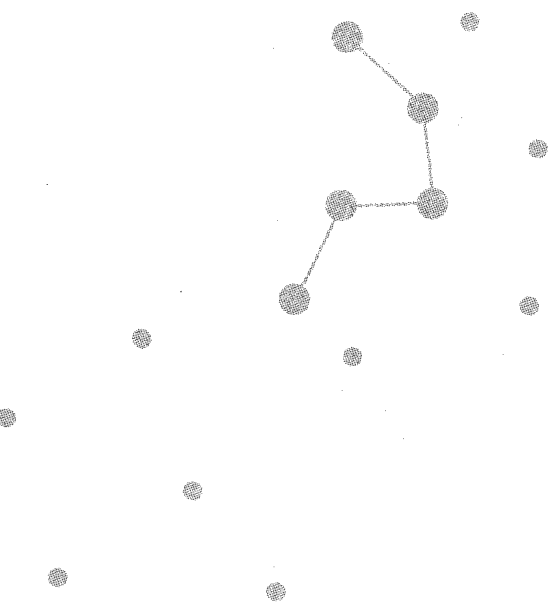

## 图书在版编目（CIP）数据

内在的宇宙 / (美) 阿若优著；李含译. —北京：华夏出版社，2014.5
书名原文：Chart interpretation handbook
ISBN 978-7-5080-7975-2
Ⅰ. ①内… Ⅱ. ①阿… ②李… Ⅲ. ①成功心理—通俗读物 Ⅳ. ①B848.4-49
中国版本图书馆CIP数据核字(2014)第014158号

CHART INTERPRETATION HANDBOOK: GUIDELINES FOR UNDERSTANDING THE ESSENTIALS OF THE BIRTH CHART By STEPHEN ARROYO
Copyright: © 1989 BY STEPHEN ARROYO
This edition arranged with CRCS Publications
Through BIG APPLE AGENCY,INC.,LABUAN,MALAYSIA.
Simplified Chinese edition copyright:2014 HUAXIA PUBLISHING HOUSE
All rights reserved.

版权所有，翻印必究
北京市版权局著作权登记号：图字 01-2013-6435

## 内在的宇宙

- 作者 [美] 史蒂芬·阿若优
- 译者 李含
- 责任编辑 张瑾

- 出版发行 华夏出版社
- 经销 新华书店
- 印刷 北京建筑工业印刷厂南厂
- 装订 三河市李旗庄少明印装厂
- 版次 2014年5月北京第1版  2014年5月北京第1次印刷
- 开本 880×1230  1/32开
- 印张 6
- 字数 120千字
- 定价 29.00元

华夏出版社 网址：www.hxph.com.cn 地址：北京市东直门外香河园北里4号 邮编：100028
若发现本版图书有印装质量问题，请与我社营销中心联系调换。 电话：（010）64663331（转）

## 目录

序一 /001

序二 /003

前言 /006

# 第一章 占星学入门 /001

## 占星学的未来——科学与专业 /009

# 第二章 如何使用这本书 /013

## 关键概念和定义 /021

# 第三章 四元素与十二星座 /025

火象星座：白羊座、狮子座、射手座 /028

风象星座：双子座、天秤座、水瓶座 /028

水象星座：巨蟹座、天蝎座、双鱼座 /029

土象星座：金牛座、处女座、摩羯座 /030

# 第四章 行星 /033

行星的关键概念 /034

行星本质的积极和消极表达 /035

行星落入各元素 /036

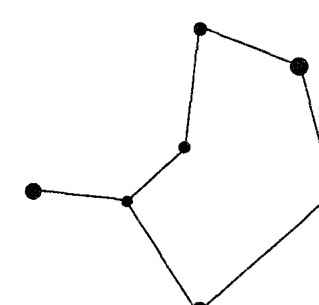

# 第五章 行星落入十二星座 / 047

- 黄道星座 / 048
- 太阳落入的星座 / 050
- 月亮落入的星座 / 054
- 水星落入的星座 / 059
- 金星落入的星座 / 064
- 火星落入的星座 / 069
- 木星落入的星座 / 074
- 土星落入的星座 / 079
- 天王星、海王星、冥王星落入的星座 / 084

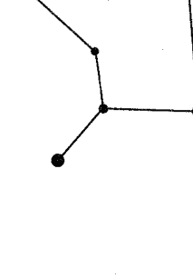

# 第六章 上升点与中天 / 087

- 上升点的关键概念 / 088
- 上升点所属元素 / 089
- 上升点的守护星 / 090
- 上升点的相位 / 091
- 上升点解析指南 / 093
- 中天 / 102
- 中天的守护星 / 102
- 落于十宫的行星和中天的相位 / 103

# 第七章 宫位——说明指引 / 107

- 宫位整体解析 / 108
- 水象宫位 / 111
- 土象宫位 / 113
- 火象宫位 / 114
- 风象宫位 / 115
- 宫位的解析指南 / 117
- 行星落入宫位的解析指南 / 118
- 宫位解析的关键点 / 120
- 宫头星座的解析指南 / 121

# 第八章 理解行星的相位 / 123

- 相位解析的基本原则 / 127
- 容许度与行星间的互动关系 / 130
- 行星间交互与协调作用的规律 / 131
- 太阳的相位 / 133
- 月亮的相位 / 138
- 水星的相位 / 142
- 金星的相位 / 144
- 木星的相位 / 149
- 土星的相位 / 152
- 上升点的相位 / 154
- 外行星的相位 / 155

# 第九章 综合分析星图的方法 / 159

- 影响行星运行法则的因素 / 162
- 理解出生星图中的主题 / 166
- 星图解析纲要 / 169

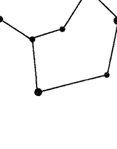

# 序一

史蒂芬·阿若优所著的这本《内在的宇宙》旨在 “指导我们理解出生星图的要义”。这是一本指示清晰、内容丰富的占星手册。不论是对于占星学生还是职业占星师而言，这都是一本介绍当代西方占星学基础的“必读”之作，书中的文字浸透着作者丰富的执业实践经验，你可以将它当作便利的参考书或指南。这本书质疑了科学体系的有效性，并探讨和回答了占星学的哲学基础问题。

书中列出了一些关键词句，讨论了元素、星座、行星、上升点和中天、宫位、相位等概念，西方大部分占星师认同并在他们的职业实践中使用的正是本书中所阐述的基本分析语言。史蒂芬老师的这本星图综合分析指南将个人出生星图中的所有复杂问题整合到了一起，为高阶学生提供了一份分析概要，并指出了一条发展出生星图整合分析解读的光明大道。

在此，我向我所有中国的占星学员们郑重推荐这本优秀的占星著作。

美国资深占星师、《灵魂的目标》作者
若道占星网创始人之一
大卫·瑞雷

# 序二

史蒂芬·阿若优是我的占星学启蒙老师。之所以这么说，是因为我借由阅读他的著作《生命四元素：占星与心理学》、《生命的轨迹：深度心理分析手册》，才得以一窥占星学的堂奥。这两本书也是在中国大陆首次引进出版的严肃占星学经典，我相信有许多占星学爱好者和我一样，从中受益匪浅，对占星学产生了焕然一新的理解。而我个人，更是由此展开了长达六年的占星学探索之旅，并在2010年改换职业，成为占星咨询的从业者。

人生中有许多奇妙的因缘聚合，而我们往往在因缘触发的当下无知无觉，唯有当生命走过了较长的旅程之后再去回看，才会惊觉某个经历、某个人、某件事带来的影响是如此深远。2008年，我尚是出版行业的一名图书编辑，而阿若优的上述两本著作，恰恰由我经手审阅和编校。一直对哲学和心理学深感兴趣的我，很快就被《生命四元素》一书中所阐述的占星学给迷住了。阿若优拥有的心理学专业背景和广泛的人文视野，使他能够深刻地阐明占星学的哲学根基和文化意涵，并对这门“能量语言”如何在心理咨询和身心治疗中加以运用，进行了高屋建瓴式的阐释分析。由此我意识到，披着神秘面纱的占星学绝非坊间流传中的“算命”工具，而是一门融合了人类理性和灵性智慧的大学问。也因此，我开始奠定人本主义、心理分析取向的占星理念，并逐渐走上了职业占星师的道路。

如今，阿若优的《内在的宇宙》付梓出版，我又有幸先睹为快，再次感慨命运的丝线在冥冥中交织，令因果相续。下面我将择此书精要，为大家介绍一二。首先必须说明的是，这是一本简洁明了的占星入门读物，极为适合初学者。它对占星学的理论要素——星座、行星、宫位、相位分别加以阐释，并言简意赅地逐条列出了自己对所有占星要素的核心解读，包括：行星所落星座的解读，行星所落宫位的解读，宫位所落星座的解读，以及行星相位的解读。因此，读者在阅读中可循序渐进地掌握占星学的知识体系和理论架构，并对具体而微的解读原则了然于胸，进而可尝试对出生星图进行整合分析。对于初学者来说，此书一册在手，既可随时参阅，解答心中迷惑，又可反复浏览温习，逐渐巩固和消化。

另一方面，我也非常欣喜地看到，此书秉持了阿若优一贯精密严谨的作风和整体观照的视野（而这正是市面上很多快餐式占星读本的软肋）。在整体性方面，作者一贯强调风火水土四元素的能量本质在占星组合中所发挥的基本作用，而书中也对四元素星座、四元素宫位，以及行星落到不同元素的核心意涵进行了精到的解析。可以说，这个部分让读者不至于迷失在繁多的资讯细节中，而能够牢牢地把握住占星学在身心能量层面的示现法则。而在最后一章，作者更是介绍了整合分析星图的方法，包括影响行星的复杂因素、如何寻找星图主题、星图解析的纲要指南，等等，将自己积累多年的占星心诀和盘托出。此外，作者对那些涉及灵活理解和综合运用的知识点也进行了整合性的分析和提示。举例而言，如何看待上升星座，一向是初学者容易感到困惑的节点，而作者将上升星座、上升守护星的星座和宫位、上升点的相位一并加以解析，厘清了上升点的丰富内涵和解读技巧。

综上所述，这本书不仅适用于想要入门的初学者，可以帮助他们清晰快速地理解占星知识，并为后续的学习奠定扎实的基础，而且也会对中高阶的占星研习者有很大的启发，能够揭示许多实践运用的盲点，并促进知识的融会贯通。

在此，我诚挚地向大家推荐这本书，希望更多的占星学子能够精纯地把握这门学科的精华，在宇宙星辰的光照下，去探寻生命的源泉和人性的奥秘，去帮助迷茫困惑的人们认识自我，洞悉内在的力量，活出丰盛的人生。

职业占星师
女祭司

# 前言

> > 我们用人的标准衡量事情，却缺乏对神造的敬畏。
> ——查兰·辛格《真理永恒》

从我的第一本占星书出版之后，我收到来自全球各地非常多的读者来信，他们在信中记述了如何运用我书中的内容学习和实践占星学，其中一些人将占星理论作为自助的工具，并不求成为职业的占星师。很多人在这些书里做出标记和注解；有些人将书中的章节影印给客户、学生或朋友看；还有人对我说，编撰一本索引或是进一步阐述如何运用（占星学的）基本原理会非常有用。但是，一直以来，我都认为没有必要另外再做这样一份资料，然而我最终改变了这个看法。清晰地陈述占星学的基本原则和方法，有助于建立稳固的占星心理学（或宇宙心理学），这项任务非常迫切。

此外，我一直认为，学习占星时与其盲目遵循占星的传统规则，死板地运用那些占星手册里的解释，不如自己在实践中摸索和思考。我认为，学习占星应该注重应用那些经过实例验证的指导原则；在实际运用中验证（占星理论的）准确性会给学习者带来惊喜，他们对占星学的理解和掌握能力会上升到新的高度。此外，我的著作已经涵盖了丰富的理论指导、例证和史料，而一些常见的占星书缺乏真实的例证，这让那些希望掌握占星学基础知识的聪明学生感到很受挫。

不管怎样，我开始意识到很有必要在我的著作中对基础原理做进一步阐述，特别是加入更多详细的说明指导。我认为，占星著作中缺少一本简明扼要的指导性汇编读物，一部既能让占星初学者准确快速地了解占星学，又能让高阶学生、老师、从业者快速查询的参考书。它应该是一本广泛涵盖基础占星学理论的手册，且易于理解。其目的不仅仅是整理出阐释星图的详细说明，也可供读者便捷地查询基本概念，指导读者如何理解占星学，这一点是其他简单的索引无法做到的。我把重点放在所有星图要素的主要阐述上，排除了一些让初学者困惑也让资深从业者分心的次要因素。我只侧重于对出生星图的理解，关于行星运行和推进的内容会单独成书。

这本手册在很多方面像是《生命四元素：占星与心理学》和《生命的轨迹：深度心理分析手册》的延续和扩展，这两本书是我最早的著作，在全球极受欢迎。我深深感谢那些一直使用并推荐这两本书的读者和老师，我感激他们的鼓励。这本书阐述了如何组合及运用重要的关键词、概念和说明性短语，坚持强调关键点，抛开细枝末节，让使用者一眼洞见，这是我之前的著作中没有涉及的内容。

构思这本书时，我有些左右为难，一方面我想用精准的语言来撰写这本指南，但我同时希望它能和我的早期著作一样保有整体性、灵活性和开放性，这些特点在我之前的著作中广受好评。这本书副标题的第一个词“指南”，就是本书的中心思想。很多占星书籍对于各种星图中的无数细节和组合的说明缺乏灵性、语言的精确性和确切的指导方针。这就难怪初学者会被弄糊涂，觉得很挫败和气馁，那些教材里充斥着无关紧要的信息，让人迷茫。多年来，我一直听到有聪明的自学者说没有适合自己的清晰明了的解析指引。他们本能地怀疑占星学的准确性和实用性，而没有认识到他们阅读的书籍旨在收集占星知识用于出版，从未灌输真正的理解和真实的洞见，读者难以认同书中的内容，不能从书本中有所收获。

时下有很多滥竽充数的占星指南，这种有害的趋势在“电脑占星”中更为明显。如今，电脑占星的发展非常迅速（主要是因为它便于操作，不管懂不懂占星的人都可以以此更多更快地赚钱），带来大量肤浅、凌乱、完全无用的“解释”。这种“自动生成”的占星学冗言，没有斟词酌句的严谨性和正确性，不注意用词的细微差别。运用占星学为人类服务是一件非常复杂的事情，要有充分的考量，而那些庸俗的内容曲解了真实的占星学。

因此，这本书注重言辞的精准、简练和深入，的确与当今许多占星学材料背道而驰，那些学习材料似乎已迷失在大量的词汇和占星学的细枝末节上。如果读者正确选择本书中的关键概念、短语、指引，他就可以了悟占星的根本和大部分可以辨识和学习的占星内容。至于可以进展到何种程度，则由读者自己决定。但有一点我非常确定，就是把焦点放在出生星图中的要素上是正确的。我认为正确的理由是：

+   1. 如果理解正确，要点元素是可靠的；2. 最基本的要素最能清晰地反映个人生活的主要课题。有效的“星图解析”是一种调和与理解，能指明重要的人生主题。许多书籍、讲座、文章和邮购的电脑占星产品中复杂的占星学方法和次要的占星元素并未揭示任何重要的人生主题，那些传统因素和方法并未给出明确指引。正如我在对占星师的演讲中所说，如果占星师把焦点放在烦琐细节上，他就是在贬低占星学——我要再补充一句——并带给占星者更多琐碎的画面，而他们在我们的社会中已经深受烦琐之苦。

下面这段话引自我的一次演讲，非常值得借用在此处，它能说明为何这本新书必须专门针对基础因素阐释的原因。

在星图中找出过多的线索，会增加分辨的难度，混淆了重要主题和细枝末节，而不是帮助我们整合星图，因而不能对重要的人生主题进行有意义的评估。越多使用关键信息、方法和次要“行星”，我们就越能通过出生星图合理解释几乎一切问题，因此我认为，应该尽量使用最少的、可靠的线索为客户清晰分析情况。否则，你就会把混乱无序丢给客户。

就像是机场的空中交通管制，要在雷达屏上区别飞机与其他的静电干扰，以及在空中同时有许多架飞机时要识别出哪一架飞机距离自己最近。所以，占星师运用太多天体元素时，会发现分辨重要信息和次要信息的困难增大了，反而让那些企图解除困惑的客户陷入越来越多的困惑、错觉和错误的观察中。人们找占星师可不是为了受到干扰，或是被一大堆细节和猜测淹没；他们需要的是拨开云雾，找到人生的方向。即使他们需要你给予预测，他们也是在寻求清晰的指引。

上面，我谈到了本书构思的重要性，也就是对关键词和解析指导的仔细甄选。我应该简要地阐述一下为什么这种语言的精确性是如此关键。从1967年起，我就开始注意提醒自己要做到表达精准，让占星解析的可靠性达到一个高水平。旧式占星学的非黑即白、二元性和吉凶论已经完全无法满足我对理解性与可靠性的需求。正如哈佛历史学家费正清博士所说：“没有严谨的思考范畴就不可能严谨地思考。”但是，我从未听说过哪个占星师在经过质询和审慎分析的解释性语言中运用过什么基本假设和范畴——直到我读到了戴恩·鲁德伊尔那本开创性的著作。

一旦我们开始以新的方式理解占星学，接下来便势不可挡了，在我还未揭示占星学在描述个人内在的强大力量之前，人们便已纷纷开始谈论自身与自己的出生星图：首要动机与需求，在任何特定时间里的内心状态，甚至是个人的意识特质——简而言之，就是个人整体身心能量领域的内在动力学。经过多年试验，阅读各个领域的书籍，进行了千余小时的咨询以及各种各样的研究，我最终发现占星学在根本上是一种经验性的语言，同时，通过对疗愈艺术多年的研究，让我认识到占星学也是一种能量语言。我得出的结论是，真正科学的占星学（准确的词义）必须强调人类生命的内在次元（内心世界）才能达到我所说的准确程度。

实际上，内在的状态更为根本，因此，它可以比外部环境更为精准地体现在占星格局当中。一旦内在的本质表现于外部世界，它便会碎片化，化整为零，这样一来，在任何星图数量有限的元素中寻求理解就变得更加困难。因此，像许多占星师所做的那样强调外部事件和境遇，最终让占星变成了猜谜游戏，难以成功。在研究中，我发现一个人需要专注于内在的次元，才能找出特定行星的落点或格局所必然呈现出的特质，接下来要做的只是各种形式的言辞表达，用关键词句最精确有效地为客户勾勒出精妙的现实轮廓。我最初的三本著作，还有现在这本书，都是这一探索的成果。我希望本书的读者能够从这个角度阅读这些指引，假以时日，熟能生巧，最终能够自如地选取本书中任一部分，行之有效地加以运用。

最后，正如前文以及我的第一本占星书《生命四元素：占星与心理学》所特别关注的，占星学——在很大程度上——是一种能量的语言。据我所知，没有任何其他语言也能如此有能量，如此精准和实用。有哪种其他语言（或科学）能揭示出个人的基本电压，也就是由太阳所表现的一个人的基本力量和生命力频率？有哪种其他语言能如此精确地描述个体电流强度，也就是月亮所表现出的个人能量的流动速率，或是个人的导电性或电阻值？以及由上升星座象征的生命力经过个体而注入世界的方式？这些由威廉·戴维森博士研发的电能理论的比喻，只是浩大的占星学能量语言的一个片段。

强调占星学的能量运作就必须重视四元素，如下定义——这是我应用多年，极其精准的定义——研习此书时非常值得牢记在心。这些定义同样将占星学视作描述个人体验的语言，它们与那些运用每一个占星格局勉强预测外部事件的老式占星学截然不同。

元素是体验的能量实质。
星座是基本的能量模式，它能代表特定的体验。
行星调节着能量的流动，代表体验的面向。
宫位代表特定能量在哪些经验领域能够最轻松、最直接地被表达。
相位揭示了体验的动态和强度，以及个人内在能量如何互相作用。

这五项因素，如上定义，组成了非常全面、复杂、精妙的宇宙心理学；只要试图准确表达一种值得信赖的占星科学（或占星心理学），我们都必须把占星学描绘和解释得如此明确的生命能量领域考虑在内。许多传统疗愈艺术的从业者都在思考并进行“能量”领域的工作，事实上，他们中有许多人都运用或尝试将占星作为一门精准的能量语言。所以，现在占星师们需要做的就是意识到他们一直都拥有这个工具，进而去肯定占星学的能量层面。

不幸的是，如今许多占星学的活跃分子——不论是研究者还是执业者——与唯物主义科学家和医疗工作者们一样，都还在犯同样的错误：即迷失在细节里，无谓、过细地分析以至于缺乏整体视野。这样很容易忽视了占星学伟大的整体性真理，有时候迷失在技术细节之中的人甚至会被嘲笑。在这些伟大的真理之中，首先，能量是占星学分析和理解的基础要素；其次，传统的“四元素”作为一个简单统一的因素，有其现实性和重要性，却依然被大部分占星师忽略或掩盖。所以，在占星学的分析中，四元素所代表的能量是生命的根本存在形式。从能量层面来看，元素是有效的法则，而行星的首要作用则是激发和调节这些能量。简而言之，注意占星学的能量基础，可以帮助所有学生和执业者更真实、更准确、更有效地表达占星学富于活力的卓越真理。占星师们有时候是因为安全感的需要才依赖出生星图，而不是去运用星图，试着将莫名的不安搁在一边，然后带着越来越多的领悟和认识去勇敢地生活吧。占星学不需要成为一种宗教信仰或终极人生目标。它更像是宝贵的阶梯，帮助你完成更深刻的理解，奔向更伟大的目标。

> > 占星学与其他学科有着显著的差异，我认为，它并非着力于事实而是指向深奥的思想。在科学都偃旗息鼓的领域，占星学绽放着光芒。
> 
> ——亨利·米勒

为让大家以后能够读到更多好书，请务必添加微信号：18948386670。添加微信的可以联系免费赠送单本电子版1本。

## 第一章 占星学入门

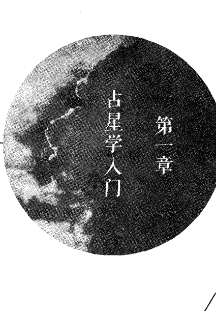

简要讨论一下关于当代占星学习和运用的重要问题是明智之举，这对于初入占星学门下的学子们尤为有益。事实上，本书或其他任何占星教材在不讨论特定哲学、科学和实际问题的前提下，向人们介绍占星学的力量与深度是不合适的，这对当今西方社会那些试图运用占星学的人们有着直接影响。我无法在本书中讨论所有相关的问题，其实我已经就这个议题完成了一本名为《占星学实践与职业》的专著，另一本与丽兹·格林女士合著的《木星和土星大会上的讲座：现代占星学的新洞见》一书中也有大幅篇章涉及此内容。因此，下面的见解只是简要阐述一些复杂、有争议的问题。

占星学以多种方式显示出其独特性，它广泛的见解和应用与当下主流的唯物主义明显步调不合。它既包括科学、艺术、知识和智慧，也包括内在生命和外在生命。事实上，它的基础是宇宙与个人的关联性（宏观宇宙与微观世界统一性的古老教义通常蕴藏在格言“上如是，下亦如是”之中）。对当今大多数人来说，这种整体论最多被认为充满诗意，古怪有趣，最坏是被视作荒谬、幼稚、迷信的言论。然而在西方，对于占星学的普遍偏见是，它只是一种缺乏思考，有违科学立场的玩意儿。人们很自然地会对任何承认心与灵的真实性的事物持怀疑态度，而纵观历史，心与灵却是人类体验中最强大的基础。

这种对占星学的怀疑和敌意更像是某种强迫性的敌对表达，目光短浅的唯物论科学拥护者将枪口对准了各种灵性传统、疗愈艺术、哲学、心理学的古老形式和个人指导。不幸的是，这种缺乏想象力、对人类潜能和重要的传统思想的狭隘认识在一段时期里成为西方社会的主导力量，其中包括对传统知识与文化的保护和研究负有道德义务的学术圈，难道他们不应该强调思想开明，追求真理吗？有一些人会不时为反对这种忽视而发出声音，比如叶史瓦大学①的校长诺曼·拉姆在1987年写道：

> > ……我们必须重申灵性的存在与价值……我们的社会必须认识到世间尚有大智慧等待着我们去耐心探寻；人类既作为生物存在，有其心理、政治、社会、法律和经济特征，也同样是灵性的存在。
> 
> 拥抱灵性的高贵……意味着流行的科学唯物主义和哲学教义让人失望，它们并不是唯一值得学术界关注的内容；相信心灵的真实性，相信灵魂的存在并不是智力低下或科学倒退的表现……这种知识应该进化成智慧。
> 
> （这段文字摘录于诺曼·拉姆在叶史瓦大学百年校庆时的演讲。）

唯物论科学培养出“操控自然”这种狭隘的态度，抑制了积极的社会发展，造成了许多生态灾难，而我们才刚刚认识到这一点。传统的科学其实只开发了我们头脑的一小部分。假如只有唯物论科学这一条知识的大道，只有被科学证明有效的知识才是真的，那么西方世界便会将那部分无法被科学分析的人类生活和经验排除在外了，而这一部分规模巨大。因此，那些不向科学寻求证据和认可而体会到占星学价值的人们——这份证实也永远不会到来——则能够通过对占星学清晰、可靠的理解（如何最佳地应用，有哪些范畴及限制）更有效地运用他们的能量。

纵观科学、医疗、军事战略、政治及许多其他被极力发展的领域，它们在推进的过程中难免充满暴力，而且不乏狂热的反对者。例如，物理学家马克思·普朗克的见解就被反对者攻击，他的著名言论是“要接受一个新的科学真理，并不用说服它的反对者，而是等到反对者们都相继死去，新的一代从一开始便清楚地明白这一真理”（出自“普朗克定律”，《科学》杂志，1978年）。我忍不住要拿出特立独行的哲学家、诗人、艺术家威廉·布雷克就此所赋的诗作：

> > 他多么愚蠢，妄想证明自己无法认知之事；
> 他如此糊涂，试图建立这样一则信条。
> ——天堂与地狱的结合

读者或许会好奇：“这些与占星学有什么关系呢，占星学不算是新的理念啊？” 的确如此，占星学本身并不是新的理念，但它作为指引个人的现代形式，作为意义重大的辅助工具，在助人的专业领域中经历了根本而显著的发展。现代占星学产生之后，心理学被引入复杂精妙的占星学之中，在过去50年中，这种占星学得到了发展。这一特定的结果正是源自西方社会的迫切需求，这种新理念对于科学、心理学、疗愈艺术以及其他领域的尝试都做出了巨大的贡献。卡尔·荣格博士说：“占星学是古代世界心理学知识的集合。”这句话常被引用。它就像是装满古老智慧的宝瓶，蕴藏着对人类生命神秘性的理解，在如今现代心理学及其他知识领域的春风之下得到了挖掘，在先驱者们的努力下彻底焕发新的生机，拥有了一系列新的应用方法。

> >卡尔·荣格博士说：“占星学是古代世界心理学知识的集合。”

如今，占星学正站在将有重大飞跃的起点上，它将会在现代生活中占据更为重要的位置——如果它能够以理性的方式和现代的语言继续发展的话。否则，它就可能重新变回算命术士、诡诈之徒的状态。不幸的是，许多职业占星师依旧支持将焦点放在事件预测之上——不论他们是否自称为“科学的占星师”或被赋予更受尊敬的类似名称。占星学是否能够在接下来的20年中完成这样一次飞跃、揭开新的篇章，更有赖于占星从业者与咨询师的作为、能力和专业性，而非那些强烈反对占星学的行为。

那些最爱声讨占星学的批判者们鲜少以道德和科学的正直态度深入研究这门科目；一般而言，他们对占星学的原理与实践一无所知。因此，他们打着科学的旗号和他们口诛笔伐的陈词事实上毫无意义，不管他们说得多么慷慨激昂、傲慢专断。那些传统的西方占星学的拥护者对于特定的占星学落点、周期和格局的预测性意义已做出了明确的叙述。许多传统占星学的内容——即便不是大部分——都是基于日积月累的重复观察。从正统的科学视角来看，只有经由大量实验而得出显著差异的结果才能被视作可以接纳的证据。就此而言，某些特定的占星学的传统观念是错误的。

这里真正的问题其实非常简单和实际：占星学的阐述合乎情理吗？除了实验，还有什么方法可以检验占星学？占星学原理的针对性实验需要有哪些正确、有效、恰当的组成部分呢？我的结论是，正如我在下文中会详细叙述的那样，只有经验性的证据能够满足所需；只有临床实用经验可以充分表现出占星学在指导、咨询、心理治疗应用中的价值和正确性。

在对占星学的反对之声中，我们常听到一种说法，有一些“科学家”完全否定了占星学的一切有效性，他们认为占星师无法拿出任何“有效机理”证明行星的“影响力”。先不谈占星学是否必须在有限的理论框架下“接受审判”，其实对于这些否定占星学言论最有力的反驳，正如加州大学洛杉矶分校医学院的医学博士、副教授雅各·扎赫伯伊在我最近出席的一次讲座中谈到的②，在他的整个科研生涯中，“最困难的部分就是详细说明有效机理”。各类切实可行的科学原理和技术以及各种医药在全球范围内被广泛使用，人们却并不了解他们的运作机理。

在灵性领域，有学者在严格的条件下，按照科学实验的正规方法进行了数十年研究，最终无法阐述各种超自然灵性现象的机理。灵性经验说明传统的实验方式或许并不完全适合研究占星学和其他深入内心的现象和技术。有一些东西不容易被量化，但这并不代表它不存在或是不重要！

唯物论科学的基础是统计、测量和不断地进行细节分析。如今，电脑的广泛使用也让这些方法更加便捷。作为全球最著名的过敏症专家、医学博士塞隆·伦道夫写道：“统计学方法、电脑技术和数据分析破坏了综合性和整体论”（语出《人类生态学研究基础报告》）。伦道夫博士指出，医疗和诊断越来越趋于分析法，对病人的生命状态缺乏宏观视角。我认为这一警告必须受到重视，因为这一趋势也在占星学中蔓延开来，导致了结论的局限性。

占星学中的大部分统计学研究都缺乏焦点。在过去20年中只有少数研究显示出特定行星位置与各种职业的关系，比如杰夫·梅奥研究了太阳星座与外向性格、内向性格的关联性，以及著名的高格林实验，都得到了富于建设性的结果。但是普遍看来，最近有一本书③也阐述了统计学研究在数据中发掘特定模式时常见的失效性。“如果你不知道在哪里寻找答案，你很可能就找不到答案。”因此，那些对占星学的复杂性和精妙性一无所知的人，企图通过统计学方法得出重大结论最后却失败了，又有什么好奇怪的呢？

然而，尽管统计学在研究微妙的现象时的确有其缺陷，在占星学以及自然疗愈的艺术领域，依然充斥着大量临床和实验的观察统计数据，但往往都被视作“仅仅是趣闻”而不予考虑，并不包含“可信的”信息。

对于这些趣闻批评家们来说，老鼠身上发生的事情就是科学，换成人就变成了趣闻。原因何在？老鼠无法告诉科学家或是医生它的感受。只有它的尸体能证明所发生的事……对于人来说，他们的思考，他们的感受，他们的“看法都是真实的，他们诉说的体验都是需要被尊重的轶事录，这种信息是需要被认可的……不相信有效的信息，不将此作为‘证据’是‘不科学的。’”（《保健权利提倡者》卷Ⅱ，第二版）

伟大的占星作家、哲学家戴恩·鲁德伊尔清楚地指出，占星学实践者效仿当下流行的“科学”方法和标准，会带来的危害：

> “当今的占星师们热衷于将占星学‘提升’到能被‘科学’接纳的水平，依靠统计学以及其他被我们官方的‘知识工厂’（大学）所崇拜的分析技术，事实上无法产生更富于建设性的方法去解决占星客户咨询时的问题。这往往会降低这种咨询关系的有效性，因为咨询是人与人的互动，而科学并不处理个案，而是一个统计上的平均结论。科学无法衡量个人的价值，但是一个人是因寻求帮助才会做占星咨询。即使他在意识层面上是因为好奇而来，但在潜意识层面他也是在寻求帮助。寻求帮助的他是一个独一无二的个体，即便他提出的问题具有普遍性，咨询所处理的却是他的个人意识。我们自己就是自己最大的问题，而占星学正是一面打磨平整、真实映照自我的镜子。”（引自《占星学和现代心理》1977年版，182页）

事实上，占星的哲学论和整体论所构成的世界观与唯物科学的世界观是不相容的，所有学习、研究和推广占星学的人都必须警惕，不要只是因为妄想获得认可或贪图获得尊重而努力去实现这种“整合”。努力去理清占星学独特的力量，进一步详细说明它的原理和应用才是更富于成效的工作。一个完全注重实效的方法，经得起生活和个人体验之结果的检验，它在衡量任何疗愈艺术、助人行业、心理学理论和方法的有效性上，都是终极、唯一的检验标准。

### 占星学的未来——科学与专业

占星学从哪种角度而言可以被视作科学？通常，占星学能够被称作科学只是因为它所包含的原理和法则也是通过观察所积累的；仅仅因为在浩瀚的传统占星学中发现的一些观念和理论并非行之有效，事实上有些的确缺乏可信度，也并不意味着需要全盘否定占星学传统。每一门科学都在不断发展和变化，理论更迭，去芜存菁，或形成更为完善的理论，占星学也不例外。但是，如果正确理解占星学的基础原则，它是非常可信的。

我尤其相信占星心理学在目前是可行的（有严谨的学生进行了大量的数据研究），合理地构建了一种宇宙心理学。本书试图阐明这种宇宙心理学的一些基础原理和指南。当我们用准确、现代的语言解释占星学的基础时，才能真正理解它们在人类心理上的征兆，比起传统心理学不断改变的理论、模式，它们更能够描述和解释“人性”的神秘。

大部分现代心理学依靠对人类驱动力和动机的猜测，往往将一切归咎于无法解释的混合体——“遗传与环境因素”。这种理论的组合常常仅能投射出个人的观念、经历和偏见。占星学以更加丰富的色彩在广袤的天空背景下勾勒出人性的轮廓。更丰富的人类潜能跃然纸上——让这幅图画更加清晰。基于对成千上万人长期的观察，只要清楚地理解、应用占星学的基础，占星学完全可以合理地被称作名副其实的心理科学。这里的“清楚理解”是指，你能够充分认识、完全了解那些不符合标准也不可靠的传统应用。

心理学最终需要一个宇宙的框架将能量赋予这些宇宙的儿女——人类。占星学的独门绝技便是将人类置于宇宙框架之下，将人类意识与其天性重新连接，激励更深入的自我认识。据我所知，还没有其他的理论和技术能够如此清晰、简单、准确地解析个人的动机、意识特征以及经历。正确使用占星这门工具，并不需要过度复杂的语言或理论，它可以只是简单阐述宇宙因素和生命力量在个人层面的运作。

如果占星学的确是这样一门意义深远、无出其右的心理科学，读者们或许会问：该如何向社会有效地介绍它呢？除了少数几位在媒体上危言耸听博取利益的占星师，目前社会上对于“占星师”并不尊重，占星师会受到嘲弄和排挤，收入微薄。在《占星学实践与职业》一书中，我更详细地探讨了这一问题，所以推荐读者们可以阅读那本书并深入了解。但是有一个新的理念在那本书中并未被提及，我要在这里分享，激发占星专业人士或即将成为专业占星师的人来讨论这个问题。

除了运用占星学作为了解自己、了解生命节律的工具之外，多年来在一对一的咨询活动中，我体验到了占星学的巨大力量和疗愈潜能。我心里坚信在对话咨询中，占星运用的准确度和有效性要比客户缺席的“占星报告”高出许多。所以我想，未来的占星专业服务是否不再包含“占星咨询师”甚至是“临床占星师”的头衔？只有通过实现清晰的目标、统一的标准和高质量的执业，才能建立这样一个专业领域。简言之，必须建立一套卓越的标准，为这一新兴职业的基础设施提出严格的要求。这一过程当然需要很多年才能实现，其结果也会慢慢才显现出来，因为对于占星学有偏见的势力十分强大。但是，如果占星学没有为才智优秀、能力卓越的人们提供从业机会，以此为业，以此为生，那么占星学该如何吸引他们为占星学的繁荣发展做出贡献，提供公众期待的一流占星服务呢？

- 一所位于美国纽约的犹太大学。
- 1988年4月29日-5月1日在加利福尼亚圣马特奥市举办的《顺势疗法：21世纪医疗》的会议。
- 《一月效应》，1987年由欧文·道琼斯出版社出版。
- 在阿若优的著作《占星学实践与职业》中对于占星学与科学的问题有更详细的阐述。

> > 去学习，不要怀疑，只是去阅读，
> 字句背后预示着行动。
> 找到它，然后将文字抛诸脑后。
> 去芜存菁，
> 领悟其精神，掌握其内在意义。
> 功成，书不存。
>
> ——奥义书

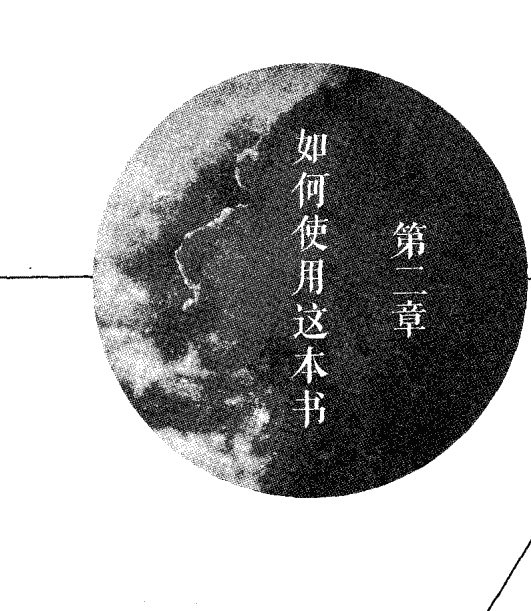

## 第二章 如何使用这本书

本书并不打算把出生星图上所有基础因素的可能含义都综合到一起。也不是要给读者一些速食“知识”或爆点信息去博人眼球。占星学的强大力量不是用来吸引公众和媒体关注、追求轰动效应的工具，都不是这门精妙、深奥学科的恰当产物。本书旨在促进理解，抓住关键，激发深刻思考。本书的主旨是解析出生星图的实践运用，为实践者、教学者或学生编写一本实用的解析指南，给出详细说明，帮助挖掘星图、个人、境遇的深意。

关键词就是指南。指南意味着实用性——对于本书来说——深化对实际的星图和人的理解，最终更深刻地理解占星学。被动使用这本书的人无法获得最大的价值；相反，将这本书当作跳板，去理解个人反应——在咨询中——抓住交流的重心，与他人更深刻地讨论现实、感受和内在体验，我认为，如此才能体现出这本书的卓越价值。运用这本书作为切入点，或帮助他人进入更深的自我，深入了解那些往往被忽略的微妙情绪、节奏和需求，帮助读者发展自己个人的占星学方法，关注人生的目标和意义。这种占星学比许多书籍中冗长的描述和电脑程序报告更强大、更实用、更准确，那些只是蜻蜓点水，流于表面，却没有触及个人本质。

正如前文所说，在占星解析中必须关注内在体验才能做到更加准确。对于刚入门的学生，我尤为谨慎，不希望他们仅仅因为占星学是一门宇宙科学就认为占星学“无所不知”。这种错误的假定在占星执业者中非常普遍，占星初学者对这一点非常狂热。认为占星学有无限的应用，有极高的准确度，结果往往并不令人满意，这点我在其他的著作中也有提及。其中一个有害的结果非常明显，就是近年来，占星师们将越来越多的因素添加到出生星图中，我真的希望这些内容能够“描述”或“说明”许多生活的细节问题。很遗憾，这当然是无效的努力。生命能量不断变化着舞步，生命十分神秘性，自我和灵魂往往有超越所有智力的方法和技巧，这就是为何我将本书的基调定位在指南的原因；这些知识只能作为寻求更深入理解自我和他人的指南，这些指南以及其他星图解析材料都不是“终极证言”或“完备的”解析。人生中没有“完备”，凡事都在不断地改变和转化中。

如前所述，不要认为占星学可以“解释”一切。宗教、哲学或神秘学才是终极解析。占星学并不像许多人所认为的那样无所不能。它是一束光，能照亮黑暗与困惑。但是，占星学只有在占星师有能力锁定焦点时才能发出光！否则，这种光芒就会变得微弱模糊。不够清晰锐利的占星学运用，会让这门宇宙语言蒙尘，让它的卓越理解和显著征兆依然被掩盖。帮助你聚焦于核心意义正是这本指南的目的，这样才能揭开复杂的真相，点亮生命与人性的黑暗角落。

在本书中，我预先做出一个读者们已对古典占星学的基础内容有了一定程度了解的预设。因此，我并未重复这部分内## 第二章 如何使用这本书

容，因为在其他很多教材中都可以找到这类内容。我还预设读者们已经拥有自己的出生星图，至少知道如何确定行星的星座、宫位落点。当然，出生时间越准确越好，还有出生地和出生日期的信息也是如此。如果是完全不了解占星学的初学者，不妨找一位对占星学知之甚深的人为他解析出生星图的主要元素。另外，也要广泛阅读占星学书籍①，我还建议在入门学习中多多练习星图分析，自由地与他人进行细致的交谈，经常将本书作为指南使用，不要怕坦白自己的困惑、无知和缺乏理解。只有怀着真诚的心，不断尝试，不怕失败，广泛实践占星学，才能为占星学的语言注入生动的活力。与人交流是共同探讨问题的形式，去探索一个人的深层人格和动机，探索占星学到底能为这些问题带来多少光亮而为前路照明。

还需重点注意的是，为了最有效地利用这本书，你需要以开放式的头脑思考所有解析用语的正确性，不论它们是正面的还是负面的（占星从业者的作用可不是拿甜言蜜语恭维客户）。研习过许多占星教材的读者们或许会发现许多占星著作的用语都掉入了“不是/就是”的陷阱之中。这是很容易犯的错误，人们往往会忽略了人生的复杂性和精妙性。我在自己的写作中也数次掉入过这一陷阱，这是一种很难去规避的情境。如果生命如此简单，那么占星学的实践和理解也会随之简单多了。

事实上，生活中积极面与消极面往往会共同作用，或是在此二者间来回摇摆，并在个人的性格中以独特的方式呈现，我们很难通过简单分析解开这团乱麻。大部分人都兼具“积极性”与“消极性”的性格、趋势和动机。很多时候，我们会看到某人身上的“缺点”成为另一个人无与伦比的优点。比如，某人或许会轻视白羊座的急躁和粗暴，但是另一个人又会欣赏这种以行动为导向的性格，欣赏这份真诚、直率。换言之，不论那些言之凿凿、非黑即白的占星学论调多么令人印象深刻，它们都不是真正的占星学。这是一门精妙的能量科学，它包罗万象。不同于正统占星学中典型的“个性理论”，它所包含的性格、天性的微妙差异和创造力潜能无法估量。正如心理学家拉尔夫·梅茨纳所写：

> 作为一位心理学家和精神治疗师，我对这门变幻莫测、令人着迷的学科的另一面很感兴趣。我们已经在这里加入了心理学的技术和诊断机制，它们的复杂性和精密性超过现有的一切体系……它的分析框架——三种联动的黄道象征性元素“星座”、“宫位”和“行星相位”——比现有体系的类型、特性、动机、需求、因素或程度更适合去分析复杂的人性。

（占星学：潜能科学与直觉艺术，1970年《占星学研究之旅》）

占星初学者通常会被各种各样的解释选项甚至是出生星图所呈现的基础信息搞得晕头转向。“哪些是我应该关注的焦点？”“在有限的咨询时间里我该抓住哪些重点？”这些问题非常重要，必须得到回答。然而，在占星学的文字资料中，极少有涉及这部分的指南②，这些问题只有只言片语的答案。我在一些著作中试图清楚阐述这些问题，在本书中我决定在书的结构安排上反映出基本出生星图中各个元素的相对重要性。

本书首先强调的是四元素的基本能量分析，分析“个人”行星的星座元素落点。外行星（火星轨道之外有四颗行星，即天王星、海王星、冥王星）除非有力地影响个体，比如与个人行星成相位或是在它们的宫位落点上，否则不具备强调性。例如，我看到太多初学者过于强调天王星的星座落点了，或是过于注重两个外行星形成的相位。要知道，在好几年里出生的人都有这一相位格局，因为外行星的行进非常慢。因此，它们对于个体的影响力极小，除非是涉及个人行星或上升点。所以，明确、精准的指导在利用和理解出生星图的核心因素时，根本就没理由包含这些细节。任何人在使用占星学时都必须把焦点放在五颗个人行星上（太阳、月亮、水星、金星和火星），还有上升点，以及任何影响这些重要因素的因素。

例如，海王星如果落在上升点或对面的下降点，那么海王星就对个性和能量领域产生了很强大的影响力，并不是因为它落在了什么星座——而是因为它与星图的重点及架构紧密相关。再比如，天王星或冥王星与太阳呈现紧密相位，此人会被染上天王星或冥王星的气息和意识，并不是因为它们的星座，而是因为它们通过形成紧密相位与太阳形成了强烈的共鸣。

因此，本书大部分篇章将着墨于个人行星，为读者给予大量指导去理解这些行星的星座落点，以及土星和木星的星座落点。为了将焦点锁定在占星学的能量方式上，本书也简单介绍了星座元素和行星元素落点。学习元素和行星星座的指南时，你会非常惊叹于占星学的玄妙之处，它的准确度会让你印象深刻。

接下来的重点是上升点，但是本书没有简单地列出关键词解析，太阳星座与上升星座的解析很相似，这往往会让初学者感到十分困惑，于是我决定在本书中着重分析同一星座落在太阳和上升点有何不同表现。对这一问题可以分析的内容有很多，但本书只是简要的指南，我只是根据自己多年的观察经验去阐述差异，指出明显的对比。

在宫位的篇章中，我决定专注于整体性的原则，在这一基础上可以做出所有特定宫位的解析，在实际运用中，你可以将丰富的解析“带入”到具体的星图中，用各种结果的组合作为切入点，开始对人和星图进行分析对话。换言之，我在宫位章节中鼓励学生独立思考，探索特定的行星和宫位组合在内部与外部生活中所象征的无限可能。

在相位的篇章中，我着重阐述了行星特定的角度关系，而并非讲述相位本身。传统占星学习惯将所有的四分相位归类，也会将所有的三分相位归类，等等，给所有四分相位打上了难以磨灭的“凶相”烙印，而三分相位则幸运地博得“吉相”的美名，诸如此类。这种习惯的延续往往会造成一种心理暗示，有时候甚至是那些有意识反对这种观念的人也难免掉入陷阱。事实上，涉入相位的行星在所落的星座会如何携手运作，某个相位是如何融入星图的整体架构之中的，才是更为重要的影响因素。

如果有人问我“这本书的重点是什么？”我会进一步重申我给予学生们的指导：即便你感觉自己只是理解了这个星图的一部分，那么就去跟随你所理解的部分，它会带领你进入星图的架构和主题中，探索星图中余下的部分。不要担心所谓“完整的星图解析”，这是不可能完成的任务。与其迷失在多如牛毛的星图细节中，更明智的做法是将焦点锁定在个人天性和生命的重点上，他到底是个怎样的人呢？出生星图只能被正在渐渐活出它的那个人彻底地体会和了悟，所以，只有当个人整个生命和性格的错综复杂被揭开、理解和充分被接纳时，“完整的星图解析”才能被完成。

最终，占星学只能被教授到一定程度。如果可以的话，学习最棒的占星知识当然很好，准确地运用也会带来有效的帮助，但是基础学习之后，研习哲学与可靠的解析原则对于占星师而言，是比占星学更重要的功课。这是一门艺术，需要一位敏锐的艺术家。于是，这里的问题就是：你是哪一种艺术家？你是否清楚地洞察了宇宙的玄妙，窥到了它的焦点？个人自身的成长发展、信念、哲学观和敏感度，则成为所有个体占星学这门艺术得到有效、有利运作的关键。

需要说的另一点是，你选择的占星学理论类别也很重要（和那些所谓“头脑开放”的占星师的信念相反）。正如爱因斯坦所说的“理论决定观察”，一个人的占星哲学和基础理论方法才是获得清晰洞见、拥有可靠占星实践的关键支撑。

但是个人成长和发展的水平也具有同等重要性，这会让你能够理解人生、理解人性。毕竟，才智是在意识水平的范围内发挥作用的（有人称之为灵魂发展水平）。因此，我们必须关注自己的内在生命和内在发展，这不仅仅是精准、有效理解占星学的唯一途径，也是生命的唯一进化方式。

## 关键概念和定义

理解所有占星学的关键，是真正理解下面这些概念的意义：

- 元素是体验的能量实质；
- 星座是基本的能量模式，它能表明特定的体验；
- 行星调节着能量的流动，代表体验的面向；
- 宫位代表特定能量在哪些经验领域能够最轻松、最直接地被表达；
- 相位揭示了体验的动态和强度，以及个人内在能量如何互相作用。

这五个因素共同构成了一门复杂的宇宙心理学，将它们融为一体并形成占星学这门能量语言。同时，它也是一门艺术。

这些因素的结合方式如下：一个特定层面的体验（由特定行星所预示）一定会被它在个人星图中所落星座的特质所渲染。这种结合会带来特定的自我表达冲动，以及对特定满足感的需求。一个人会在这个行星所在宫位对应的体验领域最直接地面对这一生命层面。尽管任何有此行星和星座组合的人都会体验到这种表达或满足感的渴求，但是这一行星的相位能描绘出了这种表达或满足感被达成的难易程度。

① 尽管大部分重要的书籍推荐都会建议读者阅读“母语书籍”，但我还是建议读者们最好阅读一些占星巨匠们的著作，比如戴恩·鲁德伊尔、玛格丽特·霍恩、查尔斯·卡特，当然还有现代作家以现代语言阐述占星心理学的各种专著。建议读者阅读史蒂芬·阿若优的其他著作，作为对本书的补充。对于初学者，尤其要推荐《生命四元素：占星与心理学》一书，可以了解占星学作为能量语言的更多基础细节和这种方法的基本原理。值得学习的占星学书籍实在有很多，此处无法一一赘述。读者可以查阅阿若优所著的《生命的轨迹：深度心理分析手册》一书中所列出的“推荐书目”。尤其要推荐的是马西娅·摩尔和马克·道格拉斯所著的《占星学：神圣的科学》一书。

② 特蕾西·马克所著的《星图解析的艺术》是少数重点着墨于如何分辨星图中的重要信息和次要信息的书籍。

为大家以后能够读到更多好书，请务必添加微信号：18948386670。添加微信的可以联系免费赠送单本电子版1本。

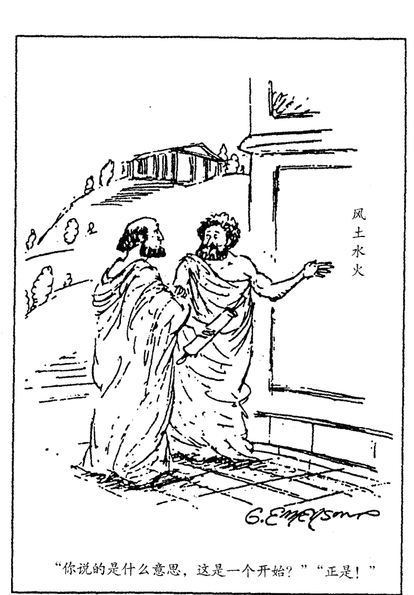

感谢《洛杉矶先驱报》提供上图，1988年版权

## 第三章 四元素与十二星座

占星学传统认为“四元素”与生命力（或活力）有关，这些元素构成了人们通常所感知到的整体创造力。出生星图中的四元素揭示了一个人参与特定存在领域的能力，以及与生命经验的特定领域相互协调的能力。这些元素与化学的元素没有任何关系，事实上它们绝非化学元素那么普通。占星学的出生星图描绘的是我们出生伊始，第一口呼吸的情景，在那一瞬间我们立刻在宇宙能量资源的加持之下建立了一生的基调。因此，出生星图以四元素的形式揭示了我们的能量模式或宇宙基调。换言之，星图象征着各种振动的表现模式，也就是个体在各种创造力层面上的表达方式。

四元素——火、土、风、水——每一种都代表了一类基本能量和意识，在每一个人身上都有四种能量在运作。每一个人都在有意识地与某些能量类别更为和谐。四元素中的每一种都表现为三种振动模式：基本、固定和变动。将四元素与三种形态结合，我们便划分出了十二种最根本的能量模式，也就是黄道星座。

有一种理解这些不同的能量模式的方法就是，依据各自的形态去分析它们。基本星座与行动的原则有关，它们象征着能量朝向某个明确方向的主动运作。固定星座代表能量向内部中心点聚集，或者由中心点向外辐射。变动星座与适应性和不断的变化相关，呈现盘旋上升状的能量模式。

星图中任何星座元素被强调（有重要的行星落于该星座）①都代表着：与个人极为协调的一种特定意识类型和觉知方式。

风象星座与头脑的知觉、洞察和表达相关，尤其与人际互动、几何思考形式和抽象观念有关。

火象星座表达的是具有温暖、表现性和激励特征的生命本质，其可能表现为热情、信念、鼓舞和自我表达的驱动力。

水象星座象征着冷静、敏感的治愈性本质、感性的反应以及与他人的共情能力（移情作用）。

土象星座展现了与世界的物质形式能达成的协调性，是利用和改进物质世界的实干能力。

元素在传统上被分作两组，火象元素与风象元素是被认为具有主动性和自我表现性的一组，而水象元素和土象元素被认为是被动的，善于接受，且具有自律性的一组。两者之间的区别对于出生星图的整体分析十分重要。这些术语指出能量的运作形式和个体自我表达的方式，而不是胡乱、僵化地将所有人的特征分门别类。

例如，水象星座和土象星座比火象星座和风象星座更为自持，他们更多地活在内在世界，不会在不小心或无计划的状态下让自己的核心能量向外投射。但这也让他们能够为自己的行动建立坚实的基础。火象星座和风象星座拥有更丰富的自我表现，他们总是“向外展现”，毫无保留地宣泄能量与生命（有时候完全忽略了限制）。火象星座的方式是直接行动；风象星座的方式是社交和言语的表达。基于这种元素分类的方式，同类元素（比如白羊座、狮子座和射手座——所有火元素）和在同一组的元素（比如，金牛座和双鱼座，也就是土象星座和水象星座）也会有相似之处。

象星座）通常被认为具有“兼容性”，这一点不仅在个人星图的解析中非常重要，而且在比较星图中也举足轻重。

每种元素中的每一个星座都以不同的方式表达相同的元素能量，也代表了不同的能量发展水平和模式。

# 火象星座：白羊座、狮子座、射手座

火象星座表达的是一种宇宙辐射式的能量，这种能量是兴奋、热情的，就好像太阳光赋予这个世界的斑斓色彩。火象星座展现出了高昂的情绪、对自身的强大信念、源源不断的力量和直率坦诚。

| 核心概念 | 特征和关键词 |
| --- | --- |
| 辐射能量，自信，主动 | 无所畏惧的冲动 情绪高昂 热情 力量 直率坦诚，甚至直言不讳 外向活泼 自由地表达 有方向的意志力和领导力 感情外露 缺乏耐心 |

# 风象星座：双子座、天秤座、水瓶座

风象星座表达的生命能量与呼吸有关，或者是瑜伽修行者所信奉的“气（prana）” ②。风象领域是原始型理念，超越了物质世界的界限；在风元素之中，宇宙的能量是以特定的思考模式作为表现方式。风象星座有这样的内在需求：将自身与直接的日常生活体验分离开来，去获得客观性与洞察力，以理性、反思的态度去对待他们经验的每一件事。

| 核心概念 | 特征和关键词 |
|----------|--------------|
| 头脑的知觉、洞察与表达 | 通过思想成就生命 视觉化 合理化 超然、洞察 渴望获得认知 以言语表现 需要与人建立关系、社交 健谈、富于好奇心 将他人视作个体存在 概念和本质 |

# 水象星座：巨蟹座、天蝎座、双鱼座

水象星座触及的是内心感受，它的触觉能够觉察到被其他人忽略的细微差异与微妙之处。水元素代表的是深刻的情感领域和感受性反应，范围从强迫性的激情到无力承受的恐惧，还有包容一切的接纳性以及对宇宙万物的爱。水象星座能够本能地感知自己灵魂深处的渴望，他们必须保护自己不受外界影响，保持内心的平静才能拥有深刻的反思与敏锐的感知。

| 核心概念 | 特征和关键词 |
|---|---|
| 深刻的情感、同情心 | 感受性反应 敏感 认识到潜意识的真实性与（或）面对现实的潜意识 直觉 净化、清洗 灵性的敏锐度 深刻的反思 习惯性的保密，非常需要私密性 出于同情而给予帮助的能力 与人共处需要投入情感 |

# 土象星座：金牛座、处女座、摩羯座

土象星座非常依赖他们的感官认识和理性实践。他们天生就有理解物质世界的功能，这让土象星座比其他星座更有耐心，更加自律。土象元素趋向于谨慎行事，预先做好计划，十分遵从传统与常规，通常值得信赖。对于土象星座而言，认识到自己在这个世界中的职业定位是非常重要的事，终其一生保持一个恒定的目标会为他们带来安全感。

| 核心概念 | 特征和关键词 |
|---|---|
| 利用物质世界的实践能力 | 适应物质世界 突显身体的感觉 务实 耐心 自律 持之以恒 谨慎 可靠 预先考虑 遵循传统常规 |

请参考第五章的前两页，我会在那里更细致地阐释每一个星座，并分析他们之间的区别。

> ① 参见《生命四元素：占星与心理学》一书第11章、12章和14章，文中全面讨论了该如何理解和“衡量”哪种元素在星图中被强调。尤其是第12章重点阐述了在一个特定的出生星图中如何评估四元素相对的强弱程度。

② 梵语中的意思是呼吸、生命能量，亦被称作生命之气。

行星的本质都可以有富于积极性和创造性的表达，或者是带着自我破坏性的消极表达。

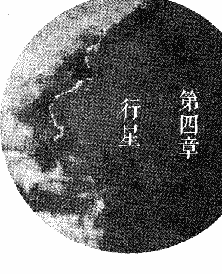

# 行星的关键概念

|  | 本质 | 代表的推动力 | 象征的需求 |
|---|---|---|---|
| 太阳 | 生命力；个体意识；创造性能量，光芒四射的内在自我（灵魂的调和）；核心价值观 | 去生存、去创造的冲动 | 需要获得认可；需要表达自我 |
| 月亮 | 反应；潜意识；生理倾向；自我感觉（自我形象）；条件反射 | 迫切地去感受内在支持；对家庭与情感安全的强烈要求 | 需要获得情绪的宁静和归属感；需要感觉到自我的正确性 |
| 水星 | 沟通交流；意识心智（也就是逻辑或理性头脑） | 通过技巧或言辞迫切地去表达自己的看法和理解 | 需要与他人建立关系；需要学习 |
| 金星 | 带有感情色彩的喜好；价值观；通过无私给予和接受他人的付出而达成能量的交换；分享 | 对社交与爱的迫切需求；迫切地表达爱意；强烈需要快乐 | 需要与他人之间的亲密感；需要感觉舒适与和谐；需要付出自己的情感 |
| 火星 | 欲望；采取行动的意志；主动性；体能；驱动力 | 迫切需要维护自我和保持进取心；性冲动；果断行动的冲动 | 需要达成所愿；需要身体与性欲的刺激 |
| 木星 | 膨胀；宽限 | 迫切想要融入更大的秩序或是连接更大的自我 | 需要在生命与自我中找到信念、信任与信心；需要提升自我 |
| 土星 | 紧缩；努力 | 迫切需要守护自我的架构与完整；迫切需要通过实实在在的成功来获得安全感 | 需要获得社会认可；需要依赖自身的资源与工作 |
| 天王星 | 个人主义的自由；自我的自由 | 迫切需要差异性、独创性，独立于传统而存在 | 需要改变、刺激和不受约束地表达 |
| 海王星 | 超然的自由；统一；从自我中解脱 | 有逃离自我与物质世界限制的冲动 | 需要体验生命的一体性，完全地融合到整体之中 |
| 冥王星 | 转化；蜕变；淘汰 | 全然重生的冲动；强迫性地需要洞察体验的核心 | 需要净化自我；需要穿越痛苦之境、放下旧有的桎梏 |

## 行星本质的积极和消极表达

每一个行星的本质都可以有富于积极性和创造性的表达，或者是带着自我破坏性的消极表达。换言之，一个人与每一个体验面向的调和可能是与更高法则的和谐，也可能是一种不和谐的冲突状态。对于各种能量、魄力和协调性，不论是创造性的运用还是使用不当都会对结果造成影响。分析行星的相位能够告诉我们行星与个人之间的和谐或不和谐程度。

|  | 积极的表达 | 消极的表达 |
|---|------------|------------|
| 太阳 | 精神焕发；创造力；热爱倾注自我 | 傲慢；自大；过度渴望特殊化 |
| 月亮 | 易受感动；内在的满足；流动、舒适的自我感觉 | 过于敏感；缺乏安全感；被抑制或不舒适的自我感觉 |
| 水星 | 对技能或智力的创造性运用；以理性和辨识力为更高的理想服务；借助客观的理解与清楚的言辞表达而达成共识 | 对技能与智力的误用；不分是非的合理化任何事；自以为是；单方面的“沟通” |
| 金星 | 爱；付出与接纳；分享；豁达的精神 | 自我放纵；贪婪；情感苛求；压抑情感 |
| 火星 | 勇敢；主动；以清醒的意志力奔向正当的目标 | 缺乏耐性；任性；暴力；错误地使用强制力或威胁 |

为大家以后能够读到更多好书，请务必添加微信号：18948386670。添加微信的可以联系免费赠送单本电子版1本。

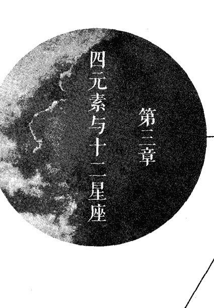| | 积极的表达 | 消极的表达 |
| :--- | :--- | :--- |
| 木星 | 信念；对更高力量或更大计划的信赖；宽容；乐观；愿意接纳、自我改进 | 过分自信；懒惰；精力分散；把工作丢给他人；无责任感；过度扩张自我或承诺太多 |
| 土星 | 自律的努力；承担义务和责任；耐心；条理清楚；务实 | 过于依赖自己和缺乏信念造成自我限制；刻板僵化；冷酷；防御性；严重抑制，恐惧，消极性 |
| 天王星 | 与真理调和；独创性；发明创造；以实验为导向；尊重自由 | 任性；不安；缺乏耐心；不断需要刺激和无目标地改变；反叛；极端主义 |
| 海王星 | 与整体调和；领悟心灵层面的体验；包容一切的慈善；理想化地生活 | 具有破坏性的逃避；逃避责任和自己深层的需求；拒绝面对自己的动机，拒绝一切承诺 |
| 冥王星 | 接受聚焦个人心智的需求；致力于个人的自我转化；有勇气去面对个人最深层的欲望、强迫性行为，并通过努力和紧张的体验将其转化 | 对于潜意识欲望的强迫性表达；为一己之利任意操控他人；残忍地运用一切手段，逃避面对自我的痛苦；迷恋权力 |

# 行星落入各元素

### 太阳

太阳所落的星座元素决定了一个人的整体心理状态。这是因为太阳星座的元素揭示了生命力要素、身份、自我投射力量的基调，以及一个人意识的基本特征。同样，它还描述了一个人如何构建属于自己的“现实”，通过无意识假定什么是特别真实的，什么不是，以此来决定将自己的力量集中在何处。③

例如：风象元素（双子座、天秤座、水瓶座）的人会活在抽象的思考领域中，因为思考对他们来说跟任何物质的内容都是一样的真实；水象元素（巨蟹座、天蝎座、双鱼座）的人活在他们的感觉里，他们的情绪状态是其行为的最重要决定因素；火象元素（白羊座、狮子座、射手座）的人需要有高度的兴奋感与鼓舞人心的活动，只有这样的生活才使他们感到健康和快乐；土象元素（金牛座、处女座、摩羯座）的人着眼于物质现实层面，物质世界、安全感、成就感是他们行为驱动力的最重要组成部分。

太阳星座所属的元素揭示了我们做任何事情的内在基本动力。太阳的元素属性还描述了一个人是如何看待生命本身，以及他/她对于人生经历的期待。

从能量层面来看，太阳星座告诉我们，怎样的充电装置，能让我们不至于能量耗竭。换言之，太阳就是你生命的燃料。它就是让我们恢复生气的力量，它让我们有力地应对日常生活的压力与需要。

## 太阳落在火象星座

- 基本动力：灵感与志向。
- 充电方式：需要精力与体能的活动；追求未来的新愿景。

## 太阳落入土象星座

- 基本动力：物质需求与实用性。
- 充电方式：现实世界富于成效的工作；感官满足。

## 太阳落入风象星座

- 基本动力：知识概念与社会理想。
- 充电方式：社会参与和智力启发。

## 太阳落入水象星座

- 基本动力：深刻的情感渴求和欲望。
- 充电方式：强烈的情感体验、与他人的亲密关系。

### 月亮

月亮星座的元素表现的是一种延续过往的基调，是一种无意识的表现，是一种情绪的模式，是一个人获得内在安全感、独处于家中的意识需求。对月亮所落星座元素的体验支持着个人对良好自我感觉的需求；在这种自我表达的模式下满足我们深刻的、稳定的整体人格的内在需要。月亮所属的元素还描述了你遭遇所有经历时的本能反应，你用什么能量自然地调整以适应生命的流动。

## 月亮落入火象星座

- 体验变化时的反应：直接的行动与热情。
- 对自我感觉舒适的条件：表现出信心与力量。

## 月亮落入土象星座

- 体验变化时的反应：稳健、坚定。
- 对自我感觉舒适的条件：富有成效，向着目标前进。

## 月亮落入风象星座

- 体验变化时的反应：未雨绸缪和客观评估。
- 对自我感觉舒适的条件：表达理念、社交互动。

## 月亮落入水象星座

- 体验变化时的反应：敏感、激动。
- 对自我感觉舒适的条件：深入的情感活动。

### 水星

水星星星座所属的元素描述了哪种特定能量与性质影响个人的思考过程，以及一个人会选择以怎样的言语方式去表达思想。水星象征着与他人建立联系，真诚互动交流的冲动，它还包含了各种形式的协调，也包括身体本身神经系统的协调。星图中水星所落的元素描绘了一种流入（感知）与流出（语言表达、专业技能、手工灵巧）的状态。它代表了一种被同道中人了解的渴求，以及从外在世界接受理念与信息的需要。

## 水星落入火象星座

- 影响思考的因素：个人的志向、信念、希望和对未来的设想。
- 技巧和语言的表达方式：冲动的，感情外露的，满腔热情的。

## 水星落入土象星座

- 影响思考的因素：受到实际因素影响，具有传统观念的色彩。
- 技巧和语言的表达方式：固执、耐心、谨慎、明确。

## 水星落入水象星座

- 影响思考的因素：个人深刻的感受和渴望。
- 技巧和语言的表达方式：敏感的，情绪冲动的，凭直觉的。

## 水星落入风象星座

- 影响思考的因素：思想是他们心中真实的存在，受到抽象的理念与社会因素的影响。
- 技巧和语言的表达方式：客观，善于表达，加入了对本质的理解。

### 金星

和水星一样，金星也代表了能量的流入和流出，它所落的元素表达的是付出且获得与他人之间的爱、感情和感官愉悦。金星所属的元素代表了一个人表达情感与关怀以及付出情感的方式。这是金星本质行为中流出的状态，但流入的状态也同样重要。它代表了一个人通过怎样的体验和表达类型来满足亲密关系的需求，帮助自己感受到被爱和被赏识。

对于女性而言，金星还与阴性的自我有关。女性需要通过金星的星座特性与体验来感受阴性的能量。它同时也代表一个女人在爱与性的问题中如何获得和付出。金星对于女人比对于男人而言具有更强的性别指示含义。它描述了女人如何处理所有最终可能涉及性的关系，也包括那些并不是太亲密的社交关系。

对于男人而言，金星象征着爱与美，代表了他尤其钟爱、最吸引他的形象。它描述了一个男人在两性关系中喜欢的女性类型，这些女性符合他的审美观，可以让他动情。②

金星同时也象征着一个男人对于爱、性以及感情关系的理想。但这里并不特指性关系，对于男人来说，火星更能表现性的能量。对于女人而言，金星和火星的能量共同组成了情欲的天性，在这一点上，它们不可分离。

## 金星落入火象星座

- 表达爱与欣赏的方式：积极有力，直截了当，隆重盛大。
- 感受爱与亲密互动的途径：共同进行激烈的运动，有共同的志向与热情。

## 金星落入土象星座

- 表达爱与欣赏的方式：实在有形的，值得信赖的，身体力行的。
- 感受爱与亲密互动的途径：承诺，共同生活，感官欲乐，分担责任。

## 金星落入风象星座

- 表达爱与欣赏的方式：强烈的知识交流，陪伴之情。
- 感受爱与亲密互动的途径：言语分享，思想交流，愉快的社交互动。

## 金星落入水象星座

- 表达爱与欣赏的方式：情感丰富，富于同情。
- 感受爱与亲密互动的途径：敏感的互动，细微层面的感触，向着深层融合的感觉发展。

### 火星

火星的元素表现了怎样的活动经验与模式能够激发个人的体能，以及一个人寻求坚持自我的能量。火星星座的元素是供给身体兴奋需求的能量，是你表达自己的进取能力，可以证明自己力量的模式。它还会描述你能如何获取所求的特定方式：火星在风象星座，会用说服的方式；火星在火象星座是运用力量和主动性；火星在土象星座运用耐力和效率；火星在水象星座则运用直觉，十分狡猾，且有着不可战胜的坚持。

对于男人而言，火星是他强有力的、自信独断的、充满性能量的自我投射。它代表了他是如何在两性关系中施展力量，也代表他在所有领导事务和主动进取行为中如何表现男性的特征。火星就是男性的自我。

在女性的星图中，火星就是她心目中强大的男性形象，这密切关系到开启她自己的能量、帮助她去表达自我的令人兴奋的浪漫形象。火星所落的星座和相位通常能够清楚地描述怎样的男人会对她有身体上的吸引力。

## 火星落入火象星座

- 坚持自己的方式：直接身体力行，主动，向外展现能量。
- 体能被激发的方式：持续运动，自信热情，充满活力的行为。

## 火星落入土象星座

- 坚持自己的方式：需要耐心和毅力的具体成就。
- 体能被激发的方式：努力工作，保持自律，迎接挑战和责任。

## 火星落入风象星座

- 坚持自己的方式：观念的表达，活跃的交流，积极有力的想象。
- 体能被激发的方式：心智挑战，社会行动，关系，新创意。

## 火星落入水象星座

- 坚持自己的方式：情感的微妙与坚持，要求他人有更深刻的情感和需要。
- 体能被激发的方式：深深的渴望，感觉被他人需要，微妙的直觉，强烈的情感体验。

### 木星

木星所落的元素表现了能够让我们产生内在信念与信心的经验类型和活动模式。换言之，一个人可以体验到与更强的力量或更宏大的计划结合时所带来的保护性感受，以及在木星所属元素预示的层面工作时所获得的幸福感。表达这一元素的能量将会带来机遇。木星就像一个丰富、自然、流动的生命力储存器，对我们的健康做着贡献。

## 木星落入火象星座

- 内在信念的来源：外向、热情、坚定而自信、体力活动。
- 创造机遇的途径：冒险性的自我表达，新鲜的尝试。

## 木星落入土象星座

- 内在信念的来源：脚踏实地，值得信赖，感官的体验。
- 创造机遇的途径：努力工作，承担责任，投入大自然的怀抱，享受大自然的律动。

## 木星落入风象星座

- 内在信念的来源：探索新的理念，与新人交流，推动社会进步。
- 创造机遇的途径：热情地表达自己的看法，就未来目标与他人互动。

## 木星落入水象星座

- 内在信念的来源：深刻的情感体验、同情心与想象力的积极表达。
- 创造机遇的途径：对他人的敏感与呵护，任直觉跟随内心的渴望。

### 土星

星图中土星所在的元素通常意味着一种挑战，我们需要全然地接受，而不是惧怕这个特定元素所代表的体验层面。恐惧通常是因为旧的模式如今变成了无法忍受的压抑和刻板；如果我们能接纳与此模式相关的谨慎和守纪，把它们当成在那个生命领域中始终如一的具体表达的一种驱动力，那么它们依然有利于个人成长。

土星所在的元素代表了我们在哪一个层面的表达受到压抑，何处的能量被阻塞和限制。个人过于看重这方面的表现是造成这一内部阻塞的原因。这一领域就像打了死结，因为太刻意的表达或是逃避与压抑，就限制了此处能量的自然流动。

## 土星落入火象星座

- 稳定的需求：稳定保持个人身份，以及更规律、客观地表现创造性能量。
- 努力的方向：带着热情和责任更加自由地表达自我。

### 土星落入土象元素

- 稳定的需求：稳定保持个人工作的效率和精准度以及对日常职责的处理。
- 努力的方向：对物质世界的掌控，发展一套系统的方法。

## 土星落入风象星座

- 稳定的需求：稳定个人的头脑，克制其不陷入负面的思考之中。
- 努力的方向：清晰务实地交流，真诚、有力地担负起社会责任，但同时保持超然的视角。

## 土星落入水象星座

- 稳定的需求：稳定情感与敏感性，表达情绪但同时也发展出更超然的姿态。
- 努力的方向：以自我接纳的状态表达情绪，同时也克制过于敏感的倾向。

# 天王星、海王星和冥王星所落的元素

在对个人星图的理解上，三颗外行星的元素落点相对就不那么重要了。这三颗行星会在特定的元素（星座）逗留很多年，因此如此普遍性的因素难以显示出个人化的意义。外行星在数年时间里所强调的元素主要说明世代的差异以及人类群体心理的微妙变化。

① 参见《生命四元素：占星与心理学》第11章，更加详尽地叙述了太阳星座所属的元素。该书第14章中同样对于每个行星落入的各元素做出了重点分析。

② 金星强调的动情更偏向性爱、感官刺激和爱情。男人星图中的月亮代表了在其他关系层面上能吸引他的女性特质，以其他方式使其动情，比如安全感需求、支持、呵护和整体响应。

太阳星座所属的元素揭示了我们做任何事情的内在基本动力。太阳的元素属性还描述了一个人是如何看待生命本身，以及他/她对于人生经历的期待。

## 第五章

# 行星落入十二星座

## 黄道星座

| 火象星座 | 关键概念 | 行星落入此星座时被赋予的特质 |
|----------|----------|------------------------------|
| 基本星座：白羊座 | 朝向新体验的、有针对性的能量释放 | 想要行动的任性冲动，维护自我 |
| 固定星座：狮子座 | 持续温暖的忠诚，光芒四射的生命力 | 骄傲，迫切地寻求认可，戏剧感 |
| 变动星座：射手座 | 永不满足的渴望，向着理想推进 | 信念，普遍法则，理想 |

| 土象星座 | 关键概念 | 行星落入此星座时被赋予的特质 |
|----------|----------|------------------------------|
| 基本星座：摩羯座 | 非个人的、完成任务的决心 | 自我控制，谨慎，有所保留，胸怀大志 |
| 固定星座：金牛座 | 与直接的身体感觉有关的深刻鉴赏力 | 占有，保持力，稳定 |
| 变动星座：处女座 | 自发地帮助，谦逊，需要给予服务 | 完美主义，分析，细微的分辨力 |

| 风象星座 | 关键概念 | 行星落入此星座时被赋予的特质 |
|----------|----------|------------------------------|
| 基本星座：天秤座 | 为了自我实现而调和一切对立 | 平衡，公正，圆滑 |
| 固定星座：水瓶座 | 以超然的姿态与所有人、所有概念协调 | 个人主义的自由，极端主义 |
| 变动星座：双子座 | 当下时刻的知觉，用言语表现所有关系 | 多变的好奇心，健谈，亲切友好 |

| 水象星座 | 关键概念 | 行星落入此星座时被赋予的特质 |
|---|---|---|
| 基本星座：巨蟹座 | 本能的养育和保护性的同理心 | 有同情心，含蓄，喜怒无常，敏感，自我保护 |
| 固定星座：天蝎座 | 穿透强烈的情感力量 | 强迫性欲望，深刻，有控制的激情，隐蔽 |
| 变动星座：双鱼座 | 对所有苦难抱有疗愈性的同情 | 灵魂的渴求，理想主义，一体性，灵感，脆弱性 |

| 分类描述 | 行星所落的星座表明： |
|---|---|
| 这五颗行星通常被称作“个人行星” | 太阳：（生命）存在的基调，一个人如何体验生命和表达其个性 |
| | 月亮：一个人基于潜意识倾向的反应 |
| | 水星：一个人的思考和交流方式 |
| | 金星：一个人表达爱、感受到赞赏和奉献自我的方式 |
| | 火星：一个人维护自我主张和表达欲望的方式 |
| 这两颗行星是具有互补性的一对，作为桥梁连接了对个人事务的关注点和对原则与社会更宏大的关注 | 木星：一个人追求成长，提升自我以及在生命中体验信赖的方式 |
| | 土星：一个人通过努力，寻求立足世界和保护自我的方式 |
| 这三颗外行星代表的是意义深远的转变之源，可以被视作“变革”的行星或能量 | 天王星、海王星与冥王星所落的星座代表了人类世世代代都具有的态度，但在个人星图中，它们的星座落点就没有其宫位和相位的信息那么重要了。 |

第五章 行星落入十二星座

## 太阳落入的星座

太阳所落的星座位置：（生命）存在的基调，一个人如何体验生命和表达其个性。

### 太阳落入白羊座的解析指南

- 散发强烈、自信的活力
- 试图以坚持自我主张和竞争性的直接行为来满足自己被认可的需要
- 有力的个性主张是自我表达所需
- 将自己视作探险家、先锋、第一个吃螃蟹的人，快速抓住要义
- 可能因为过于强势的个性表达而引起他人的反抗

### 太阳落入金牛座的解析指南

- 扎根于土壤的、身体感官的生命力
- 需要以值得信赖、生产力强的形象被认可
- 将创造性的表达用于有形的目标或可积累的资源
- 对所有物质、资产和自身的稳定性感到自豪
- 犹豫不决和抗拒改变可能阻碍其个性的表达

### 太阳落入双子座的解析指南

- 将创造性的能量应用于领悟知识、获知事实、提问和寻找想法与想法之间的联系
- 需要用言辞表达自我，为智能而接受认可
- 释放多变、健谈、心智上的能量
- 充分的自我表达需要想法间的自由联系和广泛多样的社交接触
- 因为兴趣多种多样，所以很难在一个领域持续努力

### 太阳落入巨蟹座的解析指南

- 通过养育、敏感、母性一类的特质去体验力量
- 生命力和创造力能量的水平取决于情绪，所以很难保持
- 通过情感来进行创造性的自我表达，需要以敏感的形象被认可
- 在熟悉、受保护的环境或情况下个性的意识表达最为明确

### 太阳落入狮子座的解析指南

- 带着热力四射的活力表达自我，需要持续被关注
- 创造性能量被渲染了，戏剧性和重要性
- 有需要因其慷慨而被认可的驱动力
- 带给他人信心和鼓励；可以为任何企业带来活力
- 骄傲是主导其性格的特征；真诚，却也孩子气，工作上总是情绪化

### 太阳落入处女座的解析指南

- 善于分析和辨识是其创造力表现的特质
- 以切实的方式给予帮助和服务是其动力
- 释放智慧和轮廓清晰的生命力
- 核心价值、服务和持续提升自我的需要是其灵魂的基调
- 谦卑、个性中的谦逊感会妨碍其获得公众认可

### 太阳落入天秤座的解析指南

- 把有关创造性能量的表达投入人际关系与新的理念中
- 其公正、公平、友善和化解冲突的能量需要获得认可
- 展现出善于社交、优雅、聪慧的生命力以及高雅敏锐的审美品位
- 持续迫切地要求创造个人关系和生活方式中的平衡感
- 过于取悦他人可能会阻碍其个性的展现

### 太阳落入天蝎座的解析指南

- 创造性能量通过强烈的情感能量和直觉力来穿透肤浅的体验
- 需要表达个人改革现状的转化性能量
- 渴望涉及人类体验之核心的强烈感，通常在深层、融合（通常充满性能量）的关系中寻求这种体验
- 生命力水平与持续的内心冲动欲望——有时候甚至与痴迷有关
- 情绪的固执可能影响创造力的自如表达，不愿坦诚，害怕失控

### 太阳落入射手座的解析指南

- 把创造性能量直接投入个人的理想与抱负中，不仅要表达这些能量，而且还会促使他人表达
- 个人特征被终极的信念和乐观的哲学观所影响
- 展现友好、探索钻研、开放的精神——心胸非常# 开阔和重视诚信

需要道德高尚、诚实的本性被认可；有时候高标准可能导致不宽容和对他人不关心

### 太阳落入摩羯座的解析指南

- 创造性能量的表达被赋予自我控制、谨慎和传统的色彩
- 核心价值观是努力工作、权威和成就
- 充分的自我表达需要向着明确的目标专心工作，克己守纪
- 一个人承担责任的能力会影响到生命力水平和个人意识的发展
- 悲观、愤世嫉俗的态度或过于在乎社会地位、虚饰体面可能阻碍创造力的自如表达

### 太阳落入水瓶座的解析指南

- 创造性能量直接投入社会福祉和理论概念之中，尤其是通过创新的方式
- 展现出友善、以人为本的理性能量——通常可能会带有极端性
- 存在与创造的渴望被自由、与众不同和实验主义的风格渲染
- 核心价值观的内容是人性和理智的世界，需要去探索那些“正确的”或“真实的东西
- 妄自菲薄、过于专注于责任或是无目的的叛逆会阻碍个性的表达

### 太阳落入双鱼座的解析指南

- 创造性的能量表达是敏感且鼓舞人心的
- 其慈悲和乐善好施的本性需要获得认可
- 个人特征并没有清楚的焦点，原因是对于生命和他人的问题具有同理心
- 以治愈性和富于慈悲的心灵面对一切苦难
- 灵魂的渴求、无力承受的脆弱和内在生命的状态会影响其生命力和自我表达

# 月亮落人的星座

月亮所落的星座位置：一个人基于潜意识倾向的反应。

### 月亮落入白羊座的解析指南

- 侵略性、急躁、激烈、直接、富于竞争性的反应
- 需要维护自我主张去获得情绪的安全感和良好的自我感觉
- 自信、聚焦于新体验的、以行动为导向的自我意识
- 以有针对性的、释放能量的方式对经历与环境做出反应
- 好战的特质会阻碍其获得安全感

### 月亮落入金牛座的解析指南

- 对任何体验的反应都慢；在面对外界要求时保持稳定和平衡
- 通过守候、安静以及与自然界的沟通获得内在的满足
- 融入身体的感觉中，在情绪上保留触觉感受，享受当下的欢愉
- 内在的自我改变缓慢；习惯模式会保持很久，可能导致倔强或懒惰
- 不变、可预期的境况带来安全感，所有感官刺激都会带来舒适感
- 强调占有和对安全感和控制的深刻需求都会抑制情感的流动

### 月亮落入双子座的解析指南

- 反应迅速、敏锐、多变，怀有无止境的好奇心
- 对各种各样的头脑刺激做出反应，同时进行不止一种活动以带来安全感
- 通过运用头脑和建立联系去适应变化
- 交流内在的情感生活；需要用语言去表达感受与情感的联结
- 情感能量多向分散有碍安全感

### 月亮落入巨蟹座的解析指南

- 敏感（有时候过于敏感）、保护性（对自己/他人）的反应
- 给予滋养和获得他人的滋养会带来安全感
- 天生具有时间感，能与直觉和情感的微妙感受保持和谐
- 对情绪和他人的反应极端敏感；常常被自己的情绪所支配
- 在感情上可能过于自我保护；对过往的强烈情感记忆永生难忘，依旧影响此人对当前情势的态度

### 月亮落入狮子座的解析指南

- 温暖、慷慨、热情的反应
- 对自己充满自信和骄傲是情感和安全感的来源
- 展现出丰富的创造性能量，支持和鼓励他人
- 戏剧性、创造新的局面、以幽默、娱乐和帮助他人适应生活
- 自信、创造力和自我形象是其所有行为的基础——通常像孩子一般天真
- 总是散发着骄傲感，外向的情感可能会妨碍个人的接受能力

### 月亮落入处女座的解析指南

- 以务实的适应性对一切刺激做出反应
- 以分析的方式回应所有经验；需要通过环境中的秩序感来感觉舒适
- 改善情绪反应让自己的表达更完美
- 服务他人和乐于助人造就了积极的自我形象，有助于克服心中的愧疚和自我怀疑的倾向
- 对物质世界和情感世界的分析，以及做出明确、具体的改进会带来安全感
- 对剖析情感的需求可能会抑制响应能力

### 月亮落入天秤座的解析指南

- 客观地对环境和所有经验做出反应，并带着成熟的、强有力的公平感
- 思先于行；权衡局势的方方面面，可能会举棋不定，犹豫不决
- 必须在对立之间找到平衡与和谐以求得情绪的安宁，想要迎合、了解他人的观点
- 在亲密关系中感受到安全；对长时间的孤单感到不适
- 强调举止优雅可能会抑制情感自发的反应和真正的亲密

### 月亮落入天蝎座的解析指南

- 反应强烈、热情，带有被抑制的情感力量
- 复杂、不安的情绪会影响自我形象，有时候，负面的情绪会破坏其信心，而热情的使命感会带来信心支持自己
- 深刻的情绪和深藏的秘密赋予个人神秘性和魅力
- 对深入洞察的需求有助于理解他人潜在的根本动机，或是想象所有可怕的目的
- 以付出或接受强烈的情感能量滋养别人
- 对脆弱和失控的恐惧可能导致情感的压抑

### 月亮落入射手座的解析指南

- 基于信念和哲学给出满腔热情、理想主义的回应
- 追求或发扬自己的理念、向自己未来的目标前进可获得内在的满足感
- 潜意识倾向是质疑和寻求意义所在，具有本能的开阔心胸、宽容、蓬勃向上的人生态度
- 探索、旅行、待在户外、享受自由可带来舒适感
- 以情感信念为导向可能会使其轻信、傲慢、狂热，或自命不凡、喜爱说教

### 月亮落入摩羯座的解析指南

- 自制、果断的反应；有时候会自然做出苛刻的消极反应
- 需要操控世界和他人以获取安全感和舒适感，并达成自己的目标；可以把个人问题放在一边去履行义务
- 对经验有控制地回应；谨慎地投射有权威性的、果断的能量
- 作为给予者、保护者的角色会带来舒适感；习惯掌控局面
- 成为首脑或权威的支配性情感需求可能会限制亲密的能力和情感的滋养

### 月亮落入水瓶座的解析指南

- 难以预料、不符常规的反应，带有超然的客观性
- 运用完全自由的理念、自我表达和创新能获得安全感
- 基于独树一帜、利他主义和具有社会意识的自我感觉而做出个人化的反应
- 需要与社会互动才能获得情感的集中和良好的自我感觉
- 通过鼓励他人自由地滋养他人，因被回报以完全的自治权而感到被支持
- 对于情感独立性的需求可能导致自己与真实感受分离，对他人的敏感性十分冷漠

### 月亮落入双鱼座的解析指南

- 反应的方式是敏感、慈悲、同情、逃避、脆弱和理想主义的
- 漫无目的、自由自在、富于想象的白日梦可以带来情绪的宁静
- 需要与世界、宇宙融为一体，以获得安全感和良好的自我感觉

## 水星落入的星座

水星所落的星座位置：一个人的思考和交流方式。

### 水星落入白羊座的解析指南

- 肯定、强有力、坦率、自信的交流方式
- 对行动不安的驱动力是言辞表达和运用创造性技巧的能量基础
- 在学习中，面对强烈的能量释放是必需的；能够凭直觉抓住要点
- 任性地将能量投入新鲜体验之中会影响其推理能力；通常偏爱大胆的新思想
- 感觉迟钝和不顾他人的自我主张可能会阻碍真正的意见交流

### 水星落入金牛座的解析指南

- 谨慎地交流，说每句话之前都思虑再三；缓慢地表达想法
- 需要缓慢、谨慎地学习，这可能会限制个人认知的多样性
- 以整合的思考为基础，记忆力强，心智稳定；将务实的理念投入实际运用之中
- 渴望表达自己对于身体感官的觉知；在说话时会细细品味自己的言辞
- 不愿自由、自发地分享自我，这会限制自己与他人建立应有的联系

### 水星落入双子座的解析指南

- 流畅、迅速、聪敏、睿智地交流，有时候流于肤浅
- 强烈地想要立刻表达看法
- 需要通过建立和识别人与人之间或理念之间的关系来学习
- 不断变化的好奇心表现为与人友好的互动和无止境的提问
- 通过说话、写作或其他手脑并用的灵活形式表达其高度紧张不安的能量

### 水星落入巨蟹座的解析指南

- 充满情绪、本能和敏感性的交流方式；对个人思想具有保护性
- 全神贯注地学习，依靠感受建立信息点之间的联系
- 培养新的想法，直到这个想法变成创造性技巧的硕果
- 良好的记忆力和耐力有助于学习
- 潜意识中的偏见和恐惧会妨碍其秉弃对新观念的客观态度和关注度

### 水星落入狮子座的解析指南

- 交流的方式是积极、明朗、骄傲、温暖和富于感染力的，有强大的意志驱动着建立联系的需求
- 交流方式带有戏剧性、幽默感和创造性天赋的色彩
- 自尊心和获得认可的迫切需求鼓舞着观念的表达
- 需要在学习中注入创造力；制造直觉性的跳跃而非逻辑关系
- 在思考过程中掺杂自我意识可能会破坏客观性，限制灵活性，蒙蔽真相

### 水星落入处女座的解析指南

- 交流方式是富于逻辑、批判、有建设性和谦卑的，有时候甚至是消极和怀疑的
- 迫切地以实事求是的方式表达自己的看法，展现自己的分析能力
- 需要对观点加以辨识，按照逻辑顺序学习
- 务实、有用的观念能够提高与他人建立联系的能力
- 过于关注细节可能会让人无法拥有更宏观的视角去认识事物的关联性，获得更广泛的启示

# 水星落于天秤座的解析指南

- 有智慧、有风度、善于社交，或以优雅的方式交流
- 迫切想要和谐地表达自己的看法，以一种公正、客观的模式平衡所有的对立面
- 需要保持公正和圆滑来与他人建立联系
- 言辞表达富于艺术性与美感
- 在个人关系中追求平衡与客观，需要通过反馈让观念更清晰
- 面面俱到可能会降低决策能力

### 水星落入天蝎座的解析指南

- 强劲、深刻、热情（通常并非运用言语）的交流方式；可以通过交流编织出深刻亲密的纽带
- 言辞表达的驱动力源自深层的自我存在，从不会表达得很肤浅
- 非常需要运用洞察力，探索核心真相来完成学习；所有调查都会十分彻底，对侦查感兴趣
- 过于紧张、任性和心智中的情绪本性会妨碍客观理解
- 强烈的欲望、满怀的激情，发掘他人隐匿动机的冲动会影响其技巧和才智的运用
- 若是保密、保持沉默会降低与他人建立联系的能力

### 水星落入射手座的解析指南

- 开放、真诚、乐观、热情、宽容的交流方式
- 通过不断地向着理想前进来表达学习的需求
- 思考和理性由长期目标所引导，而不是由世俗的细节所引导
- 有兴趣将自己所学教授他人；教与学似乎密不可分
- 需要坦率、真诚、无偏见地与他人建立联系
- 过度泛化理想主义志向的动力会使清晰明了的思考变得模糊

### 水星落入摩羯座的解析指南

- 交流方式严肃、谨慎，带有强烈的权威感，有时候思想僵化
- 毅力、抱负，一步一个脚印地向前发展以满足个人学习的需求
- 通过对物质世界的掌控，克制地表达自己的看法和才智，并将理论转化为实际的结果
- 稳重保守、自给自足、拘谨有序的特质会阻碍其与他人的交流
- 运用理性与辨识力构建目标；对现实的敏锐觉知可能让其着眼于限制，忽视了发展潜力

### 水星落入水瓶座的解析指南

- 交流方式具有开放性，展现聪明才智，带有理想主义色彩和超脱的姿态
- 需要与他人建立独特的联系，擅长在团体交流过程中以个人主义风格和每个人联系
- 表达个人观念和才智的动力被赋予了个人主义的自由色彩，通常具有极端性
- 实验性和创新性的思考，在他人身上检验理论；以未来为导向，喜欢探索变化的可能性
- 在学习的过程中带有独立自主、别出心裁、超然世外的理性特质
- 观念的表达可能会很古怪，被毫无关联的概念和出乎意料的组合所分散

### 水星落入双鱼座的解析指南

- 交流的方式具有敏感性，或者表现得很理想主义，充满诗意，闪烁其词，通常都会展现出想象力丰富的样子
- 同情心会激励观念的表达，并富于怜悯的理解力
- 在精神与灵性层面与他人建立联系；交流的感知内容不局限于某一个层面
- 整合的力量与灵活性启迪了言辞表达
- 迷茫、白日梦和自欺欺人的行为可能影响了理性与辨识力

# 金星落人的星座

金星所落的星座位置：一个人表达爱、感受到赞赏、奉献自我的方式。

### 金星落入白羊座的解析指南

- 直接、冲动、热情地表达爱
- 投入新的体验能为情感增添色彩、带来欢乐；尤其是享受爱之初体验
- 强烈地维护自我主张和表达过分的要求会给亲密关系的需求带来挫败感，所以有时候难以实现亲密关系
- 重视自己和他人的个性、主动性与独立性
- 积极地奉献自我，回应他人强有力的能量释放

### 金星落入金牛座的解析指南

- 用肢体表达爱意，温暖、稳定，有占有欲
- 源自内在资源的奉献；回应他人感官的、深刻专注的能量
- 在感情上吝啬，有占有欲，或是不愿释放情绪，害怕失控都会阻碍一个人表达爱的需求
- 十分欣赏身体的感觉：所见、所听、所闻、所品尝、所触摸的；享受与大自然的接触
- 重视物质的舒适、奢华、漂亮的实物

### 金星落入双子座的解析指南

- 用语言表达爱意，聪明、轻松、诙谐
- 需要立刻说出自己的所思所想去感觉自己与他人间的亲密感
- 带有感情色彩的喜好会经常有意识地被改变；尤其看重精神契合与变化多样
- 不断变化的好奇心、健谈、友善影响着他们对于愉悦的追求；欣赏睿智、机敏之才
- 如果持续不断地感受到各种刺激，会阻碍长期关系的发展机会，使人际关系无法深入

### 金星落入巨蟹座的解析指南

- 爱的表达带有敏感、抚慰、保护和持久的特质
- 为了获得舒适感需要呵护与被呵护，需要感受到家的归属感
- 喜欢在一个封闭的、紧密结合的团体中与他人分享能量
- 情绪化、胆怯、吝啬或是情绪的过度自我保护会妨碍快乐与亲密的追求；很容易反映出他人的快乐与情绪
- 与他人的亲密关系中往往具有善于接纳和依赖的特质

### 金星落入狮子座的解析指南

- 温暖、热情、富于戏剧性地表达爱意
- 带有感情色彩的喜好会受到自尊心与被认可的冲动所影响
- 奉献自我的方式充满了创造性的活力，亲切、自豪地接受他人的回馈
- 社交与爱的表达带有淘气、慷慨、忠诚的色彩
- 需要成为被关注的焦点或主导他人的情感生活，这种需求会妨碍深层的情感交流

### 金星落入处女座的解析指南

- 爱的表达实事求是、谦逊适度、带有助益、害羞胆怯
- 需要提供服务、给予帮助来获得情感的满足
- 通过对细节的精确关注和活跃的头脑分析来获得快乐
- 需要通过逻辑性和实用性去感到舒适与和谐
- 过度助人、吹毛求疵和习惯性地有所保留会妨碍情感的付出与接纳，妨碍激情的表达

### 金星落入天秤座的解析指南

- 轻快、体贴、迷人、和谐地表达爱意
- 这些因素会影响其带有感情色彩的喜好
- 对于和平、宁静、和谐有着深层的需求，以此获得舒适与快乐，但这样也会导致自己逃避不愉快的情感互动，因而限制了发展亲密关系的机会
- 需要基于公平的分享与合作发展关系，以这种方式付出自己的情感

### 金星落入天蝎座的解析指南

- 爱的表达十分强烈，有激情，也很执着，带有极端和极具消耗性的情绪
- 寻欢作乐的需求带有强迫性的欲望和深刻、炙热的情感
- 在与他人施与受的互动中产生疗愈、转化的能量
- 情愿保密而不愿相信他人，会妨碍社交与爱的迫切需求
- 需要带着强烈的情感力量深深地刺人关系的深处才能感受到另一个人的亲密

### 金星落入射手座的解析指南

- 自由、热情、慷慨、富于理想主义地表达爱意
- 急躁地想要向前进，有太多的冒险计划可能会妨碍亲密关系的建立
- 个人的信仰和目标深刻影响着自己与他人关系的方式，在亲密关系中必须分享和谐的哲学观念
- 需要自由地去流浪、探索，才能感觉舒适与和谐
- 对于爱与浪漫具有包容、开放的态度；在关系中重视真诚，或许会因为不敏感而忽略了他人的感受

### 金星落入摩羯座的解析指南
- 谨慎、严肃、忠诚、呆板地表达爱意
- 可能因为恐惧、疑虑的情绪，或是疏远、客观的方式抑制了愉悦和爱的需求
- 付出自己的深情之前必须确认对方的承诺；对待感情忠诚，能够担负起关系中的义务与责任
- 爱与社交的动力被赋予了坚毅不屈、企图心强、保守传统、爱惜名誉的特质
- 自我控制和拘谨的情感会妨碍亲密关系的发展

### 金星落入水瓶座的解析指南
- 表达爱意的方式自由、别具一格、轻佻，带有实验性色彩
- 超然、客观的态度会妨碍到亲密关系；他人会觉得这是冷酷、疏远
- 享受交流理论和看法的感觉，富于想象力（通常很幽默），也喜欢与爱人一起做白日梦
- 爱与社交的动机被赋予了个人自由主义、极端主义和桀骜不驯的特质
- 需要与很多人建立活跃的社交群体才能充分地奉献自己的情感

### 金星落入双鱼座的解析指南
- 表达爱意的方式敏感、友善，富于同情与怜悯；能够无私地奉献自己
- 需要深刻地体验魔力与浪漫的和谐感觉；但是欲望可能漫无目的、模糊不清，让自己脆弱易受伤害
- 爱与社交的迫切需求被抹上了浪漫的理想主义色彩；可能会将爱人理想化，然后爱上自己的幻象
- 逃避、借口、混乱会渐渐破坏爱与被爱的能力，缺乏分辨力会阻碍牢固关系的建立
- 灵魂的渴求会影响其与他人的亲密感；迫切地想要体验心灵融合的关系；对他人情绪的认同能力会使其生出同情之心

## 火星落入的星座
火星所落的星座位置：一个人维护自我和表达欲望的方式。

### 火星落入白羊座的解析指南
- 带有竞争性、直截了当、缺乏耐性地维护自我
- 专注地将体能投入到新鲜的体验之中；擅长开拓新事务，机械设计能力强
- 执着的行为冲动强烈地引导着个人欲望；坦然面对阻碍，鲁莽轻率会阻碍成功
- 积极主动、意志力强、焦躁不安是其典型的行动方式，但有本能地抓住核心要义的能力
- 性欲和体能的表达是冲动、有力、自信的

### 火星落入金牛座的解析指南
- 稳定、持久、谨慎、顽固地维护自我
- 趋向稳固、多产，享受单纯快乐且强有力的行动方式；通常可能会具有艺术创造力
- 对于物质的关注与占有影响其主动性和驱动力，有时候则受到慢性子与懒惰的影响
- 对事物原本的样子感到满足和安心会妨碍欲求的实现
- 对身体感官和生命自然节律的欣赏影响着体能与性欲

### 火星落入双子座的解析指南
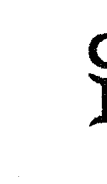
- 以言辞、交谈和广泛多样化的专业技能，能灵活清晰地表达且能维护自我主张
- 个人欲望的焦点不断迅速转变；常常对自己想要的并不确定，因此总是处于变动中
- 给头脑带来刺激的交流、想象，对新理念的好奇心和开放的思想都影响其体能和性欲
- 瞬间的境遇和即刻的知觉影响其决断力
- 通过行动和主动性建立联系、运用头脑认知新事实、发展新技能、表现出以广泛的友善为导向的行为方式

### 火星落入巨蟹座的解析指南

- 敏感、害羞、间接、富于同情心地维护自我
- 需要感觉到与自己的根源和传统的联结才能明确自己的欲求，理解自己的人生方向
- 喜怒无常和小心翼翼地保护自我会有碍其主动性和意志力，但有能力以无所畏惧的行为给予爱人支持
- 体能、性欲和决断力会被潜意识的情绪、恐惧、脆弱所影响，也会被关怀和保护的感觉所激励
- 凭借直觉、坚持不懈地追求，有自我保护的本能，在追求目标的过程中有时间感

### 火星落入狮子座的解析指南
- 戏剧性、温暖、光彩夺目、富于表情、骄傲自大地维护自我
- 自尊与获得认可的渴望强烈地影响着欲望的表达
- 自信地表现主动性和驱动力，并带有创造力的天赋和丰富的生命力
- 需要在性、身体或创造力方面获得赞赏褒奖；受到关注、表现慷慨能够刺激体能和性欲
- 需要自信独断、充满活力地表达自己去达成所愿；往往容易变得一意孤行，非常专横地对待他人

### 火星落入处女座的解析指南
- 维护自我的方式是适度谦虚的，带有建设性、分析性，尽忠职守，有时候又十分吹毛求疵
- 完美主义和精妙的辨识力影响其决断力、主动性和行动方式
- 自我批判和过度关注细节会折损行动力
- 对于服务的潜在需求会影响体能和意志力；有能力以务实的才智努力工作，精力旺盛
- 通过追求完美才能达成目标

### 火星落入天秤座的解析指南
- 积蓄亲和力、更高的合作系数、魅力，带有直接关联性地维护自我
- 行动的潜在意愿是渴望调和一切极端
- 体能与决断力受到个人亲密关系和审美的强烈影响
- 主动性和驱动力机智巧妙并富于策略地走向平衡、公正
- 权衡各种抉择，犹豫不决会阻碍个人欲望的追求

### 火星落入天蝎座的解析指南

- 激烈、热情、富于魅力和激情、强有力地维护自我
- 强烈的欲望、强迫性和挑战性激励着体能与主动性；具有强大的耐力
- 分享深层情感关系的需求，体验深刻且有一定强度的需求是性冲动的推动力
- 需要疏导和转化情感的力量才能有效地达成目标
- 决断力和自由的表达会被保密性以及自我保护、全面控制的需求所阻碍

### 火星落入射手座的解析指南

- 真诚率直、理想主义、精力充沛、冲动、不得体地维护自我
- 个人的信念、品德和灵感指引着个人追求
- 朝着理想或对未来的愿景前进的个人志向驱动着决断与强有力的行动
- 冒险活动会刺激身体与性的兴奋点
- 扩张性的自我提升需求和焦躁地想要去探险会影响其主动性和驱动力

### 火星落入摩羯座的解析指南

- 维护自我时十分谨慎、严肃、权威，雄心勃勃，带有强烈的自律性
- 仔细计划、深思熟虑、忍耐坚毅地做出决断
- 体能和驱动力通常由个人物质目标和经过长期努力而实现的成就所主导
- 以传统的渠道稳定、坚持地追求个人目标
- 性冲动带有自我克制的特质，但仍有力且纯朴

### 火星落入水瓶座的解析指南
- 富于睿智、个人主义、特立独行、独立自主地维护自我
- 自由奔放地表达会影响其主动性和意志力
- 叛逆会阻碍目标的实现，但是改良与革命的冲动可以导向极具创造力的革新行为
- 超然与具有科学性的客观姿态会阻碍激情和欲望的表达
- 自由意识、实验性的尝试、新的可能与理念带来的兴奋会刺激体能与性冲动

### 火星落入双鱼座的解析指南
- 维护自我的方式颇具理想主义，富于同情心，令人愉快，心怀善意
- 敏感性和对他人的同情会影响其主动性和意志力
- 个人与情感上的种种脆弱会阻碍对自我的维护和决断
- 梦想、情绪和情感总是影响着体能与性冲动
- 追求个人欲望的方式敏锐精妙，主要的驱动力是灵感、直觉或指导性愿景

## 木星落入的星座
木星所落的星座位置：一个人追求成长，提升自我和在生命中体验信任的方式①。

### 木星落入白羊座的解析指南
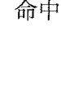
- 通过充满自信、维护自我的活动来寻求自我成长和提升
- 需要依赖自己的进取心和能量去获得人生的信念——通常能够发展出卓越的领导能力
- 专注地将能量投入新的经验中会带来机会
- 太富于侵略性，过于强势与焦躁不安会引起扩张过度、过多的冒险，并错失个人发展的机会
- 天生就能理解勇气与信念对于个人的重要性

### 木星落入金牛座的解析指南

- 通过生产力、坚定性和可靠性来寻求个人成长和提升
- 通过对物质世界的由衷欣赏来满足将自我与更大秩序相连的渴望；强烈需要感官享受
- 想要完全通过金钱、占有和奢华来改善生活会导致过度物质化的态度和浪费
- 对于人性和人类追求享乐的基本需求秉持开明、宽容的理解
- 与自然和简单存在的沟通会增强其对人生的信任感；表达金牛座更高贵、慷慨的特质

### 木星落入双子座的解析指南
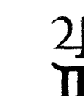
- 通过交流，发展广泛的技能并丰富自己的知识来寻求自我成长与提升
- 通过直接的认知和言辞表述所有关联来获得信念；广泛的兴趣为我们赋予人生意义
- 多变的好奇心，过度的思考和担忧有损乐观
- 需要发展智能和理性的力量去体验对自己的信任，对人生的信任；渴望与一个充满理性与逻辑的更大秩序相联系
- 天生就能理解良好的沟通，以及用资讯利益他人的愿望有多么重要

### 木星落入巨蟹座的解析指南

- 通过发展家庭价值观和情感支持来寻求自我成长与自我提升
- 表达保护性的同理心和本能的关怀会带来机会
- 需要敏锐地感知他人的情绪以获得自信；这种情绪的敏感性通常发展良好
- 过于拘谨、恐惧和自我保护，可能会抑制对更高层次力量的信赖
- 本能地理解人类对安全感的需求，通常会表现出巨蟹座更为奉献、高尚的一面

### 木星落入狮子座的解析指南
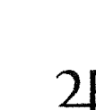
- 通过具有创造力的活动、充沛生命力的自由表达，给予他人温暖、支持和鼓励来寻求自我成长与提升
- 自尊与获得认可的需求影响其豪爽的本性；本能地理解人们对于获得关注和自信心的需求
- 自负、傲慢和跋扈都会抑制其对更高层次秩序的信任，但其通常天生对于生命拥有难以抑制的信念
- 需要给他人留下深刻印象，需要获得他人的认可，才能获得自信；表演的感觉和天赋得到良好发展
- 戏剧性地表达人生信念；扮演自己的人生角色会带来巨大的快乐，但有时候会对自己角色的重要性过度自信

### 木星落入处女座的解析指南
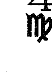
- 通过自发地给予帮助、忠实地服务来寻求自我成长与提升，这是一条有关遵守纪律的自我成长之路
- 谦逊地等待更高层力量的恩赐，天生相信常规工作和自律的价值
- 对完美主义的广阔需求激励着自我的完善
- 过度关注细节会妨碍其与更高秩序的连接，但是批判能力通常得到了良好的发展，而且不会过于狭隘
- 天生就能理解如何恰当运用个人分析能力与辨识能力

### 木星落入天秤座的解析指南
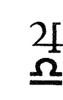
- 通过和谐、客观的态度，以客观和圆滑变通的方式寻求自我成长与提升
- 通过和谐、公正、开放的态度增强个人信念
- 亲密关系会带来机会，一对一真诚互动的能力往往会发展得很好
- 通过分享、合作、鼓励他人这些方式来表达对更大秩序的渴望——有时候可以通过艺术与美来实现
- 过于考虑一个问题的方方面面会妨碍到自信的、扩张的行为和决策性的思考

### 木星落入天蝎座的解析指南
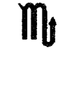
- 通过转化欲望和强迫性以及对生命内在功课不寻常的、彻底的理解来寻求自我成长与提升
- 审时度势、洞察人情的能力可以带来机会——足智多谋和机会主义的意识发展甚好
- 恐惧、机密性和无法开放的情感都会阻碍乐观主义的膨胀和信念的发展；但是木星通常能够表现出天蝎座的高贵品质
- 通过表现强烈的紧张体验和深刻的感触、情绪来表达想要与超越自我的存在建立连接的迫切渴望；通过寻求、面对强烈的紧张来获得对更高层力量的信任
- 需要运用强大的转化能力以获得自信

### 木星落入射手座的解析指南
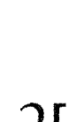
- 通过追求远大的志向、追寻个人对生命的内在信念来寻求个人成长与提升
- 以乐观和哲学为导向有助于树立对更大秩序的信赖
- 需要利用机会进行外在和内在的探索来完善自我
- 过度扩张可能导致能量的过度延伸，忽略了当下的可能性
- 天生就会发展出对宗教层面生活重要性的认同感

### 木星落入摩羯座的解析指南

- 通过努力工作、遵守纪律、稳定发展来寻求自我成长与提升
- 需要通过表达自律性、有把握的保守主义来完善自我；天生具有权威感，让他人感觉值得信赖
- 过于严肃和忧虑的态度会有碍乐观和发展
- 个人的信念和信赖是基于现实、经验和个人对于历史、传统价值的固有理解
- 机会取决于个人的可靠性、责任感和耐心——这些品质通常都能得到良好的发展

### 木星落入水瓶座的解析指南

- 通过人道主义的理想、心智的发展和大胆的实验来寻求个人成长与提升
- 过于超然、旁观的态度会有损乐观态度，但对待他人往往能够做到无偏见的宽宏大量
- 需要完全独立地尽情发挥才智，并以此来获得充分自信；天生就具有良好的科学化态度
- 个人信念是古怪的，颇为个人主义，偏离正统，有个人的独特色彩
- 相信所有人类的统一和一切知识，对于广泛、多样的自由表达秉持豁达包容的态度

### 木星落入双鱼座的解析指南

- 通过理想主义的生活、个人同情心的发展和宽容的心灵来寻求个人成长与提升
- 需要表现出慈悲心和敏感性来竖立有关自己的信念
- 漫无目标、无批判的态度和逃避都会阻碍自我完善的行动
- 基于对一切痛苦的同情而期待天恩眷顾
- 对更高层力量具有良好的信任感；能够理解为理想献身和对灵性层面的体验保持开放态度的重要性

## 土星落入的星座
土星所落的星座位置：一个人通过努力寻求立足世界和保护自我的方式。

### 土星落入白羊座的解析指南
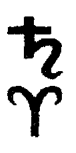
- 通过将能量注入新鲜的体验之中立足世界和保护自己
- 精力充沛，锁定焦点，释放能量；通过培养勇气和胆量来发展自我
- 迫切地想要通过进取、竞争的行为来实现具体的成就
- 幼稚、以自我为中心的态度会成为其承担责任的障碍
- 独立自主的行为对于成就感的满足是尤其重要的必备因素

### 土星落入金牛座的解析指南

- 通过稳定高效、所有权、依赖个人拥有的物质资源立足世界和保护自己
- 忠诚、稳定和可靠是个人完整和安全的基础，但懒惰会阻碍成就实现
- 感觉到需要专注于基本（通常是传统的）价值观去寻求社会的认可
- 巩固与占有会阻碍能量的流动——因为害怕失去控制而极端保守、顽固不化
- 为了深化对身体感官、艺术、美感或自然的鉴赏力而勤勉努力

### 土星落入双子座的解析指南

- 通过认知能力和掌握事实立足世界和保护自己
- 需要依赖自己的才智资源，从而导致个人思考过程的不断调整
- 各种头脑的刺激会妨碍其承担义务与责任；多疑的态度和不必要的狭小兴趣会降低学习的能力，影响头脑的开放性
- 需要专注于以一种受过训练的方式条理清晰地表达看法，客观地思考问题
- 渴望用才智和言辞捍卫自我的架构与完整

### 土星落入巨蟹座的解析指南

- 通过感受深层次的滋养、理清家族的根源与影响立足世界和保护自己
- 尤其重要的是接纳自己的情绪并专注地表达，尽管这样通常很困难
- 努力克服对自身敏感性与脆弱性的恐惧
- 强烈地想要实现自我保护，并加强安全保障
- 太过于控制与压抑情感会导致死板与空虚

### 土星落入狮子座的解析指南

- 通过创造性的活动、自我表达和忠诚克己的爱立足世界和保护自己
- 迫切地将个人特质投入到成就之中去获得安全感
- 必须依赖和信任自己内在灵魂的基调和自己内心最深处所关心的一切
- 恐惧或是不信任自己内在的价值与仁慈会阻碍自我表达和自信心
- 自尊心和获得认可的冲动是承担责任与义务的原因，富于创造力地担当可以带来由衷的快乐

### 土星落入处女座的解析指南

- 通过个人的分析能力、承担职责、乐于助人、立足世界和保护自己
- 运用组织能力和训练有素的技能掌控细节，完善技巧，获得深深的满足感
- 对自己在现实世界中有效工作的能力缺乏信心会导致自我怀疑和过度恐惧
- 需要全力以赴的高效工作来实现真正的成就
- 依赖自身的助人为乐和技术能力，在现实世界中构建安全之地并发展真正的谦逊

### 土星落入天秤座的解析指南

- 通过公平、尽责地与人建立关系立足世界和保护自己
- 基于平衡、和谐的原则有意识地组织一切计划、关系和结构
- 害怕做出感情的承诺会阻碍成功，且无法实现亲密感的满足
- 通过训练有素的努力维系情感关系；以一切托付、承诺和责任为荣，并由此获得深深的满足感
- 意欲取悦他人会导致其不愿意承担那些会令人不愉快的义务，但是圆滑与公正会赢得社会的认可

### 土星落入天蝎座的解析指南

- 通过控制强烈的激情和其他储备能量立足世界和保护自己
- 强烈地想要维护个人情感的结构，甚至会逐渐破坏个人的目标或阻碍亲密关系
- 带有强迫性地需要依赖自身资源是成就卓越的绊脚石
- 害怕去表达甚至了解深层的情感会让人变得死板、僵化，情绪的河流被“冰冻凝结”，生命中缺乏深层的满足感
- 投入训练有素的努力去实现彻底的转化，不必要的一切都会被除去，通常致力于重要的改革工作

### 土星落入射手座的解析指南

- 通过巩固信念和远大的志向立足世界和保护自己
- 可以广泛地接纳许多义务与责任，通常背负个人所能承担的责任；强烈地需要智力训练

- 缺乏组织性，不断地改变计划和架构去适应形势；有条不紊地向着未来的成功进发尤其重要
- 致力于对哲学的追求和清楚明确地表达个人理念，会是其安全感和满足感的来源
- 强烈地需要社会认可其信念；过于传统的态度或其他的恐惧会妨碍其自由地追求真理

### 土星落入摩羯座的解析指南

- 通过实现抱负、权威和社会地位立足世界和保护自己
- 在计划履行个人责任上做出强有力的、训练有素的努力
- 过度发展组织能力会导致其想要严密地控制所有形势
- 迫切想要通过决心、努力、保守性和谨慎的行为来维护自身架构的完整；过于害怕不被认可会阻碍其个人目标的完全实现
- 成为一个可靠的人，依赖于自身的资源是其根深蒂固的需求

### 土星落入水瓶座的解析指南

- 通过训练有素的智力、定义清晰的知识，对社会或未来目标的担当立足世界和保护自己
- 善于组织群众或明确概念
- 致力于维护一个重要的朋友圈，通常会指引这个群体努力实现特定的成就
- 特立独行和极端性的迫切需求会危害到实现具体成就的机会，自由、独立的自我表达会被头脑的僵化或社会动荡所影响
- 需要社交互动来稳定个人的人生目标，克服对非难谴责的恐惧

### 土星落入双鱼座的解析指南

- 通过超越个人限制，与更为伟大的存在、群体或理念融为一体来立足世界和保护自己
- 逃避现实的渴望会延迟或妨碍个人接纳自己的义务与责任
- 过度恐惧、保守会让人无法实现超越性的愿景
- 通过训练有素的努力来表现具有治愈性的同情与移情，这种奉献会融化顽固与僵化
- 需要去表达自身的敏感与情绪，克制逃避倾向去获得稳定感
- 需要依赖自身的灵性资源，实现高级理想

## 天王星、海王星、冥王星落入的星座

尽管天王星、海王星、冥王星的星座落点对于分析世代特征（阐述一代又一代群体心理的差异）有着重要的影响力，但其对于个人的影响力甚微。这三颗外行星并不会呈现为清晰的个人特质，因为它们总在一个星座停留很久。对于个人而言，他们的宫位与相位信息总是更为重要。个人行星与天王星、海王星、冥王星之间的相位有时候会折射出一个人在他的世代中如何面对变革的推动力，“三王”星在一些人的生命中是一份“无声的注解”，在另一些人身上它们所代表的巨大改变则只是体现在内心层面。

换言之，外行星星座代表的特质与能量在个体上往往没有太明显的体现（除非当“三王”星与星图中的其他重要元素强有力地结合时）。举例来说，天王星、海王星或冥王星如果与其他七颗行星在某一星座形成合相，其能量就会被明显放大。（例如，冥王星与金星合相在狮子座，此人狮子座的特质就会被放大）。一个外行星与其他两个行星成三分相位也是对这一元素能量的强调（也就是成为“大三角”格局的一部分，比如天王星在双子座的太阳水瓶座和月亮天秤座形成三分相，则天王星放大了风元素的能量）。

外行星呈现出的另一种星座能量被放大的例子是天王星、海王星或冥王星与上升点落入同一星座。即使外行星落在上升点十二宫这一侧，也一定能够显著放大上升星座的特质。比如，冥王星与上升点都在狮子座时，狮子座的特质将会被加强，尽管这一特质很可能因为冥王星的隐匿性与自控性在一定程度上被抑制了。

① 星图中木星的重要性在分析解释以及传统中都被低估了。事实上木星在引导我们走向未来，它驱动着未来的成长与发展，特别会让人沿着理想的脉络前进。在大部分情况下，木星的深层意义被忽略了，这也就是为何这里的指南比其他行星的更为详尽仔细。木星对于复杂的时代来说显得太过简单了一些，对于现实、物质的时代又太像哲学。对于所有人来说，木星所落的星座都强烈地影响其个性的色调。木星星座的特质渗透在人格与个性的方方面面。在很多案例中，个人都在较高的发展状态下具有该星座的能量、能力和特性，尽管他们认为这是理所当然的，因为这些特质都来得如此容易和自然。简言之，并不是所有案例均是如此，但是在大部分情况下，木星有提升和让事情成为可能的作用，因此该星座总是表现出更为慷慨、积极的一面。

# 第六章 上升点与中天

## 上升点的关键概念

上升点（或上升星座）①往往很难总结归纳。它同时容纳了太多的东西：它象征着一个人如何行动，是其他人所看到的“面具”或“个性形象”，是面对人生时那渗透整个生命之中自发产生的能量与态度，尽管有些人的上升点容易被辨识，但正如戴恩·鲁德伊尔所说，上升点也可能是“出生星图中最难琢磨、最难理解的部分”。它在一些人身上被体现为首要的表面特质，引用杰夫·梅奥所表述的：

> > 它就好比一个人在投身职场和社交中戴上了一张脸皮，隐藏了许多他只会在亲密关系中才会显露的真实性格——有时候连他自己都不知道这一部分的存在。

所以，其他人看到的“个性形象”并不是有意识的投射；它是自发的，而且并不像许多占星师所说的那样肤浅。上升点总会显示出个人的某部分本质，既潜于内心，又表于外在。事实上，一个人不可能脱离上升点去表达自我、站上世界的舞台。这是一扇门，我们通过这扇门走向世界。它象征着我们作为个体进入生命的路径。它代表着在能量自发流动的状态下，我们在外部世界与生命积极融合的方式。上升点揭示了我们以怎样的方式感受到自身的独特性。它总是会影响到个性的某些本质和生活的态度，如果星图的其他部分与之和谐、给予它支持，那么它可能会显得更加重要和真实。如果星图中其他部分与上升点的特质和能量并不调和，它就会显得更表面化，更像是矫揉造作的面具，与个人的其他本性背道而驰。

## 上升点所属元素

上升点所属的元素揭示出那些会直接赋予身体和整体人生观以活力的能量特质。火象或风象上升星座趋向于引导能量、鼓励积极的自我表达、精力充沛地释放能量。土象和水象上升星座倾向于保存和抵抗生命力的流动，因此表现出自持（有时候甚至是自我抑制）、活在个人世界里的倾向。

## 上升点在火象星座（白羊座、狮子座、射手座）

丰富的生命力和体能，向外部世界辐射能量。其典型特征是积极乐观的人生观和自信、率直、真诚的行为。活跃，渴望留下生命的印记，希望看到个人努力的结果能够影响世界。以行动为导向可能造成过度浪费，对自我和他人细致的需求缺乏觉知。

## 上升点在风象星座（双子座、天秤座、水瓶座）

灵敏活跃的头脑，好追根究底，爱好交际，友善，善于言辞。往往很聪明，具有迅速的领悟力。可能会习惯性地陷入过度思考，在内心中争辩每一件事，渴望了解一切；很大程度上活在思想世界中，天生善于交流，理解他人的观点。

## 上升点在土象星座（金牛座、处女座、摩羯座）

务实的观点。焦点放在物质世界，保守的态度会抑制想象力，从而会限制个人的选择面，阻碍自发性的自我表达。通常具有良好的稳定性和可靠性，脚踏实地和天生的耐心让他们比其他上升星座更能容忍日常事务。井井有条的方法和沿途建立的渠道，是最常见的自我表达方式。

## 上升点在水象星座（巨蟹座、天蝎座、双鱼座）

最容易受到环境和他人的影响。因为强烈的脆弱感和可能被伤害的感觉而表现出敏感、情绪化和小心翼翼。自我保护，同样也关心他人。有同情心，能够立即、强烈地感受到他人的情绪。十分私密，深深活在个人世界里。

## 上升点的守护星

与上升星座关联的行星十分重要，在传统上，它被称作“命主星”或是出生星图的“守护星”。它的星座和宫位落点总能赋予人生观某种色彩。一旦你能与之调和，接纳了这一守护星的宫位和星座所代表的经验领域和典型能量，你就会感觉到更有活力，更有表达自我的动力，更有内在的安全感，也能更真实地做自己。

守护星所落的星座：揭示出能量的基调和特定的品质，在许多案例中都显示出强大的影响力，甚至具有主导性。这一星座显示出了个人行动和自我表达的首要驱动能量。

守护星所落的宫位：显示出个人生命能量和努力表现最为突出的领域，在这里遭遇的活动和问题都有其深刻的重要性。一个人需要在这一领域积极表现，才能去表达和刺激许多核心能量和能力。

事实上，上升点与其守护星是不可分割的一个整体，必须综合考虑。例如，上升点落于双子座，其守护星水星在双鱼座，通常会比水星落在金牛座的人更有想象力，在精神上更为敏感，更容易感到茫然困惑，而水星在金牛座，思维运转会更慢，更实际。（我将这称之为双子座上升搭配双鱼座的“低音伴奏”和双子座上升搭配金牛座的“低音伴奏”）。再如，上升点在巨蟹座而月亮在天秤座，将会比上升点在巨蟹座，月亮在白羊座的姿态更为超然、圆滑，而月亮在白羊座则更为冲动、不得体。（我将这称之为巨蟹座上升搭配天秤座的“低音伴奏”和巨蟹座上升搭配白羊座的“低音伴奏”）。

## 上升点的相位

注意，分析这些相位的前提是有准确可靠的出生时间。

除了守护星的落点会修饰上升点的基调，上升点的相位也会发挥其影响力，这里的相位是指角度为30的倍数。③行星与上升点的相位总是强有力地影响着个人形象的投射和个人表达的整体模式。任何与上升点成相位的行星都会在个人能量领域和人生观方面留下自己浓墨重彩的一笔。

1. 与上升点合相的行星，容许度6度以内的角度，对人格特质具有最直接、显著的影响力。
2. 与下降点合相的行星，容许度6度以内的角度，（也就是与上升点成对分相的行星）这一相位的影响力居第二位。因为上升点代表了个人最直接的形象投射，而下降点以及落在其附近的行星更多预示着个人在感情关系中的表现特征，这可能是与个人形象相反的特征，有时候这预示着一种内在的分裂，一个人会交替出现上升点和这个对分相的行星所体现的两种截然不同的模式。另一种情况是，这个相位的影响力只是让性格带有此行星的色彩，并特别凸显在个人关系（七宫领域）上，但是并无显著的对立冲突。
3. 行星与上升点成四分相位，这是上升点最有挑战或挫败感的相位。这通常象征着一种来自幼年生活环境的压力，表现为一种压迫或抑制（特别是当这颗行星落在四宫时）；或是表现为一种面对成功和被认可的压力（尤其是这颗行星在十宫时）。然而，就跟所有的挑战相位一样，这个相位也带来了巨大的成长空间。
4. 任何与上升点形成紧密相位的行星都会从幼年开始，影响个体的意识。⑷这个相位的影响蕴藏在你的意识之中，会自发地表现出来，但你需要学着承认它的存在，并将这个行星的力量融合到你的个性特质中。换言之，随着时间的推移，你会自觉地发展这一部分的特质。如果你能够学会掌握它的力量，这会是非常有利的资源。
5. 即使太阳、月亮与上升点并无相位，即使出生的时间稍有不准，搞清楚这三个重要因素的所属元素的融合方式仍然非常重要。我们可以借此清楚地了解生命的核心力量是如何汇入与交融，上升点对于太阳、月亮的能量表达是支持还是抑制，以及其程度如何。

## 上升点解析指南

尽管上升点对于个人有着深刻、普遍的重要性，但不可否认，我们必须把它与星图其他部分综合起来看，尤其是太阳星座，这非常有助于我们彻底了解一个人的独有特质。太阳始终是个人身份和意识的真正核心，是我们吸收自身经验的方式，而上升点——尽管对于每个人的重要性不尽相同——却不是个人本质的核心。上升点描述的是我们对待生命的态度，而太阳正是生命本身！上升点必须为目标、价值服务，太阳的创造性目标会为个人带来快乐和充实感。

上升点会修饰太阳能量的表现。关于所有上升点与太阳互相作用的研究可以写上一整本书，但在这里，我只是举例说明一下，上升点在双子座的人不论搭配哪一个太阳星座，都会在社交方面表现得更为活泼，有更为理智、好奇的人生态度。它甚至会让慢吞吞的金牛座太阳加速；让天蝎座太阳更爱社交，更少缄默；减少摩羯座太阳的防备性，变得更加健谈；鼓励巨蟹座不要那么害羞！在所有的情况之中，不论这些上升点在双子座的人的个性看起来有多么彼此相似，太阳所显示出的核心本质依然由太阳所落的星座来决定。

理解一个人的上升点与太阳星座互动的另一个有用工具，便是对比两者所属的元素。例如，对于太阳在巨蟹座的人来说，上升点落入火象星座比落入土象星座往往表现得更加外向，表达也更有力，更自信，但如果搭配上土象上升星座，则会表现得更保守谨慎，趋向于自我保护。再举一例，风象太阳星座搭配水象上升星座会表现出更多情绪，反过来，水象太阳星座搭配风象太阳星座会表现得更为超脱，更少情绪化。

太阳落在一个星座上，这个星座的表现一定会被强调；尽管太阳的相位会对太阳的表达起到修饰作用，但是绝对不可能完全改变成上升星座的风格。上升星座大部分时候并无行星落入，即使是有一二颗行星落入，它也无法与太阳星座的力量相抗衡（当然除非太阳与上升点落入相同星座）。相比之下，上升点的特质较为容易受到影响，在大部分情况下它会比太阳星座的特质和能量更容易被改动。上升点的紧密相位会强烈地影响上升星座的表达，上升星座守护星的星座和相位也会显著地影响到上升星座的能量表达。

上升点的复杂性解释了很多问题。它解释了为何人们与自己的上升星座并不完全符合，它解释了为何初学占星的学生往往很难掌握上升点的概念与分析，它解释了为何有些人的重要特征和倾向并没有被直接显现在太阳和上升星座的征象中，这也就是为何有许多人就是没有办法立刻在基础占星学的“标签”中看到很多有用的东西。

还应该指出的是，与太阳星座相比，人们往往对自己上升星座的本质缺乏觉知。从这个意义来说，上升点是可以假以时日不断有意识地发展的因素，并且我们可以将其有意识地用于帮助个人的表达。我认识的一些人在知道了自己的上升星座之后感到安心，因为他们终于有个途径可以认出自身的一个非常深刻，却没有被完全意识到的性格倾向。在一些案例中，上升星座象征的能量和特质还只是刚刚开始显现，学习相关占星学上的关键点能够非常有助于个人的发展。（我在这里强调一下，与星图中其他所有因素相比，幼年的环境对上升点的影响也许是最为显著的，它鼓励或抑制了上升星座能量的表达，因为早期环境是一个人与外部世界互动的首要渠道。）

记住，上升点非常容易被上升星座守护星的落点和上升点的相位所影响（当然还有落入第一宫的行星），我们只能在大体上对十二星座上升加以观察和分析。读者还需要运用第五章中“太阳所落星座”的指南，进一步探讨每一个上升星座的核心本质。我尤其鼓励初学者们利用这一章节来帮助自己解释各个上升星座。我发现对于太阳星座的指南也适用于上升星座，因此，在下面的内容中会出现重复的关键词句，我会试着从另一个角度来解释每一个上升星座。

在下列注解中，我根据自己二十余载的观察来讲述自己所认识到的同一太阳与上升星座之间的重要差异。这些观察只具有主观的普遍性，并不适用于读者所知的一切案例。但我认为这些内容能够促进思考，甚至辩论也是有助于学习的方式，而不仅仅是为每个上升星座列出一堆形容词。读者应该将下面的对比评价看作一份指南，当作一个问题去探讨，而不是将其当作一条刻板的绝对真理。

上升点在白羊座：举止鲁莽，志向远大，焦躁不安，缺乏耐心，在生活中总是匆匆忙忙，这些人可能十分粗鲁。如果火星在双鱼座、巨蟹座或是某一个土象星座，这些强烈的特征可能会有所缓和。白羊座太阳的坦率和直接看起来非常具有攻击性、迟钝、不顾及他人的感受，这些特征于上升点在白羊座的人身上会有所缓和。但是，白羊座的进取精神是不会改变的，甚至有时候上升点在白羊座的人会比太阳在白羊座的人更加活力充沛。

上升点在金牛座：井井有条、克制、慎重的动作好像是定格的姿势；非常讨厌匆忙，带着强烈的审美和享乐动力奔向大自然的怀抱。可能会懒惰，或是稳步地生产，却依然坚持以自己的方式和步调做事情。金星落入的星座强烈影响着个人的抱负与活力。太阳在金牛座的人往往看起来比上升点在金牛座的人更懒（可能是因为太阳代表了核心生命力），可以想见金牛座太阳也有更强的占有欲。两者都渴望享受，所以他们拒绝匆忙地做任何事，唯恐妨碍了来自此时此地的快乐。具有非常物质、感官的生活态度，以及对亲密、爱恋与安全感的强烈需求。

上升点在双子座：最爱追根究底、最友善的上升星座，但也同样是最趋向于时刻为自己担忧的一族（可能有时候上升点在天秤座的人会更胜一筹）。往往极为聪明，好奇心强，非常需要口头的交流。太阳在双子座的人经常被视为肤浅，这在上升点在双子座的人身上通常不明显。但是对于上升点在双子座的人而言，头脑的一边不懂另一边所想所说的倾向表现得十分极端——这一点让那些依赖于他们，相信他们所说的人最为恼怒。他们不是故意不诚实，只是右手不知道左手在做什么！（但是，我也要声明，我遇到过至少两位非常值得信赖的上升点在双子座的人。）

上升点在巨蟹座：富于同情心，举止温柔，但往往对自己、对他人有一样多的敏感与同情，对于伤害往往过度敏感、脆弱。从这种意义上来说，上升点在巨蟹座的人对于他人的同情似乎比太阳巨蟹更为表面化，后者的情感更为深入、亲切。上升点在巨蟹座通常比太阳在巨蟹座的人更为矜持缄默，后者的行动力常常表现得更善于社交，更外向。上升点在巨蟹座的人一般会非常内向，尽管我也见到过月亮在狮子座或类似外向星座的个案要表现出更多的外向趋势。

上升点在狮子座：上升点在狮子座的人通常会驱使一个人更努力地展现自己的最佳状态。这并不是说，狮子座的自豪（甚至是傲慢）没有在上升点在狮子座的人身上有所体现，只是说，他们“展现狮王威风”的需求会比太阳狮子座的人要少一些。上升点在狮子座的人会自我鼓励要更真实地表达自己的太阳能量，而太阳狮子座会以更戏剧化的自我意识表达深层的情绪。慷慨的心，通常是用来形容狮子座的特征，而上升点在狮子座的人或许比太阳在狮子座的人更符合这一点，后者往往会麻木地利用他人让自己获利。然而上升点在狮子座的人会展现出非常疏远的行为，因为他们非常需要获得尊重、彰显尊严，通常缺乏太阳狮子座那种自发的幽默和玩笑之举。

上升点处女座：上升点在处女座的人通常比太阳在处女座的人更为自信，说来也奇怪，他们至少在有一点上展现出了更真实的谦卑：也就是上升点在处女座的人总是认识到自己还有更多需要学习，需要进一步自我完善。有时候，自我苛求会让太阳处女座的人感到挫败沮丧，但是这一点于上升点在处女座的人身上并不那么常见。似乎上升点在处女座的人更偏好清除“疑虑”，而不是执著于此。传统保守是太阳在处女座的人的常见特质，但于上升点在处女座的人身上，这一点并不那么根深蒂固，他们或许会表现出疏离、严格或内向的性格，但是背后很可能掩藏着狂野的本性。太阳在处女座的人通常比上升点在处女座的人更善于处理细节，但两者都有很强的工艺技巧。

上升点在天秤座：尽管上升点在天秤座的人常常比太阳在天秤座的人更容易表现出某种自恋的自我中心主义，但上升天秤座的人通常更真诚友善、讨人喜欢，而太阳在天秤座的人则表现得更为超然，明白人生并非都是甜蜜、光明的。上升点在天秤座的人的个性基调有助于星图中其他所有元素的表达。虽然对于太阳在天秤座的人而言，亲密关系是重心所在，但对于上升点在天秤座的人来说，对“他人”的需求有时候更加关键，他们一生都会关注人生最主要的关系——亲密关系（或是缺乏这种关系）。单身时，上升点在天秤座的人有时候会完全丧失方向感，会感觉到严重缺乏主动性和体能。评估星图中金星的情况可以更详细地了解其情感的需求。上升点在天秤座的人通常在表现上显得比太阳在天秤座的人更肤浅，他们通常隐藏了深刻的内在。同样，上升点在天秤座的人的浪漫主义情怀会比太阳在天秤座的人的愤世嫉俗更为明显。

习俗持续的时间更久。

### 上升点在天蝎座：

上升点在天蝎座的人最广为人知的特征是其强烈性，通常与疗愈艺术相关，探索其他人的动机（比如通过心理治疗），或探索未知与奥秘。尽管天蝎座总是以勇敢著称，但很少有人提及恐惧也是他们重要的动力因素。对于天蝎座，最棒的进攻就是最佳的防御。上升点在天蝎座的人会持续保持一定程度的防御姿态，而这一点在太阳在天蝎座的人身上并不那么常见。天蝎座是一个情感极端主义的星座，因此上升点在天蝎座的人的每一种正面表达都很容易被理解为一种有力的负面表达。上升点在天蝎座的人事实上很多年以来都名声不佳，他们也并不完全是被冤枉的。说到报复心、残忍与嫉妒的行为，没有其他上升星座能与之匹敌。复仇常常是他们强大的动机，有时候会偏执地痴迷于自我保护。表现的形式往往是不愿放手——放下财富或是情感；他们对于放下和失控极度恐惧。上升点在天蝎座的人可以洞穿他人深层的情绪与动机。他们非常足智多谋，常常会热情地投入一项困难的挑战或是人生任务中。上面谈到的这些负面特征有时候在太阳在天蝎座的人身上得到了很大程度的改善，他们对于自己“亲密圈”内的朋友非常忠诚。暗中自我破坏的趋势在太阳在天蝎座的人身上出现频率更低。在考虑上升点在天蝎座的人的守护星时，火星的星座总是要比冥王星的星座更重要，积极地引导火星的能量能够有助于疏导和转化天蝎式能量的自我破坏。

### 上升点在射手座：

乐观、快乐、热情、思想开阔是太阳在射手座的人常见的特征，但并不绝对，而这些却很符合所有上升点在射手座的人的特征。事实上，我见过的每一位上升点在射手座的人都是永远的“乐观主义者”（即使不断遭遇失望与阻碍）。大力鼓吹个人信念就是宇宙真理，这是上升点在射手座的人与太阳在射手座的人共有的特征，上升点在射手座的人心胸更宽广，更能启迪人心，而太阳在射手座的人的鼓吹则常常像是被“真理”撞了一下脑袋。换言之，太阳在射手座的人的自以为是更是臭名昭著。同样，上升点在射手座的人从不会漫无目标，或通过流浪以表不满，这些是太阳在射手座的人的特征。上升点在射手座的人更倾向于带着理想做出符合常规的明确行动，而太阳在射手座的人有时候会仅仅局限于思考或理论之中。

### 上升点在摩羯座：

上升点在摩羯座的人往往具有极其消极、充满怀疑的自我表达，这一点比太阳摩羯座更甚。然而，两者都会表现出犬儒主义，鄙视新事物，但事实上这只是为了掩盖他们好奇、脆弱甚至是精神开放的天性。摩羯座只是不愿将时间浪费在未经验证的理念上，但是那些具有实际性和逻辑性的，即使是非正统的事情也会激起摩羯座的兴趣，打消他们习惯性的疑虑。但是太阳和上升点都在摩羯座的人非常关心外在形式、外表和声誉，上升点在摩羯座的人似乎更害怕公众舆论，会不遗余力地表现得正常、保守和“安全”。摩羯座太阳似乎有更强的驱动力去追求成功和权威，更有决心获得现世的成就。上升点在摩羯座的人有时候仅仅满足于安全感。两者都如此缺乏人情味儿，导致他们与他人的关系容易出问题，但太阳在摩羯座的人在感觉上往往比上升点在摩羯座的人更难建立一对一的关系。

### 上升点在水瓶座：

上升点在水瓶座的人和太阳在水瓶座的人的性格中都弥漫着反传统、叛逆的气息，但是这些特征却深入太阳在水瓶的人的骨髓。他们往往一生都狂热地追求新鲜、幻想和革命（即便他们并不经常公开表现这些）。上升点在水瓶座的人通常看起来很古怪，当然，他们也有反抗性，但与大部分太阳在水瓶座的人相比，他们往往与习惯、常规有很强的调和性。两者都会展现出机敏的感知能力和理解力，敏捷的思考力和快速的学习能力，这让慢吞吞的朋友们大跌眼镜。两者都会展现出冷静超然的态度，让那些更多愁善感的人感到失望和害怕，太阳在水瓶座的人似乎比上升点在水瓶座的人更疏离更客观。对于许多上升点在水瓶座的人来说，传统的土星守护星会比现代守护星天王星影响更大。土星的星座和宫位落点对于每一个上升点在水瓶座的人而言都非常重要。

### 上升点在双鱼座：

因为落入双鱼座的太阳是无力的，这会让太阳在双鱼座的人受到星图中其他因素的强烈影响，所以太阳在双鱼座人的类型似乎会比上升点在双鱼座的人更为多元化。上升点在双鱼座的人往往都是敏感、慈悲、情绪化、富于想象力、乐善好施之人。上升点在双鱼座的人有时候比太阳在双鱼座的人更具有鲜明的个性，而太阳在双鱼座的人总是被动消极，难以捉摸，逃避现实，不负责任。很可能是古老的守护星——木星，为许多上升点在双鱼座的人带来了鲜明的个性与轻松欢快；有时候，其影响力大于现代守护星海王星。事实上，我们必须将木星所落的星座和宫位作为一把关键钥匙，去认识上升点在双鱼座的人的本质。上升点在双鱼座的人不仅能同情和帮助困境中的人，他们自己在经历不幸时也常常能表现出令人惊讶的平静与镇定。和上升点在处女座的人一样（双鱼座的对分相位星座），上升点在双鱼座的人为他人所做的奉献并不需要获得赞誉和公众的认可。

## 中天

长大和成熟意味着我们将儿时的梦想和目标具体化，并渐渐地达成。中天所落星座、十宫的宫主星的落点，还有落于十宫的行星就描述了这一过程。虽然中天的星座并不总是被明显公开地表达，但它仍然是出生星图中的重要部分，因为它描述了一个人职业与社会地位的表现与发展。几乎所有的占星学教材都认为中天（常缩写为MC）是个人“职业”或“社会地位”的标志。在年轻时，除非有多个行星落在了中天所在的星座，否则个人往往并未感受到这一星座的能量。中天象征着我们随着年龄的增长，自然成长的方向，这是我们需要付出努力去获得的特质。中天预示着成就、权威和你的社会贡献潜力，还有你的事业或使命的“召唤”。在学习如何表达中天所落星座能量的过程中，我们将获得满足感和成就感。

## 中天的守护星

中天守护星所落星座的重要性不仅仅源自于其一般的象征意义，还因为其所落宫位通常清晰地指示出了我们真正的事业领域所在。这个宫位所代表的经验领域就好像是内心深层的召唤一样。如果你的中天星座既有传统守护星，又有现代守护星，那么两颗守护星的宫位落点都很重要。但是传统守护星所落的星座往往比现代守护星的星座影响力更强。

## 落于十宫的行星和中天的相位

落在第十宫的行星，尤其是与中天成合相位的行星（不论落在中天的哪一侧），都描绘出了对于个人极其重要、他/她所敬重的生存方式和行动的特征、类型。因为这份敬重，人们公开展现这种特质，表达这种能量以博得他人的好感。

除了合相，中天的其他紧密相位也具有相当大的影响力。形成相位的行星特质要比相位的类型更为重要。传统上，人们认为，这些相位都与个人公开的自我表达、职业和事业目标相关。任何与中天成紧密相位的行星都代表了一个人可运用以实现成就的能量和方向，并在这一方面对社会做出贡献。

例如，金星与中天有相位，预示着在有关艺术和美感的事务上对社会有所贡献对此人来说很重要。一对一的互动对于个人公开的自我表现非常重要，这个人倾向于通过愉快的合作为社会做贡献。

又如，在三位出版商的出生星图中，都有木星与中天的紧密相位，一个人有合相，另外两个人都有六分相位。传统的说法是，木星与出版业有关。

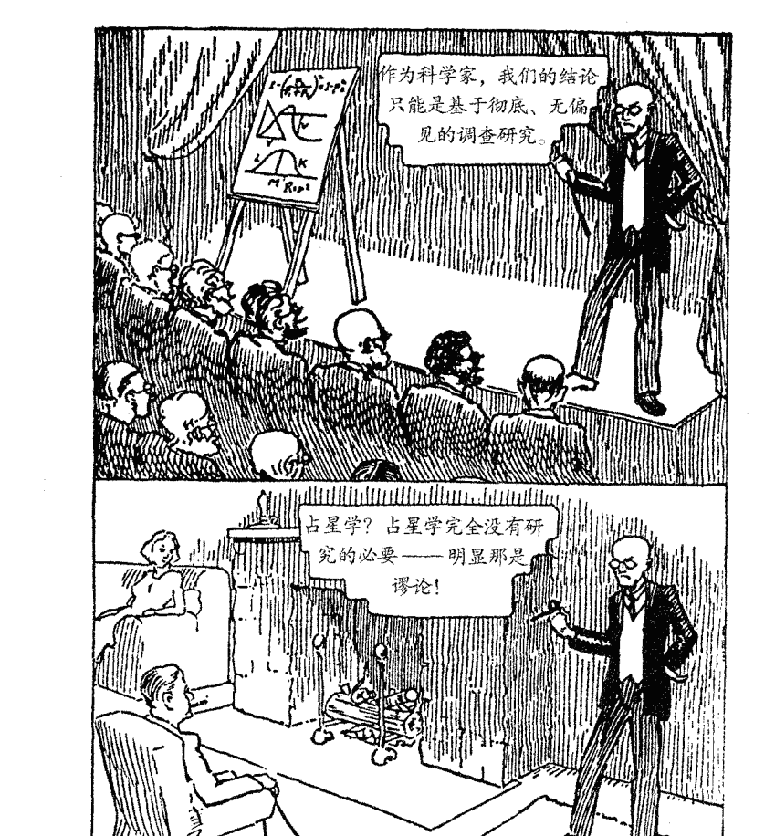

> 作为科学家，我们的结论只能是基于彻底、无偏见的调查研究。

> 占星学？占星学完全没有研究的必要——明显那是谬论！

## 盲点

本图于1943年7月首刊，摘录自《占星学：预测的科学》，作者西德尼·K. 贝内特，温恩出版公司，洛杉矶，1945年

## 内在的宇宙

1.  尽管大部分时候“上升点”和“上升星座”这两个术语是可以互换通用的，但它们也是有区别的。上升点（缩写ASC）从技术上来说是出生星图中上升星座和东方地平线形成的一个确切角度，因此这个术语更为准确。而上升星座则仅是出生时从东方地平线上“升起”的星座。
2.  如果你的上升星座同时具有古典守护星和现代守护星，比如天蝎座、双鱼座和水瓶座，那么你需要查看两颗守护星所落的宫位，两者都会在某种程度上凸显于个人生活中。但是，多留意古典守护星的落点，它往往比现代守护星对星座的影响更强，也更具有主导性和排他性。例如，如果你的上升星座是天蝎座，火星所落的星座对于你的人格构造要比冥王星所落的星座更为重要，除非有其他重要因素影响冥王星。又如，对于冥王星落于狮子座的一代人，并不是每一个上升点在天蝎座的人在个性和天性中都表现出显著的狮子座特质。但是在每个上升点在天蝎座的案例中，火星的星座都特别强劲有力，这个星座的能量在每一个案例身上都坚定自信地流动着，并被强调性地投射在每一个人身上。
3.  我认为所有30度倍数的相位都是“主要相位”：30、60、90、120、150、180。第八章会更详细地阐述每个相位的特点和含义。
4.  在本书的第八章中会详细阐述每个行星与上升点的相位分析。
5.  参见《生命的轨迹：占星、业力与转化》书中第十章详述了如何理解上升点与星图中其他部分的关系。这一章节中还对中天做出了重点分析。
6.  宫主星就是落在每一宫的始点的星座守护星。

我们试图去理解所谓“宫位”这一经验领域的核心要义，而我们一旦理解了核心，便能将其幻化为传统占星学中宫位所象征的各种活动和体验。

# 第七章

# 宫位——说明指引

宫位代表的就是星座和行星能量运作的经验领域。大部分古典占星学都认为宫位象征着外部体验和环境情况，但不仅如此，宫位还揭示了内在状态和个人的主观体验与状态。通过观察出生星图中行星落入的宫位，占星师可以分辨出个人生活中的哪一层面，哪一个经验领域会被着重强调。接下来要讨论的关键词体系可以清楚地解释和认识宫位的心理根源和内在意义。我们试图去理解所谓“宫位”这一经验领域的核心要义，而我们一旦理解了核心，便能将其幻化为传统占星学中宫位所象征的各种活动和体验。

## 宫位整体解析

出生星图中行星的落点所强调的宫位类型能帮助我们以整体视角分析星图。一种常见的分类方法是将宫位分为角宫、继宫和果宫。

角宫（1、4、7、10）与自行活动的特质相关，对个人生活架构有着直接影响。角宫的关键词是行动。

继宫（2、5、8、11）与个人欲望、我们想要控制和巩固的生活领域有关。继宫的关键词是安全。

果宫（3、6、9、12）代表的领域与思考、观察、交换和分配有关。果宫的关键词是学习。

从角宫到继宫再到果宫，之后又回到角宫的推进过程，也象征着我们行为的模式：我们行动，然后巩固行动的所得，以获得安全感。接下来，我们会从之前的行为中学习，哪一些是值得保留的优点，在下一次重复并且变得更有智慧。因此，星图中如果有大量的行星落在某一类宫位，此人一定会在对应的行动、安全和学习中投入巨大的能量，以应对众多挑战。

另一种宫位的分类是按照与宫位相关联的星座所属的元素来分为三类。下面这些关键词和指南可以帮助我们理解这三个类型。（请注意“心灵三位一体”、“财富三位一体”等都是旧式的术语，用在此处主要是为了方便表达。）

## 水象宫位：心灵三位一体

4、8、12宫位：这些宫位都涉及过去，能通过情绪做出本能的条件反射。落入这些宫位的行星的能量往往体现在潜意识层面，也代表了通过吸收过去的精华而获得意识，同时放下那些限制我们的无用记忆与恐惧的过程。如果星图中这三宫的行星很多，则此人生活充满了丰富的感情和深层的渴望。感情和灵魂的需求在很大程度上主导了个人行动与能量的投入。落入水象宫位的行星会影响到一个人的情绪素质，反映了一个人处理强迫性感情和满足私密感情需求的方式，描绘了一个人在多大程度上过着单独、私密、内在的生活。水象宫位的关键词是情感与灵魂。

## 土象宫位：财富三位一体

2、6、10宫位：这些宫位象征着我们满足个人物质基本安全感需求的领域。落在土象宫位的行星代表着我们可以轻松投入现实物质世界中的能量，它可以发展为资源管理的专业才能。如果星图中土象宫落入大量行星，此人会积极构建物质世界，努力在这方面取得成就，并将获得地位和安全感作为人生的目标。土象宫位被强调的人希望在生活中找到合适的活动，并找到一个让他可以多产并能够轻松满足物质需求的地方。他通过工作、效力和实际的成就来直接感受自我。他会希望去履行一项职责或完成大千世界的一个角色。落入此类宫位的行星影响了一个人对于职业、事业的野心的态度，以及获得实际成果的能力。这些宫位的关键词是物质，因为土象宫位重点关注物质世界。

## 火象宫位：生命三位一体

1、5、9宫位：火象宫位与一个人对待生命的态度和对生命活力的体验有关。它们描绘了我们因为激情和渴望而向外在世界投人的力量。这部分宫位被强调的人，生活在热情、理想和对未来的憧憬中。信念与信心（也许是缺乏）以及通过积极行动给外部世界带来影响的需求是其人生主线。这一类人感受生命的直接方式就是努力将梦想变成现实。落入火象宫位的行星影响了一个人面对生命本身的态度，还有对于自身信念和自信的所有感觉。用来总结火象宫位核心含义的关键词就是个性；它是我们对自我的认同感，是我们的存在感，它决定了我们对于生命的基本态度。

## 风象宫位：关系的三位一体

3、7、11宫位：这些宫位不仅与社会关系、亲属感情关系等所有的人际交往类别有关，而且还涉及观念。如果星图中的这一部分宫位被凸显，那么此人将生活在精神世界中，人际关系将是生活的主线。思考并分享观念将主导这一类人的生命活力。他们会在相互理解、发现某个理念或理论的现实性和重要性这样的活动中直接感受自我。落入风象宫位的行星会影响个人的爱好、社交和语言表达方式。风象宫位的关键词是社交和智力。

下表是对上文关键词的简单总结

| 表达模式 | 经验层面 |
|----------|----------|
| 角宫：行动 | 水象宫位：灵魂和情感 |
| 继宫：安全 | 土象宫位：物质 |
| 果宫：学习 | 火象宫位：个性 |
|          | 风象宫位：社交和智力 |

## 水象宫位

### 第四宫

第四宫代表的是在情感与灵魂层面的直接行动。所有在这一层面上的体验都必然受到那些超出我们控制的因素的支配。传统上认为此宫是与家和家人有关的领域的。在生活的哪一个领域，我们在很大程度上是基于习惯和情绪做出反应的呢？就像我们平常和家人相处时常常表现的那样？这个宫位还象征着此人的家是其重生与滋养的资源（或代表他缺乏这一资源）。这一宫位被强调的人需要在深层次的情感方面有所作为，以便去理解自己童年和青少年的经历。他们渴望获得宁静，因此总是对私密性有强烈需求。他们往往很关注发展内在生命的活动以及促进灵魂的成长这样的话题。

### 第八宫

第八宫描绘了对于情感安全与灵魂安定的需求。性与此宫有关，它不仅受到本能的驱动，而且与他人合二为一地体验以及终极的情感安全也是其动力。许多人也会试图通过获得权力，对他人施加影响或通过财务的交易来体验这种安全。

尽管八宫被强调的人会以物质价值、权力、性或灵性知识来追求安全感，但对于情感的真实感受和灵魂的安全感只可能在此宫象征的巨大情感冲突归于平静之后才可能获得。与此宫相关的神秘学研究的最首要作用是通过了解深层的生命法则来获得内在的平静。与第八宫相关的性议题是在表达一种渴望，即借由融合获得重生，获得比孤立的自我更大的力量。简而言之，这个宫位具有对平抚情绪的渴望，但人们只有从欲望和执着中解脱才能达到这种状态。

这个宫位还涉及各种形式的能量释放和能量的潜在模式，与此相关的问题与活动有：治疗、神秘学研究、性、转化方式、投资和财产债务。

### 第十二宫

第十二宫是在情感与灵魂层面的学习。这种学习是通过意识逐步成长，伴随着孤独和深层的痛苦，通过无私的奉献以及为更高的理想献身的方式而发生。在最深层层面，这个宫位预示着通过臣服于更高的统一性，通过献身于一种至高无上的理想，通过从过往思想行为的阴影中解脱出来，以满足灵魂对于平静的迫切需求。

## 土象宫位

### 第十宫

土象宫位涉及物质层面的行动；传统上认为此宫位代表了个人的社会地位、声誉、抱负和职业。每个人的声誉都取决于他在现实世界中的表现。为了在现实世界中有效地行动，一个人需要获得权威——这是第十宫的另一种含义。关键词还清楚地描绘出在传统上，第十宫与明确的抱负有关，是一个人希望实现的抱负或是他感觉自己有贡献社会的抱负，后者更像是一种超越个人野心的使命感。

### 第二宫

第二宫的关键词是物质安全。这个词贴切地描绘出了此宫位和财富、收入、财产以及对人与事的控制欲的关系。这个关键词很清楚地反映出这些倾向下面潜在的主要根源，大部分二宫被强调的人不仅关注财富，也渴望获得物质世界的安全感。为了确保这种安全感，他们需要丰富的资源，（这其中通常都包括金钱。）二宫元素往往清楚地描绘出他们对于这些事情的态度。

对于二宫被强调的人，另一种物质安全感源自体验大自然所赐予的放松、稳定的影响。对于其中许多人来说，本能地感受与自然环境富于深意的和谐是安全感的另一个重要来源，这与物质的占有同等重要。同样，我们可以说，依附于形式或事物都是与大地有牢固关系的一种表达。

### 第六宫

第六宫与工作、健康、服务、职责、帮助有关。当我们认识到第六宫的根本原则是通过直接体验物质事务来学习时，就能够容易理解在这些活动之后的动机。我们主要是通过健康问题去认识自己身体的需求和限制，通过每日的工作与职责实实在在地了解自己。所有这些领域的体验让我们学会谦卑，接受自身限制，为自己的健康状态负责，既包括身体健康也包括心理健康。当我们认识到第六宫代表的是我们通过与现实层面直接接触来净化、精炼、发展谦虚的一个阶段，我们才能开始以一种真实、积极的方式诠释第六宫。

## 火象宫位

### 第一宫

火象角宫是第一宫，它代表了用行动表现出来的个人身份。传统上认为此宫与身体的能量和外表有关。通过关键词我们可以发现，身体是一个人行动的本体。身体的行为、表达方式及特征影响了人们对我们的认识。这个关键词还指出，创造力、主动性、领导力和自我表达的形式为我们带来独有的风格，它们正是第一宫的元素。

### 第五宫

火象继宫代表个人身份的安全。在一些人的身上和一些事情上我们可以看到自己，比如我们制作的东西、我们所爱的人和物、获得他人欣赏、瞩目、称赞，对于这些的认同会帮助那些五宫被强调的人获得自我意识领域的安全感。对于重要性和试图维护身份的安全感的迫切需求，都会体现在与五宫有关的元素（儿童、创造性和恋爱）上。

### 第九宫

火象的果宫，第九宫代表了在个人身份层面的学习；换言之便是去学着认识真正的我。所有与九宫相关的元素，诸如宗教、哲学态度、旅行、探寻都由此核心准则衍生而来。此宫被强调的人会着迷于那些扩展自我意识、开阔视野的活动，这些活动会帮助他们洞察人性本质，了解宇宙的无限可能。拥有强大的第九宫的人需要个人发展的意识，需要空间感，也需要无数种可能性。

## 风象宫位

### 第七宫

第七宫象征着社交与智力层面的行动。一对一的关系是这一宫位的基本体验；所有的社会架构和活动都依赖于个人关系的品质。在个人层面上，一个人主要关系的品质会有冲击力到使其影响遍布生活的方方面面：健康、财富、性、孩子、事业成功，等等；因此，这样的关系也强烈地影响着个人社交生活和智力发展。

### 第十一宫

风象的继宫——第十一宫——掌管着对社交和智力层面安全的追求。出生星图中十一宫被强调的人喜欢加入团体，与“智”同道合的友人结成联盟，尽管他们未必事事达成一致。寻求才智上的安全感还会使这些人走进广大的思考体系之中，不管是政治、形而上学或是科学。对于十一宫被强调的人，追求安全感最为有效的方式不仅是将个人目标设定在满足自己的需求上，而且还要使这种需求与整体社会需求相互和谐。

### 第三宫

第三宫是社交与智力层面的学习。因此，它反映了所有形式的信息交换，比如基础的沟通技巧、媒体工作、交易买卖，等等。第三宫被强调的人对于与人交流有着深刻，甚至是贪婪的需求，通常能够与性格爱好各异的人轻松友好地相处（取决于落入该宫的不同行星）。第九宫的学习源自头脑的直觉性启迪，相对而言，第三宫的学习是运用自己的逻辑、理性和无尽的好奇心。这一宫位不仅仅涵盖了所有人际交流的问题，而且也代表了一个人头脑的功能。落于此宫的行星揭示出我们会如何运用自己的头脑去交流我们的想法，以及我们的思考模式会对生活产生怎样的普遍影响。

## 宫位的解析指南

对于理解出生星图以及星图所反映的个人生活，我发现下面这四条准则特别切实可靠[1]。

- 1. 宫位描述了我们的注意力所在。越多行星落入某一个宫位，一个人就会在这个宫位对应的领域中投入更多的关注和精力。

- 2. 宫位描述了一个人最自然而然地将能量集中在哪个领域。一个人通过行星所落宫位的对应领域的活动和经历表达该行星的能量。
示例：金星落入四宫。那么此人在私人环境以及在其与家庭、家人或父母有关的事情上最能够自然地表达属于金星的爱与情感的能量。在私人生活或家庭生活中能够最轻松地表达对于愉悦与社交慰藉的渴望。

- 3. 行星所落宫位揭示了一个人与该行星象征的、最直接面对的经验领域。
示例：金星落入四宫。对于爱和感情的分享最直接的体验就是通过私人生活，建立一个家庭或追寻灵魂的成长。

- 4. 行星所落宫位描述了在哪一个领域，此人会本能地对该行星所象征的满足感展开追求。
示例：水星落入七宫。此人会通过亲密关系和各种伙伴关系来追求智力与交流的需求被满足。

## 行星落入宫位的解析指南

运用以下指南进行一对一的对话（而不是传统的单方面占星“报告”），双方可以共同体验这一场充满惊喜的探索之旅。

### 太阳
在太阳所落宫位中，我们最直接地体验核心自我和创造力的本质。这个领域的体验赋予我们生命力，是获得个人幸福感的必要条件。

### 月亮
在月亮所落宫位中，是我们寻求情感满足、情绪安全感、舒适感的领域。在这一领域，一个人会最直接地体验到一种归属感或是更加稳定和清晰的自我形象。

### 水星
在水星所落宫位中，我们会最为直接地体会到真诚交流的意义，与这一领域有关的体验可以使人们保持智力上的活跃。我们需要经常在这一领域与他人进行心智能量的交流，以保持这一部分生活的清楚明晰。

### 金星
在金星所落的宫位中，人们寻求快乐、愉悦和满足。在这一领域的体验中，我们展露本性，分享充满深情的感受，并且发展出对于他人更深层的欣赏，当然也能感受他人的赏识。

### 火星
在火星所落的宫位，人们会直接地展现魄力、自信、勇气、积极主动的行动力。这一领域的体验对于保持个人身体健康和活力非常重要；在这一领域能带给个人能量，激励人们重新振作，获得努力奋斗的动力。

### 木星
在木星所落的宫位中，人们会最直接地体验到信念、信赖，以及对未来的期许。在这一领域相关的体验中我们最容易对于自身的成长与自我提升的能力发展出乐观意识。

### 土星
在土星所落的宫位中，人们体验到稳定、结构性、深层的满足感和生命的意义。在这一领域的生活中，人们必须努力工作并承担责任，承受压力是每一个人必备的品质之一。土星所在的宫位预示着这一领域的体验对个人来说非常重要。

### 天王星
在天王星所落的宫位中，人们会最直接地体验到自己的独特性、创造力、天赋、客观性和对于兴奋刺激的需求。在这个生命领域里，一个人表现自我的方式通常都充满自由气息、直觉性，并富于创造力和实验精神。此人也会在这一宫位相关的社会领域中投入较多的关注，并努力做出积极的贡献。

### 海王星
在海王星所落的宫位中，人们能够最直接地面对非物质的、神秘的、卓越的、激发灵感的事物。在这一领域，人们容易沉浸于无限的想象中，习惯性地试图摆脱常规的、压抑性的、缺乏灵感的状况。在某些情况下，海王星所在的宫位可以指出哪种体验能帮助我们升华和完善生命。在这一领域中，我们也可能将事情想得过于理想化。

### 冥王星
在冥王星所落宫位中，人们会体验到观念上的彻底转变，以及深刻的强迫性习惯被模式彻底转变。通常，这个领域带来的体验深刻而彻底，真诚坦率地面对这一生命领域有助于个人意识的进化。

## 宫位解析的关键点

如果行星与宫头在6度之内合相，不论落于宫头的哪一边，我们都应该坚决将其视为落于这个宫位。例如，某个星图的五宫头在射手24度，金星落在射手18度，则金星与五宫头合相。虽然古典占星师认为金星的落点仅仅在四宫，但这种旧式的分割方法，会假设宫位是相互分离的小盒子，使生命的活动突然开始或结束。但是经验证明，宫位带来的体验和能量的流动一样，都有一个缓慢成长，到达巅峰，然后再下降的过程。②

也许，这一解析指南最重要的应用是恰当理解星图中地平线轴线的合相——行星与上升点或下降点合相。我都记不清有多少次听到人们说：“我的火星在12宫，可是表现得很像在1宫”，或是“我没有行星落在7宫，但土星在6宫，距7宫头4度，我在生活中却表现得很像是土星在7宫。”正如那句谚语所说，如果走起来像鸭子，叫起来像鸭子，那大概就是只鸭子了。这些人就是有火星在一宫，土星在七宫！

任何行星与上升点或是下降点在6度之内合相，不论是在哪边，都应该被视作落人一宫或七宫。这些行星代表了一个极度重要的经验领域，有时候甚至支配着个人的整体生命观。同样的，如果有行星与中天（十宫头）或其对分相的点（下中天）合相，也会对一个人的进取心、名誉、安全感、父母关系等与四宫和十宫有关的事务产生重要影响。即使这些行星本身落在三宫或九宫，只要与中天或下中天在6度之内合相，就会有此影响力。

## 宫头星座的解析指南

继宫和果宫的宫头星座也是这个互相联系的系统的一部分，其解析方法与角宫（1、4、7、10）类似。但是它们对于个性和人格的影响不会像四轴点星座那么显著有力（除非有行星合宫头），不要过分强调它们的影响力。通常，你可以遵循下面的指南解析星图，需要始终记住的是，如果宫头星座落在某星座的前几度或最后几度上，那么在更换分宫制或是出生时间稍有不准时，宫头星座就会有所变化。这也是为什么在解析宫头星座时需要谨慎、适度的原因。比较合适的做法是，主要关注行星落入的宫位，空宫的重要性就会次一等，而不要将宫头星座孤立地拿出来做解释。

- 1. 落在宫头的星座，描述了我们在体验这一宫位所指的领域时所持的态度和所用的方法。
示例：六宫头为天秤座，表示此人从具体事务的经验中学着找到平衡的方式。此人会对不和谐的工作状况和自身健康做出快速反应。
示例：如果金牛座在十一宫头。此人寻求社交和智力上的安全感的方式是通过保持稳定，牢牢把握住现实。物质的、有形存在的、现实的知识可以让此人感到智力上的安全；在社会交际方面，与他人长久稳定的忠诚关系会带来安全感。

- 2. 落在宫头的星座表现了与这一宫位相关经历的特质，以及被这一领域激活的特定能量。
示例：双鱼座在二宫头。此人在物质安全感上总是呈现混乱和难以琢磨的状态。不论此人多么注重实际，在物质安全感的问题上，总是有那么一些理想主义或不能确定的因素。看起来，此人正在学习放下自己对这一领域的控制欲。

① 重要提示：读者会留意到，下文中对于宫位的解析不像前文行星落于星座的解析那么详细，这是有充分理由的。首先，我更喜欢以开放式的方法去理解任何特定星图中的宫位。因为每个宫位都有无数个衍生意义，每个人的环境、价值观、背景、意识水平都构成一个完全独特的模式。其次，因为星座揭示了真实能量在生命中的流动，所以比较容易给特定的星体星座落点一个恰当的解释，而宫位的意义则次要一些。例如，一个人在不考虑宫位的情况下就可以得出许多正确的预测，就像没有准确出生时间时不得不做的那样。即使这样，你也可以有效分析大概60%~90%的个人信息。最后，一个星体的星座落点和相位十分重要，在脱离星座相位信息的情况下单独解析宫位往往有很大概率会得到不正确的预测。在对话中运用可靠的指引并探索真相是更为恰当的做法。

② 米歇尔·高奎林的研究证实了宫头合相的重要性，即使星体落在了宫头靠前一宫位的那一侧。

# 第八章 理解行星的相位

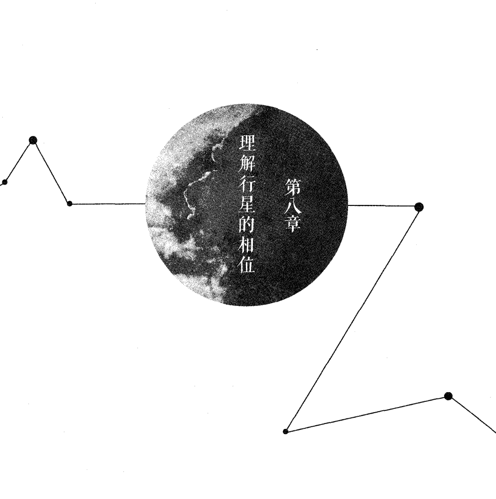

出生星图中的“相位”——行星之间或是行星与四轴之间的角度——在个人层面上描绘了各种各样的生命能量，以及它们之间的相互作用。这些相位就像是星图中各个能量中心（行星）之间的磁力线。出生星图非常精确地揭示了这个能量场，而相位就在这个360度的圆之内被测量。本书会关注所有常用的相位——所有是30度倍数的相位，我将它们视作切实可靠且有启发性的“主要相位”。相位的计算原理在很多其他的书籍中已有阐述①，本书就不再过多着墨于此了。这一章节旨在为正确理解星图中的相位提供指南。

## 相位可以分作以下两类：

- 强有力并且充满挑战的相位：包括90度四分相位，180度对分相位，150度梅花相位，除此之外，根据形成相位的两个行星和星座的性质和谐与否，合相0度和30度十二分相位²也属于这种相位。这些相位预示着某种特定的经验，包括内心的紧张感，某种明确的行为，或至少是其在所预示的领域有更多领悟。这些占星学著作中所谓的“不和谐”相位（有时候也被称作“困难”、“有害”的相位）的术语往往具有误导性，事实上人们可以通过发展出相对和谐的模式来表达这些能量，尽职尽责地付出努力，接受挑战，化解、释放紧张的能量。挑战相位中包含的能量（星图中有此相位者的相应生活领域）并未和谐地振动着。它们干扰了对方的表达，在这一领域制造了压力，就像是两股能量波的振幅不同，从而形成了不稳定或刺激性的能量场。但这种不稳定和刺激性能够敦促个人采取措施去化解紧张。例如，火星和水星的挑战相位会造成人际交流（水星）中的急躁（火星）、对于学习（水星）的强大驱动力（火星）、激烈地表达和坚持（火星）自我主张与理念（水星）、容易紧张敏感的神经系统、过于吹毛求疵的天性，等等。但是，如果能够克服并争取正确引导自己内在的紧张、易怒，就能获得强大的学习动力，并发展出需要敏锐智慧的卓越技能。这一对行星关系表达如下图：

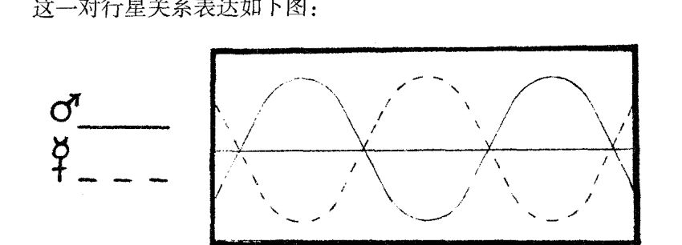

- 另一种是和谐流畅的相位：就像120度三分相位，60度六分相位，还有一部分合相或30度相位（这取决于形成相位的行星和所涉及的星座元素）。这些相位带来的是自发性的能力和天赋，个人能够相对容易地运用和发展的领悟力和表现力。这些能力就是个人天性中稳定可靠的因素，在任何时候都能信手拈来。虽然人们可能更加关注充满力量的挑战相位，但是和谐相位却预示了发展卓越天赋的潜在可能。与挑战相位相比，和谐相位描绘了一种存在的状态，一种稳定自发的基调，一种已经建立的、舒适的表现方式。但是挑战相位预示着一种对调整的需求，这种需求要靠自身努力和直接行动，并发展出新的自我表现方式来实现的。和谐相位中的两股力量（各自代表的生命领域）能够调和共振，在个人能量领域互为补充和增强，并以一种混合的能量表现出来。以水星和火星为例，它们之间的和谐相位能将这两股能量很好地融合，并产生更有力的心智能力，维护个人理念的能力，强大的神经系统，还有将个人理念付诸实际的能力。就好像水星用它的智慧来引领火星的自我表现一样，火星也激发着水星的领悟力和语言表达能力。这一对行星的能量表达正如下图所示：

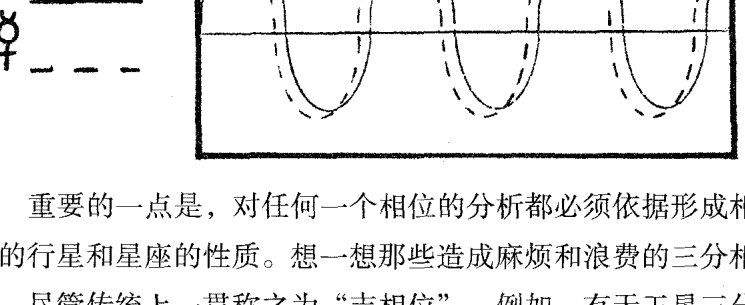

重要的一点是，对任何一个相位的分析都必须依据形成相位的行星和星座的性质。想一想那些造成麻烦和浪费的三分相位，尽管传统上一贯称之为“吉相位”。例如，有天王星三分相位的人，往往以自我为中心，难以合作，总是摆出一种“我什么都知道的样子，对自己感兴趣的事情就非常入迷，不感兴趣的事情就懒得理会。相反，挑战相位往往会带来强大的专注力、斗志和创造力，尽管这个相位也会带来冲突和难题（有时候是两方面兼具）。当我们开始意识到挑战相位虽然带来了痛苦，但也具有它与生俱来的价值时，我们就能准确、有效、深刻地体会到相位的意义了。

## 相位解析的基本原则

我最喜欢的相位解析法则是：行星落入的星座反映了表现欲和满足感的基本需要，而相位能揭示能量流动的实际状况，也就是实际上一个人需要付出多少努力来表达这一特定的驱动力或实现这个特定的需要。换言之，某个特定的相位并不能告诉我们一个人会经历些什么或是获得什么具体的成就；它却能告诉我们，在一个相对的意义上，需要付出多少努力才能获得预示的结果。这是一本值得学习和牢记的深度解析指南。想要准确、巧妙地解释相位意义，理解这些法则是绝对关键的一步。

## 主要的相位

对主要相位的解析指南③如下：

- 合相（0度）：星盘中任何行星的合相都需要受到重视，因为这象征着两股生命能量的紧密结合与交流。“个人行星”（太阳、月亮、金星、水星、火星）还有上升点形成的合相是最有力量的。这样的合相往往预示着一个强大的能量流动模式和个性表达方式（通过行星和星座）并且也在个人生活之中被着重强调（通过宫位）。合相的关键词是行动和自我投射。

- 十二分相（30度）：传统看法会认为这是一个次要相位，但是它有时候会比合相更值得注意，这取决于形成相位的两个行星和他们本身的其他相位。成十二分相位的两个行星会不断地产生能量的互动，彼此构筑。它没有四分相位那么有压力，甚至比150度梅花相位还温柔，但是在相位容许度很小的情况下会有持续的影响力。

- 六分相位（60度）：这个相位通常被视作“对新事物的开放性”，新的人、新的理念、新的态度象征着与新的人、新的理念建立起新连接的潜力，最终导向新的学习。这个相位展示了一个生活领域，一个人不仅能够在其中培养出新的认知水平，还有更自由、更客观的感受。它表达了一种无意识的自然天性，有时候也可能是某个特定的技能。

- 四分相位（90度）：形成四分相位的两个行星通常落在不和谐的两种元素里，因此，这个相位预示着一个人需要非常努力地去调和两股有分歧的能量。任何个人行星形成的紧密四分相位都代表着一个重要的生命挑战。一个四分相位显示了一个能量需要被释放的地方，它往往会通过某些特定类别的行为展现。其目的是构建一个全新的结构体系。许多占星家认为，四分相位就像土星，代表了你必须处理的事情。它还有另一点和土星很像，那就是恐惧，星图中四分相位所象征的领域往往是我们不愿面对的麻烦。对于挑战的惧怕限制了能量流动的畅通，不论麻烦是不是已经近在眼前。

- 三分相位（120度）：这个相位描述了能量轻松地流向已建立的表达渠道之中。我们无须新建架构或是做出调整就能富于创造力地运用此处的能量。它预示的领域通常有着与生俱来的和谐统一。（注意，形成三分相位的行星一般会落在同一类元素的星座，这是能量和谐的基础）。这样的相位常常显示出一种存在的方式，而不是做的方式；人们通常认为它所预示的能力与天赋是理所当然存在的，因而不需要面对挑战，不需要做出努力就能积极地运用这一能量。

### 梅花相位（150度）：

这个相位预示着在两颗星象征的生命领域之间存在着一种强大的能量流动方式，这些能量往往具有极大的强迫性或总是那么让人讨厌。一个人很难同时对这两股力量都保持警惕，所以需要有意识地努力专注于此才行。需要注意的是，通常形成150度相位的行星不仅落在不同元素的星座，而且还是不同形态的（例如双子座与摩羯座，风象变动星座与土象基本星座——他们之间有巨大差异，但也是潜在的深刻理解力和实用技术的结合）。要注意这两股力量，因为其中一个的表达方式往往依赖于另一个。因此，如果一个人不能意识到这两股能量，这两股力量就会互相影响而导致问题的产生，因为两股能量没有被很好地整合。有效处理好这个相位需要一个人有敏锐的辨识力，并微妙地调整这一领域的生活方式，而不能强行地解决。

### 对分相位（180度）：

尤其因为所涉及的行星落在和谐的元素，所以对分相象征在个人能量领域中有一定程度的过度刺激，并常常会让人感觉陷入两股完全对立的能量拉扯之中。在个人感情关系中，一个人能最为直接地感受到这一持续的挑战。这个相位往往预示着客观态度的明显缺乏，因为一个人会倾向于将其本性的对立面“投射”给他人，所以难以区分哪些属于自己，哪些属于他人。星图中的对分相位类似于向两个方向的拉扯，它们有时候是矛盾的。对分的星座在很多方面有类似性，事实上具有互补效应，但不可否认，它们在很多方面也完全对立。

## 容许度与行星间的互动关系

相位当然不仅仅是一个精确的角度。相位所涉及的行星和星座描述了一个人内在的能量互动。形成紧密相位的行星代表那些很少被表达或者被孤立的经验领域。它们总是会互相影响，不论它们形成的是哪种主要相位。在许多方面，两个或多个行星形成的相位类别在相位解析中居于次要位置，而重要的是两股特定能量在不断地互动。

比如说，只要太阳与天王星有相位，不论是四分相位、三分相位、梅花相位或十二分相位，它们所呈现的大部分特质都是类似的。正如前文所述，不同相位当然有显著区别；但是我更倾向于关注相位所涉及的行星能量的互动与融合。在同一个人身上，可能同时呈现一个特定行星组合的积极和消极的两种表达方式，不论这两星呈现何种相位。相位的精确度总是很重要，它关系到一个特定相位所显示的紧张程度。

事实上，多年的经验告诉我，大部分精准的相位都具有最强大的影响力，在星图解析中必须被给予最多的关注。建议初级与中级的占星学生在咨询或星图分析的初期，要认真考虑每一个星图中最紧密的一个或多个相位。许多占星书籍给学生们解释说相位所使用的最大容许度④为12度。我的经验总结是：一个人越了解有效运作的占星元素，他所使用的容许度越小。

我认为对大部分相位使用8度或9度的容许度是不可行的，因为这样的相位效力十分微弱！也就是说，这样的容许度不足以产生有力的能量互动。只有太阳、月亮、上升点的相位容许度可以超过7度，一般其他行星的相位都应该控制在6度以下。我强烈建议初学者，应该关注容许度在5度以下的相位。

对于出生星图中任何特定相位的评估不仅要考虑其所涉及行星的固有本质，还要考虑行星与其所落的星座是否“契合”——也就是说，行星落入此星座是否有利于它自由表达其本性。如果行星与其所落星座存在既定的冲突，即便是和谐的相位也会表现得不那么和谐。相反，如果行星落入了特别舒服且与之相容的星座，那么即使是挑战相位，也不会表现得像一个严厉的考验。

总而言之，星图中的每一个重要相位都是独一无二的，因此，它们会以一种复杂精妙的方式融入星图的结构之中（也融入个人的生活之中）。所以，必须学习相位解析的基础原则，做出精准的阐释，在实际分析个人星图时借助丰富的经验，来理解这些关键元素的意义。

## 行星间交互与协调作用的规律

需要谨记的是，三个外行星的相位是很重要的，如果它们并未与星图中的其他重要元素发生关联，那么在解析星图时不必作为主要线索来考虑。天王星、海王星和冥王星具有超越个人的意义，表明了世代集体心理的一些问题，因为它们在一个星座里停留得时间很久。还有一些常见的问题会让占星初学者们备受困扰，比如天王星与海王星呈四分相，稍有经验的占星师就会知道，这一相位会持续好几年，也就是说这几年出生的人在星图中都有此相位！这是又一个初学者需要注意的情况，既专注于核心内容，一开始就要学习如何分辨星图中的重要特征和数不清的次要特征。

然而，如果一个人的星图中有海王星与土星的合相位，然后双双与太阳成四分相位（也就是90度相位），整个格局——混合了太阳、土星和海王星的能量——就需要认真关注。

为了重点关注星图中主要、可靠的线索，我只解释绝对关键的，并肯定那是对每一个人都具有重要意义的相位——也就是只涉及五颗个人行星和木星、土星、上升点的相位。就像前文叙述的那样，其他相位在个人层面上的重要性要略次一等，除非它们与星图中重要的配置、结构和主题相关。

这一篇章对于相位的简要分析是基于其所涉及行星的本质。以正确的方式融合相位中各方的能量，会进一步发展出更多的体验。需要强调的是，亲自对话要比仅从书本中学习，或对素未谋面的人进行星图推测性“解读”更有利于深刻的理解。和本书其他章节一样，本章的关键词是为了帮助我们理解基础含义，鼓励独立思考，将这些原则应用于人们的实际状况中。这也就是为何在下面的行星互动（或能量的融合）解析中，我并未划分挑战或是和谐相位（也没有僵化地把相位分出“吉或凶”）的原因之一。理解任何一对行星共同运作方式的最重要一点就是不要否认和谐相位下的行星互动也存在负面的表现方式。同样，也不要否认许多人也让挑战相位下的行星表现出了积极的特质，这些特质在传统占星上被认为只会在和谐相位中。

我在下面的指南中多处提及我经常观察到的某一对行星在和谐及挑战互动中所呈现的差异，但我阐述的是自己感觉确实可靠的对比。我还总结了某个特定类别的或是一组特定相位的普遍含义。我认为这些内容在占星教学中非常有用。我还要感谢弗朗西斯·沙寇恩帮助我辨析了所有相位的类别。大概在20年前我与她有过一些交谈，现在我依然发现我在自己的许多笔记与著作中提到了她所说的内容，下文中的一些短语就引用了她的原话。我自己的观察、笔记与引自她以及其他占星师的理论完全交织在一起，所以我很难给这些从别人那里学到的理念一个详细的参考名单。

## 太阳的相位

太阳的相位在身体活力、自我表现的难易、激励我们创造力的因素、你所认同的事物、自我是否容易获得满足等问题上具有十分强大的影响力。任何与太阳合相的行星，象征了关于此人整个身份的内容都非常重要。大体上说，任何行星与太阳的和谐关系都能促进幸福感，反之，太阳的挑战相位则预示着某种阻碍幸福感的因素，需要被克服或调整。

### 太阳与月亮的互动：

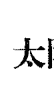

- 创造性能量与情感安全的需求交互作用；需要创造性地表达个人的舒适感和自信。
- 一个人的自我定位与生命活力、自我表现的需求如何融合在一起。

所有日月间的相位都十分重要，这个相位对于自我感觉，健康状况和自信心都有很大的影响力。和谐的相位表示你的情绪能帮助你呈现出最棒的自我，实现你最关注的目标和意图。挑战的相位预示着本能的情绪和自我感觉抑制了创造性自我的自由表达；特别是四分相位与对分相位，很难让人对自己感觉良好，核心性格中的内在紧张就好像是一个永久的心智特征。

### 太阳与水星的互动：（只会形成合相和30度相位）

- 充满活力、生动的、光芒四射的交流和沟通——有时候并没有自己的看法
- 需要与他人以创造性能量建立连接，此能量通常是具有创造性天分的天生的智力

### 太阳与金星的互动：（只会形成合相、30度、60度、45度相位）

- 享乐的需求与存在和创造的迫切需求结合在一起——通常涉及艺术
- 与他人有能量交换时会提高自我意识——通常表现得亲切可爱

### 太阳与火星的互动：

- 欲望激活了生命的创造力，而整体身份的力量会不断地加强欲望
- 身体的能量与自我本质的结合，产生了强大的活力和行动的需求

所有日火的相位都带来了丰富的生命活力，并且也揭示了在自我表现和证明自己的方式上，带有侵略性的迫切需求。满足自我意识的欲望巨大，有时会表现出自负和傲慢。可能成为领导阶层，也拥有成为先锋者和在新的领域创造成就的勇气和欲望。

### 太阳与木星的互动：

- 被认可的需求与超越自我的冲动结合在一起，需要演变为比自我更宏大的存在。
- 对自我意识的信念和信心会赢得上天眷顾。
- 所有的日木相位都显示出需要做一些“大事”、做一些能引起别人注意的事来满足自我意识的倾向。那些做舞台工作或大生意的人通常有这个相位。

### 太阳与土星的互动：

- 对存在与创造的渴望与稳定的需求相结合；保守的倾向通常会给自信和幸福感带来挑战。
- 有这个相位的人，性格的本质中总有寻求安全和保护的色彩，也会看起来比同龄人成熟，即使是在很年轻的时候也是如此。

日土的相位，即使是三分相位、六分相位也会带来困难的感觉。此人会强烈地感觉到自己的局限和不足，有时候甚至会夸大事实，过分自责或自我压抑。防御意识和自我贬低会阻碍创造能力（或是爱）的表达。有这个相位的人，最不切实际的地方就在于他对自己的理解，以及对自我表达的需求程度！唯一的解决方法就是随着时间的推移，在具体实践和承担责任的过程中认识到自我的实际价值。

### 太阳与天王星的互动：

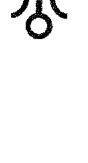

- 充满活力的内在自我与改变、刺激、实验性、叛逆的冲动结合在一起；个人的生命活力在这自由之中越发旺盛。
- 个人意识结合了独特的创造才华——通常会激发创意，也会带来反传统的行为。

有这个相位的人往往都带有反传统的特质，并且总是带有顽固的自我中心意识。虽然他们通常会让人觉得有趣，有活力，带给人鼓舞，但他们会觉得自己被误解或从来没被了解过。在某种意义上看，这一点是对的，因为这些人太不可预料了。他们通常会勇敢坚持自己与众不同的信念，从最好的角度来看，他们显示出某种混乱却又令人尊敬的真诚和坦率。他们讨厌乏味单调，就像卡尔·佩恩·托比所说的“无根的灵魂”，只是为了改变而改变，或是为了抛下许多人想要留住之物。

> 卡尔·佩恩·托比所说的“无根的灵魂”，只是为了改变而改变，或是为了抛下许多人想要留住之物。

### 太阳与海王星的互动：

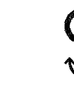

- 个性和基本意识与超越物质世界的想象、理念、精神追求相结合。
- 对精神领域经验的领悟会影响自我表现的模式，但也能带来自我认同意识的混乱。

有日海相位的人迫切需要他人真诚的回应，以找到真实、清晰的自我意识。他们总是高估或贬低了自我的价值和能力。

### 太阳与冥王星的互动：

- 强烈想要感受深层体验和彻底重生的冲动将会改变个人的人生观。
- 内在的自我会专注于转化和变革的个人意志力——不仅仅转变自身，也改造着外部世界。

拥有这个相位的人，通常有深刻的洞察力和严肃的个性，能体会到生命的黑暗与残酷。他们做事非常坚持和彻底，有时候会让旁人惊讶，因为之前完全看不出来。

### 太阳与上升点的互动：

- 这个相位带来的挑战是你准备对外界展现多少真实的自我，这将成为贯穿整个生命的中心议题。
- 创造性的冲动和自由表达自我的需求激励着行动力，并且发挥着他人无法忽视的影响力。

## 月亮的相位

月亮的相位预示着在什么范围内我们能够表现积极准确的自我形象、内在信心和安全感，还有我们表达内心深层情绪和创造性想象力的方式。直觉的反应是会给生命体验带来助益和支持，还是不恰当和混乱？所有支持或妨碍情绪安宁的因素，都能从月亮的相位中得到清楚的答案。一个人的整体反应方式以及生命的潮汐与流动都以月亮及其相位为征象。也许，和其他行星相比，月亮的挑战相位确实会带来很多麻烦。相比之下，和谐的相位就要积极、愉快、舒适得多。

这并不是说如果星图中月亮有挑战相位就难以调整，挑战相位只是预示着需要付出努力才能获得那些和谐相位与生俱来的客观性。月亮其实是一个人能客观面对自己的关键点。通常月亮有和谐相位，然后又落在不错的星座，这个人对自己往往能有公正准确的评价。当月亮的相位带来压力时，此人倾向于站在自己的角度看待所有事情，不能脱离自我。所以，在这样的情况下，一个人想要改变环境很不容易，此人在某些领域对自己的认识不太准确，具体领域由行星的落宫和星座所决定。

同样的，月亮如果与某行星合相，预示着在这个行星相关的领域内，此人会缺乏洞察力和客观性。这并不是说所有月亮的合相都是挑战相位，但是这些合相吸引来的任何事情都是潜意识的、自发的。有时候这也是一份美好的礼物，谁不想拥有月木合相或月金合相呢？

罗伯特·杰克伯曾经这样描述月亮的挑战相位：与太阳、水星、金星的挑战相位往往预示着此人总觉得不能表达自己的某些感觉。月亮与其他行星的挑战相位预示着在应对生活的要求时有力不从心之感。

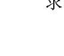

### 月亮与水星的互动：

- 情感与理智持续地相互作用，并强烈地激发其所持的观念。
- 理智的思考、情绪的舒适感以及主观特质，也许能融为一体，也许会互相抵触。

### 月亮与金星的互动：

- 天生的适应能力或是阻碍其接受或给予他人帮助的能力。对他人的感觉可能是敏感的，或是过于敏感的。
- 对于所有社交互动和感官享受会做出强烈回应。

### 月亮与火星的互动：

- 强烈的情绪反应与欲望、抱负结合在一起，创造出迫切行动的天性。
- 满足欲望的不安，依赖并强烈地影响着自我感觉的状况是否良好。

### 月亮与木星的互动：

- 更敏锐地感受与更大的秩序以及个体以外的存在的连接——非常能够包容他人的行为，但是对他人的想法却不能全然接纳
- 在潜意识中具有积极的扩张性和热烈的情感反应

这个相位虽然会带来“乐观”、快乐和高尚，但是可能会过度关注自我形象，难免虚荣，或者导致极端的自我意识。有时候，拥有这个相位的人会过分关注别人对自己的看法，而且可能在一些小事情上表现出情绪反应过度的状态。这个相位还会带来奢侈的习惯，穿着讲究，花钱大手大脚。

### 月亮与土星的互动：

- 内在驱动力与那些通过现实成就和承担责任来获取安全感的需求结合在一起。
- 安全感的需求通常会以自我约束的方式来让自己感觉良好，这样就压抑了情绪的表达。
- 自信心的缺乏和强烈的防御意识似乎是这个相位的标签。即使他们并没有受到责难，也会臆想自己受到责难，因而无法敞开心扉去接受别人给予自己的积极回应。童年时，特别是在挑战相位的案例中，总是充满了压抑、孤独或是其他难以承受的重负。

### 月亮与天王星的互动：

- 个人的反应总是充满了不可预见性和独创性。
- 无拘无束的自我表达需求促进或阻碍此人获得内在的支持、安全感和平静。

这个相位通常会呈现出不寻常的甚至是戏剧化的方式。这些人往往会有一种很折磨人的欲望去彻底地改头换面，完全脱离过去的环境和状态。这些人总有非常强大的渴望去彻底逃离过去的自我形象，他们很难在当下的状态获得快乐，总是挣扎在过去（月亮）与未来（天王星）之间。他们总是需要非常强烈的兴奋感才会觉得舒适，否则就会觉得坐立难安，当然，这对于身体和心智都是一种伤害。

### 月亮与海王星的互动：

- 情绪化的反应充满了从现实世界挣脱的冲动；他们总是衷心地为某个理想而奉献。
- 对自我的看法与对精神领域体验的领悟相结合，只有在专注于理想时才能获得安全感。

### 月亮与冥王星的互动：

- 极度深刻的回应；情绪的安全感与彻底的转变、自我的重生紧密结合。
- 接受将情感和意志力专注于重塑自我反应模式的需求，以及接受根除过去的情感和形象的需求，可以获得内心的满足。

对于这个相位的研究是非常有趣的，特别是那些挑战相位，留意这些人对于父母、子女的态度和情感模式。很多有月冥合相位或对分相位的人总有一种要做父母的冲动，但是等到他们为人父母时，他们又对此感到混乱，经常对亲子关系感到恐惧。有时候，他们甚至会拒绝成为父母，（不论男人还是女人）即使在婚姻幸福的情况下也会如此。他们有时会有一种强迫性的安全感需求，但是又深深害怕依赖和失去。通常，他们在早年的时候会从父母那里感受到拒绝（一般会来自母亲）。

### 月亮与上升点的互动：

- 🌙 敏锐的直觉影响其人生观，对环境的敏感强烈地影响着情绪
- ♀️ 在现实世界中的自我表达方式受情绪和安全感需求的影响，需要向外表现其潜意识倾向

## 水星的相位

水星的相位并不像一些占星师或占星书中所说的那样，影响着一个人的智商水平，这个相位更倾向于影响一个人表达和交流的能力。有许多非常聪明的人并没有特别强大的水星相位。水星的相位描绘出一个人意识头脑的协调方式和表达，以及交流思想的方式。水星还象征着一个人身体和心智的协调合作能力，众所周知，水星对应着神经系统。一项研究表明，专业的运动员大多有强大的水星相位（特别是合相），他们不一定有超群的智慧，但是身体与思维的协调能力绝对出类拔萃。

### 水星与金星的互动：

- ☿♀️ 与人分享和理解他人的能力加剧了其表达个人想法的冲动
- ☿♀️ 希望通过良好的交流和愉快的互动去感受自己与他人的紧密关系——努力寻求平衡、和谐的思考方式

### 水星与火星的互动：

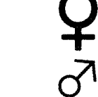

- 有意识的心智与身体的能量融合（可能有很好的手眼协调能力），这两方面的能力都会被激活——被激发的智力
- 果断行动的需求使其保持在学习过程和所有交流中的专注力

### 水星与木星的互动：

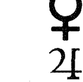

- 个人的交流和思考方式都被赋予了木星的拓展、乐观、广阔的色彩——一种充满好奇心的、广泛的聪明才智
- 需要探索更广泛的兴趣，与他人的交流将建立在信任、对未来的共同信念和哲学观念的共识之上

### 水星与土星的互动：

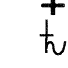

- 客观清晰的表达方式结合了克制、有条理、谨慎的方法，通常记忆力很好
- 对传统的理解和对秩序的务实认知稳定了头脑意识——持久稳固、小心谨慎的理智

### 水星与天王星的互动：

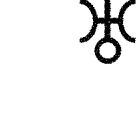

- 独立和创新精神融入语言表达能力和心智能力中——思维敏捷，通常有跳跃性，甚至容易走向极端
- 容易兴奋、善于发明创造的头脑会迸发出新鲜、另类的念头；对其他人迟钝的思维和公式化的教育没耐心

### 水星与海王星的互动：

- 心智会转向宇宙性的主题和富有想象力的探索
- 理想主义指引着个人去表达自我领悟和思考的需求——非常敏感和细腻的领悟力

### 水星与冥王星的互动：

- 在交流中有渴望洞察本质的冲动——强大的、高度集中的智力
- 需要通过强烈的、变革性的、深刻的体验来学习，即使这意味着突破禁忌

### 水星与上升点的互动：

- 聪明、灵巧、睿智这类的品质需要在生活的方方面面被展现出来
- 交流、建立联合、试图理解的特质将整合到自我表现的模式和整个人生观之中

## 金星的相位

金星的相位主要影响着有意识地与他人建立关系的能力，既包括一对一的关系，也涵盖广义上的社交关系，这个相位还描绘了我们能否从这些关系中获得情感的满足。另外，金星的相位还揭示了我们获得快乐的难易程度，我们是否能轻松地获得快乐的满足。金星还掌管着一切艺术领域，以及各种形式的品位与社交风度。一个人付出和接受情感的难易程度也清晰地显示在金星的相位中，和谐的金星相位预示着个人在付出和接受情感的过程中比较顺畅，具体方式从相位中的行星、星座、宫位可以知晓。

然而，必须谨记，四分相位、对分相位这类挑战相位并不意味着无法感受爱或是付出爱。这是对此类相位的一种误解。但是，挑战相位往往预示着一个人在面对感情关系时，会习惯性地封锁自己的表达能力，并且不愿意接受他人的爱。搞清楚这些阻碍和恐惧，就能改善这部分的能量流动，也能品尝到快乐和愉悦的果实。

### 金星与火星的互动：

- 通过身体强烈地表达情感，有时候会情欲亢奋
- 个人对于快乐与和谐的需求、欲望与行动力结合在一起——通常很有艺术气息，有结合力量与优雅的能力，特别是体育运动，比如运动员

金星与火星的相位，对爱情关系有着显著的影响力。和谐的相位对两方面能量的表达都有帮助，挑战相位也会带来丰沛的情感与强烈的激情，但也伴随着很多的麻烦。通常，在挑战相位的影响下，人们会表现得缺乏耐心，易怒，喜好常常变化。他们通常会用鲁莽、强势，不被他人认同的方式表达“爱”与“关心”！即使在金火之间没有主要相位，而只是对比金星与火星所落元素，也是有助于星图分析的。

### 金星与木星的互动：

- 会用开放、高尚、扩张的方式来表达情感，性格中会呈现显著的美感特质
- 感情关系会被赋予木星的色彩——爱冒险、专注自我完善；可能会过分沉浸于感官享受、挥霍金钱和感情表达上

### 金星与土星的互动：

- 安全和稳定的感觉有助于情感的表达——通过忠诚来稳定恋爱关系；如果释放恐惧就能表达非常深厚的爱
- 需要通过共同努力、承担责任、相互承诺来感受与他人的亲密关系；需要在得到保障的情况下才会表达感情，这种缺乏冒险精神的态度可能会导致非常沉闷的社交活动

### 金星与天王星的互动：

- 需要与他人分享个人主义观念、兴奋的事情、自由——触电般的情感；可能会感觉迟钝或是以自我为中心
- 需要独特的、变化的快乐来获得完全的满足——可能非常轻浮；在感情关系中容易感到厌倦，不喜欢被占有的感觉

当象征爱情的金星与代表以自我为中心、叛逆和独立的天王星搅和在一起时，问题就出现了。在《生命的轨迹》一书第154页详细描述了这个相位会带来的混乱和挑战。

### 金星与海王星的互动：
-   渴望获得理想的爱情；活在充满浪漫、有艺术气息或精神狂喜的梦中；模糊不清的恐惧和逃避现实的态度会阻碍现实的感情关系
-   需要通过情感的表达去体验人生的完整性，渴望彻底全面地与整体结合——让爱情变得纯净和敏感

### 金星与冥王星的互动：
-   渴望表达个人最强烈的感情，同时也会经历彻底的转变，并挑战社会禁忌
-   在感情和品位方面，都被冥王星穿透本质的驱动力所影响——强烈的、极端的情感

### 金星与上升点的互动：
-   个人的社会交往和感情生活将影响其整个人生态度
-   艺术鉴赏力和高雅的品位被整合到自我表现的模式中

## 火星的相位

任何火星的相位都代表着力量、身体和性的能量、果断坚决的行动力、领导能力，在全新的领域里勇敢尝试的勇气，以及在生活的某方面主动进取。受火星影响的领域往往会缺乏耐心，在其对应的现实领域中，通常需要耐心来帮助火星那富于创造力的冲动行为来获得最大的成效。

### 火星与木星的互动：
-   在身体、性欲或者开创性的刺激体验方面有扩展的需求，有冒险和获得成就的驱动力
-   有强烈的愿望，并能积极主动地投入到自我完善和广泛促进他人进步的鼓舞性目标中（通常会在自己所从事的领域居于领导地位）

### 火星与土星的互动：
-   捍卫和出于本能地表达自己受到纪律和规则的约束；耐心会有助于达成个人目标
-   将身体的、性欲的、领导的能力专注于实现自己所需达成的目标和明确的成就

### 火星与天王星的互动：
-   缺乏耐心地坚持自己，并且带有独创性和独立性——通常很叛逆；被一种自由的感觉所激励
-   强烈需要不受限制地感受身体和性欲的刺激；在生活的各方面都渴望新鲜刺激的行为

### 火星与海王星的互动：
-   有能力将理念和梦想付诸行动，拥有实现远大理想的能力；能在崇高理想的激励下成就一番事业
-   渴望超越物质世界和身体的欲望，加上持续鲜活的幻想和不寻常的天赋，可能会展现出“超自然力量”

### 火星与冥王星的互动：
-   渴望通过果断（甚至冷酷）的行动改变境遇，扫清障碍
-   在面对彻底的转化、变革和运用集权时会有意识地展现强大的意志力；渴望看透任何体验的本质

### 火星与上升点的互动：
-   坚持己见，积极开拓，迫切地需要强有力的自我表达
-   身体的、性欲的、领导的能力将成为自我表现模式的一部分

## 木星的相位

任何与木星有关的相位都将经受考验，因为木星扩展了它所接触的任何东西。木星预示着你试图改善的部分，能量在这一部分被发展至顶点，往往会达到很高的层次。但如果不经常注意节制，那么木星的扩展性和无处不在的乐观就会导致其在相位、星座和宫位对应的领域里过度扩张。在最好的情况下，木星大方、积极的态度和广阔的哲学观念会使人表现出高贵的气度，也有助于一个人在那些被木星的上升能量支持的生命领域里获得成就。

一般而言，木星与五颗个人行星还有上升点（或中天）的相位最为重要。然而，如果木星与其他行星形成相位，但木星是上升星座、太阳星座、月亮星座的守护星（或共同守护星）或是与星图中其他重要主题密切相关，那么这些相位都非常重要。因此，如果这三个重要元素落在射手座（或双鱼座，木星和海王星共同守护双鱼座），那么木星所有的相位都具有显著的意义。

### 木星与土星的互动：
-   如果木星或土星在星图中被强调，这个相位会尤其重要
-   对于更大秩序的强烈需求会被拉回现实层面，变得稳定——扩大野心
-   个人发展的迫切要求与保持现有安全感的需要会不断相互拉扯

不论在星图中的哪一颗星更强大，这个相位都会产生很大的影响力。土木间的挑战相位有时候会带来不小的麻烦，个人实现抱负和长期目标的能力会被复杂化。但是，合相位却能带来显著的和谐力量，并以一种集中的方式激励着强大的个人抱负。其他的挑战相位会让人感到总是没有足够的工作、金钱、机会，这个人往往会让自己承担过多的义务，直到有一天发现自己有太多的事要应对。不论是过多还是过少的感觉，都让人挫败。这些人极其需要学习如何满足于拥有此刻近在手边的事物。

### 木星与天王星的互动：
-   如果木星或天王星在星图中被强调，那么这个相位将会尤其重要
-   信念和对于未来的伟大构想会以一种个人主义和反传统的方式被刺激和表达
-   渴望去改变、尝试和追求刺激的性格特征将被扩大，并渗透到生活中

### 木星与海王星的互动：
-   如果木星或海王星在星图中被强调，这个相位将会尤其重要
-   想要体验与比自身、个人琐事更大的事物合一的深入需求
-   相信无形世界的真实性，有时候会导致过于活跃的想象力，总是有逃离的渴望，或是渴望获得意义深远的启示

### 木星与冥王星：
-   如果木星或冥王星在星图中被强调，这个相位将会尤其重要
-   渴望体验全面重生的需求激励着个人在更广阔的宇宙秩序中寻找信念
-   通过转化性的途径和追求的力量寻求自我完善

### 木星与上升点的互动：
-   向外界展现开朗自信、心胸广阔的个性
-   忠诚和乐观的性格将整合到人生观和个人表现方式中

## 土星的相位

土星的相位显示了生命能量被集中的领域，和需要被格外严肃对待之处。土星的相位揭示了人们应对极限的难易程度：是通过可接受的限制和适当渠道去运用权力和权威，还是感到自由的自我表达受到了限制？如果一个人受到了许多不必要的限制，那么他可能必须重新调整其自律的方式。

一般而言，土星与五颗个人行星还有上升点与中天的相位，对每个人来说都很重要。土星与其他行星的相位，在土星是上升星座、日月星座的守护星或以某种方式与星图中其他主题紧密联系时，也有很大的影响力。因此，如果星图中这三个重要元素落在摩羯座（或水瓶座，土星和天王星会共同守护此星座），那么所有土星的相位都是重要的征象。

-   土星与天王星的互动：
    -   如果土星或天王星掌管的星座在星图中被强调，那么此相位力量尤为强大
    -   需要有创造性的自我表达，将个人独特的新鲜理念投入到务实的形式之中
    -   寻求刺激、变化与渴望社会认同的需要结合——被要求按照传统规范约束行为（有时候，在所预示的领域中，责任和规范需要重新评估）
    -   这两股力量的混合将全面影响一个人的态度。最好的状况是，改革理念的实践与新方法的实践以创造性的方式结合。如果整合状况不佳，那么从旧的方式转变到新的方式的过程将会充满阻碍，追求自由和刺激却不愿放下过去

### 土星与海王星的互动：
-   如果土星或海王星掌管的星座在星图中被强调，此相位力量尤为强大
-   规范约束着个人精神的渴求与理想；现实世界与理想世界持续的相互拉扯会造成混乱、缺乏组织性，或缺乏对微妙现实的实际掌控
-   渴望超越过于僵化的现实世界和缺乏灵感的限制因素；为个人抱负和担当注入理想的能量

### 土星与冥王星的互动：
-   如果土星或冥王星掌管的星座在星图中被强调，那么此相位力量尤为强大
-   对于彻底转化和重生的渴望，会带来更深层的内在安全感；希望努力摆脱过去的牵绊
-   对于了解自己应该真正优先考虑的事情、欲望和深层动机，有着强迫性的需求——通常有着非常强烈的抱负

### 土星与上升点的互动：
-   需要向外界表现个人的责任感和雄心壮志，整体人生观都具有严肃务实的色彩
-   自我表达的模式是遵守纪律和规范，十分可靠

## 上升点的相位

所有上升点与行星所形成的相位都非常重要，对于生活有着全面整体的影响力。但是上升点的确定要求有非常精确的出生时间，过4分钟就会相差一度（所有宫头也都会改变）。因此，如果出生时间有半个小时的误差，那么看似与上升点形成紧密的相位可能就会有7度以上的误差。

如果有行星与上升点形成了紧密的相位，那么这个行星的性质将会彻底影响上升星座的能量表达，所以这一点也可以用来验证出生时间的准确性。例如，如果某时刻的出生星图有某行星紧密合相的上升点，但行星的能量并未明显体现在此人个性之中，那么很有可能出生时间（在计算星图时，或是标准时间，或是夏令时，或是时区选择）就会出现错误。

### 天王星与上升点的互动：
-   需要展现自我的独立性和独特性，出乎意料和突破陈规是人生观中与生俱来的一部分
-   在自我表现的方式中充满了创意和个人主义，并渴望新鲜刺激的事情

### 海王星与上升点的互动：
-   需要向外界展现个人的同情心、想象力、灵性，这些特质会影响其整个人生观；身体对于外界的影响十分敏感
-   个人表现模式中整合了幻想、梦想和灵感的元素。

### 冥王星与上升点的互动：
-   强烈、注重隐私、敏锐的洞察力是其生活态度的关键词
-   自我表现的方式中充满了变革性和强迫性的力量——有着非常强大的意志力，可能带来或好或坏的结果

## 外行星的相位

我在本章前文中已经详述了外行星所有的重要相位，在这本指南性质的书中简要总结一下这些相位的意义是比较合适的，《生命的轨迹》一书的第六章和第四章更细致地探讨了外行星相位的重要意义，包括外行星与个人行星的相位，推荐给读者参阅。

### 天王星的相位

天王星总是令人振奋并能加速事情的发展。它会带来一阵痉挛感、突发事件，并容易导致迅速改变的发生。在人生的各个方面，它都会激起兴奋感、突破规则和传统。它所触及的领域会在一定程度上变得不稳定，同时伴有对兴奋的渴望。

### 海王星的相位

海王星所触及的领域会让人变得敏感，得到升华。它可能是理想化和精神化的，或仅仅只是受到欺骗。在人生的各个方面，海王星都施展出魔法、想象力或灵感启发，不论此人是否能够脚踏实地，并在现实世界中有效、健康地利用这些能量。

### 起因与效力

本图于1943年7月首刊，摘录自《占星学：预测的科学》，作者西德尼·K.贝内特，温恩出版公司，洛杉矶，1945年

### 冥王星的相位

冥王星强化、激发它所及之处的意志力。它的特质是深刻与彻底的，它渴望消除所有陈旧、无益的模式、习惯和活动。它有通过意志与心智的力量重塑自我的能力，在其最佳状态下，会表现出卓越的自律性，有能力进行内在和外在的革命。如果冥王星状态糟糕，它会变得残忍，把强权当作真理，在其所触及的领域中表现出强迫性。

-   参见本书作者《生命的轨迹》一书的第六章，这一章节同样还详细阐述了许多特定的相位。
-   我并不推荐初学者使用45度和135度相位，尽管这是占星师们常用的相位，我个人并没有发现它们特别有用。这些相位有一半会涉及和谐的元素，所以可以被认为是适度和谐或流畅的相位。而另一半涉及不和谐的元素，所以被认为在一定程度上会对主体构成有力的挑战。
-   参见《生命的轨迹》一书第141页，详述了该相位的能量表达。
-   我将所有30度倍数的相位都视作主要相位。虽然大部分占星教材中认为十二分相位30度和梅花相位150度是次要相位，但是对某些人而言，十二分相位和梅花相位会比三分相位更为明显、活跃。
-   容许度在占星学中惯指一个相位在多少度之内仍被视作有实际的影响力。
-   即使是土星或木星这两颗星体与外星体形成的相位，如果没有与星图中的主要因素相关，也不具备重要性。但如果土星或木星所掌管的星座在星图中被强调，那么土星和木星的所有相位都是重要线索。
-   我认为古典占星中星体被太阳灼伤的说法（也就是与太阳合相是被太阳所破坏）完全无效，在实际例证中，很多日水合相的人都十分聪明。
-   参见《生命的轨迹》一书第98页详细探讨了土星与个人星体的相位，以及本章中前文里的各相位指南。
-   理解上升点的相位可参见本书第六章。

> 占星学源自对伟大宇宙整体的遥远感知。

——歌德

# 第九章 综合分析星图的方法

现实地讲，仅仅靠分析的技巧无法完成能量整合，“星图综合解读”从根本上是无法被教授的，因为直接地理解星图的整体性和意义只能凭借经验——在一定程度上是内在的直觉力。尽管如此，还是有一些指引对于初学者或中阶的学生非常有帮助，这些却很少有著作提及。掌握这些关键技巧能帮助学生缩短在困顿中摸索的时间，减少紧张、挫败和混淆。

也许，比起十年或五十年前，现在我们更需要认识到并强调星图整体视角的重要性。这个态度的基本思想就是将星图中的所有元素视作生命整体的一部分。如今被普遍应用的电脑不仅能帮我们计算星图，还假想出了一些“解释”，让许多人误以为这些支离破碎的片段就是“星图解析”。但是电脑无法做到真正准确地以整体视角综合分析星图。当然，要以整体视角看待星图，我们需要一些方法将各个元素的解析综合起来。整体优于局部，尽管占星学生总是从细节处开始着手分析，但最终必须积累经验，在实践中将分析变为直接的知识，这种知识通过与个人生活中具体事实的互动而被阐明，并被融入综合的整体之中。

有能力达到这一水平是难能可贵的，需要做相当多的工作，但的确有一些人会更快获得这样的“跃升”能力。能够成功地以整体视角解析星图是一门艺术，虽然有许多人学习占星学基础，但很少有人研习这门艺术。我无法简单地在这本书中教授星图的综合解析。星图整合的真正目标不仅仅是理解星图，更要去理解这个人，理解这个人的人生主题。整合的首要模式就是学习认识一份出生星图的重要主题，该主题正是反映了此人的人生主题。我们在下文中会讨论如何理解这些主题。

正如前文所说，真正的星图综合解析并不单是通过书籍就能学习掌握的，很少有书籍引导读者以一种整体、灵活、不断变化的方式去分析星图①。首先要提到的是戴恩·鲁德伊尔，他是提倡以现代的方式整体分析出生星图的先驱者。还有查尔斯·卡特所著的《占星学基础》这本书非常精妙地将星座和其他元素结合起来分析，有助于星图的整合。特蕾西·马克思所著的《星图解析的艺术》是少数旨在帮助读者一步一步整合星图中的重要元素，来加以分辨主次因素的占星著作。

同样，在我的其他著作中也涉及了许多星图整合分析的内容。正如一位记者诚恳地写信告诉我的，我在著作中的描述“弥漫着一种综合解读的感觉，仿佛每一股能量都以某种方式与其他能量互动。”特别是《生命四元素》一书就讲述了许多重要的内容，比如，评估四元素的平衡就是星图整合的一项关键信息。另外，我在《木星和土星大会上的讲座：现代占星学的新洞见》第七章中专门阐述了星图的整合问题，我的其他著作中也有类似的章节。在《占星学实践和职业》一书第五章中分享了一些重要的星图整合原则。在我的著作²中还涉及了一些咨询的议题，探讨如何在实际操作中有效运用占星学。有许多内容直接指向了星图的整合问题。

本书的结构和顺序反映出我对于星图中各因素重要性的见解，以及各个因素在精准分析中可以应用的程度和可靠程度。例如，本书开篇谈到的元素比重问题，同样也是星图分析中的第一步。本书接下来阐述的是行星星座落点的要义，这同样是解析任何星图十分重要的第二步。星座以自己的特质强烈地影响着所落的行星，星座无疑赋予行星一个主要的基调，这事实上往往是所落行星的主导基调。但是，下文的分析中也将谈到，还有其他的因素影响着行星的表达。

## 影响行星运行法则的因素

每一个行星都代表了一个特定层面的经历，这一特定层面的经历会被各种不同的因素赋予不同的色彩。换句话说，在你人生每一个层面的经历（由各个行星预示）是如何被渲染的？当我们开始审视影响各个行星的所有因素时，我们需要考虑许多问题，事实上，你需要运用大量的心灵能量去迅速地感受这一切。头脑的分析无法一次同时处理如此多样、多变的特质，其中每一个特质都有不同程度的影响。下列元素都会对行星产生影响，因此带来特定层面的体验：

-   1. 行星所落星座。这是基本的能量振动，以及行星与特定星图的调和，它象征着最突出的行星表达模式。其他因素都调节着这个基本波动。
-   2. 行星的次要基调：就是研究行星所落星座的守护星，此守护星曾常用于古典占星之中。例如月亮在处女座，水星就是定位星，水星在射手座，那么月亮就有了射手座的风格。
-   3. 行星的紧密相位：所有30度倍数的主要相位都会显著影响行星能量的表现方式。
-   4. 行星所落的宫位：例如金星落三宫，这与金星与水星形成相位时的情况类似，金星的能量会染上水星的风格。

当然还有其他各种次要的因素，但是我们没有必要使本来就复杂的星图更加复杂化。最终，你会发现每个行星都与其他的元素有着千丝万缕的联系！从深层次的整合角度来看，这的确是正确的。但是在实际的星图综合分析中，为了更好地理解一个人的特征、能力和问题，我们必须把注意力集中在有限的因素和指导方针里。我们需要聚焦在重点、可靠的因素上，尤其是那些重复出现的征象。

请看下面的星图，我们将焦点仅锁定于一个特定行星之上。月亮落在射手座，此人对于各种事情和局面的反应都带有射手座的色彩。月亮描述的是反应——你如何本能、自发地对事情做出反应？不论月亮是否受到其他因素的影响，射手座的特质都会出现在他对于人生需求的反应中：直率、暴躁的防御性、心胸宽广、热情、包容，需要将生命中微小的事件融入更大的议题中、好为人师、宣扬布道，等等。因此，月亮所落的星座是月亮的主要基调。现在，让我们简要思考一下前面描述的其他因素。

月亮的次要基调是处女座木星，它是射手座的守护星。所以此人是分析型的射手座月亮。木星在处女座预示着分析并试图搞清楚月亮的这部分自我为何有如此不切实际的乐观态度，处女座总是能在鸡蛋里挑出很多骨头！毕竟处女座是与射手座成四分相位的星座。当这两个星座的能量被强调时，就创造了这样一个非常理智的人。所以，这里的射手座月亮被染上了处女座的色彩。

月亮最首要的相位是它和太阳双鱼座形成的四分相位。更为强势、相对缺乏敏感度的射手座月亮被赋予了双鱼座的敏感色彩，同时，月亮的热情、乐观也不断地影响着双鱼座太阳谨慎、内向的表达。水瓶座的火星和月亮有紧密的六分相位，射手座月亮被赋予了实验性和冒险性的色彩，更渴望旅行，渴望改变，渴望刺激。天王星与月亮的紧密相位更加强了这一导向性，同样预示着此人身处变化、旅行、学习、刺激和各种形式的变化中都会感到舒服。（记住，星座在随时变动，所以两者都渴望多样性，对于改变都有着非常灵活的适应性。）

上述各种因素影响着月亮，它们非常明确地传达了各自强烈的信息。但是来到月亮所落的宫位，事情似乎变得更加复杂了。月亮落在第二宫，这里是月亮的舒适落点（传统上认为月亮耀升在金牛座，而金牛座与第二宫关联。）但是，有此二宫稳定色彩的人对改变的接纳态度十分勉强，沉溺在循规蹈矩的享受中，和其他那些因素正好相反。占星师与客户讨论了许多这个人实际生活中的问题以及他的各种复杂品质。（我必须说明的是，此人从事教师工作，包括在外地开设工作坊和研讨会。他曾经长期在国外工作坊中授课，简直就是射手座月亮在第二宫的绝佳象征！）

人是如此复杂的存在，如果你开始着手“星图综合解读”或“星图解析”，那么该在哪里画下句点呢？每一个行星都与其他因素交织在一起，而且往往会以一种复杂多样的色调共同呈现出来，为此，占星学生尤其是初学者，常常会感到非常困惑和气馁。这就是为何星图必须与个人生活的特定议题、难题、决定和问题关联起来。你需要将焦点放在此人最重要的事情上，才不会迷失在永无止境的可能性中。如果想对星图进行“全面解读”，那你将永无休止；这绝对是一件不可能完成的任务。我们该如何总结如此复杂、无限并且时刻变化的神奇存在——人类呢？

## 理解出生星图中的主题

在考察了星图中各种影响个人行星的因素之后，你或许注意到有些因素正不断地重复着。你可以先观察这些无处不在的影响因素，再寻找星图的主题。进一步有效理解星图主题的方式就是用“占星字母表12条”来组合这些主要因素，他们的各种组合会凸显出那些经常重复出现的重要主题。

- 占星字母表基本所述如下：
1. 字母1：白羊座、火星、第一宫
2. 字母2：金牛座、金星、第二宫
3. 字母3：双子座、水星、第三宫
4. 字母4：巨蟹座、月亮、第四宫
5. 字母5：狮子座、太阳、第五宫
6. 字母6：处女座、水星、第六宫
7. 字母7：天秤座、金星、第七宫
8. 字母8：天蝎座、冥王星、第八宫
9. 字母9：射手座、木星、第九宫
10. 字母10：摩羯座、土星、第十宫
11. 字母11：水瓶座、天王星、第十一宫
12. 字母12：双鱼座、海王星、第十二宫

例如，一个人的星图中不仅有火星在天蝎座（字母1与字母8的互换，因此火星的表达沾染了冥王星的特质），还有火星与冥王星的相位（字母1与字母8的又一次能量交换），这是同一组能量的双重强调；因此，火星的能量被赋予了强有力的冥王星的特质。如果火星还落在八宫，或者是冥王星落在一宫，这个主题将会得到进一步的凸显。

还有另一个阐述这种综合分析方式的例子，对初级和中级学生尤其有帮助。假设一个人的水星在摩羯座，他意识心智的基调一定会与其他有此配置的人拥有基本共同点。但是，假设此人还有土星与水星的紧密相位，这就是在告诉我们同一主题会被强调两次：占星字母3与10（或者是6与10，如果此人的水星在处女座，则这一面向的能量更强）。这种双重强调预示着此人有卓越的细节处理能力，严肃、务实的思考模式，容易神经紧张，而且能努力切实地发展自己的理念。如果此人的出生星图中还有其他因素能重复强调这一主题（比如水星在10宫，或土星在3宫或6宫），这一主题在人生中的主导地位将会更加凸显；占星师可以由此找到在咨询中重点讨论的内容。

令占星学生感到困难的另一星图综合解析的领域就是，该如何在众多行星和相位中找到切入点。归根到底，只有具有多年经验且经过多次实践才能使学生跨越这一似乎难以逾越的障碍，因为他必须提高从整体格局去看星图的能力，以及把所有行星的意义融入各种复杂组合中的能力。但是，许多教材都充斥着各种抽象的格局理论（大三角、T三角、大十字、风筝，等等），让解析的整个过程变得比真实情况还困难得多。往往容易被忽视的事实是，所有这些因素和细节都象征着一个整体，也就是一个活生生的人的方方面面。在整体格局中，有两个问题需要谨记，这是比所涉及格局的确切类型更为重要的因素：

1. 我们必须首先理解格局中行星的意义以及他们与其他行星的能量交换，而不是专注于聚焦特定格局（大三角、上帝的手指、风筝等）。接下来，再将这些意义组合起来，以某种方式准确地反映个人对这些能量的真实体验。任何传统的格局都能释放出创造性的能量，收获丰硕的果实，不管你是否相信这一点，因为所有格局都代表所涉及行星的能量和特质之间独有的、被加强的互动。其次，还需要将所涉及的星座能量融入格局中。

2. 最重要的是，我们必须把焦点放在格局中的个人行星（或上升点）上，因为这是整个格局最直接的能量表达模式；它揭示出一个人通常能部分地意识到的领域，所以，对此人的日常体验会有特别且直接的影响。此人将会认同这个人的行星的意义，因此更能理解和改善这一能量的表达。

最后，我要为本书做个简要总结，列出一个解析星图的系统纲要，初学者可以遵循这一顺序去理解任何一个星图。尽管从下面有序的指南中无法完成“星图综合解读”，但它可以帮助占星初学者们找到一个切入点和一个理智的、循序渐进的解析步骤。因此，我列出了以下提纲，我在很多占星学入门课上也会用到这一提纲。

运用这一整合方式的确有其弊端，在实践中，我们一旦吸收了很多占星学知识，就会自然地看到那个人的生活和星图的重要主题，回答他可能提出的问题，重点关注某些元素而对其他元素稍作强调，但这需要经验。正如我前文所说，人们需要从某一点开始，按照下文纲要顺序追踪星图的主题，对任一星图的整体天性和整合的可能性保持开放。

本书并未涵盖所有占星学的传统元素。纲要中有少量本书并未涉及的星图元素和术语，但是读者很容易在其他占星教材中找到解释。我推荐圣尼古拉·德沃雷所著的《占星学百科全书》，这是一本博大精深的著作，所有占星学术语你都可以在这本书里找到解释。

## 星图解析纲要

### 一、将星图视作整体
1. 行星落点所显示的优势与劣势
   a. 星座落点
      所属元素（火象星座、土象星座、风象星座、水象星座）
      所属形态（基本星座、固定星座、变动星座）
   b. 宫位落点
      角宫、继宫和果宫
      火象星座、土象星座、风象星座、水象宫位
2. 注意星图的整体模式；运用你的直觉去发掘星图的能量模式。观察星群格局，它着重强调了独特的星座和宫位

### 二、星图架构的主要组成部分
1. 运用占星字母表，找出星图中的重要主题。探索具有主导性的基调
2. 主导性的相位模式和主要格局（大三角、T三角、所有星群格局，在两个星座间有多个行星形成相位，等等）

### 三、发光体（即日月）
1. 日月星座所属元素的兼容性

### 二、太阳
- a. 星座
- b. 宫位
- c. 最紧密的相位（可能不止一个）

### 三、月亮
- a. 星座
- b. 宫位
- c. 最紧密的相位（可能不止一个）

### 四、轴点（必须有准确的出生时间才能运用这些因素）
1. 注意一切与上升点或中天合相的行星；这些行星一定是非常强有力的，其能量很强烈

### 二、上升点
- a. 上升星座与太阳星座所属元素的兼容性
- b. 最紧密的相位（可能不止一个）
- c. 上升点守护星所落的星座和宫位，以及紧密相位

### 三、中天
- a. 中天所落星座
- b. 最紧密的相位（可能不止一个）
- c. 中天守护星所落的星座和宫位，以及紧密相位

- 2. 行星的宫位落点是弱还是强（比如，行星落入自己守护的宫位，占星字母表中行星和宫位从属于一个数字，往往尤其强势）

- 3. 注意太阳星座的守护星，它的宫位、星座和相位

### 六、星图架构的关键部分
- 1. 查看涉及个人行星最紧密的四分相位和对分相位，这预示着此人最首要的人生挑战，他需要为此付出努力，但也能在这一领域获得新的启发

- 2. 查看所有个人行星的合相位，以及个人行星的其他紧密相位，还有所涉及的星座和宫位

- 3. 任何落在一宫的行星都非常强势：越靠近上升点的行星越有力（包括落在十二宫一侧靠近上升点的行星）

- 4. 土星所落宫位始终很重要

鉴于时效和地域关系，此处省略了一项有关星盘绘制的服务。

> > ① 当然，有一些书籍在星图分析方法上颇有建树。我鼓励所有占星学生广泛阅读，去验证每本书中所阐述的方法是否精准。

> > ② 关于占星咨询，该如何解析星图，占星心理学等问题，参见下列具体材料：《生命四元素》第七章；《生命的轨迹》第十二章；《关系与生命的周期》第五章；《木星和土星大会讲座：现代占星学的新洞见》第四章的部分内容；《占星学实践和职业》的许多内容。

> > ③ 我认为心理学博士西坡拉·多宾斯是第一位普及12个占星字母表的人，我觉得这种整合对于简化星图解析非常有用，尤其是在我教授的星图综合解析课上。