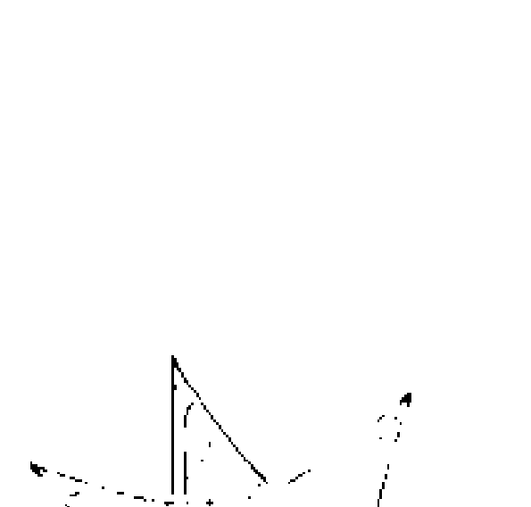
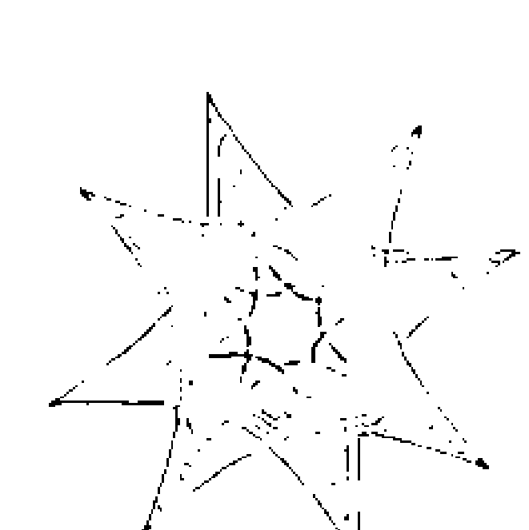
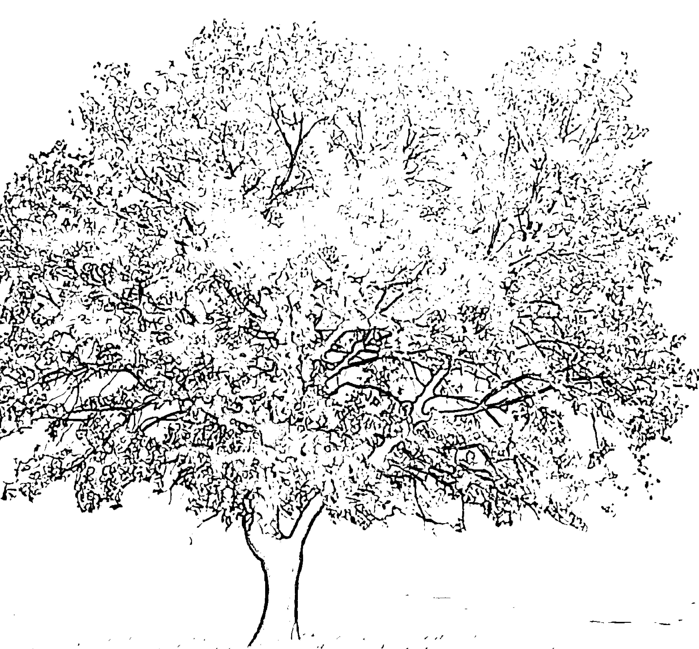

二〇一八年
慈善機構
證書
（竖排文字）

## 你的生活是否已经成了「忙碌」的代名词？

在忙碌与疲惫共存的现代生活中，冥想是一种最好的、必然的放松与解压的方式。一个人冥想时，会暂时远离现实世界的繁嚣，摆脱沉重的心理负担，找回心灵深处的平静和集中。

> 李素文

[图片：二十一世紀 誰能掌握身心力量的運用 誰就是贏家]

## St. Royal College 天使神秘学院

-   ※ 专业占卜预测机构
-   ※ 神秘学培训机构
-   ※ 水晶能量研究中心
-   ※ 神秘学资料库
-   ※ 官方微信：strcdts
-   ※ 微信公众平台：strc2011
-   ※ 读书交流QQ群：
    -   占星塔罗占卜师交流群：814594478 (加入密码：PDF)
    -   神秘学其他综合群：659338717 (加入密码：PDF)

[图片：天使神秘学院 院长QQ：715104687]

## 制作说明：

本书由《天使神秘学院》出重金从台湾购入的原版书籍扫描制作完成。为达到最好阅读效果，特地把原版书全部切开后，再经由专业扫描设备高精度扫描完成，并经过一张张的PS后期处理最终成书，其间花费大量的人力、物力以及时间，只为能给大家提供经济并优质的神秘学学习资料而努力。

本学院强力谴责某些机构和个人，把本学院花心血制作完成的电子书籍，包装后直接放在自家淘宝网上低价倾销的行为，以谋取不劳而获的经济利益。如果长此以往最终将无人愿意再为大家花心思制作电子书，那以后可能大家再无新书可读。

为让大家以后能够读到更多的好书，也为了本学院的良性发展。本学院恳请大家尽量做到如下几点：

-   一、尽量在本学院的网站购买电子书籍。
-   二、请勿用技术手段把电子书内的水印及加密去掉。
-   三、在收到电子书后小范围传阅即可，千万不要公开传播，更别挂到淘宝网上低价销售。

同时为答谢广大支持者，学院电子书将做如下调整：

-   一、学院会把一些早已收回制作成本的电子书折价销售。
-   二、最新制作的电子书籍会开放打印功能，大家购买后有条件的可自行打印成书。

天使神秘学院
2019年1月

## 前言 PREFACE

如果你正在被亚健康的身体困扰；
如果你感到自己疲惫的身心不够应付工作、生活中的重重挑战；
如果你感到每天的工作压得自己透不过气来；
如果你已经在日复一日的生活中找不到幸福的感觉；
如果你觉得自己总是被一种莫名其妙的忧郁侵袭；
如果你觉得自己与他人的人际关系太过紧张；
如果你想在灯红酒绿的闹市中找到自己的心灵栖息地；
如果你渴望心想事成；
如果你想要和更高层次的灵魂进行交流；
那么，你不妨去冥想。

说起冥想，可能很多人会觉得陌生和神秘。冥想原本是宗教活动中的一种修心行为，如禅修、瑜伽、气功等，但现今已广泛地被运用在许多心灵活动的课程中。现代人练习的冥想，可以说是一种超越信仰的心灵养生术。

冥想的效果已经被现代科学所证明。美国俄勒冈大学尤金分校教授唐逸远选取了40名大学生为研究对象，把这些学生分为两组，第1组每天坚持冥想20分钟，连续做5天；第2组每天只做放松训练。结果显示，第一组学生在注意力和整体情绪控制方面有了明显改善，他们曾经存在的焦虑、情绪低落、愤怒和疲劳感都有了不同程度的下降。

许多世界知名人士的成功都有冥想的功劳。美国前副总统高尔、苹果前CEO贾伯斯、好莱坞知名演员兼导演克林·伊斯威特，以及日本松下电器创办人松下幸之助等都是冥想的实践者和受益者。谷歌、苹果、雅虎等世界知名企业还将冥想作为公司内重要的员工减压活动。

冥想是现代人放松身心的最有效方式。有一种关于冥想的说法，冥想5分钟等于熟睡一小时，可见冥想对身心整合的作用之大。冥想不仅效果显著，并且简单易学。初次冥想者，只需心情平静地静坐5分钟，就能让你的大脑和心情得到放松。长期坚持冥想，你会惊喜地发现你的身心转变：拥有健康而美貌的身体、专注而灵动的头脑、淡定而强大的内心、和谐而稳固的人际关系，能够轻而易举地实现内心的愿景，对幸福更有觉察力。这样的自己，你是不是向往已久呢？那么，赶快加入冥想一族吧！

本书不仅系统地讲解了冥想的起源、历史与本质，更为读者详细地介绍了多种能达到不同功效的冥想方法，可谓是一本关于冥想的实用百科全书。值得读者特别注意的是，如果你本身患有心脑血管等慢性疾病，书中提到的一些冥想练习不适用于你，请你一定要在你的医生的指导之下进行冥想。

## CONTENTS 目录

### 前言／005

### 一・冥想，人类古老的修行方式／013

-   冥想：人人可以练习的古代隐秘智慧
-   冥想的源起：跏趺坐上的修行方式
-   冥想与佛教禅宗：冥想的禅宗渊源
-   冥想与西藏密宗：宗教仪式上的幻想
-   冥想与基督教：修道院中的独自沉思
-   冥想在古埃及：追随先人的脚步
-   冥想在古印度：瑜伽体系中的冥想
-   瑜伽中的冥想对象
-   冥想与中国传统文化：诗意图趣的冥想氛围
-   冥想与《易经》：让心灵遵从宇宙秩序
-   冥想与密宗治疗：冥想是灵异治疗的一种手段
-   冥想与心理学：从潜意识解析冥想

### 二・探究冥想的本质／035

-   冥想就是「心注一处」：对任何事物的深度专注
-   冥想就是「泯灭思维」：体会放空的美妙
-   冥想就是「控制心意」：让心意不受欲望之波搅动
-   冥想就是「与神对话」：与神圣者合而为一
-   冥想就是「活在当下」：关照此时此刻的念头
-   冥想就是「彻底无为」：不虚妄，得静谧
-   冥想的三个种类：愿景实现、灵性体验、安顿身心
-   冥想的三个阶段：凝神、入定、三昧

### 三、现代人练习的冥想：超越信仰的心灵养生术／057

-   现代生活中的冥想：重压下的自我调整
-   越忙碌，越要冥想
-   安静是现代人忘却的功课。
-   冥想是给自己最好的礼物
-   心情平静地晒太阳，你就体验过冥想了
-   冥想就是享受和自己的亲密约会
-   冥想让你实现从快乐到喜悦的转变
-   每天冥想15分钟，你会有意外的收获。
-   让每一个当下都有冥想的快乐
-   冥想，让心安静下来的艺术
-   沉思冥想，唤醒生命原动力

### 四、用科学的眼光见证冥想的奇迹／085

-   用科学资料说话，证明冥想的身心效果
-   冥想是高血压和心脏病的杀手
-   冥想让你不再感冒
-   冥想，重塑你的大脑
-   冥想，让你的意识与宇宙意识同频
-   冥想的抗癌功效
-   对冥想者的追踪：冥想者比普通人年轻十岁
-   越多冥想越多快乐：冥想让快乐增值

### 五、冥想前的基础准备／103

-   四个最有利于冥想的时段
-   冥想的穿着要求
-   选择清净的冥想场所
-   单独的必要性
-   冥想的必要工具
-   冥想前的饮食调整
-   素食中的身心修养
-   有助于排毒的食物

### 六、冥想前的身心准备／121

-   舒展练习，放松从头到脚的每一处关节
-   开阔心胸的扩胸运动
-   广角式伸展运动拉伸束缚的肌肉
-   伸展背部的运动
-   调息：让内在生命流通与稳定
-   调息的练习：吸气、止气、呼气
-   纯质状态是进行冥想的理想状态
-   用制感法集中意识
-   调动各种感官深入冥想

### 七、选择稳固而舒适的冥想姿势／141

-   冥想者需要稳固而舒适的冥想体式
-   冥想者的基本坐姿
-   打坐的六种基本坐姿
-   冥想者的基本站姿
-   冥想者的基本卧姿
-   冥想者的基本手势

### 八、冥想的多种形式：找到最你有效的冥想方式／155

-   禅坐冥想：跏趺坐上的觉悟
-   静坐冥想：驯服心中的野马
-   读书冥想：汲取灵性冥想之光
-   对象聚集冥想：深度专注的神奇体验
-   断食冥想：清洁身心的妙方
-   愿景冥想：提前享受愉悦
-   祷文冥想：宗教中常见的冥想形式
-   芳香冥想：最优雅的冥想
-   烛光冥想：聚焦中心的视觉
-   音乐冥想：聆听宇宙调和之声
-   印度式冥想：在自然中获取能量

### 九．运动冥想：身动心静的独特修炼／183

-   行禅：体会步步奇迹
-   瑜伽：借由身体姿势获得大智慧
-   气功：调息、调形、调心
-   太极拳：以柔克刚的智慧
-   合气道：平和的艺术
-   舞蹈：释放积郁，体验宁静
-   书法：陶冶情操，净化心灵
-   茶道：茶道是极好的冥想练习

### 十．把冥想纳入生活作息／203

-   冥想前请心存目标
-   让冥想成为生活的一部分
-   沉着的态度必不可少
-   随时随地，立即行动
-   离开垫子也能冥想
-   坚持，总有一天你会有大惊喜
-   追踪冥想的进步
-   像玩游戏一样玩冥想

### 十一．冥想解压，体会压力的缓解和释放／221

-   冥想练习：清理练习
-   生活需要轻载
-   疲惫的心灵需要冥想的清明
-   让沐浴成为更大的享受
-   四种另类的沐浴解压方案
    -   把你的秘密一吐为快
    -   另类冥想：心无杂念地痛哭
    -   喊吧，让压力畅快淋漓地发泄
    -   「抽风」和蹭墙，让压力一扫光
    -   把自己想像成婴儿，保持安详和纯真
    -   超然物外，你可以像山一样广阔
    -   在对水的观想中驾驭压力
    -   落地生根释放压力
    -   想像放松，让愉悦感代替压力
    -   夕阳中的释压冥想
    -   在美妙的旋律中感受平静

### 十二・越冥想越快乐／253

-   冥想练习：甜蜜冥想
-   打开你的喜悦中心
-   博大的心量让你品尝到更多的甜蜜
-   将不计功利的快乐融入生命
-   越简单越快乐
-   追寻欢愉的本性
-   痛苦来自念念不忘，快乐来自逍遥自在
-   抛开概念生活，你会体会到更多的快乐
-   快乐是一种灵魂的能量
-   在每一个当下冥想
-   冥想让你对美好的感觉更敏感
-   微笑是冥想中最重要的灵性品质

## 2. Analysis of the Synergy between AIGC and Human Creativity

The emergence of AI-Generated Content (AIGC) has sparked significant debate regarding its relationship with human creativity. While some view AIGC as a threat that may replace human artists and writers, others argue that it is a powerful tool that can augment and enhance human creative potential. This section explores the synergistic relationship between AIGC and human creativity, arguing that they are complementary forces rather than competitors.

Generative AI models, such as large language models and image synthesis networks, are trained on vast datasets created by humans. Their outputs are, therefore, inherently reflections and recombinations of existing human creativity. AIGC excels at rapid iteration, exploring vast solution spaces, and generating drafts or ideas that can serve as inspiration. However, true creativity often involves intentionality, emotional depth, cultural context, and the ability to break established patterns in meaningful ways—qualities that are currently rooted in human experience.

The synergy manifests in various workflows. For example, a writer might use an AIGC model to brainstorm plot ideas or overcome writer's block, but the final narrative structure, character development, and emotional resonance require human judgment and artistry. Similarly, a designer might use an AI image generator to create initial concepts or mood boards, which they then refine, combine, and imbue with a specific brand message or artistic vision.

> > "AIGC is not the end of human creativity, but rather a new brush in the artist's palette. The masterpiece still depends on the hand that wields it and the vision behind it."

However, this partnership also presents challenges. Over-reliance on AIGC could potentially lead to a homogenization of styles or a decline in foundational skills. Critical thinking, ethical oversight, and the ability to discern quality and appropriateness remain uniquely human responsibilities in the AIGC workflow.

| Aspect | AIGC's Role | Human Creativity's Role |
| :--- | :--- | :--- |
| **Idea Generation** | Explores vast combinatorial possibilities quickly. | Provides intention, context, and selects meaningful directions. |
| **Execution** | Automates repetitive tasks and technical production. | Adds nuance, emotional depth, and critical judgment. |
| **Innovation** | Identifies patterns and creates novel combinations within learned parameters. | Asks 'why?', challenges assumptions, and conceptualizes entirely new paradigms. |

In conclusion, the most productive future lies in recognizing AIGC as a collaborative partner. By leveraging AIGC for its speed and breadth while relying on human creativity for depth, meaning, and direction, we can unlock new forms of expression and innovation that neither could achieve alone.

The evolving dynamic suggests a future where creative professionals are "augmented" by AI, shifting their role from pure executors to curators, editors, directors, and conceptors of AI-assisted processes. This paradigm requires new skill sets focused on prompt engineering, critical evaluation, and the integration of AI outputs into coherent, human-centered narratives and designs.

### 2.3. The Future of AIGC and Human Creativity

## Chapter 01

## 第一章：从认知到实践的方法

[图片：# # 冥想：人人可以练习的古代隐秘智慧]

冥想的起源早于人类的文字记载，甚至可以说，自人类出现以来就有人练习冥想。放眼那些现今仍存在着的最古老的文明，如澳大利亚的土著居民和南、北美洲当地的民族，我们了解到，冥想以及其他一些精神修行自古以来都只属于一小部分人。这些人被挑选出来，经过多年的训练和考验，才能领悟到隐秘的智慧，成为部落的精神领袖。

在许多文化中，这种精神修行及其方法只能秘密传授给那些注定要成为精神领袖的人，这些人要么是在很小的时候就被选中了，要么出生在世代传道的家庭。只是到了近代，随着世界范围内的交流越来越广泛，这种隐秘的智慧才被广泛传播开来。

褪去传统的象征意义和神秘色彩，其实每种文化里的冥想方法都惊人的相似。这些技巧无一例外都是帮助冥想者抛弃关于过去、眼前和将来的想法，将注意力转移到内心感受上来，找寻身心的宁静。相应的，人体神经系统会转入一种「万事大吉」的安宁状态，大脑电波也从活跃进入沉思。具备了以上条件，就有可能进入冥想的状态。

在许多传统中，精神修行者通常居住在特定的住所，如远离尘世的静修处或修道院。修行者的生活由两部分组成——常规的冥想练习与日常的宗教仪式活动。如果修行者无论在「闹市」还是「山林」都能保持冥想的心态，他就能被派出去传教布道，向更多的人传授冥想的技巧。也有许多精神修行者一旦回到尘世，面临名利的诱惑或是被追随者的花言巧语所欺骗，走上了堕落之路，有辱「上师」之名。

自古以来，只有很少数的一部分人被允许进行冥想训练。在过去，大部分人都是被拒之门外的，特别是妇女（她们被视为男人们的财产）、农奴、农民和体力劳动者（他们实际上是有钱有势地主的财产）以及外国人。然而，正是这些被排斥的人群里产生了一些最伟大的修行者，他们克服重重阻力，取得了巨大的成就。在当今世界，我们很幸运，因为每个人——不论国籍、阶级或是性别——都有机会从事这种古代精神传统的练习。

### 冥想的源起：跏趺坐上的修行方式

美国知名的经济类杂志《商业周刊》曾报道：随着越来越多的企业懂得了烦恼是影响业务效率的罪魁祸首，冥想被看作是提高员工士气的重要手段，而透过冥想教育，许多经营者都不约而同地察觉到，公司员工的决断力和沟通能力都大有提高。那么，被众多知名企业作为员工最佳放松方式的冥想是怎么来的呢？

有一种说法是冥想与宇宙的起源有关。宇宙本质上只有意识、能量和虚空，所以宇宙也是意识和能量的混合体。和宇宙源头一样，本质上，人体也是意识+能量，所以说人体是一个小宇宙，指挥人体的是人的意识，而不是大脑。意识具有无限创造力，激发意识能量需要自我调整，而自我调整的秘密其实很简单，就是「平心静气」，这就有了冥想。

另一种关于冥想的源起说法是，冥想最早是来源于佛教与印度教的精神训练，古印度的高僧们为了追寻精神世界的升华，独居山林，远离喧嚣，静坐冥想。

据说，佛教是由悉达多·乔达摩王子创立的，他原身是一个印度王子，出生于公元前560年。当他看到宫殿门口的穷苦人民饱受苦难时，他抛弃了奢华的宫廷生活。佛祖练习最严厉的苦行试图达到「觉悟」（enlightenment）状态，未果，可是通过冥想他悟出「适度中庸」才是最好的精神之途。为了将大众从当时印度神职人员强加的约束和礼教中解脱出来，悉达多·乔达摩开始宣扬一种基于对万物的爱与尊重之上的新的宗教。

悉达多·乔达摩出身显赫，生活富裕，但是这并不能遮掩住他内心对人性的思索，他对人人都须面对的生老病死感到恐惧。因此他决定放弃毕生所学和财富，离开家庭和朋友，做一个依靠他人慈善施舍过活的贫穷乞丐，并开始探索人的精神世界。在此过程中，他实践了禁欲主义。但是，由此带来的却是健康状况的每况愈下，最后他认识到极端的做法并不能达到自我觉醒。

悉达多·乔达摩开创了冥想，即「适度中庸」。一次旅行途中，他听到同船上的一位音乐家教导学生说，要想演奏出完美的音乐，琴弦不能太松也不能太紧。由此，悉达多·乔达摩受到启发，悟出「适度中庸」的道理。

在菩提迦耶，乔达摩坐在无花果树下冥想，就是在这里他获得了自我觉醒并得到启迪。在这之后，他的教义得到迅速扩大。

### 冥想与佛教禅宗：冥想的禅宗渊源

禅与佛教本是一体，在佛教代代延续的过程中，由于不同的传承而逐渐衍生出佛教的各部派，禅宗是其中一支，但这并不意味着禅宗只传承了佛法的一部分。事实上，佛法似海，万千河流从此出，又奔流至此，这一滴海水和那一滴海水的不同实际上很难区分。禅宗出自佛教，本质上又归于佛教，它所传承下来的，是整体的佛教。

禅，译自梵文Dhyana（迪亚那）或Jhana（禅那），意思是指一种精神的集中、有层次的冥想。就是修习者的意念专注在一种特定的对象上，排除外在的干扰，摒弃外在的诱惑，让自己的内心获得自由和解脱。因而，可以说，禅其实就是冥想。

禅是一种精神上的修行方式。禅宗重在「修心」、「见性」，主张以禅定进行佛教义理的修习，但其修行的形式不仅仅是静坐凝心。印度的禅宗希望修行者能够通过集中精神进入入定的状态，从而抛却烦恼与妄念，获得解脱。印度的禅学大师们还为信徒指引了很多禅定的技巧与法门。其中很重要的一种方法是僧稠大师常常用来教导他人的「四念处」，即观身不净、观受是苦、观心无常，观法无我。另外，经由打坐、诵读、忏悔等方式都可以进入禅定的状态，但是实现精神上的修行并不一定要求人必须执着于这种外在的形式。

马祖道一出家时年纪尚幼，他一心想通过坐定而得佛法，于是整日里在寺中坐禅，既不外出，也不接待来访者。怀让禅师听说此事后就找到道一，问他终日坐禅究竟为了什么。道一说：「为了成佛而坐禅。」怀让禅师二话不说，捡起一块砖头开始专心致志地在地上磨了起来。过了许久，道一终于忍不住道出了心中的困惑：「你在这里磨砖做什么呢？」怀海禅师说：「做镜子。」道一忍不住笑道：「磨砖怎么能做镜子呢？」怀海禅师盯着道一的双眼，反问道：「坐禅怎么能成佛呢？」道一顿悟。

坐禅只是一种进入禅定的途径，假使只为坐禅而坐禅，即使枯坐成骨，心不曾抵达禅的深处，成佛的愿望也不过是空梦一场。

禅既是一种精神上的休息，也是一种不可言喻的智慧。禅开人心智，助人成长，使人感悟到世界的和谐，心境的清澈，生命的圆融。一旦你能够放下所有对于观念的执着，放下生老病死、悲欢离合，那么就能够得到佛陀的真正智慧，也就达到禅的最高境界了。

虽然心念就像无时无刻不在变化的意识的溪流，仍能通过坐禅培养自己意念的安定、专一，达到「止」的状态。佛教曰「因定生慧」，禅定不仅能协调身心，使人在入定中沉静心灵，在观想时更直观地把握宇宙人心的奥秘。

禅修在藏文中的意思是「熟悉」，指这时心念中常出现最熟悉的东西。禅修的实质就是冥想，即心灵处于持续的无间断的平静状态，感觉自内心本性就像天空一般澄澈空明。禅修属于心神意识的活动，它的最终目标是要唤醒意识当中幽微玄妙的层面，使修行者获得对于事物直接而直觉式的觉察力，即证悟之境地。但禅修并非要人做白日梦式的冥想，使其从眼前现实中逃避开来，而是在沉思冥想中直觉宇宙的本体实相，瞬间顿悟达到「梵我合一」、「物我交融」的境界。

禅和冥想都是智慧的，它们既存在于人的内心，又存在于一切外在之中。世间法就是佛法，一切现象中皆有禅机。一粒沙中看世界，一朵野花见天堂，处处有佛法，事事含禅机。禅不可说，要以心感悟，禅无形迹，要牢牢把握，从大千世界中发现禅的真谛，从自然天地中感悟禅的清澄，从心灵深处体验禅的圆融。只要有一颗孩童般单纯的心灵，有一双敏锐的发现的眼睛，就能够在自然天地世间百态中发现真正的禅。

### 冥想与西藏密宗：宗教仪式上的幻想

西藏密宗的修持者会在平时进行各种修炼以让意识升华，因为他认为任何人都能通过修炼，得到更高的精神转换，最终成佛。他们的修行仪式中有「三密加持」，三密，即身密、口密、心密。身密指通过手势、坐姿、修气等方法来召唤神灵的到来。口密指念诵咒语或真言，使心意纯净与安宁。心密指经由意念观想，使自己达到入定状态。身（肉体）、口（言语）、意（心灵）这三个层面被佛教密宗认为是影响人类生命的三个因素。

而「三密加持」具体的方法是：设下坛城、供养神佛，经大宗师或上师诵咒、灌顶，修持者要做的就是身、口、意三密相应，就能即身成佛，直接体验和领悟「永恒真理」。声音（口密）或想像（意密）的冥想方式即来自密宗。

西藏密宗的修持者会运用各种各样的冥想方法，控制心意，让心灵平静，培养专注的意志力和知觉，这种方法被称之为「心观」。在心观时，修持者需要充分利用想像力，在头脑中构想各种各样的精神意象，比如花朵、光芒、烟雾，等等，用这些精神意想来对诸如寂静、美丽、恐怖的密宗神的形象，让自己受到众神精神上的引导，与他们密切结合，完成修行的过程。每个神的气质、外形等不一样，禅定者按他们的需要被赋予不同的神，修行时将注意力集中深度专注于其在心中所创造的神的意象上，并让心中神的形象越来越清晰、越来越真实，这样，修持者就会产生出「我即是佛」的神圣感。

### 冥想与基督教：修道院中的独自沉思

基督教，作为我们所知的世界性宗教，在其修道院生活传统中就有虔诚的沉思，修道士和修女会进入修道院过禁欲的隐居生活（禁食和独身生活），每天他们会祷告几个小时。独自沉思是冥想的形式之一。

> 「默想」（meditation）这个名词，在旧约的诗歌与智慧书中最常被提及。诗篇和箴言不只提到默想，它们本身就是一种默想的成品。《圣经》中有几处提到过默想。

> 「天将晚，以撒出来在田间默想，举目一看，见来了些骆驼。」

> 「到了正午，以利亚嬉笑他们，说：『大声求告吧！因为他是神，他或默想或走到一边，或行路，或睡觉，你们当叫醒他。』」

> 「我的心在我里面发热；我默想的时候，火就烧起，我便用舌头说话。」

> 「我要默想你的训词，看重你的道路。」

> 「再者，传道者因有智慧，仍将知识教训众人；又默想，又考查，又陈说许多箴言。」

基督徒认为，对圣经的默想，对于灵命的成长极为重要。借着这个过程，基督徒可应用、吸收真理，并将之内在化，随而在我每日生活中成为实践的原则。正如我们进食天然食物，消化系统将之吸收，我们同样也借着默想的过程，把神的话语吸取到我们的思想中，从而我们的心灵便吸收了属灵的食粮，将之转化为属灵的信心与力量，以致在我们日常生活中，能够把圣经的原则实质地表现出来。

### 冥想在古埃及：追随先人的脚步

几千年前，人类就有了正式练习类似的冥想的记录，那时的冥想练习者主要是高层次的贤哲。古文明的政权形式是神权统治，神职人员或祭司也是统治者。在古埃及人和古希腊人之中，进行神权统治的是法老、高级男祭司和女祭司。

在埃及文明之中，虽然没有广泛的、正式的关于冥想的实践纪录，但是众所周知，埃及人十分注重梦的重要性和梦境所包含的预兆。古埃及有许多叫席拉普姆的寺庙，人们在这座寺庙中，尝试把梦想变为现实，被埃及人称为「孵梦」。孵梦之人睡在寺庙里，期待做一个能预示未来的梦，然后请教圣贤或教士帮他解梦。孵梦之夜，孵梦的人会举行预备仪式，包括斋戒、沐浴、涂油礼以及祈祷。其中，祈祷本身就是一种冥想的形式。

无独有偶，希腊也有孵梦的预备仪式。希腊人更注重孵梦的医疗作用，他们通过睡眠召唤睡神希普诺斯和梦神墨菲斯。

### 冥想在古印度：瑜伽体系中的冥想

印度教有许多灵性实践的方法，冥想就是其中之一，并占有举足轻重的位置。在不同的印度教派别，有看待冥想的不同眼光。有些把冥想视为一种技巧，有些把冥想视作一种奉献爱的方式，有些把冥想当做一种精神崇拜。运用冥想最广泛的就是瑜伽。

古老的《瑜伽经》记载了「八支分法」，也就是修行瑜伽的八个阶段。这八个阶段分别是：

- 1. 禁制
是对身、口、意的控制，需要修行者遵守以下五种道德规范：不杀生、不妄语、不贪、不盗、不淫，简单地说就是在日常的生活当中，我们的思想、行为、语言应以慈悲为怀，符合中道。

- 2. 劝制
是对内在心灵的控制，包括清静、满足、苦行、学习经典和敬神。

- 3. 调身
是让肢体保持平稳、宁静的技巧。瑜伽的姿势大部分都是模仿动物的动作，除了能够给予身体的刺激，更能达到安定身心的功效。

- 4. 调息
是控制呼吸的方法。瑜伽表现认为，我们的呼吸是宇宙能量的一部分，调息就是要控制生命的能量。瑜伽认为人类得以生存是因宇宙中充满活力的命素，此种命素存在于空气、水、食物、日光中，人类吸收此命素而产生能量。只要学习瑜伽呼吸原理及健康的饮食方法，才能具有旺盛的生命力。

- 5. 制感
通常意识心灵的活动借由感官而产生情绪，同时也将影响到内在心灵的意识。因此，必须将往外的心念从外在的世界收摄到心灵内在的专注。

- 6. 专注
让心念专注到一处。把注意力集中到一个对象上，这个对象可能是外在的也可能是内在的。

- 7. 冥想
当你能够毫不费力的持续专注，冥想就开始了。集中心灵而达到无念、无想、无心的状态，进入「空」的境界。

- 8. 入定
即身心统一、心物合一的入定状态，是意识觉悟的最高精神境界。

如果我们怒火焚心、贪欲滋生、心烦气躁，呼吸不顺、压力过大或者受外物刺激而心生杂念使得心神不宁，那么在这种状态下是肯定无法集中精力进行冥想放松的。此时可以尝试进行瑜伽「八支」练习，前2支分别通过道德戒律来加强对他人的尊重和关爱，经由自律净化来关爱自身。紧接着是舒适、稳定的体位法来为冥做准备，用呼吸来控制平衡和增强体内能量，最后进行的是放松式感官内敛。完成上述的动作之后，则转入后3支，即内支练习，包括专注、冥想、入定。

#### 瑜伽中的冥想对象

瑜伽体系认为，物质世界和心意世界有相似性，并不是两个不同的世界。因为物质事实上也是从心意进化而来。当心意的真实本性被知晓，它就再也不会迷惑自我。只有自我才会散发出它本有的光辉。而冥想被当做获取这种知识的技巧。这种技巧里，意志力扮演一个不容忽视的角色。通过对意志的锻炼，可以使心意有意识地和从容地培养出一种单一的思想，排除所有其他思想。

通过认识内在的自我，也就是纯意识来停止所有的痛苦，这就是冥想的目的。瑜伽体系认为无明是痛苦的根源，它迷惑了自我，使自我纠缠在物质世界。这种纠缠是心意的本质，可以通过实在的知识，斩断物质世界和精神世界对自我的纠缠。

冥想集中于一个单一的对象，通过专注认识一个对象的真正本性，进而揭开那个对象的真正本性。因为只有了解了一个事物，才能控制它。又因为所有事物都是由同一种心质构成的，所以经由认识一个对象的真正本性，可以使人明白宇宙中所有对象的真实本性。

无论是具体的还是抽象事物，比如一幅图像或一个符号；一个词或者一种观念，一个神的形象或者是一个人，在专注和冥想的练习中，都可以成为选择的对象或理想。《瑜伽经》中提到了这些可以成为冥想的对象：

+   1. 可以提升灵性的事物。这样的事物可以是一种思想，某些场景，一块地方或者任何可以引起心意集中的事物。因为如果心意能够集中在某一对象上，那么它也可以集中在其他对象上。

+   2. 梦的经验或者深眠经验。无论是关于圣人或神圣象征的梦，或者是一种深眠中的喜悦状态，都可以在头脑中留下深刻的印象。在梦中，由于对外在世界的感知关闭了，因而头脑中的各种思想都会变得逼真。一般来说，人会通过三种方式来冥想这样的逼真：第一，通过冥想一个记忆中的梦，并持续维持这种冥想的状态；第二，通过建立一个冥想对象的精神图像，并且想像它是真实的；第三，通过专注任何提升灵性之梦的体验。

另外，无梦的睡眠状态使外在与内在的感知都变得模糊，是一种被动的意识。这种被动的「我——意识」也可以成为冥想的状态。

+   3. 古代的知微者曾说，超越了所有悲伤的光辉绚丽之光是灵性意识之光，它在内心的隐蔽处闪耀。冥想者可以在心中想像无边际的、透明仿如天空般的光芒，然后想到自我就在光芒之中。

+   4. 圣人的心总是平静的，而且它能使人感到有吸引力，也会使人有信仰，因为这是不被激情和执着所束缚的被照亮的灵魂之心。集中在这样一种心上的心意，也能够专注在平静之中。

### 冥想与中国传统文化：诗禅趣的冥想氛围

有人这样评价中国传统文化：重感情，轻理性；重冥想，轻现实。中国古典文化中的诗禅趣也追求空寂的冥想氛围。

空寂本是佛教语。说的是事物了无自性，本无生灭。世界清净无垢，也是禅的心灵世界。众所周知，禅坐能帮助人安定心神、集中心思。禅强调的是空和无，这与冥想追求的至境是一致的。达到至境，思想往往玄之又玄，彻悟了然，空明通透，这里的空就是「空寂」。

空是没有杂念，除去一切概念；寂是寂静，不仅是外在空间的静，也指心灵上的静，甚至于带点凄凉味道。明代王守仁在《大学问》中谈到空寂时说：

> > 盖昔之人固有欲明其明德者矣，然惟不知止于至善，而惊其私心于过高，是以失之虚罔、空寂，而无有乎家国、天下之施。

当人从空寂之中体察万物，眼前就没有了物的概念，走出习惯性的观察视野，拒绝从前执着的诠释，真正看到事物的本来面貌。于空性中重新看待这些「概念化」的事物，这种方式就是冥想。冥想不仅是对外的，还是最佳的反观自省的方式。

然而冥想达到的空寂绝不是思想的又一产物，思想有界限，但冥想的心无界限。在冥想中，「个人」不复存在，存在的只是空寂、超脱以及非凡的爱。不论中国古诗还是日本俳句，都追求这样的境界。在空寂之中收获纯粹的平静，在彻底的平静中得到纯然的观照。

空寂是一种深刻的宗教情怀。中国的禅宗偏爱空寂的意象，禅诗、禅画皆追求空、静、幽、寂、深的境界，忘记尘世的浮躁繁华，远离世俗的喧嚣热闹，在澄明的幽深之境，收获一颗平常心，沉浸于超然物外的生命状态。中国的传统美学尤其追求这种感悟式的思维方式。通过直觉感受，经由冥想最终和自然之道合二为一，再通过赋比兴等艺术手段，将主体的感受抒发出来。最终，呈现在世人眼前的就是审美意蕴和感性情思并存的艺术佳品。

#### 冥想与《易经》：让心灵遵从宇宙秩序

《易经》也称《周易》或《易》，是中国传统思想文化中自然哲学与伦理实践的根源，是中国最古老的占卜术原著，对中国文化产生了巨大的影响。《易经》是中国最古老的一部经典，被誉为「群经之首，大道之源」，据说是由伏羲的言论加以总结与修改概括而来的。中国人一提起《易经》就容易联想到八卦和算命，似乎认为学了《易经》的人，就能上天下地，无所不知。更有人对其极尽褒扬，说「《易经》是经典中之经典，哲学中之哲学，智慧中之智慧」。我国古代用阴阳八卦从自然和精神两方面来概括宇宙秩序，阴阳八卦就是出自于《易经》，是古人长期思索天地后「观物取象」的产物。所谓的观物取象，先来解释「观」，观物既不能局限于一个固定的角度，也不能局限于一个孤立的事物。既要「仰观」，又要「俯察」，既观于大，又观于小，既观于远，又观于近。只有这样，才能把握天地之道，万物之情。要做到仰者观象于天，俯者观法于地，观鸟兽之文与地之宜。并且这种观察并不是浅层次的用眼睛去看，而是以视觉方式通达宇宙之本体，通过观象领悟万物表像之下的深层蕴涵，再把观察领悟到的事物用符号来表示，这种符号就是古人对宇宙秩序的认识。

关于「象」，《易经》解释：「圣人有以见天下之赜（指幽深复杂的事理）而拟其形容，象其物宜，是故谓之象。」由此看来，「象」具有双重意义——既诞生于圣人对天下幽深之「道」（宇宙秩序）的发现，又是道之具体形象，这和冥想行为中凝神观照所见的「象」是一个性质的，即它们都是主观创造的视觉化的图像，这些形象虽然简单，其中包含的智慧却是宇宙间最深刻的道理。「象」的产生，既是一个认识过程，又是一个创造过程。「观」是对外界物象的直接观察，直接感受。「取」是在「观」的基础上的提炼、概括、创造。「观」和「取」都离不开「象」。

阴阳八卦作为古人心中宇宙秩序的符号，就是几千年前华夏圣贤对世界冥想的象。凡进行深刻冥想时所见的幻「象」俱能反映自己心灵及心灵的秩序。

### 冥想与密宗治疗：冥想是灵异治疗的一种手段

古往今来，无论是原始巫术还是精神治疗法，所产生的奇迹案例无数，大多数人都相信神秘治疗术的存在。与冥想有关的治疗术也让许多人免受疾病之苦。下面就为大家介绍一些与冥想有关的治疗术。

#### 1. 自然养生冥想疗法
这是一种让身体接近自然规律的冥想法。冥想者要做的很简单：身体放松，调整呼吸，让呼吸完成平稳，吃应季的食物，平衡身体阴阳，内心不强求任何东西，做到顺应天然的想法，定期与大自然进行沟通，可以根据身体情况选择一僻静处不受干扰地进行冥想。这种自然养生冥想法可以作为医药治疗的辅助治疗，从而加快身体康复的进程。

#### 2. 冥想心灵粒子
一些身心灵导师认为，在心灵活动与现象当中存在一种肉眼看不见的「能量粒子」，这些能量粒子带有人类心灵的讯息，会听从指挥，也会去产生特定的作用。每个人拥有的心灵粒子都迥然不同，存在着数量与精纯度等差别。冥想很多心灵粒子向身上聚集，能够增强自身能量，达到疗愈疾病的作用。

#### 3. 冥想五芒星
五芒星的五个顶点都代表不同的元素，分别是地、水、五芒星在魔法中是常用符號，因其形狀類似人體，頂點為頭部，其餘為四肢。在聖經中，人作為被創造者，五芒星也含有被創造之意，與四元素及人體相對應。當頂點指向天時，代表聖力。五芒星在古埃及被作為冥界子宮的符號，在古代巴比倫則是戰爭女神伊修塔爾的孿生姐姐尼斐提斯（冥界女神）的符號。在希臘神話中，五芒星是大地女神Kore的象徵。五芒星被作為守護符和治療傷病的符號，冥想它時能帶來讓生命力回歸人體的幻覺，喚回生命活力。

### 冥想就是「心注一處」：對任何事物的深度專注

人們通常認為，冥想是宗教活動中的一種修心行為，如瑜伽、氣功、禪修、太極、靜坐冥想等，這些都是冥想的形式。它們有一個共同的特點，即都專注於一件事物上，而這一事物可以是動作、姿勢、呼吸、同情心、愛和善良等。總之，冥想就是一種專注，是在專注狀態下的一種運動。

冥想，其實就是對任何事物的深度專注。在某種意義上，每個人都冥想過。專注不僅對生存，而且對任何行業中的成功都是必不可少的。正是經由專注的力量，我們能夠做、能夠聽、能夠理解任何事物。不管我們是科學家還是藝術家，白領還是藍領，公司老總還是打工一族，我們都必須專注心意，以便達到我們的目標：射手必須專注於靶子；釣魚者必須專注於浮標；演說者必須專注於談論的主題；音樂家必須專注於樂曲；舞蹈者必須專注於舞蹈動作。從這個角度來說，我們每個人都體驗過冥想。

由此可見，冥想隱藏在生活中的細節上，當我們在一個小時的時間裡全神貫注地讀同一本書，就是在冥想了。如果我們只想摘取其中的某個片段或者幾句話，截取並抄下幾個概念，那就不是冥想。冥想是用所有的注意力，整體而非局部地覺察每一件事。

冥想需要的「專注」和我們常說的「專注」也是有區別的。我們所謂的專注其實是思想的一種發明，專注之中永遠有一個「你」在那裡進行覺察。在學校裡，老師總是告訴我們要專注在書本上。於是我們學會了專注，並開始試圖排除其他的念頭，阻止自己往窗外看。所以，這樣的專注之中一定有抗拒的成分，並且它將巨大的生命力縮小成了一個小小的點。但冥想中的專注是一種全觀，即一種沒有選擇的覺知，裡面匯聚了我們所有的能量。

> 「專注意味著不僅要用耳朵去聽，而且用心去聽。專注還意味著去愛、去觀察，不僅用眼睛，而且還要用心。專注還意味著學習。觀察、傾聽、學習，這三者都是專注的內涵。」

我們一旦進入全觀的覺知狀態，自我感就不見了。由此可知，冥想匯集的能量不是由衝突的思想製造出來，而是當衝突徹底停止之後所產生的。也就是說，真正處於冥想運動的心是精進不懈的，也充滿著關懷、警覺性而又富有觀察力，在那份觀察力之中還蘊涵著熱情與慈悲。如果我們只知道專注於選擇、執著和排斥，是不可能有這份覺察的。

我們更需要認識到：專注的覺察並非個人所有，它需要人們擁有整體性的思維。以觀察者作為中心，從那個中心開始去關注周圍事物並施加決定性影響時，便是個人因素潛入到了觀察裡，即觀察中帶有思想的存在，而思想植根於逝去的昨日，它總是讓頭腦混沌不清，因此他所觀察到的都是破碎的、有限的。而冥想中的專注無邊無際，它屬於澄明清醒的狀態，一切思想都被排除在外，是沉浸在真理狂喜中的一種運動。

儘管冥想看起來很玄妙，其實很簡單，如果我們學著觀察自己，觀察自己走路的姿態、吃東西的方式、談話的內容，觀察自己如何閒聊、憎恨、嫉妒等，如果我們能覺察這所有的一切，而不加選擇，這就是冥想了。

### 冥想就是「泯滅思維」：體會放空的美妙

冥，就是泯滅；想，就是你的思維、思慮；冥想就是把你要想的念頭、思慮給去掉，找到感知。東方的許多古老的修身方法有著無法解釋的奇特效力，其中冥想就是一種利用「意識停止」來調整身心的修身方法。

就如身體的健康，心靈的健康也是非常重要的。每天留一點時間、一個空間給自己的心靈冥想，讓自己整理紛亂的思緒，暫時忘卻工作、忘卻煩惱，讓自己進入到一種全新的忘我境界中。

冥想過程中的腦波會變得安定，心情逐漸變得平和，全身肌肉變得放鬆，而體內激素的分泌越來越活躍，因此人體的免疫力會逐漸加強，對細菌的殺菌力和抵抗力也會提高。還有，冥想過程中我們會不知不覺地改善平時不好的性格和行為，讓自己更客觀和安定，而且記憶力、思考力、創造力都會有所提高。成功的冥想能夠清除腦子裡所有分散精神的東西，包括緊張、不舒服、煩惱、疼痛和恐懼的根源。冥想的支持者說，長久的冥想能夠產生更高的警覺，更有效的心智，更敏感的知覺。有些人說他們從冥想得到很深的感應和心靈的成長。

冥想是一種感受，是由心靈的作用去影響身體，使其得到益處的健康生活方式，是一種對生命「悟」的過程！

冥想，並非坐在一個地方才能冥想，也不一定需要閉上眼睛。冥想，是一種境界，而不是一種方式。將身體安頓於一種平穩、寧靜、舒適的姿勢之中，誠實自己的意念，然後將意識集中導向無限的本體之中。聆聽身、心的竊竊私語，就能使你自己瞭解你體內發生的事情。

在冥想期間，人們也許集中在自己的呼吸上並調節呼吸，採取某些身體姿勢（瑜伽姿勢），使外部刺激減至最小，產生特定的心理表像，或什麼都不想。你可暫時在白天裡不得不把感官暴露在各種刺激中解脫出來，脫離其所處的環境，避免情緒和感覺的影響，使自己的注意力轉向體內。把自己的心態與現實結合起來冥想。

一個人在這個時候想的東西，或許可以讓一個人品味出人生、生活的真諦。在這樣做的過程中，可使人處於一種平和、領悟、安詳的境界。

冥想就是充分緩解身體和心靈的緊張，沒有任何感情波動，靜靜觀察心靈深處的變化，繼而感知變化，讓自己完全進入到一種忘我的境界，深切感受到心靈深處的平和與安定。冥想的第一阶段是将心灵集中到一处，让自己保持镇定状态，不为外界的刺激而动摇，持续进行着心灵深处的冥动。第二阶段是心灵逐渐变得平稳，继而感受到纯粹和明朗。最后，心灵完全失去主观与客观的对立感，进入浑然忘我的真空状态，和宇宙合而为一。

冥想所需时间不长，对场地也没有太多特别要求，正是适合都市上班族的身心修养方法。

### 冥想就是「控制心意」：让心意不受欲望之波搅动

人的心意以其不安而闻名。在《薄伽梵歌》中，用了「不安、狂暴、强大和顽强」这四个词来描述人的心意。斯瓦米·维韦卡南达曾把不安的心意比做猴子，猴子不仅沉迷在欲望里无所自拔，同时又被嫉妒和骄傲所侵袭。而商羯罗则把它比做老虎：「在感官享乐的森林地带，潜行着一只大老虎，叫心意。它阻止渴望解脱的善良之人去那里。」古老的谚语还曾把被感官享乐所俘获的心意比做成一头发疯的大象。上述种种，无一例外地都显示出不安的心意就像怪兽，让原本平静美好的生活变成梦魇。所以，不被控制的心意是我们最痛恨的敌人。但是，心意并非不可控制的。一旦将其控制，它将成为我们最好的帮手和最可信赖的朋友，能够有力地帮助我们维护生活的平静和快乐。而冥想，正是「控制心意」的好方法。

很多人覺得心意不被控制也沒什麼大不了。這種理解是錯誤的。因為縱容心中出現的任何慾望，達不到預想中的目的，反而會導致更大的不安和暴躁。有的人雖然意識到控制心意的重要性，但他們覺得透過自我折磨和禁慾，或者改變我們的環境，心意就能轉變了，這些方法都是徒勞的。因為前者只是壓制慾望，將它們趕到了地下。而後者忘記了心意以及其習性會一直跟隨著我們這重要的一點。所以，唯一控制心意的方法，就是《薄伽梵歌》裡所指出的——透過控制和規範來面對它。

這種控制的邏輯是強制性的。如果我們把自己僅僅只是當做物質身體，那麼我們肯定會死；如果我們放任慾望和夢想如雜草在心裡密集成長，那麼我們永遠不會實現自我；如果我們不清除情緒上的瘋狂和衝動，那麼寧靜絕不會待在我們身邊。所以，除非我們控制了慾望、控制了情緒、控制了心意，否則沒有真正的寧靜和實現可談。而只有透過冥想，才能得到我們內在的存在之核心——自我的指導，否則，我們的控制永遠是失敗的。

不安的心意如同湖泊，不斷受到慾望——風的攪動，創造出與本性不同的思想波。而由於慾望的不斷攪動，真正的心意與自我只能沉睡在湖底，得不到釋放，無法被感知。當我們與數不清的思想波相對，經由不間斷的、重複的冥想實踐，有意識地去培養一種單純的思想時，它就會發展成一股巨大的波，吞併所有不同的小漣波，讓心意變得透明和寧靜。而冥想的專注，可以培養這種單純的思想波。所以才有冥想思想學培養的是一種單純的思想這種說法。

正如我們需要每天睡覺以使身體得到休息並恢復精神一樣，對靈魂來說，冥想也是一種自然的需要。但是，雖然身體能在睡眠中得到休息，但心意並不能。在睡眠的過程中，心意依然保持著活躍。撤回和回應、冥想和行動是健康生活的兩種節奏，這兩種節奏一旦被打破，生活則將誤入歧途。心意如果得不到休息，脫離不了活動，它會選擇退回到寂靜中去，會變得更加不安。並且，一個疲憊的心意只能陷入舊思想和行為的泥潭，不斷地重複和模仿，而充滿活力的心意則能達到新的意識高度，在面對生活挑戰時，也能找到新方法。

而冥想能使心意得到休息、恢復精神，是撤回心意的一種方法。這樣的撤回可以稱為自我不依附。這一自我不依附賦予一個人以創造性，並使他充滿生命活力。它即使不依附感知能力——它能夠增進心意，也可以產生清晰的自我感知。對一個人是誰以及被要求做什麼，能夠有清晰的看法，這有助於維護生活的平衡。

### 冥想就是「與神對話」：與神聖者合而為一

什麼是冥想？冥想是一門意境藝術，從嚴格意義上講是一種感覺範疇的理念，只有個體透過實際體驗才可以真正理解。也有人說，冥想意味著達到使心意充滿神覺的境地，在冥想中能夠達到與神對話的境界。其實，在我們這個年代，心意是很容易受到波動：親情、愛情、友情帶給我們的喜與憂；學習、工作、升遷降職帶給我們的躁動；還有那不可抗拒的生老病死引起的恐懼……而冥想簡單地說就是停止意識以外的一切活動，達到「忘我之境」的一種心靈自律行為。是意識在十分清醒的狀態下，讓潛意識的活動更加敏銳與活躍。

日本作家大川隆法在他的書《冥想的奧秘》中對冥想的本質做了如下闡述：

> 「『冥想』這個詞語雖寫作閉目而思（日語冥想寫為『瞑想』），意如其字，冥想就是隔斷三次元世界，開始與遠離這個世界的靈界、實在界進行交流。冥想就是這種方法。
>
> 「生活在地上界的人，背負著巨大的不利條件。那就是當靈魂宿於肉體時，人們傾向於忘記原來的世界的模樣，忘記自己原本是靈。對於這樣的人，神大發慈悲，賜予他們與實在界互通訊息的方法，這種方法就是調節內心。冥想就是其中一種有效的方法。歸根結底，冥想是什麼呢？冥想的主要著眼點就是：如何調整內心，如何調整心的波動與波長。
>
> 「為了能夠釋放波動，首先準備階段有呼吸法。靜靜的重複呼吸，調整身體的節奏，經由調整身體來調整心的節奏，然後讓心的波動飛向那靜寂的世界、飛向那廣闊而無限的世界，展翅翱翔。這就是冥想的本質。」

也就是說，如果用一句話定義冥想，那就是調整心的節奏，達到可以與實相世界交流的狀態，將自己置於這種狀態之中。

靈性探索者常常會疑惑：如果神靈確實存在，那為什麼我們無法真切地看到他？我們為什麼必須經歷靈修才能見到他？對此，智者回答說：我們無法看到上帝，是因為不純的東西落在我們的心意之鏡上，它們混淆並誤導我們。我們感知和體驗的世界是經由我們的心意反映出來的。如果鏡子覆蓋著塵埃或汙物，它反映給我們的內容就會被扭曲。但是，只要我們擦亮心意之鏡，那麼它就能反映實在，也就是神。透過冥想，我們就可以去除心靈的不純之物，達到「與神對話」的奇妙境界。

### 冥想就是「活在當下」：關照此時此刻的念頭

冥想是一種意境藝術，專注於自身的呼吸和意識，感知生命每一瞬間的變化。在專注於一呼一吸的同時，記住自身最理想的狀態，讓自己沉浸在拋開萬物的真空狀態，找到心靈的平衡。

冥想練習在佛教稱為「活在當下」，在禪宗稱為「動中禪」，在道家稱為「順道而行」，在伊斯蘭教稱為「自我記憶」，克里希那穆提則稱為「唯一的覺知」。然而，最能彰顯冥想思想的還是佛教，尤其是佛陀本身。佛陀教導世人要「看清楚現在，活在此時此刻」。曼卡洛比丘稱此為「收攝身心」，並說「它十分簡單，只要記得全心注意每個片刻的自己」。

在冥想理論中，正式的禪坐訓練我們稱為「主練習」，而運用在日常生活中的觀照練習，我們稱之為「一般練習」。

初學冥想，如何讓身心進入「定」的狀態，是一個難點。精神的暫時集中並不難，然而要長時間地集中精神，排除雜念的困擾，就是相當困難的事情，需要對我們內心的意念進行控制。

要想很快地「定」下來，關鍵的一點就是要有一個輕鬆的心態。這就需要對所謂的「雜念」有一個正確的認識。從心理學角度講，雜念是我們日常生活的經歷在我們頭腦中的心理殘餘。當我們的頭腦停止思考的時候，這些心理殘餘就會跑出來佔據我們的頭腦，這是一個很正常的心理過程。每個人都會有雜念，那些冥想功夫非常高深的宗教大師也不例外。隨著觀照訓練的進行，雜念自然會越來越少。每一個高明的冥想導師都持這樣的觀點：對待雜念的正確態度，就是任它來去，靜靜地觀察它。因為，雜念最大的危害，就是學習者由於雜念而產生的「要『控制雜念』的雜念」。

> 觀照是冥想的核心部分。一位佛教研究者對「觀照」下了這樣的定義：「很清楚且全然地覺知所有真實發生在我們身上的事物。」我們平時並不常做這種練習，總是走馬看花，沒仔細觀察這個世界。他又說：「佛陀教導我們正確觀照的方法……他提供我們最簡單明瞭、最透徹有效訓練自心解決問題的方法，把我們從貪婪、仇恨、迷惑當中釋放出來……它適用東方以及西方，適用於所有人。」

#### 觀照的練習方法是：

第一，完成準備活動。

第二，深呼吸3～5次，呼吸要儘量深而長，讓心情得以徹底平靜，頭腦達到清醒而平和。

第三，保持中等長度的深呼吸，呼吸要深而長。

第四，隨著呼吸，細細用心體察身體的每一部位隨著呼吸而產生的每一個細微的變化，以及頭腦中每一個意念的變化。

第五，在意識進入冥想狀態之後，開始在大腦中重現自己最美好的經歷，像放3D立體電影一樣，將過去的經歷儘量全面、真切地呈現出來，並讓自己的身心完完全全、真真切切地融入進去，而讓自己的大腦始終作為一個客觀的旁觀者，靜靜觀察這一切。

第六，觀照的對象，可以是任何你認為在你生命中最美好的經歷。

第七，在觀照時，不僅要呈現真實的場景，還要儘量呈現身體和內心的感受與感覺，讓自己的身心「真正」地投入到當時的情境中去。

第八，在任何想要停止的時刻，停止練習即可。

我們的心猶如相續的河流，假如你無法運用你的修持來把握它的每個當下，那麼請你安靜地做呼吸的冥想，這樣，可以有效地把你散亂的思維集中到一個點上。如此，你就懂得了冥想觀照帶來的思維構造力。修行的本質並沒有任何奇特的地方，它的實質就是反復的深入自我觀照心靈的相續，並且改變它，修正它，否則，這個寶貴的人心會被浪費；相反，如果你用一生的時間追逐自己的念頭，執著它所創造的輪回，實際上，就是在夢幻中迷失了自己而不能自拔。

每天的冥想從細微處著手，不要奢望神奇的輝煌，看穿虛榮的把戲，仔細觀照自己的心吧。即使在今生，你無法徹底轉化你的心，你無法在證悟上取得多大的進展，只要你安心的守護自己的心業，觀照自己的每一個念頭，儘管你無法達到在睡眠中清醒，或者是在問題面前還不能控制自己的心，但是只要你努力地修正自己每個念頭，虔誠地對待自己的內在心靈，而不是做外表的樣子，那麼，從內在的層次，你就已經轉化了你的心境，從而轉化了你的生命。安靜、觀照、放下，你已經展示出了最大的成就。

### 冥想就是「徹底無為」：不虛妄，得靜謐

你是否仔細聆聽過一朵花開的聲音，或是聆聽溪流拍打在腳面上的輕響？恐怕我們很少仔細去聽身邊的聲音。雖然身處鬧市，我們卻彷彿在周遭豎起了一塊隔音玻璃。即便如此，我們內心深處卻比最繁華的街道更加吵鬧。而唯有當你進入徹底無為的冥想時，這種吵鬧的狀態才會結束，你才會感受到那些不曾細細聆聽的曼妙之音。

「無為」並不是指沒有作為，而是不做那些沒有用的、沒有的意義或是無聊愚蠢的事情。無為就是不虛妄，把浪費在無意義的事情上的時間與精力省下來，投入到要解決的問題中去。而冥想則能終止人們的所有感受，使人進入徹底無為的狀態。無為的冥想可以讓我們心靈處於自由自在的狀態，沒有拘束，不受束縛。將內在能量全部集中於某一點，與宇宙的能量相連，進入一片安寧的世界。

冥想是讓人們獲得靜謐能量的一種有效方法，也是一種使內心獲得平靜的修心行為。瑜伽、氣功、靜坐等都是冥想的形式，也是較高層次的冥想。其實，有一種冥想的方法要簡單得多，你完全可以利用閒暇的時間進行一次類似的冥想。首先，在腦海中想像一件事、一個物體。它們可以是一件令你感動的事，或是你認為最美的景色，像是竹林、花海等；也可以想像你最喜歡的人或最愛的人，想像你們擁有的甜蜜過往。但條件是你喜愛的、憧憬的人或事，因為內在的喜悅可以為你建立起一個靜謐的能量場。而在這種靜謐與平和之中，你才可以達到冥想的高度。

冥想的要求只有一個，就是你的注意力是否集中。當集中全部注意力去冥想時，你所能得到的靜謐能量才會更純粹。因此，你可以把注意力集中在某一事物上，但是不要刻意去控制它，要輕柔地對待它。如果它溜走了，那你就應該溫柔地把它再帶回冥想中。冥想的時候沒有固定的姿勢，你站著或坐著都絲毫不影響結果。

關於冥想，沒有任何定義或概念，只是一種讓你獲得靜謐的方法。

能量的体验。冥想乃是对人生的一种彻底的领悟，从其中自然能会聚巨大的能量并指引正确的行动。你需要时刻保持清醒的意识，并关注身体内在与外在的变化。真正的冥想是保持一颗完全寂静的心。在冥想中，你只需认识现状，不用语言描述，不发表评论和观点，只是观察和聆听。冥想可以迅速地使你进入一种静谧的世界，约束你脑海中那些杂乱的思想，让你身边的能量场保持在稳定的状态，会聚全部正向能量于一点。

每个动作以及思想活动都需要各种能量，当你将这些能量耗费在各种各样的不必要的思想与情感中时，就会减少许多用于正确事情中的能量。而无为的冥想恰好可以使你认清这一点：不能将能量浪费在任何不值得的地方。无为的冥想十分必要，它可以让你摆脱世间所有的繁杂与纷扰，让你的思想与感觉完全沉浸在这种静寂与平和之中，从而使你的内在释放出最纯净的能量。

### 冥想的三个种类：愿景实现、灵性体验、安顿身心

冥想可以大致划分为三个种类：
第一种类型的带有具体愿景的冥想。
虽说称作冥想，但仅仅是简单的无念无想的冥想不是冥想的全部。驱除杂念是方法之一，即是带有一定目的性的冥想。
“带有目的性的冥想”的手法其实很简单，就是在内心的
屏幕上，也就是所谓的眼皮的后面，映射上自己期望的影像，经由眺望这个影像给灵魂一定的方向。

“带有一定目的性的冥想”，其种类和方法很多。比如，“光的冥想”、“幸福的冥想”之类带有一定目的性的冥想都属于此类。

反省性的冥想也属于这个范畴。反省性的冥想之着眼点是怎样算清过去经历的各种事情。经由回忆过去所发生的事，对自己过去的所作所为进行评价。所以在反省性冥想中，闭上眼睛之后，过去经历的事情、想法就会像放电影一样映射在内心的屏幕上，然后自己以第三者的眼光看待并分析这些事情，透过拨开心中一层一层的云雾，照亮内心。

除了以上几种外，“自我实现的冥想”则是以自我实现为目的的冥想。在“自我实现的冥想”中，映射在内心屏幕上的则是未来优秀的自己，自己所期望的自己的样子，然后鼓励自己踏上实现这样的自己的旅程。如果能将它描绘成一幅绚美的图画，自己也会朝着那样的生活方式而努力。

第二种是单纯地保持内心和谐的冥想。

从古到今，“无念无想”这个词常常被人们谈起。所谓无念无想，即是调整内心，摆脱世间的所有杂念，什么都不考虑，只有平静渗透进身体之中。这就是“无念无想”的最终状态。所以在这种冥想中，关注的焦点是怎样才能调整心的波长，接收来自高次元的光，获得平静。或者怎样才能调整心灵享受平静的感觉。

清除杂念对这种寻求内心静的冥想、无念无想的冥想是至关重要的。因为一天中，总会被各种各样的想法在人们盘旋，让人们为所困。在某种意义上说，它与禅的修行有相通之外。这时，如果想以旅行于实相世界的心态，脱离这世间的烦恼，就需要达到无念无想的状态。可以透过呼吸法调整身体的状态，从而驱除心中杂念，不让思想中出现不净之物。

第三类是与实在界直接的交流经验、来往经验。在这类冥想中，在某种意义上需要体验“幽体离脱”。经由静坐不动，窥视实在界的样态，或者与更高层次的自己进行交流。这与第一种带有一定目的性的冥想不同，因为在带有目的性的冥想中，自己仍是立足于这个世界上的，有立足点之后再进行的冥想。但是这种冥想要求冥想者与实在的世界融合一体，或者使自己成为实现世界的居民。这种冥想具体地实际感受与异次元世界进行交流，体验与异次元世界的交流。

据说在印度释迦时代，这种体验也出现过。释迦在禅定时，他的灵魂常常脱离肉体来往于实相世界，或者说在他禅定时，他体验了更高层次的自我，或者有神之光流入他的身体。

### 冥想的三个阶段：凝神、入定、三昧

《瑜伽经》中曾对冥想下过这样的定义：“凝神就是将心集中在身体的灵性意识中枢内，或某种神圣形式上；入定是流向专注对象的连续的意识流；三昧是在冥想中，对象的真实本性放出光芒，不再受感知者的心的扭曲，这就是三昧”。凝神、入定、三昧，正是冥想的三个阶段。

凝神是冥想的第一个阶段。它又可译为“专注”，又称执持、内醒、摄念。正如其字面所传达的一样，凝神要求心专注于一处一物，但此处此物，已不是调息调心阶段的体外一物或体内某一点，而是意识之内的某一影像。

《商积略奥义书》阐释为：“摄念（凝神）有三：摄持意念于‘自我’中；摄持外空与心空中；摄持地、水、火、风、空五中之元神形相”。此处的三相，皆不离自我心中之相，应该指的是记忆或想像之相。“自我”是指宁静而无染的自我心相，即脱离了世俗相的“真我”。“外空”则指身外之虚空境相，以太空之空阔虚无可以引发自心之虚空止寂。而五大元素的元神形象，实际上也是脱离世间名相的“真实影相”，也可以说是自我的真实心相。

第一段中《瑜伽经》所阐述的观点与《奥义书》对照起来，可知凝神的基本对象，一为庄严之形象（有相）；二为虚空相“无相”。无论是有相还是无相，都是心相，也就是说只能是“记忆”中之形象。

在调心阶段，要让意识转变成为独头意识，需要运用意识与某一感官的结合。此时的独头意识，是指散乱独头意识，既不是定中独头意识，也不是梦中独头意识。之所以称为散乱独头意识，是因为这种意识的凝注力还不够强大到持续集中在某一事物上，容易从观想注意的对象上游离开去。所以在凝神这个阶段，需要控制散乱独头意识的这种倾向，全力使之指向观想的目标，导向“定中独头意识”。

凝神阶段观想对象，与调心阶段独头意识产生前夕的所指对象不是同一物象。因为调心阶段是以某一根（感官）配合意识而心系一物的，此物必与所用的根（眼耳等）相对应，如与眼对应的是物、光等色相；与耳相应的是声响、音乐等。而在进入独头意识之后，五根不起，意识独行，意识则不必依靠五根来寻攀体外体内的一点，而是回到内心，将意识记忆影像中的某一点作为观照对象，这一对象的特征与前一段的对象相比，多出了“庄严”（神圣）的要求，甚至可以说“抽象意义”更强一些。

再修持这一阶段时，为了使进行凝神的效果更佳，首先需要先借助前一阶段（即调心）的境相，在心境逐渐归于寂静、注意力集中的前提下，再进入凝神。其次要注意，观想的对象不能选择眼前的景物、正在耳旁响起的声音、鼻子可以闻到的香味、舌尖可以品味出的味道或肌肤可以感受到的触觉，也不能选择体内之息，而应该选择或为空、或为心中影像。

入定为冥想的第二阶段，又称静虑、冥想或禅那。入定是对于对象“周流不断的知觉”或曰“连续的意识流”。这里的知觉是指凝神开始时心系一处的那种意念，一直维系着这种境界，不离弃，也不失忘。

> 《商积略奥义书》论述静虑有“有功德者”与“无功德者”两种，“有功德者，谓之于神之形相而静虑也；无功德者，如自我之真性而静虑者也”。也就是说，有功德入定，观相对象带有“神圣”色彩；而无功德入定，则纯为观想“自我真实”。或者说，有功德定，是有赖于神圣的“他力”；而无功德定，纯依赖于“自力”。

《奥义书》对入定的两种情形进行了划分。但这样的划分还是从前一阶段“凝神”的不同关注对象延续引申下来的。不光是在入定阶段，其实在凝神阶段也就存在两种不同的对象——有相的神明与无相的空或“自我”。

这样就产生了一个问题。在调心阶段，经常强调“精神脱离知觉”，知觉与感觉的消淡，才使得注意力突出，而此处又突出“知觉”的作用，是否矛盾呢？其实，并不矛盾。因为此处的“知觉”与不认知过程中“知觉、感觉、记忆”的那个知觉并不相同。此处的“知觉”也可以说成“觉知”或“静虑”，这样一转换更容易让人理解。事实是，在入定阶段，不再是对于关注对象的简单攀缘，而是细微的寻伺观察，此时记忆、思维、注意力，一起产生作用，使意识以所缘对象为契机，深细观察思虑其中的真相、真理。这样思虑所产生的结果，是妄想杂念进一步消除，独头意识愈加澄清。当达到极净时，便转向了“定中独头意识”。定中独头意识的产生，精神主体便进入定中，行者就进入了三摩地的修行阶段。

三昧为瑜伽冥想的第三阶段，它又可以称为三摩地、等至、等持、心一境性。《商积略奥义书》对其做了这样的解释：“情命自我与超上自我合而为一，无有三端（知识、能知、所知），以无上阿难陀（真智）为自相，以纯粹灵明为自性者也”。这与《瑜伽经》中“对象的真实本性放出光芒，不再受感知者的心的扭曲”的阐释是一致的。

根据印度原始禅定论的说法，三昧包含了很多种类，通常可以划分为等持与等至两大类。等持包括了欲界散地定与色界四禅在内。等至音译“三摩钵提”，涵盖了有心无心、有漏无漏一切定体，也包括了无色界四空定、无想定、灭尽定等。有时会将“等至”代指四禅八定的，称为“八等至”，或者再加上灭尽定，称为“九等至”。

在长期的专注的静虑后，到了三昧时，意守的主体与意守的对象开始合而为一，意识主体对自身的知觉消失，也不再受记忆与自由联想的干扰，思维也趋向于无分别的状态，关注者成为被关注者；以自心观注自心本身而不是关注其他。这种状况与《瑜伽经》所说的“当所有精神涣散得以消除并且心注一处时，便进入三昧状态”正吻合。

三昧是修习瑜伽的最高境界，也是“梵我合一”而消泯了“三端”——知识、能知、所知的境界。所有的这一切，都是在一心之中实现的，从静心到制感，再到独头意识、定中独头意识，无不是对心的活动的控制；而控制此心者，也正是自己的心。所以有人说这叫“以幻心破妄心”。而在三昧时，身心无二、心境无二，此时，我、心、境已融合为一，这个合一体，便是“真我”，只有真我才能证得“真理”，并与明辩、喜乐相应，而真理、明辩、喜乐的结合，又使三摩地的境界由低至高，由欲界散地定到四禅、四空定、九次第定。

# 第03章

## 现代生活中的冥想：重压下的自我调整

英语中meditation（冥想）一词来自拉丁文meditari，意思是“医治”。冥想的实践调整过程，可以让我们恢复身心灵的整合健康。其实冥想并不是新生事物，它已经存在了数千年，冥想来源于佛教，过去人们一直把它看成是宗教中的一种神秘仪式，并没有多少人去尝试练习。而现代人所练习的冥想，我们把其理解为“超越信仰的心灵养生术”或许更加恰当。

冥想，其实不像我们想象的那么高深。冥想只是将我们向外的心转向内在，看看我们内心的世界一直在发生什么。任何人在任何时候、任何地方都是冥想的最好时节。不要跟宗教扯在一起，也不要跟哲学扯在一起，时时去看自己的心，就好像是每天早上照镜子中的脸一样，去洁净它，修整它。

现代生活中，迷惑、焦躁、嫉妒……总是在不经意间扑面而来，因此人们必须学会关照自己的负面情绪。怎么让这些不愉快的体验快点离开你的生活呢？美国心理学家提出通过用冥想来宣泄情绪。当你进入冥想状态时，想象力、创造力与灵感便会源源不断地涌出，你对于事物的判断力、理解力也会大幅提升，同时会有安定、愉快、心旷神怡的感觉。

在忙碌与疲惫共存的现代生活中，冥想已经成为一种流行的、必然的放松与解压方式。

美国著名女演员海瑟·葛拉罕曾在医生的指导下练习冥想，每天早晨起床后和下午各练习20分钟，她说：

> > “过去我常常因为一些小事而长期担心忧虑，其实这都毫无意义。冥想让我懂得，内心的平静才是最重要的，如果拥有了这份平静，就拥有了所有的东西。”

冥想是一种很好的宣泄情绪的方法。现代人的代表性疾病的根源就是各种压力，而冥想是治疗压力的一个好方法。一个人冥想时，他会暂时远离现实世界的喧嚣，找回心灵深处的平静和集中。在这一过程中，不仅心灵得到了最大的安宁，身体也得到了最大限度的放松，找回了身体的健康和平衡。

有些人认为，闭目进行复杂的思考也是一种冥想，其实这是对冥想的一种误会。冥想作为一种意境艺术，是专注于人自身的最理想的状态，在深度感知生命一瞬问变化同时，让自己沉浸在抛开万物的真空状态，维持身心灵的高度和谐与平衡。

总之，冥想是一种现代人重压生活下的自我调整法，通过冥想，唤醒生命活力，稳定情绪，放松自我，保持身心愉悦。

### 越忙碌，越要冥想

随着现代文明进程的加速，社会竞争日益加剧，人们的生活节奏也跟着加速起来，“忙”字已经成为现代人三句不离的口头禅。朝九晚五的白领们，四季恒温，一个格子间，一个显示器，一大堆档案，总有做不完的事情。由于工作紧张，人际关系淡漠等因素的影响，人们的身心压力越来越大，慢慢地就形成了亚健康状态。

根据世界卫生组织的一项全球调查结果显示，全世界真正健康者仅5%，找医生诊病者约占20%，剩下的75%属于“亚健康”者，也就是说，大街上每走过来4个人，就有3个人是处于“亚健康”状态。“亚健康”表现在身心情感方面，处于健康与患病间的健康低品质状态。“亚健康”状态是身体发出的一个信号，说明你该注意了。

“亚健康”是一种介于疾病和健康之间的灰色身心状态，它是一种腐蚀人们身心健康的慢性杀手，轻微则造成工作效率低下、创造力下降，严重则将导致可怕的身心崩溃。对造成员工“亚健康”状态的主要原因，我们应理性对待。

- 工作压力大：尤其是大城市中，竞争无处不在、无孔不入，要不被淘汰，就必须努力争先。所以人人都争先工作，大都疲劳不已。
- 生活不规律：在一个经济联系频繁的社会，对于职场员工而言，出差、加班都是经常的事，吃饭不定时、早餐可有可无。这些对身体都会带来不小的影响，膳食的种类也会因此单调。
- 人际关系错综复杂：虽然每个人似乎都认识很多人，但真正可以交流谈心的人却少之又少，内心情感需求得不到满足。
- 睡眠不足：由于工作原因或者过于沉溺夜间的交际应酬，很多人没有足够的睡眠保证，日积月累，会慢慢侵蚀身体机能，各种病随之而来。升职压力、找工作压力，这些也常常困扰着职场人士。
- 目标与现实之间的差距：很多职场人士对自己的自我期待是比较高的，当现实无法满足自己的要求时，就会产生沮丧情绪，如果得不到合理的排解，积压越久对身体就越有害。
- 收入和支出之间的不平衡：虽然一般职场人士不愁吃不愁穿，但供楼供车还是要颇费计算，而且是一种长期性的经济压力。
- 生活环境污染：城市中噪音污染给心血管系统、神经系统带来的影响，高楼林立与办公室的封闭空间对组织细胞生理功能的影响，让处于各种压力之下的人们情绪处于一种危险的状态，天长日久，会导致各种疾病的发生。

在如此忙碌并且压力重重的现代社会中，要想拥有和保持健康的身心，我们必须选择适合自己的科学方法。而冥想，这是最有效的身心放松术。越是处于忙碌状态的现代人，越需要通过冥想来呵护身体和心灵的健康。

有一个探险家，到南美的丛林中找寻古印加帝国文明的遗迹。

他雇用了当地的土著作为向导及挑夫，一行人浩浩荡荡地朝着丛林的深处去。那些土著脚力过人，尽管他们背负笨重行李，仍是健步如飞。在整个队伍的行进过程中，总是探险家先喊着需要休息，让土著停下来等他。

一连过了三天，探险家虽然体力跟不上，但希望能够早一点到达目的地，一偿夙愿，好好研究古印加帝国文明的奥秘。到了第四天，探险家一早醒来，便立即催促着打点行李，准备上路。不料领导土著的翻译人员却拒绝行动，这令探险家恼怒不已。

经过细致的沟通，探险家终于了解到，这些土著自古以来便流传着一项神秘的习俗：在赶路时，皆会竭尽所能地拼命向前冲，但每走上三天，便需要休息一天。探险家对于这项习俗好奇不已，询问翻译的向导，为什么在他们的部族中，会留下这么耐人寻味的休息方式。向导表情庄严地回答了探险家的问题：

> > “那是为了让我们的灵魂，能够追得上我们赶了三天路的疲惫身体。”

探险家听了向导的解释，心中若有所悟。他沉思了许久，终于展颜微笑，认为这是他在这次探险中最好的一项收获。

凡事全力以赴，让自己动作起来时，浑身才会充满力量，这的确是真正用心做事时，最美好的境界。但应该休息时，则该完全地放松自我，让疲惫的身心获得复原的机会，好让灵魂追得上充满干劲时的步调。

你的生活是否已是成了“忙碌”的代名词？在与时间的不断竞逐中，你是否已忘了独处的乐趣？我们应当拥有独处的时间，让自己可以冥想，让心情平静，感到轻松愉快。

### 安静是现代人忘却的功课

加尔文说，只要我们能够坐下来，并且保持静默，我们生活中五分之四的烦恼都会不见了。我十分相信，安静是我们最难学的功课，我们总是在不知不觉中掉入整天团团乱转的光景。不要让自己陷入忙碌的陷阱，忙碌只不过是死神折磨人的伎俩，它能让我们在无尽的忙乱中消耗掉宝贵的生命，有时还会混淆了人生的方向。

有一个木匠在工作的时候，不小心把手表掉落在满是木屑的地上，他一面大声抱怨自己倒霉，一面拨动地上的木屑，想找出他那只心爱的手表。

许多伙伴也提了灯，与他一起找表，可是找了半天，仍然一无所获。等这些人去吃饭的时候。木匠的孩子悄悄地进到屋子里，没一会儿工夫，他居然找到手表了！

> > 木匠又高兴又惊奇地问孩子：“你怎么找到的？”
> 小孩回答说：“我只是静静地坐在地上，一会儿，我听到‘滴答！滴答’的声音，就知道手表在哪里了。”

安静真是我们最难学的功课。试着让自己每天的生活中有几分钟的安静，静静地坐着，享受那一份静谧和安详，你会获得许多有益的启发。

有几个老矿工，他们终日在极深的坑道中工作。有一天，矿灯竟熄灭了。他们在惊慌之余，到处找出路，一阵混乱的摸索后，更弄不清楚方向，几个人走得精疲力竭，只好坐下来休息。

其中一个就建议说：“与其这样盲目乱找，不如坐在这边，看看是否能感觉风的流动，因为风一定是从坑口吹来的。”

他们就在那里坐了很久很久，刚开始没有一点的感觉，可是一段时间后，他们心思变得很敏锐，逐渐感受到阵阵十分微弱的风轻抚脸上。他们顺着风的来处，终于找到出路了。

与其在慌乱中寻找人生出路，一事无成，不如静下来，使躁动的心灵沉淀下来，答案或许就呼之欲出。

一对年轻美国夫妇，在繁闹的纽约市中心居住。时间一长，觉得生活就像部运转的机器，虽然总是在忙忙碌碌地转着，但太千篇一律了，即使是那些花样繁多的休闲娱乐项目，也像是麦当劳、肯德基等那些速食一样，只能满足一时的胃口，过后很少会有余香留下的。于是他们决定去乡下放松放松，他们开车南行，到了一处幽静的丘陵地带，看见小山旁有个木屋，木屋前坐了一个当地居民。那个年轻的丈夫就问乡下人：“你住在这样人烟稀少的地方，不觉得孤单吗？”
那乡下人说：“你说孤单？不！绝不孤单！我凝望那边的青山时，青山给我一股力量。我凝望山谷，每一片叶子包藏着生命的秘密。我望着蓝色的天，看见云彩变幻成永恒的城堡。我听到溪水潺潺，好像向我的心灵细诉。我的狗把头靠在我的膝上，从牠的眼中我看到忠诚和信任。这时我看见孩子们回家了，衣服很脏，头发蓬乱，可是嘴唇上却挂着微笑，叫我‘爸’。我觉得有两只手放在我肩上，那是我太太的手，碰到悲愁和困难的时候，这两只手总是支持着我。所以我知道上帝总是仁慈的，你说孤单？不！绝不孤单！”

冥想是绝对必要的，什么事都不做也不用有罪恶感。刚开始情绪也确实会剧烈的起伏不已，但没有关系，让情绪过去（它们总会过去的），接下来，你将拥有生命中难得的经验。

冥想是需要多练习才能驾轻就熟的，要学习和孤独无聊空虚的感觉对抗，那些都只是假象，实际上，你一点都不孤独，你拥有的比想象中多许多，经常冥想也会带来健康。

在忙碌的生活中，抽一点时间让自己要摇摆的心安静下来，目光时常能观照内心的人，才能找到内心的平静，让思考更深入，让冥想更有效。

### 冥想是給自己最好的禮物

冥想是諸佛菩薩覺知宇宙人生的真理，因為幽冥難測，非凡夫所能窺知，故言「冥想」，對凡夫而言，就是思考探索。現代人的時間壓力大，能有幾分鐘完全屬於自己的時間，好好放鬆一下，是給自己最好的禮物。而如果只有短短的10分鐘，你會選擇躺著放鬆，還是冥想呢？

透過冥想的練習，我們能在很短的時間內，讓呼吸及腦電波漸漸平靜下來，全身也能慢慢放鬆，帶領自己進入另一個領域，對減壓和平靜思緒有很大的助益。

冥想與放鬆休息不一樣，放鬆全身後，從肌肉到神經逐漸舒緩下來，會讓人舒服得像睡覺一樣；而在冥想中，我們也會放鬆身體，但會把精神集中在某個定點上。這個定點可以是身上某個部位，也可是身外的某個地方。因此，在冥想中，我們保持既平靜但又專注的狀態。

冥想能培養一種滿足和平靜的情緒狀態。它促使人的精神放鬆，腦電波平靜，並且能調節血壓。它還能啟動副交感神經系統，從而平息體內的躁動情緒，清除肌肉中不必要的張力，並調節呼吸頻率。如果每天練習5分鐘或一個多小時冥想，對應付生命中當前的挑戰或壓力很有幫助。注意力集中和大腦活動平靜能把你帶入真正的冥想狀態，

那具體應如何冥想呢？有以下幾個方法可供參考：

-   第一，觀呼吸。把專注力放在我們平穩且深長的呼吸上，

且慢慢地縮小注意力的範圍到鼻尖，或是鼻尖外那一小塊吸/吐氣的空間上。仔細感覺每個吸吐之間的變化，其他什麼都不想。

-   第二，觀外物。你也可以半閉著眼睛，把目光集中在眼前約一尺之遙的定點上。可以是一張圖，也可以是一支燭光……儘量保持眼前的事物越單純越好，以免分心。你可以在注視它一陣子後，緩緩地把眼睛閉上，心中仍想著那個影像，仍舊保持平順的呼吸。

-   第三，內觀。內觀可以看的地方很多，除了之前介紹的觀呼吸外，還能專注在第三眼、喉輪、心輪等多處。若有什麼雜念產生，仍舊回來注視那個頂點，不要讓自己的注意力分散了。

### 心情平靜地曬太陽，你就體驗過冥想了

雖然冥想這個詞聽上去挺深奧的，但是，現代人賦予冥想更多的含義和運作形式。聽一首能讓自己心情舒暢的輕音樂算是一種冥想，在內心深處為你所愛的人祈禱算是一種冥想，心無雜念地坐在陽光下曬著大太陽也算是一種冥想。

約翰是一家大型航空公司的經理。一次偶然的邂逅讓他學會了一種「坐在陽光下」的藝術，這讓他第一次能夠在忙碌的生活中找回寧靜的心境。下面是他對這段寶貴體驗的回顧：

在一個二月的早晨，我正匆匆忙忙走在加州一家旅館的長廊上，手上滿抱著剛從公司總部轉來的信件。我是來加州度寒假的，但是仍無法逃脫我的工作，還是得一早處理信件。當我快步走過去，準備花兩個小時來處理我的信件時，一位久違的朋友坐在搖椅上，帽子蓋住他部分眼睛，把我從匆忙中叫住，用他緩慢而愉悅的南方腔說道：

> 「你要趕到哪兒去啊，約翰？在我們這樣美好的陽光下，那樣趕來趕去是不行的。過來這裡，好好『嵌』在搖椅裡，和我一起練習一項最偉大的藝術。」

這話聽得我一頭霧水，問道：

> 「和你一起練習一項最偉大的藝術？」

> 「對，」他答：「一項逐漸沒落的藝術。現在已經很少人知道怎麼做了。」

> 「噢，」我問：「請你告訴我那是什麼。我沒有看到你在練習什麼藝術啊！「」

> 「有噢！我有。」他說：「我正在練習『只是坐在陽光下』的藝術。坐在這裡，讓陽光灑在你的臉上。感覺很溫暖，聞起來很舒服。你會覺得內心很平靜。你曾經想過太陽嗎？

> 「太陽從來不會匆匆忙忙，不會太興奮，它只是緩慢地善盡職守，也不會發出嘈雜聲——不按任何鈕，不接任何電話，不搖任何鈴，只是一直灑下陽光，而太陽在一剎那間所做的工作比你加上我一輩子所做的事還要多。想想看它做了什麼。它使花兒開，使大樹長，使地球暖，使果蔬旺，使五穀熟；它還

蒸發了水，然後再讓它回到地球上來，它還使你覺得有『平靜感』。

「我發現當我坐在陽光下，讓太陽在我身上作用時，它灑在我身上的光線給了我能量。這是我花時間坐在陽光下的賞賜。

「所以請你把那些信件都丟到角落去，」他說：「跟我一起坐到這裡來。」

我照做了。當我後來回到房間去處理那些信件時，我幾乎一下子就完成了工作。這使得我還留有大部分的時間來做度假的活動，也可以常「坐在陽光下」放鬆自己。

只有低調地伏下身去，沉澱了生活中的浮躁，我們才能真正詩意地棲息在這溫暖的大地上。請不要再把冥想當成一種玄乎其玄的事情，生活中隨時都可以冥想，在下一個陽光充足的好天氣裡，就讓自己沉浸在陽光中，美美地冥想5分鐘吧。

### 冥想就是享受和自己的親密約會

首先請大家回答：你是如何同自己相處的？面對這個極其普通但又有點哲學意味的問題，你是否遲遲不知如何作答呢？靜下心來仔細想想，我們似乎很難找到真正屬於自己的時間。一周5天，一天8個小時，工作時的緊張繁忙自不必說，連準時下班對很多人來說都是一種奢侈，多半是到了下班時間仍然無法結束工作。

生活中需要一些屬於我們自己的時刻，而冥想正好能夠為我們創造出這樣的時間。巴爾扎克說過，躬身自問和沉思默想能夠充實我們的頭腦。生活中，我們需要為自己找出一段完全屬於自己的時間，和自己的心靈對話，體味生命的意義。有人問古希臘大學問家安提司泰尼：「你從哲學中獲得什麼呢？」他回答說：「同自己談話的能力。」同自己談話，就是發現自己，發現另一個更加真實的自己。

其實很多時候我們就是自己最好的知音，世界上還有誰能比自己更瞭解自己？還有誰能比自己更能替自己保守秘密呢？因此，當你煩躁、無聊的時候，不妨給自己一點時間，和自己的心靈認真地對話，讓心靈退入自己的靈魂中，靜下心來聆聽自己心靈的聲音，享受與靈魂的私密約會。

在冥想中不妨問問自己：

#### 1 · 我擁有什麼

通常我們會為自己沒有的東西而苦惱，卻看不到自己擁有的，例如，健康——可以聽、可以看、可以愛與被愛，每天擁有食物供我們享用等。正如那句口口相傳的話：「失去了才知道珍貴。」讓我們走出哀怨，這樣就可以讓我們看到什麼是我們擁有的。

#### 2・我應該為什麼感到自豪

我們可以為自己已經取得的成績而自豪。成績不分大小，每一次成績都意味著向前邁了一步。你可以為你剛剛戰勝的一個挑戰感到驕傲，可以為你幫助了一個陌生人而感到幸福，可以為幫助了一個朋友露出微笑，也可以為結識了新朋友或讀了一本新書而高興。總之，所有的一切都值得你自豪。

#### 3・我應對什麼心存感激

每天都有很多事情讓我們為之心存感激，同時也有很多人值得我們感激，因為他們在無形中教會了我們一些事情。生活的每一天，對於我們來說都是一份珍貴的禮物。

#### 4・我今天能解決什麼問題

設法把那些原本想留到明天才解決的問題今天就解決掉，儘量在當天完成手邊的工作，要敢於面對那些棘手的問題，並換一種角度看待它們。

#### 5・我能拋下過去的包袱

「過去的包袱」就是指那些常年累積起來的傷心經歷和怨氣。揹著這些沉重的包袱有什麼用呢？建議你對過去做一個總結，把值得借鑒的經驗保存起來，然後永遠地卸下重負。

#### 6 · 我怎樣過好今天

要過好今天，我們就應該嘗試著做些與往常不一樣的事情。如果我們走出常規，學會享受生活，那麼生活就是豐富多彩的。我們要敢於創造和創新。

#### 7 · 今天我要擁抱誰

擁抱是我們的精神食糧。曾經有一位心理學家說過，要想健康，每天要至少擁抱8次。身體接觸是人最為基礎的要求，它甚至可以幫助我們開發大腦。

#### 8 · 我現在就開始行動

其實，每天的生活都不是你想像中的那樣，是讓生活過得索然無味，還是積極向上，決定權就在自己的手中。從現在開始行動起來，努力過上幸福的生活，你就不會失去什麼。

當你的生活變得乾涸乏味，當你的內心覺得需要審視自己的時候，就是你的靈魂在提醒你，你需要靜思冥想了。請為自己留出一段時間，選擇一種你喜歡的冥想形式，認真傾聽自己內心最真實的聲音。這種傾聽可以讓自己從繁忙的生活中抽身出來，拓展我們人生的深度，讓我們再度體驗生命的甘美。

### 冥想讓你實現從快樂到喜悅的轉變

快樂和喜悅是完全不同的，它們看上去很相似，就像玻璃球和水晶球，但它們的差異巨大。快樂是外在事物的刺激經過反應模式後的產物，完全取決於外界，如果外界的那個刺激消失了，你的快樂就隨之消失了。而喜悅不同，它是從你內心深處油然而生的，與外界沒有關係。

舉個例子來具體說說二者的關係。你來到你夢寐以求的旅遊勝地度假，你會感到快樂，但是，如果你在度假的時候和你的旅伴大吵一架，那你的內心很可能就毫無快樂感了。相反，喜悅是和周圍事物毫不相干的，如果你的內心平靜、有善念，即使你居於陋室，你的內心仍然會保持喜悅。

因此，如果說快樂是一種情景樂趣的話，那喜悅則是一種更深層次的滿足感。

在漫長的歷史長河中，幾乎所有人類的生命長度都消耗在尋覓與尋而不得的痛苦中。每個人都在自己短暫的人生中追求著幸福，而幸福恰似原野上的幾點流螢，高不可攀又轉瞬即逝。我們追求的幸福是一種情緒嗎？

現代心理學家告訴我們，情緒是伴隨著認知和意識過程產生的對外界事物的態度，是對客觀事物和主體需求之間關係的反應，簡單點說就是人對客觀事物所持的態度體驗。這就意味著我們的情緒是受外界影響的。而對於外界，任何人都無法完全掌控，因此任何人都無法完全掌控自己的情緒。如果幸福只是一種情緒，我們就無法找到長久的幸福。

既然不是情緒，那麼，幸福到底是什麼呢？它是指事業成功、家庭和睦、愛情甜蜜嗎？如果是的，為什麼新聞報導中那麼多滿足以上條件的人也說自己並不幸福呢？為什麼我們有時會羨慕在街頭長臥、醒來後一臉愜意與滿足的乞丐呢？我們要的到底是什麼？

那些開悟的冥想者們讓我們瞭解到，我們要的實際上是內心的安寧與滿足，我們要的是脫離於情景之外的喜悅。這種喜悅與外界環境無關，與物質條件無關。它不是情緒，沒有標準，它只是一種內在的穩定狀態。當擁有了這樣的狀態，不管遭遇災難還是打擊，無論生活貧窮還是富貴，我們都能始終如一地感受到永恆不變的喜悅。

我們窮盡一生追求著幸福，卻不願意停下來想一想幸福到底是什麼，來自哪裡。我們嘲笑想抵達南極而往北走的人，卻沒有發現自己就是在外界尋找內在喜悅的人；我們嘲笑拿著金飯碗四處乞討的乞丐，卻沒有覺察到我們忙碌一生尋找的就在自己的心裡。而冥想恰好能夠讓我們從不曾靜止的內心做一個短暫的休憩。

我們的內心被各種錯誤的觀念和目標緊緊地捆綁著，猶如沙漠中負重前行的駱駝，根本無法享受行走帶來的樂趣。我們給一切事物下定義，給一切行為定目標，最後卻在其中失去了方向，迷失了真實的自己。只要我們意識到這一切所帶來的惡果，只要我們終結所有這些錯誤，喜悅也就自然地出現了。只要我們不再為錯誤的觀念與目標所困惑，我們就能一直感受到喜悅了。

現代生活中的人們逐漸的從對物質世界的關注轉移到對精神世界的关注中来，而冥想正是他们进行这种转变的方法之一，也是最奏效、最易行的方法。一位冥想者曾经说：“喜悦就是内心的宁静与内在的完整感，是在你度过这一天时发出的内在的声音。”他告诉我们，喜悦是一种发自内在的感受，只要我们的心静下来，认真体会，我们就能感受到从快乐到喜悦的内心转变。

### 每天冥想15分钟，你会有意外的收获

如今，冥想和静思已经成为一种时尚，越来越多的人开始学习追求内心的平静。他们经由各种沉思冥想训练自己，让注意力在宇宙间漂浮，不被焦虑所困。伊斯华伦在他的书《征服心灵》中说：“在深沉的冥想中，我们的心灵是静止、宁静而澄静的。这是我们童稚时期的天真状态，借此我们才知道自己是谁，以及生命的目的是什么。”

既然冥想这么好，有多少人会认真地说：“好啊，这听起来真是相当的不错。我去喜马拉雅山上冥想吧。我要花30年的时间，每天都坚持8个小时。”会有人可以做得到吗？退一步说，有多少人可以每天花上2个小时来冥想呢？是否每个人都会有足够的时间和耐心来进行多次的冥想？

事实上，人们每天只需要15分钟的时间进行冥想就足够了。每天只需要15分钟，呼吸方式都会得到很好的改变，更容易获得积极的感情。

有一位在醫學院的老師每天堅持做15分鐘冥想，一段時間之後，他的情感和身體都得到很大程度的提高和改善，與那些不做冥想的人相比，他的狀態要好很多。後來透過研究發現：冥想和人的心理免疫系統有著很強的關聯性，會讓人的身體機能更有活力和彈性。現在，冥想已經越來越多地應用在精神病領域裡，並且已經被證實十分有效，它可以幫助我們克服嚴重的憂鬱症，焦慮以及其他的心理問題。

冥想不僅對治療嚴重憂鬱有幫助，而且對緩解悲傷也有很大的效果，那麼它究竟是如何起作用的呢？

當一個人產生某種情感經歷的時候，總會出現相應的身體特徵。積極的情緒可能會讓人的身體感到很舒適。但是當經歷痛苦的感情時，比如比較焦慮的時候，可能人的身體就會出現不舒服的症狀，比如脖子、肩膀或者是胃部不適，而這些身體狀況都對應著相應的情感。因此當遇到這樣的情況的時候，不要鑽牛角尖，沉思自己究竟是怎麼回事，到底發生了什麼，而去立即感知身體中相對應的情況。

當感到很壓抑的時候，那就要集中注意力在上面，並且接受這個現實，不要試圖去確定它，只要簡單地去接受它是什麼。

> > 哦，現在心情很難受。難受就難受吧，這是不可避免的，以後就會好了。

> > 天啊，我的胳膊上長了這麼大的一個包，真是有趣。我想讓它變小一點，它真的可以變小。

舉個例子來說，當人生病了的時候，通常會建立起一個新的神經通道，大多數的人在這個時候會使自己的思緒陷入到這種通道中來，而這條通道與壓抑的負面情緒緊密相連，接著這條通道會被逐漸加強。這個時候需要做的是建立一條可替代的通道，而並不是打通一條新的通道。這條可替代的通道是什麼呢？是我們自身的修復能力。

其實人們在日常生活中所遇到的大多數疾病，自己的身體都是有能力修復的，當然這也不是絕對的，但是在大多數的情況下是這樣的。跟著身體的感覺走，去感知身體，去接受它，不要試圖去修復它，它是什麼就是什麼，只要小有興趣地觀察它就好了，身體內在的修復機制會自動處理它的。

而要做到適應這種方式的關鍵就是要練習，不斷地重複，練習的過程並不是非得集中注意力15分鐘，而是將失去的注意力找回來並且不斷地重複。這樣的訓練方式其實就是一種冥想。

#### 讓每一個當下都有冥想的快樂

一位作家的工作壓力很大，以至於她的大腦每時每刻都在告訴運轉，想著工作上的事情。直到有一天，她領悟到長期高壓的生活讓她忘卻了體會身邊的美好。她在書中記錄當時的情況：

有一天午後，我帶我的小狗碧珠出去散步。大概走了4個路口之後，我突然發現自己根本不是在散步，我還在想著剛剛和一位電視節目製作人通過的電話，我在擔心出書的截稿日期，我在盤算要不要請一位新的助手。我的心無所不在，就是不在這散步的路上。「快樂只能從當下裡尋找，」我提醒自己，「但是我要怎樣讓自己回到當下？就算能回到當下，我又該怎樣把自己的心留在當下？」

忽然有兩個字閃進了我的腦裡：此刻。於是我開始用這個詞來造句，描述在每一個當下所做的事。然後我的思緒開始上路：「此刻，我和碧珠正走上一個小山坡……此刻，我在柏油路上一步一步地向前走……此刻，我正看著碧珠那小巧的身影在我前面又蹦又跳……此刻，我正深深地吸入一口夏日的空氣……此刻，我正抬頭仰望藍天……此刻，我正欣賞一朵紅花……此刻，我在這兒；此刻……」

在我練習「此刻冥想」的同時，我的思緒放鬆了，我的呼吸也逐漸深而緩了，我不再一路催促碧珠，牠停下來時，我也欣然止步。我開始專心於每一個剎那，一股寧靜祥和的感覺滲進我每一個細胞。散步結束回到家裡，我覺得自己好像剛剛度過了一個美妙假期，臉上還掛著滿意的笑容。

從那一天起，我便常常做「此刻冥想」，尤其是在尋找真實的剎那時候。如果你想用「此刻冥想」呼吸法來做某種情緒治療，在冥想時，你可以試試這樣的句子——

吸氣時想：「此刻，我吸入了愛。」呼氣時想：「此刻，我呼出了恐懼。」再來一次……如此時常冥想，便享受到了一種寧靜的快樂。

也許，你也正在經歷著工作的壓力，那麼你不忙也學學此刻冥想的解壓妙法，「此刻」冥想可以讓你體察生活中的每一個細節，體驗當下的每一份快樂。現在，就請你開始與我們一起進行「此刻」冥想吧。

#### 冥想，讓心安靜下來的藝術

熙熙攘攘的社會，一定程度上造就了人們喋喋不休的內心。我們的心何時能夠停止嘮叨和念頭，內心沒有衝突和恐懼？

一個女孩有一次生病急診住院，在醫院吊點滴，那時才剛過凌晨5點，注射室裡只有她和一位中年婦女以及一位上了年紀的老太太三個人。因為吊點滴時間太長，於是她們就聊了起來。中年婦女是因為糖尿病而吊點滴，雖然她一直配合醫生的治療，但是還沒能根治，她說生活太使人憂愁了。

女孩開玩笑地問：「你是不是愁錢啊？」中年婦女卻說：「我並不缺錢，就是不知道為什麼一天都在奔波勞碌著，心裡面從來沒有閒下來過。你看這不，現在才五點鐘，就得早早來醫院吊點滴，因為待會兒天亮前要趕回家照料小孫子起床，給兒子兒媳做早餐，然後再送孫子去幼稚園。忙完這些我還要上班，辦公室裡也總有忙不完的工作，處理不完的人際關係。總之，整天都有忙不完的事，心裡邊總得想著這樣那樣的事，儘管想的都是些小事，但如果不去想，心裡邊又很難受。」

對面的老太太這時接過話：「你要是總是想那些事情，病怎麼能好呢？你看這春暖花開的季節，趕緊放下心裡面所有的東西，什麼也別想，到外面踏青賞花去，讓自己的心休息休息，總是這麼喋喋不休地煩惱著，不病也憋出病來了。」

我們的心為什麼喋喋不休，我們是否已經習慣於嘮叨不止？

有的時候我們會突然察覺到自己的心總是在喋喋不休，持續不斷地冒出毫無意識、缺乏邏輯、含糊不清、混亂嘈雜的妄念，就像水一樣自動地溢出來。即使我們知道這不是理性的思考，也知道這些妄念會消磨我們的能量——讓我們的腦子神經兮兮，弄得我們身心俱疲，胡思亂想既沒目的又無意義，可是我們就是無法停止嘮叨。

而無論你在思考什麼——工作、事業、你的妻子或丈夫、孩子和你的財物——只要你的心永遠充滿著念頭，需要有事情做，就會嘮叨不休、焦灼不安。如果我們的心總是嘮叨不休，我們就會浮想聯翩，就不能看見事情的真相，例如總是回想過去的錯誤，又預想未來的苦難，設想並不一定發生的種種，此時恐懼就會乘虛而入。你的心還存在支離破碎的妄想，而恐懼卻已全副武裝地侵襲，因此你的生活才會越來越亂，病痛才不能消除。只有在內心平靜時，你才能看見生活裡的恐懼、瑣碎。如果你的心不再那麼忙碌，不再為自己的困擾和焦慮喋喋不休，你就能安心地去認識自己從而享受生活。假如你說「我要瞭解它、控制它、除掉它、停止它」，其實你已經又開始喋喋不休了。

等到哪一天你遺忘了時間，能夠輕鬆地放下家裡所有的柴米油鹽，平靜地去欣賞街邊的花草樹木，並且隨時準備融入到山川河流當中，頭腦自然而然地就能夠拋棄那些妄想雜念，心就停止了喋喋不休。等到你全然覺察和瞭解意識的結構、快感、悲傷和絕望，而腦細胞也變得平靜了，也許你的心就能夠到達純然寂靜的境界。而這正是冥想追求的境界。

#### 沉思冥想，喚醒生命原動力

美國有一位名叫露西莉·布萊克的女人，她的生活非常忙碌，簡直是一刻不停，結果終因心臟病發作被送進了醫院，醫生要求她必須躺在床上靜養一年。

她又哭又叫，心裡充滿了怨恨和反抗，但是沒有辦法，只得遵照醫生的話躺在床上。開始時她很消沉，她的一個朋友就勸她說：「你現在覺得在床上躺一年是一大悲劇，可是事實上並不那麼糟。至少你可以有更多的時間自由思考，能夠真正地認識自己，說不定會有更多的成就。」聽了這話，她平靜了下來，開始樹立新的價值觀念。

後來，她每天都強迫自己想一件快樂的事。她開始學會沉思，思考自己的人生，思考自己的過去和未來。

一年過去了，她終於結束了臥床生涯，她也成了一個快樂的人，因為她學會發現並珍惜自己擁有的東西，而且養成了每天回憶快樂事的習慣。

沉思是現代人最需要學習的自我身心調節方法。我們除了靠正常的飲食和充分的營養來改善體質，還要靠學習沉思來增強我們生命原有的能力。

人體在沉思時，全身肌肉放鬆，心率、呼吸及大腦電波緩慢，適度有序；耗氧量減少，基本代謝率降低，免疫功能增強；全身微血管舒張，血液中腎上腺素與其他緊張激素下降，大腦皮層處於保護性抑制狀態，皮層功能同步化增強，神經功能協調統一等一系列的生物生理變化，對強身健體、防治疾病及延緩衰老均相當有利。

科學研究證實，沉思不僅能修身養性，調節和增進大腦功能，對養血安神，逐漸消除失眠引起的神經衰弱也很有效。靜思可以使腦電波穩定，大腦功能迅速得到恢復。沉思時的能量消耗比安靜休息時減少20%。當人心情舒暢時，身體會分泌一些有益的激素、酶和乙醯膽鹼等，這些物質能把血流量及神經調節到最佳狀態，從而增強人體免疫系統功能，提高抗病能力。

沉思作為健身之道，極為簡單而有效，而且沒有副作用，是最根本的健身之道。沉思不但能減緩身體的老化，甚至能夠重新恢復生命的活力。

有一位神經衰弱病人，整天全身疼痛，多種檢查都找不到病因，服用中西藥均無效果。後來，有醫生每天給病人出幾道數學題，或讓他寫一篇作文。10天以後，病人睡眠安穩，疼痛消失。醫生說，這是經由沉思冥想，引導病人對一些事物進行思考，以擺脫和對抗病態情緒，從而使病情好轉。

沉思冥想可以緩解身體的緊張狀態，這是一個意志和精神戰勝疾病的過程。病人經由思想的放鬆，由消極轉變為積極，從而起到戰勝疾病的效果。沉思冥想法是一種靜養方式，但它比身體運動更有益於身心健康，它可以鬆弛神經，提高機體免疫力，還可以穩定血壓、減慢心跳。

> > 美國哈佛大學一位醫學家曾指出：「一個人身心過分緊張，會削弱體內免疫系統的機能，冥思遐想帶來的完全鬆弛，會減緩身體的緊張，是防治許多疾病的有效方法。」

美國耶魯大學醫學教授伯尼·塞格爾認為，沉思冥想可以治療包括心臟病、關節炎在內的多種疾病，甚至可以治癒和預防愛滋病和癌症。荷蘭的醫學研究證明，沉思冥想者比其他人的致病率低50%，在威脅生命的重病比率方面，更低87%。

《美國心臟病學雜誌》曾發表了一篇論文認為，沉思冥想不但有助於修煉，還能大大降低高血壓患者患心血管疾病的機率。研究人員對202位平均年齡在72歲的高血壓病人，進行了長達18年的跟蹤調查，最後發現，練習沉思冥想的病人，動脈壁厚度明顯縮小，患心血管疾病的機率比對照組要低30%。

沉思冥想的具體鍛煉步驟是：背靠椅上，頭部順其自然，或靠或斜均可，閉目靜思。沉思冥想的對象最好是以往的愉快事情，也可以是大自然美好的風光如藍天、白雲、草地等。任憑想像馳騁。沉思冥想每天可進行2～3次，每天10～20分鐘。必須在進食2小時以後進行，以空腹為宜，如早餐前或睡前做效果更佳。

沉思冥想並非思想家、哲學家的專利，如果你希望自己活得健康，活得灑脫，不如多多沉思冥想！

## Chapter 04 非线性最优化中的思考

## 用科學資料說話，證明冥想的身心效果

過去，人們一直用冥想來放鬆心靈、減輕壓力，但它的作用遠不止這些，它甚至能給你的身體帶來諸多健康奇蹟。許多研究證明，冥想不僅僅能給我們帶來心靈的平靜，而且能抵禦許多疾病，並提升身體器官的功能。

有些人可能會覺得冥想的身心效果並沒有傳說中的那麼神奇。可是，真正嘗試過冥想的人，會發現在冥想中，能夠讓身心合一。最明顯的特徵是呼吸會減緩，連帶著心跳也跟著減緩，血壓下降了，新陳代謝進而也下降了，肌肉也不再緊繃了，整個人可以輕鬆不少。

這種效果不是因為休息而產生的，我們無法光靠著坐著喝杯茶打個小盹就奢望獲得同樣的效果。一般在休息的狀況下，如果我們不花心思管理注意力，就無法看到新陳代謝率下降、耗氧量減少、二氧化碳排放量減少的情況，也不會出現心跳速度像冥想時那樣一分鐘少跳幾下的狀況。

研究發現，冥想時，血液中的乳酸濃度會下降多達三分之一，這個量是純休息者的四倍之多。乳酸濃度下降之所以如此重要，是因為血液的乳酸濃度與緊張和高血壓有密不可分的關係。如果向血液中注入乳酸，就會讓人產生不安的症狀。

冥想對身體釋放的荷爾蒙也有很大的影響。巧克力、針灸都會刺激身體分泌內啡肽，慢跑者與愛上健身房的人也都很熟悉這樣的情況，而冥想也會讓身體增加內啡肽的分泌。

挪威的一項研究發現，那些每天進行兩次時間在30分鐘左右的冥想的人，在運動之後，其血液中的乳酸水準明顯比沒有進行冥想的人低，而乳酸是導致肌肉疲勞和疼痛的重要原因。

冥想為什麼能緩解運動酸痛呢？研究者認為，冥想提高了身體的活動效率，就如同一種熱身運動，因此當你運動的時候，身體就不會產生那麼多的乳酸。所以，如果想讓運動酸痛遠離你，不妨在保持運動習慣的同時也保持冥想的習慣：只要簡簡單單地坐在那兒，深呼吸，將注意力集中在諸如「平和」、「安寧」這類的詞上，就能緩解運動酸痛。

在面對重病的時候，病人的康復、求生意志至關重要。透過冥想，給自己快樂的生活暗示，調節心理狀態，從疾病的恐慌中走出來，積極地參與人生，這便是最為有效的康復通道。即使是健康人，經常沉思冥想也可以消除疲勞，有益於左右腦平衡和給機體健康「充電」。專家認為，冥想對人體的免疫系統有良性的促進作用，能提高人體抵抗力，起到預防疾病的功效。國外的一項醫療調查顯示，沉思冥想者比不善此舉者的發病率要低50%，染上威脅生命的重病的機率要低86%。

總之，冥想不僅會消除身體內不必要的壓力，同時也會促使人們保持積極的身心狀態。這些都是單純的休息所不能達到的效用。

### 冥想是高血壓和心臟病的殺手

談起現代社會中最大的死因，心臟病無疑高居榜首。人們對其也越來越重視。據資料顯示，在澳大利亞，27%的死亡由心臟病發或中風引發；在英國，這個數字升至33%，這個數字在美國更是高達39%。人們對心臟病也越來越重視。

在競爭激烈的現代社會，心臟已經成了我們身體器官中最容易受威脅也最為脆弱的部分了。飲食習慣的改變讓心臟承受了生命之「重」而現代文明病的氾濫也讓心臟成為易受害器官之一，而冥想是能夠起到保護心臟作用的自然修身方法。美國的一項研究表明，如果每天能進行兩次20分鐘的冥想，就能有效地保護心血管的健康。這些試驗發現，那些進行冥想的人血管裡的脂肪沉積更少、血管壁更薄，能將心臟病的威脅降低11%、中風威脅降低15%。冥想對於預防高血壓也同樣有效，每天進行20分鐘的冥想可以降低年輕人的血壓，並能減少他們在老年時患上心血管疾病的風險。

很多人都研究冥想對心臟的作用。研究表明，經常性的冥想可以明顯地幫助高血壓患者。尤其在黑人中可以明顯降低高血壓患者的血壓。美國的一項研究表明，如果高血壓患者每天冥想兩次，每次15分鐘，連續這樣做4個月，血壓將會有所下降。

心血管或腦血管疾病的起因有點複雜，有時和遺傳有關，有時又和老年有關。但無論是哪種情況，心血管或腦血管疾病都是可以預防的。尤其重要的是，如果我們能對這些疾病的前兆——高血壓，迅速地作出反應，那麼可以大大地降低發病的機率。

當身體感受到壓力時，不僅血管會收縮，由於心臟必須更用力地運作，血壓也會因此而升高。如果長期忽視這種現象，壓力得不到減緩，心血管系統很有可能失常或完全受損。這就是所謂的「壓力造成的損耗」。

瑟達斯西奈醫療中心心臟科找來103位患有冠狀動脈心臟病的患者，其中一組以禱文為基礎的超覺靜坐方式進行的冥想，另一組只接受病況教學。16周後，結果顯示，冥想組的血壓在實驗結束時降低了3.4毫米汞柱（收縮壓），只接受健康教學的對照組血壓上升2.8毫米汞柱。而且冥想組的患者不僅血壓較低，胰島素抗性也有所改善，心跳速度的變化也比只接受病況教學的對照組小。

另一項實驗也顯示，修煉冥想8個月的心臟病患者在運動耐受性方面，包括最大負荷量在內，有多達14.7%的進步，心電圖的數值也有大幅的改善。

墨菲與多諾萬也找到的19份研究證實，透過冥想可以幫助血壓正常或患有輕度高血壓的人降低血壓。這些研究通常將受試者分為兩組，一組接受冥想訓練，另一組則進行放鬆或類似的活動。雖然透過放鬆運動可以使人心緒平靜，但它在降低血壓方面卻遠遠不如冥想。冥想可以讓收縮壓（峰值）降低多達25毫米汞柱甚至高達約20%。

班森醫生的研究發現，除了促進心血管的健康外，冥想也可以減緩動脈硬化或硬化的影響。進行過冥想的人，比沒進行過冥想的人血液中的脂質過氧化物含量低，而脂質過氧化物正是導致血管硬化的罪魁。這是因為在冥想時我們釋放的一氧化氮濃度升高，這有使動脈膨脹的效果從而讓更多的血液流過身體。

這些研究中還有一方面特別值得關注。不是只有那些修煉專注力數十年的資深西藏喇嘛或印度瑜伽修行者能從冥想裡獲得好處，即使是冥想新手，也能出現顯著的正面反應。而且這些研究只是追蹤受試者幾周或幾個月——這些一小段時間，都能獲得如此正面的效果。那些如若長期進行冥想，效果又是如何呢？

加州大學洛杉磯分校的羅伯特・基斯博士和其他研究人員測量了112位經常冥想者的血液收縮壓，進而給出了這個問題的答案。他發現，他們的平均收縮壓比大眾平均值低13.7～24.5毫米汞柱。而且，有五年以上冥想經驗的人的平均收縮壓比冥想不到五年的人低7.5毫米汞柱。

由此可見，冥想最初的正面效果只是一個開端而已。隨著進行冥想的次數越來越多，時間越來越長，累積冥想的經驗也越來越多，獲得的效果也會越來越顯著吧！所以即使是有高血壓和心臟病的人，也可以經由冥想讓轉變發生。

### 冥想讓你不再感冒

有科學研究表明，經常進行冥想的人在注射了流感疫苗之後能產生更多的抗體，這就表明他們擁有了更加強健的免疫系統。研究者還認為，這是因為冥想增強了左腦的活動能力，而這和免疫系統的功能有關。所以，面對流感威脅的時候，你在進行健身、營養保健之外還可以試試冥想的神奇力量。

在生活中，我們每個人都或多或少的有過這樣的經驗，明明重要考試的日期近在咫尺了，卻在這個時候感冒了，或者被分配到重要的任務，卻在遇到難關時累出感冒。這是因為在強大的病毒在人群中游走時，我們是否會感染，與這個病毒是否是致命的超級病毒並沒關係，而主要和自己的防禦狀態有關。而當我們的身心系統承受壓力時，荷爾蒙的分泌會減少，這讓我們更容易受到周遭病毒的侵害。相反，保持放鬆與平衡的身心系統則能為身體的防禦系統產生所需的荷爾蒙。而透過冥想，我們正可以達到此目的。

有一個真實的事例。一個女孩在沒有練冥想之前，幾乎每年冬天都會得重感冒。先是喉嚨痛，接著迅速惡化，很快出現鼻塞、身體多處酸痛，然後就是大病一場，頭痛、發燒、流鼻涕、咳嗽，在痊癒前，這些症狀至少持續要7天以上。但開始練習冥想之後，這個女孩就很少感冒了，至少沒有再出現如此嚴重的感冒，頭痛的老毛病也不那麼經常發作了。

這是為什麼呢？

我們已經知道，在冥想時，大腦會產生不少的內啡肽——亦即讓人快樂的荷爾蒙。在神經系統中分布的內啡肽主要有三類：內啡肽（主要位於腦下垂體）、腦啡肽（enkephalins）、強啡肽（dynorphins）。這些內啡肽除了是大家最熟知的快樂因素外，在免疫系統中也扮演著重要的角色，可以在細胞裡幫助對抗外來的有機體，尤其能夠刺激自然殺手細胞的生成，偵測與摧毀有害的細菌與病毒。

冥想除了能產生內啡肽外，褪黑素的分泌也會增加。這一結果已被麻薩諸塞州立大學的正念醫療健康中心證實。褪黑素是強大的抗氧化劑，能摧毀細胞中大肆搞破壞的自由基。

1968年的研究顯示，隨著冥想的進行，一種叫DHEA（脫氫表雄酮）的強效荷爾蒙的分泌也會增加。DHEA除了是強化免疫系統的關鍵外，經研究證實，它還可以有效對抗細菌、寄生物與病毒傳染，包括HIV（愛滋病病毒）。

冥想並不是某種能讓各大藥廠都關門大吉的萬靈丹，但是從各種臨床實驗與研究來看，都顯示身心調和能產生許多好處。

總之，冥想的效果不僅僅局限於幫助我們放鬆和降低血壓，它還能讓荷爾蒙產生大幅變化，改變體內的生化平衡，增強人類的免疫能力。

### 冥想，重塑你的大腦

20世紀六七十年代，科學家們開始對冥想進行正式的研究。這一系列研究都證明：冥想者可以讓自己的注意力高度集中。伊爾文大學研究精神病、哲學和人類學的教授羅傑·沃爾什說：「人類一直以來有一個基本的注意力缺陷的問題，只是在近幾年，西方精神病專家認識到這種現象。而冥想成了解決這一缺陷的最好的方法」。

美國肯塔基大學的科學家用一種可量化的方法，對冥想的功效進行了一次成功的實驗。他們讓參加實驗的志願者注視一個液晶顯示幕，當某種圖像顯現的時候，志願者被要求儘可能快地按動一個按鈕。一般來說，圖像出現之後，人們按動按鈕需要200～300毫秒的時間作出反應，但睡眠不足的人卻需要更長的時間，有時甚至無法作出反應。

長期的冥想練習可以增加神經元的同步激發，以及增加注射疫苗之後血液中的抗體濃度。許多神經科學研究指出，當我們持續練習與長期運用某些認知技能，比如記憶、注意力、視覺搜尋或語言學習，會增加神經元突觸的聯結、造成神經回路的改變，而大腦中與這些認知功能相對應的區域也有較大的體積。

冥想法開發右腦，所謂的冥想就是停止知性和理性的大腦皮質作用，而使自律神經呈現活絡狀態。簡單地說就是停止意識對外的一切活動，而達到「忘我之境」的一種心靈自律行為。這不是要消失意識，而是在意識十分清醒的狀態下，讓潛在意識的活動更加敏銳與活躍，進而與另一次元的宇宙意識波動相連接。宇宙本身充滿著波動，波動即是資訊，充滿著未知的構想。借由冥想開啟右腦的人，能夠自由自在的使用宇宙的資訊與構想。人類的腦，受到天體星球運動的支配，是宇宙的一部分，而且具備著和所有波動同頻道的機能。如同收音機一樣，調對了頻率，就能清晰的接收到訊息一般，冥想就是調整自己與宇宙波動的一個方式。

冥想可使得新皮質得到休整，借由舊皮質的功能，提高我們潛在意識的力量。為了進入冥想狀態，我們必須使全身的肌肉、細胞，以及血液循環等作用都緩慢下來，只要是任何能使身心感覺舒適的方法都可以。根據科學的實驗證明，當你進入冥想狀態時，大腦的活動會呈現出規律的腦波，此時支配知性與理性思考的腦部新皮質作用就會受到抑制，而支配動物性本能和自我意志且無法加以控制的自律神經，以及負責調整荷爾蒙的腦幹與腦丘下部的作用，都會變得活性化。冥想可以讓我們的左腦平靜下來，讓意識聽聽右腦的聲音，這樣我們的腦波會自然的轉成α波。當腦波呈現為α腦波時（特別是中間α腦波），想像力、創造力與靈感便會源源不斷地湧出。

著名的大腦科學專家春山茂雄認為，冥想力達到極點時就可以變成實際行動。美國瑪赫西管理大學還專門設有這樣的機構，對剛入學的大學生進行沉思冥想訓練，並把掌握這種方法作為學生開始學習教學大綱中規定的教學內容的先決條件。這個學校學生的智力及學業成績在全國是一流的。事實證明，凡是採用這種訓練方法的學校，學生基本不存在打架鬥毆等不良行為。

瑪赫西管理大學的校長主張把沉思冥想訓練貫穿於幼稚園、小學、中學、大學教育以至人的一生中。因為這是一種不用任何輔助儀器，而且任何人都能學會的自然而簡單的方法。經由這種訓練可以開發人的第四意識，使任何人都能達到智力飛躍的目的。現代科學技術已經證明，進行沉思冥想訓練過的人腦內活性物質激素含量都大為增加。

### 冥想，讓你的意識與宇宙意識同頻

我們每個人都能夠借由冥想的方式來創造奇蹟，不要把它認為是什麼超能力，它是心理上本來就有的東西，而且是任何人都唾手可得的東西。

人類的潛意識具有超越一般常識，幾乎可稱之為全然未知的超意識能力。舉凡人類的直覺、靈感、夢境、催眠、念力、透視力、預知力等都是潛在能力的具體表現。而這種能力一直就隱藏在我們的腦裡，是一種超越時間、跨越空間，與無限境界相聯結的能力。有人常以奇蹟或超能力來解釋某種神奇的力量，其實指的就是潛意識的力量，任何人只要懂得開發這股與生俱來的能力，那麼幾乎沒有達不到的願望。

人類的本性中，有一種強烈的傾向，就是希望能徹底變成自己想像中的樣子。愛默生說：「一個人的個性，便是他整天所想要做的那一種人。」佛經也說：「我們一切的表現，完全是思想的結果。」可見思想具有決定命運和結局的力量，這是一個普遍的真理。

許多成功的人物之所以能夠實現他們的夢想，主要是因為他們將渴望和思想具體化、形象化，他們具有按照成功來思考問題的習慣。他們心理所想，行為所做的都是朝向成功，因而最後都成為事實。英國小說家毛姆曾說：「人生實在奇妙，如果你堅持只要最好的，往往都能如願。」每一種思想，只要持之以恆，百折不撓的加以貫徹，遲早都會夢想成真。俗話說，能夠設想的東西，都能成為現實。今天，我們所享受的千百種發明，不都是思想化的結果嗎？有人說，思想是一種能量，它具有無限潛在的發揮力量。思想確實可以把你帶進一種狀況，或是帶出一種情況。你可以隨意而思，也可以擺脫環境而想。你的思想可以使你快樂，也可以使你痛苦。思想深深左右你的境遇。因思想而形成的力量，遠比你想像的更大得多。發生在我們生活中的每一件事，幾乎都是。

21世紀，誰能掌握身心力量的運用，誰就是贏家！現代人不斷地追求成功、想要有所成就，也希望能擁有健康的身體，但是大多數的人都很難做到，關鍵到底為何？生活周遭很多的例子證明了，不論我們是否聰明絕頂，或是否習得各種工作技能，成敗往往就在我們的心念之間。

### 冥想的抗癌功效

有一些搭遠程飛機去其他國家出差的人，會服用褪黑素。這是因為褪黑素補充劑可以防止產生時差，尤其是在跨5個以上的時區時。

其實，不用特地服用褪黑素，在冥想時，也會產生這種激素。

據研究顯示，褪黑素除了防止產生時差外、解決失眠外，還有刺激造骨細胞，促進骨骼的成長等更多的作用。老年人的褪黑素濃度通常較低，女性更甚，而提升褪黑素的濃度可以有效防止骨質疏鬆症的發生。

患乳癌的女性與患前列腺癌的男性，體內褪黑素的濃度也比平均值低。一些研究顯示，褪黑素搭配化療可改善傳統乳癌的治療效果，也曾讓14位罹患轉移性（癌細胞已擴散到體內次要部位）前列腺癌的患者中的9位存活下來。這是因為，在這兩種情況下，褪黑素的濃度偏低會刺激某類癌細胞的成長，而增加褪黑素則可抑制它們的成長。

> > 馬里蘭大學醫學中心指出：「有趣的是，冥想似乎對前列腺癌的治療有寶貴的幫助。冥想的正面效益可能在於增加體內褪黑素的濃度。這些初步發現雖然很有意思，但仍須進一步研究。」

雖然沒有確切的證據可以證明冥想能夠預防乳癌與前列腺癌，但是有兩點是確信的。

- 第一，冥想可刺激褪黑素的分泌；
- 第二，罹患乳癌與前列腺癌的人體內褪黑素的濃度較低。

雖然無法證實兩者之間的具體關係，但隱約的關係的確是存在的。

有研究表明，冥想能減輕心靈壓力、提高生活品質、提升免疫系統功能來說明癌症患者康復。在這項研究中，乳腺癌患者和前列腺癌患者在進行放鬆和冥想後症狀明顯地得到了改善。

善：睡眠质量提高了，愿意参加运动了，免疫功能提升了，体内分泌的抑制癌细胞生长的物质增多了。

此外，冥想对减缓衰老的作用也是十分明显的，甚至是惊人。创造这奇迹的主要原因是荷尔蒙DHEA，对这一惊奇效用的介绍将在下节中详细展开。

### 对冥想者的追踪：冥想者比普通人年轻十岁

冥想师、心灵畅销书作家莎朗·萨兹伯格（Sharon Salzberg）认为，“生活中的悲伤与快乐都存在反思、平衡和多面性，冥想可以将这些方面加强”。

萨兹伯格看上去红光满面、充满活力，让人全然猜不到他的年龄。萨兹伯格说，“冥想使人头脑保持开放，总是对客观世界保持兴趣。我感觉自己是越来越年轻，像是在游戏，重要的不是变老，而是继续学习和成长。”

正如萨兹伯格所说，冥想能够让自己感觉越来越年轻。罗伯特·华莱士博士早在1982年就在《神经科学国际期刊》上发表过关于冥想能够有效减缓衰老的文章。华莱士博士经调查研究发现，在平均年龄50岁的受试者中，练习超觉静坐5年以上的人的生理年龄要比实际年龄年轻12岁。更让人惊讶的是，一些长期练习冥想的人，他的生理年龄比实际年龄年轻27岁！

那么冥想是如何减缓衰老的呢？先让我们来了解一下什么是荷尔蒙DHEA。

DHEA是人体内最丰富的类固醇，是科学已知荷尔蒙中唯一一种会随着年龄的增长而减少分泌的荷尔蒙。DHEA在人体内分沁量的减少正好伴随着衰老的出现。DHEA对人体有以下功效。

- 1. DHEA可以预防忧郁，控制抑郁症患者体内皮质醇增多而产生的负面效果。
- 2. DHEA是体内最重要的抗氧化剂和病毒的防卫机制，能够有效对抗各种细菌和病毒。
- 3. DHEA能有效预防心脏病。科学研究显示，DHEA的浓度和患上心脏病的可能性有直接关系。
- 4. DHEA有强大的抗发炎性质。
- 5. DHEA具有保护大脑的作用。科学研究显示，阿茲海默症患者体内DHEA浓度低于健康人。
- 6. DHEA有效防止胸腺的萎缩，而胸腺控制细胞的死亡，是衰老的驱动因素。

总之，人体内DHEA的高浓度越久，就越能使衰老问题延缓发生。

冥想对于体内DHEA的分泌有积极效果，研究发现，长期坚持冥想的人体内的DHEA浓度高。

> 时尚先驱可可香奈儿说的没错，“20岁之前的容颜是天赐的，50岁时候的容颜则由你着急来决定。”

我们衰老的速度是可以透过冥想这一方式来减缓的。科学家的实验资料已经向我们证明了这一点。因此，你还在等待什么？别再以忙为藉口说自己没有时间冥想相比，用自己晚年的健康和年轻的身体为精神支柱，开始冥想吧！

### 越多冥想越多快乐：冥想让快乐增值

威斯康辛大学情感神经科学实验室的院长大卫森博士率先使用最先进的临床仪器追踪了冥想对大脑的影响。大卫森博士追踪数百位受试者的大脑活动后发现，左右前额叶区的活动情况可以精确评估人的心境。当人在兴奋或快乐状态时，左前额叶皮质的脑部线路最活跃。而当人不安、愤怒、忧郁等情绪低落时，右前额叶皮质的脑部线路最活跃。由此可见，活动范围偏左的人通常比较快乐与随和，右前额叶皮质活动较多的人则比较容易忧郁与闷闷不乐。

把这一研究结果描述为图形，则可以得出典型的钟形曲线分布图。中间的曲线最高，由此可见多数人都在这个范围内，即好坏心情混杂。位于曲线极左边的人可能很少出现心情不好的情况，即使情绪忧郁了，也能很快恢复。但位于曲线极右边的人则没有这么幸运，他们极有可能在人生中某些时候罹患过忧郁或焦虑症。

每个人都有预设的快乐“设定点”（set point），这个概念当然源自对心情范围的研究。以前没听到这个概念的朋友可能会很惊讶，但是只要仔细想一想，仔细观察一下我们自己或身边人，就可以了解这一点了。每个人都有失意与快乐的时刻，但是每个人偏向快乐或悲伤的程度通常是不变的。有的人可能敌意明显，受害感或失败感很深，也有的人不管碰到什么事都能从正面来诠释，这正是因为“设定点”不同的原因。

研究还表现，即使人生发生重大的负面或正面事件，我们自评的快乐程度也会大多维持不变。研究的受试者中包括因车祸而下半身麻痹的人以及买彩票而中头等的赢家这两种极端。研究人员发现，虽然发生了这种极度让人悲伤以及极度让人兴奋的事，但人的快乐程度并没有多大改变。

此外，研究不仅显示每个人都有预设的快乐“设定点”，而且还发现这个点是可以移动的。关于这一点麻萨诸塞州立大学医学院正念减压诊所的创办人卡巴金博士和大卫森博士携手合作，一起评估了正念冥想（mindfulness meditation）的影响。

研究中，卡巴金博士教导从事生化科技事业的员工正念冥想的方法，每周授课约3小时，为期2个月。在接受训练之前，这些员工都抱怨过压力太大，个别测试也证实员工的fMRI扫描结果偏向快乐范围的右边。不过在接受两个月的训练后，他们的fMRI已渐渐往左边移了。受训者也表示自己越来越有活力了，不再动不动地就抱怨，不安的次数逐渐减少，工作上的意念也更为坚定。只是在区区两个月内，冥想新手就改变了他们整体的心境，让快乐“设定点”移动了。如果长期如此冥想下去，又会有怎样的结果呢？

在这个时候，大卫森博士遇到了一位修行已久的西藏喇嘛，他是经验丰富的冥想者，而且同意参与fMRI（功能性磁振造影）研究。除了这位喇嘛外，当时接受大卫森博士测试fMRI的还有174位。结果显示，喇嘛测出的位置果然落在快乐范围的最左端。

功能性脑部造影与行为实验室也做过类似的研究。当受试者在冥想时，他们在受试者身上装配256个带有电子感测器的脑波仪（EEG），另一组为10名没受过冥想训练的学生，以此比较这10名学生与另8位资深冥想者（西藏僧侣）的仪表数字。当他们要求对照组静坐冥想时，对照组的伽马波（gamma wave）稍微上扬，相比较之下，僧侣的伽马波活跃许多，不仅移动速度快、异常强大，而且他们的脑波变动井然有序。冥想经验最久的僧侣，伽马波的波动最强，有些僧侣的脑波活动甚至创下了此前从未有过的纪录。

《华盛顿邮报》提出这样一个观点，“剂量反应”（dose response）有助于建立清楚的因果关系。简而言之，冥想越频繁的人，就越擅长，越容易感到快乐。造成这种现象的原因，过去的科学家认为是因为人成年以后脑部神经细胞之间的联结就固定了。但是现代的科学家不这么认为，他们发现大脑的线路与内部运作会持续发展与进化。这才是原因所在。

正如大卫森博士所表示的，我们发现受过训练的心智或大脑和没受过训练的其实不一样。即便是冥想一会儿，也能对心境产生正面的影响。如若我们能提升冥想的频率，即可开启新的神经路径，重新塑造我们的大脑，把我们的快乐“预设点”往左移。总之，冥想让我们变得更快乐。

### 四个最有利于冥想的时段

何时冥想这个问题没有固定的答案，但是一些书籍中还是提供了四个最有利于冥想的时段。

第一个时段是“梵之时刻”，即凌晨3～5点。之所以此时段适合冥想，是因为在这一时，会自然而然地生出一股特别的灵性之流，让心灵受到滋养，能更顺畅地进入冥想状态。古印度一本古老的诗歌集《梨俱吠陀》中这样记载着：“清晨到来，他必将赐予财宝。”从心理学角度来看，清晨之时，身体都处在一种惰性的状态，很容易被来自于潜意识层面的任何大大小小的思想浪花所征服。通过这“梵之时刻”的冥想，我们可以回归到意识层面，避免思想浪花的干扰。

很多人喜欢早上起来先做冥想，因为这时候头脑是安静的，不像白天有很多事情会扰乱心境。如果你在床上冥想，可以用一个V形枕或是普通枕头来支撑你的背部，这样你就可以双腿交叉，上半身挺直坐起。肩上披一条围巾，被子盖住双腿，这样你就能在练习冥想时感到温暖。选择一个能给你注入能量而不是让你放松的练习，比如手持念珠吟唱或诵经。你也可以睁开眼睛，温柔地凝视一样东西。

第二个时段是中午。午间时段是大自然归于安宁与沉静的时刻。

第三个时段是黄昏。黄昏是白昼与夜晚相互交替的时段，此时段中，白昼渐渐融入黑夜，大自然也变得平静。

第四个时段是午夜。午夜时刻可以说是一天中最寂静的时刻，也是一天中不会有人打扰的时段。

以上四个时段是最有利于冥想的时段。我们可以看出，我们练习冥想的时段是充分利用了自然时间的。这四个时段都是自然平静之时，因此，在这些时间练习冥想，我们也能充分利用大自然的帮助与庇护。

值得一提的是，你一旦选定了适合自己的冥想时间，你就必须每天严格遵守。因为，如同物质世界，精神世界也有一种韵律和循环的规则在其间起着作用。坚持固定的冥想时间，冥想者自己会发出强烈的意识，在每天固定的时间自发地感觉到有练习冥想的需求。

### 冥想的穿着要求

古代的冥想者在冥想时，通常是赤裸上半身，身上缠着类似荆棘的植物，用以表示冥想和苦行结合。慢慢的，冥想者的服饰有所进化，冥想者穿戴简单的服饰，把全部注意力集中在对身体的信心上。他们通常身穿宽松的披肩，以保证身体舒适。

在东方的传统之中，有些瑜伽信奉者根本什么都不穿——当然这并不是出于贫穷和禁欲主义，而是想接近原始的本性。一些西藏的瑜伽信奉者能在零度以下的温度里进行冥想练习。

对于现在的冥想练习者，冥想时着装并无严格规定，只要穿着适宜就可以了。重要的是你穿著的衣服要宽大而且不会束缚身体。需要注意的是，冥想期间由于体温会下降，穿得稍微的暖和一点是比较明智的。感觉冷会让人觉得身体不适，使注意力分散。不过，身体太温暖又容易让人睡着，因此，在手边准备一条大披肩或毛毯是很好的选择。如果地板太硬或是冰凉，你可以准备一个舒适的瑜伽垫。

另外，在冥想时，最好摘除自己的配饰，手表、眼镜、首饰，等等，这样能让身体更加自然没有拘束。当然，有时候佩戴一些具有特殊意义的首饰能够帮助冥想者更快地进入冥想状态，比如水晶、佛珠，等等。冥想中要注意：

- 1. 一些冥想者发现穿戴一些特殊的有情感价值的披肩或衣物，可以启发他们冥想的练习。
- 2. 冥想的时候双腿需要盘起一段相当长的时间。如果你采用莲花坐的姿势，由于织物的光滑表面，双腿可能会容易滑开。所以，棉质衣服是更好的选择。
- 3. 在和你的伙伴一起练习冥想的时候，最好不要喷气味过重的香水，以免影响他人。

总之，进行冥想练习时的着装没有硬性要求，只要本着身体舒适的原则即可。

### 选择清净的冥想场所

关于冥想的场所，《毗耶娑问经》中记载：“没有规定的地点，只要能够让心意专注，任何地点都可以练习冥想”。虽然如此，在你成为冥想高手，能够游刃有余地随时随地地撤回心意进入冥想状态之前，你最好选择一个不受外界打扰的环境来进行冥想。

一个适当的环境能够帮助你专注和尽快进入冥想状态。以下是对冥想环境的两点要求：

- 1. 舒适、安静，不会被打扰
一个舒适的环境能够让你更顺畅的进入冥想状态，安静的环境有助于你更好的控制你的注意力。在冥想期间，你需要把你的手机调成静音状态，座机电话也最好先暂时拔掉，以免受到干扰。

- 2. 通风，空气新鲜
新鲜的空气对冥想者来说是很重要的基础物质。新鲜的空气能保证充足的氧气，让冥想者保持一个清醒舒畅的状态。

如果你一直在同样的地方进行冥想练习，那么这也有利于你培养冥想习惯。选一个安静、整洁的地方，这样当你坐在那儿的时候，就能保持心情平静，思维集中。要确保自己的身体足够暖和，因为当你放松并进入冥想状态时体温会下降。

可以在你的冥想空间放一张特别的椅子，或者你最喜欢的坐垫、靠垫，或一块舒服的毯子。还可以准备一张摆有香烛和鲜花的桌子，或者任何你觉得具有抚慰身心、启发心灵的物品。

### 单独的必要性

对于冥想者来说，独处尤为重要。独处并不是要让你心感孤独，当我们在周围建起一座拒绝的墙，我们就是孤独的。我们拒绝所有的批评、所有新的思想，因为我们害怕，不想受伤；我们曾经被伤害过，受伤的记忆还在那里，所以我们抵抗；我们相信耶稣或者佛陀，或者相信其他什么，我们拒绝任何怀疑的意见以及对我们信仰的批评，这就是我们大多数人的孤独。在这样的孤独中我们变得自我中心，开始用行动孤立我们自己，我们感觉不到与他人的联系，这是彻底绝望的孤独。

而单独是我们每个人都需要的一种状态，尤其是我们的心。因为我们单独地自处的时候，那种精神的自由会还给我们一个真实的自我。对于“自我”来说，单独的自处是人生中必须体验到的美好时光，因为独处是灵魂成长的必要空间。我们从外界的工作、教育和社交中抽出身来，回到自己的世界；或者从与朋友一起高谈阔论的争辩中回归自我的思考；或者从成群结队的闲逛中离开，独自沉浸于大自然的怀抱。那种娴静、充实和满足的独处就是我们所追求的单独的境界，不仅使身体处于单独的状态，而且还要找回心灵的自由。当你一个人待着的时候，你却丝毫不感到空虚或者无聊，而只是感受到一种单独的体验。

如今很少人能够享受到那样单独的状态。因为现在真正属于我们自己的时间是非常少的，也就是说我们根本没有真正的单独过。我们和父母在一起的时候，我们的时间很多时候是由父母支配的；我们和朋友在一起的时候，我们的时间是属于大家的；我们在教室上课的时候，我们的时间是属于老师的；哪怕一个人上完一天的课或者下班回家，我们也会很自然地打开个人电脑、聊天工具，那时我们的时间是属于网络的；即使当我们一个人在自己的房间里面看书的时候，我们的时间也是属于书本的。或许你会说：我一个人出行的时候我就可以整理自己的思想了，可是你看到公车上、地铁上的移动电视或广播了吗？其实它们占用了我们的五官，剥夺了那些属于我们唯一的一点时间。然而如果你没有自己的真正时间，你都没有时间来看你自己、认识你自己，你根本就不可能自如地生活，所以我们格外地需要单独。

同时，你肯定有过这种感觉：当你深夜独自待在自己的房间里，你可能会感到虚无的恐惧。当你身处人群之中，坐在公车上或者在一个聚会中，你可能会突然感到彻底的绝望。你周围所有的事情都是空虚荒芜的沙漠，你坐在那里，感觉到彻底的空虚、彻底的孤独。你既没有享受到群居的快乐，也没有体验到独处的寂静，为什么？因为你没有超越孤独。

超越孤独，才能享受单独，即只有当我们停止逃避的时候，我们才会发现应该做什么。当我们单独的时候，我们愿意面对真实存在，不去打开网络，不去翻开书本，而是专心地认识自己，那时，这种孤独就到了尽头，因为我们内心的状态由浮躁变为了平静，由痛苦变为了欢欣。

如果你也能抛下所有东西——工作、事业、想法，等等，找回属于自己的时间，学会纯粹地独处，你就能远离所有的影响——渴望、占有、消沉、束缚、强制……从而深入到自己的灵魂深处，觉察出自己最真实的感受，你就拥有并享受着单独的愉悦。

#### 冥想的必要工具

冥想前我们不但要选择冥想的时间、着装、场所，还要准备一些必要的冥想工具。以下是冥想者的常用工具：

- 1. 瑜伽垫
许多冥想练习都是平躺或者侧卧进行的，因为卧式练习能够让我们的身体得到最大限度的放松，坚持练习，还能够矫正我们由于坐姿不正确而造成的颈椎变形。因此，瑜伽垫是必不可少的冥想道具之一。选择一个舒适的瑜伽垫可以大大增加冥想练习的效果。

- 2. 椅子
对于瑜伽初学者来说，椅子也是必备的道具，但并不是所有的椅子都适合冥想练习。那种舒适的沙发椅和办公室常见的转椅，都不符合冥想练习的要求，它们会让你的身体过度松懈。适合冥想的椅子应该距离地面40公分左右，让人坐下之后膝盖弯曲的角度接近90度，并且十分稳固，有一定的硬度。

- 3. 坐垫
许多冥想练习都需要以打坐的方式进行，这时冥想者就需要一个舒适的坐垫。对于坐垫的选择并没有特殊要求，只需要软硬适度、大小适度，你坐在上面感觉舒适即可。

- 4. 蜡烛
在一些祈福仪式上，烛光都是必不可少的道具。烛光能够起到调节室内光线的作用，并且聚焦烛光能够让我们的心灵更加宁静。烛光对冥想者有积极的心理暗示作用，能够让冥想者更好的进入冥想状态。因此，蜡烛也是冥想的重要道具之一。

- 5. 念珠
念珠也是冥想的道具之一，在进行语音冥想的时候，通常都会手持念珠。

### 冥想前的饮食调整

由于良好的健康状况依赖于平衡和谐的身体、头脑和精神，因此你每日的饮食充当着一个重要的角色。在冥想前要进行必要的饮食调整。当我们进食时，经由食物咀嚼，进入胃中调和消化，并转入为对身体的滋养，各类营养精华化于血液，以供全身使用，因此说饮食与生命之体有着不可分割的关系。然而食物不可过多，即不要吃的过饱，饱食者令胃肠不宜消化，往往增加了肠胃功能的机能疲劳，不易吸收精华，反而排泄于体外，此类人叫身贪，见饮食无法自制，饮食美味令感官细胞兴奋过度，往往在饱食后身体懒散，松懈；这正是增加胃肠加倍工作所产生的疲劳，这种疲劳的结果是气机虚满身体，气满浮躁上行，造成身体火大，令静坐不得安宁；但饮食太少，营养不够，则造成体弱力衰，冥想就难以有成效。因此，我们说调整饮食结构时，饮食适度最为佳。
以下是冥想的相关进食要求：

- 第一，在进行冥想之前，食物应该是简单、可口而且清淡、容易消化的。譬如：新鲜的水果、沙拉、汤、蒸的或炒的蔬菜、有营养的五谷和白肉如鸡肉或鱼等。理想饮料是稍许稀释的新鲜果汁、绿茶或青草茶和矿泉水。
- 第二，尽量避免吃让你容易兴奋的食物，比如大蒜、洋葱、咖啡等。
请冥想者记住，人身与饮食有着十分重要的关联活动，饮食若调整不好，容易影响身安心静。因此，在冥想前对自己的饮食要加以注意，以免在冥想中出现因饮食不洁造成无法静心的情况。

### 素食中的身心修养

冥想之前做饮食调整的时候，我们可以更具自身情况选择只吃素食。素食主义是一种饮食的文化，实践这种饮食文化的人称为素食主义者，这些人不食用来自动物身上各部分所制成的食物，包括动物油、动物胶。世界各国或不同文化下的素食主义有所不同，有些素食主义者可食用蜂蜜、奶类和蛋类，有些则否。

素食主义表现出了回归自然、回归健康和保护地球生态环境的返璞归真的文化理念。人们在吃素的时候，除了能获取天然纯净的均衡营养外，还能额外的体验到摆脱了都市的喧嚣和欲望的愉悦。

素食，往往是人高贵的心性品格的表现。大诗人王维，高居官位，家世显赫，然而这样一位人物却是不折不扣的素食主义者。

王维生于素食之家，自己也是常年素食。《新唐书》记载他“素奉佛，不茹荤食肉，晚节尤谨”。《旧唐书》说他“斋中无所有，唯茶枪、药臼、经案、绳床而已”。王维说：“君子以布仁施义，活国济人为适意。”这是他食素的本宗。他由衷地赞扬德人达士：“虽方丈盈前，而蔬食菜羹；虽高门甲第，而毕竟空寂。人莫不相爱，而观身如聚沫；人莫不自厚，而视财若云。”他的“比布衣以同年，甘蔬食而没齿”诗句中流露出他高贵的品格与闲淡旷达的胸襟。

他有着与众不同的素食追求。他认为，素食可以养护人的慈柔清净的志趣，可以有益于淡泊物欲，怡性安神。他称赞在家居士“药藉茹荤，虽愈疾而不受”的严明自律，也在诗句“悲哉世上人，甘此膻腥食”中表达了对于世人受口腹之欲的盲目驱使，不惜杀生害命的不幸事实与深切悲悯。

王维相信仁德博厚可以感动天地万物，宇宙苍生本来可以各得其所，相敬相和。他的素食，不是因为他笃信佛教遵守戒律而食素，而是因为他对大众苍生的怜悯，为心灵上的修行而食素。

佛教之所以提倡素食，与它慈悲为怀，以一颗平等的心来对待世间的万物的教义经典分不开。弘一大师出家前曾到虎跑寺去断食，也就是辟谷。当时，他就已经是一个不折不扣的素食主义者了，他那个时候经常跑到寺庙去观看出家人的生活，对于他们所吃的蔬菜也十分感兴趣，以至于回到学校后还依然要求佣人按照寺庙的做法烧菜给他吃。后来，渐渐的，他便开始吃素了，一直到他生命终结。

古希腊时期的哲学家苏格拉底也是一个素食主义的提倡者，他曾说过：“吃素以后，人们会和平、健康地活到高寿，并且把类似的生活方式传给后代子孙。”

正如有人說：「生命對動物和人來說都是一樣的重要，就像任何人都希望快樂過日子而害怕痛苦來臨，想要活命而不願死亡，其他的動物也是一樣的。」

的確，食素不僅可以減少殺機，使人擁有一顆仁慈之心，而且還能束縛人對於美食的欲望，這便是所謂的「六根清淨」中的「舌根清淨」。

事實上，素食主義者真正的收益首先表現在身體的健康上，其次才反映在精神方面，而精神的獲益又更多地給予了身體。

- 第一，素食可以吃出健康來。素食的飽和脂肪含量很低，可降低血壓和膽固醇含量。德國做過一次研究，偶爾才吃肉的素食者，得心臟病的機率是一般人的三分之一，癌症的罹患率是一般人的一半。而且，素食還能起到食療的功效。對女性而言，素食還可以吃出美麗來，一份對素食者十分有價值的資料統計：蛋、肉在煎炸過程中會產生膽固醇氧化物等許多生物活性分解產物，這些產物具有很大的細胞毒性作用。對女性卵巢、乳腺、子宮組織尤其有親和性，易成為癌瘤誘發劑，對促發卵巢癌等現代婦科病的危險性很大。在日本沖繩，女性患卵巢癌和乳腺癌的機率都比美國人低75%，美國霍普金斯大學的調查研究表明，沖繩女性的長壽歸功於低熱量的飲食，與西方人相比，她們的飲食含有豐富的碳水化合物、植物性食物和低脂肪食物。

- 第二，素食可以吃出聰明來。食素者自我感覺往往很清爽，似乎人也變得更聰明了。事實，這並非只是心理暗示的結果，而是有科學根據的。因為讓大腦細胞活躍起來的養分主要是麩酸，其次是B族維生素，而穀類、豆類等素菜是麩酸和B族維生素的「富礦」，一日三餐從「富礦」裡汲取能量，可以增強人的智慧和判斷力，使人容易放鬆及提高專注力。

- 第三，素食可以吃出財富來。通常，素食要比葷食便宜得多，也很少有用素食做成的「大菜」。所以，食素就不必為生猛「大菜」而買單，為錢包減負，食素不亦樂乎。

- 第四，素食可以吃出文化來。素食，表現出了回歸自然、回歸健康和保護地球生態環境的返璞歸真的文化理念。

> 張曉梅在《新女人素食主義》一書中寫道：只有當你真正成為素食者時，才能深刻地感受素食帶給你身體完全不同的變化，以及精神、心靈、性情、情緒全新的昇華。她還說：素食可以激發女人蘊藏在身心深處的能量和潛質。因為食素的女人更懂得克制和思考，更易於智慧地生活，能夠更多地抵禦欲望，不易被誘惑所驅動，在紛擾中仍善於保有內心的堅持和純淨。

因此，冥想者在冥想之前，不妨對生命懷著敬畏的態度，忍住你的口腹之欲，堅持吃素食一段時間，相信，素食給你帶來的好處會在你的身心上得到充分的反應。

### 有助於排毒的食物

要在冥想中取得成功，一個健康的身體是必不可少的因素。而一個健康的身體是非常依賴飲食和飲食習慣的。當我們的身體不適時，很有可能是身體內的毒素在作祟。有不少食物本身就具有抗污染、清血液、排毒素的功能。冥想者要想保持一個健康的身體，可以經常吃些排毒食物。

#### 1. 動物血

動物血有雞、鴨、鵝、豬血等，以豬血為佳。我國傳統醫學認為，豬血有利腸通便、清除腸垢之功效。現代醫學證實，豬血中的血漿蛋白經過人體胃酸和消化液中的酶分解後，能產生一種解毒和潤腸的物質，可與入侵腸道的粉塵、有害金屬發生化學反應，使其成為不易被人體吸收的廢物而被排泄掉。它還有除塵、清腸、通便的作用，做成湯喝能清除體內廢物。

#### 2. 鮮果汁和鮮菜汁

鮮果汁和不經煮炒的鮮菜汁是人體內的「清潔劑」，能清除體內堆積的毒素和廢物。因為當一定量的鮮果汁或鮮菜汁進入人體消化系統後，便會使血液呈鹼性，將積聚在細胞中的毒素溶解，再經過排泄系統排出體外。

#### 3. 綠豆湯

綠豆性寒，可清熱、解毒、去火，是我國廣大地區夏、秋天的飲用佳品。常飲綠豆湯能幫助排泄體內的毒素，促進機體的正常代謝。綠豆在中醫學中是常常常用來解多種食物或藥物中毒的一味中藥，因此，在日常飲食中應多吃些綠豆湯、綠豆粥、綠豆芽。

#### 4. 菌類植物

菌類植物，特別是黑木耳，有清潔血液和解毒的功能。蘑菇能幫助排泄體內毒素，吃不下飯。

#### 5. 海藻類食物

海藻類食品有海帶、紫菜等，由於其成分中的膠質能促使體內放射物質隨同排泄物排出體外，故可減少放射性疾病的發生。

#### 6. 茶葉

茶葉的解毒作用，早在《神農本草經》中就有記載。現代醫學認為，茶葉具有加快體內有毒物質排泄的作用，這與其所含茶多酚，多糖和維生素C的綜合作用是分不開的。一般認為3克茶與150毫升開水泡5分鐘，是泡茶的常規。

#### 7. 無花果

無花果為水果中之佳品，富含有機酸和多種酶，有開胃養津、健脾止瀉、潤腸助胃、消化滋養、消腫止痛、除腸蟲等功效。可用來醫治消化不良、便秘、咽喉腫痛、乾咳無痰、慢性痢疾、痔瘡等病。近年來，世界各國醫學研究發現，它至少對胃癌、肝癌、腸癌、食道癌、膀胱癌等13種癌病有明顯的療效，消除或縮小率達55%，在日本用它來治療冠心病也獲得顯著效果。特別是它所含的超氧化物歧化酶，可以防止人體衰老，延年益壽。食用鮮果能使腸道各種有害物質被吸附，然後排出。能淨化腸道，促進有益菌類的增殖，起到抑制血糖上升，維持正常膽固醇含量，迅速排出有毒物質等作用。

#### 8. 胡蘿蔔

胡蘿蔔也是有效的解毒食物。它含有豐富的胡蘿蔔素，能增加人體維生素A，而且含有大量的果膠，這種物質與汞結合，能有效地降低血液中汞離子的濃度，加速體內汞離子的排除。

# Chapter 06

## 6.2.1 內核模塊

### 舒展練習，放鬆從頭到腳的每一處關節

漸進式肌肉放鬆法是艾德蒙·雅各博士在19世紀20年代發明的放鬆術。這種方法能夠讓身體各部分的肌肉得到放鬆，把身體內的緊張感排除出體外，達到徹底的輕鬆感受。當你能夠熟練地掌握這個方法，你就能夠在10分鐘之內重新找回身體活力。

選擇舒服的姿勢，平躺或是斜躺。閉上眼睛，舌頭頂住上顎，進行三次深呼吸，每次都慢慢地將氣呼出體外。

緊繃右腳的腳趾，並將腳趾下弓，持續8秒。然後鬆開腳趾，放鬆15秒。接著，緊繃左腳的腳趾，並將腳趾下弓，持續8秒。然後鬆開腳趾，放鬆15秒。

緊繃右小腿、大腿、髓部和臀部，使整條右腿肌肉感受壓力。然後放鬆各部分肌肉，讓右腿鬆弛15秒。接著，緊繃左小腿、大腿、髓部和臀部，使整條左腿肌肉感受壓力。然後放鬆各部分肌肉，讓左腿鬆弛15秒。

把右手握成拳頭。握緊……然後鬆開。右手握成拳頭，使上臂受力。持續幾秒後放鬆。

上臂向肩頭方向抬起，鼓起肌肉，讓二頭肌繃緊，從而使整個右臂肌肉受壓。堅持8秒鐘，鬆開手臂，放鬆15秒鐘。接著，對左手和左臂做同樣的練習。

收腹，讓腹部肌肉緊張。堅持幾秒鐘後放鬆。腹部間感到一股放鬆的氣流。

上身微抬，讓背部下端肌肉受壓（如果你背疼，可省略這一步驟）。堅持幾秒，然後放鬆背部。

深吸一口氣，讓胸部肌肉收緊。堅持幾秒鐘，然後慢慢地放鬆。想像胸膛間升起一股暖流。

頭小心地緊抵著地板，讓頸背肌肉拉緊。堅持幾秒，鬆開頭部，呈休息姿勢。做一次深呼吸，再重複一次。儘量向後彎肩胛骨。堅持8秒鐘，然後放鬆15秒鐘。

儘量揚起眉毛，讓前額肌肉緊繃。堅持幾秒鐘後放鬆，感到前額的肌肉變得平滑。

用力地閉著眼睛，讓眼部周圍的肌肉繃緊。堅持幾秒鐘後放鬆，感到眼部肌肉變得舒適。

儘量張大嘴，盡力伸展下頜周圍的肌肉，讓下頜肌肉拉緊。堅持幾秒鐘後放鬆，感到嘴唇和下頜處於鬆弛狀態。

當完成了以上的步驟之後，查找你的身體剩餘的緊張，在緊張部位重複上述步驟。當身體完全放鬆後，感覺放鬆的暖流遍佈全身，從腳趾到頭頂。慢慢地讓自己回到清醒狀態，結束冥想。

### 開闊心胸的擴胸運動

擴胸運動有利於改善呼吸狀況和人體姿勢，而且擴胸運動方式多種多樣，既可以站著進行，也可以坐著或跪著進行。

在吸氣時開始向上伸展運動。如果你站著或跪著，則先從腿部開始向上伸展，接著是脊椎下端、中部和頂端，然後伸展頸部。向上的伸展運動有助於擴胸，從而為深呼吸創造了空間，同時由於伸展運動伸直了脊椎，使得脊椎處增強的能量流經七大脈輪，包括位於胸部的心輪和位於喉嚨處的喉輪，從而起到了改善人體姿勢的效果。接著，以同樣放鬆的心態呼氣，做些四肢運動，同時保持脊椎和頸部伸直。

將呼吸與這些練習中不同的動作相結合，你的身體就會從內而外地發生變化，而並非僅僅是外部體形的改善。透過這種方法，你不僅可以釋放身體壓力，而且也有助於擺脫精神壓力和情緒壓力。在剛開始練習時，最好先進行些簡單的動作，以將意識集中在身心與呼吸節奏的協調性上。

任何在大腦和身體之間傳送的神經衝動都要經過頸部，所以緩解積聚在這個部位的緊張是非常有益的，繼續對脊椎、頸部和頭顱處進行上述的伸展運動。此外，在做擴胸運動時也要保持身體向上伸展的直立姿勢。同時，密切關注喉嚨處和臉部的壓力，讓這兩個部位保持放鬆。

### 廣角式伸展運動拉伸束縛的肌肉

坐在地上，雙腿分開，盡可能分得大些，但要保持舒適，然後進行伸展運動。練習得越多，就能越快地放鬆臀部、下背部和脊椎處的肌肉，否則這些受束縛的肌肉會導致疼痛和疾病。廣角式拉伸運動不僅能夠拉伸束縛的肌肉，還能夠增強人體脈輪的能量。

#### 1. 增強臍輪能量的轉體運動

坐在墊子上後背挺直，雙腿分開，腳趾朝上，膝蓋放鬆（雖然剛開始時由於緊張的腘繩肌腱需要彎曲雙腿）。吸氣，向上伸展脊椎，將右手放在左大腿上。接著，呼氣，將身體轉向左邊，左肩轉至體後。然後再吸氣，將身體轉回向上伸展脊椎。隨後呼氣，將身體轉向右邊，右肩轉至體後。重複幾次上述動作。

#### 2. 增強腹輪能量的側曲運動

吸氣，向上伸展脊椎。接著，將雙手分別放在同側的大腿上。然後，呼氣，將右手慢慢順著右腿向下滑動，目視左上方，並且將左肩往後移動，以擴展左胸部。接著，再吸氣，在右側重複上述動作。

#### 3. 增強腹輪和根輪能量的前曲運動

將雙手放在體前的地板上，指尖朝前移動，保持脊椎處於伸展狀態，不要將背部拱起，也不要使下巴過於前突，超出人體的舒適程度，否則會導致肌肉緊張，而非釋放肌肉緊張。接著，吸氣，再次伸展脊椎。當呼氣時，再往前傾一點。當你感覺很放鬆時，可將雙肘支在地板上，十指交叉撐住頭部。最後，慢慢地起身即可。

### 伸展背部的運動

伸展背部是絕好的冥想準備活動。在地上躺10分鐘，伸展背部，輕柔但穩固地把思想集中到此刻的呼吸上，同時放鬆身體，這能迅速恢復你的身體活力。仰面躺在地上的時候要保持警覺、溫暖。用這種姿勢伸展能保持脊柱挺直——因為冥想的時候，脊柱總是要儘量保持挺直。仰面躺下，放鬆身體，有很多冥想技巧可以用來保持頭腦警覺、注意力集中，比如數自己呼吸的次數，從1數到10，再從10數到1，或者想像能量沿著脊柱移動，又或者想像鄉間或海邊的一幅寧靜的圖景。放鬆之後做幾個深呼吸，活動你的腳趾和手指，伸個懶腰，打個哈欠，然後慢慢坐起，你現在就可以真正開始做冥想練習了。

### 調息：讓內在生命流通與穩定

生命之氣（prana）是宇宙生命力在我們每個人身上的表現。而呼吸這種物理活動，正是每個人體內的生命力與宇宙生命力不斷地相接觸的途徑。

生命就是呼吸，呼吸就是生命。一個人在母親的子宮裡就開始呼吸了，出生後即使沒有有意識的努力，呼吸的過程也在白天和夜間，在清醒和睡眠之間隨時進行，直到一個人斷氣或「呼出最後一口氣」，死亡來臨為止。

調息，是與呼吸過程的控制和調節相關，它可以透過練習控制我們的呼吸，以此控制生命之氣，讓內在的生命力變得流通和穩定。控制生命之氣會使心意受到控制，因為沒有了生命之氣，心意會停止振動和停頓。

經過多方證實，調息不僅可以平息煩躁的心意，還可以喚起正確的專注狀態。這兩者對於練習冥想來說都是十分重要的。

根據生命之氣（prana）的5種不同作用，瑜伽和吠檀多的聖典prana描寫為有五種不同變化。這五種氣變化的名字為：命根氣（prana）；下行氣（apana）；遍行氣（vyana）；上行氣（udana）；平行氣（samana）。命根氣的作用是呼吸；下行氣是排泄；平行氣是消化；上行氣是吞咽食物，幫助睡眠，也在死亡的時候把精微體從粗鈍體中分離。遍行氣是血液循環。命根氣的寶座是心臟；下行氣是排泄器官；平行氣是肚臍的地方；上行氣是喉嚨；而遍行氣遍佈全身和在全身移動，保護身體不受疾病侵害和維持平衡。

有資料顯示，人類通常呼出的氣流的平均長度為9英寸。當一個人唱歌的時候，氣流長約12英寸；當我們吃東西的時候，長度大約是15英寸；在睡眠期間，我們呼出的氣流大約長22.5英寸；在身體鍛煉，或做繁重活動的時候，長度甚至更長。氣流的長度增加，會縮短我們的壽命；減少氣流的長度，可以延長我們的壽命。

聖典《呼吸瑜伽》裡也提到呼吸頻率與壽命之間的內在聯繫。兔子每分鐘呼吸38～39次，所以壽命為8年；猴子每分鐘呼吸31～32次，所以壽命是20～21年；大象每分鐘呼吸11～12次，壽命是100年；烏龜每分鐘呼吸4～5次，壽命是150～155年；人類在古代是每分鐘呼吸12～13次，所以能活100年。而在當今，人類的呼吸頻率提高到每分鐘15～16次，壽命也相應縮短了。

不僅如此，一個人急促的呼吸會被認為是壽命短促的跡象，一個人呼吸沉重而粗糙通常精神上是粗野的。所以，一個人心意的任何不平衡或不平靜都會反映在呼吸的變化上，從一個人的呼吸特性能表明心意的品質，能表明任何特定時候的實際狀態。

當一個人心情平靜，沉著冷靜的時候，他的呼吸也會是平靜的、規則的、協調的、有節奏的和輕鬆的。反之，當一個人處於憤怒、沮喪、恐懼、興奮，或者受到刺激的時候，他的心跳和呼吸都變得很淺、急促、不規則和不協調。這種時候，呼吸只會經流一個鼻孔。

正如前文所說，調息是試圖透過控制和調節呼吸，來讓心意平靜。但是，在更深沉和更真實的層面來說，調息並不僅僅是控制和調節呼吸。梵語調息（pranayama）是由prana和ayama兩個片語成的複合詞，前者是生命力、氣的意思，後者是抑制、調整的意思。由此可見，prana並不僅僅指呼吸，它還指宇宙的能量。Prana是永遠清醒的，也永遠在我們的身體裡活動。正如我們生活在空氣之中一樣，我們也沉浸在prana中。

生命之氣和心意之間有一種親密的聯繫。生命之氣停止了，心意也會變得穩定了。我們可以透過調息，讓內在生命流動與穩定。

### 調息的練習：吸氣、止氣、呼氣

專注狀態對於冥想者來說十分重要，而調息就是一種平息煩躁的心意和喚起正確的專注狀態的方法。調息作為一種普遍的方法，與呼吸過程的控制和調節息息相關。調息練習會讓冥想者的內在生命力變得流通和穩定。

> 《白淨識者奧義書》中記載：真正的調息開始於吸氣和呼氣之間，呼吸停下來的時候。吸入空氣以後，當空氣還停留在體內的時候，呼吸運動出現了休止，這是一種調息。同樣的，如果是在呼出空氣後抑制呼吸，那也是一種呼吸方式。

吸的抑止（止息），是跟隨著吸氣或者是呼氣而來，構成了真正的調息。根據一些經文，吸氣後的止息是吠陀式的調息，而呼氣後的調息是坦陀羅式的調息。

有些冥想者可能會對調息有一定的誤解。有人認為深呼吸就是調息，深呼吸會增加氧氣的吸入和生命之氣流人身體，這種練習可以協調身體系統，安神和促進健康，但這不是真正的調息。調息也不僅僅是透過鼻子來交替呼吸，儘管這樣的交替呼吸練習意味著淨化神經系統。根據一些傳統，認為它是練習真正的調息前的準備。調息也不是有些人認為的以一種有節奏的方式，不間斷地深呼吸或實踐有節律地吸氣和呼氣。在這種呼吸練習中，練習者可以經由數一、二、三或者念誦聖言等諸如此類來計量吸入空氣和呼出空氣的長度。

調息的練習包括三個組成部分：吸氣、止息和呼氣，按1：4：2的比例來進行。也就是說，止息要比吸氣長四倍，比呼氣長兩倍。練習調息一定時間後，止息維持的時間可以依據自身情況逐漸加長。這種逐漸加長可以採用2：8：4，3：12：6或4：16：8的比例。

以下是對一種基本調息方法的具體說明，採用的是4：16：8的比例。

- 1. 用你右手的拇指把右邊鼻孔堵住。用左邊鼻孔漸漸地把空氣吸入。當你在這樣做的時候，在精神上默默地數到2。
- 2. 接著用你右手的第三和第四只手指把左邊鼻孔堵住。在兩個鼻孔都被堵住的時候，屏住呼吸，同時數到8。
- 3. 鬆開右邊鼻孔，慢慢地把空氣呼出，同時數到4，左邊鼻孔保持閉塞。
- 4. 在左邊鼻孔仍然閉塞，右邊鼻孔開放的時候，慢慢地吸氣，同時數到2。
- 5. 關閉右邊鼻孔。在兩個鼻孔都關閉的時候，屏住呼吸，數到8。
- 6. 鬆開左邊鼻孔慢地呼氣，數到4，右邊鼻孔保持閉塞。

以上被稱為是「一圈」的練習。

當我們在做調息練習時，要注意以下幾點：

- 1. 調息者必須有健康的身體狀況。
- 2. 調息練習時要穿一些寬鬆的衣服，不要阻擋生命之氣在身體內流動。
- 3. 調息前要合理的調整飲食。不要吃得太多，讓胃部保持部分的空置是合乎需要的。要吃清淡和有營養的食物。
- 4. 要以一種有節制的方式來練習調息，避免身體和精神的過度努力。時刻關注身體的反應，如果身體有不適感，應該立刻停止練習。
- 5. 不帶冥想、持咒或靈性動機的調息會使內心變得煩亂，嚴重的時候可能會出現精神錯亂。

值得提醒大家的是，調息練習存在一定的風險。除非冥想者已經長期堅持道德淨化的時間，否則，在做調息練習時會產生一些不良反應和混亂。因此，我們最好是在專業人士的指導之下進行調息。

### 純質狀態是進行冥想的理想狀態

自然界萬事萬物都有其內在特性，許多古印度經文中都對這一點有著詳盡的介紹，並把它稱之為「古那」。古那分為三類（三德），每一類都不同程度地存在於萬事萬物中——從人類大腦到我們每天的食物——而其中占主導地位的某類古那則決定了該物區別於其他物的特徵。

#### 1. 霧質

第一種古那稱為「霧質」，指的是黑暗、沉寂、愚昧的狀態。用科學術語解釋，霧質就是惰性，它的存在阻礙了任何改變，阻礙了進化的步伐，因此在經文中不乏對它的非議之詞。

處於霧質狀態的心靈是自私、愚鈍和懶惰的。如果我們為霧質所主宰的話，我們就會缺乏活力，依賴於他人，懊悔過去，恐懼未來。而如果當權者——比如政府官僚或企業家——被霧質控制了，那麼這種懶惰、拖沓、冷漠的態度就可能會一直殘留下來。然而，儘管霧質的存在妨礙著個人或體制的進步，它所具有的彈性和持久力的特性也能發揮一定的積極作用。當身體系統精力耗竭時，我們都需要抽出時間來休息，睡覺，恢復精力。當身體表現出霧質的特徵，比如感覺到昏昏欲睡或單調乏味時，這可能是身體發出警告的信號，提醒我們身體勞累過度或有可能會生病，從而可以讓我們及早避免這樣的情況發生。

#### 2. 激質

與霧質相反，激質代表的是慾望、覺醒與激情，或者說「動」的狀態。在現代社會中，激質成了一種流行病，每個人都在激質的驅使下，希望擁有更多，甚至不惜貸款買下所有的東西，或者更賣力地工作來買下那些奢侈品。我們的神經系統長久地處於一種「紅色警戒」的狀態，於是我們四處奔波，腳步越來越快，逃避或對抗著假想的威脅。激質態度使得恐懼、貪婪、妄想、慾望和許多其他刺激在我們的體內一直存在。

儘管激質會導致我們過分癡迷，上癮，甚至精疲力竭，但它的存在也有著積極的意義。沒有了熱情和動力，我們的人生便會一事無成。精神之路的探索也需要強烈而持久的責任心。

#### 3. 純質

兩個極端融合在一起時，就誕生了純質——平衡與和諧的狀態。這種狀態將霧質和激質最好的部分結合在一起，讓我們在放鬆的同時保持活力，在信任、接受的基礎上又能創新、創造，全心全意為目標而努力卻又不在乎結果。毋庸置疑，人在慵懶時很難集中注意力，而在過於執著時又很難做到擺脫牽絆了，所以純質就是我們為冥想做準備的理想狀態。

### 用制感法集中意識

冥想是一種意識擴張的狀態，當日常生活的嘈雜靜下來之後，意識裡就只剩下特定感官所傳達的資訊。

制感法是帕坦伽利八支分法的第五步，通常被理解為「將感官從物體中撤出」，使得我們免於被身邊發生的事所干擾。然而，在焦慮或恐懼的狀態下，神經系統很難放下警惕，一刻都不行。焦慮的狀態容易給人壓力，消耗人的身體系統能量，最終導致疾病。

制感法需要身體的徹底放鬆，與「充滿警惕」相反，只有身處一個被保護的環境比如家裡的冥想角落，感到絕對的安全和自如時，我們才可能卸下防備，達到徹底的放鬆狀態。可是如果身體五官都停止了工作，這時候的人體應該是屬於睡眠狀態的。所以，最好的辦法是把注意力集中到一種感官上，或者將感官關注轉向內心，練習視覺想像和思想觀察，這些技巧都有利於我們為進入冥想狀態做好準備。人體五官不斷地受到來自外部世界的各種干擾，同時又將各種轉瞬即逝的資訊傳遞到人的大腦，制感法就是要求練習者有意識地將大腦從來自五官的各種干擾中脫離開來，將思想聚焦到一起。

#### 1 · 視覺

在當代社會，視覺可能是我們瞭解最多、使用最多的感官。我們每時每刻都會受到視覺資訊的「炮轟」，從交通燈到看板，從電視機到電腦螢幕，各種各樣，紛繁複雜。除了在家中，很難找到一個光線柔和、讓人感到舒緩的地方。大多數人都感覺在「想像中」描繪出某物比感覺到或聽到某物更容易做到，因此視覺想像在制感法中應用十分廣泛。

凝視一件物體，比如蠟燭的火焰或一朵花——在許多傳統中都是最為常見的冥想技巧，也是雖簡單卻十分有效的讓大腦休息的方法。

#### 2 · 味覺和嗅覺

味覺和嗅覺緊密相連，互相影響很大。由於它們關聯著爬行動物的大腦和人體最底部的兩大脈輪，因此也被認為是人類最原始的感官，在人類的生存中發揮著至關重要的作用。哪怕是最短暫的一縷芬芳也可能釋放我們的情緒和回憶，而許多宗教傳統都會利用熏香來提升人的靈魂或者改變意識狀態。冥想者在練習過程中可以經由點燃熏香、香油，或者下意識地吃點什麼或喝點什麼將味覺和嗅覺調動起來。

#### 3 · 聽覺

生活在現代社會的我們不斷地遭到雜訊污染的圍攻，而聽力也往往因為長期暴露在各種刺耳雜音中被損壞。實際上，一旦我們真正掌握了專注傾聽的竅門，且能進入完全的放鬆狀態，相對其他五官而言，聽覺便可以更快地將我們帶入更深入的冥想狀態。哈他瑜伽的經典著作《哈他瑜伽之光》中認為，一切動作都是為了一個目的——進入瑜伽冥想狀態，而唯有心中聽到了這個聲音，哈他動作才算完成。

一旦知道了怎麼去聆聽，你就能聽到內心的震顫，在這裡我們稱之為「納達（nada）」。納達分為許多層，從最粗獷的到最微弱的，這些聲音依次被比做「海洋的咆哮……霹靂雷聲，銅鼓聲……螺號聲，銅鑼聲，號角聲……叮噹聲，笛聲，七弦琴聲和蜜蜂嗡鳴聲」。只要學會放鬆身體，平靜嘈雜的思想，真正靜下來聆聽，任何人都可以聽到納達。最初聽到的納達很可能是一種音調稍高的嗡嗡聲，有點像在電纜附近聽到的那種震顫聲。而一旦學會了聆聽納達，應該儘量嘗試去聆聽那些藏在底層的更為微弱的聲音。

人們常聽說：「萬物始於聲。」聖約翰福音書的開篇就寫道：「太初有詞。」這種神諭和其他所有的聲音一樣，都是由震顫引起的。《吠陀經》組成部分之一的哲學密教專著《奧義書》也曾記錄：「過去、現在與將來的一切皆是嗡（OM），任何超越時間的都是嗡。」

嗡又稱做「原音」，通常被放在大多數曼特拉的最前端，也是所有曼特拉的起源。正是因為這種聖音才有了我們所知的世界。因此，虔誠的嗡吟唱可以把我們帶回萬物之源，帶到上帝或者婆羅門身邊。納達就是每個人心中潛在的神性之音。

有一種有效的制感法就是安靜地坐立，注意力集中到聽覺上，完全不用調動大腦思維。從最明顯的聲音開始，比如大街上的汽鳴聲，角落裡的狗吠聲等。聆聽這些聲音，只是有意識地去聽，不要在大腦裡作出「這是狗叫」這樣的判斷，也不要試圖用「難聽」或「太吵」去描述它們。過一段時間後，嘗試去聽一些更微弱的聲音，比如你自己的呼吸、心跳或者消化的聲音，還是不要加入任何大腦的評價。然後再嘗試不作任何評價地聆聽自己的思想。最終，當你有一天學會了不帶任何偏見地去聆聽任何聲音時，你就能聽到納達了。

學會了不帶偏見地去聆聽聲音，就可以開始學習輕鬆地發出自己的聲音了，卸下「精神包袱」，拋開一心想製造出如歌唱或樂器演奏那般悅耳聲音的念頭。你可以選擇一段簡單的曼特拉，用木棒敲擊西藏頌缽，沿著八度音階上下吟唱或者擊鼓掌握節奏，不管你是獨自一人還是與人一起，都應放鬆，而不應感到任何的緊張或是尷尬。聆聽與發聲都是絕佳的放鬆方式，可以迅速將你帶入冥想狀態。

#### 4 · 觸覺

每一種情緒反應都是一種「感覺」（feeling），涉及身體觸覺的某些方面。感覺到安全得就像被愛撫的雙手抱著，或者有一大群朋友在身邊一樣。感覺振奮鼓舞時，內心可以明顯感覺到輕鬆與擴展。還有，無論你感覺炎熱還是寒冷，舒服還是痛苦，身體是靜止還是移動，你都可以感覺到這是一種「和自己身體的接觸」。

大多數這些感覺都未被察覺，除非我們不得不去注意。在日常生活中，我們只有在被絆倒或者面臨跌倒的危險時才能意識到支持人體直立的肌肉的存在；只有當我們跑得太快，上氣不接下氣時也才能發現自己的呼吸循環規律。在保持專注與清醒的狀態下學會有意識地找尋安全感和放鬆感是緩解壓力的一劑良藥。

### 調動各種感官深入冥想

感官感受是一種大腦活動。大腦不斷地將來自身體的神經脈衝轉化成觸覺、視覺、聽覺、味覺和嗅覺，用內在的知覺理解外在的世界。我們無從真正知道大腦之外的世界，我們所知道的世界只不過是大腦經由解讀神經末梢捕捉到的資訊向我們描繪的世界。

五官捕捉到的資訊大部分被意識過濾掉了，比如當我們津津有味地讀著一本書時，我們可能不會注意到其他人在我們身邊的走動。宇宙中存在著很多我們無法感知的力量，比如能夠直接穿透人的身體和我們的星球的被稱為「中微子」的宇宙射線。

人們往往會更偏愛五官感覺中的某一個。在現代社會，大多數人可能都認為視覺是最主要的感官。事實上，很多人對於聽覺和觸覺的依賴遠大於視覺，而其他幾種感官發揮的作用也遠比我們想像的重要。

如果我們聽不到外面世界的聲音，就無法描繪它的美妙；沒有觸覺幫助我們度量自己身體與周圍一切的關係，就無法自在行走。同時，味覺和嗅覺也比我們想像的要活躍得多。因此，在冥想練習中同時調動各種感官比單單集中在某種感官上能發揮更為有效的作用。

從僅運用一種感官的簡單技法開始，直到你學會了能一次連續數分鐘將注意力集中在該感官上，再逐漸加大練習難度，探索哪種方法最適合你，即可以吸引你最長時間的注意力。

定期練習某一個簡單動作，比如用心感受呼吸在體內的運動（需要調動觸覺），最終你會對該動作熟悉到一定程度，甚至可以邊做邊開小差。當你發現集中注意力開始變得困難，這時就可以考慮換另一種動作了，比如和默數鼻呼吸的練習（觸覺和聽覺結合）交替進行，然後嘗試去「看」或「感覺」普拉納，即生命能量。在呼吸過程中，普拉納可能表現為眼前看到的光亮或者身體上的溫暖或刺痛感。吸氣時有意識地引導，在呼氣時再將普拉納引至體內某處（動用視覺和觸覺）。

上述為達到冥想狀態而調動感官看似簡單，但從長期來看對身體作用很大。假如三個深呼吸成為你觸發冥想的感官調動，那麼深呼吸3次，可以立即幫助你擺脫焦慮，恢復內心的寧靜。其中的秘訣就在於將多種感官結合在一起，保持大腦的清醒與集中，以免陷入白日夢中不能自拔。

所有的冥想練習都需要調動觸覺、視覺、聽覺等自然感官，並且往往是多種感官的結合。你可以學著有意識地訓練各種感官使之強化，比如每次訓練一種，這樣當你想創造一個寧靜的內心世界時，就可以任意切斷對外部世界的感知了。

## Chapter 07 思维导图的分类与逻辑运用

### 冥想者需要稳固而舒适的冥想体式

帕坦伽利在他的《瑜伽经》中描述了正确的冥想体式应该是「稳固而又舒适」的。斯瓦米·维韦卡南达是这样注解这句圣言的：

> 「稳固的体式是指使你完全感觉不到身体存在的体式。通常来说，一旦你坐下几分钟，就会感到各种身体上的干扰。但是，当你超越了一种粗糙身体的思想后，就会失去了对身体的所有感觉。你将既感觉不到欢乐，又感觉不到痛苦。在你再次意识到它的时候，你会完全感到平静。这是你可以给予身体的真正平静。当你成功地控制身体，使它保持稳固，你的练习也会变得稳固。但是，当你被身体所干扰，你的神经也会变得受干扰，你也无法让心意专注。」

由此可见，一个稳固的体式对于冥想练习来讲是多么重要。熟能生巧，经常练习能使你的身体很快适应冥想所带来的变化，并且能更容易地进入冥想状态。当你发现某个姿势能让自己感觉很舒服时，就要不断练习它直到你能保持住这个姿势，而且可以一动不动、放松而警觉地保持半个小时或更长时间。当你坐在家里进行冥想，肌肉开始酸痛时，更换一下姿势是很有帮助的，但不要打扰你的内在凝聚。否则由于长时间静坐，注意力會不由自主地集中到身體的疼痛上。

傳統的冥想姿勢是身體筆直坐著，因為這樣天（光）地（生命）之間的能量就能在身體內自由地暢通。身體需要體內的能量沿著脊柱和經絡上下自由流通，只有這樣才能充分發揮大腦和呼吸功能，同時平衡人體脈輪，讓整個身體都充滿活力。如果一開始就使用合適的支撐物，並能正確而規律地進行練習，以鍛煉維持脊柱直立、打開髖關節的肌肉，在冥想中就能很容易地保持脊椎直立了。最後要牢記在冥想中應自然放鬆雙肩。

一個能讓身體保持穩固而舒適的姿勢是盤腿而坐，這會形成一個金字塔式的姿勢，有一個穩固的三角形的底座，即使在你全神貫注於冥想時，這種坐姿也不會讓你摔倒，而且容易保持脊柱挺直。但是，但是對於冥想初學者來說，這種姿勢看似有一定的難度。

儘管髖部就像肩膀一樣是球窩關節，能夠向各個方向活動，但是通常在我們站著或者坐著時它們移動的幅度很小。想像一下如果你的肘部只能在身體前上下移動而不能左右移動，你肯定會感到有一種被嚴重約束的感覺——然而這恰恰就是我們坐在桌旁、車內或者扶手椅上時膝蓋的情境。在古代印度，盤腿坐在地上就像我們今天坐在扶手椅上一樣自然而舒適，所以只要配合適當的支撐物（如墊子），並且稍加練習，你就會習慣這種坐姿。盤腿而坐能讓髖關節擁有更大的活動空間，你肯定能感到它所帶來的益處。

### 冥想者的基本坐姿

要想進入冥想狀態就必須採取一個舒適的坐姿使你能夠保持靜止不動。只有身體保持一段時間的穩定靜止，才有可能體驗到冥想狀態。冥想時可考慮採取以下坐姿：

#### 1. 埃及式坐姿

許多人發現筆直坐在椅子上是進行冥想最為簡單的方法。大腿應與地面平行，為了達到這個效果，你也許需要脫掉鞋子，將雙腳放在墊子上。雙手放在大腿上，掌心朝下，雙腳平行，腳趾朝前。這個姿勢被稱為「埃及式」。如果此時你的背部傾斜，就會很快導致背痛，所以要筆直坐立，脊椎下端緊壓住椅子後背或是坐在墊子上。

一旦你以這個姿勢坐定，你就能很長時間保持不動，而且隨著練習次數的增多，你會感到越來越舒服。坐定後，大約花10分鐘時間關注自己的呼吸，或者進行呼吸練習以便將能量集中到脊椎處，這時你會感到體內充滿能量，身體非常的放鬆。而後你也許會希望將這個姿勢保持半個小時甚至更長的時間，來開始你的冥想練習。如果你覺得這樣的坐姿非常適合你，你就會經常坐在同一把椅子上以同樣的姿勢進行冥想練習，或者因為你的髖部經由規律的伸展練習已變得靈活多了，你也希望嘗試多種不同的姿勢。

#### 2. 席地而坐

席地而坐是東方人傳統的冥想姿勢。因為古代東方人日常坐姿便是席地而坐，所以，東方人的髖部比較靈活，能很容易、很自然地盤腿坐在地上的墊子上。西方人可能剛開始需要先放鬆髖關節才能盤腿坐下來，這是有額外的好處的，能夠減少年老後患關節炎的機率。但是，坐在椅子上或是金剛坐姿（Vajrasana，雙膝併攏，坐在腳跟上的坐姿）要比嘗試交叉雙腿卻導致垂頭彎腰的姿勢好得多。無論你採用哪種姿勢，剛開始時最好利用一些物體來支撐住身體，幫助脊椎保持直立。當你的肌肉和關節已經達到一定的靈活程度和強壯程度之後，你就能不用支撐物而很舒適地坐下，這時可拿去支撐物。現在，有許多椅子和工具可以幫助你進行冥想練習。

在選擇冥想坐姿的時候，要選擇身體部位不會感到緊張的姿勢。在練習初期，可以嘗試坐在軟墊或瑜伽墊上。只有當背部肌肉鍛煉得比較有力時，才能做到在沒有支撐的情況下保持較長時間的坐立姿勢。如果席地而坐的坐姿讓你覺得不夠舒服，那麼可以先嘗試坐在椅子上練習。

一旦你選定了某種坐姿，就可以按照以下步驟開始練習：

1.  臀部放平，坐直，保持身體基部的穩定與平衡。
2.  髖部和雙腿放鬆，這樣雙膝才能自然地靠近地面。
3.  拉伸脊柱，保持背部挺立，打開前胸。
4.  肩部放鬆，雙臂下垂，雙手放在膝蓋上。
5.  面部和下巴放鬆，下巴微微向下內收，拉伸頸後部。
6.  目光柔和，注意力向下或徹底閉上眼睛，將注意力放在呼吸氣流的自然流動上。

靜坐時，留心腦中湧現的雜念，只簡單地觀察它們，而不能為其所擾，陷入其中不能自拔。一旦注意到有雜念湧入腦中，花一點時間透過吸氣的方式將它們吸收進來。不要為之生氣、惱怒或試圖壓抑它們，因為這樣做只會使你進一步被它們所困。

把所有雜念都吸收進來。看著它，觀察它，承認它，感覺它，然後再輕輕地、緩慢地用呼氣的方式將它排出，這樣既能清理思想，也能將注意力重新轉回到呼吸的自然氣流上來。經過一段時間的靜坐練習後，思想會變得越來越安寧和平靜，這時候你可以把注意力放在各種脈輪的位置、感覺或象徵性意象及其含義上來。

### 打坐的六種基本坐姿

正確的冥想坐姿可以讓兩髖、兩膝、兩踝得到充分的放鬆，並且能夠加強神經系統，減輕和消除風濕和關節炎，以此讓我們的身體受益。高級冥想練習者都會選擇打坐，打坐又再細分為六種：即，簡易坐，半蓮花坐，蓮花坐，至善坐，吉祥坐，雷電坐。下面就分別為大家介紹著幾種坐姿：

#### 1. 簡易坐

簡易坐是一種舒適安逸的坐姿。挺直身體坐下，髖部放鬆，雙膝分開。每隻腳都塞到對側的大腿下面，這樣雙腿的重量就落在雙腳上，而不是膝蓋上了。在大腿下放個軟枕，或者如果你感覺後背部有壓力的話也可坐在軟枕上。尾骨自然放鬆，讓「坐骨」來承擔身體的重量。雙手放在膝蓋或大腿上，掌心向上。以此姿勢坐著，可以10分鐘、20分鐘遞增。

#### 2. 單蓮花坐

坐在地上，墊一個小墊，便於穩定，兩腿向前伸直；彎右小腿，把右腳緊頂再放在左大腿內側；彎左小腿，把左腿放在你的右大腿上面；肩背正直，下顎內收，兩手相疊，拇指相對放在腿上。以此姿勢坐著，可以10分鐘、20分鐘遞增。

注意，患坐骨神經痛的和骨毛病的不適合做這個練習。

#### 3. 雙蓮花坐

坐在地上，墊一個小墊，便於穩定，兩腿向前伸直；彎右小腿，把右腳放在左大腿上，腳底朝上；彎左小腿，把左腿放在右大腿上面，腳底朝上；肩背正直，下顎內收，兩手相疊，拇指相對放在腿上。以此姿勢坐著，可以10分鐘，20分鐘遞增。

每次打坐完後，按摩兩膝、大腿、兩踝和兩小腿腿肚。

益處：

| 益处 |
| :--- |
| (1) 盤著的雙腿減少並放慢下半身的血液循環，從而加 |
| （2）有利於直身端坐，使呼吸系統毫不受阻，極為有利引發暢順的呼吸。 |
| （3）對患哮喘和支氣管炎的人有益處。 |
| （4）使神經系統充滿活力，強壯脊柱和腹部臟器。興奮消化系統，放鬆兩踝、兩膝，使大腿結實，使兩髖、兩腿變柔軟。 |
| （5）有助於預防及治療風濕症。 |
| （6）儘管流向下半身的血流減少了，卻和普通坐在椅子上的坐姿不同，不會發生充血現象。 |
| （7）有助於使人的身體穩定而安寧，心靈和平、活躍而警覺。 |
| （8）對患有神經和情緒問題的人們有益。 |
| （9）從瑜伽角度看，這個姿勢極為適宜於做呼吸練習和冥想。它之所以產生一種更為和平寧靜而警醒的心靈狀態，就是這個原因。它之所以對控制性衝動和維持禁欲修行有用，也就是這個道理。 |

注意：每次打坐之後，要按摩兩膝和兩踝。一旦兩膝或兩腿開始感到難受，最好立即解除這個姿勢。在你間歇的試做了一個月之後，還不能感到這樣的疼痛感、辛苦感已經消失，那就不要再試它了。

#### 4. 至善坐

至善坐被認為是最重要的一種姿勢，瑜伽哲學中說人身上有七萬二千條經絡，而我們的生命之氣就在這些經絡裡流通，所以至善坐有助於清理這些經絡，使之暢通無阻。

坐在地上，兩腿併攏同時向前伸展；彎曲左小腿，用雙手抓住左腳，用左腳的腳跟緊緊頂住會陰部位；然後彎曲右小腿，把右腳放在左腳踝之上；把右腳跟靠近恥骨，右腳底板則放在左腿的大腿與小腿之間，背、頸、頭保持直立。

現在閉上你的眼睛，開始內視。內視，其實就是在閉上眼睛之後用你的心眼來看閉眼之後的一切。一般人會不知道該看什麼，能看到什麼，所以，當你閉眼內視的時候，就先讓雙眼凝視你的鼻尖部位，有了一個目標後就會舒服很多。

保持這個閉目內視的姿勢儘可能長的時間，視個人情況而定。有些人剛開始可能就只能堅持幾分鐘，當可以慢慢的靜下心時，就可以堅持很長時間了。

睜開眼睛後，放開雙腳，休息幾分鐘，換另一條腿再做一次。

溫馨提示：隨意一點坐下也可以，但一定要背、頸、頭保持直立。

功效：鎮定安詳，並且對脊柱下半段和腹部器官有補養增強的作用。提升生命之氣，並且有控制性欲的效果。

#### 5. 雷電坐

兩個膝蓋跪在地上，兩個小腿和腳背貼在地面上；兩膝靠攏，兩個大腳趾相互交叉，這樣便使兩個腳跟向外指了；伸直背部，將臀部放落到兩個分離的腳跟之間。

溫馨提示：動作非常簡單易做，初次練習時會覺得兩個腳趾相互交叉有點困難，多練習幾次就可以了。

功效：可以在飯後5～10鐘後做不僅能夠非常好的促進我們的消化系統，同時還可以治療胃酸過多，胃潰瘍等胃部疾病。有助於按摩生殖器的神經纖維，對盆骨肌肉有伸張的作用，所以也適合產前練習。

#### 6. 吉祥坐

坐於地面，兩腿向前伸直；彎曲左小腿，左腳板頂住右大腿；彎曲右小腿，右腳放在左大腿和左小腿腿肚之間；兩腳的腳趾應該契入另一腿的大腿和小腿腿肚之間；兩手放於兩腿之間的空位處或放在兩膝之上，頭、頸和軀幹保持在一條直線上。

這個姿勢除了會陰不被頂住之外，其他各方面完全和至善坐一樣。

醫療效果：這一姿勢效果和至善坐大致相同，只是程度稍遜。由於會陰並不被頂住，就不會自動地把性衝力引導向上、沿脊柱上升。這就意味著它不僅對性的控制沒有至善坐的相同效果，而且像鎮定安神、警醒機敏等益處也多少有些減弱。

注意：患有坐骨神經痛或骨感染的人不應做這個姿勢。

### 冥想者的基本站姿

站立式是靜態冥想的基本姿勢，也是動態冥想的開始姿勢。

冥想站姿的要點包括以下幾點：

1.  雙腳分開，與肩同寬。腳尖平行或者稍稍外傾。
2.  雙臂自然垂直，置於身體兩側即可，掌心向內。
3.  背部直挺，保證脊椎和地面相垂直。有些人由於長期不良的身體姿勢，背部有些微駝，這時，不妨使用這個方法糾正：雙手手掌合併，向上舉，手臂外側緊緊地貼著自己的耳朵，儘量向上拔你的手臂。想像自己是一顆堅挺的大樹，筆直地向上生長。這個動作能夠讓你的脊椎拉直，當你感覺到自己的脊椎已經直挺，就可以放下手臂了。
4.  頭部和肩部自然和端正。這樣能夠矯正頸椎和肩周病變，也能夠讓身體氣脈貫通。要讓頭部和肩部達到自然和端正，不妨採用以下的方法：雙臂到背部，左手抓住右手的手肘，右手抓住左手的手肘，雙肩儘量向打開。這樣，就能夠徹底打開雙肩了。

這樣站定後，就可以開始冥想了。

### 冥想者的基本卧姿

一些冥想练习需要在卧姿的状态下进行。冥想中的卧姿，一般都不用枕头，而是利用瑜伽垫，平躺在地面上。地面的平坦恰恰能够帮助我们让脊椎拉直。

冥想卧姿的要点包括以下几点：

- 1. 调节脊椎的位置，轻轻挪动你的颈椎和腰椎，使你的脊椎是直的，但是不要紧绷。调节肩部，使你感到肩膀和脊椎是垂直的。
- 2. 平躺下，让双手自然地放在身体两侧，不要紧贴身体，也不要离开太远。手臂伸直，但是不要有紧绷的感觉。放松肩背和手臂，直到你感觉到肩关节、肘关节和腕关节逐渐的松弛下来。双手保持松弛，可以半握拳，也可以掌心向上。
- 3. 双腿伸直，微微分开，两脚之间的距离约为肩宽的距离。放松你的双腿，让髋关节、膝盖和踝关节都很放松，你腿部的重量都均衡地分布在臀部肌肉、小腿肌肉和脚后跟上。
- 4. 深呼吸，感受一下你的整个身体被安放在地面上的稳定感。如果你感觉身体哪里还有紧绷或者不适的感觉，继续按照上面的步骤调节紧绷的部位。

### 冥想者的基本手势

手可以被看作内在自我的象征，也可以被看作是连接宇宙能量流动的通道。自古代的修行者以来，手就被用来祈祷，用来与宇宙的力量进行交流。在冥想练习中，手势扮演着重要的角色，每个手势都有其代表的意义。

下面是集中冥想中的常用手势，请大家体会一下，找到最适合自己的手势。

- 第一，打开的手掌。打开手掌的姿势象征着开放，并能创造一种途径，让有治疗作用的能量经由胳膊从手掌流到大气中。双手手掌自然打开，轻轻地放于膝盖上、手掌朝上。
- 第二，祈祷的手势。双手的手掌合在一起，手指向上，想着自己坦诚、虔诚、真心地想要接受宇宙的恩赐。
- 第三，参禅式手势。参禅式手势也叫做杯状手势，常常用于佛教冥想。左手手掌打开，右手轻轻放于左手之上。右手代表阳性和意识，左手代表阴性和心脏。这一手势表示，意识臣服于心脏，意识处在一种安静、专注的状态之中。
- 第四，食指和拇指之间相合。这种手势是两手的食指尖和拇指尖合在一起。这个动作的含义是个人的和宇宙的意识的结合。由手指创造的圈代表“出生”，象征寻找知识和新的觉悟。注意，要让拇指压着食指，而不是食指压着拇指。

## Chapter 08

（因图片模糊无法完全识别具体文字，按视觉呈现提取）

### 禅坐冥想：跏趺坐上的觉悟

禅蕴涵于生活之中，存在于洗手、穿衣、吃饭，甚至睡觉中。而坐禅冥想就是要减少无益的妄念，使大脑经常保持轻松与冷静的状态。

禅坐的功用在于训练自己的心，让人从执着、成见、偏见、野心、贪婪和情欲中解脱出来，克服精神压力、紧张、焦虑、忧郁和敌意。它是现代人寻求精神愉悦、清醒自我、放弃偏执的好方法。

1891年，法国画家高更离开繁华的巴黎，来到南太平洋的大溪地岛去作画。他刚来到这个岛上时，非常惊讶于当地人居然可以坐着不动达数小时，而周围安静得可以听到树叶飘落的声音。在他自费出版的一本书中这样记载：

> “我正要离开（大溪地），年纪老了2岁，心情却年轻了20岁；比我抵达时更像一个野蛮人，但更聪明了。是的，野蛮人教导了我这个从腐败文明来的人许多事，这些无知的人教了我许多生活与快乐之道。最重要的，他们让我更加了解自己，他们教给我最深层的真理。”

在高更去世的前一年，他留下了《野蛮人的故事》这幅杰作，画中的土著人盘腿而坐，静气凝神，似乎在禅坐冥想。

什么是禅坐？其实就是坐禅。坐禅的基本要领是调身、调息和调心，三者之中，以调心为重心。

坐禅冥想在养心养身的同时，还是发掘和发挥人的潜在智慧和体能的好方法。人如果受到过多和杂乱妄念的影响，会消耗体能、降低智慧，还会导致情绪波动、欲望强烈、愤恨、傲慢、失望等，使身体系统严重失调而失去平衡。坐禅会让人坚强意志，改变气质；在身体方面，可以获得新的能量和活力；在心理方面，会得到新的希望，对周围的环境和状况，会产生新的理解和认识。此方法需要长期长时坚持，多为佛道修行者采用。

当生活中各种杂乱的念头，尤其是使情绪激动的强烈的欲望、愤恨、傲慢、失望等，使得生理组织发生震撼而失去平衡时，禅坐冥想能够减少那些杂乱及无益的妄念，使头脑经常保持轻松与冷静的休闲状态。禅坐冥想的目的，就是要透过静态的身心训练，学习放下种种紧张、不安、焦虑和妄念，让身心清净和安宁。

人们平时看到，一些身体强健的运动员，一旦生病便无法抵御，甚至成为废人，而许多禅师、练功者，则往往能借助锻炼心意来驱除病魔。根据哈佛大学心脏科医师赫伯特·班森的研究，在20分钟的禅坐冥想以后，心跳的次数、呼吸速率、血压、氧气的消耗、二氧化碳的制造和血清乳酸的量都减少了，他称这种现象为“放松效果”。每天坚持20分钟的禅坐冥想2次，即使你的工作非常繁重，在禅坐之后会像充了电一样，再度充满活力。

禅坐对于各种慢性疼痛也有奇效，特别是腰颈疼痛。腰颈疼痛大多是由于情绪不良，以及工作休息时身体姿势不正确，造成腰颈部肌肉收缩不协调。习惯禅坐后，会自然而然地注意保持正确的身体姿势，在一定程度上消除病因。

禅坐还会对人的心智产生深刻影响，使人思维敏捷，观察力增强。

坐禅冥想姿势为：双腿盘坐，右脚背压于左大腿内侧，左脚背压于右大腿内侧。采用腹式呼吸，将注意力集中在呼吸上，一开始不必强求腹式呼吸，顺其自然，保持平常呼吸。持续下去，日子稍久，放慢呼吸速度，从而逐渐达到腹式呼吸。一个练习禅坐的人，平常应常常运动，如慢跑、打太极拳、做体操、练瑜伽，等等。运动有助于血液中的化学平衡，使精神愉快、神经松弛，减少心理的紧张和焦虑。

在禅坐前后，均需做适量的暖身运动，并注意按摩全身各部位。禅坐前先运动后按摩，以期身心轻安，血液循环正常。禅坐之后，先按摩后起身，再做运动。按摩时先将两掌搓热，先轻轻按摩双眼，然后依次按摩面部、额部、后颈、双肩、两臂、手背、胸部、腹部、背部、腰部，再至右大腿、膝盖、小腿，再至左大腿、膝盖、小腿。

禅坐并不限定时间，只饭后半小时内不宜。一般人因工作繁忙，可选择早晚练习。时间随自己适应能力由短而长，短则3～5分钟，长则1小时或更长，乃至数小时或数日，一切随缘，不宜勉强。

### 静坐冥想：驯服心中的野马

静坐冥想和宗教性质的坐禅不能完全等同。坐禅是一门禅定的功夫，而静坐的现代含义是以坐姿入静。静坐所采取的姿势通常是放松舒适，又能够让脊椎挺直的。保持正确的坐姿，能够使人放下心中的执着，保持头脑的冷静和清醒，再进一步，便能产生智慧，开发精神的领域。静坐也是冥想的一种简单的放松心情的方法。静坐会使呼吸次数减少，心跳减慢，降低肌肉紧张的程度。心理和生理是分不开的，静坐可以增加自己的内控程度，促进自我实现，改进睡眠状况，而且在面对压力的时候，也会有更多的正向感受。

静坐要找个舒适、安静的地方，尽量排除外界的干扰。当然这是对于初学者来说的，这样有利于初学者更快地进入状态。一旦熟练以后，任何地方都可以静坐，例如，在飞机上、咖啡厅、公园里甚至在公共汽车上。初学者练习静坐则必须找一把合适的椅子，因为静坐和睡觉不同，它们会产生不同的生理反应。为了防止睡着，最好找一把直背的椅子，它可以帮你把腰挺直，可以支撑住背部和头部。

坐在椅子上静坐时，让臀部靠着椅背，双脚略微伸直，双手放在膝盖上，尽量让自己的肌肉放松。若坐的地方足够大，也可以选择盘腿姿势。然后，闭上双眼，吸气时心中默念“1”，吐气时则默念“2”。不要有意去控制或改变呼吸频率，要很有规律地吸气、吐气，如此持续20分钟。静坐时，头不要垂下来，要轻松地挺直脖子或者靠在长背的椅背上，因为垂头会使头部和肩膀的肌肉得不到有效放松。如何知道20分钟是否到了呢？你可以看看手表，若时间还没有到，则继续，若时间到了，则停止。在整个静坐过程中，看一两次时间是不会影响静坐效果的。以后静坐次数多了，自然会产生20分钟的生物钟。

当你静坐完毕后，要让你的身体慢慢恢复正常的状态。先慢慢地睁开你的眼睛，看房间中的某个固定点，再慢慢地看其他的地方。然后做几次深呼吸，伸伸腰，站起来，再伸个腰。不要匆忙地站起来，否则可能会觉得疲倦，或者有不放松的感觉。在你的血压和心跳都很慢的情况下突然站起来可能会产生眩晕的现象，因此，切记要慢慢地使身体恢复原状。

通常在静坐过程中不会有什么问题出现，但若感到不舒服或头晕眼花，或者有幻觉的干扰，只要睁开双眼，停止静坐就可以了。每天最好静坐两次，每次20分钟，最好是在起床后以及晚餐前各做一次。静坐可以降低新陈代谢，静坐以前应该避免饮用一些含有咖啡因等刺激性物质的饮料，如茶、可乐等。另外，静坐前也不要吸烟，不要在饭后静坐，因为在吃完东西之后，会有很多血液流往胃，而静坐则是希望血液能在全身流动，遍布手足四肢，饭后静坐血液循环较差，难以达到放松效果。

别把静坐看作只是每天花20分钟做的一种运动，在所有的静心系统中，静坐具有提升意识及觉知度的功用。当我们从静坐练习中恢复到日常作息活动时，意识会从由内凝聚转为向外开放，其实在静坐时，我们的心就已经敞开了。

佛教对此有一段文字说明：

> 意识变得来去自如，
> 烦躁和清醒不会互相干扰，
> 这就像你驯服了心中的一匹野马，
> 完全按照你的命令行动。

静坐练习能让静坐者及其神经系统从粗糙状态进入精微状态，在静坐过程中，应该尽可能地延长放松感及均衡感的时间。在张开双眼前，花1～2分钟感受周遭的世界；然后张开眼睛，安静地坐1～2分钟，这总共约2～4分钟，只单单在经验“纯粹坐着”的感觉。接着，在保持清醒的状态下慢慢地伸开双腿，缓缓做几次呼吸，就可以起立去做其他事情。

静坐所产生的清醒状态，应该带进每天的活动中。就像卧式放松法可以成为日常生活习惯之一，你也要把这种均衡的感觉随时运用在日常生活中：上菜市场、上班、搭公车、从事田径运动、打网球、高尔夫球，等等。

就像在静坐时如果心跑走要把它抓回来一样，当你在日常生活中进行任何一件事时，每一片刻都要全心参与，一旦分神，要立刻拉回到觉知状态。

### 读书冥想：汲取灵性冥想之光

关于冥想，上班族总会有这样的烦恼：虽然想隐居山中，用一周时间好好注视反省自己，却苦于没有时间。但在自己工作和生活的附近，却找不到好的地方来进行冥想。对于难于抽出时间和找不到地点而苦恼的人，“读书冥想”是一个不错的方法。

在一定的时间内维持一定的内心波动，才能进去冥想的状态。如果没有这样的习惯做支撑，总是在意过多的事，任凭各种想法在心中穿梭来穿梭去，因为各种事情分心，人是无法进入冥想的状态的。在这种意义上来说，读书冥想应该是上班族进入的冥想的第一阶段。

读书冥想到底是怎样的冥想呢？是不是边看周边杂志或者边看图片杂志边冥想就可以了？答案是否定的。只有精神境界高的读物，才能当做读书冥想的对象。那么，所谓精神境界高的读物，是不是像哲学一样的书籍就可以了？其实，这也不行。因为哲学类的书籍过于高深难懂，也不适合做读书冥想的对象。好的读书冥想的入门读物，可以选择幸福科学类的理论书籍和箴言集。

选好了作为读书冥想的对象，下一个要克服的难题是如何集中意识了。

普通人是很难长时间集中意识读书的。有的人看5页就腻了，有的人看15页就把书推到一旁了，有的人看20页想起了卧室的扫除还没做，有的人看30页就耐不住寂寞打开电脑上网去了。如此种种，都是不行的。

虽然读书冥想时，读书的时间因人而异，也没有规定说一定要读完全书，一半或者三分之一也行。但是在读书的这段时间内，一定要排除任何杂念，坚持读下去。

有的人会边读边画红线的方法来使自己集中意识，这种方法不错。还有的人会特地利用坐捷运或公车的时间来进行读书冥想。因为捷运或公车里，特别是通勤时间，混杂了各种各样的资讯，会看见各种人、听见各种声音、看见各种事物。如果能在这种环境中，不考虑其他事，持续读书一段时间，能做到这种程度，就算是达到很高的高度了。而且可以以此为跳板，让这种集中力向更高次元的方向、向更高的精神境界形成集中力。

在做这种训练的时候，应该先以较短的时间为目标，比如15分钟或30分钟。能在这段时间内做到专心致志，没有任何杂志浮上心头的话，再试着把时间拉长，比如1个小时，2个小时，甚至3个小时，逐渐进入到比较高的层次。

如果捷运或公车上太过拥挤，连读书的空间都没有了的话，这个时候不妨选择一个主题进行思想与冥想。可以是“生活目标的冥想”，可以是“让工作更顺利的冥想”，也可以是“关怀与爱”的冥想，总之，试试自己能不能在一段时间内对一个主题进行持续的冥想，这也是训练集中意识的一个好方法。

总之，锻炼集中意识，能让我们提高“读书冥想”的成功率。

### 对象聚集冥想：深度专注的神奇体验

冥想者可以利用自己放在冥想空间的物品来进行一项经典的冥想练习。这种练习被称为特拉塔克（Tratak），或“对象聚集冥想”。这需要你坐直不动，同时凝视一件物品。

通常凝视的焦点是一根点燃的蜡烛。如果你练习这种形式的冥想，要确认一下房间内无风，因为风会吹得烛焰摇摆不定，让人头痛（癫痫和偏头痛患者应该避免凝视烛焰）。要柔和地凝视，而不是瞪着眼睛看。片刻后，闭上双眼，在头脑中想像蜡烛的形象。当它逐渐淡化时，重新睁开眼睛，凝视蜡烛，并重复这种意想过程。几次之后，你头脑中的形象就会逐渐巩固，而集中的程度也会加深。

你可以在开始冥想前先点燃蜡烛，在结束时吹灭它，同时心中默念“谢谢你”。烛焰通常代表着神性显灵。如果你会真心喜欢去培养这种对神性的更强烈的感知力，那么神性就会存在于你体内并围绕在你身边。

对象聚集的形式有很多种。你可以手拈一枝花，在手中把玩，观察它的颜色和结构的每个细节。或者手中拿一块水晶，感觉它的形状和清凉，这是另一种形式的特拉塔克——不过在这个时候，你的双眼要一直闭着，所谓“凝视”其实是经由触觉来完成的。你也可以选择任何能启发你心灵的物品来“凝视”，都同样有效。

### 断食冥想：清洁身心的妙方

吃饱的肚子没办法思考，断食期间，人的能量不需照顾较低层次的欲望，而使大脑特别清醒，是最好的冥想时机。许多伟大的修行者正是在断食期间的修炼过程中悟道的。

断食原本是古老宗教中的一种修炼方式，修行者通过断食来提升自身心灵的境界。其实，很多动物的生活中都会有这样一种情况，只有人除外，比如，冬眠的刺猬和每隔一段时间就会“绝食”一天的猫，可从没有听说过它们这样便会被饿死，断食反而让它们更加活跃，连精神也好了很多。

有一次，弘一法师从一本日本的杂志上见到一篇关于断食的文章，说断食是身心“更新”的修养方法，自古宗教上的伟人，如释迦牟尼，如耶稣，都曾断过食。断食能使人除旧换新，改去恶德，生出伟大的精神力量。并且还列举实行的方法及应注意的事项，又介绍了一本专讲断食的参考书。

弘一法师对于这篇文章很感兴趣，便想找机会试试断食，可是并没有做过具体的决定。约莫经过了一年，他竟独自去实行断食了，他的断食共三星期。第一星期逐渐减食至尽，第二星期除水以外完全不食，第三星期起，由粥汤逐渐增加至常量。据说过程很顺利，不但并无痛苦，而且身心反觉轻快，有飘飘欲仙之像。他平日是每日早晨写字的，在断食期间，仍以写字为常课，三星期所写的字，有魏碑，有篆文，有隶书，笔力比平日并不减弱。他说断食时，心比平时灵敏，颇有文思，恐出毛病，终于不敢作文。他断食以后，食量大增，且能吃整块的肉，自己觉得如脱胎换骨一般。他用老子“能婴儿乎”之义，改名李婴，依然教课，依然替人写字，并没有什么和前不同的情形。

人的身体正如动物的身体一样，并不需要餐餐饱食。有时没有东西入肚，对身体毫无伤害。相反，若身体未好好准备接受食物，勉强进食，身体不但不吸收，反而会受到损害。这是因为人体的消化系统会受情绪影响，我们在疲倦的时候、心情紧张低落的时候、生病的时候，体内的分泌完全反常，倘若有食物进入消化道，会滞留其中，变成有毒物质。

断食还是一种洁净身体的方法，偶然来一次断食也是一件很美的事情——什么都不做，不吃东西，只要休息。喝尽可能多的液体，只要休息，身体将会被清理干净。

每当你在断食的时候，身体就不需要去做消化的工作，在那一段期间里，身体的工作可以放在将死的细胞和毒素丢出，它就好像某一个星期天或星期六，你休假，所以你回家整天大扫除。整个星期你都很忙，所以你没有办法清理屋子。当身体没有什么东西可以消化，你没有吃任何东西，身体就开始自我清理。有一个过程会自动开始，身体就开始将所有不需要的东西丢出，因为那些东西堆积在身上就好像是一个重担一样。

有时候如果你觉得需要作一次较长的断食，你也可以这样做，但是要对你的身体有很深的爱。如果你觉得断食对身体有任何伤害，那么就停止做它。如果那个断食对身体有帮助，你将会觉得更有活力，你将会觉得更活生生，你将会觉得重新被赋予生命力、被赋予活力。它的准则应该是这样的：如果你开始觉得你变得更虚弱，如果你开始觉得有一种微妙的颤抖来到你的身体，那么你就要小心，如此一来，这件事就不再是一种净化，它已经变成破坏性的，那么就要停止它。

断食真正的意义是在灵修锻炼上，瑜伽论中断食的梵文名称为upavasa，其意为保持最亲近至上意识的状态，亦即将个体心灵融入至上意识之波流中。因为断食的时候不需要用太多能量来消化食物，大脑会极度清醒，如果以适当的灵修方法引导这些能量，将可使他们的心智提升到最高的意识境界。断食除了灵修的目的外，也是最古老的自然疗法之一，即用来控制心智和食欲的方法。

佛法的创始者释迦牟尼就曾多次断食修行，不断地进行冥思苦想，并最终在菩提树下开了悟。而基督教中的耶稣也有过断食的经历。

### 愿景冥想：提前享受愉悦

愿景冥想是借助人的想像，在脑中构建美好的愿景，以此来激发生命的能量，并实现内心的安详。当人们被教导透过想像放松的时候，人们多半会想蓝天白云或者海滩，或者公园，飞鸟；或者还有人会想像自己十年后或者五年后的样子，想像着自己出人头地，名利双收，这也是一种愿景冥想，经常作这样的愿景冥想会极大地增强自己的自信心，给予自己很大的力量。

愿景，是我们每个人可以察觉到的动力和激情的来源。若不是心中有个“温馨的家”的愿景，没有人会愿意背负沉重的债务去贷款买房；如果不是心中有个“孩子将来一定要有出息”的愿景，父母们大概会选择去夏威夷度假，而不是节衣缩食为孩子积攒出国留学的学费。愿景，是我们生活的最重要的精神支柱。

愿景的形成，不是一朝一夕，也不是随便就可以被否定的，是我们多年的生活经历所塑造的，因此，愿景本身，携带着巨大的能量。

在困难的时刻，我们就要动用这个力量，让愿景来帮助我们渡过难关。

在做愿景冥想的时候，你需要为自己决定你到底想做什么样的冥想，想要达到什么样的效果，这样设计之后的愿景冥想会更有效用一些。例如，你现在经济困厄，只是一个普通的职工，你心里一直期待着自己能拥有一定的社会地位，经济富足。根据这样的渴望，你便可以设计自己五年后或者十年后的愿景，那个时候的你富有而且有名望，你尽可能地去想像，让这个画面清晰一些，甚至让里面的每个人都有清晰的形象，当然，最重要的是自己，还有你的家人，你的亲朋好友，等等。你都可以随便的想像。尽量避开任何会给你造成压力的东西，尽量想像正面而积极的场景。当你的冥想结束时或者你觉得你的冥想愿景设计好之后，你可以把这样一幅愿景收藏在你内心的某个地方，那就是你生活的目标。下一次冥想时，你可以仍然这样冥想，或者作一些改动，都没有关系，但是要记住：要产生积极的效果。

现在我们可以坐下来或者躺下来，放松自己，调整你的呼吸，让你的心灵从现实的繁琐束缚中抽离出来，向更深的地方探索。

请你把注意力集中到你的愿景上，不管这个愿景是什么，都集中地想它。一般来说，愿景是形象化的，而不会是抽象的，例如温馨的家，总是伴随着一系列的形象，爱人的笑脸、舒服的沙发、你喜欢的装饰风格、窗帘的颜色、家具的款式和色彩……让这些形象显现出来，使你陶醉其中。

这时，你心里会出现一个声音，这个声音往往来自我们胸腔或者腹部或者某个部位的一种不舒适感，这个声音在说：“好难啊，你做不到！”这就是这个练习所要解决的问题。当这个声音出现时，你要控制你的注意力，不去答理它，而是盡情地陶醉於你的願景當中。要讓自己有身臨其境的感覺，讓自己完全沉浸在成功的喜悅當中，牢牢記住這個感覺，牢牢記住這些景象。

當你回到現實中，面對困難和挫折的時候，請你深呼吸，然後仔細回憶這個景象，這個感覺。你的力量，將會因此而被喚醒。

也就是說，這個練習其實是兩個部分。在冥想的時刻，要讓願景形象化和清晰化，並且深深地記在你的腦子裡，然後，回到現實中，能夠隨時拿出來用。

冥想的時間，不要少於15分鐘。總之想得越豐富越真實，就越好。

### 禱文冥想：宗教中常見的冥想形式

在世界上，各大宗教普遍採用的一種冥想方式就是禱文冥想，以唸禱文的方式進行冥想練習也是最簡單方便冥想形式。佛珠或梵語中的「瑪那」通常是禱文冥想的輔助工具。

對於不斷重複一些簡短語句的禱文冥想，人們有著不同的理解，有些人認為禱文冥想的意義在於深入探討並理解禱文的內容，有些人卻認為禱文的內容並沒有多大的意義，重要的是重複誦讀的這些字句可以產生特殊的力量，能讓人歸於平靜安寧，甚至有一派的學說認為聲音和舌頭導致的上顎震動可以影響人類的能源系統。

而關於咒文冥想的效用，也存在著許多不同的理論。有些人認為重複的聲音能夠影響人類的大腦和中樞神經系統，比如平時我們聽到佛教音樂或西藏聖歌時，內心感覺很寧靜很放鬆。但我們進行冥想練習時，多是以低語或默念的方式複誦咒文的。而有些傳統理解得比較深奧，他們認為重複誦讀的咒文可以影響身體內的能量，使其發生微妙的流動轉化。

雖然看法不同，但是這並不能成為我們冥想修煉的障礙，因為我們注重的是咒文冥想的練習效果。一些不同的傳統使用咒文冥想的經驗表明，咒文冥想本身就具有刺激正面改變的效果。

咒文冥想的練習是十分簡單的過程，只需要閉上眼睛，專心複誦咒文，最好在吸氣和呼氣的時候也不要中斷誦讀，也許別人聽不到但你要時刻關注這個聲音，營造出一種持續的能量流動。

最常見的咒文多是宗教性的。比如，藏傳佛教中的「唵嘛呢叭咪吽」，東正教複誦的是：「主，耶穌基督，聖子，寬恕我這個罪人。」

而神經語言程式學家建議人們自創咒文，將一些肯定積極的正面語句植入潛意識裡。比如，「我很樂觀，無憂無慮。」「我健康快樂，心滿意足。」但是，對於剛開始接觸咒文冥想的朋友，建議大家最好找個專家指導你如何複誦，他可以是宗教裡的大師也可以是世俗的高人，這樣便於你儘快掌握咒文冥想的使用方法，讓其發揮更好的效用。

另外，還有一個冥想工具是一些簡短的重複字句，那就是咒語。咒語和禱文一樣，可以在冥想中低吟、默念，它是一種神聖的聲音，可以將所有事物內隱藏的能量發掘出來並充實冥想者的內心。

在古代語言中，咒語經常被使用，據說過去的人們離「本原」較近，所以他們的語言更具有精神力量。就像現在對禱文的理解不一樣，過去對於咒語也有不同的使用方式，有些冥想傳統認為咒語只能唸101或109次，他們用珠串計算這個詞被唸到的次數，緊接著是無聲的冥想，然後在聲音的共鳴中放鬆。其他學派要求整個冥想期間仍要不斷地重複咒語。但這都不影響人們的修煉，無論是咒語或禱文，在重複了數次之後，都可以在冥想中把你帶離思想的紛擾之外，起到鎮定和平衡的作用。

### 芳香冥想：最優雅的冥想

芳香冥想是一種有嗅覺功效的冥想，冥想者選擇適合自己的、喜歡的香薰精油，利用嗅覺慢慢釋放心靈毒素，調節身體壓力和不適，達到良好的減壓和美容效果。

古埃及時代，芳療就已經開始應用在美容保養方面，現在則有越來越多的人在芳療中體驗生活的幸福。主要運用精油來提升感悟能力，透過嗅聞和擦拭的方式，來影響人體的中樞神經和其他器官，進而產生鎮定、鬆弛和提神的作用。

氛圍中，輕鬆的排除身體毒素，讓身心在芬芳中得到改善。

傳統的芳香療法也可以用來排毒。經由皮膚表面按摩或呼吸吸收植物精油，來放鬆身心，緩解壓力，排除身體累積的毒素。隨著醫藥業的發展，以前對這些植物精華素是否能被人體皮膚所吸收的疑問，已經解決了。當這些植物精油分子隨著血液流動到大腦時，會刺激大腦興奮起來。如果我們吸入了這些特殊油的芳香，這些分子會進入鼻子，透過鼻膜，觸動嗅覺神經，到達人體大腦。吸入這些油的香氣是獲益最快的一種方法。

最常見的芳香療法包括精油沐浴排毒和精油按摩排毒：

#### 1.精油熏香冥想

選擇好自己喜愛、適合的香精油，放入精油爐加熱散發香氣，選擇坐式盤腿的方法，採用緩慢的腹式呼吸。想像著自己已經到達喜歡和嚮往的地方，從頭部開始放鬆，接著是肩部、腰部、背部……然後告訴自己「我現在徹底地放鬆了，我的心靈找到了真正的安寧，我已經沒有煩惱了」等類似的暗示語。

#### 2.精油沐浴排毒

在進行精油芳香沐浴之前，先要用牛奶或大量的酒精將精油沖淡，這樣會把精油溶解成很小的液滴，可以使精油和水融合在一起，稀釋精油，從而不會造成皮膚的傷害。在浴缸裡放滿熱水之後，取一勺沖淡劑，在其中加入幾滴精油，然後淋在熱水表面。關好浴室的窗戶，盡量不要讓蒸汽跑掉。這時，可以進入浴缸，把身體浸泡在水中，深呼吸，把混有精油的蒸汽吸入身體。讓皮膚充分浸泡，放鬆身體，並吸收精油。就可以盡情享受這種舒緩的放鬆了。

#### 3.精油按摩排毒

先將植物精油稀釋，然後將其直接塗抹在皮膚上。因為這些油濃縮的都是精華，未沖淡就直接用的話可能會引起皮膚疼痛甚至灼傷。也可以用植物油作為底油進行稀釋，如橄欖、葵花子、紅花、葡萄子、堅果和芝麻都是可以被利用的。這樣的油幾乎未經過再提煉，但這樣的油是最天然的，極易被皮膚吸收，可充當滋潤霜用。

把精油塗抹在皮膚上，自行按摩即可，按摩時盡量使這些精華油在皮膚上停留一小時，讓皮膚在這段時間內一直吸收這些油。如果你在按摩結束後想穿衣服的話，請擦乾所有的油，否則可能會把你的衣服弄髒或染上顏色。

芳香冥想不僅是潔淨心靈的一種有效方式，更是舒緩並喚醒肌膚和身體活性，提高身體敏感度的好方法。這種方法更適合具有感性的女性，在冥想的同時，還會提升自己優美的性情和高尚的情趣。

### 燭光冥想：聚焦中心的視覺

燭光冥想可以讓人放下所有的私心雜念，感受當下的內在平靜，可以使人解除壓力，從而使心靈更加平靜、精神更加飽滿，自信心無形增強。

燭光冥想即「一點凝視法」練習的一種，一點凝視法在梵文中的意思是「中心的視覺」，按中文翻譯即為「凝視」。當視覺干擾停止後，人們的心靈會很容易變成水波不興的平靜水面。所以這項練習是集中和冥想間的橋樑。進行這一練習還可以保養眼睛並改善有缺陷的視力。

燭光冥想是用眼睛，眼睛張開，不要眨眼，其實只要掌握了原理不使用蠟燭也可以掌握冥想，不使用蠟燭，把眼睛睜開，儘量不眨眼，可控系統達到非可控的時候，眼睛睜開了一會，疲勞了需要眨眼來保護眼睛，但是你控制他，不眨，這時頭腦的思維就停止了，這時候沒有了任何思維。

燭光冥想透過凝視可以加快眼部的血液循環，而流出的眼淚又可以排出眼中的雜質。它可以提升自信心，練就有神的雙目，讓你能坦然面對他人的注視，目光不會游離。它是一種極好的放鬆冥想方法，經由凝視燭光和在腦海裡捕捉火焰的影像，逐漸進入冥想狀態，常練習可以使人解除壓力，從而心靈更加平靜、精神飽滿，自信心無形增強。練習後會明顯感覺眼部疲勞得到解除，視力得到加強，眼睛明亮而靈敏，還可以有效治療各種眼睛疾病。

### 接下来简要介绍一下烛光冥想的基本方法：

准备蜡烛，火苗的高度要和眼睛处于一个水平位置，身体距离蜡烛一臂半左右。视力较弱者对烛光的刺激更敏感，因此要稍微远离烛光。如果单眼的度数高于400度，那么距离应在2米左右。练习过程中，可以戴框架眼镜，但不能戴隐形眼镜。因为练习中很可能会流泪，从而让隐形眼镜移动，刺激角膜。做过眼部手术的人（如近视眼手术）最好先咨询医生，一般是术后3个月可做烛光冥想，患有抑郁症的人不可以进行烛光凝视。

盘坐或者跪坐的姿势都可以，但是不要弓腰驼背。如果选择盘坐姿势，要让膝盖低于髋关节，柔韧性差的人可以用垫子将臀部垫高，这样能保证腰背部在练习过程中是伸直的。
眼部放松闭上眼睛，深深地吸气，缓缓地呼气，腰背挺直，全身放松。首先将头转向左侧，视线落在左肩后方，再将头转向右侧，视线落在左肩后方；然后向上看，当你的眼睛朝上看的时候，你的视线应集中在鼻子上，最后是下方，尽量让你的下颚抵住锁骨。注意动作缓慢、均匀，然后做5个深呼吸，睁开双眼。接着是活动眼球，上下左右连续转动，每个动作的间隙，可以闭上眼休息一会儿，感觉心是完全的静止状态。

烛光冥想做完眼部放松动作后，慢慢睁开眼睛。睁开眼时，你的视线不要直接落在烛光上，而是逐渐地从你的膝盖移到面前的地上，再抬高视线至烛台的下方，最后移到烛光上去凝視。凝視時眼睛要放鬆，盡量不要眨眼，等到感覺眼淚要流下或已流下時，緩慢收回眼光閉上眼睛，把掌心弓起，使手掌成碗狀扣在雙眼上，停留5～7個呼吸，放鬆一下。然後睜開眼睛直接凝視燭光，感覺眼睛發酸、眼淚要流下或已流下時閉上眼睛，雙掌相合揉搓後扣在眼睛上，讓眼睛稍作休息。這個時候如果夠專注，你的眉心會出現蠟燭的火光，用意識將它牢牢地抓住，火光會越來越小。當眉心的火光消失了，你再睜開雙眼繼續凝視燭光……這樣反復注視燭光大概10分鐘。

全身放鬆最後，讓自己平躺下來，全身放鬆。放鬆完畢，深吸氣，身體坐立起來，吹滅蠟燭。

在進行燭光冥想時，還應注意以下幾點：

- 一是練習過程中，請注意手心不要碰觸眼睛，此時眼睛非常敏感，讓眼淚自然流出即可。
- 二是在練習中，只要是舒服的，就不要以任何理由、任何方式移動身體。
- 三是在暗室中練習時要保證空氣流通，因為蠟燭在燃燒時，有少量的鉛，對人體有害，空氣的流動可減少傷害，但以不使燭光過度晃動為宜。
- 四是練習最好是晚上做，這樣還可以改善睡眠品質。
- 五是練習過程中可能會有流淚或眼睛酸脹的感覺，這是正
常的現象。如果感覺非常難受且的確無法集中精神，可以放棄而選擇其他冥想方法。

### 音樂冥想：聆聽宇宙調和之聲

音樂冥想是最好的放鬆身心、獲得活力的方法。閉上眼，在音樂的包圍中，放鬆自己僵硬的身軀和思想，在安靜的音樂中讓一切思緒趨於平穩。它是現代都市人在壓力下，獲得深度休息的最佳途徑。

音樂冥想是一種優雅的冥想方式，沒有固定的動作，只要自己覺得舒服和適合就可以。

冥想時，需選擇一些舒服、放鬆和喜愛的音樂，最好是自然界聲響的音樂，如浪濤、花香鳥語等，也可以是自然加上柔性的東西方樂器、神秘的電子合成音樂……這些音樂能夠引冥想者進入神奇的自然冥想狀態，不同的音樂能帶來不同的心靈境界。

音樂冥想在使人獲得身心平和安寧的同時，還有激發無限的精神之愛和幸福美妙感受的作用，同時還能刺激心靈煥發新的內在能量、淨化心靈、釋放心靈毒素等。

放緩腳步，輕閉雙眼，讓心靈小憩，讓音樂如一股暖流，汩汩漫過倦怠心靈，重拾久違的安寧與平和。在日常生活中，音樂能夠給人們帶來的歡樂是不言而喻的。同時，有研究證明，音樂可以說明緩解人們的緊張情緒。但是，什麼樣的音樂能夠舒緩人的情緒呢。最近英國科學家發表的一項研究報告顯示，速度舒緩的音樂能夠對緊張的情緒起到放鬆的作用，而且等音樂停止後，聽音樂的人心跳節奏和血液循環系統會得到進一步的調整。而那些有過一些音樂訓練的人能夠從音樂中獲得更明顯的健康效益。

音樂冥想療法源於歐洲，可以說是歐洲的傳統醫術之一，在歐洲許多家庭會在家中準備一本光碟以備不時之需。不同音樂有轉化不同負面情緒的效果，令心理上的傷口一一得到修補，使人能夠以健康的身體、愉快的心靈去迎接新一天的挑戰。

在醫學研究中發現，經常的接觸音樂節奏、律動會對人體的腦波、心跳、腸胃蠕動、神經感應，等等，產生某些作用，進而使身人身心健康。音樂無形的力量遠超乎個人想像，所以聆聽音樂、鑒賞音樂，是現代人極為普遍的生活調劑。慢節奏、比較安靜的音樂可以使人的呼吸器官放慢進氣和呼氣速度。產生安靜的冥想空間。這也是透過科學研究第一次證明，音樂可以比較容易地使人的呼吸速度變慢。當人的呼吸速度變慢時，人的血壓通常也會下降，而且還有助於肺部更加有效地工作。

音樂冥想比傳統的冥想靜坐方式要更輕鬆簡單，適合忙碌的現代人，尤其是冥想初學者，他們往往無法進入「專注於一點」形式的冥想，因為那需要強力的專注，密集的鍛煉，以及對各種冥想問題的克服，如昏沉、散亂。音樂冥想還可以觸動感情，不需要過分仰賴概念中心的分析。

音樂冥想的基本步驟是：

第一，以放鬆的姿勢伸展背部，肩膀放鬆，然後輕輕地閉上雙眼，傾聽著美妙音樂的同時慢慢地呼吸。

第二，先儘可能地呼出體內的濁氣，然後用鼻子吸氣，讓肚子鼓起來。同時，去感覺吸入周圍的一切喜悅，一邊在心裡說「太好了！」一邊吸進新鮮空氣；也可以想像著吸進了許多宇宙的能量。

第三，接著用鼻子吐氣。這時，想像自己接受了喜悅，以感謝的心情在心裡說「謝謝」，同時心中描繪自己送出內心淨化了的能量的影像。

第四，冥想中什麼都不要考慮，只要全身心地沉浸在喜悅和感謝之中即可。

進行音樂冥想時，音樂的選擇很重要。不同的音樂能帶給人不同的心靈境界，但一般以柔和、愉快、輕鬆的音樂為佳。

當你出現焦慮、憂鬱、緊張等不良心理情緒時，不妨試著在音樂冥想中看看《多瑙河之波》，逛逛《維也納森林》，讓自己在短時間內放鬆休息，恢復精力。

### 印度式冥想：在自然中獲取能量

最初在恆河岸邊打坐冥想的苦行僧，體驗著印度宇宙神的靈性，在與大自然的接近中發現了真實的自我。冥想在誕生之初就與古印度靈性文化有著千絲萬縷的聯繫。古印度人修行冥想，堅信只有在大自然中才能得到心思的靜定和持久的平和。

古印度人追求最高的神性，這種神性是一種道德品質極高、意識極純粹、靈性極深的東西。這種神性也要透過冥想與自然相統一。印度式冥想不是單純的打坐，也不是日本把禁止慾念作為全部修行特徵的坐禪，而是一種讓身心返歸原始自然的狀態，讓身體和精神同事得到療養。

修行印度式冥想就要做到如同古印度人面對恆河水的想像，感覺自然的母體力量在體內經過，同時對「神聖真理」保持企慕，這樣才能用冥想的力量淨化身心。這樣一來，一方面可以借由內在的靜定使身體完全放鬆，就像享受深度睡眠一樣；一方面借由靈性使自己克服消極，吸收「光明」的力量。

古印度高僧們到深山老林中進行冥想，在與自然的深入且長期的接觸之後，他們領悟到了很多自然法則：瑜伽中很多體式就是來源於此，比如鳥式、蝗蟲式、貓式等。瑜伽這些體式能夠鬆弛神經、伸展肌肉、鎮靜心靈。而將生物的法則應用到人類自身，可以感應人身體內部的細微變化，引導人們探索自己的身體，觀察受到各種心靈體驗的刺激之後，人體的反應。

苦行僧之苦還在於單身修行的人一直靠心靈力量忍受疾病之苦。疾病也被他們看作是生理本性的一種變形。冥想便是他們的一種天然療法，用冥想來調理身體的健康，治癒精神的傷痛。

## Chapter 09

第9章：具体内容

### 行禪：體會步步奇蹟

行禪的冥想方式可以和坐禪冥想互補。能夠給冥想練習注入更多的活力。一般的冥想需要人們閉上雙眼，而行禪則不需要。步行時需要我們用眼睛來辨別方向。行禪比傳統的靜坐冥想更容易成功，也能夠讓人們體驗到穩定感和安寧感。

行禪的方法很簡單，只需要按照規定好的行走路線簡單地繞室緩行就可以了。如果選擇在室外進行行禪冥想，則要儘量選擇空曠的場所。如果場所允許，光著腳行走能讓自己感覺更加沒有束縛。

在選定行走路線之後，從站姿開始，你可以雙手自然下垂，也可以把手輕叩在身體前方或者後方。在行走的過程中，你的視線不需要鎖定目標，放在前面幾米的地上來避免視覺上的干擾即可。

在行走之前，要專注於自己的身體，漸漸地找到平衡感，感覺到你身體的重量在自己的腳上。把注意力全部放在自己的身體上後，開始行走。專注細節的感覺，感覺自己兩隻腳的抬起、落下，並且感覺到膝蓋對抬腳的帶動力。放鬆你的眼睛，讓所在的風景在你的眼睛裡流動。漸漸的，可以放寬你的專注力，體會走路時的所有感覺，比如：地板的輕微涼爽感，行走過程中腳底與地面接觸時的微微震顫感，空氣中的微微清風，光線的顏色，等等。讓這些感覺流過身體即可，不要讓大腦做任何評判。在行禪過程中，不要讓步伐像平時一樣匆忙、不完整，而要放慢速度，讓每一步步伐堅實、沉穩、平衡。

最後，讓你的身體自然的停止並且再度感覺站立的感覺。結束行禪。

當你在一條靜謐的小路上獨自行禪的時候，你就會真正體驗到這條小徑的靜謐。你需要一直敏於察覺，你正走著的這條靜謐的小路上。不管天氣晴朗還是陰雨綿綿，不管小路上是平坦通暢還是泥濘難行，你都要保持這個覺察，如果你真的能夠開放所有感官地行走於這條小路中，你就會覺得你所行走的每一步都蘊涵著奇蹟，內心的喜悅會像花朵一樣綻放出來。

有的人會認為，能夠在水上或空中行走才是奇蹟，但是真正的奇蹟並非在水上或空中行走，而是在大地上行走，感知自己正走在這不可思議的大地上。而此時此刻，存在本身就是個驚人的奇蹟。

行禪冥想可以幫助人專注思想，集中精神，同時讓人從思維上、態度上保持一種平穩、穩定的心態。其實，在生活中我們需要步行的時候，我們就可以把這種行禪冥想轉換成慢走冥想。走路，如今已經漸漸退出大多數人的生活——出門大都以車代步，偶爾走幾步路也是大呼腳酸，趕路表情焦慮……走路真的那麼煩嗎？其實行走時把注意力放在姿勢、呼吸和冥想上，哪怕環境再嘈雜，心靈都會變寧靜，整個人也會因此大不相同。

美國史丹佛大學醫學院的健康教育、健身專家鼓勵那些走路健身者改變自己的運動習慣，號召大家不妨邊慢走邊冥想。這種慢走式冥想可以幫助人專注思想，集中精神，同時讓人從思維上、態度上保持一種平穩、穩定的心態。當你把這種心態帶到生活與工作中去時，你將能夠在一切波瀾面前保持著穩定、平和的情緒。實驗證實，一群人在慢走式冥想16個月之後，焦慮減輕，對自己也有較正面的評價。

無論是寬闊的馬路還是狹長的小道，甚至地鐵、樓房的樓梯，又或公園、湖邊，都是慢走式冥想的「幸福地」。現在請大家嘗試能帶來幸福的慢走式冥想吧！

## 瑜伽：借由身體姿勢獲得大智慧

瑜伽冥想能使人內心更為平靜，有利於消除緊張、怒氣，等等。從某種意義上說，人的免疫系統和心情緊密相連，可以說，瑜伽冥想也是強有力的預防性良藥。瑜伽冥想是運用瑜伽動作，使身體關節放鬆及拉伸，讓心情徹底放鬆，把注意力集中在某一特定對象上的深思方法。瑜伽冥想是身體與精神雙受益的方式，一般來講，瑜伽冥想能夠深度養心，因此能讓人深度放鬆、調養身心，特別適合身心有問題的焦慮症、輕度憂傷狀態、輕度強迫症、慢性失眠和更年期身心症等的人。能讓練習者放棄對身體健康有摧殘力的壞習慣，如飲酒、吸煙、暴飲、暴飢等。

冥想是瑜伽中最重要的內容。瑜伽冥想可以使人拋開種種物質慾念，緩解壓力，修復人體受損的細胞，而這是深度睡眠也無法達到的。

在所有的冥想體系中，沒有哪一種比得上瑜伽冥想的功效那麼直接、久經時間考驗或廣為人們使用。瑜伽冥想練習極為簡便易行。沒有什麼硬性的嚴格的規定。

下面我們簡要介紹一下瑜伽冥想的基本方法：

- 第一，開始練習冥想的時候，全身放鬆，要暫時放下一切思緒，全部的意念集中在身體上，把自己的處境幻想成一個鳥語花香的地方，很美很美，使身心得到放鬆。放鬆了的身心，使整個人覺得就像是飄浮在空中，什麼煩惱雜念都沒有了，彷彿這個世界就只有自己一個人存在。
- 第二，選擇一個讓自己感覺很舒服、放鬆的姿勢來練習。如果可以的話，用全跏趺坐的姿勢；如果你不能做這樣的姿勢，則可以選擇半跏趺坐或簡易坐，左腳腳心貼在右大腿內側，右腳腳心反方向貼在左小腿內側，雙腿盡量平鋪在地板上來練習。

以上各種坐法，雙手食指和大拇指指尖靠在一起，其餘三指放鬆，但不彎曲，掌心向上，放在膝蓋上。讓背部、頸部和頭部保持在同一條直線上，背勿靠壁。面向北面或者東面。正確、穩定的坐姿是冥想成功的關鍵，因為不穩定的姿勢會使思想、意識也變得不穩定。

第三，先做5分钟的深呼吸。然后让呼吸平稳下来，建立一个有节奏的呼吸结构：吸气3秒，然后呼气3秒。

第四，如果你的意识开始游离不定，就把它轻轻地引回来。既不要强行集中注意力，也不要让意识毫无控制地东荡西游，散漫无归。安静下来以后，让意识停留在一个固定的目标上面，可以在眉心或者心脏的位置。

第五，利用自己选择的冥想技巧进入冥想状态。在冥想中，你要清晰地体验模糊不清的情绪，包括积极正面的情绪和消极负面的情绪，仔细回顾负面情绪产生的全过程，在哪个环节上作出了不符合事实的判断，或者是回想快乐的时光、甜蜜的时刻。

第六，约15分钟的冥想后，要调整呼吸，经由丹田运气来调节，从而排出体内浊气。这时，整个人昏昏欲睡，身心全放松了，静静地享受这份难得的宁静与清闲。

在进行瑜伽冥想时，还应注意以下几点：

-   一是清晨和睡觉前是做冥想的最佳时段，其他时段只要你有空闲都可做，但尽量不在冥想前吃东西，或在饭后立即冥想，否则会影响精神状态。
-   二是选择一个专门的没有干扰的地方来练习，这样可以帮助你找到安宁感，易于进入瑜伽冥想状态。利用相同的时间和地点，会让精神更快地放松和平静下来。
-   三是在冥想的过程中，要保持身体温暖，比如天凉时你可以给身体围上毯子。
-   四是如果你利用一种冥想方式练习几次都感觉不舒服，那么你可以放弃这种方式而选择另外一种更适合自己的方式。
-   五是练习瑜伽冥想要循序渐进，开始时试着每天做1次冥想，以后可以增加到每天2次。冥想的时间应由5分钟慢慢地增加到20分钟或者更长，但不要强迫自己长时间地静坐。
-   六是练习瑜伽冥想不能心急，不要期望在很短的时间内就达到预期的效果。

## 气功：调息、调形、调心

气功是中国人所独有的，有着几千年的悠久历史，有关气功的内容在古代通常被称为吐纳、导引、行气、服气、炼丹、修道、坐禅，等等。在古书记载中很少有“气功”二字，偶尔出现“气功”的提法，亦无完整的解释。如果从中医学角度定义气功：那就是透过调神的自我锻炼，使自身气机变得协调的锻炼方法。总之，气功就是以中医理论内容为核心指导的“调神”的实践活动。

气功的“气”指的是经由后天的呼吸以及饮食所产生的能量，这些能量就像我们平时补充的维生素一样拥有丰富的营养，如果能将这种能量运用起来，可以使身体达到必需的平衡与和谐。通常人们利用把重点放在呼吸和思想集中上的短时间练习来达到上述效果。

气功有三大要素，阴和阳以及对立平衡。具体来说就是帮助思想集中的镇静而机敏的心境；增强和循环气的自然深呼吸的能量；姿势和动作，比如挺直的背部。

你不妨把这三个要素当做练习顺序。第一，在练习之前需要镇静的心境，这种状态下的呼吸才是正确的，所以，先清除头脑里的杂念，让全身放松下来；第二，保持着当前积极的心境，然后用平静的深呼吸使气聚集；第三，就是正确规范的姿势和动作（甚至连想象和呼吸也需要规范），它们可以说明我们把气引导到正确的通道上去。当然，刚开始练习的时候你可能很难让浮躁的心境平息下来，但世上的所有事情都是贵在坚持，只要你每天坚持做练习，让它成为你的一个生活习惯，你就会发现做到这些非常容易、自然，全身心都会感到轻松愉悦。

承托月亮——这个特殊的气功练习对人体的脊椎有非常大的好处，它能能滋补脊椎和脊椎平行的主要能量管道，使“气”由身体中心向周围发散游走。这个练习适合中青年人群，因为它可以增强人们的性活力并使人们感觉年轻了几岁。

承托月亮和所有的气功练习一样首先需要一个镇静的头脑，然后选择一自己感觉舒适的站姿。接着向前弯腰，把手向下伸，直到膝盖以下的位置，让你的身体呈现一个弧形，最后头随着弧形的弧度向下弯。保持这个姿势几秒钟，让身心放松，想像气正沿着身体中央的脊椎往头顶的方向上升。

接下来慢慢的挺直身体，手臂也随着抬起一直到向前伸直，然后一边吸气一边将手臂向上举起，让手臂和手尽可能的伸展，在最高点处把两只手摆成满月状，拇指与食指分开，其余四指并拢，两只手的虎口相对，眼睛看向两手的中间。这时候身体要轻轻向后弯一点，头也轻微后仰以保持身体的平衡，保持这个动作屏息几秒钟。最后一边呼气手臂一边往下，最终放于身体两侧，身体再次挺直。

你可以在呼气的时候想像一下，把气想成月光一样的光束从你的头顶照下来，它们经过你的身体洒在地面，带走了你所有的消极想法和情绪。它们就像不染尘埃的月光一样纯净，是净化思想的正能量。

### 太极拳：以柔克刚的智慧

太极拳，是一种武术项目，也是体育运动和健身项目，在中国有着悠久的历史。太极始于无极，分两仪。由两仪分三才，由三才显四象，演变八卦。依据“易经”阴阳之理、中医经络学、道家导引、吐纳综合地创造一套有阴阳性质、符合人体结构、大自然运转规律的一种拳术，古人称为“太极”。同时，太极拳也是气功的一个分支，800年前左右由一位道士创立。

太极拳理论，直接来源于道教思想，道教继承和发展老庄道家思想，在重生贵生、尊道贵德宗旨指导下，有一系列养生修身炼己、以求长生久视的锻炼功法，集中且精当地表现在太极拳功法拳理上。在太极拳中，借力打力，“四两拨千斤”，以柔克刚、以静制动，“柔弱胜刚强”都来源于老庄哲学，故太极拳被称为“国粹”。

其实，太极拳的每一个姿势都是气功，借助镇静、速度以及气的统一创造一种虚实结合的状态来迷惑对手，达到以柔克刚、以静制动的目的。太极拳的动作比较缓慢柔和，速度和力量的不好掌握，练习的时候最好有大师指导。

现在，太极拳成了大学生体育课上的必修课程，相信所以学生在学习之初都被要求先练习站姿，因为正确的站立姿势是太极拳准备动作，所谓好的开头是成功的一半，可见这个准备是很重要的。双脚并拢，上身挺直，体重均匀地分布在两条腿上，还需要注意的是，手臂做动作时，两腿要保持这个姿势，同时，动作的频率与呼吸要协调一致。

准备动作做好了，那就开始学习太极拳吧。首先双腿分开，两脚之间的距离与髋部等宽，膝盖微微弯曲，然后慢慢地把手放在大腿上。如果刚开始你不能把握手臂的幅度和力量，可以找一个平面帮助你，比如墙壁。站在你刚好能把手放在墙壁上的位置，双手从身体两侧开始动作，手臂朝着墙上移动，指背轻微擦过墙壁为佳。在手指上升的过程中，主要依靠的是手腕的力量，由手腕控制手指的移动。当手腕上升到与肩膀等高时，手臂开始向下移动，手指再次在手腕的引导下划过墙面。当你感到手指将要脱离墙面的时候停止手臂的动作。这时，手指与髋部应该在同一条直线上，从这个位置开始上举手臂，然后再放下。需要指出的是在整个练习过程中，肩膀和手肘两个部位是完全放松的，手臂下落的同时，两腿也要随着微微下沉。

接下来需要使呼吸和动作协调起来，练习用腹部呼吸，手臂抬起的时候吸气，手臂慢慢放下来的时候呼气。最后双手应该放在大腿上，像练习的第一个动作那样，然后重新开始下一轮练习，依次循环。正确地练习腹部呼吸，可以减轻肌肉的紧张帮助我们放松身体，还可以加强肺部的氧气供应。

练习太极拳可以帮助我们集中思想，让大脑和身体得以放松，所以练习的基础就是要求你专心致志，暂时忘掉那些让你感到焦虑的问题，让自己在生活和工作的压力下得到解脱，“偷得浮生半日闲”，哪怕片刻也是好的。

### 合气道：平和的艺术

合气道是一种根源于日本大东流合气柔术的近代武术，创始人是日本的植芝盛平。根据植芝盛平的说明，合气道的“合气”一词的含义表示与气合一，亦即与天地之气合一；更简单地说，就是与大自然相契合。

由于如此，合气道的动作以不会相逆的圆周运动为主，在不违逆自然道理的精彩动作中，蕴涵着无限的可能性，形成合气道的核心技巧。之所说合气道是一种平和的艺术，是因为合气道练习者不会与人争吵，甚至坚持“不打架”，并且合气道没有比赛，没有跟别人较量的思想。它不是破坏别人的武术，而是跟别人一起锻炼和修养自己的创造性的武术。

合气道的锻炼方法对于人格的形成也有很大的影响。因为合气道呈现在身体上的动作几乎与意念一致，如果从意念影响动作、动作影响意念之身心合一的立场来看，想要通过合气道来修炼心性的话，心中必须具有坚定的信心才行。而且，这种不计得失，始终保持平和心性的心态可以提高练习者的领悟能力和敏感程度，可以主动化解对手的进攻，而不用被动接受挑战。无疑，这对于培养成为外柔内刚、圆满自如的社会人帮助很大。

想要学习合气道的人必须充分理解合气道的特质：

-   1. 一是重视「气」。「气」的内涵丰富，既表示客观存在的自然之气，也表示抽象之气，如杀气、灵气、生气、霸气，等等，还表示维持生命活动的抽象力。合气道认为气是维持生命活动的根源性力，极为重视「气」的修炼。
-   2. 二是讲究气、心、体的统一。植芝盛平认为「合气」的本质是：借助绝妙地活用作为生命原动力的「气」，使五体活性化，从而达到随心所欲地运动、也即心身如一的境界。
-   3. 三是以礼为重。立足于日本传统文化的合气道，以非常注重其精神性而有别于其他武道。合气道在锻炼心身的同时也磨炼了人性，故而又是修行的「行」。因此，合气道注重礼仪。礼仪贯穿合气道练习的始终。
-   4. 四是合气道的技法是顺应自然规律的动作构成的，符合人体的运动规律，全面、均衡、和谐。

因此，保持镇静的头脑，控制自己的情绪是对合气道练习者最基本的要求，或许用武力去强迫人们接受或改变某一观点很容易，但也更容易使双方的冲突升级，并且是非常自我的行为。合气道则是锻炼练习者在任何时候都保持清醒的头脑，用以发现人们的真实意图。如果你总是不能控制自己的情绪，时常陷入争执里，那么，你就需要练习做到以下状态。

努力忽略周围的环境，让自己处于安静的状态中做深呼吸。然后把注意力从细节上收回来，只想自己最初的意向，并对你的真实意图进行分析，是讨厌、反感？还是因为害怕？又或者你是在维护自己的名誉、自尊？这个过程可以帮助你找到冲突的最终原因，然后可以根据这个原因找到解决矛盾的方法，当然会好过争执。

合气道利用相似的原则，但在身体运动上比这个更加快速。透过广泛的呼吸练习和训练，可以使练习者的头脑处于思想集中适合冥想的状态，成为“和平勇士”。合气道也是全身的运动，可以调整呼吸，治疗腰痛，促进血液循环。

### 舞蹈：释放积郁，体验宁静

舞蹈是八大艺术之一，它本身有多元的社会意义及作用，包括运动、社交、求偶、祭祀、礼仪等。杨丽萍曾称自己是阿嬷，在她的民族里，阿嬷就是巫师，是与上天沟通感应的代言人，而阿嬷用来沟通的工具就是舞蹈。

舞蹈是一种极具表现力的运动，我们从中感受喜悦、热情、悲伤等各种情感，练习者在表现自己的同时培养了自信和气质。而对于冥想的舞蹈或动作，需要练习者有强烈的意识，并且伴随着音乐身体要做出有意识而敏感的反应，最终把意识变得安宁和谐，达到冥想的效果。

你可以选择任何一首乐曲当做伴奏，可以是古典乐、爵士乐、民谣，甚至是现代摇滚乐，只要它能使你精力充沛和情绪高涨即可，最重要的还是舞蹈动作，它们需要带有你强烈的意识，是经由你的身体自由发挥出来的。

让手臂跟着你的意识在头顶、身体两侧、身前、身后不断摆动，然后身体也随着做出各种动作，转圈、弯曲、扭动等刺激能量在身体里流动，你试着去感觉能量的流动轨迹，从手臂、双腿、脊椎到达胸腔和肺部，你会觉得自己充满了力量。舞蹈是一种无声的语言，可以传达出你的心声，你的舞动就是对自己的表达与诠释。舞蹈家菲力浦曾说“舞蹈是我与人交流的语言”，冥想舞蹈就是自我交流的一种方式。

随着社会的发展，人们的生活越来越忙碌，内心也越来越紧张，一些规则、教条束缚着人们的身体和精神，使它们变得僵硬滞涩。而冥想舞蹈可以帮助我们改变这种现状，在练习过程中，身体随着自己的意识做出动作，是一种最真实的变化而非刻意地造型，同时，你把注意力都放在身体上，就会暂时忘掉平时的压力和负担，达到一种不自觉的身心释放。透过直观流畅而不受控制的动作，你释放自我并给予自己以自由，与自我交流。

此外，舞蹈还可以让身材曲线变得更美，大腿肌肉和手臂肌肉也更紧实。它是一种有益身心健康活动，增强体质，使练习者的性格变得开朗，身体变得柔软，全面刺激肌肉。另外，舞蹈还具备有氧运动的效果，使练习者在提高心肺功能的同时，达到减肥的目的。而它的趣味性容易让人集中和专注，忽略掉运动疲劳，是纾解情绪的好方法。

如果你正被生活压得窒息，身体累，心更累，那就来舞蹈吧，打开音乐，进入舞蹈的冥想世界——

那一刻，我是云，掠过山顶，依偎着蓝天，俯瞰春色生机勃勃。
那一刻，我是光，透过雾霭，铺满了大地，感受夏日如火灼灼。
我一刻，我是风，穿过树梢，亲吻下硕果，演绎金秋累累收获。
那一刻，我是雪，告别云层，舞动出希望，掩盖寒冬片片残破。
那一刻，我是我，没有面具，挣脱掉绳索，拥抱自由真心真我。
那一刻，是一种仪式，是一场弥撒，让我们找回自己，释放自己......

### 书法：陶冶情操，净化心灵

书法是汉字的书写艺术。汉字在漫长的演变发展历史长河中，一方面起着思想交流、文化继承等重要的社会作用；另一方面它本身又形成了一种独特的艺术，可以供人欣赏。此外，从养生的角度来说，书法还有着不可忽视的养心保健功能。

首先，书法可以延年益寿。

在练书法的过程中，要灵活自如地运动手、腕、肋、臂，调动全身的气力，透过笔端，有机地输送到字的点、横、竖、撇、捺每一笔划中去。这样会使全身血气融通，使大脑神经的兴奋和抑制得到协调，使手臂直至腰部的肌肉得到锻炼，有力地促进血液正常循环，增强新陈代谢的功能。这对人的心理和生理都有一定的调节和锻炼作用，久而久之，可使人身心焕发，无疾而寿。即便不幸患病，也可经由练习写字，养心愈疾，畅达延年。

古往今来说书法能使人健康长寿，并非虚传。据记载，唐代书法家柳公权活到88岁，明代书法家文徵明活到89岁，清朝乾隆皇帝喜爱书法，也活到89岁；近代书法家长寿者更多，沈尹默89岁、刘海粟、孙墨佛、苏局仙都活到了百岁。著名的“将军书法家”李真先生，生前经由练习写字，使心脏病好转，并不再为失眠而苦恼，最终活到82岁。他曾深有体会地说，学习书法，“时间一久，必有所得”。这“得”不仅在书法上，也表现在身体上。可见，临池泼墨，确属健身之功，只要持之以恒，锲而不舍，便可变“书法”为美妙的“养生之道”。

其次，书法可以陶冶情操，净化心灵。

> 著名书法家萧劳先生是位长寿翁，他说自己的长寿之道是与长期写书法作品分不开的。他披露自己的健康长寿之道时说：“学习书法就和习武功之人习气功一样，书法有着和气功异曲同工的作用。写字时用坐势，这种坐势在气功中有“静坐”之称，也就是坐禅。人每端坐，则身心各得其益。各施其功，任其自然而行。”如果写大字站立时，则犹如骑马式，亦如气功、太极拳的站桩。这种坐势和站桩，都有助于自然调心、调息。

而当我们欣赏一幅内容优美、笔墨舒展，气势酣畅、布局合理的书法作品时，内心会莫名其妙产生一种振奋和感叹。秦汉风月、唐宋华章、远古烟霞、草木花实、山欢水笑、近代人情，它们不受时光空间的限制，不因名利地位的悬殊，洗滌一切有“感知人”的凡心俗念，使人心中油然而生一片空明，这才是书法的真正魅力。

现代城市人，生活节奏快，工作压力大，动静结合的书法艺术恰恰是他们较为理想的养生之道。书法是形象思维，由右脑主宰。白天工作处理问题多以左脑来进行逻辑思维，在业余时间练习书法，可以舒缓神经，左、右脑交替运用，交替休息，可使逻辑思维和形象思维劳逸结合。因此我们可以根据自己的兴趣爱好做些健身投资。买来纸张笔墨，在工作之余或工作感到劳累时练练书法，确实是一项很不错的健身运动。

不过，书法虽然有很好的修身养性的功效，但不同的人根据自身不同的性格特点来选择不同书体进行练习，才能起到修补不足、完善自我的最佳功效。即使在入门者通常练习的楷书中，不同书家的字体又有不同的练法。一般来说，性格坚毅的人应练柳体，性格含蓄细腻的人则应练虞体或欧体；女人宜练行书或章草，以求阳刚之美；男人应练正楷，以求阴柔之韵；性格狂妄和疾病患者，宜专攻正楷。若情绪浮躁而又练狂草，则肝火上亢而神情恍惚，气血上冲，会产生不良后果。

### 茶道：茶道是极好的冥想练习

茶道被视为一种烹茶饮茶的生活艺术，一种以茶为媒的生活礼仪，一种以茶修身的生活方式。也许有人会认为，不就是喝茶吗，哪里需要那么复杂的仪式，事实上，经由沏茶、赏茶、闻茶、饮茶、增进友谊，美心修德，学习礼法，是很和美仪式。喝茶能静心、静神，有助于陶冶情操、去除杂念，这与提倡“清静、恬澹”的东方哲学思想很合拍，也符合佛道儒的“内省修行”思想。茶道精神是茶文化的核心，是茶文化的灵魂。

在僧院及佛寺中，出家人都必须劳动工作，他们要整理寺院、扫地及煮饭。这一切的工作都是修行：心灵仍保持均衡。并不是只有静坐才算禅，生活中每一个细节都是禅。和尚们把所有用具都视为珍宝，任何东西都很珍惜，如果有些许浪费或不小心，就代表没有用心生活，连用餐时都要心怀感激。一位曾在日本住过30年的葡萄牙籍神父赵·罗吉斯，对茶道的风行十分了解。他发现每套茶具都是“未经雕琢、完全真璞地反映出独特的个性”。而茶道就是训练人“产生谦恭、尊重、平静，使身心超脱外表的虚矫、狂妄，进而得以真实地面对一切事物”。对日本人而言，茶道也是一种专注力的练习：所有外表显现出的平静都来自内心深处的安定力。如果有人从茶道中能领悟到训练专注力的重要，那他就已经窥见禅的一小部分了。日本的武士，借着茶道的练习来镇定自己的身心，为征战做好准备。他们透过这种仪式来空无自己的心，进入禅中“无我”的境界。

茶道最早起源于中国人。中国人至少在唐或唐以前，就在世界上首先将茶饮作为一种修身养性之道，在唐宋年间人们对饮茶的环境、礼节、操作方式等饮茶仪程都已很讲究，有了一些约定俗称的规矩和仪式，茶宴已有宫廷茶宴、寺院茶宴、文人茶宴之分。对茶饮在修身养性中的作用也有了相当深刻的认识，宋徽宗赵佶是一个茶饮的爱好者，他认为茶的芬芳品味，能使人闲和宁静、趣味无穷：“至若茶之为物，擅瓯闽之秀气，钟山川之灵禀，祛襟涤滞，致清导和，则非庸人孺子可得知矣。中澹闲洁，韵高致静。

从唐代开始，中国的饮茶习俗就传入日本，到了宋代，日本开始种植茶树，制造茶叶。到明代，真正形成独具特色的日本茶道。其中集大成者是千利休，他提出的“和、敬、清、寂”被称为日本“茶道四规”。和、敬是处理人际关系的准则，经由饮茶做到和睦相处、互相，以调节人际关系；清、寂是指环境气氛，要以幽雅清静的环境和古朴的陈设，造成一种空灵静寂的意境，给人以熏陶。但日本茶道的宗教（特别是禅宗）色彩很浓，并形成严密的组织形式。它是由非常严格、复杂甚至到了繁琐程度的表演程式来实现“茶道四规”的，缺乏一个较为宽松、自由的氛围。而中华茶道相对来说就比较放松、自由、和谐，就其构成要素来说，有环境、礼法、茶艺、修行四大要素。

首先找一个舒适、整洁的地方，室内或室外都可以。增加一些美丽的点缀，如简单地布置一些插花、雕像或者是图片。若有流动或沸腾的水声效果会更好。非常缓慢地仔细地泡一杯茶，注意对细节的观察，但要保持完全地放松。如果可以的话，使用简单而美观的陶瓷茶具和品质优良的茶叶，不要用塑胶水杯（因为它在热水里会释放化学成分）。茶泡好了，你就准备好享受它完全的滋味，美丽的颜色、茶的芳香和口味，以及周围环境。在你自己创造的轻盈和秀丽中呼吸。把每一个制作茶和饮用茶的仪式的片刻都转化为冥想的过程。其中蕴涵的道理是：当你使周围的世界平安美丽时，你的心和头脑就有了相同的心境。

# 第十章

冥想前請心存目標

我們已經知道了，冥想是一項有益於身心的運動。冥想能讓我們的身體保持健康，能讓我們體驗到靈性的提高，冥想能夠幫助我們建立自信，冥想能夠穩定我們不安的情緒，等等。投身於冥想這項運動之前，我們應該弄清楚自己的目的。我們是為了什麼而冥想呢？

如果我們對於冥想的目標只有一些模糊的概念，那麼冥想的功效自然也不會太大。這個道理就如同如果你不知道你航程的方向，你所走的所有路程都是一種無目的的浪費。我們可以在冥想之前想一個激勵宣言或是目標。這樣一來，我們就會自然而然地培養出冥想的紀律性。此外，冥想者在冥想的過程中會遇到雜念、沉悶等問題的困擾，因此，把焦點放在你想要獲取的目標上，會增強冥想時的專注感。

以下是對於冥想目標和宣言的一些建議。

- 1. 認知自己的需求
有些人是為了配合疾病的療癒而冥想，有些人是為了尋求內心的安寧而冥想，有些人為了舒緩壓力而冥想。按照自己的所需，思考清楚你是為了什麼而冥想的。

- 2. 使用肯定陳述
用正面的、積極的、肯定的語言來形容你的冥想目標。比如：不要說「我這次口譯考試一定不能緊張」，而說：「我一定能夠輕鬆地應對這次的口譯考試。」

- 3. 用現在時態表示
把你的目標說成現在你已經實現了的，比如：不要說「冥想會讓我慢慢找到真實的自己」，而說「冥想已經讓我在尋找自我的旅程中有了顯著的進步」。

- 4. 為他人著想
在指定和敘述你的冥想宣言時，不妨把他人也納入其中。比如：「冥想讓我覺得心情舒暢，我也能夠給別人帶來更多的快樂。」

你的冥想目標和宣言不僅可以在冥想之前在心中默念，也可以在冥想結束的時候再次默想一遍，讓整個冥想有一個系統化的結尾。

## 讓冥想成為生活的一部分

冥想就像流經生活的河流。剛開始的時候，仿若山泉，修煉時間不長，不太穩定，仍在摸索中，後來逐漸才平穩下來，形成有規則的律動。漸漸的，我們修煉的次數與時間越來越多，就會越來越成熟，最後就像大河一樣，廣納其他的一切，變得有力量。河流有時可能還會遇到阻礙，但因為河流已經衍生出平順且無法停頓的動力，所以阻礙對它來說不再會產生什麼影響，它只會繞過阻礙或直接流過。

但是，我們如何從安地斯山脈流向亞馬遜河口？如何把冥想修煉成一股擋不住的平穩心流？

答案其實很簡單，只需把冥想納入我們的日常作息，「經常修煉」即可。正如要達成某項技能，需要的是長久的練習一樣，冥想也是如此。沒有毫無阻礙直接通往喜樂心境的快捷方式。要想獲得喜樂心境，只有靠長時間的修煉才能達到。

有這樣一個讓人深思的真實事例。

備受推崇的西藏宗師馬爾巴和他指導多年的學生密勒日巴道別時，他告訴學生他把最寶貴的教學留到了最後一刻。

他說：「密勒日巴如果你想有卓越的見識，就要仔細觀察。」接著，他轉身，脫下褲子讓學生看他因長年坐禪而在臀部上結的繭。密勒日巴頓時領悟。

現代的冥想者不可能有長滿厚繭的臀部了，因為我們有毛冥想墊與矽膠墊。但是馬爾巴所傳達的思想都是不變的——即如果我們想從冥想中獲得什麼，就必須把它納入一般的生活作息。

關於冥想的類別，選擇自己最喜歡的即可。偏好行事簡單的人，可以一三五練數息法，二四六練觀想，周日則是看心情決定練什麼。

剛開始的時候，冥想的修煉時間應維持在自己覺得比較自在的長度。選擇冥想幾分鐘比一次性長久的冥想要好。因為冥想初期十分容易受挫，易出現「我都練了這麼久了，還是沒有什麼效果，大概這對其他人有效，我的個性/內心/生活狀態不適合冥想」，或「我沒有合適冥想夥伴」，或者「我已經這樣練了挺長時間的了，但專注力還是和我剛開始的時候沒什麼兩樣，我大概不適合練冥想吧」這樣的想法；因為怨恨自己在冥想上花的時間而放棄的人也不在少數。

而且剛開始就選擇長時間進行修煉，反而不容易集中注意力。每位冥想者在某個階段都會有「我的錶一定是停了，明明已經過了不止兩分鐘」這種情況吧！這正是因為選擇冥想的時間過長的原因所在。

就冥想的頻率來說，每天冥想幾分鐘比週末練幾個小時的冥想都要有效。我們需要塑造的是經常的心流，以此抵消我們心中一直感受到的浮念。

關於冥想的時間與地點，沒有特定的規定。依據自己的情況與性情，選擇對自己最有效的即可。重點是要經常練習、天天修煉。

同時，冥想最好維持在輕鬆好做的形態：時間短，集中注意力，尤其要堅持到最後一刻。

試著把冥想納入你的日常休息，你會發現它對你的影響越來越多，你的精神狀態也會向正面發展。

## 沉著的態度必不可少

決定冥想成功或失敗的最重要的因素是什麼呢？沉著就是其中一個。

當你發現自己坐在冥想墊上，連兩三分鐘都堅持不了時，你會是什麼心情呢？第二天，當你發現這樣的情況又重演時，你會是什麼樣子呢？之後還是如此呢？大多數人估計都會沉不下氣了吧！

其實大可不必如此。之所以會出現不沉著的情況，是因為我們太過注重結果。一旦出現不順利時，就會馬上推論冥想太難了不適合自己，或提出其他類似的不理性想法。但你忘了其實每個初學者都是如此，你的情況或許並沒有那麼糟糕。

那些能夠堅持修煉下去的人，和半途而廢的人最大差別在於態度。只有我們能夠接受一再的挫折、忍受短期內所有惱人的現象，成功就離我們不遠了。

有一位冥想者說，如果他在冥想中發現自己分心了好幾次，在冥想結束時，他就會恭喜自己注意到了自己分心的問題。他認為這樣做比長時間分心一直到冥想結束好多了。事實的確如此！

我們在冥想中發現自己的浮念時，應該心存感激，因為這樣可以讓我們作出回應。有一些嚴格的修煉者認為，我們應該把浮念看成小孩子，堅定但溫和地引導它回到我們希望它存在的地方。

一次冥想不好或者一周甚至一個月冥想不好時，並沒大礙。即使你分心了，研究也證實冥想也還是可以產生效果的，你並沒有在浪費時間。冥想就好比股市，有漲也會有落，但就長期而言，冥想的專注力會像股市一樣上漲。更為重要的是，冥想的幾個月或幾年後，你會發現，一次冥想不順不算什麼，它並不代表下次冥想你還會不順，沉著也是靠經驗自然而然地練出來的。

### 隨時隨地，立即行動

雖然特意騰出時間修煉專注力、正念與覺察是必需的，但這並不表示我們在冥想時間以外就不能進行簡短的或立即的冥想了。

立即冥想和正式冥想不同，它不需要脫鞋，也不需要在公車裡、辦公桌旁、會議室裡擺出七支坐法的冥想姿勢，而是趁著每天的工作空檔回想，並重新體驗一些內心平靜或正式冥想時段的其他特質。

生活中，我們有不少需要等待的時候。比如，等公車，等紅綠燈，等著使用影印機。有時候，這些等待的時間可能會被我們用來規劃一下接下來要做些什麼，下班後吃點什麼，或者什麼也不想，只是發呆而已。其實，我們可以利用這些時間來進行回想。如果那些我們過得不怎麼順利，恰好可以利用這些等待的時間來轉換心情。你只需迅速檢視你的姿勢，放鬆地坐在椅子上，挺起肩膀，深呼吸，緩緩吐氣，同時回想你的動機。

這些步驟看似簡單，但其實是十分特別有必要的。因為這是我們在有意地打斷內心雜念的一般形態。如果能在吐氣後接著做一下冥想更好。這種時候，呼吸冥想最為適合。一邊專注呼吸，一邊等公車或繼續做日常的活動。專注地數完一兩回的呼吸後，隨之而來的放鬆效果會讓你大為驚訝。但你結束簡單冥想時，你雖然不會覺得整個世界因此而變了，但一定會比前一兩分鐘好了不少。

此外，利用上洗手間的空檔進行立即冥想也是十分合適的。你不僅是一個人，而且一天中有好幾次這樣的機會。試著把一天裡的心思回歸輕鬆的狀態，休息一下，不管時間有多麼短，等你再回去面對挑戰或困境時總覺得比較容易。

你常常因為了什麼交通標誌或高速公路的塞車而等候好幾分鐘嗎？你還在為這段時間苦惱不已、用手機打不必要的電話，或聆聽相應的廣播節目嗎？其實，何不利用這時間數幾回呼吸？參加午餐餐會時，你總是被迫聆聽演講者無聊的演說嗎？何不利用機會用對象聚焦冥想仔細端詳桌上的花，之後你可以比較一下自己的活力與氣色和其他餐會賓客的愁容。

把日常的瑣事拿來練習冥想，把平凡單調的活動變成對個人有意義的事，我們將會越來越能影響自己的心理命運。時刻提醒自己冥想的目的，讓自己從涓涓山泉逐漸變成源源大河。

### 離開墊子也能冥想

有這樣一個故事：

小僧侶詢問資深的喇嘛：「什麼是開悟？」
隔一會兒喇嘛回答：「我走路，進食，睡覺。」
他的簡單回應讓小僧侶吃了一驚，他說：「但是我也走路，進食，睡覺。」
喇嘛笑著說：「沒錯，我走路時，專心走路；進食時，專心進食；睡覺時，專心睡覺。」
小僧侶恍然醒悟。

我們大多數就像小僧侶一樣，沒有該走路時專心走路，沒有該進食的時候專心進食，沒有該睡覺時專心睡覺，沒有真正的活在當下。

大多數人可以很輕鬆地列出自己最愛喝的飲料，本地哪家咖啡店的拿鐵最好喝，提拉米蘇最好吃，某葡萄園釀製的紅葡萄酒味道最醇正。但是一年中，我們真正能喝幾公升這些飲料呢？又有多少次，我們是用愉悅的心情在喝這些飲料的呢？

坐在環境幽雅的咖啡店裡喝著晨間咖啡、看報紙，專注地流覽著當天的謀殺、暴亂、房地產價格、股市等新聞。回過神來的時候，高價的咖啡已經快喝完了，但我們真正享用的沒有幾口。

黃昏後吃過飯，拿著一杯冰涼的白酒坐下來，我們小心翼翼地品酒，心情愉悅地享用每一口，還只是在啜飲前面幾口時細細品嚐而已，然後就只顧著聊天，看電視或忙家務？

這些是我們原本應該享受的活動，是應該讓我們感到愉悅的事，但卻被我們忽視了。那些其他的時間又是如何呢？那些我們處理基本事務，從甲地到乙地，完成日常任務，或投入休閒的時間呢？尷尬的是，我們和此前一樣，其實都沒有留神。

我們可能在天氣晴朗、空氣清新的早上開車上班，但心裡已經預期昨天上交的報告，可能會因為寫得不好而被經理罵。我們沒有善用安靜的下午做事，而是不斷思考該如何應付心情不好的女朋友。我們可能身在某處，但心裡的脫韁野馬卻在其他地方嘶吼，使我們焦躁不安。

以上總總情況，都是因為我們沒有活在當下，沒有意識到當下是我們唯一擁有的。離墊冥想是克服這種情況的方法之一。

雖然坐在墊上修煉正念是直接對付內心浮念的方法，但是刻意培養其他活動的正念來搭配前述經驗也很是十分有用的。就像立即冥想可以把修煉的效果延續更長時間一樣，如果我們想拉回脫韁的野馬，掌控思考方式，試著離墊冥想會是一個不錯的方法。

練習立即冥想時，最好可以找出一天中可以練習的時刻。這個道理對於練習正念也一樣。嘗試著把最不喜歡的瑣事拿來練正念，會讓事情變得更加有趣。

如果你不喜歡洗碗，你可以試著對自己說：「下次我要把整理廚房，並把碗盤放進洗碗機當成正念實驗」。這是一個很有趣的轉換技巧。與其怨恨休閒的時間被浪費了，還不如把它變成優質的冥想經驗。這樣做可以幫我們改變對洗碗的態度，從必須做的事中找到更多的意義。

所以，下次當你不得不洗碗時，與其在腦中核算著自己今天花了多少錢，或者想著週末應該如何解放一下自己，不如把所有的注意力放在手中盤子的光滑與質感上。注意叉子的線條、握柄的設計、洗潔精的香味。或許你會因此發現過去五年來從未仔細端詳的整套陶器的美感，會對洗碗或清掃廚房產生前所未有的感受，甚至感覺到不少的樂趣。

有的人在剛開始的時候可能會覺得把正念用在平凡單調的事物上可能會過於刻意或造作。其實你大可不必讓這種感覺困擾自己。因為一整天內在不同情境下使用不同的正念技巧，你會把以前從不太留意的事物變成比較留意。

雖然內心的脫韁野馬仍在，但它會隨著正念冥想的進行，被我們漸漸拋在後方。我們不僅可以在正念修煉中發現其他改善生活的經驗，如體驗內心平靜或和其他人有更多的聯繫等，還會用正面的態度取代負面的態度。你甚至還會發現，你竟然開始希望每一刻都可以變成冥想。

### 堅持，總有一天你會有大驚喜

開始冥想的時候，幾乎沒有很順心的情況。如果你一開始練習冥想就順心無比，你可以和喇嘛約一下，找出你上輩子是哪個道行高深的冥想家。大多數情況下都會困難重重。雖然發現自己在冥想中總是有浮念，很容易讓人覺得自己是在白費工夫，認為自己不管做什麼，問題都大到難以招架，不如乾脆放棄算了。

其實碰到這種情況，你首先要做的就是放輕鬆。你並不是唯一一個碰到這種情況的人。如果你沒有碰到這種情況，反而覺得自己離完美專注力不遠，那才令人擔心。

另外還有一點不容忽視。雖然在冥想時，我們並不覺得自己有多大的進步，但即使是些微的改變也會對我們的人生產生顯著的影響。這就好比飲食習慣不好的胖人和飲食習慣稍好的稍胖者，只需稍稍改變他們的飲食，前者比後者會有更明顯的效果。這是因為肥胖者的飲食習慣太糟了，只需幾個稍小的改變即可達到明顯的成果。

每天喝10杯奶茶的女人改喝10杯無卡路里的飲料，她可能並不覺得自己做出了多大的改變，但其實她每天少吸收了100茶匙的糖分。相反的，每天通常只喝兩罐無卡路里飲料的女人則必須對膳食習慣做出更大的改變才能達到那樣的成效。

同樣的道理。你可能並不覺得自己每天做5～10分鐘的低度冥想能起到多大的效果，但是我們就和多年來每天喝高熱量飲料的女人一樣，並沒有注意到自己的極度浮念。
開始經常性冥想就像改喝零卡路里飲料一樣，我們可能並不覺得自己做了很多，但對內心空間的影響卻是顯著的。而且持續做得越久，效果越是好。

我們可以在正式的坐禪外，搭配隨時的立即冥想或經常修煉正念，這和女性因一開始的减肥效果受到鼓舞，進而減少每日吃垃圾零食的數量一樣。我們將展開一段全新的旅程，不再回歸之前未受啟發的狀態。

在這段旅程的初期，當你的心裡開始出現浮念，覺得自己雖然堅持修煉，但卻一點效果都沒有，完全就是在浪費時間，還不如在床上多躺15分鐘時，你可以迅速流覽冥想的好處，把注意力放在對你最具吸引力的冥想的好處上，然後在心裡反問自己，把這些時間用在其他時間上，真的會比冥想更重要、更有效果嗎？一年後，你希望自己是在持續練習冥想，還是多花幾分鐘躺在床上呢？五年後，十年後，你又希望如此呢？這時，你應該會明瞭希望這趟旅程把你帶到哪裡，你也就會有繼續堅持下去的動力。

### 追蹤冥想的進步

在前面的敘述中，我們知道了冥想的過程是一個循序漸進的內在工作。那我們要如何來追蹤冥想的進步呢？使用「九住心」是一個不錯的方法。九住心是對內心進步過程的一個描述，從最開始頻頻分心無法專注，到最後你能夠毫不費力地想專注多久都可以，一共有九個階段。

#### 第一階段：內住。

在這個冥想階段中，你冥想時往往會經常分心，專注的時間很短暫。這個階段是冥想的開始，如果你堅持下去，會有更大的進步等著你。

#### 第二階段：續住。

在這個冥想階段中，你也會時不時地分心，但是你已經能夠持續保持兩三分鐘的專注狀態了。

#### 第三階段：安住。

在這個冥想階段中，你專注的時間已經比分心的時間更長。即使當雜念干擾你的時候，或者你偶然感到了沉悶，你也能迅速調整狀態，找回專注的感覺。

#### 第四階段：近住。

在這個冥想階段中，你能夠持續專注的時間比安住階段更長，大概能持續五到十分鐘。

#### 第五階段：調順。

在這個冥想階段中，雖然你還是會偶爾分心，最主要的調整是輕微沉悶。但總的來說你已經可以不受雜念和沉悶的干擾了。

#### 第六階段：寂靜。

在這個冥想階段中，雖然你還是會偶爾分心，最主要的調整是輕微雜念。但總的來說你已經可以不受雜念和沉悶的干擾了。

#### 第七階段：極致寂靜。

在這個冥想階段，你的專注力較第五、第六階段更加加強。

#### 第八階段：完全專注。

在這個冥想階段，你只要稍作調整，就能徹底進入冥想的專注狀態。

#### 第九階段：等持。

在這個冥想階段，你能夠輕鬆地想冥想多久就冥想多久。

以上就是冥想的九住心。經由冥想來達到內在發展是一個循序漸進的過程。這個過程和一般的時間長短並不一致。如果你想要拿到教師職業資格證書，那麼半年規律而認真的複習會讓你在考試的時候胸有成竹。如果你想要練得好身材，堅持每天在健身房鍛煉一小時左右，過不了多久，身體的變化就會凸顯。但是冥想卻不同於這些。冥想的進步需要更加長的時間。在冥想過程中，你也不要試著給自己制定諸如「我堅持冥想四個月之後，要達到第五級的水準」。也許有時候你內心的平靜感如此之小，你甚至感覺不到進步，但是，如果和三四年前的你相比呢，當下的你是不是更加平和。請不要總和昨天、上星期的你相比較，而和幾年前的你相比較。如此，你就能發現你內在的進步。當然，這也是為什麼我們會強調，冥想者需要準備沉著的態度。

### 像玩遊戲一樣玩冥想

如果說冥想是一場遊戲，那麼它一定是最有益於身心健康的遊戲了。在本書中，我們多次強調了冥想練習者需要有持之以恆的態度，我們不妨換個角度，把冥想當做是一個娛樂身心的遊戲，這樣，我們就更容易做到持之以恆了。

佛經中記載了這樣一個故事：

釋迦牟尼在一個叫逝多林的地方，看見地上不是很乾淨，於是立即拿起掃帚，準備清掃。這時，佛祖的弟子舍利弗、目犍連和大迦葉、阿難等都聞訊趕了過來，看到佛祖親自掃地，於是大家都紛紛效彷彿祖，一起掃地。掃完後，佛祖和眾弟子便一起來到了食堂，坐了下來。這時，佛祖說道：「其實，掃地有至少五種好處，一是可以讓自己的心更加清淨，二是可以讓他人的心更加清淨，三是可以方便大家，四是可以讓勞動成為一種習慣，五則熱愛勞動是一種良好的品德。」

釋迦牟尼將掃地當做一種修行遊戲。其實，我們也可以效仿釋迦牟尼的做法，將冥想融入到生活的每時每刻。比如，你喝水的時候可以冥想，一個人吃飯的時候也可以冥想。

回想一下自己平時吃飯時，是不是總是一邊看著電視一邊聊著天，或者一邊想著吃飯之後的事情呢？自己只是漠然地一口一口嚼著，沒有去細細品嚐。不妨你吃下一餐的時候，自己做一個「冥想遊戲」，就專注於食物上、專注於吃飯這件事情上，「拿起筷子、拿起。夾起菜、夾起。放進嘴裡、放進嘴裡。嚼、嚼。咽下、咽下」，像這樣在心裡進行確認。仔細地、認真地、慢慢地一邊進行確認一邊吃。

雖然這個「遊戲」有點複雜、稍帶一些自娛自樂的色彩，但如果能做到用一個小時左右的時間吃飯，並仔細地感受每一個動作，那就達到了相當高度的冥想了。如果認真地做，短短60分鐘就可以產生努力一年也產生不了的專注力。

如果是步行冥想，也可以在公園等地方進行。冥想期間，不要東張西望，不要被其他的事物吸引了注意力。如果走得快，也可以只是「右腳、左腳、右腳、左腳……」這樣時刻感受。

做家務事的時候也可以嘗試一下。比如用吸塵器打掃衛生，「插上電源，打開開關，拖、推、拖、推……」像這樣留意每一個動作。

喝水、吃飯、掃地、走路這種日常行為中到底有一些什麼樣的心理活動，試著重新發現一下吧。如果能在日常生活的點點滴滴加入一點「冥想」這個遊戲元素，你一定會為自己的眾多新發現感到驚奇。

在這裡強調一點：在做冥想遊戲時，一定要帶著愉快高興的心情進行。所以，選擇一些能讓人心情愉快的積極詞彙也是一個好辦法。比方說，「好了，打掃開始！」或者「吸塵器，出發前進！」像這樣帶著玩耍的感覺，像孩子似的享受整個過程。

程。愉快、有趣，這兩點非常重要。如果做的時候心理有抵觸情緒，那再怎麼練習都很難有效果。在家裡時、出門時、上下樓梯時，任何時候，你都可以把冥想當做一種遊戲，愉快地練習。

# Chapter 11

# 第十一章 力系的平衡：刚体的平衡和稳定性

# 冥想練習：清理練習

就像電腦清除廢棄的文件檔程式一樣，我們也要隨時清理心裡的廢物垃圾，而這些廢物就是暴躁、怨恨、嫉妒、報復、自私、冷漠等不良心理情緒，它們對我們的生理和心理健康都有傷害，雖然不能從潛意識裡根除，但我們可以用正面積極的想法將它們壓下去，還自己一個健康的心境。

找個安靜的環境，坐在床上或地板上，雙腿伸直平放，雙手很自然地放在膝蓋，抬起頭盯著某一點看，這樣做的目的是為了讓你的眼皮逐漸沉重，讓眼睛感到疲倦，這時候你要不時地眨一下眼，就像很困倦的時候拼命保持清醒一樣，你努力想要睜開眼睛，但越來越困難，直到你的眼睛完全閉上。

然後，想像自己是一個充滿了氣的氣球，你感到被壓力包圍著，想要解脫想要放鬆，想像你的手握著氣球口，鬆開手，所有的壓力都被釋放了，你感到很輕鬆。慢慢地做幾次深呼吸，讓你的整個身體從頭到腳每塊肌肉都放鬆下來，你的內心也感到很平靜，現在進入深度放鬆狀態。

想像你正走在一個山洞裡，除了頭頂偏暗的淡藍色的燈光周圍什麼都沒有，你感到非常放鬆，就像在睡夢中一樣，沒有任何壓力，沒有煩心事，你輕鬆自在地慢慢走著，走著，然後你看到了不同於山洞裡的亮光，那是山洞的出口，你走到那裡，你的潛意識打開，你看到一幅美麗的畫面，姹紫嫣紅的花朵，清澈見底的小溪，溫暖的陽光，和煦的微風，黃鶯在枝頭歌唱，溫順的小鹿，活潑的兔子，一切都是那麼和諧美好，包括你自己，你也成了這幅景象的一部分。你感覺自己變得很輕，你穿過花叢，像飄在其中一樣，現在讓自己深深地沉浸在潛意識裡，在心裡默默對自己說出下面的話語。

> 我接受我的過去，不管它們是好還是不好，都是我的經驗，是它們塑造了今天的我。我現在回頭看它們，原來每一份回憶都是美好甜蜜的，我從挫折和失敗中吸取教訓，從成功中總結經驗，我以後的路會越走越好，我會變得更堅強、更勇敢、更有智慧。

> 我要和所有的負面情緒說再見，我愛自己，愛我的家人朋友，愛每個認識我和我認識的人。每個人都有自己的優點，我要多看他們的優點和長處，我要學習他們的優點，讓自己變得更優秀。我希望每個人都幸福，我希望全世界的人都被愛滋潤。我熱愛生命，感激生命，感激幫助過我的人，我原諒自己的過錯，也原諒傷害過我的人，我珍惜生命中的每一天。

你看到了一座房子，你走進去，看到一面大大的落地窗，但是上面積滿了灰塵，看不到外面的景色，那些灰塵就像你心裡堆積的嫉妒、自私、怨恨等負面想法一樣，你要把它們清理乾淨。現在你拿起水壺向窗戶上噴水，然後用抹布把灰塵都抹掉，將窗戶擦拭得煥然一新，你心裡那些負面的想法也隨著消失不見。這時候你經由窗戶看到外面的花朵、溪流、動物，整個世界都變得清晰明亮了。你感到由衷的輕鬆、喜樂，充滿了對生命的熱愛和感激。

現在開始往回走，你要慢慢回到清醒的狀態，再次走進山洞，你感到頭腦裡，內心裡都輕鬆了，你把焦慮、煩心、壓力都清理掉了，你只感到自在，感到樂觀。你走出山洞，帶著全新的想法，你看到生命的美好，整個世界都變得善良、溫暖。睜開眼睛，冥想結束。

### 生活需要輕載

在一次講堂上，講師拿起一杯水，然後問大家：「各位認為這杯水有多重？」有人說200克，也有人說300克。「是的，它只有200克——那麼，你們可以將這杯水端在手中多久？」講師又問。很多人都笑了：200克而已，拿多久又會怎麼樣！

講師沒有笑，他接著說：「拿一分鐘，各位一定覺得沒問題；拿一個小時，可能覺得手酸；拿一天呢？一個星期呢？那可能得叫救護車了。」大家又笑了，不過這回是贊同的笑。

講師繼續說道：「其實這杯水的重量是一樣的，但是你拿得越久，就覺得越沉重。這就像我們承擔著壓力一樣，如果我們一直把壓力放在身上，不管壓力是否很重，時間長了就會覺得越來越沉重而無法承擔。我們必須做的是放下這杯水，休息一下後再拿起，如此我們才能拿的更久。所以，我們所承擔的壓力，應該在適當的時候放下，好好地休息一下，然後再重新拿起來，如此才可承擔久。」

據調查有了5%的疾病，是因為未加管理的壓力所造成或是使之惡化的。當你處在壓力當中，免疫系統就會受到抑制，因而就會增加疾病對你的侵害。

生理方面對壓力的立即反應，包括心跳、出汗及呼吸的加速、肌肉的緊張，以及口乾舌燥，等等。

苦悶的心理，帶來生理的變化，其中包括了血壓升高，血脂肪、血糖和膽固醇升高，免疫系統功能降低，導致感染病毒、感冒等的機率增加，發生血管堵塞的可能性增大。

人體對壓力長期的反應，會帶來和壓力有關的健康問題，例如背痛、長疹子、腹脹、失眠、胃潰瘍、心臟病、高血壓，以及慢性疲勞等。

壓力和伴隨而來的負面情緒，譬如焦慮、沮喪等，我們通常稱之為「心情感冒」。現代人當中，許多人經常抱怨起床的時候感覺很疲倦，無精打采，心情不好，或者精神恍惚。

美國一項重要的研究結果表示，男性和女性對壓力的反應大異其趣。男性多以生理疾病的形式表現，譬如心肌病和潰瘍，而女性卻多是表現在情緒上，譬如焦慮、沮喪，等等。不過，男人和女人對壓力負荷過重的反應倒是頗為相似，通常都以工作過量或尋求快速消愁的方式，像喝酒或服鎮靜劑，等等。

壓力和疼痛一樣，是身體一種自然的反應，使我們意識到生活中有些地方出問題了。就像汽車儀表板上閃動的紅燈，目的就是警告我們，汽車有個地方出狀況了。

忽視這種自然的警訊，無異於喪失壓力本來的功用，只會導致反效果。長期承受壓力，會導致嚴重的健康問題，甚至會導致精神崩潰。日常生活中的小問題所造成的不良影響會不斷累積，比如做人比做事重要的辦公室文化、每天的交通混亂、忙亂的行程，等等所造成的不良影響，都會不斷累積，對我們的神經系統造成嚴重的影響。

壓力會越積越多，如果這一過程被粗心者所忽視，那麼你換來的可能是重壓下無法修復的創傷。在這個世界上，並不是最富有的人就最幸福的，而是最會懂得享受生活的人，懂得釋放壓力、製造快樂的人，才是世上最幸福的人。

現在生活節奏越來越快，生活壓力也越來越大，生活中，我們渴望一份快樂的輕鬆，一份自然的寧靜，可一顆浮躁的心，往往使這並不過分的渴望成為奢望。生活本應是快樂的，只因有太多「心虛」在作怪，所以才顯得沉重。放棄一些本不該屬於我們的東西吧，因為生活需要輕載。

對於我們而言，解除壓力追求放鬆是生活中很重要的一部分。正確有效的放鬆，會使你的身體在放鬆過程結束之後感覺輕鬆、愉快，使身體回復到自然、沒有壓力的狀態。經常和有規律的冥想，即使每天只有幾分鐘，也可以在緩解壓力程度中起到關鍵性作用。閒情漫步，品一杯好茶，看一本好書，聽一段喜歡的音樂，偶爾和家人或是邀上幾個好友到郊外或更遠的地方去漫遊，與太陽、草坪和新鮮空氣親近，這些都是解除壓力的冥想形式。我們不妨讓自己活得灑脫一點，讓生活的節奏過的平衡一點，讓自己鬆弛一點。學會釋放自己心中的壓力，在為生活奔波停下來的時候，透過冥想讓自己放鬆一下。

### 疲憊的心靈需要冥想的清明

對一個人來說，身體的健康，心靈的健康是非常重要的。而事實上，現代人的代表性疾病就是各種生活壓力造成的，因為壓力使人變得煩躁不安，進而導致各種疾病。而冥想恰恰是治療各種壓力的一個最簡單最有效的方法。

一位年輕人去看醫生，抱怨生活無趣和永無休止的工作壓力，心靈好像已經麻木了。診斷後，醫生證明他身體毫無問題，卻覺察到他心靈深處有問題。醫生問年輕人：「你喜歡哪個地方？」

「不知道。」

「小時候你最喜歡做什麼事？」醫生接著問。

「我喜歡海邊。」年輕人回答。

醫生說：「拿這3個處方到海邊去，你必須在早晨9點、中午12點和下午3點分別打開這3個處方。你必須遵照處方，只有時間到了才能打開。」

這位年輕人身心疲憊地拿著處方來到了海邊。
他抵達時，剛好是9點，沒有收音機、電話。他打開處方，上面寫道：「專心傾聽。」他開始用耳朵去注意聽，不久就聽到以往從未聽見的聲音。他聽到波浪聲，聽到不同的海鳥叫聲，聽到沙蟹的爬動聲，甚至聽到海風在低訴。一個嶄新、令人迷戀的世界向他伸開雙手，讓他整個人安靜下來。他開始沉思、放鬆。中午時分他已經陶醉其中。他很不情願地打開第2個處方，上面寫道：「回想。」於是，他回想起兒時在海濱嬉戲，與家人一起拾貝殼的情景。懷舊之情汩汩而來。近3點時，他正沉醉在塵封的往事中，溫暖與喜悅的感受使他不願意打開最後一張處方，但他還是打開了：「回顧你的動機。」這是最困難的部分，也是治療的重心。他開始反省，瀏覽生活、工作中的每一件事、每一種狀況、每一個人。他痛苦地發現，他很自私，從未超越自我，從未認同更高尚的目標、更純正的動機。他發現了造成厭倦、無聊、空虛、壓力的原因。
最後，年輕人發現自己的壓力沒有了，徹底放鬆了，對生活重新充滿希望。

我們如果感到壓力大、情緒不好，不妨在家中試著練習。
這種冥想將意識訓練和行為訓練結合在一起，意識訓練一般要求靜立、靜坐和靜臥，集中精神，調整呼吸；而行為訓練則是用輕柔的動作來放鬆肢體。為什麼兩種訓練能緩解壓力呢？這是因為呼吸的調節、身體的放鬆確實能夠起到緩解壓力的作用。如果放慢呼吸，心臟適應其速度後，就會隨之放慢跳動節奏，對腦部的供血也會改變，從而實現對情緒的某些影響。

在充滿緊張、壓力的現代社會，人們無不在找尋能獲致身心平和寧靜的方法；無人不渴望獲得解決生命一切問題的智慧；無人不希望生活在不受破壞、污染的環境中。而冥想能為我們指引正確的方向，為我們的進步奠定下良好的基礎。有研究報告指出，在許多城市有百分之一人口練習冥想，每天兩次，每次15或20分鐘，整個城市的犯罪率、疾病發生率、意外發生率都會有顯著的降低。這些現象表明，個人憑藉練習冥想可以創造社會的秩序性、和諧性及對人類的生命力產生積極影響，進而為成功奠定下一個穩固的基礎。

### 讓沐浴成為更大的享受

享受生活，放鬆身心，並不一定要用多麼奢侈的方式方法，有時候，很簡單的日常行為，只要用心，就是一種接觸壓力的冥想。

沐浴就是一種很好的緩解壓力的方式。你脫光衣服，與自己赤裸相見，這本身就是一件具有正面意義的事情。在古老的時代，冥想者最大限度的赤裸身體，為的就是能夠直面自己的身體，最大限度的回歸本來狀態。

很多人累了的時候，都想洗個熱水澡，然後蒙著頭睡個大覺。但洗澡對大多數人來說，也許最多的還是為了清潔，有時候甚至會覺得有些厭煩，恨不能立刻倒頭便睡。其實，何不利用每天睡前的這個大好機會，把它作為一種放鬆的手段，好好享受一把呢！

想要更好地放鬆，一定要選擇在浴缸裡舒舒服服地泡上一個小時左右，淋浴雖然也很舒服，但是起不到舒展全身的效果。如果覺得太麻煩，可以不用每天都泡澡，利用週末的晚上，燒好一浴缸的熱水，然後輕輕地讓熱水把自己的整個身體都淹沒，如果可以的話，在浴室裡放上一段輕音樂，閉上眼睛，靜靜地欣賞，隨著音樂的旋律，讓思緒和情感隨意地飄飛、流淌。女性朋友為了美麗和芳香，還可以在浴缸裡放入一些花瓣，讓花瓣將自己包圍，是不是會覺得在享受貴妃般的待遇呢？

泡澡的時候，隨心隨意，慢慢地享受，切不可心急，如果只是為了洗澡，為了清潔，想要快點結束，就達不到放鬆的效果了，或者一開始的初衷就不對。記住，這是我們放鬆的一種方式，學會靜靜享受這樣一個過程吧。

除了沐浴之外，做個全身按摩也是放鬆身心的不錯選擇。累了一整天，整個身體都變得沉沉的，很想讓全身解放一下吧，聽說全身按摩很舒服，就是覺得太奢侈，好像是有錢人才能享受的「貴族待遇」，所以，可憐的上班族們，總是望而卻步，累了倒在床上蒙著頭睡個大覺就覺得是幸福中的幸福了。別總是虐待自己的身體，偶爾去享受一下也不為過。讓勞累的身體享受享受這優厚的待遇，就當是這麼長久以來辛勤工作的

### 一種犒賞吧！

閉上眼睛，什麼都不用想，不但讓身體得到放鬆，讓大腦也暫時小憩一下，讓整個身心都舒坦下來，按摩師會讓你進入另外一個世界，感覺就像在雲中漂浮，身體一下子變輕了，這才知道什麼叫做享受啊！

不用考慮太多了，去吧，對自己好一點，享受也是為了明天能以更加充沛的精力工作。當你精神飽滿、滿心愉悅地迎接新的一天的工作和生活時，你才明白生活真的是需要不停調劑的，懂得勞逸結合才是真正會工作的人。

### 四種另類的沐浴解壓方案

壓力侵襲時，你不妨根據自己的情況，給自己制定一套切實可行的「沐浴冥想」解壓方案。

#### 1. 礦泉浴

礦泉浴冥想法是指以一定溫度、壓力和不同成分的礦泉水沐浴，經由礦泉水的化學和物理作用，既可調節人體的神經功能，又能提高迷走神經的張力，興奮交感神經，具有明顯的鎮靜作用，從而達到治療失眠症的目的。

礦泉浴冥想法主要有以下益處：

- （1）天然礦泉水含有許多等人體所必需的微量元素，以及對人體有益的離子、氣體、放射性物質，透過不斷地刺激體表和體內感受器，來改善人體的調節能力。
- (2) 透過水的浮力、水靜壓、化學反應等方面對人體施加良性刺激，可疏通經絡，擴張血管。
- (3) 水溫使毛細血管擴張，血液循環加速，從而促進基礎代謝，緩解身體的緊張狀態。

治療方法：礦泉水的溫度以36°C～38°C為宜，一般每次浸浴15～20分鐘，每日2～3次，10次為1個療程。如有條件，應該長期堅持，更有益於身心健康。

#### 2. 日光浴

日光浴是讓身體直接裸露在陽光下，並按一定的順序和時間進行系統照射，利用太陽光的紅外線的溫熱作用和紫外線的生物化學作用來活躍組織細胞，增強血液循環，促進新陳代謝，達到鎮痛、安神、舒暢情志、調節內臟功能的目的，對於失眠症患者有很好的療效。

治療方法：一年四季均可進行全身日光浴，要求裸體，並不斷地翻轉身體，使各部位能均勻、充分地接受日光的照射。一般適宜氣溫為22°C～26°C，不應低於18°C或高於36°C，並應在天氣晴朗、陽光充足（一般為上午9～10點，下午3～5點）的條件下進行。照射時間可由5～10分鐘開始，逐漸增加到1～2小時。每次日光浴後，可用35°C的溫水淋浴，然後靜臥休息。一般連續曬日光浴20天左右為1個療程。

#### 3. 沙浴

沙浴是以河沙、海沙或田野沙作為媒介，將人體的局部或全身掩埋在溫度適宜的細沙中，利用沙子的溫熱和按摩作用，達到通經疏絡、行氣活血、散風祛寒、暖脾溫胃、強腰健膝、安心定神、調陰和陽的目的。沙子裡含有原磁鐵礦微粒，患者在進行沙浴的同時，也接受了一定的磁療。

治療方法：選擇合適的細沙場地，患者身穿薄內衣，仰臥或俯臥於細沙上，助手迅速取溫度50°C～55°C的細沙覆蓋在患者身體上，覆蓋厚度視患者的耐受程度而定，每次30分鐘，每日1次，30天為 1 個療程。

#### 4. 森林浴

森林浴冥想法就是沐浴森林中的新鮮空氣，多在森林公園、森林療養地或人造森林中進行。森林中的空氣清潔、濕潤，氧氣充足。某些樹木散發出的揮發性物質，具有刺激大腦皮層、消除神經緊張等諸多妙處。

有的樹木還可以分泌能殺死細菌的物質。此外，樹木的光合作用產生大量的氧氣，負離子含量較多，空氣清新，環境幽雅。在森林中盡情地呼吸潔淨的空氣，適當地鍛煉，可以達到調節機體臟腑機能、消除疲勞、養心安神、治療失眠的目的。上午陽光充沛，森林中含氧量高，塵埃少，是進行森林浴冥想法的最佳時機。

最好選擇具備以下條件的森林：

- (1) 空氣清新，不含有毒物質，細菌、灰塵少。
- (2) 綠樹成蔭，氣候涼爽宜人。
- (3) 有鬆軟的落葉層或有鬆軟的土地、草地。
- (4) 有鳥叫蟬鳴，並伴有溪澗流水之聲，氣氛自然和諧。
- (5) 樹葉和樹形美觀，景色秀麗。

治療方法：一般應選擇每年5～10月，室外氣溫15°C～25°C，陽光燦爛的白天進行森林浴，以上午9點至下午5點為宜，每天1～2次，每次60～90分鐘。

### 把你的秘密一吐為快

以前的人，心中如果有什麼秘密，不想告訴別人，卻又忍不住想說出來，他們會跑到山上，找一棵樹，在樹上挖一個洞，然後把秘密全說出去，再用泥巴把洞封上，這樣秘密就會永遠留在那棵樹裡，沒有人會知道，而他自己因為「一吐而快」也很滿意。

一個內心秘密太多的人，一定是一個壓力過大的人。與過去的人一樣的是，我們仍然有秘密，而且還比過去的人多了很多，這些秘密在心裡積壓久了，發酵成了叫做「鬱悶」的東西，於是我们有了傾訴的想法，可是說給誰聽呢，說給不熟的人怕他們把秘密洩露出去，說給好朋友又怕說多了會給對方造成困擾，因為嚴守秘密是需要一定的責任和辛苦的，說給家人聽，怕家人替我們擔心，說給愛人，怕給愛人增加壓力。於是我們選擇繼續積攢著，讓這些秘密在體內繼續發酵，很多人看上去都不快樂，因為他們的心裡埋藏太多的秘密了。可是他們多半不會選擇像過去的人那樣找個樹洞，然後說自己的秘密了，為什麼？因為這樣看起來很傻，如果被別人看到，可能還會舉報他破壞花草樹木。現在的人總覺得自己變聰明了，根本不會去做傻事兒，像找個樹洞說秘密這種事，別開玩笑了，這簡直就是侮辱自己的智商加情商。

可我們還是有傾訴的需要怎麼辦？這難不住聰明的現代人，他們自有方法。他們在網上建了可以讓你傾訴秘密的網站，在這個網站只要你完成了註冊，成為會員，就可以說出自己的秘密或是心事，這樣你就達到了傾訴的需要，也不會被別人知道你是誰，真是一舉兩得。

可是，當你把自己的秘密，煩心事都打到電腦上，發送以後，你就真的能得到意想中的快樂嗎？這樣的傾訴不是用口，而是用手，樹洞也不是真的樹洞，而是一台或大或小的電腦。而且你可能還會擔心會不會有朋友看見，猜到是自己，雖然這種可能性微乎其微，但你還是為此憂慮上了，這倒好，傾訴沒有讓你得到快樂，反倒是多了一條憂慮。

我們偶爾看到在樓下瘋跑的小孩子，他們總是喜歡圍著大樹轉，或是爬到樹上大喊大叫，他們總是喜歡藍的天，綠的樹，紅的花，好吃的餅乾，好玩的玩具，因為這些東西是真實的，是那種真切看得到，摸得到的，於是他們無比熱愛。而年齡越大的人，卻越是傾向於喜歡虛擬的東西，有時候他們自己都沒意識到。就像網路上的「樹洞網」，其實完成「找一個樹洞說秘密」這件事，一共只需要兩種道具，那就是「樹洞」和「有秘密的人」這兩樣兒，我們在現實中都能找到，可是很多人卻選擇去「樹洞網」實現這一切，為什麼？有人可能會說，我家附近沒樹洞，有人說我忙，沒有找到一個樹洞並說出秘密的時間，有的說，那樣看起來真的是太傻了，而有的人說我壓根就沒想到……

是的，很多人壓根就沒有想到，有太多時候，我們想做什麼事情到真的做了，往往隔了太多複雜的「程式」，我們對於真實的觸感變得有些陌生了，就像我們心裡有秘密，想傾訴又不想讓別人知道，我們一般不會想到可以找個樹洞說出來，而是選擇上網搜尋，註冊，登錄，打字，按回傳，點發送。在這個過程中，可能除了喝水，我們連嘴都沒張一下，可是我們卻把整個傾訴過程完成了，這看起來是不是更傻呢？

偶爾讓自己做點兒在外人看起來比較傻的「傻事兒」吧，比如，去找個樹洞，說你的秘密。即使，你沒有因為傾訴而讓自己變得快樂，至少，會因為真實的自己而快樂。

### 另類冥想：心無雜念地痛哭

> 一位國外著名的心理諮詢師這樣說道：「壓力就像一根小提琴弦，沒有壓力，就不會產生音樂。但是如果弦繃得太緊，就會斷掉。你需要將壓力控制在適當的水準——使壓力的程度「能夠與你的心智相協調。」但隨著生活節奏加快、工作壓力增加、人際關係日益複雜、家庭生活也越來越多變數……，情緒、心理疾患正日益困擾著現代人，在生活和工作的重壓下，很多人常常控制不住自己的情緒，結果不僅自己失態，還會給周圍的人造成很不好的影響。

40歲的阿利是一位IT高級經理，脾氣好在單位裡是出了名的。但最近這兩個月部門的銷售形勢出現了瓶頸，儘管上上下下每天在外面跑，但業績榜上還是「吃白卷」。一天大老闆關起門，「和顏悅色」地給他上起了銷售培訓課，即便沒有一句訓斥的話，但他還是覺得臉上掛不住。而平時十分細心的助理麗麗卻在這時把一份報告接連打錯了好幾個字。一股無名之火立刻躥了上來，他拍著桌子把報告扔到了麗麗頭上，小姑娘眼淚滴滴答答地往下流，他還是照樣扯著嗓子不甘休！後來冷靜下來，他自己也覺得有點失態，追根尋源，還是工作壓力太大惹的禍！

無處不在的壓力給現代人的情緒帶來了惡劣的影響，你肯定也有親身體會：是不是莫名其妙地發脾氣、煩躁，看什麼都不順眼；坐公車、捷運，看旁邊兩個人有說有笑你就來氣；別人不小心踩了一下你的腳，你就像找到發洩的管道一樣，跟人大吵了一架……其實，這些壞情緒無一不是壓力帶給你的，當壓力越來越大，你的情緒越來越差時，結果只有兩個，那就是：不在壓力中爆發，就在壓力中滅亡。當然，這兩個結果我們最好是選擇前者，情緒不好，發洩出來就可以緩解了。

最近，在北京的部分白領中，一個被稱為「週末號哭族」的群體正在興起，而這種看似自虐的方式正是他們舒緩壓力的途徑。

姜玲是一家大型公關公司的客戶總監，平均每天要工作10個小時以上，最要命的是，常常要同時應對客戶、同事、上司幾方面的壓力。

「3個月前接一個專案，客戶是一家外地民營公司，不瞭解這邊的情況，提出很多無理的要求。這兩個多月，我不斷地打電話、發電子郵件，光是『空中飛人』就飛五六次，就是為了能把事情溝通好。實在是壓力太大！」35歲的姜玲說。

這邊的事情還未處理好，同事中又有臨時「出紕漏」的，作為專案負責人的姜玲終於扛不住。「那天我回到家，一個人喝半瓶紅酒，突然覺得很累，也很委屈，就趴在枕頭上大哭一場，嗓子都哭啞了，然後就睡著了。」

「哭能讓我的心情變好。」第二天清醒過來的姜玲意識到這一點。

痛痛快快、心無雜念地大哭一場，也可以是一種解除壓力的冥想。心中的不平、不滿、不快、煩惱和憤恨統統都在眼淚中傾瀉出去。請記住，哪怕是一點小小的煩惱也不要放在心裡。如果不把它發洩出來，它就會逐漸地越積越多，乃至引起最後的總爆發，導致身心的不快了。因此，別怕別人說你脆弱，當你的壓力到達極限的時候，不妨進行一場另類而暢快的「痛哭冥想」吧。

### 喊吧，讓壓力暢快淋漓地發洩

都市審美疲勞，快節奏生活的負擔，繁忙工作的壓力，大大削減了人們的生活幸福感。釋放自己，可以緩解壓力帶來的痛苦。

當厭倦都市喧囂，感覺身心疲憊時，利用休假日到郊區散散心，親近一下大自然，呼吸呼吸新鮮空氣，吃頓野餐，在曠野盡情吶喊，或者放聲大哭，都可宣洩內心壓力。當你感覺工作千頭萬緒，不知所措時，與其自己一個人鬱悶、煩惱，不如找一位知心好友，或專業輔導員，或有經驗的長輩，說出內心的恐懼和問題。有時候，你所遇到的問題並不嚴重，只是你在心慌意亂時無法冷靜思考，如果能夠經過傾吐、發洩，或聽聽別人的意見，看清問題的癥結所在，找出解決方法，即可豁然開朗。

談到釋放壓力，有一個很好的辦法，就是吶喊。吶喊，首先要選擇一處適合的場所，首要的要求就是可以盡情釋放，同時不會干擾到別人，也不會引起不必要的誤會。如果是在家中，可以關閉好門窗，打開音響，放一些搖滾樂或是Rap，然後儘量釋放自己。電影《考試一家親》中面臨高考的兒子壓力很大，就是選擇在自己的臥室，放搖滾樂，並跟著音樂大喊「別理我，我煩著呢，這樣的生活我已經受夠了」。你不必跟著音樂喊出歌詞或是句子，可以深吸一口氣，大聲地喊出來。要喊就喊個夠，你不必委屈自己，悲憤、壓力在你心中醞釀已久，你需要爆發，需要釋放。喊吧，喊吧，喊吧，喊吧！放開對世俗的顧忌，喊到你舒暢為止。最好用丹田之氣來喊，否則聲嘶力竭，對嗓子是一種傷害。即使嗓子嘶啞，但是換來內心通暢，當然也是值得的。

#### 「抽風」和蹭牆，讓壓力一掃光

「抽風」這個詞是讓人難以理解，總有胡言亂語、發神經、行為舉止不正常的意味。然而，感到壓力巨大，而且深感不安時，可以試試這種減壓方式。不安有不同的表像形式：暴躁易怒、焦慮恐懼等。擔心身邊發生不幸的事，或是身處逆境，就需要這種看似非常規的發洩方式。

雖然我們心中清楚地知道，焦慮、憂心不會對事情的發展起到幫助和改善，但是身處其中之時，理智會降低，甚至不見影蹤，取而代之的是巨大的壓力和痛苦。所以，我們要先把壓力釋放掉，冷靜面對困難和坎坷。

「抽風」和蹭牆這兩個練習方法都很簡單，先說「抽風」。用洗臉盆打一盆水，把臉浸泡進去，這樣就會無法呼吸，堅持半分鐘，你就會感到緊張和恐懼，在堅持幾秒，你甚至會感覺到死亡的氣息，看自己能堅持多久。

當你堅持不住時，把頭抬起來。你此時呼吸急促，因為此刻你的肺部需要大量的空氣，你可以瘋狂地呼吸，將腰快速地彎曲、伸直，彎曲、伸直……一直重複。以較高的頻率呼吸，每次呼吸都要到達腹部，直吸到肚臍的位置，這就需要身體的配合。這個狀態下，你會覺得眩暈，體溫升高，眼淚、鼻涕、口水也許會隨之流出，暫時不去管他。不要在意此時自己會有多狼狽，全心投入「抽風」之中，直到筋疲力盡。

仰躺下來，平復自己的情緒。可以配合呼吸讓自己慢慢平靜。做這個練習，最大的要求就是投入，在挑戰身體極限的同時將壓力釋放掉。需要注意的就是高血壓、心臟病的患者不適宜進行這種練習。

蹭牆，相對來說簡單易行得多。背靠牆壁，身體和牆壁的傾斜角度大約是15度，切記不要失去重心，也不要太堅持自己的重力支撐，可是離開牆壁的支撐你會站不住。閉上雙眼，通過彎曲和伸直膝蓋讓脊背沿著牆壁上下蹭。自己掌握節奏和速度，時間不要少於15分鐘。任何人都可以進行這種練習。選擇一面光滑的牆壁，穿一件耐磨或是磨破了也不會心疼的衣服，就可以了。

### 把自己想像成嬰兒，保持安詳和純真

新生兒除了吃奶以外，大部分時間都是在睡眠中度過的，寶寶的睡眠好壞與他的睡眠姿勢密不可分。嬰兒一般都是仰臥，平躺，因為這樣嬰兒的腦低睡平，形成所謂的「方頭大臉」，而且嬰兒的內臟器官受到壓較小，寶寶的四肢能夠自由地活動。這樣的睡姿沒有壓迫感，自然放鬆，讓寶寶感到比較舒服；也不會對寶寶的心、肺、胃腸和膀胱等全身各臟腑器官造成壓迫。我們的練習就是模仿嬰兒的睡姿，使身體擺脫頭腦的束縛，自由而放鬆。

想像自己是一個嬰兒，身體柔軟而放鬆，就連你的每個關節都是柔軟的。自己躺在一個舒適的環境裡，柔軟的床舖，或是藍天下的草地，或是母親的懷抱，去感受這份安全和舒適。如果這個方式累了，可以選擇一個你習慣的方式，只是要保持平躺。

克服自己的自律，找到一種隨意、隨心的感覺，把自己還原成嬰兒，哪怕剛開始只是模仿也沒關係。在冥想中，儘量細化到每個細枝末節，柔軟的頭髮、細嫩的皮膚，甚至胖瘦……越是仔細生動越好。不用刻意追求什麼效果，達到什麼狀態，瞌睡就自然睡去；精神不集中就天馬行空的想像。

保持安詳和放鬆，就是這組冥想練習的目的。堅持半個小時，慢慢恢復正常狀態。

### 超然物外，你可以像山一樣廣闊

這個練習需要採用觀想的方法。打坐、坐式、靜臥都可以。

所謂「觀想」，是包含了「觀」和「想」兩種不同的概念。先「想」，想專一後，自然就「觀」出來。一般人可能會以為觀想就是把心靜下來，然後用腦筋去幻想一樣東西，從沒有影像幻想到有影像，以觀想蓮花為例，有人會以蓮花池或圖片中所看到的蓮花，甚至憑感覺去想像，集中念頭硬是把它想出來，而且還要讓它發光，最後這朵蓮花似乎是用心靈的筆把它構成線條稿一樣，可是毫無生命。其實不應該這麼拚命地想，最重要就是你的專注，具體過程不必苛求自己。因為我們的觀想是放鬆精神的，如果反而增加了你的壓力，那與我們的初衷就背道而馳了。

調整好呼吸以後，想像自己的身軀變得越來越大，像一座山一樣。你在山頂，俯瞰忙忙碌碌的眾生，像螞蟻一樣疲於奔命。你不必幫忙，也不必干預，只要在觀想中靜靜地注視，時刻注意你的呼吸，任何時候你的注意力不能集中，就把注意力放到你的呼吸上。

你如大山一樣巨大，頂天立地，眾生在你腳下變得非常渺小，他們的痛苦在你看來，都是微小的。你在這個狀態下，需要做的就是默默注視煩惱的大千世界。你所看到的不過是這個世界本來的樣子，這一切與你無關，卻息息相關，你有機會選擇自己的道路和方式。你巋然不動，是永恆的，強有力的。你頭頂藍天，呼出的氣體就是流雲，清風輕拂對你的臉，你的雙腿、雙腳和大地相連。在你的腳下是來往的人群；在你的身邊是開不盡的繁花。

天空是你，大地是你，海洋是你，群山是你，江河是你，風雨雷電是你，人間是你，眾生是你。觀想著這一切，你因這一切而真實，完整。也許在現實中，壓力如同山石一樣壓在你的胸口，然而現在，你是一座更雄偉的山，這些壓力也會變成山間的特產或是珍貴的礦藏，變得讓人歡喜。

感受你的身體，感受壓力的聚集和流動，深呼吸。壓力隨著氧氣進入你的血液，進入你的細胞。不需懼怕壓力，此刻你和壓力結合在一起，它變成了你身體的一個部分，你偉岸的身軀完全可以扛起這些壓力。

深深呼吸，用呼吸化解你體內的壓力。當壓力消解以後，慢慢停止冥想，這組練習最好不要超過30分鐘。

### 在對水的觀想中駕馭壓力

《老子》曰：「上善若水，水善利萬物而不爭。」意思是說，最高境界的善行就像水的品性一樣，澤被萬物而不爭名利。上善：至善，最完美；水：這裡喻指與世無爭的聖人。達到盡善盡美的境界，就和聖人差不多。這句話可以理解為：水有滋養萬物的德行，它使萬物得到它的利益，而不與萬物發生矛盾、衝突，故天下最大的善性莫如水。

水造福萬物，滋養萬物，卻不與萬物爭高下，這才是最為謙虛的美德。江海之所以能夠成為一切河流的歸宿，是因為他善於處在下游的位置上，所以成為百谷王。世界上最柔的東西莫過於水，然而它卻能穿透最為堅硬的東西，沒有什麼能超過它，例如滴水穿石，這就是「柔德」所在。所以說弱能勝強，柔可克剛。水是不見其形的東西，卻可以進入到沒有縫隙的東西中去，由此我們知道了「不言」的教導，「無為」的好處。

車爾尼雪夫曾經寫過這麼一段話：「水，由於它的燦爛透明，它的淡青色的光輝而令人迷戀，水把周圍的一切如畫的反映出來，把這一切委曲的搖曳著，我們看到的水是第一流的寫生家。」就連玻璃杯裡面透明的水，喝的時候心都要很細。喝到嘴裡面，你要用舌頭去感覺水的味道，去感覺水的清涼，要把這個感覺也記到心裡，不單單觀水，還有水的味道，水是滋潤的，是可以解渴的，水是清涼的，水是柔軟的。

你心裡面如果有了這樣的水，那你會得到清涼，就有智慧，就會有定力。且水主財、主智慧，如果你觀想出的水是源源不斷的、流淌的、清淨的，這也代表你的子子孫孫永不斷絕。

下面是這個冥想練習，透過對水的觀想讓你釋放心中的壓力。

最好採用打坐的姿勢，一般的姿勢也可以。在調整好呼吸以後，觀想聚集在一起的水：湖泊、河流、小溪、深潭或是海洋。要觀想自然的，有一定水域規模的水，想像自己就坐在水邊，周圍是環境清幽明麗，有綠樹、小草、鮮花、魚蝦、山石。接下來集中注意力在水面上，感受水帶給你的清澈，安詳，心曠神怡。在觀想的狀態中，進入水中，慢慢下沉，不必擔心你會溺水，你在水裡完全可以自由呼吸。你感受不到身體的重量，也感受不到任何壓力，只有水的溫暖和流動。用你的心和水交流，感受水的力量，這股力量溫柔卻綿長、強大。漸漸的，你的身體變得透明，完全消失在水中，你和水完全融合在一起，你的意念和水的意念也融合在一起。現在，你就是小溪、河流、海洋……享受這種感觸半個小時的時間，如果願意，可以延長一些時間。慢慢調整自己的呼吸，平復自己的狀態。

### 落地生根釋放壓力

與地相連是冥想解壓說中的是一個重要概念。與地相連是一種以自身為中心，釋放由於壓力和緊張所累積的多餘能量的方法。在與地相連的冥想練習中，你可以把你的身體想像成是一個透明的瓶子，瓶子裡面裝著你的生命能量。當你沒有壓力和束縛的時候，這個瓶子內所裝的生命能量是清澈透明的，但當你的身心處於壓力和緊繃狀態時，瓶子裡的生命能量會渾濁不堪。就像地下泉水不斷地流動一樣，你身體這個瓶子裡的水也是循環的，與地相連能讓瓶子內的生命能量進行新陳代謝，瓶子裡污濁的生命能量排出去，讓你重新獲得清透有力的正面生命能量。

無論是生活還是工作，都會對你的身心產生壓力，與地相連是一種很好的解壓方法。與地相連實際上是讓你的身體與地之間建立一種特有的聯繫。在你與大地建立了這種有力的聯繫之後，你的內心會有一種踏實自然、身繫於地的感覺。以下是與地相連的具體方法。

選擇一把舒適的直靠背椅子。以確保你的雙腳可以平穩的放在地上。坐在椅子上，背部靠在椅背上，身體放鬆。閉上眼睛，舌頭頂住上顎。雙手張開放鬆，放於膝上。觀察你的呼吸，讓身體隨著每一次的呼吸節奏變得越來越沉穩、平和、溫暖。

想像你的頭頂上方30公分左右的地方有一道耀眼的金光。這道光象徵著宇宙力量，它照亮了你的生命力。想像這道光越來越亮，並且你把這道光吸入到你的體內，從頭頂到腳趾，這道光到達了你身體的每一個空間、每一個縫隙。

繼續專注於你體內的金光，想像這道光穿過了你的腳底，它從你的腳底延伸，直穿地底，你身體多餘的能力順著這道光排出。隨著你的一呼一吸，這道光越來越深的進入地下，成為你的身體和大地之間的連接線。你的腳底感到越來越堅實，你的身體越來越暖和。你的身體正在隨著射到地下的金光而進行一次大掃除。注意檢查你身體和心靈的每個細節，是否有緊繃和緊張感，讓所有的緊張和不適匯集到這道金光上，變成一團霧，把這團霧匯出你的身體，經由那些從你腳底排出體外，大地吸收了這團霧，把它變成正面的能量。

當你不再感到身體和心靈的壓力了，就把注意力轉移到簡單的呼氣和吸氣中來。你慢慢睜開眼睛，結束冥想。

### 想像放鬆，讓愉悅感代替壓力

夜間入眠前或早晨剛醒來時進行想像特別有效，因為此時頭腦和身體已是深深放鬆的、容易接受的。你也許喜歡躺在床上進行想像，但如果你這樣會睡著，最好還是坐在床上或椅子上，背要直、要挺。中年時分，稍做一段入靜和想像，會使你放鬆且重新充滿精力，使你在白天過得更舒暢。

下面介紹一種想像放鬆法來幫助你放鬆心情。想像放鬆法主要經由喚起寧靜、輕鬆、舒適情景的想像和體驗，來減少緊張、焦慮，控制喚醒水準，引發注意力集中的狀態，增強內心的愉悅感和自信心。

想像你在床上伸展全身。想像著水泥柱製成的雙腿過於沉重而陷進床墊裡。把手和胳膊也想像成水泥的，它們也很沉重，給床造成重重的壓力。想像一個朋友走進屋來，他抓住你的腳，想要抬起來，但是腿太重，他抬不起來。對於手、頸部等也可以進行這種想像練習。

想像你的身體是個大木偶。你的雙手被線鬆鬆地繫在手腕上，小臂被線鬆鬆地繫在上臂上，上臂又同樣繫在肩膀上。你的雙腳、小腿和大腿也由一根線連在一起。你的頸部是一根軟線，控制你下顎和嘴唇的線放鬆，使下顎無力地耷拉在胸前。聯繫你身體各個部位的細線都是又鬆又軟的，你的整個身體就這樣鬆散在床上。

想像你的身體是由一系列充了氣的橡皮氣球組成。打開兩腳底下的閥門，空氣開始從雙腿漏出。你的腿癟了下去，最後像抽了氣的橡皮管子一樣癱在床上。你胸部的一個閥門接著也被打開，空氣開始洩漏，你整個軀幹也同樣癟了下去，軟綿綿地癱在床上。

很多人發現，最能放鬆的一種練習就是回憶過去所體驗到的輕鬆和愉快的情境。每個人在一生中總有某段時間感到輕鬆、安定、與世無爭。從你的往事中挑選最輕鬆的圖像，詳細地追憶往日的景象。這幅圖像可能是在山中湖邊垂釣時的一片寧靜的景色，那麼，要特別注意環境中微小的細節。追憶水面上輕輕泛過的漣漪，想像你是否聽到樹葉的沙沙聲。也許你回憶起很久以前坐在壁爐邊，輕鬆悠閒，甚至有些倦意。木柴是不是劈劈啪啪地發出火光？還有其他什麼景象？也許你追憶起在充滿陽光的沙灘上的輕鬆景象，沙子摩擦著身體時你有什麼感覺？你是否感覺到溫暖的陽光像某種東西在身上撫過？是否有習習的微風？是否有成群結隊的海鷗？你追憶起的細節越多，效果也就越好。

### 夕陽中的釋壓冥想

西下的夕陽如同一個年邁的老人，緩緩下降，它伴著彩霞下降，彩霞淡去，它未曾帶走什麼，只帶走了白天，只帶走了一天的美麗和燦爛。而它帶來的又是漫長的黑夜，天終會黑，然而，白與黑交替的那一瞬間，卻是一種永恆的美麗。在夕陽西下之時冥想，能夠在冥想中體會到自然的無窮力量。

正如白天與黑夜的交替，人之一生，也是由燦爛的白天走向落寞的黑夜，然而，這是人生必經之歷程，沒有人生只有白天，黑夜會在適當之時降臨，你無法阻止，也難以控制。但是，人卻不能為了自然的交替而哀傷，我們應該想到，天空之中的白雲為我們做伴，而小鳥為我們歌唱，一個成功的人不會在乎夕陽西下後的黑夜降臨，要學會欣賞夕陽西下剎那間的美麗，夕陽西下總會到來，只要你不要在這之前離去的話，那麼這世上就會多出一力，而這一力有可能就會成為撐起整個世界的巨石。

傍晚的時候，坐在山上，或在樓頂，這個時候，太陽的光線已經不那麼刺眼了。如果遠處有河，看著夕陽淡淡的光灑在河面上。看著微風吹過，河面上泛起的層層細浪，河水浮光躍金，許許多多的光點似顆顆神奇的星星，在波光粼粼的河面上調皮地蹦跳著、玩耍著。看著夕陽柔和的光照在路邊的樹上，使它們的葉子顯得更加翠綠，閃爍著迷人的光澤。

看著落日的餘暉，猶如大海退潮一般，不經意間，肅然地慢慢地悄無聲息地退去，煙色的黃，由亮變暗、由深變淺、由淺變淡。慢慢地，黑暗就會泛上來了，眼前的景色悄悄地藏在黑暗裡了，一切都不見了，時間也好像停止不動了，好一個安靜祥和的世界。

靜靜地坐在這片安靜祥和裡靜思冥想，你會感覺到一切煩惱和壓力都消失得無影無蹤了，可能你會想起過去的那段歲月，有過坎坷、有過風雨、有過失去……也許你會在豁然間開朗，這一起都不重要了，只有這恬淡中的安寧，這滿足的無憂無慮的毫無負擔的笑。

### 在美妙的旋律中感受平靜

不要抱怨生活給你帶來太多的煩惱，快樂或是不快樂，有時不過是一種習慣。當快樂成為你生活中的習慣時，你會發現在每一個生命的瞬間，都留下了歡歌笑語的足跡。

音樂是個好東西，很多音樂都能讓你把日常生活中的沉重壓力釋放出來，你能因而得到精神上的舒緩、休息和平和，享受這些美妙的旋律，讓你自己感受那恬靜的氣氛，享受到音樂的輕撫，重拾信心。

忙碌了一天，晚上回到家裡，不妨選取一組你喜歡的音樂，在一個安靜的房子裡，開著音響，如果你怕影響到其他人，塞著耳機也行。給自己一個比較舒適的姿勢，斜倚在沙發上，或者半躺在躺椅上，或者乾脆隨意地讓自己倒在床上，總之，你覺得怎麼舒服怎麼來。

然後微閉著眼睛，倒不用刻意地去留意音樂表達了怎樣的一種情感，只是很隨性很隨意地讓音樂緩緩地流過，透過你的耳朵，傳到你的心裡。你可以隨意地讓自己的思緒飄飛，音樂讓你想起什麼，你就隨著自己的心緒，不必強求，也不必壓抑，一切都是那麼的自然隨性。

也許剛開始你無法完全沉浸在那片海洋，沒有關係，慢慢地讓自己的所有神經都放鬆，不要再把心思放到那些擾人神經的煩惱事情上，拋開外面的一切，聽音樂吧，想像這片音樂的世界裡發生了什麼，它可能是一個浪漫的愛情故事，也可能是在訴說滿腔的情思，也可能在表達對理想的渴望，對未來的希冀，它也有可能讓你回想起從前，從前的某些人某些事，也許你已經許久都不曾想起，重拾往事，是不是會讓你有一些新的感悟？

也許，在音樂的世界裡，你的意識在慢慢變得模糊，不要緊，讓自己慢慢放鬆吧，即使睡著了也無妨，這本是一個放鬆的空間，讓身心得到完全的休息，不要因為自己在音樂的世界裡睡著而感到慚愧，而應該感到幸福，讓音樂伴著你入眠，是多麼美好的一件事。

## Chapter 12

### 冥想練習：甜蜜冥想

生活不總是一帆風順的，我們總是會遭遇到各種打擊和挫折，有些人會把這些當做動力，激勵自己向成功邁進，而也有很多人會因此而一蹶不振，會陷在失落、悲傷的情緒中難以自拔，甚至開始否定自己、懷疑自己的能力，從而抱著破罐子破摔的想法生活下去。那麼，針對後者，如何擺脫消極悲觀的情緒呢？在此，我們來學習一下甜蜜冥想法，可以讓我們更加積極地面對失敗。

通常，如果一個人心裡充滿了負面情緒，心情只會越來越糟糕，可能會由一次打擊想到以往所有的失敗經歷，這時候最好的解決辦法就是用另一種積極的情緒中和它，用越來越多的積極情緒將消極悲觀消滅掉，扼殺它增長的趨勢。而甜蜜冥想法就是用愉悅的感受幫助你發現快樂、擺脫消極情緒。

找一個安靜的環境，放鬆下來，回味你在生活中經歷過的美好事物，重點關注那些微小的、容易被忽視的愉快感受，例如收到一份禮物，吃到久違的美味，聞到的清新花香，或者是一次愉快的旅行經歷，在工作上被肯定的策劃或創意等。你可以想像一隻鳥在天空翱翔，每片羽毛都被風輕輕撫過，體會它的自由歡樂。

現在閉上眼睛，走進你所能想到的美好畫面，讓自己去體會感受它們，融入到它們當中，心甘情願被它們感染。儘量長時間地沉浸在這種狀態裡，保持積極樂觀的心境，並且慢慢延長時間，從5秒鐘到10秒鐘，再到15秒鐘、20秒鐘。把你全部的注意力都放在這裡，不要被其他事情所影響。

然後，讓你體會到的愉悅感受儘可能強烈地充滿你的身體，比如，回想一下小時候被媽媽抱在懷裡的溫暖感覺，或者是被戀人照顧時的甜蜜，讓這些美好的感覺在你身體裡膨脹。你還可以透過其他方法讓愉快的感覺更加強烈，比如你有意識地對過去的某件事進行加工，克服一個困難過，經由回想你在過程中遇到的各種挫折來加強你現在的成就感，你感到輕鬆、滿足、快樂。或者你被一個人幫助後，回想其他人也曾對你有過關心愛護，這會讓你加深被愛的幸福感。努力把愉快的感受深入你的大腦和心裡，把它們想像成滲進海綿裡的水，吸進肺裡的氧氣，射入海底的陽光。全身放鬆，接納這些感覺帶給你的情緒、想法。最後，想像這些愉快的體驗已經被你吸收，它們被轉化成樂觀的能量存在你體內。此時，你就可以隨時結束冥想了。

如果能堅持做這種甜蜜的冥想練習，你就會變得越來越樂觀積極，可以輕鬆擺脫消極悲觀的情緒，你也會對未來充滿信心和希望。不一定非要面對不幸時才用，平時生活中你可以隨時進行這種練習，讓這種幸福甜蜜的感覺時刻包圍著你，並感染著你身邊的人。

#### 打開你的喜悦中心

閉上眼睛，做幾次深呼吸，讓自己徹底放鬆下來，忘掉所有的焦慮、緊張、壓力和不安，放鬆你身體的每個部位，先從頭開始，然後是肩膀和手臂，接著是軀幹、臀部，最後是雙腿和雙腳，讓自己進入深度放鬆的狀態中。

現在開始進入 α 狀態，打開你的潛意識，努力進入更深層的 α 狀態中，可以利用默數數位的方法說明自己。然後，回想你曾經歷過的所有快樂時光，想像你的感覺，想像你正在開心的大笑，你的笑容是那麼得燦爛。聆聽你的笑聲，感受其中的喜樂、美好。享受這種感覺，記住這種溫暖的味道。

你要刺激大腦中情緒中樞處的透明中隔，因為那是你的喜樂中心，它可以讓你變得更加快樂。想像你進入了大腦裡，跟隨你的潛意識向喜樂中心靠近。把你的喜樂中心想成一灣碧潭，你用手撥動清澈的潭水，一定要非常輕柔的力度，然後你感覺到水波的顫動，感到快樂像漣漪一圈一圈地漾開，越來越多，感到你被快樂的水花擊中。快樂的感覺從你的大腦傳遍了你的全身，就連你的手指和腳趾都感到了快樂的波動。你開始微笑，並且笑容在你的臉上蔓延，越來越大，你不用控制它，只需盡情地歡笑，你感到十分的快樂滿足。

當你想到感受喜樂的時候，只要進入 α 狀態，用手指撥一撥潭水就好。你的喜樂中心喜歡你的撥動，你的潛意識也喜歡快樂的感覺，你的身體也喜歡這樣的感受。快樂讓你變得更加樂觀積極；快樂讓你的免疫系統工作得更用心，讓你變得更健康；快樂讓你變得開心、幽默，讓更多的人喜歡你；快樂也讓被更多的人愛同時也學會了更愛別人。

記得時常開啟你的喜樂中心，它可以幫你趕走所有的負面心情，隨時給你積極樂觀的能量。所以，鼓勵你的喜樂中心，讓它時刻蕩漾著美麗的漣漪，讓你的潛意識時刻處於快樂的氛圍中，讓你的身體的所有部位，所有關節，甚至是所有的血液都感到快樂。你整個人始終保持喜樂的心境。

現在，帶著你所有的快樂積極的感受回到清醒狀態，這些感覺是你一個人，完全屬於你，你可以無限期的保留它們。睜開眼睛，享受快樂的感覺。

#### 博大的心量讓你品嚐到更多的甜蜜

從前有座山，山裡有座廟，廟裡有個年輕的小和尚，他過得很不快樂，整天為了一些雞毛蒜皮的小事唉聲嘆氣。後來，他對師父說：「師父啊！我總是煩惱，愛生氣，請您開示開示我吧！」 老和尚說：「你先去市集買一袋鹽。」 小和尚買回來後，老和尚吩咐道：「你抓一把鹽放入一杯水中，待鹽溶化後，喝上一口。」小和尚喝完後，老和尚問：「味道如何？」 小和尚皺著眉頭答道：「又鹹又苦。」

然後，老和尚又帶著小和尚來到湖邊，吩咐道：「你把剩下的鹽撒進湖裡，再嚐嚐湖水。」弟子撒完鹽，彎腰捧起湖水嚐了嚐，老和尚問道：「什麼味道？」
「純淨甜美。」小和尚答道。
「嚐到鹹味了嗎？」老和尚又問。
「沒有。」小和尚答道。

老和尚點了點頭，微笑著對小和尚說道：「生命中的痛苦就像鹽的鹹味，我們所能感受和體驗的程度，取決於我們將它放在多大的容器裡。」小和尚若有所悟。

老和尚所說的容器，其實就是我們的心量，它的「容量」決定了痛苦的濃淡，心量越大煩惱越輕，心量越小煩惱越重。心量小的人，容不得，忍不得，受不得，裝不下大格局。有成就的人，往往也是心量寬廣的人，看那些「心包太虛，量周沙界」的古聖大德，都為人類留下了豐富而寶貴的物質財富和精神財富。

其實，我們每個人一生中總會遇到許多鹽粒似的痛苦，它們在蒼白的心空下泛著清冷的白光，如果你的容器有限，就和不快樂的小和尚一樣，只能嚐到又鹹又苦的鹽水。

一個人的心量有多大，他的成就就有多大，不為一己之利去爭、去鬥、去奪，掃除報復之心和嫉妒之念，則心胸廣闊天地寬。當你能把虛空宇宙都包容在心中時，你的心量自然就能如同天空一樣廣大。無論榮辱悲喜、成敗冷暖，只要心量放大，自然能做到風雨不驚。

> 寒山曾問拾得：「世間有人謗我、欺我、辱我、笑我、輕我、賤我、騙我，如何處之？」拾得答道：「只要忍他、讓他、避他、由他、耐他、敬他、不理他，再過幾年，你且看他。」

如果說生命中的痛苦是無法自控的，那麼我們唯有拓寬自己的心量，才能獲得人生的愉悅。透過內心的調整去適應、去承受必須經歷的苦難，從苦澀中體味心量是否足夠寬廣，從忍耐中感悟暗夜中的成長。

心量是一個可開合的容器，當我們只顧自己的私欲，它就會愈縮愈小；當我們能站在別人的立場上考慮，它又會漸漸舒展開來。若事事斤斤計較，便把自心局限在一個很小的框框裡。這種處世心態，既輕薄了自身的能力，又輕薄了自己的品格。

心量是大還是小，在於自己願不願意敞開。一念之差，心的格局便不一樣，它可以大如宇宙，也可以小如微塵。我們的心，要和海一樣，任何大江小溪都要容納；要和雲一樣，任何天涯海角都願遨遊；要和山一樣，任何飛禽走獸，都不排拒；要和路一樣，任何腳印車軌都能承擔。這樣，我們才不會因一些小事而心緒不寧、煩躁苦悶！

#### 將不計功利的快樂融入生命

每個人活在這個世界上，都有自己不同的位置，每個位置都有不同的生活，每種生活都有不同的快樂。就像龍王和青蛙的寓言故事，每個人都有自己的滿足與快樂，假如可以不計得失的生活，就不會被角色所制約。

有一天龍王與青蛙在海濱相遇，打過招呼後，青蛙問龍王：「大王，你的住處是什麼樣的？」「珍珠砌築的宮殿，貝殼築成的闕樓，屋簷華麗而有氣派，廳柱堅實而又漂亮。」龍王反問了一句：「你呢？你的住處如何？」青蛙說：「我的住處綠蘚似氈，嬌草如茵，清泉潺潺。」

接著，青蛙又向龍王提了一個問題：「大王，你高興時如何？發怒時又怎樣？」龍王說：「我若高興，就普降甘露，讓大地滋潤，使五穀豐登；若發怒，則先吹風暴，再發霹靂，繼而打閃放電，叫千里以內寸草不留。那麼，你呢？青蛙！」青蛙說：「我高興時，就面對清風朗月，呱呱叫上一通；發怒時，先瞪眼睛，再鼓肚皮，最後氣消肚癟，萬事了結。」

我們活在世上，總有一天也要進入社會，扮演一定的社會角色，或者是「龍王」，或者是「青蛙」。龍王有龍王的活法，青蛙有青蛙的活法，不用一味地羨慕別人。青蛙們和龍王們都各有各的快樂，也各有各的痛楚。只要生活得簡單，有樂趣，覺得滿足，就是美好的生活了。

在我們進入社會後，我們被很多名譽、利益和角色束縛，可以做龍王的只能做青蛙，只能做青蛙的偏偏成了龍王。但是這一切，沒有人可以幫助我們，除了我們自己解救自己。當我們釋放了自己的憤懣、不滿，放下計較、得失與糾纏，就會發現做龍王和做青蛙其實沒什麼大的區別，只要能夠一切都順其自然，安心做好自己，那麼芸芸眾生也就各復其根了。在這樣的的時候，我們看世界的眼光不再挑剔，我們面對世界的態度不再矯情，生命就隨著自自然然的狀態開放、凋謝，然後等待下一個春天。

人來到這個世界後，一開始無憂無慮，因為需求的東西少，負擔少，所以得到的快樂也就多。隨著自己想要得到的東西不斷地增加，要求不斷地提高，各種各樣的負擔和煩惱也由此而生，除了苦苦追尋要得到的一切之外，再也沒有時間去想自己是不是過得快樂。到了最後，終於明白了這個問題，但生命的腳步卻越走越遠。

唐代詩人王維的《辛夷塢》中說：

> 「木末芙蓉花，山中發紅萼，澗戶寂無人，紛紛開自落。」

那山中的芙蓉花並不因生在深山而黯然失色，春來秋去，它依然綻放自己生命的美麗，燦爛地活在世上，體驗生命的大快樂。所以，于丹說：

> 「人生一大樂事就是，任情揮灑，無往不至。」

莊子在《內篇·逍遙遊》中說：

> 「朝菌不知晦朔，蟪蛄不知春秋，此小年也。」

意思是說：樹根上的小蘑菇壽命不到一個月，因此它不理解一個月的時間是多長；蟬的壽命很短，生於夏天，死於秋末，它們不知道一年當中有春天和秋天。它們的生命都是短暫的，一般人覺得它們可憐。然而，這只是人類眼中的人世，如果天地間有一個巨人，他擁有五百歲的壽命，那麼他看人就如人看蟬一樣，覺得可悲可憐。所以，生命的長短想來總是有限的，唯一沒有限便是在這短暫的人生裡，我們可以融進無窮的快樂。

世間人，有一種情懷是不問結果的，這也是對生命自信的一種揮灑。人在社會中需要經受各種的考驗和煎熬，心慢慢變冷，像一顆堅硬的蛋。可假如經歷過塵世風雨的洗禮，依然能夠用陽光一樣的微笑來面對世界，這樣的心態才是最可寶貴的快樂與真情。

#### 越簡單越快樂

時常我們認為很簡單、很平常的東西，往往蘊涵著一些我們真正需要的智慧。簡單不意味著簡陋，而是在對複雜的道理深思熟慮後的簡約，是靈巧的技師萃取的精華。就像智者說的：「在五光十色的現代世界中，應該記住這樣古老的真理：活得簡單才能活得幸福。」

住在田邊的螞蚱對住在路邊的螞蚱說：「你這裡太危險，搬來跟我住吧！」路邊的螞蚱說：「我已經習慣了，懶得搬了。」幾天後，田邊的螞蚱去探望路邊的螞蚱，卻發現它已被車子壓死了。

原來掌握命運的方法很簡單，遠離懶惰就可以了。

一隻小雞破殼而出的時候，剛好有隻烏龜經過，從此以後，小雞就打算背著蛋殼過一生。牠受了很多苦，直到有一天，他遇到了一隻大公雞。

原來擺脫沉重的負荷很簡單，尋求名師指點就可以了。

一個孩子對母親說：「媽媽你今天好漂亮。」母親問：「為什麼？」孩子說：「因為媽媽今天一天都沒有生氣。」

原來要擁有漂亮很簡單，只要不生氣就可以了。

一位農夫，叫他的孩子每天在田地裡辛勤工作，朋友對他說：「你不需要讓孩子如此辛苦，農作物一樣會長得很好的。」農夫回答說：「我不是在培養農作物，我是在培養我的孩子。」原來培養孩子很簡單，讓他吃點苦頭就可以了。

有一家商店經常燈火通明，有人問：「你們店裡到底是用什麼牌子的燈管？那麼耐用。」店家回答說：「我們的燈管也常常壞，只是我們壞了就換而已。」

原來保持明亮的方法很簡單，只要常常換掉壞的燈管就可以了。

有一支淘金隊伍在沙漠中行走，大家都步伐沉重，痛苦不堪，只有一人快樂地走著，別人問：「你為何如此愜意？」他笑著說：「因為我帶的東西最少。」

原來快樂很簡單，只要放棄多餘的包袱就可以了。

簡單是一種美，是一種樸實且散發著靈魂香味的美。

簡單不是粗陋，不是做作，而是一種真正的大徹大悟之後的昇華。

用過電腦的朋友都知道，在系統中安裝的應用軟體越多，電腦運行的速度就越慢，並且在電腦運行的過程中，還會有大量的垃圾檔、錯誤資訊不斷產生，若不及時清理掉，不僅會影響電腦的運行速度，還會造成當機甚至整個系統的癱瘓。所以必須定期地刪除多餘的軟體，清理掉那些無用的垃圾檔，這樣才能保證電腦的正常運轉。

我們的生活和電腦系統的情況十分類似，現代人的生活過得太複雜了，到處都充斥著金錢、功名、利欲的角逐，到處都充斥著新奇和時髦的事物。被這樣複雜的生活所牽扯，我們能不疲憊嗎？如果你想過一種幸福快樂的生活，就不能背負太多不必要的包袱，要學會刪繁就簡。

> 「簡單點兒，再簡單點兒！奢侈與舒適的生活，實際上妨礙了人類的進步。」

他發現，當他生活上的需要簡化到最低限度時，生活反而更加充實。因為他已經無須為了滿足那些不必要的慾望而使心神分散。

簡單地做人，簡單地生活，是最樸素的幸福哲理。金錢、功名、出人頭地、飛黃騰達，當然是一種人生。但能在燈紅酒綠、推杯換盞、斤斤計較、慾望和誘惑之外，不依附權勢，不貪求金錢，心靜如水，無怨無爭，擁有一份簡單的生活，不正是一種幸福人生嗎？

#### 追尋歡愉的本性

在常人看來，人世的各種悲歡離合常常會引起很大的情緒波動，人們因著害怕或極力避免這些情況而患得患失，影響了自己的生活。莎士比亞筆下的羅密歐與茱麗葉儘管也能接受分離的考驗，但是他們的內心深處其實是懼怕散時的孤單和清冷的，這就是性情中人的想法。可是此類想法如果積蓄太多太久，難免會引起無窮無盡的煩惱和痛苦，至少在斯多亞派哲學家看來，這是傷害靈魂，脫離本性的。

死生、榮辱、苦樂所有這些事情都同樣地發生於善人和惡人，它們並不使我們變好或變壞，並不能真正影響到我們的靈魂，影響我們靈魂的是我們自己對於悲歡離合的意見。

其實，所有的事物消失得都很快。在宇宙中是物體本身的消失，而在時間中是對它們的記憶的消失。這就是所有可感覺的事物的性質，特別是那些伴有快樂的誘惑或駭人的痛苦的事物，它們將消失得更快。

對於轉瞬即逝的事物，念念不忘地縈繞於心，這種心態已經過分執著，不利於心靈的成長了。所以我時常留心身邊的人，看他們是怎樣做的。於是我仔細觀察了阿珀洛尼厄斯，一個真正的勇士。從他的身上，我懂得了意志的自由，懂得了在失子和久病的劇烈痛苦中還可以鎮定如常。還有馬克西莫斯，一個飽受生活折磨的人，可是從他的身上我卻收到了在任何環境裡都可以歡愉的訊息。

他們都是真正的勇士，因為即使是面對疾病或痛苦，他們都能保持一如既往的冷靜，都能以一顆平常心來對待。我也知道，像他們這樣的勇士，生活中還有很多——他們可能只是生活裡最平凡的人，可他們做的絕對是最不平凡的事情。

西姬在維倫公司擔任高級主管，待遇優厚。很長一段時間，她都為到底去什麼地方度假而煩惱。但是情況很快就變得糟糕起來，為了應對激烈的競爭，公司開始裁員，而西姬則是被裁掉的一員。那一年，她43歲。

> 「我在學校一直表現不錯！」她對好友墨菲說，「但沒有哪一項特別突出。後來，我開始從事市場銷售。在30歲的時候，我加入了那家大公司，擔任高級主管。」

> 「我以為一切都會很好，但在我43歲的時候，我失業了。那感覺就像有人給了我的鼻子一拳。」她接著說，「簡直糟糕透了。」

西姬似乎又回到了那段灰暗的日子，語氣也沉重了許多。但是，不久她憑藉自己的優勢找到了工作，兩年後，她已經擁有了自己的諮詢公司。

> 「被裁員是一件糟糕的事情，但那絕對不是地獄。也許，對你自己來說，可能還是一個改變命運的機會，比如現在的我。重要的是如何看待，我記得那句名言：世界上沒有失敗，只有暫時的不成功。」西姬真誠地對墨菲說。

像西姬這樣的人是啟迪我們精神的榜樣，能夠給我們的生活增添無限的力量，讓我們透過那些痛苦，抓住快樂的光芒。
人的本性，不是在痛苦裡絕望，而是要懂得在絕望裡找到希望，我們都應該遵循這一本性，做一個快樂的人。

#### 痛苦來自念念不忘，快樂來自逍遙自在

現實生活中的人們總在追求解脫或最終的幸福，因為他們總有各種的理由發現自己的不幸和不自由，似乎自己總是生活在痛苦中。有的人在祈禱：生活這麼痛苦，請給我救贖吧。事實上，生活上的痛苦能有多少？又有多少的痛苦是被自己放大的呢？生活在你當今這個社會中的人，總是在自怨自艾中行走自己的人生，卻忘了停下來，去看看是不是真的有那麼痛苦，有多少的痛苦來自自身的念念不忘。

多年以前，有一個女孩因為錯手傷了人而坐牢了，儘管後來被釋放，她仍然很痛苦，就到教堂禱告，希望上帝能夠分擔她的痛苦。看到女孩一臉悲傷，一位牧師問她發生了什麼事。這個女孩哭了，她泣不成聲地說：「我好慘啊，我多麼的不幸啊，我這一輩子都忘不了這件事情……」
聽罷她的陳述，牧師對她說：「這位小姐，你是自願坐牢的。」
這個女孩被牧師的這句話嚇了一跳，說：「你說什麼？我怎麼可能自願坐牢？」

牧師對她說：「你儘管已經從監獄裡出來了，但你的心天天自願地坐在牢獄之中，不曾解脫。

「這是什麼意思呢？」女孩不解地問。

「你身邊發生了一件不好的事情，你就天天回想，這不是很笨的事情嗎？這與重蹈覆轍有什麼區別呢？」

其實，你的人生之所以痛苦，莫過於擁有太多執念。執念讓人總是無法釋懷，將自己鎖在痛苦的牢籠中，在你快樂的時候折磨自己的內心，在你難過的時候雪上加霜，讓你陷入自己布置的痛苦陷阱，一而再，再而三地重複自己的痛苦。只因為痛苦被一遍一遍地回想，才擠掉了心中本應快樂的地方。

一旦你的心變得不執著、沒有任何擔憂，也不會去特別關注任何事物，那一刻，你就是解脫的、自由的。這種狀態的特色就是沒有任何定點，你不再集中於任何議題或經驗，眼前存在什麼就是什麼。你的心裡也不會想著：「我要這個，我要那個」、「我要想一下這件事」或「我非得這麼做不可」。這時，你的心完全是放鬆的、自在的，也就是平時所說的逍遙自在。但是，這樣的狀態永遠不可能透過努力而達成，它會在某一天自然地出現，當你注意到它的時候，千萬不要認為它是一件多麼了不得的大事，依然做你正在做的事就好。一旦不把它看成是一件了不得的大事，它就會不見。

你的心一旦變得自由、不執著、不擔憂，也不特別關注任何事物，那一刻你就是解脫的。「逍遙自在」這個詞很清楚地告訴你什麼是解脫狀態。在每個人的一生中，這種解脫經驗都是來了又去，去了又來的，你不會特別地意識到它。處在這種狀態裡，心中所有的事都會放下，心是開放的，腦子也不會固著在任何想法上。一切都很平常，沒有什麼事發生，也沒有什麼巨大的開悟的瞬間或令人震撼的經驗。

那是一種最自然、最平常的狀態，即使你擁有了它，也不會知道自己正處於這種狀態。在日常生活裡，如果你沒有自覺地去意識什麼，或不特別關注某個事物時，就是在經驗這種狀態。

#### 拋開概念生活，你會體會到更多的快樂

對許多人來說，語言、概念無比重要，似乎有了這些語言概念我們才能去行動。如果沒有概念，我們似乎就根本無法理解這個地球上的任何事物，無法理解人、動物、植物，無法理解「你」和「我」。概念只不過是一堆陳舊的語言、觀念和理論，然而現實不是概念，現實就是我們的日常生活。然而，我們真的能夠拋開概念去生活嗎？

生活和概念是兩個截然不同的東西。日常生活是我們每天單調地去辦公室上班，不斷地被孤獨、痛苦、恐懼折磨，等等。那些事，是實實在在發生著的過程，是我們生活中每天在發生的事。如果我們的生活充滿痛苦，如果我們沒有東西吃，如果我們的親人死了，如果我們聾啞癡呆，那麼這些痛苦、飢餓、死亡、生病和概念完全沒有任何關係。

一個概念化的世界就是觀念的世界、公式的世界、理論的世界，一個想像的意識形態構成的世界。一旦我們走進那個抽象的領域，我們將會完全迷失自己。概念能幫我們解脫痛苦、擺脫恐懼嗎？不能，所以，只有當我們完全拋開概念去生活時，才真真切切地領悟到生活是什麼。

我們的五官都在我們身體的表面，因為它們是感受外界資訊的工具；而大腦在我們的頭顱內，大部分人依然只把它用於外界的事情，而對我們的內心一無所知。我們看到的一切只是一堆標籤和概念，沒有真實地感受它們，我們總需要從那些標籤和概念中選擇一種可能。而只要是有選擇，就有了分別心，衝突和痛苦也就由此而生。那麼我們怎麼才能避免呢？當我們的感受只是感受，我們就不會面臨選擇。也就是說，當我們每一刻的感受都成為選擇，我們就自然喜悅了。

有人看書時有過這樣的體驗，明明是非常常見的一個漢字，可是在那一刻我們覺得它陌生了，變得認不出這個字，只能看出它的形狀、顏色，等等。這就是我們的大腦暫時拋卻標籤時的一種表現。在很短一段時間後，我們「認出」了它，然後這個詞的意思等方面的資訊就都出現了，我們再也不會感受它的形狀和結構了。

面對一個老朋友或者一個敵人時，我們能夠像看那個「陌生」的字一樣去看待嗎？那種不借助任何知識和任何聯想的看，那種沒有任何偏見、判斷和形容詞的看，那種全身心投入，沒有自己存在的那種看。我們面對世間萬物時，是不是也能這麼看？當我們關注著一朵花兒或者滿天繁星時，我們能不能不只是用眼睛和心智在看，而是完整地看到了一切？

當我們真正地全神貫注時，就不會有「我」的感受，不會察覺到自己的存在。「我」作為一個觀察者，已經消失了，只剩下了專注，那一剎那，思考與記憶都毫無藏身之處。

觀察者消失了，只剩下一種全然的專注，這就是最高形式的智慧。這個時候的心智是完全寂靜的，這種既無觀察者也沒有被觀察者的徹底寂靜，就是最高形式的愛。

我們可以想像這麼一個場景：在一個雨後寧靜的早晨，我們獨自走在山間的小路上，或者坐在不知名的小山頂上。世界上只有寂靜的存在，沒有狗吠，也沒有車聲，連鳥兒振翅的聲音都聽不見。我們的心完全沉靜下來，在這種安寧的冥想狀態下，我們不會再把看到的美景詮釋為思想，不會給任何眼中見到的事物貼上標籤。我們心中不再存有先入為主的觀念或標籤，直接接觸到了生命本身。

當欣賞一朵花時，能夠不帶任何概念地去研究，只是靜靜地去看，去覺察它的美麗，那樣我們就容易和花融為一體，進入一種物我合一的境界。在人際關係中，我們也能夠不用「經濟學家」、「政治家」、「老師」或「學生」、「妻子」或「丈夫」等種種概念和詞語去看他們，拋棄那些概念所附加在人身上的相關形象和過去的意象，而只是和他們交流，去聽他們說話、看他們的每一個動作，那樣，交往的過程中就不會產生交流的衝突和矛盾。當我們不再用成功、幸福這些概念來規範我們自己的行為時，我們就能感受到語言難以描述的美感。

### 快樂是一種靈魂的能量

人的一生中，總會有陷入複雜情境的時候。在這個時候，生活開始變得雜亂無章，心靈也蒙上了灰暗的色彩。你的身邊開始出現一個負向的能量場，使得正向能量無法進入，你自然也就體會不到幸福。但此時你並非無計可施，雖然快樂無法進來，但你可以主動營造屬於靈魂的快樂，發散出內在喜悅的力量，逐漸從這個負向能量場的中心向外擴張。

這種力量是強大的，可以由內而外地改變你的生活狀態。你可以積極主動地尋找讓自己快樂的根源，讓自己的周圍只存在快樂而無其他負向能量。這樣的生活簡單又不失樂趣，而你也一定會從這種愉快的氛圍中享受到快樂的真諦與簡單生活的美好。一位哲學家就掌握了這種營造快樂的技巧，因而他的生活簡簡單單，卻又充滿快樂。

有一位哲學家年輕的時候同幾個朋友住在一起，房子很小，只有七八平方米，但他卻絲毫不介意，整天都很快樂。有人問他：「這個房子這麼小，你還要和這麼多人擠在一起，有什麼值得高興的？」這位哲學家說：「和朋友們住在一起有很多好處，我們可以經常交流思想、交流感情，這是一件多麼快樂的事啊！」

過了些日子，朋友們都離開了這個房子，只剩下他一個人，但他仍然神采奕奕。那個人又問他：「現在朋友們都走了，就剩下你一個人在這裡孤孤單單的，你難道還那麼快樂嗎？」哲學家回答：「當然啊！因為這裡還有很多本書，每本書都是我的老師，能和這麼多位老師住在一起，怎麼能不快樂呢？」

過了一段時間，哲學家成了家，搬進了一座大樓的底層，居住條件很差，但是他仍然保持一副樂觀開朗的樣子。那個人問：「現在你住的怎麼樣？」哲學家笑呵呵地說：「一樓真好啊！出門很方便，又可以在門前種些花草，真是美妙的生活啊！」

過了不久，他又搬到了頂樓，這回那個人以為他要失落了，結果卻意外地聽到他說：「住在頂層的好處可真多！很安靜，光線又好，每天上下樓還可以鍛煉身體！」

這位哲學家是個真正懂得享受快樂的人，他的境況並不是多麼好，但他卻總能為自己營造快樂的氛圍，讓每一個環境在他眼中都是「好的，美妙的」。他將生活完全建立在快樂的基礎上，內心充滿了快樂，又善於尋找快樂，他又怎麼能不幸福呢？哲學家的境況雖然經常改變，但他主動營造快樂的方式卻絲毫沒有改變，因此讓人覺得他的生活簡直快樂到了極致。

快樂是一種屬於靈魂的能量，你找到了它，生活就會變得其樂融融。如果很不幸，你的生活中沒有太過於快樂的事，你因此整日庸庸碌碌，毫無快樂可言，那麼，就請你睜開明亮的眼睛，在周遭主動尋找快樂吧。外界降臨的快樂與你主動尋找的快樂毫無差別，都是使你享受愉悅生活的動力之源。甚至主動尋找的快樂能讓你更愜意，因為在尋找它的過程中，你學會了發現生活、營造生活，最終也必然能更好地享受生活。

### 在每一個當下冥想

> 佛家說：「過去心不可得，現在心不可得，未來心不可得。」任何事物都是隨風即逝的，沒有一種可以延續的東西存在，只有當下才是活躍的、真實的。

一個人被老虎追趕，他拼命地跑，一不小心掉下懸崖，幸好他眼疾手快抓住了一根藤條，身體懸掛在半空中。他抬頭向上看，老虎在上面虎視眈眈；他往下看，腳下是看不見底的萬丈深淵；他向旁邊看了看，突然發現藤條旁有幾顆熟透了的野草莓，紅得十分誘人。於是他左手拽緊藤條，右手摘下野草莓放入了口中。

也許我們會問，他就要被老虎吃掉了或者即將掉入萬丈深淵，怎麼還有心情考慮吃野草莓？擺在他面前的似乎只有三種選擇：沿著藤條爬上去、掉下去或者懸掛在空中，但我們忘了，他當下立即能做的是吃野草莓。不用擔心上去被老虎吃掉，也不用擔心掉下去會粉身碎骨，不去想別的未知的事，就是先吃野草莓，或許等享受完野草莓之後老虎已經走了呢？這就是活在當下的心態。

對於活在當下，我們還可以解釋得更簡單。曾經有一個人問禪師：「什麼是活在當下？」禪師說：「吃飯就是吃飯，睡覺就是睡覺。這就是活在當下。」生活中，如果你能在做每一件事情時做到心無旁騖，一心一意地做好眼前的事情，你就能夠時時刻刻體會到冥想的清明，你就已經在享受新鮮的、活躍的當下了。

然而，我們大多數人還不明白這個道理，我們大部分人對於每天反反覆覆的生活都感到疲倦，厭倦過去的日常經驗，所以我們越老成、越聰明，就越只想活在當下，並發明關於「當下」的哲學。然而不幸的是，過去的每個經驗都在我們的頭腦中烙上了深深的印記，快樂的或不快樂的，並且我們都想保留那些快樂的記憶或經驗。我們的思想總是懷舊的，而我們的慾望又想在未來獲得更多的快樂，所以我們的心被分裂成了兩部分：一部分用來回憶過去，另一部分用來幻想未來，唯獨沒有活在當下。

在物質層面上，過去的經驗對我們的技術領域可能有所幫助，但在生活領域，過去解決不了任何問題。我們需要做的就是看現在，如果我們不能看現在就因為我們背負著過去、背負著傳統。思想是過去經驗、知識、記憶的累積，是歷史的、已經死了的東西，因此它只能使心靈陷入悔恨和眷戀當中，從而不可能看到新鮮的、活躍的正在發生的事情。因此，如果我們試圖用過去的東西即思想來瞭解當下的行為，那我們根本不會明白。於是分裂就出現了，生活變成了衝突。

和已知的過去不同，明天是未知的，還沒有到來，甚至我們應該首先思考一個問題：到底有沒有「明天」這個概念？

我們的生存需要透過鐘錶顯示的物理時間，否則就無法趕上公車、無法煮飯、無法做很多事。還有另一種我們承認的時間，我們在心理上創造的時間——明天。心理上的明天存在嗎？這麼嚴肅的質疑令我們充滿恐懼。因為我們企盼明天：「明天又是新的一天」。「明天」因而成了我們生活中最重要的東西，但它其實是不存在的，它不僅不能為我們帶來真相，反而為我們帶來了無盡的痛苦。

我們根本就不可能經由過去、透過現在來投射未來，只有自然而然、不知不覺地保持敏感，專注於眼前的事情，吃飯的時候不要想著昨天吃過什麼山珍海味，睡覺的時候也不要去擔心明天的工作和銀行貸款，這正是一種冥想。也只有專注與當下，我們才會瞭解什麼是真正的活在當下，什麼才是真正的快樂。

### 冥想讓你對美好的感覺更敏感

> > 希臘著名哲學家伊比鳩魯曾說過：「重要的不是發生在你身上的事，而是你對它的反應。」他所提到的「反應」可理解為我們的感覺。相信大家對「感覺」並不陌生：我們可以用眼睛看到美麗的日出、繽紛的色彩；可以用耳朵聆聽小鳥的啁啾、情人的軟語；可以用鼻子聞到花朵的芬芳……這一切都屬於「感覺」，讓我們感受到出現在生命中的事物。但還有一些感覺並不在身體的表面，而是內心深處的覺知。例如，我們可以感受身體內是否在正常地「運作」，甚至可以感覺到體內那股源源不斷的能量流動。

感覺有好壞之分，美好的感覺總是正向的、積極的，它能讓你欣賞到生命中每一處喜悅的風景，並且帶給你所有正向的能量。它的規律就是：你的感覺越好，那些出現在你生命中的人、事、物就越好。當你的感覺更多地傾向於美好時，在你的四周就會產生和諧的振動頻率，這些能量傳遞到你的內心就會讓你覺得十分舒服；反之，你的感覺越差，那些出現在你生命中的人、事、物就越差。當你的感覺更多地傾向於糟糕時，在你的四周就會產生不和諧的振動頻率，這些能量傳遞到你的內心就會讓你覺得十分不和諧。換而言之，感覺的好壞與你吸引來的一切事物密不可分。而冥想的作用之一就是讓冥想者對美好的感覺更加敏感，對負面、糟糕的感覺產生抵抗力。

沒有人會喜歡不好的感覺，在其中誰都不會品嚐到任何喜悅的味道。因此，你需要喚醒內在所有美好的感覺，讓生命朝著美好的方向延展。你可以想一下自己此時的感覺如何，是憂鬱的還是喜悅的？或是此時你對工作的感覺如何，是煩心的還是順利的？如果你此時想到的是「我的感覺很不好」、「我的工作很不如意」，那麼這種感覺就充滿了負向的能量，會讓你接下來的工作與生活更加不順利。對此，你不如試著去想「我的感覺很好」、「我的工作雖然很難，但對我來說是個轉機」等，這些感覺會讓你內在充滿積極的能量，從而讓自己處於一個和諧的能量循環之中。

還有一些人對於好壞評價十分模糊。如果別人問他們「感覺如何」，他們總是回答「還好」、「還行」。這種回答聽起來似乎還不錯，但與「好」有著本質的區別。感覺好就是好，壞就是壞。如果一個人總是覺得什麼事都是「還好」、「還行」，實質上就是他覺得此時的境況馬馬虎虎，一般而已。那麼這種感覺吸引而來的也就是普普通通的人生，這個人也不會有卓越的成就。

許多人並不知道美好的感覺有多大的力量，因此他們不會去掌控自己的感受。他們只覺得生命中出現了好的事情或者壞的事情，並不瞭解這些事情之所以好或者壞都是由自身感受決定的。就像遇到一件麻煩事，你如果以積極的感受去對待，那麼必然會覺得這件事蘊藏著轉機；如果以負向的感受去對待，不好的事情也就產生了。你需要喚醒內在美好的感受，同時讓自己停留在正向的能量之中。而這一切的前提就是改變自己的感受，讓它朝向美好的一面發展。

當你感覺美好的時候，就不必擔心生命中會出現負向的東西，因為你的意識、行動都是美好的，自然會吸引來同樣美好的事物。只要你能喚醒內在所有美好的感覺，那麼一切負向能量，包括恐懼、憤怒、仇恨及悲傷等，都不能進入到這種美好的感覺中。因此，如果你想讓此時的感覺更好一些，或是你想時刻保持美好的感覺，那就請把周圍的一切看得美好而又奇妙吧！

### 微笑是冥想中最重要的靈性品質

微笑是生活中最重要的一件事情。生活中，如果我們能夠把微笑掛在臉上，能夠擁有安詳愉悅的心境，那麼，不但我們自己會受益頗多，也會滋潤和感染我們周圍的人。這樣一說，微笑本身豈不是也是一種健康有益的冥想練習。

在人生的旅途中，人人期盼歡樂，無人等待憂傷，但是人生不會是一帆風順，道路曲曲折折，前進的路上是天使與魔鬼同在，鮮花與陷阱並存。同樣，歡樂與憂傷是一對孿生兄弟，人生的大舞台上永遠伴隨成功，失敗，歡樂，憂傷。只有打開心靈的翅膀，用微笑去接納命運孕育你的一切。才能體味到生命的精彩。

微笑是一種做人的心態的外在表現，就好像日益枯萎的植物，需要注入能夠讓它復甦的營養成分，微笑恰恰是這樣一種養分。微笑的後面蘊涵的是堅實的、無可比擬的力量，一種對生活巨大的熱忱和信心，一種高格調的真誠與豁達，一種面對人生的智慧與勇氣。佛經中就記載了「拈花微笑」的故事，將心靈、修養、覺悟等妙不可言的境界展現得淋漓盡致。

釋迦牟尼在靈山法會上正準備說法，這時大梵天王來到靈山，向釋迦牟尼獻上一朵金波羅花。然後坐在最後的座位上，聆聽釋迦牟尼說法。

釋迦牟尼面對人間天上諸神一言不發，只是舉起這朵金色波羅花給大家看。大家都不明白這是什麼意思。

相傳釋迦牟尼在那拈花示眾和微笑之間，已經把所有的佛法都道盡了，把生活的智慧和藝術說得淋漓盡致了。但是在法會上的大眾，都面面相覷，不知道佛陀說的是什麼。

這時，座中有一位叫大迦葉的弟子，對佛陀報以會心的微笑，就這樣發生了禪宗的第一次傳燈。他們師徒之間完全會心，心傳密付了。

> 釋迦牟尼便對大迦葉說：「我有正法深藏眼裡，以心傳心。你們應擺脫世俗認識的一切假像，顯示諸法常駐不變的真相，經由修習佛法而獲得成佛的途徑，了悟本源自性是絕對的最高境界，不要拘泥於語言文字，可不在佛教之內，亦可超出佛教之外。我以此傳授給摩訶迦葉。」這其中提示了這樣一條禪教大法，那便是：「不立文字，教外別傳，直指人心，見性成佛。」

在一拈花一微笑間，便傳遞了一切，也包容了一切。它綻放著心靈的和諧、完美與圓融。它使我們在發現生命的意義的同時也看到了真正的自己。很多人看到這個故事之後都會覺得，原來開悟這麼簡單啊，其實，為了這次覺悟，大迦葉在背後下了多少功夫又有誰知道呢？應對生活，用微笑代替憂傷是一種智慧。生命如一條奔騰不息的大河，無論你是快樂還是悲傷，它都不會留駐歲月的腳步。與其黯然憂傷不如微笑面對，微笑，了，對生活所展現出的一切也就釋然了，不再患得患失，不再憂心忡忡。

生活在現在這樣一個忙碌的社會中，為了讓自己可以擁有微笑的心境，我們可以專門騰出一些休息的時間，比如，為自己留出不被事物煩擾的時間，在這一天裡，我們可以面帶微笑，悠閒的獨自外出散步，或者攜兩三好友品茶閒聊。這並不是對現實生活的逃避，而是一種治療和康復的冥想活動。

我們可以在靜坐冥想中、在廚房的家務事中、在與人交往中，時時刻刻、從早到晚的練習微笑。也許剛開始有人會覺得微笑是困難的，那麼我們不妨思考一下我們為什麼要微笑。微笑意味著我們是自己，意味著我們擁有自己的自主權，意味著我們沒有被淹沒在無明之中。這種微笑，我們可以在佛和菩薩的臉上看到。一行禪師曾經在他的作品中記下這樣一首小詩，不妨在你練習微笑的時候，在心裡默讀一次：
吸進來，
我身心安爽。
呼出去，
我面帶微笑。
安住於此時此刻吧，

### 這一刻是如此美妙！

微笑可以使你把握自己，這就是為什麼佛和菩薩總是微笑的原因。當你微笑的時候，你會認識到微笑創造的奇蹟。如果微笑能夠真正地伴隨著你生命的整個過程，這會使我們超越很多自身的局限，使我們的生命自始至終生機勃發。

你還在等什麼，現在就開始對自己、對周圍的人、對這個世界微笑吧。

國家圖書館出版品預行編目
冥想：用自然療癒恢復疲憊的心靈 / 李素文作.-- 一版.-- 臺北市 : 達人文創, 2014. 01 面 ; 公分.-- (心靈成長 ; 4)
ISBN 978-986-89586-7-8 (平裝)
1.超覺靜坐
411.15 102027169

## 心靈成長 04

## 冥想 用自然療癒恢復疲憊的心靈

- 作 者 / 李素文 編著
- 發 行 人 / 蔡達人
- 責任編輯 / 任曉涵、普林特斯編輯群

- 出 版 者 / 達人文創事業有限公司
- 發 行 部 / 台北市信義區林口街54-4號1樓
- 電 話 / 02-27273012
- 傳 真 / 02-27270603
- e - mail / tajen_tsai@pchome.com.tw

製版印刷 / 普林特斯資訊股份有限公司

- 總 經 銷 / 易可數位行銷股份有限公司
- 住 址 / 新北市新店區寶橋路235巷6弄3號5樓
- 電 話 / 02-89110825
- 傳 真 / 02-89110801
- 劃撥帳號 / 50169237
- 港澳總經銷 / 豐達出版發行有限公司

- 出版日期 / 2014年1月 一版一刷
- 售 價 / 260元

> 放空阻斷干擾
讓心靈擁有
強大的正能量

21世紀，我們會比較快樂嗎？很遺憾，答案恐怕是否定的。依據世界衛生組織（WHO）統計，到下一個世紀，威脅人類健康最甚的殺手中，憂鬱症將居第二位，僅次於心臟血管疾病

從醫學保健的角度來看靜坐冥想。醫界十分肯定靜坐冥想的功效，例如增強免疫力、降低血壓、預防慢性疾病、緩和情緒、減少耗氧量，還可幫助減肥，甚至治療不孕症等等。經過三十多年的科學實驗，也證實靜坐冥想對舒緩心理壓力有一定功效，可以說是一帖抗壓良方。

