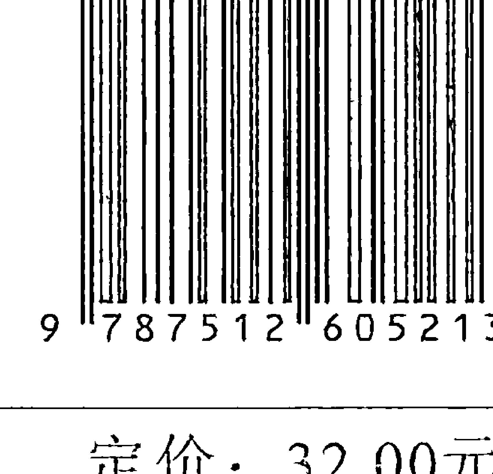

冥想日记

Meditations for Every Day in the Year

[英]詹姆斯·艾伦著

边晓华译

团结出版社

# 图书在版编目（CIP）数据

冥想日记/ (英)詹姆斯·艾伦著；边晓华译. --北京: 团结出版社，2011.6
ISBN 978-7-5126-0521-3

- Ⅰ.①冥…
- Ⅱ.①詹… ②边…
- Ⅲ.①成功心理—通俗读物
- Ⅳ.①B848.4-49

中国版本图书馆CIP数据核字(2011)第104817号

| 出 版: | 团结出版社 |
| :--- | :--- |
| | (北京市东城区东皇城根南街84号 邮编: 100006) |
| 电 话: | (010) 65228880 65244790 (团结出版社) |
| 网 址: | http://www.tjpress.com |
| E-mail: | 65244790@163.com |
| 经 销: | 全国新华书店 |
| 印 制: | 三河市祥达印装厂 |
| 开 本: | 145 × 210毫米 1/32 |
| 字 数: | 200千字 |
| 印 张: | 12 |
| 版 次: | 2011年7月 第1版 |
| 印 次: | 2011年7月 第1次印刷 |
| 书 号: | 978-7-5126-0521-3/B.135 |
| 定 价: | 32.00元 |
| | (版权所属，盗版必究) |

## 从狂热到冷静，赢了自己就赢了一切

通常，浮躁狂热之人总是迫不及待想要指导他人的行为，但是智慧之人却总是先检点自己的行为。如果有谁想要改变这个世界，那么，他首先需要改变自己。自我的改造不仅仅是要根除自己思想中追求感官愉悦的一面，完成了这一步才只不过是个开始。只有当我们不再空想妄想，不再有任何自私自利的目标时，自我改造才圆满完成。如果没有洁净的思想和一定程度的智慧，那么，我们必然还会有某些自我奴役和愚蠢的行为，这些都有待克服。

理想为人类插上双翼，有了它，我们可以飞往美好的天堂。它让无知的人博学，它带领我们从黑暗走向光明，没有理想，人类依然是可怜的爬行动物，俗不可耐，只追求感官愉悦，心智未得到开化，毫无希望可言。

> > 理想，就是对崇高事物的渴望。

能够寻找到安宁的地方，便是真理藏身的地方！

将紧要的事情永远放在第一位。先工作后玩耍；先尽义务后享受；先别人后自己，这是一条金子般的规则，它决不会将你引入歧途。一个良好的开端就是成功的一半，输在起跑线上的运动员会失去获胜的机会。一个商人的第一笔生意没做好，定会影响到他日后的声誉。寻求真理的人若是迈错了第一步，必然会失去正义的桂冠。带着纯洁的心、正直的思想、无私的目的、崇高的目标、永不泯灭的良知上路，这便是一个正确的开端，这便是将要紧的事情放在第一位，如此一来，接下来的一切都会按照和谐的顺序如期而至。让生活简单、美丽、成功、平和。

> 灵魂会为它丢失的美丽而哭泣。

热爱纯洁生活的人，他的思想每天都会有新的进步。

一个精力旺盛的、肯去做事的人，永远不会被困难吓倒，相反，他会去研究如何克服困难。所以，一个勇往直前不断追求理想的人决不会屈服于各种诱惑而一败涂地，他只会去思考如何加强自己的思想力量。脾气其实只是一个懦夫，它只能偷偷溜到那些薄弱、没有设防的地方。容易受到诱惑的人应当好好研究一下诱惑的本质与含义，这样他才能克服它们，而那些想要克服各种诱惑的人必须要明白，诱惑是如何从他黑暗而错误的内心深处升起来的，同时，他还必须好好思索、深刻内省一番，看自己该如何利用真理来驱散心中的黑暗，取代错误的想法。

要想了解事实真相，我们首先要了解自己，自我了解是自我征服的得力助手。

每天都抽出时间来进行一次有意义的沉思，思索一下真理和真理带给我们的一切。

每天都要更新自己的方法，在受到诱惑的时刻，千万不要偏离正确的轨道。

现在，天越来越长了。太阳一天比一天升起得早，落山也一天比一天晚，人间有光明的时间也就一天天地多起来了。所以，每天我们也可以让自己更为坚强，每天，我们在面对真理的光明时，都可以更多地敞开心扉，让正义之光将我们的心照得更加明亮。太阳总是恒定不变的，它每天都散发出相同的光芒，然而，地球却会绕着它转，每一天吸收更多的光和热。真理和“真善美”也是恒定不变的，既不会增加也不会减少，但是，如果我们渐渐转向它，定然会沐浴到更多的光芒，定然会得到它更多的恩泽，我们的力量会越来越强大。

手艺人日复一日拿着他的工具苦练，努力提高他手中艺术品的工艺含量，并由此而获得高超的技巧。同样，你也可以利用每一天去多做正确的事，实践真理，如此你便获得了做人的技巧。

实践出真知。

## 要不断地让自己多一些好的行为，减少一些不良行为。

胜利，不论是何种形式的胜利，都是以充分的准备工作为前提的。在付出足够的准备工作后，胜利的到来便成为了一件自然而然的事情，这就如同待放的花蕾突然间绽放，运动的地壳渐渐形成一座山峰一样。所有这一切都经历了由量变到质变的转变过程，都是因果关系的必然作用。仅仅是一个愿望，是不足以获得成功的，世界上根本就没有许愿魔法。只有坚持不断地按照条理性合理付出努力，才会得到成功。只有在考验到来时才开始思考的人，永远无法得到精神上的胜利，精神上的胜利来源于平日里的冥思默想，来源于不断出现的大大小小的考验。最大的诱惑也就是我们在经过了长时间的充分准备后，要去征服的最高点。

你要一心只想着美德，不但要理解那几条重要的原则，还要不断去实践它们。

无尽的快乐正等着你回家。

雨水从天空中落到大地上，是为了大地能收获庄稼与水果。忧愁洒落到我们的心头，是为了让心灵经受更多的历练，去迎接即将到来的智慧、完美与快乐。正如乌云遮住了阳光，却让大地降温、庄稼结出了果实，悲伤的阴影投到了心头，也是为接受更高的事物而打基础。忧伤的时刻是一个人成长的时刻，它让我们不再去浅薄地讥笑他人，不再粗俗下流地开玩笑，不再去无情地诽谤他人。它用同情去软化一个人的心，用谨慎来丰富一个人的思想。忧愁还是智慧的来源，我们在忧伤中不断吸取新的教训。

不要认为你的忧伤从此将挥之不去，它只不过就是一朵乌云，迟早会烟消云散。

没有了自我，也就没有了忧愁。

当我们真正具有了美好的思想和美好的行为时，我们就会过上有尊严的生活，我们就会生活得甜美而幸福。

世界上最快乐的事情莫过于拥有好的东西，这些好的事物包括好的思想或好的行为，或是一份好的差事。每一件良好的事物里面都充满了喜悦的情愫，如果一个人的心中或家庭中充满了美好的事物，邪恶就再也无法侵入。一座城池若是由精英士兵来守城门，定会固若金汤，敌人无论如何也无法进入；人的思想中若是有了良好事物的严格把关，那么，所有的不愉快就会被拒之门外。不快乐只能从无人看管的心门中偷偷溜进去，心中就算是充满了不快乐也还有救，怕只怕一个人的心被邪恶占据。所以，千万不要让心中邪恶的念头滋生，不要去做坏事，杜绝一切毫无价值或有问题的活动。做任何事情，都要从好的方面去做，这才是快乐源泉。

> “单纯意义上的快乐是让灵魂处于一种恰当、愉悦的状态。”

世间万物都要受到因果关系的制约，一切的一切都只是前因与后果罢了。

不要太过在意结果，也不要总是为将来忧心忡忡，我们需要多留意的，是自己的不足之处，要想办法克服或弥补这些不足才对。我们应当知道这样一个简单的道理：正确的事物永远不可能产生错误的结果，做好现在的每一件事定会创造出一个美好的未来。你要看管好自己今天的一切行为，而不是行为所带来的后果，因为明天的快乐与忧愁都是你今天的一切行为带来的。因此，你要多关注一下自己的思想和行为，而不是单单去考虑将来会发生什么，不会发生什么。行得端走得正之人，根本就不必担心什么，他永远也不会害怕将来有什么祸事等着他。

这条不容颠覆的法则将永远统治着世人，正义与爱是它永恒的守护者。

一切外部的烦恼都只不过是内心压抑的真实反映和它产生的后果。

一个人幸福或不幸福、愉快或忧愁、成功或失败、胜利或被击败，一个人的宗教信仰、事业成就或周围的环境如何，都取决于他的个性，个性是生活方方面面的决定性因素。每个人的精神世界中都有一种影响着其外部生活的潜在因果关系，人的个性既是起因也是结果，它既是行为的实施者，也是结果的承担者，人的个性中包含了天堂、地狱以及炼狱。不纯洁的、带有邪恶意志的人，无论走到哪里，都无法体会到幸福和美丽的感受，但纯洁、具有美德的人将会展示出幸福和美丽的生活。因此，你在塑造自己个性的同时也就创造了自己的生活。

丢弃自我与情欲，做正确的事，培养良好的个性，这才是智慧的最高境界。

> 神圣的道路艰险遥远，但不要偏离
克服一切困难，终点就在眼前
去吧，你将悟到真理

每当困难当道，麻烦不断，你都应当将这种混乱视为一种召唤，它要求你以更深刻的方式去思考，要求你采取更果断的行动。你将攻无不克，永立不败之地，你将解决所有的问题，永不会有烦恼。你的考验越是严峻，你面临的困难越是强大，你的胜利就会越彻底，越有价值。不论你走入了一个多么复杂的迷宫，总有一条道路能够走出来。寻找这条道路的过程能够最大程度上锻炼你的能力，将你潜在的天赋技能、精力和才思全部开发出来。当你反败为胜，掌握了所有想要掌握的问题时，你会为新发现的力量而欢呼雀跃。

> 实践让你掌握真知
有了它，你将无懈可击
真理无可战胜，亦无法超越

寻求最高层次的“真善美”，一切均能达到理想中的结果。

紧紧抱着自我不肯放手的人，他就是自己的敌人，他的周围也充满了敌人；而肯将自我交出去的人，他正是自己的救星，他的周围将充满保护他的朋友。在纯洁的心灵那圣洁的光芒面前，黑暗将无处遁形，所有的阴云都将消散。征服了自我的人将征服整个宇宙。那么，就请你从自我当中走出来吧，走出了自我也就走出了贫穷与痛苦，走出了自我也就走出了困境，你将不再叹息不再抱怨，你会停止心痛，孤独亦将不复存在。旧的自我是一件破烂不堪的外套，将它脱下，你会换上一件全新的外套，那是宇宙博大之爱的外套。此时，在你的内心世界就有了一个天堂，这一切很快就会反映到你的外部生活中去。

> > 所有的辉煌荣耀都已做好了准备
等待着顺从之人的到来

## 有志者事竟成，无畏者永向前。

世界上再大的困难也会在冷静和集中的思想力量面前瓦解，一切合理目标都将通过正确引导、利用精神力量快速得以实现。你只有在深入地研究过自己的本性过后，我们才能战胜所有潜伏的敌人，我们才能最大程度地感受到思想力量的微妙性，才能感受到它同外在物质世界密不可分的联系，以及它神奇的潜在力量，同时我们还能感知到，如果合理利用、正确引导思想力量，我们的生活状态亦将得以改观，或彻底改变。你的每一个想法都是一种由内而外的力量，这些想法会不自觉地透露出来，在接受它们的思想中落地生根，并根据其性质及强烈程度以善或恶的形式在你身上反映出来。

> > 要心存善念，很快它们就会转化成为你生活中的良好环境。

> > 只有能驾驭控制自己的人
才是能驾驭和控制一切的人

如果你想要获得战胜一切的力量，你就必须要培养自己的冷静，让自己平稳缓和，你还必须要独立，一切力量都同人的定性有关。山峦，硕石，经得起风吹雨打的橡树，它们告诉了我们什么是力量，因为它们虽自成一体，却又那样的傲然挺立；而流沙、细软的枝条、随风倒的芦苇却告诉了我们什么是虚弱，因为它们毫无抵抗能力，轻而易举就能被人们移除，当它们从同类中分离出来后，立刻变得毫无用处。真正有力量的人，是当所有的同伴都受到某种情绪的影响而骚动不安的时刻，他却依然能够保持平静、不为所动的人。歇斯底里的人、恐惧害怕的人、没有思想或轻浮愚蠢的人都需要寻找同伴，否则，没有支持，他们都将无法存在。但是镇静的人、无畏的人、有思想而且严肃人都需要独立，因为他们的力量足以吸引更多的力量。

> > 只设定一个合理有用的目标
然后不遗余力去实现

如果你是一个真正寻求真理的人，你就会甘愿为你的成就付出必要的代价。

在刚开始的时候，沉思必须有别于随意的白日梦。沉思并非在梦游，也不是没有实际的目的的遐想，沉思是一个探索的过程，这种坚定的思想除了赤裸裸的真理外，不会允许任何杂念停留在自己的脑海里。因此，沉思中的你将不会在偏见中树立自我，你会忘掉自我，你只记得你是在寻求真理。在沉思中，你将一个接一个地移除思想中的错误，这些错误都是你在过去建立起来的。你要耐心等待，错误的思想被全部剔除后，真理自然就会降临。

你之所以沉思，就只有一个至高无上的目的——真理。

真理本质上是十分微妙的，因此，我们只能在实践中去用心体会。

真理是宇宙间存在的一种客观真实性，是一种内在的协调，是完美的正义，是永恒的爱。真理是固定不变的，其内容不可随意增添，也不可随意删减。真理并不依靠任何人而存在，而我们每个人却都离不开真理。如果你无法将目光从自我之上移开，你将永远无法看到真理，感受到真理之美。如果你爱慕虚荣，你眼前的一切都将蒙上一层势利的色彩；如果你贪图色欲，那么你的心和思想都将被情欲之火焚烧得暗无天日，透过熊熊燃烧的火苗，眼前的一切都是扭曲、变形的；如果你自负而武断，那么，在整个宇宙中你除了自己的观点外，其他一切都视而不见。热爱真理的人都是谦卑的，他们早已学会了如何辨别观点与真理。

最愿意施善行的人，是最能悟到真理的人。

## 宗教只有一个，那就是揭示真理的宗教。

如果你愿意静默下来，认真审视一下你的思想、你的心灵和你的行为，你将轻而易举地判断出自己究竟是伏在真理脚下的孩子，还是自我的膜拜者。你的心中是否藏有怀疑、敌意、嫉妒、情欲、自负？或者你是否正在同这些思想情绪进行艰苦的斗争？如果你属于前者，那么，你就遭到了自我束缚，不论你称自己信奉何种宗教，都无济于事。如果你属于后者，你将很有可能到达真理，虽然你很可能并没有任何宗教信仰。你是容易激动、以自我意志为转移、不择手段达成目的、自我放纵或以自我为中心，还是温和沉稳、无私、远离任何形式的自我放纵，时刻做好准备做出让步？如果你属于前者，你就是自我的奴隶，如果你属于后者，你便是一个热爱真理的人。

> > 真正热爱真理的人从不犯错，且因此而闻名。

如果我们想要了解真理，首先要了解我们自己。

要让那些受到诱惑的人了解这样一个事实：他自己既是被诱惑者也是诱惑者，一切敌人均来自于他的内心。有诱惑力的奉承恭维，利剑一般的尖刻嘲讽，以及燃烧的欲火都来源于他们内心无知错误的地带，迄今为止，他就居住在这些地方。我们可以让他们了解到这一切，让他更有自信彻底战胜邪恶。因此，当他受到极大的诱惑时，告诉他不必痛苦，他应该感到高兴才对，因为他的力量已经得到了检验，他的弱点也已经被暴露出来。对于那些真正了解并且虚心承认自己有弱点的人而言，他的弱点并不会成为阻挠他获得知识的障碍物。

> 不敢于直面自己低级本能的人，永远无法登上与自我决裂的险峰。

> 一旦摆脱了情欲的奴役，你就成为了建造命运圣殿的大师。

当一个人开始学会审视自己的冲动与自私倾向时，他的力量也就开始发展了。此时，他的意识会紧扣内心深处更高级、更冷静的一个层面，开始确立并坚定自己在一些问题上的原则立场。

人一旦意识到自己的一些不容变更的原则，就立刻找到了最强大的力量的源泉与秘密所在。

就在我们经历了那么多苦苦的寻求，做出了诸多牺牲之后，永恒的道义之光就会照亮我们的灵魂，接着我们便能体会到一种神圣的平静，我们的心中就会充满一种难以言表的愉悦。

认识到这些原则的人将不再徘徊，他将拥有镇静的心态，永远不再迷失自我。

任何事物，只有建立在一个坚不可摧的原则之上，方可长久。

## 就让我们学会拥有独立的思想吧。

如果一个人无法从内心中找到平静，那么，他要到哪里才能找到平静呢？如果一个人害怕独自面对自己，那么，在和人相处时，他又能得到什么呢？如果一个人无法从独自思考中获得乐趣，那么，他又如何能同他人愉快地进行交流呢？如果一个人无法在内心深处找到一个可以立足的地方，他的灵魂就无法找到一个憩息的港湾。人的外表是不断变化的，会逐渐衰老的，也是不可靠的，而内在的一切则是稳定有保障的，可信赖的。我们的灵魂本身就是一座宝库，不论哪方面有精神需求，它都会为我们提供充足的来源。因此，你的内心深处是你永恒的家。

## 要丰富并完善你的自我。

> > 自我完善是最高贵的工作，也是最高端的科学。

如果我们能够意识到，生活完全是由思想所收获的产物，那么你就看吧，幸福之门已经向我们打开了。到那时，我们将发现我们有力量统治自己的思想，并按照我们的目标来塑造我们的思想。同样，他也会选择一些优秀的思想、行为之路，并在这条道路上坚定而彻底地走下去，这样，他的生活就会变得美丽而神圣，他迟早会将一切邪恶、混乱、痛苦都通通赶跑。对于一个从不懈怠、严格把关心灵大门的人而言，他永远都不会缺乏智慧与启迪。

一心想要获得平静、明智的人，想要拥有洞察力的人，总是着手去完成最崇高的任务。

## 不断重复的思想最后就成为了固定的习惯。

不断重复某种经历就会让一个人掌握这方面的知识，这是人类思维的一种自然属性。一种想法在刚开始的时候或许很难保持或坚持，但是如果持续刻意将它放在大脑中，久而久之，它就会成为一种很自然的习惯性思维。就好比一个男孩，在刚开始学习一门手艺的时候，甚至无法正确使用他的工具，总是出错，但是，经过长时间的反复实践之后，他终于能够轻而易举地驾驭他的工具，并练就了完美高超的技能。所以，人的一些心态在最初的时候看似根本不可能实现，但是在经过不断努力实践后，最终将成功获得，并彻底将它融入到自己的个性特征当中去，在一举一动中不自觉地表现出来。

人的自我救赎恰恰就孕育在这些思想的力量当中，思想的力量能够塑造、重塑我们的行为习惯和我们的生活情形，自控能力将带领我们进入一扇通往自由的完美之门。

> 用纯洁的眼睛看世界，世界就是纯洁的。

## 一切罪恶都能够被消除。

总的来讲，人的生活是思想的产物，而人的思想则是许多个习惯的组合。通过耐心与努力，我们可以在很大程度上改变自己的习惯，从而不断提高自己，彻底实现自控。如果一个人能够认识到这一点，他将立刻获得彻底解放自己的制胜法宝。

但是，让我们从生活的各种邪恶（存在于思想中的邪恶）当中彻底解放出来的力量应当是一种在内心不断生长的力量，而并非是一种突然间从外部获得的力量。我们每天都要无时无刻地训练自己保持纯洁的思想，用正确的、平静的态度对待生活，一直到他打造出最神圣的梦想。

更高贵的生活是在思想、语言、行为方面都更加高尚的生活。

只有正确履行自己的职责方能拥有更为高贵的美德。

一切职责都应当是神圣的，在履行职责时，我们应当将忠诚与无私奉献视为首要原则。我们在履行自己的职责时，应当抛开一切个人的、自私的想法，如果能做到这一点，你所肩负的职责就会成为一种乐趣，而不再是一件令人烦恼的事情了。只有当我们抱有某些自私的想法，或以追求自己的快乐为目的时，职责才会变得沉重而恼人。让那些因厌恶自己的职责而总感到恼怒的人认真审视一下自己吧，他会发现，他的烦恼并非来自于职责本身，而是来自于想要逃避责任的自私欲望。任何懈怠责任的人，不论是责任的大与小，也不论是个人责任还是社会责任，都是忽视了美德的人；而那些从心里反感责任的人，则是从心里反感美德的人。

具有美德的人总想着集中力量让自己的职责更加完美。

人要想获得平静，就要先摆脱骚动。

自私或欲望不仅仅表现在各种贪婪的行为和显然失控的心态中，它还指深藏在思想中的十分微妙的想法，包括自我的臆断和自我的炫耀。当我们立刻能够感觉到他人的自私，并对此加以议论、谴责时，此刻我们的自私是最微妙、最难以察觉的。一个总是盯着别人的自私行为不依不饶的人，永远无法克服他自身的自私。我们走出自私并不是要依靠责骂他人，而是要靠不断的自我净化。从骚动到平静的过程并不是通过痛击他人来实现的，而是要不断克服自我。只要我们尽最大努力克制对他人的自私想法，我们就能抑制住自己的骚动与不安；只要我们耐心地逐渐克服自私，我们就会不断进步，最终获得自由。

> 前进的道路就在我们的脚下，这是一条自我征服之路。

有理想的人面前永远有一条通往天堂的道路。

当我们的思想中开始对理想产生热爱的时候，我们的思想就已经开始升华了，那些不洁净的残渣沉淀也就已经开始向外排出了。可以肯定的是，当理想占据了思想，就很难再有任何不洁净的想法进入，因为人的大脑中，两种截然相反的思想很难兼容。但理想的作用是短暂的、间歇的，我们的思想很容易就陷入旧有的习惯性错误当中，因此，我们要不断更新自己的思想。

渴望正义、热望纯洁的生活、对理想抱有神圣的热爱，这便是通往智慧的正确道路，也是寻求平静的正确道路，同样，这也是通往天堂之路的正确开端。

热爱纯洁的生活的人，每天都用生机勃勃的、鲜活的理想来更新自己的思想。

> > 谬误终将散去，真理如同金子，经得住实践的千锤百炼。

精神上的转变应当是一种彻头彻尾的逆转，原本对人、对事持有一种自我寻求的态度，在经过了根本上的改变之后，就会是另一种全新的体验。有了这种全新的体验，我们就会丢弃对某些愉悦的渴望，就会从根源上截断这种欲望，再不允许它占据我们的意识。但是，能够让人们产生欲望的精神力量并不会彻底消失，它只不过是转移到了一个更高层次的思想领域中，被转化成为了一种更加纯洁的精力。大自然节约的法则在世间万物中随处可见，包括人的精神思想，思想的力量在低级的层次中将荡然无存，而在高等的精神活动的王国中将获得解放。

> > 只有突破云层，到达了一定的高度，精神上才会有所启发。

思想刚刚开始转化的阶段是痛苦的，也是短暂的，这种痛苦很快就会转变成为一种纯粹的精神愉快。

在通往圣洁生活的神圣道路上，我们必然会经过一段转变的中间路程，这个中间过程就是牺牲，是一种放弃自我的牺牲。我们要将旧的骚动、旧的欲望、旧的野心和想法统统抛之脑后，取而代之的应当是一些更美好、更长久的东西，应当以一种带给人永恒满足的形式出现。正如我们所长时间珍爱的、呵护备至的金银首饰一样，如果你忍痛将它们抛入熔炼锅内，再重新倒模，那么，你将得到一款崭新的、更加完美的饰品。精神上的锤炼也是如此。起初我们并不愿意同长久以来小心翼翼守护着的思想和习惯说再见，到最后终于放弃，再到后来我们欣喜地发现，这些思想带着更新的姿态、更罕有的力量、更纯洁的愉悦感回到了我们身边，经过重新加工的思想珍宝焕发着熠熠的光彩，璀璨夺目。

- 智者用平静的心对待内心的骚动
- 用爱来迎接恨
- 以德来报怨

法则决不会是偏颇的，它是一种永恒不变的行为模式，谁要是违背了它，就会受到伤害；谁要是遵守它，就会获得幸福。

我们应当为自己做错的事情遭受惩罚，同时也应当为自己正确的行为享受幸福，这两件事情都是无可厚非的。假如我们能够逃脱无知与罪恶带给我们的影响，那么，这个世界就再无安全可言，也再不会有任何避难所了，因为这个时候一切智慧与“真善美”的行为都不会有很好的结果。当然这只是假设，这种设想是任意的，甚至是残酷的，事实上法则是正义与善良的武器。

实际上，至高无上的法则是永恒仁慈、永不会失误、可以无限运用的原则，这条法则里全部都是“永恒的爱、永远的满足、无限流淌的自由”。

这一切都是基督的信徒们所吟诵的，是佛教戒律和经文中所倡导的“大慈大悲”。

我们所遭受的每一次苦难都会将我们带到离圣洁智慧之光更近的地方。

4月5日

远离罪恶的诱惑，进入神圣的思想境界，这才是至高无上的生活。

在思想转变过程中会有这样一个阶段：随着邪恶的不断减少，真善美的不断增加，我们的思想中会渐渐出现一幅全新的画面，会有一种全新的意识，我们会成为一个全新的人。如果我们到达了这一境界，那么，圣人便具备了智慧，就会从普通人的生活上升到神圣的生活中去。他会获得新生，会有各种完全不同的新体验，它将使用一种全新的力量，在他专注的追求之下，一个全新的宇宙将向他敞开大门。这个阶段便是至高的阶段，这个阶段的生活就是至高无上的生活。

如果我们能到达这种至高无上的阶段，我们便突破了个性的限制，体会到神圣的生活。到那时，邪恶将被打破，真善美将取代一切。

骚动的情绪是自我生活中的主要内容，而宁静祥和却是至高无上的生活中的全部内容。

当我们完全认识并了解到了“真善美”，眼前就会出现一幅平静的画面。

至高无上的生活并非由我们的激情所掌控，而是由特有的原则所支配；它并非建立在转瞬即逝的冲动之上，而是建立在长久的律法之上。在它清晰明了的氛围中，一切事物发展变化的顺序过程显而易见，因此，这样的环境下似乎找不到忧愁、焦虑、悔恨的容身之地。当我们沉溺于自我的激情无法摆脱之时，我们便在许多事情上承载了太多的在意和烦恼，而这多余的一切又岂是我们小小的、疲惫的、饱受痛苦的自我所能承担的？我们总在为那些片刻的欢愉而感到焦虑，我们总想保护它们，留住它们，让它们永远安全，永远能够继续。但是，在充满智慧与“真善美”的生活中，所有这一切都能被超越，个人的兴趣能够被更大的目标所替代，对于个人享受、个人命运的担忧和在意以及由此产生的一切烦恼都会成为午夜的一场梦魇，最终会被驱散。

博爱必被人们所见。

征服他人的人是勇敢的，但只有征服了自己的人才是最高尚的人。

我们在征服自我的道路上不断获得完美的平和。我们应当明白，自己不应该再为了一些虚无缥缈的东西而同他人争得头破血流，相反，我们应当同自己内心深处的邪恶展开一场神圣的战斗，认识到这些有极大的必要性，我们会因此而加深对平和的理解，并获得完美的平和。我们的敌人就在我们的内心世界而不是存在于外部世界；我们的那些不受控制的思想正是我们混乱与斗争的根源；他不洁的欲望正是他自身平静和世界平静的破坏者。凡是认识到这一切的人，就已经走上了条通往平静的神圣之路。

如果一个人已经征服了自己的七情六欲，不再有色欲和愤怒、憎恨与高傲、自私与贪婪，那么，他也就征服了整个世界。

能够战胜他人的人迟早还会被他人击败，但是战胜了自己的人永远不可能被征服。

暴力与斗争建立在骚动与恐惧之上，爱与和平却深入人心，能够令一切改变。

用武力永远也无法真正征服一个人，只会让对方成为仇恨比以前更深的敌人，但是，通过平和的方式从精神上入手会让一个人从心底里发生变化。这便是化敌为友，化干戈为玉帛。

心地纯洁的人和智慧的人内心是平静的，这种平静体现在他的一举一动当中，体现在生活的点滴之中。这种平静比残酷斗争更富有力量，它在武力所无法奏效的地方发挥着神奇的作用，它像一面盾，为正义提供保护，让无辜的人不受到伤害。那些正在同自我做不懈斗争的人，在这里能够找到一个庇护所，受到打击的人可以来这里避难，失去一切的人可以在这里落脚，而对于纯洁的人而言，这里是一座圣殿。

如果我们能做到“真善美”，生活中便到处是喜悦，因为喜悦是好人最平常的状态。

# 认识到神圣之爱的人将会是一个获得新生的人。

这种爱是智慧，是平静，是思想和心中的一种宁静状态。或许所有愿意放弃自我，并准备谦卑地去理解放弃自我的真正含义的人都将得到、体会到这种宁静。宇宙中并不存在随心所欲的力量，人类无力抗拒的命运之链其实是我们亲手为自己打造的，人类被命运之链紧紧捆绑着，受尽了折磨，是因为他们愿意这样，因为他们爱着自己身上的铁链，因为他们认为自己所在的狭小的、暗无天日的牢狱是甜蜜美好的，他们唯恐一旦离开这座牢狱，自己便失去了一切，失去了真正值得拥有的东西。

> “你的痛苦是你自己的，不是别人给你的
你的生死存亡掌握在你手中，谁都无法夺走”

对于神圣的智慧而言，知识和爱是一体的。

世人之所以无法理解无私的爱，是因为这个世界上到处充斥着只求一己之快的人。

先有了实体才会有影子，先有了火才会有烟，所以，有了起因就必然会产生结果。我们的苦难也好，喜悦也罢，一切都是人类思想和行为的后果，在这个世界上并不存在什么结果，有的只是这一切可见或不可见的起因。这些起因根据其性质所带来的都是绝对的公正。有的人总是苦难重重，那是因为他们不久前或者很久前播下了邪恶的种子；有的人收获了喜悦同样也是因为他们曾经种下了真善美的种子。让我们好好想一想吧，让我们认真地领悟一下吧，只有悟到了，我们方能将心灵花园中疯长的莠草和芦苇一把火烧掉，从此往后只播种真善美的种子。

世界就在我们对真理的不断认识中前进。

只有净化自己心灵的人才是这世上最大的受益者。

现在以及今后的许多年之内，我们都无法进入一个到处都充满了无私之爱的所谓的“黄金时代”。但是如果你愿意，并且可以超越自私的自我，克服偏见、憎恨，不再去指责他人，从而拥有了一种高尚、宽容的爱，那么你现在就可以进入这个时代。

只要我们心中还有憎恨、厌恶、指责，无私的爱就不可能长存，这种爱只存在于早已将一切怨恨抛开的心灵当中。

如果我们深知爱是心中对一切事物的关心，同时也明白这种爱具有多么强大的力量，那么，我们的心中就再也容纳不下任何不满的想法了。

让所有的人，不论性别年龄，都朝这个方向努力吧，我们将看到，美好的“黄金时代”就在眼前。

4月15日

# 得到了真理也就摆脱了谬误，看到了现实也就打破了幻想。

罪恶之事形同夜晚深沉的梦，喜爱罪恶就是喜爱黑暗。喜爱黑暗的人总是深陷在黑暗中，那是因为他们从未见过光明。见到过光明的人，就决不会主动再次走回黑暗。我们只要见到过真理就会爱上真理，相形之下，谬误是丑陋的。梦中的人总是时喜时悲，时而自信，时而害怕，此时的他极不稳定，找不到永远的避难所。

当悔恨与责罚紧随其后穷追不舍时，他又该往哪里逃？他无处可逃，除非他从噩梦中醒来。就让做梦的人同他的噩梦作斗争吧，就让他自己尽力去认识到，他的那些难以割舍的个人欲望不过就是虚幻的梦一场而已。看哪，他睁开了自己的双眼，看到了世上的光明与真理，他们将变得快乐、理智、平静，他们将看到一切事物的本来面目。

> 真理是宇宙之光，是光明之中的思想。

# 了解真理才能带来永远的安慰。

任何事物都有可能失败，唯独真理不会失败。当我们内心孤独凄凉，无法在这个世上找到栖身之地时，真理会带给我们一个平静的庇护所，让我们平静地休息。生活中需要我们担心挂念的事情很多，生活的道路中充满了各种困难，但是真理却大于一切生活琐事，高于一切困难。真理能够减轻我们的负担，它用充满感召力的快乐照亮我们的前路，当我们深爱的人永远离开我们时，当我们被朋友辜负时，当我们失去自己的财产时，我们能到哪里去寻找安慰的声音呢？那令人感到宽慰的柔声细语又在哪里呢？当我们心中难过时，当我们被抛弃时，真理就是最大的安慰。真理永远不会逝去，也不会有负于我们，也不会消失，真理用它那永远的平静来安慰我们的心灵，所以，你要留意，要仔细聆听真理的召唤，甚至要倾听那些伟大的觉醒者的声音。

> 真理能将苛刻转变为挚爱，能驱散如阴云般密布的烦恼。

沉溺于妄想谬见中的人，酷爱自我与罪恶的人，是永远也找不到真理的人。

真理为忧患的人带来快乐，为烦恼的人带来平静，它为自私之人指明一条“真善美”的道路，它给罪恶的人指明一条神圣的道路，因为它的精神就是行使正义。它给诚挚和真诚的人以安慰，给驯服的人带上平静的桂冠。真理给我以庇护，是的，循着“真善美”的精神，凭着对“真善美”的了解，坚持“真善美”的行为，我感到踏实而安慰。有了真理，我感觉仿佛一切恶意都不复存在，一切憎恨都消失得无影无踪，欲望被限制在最底层的黑暗中，在真理那高贵的光芒中，它已没有了容身之地。在真理能够溶解冷若冰霜的高傲，虚荣也将成为一团薄雾。我的脸已经朝向了完美的生活，我的脚已经踏上了一条清白之路，正因为如此，我的心中充满了慰藉。

真理赐予我庇护之地，我充满了力量，感到踏实而安稳。

纯洁的心灵和清白的生活有益于我们的身心，因为它们充满了愉快和宁静。

我们的良好行为总是能对我们产生一些后果，它们能够保护我们甚至拯救我们。邪恶的行为是错误，我们的邪恶行为所产生的后果总是纠缠着我们，它们在我们面临诱惑的时候将我们终结。做坏事的人总逃不脱忧虑，但做好事的人却总能避开伤害。愚蠢的人对自己的恶行报以掩耳盗铃的态度，他们说：“只要我藏得好，一切就不会暴露。”但当他说这种话的时候，他的恶行就早已人尽皆知，他的忧虑是可以肯定的。如果我们总做坏事情，又有什么会保护我们呢？我们又凭什么可以逃脱悲惨和混乱呢？任何人，任何性别，也不论是贫是富，更无论是在天堂还是在人间，都能够让我们产生混乱不安的感觉。邪恶行为带来的后果是谁也无法逃脱的，我们没有保护伞，也没有避难所。如果我们和“真善美”在一起，又有什么能够驾驭我们呢？又有什么会带给我们悲惨与痛苦呢？任何人，不论性别，不论贫富，不论健康与疾病，也不论在天堂或地狱，都无法让我们感到混乱不安。

纯洁的心和清白的生活是平坦的大道，我们能够心安理得地走下去。

所有热爱真理的人们哪，你们不要忧愁，一定要快乐，你们的忧愁像晨雾一般会渐渐散开。

弟子：师傅，请给我一些指导吧。
师傅：有什么问题你就问吧，我来回答你。
弟子：我读了许多东西，但我仍很无知；我一直在研究真理的各种教义，但我并未因此而增加智慧；我将条文牢记在心，但仍无法获得平静；师傅啊，请点画我，告诉我如何才能真正获得知识，告诉我哪里能找到通往神圣智慧的快车道，请带领着您的学生走向平静的道路吧。
师傅：哦，我的孩子，通往知识的道路就在你心中，要靠你自己去找寻，你要不断去行使正义，要过清白纯洁的生活，这便是通往智慧的快车道，你将找到平静。

> 看，永恒的爱总是隐藏起来
（不死之爱看似如此遥远）
但它恰恰就在谦卑的人心中，它一直就在那里
但只有生活清白的人才能看到它

> > 征服了他人固然了不起
> 然而征服自己却需要更大的力量
> 相信自己，你一定能战胜自己

弟子：哦，我的老师，请为我带路，我周围充满了黑暗！哦，我的老师，黑暗将会消失吗？一切考验会以胜利而告终吗？我的一切烦忧终有结束的一天吗？

师傅：只要你的心地纯洁，黑暗将自行消失；如果你的思想中不再有任何骚动不安，你的考验也就到头了；当自卫的本能不再那么敏感时，我们就不会再有忧愁的根源。你此时正处于自律与净化的过程中，这是我所有的学生都必须经历的一个过程。在你能够进入知识的光明所照亮的范围之前，在你能够看到真理的光芒之前，你需要将自己的一切不纯洁都清理干净，将一切不切实际的幻想都赶走，让你的思想随着不断忍耐而加强。不要松懈对真理的信仰，不要忘记真理永远是至高无上的。

> > 要虔诚忍耐，生活将教会你一切。

服从真理的人是有福之人，他将生活得坦然舒适。

弟子：什么的力量大，什么的力量小？

师傅：哦，孩子，且听我再说一次。要带着信心走在自律和自我净化的大路上，永远不要放弃这条道路，更不要自我放纵，那么，你将获得思想的三种小力量，同时还获得三种大力量。你会在不知不觉中拥有这三种小的力量和三种大的力量。其中自控、自立、谨慎是三种较小的力量；坚定、耐心、高尚是三种大的力量。如果你能控制好自己的心态，做真实的自己，如果你不依靠外界的力量，全部依靠自己内心的力量；如果你能够不断谨慎自己的思想和行为，那么，你将越来越靠近神圣之光。

> 你的黑暗将永远成为过去
愉快和光明就在前方等着你

要努力就付出全部的努力，要忍耐就长久忍耐，要做决定就要痛下决心。

有四件事最能够玷污我们的心灵——追求享乐、无法摆脱世俗、以自我为中心、总想维持原状。一切的罪恶与忧愁均起源于这四件玷污精神的事情。荡涤你的心灵，让它纯洁无瑕，摆脱对感官享受的渴望，让你的思想中不再有拥有物质财富的愿望，丢弃自我重要和自我防御的外壳。这样一来，你就会丢弃一切欲望，得到满足，你的心中将不再热爱那些昙花一现的事物，你将会获得智慧，摒弃一切自我的想法，最终得到平静。纯洁之人将不再有欲望，不再沉迷于感官刺激，认为短暂世俗的东西毫无价值；纯洁之人无论富有还是贫穷，成功还是失败，无论是面对胜利或挫折，面对生与死，他都保持一成不变，他的幸福是长久的，他的安定是真实的。

紧紧抓住爱，用它来塑造你的行为。

请告诉我怎样做才是服从真理，我将从此谨慎小心，不再有失败。

不公正的人犹如墙头草，永远无法掌控自己的感情。喜好与厌恶是他的主宰，偏见与歧视蒙上了他的双眼。他不知自控为何物，总是不断渴望不断痛苦，不断期待不断忧愁，时刻处在不安定的状态之下。正直的人能够驾驭自己的心情，喜好与憎恶在他眼里是幼稚的事情，早已被他抛开，偏见与歧视被他推到一边。他有完美的自控，所以无欲无求，从不贪图享受，一切忧愁都与他无缘，永远都生活在平静中。

不要去谴责、愤恨，也不要去打击报复，不要与人争执，不要拉帮结派，在任何时候都要保持冷静。要公正，讲真话，行为高尚，富有同情心，懂得济世。要有无限的耐心，紧紧抓住爱，并用它来指导你的行为。对所有的人都怀有一颗关爱仁慈之心，平等对待，不受任何人的打搅。

做一个明智且会思考的人，要勇敢而善良。

4月27日

当心，决不能让自我的思想再次袭来，悄然间玷污了你。

停止再去想你自己的事情吧，不论你做什么，都要去想一下这样做是否对别人、对这个世界有好处，而不是去想你自己会得到多少好处，多少回报。这样，你就不再和他人相隔绝，你就会和所有的人在一起。你将不再为了自己与他人发生争斗，你将学会在情感上支持别人。你不会再将任何人视为你的敌人，因为所有的人都是你的朋友。用平静的心看待一切事物，用慈悲的心对待一切生灵，让你的言行举止中充满无限的宽容。这便是通往真理的正确道路，这便是服从上帝的行为。行为正确的人永远充满快乐，因为他的行为遵循着一条永恒的准则，他是和真理在一起的人，早已超越了人世间的不安。正义之人的平静是完美的，它不会受到不断变化和易逝的世俗纷争的打扰，他已从各种骚动的情绪中解脱出来，所以，他的心态平衡而冷静，不再有任何难过。他们能够看到事物的本来面目，所以，不再感到迷惑。

向着永恒之光张开双眼吧。

+ 知识属于不断寻求的人
智慧将桂冠赋予不懈努力的人
不言而喻的平静属于清白的人
一切终将腐朽，唯真理永存

不断增强你的力量和自立能力，萦绕在心头的恐慌便会服从你的意志。要确保掌管好自己，不要让心情或微妙的骚动，也不要让不断变化的欲望将你投向地狱。但是，万一你跌倒了，你要赶快爬起来，重新振奋做人，从你摔倒的地方，你要学到教训，增长智慧。要不断努力控制自己的心态，从周围的环境中不断收集美好的事物，不论遭遇到什么，你最终都会将它们转化成为你储备的力量。遭遇困难，战胜困难，会令你更加富有，只坚持崇高、令人愉快的理念，要像一个健壮的运动员一样，为了值得竞争的东西全力以赴去拼搏。

+ 美德将带领你愈飞愈高
听，纯洁在呼唤我们
请不要熄灭它对我们的热情
看哪！不断进取的人、战胜欲望的人
都将拥抱真理## 用罪恶与忧虑、眼泪与痛苦寻找解救的人将永远无法到达救赎的入口

不要沦为色情、欲望和放纵的奴隶，也不要被失望、悲惨、痛苦、恐惧、怀疑和悲痛紧紧抓住，你要用冷静控制自己，改变过去的一切，先主宰了自己才能去征服他人；不要让情欲统治了自己，你要成为情欲的统治者，要降服你自己，让骚动的情绪转变为平静。然后，智慧将为你戴上桂冠，你将不断获得知识。

看看你的内心吧，看哪！只有不断的变化才是永恒的，在充满斗争的心中孕育着完美的平静，这个世界一切不安定的根基就是内心的骚乱。寻求激情的人最终只能尝到苦果，但征服了激情的人最终却能找到平静。

我无知，因此我努力想要知道，我不会停止奋斗，直到成功。

# 伍月卷 | 管理自己

让我来说句安慰的话，你将到达巅峰的高度，一切美景尽收你眼底。

约恩罗斯：我知道，激情过后是懊悔，我知道一切世俗的欢愉都将带给我们悲伤、空虚、心痛，所以我为之而难过。然而，真理必然存在，我们一定能找到它，虽然此时我很忧伤，但我知道，找到真理的时候，我将获得快乐。

- 预言者：真理带来的愉快才是最大的愉快
纯洁的心灵在喜悦的海洋里畅游
忧虑与痛苦将永远无法体会
看到上帝的人有谁还曾悲伤？
获得知识就是快乐，所以他们快乐
认识到真理、了解到真理、生活在真理中的人
是到达完美的人

找到了真理就找到了自控。

5月1日

## 管理自己的行为，净化自己的行为。

从争斗的王国到爱的王国是一个漫长的过程，这个过程可以被总结为一句话——管理并净化自己的行为。如果不断去努力追求的话，这一过程必然能够让人达到完美。我们同样还能够看到，随着我们通过各种内在力量对自我的不断征服，他会逐渐了解到所有的法则，正是这些法则对我们的内在力量起着实质性的作用。他会不断关注自己生活中永无尽头的因果关系，最终在不断自己调节自己的过程中明白了这一客观规律的实质。

这一过程同时也是简化思想的过程、过滤个性的过程，我们最终会抛弃思想中的糟粕，保留个性中的精华。

从此他不再为自己而活，它将为别人而活，这样的生活会赋予他最大的福祉，他将感受到最深的平静。

## 对一切事物胸怀大爱才是生活的真谛，才是真正的生活。

美好的生活是这样的，如果我们能够谦卑忠诚地执行真理的信条，我们每个人的生活也应当是这样的。但是，假如我们拒绝这样做，依然固执地坚持自己的欲望、激情、观点，我们就永远也无法成为真理的信徒，因为这样的人永远是自我的信徒。“我非常肯定地告诉你们，任何行使罪恶的人都是罪恶的奴仆。”这句话是耶稣的总结，他要让我们每个人都明白，凡留着自己的坏脾气、抱着欲望不肯撒手、言语苛刻不公正的人，凡是坚持自己的憎恨、自己那微不足道的主张和观点的人，谁也休想同时拥有真理。凡是挑拨离间、疏远信仰的人，都不会获得真理的，因为真理的精神是爱的精神。

罪恶与真理互不兼容，所以，我们一旦接受了“真善美”，从此就再无法接近罪恶。

人如果自身不愿学习，他就什么也学不到。

> “我是如何对待他人的？”
> “我对他人做了些什么？”
> “我是如何看待他人的？”
> “我对他人的态度与行为是出于原本应有的无私的爱呢，还是出于个人的厌恶、报复心理或狭隘偏执的责备？”

作为人类，我们应当让灵魂找到一种神圣的平静，然后就这些值得深思的问题问问自己。只要将真理的基本信条运用到自己的思想和行为当中，我们就会在生活中处处得到启示。这样一来，我们就能够彻底明白迄今为止自己到底在什么地方失败了，然后我们才会明白，自己在什么方面有待改进，我们到底应该怎样做才能纠正思想和行为。

恶习不值得我们去坚持，只有不断去实践良好的行为才能体现出高尚与优秀。

5月8日

凡按照神圣的原则履行自己职责的人，都是奉行真理的人。

如果“真善美”没有体现在我们的实际行动当中，如果我们没有通过不懈的努力让“真善美”成为我们的一个部分，那么，任凭人们如何去宣扬它，即便是再崇高的“真善美”，也是枉然徒劳，我们始终无法从中获得福祉与平静。因此，你们这些对神圣的品质顶礼膜拜的人们哪，如果你们自己也具备这些品质，那么，你们也会变得同样神圣。

神圣的教诲将我们带到了一个最简单的真理面前：正义，也就是做正确的事情完全是个人的行为，并不是某些独立于人的思想行为之外的某些神秘事物，因此，我们每个人所行使的正义完全是做给我们自己的，我们每说一句话也都是说给我们自己的。能够为我们的心灵带来愉快和平静的，是我们自己的一言一行，与他人的行为无关。

只有宽宏的人才能体会到谅解他人的快乐。

## 自私是一切争斗与痛苦的根源，而爱则是一切平静与幸福的来源。

在永恒王国里的人之所以安定，是因为他们从来不从身外之物中寻找幸福快乐，他们将这一切物质上的拥有视为转瞬即逝的事物，当你需要它们的时候，你可以通过努力来获得，但是，一旦完成了使命，它们就会自行消失。在他们看来，这些东西（金钱、衣、食等等）只不过是生活的附属品，而并非生活的真正目的，因此，他们能够从一切烦恼与焦虑之中解脱出来，享受爱心带来的安定，他们是幸福快乐的化身。他们将自己的一切建立在纯洁、同情、智慧、爱的永恒原则之上，他们便是永恒不朽的。他们深知这一点，他们知道自己是同真理在一起的人，是奉行至高无上的真善美的人，他们能够看清楚事物的本来面目，因此，在他们心中再也找不到多余的空间来容纳各种怨恨了。

虽然并不是每一个人都能认识到自己的本质，但每个人在本质上都是神圣的。

不要企图去尝试其他旁门左道，这一切都有可能将你的灵魂带入虚幻的境界。

人类现在就拥有力量，但他却对此全然不知，于是他说：“我明年或再过几年甚至来生就会变得完美。”而神圣王国里的人却只注重现在，他说：“现在，我很完美。”于是，神圣王国的人现在就让自己远离罪恶，谨慎把守着自己的灵魂入口，他不去回顾过去也不去期盼未来，既不会向左转也不会向右转，他永远保持着神圣和福泽。因此你要告诉自己：“现在就是我接受神圣生活的时刻，今天就是我得到救赎的一天。现在，我将按照自己的理想去生活，现在我的理想就实现了，我将再也听不到那些企图将我重新诱惑的声音，我只能听到自己理想的声音。”然后，你下决心，就这样去做，你将与最圣洁的一切永不分离，永远是真理的化身。

现在就展现你与生俱来的神圣的力量吧。

要不断将自己的善意之举发扬光大，直到这种慈悲的情怀盖过所有的自私。

切莫心怀恶意，要压制怒火，克服憎恨。对所有的人都要持有一视同仁且永不改变的善意态度与同情，即使是在面临最严峻的考验之时，也决不出言抱怨或以谩骂泄愤，相反，我们要用平静对待愤怒，用淡漠迎接嘲讽，用爱心拥抱憎恨。不要拉帮结派，做党羽之争，要做一个和平的缔造者。不要离间人与人之间的关系，也不要挑唆他人引发争斗，你要对所有的人都报以平等的态度，付出同样的爱和善意。不要去蔑视贬损其他思想派系或其他宗教及其倡导者，不要在穷人与富人之间、有工作和失业的人之间、统治者和被统治者之间、主人和仆人之间设下障碍，你要用平等的心态去对待每一个人，要能够体会到他们的工作职责。只要你坚持下意识地控制好自己的思想，让自己少一些怨恨与责难，长久稳定地坚持行善，那么，一心向善的精神最终会顺势而生。

要有力、坚定、充满活力。

自我牺牲的动机与行为并非来源于某一条司空见惯的理论，它是爱与同情的精神的体现。

当精神成为整个世界的统治力量时，我们才能够获得完美的正义，如果我们明白这一点，爱的精神便不会减少。这种情况之下，爱的精神不但不会减少，反而会增加，因为我们都明了一点，那就是人类的一切痛苦从根本上说都是自己的无知与错误让自己无法了解真理而造成的。通常，物质生活上较为舒适的人要比物质上贫穷的人遭受更大的痛苦，他们也像其他人那样，收获自己的行为所带来的各种果实，有甜有酸也有苦。这是一条绝对公正的经验之谈，它对于穷人和富人能够起到同样的鼓励作用，一方面，它告诉那些富有但却自私专横的人们，以及那些为富不仁的人们，他们的所作所为是早已种下的恶果，必然会受到报应和惩罚，它同时也告诉那些此刻正经受苦难，力图摆脱这一切的人们，这一切只不过是他们在偿还先前所欠的孽债而已，只要他们从现在起多行善事，以纯洁、爱心、和平为行为准则，那么，过不了多久，他们就会收获美好的果实，就会从现在的窘境当中摆脱出来。

任何人都无法逃脱追求自我所带来的苦果。

## 永恒之心是平静而真实的。

人类的精神同真理是密不可分的。如果失去了这种精神支柱，我们对任何事物都不会感到满意，我们的痛苦将不断加重，心灵将不堪重负，忧伤的阴影将遮住我们的前路，让我们在一个如梦如幻的世界里四处游荡，直到我们找到了回家的道路，回到永恒的真实世界为止。

从浩瀚的海洋中汲取一滴海水，虽然只是小小的一滴，但它同样含有海水的全部成分。同样，一个人虽然渺小，但在精神上却和上帝是完全相同的。大自然的法则让这滴海水一定要回归大海，消失在大海沉默而深沉的怀抱中，同样，人类的天性也在不断敦促我们找到自己的源头，消失在博大的真理中。

人类的目标就是要同真理在一起。

时刻提醒自己的思维，让它保持谨慎与敏锐。

我们终将明白，让思想具有条理性的第一步是要克服懒散。这其实也是最容易的一步，只有将这一步走稳了，我们才能迈出下一步。懒惰的习性不改，这无疑便构成了通往真理之路上的一大障碍。懒惰往往表现在注重身体的舒适度、贪睡、做事拖拉、逃避职责等方面，如果我们自身有这些现象，应当立刻引起注意，努力改正。要想克服这些懒惰的症状，我们必须每天早早起床，睡眠时间充足即可。同时，我们还要精神饱满地做好手头的每一件工作，哪怕是一件微不足道的小事情。

> 心中要戒色欲，口中要戒贪恋美食之欲。

## 懒惰之人不可能取得任何成就。

成功是沿着某种特定的思想轨迹去不断认真思考的结果，成功蕴含在人的某种性格特征或某些个性特点当中，它并非取决于某种特定的外部环境。诚然，某些成功固然由环境促成，但是，倘若没有人去积极主动地研究并利用环境，又何来成功？

任何一种成功都扎根于辛勤的耕耘，外加合理正确地利用自己的精力。成功还需要我们的坚持，不断就自己所执著的目标去进行思考。成功就好像是一朵花儿，总是在一瞬间绽放，但又有谁会知道，这美丽的绽放只是长时间的努力付出，以及之前的一切准备工作所产生的结果而已。我们所能看到的只是成功，而成功背后则藏着我们所无法看到的准备过程，以及通往成功所必需的无数的思考过程。

## 不努力不拼搏的人将一无所获。

## 要想获得更大的成功，就必须摆脱焦虑、仓促、急躁。

沿着一条既定的道路不断向前走下去，定然会到达路的另一端固有的目的地。但是，如果我们总是走到岔路上，或者是走回头路，那么，我们之前的路也白走了，我们哪里都去不了，成功依然离我们很遥远。

努力，努力，再努力！这便是成功的关键词。正如一句古老而简单的谚语所说的那样，

> “如果第一次不成功，就再试一次。”

所有成功商人，他们的规则都是“去实践”，一切富有智慧的老师，他们的规则也是“去实践”，停止做事情也就是不再去利用有限的生命，做事情就意味着努力，意味着对生命的使用。

要善于储存自己的精力，将有限的、逐渐下降的精力转化成为一种深层的、不易察觉的，但却具有建设性的力量。

沉默的、冷静的人所取得的成功，要比吵闹不安的人获得的成功将更为经久。

当一个人将铜兑换成银，又将银兑换成金的时候，他并没有任何损失，他只不过是将体积大的货币兑换成了体积虽小但自身价值更高的货币而已。因此，当我们由匆忙转向从容，再由从容转变为镇静时，他并没有放弃自己的努力，他只不过是将零散的，效率不是很高的精力转化成为了一种更为集中、效率更高、更有价值的形式而已。

然而，在刚开始的时候，最为拙劣的努力还是有必要的，因为只有通过最基本的努力才能获得更高级的形式。幼儿要先学会爬，才能学会走，只有经过牙牙学语才能具备语言能力，只有先学会说话，然后才能去写作。人类刚来到世上的时候是那么的弱小，却带着一生积累的能力离开，但是人的一生从开始到结束，无一不是靠自己的努力在不断进步，在向前走。

性格决定成功。

## 谦和温顺的力量！

能够征服他人的人固然是强者，但是能够用谦和与温顺征服自己的人才是真正的强者。用武力征服他人的人，最终会被他人以同样的方式征服，而用谦和温顺征服了自己的人，永远不会被打倒，因为人类永远无法战胜圣洁的事物。谦逊温和的人虽败犹荣，苏格拉底虽被处死，但他在人们心中的地位却更高了；被钉死在十字架上的耶稣是基督精神的升华，斯蒂芬面对向自己袭来的石块而毫不躲闪，他用自己的方式公然藐视伤害。真金不怕火炼，人们永远无法毁灭真实的事物，只有不真实的事物才会遭到毁灭。如果我们发现自己内心的一切都是真实的、持久的、不变的、永恒的，那么，他就进入了这种真实境界，也就具备了谦逊温和的品质。纵使一切黑暗的力量会再度向他发难，也终会因奈何不得他离他而去。

谦和温顺是一种神圣的品质，因此它才会具有如此强大的力量。

> 行得端走得正之人，何惧之有？

正义之人是不可战胜之人，任何敌人都无法挫败他，将他征服。他自身的正直与神圣是最好的保护，拥有它们足矣。正如邪恶永远不会战胜正义，正直之人永远不会被不正直的人拉下水，诽谤、憎恨、嫉妒、恶意，永远无法接近他，也不会给他带来任何痛苦。那些企图伤害他的人最终只能灰头土脸地离开，无疑是自取其辱。

正直之人是光明正大之人，做事从来无需偷偷摸摸，也没有任何不可告人的欲望和想法，因此他无愧于人，也毫不畏惧。他的步伐是坚定的，他的腰杆是挺直的，他的言辞是直截了当，毫不含糊的。他从不害怕与任何人目光交锋，一个从不欺骗的人，又有什么是他不敢面对的呢？

- 只要你不再做错事，从此就再不会被误解
- 只要你不再去欺骗，从此就再不会被欺骗

### 宇宙之所以永恒，是因为它的中心充满了爱

来自天堂王国的光明之子将整个宇宙和宇宙中的一切看作是爱的法则的体现，在他们看来，爱蕴藏在所有静止和活动的事物当中，是一种能够改变一切、保护一切、支持一切的完美力量。对他们来说，爱不仅仅是生命的规则，而且是生命的法则，甚至是生命本身。正因为他们深知这一点，所以，他们的生活以爱为原则，而不是以个人为原则。他们遵守并实践最高的法则——神圣的爱，因此，他们也具备了爱的神奇力量，因此，他们都是命运的主人，是自由的。爱是完美的和谐，是纯洁的喜悦，因此，爱没有丝毫的痛苦。让我们不要去想，也不要去有悖于爱的原则之事，那么，我们就会摆脱一切烦恼。

> 爱是唯一永恒的力量。

真理、美丽、伟大永远都如孩子一般日新月异，富有朝气和活力。

伟大的人永远都是品行良好的人，永远都是简单率真的人。他内在神圣的美好是取之不尽的资源，是他生活的依据。他的心灵是天堂般的圣地，在那里，他同逝去的伟人们密切交流。他同不可战胜的人生活在一起，他不断受到激励，呼吸着来自天堂的气息。

想要成为伟大人物的人，就让他先懂得如何做一个品行良好的人。因此，从不刻意追求伟大的人反倒会成为了不起的人，如果一味地追求伟大，我们很可能最终成为一个凡夫，如果我们没有任何目的，反倒是一种了不起。欲望太过强盛的人，只能表明他的狭隘、个人空虚和过分炫耀。情愿从人们的瞩目中消失，从不自我抬高，这正是一个人伟大之处的最好证明。只有渺小的人才追求权利，伟大的人物从不争权夺利，正因为如此，他们才会在到达一定年龄后拥有一定的权力。

保持你率真的自我，力求更好的自我，放弃自私的自我，哦，你是好样的！

完美、全面、彻底的高贵伟大，是世界上最美好的事物。

你愿意宣讲《圣经》吗？宣讲《圣经》会令你丢掉自我，与之融为一体。你将会明白一件事情——人类的心灵是美好的，神圣的。你将用爱的原则来生活，爱所有的人，眼中没有邪恶，不相信世上的邪恶。你的言语少而精，每一个行为都充满力量，你的每一句话都将成为格言戒律。你纯洁的思想、你无私的行为虽然是无形的，但却是最好的道德戒训，它将世世代代延续下去，将会激励芸芸众生，数不清的灵魂。

对于牺牲其他，选择真善美的人来说，这种牺牲是一种完整的获得。他将成为拥有完美的人、与伟大高贵交流的人、与真理同在的人。

完美、全面、彻底的高贵伟大，是世上最美好的事物，“真善美”是最好的见证，因此，伟大的灵魂永远是人类的思想导师。

每一条大自然的法则在精神上都有相对应的部分。

人的某一个想法其实就是落在思想土壤中的一粒种子，它会发芽、生长，直至完成整个生长过程，并开出行为的花朵，这朵行为之花可能是好的，也可能是坏的；可能是智慧的，也可能是愚蠢的，究竟怎样取决于种子的性质，它最终又以种子的形式播撒到其他人的思想中去。老师就是播种思想的人，是精神的耕耘者，而那些勤于自我教育的人就好比是在自有土地上勤于耕作的农夫，他们都是智慧的人。思想的生长过程就如同植物的生长过程，播种必须要按照季节进行，要想让种子发芽，长成一株健壮的知识之树或开出智慧之花，需要一定的时间。

我们所看到的一切（人的外在）反映着我们所看不到的一切（人的内心）。

人的精力应当以积极的方式被运用到正途上去，不仅如此，我们还需要认真控制和保存自己的精力。

一位伟大的思想导师曾这样建议他的门徒：“保持高度清醒”。这条建议言简意赅地说出了源源不断的精力对于一个人最终达成目的的必要性。这条建议对于一个销售人员乃至一个圣人来讲，都具有同样重要的意义。“永恒的活力须以自由为代价”，但是一旦达到了终极目标，自由也就会随之而来。这位导师还说过：“如果一个人有什么事情要做的话，那就让他立刻去做，让他带着最饱满的精神去做！”如果我们牢记行动就是创造力，提高与发展来自于正确的使用，那么，这条建议的智慧所在就会一目了然。要想得到更充沛的精力，我们必须在最大程度上发挥我们已经获得的能力。人只有不断付出，只有让自己不断参与到一些任务当中，我们才能获得力量与自由。

吵闹与仓促只是在浪费精力。

不要自欺欺人地认为，虚张声势就能有了力量。

越是宁静的地方，就越是蕴藏着力量的地方，镇静毫无疑问是有力量、有素养、有耐心、有原则的表现。镇静的人知道自己该做什么，知道自己该怎么做，他的语言少而精，他就像一台高效的机器，计划周密，工作得当。他知道自己任重而道远，所以目光直指目标。他能够化敌为友，将困难变成有利条件，因为他已经认真研究过“同敌人狭路相逢时候如何与他取得共识”。他就像一个充满智慧的将军，能够提前想到一切情况，实际上，他从不打无准备之仗。通过对各种原因的分析思考，通过理性的判断，他已经初步掌握了一切可能发生的情况。他从不惊慌失措，也不手忙脚乱，他总是保持着自己的坚定不变，坚持着自己的立场。

工作状态良好的蒸汽是听不到声音的，只有漏出来的蒸汽才会发出巨大的噪音。

## 精力是繁荣圣殿的第一大支柱。

镇静同懒惰怠惰有着本质上的差别，它是精力集中的最高表现形式，隐藏在镇静背后的，其实是一个人高度集中的精神。一个处于愤怒或兴奋状态的人往往无法集中精力，处在这种情况下的人，他的思想是毫无力度、毫无分量的，那种大惊小怪、动不动就发火、脾气暴躁的人是没有任何影响力的，这种人令人反感，不惹人喜爱。他感到很不理解，为什么自己“好相处”的邻居能够取得成功，追随者众多，而他，虽然那么匆匆忙忙，忧心忡忡（他将这一点误认为是在努力奋斗），却总是陷入无端的麻烦中，总是磕磕绊绊，总是不被人所接受。他的邻居虽然不如他和善，但却更加冷静，做事更讲究方法，效率更高，更具技巧性，内涵更深，更有男子气概。这便是他能够成功，具有影响力的原因，他能控制、利用自己的精力，而其他人却将自己的精力挥霍、乱用了。

没有精力便意味着没有能力。

大手大脚的人永远不会富裕，这样的人即便是生在一个富裕的家庭，很快也会一贫如洗。

要想从一个穷人变成富人，就必须从最基本的事情做起。他决不能指望，也不能去尝试通过一些自己力所不能及的手段立刻达到很明显的富足。最基本的事情通常在数量上很多，范围上也很广，从最基本的事情做起通常也是最安全的一种方法，因为底部就是底部，一切都在底部之上。许多年轻商人处境不利，很明显是由于采用了急功近利的做法，并且愚蠢地认为这样是取得成功的必要手段，他们这样做只能是自欺欺人，迟早都会走向灭亡。在任何一个领域，脚踏实地从基础做起要比大做广告，大肆吹捧自己的重要性更容易获得成功。

勤俭与谨慎是通往富裕的途径。

在虚荣心的支配下，追求衣着华丽与奢侈是一种罪过，身具美德之人应竭力避免。

过度的衣着华丽、珠光宝气只能充分说明一个人的粗俗与空洞。谦虚而有文化的人在衣着上也会表现得得体而相称，他们在花钱方面也很有智慧，他们会将余下来的钱用在提高自己的文化修养，促进自己美德的方面。对于他们来说，教育和进步要比浮躁空洞的行头更为重要，因此，他们鼓励自己在文学、艺术、科学方面多一些发展。一个真正优秀的人表现在他的思想和行为当中，过分着眼的外表装束不仅不会增加一个人的美德与才智，反而会降低美德所特有的吸引力。

穿着与生活的其他方面相同，都是越简朴越好。

损失的金钱或许能够补回来，失去的健康或许能够得到恢复，但浪费掉的时间却是无论如何也回不来的。

一早起来就开始思考、做计划的人，会对接下来的事有个权衡、考虑、预测，这样的人要比那些在床上呆到最后一分钟，一直到早饭时候才起床的人在专门领域中要表现出更高的技巧，并率先取得成功。事实证明，早饭前用于思考和计划之上的一小时时间具有相当大的价值，它会令一个人的努力更加富有成效，它令一个人的头脑更加冷静，思路更加清晰，它令你的精力更加集中，更加有力，更加高效。一日之计在于晨，早晨八点前是效率最好的时间。从长远来看，同等条件下的两个人，从六点钟就开始工作的人要比一直睡到八点钟的人占有更大的优势。

> 一天的时间对于任何人都是相等的，它不会为谁而延长。

7月17日

# 智慧是最高形式的技巧。

做事情，哪怕是再小的事情，正确的方式只有一种，而错误的方式却有千万种。技巧其实就是要找到正确的做事方式，然后坚持下去。效率低下的人总是带着迷惑徘徊在各种不正确的方式之间，这种人固执己见，就算是指给他们正确的做法，他们也不会采纳。他们之所以会这样做，在某些情况下，是出于他们的无知。他们总认为自己知道的就是最好的，这种骄傲自满的情绪已经无法再让他们取得丝毫的进步，就算是在很简单地扫地、擦玻璃这类事情上也同样如此。生活中，没头脑、没效率的现象几乎无处不在。这个世界上也有许多普通的人，但是，仍然有许多人是善于思考、工作称职的，他们都是有用的人。任何一个雇主都明白，找到技术精良的工人是一件多么不容易的事情，一个优秀的工人，不论是运用起他的工具来，还是运用起他的大脑来，不论是说话还是思考，都知道该如何发挥自己的技能。

> > 善于思考、集中注意力的人方能获得技能。

无知的人总认为欺骗是通往富裕的捷径。

诚实是通往成功最可靠的途径。不诚实的人迟早有一天会后悔自己的所作所为，并因此而饱受煎熬，但是，诚实的人却从来不会因为自己诚实而感到后悔。即使当一个诚实的人因缺乏其他品质而失败时，这种失败也不会是致命的，因为他或许只是缺乏其他的成功支柱，比如说精力、节俭或条理性，而不诚实则会导致一个人致命的失败。诚实的人从来体会不到不诚实之人的那种伤心痛苦，因为他总是为自己从未欺骗过他人而感到开心。即使是在生命中最黯淡无光的时刻，他也能通过良心上的清白而找到一丝慰藉。

不诚实的人最致命的弱点是目光短浅。

强大的人意图是十分明显有力的，强烈的意图往往是成功的动力。

不可战胜的精神不失为一道坚实的防护盾，但是，它只保护那些拥有完美正直，人品无懈可击的人。这样的人从未违背过任何道德原则，即使是在最微不足道的事情上也是如此，这样的人经得起一切冷嘲热讽、诽谤、恶语中伤的攻击。千里之堤溃于蚁穴，只要有一处薄弱环节便会导致全盘失败，只要弱点被击中，整个人便会乱了分寸，最终沦为邪恶手中的棍棒。就好比阿喀琉斯（希腊神话人物，出生后被其母倒提着在冥河水中浸过，除未浸到水的脚踵之外，浑身刀枪不入）的脚后跟，一旦被箭射中，就全完了。真正的、完美的正直是一道防线，它能抵御一切攻击与伤害，拥有了它的人便拥有了无畏的勇气，拥有了安之若素，能够应对一切敌对力量和迫害。只有满怀欣喜的接受并严格遵守崇高的道德原则才能获得思想的力量和心灵的宁静，而这种力量与宁静是任何天赋、才智、敏锐的经商头脑所无法给予的。

道德力量是最强大的力量。

缺乏同情会导致自私，同情会让人因怜悯而生爱。

同情心能让我们走进所有人的心中，我们在精神上可以同他们相结合，他们遭罪我们痛，他们开心我们笑。当他们遭人歧视和迫害时，我们的精神状态也降到了最低谷，并能够深深体会到他们的那份屈辱与压力。个性中具有这种同情精神的人永远不可能玩世不恭或怨天尤人，也永远不会对他的同乡们做出不经考虑或残忍之事，因为他那颗悲天悯人之心永远无法停止感受别人的痛。

但是，要想让同情心达到一个成熟的境界，所必需的条件是具备一颗宽厚博爱的心，以及苦难的洗礼，只有这样他才能深刻理解痛苦的滋味。这种同情心本质上来源于一种共鸣，所以，凡自以为是的，做事情欠考虑的，自私自利的人，他们的心早已枯竭了，同情之心又从何而来。

从最根本的意义上来讲，同情心是能够设身处地地为他人着想。

# 温和儒雅是一个人有文化有品位的最佳证明。

我们要对贪婪、小气、嫉妒、眼红、怀疑保持谨慎，一旦我们有了这种情绪，生活中最美好的一切就会被它们掠夺而去，这些情绪在夺走我们良好的个性和幸福的同时，甚至还会夺走我们物质上的财富。让我们拥有一颗自由的心和一双乐于助人的手吧，要对他人慷慨、要信任他人，我们不仅要常常带着愉快的心情将自己所拥有的奉献出来，我们还要允许自己的朋友或同伴自由地思想，自由地表现。让我们因此而获得荣耀，丰富我们的生活吧，财富会成为你的朋友和客人，轻轻叩响你的房门。

温和是一种近乎神圣的品质。

一个真正温和的人，他的一切行为都是慎重而善意的，这样的人，不论他是什么血统，都是受人爱戴的。

一个靠温和的脾性让自己得到完善的人从不与人争吵，也不会在言辞上还以颜色，他不会理会他人的恶语相向，或者只会用温婉的言辞答复他，达到以柔克刚的效果。温和是智慧的伴侣，智慧之人能够克制心中的一切怒火，所以，他深知如何能克制他人心中的怒火。绅士们往往不会因外界的打扰与喧闹而感到烦恼，而那些不善于自控的人却常常因此而苦不堪言。当其他人作茧自缚，将时间浪费在无谓的紧张压力之上时，绅士们却是那么的镇静、泰然自若，在生活的战场上，镇静与沉着是取胜的重要因素。

争论分析只能触及到事物的表面，而同情则能深入到核心部分。

邪恶只是一种体验，它并不具备力量。

当我们体会到全新的、美好的体验时，当我们的意识领域被一些美好的东西占据时，邪恶那令人痛苦的体会便会消失。那么，全新的、美好的体验又是什么呢？让我来告诉你，它们是多种多样的，比如说体会到摆脱罪恶的快乐，不再后悔的快乐，摆脱一切诱惑的折磨所带来的快乐，将先前的痛苦转变为快乐的那种难以忘却的快乐，不为其他人的伤害所动的快乐，富有耐心和恬静的个性带来的快乐，在任何环境下泰然若素的快乐，不再怀疑焦虑恐惧的快乐，放下一切憎恶嫉妒敌意的快乐。

邪恶是一种无知、欠发达的状态，正因为如此，它才会在知识的光芒中悄然退却。

生活中奉行“真善美”的地方总是充满了喜悦。

拥有无上的美德就意味着拥有无上的幸福。生活将最美好的幸福奉献给那些拥有最美好品德的人，他们是仁慈的人、心地纯洁的人、创造平静的人以及诸如此类的人。美德是多种多样的，只有美德才能带给我们幸福。具有高尚美德的人，决不可能不快乐，我们要从迷恋自我的恶习，而不是从自我牺牲的品质中去寻找挖掘不快乐的根源。一个拥有美德的人或许并不很快乐，如果情况是这样的话，那么，他所拥有的美德必然不是神圣的美德。人类的美德其实与自我是紧紧纠缠在一起的，因此，具备一定美德的人必然也会有忧愁。我们要净化一切沾染了自我的美德，消除一切悲伤的残余，方可获得完美的美德与完美的幸福。

真理永远是向上的，也是不断超越的。

7月29日

有骚动的地方就没有平静；有平静的地方就没有骚动。

人类总在祈祷平静，然而却不愿放弃情欲。他们胸怀紧张与不安，却不断祈祷天堂般的安宁。这便是无知，最根本的精神无知，如果说一切神圣的事物是无数光辉的篇章，那么，他们恐怕连最基础的字母表都不认识。一个人的心中无法同时容纳憎恨与热爱、斗争与和平，人们一旦接受了谁，视之为尊贵的客人，那么，其他人就统统成了不受欢迎的陌生人。鄙视他人的人必然会遭到他人的鄙视，和其他人唱反调的人必然也会遭到他人的抵制。所以，人与人之间是疏远的，我们也大可不必为此感到吃惊与难过，我们应当明白，挑起争斗的人决不会收获平静。

我们将在征服自我的道路上获得完美的平静。

愿世人皆知，你的错误无法挽回另一个人的错误
愿世人皆知，切不可用错误去阻止另一个人犯错

- 憎恨只能增加憎恨
- 真善美才能够消除邪恶
- 它净化我们的心灵和行为
- 这一道理，愿世人皆知
- 从此禁止一切诽谤

愿世人皆知，罪恶之人必招来忧患
憎恨的心将颗粒无收
收获的只有哭泣、饥饿、失眠、不安
他们将成为软弱之人
他们的眼中将满是忧愁——
这一切 愿世人皆知

如果我们都明白，爱能征服一切，那么，我们将不再憎恨，永远生活在爱中，但前提是，如果人们能明白。

# 捌月卷 | 自我等同于错误

让我们战胜自我，战胜这个世界吧。摒弃自私的自我，这是通往完美世界的唯一通道。

“善意给人以睿智”，只有完全征服了自我，对每个人都心怀善意的人，才会拥有神圣的睿智，才能够具备识别真伪的能力。因此，至高无上的人都是智者，都是神圣的人，都是看问题透彻的人，都是了解什么是永恒的人。具有最高智慧的人永远是温和的、耐心的、富有高度同情心的，他们谈吐优雅，懂得自控，投入而忘我，给人以最根本的情感支持。我们要去寻找这样的人，与之多交往，因为他们代表着最高的智慧，他们已经实现了神圣，他们与永恒同在，与上帝同在。所有在精神上觉悟的人，早已理解宇宙的真谛所在，他们抹去一切表象，打破所有不真实与虚幻。

让我们的生活以爱的伟大法则为核心，我们便拥有了安定、和谐与平静。

8月1日

实现了无限与永恒，就意味着超越了时间。

控制好自己，不要去参与任何邪恶的、不和谐的事情，不要再对不良的事物执迷不悟，却对好的一切不理不睬。坚持不懈地遵从内心神圣的平静，就能够看到事物的本质与核心，就能够亲身体验到那种永恒与无限的原则，而这些原则对于那些仅仅能够感觉，却无力洞察的人而言，一直是一个高深的不解之谜。我们只有意识到这些原则，灵魂才能在平静上立足。所以说，认识到这一切的人才是真正的智者，这种智慧并非来自于书本知识，他来自于一个人宽容的心胸和神圣的人性。有一条伟大的法则需要我们去无条件服从，这条法则统一了整个宇宙中的一切法则，世间万物千变万化，但全都统一于这条法则之上。这是一条永恒的真理，在它面前，世间万物一切问题都将烟消云散，迎刃而解。

认识到这一法则，这一统一、这一真理，也就认识到了什么是无限，与永恒同在。

## 自我等同于错误。

错误的泥潭永远是黑暗的、复杂的、深不可测的，而真理的光辉却是如此朴素而永恒。热爱自我的人永远看不到真理，寻求自我快乐的人只能失去更深刻、更纯洁、更长久的幸福。卡莱尔曾说过：“人类拥有高于快乐的精神，因此，在没有个人快乐的情形下，他安然无恙，不但如此，反而获得了真正的幸福……不要热爱寻欢作乐之事，你要热爱真理。只有这才是永恒的，才是能够解决一切冲突矛盾的途径，它对我们每一个人都能起到作用，它就蕴藏在我们的心里。”

屈服于自我，无法摆脱大部分世人所迷恋的个人享受，并始终执迷不悟的人，将陷入一张错误与愚蠢织就的网，永远无法明了世上最简单的道理，最终只能是带着迷惑离开人世。

在无限永恒中找到安定。

## 真实的王国，不变的法则。

如果一个人能够放弃自己的色欲、错误、偏执与歧视，那么，他便了解了真理。如果一个人为了拥有天堂的美好而消灭了自我，与此同时他也消除了对地狱的恐惧。如果他能够放弃贪生怕死的念头，那么，他必然能够体会到永生的极乐境界，这种境界是一座连接生与死的桥梁，这座桥是永不腐朽的。如果一个人能毫无保留地放弃一切，那么与此同时他便得到了一切，在宇宙的无限中平静而安定。

只有从自我中彻底解放出来的人，只有不属于生死的人，才最适合进入永恒的世界；只有那些不再相信自我，深知自我总有一天将湮灭的人，才会去信任这条伟大的法则和至高无上的真善美，才有可能获得永不消亡的快乐。

交出自我，一切困难将迎刃而解。

没有自私也就不会再有遗憾、不满与后悔。

博爱的精神带给人们完美、全面的生活，它是人类与生俱来的权利，是这个地球上有知识的人所追求的至高无上的目的。

当我们面临考验与诱惑时，该怎么办呢？许多自诩拥有真理的人，都无法抑制悲伤、排遣失望、抵制激情，都经不起一点小小的考验。真理若失去其不变性，就什么都不是了，同样的道理，如果一个人以真理为立足点，他就应当坚定不移地奉行美德，他就应当上升到一定的高度，逾越内心的骚动与各种情绪，不再被易变的自我所影响。

人类制定了各种经不起考验的信条，并称之为“真理”，然而真理却无法被任何人制定，真理是不可磨灭的，非凡人的心智所能领悟。只有经过了实践才能体会到真理，只有纯洁无瑕的心灵和完美的生活才能诠释真理。

只有耐心冷静，在任何情况下都能谅解他人的人才能代表真理。

## 释放心灵的美德，谦卑而执著地寻求真理。

雄辩的言辞与丰富的学识永远都不能证明真理，如果人类无法在不变的耐心、无限的宽容、包容一切的同情中感受到真理，那么，恐怕再没有任何事物可以证明真理的存在了。让容易骚动的人在温和的人群中，或当他们独处时保持镇静与耐心并不难，用谦逊温和的态度对待一个冷酷蛮横的人，让他保持文雅与和善也是一件十分容易的事情，但是，只有那些面对任何考验，在一切逆境中都能够保持冷静与耐心、驯服与温和的人，才是真正拥有无暇真理的人。之所以会这样，其原因就是如此崇高的美德只属于神圣的人，只体现在拥有最高智慧的人身上，只属于那些摒弃了骚动、克服了寻求自我之天性、认识到宇宙间神圣永恒法则，并与之相和谐的人们。

有一条法则叫爱的法则，这条法则包容一切法则，它是宇宙间一切法的基础。

拥有爱的法则，并且在意识形态上与之保持一致，你就会变得永恒、无懈可击、不可战胜。

正因为人类灵魂很难认识到这条神圣法则，他们才会出生、遭受苦难、死亡，如此循环，周而复始。但是，人类一旦认识到这一法则，一切痛苦就会停止，一切自我就会消失，肉体的生与死已将不复存在，因为人的精神和意识是永恒的。

这是一条绝对不存在自我的法则，它的最高形式表现为服务于苍生。如果得到净化的心灵认识到了真理，那么，他就会受到召唤去实现最终的，也就是最伟大最神圣的阶段——牺牲。这种牺牲是实践真理所应得的一种愉悦。正因为有了这种牺牲精神，才能让最底层的、最弱小的人群同样拥有精神上的神圣解放，才能被视为有资格服务于全人类的人。

只有爱的精神才能带给人类富足，才值得人类去顶礼膜拜。

真理的力量是无限的。

一切圣人、智者、救世主身上所发出的神圣光辉都是相类似的——他们实现了最深沉的低调，最崇高的无私。他们放弃了一切，甚至是自己的自我，因此，他们的一切行为都因丝毫未沾染上自我的污点而神圣、经得起考验。他们只是奉献，从不索取，他们履行自己的职责，从不为过去而遗憾，也从不幻想未来，更没有期盼过回报。

当农民耕种，打理好自己的土地，播下了种子，他便知道，自己已经做了力所能及的事情，接下来，他就只能信任老天爷了。他必须耐心地等待收获之日的到来，因为他个人的力量影响不了最后的收成。生活也是同样的道理，我们只能做一个播种者，去播种善意、纯洁、爱与和平。无需期待结果，因为我们深知有一条亘古不变的法则，这条法则类似于保护和破坏资源的法则，它会在适当的时候带给我们应有的收获。

每一个神圣的人都是通过不懈坚持自我牺牲才达到这一境界的。

抑制内心的骚动是踏上神圣之路的第一步。

凡圣人、智者、救世主者所获得的一切，同样你也能获得，前提是你跟随他们的脚步，走在他们走过的道路上，这条道路便是自我牺牲与自我否定的道路。

真理其实很简单，它不断告诉我们，“放弃自我”，“跟随我来”，“我会给你平静”。纵然人们对真理的解释早已堆积成山，但这一切仍无法掩藏真理那不断寻求正义的核心含义。真理并不需要我们去刻意学习，无需书本知识，我们也能明了。虽然不断追求自我的人们用各种各样的错误与谬论来装扮真理，但真理简单质朴、纯洁透明的本质仍然一成不变，依然闪耀着美丽的光芒，无私的心灵依然能进入真理的光环内。真理的实现并不需要我们去编写一套复杂的理论，也不需要创立一套华丽的哲理，真理只需要我们用纯洁的内心去感受。我们只能用清白的生活去建起一座真理的圣殿。

纯洁是神圣的基石。

## 让自己纯洁可爱，你将得到所有人的爱戴。

要善待你的奴仆，为他们的幸福与生活状态着想。设想一下，你处在他们的位置，万般无奈下去做奴仆，恐怕你自己也不会做到你要求的那样。他们的灵魂是如此的卑微，因此能够忘我的为主人服务，为主人考虑的奴仆实为罕见，但是，能够忘掉自己的幸福，一心为他的人，为他这里讨生活着想的人更为罕见，他们因神圣而更加美丽，他们的灵魂更加高贵。这样的人所获得的幸福将十倍于普通的人，因为他们从来不会责备自己所雇用的人。一位很知名的业主雇佣了许多人，但他却从来没有解雇过哪一个人。

> > 他说：“我与自己的工人之间一直都保持着良好的关系。如果你问我是如何赢得这种优势的，我只能说从一开始，我要求别人为我做的同样也是我要为别人做的。”

## 对他人友善，很快你的身边就会有许多朋友。

# 同一切不良心态断绝关系。

如果你常常生气、焦虑、嫉妒、贪婪，或持有其他一些不和谐的心态，那么，你就别指望你的身体能有完美的健康，因为你的行为正在不断将疾病的种子播入你的思想当中。智慧的人总是在很小心地避免这些心态，因为他们深知，这一切要远比排泄系统出问题或伤口感染更加危险。

如果你能够摆脱一切身体上的疼痛与不适，你的身体就会感受到一种完美的和谐。那么，为何不去整理一下自己的心态，让思想也和谐起来呢？多想一些愉快的事情，多想一些奉献爱心的事情，善意好比是万灵的药物，让善意在你的血液中流淌，你就不需要其他任何药物了。假如你从此不再嫉妒、不再怀疑、不再焦虑、不再憎恨、不再放任你的自私想法，那么，你的消化不良、烦躁易怒，你的神经衰弱、关节疼痛自然就会消失。

如果你想要获得健康，你就要学会和谐地工作。

先条理你的思想，紧接着你的生活就会条理。

生活就像一片海。骚动与偏见是海洋面下不断涌动的暗流，让海水汹涌起伏，生活中的不幸就像海上的风暴。然而，撒在海面上的一滴油却永远是平静的，不论风浪再大都无力将它掀翻，都无力阻挡它在海洋中的行程。我们的灵魂就如同这一滴油，如果让赋予我们快乐与信心的信仰来驾驶这一滴油，航程必然是安全的。它将带着你一路经过许多惊涛骇浪，最终到达生活的彼岸。借着信仰的力量，我们能得到永恒的成就。因此，信仰是至高无上的，信仰是统治一切的法则，信仰寓于你的工作之中，信仰决定着你能否完成自己的事业。信仰就像一块基石，你要在上面站稳脚跟，你的一切成就都基于此。

> 在任何情况下都要紧紧跟随心中最高的信念，永不言弃。

内心的骚动并非力量，它是对力量的滥用，只能导致精力的分散。

我认识这样一个年轻人，他咬牙坚持，不断克服各种逆境，战胜各种不幸。当他的朋友嘲笑他，让他放弃时，他这样回答道：‘用不了多久，你们就会为我的财富与成功感到惊奇。’他向人们表明，自己拥有一种悄无声息却难以抵挡的力量，正是这种力量驱使他克服无数困难，最终成为生活中的成功者。

> “用不了多久，你们就会为我的财富与成功感到惊奇。”

如果你不具备这种力量，那么，你可以通过锻炼自己来获取它，拥有力量的开端与拥有智慧的开端是相同的。你必须从主动放弃一些毫无意义的琐碎小事开始做起，虽然在此之前你一直情愿受它们摆布。喧闹与不加节制的笑声、背后中伤与闲谈非议以及互相开玩笑，这一切只是在浪费精力，我们必须割舍这一切。

目标要单一，目的要合理有用，要将自己全部的精力都投入进去。

幸福是一种内心的状态，它喜悦而平静，完美而满足。

欲望得到满足后所产生的满足感是短暂而易逝的，而且，接踵而来的往往是更大有待满足的欲望。欲壑难填，欲望如同大海，欲望只能让我们心中不安的喧闹越来越大声，欲望只能让人越来越贪婪，不断提高对他人的要求来满足自己的胃口，直到最后被自己设下的障碍绊倒，毁于身体或精神的极度痛苦中，或者倒在自我净化的烈火中忍受焚烧的煎熬。欲望是地狱的领地，一切折磨都集中在那里。放弃欲望便会看到天堂，所有的喜悦都在天堂中等待着虔诚的朝圣者。

> > “我将那些看不见的文字寄给灵魂
> 希望它能破译来世的文字
> 我等啊等，灵魂终于在我耳边低语
> 原来，我自己一半是天堂一半是地狱”

天堂或地狱都是我们内在的一种心境。

如果你想要获得深刻而长久的平静，那么，现在就踏上沉思之路吧。

将每一天中的某个特定时间段设定为沉思时段，并坚持将这一时段用于此专门目的。最佳的时间段为清晨，因为此时的我们精神最为平静，对待任何事都最为客观。此时你占据了天时与地利，周围一片寂静，你的身体在经过了一整夜的休息后，内心的骚动也渐渐平息，前一天的兴奋与焦虑也已渐渐远去，此刻你的思想活跃而放松，能够听到精神发出的指令。实际上，此刻你需要做的第一件事情就是要求你自己振作起来，摆脱无精打采的状态，不要再像以前那样放任自己。如果你做不到，你就不会有进步，因为精神的要求是不可违反的。

> 游手好闲的人与自我放纵的人永远得不到真理的知识。

> > 沉思过后，你将得到最直接的结果就是冷静与精神的力量。

如果你经常生气或感到愤愤不平，那么，你就需要去沉思一些温和与原谅之事，这样，你才能切实感受到自己的行为是多么的残酷和愚蠢。那么，你的大脑中就会开始有一些爱的思想、温和的思想，你心中就会对他人充满谅解之情。随着你不断克服自我，不断用高级的思想取代低级的想法，你会在不知不觉中加深对爱的神圣法则的了解，你将明白，这条法则将在错综复杂的人类生活与行为当中发生作用。将这些知识运用到你的思想、语言和行为当中，你将变得越来越温和、越来越富有爱心、越来越神圣。一切错误、人类自私的欲望以及人性的弱点都是寸草不生的，而沉思的力量将克服这一切。随着思想中的罪恶与错误逐渐被清除，真理之光将更清晰地照亮每个朝圣者的灵魂。

> > 神圣思想的伟大之处就在于它具有克服一切的力量。

一切力量与薄弱的根源都来源于你的内心。

如果能对这条遍布于宇宙各个角落伟大的法则有一个彻底理解全面的了解，那么，我们必然会获得一种良好的心态，人们称之为“顺从”。如果我们明白，正义、和谐、爱是宇宙中至高无上的，我们就会明白，一切逆境与痛苦的遭遇，其根源都在于我们没有顺从这条法则。这种理解将给予我们力量，同时，真正生活、长久的成功与幸福也只能建立在对这条法则的理解之上。在任何环境下都能够保持耐心，勇敢面对一切环境，将它们视为生活中必要的考验，就是摆出一副蔑视困境的姿态，就是要用必胜的决心克服困境。这种不怕困境再度重现的决心是肯定的，因为顺从法则的力量能够最终将一切困难打败。

进步就是将内心逐渐呈现出来。

8月29日

## 条理先进的知识是富足与平静最稳妥的立足点。

或许，此时的你正被贫穷那沉重的镣铐所困，你孤独无援，没有朋友，强烈渴望身上的重担能减轻一些。然而你身上的负担却在不断加重，你似乎被封锁在一个越来越黑暗的空间里。或许你在抱怨，或许你感到不解为何自己运气如此之差，或许你抱怨自己的出身、自己的父母、自己的老板，或许你认为有一种不公平的力量将贫穷与苦难强加到你身上，而将富裕和安逸却给了别人。停止抱怨与焦躁吧，你所责怪的一切都不是让你穷苦的根本原因，根源在你这里，你若找到了根源，就有解决问题的法子。

> >在宇宙的法则当中，抱怨是没有立足之地的，而焦虑则是灵魂的自杀。

一切事物，不论是有形的还是无形的，都要不折不扣地服从无限永恒的法则，都无法摆脱因果关系的作用。

完美的正义支撑着整个宇宙，完美的正义指导着人类的生活与行为。人类在今天所得到的种种生活现状，无疑都是伟大法则对人类行为所做出的反应。人类只能选择（的确如此）起因，并付诸行动，但人类无法改变结果的性质；人类只能决定自己所要想的事情和自己所要做的事情，但人类无法决定这些思想与行为所产生的后果，因为这一切都由伟大的法则来决定。

人类有行动的力量，但是对已经做过的事情却无能为力，覆水难收。一切行为的结果都是无法改变的、无法取消的、无法逃脱的，同时也是不可逆转的。

邪恶的思想与行为将带来苦难的生活，好的思想与行为创造幸福的生活。

人类只为自己的行为负责，只有自己才是自己行为的监护人。

人类各自的邪恶构成了整个“邪恶问题”的核心，因此，当个人的行为得到净化后，一切邪恶问题都将迎刃而解。卢梭（法国启蒙教育家、思想家、哲学家和文学家）曾说过：“人们哪，不要再去寻找邪恶的根源了，根源就是你们自己。”

结果与原因永不分离，二者在性质上也完全相同。爱默生曾说过：“正义不会迟到，它是一架完美的天平，调节着生活每一个部分的平衡。”

因果关系是一种自发的关系，二者是一个完美的整体，这一点具有更为深刻的意义。因此，如果一个人对另一个人说了残酷的话语，那么，他必然会在同时给自己的思想带来伤害。我们在伤害过他人后，立刻就不再是以前的我们了，我们会比以前更卑鄙，也会比以前更不快乐。不断去想一些残酷的事情，去做一些残酷的事情必然会产生出一个残酷的人，也必然会毁了这个人。

心怀善念、发扬善举会立刻让人感受到一种崇高与幸福。

9月7日

欠缺思想的力量，我们就无法获得任何有价值的成就。

人类首要的职责之一，就是要培养坚定而稳固的个性，我们将这种性格特征称为“意志力”。拥有意志力对于一个人眼下或者长久的幸福而言，都是必不可少的。毫不动摇的目标是能够不断付出努力的根基所在，这一点不论是对于常规的事业还是对于精神方面的事业而言，都是至关重要的。没有意志力的人是不幸的，因为原本依靠自己就能够找到内心力量，却不得不依靠他人。

培养意志力的真正方法就寓于每个人日常生活的点滴当中，这些方法或许太过简单，太过直白，所以，大部分好高骛远，追求复杂神秘事物的人们几乎从来不会注意到它们。

加强力量最直接的、也是唯一方式，便是主动出击战胜弱点。

意志训练的第一步首先是要彻底摆脱不良习惯。

成功地理解了这一简单、初步原理的人将体会到，培养意志力的整个过程体现在下列七条规则当中：

- 1. 彻底摆脱不良习惯
- 2. 养成良好习惯
- 3. 认真对待眼下的职责
- 4. 立刻着手，做好该做的事情
- 5. 按照法则去生活
- 6. 控制好自己的言辞
- 7. 控制好自己的心态

不论是谁，只要他认真对待并严格实践以上七条规则，就能成功地培养出坚强的意志力，实现自己纯洁的目标。意志力让我们成功战胜许多困难，让我们沉着勇敢地度过每一个危急关头。

屈服于不良习惯，就等同于交出了控制自己的权利。

那些不愿意自我约束的人，总是在寻找某种“超自然的神秘力量”，认为不费吹灰之力就可得到强大意志力的人，简直是在自欺欺人，这样做只能让已经获得的意志力也受到影响。

在不断克服不良习惯过程中所获取的意志力，能够让人发展成为良好的意志力。虽然战胜不良习惯需要意图的力量，但是，要想形成良好的习惯却需要恰当地去引导这种意图的力量。要想做到这一点，我们必须在精神上保持积极与活力，必须不断注意自己的言行。在培养意志力的过程中，彻底性是不可忽略的一个必然步骤。

漫不经心是意志薄弱的表现。

完美来自于关注每一个微小的细节。

当任务来临时，要集中全部注意力去完成它。目的的单一性与思想的高度集中会令我们渐渐获得两种力量，我们的品格会因此而更高贵，人格更加具有影响力，整个人也会更加坦然愉快。对于一切有待实施的工作，立刻认真着手进行也是同样重要的。闲散与意志坚强是水火不相容的两种品质，而因循耽搁简直就是完成既定目标任务的重大障碍。我们不应该推迟任何一件事情，就算是耽搁几分钟也不好，现在应该做的事情现在就去做。这似乎只是一件小事情，但从长远来看，它却具有极为重要的意义。它将带给我们力量、成功与平静。

要依照原则来生活，而不是任性地按照自己的情绪来生活。

彻底性意味着对待小事情同对待世界上最重要的事情一样认真。

生活中的小事情是十分重要的，然而人们通常并不是十分明白这个真理。他们总认为小事情可以忽略不计，先放到一边。这种草率扎根于缺乏彻底性的品质当中，这种品质非常普遍，它令人们工作上无法完美，生活上无法获得快乐。

世界上一切重大的事情以及我们的生活都是由一件件小事情所构成，没有了小事情的集合，大事情就无从谈起。如果我们能够明白这个道理，我们就会更加关注这些先前被认为是无所谓的小事情。

彻底性是一种优秀的品质，凡具有这种品质的人，定然会成为有用的人和有影响力的人。

在日常工作中欠缺彻底性的人，在思想修养上也同样无法达到最高境界。

彻底性也就是完整性和完美性。它意味着做一件事情要达到没有任何遗憾的地步；它意味着做一件事情就算无法超越其他所有的人，但至少也不能比其他人中最好的人差劲。它意味着我们要运用自己的思想，要投入许多的精力，要不断去思考自己的任务，去培养耐心、毅力与高度的责任心。一位古代的思想家曾说过：“如果有什么需要做的事情，我们就去做吧，要精神饱满地去做。”另外一位思想家也曾说过：“不论你需要去做什么，你都要使出自己的力量去做。”

做一个彻头彻尾的世俗之人也强过做一个三心二意的信教之人。

如果一个人尚未学会温和、博爱、幸福，那么，他就什么都没有学会。

失去勇气、脾气暴躁、焦虑不安、抱怨、谴责、满腹牢骚，这一切都是思想上的溃疡，全部都是精神疾病。这些症状都是心态不良的表现，因此，有这些困扰的人应当刻意去医治一下自己的思想与行为。世界上有这么多的罪恶与悲惨，所以，这个世界需要我们的爱心与同情心，但这个世界决不需要我们的伤心，这个世界上已经有太多的伤心了。这个世界上，快乐与幸福实在是太少了，所以，它很需要我们的快乐与幸福。我们能奉献给这个世界的最好的事物就是展示生命的美丽与美好的个性，没有了这一切，其他所有的努力都将徒劳。生命的美丽与美好的个性是优秀卓越的，是长久的，是真实的，是永远不会被颠覆的，它包括了一切愉快与幸福。

我们的周围环境永远不可能不利于我们，环境总是能够帮助到我们。

9月15日

如果你能够将自己改造，你就能够改造你周围的一切。

能够在面对各种外部压力的情况下，从不间断地表现出美好的行为的人，是一颗坚定不移地进行自我征服的灵魂。这样的人将获得智慧，是拥有真理的最好佐证。

一颗甜美快乐的灵魂是智慧成熟的果实，时刻散发出甘甜的芬芳，它让别人的心也得到快乐，让这个世界更加纯洁。

如果你想让其他人真诚对你，你就要真诚对人；如果你想要这个世界从罪恶与痛苦中解放出来，那么，你首先要解放你自己；如果你想让周围的环境宜人，那么，你首先要同每个人和睦相处。

如果你认识到这一切对你的好处，那么，你就会自然而然地、不自觉地去这样做。

快开始摆脱生活中的一切邪恶与错误吧。

开始摆脱生活中的一切错误与邪恶，你的心将获得平静，真理就会在你思想中显现。

## 精神不朽的人从来不会惧怕身体的死亡。

什么样的人必定拥有什么样的精神。世俗的人在残缺的意识的支配下，不断为一些微不足道的事情而狂热不安，不断沉溺于世事变迁与腐朽之中。渴望永远拥有个人愉悦的世俗之人死后依然是世俗的，他们不知道自己的过去，也无法预知未来，只能够不断重复着生与死。

永恒之人脱离了一切短暂的事物，他的精神已经上升到了一种固定、不变的高度。他早已脱离了生活琐事与感官享受的困扰，他就像一个从梦中醒来的人，他知道，他的梦境并非永恒的真实，总有破灭的时候。这样的人是拥有知识的人，他既明白什么是世俗的执著，同时也明白什么才是永恒的执著。

> 永恒不朽的人，是完全了解自己的人。

### 战胜了自我，就消灭了一切产生忧愁的来源。

战胜自我或消灭自我的信条本身是十分简单的。实际上，它是如此的简单与实用，即便是五岁的孩童也唾手可得。五岁的儿童思想中尚未接触到复杂的理论、神学的计划与抽象的哲学，他们更有可能比那些迷失在复杂理论中的成年人们更好地理解这一美好的真理。

消灭自我就意味着从思想中歼灭或根除一切同分离、斗争、痛苦、疾病、忧愁有关的念头，但它并不是要我们消灭那些好的、美丽的、能带给人平静的品质。

消灭自我就意味着培养所有神圣的品质。

### 一切诱惑均来自于我们的内心。

在征服自我的战斗中，人类之所以会失败，这场战斗不得不延长的原因是，他们普遍在两种错误的思想指导之下进行各种艰苦的斗争。其中一个错误观点是一切诱惑均来自外部世界；第二个错误观点是因太过善良而遭到诱惑。如果我们总是受到这些思想的束缚，那么，我们就难以取得进步；如果我们能够摆脱这些思想，我们将迅速进步，胜利将连续不断来到我们身边，我们将体会到精神上的愉快与平静。

一切诱惑的根源与起因都是内心的欲望，如果我们的内心得到了净化根除了一切欲望，那么，外部的一切客观事物与外界的一切力量在我们面前都将失去诱惑灵魂的威力。外界的一切富有诱惑力的事物只不过是给我们的欲望提供了一个机会而已，它们从来都不是诱惑的起因，起因是我们的欲望。

一个人之所以抵抗不了诱惑，是因为他们的心中或思想中藏有某种不够神圣的欲望。

### 正直之人能将一切邪恶转化为良好的事物。

让一个正直的人在面临严峻考验的时刻依然保持快乐吧，就让他将这种考验视为证明自己忠诚于终身奉献的高贵原则的机会，并因此而心怀感激吧。就让他告诉自己：“现在是神圣机会到来的时刻，现在是真理获得胜利的时刻，就算我失去整个世界，我也决不会丢弃正义。”有了这样的想法，他就会将邪恶的事物转化为美好的事物，他就会对做错事情的人充满同情心理。

那些诽谤者，背后中伤者，做错事情的人眼下看来似乎成功了，但正义的法则长存；正直的人眼下似乎失败了，但正义的人是永远也不会被击败的。不论是在精神世界或是在物质世界中，都无法打造出永远与它们对抗的武器。

黑暗的力量永远无法让正直之人驯服，而他的内心却藏着能够征服黑暗的力量。

一个不加区别的人在精神上是盲目的。

一个人的精神或生活都应当远离混乱。他应当做好准备去应对心态、物质和精神上的困难，当麻烦和所谓的不幸到来时，他不应该（像许多人那样）陷入怀疑、优柔寡断、不确定的复杂情绪当中，他应当加强自己的力量，以对应一切不利于自己的突发事件。但是，如果一个人不加区别地对待一切，他将永远无法获得这种精神上的准备和力量，而只有不断运用大脑的各种分析官能，我们才能够培养这种区别事物的能力。

思想如同肌肉，只有不断运用才会得到发展。

考虑不周全常常引发混乱、痛苦与精神上的黑暗。

不敢对自己的观点加以彻底分析的人，不敢用批评的眼光合理看待自己处境的人要想获得区别事物的能力，首先需要培养道德勇气。

人首先要对自己诚实，不要害怕自己，这样才能感知到至纯的真理原则，这样他才能完全沐浴在真理的光辉之下。

我们越是寻求真理，真理的光辉就越发明亮。真理经不起人们的质疑与不信任。

我们心中的黑暗将随着怀疑的不断增加而扩大，而纯洁的探究思想将驱走一切黑暗。

“证明一切”就是要抛弃邪恶，找到真善美。

能够理性分析并加以思考的人定能够学会区别对待，能够区别事物的人将找到永恒的真理。

爱思考的人将体会到和谐、幸福和真理之光。

> > 行为同思想的关系就如同果实同树木、泉水同泉眼的关系。

有的人没能经得住突如其来的巨大诱惑，陷入了很严重的罪恶，但是，如果他相信自己同时也被别人相信，他跌倒了还能够站起来，那么他就一定能做到，他日后的行动足以证明这一切，但这种结果并非偶然事件，它是有根源的。一次的失足只是一个结束，是他早在几年前就开始培养的一种心态的结果与外部表现。还有的人允许错误思想进入自己的大脑，并且是一而再，再而三地欢迎这种想法，最终让它在自己的心中扎根，久而久之，他就会习惯于这种想法，就会喜欢这种想法，玩味这种想法，向这种想法靠拢。这种想法会愈来愈强烈，直到最后形成一定的力量，让抱有这种想法的人只要一有机会，就立刻付诸行动。

> > 一切罪恶与诱惑都是人们思想的自然产物。

亲爱的读者，一定要看管好自己的思想，今天你的思想中隐藏了什么秘密，日后必将成为真实的行动的根源。

在这个世界上，谁也休想隐藏什么。不论我们在思想土壤里埋下了什么，宇宙中固有的推进的力量都将驱使它破土而出，最终根据种子的性质开出或好或坏的行为花朵。神圣的思想导师与声色犬马之徒同样也是不同思想起作用的结果。他们的思想犹如一粒种子，被丢入了心灵花园的土壤里，在经过了浇灌、培育、耕耘后，开出了行为之花。我们不要认为自己能够轻易地战胜罪恶与诱惑，只有不断净化自己的心灵，我们才能彻底获胜。

我们只能将同自己相和谐的事物吸引到身边。

人类作为思想动物，他的心态将决定他的生活状况。

你是自己思想的制造者，因此，是你自己造就了自己，是你自己创造了自己的生活。思想虽然很随意，却富有创造力，并且以各种结果的形式体现在你的个性中，出现在你的生活里。生活中没有偶然，生活中的和谐与痛苦全部都是你的思想的回音，一个人想什么，他的生活中就会出现什么。

如果你心态平和而富有爱心，那么，你的生活中就会充满喜悦与幸福；如果你反叛憎恨，你的前路将铺满荆棘，你前方的天空将阴云密布。邪恶的意志将带来灾难与凄惨；善意将抚平伤口，修复伤痕。

你思想的界限正是你自己竖起的篱笆。

痛苦、悲伤、忧愁与不幸都是情欲之花结出的果实。

被内心骚乱所束缚的灵魂只能看到不公正的事物，而一个崇尚真善美的人，一个征服了内心骚动的人，一个能看清楚事物之间因果关系的人，是能看到无上真理的人，这样的人不可能再受到不公正的待遇，因为在他眼里早已经看不到任何不公正的事物了。他知道，没有人能够伤害到他或者欺骗他，因为他早已停止了自我欺骗与自我伤害。不论多么冲动无知的人对他做了什么，他都不会受到伤害，因为他知道，一切抛向他的伤害（责骂或迫害）都是自己先前的行为种下的恶果。因此，在他看来，一切事物都是好的，宜人的，他将爱自己的敌人，为曾经伤害过他的人祈福，将他们看作是盲目无知的人，他们只不过是用来体现自己善行的工具，这样做，他就可以偿还自己在神圣法则面前所欠的道德债务。

至高无上的正义与至高无上的爱是相同的。

### 一个民族的历史是建立在每一个小小的历史事件之上的。

身体由细胞构成，房屋由砖块构成，人类的精神世界由思想构成。人类各种各样的个性只不过是各种复杂思想的组合，因此，我们就能体会到一句老话所道出的真理，这句老话就是，“人心里想什么，他就是什么”。每个人的不同个性都是由固定的思想过程产生出来的，也就是说在某种意义上来讲，思想已经成为了我们个性的一个组成部分，只有通过一段时间的意志力的努力和相当的自律才能改变或彻底根除。个性的塑造过程与树的生长过程、房屋的建造过程是相同——也就是说，他是一个新的物质不断增加的过程，这种不断增加的物质叫做“思想”。

一座城市由数以百万的砖块所构成，人的心态与个性由数以百万个想法所构成。

当渴望与集中的精神相结合，便产生了沉思。

如果一个人并不想要过世俗、崇尚享受的生活，而是强烈渴望达到一个更高、更纯的境界，能够让自己的生活更加光辉四射，那么，他就开始有了理想。当他带着渴望将思想全部集中到如何找到这种生活之时，他就进入了沉思状态。

没有强烈的渴望就不会有沉思，昏昏欲睡与淡漠是沉思的两大障碍，一个人的天性越是热情，他就越容易进入沉思的状态，他的沉思也就越容易有结果。当理想彻底被唤醒时，一个情感炽烈的人通过沉思很快就能到达真理的高度。

沉思是精神上获得成功的必由之路。

10月10日

如果你渴望知道真理，那么就多注意自己的行为，多注意自我净化吧。

集中精力会让一个人将才华发挥到极致，却无法让人达到真理的最高层次。只有通过沉思才能将对真理的认识提高到神圣的高度。沉思让一个人获得非凡的理解力与凯撒大帝般的力量；沉思让一个人获得释迦牟尼一样的神圣智慧与完美平静。将精力完美地集中起来就会产生力量；完美的沉思就会产生智慧。集中精力让一个人获得生活中科学、艺术、贸易方面做事情的技巧，不仅如此，沉思还能让我们得到生活本身的技巧，让我们过上正确的、充满智慧与启迪的生活。圣人、智者、救世主，他们都是人类思想神圣伟大的导师，他们都是神圣沉思的最终结果。

毫无保留地热爱真理吧，我们会发现它是如此之美，会被它深深打动。

## 沉思的目的是获得神圣的启示。

虽然你在刚开始沉思的时候，仅仅是抽出清晨的半小时时间，然而，你在这精力高度集中的、高度清醒的半小时中所得到的启示，却足以体现在你一整天的实际工作与生活中。因此，沉思牵动着你的整个生活，随着一个人思想境界的不断提高，他将变得越来越有能力胜任更为重要的工作，因为沉思令他更坚强、更神圣、更冷静、更具智慧。

沉思的原则包括下列两个方面：

- 不断思考一些纯洁的事物，以净化自己的心灵。
- 在实际生活中不断体现出这种纯洁，从而获得神圣的知识。

人类是思想动物，因此，我们的生活与个性总是决定于自己的思想。

不断的实践与联系就会形成习惯，形成习惯的思想会自动重复。

如果我们每天只去想一些纯洁的事物，那么，沉思之人就会习惯性地运用纯洁、富有启发性的思想，并在工作中很好地体现出来。一个人不断重复纯洁的思想，到最后就会同这些思想融为一体，就会成为一个纯洁的人。一切思想成就都将在他纯洁的行为、智慧而安详的生活中得以体现。

大部分人都在欲望、激情、情绪、投机中挣扎矛盾，他们的生活中充满了不安定、不确定以及忧愁。但是，如果一个人开始训练自己的思想去沉思，他就会将自己的思想集中在一条中心原则之上，渐渐学会如何控制自己内心的冲突。

沉思不是白日梦，二者要加以区分。

集中思考一些精神方面的事，我们的精神就会不断汲取到新的营养，不断强大起来。

人必须要通过三道关口，放弃三样东西。第一样要放弃的东西是欲望；第二样要放弃的东西是主观；第三样要放弃的东西是自我。一旦进入沉思状态，我们便开始审视自己的欲望，然后顺藤摸瓜看到他对自己的生活和个性的影响。我们很快就会发现，如果不彻底同欲望划清界限，我们将继续沦为自己的奴隶，同时也将沦为社会与环境的奴隶。如果我们已经发现了这个道理，我们就已经进入了放弃欲望之门，一旦通过了这个关口，他就会踏上自律的道路，这是净化灵魂的第一个阶段。

信念的明灯需要我们不断添加燃料，不断拨亮灯芯方可持续燃烧。

如果我们已经找到了内心的避难所，并常驻于此，我们就可以摆脱一切罪恶，我们的信念将不再动摇，永远不会再有怀疑来破坏我们的平静。

人们喜爱欲望，因为满足欲望后的感觉似乎是那么的美妙。但他们有所不知，这一切到头来终将是空，所有的甜蜜都将转为苦涩。人们喜爱在口舌上一争高下，因为这样最能满足自我主义的需求，但这样做最终收获的是耻辱与忧愁，当灵魂到达满足的终点，收获的便是自我膨胀的苦果。此时若再往前走一步，就能体会到神圣的智慧，进入神圣的生活。只有能够在十字架上的人才能达到目的性的转变；只有自我的死亡才能唤醒心中的神圣，我们才能获得永生，才能神采奕奕地站在橄榄山之上。（《圣经》中的橄榄山是耶稣居住并教导门徒的地方。人们常用“走向橄榄山”来比喻信仰的入门。）

没有了自我的地方，就会出现天堂的花园。

10月19日

生活不仅仅是运动的，还是一曲流淌的音乐；生活不仅仅是安定的，还是平和的；生活不仅仅是去生活，还是一份责任；生活虽苦，却到处充满爱。

若不纯的人能够转变为纯洁的人，他便是纯洁的人；若软弱的人找到了力量，他便充满了力量；若无知的人奔向知识，他便是智慧之人。世上的一切都属于人类，我们将按照自己的选择成就自己的未来。今天我们虽然无知，但明天我们仍可以选择智慧。不管我们信或不信，我们都是自己的救世主，因为我们无法逃避自己，也无法将自己的灵魂所承载的永恒的责任转交给他人。任何神学上的托词都无法让一个人自欺欺人地否认他的本质，人类的本质将粉碎一切自私的推脱揶揄，它将打破所有的借口，让你只能去想正确的思想，只能做正确的事情。就连上帝也无法替你完成你灵魂所承担的使命。

生活是愉快，生活是幸福。

## 找到了幸福的人，也就找到了真正的自己。

人类不断去尝试各种信条，最终仍无法安定；他们周游不同的大陆，但只发现了失望；人类为自己建起了美丽的大厦，迷人的花园，最终却收获了厌倦与不适。人，只有在回到内心深处，找到蕴藏在其中的真理后，才能找到真正的安定与满足；只有用正确的行为建立起一座稳固的精神大厦之后，他才能找到永不凋零的快乐，这种快乐一旦获得，便成为一笔永久的财富，将会渗透到我们的一言一行当中。

如果一个人自感罪孽深重，内心已无法承受时，就让他投奔到信仰那里去吧，只有信仰的领地才是心灵的真正归宿，在那里，等待他的是轻松愉快，是永恒。

人类的精神核心也正是整个宇宙的精神核心。

将生命的意义寄托在他人的赞许之上的人，注定心中痛苦而不安。

让自己独立于尘世的喧嚣纷扰，稳固立足于内在的美德之上，这才是长久的智慧。拥有了这样的智慧，我们才能做到“贫贱不能移，富贵不能淫”。任何人都不可能增加我们的力量，也没有谁能够抢走我们一丝一毫的安详。一旦将内心所有的污垢全部洗刷干净，那么，金钱就无法再度腐蚀我们的灵魂，一旦拒绝让灵魂堕落，贫穷就再也不会令我们心中的那座殿堂破旧不堪。

拒绝被外界的事物以及所发生的事情牵着鼻子走，要想办法利用这些事物、事情，从中获取经验教训，这才是明智之举。对于智者而言，身边所发生的每一件事情都是好事，由于他们心中没有邪恶的意念，所以，他们的智慧将与日俱增。正因为他们能够利用一切事物，所以，他们才看淡一切。他们也会犯错，但是立刻就能够发现并更正，他们知道，在神圣的秩序之下（就像日月星辰的运行），决不会有错误发生，因此，他们能看到错误内在固有的价值。

要在逆境中坚持奉献自己的爱心，因为在这种情况下你所获得的力量永远不会令你失望。

分散是弱点，集中才是力量。

当分散的部分凝聚在一起，紧密结合成为一个有机的整体时，物体就会体现出它的用处，思想就会充满力量。意图正是高度集中的思想，意图将思想上的精力全部都指向了同一个方向，都集中在某个特定的目标之上，横在思想者和客观目标之间的一切障碍都会被意图一一扫清、克服。意图和目标是一切成功圣殿的基石，正是意图将一切原本毫无用处的四散的材料集中起来，变成一个完整的整体。空洞的幻想、短暂的突发奇想、模糊不清的欲望、不够坚决的决定都无法让人达成目的。不达目的不罢休、勇往直前的决心给人以不可摧毁的力量，教我们担当得起一切不利的情形，直指胜利的目标。

成功的人是有目标的人。

## 意图的力量是伟大的。

人的意图与他的才智密切相关。才智不等的人，他们的意图也有很大的区别。一个思想伟岸的人，他的意图也是伟大的；因愤怒而失去理智的人意图无从谈起；思想捉摸不定的人，总抱怨方法上不够先进。

一个锁定人生目标的人，是目标强大而有力的人。就像铺路的罗马人一样，他们一旦设定好某一条线路，就不会再更改，前方等待着的，即便是痛苦折磨甚至是死亡也无法令他们改变前行的方向。人类中一切伟大的领袖都是思想的铺路者，后人沿着他所铺设的并且走过的道路在心智与精神上不断前进。

生活的力量能够改变懒惰的人，强大的意志能够让环境发生改变。

11月7日

万物最终都将归于沉寂。意图的力量不可抗拒，它将征服一切。

因被人误解而感到悲伤的人是软弱的，这样的人不会有太大的出息；为了取悦他人，获得他人的赞赏而不坚持自己原则的人，也不会有过高的成就；而三心二意的人，动不动就放弃理想的人，是注定失败的。

- 真正杰出、有成就的人，以及那些成功、伟大、有力量的人，都是目标坚定的人。不论面对何种误解，遭受了多少错误的责难，也不论多么备受奉承，面对什么样的甜言蜜语，他们都决不会动摇自己一丝一毫的决心与意志。

意图明确的人遇到障碍时会愈战愈勇，困难也只能增加他从头来过的勇气。错误、损失、辛劳无法令他驯服，失败为他铺平了一条通往成功的道路，因为他心中始终明白，自己最终将取得什么样的成就。

我们所征服的障碍越是巨大，心中的决心与意志也就越发强大。

想要收获幸福的人，必先播种幸福。

农民必须将种子播撒到土壤中，然后他才可以耐心等候风调雨顺。如果他贪婪地将种子囤积起来，那么，他将失去这些种子和种子将带给他的收成，因为这些种子终究会腐烂。当然，他播种到土壤里的种子也会消失，但这些种子消失后，随之而来的是更大的收获。生活中也是如此，我们要想有所得，必先有所付出，我们先投资，然后才会有收益。如果一个自称有知识的人说这个世界不可能理解他的知识，因而拒绝传授他的知识，那么，这个人要么就是压根没有他所谓的“知识”，如果有的话，他的知识也将很快遭到淘汰。囤积就等于失去，独占就相当于未曾拥有。

一个人要想幸福，就要首先为他人的幸福着想。

真理决不会为人而改变，这样的改变会使完美成为不完美；人必须为真理而改变。

今天，真理之子就在人世间，他们在不断思考，不断写下自己的思想，不断在言行上显露真理。是的，我们当中甚至还有预言家，他们的影响力正在向整个地球扩散。有一种神圣的喜悦已经到来，它正在凝聚世界上的力量，所以，世人在新的希望与理想的推动下不断前进，即使是那些看不到或听不到的人也会感觉到内心有一种奇怪的渴望，那是对更美好、更充实的生活的渴望。

这条法则统治着人们，它统治着人们的心灵和生活，那些经过公正的、无私的道路去寻求真正的真理的人们，早就已经明白了这一点。

这条律法决不能为任何人破例，否则将引起混乱，因为这是一条和谐的、有序的、公正的律法。

道德世界将受到自身完美的平衡与均衡的支持与保护。

那么，宇宙中就不存在不公平了？宇宙中可以说存在不公平也可以说不存在不公平，这个问题取决于我们的意识形态以及我们所过的生活，我们总是凭借着自己的主观意识和生活经验来看待这个世界，来判断事情的公正与否。一个总是生活在情绪中的人在他眼中这个世界到处都充满了不公平，而战胜了自我情绪的人则看到的是正义行使于人类生活的方方面面。

不公正是由内心骚动所引起的一种亢奋混乱，它就像是一场梦，梦境中的人总认为这一切是真实的；而公正才是生活中永恒的真实，只有那些从自我的噩梦中清醒过来的人才能够看到正义的辉煌。

自然界中不可能存在真空，同样，精神世界中也无法容忍不和谐。

一个人只有在学会用纪律约束自己后，才能开始真正的生活。在此之前，充其量也只能是活着而已。

一个人要想在生活中获得具有长久性质的成就，他首先需要有一套成功管理自己思想的方法。这个道理几乎就像“二加二等于四”一样肯定，因为生活中的一切问题均来源于我们的思想。如果一个人无法驾驭自己内心的力量，就必然无法很好地把握自己在生活中的种种行为。另一方面，随着一个人自控能力的不断提升，他的力量也将不断上升，他在这个世上必将发挥更大的作用，获得更大的成功。或许在此之前，你的生活是空洞无意义的，但从现在起，只要你在思想中树立自己的理想和目标，你就是“一个具有完整思想的真正意义上的人”。

当你学会了自律，真正的生活就开始了。

每个人身上都具备至圣那样万古磐石般神圣而永恒的品质。

随着一个人自控能力的不断加强，他也将不断接近自己的内在本我，他将不再受到激情与悲伤的困扰，不再被愉悦与痛苦所左右，他将过着坚定与注重德行的生活，男子气概的力量与坚韧在他身上赫然体现。然而，抑制激情仅仅才是学会自控的初始阶段，紧接着要进行的是一个自我净化过程。自我净化不仅是要我们将激情彻底从思想中从心中清理出去，不仅要求我们能够压制从心底升起的欲望，我们还必须做到彻底杜绝欲望的苗头。如果一个人仅仅是克制自己的欲望，那么，他将永远无法到达真正的平静，他将永远无法实现自己的理想状态，因此，我们必须不断净化和升华自己的激情与欲望。

人类只有不断净化自己的低级本能，他才能成为强壮、具有神性的人。

时间在不断流逝，有福之人总能够将一切错误、伤害、委屈永远抛在脑后。

过去永远地成为了过去，已经不容更改，就让过去沉入遗忘的深渊吧，我们只需要铭记它带来的一个个教训，这些教训让现在的我们更具力量，它们将成为你今后更崇高、更纯洁、更完美生活的新起点。让所有的憎恨、愤懑、争斗、恶意都随时间的流逝而消失吧，将一切不愉快的经历以及他人的自私所带给你的伤害都从你的记忆中抹去吧，让我们大声呼喊：“善待他人，获得平静。”这呼唤将激起全世界所有人们的回应，在全世界久久回荡。让这种呼唤对你产生切实的作用，而不再只是挂在嘴边的陈词滥调而已。让真理常驻你心中，并寓于你的实际行动中，决不能让一丝一毫的邪念破坏了你整个思想的和谐。

有福之人从不记恨，更无需刻意忘却。因为在他们纯洁的心灵中，憎恨的种子永远不会生根发芽。

### 冥想日记

378 / Jesus Allen's Book of Meditations for Every Day in the Year

如果你用一颗爱心去迎接自己的任务，那么，你将愉快而轻松地面对这一切。

软弱的思想与薄弱的意志是一副重担，若是背负着它，我们将会是多么的不堪重负啊！如果你的环境对你是一种考验，那只能说明你需要这样的考验，而且，你能够逐渐具备战胜这种考验的力量。你之所以会面临考验，那是因为你自身有某些弱点，你将不断经受考验，直至这项弱点消失。你应当为有机会变得更强壮更智慧而感到高兴。智慧经得起任何环境的考验，爱永远不会被磨灭。因此，不要再一味地在自己的困境中徘徊，要多去想一想周围的人们，看看他们是如何生活的。

> 你所逃避的职责正是促使你进步的天使；而你所追求的享受却正是百般奉承你的敌人。

12月27日

ISBN 978-7-5126-0521-3

定价：32.00元