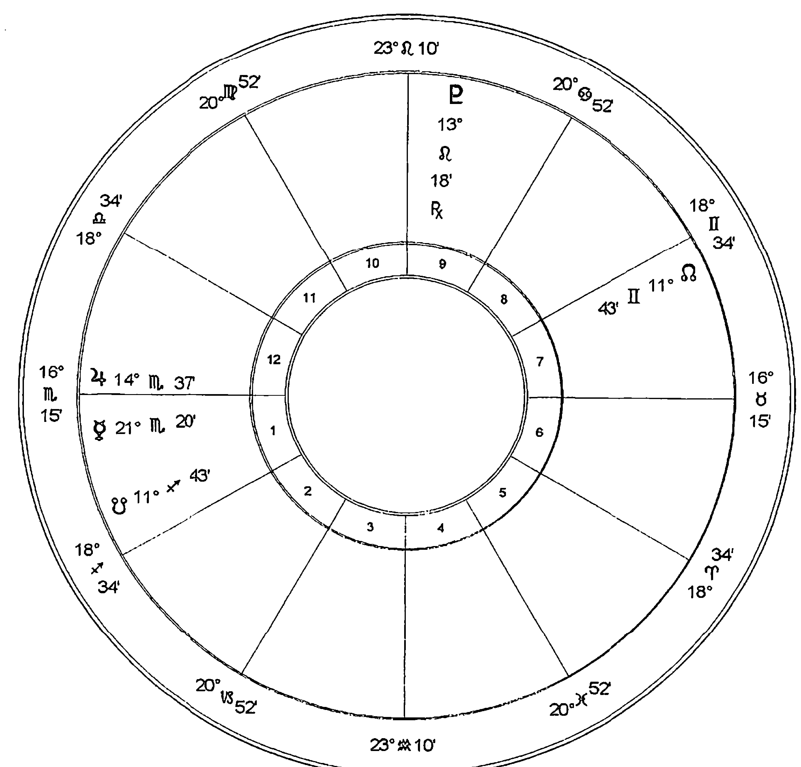
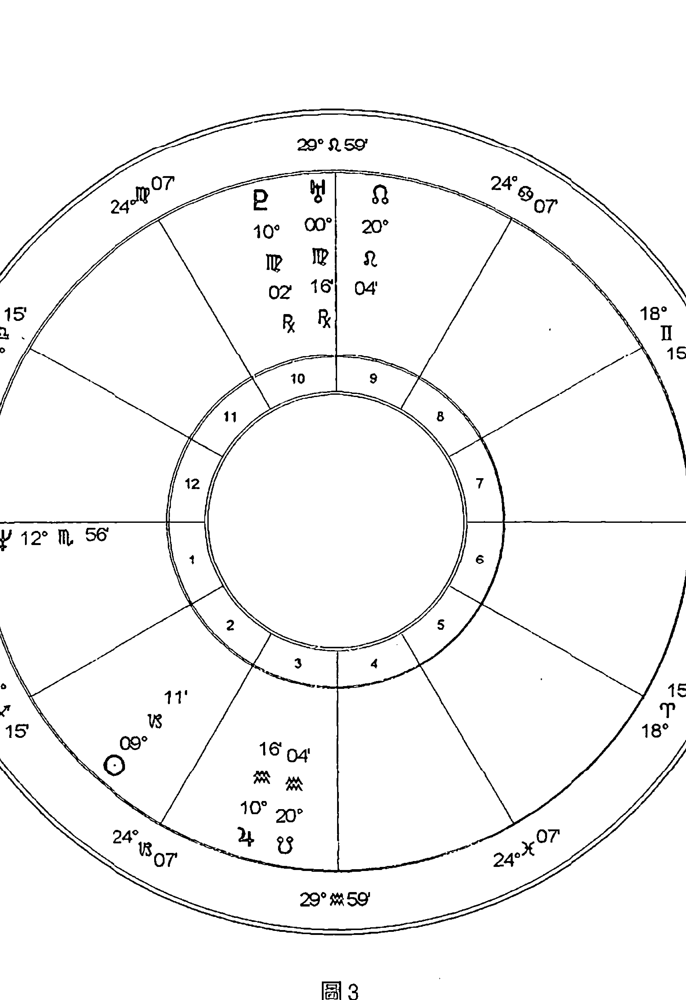
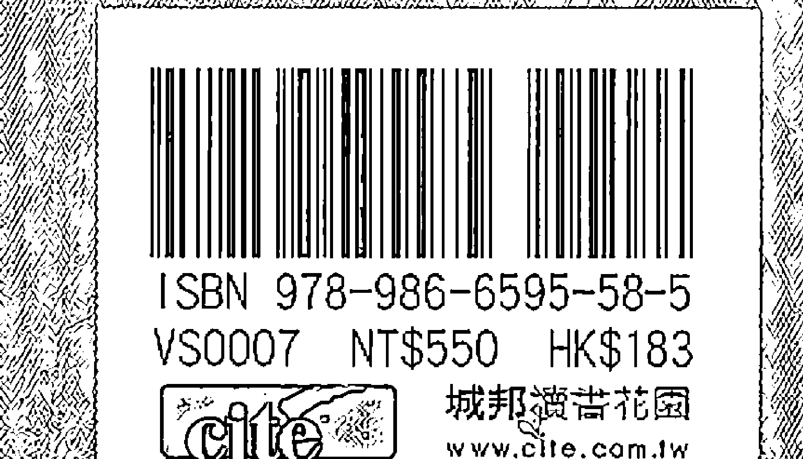

# 前世今生

### 靈魂在親密關係中的演化

Jeff Green 傑夫·格林 著 沁林 編

# PAST LIVES
The Soul's Evolution through Relationships, Complete Edition

### 冥王星

### 靈魂在親密關係中的演化

## Pluto: The Soul's Evolution through Relationships. Volume II

### 傑夫·格林 | Jeff Green——著
韓沁林——譯

# 答案就在這裡

坊間有許多廣泛討論關係的書籍，卻無法真正幫助我們從關係中獲得成長。這些書看似提供速成且簡潔的解決方法，教導你如何從一段關係中離開，不要被人拋棄。它們會告訴你如何在難以啟齒「我愛你」時，讓對方明白自己的心意；或是如何每天花六十秒，讓你的性生活更美滿。

這就像置身於浩瀚銀河中，試圖在地球周圍堆砌沙包，避免被巨大隕石砸中。這些書往往會告訴我們哪裡做錯了，卻沒有點出為何會重複同樣的錯誤。這也意味著一件事：大部分討論關係的書都沒有談到靈魂。平心而論，坊間有多少關係的書曾經談論過靈魂的演化、過去以及今生的需求？

《冥王星：靈魂在親密關係中的演化》深入地解析了每段關係的目的。作者傑夫·格林透徹的見解讓我們明白了一件事：你也許無法得到自己想要的，卻能得到自己需要的。他也點出一個簡單卻常被忽略的事實：你必須在關係中面對自我的侷限，而這也是演化的唯一道路。

> 當我把格林的諮詢內容翻譯成德文時，運用了本書及業力的概念替人諮詢。每位案主都反應：「沒錯，正是這樣。」而不是說：「聽起來有幾分道理，有可能是這麼回事。」這些概念觸動了每個人內心深處的真我。許多占星家在未來十五年都會追隨格林的思考模式，而你絕對無法想像這些針對關係驅力的詮釋，蘊含了如此基礎又正確的真理。

——克勞斯·伯納特（Klaus Bonert）

# 推薦

> 對於任何想要認真探索演化占星學的人而言，這是一本不可錯過的書。你在閱讀的過程中，會覺得遠大的藍圖映入眼簾，無形中提升了自我的意識層次，讓你帶著覺知踏上演化之路，而非在傷口的痛苦中做困獸之鬥。格林的書提供絕佳的方法及架構，讓讀者能簡單又容易地應用其中的資訊。他的方法揭露了問題的核心驅力，以及與其相關的認知和原因。這會產生無比的療癒力量，讓演化得以持續。你如果能整合運用本書的內容，將會對自己及別人助益甚多。

——瑪莉 J · 康納利 (Mary J. Connoly)

這本經典的宗旨會源遠流長。冥王星如果不揭露它秘密深處的最後珍寶，就無法圓滿達成天蠍座階段的任務。
格林帶領我們通過歷史駭人的陰森處。他完全體現了冥王星在射手座所蘊含的真理，他也在幫助我們透過前人的觀點，來仔細推敲個人本命盤的核心價值。最令人驚喜的是，他從本命盤火星及金星的階段中，挖出冥王星深藏的珍寶，尤其是在替兩個人分析星盤組合時。他清楚地解釋了關係的類型、靈魂伴侶、演化階段、火星與金星落入各星座的情形，以及冥王星在合盤中傳達的訊息，在在揭露了我們未曾見過的稀世珍寶。深入的個案探討看似無須如此嚴肅，但其中卻展現了如此不凡的見解！這彷彿在告訴我們，人們在最黑暗的時刻仍然保有力量——冥王星再生、更新及復原的能力。如果一滴血就能染上愛滋病，我們又如何能輕忽地轉身，對這些事物的關連性視若無睹？否認的時代結束了！接受和治癒的時代來臨了，就是現在！我深信格林註定要完成這本書，因為他經歷了一般人難以想像的激烈考驗，獨自在光明與黑暗的交替中摸索前進，最終存活了下來。他將完整的歷練及其目的化為本書，彷彿在對我們的靈魂說話。我們別無選擇，只能聆聽。

> ——珊蒂·修斯 (Sandy Hughes)

# 獻辭

我想在此把重新付梓的《冥王星：靈魂在親密關係中的演化》獻給父親傑夫·格林。他的退休讓占星學界備感失落，但他的付出會永遠留在所有曾被他本人，及演化占星學感動的人心中。這本書也要獻給想要透過關係及演化占星學來理解自我靈魂演化的人。

傑夫·格林是演化占星學的創始者，曾在世界各地傳授相關知識。他開辦演化占星學院，並在這些年培養了許多專心投入的學生，至今才能在世界各地都有合格的演化占星學師資。

自他退休後，由他的女兒蒂瓦擔任美國演化占星學 J W G 學院的校長。

冥王星系列的第一冊《冥王星：靈魂的演化之旅》在一九八六年出版，掀起了人們對演化占星學知識的求知若渴，該書至今仍是暢銷著作。格林為回應讀者的熱烈迴響，繼續寫了《冥王星：靈魂在親密關係中的演化》，爾後不時有讀者詢問此書，遂決定在二〇〇九年將它重新付梓。格林的著作具有轉化的力量，同時也為真心想要學習演化占星學的人提供深入的見解；尤其是靈魂透過關係演化的討論，更是精闢出色，幫助許多人徹底地改變了自己的人生。這本書尤其重要，因為它示範了如何利用演化占星學，來決定兩人之間核心的演化驅力，這不僅限於個人的關係上。

傑夫·格林的演化占星學院

如欲知更多資訊，請洽 www.schoolofevolutionaryastrology.com

或電郵至 devagreen@schoolofevolutionaryastrology.com

——蒂瓦·格林（Deva Green）

# 日次

- 推薦序 010
- 前言 013
- 序言 016
- 感謝辭 021
- 導言 022
- 第一章 關係的本質 025
- 第二章 演化占星學 031
- 第三章 我們又相遇了，是吧？ 055
- 第四章 社會、文化、父母及宗教的印記 075
- 第五章 關係的類型 087
- 第六章 關係的基本需求 115
- 第七章 金星的本質及功能 181
- 第八章 火星與冥王星的階段關係 279
- 第九章 火星的本質及功能 301
- 第十章 火星與金星的階段關係 343
- 第十一章 合盤及冥王星 375
- 第十二章 冥王星在射手座 483
- 結論 507

## 推荐序

占星学除了可以深入解读个人本命盘的能量蓝图及业力模式，更可以用来观察人与人之间的连结模式，譬如在星盘比对（synastry）时，如果关系中的一方有土星与另一方的水星形成了冲突相，意味着这两人可能得花上十来年的时间，才能真正克服沟通上的重重障碍——面子问题，潜意识里的权威倾向，难以控制的批判性，聆听与表达的节奏不合等等的相处议题。

换句话说，星盘比对数十个相位中的任何一个困难相位，都代表涉及的双方面对及克服的关系难题；此外，和谐与困难相位往往交织出现，令诠释者不易浓缩地看出关系的本质，必须逐一分析内外圈的行星相位及行星进入某宫位的意涵，甚至得运用珍·史匹勒（Jan Spiller）的南北月交点系统，或是茱蒂·霍（Judy Hall）对关系的前世回溯，才能深入了解个案之间的因果。论及合盘（Composite）的研究发展时，比较具代表性的主流著作，则应属罗伯·汉（Robert Hand）的《从行星看合盘：关系的解析》（Planets in Composite: Analyzing Human Relationships）了。此书是以工具书的形式呈现的，合盘中的每种相位以及行星落入不同宫位的解释，都可以令读者很快地洞察到一份关系的和谐与紧张之处在哪儿，同时作者更提供了转化问题的建议，如同他的另一本畅销著作《行星的推移：揭露生命的周期》（Planets in Transit: Life Cycles for Living）一样实用易懂。但上述这些占星家的研究，并未触及个案共同的灵魂演化目的和关系形成的内在驱力，以及接下去的演化发展及关系的正确进行方向。在这些极具关键性的议题上，本书作者杰夫·格林提出了别树一格的洞见，就像他的《冥王星：灵魂的演化之旅》一样精辟奥妙。格林的合盘诠释系统着重的是冥王星落入的宫位和星座，以及对应点的宫位和星座，而宫位的重要性通常大过于星座。深入阅读之后，你会发现这本应归类于奥秘占星学的著作，虽然令人不怀疑作者很可能有一「宿命通」之类的特异能力，但其实仍旧是循着心理占星学的路线在进行解析，譬如合盘里的冥王星如果是落入一宫或牡羊座，代表两人正展开或刚展开新的演化周期循环，而且会以相当任性的定义或掌控这份关系的发展方向。换言之，双方都带有牡羊座为人熟知的征服欲和竞争性，以及必要的独立和自我确立能力，不过当这类特质如果发展过度，势必会形成诠释本命盘的牡羊座时经常提到的——因过于自我中心而导致无法合作与分享。因此，读者很快就能明白对应点的七宫或天秤座特质，想当然尔就是平衡一宫或牡羊座的解药。如果掺入对南北交点的观察，读者也会发现本书如同格林的上本著作一样，将北交点及其主宰行星落入的宫位及星座，视为一份关系的正确发展方向的运作形式，而南交点及其主宰行星落入的宫位及星座，则是两人过去多生多世共同累积的惯性模式。这些元素加上与其他行星形成的相位，以及相关的行星落入的宫位及星座，并佐以四个演化阶段的观察，就是格林的合盘诠释系统的重点了。由于冥王星象征着不被社会公开接纳的禁忌，所以格林在书中大量地探讨了性、虐待、危机、迫害等等的阴暗议题，使得读者对某些令人匪夷所思的虐与被虐行为，有了着眼于因果层面的理解，对许多畏惧人性里的暴力与残忍特质的读者而言，这层理解可能会带来意想不到的疗愈。阅读本书将会对人类关系里深埋的业力及强烈的转化渴望，生起一股错综复杂的感叹和敬畏之情，而且会深深领悟到业力之中其实包含着大胆试误的创造性。积木文化连续出版了两本杰夫·格林的代表作，为华文读者打开了进入「演化占星学」的一扇门，也令我们意识到占星学的妙用有无穷的可能性，但前题是用者本身必须勤奋不懈地观察人性深处的活动，一些不易被觉知到的核心驱力是如何在操纵着自己以及自己的关系，朝着特定的「我执」方向运作，造成了情欲上的种种扭曲与错置，同时也带来了修正和转化错误的成长契机。

> ——胡因梦，二〇一一年于吉隆坡

## 前言

### 共沐灵魂之风

相信每个尝试过的人都有同感，关系从不是件简单的事！透过本命盘来解释你的关系模式，可以解释这一世伴侣的能量模式。我们如果把前世的因素列入考量，就可以深层地探讨任何一段关系，无论是爱情、友谊或商业伙伴。杰夫在本书中分享他毕生的亲身体验及深入知识，透过本命星盘及合盘，教你掌握今生最根深蒂固的伴侣需求。正如他所说，『当我们把所有因素列入考虑，便能明瞭我们会吸引来自己需要的东西，即使我们不知道自己有这种需求！』有些人很难理解前世的概念，我自己也是如此。我在认识杰夫以前，总以为轮回转世是合乎逻辑、具有一致性、理智又聪明的方法，足以用来解释人类的存在。就理性分析而言，我完全接受轮回转世的说法，但在情感上却没有共鸣。直到认识杰夫，我的理智才束手投降，打从心底接受前世的说法，对其产生真正的认同。杰夫不仅能转化他的洞见，还能用非常个人又直接的方式表达这些东西，光是他这个人就很难让人不信服。本书充分展现了杰夫的这个特质。本书再次加强了我对轮回转世的认识及信念，而我相信每位读者都会有同样的收获。它传达的是一种既陌生又似曾相识的洞见，让你很快便能产生共鸣。它就像一面放在眼前的镜子，你必须铁了心且目光锐利，否则无法认清自我及关系的本质。透过这面神奇的镜子，你会发现学习占星学并不只是整合资讯，而是重新探索自我内心最无意识、深藏在隐蔽角落的东西。本书中的占星学，教导并帮助你学习与别人沟通的语言，而这些都是你的灵魂早已明瞭的本能。你如何解释一个美好的夏日午后、朦朧月色洒在山头、小溪潺潺地流向大海、鲸鱼悄然地泅渡海洋、初秋微风沙沙地穿过转黄的枝叶？风是无影无踪的，但我们知道它就在那儿，虽然见不着，却能实际地感受到它的作用。本书能帮助你一窥你和伴侣自拥的灵魂之风，这阵风可以将你吹向任何人的身旁，也能将别人吹向你。我们每一次呼吸都与万物分享空气，共沐在这阵灵魂之风中。没有人能埋头在沙堆里，不与别人互动。我们都需要彼此，也必须知道自己并非孑然一身。我们必须明瞭为何只能与某些人分享内心的世界，共享这灵魂之风，而非与所有人产生互动。有时当你走在陌生的城市街头，与某个人眼神交会，便能感受到这阵风。你静静地点点头，仿佛说着：「我曾来过这里。」而对方也会点点头，感受到同样的悸动。你就懂了这是什么样的感觉。
如果你曾经目光扫过一整屋子的人，突然感受到强烈的爱意；或是在下着暴风雪的日子，在车站里与某人短暂邂逅，因而改变了一生。那么，你就会懂了。
生命不只是重复老旧的模式，而是挖掘新的方法去面对熟悉的一切。当你能体会这点时，你就懂了。
杰夫这本书有如镜子般反射出灵魂的外貌，而当你在阅读时，将会感受到把你带到这世上的灵魂之风。这阵风赋予你身体，让你在这一世与最重要的人建立亲密关系。
我们总会再相遇的。
继续读下去，你就会懂了！
——艾林・克里斯汀森占星学院 (The Irene Christensen Astrological Institute)
院长克里斯汀・博拉 (Christian Borup)

## 序言

### 冥王星与灵魂之旅

每位执业的占星家都会不时听到这句话：

> > 「我的天啊！我的心理治疗师花了好几个月才搞懂这点，但光看本命盘就一针见血了。」

针对灵魂的需求、关系中细微的张力，以及过去与现在的关联性之种种观察，就是对占星学的精确以及占星家至高的赞美。这也突显了目前社会帮助人们的治疗过程，往往是不足够的；这也代表了现有或「一般性」的治疗过程，很难有效地帮助人们演化及成长。

一般认为心理治疗师通常不谈论灵魂的议题，的确如此。放眼望去，有多少治疗师会关心灵魂的旅程、演化、过去及今生的需求？时下流行的看法是：

> > 「我们如果不知道灵魂是什么，那又如何谈论它？」

但是世事终会改变。最有意思的就是心理治疗师汤玛斯·摩尔（Thomas Moore）的《关心灵魂》（Care of the Soul）及《灵魂伴侣》（Soul Mates）系列著作登上畅销书之列。摩尔曾跟我说，《关心灵魂》热卖超过一百万本！他的文笔清楚流畅，对于占星学深有同感，同时也深入探讨希腊神话人物原型的象征意义及实际表现。他的书在全世界都获得热烈回响。

作家史考特·佩克（Scott Peck）的《心灵地图：追求爱和成长之路》（The Road Less Traveled）以及《心灵地图II：探索成熟与自由之路》（Further Along the Road Less Traveled）也是十分有帮助的书，其中全面且锐利地剖析了人性的状态。这告诉我们即使不是放眼可见，但灵魂的确是活生生地存在着。

格林的书亦是如此。他就象戴上了一副占星学的眼镜，拿着一把实用又细致的刷子擦亮镜片，然后勇敢地站出来。时下的心理治疗师如果能用心阅读几页杰夫的书，必能提升治疗的成效，对别人帮助更多（如果能上几堂占星课程，效果更不遑多论了）。举个例子，我们如何理解关系的目的？你能想象一位心理治疗师不停探索一个最基本又最普遍的问题吗？像是「对于个人的生命发展而言，目前这份关系到底有何意义？」光是这问题的本身就能让人们获得解放。很多人觉得过去、现在及未来之间是毫无关联的，但如果能找到这个问题的答案，这种感觉就不会那么强烈了。

格林曾说过，关系的目的就是让我们体验并面对「自己的局限」。他试图带领我们跳脱这个定律，但它却如影随形。他不断强调关系的存在就是一种互补，而非为了自娱而创造的架构。关系要求我们把自己放到第二位，同时必须透过别人才能让自己变得完整。我们透过身外之物发现自己，也需要别人的协助。这正如黑夜需要白昼的衬托，而月亮也需要太阳的光芒一样。我们如果透过希腊神话来观察关系，就会发现自己并不是命运捉弄的被害者，正如有些当红的心理学家会说（甚至有些占星家也会这么说）：「种瓜得瓜，种豆得豆。」换言之，我们必然会与自己需要的东西产生关连。在关系的发展过程中，我们会「转化自我的局限……然后获得演化。」我在过去数十年的占星经验中，早已熟知上述的看法，但是本书却透过占星的角度开启了另一块领域，让我们见识到人性状态的神奇。格林不停强调没有人能独自面对人生，关系是不可或缺的。他主张关系就是要我们由外来观察自己（占星原型的两极化），然后必须静心聆听，才能学会平等的功课。这番见解是格林重新体验天秤座原型后的收获，也是本书的核心价值。这也就是为何我不断地提醒自己它的重要性，并把它介绍给相信我能帮助他们的人。我想起多年前在大学时曾读到知名心理学家高登·欧波特（Gordon Allport）对于「成熟」的定义。他认为成熟分为三个阶段：自我的延伸、从新的超脱角度来客观评断自我，最后透过整合的人生哲学回归自我。古希腊人透过占星带领我们穿越人生旅程，让我们藉由外在的关系看见自我的成长，从中获得升华，变得更加坚强。然后就如欧波特及格林所说的，我们因此融为一体。

> >「种瓜得瓜，种豆得豆。」

> >「转化自我的局限……然后获得演化。」

占星家把冥王星视为赋与力量的表征，它不仅能影响结果，也是刺激的动力。我个人则认为是冥王星代表了洞悉。无论是哪种看法，理论派及执业的占星家都认为冥王星与极端有关，蕴含了令人畏惧的力量。无庸置疑地，一般人无法完全按照社会认定的标准来建立人生的成就，因此冥王星的力量往往不是猛然爆发（通常都会带来问题），就是完全与生命经验无关。格林在本书中一再地指出，冥王星并非某种单一的能量，而是自我认知力量的结合。它并非锁定目标独自运作能量，而是无所不在地培养力量——它是演化的。我们会在人生旅途需要的时候，刻意地运用它的能量。

冥王星在占星学中无所不在，它不仅意味着性格的激发（赋与力量），也与时间有关。它也是意识的终极表征，同时关系着性格的持续发展。当格林使用「业力」这个字时，他尽量避免让其被误解为报复及惩罚，而是把它视为连续数次累积成长或连续几世的平衡结果。

灵魂会随着时间不断地改变及演化，而且会受到冥王星的激励，然后融合成为其他行星的表现方式。这个过程都会表现在我们的关系中。因此对于格林的分析而言，星盘的合盘及比较就格外地重要。此外，这个主题本质上就具有「社会」及「性」的色彩，所以格林花了许多篇幅介绍金星及火星，以及其在本命盘中或行星移位时的表现。

本书绝对值得一读。我从来没有见过一本占星著作能用格林这种真实且明确的方式，带着勇气及恩宠，深入洞悉社会和性的领域，而最难能可贵的是它的实用性。二十五年前绝不可能出现这种深刻的洞见。占星学本身也在成长，逐渐受到世人瞩目，更趋成熟。这当然有格林一路的贡献，才能有今天的成绩。他帮助我们延伸自我，反省自我，然后将所有的哲学融合为一。读者实在应该把有关火星及金星的部分，推荐给自己最爱的心理治疗师！

请不要把本书中不时提到的「灵魂」，以及与其有关的「灵性」，想当然尔地与宗教产生联想。它的本意绝非如此，而正如格林所说，宗教也不是本书的重点。备受尊崇的伊莎贝·希奇（Isbel Hickey）曾在多年前对我说过：「诺亚，人们必须知道灵性不是一种结果，而是达到某种境界的方法。」

灵性代表我们活着的方式，而非原因。战场上杀戮的士兵的灵性发展可能与对大众传教的牧师并无两样。「勇往直前的基督精兵」更是一点也不矛盾。

这篇序言的目的是要帮助读者准备好阅读这本佳作。最后我想要再补充一点：我们不应该害怕格林的写实风格。他生动地透过真实、困难的经验，让无形之物（灵魂）化为具象。

格林在范例解说中让我们看见，无论是在重要关系或日复一日的推挤、压迫、付出及给予中，人们都是在为了自我的完整，也就是灵魂而努力。他向我们展现了灵性的勇气去认识人生。别忘了，在寻找宝藏的过程中，我们必须移开大石头，往地下深掘才能挖到黄金。

谢谢你格林，给了我们这张藏宝图。

——诺亚·泰尔（Noel Tyl）于温泉丘，亚利桑那州，一九九五年十二月

## 感謝辭

我要感謝的人太多，無法在此一一列出。特別要感謝的是我最棒的妻子馬提娜，謝謝她的全心支持，以及她對本書的意見及建言。她自己也是一位優秀的占星家。我也想要感謝我的子女路克（Luke）及蒂瓦，謝謝他們在我寫作時犧牲自己的時間來陪伴「老爹」。此外還要感謝我的朋友諾亞·泰爾、克里斯汀·博拉、珊蒂·修斯和克勞斯·伯納特，謝謝他們費時閱讀我的手稿，幫忙寫前言、序言及推薦。尤其感謝湯姆·布里基斯（Tom Bridges）在閱讀我的草稿後，給予非常重要且必要的建議。同時也要感謝一個特別的朋友瑪莉·康納利，謝謝她在我寫作期間，不吝給予建議、意見及支持。我也非常感謝南茜·蓋文（Nancy Gavin）在我生命最重要的時刻出現，給予我經濟援助，讓生活無後顧之憂。最後還要特別感謝所有我在美國、歐洲、加拿大及以色列授課遇到的人，謝謝你們對我的鼓勵。大恩不言謝，盡在不言中。

願上帝保佑

傑夫·格林

## 導言

自《冥王星：靈魂的演化之旅》初版付梓至今，已有好一段日子了。該書獲得前所未有的熱烈迴響。我在書中邀請讀者把自己的觀察、問題及感想寫信寄給我，而我也收到来自全世界數千封的信，信中的支持讓我非常感動。當然還有許多讀者好奇地詢問我，何時會出版冥王星系列第二冊。因為有你們的鼓勵，才會有這本書。

本書的目的是透過關係的驅力，討論在第一冊中提到的冥王星及南北月交點的概念。我們隨時都處於與別人的關係中。世界上有這麼多人，我們只選擇與某些人建立親密關係，與某些人交朋友，我們和每個同事都有不同的相處方式，也與父母雙方建立不同的關係，我們與孩子也另有一套相處模式。因此本書的目的就是透過業力的因果及過去世的生命背景，判斷自己今生會與哪些人建立哪些類型的關係。

本書會採用精確的占星學方法，讓讀者明瞭兩個人之間存有哪些前世的生命傾向，關係是何時結束、會在何處再度相遇，以及今生必須面對的演化功課，而這也正是兩人再度相遇的原因。

本書會透過合盤及傳統的星盤比對來分析，同時也會解釋合盤及星盤比對的主要差異。我會用許多的個案來解釋或示範這些核心概念。有些章節會討論火星與金星的本質及功能。其中一章會解釋火星與金星之間八種主要的關係階段，以及在這些階段中的相位表現方式。我還會用同樣的方法來分析火星與冥王星。另外還會有一個章節專門討論冥王星在合盤時，落入不同星座及宮位的主要原型，同時還會討論靈魂在不同演化階段的表現方式，基本可以分為演化的初階、合群階段、個體化階段及靈性階段。本書還會討論人與人之間不同的關係類型，其中會解釋靈魂伴侶、業力伴侶及學伴伴侶的差異，還有辨認他們的方式。我也特別花了一個章節討論人生伴侶中最黑暗的秘密——施虐及受虐的關係。我會先解釋伊甸園神話的意涵，然後再以許多過去的個案為例。有些讀者可能會因為這些敘述產生本能反應，因而覺得被冒犯了。其中大部分的反應都是令人反感的，但卻早已深入個人與集體的層面，讓大部分的人都難以察覺。我的目的是讓人們意識到這個原型，希望藉此帶來些許改變，然後將它徹底地從意識中消除。正如我在《冥王星：靈魂的演化之旅》中提到的，希望你能慢慢地閱讀本書，才能將其融會貫通。如果你還沒有讀過第一冊，強烈建議你先閱讀它，然後才能對本書的內容有更深入、更全面的體認。這並不是一本占星使用手冊，因此建議你從頭讀到尾，才能真正了解本書提到的驅力及原型。

在此感謝所有曾經來信的讀者，以及我在美國、歐洲、加拿大及以色列授課時所遇到的人，謝謝你們的鼓勵及支持。

> ——傑夫・格林於波德市，科羅拉多州，一九九六年冬天

# 第一章 關係的本質

本章的目的是讓讀者對關係的本質有完整的認識。宇宙萬物的本質會表現在與自身的關係中，以及相互影響和互動的過程中。所有形式的互相影響及互動都會產生演化及改變，包括自我認知在內的任何人事物，都必須與外界建立關係才能認清本質。

這一章的討論焦點會放在兩個主題或驅力上，這兩者完全影響了我們對待關係的方法、傾向、態度及心理，以及我們對待親密的人的方式，例如父母、愛人、孩子或親密友人。第一個主題或驅力是根據過去世與別人的關係。在過去世曾與我們建立過關係的人會表現過去世的經驗、認知、傾向及態度，這些會影響兩人的相處方式，而這有時是很難用理智或今生的理由來解釋的。

第二個主題或驅力是根據我們與父母或原生環境的關係，還有我們與社會、文化及宗教印記的關係。這種印記或條件並不亞於前世的因果，也會影響我們與別人建立關係的態度、傾向及心理，同時也可以解釋我們為何會用特定方式來對待身旁親密的人。

這還引出一個更深層的問題：為何我們的靈魂會選擇特定的原生環境（包括我們的父母），為何我們會在這個國家、社會或族群中成長？最重要的答案就是，今生所有的生命條件、原生國家及家庭，能夠滿足我們接下來的演化需求。此外，就演化及業力需求的角度來看，孩子與父母之間通常在前世有未了的功課。父母的潛意識記憶會限制自己對待別人的方式，而這顯然都會對孩子帶來影響。而小孩與父母一方共有的潛意識記憶也會影響彼此的行為方式。父母本身在這一世的原生環境以及過去世的生命條件，都會影響一個人與上一代的關係，也會影響他對關係或身旁親密的人的態度。
所以，我們還是又相遇了，對吧？我們的確在很多世都曾經遇過彼此。為何會如此？這答案非常複雜，但簡單地說，就是要讓靈魂與本源重新融合為一體。靈魂的演化需要很長的時間，它渴望嘗試各種經驗、驅力、行為、環境、價值觀及信仰，這些東西可能會讓它產生脫離本源的慾望，但是只有當脫離的慾望被消磨殆盡時，靈魂才能重新與本源融為一體。
某些特別的驅力代表對於特定經驗的需求，而這通常需要好幾世的時間才會形成。我們如果想獲得演化，就必須在某段時間集中在某些驅力上，然後另外一段時間又集中在其他驅力上面。我們通常會生生世世一再重複某些情境，才能反映出最重要的驅力。我們建立關係的對象，通常能反映或定義自己正在努力學習的驅力，所以我們會一再遇到這些人，直到這些驅力被消耗殆盡，做完演化的功課為止。

## 為何需要關係？

宇宙萬物可以用許多方式來創造自我，那麼為何要透過關係？這是因為萬物顯現的生命模式，就是它與自身關係的表現。創造的本身就是自我投射的結果，而所有投射出來的形式及形象都只與自己有關。事實上，所有的形象、形式及結構，都會因為創造性的投射而產生連結或互動。投射是行動的終極法則，而行動會產生磁力、電波及重力。當宇宙萬物與自身產生互動或連結時，這些能量就會結合在一起，促進演化、轉化及蛻變。再提醒一次，宇宙萬物就是與自身關係的整體呈現，看似是恆變的，實際上卻是一樣的。人類生活在這個偏遠又狹小的星球上，必然會與投射出來的萬物產生關係，因為我們都是其中的一份子。我們與地球，也就是萬物之母蓋婭息息相關。我們與別人有關係，也必須面對自己。人類會被行動法則（投射）、磁力（震動）、電力（正負兩極）及重力（純能量的結合）影響，同時也會被恆變法則（演化）主宰，而演化正是轉化及蛻變法則的來源。我們基本上是透過關係來演化。所謂的進化是透過與其他的人或物建立關係，這些代表了自我成長需要或渴望的東西，也象徵了我們自覺或自認欠缺的事物。一旦關係產生了，冥王星便會開始進行同化作用，讓我們在不知不覺中變成與自己建立關係的人或物。我們可以透過關係來面對或意識到既存的侷限，而這多半來自於自己的信仰、想法、價值觀、認知或情感模式。我們如果能與自認為需要或渴望的東西建立關係，便能超越既有的侷限，獲得成長及演化，隨之而來的就是轉化及蛻變。兩種表面上看似的形式結合之後，彼此會潛移默化，產生比結合之前更大的能量。

當造物主在自我投射，意即創造萬物時，就啟動了關係及演化的法則。所有表面或對立的顯性法則都是源自於無相的一體，進而產生了陰與陽、日與夜、冷與熱等區別。造物者在自我投射時，會以分離和獨立的形式出現，但所有形式都是萬物的一部分，必然會啟動關係法則，渴望與造物者融合。宇宙萬物從誕生、成長到死亡的過程中，都會呈現分離及獨立的表相；但也會表現重返本源或融合的傾向，其中宇宙萬物都是彼此互動且相關的，無法不透過與他物建立關係而獨立存在。所有形式的創造，表面上是分離且獨特的，卻也反映了造物者或宇宙萬物的本質。正如造物者創造生命一樣，宇宙萬物都會透過分離的顯性法則，繁殖並產下後代。但任何形式或結構的再生，都必須先與其他形式或結構建立關係，才能產生融合。融合會帶來同化，讓獨立的想法或經驗暫時停止。這種暫停可以讓萬物交換彼此能量的菁華，達到繁殖或再生的目的。正如物理學家所說，能量是不滅的，只是會改變形式。

## 人類

萬物會透過行動、磁力、電力及重力法則，維持獨立及二元性的形式，但這些法則也是操控在造物者的手中。任何獨立的形式如果想要獲得演化，必須先與自身對立的形式建立關係，例如陽性與陰性。不同的形式會透過同化作用產生融合，轉化成另一種新的形式，進而達到演化的目的。

我們如果把上述說法套用在人類身上，就引出靈魂的概念了。靈魂可以被定義成一種永恆不變的意識或能量。這意味著靈魂既不能被毀滅，也不會死亡，只會改變形式。靈魂的演化是從與本源的分離開始，歷經重返本源的過程，最後與本源融合為一，直到所有分離的認知及經驗都完全消失為止。靈魂的演化是根據與生俱來的兩種欲望原型：其一是與造物者分離，另一種是重返本源，與造物者融合。所謂的演化就是逐漸消除所有獨立的欲望，以及它導致的各種驅力及經驗。當靈魂歷經長時間的演化之後，會慢慢消除獨立的欲望，重返本源或與造物者融合的欲望便會日益明顯。靈魂在與造物者完全融合之前，必須與其他靈魂建立關係，進而獲得演化、繁衍，或是用新的方式讓自己再生。

正如造物者一樣，所有靈魂同時具備陽性及陰性的本質。造物者在創造萬物時，會同時將二元性的法則，或是對立的電極（也就是我們稱的陽性及陰性）向外投射。靈魂會根據表相法則（也就是形式）表現出陽性或陰性。而靈魂為了繼續演化，則必須根據分離法則與自己對立的形式建立關係。靈魂可以透過關係產生融合，「吸收」與自己對立的能量。正如陽性可以吸收陰性，陰性可以吸收陽性。在長久的演化過程中，靈魂有時會以陽性的形式出現，有時會以陰性的形式出現，中國《易經》的符號就是出自於此。這也意味著造物者最後會與自己向外投射的自我重新融合。對於人類而言，這就代表了靈魂會消除所有導致分離想法或經驗的慾望，然後重返本源。就靈魂的層面來看，這就是平均並融合所有陰性與陽性的能量；而就心理學的說法，這就是達到雌雄同體的狀態。在本質上，靈魂會透過分離法則，在陰性與陽性之間來回搖擺，直到它能透過與對立形式建立關係，達到陰陽調和的境界，才能真正地重返本源，與造物者融合。

# 第二章 演化占星學

### 冥王星

本章要複習在《冥王星：靈魂的演化之旅》中介紹過的主要占星法則及方法。這些都與演化的本質及靈魂的發展階段有關。

冥王星與演化法則有關。就本書的宗旨而言，冥王星特別與靈魂及其演化有關。靈魂可以被定義成一種永恆不變的意識或能量，而且是無法被消滅的，只能是形式上的改變。慾望是促進靈魂不斷演化的主要原因或驅力。靈魂之中包含兩種並存的慾望原型，其中一種是與靈魂的本源分離，另一種是重返靈魂的本源。靈魂演化的過程就是花費長久的時間嘗試所有的獨立慾望，直到最後所有的慾望都會消逝，只剩下自我與本源重新融合的慾望。所謂的自由意志或選擇，也就是根據這兩種並存於靈魂中的慾望。我們不需要透過占星學就能證明這個簡單的道理。捫心自問你難道沒有一堆獨立的慾望嗎？像是擁有更多財產、職場擢升，找個新的愛人？我們可能實現這些慾望，而且從中獲得滿足，但這種滿足很快就會被不滿足取代，然後就會渴望更多。這種不滿足會喚醒靈魂中重返本源的慾望，而世上所有人都會有同樣的體驗。

在《冥王星：靈魂的演化之旅》中，我們透過本命盤中冥王星落入的星座及宮位，分析靈魂在前世的慾望類型或演化目的。舉個例子，冥王星落入九宮通常代表一個人會透過宗教、形上學、哲學或宇宙論來定義自我的身份意識。靈魂可能花了好幾世的時間才建立自我定義的結構，而且會在今世表現出同樣的傾向。這都是源自於對安全感的需求，必須建立在自我的一致性之上。別忘了，冥王星與我們最深層、無意識的安全感有關。這也就是為何它常與強迫性、迷戀、被威脅感、防禦性、各種情結或操縱有關。靈魂演化的下一步，就顯示在本命冥王星的對應點落入的宮位及星座。我們如果能朝對應點的方向努力，自然便能讓本命冥王星獲得演化或轉變。

在兩個人的合盤中，冥王星落入的宮位及星座，意味著共有的前世核心動力或演化目的。就像個人的演化一樣，兩人之間很容易會出現過去世的傾向。正如個人的本命盤一樣，兩人在星盤比對中，其中一人的冥王星會落入對方本命盤的某個位置，這就意味著他的核心自我意識會如何影響對方。別忘了，冥王星在個人星盤中代表了世代性的自我意識。所以在星座。每個人都會與同一世代的人產生關係，但是靈魂中的獨立慾望，會讓每個人試著用自己的方式脫離整個世代，建立自我的身分意識。這種獨立的慾望會透過冥王星對應點的星座及宮位，帶領我們走向下一步的演化。因此世代性的影響就像是一隻推手，促進靈魂的獨立慾望繼續演化。我們與同世代的人建立的關係也是如此，會以個人化的方式呈現。我再提醒一次，冥王星與現實生活每個層面的演化準則有關。演化有兩種呈現形式，分別為災難性或一致性的演化。我們可以由此看出靈魂的演化方式。災難性的演化通常是某個強烈事件導致徹底的改變，也就是快速地滿足演化的渴望。在大自然中，這可能是地震、火山爆發或暴風雪。對於人類而言，則可能是突然失去摯愛，違背信任基礎而導致強烈的背叛或遺棄感，被迫失去社會地位或權力（例如尼克森總統因水門事件被迫下台），強暴及任何強迫性質的性經驗，劇變性的疾病，例如愛滋病或癌症。災難性的演化往往出自兩個原因，其中之一就是抗拒必要的演化。抗拒會產生緊張或壓力，正如鋼琴的弦如果過於緊繃，到了某個關鍵時刻就會突然斷裂。靈魂如果一直抗拒必要的演化，到了某個階段就會無法再抵擋演化的力量，此時靈魂得面對一個最真實的問題：為何要抗拒演化的意圖或目的？答案就是安全感的需求。對於大多數的人而言，安全感建立在自我的一致性上，而一致性則來自於熟悉或已知的存在方式或現實。來自於過去的人事物會不斷地變成當下的現實，然而現實也蘊含了演化或前進的力量，會反映出未來的趨向。過去及未來的趨力會在每一個當下角力拉扯，而我們每個人都有自由意志（冥王星）或選擇的力量，可以決定接受必要的演化，或是因為未知的恐懼而抗拒演化。恐懼會影響我們的選擇，我們每個人都有自由意志（冥王星）或選擇的力量，可以決定接受必要的演化，或是因為未知的恐懼而抗拒演化。在重要的關鍵時刻，這種抗拒會導致災難性的事件，如此才能達到演化的目的。

相較之下，一致性演化就是緩慢、漸進的改變。生命的起起伏伏會帶來改變和成長，而大部分的人都是一致性的演化。這種演化就如整個人生的平均值，其中混入幾次災難性的事件。平均而言，大部分的演化都是一致性的。

災難性演化的另一個原因是業力。所謂的業就是每個行動都會產生相應的結果。舉個例子，如果我背叛了某人，難道自己不會被背叛嗎？我如果拋棄了孩子，難道有一天我不會被拋棄嗎？

### 月亮的南交點及北交點

在《冥王星：靈魂的演化之旅》一書中，我曾經提過月亮南交點落入的宮位及星座，就像一種工具或運作模式，能幫助我們有意識地實現靈魂的演化目的及慾望；而冥王星在本命盤落入的宮位及星座，則象徵了靈魂在前世的慾望及目的。靈魂很自然地會用前世的方式來定義自己（我們總是從結束的地方開始），也會出現南交點象徵的傾向。另一種說法則是靈魂會在每一世創造顯意識的性格或自我，藉此來滿足或達成演化的目的。月亮與所謂的自我有關。自我就像是電影投影機上的鏡片，目的是讓電影中的影像能夠聚焦呈現在銀幕上面；沒有了它，所有的影像不過是擴散的光線，無法成形。由此可知靈魂會創造一個顯意識的自我，透過自我產生集中的自我形象，然後透過形象來定義自己的身分認同，而這也就是所謂的性格。自我就像是能量集中的漩渦一樣，融合了所有靈魂製造的顯意識性格。當靈魂進行演化時，自我和身分認同當然也會產生變化。本命盤冥王星落入的宮位及星座，代表靈魂前世的演化目的及慾望；而演化的底線就是月亮的南交點。南交點落入的宮位及星座則代表了自我的類型，如何幫助靈魂實現演化的目的及慾望。事實上，靈魂的性格或自我（南交點），其實都是源自於這些核心的慾望和目的。因為冥王星和南交點與安全感的需求有關，大部分的人都會在無意識中表現出它們在本命盤中象徵的趨力，並把它視為自我定義的基礎。靈魂下一步的演化則要視冥王星對應點的宮位及星座而定，而月亮的北交點也會齊頭並進。北交點代表的是不斷演化的自我或身分認同。我們唯有根據當下對於過去的看法，才可能理解未來。每個當下都是由過去及未來決定，這會根據特定的情境產生不同程度的演化壓力。過去及未來之間的動態趨力會有意識地透過南北交點，表現在自我意識或性格上面。本命的月亮象徵了當靈魂感受到過去與未來的動態驅力時，在每個當下立即表現出來的顯意識自我或性格。月亮是意識的元素，它除了呈現在演化的過程，還能透過形式或身分認同將演化整合。
在兩個人的合盤中，月亮的南交點與雙方的性格或自我有關。它就像一種工具或運作模式，曾經在過去世被用來實現兩人關係中的核心演化目的及慾望（視合盤中冥王星落入的宮位及星座而定）。冥王星與南交點落入的宮位及星座，則代表了雙方在過去世的關係、互動及結束的方式。由此可知，這些符號都關係著兩個人到了今世會在哪個領域重新建立關係。
兩個人接下來的演化功課，可以視合盤中冥王星對應點落入的宮位及星座而定，並且透過合盤中月亮及北交點落入的宮位及星座來實現。
在星盤比對中，月亮南北交點的位置象徵過去世的驅力。南交點的位置象徵我們與對方在過去世的共同經驗，同時也可以看出前世的趨力，會如何在無意識中影響自己給予對方的回應。北交點的位置則告訴我們可以透過何種方式，在今生超越過去世的限制。
我們如果綜合運用合盤及比對的技巧，便能詳細分析兩個人在前世的趨力模式，也能看出兩人在今生相遇的目的及意義。合盤討論的是兩人之間的動力，有如第三方在分析這段關係，但是關係中的任何一方都仍是以自己為出發點。因此我們不僅要分析合盤中的冥王星、冥王星的對應點以及月亮的南北交點，同時也要探討星盤比對時冥王星、南北交點落入對方星盤的位置。

### 月亮南北交點的主宰行星

我們可以透過南北交點的主宰行星落入的宮位及星座，實現其各個的意義。

基本上，本命冥王星會透過南交點來實現前世的演化目的及欲望，南交點則是透過其主宰行星落入的星座及宮位來實現自己——意即靈魂在實現目的及欲望時所需的自我中心架構。

本命冥王星的對應點是透過北交點來實現，而北交點則是透過其主宰行星落入的宮位及星座來落實。

### 冥王星與月亮南北交點合相

當冥王星與月亮南北交點合相時，或是與月亮南北交點軸形成四分相時，通常意味著特定的演化及業力狀態。當冥王星與南交點合相時，可能會出現下列三種情形。前兩種較為罕見，第三種則很常見。

## 冥王星與南交點合相的三種情形

1. 這個人正處於演化和業力再現的狀態。他在過去世沒有面對南交點、冥王星，以及南交點主宰行星落入宮位及星座代表的議題，因此在這一世必須重新體驗這些議題及功課。他必須完成過去世的議題及功課，才能打開北交點的大門（也就是脫離這個狀態的方法）。一般而言，這個人必須等到第二次土星回歸、大概五十六歲時才能獲得解脫。

2. 這個人已經完全發展並學習演化的功課，而其目的及動機都很清楚。他正處於業力豐收的狀態，所以會為這一世帶來某些天賦、知識或能力，然後形成獨特的身份認同。他也可能因為受限於這個狀態而感到挫折，渴求透過北交點的實現來尋求解脫。挫折感是因為他們已經在過去許多世中徹底地學習過南交點、冥王星，以及南交點主宰行星落入宮位及星座代表的議題，因此渴望能接觸些不同的東西，而這都呈現在北交點及其主宰行星落入的星座及宮位中。這個人通常要等到第二次土星回歸時才能獲得解脫。

3. 這個人可能在某些方面處於演化和業力再現的狀態，其他方面則處於豐收的狀態。這是當冥王星與南交點合相時最常見的情形。同樣地，這個人通常要等到第二次土星回歸時才能獲得解脫，除非有其他重要的條件存在。

當占星家為兩個人分析關係時，如果在合盤中發現以上的相位，上述的情形便會出現在雙方或其中一方身上。我們必須把焦點放在與過去世狀態有關的特定宮位上，幫助他們理解兩個人關係的現狀和涉及的生命領域。我們如果透過星盤比對，發現其中一方的冥王星或其他行星與對方的南交點合相，就代表了兩人之間存在著前世帶來特殊的演化及業力狀態，必須在這一世獲得解決。這個狀態會表現在南交點落入的星座及宮位、與對方南交點形成相位的行星落入的星座及宮位，以及該相位與對方本命盤重要交點形成的相位上。

冥王星與北交點合相也代表了一種特殊的演化狀態。這意味著其中一方曾經在前世努力解決特定的演化議題，這可以從北交點、北交點的主宰行星，以及冥王星與北交點合相落入星座及宮位代表的議題中找到線索。

我們如果在合盤中發現冥王星與北交點合相，就代表這兩個人在前世曾經一起面對過這些議題，而且必須在今生繼續。當你在星盤比對時，發現A的冥王星或其他行星，與B的北交點合相，代表A可以幫助B面對北交點及其主宰行星落入宮位和星座代表的議題，A將在B的生命中占有重要地位，可以幫助B發展與這些議題有關的生命領域。這裡還有一種界定雙方角色的方法，當A本身有行星與南交點合相時，而B又有行星與A的北交點合相，那麼B就扮演了推手的角色，可以幫助A發展前世帶來的功課。

## 冥王星或其他行星與月交點軸形成四分相

一個冥王星或其他行星與交點軸形成四分相時，就形成特定的業力／演化狀態，我將其稱為「省略步驟」。這代表他前世在許多領域及議題中搖擺不定，而這涉及了南交點、北交點、南北交點的主宰行星、冥王星以及冥王星對應點落入的星座及宮位。他就像坐上蹺蹺板一樣上上下下，沒有完全發展其中任何一個領域，也沒有處理好相關議題。他在前世拒絕認真面對這些驅力、議題及領域。為了讓演化繼續，他必須重新面對略過的步驟。這種人時常會覺得過去就是未來，未來就是過去，所有一切都同時呈現在當下。所以問題就是：到底該如何打破僵局？就占星學的角度而言，他得知道自己必須一致地發展哪些議題、驅力及生命領域，不僅再次面對略過的功課，還必須找到新的整合之道。關於這點，我們可以從冥王星行進的方向找到答案，首先必須判斷冥王星是朝北交點或南交點行進。最簡單的方法就是找出哪個月交點在前世與冥王星（或是與形成四分相的行星）形成合相。別忘了一個原則：南北交點的平均運動是逆行的。當我們找出冥王星是朝哪個月交點行進後，該交點及其主宰行星落入的星座及宮位，就代表了這個人應該一致性發展的領域和議題，同時也能以全新的方式面對冥王星對應點的功課。

兩個人的合盤如果出現這個相位，代表他們在前世為了發展兩人的關係，忽略了某些演化功課，而這可以從南北交點、冥王星或與交點軸形成四分相的行星（落入的星座及宮位）找到線索。當我們判斷冥王星的行進方向（朝南交點或北交點）後，便能找出他們必須一致發展的驅力、議題及功課。這不僅幫助他們重新面對略過的步驟，還能繼續未來的演化之旅。

在星盤比對中，當A的冥王星或其他行星與B的月交點軸形成四分相，也意味著一種特殊演化／業力狀態：A和B之間曾經發生過某件事，導致他們分離，關係因此中斷而沒有圓滿結束。我們可以從南北交點、冥王星、與交點軸形成四分相的行星（落入的星座及宮位）來判斷導致兩人分離的事件性質。兩人在今生的目的就是重新面對被略過的議題或功課，讓關係得以延續，獲得進化或解決。

## 南北交點與主宰行星形成對分相

這有幾種可能的情形。可能是北交點的主宰行星與南交點合相，或是南交點的主宰行星與北交點合相；也可能是北交點的主宰行星與南交點合相，而南交點的主宰行星同時也與北交點合相。

當北交點的主宰行星與南交點合相，適用於前面提過冥王星與南交點合相的三種情形。這個人只能透過南交點、南交點的主宰行星，以及與南交點形成相位的行星涉及的演化／業力功課，來實現冥王星對應點的目的。同樣的原則也適用於合盤中。當南交點的主宰行星與北交點合相，這個人會在今生再次體驗南交點象徵的驅力、條件及狀態（視其落入的星座及宮位而定）。唯一不同的是，這些反應過去的狀態會在今生獲得釋放。當前世的情境不斷地出現時，他不會覺得動彈不得、苦無出路，反而可以從北交點落入星座及宮位象徵的原型中，讓過去的種種獲得解放。這就像在原有的房間中有一扇門通往另一個新房間，而新房間就是北交點落入的星座及宮位。冥王星對應點落入的星座及宮位就像是一隻推手，讓它打開北交點象徵的「新房間」。這個原則也適用於兩人的合盤，兩人必須落實冥王星對應點的功課，才能打開合盤中北交點象徵的新房間。

當北交點的主宰行星與南交點合相，而南交點的主宰行星又與北交點合相時，這也代表一種非常特別的業力／演化狀態。這個人會在同時體驗到過去和未來。未來彷彿在過去發生過，而過去又看似是未來的預言。他就像是陷入連環的圈套中，過去和未來會不停地循環出現，但卻可以在過去與未來交錯的當下產生轉化，透過時間的智慧產生新的洞見、認知及理解。當過去與未來同時呈現在當下時，冥王星對應點會促進這個人或合盤中的雙方，在過去與未來交錯出現的時刻，產生新的洞見、認知及理解。未來交錯的情形往往發生在南北交點、南北交點主宰行星，或是其他與南北交點形成相位的行星（視其落入的星座及宮位而定）相關的生命領域。

## 冥王星的相位

冥王星與其他行星形成的相位多寡，與靈魂完成演化的意願程度有關。任何與冥王星形成相位的行星，都會呈現過去與現在既有的結構、傾向、驅力及行為結果，而這個人必須用一種強烈的方式來轉化這個行星的本質，才能讓它進入新的演化循環之中。冥王星與其他行星形成的相位多寡，代表一個人渴望靈魂轉化的程度。一個人或兩個人之間如果有六或七個冥王星與其他行星的相位，感受絕對會與只有兩或三個相位的人截然不同。

我們別忘了貫穿人生及本書的核心原型：演化。當冥王星與一個行星形成相位時，就會激化或加速演化的發生。演化的類型可以從相位的性質來判斷。緊張相位意味著災難性的改變，因為它的本質是壓力。壓力暗示了某些現存的抗拒，就像畫錯的界線，限制了這個人對行星的驅力進行必要的轉化或改變。抗拒通常是源自於恐懼，因為不安全感讓他害怕改變。

就演化的觀點來看，靈魂到了某些關鍵時刻就無法再抗拒改變，此時便會出現災難性的事件，將導致抗拒的原因消滅。災難性的改變可以促成顯著的演化，雖然這種經驗通常是非常困難又痛苦的。很少人能在事件發生的當下了結其蘊含的意義，往往要等到過了一段時間才能產生後見之明，還有有些人甚至終其一生也無法明瞭背後的道理。這對一個人或兩個人都是很痛苦的，因為事情好像沒有個了結，他們可能要等到下一世才能明白，但是靈魂會重複遭遇同樣的事件（或是導致這些必要事件的驅力），直到他們能理解其中意義，讓事件獲得解決。當冥王星與其他行星形成緊張相位時，代表一個人可能屢次遭遇與這個行星有關的災難性事件。

災難性事件也可能是來自於業力因果。舉個例子，火星與冥王星形成對分相的人常會有因為暴力導致早逝的經驗。在兩人的合盤中，如果冥王星與火星形成對分相，這段關係常常會夭折結束。在星盤比對中，如果A的冥王星與B的火星形成對分相，兩人之間常會因為各種不同的原因，出現非常激烈或威脅生命的事件。由於冥王星與火星都具有報復性，所以兩人之間會不斷製造困難的業力，直到其中一方能原諒對方或厭倦了多世的糾纏，才能停止瘋狂的輪迴。

占星家的挑戰就像偵探般揭露暗藏的業力及驅力，以及其可能導致的災難性事件。再提醒一次，揭密的關鍵就在於冥王星以及與冥王星形成相位的行星，從其落入的星座及宮位看出端倪。這個原則不僅能適用於個人星盤，也可以應用在兩人的合盤及星盤比對。

冥王星與行星形成柔和相位通常意味著一致性的演化，會帶來漸進、緩慢但持續的改變。

請謹記在心，冥王星與行星的相位會繼續演化好幾世。當你發現冥王星與行星形成相位，該行星極有可能早在前世就受到冥王星的影響。舉個最簡單的例子，假設冥王星落入獅子座五度，金星落入天蠍座五度，想必大多數的占星家都會同意這是一個正四分相。現在假設金星落入天秤座二十五度，在十度的容許度內，金星與冥王星也形成了四分相。如果我們又假設金星落入天蠍座十五度，金星與冥王星還是形成四分相。不管哪種四分相都一樣嗎？答案並非如此。當金星落入天秤座二十五度及天蠍座十五度之間，會與獅子座五度的冥王星形成連續性的演化，表現金星與冥王星四分相象徵的轉化目的，而這種轉化往往會持續好幾世。假設一對情侶在合盤中有金星與冥王星九十度的相位，而且是比較「新」的相位，也就是落在形成九十度（正四分相）之前十度的範圍內，他們的感受絕對與落在九十度之後十度範圍內的情侶截然不同。¹ 這是因為第一對情侶（入相位）是初次體驗金星與冥王星相位象徵的轉化目的，而第二對情侶（出相位）則已經體驗過許多世，對它非常熟悉。我可以用一個簡單的比喻來解釋，我去百貨公司買件新褲子，第一次試穿時可能覺得很新，不太舒服，但是穿了許多年後，就會覺得非常舒適又熟悉。同理而論，冥王星的相位也會延續許多世。再提醒一次，相位的狀態是非常重要的概念，讓你可以幫助個案認識今生最貼切的演化驅力。

¹ 落入正相位之前的相位稱為「入相位」，落入正相位之後的相位稱為「出相位」。

### 冥王星影響演化的四種方式

冥王星會透過四種方式來影響演化，其中兩種是災難性的，另外兩種是非災難性的。分述如下：

這裡還有一個重點，特定相位只會對其所處的階段有意義。我們都知道星盤是三百六十度的循環，其中蘊含漸進的演化。這個循環中有幾個轉化點，我將其稱為演化的門檻，包括零度、四十五度、九十度、一百三十五度、一百八十度、兩百二十五度及三百一十五度。這些門檻與八個基本的月相有關，分別是新月 (New Phase 新生階段)、眉月 (Crescent Phase 初期階段)、上弦月 (First Quarter Phase 第一個四分階段)、盈月 (Gibbous Phase 突顯階段)、滿月 (Full Phase 圓滿階段)、缺月 (Disseminating Phase 擴展階段)、下弦月 (Last Quarter Phase 最後一個四分階段)、殘月 (Balsamic Phase 極致階段)。每個階段中都有特定的相位象徵演化的門檻，而每個門檻都有不同的演化轉變方式。我們必須先對循環有整體認識，牢記每個冥王星相位的狀態（入相位或出相位），才能從演化的角度更深入地認識這些相位的本質及意義。讀者如果對冥王星與其他行星的相位有興趣，可以參照《冥王星：靈魂的演化之旅》中詳細的解釋。我稍後會進一步討論八個主要階段及其中相位。

- 當靈魂在演化之旅中走到某些關鍵時刻，日益增加的抗拒會帶來必然的演化。此時無論我們願意與否，都會出現情感的失落、背叛、失去信任或完全改變人生的事。這些事件通常都是災難性的。

- 建立新的重要關係。此時我們會與自認為需要、但又欠缺的人或物建立關係。當我們與「某人某物」建立關係後，便會出現同化現象。我們會吸取對方的特質或精華，將其與自己融為一體，讓既有的現實產生轉變。最簡單的例子就是當我們與別人建立關係，常會出現「近朱者赤，近墨者黑」的結果，或是所有人突然在同一時間對占星學產生興趣。當你與占星學的知識系統建立關係後，你在意識中就會被占星學「同化」，改用截然不同的方式面對既有的現實表相。這種演化通常是非災難性的。

- 當靈魂在演化之旅中面臨危機時，我們會覺得人生窒礙不前，之前認同的現實生活及生命本質漸漸變得毫無意義。當我們意識到窒礙時，我們很自然地會從現實環境中退縮，向內探索其來何自。退縮或向內探索會讓我們漸漸地脫離現實主流，直到自己能覺察原因何在。一旦知道原因，人生的方向及現實生活必然會出現徹底的改變。對於大多數的人而言，這種演化是災難性的，因為必須激烈地改變過去，才能迎向未來。這種狀態如果沒有解決，最糟糕的情形就是導致神經緊張失調。

當我們面臨演化的關鍵時刻，可能會覺得某些源自無意識或靈魂的東西浮現腦海，讓我們發現自己未曾意識到的潛力或才華。我們如果能接受它們並付諸實行，便能讓既存的狀態產生演化。對大多數的人而言，這通常是非災難性的演化。

冥王星影響演化的四種方式可能會交錯出現。舉個例子，一個人可能會意識到自己的潛力或才華，渴望將其付諸實行，卻發現某些既有的現實狀態會限制自己的發展。此時他如果一味地抗拒或害怕發揮潛力或才華，那麼這個非災難性的演化慾望便可能導致災難性的事件。

### 自然演化的四個階段

我們必須知道所有靈魂都會根據演化的自然法則，各自以獨一無二的方式進行演化。因此坊間的「占星使用手冊」實在徒勞無益，也污衊了占星學的智慧。最重要的是必須先掌握演化的自然法則，才能讓我們對占星學符號的理解反映出演化的意義。唯有如此，我們才能更精準地認識每個個案，如實地反映他們的現實狀態，而不是根據一些占星書籍針對金星落入處女座的介紹，就認為金星處女座的案主必然與書上說的一樣。

演化有四種自然階段或門檻，而所有靈魂都會歷經長時間的演化。每個階段都有特定的心理原型，而且都是固定且獨一無二的，都會影響個人的意識。四種演化階段具備的自然條件，決定了每個人對於生命經驗的態度。此外，每個階段都還可以細分成三種發展層次，展現靈魂演化的歷程。靈魂四種自然的演化階段分別為：

#### 合群階段

這是常見的階段，地球上約有百分之七十的人都處於這個狀態。合群狀態的靈魂完全受限於原生主流社會的規範、習俗、禁忌、宗教、法律及是非觀念。他／她無法脫離社會或現實的眼光而獨立存在。舉個例子，如果社會中大多數的人認為占星學是虛偽、造假的科學，他們也會持同樣的看法或觀點。這個階段的人渴望透過合群來獲得保障，也就是多數症候群的安全感。

在合群階段的第一個次階段裡，靈魂有如蜂巢裡的工蜂一樣，只具備非常基本的個體意識。在第二個次階段裡，靈魂會強烈渴望建立社會地位，因此會逐漸發展個人意識，為了達到目的而接受社會規範的「教化」。在最後一個次階段裡，個體的靈魂可以演化至政治領袖或各行各業翹楚的地位，因為他們已經熟悉制度的運作，最後便出現了所謂「內行領導外行」的結果。另一方面基於演化的必然性，每個政治領袖都會提出不同於時下的新見解，徹底改變或重組既有的制度或社會，讓演化得以繼續。這些領袖本身已經開始或正在邁向下一個演化階段，也就是個體化階段。政治領袖通常企圖實現自己的理想或見解，卻會遭遇不同程度的阻礙、對抗（冥王星），或社會中各種派別的反對，因為反對的人只想維持現狀。

#### 個體化階段

整體而言，約有百分之二十的靈魂處於這種狀態。這些人已經超越合群階段，發展出個體化的意識。在這個狀態的第一個次階段中，靈魂會開始獨立質疑及思考，反對共識且拒絕跟隨主流。我們時常可以在這些人身上看到象徵反抗原型的天王星特質。他們開始與特定的社會環境劃清界線，跳脫社會的觀點。這種疏離的心理可以讓他們培養客觀意識，用相對性的角度來看待現實。這些人會透過相對性的理解方式，發現「現實」絕不僅限於主流觀點的認知。這個階段的靈魂會開始擴張自我意識，用更加包容的架構來探索現實的本質，然後往下一一個演化階段邁進。如果有人告訴一個個體化階段的人，占星學是一種假科學，他／她會自己去探索此話的真假。這個階段最典型的心理症狀就是文化的疏離感，這些人會覺得自己無法適應大部分人的生活方式，出現心理及情緒上的疏離感；但是他們也可以體會到另一種無法言喻的自由，可以為所欲為地做自己。在個體化階段的第一個次階段中，靈魂通常試圖彌補內心與眾不同的感覺。這種彌補是因為內心的與眾不同讓他們對社會產生不安全感，覺得在社會中無所適從。沒有人喜歡不安全感，因此這個階段的人也會遵守外界的「正常」標準。他們會努力創造一個表面上看起來很「正常」的現實生活，但在內心卻有完全不同的看法。他們為了彌補不安全感，創造了一個表裡不一的、活生生的謊言。

在個體化階段的第二個次階段中，靈魂會對「制度」產生不同程度的憤怒、悲觀或虛妄感受，覺得自己無法融入主流社會，不時渴望把自己和社會全都毀滅。這個次階段可能是所有演化階段中最困難的一關，因為靈魂不斷地感受到疏離的驅力，並在內心產生疏離感。他們會開始透過更大的架構來認識「現實」，發現人類歷史不過是重複的循環。當他們理解這點之後，便會產生悲觀及虛妄的感受。對於這個次階段的靈魂而言，這是一種很困難的演化挑戰，因為他們必須在社會共識中整合自我的意識，然後才能超越社會的限制。這些人隱藏的恐懼在於，如果他們嘗試在主流社會中整合自我，可能會因此迷失自己，或是被社會同化而喪失自我。當他們發現恐懼不過只是恐懼，並不會因此失去個人的獨特性，明白「價值就存在於努力的過程中」，便能邁向個體化演化的最後一個階段。

處於最後一個次階段的靈魂通常都是當代的天才，他們多半是開創新視野的發明家或創新者，改變主流現實的本質。他們非常有自信，也很明白愛因斯坦曾說過：「天才與凡人互動時，必會出現激烈的反抗」。他們堅信自己能在社會中整合自我，而且漸漸出現終極或永恆的超脫見解，因此他們並不執著於努力的結果。他們會為了努力而努力，知道終有一天所有的努力都是值得的。

#### 靈性階段

約有百分之五的靈魂處於這種狀態。靈性並不等同於宗教！宗教是為了滿足群體階段的靈魂。宗教時常堅持自是彼非，然後導致了宗教戰爭、道德「淨化」，甚至種族屠殺。這裡的靈性指的是對於所有精神教誨秉持絕對開放的態度，而所有教義的目標都是一樣的。這個階段的人的意識，源自於自己選擇靈性系統的教誨。因此他們眼中的現實是超驗性的，放諸宇宙皆同，超脫了時間與空間的限制，卻又活在其中。這些人已經完整地體驗過源於個體化階段的疏離感，開始將意識重心從自我轉移到靈魂。他們會漸漸出現兩種感受：一方面感受到獨特的自我及身分認同，同時又會覺得自我及個人不過是萬物來源、神性的投射罷了。

處於靈性演化第一個次階段的靈魂，會受限於心理學的謙虛驅力。這是因為他們徹底體認宇宙性（或超驗性的）的現實遠勝於小我，而所謂的自我不過是沙灘上的一粒小沙子。處於這個次階段的人多是帶有奉獻本質的靈性追求者。他們會不停追尋各種靈性導師或教誨，藉此界定自己的內在及外在現實。許多人會積極地想替更廣大的整體服務，從事利他性質的工作。

第二個次階段的靈魂會出現一種自我固有的危險：自認已經「啟蒙」，其實不然。這些人常會覺得自己充滿靈性，產生一種自恃非凡的靈性妄念。他們會自詡為靈性導師或治療者，具有獨特的管道接觸「真理」。綜觀歷史，這個次階段成了許多「假先知」的舞台。很不幸地，我們這個時代也有許多人自詡為靈性導師，實際上不過是危險的小丑，例如奧修（Rajneesh）、先知克萊爾（Clair Prophet）、藍慕沙（Ramtha），還有自稱是耶穌基督化身的南韓統一教文鮮明（Moon）。他們多自認為是「溝通管道」，反映出自我中心的虛妄。

個次階段的靈魂最後必須消除唯我獨尊的自我，因此他們會「安排」一些內在及外在的經驗，讓自己產生絕對的謙卑，才能跨過門檻進入最後一個次階段的演化。這些經驗通常與危機有關，其本質反映了演化的必然性，目的是推促他們破除自我中心的靈性妄念。

在靈性演化的最後一個階段中，靈魂漸漸從「真實」的心靈老師變成上師，最後就會成為所謂的救世主（Avatar）。切記一個簡單的道理：真正理解神的靈魂，只會指引回家的方向，而不會把自己當成終點。

演化的初階：這個階段的靈魂，可能剛剛從其他的意識形式演化進入人類意識，或是因為業力因果而落入這個階段。前者的靈魂只具備非常模糊的自我意識及最基本的時空概念。這些人的眼神很呆滯，通常非常天真又快樂，因為他們對其他事情一無所知。現代的術語會將他們稱為心智障礙、矮呆症或唐氏症等。就演化的觀點而言，這些靈魂會漸漸地產生自我覺知，最後進入合群階段。

後者的靈魂則非常清楚自我的侷限。他們的瞳孔會散發銳利的白色光芒，通常表現出不同程度的憤怒，有些甚至對自己或別人出現暴力傾向。這是因為他們非常清楚自己與別人的差異之處，知道自己在其他世中有過不同的意識狀態，卻因為業力因果被迫處於這個極度受限制的狀態中。世上約有百分之五的靈魂處於演化的初階，其中百分之三屬於前者，百分之二屬於後者。

地球上的所有人都处於以上这四种演化阶段。当我们在分析合盘或星盘比对时，原则也和个人的星盘一样，重点是先理解个案是处於哪一个演化阶段。你无法单从本命盘、合盘或星盘比对来判断一个人的演化阶段。占星学基本上是一种观察及连结的科学，一种反映自然法则与关联性的自然科学。因此你必须观察个案，透过观察来判断个案的演化阶段。你一旦确定了个案的演化阶段，便知道有哪些演化条件会影响个案的发展。唯有如此，你才能正确地解释本命盘中占星符号的意义。金星落入处女座的案主如果处於合群阶段，他的表现一定与处於个体化阶段或灵性阶段的案主截然不同。每个阶段都是独一无二的，但是都会不停地演化。举个观察的例子：如果一个案主来问我何时可以买到BMW，另一个案主问我何时才能获得启蒙，我马上就知道两者的差异了！我会根据个案的现实，而非个人的认知，用不同的语言或方式来进行谘商。

## 第三章

### 我们又相遇了，是吧？

我們在這一章中，要先討論自己與別人在前世的關聯性及驅力。這不僅能幫助我們了解這些關聯性及驅力會如何影響彼此在今生的關係，而且最重要的是知道兩人共有的目的及演化導向。我們會運用前面章節以及《冥王星：靈魂的演化之旅》提到的占星原則及方法，建議你先更深入透徹地閱讀其中的內容。本章目的是分析兩個人在前世的演化及業力進展，以及接下來在今生的演化及業力方向。在分析的過程中，我們必須參看兩個人本命盤的合盤及比對。本命盤的合盤及比對都是非常重要的技巧，因為它們反映了不同的動力。合盤是把兩個人視為一體，顯示他們必須共同面對前世及今生的驅力；星盤比對是把兩人視為獨立的個體，顯示他們在關係中各自面對前世及今生的驅力。我們接下來用一個簡單的例子來解釋這兩種技巧的差異：假設在兩個人的星盤比對中，A的冥王星與B的金星形成四分相，最簡單的判斷就是A在過去世曾經用非常強迫的方式，嘗試著操縱或控制B的價值觀、需求以及內心的人生觀。這是一種不由自主、極具說服力又無所不入的影響，根本令人無從抵抗，我們也很難建議或指導他們該如何面對這種驅力。B如果對A的操縱表現有任何一點抗拒，A就會更想在關係中控制一切，緊緊抓住所有權力。這是因為前世驅力在A和B各自的潛意識中留下記憶，而他們今生再度相遇時，不自覺地就會出現這種相處模式。

這些潛意識的記憶會用各自的方式，影響他們如何在今世面對彼此。從演化觀點來看，基於冥王星與金星四分相的本質，B在今生會開始試圖擺脫A的影響，建立自己的人生觀、價值觀及需求。在前世驅力的影響下，B在今生既被A吸引又想要抗拒。就前世的觀點來分析，A對B是極具吸引力的，但基於演化的必然性，B會逐漸渴望擺脫A的控制，心生抗拒。B不僅會因為今生的演化導向而產生抗拒，而且在潛意識中非常害怕因為A的權力及控制而失去自我。A則會因為潛意識的記憶，深知自己可以操弄並控制B，且可以利用B來滿足自己各種源自於過去世、內藏及外顯的情感需求。A會因為這些記憶作祟，對B構成催眠般的吸引力。

這些過去的驅力到了今生會變得很棘手，因為B必須擺脫A而獨立。當兩人在今生再度相遇後，B會越來越抗拒A的強迫性控制、主導或操縱。當A發現不再能控制B時，就會對B的抗拒感到生氣或暴怒。這種情況會一直持續，直到出現下列任何一種驅力情況：也許是A終於了解必須鼓勵B獨立發展自我，或是A不斷地強迫B，讓B忍無可忍地徹底瓦解這段關係，希望這種激烈的情感轉折能讓A在事後產生必要的體認。不過無論是上述哪種情況，都已完成了今生的演化目的。

讓我們把上述的例子與合盤比較。假設在A和B的合盤中有冥王星與金星的四分相。最簡單的解釋就是：他們曾經選擇在親密關係中一起努力表達獨立的慾望及需求，希望能超越主流的看法或期許，追尋並了解生命的深層意義。他們會因為兩人過去的共識、選擇及慾望而再次相遇，希望透過深入探索心理及情緒的本質，理解並治療對方的情感創傷。兩個人都會扮演金星及冥王星的角色。金星及冥王星的角色會同時出現，當A扮演金星時，B就扮演冥王星，有時則會角色互換。但是在星盤比對中，A永遠是冥王星，而B永遠是金星。

從前世的觀點來看，伴侶會因為心理或情緒的認知及理解，與對方發展出深刻、徹底又相互依賴的關係。四分相不僅代表兩人之間的驅力及依賴性非常強烈，同時也意味著會藉由過度依賴的方式來維繫關係的安全感（金星／冥王星），結果就變成兩人都會因為對方的過度依賴而不能沒有彼此，別人也無法打破他們的緊密關係。

這些驅力會因為前世的經歷而再次出現在今世。透過合盤來看，A與B今生的目的，就是在不破壞關係的核心承諾下，各自培養心理及情緒的獨立，進而發展出超越個人的共同或整體意義。由於前世驅力的影響，他們可能很難達成今生的目的。其中一方可能害怕被拋棄或背叛，或是當對方或兩人都想要實現這個目的時，都會感受到極度的不安安全感。最糟糕的情況...

## 何謂合盤？

合盤乍看之下就像一張本命盤，但是實際上是把兩張本命盤合為一張。這是根據兩張本命盤中最接近的行星的中間點（兩張本命盤中同一個行星的中間點）。舉兩個人的金星為例，其落入的宮位是根據最接近上升點、天頂或其他宮位界線的中間點。合盤基本上就是把兩個人融為一體後產生的星盤。

另一種結合兩張星盤的方法是達文森（Davison）或「時間中間點」（Midpoint-in-Time），這是根據兩人出生時間的中間點來制定，包括時辰、日期、月份及年份的中間點，還有出生地經緯度的中間點。我認為達文森盤並不適用於演化的觀點。占星學在本質上是一種自然科學，主要根據觀察當下行星模式的關連性。根據我諮商一萬五千多人的經驗，我會建議你使用接近中點的方法來進行合盤。

接下來舉個例子，解釋如何在合盤中運用這些準則（參見圖1）。

這張星盤代表這兩個人曾經在過去世相遇，共同來到今世挑戰已經學會的情感行為模式或心理印記，方式就是透過父母及社會環境、拋棄的恐懼、背叛、違反信任、被別人操縱、控制或主宰、性的创伤、性能量的滥用、负面的自我信仰或形象，这些东西往往导致许多形式的个人危机。他們早在前世對彼此許下承諾（南交點落入八宮的天秤座），而且會透過密集的交流或性及情緒的探索（冥王星落入六宮，與落入十宮天蠍座的金星形成四分相），公平且互相地（南交點落入天秤座）扮演對方的協助者、治療者或心理醫生。他們共同的角色是為了理解並認識一種特定的驅力，這種驅力導致自暴自棄的心理及行為模式，讓他們不停地陷入危機（冥王星落入六宮、南交點落入八宮的天秤座、金星落入十宮的天蠍座）。目的就是要發展出自我改善的策略，治療這種驅力（冥王星落入六宮）。這兩個人曾經在許多世作伴，因為他們已培養出對彼此的信任感，非常依賴彼此，讓別人無法介入（冥王星與金星四分相）。但是這種渴望在一起的強迫傾向及習性，正是造成兩人關係危機的原因。彷彿總有事情不對勁，讓他們不得不一直扮演對方的救贖者（冥王星落入六宮，而南交點在天秤座，金星落入十宮的天蠍座）。他們都很沉溺於這種角色，因為這讓彼此有安全感。這些角色反映了他們對於被拋棄、背叛及信任的共同恐懼，同時也很害怕沒有人可以了解他們。這種恐懼導致了極度互相依賴的狀態，這兩個人很害怕失去對方或與對方分開，這些念頭都存在於他們的潛意識記憶中，而且會不斷地在今生浮現。冥王星的對應點落入十二宮的寶瓶座，北交點落入二宮的牡羊座，而北交點的主宰行星火星則落入一宮的雙魚座，這種組合意味他們下一步的演化功課就是：解開自我束縛，跳出潛意識記憶的限制，不再強迫性迷戀這種相互依賴的關係；而演化目的是要他們找出這些驅力的理由，明白這如何定義了彼此前世的關係，然後不要再當彼此的救贖者（冥王星對應點落入十二宮的寶瓶座，透過落入二宮牡羊座的北交點來實現，而北交點則是透過自身的主宰行星、落入一宮雙魚座的火星來實現）。這種組合也象徵他們下一步的演化，學習不要強迫性地一再製造危機，同時認識且滿足自己的需求（北交點落入二宮牡羊座的功課是學習基本的自給自足）。他們也必須學著從內實現自我的身份認同、價值觀及信仰，學著在一起卻不期待對方來滿足自己的需求，學著透過某種超驗性的哲學，客觀地定義自己及這份關係。這可以讓他們根據另一種更高的法則或驅力來建立關係，用新的方式解決兩人的問題，而非一味地期待對方來解決問題。這種演化目的其實是要他們完全掙脫前世的驅力，用全新的方式在今生，甚至是未來幾世中建立關係。在星盤比對中，其中一方的月亮南北交點落入對方本命盤的宮位及星座，暗示兩人之間特殊的前世驅力及未來的演化功課。南交點及其主宰行星落入的宮位及星座代表他們共有的前世驅力，這會形成潛意識的記憶，然後影響對彼此的反應方式。北交點及其主宰行星落入的宮位及星座則反映了他們未來的演化目的。我們在星盤比對中還必須注意一些額外的驅力，才能徹底揭開兩人人在前世的關係模式。唯有透過全盤的觀察，我們才能更完全地掌握或理解兩人未來的演化目的，同時幫助他們找出適合的應對方式，朝這個目標邁進。

*   這些額外的驅力包括：
    *   A的行星與B的南交點或其主宰行星形成相位。與南交點形成相位的行星，通常會與北交點形成相位，也就是與月亮交點軸形成相位。
    *   A的交點軸與B的交點軸形成相位。這意味著A已在前世啟動B北交點象徵的演化趨力。
    *   A的南交點與B的南交點形成相位。
    *   A的北交點或其主宰行星與B的北交點或其主宰行星形成合相，兩人會重複過去世的情境，但前提是必須符合上述的情況，或是A的行星與B南交點的主宰行星形成相位，或是A的行星與B南交點形成對分相。當這些條件成立時，代表兩人今生的相遇是為了解決前世未解決或未完成的議題及驅力。我們可以從相位的性質、南北交點的宮位和星座，以及行星的本質來判斷是哪些議題及驅力。
    *   A北交點的主宰行星與B南交點的主宰行星形成相位，代表兩人前世曾經有短暫又粗淺的接觸。我們可以從這兩個行星落入的星座及宮位、相位的性質，以及這兩個行星的本質，來判斷他們在前世相遇的情形或條件。這些前世就存在的情形或條件...
    *   A的冥王星与B的行星形成其他相位。

以上就是我们必须特别注意的主要驱力。你如果已经从这些趋力洞悉两人前世的关系，当然还可以透过星盘比对的其他相位（例如土星与金星形成四分相），让整个诠释更加完整。星盘比对的相位性质也非常重要。紧张相位代表前世就存在的紧张状态，也就是没有被解决或完成的状态。这可能也象征困难或有问题的业力条件，其中带有业力偿还的意味。柔和相位则倾向于没有压力的状态，代表会出现一些有利于彼此的正面状态。

*   A南交点的主宰行星木星，与B南交点及北交点（也就是交点轴）形成四分相，同时又与B的海王星合相，而海王星本身又与交点轴形成四分相。
*   B的木星与南交点合相，同时与A的木星形成四分相。

2为了利于解释，以A与B代表形成关系中的两方。

不能被本命盤上的符號困住了。我們先舉圖 3（B）為例，B 的冥王星落入十宮的處女座，占星家如果要正確地解讀兩個人的合盤或星盤比對，必須先確定且徹底理解本命盤。由此我們可以發現，A與B之間存在許多前世的驅力及議題，而這些都會帶到今生，透過演化來獲得解決。

*   B 的木星又與 A 的南交點形成六分相，同時與 A 的北交點形成三分相。
*   A 的冥王星與 B 的北交點合相，與 B 的海王星形成四分相，同時與 B 的木星形成對分相，而 B 的木星又與自己的南交點合相。
*   B 的冥王星與 A 的交點軸形成四分相，又與 A 的木星形成六分相。
*   B 的南交點是寶瓶座，落入 A 的三宮；南交點的主宰行星天王星是處女座，位於 B 的十宮。
*   A 的南交點是射手座，落入 B 的一宮；而南交點的主宰行星木星是天蠍座，落入 B 的二宮。
*   B 的北交點落入 A 的九宮；而北交點的主宰行星太陽是魔羯座，落入 B 的二宮。
*   A 的北交點是雙子座，落入 B 的七宮；而北交點的主宰行星水星是天蠍座，也落入 B 的一宮。

圖2

### 图3

與處女座的天王星合相，而天王星又是寶瓶座南交點的主宰行星。冥王星與落入三宮寶瓶座的南交點及木星，又形成十二分之五相。木星與落在天蠍座上升點的海王星形成四分相，而海王星又與南交點及北交點形成四分相。北交點落入九宮的獅子座，而北交點的主宰行星太陽則落入二宮的魔羯座。當我們看到冥王星落入十宮的處女座，首先想到的，就是這個人一直在過去許多世中彌補罪惡感。罪惡感的來源可能有兩種，因人而異。其中一種是因為前世某些特定的行為、目的或動機；第二種則是透過各種受限制的情況讓他覺得罪惡，而這些條件是他過去世就已經熟悉的罪惡。這裡有個例子可以解釋第二種原因，這個人的原生社會或家庭期待他用某些方式來遵守某些驅力模式。他如果沒有符合期待，就會因為社會或家庭的批評而產生罪惡感。由於木星與南交點都落入三宮的寶瓶座，且與十宮處女座的冥王星形成十二分之五相，這代表他不僅必須對抗家庭的觀念、信仰、價值觀及規範，還必須反抗原生的社會或文化；再加上南交點的主宰行星天王星也是在十宮，這更意味著反抗，而且他要對抗的問題是在前世就已出現了。就深層的意義來看，他要反抗的是與自然法則對立的人類或人為法則。自然法則與九宮、射手座及木星的原型有關。當他反抗原生家庭及社會時，必然會產生很大的危機，這就是木星與冥王星（處女座）形成十二分之五相的意義。這種危機會因為南交點的主宰行星落入十宮而更加嚴重。這是因為就業力來看，這個人在今生的父母，早在過去世當過他的父母，他與父母都會帶有潛意識記憶，打從他一出世開始，就會影響彼此的對待方式。這個人要面對最大的危機是與原生家庭之間的疏離感。他很有可能因為沒有達到父母的期許，受到身體或心理的虐待。身體的虐待可以從冥王星與一宮海王星的相位，以及冥王星與交點軸、木星的相位嗅出端倪。這種危機會讓他產生負面的自我形象，內心深處總覺得自己有哪裡做錯了，因而產生罪惡感。這種前世帶來的心理印記，一方面會讓他努力地達成父母及社會的期望，藉此來感受愛和接納；另一方面他會在內心深處把自己與世隔絕，只為自已而活。這種雙重心理導致循環式的困惑（海王星落入一宮）。根據我的觀察，這類的人大部分都會遵守父母及社會的期望，按照他們的想法和是非觀念來過日子（冥王星落入十宮）。然而，他又會渴望獨立探索並思考現實的本質，或是試著了解自我身分認同及本質，而非一味地根據社會或父母的想法而活。想當然爾，困惑就因此而生了。這裡最重要的一點是，每個孩子很自然期望被接受、滋養、滿足自已與生俱來的渴望。但是當現實並非如此時，他就會出現錯置的情感。我們別忘了，童年時期未解決的驅力往往會殘留在潛意識中，延續到成年階段。這個人長大成人之後仍會表現這種錯置的情感，透過尋找父母型的伴侶，反映自己童年時期的內心矛盾。他一方面可能會吸引父母型的伴侶，與他建立關係，對方會要求他符合自己的期許，讓他在某種程度上變成自己的延伸品。他如果在關係中試圖反抗，很可能會再次感受到童年時期的虐待。他也可能會吸引反映內心抗拒本質的伴侶，對方會賦予他力量，鼓勵他表現真實的自我，實現符合自我本質的身分認同及現實。

就演化的觀點來看，這個人在過去許多世裡，都曾經在這種內外矛盾中反反覆覆（海王星與交點軸、木星形成四分相）。靈魂的目的是要徹底擺脫父母及社會的期許，建立符合靈魂本質的身分認同及現實，在必要時刻能自成一格，從內在培養出核心的安全感（十宮冥王星的對應點落入四宮）。他必須接受自然法則，而非人為法則的精神訓示（北交點是獅子座落入九宮，而海王星又與交點軸、木星形成四分相）。北交點的主宰行星太陽落入二宮的魔羯座，代表這個人必須學會根據自己建立於自然法則之上的價值觀，達到基本的自給自足。唯有如此，他才能創造性地實現自己的想法及權威（北交點在獅子座），然後擺脫童年時期錯置的情感束縛。這種錯置的情感往往會導致他出現兩極化的心理行為。

我們接下來分析圖2（A）的星盤特質。首先，冥王星落入九宮的獅子座，與射手座的南交點形成三分相，又與雙子座的北交點形成六分相。南交點落入一宮，而北交點落入七宮。冥王星與落入十二宮天蠍座的木星形成四分相，而木星是南交點的主宰行星，又與雙子座的北交點形成十二分之五相。北交點的主宰行星是水星，落入一宮的天蠍座，同時又與十二宮的木星合相。

冥王星落入九宮獅子座，與落入一宮天蠍座的木星形成三分相，意味這個人渴望能透過前世的宇宙觀、哲學觀或形上學角度，來認識自己的身分認同及整體現實的本質。由於南交點落入一宮的射手座，這個人能勇敢地（一宮）獨立思考，因為他已經學會在心中自問自答。

這種相位組合象徵一個人完全地獨立自主，在本質上就是一個孤獨的人，而且非常享受獨處。南交點的主宰行星木星落入十二宮的天蠍座，代表他已經探索而且體驗過與生俱來的自然法則，而這也是意識及現實的基礎。他可能是透過各種不同的自然戒律來獲得體現，例如密宗、薩滿或神秘學等。木星在天蠍座代表需要經驗來驗證，才能真正地相信。我們如果結合上述的特質，便不難發現這個人是天生的老師及治療者，具備多世累積的自然知識及智慧，而且都是源自於自己直接的經驗。

北交點落入七宮雙子座，與十二宮的木星形成十二分之五相；而北交點的主宰行星水星則落入一宮的天蠍座，與木星合相。這種組合代表這個人不只一次地嘗試達成七宮象徵的演化功課或進展。這種演化或進展是持續不斷的，已經從前面幾世延續到今生。再提醒一次，十二分之五相位的原型意義就是製造危機，所以這個人必然會透過特定的危機來認識今生的演化功課。危機在本質上是為了滿足演化的需求，也就是敞開心房與別人建立親密關係（七宮），與別人分享自己累積多世的知識。危機通常來自於溝通，他必須學會用大部分的人能理解的方式來溝通，而非使用自己習慣的密語或象徵。他必須學習傾聽，學習與他人平等互動，學習合作，而非總是扮演指導者或高高在上的角色。

理性的方式說話，也就是將九宮與射手座的直覺準則，轉化成雙子座的邏輯和推理。他與生俱備的知識也可能會帶來危機，因為既不同於現有的知識規範，也異於社會或文化的主流共識，他必須挑戰傳統的規範及信仰。這種挑戰的慾望可以從冥王星與木星（十二宮）的四分相上看出端倪。

他還必須面對幻滅的危機，因為十二宮的木星都是建立在理想主義上，換言之，他會以為現實都應該是最終的完美狀態。南交點的主宰行星落入十二宮，也代表他的天性非常純真。

他散發一種自然的純潔，也期許別人是一樣的純潔。

射手座、木星和九宮的人時常會一概而論，以為每個人的真理及現實都是一樣的。對他而言，誠實及純潔都是一個人與生俱來的靈魂本質、精華或靈性，而別人也應該反映這些特質。當他發現別人並非如此時，就會出現幻滅的危機。北交點落入七宮的雙子座，與天蠍座的木星形成十二分之五相，而木星又與天蠍座的水星合相，這種組合代表外在的動機及事件來看，他注定會遇到一些操縱情感或不誠實的人，發生情感上的背叛或拋棄。他可能會成為別人無能的代罪羔羊，為別人的行為負責。就更廣義的層面來看，這種模式可能會導致被社會或制度的迫害及誤解，而他會被視為對主流信仰的威脅（冥王星與木星形成四分相）。九宮冥王星的對應點落入三宮，再加上南交點是射手座，必須透過雙子座的北交點來進行演化，所以這個靈魂的目的就是要藉由這些經驗來擴展自我意識，接納整體性的現實，而非只拘泥於自己熟悉的真理或現實裡。

這個人在前世就已有類似的經驗，今生的潛意識中也會有相關的記憶，所以很自然地會抗拒這股持續不斷的演化需求。他很有可能過著一種帶有精神自戀的孤獨生活。但是基於靈魂的目的，這些功課、經驗及需求必然會一再地出現，直到他能明白為止。就業力的角度來看，這個人會與前世就已經相遇過的人，再次建立親密關係。

我們已經分別解釋過圖2（A）及圖3（B）兩張本命盤，現在可以把星盤比對的原則應用在上面。A和B的冥王星都與交點軸形成四分相。A的冥王星與B的北交點（落入九宮的獅子座）合相，與B的木星及南交點（落入三宮的寶瓶座）形成對分相，同時又會啟動海王星與交點軸四分相的能量。B的冥王星與天王星則是落入A的十宮，與A的交點軸形成四分相。這些組合象徵了什麼？

我們如果掌握了A及B的核心驅力，便能透過星盤比對看出A曾經在前世鼓勵或教導B接受自己的真理，也就是學習信任並認識源自於直覺的真理。A的方式在某些世中可能很強烈，而在其他世中又非常溫和。無論如何，其目的（冥王星）都是要教導B掌握（獅子座）自己的生命，反抗社會共識及父母認定的觀念、意見、信仰、是非觀、道德觀、規範、習俗及禁忌（南交點是寶瓶座，與落入三宮的木星合相，又與落入十宮的冥王星形成十二分之五相）。別忘記了，B的內心有雙重性，這是因為他在童年時期為了得到愛與支持，學習妥協及彌補，卻違背了想要自由探索所有事物本質的天性。A在過去世曾經試著教導B學習這些事情，希望能幫助B解決身分認同的衝突（海王星與交點軸及木星形成四分相）。由此可知，B會把A視為天生的老師。這種驅力模式會不停地重複，因為A的南交點是射手座，落入B的一宮，而A的木星又與B的海王星合相。這代表A會教導B一些源自於大自然經驗的自然法則，幫忙B療癒被虐待的傷口，這些傷口都是B在反抗父母或父母型伴侶時所留下的，只因為B無法符合他們的期待。A會幫助B解放，掙脫所有的外在條件，向B傳達掌握自己及實現自我的訊息。你只要憑直覺來看待這些星盤比對的符號，就會知道A與B在過去世中曾經進行過非常激烈的心理及形上學討論。B的冥王星及天王星落入A的十宮，與A的交點軸形成四分相，代表B曾經否認、負面批評或抗拒A的教導及目的，因為B覺得A的演化需求太超過界線、太挑釁或不適當（處女座），這可能會讓兩人中斷或結束關係（冥王星與交點軸形成四分相）。B的南交點和木星是寶瓶座，落入A的三宮（對溝通形式的反抗），更加重了這種傾向。最後別忘了，B的天王星落入A的十宮，代表B會透過嚴苛的評論及判斷，表現童年時期殘存的錯置情感。相反地，這些符號也意味著B會幫助A學習北交點落入七宮雙子座的演化功課，也就是學習用大部分人能接受的語言來說話和溝通，同時學習融入社會（B的天王星與冥王星落入A的十宮），幫助A消除精神自戀的知識。由此看來，B扮演了A的動力（冥王星）。

此外，B可能曾經在過去幫助A理解大部分人的現實本質。無論是過去或未來，B都可以支持A繼續實現演化目的，打破理想主義的不切實際（南交點的主宰行星木星落入十二宮的天蠍座，又與七宮雙子座的北交點形成十二分之五相）。這兩個人會在今生繼續前世未完的功課。

B會因為A的冥王星與自己的北交點合相，再次接受A進入生命。A則會因為B的天王星與冥王星，與自己的交點軸形成四分相，再次與B建立關係。當冥王星演化時，兩人命中注定會有這樣的緣分。

# 第四章 社會、文化、父母及宗教的印記

當我們在分析兩個人的關係時，不僅要知道前世驅力與潛意識的記憶有何關連，還必須瞭解社會、文化、父母及宗教如何影響了雙方對關係的態度。

首先我們要知道，無論在任何的時空條件下，一群人住在一起就會形成社會組織的單位。人們會漸漸形成特定想法及心態，認定一個人在各種社會場合中應該如何與別人互動。每個人都會受限於這些想法及心態，知道別人對於自己的表現有何期許。唯有如此，這群人才能有秩序地共同生活，不至於淪入無政府狀態。一方面看來，這些想法及心態是必要的；但從另一方面看來，如果一個人的特質與社會的共識期許產生衝突，個人的實現或發展就會受到限制。

大部分的人都渴望安全感，希望與社會互動，被團體接納，而不是被排斥，覺得毫無後盾。但也會帶來社會壓力，意味著個人必須符合集體現實的趨勢，用特定的方式與別人建立關係。

本節的目的就是要讓我們了解這些條件或因素，如何影響重要關係的發展，像是夫妻、親密伴侶或親子關係。

我接下來會舉個例子，證明在過去至少兩千年中，宗教信仰是如何限制了男人與女人對待彼此的態度，而這種態度又是如何暗示了男人與女人在關係中應該扮演的角色。

首先來討論伊甸園的神話故事。在這個宗教迷思中，女人代表了男人靈性沉淪的誘惑。這是一種源自於感官、體驗生命的誘惑。由此可知，神話中的第一個暗示就是肉體在本質上與靈性生命相互衝突。第二個暗示就是男人比女人優秀。這些暗示會導致某些心態，定義兩性之間或與自身的關係本質。就更廣義的層面來看，這些心態也變成文明的基本架構，其中包括：

- 女人帶有原罪。因為她誘惑男人的靈性沉淪，所以天生比男人低等。男人擁有靈性，而女人只有感官。罪惡感都與感官和肉體有關。
- 靈性與肉體在神話中是相互對立的，女人代表了肉體的世界，所以必須彌補男人因為靈性沉淪所產生的罪惡感。基於低等和罪惡感的延伸，再加上彌補的心態，就成了心理學所說的受虐。
- 這對男人而言也是扭曲的，因為在神話中男人被女人的肉體誘惑，選擇肉體捨棄靈性，也會因此產生罪惡感。但是神話教導男人自覺比女人高一等，所以會對這種罪惡感產生與彌補相反的反應。男人會對女人感到憤怒，這其實是男人在心中對自己的憤怒。這種心態最後就形成了心理學所指的施虐。追根究柢男人與女人都是有罪的。但是因為女人必須贖罪，而男人會因為罪惡而憤怒，最後就形成了虐待原型。伊甸園神話的原型意涵都反映在人類的心理層面上：人必須受苦才能獲得靈性或任何形式的成長，必須否定感官才能獲得靈性的成長。

源自於宗教迷思的虐待原型，就像最基本的核心因素，如樹幹般開枝散葉，最後影響每個人的實際行為。最簡單的例子就是源自於神話的高等與低等驅力，變成了所謂的統治及服從。你不妨花點時間想一下這種驅力的影響，以及每個現實層面的統治與服從。試想看看，大自然的完整是否已因此陷入危機？這地球上的苦難難道不是因為人類想要大自然屈服在自己的腳下？女人難道不是被要求臣服在男人的意志之下，成為男人延伸的附屬品？我在撰寫本書時，冥王星正通過天蠍座，海王星與天王星正通過摩羯座（對應點是巨蟹座），不正好有許多家庭中的性虐待或心理虐待，透過報章雜誌或視覺媒體公諸於世嗎？到底是什麼原因導致一個人對別人施虐，或忍受自己被別人虐待？簡單的說，答案就在伊甸園的神話中。

我再提醒一次，任何一種由人類群居而組成的社會組織，都會透過特定的信仰系統來解釋存在的本質，賦予生命經驗意義及目的。這些信仰就像伊甸園神話一樣象徵特定的心理意涵，限制男人與女人對待彼此的方式，以及在關係中扮演的角色。社會條件對於個人的影響是不容小覷的，時常會限制並壓抑人們表達或實現天生的規律或本性，最後導致嚴重的後果。

舉個例子，一九三〇年代出生的女性的冥王星落入巨蟹座，天王星落入牡羊座，又與冥王星形成四分相。這種組合象徵她們天生就渴望透過自我意志的實現來解放自己（天王星），並且能不受拘束地掌握人生（牡羊座）。但冥王星落入巨蟹座就代表這個世代的女性都必須屈服於主流的社會條件，不僅受限於家庭或照顧家人，也無法擺脫伊甸園神話象徵的原型。

這些女性如果壓抑了天王星（牡羊座）對自由與解放的渴望，後果可能不堪設想。因為同世代的男性也有相同的星盤組合（巨蟹座的冥王星與牡羊座的天王星形成四分相）。正如女人天生受限於男人的延伸或附屬品（因為女人比男人柔弱又低等，必須臣服於他們的意志），男人也必須當「超人」，嚴格控制自己的情感，不准自己軟弱，必須隨時掌控大局，保護或捍衛自己羽翼下的人。男人的陽性形象是根深蒂固的，此時如果有女人想要站出來主掌自己的身份認同、渴望及生活，就會威脅男人，因為自我受限所建立的社會架構。而男人也想要掙脫天生的限制，渴望能面對並表達自己的情感，流露自己的不安全感，對抗社會及宗教印記要自己扮演的角色，變得不那麼大男人。即使這個世代的男人及女人都想要擺脫限制，但是卻很少人能成功，因為還必須考慮每個人所處的演化階段。

我再提醒一次，這世上百分之七十的人都處於合群的演化階段。如果大多數的人是處於合群的演化狀態，星盤上卻出現以上的符號組合，這到底意味了什麼？這只能從演化中找到答案。答案就是希望藉由這些條件來體驗核心的挫折感；這是一種心理上的挫折經驗，一種與生俱來的侷限，可以讓他們在內心產生深刻的思考，真正地反映出巨蟹座冥王星與牡羊座天王星形成四分相的目的。換言之，當他們意識到這些條件太過限制，便會覺得一定另有他法。這種內心深層的反抗及檢視，不僅能啟動他們自己在未來的演化，也能為這世上成千上萬、具有共同符號組合的靈魂打開另一扇門，把這些想法傳給下個世代的人。

這裡最重要的一點是，當自然法則的表現受到人為及宗教法則的限制或壓抑時，被壓抑的東西必然會產生扭曲。我們透過伊甸園神話，來看待巨蟹座冥王星與牡羊座天王星形成四分相的男人及女人，便能理解時下氾濫心理及性虐待的原因了。虐待其實早自伊甸園神話後就開始了。無論是男人或女人都會覺得受限於服從的條件。男人會產生深層的憤怒，並將憤怒轉移到別人身上，因為他不知道為何自己會覺得受限或憤怒。他當然會把這種限制、挫折、憤怒怪罪到女人身上，虐待女人來抒解自己。女人在某種程度上則會像受虐者一樣，為了男人的問題、挫折及憤怒而責怪自己。伊甸園神話開啟了一個舞台，讓施虐及受虐的角色有機會登台演出。

兩人的關係中除了宗教之外，父母也是不可忽略的影響因素。人們如果在成長的過程中看著父親虐待母親，這會對心理產生何種影響？這種童年經驗又會如何影響成年後的伴侶關係？一個女孩如果被母親教導要對男人服從，在成年之後會傾向用哪種方式來處理關係？一個男孩如果被母親性虐待，造成心理上的虐待，這會對他留下何種心理印記？他成年後如何把這種情感轉移，又會被哪種類型的女性吸引？一個孩子如果被家庭灌輸兩性平等的觀念，他長大之後會用何種方式對待異性？一個女孩如果在伊斯蘭文化的環境中成長，被強迫地割掉陰蒂，陰道口也被縫起來，這除了會影響她如何看待身體及身為女人的自我形象，又會如何影響她對男人的態度？而且她的母親還會告誡她：「女人不能感到歡愉，只有男人能透過女人的身體感受歡愉。」

以上這些是要提醒我們，社會及文化條件強烈地影響我們的個人身份認同，以及對現實整體的態度。當我們在做占星諮詢時，最重要的就是認識這些驅力，因為這可以幫助我們正確地解讀個案的實際狀況。再次提醒，占星只是反映了現實，而非導致現實的原因，我們只能根據觀察的關聯性來應用占星學。因此，如果兩對情侶的合盤中都有冥王星落入十宮的處女座，其中一對情侶受限於伊斯蘭信仰，兩人都處於合群的演化階段；另一對情侶則是誕生在一九六〇至一九七〇年間的美國加州洛杉磯，兩人都處於個體化的演化階段。這兩對情侶必然會用截然不同的方式來實現冥王星的目的。讀者如果有興趣從占星學的角度，更深入且廣泛地探索社會條件的影響，建議閱讀諾亞·泰爾的《占星學的綜合及諮商》（Synthesis & Counseling in Astrology）。

## 從母系社會轉變成父系社會

關係中大部分的心理及行為問題，追根究柢都是母系社會轉變成父權社會的影響。母系社會中沒有戰爭，也沒有對女人、男人或小孩的性暴力。母系社會顯然與大自然徹底融合，其中蘊含了自然法則。人們完全了解自然萬物都是互有關連、相互依賴且有意識的。他們也知道人類只是大自然的一份子，與萬物眾生都是平等的，同時了解現實表面之下蘊含的自然真理。人們的信仰系統源自於對大自然的觀察，尤其是對動物及植物的觀察。這些觀察也成為男人與女人互動的基礎模式。因此在母權社會中沒有所謂的核心家庭或一夫一妻制，孩子都是由所有人共同撫養，而男人與女人也會根據自然法則扮演天生的性別角色。男人與女人是完全平等的，沒有任何階級意識。這種自然的取向完全排除了心理上的忌妒、占有、主權、不安全感、迷戀、統治及臣服。

母系社會的人們很清楚我們現在所稱的上帝，就是地球本身或大地之母蓋婭，沒有所謂的「天神」。天神是當母系社會轉變成父權社會，男人意圖控制或征服女人的產物。從母系社會轉變成父權社會的原因非常有趣。在母系社會中，無論男女都不知道男人在孕育生命的過程中，也扮演了與女性同樣重要的角色。人們會將女性受孕視為神蹟的出現，生命是由造物主創造的。這種觀念是所有神祇、宗教及神話的歷史基礎。這也是為何在母系社會中，通常都是由成年女性來啟蒙青春期男性的性生活，讓他們透過這種方式與造物者進行直接的接觸，同時教導他們正確的性觀念。因此在母系社會中，沒有女人或小孩會成為性暴力的受害者。當男人發現自己也參與了孕育生命的過程，母系社會就開始轉變成父權社會了。基於某些難以解釋的理由，這讓男人產生了權力感。男人只想要更多的權力、控制及統治，同時漸漸地發現擁有土地及財產就象徵了權力。他們為了保持權力，開始把自己的權力（階級、土地及財產）轉移到「他們的」孩子身上。他們為了知道誰才是自己的孩子，必須先知道誰是孩子的母親，同時必須控制這些產下自己孩子的女人。這就變成了父權社會的基礎，也形成了所謂的核心家庭。父權社會逐漸形成全新的、人為的信仰及宗教，與自然法則背道而馳。這些新信仰慢慢創造出「天神」形象，象徵父權社會對於肉體及靈性的根本衝突，其中女性代表肉體（性行為）的世界，男性則象徵靈性的世界。當這些信仰在集體心理發揮作用，詮釋表象現實的方式也就改變了。

父權社會中的女人漸漸只有兩種基本選擇。她可以選擇結婚來證明自己是個「好女人」。女人結婚後就必須住在男人的屋子裡，很少能獲准離開房子，不能受教育，也不能擁有財產，還被期待能產下孩子，而且最好是男孩。社會自然期待她要忠於一夫一妻制，但是丈夫卻能「到處留種」。女人的另一種選擇就是當妓女。她如果選擇當妓女，就可以受教育，擁有自己的財產，同時享受「好女人」不被允許的自由。當然，她也可以跟任何喜歡的人發生性關係。

這些新出現的階級信仰都是男人為了合理化自己行為的產物。這讓他們意圖控制女人的動機看起來理所當然，還能確保自己的統治地位。此時漸漸出現許多造物主的神話，就是為了讓這一切看起來合情合理，伊甸園神話就是其中一例。此外，自然法則也逐漸受到壓抑，取而代之的是人為的法律、宗教的訓誡及教條，進而產生許多存在於現今社會的扭曲現象，其中包含心理、情感、行為及性的扭曲。這不僅改變了男人與女人的相處方式，也改變了人類與大自然的關係。由這些扭曲看來，父權社會必須為各種戰爭、階級、主權及病態的虐待負責。男性至尊的觀念衍生出對男人、女人和小孩的不信任、背叛、操縱、妒忌、迷戀、統治、服從、性和心理暴力，同時也讓人類自以為尊，不停地凌虐自然萬物。

從占星學及演化的角度來看，歷史的轉變是非常有趣的。母系社會起源於雙魚座時代末期，到了寶瓶座時代末期已發展成熟。而母系社會轉變到父權社會的過程，則發生在摩羯座次時代和巨蟹座時代，大約是公元前六千五百年。我們現在已經進入了五百年一次的轉變過程，雙魚座時代的力量正在逐漸累積，而寶瓶座時代才剛剛開始。接下來會慢慢出現必然的內化改變（毀滅既有的形式），讓新的演化形式或規範出現。基本上這就像巨大的銀河回歸，正如每個人在特定的年份都會有太陽回歸。最有趣的是，目前世界上大部分人的土星、冥王星及木星的南交點是在摩羯座，而北交點就落入巨蟹座；幾乎所有人海王星的南交點是在寶瓶座，天王星的南交點則是在射手座。從演化的觀點來看，這代表我們所有人的前世都曾經歷過從母系社會轉移到父權社會的開端，而且靈魂的根源都可以追溯至原始的母系社會（由海王星的南交點所象徵）。此外天王星的南交點落入射手座，也代表我們每個人在前世都曾過著游牧民族的生活，直接與大自然接觸，同時與大自然的法則和諧共容。這讓人不禁探究，我們這些曾有過共同經驗的靈魂為何現在又出現在地球上？因為我們必須開啟時代的轉變，重返與大自然和諧相處的時代。海王星的北交點落入獅子座，象徵了冥王星落入獅子座的世代必須率先改變。讓我們回顧一下近期的歷史，就能明白這點。一九六〇年代末期開始出現了所謂的叛逆世代。這個世代的人不僅反抗當時社會盛行的規範、習俗、道德觀及宗教，同時也想徹底推翻傳統對於兩性角色的期望，包括婚姻制度，因此產生了全面的「性革命」。當時出現了許多源自於其他文化及時代的知識體系，同時也強調利用各種藥物、東方的靈性系統、西方的魔法及巫術來延伸意識範圍。環境議題也如雨後春筍般出現，人們渴望重新感受大地的神聖力量。這些現象都是發生在海王星通過天蠍座時，與這個世代本命的北交點及南交點形成T型相位。此外，天上的海王星與這個世代本命的獅子座冥王星形成四分相，而天上的冥王星當時正通過處女座。當冥王星通過處女座時，又會與這個世代本命天王星的南北交點形成T型相位，這些相位都一再顯示了這個世代的叛逆。最後，還有當時的天王星正通過天秤座，與這整個世代的本命海王星合相，這更意味著他們會完全顛覆傳統的性別界定及兩性關係。女權運動就是在當時出現。人們從那時不僅意識到環境，也開始對消弭種族及階級界線的議題產生興趣。最受矚目的就是婦女及兒童的權利，女性重返權力及地位的聲浪也與日俱增。當時的土耳其、巴基斯坦、挪威及冰島等國家都賦予女性選舉權。當海王星和天王星通過摩羯座，而冥王星又落入天蠍座時，所有婦女及兒童遭到性虐待的秘密醜事都被公諸於世，「受創的孩子」更成為心理治療圈的流行詞。這一切都發生在當行運的海王星和天王星、木星及土星的南交點（都落入摩羯座）形成合相。這種種相位意味著從一九六〇年代起，無論是男人或女人都嘗試自我解放（天王星），擺脫父權社會的限制。我們這個世代本命天王星的南交點都落入射手座，而射手座的原型就是按照大自然的法则过自然的生活。我们每个人或多或少都具备海王星的直观智慧与觉知，本身就是真正的老师。再加上海王星的南交点落入宝瓶座，这代表我们的灵魂都是源自于原始的母系社会。我们可以预期的是，当冥王星推进射手座、海王星，以及当天王星推进宝瓶座时，会出现越来越多颠覆父权信仰的现象，这些信仰至今仍影响了人类诠释表面现实的方式，以及其所导致的行为模式。此外，人们势必会开始质疑父权社会对于性别的特别界定。这种反映时代转变的外在事件会越来越多，为整个人类带来灾难。这些慢慢出现的灾难，最后会逼得人类别无选择，只能做出改变。改变不会透过某些突然的「集体开释」事件出现，而是透过必须的环境显现。我在后面会更加明确地解释这些集体事件的本质。无论如何，这些针对人类关系的转变，都是为了消除父权社会的信仰。父权社会的信仰是建立在男尊女卑的基础上，导致病态的虐待、掌控及服从。人类最终还是得回归最自然的性别角色。

## 第五章

## 关系的类型

我们会在这一章讨论关系的类型。两个人的关系可以分为五种基本的原型。我们如果能理解每种关系原型的驱力，分析这些原型与前世驱力的关联性，观察每个人天生的演化状态，同时掌握社会、父母、文化及宗教的影响，必能让占星技巧更为纯熟且完整，帮助当事人找到方向。

- 互相依赖
- 辅导者／被辅导者
- 老师／学生
- 施虐者／受虐者
- 自我满足

四种特定变量可能会出现或存在于关系的原型中，分别为：

- 业力伴侶
- 灵魂伴侶（包括「同一灵魂」的伴侶）
- 学生灵魂
- 处于不同演化阶段的灵魂数

## 互相依赖的关系

最常见的关系就是互相依赖的伴侣。这种关系就是双方会互相依赖，让生活得以维持。在这种关系中，双方都会把自己的需求投射在对方身上，期待对方能不断地满足这些需求。这就形成了相互投射的基础，双方都会把自己内在的现实投射在对方身上。这种把内在现实投射在对方身上的关系，往往会让双方都很难认清对方的现实。双方都期待对方能满足自己的需求，最后就会变成有条件的爱，变成「如果你这么做，我就会爱你」的相处模式。在这种关系中，两个人都会因为相互依赖的需求，渐渐丧失个人的身份意识。双方都陷入绝望的纠缠，永远无法画出正常的分界线，不可能建立健康的关系，也无法让对方在关系中成长茁壮。最糟糕的情形是，双方都会觉得没有彼此就活不下去了，然后不择手段地让关系维系下去。事实上，这两个人都把自己当成对方的神。如果其中一方离开了这段关系，例如死亡，或是其中一方受不了这种纠缠及相互依赖，想要脱离这段关系，另一半可能会觉得自己要死掉了，没有对方就活不下去。这种心理状态一定会导致悲剧或问题，有些人甚至可能会自杀。

## 辅导者／被辅导者关系

另一种关系原型是辅导者及被辅导者。在这类型的关
系中，其中一方会觉得对方具备一些自己需要却欠缺的重要知识或心理素养。对方也会觉得自己的确可以提供这些东西。自认为具备知识或素养的这一方，通常都非常成熟又能自我整合。而在外人看来，这些人非常老练又懂得协调，极具洞悉能力，同时会表现出迷人的智慧。

更多的需要。他们吸引来这种看似需要的伴侣，其实是为了在关系中有安全感。他们看似可以帮助对方了解自己的心理，其实是透过情感／心理的控制来确保安全。换言之，他们因为对方需要自己而产生安全感。

这些人通常表现得很老道，非常了解对方情感／心理的弱点，看似可以帮助对方脱离困境。但是一旦对方获得疗愈或认清自己的本质后，他们的辅导者地位就会受到威胁，安全感也摇摇欲坠了。因此这些人会用非常贪心的方式操控对方，藉此维持自己在关系中的地位，并把安全感当成赌注。最糟糕的情形是，他们一开始看似非常热心又友善，但当失去、抛弃、背叛这些最深沉的恐惧浮现台面时，就会开始虐待或报复对方。

反过来看，关系中的被辅导者则会显得自己需要人帮忙。在关系一开始时，被辅导者会觉得对方（辅导者）象征或代表了自己渴望却又欠缺的东西。所以他关系的主宰权交给对方，而对方也会为了自己在情感及心理上的安全感，乐于当个掌控者。这种关系的问题在于，唯有在被辅导者有需求时，关系才能维持。一旦被辅导者的需求获得满足了，就会想要终结关系。这可能是因为他们终于了解如何满足自己的需求，或是因为他们又发现了自己的其他需求，是这段关系无法满足的。他们可能会吸引其他辅导者类型的伴侣，来满足自己的新需求。

无论是辅导者或被辅导者，都各自有特定的操纵业力。他们都会靠着自己的角色来获得安全感。这种关系通常反映了本质上的失衡，多半都是辅导者在付出，而被辅导者只是接受。通常辅导者非常乐于付出，因为这让他们很有安全感，但是在这种表面的快乐下，他们其实并不快乐，因为自己的核心需求并未获得满足。他们的需求其实是面对自己内心深处对于失去及背叛的恐惧，探索这些恐惧的源头。这也就是为何辅导者总是会透过关系制造一些失去、违背信任或背叛的生命经验。他们可以藉由一再重复这种强迫性驱力的经验，渐渐学会诚实地面对自己的情感与心理。当然，当他们达到这种境界时，辅导者也可能会摇身一变成为被辅导者。

## 老师／学生关系

老师／学生的关系原型是辅导者／被辅导者关系的变化版。辅导者／被辅导者关系中的许多驱力也存在于老师／学生的关系原型中。两者最主要的差异在于，这种关系不是心理层面的，比较像是其中一方教导对方明瞭广义的生命本质。我们必须考虑双方的自然演化状态，这种教导可能是灵性或形上学的，也可能是柴米油盐般的基本生活技能。无论是哪种教导，这种关系的核心驱力都是建立在不平等的关系上，或者只是为了获得安全感而做的情感投资。两人都极可能出现操纵行为，藉此让关系维系下去。老师或辅导者型的这一方必须知道，他们其实是利用对方来满足自己对安全感的需求。这种操纵是不可靠的，他们可能在被对方利用之后被对方抛弃。

## 施虐者／受虐者关系

施虐者／受虐者是最困难的关系。因为这种关系有许多不同的表现方式，让很多人认不出它。举个例子，这可能就像是男生与女生做同样的工作，女人的薪水却比较少。不管是哪种形式，这种类型已经深入两性的互动模式中，甚至是男同性恋者或女同性恋者也无法避免。

我们已经在伊甸园神话详细解释虐待驱力的来源。这反映了从母系社会转移到父权社会时产生的扭曲。让我们再重述一次这种转移产生了哪些驱力：无所不在的罪恶感导致了弥补或愤怒、统治与服从，以及优越与劣等的感受或角色。其中最清楚的信念，就是肉体与灵性是对立的，唯有肉体受苦才能获得真正的成长或收获。

受虐者的潜意识中通常会出现三种讯息或思考模式。这些被强调的思考模式会影响、控制或创造他们的现实条件。这三种思考模式分别是：

- ○ 我不知道为什么，但是这些痛苦、惩罚、危机、苦难、羞辱（强迫的谦虚）及否认都是我应该承受的。其实，否认与逃避的驱力只会压抑真相，只是为事情找藉口，让一切看起来都很合理。这还会导致另一种想法就是，我一定有什么地方做错了。
- ○ 我为了满足自己的需求，必须先受伤、受苦或牺牲。
- ○ 我基本上是毫无价值的，只是有些知识。

这种受虐倾向会让人把自己钉在十字架上，强迫性地用各种方式牺牲自己。弥补与罪恶感有关，但这只会带来痛苦及危机。所有的自我牺牲、痛苦或内外危机的出现，都能扩展自我意识，帮助一个人分析危机的来源，对自己更加了解。因此，受虐类型的人只能够透过危机的出现来分析自己。危机的本质会不断地被彰显，这能让受虐者摆脱否定的心态，不再逃避真相。到了某些演化时刻，这些受虐者会完全厌倦一再出现的危机，渴望改变现状。当这种渴望出现时，他们就不会再为自己找盲目的藉口，而是开始面对现实，适时地改变。在这种类型的关
系中，受虐型的人通常不由自主、习惯性地吸引来两种类型的伴侣。我将其中一型称为「感情受伤的小鸟」，这些人需要大量的情感及心理治疗或复原。他们通常非常自恋，无法真正地辨识伴侣（受虐型）的实际需求或身份认同。他们在内心深处通常都非常没有安全感，所以会在心中为受虐型的伴侣打造某种形象，而且认定对方就应该是自己想像的样子。而受虐型的伴侣则会觉得完全被误解了，毫无个人价值，而且无论自己如何牺牲奉献，都无法符合对方的要求。

何反抗或恳求，都无法让他们看清自己。在这种状态下，完全是受虐型的伴侣在付出，不停地扑灭「受伤小鸟」煽起的情绪火焰。受虐型的伴侣也可能像急救人员一样穿上白袍，肩膀绣个红十字，胸口带个名牌，不停地在他们周遭打转，随时准备伸出援手。受虐型的人还可能吸引来另一类型的伴侣，我将这种人称为「舌灿莲花的恶魔」。他们非常知道该说些什么来「勾住」受虐型的人。但是如果受虐型的人打算反咬一口，要在关系中做自己时，这些人心态及目的就会被揭露，而且跟他们表现出来的样子完全不同。此时受虐型的伴侣也会感到幻灭，觉得另外一种危机出现了。而施虐的这一方则会马上表现得非常关心又诚恳，保证会改变自己，藉此来稳固这段关系。不过当关系一旦稳固了，他们又会回到之前的相处模式。当然，受虐型的人也可能吸引来一位同时具备上述两种特质的施虐型伴侣。受虐型的人带有天生的纯真，不懂人情世故，很容易上当受骗。他们会在一个人身上看到灵性的可能性，期待对方成为可能的模样，或是实际表现出自己的灵性。但是他们的伴侣很少能做到这一点，然后幻灭就出现了，接下来就是更多的危机。施虐型的人需要被需要，他们是为了别人的需要而活。对于施虐型的人而言，愤怒是弥补的替代品，与罪恶感有关。这种病态心理会让他们不停地找藉口，让一切看起来合情合理，但实际上只是逃避或否定了正在发生的现实。因此他们的潜意识中会出现下列的思考模式：

- ○ 我带有原罪，这让我很愤怒，所以我想要伤害别人，让别人跟我一样有罪恶感，跟我一样难受。我要在自己受伤之前伤害别人。
- ○ 我想要让别人弥补他们自己犯下的错误或罪恶。我想要羞辱别人，因为这样才能侮辱自己。
- ○ 当我惩罚别人的不完美、错误或罪恶时，同时也在惩罚自己。

这三种心态会导致统治／屈服、主人／奴隶、优等／劣等或胜者／败者的现实倾向。男人会因为「去势情结」暗藏恐惧，把这种驱力投射到女人身上。女人也可能有去势情结，成为施虐者。这只是一种心理情结，而不是真的去势了。这种情结的本质是害怕异性会剥夺自己的权利，破坏、掌控或奴隸自己，用一些无法言喻的方式来毁掉自己。因此施虐型的人会在自己受伤之前，先去伤害别人、先发动攻击、先破坏别人或先采取报复。有施虐病态心理的人总觉得别人想要对付自己，意图攻击或伤害自己，让自己变成受害者。他们不会像受虐型的人一样，认为这是自己应得的，反而会觉得受到迫害。换言之，施虐型的人跟受虐型的人一样，也会觉得自己是受害者，唯一不同的是受虐者会觉得自己活该，施虐者则会因为迫害而愤怒，而且会利用愤怒去伤害或破坏别人。他们会不由自主地惩罚别人，要别人为自己内心或潜意识中的罪恶感赎罪。有些人会同时出现施虐及受虐的倾向，表现方式视环境而定。传统心理学把他们称为被动／侵略型的人。

施虐／受虐的关系会产生复杂的行为关联性。我们很容易在每个人身上看到这种驱力。最明显的形式当然就是性虐待，其中包括皮鞭、铁链、皮衣、带钉的高跟鞋，以及各种能凌虐感情或性的道具。这种公然虐待包含了心理／情绪的驱力，会先让人感受到极大的痛苦，然后从痛苦中获得释放。当释放出现时，受虐者可以从痛苦中感受到自由。在近代历史中，最恶心、但也是为人所知的人物就是萨德侯爵（十八世纪法国色情文学巨擘），他的作品充分展现了虐待原型中最扭曲也最黑暗的一面。

在十八世纪时，虐待原型还被乐于此道的「贵族」贴上了有趣的哲学标签，称之为「玩乐」（Libertinage）。这种哲学暗示了「如果要获得自由及解放，必须先受苦」。其首要前提是，上帝的本质是邪恶的，人类为了实现上帝的任务，必须接受邪恶，战胜并颠覆自然法则。这乍听之下有些荒谬，但仔细想想，这种扭曲的想法其实源自于同样扭曲的伊甸园宗教迷思，正如其中不停强调肉体与灵性是相互冲突的。在宗教戒律的压抑下，任何与肉体有关的罪恶感，最后会扭曲了人类的感官生活。这种影响早在萨德侯爵之前就出现了，例如十五至十六世纪期间，有许多虔诚的基督教修道士会对自己施以鞭刑，这种行为至今在伊斯兰世界中仍很常见。而在十字军东征时，有许多人顶着十字架的旗帜，用难以启齿的方式对男人及女人（多半是女人）性虐待或将其断肢，只是为了让他们的「伤风败俗」赎罪，或是逼他们供出其他「伤风败俗」的人。我们也可以在犹太人的文化中看到虐待的原型，例如上帝的选民必须受到其他人的迫害。

其他种族也有虐待原型。例如某些美国印地安人在跳祈日舞时，会穿戴金属的乳环，然后把乳环穿过绳子，再把绳子绑在杆子上。舞者会不停地把身体向上提，最后只靠着乳环将自己挂在杆子上。这种痛苦是为了让舞者能从高处看待万物。

我举这些例子想要证明，虐待原型早已渗入现今人们的集体意识中，但是大部分的人没有自觉。虐待是最容易辨识的原型，但是人们发现它时，往往很震惊又恐慌地问：「怎么有人可以这样？怎么可以做出这样的事情？怎么可以任由自己如此被人对待？」等问题。目前最普遍的虐待驱力就是虐妻症候群或虐童症候群等。我们只要打开电视，就可以看到人们在讨论童年受虐的经验，然后分析为何虐待原型在社会中如此泛滥。但是有多少人可以辨识其他较不明显的虐待原型？到底还有哪些虐待原型存在？

我们再回头看看，难道男女同工不同酬不算虐待吗？有些男人或女人会保留自己对伴侣的感情或性冲动，藉此来惩罚对方，不也是一种虐待吗？伴侣中的其中一方不停挑剔批评对方，不也是一种虐待吗（如果起因是羞辱，这种虐待常会与「戏弄」扯上关系）？当男人期待女人只是自己现实的延伸或附属品，或认为女人只为了满足自己而存在，这不也是一种虐待吗？男人认为女人比自己次等，充其量只能算是次等公民，不也是统治／屈服驱力的表现吗？当女人有意识或无意识地想要实现自我时，为何会被外界认为她想要「当男人」？从男性的观点来看，这难道不是一种复杂的去势情结吗？为何每种文化都允许男人炫耀自己的性能力，夸耀自己的战利品，粗俗地谈论女人，但女人却不能做相同的事？伊甸园神话认为男人正受到原始的诱惑，「回到女人的怀抱」，这难道不是虐待原型的起源吗？人们在无意识中认为强暴女人是合情合理的事，把它视为与去势情结有关的力量和愤怒，这也是伊甸园神话的遗毒。

我们常会看到男人为了性爱，对女人流露感情，温柔地安抚女人。一旦性爱结束了，他就会表现出对女人冷漠或鄙视，甚至还会愤怒。为什么会这样？因为他觉得自己臣服在诱惑之下！你如果能理解这点，就不难明白为何有这么多的女人觉得必须忠于自己的男人，这是女人心中一种潜意识的渴望，想要弥补自己的「原罪」。

我们很难判断虐待原型如何深入人们的集体意识中。正如一颗种子被种下去后，其本质就已经决定了最后长成的模样。同理而论，伊甸园神话就像是一颗深植于集体无意识中的种子，决定了人际关系的形式，尤其是男人与女人的关系，甚至是人类与大自然的关系。

就占星学的角度来看，虐待原型与处女座及双鱼座有关。从公元零年至今，人类都活在双鱼时代。举个例子，我在许多年前曾经研究过一些自称为施虐者或受虐者的人。这些人都是某间虐待「教堂」的成员。他们之中百分之九十的人都有非常明显的六宫或十二宫能量，或是有很多行星落入双鱼座或处女座，或是月亮的南北交点落入六宫或十二宫。由此来看，耶稣的本命盘也不让人意外了，他的诞生为西方人揭开了双鱼座时代的序幕。耶稣的本命盘有不同的版本，我采用的是神学家兼占星家的唐纳·贾可伯斯（Donald Jacobs）的版本，在我看来这个版本比较合理。在耶稣的本命盘中，冥王星与火星合相在处女座（都是逆行落入九宫），与落入三宫双鱼座的太阳、月亮、金星、木星、天王星及土星形成对分相。双鱼座的主宰行星海王星则是与天蝎座南交点合相。耶稣的一生基本上就是要为「我们的罪恶受苦」，他牺牲自己的生命来吸收我们的业力，让我们获得赦免。他终其一生就是要「天父原谅他们，他们不知道自己在做什么」，并认为自己如影随行的罪恶其实是源自于缺陷，所以他说：「父啊！你若愿意，就把这杯撤去。」这句话的含意是：「父啊！我太软弱又不够完美，无法胜任你赋予我的工作，请让我走吧！」这暗示了如果一个人够纯洁、够完美、够善良，就能完成自己命定的任务。但是只有上帝才是完美的，而人类因为屈服于伊甸园的诱惑（犯下原罪），已经不再完美了。因此人类永远都不够好，永远都不够完美，永远都无法完成命定的任务，尤其是女人。这种受限心理的原型会让人不断地感到罪恶，因为只有上帝是完美的。

虐待的原型会一直影响人类，除非基督教和伊斯兰教教义改变对上帝的诠释。举个例子，这些教条强调上帝是万物来源。此话如果为真，那么人类的不完美是打哪儿来的？演化又是源自何处？人类为何会愤怒？那罪恶呢？性欲呢？诸如此类的疑惑不胜枚举。我们如果能面对这些问题，就会发现所谓的上帝只是一股寻求完美的演化力量。我们如果能用这种角度来看待上帝，就可以用爱与同情取代因为罪恶而生的愤怒、自怨及罪恶感。唯有如此，人类才会用自然法则来理解生命，舍弃扭曲自然法则的人为法律。唯有如此，虐待的原型才能被彻底消除。在虐待的原型被消除之前，希特勒对犹太人和吉普赛人的大屠杀、前南斯拉夫疯狂的「种族净化」，或俄罗斯为了重新掌权而屠杀边缘的非俄罗斯人，这类的事件仍会不断地发生。当我们越来越接近宝瓶时代时，必会转向朝着自然法则的方向前进，舍弃与它相反的人为法律。冥王星落入天蝎座，而海王星及天王星落入摩羯座，会加速这种转变。当冥王星接下来进入射手座（火象星座），海王星及天王星进入宝瓶座（风象星座）时，这种加速还会更加明显。这种情形上一次出现在西方文艺复兴时期，人类转而开始关心人文主义。就占星学的角度来看，每个人的本命盘上都有处女座及双鱼座的符号。因此问题就在于：虐待的模式会出现在哪一个生命领域中？我们可以根据处女座及双鱼座落入的宫位及相关行星，判断自己在哪个生命领域中最容易受到伊甸园神话的影响，最容易感受到虐待的原型？

虐待原型早已渗入人类的集体意识，这颗种子早已埋下了！

## 自我满足的关系

接下来要讨论的是自我满足的关系原型。这种关系原型中的两个人都已经认清自己的需求，而且知道如何自我满足。他们之所以与对方建立关系，单纯地只是想在一起，而非因为对方能满足自己，其中完全没有强迫或需求投射的成分。他们与对方相处时，内心都非常自信，而且已经能清楚且客观地看待对方。人们在关系中觉得受到威胁或不安全感，其实都是因为在满足对方的需求或欲望时，必须舍弃自我。但是在自我满足的关系中，任何一方都会鼓励并帮助对方发展自我。这就出现了无条件的爱，意即「无论如何，我都会爱你」。这完全不同於其他关系原型中有条件的爱。这种关系不代表双方没有个人需求。每个人在关系中都有需求，唯一不同的是，他们已经知道如何满足自己的需求，而不是把自我的需求投射在对方身上。这些人即使单身也很自在。有趣的
是，正因为他们不把自己的需求投射在伴侣身上，对方反而很乐意来满足他们。就演化的观点来看，每个人都需要很长的时间才能达到这种境界。因此自我满足的关系并不常见，在西方社会中只有约百分之十五的关系属于这种原型。

文化與宗教基於本質上的限制，往往會讓人們仰賴外在條件來獲得安全感。從宗教的觀點來看，這就表現在上帝超脫人類的說法。從文化的觀點來看，女人或多或少都受到父權社會的控制。因此女人必須依賴男人，而男人也必須被女人依賴。男人也很依賴女人的依賴，這就是典型的男性自我中心的陽剛意識，認為被女人依賴是件很有男子氣概的事。相反地，女人也會尋找強壯的供養者、「賺麵包的人」，任由對方的慾望及活動來掌控關係。這也難怪自我滿足的關係是如此少見了。

就占星學的角度來看，自給自足的原型與金牛座、二宮及金星的內在面有關。別忘記了，金星同時為天秤座及金牛座的主宰行星。金星的天秤座部分會将自己的需求投射到伴侶身上，也就是相互依賴。這也反映了我們對伴侶付出或接受伴侶付出的能力。金星的金牛座部分則是認清自己的需求，而且這些需求必須獲得滿足，才能繼續生存下去。這也反映了我們與自己的內在關係。所有人本命盤上的二宮都會落入某個星座，而這個星座的主宰行星則會如何學會自給自足的重要功課。在兩個人的合盤中，我們可以根據二宮落入的星座、該星座主宰行星的位置，再加上金牛座及金星的位置，來判斷他們如何一起學習自給自足的功課。

值得一提的是，自冥王星從一九八三年通過天蠍座開始，關係諮詢中的流行語就是「糾

## 業力伴侶

從演化的觀點來看，集體靈魂中冥王星的目的就是，消滅為了安全感而對外界產生過度的依賴。學習自給自足的演化功課已經擺在眼前，刻不容緩。所以有很多看似緊密、相愛，但又太過相互依賴的關係，都在此時突然結束了。演化的過程中會出現新的關係模式，演化總會先透過不同程度的內化施力。內化意味必須消除或破壞某些已經存在的東西，然後演化才會允許內化的改變出現。此時出現新的關係模式，就包括了這裡討論的自我滿足關係。

我們接下來要討論存在於五種關係原型裡的四種特定變數。我將最常見的一種稱為「業力伴侶」。當你讀到這裡時，應該很清楚什麼是業力伴侶：兩個人有前世的連結和經驗，沒有被完成或解決。前世連結是一種既狹隘又廣義的狀態，有可能非常簡單，也可能十分複雜，必須視兩人的狀態而定。再提醒一次，業力是種簡單的自然法則：種什麼因就得什麼果。業力可能帶來百分之百的正面結果，也可能導致百分之百的負面結果。星盤比對可以顯示兩個人在關係中的共同業力。再以前例來看，合盤中如果有冥王星與金星四分相的相位，代表兩人在前世因為受不了過度依賴彼此而結束關係

係，而依賴都是源自於對背叛的恐懼。這代表他們曾經有過共同的決定（合盤中冥王星與金星形成四分相），因此一起創造了共同的業力，最後的結果就是當他們共同決定要為自己而活時，在某些時刻就會與對方劃清界線。

人們常常會覺得自己被伴侶佔便宜了、被刻意地傷害、利用或背叛，或是對方辜負了自己的期待，或是有其他人導致了某些情境，讓自己愛的人出現報復行為。他們有時候也會報復別人，替所謂的不公平狀態創造正義。其實所有人天生都有這種傾向，這與冥王星、天蠍座及八宮有關。我們可以從內自我來控制這種傾向，也可以透過文化或宗教的限制來控制或修正，這表現在「凡事自有天意」或「交給司法解決」等態度上。我們如果衝動地報復某人，無論事件的本質如何，一定會在兩人之間留下特殊的業力。這種源自於報復慾望的業力，通常都非常棘手又負面。

最重要的是我們會因為報復、因為想要糾正錯誤而採取行動，這種業力可能源自於前世，也可能延續了許多世，時間久到讓人不可置信。這是因為很少有人能有意識地了解或看清導致今生狀態的始因或理由。但是報復通常只會讓業力延續下去，了無終日，因為大部分人對於現實的理解，都會受限於今生的狀態，無法真正地跳脫出來。

一個人如果在今生被人背叛，通常都會想要報復對方，因為對方讓自己陷入感情的痛苦中。但是有沒有可能這個人在其他世曾經背叛過對方呢？所以對方到了今生也會覺得自己被

背叛過，以致想要報復。假使果真如此，這種循環會不斷地繼續，導致延續許多世的業力。

現代社會中有個例子，就是家庭親子之間的心理或性虐待。這種虐待會在父母及孩子身上留下因果。被虐待的小孩長大成人後，可能也會虐待自己的孩子。這種家庭成員之間的業力（因果）循環到底什麼時候才會結束？如何能讓它停止？必須做些什麼才能讓它結束？

我們很少人能冷靜面對冥王星天生的報復慾望，很難控制自己不去報復、不去創造某種程度的正義或糾正錯誤。這是一種非常難以理解、複雜又困難的生命驅力，我們很難知道在特定的情境中，到底什麼才是對的。有些人具備延伸的意識能力，能夠認清或理解造成特定業力狀態的始因，知道如何做才是「正確的」。這的確很棒，但是我們大部分的人都不具備這樣的意識。那我們該如何是好？也許最簡單的答案就在一句諺語中：「負負得正」。家族中世代延續的虐待情形，也許只要其中一人按照這句諺語來採取行動，就能解開業力的枷鎖了。在大部分的情形中，這種有意識的行為須要有極大的勇氣及意志力（冥王星），才能抗拒報復的天性。

業力也可能是非常正面的。很多想要認識業力的人會以為業力是負面的，其實不然。正面的業力通常來自於非常純潔的慾望，然後做本質上對的事，這裡的關鍵在於純潔的慾望。舉個例子，我想要用某種方式幫助別人，但動機（冥王星）是為了得到某些回報。這種幫助的渴望是不純潔的，因為背後另有目的。相反地，如果我們只是單純地想幫助別人，只因為這

件事在本質上是正確的，那這就是無須證明的純潔慾望。無庸置疑的是，從終極的觀點來看，每件事的確都有本質上的對與錯，這種對錯無關宗教，對或錯都是自然的結果，其存在於事情的本身，同時也是個人意識的一部分。在人類自然產生的意識中，對錯觀念會反映在良知上面。我們如果做件本質上是錯誤的事情，良知就會產生罪惡感，這種罪惡感是種本能和天生意識。舉個例子，我們大多數人都會認為性虐待兒童、感情的背叛、說謊、欺騙或是故意傷害別人，在本質上都是錯誤的事。相反地，我們如果做本質上是對的事情，憑著良心就知道這是對的。

我再強調一次，從占星學的角度來看，在合盤或星盤比對時，如果有行星形成緊張相位，兩人之間可能就會有困難的業力存在。行星如果形成和諧或柔和相位，兩人之間通常會有互利或正面的業力存在。許多經驗豐富的占星家都知道，大部分的合盤及星盤比對會同時出現緊張和柔和的相位。所以大部分的關係中都會出現正面及困難（不同程度）的業力狀態。

人們可能會把業力與必然的演化弄混了。為了解釋這一點，我先假設一個人在過去許多世中都否認或逃避真實的情感，他可能會追求靈性教誨所稱的超驗現實，或是把自己孤立在某種宗教或靈性的環境裡，例如修道院。他在演化之旅中必然會面臨某個時刻，讓他無法再去逃避或否認現實。基於演化的必然性，他可能會過著好幾世「必須面對」的生活。但是他往往會因為前世的抗拒驅力，很難去面對這種人生所產生的情感驅力。他的人生中可能會出現

一些經驗，強迫他去體驗情感，也可能會出現一連串充滿感情的生命經驗，讓他無法再逃避這些感情。這些經驗可能是某些人的行為或行動，讓他面臨極度困難的感情狀態，例如他的親生母親可能想謀殺他，讓他來不及長大就夭折了。我想說的是，這種狀態都是演化必經的過程。我們無法用任何特定的既有業力，或是特定的前世驅力解釋，但是很多人還是會忍不住地用業力來解釋，認為這個人如果遇到了某些困難，一定是因為他曾經在前世對別人做過一樣的事。

我們必須謹記在心，就靈魂的層次來看，生命會創造許多必須的狀態讓演化繼續下去，透過自己或與別人的關係，努力解決業力的緊張相位。我們所有人都必須為自己的所作所為負責。從最遠大的終極觀點來看，沒有人是受害者。

## 靈魂伴侶

我們接下來要討論的是聲名狼藉的靈魂伴侶，這其中還包括另外一種類型的伴侶，就是相同靈魂的伴侶。在過去這一、二十年間，很多人竭盡心思地渴望能找到自己的靈魂伴侶。許多人受到這類主題的書籍鼓舞，完全按照書中的教導及步驟來吸引並得到這樣的伴侶。不過你如果已做了一陣子的占星諮詢，想必三不五時就會遇到不同的案主拿著一張本命盤，一臉煩惱、激動地衝進你的辦公室問：「這就是我的靈魂伴侶嗎？」很不幸地，靈魂伴侶的概念已經被汙名化了，因為不同的意見而混淆了本質。我對靈魂伴侶的看法，來自許多理解上帝靈魂（God‑realized Souls）的教誨，像是耶穌的教誨等。靈魂伴侶的概念非常簡單：兩個人能各自實現自己的慾望，追求靈性或超驗現實，結合的真正目的在於透過關係或在關係中繼續自己的靈性發展。就靈修的術語來說，這就是在入世修行，與寺廟的出世修行形成對比。靈魂伴侶並不代表這兩個人是完美的，而是代表他們共同接受一種靈性或超驗的準則，由它來引領各自的人生及關係的發展。這份關係是建立在某種共同的靈性（哲學）基礎上面，因此他們可以參考或服從一種更廣泛的準則。這可以讓他們之間出現無條件的愛，完全不同於有條件的愛。有條件的愛會導致許多困難的業力條件或狀態；無條件的愛則會孕育和諧或正面的業力條件或狀態。因此真正的靈魂伴侶之間應該只有正面的業力條件或狀態，可以互相支持，對彼此有益。就演化的角度來看，靈魂伴侶是從最常見的業力伴侶進化而成的。

## 「同一靈魂」的伴侶

靈魂伴侶中還包括另一種類型，就是「同一靈魂」的伴侶。這代表在比較進化的靈魂演化階段中（前面提過的靈性演化階段），靈魂可以在同一時間表現出不同的身體／性格／自我。這個階段的靈魂在本質上是要加速演化的腳步，消除所有的獨立慾望，而慾望可能會表現在同一個時間地點、不同的人身上，也可能表現在同一時間、不同地點的人身上，或是同一地點卻不同時間的人身上。這些人的外表、裝扮、生命經驗、文化起源，甚至是性別可能截然不同，也可能極為相似。

這些靈魂產生的自我或人格原型都是為了加速自己的演化，因為他們內心深處總覺得自己是不完整的，充滿了巨大的空虛感。這些看似不同的人其實都源自於同樣的靈魂，他們的生命即使很圓滿了，即使已經過著豐富又入世的靈性生活，仍然覺得缺了什麼，讓自我蒙上陰影。從原型的角度來看，這種感覺是因為靈魂到了某些時刻，必須將之前分裂的自我重新融合，而分裂的自我通常會以不同且獨立的個人形式出現。這就像終極的造物本源會把自身的整體投射在各種明顯不同的萬物身上。創造本身就是一種擴張的行為。但是根據自然法則，創造就如人類的心跳一樣，擴張之後一定會有收縮。終極本源或上帝都會呼喚自己一手創造的東西，回到自己的懷抱（舉個例子，就像人類超驗的衝動），靈魂亦是如此。靈魂也會將自己因為演化而分裂的自我，變成每個人身上的不同特質，但最後都會像百川歸海一樣再次整合。

這些源自於同一種靈魂的不同類型的人，會表現各種不同的慾望。每個人都會加速實現慾望。換言之，這種靈魂不會在同一世中實現各種不同的獨立慾望，而是同時時間創造好幾世來加速消滅這些慾望。我再提醒一次，就演化的角度來看，這些人是高度演化的靈魂。根據之前提過的四種演化階段，他們已經演化至靈性階段。全世界只有百分之五的靈魂屬於這個階段，所以他們很難遇到看似截然不同、卻擁有相同靈魂特質的人。還有另一個原因導致這種關係很少見。整體而言，當靈魂加速表現各種不同的獨立慾望時，比較可行的方式是在同一時間內整合不同慾望反映的「自我」。靈魂可以透過這種方式，學會各種慾望及演化目的所帶來的功課及理解，而不需要實際與不同的人相遇來學會這些東西。靈性階段的演化允許自我整合，但仍然會有部分處於這個階段的靈魂，必須透過實際接觸不同類型的人來學習。無論如何，目的都是一樣的，這階段的靈魂必須將分裂的靈魂碎片重新整合，才能重新與造物主融為一體。這階段的靈魂如果必須實際與不同類型的人接觸，會出現哪種情形？最常見的情形是，這些帶有獨立慾望的靈魂通常會有對立的本質，渴望與自己相反的東西。舉個例子，它如果對性產生渴望，而且滿足了性慾望，就會與其他追求純精神或超驗的慾望衝突。這種衝突顯然是源自於伊甸園神話的教義，強調肉體與精神是對立的。靈魂如果接受這種觀念，就會在內心產生衝突，而且其精神或超驗的本質會認為性慾是不純潔又錯誤的。無論如何，靈魂的演化是建立在消滅所有的獨立慾望上面，所以不管是哪種慾望，都必須在實現之後被消滅殆盡。

靈魂之中，這種強烈的內在衝突會表現在不同類型的人身上，每種人都有錯綜複雜的慾望，與靈魂的自我互相衝突。這些不同類型的人會在同一時間加速實現慾望。他們在一生中再度相遇，目的就是將分裂的靈魂碎片（也就是慾望）重新整合在一起，而這是唯一的方法。為了達到這個目的，靈魂必須通過不同面貌的人來挑戰自己。當靈魂在自我挑戰時，導致挑戰的始因也會受到反抗。舉個例子，人們會因為接受了靈魂與肉體是對立的觀念，認為自己對於性與精神的慾望是相互衝突的。這種衝突是要讓靈魂學會改變導致衝突的判斷標準。換言之，他們必須改變觀念，知道靈魂與肉體並非對立的。

這是種非常有趣的驅力。想想看，這些截然不同的人在這輩子相遇，其實是靈魂本身透過相遇的互動來挑戰自己。這些人的互動會充滿矛盾。反過來看，正因為這些人來自同樣的靈魂，所以當他們相遇時，其實也會產生超然的共識。他們的共識就是渴望將分裂的碎片（表現在不同人身上各自的慾望）重新整合，所以當他們真的相遇時，這個過程就開始了。

整合開始時，他們可能會互相抗拒，因為每個人都認為自己是獨立的個體。這是靈魂固有的獨立慾望。當他們把自我放下，重新與創造自我的靈魂融合，但同時也會因為個人分解產生恐懼。所以當這種驅力出現時，會出現既吸引又抗拒的情形。隨著時光流逝，這些恐懼會漸漸散去。一旦恐懼散去，這些源自於同一種靈魂的人會變得非常親近。在整合的最後階段，他們會願意對彼此付出承諾，結合成爲婚姻類型的伴侶。當他們達到這種境界時，就是另一種類型的靈魂伴侶了。當演化過程趨近圓滿時，他們之間的差異就不復存在了。所有投射在不同人身上的對立慾望消失了，所有的靈魂碎片都被完全重新拼湊起來，接下來就準備與與本源融合了。

## 學靈魂

還有種特殊類型的關係是學靈魂，這指的就是上帝在同時間創造的靈魂，用相同的速度經歷時空演化。他們幾乎有同樣的輪迴轉世，根據源自於靈魂本質、獨一無二的慾望採取行動。經過生生世世之後，這些靈魂的生活方式基本上是完全相同的。他們無論是男是女看起來都很像，大致上會穿著同的衣服，有著同樣的夢想、恐懼、想法和認知，而且會用同樣的心理及哲學角度來看待現實表象。學靈魂跟同一靈魂的伴侶並不相同，他們是獨立的靈魂，只是本質上是一樣的。

學靈魂很難遇到彼此，因爲關係的目的是要我們遭遇或體驗自我限制的本質。當我們能透過與別人的互動，體驗並挑戰自己的限制，這些限制就會改變了。透過這種過程，我們才可以獲得演化。既然學生靈魂是本質上相同的靈魂，這就代表了他們相遇時，沒有演化的渴望、需要或目的，也不需要與彼此建立關係。我在這麼多年來諮詢的伴侶超過一萬五千人，只見過十五對學生靈魂的相遇。而在這十五對中，只有一對實際嘗試要與對方在一起。他們通常在一起沒多久，當一開始的驚喜及迷戀消失後，就會分道揚鑣了，因為沒有任何在一起的必要。換言之，他們看對方就像在鏡子裡面看到自己，非常無聊。

## 處於不同演化階段的靈魂

關係中的最後一個變數就是處於不同演化階段的靈魂。我們在關係諮詢時，很常見到雙方處於不同的演化階段，但在大部分的情形中，兩人的差異不會太明顯，不至於構成太大的挑戰或問題。基本上，較為進化的那一方會覺得不時在拉著對方往前走，而對方則會透過其他方式來平衡這段關係。

不過在有些例子中，兩人的差異會非常明顯，而且會帶來大麻煩，這通常與輔導者／被輔導者和老師／學生類型的關係有關。當這種情形出現時，比較進化的這一方會覺得非常不滿，因為雙方在關係中的角色是非常失衡的，但是基於某些我們之前討論過的驅力或理由，他還是必須為這種失衡負責。

當我們在討論關係的基本需求時，最重要的是要認識星盤中二宮、七宮與十二宮的天生原型。你如果曾經觀察過這三宮之間的相對關係，就會發現一宮與十二宮都與七宮形成十二分相（一百五十度），而二宮與十二宮會形成六分相（六十度）。換言之，這就是一個指向七宮的「上帝的手指」相位。我們把這三個宮位結合在一起，到底意味什麼？我們為什麼要這樣的原型概念來認識關係的內外驅力（其中包括性驅力）？答案就是因為金星主宰金牛座及天秤座，而金星的高八度海王星則主宰了雙魚座。我們都知道金牛座的天生宮位是二宮、天秤座的天生宮位是七宮，而雙魚座的天生宮位則是十二宮。依此推論，這三個宮位的原型必然與關係的驅力有關。因此在討論關係時，我們首先必須了解這三個宮位構成的原型本質。我們必須先認識每個宮位的本質。首先討論的是二宮及金牛座。二宮或金牛座的核心原型就是生存，這是人類最深沉的本能之一。就解剖學的角度來看，人類的本能存在於大腦中，掌管人類所有的天生功能。人類會透過許多方式表現或應用生存本能，其中之一就是自我繁殖。因此，金牛座與一宮也與人類所有想要繁衍後代的性本能有關。毋庸置疑地，性本能是源自於大腦。

人類透過性交繁衍的理由，剛好與單細胞無性生殖的理由相反。無性繁殖也是種生存的生物行為。人類身體最大的危險來自於快速演化或變種的病毒、細菌及寄生蟲，必須靠著自我免疫系統的演化，才能面對、應付攻擊。在無性生殖的過程中，免疫系統是靜止且穩定的。

但是人類必須透過性交來繁衍生命，因為唯有在性交的過程中，才能讓兩個人的基因架構結合創造變數，讓原先的免疫系統獲得演化，而免疫系統的不斷演化才能讓人類生存下去。

在占星學中，免疫系統與海王星、雙魚座及三宮有關。整個物種的生存需求會反映在獨立的個體身上，個體則會憑著吸引力來選擇配偶。這種天生的擇偶過程大部分都是根據潛意識對於費洛蒙分泌的反應。費洛蒙分泌時通常會散發味道，潛意識可能出現正面或負面的反應，而這就決定了誰會與誰發生性行為。我們可以透過這種生物性的線索，選擇配侶繁衍後代，而後代的免疫系統會更加進化，足以對抗疾病及感染。反過來看，這就可以確保整個物種生存無恙。

在占星學中，費洛蒙與金牛座、二宮及金星的內在面有關。

另一個生存本能的例子是，認清自己需要什麼才能繼續生存。這也有許多表現方式，其中包括辨識自己已經具備或擁有的資源，藉此維繫生存。我們會透過自己已經擁有的，再加上自己需要的（也就是我們還沒擁有的）資源來維持生存。這兩種雙重特質讓人類面臨了矛盾的危機。人類有兩種維繫生存的方式，一方面會認清已經擁有的資源，這與金牛座或二宮的原型有關，也就是自我依賴、自我維持及自給自足的原型。這種原型是一種內在的意識及聚焦。另一方面，人類會認清自己的需要（也就是還沒擁有的），這則與意識層面的原始覺知有關，也就是把焦點放在自身之外，收集或吸引自己需要的資源。人類很久以前就知道，與別人建立關係、結合成群比較容易生存下去，因此會在許多方面互相依賴。這並不代表人類無法獨立生存，這當然有可能。不過你聽過多少人完全地獨立生活，單靠著自己的能力存活？生存最矛盾的危機來自於：每個人都已經擁有賴以維生的資源，卻又認為必須透過外界來滿足生存的需求。就占星學的角度來看，這種矛盾就表現在二宮與七宮之間的十二分之五相。這也反映在金星內在本質（金牛座）以及外在或投射本質（天秤座）的矛盾上。因此就心理學的角度來看，這就導致了矛盾的危機：一方面渴望能自給自足，一方面又想要依賴別人（關係）來維繫生存。當我們意識到自己目前欠缺那些資源，卻又覺得為了生存必須得到這些資源，就會激發繁殖的本性。另一種生存本能的表現就是價值觀。為什麼？因為這關係著我們認定需要什麼資源才能維繫生存，這也可能影響我們極度重視某些既有的資源，因為這些資源攸關生存。我們對一個東西的價值認定，也與我們賦予它的意義有關。因此就廣義而言，金牛座也與我們賦予生命的意義有關。就最切身的角度來看，二宮與金牛座的原型代表我們賦予自己的意義，而將其延伸之後，也代表我們賦予別人的意義。當然，這必須要看我們到底有多麼重視自己及別人。

就占星學的角度來看，落入二宮宮頭的星座、該星座主宰行星落入的宮位及星座，以及這個行星與其他行星的相位，都會影響每個人對二宮的天生傾向及實現方式。此外，本命盤中金牛座落入的宮位、金牛座主宰行星金星落入的宮位及星座，以及金星的相位，其中涉及的宮位表現，也會受到金牛座的原型影響。我們會把這些原則運用在兩人的合盤中，藉此分析兩個人會傾向用哪種方式來實現金牛座及二宮的原型。我們稍後會以歷史個案為例，你就能對這些原則更加清楚。

接下來要討論的是七宮及天秤座的原型。七宮及天秤座的核心意義在於與別人展開關係。關係的起心動念源於生存慾望（源自於二宮與金牛座）的投射。二宮與金牛座的慾望會投射在七宮與天秤座，透過兩者之間的十二分之五相位呈現。我們會透過七宮與天秤座的驅力，與形形色色的人建立關係，然後從中區分（十二分之五相位的意義）哪些人可以反映自己的需求。當我們決定哪些人最能反映自己的需求時，便會把需求投射在他們身上，並對他們產生期望。我們對對方產生期望，對方也會對我們產生期望，雙方都會期待自己投射的需求獲得滿足。這就產生所謂有條件的付出、分享或愛。

這個十二分之五的相位也讓人們學會必須對別人付出，然後才能得到自己需要的。我們如果想付出別人需要的東西，首先必須先學會聆聽。金星（天秤座與金牛座的主宰行星）與聆聽的心理有關，而水星則掌管耳朵內部的結構。我們可以透過聆聽來學習客觀地看待自己，客觀地體會自我或體驗別人的感受。換言之，我們可以透過聆聽學會公平的功課。七宮及天秤座教導人們如何公平地付出及接受。當關係中的付出與接受失去平衡時，就會產生危機（十二分之五相）。危機的出現是要讓我們調整關係。我們如果能讓關係平衡，彼此的角色也會變得公平了。

二宮（金牛座）與七宮（天秤座）原型形成的十二分之五相也會讓關係出現危機，這可能讓關係中的某一方太依賴對方，或是對方過度依賴他。當過度依賴的情形發生時，關係就會出現危機，迫使雙方調整關係，目的就是實現二宮與七宮的原型意義：自給自足。

這個十二分之五相還有另一個功能：定義自我的身分意識。我們與別人建立關係時，必然會比較或評估，進而產生自我的身分意識。就本質來看，所有人都是因為社會互動，才會意識到自己是獨立個體。人們在比較及評價的過程中，不僅可以意識到自己的獨特之處，也可以意識到別人的特質，因此會更清楚自己在關係中扮演的角色，以及這段關係的功能。關係的功能代表其背後的理由，換言之就是關係的目的。關係的功能、理由及目的都一再強調了我們對關係的期待、為了滿足期待而創造的角色，以及為了滿足期待或需求所導致的依賴。

在每個人的本命盤上，落入七宮宮頭的星座、該星座主宰行星的位置，再加上主宰行星與其他行星形成的相位，都會影響一個人展現七宮原型的方式。此外，本命盤中天秤座落入的宮位、天秤座主宰行星金星落入的宮位及星座，以及金星與其他行星的相位，也會限制了與天秤座及金星原型有關的宮位。

在兩個人的合盤中，金牛座和天秤座落入的星座及宮位的原型表現，都會受到金星的宮位及相位的影響，我們可以從中看出這兩個人如何理解或實現關係的理由、功能及目的。我們也可以從中發現他們各自的慾望（根據他們各自的本命盤）如何在關係中產生結合。透過慾望的結合，關係本身的需求就會反映在合盤七宮的宮頭星座、該星座主宰行星的位置，以及該行星與其他行星形成的相位。我們可以從這些符號來判斷這份關係是否能滿足他們個人的需求。此外，這些符號也反映出他們會如何看待自己在關係中扮演的角色，藉此滿足互相投射的需求。我們可以從七宮宮頭星座與二宮宮頭星座之間的十二分之五相，再加上這兩個星座的主宰行星的位置，看出關係中會出現哪些類型的危機，以及危機的原因。十二分之五相與關係中出現的危機有關，而這往往出現在雙方無法滿足自身或對方需求的時候。

最後一個要討論的是十二宮、雙魚座及海王星的原型，其核心意義就是超越。超越什麼？這裡講的是一種不受限於時空的超越。這種原型反映了所有人類的共同慾望，就是尋找生命最終的目的或意義。

就生理學的角度來看，慾望或衝動源自於大腦的松果體。就占星學的角度來看，松果體與海王星有關。松果體含有一種名為褪黑激素的荷爾蒙，它掌管了人類的睡眠、夢、想像力、創造力或是興奮及錯亂中的啟示。從演化的觀點來看，褪黑激素與意識的靈性發展有關。就心理學的角度來看，這反映了人類意識天生的目的或動機，就是要尋找生命的高層或終極意義。當人類在經歷災難性演化或業力事件時，這種念頭會更加明顯。

既然十二宮與超越或尋找生命終極意義有關，那麼它與七宮、二宮形成的十二分之五相位，就象徵了人們會將顯意識或無意識的想法投射到關係上面。這種投射形成了我們對於關係的期待，渴望一段「完美」關係的出現。

此外，除非關係中的雙方都已經可以落實自己的超越衝動，否則很容易就會讓對方成為自己生命中的神或女神。基本上，他們會把與十二宮、雙魚座或海王星的終極意義投射在伴侶身上。

當他們透過七宮（天秤座）的原型來反映金星投射的本質（並非金星內在的本質），某些時候便會出現危機。這裡的危機本質是幻滅。

他們會發現另一半是不完美的，既不是神也不是女神。他們還會發現另一半無法達成自己投射的理想（不切實際的期望），完全不是自己一開始認為的模樣。

幻滅的危機是必要的，因為唯有如此人們才能重新調整意識的焦點。我們不應該把雙魚座、十二宮或海王星對於追求終極意義或超越的渴望，投射在伴侶身上，而應該把焦點放在自己身上，從內來實現這種慾望或需求。十二宮（雙魚座）與二宮（金牛座）形成六分相，就演化的角度來看，其目的就是靈魂可以透過超越的方式，在內心與萬物的終極本源建立或形成關係。由此可知，自我認定的生命價值會隨著二宮或金牛座的改變而產生變化。這種改變可能是來自於暫時性的需求（為了維繫當下生存的資源），也可能是受到終極或超越的想法影響。當這些改變發生時，不僅會影響我們看待自己的方式，同時也會影響自己與別人的關係。

我們不應該把伴侶塑造成神或女神，而是要知道每個人都具有原始的神性，因為我們都是來自於終極的本源。我們不應該在伴侶身上尋找終極的意義，而是要透過靈性的教誨或道路，在自己身上找到這種意義。當幻滅的危機一再出現時，我們必須調整並轉換意識的焦點，而這都會在感情、心理及肉體上帶來共振性的改變。

這個過程是要教導我們，與其把對終極意義的追求及渴望向外投射，不如向內自我探索，追求自給自足。此時金星的內在本質就可以表現高度（海王星）的能量，在體內產生共振性的改變，讓自己吸引（金星）別人靠近，而這些人都已經歷過這種共振性的改變。

這種改變也反映在二宮與十二宮的天生連結上，因為這兩個宮的主宰行星分別是金星及海王星。

我們還必須記住一點：十二宮、雙魚座及海王星，都與關係中心理性的虐待行為有關。再提醒一次，虐待原型或是任何認為男性比女性優越的宗教教義，或是男性受到女性肉體「誘惑」而墮落的說法，都源自於伊甸園神話。

在每個人的本命盤上，落入十二宮宮頭的星座、該星座主宰行星落入的宮位及星座，以及該行星與其他行星形成的相位，都會左右他或她透過七宮投射到別人身上的終極理想。這種投射必須以幻滅收場，才能讓一個人重新調整意識的焦點。雙魚座及其主宰行星海王星會影響其所落入的宮位及星座。在兩人的合盤中，這些符號象徵關係本身的理想、讓關係產生終極意義的要素及方式，以及可能會出現的無意識投射，目的是要讓雙方重新調整關係的焦點。

## 逆行

行星逆行會加速靈魂演化的腳步，方式就是排斥或抵抗社會共識對於該行星的共識。逆行的行星會覺得與社會主流絕緣，事實上它也真的無法融入。這種絕緣感當然會讓它對主流產生心理性的退縮，覺得被隔離了。較正面的影響是，該行星可以透過內化，自然地展開個人化過程。本命盤上有行星逆行的人，必須用自己的角度來定義或體驗該行星的原型意義。這種個人化的演化過程當然會促進或加速演化。每個靈魂都會在某些演化的關鍵時刻出現逆行原型，而且是四種演化狀態都無法避免的，通常得經歷不只一世的時間。靈魂一般都要花上一世以上的時間才能實現逆行行星的本質及目的，賦予它個人化的意義。當靈魂完成了這個任務，這個行星的功能就會變得穩定，而在接下來好幾世就會是順行的狀態。靈魂無論是處於哪個演化階段，在演化過程中所有行星都會來來回回地逆行及順行，直到徹底完成靈性演化階段為止。就行為的角度來看，逆行的行星會表現出直覺的衝動，想要反抗或擺脫既有的限制，繼續個人化的過程。逆行強調的是個人發展，所以有行星逆行的人，時常會創造沒有必要經歷或未完成的情境。這就是為何有逆行行星的人，會在今生重新體驗或重複過去世的條件，其目的就是要徹底解決或完成相關的驅力或情境，除非目的達成了，否則這些驅力或情境還會重複出現。

## 劫奪星座

古典或傳統占星學派認為劫奪星座的原型特質，深埋於一個人的無意識中，而且通常都是非常沉潛或無法覺察的。但在人生某些關鍵時刻，無意識原型就會啟動或發展，這通常是發生在推進的行星通過劫奪星座、移位的行星啟動劫奪星座主宰行星的能量、劫奪星座主宰行星的推進、行星通過劫奪星座，或是劫奪星座落入太陽回歸圖中的上升點位置。

不過古典占星學卻沒提到，劫奪星座其實有許多演化目的。就演化的觀點來看，靈魂已在過去世完全發展出劫奪星座的特質或驅力，所以不需要在今世積極培養。靈魂現在應該把焦點放在其他必須發展的特質或驅力上面，讓演化得以繼續。我們可以就風、土、火、水四個元素來分析。舉個例子，如果一個人沒有土元素，古典占星學會認為這種人天性不負責任、不尊重義務、欠缺自決能力，無法接受自己行為應負的責任，但我卻見過許多完全相反的個案。這代表他們打從一出世起，就已經具備這些高度發展的能力。

古典占星學遺漏了一點。只要我們從演化的觀點來看待生命，很快就能發現遺漏了什麼。

真正的問題在於：我們要如何從演化的觀點來分辨兩者的不同。從占星學的角度來看，我們如何判斷這個人已經高度發展過劫奪星座（或元素）象徵的原型及驅力，而哪些人則是完全欠缺？這裡的確有個方法。

我們可以從劫奪星座的主宰行星找到答案。這些主宰行星如果形成許多相位，則代表靈魂已經在過去世完全發展過劫奪星座象徵的原型及驅力；這些主宰行星如果沒有形成太多相位，或是沒有形成類似合相的主要相位，代表靈魂在過去世沒有強調發展過這些原型及驅力，必須在今世不同的時間點面對它們。

我們還可以從劫奪星座的原生宮位看出端倪。我們接下來要討論一位女士的個案，這裡先以她為例。這位女士的寶瓶座被劫奪在二宮，獅子座被劫奪在八宮，南交點雙魚座的主宰行星（海王星）落入十一宮，這象徵她過去世已經強調發展過十一宮或寶瓶座的原型驅力。

她八宮劫奪星座獅子座的主宰行星是太陽，與八宮的冥王星形成三分相，與處女座的北交點形成十二分之五相（這也與她的過去有關，因為北交點的主宰行星水星與南交點合相），又與摩羯座的月亮形成四分相，這就代表她已在過去世實現獅子座的原型驅力。

再回到缺乏土元素的例子上，我們只要觀察是否有行星落入與土元素有關的天生宮位（二宮、六宮、十宮），就能找到答案。一個人的本命盤如果沒有土元素，但有一些行星落入土元素的天生宮位，則代表他在過去世或多或少都已經發展過土元素的原型。如果沒有行星落入這些宮位，則可採用傳統占星學的解釋，亦即天生欠缺土元素的原型驅力。

## 個案討論

我們現在可以討論一些惡名昭彰、極具破壞性的關係類型，示範上述的技巧。舉下面這張本命盤為例（圖4），其特徵如下：

二宮宮頭星座是摩羯座，寶瓶座被劫奪在二宮。由於寶瓶座被劫奪在二宮，因此會有兩種原型影響二宮的原型表現，同時必須將兩個星座的主宰行星列入考慮：土星（摩羯座）及天王星（寶瓶座）。

摩羯座的主宰行星是土星，落入一宮的摩羯座，與同為摩羯座的月亮合相。土星本身的相位如下：與逆行在十一宮天蠍座的海王星形成五分相（七十二度）；與三宮牡羊座的水星形成五分相；與八宮獅子座的天王星形成十二分之五相（一百五十度）；與逆行在八宮處女座的冥王星形成八分之三相（一百三十五度）。

寶瓶座的主宰行星是天王星，逆行落入八宮的獅子座。天王星本身的相位如下：與三宮雙魚座的火星形成十二分之五相；與四宮牡羊座的金星形成三分相；與三宮牡羊座的水星形成八分之三相；與一宮摩羯座的土星形成十二分之五相；與十一宮天蠍座海王星形成四分相。

七宮宮頭星座是雙子座。

雙子座的主宰行星水星落入三宮牡羊座。

水星本身的相位如下：與四宮牡羊座的金星合相；與一宮摩羯座的木星形成四分相；與逆行在八宮獅子座的天王星形成八分之三相；與逆行在八宮處女座的冥王星形成十二分之五相；與逆行在十一宮天蠍座的海王星形成十二分之五相。由此可知，水星與海王星和冥王星形成「上帝的手指」，水星是指尖焦點。

十二宮宮頭星座是天蠍座。

天蠍座的主宰行星是冥王星，落入八宮的處女座。冥王星本身的相位如下：與一宮摩羯座的木星形成三分相；與三宮雙魚座的火星形成對分相；與二宮雙魚座的凱龍星形成對分相。

我們在開始分析這張本命盤前，必須先有些基本的認識。這位女士出生在美國，父母是海外駐軍，所以在德國成長。她接受羅馬天主教嚴格的宗教教育方式，從小就被送入宗教學校。就演化而言，她正處於個體化演化最後一個次階段（第三個次階段）。就種族分類，她是歐洲白人。再強調一次，當我們在分析任何一張本命盤時，這些資訊都是非常重要的考慮因素。

我們在開始分析一張本命盤時，一定要先掌握導致或「設定」今生的前世驅力。這張本命盤核心的演化／業力首先就是逆行在八宮處女座的冥王星（以及其形成的相位），其次則是落入三宮雙魚座的南交點，以及南交點的主宰行星海王星（逆行在十一宮天蠍座）。

海王星與落入三宮雙魚座的火星形成三分相，與落入四宮牡羊座的金星形成十二分之五相，又與落入一宮摩羯座的月亮形成五分相。南交點與牡羊座的水星合相，而這也是「上帝的手指」的指尖方向。既然水星是北交點（落入九宮的處女座）的主宰行星，又與南交點合相，這代表一種特別的業力及演化狀態，她必須在今生重新體驗過去世的狀態、驅力及情境。再加上水星是七宮雙子座的主宰行星，這顯然會涉及她的重要關係，而且對方是與她有前世因緣的人。

這也顯示她會重新體驗過去世的重要關係。就演化的角度來看，行星逆行象徵重複或重新體驗過去世的狀態，以在今生獲得完滿解決。

這位女士的水星分別與海王星及冥王星形成十二分之五相，而海王星與冥王星都是逆行，我們首先分析這位女士過去世的驅力及演化目的。這些是引領她走入今生，同時也是她必須重新體驗過去世情境的原因。她的冥王星逆行在八宮處女座，而她又處於個體化演化的最後階段，這就意味著她過去世非常渴望透過實際經驗，來認識生命的基本真相、法則或原理。為何要生？為何要死？這兩個問題激發她探索各種類型（南交點在三宮）、跨越不同文化（南交點是雙魚座，而海王星又逆行在十一宮的天蠍座）的知識系統，希望藉此找到完整的答案。

冥王星逆行在處女座，這代表她的靈魂建構在自身欠缺的東西上，所以她常會覺得空虛，想要找東西填補。由於冥王星落入八宮，再加上南交點落入三宮，所以這種欠缺或空虛感與八宮象徵的資訊或知識有關。處女座及二宮代表心智，八宮則與情感或感官有關。由此可知，這位女士會探索各種想法或知識系統，目的就是集中發展情感或感官領域。這可能包括理解別人的一生遭遇、研讀心理學、與別人進行熱烈的討論（對方具備她缺少或渴望的特質）、研究或思考性行為本質或性能量，或是探索各種類型的魔術或秘法等等。

她的南交點是雙魚座，這代表渴望認識或探索自然法則的本質，進而發展靈性。南交點的主宰行星海王星落入十一宮天蠍座，所以她很容易被反社會類型的人吸引，而且外人常會認為這些人無法融入「制度」，而她也是同類。在這種狀態中，雙魚座的南交點會讓她覺得自已被制度迫害。再加上南交點的主宰行星海王星又落入十一宮，這代表她在過去許多世曾經與這些自認為被迫害的人往來，與這些人組成「志趣相投」的團體。這可以讓她覺得有安全感，进而嘗試「另類的」生活方式，探索生命的本質。

這位女士的靈魂是建構在欠缺的東西上，而逆行在八宮處女座的冥王星會為她帶來許多權威人物，這些人物象徵她追尋的知識及經驗。但是這個位置的冥王星其實是要她落實自己的權力及知識，從內發掘這些東西。冥王星的其他相位也再度強調這個目的，包括冥王星與一宮摩羯座的木星形成三分相，與三宮牡羊座的水星形成十二分之五相，與三宮雙魚座的火星形成對分相。這些相位會讓靈魂產生矛盾。她的靈魂一方面建構在自我欠缺的東西上，讓她不由自主地與別人建立關係，靠這些人來獲得自認需要的知識、資訊，以及感情／性經驗。但是另一方面，她又會抗拒這種方式，因為她渴望能從內找到力量，實現自我。

這就產生內心的矛盾，她在過去許多世曾經為了自己的目的去利用或操縱別人。這種模式的本質也反映在冥王星與三宮雙魚座火星的對分相。她的靈魂其實渴望能自我實現，但基於複雜又矛盾的本質，不免讓內心陷入強烈的衝突。內心的分裂或衝突是來自於慾望的本質，因為她想完整地體現自己。我們可以從以下相位看出這種傾向：冥王星與太陽三分相、與木星三分相，又與三宮雙魚座的火星形成對分相；南交點落入三宮雙魚座，其主宰行星海王星則落入十一宮天蠍座。太陽代表整體及創造性的自我實現。三宮代表各種生命經驗，以及為了追求多元經驗而帶來的變動。十一宮代表她渴望對抗任何對個人自由的限制。海王星落入十一宮天蠍座則代表渴望透過某種完整的方式，認識或理解生命及自我的奧秘。我們會根據信仰來詮釋生命。就占星學的角度來看，信仰與木星、射手座及九宮有關。這位女士的木星是摩羯座，與處女座冥王星形成三分相，這代表她的信仰本質會受到教條式、嚴格及負面武斷的宗教影響，讓她的肉體或生理受到控制或壓抑。她如果想擺脫這些信仰，嘗試探索或體驗與這些信仰衝突的慾望，就會出現罪惡感，對自己產生負面評價。但是她的靈魂非常抗拒被任何人或事物控制。這是因為她南交點的主宰行星落入十一宮，寶瓶座被劫奪在二宮，逆行的天王星落入獅子座，同時與火星、土星及月亮形成十二分之五相，也是「上帝的手指」的指尖方向。此外，金星、水星及太陽都落入牡羊座，而月亮、木星及土星也都在牡羊座的天生宮位（一宮）。這代表她的靈魂渴望失去控制，不受拘束地感受整體的存在，同時願意臣服（火星和南交點是雙魚座，而雙魚座是由海王星主宰）在任何權威之下，然後透過臣服來發掘自己。但這種渴望也讓她害怕自己會失控，害怕被征服，害怕自我會融化為烏有。還有些相位也突顯了她的恐懼，其中包括冥王星與火星、木星及土星形成對分相，月亮落入牡羊座的天生宮位（一宮），而金星、水星及太陽又都是牡羊座。她在過去許多世都經歷過內在的矛盾與衝突，而這會產生兩種交替出現又無法預測的行為模式，讓她為了自己或別人不斷重複經歷苦難、痛苦及混亂。

由此可知，她的靈魂中存在雙重矛盾。第一種矛盾是她渴望能獨立地掌握自己，但內心深處又不由自主地追求有權勢、控制型的人。第二種矛盾則是她渴望臣服在所有的自我慾望之下，完整地體驗自我，但另一方面又想要控制或壓抑這些慾望，因為她害怕會因此失控。

她在其中一種模式或循環中對生命抱持絕對的享樂主義，但在另一種模式或循環中又會極度地禁慾或壓抑生命，因為她想要彌補自己在另一個（享樂）循環中的罪惡感。她對於失控是既渴望又害怕，因此每隔一陣子就會追求有控制傾向的宗教信仰，因為這些宗教可以提供儀式，讓她「淨化」自我，彌補罪惡。

基於這種內心衝突，這位女士在過去許多世都活在極端中。這兩種極端行為模式交替出現，讓她在內心深處對自己非常迷惑，不知道自己到底渴望什麼，到底是什麼驅動著自己。

别人？她会周期性地透过外在宗教来控制自己。这些宗教负面地看待生命、肉体、情感及性，导致她内心深处对自己的其他欲望产生负面评价。她试着控制这些欲望（冥王星在处女座，而火星在双鱼座），但当欲望受到压抑时，便会在潜意识中产生扭曲。这种扭曲有可能表现在她一手创造的现实情境，或是亲密关系上面，而对方往往象征了她所有的欲望。她会周期性地吸引这种类型的伴侣，并与他们建立关系。她在过去许多世吸引了各种不同类型的人，这些人都象征她渴望的某些经验，而她自己却无法理解或接受自己的渴望。这位女士在咨商过程中常对我说：“这个人勾起我的好奇心（火星落入三宫），我想找出原因。”或是“他讲得让我心醉神迷，我就相信了。”这些话都代表她对于自我欲望的抗拒驱动力，这也让她产生受害者意识，让她有藉口为了自己的欲望来责怪别人。基于这种内在冲突，她与别人的关系通常只能维持一段时间，然后就会结束了。光这一世，在她接受我咨商的期间，她就经历过许多段关系，所有都是她自己画下句点。她从来没有被抛弃过。为何她总是先离开对方？什么样的业力因果导致这种模式？第一个问题的答案就是她内心的矛盾。因为她无法有意识地接受自己所有欲望的本质，所以也无法理解现实情境与渴望之间的关联性。她在过去许多世不停地创造现实情境，吸引许多人进入自己的生命，而这些人都象征了她无法“拥有”的自我欲望。她可能会在一段时间内受到这些人的吸引，但是当她充满内疚，意识被反对肉体的宗教掌控时，就会对他们产生抗拒。

这种关系终结的模式会周期性出现，她总认为自己是受害者，为了某些欲望及其导致的行为而责怪对方，其实那都是她自己的欲望。她的欲望因为周期性的压抑而被扭曲，而她吸引来的人只不过反映了自己内心的不诚实、心理／行为的极端，以及因为压抑而扭曲的欲望本质。

这种模式或驱力已经在许多世出现，因为冥王星是处女座，与双鱼座的火星形成对分相，再加上木星、土星及月亮都在摩羯座，这在显示了她累积了巨大的罪恶感及愤怒。她会因为自己整体欲望的本质，以及其所产生的生命经验而感到罪恶，她也会因为自己用离开的方式来伤害或惩罚别人而感到罪恶。这种罪恶感会让她产生弥补心态。她还有许多没有解决的愤怒及怨恨，因为她任由别人带领“体验”，然后她又会想要抗拒和放弃。综合所有因素，就产生心理学上的被动／侵略性类型，或是更精准地说就是虐待型性格，她会周期性地出现虐待或受虐的病态行为，这要看她心中出现的是哪一种极端的行为驱力。

这位女士通常会因为三个原因离开对方。首先就是因为她周期性压抑了自己整体的欲望本质。当她处于罪恶感／弥补周期时，她会为了否认自己对于肉体的欲望而离开对方。第二个则是因为被对方引导“体验”而产生的愤怒及怨恨。她会出现受害者的意识，否认自己的欲望，然后就先出现伤害对方、先让对方变成受害者的渴望。这是一种源自于受虐的虐待变态行为。

### 第三个原因是最复杂的，因为她的情感矛盾与关系有关。

她一方面想要拥有绝对的自由来实现自我，不被任何自认为是关系限制的因素束缚。我们可以在她的本命盘中看到，落入牡羊座的金星和水星，与落入八宫处女座的冥王星形成十二分之五相，又与落入一宫摩羯座的木星形成四分相。冥王星又与三宫双鱼座的火星形成对分相。

另一方面，她又渴望能与象征自己欠缺特质的人建立关系。再提醒一次，冥王星在八宫处女座代表灵魂建构在自己欠缺的事物之上。由于冥王星落入八宫，她会利用性本能来诱惑或吸引别人，因为她想要或渴望从对方身上获得自己欠缺的东西。一旦她的欲望获得满足了，就会离开对方。

处女座还有另一种原型意义就是否认正在发生的事情，因此她会否认自己所有的欲望本质，然后又会被拥有这些本质的人吸引，因为她会觉得这正是自己欠缺又想实现的东西。到了最后，无论她自己是否愿意承认，这些欲望终究是源自于她自己。但是否认的循环出现了，她就会开始抗拒对方及关系中出现的驱力。这是一种内在的抗拒，始因都是她周期性地否认自己的欲望。

就业力而言，这些驱力会导致非常困难的状态。她除了必须与在过去世就有牵连的人，重复或再次体验生命的情境及驱力，因为彼此之间存有未解决的功课；而且这些影响关系的驱力还会为她自己或别人带来非常困难的业力及演化状态。可能出现的业力状态包括：

- 利用或操纵别人的业力状态。这与不诚实有关，因为她否认自己的欲望本质，也无法为自己的行为负责。
- 被别人利用或操纵的业力状态。对方只是反映了她自己的不诚实。换言之，对方可能也处在否认自己欲望的状态中，也无法诚实地面对自己的动机及目的。
- 推卸责任的业力状态。这些行为只是反映了她内心否认的欲望，所以她会吸引来一些人，把这些欲望投射在她身上，或是来责备她，因为这也反映出他们内心的自我否认。
- 背叛或抛弃依赖自己的人的业力状态。这会让她吸引一些自己曾经背叛或抛弃的人，而这些人在内心深处很渴望报复她。这种业力导致非常复杂的情境，我们稍后会深入讨论。
- 性的业力状态。这都是建立在基本情感、灵性及性的不忠之上。这又是更复杂的状态了，因为她在过去许多世都想在性上面掌控别人或被人掌控。掌控和被掌控这两种欲望，在本质上并没有业力关系。这里的业力是来自她灵魂核心的不诚实，正因为她无法接受自己欲望的本质，所以也无法诚实地向别人表达自己的目的或动机。此外，她经常利用性魅力来吸引别人，藉此满足自己想要在他们身上落实的欲望，一旦这些欲望获得满足了，她就会离开或抛弃对方。在这种业力状态中，她也渴望探索性的议题，尤其长久以来被各种文化及宗教视为「禁忌」的性。再强调一次，这里的业力是因为她灵魂核心的不诚实，因为她无法接受自己动机、目的及欲望的本质。

### 北交点是处女座落入九宫

这个位置代表她在今生最沉重的业力功课，就是必须在所有层面都保持绝对的诚实，其中包括精神、情感、心智、体能及性层面。她会透过一次又一次的危机学到这门功课，而这些危机都会影响她的本质。她的本命盘中到处可见危机的主题，其中包括冥王星、海王星和水星（与金星合相）形成的「上帝的手指」；冥王星与火星形成「上帝的手指」；土星（与月亮合相）、火星及天王星形成的「上帝的手指」；双鱼座的凯龙与处女座的冥王星形成对分相。危机会的本质会带来分析，而与危机有关的分析，则可以在某些时刻产生自知之明。她灵魂的目的是要消除否认自我欲望的心理驱力，学习把矛头指向自己而非别人，学习接受建立在自然法则（九宫），而非人為法律或教条之上的哲学或信仰系统。这可以帮助她由内整合肉体与灵性的世界，而非认定这两者的本质是对立的；也可以帮助她学习为自己的行为负责（月亮、土星及木星落入魔羯座）；同时学习最基本的自给自足、自我掌握及自我确认（冥王星的对应点在二宫）。此外，她的灵魂也渴望能整合情感上的矛盾，这会导致她出现周期性的矛盾行为。她必须学习消除长久累积的愤怒及怨恨，因为她在许多世中都自认为是受害者。当她学会上述功课时，才能有意识地对自己的一切心怀慈悲。最后她不只能对自己仁慈，还能把这份慈悲心延展到其他所有人身上。我们现在已经知道有哪些过去世的驱力造成她今生的际遇，接下来就可以把焦点放在占星的原则及方法上面。这些原则和方法可以让我们知道每个人如何被自己所吸引，同时渴望在关系中获得自我满足，很多时候我们甚至不知道自己需要或渴望这些东西！我们现在可以循序渐进地应用这些占星技巧，透过图 4 的本命盘来示范。首先，我们要分析以下相位的意义：摩羯座落入二宫宫头；摩羯座主宰行星土星落入一宫与月亮合相、与四宫牡羊座的太阳形成四分相、与逆行在八宫狮子座的天王星形成十二分之五相、与八宫冥王星形成八分之三相、与逆行在十一宫天蝎座的海王星形成五分相、与三宫牡羊座水星形成五分相、又与九宫处女座的北交点形成三分相。既然宝瓶座被劫夺在二宫，我们就先来分析它的原型意义及表现方式。宝瓶座的主宰行星天王星是「上帝的手指」的焦点，与三宫双鱼座的火星形成十二分之五相，与一宫摩羯座的木星形成八分之三相，与四宫牡羊座的金星形成三分相。这代表我们在分析二宫时，必须考虑许多原型驱力。我们再强调一次二宫的基本原则，其中包含：

- 各种生存本能，其中包括繁殖的本能，让物种得以延续。
- 维系生存的资源。
- 意识到自己没有的资源，必须从别人身上获得来维系生存。
- 自己生存所需的资源，衍生出赋予自我的评价及意义。
- 自给自足的原型；与自己建立的内在关系；金星的内在面。

就心理学的角度来看，这位女士最深层的生存本能与二宫宫头星座摩羯座有关，也就是自决的能力（摩羯座）。由于她处于个体化演化的最后一个阶段，这代表她是一个深度内省的人，对原生社会、父母，甚至全球局势的结构具备天生的理解能力。基于这份理解，她可以了解一制度一运作的方式，同时明白自己无法融入（宝瓶座被劫夺在二宫，再加上她的演化状态）的原因，而她表现生存本能的方法就是拒绝融入社会。换言之，对她而言生存就是当个局外人，脱离现实主流。

宝瓶座被劫夺代表她会对父母及社会产生核心的疏离。她已经学会或正在学习让自己与现实分离，而现实是社会大众的生活及理解方式。此外，她在心中会觉得自己非常地与众不同。

摩羯座的主宰行星土星落入一宫，与摩羯座的月亮合相，这代表她在人生早期就会有这些认知及理解。她的父亲是军人，代表非常严格的生命态度，生活必须依循权威的规范、习俗、法律及程序。当她还是个孩子时，父亲常常不在身旁，在情感上也很疏离。这种状态迫使她把情感压抑在内心深处，进而产生疏离的认知及理解。她的母亲让这种情形更加严重，因为母亲本身也被父亲排斥在外。母亲因此深感挫折，渐渐不与自己的孩子在情感上互动。她的母亲对宗教非常虔诚（月亮与土星合相，又与九宫处女座的北交点形成三分相），还把她送进天主教学校。她在学校中必须遵守严格、教条式又正直的教义，完全缺乏内在的滋养。

事实上在求学经验中，特别有一位老师（修女）让她唤起对于各种惩罚的记忆，其中包括在她内急时不准她上厕所。老师会告诉她要『忍耐并控制』内急，直到她被『允许』执行本能。这种行为只是更加挑起她对『制度』的核心疏离感（宝瓶座被劫夺在二宫），同时也让她对自己的身体保持距离（冥王星与一宫的土星形成八分之三相，天王星与土星形成十二分之五相）。基于过去的驱力，她会周期性地体验各种带有禁忌色彩的性欲望，而且会利用自己的性魅力来诱惑别人，藉此从对方身上『获得』自己需要的东西；但是这些经验都会让她累积罪恶感，出现弥补的欲望，最后就会导致一些像是被修女／老师『处罚』的情境。就原型意义而言，这种处罚在本质上都是某种形式的『羞辱』。因此她在内心深处会认为自己不是好人，但是当她还是小孩或少女时，并不了解原因所在。

这种核心的疏离激发了她自立自强的求生本能。她从小就学会坚定自己的立场（月亮与土星合相落入一宫摩羯座）。她学会在各种情境下求生存，而且自知一定得这么做。她从小就知道必须靠自己，因为她与周遭没有任何有意义的互动。她无法融入「制度」，也不想遵守教条，却因此产生罪恶感。土星与月亮合相落入一宫（牡羊座的天生宫位），这代表她渴望绝对的自由或独立，可以随心所欲做自己想做的事，压抑自己整体的欲望本质。这种延续多世的模式已经在她的灵魂埋下种子，让她在人生早期发展出情感剥夺、心理束缚及惩罚的生命情境。

她小时候当然无法意识到过去世的条件。她只知道自己不容于父母的现实生活，无法融入宗教学校。她在美国出生，但从小就被带到德国，她甚至无法在原生国家中成长。换言之，她根本就被放错地方，被疏离了。德国社会的本质与美国社会截然不同。德国是高度结构化的社会，其基础是建立在感情控制上面，至少在内心必须做到这点。事实上，德语中甚至没有一个代表感情的单字。这些背景是非常重要的线索，因为这位女士的本质是情感性的（南交点是双鱼座，由海王星主宰；火星是双鱼座；金星、水星及太阳是牡羊座；金星与太阳落入巨蟹座的天生宫位；冥王星落入天蝎座的天生宫位）。基于她的冥王星（灵魂结构）落入处女座，她小时候就会视情况而定，意识到周遭环境缺了什么。

这位女士从小就意识到自己欠缺了什么，再加上感情是她的灵魂本质，这让她学会透过两种特别的活动来支撑自己活下去：其中一是大量阅读科幻小说，另外就是在大自然中独处奔跑。这些事情可以激发她灵魂的渴望，让她去探索自己及生命的奥秘，去理解更高层次的人生目的，同时与主流社会保持疏离，继续个体化的演化进程。这些事情也成为她成年后的价值基础，影响她对自己及别人的看法，以及她与自己和别人的相处方式。这两种生存的手段可以从下列的相位看出端倪：月亮与土星合相，与三宫双鱼座的南交点形成六分相，与九宫处女座北交点形成三分相，与十一宫天蝎座的海王星、三宫牡羊座的水星形成五分相，同时与逆行在八宫狮子座的冥王星形成十二分之五相。

她小时候大量阅读科幻小说时，可以透过书中人物的特质或人格，创造深刻又栩栩如生的想像世界，让她可以暂时脱离现实生活。她学会假装活在自己创造的想像中，而这就是她活下去的方法。事实上她脱离了环境，也冷落了自己内心的现实，反而想像或假装自己是书中人物。天王星逆行在八宫狮子座，同时又是「上帝的手指」的交点（天王星与月亮/土星合相、双鱼座的火星形成「上帝的手指」），这就可以看出她会用这种方式「实现」自我（狮子座是自我实现的原型）。再强调一次，我们可以从这个相位发现她从过去带来的不诚实，也可以看出她无法面对或接受自己的现实，无论是自己欲望的本质、动机或目的。当她沉浸在大自然（跳脱原生家庭的结构，远离宗教学校）时，其实是无意识地弥补周遭环境的严苛。

此外，她从小就对这些结构具有敏锐的认知。她只能用自己孩子气的方式，也就是在户外与大自然结合，来理解生命的高层意义。她有时会在大自然中静坐很久，大自然赋予自己生命的力量。在她十二岁时父母打算离婚，这让她情感受挫（月亮与土星合相，又与天王星形成十二分之五相）。外在的家庭分裂更加剧了她内在的崩解，让她与自己的情感及肉体现实更加疏离。她的母亲爱上了一位同样驻守在德国的美籍同袍。她母亲的心理驱力其实与她并无不同。她的母亲因为与丈夫之间缺乏感情和性的滋养，所以结束了婚姻，爱上了一位无论在心理、情感及性方面都非常强烈的男士。这位男士有虐待性格，凌虐家中的每一个人。当她进入青春期时，亲眼目睹他性虐待自己的母亲，他把她绑起来，塞住她的嘴，粗鲁地强奸她。当他发现她目睹一切时，变得十分愤怒，并在接下来几个月「盯上」她。她当然因此心灵受创，对生活充满焦虑。但是矛盾的是，她又被他的权力及性诱惑吸引。这激发了她的生存本能，她决定最好的生存方式就是满足他的需求。她被这位男士的激烈性格、力量及性能量吸引，其实是无意识地弥补了自己被剥夺的感情，以及内心深处的空虚感。她无意识地渴望能与别人产生连结，藉此弥补内心的分裂及自我疏离。她也不自觉地受到「性禁忌」的吸引，这反映出她渴望被性虐待，因为她累积了许多世的罪恶感，又想要有所弥补。我们前面提过，她对男人累积了许多世的愤怒及怨恨，因为她自认为是受害者，但其实是因为她否认了自己的欲望本质。因此就心理上而言，她想要「报复」男人或与男人平手，所以她会渴望主宰、控制、羞辱、伤害且抛弃他们。综合这所有驱力，她开始给母亲的情人「双面讯息」。值得一提的是，这位男士在军中的工作就是审问可疑的间谍，找出真相。这位女士刚好处于自我否定的状态，完全否认自己的欲望、动机、目的及安排，因此在本质上是很不诚实的人。她会被母亲的情人吸引，无疑反映出她最核心的生命功课：学会对自己完全诚实。

她一方面像玩捉迷藏一样躲着他，避开他，诅咒并奚落他；但另一方面又会惹他生气来「诱惑」他，让他不停追着她。她的嘲笑辱骂更激发了他的性欲。这种互动的能量终于在某个晚上爆发，他进入她的房间逼她肛交，最后也得逞了。肛门和肛交与土星、摩羯座、冥王星及天蝎座有关。摩羯座落入她二宫的宫头，而摩羯座的主宰行星土星也是摩羯座，落入牡羊座的天生宫位（火星和牡羊座都与一个人的性本能有关）。土星与八宫的冥王星形成八分之三相，又与八宫的天王星形成十二分之五相，这代表她会对肛门产生无意识（在儿童及少女阶段）的倾向、好奇及吸引，而这也是她情感／性本质的一部分。此外，她的宝瓶座被劫夺在二宫，代表她会反抗主流社会（摩羯座）认定的社会／性标准或习俗，让她天生就会对各种不同形式的性经验产生兴趣。宝瓶座的主宰行星天王星逆行在八宫狮子座，会更加重了她对性的叛逆，而且也会与她的自我实现或发掘（狮子座）有关。换言之，对她而言，这种以性为基础的生命原型十分重要，她可以透过它来发现自己感情驱力、心理驱力、目的及动机的本质。这就像一种交通工具一样，她会利用它去靠近亲密伴侣，表现受虐／虐待的欲望。

处女座冥王星代表她的灵魂是建立在欠缺的事物之上，而这就表现在她早期情感被剥夺，缺乏滋养。她的弥补方式就是会受到象征强烈感情、心理及性能力的人吸引，透过对方来唤醒或刺激自己的灵魂。关于这点，我们可以从下列相位看出端倪：天王星落入八宫，与火星、月亮、土星和金星形成各种不同的相位；冥王星与木星、土星、凯龙、火星、太阳、金星和水星形成相位。

除此之外，她的天蝎座落入十二宫的宫头。天蝎座的主宰行星是冥王星落入八宫。由此可知，她的十二宫和八宫的原型驱力会相互影响。十二宫原型象征灵魂对于超验或终极现实的需求及渴望，也就是消融主观的自我（自认为是脱离万物的独立个体），让自我／灵魂的身分认知重新与造物主产生融合。因此，十二宫也与我们终极的理想有关，象征我们赋予生命的终极意义。十二宫的运作模式是臣服于最高的力量或上帝的意志之下。因此当十二宫的主宰行星落入八宫时，这位女士一定会渴望透过各种强烈的心理及性经验，探索上帝、自我、别人及生命整体的奥秘。

这位女士处于个体化的演化状态，代表她会渴望探索经验性的神秘及灵性法则或系统。冥王星在八宫，而天蝎座落入十二宫宫头，这意味着她需要证据来印证信仰。冥王星落入处女座，这象征她会受到各种不同的方法或技巧吸引，藉此来获得实际经验作为证据。当年纪渐长后，她开始对各种瑜伽及冥想产生兴趣，每隔一阵子就会想要弥补并净化自己累积的愤怒及需求（她为了服从罗马天主教，必须压抑自己的欲望本质）。因此即使她很害怕被母亲的情人伤害，但又被他象征的情感及性的力量吸引。她在无意识中渴望臣服在这种力量之下，让自己的情感、心理及性充满活力，同时体验内心深处的自我的力量及强度可以转化她既有及持续的现实状态。累积的愤怒及赎罪的念头，也让她不自觉地被他吸引，因为他象征了某种形式的个人惩罚及羞辱。她也会因为这种驱力是「禁忌」，无意识地想要接近他；不自觉地想要用些羞辱性的字眼，在事情发生之前或之后来羞辱他（冥王星与落入三宫双鱼座的火星形成对分相；冥王星与三宫牡羊座的金星形成十二分之五相）；因为缺乏与亲生父亲的感情互动（摩羯座落入二宫宫头，土星落入摩羯座与月亮合相，又与四宫的太阳形成四分相），所以她会无意识地被他吸引。她把童年时期欠缺所导致的错置情感，投射在与母亲情人之间强烈的情感、心理及性交流上，因为对方在她身上投注了大量的精力及注意力。到了最后，这位女士非常怨恨自己的母亲，因为母亲不但与自己深爱的父亲离婚了，还把自己情人带入她的生命，让她爱上他。她的月亮与土星合相落入一宫摩羯座（火象宫位），这个合相又与四宫牡羊座（火星主宰）太阳形成四分相，而火星本身也是四宫的主宰行星，并与冥王星形成对分相。因此她会用报复的方式来怪罪母亲，与母亲对立。

親與母親的情人發生性關係就是手段之一。
我們一開始就提過，二宮與十二宮都可以透過七宮投射，因為二宮與十二宮都與七宮形成十二分之五相位。這位女士七宮宮頭星座是雙子座，而雙子座的主宰行星水星落入三宮的牡羊座。水星與四宮牡羊座的金星形成合相，與八宮處女座的冥王星形成十二分之五相，又與十一宮天蠍座的海王星形成十二分之五相（海王星與冥王星形成六分相）。由此可知，這是指向水星的「上帝的手指」。此外，水星與一宮摩羯座的木星形成四分相，與一宮摩羯座的土星形成五分相。水星是北交點的主宰行星，卻與南交點合相。這種組合會產生一種業力及演化狀態，讓她必須在今生重新體驗過去的生命條件，與過去世已經認識的人再建立新的或重複的關係。

我們已經提過她早期因為父母及宗教學校，不斷感受到感情的剝奪。她彌補的方法就是閱讀科幻小說，透過幻想及想像來逃避現實。這種模式即使到了成年仍繼續維持，只是改由透過七宮的原型展現出來，因此她很容易被代表或象徵知識、想法或資訊的人吸引。再加上她的水星有許多相位，這種驅力會變得格外強烈又明顯。她會因為與父母有關的錯置情感，把二宮與十二宮的原型投射在七宮上面，所以她總會被較為年長（二宮宮頭星座是摩羯座）的女性及男性吸引，因為這些人象徵了她所渴望的強烈情感、心理、精神及性經驗，而這種渴望是來自於她內心的空虛。

基於這種投射，她會被一個人的想法、知識、資訊，或是不同於文化規範的另類生活方式吸引。這些人會勾起她心智上的好奇心，很想知道為什麼會變成這個模樣。這種驅力就延伸了她童年時期閱讀科幻小說的模式，對書中的人物充滿好奇。

她把自己的雙重性格（雙子座落入七宮宮頭）投射到別人身上。她一方面會把自己表現得像個命運的受害者。在這種投射中，她會非常甜美、天真、無知、誠懇又誠實，讓別人忍不住想要幫忙她，信任她。他們可能渾然不知那只是她的面具，目的是要從他們身上得到自己想要的東西。這種人格面具可以從下列相位看出端倪：火星落入雙魚座；凱龍落入雙魚座；北交點落入九宮處女座（由水星主宰，而水星與南交點合相）；上升點是射手座，與七宮宮頭的雙子座形成對分相；南交點落入雙魚座，而南交點的主宰行星海王星落入天蠍座。當她發現自己陷入深沉危機或情感絕望時，渴望改變或獲得解脫時，便會出現這種投射。她會用這種方式讓別人「上鉤」。

另一種的投射則是，她會表現得難以接近，完全與人隔絕，脫離現實生活，對人生充滿憤怒。她會打造有如防彈衣的感情面具（水星與冥王星形成十二分之五相；水星又與土星形成五分相）。她會週期地戴上這副面具，因為她每隔一陣子就會壓抑並否定自己的慾望本質。這種表現為她贏得「冰山美人」的綽號。

當她與母親的情人發生性關係後，她深感受傷。這顯然是因為她當時還太年輕，無法真正地看清自己。她不能跟母親或任何人談到這件事情，所以她離家出走，試圖去加州找父親。她的的確確找到他了，還跟他在加州共住了一年。之後她又回到德國，與一名女性友人及她的父親住在一起，她此時戴上了受害者的人格面具，引誘他們不由自主地想幫助她。不過他們最後還是要求她離開，因為她無法達到他們的期望。她發現自己無家可歸，也沒有地方住。當時的她甚至未滿十六歲。
當她住在朋友家時，曾經上過網球課，她的老師是一位三十歲的男士。當她被踢出朋友家時，當然非常絕望又需要幫助。所以她又在這位男士面前戴上受害者面具，用性來勾引他，和他調情，藉此獲得自己需要的東西。他答應讓她住在他的公寓裡，直到她能把問題解決，所以她就帶著家當搬去跟他同居。他們在一起住沒幾天，他就表現出對她的性慾望，而這都是因為她不停對他調情。某個晚上，他把她灌醉，誘惑她與自己上床（她的說法又是——他講得讓我心醉神迷）。當她隔天清醒時，當然又覺得自己被欺負了，氣得不願意和他說話。此時她又變得難以親近。這讓他非常惱怒，終於有一天把她強拉到房間內強暴她，之後他把她包起來，扔到窗外去，叫她滾蛋。

這件事還是源自於她的核心驅力：操縱別人以獲得自己需要或渴望的東西。她也容許自己被別人「操弄」，讓對方得到自己想要及渴望的東西。她這種情感上、心理上及性上面的不誠實，會讓自己吸引同類的人靠近，同時形成一種原型模式：「獵人」會盯上並追蹤自己尋找的「獵物」。她既是獵人也是獵物，這要視她當時處於哪種感情／心理的循環狀態中。我們可以從冥王星落入八宮看出她的「獵物」本性，也可以從冥王星落入處女座看出她的「獵物」原型。她的這種雙重傾向，會比一般冥王星落入八宮處女座的人更加嚴重，因為她的冥王星與雙魚座的火星形成對分相。因此她在這件事的初期扮演獵人的角色，捕到這位男士來滿足自己，後來因為他自己的情感／性驅力，她反而變成了他的獵物，而整個局勢的轉變就出現在他允許她來同住。這件事情也顯示了她的靈魂渴望學會對自己誠實，但她在內心卻總是否認，責怪別人讓自己起心動念，最後就讓危機來逼她學會這門功課。
這位女士的冥王星落入八宮處女座；再加上以天王星為焦點的「上帝的手指」；還有以水星為焦點的「上帝的手指」（七宮的主宰行星與八宮的冥王星、天蠍座的海王星有關），這在在顯示她的危機在本質上都帶有性及情感的色彩，而且會表現在與別人的關係上。再提醒一次，這些人都是她在過去世已經遇過的人，因為業力注定在今生再度相遇。
她為了彌補心中的傷痛，又逃走了。就某種意義來看，逃走不過是另一種對於個人現實的否定及逃避，象徵著她不想為自己的所作所為負責，這都表現在她月亮與土星合相落入摩羯座，再加上月亮／土星合相與雙魚座南交點形成六分相，與處女座北交點形成三分相，又與海王星形成五分相。她這一次逃到德國一家東方靈修中心。她的靈魂當然渴望靈性的成長，但是這種渴望卻源自於罪惡和贖罪。她因為過去的種種，渴望能與身體脫離關係。她的南交點是雙魚座，主宰行星海王星落入十一宮的天蠍座，所以很自然就會產生這些念頭。她在靈修中心受到辱罵，被教導要服從其他同住男性的性諷刺，這就是一種業力的報應，因為她也曾用性誘惑來讓別人屈服或被責罵。

她還告訴我另一件更發人深省的事，這與她天蠍座落入十二宮宮頭、天蠍座主宰行星冥王星又在八宮有直接關聯。她告訴我她某一天在做深沉冥想（天蠍座落入十二宮宮頭）時，經歷了性高潮（十二宮主宰行星落入八宮）。由於她的摩羯座落入二宮宮頭，這件事讓她感到非常罪惡，因為她相信肉體與精神不可能同時存在，兩者在本質上是相互抵觸的。就演化的角度來看，她的靈魂渴望能消除既有的信仰系統，意圖透過這種經歷來改變信仰結構，允許精神與肉體相互輝映。所以她會在對上帝進行深沉冥想時，達到性高潮。她的冥王星與三宮雙魚座形成對分相，象徵了這件事的演化目的就是要轉變既有的想法或信仰。

值得一提的是，基於以上提到的相位，即使當她住在靈修中心時，她仍想要「報復」一位對她性騷擾的男人。她某天晚上脫掉所有衣服，溜進他的房間，爬上他的床，她「挑戰」他跟自己做愛。他嚇壞了，無法勃起性交。她嘲諷他，盡其可能地羞辱他，隔天還把這件事告訴別人。

一年之後她離開那家靈修中心，決定搬回美國，搬到父親家附近住。但是她實際上不是為了父親，而是為了兒時的玩伴。這個男人是她們家的好朋友，比她年長許多，她小時候非常迷戀他，常想像跟他在一起的情景。他現在住在美國，與父親家距離不遠。她最後真的擄獲了這個男人的心，還讓他娶她為妻，再次表現了她的獵人/獵物原型模式。

當他發現自己變成她的獵物之後，越來越不常回家。當他回到家時，總是感到沮喪或封閉自我，要不就是用言語羞辱她。她後來懷孕了，但是那未曾出世的小孩就象徵著他不願意付出的承諾，他要求她去墮胎。事實上，他只是一個演出她自己被困住的恐懼，害怕對關係許下承諾（冥王星八宮與火星對分相；牡羊座金星與一宮摩羯座的木星形成四分相；七宮的主宰行星落入牡羊座，分別與八宮的冥王星、十一宮的海王星形成十二分之五相），而且每隔一陣子就需要絕對的自由。她即使非常生氣，但最後還是去墮胎了。有趣的是，她的業力及演化條件之一，就是重新體驗或重複在過去世與孩子的孩子。她在過去世曾經拋棄、虐待或背叛自己的孩子（五宮的主宰行星金星是「上帝的手指」的交點，另外兩個行星是逆行在十一宮天蠍座的海王星、逆行在八宮處女座的冥王星）。她的靈魂彷彿知道自己又透過墮胎，遺棄了自己的孩子。

墮胎導致的憤怒讓她慢慢疏離丈夫。她把這視為對他的懲罰，最後就與他離婚了。不出所料，她單身沒多久，幾乎只有三到四個禮拜，就遇到了另一位年紀更大的男士。她當時只有十九歲，而那位男士年近四十歲。這段關係在很多方面成為她畢生最痛苦、最受創的生命經驗。接下來的圖5是兩個人的星盤比對，她在內圈；圖6是兩個人的星盤比對，他在外圈；

### 圖7 則是兩個人的合盤。

她是在工作時認識了他。她當時在一家另類的生機飲食餐廳當女侍，她非常喜歡這份工作，因為她很著迷於「淨化」的飲食方式。他當時常來用餐，兩人變成朋友。她的月亮／土星合相，剛好與他落入十一宮摩羯座的南交點合相，這代表從過去的驅力或主題來看，他們一開始會從朋友開始，我們也可以從此看出他們會在另類的餐廳相遇。她會被他吸引的原因是「他看起來很不同」（十一宮）。基於她童年時期因父親產生的錯置情感，她無意識中把這個老男人當成工具，試圖找到替代父親的人物。他的南交點與她的月亮及土星合相，落入她的第一宮（她錯置情感的起源宮位），這也代表他很擅於扮演這個角色，因為他可以給予她無比的能量及注意。

我們可以透過星盤比對發現，她的南交點落入他的十二宮，而南交點的主宰行星海王星則落入他的七宮。他的南交點落入她的一宮，而南交點的主宰行星土星則落入她的七宮。很顯然地，這代表他們兩人在過去世就曾經發展出親密關係。他們之間的友誼及親密主題是源自於過去世的家庭驅力，換言之，他們在過去世曾經是一家人（她的月亮／土星合相，與他的／巨蟹座的月亮交點軸形成四分相，而他的南北交點分別落在她的一宮及七宮。她的金星也與他巨蟹座的土星形成四分相，而他們的土星還形成對分相（她的在摩羯座，他的在巨蟹座）。

### 圖5

### 圖6

### 圖7

座）。我們可以從兩人的合盤看出，合盤的冥王星剛好與北交點合相（差不到一分鐘）在七宮，與落入一宮寶瓶座的金星形成對分相，而金星又與南交點合相。金星是他們兩人合盤中四宮的主宰行星。既然金牛座落入合盤的三宮宮頭，所以代表他們在家庭中的關係可能是兄妹或姊弟（三宮）。冥王星與金星的對分相代表他們過去的手足關係曾經出現極大的變動，導致突然的分離，因此這份關係沒有結束或被解決。我們還可以從合盤的其他相位看到這個主題：火星與北交點及冥王星形成十二分之五相，木星落入射手座，與月亮交點軸、冥王星及金星形成四分相；最後還有火星、天王星、土星及海王星形成的基本宮位大十字。

他們一開始的共同興趣是慢跑及閱讀，這加深了彼此的關係。他們特別喜愛某些書籍及作者，而慢跑是火星象徵的活動；別忘了他的南交點與她一宮（火星主宰的天生宮位）的月亮及土星合相，所以他們很自然會因此產生連結。他們對閱讀的喜愛則顯示在合盤中，寶瓶座的金星與南交點合相在一宮。他們有些共同喜歡的書，例如創作豐富的作家約翰·符傲斯（John Fowles）寫的《蒐集狂》（The Collector），這本書寫的是薩德侯爵（Marquis de Sade）的故事；還有一本是《O》（O），描述一個法國女子完全臣服於性虐待的情人之下。他們也喜歡尼采（Frederick Nietzsche）的書，尤其是《衝突意志》（Will to Power）和《查拉圖斯特拉如是說》（Thus Spake Zarathustra）。他們透過對於這類書籍的興趣，深入地討論人性心理，其中也聊到了彼此的原生家庭，以及家庭為他們帶來的問題。再提醒一次，金星象徵我們與自己的內在關係，這是建立在我們賦予自己生命的價值與意義；而我們賦予別人的價值與意義，就是金星的對外投射。由此可知，金星代表我們內在散發的魅力及頻率，會吸引來一些與自己氣味相投的人。

我們必須先分析這位男士的本命盤，了解他的內在驅力、動機、目的及慾望。我們可以從圖8看到，他的南交點落入十一宮的摩羯座。南交點的主宰行星土星落入四宮的巨蟹座，與落入五宮巨蟹座的北交點合相。土星與八宮射手座的水星形成十二分之五相，而水星又與逆行在二宮雙子座的天王星形成對分相。天王星與土星形成半六分相。土星則與七宮天蠍座的火星、太陽及月亮形成八分之三相。北交點的主宰行星月亮，會透過與土星的相位而與過去產生關係。冥王星逆行在六宮，與土星形成半三分相，與天王星形成六分相，又與水星形成三分相。他的六宮非常重要，因為不光是冥王星落入六宮，木星、海王星、凱龍、智神星及灶神星也落入六宮。

就本質而言，這位男士在過去許多世中都對別人有極大的影響力（南交點落入十一宮摩羯座），月亮與火星合相落入七宮天蠍座，又與南交點形成六分相），而且是用非常獨裁的方式（月亮與火星合相，與土星形成八分之三相，而土星是南交點的主宰行星）。土星落入四宮，代表他內心極度缺乏安全感。如果有任何人事物挑戰他的權威及力量，都會讓他非常不安。

### 圖8

這種不安是因為他過去世是誕生在一個權勢崇高的家族。摩羯座南交點的主宰行星土星落入四宮，與五宮的北交點合相，與二宮的天王星形成六分相，同時與八宮的水星形成十二分之五相。這代表他會利用別人的資源來鞏固自己的資源。月亮與火星合相，與南交點形成六分相，又與北交點形成三分相，這代表他繼承（天蠍座）了原生家族的地位及權力。水星和天王星也與土星形成相位，這代表他的不安全感來自於兄弟姊妹，因為他們也繼承了他渴望的權勢。因此他會把兄弟姊妹當成可能的競爭者，這也導致了他的不安全感。此外，他的父母也時常跟他玩心理遊戲，偶爾會威脅他，讓他更沒有安全感。父母會威脅他如果不按照他們的期望，就會把所有遺產留給其他的兄弟姊妹。父母的這種行為是某種形式的心理折磨，這也導致了另一種不安全感，讓他對自己渴望的東西欠缺決心（南交點是摩羯座）。他為了彌補自己的不安全感，就會用權威的方式壓制（天蠍座）所有企圖或可能挑戰他的人。他用很多極端的方式濫用權力（尤其會表現在七宮的生命領域）。由於他極端的原型與天蠍座有關，因此濫用權力的表現不僅限於獨裁權威，甚至是透過大型或小型的集體（七宮與十一宮有關）屠殺，來表現心理及性上面的凌虐或奴役人類。奴役驅力與六宮的原型有關。由於他的冥王星落入六宮獅子座，與土星（南交點的主宰行星）有關連，而土星又與合相在天蠍座的月亮及火星形成八分之三相，由此可看出他會透過奴役一小群或一大群人的方式來保持權勢。他極端的行為是來自於內心累積的強烈憤怒及怨恨，這是因為他被迫服從父母，才能實現自己慾望。南交點落入十一宮摩羯座，代表他想要抵抗權威的本性受到打擊、控制或毀滅。他渴望用自己的方式行事，但這又與他想要繼承母權勢的慾望衝突。衝突導致憤怒，讓他覺得自己被父母迫害，這可以從他土星與六宮海王星形成四分相、六宮冥王星與土星形成半三分相的相位看出端倪。迫害與六宮、十二宮、雙魚座、處女座、海王星及水星的原型有關。他自認被父母迫害所累積的憤怒及怨恨，最後會導致錯置的情感（南交點落入摩羯座，而土星落入四宮巨蟹座），讓他日後把憤怒表現在別人身上，試圖與對方勢均力敵（天蠍座）。他最後並沒有繼承原生家庭的社會地位和權勢，而是其他兄弟姐妹得到了他渴望的一切，這也是讓他覺得受到迫害的原因之一。他也因此覺得很無力（冥王星、海王星、木星及其他小行星都落入六宮）。當他沒有或無法遵從父母的命令時，這種無力感就會如影隨形。他已經過去許多世中，透過不同的原生家族，不斷強烈地感受到這些驅力，這是因為他的靈魂渴望學習正確地利用權力及社會地位，同時學習平等地對待別人，而非一味地壓制或控制對方。絕對權威與無力感的中間點就是公平，而這也是七宮的原型意義。他這一世又誕生在一個社會地位崇高又富裕的家族中。他的父親全心投入事業，跟他沒有任何感情上的互動。就心理層面而言，他的父親根本不喜歡他，天生就很排斥他。他的母親在感情上也很挫折，因為無法與丈夫進行有意義的互動。她的挫折最後就變成無所在的憤怒，全都發洩在他的身上。他心理上受到母親的虐待及威脅。由此可知，他的父母在基本上都都很排斥或抗拒他。這也就是他的靈魂選擇誕生到這個家庭的原因，因為他過去世濫用權力而累積罪惡感（南交點是摩羯座）。他的冥王星、木星、海王星及小行星都落入六宮，這意味他會想為自己的罪惡感贖罪，這也就是他從原生父母身上體驗到痛苦及羞辱的原因。他的靈魂深處飽受折磨，因為他在過去世曾讓無數人陷入苦難折磨中，導致他在今生有種揮之不去的罪惡感及記憶，但是他小時候並不明白這點。所有小孩天生渴望被愛、接受及滋養。他小時候只有愛及接受的相反經驗，就是恨及排斥。由於其中大部分的恨及排斥都是來自自於母親的投射（父親大多數時間都不在家），這導致他在心理上產生複雜的「去勢情結」，這是一種陰性法則，象徵切除男性陰莖的力量。他與原生父母的相處經驗，只是更加劇了其他世的無意識驅力：他覺得自己是受害者，因為必須在心理上任人利用，才能實現繼承權勢的慾望。當他渴望的一切，最後終究落入兄弟姊妹的手中時，他又覺得自己被拒絕了。天蠍座的慾望就是報復讓自己痛苦的人，這種痛苦累積了好幾世的憤怒及怨恨。讓他在這一世又變成了病態的虐待狂。再提醒一次，虐待是由罪惡感造成，還會因為罪惡感而憤怒。所以虐待狂會在傷害自己之前，先去傷害別人。這位男士在過去許多世中因為自己的行為累積了罪惡感，他渴望能贖罪，卻又因為想要贖罪而憤怒。週期性的贖罪心態產生了受虐，希望藉此來體驗無力、虐待、拒絕及羞辱。

這種憤怒心態造成了虐待，因為他渴望報復，故意地傷害別人。由此可知，虐待及受虐的病態心理就成為他靈魂中的核心驅力。他週期性地因為罪惡感表現出受虐傾向，然後這又啟動了他虐待的驅力。當他長大成人後，這兩種驅力成為了他人生的基調。他的工作是催眠師，投注可觀的時間及金錢，不顧一切地學習催眠術。就占星學的角度來看，催眠術與冥王星、八宮及天蠍座有關。他的冥王星落入六宮獅子座，與木星、海王星、凱龍、智神及灶神星等小行星形成星群，再加上太陽、月亮與火星合相在天蠍座，這也難怪他會選擇催眠師的工作。此外，冥王星與八宮射手座的水星形成三分相，又與二宮雙子座的天王星形成六分相，又更加深了這種傾向。這種星盤排列象徵他會盡其可能地學習催眠術，而他投資的金錢就與渴望的程度有關。天王星與六宮冥王星之間的相位，也象徵了他渴望選擇一些獨特或與眾不同的工作。我們可以從他二宮與八宮的關係看出，他對於這份工作的動機及目的是非常複雜的，而且帶有雙重色彩。二宮的雙子座象徵雙重性；而八宮的主宰行星木星落入處女座，與金星形成四分相，則突顯出複雜性。他一方面想要從事「幫助人的工作」，這與贖罪／罪惡的原型有關。另一方面他又渴望透過工作來擁有超越別人的力量，這與憤怒／罪惡的原型有關。這位男士在工作之餘不只是個酒鬼，還是性虐待狂，這都是他感情／心理／性生活的原始傾向。他酗酒是因為靈魂深處飽受折磨，這不僅是其他世遙遠的記憶在作祟，還有今生虐待。

The request was rejected because it was considered high risk

## 金星逆行

從天體的角度來看，金星每隔五百四十二天才會逆行，因此它是太陽系中逆行天數最少的行星。本命盤中的金星逆行代表非常特別的原型，通常會影響這個人的內外關係。就像所有逆行的行星一樣，金星逆行也意味著必要的抵抗，或是用個人的方式來表現金星的功能，而這都與我們對關係的態度有關。因此，金星逆行的人天生就會抗拒既有的文化條件，因為這些條件會限制我們對於自己或人生的定義，影響我們在關係中的自我期許。這些條件也會左右我們對性別角色的看法、影響我們撫養小孩的方法或關係的目的等等。

當一個人本命盤中的金星逆行時，通常會將金星的功能內化。這些人可能會把與自己建立內在關係視為人生的重要功課。他們會在內心深處不停地質問自己是誰，不停地想要實現一種展現個人特質的人生。當他們把金星的功能內化時，基本上是透過金星的金牛座特質來定義自己，而非天秤座特質。他們最重視的是自我維持、自我依賴及自我授權，同時也非常渴望且需要實現自我價值，而這與自己的人生目的或意義有關。他們會在心中聽到一種非常不同的節奏，從內而外產生截然不同的震動或磁性，吸引來一些與自己頻率相同的人；這些人都會抗拒社會共識認可的「正常」生活方式，也很反對所謂「正常」的關係形式。金星逆行的人，會深入內化金星的功能，也會用截然不同的方式對待別人。他們深入內省，心理學家稱其為內向性格的人。基於這種內向特質，金星逆行的人會在周遭創造一種氣團，彷彿有層「保護膜」，不讓任何人進入自己的內心世界。因此金星逆行的人時常像個謎一樣，令人難以理解。這層保護膜會讓別人只看到他們的表面，看不到真正的他們。這種情形時常發生，這又會讓金星逆行的人更加退縮，遠離外界。他們對別人的反應不過是一種生存本能，而這也是金星金牛座特質的表現。

我從事占星諮詢至今已經見過一萬五千多個個案。我發現許多金星逆行的人會吸引天王星特質強烈的伴侶，即使這些伴侶本身並非金星逆行。甚至是在合群演化階段（全世界有百分之七十五的人都屬於這個階段），金星逆行的人也會用非常特別的方式來定義關係，藉此表現自己的原則；他們也會創造某種關係的驅力，無論關係怎麼改變，都可以安靜地退縮至內心深處。當他們退縮到內心深處時，就產生了金星逆行的個人化目的，因為這可以帶來深入的內省、反思及質疑，促進個人的演化。此外在我諮詢的個案中，百分之二十金星逆行的人完全沒有任何的親密關係。

金星逆行的人已經學習過金星落入星座或其對應點的功課，這對他們而言就像是早已存在的模式。最重要的是，金星逆行的表現會因為其落入的宮位及星座而截然不同。我們還要牢記一點，金星逆行的人渴望自己能不停地演化及成長。他們永遠都對自己不滿意，也無法停止成長的慾望。所以當這些人處於一段關係時，往往也希望伴侶追求自我成長或演化。此外，金星逆行的人會將金星的功能內化，所以也會渴望伴侶能自立自強或自給自足。金星逆行的人如果想成功地經營一段關係，這些特質是非常重要的，因為他們在關係中通常都很沉默又內向，只會在必要時才會與對方互動。他們的伴侶必須非常有安全感，才不會把他們的沉默投射到自己身上，以為自己有什麼地方做錯了。

就業力及演化的角度來看，金星逆行的人必須在今生重複或重新體驗一次過去世的關係驅力。這些特定的驅力本質會反映在下列範圍：

- 金星逆行落入的星座及宮位
- 金星與其他行星形成的相位本質
- 與金星形成相位的行星本質
- 與金星形成相位的行星、其所落入的宮位本質
- 天秤座及金牛座落入的宮位本質

這就代表有未完或未解決的課題。相遇目的是要讓這些課題徹底被解決，然後展開新的演化循環。你如果身為占星諮詢師必須牢記一點，許多金星逆行的人都會非常沮喪，因為他們似乎在不停重複相同的關係驅力模式，找不到出口。因此你必須幫助他們看清楚整體的因果，讓他們知道為何會發生這些狀況。唯有如此，他們才能處理這些業力及演化的功課，為今生的關係找到出路。

### 金星逆行的名人

- 珍·羅勃茲（Jane Roberts）：二十世紀美國作家
- 戈登·萊特佛（Gordon Lightfoot）：二十世紀加拿大作家
- 傑夫·格林（Jeff Green）
- 奧黛麗·赫本（Audrey Hepburn）：英國知名女演員
- 克雷格·羅素（Craig Russell）：知名反串男演員

接下來我要逐一介紹金星落入每個星座的原型，而這關係著每個人內外關係的既有模式。我也會提到金星的對應點，它可以讓既有的模式出現新的演化，幫助我們與自己建立不同的內在關係，進而影響外在的關係，吸引不同的人進入生命。在此提醒讀者，下列敘述只是金星落入特定星座的整體表現，並未考慮到其他的因素。我們如果要完整且正確地分析本命盤，還必須將金星的相位、四種自然的演化狀態、冥王星及其對應點顯示的特殊業力／演化主軸、南北交點及其主宰行星等因素列入考慮。

## 金星落入牡羊座

金星在牡羊座的人天生極度自戀，以自我為中心，自認為與眾不同。他們本能上自知必須實現一些未知的特殊使命，而且需要最基本的獨立空間來完成它。所以這些人在關係中無法給予對方完全的承諾，總會在內心深處保留獨立的空間。他們有時候會表現得非常熱情，完全地投入，用極具創意的方式表現熱烈的情感及精力，讓關係充滿活力；但有時候又會抽回熱情，因為他們的本能告訴自己太投入了，被這段關係陷住了，無法獨立實現自己的特殊使命。當他們與伴侶的牽絆加深時，這種本能就會觸動退縮的循環。此時對方會徹底地沮喪、困惑又憤怒，出現激烈的抗拒，其實只是把自己的不安全感投射在金星牡羊座的人身上。

這些人自命不凡，所以也需要別人用同樣的眼光看待他們，認為他們是獨一無二的。相反地，他們也會讓對方覺得自己是與眾不同的，用強烈的愛及精力來鼓勵對方。他們天生會吸引自我感強烈的伴侶，這些人通常都充滿熱情，自主性極強，對生命充滿強烈的使命感。所以金星牡羊座的人的關係必然帶有冒險成分，感受生命在不停向前。這些人天生排斥太過安逸，也不喜歡建立固定模式，因為這會帶來停滯或煩悶。金星牡羊座的人時常會吸引跟自己一樣自戀的伴侶，讓他們自覺是世界上最特別的人，但他們也會害怕在關係中失去了自己，因此每隔一陣子就會退縮或失去信心，變得非常沒有安全感。他們在這個時候通常都變得很具侵略性，很愛作對，有虐待傾向，還會極不合理地將強烈的憤怒轉移或投射到關係上面。這裡的問題就在金星牡羊座的人的行為是出自天性，完全沒有意識到自己建立關係是為了要別人來服侍自己或滿足自己的目的；因此他們也會吸引有同樣傾向的伴侶，反映自己內心的現實。到了生命的某些時刻，這種照鏡子的關係就會讓他們更加認識自己。牡羊座是火星主宰的星座，因此這些人會具備強烈、熱情又自戀的性本能，產生內在的頻率波動，散發動物般的磁性。這完全是本能，而非刻意營造的，而且金星牡羊座的人往往都不自覺，直到別人告訴他們才恍然大悟。所以很多人會無來由地對他們產生性慾。就生理的角度來看，金星牡羊座的人會散發濃厚的費洛蒙，產生引誘的化學作用。因此在別人眼中他們就像是性的象徵，可以透過他們展現自己的性慾或性本質。有些在性方面極度自戀的人時常會用非常自我中心的方式，透過金星牡羊座的人來表現性慾。金星牡羊座的人只知道自已有強烈的性能量，但卻不知如何運用它。他們不是打從一出生就知道自已是性的動物，所以會嘗試各種不同的方式與別人發生性行為，藉此來探索自已的性本質，然後才知道滿足慾望的代價。他們也會被散發強烈性能量的人吸引。當金星在牡羊座的人對別人產生興趣時，出自本能地會利用性來吸引對方注意，也會利用性來維持關係。

反過來說，當他們週期性地想從關係中退縮時，反而會保留性能量，不與對方發生性行為。這其實是一種控制關係的手段，藉此來獲得自己渴望的獨立，而不至於被關係牽絆。他們時常會利用性來讓關係重生，或讓關係恢復原狀，特別是面臨一些可能導致關係結束的重大危機時。這種模式完全要看金星牡羊座的人有多想為了自己而維繫關係。
金星牡羊座的人基本上非常地自我陶醉，別人都必須滿足他們實現自我的目的。這通常會為關係帶來感情上的矛盾。他們一方面需要關係，另一方面又需要絕對的獨立。這種矛盾會讓他們產生本能似的恐懼，害怕被關係絆住了。這些人如果長期處於一段關係中，通常會非常困擾，因為他們最根本的需求就是掌控自己的命運。金星牡羊座的人會出自本能利用別人，滿足自己既有的目的及慾望，當然別人也可能用同樣的方法來對待他們。
就演化的角度來看，金星牡羊座的人已經踏上新的個人發展循環。他們需要自由發現並落實新的事物。他們如果想用正面的方式來實現，關鍵就在於接受天秤座的內涵。換言之，他們必須先接受每個人都需要朋友或伴侶，同時鼓勵別人獨立地實現自己的慾望，才能吸引用同樣方法對待自己的人。他們如果能做到這點，就不必再害怕會因為關係而失去自我，或是因此犧牲自己想要的人生。他們如果能學著付出，而非總是為了滿足自我慾望或目的來建立關係，就能擺脫主觀、別有居心或自私的動機及安排。唯有如此，他們才會學會在關係中扮演公平的角色，而且角色是可以互換的。

### 金星落入牡羊座的名人

- 喬治·卡林 (George Carlin) ：二十世紀美國喜劇演員
- 麗塔·庫麗奇 (Rita Coolridge) ：二十世紀美國小提琴家
- 查爾斯·達爾文 (Charles Darwin) ：英國自然學家
- 阿道夫·艾希曼 (Adolph Eichmann) ：德國納粹領導人之一
- 希格曼·佛洛伊德 (Sigmund Freud) ：奧地利心理學家

## 金星落入金牛座

金星在金牛座的人已經學習過深入內化自己。他們非常了解自己，也很清楚自己需要什麼來賦予生命意義。這些人通常非常內省又自重。他們知道唯一可以信賴的人只有自己。金星金牛座的人多半都能自給自足，而且擁有非常豐富的資源；即使在面對極困難的處境或問題時，也很善於調整能力來維繫生存。

這些人的生命意義侷限於自己重視的事物，價值觀取決於自認為的生命意義。他們的價值觀通常很狹隘，有些死板又僵化，只適用於自己。當他們與別人互動時，往往只會用自己的價值觀來評估或聆聽對方。這些人如果發現彼此的價值觀沒有共同之處，就無法與對方相處。換言之，他們天性排斥價值觀不同的人，如果對方對於生命的意義有不同見解，他們就完全「拒絕」這些人，不聽他們在說些什麼。由於這些人天性排斥不同於自己的價值觀、想法、知識或現實形式，所以演化或成長的腳步也非常緩慢。舉個例子，金星金牛座的人在社交場合中通常非常安靜又自閉，除非他們發現別人的價值觀與自己有雷同之處，才會與別人互動。他們會基於共同的價值觀與別人建立關係。這些人一旦進入關係之中，就會變得非常溫暖、投入、深刻、強烈又專注，同時會散發一種吸引力，引領對方進入他們堅固又極具魅力的內心世界。

金星在金牛座的人渴望能維持並擁有自己珍視的一切，其中包括他們重視並賦予意義的人。他們很難放棄任何對自己具有意義或價值的人事物，因為這與生命的目的有關。所以這些人在親密關係中，通常會對伴侶有很強的佔有慾，還會因為害怕失去對方而去限制對方的行為。他們會公然或悄悄地表現控制的念頭，而這種佔有慾也常招致忌妒。除非星盤上有其他影響因素，這種控制或限制伴侶的行為，其實象徵著他們對伴侶出現心理上的退縮及隔閡。基於這種內心的變化，這些人常會吸引來一些佔有慾非常強的伴侶，只要他們一對別人表示興趣，對方就會覺得備受威脅。對方會無意識地期待他們延伸自己的人生，希望他們完全沒有自己的生活，甚至只把他們當成掛在牆上的獎章。有趣的是，當金星金牛座的人把自己的價值觀及人生意義投射在伴侶身上時，也會願意接受伴侶的限制，即使這會妨礙了自己的發展。這也意味著他們投射太多的意義及價值觀在伴侶身上，只因為不顧一切地想要維持生活的穩定。但是這種關係經過一段時間之後，金星金牛座的人會漸漸地對伴侶感到憤怒，最後可能導致十分激烈的衝突。相反地，當金星金牛座的人想要掙脫伴侶的控制或佔有時，對方也可能會因為忌妒或害怕失去他們，出現非常激烈的反應。

金星金牛座的人通常都具備非常強烈的性本能或直覺。所有生命的生存本能之一就是繁殖，人類當然也不例外，因此這些人不時會有性的渴望及需求。對於他們而言，性能量與表現方式，和生命的意義息息相關。金星金牛座的人具有強烈、磁性又原始的性能量，這也表現在強壯的體魄上面。金星牡羊座的人渴望激烈、熱情又快速的性愛，金星金牛座的人則渴望持久、強烈又深入的性愛。他們可以透過性來「紮根」，同時釋放累積在心中的情緒及心理能量。性對他們意義非凡，所以他們三不五時都在想著這檔事。對於金星金牛座的人而言，強烈、健康又不間斷的性生活，是非常重要的一件事。當他們的生命中少了這一塊時，整個人生就會顯得既負面又停滯不前，他們會因此壓抑自己，越來越退縮，生命的能量也因而衰弱而沉重。

當這種情形發生時，金星金牛座的人必須記住或明白一點，金牛座主要目的，就是自給自足。基於這個目的，他們如果太過依賴別人來滿足性需求時，就會週期性地導致一些狀況發生，讓性需求無法獲得滿足。這有可能是他們的伴侶對他們失去性趣，或是身旁沒有可以讓他們產生性慾的對象。無論是哪種狀況，目的都是要讓金星金牛座的人學會靠自己的雙手，換言之就是靠自慰來滿足性慾。許多金星金牛座的人都有強烈的自慰習慣，即使他們有了性伴侶仍是一樣。他們有時會對自己很困惑，因為明明已經處於一段關係之中，卻仍會有自慰的渴望。這是因為金牛座的主要目的就是自我賦權和自給自足。這種對於自慰的本能需求，可能會讓他們與伴侶產生衝突，因為對方會因這種需求感到威脅。他們的伴侶可能會很沒有安全感又不知所措，尤其是當他們逃離關係、躲起來滿足這份需求。相反地，金星金牛座的人也可能會吸引來有自慰渴望的伴侶，此時他們就會覺得受到威脅或不知所措。這種情形通常出自兩種原因，有可能是因為他們太過於佔有或依賴對方；或是因為他們的伴侶正好也在學習金星金牛座的自給自足，也就是自慰的需求。很多金星金牛座的人都已經學會如何把自慰性的性慾與別人融合。有些人會把自慰當成一種藝術，創造許多非常情色的儀式，利用各種性象徵或「工具」來達成自給自足、自我賦權的目的。對於有些人而言，自慰代表他們已經學會把自己當成轉化或蛻變的工具及象徵，這要視他們演化的階段而定。有些人的伴侶則會鼓勵他們自慰，讓他們體會到自己具備的力量。這些人的性價值及取向通常是很原始又基本的，不會有太多「實驗」的渴望或需求。金星金牛座的人渴望在性上面完全佔有對方，也會吸引在性方面極具佔有慾的伴侶。他們把性看得非常重要，所以要是對方並不認同單一伴侶的性觀念，背著他們與別人上床，將會讓他們痛苦不堪。他們會開始覺得很沒有安全感，一切都沒有意義，對自己產生負面評價，變得畏畏縮縮，不停地把自己與伴侶上床的人比較。雖然金星金牛座的人天性渴望單一的伴侶，但要是對方不忠，他們也可能出軌。他們出軌的動機是報復，同時也透過別人對自己身體的渴望，重新建立正面的自我形象。
就演化的角度而言，金星金牛座的人渴望能自我穩固，所以必須把精力集中在人生的目標上，或是能滿足這個目標的事物上。任何與這個目標無關的事物都會被「拒絕」。這常會造成井底之蛙的現象，他們只能坐井觀天，看到一小部分的天空。待在井底的青蛙非常安逸，覺得凡事都在掌握之中，很有安全感。這種向內壓抑的傾向，會讓他們用非常主觀的方式來看待既有的內外現實，也會讓他們無法超越井底的限制，無法繼續成長、學習及演化。這在親密關係中可能會導致雙方各執一方的僵局，誰都不願意跨出自己的井底。金星金牛座的人如果想要獲得正面的演化，必須學習接受對應點天蠍座的特質。
這些人基本上必須學會聆聽，公允地判斷別人的動機，理解別人心態。如此一來，他們才能客觀地評論別人，客觀看待自己外在及內在的現實。金星在金牛座的人必須先學會跳脫「井底之蛙」的標準，開放地接受整體的現實。他們必須學會移除內心壓抑的瓶頸，因為這會讓他們用僵化又主觀的角度，來理解或詮釋自他的行為、動機、目的及生命意義。他們如果能學會客觀地聆聽，傾聽別人的需求及慾望，支持別人的發展，就能吸引同樣方法對待他們的伴侶。這樣的伴侶才不會想佔有或控制他們，或是限制他們的發展。

### 金星落入金牛座的名人

- 黛安娜王妃（Princess Diana）
- 愛德華王子（Prince Edward）
- 希里爾·費根（Cyril Fagan）：十九世紀末愛爾蘭占星家
- 艾道菲·希特勒（Adolph Hitler）
- 薩瓦多爾·達利（Salvador Dali）：二十世紀西班牙畫家

## 金星落入雙子座

金星雙子座的人會在心中聽到認識自己的呼喚，這就像是天生的內在模式。他們會不停地與自己對話，內心深處浮躁不安。這種內心的對話會帶來各式各樣的疑惑，讓他們忍不住到處嘗試。這些疑惑基本上都與「我是誰」這個內在問題有關，進而產生「你是誰」的問題。金星雙子座的人會透過內心反應來面對或認識自己。這些人會提出各種想法的可能性，進而創造各種經驗，從中產生反應，然後透過反應產生自覺及自知之明。金星雙子座的人不停地在變，因為雙子座是變動星座。變動星座的原型之一就是不受限制地成長，不停地擴張。但我們身處的時空是有限的，而且是透過對比來獲得知識，所以這種擴張的過程一定會在某些時刻收縮。因此金星雙子座的人如果過度地擴張，就會產生收縮的反應，並且透過收縮的狀態來認識自己。當這些人處於擴張的狀態時，會在心中思考各種不同的可能性，渴望能認識自己及生命整體。這些想法通常來自於生活中，他們會不停自問：「這是什麼意思？那是什麼意思？我如果這麼做，會發現什麼？我如果讀這本書，能學到什麼？我如果跟這個人聊天或上這門課，能學到些什麼？」他們會嘗試各種事物，從不同的來源吸收各種知識，幾乎是來者不拒，但隨後心中就會出現疑惑：「我真的相信這個嗎？這對我到底有什麼意義？我該怎麼應用這個道理？」這些人會不停地與自己對話，這就像是天生的限制一樣，因為他們渴望不斷的成長及擴張。對於金星雙子座的人而言，擴張及收縮的循環會不斷地交替出現，但卻不曾間斷，而且會悄悄地進行。儘管這種內外的擴張及收縮無法預測，但他們會在心中不停地進行反應式的對話。這些人可能會在一段時間內不停地追求各種經驗，參加各式各樣的課程，閱讀各種不同的書，欣賞不同類型的電影等。但這段時間之後通常會出現收縮的循環，因為他們的擴張已經到達極限。他們會變得筋疲力盡又亂無章法，因為接受太多的刺激。當收縮的循環出現時，金星雙子座的人必須學會消化各種不同經驗的意義，而這些經驗都源自於追求知識的渴望。就一方面而言，當他們處於擴張階段時，內心也會不停產生反應；就另一方面而言，他們會因為已經無法承受或精疲力盡，週期性地脫離擴張的循環。當他們遠離外界的刺激後，才能慢慢消化之前的經驗。金星雙子座的人內心浮躁不安，充滿強烈的好奇心，總會盡可能地體驗自己及生命，因此他們對別人通常很友善又開放。他們天生就會吸引來一些象徵新經驗或知識的人。這些人接受生命各種的可能性，所以也會接受各種不同類型的人。換言之，他們就是社交色盲。金星雙子的人可以用非常自由的方式與人相處，比較不會帶有偏見。他們對生命充滿好奇，所以很容易跟其他人侃侃而談。他們很會發問，也很善於溝通。這些人非常懂得套出別人心中 的話，通常多才多藝，反應很快，機智又幽默。相反地，當他們進入收縮的循環後，與別人的對話就會變得只是單純的反應。最明顯的表現就是他們會把話說到一半，或是讓別人來替自己把話說完。在這種狀態中，雙方都無法真正聽進對方的話。金星雙子座的人每隔一陣子就需要收縮及穩定，拒絕接受更多的資訊。這種反應就像是金星在金牛座固有的求生本能。金星在雙子座的人可以透過心智活動來認識自己的感覺。感覺與感情是兩碼子事。感覺是對既有刺激產生的立即反應，感情則是對感覺產生的反應。由於雙子座是風向星座，所以金星雙子座的人會透過心智與理智來詮釋感覺。

金星雙子座的人看待自己的方式，會與他們當時的想法本質有關。他們會對特定的想法產生感覺，藉此來認清自己感覺的本質。就投射的角度來看，他們會透過心智來接近別人，然後才能了解別人的感覺。換言之，他們必須先參與別人的智識或心智過程，才能了解對方對事物的感覺。

金星雙子座的人在性上面非常開放，能在心智上享受性帶來的各種可能性。所以他們天生就對性很好奇，不想排除任何的可能性。他們會考慮（至少在心智上）各種不同的性行為。有些金星雙子座的人會有雙性本質，最後變成雙性戀者。這些人的性趣非常多變又貪玩，把性視為一種「運動」，因為他們具有探險的天性，可以接受各種不同的性行為，口交對他們而言特別有吸引力。他們的性行為帶有強烈的心智成分，而這會帶來疏離感。這種疏離感對金星雙子座的人是很必要的，因為他們必須透過實際的性窺視，來認識自己及別人的性本能。但從另一方面來看，這種心智性的疏離會帶來性挫折，因為他們在性交過程中總像是個旁觀者，無法讓肉體及情感完全投入。換言之，他們即使在性愛中，也無法停止大腦思考。

就演化的觀點來看，金星在雙子座的人渴望擴張意識範圍，透過多元的經驗，與自己建立不同的內在關係。他們會對各種內外的經驗產生反應，透過反應來學習，然後產生正反兩面的想法。他們如果想繼續讓靈魂演化，就要學習接受對應點射手座的原型。他們基本上還是必須延續擴張的慾望，拓展內外意識的範圍，但是要把來者不拒的好奇心換成有意識的目的。他們必須清楚地告訴自己：「我是為了這個目的的學習；我因為這個理由才這麼做；我對這件事很有興趣，我要把它徹底學好，然後才去學別的東西；我因為這個原因才會這麼想。」等等。此外金星雙子座的人也必須學著捨棄向外追尋知識，學著培養直覺，由內來理解自己追尋的知識。他們必須學著將自己的意識重心從左腦轉移到右腦，用直覺性的回應來面對自己，而不需要經過思考再反應。如此一來，他們會在內心深處建立固定不變的核心，再也不會週期性地失去條理，也可以用不同的方式聆聽自己及別人。他也能聽到每句話背後或其中富含的深層意義，更加了解自我意識產生的想法；還能切中要義地說話，用不同的方式與別人溝通，而不是只對特定的文字原義產生反應。他們也可以學會用非常直接的方式來表達自我，而不用說得天花亂墜來描述自己。

### 金星落入雙子座的名人
- 約翰·甘迺迪（John F. Kennedy）：美國前總統
- 克里希那穆提（Jeddu Krishnamurti）：印度哲學家
- 薇薇安·羅伯森（Vivian Robson）：十九世紀英國占星家
- 奧立佛·克隆威爾（Oliver Cromwell）：十六世紀英國政治家
- 巴布·狄倫（Bob Dylan）：美國名歌手

## 金星落入巨蟹座
金星巨蟹座的人欠缺基本的安全感，這是他們天生的內在關係模式。這種不安全感是來自於內心的感情。這些人的感情就像龍捲風一樣，不斷地襲捲心中每個角落，來來去去完全不受控制。金星巨蟹座的人內心深處會覺得自己彷彿站在流沙中，完全無法控制自己的情感狀態，所以非常沒有安全感。這些人內心的情感錯綜複雜，當所有情感都交融在一起時，往往會讓他們在這一刻覺得安全又穩固，但下一刻又覺得非常沒有安全感，十分不牢靠。

這些人靈魂的目的是要向內認識自己的情感，並與情感產生連結。他們可以透過不斷改變、錯綜複雜的感情狀態來認識自己，但這也會帶來困惑，因為不同的感情狀態會產生不同的自我形象。對於他們而言，每種感情狀態都代表需求，源自於自己對安全、穩定及保障的渴望。這些人內心非常脆弱又沒安全感。他們通常會不時改變對自己的看法。每種情感（以及隨之而生的情緒）都不斷地決定了他們的心態。這些人內心非常渴望被自己信任的人照顧和滋養，最核心的欲望就是讓別人來幫助自己覺得穩定、安全及保障。他們的行為都源自於這種需求，而且會在一開始產生不同的感情狀態。

他們為何需要靠別人來獲得安全感？通常是因為兒童時期的行為發展遺漏了重要的一步。這最常發生在二十個月大的時候，嬰兒必須學會讓父母（其中一方或雙方）成為自己內在的就會產生錯置的情感，一直延續到成年之後。這些錯置的東西基本上就是小孩子的情感。

我們追根究柢就會發現，這些其實都是從其他世帶來的感情印記或既存模式，因為曾經發生某種災難性的事件，讓他們內心的安全感大打折扣。無論事件的本質為何，這都在他們心中留下情緒化的坑洞，導致無法預期又錯綜複雜的感情狀態。父母即使在他們小時候提供愛及滋養，竭盡所能地讓他們有安全感，他們仍會覺得不夠。他們成年之後亦是如此，總覺得身旁的愛及支持不夠。金星巨蟹座的人即使獲得了渴望的愛、滋養及保障，永遠會嫌不夠。

說出口，對方就應該知道自己需要什麼。這是種很深沉又無法用言語表達的期許，就像小孩子或嬰兒一樣。小孩子或嬰兒很自然地期待父母能了解並滿足自己的需求。當需求沒有被滿足時，他們會出自本能地哭鬧或尖叫，激烈程度視情況而定。金星巨蟹座的人在成年之後亦是如此，沉默地期待自己的需求能被了解、被滿足。當事情不能如願時，他們可能會出現一些連自己都意想不到的情緒化行為。他們可能會表現深沉又無所不在的沉默，潛意識地吸引對方進入自己的感情狀態，讓對方認清並配合自己的需求。他們也可能會因為遷怒，出現激烈的情緒反應。這些極端的行為都是源自於累積的感情挫折，就像彈簧扯到極限會突然斷裂。他們的情緒化反應往往都顯得小題大作，有些不合時宜。

### 金星巨蟹座的人會透過感情來面對自己
金星巨蟹座的人會透過感情來面對自己，也會很自然地用感情來吸引別人。他們不停地在「傾聽」或「聆聽」自己內心的感情，所以也能知道或「聽到」別人的感情狀態，以及這些狀態之下產生的需求，即使對方根本沒有將自己的感情狀態表現出來或說出口。金星巨蟹座的人天生就能與別人產生情感的共鳴，無須言語就能聽到別人內心的聲音。

他們如果認為對方處於沮喪或需要的感情狀態，很自然地就會給予對方真誠的關心、智慧、支持、滋養及愛。這些人天生就會鼓勵別人釋放情感，也會想要呵護或擁抱需要幫助的人。他們的觸摸及擁抱充滿溫暖、力量及安慰。這反映了他們也很需要透過擁抱或觸摸來獲得安慰。他們對於觸摸及擁抱的反應是無庸置疑的，這就像小孩子和嬰兒生氣或難過時，可以藉由擁抱及觸摸獲得安慰。

對於金星在巨蟹座的人而言，信任感是建立在觸摸及沉默的情感共鳴上，而這都是盡在不言中的。最重要的一點是，金星巨蟹座的人天性恐懼自己太過脆弱。他們深怕把自己的需求或感覺講出來，會因此受傷。所以當別人問他們「過得好嗎？」他們通常會回答「我很好。」即使表面上看起來根本不是那麼回事，尤其當他們處於深沉的情感狀態或渴望時，更容易退縮回到自己的角落，假裝若無其事。這是種直覺的反應，也是生存本能的表現，因為他們害怕自己會受傷，而且基本上也不信任大部分的人。

此時他們信任或親近的人最好摸摸他們，加上溫柔又安慰的詞語，鼓勵他們鑽出情緒的外殼。金星巨蟹座的人需要非常多的愛撫、擁抱及親吻，來獲得性方面的信任及安全感。在性上面，金星牡羊座的人通常是立馬上陣，金星巨蟹座的人則需要「熱身」。這些人天性需要並渴望先讓彼此的感情融合，先熟悉彼此的身體，然後才進入深刻、包容又緩慢的性交。經過「熱身」之後，他們會性慾高漲，製造一些煽情的性愛情境來刺激感情及性感官。但是切記一點，金星巨蟹座的人必須先有安全感，才能放鬆地發生性行為。有些人在性方面極度不成熟，會出現幼稚的性傾向，例如渴望被抽打、戀童癖、男性偏愛乳房或乳頭，女性偏好陰莖、性無能或性冷感。當金星巨蟹座的人在戀愛中有安全感時，會在性方面非常願意付出，真心地讓伴侶感受到愛、安全及保護。

金星巨蟹座的人如果想要正面的演化，就必須在內心接受對應點摩羯座的模式。他們必須學會避免把對外界的依賴投射在伴侶身上，只為了獲得情感上的穩固及安全感。他們必須知道自己渴望的安全感和保障都存在於內心深處，也要學著為自己「感情的小孩」負責。首先他們必須學會發展感情的意識，覺察每種感情狀態的成因或源頭，而不是毫無頭緒地陷在感情裡面。如此一來，才可能培養情感上的自知之明，為自己的感情負責，變成感情上的大人。他們可以賦予自己力量，減少投射的需求，擺脫受傷的恐懼，然後學著用更直接且即時的方式與別人溝通。他們也應該學會控制自己的感情，而不是放任情感氾濫。他們也可以吸引來一些鼓勵自己負責的人，而且也會很自然地鼓勵別人對自己負責。到了最後，他們內心的小孩可以過著非常積極又健康的日子，因為他們已經懂得對自己負責。

### 金星落入巨蟹座的名人
- 博裘·柏格（Bjorn Borg）：瑞典網球好手
- 費德爾·卡斯楚（Fidel Castro）：古巴領導人
- 狄恩·馬汀（Dean Martin）：愛爾蘭自行車好手
- 路易士·蒙巴頓勳爵（Lord Louis Mountbatten）：二十世紀英國海軍元帥
- 凱文·柯立基（Calvin Coolidge）：美國前總統

## 金星落入獅子座
金星落入獅子座的人天性強烈渴望能完全地、創造性地實現自我。正如太陽賦予並延續太陽系內萬物的生命，這些人的心中也有股源源不絕的創造力來維持生命。這個「內心的太陽」永遠光芒四射，用之不竭。他們會在內心深處「聽到」呼喚，不斷地敦促要創造性地實現自己，而且也會利用任何自認為合適的方式來達到目的。金星獅子座的人會自創一個小宇宙，自詡為宇宙中心，很自然地期待別人會圍繞著自己打轉，幫助自己探索或實現自我。金星牡羊座的自戀是很原始的，彷彿出自本能，尚未具體成形；金星獅子座的人則是有意識的自戀，因為他們深悉自己具有創造的天賦。

金星獅子座的人期望別人知道自己的特別及優秀，也很希望別人能這麼告訴他。基本上，他們需要自己的創意表現能獲得正面又支持的回饋，無論表現好壞與否。他們如果沒有獲得足夠正面的回饋或支持，就會覺得自己創造的東西毫無價值，努力的結果也不如自己期待。反過來看，這些人也能給予別人非常正面的支持及讚美。這通常是出自真心且誠實的，但多少也反映出他們內心期望別人也能同樣對待自己。他們唯有在把別人當成創造的競爭者時，才不會期待對方的支持及讚美。這是因為金星獅子座的人自認為是宇宙的中心。如果別人具備跟他同樣的能力，甚至比他優秀，足以改變宇宙運行的方式，那麼這些人就不再只是銀河的「繁星」而已。

金星獅子座的人在內心深處會把自己視為一塊還沒雕塑的泥土、一幅尚未上色的畫作、一處等待盡情探索的風景，或是等待被創造的宇宙。這些人滿腦子都是自己，他們在自己的世界中百無禁忌。這些人無論想做什麼，都會覺得自己可以做到。當他們發現的確有些限制讓自己無法達成目標時，就會感到非常地挫折。但這是必要的演化經驗，可以讓他們學會謙虛的功課，同時讓他們收斂一下自恃非凡的妄念。

金星獅子座的人通常非常樂觀又熱情，眼光總放在未來。他們會非常正面地看待自己及生命，還會創造許多帶來娛樂或自我認知的活動。整體而言，他們的自我感覺非常良好。這些人非常地自我中心，而且會全力以赴達到渴望的目標。當他們自覺創造能力受限時，或是外在環境阻礙了自己的自由或獨立，導致無法創造性地實現自我時，便會覺得被籠罩在陰影之中。最糟糕的情形是，他們可能會大發雷霆，表現各種戲劇化又負面的天性。

他們在與別人相處時，很自然地會讓對方自我感覺良好，還會「吹捧」對方，給予對方正面的動力，鼓勵對方實現任何想要完成的事情。這些人也會讓別人自覺很「特別」，同時會給予對方許多天花亂墜的愛，讓對方覺得彷彿只要有他們在，自己就會獲得肯定及重生。這是因為他們也希望別人能肯定或接受自己。金星獅子座的人很擅長聽出別人的原意，他們會給予對方肯定，堅定地鼓勵對方完成自我努力的目標。他們可以透過正面的回饋及支持，幫助別人集中精力在自我的需求上面，變得更加自由，更能發揮自己的潛力。相反地，金星獅子座的人覺得受到內在或外在環境的限制時，可能會變很退縮，完全不與別人接觸，也可能非常鄙夷又痛恨別人的成就。

金星獅子座的人在親密關係中，必須不斷維持在「談戀愛」的狀態。這是因為他們甚至把死亡都視為理所當然。他們需要伴侶把注意力放在自己身上，也渴望在伴侶的眼中，自己永遠都是最特別的。這些人需要感覺到愛，也需要被愛，而這就像是無所不在的慾望，永遠無法獲得滿足，頂多只有片刻的知足。當金星獅子座的人覺得自己獲得了期待的愛及對待，也會讓對方自覺是宇宙的中心。金星獅子座的人必須擁有獨立創造的空間，讓他們實現任何源自於自我實現或探索的慾望。除了獨立之外，這些人也需要伴侶鼓勵他們發展自我。伴侶如果能這麼做，他們也會用同樣方式回報。我們要知道，金星獅子座的人天生就很強勢，非常清楚自己的方向，也很自動自發。他們具有堅強的意志力，當然也十分自戀。他們會因為這種內在特質而吸引來同樣的人，或是被這類型的人吸引。因此他們的親密關係通常都是非常任性的，盡情嘗試生命的可能性。金星獅子座的人可以非常地慷慨。當他們在戀愛中覺得被愛時，也會用特別的方式讓對方真實地感受到自己的愛。

當金星獅子座的人覺得被伴侶視為理所當然時，或是伴侶沒有花足夠的時間陪他們時，或是伴侶自覺比他們還重要時，或是伴侶對他們不忠時，他們就會翻臉表現出金星獅子座的另一面。他們會完全地退縮，內心對伴侶充滿鄙夷。此時他們會變得非常刻薄殘酷，徹底羞辱或鄙視對方，也可能有些不可思議又戲劇化的情感表現，其實只是渴望得到注意、愛及認同。這些人也可能會創造另一種生活方式，完全把別人拒之門外；也可能談婚外情，從外遇對象身上獲得需要的愛與注意。反之亦然，當金星獅子座的人把伴侶視為理所當然時，伴侶也會用同樣的方法對待他們。當兩人的關係惡化時，他們通常都只顧自己，鮮少關心伴侶的感覺或需要，特別是當他們認為伴侶在某些方面妨礙了自己。

就性這方面來看，金星獅子座的人對身體有種天生的喜愛，所以會散發自然的性感。這些人非常自戀，可能會頻繁地自慰，因為他們把自己的感官及性向，視為某種形式的自我實現或蛻變。他們把身體和性當成藝術品，覺得可以隨心所欲地創作它。就身體的層面來看，金星獅子的人具有非常強烈的感官氣息，散發自然的誘惑，但他們會有意識地運用它。換言之，他們會玩弄它。他們在親密關係中時，如果對伴侶的感覺很好，性生活可能非常熱情又強烈；如果感覺不好，則可能完全地保留，不碰對方。此時他們可能會嘗試各種不同的自慰來滿足強烈的性慾，也可能尋求外遇。金星獅子座的人基於創造性實現自我的天性，對性的探索及實驗也非常開放，唯獨無法接受帶有羞辱或貶低意味的性行為。這些人渴望單一伴侶，但也很享受性方面的調情及隱射，因為這可以讓他們覺得自己非常特別、重要又獨一無二。

就演化的觀點而言，金星獅子座的人必須向內學習對應點寶瓶座的特質。基本上這意味著他們必須學會客觀地看待自己，而不是主觀地活在自己的世界裡，無法接受把自己與別人一視同仁。當他們全心投入創造性實現內心的慾望時，也必須承認自己身處於一個更大的團體、社群或社會之中，進而才能理解社會的需求。一旦他們認清了整體的需求，就能用非常獨特又極具創意的方式，在社會中整合自我。不過在他們完全理解整體架構的運作方式之前，可能會覺得非常挫折，因為似乎沒有人能肯定自己獨特的天賦或能力。他們在親密關係中必須學會單純的付出，而非因為要別人來滿足自己的需求。他們與別人相處的時候，必須學著承認並肯定別人的現實和需求，而不需要別人一開始先讚美他們有多特別多優秀，或是期待對方能有同樣的回饋。他們也必須學會接受不同於自我內在評價的回饋。最重要的是，他們必須知道自己只是浩瀚宇宙的一部分，而不是宇宙的中心。當金星獅子座的人明白這點後，就能散發出一種從容的自信，再也不用靠別人來告訴他們自己有多棒。

### 金星落入獅子座的名人
- 吉米·卡特（Jimmy Carter）：美國前總統
- 瑪莉·貝克·艾迪（Mary Baker Eddy）：基督教科學學會創始人
- 海因里·希姆萊（Heinrich Himmler）：德國納粹重要領導人
- 希區考克（Alfred Hitchcock）：十九世紀末英國導演
- 葛斯塔夫·馬勒（Gustav Mahler）：奧地利指揮家

## 金星落入處女座
金星處女座的人，天性會在內心強烈地分析及批評自己。就演化的觀點來看，他們正處於一種改善自我慾望及需求的循環中，會在內心不停地面對自己及對待別人的方式。這種自我改善及調整的慾望，會讓他們覺得眼前的一切都「不對勁」或「不夠好」。無論如何這都象徵了罪惡感，然後就會產生贖罪的需求。贖罪源自於罪惡，罪惡與判斷的標準有關，而標準往往會更加深罪惡感。他們的判斷標準通常是信仰系統，這是建立在嚴格的是非觀之上，帶有強烈的道德及宗教色彩；而他們的信仰本質會認為跟完美的神或世界相比，人類永遠少了些什麼。金星處女座的人會根據這種信仰產生自我改善及調整的慾望及需求，並依此來面對自己與別人。

從前世的角度來看，金星處女座的人通常會有連續好幾世，渴望能消除過度自我中心的生態度，並且徹底消滅所有導致自恃非凡的因素。此外，他們從過去連續好幾世至今生，都很渴望能讓自己與內心真正的現實結合，擺脫一度信以為真的自恃非凡或自我中心的妄念。

這些慾望會讓金星處女座的人內心備受煎熬，覺得自己非常孤單、空虛又渺小。金星獅子座的人覺得自己像神一樣，金星處女座的人卻覺得自己有如廣大沙灘上的一顆沙粒。這些人需要且渴望能移除所有自恃非凡的妄念，同時擺脫過度自我中心的人生態度，所以會對自己產生強烈的自我批評或分析意識，而且就原型的層面來看，他們也會渴望羞辱自己。因此金星處女座的人時常會對自己產生負面的感受，覺得自己不夠好，不夠完美。他們的信仰會讓這種感覺更加強烈，因為信仰會督促他們與一些更完美或更好的事物比較（比較是金星的功能之一）。他們也會把這種比較投射到自己尊敬的人身上，然後藉此來貶低自己。由此看來，金星處女座的人可能非常討人喜歡，因為他們會表現真正的謙虛，自然地避開任何個人的榮譽。他們之中很多人都無法接受任何讚美或正面的評價。

這些人帶有顯意識或無意識的罪惡感，又渴望能贖罪，所以創造一種自虐的行為模式，藉此來懲罰自己。這種自虐的病態心理時常會導致許多內在及外在形式的危機。危機會讓他們分析自己，然後透過分析更加認識自己。這些人可能會用許多不同的方式來懲罰自己。他們可能在內心中不停地折磨自己，然後就會吸引來虐待性格的伴侶及關係。他們也可能不停地犧牲自己合理的需求，以滿足別人為優先。這反映了他們心中的罪惡感，而且他們總覺得自己不值得被付出或滿足。他們也可能表現許多自殘的行為，讓自己被打敗或羞辱。他們也可能不停地逃避，避免面對內心深處的孤寂感。他們還可能變成工作狂，強迫性地讓自己忙碌不堪，不停地思考一些無聊的事情。他們也可能無意識地製造接連不斷的危機，只為了讓自己的左腦被佔據，沒有時間理會內心的空虛。他們也可能面臨各式各樣的身體問題，或是飲食過度（補償內心的空虛），最糟糕也最複雜的情形就是厭食症。這基本上就反映了他們內心深處的罪惡感，以及贖罪的慾望。他們為了排除罪惡感，會強迫自己嘔吐。這與負面的自我形象有關，他們會覺得很空虛，完全沒有內在價值，接著又會導致過度進食，藉此彌補空虛。這其實也算是一種性行為，因為進食也是種感官性的行為，我們可以透過進食取代內在的空虛感，然後將空虛「釋放」。這種釋放的效果就像是強烈的性高潮，然後又會讓人更加罪惡，因為人們先入為主地認為性行為是不純潔的。所以他們可能會因為罪惡感，或是擔心被別人「汙染」而壓抑自己的性慾望。性壓抑不僅會產生進食問題（靠食物來獲得補償內在的空虛），然後又會導致過度進食，藉此彌補空虛。

## 金星落入天秤座

金星天秤座的人天性喜歡與人交際並建立關係，而對方就象徵生命的多元性。他們會透過關係中的比較或對照來認識自己，同時也能發現每個人都有不同的價值觀。換言之，這些人會透過關係，知道自己是什麼樣的人，也可以透過對比知道自己不是哪種人。許多占星學的作家及老師會有某種迷思，認為天秤座與生俱來就是平衡的。事實上，天秤座是來學習平衡的。就原型的意義而言，天秤座是透過極端來定義自我的，剛好是平衡的相反。金星天秤座的人，本質上會週期性地陷入兩種極端，其中一種是過度的社交，另一種則是過度社交而導致的與世隔絕。這種極端表現其來有自，因為金星天秤座的人想要透過各種社交活動來認識自己。他們時常會受到往來的人影響，完全活在對方的現實之中，所以每隔一陣子就會變得浮躁不安，感覺失去了自我意識或內在重心。此時他們就會表現相反的驅動力，變得與世隔絕，不與別人往來。這是因為他們需要獨處來穩定自己，從內自我重建。這一種與世隔絕的反應循環是一種生存本能，反映了金星的金牛座特質。別忘記了，金星座與天秤座之間形成十二分之五相的相位，所以會很自然地引發兩種極端的表現。他們如果過度參與社交，十二分之五的相位就會產生內在危機感，讓他們很自然地退縮，不再與人互動。他們如果過度封閉，就會導致內心的崩解，此時十二分之五的相位又會帶來內在危機感，激發他們與別人進行必要的互動。

天秤座原型象徵的心態就是，他們的自重程度取決於別人；換言之，別人如何重視他們，他們就給自己幾分尊重。這導致他們的內在價值與意義，都取決於別人賦予他們價值與意義。由此可知，對於金星在天秤座的人而言，別人的眼光是非常重要，他們時時會把對自己重要的人放在第一位，反映或支持這些人的現實，即使那對自己來說一點也不實際。他們也會因此而脫離了自己的現實人生。他們會有各種不同的面貌，取決於當時他們跟誰在一起。

這也就是為何坊間占星書籍中，時常把金星天秤座的人形容成變色龍。

這種變色龍效應還有另外一個原因，這與天秤座原型與相對性的準則有關。正如愛因斯坦曾經說過：唯一的絕對就是相對本身。金星天秤座的人天生就能領悟這點，所以他們可以讓各式各樣的價值觀及信仰產生連結，然後創造不同的生活方式。他們可以支持別人的生活方式，無論那與自己的生活方式是否相同。這也就是為何對於人際關係模式較為固定的人（例如，金星落入金牛座）而言，金星天秤座的人就像變色龍一樣，令人捉摸不定。

基於同樣的原因，金星天秤座的人會週期性地失去自我。因為他們太熟悉所有事情的相對性，反而讓自己十分迷惑，不知道自己到底該重視或相信什麼，也看不清真正的自己。無論眼前的現實是什麼，金星天秤座的人永遠都能從別人的人生中看到其他的可能。相對性的意識也可能帶來非常豐富的想像力，他們可以想像另外一種生活的感覺，或是變成另外一種人的感覺。這些內在驅力會讓他們不禁質疑自己到底是誰。金星天秤座的內在自我意識，都與別人有關，所以他們時常會透過別人的價值及信仰來自我實現或探索。
天秤座也與平衡、公平、公平競爭及正義的驅力準則有關。金星天秤座的人會在社交活動中充分表現這些特質。他們社交本性的特徵就是折衷及協調。但如果事情違背了他們認為的正義、公平競爭及平等原則，這些人也可能表現出極度的憤怒。「己所不欲，勿施於人」這句諺語，早在他們的靈魂中留下深刻的烙印。
在親密關係中，他們渴望且努力達到雙方角色的平等及互換性。他們很重視關係中的公平，認為雙方都是平等的個體。他們是絕佳的聆聽者，可以客觀地傾聽並了解伴侶的現實狀態。他們當然也期待伴侶能用同樣方式對待自己，給予自己同樣的尊重。他們天生就願意對別人付出，特別是親密伴侶。這是因為金星天秤座的人渴望被人需要。這當然又是因為他們的自我價值感都是來自於別人。因此付出就代表被需要，被需要就意味著被重視，被重視就代表自己對於別人而言，是有某種意義的，而如果別人認為他們有意義，他們才會覺得自己並不是白白活著。

由此可知，金星天秤座的人十分渴望別人的付出，但是基於天性，他們之中許多人都很難開口要求。很多人是因為根本就不知道自己要什麼，還有些人是因為害怕一旦自己開口要求，就會破壞關係。無論如何，不開口要求這件事，反而讓他們無法建立公平的親密關係。

他們開不了口的原因可以追溯至童年時期。就原型而言，天秤座與巨蟹座、摩羯座分別形成四分相。在成長的過程中，他們自己的需求時常無法獲得父母（雙方或其中一方）的接受及尊重。相反地，父母（雙方或其中一方）還會不停告訴孩子他們需要什麼，對他們有什麼期待，但這一切其實都是出自於父母自己的需求。當孩子想表達自己的需求時，父母不但不會聽，還會更強調自己對他們的期望。這當然破壞孩子的自我身分意識及主權。這會讓孩子對於自己真正的需求及慾望很沒有安全感，很擔心別人負面的批評。此外，孩子也會覺得除非自己能滿足父母（雙方或其中一方）的期待或需求，才能得到愛和支持。由此可知，許多金星在天秤座的人從小就學會如何反映別人的價值觀、信仰及生活方式。基於這種內在特質，他們也很容易吸引來一些伴侶，期待他們成為自己現實的延伸品。

就性方面而言，金星天秤座的人天生就願意付出，而且對伴侶的需求、感情及慾望非常敏感。他們很自然地能與伴侶的天性達成共鳴，表現伴侶的性慾望或需求。這是因為金星天秤座的自我價值、尊重及意義都來自於別人的眼光。因此他們在性上面的付出，就代表了表現伴侶的性需求及渴望，並與其融為一體。此外，金星天秤座的人基本上都很渴望愛及接受，

而其表現的方式就是反應伴侶的性需求。他們反而沒有發掘自己的性傾向，任其被忽略淹沒。他們有些人會在伴侶的領導下，嘗試不同類型的性生活。也有些人會與不同的人交往，嘗試他們的性需要。當這種情形發生時，金星天秤座的人會慢慢累積憤怒，因為這違反了角色平等、互換及公平的原則，而這正是他們最基本的需求及渴望。憤怒會產生驅力，最後可能會導致性侵。

但從另一個角度來看，憤怒也可能帶來非常正面的心理發展，讓他們學習如何提出要求，爭取自己的慾望及需求。他們最後可能發展出平等的性角色，在性愛的過程中採取主動，表現自己的慾望。如果目前的關係不允許他們這麼做，他們可能會把這種憤怒轉移到別人身上，藉此滿足自己的性慾。此外，金星天秤座的人如果突然開始提出自己的需要，伴侶也可能被激怒。伴侶為了確保自己在性上面的主控權，可能會表現非常激烈的性行為。當金星天秤座的人開始主張或要求自己的需求時，伴侶也可能保留精力，不與他們發生性關係。金星天秤座的人天生就會散發一種優雅又美麗的性感，因此他們很多都會變成別人性幻想的對象。他們對此感到十分挫折，因為他們希望別人能喜愛或接受真正的自己，而非被幻想或投射的自己。他們需要伴侶鼓勵自己表現性的本質和需求，也需要伴侶透過細膩的愛撫來喚醒他們。他們也需要伴侶製造感官的氛圍，引誘他們激情地回應。就演化的角度來看，金星天秤座的人也在試著平衡體內的阿尼瑪（Anima）／阿尼姆斯（Animus），渴望能整合內在男性與女性特質，達到陰陽協調的狀態。他們必須學會接受與付出，在表達自己的需要時，也要聆聽對方的需求，如此才可能出現平等的性角色。他們有些人可能對男人及女人都極具吸引力，或是變成雙性戀者。

金星天秤座的人如果想繼續演化，就必須向對應點牡羊座學習。這代表他們必須學會聆聽自己的心聲，而非一味地傾聽別人的聲音。他們如果學會傾聽自己，就知道如何表現及溝通自己的內在現實。透過這種方式，他們可以學會如何在各種社交或親密關係中，依然維持自我的中心。他們如果維持內心的平衡，才能在不過度破壞或妥協自己現實之下，接受、了解並支持別人。這些人如果學會聆聽自己的聲音，便能信任自己的本能；當他們學會相信自己的本能後，就知道自己能信任誰。此外他們也會知道何時該與人往來，何時該獨處，藉此達到平衡。他們也能吸引來一些伴侶，鼓勵他們實現及探索自我，同時也不會恐懼他們在關係中堅持獨立及自我實現的需求。

### 金星落入天秤座的名人

| 名人 | 簡介 |
|---|---|
| 葛麗絲·凱利（Grace Kelly） | 美國好萊塢已故女星，後成為摩洛哥王妃 |
| 波·德瑞克（Bo Derek） | 美國好萊塢已故女星 |

## 金星落入天蠍座

金星天蠍座的人天生就會深入洞悉自己的靈魂及內心世界，他們會不停地自我觀察，檢視自己動機、意圖、恐懼及慾望的本質。他們會觀察自己的心理，也會用同樣方式對待別人。他們會不停地自問為什麼，藉此來認清自己內心的聲音，同時也決定了與別人的相處方式。金星天蠍座的內心就像一口壓抑又迂迴的湧泉，週期性地噴出又停息，引導他們更深入地探討自己情感及心理的本質。他們會因為認識自己慾望而壓抑內心，而這種內在的壓抑反而是讓他們的靈魂散發強烈的能量。金星天蠍座的人會產生極具穿透性的強烈氛圍，同時能洞悉周遭人事物的本質。有趣的是，金星天蠍座的人散發的強烈能量，常會讓人聯想到老鷹的眼睛。老鷹的眼睛天生可以顧全大局，同時深入聚焦在某一個點上。因此金星天蠍座的人通常能在面對自己內在現實的同時，與外界保持互動。

### 金星落入天蠍座的名人

| 名人 | 簡介 |
|---|---|
| 胡笙國王（King Hussein） | 約旦前國王 |
| 克里斯多福·哥倫布（Christopher Colombus） | 義大利探險家 |
| 嘉瓦哈拉·尼赫魯（Jawaharlal Nehru） | 印度首任總理 |

他們會不停地觀察自己的內在及存在意義。當他們感覺到自己的存在時，就會深入探索其中的感情、感覺、感官、想法、靈感、夢想或慾望，他們會不停地問「為什麼」，希望能找出背後的原因及源頭，探索原因可以幫助他們更加了解或認識自己。當他們在進行探索時，會進入深度內化的境界，完全地與外界隔絕。別人如果不了解金星天蠍座的人與自己相處的方式，可能會感到十分困惑。金星天蠍座這種強烈內化的方式，常會讓別人感受到威脅，卻又說不出所以然。這是因為他們散發的強烈磁場會觸動別人的靈魂結構，導致別人產生不安全感的本能反應。大部分的人都不會像金星天蠍座的人一樣，深入地觀察自己。因此當別人感受到金星天蠍座的人的氣圍時，靈魂時常會不由自主地被他們吸引。他們時常會勾起別人無意識的生存本能，而這種深層的反應都與對方自己現實的本質及結構有關。許多人在與金星天蠍座的人接觸後，常會無來由地質疑自己到底是誰？自己為何是這個模樣？這種效應也反映出金星天蠍座的內心世界。他們帶給別人的強烈效應，也都取決於自己當時的內心壓抑及退縮程度。這種內心的強烈程度可能是天差地遠的。金星天蠍座的人也會用同樣的方式與外界互動。他們一方面會深入、安靜又密切地觀察周遭一切不停變動的本質，這可以讓他們維持在穩定及安全的狀態中。金星天蠍座的人非常需要持續的觀察，因為他們天生恐懼背叛、失去及拋棄。他們會受到這些恐懼影響，激起生存本能。觀察環境可以幫他們面對自己的恐懼，提防任何人事物勾起自己的生存本能。當他們發現有任何東西可能威脅自己或自己愛的人時，就會以銳利的鷹眼鎖定目標，緊盯威脅的來源。

由於這攸關生存本能，金星天蠍座的人會不斷觀察所有的人事物，評估其是否會構成威脅。這種與生俱來的生存本能會讓他們未雨綢繆，替所有可能的生命情境做好準備。這種觀察與準備的驅力，當然又跟對失去、背叛及拋棄的天生恐懼有關，而這些恐懼也決定了他們如何面對別人及人生。這也就是為何金星天蠍座的人在剛開始與人相處時，總是顯得防衛心很重，帶點距離感。

所有金星天蠍座的人在過去許多世都有相同的演化目的，就是靈魂渴望能消除所有對外界的依賴。這是因為他們常會過度看重或認同某種人事物，藉此來獲得安全及保障。他們會緊緊依附任何能提供自己安全及保障的人，而且希望盡可能地維持下去。當這種依附變得僵化又固定時，可能會妨礙他們進一步的成長及演化，此時他們就必須消除依附的來源，獲得必要的成長。

就內在的層次來看，金星天蠍座的人如果用一種太過僵化又固定的方式來面對自己，也會導致強迫移除的過程。換句話說，他們每隔一陣子就進行內心大掃除。當他們發現某些象徵生命意義的東西，已經讓自己陷入窠臼，只能用固定的方式與自己相處，他們就會把這些東西消除。

過去帶來失去、拋棄及背叛的記憶。因此金星天蠍座的人會『測試』那些想要親近自己的

及慾望；但又很害怕讓別人太靠近自己。這種恐懼是與生俱來的，因為他們潛意識裡保有從

命的一部分。矛盾的是，金星天蠍座的人渴望對方能幫助他們了解自己的靈魂、恐懼、需要

會研究伴侶的心態及感情結構。他們想要知道別人的動機，也想知道對方為何想成為自己生

在親密關係中，金星天蠍座的人自然渴望深入探索自己愛的人。他們是天生的心理學家，

配合與否，這些東西都會被強迫移除。

則或驅力就是演化，而任何特定驅力、狀態或關係的功能或價值都是有限的。演化就是要轉

化限制。因此，當金星天蠍座的人過度認同的東西，已經妨礙了必要的演化，那麼不管他們

求，他們太過依附這些東西，緊抓不放的時間也太久。別忘記了，現實時空最強調的生命法

然而真正的問題在於，金星天蠍座的人認為某些東西象徵生命的意義、穩定及保障的需

雙魚座形成天生的大三角）。許多金星天蠍座的人天生就帶有這種憤怒。

棄了。最典型的反應就是憤怒及暴怒，然後很自然就導致受害者的心態（天蠍座與巨蟹座、

力。因此當他們失去一些過度認同的人事物時，時常會感到非常失落，覺得自己被背叛或拋

人生意義，投射在別人或某些生命情境上面，他們也很難意識到象徵安全及保障的內在驅

強迫性的移除是為了帶來必要的成長。很少有金星天蠍座的人，能夠意識到自己把太多的

他們會『測試』那些想要親近自己的人。他們需要對方先證明自己的愛和目的，才會敞開心胸接受對方。
金星天蠍座的人渴望伴侶能幫助自己探索靈魂的深處，而伴侶也會對他們有同樣的期待。所以他們最後常會吸引來認為並期待他們能幫忙自己治療心理及感情的人。這個動機也對金星天蠍座的人很有吸引力，因為這會創造一種虛幻的安全感，而伴侶看似非常地依賴他們，彷彿沒有他們就活不下去。這種依賴會讓金星天蠍座的人很有安全感，而這與對方需要的強烈程度有關。他們最後常常變成另一半的感情及心理治療師，這可以讓他們有安全感，同時也能隱藏自己深層的恐懼及傷口。金星天蠍座的人會用很多方式隱藏深層的恐懼及感情，因為他們天性害怕被傷害。這種恐懼與整體的信任感有關，他們常不知道自己能信任誰。當他們無法信任伴侶時，不僅會破壞自己在關係中的慾望及需求，同時也會讓對方無法理解他們深沉的傷口及需求。這只會造成更多危險的業力，他們會試圖操縱對方，讓對方不得不依賴他們。他們的操縱能力來自於洞悉人心，因為他們可以看出別人最深層的情感創傷，而且還會讓對方覺得自己是唯一的救星。但是他們無意識中並不想幫對方療癒傷口，因為對方如果痊癒了，就可能不再需要他們，而這會讓他們失去關係中的安全感。
當他們的親密關係出現上述的模式時，代表彼此天生都有很深的不安全感。此時會出現不同形式的操縱，有些可能直接了當，有些可能非常細微隱晦。但是最讓他們迷惑又驚訝的一點是，這種類型的關係根本沒有安全感可言。因為這類型的伴侶只是出於自我的需求而被他## 金星落入天蠍座的名人

當需求被滿足了，關係就結束了。因此這種驅力只會讓金星天蠍座的人覺得失落、拋棄及背叛。他們之中很少有人知道，都是因為自己的恐懼，才會導致這樣的關係。也很少有人會意識到伴侶也會操縱他們，藉此滿足自己的慾望。在這樣的關係中，兩個人基本上都想要限制對方的成長，而這與他們對關係的需求有關。這種心態常會帶來許多心理及感情的操縱。他們會努力地讓關係維持在一開始的驅力模式，但最後總會弄得筋疲力盡，再也無法讓關係成長。接著就會出現對立，迫使關係畫下句點，除非他們能找到新的驅力及經驗。

基於這些驅力，金星天蠍座的人時常對伴侶表現出強烈的忌妒、占有慾及控制慾望。他們時常覺得一些假想或真實的情境，會威脅自己的控制權。當然，他們也可能會吸引來同樣類型的伴侶。有些金星在天蠍座的人曾經跳過了必要的演化步驟，尤其是金星逆行的人。這些省略的步驟通常與情感的驅力有關。他們可能會因為各種不同的原因，去避免或否認感情的驅力，我們必須檢視每張本命盤才能確定原因。

無論如何，這些人會透過強烈的感情及性經驗來經歷必然的演化，徹底面對自己的感情驅力。這些經驗通常與違背信任、感情的幻滅、背叛或拋棄有關，有些還會牽涉到性暴力。他們也常會吸引來一些在感情上不誠實、玩弄、自戀的人，也可能是病態的騙子。

金星天蠍座的人需要強烈的心理及感情經驗，才能意識到自己驅力、動機、目的、慾望及需求的深度。這種強烈會表現在與伴侶深入交流或討論情感、激起感官慾望的性經驗，或是激烈的情感對立或災難，這些都可以讓他們的意識更加明確，不停地自問為什麼。

金星天蠍座的人可能還會用另外一種方式來表達強烈的慾望，那就是在感情上徹底地自我孤立，不讓任何人穿透自己小心打造的感情防彈衣。這種退縮會導致內心的壓抑，而他們往往要到筋疲力盡的時候才會清醒。

他們的渴望為什麼如此強烈？因為強烈的經驗可以讓他們意識到自己隱藏的或無意識的部分。當金星天蠍座的人覺得需要成長或自我發掘時，他們會全力以赴。他們完全吸收成長需要的所有養分，透過吸收產生同化作用，變成自己認同的人事物，並與它建立關係。這會讓他們很有安全感，因為他們已經深刻了解它的本質。他們最大的挑戰，就是要知道何時該放開或改變自己內在驅力、生活條件、情境，或是存在於自己與別人（尤其是愛人）之間的感情／心理驅力。當他們明瞭這點之後，就可以避免失去、對立、拋棄或背叛的感情經驗。

金星天蠍座的人也可以透過強烈的經驗，意識到其發生的原因。這種意識可以幫助他們認識自己，然後可能會帶來改變。他們如果沒有因而改變，就會不由自主地重複同樣的經驗，直到自己筋疲力盡為止。當他們無力再去面對這些時，就會開始自問為什麼，然後從中獲得解決之道。

就性方面而言，金星天蠍座的人渴望強烈的感情及肉體感官。基本上這是一種融合的渴望之道，他們希望能被對方完全吸收，深入對方的（同時也是自己的）核心本質。當他們釋放強烈的性能量時，可以讓內心靈魂的壓抑獲得紓解。整體而言，他們是深入靈魂又熱情的愛人，需要溫柔又綿密的愛撫。這些人深知觸摸的力量，天生就很清楚自己在性愛的過程中多麼脆弱，可能會因為伴侶觸摸的方法及特質而受到傷害。他們自己的內心狀態也會反映在觸摸上面，觸摸是金星天蠍座的人無法隱藏的驅力。

當這些人有足夠的安全感，願意睜開雙眼來做愛時，他們的激情無人能比。他們可以很敏銳地意識到對方身體及靈魂的各種感受，他們會與對方的感受達成共鳴，然後更加深入且強烈地進入對方。他們的能量非常持續，有些人甚至會透過其他各種目標來轉化它。

金星天蠍座的人十分好奇性能量的奧秘，因為性象徵了生命／死亡／重生。性就像是自我探索的工具，帶領他們嘗試各種可能性。他們有些人可能會嘗試別人眼中的性禁忌，因為他們天性就很抗拒社會傳統對於性的限制。有些人則可能渴望利用性能量來自我轉化或自我治療，同時也治療別人。他們可能會嘗試一些性的儀式及方法，其背後帶有特殊的治療或轉化目的。還有些人可能會利用性能量來控制關係。也有些人會利用性能量來傷害、占有或控制伴侶。他們也可能會利用性能量來報復傷害自己的人。

所有金星天蠍座的人，天生渴望伴侶能付出全面的承諾及專一，性當然也包括在內。他們本質上非常專一，也很重視承諾。當然，這也可能受到本命盤其他因素的影響。

金星天蠍座的人天生就會默默散發強烈的能量，讓別人感受到原始的性誘惑，即使別人可能不喜歡他們的全部。這種真實的吸引力也許不單單與性有關，但是感覺很像是性的誘惑。金星天蠍座的吸引力其實是來自於內心的強烈能量，但是對於別人而言，這種強烈的共振能量是無意識的，只會覺得他們挑起了自己內心的某種需求，而這種需求往往都是無意識的，也無法被定義。

人們總認為金星天蠍座的共振能量可以產生轉化，儘管這可能會帶來恐懼。其實這些人散發的共振能量，只是反映了自己靈魂的強度，所以也會刺激別人的靈魂結構。對於有些人而言，這種能量會自動刺激大腦的運作，其中包括性的本能及欲望。基本上，金星天蠍座的人只是很自然地做自己，根本沒有意識到自己散發的能量。但也有些金星天蠍座的人會觀察別人對自己的反應，把性能量當成操縱的手段，藉此來滿足與權力有關的性需求或渴望。

金星天蠍座的人如果想要讓演化繼續，就必須學習對應點金牛座的原型。他們必須知道自己創造的投射需求，其實都與內心深處的傷口有關。他們把需求投射出來，其實是渴望別人來療癒這個傷口。但是對應點金牛座的目的就是，他們必須學會自己療傷。唯有如此，他們才能找到自己的力量，自給自足，培養出深沉又真實的內在安全感。他們如果找到了安全感，就能用全新的方式面對別人，特別是親密伴侶。他們此時也會鼓勵並幫助伴侶獨立地實現自我，而伴侶也會用同樣的方法鼓勵他們。

當他們改變自己內在的能量時，自然就會吸引來不同的人。最後他們再也不會感受到操縱、控制、背叛、失去或拋棄的驅力了。

此外，他們也必須學會坦然地面對自己的感情。他們要學著不再扭曲感情，不再曖昧不明，而是直接表達出來。金星天蠍座的人必須先學會這點，才能滿足自己最強烈的需求及慾望，而且在他們的生命中，至少會有一個人完全了解他們，知道他們如何整合自己，也清楚他們這樣做的理由。他們也可以在這個過程中，學會分辨誰應該留在自己的生命中，而誰又應該被拒於門外。他們也可以學會認清伴侶真實的需要，而非一味地告訴對方他們需要什麼。當然，他們最後也能吸引來同樣心理、感情或能量轉換的人。天蠍最後終於經歷浴火鳳凰的歷練，變成真正的老鷹。

- 班傑明·克林姆（Benjamin Creme）：二十世紀蘇格蘭作家
- 尼古拉斯·卡皮爾（Nicholas Culpeper）：十七世紀英國植物學家
- 李察·德瑞福斯（Richard Dreyfus）：二十世紀美國男演員
- 約翰·亞當斯（John Adams）：美國前總統
- 史蒂芬·史匹柏（Steven Spielberg）：美國導演

## 金星落入射手座

金星落入射手座的人天生渴望能探索並實現自己的人生道路，而這種慾望必須視他們對人生的意義而定。在他們眼中有價值及意義的事物，將會決定信仰的本質，而信仰的本質又會決定個人的真理。換句話說，金星射手座的人必須有某種人生哲學的引導，才能找到生命的核心意義及目的。

金星在射手座的人會不斷追尋個人的演化及成長。射手座綜合了火象、變動及陽性的原型。這些原型會產生一種內在能量，讓他們不斷地想要擴張。因此他們的本質是很不安定的，不停地追求個人自由的價值，同時勇於嘗試任何能幫助自我探索或實現的經驗。這些人隨時隨地都渴望自由，完全無法忍受外界限制自己的獨立或自由。當他們發現限制或條件時，便會慢慢地在心中對這些事物產生疏離感，而這種心態或疏離感常會導致分離。即使沒有表現在外，至少在內心已經分道揚鑣。

金星射手座的人內心知道，同時也能感覺到自己與某種超我的事物存有連結。就表面而言，他們本能上就知道造物者無所不在，同時也相信有某種宇宙的真理或準則，可以解釋各種現象蘊含的造物者本質。因此他們不僅想探索各人的真理，同時也渴望知道個人的真理如何與終極的真理產生連結，而後者正是造物者表現的基礎。他們必須將個人的真理，與某種終極法則有關的宗教或哲學系統結合，才能找到人生的核心價值、意義及目的。

這些人自我整合及認同的方式，將會影響他們與別人的關係。金星射手座的人會根據人生的價值、意義及目的，來決定與人往來的親疏程度。他們對於個人自由及自我探索的渴望，也會不時地影響人際關係（無論親疏皆是如此）。

金星射手座的人無疑是偏重右腦思考。他們用非線性及影像的條件形成一個不斷擴大的同心圓，試圖體驗生命的整體。他們非常渴求各種不同的知識及經驗，幫助自己找到根本的法則、原型或驅力，藉此來解釋各種看似不同又互相矛盾的現象。這些人的直覺很強，具有天生的智慧，可以跳脫任何左腦線性邏輯思考的限制。這種與生俱來的知識、智慧及直覺，反映他們的歸納能力。他們可以一眼先綜觀整體，然後再讓其中每個部分展現獨特的自然法則。

這些人的內心就像一個不斷擴大的同心圓，不時渴望能擁抱生命的整體，而這會變成他們內在振動的頻率，不時散發樂觀、輕鬆、自由及熱情的能量。他們與生俱來就能看見最後的希望，也能在黑暗中看到光芒。當他們面對困境時，總會找出解決之道，而不會坐以待斃。他們還有天生的幽默感，其中帶有些荒唐。金星射手座的人非常重視幽默的本質及作用，會把幽默當成解決任何問題的萬靈丹。這些人可以開自己的玩笑，也可以讓別人揶揄，尤其當他們或別人對自己太認真時。他們絲毫不做作、很隨興，追求樂趣，帶有種天生的真摯和誠實，這種真摯和誠實反映出他們對個人真理的渴望。

金星射手座的人最根本的問題就是把真理普遍化。他們會認為自己的真理，或是自己宗教及哲學信仰系統所反映的真理，可以適用於每個人。信仰系統當然會影響我們賦予生命經驗的意義及詮釋方式。這些人時常會把個人的真理及信仰當成濾網，透過它來聆聽並評估別人。這會讓他們在人際關係中有點自以為是，總認為別人就是如此，或是認為別人應該如此。當別人挑戰或不同意他們的觀點時，他們會試圖說服別人，讓別人接受自己特定的觀點；這有點像是傳教士說服別人來相信自己的信仰。因此，金星射手座的人在人際關係中常會顯得不夠敏感，甚至有點魯莽，也可能在無意中傷害了別人的感覺。

這些人的人際關係再度反映了他們對待自己的方式。再提醒一次，金星射手座的人內心最深層的意義及目的的必須視信仰的本質而定，而他們會透過信仰與更大的整體——也就是宇宙或上帝——產生連結。他們會把這種連結視為真理的基礎，可以適用於生命的每一刻，因此也變成了生命意義及目的。任何人的挑戰或質疑都會讓他們覺得失去意義及目的。因此金星在射手座的人非常迫切需要捍衛自己的信仰，說服別人相信自己，如此才能維持自我的價值、目的及意義。這也是金星射手座表現生存本能的方式。

金星射手座的人還有另一個常見的問題，就是誇大其辭。他們可能會誇張任何自認為的問題，也可能把自己的經驗添油加醋，還可能用某些方式誇張敘述別人的說法，尤其是反對自己的觀點或挑戰自己信仰的人。他們可能會過度強調自己信仰的重要性，或者過度簡化某些複雜的概念，使得他們的論點聽起來更有說服力。此外，金星射手座的人在溝通時可能會使用過多的修辭或誇張的表達方式，這可能會讓聽者感到困惑或不耐煩。

在人際關係中，金星射手座的人可能會因為過於堅持自己的觀點而忽略了對方的感受。他們可能會認為自己的信仰是絕對正確的，因此對別人的不同意見缺乏耐心。這種態度可能會導致人際關係的緊張，甚至破裂。此外，金星射手座的人可能會因為過於樂觀或過於理想化而對現實產生誤解，這可能會影響他們的決策和行動。

總之，金星射手座的人在人際關係中表現出強烈的個人真理和信仰，他們會試圖說服別人接受自己的觀點，並維持自己的價值和意義。然而，他們也需要注意自己的敏感度和溝通方式，以避免傷害別人的感受和破壞人際關係。

他們有時甚至可能謊話連篇，沒句真話。最糟的情形是，金星射手座的人真的相信自己的謊言，甚至讓謊言變成現實。這種驅力的原因可能是因為射手座的原型就像一個不停擴大的同心圓。事實上，這種擴張的影響力可能讓誇張變成公然的謊言。金星射手座的人很少意識到這點，而且內心深處常覺得自己不夠好。

這種不夠好的心態可能是因為射手座與處女座、雙魚座及雙子座形成天生的變動星座大十字相位。不夠好的感受來自於處女座及雙魚座，而誇張、潤飾，甚至謊言的驅力則會被雙子座加強。射手座也與各種形式的彌補有關。因此金星射手座的人可能透過誇張、潤飾或謊言的方式來彌補自己的不足（金星的功能之一就是拿自己與別人比較）。但是這些人很有故事的天賦，加上天生的真誠、自然及說服力，讓別人很難分辨他們的話是真是假。

金星射手座的人在親密關係中，不停渴望並嘗試著平衡自己對獨立的需求。他們內心迫切渴望不停地成長，所以也希望或希望伴侶能自我成長。這會形成一種互相成長的關係。事實上，他們需要在關係中不停地探索。當金星射手座的人覺得關係停滯呆板，相處變得像例行公事時，就會對伴侶產生很深的疏離感。他們需要伴侶來反映自己心智上的天馬行空，可以在心智層面上跟他們溝通。這些人非常需要心智或哲學性的刺激，也需要與伴侶進行這類的討論，不時地獲得刺激。當他們能與伴侶這樣互動時，便會給予對方極大的尊重，也會對關係保持熱情。如果情形並非如此，他們就會對伴侶失去尊重，關係漸行漸遠。

金星射手座的人基於天性的不安，非常渴望身體的移動及旅行。這種不安再度反映了他們渴望探索生命的各種面貌，藉此找到其蘊含準則或驅力，而這些準則及驅力正是萬物變化的原始基礎。因此這些人需要伴侶能放心地讓他們單獨旅行，或是伴侶能陪著他們旅行，一起去發現和探索。最好的情形就是，伴侶偶爾能讓他們單獨去旅行，偶爾能陪他們同行。

就本質而言，金星射手座的親密關係都有些輕浮、幽默、愉快及樂觀。伴侶如果太過嚴肅或內向，他們可能也會表現得冷漠又疏離。這些人會鼓勵伴侶獨立實現並滿足自我的需求，如果伴侶能獨立實現自己的人生目標，他們會非常尊敬對方。他們不會尊重一個只想要依附自己，而不培養自我身分意識或人生目標的伴侶；也不會尊重一個只想要由與獨立的伴侶。

除此之外，金星射手座的人天生具有極佳的應變能力，可以應付各種生命狀態及改變，他們也會需要伴侶是否具備同樣的特質。他們是非常自然不做作的人，一點也不在乎社會化的偽裝，事實上他們還很鄙視虛偽的人。他們非常重視正直及誠實，所以也會希望伴侶是這樣的人。金星射手座的人如果對伴侶及關係的模式都很滿意，就會很願意付出，表現得殷勤又熱情，讓對方覺得遇到了真愛。他們也會讓伴侶知道自己有多麼重視他們，很自然地讓伴侶感覺良好。

相反地，當他們對伴侶感到疏離或排斥時，就可能會很直接點出對方天性中的缺點，讓對方覺得自己一文不值又體無完膚。

就性方面而言，金星射手座的人非常熱情、願意付出、即興又自然。這些人可能很愛玩性遊戲，也很能接受各式各樣的性探險，因為他們想體驗各種不同的生命經驗。最重要的一點是，他們的性生活如果變成例行公事，不安的本性就會蠢蠢欲動，很容易就會被別人吸引，因為對方能滿足他們探險及成長的慾望。金星射手座的人天性上不是單一配偶制的人，因為他們需要不受限制的成長。但這不代表他們沒辦法忠於一個伴侶，只不過伴侶必須陪他們在性上面成長，願意勇於嘗試，隨興所至，也不會侷限於特定的性行為。金星射手座的人需要各種不同的性經驗，而這也是他們完整認識自己的方式。

金星射手座的人如果想要繼續演化，就必須向對應點雙子座學習。基本上他們必須知道自己的特定觀點、真理及信仰都是相對的，而不是絕對的真理。而當他們與別人相處時，也必須真正地聆聽別人，認清別人的現實，而非一味地用自己的信仰濾鏡，選擇性地聆聽或詮釋別人。如此一來，他們不僅能發現『真理』是相對性的，同時也能認同別人對於自身信念及信仰的『自以為是』。他們也能學會用蘇格拉底的問答方式與別人相處，而非不斷地想要『說服並改變』別人。他們也能因此改變不夠好的思考模式。當他們不再自覺不夠好，就能夠消除誇大、潤飾或說謊的誘惑。

此外，他們如果能學會聆聽別人，認清別人的現實，就能懂得用別人的觀點來溝通，而非一味地堅持自己。如此一來，對方也會感受到他們的聆聽與理解，然後改用完全不同的方式與他們溝通。在這種情形下，對方才會覺得自己與他們是平等的，而不會因為他們的自以為是，老是覺得被貶低了。金星射手座的人如果能與別人建立平等的關係，對方就會願意用比較開放的態度來看待他們的信仰、意見及觀點。在這種氛圍中，對方才能接受並受惠於他們的教學天賦，而金星射手座的人也會發現，原來每個人都可以是自己的老師。

### 金星落入射手座的名人

- 哈利·薛平（Harry Chapin）：美國歌手
- 喬吉斯·葛吉夫（Georges Gurdjieff）：俄國神祕學家
- 路亞德·吉卜齡（Rudyard Kipling）：英國文學家
- 約翰·李利（John Lilly）：美國哲學家
- 哈里爾·吉布蘭（Kahlil Gibran）：美國小說家

## 金星落入摩羯座

金星落入摩羯座的人天生就會用非常謹慎又自製的方式來表達自己，或與別人相處。他們對外的關係模式反映了看待自己的方式。這些人深覺自己需要花些時間才能浮上意識層面，即使他們真的探出了頭，也需要一些時間來確定自己的感覺及需求，從中找到安全感。他們與別人的互動、溝通或分享通常很緩慢，因為他們天性害怕被拒絕或誤解。這種天生的恐懼是因為他們在童年時期遭遇太多的拒絕及誤解，而這都來自於父母雙方或其中一方。

摩羯座原型與時空的現象及構成有關，同時也象徵了生命的有限。摩羯座也關係著人類如何組成團體和社會，進一步發展出共識、法律、規定、標準、禁忌及習俗。這會衍生出社會的期待，期許人們能融入團體或社會（遵守的期待），最後就變成社會的評斷標準。當人們無法符合社會共識的期望時，就會產生罪惡感。

摩羯座也關係著人類意識的本質及結構，或是任何形式的本質。它也象徵了改變形式的需求，因為既有的形式無法帶來必要的改變，換言之就是形式已經發揮作用，變得明確又具體。摩羯座也與回溯的功能有關，讓我們可以同時意識到所有的開始，以及必要的內在及外在改變，藉此獲得成長。由於摩羯座與時間、空間、有限及死亡有關，因此它與心理／感情的成熟和老化有關，同時也決定了我們透過目標及野心表現人生重心，以及過程中所需的自我魄力。就負面的角度來看，這也可能產生心理上的空虛、悲觀、宿命論及自我打擊。

金星摩羯座的原生家庭結構中，父母通常都很遵守社會共識，因此父母也時常強調孩子要符合自己的價值觀及期望。當孩子偏離了父母的期望時，往往會因為公開或私下的評斷而產生罪惡感。最常見的情形是父母會為孩子制訂嚴格的行為標準，希望孩子能遵守，即使他們自己根本就做不到。父母最常掛在口中的一句話就是：

> 「照我說的做，而不要學我怎麼做。」

這會讓孩子產生偽善及雙重標準的印象。父母對自己也非常嚴格、節制、冷漠又敷衍。所以親子之間缺乏自發性的互動，也無法表現真實的感情或愛。父母彼此的互動也非常克制，兩人的關係就像可預期的例行公事，要求對方能遵守自己的期待。他們也很害怕在對方面前表現得太脆弱，所以性生活通常都很不順或扭曲。這一切都會在金星摩羯座小孩的心理及感情上留下「印記」。

由此可知，金星摩羯座的人從小就非常壓抑及保護自己的感覺。他們認為自己的需求不會獲得父母的認同、支持或滋養，以至他們會隱藏或壓抑自己的需求。控制感情也是他們表現生存本能的一種方式，這是因為父母會要求他們當個小大人，要能承擔責任及義務；簡單地說，就是要壓抑小孩的正常行為，而這會扼殺或破壞小孩的天性及活動力。

這些人真正的需求及渴望，從來沒有獲得實際的感情支持或滋養，所以會對原生家庭的環境產生極度的不安全感。因此金星摩羯座的人，往往會把小孩應有的情感及需求深埋在意識中。他們會將這些情感及需求轉移，等到長大成人之後才表現出來。我們必須知道，無論原因為何，任何被壓抑的東西都會被扭曲，因此金星摩羯座的人基於童年時期的心理轉移，成年之後都會有些彆扭。

童年的心理轉移會讓他們扭曲了權威的本質。別忘了，這些人的原生家庭通常都很專制，導致他們內在的權威感被壓抑、瓦解或毀滅。當他們長大成人之後，可能會用各種方式表現。

The request was rejected because it was considered high risk

來地產生洞見及解決方法。他們也善於提問，把問題留給對方在意識中慢慢地消化，最後自己找到答案。這一類金星寶瓶座的人天性不會忠於單一配偶。我們之前提過，這些人需要基本的自由來表現週期性或持續的改變。他們天生反抗任何形式的限制，限制就意味著條件。他們談戀愛時，也會反對任何阻擋愛情或愛的表現的條件。他們很容易在一夜之間找到深刻、突然又強烈的愛情，不亞於別人的一世真愛。這是因為他們的吸引力（金星）常是無預期地突然出現。這些人會吸引來一些令自己好奇的人，對方通常都很另類又獨特。具有同樣特質的人也會非常吸引他們。這一類的人如果不能承認自己很容易被突然吸引，或是他們的伴侶不能接受這種方式，就可能會讓關係出現問題。金星寶瓶座的人需要自由地與不同背景的人往來，建立社交網絡。金星寶瓶座的伴侶本身要有足夠的安全感。他們的伴侶必須願意挑戰世俗對於生活及親密關係的定義。他們的伴侶必須能每隔一陣子就改變關係的驅力，或是在必要時改變。他們希望伴侶能有縝密的心智能力，能夠跟得上他們的思考步調。他們在思考過程時常觸類旁通，無所不提，而且想法不停在變。金星寶瓶座的人如果不能尊重伴侶的心智能力，通常都很難真正地尊重或愛對方。他們基本上需要嘗試不同的價值及生命觀點，因為他們必須先發現自己並非如此，然後才能意識到真正的自己，他們也需要伴侶跟自己一起不斷地嘗試。

金星寶瓶座的人內心深處也與自己很疏離，這種疏離主要表現在感覺或感情上面。這裡的演化目的是要他們客觀地看待自己的感覺、需求及感情，然後才能意識到其形成的原因，這個過程可以帶來自我認識。就演化的觀點來看，當人們失去自己的感情、感覺及需要時，就會產生這樣的反應。內在的疏離感會讓金星寶瓶座的人看起來無法完全融入，但這其實只是表面。對於寶瓶座的人而言，必須透過疏離才能真正融入。金星寶瓶座的親密伴侶如果不懂疏離的目的及功能，可能會感到非常挫折。這些人在感情危機或風暴中，通常都顯得無動於衷，甚至很冷靜。親密伴侶如果把情緒一股腦地發洩在他們身上，可能只會換來冷酷、鎮定、疏離及客觀。這就是金星落入寶瓶座的表現方式。

當然，本命盤的其他因素也會帶來影響。舉個例子，金星寶瓶座的人如果有火星與海王星合相，落入八宮的天秤座，表現就完全相反。無論如何，金星寶瓶座的功能就是透過疏離來維持客觀。當事過境遷之後，這些人出自本能還是會客觀地分析所有的感情／心理驅力，以及其背後的原因。

金星寶瓶座的人可能非常反覆無常。他們的人生方向難以預測，感情及感覺狀態會因需求而不斷變化，有時會敞開心胸與人往來，有時又會拒絕溝通。這些人對別人的反應也令人難以捉摸，時常會有些出乎意料的表現，他們說的話可能也會讓人意外又不愉快。別人通常非常難以理解他們的捉摸不定，更別說是包容或接受了。也因為如此，金星寶瓶座的人能迅速改變立場，很容易適應生活或社會條件的改變。就性方面而言，金星寶瓶座的人會表現出當時隸屬團體的性價值觀。沒錯，又是團體的影響，他們會挑戰原生社會主流的性價值觀。簡單地說，如果既有的主流共識提倡自由性愛或非一夫一妻制，他們就會唱反調主張一夫一妻制。相反地，主流共識如果主張一夫一妻制，他們也會大反其道，反對一夫一妻制。這些都是出於演化的必然性，他們必須先反抗，才能讓既有的主流共識產生改變。

另一方面而言，金星寶瓶座的人天生就渴望實驗。因此他們會在性上面做各種嘗試，再透過消去法來發現自己的本質。還有些人會不停地在性上面實驗，這純粹是因為刺激感，因為自己正在做「與眾不同」的事。還有少數人會嘗試怪異的性行為，就「正常人」的眼光來看十分不可思議。舉個例子，我的一個案主曾宣稱她與一個支離破碎的靈魂發生性行為，而這個靈魂是她前世的愛人。在別人眼中，金星寶瓶座的人可能會讓人失去性衝動的熱情，有些性冷感。這類的人完全活在心智世界中，不去碰觸感情的驅力。他們會認為肉體或性生活，在某種程度上會讓人生整體的意義或目的退化。

這類型的人會在性的過程中維持觀察的意識，好像在看著自己與伴侶發生性行為。這種觀察加上疏離的本質，會讓他們深入了解性能量的運用、引導或操縱。這也可能讓他們變成性愛高手，因為他們可以敏銳地意識到對方的反應，並且知道如何與對方的感覺及生理感受達成共鳴。他們也很清楚如何不斷加深對方的感受，帶來不可思議的性反應。他們有些人能實際幫助別人在性上面更有活力，變得更自由又開放；也有些人意識到自己具備這種能力，就會利用它來讓伴侶產生性依賴。我曾遇過幾位金星寶瓶座的個案，的確可以讓性冷感的另一半變成性愛機器。但就另一方面而言，這些人可能會深感挫折，因為無法讓自己真正投入性行為。他們總是在觀察，這可能讓他們嘗試各種不同更為激烈的性行為，希望自己全然投入其中。但是基於寶瓶座的本質，他們很難在性愛的過程中渾然忘我。

金星寶瓶座的性需求及頻率也是令人捉摸不定，有些人可能完全沒有性需求，也有人是不太需要或偶爾需要，也有人會有正常的需要。唯一可以預期的是，有些人幾乎無時無刻都需要！我在前面提過，金星寶瓶座的人本質不是單一伴侶模式，在性上面也是如此。當然任何人都可以學習忠於單一伴侶，他們也不例外。但是對於他們而言，如果要對伴侶專一，對方必須能完美地回應他們的性慾望，以及這些慾望創造的現實情境。伴侶也必須隨時應付他們慾望的改變！別人的與眾不同會勾起他們的好奇心，刺激他們的性慾。這些人的伴侶可能很難接受這點，因為大部分的人都希望自已是愛人目光的唯一焦點。

金星寶瓶座的人如果想要讓演化繼續，就必須向對應點獅子座學習。他們的演化功課就是學習從同儕團體中抽離，用自己獨特的價值系統來實現自我。他們必須讓價值觀，以及價值觀反應的意義，符合個人特質。這裡的目的就是要他們在更大的團體、自己所屬的世代，甚至是整個社會中，創造性地實現個人的獨特性。為了達到這個目的，金星寶瓶座的人必須學習利用疏離的本能，從旁觀察同儕團體。他們可以透過疏離，判斷為何周遭的人會透過某些價值觀的連繫而形成團體，而他們的演化需求就是要反抗上個世代及既有的共識。這種疏離也可以讓他們了解，為何每個團體都會自動產生心理的壓力，要求成員遵守團體的價值觀，按照它來行事。金星寶瓶座的人如果有這些認知，就能客觀地看待自己，同時能判斷同儕團體的主張是否合乎自己的獨特性。他們如果沒有這份認知，就必須脫離團體來發現自己的獨特性，他們如此才能形成自己的價值系統，創造性地實現人生，同時也能更完美地與自我結合，集中在自我的獨特現實上面。

### 金星落入寶瓶座的名人

-   查爾斯·卡特 (Charles E. O. Carter) ：十九世紀末英國占星家
-   西佛瑞 (Sepharial) ：十九世紀末英國占星家
-   保羅·賽尚 (Paul Cezanne) ：十九世紀法國畫家
-   佛瑞德克·蕭邦 (Frederick Chopin) ：十九世紀波蘭音樂家
-   瑪蓮·德特里茜 (Marlene Dietrich) ：二十世紀德裔美國女演員

## 金星落入雙魚座

就原型層面來看，金星落入雙魚座的人天生已經學過如何接受超驗的價值系統，為人生創造終極意義。他們這種演化需要經歷好幾世的個人及社會的幻滅，這會讓他們覺得暫時的價值毫無意義。許多金星在雙魚座的人沒有意識到這個原型目的，讓其具體呈現出來。換句話說，他們沒有接受某種超驗的精神價值系統。這對他們而言是很重要的一點，因為唯有如此他們才能看清楚自己，知道自己的本質，然後繼續體驗各種幻滅。金星雙魚座的內心世界就彷如一場電影，其中充滿各種不同的畫面和情節，還可能有現實交錯出現。他們會想像自己扮演不同的角色，就像演員會揣摩角色的身分意識。他們會想像一部分。這種慾望的背後是因為他們深覺自己是不潔的，因此有罪惡感。這種罪惡感會讓他們在無意識中激發否認的本性。因此金星雙魚座的人會對自己有模糊不清的負面感受。他們會透過想像來彌補這點，也就是創造一個最符合自己內心電影世界的虛假形象。這種想像會導致所謂「假戲真做」的心理驅力。這種內在驅力會導致很多問題，金星雙魚座的人深知這些不同的身分或形象，並非真正的自己，但是他們會試圖讓假成真，說服自己這是真的，而且還會用具體行動實現，就好像演員或電影一樣。這些人會讓穿著打扮、髮型、居家環境、隨身用品或任何條件，完全符合自己想像的身分。很多金星雙魚座的人的確說服自己相信這一切都是真的。他們會讓外在的人格面具及環境反映內心的想像，讓一切看起來觸手可及。他們可以明白地舉證，讓自己和別人相信這是真的，因為這看起來的確存在。

這還會衍生出另外一種驅力。金星雙魚座的人時常覺得自己低下又軟弱，不具有任何個人的力量，所以只能任由生命迫害，成為別人現實的延伸品。他們會透過自己象徵的人的價值觀及意義，來面對自己。金星的金牛座面向要求每個人實現並認識自我天生的價值及資源。金星雙魚座的人很難做到這點，因為他們並不清楚自己具備哪些天生的價值及資源。這反而是他們時常會很懶惰，不會努力地找出符合自我天性的價值。這會造成反效果，他們時常會很懶惰，不會努力地找出符合自我天性的價值。這四個字最適合拿來形容金星雙魚座的動機原則，他們只會追隨著別人的現實生活，因為這比他們根本就願意接受別人的照顧，讓對方來決定自己的現實人生。

無論是哪種情形，金星雙魚座的人常覺得自己因為不知名的理由而受到懲罰，或是想要懲罰自己的不夠「純潔」。這種與罪惡感有關的懲罰，代表他們渴望彌補罪惡感，也可能會因為罪惡感而憤怒。有些金星雙魚座的人完全陷在彌補／罪惡的驅力中，導致病態的受虐傾向；還有些人完全脫離不了憤怒／罪惡的驅力，導致施虐的傾向；還有些人同時具備這兩種驅力，最後就會同時出現受虐及施虐傾向；還有些人會在憤怒及罪惡之間不停反覆，必須視當時的情境是被動或侵略性的。這些病態虐待其來有自，因為金星雙魚座的人至少在過去一世中深深沉浸在猶太教或基督教哲學的宗教氛圍中。因此他們意識中已經知道世俗的生命必須受苦才能進入『神的國度』。他們會認為只有神是完美的，其他宇宙萬物都是有缺陷的。他們也接受原罪的概念，假設自己的靈魂早已與神分離；也認為除了繁衍的性行為，肉體與精神本質上是對立的；也認同人應該臣服在神的意志之下，而從人類的觀點來看，神代表優於女性的男性，依此來延伸的話，男人也優於女人。這些先入為主的觀念變成他們心中的評斷標準，導致各種不同程度的施虐或受虐行為。有些金星雙魚座的人會繼續接受這些宗教性的教條，但是因為他們看不清楚自己的本質，所以也無法產生真正的個人信仰。既然金星雙魚座的原型取向就是接受超驗的價值系統，最簡單的方式就是『採納』宗教性的信仰系統。這可以讓他們扮演另一種角色，戴上人格面具，反映某些宗教教條的本質。他們在扮演這種角色時，會變得愛說教又嚴格，嚴厲批評所有不遵守教條的人。然而，這麼做只會讓他們徹底幻滅，內心空虛，因為這些教條沒有反映上帝的真理本質。有些金星雙魚座的人則會對這些教條產生完全相反的反應。他們會完全抗拒並反抗這些教條，但在反抗的過程中又會對教條的本質感到憤怒，最後就會追求極度縱慾享樂的生活方式。這些人會完全避免精神性的事物，他們認為肉體與感官享樂至上，用物質主義取代精神價值。有些人會敷衍接受靈性的存在，但卻完全不按照靈性或超驗的準則過日子。這種方式只會導致幻滅，因為享樂及物質主義最終不過是一場空虛。

大部分金星雙魚座的人都可以綜合上述兩種的極端表現。他們一方面模糊地感覺到或接受靈性的價值，但表現不是很明顯。另一方面，他們又會按照原生社會的世俗價值創造自我形象。這種驅力讓他們覺得沒有什麼是真的，他們越想讓它成真，它就顯得不切實際，即使看似有「證據」能支持它的真实性。這也會讓他們慢慢地幻滅，因為金星雙魚座原型需要的終極意義，並不存在於這種生活方式之中。

為何金星雙魚座的人會對這些經驗感到幻滅？原因很簡單：除非他們能有意識地實現一種反映人生終極意義的超驗價值觀或信仰結構，展現自然萬物蘊含的真理，否則就會不斷地感到受到幻滅。當他們明白了這點，採取行動之後，這些價值就會變成他們內外現實的核心意義，影響他們與自己及別人的相處方式。他們的人生還是很像一場電影，只不過是上帝的電影，而不是他們為了找尋生命的意義，不停創造許多虛幻的自我，徒具表面形式而無內在意義。

當他們開始演出上帝的電影，就會明白所謂的完美根本是虛幻，因為唯一的完美只存在於尚未形成或呈現的創作裡。他們必須將上帝創造萬物的行為融入各種形式之中，實現這些尚未成型或呈現的創作，才能有意識地體驗到完美。當他們能體驗到這點時，就會追隨自然的法則，放棄所有人為的法律及宗教，同時也能接受所謂的上帝，其實同時是完美及缺陷化身。完美及缺陷之間的互動，不過就是顯現與未顯現之間的交互作用。這個簡單的真理就是進化及演化的原因。透過這種方式，他們就能表現愛和接受，原諒自己的不完美，而非根據人為的宗教教條來批評、攻訐或偏激地判斷，這些教條只想表面征服或控制人類天生的靈性。

有些金星雙魚座的人全心追隨靈性的價值及生活方式，他們對現實的幻滅相對之下就減少許多。不過他們必須不斷地認識宇宙萬物蘊含的自然法則，才能避免幻滅的經驗。這些人已經踏上認識之旅，剩下只是時間問題。在這個過程中，他們可以學會如何直接地與內在的自己相處，也會知道該如何與別人互動。他們可能是激進的基本教義派份子，認為自己信仰的宗教是唯一能啟發靈性的宗教；他們也可能會認為上帝創造了許多道路，而終點的目標都是一樣的。他們如果要能真正獲得啟發，必須在靈性之旅的某些重要時刻，瓦解任何妨礙自己理解或體驗的「宗教」或「精神」思考方式。最完美的例子是預言家艾德格·凱西（Edgar Cayce），他的金星落入雙魚座。他年輕時傾向堅持嚴格的基督教教條，沒有重生的觀念，認為人生只有一回。但是後來因為雙魚座催眠及夢的本質，他見意識到自己許多的前世，同時也能看見別人的前世，其中許多都有文獻記載的。他的催眠及夢瓦解了自己的信仰及價值結構，而這都是源自於基督教的嚴格教條。他因此能獲得進一步的演化，繼續超驗的探索之旅，最後終於能夠理解早於人類出現、蘊含在自然萬物之中的終極真理。

基於金星雙魚座的超驗原型，這些人本質上都非常理想主義。他們對自己或其他人事物都抱持著理想。這裡的問題不在於理想主義的驅力，而是理想主義帶來的期望。金星雙魚座的人時常會感到幻滅，因為這些期待無法被實現，還會出現某些缺陷。理想也意味著批評，當不能完美實現理想時，批評就會出現了。金星雙魚座的人在本質上都有一套自己的價值系統及其相關的意義，然後會有許多根深蒂固的「應該如此」。這種驅力會變成內在及外在的批評基礎，不斷地用在自己及別人的身上。這些人時常讓自己陷入不同程度的沮喪及失敗之中，也會讓無法達到自己理想期望的人，感到非常沮喪。金星雙魚座的人必須學習的功課是，價值不在於結果，而在於努力的過程中。他們也需要知道，大部分的人已經盡力做好自己的本分。他們必須學習用同理心取代不必要的批評。

所有金星雙魚座的人都非常敏感，他們會用非常痛苦又細微的方式體驗生命。這些人天生就能對所有人事物產生移情作用。他們靈性的本質可以感受到周遭環境的能量，不帶意識地融入其中。所以他們時常會不自覺地複製周遭或集體意識的現實。金星雙魚座的人如果沒有靈性的現實基礎，很可能會因此被現實淹沒。他們可能會感到困惑、失去方向、毫無理由地恐懼、害怕「失去」、發瘋，或是突然產生無法解釋的情緒。這些反應都源自於金星雙魚座的超驗目的，就是要他們慢慢地瓦解任何阻礙自己認識終極真理的限制，以及任何妨礙自己與真理連結的限制。由於大部分金星雙魚座的人都不了解這種驅力，所以他們出於生存本能，會渴望能完全地封閉自我，不與外界接觸。他們會週期性地出現這種傾向，幫助自己重新穩定下來。在親密關係中，金星雙魚座的人天生就很願意付出。無論伴侶需要什麼，他們都會全力支持。這些人也是很好的聆聽者，不管伴侶說什麼都會認同，因此伴侶常會覺得自己的心聲被聽進去了。他們非常敏感又脆弱，不時流露自然的無知和天真；喜歡戀愛的感覺，所以非常浪漫，他們浪漫及夢幻的天性，可能帶來創意十足的想像力。這種創意可能表現在解決問題上，善於隱喻及諷諭的寫詩能力、烹飪料理、佈置居家環境、音樂、寫作、穿著，以及天生的靈異本能，可以「接收」到事情的緣由及過程。反言之，這些人除非遇到了顯意識或無意識中渴望的「理想伴侶」，否則很少會進入親密關係。他們很難安定下來，因為他們自認為這是最好的方式。這種驅力會讓他們每隔一陣子就覺得沮喪又毫無意義，而且還會導致許多逃避的情節。最糟糕的情形，金星雙魚座的人會耽溺在各式各樣的上癮及強迫性行為，可能是對酒精及藥物上癮、不斷強迫性地閱讀、不停地看電影、無法克制地買衣服、偏食、強迫的性愛，或是發展出各種心理失調的恐慌症。舉個例子，我曾遇過一位金星雙魚座的女士，她嫁給新教牧師，看起來過著牧師妻子「該有的生活」，但是私底下卻登廣告當起「應召女」，就表面上來看，也是一種出診。金星雙魚座的人如果想要建立正面又健康的親密關係，他們的伴侶必須非常了解他們，知道他們絕對不僅只戴上人格面具後的表象所示，即使其中含有靈性成分。這些人非常善於把自己隱藏在小心打造的人格面具後面，因為他們害怕受傷，害怕沒有人會愛上「真正的自己」，但是他們很容易吸引這樣的伴侶。他們必須先接受自己，捨棄任何帶有宗教本質的道德標準，不要依此膚淺或不必要地評斷自己。唯有如此，這些人才能吸引來能夠接受他們完全本質的伴侶，而對方也會愛上真正的他們。當金星雙魚座的人感受到別人愛的是原本的自己，就能放下自我保護的心牆，拆下人格面具，自在地流露極度敏感的本性。他們會用小孩般的方式表現天生的無知，也可以學會接受自己十分渴望的愛。他們會因為自己本來的模樣而獲得別人的喜愛，而別人也不會透過人格面具來認識他們，與他們相處。這樣他們就不會再因為別人不了解自己或自己的需求，而產生挫折感。就性方面而言，金星雙魚座的人可能會有包羅萬象的表現方式，他們可能會把性當成繁殖行為，也可能會有幻想的性生活。他們可能會很害怕自己因為性產生的生理反應，也可能完全投入其中。大部分金星雙魚座的人都對自己的身體很害羞，至少在裸體時會如此。他們天性願意在性愛中付出，同時也樂在其中，他們必須學會如何接受。就原型意義來看，金星雙## 金星落入雙魚座的名人
- 艾德格·凱西（Edgar Cayce）：十九世紀末美國通靈家
- 桑尼·波諾（Sonny Bono）：二十世紀美國音樂人
- 瓊安·葛蘭特（Joan Grant）：二十世紀美國靈魂轉世論者
- 曼利·帕默爾·霍爾（Manly Palmer Hall）：二十世紀加拿大神祕學作家
- 卡爾·佩尼·托比（Carl Payne Tobey）：二十世紀美國占星學家

我們現在已經根據每個人對內及向外的相處模式，以及這些模式如何吸引我們每個人反映內在的現實，來完整討論與金星有關的主題。我還要再強調一次，就占星的角度來看，這只是概括性的主題，尚未考慮其他的因素。本命盤中的每種原型，還有行星落入星座的表現，都會受到其他行星原型的影響。其他的因素可能包括與其他行星的相位，或是行星落入的特定宮位等。占星家必須整合本命盤中所有的因素，加以綜合分析及深入詮釋，才能提供案主真正有用又正面的幫助。我接下來要簡單討論在關係中不停改變需求的實際經驗。

## 金星的推進

宇宙萬物的生命並非靜止的。生命會透過退化及進化的過程不停改變。我們都知道自己一直處於變動的狀態中，因此慾望所反映出的需求也會不停改變。我們可以用各種方式來判斷關係的特定驅力、不停改變的慾望，以及慾望產生的需求。最簡單又基本的方法就是觀察金星推進本命盤。金星運行的週期大致上是九至十四個月，這必須視其中是否有逆行而定。再提醒一次，金星每隔五百四十八天才會出現逆行。當金星逆行時，必然會推進本命盤的某個位置。這對地球上所有人來說都是非常重要的時刻，因為這與時間的架構有關，而我們必須在此時重新檢視並反省自我的整體現實。這是為了要讓我們意識到自己不再需要什麼，因為這些驅力或環境條件現在已經阻礙我們向前，無益於必要的成長。與此同時，我們也可以意識到自己到底真正需要什麼。在金星逆行期間，我們可以讓新的價值連結進入意識層面，然後等金星恢復順行後採取行動。我們如果在逆行時認真分析關係的模式，就可以知道自己已經不再需要哪些既有的驅力。因此從個人的角度來看，這可以讓我們產生新的需求意識，讓關係進一步地成長。

最重要的一點，除非你與伴侶的上升點及所有宮頭星座都完全一樣，逆行的金星必然會落入你們兩張本命盤上不同的宮位。因此兩個人會感受到不同的驅力，也會對關係成長的需求產生不同看法。兩個人如果想要關係平衡發展，就必須考慮彼此的感覺及關心的主題。這樣才能帶來雙贏。某些特定的主題或驅力必須被拿出來討論或加以改變，當然也會出現新的需求，而這些都必須視金星逆行落入的宮位及星座而定。儘管金星會落入不同宮位，但所在的星座都是一樣的。落入同個星座可以創造互相、普遍及分享的中心基礎，帶來正面且清楚的交流。希望藉由這種共同基礎，雙方都能了解彼此基於不同宮位而產生的差異性，然後有意識地與對方合作。

金星逆行時，我們可能會重新體驗一些過去的議題或驅力，自覺已經處理好這些東西，或是早已將它們拋在腦後。這時也可能會突然出現一些存在於關係之中、沒有被解決的業力問題，也有可能因為業力，讓一些老朋友或舊情人重新進入我們的生命。我們如果在金星逆行時認識一個人，對方會為我們的生命帶來直接的影響，也有可能是我們為對方的生命造成直接影響，而這都是因為過去的連結，兩人之間有未完成或未解決的東西，好壞都有可能。

因此金星逆行時，非常適合完成業力功課。

整體而言，金星推進的影響是很溫和的，很少讓生命或關係產生重大變動。這是一種簡單的驅力，我們很容易觀察它，也很容易與它合作。我們只要觀察金星移動的宮位及星座，就可以知道自己的內在及外在需求，這也與我們當下關心的人生或關係的重點所在有關。

舉個例子，落入雙子座的金星推進我的八宮，這代表我可能會在心中意識到某些心理及情感的傷口，是由父母製造的某些情境所「引起」的。這裡的挑戰就在於面對舊傷口，而不要受到八宮的誘惑去隱藏傷口。我如果隱藏傷口，它就會慢慢積壓在胸口，最後就會導致與父母的激烈衝突。當隱藏傷口的安全蓋被揭開時，我可能會做出極不合理的行為，造成不必要的難堪場面。相反地，我如果能與父母溝通（雙子座），讓他們知道自己碰觸了我過去的感情傷口，這就變成分享交流的基礎，讓我們可以深入檢視傷口的本質，找出治療的方法。

有些時候，金星推進的循環也可能為關係帶來沉重的發展或情境。這通常是金星與本命金星形成第一個四分相時、與本命金星形成對分相時，以及與本命金星形成最後一個四分相時。如果關係之中存在一些沒有被提出或被承認的問題，此時就會出現難題，這些相位就會帶來迎頭痛擊。不過實際的情形還是要參考本命盤金星落入宮位及星座的原型、本命金星的相位，以及運行星推進的宮位及星座。還有其他占星學的方法可以解釋金星原型演化的驅力，其中的影響因素包括金星回歸圖，以及金星推進及移位時與其他行星形成的相位。太陽回歸圖中的金星也可以提供部分資訊。

## 合盤的金星

合盤中的金星是非常重要的，我們必須仔細分析它。再提醒一次，合盤可以反映關係中的兩個人如何基於不同的原因，達成共識為關係一起努力。我們可以根據合盤的整體本質看出原因。當然，詮釋合盤的底線還是本命盤的冥王星、冥王星的對應點、月亮南北交點，以及象徵著關係中的共同價值，以及這種價值產生的意義。金星也能看出兩個人為什麼會建立關係，以及在關係中的互動方式。我們也可以從金星看出，關係中的兩個人會如何聆聽對方，如何像鏡子般「反射」對方的模樣。金星也象徵著兩個人會如何接受或付出對彼此的愛，如何能讓關係產生必要的改變及演化。我們現在用圖13為例，簡單解釋金星的原則。

簡單地說，這張合盤的兩個主角都是歐洲白種人，父母都是中產階級，抱持中產階級的價值觀。他們都受限於社會及文化觀點的基督教教義，在心理上飽受父母的凌虐，其中一方甚至被父母性虐待。就演化的觀點來看，兩個人都處於靈性階段，而且都曾省略過某些與感情及性驅力有關的演化步驟。他們都不想要面對這些議題，反而追求靈性的哲學及價值，將其表現在生活方式中。

我們首先來看下列因素：冥王星落入十宮的獅子座，對應點是四宮的寶瓶座。南交點落入二宮的魔羯座，而南交點的主宰行星土星落入十二宮的天蠍座，與二宮魔羯座的月亮形成六分相。北交點落入八宮的巨蟹座，北交點的主宰行星也是魔羯座的月亮。南北交點的主宰行星透過這個六分相產生連結，這很清楚地告訴我們，他們如果想要繼續演化，就必須重新解開，再次體驗過去，把省略的步驟完成。我們也可以看到，南北交點落入基本星座，冥王星及其對應點也落在基本星座的天生宮位（十宮及四宮）。這意味著他們必須透過基本星座的原型來繼續演化，同時必須先回到過去，然後才能迎向未來。他們對我說，感覺彼此曾經共度過許多世，彼此有種「永恆」的熟悉感，還因為原生家庭的背景，共同擁有一些過去世的記憶或影像。我們可以從他們冥王星及南北交點看出，這些感覺跟記憶不只十分正確，而且是顯而易見的。他們剛認識時，花了很多時間討論童年時期的遭遇，也聊到父母對自己的感情及心理影響。透過這種方式，他們都發現自己因為父母而感到罪惡，自認為有哪裡做錯了。他們也都因此而產生負面的自我形象，學會在心中自我隔離，避免受到父母影響，而這也讓他們積極想像出另一種人生來逃避現實。這些都反映在合盤中，因為冥王星落入十宮，南交點落入二宮的魔羯座，摩羯座的主宰行星土星落入十二宮的天蠍座，與二宮魔羯座的月亮形成三分相。他們都曾經受過父母在心理上及性上面的凌虐。他們透過討論發現童年的遭遇，與自己在成年後遇到的伴侶類型有關。我們可以看到合盤中冥王星的對應點落入四宮的寶瓶座、北交點落入八宮的巨蟹座，北交點的主宰行星月亮與二宮摩羯座的凱龍星合相，而木星、火星與太陽又都是射手座，由此可知這段關係的基本演化目的就是擺脫過去的影響，建立全新且正面的自我形象。此外，月亮與十二宮天蠍座的土星形成六分相，這代表就業力及演化的觀點來看，他們必須擺脫因為過去而造成的迫害感及挫折感，學會接受責任。如此一來，他們可以透過關係找到自己的力量，完全自主地擺脫過去的影響。

為了達到這個目標，他們必須深入地討論情感及心理，從中了解童年時期造成的負面影響。他們也可以漸漸地接受以自然法則（射手座）為基礎的信仰系統，而這種信仰是可以實際體驗的。這是因為射手座是這張合盤的主要原型，再加上天王星落入九宮的巨蟹座，與八宮巨蟹座的北交點合相。別忘了，八宮須要證據和親身體驗。金星也是射手座，與北交點形成十二分之五相，又與落入九宮的天王星（四宮的主宰行星）形成八分之三相。由此可知，他們共同的價值觀（金星）與自然法則（射手座）有關。

他們共同追求薩滿哲學，藉此解開過去，找到未來的方向。這其中包含一些古老又神聖的性儀式（金星與北交點形成十二分之五相，南交點的主宰行星落入十二宮的天蠍座），可以為他們帶來感情及性的治療。他們也渴望能擺脫時下文化對於性的限制。透過薩滿哲學，他們體驗到大自然就像是有意識的生命，他們可以在其中超越時空的限制，把大自然當成「靈性導師」。這些共同的價值觀可以為他們的關係及本身帶來意義和目的。

金星落入一宮的射手座，這代表他們會用完全誠實的方式相處，沒有謊言、欺瞞或扭曲。他們也會把彼此視為最重要又最特別的人來對待彼此。他們也會鼓勵對方去實現或發展自我。他們在溝通的過程中，也可以「聽到」言語背後的意涵（射手座金星與射手座水星合相）。這代表他們已經培養敏銳的直覺，很清楚彼此的感情、心理、精神及性的需求。對方的陪伴及需要都會讓他們感到很舒服，因為他們非常珍惜彼此和這段關係，可以自在地付出及接受對方的愛。這是因為射手座的金星是由木星主宰，這會帶來「好的感覺」，同時允許他們自由地付出及接受愛。金星是變動星座原型，又落入一宮，這意味著他們會做出必要的改變，一起擺脫過去，努力地成長及演化。

最有趣的一點是，當他們初次相遇時，各自的金星都有非常明顯的移位。其中一方移位的金星，與本命的南交點及太陽（同落入射手座）合相。移位的金星也與本命冥王星形成三分相，與本命海王星形成六分相。另一方移位的金星則與本命木星合相，而本命的木星也在此時與移位的太陽合相。與此同時，其中一方的冥王星推進，與他們本命的金星合相；另一方的冥王星推進，與他們本命的金星形成出相位的半四分相。推進的金星是牡羊座，剛好落入各自本命盤的一宮。綜合這些因素，我們可以知道他們是「一見鐘情」，而且因為前世的連結，馬上就能彼此了解，然後建立親密關係。

## 第八章

### 火星與冥王星的階段關係

我們都知道人生一直處於變化的狀態中，而這就反映在火星的原型上面。我在《冥王星：靈魂的演化之旅》中曾經提過，火星直接關係著一個人如何認定靈魂的欲望，以及根據欲望產生的本能反應。這就是為何火星會被視為冥王星的低八度。火星象徵自我中心層面的主觀意識，允許我們意識到自己的各種欲望。火星與冥王星的關係中有兩種重要的原型：其一是考慮火星與冥王星的階段關係；另一則是火星落入的宮位及星座。我們要先記住，零度到三百六十度是個完整的循環，代表從開始到結束的演化進程。一個循環中有八個重要階段，每個階段平均占四十五度。因此從零到四十五度是新月（The New Phase新生階段），四十五度到九十度是眉月（The Crescent Phase初期階段），九十度到一百三十五度是上弦月（The First Quarter Phase第一個四分階段），一百三十五度到一百八十度是盈月（The Gibbous Phase突顯階段），一百八十度到兩百二十五度是滿月（The Full Phase圓滿階段），兩百二十五度到兩百七十度是缺月（The Disseminating Phase擴展階段），兩百七十度到三百一十五度是下弦月（The Last Quarter Phase最後一個四分階段），三百一十五度到三百六十度是殘月（The Balsamic Phase極致階段）。

我們要如何判斷火星與冥王星的階段關係？很簡單，只要把冥王星當成起點，以反時鐘的方向來計算冥王星與火星之間的角度，這樣就可以找出冥王星與火星之間的階段關係。這種關係非常重要，可以幫助我們判斷靈魂核心的演化及業力目的（反映在本命冥王星、冥王星對應點、月亮南北交點及其主宰行星）已經進行多久了。

一般而言，靈魂必須花上八世的時間才能完成或經歷本命盤顯示的主要演化／業力目的。既然有八種主要階段，那麼火星與冥王星的階段關係，就象徵了我們已經把这个目的的發展到哪個階段。其中會有所謂的主要世，靈魂會直接針對核心的演化／業力目的而努力。在主要世之後也會有所謂的附屬世，靈魂會透過各種不同的方式，間接地為核心的演化／業力目的而努力。舉個例子，火星與冥王星處於第一個四分階段，代表這個人已經經歷過兩個主要世，或是其中的附屬世。當火星與冥王星形成主要相位時，就代表主要世，其中包括合相、半四分相、四分相、三分相、八分之三相、十二分之五相或對分相。這些相位象徵演化的門檻或駐站，影響靈魂整體演化的進程。最重要的是，我們必須根據相位落入的主要階段，才能理解它的原型意義。

## 八個主要階段及其中相位

我們必須先認識每個主要階段的原型意義，以及每個階段包含的相位。這對接下來的討論非常有幫助。

### 新月：新生階段

這個階段代表全新的演化目的，靈魂渴望嶄新的存在方式。這是發自本能的陽性階段，代表靈魂需要採取行動或多方嘗試，以實現新的目的。行動導致的結果或反應，可以讓這個人理解新的演化目的及需求。這個階段的人渴望突破過去的循環，進行必要的嘗試，才能意識到新的演化目的。他們非常恐懼會被過去或之前的循環吞併，因此渴望絕對的自由，獨立地實現新的演化循環。

在新生階段中，有四個相位與特定的階段發展有關，其中包括：

- ○ 零度（合相）：兩個行星的功能會結合為一。新的演化目的及循環如本能般自然展開，被即時投射出來，完全沒有自我中心的意識。這是非常純淨、沒有經過壓抑的行為或表現。會有一些偶發的生命經驗，帶領此人探索新的演化循環。
- ○ 三十度（半六分相）：此人對新的演化目的或循環，表現出或形成自我中心的認同感。他如果開始意識到特定的演化方向或經驗，偶發性的行為就會減少，接下來便能理解或發現新的演化目的或循環目的。
- ○ 四十度（九分相）：針對新演化目的所產生的自我中心意識或認同感，開始進入消化的階段。此人會主觀地朝著新目標的發展或實現邁進，慢慢成長，並且賦予它個人性的意義。換言之，他已經開始有意識地朝著新方向邁進，而這些新方向在本質上也是非常個人性的。在這個過程中，自我探索的渴望會被突顯出來，而偶發性的經驗也會越來越少。
- ○ 四十五度（半四分相）：這是個演化過渡的門檻或相位，此人將從新生階段進入初期階段。新生階段需要各種外在的活動，但初期階段則需要經驗的強化及內化。不過就角度上來看，半四分相仍屬於新生階段，所以此人會陷入衝突，一方面渴望更多的經驗，另一方面又希望能放慢速度，將經驗鞏固並內化，將新的探索整合成為架構。

### 眉月：初期階段

這是個陰性階段。處於此階段的人會建立演化的原型，將其內化，同時傾向於創造個人的架構、形式及結構，讓新的演化目的紮根。他們可能會被過去的模式誘惑，也很恐懼回到過去，所以需要付出一些個人的努力，才能讓演化繼續。

在初期階段中，有五個相位與特定的階段發展有關，其中包括：

- ○ 四十五度（半四分相）：從新月進入眉月階段後，演化目的開始被強化。靈魂此時會用個人的方式實現或發展目標。這種強化也是因為靈魂渴望擺脫所有過去的限制，跳脫老舊的秩序、模式或存在方式。
- ○ 五十一度（七分相）：此人會將新的演化目的或循環，與某種個人形式或特殊使命連結在一起。他會透過一些經驗及行動，來理解這個特殊目的或使命。此人的行為可能是偶發又令人困惑的，也可能是清楚一致的，要看行星的階段及相位而定。例如冥王星與天王星，可能導致突發的行為；太陽及冥王星，則可能帶來清楚一致的行為。這個相位也帶有『命定』的意味，此人會在某些關鍵時刻與重要的人接觸，或是創造重要的情境，這背後帶有『命定』的目的，主要是讓他與這個階段的演化目的產生連結。
- ○ 六十度（六分相）：此人可以透過對照和比較，有意識地理解新的演化循環和目的。他必須隔絕外界的影響，從內去發掘或理解自己獨一無二的全新特質。這個階段的行為會開始內化，讓此人透過自我的冥思，與外在現實環境比較。他能藉此了解有關過去、個人和集體的問題，同時知道可以透過哪些經驗、方法或技巧，用自己的方式來促進新的演化目的發展。
- ○ 七十二度（五分相）：火星及冥王星的五分相，代表此人透過內化新的演化目的，將此階段變成創造性的轉化過程。此階段的演化目的極具個人色彩，而且十分明確。新目的即將轉化成外在行為，但是因為過去的引力，仍會有掙扎或抵抗出現。
- ○ 九十度（四分相）：這個相位在初期階段創造極大的內在壓力，而這也是從初期階段進入第一個四分階段的關鍵時刻。內在壓力會帶來內在的覺知，讓此人意識到新的個人結構或形式，都是由先前階段或相位慢慢演化而成的。這些個人的結構或形式反映了新月階段展開的演化目的，而在接下來的上弦月階段裡，此人必須向外實現目的，並且將這些架構與現實環境整合。這個相位也會在無意識中加強此人對失敗的恐懼，因為他不知道如何在目前的社會中，建立這些新的結構或形式。這反而導致誘惑或恐懼，讓他回到老舊的模式或架構裡。因此，初期階段的四分相產生內在的拉扯，靈魂會週期性地退縮，不與社會互動，然後隔一陣子又會融入社會，努力發展新的模式、形式或架構。

### 上弦月：第一个四分阶段

占星家丹恩·鲁依尔（Dane Rudhyar）把此阶段称为“行动危机”阶段。这种说法非常贴切，因为灵魂到此刻进入了演化的关键门槛。此人必须建立新月阶段反映的演化模式，让其获得落实。他会非常恐惧失败或回到过去的模式。这些恐惧会带来危机，让此人不停多方尝试，努力找到最能完美呈现新模式的方法。尝试的方向各有不同，呈现的方式也不一致，不过都具有高度的个人色彩。他在尝试的过程中常会自问：“这到底是什么？”而这就变成危机的本质。

在第一个四分阶段中，有四个相位与特定的阶段发展有关，其中包括：

- ○九十度（第一个四分相）：此人必须找出新的形式，来呈现演化目的的个人意义，然后彻底实现或建立这个目的。形式的性质通常与建立相位的行星本质有关。举个例子，水星与冥王星形成四分相，这个新形式一定与全新心智组织，以及其导致演化的目的有关。这种分析也可以带来新的心智洞见。如果产生相位的是金星，就可能代表新的关系形式，或是用新的方式来处理关系。此人渴望迈向新的形式，但又会不由自主地受到老旧行为模式的诱惑，这就会导致创造性的紧张状态。这种紧张状态也可能是因为这个人不知道如何建立或实现新的形式。紧张或对立常导致一个人跟自己作对，跟整个社会或过去所有的事物都过不去。但就演化的观点来看，此人必须实现或建立新的模式或方法，才能继续向前迈进。

- ○ 一百零二度（双分相）：四分相就像是演化的交接点，要求一个人建立或培养新的形式，这种新形式到了双重七分相的阶段，就被视为带有高度个人色彩的特定使命。这个相位也会让我们忆起在七分相阶段所认同的一切。这个阶段的欲望就是将演化的循环或目的表现出来，创造一种足以反映它的个人现实处境。因此，这个阶段也带有命运的色彩，此人会在生命的关键时刻创造必要的情境，为这个特殊的使命及个人现实指出方向。

- ○ 一百二十度（三分相）：我们可以说有此相位的人正处于完成的阶段。他必须用创造性的方法，来实现新演化目的的欲望和想法。这个相位也让一个人能有意识地觉察整个演化过程，以及造成现在的种种过去。此人可以创造一种个人的现实处境，清楚地反映出从新月合相阶段开始的新演化目的。他会很清楚自己必须做些什么，才能在现有的社会现实中创造个人的生活方式。

- ○ 一百三十五度（八分之三相）：这是非常有能量的相位，正处于第一个四分阶段与突显阶段的演化过渡期。这个相位目的是要让灵魂在自我中心架构中创造的人格，经历必要的羞辱。灵魂之前为了发现或实现新的演化目的、模式、形式及架构，常会出现自我偏执的倾向，因而招致羞辱。这个目的就是要让自我慢慢地与社会整体的需求结合。此人会在社会中遭遇抗拒及阻碍，迫使他思考背后原因，产生新的理解。带着这份新的认知，他可以学习调整具有高度个人色彩的目的，以及相关的形式、模式及架构，让这一切能反应出社会大众的需求。

一百三十五度（八分之三相）：这个相位在第一个四分阶段就已经出现，到了突显阶段则象征继续的过程。这个相位的挑战就在于，此人可能会因为抗拒调整或改变自己刚建立的目的及形式，不断导致负面的结果。他如果一味地抗拒，就会回到过去的模式。

### 盈月：突显阶段

盈月阶段是另一个演化的过渡时期。这个阶段的灵魂主要功课是学习谦虚，将从新月阶段合相相位所显示的新演化目的，与社会的需求整合。此时灵魂准备融入社会现实之中，与其他人平起平坐。在这之前，灵魂都在发展演化目的的自我中心意识，换言之，就是不停地自我膨胀。这个自我膨胀的气球现在必须被戳破了。

在突显阶段中，有五个相位与特定的阶段发展有关，其中包括：

- 一百四十四度（双重五分相）：双重五分相如果以负面的形式呈现，会让一个人透过在五分相发生的个人化进程，重新调整最初的演化目的。此时他必须开始分析如何将个人的演化目的，与环境及别人的需求连接。这种分析一定要彻底做好，新的演化目的才能满足整体的需求。只有透过服务获得的深刻意义，才能让此人了解自己的演化目的。

- 一百五十度（十二分之五相）：这个相位可能会带来清明或困惑，必须看此人如何分析最初演化的目的。他已经意识到必须针对演化目的做些“特别”的事情，但仍不知道如何透过服务，让这个目的与别人或整体连接。这个相位会带来某种形式的危机，迫使此人进行心智上的自我分析，摸索如何调整自己的态度，才能在社会环境的现实架构内，打造自我的现实或目的。这个相位也会让人舍弃自我膨胀和固执，学会谦虚。

- 一百五十四度（五分之二相）：这个相位会带来清明的心智，让此人看清楚自己的想法及演化目的，该如何与别人、环境或整体的需求连接。这也代表一种必要的自我分析，让此人彻底消除在十二分之五相产生的自命不凡。这种自命不凡的幻觉必然会失去自我的本质。这就会触发另一种极端表现，他会开始完全避免别人带来的压迫性影响。这当然也会导致失衡，让他经历一场内心的“大爆炸”。当他不接触社会背景及互动的观点时，就会发现自己毫无想法；当他感觉太过孤单又毫无头绪时，就会迫不及待重返社会。他会不停地来来回回。这个阶段的重点当然就是，学会平衡这两股互相抗衡的欲望。他可以在平衡的过程中实现这个原型的真正目的，也就是让个人意识逐渐地社会化。他会发现社会制度对自己的要求，也会知道该如何将个人目的与社会结合。学习平衡的目的，也是要让他学习观察自己的本质。这里的考验就在于，当他出现退缩的本能反应或想要与人互动时，都必须能欣然接受自己当下的状态，唯有如此，他才能达到真正的平衡。

在圆满阶段中，有五个相位与特定的阶段发展有关，其中包括：

- 一百八十度（对分相）：对分相的出现，代表此人已经走到演化的交接点。到了这个阶段，最初的演化目的不仅具备个人性的意义，还必须赋予社会性的意义。这个目的必须与别人分享，产生关联性。对分相还要求一个人必须为最初的演化目的加上社会的背景或架构，透过这种背景或架构，他／她才可以继续发展在新月合相阶段展开的演化目标。为了达到这个目标，此人必须进入社交的网络中，学习自他平等的道理。他／她必须透过关系，学习聆听别人的心声，然后才能评断自己的独特性。他／她也必须学着将个人的演化目的与别人的需求结合。

对分相也会导致意志与欲望的冲突，因为此人一定会觉得与别人进行必要的接触时，自我的权力或身份认同被吸收或消失了。从纯属自我中心的观点来看，他／她一定会觉得无法掌握自己的身份认同，同时也失去了塑造命运的力量。他／她必须培养更扩张的社会觉知，来脱离狭隘自恋的世界。他／她可能会抗拒这种自然的演化发展，试图用意志力来控制别人，将个人的目的强加在别人身上，藉此觉得自己很有权力及安全感。

这种人会一直停留在演化的关卡上，直到他／她将个人目的与社会需求连接，变成社会中与人平等相处的一份子。与对分相对应的这股力量，存在于别人的想法、价值观、信念及需求之中，这些东西会与自己的需求、想法及信念形成对比。这股相反的力量也可能反映在灵魂固有的双重欲望中，而这些欲望又会转化成个人意志，与灵魂中的高层意志产生冲突。回归本源的欲望会转变成向前移动的需求；维持独立的欲望则会因一个人基于安全感的理由，停留在先前的状态里。

- ○两百零六度（五分之二相）：在对分相的阶段，最初的演化目的及个人意义会被社会化。到了五分之二的阶段，此人已经处于理解的状态，正准备与社会或集体的需求合作。

- 两百一十度（十二分之五相）：新的社会性演化目的或导向，帮助此人看清自己的想法，或是自我意识及社会意识的限制；也可以让他／她了解为了表现这个社会化的目的，有哪些事情是可以做的，有哪些事情是不能做的，而别人又会对自己有何要求。此人如果超越了这些限制，就可能遭遇强烈的情感冲突，迫使他／她在意识层面上做好这些功课。入相位的十二分之五相可以带来谦虚的胸怀；出相位的十二分之五相则能带来社会性的谦虚及净化。

- 两百一十六度（双重五分相）：在这个演化阶段里，社会性的演化目的会变得更加明确，因为此人将自己的潜能、才华或能力，与别人的潜能、才华或能力相互对照和评估，从中意识到自我的独特性。

- 两百三十五度（八分之三相）：当这个相位出现在圆满阶段时，代表此人正准备进入扩展阶段的演化目的，所以他／她的自我中心意识会再度扩张，藉此了解定义原生社会的习俗、法则、规定、法律及传统。他／她必须整合之前相位的社会化演化目的。举个例子，水星及冥王星如果形成这个相位，他／她可能会觉得如果想将个人性的演化目的与社会整合，最好的形式及方法就是当个心理学家。这个相位也会产生社会支配的意识，让他／她意识到如果想要成为权威的心理学家，必须上学或拿到证书等等。

### 缺月：扩展阶段

灵魂到了扩展阶段，会让新生阶段合相所展现的演化目的持续社会化。此人必须学习认识原生社会的本质。社会共识会产生规则、习俗、传统、法律及法则，让所有人组织成为一个整体。这个阶段还有另一个演化的需求，就是把最初的演化目的与社会整合，履行灵魂的社会义务。

在扩展阶段中，有三个相位与特定的阶段发展有关，其中包括：

- ○ 两百三十五度（八分之三相）：这个演化阶段出现新的危机，因为此人必须认识整体的文化、社会传统、习俗、规范、规则及禁忌，才能与社会共同建立演化的目标。新危机的出现是因为此人已经准备好扩展、应用并实现这个目标，但是必须先学会如何透过社会的规范来达成此目的。

- ○ 两百四十度（三分相）：这个相位代表抽象及社会意识已经进入扩张及明确化的阶段。此人已经拥有权力或能力理解社会的运作方式。他／她会以此为基础，在社会中建立或建构个人性的社会目的。他／她已经可以开始扩展或改造这个目的，因为别人（社会）不会觉得他／她带来了威胁或不必要的挑战。

- ○ 两百七十度（四分相）：扩展阶段的四分相代表灵魂准备进入最后一个四分阶段，为另一个重要的演化关键时刻而努力。这个阶段会有危机出现，因为此人已经完全吸收了社会的信仰、习俗、价值观或道德观等，让灵魂的意识彻底社会化；但是根据演化的需求，他／她必须摆脱这些限制，才能再度扩张意识，往宇宙与永恒的方向迈进，而这就导致了危机。在这个交接点上，此人无法理解任何反映扩张需求的新思考模式。他／她只知道反映目前社会共识的思考模式太过狭隘，也无法再满足灵魂的需求。因此，这个相位常会让一个人反抗社会共识。

### 下弦月：最后一个四分阶段

丹恩·鲁依尔把这个阶段称为“意识危机”阶段。这里最主要的危机就是个人的信仰系统，意即自己该相信什么。信仰系统反映人性的需求，因此才有哲学的出现，其中包括宗教哲学，依此解释表象存在的本质。任何一群人都会有共同的信仰或哲学系统，来解释表象存在的本质。这个阶段的灵魂必须抵抗所有共识的信仰系统，才能扩张意识，拥抱宇宙的真理，而这是不限于任何信仰系统的。所以这个阶段就像“脱皮”一样，灵魂会渐渐摆脱共识的影响。就更广义的层面来看，这个阶段也代表灵魂渴望将之前其他阶段未完成或解决的东西，在此时完成并获得圆满。

在最后一个四分阶段中，有五个相位与特定的阶段发展有关，其中包括：

- 两百七十度（四分相）：在这个演化阶段中，此人已经了解社会及文化的种种，也已经成为社会的一份子，他／她现在必须在意识层面上进行两极化的重整。这种意识上的危机会绕着过去演化的成果打转，也会与未来的演化驱力有关。这个相位的演化目的，是要此人准备为自我的意识及知识系统重新建构新的基础，将宇宙、永恒及绝对性的意涵都纳入其中。到了这个阶段，老旧的模式、信仰、文化及社会价值都不再适用，尽管这些东西在过去犹如一张生命蓝图，让此人根植了个人及社会性的意义。当他／她踏上摆脱自我限制的旅程后，最迫切的问题就是：该相信什么？该考虑什么？该如何与一切产生关联？

- 两百八十八度（五分相）：这个相位的演化目的是要转变个人及社会性的身份认同。此人必须用一种全然不同的方法内化思考，因为 he／她不再是自我中心意识或社会性的个体。这种重新导向的进程，会让此人产生宇宙性及永恒的视野及觉知，意识到自我与终极他者（The Ultimate Other）的关系。他／她必须学习认识自己和宇宙的关系。他／她会逐渐认清或理解自己在今生应该发挥的功能或职责，与自己在宇宙中扮演的角色有何关联。

- 三百度（六分相）：这个相位代表和宇宙整体有关的全新个人意识，会被赋予具有生产力的目标及认知，让此人能在今生实现自我的宇宙／社会性角色。此人可能很轻易地在过去和未来之间转换，也可能产生抗拒。

- ○三百零八度（七分相）：这个相位代表此人会根据已知的宇宙及社会性目的或角色采取行动，将此目的或角色与某种“特殊的使命”连接。他／她也可能会误解或误用这个目的或角色，对此产生妄念。他／她如果走错了方向或是感到困惑，这个相位仍会在关键时刻制造一些情境或状况，让他／她重新走回正途。他／她如果对这个角色或目的感到不确定，就会出现一些情境或状况，教导或提醒他／她这个目标的意义何在。

- ○三百一十五度（半四分相）：当这个相位出现在最后一个四分阶段时，代表灵魂准备进入极致阶段。所以此时会有强烈的内化压力，迫使此人脱离所有的社交活动，种下新的意识种子，反映自己对宇宙及永恒的领悟。他／她也必须实现既有的责任及义务。

### 残月：极致阶段

这个阶段代表必须完成从新生阶段合相展开的演化目的，然后才能开启全新的演化循环。所有未结束或完成的事情、模式、发展阶段等，都会在此时重新出现，让此人彻底解决它。所有在最后一个四分阶段产生的转变，都会在此时达到高峰。此人的意识会高度内化，也会进行自我冥想，反映出他／她对宇宙现实本质的看法，同时让个人意识反映宇宙的现实。

在极致阶段中，有五个相位与特定的阶段发展有关，其中包括：

- ○三百二十五度（半四分相）：这个相位代表新的演化危机，因为此人在过去、文化背景及未来之间，加速转换的脚步，而未来就像象征着未知、不受限制、永恒及绝对。此时的危机就来自于欲望与需求的冲突。就某一方面而言，此人想要退缩，内化自己的意识，如此才能觉察到新的演化循环所带来的新开端或新驱力。他／她也必须进行自我冥想，实验一些新的模式、想法及经验，足以反映这些新开端或新冲动。这些实验可能会产生真实的冲突及困惑，让他／她感到厌倦，试图回到过去的模式。他／她如果真的选择这么做，就会出现全面性的瓦解，到头来他／她还是必须回到同一条演化的道路上，与别人建立新的社会关系。他／她一方面必须履行社会的责任义务，但是又渴望能脱离世俗，实验各种新的方式，这当然会导致冲突。这里的关键就在于两者兼顾，当对比的旋律出现时，他／她只要尽力跟着节拍走就对了。

- ○三百二十度（九分相）：新演化循环的种子开始孕育发芽，就像在黑暗的房间点亮一盏灯，灵魂开始意识到新的想法、认知及启示，而这都与即将来临的新演化循环及目的有关。此人就像站在悬崖旁观望，随时准备纵身一跃。就负面的表现而言，他／她可能会非常迷惑，当这些新的启示或想法威胁了自己既有的现实及安全感时，他／她可能会想要回到过去。这种循环是今生与过去世界累积的影响。当他／她意识到自己必须完成今生业力及演化的目标时，也可能感到挫折。

- ○三百三十度（半六分相）：这个相位会让新的演化循环更加清楚，让人用一种完整的概念及想法，把想要建立的事情呈现出来。换言之，此人可能想要在自己的文化背景中，塑造永恒的价值或信仰。别人可能会认为他／她很奇怪又与众不同，也无法理解他／她想要做什么。他／她如果想坚持下去，将焦点集中在永恒的价值上，就会受到别人的挑战。从新生阶段合相展开的演化循环，现在正在快速崩解。他／她会觉得生命没有意义，非常空虚，还会对个人的身份认同及演化目的感到模糊失焦，无法定义，而这通常都与形成相位的行星特质有关。这里的关键点就是抛开过去，让新的模式、想法及驱力进入个人的意识领域。他／她如果能采取这种方式，这些新的想法、概念及驱力，将会成为照亮未来人生道路的明灯。

- ○三百六十度（合相）：这个相位代表一个演化循环已经完成。从入相位的半四分相（三百一十五度）到合相阶段，此人将自我中心意识的焦点转移到宇宙意识上。当本命盘中有任何两个行星处于这种状态时（从半四分相到合相），代表正在完成或已经完成一个演化循环。最高潮的顶点已经过了，他／她未来再也不会经验这些行星之前的表现方式了。一个全新的演化循环即将展开。此人可以把形成合相的行星当成工具，有意识地体验或感受到宇宙、永恒或本源。相反地，这些行星也可以被当成另一种工具，让此人感到迷惑、隔绝、疏离或不满，藉此看穿个人的妄念，同时也能认清个人的欲望及需求，以及根据这些妄念所创造的终极意义。就本质上而言，这些幻灭的经验是要让此人知道，他／她无法在外在条件或自己身上找到终极意义。

冥王星（灵魂）会透过火星及冥王星的阶段关系，来实现本命盘中主要的业力／演化驱力。在我们认识冥王星与火星之间的阶段关系后，接下来要把两者各自落入的宫位及星座连接起来。我们要记住一点，当我们将冥王星的欲望有意识地透过火星呈现，这不仅会受到火星的星座及宫位影响，也必须考虑火星与其他行星形成的相位。因此，火星也代表我们显意识的欲望本质。换言之，我们可以意识到这些欲望，然后出自本能采取行动。这也包含了性欲的本质，以及能反映演化及业力需求的性经验或性形式。这种驱力及原则也可以应用在合盘中，可以借此看出两个人会如何透过火星，针对主要的业力及演化轴线，出自本能采取行动。在星盘比对中，我们可以从其中一人的火星落入对方本命盘的位置，看出这个人显意识的欲望本质会如何影响对方。就性欲而言，我们可以从两个人的火星落入彼此本命盘的位置，看出两人在性上面的契合度，也可以看出两个人之间的性业力。

# 第九章 火星的本质及功能

我们接下来要简单地介绍火星如何有意识地表现冥王星的欲望本质。我们先根据火星落入本命盘的星座，来讨论火星的表现方式。再提醒一次，这些只是整体的原型意义，无法反映文化的影响、社会／宗教的印记，以及演化的阶段或状态。

## 火星落入牡羊座

火星牡羊座的灵魂亟欲挣脱所有过去的模式，展开各种新模式的演化。这些新的模式会与火星落入的宫位、牡羊座落入的宫位、与火星形成相位的行星，以及这些行星落入的宫位有关。火星牡羊座的人天生反抗任何造成或试图限制的人事物。他也必须拥有自由去探索各种经验，藉此达成演化的目标。这个位置也代表以自我为中心、自恋倾向的生命态度。这些人会有很强烈的使命感，觉得自己必须做点特别的事。他们可以成为别人眼中开疆辟土的榜样。

### 火星落入牡羊座的名人

樣，因為他們天生就有勇氣這麼做。他們的意志力堅強，需要建立自己的權威。當他們覺得被外在權威控制或評斷時，可能會非常憤怒。

就性而言，火星牡羊座的人需要獨立。他們的性慾本質就是與不同的人發生不同的性經驗。這些人在性上面非常固執又獨斷，也可能很自戀。他們的性慾很強，持續又激烈，會將靈魂強烈地融入肉體，所以生理及性的存在就成為意識的焦點。性的刺激會讓他們充滿力量，他們也很驚訝身體會有如此強烈的感官能力，通常很快能讓別人感受到本能般的性魅力，不過確切的性慾類型還是必須參考火星落入的宮位、牡羊座落入的宮位、與火星形成相位的行星，以及這些行星落入的宮位。

隨著生命的演化腳步，這些人必須學會對應點天秤座的特質。他們必須知道別人的慾望和需求都跟自己的一樣重要，也必須學會自他平等的道理，公平地對待別人，學會不受限制地付出，而不是出自本性地認為別人應該要對自己付出。就性而言，他們必須學會聆聽伴侶的需求及慾望，才能有和諧的性生活。

- 泰戈·博拉 (Tycho Brahe) ：十六世紀丹麥占星家
- 克林特·伊斯特伍德 (Clint Eastwood) ：二十世紀美國男演員

## 火星落入金牛座

火星落入金牛座的人天性渴望自給自足。這個位置代表這些人渴望能發掘、實現並建立自己的價值系統，創造能反映自我價值的生命意義。他們天生就抗拒接受別人的價值系統，其中包括原生社會的既有價值。火星落入金牛座代表一種深入內化的意識焦點，這些人會擺出隔離及獨立的防禦姿態，與社會整體的限制劃清界線。當他們出自本能地將自己與社會條件區隔開來，才能意識到自己的欲望類型，進而實現自我的價值系統，完美地反映出今生的意義。他們如果堅持這個演化目的，努力不懈，最後就會獲得豐富的回報。火星金牛座落入的宮位、火星與其他行星形成的相位以及這些行星落入的宮位，都會影響這些人主觀意識認定的生命意義，以及足以反映這層意義的價值觀。他們會透過這些驅力學習自給自足的功課。

就性而言，火星金牛座的人的欲望本質就是把性能量當成工具，用來轉化感情及心理的限制。為了想達到這個目標，這些人會製造性對立的情境，藉此意識到感情及心理的現實，以及反映這些現實的需求，最糟的情境可能就是性暴力。火星金牛座的人渴望自給自足，所以會有明顯的自慰傾向，他們的性慾也很強烈且持續。

火星金牛座的靈魂深植於肉體，這些人會展現強健的體魄及天生的性魅力。這種性魅力會成為一股吸引的驅力，創造必要的性經驗，讓他們從中發現性能量的本質，同時學會適當地運用它。就某一方面而言，這些人的性本質可能非常原始，純粹只是想從性中獲得激烈的肉體刺激，但是靈魂卻未完全投入，與肉體及感情有些疏離。另一方面，這些人可以透過強烈的性經驗，很自然地解開深沉的感情，讓感情進入心靈。因此，性能量如果只能帶來強烈的肉體刺激，他們可能會慢慢覺得無法滿足，這種不滿反映了火星金牛座的核心慾望，就是與自己及性伴侶的靈魂建立完整的連結。當火星金牛座的人發現純肉體的性有所侷限時，就會轉化性慾的追求，渴望能與性伴侶完全地融合，達到靈肉融合的境界。

這些人在達到靈肉合一的境界之前，只會把性驅力當成力量、控制及操縱的表徵。他們只能憑著性來吸引別人，或是因為性而被別人吸引。這會導致性耽溺、性虐待、性背叛或純為性而建立的親密關係。當火星金牛座的人把性從世俗層面轉入靈性層次後，真正的功課才開始。他們必須藉由某些神聖的性儀式讓肉體與靈魂結合，跳脫妓女或牛郎的層次，感受最純淨的性愛。他們性慾的類型取決於火星落入的宮位、金牛座落入的宮位、火星與其他行星形成的相位，以及這些行星落入的宮位。

隨著生命的演化，這些人必須學習對應點天蠍座的特質。這在本質上意味著他們必須關心自己的動機、慾望、目的及整體的心理驅力。他們不能一味地認為『我就是這樣』，而是要知道『我為何會這樣』。對應點天蠍座代表他們必須學習成長，跳出自我隔離的天生限制，接受相對性的現實存在。透過這種態度，他們才會發現別人的價值觀、信仰及存在方式等，都跟自己的一樣重要且實在。

### 火星落入金牛座的名人

- 屋大維 (Augustus Caesar) · 羅馬帝國的開國君主
- 阿道夫·艾克曼 (Adolf Eichmann) · 德國納粹領袖之一
- 勞勃·狄尼洛 (Robert DeNiro) · 美國男演員
- 凱薩琳大帝 (Catherine the Great) · 俄羅斯女君主
- 雪莉·麥克琳 (Shirley Maclaine) · 美國女演員

## 火星落入雙子座

火星雙子座的慾望結構源自於獨立思考的動機。這些人會質疑所有由權威建立的既有的答案，所以心智傾向是既好辯又愛鬥。火星雙子座的人渴望針對事物的本質，建立自己的心智結構，同時希望能透過心智的視野，擴張意識及覺知層次。他們會不斷擴展延伸心智結構或想法的形成或重組。基於這種不斷延伸、想要知道更多的渴望，他們甚至會在演化之旅的關鍵時刻挑戰自己的想法。他們的慾望本質非常浮動不安，充滿好奇心，會在同一時間追求不同的方向。這些人的缺點在於從來不曾徹底完成一件事（例如書只翻了兩頁，就擱在一旁），因為今天覺得有趣的事情，可能明天就覺得膩了！

就性而言，火星雙子座的人在心智上，很渴望探索並了解各種不同的性傾向及行為。如果說他們是對性好奇，那太小看他們了。他們很多人渴望能獲得更多的性知識，而去研究其他文化的性傳統。在生理層面上，火星雙子座的人很難在性愛的過程中把心智抽離出來，他們心裡好像有個偷窺狂，不停觀察性行為的過程，這種觀察會讓他們對性行為產生心智上的驚嘆，不過這也可能讓他們和伴侶感到挫折。他們可能會用不同的性手段來刺激生理，藉此擺脫火星雙子座的心智傾向。所以這些人可能非常喜歡實驗性玩具或工具，帶來性的刺激，也可能想要擺脫性別的限制，表現出雙性或同性戀的慾望。最好的情形是，火星雙子座的人可以創造各種不同的性愛，適應兩種性別伴侶的慾望，而他們本身則不會排斥任何性的可能性。

火星雙子座的人還可能反映了某種業力或演化狀態，就是與兄弟姊妹或父母之間存在性的議題。當這種情形出現時，火星雙子座的性發展會因此受阻。這可能導致某種形式的性幼稚，讓他們無法體驗成年人的性愛模式。這些人的生殖器官可能會被「凍結」，因為神經（雙子座）受到限制。女性可能是陰道乾燥緊縮；男性則可能是陽痿。男性的神經如果受到太多心智上的性刺激，也可能會早洩。

隨著生命的演化，火星雙子座的人必須學習對應射手座的特質。基本上這代表他們必須落實某種思考的哲學系統，以此來整合各種不同的心智結構。這可以讓他們產生連貫性的觀點及想法，也能用一致的角度詮釋表面的現實。最重要的是，他們可以從中發現自己獨特的「真理」，而非別人投射在他們身上的「真理」。就性而言，他們也可以分辨什麼是自然的性法則或表現方式，什麼是當下「流行」的性形式。他們也可以跳脫不停嘗鮮的模式，找到真正適合且能滿足自己的東西。

### 火星落入雙子座的名人

- 史恩·康納萊 (Sean Connery) · 蘇格蘭男演員
- 約翰·丹佛 (John Denver) · 美國鄉村歌手
- 芭芭拉·史翠珊 (Barbra Streisand) · 美國女演員
- 丹麥瑪格莉特皇后 (Queen Margarethe of Denmark)
- 聖女大德蘭 (Teresa of Avila)

## 火星落入巨蟹座

火星落入巨蟹座的人渴望創造安全又穩固的個人現實，完成靈魂的演化目的。

他們天生傾向在家人、住家及信任的朋友身上建立安全感。如果更加延伸的話，我們就可以看出火星巨蟹座的核心演化目的，就是放棄從外界的形式或結構中尋求保障，改而從自己的內在建立安全感。

這可能會有各種不同的情形，有可能是父母感情不睦，讓孩子覺得隨時會有問題發生；也可能是父母離婚，家庭不停地分崩離析；有可能是父母（雙方或其中一方）在感情上對孩子十分跋扈或嚴格；也可能是父母用某些方式在性或感情上虐待或侵犯孩子。孩子投射或期待的安全感需求如果沒有被滿足，就會產生憤怒，讓信任感蕩然無存。

童年時期的性虐待或性侵犯，會讓孩子產生深沉的性憤怒或性慾的扭曲，延到青春期及成年之後，他們會把這些錯置的情感或性驅力「實現」在別人身上。火星巨蟹座最糟糕的表現之一就是病態的忌妒，另一種則是慢慢地把「感情結凍」，因為他們害怕在感情上受傷。

火星落入的宮位、巨蟹座落入的宮位、月亮落入的宮位及星座、第四宮宮頭星座及其主宰行星的位置，以上這些行星（火星、月亮、四宮星座的主宰行星）與其他行星形成的相位，以及這些行星落入的宮位，這些都是火星巨蟹座的人學習向內尋找安全感的管道。他們可以藉此「觸動」童年時期錯置的情感，然後慢慢覺察到造成這些情感狀態或關係的原因。經過一段時間，他們也可以從中慢慢建立感情的自我認知，而這就是火星巨蟹座的主要目的。我們可以根據火星與冥王星的階段關係，看出他們會如何達成這個目的。

就性而言，火星巨蟹座的人天生就對「誕生」這件事充滿恐懼及不安感。他們不僅對脫離母親子宮感到焦慮，也對剪斷臍帶感到不安。這些人在誕生時感受到分離的焦慮，所以很自然會對性懷有深層的恐懼，這反映了他們在情感上的脆弱，而這與信任感有關。火星巨蟹座的人為了在心理上及情感上彌補這種恐懼，時常會試著完全掌握感情及性生活。所以他們在感情及性上面可能非常跋扈，占有慾很強，非常不講理，容易忌妒。最虛偽的是，他們可能會要求伴侶完全地忠實，自己卻與別人上床。他們的性能量及需求通常與當時的情感驅力有關，由於火星巨蟹座的情感驅力通常十分複雜，所以他們的性能量及需求通常與當時的情感驅力有關。

追根究柢問題還是出在誕生時，因為脫離母親子宮而產生的憤怒，還有童年時期經歷的各種感情問題。因此火星巨蟹座的男人可能偏愛女人的乳房，或是喜歡幫女人口交；女人則可能喜歡吸吮男性的生殖器官，或是接吻。這種傾向反映出小孩剛誕生時，需要透過吸母乳與母親維持連結，而這可以帶給孩子安全感。基本上這些行為也反映了火星巨蟹座的人，渴望子宮象徵的原始安全感。

有些火星巨蟹座的人會因為未解決的憤怒，出現性暴力的傾向。女人可能會在心理上、情感上或性上面，用某些方式「閹割」男人；男人則可能對女人展現性的力量，這種男人通常會把女人當成性物品，藉此支撐虛弱的男性自我形象；有些男人則可能出現性阻礙或性幼稚，而這也會導致各種不同形式的性障礙。他們也可能會對小孩、比自己年輕或年長許多的人，產生扭曲的性慾望。有些火星在巨蟹座的小孩，以及曾經被父母一方性虐待的人，會渴望或嘗試與小孩或兄弟姊妹發生性行為。

火星巨蟹座的人如果能了解內在安全感的演化目的，就能改變性及感情生活的傾向。他們不會再一味地控制、貶壓或占有，反而可以支持或滋養對方，還可以表現出無比的同理心，真正地療癒對方的感情創傷。他們也可以用直接坦白的方式表現成熟的感情智慧。這些人可以賦予自己力量，也會幫助別人找到力量。就性而言，他們會從內建立安全感，不再害怕在性或感情上受傷，還會鼓勵並支持別人在性及感情上勇敢；這些人也非常渴望能與別人在性及感情上融合，所以性經驗變成他們情感及心靈重生的源頭。當這種情形發生時，火星巨蟹座的人就已經落實了靈魂的演化目的。

這些人隨著生命的演化，必須學會接受對應點摩羯座的特質。基本上這意味著學習如何為自己的行為負責，變得完全地自立自決。他們必須學習在性及感情上成熟，誠實面對導致各種情感的背後原因，以及與其相關的性慾望。

### 火星落入巨蟹座的名人

- 辛普森（O.J. Simpson）：美式足球明星，涉嫌殺妻。
- 威利·布蘭特（Willie Brandt）：前西德總理
- 黛安娜·基頓（Diane Keaton）：美國女演員
- 瑪利亞·蒙特梭利（Maria Montessori）：義大利幼教家
- 泰勒·卡德威（Taylor Caldwell）：美國小說家

## 火星落入獅子座

火星獅子座的人渴望能完全主宰自己的人生及命運。他們渴望盡可能地、創造性地實現演化／業力的目的及需求。這些人會特別強調獨立創造的驅力，出自本能地抗拒任何想要阻擋自己實現慾望的人事物。火星獅子座的人基本上都想當自己的主人，他們常顯得自我膨脹或自以為是，希望別人能肯定自己的獨特之處，彷彿自己是宇宙的中心，世界都圍繞著自己打轉。這些人的注意力非常集中、強烈、極有創意、堅持己見、熱情、正直、很能激發人心，但也有些自戀及自私。就演化的角度來看，火星落入獅子座別有意涵。舉個例子，他們在過去許多世通常沒有任何個人權力的意識，人生也不在自己的掌握之中。這些人渴望抵制過去世的經驗，所以必然會在今生加強靈魂的力量。透過這種角度，我們就能理解這些表現對於他們的靈魂而言，是必經的發展歷程。身為占星學家，必須正面地鼓勵火星獅子座的人朝這個方向發展，因為他們可能常會聽到別人批評自己太自私了。

獅子座火星落入的宮位、與其他行星形成的相位、這些行星落入的宮位、牡羊座落入的宮位、獅子座落入的宮位，以及太陽（獅子座的主宰行星）落入的宮位，都可以看出這些人會透過哪種特定的創造性模式，來實現演化及業力的目的。

就性而言，火星獅子座的人會表現創造性探索自我的慾望，不允許任何來自外界的阻擋，他們唯一的阻力就是自己。火星獅子座的人非常抗拒有損尊嚴的性行為或表現方式。他們的性經驗通常都很強烈、深刻、熱情、極有自信，又帶有些自戀，非常專注於自己的享受。火星獅子座的男人可能會有「阿多尼斯情結」（Adonis Complex），希望受到性崇拜；女人則可能會有「埃及艷后情結」（Cleopatra Complex），渴望在性愛中受到女王般的對待及崇拜。無論是男人或女人，都會透過自娛的方式，把身體當做創造性發現自我的聖殿。男人可能會崇拜勃起的陽具，把它視為力量的表徵；女人則可能會把陰道推崇為誕生及再生的聖殿。他們會設計一些極有創意的自慰方式，藉此深入感受心理、感情及肉體感官的強度，從中釋放靈魂，獲得重生。

就性關係來看，火星獅子座的人注重的是伴侶為自己帶來的強烈刺激感。他們的伴侶就像刺激性慾的工具，當感官的刺激越來越強烈時，他們也可以透過內在強烈的感官滿足來刺激對方。這些人的性慾在本質上都很有創意，但還是要參考火星落入的宮位、火星與其他行星形成的相位，以及這些行星落入的宮位。火星與冥王星的階段關係，則會決定了他們的實現方式。

隨著生命的演化，火星獅子座的人必須學習接受對應點寶瓶座的特質。這在本質上代表他們必須從內肯定自己，而非一直渴求外界的讚美及認同。他們也必須學會認清社會對自己的要求，從中找到最好的方法來實現自己的創意，滿足自己對於肯定的需求。基於演化的需求，他們也必須承認並肯定別人的目的及創意，學會自他平等的道理。火星獅子座的人最後必須認清，創意並非源自於自我或靈魂，還要幫助別人落實創造性的個人目的。就性而言，他們必須客觀對待並接受伴侶的性慾及性需求，學習聆聽，學著滿足對方的需求，而非一味地自我享受。

### 火星落入獅子座的名人

- 拉姆·達斯 (Ram Dass) : 美國當代靈性導師
- 吉姆·瓊斯（Jim Jones）：美國宗教領袖
- 保羅·麥卡尼（Paul McCartney）：美國歌手
- 瑪塔·哈里（Getrude Zelle, 另名Mata Hari）：荷蘭情色女伶
- 詹姆斯·狄恩（James Dean）：美國男演員

## 火星落入處女座

火星落入處女座的人渴望創造基本的危機，藉此實現核心的演化及業力目的。他們也很渴望羞辱及淨化自己，創造必要的幻滅經驗，從中認清自己及別人的現實本質。這對火星處女座的人是十分必要的，因為這些人的靈魂在過去幾世裡，都沒有誠實面對自己的動機、目的、慾望、計畫或慾望導致的情境。所以他們必須強調自我辨識的原型，認清現實的慾望本質。換言之，他們必須停止為自己的慾望，戴上「超合理化」的面具。

火星處女座的人時常表現出病態的虐待原型。他們可能會在生命的某些時刻創造施虐或受虐的情境，這要視特定的條件而定。受虐象徵了他們對無力及羞辱危機的渴望，而施虐則代表了他們對濫權及主宰危機的需求，這兩種危機也意味著他們必須學習分析危機的本質。假以時日，他們就能意識到原因何在。而這種意識也可以讓他們越來越了解自己，學會自我辨識及誠實的功課。火星處女座的人最後就可以看穿並清除自我的妄念及謊言，展現自我真實的天性。

此外，火星處女座的人也渴望能洞悉自己核心的孤獨及空虛感。他們會試著擺脫內在的孤獨感；內心也總是浮躁不安，逼得自己一刻不得閒，但這些方法都不管用。最終的分析來看，他們必須知道內心的孤獨及空虛是源自於演化的需求，引導自己走向靈性或宗教的規律修練，讓個人意志與更高層的意志結合。不過他們必須非常小心，選擇的靈性或宗教修練必須以自然法則為基礎，反映宇宙萬物的平等及關聯性。他們一旦能與高層意志產生連結，就可以消除病態的虐待傾向，完整且誠實地表達自我，也不會再覺得空虛，反而能從內心感受到宇宙的生生不息。我們可以從火星落入的宮位、火星與其他行星形成的相位、這些行星落入的宮位、處女座落入的宮位，以及水星（處女座的主宰行星）的位置，來看出他們會製造哪些必要的危機，藉此來實現演化的目的。我們也可以從火星與冥王星的階段關係，看出他們實現的方式。

就性而言，火星處女座的人會有病態的虐待傾向。他們的表現方式可能很極端，也許是完全禁慾，也可能把性當成生活的重心，變成性耽溺，可能誇張地性施虐或性受虐，也可能兩者都有。火星處女座最常見的性受虐原型就是，這些人會利用性的方法及技巧來刺激或取悅對方，完全地不顧自己，導致某種自我犧牲的性受虐。他們只能藉由對方的享受中，間接地感受到性的樂趣。最常見的性虐待原型則是，他們會玩『性遊戲』，在過程中限制伴侶的行動能力。火星處女座的人創造某種個人的性能量模式，他們總把焦點集中在自己欠缺的東西上，因此內心不時地感到空虛，渴望透過外在的事物來填補這份空虛。這種能量如果與性驅力結合，他們很可能會性上癮，也可能會不停地忙碌，藉此來消耗性能量。他們忙碌投入的事情，反而變成了實際的性行為。火星處女座的人如果沒有性生活，這種忙碌的驅力也會出現，甚至在他們眼中，『正常的』性生活也等於沒有。所以很多火星處女座的人會製造性幻想，來刺激自己的心智及靈魂。他們本能上很渴望讓性幻想成真，所以可能接觸帶有性意味的場合或物品，實現想像中的情境，這當然也包括情色雜誌。他們在性交的過程中，是在跟性幻想的對象做愛，而非跟現實的伴侶親熱，因為這可以帶來刺激感。這其實也是某種形式的性虐待，因為這對伴侶而言是種侮辱。當伴侶願意配合他們的性慾時，火星處女座的人可以獲得極大的滿足；伴侶如果拒絕配合，他們就會因為挫折而感到憤怒，進而激發心理或性上面的施虐行為。火星處女座的人為了滿足內心的空虛，可能會產生激烈的性或生理傾向，意圖消耗或征服對方，這是一種統治者的施虐。相反地，火星處女座的人也可能渴望被重複或強迫性地，消耗對方強烈的性或生理能量，藉此來彌補內心的空虛，而這就是一種投降者的受虐。

隨著生命的演化，火星處女座的人必須學習接受對應點雙魚座的特質。基本上這代表他們必須把意識的焦點從當下或特定的情境或驅力，轉移到「整張藍圖」上，藉此認識眼前事物的基礎或原因。透過這種方式，他們就不會再為自己創造接連不斷的危機，也可以從中認識自我信仰系統的本質，找出罪惡感的源頭。他們也可以認清自己因為罪惡感而產生的彌補需求，或是憤怒。當他們把注意力轉移到信仰系統時，便能做出必須且重要的調整，放棄鼓勵罪惡／彌補或憤怒驅力的信仰，改而接受以自然法則為基礎的信仰，用同理心看待別人，同時也能接受自己。這些人最後就能擺脫內在深層的壓力及焦慮，因為他們終於發現終極本源及造物主本身也是不完美的。他們不會再覺得自我匱乏，也能化解內心深處的憤怒。他們常把這種憤怒投射到別人身上，嚴苛地批評別人，或是刻意地削弱對方的能力、潛能或天賦。就性而言，他們也可以接受自己的性本質或慾望，不會再因為性慾而產生罪惡感，自然也會放棄性虐待的形式或行為。他們也終於明白，滿足自己的性慾是理所當然的事，而不會總是要想要先取悅對方，然後從對方的滿足中獲得成就感。火星處女座的男人如果能擺脫父權式的信仰，就不會再覺得自己在性上面非常笨拙，無法達到父權信仰的性別要求（表現的期待）；女人也不會再覺得自己在性上面必須向男人投降，或是臣服於男人的意志之下（受虐的期待）。最後無論男女，火星處女座的人都能學會自在地流露本性。

### 火星落入處女座的名人
- 葛雷格·歐曼 (Greg Allman) : 美國藍調搖滾樂手
- 約翰·狄恩 (John Dean) : 美國前總統尼克森顧問
- 拉蔻兒·薇芝 (Raquel Welch) : 美國女演員
- 茱莉亞·查德 (Julia Child) : 美國名廚
- 愛玫莉·埃爾哈特 (Amelia Earhart) : 美國女探險家

## 火星落入天秤座
火星落入天秤座的人渴望透過與代表各種不同價值觀、信仰及想法的人建立關係，來實現演化及業力的目的。他們可以從中接收新的詮釋現實的方式，進而擴展自我的覺知。就演化的角度而言，火星天秤座的人渴望學習用全新的方式與別人相處；想要挑戰文化創造或限制的關係模式；希望能在關係和獨立之間取得平衡；渴望知道如何把自己的本質投射在別人身上（反之亦然）；想要透過別人的觀點及想法，對自己產生不同的見解；也渴望認識讓兩個人糾纏多世的性業力。基於這些慾望，火星在天秤座的人天生會吸引各種不同的人進入生命，很多人都只是萍水相逢，只是短暫的交談或討論，交換想法及資訊等。基於火星的本質，許多關係都帶有性的弦外之音，未必會真的發生性行為，不過按照他們的本性，通常會採取行動。火星天秤座的人很渴望擁有必要自由，希望隨著天生的吸引驅力來採取行動，其中當然也包括性。這些人可以透過與別人的各種互動，認識自己獨特的現實；他們會自由地與別人交流意見、價值觀及想法，從中確立自己特定的價值觀、信仰及現實；與別人的現實對照及比較，藉此來評估自我。當他們接觸到多元的人事物時，就會認識真理的相對性，也會發現每個人都會用不同的生活方式來表現自己的真理；換言之，沒有任何方式可以適用於所有人。

火星天秤座的人能接受並支持每個人的現實。他們天生就能客觀聆聽別人的心聲，不會用自己主觀的現實過濾對方的話。因此許多人會被他們吸引，覺得他們願意聆聽、接受和支持自己，同時渴望給予自己真正需要的東西。火星天秤座的人可以在付出中學會一個道理，就是自己也能從中獲得需要的東西。他們可以透過這種方式實現演化和業力的目的。

就性而言，火星天秤座的人渴望透過平等的性角色，向內整合陽性及陰性的特質。他們天生極度渴望能與伴侶的性能量達成和諧。基於這種追求和諧的本能，他們很渴望在性愛中付出，伴侶如果回應他們的付出，雙方就能達成和諧，同時產生深入又徹底的性反應。火星天秤座的人非常擅長開啟「封閉」的伴侶，釋放對方的性能量。他們的愛撫通常都很細膩深刻，性的表現方式也很優雅。

火星天秤座的人也在學習性的業力，他們很渴望與不同類型的人建立關係，藉此不斷延伸自我的意識範圍。再提醒一次，這些關係通常都很短暫，沒有真正地延續或結束。我們都知道，兩個人透過任何形式的性行為為交換體液，就會交換共同的業力，形成了業力的連結。火星天秤座的人關鍵就在於，他們必須完成每種性業力的連結，即使只是一夜情。他們必須有意識、有目的地與對方產生連結，雙方必須有共同的認知，而非總是一愛過一場就離開。就業力的角度來看，火星天秤座的人如果受到第三者的吸引，必須向伴侶坦承，他們不能瞞著伴侶或不與對方溝通，就和第三者發生關係；他們如果真的這麼做了，又會與第三者產生另外的業力。隨著生命的演化，火星在天秤座的人必須向對應點牡羊座學習。火星在天秤座的人總是先意識到別人的需求，反而無法認清自己的慾望及需求。別人很自然地會把自己的需要、計畫及期望投射在他們身上，最後讓他們搞不清楚自己的需求及慾望。此時他們就會暴怒，遷怒他人，即使對方並不是始作俑者。火星天秤座的人流露本性時，必須學習接受自己，無論他們此時是想獨處，或是與別人往來，都必須馬上採取行動，而且不要因此感到罪惡或抱歉。他們必須尊重自己的天性（牡羊座），才能創造持續的平衡，而不會一直陷在極端裡面。就性而言，他們也必須尊重自己的需求，而不是一味地考慮對方的需要。火星天秤座的人可能太過投入伴侶的性需求或反應，反而忽略了自己的需求及慾望。伴侶必須用同樣敏感的方式對待他們，才能達到性的平等。雙方如果都能意識到對方的慾望及需求，就能獲得更多的性滿足。

### 火星落入天秤座的名人
- 藍尼·布魯斯（Lenny Bruce）：美國喜劇演員及評論家
- 強尼·卡森（Johnny Carson）：美國名電視主持人
- 約翰·藍儂（John Lennon）：美國名歌手
- 多莉·普利文（Dory Previn）：美國知名詞曲創作人
- 聖女德蘭（Therese De Lisieux）

### 火星落入天蠍座
火星天蠍座的人渴望能看穿或認識靈魂的奧秘。這些人會建立由內轉化的極端能量。他們會有意識地把這種內轉的能量表現在慾望的本質、反映慾望的動機和目的，以及相關的心態上面。火星天蠍座靈魂的目的是認識感情驅力的本質，以及這些驅力所導致的恐懼；看清自己憎恨及激怒的本質；找到個人力量的本質，知道自己如何適當或不當地利用它；學習如何在自我中心及靈魂的層面上，正確地利用意志力；認清自己如何為了滿足個人的需求，濫用意志力來操縱別人；認清自我限制的本質，如何影響事情的可能性；看清自己內外對立的原因及角色扮演；同時也能認識性能量的本質，學會如何正確地使用它。這些人渴望進行大量的自我改造，不停地演化，超越並轉化所有固定的行為模式或強迫傾向。他們的靈魂可以藉此來實現業力及演化目的。就性而言，火星天蠍座的人渴望把強烈的性能量當成工具，藉此與自我及靈魂融合，或是與伴侶的自我及靈魂結合。他們渴望透過彼此靈魂的融合，或是延伸到神性的境界，來轉化自我的限制。火星天蠍座的人會利用性能量來獲得情感及心靈的重生，也會把性當成一種出口，釋放長期累積強烈、壓抑又深入的感情能量。就業力而言，火星天蠍座的人渴望認識感情／性承諾的本質，而非隨著衝動行事。這些人渴望認識自己的性衝動、對性禁忌的迷戀、性佔有的本質、佔有慾導致的忌妒、投射在伴侶身上的性恐懼（通常與伴侶不忠有關），以及性黑暗（Dark Eros）的性慾本質。就演化的觀點來看，火星在天蠍座的人必須（同時也渴望）知道，在與別人結合的過程中，會直接交換或融合彼此的業力。對他們而言，最重要的就是性的辨識能力。他們必須知道性可能是種控制或佔有，可以用來發洩累積的憤怒及怨恨，展現力量；性也可能是滿足慾望的管道，用來與自己（或別人）內在的靈魂或神性結合。他們必須學會辨識這其中的差異。隨著生命的演化，火星天蠍座的人必須向對應點金牛座學習。他們如果能學會金牛座的自實現及自給自足，就能放下對感情及性的耽溺，拋開對失去、背叛及拋棄的恐懼，不然會讓他們不敢與別人建立真正的親密關係。他們如果能做到這點，就能進化自己的態度及內在習性，找到自己的力量，同時也知道如何利用自己來獲得轉化。

### 火星落入天蠍座的名人
- 賴瑞·佛林特 (Larry Flynt)：美國情色雜誌發行人
- 艾倫·伯斯汀 (Ellen Burstyn)：美國演員
- 吉米·漢卓克斯 (Jimi Hendrix)：美國吉他手
- 艾利斯·庫柏 (Alice Cooper)：美國搖滾歌手
- 亞瑟·布利曼 (Arthur Bremer)：謀殺美國總統兇手

## 火星落入射手座
火星落入射手座的人，渴望透過不斷擴展自我心智及哲學的視野，實現演化及業力目的。他們會不停感受到遠方的呼喚，如果跟隨這股呼喚，就會在一生中不斷地冒險。每次冒險都象徵重要的學習經驗，他們可以從中慢慢認清生命的法則，同時理解靈魂在其中扮演的角色。透過這種方式，他們也可以了解業力／演化目的及經驗的本質。這些人的探險有可能是向外發展，也可能是向內探索。他們的能量是永無止盡又浮動不安。這些人通常比較重視直覺，而非邏輯推演或實證的理性主義。火星射手座的人渴望認識實體和非實體之間的連結，以及其中蘊含的法則或真理。這種驅力會讓他們表現出對個人真理及自我誠實的渴望。因此，火星射手座的人會有一種覺知，想要揭穿所有個人的謊言、浮誇、魯莽或半真半假。他們也很渴望幫助別人認識自我真理，揭開自己的謊言，同時教導別人看到更寬廣的生命視野。火星射手座的人通常都在最近幾世中，有過非常激烈或災難性的人生經驗，所以他們很渴望看到人生的光明面，讓生命充滿樂趣及希望。火星射手座的人通常很喜歡笑，也很幽默。他們會學著揶揄自己，也會教導別人如何自我調侃。就性而言，火星射手座的人渴望自由，希望能隨著自然的吸引力，嘗試各種不同的性經驗。這種驅力可能變成對個人及非個人知識的渴望。基於對自由的渴望，這些人的性經驗通常會跳脫世俗道德的框架。在他們眼中，性是生命中很自然的一部分，也是大自然的固有法則。因此他們渴望各種性冒險，也希望伴侶能像自己一樣，不受拘束地嘗試性愛。對於火星射手座的人而言，各種性的表達方式都只是一種工具，用來體驗與生命之間更廣大的結合。因為他們很多人生導師，可以幫助別人了解自己特定的性行為模式，反映了哪些深層的議題。這些人希望在性上面誠實，也渴望揭露自己或伴侶的性虛偽。基於這種驅力，他們時常會吸引對自己性經歷不誠實的伴侶。

許多火星在射手座的人渴望知道伴侶對性的感受，也希望能與對方討論或交流性經驗，這當然也包括過去的性經歷。這是因為他們需要把性經驗與更寬廣的生命元素結合。透過這種方式，他們與伴侶都能發現更深層的個人真理。許多火星射手座的人是天生的性治療師。

火星射手座的性本質是強壯且持續的。他們會把冒險的精神帶入性經驗中，所以會表現得很熱情又強烈。他們的熱情來自於肉體蘊含的靈性，同時也很渴望能有意識地體驗其中的靈魂。火星射手座的人天生就知道如何正確利用性能量，把它當成一種自我更新的工具，或是正面的發洩出口，讓其他的生活領域能正常運行。整體而言，他們的性本能很容易被過度刺激，必須學習放慢腳步；很容易被勾起性慾，很快達到性高潮。就男性而言，這可能會變成太快射精，讓對方無法獲得滿足。就女性而言，這代表多重的性高潮；火星射手座的人必須向對應點雙子座學習。這在本質上代表他們必須知道任何「真理」都不是唯一。他們必須明白條條大路通羅馬的道理。他們也會發現，跟意見相左的人爭論，其實只是反映自己內心的不安全感，因為自認為的真理受到了質疑，也必須知道如果別人與自己看法不同，並不代表自己對真理的見解是錯誤的，而是凸顯了真理的相對性。他們如果能明瞭這點，就不會再猛烈批評與自己看法不同的觀點了。這對他們來說是很大的挑戰，因為大部分火星射手座的人都具有高度發展的直覺，他們的道理通常不需要實際經驗，也說不出任何理由。這會讓他們非常挫折，因為別人並非如此。在他們看來顯而易見的事情，別人卻遲鈍無知。所以當別人對哲學心智的認識「慢半拍」時，他們非常沮喪。這裡的功課顯然就是耐心，他們必須學習雙子座的功課，學習大部分人使用的語言結構，這可以讓他們與別人溝通自己的知識、想法或觀念，讓別人更容易了解他們。最後挫折感就會減少了。

### 火星落入射手座的名人
- 華倫·比提（Warren Beatty）：美國男演員
- 阿嘉莎·克莉絲蒂（Agatha Christie）：英國推理小說作家
- 榮蒂·嘉蘭（Judy Garland）：美國女演員
- 英國查爾斯王子（Prince Charles）
- 瓊·貝茲（Joan Baez）：美國民謠女歌手

## 火星落入摩羯座
火星落入摩羯座的人渴望能透視並解放所有導致個人限制、約束、禁止及壓迫的原因。他們渴望能打開內心監獄的牢房，讓個人的自由散發光芒，照亮黑暗，擺脫所有道德或宗教的限制，這些限制會產生沉重的罪惡感，逼著他們控制靈魂的本能衝動。火星落入摩羯座通常意味著這個人在最近連續好幾世裡，曾經受到人為宗教、宗教衍生的社會道德或父母的威權統治，在性或情感上受到壓迫。這兩方面的限制會讓他們產生非常深沉的憤怒，壓抑在心裡；也會讓他們壓抑天生的性本能，無法自然做自己。這些限制也會讓他們在情感上封鎖自己，彷彿躲在一扇關上的門後面，否認自己的感情，抱持禁慾主義。在威權的控制及正義之下，火星摩羯座的人會感受到雙重的標準或虛偽，因為他們藏在門後的東西，與社會、宗教或父母教導的宗教或道德法則，都是完全相反的。這種雙重標準會讓他們過著『雙面的人生』。他們對外表現的外在行為及社會人格，都與個人人生的本質背道而馳，也與私生活完全不同。這種雙面人生顯示了他們很害怕外界的批評及迫害。這也與對個人評斷的恐懼有關，這種恐懼源於於帶有強烈道德／宗教色彩的外在限制。他們如果按照靈魂天生的衝動或本能行事，通常會與這些限制的本質產生矛盾。火星摩羯座的人如果順天性而為，就會不免自問：『這對我而言有何意義？』這種問題會讓他們心生恐懼，想要隱藏，不讓別人，甚至自己，問這種問題。是自己看到個人的真理。這都會帶來心理上的壓抑，然後就會產生各種形式的扭曲，尤其是感情及性的扭曲。而火星摩羯座的靈魂目的就是透視這些壓抑及扭曲，擺脫所有試圖控制、限制或壓抑慾望的來源，用自己的方式來實現個人的獨特性。唯有如此，他們才能落實演化及業力的目的。

就性而言，火星摩羯座的人渴望突破所有的性壓抑或限制。他們曾經在許多世裡壓抑天生的性慾，因此累積了深沉的性／情感的憤怒。這種與壓抑有關的憤怒，會讓他們嚴重扭曲性／感情的慾望及需求。這些人到了今生，非常渴望能解放過去的扭曲，打開心中那扇門，釋放被壓抑的性／情感的慾望及需求，所以會有非常活躍的性生活。他們必須學會的第一門功課就是，接受自己的性本質。他們必須先接受這點，才能剷除隱藏的心理，不再畏懼外在或內在的評斷。

基於今生的目的，火星摩羯座的人通常都會吸引在性或感情上非常分裂、壓抑或挫折的伴侶。這種類型的伴侶當然也反映他們自己的靈魂。因為他們的目的及本能就是要突破，同時學習接受自己的感情及性，所以會吸引一些反映自己性／感情扭曲的伴侶。扭曲有各種表現方式，有可能是性暴力，伴侶可能會強迫他們性交，對他們性控制或性羞辱，讓火星摩羯座的人自覺非常廉價或骯髒；也可能是想要接觸某些特定的場所，例如夜店，在其中尋找性的機會，夜店讓他們看來很理智，可以掩飾真實目的。

許多火星摩羯座的人會依賴麻醉品（例如：酒）來解開或放鬆天生的限制。他們一旦從中獲得解放，正常的「合理界線」就會蕩然無存。他們會放下武裝，盡情釋放前世壓抑累積的扭曲性能量。火星摩羯座的人在釋放之後，就會認識自己強烈的性本質，發現自己有深刻、未解決的情感需求，必須獲得滋養及治療。此時性就變成了一種工具，讓他們面對自己的情感需求。他們可以透過激烈的性行為，讓深層的感情自然浮現，這通常表現在性的持久度及頻率上面。當他們透過生理的高潮釋放激烈的需求後，通常可以在彼此的臂彎中找到安全及需求的避風港，至少可以維持一下子。最重要的是，火星摩羯座的人都很渴望能在情感上獲得治療，為對方帶來情感上的幸福。他們可以讓伴侶覺得自己很有價值，非常重要；也可以幫助伴侶找到人生的目標及方向，幫助他們自立自強地實現目標。當關係中融入了整合及誠實的驅力時，火星摩羯座的人就會渴望關係能延續一輩子。他們越老，生命的力量及性能量就會變得更強，當「內心監獄」的牢房」被慢慢打開時，這種情形就會自然發生了。隨著生命演化，火星摩羯座的人必須學習對應點巨蟹座的特質。這在本質上代表他們必須完全改變內在自我形象的本質，以及個人意識的自我中心結構。為了達到這個目的，他們必須學習認清累積罪惡感的所有原因，以及罪惡感導致的負面自我形象。透過這個過程，他們才會知道自己限制情感及害怕受傷的原因。他們一直試圖戴上堅忍禁慾的人格面具來彌補一切，也會用這張人格面具來控制內心深處的情感，避免被誤解或迫害。他們內心越是恐懼失控，就越渴望能控制一切，藉此獲得安全感，感覺自己有主宰能力。但是火星摩羯座最深沉的渴望卻是失控，希望被其他的人事物滋養或照顧。對應點巨蟹座要他們學習安全地面對自己的情感及需求，不只要當個完整的人，還要隨著生命的腳步演化。當他們願意讓自己成長時，安全感就變得越來越重要。他們只會讓真正信任的人進入自己的生命或周遭環境，然後就能緩慢但堅定地學會必要的功課，實現自己的需求。就性而言，對應點巨蟹座會讓他們面對最重要的性需求，也就是讓自己完全失控。他們可以透過安全及持久的性交，慢慢地加強性愛的激烈程度，達到這個目的。

### 火星落入摩羯座的名人
- 瑪琳·黛德麗 (Marlene Dietrich) ：德裔美國女演員
- 莉莉·湯姆琳 (Lily Tomlin) ：美國女演員
- 尤力·葛勒 (Uri Geller) ：以色列特異功能人士
- 艾伯特·愛因斯坦 (Albert Einstein) ：猶太裔物理學家
- 大衛·鮑伊 (David Bowie) ：英國歌手

## 火星落入寶瓶座
火星落入寶瓶座的靈魂渴望用自己的方式實現人生，所以他們會創造某種性格，激發（火星）自己脫離周遭環境。這種脫離是全面性的，其中包括原生家庭、社會及同儕團體。疏離可以讓他們客觀地分析主流現實架構的價值觀及信仰，在這個過程中，火星寶瓶座的人會激烈抗拒任何外在壓力，也不願意符合父母、同儕團體或社會的期待。

這些人童年時期會透過「不一」的意識來表現疏離的驅力，隨著年齡增長成熟，他們會慢慢地把「不一」的意識轉變成對個人特質的覺知，透過自己特有的價值觀及信仰定義自己。火星寶瓶座的人通常能慢慢地建立一種完整的生活方式，表現自我天生的獨特感。

火星寶瓶座的人渴望慢慢地轉化，不斷地了解並定義自我的特質，所以他們的性情通常難以捉摸。這些人具有強烈的轉化及成長天性，總是不停地反抗，甚至會跟自己作對，週期性地或不斷反對自己創造的條件。火星寶瓶座也象徵實驗的天性，嘗試不同的存在方式。他們會把人生當成實驗，也很渴望能激發別人最根本的勇氣，突破現狀。這會讓有些人不太舒服，產生本能的防禦心。有些人遇到火星寶瓶座的人時，會有緊張的刺激感，因為被他們激發了自己內心的可能性。火星寶瓶座的人會精力充沛地顛覆自己、別人或社會的目前生活狀態，反映自己天生就知道或意識到的「未來」，即使大部分的人都無法有一樣的見解。

The request was rejected because it was considered high riskThe request was rejected because it was considered high riskThe request was rejected because it was considered high risk## 合盤冥王星落入二宮或金牛座

合盤冥王星落入二宮或金牛座的原型驅力，就是兩個人具有共同的渴望，想要一起研究問題，然後找出某種價值系統，為關係賦予意義。他們渴望且需要在關係中找到核心的穩定力量，也會激發這股驅力。就演化的觀點來看，這兩個人在某些過去世中曾因各種原因分離；而在這些過去世中，他們因為欠缺基本的現實基礎，影響關係的延續。

因此他們在最近幾世再度相遇，就是要彌補這些狀態。雙方渴望建立穩定的關係，通常會把重心放在價值系統的定義上，因為可以創造真實的持久及穩定；換言之，就是無法被任意取走的東西。他們也會渴望降低對外界的依賴，確保關係能延續。合盤冥王星落入二宮或金牛座的伴侶，潛意識中會有過去分離的記憶，為了彌補這些記憶，他們常渴望能完全占有對方。他們會把自己對生理、感情、心理穩定的需求，投射到對方身上，常會把對方看得太重要；也會渴望躲在兩人的世界裡，避免大環境的介入或威脅。

這些人的求生本能非常強烈。當他們面對任何可能威脅關係、生活的狀態及情況時，非常懂得隨機應變。兩人對這份關係及對方都有強烈的保護慾，所以在與外界接觸時，常顯得戒心很重。他們非常挑朋友，必須花上很長一段時間，才會讓朋友進入自己小心呵護的生活圈。

生命有各種形式的生存本能，其中包括繁殖的本能。冥王星落入二宮或金牛座的伴侶，對彼此有強烈且深入的性慾望，這是因為兩人擁有共同維持生存的本能。他們非常重視性這件事，認為性是關係中很重要的一部分。性就像工具，讓關係穩定並持續發展；性讓他們覺得很踏實，無論關係中或外界發生什麼，都能藉由性來維持穩定感。他們的性生活通常非常強烈又深刻，而且會想在性上面佔有彼此。他們很害怕對方不忠，還會把這種恐懼向外投射，讓關係蒙上陰影。這都反映了其他世的潛意識記憶，兩人曾因為各種不同的原因分離。

他們之間可能發生的問題，多源自於最近幾世的衝突。衝突的驅力多發生在最近幾世裡，這包括雙方或其中一方試圖限制關係或生命的意義。當這種情形發生時，就可能出現權力的角力，彼此都可能覺得受到對方控制、操縱或限制，無法探索其他的價值或意義，滿足自我演化及成長的需求。他們也可能連成一氣，排斥其他的價值系統。這會導致某種演化狀態：兩人會因為渴望關係的穩定及持續，過度認同某種非常狹隘的價值系統。他們賦予關係的意義，以及其延伸出來的生命意義，都會極度受限於這個系統。就演化而言，這種限制會阻礙必要的成長。經過一段時間後，這種受限迫使他們面對最恐懼的事情：關係完全失去意義，與對方在心理、感情及肉體上分離。這是因為受限的價值觀及其相關的意義，都已經不具任何價值或意義。他們已經走到某個極限（冥王星），不再需要透過這些價值觀來定義關係。

這裡討論的限制也可能延伸至性驅力，與性的價值有關。冥王星落入二宮或金牛座，帶有固定的本質。所以他們性行為的模式通常一成不變，到最後可能導致「性耗盡」，因為性驅力無法獲得必要的成長。當這種情形發生時，他們可能慢慢不與對方發生性行為，因為之前認同的性價值或意義已經不復存在。這可能會讓他們深感挫折，因為各自都仍有強烈的性慾。

這種性耗損造成兩人性生活的疏離，最後往往會迫使各自用自慰來獲得滿足。

兩個人如果處於合群演化階段，而合盤的冥王星落入二宮或金牛座，代表共同的慾望就是定義某種價值系統，而且會把關係及生命的意義侷限在物質層面上，所以他們可能會對物質財富有強烈的慾望。這種累積大量物質財富的慾望，與他們自認為需要的穩定及延續有關。實現慾望的方式，也會成為他們人際關係的本質。他們會在談話或與別人相處時，不時提到這個主題；與別人互動時，會把焦點放在物質的獲取，以及獲取或維持物質的方式。他們很害怕失去已經擁有的東西，這會導致囤積物品的現象。有些人可能有最極端的吝嗇表現，明明家財萬貫，卻穿得破破爛爛，住在簡陋的房子裡；這些人有能力負擔最好的衣服，卻挑最便宜的買；也有些人會隱藏物質的資源；還有些人則會「炫耀」自己的物質地位，過著超出能力負擔的物質生活。

此處的冥王星也象徵了與物質穩定有關的困難業力。他們可能在最近幾世利用操縱或不誠實的手段，維持物質生活的穩定，已經在今生或在未來嚐到業力的後果，例如在某些方面失去物質財產，或是無法在一開始就獲得物質財產。

這種伴侶多限於傳教士體位。性對他們而言，最後往往變成發洩累積的精力而已。性生活可能非常激烈，但卻沒有太多變化，只會反映原生社會對性的價值及傳統，僅此而已；有些人會把性能量轉化成獲取物質的強迫需求；雙方或其中一方可能會在潛意識裡，把性視為一種力量，作為控制或主宰的工具。

兩個人如果處於個體化演化階段，落入二宮或金牛座的冥王星，代表雙方的共同慾望就是對抗既有的價值觀、這些價值觀賦予生命目的與原生社會的意義。他們會質疑原生社會認定的關係本質及意義，然後力圖反抗；可能會用特定的方式來定義彼此的關係，用一般的角度來看待生命。他們渴望躲在兩人世界裡，避免社會帶來不相容的干擾或影響。別人如果無法反映或象徵他們特有的價值觀或生活方式，他們也會避而遠之。

他們會非常排他且內向，這會限制關係必要的成長及演化。當然，這再次反映了潛意識記憶帶來的恐懼，因為他們在其他世中曾與對方分離，所以需要在今生擁有對方，彌補這些恐懼。他們已經知道關係的驅力，可以幫助自己獲得必要的成長及演化。當他們不由自主地依賴過去適用的相處方式，就會出現惰性，抗拒其他必要的演化。這可能會導致關係的滯礙，讓彼此產生疏遠或距離。此時就會出現必要的週期性對抗，對抗目的是要讓他們轉化限制，脫離自我封閉的世界。但是別忽略了，在侷限的兩人世界裡，他們必須重視個人的自我探索及實現，鼓勵創造性的工作。在這個演化狀態中，他們還是必須承認賺錢的必要性，還是要面對生理健康的慾望及需求，但不要把這些當成主要目標。他們只要做些維持關係穩定的必要之事，其餘就免了。但是這裡的危險仍在於，雙方或其中一方想要控制、操縱或限制個人價值觀的擴張，這種擴張與探索自我的本質有關。情形如果真是如此，就會產生權力爭奪，雙方都會堅持己見，做自己覺得必須做的事情。

就性而言，這兩個人可能會抗拒社會能接受的性行為，或是社會對性的價值定義。因此他們共同的慾望，就是探索更深層的性能量及意義、發掘性的功能。當他們一起研究或探索最深層的性行為時，可以互相產生強烈的性魅力及吸引力。基於這種共同的慾望及連繫，讓兩個人願意與對方嘗試各種形式的性行為，只要他們覺得對方目的是真實、誠實又合理。他們會把性當成工具，藉此維持關係的穩定，獲得情感的重生，還能利用性來進入對方的靈魂。所以他們都很渴望能被對方擁有，因為被擁有等同於安全感及穩定。這裡的危險在於他們可能會有性強迫或性耽溺的傾向，雙方都可能因為自己的性慾及性需求，把對方當成性物品。這並不會造成問題，只要他們向對方坦承自己慾望的「出處」，如果無法坦誠，就會導致負面的性業力。

兩個人如果處於靈性演化階段，而合盤的冥王星落入二宮或金牛座，代表的共同慾望就是接受靈性的價值觀，替這段關係及生命找到目的及意義。這個位置也代表兩個人早在今生以前，已經開始抗拒物質價值的空虛及限制，也對這些價值產生的生活方式感到厭倦。他們非常憎惡物質價值，但也很清楚對於許多人而言，這是必須接受的一部分。在這個演化階段中，他們已經學會給予對方無條件的愛，同時也會支持對方與世隔絕。兩個人都非常地內化，而這種內化造成他們在大部分的時間裡都沉默不語，而且知道如何在沉默中與對方相處。他們之間有大量的非言語溝通，非常熟悉彼此的能量震動。

他們已經知道終極的生存，其實與更大的力量（神）有關，無論身處於這個世界的哪個角落，或是任何狀態裡，都能與世隔絕地活著。這種與外界的徹底疏離，貼切反映了目前的演化狀態，所以他們不允許外界干擾靈性生活的深層核心。他們相信終極本源會滿足自己的需求，足以在物質的世界安然度日。即使別人認為這種信念極不合理，他們仍深信不疑。

這裡最根本的問題，就是即使處於不斷演化的狀態中，這兩個人仍會過度地自我封閉。他們在潛意識裡都很害怕失去彼此，但也很擔心讓對方太靠近自己，會擾亂自己內心的寧靜及和平。還有些人想要限制、控制或操縱對方靈性的成長或方向。最糟糕的情形就是，其中一方宣稱自己是對方唯一的靈性導師。當這種情形發生時，被控制的那方會慢慢遠離這段關係。還有一種可能性，就是雙方太過侷限於某種特定的靈性價值系統，把它視為靈性演化的唯一道路。就演化的角度而言，這會導致靈性的限制。到了某些時刻，兩人就會體驗到靈性的滯礙，無法再有更多的靈性成長。當這種情形發生時，雙方會各自遠離對方，遠離會帶來內在壓力，迫使他們產生新的慾望、覺知或想法，知道該如何接受新的事物，讓靈性的成長延續下去。

### 對應點落入八宮或天蠍座

這個對應點象徵的演化需求，就是對抗任何妨礙必要成長的既有限制。限制的本質與兩個人的價值觀有關，這不僅影響他們面對關係的態度、與外界相處的方式，同時也決定了他們賦予生命的意義。因此這個對應點會在生命關鍵的交接時刻製造危機，轉化他們的價值觀及相處方式。為了達到這個目的，通常會出現強烈的情境或狀態。其中一方如果害怕因此失去對方，試圖去完全控制或操縱對方的生活，就可能會導致分離。當然，這種失去的恐懼會一再出現，當它出現時，強烈的情感震撼會迫使受影響的那方去分析理由。透過這種心理性的自我分析，他們有可能找到答案。就演化的觀點而言，這個對應點要求雙方都能完全自立自強，基本上都能自給自足。此外，這個對應點也要求他們解開封閉的關係。他們必須學會如何與別人及全世界分享自己。開放分享的方式必須參看北交點落入的宮位及星座、北交點主宰行星落入的宮位及星座，以及北交點與其他行星形成的相位。他們可以透過分享及開放，讓關係成長及演化，也可以減輕因為關係深入內化導致的強烈壓力；換言之，就是讓彼此能呼吸一下新鮮空氣。此時他們就能檢查並付因為恐懼分離或失去而導致的各種感情狀況，這是非常重要的。因為他們如果一直與世隔離，這些恐懼及隨之而生的感情狀況，就會因為隔離的壓抑而產生扭曲。他們如果能根據北交點及其主宰行星的位置開放關係，就能有意識地衡量恐懼，以及隨之而生的感情驅力。如此一來，雙方就能直接面對這些驅力導致的困難問題，找到心理及感情的策略，安然地把問題解決。這就達成了對應點的演化目的，而他們也可以根據新產生的價值觀，用不同的方式與對方相處。基本上，他們不再需要擁有對方，完全不受限制，只是因為想在一起而在一起。

就性而言，他們已經學會接受神聖的性價值，而且可以透過神聖的性儀式深入對方的靈魂。他們可以透過這種方式穿透彼此內在的神性，共同體驗「終極神性」（The Ultimate Divinity）。他們也知道如何在性的過程中（或是其他時刻），同時扮演付出與接受的角色。

性強迫和性耽溺的傾向消失了，取而代之的是敏銳的微調能力，細膩地感受到彼此之間自然的性旋律。他們會跟隨自然的旋律起舞，即使這種旋律可能沒有一定的規律。當他們無法產生性的連結時，沒有任何一方會給予對方壓力。如果必要的話，他們只會解決自己的需求。

極少數處於這種演化狀態的伴侶，最後會很自然地變成無性伴侶。

這個冥王星對應點反映的主要原型主題，適用於所有演化階段的靈魂。

### 冥王星落入三宮或雙子座

合盤的冥王星落入三宮或雙子座，代表兩個人的共同慾望就是擴張關係，讓關係不斷地演化、快速地成長，還會一起對抗任何阻礙成長的限制或障礙。冥王星與個人心理的本質有關，象徵我們最深層的感情驅力，也代表慾望、動機及目的的本質，而這些東西就構成了我們對於安全感、持續性及個人力量的深層需求。合盤的冥王星落入三宮，代表這兩個人渴望深入探索對方的心理、動機、目的、慾望及感情需求，藉此來擴展關係。他們曾經在最近幾世中相遇，當時兩人的關係已走到極限，相處方式也無法再帶來成長。他們為了讓關係延續，曾經共同承諾要擴張關係的驅力，接受新的思考方式來面對生命整體，並用新的、特定的理解方式來看待關係。他們可能會用雙重的方式來達到目的。一方面，他們可能因為渴望探索或深入對方感情心理的核心，因此展開許多深入又密集的討論；換言之，他們想要理解對方是如何「組合」的。這些討論也反映了心智上的抽離，雙方都可能檢視對方的慾望、動機及需求，以及其背後的理由。他們可以從中慢慢累積對彼此的深入認識。另一方面，這種討論也會激發他們擴張既有驅力的本質。這種擴張可能是在關係內，也可能是各自進行。他們的方法就是讓心智保持開放，考慮來自不同來源及新觀點的觀念，藉此檢視目前既有的驅力。

這兩種主題會交互作用。他們在交流不同或新的想法時，會激發彼此基本或既有的感情／心理驅力；而在討論既有的驅力時，又可能會對這些驅力產生新的思考方式。

他們在某些討論的關鍵時刻，會觸動對方心中的某些驅力。這些驅力反映了對方最努力維持的既有想法、意見或信仰，而且會依此來滿足或合理化之前的心理／情感驅力。對方會非常重視這些驅力，因為它們構成了個人安全感，也象徵了比較熟悉的方式。這些驅力及行為模式，就是在過去導致關係僵化的原因。到了生命某些關鍵時刻，他們兩個人必然會想各自或一起成長及擴張。這裡的危險在於，如果當這些驅力被觸動時，其中一方或雙方覺得受到挑戰，其中一方可能想操縱對方的心智結構，只是為了維護受到挑戰的核心驅力，以及與這些驅力有關的行為模式。他們可能會採取冥王星的模式，深入探討反映必要改變的新想法，或是關於核心驅力的新思維，然後從中找到弱點，予以反駁。當他們找到其中的弱點時，就能顛覆象徵新想法或新觀點的整個思想架構。新的想法被推翻後，他們就能維持既有的驅力模式。就業力的角度來看，雙方或其中一方都可能為了滿足某些沒有誠實表達出來的慾望及需求，試圖控制或操縱對方的想法。冥王星落入三宮或雙子座，代表說服的力量。他們的方法就是讓心智保持開放，考慮來自不同來源及新觀點的觀念，藉此檢視目前既有的驅力。他們如果利用這種力量，掩飾某些黑暗的算計，就可能導致負面的業力。這種「洗腦」的模式如果曾經在過去世出現，那麼接收的這一方到了今生，就會非常厭惡並抗拒與對方接觸。

兩人共同目的就是透過觸發其他世阻礙成長的驅力，一起讓關係成長及擴張，所以他們可能會有許多不同類型的討論。他們會對各種主題感到非常好奇，對每種主題象徵的新思考模式都躍躍欲試，可能會在討論的過程中，不停問「這是什麼？那是什麼？有可能用這種方式或另種方式嗎？」他們的演化狀態會影響討論的主題，不過無論是哪種狀態的伴侶，都可以透過新的觀念及思考模式來拓展關係。基於冥王星是人類性法則、性能量及性慾的源頭，無論他們處於何種演化狀態，話題一定都脫離不了性。整體而言，合盤冥王星落入三宮或雙子座的伴侶，對於任何新奇的性行為都很好奇，也很開放。他們如果能在心智上刺激彼此，就更能激發性能量。

有些合盤冥王星落入三宮或雙子座的伴侶，在過去世可能是手足關係。他們可能已經逾越手足之間該有的性界線，有些性的接觸。有些例子的性接觸，是雙方共許的。他們的性可能非常深入又強烈，不讓其他家庭成員知道；還有些例子的性接觸，則可能不是雙方認同的，而是其中一方強迫另一方發生性行為。年長兄姊的這方，可能會控制年幼弟妹的心智或情感，藉此與他們發生性關係，有些人被父母發現，然後被迫分離。雙方如果是自願發生性關係，便能在各方面（包括性）建立深刻且正面的連結；雙方如果被迫分開，就會導致深刻又未解決的痛苦，當他們在下一世相遇時，仍得面對它。他們必然會再次相遇，因為彼此之間還有未解決的痛苦，也很渴望能再次產生連結。這種再次連結可能發生在今生（合盤冥王星落入三宮或雙子座的可能性之一），也可能發生在最近幾世。

這兩個人的靈魂如果處於合群演化階段，代表他們共同的慾望就是透過嘗試各種新經驗，允許新的資訊或觀點出現，藉此來擴展關係。新經驗的本質可能與各種社交活動有關，例如跳舞、電影、派對、露營、運動競賽，或是閱讀一些能夠反映人類業力的書籍。因為他們處於合群階段，也可能接觸時下流行的「大眾心理學」。不同類型的活動可以為他們引進新的觀念，變成共同討論的基礎。他們可以在討論中交換意見，達成共識，藉此滿足讓關係開放的目的，接觸更多的新事物，或是用不同的方式來認識彼此。

這裡當然也會出現挑戰，因為在合群演化的階段中，許多文化認定的信仰通常會堅持「理應如此」，當新的資訊或想法出現時，挑戰了這些「理應如此」的臆測，很自然就會出現衝突。他們會透過各種不同的社交活動，讓關係接觸到許多文化的相對性，然後產生對話及討論；在過程中他們還會接觸形形色色的人，代表不同的存在方式。這些不同的東西都會「觸動」雙方內在必須被挑戰或改變的驅力。這些驅力是他們在過去最注重的東西，也導致了關係的滯礙不前。這種觸動可能會變成衝突的來源，他們可能會爭論，也可能對對方「洗腦」，試圖操縱對方的想法。他們的方式就是針對象徵新想法及觀點的心智結構，找到弱點下手，讓整個結構瓦解，藉此保護並維持自己害怕改變的既有驅力。這種情形如果一再發生，就可能導致兩種結局。其一就是兩個人分開，關係徹底結束；或是默許或順應新想法所導致的衝突，但內心沒有任何改變。

就性而言，他們共同抱持開放的態度，研究各種不同關於性的新想法，因為他們也需要讓關係演化。他們通常會接受任何時下社會的性觀念。舉美國的文化為例，可能就是《花花公子》、《玩伴女郎》、《閣樓》、性愛手冊《性的樂趣》等書，或色情電影鼓勵的性觀念。這些資訊多以「性意象」為主，包括性姿勢、性愛的場合或性感的服飾，可能會變成他們討論的基礎，而目的就是達成共識，嘗試不同形式的性經驗。這種驅力的本質是由心智的刺激，然後導致肉體的行為。他們可能很難完全投入於肉體，因為腦海中不時充滿新引進的性資訊或想法。

這兩個人的靈魂如果處於個體化演化階段，代表他們共同渴望透過各種完全不同的性經驗，挑戰關係的既有限制。這兩個人相遇進入關係，會創造一個幾乎永遠不安的「共同靈魂」。他們能量的結合讓關係非常浮躁，產生各種不同的慾望，然後一起探索不同的生命領域，從中找到新的、刺激的資訊。他們可能會研究各種社會「先進」的文獻（在我們這個世代，可能就是「新紀元」之類的資料）；欣賞前衛派的電影；參加各種社會活動討論這些思想及資訊；到國外旅遊，藉此認識信仰及價值觀的相對性；與志同道合的人聚會；或是任何能擴展心智及經驗的活動。

### 對應點落入七宮或天秤座

合盤的冥王星落入一宮，代表兩個人在最近幾世或今生展開新的演化發展循環，最重要的功課就是學習傾聽對方的心聲。他們必須努力地真正把對方的話聽進去，理解對方的現實，而非透過自己主觀的過濾來聆聽或詮釋，而這極可能導致主觀的投射及誤解。這是新的演化發展，會用非常基本的方式有效實現目的。在關係一開始時，彼此可能會問：「這是你指的意思嗎？」對應點的目的在於創造一段能絕對平等、角色互換、用付出取代要求的關係。如欲達到這個目的，雙方都必須學會傾聽對方的心聲，才能用平等的方式共同創造關係的新方向。當他們達成目標時，源自於個人意志的權力爭奪就會消失，而個人意志會轉換成雙方對關係的共識。兩個人可以和諧相處，一起實現新演化發展目的及本質。這樣的關係很自然就有了包容度，雙方都會鼓勵對方實現個人演化需求的方式、慾望及需要，而不會因此受到威脅。這種威脅往往導致關係走向兩極化或權力爭奪。因此雙方現在會覺得變成平等又和諧的一體，一起努力，而非互相對立，他們也會非常感激對方能認同自己的身分意識及力量。這可以讓關係更加深入演化，實現範圍內所有的可能性。當他們意識到現實的完滿時，還會持續探索反映不同人生方向的新領域，而這樣的探索也會讓他們在接下來幾世繼續一起合作。冥王星對應點象徵的主要演化主題，適用於所有演化階段的靈魂。

能夠反映不安特質的體能活動。他們會接觸各種不同的才藝，目的是要擴張關係的驅力。在個體化演化的階段中，他們的態度非常開放，無論是在關係中或獨自一人時，都很願意嘗試各種不同的方式來定義現實。這裡的危險在於，他們太想要嘗試各種社會前衛的想法或存在方式。他們採納的想法與本來的自己或實際的需求並不相容，太過於追求前衛的思維，這可能會讓他們採納一些適用於別人、卻不適合自己的新觀點、觀點或方式。

在個體化演化階段中，這種前衛思維的誘惑，代表他們還沒有從自己內在形成新的驅力，也無法根據新驅力產生新的存在方式。因此他們渴望借用或嘗試社會尖端的「共同」想法，例如我們這個世代的「新紀元」。在這個過程中，他們在某些時刻會覺得因為自己「與它為伍」，讓關係及自我更加擴展。他們為了讓自己成為尖端的一部分，會刻意穿些新潮服飾，認識一些最新、最流行的眼。不過到了某些時刻，這些東西一定會崩解，因為他們各自及共同的靈魂，都渴望能與適合自己的事物重新產生連結。他們真正想尋找的，是能反映自我新的想法、觀點及驅力；而非符合大家公認的新潮觀點。他們可能因此嚴重意見分歧，產生衝突。兩個人可能同時回歸自我；也可能其中一個人想，另外一方卻不願意。當只有其中一方想，另一方不想時，就會產生分歧和衝突。他們也可能會利用這種驅力，來控制或操縱對方的想法。

就性而言，他們會非常熱衷研究全世界各地的性觀念及方式。他們可以透過探索接觸新資訊，激發深入的討論，研究哪些方式值得一試，哪些方式不值得嘗試。這個演化階段的危險在於，他們可能嘗試一些不適合自己的方式。例如一九六〇年代的性革命，非常傾向於所有新的性關係，其中包括「開放婚姻」的想法。許多人在當時做了這個嘗試，只因為這代表社會會「尖端」。然而許多試過的人最後只換來心理上及感情上的傷害或毀滅，因為這並不符合他們的本性。同理而論，這個階段的伴侶必須非常小心，不要去嘗試不合適的性關係。再提一次，他們會透過研究及討論，在心智上產生強烈的性刺激，然後才發生性行為。性意象扮演重要的角色，當其中一方讓性的畫面成真時，往往能勾起對方強烈的性慾。基於雙子座或三宮的雙重性，他們也渴望能扮演雙重的性角色。男性有時會掌控，有時很被動；女性也可能時而掌控，時而被動。雙方或其中一方可能有雙性的慾望。情形如果真的如此，他們必須誠實表達這些慾望，然後允許慾望實現，如果不開誠佈公，就會成為性的秘密，導致情感上及心理上的不誠實。這兩個人的靈魂如果處於靈性演化階段，代表共同渴望能研究靈性法則、傳統及修行的相對性。這就是他們最近幾世相遇的目的，因為兩人在前世曾經太固執於某種靈性系統，妨礙或緩化了靈修的腳步，到某個階段就無法再向前進化。因此雙方都很渴望挑戰這些限制，透過各種不同的靈修方法來超越限制。他們已經知道，沒有任何一種正確的方法可以適用在所有的人身上。

這裡最根本的危險在於，雙方藉由靈性的領域來逃避困難的情感驅力。情形若真如此，這些未解決的感情驅力及議題（冥王星），不僅會妨礙靈性的進化，也會導致關係中的「靈性」問題。沒有被解決或潛在的情感驅力會揭露問題的本質。雙方或其中一方想要支配對方的「靈性」。他們會規定什麼才是正確的修練或修練時間的長短，還會對對方的努力吹毛求疵，或是表現出自己靈性勝過對方的模樣。此時，他們就會把靈修當成護身盾牌，抵擋對方的攻擊，同時會在感情上、心理上及靈性上與對方保持距離。他們的挑戰，就是要找到新的靈修方法。更清楚地說，他們必須找到一種不同於父權靈性傳統的新體系或方法，因為這些新體系本質上會兼顧感情及生理，依此來擴張意識。

這個演化階段的伴侶還可能面臨另一種危險，他們可能會過度擴張靈性的慾望，不停蒐各種靈性實踐及傳統的資訊。他們會像圖書館一樣，充滿各種不同的資訊。但這反而會成為他們心理上及靈性上的難題，因為他們無法決定哪種新體系，最能滿足自己的目的。可能會永無止盡地東試西試，最後只會導致靈性的分裂，無法整合成一體。意識的擴張必須有個「底線」，讓擴張有個方向。如果沒有底線，這種意識的擴張只會變成「靈性的瘋狂」。他們可能會聽到不知來源的「聲音」，不停指引意識的方向；或是聽到各種不同「開釋」的「訊息」，而且在本質上都極不合理。因此，處於靈性演化階段的伴侶，其合盤冥王星如果落入三宮或雙子座，兩人必須有個底線；換言之，就是必須持續遵守特定的靈性實踐及傳統。

這個階段的伴侶必須在共同分享的靈性傳統中，找到通用性。這是非常重要的，因為這可以讓他們找到持續遵守的共同底線。如此一來，他們之間無論發生任何事件、問題或驅力，都可以找到共同的方法來理解或詮釋。他們也可以從共同分享的方法及傳統中理出共通性，然後找到解決的方法。他們各自的靈性實踐及傳統如果差異太大，就很難針對問題達成共識。這可能導致關係的兩極化，變成靈性的權力之爭，雙方爭論不休到底誰對誰錯。很有趣的是，他們會對彼此詳細解釋各種不同靈性系統的相對性及正當性，但是很少擴展彼此之間的驅力。他們如果有其中一方投入不同的靈性系統，最重要的是，不要去批評對方的做法。

這裡的挑戰就在於，他們必須找到共同的語言，根據自己靈性系統的語言來徹底理解對方的意思。唯有如此，他們才能和平相處，尊重彼此的差異，讓靈魂產生心智上的融合。他們到最後會發現，其實一開始根本就沒有什麼不同！

就性而言，靈性階段的伴侶通常想要超越性的衝動。做法就是把身體的性能量導引到心智的意識領域中，讓意識更加擴張；換言之，就是達到心智理解的高潮！他們之所以選擇這種方式，是因為父權的靈性系統告訴人們，性活動會破壞靈性的進化。這世界上只有百分之二的人口演化至自然禁慾的狀態，而強迫性的「超越」只會造成靈性、感情、生理及心理的問題及扭曲。對於大部分的人而言，超越通常代表壓抑，而壓抑勢必造成扭曲。雙方或其中一方除非是自然演化至禁欲狀態，否則最重要的，還是接納源自於母系或薩滿靈性系統的神聖性儀式。這些儀式的目的是利用性能量來擴展意識。這些伴侶的性能量通常不是很持續，會不定時地出現或消失。當性慾出現時，他們必須承認它的存在，然後利用上述的儀式來獲得紓解。

### 對應點落入九宮或射手座

這個對應點象徵的演化目的，就是了解「個人真理」的真正基礎。這是非常重要的，因為他們想要不停擴張關係及個人的驅力。合盤冥王星落入三宮或雙子座的伴侶，最基本的特徵就是透過各種不同的社交活動、書籍、電影、課程及旅遊等，獲得種種資訊及想法，創造各種新的可能性，這類的資訊偏向左腦思考。但是冥王星對應點落入九宮或射手座的伴侶，必須將思考的重心轉向右腦，也就是意識中的直覺驅力。這種轉換可以讓他們產生更深層的意識，知道如何透過各種不同的可能性來擴張關係。因此，他們必須實驗或不停摸索的方法，改用直覺把各種不同的想法及可能性串連在一起。這會產生一種「訊號」，「告知」他們哪些東西該嘗試，哪些不該試。每個人都有直覺意識，無須任何理由，就能知道什麼該做，什麼不該做。這些訊號不會是冗長又持續的心智結構，只會在意識中出現「知道」的感受，直覺是對是錯。他們如果想轉換意識，就必須持續堅持共享的「真理」，才能知道什麼應該做，什麼不該做。他們也可以學會辨識回應及反應的差異：回應是經過思考的行動，而反應則是沒有經過真正的考慮。就占星的角度而言，冥王星對應點落入的宮位／星座、北交點主宰行星落入的宮位／星座、北交點的宮位／星座，以及這些行星落入的宮位／星座，這些都會影響每段關係中「個人真理」的自然演化方式。

此外，這個對應點也代表討論新的成長或演化方式，討論可能會「激發」雙方或其中一方的驅力，抗拒正在討論的可能性。這種抗拒可能會讓其中一方試圖控制或操縱對方的想法，藉此維持既有的驅力。這裡的關鍵在於他們必須停止人際的溝通，暫時「中場休息」。此時最重要的是，抗拒的一方必須利用直覺，清楚自己潛在的抗拒，直覺並不是分析的過程。利用直覺的方法很簡單，就是提出一個問題（例如，自己到底在抗拒什麼？），然後讓直覺來找到答案。答案會在對的時候自然浮現腦海。他們雙方如果都能有勇氣、坦然地這麼做，就能為各自及關係帶來最多的成長，找到關係的「真理」。這個冥王星對應點反映的主要原型主題，適用於所有演化階段的靈魂。

### 冥王星落入四宫或巨蟹座

合盤冥王星落入四宫或巨蟹座，代表两个人的共同欲望，就是创造紧密的现实结合，从中获得安全感及保障。这些欲望是过去世经验的产物，因为在过去世曾出现各种不同的情况或人际关系驱力，让感情产生极大的变动。这些变动可能包括分离，原因可能是无法抗拒的力量或双方之间的问题，但是没有一方真正地想要离开对方。我们可以从下列条件找到导致分离的明确原因：合盤冥王星落入的宫位及星座；冥王星与其他行星形成的困难相位，以及这些行星落入的宫位及星座；南交点的宫位及星座。南交点主宰行星落入的宫位及星座。南交点与其他行星形成的困难相位，以及南交点主宰行星形成的困难相位，也可以提供额外的资讯。

合盤冥王星落入四宫或巨蟹座的伴侣，无论处于哪种演化状态，都会因为前世的分离经验产生深层的不安全感。他们可能非常害怕受到外力的威胁，或突然被对方抛弃。这种恐惧及其导致的反应，会让关系出现各种不同的状况，也会影响他们对外界的反应。他们在最近这几世里，对于分离的反应就是保护关系。举个例子，其中一方可能试图在情感上控制或操纵对方，控制或操纵的形式可能有很多种，有可能是制造某种感情或心理的情境，让其中一方深怕对方离开，或是制造某种心理及感情的恐慌及害怕，让其中一方觉得自己可以完全依赖对方；或是制造某种共同的情境，双方都会把焦点放在对方既有的感情创伤上面，进而产生扮演对方父母的驱力；或是制造某种状态，双方不停轮流扮演帮助者或受害者的角色。这不仅会让双方互相依赖，而且都不想真正地让伤口痊愈。双方都会利用感情上的退缩，让对方很没安全感，藉此在感情上操纵对方，满足自己的需求。

他们对界的反应与这种潜在的不安全感有关。这些人会尽可能地封闭关系，避免被任何可能构成威胁的人或事影响。他们对关系及外界的反应，会让彼此在心理上及感情上极度地贴近对方，这种强烈的贴近会为关系带来很大的压力，导致关系产生周期性的表现，他们有时候会同时进入沉默的内化过程中，有时候则会进入感情互动的循环中。互动的方式可能是完全腻在一起，也可能带有冲突色彩的、彻底的情绪爆炸。太过贴近会导致心理及感情的扭曲，没有「呼吸的空间」。双方都会有隐藏的愤怒，认为个人的发展因此受到限制。他们可能会不停责怪对方，却从来没有意识到自己虽然渴望维持紧密的关系，但也需要踏出关系之外，独立地参加活动。这种双重的欲望或需求，造成关系中的感情矛盾。他们如果无法认清矛盾的源头，就会因为自觉受因而责怪对方。

合盤冥王星落入四宮或巨蟹座的伴侶，最根本的危險就是會不斷重複其他世分離的暗示、殘狀及表現。他們可能非常害怕分離，而且因為過去世的問題沒有解決，常會無意識地將這些問題投射到今生。他們永遠活在過去，不停地創造某些情境，一開始就產生失去的恐懼。因此他們的關係永遠無法穩固安定，即使處於非常緊密、安全及穩固的循環中，仍會有無意識的恐懼，導致強烈的不安全感。換言之，這就成為不斷改變關係的基礎。令人驚訝的是，就演化的觀點來看，這種不斷改變的感情循環其實是故意的。合盤冥王星落入四宮或巨蟹座的演化目的，就是要讓雙方一起深入探索各種感情驅力及狀態的原因，這裡的感情驅力包括個人的和關係的。這也代表他們很渴望能認識自己的感情，找出自己對關係的恐懼來源。這裡的關鍵就是要有意識地找出各種不同感情驅力或狀態的原因，而不是任由自己被感情吞噬。合盤冥王星落入四宮或巨蟹座還有另一個挑戰，他們可能各自對彼此產生內在的不安全感，很難有意識地理解這點，因為這世界上大部分的人都會把安全感的需求投射到外面，因此形成各種形式的依賴。然而，他們除非能夠理解這點，否則雙方藉由投射來滿足自我需求的模式，會一直持續下去。他們的演化目的是要各自或在關係中，找出所有不同感情狀態的原因，這可能會讓其中一方或雙方扮演心理審判官的角色。扮演這個角色的人，想要不停探索對方的行為，要求對方解釋原因。他可能會問：「你為什麼這樣做？你為什麼那樣做？這個或那個的理由為何？你做這件事的目的和動機到底是什麼？」諸如此類的問題。被審問的這方，可能會覺得在情感上及心理上被強暴了。這類行為的動機都是因為害怕感情的不忠，對信任的恐懼，以及渴望成為對方唯一或生命中最重要的人。

就演化的觀點來看，合盤冥王星落入四宮或巨蟹座的伴侶，可能在最近幾世裡變換過性別角色。過去世的女人變成男人，男人則變成女人。這可能會讓他們各自產生特別的驅力。因為女人曾經當過男人，男人也曾經當過女人，各自會在潛意識中留下這樣的記憶，他們可能在心理上或感情上扮演過去的性別角色。男人本質上會根據女性的情感心理行事，女人則會透過男性的情感心理來表現。這種安排的演化目的，就是要讓關係進一步演化，因為他們已經達到演化的極限，因為性別角色而無法有更多的成長。這也代表一種演化的需求，他們必須各自或透過關係的驅力，有意識地整合內在的男性及女性角色，讓兩者達到平衡狀態。就負面的表現而言，性別替換可能導致各種情感上及心理上的權力遊戲，其中一方可能想要控制對方，或是爭著當關係中的「老大」。他們也可能會對付出及接受的角色十分迷惑。

這兩個人的靈魂如果是處於合群演化階段，代表雙方在最近幾世裡，曾經共同渴望建立家庭來穩固關係。這是他們潛意識中，對於最近幾世分離的記憶在作祟。這樣的伴侶今生很容易被其中一方或雙方父母強力介入，父母對關係或對方有很多意見。他們的父母本身也很沒安全感，而且為了彌補不安全感，試著透過批評及負面評論，來控制他們和這段關係。基於這種無意識的動機，父母可能會強行介入，希望他們仍以父母為主。他們如果任由父母介入，就會在感情上和心理上越來越疏遠。假以時日，這種疏遠可能就會導致分離。

這兩個人在最近幾世裡，會透過建立家庭來穩固關係，所以家庭也象徵了永恆、一致和延續。他們會把對方父母的批評延伸，投射到對方身上，所以在潛意識的記憶中會覺得對方不了解自己。這些記憶會讓他們產生無意識的恐懼，害怕同樣的事情一再發生；最後他們就會在情感上躲避對方，即使是被對方深深吸引。情形如果真是如此，他們就會透過小孩來交流感情，而不是直接與對方溝通。他們從其他世帶來錯置的憤怒，可能會觸發對小孩教養方式的爭論，或是其他為人父母的意見分歧，這些都是要讓他們解決與對方之間殘留的情感問題。有些伴侶則會因為自己童年的性質，很抗拒有小孩。

合群階段的伴侶會因為目前社會條件的本質，傾向於在關係中扮演固定的性別角色。男人就是男人，女人就是女人，完全按照主流社會的規範來做。這也會導致疏離，因為他們不能超越性別角色的界線。他們也可能利用這種刻板的性別角色來隱藏自己。這些人最重要的關鍵就是必須敞開心胸，在一對一的基礎上與對方相處。他們還必須學會不加修飾地表現自己需要的感情驅力，公開與對方就此討論；也必須學會跟對方坦承內心深處的恐懼、感覺、需求、慾望及恐懼的原因，而不要害怕更多的批評。他們可以因此了解自己的感情及心理，也更能意識到關係中的驅力。這就是這段關係的實際目的，也是他們一開始相遇的原因。

就性而言，合盤冥王星落入四宮或巨蟹座的伴侶，性關係可能非常傳統，會依循原生社會的定義。他們也可能到了某個特定的時間點，就不再與對方發生性關係，這通常是在最後一個孩子誕生之後。這是對於情感疏離的一種反應，他們會覺得自己的感情及心理需求，無法在對方身上獲得滿足。最糟糕的情形是，其中一方（通常是男性）會把性當成表現憤怒及憎恨的方式，換言之就是利用性的力量來羞辱、征服或實際地傷害對方。

這兩個人如果處於個體化演化階段，就會因為在其他世分離的潛意識記憶，強烈渴望能與對方在感情上及心理上融合。融合的渴望是源自於分離的恐懼，會讓他們對彼此完全地依賴，無時無刻不「依附」在對方身上。這種強烈的親密感會產生不可思議的巨大感情驅力，讓彼此覺得好像被對方吞噬了。他們可能有規律地每隔一陣子，在重要時刻產生衝突，然後帶來更深入的自我認識。他們都會對人性（相對於臨床或行為）性質的心理知識極有興趣，也會非常想要分析對方的心理。他們分析的本質往往反映了自己沒有解決的感情驅力，會把自己的問題投射在對方身上，不斷批評對方的目的、動機、慾望及計畫。這種情形會反覆發生，直到他們能各自理解，必須為自己的現實負責。別忘了他們是處於個體化階段，本質就是想要抵抗外界的權威，脫離社會共識來進行個人化。所以他們在其他世裡，會因為其中一方公然地意圖控制或操縱對方的個人發展及需求，導致兩人的分離。這會留下潛意識的記憶或感覺，讓雙方覺得自己曾經被對方拋棄。在靈魂的層面上，這並不是個問題，因為他們非常相愛，也想要在一起。問題是在性格層面上，他們無法接受對方的個人差異，因為這些差異會對關係構成威脅。這就是為何他們會想要控制、操縱、批評或貶低彼此的需求。這些過去世的記憶，只會加深互相的投射，讓他們更渴達成一氣，抵抗另一次的分離。

在個體化演化階段中，他們各自都無法在原生家庭中獲得父母的理解或滋養，會在某些方面，覺得自己被父母排斥或鄙棄，會把童年時期錯置的情感，表現成更多對伴侶的投射。在這個演化階段中，他們仍然有強烈的「築巢」慾望，渴望建立家庭。但是基於個體化演化階段，他們渴望用完全不同於自己父母的方式來教養小孩。這些人會在情感上完全支持並陪伴著孩子，還會鼓勵孩子實現個人特質。他們會使用自己渴望被撫育的方式，來教養自己的孩子，藉此在意識中療癒童年的傷口。這是件好事，假以時日，他們的感情及心理互動也會因此更加成熟。他們也會反抗傳統性別角色的認定，多少會希望透過角色互換的方式來撫育孩子；不只非常保護孩子，也會很保護兩人的關係。很少有外人知道他們的關係密室裡，到底發生了什麼。

就性而言，合盤冥王星落入四宮或巨蟹座的伴侶，會把性當成控制感情的工具，藉此表達未解決的憤怒。就某方面而言，他們強烈渴望能在心理上及感情上融為一體，所以性的結合非常強烈，性能量也會因為感情的能量而更加強化。他們很多人會有潛意識的渴望，希望能活在對方的體內；換言之，他們永遠覺得不夠貼近。這種渴望反映了「重返子宫」的需求，這是安全感最充裕的源頭。他們想要反抗時下文化的性傳統，渴望嘗試各種不同的性愛方式，很多人會對肛交及口交很有興趣，也非常需要被擁抱及愛撫，同床共眠時，身體總是以某種方式交纏在一起。這些人都非常需要按摩，其中包括性按摩，因為他們都有性治療的需求。性交可以讓他們的靈魂及感情獲得重生，有些人會在感情不融洽或有問題時，把性當成治療的工具。

這兩個人如果處於靈性演化階段，通常會有各自及共同未解決的感情驅力。當人們在邁向靈性生活及現實的過程中，必須讓內心的不潔慢慢浮上檯面。所以這個階段的伴侶，必須把所有未解決的感情表現出來，這可能會為雙方各自及關係造成實際的波動。這種波動是因為在某些循環中，他們雙方或各自看起來都很鎮定、和諧、平靜又具靈性。但是當未解決的感情浮上檯面時，就會出現不一的激烈變化。這些感情可能源自於各自內心、或關係之中的深層不安全感。就演化的角度而言，他們正在慢慢瓦解對外界的依賴，其中包括對彼此的依賴。這會讓他們在不同的時間點，各自感到恐懼，產生「他不再需要我」的感受。當這種感受浮現時，可能會完全壓過或污染兩人之間良好的感情、心理及靈性氛圍。這些浮現或投射出的恐懼及不安全感，本質上可能十分幼稚。這裡的關鍵和挑戰，就是雙方要正確解讀這些感情浮現的原因，同時知道這是靈性演化的自然結果。他們如果能抱持這個態度，就不會覺得對方的投射是針對自己；如果能用這種方式應對，就能慢慢地體驗並處理這些未解決的感情。最糟糕的情形就是，雙方或各自覺得這些感情的投射破壞了靈性成長。這會造成關係的兩極化，最後可能導致分離，尤其當其中一方無法理解這是靈性發展的必然結果。基本上，這些感情的浮現，是因為外在家庭與內心神的故鄉出現轉移。

这种演化阶段的最高境界，就是两个人渴望透过对“内在故乡”的共同承诺，也就是对神的承诺，来创造安全感。他们实现及建立关系的结构，将会完全根据对于神及灵性生活的共同承诺。他们已经透过对分离记忆的反应，明瞭真正唯一的安全感是源自于内心深处，无法被外力夺走；相信神是唯一的父母，能不断提供爱及滋养，满足自己的需求。基于这种信任，他们对分离的恐惧就会自然消失。他们内心深处无疑问想要在一起。然而当分离发生时，他们深知这只是肉体的分离，灵魂或精神却是紧紧相随。

就演化的角度而言，这个位置代表两个人已经很长时间在一起，一起经历许多生命经验，一起度过许多考验。因此他们无论是各自或在一起时，都能表现丰富的感情智慧。他们会对别人展现毫无条件的接受及爱，因此能深入地“认识”对方。他们可以同时扮演双性的角色，很自然演变成雌雄同体的关系。当残余感情相关的恐惧或不安全感浮上台面（这在灵性演化阶段无法避免）时，他们通常温和地任由对方经历一切，同时还能保持对灵性与感情的觉知及理解，从中找到解决之道。

就灵性的角度而言，他们会对可以实验或证明的灵性感情形式，非常有兴趣。他们的关系仍然很需要与世隔绝，避免受到外在不适当的影响。这又是他们对过去分离记忆的反应表现。他们即使知道生命是由神掌控，也知道无论如何都不会真正地与对方分开，但仍渴望能在肉体上紧密结合。这会让他们尽可能让关系孤立，避免因外界分离。他们有些会建立家庭，有些人则不会。建立家庭的伴侣会创造灵性氛围来抚育孩子，但仍会允许孩子根据个人的需求及现实，独立地发展自我。无论孩子的生命有何遭遇，他们对孩子的爱都是持续且毫无条件的。

就性而言，有些人会渴望与对方的灵魂做爱，借此延伸至神性的境界；有些人则完全没有性需求，或是很不规律。他们最主要的倾向就是爱抚及拥抱，性交的过程会非常温柔但深入。眼神不断交会，专注在对方身上。

### 对应点落入十宫或摩羯座

合盘冥王星对应点落入十宫或摩羯座的演化目的，就是两个人无论是独立或在一起，都要学着在感情上成熟。基于这个目的，他们的演化需求就是为各自的行为负责，同时学习为对方负责；换言之，他们必须要拥有自己的感情驱力，而非强迫地投射到对方身上。在这种情形下，他们也必须靠自己的力量，从内在找到感情的安全感。

此外他们也必须学习，只让支持自己的人，进入生命里，就连父母也不例外。父母如果不能或不愿意做到这点，他们就必须切断亲子关系。在大部分的情形中，父母最后必须学习为自己的行为负责，然后就能明显改变与他们的互动方式。他们也可以从中学会打开关系的大门，不再因为害怕别人会介入或威胁关系，而把关系的大门关上，拒人于千里之外。对于处于最高灵性演化阶段的伴侣而言，唯一必须做出的调整，就是学着接受提供他们感情、心理及灵性智慧的人，进入关系之中。正迈向灵性演化阶段的伴侣，最重要就是要绝对坚持自己的灵性生活，即使感情中仍会出现不纯净的成分。最重要的是，他们必须知道这些反映在各种感情中的不纯净，都是灵魂演化的目的；唯有提供滋养及支持的神性来源（上帝）建立连结，才能获得真正持续不断的滋养。当他们实现这些时，就能掌握自己的存在，不再为了满足深层的不安感，无法自拔地把需求投射到对方身上。

### 冥王星落入第五宫或狮子座

合盘冥王星落入五宫或狮子座的伴侣，最深层、最积极的原型就是创造性实现关系的目的及理由。这个位置代表双方共同的渴望，就是把焦点集中在双方在一起的理由及目的上，尽可能彻底实现它们。再提醒一次，关系的目的及理由必须参考冥王星的对应点、该对应点与其他行星的相位，以及南北交点的宫位、星座和相位。这个原则适用于所有合盘，不过合盘冥王星落入狮子座或五宫的伴侣，会特别注重关系的目的及理由，进而有意识地、尽可能地实现它们。

透过这种重视，他们会为目的创造深刻的力量。他们在落实关系目的时，各自很强烈渴望必须用个人创造性的方式，实现自己的目的。换言之，关系中的双方都会很固执，打定主意要实现自己的人生目的。所以双方都会支持对方致力于此目的，还会提供正面的动机，鼓励对方实际付诸行动。当其中一方可以实现自我目的时，这份关系就会有力量及目标。他们一方面创造性地实现自我，同时又会创造性实现关系的目的及理由，这会对关系产生深刻的“独特感”。

这就演化的观点来看是很有趣的。因为合盘冥王星落入五宫及狮子座，代表两个人在最近几世中都非常没有安全感，且有很深的无力感。他们基于对其他世的反应，都很渴望并需要发掘且展现个人的力量，借此创造性实现个人目的。当两人建立关系时，就会帮忙对方自我实现，最后也会赋予关系本身力量，努力实现关系的目的。换言之，他们可以透过关系，更容易实现自己存在目的及理由。

他们的演化需求都是扭转无力及无安全感的过去，很自然渴望且需要对方能支持自己的发展。鼓励及正面的回馈，会让他们不断产生对安全感及个人力量的需求及渴望。这种需求及渴望可能是非常强迫性的，因为他们内心深处极度没安全感。这种强迫性可能变成关系的权力之争，他们争论谁比较重要或谁的需求比较迫切，最后的问题就是，谁是关系中的老大。

别忘了，太阳是太阳系的中心，所以当合盘冥王星落入五宫或狮子座时，双方都可能自认为是关系的中心。就像所有行星都绕着太阳打转，双方各自都会觉得关系是围绕着自己打转，只为了满足自我的特定目标及生命整体的需求。当这种驱力出现时，冲突也会随之而生，其目的就要让他们知道彼此都很特别，彼此对于自立自强、自我实现及巩固的需求都同样重要，同样有价值。

当关系无法维持稳定时，其中一方可能会透过出轨来满足自己的核心需求。他们很多人在最近几世里，曾经因为伴侣通奸而震惊不已。当过去世发生过通奸，或是在今生发生，感情及心理震撼的目的，就是要打破他们以自我为中心的情结。即使目的十分清楚，但他们在自我中心的层面上，往往会被碾碎和“泄气”，就像一个自我中心的大气球被戳破了。当这种转变出现时，他们不仅要了解其原因，还必须知道出轨的这方渴望且须要感觉自己跟对方同样重要又特别，而且自己的欲望及需求也和对方一样真实且重要；被欺骗的这方通常会暴怒，因为他们突然发现自己并不如想像中特别或重要。他们除非愿意深入探究原因，做出必要的调整，否则可能会变成报复；可能另寻第三者，借此重新感受自己的权力，同时（或许）还会在感情、心理或肉体上出现暴力倾向，羞辱、伤害或重新掌控另一半。

基于这些类型的驱力，许多冥王星落入五宫或狮子座的伴侣，彼此在业力上都有许多未解的问题，关系也没有完整结束。最常见的问题和业力就是来自于孩子。我要提醒的是，他们之中有许多人都在过去世都曾以分离收场，出现过孩子监护权的问题。在争夺监护权的过程中，很少人把孩子的欲望列入考虑。这里的问题就在于，他们各自都把孩子视为自己的延伸品。这也就是为何许多合盘冥王星落入五宫或狮子座的伴侣，都曾与自己的孩子有前世关系。这代表他们之间未解决的业力，有某些关系的驱力尚未圆满。这也就是为何时下社会中，许多人会变成其他人的继父或继母。这里的业力需求，就是要让他们有机会与孩子完成其他世未了结的关系。所以即使没有血缘关系，他们仍会觉得继子女像自己的孩子一样。

合盘冥王星落入五宫或狮子座，代表自恋主义的关系形式，他们基本上只为关系而活，任何不支持关系目的的人事物，都会被他们拒之门外。就某一方面而言，这是十分必要的，因为演化目的及需求就是要让他们透过关系，重新找到自立自强的力量。不过就另一方面而言，这可能会让自我发展非常受限，完全无法反映宇宙整体。所以这里的焦点不只是关系的成长，也应该包括各自的个人成长。

这两个人如果处于合群演化阶段，象征他们对关系有强烈的目标感，这可以从合盘中看出端倪。他们会在既有的社会架构中实现关系的整体目的及理由，这可能是他们过去的原生社会，或是目前身处的社会。最好的情况就是，他们会互相支持对方实现个人的人生目标；也会对关系的目标产生共识，有意义地与对方互动沟通。他们多半会对抚育孩子的目的达成共识，也会一起找出最好的方法，满足孩子的个人发展及需求。最糟糕的情形是相互的对立，双方在潜意识中想与对方竞争，证明自己比较有力量、特别、有价值或重要。这种两极化的竞争只会让彼此觉得自己不被认同或珍惜，然后透过各种方式，从别人身上来满足这些需求，到最后只会让关系更加对立。这可能会导致“婚外情”或是向外追寻某些情境，从中满足被肯定或被认同的需求。

他们各自都十分性感，也对彼此有很强烈的性吸引力。他们会依照社会的性传统，但也会在传统中发挥创意。性结合就像两人的共同基础，他们可以在过程中把自我灵魂的力量交给对方，在对方的体内感觉并实现这份力量。他们必须在这个过程中，觉得自己在对方眼中是与众不同的，所以性的忠诚非常重要。当其他事情导致关系对立时，他们可能会忍不住与其他人“调情”。对于他们而言，性是一种控制心理及感情的行为。当他们非常需要被认同，却没有获得认同时，就会把性当成工具。当其中一方想要在性上面发挥创意，对方却不愿意配合时，他们也会拿性做筹码。想要发挥创意的这方会非常愤怒，可能完全不碰对方，或找别人来满足性欲，也有可能两者并行。

两个人如果处于个体化演化阶段，就会渴望以任何自认为必要的方式，来实现关系的目的及理由。他们渴望能完全控制关系及自我的命运。这两个人基本上非常抗拒别人来告诉他们，该如何实现自我或这段关系。他们对关系及自己的人生都有强烈的目标感；在关系中很强调创意的原型，并且依此实现关系的特定目的及理由，而这都可以从合盘中看出端倪。他们，渴望能完全控制关系及自我的命运。这两个人基本上非常抗拒别人来告诉他们，该如何实现自我或这段关系。他们对关系及自己的人生都有强烈的目标感；在关系中很强调创意的原型，并且依此实现关系的特定目的及理由，而这都可以从合盘中看出端倪。他们只要感觉是互惠的，就会非常愿意支持彼此，为对方付出。在这种互动之下，他们对彼此的爱及承诺是非常强烈的，也会帮忙对方以非常有创意、独特的方式实现自我的力量及目的。他们的关系中也带有浓厚的自娱成分，其中包括各种享乐的活动。他们对于养育孩子也有强烈的目标感，也很注重孩子的个人及创造性需求。

最糟的情形是，其中一方会想要控制或操纵对方的发展，藉此来显示自己在关系中是比较重要、进步或特别的。假以时日，受控制的这方会在心中埋下反抗的种子，最后出轨找第三者来满足独立的需求。当有这种驱力出现时，控制的这方也可能会觉得自己被孩子取代或威胁了。这是因为他们觉得被对方视为“宇宙中心”的地位，已经被孩子篡夺了。他们可能会因为孩子产生实际的权力争夺，导致整个关系出现问题。

他们之间会有强烈的性吸引力，在性结合的过程中，交换非常深刻又激烈的能量。他们很自然地会用创意的方式来展现性驱力，常常有“脱轨”表现；想要抗拒社会既有的性传统，反而更激发在性上面玩花样的欲望。他们可以在性结合的过程中转化感情、心理及自我中心的限制；也可以因此让自我和关系获得感情及心理上的重生。当然，性也可能是种单纯的乐趣。这两个人必须一起学习性忠实的功课，而各自也会遇到不同的外在“诱惑”。最重要的是，他们必须维持性忠实，因为彼此都需要成为对方眼中最特别且重要的人。当有其中一方越矩时，会造成非常难以修复的创伤。

这两个人如果处于灵性演化阶段，共有的欲望就是一起认识造物主的本质，以及自己在其中扮演的宇宙角色。他们也很渴望认识这段关系的灵性目标及理由。理由及目标必须视合盘的整体调性而定。就个人而言，他们都很清楚自己必须实现人生特有的角色及目的；也很渴望一起探案长久共同经历许多世的演化历程及故事。他们的灵魂深深地相互吸引，想要在一起，也很渴望能融合彼此的灵魂；这不是要消融对方的灵魂，而是要同化各自的力量及能量，让彼此可以透过共同结合的意志，变得更加强壮、更能自我实现，同时也更能自立自强。在这个阶段中，个人的意志与创造力都与神性有关。他们很渴望能与更高的意志达成和谐，所以会想要了解关系的灵性基础、理由及目标。基于这些共同的欲望，他们非常专注地检视所有未解决的感情及心理伤口，了解它们的本质。他们深知如果想要让灵性进化，必须检视并治癒这些伤口；也能因为这些伤口的本质，找到其中的理由，而不会因此迷失或消耗自我。双方都很渴望并试图治癒对方的伤口，而且会建立某种形式的感情交融，其中交流的话语及建议，都可以帮助对方朝更正面的方向重建。就性而言，在灵性演化状态的伴侣渴望神圣的性方式，不仅藉此治癒感情及性的伤口，同时还能从中发掘自我内在的神性，然后透过延伸，找到终极的神性。当他们把焦点放在这上面时，就能为彼此的灵魂、感情及身体带来深刻的乐趣。他们会因为深受对方的灵魂吸引，而感受到性的磁力。他们都非常愿意付出，而且能在付出中满足自我的需求。他们交换深

### 对应点落入十一宫或宝瓶座

这个对应点反映的原型主题，就是必须理解关系具有更大的社会及行星背景。这代表他们必须抗拒对于关系的自恋倾向，不能只关心关系的特定目的及理由，还要努力培养更宽广的意识，理解关系所处的整体社会背景及条件。因此，他们也必须改变关系的方向，不能只利用社会既有的资源来实现关系的目的，

这个位置的目的，也代表他们除了要能接受对方发展并实现自我特定的目的、需求及欲望；也要让对方有空间参与关系之外的活动或经验。他们必须培养完全客观的意识，而非主观地认定对方必须如何做；也不能因为害怕自己不再是对方的宇宙中心，企图去控制对方；必须透过讨论及感情交流来培养客观的意识，用冷静且客观的方式表达自己的欲望及其原因。这里的key在于让对方放下恐惧，不必担心自己不够特别或重要。他们也必须学习如何在强烈的灵魂结合之下当朋友。这对他们来说特别重要，因为有这个位置的伴侣，常常会有其中一方强迫地渴望自己显得比较重要或特别，同时也会企图让整个关系都支持这个妄念，围绕着自己打转。

双方如果处于灵性演化阶段，唯一的真实需要就是无论自我灵性目的的本质为何，无论这段关系有何灵性的目的，他们都必须明确地对别人及整个地球做出回馈。他们需要透过特定的结构及形式来表达。在我们这个时代，有许多处于灵性阶段的伴侣渴望为此成立各式各样的“中心”。“中心”就是能量的整合，其吸引力来自于整合。世界各地有越来越多这类的“中心”，就是因为这个世代有许多人的冥王星落入狮子座，所以合盘的冥王星也会落入狮子座。这是个好现象，因为我们正慢慢进入宝瓶时代。这类型的中心是必要的，因为他们提供新的存在方式，让人们可以摆脱所有在双鱼时代盛行的既有限制模式。它们就像“种子中心”，孕育新的想法，显示了人类渴望全新的存在方式及思维，彻底重新定义所谓的“现实”。这个位置的伴侣，共同的演化挑战就是帮助推动这个趋势，做法就是把自己奉献给别人，而对方也能以某些方式回馈。

### 冥王星落入六宫或处女座

合盘冥王星落入六宫或处女座，是问题最多且最复杂的位置。目前世界上成千上万有伴侣的关系的人的冥王星，除了落入狮子座、巨蟹座及天秤座，还有许多都落处女座。这个位置基本上象征各种原型，而灵魂的共同欲望就是彼此为伴，建立亲密关系。这种共同欲望可能是个人的自我改善，也可能是帮助别人治疗累积的伤口。在自我中心的意识层面上，冥王星落入六宫或处女座，其强调为了对方及关系牺牲自我。这个位置也代表其中一方会为对方带来大量心理或感情危机。当其中一方为对方留下许多情感或心理的伤口时，就展现了病态的虐待原型。这是合盘冥王星落入六宫或处女座最黑暗的领域。这代表其中一方的无意识中，充满基本的罪恶感／愤怒／痛苦驱力；而另一方的无意识中则充满了罪恶感／赎罪驱力。施虐这方的目的就是要吸引来一位伴侣，在心理、感情、肉体上面虐待、羞辱、折磨及伤害对方。受虐这方的目的就是创造一段关系，在其中感受上述的驱力，而这最后通常会带来幻灭。结合两者来看，他们共同的欲望就是扮演自己的部分或角色（施虐或受虐），即使这都是无意识的渴望。

合盘冥王星落入六宫或处女座的伴侣，可能会用各种不同的方式来展现上述的原型驱力，程度也有所不同。自我改善的原型代表两个人在最近几世里，曾渴望能改善整体的生活状态。基于这种渴望，他们会极尽可能地增加物质资源，让生活过得容易一点。这常导致其中一方或双方都不停地忙于工作或事业，太致力于追求这种欲望，反而牺牲了彼此的互动，因为实在没有足够的时间或精力来讨论关系。他们会觉得因为自我改善，牺牲了感情及心理的需求。这类的牺牲会导致关系的危机，因为双方都觉得自己及感情及心理没有获得满足。还有些合盘冥王星落入六宫或处女座的伴侣，也有同样的欲望，但却会用完全不同的方式来实现。他们会从内在的角度来强调自我改善的重要性，分析并克服各种导致危机的自我挫败的驱力；这些驱力包括个人及关系的，曾经在最近几世出现。他们强调的是一个大扫除，然后摆脱危机，过着更具生产力及效率的生活。这里还有一种原型驱力，就是想要帮助对方疗愈累积的创伤。这象征双方或各自都自觉得生命的受害者；换言之，他们表现的是病态的受虐。当他们觉得同为受虐者时，就很能对每个伤口产生共鸣。受虐心态中比较积极的驱力就是自我牺牲，所以双方都会平等地付出，满足对方的需求，藉此达到疗愈效果。这里的问题就在于，他们会凭空不断制造各种危机。这是因为受虐者会有核心的罪恶感，不断地渴望能弥补自认的起因。这种内心的罪恶感可能导致非常负面的自我形象或感受。弥补罪恶的渴望会变成自我惩罚，还有接连不断的危机。他们双方都会有同样倾向，也可能交换角色。治疗的本意固然很好，但这种欲望必须是诚实和真挚的。除非如此，否则这类的伴侣迟早会被对方搞得精疲力尽。另外还有一种原型驱力的表现，其中一方为对方牺牲自己的欲望及需求，却没有得到对方同等的回报。这象征了牺牲的这方在最近几世里曾经用某些方式，深深地伤害了对方。所以他们当时的共同欲望，就是倒错为正。他们会向彼此许下承诺，同时也接受承诺。但是这里的问题就在于，到了今生相遇时，没有任何一方能有意识地记得在其他世里导致伤害的原始驱力，所以这些心理驱力是非常困难的。不停牺牲的这方不喜欢自己这样，但内心深处却知道自己无法改变现况，无意识里知道自己曾经在某些时刻许下承诺。经过一段日子后，牺牲的这方会痛苦万分，变得尖酸刻薄；接受的这方则会因为之前的伤害，对此乐此不疲，还会用非常霸道或专制的方式对待对方。

这种透过生命危机来互相帮忙的原型，代表两个人曾经在过去世的发展及接触中，在某些时刻达成协议或许下誓言，他们的灵魂通常非常有共鸣。我曾经看过许多例子，双方曾在过去世建立私人关系，但很少是亲密关系。彼此的承诺或协议的本质，就是当对方需要时，自己必须“陪在身旁”。就另一方面而言，也有许多冥王星落入六宫或处女座的伴侣，会通过创造的危机本质，试图发展出亲密关系。当人们因为危机或灾难相遇时，通常没有时间浪费在说话或表面功夫上，比较希望能快一点认识对方。这类的伴侣常会因为危机而在一起，而这也是他们共同的目的。有些人会试图建立亲密的接触，因为强烈的危机已经让他们对彼此有深入的认识。不过很少人能成功，因为这并不是两人一开始相遇的目的或理由。

合盘冥王星落入六宫或处女座的伴侣，最黑暗的原型就是病态的虐待。受虐者总会吸引施虐者，施虐者则会引来受虐者。目前社会中最常见的原型就是“受虐妻子症候群”。这里运作的原型驱力是罪恶／愤怒和罪恶／赎罪。虐待的激烈程度必须要看罪恶感制造了多少憤怒或贖罪慾望。施虐者在一開始都像是「舌燦蓮花的惡魔」，表現得像是個受虐者，他們一開始都非常和善、敏感和體貼，而且知道用哪些話來「勾引」受虐者；而受虐者則因為他們言談的本質及表現方式，對他們產生信任。

受虐者在某些方面看起來很受傷，亟需別人幫助，常會對被生命迫害的人產生回應，或是接近一些「真心」希望能改善自己的人，所以施虐者非常知道該如何讓他們「上鉤」。在他們建立關係、對彼此許下承諾後，施虐者到了某些時刻就會慢慢露出真面目，開始對受虐者進行不同程度的操縱、控制、掌控、傷害、折磨、羞辱、批評及虐待。

受虐者一開始會否認這些是真的，尤其是施虐者有時會懺悔，不斷地道歉，而且答應「絕不再犯」。受虐者會願意相信這種「可能性」，但這不只會讓他們看不清自己的遭遇，還會否認正在發生的現實。這也可能導致眾所皆知的「第二次機會」。施虐者最後在強烈又殘酷的痛苦中，終於感受到現實，然後產生某種程度的幻滅，幻滅的危機迫使他們深入分析到底發生了什麼，這類的分析可以帶來非常痛苦的自我認識。唯有如此，受虐者才能改變自己。

至於施虐者這方，除非能接受自己所做的一切，否則很難有所改變。當他們的自我現實受到挑戰時，往往會一概否認，否認自己的病態，還會把自己病態的驅力投射到質疑自己的人身上。他們自覺受到迫害及攻擊，然後就會想辦法攻擊或迫害加害自己的人。許多合盤冥王星落入六宮或處女座的人，都會表現出這類的驅力，但會有程度及重心的差異。

這兩個人如果落入合群演化階段，可能會表現出所有或某些上述的原型驅力。無論他們的關係中出現哪種驅力，基本上都是無意識的。關係會不時出現真實的危機，而他們必須根據危機的本質來調整關係。危機的功能及本質是要讓他們產生有意識的覺知，看清楚到底是哪些主要的驅力，在無意識中運作關係。

當這些驅力浮上意識層面後，他們就可以分析它們。他們可以透過有意識的覺知及分析，做出必要的調整，讓關係出現變化，獲得改善。前提是他們必須有意識地願意這麼做，而且願意承認最初運作的驅力。他們雙方或其中一方如果否認這些驅力的存在，就不可能有任何改變，而危機還會繼續出現，直到他們承認為止。

這兩個人如果處於個體化演化階段，也可能會表現出所有或某些上述的原型驅力。主要的差異在於，他們可以意識到驅力的存在，而且可望慢慢地獲得解脫或改變它們。這裡的關鍵就在於，他們必須為自己的行為及選擇負責，不要去怪罪對方。再提醒一次，危機的驅力只是要產生必要的分析，讓他們知道為什麼會發生這些驅力。他們一旦理解這點，就知道該如何調整或改變它們。

這兩個人如果處於靈性演化階段，共同的慾望就是淨化，希望能消除深沉的罪惡感及「不淨感」。為了彌補這種罪惡感，他們可能會投入帶有禁慾及苦行色彩的靈性修煉，否認或壓抑所有與肉體有關的驅力；透過在靈性聖堂的否認及壓抑來犧牲自己，往往會累積彼此在感情上及心理上的挫折和憤怒，卻很少能有意識地向對方表達。錯置的憤怒，最後就變成其中一方開始挑對方靈性的修煉及進展，這種表現也是某種程度的病態虐待。這勢必會導致危機，而危機的目的就是要讓他們調整靈性傾向及修煉的本質。他們必須重新調整各種靈性的感情形式，讓雙方可以面對自己累積的、未解決的感情。面對這些感情，可以讓他們學會表達，然後獲得治療。這也可以幫助他們重新邁向神聖的性儀式，在未來的某些時刻，一起演化至靈性的境界，進入自然禁慾的狀態。

當兩個人進入靈性演化的最高境界時，共同的渴望就是用某些方式，替身旁更大的整體服務。雙方都會為彼此絕對地奉獻服務，把對神的愛延伸，給予旁人無條件的愛。他們會發現每個人都是一個「靈性一體」（One Spirit），也就是所謂的神的表現。他們會表現出非常誠懇又真實的謙虛，而且意識中不會認同個人的自我，或是關係的「自我」。在這種情境下，他們就會反映自然的禁慾狀態。

就性而言，處於合群演化及個體演化的伴侶，可能會有各種不同的表現，必須看關係的原型驅力而定。表現的方式可能包括：例行公事的性，無性，透過雜誌或電影產生的性幻想，雙方或其中一方渴望對方能實現這些幻想；雙方或其中一方為了「取悅」對方，犧牲自己特定的性慾望或性需求；透過強烈的性來控制或擁有對方；或是虐待式的性愛。處於靈性演化階段的伴侶，多半會壓抑性慾，實際的需求就是信奉神聖的性愛儀式，例如「譚崔」（Tantra）。

### 對應點落入十二宮或雙魚座

這個對應點象徵的主要原型目的，就是促進關係演化進入某種狀態，雙方不再強迫性地製造危機。他們必須學習如何在沒有危機的情形下在一起，如何演化進入較為平靜的狀態，就只是單純地過日子。這個對應點要求雙方必須學習為自己的行為及整體現實負責，停止怪罪對方。他們也必須學會讓關係「中場休息」，因為他們可能太關注對方，希望藉此能達成共識；必須真誠地同心協力，一起解決某個問題，無論其中是否蘊含特定的驅力，導致關係持續或週期性地陷入危機；也必須停止病態的施虐及受虐，無論其表現方式為何。這兩個人一開始必須互相承認虐待的確存在，然後才能找到必要的治療策略，解開或化解導致虐待的內在驅力及理由。他們也必須原諒對方，無論對方在今生或其他世有何遭遇；唯有如此，他們才能化解其導致的憤怒及怨恨，不再自覺受到對方的迫害。

### 冥王星落入七宮或天秤座

合盤冥王星落入七宮或天秤座，代表兩個人在最近幾世裡的共同渴望，就是從關係的各種面向學習公平的法則。這包括角色的平等及互換，同樣程度的付出與接受。他們會在這些目標的範圍內，渴望認識自己投射到對方身上的內在需求，看清期待的現實及非現實的本質；學習什麼時候該付出，什麼時候該有所保留；學習認識感情依賴的本質，而這可能導致心理的糾結。

他們的關係曾在其他世嚴重失衡，因此已在最近幾世裡共同面對這些功課。從那時開始，他們就非常努力避免關係極度失衡。合盤冥王星落入七宮或天秤座，代表兩個人的持續需求和渴望，就是實現公平與和諧的原型。他們有些人的功課會比較明顯，其中一方會透過意志的考驗，試圖掌控關係。想要掌控的這一方通常非常沒安全感，試著透過意志的力量來征服對方，藉此獲得安全感。這種人在本質上會去控制或操縱對方來獲取安全感，同時也期待這段關係能滿足自己的需求。這些需求如果沒有按照他們認定適當或必要的方式獲得滿足，他們就會把所有的負面批評、結論、動機及目的投射到對方身上。他們的伴侶最後可能也依樣畫葫蘆，用同樣的方式回應。這最後就變成強迫性的權力掙扎，考驗哪一方的意志力可以勝出。

這些人的伴侶也可能因為害怕而完全順從，盡可能達到他們命令的需求，但心理上卻十分退縮。當關係中出現這種驅力原型時，代表他們才剛剛開始努力實現原型的演化目的，必須堅持下去，繼續努力。這些人可能會不停對抗或掙扎，同時又極度依賴對方。這類型的伴侶反映出某種心理上的扭曲，即使心理上已經形同陌路，外人完全看不出來。這是經典的心理矛盾及難題，變成「我無法跟你在一起，也無法沒有你」。這種約束力量源於過去，因為兩人曾經對彼此許下承諾，必須要努力實現公平與和諧的原型目的，而這就是合盤冥王星落入七宮或天秤座的象徵意義。

還有伴侶會表現完全相反的驅力模式。他們已經開始試著了解，對方的需求及慾望與自己的一樣重要。他們為了培養這種意識，會真心傾聽對方的心聲，確實聽進對方的意思及目的，而不是以自己主觀的現實來過濾內容。這類型的伴侶心想為關係努力，願意多花心力。因此他們在一起時會表現充沛的能量，而且雙方都堅信自己『注定』要與對方在一起。

他們傾聽他人的能力進化了，藉此認識對方的個人慾望及需求的本質，也因此了解對方期望的本質及原因。由於關係的重心就是為對方付出，所以他們也很容易依賴對方，而且可以透過付出來滿足自己的需求。當雙方同時付出時，很自然也能互相滿足。他們基於之前演化之旅一起累積的努力，最後變成相互依賴的伴侶。依賴的程度不一，但很可能導致心理的扭曲。

這兩個人如果處於合群演化階段，那麼他們對冥王星七宮或天秤座的原型目的，曾經付出過多少演化的努力，將會決定關係的現實狀態。他們之中如果有一方非常強勢，另一方被動順從，強勢的這方就會憑空製造『感情狀況』。從表面的行為看來，強勢的這方想要用這種方式來維繫關係，實際上並非如此。他們不斷製造衝突及感情狀況，只是想逼著順從的另一半反抗，而不是畏畏縮縮什麼事都不敢做，總是慌慌張張地滿足他們永無止盡的需求。強勢的這方其實渴望被對抗或挑戰，因為這樣才能實現這個階段的演化目的。在外人看來，他們的關係非常「正常」，沒有人會想到他們在家裡的權力驅力。

有些合盤冥王星落入七宮或天秤座的伴侶，會透過互相的堅持己見，勢均力敵地挑戰彼此，互相投射自己對於對方動機及目的的評價。這類型伴侶的演化程度比較高，他們會過著社會共識認定的正常生活，彼此之間的愛恨驅力會非常強烈，左鄰右舍遲早會知道他們家裡發生了什麼事，因為他們會激烈大聲吵鬧爭辯，弄得眾人皆知。這種互相「激怒」對方的行為，其實是要促成他們滿足共同的慾望，更完整地實現演化的目

的。他們如果已經完整實現合盤冥王星七宮或天秤座的目的，就會看起來非常合乎社會的標準，過著正常的伴侶生活。即便如此，他們仍在每天的生活中尋找平衡點。這兩個人在一起，看起來就像「一個人」，雙方的意志已經達成和諧，也會朝同樣的人生目標及方向邁進，他們的結合充滿了愛的氛圍。

就性而言，他們之中如果一方強勢、一方順從，性驅力就會變成一種權力。強勢的這方為了穩固欠缺安全感的自我，會對性非常投入，藉此換來對方的強烈回應。強勢這方唯一有興趣的「平等」，就是讓對方體驗到同樣強烈的性高潮。雙方如果能在意志的較量中，勢均力敵地挑戰對方，也就會從權力中產生性驅力。他們對性都很有自信，也想要主宰一切，這可能產生「性角力」；換言之，看誰贏了，誰就在上面。他們也可能把性當成感情控制或重生

的形式，例如拒絕行房，或是利用性來「修復」關係。已經實現原型目的的伴侶，則可以用完全平等的方式相處。他們的性驅力會建立在共同的愛、照顧及付出上面，能公平地角色互換及互惠。性能量的和諧能讓他們產生一體的感受。

這兩個人如果處於個體化演化階段，共同的慾望就是對抗社會認定關係中應有的傳統性別角色。他們非常渴望整合自己的陰性及陽性能量，不僅讓自己內在陰陽調和，進而達到關係的兩性平衡。他們會因為個人差異而不斷發生衝突。這是因為在最近幾世裡，各自都因為關係過於親密或依賴，導致心理上的扭曲，而所謂的「太不一樣」則會勾起失去或分離的恐懼。

就靈魂層面而言，他們對彼此有至死不渝的愛，但是個人的差異仍會導致心理及情感上的退縮或對立，尤其是其中一方覺得對方無法滿足自己的需求時，就可能變成有條件的付出。當他們互相滿足了投射在彼此身上的需求時，就會沉浸在深深的愛及幸福裡面；但當需求沒有被滿足時，則會變成對立的狀態，而這也會迫使雙方針對彼此期望的本質，進行深度的心理討論。這兩種狀態會不斷輪替出現。他們可以藉由討論更加認識自己，在討論期望的本質時，也能更加意識到這一切都是源自於自己內心的需求。這些討論有時非常有幫助，有時則會變成爭論誰是誰非。因為他們很容易把自己的評價投射在對方的目的、動機及感情上面。

假以時日，他們就能學會用客觀的方式傾聽對方，總算覺得自己被了解了。這種演化會發生在個體化演化的階段，因為雙方都渴望能用超越目前社會框架的方式，以更深入、更寬廣的背景來認識自己的人生及關係（處於合群階段的伴侶會在社會框架中）。這可能是宇宙性、形上學或純心理性的背景，可以讓他們用完全不同的觀點，面對自己人際驅力的本質，更深入地了解彼此之間的驅力及問題。

就性而言，處於個體化演化階段的伴侶會渴望角色公平，雙方都可以互相交替表現陽性及陰性的準則。他們的共同慾望就是跳脫目前社會的傳統，探索不同的性愛方式，他們非常需要創造性愛的氛圍，展現特定的性慾。雙方都很願意在性上面付出，這可以促進性能量的和諧，創造融合的性旋律及反應。他們也可能利用性來撫慰爭論及衝突導致的受傷感受。

這兩個人如果處於靈性演化階段，共同的慾望就是透過關係的原型，發展並實現靈性的慾望及需求。就父權的觀點來看，他們主要會透過兩種方式：一種是修道院式的生活；另一種則是居家生活。他們如果選擇後者，就會學習靠著對方提供的靈性支持、滋養及觀點，試圖平衡自己內在與神的關係，以及兩人之間的關係。他們各自不停想要了解三種主要的驅力：「神要我做什麼？」、「你對我有什麼需求？」、「我對自己有什麼需要？」也試著維持在平衡的狀態裡。他們如果處於靈性演化的初期階段，這可能會帶來許多掙扎。這裡的挑戰及功課，就是必須了解平衡點會不斷改變，無法持續也無法預測。所以他們必須隨時應變當下的需要，不斷提醒自己「另一半及孩子現在需要我」、「我現在必須多花點精力與神溝通」、「我必須多花點精力滿足自己的其他需求」等。他們必須隨機應變，才能一直維持平衡。

處於靈性狀態的伴侶，非常渴望知道關係的業力或靈性理由，也希望共同接受一種靈性的價值系統，賦予生命意義。這個靈性系統會決定他們面對自己及關係的方式。他們非常強調付出的原則，必須親疏有別，用特定的方式對待伴侶，對其他人則一視同仁。當他們的靈魂產生靈性融合時，便能達成意志的和諧，產生「孿生子」的感受。他們非常能捕捉到對方能量波動的本質，能隨時感受到對方的存在，甚至不需要言語，就知道對方的心聲。他們很自然地願意順從對方，已經達到角色與性別平衡的境界。兩個人都一樣舉足輕重，也一樣輕如鴻毛。當他們進入靈性演化的最高境界時，便能成為真正靈性婚姻的典範：就像古印度天神拉姆及女神席塔一樣。

就性而言，他們能在過程中將自我、意志及靈魂完整地協調，把這些能量融為一體。透過能量的融合，他們可以各自體驗到內在的神性。他們喜歡緩慢、溫和但逐漸深入的性愛，還有持續的眼神接觸。他們也可以透過對方感受到神的感官喜悅，對他們而言，愛撫、擁抱及按摩都是非常必要且重要的。

### 对应点落入一宫或牡羊座

这个对应点的演化目的，就是要他们一起努力达到绝对公平的状态，双方的个人现实、欲望及需求都能达到完美的平衡。他们除非能做到这点，否则就必须学习摆脱互相依赖的关系。最重要的就是各自在关系之外，建立自己的生活及现实，但又能处于关系之中。双方都必须学习鼓励对方发展，又不会因此感到威胁。他们如果不能做到这点，其中一方或双方阻挡了必要的发展，最后必然会导致关系结束或分离。这里的矛盾就在于，他们越愿意放手让对方自由地发展自己，双方就越想要在一起。

对于大部分处于灵性状态的伴侣而言，最重要的就是学习如何慢慢减少对另一半的依赖，让灵性发展能继续下去。他们须要知道如何根据与神的内在关系，维持自我灵性的成长。处于灵性演化最高境界的伴侣，已经历经这个过程，所以会预知这将是他们最后一次的相遇，最后一次建立亲密关系，因为他们已经一起经历许多许多世的演化之旅，关系已经极致圆满了。

### 冥王星落入八宮或天蝎座

根據我二十多年、逾一萬五千人的諮詢經驗，大約有四成的親密關係個案，其合盤的冥王星都落入八宮。我覺得這是合盤冥王星最困難的位置，因為他們得處理的是靈魂層面的驅力及問題，而非人格或自我層面的東西。這個位置的伴侶對彼此有不可思議的強烈吸引力，就像是飛蛾撲火一樣奮不顧身。基於這種強烈的吸引力，他們一開始在潛意識中都會有些害怕及排斥，但吸引力最後通常會壓過恐懼及排斥。他們跟大部分的親密關係不同，在一開始不會太投入，也不會採取行動，這種既吸引又抗拒的情形，背後當然有許多原因。他們潛意識中明明是抗拒或恐懼，最後卻往往向磁鐵般的吸引力投降，建立關係，這其中當然也有許多原因。接下來讓我們深入檢視原因何在。

就演化、業力及心理的觀點來看，八宮、天蠍座及冥王星與無意識慾望的本質、慾望的起源有關。慾望的本質決定了我們顯意識動機、目的及心理的本質。綜觀而論，這些驅力會在意識中創造必要的限制，讓我們知道在生命整體中，有哪些東西可能實現，哪些東西無法落實。所以我們會受限於特定的生命焦點，而這是由生生世世演化形成的慾望本質所決定。冥王星、天蠍座與八宮也與演化的自然法則、超越成長限制的慾望有關；所以我們會被一些人、情境或權力的象徵吸引，因為它們具有自己欠缺的東西。這種吸引力是要讓我們意識

到自我限制的本質，同時也反映了我們渴望成長、演化、轉化超越限制的慾望。為了滿足這種慾望，我們首先必須知道限制的原因。我們可以透過關係來找到答案，因為關係的對象代表了我們自認為成長需要的東西。這是很常見的動機，所以大部分的人會被與自己完全相反的人吸引。當我們與自己相反的人建立關係時，很自然地會產生冥王星的同化作用，讓我們覺得自己變成了對方，因此帶來演化及成長。這種原型驅力最根本的問題就在於，我們大部分的人都沒有意識到自己行為背後的原因。我們的慾望、動機和目的，多半都是源自於無意識，這也就是為何很多吸引力看起來都是不由自主的；為何人與人之間會不斷出現利用及被利用的業力，然後就產生了違背信任、背叛、拋棄及失去；為何會產生性的業力，因為性是人類最深層的本能，人們會透過性來鞏固自認為需要的東西，或是利用性來擁有自己渴望的事物。

合盤冥王星落入八宮或天蠍座的伴侶，共同的慾望就是擁有或變成對方象徵的事物。雙方都會反映出對方想要發展的潛能、特質、能力及資源。這種共同的慾望會讓他們想要深入對方的靈魂，希望能讓彼此的靈魂融合，藉此融為一體；這是一種更巨大、更有力量、更能擺脫限制的靈魂，遠勝於個人的靈魂。這種融合的共同慾望在過去許多世裡，留下許多特別的問題。其中一個最深沉的問題就是源自於自我靈魂的恐懼。靈魂會在每一世創造人格或主觀意識，沉溺在自我的結構裡。他們

利用自我來感受所有非我的事物，透過分離來表現個人特質。所以靈魂融合的慾望會讓他們產生深層的恐懼，彷彿要被對方拉入黑暗的深淵，讓自我層面的個人特質徹底消失。這就會讓他們產生又吸引又抗拒的驅力；吸引是因為無意識渴望能與對方的靈魂融合，抗拒則是因為害怕失去獨特的個人身份意識。

合盤冥王星落入八宮的基本原型已經為彼此造成業力。靈魂融合的目的是讓他們產生共同意識，必須深入穿透對方的靈魂深處。穿透靈魂深處會讓對方所有的東西都攤在陽光下：包括心理的驅力及情結、情感的驅力及其原因、不安全感的原因、慾望導致的動機及目的等。這會讓他們在演化之旅的過程中，規律性地出現自我中心結構的恐懼。恐懼的本質是因為個人身份意識的消失，以及太過曝光的恐懼。大部分的人在被深刻檢視自我心理結構的本質時，都不太自在。他們如果想要讓靈魂融合，就必須先對抗並消除所有既有的不純淨。所以他們如果想深入穿透對方的靈魂，讓彼此的靈魂融合，首先必須不斷地暴露對方的內在驅力，讓不純淨的部分浮上檯面。這種不停渴望探索對方靈魂深處的慾望，會在自我中心層產生恐懼，其中包括暴露的恐懼，還有失去自我中心意識的恐懼。

因此，合盤冥王星落入八宮或天蠍座的伴侶，時常因為這些原因而分離或結束關係。當其中一方想要離開關係，但是另一方不願意時，就會產生業力，違背信任通常是導致業力的特定原因之一。當雙方或其中一方覺得對方違背了自己的信任時，就會產生被利用或操縱的感覺，覺得對方從自己身上得到了想要的某樣東西。因此合盤冥王星落入八宮或天蠍座的伴侶，也常會出現被利用或被操縱的業力。

由於他們渴望與對方的靈魂融合，所以為了在一起而產生的所有驅力都會被強化，無論是對個人或對關係而言。因此合盤冥王星落入八宮或天蠍座的伴侶，會擁有最強烈的關係。融合的慾望很自然地會讓他們用非常深入、無所不在的心理方式，與對方相處。雙方都很渴望認識對方的心理驅力，其中包括對方心理及感情需求的本質，還有性慾及性需求的原因。他們也會關心所有既有的感情、性或心理創傷，目的是找到這些創傷的原因，治療這些傷口。他們也很渴望透過強烈的性，深入穿透對方的靈魂深處。當他們結合強烈的性能量時，會讓彼此在今生或其他世未解決的問題都浮上檯面，其中也包括個人未解決的驅力。

這些原型表現還有另一個原因。大部分冥王星落入八宮或天蠍座的伴侶，都曾在其他世覺得被對方背叛，因此導致分離。所以他們在今生需要去「測試」對方，確定對方到底「來自何處」。兩個人都會有無意識的渴望或需求，要對方「證明」愛、動機或想要在一起的目的。因為他們渴望且需要「確定」，才會變成刺探或穿透對方的內在。他們都很欠缺自我的安全感，也會因為與對方在前世分離的經驗，產生無意識的不安全感，最後的彌補方式就是雙方時常在一起、過度地貼近、必須要親眼看到對方才有安全感。過度的貼近也可能會導致各種感情、心理及性的扭曲。這也可能會讓關係失去焦點，雙方都很害怕自己被對方或關係吞噬或占有，而這就是最糟糕的扭曲。最後其中一方或雙方可能突然想要堅持自我中心的意志，完全與對方劃清界線或在某些領域保持距離；也有可能向外發展，出席一些不包括對方在內的活動或場合，這些活動、場合及經驗，通常都是保密的。他們這麼做可能是出自三個原因：他們害怕被關係吞噬，無意識地想要破壞或擾亂關係；其中一方想要堅持自我中心的主見，不顧限制做自己喜歡的事；其中一方產生報復念頭，想要「拿回」某些東西，或是報復對方造成的傷害。由此可知，合盤冥王星落入八宮或天蠍座的伴侶，常會有秘密的業力，而這往往會造成不誠實的業力。

合盤冥王星落入八宮或天蠍座的伴侶，時常會覺得對方不誠實、被對方利用、操縱、背叛或拋棄，所以心中都會對另一半產生未解決的憤怒及憎恨。這種未解決的憤恨，會讓他們非常想要傷害對方。當他們剛開始在一起時，這種驅力主要是無意識的，但相處越久就越明顯。這通常都是某些方面「扯平」的想法，也可能渴望透過強迫意志，來控制或操縱對方的想法。

這最後可能變成關係中的權力鬥爭，爭執的焦點在於由誰的意志控制關係，誰的需要比較重要，或是關係以誰為主。雙方可能都會用非常積極又強烈的方式，來控制對方的意志；也可能是其中一方主導一切，另一方變得被動。如果是後者情形，被動的一方通常會為了確立自我意志，獨自向外參加活動或場合，與別人往來，完全不讓對方知道。

兩人之間的權力鬥爭可能導致複雜的行為。最常見的情形，就是其中一方會自以為完全知道對方的事情及問題。基本上，他們自認為是對方實際的治療師或諮詢師。當這種驅力出現時，扮演治療師的一方可以認清對方最脆弱的感情驅力，他／她會強調這些驅力，讓對方依賴自己。諮詢師這方常會無意識地透過這種角色，從中滿足自己對安全感及永恆的需求。依賴的那方則創造了實際的父母／孩子驅力，藉此確保有安全感，他們無意識的心聲就是「請照顧我」。當依賴這方想要擺脫對方的影響，或是想要真正地去治療自己的傷口時，雙方就會出現權力拉扯。扮演諮詢師的這方會百般不願意，因為自己的角色是靠對方的傷口而維繫；對方如果痊癒，自己也就演不下去了。我還曾見過一些個案，雙方會輪流扮演諮詢者及被諮詢者的角色，他們會為了自己對安全感及權力的需求，努力維持這種模式。這種驅力還可能導致兩人的關係只剩下性的耽溺。在這種情形中，雙方的靈魂都不明所以地深受對方吸引。合盤冥王星落入八宮或天蠍座的伴侶，最持續不斷的渴望就是與對方融合，而在這種情形下唯一的方法就是性耽溺。他們沒有心智溝通的真實基礎，根本不知道自己為何會被對方吸引，唯一能夠穿透對方、認識彼此的方式，就是性。當這種驅力出現時，他們之間的性關係會非常強烈，甚至會性上癮。這和權力、意志的議題有關，其中一方可能試圖在性上面完全佔據並「擁有」對方，這就導致性奴隸的狀態。順從的這方必須隨時應付對方的性需求，只要對方想要，就必須配合；「奴隸」這方通常極度沒有安全感，而且因為童年時期的問題，非常渴望感情上的滋養。他們知道在這樣的關係中，只要自己願意隨時配合，就可以滿足這些需求。他們的感情本性在童年時受到傷害及壓抑，但很清楚性結合產生的強烈能量，能解開埋藏已久的感情，彷彿又活了過來。所以他們願意臣服，耽溺在性的驅力裡。兩人的關係現在由性需求主導，『奴隸』這方必須滿足對方任何的性慾望；主導的這方會藉由控制對方的意志，來滿足自我的安全感，所以會試圖用各種方式來佔有對方，其中包括肛交。主導的這方通常很迷戀各種『性禁忌』；還有，兩人會交換輪替扮演主導及奴隸的角色。不過光有性驅力，不足以讓兩個人渴望長久在一起，所以關係最後通常是分手收場，因為欠缺的感覺，可能導致其中一方出軌，與別人發生關係。當這種情形發生時，兩人的關係就會結束。

這兩個人如果處於合群演化階段，共同的渴望就是對抗既有本質的限制，而這是他們在過去好多世一起累積的。這裡最常見的問題就是傳統的性別角色分工，認為男方的權力大過女方。女方可能會感受到內心深處的力量，卻被男方主導的意志毀滅。這可能導致極大的衝突，因為女方可能會直接堅持己見，或是不斷改變行徑，無意識地反抗對方。這種衝突可能產生非常傷人的言語，留下無法彌補的傷口。這些累積的傷口會變成憤怒及憎恨，想要傷害對方，藉此『報復』。在激烈的衝突之後，通常會出現和緩的循環，他們試圖用溫柔話語賠罪，或是來場深入的性愛，讓感情獲得洗滌重生。很顯然地，這種愛／恨的驅力非常強烈。

他們之間常有忌妒的問題，多半源自於前世的無意識記憶，之後也可能變成恐懼的投射。他們共同的慾望就是從原生社會中獲取物質力量。他們可能非常狡猾，甚至有些下流不誠實，想些點子或計畫來達成目標。這種情形曾經在過去幾世發生過，也因此導致某些業力狀態，可能是無法獲得渴望的物質保障；或是在某些時候迫於不可抵抗的外力，遭遇極大的物質損失。這種共同的慾望結構還會導致一種情形：除非他們能就慾望達成共識，否則其他方面都無法溝通；對關係內部正在進行的事情，會完全保密，不讓外人知道；他們非常多疑，會結盟成同一陣線，外人很難跨越雷池一步；無法真正信任對方，也很難相信任何人。這兩個人如果處於個體化演化階段，代表他們已經在一起許多世，目的是為了賦予對方力量。他們在每一世相遇時，一開始的吸引力都是某個共同的傷口，這通常是由別人或環境造成。在他們眼中，對方象徵某種無法定義、極強烈的磁力。這種磁力會像催眠般地迷住彼此，變成無法抗拒的吸引力。當關係展開後，他們必須深入對方的靈魂，找出彼此造成的傷害。此時他們之間就會出現未解決的憤怒，這會導致關係出現雙重性的發展。就一方面而言，他們每隔一陣子會覺得與對方不可思議地親近，可以進行深刻的情感交流。在這種交流中，雙方都會放下情感的防備，與對方深入地分享自己，有如彼此最真實的情感治療者，雙方都可以感受到對方無比的支持，也會覺得對方「就在那裡」，守護自己。當他們一起面對傷口的本質時，就能深入面對感情、心理及「靈魂」功課，真心地想要一起治療傷口。他們會攜手探索各種知識系統，像是占星學、心理學、神秘學、各種不同觀點的人類狀態本質，以及各種不同的性交流。另一方面，這些彼此造成的傷口如果浮出檯面，也可能讓他們進入報復的循環，想盡辦法用各種方式來報復對方。在最糟糕的情形裡，手段可能非常醜陋又殘忍。

就性而言，他們都很渴望與對方融合。雙方都很喜歡探索各種性愛方式，超越周遭社會的性傳統。他們對「禁忌」非常有興趣，對傳統「嗤之以鼻」，從中感受到關係的內在力量。

雙方都很渴一起體驗強烈的性感官，藉此感受到深刻的感情。他們對性通常都無法自拔，也可能藉此來控制和操縱關係。他們之間通常會有性及感情的不忠，各自與別人進行「秘密」戀情。性不忠的業力與感情的不忠有關，這在他們的關係中很常見。他們也很常把對方視為性物品，用來滿足自己各種的慾望，不過很少有人能真正意識到這種驅力。他們各自用這種方式來滿足慾望，就產生了愛的幻覺。這些人最根本的渴望就是靈魂的結合，所以性能量也會非常強烈、無所不在。性可以滿足他們心理及感情層面的需求，讓靈魂獲得重生。這也就是為何當性與感情的不忠發生時，傷害會如此嚴重。他們都無法真正地原諒對方，即使用在心智上試圖原諒。不過對於合盤冥王星落入八宮的伴侶而言，信任一旦被破壞了，幾乎都是無法恢復的。

他們兩個人如果處於靈性演化階段，共同的渴望就是讓神的力量融入關係的核心，他們在過去世曾經體驗過許多不同文化的靈性形式，兩人共同的慾望及需求就是找到神的「證據」。他們可能會接觸許多不同的練習或方法，藉此從內找到「證據」。他們通常會利用某種靈性「底線」作為關係的基礎，創造一種必要的力量，允許雙方能夠慢慢體驗每一世的傷口。這些傷口的原因各自不同，其中包括對彼此的傷害。他們可能已經一起經歷很長一段時間的演化，所以儘管會因為其他世遇到的問題，讓他們渴望分開，但是最後還是會在一起。靈魂融合的渴望會讓他們堅持下去。雙方靈魂之中對於對方的愛，遠勝過其他各種傷口帶來的影響。他們已經學會賦予對方力量，也知道關係最終的安全感，存在於兩人對神的共同承諾裡。他們可能是彼此的靈性充電廠。很多人或其他伴侶也會被他們吸引，向他們尋求諮詢，因為他們象徵了大多數人心中的理想伴侶，對別人有磁鐵般的吸引力。有需要的話，他們也會對別人付出，但是內心裡對兩人的關係卻是十分保護，非常低調。當他們獨處時，大部分的時間都是沉默不語，已經培養出心電感應的覺知能力，只有在必要的時候才開口，對於彼此的沉默，完全不會不自在。當有問題出現時，他們會專注在事情上面，很快地讓它過去。

就性而言，他們很崇敬「譚崔」的神聖性，或是類似的性方法。他們會利用這些方法來深入對方的靈魂，以及其中蘊含的神性。因此他們會一起深入探索終極的神性，利用肉體產生的強烈感官感受，穿透並移除所有讓他們無法體驗內在神性的意識障礙；這些障礙對於他們而言，類似譚崔的性愛儀式，其意義不亞於冥想或其他的瑜伽練習。他們會以此為底線，體驗其他的性方式，但是共同的渴望都是慢慢地消滅所有性慾，讓靈魂可以獲得快速演化。他們已經知道性慾是種主要的約束力量，讓靈魂不停執著於地球的現實。

### 對應點落入二宮或金牛座

對於合盤冥王星落入天蠍座的伴侶而言，這個對應點的原型主題與下一個演化步驟有關，就是必須共同為關係裡發生的種種負責，無論是過去或現在。最重要的是，雙方必須原諒彼此曾經發生過的事。他們必須知道兩人相遇的目的，就是要把各自的不純淨和極限表現出來，然後發現即使彼此有這麼多的傷害，其中仍存在著源自於靈魂的永恆之愛。他們如果能接受這樣的愛，傷口就能被痊癒。在這樣的關係中，最重要的就是學習讓對方認清並滿足自我的需求。這可以促進自給自足，然後產生真正的自立自強；可以讓雙方變得更有力量，帶來更多的改變。這裡還有種種差異存在，他們必須知道兩個人想在一起，只是單純想在一起；而不是因為對方象徵的能力、能力或資源而在一起，更不是因為對方能滿足自認的需求，才建立關係。他們如果能理解這點，就可以共同消除利用及操縱的業力，也不會當關係被「利用」完之後，就會出現背叛。

他們之間常有忌妒的問題，多半源自於前世的無意識記憶，之後也可能變成恐懼的投射。他們共同的慾望就是從原生社會中獲取物質力量。他們可能非常狡猾，甚至有些下流不誠實，想些點子或計畫來達成目標。這種情形曾經在過去幾世發生過，也因此導致某些業力狀態，可能是無法獲得渴望的物質保障；或是在某些時候迫於不可抵抗的外力，遭遇極大的物質損失。這種共同的慾望結構還會導致一種情形：除非他們能就慾望達成共識，否則其他方面都無法溝通；對關係內部正在進行的事情，會完全保密，不讓外人知道；他們非常多疑，會結盟成同一陣線，外人很難跨越雷池一步；無法真正信任對方，也很難相信任何人。這兩個人如果處於個體化演化階段，代表他們已經在一起許多世，目的是為了賦予對方力量。他們在每一世相遇時，一開始的吸引力都是某個共同的傷口，這通常是由別人或環境造成。在他們眼中，對方象徵某種無法定義、極強烈的磁力。這種磁力會像催眠般地迷住彼此，變成無法抗拒的吸引力。當關係展開後，他們必須深入對方的靈魂，找出彼此造成的傷害。此時他們之間就會出現未解決的憤怒，這會導致關係出現雙重性的發展。就一方面而言，他們每隔一陣子會覺得與對方不可思議地親近，可以進行深刻的情感交流。在這種交流中，雙方都會放下情感的防備，與對方深入地分享自己，有如彼此最真實的情感治療者，雙方都可以感受到對方無比的支持，也會覺得對方「就在那裡」，守護自己。當他們一起面對傷口的本質時，就能深入面對感情、心理及「靈魂」功課，真心地想要一起治療傷口。他們會攜手探索各種知識系統，像是占星學、心理學、神秘學、各種不同觀點的人類狀態本質，以及各種不同的性交流。另一方面，這些彼此造成的傷口如果浮出檯面，也可能讓他們進入報復的循環，想盡辦法用各種方式來報復對方。在最糟糕的情形裡，手段可能非常醜陋又殘忍。

### 冥王星落入九宮或射手座

因此當他們渴望獨立體驗某些東西時，要學著勇敢，不要害怕；之後再找到新的相處之道，安心地在一起。最重要的是，他們彼此必須完全誠實，才能消除秘密的業力。即使誠實會讓場面很「難看」，但仍是正確的選擇。

處於靈性演化階段的伴侶，必須知道彼此已成為對方靈性的牽絆，也必須依賴對方的力量來讓自我的靈性演化。對於他們而言，最重要的就是學著偶爾要分開一下，透過自己的努力來促進靈性的發展。即使神是這份關係的約束力量，但神會希望我們最後完全只依賴祂。所以他們有時一定得失去對方，才能完成這個演化步驟。他們必須在仍然在一起的時候，理解這個需要，才能採取正確的步驟。

合盤冥王星落入九宮或射手座的伴侶，共同的慾望就是認識更廣義的生命理由或意義、關係背後更深層的理由或目的，以及關係裡的心理或感情「真理」。他們也渴望一起學習不誠實的後果，這包括彼此之間的不誠實，或是對和關係有關的人的不誠實。

合盤冥王星落入九宮或射手座的伴侶，通常會在許多世裡深深地相互吸引，卻說不出什麼原因。他們能感受到強烈的靈魂磁力，形成了吸引力，但是因為找不出明確的理由，所以他們的關係通常是由許多哲學性或心智性的討論拉開序幕，探索各式各樣的主題。透過這些討論，他們會開始分享彼此的人生經歷，然後找到共同點，或是在心智性或哲學性的討論中達成共識。這些共同點會加深私人的連結或吸引力，成為關係的理性基礎，這通常包括共同的人生目標或方向。他們可以透過這種方式，為關係添加心智或哲學結構的元素。

這裡的問題在於，他們很難在關係裡維持感情或心理層面的誠實，而這與他們各自的演化之旅有關。他們會把心智性或哲學性的結構當成關係的基礎，也像是面具一樣，用來隱藏各自的感情、心理或性層面的現實或變化，同時也隱瞞了各自對於關係的安排。由於各自都有感情及心理不誠實的核心本質，關係中必然也會有不誠實的驅力及安排。

因為他們各自都已經培養出某種能力，創造各種方法來認識或解釋自己的人生經歷。這些經歷並不是事實，而是他們用來掩蓋真理的故事或解釋。這種掩蓋真相的需求，會讓他們真的相信自己的故事及解釋。因為他們如此相信這些故事及解釋，到頭來就創造了冒牌的真理，而這些故事及解釋，看起來也會非常地誠懇、坦率又真實。

他們大部分在這麼做時，都是無意識、沒有任何目的的。他們在過去許多世裡，都完全沉溺於這種模式，而這就像變成了他們的一部分，這是種無意識底端的強迫及習慣模式。在有些例子中，雙方或其中一方會有意識地讓對方誤解，或是找些藉口來掩飾自己想要與對方在一起的真正原因或理由。不過所有合盤冥王星落入九宮或射手座的伴侶，都會覺得對方象徵了自己渴望的某樣東西，但又無法清楚解釋或知道這到底是什麼。他們常會因此無意識被對方吸引，也會各自做出必要的努力，想辦法找出這個東西。這最後常會導致互相的不誠實，製造許多個人的誤解、謊言、欺騙、誇大或半真半假，讓對方以為這是「真的」。

這種不誠實的業力，也會讓他們渴望找出彼此之間的真相。在过去许多世里，两个人常陷入诚实与不诚实的循环交替中。由于这与冥王星有关，必然是因为冲突才导致了循环交替。

换言之，双方都曾在不同的时刻，意识到对方有某个地方不老实，可能是对方说的话或表现方式、对自己的解释、某个情境，或是对方对行为的解释。这时就会产生必要的冲突，目的是要揭开真相。不过他们通常会极力辩解，完全不管自己是哪些谎言或不诚实。这种辩解源自于内心深层的恐惧，因为他们打从心里觉得自己不够好，必须表现出某种不代表自己的特质来掩饰，而方法就是夸大或误解。他们在辩解的过程中，试图透过某些合理化的解释，让对方相信自己的谎言、夸大、误解或欺骗。他们也会创造其他新观点，让对方相信新的说法确有其实，然后让原来的谎言继续下去。

当关系中充满这些驱动力时（这是他们最典型的表现方式），有一天谎言被揭穿、真相浮上檯面，都会对双方或其中一方产生心理或感情层面的震撼。透过这些震撼，许多关系中的驱力也会露出真面目。合盤冥王星落入九宮或射手座的原型，象徵渴望認識任何事情的真相，無論事情的大小；所以他們到了某些時刻，必然得揭開對方或這段關係的真面目。任何小事都可能讓真相曝光，就像在汽球上戳了一小針孔，就會讓汽球爆炸。無論原因為何，當其中一方或雙方的謊言被拆穿時，共同的感情及心理反應就是嚴重幻滅、迷惑及背叛。他們之所以會產生如此強烈的感受，是因為這些謊言之前看起來都非常坦白、真實又誠實，而且非常有說服力。這種震驚是因為懷疑，讓他們無法再信任之前極度信任的另一半，這就會留下不誠實的業力。當兩個人之間出現這種業力時，之後還會不斷相遇，生生世世，直到業力解決為止。目的就是讓他們達到完全誠實的境界，無論誠實會帶來什麼後果。許多合盤冥王星落入九宮或射手座的伴侶，都很渴望共同了解生命背後更廣大的原因，或是用這些原因來解釋關係；這些原因就是解釋存在現象的『真理』。因此他們之中有許多人渴望認識各種哲學、宗教、宇宙論或形上學系統，試圖來認識造物主的基礎，或是人類與造物主的關係。這種共同的慾望，會讓他們親身體驗東西方各種文化，盡可能地接觸更多哲學、宗教或宇宙學。因此他們之中有許多人非常渴望一起增廣見聞；透過各種練習，從內理解知識；也會透過實際接觸多元性的文化來增加見聞，也會展現天生的智慧。他們在過去世的慾望就是接觸各種文化，所以到了這一世，常會對原生文化感到『不自在』。這可能導致深層的文化疏離感，而他們共同的渴望就是找一個比較「自在」的地方。他們之中有很多人都深受土地及大自然吸引，通常會遠離塵囂居住，想要了解自然法則及人為法則之間的差異。基於這種共同的渴望，很多合盤冥王星落入九宮或射手座的伴侶在過去許多世中，都生活在以土地及大自然為基礎的文化中。這些文化會把大自然視為有生命的意識，其中每個部分都與自己有關聯，例如美國印地安文化。他們的過去世可能與游牧文化有關，因此兩個人在一起時，常顯得浮躁不安，不斷試著找到自己的「家」。

他們許多人的共同慾望就是探索各種不同的哲學、宇宙觀和宗教等，其中一方或雙方常想要在哲學層面上操縱對方的生命概念，而這也是一個人信仰結構的本質及基礎。再提醒一次，信仰會決定我們對事物的詮釋方式，這種操縱背後的顯意識或無意識目的，都與心理、感情及性的層面有關。因此，他們雙方或其中一方可能為了滿足心理、感情及性的需求或慾望，試圖操縱某種被當成關係基礎的哲學超結構。當他們操縱關係裡既有的哲學、宇宙、形上學或宗教的概念時，很自然會改變對行為、需要或慾望的看法。這導致某種形式的不誠實，也會因此產生業力。他們也經常想要控制對方的人生觀，而這會表現在哲學觀或信仰的本質上。如果是這種情形，就代表他們個人力量及安全感的本質，完全與信仰的本質有關，其中包括自己的哲學或宗教。所以他們才需要說服對方相信自己的思考方式，藉此維持自我的安全感及力量。

這兩個人如果處於合群演化階段，共同的渴望就是在既有的社會傳統背景裡，一起探索生命。他們會分享許多主題及觀念，讓彼此的連結更加深刻；很渴望找到更廣大的宗教架構，藉此來認識生命、自己及關係。他們會傾向於採納主流社會或共識的既有宗教本質，然後基本上會根據這個宗教，武斷地看待關係、對方及生命；會用這個宗教來掩飾或隱藏自己感情和心理的現實，或是性的驅力、慾望及需求。雙方或其中一方會試著主宰一切，要求對方嚴格遵守該宗教的準則；有些人即使早已沒有親密的互動，仍會把宗教視為道德戒律，繼續維繫關係；還有些人會把宗教視為某種形式的力量，來說服別人改信自己的觀點。

還有些處於合群演化階段的伴侶，即使武斷地接受某些宗教，卻不會特別渴望認識關係象徵的更大意義。他們可能是因為社會期望，盲目地一起上教堂；或是抱著不可知論。無論如何，他們都把生命看得很輕鬆，認為人生就僅此一回，通常比較無憂無慮。他們會與對方討論許多有趣的主題及事件，不停地想要找樂子。他們也可能會到處旅行、上夜店、外出晚餐或跳舞等。基於這種態度，雙方或其中一方非常重視個人自由，想要隨性而為。他們很願意接受新的經驗，包括在某些情境下，與第三者發生關係。當有這種驅力存在時，有些人會談遠距離戀愛。他們可能在其他地方與第三者發生關係，又維持既有的關係；或是兩人根本就住在不同的地方，各自隨性而為搞「外遇」。由此不難發現，這樣的伴侶在過去許多世裡，對關係都不夠誠實。當他們雙方或其中一方已經意識到今生或其他世的不誠實，就可能產生極大的感情及心理痛苦。這種痛苦源自於幻滅，因為他們如此『相信』對方，以及他們的一切。就像我之前提過，這些伴侶注定要再次相遇，生生世世，直到學會對彼此完全誠實。

就性而言，許多處於合群演化階段的伴侶，都受限於他們遵守的宗教教條本質。因此對於性的『道德標準』，通常就是宗教的教條，這會限制他們天生的性慾及性需求，也會造成心理及感情上的挫折。還有伴侶不會過度地受限於宗教，反而會在性方面展現冒險精神。這有些人很懂得在性上面找樂子，也願意在目前文化的架構中，進行各種性的嘗試；從目前文化的觀點來看，就是追求性『解放』。他們之中有許多人會發現，自己很難忠於單一伴侶，而且自己出軌時，更難以誠實面對。這會變成情境式的倫理、誠實及單一伴侶。換言之，他們在某一刻會對伴侶『承諾』專一，因為他們渴望維持目前的連繫或關係；不過在其他時候，如果有別人勾起自己的好奇心時，又會被對方吸引。儘管自己承諾過要專一，這會激發他們性探險及性征服的精神，而與第三者發生關係。這當然會讓他們與伴侶之間，產生性的業力，而且還會延伸成不誠實及失去真我的更大力。

這兩個人如果處於個體化演化狀態，共同的慾望就是各自研究或探索各種與造物主有關的宇宙信仰。他們各自已經演化到某個階段，最基本的渴望就是擁有一個人的自由，可以去探索任何自我成長需要的經驗。這種跳脫目前文化系統、不斷成長或演化的渴望，會讓他們對社會產生核心的疏離感。他們在過去或今生之所以會互相吸引，就是因為這種對文化的疏離感。

The request was rejected because it was considered high risk

### 對應點落入巨蟹座或四宮

這個對應點的原型主題，就是必須洞悉所有造成恐懼受傷、批判、失去、拋棄或背叛的感情及心理因素。這裡的目的也是要認識父母及社會限制的本質，看這些東西如何創造或改變所謂的「現實」；這裡的現實不光是一個人內在與外在的現實，也包括由社會共識或宗教信仰模式認定的現實表象。此處的挑戰就在於，他們必須為關係創造個人的現實及身分意識，藉此表現自己的內在，不要再隱藏自己的內心世界，同時還要能無懼於調侃或批判，堅持做自己。換言之，他們必須學習讓個人的內在現實變成兩人的外在現實。這需要極大的勇氣，因為他們必須檢查各自壓抑的東西，以及其背後原因，必須學著從自己做起，然後鼓勵對方也這麼做。透過這個過程，雙方都可以學會在關係中找到內在的安全感，自在表達感情。這裡最重要的一點，就是當他們檢視所有驅力的本質時，可能會想要控制或操縱對方的行為或發展。這些伴侶可能非常依賴彼此，他們必須找出其背後的所有驅力。因為這個對應點的感情及心理層面的安全感。此外還有個重點，這些伴侶一方面想要盡世俗的責任及義務，同時渴望在「私人時間」享受深入及活躍的感情生活，他們必須學著在兩者之間找到平衡點。對於在靈性演化階段中較為進化的伴侶而言，最重要的功課就是學會如何完成與別人一起長久經歷、延續生生世世的業力之旅。他們都很清楚自己與誰分享過這些經歷，所以各自都很渴望能打破某些業力原因或理由的束縛，結束與某些人的關係，因為這些人並不能為他們的靈魂或心靈帶來助益。這在較為進化的靈性演化階段中是不無可能的，因為他們已經學習必須為自己的行為負責。處於靈性演化階段、合盤冥王星落入十宮或摩羯座的伴侶，必須學會這些功課，才能在今生完成整個演化循環。透過這種方式，他們可以一起展開嶄新的演化循環發展，完全擺脫過去的包袱。這是他們共同的過去，曾經因為許多其他人而在感情上飽受痛苦，或是因為內心的罪惡感不斷渴望受到懲罰了。為了達到這個目的，他們要幫助彼此分開或脫離當下的內在及外在生活。透過這種方式，他們可以幫助對方看清楚，到底是哪些原因或驅力造成了自我整體現實的特定本質，同時也能理解在特定時間出現的特定現實環境，知道其背後的意義何在。他們渴望透過分開及脫離，客觀看待彼此的生活狀態，目的就是要解放或改變任何造成滯礙、無法成長的狀態。他們很多人都渴望能改變親近又心靈相通的朋友關係，更進一步進入親密關係，也就是變成愛人。這在他們之間是很常見的開始，因為他們都已經各自發展到某個階段，渴望抗拒這些狀態，想要獲得解放。他們會互相分享反抗現有生活狀態的慾望，然後讓關係變得更加親密。當他們從朋友變成親密伴侶時，常會出現其他的外在變數。舉個例子，他們雙方或其中一方可能已經對別人許下親密關係的承諾，但是卻因為某些既有的問題，導致關係漸行漸遠。他們可能會向第三者尋求幫助，試圖了解問題的本質，但最後卻跟第三者越走越近，渴望與第三者發展親密關係。情形如果真如此，他們通常都不會讓原本的伴侶知道。換言之，他們一方面想與第三者保持親密，同時也想維持既有的關係。就業力而言，這當然會讓他們與原本的伴侶產生困難的業力。還有些人本來並沒有伴侶，只是從朋友變成親密愛人。我曾見過許多例子，兩人反而因為親密而導致關係結束，這是因為彼此之間的驅力改變。當兩人是朋友時，可以客觀地幫助對方看清自我現實的本質；但變成親密愛人後，反而會因此失去客觀性。太過親密貼近會造成情感及心理層面的壓迫，讓他們失去客觀的能力，因為他們各自都有關於親密關係、未解決的感情及心理問題。這些個人的關係一開始不會造成影響，但是當雙方關係變得更加親密時，就無法置之不理了。這種情形反映了某種業力，就是他們渴望親密的動機及目的，其實與彼此的現實毫不關聯，而這就是一種共同投射的業力。很顯然地，這與他們一開始建立關係的目的完全相反。他們不應該互相投射，而是要幫助對方客觀地看清自我的現實本質，然後找到現實的原因。

我還見過一些例子，會利用各種不同的方式展現友誼的驅力，幫助對方看清楚自我的現實本質。許多合盤冥王星落入十一宮或寶瓶座的伴侶，都剛剛在最近幾世裡，把關係從親密愛人變成朋友。就演化的觀點來看，這是出於兩個原因。其中一個原因是，他們已經無法客觀看待或理解彼此的現實，絕望陷入心理及感情的糾纏裡，所以從親密愛人變成朋友，可以讓各自慢慢發展客觀看待對方現實的能力；就業力及演化的觀點來看，這就像是一帖治療兩人因親密而分手的解毒劑。另一個原因則是，他們已經完整發展並結束親密關係的慾望，但仍想在接下來幾世裡維持連繫。這種從親密愛人變成朋友的自然演化進展，完全是出自於各自的慾望，渴望能與對方在許多世裡保持連繫。他們只是很單純地喜歡對方，享受與對方的相處，也會有共同渴望向對方許下承諾，在未來許多世裡都當彼此值得信賴的朋友。情形如果真是如此，他們就會維持互相依賴的業力。合盤冥王星落入寶瓶座或十一宮的伴侶，還可能表現出一種在前世就出現過的主題或原型，就是渴望一起為某個共同的人生目標或目的而努力。這通常產生侷限的夥伴或親密關係，只為了單一目標而存在。當他們分享共同的目標或目的時，可能會非常心靈相通，非常專注。這種連結是因為他們對某種共享的目標或目的，懷有同樣的渴望。但是這種連結通常很有限，因為這些目標或目的並不包含其他的生命領域。這是因為兩個人的整體或個人現實，無論於內於外，都是截然不同的。他們除了一起用不涉及親密關係的方式，在社會裡實現某些特定的共同目標或目的，其他的生活根本沒有交集。這種驅力還是可以讓他們客觀看待對方的現實，因為兩人的生活根本是南轅北轍。就理智的角度看來，他們是如此不同，必須超脫個人的差異，才能實現共同的目標或目的。唯有透過這種超脫，他們才能實際接受彼此的差異。透過這種方式，他們可以幫助對方擴張意識，體驗並接受生命整體的多樣性及完整性，而不會因為某樣事物與自己既有的信仰或價值系統不同、相互衝突，因此限制了演化的成長。有些合盤冥王星落入十一宮或寶瓶座的伴侶，曾經在過去世遭遇過非常困難的情境，導致關係沒有結束或完成。這通常是突然、無預警地失去或結束關係，這種失去或結束往往是「大爆冷門」。這當然會帶來極大的感情震撼，是如此深刻又徹底，讓他們完全無法理解為什麼會發生這樣的事。當這種令人受傷的分離發生時，他們六神無主，無法找到解決之道。這會導致心理及感情層面的問題，有些人甚至很難面對接下來的人生。這種突然又毫無預警的失去，可能有幾個原因。當他們只是朋友時，各自或雙方可能有許多秘密的安排、動機或目的，沒有讓對方知道。當其中一方的意圖在某些時刻顯露出來時，對方就會被他的真實目的嚇到。這會讓關係產生無法挽回的裂痕，突然地結束；另一種情形就是，他們只是朋友關係，卻過度依賴彼此，變成沒有對方就活不下去。這種過度依賴就會讓其中一方忽然死去，或是從對方的生活中消失。關係的突然結束，會逼著他們學習在沒有對方的情形下，也能獨自生活。他們也可能是親密關係，同樣會因為過度依賴而導致關係突然結束，這種突然結束關係或失去對方的遭遇，也是要他們學會獨立生活。這種關係突然結束或失去的情形，通常會有下列的星象模式：合盤冥王星落入十一宮，與南交點合相；合盤冥王星落入十一宮，與太陽以外的任何行星形成四分相（這個行星落入八宮或二宮）；冥王星落入十一宮，與任何落入五宮的行星（除了太陽）形成對分相。這兩個人如果處於合群演化階段，則是因為對整體生活有同樣的挫折感，變成朋友或親密愛人。挫折感會讓他們渴望用某些方式改變或跳脫這些狀態。因此他們會花很多時間討論對話，互相支持和肯定，產生共鳴。在這個過程中，他們可以學會超脫，客觀看待導致挫折感的狀態，逐一檢視造成挫折感的心理動力。當兩個人在一起時，會促進更多的自我認識。有些人會實際運用這些認識，試圖改變生活狀態，因此結束或激烈改變了既有的關係本質。這當然會對彼此帶來很多問題，可能出現在原本生活圈裡的其他人、或必須跟著改變的人身上。當他們做出必要的改變時，別人可能會抗拒，或製造各式各樣的問題。當這種情形發生時，他們會互相支持，堅持做出改變。還有有些人光說不練，並不會落實從討論中獲得的自我認識。情形如果真如此，他們會因為沒有做出必要的改變，繼續過著深感挫折的生活。他們通常會創造某種秘密的現身，而身旁大多數的人都完全不知道。這種秘密現實的本質，就象徵了他們實際想要進行的改變。他們基本上過著雙面人的生活，同時擁有雙重現實，一方面因為害怕改變，維持目前生活的本質，同時又會過著某種秘密或隱藏的生活，完全不讓外人知道。就性而言，他們共同的渴望就是嘗試新的性愛方式，從中享受親密感，雙方或其中一方可能曾因別人產生性的挫折感。他們會秘密嘗新，只跟同好分享，其他人則一無所知。有些人會一直維持在朋友階段，基於各種理由沒有發生性關係。情形如果真如此，他們早已在腦海中做愛。這種源自於其他世、沒有解決的慾望，最後可能會讓他們在今生或其他世變成親密愛人。處於個體化演化階段的伴侶，則會對正常社會感到疏離及隔閡。他們會因為共同的疏離而結合，支持並肯定對方。他們會無所不談，討論有關所謂「現實」的本質；共同的慾望就是跳脫主流社會，保持疏離。就有利的角度來看，他們渴望嘗試各種不同的生活方式，體驗各種信仰、價值及其相關的生活風格。他們已經學會用極客觀的角度來看待並認識對方，也會促進各自的成長需求，即使關係可能因此改變。他們很多人會因為個人的成長需求，在過去許多世裡從朋友變愛人，從愛人變朋友，然後又變回愛人。

他們會因為共同的思考過程而變得更加親密。這種共同性會產生同類之間的磁力波動。他們基於對主流社會的疏離，常會渴望與志同道合的人組成社群同住；這些人就像他們在地球上的旅伴，也與正常人有隔閡。與別人組成社群或變成其中一分子，不僅可以讓他們繼續個體化的演化，也能從中獲得支持。他們當中有很多人都一起做了許多偉大的工作，這些通常能對他們覺得疏離及隔閡的社會制度，帶來轉變性的影響。還有些伴侶只會與一小群同樣有疏離感的人往來，不會成立正式的社群，他們也可能是街上的遊民或其他形式的團體。

就性而言，當這些人已經有了親密關係後，會公開反對及抗拒社會既有的傳統及道德。跟合群階段的伴侶一樣，他們也很渴望嘗試各種性愛的方式，違抗既有的社會道德及風俗。兩者的差異在於，合群階段的伴侶會偷偷進行，而個體化階段的伴侶會公然反抗。

這兩個人如果處於靈性演化階段，共同的慾望就是徹底地擺脫所有定義內外現實的內外限制條件。他們會全面抵制所有外在的權威，透過密集的靈性修練來創造純觀察性的覺知，基本上這必須做到自我抽離，才能客觀地觀察任何想法、感覺或感情背後的原因。在這個過程中，他們可以獲得通透的自我認識，以此為基礎，繼續擺脫所有的條件限制；一起促進這個過程的發生，讓彼此建立更深刻的連結。他們有許多人會為了這個目的，加入有靈性傾向的社群；還有有些伴侶會自成一群，組成兩人的小世界；也有些人會與有同樣想法的人組成團體，但沒有與特定的靈性社群建立連結。無論是哪種情形，他們共同的慾望都一樣，就是擺脫外在的限制。就性而言，大部分處於靈性演化階段的伴侶，基本上都會脫離自我的意識領域，才能產生客觀的觀察能力，帶來必要的自我認識，所以他們的身體不會再意識到性這件事。他們會放下性慾，也不會採取行動。

### 對應點落入五宮或獅子座

這個對應點的主要原型主題，代表在過去世定義兩個人的實際背景或驅力，與今生的演化進展有關。他們可能是朋友或愛人，過度依賴對方給予肯定、支持、鼓勵及持續；此時的功課就是學習不再依賴對方，完全為自己的人生負責。基本上，他們必須學習從內在建立自我肯定及支持，創造性地實現想法的本質，找到某種生活或存在的方式，從中實際展現自我內在的本質。在這個過程中，他們會改變內在波動的頻率，慢慢吸引來同類的人，滋養他們的新發展。他們也會藉此發現，誰才是自己真正的朋友。

處於個體化演化階段的伴侶，則會對主流社會產生根本的疏離感及隔閡，也因此很抗拒融入社會。他們的功課就是在社會架構中創造性地實現自己的想法、價值觀及理想，讓自己獨特的工作或人生，對主流社會產生轉變性的影響。他們各自都必須學習用自己的方式做事，不要受對方影響。

對於處於靈性演化階段的伴侶而言，主要的功課就是從有限的觀點來看待現實的本質，從中獲取大量的知識，然後透過某些特定的形式，把這些知識散播出去。他們可以藉此幫助別人意識到自我受限的模式，也可以幫助別人擺脫這些模式，實現天生的個人特質。

### 冥王星落入十二宮或雙魚座

合盤冥王星落入十二宮或雙魚座的伴侶，可能會出現各種原型主題，這必須要看他們的演化階段、需求及業力狀態而定。他們都很渴望幫助對方揭露並了解自己各種妄念、幻想、畏懼或恐慌的原因。此時關係的目的就變成了渴望幫助對方治療各種傷痛的影響，或是治療情感、心理及性層面的創傷。他們也很渴望穿透對方靈魂的核心，幫助對方認識自己的心理反應，以及其背後原因。這麼做是為了幫忙彼此轉化限制或阻礙必要成長的心理驅力，幫助彼此敞開內心，獲得療癒，盡可能地活得自在。當關係中出現這種驅力或原型時，他們會對彼此展現極其敏銳的通靈能力，因為兩人都很渴望能穿透對方靈魂的核心。就解剖學及生理學的角度來看，十二宮、雙魚座及海王星與腦部的松果腺有關。松果腺會分泌一種神秘的荷爾蒙，被稱為褪黑激素。這種荷爾蒙會讓意識變得更加敏銳，消融靈魂與萬物本源結合的界線或障礙，這裡的萬物本源指的就是神。褪黑激素最終極的作用，就是幫助靈魂有意識地與神融合。因此帶著這個目的的伴侶，很自然會吸引或刺激對方的松果腺。這種互相刺激會讓他們對彼此極度地敏感，彷彿自己無時無刻都象徵性或實際地活在對方的體內。其中完全沒有界線或區隔。這種強烈的敏感會讓他們隨時隨地感受到對方，這有點像是通靈，即使兩人實際上相隔千里。互相刺激彼此的松果腺，可以讓他們在肉體上滲透對方，因此時常會有同樣的想法、慾望、需求及夢境。許多合盤冥王星落入十二宮或雙魚座的伴侶，共同的慾望就是彼此靈魂的融合。他們在對方身上感受不到任何界限或區隔，而這是種非常令人嚮往又愉快的體驗。他們會覺得自己終於找到了「終極」或「完美」的生命伴侶；還有些伴侶渴望與外界隔離，把所有心力放在兩人世界，藉此帶來靈魂的融合及治療；還有些伴侶的共同目的，就是幫助對方治療各種傷口、害怕、恐慌、創傷等；也有些人會覺得彼此之間毫無界線，彷彿活在彼此的體內。這會造成很大問題，雙方或其中一方會覺得自己永遠無法擺脫對方，與對方區隔，因為兩人的人生沒有清楚的界線。

合盤冥王星落入十二宮或雙魚座的伴侶，還可能出現另一種原型主題或趨力，覺得自己對對方負有沉重的義務，必須不顧一切地幫忙並照顧對方。有些人知道這是業力作用，有些人則完全摸不著頭緒。當這種驅力出現時，雙方都會覺得必須為了對方犧牲自己的需求、慾望及人生。很多人都自覺彷彿進入了一座真實的心理監獄，找不到出口，無法解脫。造成這種情形的原因可能包括：

- 雙方或其中一方可能曾經嚴重背叛對方，辜負對方的信任，導致嚴重的創傷。這種創傷會產生心理層面的瓦解及僵化。
- 雙方或其中一方可能用某種殘酷的方式虐待對方，其中充滿大量、強烈的心理、感情或性層面的虐待，幾乎完全毀滅對方的靈魂。
- 其中一方犧牲自己的生命拯救對方。這可能有很多種原因及情節。我們可以根據兩人的本命盤比對，看出明確的情節及原因。被拯救的這方渴望為對方犧牲性命，導致緊張的心理狀態。
- 雙方或其中一方曾經在對方面前極度扭曲自己，最後讓對方產生強烈的幻滅感，導致關係破裂。
- 雙方或其中一方基於各種原因，渴望（曾經）殺死對方，這通常與嚴重的迫害感受有關。

合盤冥王星落入十二宮或雙魚座的伴侶，還可能表現另一種原型或趨力，就是共同渴望結束互為親密伴侶的整個演化循環。當這種驅力出現時，他們會給予對方無條件的愛、接受及付出。他們完全互相了解，彼此之間充滿了和諧及寧靜，幾乎能完全精準感受對方的磁場波動，所以兩個人看起來就像是一個人。他們能充分地表現對方的本質，幾乎像是源自靈感的表現。有些已經進入靈性演化的伴侶，能有意識地記住所有或部分的共同前世經歷，知道兩人已經走到釋放的關鍵點，必須放下互為親密伴侶的渴望及需求。合盤冥王星落入十二宮或雙魚座的伴侶，還可能表現另一種原型或趨力，他們的共同渴望就是幫忙彼此讓生活更簡單，只要維持基本的生活所需。當這種驅力出現時，代表他們各自或一起在過去世經歷了極混亂或動盪的生活，其中充滿了危機和複雜性。在那些過去世裡，他們都深感筋疲力盡。所以到了今生，他們的共同欲望就是過著簡單的生活，只要維持基本的生活所需。他們在最近幾世裡，渴望一起住在與人隔絕、遠離塵囂的郊區或偏遠地區，也很希望接近土地，養許多動物，種大量植物，自己耕作食物。這兩個人如果處於合群演化階段，就必須根據過去世的原型驅力，判斷他們在今生明確的現實狀態。他們過去世的目的是如果幫助彼此治療各種傷口、恐懼及恐慌等，今生就會過著比較與世隔離的生活，共同遵守某些宗教戒律。對大多數的人而言，他們就像是隱形人。他們過著深入簡出又安靜的生活，就像吹了個隱形的泡泡，一起住在裡面，與外界隔離。兩人會因不同的原因，覺得對對方負有極沉重的義務。他們彼此在內心深處很疏離，但又會不停地照顧對方。很多人都會有種說不出的痛苦，深覺被對方折磨。雙方或其中一方會透過酒精、藥物，或是對某些宗教戒律的狂熱來逃避這種狀態。準備完成整個關係循環的伴侶，則會過著非常有秩序又簡單的生活。他們在許多方面看起來都像同一個人，也會表現簡單、自然、深刻、安靜又無條件的愛，一起追隨某些宗教指引戒律。他們對別人非常慷慨，也願意對真有需要的人伸出援手。渴望學習過著簡單生活的伴侶，則會住在遠離塵囂的地方，不過問外界的事情，只關心自己，表面上看起來與其他「正常人」沒有兩樣，還會分享共同的宗教信仰。就性而言，對於大部分冥王星落入十二宮或雙魚座的伴侶而言，愛撫及擁抱會比實際的性行為更重要。他們的性愛是愛撫及擁抱的延伸，通常非常緩慢、溫柔又敏感。他們不需要在性上面嘗試，通常非常傳統，會遵循社會既有的性規範。還有些伴侶幾乎沒有性驅力，尤其是出於義務心態的伴侶。他們之間如果還存有傷害對方的驅力，則會有性虐待的傾向，用各種扭曲的方法實現這些原型。

這兩個人如果處於個體化演化階段，都渴望幫助對方治療各種傷口、恐懼或恐慌，會與對方產生很深的連結，輪流扮演救星及被拯救的角色。他們會因為對彼此的高度調和，隨時隨地都意識到對方的存在。他們對外人極不信任，與外界的往來也非常有限。所以對大部分的人而言，這些人是遁世而居，彷彿不存在。他們的生活有時會充滿熱切的討論及交流，有時又非常地沉默，只是一起履行兩人特定的工作及義務。他們之間的高度調和，反而會讓各自再次感受到對方未解決的傷痛。他們會採納一些折衷的心理、哲學或靈性思想體系。還有這些伴侶渴望彼此的靈魂融合（或再度融合），也會出現上述的同樣驅力，但是他們更強烈渴望能離群索居，對彼此的認識也會更加廣泛且深入。

出於義務心態的伴侶，則會在內心深處與對方完全疏離，獨自過著完全不同的生活。兩個人都渴望獨立生活，實現與個人生命目的有關的一些想望。他們會覺得自己與對方緊緊綁在一起，但說不出確切原因，也不知道如何改變。他們讓彼此很痛苦，一陣子惡言相向，隔一陣子又陷入難受的沉默。雙方都會把自己潛意識的東西投射到對方身上。有些人會透過酒精、藥物，或是對某些宗教戒律的狂熱來逃避，而對方完全不知道。

渴望一起實現簡單生活的伴侶，則會共同產生某種想望，住到偏遠地區，專心努力地讓想望成真。他們極具個人特色，也很有創意。他們那種安靜又無所不在的愛，會讓許多人深受啟發。他們會無條件地支持對方，無論對方渴望做什麼或變成什麼模樣。他們也會共同追隨某些宗教指引或戒律，過著簡單又充實的生活。

### 對應點落入六宮或處女座

某些灵性哲学，但会用自己独特的方式来实现。就性而言，大部分的伴侣正从原始、肉体的性，转移进入扩张意识的性行为。他们对于彼此灵魂的互相调和，也会展现在感情及性的层面上。所以这些人的性生活通常非常和谐，能从中获得极大的满足。许多人渴望能被对方消耗，就象征意义而言，就是进入对方的体内。他们之间的性能量时而强烈，激情又令人筋疲力尽，时而会缓慢且温柔地做爱。许多人都会鼓励对方实现性幻想，他们在性上面极具创意，性生活有时非常频繁，有时则完全没有。许多人会多出自于义务的伴侣，则会完全没有性生活；有些人会向外发展，找其他人满足性欲，大部分都极度保密；有些人会性虐待或奚落对方，也有可能两人都表现出性虐待的倾向。这两个人如果处于灵性演化阶段，共同的渴望就是彼此的灵魂融合，无条件地帮助对方疗愈任何伤痛，或是一起完成整个演化之旅。不同于其他演化阶段的是，灵性阶段不会出现基于义务的伴侣。他们会出自于神的要求，自觉有义务去帮助帮助别人，因为他们无论是各自或在一起时，都具备了天生的智慧及知识。他们会共同追随某种灵性哲学的指引。这种哲学定义他们整个人生，渗入意识的本质中，他们会因此成为别人的典范。他们会给予对方无条件的爱与接受，也会因为这段关系而感受到自己及对方内在的神性。他们无论是单独或在一起，都会从事某种帮助别人的工作。他们看起来就像一个人，可以随时完全意识到对方的存在。在大部分的时间，他们的想法、欲望、需求及梦想几乎完全相同。当问题出现时，他们会耐心对待彼此，让问题自行解决。这些人只有在必要时才与对方说话，大多数时间都很享受沉默的陪伴。他们也很渴望尽可能地远离世俗，但也会非常尽责地扮演自己特定的角色，帮助别人。就性而言，这些伴侣完全投入神圣的性仪式，从及感受到自己及对方的内在神性。他们如果必须治疗其他世残留的创伤，或是在彼此相遇之前的伤口，就会用适当的性仪式来完成目标。其中一方如果有性幻想，对方会把这视为必要、健康且正面的，因为双方都知道唯有如此，才能消除所有阻碍灵魂重返神性的欲望。他们能在灵魂及性的层面上与对方高度融合，同时意识到彼此的需求，也可以从对方的满足中，获得最深刻的满足。

这个对应点有如演化的交接处，对于大部分的伴侣而言，其最深刻的原型主题就是学习何时应该伸出援手，帮助对方治疗各种伤口，这些伤口大部分都是过去世累积的；何时又该让对方自行疗伤或解决。由于冥王星落入十二宫或双鱼座，这些人主要的习性就是渴望帮忙，渴望用某种方式牺牲自己。但这样有时反而是帮倒忙，因为这让他们没时间做好自己的基本工作，因此这个对应点就是要教导这些伴侣们学会这门功课。有些伴侣非常疑惑，到底什么时候应该帮忙，什么时候不该帮忙。最好的判断方法就是顺着意识层面的直觉行事，答案永远会在那里。这里的挑战就在于，即使忍不住想要伸出援手，他们仍必须学习尊重直觉。这门功课不仅限于伴侣之间，也可以延伸至他们想要帮忙的人身上，无论是他们各自想帮忙对方，还是想一起提供协助。当然，到底何时才需要帮忙，答案还是存于意识的直觉里。

这些伴侣还有另一个主要的主题或目的，就是学习让自己的欲望、需要和离群索居的诱惑，与演化及业力的需求达成平衡，这里的需求指的就是透过各自或群体的工作，用某种方式造福别人。对于那些深感对另一半有义务的伴侣，最重要的不仅是学习完成业力的义务，同时还要努力地学习接受其中的责任，而不是一味地自认是受害者。他们如果一直因为义务而产生被迫害的感受，业力就会一直持续，一再地循环出现，直到他们学会接受义务的责任为止。还有些人可以透过专业的治疗获得帮助，不过治疗师必须要具备探索过去世的能力，找出导致这种状态的驱力，能看到过去世的催眠治疗师也许能提供答案。

# 第十二章 冥王星在射手座

我大部分的著作都是冥王星通过射手座时完成的。既然如此，我想在此分享一些对于冥王星通过射手座的看法，这应该对大部分的读者有些帮助。我们如果想要了解冥王星在射手座的表现，最重要的就是必须知道过去如何导致现在，创造出我们所有人目前所处的现实。我们必须谨记在心，占星学只与现实有关，但并不是创造现实的原因。占星学只能运用在可以观察到的既有现实，例如社会、世界上发生的事件，以及独立的个体。我们必须正确解读导或限制当下的过去，才能知道未来内在或外在事件的可能性。基于这种精神及立场，我想先简单讨论一下过去的历史，是如何导致了我们的现在。我们在讨论冥王星通过射手座之前，还必须记住并知道一点：没有任何东西是独立存在的，宇宙万物都是彼此连结且互相依赖的。就我们目前的背景来看，大部分的占星家都知道我们已经迈向宝瓶时代。在我们迈向宝瓶时代之际，显然意味着双鱼时代就要结束了。任何一个时代的结束，都有它演化的目的和机会，让与这个时代有关的历史循环停止重复下去。

如果想要达到这个目标，这个时代的所有驱力都会在非常短的时间内出现。这会在一段时间内，让个人或群体产生极度压缩的心理体验。这也是一种时间的压缩感，可以让人们重新体验所有定义个人和集体现实的驱力本质，希望从中获得理解。这种理解可以让我们认识正要出现的新时代或世纪。无论对个人或集体而言，这种理解也象征了我们必须接受的新规范，借此促进演化及成长，让集体或个人的历史不要一再重复出现。

从数千年历史的观点来看，显而易见的是，当时代开始转变时，之前的历史循环还是会一再重复出现，即使这并非演化的目的。为何如此？答案就是我写冥王星的基本哲学前提——四种灵魂演化的自然进程。我们别忘了，世界上百分之七十的人都处于合群演化阶段，这样就不难理解为何历史会一再重复，直到发生某些灾难性的事件，或是一些逼迫现实改变的事件。还记得我们前面提过，合群演化阶段是由土星法则发挥作用，人们渴望遵守既有的表象现实，而这是由当时大多数人所定义。由此可知，这世界上有百分之七十的人无法抽离自己所处的时空，无法退一步看世界。因此，无论是就个人或集体而言，这些人也无法发扬或应用从任何事件或驱力中学到的功课。别忘了不过在五十年前，在第二次世界大战期间疯狂的集中营之后，集体的想法及口号就是：「绝对不能让这种事再次发生」。但看看现在这个世界，这种事已经重新上演好几回，例如波西尼亚战争中疯狂的「种族净化」。

当我们讨论冥王星通过射手座时，最重要的就是认识历史的循环，如何限制了既有现实的结构本质。此外我们也必须了解，我们正处于双鱼时代及宝瓶时代的过渡阶段。就历史的观点来看，上一个宝瓶时代约是在二万五千年前，当时奠定了原始母系社会的基础。当我们进入新的宝瓶时代时，最基本的是要尽可能认识上一个宝瓶时代的背景，利用从中理解或认识的功课，在现在必然发生的经验中找到和谐。

就本质而言，母系社会允许所有人与自然法则和谐共存。自然世界的法则是不言自明的，人们认为自然万物具备充分觉知，彼此之间存有连结，互相依赖，而且所有形式的生命都是平等的。反映在地球上的自然就是神，当时没有所谓的天神。而用我们现代的说法，当时只有大地之母盖姬的存在。当时的信仰制度与不言自明的自然法则有直接关联，所有人都会从自然法则的观点来解释现实表象，人类与所有自然万物都处于和谐且平等的状态里。人类的老师就是不言自明的自然法则，更明确地说，就是围绕在身旁的动物及植物。在人们眼中，动物及植物也有活着的精神，不仅可以教导人类，还能与人类沟通；反之亦然。

在母系社会里，男人与女人会按照自然世界的规律建立关系的模式。人们会观察各种动物的生存之道，看阴性及阳性的能量如何透过性别角色，自然地表现出来。在这个过程中，他们会发现万物起源自阴性法则，因为放眼所及的任何族群或动物身上，所有家庭的延续及生育行为，都必须仰赖女性。在母系社会里，没有人具备心智性的知识，也不知道新生命是由男人与女人一起创造的。因此当女人怀孕时，会被认为是与万物本源有关的自然奇迹，而当时也还没有灵魂的概念。正因为这种历史背景，母系社会才能存在；也正因如此，两性对于性别角色的认定及相处方式，才会与时下社会截然不同。当时的人们认为与女人发生性关系，就像与神奇的造物主性交。比较现代一点的说法，就是「与神做爱」。因此在母系社会里，性是与自然法则和谐共存的神圣驱力。

在母系社会里，没有父母，所有的孩子都是由群体共同抚养。男孩进入青春期后，会透过某些特定的仪式学习自然法则，学习如何正确运行性能量。由于当时的人们根据自然法则生活，所以男人与女人的生活方式与现在截然不同，现在的社会完全受父权思想操控。举个例子，每个女人天生就具备双重性向，女人一方面需要并渴望所谓主要伴侣型的男人，这种男人天性渴望成为女人的伴侣；另一方面，女人又会渴望「狂野型男人」，这种男人是伴侣型男人的对照组，追求浪荡不羁，不愿付出承诺，想要尽可能地到处「播种」。

这种自然的演化及生物法则，主要出自两个原因，其一就是物种固有的生存欲望。人类死亡的主因是病毒、细菌及寄生虫，所以人体必须具备非常强壮的免疫系统，才能对抗这些入侵。如果想要有个强壮的免疫系统，免疫能力就必须不断随着时间进化或改变，而这可以透过生物性的性交促成。在性交的过程中，精子与卵子结合成为新生命，两个人的免疫系统也可以产生交互作用，让新生命的免疫系统出现改变。如果人类及大部分的生命形式都是无性生殖，只是细胞自行分裂，体内的免疫系统就会维持固定不变。所以人类（以及大部分的生物）很自然会把性交当成生存策略。在很久以前，当人类在地球上的人口仍很稀少时，基于自然法则，一个女人必须尽可能地应付许多男人，尽可能地去体验性，这完全是出自物种的生存本能，而且人类也必须建立多元的基因库。演化生物学家认为男人有种特别的精子，叫做「杀手精子」。当男人射精在女人体内时，杀手精子会充斥在女人的子宫颈内，杀死或抵挡其他想要进入子宫的精子，这些精子其实与射精者的免疫系统有关。因此女人通常会尽可能与许多「狂野型男人」性交，才能让「挑选」的自然法则发挥作用：只为强壮又具生命力的男人怀孕，保证物种的生存。

这里还有个重要的自然因素：所有生物的性液中，都含有其完整的演化背景或知识。在性交的过程中，双方的性液相互交融，也会渗入对方的「知识领域」。因此一个女人如果与各种不同背景的男人性交，就可以透过吸取对方的精子，来扩张自己的意识领域，这是自然法则应许的必然演化。在性交的过程中，女人的意识获得扩张，也可以释放自己的体液给男人，帮助男人演化。当人们按照自然法则生存时，根本不会有许多父权社会的问题，例如占有、忌妒及依恋等。你如果怀疑我的说法，不妨找个演化生物学专家问问这些问题。你可能会因为父权思想的影响，被答案吓一跳，因为科学家也有同样的看法。女人至今仍有这种自然的双重性向，而男人也很自然地分为两类：主要伴侣型的男人和狂野型男人。从自然的角度来看，这两种男人在女人生活中的角色都很重要。占有、忌妒与依恋，都是父权社会下的病态产物，却被误认为是「爱」的表现。在原始社会中，女人在月经来潮时会被隔离，这时候也是女人最性感、最有魅力的时刻。原始人知道，当女人月经来时，她的性感魅力会达到最高点，可以吸引许多男人。在那个时刻，女人可以尽情与许多男人性交，而这些男人也会尽力取悦女人，希望被挑中成为她孩子的父亲。原始人也明白，当一个女人怀孕时，她应该停止性交，专心养胎。而在生产之后，她也应该有一段时间专心照顾孩子，暂时不要性交。当孩子断奶之后，女人才可以再次进入性市场。原始人把女人的生育周期分得非常清楚，每个阶段都有其特定的社会功能与性功能。

在父权社会中，这种自然的女性周期被完全破坏了。女人在月经来潮时被视为不洁，必须躲藏起来。当女人生完孩子之后，她必须立刻恢复性生活，满足丈夫的性需求。这种对女性自然节奏的压抑与扭曲，造成了许多心理与生理上的问题。父权社会强迫女人扮演被动、顺从的角色，否定她主动选择伴侣的权利。这种压抑导致女人对性产生矛盾的情感，一方面渴望性，一方面又对性感到羞耻与罪恶。这种矛盾的情感，也让女人在性关系中处于弱势，容易受到男人的操控与伤害。

然而，在占星学的领域中，我们可以看到一丝希望。当冥王星这颗代表转化与重生的行星，进入射手座这个象征哲学、高等教育与扩张的星座时，它可能会带来深刻的变革。这是一个重新审视我们信念系统、社会结构与性别角色的时机。冥王星在射手座的能量，可以帮助我们剥开父权社会的虚伪外衣，直视那些被压抑的自然法则。它鼓励我们进行深层的探索，去发现那些被遗忘的女性智慧与力量。这或许是一个契机，让我们能够重新连结那被切断的自然循环，让女性重新找回她们内在的双重性向与选择权。当然，这过程不会是轻松的，因为冥王星的转化总是伴随着毁灭与重生，但唯有经历这样的阵痛，新的、更健康的模式才有可能诞生。这将是对整个社会价值观的一次重大检验与更新。

从自然的角度来看，这也就是为何我们会说一夫一制，其实是个自由选择的问题。换言之，人类和狼或老鹰不同，一夫一制并不符合人体的基因结构。如果符合的话，就不会产生这么多外遇不忠的问题了，人类根本就不会有不忠于单一伴侣的欲望或冲动。所以即使两个人处于最好的关系状态，自觉完全属于对方，在本能上仍会被别人吸引。这其实就证明了上述的自然法则。

基于这些自然的生存方式，我们可以从历史中发现，在母系社会里完全没有针对女人的战争或性侵犯，没有阶级差异，所有东西都是公平分享的。人们有个人财产，但没有人拥有土地，土地是大家公平共有的。男人及女人都有天生完全平等的性别角色。根据历史记载，人类如果能符合自然法则生活，根本不会出现战争、对女人及小孩的性侵、性别的角力、威胁感或为了争取权力及掌控的政治斗争，也不会因为忌妒而想要控制或依赖另一半。反观我们的「现代」社会，这些恐怖的事情在过去数千年一再上演，我们最好能重新认识其背后的原因！

所以最显而易见的问题，就是这种生活方式为何会改变？是何时改变？又是如何改变？当男人发现自己在孕育后代的过程中，也扮演同样重要的角色，改变就出现了。这听起来有点奇怪，但这的确是我们慢慢从母系社会转移进入父权社会的原因。我们到现在仍不知道，为何会让男人产生新的权力感受。就占星的角度来看，这种转变发生在巨蟹时代的魔羯次时期，而最有趣的就是魔羯座和巨蟹座，正好与社会共识认定的性别定义及责任有关。基于男性产生的新权力感，人类开始朝父权社会迈进，而信仰系统的本质也随之改变。人们也可开始改用不同的方式来认识或解读表象的现实。人类脱离了自然法则的信仰及背景，慢慢进入父权社会，转而采信人为的信仰及法则，与自然法则背道而驰。当父权思想逐渐占上风后，男人会创造特定的信仰体系，其目的及动机只是要合理化自己对女人及大自然的优越感。男人在此时创造了『天神』的概念，而这正反映出人造的戒律认为灵性与肉体的世界在本质上是对立的。肉体本质上代表了性，被认为是破坏灵性世界的诱惑。人们如果想当个有灵性的人，或是让灵性获得演化，就必须压抑并控制肉体的自然能量。在父权社会中，女人代表肉体世界和身体的感官。换言之，女人代表了诱惑，只要受到诱惑，男人的灵性就会堕落。这就是男人在过去许多神话中创造的信仰系统，其中包括伊甸园神话。因此当父权思想越来根深蒂固，成为主流社会的想法之后，女人也就慢慢臣服在男人的意志、控制及掌握之下。很有趣的是，当人们在母系社会里演化时，最后发现在万物显现的背后，其实存在着一个终极造物者。终极造物者第一个被赋予的名字就是纳姆。纳姆是阴性的神，人们认为祂代表无所不在的自然整体，象征着一股并非天生完美的演化力量。在数千年的父权社会里，女人基本上有两种选择。其一是合法地自称为妓女；只要如此，她就可以拥有自己的财产，其中包括土地，也可以自学接受教育。另一种选择则是当个『好女人』，这代表她必须嫁给一个男人，接下来的人生只剩下家庭，活在狭小的空间里。她们不能拥有自己的财产，也不能接受教育，当然也被期待要繁衍后代，而且最好是男孩。这是因为男人基本上渴望更多权力，而土地就代表了权力。男人如果想要拥有更多的权力，就必须把自己的土地及财产传给男性的后代。基于这个理由，男人必须知道自己与谁性交，哪些小孩是自己的后代。这就变成了核心家庭的基础，外界期待并要求女人要忠于一夫一妻制，压抑自然法则的倾向，其中包括自然的性法则。青春期少男的性启蒙也被禁止了。所有自然的事情都被压抑了，而且还遭扭曲。举个例子，在罗马帝国早期，中产及上流阶层会把青春期的儿子送到职业妓女那里，接受性启蒙，但是这种启蒙与母亲系社会的性启蒙不同。后者与对自然法则的认知有关，前者则只限于肉体的性，本质上较令人作呕。经过了数世纪的潜移默化，人们慢慢地把性视为生物繁衍的简单行为。

男人创造的信仰系统，基本上会假设神是阳性且完美的，但造物者的本质并不完美（这与男人在心智上对理性的认知互相矛盾，现在已是显而易见了），而且男人不只优于女人，更凌驾在大自然之上。男人有支配、控制或制伏女人的需要，这也象征了他们把支配及控制大自然或自然法则，视为与生俱来的权利。女人慢慢被视为邪恶的化身（第一世纪基督教作家的著作为证），还会因为身为女人而有罪恶感，因为女人就象征了男人灵性的堕落。人的想法或信仰，认为神在本质上是完美的。男人如果想要在灵性上求发展，就必须压抑肉体，透过女人来弥补自己天生的罪恶感。男人会对女人散发的诱惑感到愤怒。我在前面曾经提过，这就是造成病态及心理虐待的原因。男人与女人都被教导要受苦，弥补自己相较于神（阳性的）的不完美，而灵性的发展就要看他们受苦的程度而定。随着时代演变，自然的法则及生活方式，慢慢被人为的信仰取代，而两者是彻底背道而驰的。我们必须谨记在心，任何被压抑的东西都会变成潜意识的扭曲，而压抑也很自然会变成愤怒或怨恨的基础。所以当父权思想日益巩固后，与母系社会完全相反的现实，很遗憾地成了我们时下的「现实」。父权社会的产物不胜枚举，其中包括了战争，导致所有涉及的人都饱受痛苦（战争往往有「宗教」的借口）；经济及政治的阶级，导致阶级的冲突（谁该拥有资源，谁又不该拥有）；对儿童及女人的心理及性虐待；在亲密或婚姻关系中的忌妒、占有及依恋等心理驱力；以自我中心为出发点的野心或私利，导致了竞争、隐密的动机、秘密或不诚实的计划；还有自认为比别人重要的自我中心感受。

基于这些父权思想系统，大自然也逐渐地受到人类侵害。除了极少数的人之外，几乎没有人可以带着平等意识与大自然相处。当自然法则是唯一准则时，大自然处于绝对平衡且和谐的状态。自然法则会自我规律，同时也能自我纠正。但是如今人为的信仰，认为人类凌驾于大自然之上，可以为了人类的利益来控制或利用大自然，这导致人类与其他自然万物之间，几乎处于彻底失衡的状态。我们现在已经看到了失衡的后果，而且在接下来的这一百年里，这仍会继续发生。

在这个时间点上，透过占星学的放大镜来看待这些事情，可说是非常有趣的。从过去世及演化的观点来看，最显而易见的一点，就是几乎目前世界上所有人的木星、土星及冥王星的南交点，都是落在摩羯座，而这些行星的北交点，当然落在巨蟹座。此外，我们所有人的海王星的南交点都落入宝瓶座，而北交点落入狮子座；天王星的南交点落入射手座，北交点落入双子座。这些代表了什么？这代表了目前世界上所有人的过去，都曾经是母系社会刚出现的时候（海王星的南交点落入宝瓶座），也经历过从母系社会开始进入父权社会的那段时间（土星、木星及冥王星的南交点是摩羯座）。由于大多数人的天王星南交点，都落入射手座，这代表几乎每个人在过去几世里，曾经处于由自然法则定义的族群、文化或社会里。我们现在正处于地球历史上一个非常动荡危险的时刻。事实上，我们等于从银河回溯两万五千年，重新回到母系社会的原点。
为何地球上现在会出现这些集体成群的灵魂？这些灵魂的过去，与现在这个时间点产生连结，就代表从遥远过去获得的理解及教训，必须应用于现在及未来。这意味着当我们想起终极的灵性根源时（海王星的南交点落入宝瓶座），才能出现真正的灵性演化（海王星）。因此这也代表了必须重返母系社会的生活方式，与自然法则及大自然处于绝对平衡的状态。在这个过程中，父权性质的人为信仰会慢慢瓦解（海王星）。从最初的灵性根源来看，我们诠释表象现实的方式也会因此改变，而信仰又会再次与大自然（及其法则）达成一致。这就是木星、土星及冥王星的北交點落入巨蟹座的真實意義：重返地球上生存的最初源頭（巨蟹座）。在這個過程中，個人和集體的自我形象（巨蟹座）會產生轉化（冥王星），消除並瓦解父權社會鼓吹的人為想法及信仰。

我們的本質必須重返最初、最真實的自我形象，才能讓身、心、靈自然地平衡及整合。精神和肉體不再是相互對立，而父權信仰導致的所有壓抑也會因此移除。當這些壓抑被移除後，因壓抑而生的扭曲行為會隨之消失，錯置的憤怒及怨恨也不復存在。我們重返自然法則（最初的寶瓶時代）定義的個人及群體現實（土星），之後自然而然會回復到平衡的狀態，不僅是人類集體的和諧，還有整個地球的均衡。當海王星的北交點落入獅子座，冥王星落入獅子座的世代顯然成為領頭羊，慢慢地讓這種需求及願景變得更加清楚。正如偉大的占星學家丹‧魯依爾曾經預言，這些人將會是一九九○年代的「種子」，推動新思維的願景，反映即將展開的寶瓶時代。就演化的觀點來看，主要的做法就是透過印刷媒體、電影、電視及其他資訊科技，把想法散播到全世界各地。這是有跡可循的，因為目前世界上大部分的人，天王星的南交點落入射手座，天王星的北交點則是在雙子座。

我們簡單回顧近期的歷史，就可以看出冥王星獅子座的世代如何擔任帶頭羊，促進人類接受新的思維及願景。在一九六○年代的中後期，這個世代開始慢慢反抗當時社會主流的規範、習俗、道德觀及宗教，其中包括完全推翻男人與女人的相處方式，婚姻的機制當然也難逃批判。所以當時出現了全面性的「性革命」（還記得「自由的愛」的口號嗎？）。在那波浪潮中，人們開始積極探索其他文化及時代的資訊或知識系統，強烈地渴望透過各種藥物、東方的靈性系統或西方的魔法和巫術來擴張意識。人們想要重新體驗大自然的神聖，環保議題也相繼出現。這些事件都發生在海王星通過天蠍座時，與這個世代本命的月亮南北交點形成T型相位。與此同時，行運的海王星也與此世代本命的獅子座冥王星，形成四分相。當時行運的冥王星通過處女座，又與此世代本命的南北交點，形成T型相位。如果這些還不足以牽動這個世代的叛逆，那就不能忽略了行運的天王星通過天秤座，與此世代本命的海王星形成合相，這就代表他們會全面反抗性別的責任，以及關係中的性別角色。我們必須謹記在心，他們的木星、土星及冥王星的南交點落入摩羯座，而北交點落入巨蟹座；所以當行運的天王星與本命海王星合相時，自然會引發本命海王星與這些交點（木星、土星及冥王星的南北交點）形成T型相位的能量。女性運動就是在此時出現，著實不令人意外。

自那之後，這些運動的效應，讓人們對某些議題產生集體意識，例如環保、消除種族及階級隔閡、婦女及兒童權利，以及逐漸恢復女權等議題。當時海王星和天王星正通過摩羯座，而冥王星在天蠍座，所有關於婦女及兒童性虐待的黑暗秘密都被公諸於世。在當時心理治療的領域裡，「受傷的孩子」成為流行語。在一九九二年時，越來越多女性獲選擔任公職。這都是發生在當行運的海王星和天王星，與此世代本命冥王星、木星及土星的南交點（落入摩羯座）合相的時候！甚至在土耳其及巴基斯坦這種父權國家，也有女性獲選擔任公職。我在這裡不是要暗示，人類最後會重返騎著野牛、搭帳篷的原始生活。在充斥高速公路和超級市場的現代生活中，這當然是完全不可能發生的事。這其實是意味著我們必須學習在現在的背景及未來裡，運用自然的法則。這才是我們最明確的挑戰及需求。你如果曾經研讀過歷史，也清楚這世上百分之七十的人都處於合群演化狀態，就會知道人類不可能像許多「新世紀」作家所言，只要透過某些突然的集體啟蒙，就能實現寶瓶時代象徵的演化需求。正好相反的是，寶瓶時代象徵的必要改變，多半必須透過間接的必然性來實現。這通常是程度不同的災難性事件，逼迫人們別無選擇，必須接受改變。地球上目前最大的危機就是核彈及其衍生的科技。我稍後會提到這可能會導致哪些危險。此時最有趣的是，與核分裂有直接關聯的冥王星，剛好通過巨蟹座，與本命冥王星的北交點合相在巨蟹座十八度，與本命冥王星的南交點形成對分相。冥王星被發現時，也剛好與土星的北交點形成合相，也是落在巨蟹座十八度。你如果曾經研究過其他行星的南北交點，就應該能恍然大悟！冥王星剛被發現的前幾年，人類正準備發明第一顆核彈，並且用戰爭合理化這種強烈毀滅性的裝置。但是我們別忘記了，在人類以父權思想統治個人及集體現實之前，從來沒有戰爭發生。還有一點非常有趣，最初發明核彈的歐本海默（Oppenheimer），本身信奉的是印度女神卡利，卡利代表毀滅及重生的陰性神（巨蟹座）。他的目的及希望（冥王星）就是發明了核彈，就不再有戰爭的威脅，因為核彈具有毀滅性的力量，根本沒人敢使用它。很不幸的是，現實並非如此。這個發明顯然已經徹底改變了人類現實的結構本質。我們回頭看看當這種轉變出現時，剛好進入巨蟹時代的摩羯次時代，這到底與現在的人類有何關連。還有什麼違背大自然及自然法則的危險事物，會比核彈造成更慘烈的悲劇？其中最恐怖的就是美國在第二次世界大戰期間，對日本廣島投擲核彈。不要懷疑，當時的冥王星正通過獅子座，與美國本命盤月亮的北交點合相！廣島事件讓美國站上世界霸權的巔峰，但也徹底改變了人類與自我的關係（行運的冥王星與美國本命月亮的寶瓶座南交點，形成對分相）。我們必須知道，寶瓶座、天王星及十一宮與既有環境的激烈改變有關，也代表徹底且突然的改變。更遑論一九六二年十月發生古巴飛彈危機時，全世界的人生死未卜，而當時行運的土星及月亮南交點，也正好與美國本命月亮的南交點合相！

這些訊息到底要我們學會什麼？當「銀河重返」開始時，冥王星正往射手座移動，天王星及海王星將會在未來的八至十年間通過寶瓶座，與海王星的南交點合相。就目前「現實」的背景來看，我們對個人和集體的未來能有何期許？我們首先必須知道，沒有一種未來的投射或預測是絕對的。任何時刻的個人或集體的抉擇，都會影響接下來的事件或現象。寶瓶時代將會持續兩千五百年，這將是一段非常漫長的時間，讓所有的原型目的及改變發揮影響。所以我們可以就個人及集體的層面，討論一下目前趨勢的可能性。既然個人及集體的未來發展，取決於人類所做的決定，所以我在此只能務實地討論未來二十年至三十年的發展。這是我對未來看法的精神及觀點所在。

寶瓶座和天王星的目的及原型，就是解放所有妨礙必要成長或改變的先存限制，這也代表了激烈改變既有的條件，以換來成長。當冥王星進入射手座時，這種改變一開始會與大自然及自然法則有關。射手座的原型與固有的真理或法則有直接關係，也與宇宙萬物的奧秘有關。

這種影響在當今世界中顯然可見：破壞大氣層（寶瓶座），讓更多輻射直照地球表面；空氣、水及土壤的汙染；食物來源日益汙染；每天都有數以百計的物種滅絕；濫砍森林（其中包括熱帶雨林），對地球強取豪奪等等。別忘記了，冥王星是我們偉大的老師，深悉各種事物的極限，而我們顯然已經達到破壞的極限了。因此大自然開始慢慢出現各種反抗人類的反撲，希望藉此「引起人類的注意」。從大自然或蓋婭的角度來看，這些事件都是刻意的安排，目的是要人類看清楚，父權思想鼓吹人類能掌控大自然，根本是種虛幻的妄念。

地球上這類「引起人類注意」的事件日益增加，例如地震、火山爆發、龍捲風、熱帶颶風、颱風等毀滅性風暴（舉個例子，你能否想起上一次加勒比海地區同時出現六或七個熱帶颶風，到底是什麼時候？）。「溫室效應」導致大氣層逐漸暖化，地球的溫度在未來一百年極可能提高二至六度，而這全是人類活動造成的。這也會對沿海地區，還有當地的工業和居民生活帶來劇變。此外，臭氧層的破洞已經比歐洲大陸的面積還大。輻射量增加會導致基因突變，因為許多生物都已經失去保護，直接曝曬在輻射之下。類似車諾比核電廠意外的事件，未來勢必也無法避免。還有目前看來束手無策的輻射廢料，其所造成的汙染，到底會殘留哪些長期的影響？

這當然不代表未來會如同許多「新世紀」作家的預言一樣，其中包括靈視預言家艾德格・凱西，整個美國西海岸會斷裂，與美洲大陸分離。如果你跟我一樣曾經研讀過地球科學，就會知道基於板塊結構的本質，這種事情不可能發生。該地區可能發生嚴重的地理事件，但不會造成整個西海岸突然斷裂分離。由於板塊結構的自然潮汐，這種分裂早已經在進行中，不過需要數千年的時間才可能完成。人類的生活雖然不在影響範圍之內，但這類毀滅所帶來的物種代價卻值得我們注意。在這個過程中，每天都有數百種的生物滅絕，而這會對生態系統造成嚴重衝擊，因為地球需要多元性的生物，才能讓生態維持平衡及完整。這種失衡會日益嚴重，慢慢導致連鎖反應，影響到整個生態系統（地球）的其他生物。我可以舉許多例子來證明。例如，南美現在毛毛蟲暴增，人一被咬到就會喪命，嚴重威脅當地居民性命。這種暴增是因為人類讓毛毛蟲的天敵滅絕，才會造成毛毛蟲暴增。

大自然還有另一種反撲的主要方式，就是細菌及病毒等生物形式的突變，未來勢必會越來越多。跟隨我許多年的學生，還有上過我的課的人，就知道我很早以前就已經點出這個趨勢。

在很多年前，當冥王星開始經過天蠍座，我就曾經提到，許多生物為求生存，將會出現突變。這其實是金牛座象徵的生存本能。金牛座是天蠍座的對應點，所有的時空現實都會透過對應點顯現，所以這其實是非常簡單的推論。這些生物形式必須轉變，才能在越來越強的抗體之中存活，在人類活動導致恐怖失衡的環境裡找到生存空間。我曾經提醒過，這些變種的病毒及細菌會越來越具致命性，對人類構成威脅，如此才能對過度強勢的物種進行揀選效應，讓大自然重新恢復平衡。我也曾經提醒過，只要冥王星還在水象的天蠍座，人類就會透過體液的交換來傳播病毒及細菌。很不幸地，這些提醒都已經成為事實。

冥王星現在往火象星座邁進，而海王星和天王星則要通過風向星座，我認為至少還有三至四種病毒或細菌會變種，透過空氣傳播。一旦如此，這些病毒及細菌會透過人類共享的空氣（大氣層）散播。由於現代交通運輸的方式，每天都有飛機載著人們往來各大陸之間，這將會變成一個特別嚴重的問題。醫藥將會成為各界關注的焦點，因為人們會試著處理並適應這種現象。人類也會因此產生新的知識，主要是與基因工程或抗體藥物的新設計有關，還有如何降低全球旅遊的影響。我們毋須過度想像，就能知道這對人類的影響有多深。千萬別忘了，射手座天生與金牛座及巨蟹座形成十二分之五相，這就代表物種的基本生存（金牛座）會受到威脅，這不只會影響地球這個人類的大家庭，也會影響我們各自的小家庭（巨蟹座）和朋友（寶瓶座）。這將會引起人類全體的注意。

這些日益強烈的影響，必然會讓全人類的信仰制度或系統出現危機。就占星的角度來看，處女座及雙魚座的天生原型與危機有關，而當冥王星進入射手座時，就與處女座、雙魚座及對應點雙子座形成變動星座的大十字。這裡的危機必然帶有更大目的，就是要瓦解或消滅父權的信仰系統，而這也是目前人類詮釋表現現實的基礎。換句話說，到了某個時間點，人類會漸漸被迫意識到大自然其實比人類更強勢，更有力量！處女座／雙魚座軸線與射手座的結合，勢必會對人類集體的自我帶來羞辱，迫使人類針對信仰系統的本質進行全面調整（變動星座原型），讓人類重返自然法則，與大自然整體和諧共存。在這個大前提下，許多既有的父權宗教傳統會變得越來越狂熱，強迫大部分的人接受帶有父權本質、極為狹隘的道德標準。我們已經見識過這種情形，但顯然越來越極端。當我在寫這本書時，美國正在選總統，有候選人的目的是以《聖經》為治國基礎。這種人到哪裡都不可能當選，因為他們的主張無法反映大多數人的意志。然而有些國家沒有自由且公平的選舉，這些候選人會將自以為是的妄念無限擴張，不只強加在自己國家的人民身上，還會試圖強迫其他國家接受自己的主張。他們的手段就是恐怖主義，多半是為自己信仰辯護的宗教恐怖主義。未來出現真正的危險，都會與宗教／核子／生物／恐怖主義有關，有可能是一小群的宗教狂熱份子使用各種核武或生物計畫，以此威脅整個地球，達成自己的目標。這當然會引起世人的注意。這也是必然的現象，因為如此才能展現更高層的演化目的：消滅或瓦解父權的信仰系統，因為這是造成世界亂象的源頭。基本上，這些系統會自行毀滅！

從歷史上來看，冥王星上一次進入射手座時，剛好海王星與天王星也進入寶瓶座，當時掀起了人類意識的革命，也就是我們熟知的文藝復興時期。那次革命顛覆了人們對於教堂和上帝的權力象徵，讓人文主義獲得重生。當時還出現了自然科學的戒律，或是對大自然及自然法則的觀察。那也是法國預言家諾斯特拉達姆士（Nostradamus）的年代，他的冥王星落入射手座的前面幾度。當然，諾斯特拉達姆士發表了他著名的預言，預知了之後數千年的發展。他的目的是希望透過這些預言預先警告世人，可以避免災難發生。很不幸地，沒有人聽進他的預警。他的許多預言最後都成真了，其中包括法國大革命、希特勒的崛起及核彈的發明等。當冥王星再次進入射手座，海王星與天王星進入寶瓶座時，我個人的意見及看法就是，人類會從人文主義重新回到蓋婭的懷抱，把地球視為有生命的、具有充分覺知的、互有連結且相互依賴的整體，而人類也會再度把自然法則當成偉大的老師，跟著它的腳步前進。

另外一個會引起人類關注的焦點，如果真的發生，就是地球上會出現來自其他銀河系或宇宙的生命形式。這將會由集體親眼目睹，而不是只有少數人看見。想像一下，這將會對全世界處於合群演化階段的人們造成哪些影響。想像一下，人類既有信仰（例如天文學家卡爾·薩岡（Carl Sagan）曾經主張，人類是宇宙唯一的生物）的本質，或是詮釋表象現實的方式，將會產生哪些改變。但如果真的出現了其他的生命形式，誰還能這麼說？那肯定不是我。我直覺認為這是可能發生的，因為大自然已經極度失衡，集體靈魂必須經歷驟變性的震撼，這也可能是天體物理學的劇變。射手座代表人類意識的原型，目的是要讓我們意識到自己與比地球更大的整體之間，其實存在著某種連結，例如我們在夜空看到的銀河及群星。寶瓶座的意識原型就是用疏離的方式觀察生命。現在哈伯望遠鏡在地球軌道上方，透視遙遠的銀河，新的觀察結果將會完全挑戰我們之前對觀點，對「現實」的本質及結構產生不同的看法。這個挑戰的本質與自然法則有關，而自然法則是固有且天生的。這裡的重點在於，我們將會對「外太空」有越來越多的觀察。這些觀察也會慢慢帶領人類回歸自然，重新與自然法則和諧共存。

這裡還有一點非常特別，當行運的海王星及天王星越來越接近海王星的南交點（寶瓶座九度），我們可以預見許多「不可思議」的發現。這些發現將會撼動我們之前對於「現實」本質的諸多看法。目前即使在太陽系內，也已經有許多驚人的發現。美國最近發射「伽利略號」太空船去木星，現在繞著木星運行。伽利略號發射一個探測器去觀察木星的大氣層，然後將觀察所得的資料送回地球，完全顛覆了之前科學家對於木星本質及結構的推測。就占星的角度來看，這是非常有趣的事。伽利略號在木星的上方運行，用疏離的方式（寶瓶座）觀察木星，然後發射探測器去觀察木星的大氣層（冥王星），結果挑戰（冥王星）了天文學家之前對木星本質及結構的看法（射手座）。木星是射手座的主宰行星，當冥王星運行通過木星時，難道這不是種巧合或同步嗎？在五百年前，當冥王星通過射手座時，人類發現了「新世界」，當時歐洲國家派遣船隻出海，最後發現了新大陸。這次在人類即將進入寶瓶時代之際，又發現了太空的「新世界」，還開拓了人類在太陽系內唯一的殖民地—火星。

從個人的觀點來看，當冥王星通過射手座，海王星及天王星接近寶瓶座時，也會引發許多有趣的驅力。其中之一可能與個人的真理有關，抗拒或擺脫宗教、社會及父母的限制模式。我們如果曾經戴著假面具或人格面具，隱藏真正的自我，此時就會感受到內在及外在的驅力，強迫我們摘下這些面具。我們真正的現實或真理會被揭露。這可能會對目前的親密關係、友誼及職場關係造成極大的問題。當內心追求成長的渴望越來越強烈時，人就會變得浮躁不安。對於很多人而言，內心的不安會變成外在的浮躁，渴望能改變既有的現實驅力及狀態。還有很多人會想要搬到新的地方住，看看新的地方。就集體層面而言，這可能會引發移民風潮。這當然會迫使政府改變移民政策，控管自家的邊境。

這裡還有另一個有趣的現象，有越來越多人會「關閉頻道」，拒絕接受來自四面八方轟炸的新聞及資訊。個人靈魂會越來越反對（冥王星邁向射手座）左腦的驅力（雙子座和處女座）。當冥王星邁向射手座時，我們的意識重心會慢慢地從左腦轉移到右腦，從線性和實證的思考，變成非線性和直覺。基本上這反映了某種集體需求，而每個人也必須深化（冥王星）自己的需求，學習聆聽自己內心的聲音。因此無論是集體或個人，都會開始慢慢對抗任何雙子座類的膚淺資訊，其中包括政治領袖的意見。這也就是為何政治領袖只要能講實話，無論任何黨派都會得到正面的回應。相反地，一位政治領袖如果有話或另有所指，最後終會失勢。此時最好的例子就是美國的危險人物紐特·金里奇（Newt Gingrich），他是共和黨極保守派份子。他這個人本身，以及他提出的主張「美國契約（冥王星）」，都是非常典型的雙子座表現。他當上眾議院議長時，聲勢如日中天。當我在寫這本書時（一九九六年一月），他的名聲卻直落谷底，比水門案時期的前總統尼克森還不如。他被人們看穿，露出真面目，因為冥王星正進入射手座，代表人類必須認清所有事情的真相。當冥王星正式進入射手座後，他在一九九五年十一月正式下台，因為冥王星慢慢地與他本命落入雙子座的水星、天王星、土星及太陽形成對分相。這種同樣的效應，當然也會發生在所有戴假面具的個人或領袖身上。當人們開始封鎖來自四面八方的資訊轟炸後，把注意力轉向自己的右腦，聆聽內心的聲音，此時進入寶瓶座的海王星及天王星，就會開始發揮作用。我們的大腦會產生新的神經細胞，急速地演化，出現新的直覺想法。這些想法不僅能展現自己固有或天生的真理，也能反映造物主的本質。因此當我們拋開了父權思想的殘磚破瓦後，必然會改變所謂「自我」驅力的想法，以及對於所謂「現實」的詮釋。「關閉頻道」最有趣的影響，莫過於人們開始投入網路世界。人們會用天王星的方式與別人產生連結，就是與志同道合的人建立關係。網路允許完全的匿名，這產生了某種有趣的自由，讓我們可以探索各種自己不曾實現的想法、欲望或需求。我們可以透過網路與世界各地的人產生連結，而這多多少少能擺脫任何政府的控制，除非切斷電源。因此網路也漸漸變成了反抗的工具，對抗任何過度專制或限制個人自由的政府。當我在寫這本書時，德國政府打算審查部分的網路內容。任何政府都可以試圖限制，但基於網路的本質，人們總是可以找到方法突破。事實上，德國人已經開始這麼做了。

就某種意義而言，網路已經成為新的「人民鴉片」。當冥王星進入射手座時，網路（寶瓶座）還可能發揮另種有趣的效果，就是人類的學習方式。教育與射手座及雙子座有關，所以網路可能會提供前所未有的教育機會。這可能是透過網路完成大學教育，全世界有越來越多的大學提供這樣的課程；這也可能是完整的家庭教育運動，現在有越來越多的人透過網路來「聯播」和結合資源，依此來教育自己的孩子，完全跳脫了許多國家正常教育結構的框架。

我想再次強調，人類正邁向一個長達兩千五百年的演化循環，必須花上很長的一段時間，才能完成演化需要的調整。如果有人把眼光放在長遠的未來，例如寶瓶時代的末期，然後透過占星學的角度來看待這段時期的變化，就會清楚發現在寶瓶時代即將結束的前兩百年，會是一段「濃縮且強烈的時間」，所有的驅力都會在此時畫下句點，然後決定未來人類及地球的生存。此時土星的南交點會邁向寶瓶座，冥王星的南交點也會朝寶瓶座前進。土星會在西元兩千五百年時正式進入寶瓶座，而冥王星則會在西元兩千七百年時正式進入寶瓶座。諾斯特拉達姆士曾經預言，在這二百年期間，在大爆炸的事件發生之後，銀河體系會維持穩定，全世界會處於和平的狀態。他曾在著作中留下明確的諭示，「千禧年結束前將會有一場大屠殺，進入墳墓的人將會離開。」這二百年期間將會從土星的南交點朝寶瓶座移動開始。到了那一天會發生什麼，誰知道呢？彼時的冥王星將會在射手座二十八度（銀河的中心），而海王星和天王星又會落入寶瓶座。我們只能希望耶穌的話能成真：「那在後的，將要在前」。我衷心祈禱所有人能早日清醒，做出必要的抉擇，避免讓那些總是第一個受苦的弱者，遭遇不必要的痛苦。沒有什麼是命中注定的事情。人類有神賦予的權力及能力，做出自己的抉擇，影響下一刻的命運。希望我們所有人都能找到大地之母的精神，聆聽她的指引。願上帝保佑我們！

# 結論

我真誠希望你能從這本書裡獲得有意義的啟發，幫助你用新的方式來看待關係的驅力。對於專業的諮詢師而言，尤其是占星家，我也希望你能用有意義、具建設性的方式來應用書中的內容，幫助你的個案。我最深的期許就是透過了解所有限制模式的本質——尤其是源自於父權思想的限制——所有人都能伸出援手，讓病態的虐待行為早日消失，這絕對是急需世人伸援的問題。

願上帝保佑你們

——傑夫·格林

國家圖書館出版品預行編目
冥王星：靈魂在親密關係中的演化 / 傑夫·格林 (Jeff Green) 著；韓沁林譯. -- 初版. -- 臺北市：積木文化出版：家庭傳媒城邦分公司發行，民100.11 面；公分
譯自：Pluto. Volume II, The Soul's Evolution through Relationships
ISBN 978-986-6595-58-5（平裝）
1. 占星術 2. 冥王星
292.22
100020503

LIGHT 07

## 冥王星——靈魂在親密關係中的演化

| 項目 | 內容 |
| --- | --- |
| 原著書名 | Pluto: The Soul's Evolution through Relationships |
| 著 者 | 傑夫·格林 (Jeff Green) |
| 譯 者 | 韓沁林 |
| 特約編輯 | 何宇洋 |
| 責任編輯 | 余品蓁 |
| 副 主 編 | 洪淑暉 |
| 發 行 人 | 涂玉雲 |
| 總 編 輯 | 王秀婷 |
| 版 權 | 向避宇 |
| 行銷業務 | 黃明雪・陳志峰 |
| 法律顧問 | 台英國國際商務法律事務所 羅明通律師 |
| 出 版 | 積木文化 |
| 地址 | 台北市104中山區民生東路二段141號5樓 |
| 電話 | (02)25007696 |
| 傳真 | (02)25001953 |
| 官方部落格 | http://www.cubepress.com.tw |
| 讀者服務信箱 | service_cube@hmg.com.tw |
| 發 行 | 英屬蓋曼群島商家庭傳媒股份有限公司城邦分公司 |
| 地址 | 台北市民生東路二段141號2樓 |
| 讀者服務專線 | (02)25007718-9 |
| 24小時傳真專線 | (02)25001990-1 |
| 服務時間 | 週一至週五上午09:30-12:00、下午13:30-17:00 |
| 郵撥 | 19863813 戶名：書虫股份有限公司 |
| 網址 | 城邦讀書花園 www.cite.com.tw |
| 香港發行所 | 城邦（香港）出版集團有限公司 |
| 地址 | 香港灣仔洛克道193號東超商業中心1樓 |
| 電話 | 852-25086231 |
| 傳真 | 852-25789337 |
| 電子信箱 | hkcite@biznetvigator.com |
| 馬新發行所 | 城邦（馬新）出版集團 |
| 公司名稱 | Cite (M) Sdn. Bhd. (458372 U) |
| 地址 | 11, Jalan 30D/146, Desa Tasik, Sungai Besi, 57000 Kuala Lumpur, Malaysia. |
| 電話 | 603-90563833 |
| 傳真 | 603-90562833 |
| 封面設計 | 唐舜南 |
| 內頁排版 | 優克居有限公司 |
| 製版印刷 | 中原造像股份有限公司 |
| 出版日期 | 2011年（民100）11月1日 初版一刷 |
| 翻譯來源 | Translated from PLUTO: THE SOUL'S EVOLUTION THROUGH RELATIONSHIPS |
| 版權聲明 | Copyright © Jeffrey Wolf Green |
| 首次出版 | First published in England by The Wessex Astrologer Ltd. |
| 售 價 | 550元 |
| ISBN | 978-986-6595-58-5 |
| 版權所有 | 版權所有・翻印必究 All Rights Reserved. |

> 對於任何想要認真探索演化占星學的人而言，這是一本不可錯過的書。你在閱讀的過程中，會覺得這大的藍圖映入眼簾，無形中提升了自我的意識層次，讓你帶著覺知踏上演化之路；而非在傷口的痛楚中做困獸之鬥。格林的書提供絕佳的方法及架構，讓讀者能簡單又容易地應用其中的資訊。他的方法揭開了問題的核心驅力，以及與其相關的認知和原因。這會產生無比的療愈力量，讓演化得以持續。你如果能整合運用本書的內容，將會對自己及別人助益甚多。瑪莉 J. 康納利 (Mary J Connoly)

> 這本經典的書會源遠流長。格林帶領我們通過歷史駭人的陰森處，他完全體現了冥王星在射手座所蘊含的真理。仔細描述個人本命盤的核心價值，最令人驚喜的是，他從本命盤火星及金星的階段中，挖出冥王星深藏的珍寶，尤其是在替兩個人分析星盤組合時，他清楚地解釋了關係的類型、靈魂伴侶、演化階段、火星與金星落入各星座的情形，以及冥王星在合盤中傳達的訊息，這在揭露了我們未曾見過的稀世珍寶。彷彿在告訴我們，人們在最黑暗的時刻仍然保有力量——冥王星再生、更新及復原的能力。珊蒂·休斯 (Sandy Hughes)

> 閱讀本書將會對人類關係深埋的業力及強烈的轉化過程，升起一股謙卑復雜的感嘆和敬畏之情；而這會深深領悟到業力之中其實包含著大膽試煉的創造性。心靈文化連續出版了兩本傑夫·格林的代表作，為華文讀者打開了進入「演化占星學」的一扇門，也令我們意會到占星學的妙用有無窮的可能性。聞因愛

