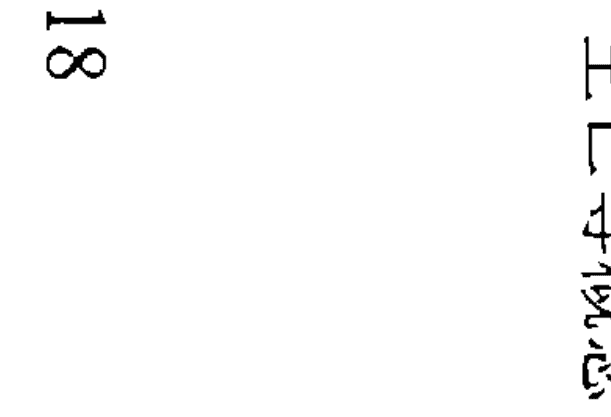
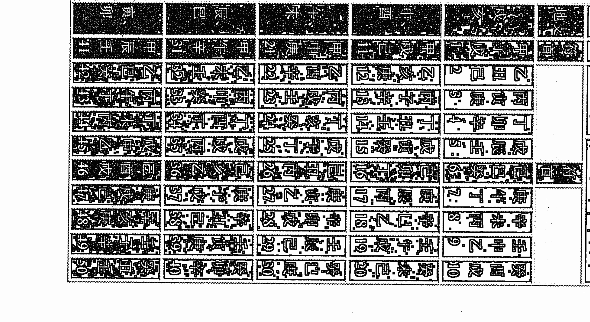
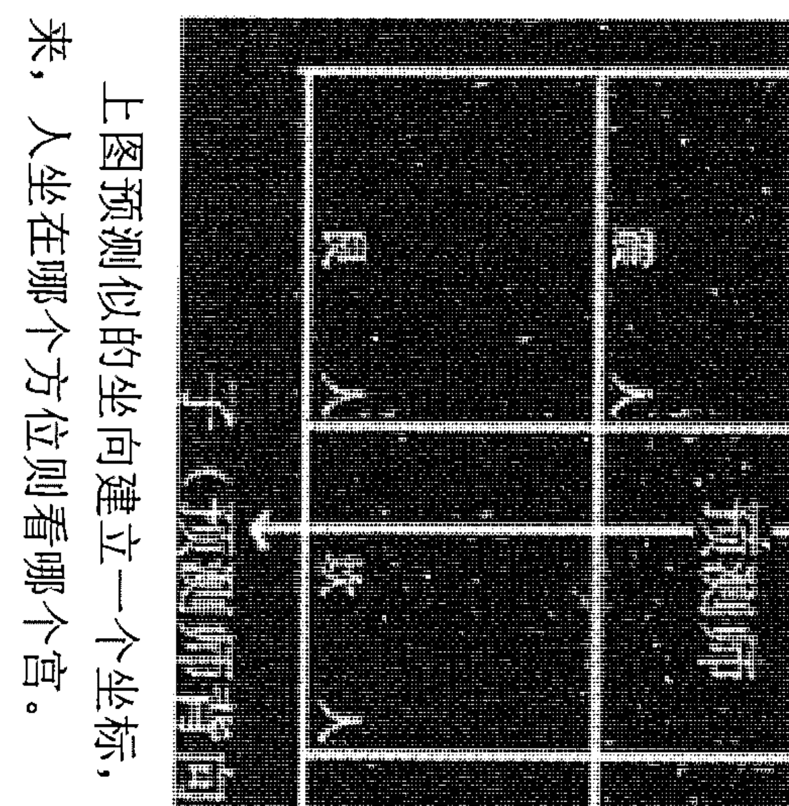

# 凤麟奇门风水学

# 第一章 奇门与风水学导论

我幼儿时幸得道家玄学秘传，三十多年来，走遍大江南北，云游世界各地，这门绝学给我带来无数的花环。

它（这门绝学）让美国白宫的顾问唐纳德·艾伦惊叹——东方有奇学；它让德国奔驰亚洲总裁博安科赞许——中国的麦肯锡；它让加拿大魁省省长布克耸肩——我的身体是透明的；它让日本大使鞠躬——道在中国；他让中国联通董事长赵维臣振奋——绝学指导企业辉煌；它让成功的领导者微笑——恪守它的要求；他让囹圄的贪官痛心——违背天规……

这门绝学之一，就是道家秘传的阴盘遁甲。它的定局方法别具一格，是根据月相的变化来排盘定局的，因为太阳星为阳，太阴星为阴，所以称阴盘遁甲。社会上流传的拆补法、置润法为阳盘奇门，它是根据节气来定局盘，节气是由太阳在黄道上的位置确定的，所以拆补法与置润法是由太阳的运行规律推导出来的，因此称为阳盘奇门。阴盘遁甲每个时辰演一个局，而流行于世的阳盘奇门五天也就是六十个时辰演一个局，这意味着阴盘遁甲有着更为丰富的信息量，测事情更为精准、细致。

遁甲之术，实为道家秘传。道家传授，全在口传心授，绝不泄于纸上。历来世上所传之书，乃文人相互抄传，不得其法，更不解其奥，把一个自相矛盾、错误百出的《烟波钓叟赋》等歌赋捧为至宝，庞大的格局吉凶系统再加上复杂的推演，令人云里雾里，无可适从，更显得古奥神秘。

清朝四库全书的总纂官大学士纪晓岚，在四库全书目录提要中慨叹奇门遁甲已经失传了。纪晓岚饱读诗书，精研术数，但纪晓岚在运用中发现世上流传的奇门不像人们传说的那么灵验神奇。其实纪晓岚怎么知道此门绝学在民间秘密流传。

道家秘传阴盘遁甲的问世，将拨开其神奇的面纱，它类象直读，易学易会，预测事情极为细腻准确，调理风水立竿见影。

道家秘传奇门与当今世上流传的奇门究竟有什么不同呢？它有什么特点呢？

- （1）起局方法不同：道家秘传奇门为阴盘起局，不用拆补，不用置润，起局方法简单，信息更加明晰，断事更加精准。
- （2）空亡用法不同：有远空断、近空断、先天断、后天断，一切玄机尽在空亡中。
- （3）没有吉凶格局，没有三奇和三吉门之说，没有吉神凶神吉星凶星之说。

遁甲局中的任何一个符号和各格局，都有阳和阴、正和反的信息。在特定的时空针对特定的人和特定的事才可以定论。

如：在世传的奇门书上都称，天辅星，又名文曲星，大吉之星，临宫百事可为、商贾出行谋财、入官讼得理，有罪遇赦免。但在道家阴盘奇门中，天辅星也是监狱、蹲牢房、被看管的信息。又如，流行书称：朱雀投江的格局（丁+癸）为凶格。“阴水克阴火，主凶。此时举事、官司口舌、或惊恐怪异、奸谋诡诈、百事凶。”但在道家阴盘奇门中，（丁+癸）也是生意火红的鞋帽业、热恋中的婚姻。

没吉没凶是道家阴盘遁甲与世传奇门的分水岭。如八神之一的“腾蛇”，既是虚诈不实，又是灵活机动、聪明过人；又如把门之一的“死门”，既是死心眼、顽固不化，又是执着、咬定青山不放松。丁是美好的愿望，也是流血、手术、烫伤。庚是敌人、恶魔、凶狠，也代表身怀绝技、女人天生丽质、绝艳。生门代表生意兴隆，也代表疾病难除。

毛泽东终生挂的奇门局，正是临腾蛇、死门，可他正式咬定青山不放松，将革命进行到底的革命领袖。他的“敌进我退，敌驻我扰，敌疲我打，敌退我追”的游击战术让他的对手十分头疼，也显示了“蛇”极其灵活多变的特性，正是一个军事家必备的素质。

戊+癸的组合，世上流传的奇门书上以“癸”为天网，说什么青龙华盖，吉门招福，凶门多破败，概念不清。道家秘传阴盘遁甲思路清晰，戊+癸那就是投资与癸水关联的事（如饮品、水产品、液体商品、旅游等）就挣大钱。癸为鞋，做鞋生意蒸蒸日上。其实只要明白没吉没凶这个道理，易学爱好者的预测思路豁然开朗，预测水准就会迅速提高。

实践证明，世上流传的奇门书的吉凶格局概念，与道家秘传阴盘遁甲相比，缺乏辩证法思想，禁锢易学爱好者的头脑。众多的吉凶格局，就像鸟笼一样不让研究者展开想“象”的翅膀在奇门的天空翱翔。道家秘传阴盘奇门的问世，将正本清源，为奇门爱好者扫清学易道路上的障碍。

- （4）伏吟法：伏吟要转宫，转宫有秘诀。世上流行之书，把伏吟局列为凶格。不少奇门爱好者见到伏吟局就头痛，不知所措。而道家秘传阴盘遁甲却转宫自如，一样能模拟出事物发展的规律，断事精准。
- （5）翻宫法：妙断事物的缘由和发展方向，丰富了预测内容，解决了预测出现的多个问题。
- （6）一宫多断、多宫一断：一个宫里可以推断出多层意思，环环相扣。多宫也可以代表一件事情的来龙去脉。
- （7）隐干法：与世上流行奇门相比，道家秘传奇门多了九个符号，增加了信息量；并且，它深藏玄机，更有利于我们抓住主要矛盾，百试百验。
- （8）分项断事和世上流行的完全不一样，充分体现了简明快捷，金口直断，准确，实战性强的特点。道家秘传阴盘断事摒弃了世上流行奇门的那些繁文缛节，深明易学“简易”之内核。两者比较，一个花拳绣腿，令人眼花缭乱，一个一招制胜，无招胜有招。有很多研究奇门的人士，在接触道家秘传阴盘遁甲后，就有茅塞顿开，重见天日的感觉，从而发出“假传万卷书，真传一句话”的感叹。

仅以断升学考试为例，世上流传奇门的断法是：确定用神后（考生所落之宫），以天辅星为考试院，以值符为主考，一值使为副考，以丁奇为文章，已景门为试卷。看其生克、格局来确定结果。诸多因素，生克关系定然纷乱混杂。孰轻孰重，令人无可是从。而道家秘传阴盘遁甲断升学考试则很简单，只看用神落宫状态，参考天辅星就行了。一支枪，一个准星就能射中目标，这个准星的枪好使么？

- （9）风水移星换斗法：移星换斗法是道家秘传阴盘遁甲的根本大法，处理风水堪称一绝，快捷简单灵验无比。

道家秘传阴盘遁甲排盘反映的是宇宙能量场在地球上的分布。易学注重的是天人感应。易云：在天成象，在地成形。地球上的人或事物与天上的星宿息息相关，也就是说地球上的人与事物不是孤立的，而是时时刻刻受宇宙气场的影响。这也与现代人的“万象全息论”、“万象相干论”、“万象有意论”、“万象系统论”十分吻合。所以说道家秘传阴盘遁甲处理风水是最为神奇灵验的，最有理论依据。道家秘传阴盘遁甲风水移星换斗大法，就是运用遁甲盘中天地人神符号所代表的象意，设定风水物品摆放在最佳方位，接受宇宙特定的能量气场，一次来调整环境能量结构分布，提升环境能量层次，使居住者的运势得以有效改善。

道家秘传阴盘遁甲公开外传出一部分，在书中只讲中级知识，很多心法诀窍并为点出，要想真正全面掌握必须由老师口口相传才能领会，希望有缘人抓住此机缘，身临其境体会道家千古不传之秘。

# 第二章 奇门基础

- 一、阴阳五行
- 二、天干地支
- 三、四时五方
- 四、怎样排柱
- 五、十神
- 六、八卦九宫
- 七、九星简介
- 八、八门简介
- 九、八神简介
- 十、奇门常用概念

## 一、阴阳五行

阴阳五行是两个不同的概念

### 阴阳：

阴阳学说将宇宙万物万象分为阴阳两大类，认为一切事物的形成、变化与发展在于阴阳二气的运动。自然界一切事物都存在着相反的两种属性，即存在着对立统一的阴阳。最初的阴阳现象来自阳光的背向，物体向阳的一面为阳，背面的一面为阴。继而不断引申广泛解释自然界与社会界的所有现象。比如明暗、寒热、日月、昼夜、内外、动静、上下、黑白、快慢、男女、强弱、奇偶、进退等等。这些事物都可以分为相反的两个方面，是相互对立又互相依存的统一体，而且阴阳关系不是一成不变的，它是相比较而确立的，并随着外界条件的政变而转化，并且是阴中有阳，阳中有阴，互相包含着。

阴阳有以下特征：

- 1、阴阳互根：阴为阳根，阳为阴根，互存互依，互相为用。
- 2、阴阳消长：阴阳始终处于此消彼长，彼近此退的动态平衡中，量变时时处处存在。
- 3、阴阳转化：在一定条件下，阴阳发生“质”的变化，各自向其对立面转化。

阴阳学说与现代唯物辩证法的矛盾即对立统一规律完全相符。可知古人早就掌握了现代唯物辩证法的世界观与认识论。太极图十分形象的、直观的反映了阴阳的特征，它有着丰富的内涵，几乎成了道家的标志。该图中阴阳两仪，中间呈S形曲线，表示阴阳消长，刚柔相济，稳定和谐的分界线。对这个图，你感悟的愈多，你的道行修为就愈深，你的立足点就愈高！当一个预测师站在宇宙的角度看事物时，世上的一切都是一目了然的了。

世界上任何事物都是矛盾的统一体，都有其正反两个方面。因此，我们看待一个事物，不能片面的、静止的去看待它，而是应该用全面的、发展的眼光去看它，这一点在道家奇门中极为重要。

我们所说的“没吉没凶”的观点理论基础就是阴阳学说的认识论。古今世上流传的“奇门遁甲”之书及大篇幅的谈凶论吉，有违阴阳之理，使许多学易制人陷于泥潭，极大的阻碍了易学的发展。有时候最简单的道理就能说明问题，明白这个简单的道理，当有人再问“故宫风水好吗？”的时候，我们就不会再钻进人家的全套立面，受人以柄了。

早在三千年前，我国的天文学家已经测定了太岁（木星）的运行和每年冬至、夏至的确定时间，从而分出四季和计时的天干地支。

每年农历十一月的冬至节（太阳直射南回归线）太阳开始北移，日渐长，夜渐短，称为——阳生。每年农历六月的夏至节（太阳直射北回归线），太阳开始南移，日渐短，夜渐长，称为——阴生。把一年时间分作两份，冬至开始至夏至之前为阳，夏至开始至冬至之前为阴；这是阴阳划分之始，一年如此，一日之间白昼为阳，黑夜为阴，午前为阳，子前为阴。时间上阴阳相对，推而广之，物质亦是阴阳相对，而物质是五行生克所成，故阴阳与五行乃成为一体。

### 五行：

五行学说是奇门遁甲的重要根本观念。水、木、火、土、金是构成宇宙的五种基本物质，自然界和人类社会的各种事物和现象都可以依其性质与这五种物质相比拟而进行归类。这五种各具特性的物质不断运动和互相作用，便形成了宇宙间万物生长与消亡的规律和原因，这是朴素唯物主义的观念。

阴阳五行既是自然的构成元素，而道家以研究自然为目的，于是把五行阴阳支配在一切物质上；先论人体的五行——阴阳家认为人是万物之灵，也是大自然的杰作，人与大自然息息相关，例如：人有毛发，自然有草木；人有双目，自然有日月；呼吸为风，挥泪成雨；骨为山，血脉为河流等，谓之天人合一，汉初诸儒盛宗之，道教采其说，合阴阳、儒术以为炼丹炼气的根据，当时中医皆先习儒术，旁及阴阳五行，而研究阴阳五行之学以道教为最精，故中医学说亦以阴阳五行为主，著书立说皆道教言，于是学中医者皆知：五脏属阴，肝属木，肾属水，肺属金，心属火，脾属土。六腑属阳，肝以胆为腑，肾以膀胱为腑，肺以大肠为腑，心以小肠为腑，脾以胃为腑，脏腑相连，有病互相。

### 五行的性质：

- 水——湿润入土，以生万物。具有寒冷，向下的特征。
- 火——火向上升，具有炎热、向上的特征。
- 木——具有发生、条达的特征。
- 金——具有清静、收杀的特征。
- 土——具有长养、育化的特征。

### 阴阳有以下特征：

| 五行 | 木 | 火 | 土 | 金 | 水 |
|---|---|---|---|---|---|
| 天干 | 甲 乙 | 丙 丁 | 戊 己 | 庚 辛 | 壬 癸 |
| 地支 | 寅 卯 | 巳 午 | 丑 辰 未 戌 | 申 酉 | 亥 子 |
| 方位 | 东 | 南 | 中 | 西 | 北 |
| 五气 | 风 | 热 | 湿 | 燥 | 寒 |
| 五化 | 生 | 长 | 化 | 收 | 藏 |
| 五形 | 矩形 | 尖形 | 方形 | 圆形 | 波形 |
| 五色 | 青 | 赤 | 黄 | 白 | 黑 |
| 五味 | 酸 | 苦 | 甘 | 辛 | 咸 |
| 五音 | 角 | 徵 | 宫 | 商 | 羽 |
| 五窍 | 目 | 舌 | 唇 | 鼻 | 耳 |

### 五行相生

五行相生好比母生子，有相亲相爱之意，指某种物质对另一种物质起着促进滋生的帮助作用。

- 金生水——铜镜凝结空气中水汽变成露珠，金属熔化后呈液体状态。
- 水生木——草木赖水分以生长。
- 木生火——木柴燃烧产生火。
- 火生土——火能把燃烧后的东西变成土，地震喷火，生成新土地。
- 土生金——一切金属自土中出。

| 五脏 | 五体 | 五津 | 五腧 | 五元 | 五贼 | 五德 | 五魔 | 五星 | 五帝 | 五虫 | 五器 | 五商 | 企业五素 | 五温 | 气象 | 地理 | 八神 | 九星 | 八门 |
|---|---|---|---|---|---|---|---|---|---|---|---|---|---|---|---|---|---|---|---|
| 胆 | 筋 | 泪 | 井 | 元性 | 怒 | 仁 | 财 | 岁星 | 大昊 | 鳞虫 | 规绳 | 财情 | 竞争 | 温热 | 风 | 树 | 符 | 辅 | 伤 |
| 小肠 | 血 | 汗 | 荣 | 元神 | 喜 | 礼 | 贵 | 荧惑 | 炎帝 | 羽虫 | 绳 | 文化 | 热 | 晴 | 山 | 蛇 | 冲 | 杜 |
| 胃 | 肉 | 涎 | 俞 | 元气 | 思 | 信 | 胜 | 镇星 | 皇帝 | 倯虫 | 度量 | 健 | 整合 | 自然 | 平原 | 地 | 英 | 景 |
| 大肠 | 皮毛 | 涕 | 经 | 元情 | 忧 | 义 | 杀 | 太白 | 少昊 | 毛虫 | 矩 | 逆 | 核心 | 凉 | 道路 | 虎 | 柱 | 死 |
| 膀胱 | 骨 | 唾 | 合 | 元精 | 恐 | 智 | 淫 | 辰星 | 颛顼 | 介虫 | 准 | 智 | 应变 | 寒 | 河流 | 阴 | 心 | 生 |
| 肺 | 皮 | 液 | 经 | 元神 | 悲 | 义 | 杀 | 太白 | 少昊 | 毛虫 | 矩 | 逆 | 核心 | 凉 | 道路 | 虎 | 柱 | 死 |
| 肾 | 骨 | 唾 | 合 | 元精 | 恐 | 智 | 淫 | 辰星 | 颛顼 | 介虫 | 准 | 智 | 应变 | 寒 | 河流 | 阴 | 心 | 生 |

有了相生、相克，世间万物才能够维持一种比较固定与稳定的平衡与和谐状态。

## 二、天干与地支

天干、地支，简称干支。是我国古代人民用来记录年、月、日、时的符号，用于古代历法之中。熟练地掌握好用干支年、月、日、时的方法相当重要，否则差之毫厘，失之千里！

十天干就是：甲、乙、丙、丁、戊、己、庚、辛、壬、癸。

十二地支就是：子、丑、寅、卯、辰、巳、午、未、申、酉、戌、亥。

六十花甲子：六十花甲子是古人在发明干支的基础上，将他们进行组合，同性干支依次配合，进行不重复的排列，从数学角度讲就是干支组合的最小公倍数，产生了六十对干支组合，俗称六十花甲子。六十花甲子是根据干支演变来的，其特点是阳干配阳支，阴干配阴支，由此可见，其是由天干地支叠加成的，之所以不用阳干配阴支，是因为干支原来即为两个独立的系统，本无阴阳之别。六十花甲子传为皇帝所制。六十花甲子是组成年、月、日、时四柱的元素。分别用来表示年、月、日、时四个时空参量，用六十花甲可以模拟任一时空。

甲子、乙丑、丙寅、丁卯、戊辰、己巳、庚午、辛未、壬申、癸酉
甲戌、乙亥、丙子、丁丑、戊寅、己卯、庚辰、辛巳、壬午、癸未
甲申、乙酉、丙戌、丁亥、戊子、己丑、庚寅、辛卯、壬辰、癸巳
甲午、乙未、丙申、丁酉、戊戌、己亥、庚子、辛丑、壬寅、癸卯
甲辰、乙巳、丙午、丁未、戊申、己酉、庚戌、辛亥、壬子、癸丑
甲寅、乙卯、丙辰、丁巳、戊午、己未、庚申、辛酉、壬戌、癸亥

十天干中有阴干和阳干，单数为阳，双数为阴

阳干为：甲 丙 戊 庚 壬
阴干为：乙 丁 己 辛 癸

天干可与五行四时方位相配：
甲乙属木，其时春，其位东方；
丙丁属火，其时夏，其位南方；
戊己属土，其时四季（辰戌丑未月），其位中央；
庚辛属金，其时秋，其位西方；
壬癸属水，其时冬，其位北方；

天干有冲合之论：
甲庚、乙辛、丙壬、丁癸为四冲，甲己合化土、乙庚合化金、丙辛合化水、丁壬合化木、戊癸合化火。冲也是一种克，因为方位相对，所以力量较大；合为合化合解之意，在奇门预测男女婚恋时，以相合之干为配偶和对象。

地支的五行和方位是：寅卯属木，巳午属火，申酉属金，亥子属水，辰戌丑未属土。

方位如下图：

| 东北 | 北 | 西北 |
| :---: | :---: | :---: |
| 卯 | 子 | 亥 |
| 寅 | | 戌 |
| 辰 | | 酉 |
| 东 | | 西 |
| 巳 | 午 | 未 |
| 东南 | 南 | 西南 |

上图中是上南下北，左东右西。和现代地图刚好相反，以后的所有九宫图方位都是这样。

### 十二支和月建：

值得注意的是：在运用干支纪年和纪日时，是用六十甲子的顺序依次反复循环；而在纪月和纪时的时候，在干支中所用的地支名称是固定不变的。正月为寅月，二月为卯月，三月为辰月，四月为巳月，五月为午月，六月为未月，七月为申月，八月为酉月，九月为戌月，十月为亥月，十一月为子月，十二月尾丑月。对照如下表：

| 月 | 正月 | 二月 | 三月 | 四月 | 五月 | 六月 | 七月 | 八月 | 九月 | 十月 | 十一月 | 十二月 |
|---|---|---|---|---|---|---|---|---|---|---|---|---|
| 地支 | 寅 | 卯 | 辰 | 巳 | 午 | 未 | 申 | 酉 | 戌 | 亥 | 子 | 丑 |

十二地支和十二时辰纪时也是采用对应固定的十二地支，来表示每天的十二个时辰。每个时辰相当于现在的两个小时。23-1时为子时，1-3时为丑时，3-5时为寅时，5-7时为卯时，7-9时为辰时，9-11时为巳时，11-13时为午时，13-15时为未时，15-17时为申时，17-19时为酉时，19-21时为戌时，21-23时为亥时。对应情况见下表：

| 时 | 23-1 | 1-3 | 3-5 | 5-7 | 7-9 | 9-11 | 11-13 | 13-15 | 15-17 | 17-19 | 19-21 | 21-23 |
|---|---|---|---|---|---|---|---|---|---|---|---|---|
| 地支 | 子 | 丑 | 寅 | 卯 | 辰 | 巳 | 午 | 未 | 申 | 酉 | 戌 | 亥 |

### 十二地支有冲、合、刑、害的关系。

地支有六冲：子午相冲，丑未相冲，寅申相冲，卯酉相冲，辰戌相冲，巳亥相冲。
地支有六合：子丑合化土，寅亥合化木，卯戌合化火，辰酉合化金，巳申合化水，午未合化土。
地支有三合：申子辰合化水，寅午戌合化火，亥卯未合化木，巳酉丑合化金。
地支相刑：子刑卯、卯刑子，寅刑巳、巳刑申，申刑寅，丑刑戌、戌刑未、未刑丑，辰刑辰、午刑午、酉刑酉、亥刑亥。
地支相害：子未相害，丑午相害，寅巳相害，卯辰相害，申亥相害，酉戌相害，奇门运用较少。

五行不仅在一年四季中有旺、相、休、囚、死的状态，而且与地支所代表的十二个月相对应还有一个从生长到死亡的全过程，叫做“寄生十二宫”的原理。十天干相对于十二地支有十二种状态：长生、沐浴、冠带、临官、帝旺、衰、病、死、墓、绝、胎、养。

长生：就像人出生于世，或降生阶段，指万物萌发之际。
沐浴：洗礼与生长之意，又叫“败”，形体柔而脆，易为所损。
冠带：为小儿可以穿衣服戴帽了，指万物渐荣。
临官：像人长成强壮，可以做官，化育，领导人民，是指万物长成。
帝旺：象征人旺盛到了极点，可辅助帝旺大有作为，是指万物成熟。
衰：指盛极而衰，是万物开始发生衰变。
病：如人患病，是指万物困顿。
死：如人气已尽，形体已死，是指万物死灭。
墓：也称“库”，如人死后归入于墓，指万物成功后归库。
绝：如人形体绝灭化归为土，是指万物前气已绝，后继之气还未到来，在地中未有其胎：如人受父母之气结聚成胎，是指天地气交之际，后继之气来临，并且受胎。

养：像人养于母腹之中，之后又出生，是指万物在地中成形，继而又萌发，又得经历一个生生灭灭永不停止的天道循环过程。

寄生十二宫的现象比较形象的反映了宇宙万物生生死死，循环往复、永无休止以至无穷的自然状态与规律。体现了古代人民朴素的唯物观与合理的科学与哲学思想。

现在将五行寄生十二宫的对应月份等情况列表如下：

| 五行 | 时令 | 状态 | 五阳干 | 五阴干 |
|---|---|---|---|---|
| 木 | 甲 | 长生 | 亥 | 午 |
| 火 | 丙 | 长生 | 寅 | 酉 |
| 土 | 戊 | 长生 | 寅 | 酉 |
| 金 | 庚 | 长生 | 巳 | 子 |
| 水 | 壬 | 长生 | 申 | 卯 |
| 木 | 乙 | 沐浴 | 子 | 巳 |
| 火 | 丁 | 沐浴 | 卯 | 申 |
| 土 | 己 | 沐浴 | 卯 | 申 |
| 金 | 辛 | 沐浴 | 午 | 亥 |
| 水 | 癸 | 沐浴 | 酉 | 寅 |
| 木 | 乙 | 冠带 | 丑 | 辰 |
| 火 | 丁 | 冠带 | 辰 | 未 |
| 土 | 己 | 冠带 | 辰 | 未 |
| 金 | 辛 | 冠带 | 未 | 戌 |
| 水 | 癸 | 冠带 | 戌 | 丑 |
| 木 | 乙 | 临官 | 寅 | 卯 |
| 火 | 丁 | 临官 | 巳 | 午 |
| 土 | 己 | 临官 | 巳 | 午 |
| 金 | 辛 | 临官 | 申 | 酉 |
| 水 | 癸 | 临官 | 亥 | 子 |
| 木 | 乙 | 帝旺 | 卯 | 寅 |
| 火 | 丁 | 帝旺 | 午 | 巳 |
| 土 | 己 | 帝旺 | 午 | 巳 |
| 金 | 辛 | 帝旺 | 酉 | 申 |
| 水 | 癸 | 帝旺 | 子 | 亥 |
| 木 | 乙 | 衰 | 辰 | 丑 |
| 火 | 丁 | 衰 | 未 | 辰 |
| 土 | 己 | 衰 | 未 | 辰 |
| 金 | 辛 | 衰 | 戌 | 未 |
| 水 | 癸 | 衰 | 丑 | 戌 |
| 木 | 乙 | 病 | 巳 | 子 |
| 火 | 丁 | 病 | 申 | 卯 |
| 土 | 己 | 病 | 申 | 卯 |
| 金 | 辛 | 病 | 亥 | 午 |
| 水 | 癸 | 病 | 寅 | 酉 |
| 木 | 乙 | 死 | 午 | 亥 |
| 火 | 丁 | 死 | 酉 | 寅 |
| 土 | 己 | 死 | 酉 | 寅 |
| 金 | 辛 | 死 | 子 | 巳 |
| 水 | 癸 | 死 | 卯 | 申 |
| 木 | 乙 | 墓 | 未 | 戌 |
| 火 | 丁 | 墓 | 戌 | 丑 |
| 土 | 己 | 墓 | 戌 | 丑 |
| 金 | 辛 | 墓 | 丑 | 辰 |
| 水 | 癸 | 墓 | 辰 | 未 |
| 木 | 乙 | 绝 | 申 | 酉 |
| 火 | 丁 | 绝 | 亥 | 子 |
| 土 | 己 | 绝 | 亥 | 子 |
| 金 | 辛 | 绝 | 寅 | 卯 |
| 水 | 癸 | 绝 | 巳 | 午 |
| 木 | 乙 | 胎 | 酉 | 申 |
| 火 | 丁 | 胎 | 子 | 巳 |
| 土 | 己 | 胎 | 子 | 巳 |
| 金 | 辛 | 胎 | 卯 | 午 |
| 水 | 癸 | 胎 | 午 | 酉 |
| 木 | 乙 | 养 | 戌 | 未 |
| 火 | 丁 | 养 | 丑 | 戌 |
| 土 | 己 | 养 | 丑 | 戌 |
| 金 | 辛 | 养 | 辰 | 丑 |
| 水 | 癸 | 养 | 未 | 辰 |

# 三、四时五方

时间与空间的观念是奇门术极为重要的观念。时间，在这里指的是“四时”，即一年四季；空间则指“五方”，即东、南、西、北、中五个方位。上面说到阴阳、干支、五行等观念中，尤其以五行观念极为重要，成为分析判断事物的核心。而五行的相生、相克等现象，则要与四时五方等因素相结合，看它们各自所旺盛的是哪个季节，所适合的是哪个方向。进行综合的分析，才能更精确地反映事物的情况。

# 五行、干支所适宜的时季与方位

| 五行 | 天干 | 地支 | 所旺四季 | 所主方向 |
|---|---|---|---|---|
| 木 | 甲乙 | 寅卯辰 | 春 | 东 |
| 火 | 丙丁 | 巳午未 | 夏 | 南 |
| 土 | 戊己 | 申酉戌 | 秋 | 西 |
| 金 | 庚辛 | 亥子丑 | 冬 | 北 |
| 水 | 壬癸 | 辰戌丑未 | 寄旺四季 | 中 |

这里土“寄旺四季”的意思是，指它旺盛于一年四季的最后一个月。在每一年的四个季节里，每一个季节都有五行中的一个处于“旺”即“王”之意，也就是旺盛状态；一个处于“相”即“宰相”之意，属于次旺状态；一个处于“休”即“休息”状态，退休无事；一个处于“囚”即衰落、被关禁之意；一个处于“死”即被克制、毫无生气的状态。

# 五行与四季的关系

| 状态 | 旺 | 相 | 休 | 囚 | 死 |
|---|---|---|---|---|---|
| 五行 | | | | | |
| 木 | 春 | 冬 | 夏 | 四季末 | 秋 |
| 火 | 夏 | 春 | 四季末 | 秋 | 冬 |
| 金 | 秋 | 四季末 | 冬 | 春 | 夏 |
| 水 | 冬 | 秋 | 春 | 夏 | 四季末 |
| 土 | 四季末 | 夏 | 秋 | 冬 | 春 |

从五行的相生相克等原理出发，来分析判断世间万事万物在发展与运动过程中的时间和空间具体关系，并从中拟出了一定的规律，以便用来寻找有利于事物发展运动的“时空”，避开不利于事物发展运动的“时空”。

# 四、怎样排四柱

四柱即年柱、月柱、日柱、时柱。每柱由一个天干和一个地支组成。是由断事排局（或一个人出生）的年、月、日、时的天干和地支组合而成。

如1993年4月13日上午8点钟，农历，三月二十二日，其四柱如下：癸酉（年柱）丙辰（月柱）甲子（日柱）戊辰（时柱）

### 排年干支：

以立春为年分界线，立春前为上一年，立春后本年。例如：
1993年农历12月24日上午9时33分，年干支为癸酉，同一日9时33分后的年干支为甲戌。又如：2005年农历12月26日前为乙酉，12月26日后就为丙戌年了。因为12月26日那天是立春。年分界是以立春为分界的。年的干支是固定的，可以从万年历中查出。

### 排月干支：

月干支中地支是固定不变的，正月建寅，二月建卯，三月建辰，四月建巳，五月建午，六月建未，七月建申，八月建酉，九月建戌，十月建亥，十一月建子，十二月建丑。人们习惯把初一到三十为一个月，如正月初一到正月三十为正月，而预测中的四柱，月是以令为分界线的，正月是从立春起到惊蛰间的一段时间，立春可能是正月初一，也可能是上一年腊月中的某一天，也可能会是农历正月的某一天，这就有了月令与习惯上的不统一，此时以月令为准。月令的确立时二十四节气中的“节”为标准的。即：

- 正月：立春——惊蛰
- 二月：惊蛰——清明
- 三月：清明——立夏
- 四月：立夏——芒种
- 五月：芒种——小暑
- 六月：小暑——大暑
- 七月：立秋——白露
- 八月：白露——寒露
- 九月：寒露——立冬
- 十月：立冬——大雪
- 十一月：大雪——小寒
- 十二月：小寒——立春

每年每月的地支都是固定不变的，天干不是固定的，在知道了年干支和月令后可以推算出月干，方法是：

甲己之年丙作首，乙庚之岁戊为头，丙辛之岁庚寅上，丁壬壬寅顺水流，若问戊癸何方起，甲寅之上好追求。

凡甲或己之年干，正月起“丙”，乙或庚之年干，正月起戊……然后向后顺头，看最后一位天干是哪一位即为所求的月干。

### 月干求法查对表

| 年干 | 寅 | 卯 | 辰 | 巳 | 午 | 未 | 申 | 酉 | 戌 | 亥 | 子 | 丑 |
|---|---|---|---|---|---|---|---|---|---|---|---|---|
| 甲 | 丙 | 丁 | 戊 | 己 | 庚 | 辛 | 壬 | 癸 | 甲 | 乙 | 丙 | 丁 |
| 乙 | 戊 | 己 | 庚 | 辛 | 壬 | 癸 | 甲 | 乙 | 丙 | 丁 | 戊 | 己 |
| 丙 | 庚 | 辛 | 壬 | 癸 | 甲 | 乙 | 丙 | 丁 | 戊 | 己 | 庚 | 辛 |
| 丁 | 壬 | 癸 | 甲 | 乙 | 丙 | 丁 | 戊 | 己 | 庚 | 辛 | 壬 | 癸 |
| 戊 | 甲 | 乙 | 丙 | 丁 | 戊 | 己 | 庚 | 辛 | 壬 | 癸 | 甲 | 乙 |
| 己 | 丙 | 丁 | 戊 | 己 | 庚 | 辛 | 壬 | 癸 | 甲 | 乙 | 丙 | 丁 |
| 庚 | 戊 | 己 | 庚 | 辛 | 壬 | 癸 | 甲 | 乙 | 丙 | 丁 | 戊 | 己 |
| 辛 | 庚 | 辛 | 壬 | 癸 | 甲 | 乙 | 丙 | 丁 | 戊 | 己 | 庚 | 辛 |
| 壬 | 壬 | 癸 | 甲 | 乙 | 丙 | 丁 | 戊 | 己 | 庚 | 辛 | 壬 | 癸 |
| 癸 | 甲 | 乙 | 丙 | 丁 | 戊 | 己 | 庚 | 辛 | 壬 | 癸 | 甲 | 乙 |

比如农历 2003 年 9 月，我们可以从万年历上查出 2003 年的干支纪年法为癸未，9 月建成，那么 9 月的天干是什么呢？对照年上起月口诀，其中有“若问戊癸何方起，甲寅之上好追求”，“戊”“癸”指的是天干为戊和癸的年份，“甲寅之上好追求”值得是，凡是戊和癸年的正月（即寅月）天干都以甲来表示，依次二月为“乙”，三月为“丙”……如乙酉年十一月，乙酉（年柱）戊子（月柱）。

### 排日干支：

日干支是从《万年历》中查得。需要说明的是起至当晚亥时未为今日，即子时为日的分界线。
1998 年农历 7 月 2 日 23 时 10 分预测时间的年月日干支为 戊寅 庚申 癸丑 壬子。

### 推时干支：

时干支中地支是固定不变的。古人将一日等分为十二时辰，完全以当地的太阳光线的照射强弱而定，夏天与冬天的时辰长短都不一样的，即：
半夜者子也，鸡鸣者丑也，平旦者寅也，日出者卯也，日时者辰也，隅中者巳也，日中者午也，日佚这未也，晡食者申也，黄昏者戌也，人定者亥也。
从日上推时辰天干的方法称作“五鼠遁”：
甲己还加甲，乙庚丙作初，
丙辛从戊起，丁壬庚子居，
戊癸何方发，壬子是真途。

这个歌诀的用法与年上起月法的歌诀是一样的。年上起月是 从正月起，日上起时是从子时起。

凡甲日、己日，时干从子上起甲，依次推出：甲子、乙丑、丙寅、丁卯……
凡乙日、庚日，时干从子上起丙，依次推出：丙子、丁丑、戊寅、己卯……
凡丙日、辛日，时干从子上起戊，依次推出：戊子、己丑、庚寅、辛卯……
凡丁日、壬日，时干从子上起庚，依次推出：庚子、辛丑、壬寅、癸卯……
凡戊日、癸日，时干从子上起壬，依次推出：壬子、癸丑、甲寅、乙卯……
以上排四柱最为简单的方法就是查万年历，年月日的干支都能查出来，就是记住“五鼠遁”，把时干推出来即可。

### 时干求法对照表

| 日 | 甲己 | 乙庚 | 丙辛 | 丁壬 | 戊癸 |
|---|---|---|---|---|---|
| 时 | | | | | |
| 子 | 甲子 | 丙子 | 戊子 | 庚子 | 壬子 |
| 丑 | 乙丑 | 丁丑 | 己丑 | 辛丑 | 癸丑 |
| 寅 | 丙寅 | 戊寅 | 庚寅 | 壬寅 | 甲寅 |
| 卯 | 丁卯 | 己卯 | 辛卯 | 癸卯 | 乙卯 |
| 辰 | 戊辰 | 庚辰 | 壬辰 | 甲辰 | 丙辰 |
| 巳 | 己巳 | 辛巳 | 癸巳 | 乙巳 | 丁巳 |
| 午 | 庚午 | 壬午 | 甲午 | 丙午 | 戊午 |
| 未 | 辛未 | 癸未 | 乙未 | 丁未 | 己未 |
| 申 | 壬申 | 甲申 | 丙申 | 戊申 | 庚申 |
| 酉 | 癸酉 | 乙酉 | 丁酉 | 己酉 | 辛酉 |
| 戌 | 甲戌 | 丙戌 | 戊戌 | 庚戌 | 壬戌 |
| 亥 | 乙亥 | 丁亥 | 己亥 | 辛亥 | 癸亥 |

# 五、十神

所谓的“十神”就是以日干为中心而生发出来的与日干本人相关的社会关系。日干代表自身（我），根据五行生克关系，克我者为官鬼，我克者为妻财，生我者为印绶，我生者为子孙，同我者为兄弟，称为六亲。根据阴阳五行之不同，我生，生我，我克，克我，同我共有十种存在方式，八字预测中称为十神。这种关系在道家奇门预测中找用神的时候会用到。

- （1）我克者为财：
  - ①正财：异性相克，记作“才”。
  - ②偏财：同性相克，记作“财”。
- （2）克我者为官：
  - ①正官：异性相克，记作“官”。
  - ②偏官：同性相克，又叫七杀，记作“杀”。
- （3）我生者为食伤：
  - ①伤官：异性相生，记作“伤”。
  - ②食神：同性相生，记作“食”。
- （4）生我者为绶印：
  - ①正印：异性相生，记作“印”。
  - ②偏印：同性相生，又叫枭神，记作“枭”。
- （5）同我者为比劫：
  - ①劫财：异性，记作“劫”。
  - ②比肩：同性，记作“比”。

十神间生克关系随同五行生克关系，即
相生：官杀生印枭，印枭生日主劫比，日主劫比生食伤，食伤生正偏财，正偏财生官杀。
相克：官杀克日主劫比，日主劫比克正偏财，正偏财克印枭，印枭克食伤，食伤克官杀。

“年上起月”与“日上起时”有一个简便的记忆方法：
生合者定月，克合者定时。比如 甲寅年寅月，甲己合土，生土者为丙，故甲、己年寅月干为丙；丙、辛日子时，丙辛合水，克水者戊，故丙日子时干为戊。

| 日干\他干 | 甲 | 乙 | 丙 | 丁 | 戊 | 己 | 庚 | 辛 | 壬 | 癸 |
|---|---|---|---|---|---|---|---|---|---|---|
| 甲 | 比肩 | 劫财 | 食神 | 伤官 | 偏财 | 正财 | 七杀 | 正官 | 偏印 | 正印 |
| 乙 | 劫财 | 比肩 | 伤官 | 食神 | 正财 | 偏财 | 正官 | 七杀 | 正印 | 偏印 |
| 丙 | 食神 | 伤官 | 比肩 | 劫财 | 偏财 | 正财 | 七杀 | 正官 | 偏印 | 正印 |
| 丁 | 伤官 | 食神 | 劫财 | 比肩 | 正财 | 偏财 | 正官 | 七杀 | 正印 | 偏印 |
| 戊 | 偏财 | 正财 | 偏财 | 正财 | 比肩 | 劫财 | 食神 | 伤官 | 偏印 | 正印 |
| 己 | 正财 | 偏财 | 正财 | 偏财 | 劫财 | 比肩 | 伤官 | 食神 | 正印 | 偏印 |
| 庚 | 七杀 | 正官 | 七杀 | 正官 | 食神 | 伤官 | 比肩 | 劫财 | 偏财 | 正财 |
| 辛 | 正官 | 七杀 | 正官 | 七杀 | 伤官 | 食神 | 劫财 | 比肩 | 正财 | 偏财 |
| 壬 | 偏印 | 正印 | 偏印 | 正印 | 偏印 | 正印 | 偏印 | 正印 | 比肩 | 劫财 |
| 癸 | 正印 | 偏印 | 正印 | 偏印 | 正印 | 偏印 | 正印 | 偏印 | 劫财 | 比肩 |

# 六、八卦九宫

奇门以九宫八卦作为排盘的基础，为地盘。
九宫源于洛书，代表九个不同的方位。
“八卦”是易经中的基本图形，八卦是怎样产生的呢？在《周易——系词》中说：“是故易有太极生两仪，两仪生四象，四象生八卦。”
太极生两仪：太极是天地混沌，阴阳未分时的“元气”状态，天地又如鸡蛋，后来盘古氏开天辟地，奠定乾坤。两仪就是天和地。
两仪生四象：阴与阳继续演变，相重或相交，产生出老阳、老阴、少阳、少阴四象，这四象象征着四时、四方等现象。
四象生八卦：四象再继续演变就产生出了上述的八卦了。八卦分别象征八节、八方等。
八卦的五行属性就是：坎属水，离属火，乾和兑属金，震和巽属木，坤和艮属土。请注意，奇门预测的生、克就是以八卦宫位的五行来确定的，如用神落震宫属木，克坤宫（土），又受兑宫（金）所冲克。

### 八卦又分先天八卦与后天八卦

什么叫“先天”，什么又叫“后天”？以哲学的观点来说，宇宙万物没有形成以前，即是所谓的先天，有了宇宙万物，那就是后天。如果从人的方面来说，在出生前为先天，出生后为后天。从事发展角度来看，发生过了的为先天，未发生过的为后天。先后天之时用以划分阶段、范围而已

先天八卦为伏羲所作。如下图

### 先天九宫八卦图

| 兑二 | 乾一 | 巽五 |
| 离九 | 坤二 | 坎六 |
| 震四 | 坤八 | 艮七 |

先天八卦为乾、坎、艮、震、巽、离、坤、兑。先天八卦与后天八卦的排列、象征方位及数都有所不同。

先天八卦数为：乾一 兑二 离三 震四 巽五 坎六 艮七 坤八。

先天八卦所主是：乾居南方，数为一，与坤相对。

坤居北方，数为八，与乾相对。

震居东北，数为四，与巽相对。

巽居西南，数为五，与震相对。

离居东方，数为三，与坎相对。

坎居西方，数为六，与离相对。

艮居西北，数为七，与兑相对。

兑居东南，数为二，与艮相对。

另一种则是后天八卦，传为文王所创。如下图：

### 后天九宫八卦图

| 巽四 | 离九 | 坤二 |
| 震三 | 五 | 兑七 |
| 艮八 | 坎一 | 乾六 |

后天八卦所主：

离居南方，五行属火，与坎相对，数为九。

坎居北方，五行属水，与离相对，数为一。

震居东方，五行属木，与兑相对，数为三。

兑居西方，五行属金，与震相对，数为七。

乾居西北，五行属金，与巽相对，数为六。

巽居东南，五行属木，与乾相对，数为四。

坤居西南，五行属土，与艮相对，数为二。

艮居东北，五行属土，与坤相对，数为八。

后天八卦数可以用以下歌诀来记住：一数坎兮二数坤 三震四巽数中分 五寄中宫六乾是 七兑八艮九离门。

后天八卦的宫位排法可以用以下歌诀记住：戴九履一，左三右七，二四为肩六八为足。

在奇门中，用后天的八卦图。

八卦旺衰：乾、兑旺于秋，衰于冬；震、巽旺于春，衰于夏。坤、艮旺于四季，衰于秋；

离旺于夏，衰于四季；坎旺于冬，衰于春。

# 七、九星简介

九星是古代天文学中的九个星宿，在奇门遁甲中，九星组成“天盘”，我们在运用中称为“天时”。

九星就是天蓬星、天任星、天冲星、天辅星、天英星、天芮星、天柱星、天心星、天禽星，在奇门中所占为天盘。在道家奇门中，天禽星随天盘值符。

天蓬星五行属水，天任星、天芮星、天禽星属土，天冲星、天辅星属木，天英星属火，天柱星、天心星属金。

九星在奇门地盘静止时位置也是固定的，天蓬星在坎一宫，天芮星在坤二宫，天冲星在震三宫，天辅星在巽四宫，天禽星在中五宫（寄坤二宫），天心星在乾六宫，天柱星在兑七宫，天任星在艮八宫、天英星在离九宫，如下图：

### 地盘的九星图

| 天辅星 | 天英星 | 天芮星 |
| 天冲星 | 天柱星 | 天心星 |
| 天任星 | 天蓬星 | 天禽星 |

这种排列归宿不是固定不变的，根据事物发生的不同时间，天盘上的九星也要进行转动，因而产生出种种不同的形式与变化。

九星各自旺于它生的月份，相于自己属性相同的月份，休于它克的月份，囚于克它的月份，废于生它的月份，九星论废不论死。

# 八、八门简介

人世间的万事万物的运动与发展变化，受着空间方位的直接影响，于是就按各种方位与事物之间的联系与不同的特性，把空间分为八个方向，称作“八门”。

八门就是休门、生门、伤门、杜门、景门、死门、惊门、开门，在奇门盘中所占为人盘。休门五行属水，生门、死门五行属土，伤门、杜门五行属木，景门五行属火，惊门、开门属金。

八门在奇门盘静止时位置是固定的，休门在坎一宫，生门在艮八宫，伤门在震三宫，杜门在巽四宫，景门在离九宫，死门在坤二宫，惊门在兑七宫，开门在乾六宫，中五宫无门。

如下图：

| 杜门 | 景门 | 死门 |
|------|------|------|
| 伤门 |      | 惊门 |
| 生门 | 休门 | 开门 |

当输入了时间的信息之后，八门方位也开始产生变化。

# 九、八神简介

关于神的概念，《荀子·天伦》中说的很形象：群星追逐着循环运行，日、月交替着照耀大地，四时轮转着向前递进；阴阳造化普及于四方，风雨布施于万物，万物得到自然的滋养而生长，万物得到自然的妻儿成就，人们看不见他的行动，可是看得见他的功绩，这就叫“神”。

在奇门遁甲中，八神即是神助，八神的规律，是总纲，是作出判断的一个主线。八神决定了一个船的大方向。所以八神盘在奇门断事中是非常重要的。

八神就是值符、腾蛇、太阴、六合、白虎（下有勾陈）、玄武（下有朱雀）、九地、九天，在奇门盘中所占为神盘。

值符属木、腾蛇属火、太阴属金、六合属木、白虎（下有勾陈）属金、玄武（下有朱雀）属水、九地属土、九天属金。

在阳遁局和阴遁局中八神的排列有所不同，阳遁顺时针排，阴遁逆时针排。

# 十、奇门遁甲常用概念

奇门遁甲中经常要用到六仪击刑、门迫、入墓、空亡等概念，这些概念在普通奇门书中也有所论述，但道家密传之法与众不同。

### （一）门迫与击刑

所谓门迫，就是八门克所落之宫叫做门迫。遇到门迫能量耗损减弱。

伤门落艮宫、坤宫；开门落震宫、巽宫；
杜门落艮宫、坤宫；休门落离宫；
景门落乾宫、兑宫；生门落坎宫；
惊门落震宫、巽宫；死门落坎宫；

| 巽 | 离 | 坤 |
|---|---|---|
| 开 惊 | 休 | 伤 杜 |
| 震 | | 兑 |
| 开 惊 | | 景 |
| 艮 | 坎 | 乾 |
| 伤 杜 | 生 死 | 景 |

以上都为门迫，如开门、惊门落巽宫均为门迫，门迫力量减弱百分之五十。
以求财为利，如巽宫书为四，因为门迫，实得财之数为二。
所谓击刑，也就是时干与所落之宫构成三刑。
甲子戊落震三宫，甲戌己落坤二宫，甲申庚落艮八宫，甲午辛落离九宫，甲辰壬落巽四宫，甲寅癸落巽四宫。

| 甲辰壬 | 甲午辛 | 甲戌己 |
|---|---|---|
| 甲寅癸 | | |
| 甲子戊 | | |
| 甲申庚 | | |

以上都为六仪击刑，击刑是别扭、拧劲的意思。击刑力量减弱百分之五十。

### （二）入墓与空亡

奇门遁甲中只有甲乙丙丁戊有入墓，余者不叫入墓。甲乙落坤宫为入墓；丙戊入乾宫为入墓；丁落艮宫为入墓。

| 丁 | | |
|---|---|---|
| | 甲乙 | |
| | | 丙戊 |

入墓是被藏起来的意思，就像物品装入仓库里，也象东西装进口袋里，天干入墓也起了一定的作用，但力量只有原来的百分之二十，百分之八十的力量失去了。比如武士用的宝剑，当把它拿在手中的时候，寒光四射，令人胆寒，把它装入鞘里的时候宝剑的锋芒不见了，但它毕竟还是一把宝剑，还具有一定的震慑力，只不过削弱了而已。

空亡是六十花甲子分为六旬，每旬中有两个地支逢空。
甲子旬中戌亥空，甲戌旬中申酉空，甲申旬中午未空，甲辰旬中寅卯空，甲寅旬中子丑空。

在奇门中九宫逢空是信息转移了，百分之八十的信息转走了，只有百分之二十的信息留在原处。

# 第三章 阴盘奇门遁甲的定局排盘

### 第一步：排四柱

即是把起局时的阳历时间转换成干支表示方式
比如：2005年12月1日12时15分
四柱为：乙丑 丁亥 己未 庚午

### 第二步：定局

阳遁：冬至后夏至前的这段时间为阳遁
阴遁：夏至后冬至前的这段时间为阴遁
局数取（年支序数+月数+日数+时支序数）除9之余数
比如：2006年5月23日19时45分 农历：四月二十六日
四柱为 丙戌 癸巳 壬子 庚戌
年支戌序数为11，四月二十六为4+26，时支戌序数为11，所以(11+4+26+11)÷9 余数为7
因为此时是冬至后夏至前起的局，定为阳局，所以此局为阳7局

### 第三步：画九宫格

现在比较流行的是井字格，因为画起来方便。道家奇门预测是讲神的，三式之中只有奇门有神盘。古法奇门布局已九宫格为最好，先画大方格，格定天地，再分小方格，格定九州，如此则信息能完全贯注其中，分析判断起来必然有如神助。井字格四面透风、气场不聚，能量呈消耗状态，操作者容易分散注意力，看不到关键，抓不住要领。
还有一点，起奇门局要心平气和，讲究心法。如此，则产生共振的场效应，达到天人合一的境界，提高准确率。画九宫是心中默念：“无极生太极，太极生两仪，两仪生四象，四象生八卦，八卦定乾坤”。所画格局线与线之间要交接紧密，格与格之间不要相通，否则信息容易混乱，导致判断不清，切记！

### 第四步：布地盘三奇六仪

根据局数，以阳局顺布、阴局逆布原则排列：戊己庚辛壬癸丁丙乙，是几局戊就落几宫。
这里要记住九宫数：戴九履一，左三右七，二四为肩，六八为足，五居中宫。如下表：

| 4 | 9 | 2 |
|---|---|---|
| 3 | 5 | 7 |
| 8 | 1 | 6 |

如果是阳1局：戊落坎一宫，己落坤二宫，庚落震三宫，辛落巽四宫，壬落中五宫，癸落乾六宫，丁落兑七宫，丙落艮八宫，乙落离九宫

| 辛 | 庚 | 丙 |
|---|---|---|
| 乙 | 壬 | 戊 |
| 己 | 丁 | 癸 |

如果是阴1局：戊落坎一宫，己落离九宫，庚落艮八宫，辛落兑七宫，壬落乾六宫，癸落中五宫，丁落巽四宫，丙落震三宫，乙落坤二宫

| 丁 | 己 | 乙 |
|---|---|---|
| 丙 | 癸 | 辛 |
| 庚 | 戊 | 壬 |

如果是阳7局则为：

| 丁 | 庚 | 壬 |
|---|---|---|
| 癸 | 丙 | 戊 |
| 己 | 辛 | 乙 |

### 第五步：找出旬首

甲子戊，甲戌己，甲申庚，甲午辛，甲辰壬，甲寅癸，为旬首。
旬首是以时柱来找的。可以从下表查询，比如壬申时预测，则旬首是甲子戊。丁未时旬首是甲辰壬。

#### 六十花甲子记数表

### 第六步：定值符与值使门

值符就是值班的九星，值使就是值班的门。地盘的旬首落在哪个宫，那个宫的地盘星和门就为值符和值使门

比如：阳一局，甲子旬，旬首戊落在坎一宫，以值符星就是天蓬星，值使门就是休门
如果甲寅旬，癸落兑七宫，则天柱星为值符，惊门为值使门。

| 天辅 | 天英 | 天芮 |
|---|---|---|
| 杜门 4 | 景门 9 | 死门 2 |
| 天冲 | 土 | 天柱 |
| 伤门 3 | 惊门 5 | 惊门 7 |
| 天任 | 天蓬 | 天心 |
| 生门 8 | 休门 1 | 开门 6 |

### 第七步：确定天盘三奇六仪和九星

奇门局中，三奇六仪有两层，在下面的一层为地盘三奇六仪，在上面的为天盘三奇六仪。
根据“旬首和值符随时干”的规律，看预测时辰的时干在地盘落几宫，就将值符和旬首直接写在这个宫内，同时将它原在地盘宫内的三奇六仪也随之写在它如运转到的宫内。

如下面的阳7局：
2006年5月23日 19时45分 农历：四月二十六日
四柱：丙戌 癸巳 壬子 庚戌 阳七局
旬首：甲辰壬，天芮星值符，死门值使

| 丁 | 癸 | 己 |
|---|---|---|
| 庚 | 丙 | 辛 |
| 壬 | 戊 | 乙 |

甲辰旬中壬为旬首。因为地盘的旬首壬落在了坤宫，所以坤宫地盘的星和门即为值符和值使。查地盘九星和八门表，坤二宫的地盘星为天芮星，因此天芮星为值符，在坤二宫地盘的门为死门，因此死门就为值使门。根据旬首和值符随时干的规律，则上面局的天盘六仪和九星排列如下：

上局中，时干为庚，地盘的庚落在了离九宫。所以旬首壬就加在了离九宫中的庚上面，再把旬首壬所在的宫的地盘九星移在了离9宫。

依次填写三奇六仪和九星如下图：

| 己 | 癸 | 丁 |
|---|---|---|
| 辛 | 丙 | 庚 壬 芮 |
| 乙 | 戊 | 戊 柱 壬 ↑ |

| 己 | 癸 | 丁 |
|---|---|---|
| 辛 | 丙 | 庚 壬 芮 |
| 乙 | 戊 | 壬 芮 |

### 第八步：排八神

八神为：值符、腾蛇、太阴、六合、白虎、玄武、九地、九天。这里八神顺序一个接一个的顺序是固定不变的。八神排列阳遁顺时针运转，阴遁逆时针运转。八神中的值符首先写在地盘时干的宫内也就是天盘中的旬首落几宫它就落几宫。余下的七神按顺序分别填在其他宫内。这里顺时针逆时针转不是指宫数顺逆，而是顺时针转：坎1-艮8-震3-巽4-离9-坤2-兑7-乾6。逆时针转为：坎1-乾6-兑7-坤2-离9-巽4-震3-艮8。

| | | |
|---|---|---|
| 天
庚英
丁 | 地
丁辅
癸 | 玄
癸冲
己 |
| 符
壬芮
庚 | 丙 | 白
己壬
辛 |
| 蛇
戊柱
壬 | 阴
乙心
戊 | 六
辛蓬
乙 |

| | | |
|---|---|---|
| 庚英
丁 | 丁辅
癸 | 癸冲
己 |
| 壬芮
庚 | 丙 | 己壬
辛 |
| 戊柱
壬 | 乙心
戊 | 辛蓬
乙 |

### 第九步：定八门

看旬首地盘在哪里，哪里就是旬首的这个时间，值使门所落之宫。比如上局中为甲辰旬，地盘壬在坤2宫，所以在甲辰时这个时辰内，值使门在坤二宫值班。然后看预测时是什么时辰在哪个宫，再依次找到值使门落在哪个宫。上面的阳七局，庚戌时，在艮八宫，所以值使门落在艮8值班。

甲辰时值使门在坤2宫，乙巳时在震3宫，丙午时在巽4宫，丁未时在中5宫，戊申时在乾6宫，己酉时在兑7宫，庚戌时在艮8宫。这里找值使门落宫是按宫位的顺序去找的，即阳局是按九宫数1234567891的顺序，阴局则为9876543219的顺序找。

找出值使门所落宫后，按八门固定不变的顺序填，即八门：休门→生门→伤门→杜门→景门→死门→惊门→开门。不管是阳局还是阴局，找出值使门后，在填其他的门的时候，都是按顺时针方向填写。这里的顺时针是 坎1→艮8→震3→巽4→离9→坤2→兑7→乾6→坎1的顺序，而不是指宫数的顺序。

如上面的阳7局。死门罗艮八宫后，惊门落震宫，开门落巽宫，休门落离宫，生门落坤宫，伤门落兑宫，杜门落乾宫，景门落坎宫。

注意：中宫的奇仪寄坤二宫，此例中的丙寄于坤宫。

| | | |
|---|---|---|
| 天
庚英
丁开 | 符
壬芮
庚休 | 蛇
戊柱
壬丙生 |
| 地
丁辅
癸惊 | | 阴
乙心
戊伤 |
| 玄
癸冲
己死 | 白
己壬
辛景 | 六
辛蓬
乙杜 |

### 第十步：排隐干

隐干的排列原则是：时干加在值使门上，然后按照天盘的顺序或者地盘的三奇六仪顺序排列一圈即可。

如上面的阳七局的隐干排法：

这里天盘三奇六亿在九宫格的顺序为：

庚→壬→戊→乙→辛→己→癸→丁。

如下面的完整的局：

2006年5月23日19时45分 农历：四月二十六日

丙戌 癸巳 壬子 庚戌 阳七局 甲辰壬

值符天芮星在9宫 值使死门在8宫

### 第十一步：空亡和马星

空亡查法：
甲子旬中戌亥空，即乾宫空
甲寅旬中子丑空，即坎和艮宫空
甲辰旬中寅卯空，即艮和震宫空
甲午旬中辰巳空，即巽宫空
甲申旬中午未空，即离宫空
甲戌旬中申酉空，即坤和兑宫空

马星查法：
亥卯未时 马星在巽宫（亥卯未马在巳）
申子辰时 马星在艮宫（申子辰马在寅）
寅午戌时 马星在坤宫（寅午戌马在申）
巳酉丑时 马星在乾宫（巳酉丑马在亥）

如下面是个完整的局：
2006年5月23日19时45分 农历：四月二十六日
丙戌 癸巳 壬子 庚戌 阳七局 甲辰壬
值符天芮星在9宫 值使死门在8宫

| 戊 | 壬丙 | 庚 |
|---|---|---|
| 天英 开 | 地辅 惊 | 玄冲 死 |
| 戊庚丁 | 壬丁癸 | 癸己 |
| 符芮休 | 白己景 | 六辛杜 |
| 乙 | 丁 | 癸 |
| 蛇柱生 | 阴心伤 | 六蓬杜 |
| 戊壬丙 | 乙戊 | 辛乙 |
| 辛 | 己 | 癸 |

# 第四章 奇门遁甲象意

奇门遁甲象意是学习奇门必不可少而且是非常重要的内容，奇门遁甲中的神、星、十干、八门、九宫八卦是宇宙自然万事万物全息的代码，就像计算机的数码一样，数码的不同组合可以模拟无穷无尽的事物和信息，但必须首先熟练掌握计算机语言才能很好地运用，奇门也是如此，只有熟练掌握各种符号的象意才能驾轻就熟的解读奇门中的各种信息组合。

社会上流行的奇门书籍中谈到的象意非常少，而且很死板甚至谬误叠出，奇门符号象意非常庞杂，他包罗万象，可以说宇宙间的所有事物都可以用奇门的符号来代表。王凤麟教授将很多象意的秘密公开，让有缘人大饱眼福，希望天下同好倍加珍惜，认真研读。

# 八卦象意

- 星座反编译八卦类象
- 乾卦-狮子座
- 坎卦-水象三方星座
- 艮卦-土象三方星座
- 震卦-宝瓶座
- 巽卦-风象三方星座

| 戊 | 壬丙 ○ | 庚 ○ |
|---|---|---|
| 天英 开 | 地辅 惊 | 玄冲 死 |
| 庚丁 | 丁癸 | 癸己 |
| 符壬庚 芮休 | 白己辛 壬景 | 六辛乙 蓬杜 |
| 乙 | 丁 | 丁 |
| 蛇戊 壬丙生 | 阴乙戊 心伤 | 己 |

离卦-火象三方星座
坤卦-金牛座
兑卦-天蝎座

# 八卦象意

#### （一）乾为天（Negator 归纳—高、广阔、华丽、精美、震撼、荣誉第一、特性突显等特征的人、事、物）

概念：有威严、傲慢、权力、战争、竞争、胆量、优胜、充实、满足、模范、正直、尊敬、喜悦、健壮、圆满、收获、统帅、永久、创造、法则、本原、高亢、核心、精华、向上、长辈、坚固、激烈等。

性情：好动少静、严正威武、重情讲义、威严豁达、正直勤勉、自尊高傲。

形态：高档贵重、精致完美、高大雄伟、坚硬圆滑、趾高气扬、白色、金黄色。

天时：晴天、晴空、太阳、寒气、霜、雪、冰、雹、霞。

地理：西北方、繁华地、首脑集中地、京都、大城市、型胜高亢之所、名胜古迹、大会堂、广场、寺院、高级住宅、大厦、银行、警察局、机关、武官、博物馆、邮局、金属工厂、配件商店。

人物：国家元首、主要领导人、寺院主持、总经理、老板、祖父、老者、名流、专家、厂长、高贵的人、元老、恶人。

动物：狮子、大象、老虎、猪、熊、狗、马、鹅、鲸鱼、鹰、龙。

植物：秋花、菊花、大树、能结果的树、药草。

食物：水果、糖果、蛋糕、年糕、冰激凌、豆腐、鸡蛋、高级食品、火腿、香肠、干肉、马肉、米、麦、豆类、花生、辣味食品。

静物：金玉珠宝、高档用品、金钱、钟表、镜子、眼镜、武器、圆形金属、帽子、神佛物品、首饰、飞机、火车、轿车、自行车、摩托车、刀剑、帽子、头巾、面罩、高大物。

人体：头、颈、面部、肋骨、指甲、右腿、肺、大肠、皮毛、骨骼、男性生殖器、精液、右下腹、胸部。

疾病：头痛、脑淤血、心脏病、肺部疾病。肋膜炎、发肿疾病、神经病、脖子扭伤、皮肤病、骨折、骨病、硬化性疾病、老病、旧病、伤寒、急性暴病、结肠疾病。

时间：秋天、九十月之交、戊、亥年、月、日、时。

色彩：大赤色、玄色、金黄色、白色、强烈的颜色。

姓名排行：带金字旁者，在兄弟中排行老大、老四、老七。

# 八卦象意

#### （二）坎为水（Negator 归纳—与液体或影像有关、流动性或柔韧性强、有凹槽承载水的人、事、物）

概念：劳苦、艰难、苦难、险阻、烦恼、陷落、沉溺、色情、诱惑、交际、交往、关系、结合、悲哀、哭泣、毒害、灾难、踌躇、缺陷、失败、困难、测量、思考、暗昧、滋润、仁慈、沉默、智慧、聪明、狡诈、时尚、漂泊、隐伏。

性情：善谋多智、独立见解、创新思维、外柔内刚、随波逐流。

形态：不规则的形状、辛苦劳碌的、忍耐的、暗昧的、流动的、寒冷的、变化的。

天时：雨、雪、云、露、霜、水、寒风、霞、深夜、月。

地理：北方、江河、湖海、溪涧、泉、井、沟渠、洼地、潮湿、下水道、鱼池、浴池、酒吧、消防队、妓院、娱乐场所、车站、码头、医院、电影院、俱乐部、渔场、洗发房、水库、黑暗的家、地下室、洗手间、厨房、厕所。

人物：中男、船员、驾驶员、江湖之人、孕妇、水产经营者、盗贼、匪人、娼妇、医生、逃亡者、黑社会人物、流动性强的职业、劳务打工人、教育工作者、科学家、宗教家、心理学家、画家、作家、旅游家、酒鬼、诈骗犯、吸毒者。

动物：猪、狐狸、四足动物、夜行动物、鼠、水鸟、鱼类、水中动物。

植物：水草、海草、荷花、水仙、棱角、芦苇、冬梅等。

食物：莲藕、酒类、饮料、糖浆、汽水、果汁、海带、生鱼片、猪肉、盐、酱油、醋、梅杏李、海产品、骨头。

静物：带子、绳子、裙子、液体、饮料、酒油、汤具、水具、音像制品、文具、涂料、毒药、黑色物、冷藏设备、消防设备、潜水艇、浮萍、轮子、船、墨水、带核果品。

人体：肾、膀胱、泌尿系统、生殖系统、血液、液体、骨髓、阴部、子宫、卵巢、膀胱、尿道、生殖器、内分泌系统、耳、肛门。

疾病：肾病、耳病、怕冷、水肿、疮、月经不调、花柳病、性病、妇女病、中毒、血行不畅、脚部疾病、神经衰弱、抑郁症、糖尿病、血液病、膀胱病、尿道病、骨髓坏疽、风寒、拉肚子、遗精、流感等。

时间：冬十一月、子年、月、日、时。

色彩：黑色、紫色。

姓名排行：点水旁姓字，排行一、六。

#### （三）艮为土（Negator 归纳—从硬到软、有阻隔性、从大向小延伸有纽带连接的人、事、物[如漏斗、显示器]）

概念：静止、开始、变化、转折、断绝、呆板、稳定、固守、慎重、等待、困难、迟滞、诚实、信守、阻隔、艰难、安定。

性情：保守、固执、憨厚、稳重、诚实、守信、谨慎、迟缓、安静、笃实、任劳任怨。

形态：坚硬的、顽固的、与腿有关的、向下发展的、上硬下软的、停止不前的、独立存在的、静止的、保守的。

天时：阴天、云彩、雾气、山岚。

地理：东北方、丘陵、坟墓、山地、高坡、桥梁、堤坎、休息室、大楼、仓库、宗庙祠堂、矿山、采石场、监狱、派出所、银行。

人物：少男、山中人、儿童、肥胖人、仓库管理、批发商、土建人员、宗教人员、信徒、保守者、警卫、矿工、贵族、法官、房地产商、家具商、犯人、孤独人、学生。

动物：老虎、狼、熊、狗、鼠、狐、鸽子、喜鹊、啄木鸟、爬虫、有尾动物。

植物：瓜类、黄色植物、萝卜、甘薯、土豆、花生、木耳、冬瓜、丝瓜。

食物：牛肉、兽肉、根类食物、山蘑、膻中采集的事物、汤圆、甘薯、糖果。

静物：岩石、山坡、解题、石碑、土坑、椅子、桌子、床、瓜果、土中植物、木生之物。

# 八卦象意

（四）震为雷（Negator 归纳—蓄势震动，瞬间突发声音、出现动态、摩擦效果的人、事、物）

概念：震动、奋起、惊动、奋进、上升、躁动、积极、性急、冲动、显现、影响、迅速、喧哗、争论、转移、旺盛、发育、果断、生长。

性情：意气风发、易怒性急、积极果断、多动少静、刚复自用、勤奋直爽、自尊心强、独断专行、心烦意乱、宁死不屈。

形态：震动、激烈的、有声有响的、高速的、急躁的、外虚内实的、上虚下实、好看而无内容的、粗糙的、移动的、滑动的、勇敢的、竞争的、吃惊的。

天时：大冰雹、闪电、东风、雷雨、雷鸣、地震、海啸、火山喷发。

地理：东方、竹林、树林、草木繁茂的地方、闹市、繁华街道、骚乱场所、广播电台、电影院、歌舞厅、公安机关、军队、机场、战场、运动场、菜市场、停车场、乐器店、夜总会、音乐学院、噪声大的场所、商店、游乐园、公园。

人物：长男、长子、年长者、名医、学生、吵闹着、歌手、电器商、木匠、旅行者、律师、将帅、驾驶员、运动员、军人、飞行员、说大话的人、音乐家、易发怒的人、壮士、神经过敏的人、警察、法官、社会活动家。

动物：龙、蛇、龟、鹰、燕、蜈蚣、蜘蛛、蜂类、多足类、蝉、会鸣叫的昆虫、鲤鱼、善鸣之马、鸟类。

植物：树木、草、竹、蔬菜、花卉、盆栽。

食物：醋、酸的水果、樱桃、柠檬、凤梨、桔子、蜜柑、梅子、海藻类、蔬菜类、筋、蹄。

静物：乐器、电器、铃、鲜花、电话、飞机、汽车、火车、鞭炮、闹钟、山林野味、音响、手机、麦克风、武器、鼓、棒子、筐、裙、裤子、腰带、绳子、箱子。

人体：足、大拇指、肝脏、发、喉咙、声带、左肋、神经、舌、左手臂、左手。

疾病：神经病、足疾、扭伤、脚气、发狂、歇斯底里症、恐惧、精神失常、神经症、癫痫病、心悸、关节炎、肝脏疾病、气喘、百日咳、喉咙疾病、手足麻痹、毛发病、神经衰弱、神经过敏、妇科病、腮痛、多动症、碰撞性外伤。

时间：春二月、卯年、月、日、时。

色彩：青绿、碧色。

姓名排行：带木姓人，行位三、四、八。

物、石刻、石块、瓷器、门户、门槛、台阶、座位、屏风、墙壁。

人体：背、腰、鼻子、手、指、关节、左腿、脚腕、胶质、乳房、脾、胃、结肠、男性生殖器。

疾病：筋骨酸痛、脾胃病、消化不良、虚弱、小儿麻痹症、疮肿、瘤、结石、皮肤过敏、疑难症、虚胀、麻木、痘类疾病。

时间：冬春之交、丑、寅年、月、日、时。

色彩：黄、棕、咖啡、棕黄。

姓名排行：土字旁姓氏，排行五、七、十、八。

# 八卦象意

（五）巽为风（Negator 归纳—飘动、巧妙、三教九流、缺乏针对性、条、藤、管、任意状、外实内虚、具散发、传播性质的人、事、物）

概念：空虚、柔和、顺从、调和、疑惑、轻快、深入、浅出、高度、流动、货运、迷途、谦逊、徘徊、号令、荣誉、普遍性、渗透性、没有固定地点、自由运动、忙碌、摸不着边际。

性情：优柔寡断、柔和谦逊、心情徘徊、狡猾市侩、虚情假意、超俗世外、华而不实。

形态：烟状气态、轻飘轻浮、向下向里发展、上实下虚、神奇的、耳闻鼻嗅的、游动传输的、基础差的、外实内虚、外刚内柔的、忙碌的、波动的、神奇的、条形的。

天时：风、大风、旋风、龙卷风、臭气、下弦月。

地理：东南方、花木茂盛之地、山林、洞穴、草原、寺观楼台、邮局、过道、长廊、直升机、索道、传送带、工艺厂、码头、商店、各种管道、电梯、通风口、出入口、芦苇荡、设计院。

人物：长女、妻子、女朋友、寡妇、秃头、有狐臭、木匠、建筑材料商、木材商、营销员、向导、作者、广告业、出版业、教师、科技人员、教师、增尼、仙道之人、商人、尼姑、狡猾者、流浪者、优柔寡断者、文职彬彬读书人、新闻人员、公关人员、能工巧匠、自由业者。

动物：鸡、鸭、鹅、蝙蝠、蛤蟆、蜜蜂、壁虎、洗衣、蝶、蜻蜓、斑马、长颈鹿、蛇、蚯蚓、带鱼、鳗鱼、鳝鱼。

植物：柳、芦苇、蔓草类、葡萄百合、牵牛花、葫芦、玫瑰、丝瓜、南瓜、竹、松、芹菜、韭菜。

食物：鸡肉、泥鳅、鲤鱼、瘦肉、大蒜、有强烈刺激味的食物、蔬菜、长葱、胡萝卜、芹菜、韭菜。

静物：扇子、电风扇、鼓风机、通风机器、树木、木制品、纤维品、香烟、水果、丝绳、药材、铁轨、汽艇、帆船、电线杆、气球、抽屉、屏风、草鞋、椅子、床、风筝、毛巾、纸张、铅笔、小刀、化妆用具、有香味的东西、拆信、雕刻物、宣传品、各种票据、下面有口之物。

人体：股、胆、呼吸系统、食道、肠子、神经、头发、血管、腹部、左肩、筋腱、腋下、乳、耳、练功元气。

疾病：伤风感冒、气管阻塞、哮喘、支气管炎、中风、肋骨神经痛、神经痛、内脏疾病、肝脏损害、臀部的冰、脱肛、胆结石、秃头病、食道疾病、痔疮、狐臭、发恶臭的冰、毛发病、动脉硬化、骨折、中风、受封、洁癖、胆疾、传染病、坐骨神经痛、淋巴疾病、抽筋、强直强直症、病情不稳定、左肩痛、胀气、忧郁症、血管病。

时间：春夏之交、辰巳年、月、日、时。

色彩：青绿、碧绿、洁白。

姓名排行：草木旁姓氏，行位四、五、三、八。

# 八卦象意

（六）离为火（Negator 归纳—多彩、散发热量、外显、出众、深度内涵、求真的人、事、物）

概念：外刚内柔、光明、美丽、变化、迅速、文明、流行、时尚、枯燥、空虚、尊敬、化妆、装饰、警惕、文才、远见、洞察、判断、鉴定、餐馆、暴露、虚伪。

性情：聪明、名誉、虚心、色情、重礼、爱美、喜欢装扮、知书达理、易冲动、性急暴躁、内心空虚。

形态：鲜艳的、明亮的、发光的、美丽的、中空的、可燃的、冒火的。

天时：太阳、晴天、热天、中午、干旱、彩虹、光、闪电、云霞。

地理：南方、朝阳的场所、天文台、电子产品、娱乐厅、电影院、图书馆、印刷厂、冶炼厂、电视台、火车站、火山、教堂、华丽街道、学校、文化部门、美容院、画廊、殿堂、电厂、广告牌。

人物：中年妇女、美人、明星、文人、目疾人、中层干部、美容师、作家、画家、摄影者、影视经营者、口快活、虚假、博学、编辑、纪检人员、白领人员、艺术家、多情人、幻想者。

动物：雉、龟、蚌、蟹、鸟、孔雀、火鸡、热带鱼、萤火虫、变色龙、甲壳虫。

植物：花朵、竹子、椰子、带壳的果实。

食物：烧烤类食物、有苦味的食物、贝类、蟹、虾、红色食物。

静物：报刊、图书、字画、文件、票据、证件、契约、执照、照片、电灯、电话、广告、打火机、手机、电动机、锅炉、玻璃门、电脑、电视、复印机、化妆品、电气焊工具、电子电器产品。

人体：眼睛、乳房、头部、血液、心脏、小肠、神经、女人私处。

疾病：心脏病、眼疾、视力减退、近视、色盲、头痛、精神疲劳、神经错乱、耳疾、脸部疾病、失眠、幻症、烫伤、热症。

时间：夏天、农历五月、午年、月、日、时。

色彩：红、赤、紫、花色。

姓名排行：带火字及立人傍姓氏、行位二、七、三。

# 八卦象意

（七）坤为地（Negator 归纳—乡土气息、可见花草、厚胖、粗糙、内部、第二位有关的人、事、物）

概念：大地、方形、柔顺、平安、开阔、稳健、文雅、勤俭、谦卑、依赖、迷惘、忧虑、瓷杯、安静、温厚、踏实、沉默、伏藏、弛缓、包容、含蓄、消极、优柔、寡断、懦弱、卑贱、丑陋等。

性情：温柔谦逊、行动迟缓、吝啬消极、守信诚实、固执保守。

形态：方形、柔软、粗笨、能容、葡萄、共用、虚空、包容的、黄色、粉状、凭证、数多。

天时：多云、阴天、雾气、露水、低气压、温暖。

地理：西南方、原野、田野、平地、盆地、空地、乡村、牧场、农舍、民房、农贸市场、旷野、矮屋、下方、底层、机会场所、办公室、公园、仓库、寝室、殡仪馆、肉类加工厂、鸡窝、兔圈、草场、庄稼地。

人物：母亲、妻子、妇人、副手、竹沥、职员、书商、地产商、皇后、领导夫人、寡妇、建筑工人、奶奶、女领导、秘书、胆小人、消极人、丑陋人、农民、群众、房地产、农牧业经营者、胖女人、大腹人、忠厚之人。

动物：牛、羊、蚂蚁、蜘蛛、乌鸦、鸽子、海鸥、雌性百兽、夜行动物、牝马。

植物：花朵、竹子、椰子、带壳的果实。

食物：烧烤类食物、有苦味的食物、贝类、蟹、虾、红色食物。

静物：报刊、图书、字画、文件、票据、证件、契约、执照、照片、电灯、电话、广告、打火机、手机、电动机、锅炉、玻璃门、电脑、电视、复印机、化妆品、电气焊工具、电子电器产品。

人体：眼睛、乳房、头部、血液、心脏、小肠、神经、女人私处。

疾病：心脏病、眼疾、视力减退、近视、色盲、头痛、精神疲劳、神经错乱、耳疾、脸部疾病、失眠、幻症、烫伤、热症。

时间：夏天、农历五月、午年、月、日、时。

色彩：红、赤、紫、花色。

姓名排行：带火字及立人傍姓氏、行位二、七、三。

# 八卦象意

（八）兑为泽（Negator 归纳—转换局势、口腔、深邃、管状内堵塞或流动、回收、表里不一，引导有关的人、事、物）

概念：口舌、议论、饮食、就是、舞会、唱歌、庆典、娱乐、色情、接吻、恩惠、和睦、敬爱、伪善、机敏、雄辩、女性、爱欲、魅力。

性情：喜悦、口舌是非、拍马屁奉承、开朗、爱欲、亲热、温和、多愁善感、重情讲义、忧愁口馋。

形态：上面开口、外软内坚、坚硬的、顽固的、昂贵的、与口舌说唱有关的、金黄色的、发光发亮的、光滑的、锋利的。

天时：新月、黄昏、星、潮湿的天气、气压低、露水、阴雨连绵、小雨。

地理：西方、沼泽地、峡谷、泽潭、湖泊、池塘、滑冰场、小路、小巷、路口、门口、游乐场、京坑、洞穴、废品收购站、咖啡厅、茶馆、饭店、音乐厅、娱乐场、影剧院、公关部、会议室。

人物：少女、年轻女性、空姐、坐台小姐、歌手、话务员、小女孩、讲听教师、律师、讲解员、翻译、厨师、牙医、巫师、媒婆、神汉、导游、相声演员、性魅力者、经销人员、评论家、音乐家、欢乐性职业。

动物：羊、虎、泥鳅、豹、猿猴、水鸟、仙鹤、兔子、沼泽动物。

植物：荷、水草、菱、芦苇、水稻、蔬菜。

食物：泥鳅、兔肉、羊肉、石榴、胡桃、奶油、辣味食品、啤酒、汤类。

静物：财宝、金银首饰、乐器、锅、碗、瓢、盆、五金工具、带口之物、金属制品、破损物、垃圾箱、刀剑、剪刀、手术刀、邮筒。

人体：口、舌、牙齿、涎、女性器官、气管、咽喉、肺、右肋、右肩臂、胸部、大肠、肛门。

疾病：口腔类疾病、牙病、舌病、咽喉病、气喘、胸部疾病、结核病、受伤、打伤、创伤、神经衰弱、性病、贫血、尿道病、皮肤病、咳嗽、膀胱病。

时间：秋天、八月、酉年、月、日、时。

色彩：白色、浅黄、金色、金黄色。

姓名排行：带口、金字旁姓氏、排行二、七。

# 十天干象意

西洋星座反编译十天干类象

- 甲-火星-、太阳+、木星+ （白羊-、狮子+、人马+）
- 乙-水星、金星、月亮+ （双子、天秤、巨蟹+）
- 丙-火星 （白羊）
- 丁-火星-、冥王星+ （天蝎-/+）
- 戊-月亮+、土星 （金牛+、摩羯）
- 己-土星-、水星 （摩羯-、处女）
- 庚-冥王星 （天蝎）
- 辛-天王星- （宝瓶-）
- 壬-月亮、金星- （巨蟹、金牛-）
- 癸-冥王星-、海王星- （天蝎、双鱼）

# 十天干象意

1、甲

五行：阳木。

概念：高贵的、有名望的、第一的、首领。

人物：领导人、经理、董事长、将军、元帅、名人。

形态：直、方、高。主人体形长方、皮肤青白、筋骨强健、国子面、浓眉秀发。

性情：威严、正直、愉快、独断、心高、清洁、浪费。

人体：头、指甲、头发、大脑、肝、胆、筋、眼。

感觉：酸胀。

动物：穿山甲、玳瑁、龙虾、乌龟、鳖、贝壳、螺类、螃蟹。

植物：大树、带壳的果实、花生、核桃、松子、栗子、棱角、瓜子。

静物：金、玉、珠宝、古董、文物、帽子、甲胄。

地理：无烟烟囱、粗柱子、房梁、棺材高亢之地、省会、首都、领导办公室、名人居所、高大建筑物、机关、办公室。

方位：东方。

天时：风、春天、早晨。

食物：馐珍、美味、高档食品。

色彩：青色、绿色。

# 十天干象意

2、乙（Negator 遁甲穿星—水星守护处女座、双子座）

五行：阴木。

概念：希望达成、质软、转机、艺术、文化、柔弱、弯曲、曲折、依附。

人物：中医、医生、女人、妻子、艺人、画师、作家。

形态：苗条、微驼身、皮肤白嫩、骨质松弛、瘦长脸。

性情：仁慈、柔弱、仁爱、柔情、善人、依赖、柔顺、忧郁、敏感、自私、逆来顺受。

人体：肝、胆、肠、发、神经、淋巴、输卵管、输精管、阴道、阴茎、手、足、肩、颈、臂、腿。

感觉：酸胀。

动物：蚯蚓、蛇、天鹅、龙、海参、海肠、蚕虫、鸟类。

植物：中草药、花草、小树、水果数、藤蔓细嫩植物、牵牛、黄瓜、柳枝、爬山虎、龙爪槐。

静物：漂亮的雕梁画柱、美丽的艺术品、葫芦、木雕、油画、椅子、办公桌、床、装饰性强的物品、漂亮的房间、门、窗、藤椅、管道、拐弯之处、楼梯、面条。

地理：草地、花园、果林、菜园、艺术馆、美容院、漂亮的建筑物。

方位：东方。

天时：风、月亮、春天、早晨。

色彩：苍、碧、绿。

# 十天干象意

3、丙（Negator 遁甲穿星—火星守护白羊座）

五行：阳火。

概念：希望、光明、雄威、乱子、刚猛、热烈、急速、圆状、片状、权威。

人物：情人、当权者、有指挥能力、脾气暴躁之人、果断刚猛之人、化工工人、司炉工、电厂工作者。

形态：体型丰满、圆脸、少胡须、短发、皮肤白里透红。

性情：暴烈、强悍、虚荣、正义、愤怒、性急、果断。

人体：眼、血液、唇、心脏、小肠、浮肿部位、炎症部位。

感觉：热烫痒。

动物：马、牛、猪、驴。

植物：带丙的果实、梨子、樱桃、西瓜、南瓜、莲蓬、苹果。

静物：光亮之物、灯、灶、发热之物、有栖之物、饼干、火箭、大炮、变压器、窗户、代表权威之人。

地理：厨房、高岭、南方、炉冶、化工厂、煤炭、电厂、明亮场所。

方位：南方。

天时：太阳、晴朗、炎热、夏季、中午。

色彩：红色、紫色。

4、丁（Negator 遁甲穿星—火星守护天蝎座）

五行：阴火。

概念：希望、执著、发展、尖锐、逼人、带刺、顶尖、突出。

人物：情人、妓女、歌星、技术一流之人、表现突出之人、说话带刺之人、眼睛好的人。

形态：额宽、下巴尖、眼大、头发黑、眉毛浓、眼睛亮、嘴唇红。

性情：文雅、浪漫、多情、敏感、脆弱、尖锐、聪明。

人体：眼、心脏、血液、舌头、牙齿、骨刺。

感觉：热、烫、痒。

动物：蛇、蜥蜴、萤火虫、蚊子、苍蝇、跳蚤、蜂、蝉、蝴蝶。

植物：带刺的植物、玫瑰、月季、仙人掌、仙人球、松树、柏树。

静物：发光体、灯、蜡烛、火柴、打火机、香烟、电子产品、手机、电脑、电视、灯塔、灯塔。

地理：路口、丁字路口、十字路口、转弯处、灯塔、灯柱、电线杆。

方位：南方。

天时：星星、晴天、黑夜、夏天。

色彩：红色、紫色。

# 十天干象意

5、戊（Negator 遁甲穿星—金星守护金牛座、天秤座，也为月亮旺相金牛座）

五行：阳土。

概念：中正、厚德载物、包容、资本、钱财、金融、宽厚、守信、忠诚、直方大。

人物：会计、金融机构、出纳、银行职员、地产商、中介人、矿山开采者、从农者、德高望重之人、宽厚中庸之人、妓男。

形态：形体敦厚、四方脸、肤黄白、身体多肉。

性情：果敢豪杰、刚烈暴躁、憨厚、愚笨、痴呆、行动迟缓。

人体：鼻、胸、乳房、臀部、胃、脾、腹部。

感觉：沉重。

动物：牛、猪、骆驼、狗熊、企鹅、熊猫等。

植物：叶子宽厚放大或土生的肉质多的果实，如芭蕉、向日葵、杨树、南瓜、倭瓜、白薯、土豆、山药、萝卜等。

静物：陶制品、土制品、瓷碗、瓷杯、瓷勺、瓷盆、瓷缸、砖瓦、水泥制品等。

地理：庭院、起居室、客厅、墙壁、水泥横梁、堤防、坟地、陵园、土地、中介所、顾问机构、水泥厂等。

方位：中央，寄在坤宫。

天时：星云、银河、云彩、阴天。

色彩：黄色、棕色。

# 十天干象意

6、己（Negator 遁甲穿星—土星守护摩羯座）

五行：阴土。

概念：策划、欲望、邪念、创意、花花肠子、节约、拐弯抹角、吝啬、杂乱、有主意、想法多、忌讳多、思考问题细心。

人物：诸葛亮式的人物、策划人、广告人、打做人、身体屈尊的人、爱吃零食的人、握手抱拳的之人、妓女。

形态：身体单薄，瘦弱丑陋、圆脸。

性情：忧愁之相、声音含糊重浊、静多动少，温顺沉静。

人体：嘴、乳头、脐、肛门、小腿、脾、肠。

感觉：沉重。

动物：蜗牛、章鱼、墨鱼、卷曲身子的动物、身体过度弯曲的动物、休眠的动物如蛇、熊、猫、狗等。

植物：卷曲没有展开的植物、含苞待放的花蕾、如圆白菜、菊花、含羞草、植物的芽。

静物：土制泥制陶制工艺品、卷曲状物、如绳索、线团、食物、垃圾、大便等。

地理：坑、沟、厕、下水道、垃圾、湿地、坟地、墓场、田园、低洼地、明堂、阳台、肮脏污秽之物。

方位：中央寄于西南。

天时：星云、乌云、阴天、四季。

色彩：黄色、黄绿色。

# 十天干象意

7、庚（Negator 适甲穿星—冥王星守护天蝎座）

五行：阳金。

概念：阻碍、阻隔、打斗、魄力、气概、刚健、肃杀、凶恶、野蛮、技术过硬。

人物：军警、黑社会、武术、本领高强之人、凶残之人、武断之人。

形态：体型瘦长、骨骼健壮、长脸白皮肤、筋强骨健。

性情：刚健敏锐、坚忍不拔、威严残暴、性钢质硬。

人体：头骨、骨骼、肺、大肠、皮毛、肩背。

感觉：疼痛。

动物：凶恶的动物、老虎、狼、狮子、豹子、毒蛇、生物病毒等。

植物：植物的干、根、果壳等。

静物：石头、石制品、石兽、门窗、骨类、刀枪、器械、汽车、金属制品。

地理：道路、关卡、收费站、钢铁厂、矿山机械等。

方位：西方。

天时：雷电、秋天、傍晚。

色彩：白色、粉色。

8、辛（Negator 适甲穿星—天王星守护宝瓶座）

五行：阴金。

概念：错误、问题、叛逆、创新、变革、更新。

人物：罪人、犯法者、革命者、改革之人、宗教徒。

形态：修长方正、皮肤嫩白、脸长凹腮。

性情：忠诚爽肉、温润秀气、自尊但虚荣、意志稍不坚。

人体：牙、骨、肺、皮毛、疙瘩、瘤、骨刺、湿疹、粉刺、痘。

感觉：疼痛。

动物：寄在人或动物身上的生物或病毒，直径不超过一厘米的虫类、动物的卵或胎坯。

植物：苔、茸、蕨、芹菜、柿子。

食物：糙米、小麦、面粉、长于土中的食物、肉类、内脏类食物。

静物：衣服、瓷器、方形物、方柔之物、水泥、砖瓦、五谷、布帛、丝棉、土中之物、食品、大车、锅瓦、衣服、药品、箱子、日用品、农具、妇女用品、书包、纸张、汽车等。

人体：腹、脾脏、胃、肚脐、右手、右臂、耳、肌肉、女性生殖器、肠、消化器官。

疾病：胃疾、消化系统疾病、食欲不振、贫血、下体流血、过度疲劳、失眠、恶心、消化不良、下痢、便秘、黄疸、皮肤病、肩周炎、虚脱、恶死、伤寒、健忘、皮肤斑、浮肿、晕症、慢性病、癌症。

时间：农历六、七月、辰戌丑未月、未、申年、月、日、时。

色彩：深黄、黑。

姓名排行：带土姓氏、行位八、五、十、二。

# 十天干象意

9、壬（Negator 遁甲穿星—海王星守护双鱼座）

五行：阳水。

概念：孕育、蕴藏、流动、迷惘、迁移、变化、智慧、困境、生产。

人物：孕妇、水产者、养殖者、旅游者、航海者、海员、风流、流民、渔猎者。

形态：皮肤稍黑、大眼睛、双眼皮、走路摇摆、长发秀眉。

性情：柔顺、阴险、勇敢、多智、纵欲、任性、热情、威严、容纳。

人体：发、眼、动脉、心脏、膀胱、宫胞、小腿。

感觉：胀痛。

动物：水中物、鱼、虾、蟹、龟等。

植物：荷花、菱角、海带、海草等。

静物：被子、窗帘、灯罩、水池、自来水、洗手间、厨房、水管、水仙、消防用品。

地理：江、河、湖、海、道路、人流、电影院、娱乐场所、礼堂、饭店、车站、码头、机场、监狱等。

方位：北方。

天时：雨天、冬天。

色彩：黑色、蓝色。

10、癸（Negator 遁甲穿星—月亮守护巨蟹座）

五行：阴水。

概念：制约、管束、艰难困苦、跋涉、流动、变动、变化、性、淫。

人物：瓜农、菜汉、茶农、酒鬼、淫荡之人、囚犯、被困之人、穷困潦倒之人等。

形态：矮小黑丑、圆脸瘦肩、声调不高。

性情：阴柔怕事、多愁善感、不能自主。

人体：足、私处、静脉、肾脏、眼球、敬业、痣、口水、眼泪、鼻涕、汗液、尿溺。

感觉：麻凉。

动物：水鸟、鸭、鹅、雁、鹤、鹭、黑蝇等。

植物：水稻、蔬菜、水果、水仙、喜水植物。

静物：酒、醋、盐、茶、饮品、油漆、汤、液体、物品、水具、鞋。

地理：湿地、池塘、水塔、地沟、地井、地下水、污水、粪池、污秽场所等。

方位：北方。

天时：雨天、深夜、冬天。

植物：颗粒状粮食如：大豆、高粱、玉米等，小型花朵，如茉莉、米兰、花果等。

静物：小型金属物品、饰品、艺术品，如戒指、项链、手镯、小摆件、钥匙、螺丝、佛珠、手表、金银珠宝、小刀、贵重物品、金钱、印章、保险柜、骸骨、尸体、工程塑料等小型制品。

地理：门窗、道路、石块、水泥、五金加工场、手表厂、首饰厂、工艺品厂等。

方位：西方。

天时：雷电、星星、秋天、傍晚。

色彩：白色、粉色。

# 十二地支象意

十二地支中，子、午、卯、酉为四正，分别占北、南、东、西四方，坎、离、震、兑四宫。其他每两地支占一宫，分别占在四隅（四维）宫，即乾、巽、艮、坤四宫。
十二地支表示时间为坎宫为子、年、月、日、时。艮宫为丑，寅年、月、日、时，依此类推。表示方位如子在坎宫代表北方、有水的地方。未申在坤宫代表西南方、平原广阔地带等。
十二地支配月建分别为正月建寅、二月建卯、三月建辰、四月建巳、五月建午、六月建未、七月建申、八月建酉、九月建戌、十月建亥、十一月建子、十二月建丑，通常将一月寅称为正月。夏朝把寅作为一月，商朝把丑作为一月，周朝又把子作为一月，秦始皇又把亥作为一月，直到汉武帝时才恢复了夏朝月份的排法，一直沿用到今天。寅为春天到来之意，古人说“斗柄归寅万物春”。故历代王朝把更改了月份的第一月叫正月，意为改正之义。

1、子（对应星座特点：人马座15度-摩羯座14.99...度）

五行：阳水。

概念：首领、名人、智慧、聪明、豪奢、阴私、奸邪、暗昧、色欲、悲泣、丢失。

人物：女人、儿童、艺人、书画者、盗贼、好色之人、旅游之人、科学研究者、文化事业、化学行业、秘书、会计、水上工作者、运输者、从事液体物质经营者、黑衣人、混血人、淫乱人。

形态：面黑或眼大、大头、身体圆润、皮肤光滑。

性情：可圆可方、处事圆滑、上善若水、聪明吉祥。

人体：肾、膀胱、精神、血液、血管、大脑、卵子、脚趾、生殖系统、内分泌系统、精液、经血。

动物：老鼠、田鼠、鸟类、蝙蝠、鱼类、喜水动物。

植物：蔬菜、水果、水草、芦苇、荷花、菱角、水稻等一切水中生长的植物。

静物：书画、乐器、珠宝玉器、墨水、颜料、首饰、筐、笼、绳索、汤匙、碗、杯、桶、瓶、盆、瓮、液体物品、丝绸、布匹、大豆、茶、糖、盐、饮品、车、船、交通工具。

地理：江、河、湖、海、塘、沟渠、安河、道路、水管、厕所、厨房、水池、喷泉、水厂、饮料厂、化工厂。

方位：正北。

天时：雨、雪、雾、霜。

色彩：黑色。

2、丑（对应星座特点：摩羯座15度-宝瓶座14.99...度）

五行：阴土。

概念：忠厚、正直、贤良、福德、职称、难堪、丑陋、田宅、房屋、财产、院落、争斗、诅咒、冤仇、告状、官司、举荐。

人物：领导、房地产经纪、种植者、采矿者、长者、父母、僧人、基督徒、教徒、个子矮、瘸子、驼背。

形态：丑陋、矮子、瘸子、驼背、大肚子、秃发人、眼睛有毛病者、鼻子有毛病者、嘴有毛病者、诅咒的人、受冤屈的人、精神病、言语瓮里瓮气。

性情：忠厚、贤良、说话不好听、爱骂人、告状。

人体：脾、胃、肠、血管、精神、大脑、神经、足、棉布、眼睛、子宫、阴茎、结肠、脾脏、肛门、嘴唇。

动物：牛、马、驴、骡、羊、猪、龟、鳖、蜈蚣、鸭、鹅等。

植物：蔬菜、瓜果、桑树、地瓜、土豆、山药、植物的根。

静物：车、首饰、珠宝、柜子、尺子、食物、枯物、锁、钥匙、鞋子。

地理：主桑园、河流、桥梁、宫殿、礼堂、寺庙、仓库、田园、菜地、监狱、死尸、坟墓。

方位：北偏东。

天时：阴天、多云、雨天。

色彩：黄色。

3、寅（对应星座特点：宝瓶座15度-双鱼座14.99...度）

五行：阳木。

概念：开始、发挥、实际、变化、进行、木器、文章、文艺、艺术、教育、管理、婚姻、喜庆。

人物：官员、领导、管理员、朋友、家长、丈夫、女婿、文化人、医生、药品产销者、医疗器械产销者、教徒、木匠、艺人、教育工作者、采矿者。

形态：方脸、面色青白、额头大、有胡须、身材魁梧。

性情：仁慈、虚伪、伪装、易怒。

人体：肝、胆、发、口、眼、筋、手、指甲、腮。

动物：老虎、豹子、猫、狐狸、狗、啄木鸟。

植物：高大树木、竹子、果树、花木等。

静物：横梁、柱子、电杆、屏风、保健、炉灶、车后轮、香炉、盆、桌椅、桥梁、竹制品、蔬菜、食品、书籍、文件、袜子、鞋子、衣服、虎画、毛画、山水画。

地理：山林、桥梁、花园、草坪、果园、丘陵、房山、柱状建筑、办公室、寺院、塔等。

方位：东北。

天时：风、云。

色彩：绿色。

4、卯

五行：阴木。

概念：逃亡、振动、摇摆、急促、消耗、失盗、流动、文化、艺术、欢乐、祥和。

人物：长子、富贵女子、丈夫、母亲、姑母、教徒、偷盗者、艺人。

形态：面长、脸色青白、大脑门、身体细长。

性情：冲动、直白、说话不拐弯抹角、性急。

人体：肝、胆、发、口、眼、筋、手、指甲、腮。

动物：兔子、狐狸、刺猬、蜜蜂、蜈蚣、蚯蚓、蚰蜒、穿山甲、蛇、鸟类。

植物：花草、竹子、蔬菜、水果、草药。

静物：床、窗、纸张、书籍、织物、乐器、鞭炮、香烛、布匹。

地理：门窗、街道、篱笆、菜园、草坪、花店、广场、林荫道。

方位：正东。

天时：风、雷。

色彩：绿色。

5、辰（对应星座特点：白羊座15度-金牛座14.99...度）

五行：阳土。

概念：斗争、死丧、困难、牢狱、官司、迟滞、玩恶、坚硬、凶怪、打架、动摇、辈分、惊恐、焦虑、孕育、恶梦、自缢。

人物：黑社会、流氓、无赖、公检法人员、军人、安全工作者、捕猎者、杀人犯、病人、医生、律师、寡妇、三狗者、将要死亡的人、孕妇、胖人。

形态：圆脸、满脸严肃、冷酷、色黄、多须。

性情：心狠手辣、心情冷酷、思想顽固、邪恶多淫。

人体：肠、胃、胸、乳、眼睛斜视、视物昏花、臀、脾、作践、项背、坐骨神经。

动物：龙、蚊、鱼类、蜥蜴、蚯蚓、不带翅膀的虫、昆虫类的幼虫。

静物：瓷盆、瓦罐、甲胄、渔网、缸瓮、钱物、头盔、盆、皮毛、衣物、五谷、米麦、药品、碾磨、香纸。

地理：走廊、寺观、沟渠、土堆、浅滩、删减、泥泞、池塘、山包、高岗、坟墓、庄稼地、医院、公检司法机关。

方位：东偏南。

天时：龙卷风、台风、飓风、浓云密布。

色彩：黄色。

6、巳（对应星座特点：金牛座15度-双子座14.99...度）

五行：阴火。

概念：信息、惊扰、怪异、争斗、口舌、流血、变化、乞索、讨债、赏赐、奖赏、聪明、狡诈、虚伪、忧愁、文艺、轻狂、谩骂、犯法。

人物：精神病患者、经常做梦的人、怪人、流血受伤的人、爱打架者、讨债者、文艺工作者、犯法者、虚伪狡诈者、厨师、歌手、少女、美人、乞丐、妇人。

形态：红脑门、大嘴、头发黄、眼目不整、水蛇腰、哈腰、走路摇摆。

性情：狡猾善变、神经质、虚伪怪异、精神忧惚。

人体：血液、心、面部、口腔、喉咙、齿、唇、左肩小肠、眼睛、肛门。

动物：蛇、蚓、蝉、萤火虫、飞虫、飞鸟、蜥蜴、鳝鱼。

植物：植物的尖部、藤萝、瓜秧、牵牛、蒺藜、爬山虎等蔓状类植物。

静物：文字、文件、文书、书画、证件票据、砖瓦、花果、烟囱、电视机、灯、手机、人体：十指、毛发、肝、胆、四肢、胆经、肝经、脖子、手腕、脚腕、膝盖、肩头。

动物：兔子、松鼠、羊、鹿、水獭、旱獭、蝴蝶、蜻蜓、蛐蛐、甲壳虫。

植物：花草、叶子、植物的茎、农作物。

静物：家具、床、柜、窗、茶几、船、车、被子、毯子、衣物、药材、书、报、材料、纸张。

地理：桥梁、道路、大街、车船、树木、森林、花园、艺苑。

方位：东方。

天时：风、云。

色彩：绿色。

7、午（对应星座特点：双子座15度-巨蟹座14.99...度）

五行：阳火。

概念：惊恐、疑惑、口舌、是非、诚信、火光、文书、诅咒、胎孕、词讼、信息、光彩。

人物：富商、名人、经理、第三者、善良的人、教徒、爱骑马的人、纺织者、胆小者、惊恐者、胎孕、爱骂人者、文化人、广告经营者、导演、演员、制片人、工矿冶炼、电业、兵工、烧伤者、烫伤者、发烧者。

形态：目圆、面赤、身体高大。

性情：脾气急躁、点火就着。

人体：心、口、目、血液、神经、小肠、头、舌、肚脐。

动物：马、鹿、獐、麝、漂亮的鸟类。

植物：花、盆景、绿篱、观赏树。

静物：电话、信息、手机、文章、电视机、书画、旌旗、裤子、枪炮弹药、烟花爆竹、丝绸、布料、棉麻织品、锅炉、暖气。

地理：漂亮壮丽的建筑物、客厅、大厅、厨房、窑燥、窗户、电影院、山岭、娱乐场所、电站、电子设备厂、商店、炉冶、高岭、田园、道路、鸟窝、鸡窝、鸟笼子。

方位：正南。

天时：闪电、太阳、炎热。

色彩：红色。

8、未（对应星座特点：巨蟹座15度-狮子座14.99...度）

五行：阴土。

概念：口味、味道、酒食、宴会、婚姻、喜庆、拜神、召见、会见、小的收获、否定。

人物：丰满之人、胖人、喜食者、好打扮着、经营酒水者、厨师、调酒师、茶师、经营食品者、父母、老人、姑娘、姨妹、教徒、寡妇。

形态：肥胖、丰满、肉多、皮肤干燥、唇厚。

性情：豪爽好饮、乐观性直、知书达理。

人体：头、胃、肝、脊柱、右肩、腹腔、手、口舌。

动物：海鲜、河虾、养、鹿、驴、骡等一切能提供人们饮食的动物。

植物：农作物、蔬菜、果树、等一切能提供人们饮食的植物。

静物：盘子、碗、帽子、衣裳、印信、酒器、用最嘴的乐器、医疗器械、药品、窗帘、食品。

地理：院子、墙、坑、底洼处、沼泽、湖泊、监狱、动物的圈、水晶、自来水、厨房、田地、坟墓、田野、砖厂、庙宇、神祠。

方位：南偏西。

天时：多云、燥热。

色彩：黄色。

9、申（对应星座特点：狮子座15度-处女座14.99...度）

五行：阳金。

概念：运动、传递、道路、疾病、精神、意识、交易、失落、问题、阻隔、困难。

人物：军人、公检法、猎人、恶人、旅游者、首饰加工者、冶炼者、金属加工、汽车制造者、财务、经商、医生、屠宰、穿孝的人。

形态：圆脸、圆眼、脖子粗短、脑门后平、身材肥大。

性情：严肃、急躁、不怒而威。

人体：大肠、右胸、右臂、骨、肺、食道、气管。

动物：狮子、老虎、猴子、猿、猩猩。

植物：大麦、坚果、榛子、核桃、栗子、松子、胡桃。

静物：刀、剑、武器、绢帛、经文、羽毛、药物、金银、铁器、汽车、飞机、石制品、金属制品、水泥制品。

地理：道路、关口、路障、悬崖、湖、池、河水之发源地、灵柩、神堂、佛堂、麦地、机械场、金属加工冶炼厂、水泥厂、首饰厂。

方位：西偏南。

天时：霹雳、闪电。

色彩：白色、金色。

10、酉（对应星座特点：处女座15度-天秤座14.99...度）

五行：阴金。

概念：密谋、筹划、策划、缜密、精致、细节、完美、金融、经济、市场、交易、买卖。

人物：经商、策划人、总经理、细致完美的人、资助自己的异性朋友、女人、女友、第三者、戴金银首饰的人、歌星、律师、教师、从事说教工作的人、金融工作者、经纪人、银行工作者、刀伤的人。

形态：形貌端庄、面色黄白、声音清脆圆润。

性情：文静、文雅、谈吐不凡、细腻认真。

人体：右肋、手臂、口、耳、目、嘴、鼻、肛门、尿道、阴道、手、骨骼、经血、小肠。

动物：鸡、鸽、鸭、鹅、羊、善鸣叫的鸟类。

植物：葱、姜、辣椒、大蒜、小麦、辛辣植物。

静物：金银、首饰、皮革、玻璃制品、金属制品、玉石制品、镜子、玻璃、宝剑、小刀、手术刀、钱币、信用卡、珠宝、首饰、洗衣机、瓜果、口罩、石柱、石碑、酒制品、菜食。

地理：门、窗、路、停车场、平坦之地、跑道、光滑之地、酒店、房子、车子、乐器。

方位：西。

11、戌（对应星座特点：天秤座15度-天蝎座14.99...度）

五行：阳土。

概念：欺诈、虚伪、虚耗、虚假、思考、空虚、伪装、虚幻、缥缈、茫然、不切实际、深邃、精神、宗教。

人物：军人、狱警、门卫、长者、教徒、猎人、恶人、黑社会、强盗、乞丐、善人、小孩、舅舅、妹妹、建筑者。

形态：方脸、眼泡大、嘴唇厚、手掌松软、皮肤干燥。

性情：慈祥、宽厚、态度安然。

人体：命门、膀胱、腿足、腹部、胃、脾、臀、胸。

动物：狗、豺、狼、鹰、大雁。

植物：红柳、甘草、枸杞、枣树、仙人掌、地黄等沙漠或抗旱的植物。

静物：服装、鞋履、刀剑、手铐、刑具、农具、钥匙、锁头、碾磨、瓦器、石块、出土文物、佛珠、坛子、坚硬之物、干燥之物、炉子、燥、变压器、瓷器、锁、药箱、钥匙、尸骨。

地理：高岗、高坡、山岭、寺观、学校、牢狱、冶炼厂、化工厂、堂屋、坟墓、墙垣。

方位：西偏北。

天时：云、阴天。

色彩：黄色。

12、亥（对应星座特点：天蝎座15度-人马座14.99...度）

五行：阴水。

概念：惊讶、胆怯、流动、光明、召见、隐私、脏脏、偷盗、目眩、恍惚、困难、疑惑、争斗、沉溺、索取。

人物：儿童、军人、酗酒人、乞丐、艺人、盗贼、产销饮品者、风流淫荡之人、下流之人、阴谋之人、哭泣之人、腹泻之人。

形态：长脸、黑面、手脚也黑、大头。

性情：精神恍惚、神经衰弱、聪明伶俐、风流淫荡。

人体：眼、头发、毛发、肾、膀胱、阴道、血液、体液、分泌物、肛门、脚。

动物：猪、熊、鱼虾等水中生长的动物。

植物：梅花、葫芦、水草、海带、荷花、水稻、菱角、芦苇等水中生长的植物。

静物：笔墨、布匹、毛皮、帐子、麻布、图画、幔帐、伞、雨具、斗笠、圆环、酱油、醋、糖、盐、饮料。

地理：庭院、菜园、墙角、低洼地、江河、湖海、仓库、寺院、楼台、饮料、酒厂、盐场、酱油厂、浴场等。

方位：北偏西。

天时：云、阴天。

色彩：黑色、蓝色。

# 九星象意

九星即天蓬星、天任星、天冲星、天辅星、天英星、天芮星、天柱星、天心星。

### 1、天蓬星（对应冥王星能量）

五行：水。

概念：聪明智慧、大胆妄为、心狠手辣、贪恋酒色。

人物：妓女、盗贼、乞丐、头发蓬松的人、黑社会、猎鱼者。

形态：庄严、威猛、彪悍、精干、面黑或眼大。

性情：圆融果敢、大胆妄为、贪婪、敢于冒险、喜欢暗中行事、多情多欲、贪酒恋花。

人体：耳、肾、膀胱、生殖系统、排泄系统、头发、眼睛、足部。

动物：猪、鼠、蝙蝠、多毛多厚的动物、水生物等。

植物：蘑菇类、菌类植物、树冠大的树、大叶植物、蓬草类、刚出土的植物、水果、蔬菜、水中生长的植物。

静物：伞、雨具、渔具、船、车。

地理：宫殿、亭子、庙宇、茅屋、简陋的房屋、四面通风的房子、破了门窗的房子、房顶、三角状的建筑、桥等。

方位：北方。

天时：阴天、雨天、多云的天气、黑夜、冬天。

色彩：黑色、蓝色、玄色。

### 2、天任星（对应月亮旺相能量）

五行：土。

概念：担当、承受、任劳任怨、任重道远。

人物：驼背人、怕老婆、老诗人、长者、寿星、地产商、农业生产者、种植业者、矿山开采者、登山者、建筑者、辛苦劳碌之人。

形态：弯腰驼背、胸部丰满、方脸重眉。

性情：忠厚老实、任劳任怨、倔强、勤奋，有韧性但固执、保守、小气、缺乏开拓精神。

人体：手、腰、脊椎、鼻、胃、脾、腿、腹部、男性生殖器、乳房。

动物：牛、骆驼、虎、豹、狗、狼、猪、山中的动物。

植物：谷穗、稻子、黍子、葵花、山里红、桃李梨杏荔枝等山果。

静物：桌子、椅子、麻、被子、车子、柜子、鞋子。

地理：桥、山丘、土包、丘陵、梯田、台阶、门槛、起伏不平的路等。

方位：东北方。

天时：云、雾、风沙。

色彩：黄色。

### 3、天冲星（对应天王星能量）

五行：木。

概念：冲动、直往前闯、冲击、猛烈、矛盾。

人物：警察、军人、报复者、证人、挑起事端者、田径运动员、武术爱好者、拳击者、性格直爽、说话速度快者。

形态：直、高、长方脸、长发、梳抓鬓的人、身体瘦长。

性情：性子急、工作麻利、为人爽快、敢打敢冲、好出风头、不稳重、好冲动、做事多为欠思考、不顾后果、意识冲动、也表示有闯劲、开拓性、办事不拖泥带水、雷厉风行、有勇气、积极进取。

人体：肝、筋骨、发、大腿、神经、气管。

动物：兔子、天鹅、燕子、蛇、鹰鹫、跳蚤、蟋蟀、蝗虫、蚱蜢。

植物：竹、树、高粱、玉米。

静物：乐器、音响、钟、铃、枪炮、剑、汽车、飞机、弹药、鞭炮、电动玩具。

地理：高大建筑物、交通枢纽、交通要道、机场、车站、公安局、派出所、公园、噪音大的场所。

方位：东。

天时：雷电、冰雹、海啸、地震、风。

色彩：碧绿。

### 4、天辅星（对应水星+金星能量-双子座+天秤座）

五行：木。

概念：帮助、辅佐、协助、指导。

人物：教育部门工作者、教师、教授、文化人、大文豪、总理、策划人、秘书、祝寿、导游、指导员、政委、公安、狱警、门卫。

形态：身体细长、发缜密、脸青白、手细长。

性情：文雅、谦虚、有修养、有文化、有风度、仁慈面善、测事多和谐、融洽、相互谦让、有君子之风。

人体：大腿、呼吸器官、食道、神经、头发。

动物：鸡、蛇、泥鳅、蚯蚓、蜥蜴、壁虎、带鱼、斑马、蝴蝶、蜻蜓。

植物：柳树、葡萄、葫芦、丝瓜、南瓜、杨树。

静物：空调、风扇、窗口、绳子、电线、窗帘、衣服、筷子、桌椅、板凳、家具、雨衣、伞、床。

地理：围墙、栅栏、隔离带、护栏、林荫路。

方位：东南。

天时：风、旋风、彩虹、祥云。

色彩：绿色。

### 5、天英星（对应木星+火星能量-人马座+白羊座）

五行：火。

概念：卓越、杰出、贤明、秀丽、智勇。

# 九星象意

6、天芮星（对应月亮能量-金牛座）
五行：土。

概念：问题、毛病、错误、联合、结交。
人物：朋友、学生、教师、医生、图书管理、病人、产妇、女神、达夫人、肥胖、种田人、孕妇、地产持有人。

形态：方脸、大嘴、肚子大、面色较黄、有雀斑。
性情：固执、迟钝、懦弱、阴险毒辣、贪婪无耻。

人体：脾、胃、腹部、肩部、嘴部、肚部。
动物：牛、羊、家畜。

植物：庄稼、农作物、土豆、地瓜。
静物：书籍、菩萨、女神、瓦罐、瓷器。

地理：庭院、走廊、街道、学校、书店、医院。
方位：西南。

天时：云、雾气、黄沙。
色彩：黄色。

7、天柱星（对应冥王星能量-天蝎座）
五行：金。

概念：惊恐怪异、细沙好战、顶天立地、力挽狂澜、中流砥柱、能独当一面、破坏毁折。

人物：检查官、纪检人员、职业军警、教师、律师、娱乐演艺人员、歌手。

形态：面白、方圆脸、唇薄、身体健壮。
性情：口舌是非、能说会道、好争讼、为能言善辩。

人体：中直部位、颈椎、腰椎、手指、脚趾、阴茎、大腿。
动物：公鸡、鼹鼠、羊、鸟类。

人物：电器经营者、烟花经营制造者、电子产品经营制造者、文艺工作者、演员、导演、画家、美术工作者、美容美发、编剧、导演、作家、文秘。

形态：瓜子脸、面红白、身体瘦、头发较黄。
性情：声音焦脆、礼貌虚伪、焦躁不安、易怒。

人体：眼睛、血液、心脏、小肠、唇。
动物：孔雀、鹦鹉、火鸡、尽力、金鱼、热带鱼、等一切漂亮的动物。

植物：开花的植物、盆景、花卉。

静物：爆炸易燃物品、家用电器、影视用品、烟花爆竹、太阳、眼睛、望远镜、霓虹灯、灯具、证件、图片、图书、灶、与火有关的事物或物品。

地理：高亢之地、阳光充足的场所、炉冶之地、美容院、语言学校、电影院、百货店、图书馆。

方位：南方。
天时：晴天、夏天、中午、彩虹、闪电、太阳。
色彩：红、品红、绛红。

8、天心星（对应太阳能量-狮子座）

五行：金。

概念：思想活动、想法、情感、坚固、专制、压抑。

人物：领导、管理人员、指挥人员、医生、医药、参谋助手、医卜星象之人、宇宙的中心、为核心人物、核心力量。

形态：圆形、高大、威严、雄伟。

性情：聪明能干、精明机智、有领导才能、乐善好施、攻于心计、阴柔细腻、测试为策划周密、进退自如、能惩恶助善。

人体：头、心脏、肺、肠、骨骼。

动物：马、猪、狗、狮子、老虎、熊、天鹅、鲸鱼。

植物：菊花、果树、大树、桔子、草药。

静物：金、银、珍珠、贵重物品、神像、佛像、铁器、金属器皿。

地理：高亢之所、领导办公室、珠宝店、影壁墙、堂屋、马路、塔、郊野、远处、大平原、教堂、寺院。

方位：西北。

天时：冰雹、雷电、赤霞、白气、霜、雪。

色彩：白色、金色。

# 八门象意

八门即为休、生、伤、杜、景、死、惊、开。奇门中的八门代表人事。

1、休门（对应巨蟹座、天蝎座、双鱼座）

五行：水。

概念：休养生息、休闲、懒散、旅游、休息、漫不经心、调养、调理、整理、美容、美发、死亡。

人物：品质高贵之人、美容美发、修理工、营养师、白领、近领、护士、护理人员、离退休人员、清闲休闲之人、懒散之人、睡觉者、死人。

形态：漂亮、美丽、气质好、语音偏低、语速偏慢、着装宽松、休闲、半睁着眼的人、不慌不忙。

性情：安然、漫不经心、懒散倦怠、性情温顺、没有活力。

人体：生殖系统、泌尿系统、循环系统。

动物：金鱼、毛虫、蜗牛、水牛、黄牛等性情温顺、动作缓慢的动物、水中动物、栖

植物：直的树、芦苇、毛竹、胡杨。

静物：乐器、音响、喇叭、钟表、筷子、电器、发声的物体。

地理：钢管、水泥管、烟囱、线管、高塔、水塔、大厦、电线杆。

方位：西。

天时：秋天、雷电、冰雹、霹雷。

色彩：白色。

2、生门（对应摩羯座、金牛座、处女座）

五行：土。

概念：延续、靠山、利润、利息、效益、学习、工作、经商、生意、生活、生产、生存、生长、活着。

人物：工作者、生产者、劳动者、生意人、学生、孕妇、从事金融机构者、经理人、领导人、管理者。

形态：方脸、厚唇、鼻子方直、乐观向上。

性情：忠厚、守时、诚恳、乐观、稳重、有经济头脑。

人体：鼻、嘴、胃、脾、肠。

动物：泛指一切动物。

植物：泛指一切植物。

静物：利于人们生活所需的一切物品。

地理：生活的地方，如房屋、桥梁、街道、公园；生产的地方，如工厂、农场、渔场；商品交易场所，如：商店、销售部、交易市场等。

方位：东北。

天时：云、雾、阴天。

色彩：黄色。

3、伤门（对应双鱼座、白羊座）

五行：木。

概念：损害、消耗、妨碍、受伤、伤心、伤痛、抓捕、索取、赌博、戏耍、挑逗、收敛财货、渔猎。

人物：公安、军警、格斗、斗殴、讨债人、竞争对手、伤心人、驾驶员、手术医生、受伤者。

形态：威严、恐惧、难看、丑陋、长方脸、面部少有笑容，健壮。

性情：性情直爽、不拐弯抹角、雷厉风行、易怒、暴躁、粗野。

人体：脚、手、肝、胆、筋、眼、伤疤、做过手术的部位。

动物：狮子、老虎、狗、鹰、包子、蚊子、跳蚤、马蜂等一切能够伤人和骚扰人的动物。

植物：水草、白菜、青菜、萝卜、芹菜、黄瓜、西瓜等含水量大的植物。

静物：饮料、酒、油、盐、酱油、醋、调料、水、油器、汽油、煤油、柴油、润滑油等液体物质；布匹、绳索、衣物、棉花海绵等松软物质；船、汽车、火车、自行车、电瓶车、摩托车等运输工具；钟表、风扇、洗衣机、空调等能动的家电。

地理：水池、水景、河流、海滨等有水的场所、车站、码头等运输地方；广场、公园、酒吧、娱乐厅等休闲的地方；名人居所、卧室、客厅、疗养院等休息的地方。

方位：北方。

天时：雨天、冬天、星期天、节假日。

色彩：蓝色、黑色。

4、杜门（对应宝瓶座、双鱼座）

五行：木。
概念：阻塞、阻止、困难、限制、闭塞、隐藏、覆盖、遮掩、关闭、断绝、技术、技艺、体会到的、感觉到的、意识到的、想象到的。
人物：技术人员、理论工作者、心理学者、管理学者、佛教徒、基督徒、从事神的工作、气功师、僧道、公检法、安全保密人员、狱警、军人、聋哑人、中风者。
形态：晦涩、呆滞、深色安然。
性情：不爱言语、心平气和、文静内向。
人体：呼吸系统、肝、胆、筋、大脑、神经、循环系统不畅或被堵塞的部位。
动物：夜行动物，如：黄鼠狼、老鼠、猫、狗、猫头鹰、蚊子。
植物：小草、庄稼、树木、苔藓植物。
静物：书籍、报刊、门窗、瓶塞、瓶盖、衣物、被子、窗帘、内衣、胸罩、电子芯片。
地理：堤坝、围墙、隔离带、绿篱、通道、闸口、门槛、闭塞之地、交通拥堵之地。
方位：东南方。
天时：风、空气、气流、气旋。
色彩：绿色。

5、景门（对应人马座）

五行：火。
概念：文化、文书、漂亮、火光、流血、风景、旅游、远景、前程。
人物：文化人、作家、文学家、诗人、漂亮的人、美容美发师、美容者、旅游者、烫伤者、烧伤者、电信类工作者、电子产品生产经营者、广告人、策划人、影视行业仁、信息行业仁、文秘、图书管理等。
形态：漂亮、红脸、脸尖形、身体偏瘦。
性情：心直口快、脾气急躁、虚心处事、知书达理。
人体：血液、心脏、小肠、眼睛。
动物：雉鸡、孔雀、雄鹰、鸟类、观赏鱼、观赏动物等一切漂亮的生物。
植物：漂亮的花卉、植物、盆景。
静物：图书、图画、照片、图片、灯光、艺术品、首饰、时装、文件、合同、证书、颜料、油漆、美容美发用品、书画用品、书籍、烟火爆竹、霓虹灯、电影机、电视机、投影

植物：仙人掌、金虎、刺梅、荆棘、玫瑰、月季、蝎子草、茅草等一切容易炸伤、拉伤、刺伤人的植物花草。
静物：刀、剑、剪子、针、枪、炮、子弹、弓箭、锐器、炸药、武器、毒药、毒气、等一切使人伤亡的物质；破裂不完整的物质。
地理：破坏的道路、危险的环境、悬崖、屠宰厂、医院、化工厂、兵工厂、公安局、检察院、法院、危险品生产存放地。
方位：东方。
天时：春天、早晨、风、雷电。
色彩：青色、绿色。

6、死门（对应金牛座）
五行：土。
概念：执着、不灵活、没有变化、丧失生命、没有生命、不可调和、固定不变、不可周转、断了念头、鬼神。
人物：故去的人、执着的人、不灵活的人、死板的人、不能变通的人、固执的人、无药可救的人、行刑之人、屠夫、救死扶伤的人。
形态：脸色呆板、木纳、不灵活、死板。
性情：固执迟钝、稳重保守、死心眼、死气沉沉、死不认账、一条路走到黑、不灵活。
人体：一般指没有活力的部位、病灶部位、死疤、死肉、癌症、肿块、肿瘤等部位。
动物：牛、羊、动物的尸体。
植物：松树、柏树等生长缓慢的树、有病的植物、干枯的植物。
静物：雕塑、神佛、偶像、木偶、玩具、死人照片、锁、凶器、刀、枪、剑、炸弹、绳索、枷锁、医疗器械、墓碑、俑。
地理：地皮、坟墓、屠宰厂、玩具厂、雕塑厂、不住人的空房、停尸间、医院、刑场。
方位：西南。
天时：云、雾、雨。
色彩：灰色、黑色、蓝色。

7、惊门（对应天蝎座）
五行：金。
概念：惊恐、奇怪、刺激、吃惊、诧异、惊慌、恐慌、声音、官非、口舌是非、抖讼、忧疑、音乐、响声。
人物：律师、教师、歌星、纪检监察人员、心律不齐之人、哮喘之人。
形态：瞪目结舌状、大眼睛、嘴闭不上、呆若木鸡状。
性情：能说会道、声音宏亮、惊恐不安、担惊受怕、忐忑不安、心事重重、心惊肉跳。
人体：心脏、喉咙、声带、肺、肠。
动物：蝉、蛙、蝈蝈、蟋蟀、黄鹂、麻雀、等一切善于鸣叫的生物。
植物：白杨（沙沙）、松树（松涛阵阵）。
静物：风铃、钟、音响、电视、电话、钟表、乐器、鞭炮、一切能发声的物体。
地理：闹事、汽车噪声的街道、公安局、检察院、法院、歌厅、影院、娱乐场所、球场、草场、乐器厂、兵工厂、炸药厂、一切能够发声的场所。
方位：西。
天时：雷电。

机。
地理：旅游景区、公园、繁华街道、电影院、戏院、各厅、美容院、娱乐场所、酒吧、歌厅、电视制作发射中心、美容、装饰、风景区、为风景、烟花、爆竹、霓虹灯、灯光。
方位：南方。
天时：太阳、晴天、炎热、中午。
色彩：红色、赤色。

8、开门（对应）
五行：金。

概念：公开、暴露、舒展、宽广、开放、开创、开始、开明、公开、开朗、打开、手
术、驾驶、顺利、通畅、经营、经济、升迁、出行、学业、婚嫁、贸易、庆典、谋求。

人物：领导、公务员、白领、名人、公司企业老板、文官、创业者、法官、检察官、
司机、生意人、外科医生。

形态：脸方顶圆、鼻正口方、上身长直、不怒而威。

性情：豁达爽朗、谈吐不凡、坦诚无私、性情愉快、无所拘束、意志活跃、思想开放、
通情达理、容易沟通、讲情重义、自尊心强、勤奋好学。

人体：头、肺、大肠、脊椎、骨骼、皮肤。

动物：虎、狮、豹、马、天鹅、龙。

植物：高大之树、结果实的植物。

静物：金银饰品、贵重物品、圆形物品。

地理：高亢之地、开阔之地、高大建筑物、名人居所、领导办公室、矿场、工作单位、
店铺、门市、法院、检察院、审判庭、飞机场、这站、码头、又代表公司的大门。

方位：西北。

天时：晴空万里、天高云淡、傍晚、秋天。

色彩：白色、金色。

# 八神象意

八神即值符、腾蛇、太阴、六合、白虎、玄武、九地、九天。神是一种看不见的通过
物体而显现的能能量巨大的物质。天文学理解为黑洞，物理学理解为能，自然学理解为自然，
哲学理解为客观规律，理学理解为理，神学理解为神，道家理解为道，佛学理解为佛法等，
现代人也有叫神为暗物质、信息波等。

有一个故事可以给我们一个启发：
有一个非常信神的人掉到了河里，湍急的河水把他冲到了河的深处。他坚信神一定能
够救他。这时，有一个捕鱼者从岸上经过，只要他喊叫一声，他就会得救。可是他认为救他
的应该是他相信的神，而不是捕鱼者。他没有喊叫，捕鱼者走过去了。
这时，又有一块木头从上游漂了过来。只要他一伸手抓住木头，他就不会沉到水底。
可是，他坚信救他的应该是他相信的神，而不是木板。木头飘了过去。
他淹死了……
他非常愤怒地对神吼道：“我非常坚信你能够救我！你为什么袖手旁观！将来谁会相
信你的慈悲？！你的恩德？！”
神无可奈何地摇摇头：“我救了你两次……”

这个故事，我们可以理解，神是通过物体而显现它的大能。

神用遍野的、挤满枝头、争芳斗艳的桃花、杏花、梨花；万条垂下绿丝绦的柳树和柳
芽，来显示着、讲述着春天。用棉花朵朵白，大豆粒粒饱，高粱涨红了脸，稻子笑弯了腰，
冬瓜披白沙、茄子穿紫袄、白菜一片绿油油、又青又红是辣椒来告诉我们这是秋天。

神用值符来显示物品的高贵、高价、和稀有；显示人的高尚、显赫和权力。神用腾蛇来显示物品的花纹、柔软和光亮；显示人的狡诈、善变和缠绵。用太阴来显示物品的精致、细腻和缜密；显示人的文静、贤惠和忧愁。神用六合来显示物品的数量、相连和状态；显示人的和蔼、慈祥和乐观。神用白虎来显示物品的锐利、坚硬和危险显示人的坚强、凶恶和威严。神用玄武来显示物品的伪劣、假冒和伪装；显示人的假象、谎言和贼性。神用九地来显示物品的稳定、稳固和长久；显示人的宽厚、包容和吝啬；神用九天来显示物品的高大、雄伟和庄严；显示人的理想、目标和志向。

我们一同了解八神的象意。

八神的排列次序从值符到九天，无论顺逆，位置不变，其运行规律是阳顺阴逆即阳遁顺行阴遁逆行，又分为天盘八神和地盘八神两种：随天盘九星运行的叫天盘八神，随地盘六甲值符运行的叫地盘八神。天盘八神每个时辰随天盘九星的值符星转动一次，地盘八神转动较慢，每十个时辰随六甲值符转动一次。

1、值符

五行：木、土。

概念：高贵的、高档的、稀有的、有组织能力的、名牌的、重点的、高尚的、有影响力的、服众的、威严的、德高望重的。

人物：名人、明星、领袖、领导、教授、老板、经理、管理者、负责人、宗教领袖。

形态：方脸、粗眉、重发、鼻子直大、嘴唇方而有棱角、唇线清晰、身材长直、敦厚。

性情：气概雄伟、文韬武略、品质高雅、态度安然、庄严矍铄。

人体：头、面、心脏、手。

动物：名贵稀有的动物，如藏骜、老虎、熊猫、狮子、天鹅、金龙鱼、燕鱼。

植物：名贵稀有的树种和花木，如金丝楠木、红木、君子兰、玫瑰花。

静物：贵重高档物品、钱币、珠宝首饰、名贵股东、钻石、名人字画、名贵艺术品、高档家具、印章、玉玺、符、国旗、帽徽、领徽、委任状、证书。

地理：首都、首府、古建筑、庙宇、高档场所、首饰店、古董行、金矿、珠宝、煤矿、油矿。

方位：中央地带。

天时：晴朗、风和日丽。

色彩：绚烂、五彩缤纷。

2、腾蛇

3、太阴
五行：金。
概念：护佑、隐避、藏匿、喜庆、贞祥、淫乱、阴私、隐私、密谋、缜密、诅咒、哭泣、忧疑、欺诈、口舌、私通、策划、遮盖、暗处、雕刻。
人物：女友、二奶、女人、私通者、少女、歌手、雕刻师、裁缝、策划师、书画家、秘书、文人、暗中行事者、隐居者、巫师、祷告者、哭泣者。
形态：脸色白净、口似樱桃、鼻子挺直、身白如玉、四指如葱。
性情：品质优良、正直慷慨、助人为乐、深谋远虑、阴匿暗昧。
人体：嘴、肺、皮肤、私处、胎儿、涕液。
动物：刺猬、老鼠、猫、猫头鹰等夜间出没的动物。
植物：带壳的果实，如花生、瓜子等；苔藓植物、沼泽生长的植物如苇子、蒲草等。
静物：为雕琢品、金银、羽毛、字迹、墨迹、字画、玩具、喜庆用品、化妆品、冰、冷饮、车、碾碎机。
地理：佛寺、山的阴面、看不见光的房屋、地下室、潮湿的地方、洞穴、厕所、洗手间。
方位：西方。
天时：月亮、阴天、露雨。
色彩：灰色、白色。

4、六合

五行：木。
概念：欢乐、祥和、仁慈、包容、合作、联合、交易、谈判、结婚、众多、收拢、关闭、平和、共同、适合、合抱、重叠、相聚、聚集。
人物：乐善好施之人、医生、人缘好的人、组织能力强的人、中介人、儿童、幼儿、教师、僧道、基督徒、信教人、艺人。
形态：圆脸、兔牙、一团和气、笑容可掬、点头哈腰、缩头耸肩。
性情：开朗和平、仁慈谦让、荐贤不妒、喜做说合之事。
人体：手、手指、脚趾、肝、胆、毛发、眉毛。
动物：兔子、鸳鸯、狼、麻雀、蜻蜓、蝴蝶、蜜蜂、蝗虫、燕子、大雁、天鹅等一切

动物：蛇、蟒、蚯蚓、爬虫类、海参、海肠、地蚕、蜈蚣。
植物：龙抓槐、爬山虎、西瓜秧、南瓜秧、黄瓜秧、豆角秧、牵牛、红薯秧、藤萝、紫藤等一切蔓状类植物。
静物：绳子、绳索、锁链、烟囱、灯、霓虹灯、烟火、汽车排气筒、蜡烛、香火、带花纹的布和衣服、渔网、腰带、鞋带、领带、项链、手链、表链、拉锁、发辫。
地理：弯路、海岸线、河流、烟囱、窑燥、塔吊、高压线、山脉、弯曲的建筑物、反光的建筑物、耀眼的光。
方位：南方。
天时：太阳、星星。
色彩：杂色、红色。

群居双聚的动物。

植物：小树、花草、果树、竹林、柳树。

静物：合子、伞、低矮的柜子、箱子、椅子、床、窗、结婚证书、合约、合同、证书、信印、书契、果品、羽毛、布帛、衣裳、轿车、轮船、飞机、钱财。

地理：草地、公园、竹林、苇塘、葱岭、树林。

方位：东方。

天时：风和、旭日、春天、早晨。

色彩：绿色、多种颜色的组合。

5、白虎

五行：金。

概念：凶猛、威严、阻隔、斗争、权力、刚毅、冷库、严肃、艳丽、强硬、官司、伤灾、牢狱、疾病、死亡、技术过硬、道路。

人物：技术过硬之人、好斗之人、黑社会之人、威猛之人、权力之人、讲义气之人、高科技人员、为公安、军警、捕盗人、罪犯、重病人、凶杀人、孝服人、恐怖人、死亡者、侍卫、军人、工匠、屠夫。

形态：圆眼、虎头虎脑、面部表情严肃或死板、身体多肌肉、强健。

性情：凶猛刚毅、大义凛然、残暴易怒、决断冲突。

人体：骨骼、拳头、肺、大肠。

动物：虎、豹、豺、狼、猎狗、鹰、食肉动物。

植物：猪笼草、蒺藜草、蝎子草、荆棘、枣树、杜梨树、刺槐等能够使人类动物类伤亡的一切植物。

静物：毒品、金银、刀剑、枪枝、武器、凶器、锁、碾子、磨、石狮子、石制品、铁制品、钛制品、瓦、石、网罗、交通信号灯。

地理：道路、关卡、收费站、悬崖、峭壁、房角、堤坝、闸口、路口。

方位：西方。

天时：闪电、霹雳、狂风、龙卷风、飓风、地震、火山喷发、傍晚、秋天。

色彩：白色、刺眼的光。

6、玄武

五行：水。

概念：深奥、玄虚、不可靠、不可捉摸、玄妙、神秘、幻想、领悟、理解、智慧、偷盗、偷情、谎言、阴谋、诡计。

人物：聪明多智者、能言善辩者、文艺人才、诚信不高者、爱说谎话者、虚伪不实者、巧辩反复者、文士、醉客、导演、演员、胎儿、孕妇、盗贼、娼妇、水产经营者。

形态：贼眉鼠眼、神色不定、弯腰驼背、肩窄腿细、视力衰退。

性情：机智灵活、巧言善辩、干练虚伪、偷奸取巧。

人体：眼睛、头发、肾、膀胱、尿液、体液。

动物：老鼠、鹰、蛇、猫头鹰、鱼类、喜水动物。

植物：水草、海带、紫菜、蔬菜、水果、含水量大的植物。

静物：图片、图画、文章、印信、盐、酱、醋、油、酒、油漆、伞、碳、一切流体类物质；瓶、罐、瓢、缸等容器；黑色物质。

7、九地

五行：土。

概念：矮小、稳定、厚重、柔顺、文静、恭敬、谦卑、吝啬、消极、哭泣、自私、模糊、旧物、博大、包容、关怀、缓慢、困惑。

人物：乡农、医生、老妇人、道姑、村姑、狱警、地下工作者、不公开的职业、吝啬之人、慢吞吞的人、性格柔顺、自私消极的人。

形态：大腹、肥厚、方脸多肉、肥胖、身材五短、声音如瓮。

性情：柔顺文静、自私消极、缺乏上进心、吝啬节俭。

人体：胃、脾、肉、鼻、唇、腹、臀。

动物：牛、猪、熊猫、地蚕、虫类、大象等动作缓慢、性情温柔的动物。

植物：地瓜、土豆、农作物、地衣、苔藓、地丁、姜、荸荠、大蒜、中草药。

静物：五谷、布帛、沙石、缸、瓦盆、瓦罐、土制品、储存粮食的器皿、储存衣物的柜子、首饰盒、载物载人的车子。

地理：地基、地窖、低洼地带、地下室、地道、地下铁、地摊、地下水、地炉、地炕。

方位：西南。

天时：多云、阴天。

色彩：黄色。

8、九天

五行：金。

概念：高大、天空、虚无、高处、极端、重要、主宰、意志、灵魂、自然、高大、聪明、光明、恩赐、幸福、豪放、美丽。

人物：领导、首脑、长辈、父辈、长官、僧道、神甫、牧师、有威望之人。

形态：高大、魁梧、威严、脸方正、手绵软、言语掷地有声。

性情：不怒而威、高强好动、志向远大、有时好高骛远、不切实际。

人体：头、额头、肺、大肠、皮毛。

动物：马、龙、飞鸟、虎、狮、天鹅。

植物：高大的树、高粱、果树、高山或高原植物。

静物：金玉、宝石、高耸、剑戟、刀枪、钱、镜子、铜铁、帽子、眼镜、水果、天马、光亮玲珑物、旋转或动物、直升飞机。

地理：天井、天车、开阔地、高原、高空、高大建筑、首府、办公室、经理室、豪华地方、楼房最高层。

方位：西北。

天时：蓝天、雷电、秋天。

色彩：白色、青色。

# 第五章 奇门用神的选取

## 一、年、月、日、时取用神

奇门在定局排盘之前要排好四柱，即年、月、日、时。四柱本身是一个六亲体系。年干为父母，月干为兄弟姐妹朋友，日干为自己，时干为子女。六亲在具体定位时比较复杂。下面举一个例子说明。

| 年干 | 月干 | 日干 | 时干 |
|---|---|---|---|
| 乙 | 辛 | 戊 | 丁 |
| 酉 | 巳 | 寅 | 巳 |

假如一男士当面来问测事情，日干及时问测人自己，当其问及其兄弟姐妹时，月干辛为其姐妹或异性平辈朋友，因为日干戊是阳干，辛为阴干，与日干戊相异。庚为其兄弟或男性平辈朋友。年干乙为其母亲，因为乙与戊相异，一阴一阳，那么乙的合神庚即为其父亲。时干丁为其女儿或异性晚辈，并即为其儿子或男性晚辈。四柱也可以确定企业内上下级组织结构。这在后面的企业策划章节中专门论述。

## 二、方位取用神

如果有多个人在现场用同一个局来预测，可以用问测人所在的方位来看落宫预测事情。阴盘奇门在室内没有阻隔的可视空间内用活坐标，即不是以室外大空间的南北为南北，而是以预测师的坐相来定坐标。以预测师的面向方位为朱雀及南方，后面为玄武即北方，左边方向为青龙即东方，右边方位为白虎即西方，预测师的四隅方向即九宫八卦的四隅方向，预测师的左前方为巽宫，右前方为坤宫，左后方为艮宫，右后方为乾宫，预测师中间的宫为中宫。

如图：活坐标

上图预测师的坐向建立一个坐标，有了这个坐标则四面八方，九宫八卦便会全部建立起来，人坐在哪个方位则看哪个宫。

## 三、年命取用神

如果来的人很多，方位又不好去定，或者是来电来函预测，可用其人年命来预测。

## 四、报数或编号取用神

如果用别的方法不好取用神，可以让想预测的人随意报一个一位或二位数字来定用神预测。如果报数是八，就用艮八宫；如果报数是四，就用巽四宫预测；如果报的数是一个大于九的数字，则用此数除以九求余数，余数是几便用几宫。如果想测别人又不在现场，又不知道其人年命，而且人又很多，可以用编号办法解决。如果一位老板想测手下几位员工的情况，可以将这几位员工的名字全部写在纸上，然后随意从一开始按顺序编号，编为一号的就用一宫，编为二号的便用二宫等等。

# 第六章 奇门断事秘法

## 一、空亡象断转宫法（远空断、近空断、先天断、后天断）

排好四柱之后，时柱必有旬空，反映在奇门盘中必有一个宫或两个宫显现空亡状态。空亡则事情有变，空亡不是不存在了，而是由一种状态转化为另一种状态，由一个空间转移到另一个空间。比如一锅水在常温下是液态的，当锅下点起柴火时，水便被加热，不断地加热之后，水温升高到100摄氏度便气化了，水由液态转化为气态。但空亡之宫存在百分之二十的信息，转移之宫有百分之八十的信息。就像上边提到的那锅水，当锅里的水被蒸发了一大部分之后，锅里仍剩下一小部分。这种百分之二十与百分之八十的比例也符合现在所通用的二八法则。

空亡象断又分远空断和近空断。当一个人向预测师问测时，有时当面问，有时通过电话咨询，或其人在预测师面前问别人的事，而那个人不在现场，这就会出现人在面前和不在面前的两种情况，也就是所谓的远空与近空。空亡之后，信息转移到哪里去了呢？如何转呢？当人在预测师面前时，信息所成的是实象，出现空亡之后，表面那层空了，深层的信息还存在，奇门遁甲用的是后天洛书九宫，但后天为用，先天为体，可以说先天的信息是深层的东西，是本原的东西。表面宫空了之后，深层的信息便显露出来，但深层的信息又必须到后天洛书九宫里去成象，所以又要转到后天洛书九宫里面。下面举一个例子说明。

公元2005年3月10日12时28分，A先生与其兄弟当面问测。

| 丙 | 马 |
|---|---|
| 乙 | 己 | 癸 | 戊 |
| 酉 | 卯 | 巳 | 午 |
| 10 | 2 | 1 | 7 |
| 甲寅癸，阳二局，天柱星为值符，惊门为值使。 | |

| 地 | 天 | 符 |
|---|---|---|
| 丙 | 丙 | 庚 |
| 英 | 戊辛 | 芮 | 癸 |
| 景 | 丙 | 死 | 戊辛 |
| 庚 | 庚 | 柱 | 辛戊 |
| 玄 | 蛇 | | |
| 己 | 己 | | |
| 辅 | 心 | | |
| 杜 | 开 | | |

从盘中看出艮宫与坎宫空亡。其兄弟为月干己落艮宫，艮宫空亡，人在面前，往深处挖，艮宫深处为先天的震，先天震要在后天成象，转到洛书的震三宫。震三宫的神、星、门组合便是其兄弟的百分之八十的信息，艮宫只占百分之二十的信息。

问测人在面前，其落宫出现空亡时转宫如下：
- 落坎宫空亡时，转到坤宫；
- 落震宫空亡时，转到离宫；
- 落离宫空亡时，转到乾宫；
- 落兑宫空亡时，转到坎宫；
- 落艮宫空亡时，转到震宫；
- 落巽宫空亡时，转到兑宫；
- 落坤宫空亡时，转到巽宫；
- 落乾宫空亡时，转到艮宫。

当人不在面前问测时，或人在面前而所问的是不在面前的人的事时，所成的象是虚象，这时不再往深处挖，当空亡之后是飘着转，是由空亡之宫所对应的卦转到与其对应的先天卦中去。下面举例说明：

公元2005年6月15日上午10时35分，B先生来电问测其妹妹的事情。

| 乙 | 庚 | 辛 |
|---|---|---|
| 壬 | 午 | 午 |
| 10 | 5 | 9 | 6 |
| 甲戌己，阳三局，天辅星为值符，杜门为值使。 |

| 己 | 丁 | 乙庚 | 壬 | 戊 | 丙 | 辛 | 癸 | 丁 | 己 | 辛 | 白 | 六 | 阴 | 蛇 | 符 | 天 | 地 | 玄 | 白 | 六 | 阴 | 蛇 | 符 | 天 | 地 | 玄 | 白 | 六 | 阴 | 蛇 | 符 | 天 | 地 | 玄 | 白 | 六 | 阴 | 蛇 | 符 | 天 | 地 | 玄 | 白 | 六 | 阴 | 蛇 | 符 | 天 | 地 | 玄 | 白 | 六 | 阴 | 蛇 | 符 | 天 | 地 | 玄 | 白 | 六 | 阴 | 蛇 | 符 | 天 | 地 | 玄 | 白 | 六 | 阴 | 蛇 | 符 | 天 | 地 | 玄 | 白 | 六 | 阴 | 蛇 | 符 | 天 | 地 | 玄 | 白 | 六 | 阴 | 蛇 | 符 | 天 | 地 | 玄 | 白 | 六 | 阴 | 蛇 | 符 | 天 | 地 | 玄 | 白 | 六 | 阴 | 蛇 | 符 | 天 | 地 | 玄 | 白 | 六 | 阴 | 蛇 | 符 | 天 | 地 | 玄 | 白 | 六 | 阴 | 蛇 | 符 | 天 | 地 | 玄 | 白 | 六 | 阴 | 蛇 | 符 | 天 | 地 | 玄 | 白 | 六 | 阴 | 蛇 | 符 | 天 | 地 | 玄 | 白 | 六 | 阴 | 蛇 | 符 | 天 | 地 | 玄 | 白 | 六 | 阴 | 蛇 | 符 | 天 | 地 | 玄 | 白 | 六 | 阴 | 蛇 | 符 | 天 | 地 | 玄 | 白 | 六 | 阴 | 蛇 | 符 | 天 | 地 | 玄 | 白 | 六 | 阴 | 蛇 | 符 | 天 | 地 | 玄 | 白 | 六 | 阴 | 蛇 | 符 | 天 | 地 | 玄 | 白 | 六 | 阴 | 蛇 | 符 | 天 | 地 | 玄 | 白 | 六 | 阴 | 蛇 | 符 | 天 | 地 | 玄 | 白 | 六 | 阴 | 蛇 | 符 | 天 | 地 | 玄 | 白 | 六 | 阴 | 蛇 | 符 | 天 | 地 | 玄 | 白 | 六 | 阴 | 蛇 | 符 | 天 | 地 | 玄 | 白 | 六 | 阴 | 蛇 | 符 | 天 | 地 | 玄 | 白 | 六 | 阴 | 蛇 | 符 | 天 | 地 | 玄 | 白 | 六 | 阴 | 蛇 | 符 | 天 | 地 | 玄 | 白 | 六 | 阴 | 蛇 | 符 | 天 | 地 | 玄 | 白 | 六 | 阴 | 蛇 | 符 | 天 | 地 | 玄 | 白 | 六 | 阴 | 蛇 | 符 | 天 | 地 | 玄 | 白 | 六 | 阴 | 蛇 | 符 | 天 | 地 | 玄 | 白 | 六 | 阴 | 蛇 | 符 | 天 | 地 | 玄 | 白 | 六 | 阴 | 蛇 | 符 | 天 | 地 | 玄 | 白 | 六 | 阴 | 蛇 | 符 | 天 | 地 | 玄 | 白 | 六 | 阴 | 蛇 | 符 | 天 | 地 | 玄 | 白 | 六 | 阴 | 蛇 | 符 | 天 | 地 | 玄 | 白 | 六 | 阴 | 蛇 | 符 | 天 | 地 | 玄 | 白 | 六 | 阴 | 蛇 | 符 | 天 | 地 | 玄 | 白 | 六 | 阴 | 蛇 | 符 | 天 | 地 | 玄 | 白 | 六 | 阴 | 蛇 | 符 | 天 | 地 | 玄 | 白 | 六 | 阴 | 蛇 | 符 | 天 | 地 | 玄 | 白 | 六 | 阴 | 蛇 | 符 | 天 | 地 | 玄 | 白 | 六 | 阴 | 蛇 | 符 | 天 | 地 | 玄 | 白 | 六 | 阴 | 蛇 | 符 | 天 | 地 | 玄 | 白 | 六 | 阴 | 蛇 | 符 | 天 | 地 | 玄 | 白 | 六 | 阴 | 蛇 | 符 | 天 | 地 | 玄 | 白 | 六 | 阴 | 蛇 | 符 | 天 | 地 | 玄 | 白 | 六 | 阴 | 蛇 | 符 | 天 | 地 | 玄 | 白 | 六 | 阴 | 蛇 | 符 | 天 | 地 | 玄 | 白 | 六 | 阴 | 蛇 | 符 | 天 | 地 | 玄 | 白 | 六 | 阴 | 蛇 | 符 | 天 | 地 | 玄 | 白 | 六 | 阴 | 蛇 | 符 | 天 | 地 | 玄 | 白 | 六 | 阴 | 蛇 | 符 | 天 | 地 | 玄 | 白 | 六 | 阴 | 蛇 | 符 | 天 | 地 | 玄 | 白 | 六 | 阴 | 蛇 | 符 | 天 | 地 | 玄 | 白 | 六 | 阴 | 蛇 | 符 | 天 | 地 | 玄 | 白 | 六 | 阴 | 蛇 | 符 | 天 | 地 | 玄 | 白 | 六 | 阴 | 蛇 | 符 | 天 | 地 | 玄 | 白 | 六 | 阴 | 蛇 | 符 | 天 | 地 | 玄 | 白 | 六 | 阴 | 蛇 | 符 | 天 | 地 | 玄 | 白 | 六 | 阴 | 蛇 | 符 | 天 | 地 | 玄 | 白 | 六 | 阴 | 蛇 | 符 | 天 | 地 | 玄 | 白 | 六 | 阴 | 蛇 | 符 | 天 | 地 | 玄 | 白 | 六 | 阴 | 蛇 | 符 | 天 | 地 | 玄 | 白 | 六 | 阴 | 蛇 | 符 | 天 | 地 | 玄 | 白 | 六 | 阴 | 蛇 | 符 | 天 | 地 | 玄 | 白 | 六 | 阴 | 蛇 | 符 | 天 | 地 | 玄 | 白 | 六 | 阴 | 蛇 | 符 | 天 | 地 | 玄 | 白 | 六 | 阴 | 蛇 | 符 | 天 | 地 | 玄 | 白 | 六 | 阴 | 蛇 | 符 | 天 | 地 | 玄 | 白 | 六 | 阴 | 蛇 | 符 | 天 | 地 | 玄 | 白 | 六 | 阴 | 蛇 | 符 | 天 | 地 | 玄 | 白 | 六 | 阴 | 蛇 | 符 | 天 | 地 | 玄 | 白 | 六 | 阴 | 蛇 | 符 | 天 | 地 | 玄 | 白 | 六 | 阴 | 蛇 | 符 | 天 | 地 | 玄 | 白 | 六 | 阴 | 蛇 | 符 | 天 | 地 | 玄 | 白 | 六 | 阴 | 蛇 | 符 | 天 | 地 | 玄 | 白 | 六 | 阴 | 蛇 | 符 | 天 | 地 | 玄 | 白 | 六 | 阴 | 蛇 | 符 | 天 | 地 | 玄 | 白 | 六 | 阴 | 蛇 | 符 | 天 | 地 | 玄 | 白 | 六 | 阴 | 蛇 | 符 | 天 | 地 | 玄 | 白 | 六 | 阴 | 蛇 | 符 | 天 | 地 | 玄 | 白 | 六 | 阴 | 蛇 | 符 | 天 | 地 | 玄 | 白 | 六 | 阴 | 蛇 | 符 | 天 | 地 | 玄 | 白 | 六 | 阴 | 蛇 | 符 | 天 | 地 | 玄 | 白 | 六 | 阴 | 蛇 | 符 | 天 | 地 | 玄 | 白 | 六 | 阴 | 蛇 | 符 | 天 | 地 | 玄 | 白 | 六 | 阴 | 蛇 | 符 | 天 | 地 | 玄 | 白 | 六 | 阴 | 蛇 | 符 | 天 | 地 | 玄 | 白 | 六 | 阴 | 蛇 | 符 | 天 | 地 | 玄 | 白 | 六 | 阴 | 蛇 | 符 | 天 | 地 | 玄 | 白 | 六 | 阴 | 蛇 | 符 | 天 | 地 | 玄 | 白 | 六 | 阴 | 蛇 | 符 | 天 | 地 | 玄 | 白 | 六 | 阴 | 蛇 | 符 | 天 | 地 | 玄 | 白 | 六 | 阴 | 蛇 | 符 | 天 | 地 | 玄 | 白 | 六 | 阴 | 蛇 | 符 | 天 | 地 | 玄 | 白 | 六 | 阴 | 蛇 | 符 | 天 | 地 | 玄 | 白 | 六 | 阴 | 蛇 | 符 | 天 | 地 | 玄 | 白 | 六 | 阴 | 蛇 | 符 | 天 | 地 | 玄 | 白 | 六 | 阴 | 蛇 | 符 | 天 | 地 | 玄 | 白 | 六 | 阴 | 蛇 | 符 | 天 | 地 | 玄 | 白 | 六 | 阴 | 蛇 | 符 | 天 | 地 | 玄 | 白 | 六 | 阴 | 蛇 | 符 | 天 | 地 | 玄 | 白 | 六 | 阴 | 蛇 | 符 | 天 | 地 | 玄 | 白 | 六 | 阴 | 蛇 | 符 | 天 | 地 | 玄 | 白 | 六 | 阴 | 蛇 | 符 | 天 | 地 | 玄 | 白 | 六 | 阴 | 蛇 | 符 | 天 | 地 | 玄 | 白 | 六 | 阴 | 蛇 | 符 | 天 | 地 | 玄 | 白 | 六 | 阴 | 蛇 | 符 | 天 | 地 | 玄 | 白 | 六 | 阴 | 蛇 | 符 | 天 | 地 | 玄 | 白 | 六 | 阴 | 蛇 | 符 | 天 | 地 | 玄 | 白 | 六 | 阴 | 蛇 | 符 | 天 | 地 | 玄 | 白 | 六 | 阴 | 蛇 | 符 | 天 | 地 | 玄 | 白 | 六 | 阴 | 蛇 | 符 | 天 | 地 | 玄 | 白 | 六 | 阴 | 蛇 | 符 | 天 | 地 | 玄 | 白 | 六 | 阴 | 蛇 | 符 | 天 | 地 | 玄 | 白 | 六 | 阴 | 蛇 | 符 | 天 | 地 | 玄 | 白 | 六 | 阴 | 蛇 | 符 | 天 | 地 | 玄 | 白 | 六 | 阴 | 蛇 | 符 | 天 | 地 | 玄 | 白 | 六 | 阴 | 蛇 | 符 | 天 | 地 | 玄 | 白 | 六 | 阴 | 蛇 | 符 | 天 | 地 | 玄 | 白 | 六 | 阴 | 蛇 | 符 | 天 | 地 | 玄 | 白 | 六 | 阴 | 蛇 | 符 | 天 | 地 | 玄 | 白 | 六 | 阴 | 蛇 | 符 | 天 | 地 | 玄 | 白 | 六 | 阴 | 蛇 | 符 | 天 | 地 | 玄 | 白 | 六 | 阴 | 蛇 | 符 | 天 | 地 | 玄 | 白 | 六 | 阴 | 蛇 | 符 | 天 | 地 | 玄 | 白 | 六 | 阴 | 蛇 | 符 | 天 | 地 | 玄 | 白 | 六 | 阴 | 蛇 | 符 | 天 | 地 | 玄 | 白 | 六 | 阴 | 蛇 | 符 | 天 | 地 | 玄 | 白 | 六 | 阴 | 蛇 | 符 | 天 | 地 | 玄 | 白 | 六 | 阴 | 蛇 | 符 | 天 | 地 | 玄 | 白 | 六 | 阴 | 蛇 | 符 | 天 | 地 | 玄 | 白 | 六 | 阴 | 蛇 | 符 | 天 | 地 | 玄 | 白 | 六 | 阴 | 蛇 | 符 | 天 | 地 | 玄 | 白 | 六 | 阴 | 蛇 | 符 | 天 | 地 | 玄 | 白 | 六 | 阴 | 蛇 | 符 | 天 | 地 | 玄 | 白 | 六 | 阴 | 蛇 | 符 | 天 | 地 | 玄 | 白 | 六 | 阴 | 蛇 | 符 | 天 | 地 | 玄 | 白 | 六 | 阴 | 蛇 | 符 | 天 | 地 | 玄 | 白 | 六 | 阴 | 蛇 | 符 | 天 | 地 | 玄 | 白 | 六 | 阴 | 蛇 | 符 | 天 | 地 | 玄 | 白 | 六 | 阴 | 蛇 | 符 | 天 | 地 | 玄 | 白 | 六 | 阴 | 蛇 | 符 | 天 | 地 | 玄 | 白 | 六 | 阴 | 蛇 | 符 | 天 | 地 | 玄 | 白 | 六 | 阴 | 蛇 | 符 | 天 | 地 | 玄 | 白 | 六 | 阴 | 蛇 | 符 | 天 | 地 | 玄 | 白 | 六 | 阴 | 蛇 | 符 | 天 | 地 | 玄 | 白 | 六 | 阴 | 蛇 | 符 | 天 | 地 | 玄 | 白 | 六 | 阴 | 蛇 | 符 | 天 | 地 | 玄 | 白 | 六 | 阴 | 蛇 | 符 | 天 | 地 | 玄 | 白 | 六 | 阴 | 蛇 | 符 | 天 | 地 | 玄 | 白 | 六 | 阴 | 蛇 | 符 | 天 | 地 | 玄 | 白 | 六 | 阴 | 蛇 | 符 | 天 | 地 | 玄 | 白 | 六 | 阴 | 蛇 | 符 | 天 | 地 | 玄 | 白 | 六 | 阴 | 蛇 | 符 | 天 | 地 | 玄 | 白 | 六 | 阴 | 蛇 | 符 | 天 | 地 | 玄 | 白 | 六 | 阴 | 蛇 | 符 | 天 | 地 | 玄 | 白 | 六 | 阴 | 蛇 | 符 | 天 | 地 | 玄 | 白 | 六 | 阴 | 蛇 | 符 | 天 | 地 | 玄 | 白 | 六 | 阴 | 蛇 | 符 | 天 | 地 | 玄 | 白 | 六 | 阴 | 蛇 | 符 | 天 | 地 | 玄 | 白 | 六 | 阴 | 蛇 | 符 | 天 | 地 | 玄 | 白 | 六 | 阴 | 蛇 | 符 | 天 | 地 | 玄 | 白 | 六 | 阴 | 蛇 | 符 | 天 | 地 | 玄 | 白 | 六 | 阴 | 蛇 | 符 | 天 | 地 | 玄 | 白 | 六 | 阴 | 蛇 | 符 | 天 | 地 | 玄 | 白 | 六 | 阴 | 蛇 | 符 | 天 | 地 | 玄 | 白 | 六 | 阴 | 蛇 | 符 | 天 | 地 | 玄 | 白 | 六 | 阴 | 蛇 | 符 | 天 | 地 | 玄 | 白 | 六 | 阴 | 蛇 | 符 | 天 | 地 | 玄 | 白 | 六 | 阴 | 蛇 | 符 | 天 | 地 | 玄 | 白 | 六 | 阴 | 蛇 | 符 | 天 | 地 | 玄 | 白 | 六 | 阴 | 蛇 | 符 | 天 | 地 | 玄 | 白 | 六 | 阴 | 蛇 | 符 | 天 | 地 | 玄 | 白 | 六 | 阴 | 蛇 | 符 | 天 | 地 | 玄 | 白 | 六 | 阴 | 蛇 | 符 | 天 | 地 | 玄 | 白 | 六 | 阴 | 蛇 | 符 | 天 | 地 | 玄 | 白 | 六 | 阴 | 蛇 | 符 | 天 | 地 | 玄 | 白 | 六 | 阴 | 蛇 | 符 | 天 | 地 | 玄 | 白 | 六 | 阴 | 蛇 | 符 | 天 | 地 | 玄 | 白 | 六 | 阴 | 蛇 | 符 | 天 | 地 | 玄 | 白 | 六 | 阴 | 蛇 | 符 | 天 | 地 | 玄 | 白 | 六 | 阴 | 蛇 | 符 | 天 | 地 | 玄 | 白 | 六 | 阴 | 蛇 | 符 | 天 | 地 | 玄 | 白 | 六 | 阴 | 蛇 | 符 | 天 | 地 | 玄 | 白 | 六 | 阴 | 蛇 | 符 | 天 | 地 | 玄 | 白 | 六 | 阴 | 蛇 | 符 | 天 | 地 | 玄 | 白 | 六 | 阴 | 蛇 | 符 | 天 | 地 | 玄 | 白 | 六 | 阴 | 蛇 | 符 | 天 | 地 | 玄 | 白 | 六 | 阴 | 蛇 | 符 | 天 | 地 | 玄 | 白 | 六 | 阴 | 蛇 | 符 | 天 | 地 | 玄 | 白 | 六 | 阴 | 蛇 | 符 | 天 | 地 | 玄 | 白 | 六 | 阴 | 蛇 | 符 | 天 | 地 | 玄 | 白 | 六 | 阴 | 蛇 | 符 | 天 | 地 | 玄 | 白 | 六 | 阴 | 蛇 | 符 | 天 | 地 | 玄 | 白 | 六 | 阴 | 蛇 | 符 | 天 | 地 | 玄 | 白 | 六 | 阴 | 蛇 | 符 | 天 | 地 | 玄 | 白 | 六 | 阴 | 蛇 | 符 | 天 | 地 | 玄 | 白 | 六 | 阴 | 蛇 | 符 | 天 | 地 | 玄 | 白 | 六 | 阴 | 蛇 | 符 | 天 | 地 | 玄 | 白 | 六 | 阴 | 蛇 | 符 | 天 | 地 | 玄 | 白 | 六 | 阴 | 蛇 | 符 | 天 | 地 | 玄 | 白 | 六 | 阴 | 蛇 | 符 | 天 | 地 | 玄 | 白 | 六 | 阴 | 蛇 | 符 | 天 | 地 | 玄 | 白 | 六 | 阴 | 蛇 | 符 | 天 | 地 | 玄 | 白 | 六 | 阴 | 蛇 | 符 | 天 | 地 | 玄 | 白 | 六 | 阴 | 蛇 | 符 | 天 | 地 | 玄 | 白 | 六 | 阴 | 蛇 | 符 | 天 | 地 | 玄 | 白 | 六 | 阴 | 蛇 | 符 | 天 | 地 | 玄 | 白 | 六 | 阴 | 蛇 | 符 | 天 | 地 | 玄 | 白 | 六 | 阴 | 蛇 | 符 | 天 | 地 | 玄 | 白 | 六 | 阴 | 蛇 | 符 | 天 | 地 | 玄 | 白 | 六 | 阴 | 蛇 | 符 | 天 | 地 | 玄 | 白 | 六 | 阴 | 蛇 | 符 | 天 | 地 | 玄 | 白 | 六 | 阴 | 蛇 | 符 | 天 | 地 | 玄 | 白 | 六 | 阴 | 蛇 | 符 | 天 | 地 | 玄 | 白 | 六 | 阴 | 蛇 | 符 | 天 | 地 | 玄 | 白 | 六 | 阴 | 蛇 | 符 | 天 | 地 | 玄 | 白 | 六 | 阴 | 蛇 | 符 | 天 | 地 | 玄 | 白 | 六 | 阴 | 蛇 | 符 | 天 | 地 | 玄 | 白 | 六 | 阴 | 蛇 | 符 | 天 | 地 | 玄 | 白 | 六 | 阴 | 蛇 | 符 | 天 | 地 | 玄 | 白 | 六 | 阴 | 蛇 | 符 | 天 | 地 | 玄 | 白 | 六 | 阴 | 蛇 | 符 | 天 | 地 | 玄 | 白 | 六 | 阴 | 蛇 | 符 | 天 | 地 | 玄 | 白 | 六 | 阴 | 蛇 | 符 | 天 | 地 | 玄 | 白 | 六 | 阴 | 蛇 | 符 | 天 | 地 | 玄 | 白 | 六 | 阴 | 蛇 | 符 | 天 | 地 | 玄 | 白 | 六 | 阴 | 蛇 | 符 | 天 | 地 | 玄 | 白 | 六 | 阴 | 蛇 | 符 | 天 | 地 | 玄 | 白 | 六 | 阴 | 蛇 | 符 | 天 | 地 | 玄 | 白 | 六 | 阴 | 蛇 | 符 | 天 | 地 | 玄 | 白 | 六 | 阴 | 蛇 | 符 | 天 | 地 | 玄 | 白 | 六 | 阴 | 蛇 | 符 | 天 | 地 | 玄 | 白 | 六 | 阴 | 蛇 | 符 | 天 | 地 | 玄 | 白 | 六 | 阴 | 蛇 | 符 | 天 | 地 | 玄 | 白 | 六 | 阴 | 蛇 | 符 | 天 | 地 | 玄 | 白 | 六 | 阴 | 蛇 | 符 | 天 | 地 | 玄 | 白 | 六 | 阴 | 蛇 | 符 | 天 | 地 | 玄 | 白 | 六 | 阴 | 蛇 | 符 | 天 | 地 | 玄 | 白 | 六 | 阴 | 蛇 | 符 | 天 | 地 | 玄 | 白 | 六 | 阴 | 蛇 | 符 | 天 | 地 | 玄 | 白 | 六 | 阴 | 蛇 | 符 | 天 | 地 | 玄 | 白 | 六 | 阴 | 蛇 | 符 | 天 | 地 | 玄 | 白 | 六 | 阴 | 蛇 | 符 | 天 | 地 | 玄 | 白 | 六 | 阴 | 蛇 | 符 | 天 | 地 | 玄 | 白 | 六 | 阴 | 蛇 | 符 | 天 | 地 | 玄 | 白 | 六 | 阴 | 蛇 | 符 | 天 | 地 | 玄 | 白 | 六 | 阴 | 蛇 | 符 | 天 | 地 | 玄 | 白 | 六 | 阴 | 蛇 | 符 | 天 | 地 | 玄 | 白 | 六 | 阴 | 蛇 | 符 | 天 | 地 | 玄 | 白 | 六 | 阴 | 蛇 | 符 | 天 | 地 | 玄 | 白 | 六 | 阴 | 蛇 | 符 | 天 | 地 | 玄 | 白 | 六 | 阴 | 蛇 | 符 | 天 | 地 | 玄 | 白 | 六 | 阴 | 蛇 | 符 | 天 | 地 | 玄 | 白 | 六 | 阴 | 蛇 | 符 | 天 | 地 | 玄 | 白 | 六 | 阴 | 蛇 | 符 | 天 | 地 | 玄 | 白 | 六 | 阴 | 蛇 | 符 | 天 | 地 | 玄 | 白 | 六 | 阴 | 蛇 | 符 | 天 | 地 | 玄 | 白 | 六 | 阴 | 蛇 | 符 | 天 | 地 | 玄 | 白 | 六 | 阴 | 蛇 | 符 | 天 | 地 | 玄 | 白 | 六 | 阴 | 蛇 | 符 | 天 | 地 | 玄 | 白 | 六 | 阴 | 蛇 | 符 | 天 | 地 | 玄 | 白 | 六 | 阴 | 蛇 | 符 | 天 | 地 | 玄 | 白 | 六 | 阴 | 蛇 | 符 | 天 | 地 | 玄 | 白 | 六 | 阴 | 蛇 | 符 | 天 | 地 | 玄 | 白 | 六 | 阴 | 蛇 | 符 | 天 | 地 | 玄 | 白 | 六 | 阴 | 蛇 | 符 | 天 | 地 | 玄 | 白 | 六 | 阴 | 蛇 | 符 | 天 | 地 | 玄 | 白 | 六 | 阴 | 蛇 | 符 | 天 | 地 | 玄 | 白 | 六 | 阴 | 蛇 | 符 | 天 | 地 | 玄 | 白 | 六 | 阴 | 蛇 | 符 | 天 | 地 | 玄 | 白 | 六 | 阴 | 蛇 | 符 | 天 | 地 | 玄 | 白 | 六 | 阴 | 蛇 | 符 | 天 | 地 | 玄 | 白 | 六 | 阴 | 蛇 | 符 | 天 | 地 | 玄 | 白 | 六 | 阴 | 蛇 | 符 | 天 | 地 | 玄 | 白 | 六 | 阴 | 蛇 | 符 | 天 | 地 | 玄 | 白 | 六 | 阴 | 蛇 | 符 | 天 | 地 | 玄 | 白 | 六 | 阴 | 蛇 | 符 | 天 | 地 | 玄 | 白 | 六 | 阴 | 蛇 | 符 | 天 | 地 | 玄 | 白 | 六 | 阴 | 蛇 | 符 | 天 | 地 | 玄 | 白 | 六 | 阴 | 蛇 | 符 | 天 | 地 | 玄 | 白 | 六 | 阴 | 蛇 | 符 | 天 | 地 | 玄 | 白 | 六 | 阴 | 蛇 | 符 | 天 | 地 | 玄 | 白 | 六 | 阴 | 蛇 | 符 | 天 | 地 | 玄 | 白 | 六 | 阴 | 蛇 | 符 | 天 | 地 | 玄 | 白 | 六 | 阴 | 蛇 | 符 | 天 | 地 | 玄 | 白 | 六 | 阴 | 蛇 | 符 | 天 | 地 | 玄 | 白 | 六 | 阴 | 蛇 | 符 | 天 | 地 | 玄 | 白 | 六 | 阴 | 蛇 | 符 | 天 | 地 | 玄 | 白 | 六 | 阴 | 蛇 | 符 | 天 | 地 | 玄 | 白 | 六 | 阴 | 蛇 | 符 | 天 | 地 | 玄 | 白 | 六 | 阴 | 蛇 | 符 | 天 | 地 | 玄 | 白 | 六 | 阴 | 蛇 | 符 | 天 | 地 | 玄 | 白 | 六 | 阴 | 蛇 | 符 | 天 | 地 | 玄 | 白 | 六 | 阴 | 蛇 | 符 | 天 | 地 | 玄 | 白 | 六 | 阴 | 蛇 | 符 | 天 | 地 | 玄 | 白 | 六 | 阴 | 蛇 | 符 | 天 | 地 | 玄 | 白 | 六 | 阴 | 蛇 | 符 | 天 | 地 | 玄 | 白 | 六 | 阴 | 蛇 | 符 | 天 | 地 | 玄 | 白 | 六 | 阴 | 蛇 | 符 | 天 | 地 | 玄 | 白 | 六 | 阴 | 蛇 | 符 | 天 | 地 | 玄 | 白 | 六 | 阴 | 蛇 | 符 | 天 | 地 | 玄 | 白 | 六 | 阴 | 蛇 | 符 | 天 | 地 | 玄 | 白 | 六 | 阴 | 蛇 | 符 | 天 | 地 | 玄 | 白 | 六 | 阴 | 蛇 | 符 | 天 | 地 | 玄 | 白 | 六 | 阴 | 蛇 | 符 | 天 | 地 | 玄 | 白 | 六 | 阴 | 蛇 | 符 | 天 | 地 | 玄 | 白 | 六 | 阴 | 蛇 | 符 | 天 | 地 | 玄 | 白 | 六 | 阴 | 蛇 | 符 | 天 | 地 | 玄 | 白 | 六 | 阴 | 蛇 | 符 | 天 | 地 | 玄 | 白 | 六 | 阴 | 蛇 | 符 | 天 | 地 | 玄 | 白 | 六 | 阴 | 蛇 | 符 | 天 | 地 | 玄 | 白 | 六 | 阴 | 蛇 | 符 | 天 | 地 | 玄 | 白 | 六 | 阴 | 蛇 | 符 | 天 | 地 | 玄 | 白 | 六 | 阴 | 蛇 | 符 | 天 | 地 | 玄 | 白 | 六 | 阴 | 蛇 | 符 | 天 | 地 | 玄 | 白 | 六 | 阴 | 蛇 | 符 | 天 | 地 | 玄 | 白 | 六 | 阴 | 蛇 | 符 | 天 | 地 | 玄 | 白 | 六 | 阴 | 蛇 | 符 | 天 | 地 | 玄 | 白 | 六 | 阴 | 蛇 | 符 | 天 | 地 | 玄 | 白 | 六 | 阴 | 蛇 | 符 | 天 | 地 | 玄 | 白 | 六 | 阴 | 蛇 | 符 | 天 | 地 | 玄 | 白 | 六 | 阴 | 蛇 | 符 | 天 | 地 | 玄 | 白 | 六 | 阴 | 蛇 | 符 | 天 | 地 | 玄 | 白 | 六 | 阴 | 蛇 | 符 | 天 | 地 | 玄 | 白 | 六 | 阴 | 蛇 | 符 | 天 | 地 | 玄 | 白 | 六 | 阴 | 蛇 | 符 | 天 | 地 | 玄 | 白 | 六 | 阴 | 蛇 | 符 | 天 | 地 | 玄 | 白 | 六 | 阴 | 蛇 | 符 | 天 | 地 | 玄 | 白 | 六 | 阴 | 蛇 | 符 | 天 | 地 | 玄 | 白 | 六 | 阴 | 蛇 | 符 | 天 | 地 | 玄 | 白 | 六 | 阴 | 蛇 | 符 | 天 | 地 | 玄 | 白 | 六 | 阴 | 蛇 | 符 | 天 | 地 | 玄 | 白 | 六 | 阴 | 蛇 | 符 | 天 | 地 | 玄 | 白 | 六 | 阴 | 蛇 | 符 | 天 | 地 | 玄 | 白 | 六 | 阴 | 蛇 | 符 | 天 | 地 | 玄 | 白 | 六 | 阴 | 蛇 | 符 | 天 | 地 | 玄 | 白 | 六 | 阴 | 蛇 | 符 | 天 | 地 | 玄 | 白 | 六 | 阴 | 蛇 | 符 | 天 | 地 | 玄 | 白 | 六 | 阴 | 蛇 | 符 | 天 | 地 | 玄 | 白 | 六 | 阴 | 蛇 | 符 | 天 | 地 | 玄 | 白 | 六 | 阴 | 蛇 | 符 | 天 | 地 | 玄 | 白 | 六 | 阴 | 蛇 | 符 | 天 | 地 | 玄 | 白 | 六 | 阴 | 蛇 | 符 | 天 | 地 | 玄 | 白 | 六 | 阴 | 蛇 | 符 | 天 | 地 | 玄 | 白 | 六 | 阴 | 蛇 | 符 | 天 | 地 | 玄 | 白 | 六 | 阴 | 蛇 | 符 | 天 | 地 | 玄 | 白 | 六 | 阴 | 蛇 | 符 | 天 | 地 | 玄 | 白 | 六 | 阴 | 蛇 | 符 | 天 | 地 | 玄 | 白 | 六 | 阴 | 蛇 | 符 | 天 | 地 | 玄 | 白 | 六 | 阴 | 蛇 | 符 | 天 | 地 | 玄 | 白 | 六 | 阴 | 蛇 | 符 | 天 | 地 | 玄 | 白 | 六 | 阴 | 蛇 | 符 | 天 | 地 | 玄 | 白 | 六 | 阴 | 蛇 | 符 | 天 | 地 | 玄 | 白 | 六 | 阴 | 蛇 | 符 | 天 | 地 | 玄 | 白 | 六 | 阴 | 蛇 | 符 | 天 | 地 | 玄 | 白 | 六 | 阴 | 蛇 | 符 | 天 | 地 | 玄 | 白 | 六 | 阴 | 蛇 | 符 | 天 | 地 | 玄 | 白 | 六 | 阴 | 蛇 | 符 | 天 | 地 | 玄 | 白 | 六 | 阴 | 蛇 | 符 | 天 | 地 | 玄 | 白 | 六 | 阴 | 蛇 | 符 | 天 | 地 | 玄 | 白 | 六 | 阴 | 蛇 | 符 | 天 | 地 | 玄 | 白 | 六 | 阴 | 蛇 | 符 | 天 | 地 | 玄 | 白 | 六 | 阴 | 蛇 | 符 | 天 | 地 | 玄 | 白 | 六 | 阴 | 蛇 | 符 | 天 | 地 | 玄 | 白 | 六 | 阴 | 蛇 | 符 | 天 | 地 | 玄 | 白 | 六 | 阴 | 蛇 | 符 | 天 | 地 | 玄 | 白 | 六 | 阴 | 蛇 | 符 | 天 | 地 | 玄 | 白 | 六 | 阴 | 蛇 | 符 | 天 | 地 | 玄 | 白 | 六 | 阴 | 蛇 | 符 | 天 | 地 | 玄 | 白 | 六 | 阴 | 蛇 | 符 | 天 | 地 | 玄 | 白 | 六 | 阴 | 蛇 | 符 | 天 | 地 | 玄 | 白 | 六 | 阴 | 蛇 | 符 | 天 | 地 | 玄 | 白 | 六 | 阴 | 蛇 | 符 | 天 | 地 | 玄 | 白 | 六 | 阴 | 蛇 | 符 | 天 | 地 | 玄 | 白 | 六 | 阴 | 蛇 | 符 | 天 | 地 | 玄 | 白 | 六 | 阴 | 蛇 | 符 | 天 | 地 | 玄 | 白 | 六 | 阴 | 蛇 | 符 | 天 | 地 | 玄 | 白 | 六 | 阴 | 蛇 | 符 | 天 | 地 | 玄 | 白 | 六 | 阴 | 蛇 | 符 | 天 | 地 | 玄 | 白 | 六 | 阴 | 蛇 | 符 | 天 | 地 | 玄 | 白 | 六 | 阴 | 蛇 | 符 | 天 | 地 | 玄 | 白 | 六 | 阴 | 蛇 | 符 | 天 | 地 | 玄 | 白 | 六 | 阴 | 蛇 | 符 | 天 | 地 | 玄 | 白 | 六 | 阴 | 蛇 | 符 | 天 | 地 | 玄 | 白 | 六 | 阴 | 蛇 | 符 | 天 | 地 | 玄 | 白 | 六 | 阴 | 蛇 | 符 | 天 | 地 | 玄 | 白 | 六 | 阴 | 蛇 | 符 | 天 | 地 | 玄 | 白 | 六 | 阴 | 蛇 | 符 | 天 | 地 | 玄 | 白 | 六 | 阴 | 蛇 | 符 | 天 | 地 | 玄 | 白 | 六 | 阴 | 蛇 | 符 | 天 | 地 | 玄 | 白 | 六 | 阴 | 蛇 | 符 | 天 | 地 | 玄 | 白 | 六 | 阴 | 蛇 | 符 | 天 | 地 | 玄 | 白 | 六 | 阴 | 蛇 | 符 | 天 | 地 | 玄 | 白 | 六 | 阴 | 蛇 | 符 | 天 | 地 | 玄 | 白 | 六 | 阴 | 蛇 | 符 | 天 | 地 | 玄 | 白 | 六 | 阴 | 蛇 | 符 | 天 | 地 | 玄 | 白 | 六 | 阴 | 蛇 | 符 | 天 | 地 | 玄 | 白 | 六 | 阴 | 蛇 | 符 | 天 | 地 | 玄 | 白 | 六 | 阴 | 蛇 | 符 | 天 | 地 | 玄 | 白 | 六 | 阴 | 蛇 | 符 | 天 | 地 | 玄 | 白 | 六 | 阴 | 蛇 | 符 | 天 | 地 | 玄 | 白 | 六 | 阴 | 蛇 | 符 | 天 | 地 | 玄 | 白 | 六 | 阴 | 蛇 | 符 | 天 | 地 | 玄 | 白 | 六 | 阴 | 蛇 | 符 | 天 | 地 | 玄 | 白 | 六 | 阴 | 蛇 | 符 | 天 | 地 | 玄 | 白 | 六 | 阴 | 蛇 | 符 | 天 | 地 | 玄 | 白 | 六 | 阴 | 蛇 | 符 | 天 | 地 | 玄 | 白 | 六 | 阴 | 蛇 | 符 | 天 | 地 | 玄 | 白 | 六 | 阴 | 蛇 | 符 | 天 | 地 | 玄 | 白 | 六 | 阴 | 蛇 | 符 | 天 | 地 | 玄 | 白 | 六 | 阴 | 蛇 | 符 | 天 | 地 | 玄 | 白 | 六 | 阴 | 蛇 | 符 | 天 | 地 | 玄 | 白 | 六 | 阴 | 蛇 | 符 | 天 | 地 | 玄 | 白 | 六 | 阴 | 蛇 | 符 | 天 | 地 | 玄 | 白 | 六 | 阴 | 蛇 | 符 | 天 | 地 | 玄 | 白 | 六 | 阴 | 蛇 | 符 | 天 | 地 | 玄 | 白 | 六 | 阴 | 蛇 | 符 | 天 | 地 | 玄 | 白 | 六 | 阴 | 蛇 | 符 | 天 | 地 | 玄 | 白 | 六 | 阴 | 蛇 | 符 | 天 | 地 | 玄 | 白 | 六 | 阴 | 蛇 | 符 | 天 | 地 | 玄 | 白 | 六 | 阴 | 蛇 | 符 | 天 | 地 | 玄 | 白 | 六 | 阴 | 蛇 | 符 | 天 | 地 | 玄 | 白 | 六 | 阴 | 蛇 | 符 | 天 | 地 | 玄 | 白 | 六 | 阴 | 蛇 | 符 | 天 | 地 | 玄 | 白 | 六 | 阴 | 蛇 | 符 | 天 | 地 | 玄 | 白 | 六 | 阴 | 蛇 | 符 | 天 | 地 | 玄 | 白 | 六 | 阴 | 蛇 | 符 | 天 | 地 | 玄 | 白 | 六 | 阴 | 蛇 | 符 | 天 | 地 | 玄 | 白 | 六 | 阴 | 蛇 | 符 | 天 | 地 | 玄 | 白 | 六 | 阴 | 蛇 | 符 | 天 | 地 | 玄 | 白 | 六 | 阴 | 蛇 | 符 | 天 | 地 | 玄 | 白 | 六 | 阴 | 蛇 | 符 | 天 | 地 | 玄 | 白 | 六 | 阴 | 蛇 | 符 | 天 | 地 | 玄 | 白 | 六 | 阴 | 蛇 | 符 | 天 | 地 | 玄 | 白 | 六 | 阴 | 蛇 | 符 | 天 | 地 | 玄 | 白 | 六 | 阴 | 蛇 | 符 | 天 | 地 | 玄 | 白 | 六 | 阴 | 蛇 | 符 | 天 | 地 | 玄 | 白 | 六 | 阴 | 蛇 | 符 | 天 | 地 | 玄 | 白 | 六 | 阴 | 蛇 | 符 | 天 | 地 | 玄 | 白 | 六 | 阴 | 蛇 | 符 | 天 | 地 | 玄 | 白 | 六 | 阴 | 蛇 | 符 | 天 | 地 | 玄 | 白 | 六 | 阴 | 蛇 | 符 | 天 | 地 | 玄 | 白 | 六 | 阴 | 蛇 | 符 | 天 | 地 | 玄 | 白 | 六 | 阴 | 蛇 | 符 | 天 | 地 | 玄 | 白 | 六 | 阴 | 蛇 | 符 | 天 | 地 | 玄 | 白 | 六 | 阴 | 蛇 | 符 | 天 | 地 | 玄 | 白 | 六 | 阴 | 蛇 | 符 | 天 | 地 | 玄 | 白 | 六 | 阴 | 蛇 | 符 | 天 | 地 | 玄 | 白 | 六 | 阴 | 蛇 | 符 | 天 | 地 | 玄 | 白 | 六 | 阴 | 蛇 | 符 | 天 | 地 | 玄 | 白 | 六 | 阴 | 蛇 | 符 | 天 | 地 | 玄 | 白 | 六 | 阴 | 蛇 | 符 | 天 | 地 | 玄 | 白 | 六 | 阴 | 蛇 | 符 | 天 | 地 | 玄 | 白 | 六 | 阴 | 蛇 | 符 | 天 | 地 | 玄 | 白 | 六 | 阴 | 蛇 | 符 | 天 | 地 | 玄 | 白 | 六 | 阴 | 蛇 | 符 | 天 | 地 | 玄 | 白 | 六 | 阴 | 蛇 | 符 | 天 | 地 | 玄 | 白 | 六 | 阴 | 蛇 | 符 | 天 | 地 | 玄 | 白 | 六 | 阴 | 蛇 | 符 | 天 | 地 | 玄 | 白 | 六 | 阴 | 蛇 | 符 | 天 | 地 | 玄 | 白 | 六 | 阴 | 蛇 | 符 | 天 | 地 | 玄 | 白 | 六 | 阴 | 蛇 | 符 | 天 | 地 | 玄 | 白 | 六 | 阴 | 蛇 | 符 | 天 | 地 | 玄 | 白 | 六 | 阴 | 蛇 | 符 | 天 | 地 | 玄 | 白 | 六 | 阴 | 蛇 | 符 | 天 | 地 | 玄 | 白 | 六 | 阴 | 蛇 | 符 | 天 | 地 | 玄 | 白 | 六 | 阴 | 蛇 | 符 | 天 | 地 | 玄 | 白 | 六 | 阴 | 蛇 | 符 | 天 | 地 | 玄 | 白 | 六 | 阴 | 蛇 | 符 | 天 | 地 | 玄 | 白 | 六 | 阴 | 蛇 | 符 | 天 | 地 | 玄 | 白 | 六 | 阴 | 蛇 | 符 | 天 | 地 | 玄 | 白 | 六 | 阴 | 蛇 | 符 | 天 | 地 | 玄 | 白 | 六 | 阴 | 蛇 | 符 | 天 | 地 | 玄 | 白 | 六 | 阴 | 蛇 | 符 | 天 | 地 | 玄 | 白 | 六 | 阴 | 蛇 | 符 | 天 | 地 | 玄 | 白 | 六 | 阴 | 蛇 | 符 | 天 | 地 | 玄 | 白 | 六 | 阴 | 蛇 | 符 | 天 | 地 | 玄 | 白 | 六 | 阴 | 蛇 | 符 | 天 | 地 | 玄 | 白 | 六 | 阴 | 蛇 | 符 | 天 | 地 | 玄 | 白 | 六 | 阴 | 蛇 | 符 | 天 | 地 | 玄 | 白 | 六 | 阴 | 蛇 | 符 | 天 | 地 | 玄 | 白 | 六 | 阴 | 蛇 | 符 | 天 | 地 | 玄 | 白 | 六 | 阴 | 蛇 | 符 | 天 | 地 | 玄 | 白 | 六 | 阴 | 蛇 | 符 | 天 | 地 | 玄 | 白 | 六 | 阴 | 蛇 | 符 | 天 | 地 | 玄 | 白 | 六 | 阴 | 蛇 | 符 | 天 | 地 | 玄 | 白 | 六 | 阴 | 蛇 | 符 | 天 | 地 | 玄 | 白 | 六 | 阴 | 蛇 | 符 | 天 | 地 | 玄 | 白 | 六 | 阴 | 蛇 | 符 | 天 | 地 | 玄 | 白 | 六 | 阴 | 蛇 | 符 | 天 | 地 | 玄 | 白 | 六 | 阴 | 蛇 | 符 | 天 | 地 | 玄 | 白 | 六 | 阴 | 蛇 | 符 | 天 | 地 | 玄 | 白 | 六 | 阴 | 蛇 | 符 | 天 | 地 | 玄 | 白 | 六 | 阴 | 蛇 | 符 | 天 | 地 | 玄 | 白 | 六 | 阴 | 蛇 | 符 | 天 | 地 | 玄 | 白 | 六 | 阴 | 蛇 | 符 | 天 | 地 | 玄 | 白 | 六 | 阴 | 蛇 | 符 | 天 | 地 | 玄 | 白 | 六 | 阴 | 蛇 | 符 | 天 | 地 | 玄 | 白 | 六 | 阴 | 蛇 | 符 | 天 | 地 | 玄 | 白 | 六 | 阴 | 蛇 | 符 | 天 | 地 | 玄 | 白 | 六 | 阴 | 蛇 | 符 | 天 | 地 | 玄 | 白 | 六 | 阴 | 蛇 | 符 | 天 | 地 | 玄 | 白 | 六 | 阴 | 蛇 | 符 | 天 | 地 | 玄 | 白 | 六 | 阴 | 蛇 | 符 | 天 | 地 | 玄 | 白 | 六 | 阴 | 蛇 | 符 | 天 | 地 | 玄 | 白 | 六 | 阴 | 蛇 | 符 | 天 | 地 | 玄 | 白 | 六 | 阴 | 蛇 | 符 | 天 | 地 | 玄 | 白 | 六 | 阴 | 蛇 | 符 | 天 | 地 | 玄 | 白 | 六 | 阴 | 蛇 | 符 | 天 | 地 | 玄 | 白 | 六 | 阴 | 蛇 | 符 | 天 | 地 | 玄 | 白 | 六 | 阴 | 蛇 | 符 | 天 | 地 | 玄 | 白 | 六 | 阴 | 蛇 | 符 | 天 | 地 | 玄 | 白 | 六 | 阴 | 蛇 | 符 | 天 | 地 | 玄 | 白 | 六 | 阴 | 蛇 | 符 | 天 | 地 | 玄 | 白 | 六 | 阴 | 蛇 | 符 | 天 | 地 | 玄 | 白 | 六 | 阴 | 蛇 | 符 | 天 | 地 | 玄 | 白 | 六 | 阴 | 蛇 | 符 | 天 | 地 | 玄 | 白 | 六 | 阴 | 蛇 | 符 | 天 | 地 | 玄 | 白 | 六 | 阴 | 蛇 | 符 | 天 | 地 | 玄 | 白 | 六 | 阴 | 蛇 | 符 | 天 | 地 | 玄 | 白 | 六 | 阴 | 蛇 | 符 | 天 | 地 | 玄 | 白 | 六 | 阴 | 蛇 | 符 | 天 | 地 | 玄 | 白 | 六 | 阴 | 蛇 | 符 | 天 | 地 | 玄 | 白 | 六 | 阴 | 蛇 | 符 | 天 | 地 | 玄 | 白 | 六 | 阴 | 蛇 | 符 | 天 | 地 | 玄 | 白 | 六 | 阴 | 蛇 | 符 | 天 | 地 | 玄 | 白 | 六 | 阴 | 蛇 | 符 | 天 | 地 | 玄 | 白 | 六 | 阴 | 蛇 | 符 | 天 | 地 | 玄 | 白 | 六 | 阴 | 蛇 | 符 | 天 | 地 | 玄 | 白 | 六 | 阴 | 蛇 | 符 | 天 | 地 | 玄 | 白 | 六 | 阴 | 蛇 | 符 | 天 | 地 | 玄 | 白 | 六 | 阴 | 蛇 | 符 | 天 | 地 | 玄 | 白 | 六 | 阴 | 蛇 | 符 | 天 | 地 | 玄 | 白 | 六 | 阴 | 蛇 | 符 | 天 | 地 | 玄 | 白 | 六 | 阴 | 蛇 | 符 | 天 | 地 | 玄 | 白 | 六 | 阴 | 蛇 | 符 | 天 | 地 | 玄 | 白 | 六 | 阴 | 蛇 | 符 | 天 | 地 | 玄 | 白 | 六 | 阴 | 蛇 | 符 | 天 | 地 | 玄 | 白 | 六 | 阴 | 蛇 | 符 | 天 | 地 | 玄 | 白 | 六 | 阴 | 蛇 | 符 | 天 | 地 | 玄 | 白 | 六 | 阴 | 蛇 | 符 | 天 | 地 | 玄 | 白 | 六 | 阴 | 蛇 | 符 | 天 | 地 | 玄 | 白 | 六 | 阴 | 蛇 | 符 | 天 | 地 | 玄 | 白 | 六 | 阴 | 蛇 | 符 | 天 | 地 | 玄 | 白 | 六 | 阴 | 蛇 | 符 | 天 | 地 | 玄 | 白 | 六 | 阴 | 蛇 | 符 | 天 | 地 | 玄 | 白 | 六 | 阴 | 蛇 | 符 | 天 | 地 | 玄 | 白 | 六 | 阴 | 蛇 | 符 | 天 | 地 | 玄 | 白 | 六 | 阴 | 蛇 | 符 | 天 | 地 | 玄 | 白 | 六 | 阴 | 蛇 | 符 | 天 | 地 | 玄 | 白 | 六 | 阴 | 蛇 | 符 | 天 | 地 | 玄 | 白 | 六 | 阴 | 蛇 | 符 | 天 | 地 | 玄 | 白 | 六 | 阴 | 蛇 | 符 | 天 | 地 | 玄 | 白 | 六 | 阴 | 蛇 | 符 | 天 | 地 | 玄 | 白 | 六 | 阴 | 蛇 | 符 | 天 | 地 | 玄 | 白 | 六 | 阴 | 蛇 | 符 | 天 | 地 | 玄 | 白 | 六 | 阴 | 蛇 | 符 | 天 | 地 | 玄 | 白 | 六 | 阴 | 蛇 | 符 | 天 | 地 | 玄 | 白 | 六 | 阴 | 蛇 | 符 | 天 | 地 | 玄 | 白 | 六 | 阴 | 蛇 | 符 | 天 | 地 | 玄 | 白 | 六 | 阴 | 蛇 | 符 | 天 | 地 | 玄 | 白 | 六 | 阴 | 蛇 | 符 | 天 | 地 | 玄 | 白 | 六 | 阴 | 蛇 | 符 | 天 | 地 | 玄 | 白 | 六 | 阴 | 蛇 | 符 | 天 | 地 | 玄 | 白 | 六 | 阴 | 蛇 | 符 | 天 | 地 | 玄 | 白 | 六 | 阴 | 蛇 | 符 | 天 | 地 | 玄 | 白 | 六 | 阴 | 蛇 | 符 | 天 | 地 | 玄 | 白 | 六 | 阴 | 蛇 | 符 | 天 | 地 | 玄 | 白 | 六 | 阴 | 蛇 | 符 | 天 | 地 | 玄 | 白 | 六 | 阴 | 蛇 | 符 | 天 | 地 | 玄 | 白 | 六 | 阴 | 蛇 | 符 | 天 | 地 | 玄 | 白 | 六 | 阴 | 蛇 | 符 | 天 | 地 | 玄 | 白 | 六 | 阴 | 蛇 | 符 | 天 | 地 | 玄 | 白 | 六 | 阴 | 蛇 | 符 | 天 | 地 | 玄 | 白 | 六 | 阴 | 蛇 | 符 | 天 | 地 | 玄 | 白 | 六 | 阴 | 蛇 | 符 | 天 | 地 | 玄 | 白 | 六 | 阴 | 蛇 | 符 | 天 | 地 | 玄 | 白 | 六 | 阴 | 蛇 | 符 | 天 | 地 | 玄 | 白 | 六 | 阴 | 蛇 | 符 | 天 | 地 | 玄 | 白 | 六 | 阴 | 蛇 | 符 | 天 | 地 | 玄 | 白 | 六 | 阴 | 蛇 | 符 | 天 | 地 | 玄 | 白 | 六 | 阴 | 蛇 | 符 | 天 | 地 | 玄 | 白 | 六 | 阴 | 蛇 | 符 | 天 | 地 | 玄 | 白 | 六 | 阴 | 蛇 | 符 | 天 | 地 | 玄 | 白 | 六 | 阴 | 蛇 | 符 | 天 | 地 | 玄 | 白 | 六 | 阴 | 蛇 | 符 | 天 | 地 | 玄 | 白 | 六 | 阴 | 蛇 | 符 | 天 | 地 | 玄 | 白 | 六 | 阴 | 蛇 | 符 | 天 | 地 | 玄 | 白 | 六 | 阴 | 蛇 | 符 | 天 | 地 | 玄 | 白 | 六 | 阴 | 蛇 | 符 | 天 | 地 | 玄 | 白 | 六 | 阴 | 蛇 | 符 | 天 | 地 | 玄 | 白 | 六 | 阴 | 蛇 | 符 | 天 | 地 | 玄 | 白 | 六 | 阴 | 蛇 | 符 | 天 | 地 | 玄 | 白 | 六 | 阴 | 蛇 | 符 | 天 | 地 | 玄 | 白 | 六 | 阴 | 蛇 | 符 | 天 | 地 | 玄 | 白 | 六 | 阴 | 蛇 | 符 | 天 | 地 | 玄 | 白 | 六 | 阴 | 蛇 | 符 | 天 | 地 | 玄 | 白 | 六 | 阴 | 蛇 | 符 | 天 | 地 | 玄 | 白 | 六 | 阴 | 蛇 | 符 | 天 | 地 | 玄 | 白 | 六 | 阴 | 蛇 | 符 | 天 | 地 | 玄 | 白 | 六 | 阴 | 蛇 | 符 | 天 | 地 | 玄 | 白 | 六 | 阴 | 蛇 | 符 | 天 | 地 | 玄 | 白 | 六 | 阴 | 蛇 | 符 | 天 | 地 | 玄 | 白 | 六 | 阴 | 蛇 | 符 | 天 | 地 | 玄 | 白 | 六 | 阴 | 蛇 | 符 | 天 | 地 | 玄 | 白 | 六 | 阴 | 蛇 | 符 | 天 | 地 | 玄 | 白 | 六 | 阴 | 蛇 | 符 | 天 | 地 | 玄 | 白 | 六 | 阴 | 蛇 | 符 | 天 | 地 | 玄 | 白 | 六 | 阴 | 蛇 | 符 | 天 | 地 | 玄 | 白 | 六 | 阴 | 蛇 | 符 | 天 | 地 | 玄 | 白 | 六 | 阴 | 蛇 | 符 | 天 | 地 | 玄 | 白 | 六 | 阴 | 蛇 | 符 | 天 | 地 | 玄 | 白 | 六 | 阴 | 蛇 | 符 | 天 | 地 | 玄 | 白 | 六 | 阴 | 蛇 | 符 | 天 | 地 | 玄 | 白 | 六 | 阴 | 蛇 | 符 | 天 | 地 | 玄 | 白 | 六 | 阴 | 蛇 | 符 | 天 | 地 | 玄 | 白 | 六 | 阴 | 蛇 | 符 | 天 | 地 | 玄 | 白 | 六 | 阴 | 蛇 | 符 | 天 | 地 | 玄 | 白 | 六 | 阴 | 蛇 | 符 | 天 | 地 | 玄 | 白 | 六 | 阴 | 蛇 | 符 | 天 | 地 | 玄 | 白 | 六 | 阴 | 蛇 | 符 | 天 | 地 | 玄 | 白 | 六 | 阴 | 蛇 | 符 | 天 | 地 | 玄 | 白 | 六 | 阴 | 蛇 | 符 | 天 | 地 | 玄 | 白 | 六 | 阴 | 蛇 | 符 | 天 | 地 | 玄 | 白 | 六 | 阴 | 蛇 | 符 | 天 | 地 | 玄 | 白 | 六 | 阴 | 蛇 | 符 | 天 | 地 | 玄 | 白 | 六 | 阴 | 蛇 | 符 | 天 | 地 | 玄 | 白 | 六 | 阴 | 蛇 | 符 | 天 | 地 | 玄 | 白 | 六 | 阴 | 蛇 | 符 | 天 | 地 | 玄 | 白 | 六 | 阴 | 蛇 | 符 | 天 | 地 | 玄 | 白 | 六 | 阴 | 蛇 | 符 | 天 | 地 | 玄 | 白 | 六 | 阴 | 蛇 | 符 | 天 | 地 | 玄 | 白 | 六 | 阴 | 蛇 | 符 | 天 | 地 | 玄 | 白 | 六 | 阴 | 蛇 | 符 | 天 | 地 | 玄 | 白 | 六 | 阴 | 蛇 | 符 | 天 | 地 | 玄 | 白 | 六 | 阴 | 蛇 | 符 | 天 | 地 | 玄 | 白 | 六 | 阴 | 蛇 | 符 | 天 | 地 | 玄 | 白 | 六 | 阴 | 蛇 | 符 | 天 | 地 | 玄 | 白 | 六 | 阴 | 蛇 | 符 | 天 | 地 | 玄 | 白 | 六 | 阴 | 蛇 | 符 | 天 | 地 | 玄 | 白 | 六 | 阴 | 蛇 | 符 | 天 | 地 | 玄 | 白 | 六 | 阴 | 蛇 | 符 | 天 | 地 | 玄 | 白 | 六 | 阴 | 蛇 | 符 | 天 | 地 | 玄 | 白 | 六 | 阴 | 蛇 | 符 | 天 | 地 | 玄 | 白 | 六 | 阴 | 蛇 | 符 | 天 | 地 | 玄 | 白 | 六 | 阴 | 蛇 | 符 | 天 | 地 | 玄 | 白 | 六 | 阴 | 蛇 | 符 | 天 | 地 | 玄 | 白 | 六 | 阴 | 蛇 | 符 | 天 | 地 | 玄 | 白 | 六 | 阴 | 蛇 | 符 | 天 | 地 | 玄 | 白 | 六 | 阴 | 蛇 | 符 | 天 | 地 | 玄 | 白 | 六 | 阴 | 蛇 | 符 | 天 | 地 | 玄 | 白 | 六 | 阴 | 蛇 | 符 | 天 | 地 | 玄 | 白 | 六 | 阴 | 蛇 | 符 | 天 | 地 | 玄 | 白 | 六 | 阴 | 蛇 | 符 | 天 | 地 | 玄 | 白 | 六 | 阴 | 蛇 | 符 | 天 | 地 | 玄 | 白 | 六 | 阴 | 蛇 | 符 | 天 | 地 | 玄 | 白 | 六 | 阴 | 蛇 | 符 | 天 | 地 | 玄 | 白 | 六 | 阴 | 蛇 | 符 | 天 | 地 | 玄 | 白 | 六 | 阴 | 蛇 | 符 | 天 | 地 | 玄 | 白 | 六 | 阴 | 蛇 | 符 | 天 | 地 | 玄 | 白 | 六 | 阴 | 蛇 | 符 | 天 | 地 | 玄 | 白 | 六 | 阴 | 蛇 | 符 | 天 | 地 | 玄 | 白 | 六 | 阴 | 蛇 | 符 | 天 | 地 | 玄 | 白 | 六 | 阴 | 蛇 | 符 | 天 | 地 | 玄 | 白 | 六 | 阴 | 蛇 | 符 | 天 | 地 | 玄 | 白 | 六 | 阴 | 蛇 | 符 | 天 | 地 | 玄 | 白 | 六 | 阴 | 蛇 | 符 | 天 | 地 | 玄 | 白 | 六 | 阴 | 蛇 | 符 | 天 | 地 | 玄 | 白 | 六 | 阴 | 蛇 | 符 | 天 | 地 | 玄 | 白 | 六 | 阴 | 蛇 | 符 | 天 | 地 | 玄 | 白 | 六 | 阴 | 蛇 | 符 | 天 | 地 | 玄 | 白 | 六 | 阴 | 蛇 | 符 | 天 | 地 | 玄 | 白 | 六 | 阴 | 蛇 | 符 | 天 | 地 | 玄 | 白 | 六 | 阴 | 蛇 | 符 | 天 | 地 | 玄 | 白 | 六 | 阴 | 蛇 | 符 | 天 | 地 | 玄 | 白 | 六 | 阴 | 蛇 | 符 | 天 | 地 | 玄 | 白 | 六 | 阴 | 蛇 | 符 | 天 | 地 | 玄 | 白 | 六 | 阴 | 蛇 | 符 | 天 | 地 | 玄 | 白 | 六 | 阴 | 蛇 | 符 | 天 | 地 | 玄 | 白 | 六 | 阴 | 蛇 | 符 | 天 | 地 | 玄 | 白 | 六 | 阴 | 蛇 | 符 | 天 | 地 | 玄 | 白 | 六 | 阴 | 蛇 | 符 | 天 | 地 | 玄 | 白 | 六 | 阴 | 蛇 | 符 | 天 | 地 | 玄 | 白 | 六 | 阴 | 蛇 | 符 | 天 | 地 | 玄 | 白 | 六 | 阴 | 蛇 | 符 | 天 | 地 | 玄 | 白 | 六 | 阴 | 蛇 | 符 | 天 | 地 | 玄 | 白 | 六 | 阴 | 蛇 | 符 | 天 | 地 | 玄 | 白 | 六 | 阴 | 蛇 | 符 | 天 | 地 | 玄 | 白 | 六 | 阴 | 蛇 | 符 | 天 | 地 | 玄 | 白 | 六 | 阴 | 蛇 | 符 | 天 | 地 | 玄 | 白 | 六 | 阴 | 蛇 | 符 | 天 | 地 | 玄 | 白 | 六 | 阴 | 蛇 | 符 | 天 | 地 | 玄 | 白 | 六 | 阴 | 蛇 | 符 | 天 | 地 | 玄 | 白 | 六 | 阴 | 蛇 | 符 | 天 | 地 | 玄 | 白 | 六 | 阴 | 蛇 | 符 | 天 | 地 | 玄 | 白 | 六 | 阴 | 蛇 | 符 | 天 | 地 | 玄 | 白 | 六 | 阴 | 蛇 | 符 | 天 | 地 | 玄 | 白 | 六 | 阴 | 蛇 | 符 | 天 | 地 | 玄 | 白 | 六 | 阴 | 蛇 | 符 | 天 | 地 | 玄 | 白 | 六 | 阴 | 蛇 | 符 | 天 | 地 | 玄 | 白 | 六 | 阴 | 蛇 | 符 | 天 | 地 | 玄 | 白 | 六 | 阴 | 蛇 | 符 | 天 | 地 | 玄 | 白 | 六 | 阴 | 蛇 | 符 | 天 | 地 | 玄 | 白 | 六 | 阴 | 蛇 | 符 | 天 | 地 | 玄 | 白 | 六 | 阴 | 蛇 | 符 | 天 | 地 | 玄 | 白 | 六 | 阴 | 蛇 | 符 | 天 | 地 | 玄 | 白 | 六 | 阴 | 蛇 | 符 | 天 | 地 | 玄 | 白 | 六 | 阴 | 蛇 | 符 | 天 | 地 | 玄 | 白 | 六 | 阴 | 蛇 | 符 | 天 | 地 | 玄 | 白 | 六 | 阴 | 蛇 | 符 | 天 | 地 | 玄 | 白 | 六 | 阴 | 蛇 | 符 | 天 | 地 | 玄 | 白 | 六 | 阴 | 蛇 | 符 | 天 | 地 | 玄 | 白 | 六 | 阴 | 蛇 | 符 | 天 | 地 | 玄 | 白 | 六 | 阴 | 蛇 | 符 | 天 | 地 | 玄 | 白 | 六 | 阴 | 蛇 | 符 | 天 | 地 | 玄 | 白 | 六 | 阴 | 蛇 | 符 | 天 | 地 | 玄 | 白 | 六 | 阴 | 蛇 | 符 | 天 | 地 | 玄 | 白 | 六 | 阴 | 蛇 | 符 | 天 | 地 | 玄 | 白 | 六 | 阴 | 蛇 | 符 | 天 | 地 | 玄 | 白 | 六 | 阴 | 蛇 | 符 | 天 | 地 | 玄 | 白 | 六 | 阴 | 蛇 | 符 | 天 | 地 | 玄 | 白 | 六 | 阴 | 蛇 | 符 | 天 | 地 | 玄 | 白 | 六 | 阴 | 蛇 | 符 | 天 | 地 | 玄 | 白 | 六 | 阴 | 蛇 | 符 | 天 | 地 | 玄 | 白 | 六 | 阴 | 蛇 | 符 | 天 | 地 | 玄 | 白 | 六 | 阴 | 蛇 | 符 | 天 | 地 | 玄 | 白 | 六 | 阴 | 蛇 | 符 | 天 | 地 | 玄 | 白 | 六 | 阴 | 蛇 | 符 | 天 | 地 | 玄 | 白 | 六 | 阴 | 蛇 | 符 | 天 | 地 | 玄 | 白 | 六 | 阴 | 蛇 | 符 | 天 | 地 | 玄 | 白 | 六 | 阴 | 蛇 | 符 | 天 | 地 | 玄 | 白 | 六 | 阴 | 蛇 | 符 | 天 | 地 | 玄 | 白 | 六 | 阴 | 蛇 | 符 | 天 | 地 | 玄 | 白 | 六 | 阴 | 蛇 | 符 | 天 | 地 | 玄 | 白 | 六 | 阴 | 蛇 | 符 | 天 | 地 | 玄 | 白 | 六 | 阴 | 蛇 | 符 | 天 | 地 | 玄 | 白 | 六 | 阴 | 蛇 | 符 | 天 | 地 | 玄 | 白 | 六 | 阴 | 蛇 | 符 | 天 | 地 | 玄 | 白 | 六 | 阴 | 蛇 | 符 | 天 | 地 | 玄 | 白 | 六 | 阴 | 蛇 | 符 | 天 | 地 | 玄 | 白 | 六 | 阴 | 蛇 | 符 | 天 | 地 | 玄 | 白 | 六 | 阴 | 蛇 | 符 | 天 | 地 | 玄 | 白 | 六 | 阴 | 蛇 | 符 | 天 | 地 | 玄 | 白 | 六 | 阴 | 蛇 | 符 | 天 | 地 | 玄 | 白 | 六 | 阴 | 蛇 | 符 | 天 | 地 | 玄 | 白 | 六 | 阴 | 蛇 | 符 | 天 | 地 | 玄 | 白 | 六 | 阴 | 蛇 | 符 | 天 | 地 | 玄 | 白 | 六 | 阴 | 蛇 | 符 | 天 | 地 | 玄 | 白 | 六 | 阴 | 蛇 | 符 | 天 | 地 | 玄 | 白 | 六 | 阴 | 蛇 | 符 | 天 | 地 | 玄 | 白 | 六 | 阴 | 蛇 | 符 | 天 | 地 | 玄 | 白 | 六 | 阴 | 蛇 | 符 | 天 | 地 | 玄 | 白 | 六 | 阴 | 蛇 | 符 | 天 | 地 | 玄 | 白 | 六 | 阴 | 蛇 | 符 | 天 | 地 | 玄 | 白 | 六 | 阴 | 蛇 | 符 | 天 | 地 | 玄 | 白 | 六 | 阴 | 蛇 | 符 | 天 | 地 | 玄 | 白 | 六 | 阴 | 蛇 | 符 | 天 | 地 | 玄 | 白 | 六 | 阴 | 蛇 | 符 | 天 | 地 | 玄 | 白 | 六 | 阴 | 蛇 | 符 | 天 | 地 | 玄 | 白 | 六 | 阴 | 蛇 | 符 | 天 | 地 | 玄 | 白 | 六 | 阴 | 蛇 | 符 | 天 | 地 | 玄 | 白 | 六 | 阴 | 蛇 | 符 | 天 | 地 | 玄 | 白 | 六 | 阴 | 蛇 | 符 | 天 | 地 | 玄 | 白 | 六 | 阴 | 蛇 | 符 | 天 | 地 | 玄 | 白 | 六 | 阴 | 蛇 | 符 | 天 | 地 | 玄 | 白 | 六 | 阴 | 蛇 | 符 | 天 | 地 | 玄 | 白 | 六 | 阴 | 蛇 | 符 | 天 | 地 | 玄 | 白 | 六 | 阴 | 蛇 | 符 | 天 | 地 | 玄 | 白 | 六 | 阴 | 蛇 | 符 | 天 | 地 | 玄 | 白 | 六 | 阴 | 蛇 | 符 | 天 | 地 | 玄 | 白 | 六 | 阴 | 蛇 | 符 | 天 | 地 | 玄 | 白 | 六 | 阴 | 蛇 | 符 | 天 | 地 | 玄 | 白 | 六 | 阴 | 蛇 | 符 | 天 | 地 | 玄 | 白 | 六 | 阴 | 蛇 | 符 | 天 | 地 | 玄 | 白 | 六 | 阴 | 蛇 | 符 | 天 | 地 | 玄 | 白 | 六 | 阴 | 蛇 | 符 | 天 | 地 | 玄 | 白 | 六 | 阴 | 蛇 | 符 | 天 | 地 | 玄 | 白 | 六 | 阴 | 蛇 | 符 | 天 | 地 | 玄 | 白 | 六 | 阴 | 蛇 | 符 | 天 | 地 | 玄 | 白 | 六 | 阴 | 蛇 | 符 | 天 | 地 | 玄 | 白 | 六 | 阴 | 蛇 | 符 | 天 | 地 | 玄 | 白 | 六 | 阴 | 蛇 | 符 | 天 | 地 | 玄 | 白 | 六 | 阴 | 蛇 | 符 | 天 | 地 | 玄 | 白 | 六 | 阴 | 蛇 | 符 | 天 | 地 | 玄 | 白 | 六 | 阴 | 蛇 | 符 | 天 | 地 | 玄 | 白 | 六 | 阴 | 蛇 | 符 | 天 | 地 | 玄 | 白 | 六 | 阴 | 蛇 | 符 | 天 | 地 | 玄 | 白 | 六 | 阴 | 蛇 | 符 | 天 | 地 | 玄 | 白 | 六 | 阴 | 蛇 | 符 | 天 | 地 | 玄 | 白 | 六 | 阴 | 蛇 | 符 | 天 | 地 | 玄 | 白 | 六 | 阴 | 蛇 | 符 | 天 | 地 | 玄 | 白 | 六 | 阴 | 蛇 | 符 | 天 | 地 | 玄 | 白 | 六 | 阴 | 蛇 | 符 | 天 | 地 | 玄 | 白 | 六 | 阴 | 蛇 | 符 | 天 | 地 | 玄 | 白 | 六 | 阴 | 蛇 | 符 | 天 | 地 | 玄 | 白 | 六 | 阴 | 蛇 | 符 | 天 | 地 | 玄 | 白 | 六 | 阴 | 蛇 | 符 | 天 | 地 | 玄 | 白 | 六 | 阴 | 蛇 | 符 | 天 | 地 | 玄 | 白 | 六 | 阴 | 蛇 | 符 | 天 | 地 | 玄 | 白 | 六 | 阴 | 蛇 | 符 | 天 | 地 | 玄 | 白 | 六 | 阴 | 蛇 | 符 | 天 | 地 | 玄 | 白 | 六 | 阴 | 蛇 | 符 | 天 | 地 | 玄 | 白 | 六 | 阴 | 蛇 | 符 | 天 | 地 | 玄 | 白 | 六 | 阴 | 蛇 | 符 | 天 | 地 | 玄 | 白 | 六 | 阴 | 蛇 | 符 | 天 | 地 | 玄 | 白 | 六 | 阴 | 蛇 | 符 | 天 | 地 | 玄 | 白 | 六 | 阴 | 蛇 | 符 | 天 | 地 | 玄 | 白 | 六 | 阴 | 蛇 | 符 | 天 | 地 | 玄 | 白 | 六 | 阴 | 蛇 | 符 | 天 | 地 | 玄 | 白 | 六 | 阴 | 蛇 | 符 | 天 | 地 | 玄 | 白 | 六 | 阴 | 蛇 | 符 | 天 | 地 | 玄 | 白 | 六 | 阴 | 蛇 | 符 | 天 | 地 | 玄 | 白 | 六 | 阴 | 蛇 | 符 | 天 | 地 | 玄 | 白 | 六 | 阴 | 蛇 | 符 | 天 | 地 | 玄 | 白 | 六 | 阴 | 蛇 | 符 | 天 | 地 | 玄 | 白 | 六 | 阴 | 蛇 | 符 | 天 | 地 | 玄 | 白 | 六 | 阴 | 蛇 | 符 | 天 | 地 | 玄 | 白 | 六 | 阴 | 蛇 | 符 | 天 | 地 | 玄 | 白 | 六 | 阴 | 蛇 | 符 | 天 | 地 | 玄 | 白 | 六 | 阴 | 蛇 | 符 | 天 | 地 | 玄 | 白 | 六 | 阴 | 蛇 | 符 | 天 | 地 | 玄 | 白 | 六 | 阴 | 蛇 | 符 | 天 | 地 | 玄 | 白 | 六 | 阴 | 蛇 | 符 | 天 | 地 | 玄 | 白 | 六 | 阴 | 蛇 | 符 | 天 | 地 | 玄 | 白 | 六 | 阴 | 蛇 | 符 | 天 | 地 | 玄 | 白 | 六 | 阴 | 蛇 | 符 | 天 | 地 | 玄 | 白 | 六 | 阴 | 蛇 | 符 | 天 | 地 | 玄 | 白 | 六 | 阴 | 蛇 | 符 | 天 | 地 | 玄 | 白 | 六 | 阴 | 蛇 | 符 | 天 | 地 | 玄 | 白 | 六 | 阴 | 蛇 | 符 | 天 | 地 | 玄 | 白 | 六 | 阴 | 蛇 | 符 | 天 | 地 | 玄 | 白 | 六 | 阴 | 蛇 | 符 | 天 | 地 | 玄 | 白 | 六 | 阴 | 蛇 | 符 | 天 | 地 | 玄 | 白 | 六 | 阴 | 蛇 | 符 | 天 | 地 | 玄 | 白 | 六 | 阴 | 蛇 | 符 | 天 | 地 | 玄 | 白 | 六 | 阴 | 蛇 | 符 | 天 | 地 | 玄 | 白 | 六 | 阴 | 蛇 | 符 | 天 | 地 | 玄 | 白 | 六 | 阴 | 蛇 | 符 | 天 | 地 | 玄 | 白 | 六 | 阴 | 蛇 | 符 | 天 | 地 | 玄 | 白 | 六 | 阴 | 蛇 | 符 | 天 | 地 | 玄 | 白 | 六 | 阴 | 蛇 | 符 | 天 | 地 | 玄 | 白 | 六 | 阴 | 蛇 | 符 | 天 | 地 | 玄 | 白 | 六 | 阴 | 蛇 | 符 | 天 | 地 | 玄 | 白 | 六 | 阴 | 蛇 | 符 | 天 | 地 | 玄 | 白 | 六 | 阴 | 蛇 | 符 | 天 | 地 | 玄 | 白 | 六 | 阴 | 蛇 | 符 | 天 | 地 | 玄 | 白 | 六 | 阴 | 蛇 | 符 | 天 | 地 | 玄 | 白 | 六 | 阴 | 蛇 | 符 | 天 | 地 | 玄 | 白 | 六 | 阴 | 蛇 | 符 | 天 | 地 | 玄 | 白 | 六 | 阴 | 蛇 | 符 | 天 | 地 | 玄 | 白 | 六 | 阴 | 蛇 | 符 | 天 | 地 | 玄 | 白 | 六 | 阴 | 蛇 | 符 | 天 | 地 | 玄 | 白 | 六 | 阴 | 蛇 | 符 | 天 | 地 | 玄 | 白 | 六 | 阴 | 蛇 | 符 | 天 | 地 | 玄 | 白 | 六 | 阴 | 蛇 | 符 | 天 | 地 | 玄 | 白 | 六 | 阴 | 蛇 | 符 | 天 | 地 | 玄 | 白 | 六 | 阴 | 蛇 | 符 | 天 | 地 | 玄 | 白 | 六 | 阴 | 蛇 | 符 | 天 | 地 | 玄 | 白 | 六 | 阴 | 蛇 | 符 | 天 | 地 | 玄 | 白 | 六 | 阴 | 蛇 | 符 | 天 | 地 | 玄 | 白 | 六 | 阴 | 蛇 | 符 | 天 | 地 | 玄 | 白 | 六 | 阴 | 蛇 | 符 | 天 | 地 | 玄 | 白 | 六 | 阴 | 蛇 | 符 | 天 | 地 | 玄 | 白 | 六 | 阴 | 蛇 | 符 | 天 | 地 | 玄 | 白 | 六 | 阴 | 蛇 | 符 | 天 | 地 | 玄 | 白 | 六 | 阴 | 蛇 | 符 | 天 | 地 | 玄 | 白 | 六 | 阴 | 蛇 | 符 | 天 | 地 | 玄 | 白 | 六 | 阴 | 蛇 | 符 | 天 | 地 | 玄 | 白 | 六 | 阴 | 蛇 | 符 | 天 | 地 | 玄 | 白 | 六 | 阴 | 蛇 | 符 | 天 | 地 | 玄 | 白 | 六 | 阴 | 蛇 | 符 | 天 | 地 | 玄 | 白 | 六 | 阴 | 蛇 | 符 | 天 | 地 | 玄 | 白 | 六 | 阴 | 蛇 | 符 | 天 | 地 | 玄 | 白 | 六 | 阴 | 蛇 | 符 | 天 | 地 | 玄 | 白 | 六 | 阴 | 蛇 | 符 | 天 | 地 | 玄 | 白 | 六 | 阴 | 蛇 | 符 | 天 | 地 | 玄 | 白 | 六 | 阴 | 蛇 | 符 | 天 | 地 | 玄 | 白 | 六 | 阴 | 蛇 | 符 | 天 | 地 | 玄 | 白 | 六 | 阴 | 蛇 | 符 | 天 | 地 | 玄 | 白 | 六 | 阴 | 蛇 | 符 | 天 | 地 | 玄 | 白 | 六 | 阴 | 蛇 | 符 | 天 | 地 | 玄 | 白 | 六 | 阴 | 蛇 | 符 | 天 | 地 | 玄 | 白 | 六 | 阴 | 蛇 | 符 | 天 | 地 | 玄 | 白 | 六 | 阴 | 蛇 | 符 | 天 | 地 | 玄 | 白 | 六 | 阴 | 蛇 | 符 | 天 | 地 | 玄 | 白 | 六 | 阴 | 蛇 | 符 | 天 | 地 | 玄 | 白 | 六 | 阴 | 蛇 | 符 | 天 | 地 | 玄 | 白 | 六 | 阴 | 蛇 | 符 | 天 | 地 | 玄 | 白 | 六 | 阴 | 蛇 | 符 | 天 | 地 | 玄 | 白 | 六 | 阴 | 蛇 | 符 | 天 | 地 | 玄 | 白 | 六 | 阴 | 蛇 | 符 | 天 | 地 | 玄 | 白 | 六 | 阴 | 蛇 | 符 | 天 | 地 | 玄 | 白 | 六 | 阴 | 蛇 | 符 | 天 | 地 | 玄 | 白 | 六 | 阴 | 蛇 | 符 | 天 | 地 | 玄 | 白 | 六 | 阴 | 蛇 | 符 | 天 | 地 | 玄 | 白 | 六 | 阴 | 蛇 | 符 | 天 | 地 | 玄 | 白 | 六 | 阴 | 蛇 | 符 | 天 | 地 | 玄 | 白 | 六 | 阴 | 蛇 | 符 | 天 | 地 | 玄 | 白 | 六 | 阴 | 蛇 | 符 | 天 | 地 | 玄 | 白 | 六 | 阴 | 蛇 | 符 | 天 | 地 | 玄 | 白 | 六 | 阴 | 蛇 | 符 | 天 | 地 | 玄 | 白 | 六 | 阴 | 蛇 | 符 | 天 | 地 | 玄 | 白 | 六 | 阴 | 蛇 | 符 | 天 | 地 | 玄 | 白 | 六 | 阴 | 蛇 | 符 | 天 | 地 | 玄 | 白 | 六 | 阴 | 蛇 | 符 | 天 | 地 | 玄 | 白 | 六 | 阴 | 蛇 | 符 | 天 | 地 | 玄 | 白 | 六 | 阴 | 蛇 | 符 | 天 | 地 | 玄 | 白 | 六 | 阴 | 蛇 | 符 | 天 | 地 | 玄 | 白 | 六 | 阴 | 蛇 | 符 | 天 | 地 | 玄 | 白 | 六 | 阴 | 蛇 | 符 | 天 | 地 | 玄 | 白 | 六 | 阴 | 蛇 | 符 | 天 | 地 | 玄 | 白 | 六 | 阴 | 蛇 | 符 | 天 | 地 | 玄 | 白 | 六 | 阴 | 蛇 | 符 | 天 | 地 | 玄 | 白 | 六 | 阴 | 蛇 | 符 | 天 | 地 | 玄 | 白 | 六 | 阴 | 蛇 | 符 | 天 | 地 | 玄 | 白 | 六 | 阴 | 蛇 | 符 | 天 | 地 | 玄 | 白 | 六 | 阴 | 蛇 | 符 | 天 | 地 | 玄 | 白 | 六 | 阴 | 蛇 | 符 | 天 | 地 | 玄 | 白 | 六 | 阴 | 蛇 | 符 | 天 | 地 | 玄 | 白 | 六 | 阴 | 蛇 | 符 | 天 | 地 | 玄 | 白 | 六 | 阴 | 蛇 | 符 | 天 | 地 | 玄 | 白 | 六 | 阴 | 蛇 | 符 | 天 | 地 | 玄 | 白 | 六 | 阴 | 蛇 | 符 | 天 | 地 | 玄 | 白 | 六 | 阴 | 蛇 | 符 | 天 | 地 | 玄 | 白 | 六 | 阴 | 蛇 | 符 | 天 | 地 | 玄 | 白 | 六 | 阴 | 蛇 | 符 | 天 | 地 | 玄 | 白 | 六 | 阴 | 蛇 | 符 | 天 | 地 | 玄 | 白 | 六 | 阴 | 蛇 | 符 | 天 | 地 | 玄 | 白 | 六 | 阴 | 蛇 | 符 | 天 | 地 | 玄 | 白 | 六 | 阴 | 蛇 | 符 | 天 | 地 | 玄 | 白 | 六 | 阴 | 蛇 | 符 | 天 | 地 | 玄 | 白 | 六 | 阴 | 蛇 | 符 | 天 | 地 | 玄 | 白 | 六 | 阴 | 蛇 | 符 | 天 | 地 | 玄 | 白 | 六 | 阴 | 蛇 | 符 | 天 | 地 | 玄 | 白 | 六 | 阴 | 蛇 | 符 | 天 | 地 | 玄 | 白 | 六 | 阴 | 蛇 | 符 | 天 | 地 | 玄 | 白 | 六 | 阴 | 蛇 | 符 | 天 | 地 | 玄 | 白 | 六 | 阴 | 蛇 | 符 | 天 | 地 | 玄 | 白 | 六 | 阴 | 蛇 | 符 | 天 | 地 | 玄 | 白 | 六 | 阴 | 蛇 | 符 | 天 | 地 | 玄 | 白 | 六 | 阴 | 蛇 | 符 | 天 | 地 | 玄 | 白 | 六 | 阴 | 蛇 | 符 | 天 | 地 | 玄 | 白 | 六 | 阴 | 蛇 | 符 | 天 | 地 | 玄 | 白 | 六 | 阴 | 蛇 | 符 | 天 | 地 | 玄 | 白 | 六 | 阴 | 蛇 | 符 | 天 | 地 | 玄 | 白 | 六 | 阴 | 蛇 | 符 | 天 | 地 | 玄 | 白 | 六 | 阴 | 蛇 | 符 | 天 | 地 | 玄 | 白 | 六 | 阴 | 蛇 | 符 | 天 | 地 | 玄 | 白 | 六 | 阴 | 蛇 | 符 | 天 | 地 | 玄 | 白 | 六 | 阴 | 蛇 | 符 | 天 | 地 | 玄 | 白 | 六 | 阴 | 蛇 | 符 | 天 | 地 | 玄 | 白 | 六 | 阴 | 蛇 | 符 | 天 | 地 | 玄 | 白 | 六 | 阴 | 蛇 | 符 | 天 | 地 | 玄 | 白 | 六 | 阴 | 蛇 | 符 | 天 | 地 | 玄 | 白 | 六 | 阴 | 蛇 | 符 | 天 | 地 | 玄 | 白 | 六 | 阴 | 蛇 | 符 | 天 | 地 | 玄 | 白 | 六 | 阴 | 蛇 | 符 | 天 | 地 | 玄 | 白 | 六 | 阴 | 蛇 | 符 | 天 | 地 | 玄 | 白 | 六 | 阴 | 蛇 | 符 | 天 | 地 | 玄 | 白 | 六 | 阴 | 蛇 | 符 | 天 | 地 | 玄 | 白 | 六 | 阴 | 蛇 | 符 | 天 | 地 | 玄 | 白 | 六 | 阴 | 蛇 | 符 | 天 | 地 | 玄 | 白 | 六 | 阴 | 蛇 | 符 | 天 | 地 | 玄 | 白 | 六 | 阴 | 蛇 | 符 | 天 | 地 | 玄 | 白 | 六 | 阴 | 蛇 | 符 | 天 | 地 | 玄 | 白 | 六 | 阴 | 蛇 | 符 | 天 | 地 | 玄 | 白 | 六 | 阴 | 蛇 | 符 | 天 | 地 | 玄 | 白 | 六 | 阴 | 蛇 | 符 | 天 | 地 | 玄 | 白 | 六 | 阴 | 蛇 | 符 | 天 | 地 | 玄 | 白 | 六 | 阴 | 蛇 | 符 | 天 | 地 | 玄 | 白 | 六 | 阴 | 蛇 | 符 | 天 | 地 | 玄 | 白 | 六 | 阴 | 蛇 | 符 | 天 | 地 | 玄 | 白 | 六 | 阴 | 蛇 | 符 | 天 | 地 | 玄 | 白 | 六 | 阴 | 蛇 | 符 | 天 | 地 | 玄 | 白 | 六 | 阴 | 蛇 | 符 | 天 | 地 | 玄 | 白 | 六 | 阴 | 蛇 | 符 | 天 | 地 | 玄 | 白 | 六 | 阴 | 蛇 | 符 | 天 | 地 | 玄 | 白 | 六 | 阴 | 蛇 | 符 | 天 | 地 | 玄 | 白 | 六 | 阴 | 蛇 | 符 | 天 | 地 | 玄 | 白 | 六 | 阴 | 蛇 | 符 | 天 | 地 | 玄 | 白 | 六 | 阴 | 蛇 | 符 | 天 | 地 | 玄 | 白 | 六 | 阴 | 蛇 | 符 | 天 | 地 | 玄 | 白 | 六 | 阴 | 蛇 | 符 | 天 | 地 | 玄 | 白 | 六 | 阴 | 蛇 | 符 | 天 | 地 | 玄 | 白 | 六 | 阴 | 蛇 | 符 | 天 | 地 | 玄 | 白 | 六 | 阴 | 蛇 | 符 | 天 | 地 | 玄 | 白 | 六 | 阴 | 蛇 | 符 | 天 | 地 | 玄 | 白 | 六 | 阴 | 蛇 | 符 | 天 | 地 | 玄 | 白 | 六 | 阴 | 蛇 | 符 | 天 | 地 | 玄 | 白 | 六 | 阴 | 蛇 | 符 | 天 | 地 | 玄 | 白 | 六 | 阴 | 蛇 | 符 | 天 | 地 | 玄 | 白 | 六 | 阴 | 蛇 | 符 | 天 | 地 | 玄 | 白 | 六 | 阴 | 蛇 | 符 | 天 | 地 | 玄 | 白 | 六 | 阴 | 蛇 | 符 | 天 | 地 | 玄 | 白 | 六 | 阴 | 蛇 | 符 | 天 | 地 | 玄 | 白 | 六 | 阴 | 蛇 | 符 | 天 | 地 | 玄 | 白 | 六 | 阴 | 蛇 | 符 | 天 | 地 | 玄 | 白 | 六 | 阴 | 蛇 | 符 | 天 | 地 | 玄 | 白 | 六 | 阴 | 蛇 | 符 | 天 | 地 | 玄 | 白 | 六 | 阴 | 蛇 | 符 | 天 | 地 | 玄 | 白 | 六 | 阴 | 蛇 | 符 | 天 | 地 | 玄 | 白 | 六 | 阴 | 蛇 | 符 | 天 | 地 | 玄 | 白 | 六 | 阴 | 蛇 | 符 | 天 | 地 | 玄 | 白 | 六 | 阴 | 蛇 | 符 | 天 | 地 | 玄 | 白 | 六 | 阴 | 蛇 | 符 | 天 | 地 | 玄 | 白 | 六 | 阴 | 蛇 | 符 | 天 | 地 | 玄 | 白 | 六 | 阴 | 蛇 | 符 | 天 | 地 | 玄 | 白 | 六 | 阴 | 蛇 | 符 | 天 | 地 | 玄 | 白 | 六 | 阴 | 蛇 | 符 | 天 | 地 | 玄 | 白 | 六 | 阴 | 蛇 | 符 | 天 | 地 | 玄 | 白 | 六 | 阴 | 蛇 | 符 | 天 | 地 | 玄 | 白 | 六 | 阴 | 蛇 | 符 | 天 | 地 | 玄 | 白 | 六 | 阴 | 蛇 | 符 | 天 | 地 | 玄 | 白 | 六 | 阴 | 蛇 | 符 | 天 | 地 | 玄 | 白 | 六 | 阴 | 蛇 | 符 | 天 | 地 | 玄 | 白 | 六 | 阴 | 蛇 | 符 | 天 | 地 | 玄 | 白 | 六 | 阴 | 蛇 | 符 | 天 | 地 | 玄 | 白 | 六 | 阴 | 蛇 | 符 | 天 | 地 | 玄 | 白 | 六 | 阴 | 蛇 | 符 | 天 | 地 | 玄 | 白 | 六 | 阴 | 蛇 | 符 | 天 | 地 | 玄 | 白 | 六 | 阴 | 蛇 | 符 | 天 | 地 | 玄 | 白 | 六 | 阴 | 蛇 | 符 | 天 | 地 | 玄 | 白 | 六 | 阴 | 蛇 | 符 | 天 | 地 | 玄 | 白 | 六 | 阴 | 蛇 | 符 | 天 | 地 | 玄 | 白 | 六 | 阴 | 蛇 | 符 | 天 | 地 | 玄 | 白 | 六 | 阴 | 蛇 | 符 | 天 | 地 | 玄 | 白 | 六 | 阴 | 蛇 | 符 | 天 | 地 | 玄 | 白 | 六 | 阴 | 蛇 | 符 | 天 | 地 | 玄 | 白 | 六 | 阴 | 蛇 | 符 | 天 | 地 | 玄 | 白 | 六 | 阴 | 蛇 | 符 | 天 | 地 | 玄 | 白 | 六 | 阴 | 蛇 | 符 | 天 | 地 | 玄 | 白 | 六 | 阴 | 蛇 | 符 | 天 | 地 | 玄 | 白 | 六 | 阴 | 蛇 | 符 | 天 | 地 | 玄 | 白 | 六 | 阴 | 蛇 | 符 | 天 | 地 | 玄 | 白 | 六 | 阴 | 蛇 | 符 | 天 | 地 | 玄 | 白 | 六 | 阴 | 蛇 | 符 | 天 | 地 | 玄 | 白 | 六 | 阴 | 蛇 | 符 | 天 | 地 | 玄 | 白 | 六 | 阴 | 蛇 | 符 | 天 | 地 | 玄 | 白 | 六 | 阴 | 蛇 | 符 | 天 | 地 | 玄 | 白 | 六 | 阴 | 蛇 | 符 | 天 | 地 | 玄 | 白 | 六 | 阴 | 蛇 | 符 | 天 | 地 | 玄 | 白 | 六 | 阴 | 蛇 | 符 | 天 | 地 | 玄 | 白 | 六 | 阴 | 蛇 | 符 | 天 | 地 | 玄 | 白 | 六 | 阴 | 蛇 | 符 | 天 | 地 | 玄 | 白 | 六 | 阴 | 蛇 | 符 | 天 | 地 | 玄 | 白 | 六 | 阴 | 蛇 | 符 | 天 | 地 | 玄 | 白 | 六 | 阴 | 蛇 | 符 | 天 | 地 | 玄 | 白 | 六 | 阴 | 蛇 | 符 | 天 | 地 | 玄 | 白 | 六 | 阴 | 蛇 | 符 | 天 | 地 | 玄 | 白 | 六 | 阴 | 蛇 | 符 | 天 | 地 | 玄 | 白 | 六 | 阴 | 蛇 | 符 | 天 | 地 | 玄 | 白 | 六 | 阴 | 蛇 | 符 | 天 | 地 | 玄 | 白 | 六 | 阴 | 蛇 | 符 | 天 | 地 | 玄 | 白 | 六 | 阴 | 蛇 | 符 | 天 | 地 | 玄 | 白 | 六 | 阴 | 蛇 | 符 | 天 | 地 | 玄 | 白 | 六 | 阴 | 蛇 | 符 | 天 | 地 | 玄 | 白 | 六 | 阴 | 蛇 | 符 | 天 | 地 | 玄 | 白 | 六 | 阴 | 蛇 | 符 | 天 | 地 | 玄 | 白 | 六 | 阴 | 蛇 | 符 | 天 | 地 | 玄 | 白 | 六 | 阴 | 蛇 | 符 | 天 | 地 | 玄 | 白 | 六 | 阴 | 蛇 | 符 | 天 | 地 | 玄 | 白 | 六 | 阴 | 蛇 | 符 | 天 | 地 | 玄 | 白 | 六 | 阴 | 蛇 | 符 | 天 | 地 | 玄 | 白 | 六 | 阴 | 蛇 | 符 | 天 | 地 | 玄 | 白 | 六 | 阴 | 蛇 | 符 | 天 | 地 | 玄 | 白 | 六 | 阴 | 蛇 | 符 | 天 | 地 | 玄 | 白 | 六 | 阴 | 蛇 | 符 | 天 | 地 | 玄 | 白 | 六 | 阴 | 蛇 | 符 | 天 | 地 | 玄 | 白 | 六 | 阴 | 蛇 | 符 | 天 | 地 | 玄 | 白 | 六 | 阴 | 蛇 | 符 | 天 | 地 | 玄 | 白 | 六 | 阴 | 蛇 | 符 | 天 | 地 | 玄 | 白 | 六 | 阴 | 蛇 | 符 | 天 | 地 | 玄 | 白 | 六 | 阴 | 蛇 | 符 | 天 | 地 | 玄 | 白 | 六 | 阴 | 蛇 | 符 | 天 | 地 | 玄 | 白 | 六 | 阴 | 蛇 | 符 | 天 | 地 | 玄 | 白 | 六 | 阴 | 蛇 | 符 | 天 | 地 | 玄 | 白 | 六 | 阴 | 蛇 | 符 | 天 | 地 | 玄 | 白 | 六 | 阴 | 蛇 | 符 | 天 | 地 | 玄 | 白 | 六 | 阴 | 蛇 | 符 | 天 | 地 | 玄 | 白 | 六 | 阴 | 蛇 | 符 | 天 | 地 | 玄 | 白 | 六 | 阴 | 蛇 | 符 | 天 | 地 | 玄 | 白 | 六 | 阴 | 蛇 | 符 | 天 | 地 | 玄 | 白 | 六 | 阴 | 蛇 | 符 | 天 | 地 | 玄 | 白 | 六 | 阴 | 蛇 | 符 | 天 | 地 | 玄 | 白 | 六 | 阴 | 蛇 | 符 | 天 | 地 | 玄 | 白 | 六 | 阴 | 蛇 | 符 | 天 | 地 | 玄 | 白 | 六 | 阴 | 蛇 | 符 | 天 | 地 | 玄 | 白 | 六 | 阴 | 蛇 | 符 | 天 | 地 | 玄 | 白 | 六 | 阴 | 蛇 | 符 | 天 | 地 | 玄 | 白 | 六 | 阴 | 蛇 | 符 | 天 | 地 | 玄 | 白 | 六 | 阴 | 蛇 | 符 | 天 | 地 | 玄 | 白 | 六 | 阴 | 蛇 | 符 | 天 | 地 | 玄 | 白 | 六 | 阴 | 蛇 | 符 | 天 | 地 | 玄 | 白 | 六 | 阴 | 蛇 | 符 | 天 | 地 | 玄 | 白 | 六 | 阴 | 蛇 | 符 | 天 | 地 | 玄 | 白 | 六 | 阴 | 蛇 | 符 | 天 | 地 | 玄 | 白 | 六 | 阴 | 蛇 | 符 | 天 | 地 | 玄 | 白 | 六 | 阴 | 蛇 | 符 | 天 | 地 | 玄 | 白 | 六 | 阴 | 蛇 | 符 | 天 | 地 | 玄 | 白 | 六 | 阴 | 蛇 | 符 | 天 | 地 | 玄 | 白 | 六 | 阴 | 蛇 | 符 | 天 | 地 | 玄 | 白 | 六 | 阴 | 蛇 | 符 | 天 | 地 | 玄 | 白 | 六 | 阴 | 蛇 | 符 | 天 | 地 | 玄 | 白 | 六 | 阴 | 蛇 | 符 | 天 | 地 | 玄 | 白 | 六 | 阴 | 蛇 | 符 | 天 | 地 | 玄 | 白 | 六 | 阴 | 蛇 | 符 | 天 | 地 | 玄 | 白 | 六 | 阴 | 蛇 | 符 | 天 | 地 | 玄 | 白 | 六 | 阴 | 蛇 | 符 | 天 | 地 | 玄 | 白 | 六 | 阴 | 蛇 | 符 | 天 | 地 | 玄 | 白 | 六 | 阴 | 蛇 | 符 | 天 | 地 | 玄 | 白 | 六 | 阴 | 蛇 | 符 | 天 | 地 | 玄 | 白 | 六 | 阴 | 蛇 | 符 | 天 | 地 | 玄 | 白 | 六 | 阴 | 蛇 | 符 | 天 | 地 | 玄 | 白 | 六 | 阴 | 蛇 | 符 | 天 | 地 | 玄 | 白 | 六 | 阴 | 蛇 | 符 | 天 | 地 | 玄 | 白 | 六 | 阴 | 蛇 | 符 | 天 | 地 | 玄 | 白 | 六 | 阴 | 蛇 | 符 | 天 | 地 | 玄 | 白 | 六 | 阴 | 蛇 | 符 | 天 | 地 | 玄 | 白 | 六 | 阴 | 蛇 | 符 | 天 | 地 | 玄 | 白 | 六 | 阴 | 蛇 | 符 | 天 | 地 | 玄 | 白 | 六 | 阴 | 蛇 | 符 | 天 | 地 | 玄 | 白 | 六 | 阴 | 蛇 | 符 | 天 | 地 | 玄 | 白 | 六 | 阴 | 蛇 | 符 | 天 | 地 | 玄 | 白 | 六 | 阴 | 蛇 | 符 | 天 | 地 | 玄 | 白 | 六 | 阴 | 蛇 | 符 | 天 | 地 | 玄 | 白 | 六 | 阴 | 蛇 | 符 | 天 | 地 | 玄 | 白 | 六 | 阴 | 蛇 | 符 | 天 | 地 | 玄 | 白 | 六 | 阴 | 蛇 | 符 | 天 | 地 | 玄 | 白 | 六 | 阴 | 蛇 | 符 | 天 | 地 | 玄 | 白 | 六 | 阴 | 蛇 | 符 | 天 | 地 | 玄 | 白 | 六 | 阴 | 蛇 | 符 | 天 | 地 | 玄 | 白 | 六 | 阴 | 蛇 | 符 | 天 | 地 | 玄 | 白 | 六 | 阴 | 蛇 | 符 | 天 | 地 | 玄 | 白 | 六 | 阴 | 蛇 | 符 | 天 | 地 | 玄 | 白 | 六 | 阴 | 蛇 | 符 | 天 | 地 | 玄 | 白 | 六 | 阴 | 蛇 | 符 | 天 | 地 | 玄 | 白 | 六 | 阴 | 蛇 | 符 | 天 | 地 | 玄 | 白 | 六 | 阴 | 蛇 | 符 | 天 | 地 | 玄 | 白 | 六 | 阴 | 蛇 | 符 | 天 | 地 | 玄 | 白 | 六 | 阴 | 蛇 | 符 | 天 | 地 | 玄 | 白 | 六 | 阴 | 蛇 | 符 | 天 | 地 | 玄 | 白 | 六 | 阴 | 蛇 | 符 | 天 | 地 | 玄 | 白 | 六 | 阴 | 蛇 | 符 | 天 | 地 | 玄 | 白 | 六 | 阴 | 蛇 | 符 | 天 | 地 | 玄 | 白 | 六 | 阴 | 蛇 | 符 | 天 | 地 | 玄 | 白 | 六 | 阴 | 蛇 | 符 | 天 | 地 | 玄 | 白 | 六 | 阴 | 蛇 | 符 | 天 | 地 | 玄 | 白 | 六 | 阴 | 蛇 | 符 | 天 | 地 | 玄 | 白 | 六 | 阴 | 蛇 | 符 | 天 | 地 | 玄 | 白 | 六 | 阴 | 蛇 | 符 | 天 | 地 | 玄 | 白 | 六 | 阴 | 蛇 | 符 | 天 | 地 | 玄 | 白 | 六 | 阴 | 蛇 | 符 | 天 | 地 | 玄 | 白 | 六 | 阴 | 蛇 | 符 | 天 | 地 | 玄 | 白 | 六 | 阴 | 蛇 | 符 | 天 | 地 | 玄 | 白 | 六 | 阴 | 蛇 | 符 | 天 | 地 | 玄 | 白 | 六 | 阴 | 蛇 | 符 | 天 | 地 | 玄 | 白 | 六 | 阴 | 蛇 | 符 | 天 | 地 | 玄 | 白 | 六 | 阴 | 蛇 | 符 | 天 | 地 | 玄 | 白 | 六 | 阴 | 蛇 | 符 | 天 | 地 | 玄 | 白 | 六 | 阴 | 蛇 | 符 | 天 | 地 | 玄 | 白 | 六 | 阴 | 蛇 | 符 | 天 | 地 | 玄 | 白 | 六 | 阴 | 蛇 | 符 | 天 | 地 | 玄 | 白 | 六 | 阴 | 蛇 | 符 | 天 | 地 | 玄 | 白 | 六 | 阴 | 蛇 | 符 | 天 | 地 | 玄 | 白 | 六 | 阴 | 蛇 | 符 | 天 | 地 | 玄 | 白 | 六 | 阴 | 蛇 | 符 | 天 | 地 | 玄 | 白 | 六 | 阴 | 蛇 | 符 | 天 | 地 | 玄 | 白 | 六 | 阴 | 蛇 | 符 | 天 | 地 | 玄 | 白 | 六 | 阴 | 蛇 | 符 | 天 | 地 | 玄 | 白 | 六 | 阴 | 蛇 | 符 | 天 | 地 | 玄 | 白 | 六 | 阴 | 蛇 | 符 | 天 | 地 | 玄 | 白 | 六 | 阴 | 蛇 | 符 | 天 | 地 | 玄 | 白 | 六 | 阴 | 蛇 | 符 | 天 | 地 | 玄 | 白 | 六 | 阴 | 蛇 | 符 | 天 | 地 | 玄 | 白 | 六 | 阴 | 蛇 | 符 | 天 | 地 | 玄 | 白 | 六 | 阴 | 蛇 | 符 | 天 | 地 | 玄 | 白 | 六 | 阴 | 蛇 | 符 | 天 | 地 | 玄 | 白 | 六 | 阴 | 蛇 | 符 | 天 | 地 | 玄 | 白 | 六 | 阴 | 蛇 | 符 | 天 | 地 | 玄 | 白 | 六 | 阴 | 蛇 | 符 | 天 | 地 | 玄 | 白 | 六 | 阴 | 蛇 | 符 | 天 | 地 | 玄 | 白 | 六 | 阴 | 蛇 | 符 | 天 | 地 | 玄 | 白 | 六 | 阴 | 蛇 | 符 | 天 | 地 | 玄 | 白 | 六 | 阴 | 蛇 | 符 | 天 | 地 | 玄 | 白 | 六 | 阴 | 蛇 | 符 | 天 | 地 | 玄 | 白 | 六 | 阴 | 蛇 | 符 | 天 | 地 | 玄 | 白 | 六 | 阴 | 蛇 | 符 | 天 | 地 | 玄 | 白 | 六 | 阴 | 蛇 | 符 | 天 | 地 | 玄 | 白 | 六 | 阴 | 蛇 | 符 | 天 | 地 | 玄 | 白 | 六 | 阴 | 蛇 | 符 | 天 | 地 | 玄 | 白 | 六 | 阴 | 蛇 | 符 | 天 | 地 | 玄 | 白 | 六 | 阴 | 蛇 | 符 | 天 | 地 | 玄 | 白 | 六 | 阴 | 蛇 | 符 | 天 | 地 | 玄 | 白 | 六 | 阴 | 蛇 | 符 | 天 | 地 | 玄 | 白 | 六 | 阴 | 蛇 | 符 | 天 | 地 | 玄 | 白 | 六 | 阴 | 蛇 | 符 | 天 | 地 | 玄 | 白 | 六 | 阴 | 蛇 | 符 | 天 | 地 | 玄 | 白 | 六 | 阴 | 蛇 | 符 | 天 | 地 | 玄 | 白 | 六 | 阴 | 蛇 | 符 | 天 | 地 | 玄 | 白 | 六 | 阴 | 蛇 | 符 | 天 | 地 | 玄 | 白 | 六 | 阴 | 蛇 | 符 | 天 | 地 | 玄 | 白 | 六 | 阴 | 蛇 | 符 | 天 | 地 | 玄 | 白 | 六 | 阴 | 蛇 | 符 | 天 | 地 | 玄 | 白 | 六 | 阴 | 蛇 | 符 | 天 | 地 | 玄 | 白 | 六 | 阴 | 蛇 | 符 | 天 | 地 | 玄 | 白 | 六 | 阴 | 蛇 | 符 | 天 | 地 | 玄 | 白 | 六 | 阴 | 蛇 | 符 | 天 | 地 | 玄 | 白 | 六 | 阴 | 蛇 | 符 | 天 | 地 | 玄 | 白 | 六 | 阴 | 蛇 | 符 | 天 | 地 | 玄 | 白 | 六 | 阴 | 蛇 | 符 | 天 | 地 | 玄 | 白 | 六 | 阴 | 蛇 | 符 | 天 | 地 | 玄 | 白 | 六 | 阴 | 蛇 | 符 | 天 | 地 | 玄 | 白 | 六 | 阴 | 蛇 | 符 | 天 | 地 | 玄 | 白 | 六 | 阴 | 蛇 | 符 | 天 | 地 | 玄 | 白 | 六 | 阴 | 蛇 | 符 | 天 | 地 | 玄 | 白 | 六 | 阴 | 蛇 | 符 | 天 | 地 | 玄 | 白 | 六 | 阴 | 蛇 | 符 | 天 | 地 | 玄 | 白 | 六 | 阴 | 蛇 | 符 | 天 | 地 | 玄 | 白 | 六 | 阴 | 蛇 | 符 | 天 | 地 | 玄 | 白 | 六 | 阴 | 蛇 | 符 | 天 | 地 | 玄 | 白 | 六 | 阴 | 蛇 | 符 | 天 | 地 | 玄 | 白 | 六 | 阴 | 蛇 | 符 | 天 | 地 | 玄 | 白 | 六 | 阴 | 蛇 | 符 | 天 | 地 | 玄 | 白 | 六 | 阴 | 蛇 | 符 | 天 | 地 | 玄 | 白 | 六 | 阴 | 蛇 | 符 | 天 | 地 | 玄 | 白 | �

# 二、伏吟象断转宫法（远空断、近空断、先天断、后天断）

当奇门局出现六甲伏吟时，与空亡同断。因为伏吟局的信息量相对要少，必须要转宫看信息才会增多。伏吟为天地重叠不动之象，与空亡有许多相似之处，所以伏吟的转宫法与空亡的转宫法相同，参照上面空亡象段的内容即可。

# 三、翻宫法（奇门通六壬，前后翻宫妙断事物的前因后果、来龙去脉）

排四柱、定局盘之后，用神落宫反映的是人的一个特定时空的状态，但此时空之前与此时空后的状态又如何呢？这就需要察其前因后果。用什么方式来查呢？这就需要用翻宫法。
阴盘奇门翻宫法与六壬的天地翻宫法相似，有异曲同工之妙。用神十干天盘落宫，翻为地盘落宫，那么其天盘落宫即为其以前的时空状态，用神十干天盘落宫下面所压的地盘十干翻为天盘落宫即为其以后的时空状态。如此可以往以前翻三步，以后翻三步。下面举例来说明。
公元2005年5月11日上午9时35分，C先生来当面问测事情。

| 乙 | 辛 | 乙 | 辛 |
|---|---|---|---|
| 酉 | 巳 | 未 | 巳 |
| 10 | 4 | 4 | 6 |
| 甲戌己，阳六局，天柱星为值符，惊门为值使。 | | | |

日干为乙木，乙便是C先生落巽宫，要看以前的状态，天盘乙翻为地盘落坤宫，坤宫便是C先生以前的状态，坤宫天盘戊。再翻天盘落乾宫是以前第二步的状态，如此方式可翻三步。日干乙木落宫在的地盘为丙，丙再翻到天盘落艮宫，艮宫便是C先生以后也就是未来的状态，艮宫地盘庚再翻为天盘落乾宫，乾宫就是C先生以后也就使未来第二步的状态，如此方式往后也可以翻三步。通过前后翻宫便可查以前和以后的事情的状态。

# 第七章 奇门分项预测

- 第一节 奇门预测疾病
- 第二节 婚姻预测
- 第三节 奇门策划事业与财运
- 第四节 奇门策划风水环境
- 第五节 综合策划实例欣赏

## 第一节 奇门预测疾病

### 一、综述

人吃五谷杂粮没有不得病的，得病就得调理。
要想调理好疾病，先得诊断好它。奇门的诊病方式，是通过对用神所在九宫里的天干、地支、九星、八门、八神的组合，来分析出被预测者得的是什么疾病。在分析出病宫的环境是什么样子。运用万象相干论、万象全息论、万象系统论、万象有意论的原理，解除环境中不良物质信息场的组合，从而达到调理疾病的目的。
要诊断好疾病，就要了解天干、地支、九星、八神、八门的象意。象意在前边已经描述的很清楚。我们来了解他们的组合，就从天干入手。

### 二、天干落九宫的象意

天干一般代表预测者的人体疾病状态。
天干在九宫中的疾病象意。

#### (一) 乾宫

乾宫的人体象意：
头、颈、面部、肋骨、指甲、右腿、肺、大肠、皮毛、骨骼、男性生殖器、精液、右下腹、胸部。

**用神乙落乾宫**
乙落乾宫的象意代表右脚或右腿，右脚的神经、血管、也代表头部或头部的神经、血管。

**用神丙落乾宫**
丙落乾宫的象意代表脚部的踝骨、脚后跟或头部的血液或眼睛。
- 丙+乙 代表脚踝骨或脚后跟酸痛。
- 丙+丙 代表脚后跟有炎症。
- 丙+丁 代表脚踝骨或脚后跟有骨刺或炎症。
- 丙+戊 代表脚踝骨肥大或腿肚子大。
- 丙+己 代表脚后跟有脚垫或皮质增厚。
- 丙+庚 代表脚踝骨骨折。
- 丙+辛 代表脚踝骨有脚垫或皮皲裂。
- 丙+壬 代表脚踝骨或脚根酸胀。
- 丙+癸 代表脚踝骨或脚跟发麻发凉。

**用神丁落乾宫**
丁落乾宫的象意代表脚趾、血管、血液。
- 丁+乙 代表脚趾弯曲或酸痛。
- 丁+丙 代表脚趾有炎症或痒痛。
- 丁+丁 代表脚趾有炎症或痒痛。
- 丁+戊 代表脚趾肿胀或发麻。
- 丁+己 代表脚趾不干净，长了多余的东西。
- 丁+庚 代表脚趾有折断的信息。
- 丁+辛 代表脚趾有增生、骨刺的信息。
- 丁+壬 代表脚趾发胀或流血。
- 丁+癸 代表脚趾流脓或发炎。

**用神戊落乾宫**
戊落乾宫的象意代表腿肚子（腓肠肌）、头部的鼻子。
- 戊+乙 代表腿肚子酸痛。
- 戊+丙 代表腿肚子发炎或流血。
- 戊+丁 代表腿肚子被叮咬扎伤或流血手术。
- 戊+戊 代表腿肚子肿胀。
- 戊+己 代表腿肚子长瘤、或多肉的肉。
- 戊+庚 代表腿肚子肌肉萎缩。
- 戊+辛 代表腿肚子有颗粒状物质。
- 戊+壬 代表腿肚子流血或胀痛。
- 戊+癸 代表腿肚子长疮流脓或湿疹。

**用神己落乾宫**
己落乾宫的象意代表脚筋（跟腱）、头部代表嘴。
- 己+乙 代表跟腱酸痛。
- 己+丙 代表跟腱痒痛或发炎。
- 己+丁 代表跟腱部位有炎症或受伤。
- 己+戊 代表跟腱掌麻痛。
- 己+己 代表跟腱有瘤。
- 己+庚 代表跟腱部位萎缩或受伤。
- 己+辛 代表跟腱部位受伤或做手术。
- 己+壬 代表跟腱部位胀痛。
- 己+癸 代表跟腱部位感染。

**用神庚落乾宫**
庚落乾宫的象意代表大腿骨（股骨），代表头骨。
- 庚+乙 代表股骨弯曲。
- 庚+丙 代表股骨发炎。
- 庚+丁 代表股骨有炎症或有金属钉。
- 庚+戊 代表股骨骨髓变异。
- 庚+己 代表股骨疏松。
- 庚+庚 代表股骨断裂或骨癌。
- 庚+辛 代表股骨头病。
- 庚+壬 代表股骨骨髓炎。
- 庚+癸 代表股骨骨髓炎。

**用神辛落乾宫**
辛落乾宫的象意代表膝盖骨（髌骨）和腓骨，代表头的下颌骨或牙齿。
- 辛+乙 代表膝盖有风湿或酸痛。
- 辛+丙 代表膝盖有炎症。
- 辛+丁 代表膝盖部位长了骨刺，或有炎症。
- 辛+戊 代表膝盖部位肿胀。
- 辛+己 代表膝盖部位有硬块。
- 辛+庚 代表膝盖部位脱臼、断裂。
- 辛+辛 代表髌骨增生。
- 辛+壬 代表膝盖部位有积液。
- 辛+癸 代表膝盖部位有湿疹或积液、脓血。

**用神壬落乾宫**
壬落乾宫的象意代表小腿（胫骨），代表腿部动脉血管；代表脑动脉。
- 壬+乙 代表胫骨弯曲、腿血管曲张。
- 壬+丙 代表胫骨炎症或血管炎。
- 壬+丁 代表胫骨有炎症或有卡子。
- 壬+戊 代表胫骨骨髓变异；小腿部血管壁增厚。
- 壬+己 代表胫骨疏松，或血管瘤。
- 壬+庚 代表胫骨骨折或小腿血管变异。
- 壬+辛 代表小腿骨裂或骨折。
- 壬+壬 代表胫骨有炎症。
- 壬+癸 代表胫骨骨髓炎或血管炎。

**用神癸落乾宫**
癸落乾宫的象意代表足骨、足部。
- 癸+乙 代表足部酸胀。
- 癸+丙 代表足部有炎症。
- 癸+丁 代表足部有鸡眼或足部被扎、叮咬。
- 癸+戊 代表足部麻木。
- 癸+己 代表足部长瘤或者多余的肉。
- 癸+庚 代表足部受伤或骨折。
- 癸+辛 代表足部错位或足骨有伤的信息。
- 癸+壬 代表足部有水肿或发胀的信息。
- 癸+癸 代表足部有脚气或疮或湿疹的信息。

#### (二) 坎宫

坎宫的人体象意：
肾、膀胱、泌尿系统、生殖系统、血液、液体、骨髓、阴部、子宫、卵巢、膀胱、尿道、生殖器、内分泌系统、耳、肛门。

**用神乙落坎宫**
乙落坎宫的象意代表阴道、输卵管、卵巢、尿道、阴茎、输精管、精子、卵子。
- 乙+丁 代表尿血、炎症；男性代表阴茎生丁（性病）；女性代表妇科病。
- 乙+戊 代表男性代表阳痿，输精管狭窄或阻塞；女性代表阴道不直，输卵管狭窄或阻塞。
- 乙+己 代表生殖器上有脏东西如白带、白色念珠菌等。
- 乙+庚 代表输精管、输精管等硬化、堵塞、病变。
- 乙+辛 代表输精管、输精管等做过手术或有小型瘤。
- 乙+壬 代表女性怀孕或月经不调、经水过多，男性尿床、小便次数多。
- 乙+癸 代表女性阴道内有白带、经血、或感染、溃烂，男性小便滴浊、阴茎上感染溃烂。

**用神丙落坎宫**
丙落坎宫的象意代表男女性外生殖器、血液。
- 丙+乙 代表外生殖器畸形、外观不正常。
- 丙+丙 代表外生殖器有炎症或红肿、瘙痒，女性有经血。
- 丙+丁 代表外生殖器有湿疣等增生物或手术。
- 丙+戊 代表外生殖器失去知觉或肥大。
- 丙+己 代表外生殖器有增生物或分泌物。
- 丙+庚 代表外生殖器有藓类疾病或萎缩。
- 丙+辛 代表外生殖器有湿疹等颗粒状物。
- 丙+壬 代表外生殖器常有汗液等分泌物。
- 丙+癸 代表外阴溃烂或外阴胀痛。

**用神丁落坎宫**
丁落坎宫的象意代表男性外生殖器、女性的阴蒂。
- 丁+乙 代表男性阳萎、女性冷阴、性冷淡。
- 丁+丙 代表男女外阴湿疣、增生、刺痒。
- 丁+丁 代表男女外阴红肿刺痒。
- 丁+戊 代表女性外阴麻胀、肥厚。
- 丁+己 代表外阴不洁或有增生物。
- 丁+庚 代表外阴萎缩或有硬皮症或外阴白斑。
- 丁+辛 代表外阴部有湿疹等颗粒状物。
- 丁+壬 代表外阴潮湿、大小便失禁。
- 丁+癸 代表男性遗精盗汗、女性淫液横流、经血。

**用神戊落坎宫**
戊落坎宫的象意代表臀部、腹股沟、大阴唇、阴茎海绵体。
- 戊+乙 代表腹股沟部为酸胀不适。
- 戊+丙 代表腹股沟部炎症或瘙痒。
- 戊+丁 代表腹股沟部为手术或刺痒或红肿。
- 戊+戊 代表腹股沟部为肥厚或失去知觉等。
- 戊+己 代表腹股沟部为有增生物或瘤或不干净。
- 戊+庚 代表腹股沟部有藓、白斑等。
- 戊+辛 代表腹股沟部有湿疹等颗粒状物质或手术。
- 戊+壬 代表腹股沟部位有黑斑、肿胀等。
- 戊+癸 代表腹股沟部位有湿疹或疮等。

**用神己落坎宫**
己落坎宫的象意代表前列腺、小阴唇、肛门、龟头。
- 己+乙 代表前列腺部位狭窄，直肠弯曲、龟头小、阴唇酸痛不适。
- 己+丙 代表前列腺炎，肛门痔疮红肿、龟头阴唇发炎。
- 己+丁 代表前列腺疾病，小阴唇、肛门部位有炎症。
- 己+戊 代表肛门息肉或龟头、小阴唇部位麻痛或失去知觉。
- 己+己 代表代表肛门、龟头、小阴唇部位息肉或有不洁物。
- 己+庚 代表便秘、龟头、小阴唇部位息肉或有不洁物。
- 己+辛 代表肛门、龟头、小阴唇部位有颗粒状物或手术。
- 己+壬 代表肛门流血。
- 己+癸 代表龟头流脓、肛门痔疮、或小阴唇部有疮、溃疡等。

**用神庚落坎宫**
庚落坎宫的象意代表骨盆、大肠。
- 庚+乙 代表盆骨不正、直肠弯曲。
- 庚+丙 代表盆骨炎或直肠炎。
- 庚+丁 代表骨盆、大肠有炎症或手术。
- 庚+戊 代表骨盆大肠失去知觉或直肠息肉。
- 庚+己 代表骨盆位置有瘤或骨质增生，大肠息肉。
- 庚+庚 代表骨盆骨折或便秘。
- 庚+辛 代表骨盆骨质增生或直肠息肉等。
- 庚+壬 代表骨盆错位、直肠流血等。
- 庚+癸 代表骨盆错位或直肠便脓便血等。

**用神辛落坎宫**
辛落坎宫的象意代表睾丸、腰椎。
- 辛+乙 代表腰椎弯曲。
- 辛+丙 代表睾丸炎或腰椎发炎。
- 辛+丁 代表睾丸炎或腰椎增生、手术。
- 辛+戊 代表睾丸肥大，腰椎增生或麻木。
- 辛+己 代表睾丸长疮或腰椎增生。
- 辛+庚 代表睾丸癌变或腰椎骨折。
- 辛+辛 代表睾丸手术或腰椎增生手术。
- 辛+壬 代表睾丸肿大或腰椎错位。
- 辛+癸 代表睾丸湿疹或炎症，腰椎错位或炎症。

**用神壬落坎宫**
壬落坎宫的象意代表膀胱、女性的子宫。
- 壬+乙 代表子宫前倾，排尿不畅。
- 壬+丙 代表膀胱炎，尿血，子宫出血及炎症。
- 壬+丁 代表膀胱炎，尿血，子宫出血或手术。
- 壬+戊 代表膀胱炎，子宫肌瘤。
- 壬+己 代表子宫后倾、子宫肌瘤，膀胱炎，子宫肌瘤或囊肿。
- 壬+庚 代表尿潴留、膀胱癌、子宫癌或不孕等。
- 壬+辛 代表膀胱手术、排尿不通，宫颈糜烂，手术等。
- 壬+壬 代表子宫脱垂、子宫出血，膀胱肿胀等。
- 壬+癸 代表膀胱肿胀、尿血、子宫出血、宫颈糜烂。

**用神癸落坎宫**
癸落坎宫的象意代表肾脏、阴道、尿道、睾丸。
- 癸+乙 代表尿道狭窄、阴道不直，排尿不畅，肾功能衰弱。
- 癸+丙 代表肾炎，尿道炎、阴道炎、睾丸炎等。
- 癸+丁 代表肾炎、尿路感染、结石，睾丸炎等。
- 癸+戊 代表肾囊肿，睾丸肿大等。
- 癸+己 代表肾囊肿，阴道尿道感染，睾丸炎。
- 癸+庚 代表肾结石，肾衰竭，尿道不通等。
- 癸+辛 代表肾结石，尿路结石，尿路感染手术等。
- 癸+壬 代表肾积水，睾丸积水，尿频，尿多。
- 癸+癸 代表肾炎、睾丸炎，尿路感染等。

#### (三) 艮宫

艮宫的人体象意：
背、腰、鼻、手、指、关节、左腿、脚腕、脚趾、乳房、脾、胃、结肠、男性生殖器。

**用神乙落艮宫**
乙落艮宫的象意代表乾宫腿的部分象意（这里不再赘述）；代表手、手指、结肠。
- 乙+乙 代表手关节酸痛，手关节变形，肠重叠。
- 乙+丙 代表手烫伤、烧伤、炎症、肠炎。
- 乙+丁 代表手部长疣，也主烫烧伤，肠炎等。
- 乙+戊 代表手肥厚、手发麻、肠梗阻。
- 乙+己 代表手长疮、长瘤、肠梗阻。
- 乙+庚 代表手折断，手掌藓或白斑，肠部恶性疾病。
- 乙+辛 代表手上有疣物等颗粒状物，肠部做手术。
- 乙+壬 代表手关节错位、酸胀、肠炎、消化不良。
- 乙+癸 代表手部溃烂，肠炎等。

**用神丙落艮宫**
丙落艮宫的象意代表背部、小肠。
- 丙+乙 代表背部酸胀，消化不良。
- 丙+丙 代表背部有肿块、炎症，小肠炎症。
- 丙+丁 代表背部有炎症，有肿胞、肠炎。
- 丙+戊 代表背部赘肉，背部麻痛，肠梗阻。
- 丙+己 代表背部有疮或瘤、疙瘩，肠炎。
- 丙+庚 代表背部疼痛、白斑、皮肤病，小肠恶性病。
- 丙+辛 代表背部不平、手术，小肠手术。
- 丙+壬 代表背部有斑痣或溃烂，小肠炎症。
- 丙+癸 代表背部溃烂，小肠炎症。

**用神丁落艮宫**
丁落艮宫的象意代表手指尖部位，男性生殖器。
- 丁+乙 代表指甲变形。
- 丁+丙 代表指甲炎症。
- 丁+丁 代表指甲够有倒刺或炎症。
- 丁+戊 代表指尖发麻。
- 丁+己 代表指尖有疣物或指甲部位麻木。
- 丁+庚 代表指骨折断或指尖疼痛。
- 丁+辛 代表指尖畸形。
- 丁+壬 代表指骨错位。
- 丁+癸 代表指甲部位感染、溃烂。

**用神戊落艮宫**
戊落艮宫的象意代表鼻、胃。
- 戊+乙 代表胃酸过多，胃胀。
- 戊+丙 代表胃炎、胃出血。
- 戊+丁 代表浅表性胃炎。
- 戊+戊 代表胃瘤，或胃动力不足。
- 戊+己 代表为消化不良。
- 戊+庚 代表胃有恶性病变。
- 戊+辛 代表胃部颗粒状炎症。
- 戊+壬 代表胃胀胃寒。
- 戊+癸 代表胃溃疡、胃糜烂。

**用神己落艮宫**
己落艮宫的象意代表脾、肠。
- 己+乙 代表肠功能衰弱，消化不良等。
- 己+丙 代表脾出血，肠炎。
- 己+丁 代表脾出血，肠炎。
- 己+戊 代表脾肥大，肠蠕动慢。
- 己+己 代表脾肿，肠粘连或肠套叠，肠蠕动慢。
- 己+庚 代表脾病变，肠恶性病变，肠梗阻。
- 己+辛 代表脾增生、肠梗阻。
- 己+壬 代表肠胀气，肠移位。
- 己+癸 代表脾附水、肠炎。

**用神庚落艮宫**
庚落艮宫的象意代表下手臂骨（尺骨、桡骨）。
- 庚+乙 代表小手臂骨弯曲，扭伤，酸痛。
- 庚+丙 代表小手臂骨弯曲，扭伤，酸痛。
- 庚+丁 代表小手臂骨部位手术或有炎症。
- 庚+戊 代表小手臂骨发麻。
- 庚+己 代表小手臂骨长疮或长瘤。
- 庚+庚 代表小手臂骨折断或长藓或白斑。
- 庚+辛 代表小手臂骨裂或扭伤等。
- 庚+壬 代表小手臂骨错位或肿胀。
- 庚+癸 代表小手臂骨长疮或感染发炎。

**用神辛落艮宫**
辛落艮宫的象意代表手骨。
- 辛+乙 代表手骨弯曲变形。
- 辛+丙 代表手骨部位有炎症。
- 辛+丁 代表手骨部位有炎症。
- 辛+戊 代表手骨神经失去知觉。
- 辛+己 代表手骨增生，有炎症。
- 辛+庚 代表手骨断裂、骨癌。
- 辛+辛 代表手骨增生。
- 辛+壬 代表手骨错位或肿胀。
- 辛+癸 代表手骨部位溃烂。

**用神壬落艮宫**
壬落艮宫的象意代表小手臂。
- 壬+乙 代表小手臂弯曲。
- 壬+丙 代表小手臂肌肉发炎或烫伤烧伤等。
- 壬+丁 代表小手臂肌肉部位有炎症或烧烫伤，或被叮咬碰伤扎伤等。
- 壬+戊 代表小手臂部位麻木等。
- 壬+己 代表小手臂部位长瘤或疮。
- 壬+庚 代表小手臂肌肉部位有藓或白斑或肌肉坏死。
- 壬+辛 代表小手臂肌肉有颗粒，麻疹、疮、小型瘤等。
- 壬+壬 代表小手臂肌肉松弛、溃烂。
- 壬+癸 代表小手臂肌肉溃烂、湿疹等。

**用神癸落艮宫**
癸落艮宫的象意代表手部。
- 癸+乙 代表手部肌肉酸痛。
- 癸+丙 代表手部有炎症。
- 癸+丁 代表手部有斑点状炎症。
- 癸+戊 代表手部麻木。
- 癸+己 代表手部生疮。
- 癸+庚 代表手部硬皮症、白斑、癣。
- 癸+辛 代表手部有疣、瘊状物。
- 癸+壬 代表手部肿胀。
- 癸+癸 代表手部湿疹、溃烂。

#### (四) 震宫

震宫的人体象意：
足、大拇指、肝脏、胆、发、喉咙、声带、左肋、神经、舌、左肩臂、左手。

**用神乙落震宫**
乙落震宫的象意代表肝、胆。
- 乙+乙 代表胆管狭窄。
- 乙+丙 代表肝炎、胆囊炎。
- 乙+丁 代表肝炎、胆囊炎、胆结石等。
- 乙+戊 代表脂肪肝、胆壁增厚。
- 乙+己 代表脂肪肝、胆壁增厚。
- 乙+庚 代表肝硬化、胆结石。
- 乙+辛 代表肝损伤、胆结石。
- 乙+壬 代表肝附水，胆汁排不出。
- 乙+癸 代表肝附水，胆积液等。

**用神丙落震宫**
丙落震宫的象意代表心脏、小肠。
- 丙+乙 代表心脏动脉狭窄。
- 丙+丙 代表心肌炎。
- 丙+丁 代表心肌炎。
- 丙+戊 代表心脏肥厚。
- 丙+己 代表冠心病。
- 丙+庚 代表心肌梗塞。
- 丙+辛 代表心脏瓣膜问题。
- 丙+壬 代表心脏移位。
- 丙+癸 代表心脏血液循环不畅。

**用神丁落震宫**
丁落震宫的象意代表舌头、心脏。
- 丁+乙 代表舌头中风，流口水。
- 丁+丙 代表舌头发炎。
- 丁+丁 代表舌头有溃疡。
- 丁+戊 代表舌苔增厚。
- 丁+己 代表舌疮。
- 丁+庚 代表舌硬、舌癌。
- 丁+辛 代表舌疮。
- 丁+壬 代表舌流血、舌肿。
- 丁+癸 代表舌溃疡。

**用神戊落震宫**
戊落震宫的象意代表乳房、腹部。
- 戊+乙 代表乳房胀痛。
- 戊+丙 代表乳腺炎。
- 戊+丁 代表乳腺增生。
- 戊+戊 代表乳房肥大。
- 戊+己 代表乳房瘤。
- 戊+庚 代表乳房肿块。
- 戊+辛 代表乳房结节。
- 戊+壬 代表乳房肿胀。
- 戊+癸 代表乳房湿疹或感染。

**用神己落震宫**
己落震宫的象意代表腹部、脾脏。
- 己+乙 代表腹部、脾脏不适。
- 己+丙 代表腹部、脾脏有炎症。
- 己+丁 代表腹部、脾脏手术或炎症。
- 己+戊 代表腹部、脾脏肥大。
- 己+己 代表腹部瘤、脾瘤、疮。
- 己+庚 代表脾裂或腹部白斑、腹癣。
- 己+辛 代表腹部湿疹。
- 己+壬 代表脾移位。
- 己+癸 代表腹部溃疡。

**用神庚落震宫**
庚落震宫的象意代表大臂骨（肱骨）等。
- 庚+乙 代表肱骨弯曲、肋骨畸形。
- 庚+丙 代表肱骨炎。
- 庚+丁 代表肱骨炎症或手术。
- 庚+戊 代表肱骨麻木。
- 庚+己 代表肱骨骨髓炎。
- 庚+庚 代表肱骨骨折或骨癌。
- 庚+辛 代表肱骨手术或劈裂。
- 庚+壬 代表肱骨错位。
- 庚+癸 代表肱骨炎或错位。

**用神辛落震宫**
辛落震宫的象意代表肋骨。
- 辛+乙 代表肋骨畸形。
- 辛+丙 代表肋骨膜炎。
- 辛+丁 代表肋部手术、肋膜炎。
- 辛+戊 代表肋神经麻木。
- 辛+己 代表肋疮。
- 辛+庚 代表肋骨折断、肋骨癌。
- 辛+辛 代表肋劈裂。
- 辛+壬 代表肋骨错位。

## (五)巽宫

巽宫的人体象意：
股、肝、胆、呼吸雄、食道、肠、神经、头发、血管、腹部、左肩、筋腱、腋下、乳、耳、神经、练功元气。

用神乙落巽宫
乙落巽宫的象意代表胆、气管、食道、神经、血管、股、肠等。
- 乙+乙 代表胆管变细，食道不畅，神经错乱，血管缠绕或血流不畅，大腿弯曲，肠功能障碍。
- 乙+丙 代表胆管发炎，气管炎，食道发炎，神经发炎，血管炎，大腿部红肿，肠炎等。
- 乙+丁 代表胆管炎症或杜塞，气管、食道局部发炎、神经炎，血管炎肠炎大腿部红肿。
- 乙+戊 代表胆息肉，但比增厚，气管食管瘤，神经麻痹，血管瘤，腿部肉厚或瘤，肠蠕动慢。
- 乙+己 代表胆有息肉或瘤状物，气管食道有异物，神经麻痹，血管壁增厚或瘤，股部瘤疮等。
- 乙+庚 代表胆恶性病变，气管、食道、血管、肠等恶性病变，神经麻痹，股部断裂等。
- 乙+辛 代表胆结石，肠梗阻，气管、食道、神经炎症，腿部手术等。
- 乙+壬 代表胆管梗阻，气管、食道溃烂出血，血管破裂，肠部积水，股部水肿等。
- 乙+癸 代表胆汁排泄不畅，气管、食道溃烂，血管中血脂高、胆固醇高凳，股部溃烂肠炎等。

用神丙落巽宫
丙落巽宫的象意代表眼睛、血液。
- 丙+乙 代表眼部中风或鱼尾纹多。
- 丙+丙 代表眼部红肿有炎症。
- 丙+丁 代表眼红、炎症（多为麦粒肿）等。
- 丙+戊 代表眼部肥厚肿大等。
- 丙+己 代表眼部有疮痂或瘤或眼部肿大等。
- 丙+庚 代表眼睛严重视力障碍。
- 丙+辛 代表眼部有增生物等。
- 丙+壬 代表眼部水肿。
- 丙+癸 代表眼部感染或溃烂。

用神丁落巽宫
丁落巽宫的象意代表牙齿、心脏（与用神丙落震宫的像意相似）、血液、眼睛（与丙落巽宫德象意类似）。
- 丁+乙 代表牙齿不齐。
- 丁+丙 代表牙龈出血。
- 丁+丁 代表牙龈肿。
- 丁+戊 代表牙结石或牙有炎症。
- 丁+己 代表牙龋齿。
- 丁+庚 代表牙结石或口腔病变。
- 丁+辛 代表牙结石。
- 丁+壬 代表牙龈出血。
- 丁+癸 代表牙龈感染。

用神戊落巽宫
戊落巽宫的象意代表胸大肌。
- 戊+乙 代表胸大肌酸胀。
- 戊+丙 代表胸大肌发炎红肿。
- 戊+丁 代表胸大肌长疮或手术。
- 戊+戊 代表胸大肌肥厚或麻木。
- 戊+己 代表胸大肌长疮或瘤。
- 戊+庚 代表胸大肌萎缩、硬化或长癣。
- 戊+辛 代表胸大肌湿疹或长癣疥。
- 戊+壬 代表胸大肌胀痛。
- 戊+癸 代表胸大肌湿疹或疮疖。

用神己落巽宫
己落巽宫的象意代表三角肌。
- 己+乙 代表三角肌酸胀。
- 己+丙 代表三角肌发炎红肿。
- 己+丁 代表三角肌长疮或手术。
- 己+戊 代表三角肌肥厚或麻木。
- 己+己 代表三角肌长疮或瘤。
- 己+庚 代表三角肌萎缩、硬化、或长癣。
- 己+辛 代表三角肌湿疹或长癣疥。
- 己+壬 代表三角肌胀痛。
- 己+癸 代表三角肌湿疹或疮疖。

### 用神庚落巽宫
庚落巽宫的象意代表肩胛骨。
- 庚+乙 代表肩胛骨畸形。
- 庚+丙 代表肩胛骨炎症。
- 庚+丁 代表肩胛骨炎症。
- 庚+戊 代表肩胛骨肥大。
- 庚+己 代表肩胛骨结核。
- 庚+庚 代表肩胛骨断裂。
- 庚+辛 代表肩胛骨劈裂。
- 庚+壬 代表肩胛骨错位。
- 庚+癸 代表肩胛骨炎症。

### 用神辛落巽宫
辛落巽宫的象意代表锁骨。
- 辛+乙 代表肩胛骨畸形。
- 辛+丙 代表肩胛骨炎症。
- 辛+丁 代表肩胛骨炎症。
- 辛+戊 代表肩胛骨肥大。
- 辛+己 代表肩胛骨结核。
- 辛+庚 代表锁骨断裂。
- 辛+辛 代表锁骨劈裂。
- 辛+壬 代表锁骨错位。
- 辛+癸 代表锁骨炎症。

### 用神壬落巽宫
壬落巽宫的象意代表锁骨下动脉。
- 壬+乙 代表锁骨下动脉狭窄。
- 壬+丙 代表锁骨下动脉炎症。
- 壬+丁 代表锁骨下动脉炎症。
- 壬+戊 代表锁骨下动脉管壁增厚。
- 壬+己 代表锁骨下动脉管壁流血不畅。
- 壬+庚 代表锁骨下动脉硬化或阻塞。
- 壬+辛 代表锁骨下动脉硬化。
- 壬+壬 代表锁骨下动脉血管膨胀。
- 壬+癸 代表锁骨下动脉血管炎症。

### 用神癸落巽宫
癸落巽宫的象意代表锁骨下静脉。
- 癸+乙 代表锁骨下静脉狭窄。
- 癸+丙 代表锁骨下静脉炎症。
- 癸+丁 代表锁骨下静脉炎症。
- 癸+戊 代表锁骨下静脉管壁增厚。
- 癸+己 代表锁骨下静脉管壁流血不畅。
- 癸+庚 代表锁骨下静脉硬化或阻塞。
- 癸+辛 代表锁骨下静脉硬化。
- 癸+壬 代表锁骨下静脉血管膨胀。
- 癸+癸 代表锁骨下静脉血管炎症。

## (六)离宫

离宫的人体象意：
眼睛、乳房、头部、血液、心脏、小肠、神经、女人私处。

用神乙落离宫
乙落离宫的象意代表脑神经、脑血管、头发。
- 乙+乙 代表脑血管狭窄。
- 乙+丙 代表脑神经炎。
- 乙+丁 代表脑血管堵塞。
- 乙+戊 代表脑神经麻痹。
- 乙+己 代表脑神经错乱。
- 乙+庚 代表脑神经痛。
- 乙+辛 代表脑神经胀痛。
- 乙+壬 代表脑神经错乱。
- 乙+癸 代表脑神经胀痛。

用神丙落离宫
丙落离宫的象意代表眼睛（外眼角）、嘴唇。
- 丙+乙 代表嘴歪或眼斜。
- 丙+丙 代表眼睛红肿或嘴巴发炎。
- 丙+丁 代表眼睛长疗或嘴巴长疗。
- 丙+戊 代表眼睛肿大或嘴唇厚。
- 丙+己 代表眼部、嘴巴。
- 丙+庚 代表眼白内障或眼盲，嘴巴不说话或爱教训人。
- 丙+辛 代表眼睛视力差或有病，嘴巴兔唇或有病或说胡话。
- 丙+壬 代表眼流泪或口流涎。
- 丙+癸 代表眼部嘴部长疮或溃烂。

用神丁落离宫
丁落离宫的象意代表心脏、牙齿、眼睛（内眼角）、舌头。
- 丁+乙 代表冠心病。
- 丁+丙 代表心肌炎。
- 丁+丁 代表心肌梗塞。
- 丁+戊 代表心脏肥大。
- 丁+己 代表心脏肥大。
- 丁+庚 代表心脏受阻，停止跳动。
- 丁+辛 代表心率不齐或心率过速等。
- 丁+壬 代表心脏血压高。
- 丁+癸 代表心脏跳动缓慢。

用神戊落离宫
戊落离宫的象意代表大脑。
- 戊+乙 代表脑中风。
- 戊+丙 代表脑炎。
- 戊+丁 代表脑出血。
- 戊+戊 代表脑痴呆。
- 戊+己 代表脑瘤。
- 戊+庚 代表脑梗塞。
- 戊+辛 代表脑血栓。
- 戊+壬 代表脑出血。
- 戊+癸 代表脑栓塞。

用神己落离宫
己落离宫的象意代表小脑。
- 己+乙 代表脑中风。
- 己+丙 代表脑炎。
- 己+丁 代表脑出血。
- 己+戊 代表脑痴呆。
- 己+庚 代表脑梗塞。
- 己+辛 代表脑血栓。
- 己+壬 代表脑出血。
- 己+癸 代表脑栓塞。

用神庚落离宫
庚落离宫的象意代表头骨。
- 庚+乙 代表头骨不正。
- 庚+丙 代表头骨大面积受伤。
- 庚+丁 代表头骨受伤。
- 庚+戊 代表头骨发麻。
- 庚+己 代表头部长疮或长瘤。
- 庚+庚 代表头骨骨折。
- 庚+辛 代表头骨骨折。
- 庚+壬 代表头骨骨折。
- 庚+癸 代表头骨错位。

用神辛落离宫
辛落离宫的象意代表下颈椎、颌骨、鼻骨、牙齿等。
- 辛+乙 代表颈椎弯曲等。
- 辛+丙 代表颈椎炎症等。
- 辛+丁 代表颈椎骨质增生。
- 辛+戊 代表颈椎麻木。
- 辛+己 代表颈椎狭窄。
- 辛+庚 代表颈椎骨折。
- 辛+辛 代表颈椎有骨刺。
- 辛+壬 代表颈椎错位。
- 辛+癸 代表颈椎错位。

用神壬落离宫
壬落离宫的象意代表脑动脉、眼睛（眼黑）。
- 壬+乙 代表脑动脉流血不畅。
- 壬+丙 代表脑动脉出血或炎症。
- 壬+丁 代表脑动脉血栓或炎症。
- 壬+戊 代表脑动脉粥样硬化。
- 壬+己 代表脑动脉粥样硬化或瘤。
- 壬+庚 代表脑动脉梗塞。
- 壬+辛 代表脑动脉堵塞。
- 壬+壬 代表脑动脉出血。
- 壬+癸 代表脑动脉出血。

用神癸落离宫
癸落离宫的象意代表脑静脉、眼睛（瞳孔）。
- 癸+乙 代表脑静脉流血不畅。
- 癸+丙 代表脑静脉出血或炎症。
- 癸+丁 代表脑静脉血栓或炎症。
- 癸+戊 代表脑静脉粥样硬化。
- 癸+己 代表脑静脉粥样硬化或瘤。
- 癸+庚 代表脑静脉梗塞。
- 癸+辛 代表脑静脉堵塞。
- 癸+壬 代表脑静脉出血。
- 癸+癸 代表脑静脉出血。

## (七)坤宫

坤宫的人体象意：
腹、脾脏、胃、肚脐、右手、右肩、耳、肌肉、女性生殖器、肠、消化器官。

用神乙落坤宫
乙落坤宫的象意代表食道、十二指肠、颈部神经、颈部淋巴等。
- 乙+乙 代表食道不畅，十二指肠蠕动慢，颈部神经缠绕等。
- 乙+丙 代表食道烫伤、食道炎症等。
- 乙+丁 代表食道扎伤或发炎等。
- 乙+戊 代表食道麻痹。
- 乙+己 代表食道生疮。
- 乙+庚 代表食道癌等。
- 乙+辛 代表食道有炎症或咽炎等。
- 乙+壬 代表食道出血。
- 乙+癸 代表食道出血。

用神丙落坤宫
丙落坤宫的象意代表胃的贲门和幽门。
- 丙+乙 代表贲门或幽门部位狭窄。
- 丙+丙 代表贲门或幽门部位有炎症。
- 丙+丁 代表贲门或幽门部位出现颗粒状炎症。
- 丙+戊 代表贲门或幽门部位增厚、堵塞。
- 丙+己 代表贲门或幽门部位溃烂。
- 丙+庚 代表贲门或幽门部位恶性病变。
- 丙+辛 代表贲门或幽门部位出现颗粒状炎症。
- 丙+壬 代表贲门或幽门部位涨满。
- 丙+癸 代表贲门或幽门部位溃烂。

### 用神丁落坤宫
丁落坤宫的象意代表肚脐。
- 丁+乙 代表肚脐部位酸痛。
- 丁+丙 代表肚脐部位有炎症。
- 丁+丁 代表肚脐部位长有粉刺、疮疡或炎症。
- 丁+戊 代表肚脐部位肥大、脐部麻胀不适。
- 丁+己 代表肚脐部位溃烂疮瘤。
- 丁+庚 代表脐部萎缩，脐部长癣或出现白斑等。
- 丁+辛 代表脐部麻疹、有颗粒状物质。
- 丁+壬 代表脐部涨满。
- 丁+癸 代表脐部湿疹、溃烂。

### 用神戊落坤宫
戊落坤宫的象意代表胃、腹肌。
- 戊+乙 代表胃痉挛、胃痛。
- 戊+丙 代表胃炎。
- 戊+丁 代表胃浅表性胃炎。
- 戊+戊 代表胃蠕动能力差。
- 戊+己 代表胃积石或胃瘤。
- 戊+庚 代表为恶性病变。
- 戊+辛 代表为胃有颗粒状炎症或手术。
- 戊+壬 代表胃胀满或胃出血。
- 戊+癸 代表胃溃疡或胃出血。

### 用神己落坤宫
己落坤宫的象意代表脾、小腹、肠、女性生殖器。
- 己+乙 代表小腹酸痛、女性生殖器畸形。
- 己+丙 代表小腹刺痒，肠炎，女性生殖器红肿。
- 己+丁 代表小腹、女性生殖器有水泡湿疹。
- 己+戊 代表小腹肥厚，麻胀，女性生殖器增生物。
- 己+己 代表小腹生疮，女性生殖器增生物。
- 己+庚 代表小腹白斑、癣疥。女性生殖器念珠菌、或恶性病变。
- 己+辛 代表小腹不平有疤痕，女性生殖器湿疹、颗粒状物。
- 己+壬 代表小腹胀痛、女性外阴出血。
- 己+癸 代表女性外阴部、小腹部湿疹或溃烂。

### 用神庚落坤宫
庚落坤宫的象意代表胸椎。
- 庚+乙 代表胸椎弯曲。
- 庚+丙 代表胸椎炎。
- 庚+丁 代表胸椎有增生物或炎症。
- 庚+戊 代表胸椎部麻木或肥大。
- 庚+己 代表胸椎部增生，或胸骨瘤。
- 庚+庚 代表胸椎部恶性病变，胸椎骨伤。
- 庚+辛 代表胸椎有增生物或手术。
- 庚+壬 代表胸椎部错位。
- 庚+癸 代表胸椎部炎症。

### 用神辛落坤宫
辛落坤宫的象意代表胸骨。
- 辛+乙 代表胸骨弯曲。
- 辛+丙 代表胸骨炎。
- 辛+丁 代表胸骨有增生物或炎症。
- 辛+戊 代表胸骨有增生物或炎症。
- 辛+己 代表胸骨部麻木或肥大。
- 辛+庚 代表胸骨部恶性病变，胸骨骨伤。
- 辛+辛 代表胸骨部有增生物或手术。
- 辛+壬 代表胸骨部错位。
- 辛+癸 代表胸骨部炎症。

### 用神壬落坤宫
壬落坤宫的象意代表腹腔动脉。
- 壬+乙 代表腹腔动脉血流不畅。
- 壬+丙 代表腹腔动脉出血或炎症。
- 壬+丁 代表腹腔动脉出血或炎症。
- 壬+戊 代表腹腔动脉管壁增厚或流血不畅。
- 壬+己 代表腹腔动脉瘤或流血不畅。
- 壬+庚 代表腹腔动脉受阻。
- 壬+辛 代表腹腔动脉有血栓等。
- 壬+壬 代表腹腔动脉出血。
- 壬+癸 代表腹腔动脉出血。

### 用神癸落坤宫
癸落坤宫的象意代表腹腔静脉。
- 癸+乙 代表腹腔静脉血流不畅。
- 癸+丙 代表腹腔静脉出血或炎症。
- 癸+丁 代表腹腔静脉出血或炎症。
- 癸+戊 代表腹腔静脉管壁增厚或流血不畅。
- 癸+己 代表腹腔静脉瘤或流血不畅。
- 癸+庚 代表腹腔静脉受阻。
- 癸+辛 代表腹腔静脉有血栓等。
- 癸+壬 代表腹腔静脉出血。
- 癸+癸 代表腹腔静脉出血。

## (八)兑宫

兑宫的人体象意：
口、舌、牙齿、涎、女性器官、气管、咽喉、肺、右肋、右肩臂、胸部、大肠、肛门。

用神乙落兑宫
乙落兑宫的象意代表气管、肺部神经等。
- 乙+乙 代表气管狭窄。
- 乙+丙 代表气管炎。
- 乙+丁 代表气管炎。
- 乙+戊 代表气管增生物。
- 乙+己 代表气管瘤或增生物。
- 乙+庚 代表气管部位受阻或呼吸困难或恶性病变。
- 乙+辛 代表气管部位炎症、痰鸣。
- 乙+壬 代表支气管水肿。
- 乙+癸 代表支气管炎、痰阻。

用神丙落兑宫
丙落兑宫的象意代表肺支气管。
- 丙+乙 代表气管狭窄。
- 丙+丙 代表气管炎。
- 丙+丁 代表支气管炎。
- 丙+戊 代表代表支气管增生物。
- 丙+己 代表气管瘤或增生物。
- 丙+庚 代表气管部位受阻或呼吸困难或恶性病变。
- 丙+辛 代表气管部位炎症、痰鸣。
- 丙+壬 代表支气管水肿。
- 丙+癸 代表支气管炎、痰阻。

用神丁落兑宫
丁落兑宫的象意代表口、舌、牙齿。
- 丁+乙 代表嘴不正或中风，说话不利落，牙齿不齐。
- 丁+丙 代表口腔炎，舌肿大，牙龈炎。
- 丁+丁 代表口舌生疮，牙龈肿痛。
- 丁+戊 代表嘴肿大，舌苔厚，牙龈肿。
- 丁+己 代表口腔溃疡，牙龈炎。
- 丁+庚 代表口腔恶性病变。
- 丁+辛 代表嘴部湿疹，舌部溃疡或颗粒状炎症，牙结石。
- 丁+壬 代表口腔出血。
- 丁+癸 代表口腔溃烂或出血。

用神戊落兑宫
戊落兑宫的象意代表肺叶上叶。
- 戊+乙 代表肺上叶扩张困难。
- 戊+丙 代表肺上叶炎症。
- 戊+丁 代表肺上叶有钙化点或炎症。
- 戊+戊 代表肺上叶肥厚或肿大。
- 戊+己 代表肺上叶有结核或瘤状物。
- 戊+庚 代表肺上叶有恶性病变。
- 戊+辛 代表肺上叶有结核或钙化点。
- 戊+壬 代表肺上叶有积水。
- 戊+癸 代表肺上叶有积水。

用神己落兑宫
己落兑宫的象意代表肺下叶。
- 己+乙 代表肺下叶扩张困难。
- 己+丙 代表肺下叶炎症。
- 己+丁 代表肺下叶有钙化点或炎症。
- 己+戊 代表肺下叶肥厚或肿大。
- 己+己 代表肺下叶有结核或瘤状物。
- 己+庚 代表肺下叶有恶性病变。
- 己+辛 代表肺下叶有结核或钙化点。
- 己+壬 代表肺下叶积水。
- 己+癸 代表肺下叶有积水。

用神庚落兑宫
庚落兑宫的象意代表大肠、左上叶气管（右上中叶气管）。
- 庚+乙 代表左上支气管狭窄。
- 庚+丙 代表左上支气管炎症。
- 庚+丁 代表左上支气管炎。
- 庚+戊 代表左上支气管增生物。
- 庚+己 代表左上支气管瘤或增生物。
- 庚+庚 代表左上支气管部位受阻或呼吸困难或恶性病变。
- 庚+辛 代表左上支气管部位炎症、痰鸣。
- 庚+壬 代表左上支气管水肿。
- 庚+癸 代表左上支气管炎、痰阻。

用神辛落兑宫
辛落兑宫的象意代表肺、下支气管。
- 辛+乙 代表下支气管狭窄。
- 辛+丙 代表下支气管炎。
- 辛+丁 代表下支气管炎。
- 辛+戊 代表下支气管增生物。
- 辛+己 代表下支气管瘤或增生物。
- 辛+庚 代表下支气管部位受阻或呼吸困难或恶性病变。
- 辛+辛 代表下支气管部位炎症、痰鸣。
- 辛+壬 代表下支气管水肿。
- 辛+癸 代表下支气管炎、痰阻。

用神壬落兑宫
壬落兑宫的象意代表肺动脉。
- 壬+乙 代表肺动脉循环不畅。
- 壬+丙 代表肺动脉炎症。
- 壬+丁 代表肺动脉炎症。
- 壬+戊 代表肺动脉循环阻碍。
- 壬+己 代表肺动脉瘤或增生物。
- 壬+庚 代表肺动脉部恶性病变。
- 壬+辛 代表肺动脉部瘤状物。
- 壬+壬 代表肺动脉部血流受阻。
- 壬+癸 代表肺动脉部血流迟滞。

用神癸落兑宫
癸落兑宫的象意代表肺静脉。
- 癸+乙 代表肺静脉循环不畅。
- 癸+丙 代表肺静脉炎症。
- 癸+丁 代表肺静脉炎症。
- 癸+戊 代表肺静脉循环阻碍。
- 癸+己 代表肺静脉瘤或增生物。
- 癸+庚 代表肺静脉部恶性病变。
- 癸+辛 代表肺静脉部瘤状物。
- 癸+壬 代表肺静脉部血流受阻。
- 癸+癸 代表肺静脉部血流迟滞。

## 三、八门测病象意

八门一般代表预测者的疾病状态。
休门的象意代表预测者的行为懒散、倦怠、萎靡不振。代表疾病处在修复起，调理状态，休眠潜伏状态，或停止状态。
生门的象意代表预测者的行为朝气蓬勃、生龙活虎、充满活力。代表疾病处在活跃状态，发展状态。
伤门的象意代表预测者的行为雷厉风行、果断、主动出击。代表疾病处在损害、消耗、妨碍状态。
杜门的象意代表预测者的行为先思后行、稳重、周密。代表病处在隐藏、堵塞、性质不明、不顺畅的状态。
景门的象意代表预测者的行为虚幻、暴躁、急迫。代表病处在活跃、发热、发烧、烫伤、烧伤状态。
死门的象意代表预测者的行为安静、死板、不变通。代表疾病处在功能丧失，性质转变状态。
惊门的象意代表预测者的行为一鸣惊人、口才一流、声音洪亮。代表疾病处在阵痛、抽搐、放射性酸、麻、胀、咳、喘等状态。
开门的象意代表预测者的行为性情开朗、思维开放、积极进取。代表疾病处在性质特征明显、清晰、易于判断等状态。

## 四、九星测病象意

九星一般代表预测者的疾病特性等。
天蓬星的象意代表疾病的特性是病情善变化、转化、转移。医治要善于变化。
天任星的象意代表疾病的特性是疾病发展缓慢。医治速度慢，时间长。
天冲星的象意代表疾病的特性是病情发展速度快，或疾病突然爆发。医治也要用快速手法。
天辅星的象意代表疾病的特性是传染、感染。医治时要切断感染源。
天英星的象意代表疾病的特性是表症、表象、虚像。医治宜治标。
天芮星的象意代表疾病的特性是病灶、病的部位、病因。医治宜治本。
天柱星的象意代表疾病的特性是得病的条件、病温床、外因。
天心星的象意代表疾病的特性是得病的根源、因素、内因。

## 五、八神测病象意

八神一般代表预测者的疾病的总体状况。
值符的象意代表病情明朗，表现痛苦难以忍受。易于辨别治疗。
腾蛇的象意代表病情变化不定，表现惊疑扰乱、失眠、惊悸、梦多、怪异。治疗手法要高明。
太阴的象意代表病在内部，沉疴，表现虚弱无力，精神萎靡等。用药效果要慢。
六合的象意代表病情综合，表现头晕、身痛、呕吐、麻木等多种疾病。多方治疗。
白虎代表病入膏肓，表示伤、病、灾难。治疗难度大。
玄武代表眩晕、糊涂，表现呕吐、怪异。治疗不对症。
九地的象意代表病情逐渐稳定，阴症，表现血压低、昏迷、懒言少语等。
九天的象意代表病情逐渐加重，阳症，表现血压高、兴奋、多动。

现在西方医学飞速发展，在诊病治病方面有着骄人的成就，尤其是在人体生理解剖学上更是精确入微，在诊断疾病上更有着里程碑式的发展，现代医学借助很多先进的设备仪器来诊断疾病，诸如听诊器、温度计、血压表、B超、X光机、Ct、核磁共振等等。
很多疾病的名字也与中医脚法大不相同，但是无论怎样变化也超脱不了医学体系的框架。奇门遁甲能够很精确地模拟人体的从上到下，从内到外的各种系统、器官、组织以及涉及到的各种疾病，因为它跳不出阴阳五行的范畴。
奇门的九宫格是宇宙的法则，可以模拟天、模拟低、模拟人、模拟大自然中的万事万物。九宫格可以模拟整个人体，洛书九宫即是戴九履一，左三右七，二四为肩，六八为足。九宫格也同样可以模拟人体的每个器官和组织，比如他可以模拟整个胃，可以模拟整个心脏，可以模拟头，可以模拟手等等。
根据医学象、数、理的模拟性，采用比类取象的方法，只要能举一反三，触类旁通，就能够很好的读出读准奇门局中所反映的各种信息。

## 六、奇门断病的思路

奇门测病分为整体断法和单宫断法两种情况。传统的断法是看天芮星落宫的情况，此种方法过于片面狭隘，是不足取的。
当一个人问测疾病时，可以看天芮星落宫，以天芮星为主要测病用神，结合日干落宫的情况来分析，同时时干反映的是疾病目前的状态，将天芮星落宫、时干落宫与日干落宫的生克制化进行比较后综合判断疾病的性质、部位、内外、程度、病因、病理、发展状况等等。
当预测者问及别人的病时，也就是代问及病时则不看天芮星，而是看用神落宫的情况。比如问父母的病看年干落宫，文兄弟姐妹的病看月干落宫，问子女或晚辈的病时看时干落宫等等。
遇到落空亡宫或伏吟时说明原来是此宫所反映的病，后来病情发生了变化，病灶转移了，应该用空亡转宫法来查其状态。
宫外的隐干是查疾病的引子，先从隐干入手分析原由，一般来讲隐干是导致疾病产生的导火索，然后再从宫内进行分析，其神、星、门、奇仪及宫的属性都从不同侧面、不同程度反映疾病的各种情况，在进行分析判断时一定要理论联系实际，具体问题具体分析，用排除法一点一点地最后圈定目标得出结论，不能漫无边际的瞎联系，这样才能确保预测的准确性。
当然如果具备相当的中医与西医知识的话，预测起来更会得心应手，如虎添翼，所以学习掌握一些必要的医学知识是必须的。

日干为人，天芮星为病，时干为病的发展总体趋势。人克病主病易好，病克人对人不利，病不易好。天心星、乙奇为医生医药，天心星为西医药，乙奇为中医药。如天心星乙奇临值符则为高级药品，名医院。临腾蛇玄武则多虚假不实，假医假药。临腾蛇、死门也主巫婆、神汉、仙姑之类，玄武多主假医假药。天心、乙奇临杜门加白虎则主医术一流，技术过硬。临太阴则主医生心思细腻，心细认真，临开门、丁奇则主手术开刀治疗。但不论庸医、良药，但能克病星所落之宫，医必有功。

六仪击刑主灾病。甲辰壬临巽四宫，甲寅癸临巽四宫必主肢体伤残或腿疼。甲申庚临艮八宫则多主车祸伤灾，甲子戊临震宫、甲午辛临离宫、甲戌己临坤宫，一般主病痛之灾。反吟代表急性病，病情反复。伏吟则为久病，慢性病，得病时间较长，短时期难以治愈。

在治疗疾病时可以用奇门来指导选择有利的方位去就医以及找什么样的医生比如什么属相、什么形体特征等等，以便更有效更快的治愈疾病。选择时以克病神落宫的宫为首选，最好阳克阳、阴克阴，因为同性相克力量大，治疗效果更好。

# 第七章 奇门分项预测

### 七、奇门具体断病

- 1.感冒：日干临丙，时干临丙、丁，或天芮星临丙、丁为发烧症状；戊加壬或戊加癸为流涕症状。
- 2.腮腺炎：是戊和己的关系，坤宫、巽宫出现丙星，日干和时干加在戊上，临巽宫和坤宫之上。
- 3.肝炎：乙加丁、丙为肝炎，乙加庚为肝硬化，如果时干、日干、天芮星有这个信息要根据它的组合来断病。
- 4.脊髓炎：脊髓为天柱星，天芮、日干、时干如果临离宫加庚代表发热、头疼；临兑宫遇惊门或天柱星代表咳嗽；戊加己加庚加癸加壬代表流鼻涕；庚加丙代表恶心；庚加己代表呕吐；壬、癸水代表汗液、临旺地人必多汗；庚加戊还代表食欲不振；乙加壬癸落坎宫代表大便糖稀；己加壬代表糖尿病。
- 5.糖尿病：必有水，因为壬、癸水代表血液；必有土，土代表甜的东西，代表血液成分不太好；必有天芮，如果没有天芮，更或白虎都可以，组合血液粘稠，和糖尿病有关系。
- 6.痢疾：天芮星、日干、时干落在坎宫，天心星落在坤宫、坎宫，又有白虎或壬癸代表肚子痛、腹泻，又临六合，大便次数增多，六合是次数多的意思，如有以上特征就是湿热型痢疾。
- 7.颈淋巴结核：就是脖子上长疙瘩。乙加辛代表淋巴结核，乙加辛临腾蛇、临天芮星，戊加癸或己加癸，又代表腐烂生脓，辛这个符号越旺，结核越大。
- 8.肺结核：天芮星，日干、时干落乾宫或兑宫，有辛和白虎出现为肺结核。
- 9.疟疾：（症状是高烧、呕吐、寒热），乙加庚落离宫代表心烦，丙丁临兑宫代表口渴。
- 10.中暑：日干、时干、天芮星，如果出现甲加庚落离宫代表头疼，临玄武为眩晕，戊加庚为呕吐，天心加庚代表心烦，巽宫临白虎代表气促。
- 11.肺炎：庚辛加丙丁或庚加丙、辛加丙、庚加丁、辛加丁落离宫、兑宫代表肺炎；庚加天柱星代表咳嗽，值符加在庚上为头痛。坤宫、坎宫加庚或白虎代表身体痛；癸加庚代表白痰；癸加戊为黄痰；癸加丙为血痰。
- 12.支气管炎：乙代表气管，丁代表炎症，乙加丙、乙加丁临天芮星或日干、时干，乙加丙、乙加丁落巽宫。

### 八、奇门策划健康实例精解

- 13.急性肠胃炎：乙和坤宫、艮宫、戊土、己土都代表肠胃，如果天芮星、日干、时干落在坤宫、艮宫或乙戊己土临庚加白虎临马星或临惊门就代表呕吐、肠鸣。
- 14.胃炎：戊己加丙丁临坤艮两宫为胃炎。
- 15.肠炎：乙加丙丁落在坤、艮两宫为肠炎。
- 16.胆囊炎、胆结石：乙加辛临震宫、巽宫，代表胆囊炎或胆结石，胆囊炎是加丙丁，胆结石是加庚辛，落在震宫和巽宫。
- 17.肾炎：壬癸、玄武代表肾，丙丁代表炎症，戊加辛代表肾小球，马星代表急症，肾结石是壬癸加辛落坎宫。
- 18.泌尿系统结石：坎、震、兑三宫都为腰部，如落宫庚加杜门为隐痛或阵痛，加马星疼痛激烈。
- 19.前列腺癌：乙加丁、乙加庚、乙加辛、乙加丙，看健康的指数，再看是否有白虎和庚，如果有，病很严重，如果不见，则为炎症。处理的时候用山楂，枸杞子；去乙上的病的时候用葫芦或藤蔓植物。
- 20.癌症：白虎+庚+天芮星。
- 21.冠心病：在奇门遁甲中，离宫、震宫、坎宫、马星、丙、丁、壬、癸水代表心脏，乙和壬水代表动脉，己+庚、癸+辛，又有乙临宫，冠状动脉粥样硬化，也代表管腔狭窄，杜门代表闭塞不通。
- 22.风湿性心脏病：离、震、坎宫丙、丁、壬、癸代表心脏，六合代表瓣膜，临天芮+白虎。
- 23.高血压：九天、天冲星为高血压，若临离宫、乾宫，再由景门、天英、丙丁或壬癸出现，为高血压的特征。
- 24.低血压：九地、玄武临离宫、乾宫等，再有景门、天英星、丙丁或者壬癸出现代表低血压，若临腾蛇代表血压不稳。
- 25.甲亢：乙加戊，己加辛落离宫、巽宫、坤宫或兑宫，临天芮星加马星，壬癸、丙丁加辛或加己加戊是甲亢特征。
- 26.三叉神经痛：乙加庚、丁，白虎落巽、离、坤三宫代表三叉神经痛。
- 27.面部神经麻痹症：乙加戊、己或戊、己加乙，临死门落离宫、乾宫、坤宫、巽宫是面部神经麻痹的表现。
- 28.脑血栓、脑血管意外出血：乙加丙、丁、辛，临天芮星、白虎、杜门落离宫或乾宫、巽宫、坤宫为脑血管意外的信息。
- 29.坐骨神经痛：乙加庚、白虎、天芮星落艮、坤两宫里边，或壬癸水加杜门是血液上的问题。
- 30.多发性神经炎：震、艮代表手足，如有乙加辛或乙加庚，临天芮星落艮、震两宫，为多发性神经炎。
- 31.癔病：腾蛇落巽、离、坤、乾四宫，如再有白虎或天芮病星，加临是癔病，又为精神创伤。
- 32.血液病：天芮星和杜门落在艮、坤两宫里边，或壬癸水加杜门是血液上的问题。
- 33.腰椎病：天柱星临坎、兑、坤、乾四宫，加临天芮星为腰椎病，天柱星代表腰椎。
- 34.颈椎病：乙加辛临巽、离、坤三宫为颈椎病。
- 35.妇科病：用壬癸代表，壬+辛，壬+己，临坎宫，震宫，兑宫，坤宫为子宫肌瘤。
- 36.便秘：己+庚临坎宫，己+癸拉肚子。

## 1.这样的房子卖掉才好

人们总希望拥有一个理想的住宅，而这个理想的住宅一定是环境好，舒适，既有利于家人健康，又利于事业发展，而且财丁两旺。那什么样的房子才能算好呢？其实，没有针对个性化的一个人，也就是说没有一个具体的人为参照物，任何一个房子，一个住宅是不能定吉凶的，定它的好与坏的。这是唯物辩证法的观点，也是道家秘传奇门断风水的基本原则。

第七期奇门培训班学员黄先生在美国有一所房子，自从住进这所房子之后，感到很多方面都不太对劲。学习班结束后，他特地请王教授看看，这个房子是否对自己有利。

公元2006年3月13日，农历二月十四日申时

丙 辛 丙
戊 卯 丑 申
11 2 14 9

阳九局，甲午辛，天冲星为值符，伤门为值使。

| 戊 | 丁 | 玄 |
|---|---|---|
| ○ | 壬 | 丁 |
| 休 | 心 | 己 |
| 戊 | 己 | 地 |
| 生 | 蓬 | 乙 |
| 庚癸 | 乙 | 天 |
| 伤 | 任 | 丙 |

| 壬 | 白 | 丙 |
|---|---|---|
| 辛 | 丙 | 辛 |
| 柱 | 开 | 辛 |
| 符 | 辛 | 丙 |
| 冲 | 杜 | 丁 |

| 辛 | 六 | 庚癸 |
|---|---|---|
| 乙 | 庚癸 | 芮 |
| 惊 | 芮 | 戊 |
| 阴 | 戊 | 己 |
| 英 | 死 | 丁 |
| 蛇 | 壬 | 己 |

马 乙

王教授指着离宫说：“这个住宅不好，离宫生门克自己（日干辛为自己，落兑宫），而且房子地下不干净，有坟地（九地，己，戊为坟地），你的房子东边开阔，见水”（壬为水）

黄先生说：“房子的东边是海。”

王教授说：“这样的房子，从你事业上来说，会造成一些阻碍，他又不生财，还克你，你四处奔波劳碌，收获不多（生门不生坎宫戊）。更重要的是住这样的环境，对家人的健康极为不利。你孩子易感风寒发热，上呼吸道感染，嗓子疼。”

## 2.环境与健康

2005年12月26日，学员韩女士请王教授为他策划健康。
此局特点是项目多，王教授在切入时用了不同的选用神的方法，有很强的示范性和启发性。

| 乙 | 戊 | 甲 | 壬 |
|---|---|---|---|
| 酉 | 子 | 申 | 申 |
| 10 | 11 | 26 | 9 |

阳二局，甲子戊，天芮星为值符，死门为值使。

| 己 | 丁 | 庚 | 白 | 任 | 己 | 玄 | 地 | 辅 | 丙 |
|---|---|---|---|---|---|---|---|---|---|
|  |  |  |  |  |  |  |  |  |  |
|  |  |  |  |  |  |  |  |  |  |
|  |  |  |  |  |  |  |  |  |  |
|  |  |  |  |  |  |  |  |  |  |
|  |  |  |  |  |  |  |  |  |  |
|  |  |  |  |  |  |  |  |  |  |
|  |  |  |  |  |  |  |  |  |  |
|  |  |  |  |  |  |  |  |  |  |
|  |  |  |  |  |  |  |  |  |  |

| 丁 | 乙 | 己 | 六 | 蓬 | 开 | 英 | 杜 | 辛戊 |
|---|---|---|---|---|---|---|---|---|
|  |  |  |  |  |  |  |  |  |
|  |  |  |  |  |  |  |  |  |
|  |  |  |  |  |  |  |  |  |
|  |  |  |  |  |  |  |  |  |
|  |  |  |  |  |  |  |  |  |
|  |  |  |  |  |  |  |  |  |
|  |  |  |  |  |  |  |  |  |
|  |  |  |  |  |  |  |  |  |
|  |  |  |  |  |  |  |  |  |

| 乙 | 丁 | 壬 | 阴 | 心 | 蛇 | 柱 | 符 | 戊辛 |
|---|---|---|---|---|---|---|---|---|
|  |  |  |  |  |  |  |  |  |
|  |  |  |  |  |  |  |  |  |
|  |  |  |  |  |  |  |  |  |
|  |  |  |  |  |  |  |  |  |
|  |  |  |  |  |  |  |  |  |
|  |  |  |  |  |  |  |  |  |
|  |  |  |  |  |  |  |  |  |
|  |  |  |  |  |  |  |  |  |
|  |  |  |  |  |  |  |  |  |

| 马 | 壬 |  |  |  |  |  |  |  |
|---|---|---|---|---|---|---|---|---|
|  |  |  |  |  |  |  |  |  |
|  |  |  |  |  |  |  |  |  |
|  |  |  |  |  |  |  |  |  |
|  |  |  |  |  |  |  |  |  |
|  |  |  |  |  |  |  |  |  |
|  |  |  |  |  |  |  |  |  |
|  |  |  |  |  |  |  |  |  |
|  |  |  |  |  |  |  |  |  |
|  |  |  |  |  |  |  |  |  |

韩女士做完事业咨询接着又问：“我的身体怎样？”
王教授回答：“你血压高，头晕心脑血管有问题。”
韩女士说：“我是血压高，发病时血压高达200，心常发慌。”（天芮星落乾宫，符为头，再结合艮宫、心，惊为心慌）
王教授说：“你可要注意多休息。”
韩女士有些担心：“怎么处理这个病呢？”
王教授对着我们几个学员说：“要处理病，乾宫二分，艮宫八分。你东北边有电视或是发出声音的东西吗？”
韩女士想了一会回答：“是一台电脑，也能看电视。”
王教授说：“那就对了，你马上搬开它，再补上一个灯，或放一个水晶球，丁是希望啊，不能除的。”
王老师又接着问：“那个方向还有水管、暖气管什么的吧？”
韩女士说：“是一个水管，和一面镜子。”（壬，太阴为镜）
王教授说：“那就在那放上花木，（属乙木的东西）这样处理后，你就不会再心发慌了。”
（除掉了惊）

## 3.一个栽柱拔柱的故事

2005年7月30日下午6点钟，已是进晚餐的时候了。可是，第四期奇门培训班的师生们，并没有因为一天的紧张学习而有丝毫的疲惫。课堂生动、热烈。王教授在白板上起好了局，有位吉林的名叫静权的学员就举起手要求老师为他预测。

公元2005年7月30日，农历六月二十五日酉时。
乙 癸 乙
酉 未 卯 酉
10 6 25 10
阴六局，甲申庚，天辅星为值符，杜门为值使。

| 戊 | 乙 | 壬己 |
|---|---|---|
| 六 | 白 | 玄 |
| 癸 | 戊 | 辛 |
| 蓬 | 心 | 柱 |
| 丙 | 庚 | 乙 |
| 阴 | 符 | 地 |
| 庚 | 辛 | 丁 |
| 景 | 杜 | 伤 |
| 丁 | 乙 | 癸 |
| 蛇 | 天 | 天 |
| 辛 | 己 | 己 |
| 任 | 芮 | 芮 |
| 壬 | 丁 | 丁 |
| 冲 | 英 | 英 |
| 惊 | 休 | 休 |
| 丙 | 庚 | 庚 |

癸 ○ ○
丁 马

王教授又断：“你家北边地势低洼，有水，也有坟地。”
静先生回答：“有个鱼塘，远的地方有坟地。”
王教授说：“这样的环境会使人生病，你现在腰腿就有毛病了。”
静先生惊奇的站了起来：“可不是吗，最近一个月来，我的腿就无缘无故的痛。”
王教授说：“你家东北边一定有柱子，还有花草类的植物。”（柱，乙+丙）
静先生回答：“只有花草，好像没有柱子。”
王教授肯定的说：“没错的，你再想想，没柱子你的腿是不会痛的。”
静先生似有所悟：“对了，两个月前我母亲在那里栽了两根柱子，那是作花架用的。”
王教授笑着说：“那就对了，那藤蔓植物还是开红花的吧？”
静先生激动的说：“是的，就是从那个时候起，我的腿就痛，到医院去看也查不出什么。”（玄武，有病查不出）
王教授说：“马上拔掉柱子，时间长了不但身体要出问题，你的婚姻也会出乱子。”
（乙+丙，婚姻出乱子）

静先生马上拿起手机，就要给家里人通话。
王教授制止了他：“你先别急，拔柱子还要选日期呢，你就选未日未时吧。”（未冲艮宫丑土）
静先生又问：“请问老师，我还要注意什么？”
王教授回答说：“房子周期的脏水，北边的鱼塘对你的事业、身体都不利，壬+己+癸为癸上长肉，易生前列腺病。震宫的白虎，戊+辛也主有足疾。你通过这次学习，回家后就可以自己调理了。”
静先生连声说：“谢谢老师！”
为了提高预测水平，静先生又参加了第六期奇门特训班。我们老学员又见面了。我第一句话当然是问：“你腿还痛吗？”
静先生高兴的说：“拔掉柱就不痛了！”

## 第二节 婚姻预测

### 一、综述

男大当婚，女大当嫁，乃人之常情，也是千古不移的自然法则；婚姻，是家庭的纽带，家庭是社会的细胞。在提倡安定团结，社会稳定和共建和谐社会的今天，在具有“家合万事兴”传统文化的熏陶下，美满的婚姻、稳定的家庭是人们共同的心愿。
随着社会的发展，人们的婚姻观也发生了很大的变化。伴随着开放，中西方文化的交融，现代人的婚姻似乎变得更加脆弱，离婚率呈逐年上升之势。拜金主义、多角恋、婚外情……等怪胎侵蚀，威胁着人们的家庭稳定。
美好的婚姻是人们梦寐以求的，优美的爱情故事是人类永恒的主题。
在天愿作比翼鸟，在地愿作连理枝。
但愿人长久，千里共婵娟。
天仙配、梁山伯与祝英台、红楼梦的贾宝玉、林黛玉、杜十娘怒沉百宝箱等对爱情的千古绝唱，世代相传，百听不厌。
可是，人们最向往的，也是人们最不容易得到的。人世间最美好的婚姻并不多。
为什么有的婚姻和和美美，皓首白头。
为什么有的夫妻相亲相爱，却生离死别。
为什么有的吵吵闹闹，也能冤家对头厮守一生。
为什么有的夫妻一闹就分，破镜难圆。
为什么有的人谈对象，一见钟情，相见恨晚。有的人却阴差阳错，鳏寡孤独。
世间婚姻千姿百态，可聚散离合，全在奇门一掌之中。

### 二、取用经验：

例一 乙 己 丁 丙

酉
卯
未
午
阳三局 甲辰壬 天柱星值符 惊门值使
马

| 六 | 白 | 玄 | 辅 |
|---|---|---|---|
| 癸 | 任 | 冲 | 己 |
| 己 | 戊 | 己 | 开 |
| 死 | 丁 | 惊 | 乙 |
| 丁 | 乙 | 庚 | |
| 阴 | 蓬 | 地 | 英 |
| 丙 | 丁 | 壬 | 休 |
| 戊 | 景 | 壬 | |
| 蛇 | 符 | 天 | 芮 |
| 辛 | 心 | 柱 | 乙 |
| 杜 | 壬 | 伤 | 辛 |
| 丙 | 辛 | 生 | |

1.如求测者落宫空亡，其配偶仍然以空亡之宫天盘相合之宫断。以例一为例，如求测者为丙，丙落震宫，因为空亡（参见空亡转宫法，以求测者为例）震宫有本人20%的信息。先天转后天，落离宫。其配偶为与丙相合之干而定。辛为配偶落艮宫，因为艮宫也为空亡。如求测者的配偶不在眼前，则按空亡转宫法，后天转先天，即艮转乾。那么乾宫的格局为求测者的配偶的状况，再以相互落宫生、比、克的关系断婚恋的状况和结果。

2.求测者相合之干的地盘六仪是求测者的第二个婚恋对象，以此为例，日干丁为求测者，壬为其配偶落坎宫。如婚恋失败，则由坎宫的地盘丙翻宫，那么，震宫的丙为日干丁的第二个婚恋对象；同理，离宫戊为日干丁的第三个婚恋对象。

3.如用神为甲，就找值符（旬首，因为甲遁于其中）落宫以例一为例，甲落坎宫，其配偶是与壬相合之干为丁，而不能为己。只有用神为己时，己的配偶才为甲，也就是值符所落之宫。

### 三、天干、神、星、门婚恋象意特征：

- 1.用神临八门（人事、职业特点）
- 2.天干主要反映男女的相貌性情
- 3.九星代表人的性格，所谓“江山易改，秉性难移”
- 4.八神在婚姻的预测信息象意
- 5.天干相合看婚后的感情，家庭关系及发展状况

### 用神临八门（人事、职业特点）

（1）用神临开门则主男女双方性格：豁达爽朗、谈吐不凡、坦诚无私、性情愉快、意识活跃、思想开放（女人遇开门，再见乙+戊就是穿衣暴露、性感）、通情达理、讲情重义、自尊心强、勤奋好学等。职业为管理者、经理、老板、领袖、名人。

（2）用神临休门则主男女性格柔顺平静、休闲懒散、追求时尚、语言温和、多有能人提携，喜欢旅游；有时是懒散。职业为水产、旅游、劳碌性质工作的人。

（3）用神临生门则主男女性情敦厚老实、做事规矩、前途美好、经济观念强、诚恳守信用。职业为生产管理、经营、贸易之人。

（4）用神临伤门则主男女为人雷厉风行、勤勉奋进、多动少静、直爽性急、自尊心强，易伤害对方，性情急躁，说话不计后果。职业为运动员、军人、军警、渔猎、机械设备、兵工、车船、技术制造使用有关。

（5）用神临杜门则主男女性情动作缓慢、朝气不足、思想保守、不爱说话（或聋哑）。职业为从事与技术有关的工作等。

（6）用神临景门则主男女美貌漂亮，化妆打扮，处事虚心，能说会道、脸色红润、知书达理。职业为影视、广告、图书、电子、文化艺术、美容美体等职业。

（7）用神临死门则主男女性格保守内向，循规蹈矩、思想束缚、固执迟钝，一心一意，“咬定青山不放松”。职业为教徒、律师、歌手、乐器、音响、播报员、导游、营销人员、娱乐场所人员等。

（8）用神临惊门则主男女性格声音宏亮、一鸣惊人、热情大方、惊恐不安、心跳加速。职业为声音有关、例如教师、律师、歌手、乐器、音响、播报员、导游、营销人员、娱乐场所人员等。

### 天干主要反映男女的相貌性情

（1）甲主人性情：正直严肃、不怒而威、气质高雅，爱出风头，自负傲物。
相貌：主人脸形长方、皮肤清白、筋骨强健、浓眉秀发。
职业：一般是有名望、有一定地位、有领导才能的人。

（2）乙主人性情：温柔贤惠、仁慈善良、柔情似水、娴于世故、思前想后、优柔寡断。
相貌：主人脸长体长、肤色青白、体态柔美、身材苗条、水蛇细腰、性感品味。
职业：一般是艺术工作者、文人、演艺界的人等。

（3）丙主人性情：英武雄猛、威武庄重、脾气急躁。

## 八神在婚姻的预测信息象意

(1) 值符临用神主人性情：气质高雅、性格直爽、不怒而威。
相貌：国字脸、皮肤清白、道貌岸然、有名望、有管理能力或做领导。不屈居人下，多得能人帮助，有靠山。

(2) 腾蛇临用神主人性情：反复变化、奸诈虚假、三心二意、阴阳怪气。
相貌：男主身材窈窕，女主水蛇腰、清秀、大脑门、头发黄。腾蛇也主智慧、才能出众。

(3) 太阴临用神主人性情：思想细腻、性情温顺、自私隐瞒、暗中行事。
相貌：面白身细、品相极佳、食指如葱。少说多做、策划能力强。

(4) 六合临用神主人性情：随和温顺、慈祥乐观、人缘极佳。
相貌：身绵如玉、手如佛掌、眼睛细长、测婚临六合就在一起了。

(5) 白虎临用神主人性情：威严霸道、武断狂傲、本领过人。
相貌：脸圆项粗、豹头环眼、脸白身净、虎背狼腰。白虎主有过硬的职业技能，干什么事都愿出头之人。

(6) 玄武临用神主人性情：神秘莫测、口若悬河、奸诈虚假、暗有私情。
相貌：贼眉鼠眼、弯背含胸、视物昏花。玄武也主人聪明智巧、道法高明。

(7) 九地临用神主人性情：沉稳安静、憨厚笃实、节俭勤恳。
相貌：身材矮小、脸方唇厚、手指粗短、九地主发展稳定、事业稳固。

(8) 九天临用神主人性情：志向高远、心高气傲、性情不定。
相貌：高大英俊、威严刚猛、头小体长。九天主远见卓识、发展空间大，技术超群。

# 第七章 奇门分项预测

## 四、奇门策划婚恋经验：

预测婚姻恋爱，不论男女，也不论已婚还是找对象，一旦确定用神，都以相合之干为其配偶。男女所落之宫所临的八门、九星、八神及格局，代表男女各方的性格、身材、长相及职业状态。如果两者落宫相生比和，又逢合适的格局组合，则恋爱可成，婚姻美满。

以上论述只作参考，婚姻成败按生克制化格局详断，不可拘泥。

## 天干相合看婚后的感情，家庭关系及发展状况

- （1）甲己合则为中正之合，夫妻生活和谐，你恩我爱、互勉互谦、上尊下爱、即使发生矛盾相互给对方留有余地，不伤害对方，互相尊敬。
- （2）乙庚合则为仁义之合，双方注重情感，讲面子，不给对方难堪，矛盾再大也不让其当众出丑，大多注重家庭、人事、六亲的关系。
- （3）丙辛合则为权威之合，大多父母、长辈、领导作合，碍于情面，顾全大局，外界的影响力胜于双方的真实感情，但这种婚姻大多都能维系。
- （4）丁壬合则为淫荡之合，注重外表形象美貌，肉体的感受，大多婚姻坎坷。
- （5）戊癸合则为无情之合，双方无真实内在情感，只是作为形势或职责义务性的姻缘，不讲究和注重情感的体验交流，只考虑生儿育女，养家糊口，照顾老幼等责任，婚后情感交流太少，缺少你恩我爱。

## 不利婚恋判断经验：

- 1. 伏吟局：凡是测婚遇伏吟局者可断婚恋不利。未婚者找对象总是波澜曲折，阴差阳错，晚婚之象；已婚者必然二婚或多婚。
- 2. 反吟局：例二为例，一般测婚恋遇反吟局找对象不成功，已婚者多离婚。
- 3. 遇空亡：测婚恋时，男女双方有一人落宫遇空亡者，不管是否生、克均可断婚恋不利。
- 4. 遇寄宫：测婚恋时，男女双方有一人遇寄宫者（如例二中艮、坤宫的癸乙，例一中震宫壬己）不论生克，男女任何一方的地盘或隐干再见丙、丁、辛者，可断婚恋不利。
- 5. 相冲相克：凡相合之干落宫相冲、相克的格局，找对象不易成功，婚姻难成，或者夫妻关系出现了问题。
- 6. 相生、比的组合：既然相冲克的格局组合也可保持婚姻关系的，同理，相生相比的格局组合常常有不利婚姻的。除了以上的格局不利婚恋外，当有一方地盘或隐干遇丙（为出乱子）遇丁（有三者插足），遇辛（犯错、变草）时，会出现婚恋危机；找对象如遇被生一方临死门，隐干见庚的组合，多不成功，被生一方那个不同意。

## 例一：

| 天 | 乙 | 柱 | 戊 | 地 | 心 | 癸 | 玄 | 芮 | |
|---|---|---|---|---|---|---|---|---|---|
| 庚 | 伤 | 丁 | 杜 | 壬 | 己 | 景 | 芮 | | |
| 符 | 壬 | 己 | 芮 | 生 | | | | | |
| 辛 | | | | | | | | | |
| 蛇 | 丁 | 英 | 庚 | 阴 | 辅 | 辛 | 六 | 冲 | |
| 丙 | 休 | 癸 | 开 | 戊 | 惊 | | | | |

此例中用神乙与庚的组合为相生，即坎（水）生巽（木），恋爱可成，婚姻稳定；用神丙与辛组合为相比，兑与乾同属金，相比之组合也利婚恋。但是，也有相冲、相克的夫妻能天长地久的。

## 例二：

| 玄 | 丁 | 心 | 己 | 地 | 蓬 | 乙 | 天 | 任 | |
|---|---|---|---|---|---|---|---|---|---|
| 壬 | 休 | 戊 | 生 | 戊 | 辛 | 死 | | | |
| 白 | 丙 | 柱 | | | | | | | |
| 辛 | 开 | | | | | | | | |
| 符 | 辛 | 冲 | | | | | | | |
| 丙 | 杜 | | | | | | | | |
| 六 | 庚 | 芮 | 戊 | 阴 | 英 | 壬 | 蛇 | 辅 | |
| 乙 | 惊 | 己 | 死 | 丁 | 景 | | | | |

如果两宫相冲相克，则婚姻难成，或者夫妻关系出现了问题。但是夫妻双方婚后总保持着一定的距离，过着牛郎织女的生活，也能维持其婚姻关系的，如例二的丙与辛。这样的格局如果夫妻总在一起，那就只能是生离死别了。人的愿望和行为是不能违背自然规律的。这也为我们为别人策划婚姻时提供了一个解决问题的清晰思路。

# 第七章 奇门分项预测

## 五、婚恋例题精选：

## 1. “爱我的”与“我爱的”

公元2006年2月6日，刚过完春节，北京陈女士如约来到鹿鼎，请王教授为她策划。陈女士中等偏高的身材，圆脸盘，皮肤白里透红，大眼睛，长发飘逸，穿着时髦得体，但表情却略显凝重。陈女士从事文化艺术类的工作，但常出差，四海为家。近年来，陈女士事业蒸蒸日上，而婚姻却碰碰撞撞，一叶轻舟，却找不到港湾。大家坐定排好奇门局。

公元：2006年2月6日14时7分 阳2局
干支：丙戌 庚寅 丙寅 乙未（辰巳空）
直符：天禽 直使：死门 旬首：甲午辛

| 巽 | 离 | 坤 |
|---|---|---|
| 丙 | 丁 | 己 |
| 乙 | 白 | 蛇 |
| 蓬 | 任 | 冲 |
| 生 | 伤 | 杜 |
| 丙 | 戊辛 | 癸 |
| 震 | 中 | 兑 |
| 庚 | 壬 | 癸 |
| 阴 | 地 | 天 |
| 心 | 柱 | 芮 |
| 休 | 开 | 惊 |
| 庚 | 丁 | 丙 |
| 艮 | 坎 | 乾 |
| 己 | 戊辛 | 丁 |
| 符 | 玄 | 六 |
| 辅 | 英 | 芮 |
| 景 | 死 | 惊 |
| 壬 | 乙 | 丁 |

马 戊辛

王教授：“这可是个典型的多角恋爱。你是个咬定青山不放松的人，你死死的爱着一个人，这个人却有女朋友，你和他本来是可以结婚的，可是你却错过了时机，在你没拿定主意的时候，却被另一个女人钻了空子。”

陈女士对王教授的判断点头，他打断王教授的话：“我2000年时就和他相好了，去年，我们分了手，可他又两次来找我……”

王教授接过话题：“你先别急，听我说，你这个男友四方脸，腿不直，爱学习，很能说。脾气不好，有时他会动手打你，但内心还是喜欢你的。”（丙日干为陈女士，与丙相合之干为辛，落坎宫，天芮主学习，荆门能说，辛为二分错，乙为手，手犯错，再见天芮主脾气不好，有动手打人的毛病。）

陈女士说：“他就是这样的一个人，但是我就是忘不了他，喜欢他。”

王教授说：“可是，你没把握好机会，就在12月份，有个女人和他在一起了，这个女人很聪明，来了个先下手为强，他们是闪电式的同居。”

陈女士说：“是这样的，那个女人主动向他求爱。请问老师，他们最后能结婚吗？”

王教授答道：“他们这个月就要办婚事了，这个女人眼睛不好，是个开放、性感的、很会缠绕男人的女人”（艮宫，蛇主缠绕，会勾引男人的女人；开、柱、癸+丁 主男女交合之事。）

陈女士说：“您说的很对，我见过这个女人，我想去阻止他们的婚事。”

王教授：“用不着阿，机不可失，时不再来，其实，现在还有一个人爱着你”，此人做房地产建材生意，敢说敢干，也很聪明，有钱（巽宫天蓬星，生门，逢空转坤宫）

陈女士：“是呀，这个男士送了一个价值九万元的戒指给我，向我求爱。”

王教授：“这人很聪明，他是哄你玩儿的，他爱你是真，但那枚戒指值不了九万块，45000元”（坤有8之数，见杜门，为门迫，打折减半，45000元。）

陈女士：“可这打动不了我，我就是只爱第一个男人。”

王教授笑着说：“正因为这样，卷进这个感情漩涡的四个人都累，这种局面是您的环境造成的，你家北边办公桌上，一定有一个发出响声的电器，还有一些书。”

陈女士：“是一个书桌，旁边放一个电冰箱。”

王教授：“你右肋还有一颗黑痣。”

陈女士：“这个您也能看出来呀，确实有，它对我有影响么？”

王教授说：“去掉这颗痣，处理一下北边的环境你就不是现在这种心态了。”接着，王教授就如何处理环境提出了方案和要求。

陈女士的心情也放松了许多，微笑着说：“行，我回去就照您说的办。可我还是想听听您的意见。”

王教授语重心长地说：“一个是爱我的人，一个是我爱的人，聪明的人自己去选择吧！”

一个月后，陈女士打来电话告诉我们，她已经订了婚，准备五一结婚，新郎是“爱我的人。”

此例重点：寄宫的婚姻一般不顺，像戊与辛在一起的组合，其配偶很容易转化为戊与癸合了，如果该女士提前预测，稍作处理，那花好月圆时的白马王子也许就是“我爱的人了。”

## 2.两男测婚女同宫 一分一合终不同

在鹿鼎举办的奇门风水学习班上，王凤麟教授经常在课堂上排上一局，为全体学员预测，测一个，准一个，学员们无不称奇、喝彩。课堂上掌声、笑声不断。一开始，大多数学员自告奋勇，请王凤麟教授为自己预测。可是到后来，学员们只是笑，却不敢要老师为自己预测了。为什么呢？准！奇准！是被测者没有了隐私，在座的各位都成了一个透明的人……

2006年1月9日下午，在同一时辰，王凤麟教授用同一局分别为两位先生预测婚姻，更巧的是他们的女朋友都落在了同一宫，但是预测结果却截然不同。

公元：2006年1月9日16时0分 阳5局
干支：乙酉 己丑 戊戌 庚申 (子丑空)
直符：天蓬 直使：休门 旬首：甲寅癸

| 巽 | 离 | 坤 |
|---|---|---|
| 乙 戊丁 芮 死 | 庚 壬 英 景 | 丙 丙 柱 惊 |
| 乙 | 白 | 丙 |
| 丁 | 壬 | 丁 |
| 乾 | 中 | 坤 |
| 辛 辛 辅 杜 | 己 乙 冲 伤 | 癸 丙 蛇 任 |
| 辛 | 六 | 癸 |
| 己 | 乙 | 己 |
| 艮 | 坎 | 震 |
| 癸 癸 蓬 休 | 庚 庚 符 开 | 戊 戊 心 生 |
| 癸 | 庚 | 戊 |
| 丁 | 乙 | 丁 |

马 ○ 癸 ○

郑先生从事摄影的软件开发、销售工作，近来为婚姻的事举棋不定。今天来到鹿鼎公司，请王凤麟教授为他策划。

大家坐定，排好了局，郑先生便问：“请老师看看，我和我女朋友关系怎样？”

王凤麟教授很快就断：“你们关系不怎么好，在一起总是很别扭，她总爱唠唠叨叨的，你要跟她讲道理，嘿！还讲不过她，她总爱挑你毛病。你们总是闹矛盾。”（郑先生日干落巽宫，其女友落兑宫，相克，兑主爱说、能说，庚主相互沟通困难）

郑先生一弱苦笑：“是这样的，您看她是怎样一个人？”

王凤麟指着兑宫说：“你女朋友是个管点事的人，眼睛偏大，皮肤不白，长得文静、可爱，但有些懒散，能说，说话伤人。”（并对我们学员解释说猪八戒本身就懒，还加上休，就是懒散了。）

郑先生点点头，接着问：“她对我是真心的吗？”

王凤麟教授回答：“谈不上真心，在跟你谈的同时，还有人追她。”（癸+庚，隐干又见庚）

郑先生急忙问：“是什么时候开始的，现在还在联系吗？”

王凤麟教授指着兑宫的隐干“庚”说道：“今年九月份就在来往了，一定还有联系的。这件事你还不知道。”（离宫九地为没公开）

郑先生说：“我们在一起就不愉快，想分又分不开，是为什么？”

王凤麟教授对我们笑着说：“你这是藕断丝连啊！地盘乙和庚相合，兑宫与巽宫又有先后天的关系，因此，就有了缘分；但是，毕竟相克，夫妻相处又是一辈子的事。藕断丝连终得断啊！”

郑先生好像是主意已定：“那我就慢慢疏远她吧，可是，我的婚姻什么时候能好呢？”

王凤麟教授说：“你的婚姻确实不顺，但是你的桃花运不错，总有女人缘。（戊+丁+乙）07年时的婚姻才好起来。”

我问王凤麟教授：“这里有风水的原因吧？”

王凤麟教授回答：“那是一定的，郑先生住宅的南边有根电线杆！”

郑先生说：“是一根矮的电线杆。”（天柱、九地）

王凤麟教授又问：“你家的东南方放了书和神物？”

郑先生想了想说：“是有书，但没有神物，只有一串水晶佛珠。”

王教授笑笑说：“那就是了，你的床下放了很多东西。”（乙+辛+杜）

郑先生点点头：“是啊，这些都对我有不好的影响吗？”

王凤麟教授说：“要想婚姻好，你就得马上把你床下的东西掏干净。”

并对我们说：“今天要是郑先生女友一起来，婚姻结果就会变好了。”（艮宫空，人在先天转后天落震宫位，与巽比和。）这就是易学的辩证法，这就是道家奇门的奥秘所在！

王凤麟教授对郑先生明确指出：“回家后搬走东南方的书，拿走水晶佛珠，对事业、对身体都会有好处。掏走床下的东西，婚姻就会向好的方面转化。”

郑先生连忙起身握住王凤麟教授的手：“谢谢教授的指点！我回家就照您说的办。”

郑先生吃罢定心丸，轻轻松松而去。郑先生刚出门，李先生求测的电话响了起来。（李先生电话求测，己位李先生本人落坤宫。看着坤宫的格局，我们知道李先生从事房地产，事业兴旺，春风得意。李先生的女朋友是与己相合的干，看甲，正好又落在了兑宫。）

公元：2006年1月9日16时0分 阳5局
干支：乙酉 己丑 戊戌 庚申（子丑空）
直符：天蓬 直使：休门 旬首：甲寅癸

| 壬 | 乙 | 丙 | 辛 | 马 |
|---|---|---|---|---|
| 玄 | 戊丁 | 白 | 壬 | 六 | 乙 | 辛 |
| 地 | 芮 | 英 | 景 | 辅 | 杜 | 癸 |
| 庚 | 死 | 壬 | 丙 | 阴 | 丙 | 伤 |
| 天 | 柱 | 符 | 蛇 | 冲 | 辛 | 己 |
| 己 | 惊 | 癸 | 庚 | 辛 | 任 | 生 |
| 心 | 开 | 蓬 | 休 | 己 | 庚 |

王凤麟教授拿起电话就讲：“李先生，你所追求的女友有对象，但是她想离开那个男人，和你走在一起。”

李先生问：“和我结婚的人会是她吗？”
王凤麟教授说：“你这个女友是搞管理的？”
李先生回答：“对，是搞物业管理的。”
王凤麟教授又问：“你看看，她右腰有一颗痣。”（兑宫，癸）
李先生：“是有一颗痣。她身体怎样，还有别的病吗?”
王凤麟教授说：“有附件炎，没多大关系。她就是你未来的老婆。”（癸+庚，癸为妇科）
李先生：“她会离开他男朋友吗？他们有感情吗？”
王凤麟教授：“他们没有感情（离克兑），终究会分手的。那个男人也会离开她。”
李先生：“那个男人是什么样的？”
王凤麟教授：“个子不高，很能说，此人犯过罪。”（九地个不高，庚为罪人。）
李先生：“对！他坐过牢。”
王凤麟教授：“那就是2002年坐的牢。”（九地、庚、天柱，人要动不了就是坐牢。）
李先生：“是那一年进去的，今年才出来。他会对我们有影响吗？”
王凤麟教授：“他有黑社会性质（离宫、兑宫、震宫、有着相关联的关系）。他已经知道了你们的事情（开）。只是恨你们，但不会对你们有大的影响。”
李先生又问：“那他们什么时候会分手？”王教授：“明年二月，他们就会摊牌。7月前会彻底解决问题。其实，这个男人也有老婆。”
李先生：“是的，我见过那个女人。”王教授：“那个女人有点哈腰，是烫了发的。头发颜色是金黄色。”（那个男人的老婆是与庚干相合的日干乙，落艮宫，空转乾。头发犯错了，蛇，卷曲的变来变去。任，为哈腰。）
李先生：“是这样的！真神，什么都能知道！”
此局同时为两个先生断婚。女友又落在同一宫，却出现了两个完全不同的结果。假设郑先生来求测时代着女友；或者那时不是子丑空亡；或者郑先生床下本来就空……，那结果又会是怎样呢？
不言而喻，“转宫有奥妙，空亡藏玄机。”

## 3. 语惊四座断生死

11月18日早晨8点多钟，武女士已早早来到鹿鼎公司。她脸上略显旅途的疲惫，等候王教授为她做个全面的预测咨询。武女士是今天早晨从深圳飞到北京，特地慕名而来。征得女士同意，我们三位学员也一起走进老师办公室，观看王教授为女士预测咨询，并作笔录。

公元：2005年11月18日10时56分 阴7局
干支：乙酉 丁亥 丙午 癸巳（午未空）
直符：天禽 直使：死门 旬首：甲申庚

己 ○ ○
丁 | 阴 辅 丙 | 蛇 英 癸庚 | 符 芮 死 乙
丙 | 六 冲 壬 | 天 柱 惊 辛
庚 | 白 任 丁 | 地 蓬 休 己 | 马
戊 | 玄 生 丁 | 地 蓬 休 己 | 马

（此局为伏吟局）

王凤麟教授首先对武女士说：“你家的东边很开阔，有路，有车，还有水。”

武女士想了想：“对，是有条路，路边是个停车的地方，总停着很多车，可是没有水。”

王凤麟教授笑着说：“你再想一想，一定会有的。”

武女士：“哦！对了，那边还有个游泳池。”女士有些兴奋了。（天冲为路，伤门为车，壬为水，六合有多之意）

王凤麟教授接着说：“你们家南面的阳台很亮，有红色的东西和杂物。”

武女士说：“是，那是我晾晒衣物的地方。”（丙+丙+己，英，景）

王凤麟教授：“你的信息都在这个局里，想知道什么只管问，一定会让你满意的。”

武女士毫不犹豫的说：“请王教授看看，我的婚姻怎样？”

王凤麟教授也直截了当的回答：“你的婚姻肯定不顺。”（伏吟局测婚姻不顺，日干为求测人，丙+丙婚姻上出乱子）

武女士轻轻点点头，没说什么。

王凤麟教授又对武女士说：“你谈朋友只能好一阵子，追你的人你不爱，你爱的人又不能结合，总是阴差阳错。”（男友辛落巽宫，生离宫本吉，但离宫空亡，转乾宫，与辛落之宫对冲。离宫填实年月相合，空亡时对冲则散）

武女士显得紧张起来：“对，可为什么没成呢？”

王凤麟教授接着说：“你还会因为谈朋友，给你的名誉，精神上造成很大的伤害和压力。”（己+己+壬）2000年你在婚姻上有个机会，可惜错过了。（巽宫流年）

武女士急忙拿出手紧捂住脸，一阵抽泣，紧接着痛哭出声。（阴、地、阴间地下之意；辛、己未尸骨、坟地。）

王凤麟教授接着说：“我们来看看发生在什么时间，不是十一，就是五一？”

武女士呜咽着说：“就是十一。”

武女士逐渐平静下来：“是他该死吗？我要是早认识您，这个灾能解吗？”

王凤麟教授斩钉截铁的说：“能！其实，你婚姻不顺就是环境惹的祸，你家东边的那个游泳池，那条路就是‘罪魁祸首’。”

武女士接着问：“现在有人给我介绍朋友，能成吗？”

王凤麟教授回答：“现在谈，不会成功，2006年2007年都不会成功（对冲之年），2008年可成。”（坎宫冲实离宫，辛生丙可成）

武女士一丝苦笑：“那这两年我就不操这份心了，能告诉我将来的男朋友是怎样的？比我大多少？是干什么的？”

王凤麟教授回答：“你的男朋友比你大四岁，在家是老大，长相白净，长方脸；有技术，从事文化教育、辅导类的工作，在婚姻上也曾受过挫折；你男朋友在你的东南方或西北方。（巽数为四，为长男。）”

武女士又问：“您能描绘我现在的状况吗？”

王凤麟教授说：“你是心灰意冷，有时还会冒出出家的念头。”（日干空，主婚上心灰意冷）

武女士无奈的说：“是啊，确实这样，我是想过出家。”

王凤麟教授安慰武女士说：“2008年会成家，会好起来，你还会有个孩子，是女孩。”

接着，武女士问了事业、自己的身体、幸运数和喜、忌颜色等，王教授都作了详细的回答。并建议武女士回家后，把住宅环境调理一下，对自己的事业、婚姻、心情都会有好处。

武女士此刻的心情已经放松了许多，微笑着对王教授说：“请王教授对我的前景指点一下。”

王凤麟教授略加思索，说道：“送你三句话，一、婚姻，走自己的路，不管别人评说。二、事业，创出一条路，前途光明。三、转折08年，财色双收。”

武女士笑了，分手前连连说：“谢谢王教授。”

武女士来的时候的疲惫、不安一扫而光，轻松和容光焕发使得她显得年轻了许多。

此例重点：伏吟局断婚，二婚之象；断应期非冲即填。

## 第三节 奇门策划事业与财运

### 一、策划事业与财运思路

财是养命之源，事业是求财之路。财运和事业是不可分割而又不能等同的两个概念。求财的人一定要去做事业，但做事也不一定就为了求财。比如，有的歌唱家唱歌是为了追求音乐的最高境界，为了艺术的完美，很看重自己的艺术品德和名望，他决不为了一个出场费多少万去“跑穴”。有的唱歌就是为了求财，到处“跑穴”，什么歌都唱，目标只有一个，只是要你给钱。

世上求财之路千万条，行业差别千万种，路路都生财，行行出状元。靠山吃山，靠水吃水，一方水土养活一方人。这是一个极其简单的道理，可很多搞易学研究的大学者们却总是弄不明白。好像只有开、休、生才有财，只有戊才是财，其实不然。在我们看来，开门、休门、生门利求财，景门、死门、惊门也是财；不仅仅是戊是财，庚、辛、壬、癸也是财；奇门遁甲所有符号都是财。

你出生在农村，那你就靠土地求财，你是“天任”那就该任劳任怨，像牛一样凭力气去求财，如果神助你，还临个值符，顶多就是个村长。如果爹妈给了你个好嗓子（临惊门），有的天时，地利，人和，那你就会是个歌唱家，是惊门给了你的财，惊门就是吉门，与开门、生门无关。这就是道家奇门“没吉没凶”观念的具体应用，它是符合辩证法的，是经过几千年实践经验的真理。

### 二、奇门策划事业和财运有三个要点

其一，首看日干落宫（求测者落宫），适应干什么，应该选什么职业，奇门就已经给人定格了；是靠山，还是靠水，细推所落之宫的组合。
其二，时干为求测者所问之事，是事物发展或是否达到求测者愿望的一个大趋势。
其三，选定一个用神，便于细断。如此，教育医疗看天芮星；物流运输看天蓬星；广告传媒看天英星；管理营销看天心星……前两点很直观，排好奇门局就能定下来了，唯有确定用神有些难度。但是，在实践中，往往时干与所测之事（用神）是符合的。为了拓展大家的思路，我们列举选用神的两个实际范例：

### 选用神的技巧例一

程先生有两个预选项目，第一个项目是送变电。第二个项目是生产维护。究竟选择哪个才有利，举棋不定，请王教授策划。

公元：2005年11月10日15时48分 阴2局
干支：乙酉 丁亥 戊戌 庚申（子丑空）
直符：天心 直使：开门 旬首：甲寅癸

| 庚 | 丙 | 乙 | 辛 | 马 |
|---|---|---|---|---|
| 蛇 | 阴 | 六 | 白 |  |
| 壬 | 戊丁 | 庚 | 辛 |  |
| 柱 | 芮 | 英 | 景 |  |
| 惊 | 死 | 丙 | 己 |  |
| 癸 |  |  |  |  |
| 符 |  |  |  |  |
| 丙 | 乙 | 六 | 白 |  |
| 心 | 任 | 辅 | 杜 |  |
| 开 | 生 | 乙 | 癸 |  |
| 戊丁 | 壬 |  |  |  |
| 天 | 地 | 玄 |  |  |
| 己 | 辛 | 癸 |  |  |
| 蓬 | 冲 | 伤 |  |  |
| 休 |  |  |  |  |
| 丁戊 |  |  |  |  |

王教授回答说：“第一个项目适合你。”

分析策划思路：程先生为日干戊落震宫，第一个项目是送变电，根据送变电工程的特点，王教授断第一个项目落巽宫。丙为电压（火性），壬为电流（动态的），又丙为火，为高；壬为水，为低，是高低压的转换，蛇主变来变去，具有典型的变电项目特点；天柱为铁塔，惊门为变压器运行时发出的响声。整个巽宫不就是个声色俱全的变电站了吗？巽宫与震宫比合，当然选择第一个项目了。

此例为我们打开了一个灵活选择用神的思路，王教授的高明就在于灵活机动，不拘一格，意料之外，情理之中。

### 选用神的技巧例二

孙先生想开矿求财，请王教授策划。

公元：2005年12月17日15时34分 阴2局
干支：乙酉 戊子 乙亥 甲申 (午未空)
直符：天英 直使：景门 旬首：甲申庚

| 丙 | 丁 | 癸 | 戊 | 己 | 庚 | 辛 | 壬 | 乙 |
|---|---|---|---|---|---|---|---|---|
| 蛇 | 符 | 天 | 地 | 玄 | 白 | 六 | 阴 | 阴 |
| 丙 | 丙 | 英 | 戊 | 壬 | 庚 | 辛 | 乙 | 乙 |
| 辅 | 庚 | 戊 | 丁 | 丁 | 壬 | 任 | 冲 | 伤 |
| 杜 | 庚 | 景 | 戊 | 丁 | 死 | 生 | 己 | 己 |
| 庚 | 庚 | 芮 | 癸 | 蓬 | 癸 | 己 | 柱 | 惊 |
|  |  |  |  |  |  |  |  |  |

王教授断：“你想开采金矿，但不会成功，不但开不出金矿，还要惹很多麻烦。”

孙先生反馈：“正是这样的。”

思路分析：孙先生为日干落震宫，时干为事落离宫，离宫格局组合正符合孙先生所测之事。英，景为孙先生美好的计划和愿望；庚为金属，符主名贵，那名贵的金属自然就是金矿了，见丙还主不仅仅是开出矿来，还得用火冶炼。因为甲申旬时干离宫落空亡，故断希望不能实现，丙为乱子。2005年流年兑宫克震宫，惊柱为官非口舌，所以，可断不但开不出金矿来，还有麻烦事。

小结：时干一般就反映了所测之事的特征和状态，世上流行的一句话，“学了奇门遁，来人（断事）不用问”就是说明了时干是断事之纲要的道理，时干与我们要选的用神大多相同和一致的，有的是形异神合。从以上两例中，大家定有所得。

### 三、奇门符号求财信息

- 1. 八神所主事业、求财信息
- 2. 九星所主事业、求财信息
- 3. 八门所主事业、求财信息
- 4. 十干所主事业、求财信息
- 5. 八卦所主事业、求财信息

#### 1. 八神所主事业、求财信息

值符：代表求测人有名望，或是管理者。事业、求财信息为经营高档物品、高级产品、质高价高、名牌正宗、货真价实的物品。

腾蛇：代表求测人工作变动频繁，思想不稳定。事业、求财信息为经营影视产品、光电设备、电信传媒、绸缎丝麻、装饰材料、绳带物品等。

太阴：代表求测人思想细腻、做事缜密。事业、求财信息为经营玉器珠宝、木雕石刻、印章制作、剪裁艺术、手术医疗、电子器件、策划公司等。

六合：代表求测人有团队精神、协调合作能力。事业、求财信息为经营文化教育、俱乐部、组装焊接，或多人合作才能完成的工作。

白虎：代表求测人技术过硬、做事果断。事业求财信息为机械制造、金属加工、兵工企业、道路建设、矿山开发、竞技产品，或从事公检法兵等国家机器的工作。

玄武：代表求测人聪明智慧、应变能力强。事业、求财为经营文学艺术、演艺策划、哲学研究、宗教行业、心理咨询、美容行业等。

九地：代表求测人稳重大方、思想保守。事业、求财为经营房地产开发、农田水利、农产品交易、地表地下能源开发，或从事不能公开的工作等。

九天：代表求测者积极主动、思想高远。事业、求财为经营高空作业、高处作业、航天事业、国际贸易、中外合资企业、金属加工等。

#### 2. 九星所主事业、求财信息

天蓬星：在策划事业、财运的信息中表示做建筑、边贸、国际贸易、兵工企业、军界、政法界、水利建设、水产、养殖、运输、酿造、餐饮、娱乐、洗浴、酒吧、美容美体等。

天任星：在策划事业、财运的信息中表示做房地产开发、农田水利、农产品交易、地表地下能源开发，或从事不能公开的工作等。

天冲星：在策划事业、财运的信息中表示做营销、体育、竞技、电器、机械制造、木材加工、娱乐设施、电器设备、邮电系统。

天辅星：在策划事业、财运的信息中表示做文化教育、服装鞋帽、工艺美术、设计规划、科技攻关、木材加工、园林设计、装饰装修、宗教哲学、金融机构、交通运输等。

#### 3. 八门所主事业、求财信息

休门：则主机械修理、美容美发、物流储运、休闲娱乐、宾馆设施。

生门：则主买卖交易、种植养殖、地产开发、朝阳企业、生产制造。

伤门：则主车船交易、驾驶培训、体育竞技、博彩渔猎、国家机器等。

杜门：则主技术应用、软件开发类行业、公检法司等。

景门：则主美容美发、装饰装修、化妆用品、影视传媒、通信器材、玻璃门窗、美术美工、文艺文化等。

死门：则主宗教用品、肉类加工、食品制作、锁具制品、地皮交易等。

惊门：则主口舌求财、说唱艺术、娱乐饮食、乐器制造、喧嚣行业、热闹场所。

开门：则主公司工厂、店铺商店、五金行业、产品营销、能源开拓等。

#### 4. 十干所主事业、求财信息

甲：所主事业、求财信息为经营管理、领导、领袖。或从事有影响力、号召力的事业。

乙：所主事业、求财信息为文化艺术、教育用品、艺术制作加工销售、木器建材、家居用品、中医中药、山林艺术、城市绿化等。

丙：所主事业、求财信息为露天作业、石油化工、电力热力、煤炭加工、烧烤蒸煮型事业，或权力机构等。

丁：所主事业、求财信息为电子产品、照明采暖、厨房用具、玻璃制品、烟酒鞭炮、文化用品、电子类行业。

戊：所主事业、求财信息为地产建筑、农业生产、金融证券、银行股票、中介整合等。

己：所主事业、求财信息为泥土制品、水泥制品、食品加工、粮食生产、垃圾处理、策划创意等。

庚：所主事业、求财信息为机器制造、金属加工、金属冶炼、矿山开发、桥梁建设、道路修筑、军工生产等。

辛：所主事业、求财信息为首饰加工、电子芯片、金属制品、金融行业等。

壬：所主事业、求财信息为交通运输、水产养殖、物流储运、邮政储蓄、产品批发等。

癸：所主事业、求财信息为流体加工、餐饮娱乐、水产经营、运输旅游。

#### 5. 八卦所主事业、求财信息

乾宫：所主事业为金属加工、机械设备、金融会计、银行债券等。得财数为一、六、四、九。

坎宫：所主事业为交通运输、物流储运、流体经营、贸易合作、营销传媒、宾馆饭店、娱乐餐饮、旅游开发、水产海产等。得财数一、六。

艮宫：所主事业为保健产品、山林矿产、山地养殖、登山健身、石料加工、少儿教育等。得财之数为五、七、八、十。

震宫：所主事业为机械设备、车船制造、竹木茶货、邮电通信等。求财数目为三、四、八。

巽宫：所主事业为木材纸张、杂志报业、股市证券、电气设备、烟草中药、工艺美术、文化教育等。得财之数为三、四、五、八。

离宫：所主事业为软件开发、IT行业、金属冶炼、画廊美术、电影电视、电子电力、娱乐传媒等。求财之数为一、三、七、九。

坤宫：所主事业为妇女用品、粮食作物、农副产品、农田水利、地产庄园等。求财之数为二、五、八、十。

兑宫：所主事业为五金交电、珠宝玉器、金属加工、影视娱乐等。得财之数为二、四、七、九。

# 第七章 奇门分项预测

### 四、毕业分配、求职

以日干代表求测之人，以时干代表求测之事。

日干落宫旺相，既不门迫（门克宫，如果景门落兑宫），也不击刑（如甲子戊落震宫）表示自身条件好，如得天时地利，再得时干相生，则毕业分配、求职上岗顺利；如果日干克时干，经过努力，也能找到工作和达到自己的目的；如果自身不得天时地利，又逢时干相克者，必然求职不利。

有几点经验供大家参考：

其一、作为策划师，要明白求测者（日干落宫之组合）适应干什么，应该去选什么职业，做到自知之明，量体裁衣。

其二、求测者所求职业是否与自身条件相符，所以要参照“选定一个用神”的一节，为求职者策划，指明求职的方向。

其三、时干是大势，也是“神助”，所求之事与自身条件再相符，身不助也是枉然的。

韩信不得志时曾受“胯下之辱”，秦琼也有卖马的时候，那只有等待时机了。

能否晋升职务、职称也是如此。一看天时，二看地理，三看人和，四看自身条件和运气。自身条件好，又得年干、月干、值符、开门相生者，必然能晋升、反之则不能晋升。

### 五、升迁、调动、官运

凡工作升迁、调动、官运等均以日干为自己，时干代表部属、员工、手下人，月干代表同事，竞争对手，年干代表上级领导、老板、总裁，值符为顶头上司，主管。

首先要判断求测人的自身条件，即隐干、八神、天干、九星、八门的组合。隐干是发端之机，是万物的端倪；八神是预测者的主要性格、特点；天干是预测者所从事的事业性质；九星是对事业性质的概括；八门是事业性质的特点。

升迁成功与否要综合评断，日干自身条件好，又得时干、用神相生，所求必一帆风顺。

日干克时干经过主观努力也能成功，如果自身条件不好再受时干冲克必所求不得。

时干克日干，必降调，伏吟主平稳，不易有谋求，反吟则主调任，空亡必革职，入墓则主丢工作，易被老板炒鱿鱼。年干克日干，领导不喜，值符来克顶头上司不满、月干来克、同事参劾、时干来克、手下人员不服气。日干临门迫、击刑主能力发挥不出来，别扭等。

日干临值符上司提拔，年干生日干领导喜爱，月干与日干相比和，同事相处融洽，时干生日干群众、手下人拥护。若求测者问调动之事，用神临马星或见隐干“壬”必动。

当时干临玄武克日干是主单位内部有小人作祟，引起口舌官非；临腾蛇烦恼多，无法摆脱；临白虎、柱、惊门相冲克时，不仅求官不成，反遭官非，丢官。

### 六、奇门策划事业实例精解

#### 1. “该出手时就出手” 策划官运

2006年3月17日，李先生为升迁之事找王教授策划，李先生在公安部门工作，也是王教授的好朋友。

公元：2006年3月17日19时46分 阳6局
干支：丙戌 辛卯 乙巳 丙戌 (午未空)
直符：天任 直使：生门 旬首：甲申庚

| 巽 | 离 | 坤 |
|---|---|---|
| 符 | 蛇 | 阴 |
| 任 | 丁 | 辛 |
| 景 | 辛 | 癸乙 |
| 辅 | 惊 | 壬 |
| 天 | 蓬 | 杜 |
| 壬 | 丁 | 己 |
| 六 | 辛 | 己 |
| 地 | 心 | 玄 |
| 戊 | 己 | 壬 |
| 伤 | 白 | 生 |
| 庚 | 癸乙 | 芮 |
| 芮 | 丁 | 休 |

王教授说，今年有升职的希望，七、八月份你就要调动工作，职务会动，肯定升迁。

分析：
（1）日干为李先生落乾宫，临白虎、芮是警察，芮是管理和处理有问题的人和事。
（2）时干为事，临马星，又见壬水为动，生乾宫，因空亡转巽与值符同宫，主其职务要动。年太岁丙为领导也与时干同宫，生乾宫，说明领导也对自己有利。
（3）7、8月时坤宫填实，生乾宫，李先生升迁有望，因乾宫隐干见丁，所以，巽宫冲动乾宫，为希望达成。
（4）那么，李先生该做些什么呢？乾宫芮、休主多交朋友，乙+戊则明确提示：“该出手时就出手”。

#### 2. 事业有成，官运亨通

徐先生是北京某交通管理公司的领导（总工程师），经朋友介绍，请王教授策划事业。排好奇门局，徐先生便问自己的事业是否有发展？

王教授回答：“从今年开始，进入到一个更加有利于事业发展的阶段，与领导的关系相处不错，是个策划能力很强的人，很讲究领导艺术、事必躬亲的人（值符与值使门在一宫的特征是亲自去做），2011年前景乐观。领导08年会有调出的信息。”

公元：2006年4月10日19时31分 阳2局
干支：丙戌 壬辰 己巳 甲戌 (申酉空)
直符：天冲 直使：伤门 旬首：甲戌己

| 戊 | 乙 | 壬 | 丁 |
|---|---|---|---|
| 蛇 | 符 | 天 | 地 |
| 庚 | 己 | 丁 | 丁 |
| 辅 | 冲 | 任 | 蓬 |
| 丙 | 癸 | 乙 | 壬 |
| 阴 | 白 | 玄 | 六 |
| 庚 | 己 | 丁 | 丁 |
| 杜 | 伤 | 生 | 休 |
| 丙 | 癸 | 乙 | 壬 |
| 芮 | 柱 | 心 | 英 |
| 死 | 惊 | 开 | 景 |
| 丙 | 辛 | 庚 | 戊辛 |

癸 马 丁

分析：
（1）己为徐先生落震宫，见符，是有名望的，管理者，领导；冲、伤是交通运输部门，见己、乙主策划能力强，讲究领导艺术。
（2）时干为事临甲也落震宫，主徐先生这个男士问世业、升迁之事。
（3）日干与时干、用神均同宫又不门迫、也无击刑，隐干见乙，由于领导（离宫丙）相生，自身条件又好，又得天时、地利、人和、还有神助，徐先生必然是春风得意，心想事成了。08年坎宫乙冲动离宫丙，又生震宫，所以那年徐先生的主要领导要动，徐先生也有更上一层楼的希望。

#### 3. 为北京某房地产推销公司策划

2006年3月11日，王教授应邀来到某公司，该公司是北京市一家有名的从事房地产推销的公司。近来，他们计划为顺景园做推销，但是对市场前景又把握不准，于是特邀王教授来做专项策划。

公元：2006年3月11日12时0分 阳5局
干支：丙戌 辛卯 己亥 庚午 (戌亥空)
直符：天禽 直使：死门 旬首：甲子戊

丁戊 马

## 4.这个“雷”能排吗？

2005年12月13日中午11时20分，胡先生与朋友一起来到鹿鼎公司咨询事业，胡先生瘦瘦的，中等身材，戴一副近视眼镜，显得成熟稳重又文质彬彬。胡先生坐下，王教授吩咐助手在白板上起出奇门局。

王教授说：“你是一位领导，做的是教育方面的行业。”

“对，我是一所学校的校长。”胡先生答道。

“你现在犯小人，而且小人与你离得很近，与你是一荣俱荣，一损俱损的关系，这个人是个副手，隐藏得很深，这个小人是个女的，圆脸盘，白白净净的，但是比较胖，大肚子，此人贪心极强，也是极其聪明，此人上半年就在暗中捣鬼算计你，是埋在你身边的地雷。”

王教授非常肯定地说。

## 格局分析

| 壬 | 乙 | 丙 |
|---|---|---|
| 玄 | 白 | 六 |
| 丙 | 辛 | 癸 |
| 冲 | 任 | 蓬 |
| 乙 |  | 己 |
| 杜 | 伤 | 生 |
| 壬 |  | 癸 |
| 地 |  | 阴 |
| 辅 |  | 心 |
| 王 |  | 庚 |
| 景 |  | 休 |
| 丁戊 |  | 己 |
| 天 |  | 蛇 |
| 英 |  | 柱 |
| 庚 |  | 癸 |
| 死 |  | 开 |
|  |  | 。 |

日干为求测公司落坎宫（阴 休 己+癸）为中介策划，所测之事为时干，庚落乾宫，虽生坎宫，但甲子旬中戊亥空即乾宫空亡，转艮宫克坎宫，艮宫生门主房地产。

那么关于顺景园推销之事不宜做，王教授给了该公司一个明确的答复，该公司也放弃了这个推销计划。

## 此例要点：

- 一、时干生日干，但时干空亡，只能是20%相生，空亡转宫克日干是80%相克，权衡利弊，不难决断。
- 二、用神房地产，应该选生门，又与时干同宫，时干、用神同克日干，主困难大。

公元：2005年12月13日11时20分 阴5局
干支：乙酉 戊子 辛未 甲午 (辰巳空)
直符：天芮 直使：死门 旬首：甲午辛

| | | | | | | | | |
|---|---|---|---|---|---|---|---|---|
| | | | | | | | | |
| | | | | | | | | |
| | | | | | | | | |
| | | | | | | | | |
| | | | | | | | | |
| | | | | | | | | |
| | | | | | | | | |

(1) 为什么胡先生是一位领导，做的是教育行业？
日干落坤二宫，为值符，值符位领导，天芮星是学生，老师，是学习，学问，教育方面的。

(2) 为什么断算计胡先生的是个女的，圆脸盘，白白净净，比较胖，大肚子，藏的很深，贪心极强又极聪明？
月干为竞争者，为小人，与日干同宫，但在一宫要拆开，转到巽宫。上乘太阴主圆脸盘，白白净净，临天辅星主为助手，有文化，临杜门主藏得很深，己为欲望强烈，又主花花肠子，聪明智慧。

# 第七章 奇门分项预测

## 七、经营、求财

正如前文所讲，事业和财运是不可分割的，求财之道万千条，行业差别千万种，但是，我们的纲领是不变的。任何求财方式，任何行业，在我们看来大家的目标很明确，就是能挣钱，能达到自己经营的愿望和目的的。因此，求财和事业一样就看三点，日干为求测人，时干为市场，为事，为求测人的期望值，根据求测者求财的行业，特征选用神。

时干、用神生日干，比和为求财有利；日干克时干、用神、经过努力也能达到自己的愿望；日干生时干、用神是一般有两种结果，时干、用神的格局组合不利日干为消耗，其组合好，与日干的组合相吻合也有利可图。

时干，用神克日干，这对日干不利，强行去做一定会亏损和失败。如卖货求财，时干克日干主市场对自己的产品不认可，再根据日干和时干的格局与组合来分析，是产品的问题还是经营方式、销售人群存在的问题等。如日干落宫门迫和击刑，则所获财之数减半。

如日干落巽宫遇开门为门迫，巽宫数为四，那么减半时就为二数。用神的选取要活，要熟悉奇门符号的意象，要有丰富的阅历和实践经验。

一般房地产为生门，地皮、不动产为死门，医院、学校看天芮星，公检法、执法部门可看伤门、影视旅游可看景门……根据用神的组合格局来细细推断。

以开公司，开店为例：测公司、门面、店铺等坐地求财之事均以日干为求测人，时干为顾客、市场，月干为同行竞争者，时干又为企业员工，看其生克比和的关系。如果求测时，时干临开门，开门乘旺气来生日干者为大吉，比合为次吉，开门随生助日干，但是遭遇反吟、入墓、空亡，则未开的开不成，已开的停产或经济效益差，打工上班的则有被解雇的可能。开门冲克日干，必因开店而破财。

日干，开门所临星神、奇仪能反应所测企业、公司、厂矿、门面、店铺内部管理经营运作情况。

开门上乘值符，必得上级领导帮助成功，靠名望，名牌，货真价实获利；
临腾蛇则说明时好时坏，反复变化，不稳定，且凡是缠绕，管理混乱；
太阴则主密谋策划，管理细致；
六合为股份制，心齐，团结，合作，合伙开门面、工厂企业等；
白虎主遇到阻力，压力大，经营有难度，有危险性，易出意外伤灾或产品、经营手段、服务质量过硬；
玄武则主生产产品质量有问题，企业内部管理混乱，有人从中捣鬼；
九地主平稳，起落不大，发展不快，保守，不愿冒风险，停滞不前，缓慢发展；九天则主前景广阔大有作为，市场广阔，名声远扬
但开门入死绝空亡，则会表现为好高骛远，异想天开，定的目标与实际情况差距太大，难以实现等。

时干为顾客、员工，生助日干、开门则产品易卖有利润，顾客多，雇员勤勉，为企业、公司负责，反则生意萧条无人问津。时干入墓顾客不愿来，员工不愿干。临时干玄武、腾蛇冲克开门或临天芮星，则主企业公司内部员工暗中捣鬼，破坏生产，从中盈私舞弊，中饱私囊，产品存在质量问题，特别是临玄武必是以假充好之货物。

## 八、经营、求财实例精解

## 1.为中国物资再生协会策划

春天的脚步已越来越近，北京的年味也越来越浓。当人们开始盘算着如何过春节的时候，世界著名的风水大师王凤麟的工作日程却编排的满满的，应接不暇。北上蒙古，南下河南，几赴天津；海南、广东的客户一推再推。昨天下午刚刚结束了杂志社记者的风水专题采访，今天上午，王教授又应邀来到中国物资再生协会，为协会的常务副会长做办公室环境风水策划。

该办公室设在北京建国路SOHO现代城。办公室敞亮、俭朴、现代，反映了主人干练、务实、与时俱进的风格。大家坐定，排好奇门局。

魏副会长（简称主人）问：“我能胜任这项工作吗？”

王教授回答：“你起点高，有亲和力，讲究领导艺术，工作能力强，虽然是副职，但全权在握。你担此重任，当之无愧。”

主人：“是啊，领导很信任我，可我的压力大呀。”

王教授接过话题：“目前你困难不少，烦心的事很多，所属部下缺乏主观能动性，虽然在近期进行了整改，但效果不佳，必须在春节后才会看到效果。”

主人说：“正是这样，上任后我感觉原来的这班人缺乏灵活性和战斗力，上月进行了整合，但现在还看不出大的变化。”

王教授又说：“你们的经营之道是动中求财，南方和西南方为战略重点，6月份会有起色。06、07年打好基础，08年才会真正的好起来，有个质的飞跃。”

主人高兴的说：“我们也不是急功近利的，听了大师的预言我们就会更加有信心了。”

一会儿主人又问：“能看出我身体怎样吗？”

王教授回答：“这样的环境会对你的脾胃有很大的影响，而且，你现在的第二颈椎已出现了增生，还引起头晕和血压不稳定。”

主人感到更神奇了：“太准了，您就像是看到了我拍的片子一样。这些都与风水环境有关吗？能解决吗？”

王教授笑着说：“这些都是风水热的活，不好的风水就会对人们的生活、事业、健康产生不好的影响。解决这个问题其实很简单，一个好的风水师不仅能给人断准过去，预测将来，善于发现问题，更重要的是善于解决问题。你只要在办公室门前挂一串风铃，拉上南边的窗帘就行了。”

精确的断事、预测已让人臣服，这简便易行的调理方案则更然人敬仰了。主人连声称道：“果然名不虚传！”

没有兜圈子，没有打罗盘，更没有一般风水大师们的“表演秀”，享有“实战派”美誉的王教授也确实太厉害了，太“实在”了。举手投足之间，化腐朽为神奇。

## 奇门局与策划思路

公元：2006年1月16日11时46分 阳1局
干支：乙酉 己丑 乙巳 壬午 (申酉空)
直符：天芮 直使：死门 旬首：甲戌己

| 丙 | 马 | 壬己 |
|---|---|---|
| 戊 | 辛 | 辛 | 地 | 辅 | 乙 | 天 | 英 | 己 | 符 | 芮 | 庚 | 伤 | ○ |
| 癸 | 庚 | 庚 | 玄 | 冲 | 丁 | 蛇 | 柱 | 辛 | 杜 | ○ |
| 丁 | 丙 | 丙 | 白 | 任 | 戊 | 六 | 蓬 | 癸 | 阴 | 心 | 乙 | 景 |

## 分析思路：

日干为主人落离宫，离宫格局组合说明主人的地位，性格及管理能力；因为直接领导、月干、时干都遇空亡，年干又与日干同宫，所以可断主人大权在握，重任在肩，同时又有孤掌难鸣之忧。

时干为主人所住的事业，壬落坤宫，值符为有名望，牌子响（国家级的），己为策划，为垃圾，芮主有问题的东西，伤和壬为运输、中介等。

主人目前的事业正是如此，“物资再生”就是破铜烂铁，废旧物品再利用；甲戌旬中坤宫空，转巽宫生离宫，巽宫的组合证明主人眼下正在调理，整合自己的团队。主人事业的财在哪里呢？辛、庚、壬、癸都是他的财源啊！国外的废铁通过海运到国内，再经他们转售给别人加工，又有国家政策的支持，何愁无财。

本例小结：你干的事生你就是你的财，“垃圾”也是黄金。

## 2. 腾达的辉煌—为天津腾达集团策划

2005年元月15日，王教授应邀来到天津腾达集团。集团董事长于总在腾达皮鞋厂热情的接待了王教授一行。该生产厂布局合理，生产井然有序，生产的皮鞋直销美国。鞋厂是该集团的基础产业，腾达集团就是从这里一步一步走向辉煌。今天腾达已是集轻工、房地产、养殖等多项产业于一体的资产十多亿的综合集团公司了。在于总的接待室里，我们排好奇门局：

公元：2006年1月15日17时41分 阳3局
干支：乙酉 己丑 甲辰 癸酉 (戌亥空)
直符：天冲 直使：伤门 旬首：甲子戊

| 己 | 戊 | 癸 | 丙 |
|---|---|---|---|
| 阴 | 蛇 | 符 | 天 |
| 丁 | 己 | 戊 | 癸 |
| 英 | 辅 | 冲 | 任 |
| 乙庚 | 丁 | 癸 | 丙 |
| 六 | 伤 | 生 | 休 |
| 芮 | 柱 | 蓬 | 芮 |
| 壬 | 丁 | 壬 | 辛 |
| 白 | 玄 | 地 | 六 |
| 乙庚 | 丁 | 壬 | 辛 |
| 死 | 惊 | 开 | 丁 |

于总首先问：“企业的发展前景怎样，我们应该注意些什么？”

王教授回答：“咱们的产业克市场，可以做，强压就是想办法怎么去做，咱们是一步一步挣钱，稳步发展。落在艮宫，事业刚刚开始，癸是动，为足，正符合皮鞋生意。就在这几年，应励精图治，运输、旅游、宾馆都可以做，本行业也可以做得更精。你是资本利润生门同宫，也不门迫，是很好的。从客观上来说，外国排挤中国，08奥运后是个机遇，09年时回到一个高峰，运输行业也行。”（企业文化就是老板文化，日干就是于总，也是企业。落艮宫，符为老板为有名的企业；戊、丙在艮宫长生之地，说明企业实力雄厚，戊+癸不是钱财流失，而是靠癸水挣钱，癸为足为鞋；时干为市场落坎宫，九天为远销国外；日干克时干能做，能发展。）

于总又问：“我想买船搞运输，行吗？”

王教授说：“完全可以，这与你的格局是相吻合的，戊+癸，钱就是靠谁托着的，（因为有我们学生在，还因为于总似乎也懂些命理知识，所以王教授回答问题时就来点专业术语了）坎宫、乾宫见蓬、水，又有船的信息。你想做的正是适合你做的，这就是神助啊！”

听说神助，于总更来精神了，他说：“我有个房地产大项目，现已投资5个亿，这个项目能做好吗？”

王教授回答：“这个项目能做，最好与休闲娱乐、旅游等有关。”

于总兴奋的说：“我正是开发的游泳池等休闲娱乐中心。”

我们都会心的笑了，于总的主业离不开水，就是房地产业要与壬、癸水沾边。这壬、癸水既给于总带来亿万资产，又为我们学易的人洗了脑子，长了见识。我想，喜水的英雄靠着水如虎添翼，那忌水的英雄靠着水就该“杨志卖刀了。”

于总又问：“我还有一个小型奶牛养殖场，是否有利可图？”

王教授微笑着问我们：“你们说牛怎么看？”

我回答说：“你应该看天任星。”

王教授说：“对！看坎宫，今年六月份后就会有转机，能挣钱。”（天任星落坎宫，下半年金生水，坎宫旺时获利。）

接下来王教授对于总说：“你们厂区布局没什么大问题，只是门开的小点，有些小问题，干部职工爱上火，嗓子痛。”

于总和在座的厂领导齐声说：“正是如此，大家平时口袋里都放着金嗓子喉宝呢。”

最后，王教授对于总做了人生事业的概括：“你读书时就是学生干部，参加工作有由左领导，但是，你的官运不如财运强。04年以后你的事业，你的思路上了一个高度，06年，07年有开拓性的发展，09年又会上升到新的层次，事业是蒸蒸日上，但是要注意身体，特别是心脑血管，要预防中风。”

于总对策划非常满意，连夜带着我们参观了集团的其他产业和开发项目，腾达宏伟的规划也给我们留下了难忘而美好的印象。

## 3.预期的捷报——几批货分断技巧

公元2005年11月17日上午，张女士匆匆来到鹿鼎，请王教授为她策划。张女士从事外贸工作，在国内组织货物，由集装箱通过海运发往世界各地。近几月来，分批货分别压在汉堡，加里等港口，不知何时启运。造成资金周转困难，张女士十分着急。

公元：2005年11月17日10时14分 阴6局
干支：乙酉 丁亥 乙巳 辛巳 (申酉空)
直符：天禽 直使：死门 旬首：甲戌己

| 戊 | 乙 | 壬己 |
|---|---|---|
| 天 | 地 | 蛇 |
| 乙 | 戊 | 丁 |
| 柱 | 心 | 英 |
| 伤 | 杜 | 休 |
| 丁 | 壬己 | 癸 |
| 庚 | 癸 | 辛 |
| 符 | 白 | 六 |
| 壬己 | 丙 | 辛 |
| 芮 | 辅 | 冲 |
| 生 | 开 | 惊 |
| 丙 | 乙 | 戊 |

癸

丁

马

王教授对张女士说：“这个局很清晰的反映了你的状况。（乙为求测人落巽宫，天为高、远，动态的；伤门为车、船）你目前遇到了困难，（乙+庚）但是，这事还是能挣钱的。（隐干戊）时干为事，是你的货物，落乾宫，冲克着咱们，不利。”（六合+庚为大型铁的盒子—集装箱。）

张女士担心的问：“这个问题能解决吗？”

王教授回答：“你这批货被合住了（并对我们学员说：合的缠绕力比腾蛇还厉害）但是，临马星，一冲就会动，是有希望的。这个生意是你们夫妻共同经营的吧？”（乙+庚）

张女士说：“是的，我老公正在那边港口上督办呢。”

王教授说：“那就好，你老公在那里办就很好（女士老公落坎宫，乾生坎）。发货的事，你们与别人发生了冲突，有些口角。”（巽宫天柱，乾宫天冲，惊门，庚。）

张女士说：“可不是吗，我们还请朋友帮忙，也花了钱，可就是搞不定。”

王教授微微一笑，说道：“你朋友也出了乱子，变来变去的，帮不了忙。”（朋友丁落艮宫生对方，克女士老公。）

张女士问：“那这几批货什么时候能启运呢？”

王教授回答：“你随便把它们编成几个号，我再告诉你。”

张女士马上排好了批号：第一批，汉堡；第二批，俄罗斯；第三批，加里……

王教授对张女士说：“你记住，第一批在12月8日前可启运”（乾宫子月前。）
第二批2006年元月6日前可解决；（翻宫看离宫，子月冲即动。）
第三批2006年3月8日前；（艮宫）
第四批2006年4月份解决。（兑宫）

张女士认真地做了笔记，但还是有些半信半疑。

王教授胸有成竹的对张女士讲：“你别担心，一定会解决的，到时别忘了给我打电话。”

张女士笑着说：“到时我一定给您报喜。”

反馈——12月6日张女士打电话：“王教授，我给你报喜，第一批货物昨天已经启运了。”（亥月亥日为应期。）

此局要点：
1、翻宫断。
2、宫位断应期，不冲即填。
3、时干冲克日干，不吉，应凶。

但是，在张女士预测当日，张女士请王教授到他家中做了调理。（张女士住宅开在西边，白虎，死门，阻隔大，发展慢。）

## 4.“男女谈判就成功”——多项目断示范

2005年12月26日，新学员梁女士请老师为她综合咨询策划。此局的特点是项目多，老师在切入时用了不同的选用神方法，有很强的示范性和启发性。

公元：2005年12月26日16时30分 阳2局
干支：乙酉 戊子 甲申 壬申 (戌亥空)
直符：天芮 直使：死门 旬首：甲子戊

| 己 | 白 | 丁 | 任 | 庚 | 休 | 丙 | |
|---|---|---|---|---|---|---|---|
| 丁 | 玄 | 己 | 冲 | 庚 | 生 | 戊 | 辛 |
| 庚 | 地 | | | | | | |
| 乙 | 六 | 蓬 | | | | | |
| 丙 | 天 | 英 | 辛 | 戊 | | | |

庚

丙

| 已 | 开 | 癸 | 杜 |
|---|---|---|---|
| 阴 | 蛇 | 符 | |
| 壬 | 心 | 柱 | 戊辛 |
| 丁 | 惊 | 死 | 芮 |
| 乙 | 乙 | 壬 | 癸 |

马

乙

壬

梁女士是第六期奇门学习班的新学员，眼睛大而有神，皮肤白净，体态丰满，漂亮有气质。（乾宫看2分，艮宫8分）

排好局，梁女士问事业：“请老师看看我的事业。”

王教授指着艮宫说：“你办事很缜密，严谨，管理能力强，很能说，办什么事，只要你一出马就会成功。特别是和男人合作，谈生意就很好。并笑着对我们说：壬+丁，男女谈判就成功！”

梁女士也笑着说：“就是这样的，我是顶梁柱，什么事我去办就成，有时一个电话就管用，与男同志合作特别好。”

王教授又说：“其实你落艮宫，你的事业才刚刚开始，这几年，你能挣钱，但你的事业发展总是不大顺，有阻隔。（看各个宫的格局断流年）2009年才会有一个很大的发展。”

梁女士问：“我现在的一个酒店生意不错，我想明年扩建，搞一个自助餐厅，能行吗？”

王教授说：“你问的事看是感人，又落艮宫，与自己同宫生二分；壬，流动的，自助餐，任流动快，动态的熙熙攘攘很热闹的；惊门在此宫又不门迫，你管理有序，很好，很适合自助餐厅。”（壬+丁，惊又临马星。）

梁女士：“我在北京良乡有块地皮，明年是否有机会？”

王教授说：“地皮看死门，你应该是这个月刚得到的信息吧？”（坎宫子月）

梁女士说：“政策刚解冻，合作伙伴通知了我。”（三人合作。）

王教授说：“天柱为口头承诺，蛇，变来变去，这件事还会有变化。要运作也得到明年年中（离宫），艮克坎，能做但做起来你会很吃力。最终能挣钱，但就是钱不容易到手。”（翻宫看三步，坎、震、离+隐干庚）

梁女士说：“只要能挣钱就行，这笔钱就在生意里滚动发展，我不要用它。”

王教授说：“这样就很好多了，乙、丙、丁三奇圣殿，最终，生门生着咱们。”

梁女士问道：“我在深圳有个房地产项目，是否能行？”

王教授回答：“深圳在南方，看离宫，这个项目看起来可以，但是有很多不确定因素，也会有很大的困难，（玄，庚）总的来说，如果做下去，也不会亏。”（生门生自己。）

梁女士又说：“我还有个房产项目在大连，请你看看怎样？”

王教授说：“大连在东北，与自己同宫，能做。”

梁女士接着又问：“我的身体怎样？”

王教授回答：“你腿经常痛，动脉血管有炎症。”

梁女士说：“是的，坐骨神经也有问题。”

王教授接着说：“你血压高，头晕，心脑血管有问题。”

梁女士说：“我是血压高，发病时血压高达200，心常发慌。”（心，惊）

王教授说：“你可要注意多休息。”

梁女士有些担心：“怎么处理这个病呢？”

王教授对着我们几个学员说：“要处理病，乾宫二分，艮宫八分。你东北面有电视或是发出声音的东西吗？”

梁女士想了一会回答：“是一台电脑，也能看电视。”

王教授说：“那就对了，你马上搬开它，再补上一个灯，或放一个水晶球，丁是希望啊，不能除的。”

王教授又接着问：“那个方位还有水管、暖气管什么的吧？”

梁女士说：“是一个水管，和一面镜子。”（壬，太阴为镜。）

王教授说：“那就在那里放上花木，（属乙木的东西）这样处理后，你就不会再心发慌了。”（除掉了惊。）

梁女士又问：“看看我母亲身体怎样？”

王教授指着坤宫说：“你母亲还是心脑血管的问题，在丑寅、未申年月要特别注意。”

梁女士说：“是呀，她曾经脑出血，现脑血管多处堵塞。我父亲也是心脑血管问题，他已经去世了。说也奇怪，父亲去世后，我的事业才有了大的发展。”

王教授指着坤宫说：“是这样的，你父亲看乙落震宫，克着你，他去世后就不克你了，你不受制就发展了。这是有一定的规律性的，这样的例子很多。”

此局要点：1、时干为事（段自助餐厅）2、地皮的事找死门3、不同地方的项目找方位

## 第四节 奇门策划风水环境

### 一、奇门风水概论

奇门风水就是宇宙的能量（神、星、门、干等表示）通过人们工作生活的环境与人发展的作用而产生的对人的各个方面（事业、家庭、婚姻、财运、健康）的影响。

奇门所说的环境小到一滴水，一个病毒、一粒尘埃，中到一樽器物、一个果实、一头动物，大到一座建筑、一条河流、一座山脉、一条道路，再大到一颗恒星、一颗行星、一条星系。

当我们转化或变化他们（或我们）的位置时，他的能量也随之变化，对人的影响也随之变化。这就是奇门风水所说的移星换斗大法。

在奇门遁甲中，年干代表父辈、领导，月干代表兄弟辈、竞争对手，日干代表预测者本人，时干代表晚辈、下属。分析所落之宫的具体情况，来判断环境的弊端。

抛开宇宙能量来谈论风水是舍本逐末，丢了西瓜保芝麻。上等帝师观星斗，中等帝师看水口，下等帝师满山走，说的就是这个道理。

奇门遁甲作为一种术数体系是从一个非常高的角度运用独特的宇宙认知模式解析风水环境，奇门中的符号代表的都是宇宙的能量，分析这些符号所代表的环境物质对人的影响，并找出合理的解决问题的方法，来满足预测者的愿景。

当预测者的宫位和所达愿景的宫位不协调时，通过转宫法、拆填法、添加法来调理环境。

要想调理环境，先要认识环境，想要认识环境，先要了解奇门中的天干、八神、九星、八门所代表的环境象意。

# 第七章 奇门分项预测

### 二、奇门符号风水象意

- 1、十天干在风水预测中的信息类象
- 2、八门在风水预测中的信息象意
- 3、八神在风水预测中的信息象意
- 4、九星在风水预测中的信息象意

## 十天干在风水预测中的信息类象

甲（值符所临之宫）代表的象意：

- 动物：穿山甲、玳瑁、龙虾、乌龟、鳖、贝类、螺类、螃蟹。
- 植物：大树、带壳的果实、花生、核桃、松子、栗子、菱角、瓜子。
- 静物：金、玉、珠宝、古董、文物、帽子、甲胄。
- 地理：无烟烟囱、粗柱子、房梁、棺材、高亢之地、省会、首都、领导办公室、名人居所、高大建筑物、机关、办公室。

十天干在风水预测中的信息类象
象意活解，举一反三，触类旁通

例如：

甲+甲落坎宫：
如果预测环境外景，代表北方有一棵大树，或有粗柱子。
如果预测环境内景，代表北方放有珠宝等贵重物品或放有贝类物品。

甲+乙落坎宫：
如果预测环境外景，代表北方有一栋房子很有艺术性，或北方有一棵好看的大树。
如果预测环境内景，代表北方放有名贵的项链或名贵的艺术品。

甲+丙落坎宫：
如果预测环境外景，代表北方有一栋房子是红色的，有一棵开红花的树。
如果预测环境内景，代表北面的厨房有一盏漂亮的灯具。或有名贵电器放在北方。

甲+丁落坎宫：
如果预测环境外景，代表北方有带刺的大树（枣树、槐树等），或北方有开小红花的树。
如果预测环境内景，代表北方放有名贵的电器、电灯等电子产品，或有名贵的花卉。

甲+戊落坎宫：
如果预测环境外景，代表北方的墙根边有一棵大树，或北方有一棵叶子肥大的树（梧桐、杨树等）。
如果预测环境内景，代表北方放有一带壳的食物，带甲壳的动物标本等。

甲+己落坎宫：
如果预测环境外景，代表北方有弯曲的大树，或结满果实的大树。
如果预测环境内景，代表北方有蜗牛类动物，北方有名贵的食物等。

甲+庚落坎宫：
如果预测环境外景，代表北方有一条繁华的大道，或高大的铁塔等。
如果预测环境内景，代表北方有贵重的金属物品，或有名贵的保健、刀具。

甲+辛落坎宫：
如果预测环境外景，代表北方有一条漂亮的小路，北方有名贵的石头制品。
如果预测环境内景，代表北方有漂亮的水井、茅坑、污水池、消火栓等。

甲+壬落坎宫：
如果预测环境外景，代表北方有漂亮的风景秀丽河或塘，繁华的大街。
如果预测环境内景，代表北方有漂亮的洗澡间，或有漂亮的窗帘、图片等。

甲+癸落坎宫：
如果预测环境外景，代表北方有漂亮的风景秀丽河或塘，繁华的大街。
如果预测环境内景，代表北方有漂亮的水井、茅坑、污水池、消火栓等。

乙+甲落坎宫：
如果预测环境外景，代表北方有弯曲的大树，或有艺术性的建筑。
如果预测环境内景，代表北方有艺术品、花卉等。

乙+乙落坎宫：
如果预测环境外景，代表北方有弯曲的大树，或有艺术性的建筑。
如果预测环境内景，代表北方有艺术品、花卉等。

乙+丙落坎宫：
如果预测环境外景，代表北方有开红花的植物，热力管线，热能器，电灯杆等。
如果预测环境内景，代表北侧有炉灶或窗子、台灯等。

乙+丁落坎宫：
如果预测环境外景，代表北方有开小红花或带刺的植物、小树。
如果预测环境内景，代表北方有首饰品、电子产品、红色艺术品等。

乙+戊落坎宫：
如果预测环境外景，代表北方有弯曲的墙，或有牛圈、猪圈等。
如果预测环境内景，代表北面有陶制艺术品等。

乙+己落坎宫：
如果预测环境外景，代表北方有杂乱的草或凌乱的垃圾等。
如果预测环境内景，代表晾台上有盆景花卉或艺术品等，也代表北方凌乱，有电线绳索物。

乙+庚落坎宫：
如果预测环境外景，代表北方有一弯曲的大路或有林荫大道，堆放大型金属器具。
如果预测环境内景，代表北面有金属横梁，或金属门窗。

乙+辛落坎宫：
如果预测环境外景，代表北方有一弯曲的小路，或草地上有一条小路。
如果预测环境内景，代表北方有一门窗已经变形，或窗前放有花草或北面有一张金属床等。

乙+壬落坎宫：
如果预测环境外景，代表北方有一弯曲的河流或不规则的湖泊，也代表河边青草。
如果预测环境内景，代表北方有水管线、水龙头、鱼缸、浴缸等。

乙+癸落坎宫：
如果预测环境外景，代表北方有荷塘、芦苇塘、湿地、菜地等。
如果预测环境内景，代表北方有喜水植物盆景、菜盘子、菜汤、酒类、饮料、厕所等。

## 十天干在风水预测中的信息类象

丙代表的象意：
- 动物：马、牛、猪、驴。
- 植物：带丙的果实、梨子、樱桃、西瓜、南瓜、莲蓬、苹果。
- 静物：光亮之物、灯、灶、发热之物、有栖之物、饼干、火箭、大炮、变压器、窗户等。
- 地理：厨房、高岭、南方、炉治、化工厂、煤炭、电厂、明亮场所。

十天干在风水预测中的信息类象
象意活解，举一反三，触类旁通
例如：

丙+甲落坎宫：
如果预测环境外景，代表北方有开红花的大树（榕树、桃树、石榴树等），或有炉灶、变压器等。
如果预测环境内景，代表北侧有待灯罩的灯、电器等。

丙+乙落坎宫：
如果预测环境外景，代表北方有开红花的植物，热力管线，热能器，电灯杆等。
如果预测环境内景，代表北侧有炉灶或窗子、台灯等。

丙+丙落坎宫：
如果预测环境外景，代表北方有电器设备，北面有炉治，或北面地势高。
如果预测环境内景，代表北面有厨房、明亮的窗户等。

丙+丁落坎宫：
如果预测环境外景，代表北方有电器设备，有炉治，或北面地势高等。
如果预测环境内景，代表北方有灶，灯等明亮发光或发热的物体。

丙+戊落坎宫：
如果预测环境外景，代表北方有窑灶，地势高而开阔，或是北面有红墙，北面的墙边有电器设备等。
如果预测环境内景，代表北方有圆形的坑，有红色绳状物，有红砖堆等。

丙+己落坎宫：
如果预测环境外景，代表北方有圆形垃圾桶，堆放杂物等。
如果预测环境内景，代表北面有灯、炉、电器等。

丙+庚落坎宫：
如果预测环境外景，代表北面有灯塔、电线杆等。
如果预测环境内景，代表北面有明亮的窗或门，有金属发热体等。

丙+辛落坎宫：
如果预测环境外景，代表北方有高出地面的小路，有圆形金属物体。
如果预测环境内景，代表北方有红色的花，或有花生米、红豆等物品。

丙+壬落坎宫：
如果预测环境外景，代表北方有热力管线、荷花塘、热水井等。
如果预测环境内景，代表北面有热水器、暖水瓶、圆形容水器等。

丙+癸落坎宫：
如果预测环境外景，代表北方有红色飘动物，有圆形的水池等。
如果预测环境内景，代表北面有红酒、红醋、红色饮料、热水管线等。

## 象意活解，举一反三，触类旁通

例如：

丁+甲落坎宫：
如果预测环境外景，代表北方有带刺或开红花的树，红色的建筑物或玻璃的耀眼的建筑物等。
如果预测环境内景，代表北面有红马甲、红帽子、钻石水晶等首饰品等。

丁+乙落坎宫：
如果预测环境外景，代表北方有开小红花或带刺的植物、小树。
如果预测环境内景，代表北方有首饰品、电子产品、红色艺术品等。

丁+丙落坎宫：
如果预测环境外景，代表北方地势高，有电厂、锅炉厂等。
如果预测环境内景，代表北方有电器设备、圆形灯具等。

丁+丁落坎宫：
如果预测环境外景，代表北方地势高，有房檐屋角类物，尖状建筑物等。
如果预测环境内景，代表北方有灯或电器、电子物品等。

丁+戊落坎宫：
如果预测环境外景，代表北方有墙角状物体，北面的墙面反光。
如果预测环境内景，代表北面墙上有灯、或图画等物，北面墙有红色物等。

丁+己落坎宫：
如果预测环境外景，代表北方有塑料、玻璃、瓷片等垃圾，北面有凌乱的砖头、瓦片。
如果预测环境内景，代表北侧有凌乱物品的等。

丁+庚落坎宫：
如果预测环境外景，代表北方有路口、铁塔、高楼等。
如果预测环境内景，代表北侧有炉灶、电器等。

丁+辛落坎宫：
如果预测环境外景，代表北方有岔路，或道路不平。
如果预测环境内景，代表北方有小型电器、金银首饰用品、手电筒、小型灯具等。

丁+壬落坎宫：
如果预测环境外景，代表北方河口，或有温泉，或有红色飘动物等。
如果预测环境内景，代表北方有电动设备、电热设备等。

丁+癸落坎宫：
如果预测环境外景，代表北方有废水、污水、脏水。
如果预测环境内景，代表北面有洗手间、电热设备、电动设备等。

## 十天干在风水预测中的信息类象

戊代表的象意：

- 动物：牛、猪、骆驼、狗熊、企鹅、熊猫等。
- 植物：叶子宽厚放大或土生的肉质多的果实，如芭蕉、向日葵、杨树、南瓜、倭瓜、白薯、土豆、山药、萝卜等。
- 静物：陶制品、土制品、瓷碗、瓷杯、瓷勺、瓷盆、瓷缸、砖瓦、水泥制品等。
- 地理：庭院、起居室、客厅、墙壁、水泥横梁、堤防、坟地、陵园、土地、中介所、顾问机构、水泥厂等。

十天干在风水预测中的信息类象

象意活解，举一反三，触类旁通

例如：

戊+甲落坎宫：
如果预测环境外景，代表北方有高大的墙，或带有瓦片的墙，或有大叶子的树，结有果实的树（苹果、梨、桃）。
如果预测环境内景，代表北面有横梁。

戊+乙落坎宫：
如果预测环境外景，代表北面有弯曲的墙，或有牛圈、猪圈等。
如果预测环境内景，代表北面有陶制艺术品等。

戊+丙落坎宫：
如果预测环境外景，代表北方有窑灶炉冶、热力塔等。
如果预测环境内景，代表北方有保温瓶、微波炉、包糖罐等物。

戊+丁落坎宫：
如果预测环境外景，代表北方有砖墙，或北方有墙角。
如果预测环境内景，代表北侧有桃子、馅饼、包子等物。

戊+戊落坎宫：
如果预测环境外景，代表北方有坟地、或有土丘、冈岭等。
如果预测环境内景，代表北侧墙边有垃圾、杂乱物，墙边有食品等。

戊+己落坎宫：
如果预测环境外景，代表北方有坟地、陵园、垃圾堆等。
如果预测环境内景，代表北侧墙边有垃圾、杂乱物，墙边有食品等。

戊+庚落坎宫：
如果预测环境外景，代表北方有桥梁，水泥路等。
如果预测环境内景，代表北侧有水泥柱、水泥横梁等。

戊+辛落坎宫：
如果预测环境外景，代表北方有断裂的墙、墙上有裂缝，北方有沙堆、砖堆、石头堆等。
如果预测环境内景，代表北侧的墙面不平，有颗粒，或裂缝等，或北侧方有苹果、梨子等物。

戊+壬落坎宫：
如果预测环境外景，代表北方有蓄水池、堤坝、河堤等。
如果预测环境内景，代表北侧有椰子、西瓜、坛子、水缸等水具。

戊+癸落坎宫：
如果预测环境外景，代表北方有湿土、湿泥、水泥管线等。
如果预测环境内景，代表北面有洗手间、厨房等。

## 十天干在风水预测中的信息类象

己代表的象意：
- 动物：蜗牛、章鱼、墨鱼、卷曲身子的动物、身体过度弯曲的动物、休眠的动物如蛇、熊、猫、狗等。
- 植物：卷曲没有展开的植物、含苞待放的花蕾、如圆白菜、菊花、含羞草、植物的芽。
- 静物：土制泥制陶制工艺品、卷曲状物、如绳索、线团、食物、垃圾、大便等。
- 地理：坑、沟、厕、下水道、垃圾、湿地、坟地、墓场、田园、低洼地、明堂、阳台、肮脏污秽之物。

象意活解，举一反三，触类旁通
例如：

己+甲落坎宫：
如果预测环境外景，代表北方大树旁有一坑厕，或大树旁边有垃圾屋，田园边有大树等。
如果预测环境内景，代表北侧有洗手间、厨房等。

己+乙落坎宫：
如果预测环境外景，代表北面田园、菜园、公园等。
如果预测环境内景，代表北侧有绳索、电线乱成一团。

己+丙落坎宫：
如果预测环境外景，代表北方有花园、锅炉房、饭店、食品加工厂等。
如果预测环境内景，代表北侧有厨房或灶台。

己+丁落坎宫：
如果预测环境外景，代表北方有花园、变压器、菜园等。
如果预测环境内景，代表北侧有电器设备、电磁壶、茶壶等物品。

己+戊落坎宫：
如果预测环境外景，代表北方有坟地、陵园、垃圾堆等。
如果预测环境内景，代表北侧墙边有垃圾、杂乱物，墙边有食品等。

己+己落坎宫：
如果预测环境外景，代表北方有坟地、垃圾厂等。
如果预测环境内景，代表北侧有垃圾、塑料瓶等。

己+庚落坎宫：
如果预测环境外景，代表北方有弯曲的大路，路边有垃圾堆等。
如果预测环境内景，代表北侧有锅、铲等食品加工用具，或马桶、垃圾桶等。

己+辛落坎宫：
如果预测环境外景，代表北方有羊肠小路，小路旁有土堆或垃圾堆，小路旁有菜园、坟地等。
如果预测环境内景，代表北侧有锅、铲等食品加工用具，或马桶、垃圾桶等。

己+壬落坎宫：
如果预测环境外景，代表北方有一条弯曲的河流、或不规则的湖泊。
如果预测环境内景，代表北侧有动的物品。

己+癸落坎宫：
如果预测环境外景，代表北方有坑厕、垃圾塘、泥塘等。
如果预测环境内景，代表北侧有泥或陶瓷的酒瓶、油瓶、饮料瓶。

## 十天干在风水预测中的信息类象

庚代表的象意：
- 动物：凶恶的动物、老虎、狼、狮子、豹子、毒蛇、生物病毒等。
- 植物：植物的干、根、果壳等。
- 静物：石头、石制品、石兽、门窗、骨类、刀枪、器械、汽车、金属制品。
- 地理：道路、关卡、收费站、钢铁厂、矿山机械等。

象意活解，举一反三，触类旁通
例如：

庚+甲落坎宫：
如果预测环境外景，代表北方有钢架构的建筑物、或水泥结构的建筑物。
如果预测环境内景，代表北侧有铁树、或北侧有横梁等。

庚+乙落坎宫：
如果预测环境外景，代表北方有条弯曲的路，北方有钢结构的门窗。
如果预测环境内景，代表北侧有条横梁弯曲了，窗子旁爬满的爬山虎或牵牛花，窗子旁放了艺术品等。

庚+丙落坎宫：
如果预测环境外景，代表北方有锅炉、化工设备等。
如果预测环境内景，代表北侧有明亮的窗子或门。

庚+丁落坎宫：
如果预测环境外景，代表北方有大型的金属电力设备，有耀眼的钢性建筑。
如果预测环境内景，代表北侧窗子上有灯或电子设备等。

庚+戊落坎宫：
如果预测环境外景，代表北方有铁塔、墙角、铁栅栏等。
如果预测环境内景，代表北侧是金属墙壁，有横梁。

庚+己落坎宫：
如果预测环境外景，代表北方有废铁堆、废水泥堆、道路不平等。
如果预测环境内景，代表北侧有横梁、门窗旁堆满垃圾等。

庚+庚落坎宫：
如果预测环境外景，代表北方道路上有关卡、收费站等，也代表北方有两条路等。
如果预测环境内景，代表北侧有门窗、钢性门窗、两个门窗等。

庚+辛落坎宫：
如果预测环境外景，代表北方大路的路面不平或损坏。北方有大小两条道路，路边有碎石等。
如果预测环境内景，代表北侧有大小门窗两个。

庚+壬落坎宫：
如果预测环境外景，代表北方有车站、港口、或马路等。
如果预测环境内景，代表北面的窗子有窗帘等，北面有水管等。

庚+癸落坎宫：
如果预测环境外景，代表北方有储运罐，水管、车站等。
如果预测环境内景，代表北方有金属管道、垃圾道。

## 十天干在风水预测中的信息类象

辛代表的象意：

- 动物：寄在人或动物身上的生物或病毒，直径不超过一厘米的虫类、动物的卵或胎坯。
- 植物：颗粒状粮食如：大豆、高粱、玉米等，小型花朵，如茉莉、米兰、花果等。
- 静物：小型金属物品、饰品、艺术品，如戒指、项链、手镯、小摆件、钥匙、螺丝、佛珠、手表、金银珠宝、小刀、贵重物品、金钱、印章、保险柜、骸骨、尸体、工程塑料等小型制品。
- 地理：门窗、道路、石块、水泥、五金加工场、手表厂、首饰厂、工艺品厂等。

象意活解，举一反三，触类旁通

例如：

辛+甲落坎宫：
如果预测环境外景，代表北方有漂亮的小路，或有金属制品。
如果预测环境内景，代表北方有漂亮的水井、茅坑、污水池、消火栓等。

辛+乙落坎宫：
如果预测环境外景，代表北方有弯曲的小路，或草地上有一条小路。
如果预测环境内景，代表北方有门窗已经变形，或窗前放有花草或北面有一张金属床等。

辛+丙落坎宫：
如果预测环境外景，代表北方有高出地面的小路，有圆形金属物体。
如果预测环境内景，代表北方有红色的花，或有花生米、红豆等物品。

辛+丁落坎宫：
如果预测环境外景，代表北方有岔路，或道路不平。
如果预测环境内景，代表北方有小型电器、金银首饰用品、手电筒、小型灯具等。

辛+戊落坎宫：
如果预测环境外景，代表北方有断裂的墙、墙上有裂缝，北方有沙堆、砖堆、石头堆等。
如果预测环境内景，代表北侧的墙面不平，有颗粒，或裂缝等，或北侧方有苹果、梨子等物。

辛+己落坎宫：
如果预测环境外景，代表北方有羊肠小路，小路旁有土堆或垃圾堆，小路旁有菜园、坟地等。
如果预测环境内景，代表北侧有锅、铲等食品加工用具，或马桶、垃圾桶等。

辛+庚落坎宫：
如果预测环境外景，代表北方大路的路面不平或损坏。北方有大小两条道路，路边有碎石等。
如果预测环境内景，代表北侧有大小门窗两个。

辛+辛落坎宫：
如果预测环境外景，代表北方有岔路，或道路不平。
如果预测环境内景，代表北方有小型电器、金银首饰用品、手电筒、小型灯具等。

辛+壬落坎宫：
如果预测环境外景，代表北方有漂亮的风景秀丽河或塘，繁华的大街。
如果预测环境内景，代表北方有漂亮的洗澡间，或有漂亮的窗帘、图片等。

辛+癸落坎宫：
如果预测环境外景，代表北方有漂亮的风景秀丽河或塘，繁华的大街。
如果预测环境内景，代表北方有漂亮的水井、茅坑、污水池、消火栓等。

## 十天干在风水预测中的信息类象

壬代表的象意：

动物：水中物、鱼、虾、蟹、龟等。

植物：荷花、菱角、海带、海草等。

静物：被子、窗帘、灯罩、水池、自来水、洗手间、厨房、水管、水仙、消防用品。

地理：江、河、湖、海、道路、人流、电影院、娱乐场所、礼堂、饭店、车站、码头、机场、监狱等。

十天干在风水预测中的信息类象，象意活解，举一反三，触类旁通。

例如：

辛+癸落坎宫：
如果预测环境外景，代表北方路旁有泥坑或池塘或低洼地等。
如果预测环境内景，代表北侧有水壶、酒瓶、饮料瓶、水瓶、溶水器等。

辛+壬落坎宫：
如果预测环境外景，代表北方有车站、码头等。
如果预测环境内景，代表北侧有钟表、手表等，玩具模型等。

辛+辛落坎宫：
如果预测环境外景，代表北方有一条崎岖的小路。
如果预测环境内景，代表北侧有门窗，或门窗有毛病。

辛+庚落坎宫：
如果预测环境外景，代表北方有两条道路，小路上有障碍物。
如果预测环境内景，代表北侧有门窗，门窗上有锁等。

辛+己落坎宫：
如果预测环境外景，代表北方的墙上镶有瓷砖，北面的墙不平，有损伤等。
如果预测环境内景，代表北侧墙上有钉子等。

辛+戊落坎宫：
如果预测环境外景，代表北方有小路，路旁有垃圾或菜园、土坑等。
如果预测环境内景，代表北侧有窗子和晾台，或窗子旁堆有垃圾等。

辛+丁落坎宫：
如果预测环境外景，代表北方有路口。
如果预测环境内景，代表北侧有首饰，电话、电器等。

辛+丙落坎宫：
如果预测环境外景，代表北方有饭店、厨房、有铁厂、电厂、机械厂、首饰加工厂等。
如果预测环境内景，代表北侧有厨房、电热器等。

辛+乙落坎宫：
如果预测环境外景，代表北方有铁丝网、金属线、有结果或开花的小树或植物。
如果预测环境内景，代表北侧有手镯、项链等金属制品和艺术品。

辛+甲落坎宫：
如果预测环境外景，代表北方有开小花或结小颗粒果实的大树，或大树旁有铁器。
如果预测环境内景，代表北侧有金银首饰等贵重物品。

壬+甲落坎宫：
如果预测环境外景，代表北方有一条河流，河上有桥。
如果预测环境内景，代表北面大门很名贵，自来水、洗澡间很漂亮舒适。

壬+乙落坎宫：
如果预测环境外景，代表北方有一条弯曲的河流，或人流很多的街道。
如果预测环境内景，代表北侧有漂亮的窗帘，艺术的大门等。

壬+丙落坎宫：
如果预测环境外景，代表北方有圆形的湖泊或水池。
如果预测环境内景，代表北侧有红窗帘，透光的门窗，热水器等。

壬+丁落坎宫：
如果预测环境外景，代表北方有河流交汇或有道路交汇。
如果预测环境内景，代表北侧有连体的门窗，有热水器，交会的水管等。

壬+戊落坎宫：
如果预测环境外景，代表北方有河堤、水坝、桥梁或道路堵塞等。
如果预测环境内景，代表北侧水管堵塞、洗澡池。

壬+己落坎宫：
如果预测环境外景，代表北方有河流流通不畅，北方街道人流拥挤。
如果预测环境内景，代表北侧有弯曲水管，或有水池。

壬+庚落坎宫：
如果预测环境外景，代表北方河流上有闸口，或河道堵塞，河上有桥梁，或立交桥等。
如果预测环境内景，代表北侧门窗经常不开或上锁等。

壬+辛落坎宫：
如果预测环境外景，代表北方河流改道，出岔，道路分成两岔等。
如果预测环境内景，代表北侧有门窗管不严、或门窗出问题等。

壬+壬落坎宫：
如果预测环境外景，代表北方有宽广的河流、湖泊，或宽广的街道，或宽广的广场等。
如果预测环境内景，代表北侧门窗开阔、浴室厨房大等。

壬+癸落坎宫：
如果预测环境外景，代表北方的河流混浊、肮脏。北方的街道凌乱不平。
如果预测环境内景，代表北侧的窗户很脏，不卫生，洗手间、厨房脏乱等。

## 癸代表的象意：

动物：水鸟、鸭、鹅、雁、鹤、鹭、黑蝇等。
植物：水稻、蔬菜、水果、水仙、喜水植物。
静物：酒、醋、盐、茶、饮品、油漆、汤、液体、物品、水具、鞋。
地理：湿地、池塘、水塔、地沟、地井、地下水、污水、粪池、污秽场所等。

十天干在风水预测中的信息类象，象意活解，举一反三，触类旁通。

例如：

癸+甲落坎宫：
如果预测环境外景，代表北方有大树和池塘、洼地。
如果预测环境内景，代表北侧洗手间厕所华丽舒适。

癸+乙落坎宫：
如果预测环境外景，代表北方有圆形水池、水草、低洼地等。
如果预测环境内景，代表北侧有水管道线，每期管线，有淋浴器、水龙头，醋瓶、饮料、调料等。

癸+丙落坎宫：
如果预测环境外景，代表北方有圆形水池、水草、低洼地等。
如果预测环境内景，代表北侧有水管道线，每期管线，有淋浴器、水龙头，醋瓶、饮料、调料等。

癸+丁落坎宫：
如果预测环境外景，代表北方有圆形水池、水草、低洼地等。
如果预测环境内景，代表北侧有水管道线，每期管线，有淋浴器、水龙头，醋瓶、饮料、调料等。

癸+戊落坎宫：
如果预测环境外景，代表北方有圆形水池、水草、低洼地等。
如果预测环境内景，代表北侧有水管道线，每期管线，有淋浴器、水龙头，醋瓶、饮料、调料等。

癸+己落坎宫：
如果预测环境外景，代表北方有圆形水池、水草、低洼地等。
如果预测环境内景，代表北侧有水管道线，每期管线，有淋浴器、水龙头，醋瓶、饮料、调料等。

癸+庚落坎宫：
如果预测环境外景，代表北方有圆形水池、水草、低洼地等。
如果预测环境内景，代表北侧有水管道线，每期管线，有淋浴器、水龙头，醋瓶、饮料、调料等。

癸+辛落坎宫：
如果预测环境外景，代表北方有酿造厂、饮料厂、小路上有积水、赃物，道路坑洼不平、砖石砌成的水池。
如果预测环境内景，代表北侧有发酵、变质的液体或饮料、调料瓶。

癸+壬落坎宫：
如果预测环境外景，代表北方有大小交错的河或湖池，或热闹的街巷。
如果预测环境内景，代表北侧黑暗超市，北侧有双层窗帘，有厨房洗手间、线管等。

癸+癸落坎宫：
如果预测环境外景，代表北方河流纵横，或街道车水马龙，或是湿地洼地等。
如果预测环境内景，代表北方黑暗潮湿、霉气味，有洗手间、厨房等。

## 三、奇门勘查风水环境的判断思路

1. 要纵观全局，全面了解分析环境的外景和内景。

环境外景：

- （1）丁加戊临白虎代表有墙角射过来；丁加庚临太冲有大路冲射；天蓬临丁冲克代表有房檐冲射；丁加戊天任、九地落宫临克有地脚线冲克等。
- （2）丙丁临腾蛇可代表光煞；庚临白虎冲克为白虎煞；白虎临开门、天柱代表天斩煞等。
- （3）庚辛临宫冲克为路冲；壬癸临宫冲克为水冲等。
- （4）门迫之宫代表物破，宫位见辛必有破。
- （5）临玄武必有探头煞。
- （6）天柱临腾蛇、丙、丁、代表电杆、电塔；天柱临甲、乙代表大树；天柱临丁加壬代表红旗杆等。
- （7）庚辛落宫临食神代表反弓路；壬癸落宫临食神代表反弓水等。
- （8）庚辛落宫临空亡为路断；壬癸落宫临空亡为水断。

环境内景：

- （1）休门、乙临桃花的组合代表床的位置。
- （2）值使门临马星或壬癸水代表门的位置。
- （3）壬、癸临惊门、桃花、代表浴室、洗手间。
- （4）己、癸、死门临桃花是厕所。
- （5）丙、丁、腾蛇、生门代表厨房的炉灶。
- （6）己加乙、景门代表餐厅、餐桌。
- （7）六合、乙、戊、天心的组合代表客厅、起居室。
- （8）景门、玄武代表图画照片。
- （9）丙、丁、惊门代表电器音响。

总之，仔细分析各宫的组合，根据象意，结合预测地的地理、经济、文化、民俗等情况，精确预测判断环境、物象。

2. 分析六亲宫位

年干落宫代表长辈，年干的合干落宫代表长辈的配偶；月干落宫代表兄弟辈，月干的合干落宫代表兄弟辈的配偶；日干代表预测者本人，日干的合干落宫代表预测者的配偶；时干代表晚辈，时干的合干落宫代表晚辈的配偶。根据日干阴阳与预测者性别比较划分六亲。
预测者是女性，日干是阳，所有阳干代表女性；日干是阴，所有阴干代表女性。预测者是男性，日干是阳，所有阳干代表男性；日干是阴，所有阴干代表男性。
分析六亲所落之宫的各个信息符号，了解六亲的性格、健康、事业等。再分析其余各宫位与六亲宫位的生克关系，来了解风水环境情况，找到结症。

3. 移星换斗

移星换斗是道家奇门的秘法。我们常说的易学不仅仅是思维科学，更是实用科学，而且是研究科学的科学。移星换斗法正是使用科学的具体体现，充分发挥人的主观能动性，通过调理环境去建立一个人与自然新的平衡关系，而达到人们的愿景。
奇门的符号代表的都是宇宙的能量，当我们转换或变化他们（或我们的）位置时，它的能量也随之变化，对人的影响也会随之变化。当预测者的宫位和所达愿景的宫位不协调时，通过转宫法、拆填法、添加法等来调理环境，这就是奇门风水所说的移星换斗大法。
移星换斗主要有三种方法：

- （1）转宫法：就是运用奇门盘中天、地、人、神符号所代表的象意，设定风水物品摆放在相应的宫位，从而转变原有宫位的格局。转换求测者的位置，从而改变运势。如：把坎宫的符、英、开、戊、己（所有相应的物象），移到震宫去（即主人活动空间的东边）。
- （2）拆填法：根据预测者的愿景，在不改变宫位的前提下，拆掉一些物品（去除垃圾），填补相应的风水物品，以减少或消除对求测者的不利因素。
- （3）添加法：在不改变宫位的前提下，添加应象的风水物品（如放一个文昌塔），以提升能量层级，达到趋吉避凶的效果。

4. 运用移星换斗大法必须注意以下三点：

- （1）移星换斗大法是高层次的学术，历来道家都是口传心授，心法十分重要。
- （2）移星换斗大法是个双刃剑，既能助人，又能害人，因而历来师傅授传，心术不正者不传。
- （3）对道家奇门一知半解者、学术不精者不宜使用，否则轻则故此失彼，重则害人害己。

运用移星换斗大法，成功的案例很多（请登陆“鹿鼎国际”查阅）但使用不当，出现问题的也不少，如：

有的学员为某某校校长调理环境，由于布局不合理，几天后该校频繁出乱子，学生天天打架，校长不得安宁；

又如：
某学员为自己调理财运，财运确实是好了许多，可是“桃花”也惹来了极大的麻烦，只得用挣来的钱去平息这场风波。

鉴于以上因素，我们在此郑重声明，并劝戒大家，不要随意滥用移星换斗大法，必须熟练掌握道家奇门知识，得到奇门心法，才能运用自如，造福于人。否则因运用不当而造成的不良后果，我们只能表示遗憾。

## 四、奇门策划环境地理实例精解

### “真传一句话”的体验——第七期奇门培训班记实

2006年3月4日，第七期奇门培训已近尾声，通过几天的学习，学员们情绪高涨，王教授独特的教学方式总能使课堂显得生动、热烈。这一天教学进入到实战阶段，这也是学员最关心、最想掌握的知识。这堂课非常精彩，也许有人说这不像课堂，因为笑声、掌声不断，高潮迭起，老师讲，学生也讲，你一言，我一语，诙谐，幽默甚至搞笑。其实这堂课的特点有二：

- 其一：“真传一句话”，老师画龙点睛，句句真传，招招精要。
- 其二：启发性思维，上下互动，让学员打破常规，展开想象的翅膀，在宇宙间翱翔，但有老师的驾驭之下，并非信马由缰。

公元：2006年3月4日9时55分 阳6局
干支：丙戌 庚寅 壬辰 乙巳（寅卯空）
直符：天蓬 直使：休门 旬首：甲辰壬

### 1. 巽宫

王教授断事从巽宫开始示范：
东南方地势低，空间相对窄，是楼房可能吊顶了（九地，神是规律性的东西，此宫的事物都带有它的性质）；
东南方有根柱子（电线杆或比较直的树）这根柱子也不高；
东南边有发出声响的东西（惊门、天柱都是发声的东西）
如果你家在农村，有可能那电线杆上有喇叭，而且是低音喇叭（体现九地规律）。
东南有垃圾（见己），或者你家东南的凉台上有红色的东西，或者说晾台上光线很强。

住这样的环境，易犯口舌，出乱子，流血事件，经常发烧（低烧，嘴角发炎、犯痔疮）
肛门发炎，肠炎，爱肠鸣，经常放屁（己为嘴、肛门、小肉、肠、丙为血、为乱子、为炎症）。

问职业：你们家出教师、律师、歌唱家等用嘴说话的人才，但发展缓慢，挣钱不多（适合己、惊门、天柱的职业，惊门落此宫为门迫，所以挣钱数就打折了）；但是你很能说，如果对方说“我不爱说，我是做生意的，也不是律师、教师”那你就是做歌厅生意、做音箱生意的，你的商店在地下，或是楼层低的地方，你卖的音响个也不高，卖低音喇叭才好呢！你嘴角发炎越厉害，你生意才越火红呢，你想生意好，不发炎还不行呢！

如果问婚姻：你们婚姻不怎么样，经常吵架，而且不是公开的吵，只要经常吵就可能离不了，要是不吵就该分手了（己的配偶为甲，相克）。

怎样断风水环境，怎样断事？王教授作了一个精彩的示范，而且用的都是大家已经掌握了的基本知识。这一下，可把大家的思路打开了，大伙情绪也充分调动起来了，学员们就从离宫开始起飞了！

| 丙 | 己 | 地 | 柱 | 戊 | 天 | 心 | 王 | 符 | 蓬 | 癸乙 | 休 |
|---|---|---|---|---|---|---|---|---|---|---|---|
| 丁 | 癸乙 | 芮 | 死 | 己 | 蛇 | 庚 | 任 | 己 | 生 | 戊 | 戊 |
| 庚 | 辛 | 白 | 英 | 丙 | 六 | 辅 | 丁 | 阴 | 冲 | 戊 | 伤 |

公元：2006年3月4日9时55分 阳6局
干支：丙戌 庚寅 壬辰 乙巳 (寅卯空)
直符：天蓬 直使：休门 旬首：甲辰壬

| 丙 | 丁 | 庚 |
|---|---|---|
| 地 | 玄 | 白 |
| 己 | 癸乙 | 辛 |
| 柱 | 芮 | 英 |
| 戊 | | 丙 |
| 天 | | 六 |
| 惊 | 死 | 景 |
| 辛 | | 壬 |
| 符 | 蛇 | 阴 |
| 心 | 任 | 辅 |
| 壬 | | 丁 |
| 开 | 生 | 杜 |
| 癸乙 | 己 | 戊 |
| 蓬 | | 冲 |
| 休 | | 伤 |

辛

壬

马

### 2. 离宫

你们家南边有墙，墙很高，很不平（戊为墙，辛为不平）这墙对咱不利（戊+辛为墙犯错）。

南边有一个影壁（天心为影壁），有学员说：南边有个装钱的罐子（戊为罐，辛为钱）。

王教授说：“贴谱。大家看这人长得怎么样？”

有人说：“这个人个子高，鼻子不好看，满脸的不平。”

有人说：“这个女人鼻子上有一个金属饰品，很漂亮，开朗大方，爱穿开放、性感的衣服。”（戊为鼻，辛为颗粒，为饰品，开门为开放）

职业：开公司的、开店的、做财会金融、首饰的。

有学员说：“是卖包子的”（戊为包子、为皮、辛为馅）

王教授说：“没错，可这包子质量不好，大家可要注意，如果是卖食品的，那用铁皮包装就好。”（戊为食品，辛为金属，辛为错误）

这人经常坐飞机，到处跑（九天为动为高为远）。这人干的事开心的事，总想出国发展呢。

公元：2006年3月4日9时55分 阳6局
干支：丙戌 庚寅 壬辰 乙巳（寅卯空）
直符：天蓬 直使：休门 旬首：甲辰壬

辛

### 3. 坤宫

西南边有尖状的房子或建筑物，有个休闲娱乐场所，酒吧，王教授补充：“档次还挺高，强调值符。”

（蓬为尖状的建筑物，休门，壬，癸为休闲娱乐之地）

那边放了高档的酒水、化妆品（值符贵重），桑拿房，放了雨伞；

那里有一个水龙头（癸+乙），而且一定是高档的水龙头，一个艺术感很强的漂亮水龙头了。

这人怎么样：这个人很聪明，在当地很有名气，敢想敢干，风流倜傥，大胆好色，有时也很懒散。

### 4. 兑宫

西边有路，路边有垃圾，很零乱，清理过后又有（庚为路，己为垃圾，生门为长生、生产）

阳台或庭院放了金属的东西，或者挂着钢丝。

有个学员问：“那边有个做生意的，是废品收购的，看上去很老实，这样断行么？”

王教授笑着回答：“很好，这个人还是“罗锅”呢！

这家伙临腾蛇，经常变来变去，很狡猾，有时老实，有时又不老实。

是个地、富、反、坏、右分子，应该是批斗的对象。”

课堂上有时一阵笑声，这是会意地笑。学员们此刻在笑声中得到的知识将是他们一辈子都不会忘掉的了。

| 丙 | 己 | 丙 | 惊 | 辛 | 戊 | 开 | 癸乙 | 休 | 蓬 | 癸乙 |
|---|---|---|---|---|---|---|---|---|---|---|
| 丁 | 癸乙 | 芮 | 丁 | 死 | 己 | 蛇 | 庚 | 任 | 己 |
| 庚 | 辛 | 英 | 丙 | 六 | 阴 | 辅 | 丁 | 冲 | 戊 |
| 庚 | 景 | 壬 | 杜 | 戊 | 伤 |

公元：2006年3月4日9时55分 阳6局
干支：丙戌 庚寅 壬辰 乙巳 (寅卯空)
直符：天蓬 直使：休门 旬首：甲辰壬

| 辛 | 丙 | 丁 | 庚 |
|---|---|---|---|
| 地 | 己 | 丙 | 丁 |
| 天 | 柱 | 戊 | 辛 |
| 惊 | 辛 | 开 | 癸乙 |
| 符 | 心 | 壬 | 蓬 |
| 休 | 癸乙 | 任 | 己 |
| 玄 | 癸乙 | 芮 | 庚 |
| 蛇 | 庚 | 生 | 戊 |
| 白 | 辛 | 英 | 丙 |
| 六 | 丙 | 阴 | 丁 |
| 景 | 壬 | 辅 | 戊 |
| 冲 | 伤 | | |

### 5. 乾宫

西北方有一条路，冲着咱（丁为路口）那边有面墙，对咱有影响，你可能看不见呢（因为太阴为隐蔽）墙上有灯，柱子上有灯，柱子上有伤，西北墙边有车。旁边墙上还装了镜子（太阴为镜）。

这家是干什么的？有的人说是开屠宰场的，有的人说是晚上出去开黑车挣钱的；（伤门为车）有人说是是个“心狠手辣”的外科大夫。（丁和伤为手术信息。）

### 6. 坎宫

北边有水，低洼之地，北边有条路，有很多植物堵上了，路在这儿断了。（壬为水，为路，天辅为植物，杜门为堵塞）有热水管（丙），有学员说：“丙为红，那边有红水。”

王教授立即纠正：“要符合常规，红水不多见，断热水管才合理。”

水箱被堵，漏水。

这人是二把手，搞辅导的，搞技术的，圆脸，眼睛大，文职警察（见白虎，庚，辛就是公检法的）搞中介的，传销的。

### 7. 艮宫

东北边有两条大路，那边景色很美。（白虎，庚为道路）
东北边有刀、剑，金属之物或构成某种威胁的物体。
是干什么的呢？钢厂的炼钢工人、锅炉工、警察、黑色社会性质的、交通收费站。
（白虎、庚在一起主癌症、天英、景门为红、为血、）
粉碎性骨折，交通事故。

公元：2006年3月4日9时55分 阳6局
干支：丙戌 庚寅 壬辰 乙巳 (寅卯空)
直符：天蓬 直使：休门 旬首：甲辰壬

| | | | | | | | | |
|---|---|---|---|---|---|---|---|---|
| | | | 丙 | | | | | |
| | | | 己 | | | | | |
| | | | 丙 | | | | | |
| | | | 惊 | | | | | |
| | | | 辛 | | | | | |
| | | | 开 | | | | | |
| | | | 心 | | | | | |
| | | | 壬 | | | | | |
| | | | 癸乙 | | | | | |
| | | | 休 | | | | | |
| | | | 蓬 | | | | | |
| | | | 癸乙 | | | | | |
| | | | | | | | | |
| | | | | | | | | |
| | | | | | | | | |
| | | | | | | | | |
| | | | | | | | | |
| | | | | | | | | |
| | | | | | | | | |
| | | | | | | | | |
| | | | | | | | | |
| | | | | | | | | |
| | | | | | | | | |
| | | | | | | | | |
| | | | | | | | | |
| | | | | | | | | |
| | | | | | | | | |
| | | | | | | | | |
| | | | | | | | | |
| | | | | | | | | |
| | | | | | | | | |
| | | | | | | | | |
| | | | | | | | | |
| | | | | | | | | |
| | | | | | | | | |
| | | | | | | | | |
| | | | | | | | | |
| | | | | | | | | |
| | | | | | | | | |
| | | | | | | | | |
| | | | | | | | | |
| | | | | | | | | |
| | | | | | | | | |
| | | | | | | | | |
| | | | | | | | | |
| | | | | | | | | |
| | | | | | | | | |
| | | | | | | | | |
| | | | | | | | | |
| | | | | | | | | |
| | | | | | | | | |
| | | | | | | | | |
| | | | | | | | | |
| | | | | | | | | |
| | | | | | | | | |
| | | | | | | | | |
| | | | | | | | | |
| | | | | | | | | |
| | | | | | | | | |
| | | | | | | | | |
| | | | | | | | | |
| | | | | | | | | |
| | | | | | | | | |
| | | | | | | | | |
| | | | | | | | | |
| | | | | | | | | |
| | | | | | | | | |
| | | | | | | | | |
| | | | | | | | | |
| | | | | | | | | |
| | | | | | | | | |
| | | | | | | | | |
| | | | | | | | | |
| | | | | | | | | |
| | | | | | | | | |
| | | | | | | | | |
| | | | | | | | | |
| | | | | | | | | |
| | | | | | | | | |
| | | | | | | | | |
| | | | | | | | | |
| | | | | | | | | |
| | | | | | | | | |
| | | | | | | | | |
| | | | | | | | | |
| | | | | | | | | |
| | | | | | | | | |
| | | | | | | | | |
| | | | | | | | | |
| | | | | | | | | |
| | | | | | | | | |
| | | | | | | | | |
| | | | | | | | | |
| | | | | | | | | |
| | | | | | | | | |
| | | | | | | | | |
| | | | | | | | | |
| | | | | | | | | |
| | | | | | | | | |
| | | | | | | | | |
| | | | | | | | | |
| | | | | | | | | |
| | | | | | | | | |
| | | | | | | | | |
| | | | | | | | | |
| | | | | | | | | |
| | | | | | | | | |
| | | | | | | | | |
| | | | | | | | | |
| | | | | | | | | |
| | | | | | | | | |
| | | | | | | | | |
| | | | | | | | | |
| | | | | | | | | |
| | | | | | | | | |
| | | | | | | | | |
| | | | | | | | | |
| | | | | | | | | |
| | | | | | | | | |
| | | | | | | | | |
| | | | | | | | | |
| | | | | | | | | |
| | | | | | | | | |
| | | | | | | | | |
| | | | | | | | | |
| | | | | | | | | |
| | | | | | | | | |
| | | | | | | | | |
| | | | | | | | | |
| | | | | | | | | |
| | | | | | | | | |
| | | | | | | | | |
| | | | | | | | | |
| | | | | | | | | |
| | | | | | | | | |
| | | | | | | | | |
| | | | | | | | | |
| | | | | | | | | |
| | | | | | | | | |
| | | | | | | | | |
| | | | | | | | | |
| | | | | | | | | |
| | | | | | | | | |
| | | | | | | | | |
| | | | | | | | | |
| | | | | | | | | |
| | | | | | | | | |
| | | | | | | | | |
| | | | | | | | | |
| | | | | | | | | |
| | | | | | | | | |
| | | | | | | | | |
| | | | | | | | | |
| | | | | | | | | |
| | | | | | | | | |
| | | | | | | | | |
| | | | | | | | | |
| | | | | | | | | |
| | | | | | | | | |
| | | | | | | | | |
| | | | | | | | | |
| | | | | | | | | |
| | | | | | | | | |
| | | | | | | | | |
| | | | | | | | | |
| | | | | | | | | |
| | | | | | | | | |
| | | | | | | | | |
| | | | | | | | | |
| | | | | | | | | |
| | | | | | | | | |
| | | | | | | | | |
| | | | | | | | | |
| | | | | | | | | |
| | | | | | | | | |
| | | | | | | | | |
| | | | | | | | | |
| | | | | | | | | |
| | | | | | | | | |
| | | | | | | | | |
| | | | | | | | | |
| | | | | | | | | |
| | | | | | | | | |
| | | | | | | | | |
| | | | | | | | | |
| | | | | | | | | |
| | | | | | | | | |
| | | | | | | | | |
| | | | | | | | | |
| | | | | | | | | |
| | | | | | | | | |
| | | | | | | | | |
| | | | | | | | | |
| | | | | | | | | |
| | | | | | | | | |
| | | | | | | | | |
| | | | | | | | | |
| | | | | | | | | |
| | | | | | | | | |
| | | | | | | | | |
| | | | | | | | | |
| | | | | | | | | |
| | | | | | | | | |
| | | | | | | | | |
| | | | | | | | | |
| | | | | | | | | |
| | | | | | | | | |
| | | | | | | | | |
| | | | | | | | | |
| | | | | | | | | |
| | | | | | | | | |
| | | | | | | | | |
| | | | | | | | | |
| | | | | | | | | |
| | | | | | | | | |
| | | | | | | | | |
| | | | | | | | | |
| | | | | | | | | |
| | | | | | | | | |
| | | | | | | | | |
| | | | | | | | | |
| | | | | | | | | |
| | | | | | | | | |
| | | | | | | | | |
| | | | | | | | | |
| | | | | | | | | |
| | | | | | | | | |
| | | | | | | | | |
| | | | | | | | | |
| | | | | | | | | |
| | | | | | | | | |
| | | | | | | | | |
| | | | | | | | | |
| | | | | | | | | |
| | | | | | | | | |
| | | | | | | | | |
| | | | | | | | | |
| | | | | | | | | |
| | | | | | | | | |
| | | | | | | | | |
| | | | | | | | | |
| | | | | | | | | |
| | | | | | | | | |
| | | | | | | | | |
| | | | | | | | | |
| | | | | | | | | |
| | | | | | | | | |
| | | | | | | | | |
| | | | | | | | | |
| | | | | | | | | |
| | | | | | | | | |
| | | | | | | | | |
| | | | | | | | | |
| | | | | | | | | |
| | | | | | | | | |
| | | | | | | | | |
| | | | | | | | | |
| | | | | | | | | |
| | | | | | | | | |
| | | | | | | | | |
| | | | | | | | | |
| | | | | | | | | |
| | | | | | | | | |
| | | | | | | | | |
| | | | | | | | | |
| | | | | | | | | |
| | | | | | | | | |
| | | | | | | | | |
| | | | | | | | | |
| | | | | | | | | |
| | | | | | | | | |
| | | | | | | | | |
| | | | | | | | | |
| | | | | | | | | |
| | | | | | | | | |
| | | | | | | | | |
| | | | | | | | | |
| | | | | | | | | |
| | | | | | | | | |
| | | | | | | | | |
| | | | | | | | | |
| | | | | | | | | |
| | | | | | | | | |
| | | | | | | | | |
| | | | | | | | | |
| | | | | | | | | |
| | | | | | | | | |
| | | | | | | | | |
| | | | | | | | | |
| | | | | | | | | |
| | | | | | | | | |
| | | | | | | | | |
| | | | | | | | | |
| | | | | | | | | |
| | | | | | | | | |
| | | | | | | | | |
| | | | | | | | | |
| | | | | | | | | |
| | | | | | | | | |
| | | | | | | | | |
| | | | | | | | | |
| | | | | | | | | |
| | | | | | | | | |
| | | | | | | | | |
| | | | | | | | | |
| | | | | | | | | |
| | | | | | | | | |
| | | | | | | | | |
| | | | | | | | | |
| | | | | | | | | |
| | | | | | | | | |
| | | | | | | | | |
| | | | | | | | | |
| | | | | | | | | |
| | | | | | | | | |
| | | | | | | | | |
| | | | | | | | | |
| | | | | | | | | |
| | | | | | | | | |
| | | | | | | | | |
| | | | | | | | | |
| | | | | | | | | |
| | | | | | | | | |
| | | | | | | | | |
| | | | | | | | | |
| | | | | | | | | |
| | | | | | | | | |
| | | | | | | | | |
| | | | | | | | | |
| | | | | | | | | |
| | | | | | | | | |
| | | | | | | | | |
| | | | | | | | | |
| | | | | | | | | |
| | | | | | | | | |
| | | | | | | | | |
| | | | | | | | | |
| | | | | | | | | |
| | | | | | | | | |
| | | | | | | | | |
| | | | | | | | | |
| | | | | | | | | |
| | | | | | | | | |
| | | | | | | | | |
| | | | | | | | | |
| | | | | | | | | |
| | | | | | | | | |
| | | | | | | | | |
| | | | | | | | | |
| | | | | | | | | |
| | | | | | | | | |
| | | | | | | | | |
| | | | | | | | | |
| | | | | | | | | |
| | | | | | | | | |
| | | | | | | | | |
| | | | | | | | | |
| | | | | | | | | |
| | | | | | | | | |
| | | | | | | | | |
| | | | | | | | | |
| | | | | | | | | |
| | | | | | | | | |
| | | | | | | | | |
| | | | | | | | | |
| | | | | | | | | |
| | | | | | | | | |
| | | | | | | | | |
| | | | | | | | | |
| | | | | | | | | |
| | | | | | | | | |
| | | | | | | | | |
| | | | | | | | | |
| | | | | | | | | |
| | | | | | | | | |
| | | | | | | | | |
| | | | | | | | | |
| | | | | | | | | |
| | | | | | | | | |
| | | | | | | | | |
| | | | | | | | | |
| | | | | | | | | |
| | | | | | | | | |
| | | | | | | | | |
| | | | | | | | | |
| | | | | | | | | |
| | | | | | | | | |
| | | | | | | | | |
| | | | | | | | | |
| | | | | | | | | |
| | | | | | | | | |
| | | | | | | | | |
| | | | | | | | | |
| | | | | | | | | |
| | | | | | | | | |
| | | | | | | | | |
| | | | | | | | | |
| | | | | | | | | |
| | | | | | | | | |
| | | | | | | | | |
| | | | | | | | | |
| | | | | | | | | |
| | | | | | | | | |
| | | | | | | | | |
| | | | | | | | | |
| | | | | | | | | |
| | | | | | | | | |
| | | | | | | | | |
| | | | | | | | | |
| | | | | | | | | |
| | | | | | | | | |
| | | | | | | | | |
| | | | | | | | | |
| | | | | | | | | |
| | | | | | | | | |
| | | | | | | | | |
| | | | | | | | | |
| | | | | | | | | |
| | | | | | | | | |
| | | | | | | | | |
| | | | | | | | | |
| | | | | | | | | |
| | | | | | | | | |
| | | | | | | | | |
| | | | | | | | | |
| | | | | | | | | |
| | | | | | | | | |
| | | | | | | | | |
| | | | | | | | | |
| | | | | | | | | |
| | | | | | | | | |
| | | | | | | | | |
| | | | | | | | | |
| | | | | | | | | |
| | | | | | | | | |
| | | | | | | | | |
| | | | | | | | | |
| | | | | | | | | |
| | | | | | | | | |
| | | | | | | | | |
| | | | | | | | | |
| | | | | | | | | |
| | | | | | | | | |
| | | | | | | | | |
| | | | | | | | | |
| | | | | | | | | |
| | | | | | | | | |
| | | | | | | | | |
| | | | | | | | | |
| | | | | | | | | |
| | | | | | | | | |
| | | | | | | | | |
| | | | | | | | | |
| | | | | | | | | |
| | | | | | | | | |
| | | | | | | | | |
| | | | | | | | | |
| | | | | | | | | |
| | | | | | | | | |
| | | | | | | | | |
| | | | | | | | | |
| | | | | | | | | |
| | | | | | | | | |
| | | | | | | | | |
| | | | | | | | | |
| | | | | | | | | |
| | | | | | | | | |
| | | | | | | | | |
| | | | | | | | | |
| | | | | | | | | |
| | | | | | | | | |
| | | | | | | | | |
| | | | | | | | | |
| | | | | | | | | |
| | | | | | | | | |
| | | | | | | | | |
| | | | | | | | | |
| | | | | | | | | |
| | | | | | | | | |
| | | | | | | | | |
| | | | | | | | | |
| | | | | | | | | |
| | | | | | | | | |
| | | | | | | | | |
| | | | | | | | | |
| | | | | | | | | |
| | | | | | | | | |
| | | | | | | | | |
| | | | | | | | | |
| | | | | | | | | |
| | | | | | | | | |
| | | | | | | | | |
| | | | | | | | | |
| | | | | | | | | |
| | | | | | | | | |
| | | | | | | | | |
| | | | | | | | | |
| | | | | | | | | |
| | | | | | | | | |
| | | | | | | | | |
| | | | | | | | | |
| | | | | | | | | |
| | | | | | | | | |
| | | | | | | | | |
| | | | | | | | | |
| | | | | | | | | |
| | | | | | | | | |
| | | | | | | | | |
| | | | | | | | | |
| | | | | | | | | |
| | | | | | | | | |
| | | | | | | | | |
| | | | | | | | | |
| | | | | | | | | |
| | | | | | | | | |
| | | | | | | | | |
| | | | | | | | | |
| | | | | | | | | |
| | | | | | | | | |
| | | | | | | | | |
| | | | | | | | | |
| | | | | | | | | |
| | | | | | | | | |
| | | | | | | | | |
| | | | | | | | | |
| | | | | | | | | |
| | | | | | | | | |
| | | | | | | | | |
| | | | | | | | | |
| | | | | | | | | |
| | | | | | | | | |
| | | | | | | | | |
| | | | | | | | | |
| | | | | | | | | |
| | | | | | | | | |
| | | | | | | | | |
| | | | | | | | | |
| | | | | | | | | |
| | | | | | | | | |
| | | | | | | | | |
| | | | | | | | | |
| | | | | | | | | |
| | | | | | | | | |
| | | | | | | | | |
| | | | | | | | | |
| | | | | | | | | |
| | | | | | | | | |
| | | | | | | | | |
| | | | | | | | | |
| | | | | | | | | |
| | | | | | | | | |
| | | | | | | | | |
| | | | | | | | | |
| | | | | | | | | |
| | | | | | | | | |
| | | | | | | | | |
| | | | | | | | | |
| | | | | | | | | |
| | | | | | | | | |
| | | | | | | | | |
| | | | | | | | | |
| | | | | | | | | |
| | | | | | | | | |
| | | | | | | | | |
| | | | | | | | | |
| | | | | | | | | |
| | | | | | | | | |
| | | | | | | | | |
| | | | | | | | | |
| | | | | | | | | |
| | | | | | | | | |
| | | | | | | | | |
| | | | | | | | | |
| | | | | | | | | |
| | | | | | | | | |
| | | | | | | | | |
| | | | | | | | | |
| | | | | | | | | |
| | | | | | | | | |
| | | | | | | | | |
| | | | | | | | | |
| | | | | | | | | |
| | | | | | | | | |
| | | | | | | | | |
| | | | | | | | | |
| | | | | | | | | |
| | | | | | | | | |
| | | | | | | | | |
| | | | | | | | | |
| | | | | | | | | |
| | | | | | | | | |
| | | | | | | | | |
| | | | | | | | | |
| | | | | | | | | |
| | | | | | | | | |
| | | | | | | | | |
| | | | | | | | | |
| | | | | | | | | |
| | | | | | | | | |
| | | | | | | | | |
| | | | | | | | | |
| | | | | | | | | |
| | | | | | | | | |
| | | | | | | | | |
| | | | | | | | | |
| | | | | | | | | |
| | | | | | | | | |
| | | | | | | | | |
| | | | | | | | | |
| | | | | | | | | |
| | | | | | | | | |
| | | | | | | | | |
| | | | | | | | | |
| | | | | | | | | |
| | | | | | | | | |
| | | | | | | | | |
| | | | | | | | | |
| | | | | | | | | |
| | | | | | | | | |
| | | | | | | | | |
| | | | | | | | | |
| | | | | | | | | |
| | | | | | | | | |
| | | | | | | | | |
| | | | | | | | | |
| | | | | | | | | |
| | | | | | | | | |
| | | | | | | | | |
| | | | | | | | | |
| | | | | | | | | |
| | | | | | | | | |
| | | | | | | | | |
| | | | | | | | | |
| | | | | | | | | |
| | | | | | | | | |
| | | | | | | | | |
| | | | | | | | | |
| | | | | | | | | |
| | | | | | | | | |
| | | | | | | | | |
| | | | | | | | | |
| | | | | | | | | |
| | | | | | | | | |
| | | | | | | | | |
| | | | | | | | | |
| | | | | | | | | |
| | | | | | | | | |
| | | | | | | | | |
| | | | | | | | | |
| | | | | | | | | |
| | | | | | | | | |
| | | | | | | | | |
| | | | | | | | | |
| | | | | | | | | |
| | | | | | | | | |
| | | | | | | | | |
| | | | | | | | | |
| | | | | | | | | |
| | | | | | | | | |
| | | | | | | | | |
| | | | | | | | | |
| | | | | | | | | |
| | | | | | | | | |
| | | | | | | | | |
| | | | | | | | | |
| | | | | | | | | |
| | | | | | | | | |
| | | | | | | | | |
| | | | | | | | | |
| | | | | | | | | |
| | | | | | | | | |
| | | | | | | | | |
| | | | | | | | | |
| | | | | | | | | |
| | | | | | | | | |
| | | | | | | | | |
| | | | | | | | | |
| | | | | | | | | |
| | | | | | | | | |
| | | | | | | | | |
| | | | | | | | | |
| | | | | | | | | |
| | | | | | | | | |
| | | | | | | | | |
| | | | | | | | | |
| | | | | | | | | |
| | | | | | | | | |
| | | | | | | | | |
| | | | | | | | | |
| | | | | | | | | |
| | | | | | | | | |
| | | | | | | | | |
| | | | | | | | | |
| | | | | | | | | |
| | | | | | | | | |
| | | | | | | | | |
| | | | | | | | | |
| | | | | | | | | |
| | | | | | | | | |
| | | | | | | | | |
| | | | | | | | | |
| | | | | | | | | |
| | | | | | | | | |
| | | | | | | | | |
| | | | | | | | | |
| | | | | | | | | |
| | | | | | | | | |
| | | | | | | | | |
| | | | | | | | | |
| | | | | | | | | |
| | | | | | | | | |
| | | | | | | | | |
| | | | | | | | | |
| | | | | | | | | |
| | | | | | | | | |
| | | | | | | | | |
| | | | | | | | | |
| | | | | | | | | |
| | | | | | | | | |
| | | | | | | | | |
| | | | | | | | | |
| | | | | | | | | |
| | | | | | | | | |
| | | | | | | | | |
| | | | | | | | | |
| | | | | | | | | |
| | | | | | | | | |
| | | | | | | | | |
| | | | | | | | | |
| | | | | | | | | |
| | | | | | | | | |
| | | | | | | | | |
| | | | | | | | | |
| | | | | | | | | |
| | | | | | | | | |
| | | | | | | | | |
| | | | | | | | | |
| | | | | | | | | |
| | | | | | | | | |
| | | | | | | | | |
| | | | | | | | | |
| | | | | | | | | |
| | | | | | | | | |
| | | | | | | | | |
| | | | | | | | | |
| | | | | | | | | |
| | | | | | | | | |
| | | | | | | | | |
| | | | | | | | | |
| | | | | | | | | |
| | | | | | | | | |
| | | | | | | | | |
| | | | | | | | | |
| | | | | | | | | |
| | | | | | | | | |
| | | | | | | | | |
| | | | | | | | | |
| | | | | | | | | |
| | | | | | | | | |
| | | | | | | | | |
| | | | | | | | | |
| | | | | | | | | |
| | | | | | | | | |
| | | | | | | | | |
| | | | | | | | | |
| | | | | | | | | |
| | | | | | | | | |
| | | | | | | | | |
| | | | | | | | | |
| | | | | | | | | |
| | | | | | | | | |
| | | | | | | | | |
| | | | | | | | | |
| | | | | | | | | |
| | | | | | | | | |
| | | | | | | | | |
| | | | | | | | | |
| | | | | | | | | |
| | | | | | | | | |
| | | | | | | | | |
| | | | | | | | | |
| | | | | | | | | |
| | | | | | | | | |
| | | | | | | | | |
| | | | | | | | | |
| | | | | | | | | |
| | | | | | | | | |
| | | | | | | | | |
| | | | | | | | | |
| | | | | | | | | |
| | | | | | | | | |
| | | | | | | | | |
| | | | | | | | | |
| | | | | | | | | |
| | | | | | | | | |
| | | | | | | | | |
| | | | | | | | | |
| | | | | | | | | |
| | | | | | | | | |
| | | | | | | | | |
| | | | | | | | | |
| | | | | | | | | |
| | | | | | | | | |
| | | | | | | | | |
| | | | | | | | | |
| | | | | | | | | |
| | | | | | | | | |
| | | | | | | | | |
| | | | | | | | | |
| | | | | | | | | |
| | | | | | | | | |
| | | | | | | | | |
| | | | | | | | | |
| | | | | | | | | |
| | | | | | | | | |
| | | | | | | | | |
| | | | | | | | | |
| | | | | | | | | |
| | | | | | | | | |
| | | | | | | | | |
| | | | | | | | | |
| | | | | | | | | |
| | | | | | | | | |
| | | | | | | | | |
| | | | | | | | | |
| | | | | | | | | |
| | | | | | | | | |
| | | | | | | | | |
| | | | | | | | | |
| | | | | | | | | |
| | | | | | | | | |
| | | | | | | | | |
| | | | | | | | | |
| | | | | | | | | |
| | | | | | | | | |
| | | | | | | | | |
| | | | | | | | | |
| | | | | | | | | |
| | | | | | | | | |
| | | | | | | | | |
| | | | | | | | | |
| | | | | | | | | |
| | | | | | | | | |
| | | | | | | | | |
| | | | | | | | | |
| | | | | | | | | |
| | | | | | | | | |
| | | | | | | | | |
| | | | | | | | | |
| | | | | | | | | |
| | | | | | | | | |
| | | | | | | | | |
| | | | | | | | | |
| | | | | | | | | |
| | | | | | | | | |
| | | | | | | | | |
| | | | | | | | | |
| | | | | | | | | |
| | | | | | | | | |
| | | | | | | | | |
| | | | | | | | | |
| | | | | | | | | |
| | | | | | | | | |
| | | | | | | | | |
| | | | | | | | | |
| | | | | | | | | |
| | | | | | | | | |
| | | | | | | | | |
| | | | | | | | | |
| | | | | | | | | |
| | | | | | | | | |
| | | | | | | | | |
| | | | | | | | | |
| | | | | | | | | |
| | | | | | | | | |
| | | | | | | | | |
| | | | | | | | | |
| | | | | | | | | |
| | | | | | | | | |
| | | | | | | | | |
| | | | | | | | | |
| | | | | | | | | |
| | | | | | | | | |
| | | | | | | | | |
| | | | | | | | | |
| | | | | | | | | |
| | | | | | | | | |
| | | | | | | | | |
| | | | | | | | | |
| | | | | | | | | |
| | | | | | | | | |
| | | | | | | | | |
| | | | | | | | | |
| | | | | | | | | |
| | | | | | | | | |
| | | | | | | | | |
| | | | | | | | | |
| | | | | | | | | |
| | | | | | | | | |
| | | | | | | | | |
| | | | | | | | | |
| | | | | | | | | |
| | | | | | | | | |
| | | | | | | | | |
| | | | | | | | | |
| | | | | | | | | |
| | | | | | | | | |
| | | | | | | | | |
| | | | | | | | | |
| | | | | | | | | |
| | | | | | | | | |
| | | | | | | | | |
| | | | | | | | | |
| | | | | | | | | |
| | | | | | | | | |
| | | | | | | | | |
| | | | | | | | | |
| | | | | | | | | |
| | | | | | | | | |
| | | | | | | | | |
| | | | | | | | | |
| | | | | | | | | |
| | | | | | | | | |
| | | | | | | | | |
| | | | | | | | | |
| | | | | | | | | |
| | | | | | | | | |
| | | | | | | | | |
| | | | | | | | | |
| | | | | | | | | |
| | | | | | | | | |
| | | | | | | | | |
| | | | | | | | | |
| | | | | | | | | |
| | | | | | | | | |
| | | | | | | | | |
| | | | | | | | | |
| | | | | | | | | |
| | | | | | | | | |
| | | | | | | | | |
| | | | | | | | | |
| | | | | | | | | |
| | | | | | | | | |
| | | | | | | | | |
| | | | | | | | | |
| | | | | | | | | |
| | | | | | | | | |
| | | | | | | | | |
| | | | | | | | | |
| | | | | | | | | |
| | | | | | | | | |
| | | | | | | | | |
| | | | | | | | | |
| | | | | | | | | |
| | | | | | | | | |
| | | | | | | | | |
| | | | | | | | | |
| | | | | | | | | |
| | | | | | | | | |
| | | | | | | | | |
| | | | | | | | | |
| | | | | | | | | |
| | | | | | | | | |
| | | | | | | | | |
| | | | | | | | | |
| | | | | | | | | |
| | | | | | | | | |
| | | | | | | | | |
| | | | | | | | | |
| | | | | | | | | |
| | | | | | | | | |
| | | | | | | | | |
| | | | | | | | | |
| | | | | | | | | |
| | | | | | | | | |
| | | | | | | | | |
| | | | | | | | | |
| | | | | | | | | |
| | | | | | | | | |
| | | | | | | | | |
| | | | | | | | | |
| | | | | | | | | |
| | | | | | | | | |
| | | | | | | | | |
| | | | | | | | | |
| | | | | | | | | |
| | | | | | | | | |
| | | | | | | | | |
| | | | | | | | | |
| | | | | | | | | |
| | | | | | | | | |
| | | | | | | | | |
| | | | | | | | | |
| | | | | | | | | |
| | | | | | | | | |
| | | | | | | | | |
| | | | | | | | | |
| | | | | | | | | |
| | | | | | | | | |
| | | | | | | | | |
| | | | | | | | | |
| | | | | | | | | |
| | | | | | | | | |
| | | | | | | | | |
| | | | | | | | | |
| | | | | | | | | |
| | | | | | | | | |
| | | | | | | | | |
| | | | | | | | | |
| | | | | | | | | |
| | | | | | | | | |
| | | | | | | | | |
| | | | | | | | | |
| | | | | | | | | |
| | | | | | | | | |
| | | | | | | | | |
| | | | | | | | | |
| | | | | | | | | |
| | | | | | | | | |
| | | | | | | | | |
| | | | | | | | | |
| | | | | | | | | |
| | | | | | | | | |
| | | | | | | | | |
| | | | | | | | | |
| | | | | | | | | |
| | | | | | | | | |
| | | | | | | | | |
| | | | | | | | | |
| | | | | | | | | |
| | | | | | | | | |
| | | | | | | | | |
| | | | | | | | | |
| | | | | | | | | |
| | | | | | | | | |
| | | | | | | | | |
| | | | | | | | | |
| | | | | | | | | |
| | | | | | | | | |
| | | | | | | | | |
| | | | | | | | | |
| | | | | | | | | |
| | | | | | | | | |
| | | | | | | | | |
| | | | | | | | | |
| | | | | | | | | |
| | | | | | | | | |
| | | | | | | | | |
| | | | | | | | | |
| | | | | | | | | |
| | | | | | | | | |
| | | | | | | | | |
| | | | | | | | | |
| | | | | | | | | |
| | | | | | | | | |
| | | | | | | | | |
| | | | | | | | | |
| | | | | | | | | |
| | | | | | | | | |
| | | | | | | | | |
| | | | | | | | | |
| | | | | | | | | |
| | | | | | | | | |
| | | | | | | | | |
| | | | | | | | | |
| | | | | | | | | |
| | | | | | | | | |
| | | | | | | | | |
| | | | | | | | | |
| | | | | | | | | |
| | | | | | | | | |
| | | | | | | | | |
| | | | | | | | | |
| | | | | | | | | |
| | | | | | | | | |
| | | | | | | | | |
| | | | | | | | | |
| | | | | | | | | |
| | | | | | | | | |
| | | | | | | | | |
| | | | | | | | | |
| | | | | | | | | |
| | | | | | | | | |
| | | | | | | | | |
| | | | | | | | | |
| | | | | | | | | |
| | | | | | | | | |
| | | | | | | | | |
| | | | | | | | | |
| | | | | | | | | |
| | | | | | | | | |
| | | | | | | | | |
| | | | | | | | | |
| | | | | | | | | |
| | | | | | | | | |
| | | | | | | | | |
| | | | | | | | | |
| | | | | | | | | |
| | | | | | | | | |
| | | | | | | | | |
| | | | | | | | | |
| | | | | | | | | |
| | | | | | | | | |
| | | | | | | | | |
| | | | | | | | | |
| | | | | | | | | |
| | | | | | | | | |
| | | | | | | | | |
| | | | | | | | | |
| | | | | | | | | |
| | | | | | | | | |
| | | | | | | | | |
| | | | | | | | | |
| | | | | | | | | |
| | | | | | | | | |
| | | | | | | | | |
| | | | | | | | | |
| | | | | | | | | |
| | | | | | | | | |
| | | | | | | | | |
| | | | | | | | | |
| | | | | | | | | |
| | | | | | | | | |
| | | | | | | | | |
| | | | | | | | | |
| | | | | | | | | |
| | | | | | | | | |
| | | | | | | | | |
| | | | | | | | | |
| | | | | | | | | |
| | | | | | | | | |
| | | | | | | | | |
| | | | | | | | | |
| | | | | | | | | |
| | | | | | | | | |
| | | | | | | | | |
| | | | | | | | | |
| | | | | | | | | |
| | | | | | | | | |
| | | | | | | | | |
| | | | | | | | | |
| | | | | | | | | |
| | | | | | | | | |
| | | | | | | | | |
| | | | | | | | | |
| | | | | | | | | |
| | | | | | | | | |
| | | | | | | | | |
| | | | | | | | | |
| | | | | | | | | |
| | | | | | | | | |
| | | | | | | | | |
| | | | | | | | | |
| | | | | | | | | |
| | | | | | | | | |
| | | | | | | | | |
| | | | | | | | | |
| | | | | | | | | |
| | | | | | | | | |
| | | | | | | | | |
| | | | | | | | | |
| | | | | | | | | |
| | | | | | | | | |
| | | | | | | | | |
| | | | | | | | | |
| | | | | | | | | |
| | | | | | | | | |
| | | | | | | | | |
| | | | | | | | | |
| | | | | | | | | |
| | | | | | | | | |
| | | | | | | | | |
| | | | | | | | | |
| | | | | | | | | |
| | | | | | | | | |
| | | | | | | | | |
| | | | | | | | | |
| | | | | | | | | |
| | | | | | | | | |
| | | | | | | | | |
| | | | | | | | | |
| | | | | | | | | |
| | | | | | | | | |
| | | | | | | | | |
| | | | | | | | | |
| | | | | | | | | |
| | | | | | | | | |
| | | | | | | | | |
| | | | | | | | | |
| | | | | | | | | |
| | | | | | | | | |
| | | | | | | | | |
| | | | | | | | | |
| | | | | | | | | |
| | | | | | | | | |
| | | | | | | | | |
| | | | | | | | | |
| | | | | | | | | |
| | | | | | | | | |
| | | | | | | | | |
| | | | | | | | | |
| | | | | | | | | |
| | | | | | | | | |
| | | | | | | | | |
| | | | | | | | | |
| | | | | | | | | |
| | | | | | | | | |
| | | | | | | | | |
| | | | | | | | | |
| | | | | | | | | |
| | | | | | | | | |
| | | | | | | | | |
| | | | | | | | | |
| | | | | | | | | |
| | | | | | | | | |
| | | | | | | | | |
| | | | | | | | | |
| | | | | | | | | |
| | | | | | | | | |
| | | | | | | | | |
| | | | | | | | | |
| | | | | | | | | |
| | | | | | | | | |
| | | | | | | | | |
| | | | | | | | | |
| | | | | | | | | |
| | | | | | | | | |
| | | | | | | | | |
| | | | | | | | | |
| | | | | | | | | |
| | | | | | | | | |
| | | | | | | | | |
| | | | | | | | | |
| | | | | | | | | |
| | | | | | | | | |
| | | | | | | | | |
| | | | | | | | | |
| | | | | | | | | |
| | | | | | | | | |
| | | | | | | | | |
| | | | | | | | | |
| | | | | | | | | |
| | | | | | | | | |
| | | | | | | | | |
| | | | | | | | | |
| | | | | | | | | |
| | | | | | | | | |
| | | | | | | | | |
| | | | | | | | | |
| | | | | | | | | |
| | | | | | | | | |
| | | | | | | | | |
| | | | | | | | | |
| | | | | | | | | |
| | | | | | | | | |
| | | | | | | | | |
| | | | | | | | | |
| | | | | | | | | |
| | | | | | | | | |
| | | | | | | | | |
| | | | | | | | | |
| | | | | | | | | |
| | | | | | | | | |
| | | | | | | | | |
| | | | | | | | | |
| | | | | | | | | |
| | | | | | | | | |
| | | | | | | | | |
| | | | | | | | | |
| | | | | | | | | |
| | | | | | | | | |
| | | | | | | | | |
| | | | | | | | | |
| | | | | | | | | |
| | | | | | | | | |
| | | | | | | | | |
| | | | | | | | | |
| | | | | | | | | |
| | | | | | | | | |
| | | | | | | | | |
| | | | | | | | | |
| | | | | | | | | |
| | | | | | | | | |
| | | | | | | | | |
| | | | | | | | | |
| | | | | | | | | |
| | | | | | | | | |
| | | | | | | | | |
| | | | | | | | | |
| | | | | | | | | |
| | | | | | | | | |
| | | | | | | | | |
| | | | | | | | | |
| | | | | | | | | |
| | | | | | | | | |
| | | | | | | | | |
| | | | | | | | | |
| | | | | | | | | |
| | | | | | | | | |
| | | | | | | | | |
| | | | | | | | | |
| | | | | | | | | |
| | | | | | | | | |
| | | | | | | | | |
| | | | | | | | | |
| | | | | | | | | |
| | | | | | | | | |
| | | | | | | | | |
| | | | | | | | | |
| | | | | | | | | |
| | | | | | | | | |
| | | | | | | | | |
| | | | | | | | | |
| | | | | | | | | |
| | | | | | | | | |
| | | | | | | | | |
| | | | | | | | | |
| | | | | | | | | |
| | | | | | | | | |
| | | | | | | | | |
| | | | | | | | | |
| | | | | | | | | |
| | | | | | | | | |
| | | | | | | | | |
| | | | | | | | | |
| | | | | | | | | |
| | | | | | | | | |
| | | | | | | | | |
| | | | | | | | | |
| | | | | | | | | |
| | | | | | | | | |
| | | | | | | | | |
| | | | | | | | | |
| | | | | | | | | |
| | | | | | | | | |
| | | | | | | | | |
| | | | | | | | | |
| | | | | | | | | |
| | | | | | | | | |
| | | | | | | | | |
| | | | | | | | | |
| | | | | | | | | |
| | | | | | | | | |
| | | | | | | | | |
| | | | | | | | | |
| | | | | | | | | |
| | | | | | | | | |
| | | | | | | | | |
| | | | | | | | | |
| | | | | | | | | |
| | | | | | | | | |
| | | | | | | | | |
| | | | | | | | | |
| | | | | | | | | |
| | | | | | | | | |
| | | | | | | | | |
| | | | | | | | | |
| | | | | | | | | |
| | | | | | | | | |
| | | | | | | | | |
| | | | | | | | | |
| | | | | | | | | |
| | | | | | | | | |
| | | | | | | | | |
| | | | | | | | | |
| | | | | | | | | |
| | | | | | | | | |
| | | | | | | | | |
| | | | | | | | | |
| | | | | | | | | |
| | | | | | | | | |
| | | | | | | | | |
| | | | | | | | | |
| | | | | | | | | |
| | | | | | | | | |
| | | | | | | | | |
| | | | | | | | | |
| | | | | | | | | |
| | | | | | | | | |
| | | | | | | | | |
| | | | | | | | | |
| | | | | | | | | |
| | | | | | | | | |
| | | | | | | | | |
| | | | | | | | | |
| | | | | | | | | |
| | | | | | | | | |
| | | | | | | | | |
| | | | | | | | | |
| | | | | | | | | |
| | | | | | | | | |
| | | | | | | | | |
| | | | | | | | | |
| | | | | | | | | |
| | | | | | | | | |
| | | | | | | | | |
| | | | | | | | | |
| | | | | | | | | |
| | | | | | | | | |
| | | | | | | | | |
| | | | | | | | | |
| | | | | | | | | |
| | | | | | | | | |
| | | | | | | | | |
| | | | | | | | | |
| | | | | | | | | |
| | | | | | | | | |
| | | | | | | | | |
| | | | | | | | | |
| | | | | | | | | |
| | | | | | | | | |
| | | | | | | | | |
| | | | | | | | | |
| | | | | | | | | |
| | | | | | | | | |
| | | | | | | | | |
| | | | | | | | | |
| | | | | | | | | |
| | | | | | | | | |
| | | | | | | | | |
| | | | | | | | | |
| | | | | | | | | |
| | | | | | | | | |
| | | | | | | | | |
| | | | | | | | | |
| | | | | | | | | |
| | | | | | | | | |
| | | | | | | | | |
| | | | | | | | | |
| | | | | | | | | |
| | | | | | | | | |
| | | | | | | | | |
| | | | | | | | | |
| | | | | | | | | |
| | | | | | | | | |
| | | | | | | | | |
| | | | | | | | | |
| | | | | | | | | |
| | | | | | | | | |
| | | | | | | | | |
| | | | | | | | | |
| | | | | | | | | |
| | | | | | | | | |
| | | | | | | | | |
| | | | | | | | | |
| | | | | | | | | |
| | | | | | | | | |
| | | | | | | | | |
| | | | | | | | | |
| | | | | | | | | |
| | | | | | | | | |
| | | | | | | | | |
| | | | | | | | | |
| | | | | | | | | |
| | | | | | | | | |
| | | | | | | | | |
| | | | | | | | | |
| | | | | | | | | |
| | | | | | | | | |
| | | | | | | | | |
| | | | | | | | | |
| | | | | | | | | |
| | | | | | | | | |
| | | | | | | | | |
| | | | | | | | | |
| | | | | | | | | |
| | | | | | | | | |
| | | | | | | | | |
| | | | | | | | | |
| | | | | | | | | |
| | | | | | | | | |
| | | | | | | | | |
| | | | | | | | | |
| | | | | | | | | |
| | | | | | | | | |
| | | | | | | | | |
| | | | | | | | | |
| | | | | | | | | |
| | | | | | | | | |
| | | | | | | | | |
| | | | | | | | | |
| | | | | | | | | |
| | | | | | | | | |
| | | | | | | | | |
| | | | | | | | | |
| | | | | | | | | |
| | | | | | | | | |
| | | | | | | | | |
| | | | | | | | | |
| | | | | | | | | |
| | | | | | | | | |
| | | | | | | | | |
| | | | | | | | | |
| | | | | | | | | |
| | | | | | | | | |
| | | | | | | | | |
| | | | | | | | | |
| | | | | | | | | |
| | | | | | | | | |
| | | | | | | | | |
| | | | | | | | | |
| | | | | | | | | |
| | | | | | | | | |
| | | | | | | | | |
| | | | | | | | | |
| | | | | | | | | |
| | | | | | | | | |
| | | | | | | | | |
| | | | | | | | | |
| | | | | | | | | |
| | | | | | | | | |
| | | | | | | | | |
| | | | | | | | | |
| | | | | | | | | |
| | | | | | | | | |
| | | | | | | | | |
| | | | | | | | | |
| | | | | | | | | |
| | | | | | | | | |
| | | | | | | | | |
| | | | | | | | | |
| | | | | | | | | |
| | | | | | | | | |
| | | | | | | | | |
| | | | | | | | | |
| | | | | | | | | |
| | | | | | | | | |
| | | | | | | | | |
| | | | | | | | | |
| | | | | | | | | |
| | | | | | | | | |
| | | | | | | | | |
| | | | | | | | | |
| | | | | | | | | |
| | | | | | | | | |
| | | | | | | | | |
| | | | | | | | | |
| | | | | | | | | |
| | | | | | | | | |
| | | | | | | | | |
| | | | | | | | | |
| | | | | | | | | |
| | | | | | | | | |
| | | | | | | | | |
| | | | | | | | | |
| | | | | | | | | |
| | | | | | | | | |
| | | | | | | | | |
| | | | | | | | | |
| | | | | | | | | |
| | | | | | | | | |
| | | | | | | | | |
| | | | | | | | | |
| | | | | | | | | |
| | | | | | | | | |
| | | | | | | | | |
| | | | | | | | | |
| | | | | | | | | |
| | | | | | | | | |
| | | | | | | | | |
| | | | | | | | | |
| | | | | | | | | |
| | | | | | | | | |
| | | | | | | | | |
| | | | | | | | | |
| | | | | | | | | |
| | | | | | | | | |
| | | | | | | | | |
| | | | | | | | | |
| | | | | | | | | |
| | | | | | | | | |
| | | | | | | | | |
| | | | | | | | | |
| | | | | | | | | |
| | | | | | | | | |
| | | | | | | | | |
| | | | | | | | | |
| | | | | | | | | |
| | | | | | | | | |
| | | | | | | | | |
| | | | | | | | | |
| | | | | | | | | |
| | | | | | | | | |
| | | | | | | | | |
| | | | | | | | | |
| | | | | | | | | |
| | | | | | | | | |
| | | | | | | | | |
| | | | | | | | | |
| | | | | | | | | |
| | | | | | | | | |
| | | | | | | | | |
| | | | | | | | | |
| | | | | | | | | |
| | | | | | | | | |
| | | | | | | | | |
| | | | | | | | | |
| | | | | | | | | |
| | | | | | | | | |
| | | | | | | | | |
| | | | | | | | | |
| | | | | | | | | |
| | | | | | | | | |
| | | | | | | | | |
| | | | | | | | | |
| | | | | | | | | |
| | | | | | | | | |
| | | | | | | | | |
| | | | | | | | | |
| | | | | | | | | |
| | | | | | | | | |
| | | | | | | | | |
| | | | | | | | | |
| | | | | | | | | |
| | | | | | | | | |
| | | | | | | | | |
| | | | | | | | | |
| | | | | | | | | |
| | | | | | | | | |
| | | | | | | | | |
| | | | | | | | | |
| | | | | | | | | |
| | | | | | | | | |
| | | | | | | | | |
| | | | | | | | | |
| | | | | | | | | |
| | | | | | | | | |
| | | | | | | | | |
| | | | | | | | | |
| | | | | | | | | |
| | | | | | | | | |
| | | | | | | | | |
| | | | | | | | | |
| | | | | | | | | |
| | | | | | | | | |
| | | | | | | | | |
| | | | | | | | | |
| | | | | | | | | |
| | | | | | | | | |
| | | | | | | | | |
| | | | | | | | | |
| | | | | | | | | |
| | | | | | | | | |
| | | | | | | | | |
| | | | | | | | | |
| | | | | | | | | |
| | | | | | | | | |
| | | | | | | | | |
| | | | | | | | | |
| | | | | | | | | |
| | | | | | | | | |
| | | | | | | | | |
| | | | | | | | | |
| | | | | | | | | |
| | | | | | | | | |
| | | | | | | | | |
| | | | | | | | | |
| | | | | | | | | |
| | | | | | | | | |
| | | | | | | | | |
| | | | | | | | | |
| | | | | | | | | |
| | | | | | | | | |
| | | | | | | | | |
| | | | | | | | | |
| | | | | | | | | |
| | | | | | | | | |
| | | | | | | | | |
| | | | | | | | | |
| | | | | | | | | |
| | | | | | | | | |
| | | | | | | | | |
| | | | | | | | | |
| | | | | | | | | |
| | | | | | | | | |
| | | | | | | | | |
| | | | | | | | | |
| | | | | | | | | |
| | | | | | | | | |
| | | | | | | | | |
| | | | | | | | | |
| | | | | | | | | |
| | | | | | | | | |
| | | | | | | | | |
| | | | | | | | | |
| | | | | | | | | |
| | | | | | | | | |
| | | | | | | | | |
| | | | | | | | | |
| | | | | | | | | |
| | | | | | | | | |
| | | | | | | | | |
| | | | | | | | | |
| | | | | | | | | |
| | | | | | | | | |
| | | | | | | | | |
| | | | | | | | | |
| | | | | | | | | |
| | | | | | | | | |
| | | | | | | | | |
| | | | | | | | | |
| | | | | | | | | |
| | | | | | | | | |
| | | | | | | | | |
| | | | | | | | | |
| | | | | | | | | |
| | | | | | | | | |
| | | | | | | | | |
| | | | | | | | | |
| | | | | | | | | |
| | | | | | | | | |
| | | | | | | | | |
| | | | | | | | | |
| | | | | | | | | |
| | | | | | | | | |
| | | | | | | | | |
| | | | | | | | | |
| | | | | | | | | |
| | | | | | | | | |
| | | | | | | | | |
| | | | | | | | | |
| | | | | | | | | |
| | | | | | | | | |
| | | | | | | | | |
| | | | | | | | | |
| | | | | | | | | |
| | | | | | | | | |
| | | | | | | | | |
| | | | | | | | | |
| | | | | | | | | |
| | | | | | | | | |
| | | | | | | | | |
| | | | | | | | | |
| | | | | | | | | |
| | | | | | | | | |
| | | | | | | | | |
| | | | | | | | | |
| | | | | | | | | |
| | | | | | | | | |
| | | | | | | | | |
| | | | | | | | | |
| | | | | | | | | |
| | | | | | | | | |
| | | | | | | | | |
| | | | | | | | | |
| | | | | | | | | |
| | | | | | | | | |
| | | | | | | | | |
| | | | | | | | | |
| | | | | | | | | |
| | | | | | | | | |
| | | | | | | | | |
| | | | | | | | | |
| | | | | | | | | |
| | | | | | | | | |
| | | | | | | | | |
| | | | | | | | | |
| | | | | | | | | |
| | | | | | | | | |
| | | | | | | | | |
| | | | | | | | | |
| | | | | | | | | |
| | | | | | | | | |
| | | | | | | | | |
| | | | | | | | | |
| | | | | | | | | |
| | | | | | | | | |
| | | | | | | | | |
| | | | | | | | | |
| | | | | | | | | |
| | | | | | | | | |
| | | | | | | | | |
| | | | | | | | | |
| | | | | | | | | |
| | | | | | | | | |
| | | | | | | | | |
| | | | | | | | | |
| | | | | | | | | |
| | | | | | | | | |
| | | | | | | | | |
| | | | | | | | | |
| | | | | | | | | |
| | | | | | | | | |
| | | | | | | | | |
| | | | | | | | | |
| | | | | | | | | |
| | | | | | | | | |
| | | | | | | | | |
| | | | | | | | | |
| | | | | | | | | |
| | | | | | | | | |
| | | | | | | | | |
| | | | | | | | | |
| | | | | | | | | |
| | | | | | | | | |
| | | | | | | | | |
| | | | | | | | | |
| | | | | | | | | |
| | | | | | | | | |
| | | | | | | | | |
| | | | | | | | | |
| | | | | | | | | |
| | | | | | | | | |
| | | | | | | | | |
| | | | | | | | | |
| | | | | | | | | |
| | | | | | | | | |
| | | | | | | | | |
| | | | | | | | | |
| | | | | | | | | |
| | | | | | | | | |
| | | | | | | | | |
| | | | | | | | | |
| | | | | | | | | |
| | | | | | | | | |
| | | | | | | | | |
| | | | | | | | | |
| | | | | | | | | |
| | | | | | | | | |
| | | | | | | | | |
| | | | | | | | | |
| | | | | | | | | |
| | | | | | | | | |
| | | | | | | | | |
| | | | | | | | | |
| | | | | | | | | |
| | | | | | | | | |
| | | | | | | | | |
| | | | | | | | | |
| | | | | | | | | |
| | | | | | | | | |
| | | | | | | | | |
| | | | | | | | | |
| | | | | | | | | |
| | | | | | | | | |
| | | | | | | | | |
| | | | | | | | | |
| | | | | | | | | |
| | | | | | | | | |
| | | | | | | | | |
| | | | | | | | | |
| | | | | | | | | |
| | | | | | | | | |
| | | | | | | | | |
| | | | | | | | | |
| | | | | | | | | |
| | | | | | | | | |
| | | | | | | | | |
| | | | | | | | | |
| | | | | | | | | |
| | | | | | | | | |
| | | | | | | | | |
| | | | | | | | | |
| | | | | | | | | |
| | | | | | | | | |
| | | | | | | | | |
| | | | | | | | | |
| | | | | | | | | |
| | | | | | | | | |
| | | | | | | | | |
| | | | | | | | | |
| | | | | | | | | |
| | | | | | | | | |
| | | | | | | | | |
| | | | | | | | | |
| | | | | | | | | |
| | | | | | | | | |
| | | | | | | | | |
| | | | | | | | | |
| | | | | | | | | |
| | | | | | | | | |
| | | | | | | | | |
| | | | | | | | | |
| | | | | | | | | |
| | | | | | | | | |
| | | | | | | | | |
| | | | | | | | | |
| | | | | | | | | |
| | | | | | | | | |
| | | | | | | | | |
| | | | | | | | | |
| | | | | | | | | |
| | | | | | | | | |
| | | | | | | | | |
| | | | | | | | | |
| | | | | | | | | |
| | | | | | | | | |
| | | | | | | | | |
| | | | | | | | | |
| | | | | | | | | |
| | | | | | | | | |
| | | | | | | | | |
| | | | | | | | | |
| | | | | | | | | |
| | | | | | | | | |
| | | | | | | | | |
| | | | | | | | | |
| | | | | | | | | |
| | | | | | | | | |
| | | | | | | | | |
| | | | | | | | | |
| | | | | | | | | |
| | | | | | | | | |
| | | | | | | | | |
| | | | | | | | | |
| | | | | | | | | |
| | | | | | | | | |
| | | | | | | | | |
| | | | | | | | | |
| | | | | | | | | |
| | | | | | | | | |
| | | | | | | | | |
| | | | | | | | | |
| | | | | | | | | |
| | | | | | | | | |
| | | | | | | | | |
| | | | | | | | | |
| | | | | | | | | |
| | | | | | | | | |
| | | | | | | | | |
| | | | | | | | | |
| | | | | | | | | |
| | | | | | | | | |
| | | | | | | | | |
| | | | | | | | | |
| | | | | | | | | |
| | | | | | | | | |
| | | | | | | | | |
| | | | | | | | | |
| | | | | | | | | |
| | | | | | | | | |
| | | | | | | | | |
| | | | | | | | | |
| | | | | | | | | |
| | | | | | | | | |
| | | | | | | | | |
| | | | | | | | | |
| | | | | | | | | |
| | | | | | | | | |
| | | | | | | | | |
| | | | | | | | | |
| | | | | | | | | |
| | | | | | | | | |
| | | | | | | | | |
| | | | | | | | | |
| | | | | | | | | |
| | | | | | | | | |
| | | | | | | | | |
| | | | | | | | | |
| | | | | | | | | |
| | | | | | | | | |
| | | | | | | | | |
| | | | | | | | | |
| | | | | | | | | |
| | | | | | | | | |
| | | | | | | | | |
| | | | | | | | | |
| | | | | | | | | |
| | | | | | | | | |
| | | | | | | | | |
| | | | | | | | | |
| | | | | | | | | |
| | | | | | | | | |
| | | | | | | | | |
| | | | | | | | | |
| | | | | | | | | |
| | | | | | | | | |
| | | | | | | | | |
| | | | | | | | | |
| | | | | | | | | |
| | | | | | | | | |
| | | | | | | | | |
| | | | | | | | | |
| | | | | | | | | |
| | | | | | | | | |
| | | | | | | | | |
| | | | | | | | | |
| | | | | | | | | |
| | | | | | | | | |
| | | | | | | | | |
| | | | | | | | | |
| | | | | | | | | |
| | | | | | | | | |
| | | | | | | | | |
| | | | | | | | | |
| | | | | | | | | |
| | | | | | | | | |
| | | | | | | | | |
| | | | | | | | | |
| | | | | | | | | |
| | | | | | | | | |
| | | | | | | | | |
| | | | | | | | | |
| | | | | | | | | |
| | | | | | | | | |
| | | | | | | | | |
| | | | | | | | | |
| | | | | | | | | |
| | | | | | | | | |
| | | | | | | | | |
| | | | | | | | | |
| | | | | | | | | |
| | | | | | | | | |
| | | | | | | | | |
| | | | | | | | | |
| | | | | | | | | |
| | | | | | | | | |
| | | | | | | | | |
| | | | | | | | | |
| | | | | | | | | |
| | | | | | | | | |
| | | | | | | | | |
| | | | | | | | | |
| | | | | | | | | |
| | | | | | | | | |
| | | | | | | | | |
| | | | | | | | | |
| | | | | | | | | |
| | | | | | | | | |
| | | | | | | | | |
| | | | | | | | | |
| | | | | | | | | |
| | | | | | | | | |
| | | | | | | | | |
| | | | | | | | | |
| | | | | | | | | |
| | | | | | | | | |
| | | | | | | | | |
| | | | | | | | | |
| | | | | | | | | |
| | | | | | | | | |
| | | | | | | | | |
| | | | | | | | | |
| | | | | | | | | |
| | | | | | | | | |
| | | | | | | | | |
| | | | | | | | | |
| | | | | | | | | |
| | | | | | | | | |
| | | | | | | | | |
| | | | | | | | | |
| | | | | | | | | |
| | | | | | | | | |
| | | | | | | | | |
| | | | | | | | | |
| | | | | | | | | |
| | | | | | | | | |
| | | | | | | | | |
| | | | | | | | | |
| | | | | | | | | |
| | | | | | | | | |
| | | | | | | | | |
| | | | | | | | | |
| | | | | | | | | |
| | | | | | | | | |
| | | | | | | | | |
| | | | | | | | | |
| | | | | | | | | |
| | | | | | | | | |
| | | | | | | | | |
| | | | | | | | | |
| | | | | | | | | |
| | | | | | | | | |
| | | | | | | | | |
| | | | | | | | | |
| | | | | | | | | |
| | | | | | | | | |
| | | | | | | | | |
| | | | | | | | | |
| | | | | | | | | |
| | | | | | | | | |
| | | | | | | | | |
| | | | | | | | | |
| | | | | | | | | |
| | | | | | | | | |
| | | | | | | | | |
| | | | | | | | | |
| | | | | | | | | |
| | | | | | | | | |
| | | | | | | | | |
| | | | | | | | | |
| | | | | | | | | |
| | | | | | | | | |
| | | | | | | | | |
| | | | | | | | | |
| | | | | | | | | |
| | | | | | | | | |
| | | | | | | | | |
| | | | | | | | | |
| | | | | | | | | |
| | | | | | | | | |
| | | | | | | | | |
| | | | | | | | | |
| | | | | | | | | |
| | | | | | | | | |
| | | | | | | | | |
| | | | | | | | | |
| | | | | | | | | |
| | | | | | | | | |
| | | | | | | | | |
| | | | | | | | | |
| | | | | | | | | |
| | | | | | | | | |
| | | | | | | | | |
| | | | | | | | | |
| | | | | | | | | |
| | | | | | | | | |
| | | | | | | | | |
| | | | | | | | | |
| | | | | | | | | |
| | | | | | | | | |
| | | | | | | | | |
| | | | | | | | | |
| | | | | | | | | |
| | | | | | | | | |
| | | | | | | | | |
| | | | | | | | | |
| | | | | | | | | |
| | | | | | | | | |
| | | | | | | | | |
| | | | | | | | | |
| | | | | | | | | |
| | | | | | | | | |
| | | | | | | | | |
| | | | | | | | | |
| | | | | | | | | |
| | | | | | | | | |
| | | | | | | | | |
| | | | | | | | | |
| | | | | | | | | |
| | | | | | | | | |
| | | | | | | | | |
| | | | | | | | | |
| | | | | | | | | |
| | | | | | | | | |
| | | | | | | | | |
| | | | | | | | | |
| | | | | | | | | |
| | | | | | | | | |
| | | | | | | | | |
| | | | | | | | | |
| | | | | | | | | |
| | | | | | | | | |
| | | | | | | | | |
| | | | | | | | | |
| | | | | | | | | |
| | | | | | | | | |
| | | | | | | | | |
| | | | | | | | | |
| | | | | | | | | |
| | | | | | | | | |
| | | | | | | | | |
| | | | | | | | | |
| | | | | | | | | |
| | | | | | | | | |
| | | | | | | | | |
| | | | | | | | | |
| | | | | | | | | |
| | | | | | | | | |
| | | | | | | | | |
| | | | | | | | | |
| | | | | | | | | |
| | | | | | | | | |
| | | | | | | | | |
| | | | | | | | | |
| | | | | | | | | |
| | | | | | | | | |
| | | | | | | | | |
| | | | | | | | | |
| | | | | | | | | |
| | | | | | | | | |
| | | | | | | | | |
| | | | | | | | | |
| | | | | | | | | |
| | | | | | | | | |
| | | | | | | | | |
| | | | | | | | | |
| | | | | | | | | |
| | | | | | | | | |
| | | | | | | | | |
| | | | | | | | | |
| | | | | | | | | |
| | | | | | | | | |
| | | | | | | | | |
| | | | | | | | | |
| | | | | | | | | |
| | | | | | | | | |
| | | | | | | | | |
| | | | | | | | | |
| | | | | | | | | |
| | | | | | | | | |
| | | | | | | | | |
| | | | | | | | | |
| | | | | | | | | |
| | | | | | | | | |
| | | | | | | | | |
| | | | | | | | | |
| | | | | | | | | |
| | | | | | | | | |
| | | | | | | | | |
| | | | | | | | | |
| | | | | | | | | |
| | | | | | | | | |
| | | | | | | | | |
| | | | | | | | | |
| | | | | | | | | |
| | | | | | | | | |
| | | | | | | | | |
| | | | | | | | | |
| | | | | | | | | |
| | | | | | | | | |
| | | | | | | | | |
| | | | | | | | | |
| | | | | | | | | |
| | | | | | | | | |
| | | | | | | | | |
| | | | | | | | | |
| | | | | | | | | |
| | | | | | | | | |
| | | | | | | | | |
| | | | | | | | | |
| | | | | | | | | |
| | | | | | | | | |
| | | | | | | | | |
| | | | | | | | | |
| | | | | | | | | |
| | | | | | | | | |
| | | | | | | | | |
| | | | | | | | | |
| | | | | | | | | |
| | | | | | | | | |
| | | | | | | | | |
| | | | | | | | | |
| | | | | | | | | |
| | | | | | | | | |
| | | | | | | | | |
| | | | | | | | | |
| | | | | | | | | |
| | | | | | | | | |
| | | | | | | | | |
| | | | | | | | | |
| | | | | | | | | |
| | | | | | | | | |
| | | | | | | | | |
| | | | | | | | | |
| | | | | | | | | |
| | | | | | | | | |
| | | | | | | | | |
| | | | | | | | | |
| | | | | | | | | |
| | | | | | | | | |
| | | | | | | | | |
| | | | | | | | | |
| | | | | | | | | |
| | | | | | | | | |
| | | | | | | | | |
| | | | | | | | | |
| | | | | | | | | |
| | | | | | | | | |
| | | | | | | | | |
| | | | | | | | | |
| | | | | | | | | |
| | | | | | | | | |
| | | | | | | | | |
| | | | | | | | | |
| | | | | | | | | |
| | | | | | | | | |
| | | | | | | | | |
| | | | | | | | | |
| | | | | | | | | |
| | | | | | | | | |
| | | | | | | | | |
| | | | | | | | | |
| | | | | | | | | |
| | | | | | | | | |
| | | | | | | | | |
| | | | | | | | | |
| | | | | | | | | |
| | | | | | | | | |
| | | | | | | | | |
| | | | | | | | | |
| | | | | | | | | |
| | | | | | | | | |
| | | | | | | | | |
| | | | | | | | | |
| | | | | | | | | |
| | | | | | | | | |
| | | | | | | | | |
| | | | | | | | | |
| | | | | | | | | |
| | | | | | | | | |
| | | | | | | | | |
| | | | | | | | | |
| | | | | | | | | |
| | | | | | | | | |
| | | | | | | | | |
| | | | | | | | | |
| | | | | | | | | |
| | | | | | | | | |
| | | | | | | | | |
| | | | | | | | | |
| | | | | | | | | |
| | | | | | | | | |
| | | | | | | | | |
| | | | | | | | | |
| | | | | | | | | |
| | | | | | | | | |
| | | | | | | | | |
| | | | | | | | | |
| | | | | | | | | |
| | | | | | | | | |
| | | | | | | | | |
| | | | | | | | | |
| | | | | | | | | |
| | | | | | | | | |
| | | | | | | | | |
| | | | | | | | | |
| | | | | | | | | |
| | | | | | | | | |
| | | | | | | | | |
| | | | | | | | | |
| | | | | | | | | |
| | | | | | | | | |
| | | | | | | | | |
| | | | | | | | | |
| | | | | | | | | |
| | | | | | | | | |
| | | | | | | | | |
| | | | | | | | | |
| | | | | | | | | |
| | | | | | | | | |
| | | | | | | | | |
| | | | | | | | | |
| | | | | | | | | |
| | | | | | | | | |
| | | | | | | | | |
| | | | | | | | | |
| | | | | | | | | |
| | | | | | | | | |
| | | | | | | | | |
| | | | | | | | | |
| | | | | | | | | |
| | | | | | | | | |
| | | | | | | | | |
| | | | | | | | | |
| | | | | | | | | |
| | | | | | | | | |
| | | | | | | | | |
| | | | | | | | | |
| | | | | | | | | |
| | | | | | | | | |
| | | | | | | | | |
| | | | | | | | | |
| | | | | | | | | |
| | | | | | | | | |
| | | | | | | | | |
| | | | | | | | | |
| | | | | | | | | |
| | | | | | | | | |
| | | | | | | | | |
| | | | | | | | | |
| | | | | | | | | |
| | | | | | | | | |
| | | | | | | | | |
| | | | | | | | | |
| | | | | | | | | |
| | | | | | | | | |
| | | | | | | | | |
| | | | | | | | | |
| | | | | | | | | |
| | | | | | | | | |
| | | | | | | | | |
| | | | | | | | | |
| | | | | | | | | |
| | | | | | | | | |
| | | | | | | | | |
| | | | | | | | | |
| | | | | | | | | |
| | | | | | | | | |
| | | | | | | | | |
| | | | | | | | | |
| | | | | | | | | |
| | | | | | | | | |
| | | | | | | | | |
| | | | | | | | | |
| | | | | | | | | |
| | | | | | | | | |
| | | | | | | | | |
| | | | | | | | | |
| | | | | | | | | |
| | | | | | | | | |
| | | | | | | | | |
| | | | | | | | | |
| | | | | | | | | |
| | | | | | | | | |
| | | | | | | | | |
| | | | | | | | | |
| | | | | | | | | |
| | | | | | | | | |
| | | | | | | | | |
| | | | | | | | | |
| | | | | | | | | |
| | | | | | | | | |
| | | | | | | | | |
| | | | | | | | | |
| | | | | | | | | |
| | | | | | | | | |
| | | | | | | | | |
| | | | | | | | | |
| | | | | | | | | |
| | | | | | | | | |
| | | | | | | | | |
| | | | | | | | | |
| | | | | | | | | |
| | | | | | | | | |
| | | | | | | | | |
| | | | | | | | | |
| | | | | | | | | |
| | | | | | | | | |
| | | | | | | | | |
| | | | | | | | | |
| | | | | | | | | |
| | | | | | | | | |
| | | | | | | | | |
| | | | | | | | | |
| | | | | | | | | |
| | | | | | | | | |
| | | | | | | | | |
| | | | | | | | | |
| | | | | | | | | |
| | | | | | | | | |
| | | | | | | | | |
| | | | | | | | | |
| | | | | | | | | |
| | | | | | | | | |
| | | | | | | | | |
| | | | | | | | | |
| | | | | | | | | |
| | | | | | | | | |
| | | | | | | | | |
| | | | | | | | | |
| | | | | | | | | |
| | | | | | | | | |
| | | | | | | | | |
| | | | | | | | | |
| | | | | | | | | |
| | | | | | | | | |
| | | | | | | | | |
| | | | | | | | | |
| | | | | | | | | |
| | | | | | | | | |
| | | | | | | | | |
| | | | | | | | | |
| | | | | | | | | |
| | | | | | | | | |
| | | | | | | | | |
| | | | | | | | | |
| | | | | | | | | |
| | | | | | | | | |
| | | | | | | | | |
| | | | | | | | | |
| | | | | | | | | |
| | | | | | | | | |
| | | | | | | | | |
| | | | | | | | | |
| | | | | | | | | |
| | | | | | | | | |
| | | | | | | | | |
| | | | | | | | | |
| | | | | | | | | |
| | | | | | | | | |
| | | | | | | | | |
| | | | | | | | | |
| | | | | | | | | |
| | | | | | | | | |
| | | | | | | | | |
| | | | | | | | | |
| | | | | | | | | |
| | | | | | | | | |
| | | | | | | | | |
| | | | | | | | | |
| | | | | | | | | |
| | | | | | | | | |
| | | | | | | | | |
| | | | | | | | | |
| | | | | | | | | |
| | | | | | | | | |
| | | | | | | | | |
| | | | | | | | | |
| | | | | | | | | |
| | | | | | | | | |
| | | | | | | | | |
| | | | | | | | | |
| | | | | | | | | |
| | | | | | | | | |
| | | | | | | | | |
| | | | | | | | | |
| | | | | | | | | |
| | | | | | | | | |
| | | | | | | | | |
| | | | | | | | | |
| | | | | | | | | |
| | | | | | | | | |
| | | | | | | | | |
| | | | | | | | | |
| | | | | | | | | |
| | | | | | | | | |
| | | | | | | | | |
| | | | | | | | | |
| | | | | | | | | |
| | | | | | | | | |
| | | | | | | | | |
| | | | | | | | | |
| | | | | | | | | |
| | | | | | | | | |
| | | | | | | | | |
| | | | | | | | | |
| | | | | | | | | |
| | | | | | | | | |
| | | | | | | | | |
| | | | | | | | | |
| | | | | | | | | |
| | | | | | | | | |
| | | | | | | | | |
| | | | | | | | | |
| | | | | | | | | |
| | | | | | | | | |
| | | | | | | | | |
| | | | | | | | | |
| | | | | | | | | |
| | | | | | | | | |
| | | | | | | | | |
| | | | | | | | | |
| | | | | | | | | |
| | | | | | | | | |
| | | | | | | | | |
| | | | | | | | | |
| | | | | | | | | |
| | | | | | | | | |
| | | | | | | | | |
| | | | | | | | | |
| | | | | | | | | |
| | | | | | | | | |
| | | | | | | | | |
| | | | | | | | | |
| | | | | | | | | |
| | | | | | | | | |
| | | | | | | | | |
| | | | | | | | | |
| | | | | | | | | |
| | | | | | | | | |
| | | | | | | | | |
| | | | | | | | | |
| | | | | | | | | |
| | | | | | | | | |
| | | | | | | | | |
| | | | | | | | | |
| | | | | | | | | |
| | | | | | | | | |
| | | | | | | | | |
| | | | | | | | | |
| | | | | | | | | |
| | | | | | | | | |
| | | | | | | | | |
| | | | | | | | | |
| | | | | | | | | |
| | | | | | | | | |
| | | | | | | | | |
| | | | | | | | | |
| | | | | | | | | |
| | | | | | | | | |
| | | | | | | | | |
| | | | | | | | | |
| | | | | | | | | |
| | | | | | | | | |
| | | | | | | | | |
| | | | | | | | | |
| | | | | | | | | |
| | | | | | | | | |
| | | | | | | | | |
| | | | | | | | | |
| | | | | | | | | |
| | | | | | | | | |
| | | | | | | | | |
| | | | | | | | | |
| | | | | | | | | |
| | | | | | | | | |
| | | | | | | | | |
| | | | | | | | | |
| | | | | | | | | |
| | | | | | | | | |
| | | | | | | | | |
| | | | | | | | | |
| | | | | | | | | |
| | | | | | | | | |
| | | | | | | | | |
| | | | | | | | | |
| | | | | | | | | |
| | | | | | | | | |
| | | | | | | | | |
| | | | | | | | | |
| | | | | | | | | |
| | | | | | | | | |
| | | | | | | | | |
| | | | | | | | | |
| | | | | | | | | |
| | | | | | | | | |
| | | | | | | | | |
| | | | | | | | | |
| | | | | | | | | |
| | | | | | | | | |
| | | | | | | | | |
| | | | | | | | | |
| | | | | | | | | |
| | | | | | | | | |
| | | | | | | | | |
| | | | | | | | | |
| | | | | | | | | |
| | | | | | | | | |
| | | | | | | | | |
| | | | | | | | | |
| | | | | | | | | |
| | | | | | | | | |
| | | | | | | | | |
| | | | | | | | | |
| | | | | | | | | |
| | | | | | | | | |
| | | | | | | | | |
| | | | | | | | | |
| | | | | | | | | |
| | | | | | | | | |
| | | | | | | | | |
| | | | | | | | | |
| | | | | | | | | |
| | | | | | | | | |
| | | | | | | | | |
| | | | | | | | | |
| | | | | | | | | |
| | | | | | | | | |
| | | | | | | | | |
| | | | | | | | | |
| | | | | | | | | |
| | | | | | | | | |
| | | | | | | | | |
| | | | | | | | | |
| | | | | | | | | |
| | | | | | | | | |
| | | | | | | | | |
| | | | | | | | | |
| | | | | | | | | |
| | | | | | | | | |
| | | | | | | | | |
| | | | | | | | | |
| | | | | | | | | |
| | | | | | | | | |
| | | | | | | | | |
| | | | | | | | | |
| | | | | | | | | |
| | | | | | | | | |
| | | | | | | | | |
| | | | | | | | | |
| | | | | | | | | |
| | | | | | | | | |
| | | | | | | | | |
| | | | | | | | | |
| | | | | | | | | |
| | | | | | | | | |
| | | | | | | | | |
| | | | | | | | | |
| | | | | | | | | |
| | | | | | | | | |
| | | | | | | | | |
| | | | | | | | | |
| | | | | | | | | |
| | | | | | | | | |
| | | | | | | | | |
| | | | | | | | | |
| | | | | | | | | |
| | | | | | | | | |
| | | | | | | | | |
| | | | | | | | | |
| | | | | | | | | |
| | | | | | | | | |
| | | | | | | | | |
| | | | | | | | | |
| | | | | | | | | |
| | | | | | | | | |
| | | | | | | | | |
| | | | | | | | | |
| | | | | | | | | |
| | | | | | | | | |
| | | | | | | | | |
| | | | | | | | | |
| | | | | | | | | |
| | | | | | | | | |
| | | | | | | | | |
| | | | | | | | | |
| | | | | | | | | |
| | | | | | | | | |
| | | | | | | | | |
| | | | | | | | | |
| | | | | | | | | |
| | | | | | | | | |
| | | | | | | | | |
| | | | | | | | | |
| | | | | | | | | |
| | | | | | | | | |
| | | | | | | | | |
| | | | | | | | | |
| | | | | | | | | |
| | | | | | | | | |
| | | | | | | | | |
| | | | | | | | | |
| | | | | | | | | |
| | | | | | | | | |
| | | | | | | | | |
| | | | | | | | | |
| | | | | | | | | |
| | | | | | | | | |
| | | | | | | | | |
| | | | | | | | | |
| | | | | | | | | |
| | | | | | | | | |
| | | | | | | | | |
| | | | | | | | | |
| | | | | | | | | |
| | | | | | | | | |
| | | | | | | | | |
| | | | | | | | | |
| | | | | | | | | |
| | | | | | | | | |
| | | | | | | | | |
| | | | | | | | | |
| | | | | | | | | |
| | | | | | | | | |
| | | | | | | | | |
| | | | | | | | | |
| | | | | | | | | |
| | | | | | | | | |
| | | | | | | | | |
| | | | | | | | | |
| | | | | | | | | |
| | | | | | | | | |
| | | | | | | | | |
| | | | | | | | | |
| | | | | | | | | |
| | | | | | | | | |
| | | | | | | | | |
| | | | | | | | | |
| | | | | | | | | |
| | | | | | | | | |
| | | | | | | | | |
| | | | | | | | | |
| | | | | | | | | |
| | | | | | | | | |
| | | | | | | | | |
| | | | | | | | | |
| | | | | | | | | |
| | | | | | | | | |
| | | | | | | | | |
| | | | | | | | | |
| | | | | | | | | |
| | | | | | | | | |
| | | | | | | | | |
| | | | | | | | | |
| | | | | | | | | |
| | | | | | | | | |
| | | | | | | | | |
| | | | | | | | | |
| | | | | | | | | |
| | | | | | | | | |
| | | | | | | | | |
| | | | | | | | | |
| | | | | | | | | |
| | | | | | | | | |
| | | | | | | | | |
| | | | | | | | | |
| | | | | | | | | |
| | | | | | | | | |
| | | | | | | | | |
| | | | | | | | | |
| | | | | | | | | |
| | | | | | | | | |
| | | | | | | | | |
| | | | | | | | | |
| | | | | | | | | |
| | | | | | | | | |
| | | | | | | | | |
| | | | | | | | | |
| | | | | | | | | |
| | | | | | | | | |
| | | | | | | | | |
| | | | | | | | | |
| | | | | | | | | |
| | | | | | | | | |
| | | | | | | | | |
| | | | | | | | | |
| | | | | | | | | |
| | | | | | | | | |
| | | | | | | | | |
| | | | | | | | | |
| | | | | | | | | |
| | | | | | | | | |
| | | | | | | | | |
| | | | | | | | | |
| | | | | | | | | |
| | | | | | | | | |
| | | | | | | | | |
| | | | | | | | | |
| | | | | | | | | |
| | | | | | | | | |
| | | | | | | | | |
| | | | | | | | | |
| | | | | | | | | |
| | | | | | | | | |
| | | | | | | | | |
| | | | | | | | | |
| | | | | | | | | |
| | | | | | | | | |
| | | | | | | | | |
| | | | | | | | | |
| | | | | | | | | |
| | | | | | | | | |
| | | | | | | | | |
| | | | | | | | | |
| | | | | | | | | |
| | | | | | | | | |
| | | | | | | | | |
| | | | | | | | | |
| | | | | | | | | |
| | | | | | | | | |
| | | | | | | | | |
| | | | | | | | | |
| | | | | | | | | |
| | | | | | | | | |
| | | | | | | | | |
| | | | | | | | | |
| | | | | | | | | |
| | | | | | | | | |
| | | | | | | | | |
| | | | | | | | | |
| | | | | | | | | |
| | | | | | | | | |
| | | | | | | | | |
| | | | | | | | | |
| | | | | | | | | |
| | | | | | | | | |
| | | | | | | | | |
| | | | | | | | | |
| | | | | | | | | |
| | | | | | | | | |
| | | | | | | | | |
| | | | | | | | | |
| | | | | | | | | |
| | | | | | | | | |
| | | | | | | | | |
| | | | | | | | | |
| | | | | | | | | |
| | | | | | | | | |
| | | | | | | | | |
| | | | | | | | | |
| | | | | | | | | |
| | | | | | | | | |
| | | | | | | | | |
| | | | | | | | | |
| | | | | | | | | |
| | | | | | | | | |
| | | | | | | | | |
| | | | | | | | | |
| | | | | | | | | |
| | | | | | | | | |
| | | | | | | | | |
| | | | | | | | | |
| | | | | | | | | |
| | | | | | | | | |
| | | | | | | | | |
| | | | | | | | | |
| | | | | | | | | |
| | | | | | | | | |
| | | | | | | | | |
| | | | | | | | | |
| | | | | | | | | |
| | | | | | | | | |
| | | | | | | | | |
| | | | | | | | | |
| | | | | | | | | |
| | | | | | | | | |
| | | | | | | | | |
| | | | | | | | | |
| | | | | | | | | |
| | | | | | | | | |
| | | | | | | | | |
| | | | | | | | | |
| | | | | | | | | |
| | | | | | | | | |
| | | | | | | | | |
| | | | | | | | | |
| | | | | | | | | |
| | | | | | | | | |
| | | | | | | | | |
| | | | | | | | | |
| | | | | | | | | |
| | | | | | | | | |
| | | | | | | | | |
| | | | | | | | | |
| | | | | | | | | |
| | | | | | | | | |
| | | | | | | | | |
| | | | | | | | | |
| | | | | | | | | |
| | | | | | | | | |
| | | | | | | | | |
| | | | | | | | | |
| | | | | | | | | |
| | | | | | | | | |
| | | | | | | | | |
| | | | | | | | | |
| | | | | | | | | |
| | | | | | | | | |
| | | | | | | | | |
| | | | | | | | | |
| | | | | | | | | |
| | | | | | | | | |
| | | | | | | | | |
| | | | | | | | | |
| | | | | | | | | |
| | | | | | | | | |
| | | | | | | | | |
| | | | | | | | | |
| | | | | | | | | |
| | | | | | | | | |
| | | | | | | | | |
| | | | | | | | | |
| | | | | | | | | |
| | | | | | | | | |
| | | | | | | | |

有位学员说：“老师，可以断这个和尚暗地里还有两个女人吗？”
（玄武、天芮、可断修行之人，佛僧之人，丁为女人）同学们都乐了。
王教授也笑着说：“可以这么说，但也可以说这个和尚是一心一意修行，但还是有两个女人暗恋着他；丁为香火，表现得是寺庙和他周边的环境。”
那位学员站起来，双手合掌，对着大伙，口中念道：“阿弥陀佛。”
这是一堂生动的课，这是一堂高质量的课。至今，同学们兴奋的表情，涨红的脸，开怀的笑容在我的脑海里久久不散。

## 请神不慎反招罪

2006年三月十日，成都某商贸有限公司老总刘先生从成都飞到北京，请王教授作了企业策划。策划方案如下：

## 成都某商贸有限责任公司策划方案

- 1. 企业现状及存在的问题
  （1）产品运作没有得到市场的认可；
  （2）人员流动大，心眼死，推销不得力，业务面窄，市场打不开，工作阻力大。
  （3）管理层愿景过高，在策划、产品宣传上也存在问题。
  （4）2005年困难很大，因为以上原因造成亏损，估计24万。

- 2. 环境分析（办公室或住宅）
  （1）东南边有一个艺术性很强的漂亮的石英钟；
  （2）西南方外边有一棵较直的树或者电杆，对着一个墙角，室内有发出响声的东西（电视、电话、手机等各种电器）。
  （3）南边有书、女人像、神佛用品、玩偶等物品。这些环境是造成企业困境的原因，这样的环境会影响人的健康，引起视力下降、头昏、心脑血管、腰腿等疾病。

- 3. 处理建议
  办公室（住宅）南边的书、女人像、神佛用品、玩偶等物品搬走。操作时间：三月十二日中午十二点左右。

- 4. 产品推销重点意见
  （1）歌厅、迪厅、酒店、小姐和生意人常消费的地方（成都市郊）。
  （2）档次较高的酒店、桑拿、休闲娱乐场所（成都市区）。
  （3）加强产品保健、补肾壮阳功效的宣传。
  （4）选择合格的工作人员。其特点是，圆脸盘、漂亮的、好动的、亲和力强的员工。

## 5. 前景预测

- （1）公司四、五月份有动的信息，动为好。
- （2）2006年企业经营向好的方面转化，流水可达到600万以上。
- （3）2008年会上一个新的台阶。

公元：2006年3月10日14时14分 阳5局
干支：丙戌 辛卯 戊戌 己未（子丑空）
直符：天蓬 直使：休门 旬首：甲寅癸

| 马 | 壬 | 乙 | 丙 | 辛 |
|---|---|---|---|---|
| 白 | 玄 | 六 | 阴 | 蛇 |
| 壬 | 丁戊 | 乙 | 丙 | 丙 |
| 英 | 景 | 辅 | 杜 | 冲 |
| 王 | 王 |  |  | 辛 |
| 地 | 芮 | 天 | 符 | 任 |
| 庚 | 庚 | 己 | 癸 | 癸 |
| 柱 | 死 | 开 | 休 | 生 |
| 戊丁 | 丁戊 | 庚 | 己 | 己 |

环境分析如下：
这些环境是造成企业困境的原因，这样的环境会影响人的健康，引起视力下降、头昏、心脑血管、腰腿痛等疾病。

> 作完策划，离开鲁丁石，刘先生自有一番感叹：“原来请神也有讲究啊！”

# 第七章 奇门分项预测

## 第五节 综合策划实例欣赏（该节有严重做秀情节，故直接省略）

补充上王凤麟奇门风水学习班笔记（未分节整理）

本人有幸于2005年10月1日到7日，去北京参加了王凤麟老师举办的“奇门风水高级特训班”，学习结束后受益非浅，感触很深。

我学习奇门遁甲，前后加起来断断续续有十几年的时间，这其中走了不少弯路，最近才找到真传。

我是九十年代初购到刘广斌著的《奇门预测学》一书的，当时看了不明不白，一头雾水，更不知如何判断吉凶了。作者在书中虽对奇门的基础知识有简单的介绍，但去判断吉凶时，只写结论，不写演算过程，让人看了觉得奇门预测虽准确，但却像天书，让一般读者看了，根本无法具体操作，使我失去了学习奇门遁甲的信心。但无论如何，不管它有多少缺点，这本书对开创奇门预测学走向社会，走向繁荣，有了一个好的开端，是其功不可灭的先锋之作。

我在2000年前后，买到张志春老师的《神奇之门》一书，打开书一看内容写有详细的判断方法，如何取用神，看吉凶。此书令我如获至宝，在详细看了之后，于2001年去参加过张志春的奇门遁甲培训班，使我的预测水平大为提高。但书中背断语，背吉凶格等内容，使我在为别人预测时，每次都要去查书对照格局，担心判断失误。每个局得用半个小时左右，才能得出结论，无庸置疑，张志春的书，对奇门的发展，起了重大的推动作用，是一本不可多得的一本好书。为了学习风水班知识，我也详细阅读过周时才的几本奇门预测书。他的书同样也是毫无保留，写作中穿插实例，奇门对预测各种事物，都有详细的讲解，应用起来比较方便。但书中背断语，格局，判断起来也不方便。他的书，也对奇门走向社会，起了很好的推动作用。

我参加了王老师的奇门风水高级特训班后，才感到奇门有另外一番天地。

王凤麟老师的道家奇门，有自己独特的风格和长处。虽然在基础知识方面与以前奇门知识大同小异，但在实际操作应用中，王凤麟老师重点让大家读懂格局中的象意，即“读象”，来直观快捷的判断当前的状态，以前的状态和将来事态的发展状况。

“读象”的重点，是局中某一宫中的星，门，神，仪及其组合。只要读出来就是正确的。这种是道家奇门遁甲的知识，要求学习者不必要死记硬背许多条条框框，而是活用其内容的意象。与传统奇门知识的根本区别在于理解现实生活中的物象，体象，部位，方位特征相结合，直接去把握和抓住象意，能与周围的环境特征，人物特征相结合，直接去把握和抓住意象，就能得出正确的结论。在短短几分钟之内，就能让求测者信服和认可。

因此，许多参加学习班的学员都认为：王老师传授的道家奇门方法是奇门预测的新突破、新思维，新观点。是在实践中应用起来最为方便，不会让人走入歧途的一个奇门新学派。每位学过他的奇门知识的人都感到，在奇门预测方面是一个质的飞跃和进步。

# 第一篇 奇门遁甲精髓

## 一、王凤麟奇门遁的特点

简单，精准，调理风水，立竿见影。预测事情细致入微。企业策划，点石成金。与世上流行之奇门（指张志春老师《神奇之门》和一切版本）不同点：

- 1、起局不同：阴盘起局，不用拆补，也不用置润，起法简单。
- 2、空亡用法不同：有远空断，近空断；先天断，后天断，一切玄机藏在空亡之中。
- 3、伏吟法：伏吟要转宫，转宫有秘诀。
- 4、吉凶法：打破格局，没有吉凶。
- 5、翻宫法：奇门通六壬，妙断事物的原由和发展方向。
- 6、时空象断：同一局，不同时空，断法不同。
- 7、风水法：移星换斗，快捷处理风水（不用玄空理气，不用峦头），灵验百分百。
- 8、金口直断，简单快捷，了解事情的表面和实质，结果及原因。
- 9、天时不如地利，地利不如人和，人和不如神助，神助的规律大于一切。
- 10、分项断事和常规方法绝不一样。
- 11、时干是先锋主干，转宫排盘，内藏玄机。

## 二、奇门意象

奇门是一个庞大完整的意象符号系统，是符号就具有语言的意义。奇门中的每个意象符号就是一个词语，包含着一个或几个意义。明白了这些词语的意义，再掌握一些基本的语法也就是语句组合的原则，我们就可以来读盘了。读盘和读普通的故事书没什么两样，一靠记忆，二靠想象，奇门预测的过程其实就是奇门语言翻译的过程。

对于一门语言的初学者，先掌握一些最基本的简单常用的词语是至关重要的，奇门也是如此。

### 1、天干（奇仪）

甲：为贵人，为高档次，为名贵，为首脑、头领、大人物。

乙：三奇之一，三奇都有神奇、转机、希望达成之意，乙奇是曲折、柔顺地达成。为中医、中药、女人，测婚恋为女友或妻子。乙主犹豫，只想不做。

丙：三奇之一，为乱子，为麻烦，为权柄，为威严。也为希望达成，但丙主悖乱，是乱的达成，有过犹不及之意。测婚恋为女人的婚外情人，男性第三者。测病为肿处，炎症部位。

丁：三奇之一，为顺利，为希望达成，十分圆满。测婚恋为男人的婚外情人，或情妇、妓女，女性第三者。

戊：为钱财，为投资，为阳宅，为房子，为土地。“见戊三分笨”，测婚恋为男性第四者。

己：为欲望，强烈的欲望，也为桃花，为明堂，为阴沟，为坟墓，为低洼之地。测婚恋为女性第四者。

庚：“丙为悖兮庚为格”，“格”即阻隔，障碍，为道路，为公安干警，为对手，仇人，敌人，测婚为丈夫。

辛：为错误、错位、罪人，也为金钱、金银珠宝贵重物品、保险柜。

壬：为困境，被束缚状态，为牢狱，为遇到问题，也主流动、变动，为不稳定事物，为动水。

癸：为困境，为地网牢狱，为严重的被束缚状态，为遇到大问题，也主变化，为静水。为性，为与性生活相关之事。

### 2、地支

子，为小儿，为妇女，为渔人，为舟子，为染匠，为蛇。子乘北玄武，为盗贼，为水乘蛇为轻狂妇女，为菜，为青菱，为菜油，为螺蛳乘龙为笔。

丑，为耆老，为故旧，为库书，为耕牛，为尼姑，为秃头人，为大腹人。

寅，为官员，为公吏，为儒者，为祝子，为书客，为胡须人。

卯，为童稚，为舟子。乘朱为牙行人。

辰，为凶徒，为方僧，为猎人。乘虎为徒人乘玄为网罟乘蛇为鱼乘勾为缸。

巳，为画师，为匠工，为远客，为庖人，为少女，为师姑，为炉冶人，为扇子，为花朵。乘朱为印，乘虎为弓弩。

午，为马夫。乘龙为官员乘蛇为妇女，为旌旗乘勾为武官乘虎为患目人。

未，为农夫，为乐人，为戏子，为裁缝，为寡妇，为媒婆，为师巫。乘勾为牵羊人、为柳乘龙为医生乘朱为橘。

申，为贵人，为铜锡匠，为剃头人。乘龙为僧人，为铜钱乘勾为缉捕人乘虎为猎人，为箭，为绵絮。

酉，为妇女，为银匠，为佛婆。乘元为娼妓，为酒保乘虎为孝服人，为锣声乘朱为鸡为鸭鹅。

戌，为犬，为猎人，为狱吏，为军卒，为僧人，为聚众。乘蛇为菊花乘虎为铁器乘玄为螺。

亥，为卖鱼人，为挑水人。乘虎为屠宰人，为梅花乘玄为雨伞，为蓑笠乘蛇为绳索，为猪秽乘龙为图画，为幼孩乘朱为猪乘元为蛇，为乞丐，为龙，为鱼乘朱玄虎蛇为哭泣乘勾虎蛇为链锁。

### 3、九星

蓬：为大，胆大、程度大，为大盗、破财，为贪婪、好色，也为做大事人。为敢说敢做，敢于冒险善投机，喜欢暗中行事，亦代表黑恶势力、黑社会。又为智慧之星，为与水有关之人。为风险投资、不正当行业。

任：为农民、地主、为种植业者、为驼背之人、妻管严、老实人。勤奋积极，有任性，任劳任怨，辛苦劳碌，但固执、小气缺乏开拓性。

冲：为爽快、莽撞、冲动，为车，为军人，为武士，为武装部队、武术爱好者、拳击散打运动员、田径运动员，又为炸药、雷管、子弹。

辅：为文化、为教育、为辅助，为文质彬彬，为漂亮，有修养，为和谐、融恰、谦让，为学业有成。

禽：为方正、厚道，为中，为高，为飞行物，为管理能力，为将帅，为贵人扶持、公正、平和、一派正气。

英：为英勇，为急燥，为烈性，为花草，为砖窑，为形象，为名声，为血光，为电器，为与火有关事。

芮：为病，为病人，为学生，为佛龛，也小草，为孕妇、产妇，也为错误，为有问题存在，也为好研究发现问题。

柱：为凶灾、破财、口舌是非、为说教，为能说会道，也为支柱、骨干，有独撑局面的能力，力挽狂澜的精神。

心：为心计，为医生，为医药，为管理能力，为领导，为医卜星相，为好心眼儿，为能屈能伸，做事善谋划。

### 4、八门

休：三吉门之一，为贵人，为休息，为安定，为休整、调理、整顿，为悠闲，为退休，为结束。

生：三吉门之一，为生长，为发生，为生命，为人文，为钱财，为利润，为房屋，为土地，为生机勃勃。

伤：为伤心，为受伤，为伤人，为车辆，为竞争，为博弈，为鲁莽冲动，积极进取。

杜：为保密，为隐藏，为拒绝，为武职，为技术，为不通。

景：为学校，为华丽，为闹市，为风景，为蓝图，为文化娱乐场所，为宴饮，为武器，为血光。

死：为地皮、为凶灾、为坟地、为死人死物、为无生命体，为物理，为死性、死板，为郁闷、不愉快。

惊：为声响，为热闹，为吃惊，为惊恐，为惊险，为律师，为口舌官非，也为一鸣惊人。

开：为工厂，为公司，为商店，为工作，为事业，为父亲、上级、领导，为法官，为开创，为开始，为公开，为分开，为开运。

### 5、八神

符：为高档，为贵人、领导、文字符咒，名人名物。

蛇：为缠绕、波折、惊恐怪异、虚诈、变来变去。

阴：为阴匿、暧昧、赤裸、阴性、阴暗、细腻、精雕细琢、暗中谋划。

合：为开朗，为合群，为合伙，为中介，为媒体，为多个，为组合，为群体，为婚姻，为结婚证，为中间人。

虎：为凶祸，为伤灾，为交通事故，为军人，为魄力，为刚猛，为大，为力，为技术过硬。

武：为小盗，为小人，为暗中行事，为虚假不实，为玄学。

地：为稳定，为坚牢，为保守，为防守，为长久，为安静，为柔顺，为踏踏实实。

天：为刚强，为张扬，为变动，为高处，为志向远大，也为好高骛远。

### 6、九宫

乾：领导，积极进取，创造性。

兑：口舌，动口之事。

离：光明，美丽，空虚，变化。

震：震动，奋起，迅速。

巽：变化，自由自在，犹豫不定。

坎：艰难，辛苦，危险，陷入。

艮：阻碍，停止，安定。

坤：消极，懦弱，敬奉神佛。

## 三、预测特殊意象

### 个人状态

用神临甲有贵人相助。

临乙优柔寡断，也代表深思熟虑。

临丙主有烦恼和乱子事发生。

临丁位常有新奇的点子，出奇制胜。

临戊主钱财上有事。

临己主贪婪心较强，期待美好的前景。

临庚说明遇到了阻力难题。

临辛主出现了问题，或犯了错误，有不正确的行为。

临壬主有经常性的问题发生。

临癸主有经常性的大问题发生。

乘值符（或年干太岁）有社会背景，后台硬有人撑腰。

乘腾蛇则为人狡诈多变或三心二意，拿捏不定，瞻前顾后，拿不定主意。

乘太阴主思虑缜密细腻，善于布局策划，亦代表背后有小人。

乘六合主外交好，善于逢合利于与人合伙做事。

乘白虎主自身能力强，亦代表压力大，受损失。

乘玄武主鬼点子多，脑子来的快，亦代表易上当受骗。

乘九地代表行动迟缓，亦错过时机或代表稳重，保守，等待时机。

乘九天主志向远大，胸有谋略或好高骛远，不切合实际。

临天蓬星敢说敢做，敢于冒险善投机，乱中取胜。

临天任星主勤奋积极，有任性，但固执缺乏开拓精神。

临天冲星做事一鸣惊人，轰轰烈烈，不拖泥带水，雷厉风行，有创劲，开拓性，但缺乏谋略。

临天辅星主有文化，有修养。

临天英星注重形象，注重名声，有过于急躁。

临天芮星有问题有存在，也好研究发现问题。

临天柱星有独撑局面的能力，力挽狂澜的精神，亦主惊恐是非等。

临天心星主有管理能力，能屈能伸，有心计，做事善周施谋略划。

用神入墓说明有力使不出。

用神逢空主此人不在家或有变动。

用神逢击刑主此人有疾病伤灾。

### 疾病伤灾

测病先要记住下面口诀：

其一 甲胆乙肝丙小肠，丁心戊胃己脾乡。
庚是大肠辛属肺，壬是膀胱癸肾藏。

其二 甲头乙肩丙为额，丁齿戊鼻己为面。
庚筋辛肋壬为胫，癸为双足是真踪。

其三 甲头乙项丙为肩，丁胸戊肚己为腹。
庚为腰间辛为肋，壬为腹部癸四肢。

同时参看九宫八卦的位置和五行。

甲为头部，为肝胆，性质为直，为硬。

乙为肝胆、食道、脖颈，乙又为神经、背部，乙的性质为曲，为通道；乙代表中医、中药。
乙在离宫、巽宫一般为脖子、食道、颈椎，在坎宫为男性生殖器、女性输卵管、阴道。

丙在体表主额头、肩、背、嘴唇，体内则为小肠。丙的性质为炎症，主烧伤、烫伤、血光肿胀，病灶部位发炎红肿、伤口有血之象。丙落离宫多主头部肿胀、眼有血丝，坎宫则主阴道、子宫发炎。

丁主眼睛、心脏、牙齿，性质也为炎症，但较轻。丁为针，为针灸，也为手术，因手术后必要缝针。

对于老年人，丁多主心脏，特别是落离、兑、乾宫，青年人则主眼，其它宫位多指病灶发炎。

戊主胃，主肚子，主鼻，性质为增生物，为大，在离宫多主头部血液循环系统受阻出现脑血栓导致偏瘫；临坎宫则主子宫肌肉增生，输卵管或尿道、阴道受阻，前列腺肥大；落中宫、震兑宫多主肠胃、腰椎增生、后背酸痛，临乾艮多主腿部静脉曲张，麻木、酸痛，结肠问题。

己为面，见壬癸主脓疮粉刺，体内则主脾脏问题，体表则代表、腹部、口腔。己也代表增生之物。

庚为大肠、筋骨，性质为阻碍、肿瘤肿块，临壬癸落离宫多主血栓、脑瘤、血脂瘤，临坎多主腹部肿胀子宫肌瘤，庚临死伤二门主癌症，临中宫或兑宫又主腰椎增生。

辛为肺、支气管、腹部，又为骨骼，性质为错位、颗粒、小的增生物，辛在兑、乾、离宫多主支气管肺部疾病，临中宫则病在腰椎，见戊己多为骨刺或骨椎增生，临丙丁多主肺炎、支气管炎、肺结核病。

壬为血液、主动脉、心脏、膀胱、泌尿系统，又为眼睛、头发、腋下，性质为流动，壬为游离态的水。

壬临离宫多为心脑疾病，乾宫多为脑病腿病，坎宫则为生殖泌尿系统疾病，震、巽二宫多为肝胆、心脏、腿脚之病，特别是壬落巽宫为六仪击刑，必有腿脚之伤。男性、青年人壬临坎宫主糖尿病、膀胱、肾功能问题。壬临坤宫则为食道、耳朵、脖子有问题。

癸主肾、泌尿、输卵管、尿道、静脉、神经系统、足部、四肢、循环系统、性病，癸的性质为脏的液体。

妇女测病壬癸落中宫、兑宫、坎宫多主性生殖功能疾病，临离宫多主神经、脑血管疾病，临巽宫则主腿脚伤灾，坤宫主皮肤病。

癸见戊己落坎宫多为糖尿病。

休门主休息、静养，不宜四处求医问药，又主泻痢。

生门主治疗有望，伤口愈合好，有生机，起死回生。

伤门主伤灾，受伤部位，肿块，也主抽风、伤寒，伤心过度。

杜门主有阻隔，治疗有难度，堵塞不通之症。

景门为血光之灾，受伤流血，心脑血管疾病，血压头晕一类。

死门大凶，主死亡，无药可救，也主伤疤，尸体腐烂组织，肌肉坏死部位。

惊门主心惊，心慌，心律不齐，脉搏不稳，失眠恶梦，心理有病，担心治疗之类。

开门主积极治疗，宜到外面就医，又为肺痛、喉舌之疾，开也为开刀。

值符为名医名院，治疗环境好，一流高档次。

腾蛇主惊恐，病情变化不定时好时坏，疾病缠身，夜里多梦，中枢神经有问题，或受怪异之灵物影响造成意识模糊不清。

太阴为肺病，也主骨虚、无力、软弱、打不起精神。

六合多主综合症，多种病，病扩散，麻疯病，病变等。

白虎代表受伤部位，也为凶丧之事。

玄武主暗疾，诊断不明、病因不详，又为头晕、昏迷、血液病，又为灵物作怪，又主呕吐、伤或死于路上。

九地为阴症，表示病情稳定，没有扩散发展，但又有入地死亡之象，血压偏低，不精神，昏沉。

九天主阳症，血压高，病灶在上部，又有升天西去之象，九天须防丧魂失魄，高处摔下。

天心星、乙奇为医生医药，天心星为西医药，乙奇为中医中药。天心临开休生三门为药到病除之象，临死惊伤杜均为不理想。

心乙临值符值使为高级药品，名医名院。

心乙临腾蛇或玄武多虚假不实，假医假药，腾蛇也主巫婆神汉，玄武防上当受骗。

心乙临杜门白虎为医术一流，技术过硬。

临太阴为医生细腻，认真负责。

临开门丁奇主手术开刀治疗。

不论良医庸医，好药坏药，只要能克病星所落之宫，医必有功，反之，名医良药也不能治。

### 经营求财

甲乙为木制品、种植物、中药类。

丙丁为电子器材、烟酒、石油化学物品。

戊己为土建、地皮、房地产。

庚为金属冶炼、矿山、桥梁道路。

辛为金银首饰，金属装饰。

壬癸为水产、养殖、餐饮、娱乐、海洋运输。

蓬捞偏门，做风险生意，发不正之财。

任土地农产品、养殖业、房地产、山林、田地交易，不敢放手大干。

冲山林竹木、茶货、交通运输、车船类，成败迅速。

辅文化用品、设计规划、科技攻关、木材类，儒商。

英电器产品，电视、音响、液化气之类。

芮医疗用品、学习用品。

柱动口说教、娱乐性、破坏性行业。

心动脑行业、策划行业、医药行业。

休门有贵人扶持。

生门做生意求财，房地产生财。

伤门车船类生意。

杜门交易不顺，或靠科学技术发财。

景门美容、化妆品、广告、显示屏发财。

死门丧葬业、地皮发财，或求财不成。

惊门求财人内心不安，求财必与口舌说教有关。

开门工厂、五金类行业发财。

值符为经营高档物品，名牌产品，正宗之物，货真价实。

腾蛇为经营假货，生意不是正道，易骗人和被骗，交易三心二意。

太阴主暗地交易，密谋策划，商品为细腻之物，阴私物品，女人物品。

六合主合伙求财，中介公司，经纪人，或经营多种生意。

白虎为经营大件物品，凶器、金器，对手强硬，交易有阻。

玄武主上当受骗，货物虚假不实，或不正当职业，小偷、盗贼一类。

九地主交易平稳，合作长久。

九天动中求财，把名声宣扬出去。

开公司开店铺，开门入墓或空亡，未开的开不成，已开的停产关门。

开门乘值符，必得上级领导或贵人从中帮助。

乘腾蛇说明时好时坏，变化反复，不稳定，且烦事缠绕，管理混乱。

乘太阴则主密谋策划，管理细致。

乘六合为股份制经营，心齐，团结合作，合伙办企业。

乘白虎主遇到阻力，压力大，经营有难度，有危险性，意出意外伤灾。

乘玄武主产品质量有问题，企业内部管理混乱，有人从中捣鬼。

乘九地主平稳，起落不大，发展不快，保守不愿担风险，停滞不前。

乘九天主前景广阔，大有作为，声名远扬，但要注意好高骛远，异想天开，目标脱离实际，难以实现。

## 家居环境

“日干为人时干宅，人宅相生多利益。人若克宅庶可居，宅若克人住不得。”

甲子戊和生门代表阳宅，甲戌己和死门代表阴宅，死门也代表地皮、地气状态。

生门落宫受制乘白虎、玄武，或击刑、刑格、悖格克伤日干则对人不利。

死门落宫地盘之星为死者，天盘之星为活人。如天地盘之星乘吉相生或比和，死门落宫又与日干宫相生或比和，则家宅安宁顺达。如死门落宫天地盘相克又冲克日干宫，则会有凶险发生。

甲为高大的家俱，为柱子、横梁，为乔木。

乙为小型低矮的家俱，为檩子、床、窗户、饭桌，为灌木。乙乘值符是高档名贵的床，临庚辛为金属床，临值使为旧床，临值使或开门、天冲星床冲着门窗。

乙加辛临景或惊床有响动，睡不踏实或经常移动；乙加丙、乙加戊北方的房屋为火炕、土炕；乙加壬床下潮湿有下水管道；乙临惊门、死门、腾蛇常做怪梦。

乙临时干或生门，住宅周围多花草树木。

丙为灶具、明火、烟囱、灯光。时干或生门临丙加丙、九天、景门、天芮星、天冲星、白虎符号冲克日干年命，容易引发火灾、食物中毒、烧伤、烫伤。

丙休囚入墓临死门，灶具不常用，冷锅冷灶，临天芮星食物易引起疾病。

丙加丁、丙加壬癸临伤门、死门、马星，煤气管道或自来水管道易泄露。

丙临值使门、开门乘白虎、天芮星冲克日干年命，锅台对着烟囱或大门的不良气场。

丙加丁、九天临生门，宅子光线好，阳光充足。丙加己入死墓乘太阴临生门，宅子光线暗淡。

丁为电子产品、电话、台灯、丁字路、十字路、香火。

丁加乙窗户或床边有电话、灯或其它电子物品。丁加癸、丁加壬代表水瓶、洗浴室、水塔。

生门临丁宅子临十字路或丁字路口。

丁加戊为路灯，丁落旺地临死门乘腾蛇、太阴，家中供有神佛及祖先牌位且香火旺，生和日干年命得神佛祖先佑护，落死墓衰绝之地香火不旺或无供奉。

戊为高地、高岗、房屋、大树、院墙、桥梁、砖瓦、电线杆、烧制的锅、碗之类器物，戊为地上之物。

时干或生门临戊多为高大建筑物或房屋地势高，院中有大树或房中有水泥横梁，住宅旁有电线杆、桥梁等。

戊加庚辛多为电线杆，戊加壬癸临天蓬多为桥梁，落值使门宫房门对着桥梁、河流。

戊加丙、戊加丁、戊加庚庚临景门、开门、惊门、天英星、天芮星乘白虎组合为变压器、变电站、通电塔、强大磁场，冲克日干年命则对人造成威胁。

戊入死墓绝地或临击刑、空亡或乘白虎、玄武，主院墙破损残缺或无院落，乘九天旺相院墙高大，乘腾蛇弯曲，九地低矮，六合与人合用一个院墙。

己为阴沟、地户、阴宅、地皮、天井、阳台、坟墓、园圃，己为地皮地下之物。

己落旺地临吉天井气场好，聚财。

己加己、己加辛临太阴、玄武，天井低矮潮湿，己加戊临九天天井开阔阳光充足，临六合值符藏风聚气结构严谨，临乙旺相花草丛生，乘腾蛇天井并不方整，白虎大，九地低矮，临庚辛不平，易产生有害气体。

时干或生门临己再遇太阴，阳宅下面有坟墓或阴沟，不吉。

庚为道路、铁路、屋脊、大型金属建筑物。时干生门临庚房屋临近大路，值使临庚门前为大路，再遇庚加辛道路不平，庚在哪宫哪方有路。庚宫克日干、年命、生门则不吉。

时干生门临庚上乘玄武，房屋附近的道路常有小偷来，临值使必到你家。

辛为粮仓、门窗、锅碗瓢盆、电线杆、产生有害气体的墙角、小路、死人骨骸，辛为小形金属物品。

时干生门临辛一是有有害墙角对着门窗，二是电线杆或小路对着门窗，三是房屋下面有死人骨骸。

时干生门临辛宅子都有问题，因辛为错误。

壬为门、水井、自来水、大河、小路、蛇形物，壬为动水、净水。

时干生门临壬居住河边或附近。壬加丁家中自来水不畅，壬加庚有堵塞之象。壬加己为暗流，为地下之河或建筑物下曾经是河流。壬加戊河上有大坝、桥梁。

癸为下水道、污水、阴沟水、厕所、卫生间、其它不洁水，癸一般为静水。

时干生门临癸房屋潮湿或地下有排污管道，影响人的皮肤或血液、泌尿系统，再临天芮星，必得病。

# 第二篇 奇门分析判断主要方法

### （一）分析判断前的准备工作

一个奇门局起好以后，在分析判断前，首先要做好三项准备工作：

第一项准备工作，是把纲领性的用神，即天盘上的年、月、日、时干标出来，同时把求测类别的特殊用神标出来。

第二项准备工作，就是根据六甲旬首把格局空亡的地方标出来。古人讲，空亡藏有玄机，也就类似命理学中所谓——天机泄于病处一样。奇门局中某宫逢空，往往从中可以泄露事物的一些信息，特别是有关用神所在宫如果逢空亡，更能昭示给我们一些信息。空亡究竟能给我们提示哪些玄机，这要具体情况具体分析，很难概括地讲清楚，起码它表示事物有变化，过去实，现在空了，或者说现在空了，填实或冲突之年、月、日，该事物又可能实了，或者昭示此事将来要落空、应空，空忙乎一场，等等。总之，它与事物的成败得失有关。奇门用六甲旬空，由于我们讲的是时家奇门，一般情况下只标时干空亡之处即可，有时，日干空亡也有用，甚至年干空亡、月干空亡，都能向我们提供一些信息。

第三项准备工作，就是把时辰的驿马星标出来。古人云：天机泄于动处。驿马星的歌诀是这样的：申子辰马在寅，寅午戌马在申，巳酉丑马在亥，亥卯未马在巳。（日、月、年的地支驿马星在奇门中一般不用，故不用标出来。）

### （二）分析判断的根本思路

用苏轼登庐山诗概括总结为四句话，这就是：

> 横看成岭竖成峰，远近高低皆不同。不识庐山真面目，只缘身在此山中。

意思是，要看清奇门格局中隐藏的该时空中立体的全方位的信息，必须竖看天、地、人、神四层盘，横看用神与周围有关事物的生克制化关系，还要通过内盘与外盘来分辨事物在空间上的位置是近是远，在时间上是快是慢，最后还要以月令为主，有用神与有关事物各自的旺相休囚，从而决定事物是成是败，成于何时，败于何时。

### （三）竖看一个宫中天、地、人、神四大要素及主客基本状况

世界上的任何事物，依据天人合一的观点，都离不开主观、客观两个方面。而一个人或一件事物从主观本体上说，都离不开天时、地利、人和、神助四个方面。在奇门预测中，首先要从用神落宫中，分析天时、地利、人和、神助四大要素，看其主观条件如何。

### （四）横看用神落宫与所处周围事物之间的生克制化关系

依据五行关系论，事物必然与周围相关事物处在一个金、木、水、火、土又相生又相克的五行生物链条之中，或呈现平衡状态或出现失衡状态，由此而决定了事物的成败得失、吉凶悔吝。根据奇门九宫格模型，模拟事物之间所存在的生克制化关系，来横向分析用神与其他事物之间的关系，比如日干与年、月、时或其他特殊用神之间的关系。横向比较时，就不再考虑三奇仪或星、门、神原来的五行属性，而均以其落宫地盘的五行属性来比较其生克关系。

### （五）通过内外盘以及伏吟反吟等格局，分辨事物在方位上的远近，在时间上的快慢

奇门在阳遁格局中，以一、八、三、四宫为内盘，在空间上表示近，在时间上表示快，以九、二、七、六宫为外盘，在空间上表示远，在时间上表示慢。

奇门在阴遁格局中，与阳局正好相反，即以九、二、七、六宫为内盘，在空间上表示近，在时间上表示快，以一、八、三、四宫为外盘，在空间上表示远，在时间上表示慢。

另外，还要分伏吟局与反吟局。凡星门伏吟局，在空间上主近，在时间上主慢，凡反吟局，在空间上主远，在时间上主快。这一点，又与内外盘不完全一样。

还有一点，日干为求测之人，时干为求测之事，这是二个纲领性用神。如果日干、时干均落外盘，则主远、主慢，日干、时干均落内盘，则主近、主快，如果日干和时干一内一外，也表示空间上比较远，时间上比较慢。

### （六）以月令为主，看用神与有关事物的旺相休囚，依据生克制化，决定事物是成是败，然后定应期，成于何时，败于何时

横看成岭竖成峰，远近高低皆不同。其中所谓高低，在奇门格局中，就是以月令为主，分辨用神与有关事物各自落宫的旺相或休囚死墓绝等状态。从而才能依据生克制化的哲学原理，来判断事物的成败与吉凶悔吝。

# 第三篇 奇门预测用神

## 一、测疾病

1、以天芮代表病，生死二门代表生死

以本人年干或日干（均八字）落宫得生死二门休囚决其生死，生门生，死门难愈。如又得凶星凶格必死，其余六门主缠绵，以天芮废没之日为愈期或克天芮落宫之干支者为愈期。

2、若天芮落宫乘凶神凶格，日干虽得旺相气而被天芮来冲克年命者亦死，又看病人年命日干（八字中）入墓者亦死。（如死门加生门，占病死者复生。）新病落空亡者生，久病落空亡者死，又看日干带死囚之气，带凶神凶格，或不得奇门者亦死。

3、以求测者落宫之卦判断病者

以天心、乙奇为医生落宫的方向，天冲为医院，看其与天芮星落宫的生克关系，以此判断治疗的成败及效果。

4、天心星、乙奇所落之宫乘奇门吉格为良医，二神乘旺相之宫，不逢奇门吉格为时医，不得旺相气及奇门吉格为庸医，不论良医、庸医，但能克天芮病神之宫者，医必有功，若病神落宫克二神落宫者，虽良医亦不能治也。

5、以时干代表病神，值符代表病，时干加地盘星为医生，值使加三奇或六仪为病痊之期，值使落宫的五行如生时干宫的五行，病容易好，否则难好，时干宫五行克值使宫五行也容易好，否则好的慢。

6、测人寿数长短事凶，以其出生之时的三盘布演，男以天冲顺布，女以天柱顺布，看至死门相隔几宫，一宫十年，余一宫一年，四维宫作二年，至生日之干宫为整个生命年岁，若年命日干旺相逢奇可再推第二轮。人以九十为标准，每宫代表十年，看天冲星落宫与死门之间相距远近定人寿数，阳遁顺数，阴遁逆数，逢五行旺相者，一生没有什么灾害，否则一生常有坎坷。

7、占儿女病时干入墓必死。

8、身体部位，何种病症，兼看死门、伤门、惊门、杜门、景门等。天芮星所落宫看人体疾病。

9、天干对应身体

- 甲、胆，头部
- 乙、肝，脖项和肩
- 丙、小肠，肩或额
- 丁、心脏，胸和齿舌
- 戊、胃，胁和鼻子
- 己、脾，腹部和面部
- 庚、大肠，脐轮和筋
- 辛、肺，胸部和股部
- 壬、膀胱、三焦和小腿
- 癸、肾，心包和足

以洛书九宫为准

- 坎宫：落坎宫虽缠绵而可治。泌尿生殖系统，外阴，小肠，丹田，寒疾，遗精，疝生，血液，耳，肛门，肾脏，膀胱，内分泌系统。
- 坤宫：落坤宫、中宫缠绵。右臂，右耳，右手，肌肤，疮，右肩，消化系统，脾胃，食道，胰脏，腹，泌尿系统，肾，女性生殖器。
- 震宫：落震宫不药而愈。左肋，左腰，足部，目盲，耳聋，皮肤，肝胆，左肺，血虚，痨症，吐血，失眠，惊悸。
- 巽宫：落巽宫不药而愈。左臂，左耳，头发，股，肱，神经，左肩，肝胆，血管，经络，气血，胃口，中风，三焦虚炎，伤感风热。
- 中宫：同坤宫。
- 乾宫：落乾宫不治。右脚，头部，疮，脊髓，筋骨，大肠，膀胱，便闭，肺，男性生殖器。
- 兑宫：落兑宫不治。右肋，右腰，额角，口舌，牙齿，肛门，肺部，气管，右肺，咽喉，胸膈，咳嗽，噎疾，喘急，暗哑。
- 艮宫：落艮宫或落空亡新病愈、久病死。左腿，左脚，鼻子，背，脚气，麻木，风湿，疮，手指，关节，脚趾，乳房，脾，肠胃，消化系统，虚胀，静脉曲张。
- 离宫：落离宫缠绵。头部，眼部，面部，小肠，心脏，心血管，脑血管。

## 二、测婚姻

1、以天盘乙奇为女方，天盘庚为男方，六合为媒人，丁奇为妾，或第三者插足女人，丙奇为第三者插足男人。

2、乙奇与庚两者落宫相生，又逢吉门吉格，则恋爱可成，婚姻美满，两宫相冲相克，婚事难成，或夫妻关系不好。庚宫克乙奇，男嫌女，乙奇克庚，女嫌男均不成。强成之后，必有刑克。庚入墓而成凶格刑伤丈夫，乙奇入墓乘凌凶格，克妻子。六合落宫生乙奇落宫，媒人偏向女方，六合落宫生庚落宫，媒人偏向男方。

3、乙奇落宫所临的星、神、门及格局，代表女方性格、身材、长相及职业状态，庚落宫则为男方，乙奇落宫带刑击为女性凶恶，得吉星性情温良，庚落宫带凶星为男性暴烈，得吉星主男方温良。

4、已婚者以用神相合之干为配偶的代表符号，以他们二者关系，判断婚姻的美恶吉凶。

5、如测成婚或离婚可以分别看男、女双方的年命落宫情况，以此帮助判断双方恋爱或婚姻的结局。

6、男婚女嫁以盘中占据太阴、六合为完美。太阴、六合旺相或相生、比和，说明婚后和美，若居腾蛇、朱雀，媒人从中两相欺瞒。若居勾陈、白虎，肯定媒散难成，如成，男女也会有一早亡，半途丧偶。若居九地，婚姻能成，但很迟慢。若居九天，眼下就成，还可能会出外旅行结婚。若居玄武，要谨慎小心，内中可能有诈，或者婚后拐子带财而私奔他乡。居值符最吉，万无一失，美满称心。

## 三、测怀孕分娩

### 1、判断胎儿性别

以坤宫天芮星为母亲，以天盘临临坤宫之星为胎儿，阳星为男孩，阴星为女孩。如天禽星临坤宫为双生，阳干为男，阴干为女。以坤宫所临之门为胎儿，阳门为男孩，阴门为女孩。以日干为母，时干为子，以时干阴阳和所临星、门、宫来判断男女。或以值符为产母，以六合或值使为胎儿来取用神。

### 2、判断胎位情况及分娩是否顺利

以坤宫为产室，天芮星为产母，天盘所临之星为胎儿。天芮星生地盘星天芮者，子恋母腹，产迟。天盘星克地盘天芮者，为子克母，主母凶，地盘天芮克天盘星者，母克子，主子亡，但得旺相之气，及奇门吉格者则不碍事。如时干所临天盘星落地盘墓，主子死母腹内，天地两盘如果乘凶门凶格者，子母俱凶。以坤宫所临之门为胎儿，产室克门，胎不安，门克坤宫，孕妇常病。如果伏吟，为子恋母腹，胎主稳而产迟。上乘白虎则产速。门到坤宫若休囚入墓，可能是死胎。如果临三奇，则为吉利。

### 3、判断产期

一般以坤宫对冲之宫天盘所临之干为应期，也可按阴日看庚上之干，阳日看庚下之干等其他断应期的方法进行。

## 四、测求学、考试、比赛、拜师学艺

1、凡求学考试，考生本人求测，以日干为考生。父母代考生求测，以时干为考生。还可看考生出生年的天干，以年干为用神，以天辅星为考试院，以值符为主考或监考官，以值使为副主考官或副监考官，以丁奇为文章，以景门为试卷，以年干为录取学校。如为培训班，天芮为学员，值符为主办单位，天辅为老师。

如果考生落宫旺相，得三奇、吉门、吉格，又得天辅星、值符、年干相生者，能考入理想学校。考生落宫旺相，得三奇、吉门、吉格，克天辅星、值符、年干者，也能考入较好学校。

如果考生落宫休囚无力，又不得奇门吉格者，但得天辅星、值符、年干相生者，虽考试成绩不佳，但也能录取。

如果考生落宫死绝入墓或空亡，又得凶门凶格，又受天辅星、值符、年干相克者，定然是考不上。

2、丁奇、景门二者落宫状态及与天辅星、值符、年干的生克关系，以此来判断考试答题的优劣及得分状况。景门落宫为考分，日干落宫为录取考生数。岁干生丁、景门落宫且得吉格，定考取一类学校。岁干生景，不得吉格，可考取普通学校。岁干不生景、丁自乘旺相，可考取培、自费、旁听生。岁干不生丁、景，或反吟入墓，或值空亡，难以录取。岁干克景、丁，是考学不被录取，反惹出麻烦。

3、值符（天乙）五行生日干、景门五行，六丁宫又旺相，必获功名。年干遇三奇吉门、星，大利，虽得奇门而不得吉门，名不能得，得吉门而不得三奇，终必成功。

### 4、体育、武术比赛

值符为裁判，以日干或时干为运动员，庚为比赛器具，辛为金牌、奖品，景是战略、战术或比赛取胜方法、技术指导。如果主队与客队比赛，则须分主客，一般以地盘时干为主队，以天盘时干为客队，以其落宫的旺相休囚、格局好坏、生克关系来定输赢。

博弈胜负，值符落宫为主方，六庚落宫为客方，五行生克论胜负。博弈看值符，值符加伤门，表示能胜。

### 5、拜师学艺，入山访道

以天芮星为访道之人，以天辅星为传道之人。若天辅得吉门、吉格来生天芮者，必得高人传授，相比和者，空见人，不传道。相克者，不能见人，或不传道。投武、拜师学武艺，以天冲星为武师，以值符为武师，二者相生，主利。彼此相克，不利。如天冲星就是值符大利。遇反吟、伏吟不利。

## 五、测工作就业

1、一般以开门代表文职工作及单位，杜门代表武职工作及单位，年干代表上级领导，值符代表顶头上司，月干代表同事，日干代表求测者本人，时干代表上级或单位职工群众。

如：日干或年命落宫旺相，又得吉门吉格吉神者，表示自身条件好，得天时地利，再得开门或杜门相生，则求职得官顺利。

如：日干或年命克开门或杜门，经过努力也能得到工作或官职，如自身不得天时地利，又受开门或杜门冲克者，必然得不到官职或工作。

### 2、能否晋升职务、职称

一看天时，二看地利，三看人和，四看自身条件和运气，自身条件好，又得年干、值符、开门相生者，必然能晋升，反之则不能。开门克用神，文官降调。杜门克用神，武官降职，反吟主调任，空亡必革职，入墓不但降罚，还会招来罪戾。太岁来克，上级领导不喜，值符来克，顶头上司不爱，月干来克，同事参劾，时干来克，下边群众告状。

### 3、以开门为官星，以其所临九星为人品。如开门上乘吉星为好人，凶星为恶人。临天辅星文雅，天任星慈祥，天心星正直，天禽星忠厚，天冲星风厉，天英星昏烈，天芮星贪毒，天柱星奸诈，天蓬星大恶。

## 六、测经营求财

1、以日干为求测之人，时干为财或货物，甲子戊为资本，生门为利息，生门所临之星为财星，值符为货主，值使为购货之人，六合为经纪人，月干为同行竞争者，值符、景门为行情，值符为物主或银行，时干、值使门落宫为经营项目，值使为借贷人。开、休、生落宫为得财方向，生门落宫为得财数量，开门为店铺、门面，生门为房屋，死门为地皮，天乙（值符下临地盘之星）为贷款人或借款人，以值符为债主，以天乙为欠债人，以伤门为讨债人。如生门落旺宫、又得奇、得吉格，则得利大，相则平，休囚利微，如休囚又逢凶格，无利赔本。甲子戊与生门落空亡，反吟，墓绝，再有凶格凶神者，不仅不得财，反会招惹是非。甲子戊和生门上乘吉星事更吉，乘凶星则含有凶的成份。又可以地盘甲子戊上乘之干来判断得财数量。

得财时间：甲子戊与生门同落内盘为距离近，速度快，一内一外则迟，全在外则更迟、更远。甲子戊与开门同宫，则得财迅速，又以地盘时干宫的地支定期，为得财之年、月、日、时。伏吟，则生门对冲之宫地支为应期。

2、交易求财：以日干为买主，时干为卖主，六合为经纪人，中介人。日干生时干不利卖方，时干生日干利买方。日干克时干，买主不要，时干克日干，卖主不卖。六合生日干，经纪人向买主。六合生时干，经纪人向卖主。六合入墓或空亡，必有奸诈欺瞒之事。日干与时干比和，公平交易，也主成交。日干、时干有一空亡，交易不成。

3、投资求财：以甲子戊为资本，以生门为利息。生门落宫得奇和吉格、吉星，生甲子戊落宫吉，必获倍利，比和，得中利。生门宫克甲子戊宫，又得凶神凶格者，必赔本。甲子戊落宫生生门落宫，主添加资本仍可获利。生门落墓绝之地（指月令与生门之关系），再有凶神凶格，必耗尽资本。

4、买货求财：以日干为买主，时干为货物。时干宫旺相得吉门吉格，又上乘吉神者，为货的质量好，休囚不得奇门吉格吉神者，质量次。如果休囚，又临凶门凶格，上乘玄武者，必是假冒伪劣产品或腐烂变质货物。时干生日干，好货孬货终有利。时干克日干，或空亡、墓绝，则无利。日干生时干，为主动去买。日干克时干，也能买成。

5、卖货求财：以值符为卖方，值使为买方。值使乘奇门吉格生值符或二者比和，可以卖出。值符生值使，或二者相克，则卖不出去。以日干为卖方，以时干为货物，甲子戊为资本，生门为利息。日干生时干，为人恋货，不肯卖。时干生日干，为货恋人，卖不出去。日干克时干，虽想快速将货卖出去，但成交迟缓。时干克日干，卖得快。卖货有利无利，只要时干宫（货物）生甲子戊或生门宫，则可获利。时干宫不生甲子戊或生门宫，或者二者相克，则无利。时干宫乘凶神凶格来冲克日干宫者，必赔本。（二、八宫不遇反吟，则按比和断，反吟，则按对冲断）

6、买卖房地产求财：以生门为住宅，以死门为地皮，以值符为买房或卖房之人。生死二门乘三奇吉格，说明房屋和地皮好。如果生值符宫，对买主有利，买后可发达。如果生死二门不得吉格，说明房屋和地皮一般或质量差，如果生值符宫，则对卖主有利，卖后发达。如果二者比和，则主平安。如果生死二门休囚无力，又乘凶神凶格，说明房屋和地皮不好，如果二门宫来克值符宫，则主买后破家败财，如果值符来生此二门落宫，则必因此宅产而破败不利。以日干为买主或卖主，以生门为房屋，以死门为地皮，来看其二者之间的生克关系。

7、开店求财：商场、门市、酒店、旅馆、餐厅等，包括开办工厂等坐地经商预测，一般均以日干为求测之人，开门为其商场、门市、工厂、酒店等的代表符号。

8、合伙求财：以日干为我方，时干为合伙之人。时干乘奇门吉格来生日干宫者，对我方有利，日干宫生时干宫者，对他方有利，日干与时干比和者，公平。时干宫克日干宫者对我不利。日干宫克时干宫者，对他不利。同时，生门宫生我则吉，克我则不吉。以地盘日干为我方，以上乘天盘之干为合伙之人。天盘之干生地盘日干者，对我方有利。地盘日干生天盘之干者，对他方有利。比和者公平，二者相克则不成，成则不顺利。

9、贷款或借钱：以值符为物主或银行，以值使为借贷之人。值符生值使、或值使克值符，可以借到或贷到，如果值符克值使，或值使生值符，则借贷不遂。值符与值使有一方空亡，也主借贷不成。以所往之方的天盘星与地盘星之间的生克关系论之，天盘为动为客，为借贷人，地盘为静为主，为物主、银行，地盘星生天盘星者，必借给或贷给，二者比和，虽然肯借贷，但必迟疑，二星相克主不借，反惹羞辱。如果天盘星所临之干入地盘墓库者，则物主吝啬，不肯借。所去借贷之方，如果遇空亡，则说明物主无钱或人不在，去了也借贷不成。

10、放贷：值符为银行放贷人，天乙（值符落宫原地盘之星）为借贷人，生门为利息。值符克天乙落宫吉，天乙克值符落宫凶。天乙生值符落宫吉，值符生天乙落宫凶。生门与天乙同克值符，放出之款损失殆尽。生门与天乙同生值符，本息全还。生门与天乙有一生一克值符宫者，借出之款不能全还或迟还。如果天乙落宫休囚无力，虽生值符宫，是无力偿还，结局是不全还或迟还。

11、讨债：值符为放债之人，天乙（值符下临地盘之星）为欠债人，伤门为讨债人。伤门克天乙，讨债人实心实意去讨。天乙克伤门，彼此争斗不服。伤门与天乙同生值符，本息全能追回。伤门与天乙同克值符，本息不还。伤门生值符，克天乙，能讨回。伤门生天乙，克值符，讨不回。天乙旺相克伤门，虽有能力，但不还。天乙休囚生伤门，虽有心还，而无力量，即使还，也还不全。如果天乙乘庚辛来克值符，必有经官之事。值符克天乙乘丁奇或景门落四宫（四宫杜门主执法机关）者，也有经官之事。甲子戊会开门落内盘者，其债速还。天乙乘天蓬或玄武，又克值符宫者，欠债人存心不还。

## 七、测出行出国

## 八、测行人走失

1、测行人走失，如果以走失时间起局，就以日干为用神，如果按问测时间起局，以六亲关系取用神，如父母问测子女走失，以时干为用神，问测同辈人走失以月干为用神，问测老年人走失以年干为用神。同时，都还可以兼取行人年命为用神。

2、行人走失方向，多以六合落宫为走失方向。一般情况下，六合落宫是行人开始走失的方向，中间值符落宫，值使门落宫都可能是其落脚点，而最终找回或死亡的方向往往是用神（包括年命）落宫的方向。如果走失之人是有意潜藏，杜门落宫则可能是其躲藏方向。如果九星或八门反吟，或用神宫逢空亡，用神宫的对冲之宫则可能是其走失方向。

3、行人在外安危吉凶，则主要以用神落宫的格局来判断，如果用神旺相，又临三奇、吉门、吉格、吉神、吉星则平安无事，如果用神落宫是太岁、月干、日干或时干宫相生，则为有人帮助。如果用神休囚无力，又遇凶星、凶神、凶门、凶格或入墓、空亡、六仪击刑，则不吉或大凶。

4、行人走失，能否找回或自己回来，一般日干与时干同宫，或时干生日干，则容易找回或自己回来，日干生时干，日干克时干，或时干克日干，则不易归。用神旺相，又临开、休、生、杜四门者，不好找到。用神休囚，又临伤、景、死、惊四门者，则有消息，可以找到或自己回来。用神乘九地、太阴，可能有人潜藏，乘九天，远走高飞，乘玄武，被人拐骗，乘腾蛇，有人盘查羁留，乘白虎，防止刑伤，乘值符、六合，安全无事，伏吟，人难归，反吟，人必归。

### 5、行人归期：

（一）以用神和值符定应期，旬空者，以填实之时或冲实之时为应期，逢冲者，以合为应期，逢合者，以冲为应期。

（二）以庚格定应期，逢年格者年内归，月格者月内归，日格者当日归，时格者本时辰内归，阴日看庚上之干，阳日看庚下之干为应期，或者看时干，时下临阴星，则以庚上之干为应期，时干临阳星，则以庚下之干为应期。

（三）看马星，马星动或冲动马星之时为应期。

## 九、测钱物丢失

1、钱物丢失，一般以日干落宫为失主，以时干落宫为丢失之钱物。如果日、时同宫，为没有丢失，可以找到。如果时干落宫乘旺相之气来生日干落宫，也能找回。反吟者也主能找回。时干落空亡、墓、绝之宫，也主难找回。

2、日干与时干同在内盘，则钱物丢失在家中或近处，日干与时干同在外盘，则钱物丢失在外边或远处，日干在内，时干在外，则丢失在外边，时干在内，日干在外，则丢失在家中。

3、如果时干临玄武，则可能被人偷去或自己忘记，如果时干宫被玄武宫或天蓬宫所克，则可能被人盗走。玄武乘阳星为男人，乘阴星为女子，旺相有气为青壮年，休囚无气则为老年人。

4、丢失钱物找到时间，一般以时干生日干之日时为应期，或按庚格而断，阴干寻庚上，阳干寻庚下，入库者，以冲出之日时为应期，旬空者以填实之日时为应期。

## 十、测刑事案件：刑事犯罪包括偷盗、抢劫、流氓、杀人以及贪污受贿等经济犯罪。

1、偷盗财物、流氓强奸、轻微经济犯罪以玄武为用神，抢劫杀人、奸情杀人、重大贪污受贿罪犯，以天蓬星为用神，甲午辛为罪人，凡是犯错误或犯罪之人，都还可以同时以六仪辛为用神。

2、罪犯特征：一般以用神落宫旺衰，结合所临星、门、神三奇六仪，来判断其职业、长相、身高、性格等。蓬、玄临庚多为老奸巨猾的重大案犯，临辛多为惯犯或曾被劳教关押者，临壬、癸多为在逃罪犯。

3、作案手段与工具：蓬、玄临伤门或伤门生蓬、玄，多为用车。临景门或景门生蓬、玄，多为使用枪枝火器。临庚、辛或庚、辛生蓬、玄，多为使用尖刀、匕首等金属器械。临巽宫或腾蛇，多以绳索将人勒死或以手掐颈而致死人命。临甲、乙或伤、杜二门，也可能用木棍或木制东西将人打伤或致死。

4、星门伏吟或用神落内盘，则可能是本地人或单位内部之人所为，星门反吟或用神落外盘，则可能是外地人、外单位人或流窜犯再次作案。

5、罪犯逃跑、藏匿方向，一般以六合为逃犯，以杜门落宫为藏匿方向。以内盘、外盘、杜门所落宫数，来判断其远近。

6、发现无名尸首，以死门为其代表符号。死门临甲子戊可能是为钱财而被杀，临乙、庚、丁、壬或桃花者，多为奸情所杀，乘太阳、六合，多为隐私暧昧之事所杀。

7、能否破案：以伤门、白虎、六仪中的庚和值使门为公安捕盗之人，公安捕盗之人落宫旺相，冲克罪犯落宫者，案一定能破。相反则难破或破不了案。星、门伏吟者难破，反吟则能破或案犯再次作案时可破。同时，有庚格，即庚临年、月、日、时者，能破，不格者不破或难破，另外，杜门逢庚辛壬癸，或天盘六仪克地盘六仪，或地盘六仪生天盘六仪，一般也能破案。

8、破案时间：以庚格而定，庚临年干，一般年内可破，庚临月干，月内可破，庚临日干，当日可破，庚临时格，本时辰内或表示较短时间内可破，如果一局中同时出现两个庚格，则表示该案一定能破，而且时间较短。具体破案时间，还可结合阳日看庚下，阴日看庚上之干，或时干临阳星看庚下之干，时干临阴星看庚上之干等方法来判断。还可以按旬空出空、马星动、值使门落宫等方法判断。

9、死门加壬，主讼人自讼和壬临坤宫凶犯自首。

## 十一、测官司诉讼

1、以值符为原告，天乙（值符落宫地盘之星）为被告，开门为法官，六合为证人、证据，景门为诉状，丁奇为传票，惊门为律师。如值符落宫旺相有气，又乘吉门、吉星、吉格来克天乙落宫者，原告胜。如果天乙落宫旺相有气，又乘吉门、吉星、吉格来克值符宫者，被告胜。如果二宫比和，则可能合解。如果值符宫生天乙宫，可能原告主动求和，如果天乙宫生值符宫，则可能被告主动求和。

2、开门落宫既克值符宫，又克天乙宫者，法官铁面无私，公平审判。开门生值符，法官向原告，开门生天乙，法官向被告。如果开门入墓，则法官糊涂，审不明白，开门落空亡，不予审理，反吟，需换官来审。

3、起诉书是否被法官受理，以景门为用神，代表起诉书。如果景门落宫旺相，又得三奇吉格，说明情词恳切，不被开门宫冲克者，必被受理。如果受开门宫冲克，则不予受理。如果景门落宫空亡，又乘玄武或腾蛇者，主所诉事情不实。如果六吉宫逢空，则说明证据不足。

4、是否判刑：以甲午辛为罪人，以壬为天牢，以癸为地网，甲午辛临壬、癸者，必有牢狱之灾，临三奇，特别是丁奇者，则可能无罪释放。再结合与开门落宫的生克关系，综合判断之。

5、如果是犯罪本人或亲属预测，还可以日干或按六亲关系取用神。以辛为天狱，壬为地牢，癸为地网。如果用神落宫，下临辛主被囚禁，临壬、癸者为误入天地网，待冲破之日可出。如果天盘壬、癸之干下临地盘辛者，为网罗蒙头，主囚禁时间长。如果用神落空亡之宫，则不被囚禁。

## 十二、测天时气象：

1、奇门中以九星代表天时，故预测天气，以九星为主，兼看天干、八门、八神及其落宫状况。以天英星为火神、主晴，天辅星为风伯、主风，天柱星为雨师、主雨，天蓬星为水神、主雨，天冲星为雷公，主雷霆。

2、冬季以天心、天柱星主雪，以八门中的景门主晴，开、伤二门主雷，休门主云雨，生门主风，杜门主电，惊门主虹霓。十天干中，以甲、乙、丙、丁、戊、己主阴云，庚、辛主冰雪，壬、癸主雨水，壬为大雨，癸为小雨。八神中，以值符为日、月，九天主晴，九地主阴，六合主风和日丽，白虎主风，玄武主雨，太阴主阴云霜雪，腾蛇主闪电虹霓等等。天英星乘旺相，落三、四宫，或克日、时二干，主风晴。天蓬星乘壬、癸二干，游于一、三、七宫，或天柱星乘下落之宫，或克日、时二干，主晴天，天辅星乘旺相，落离九宫，或天柱星乘壬、癸二干，游于一、三、七宫，或天柱星乘旺相，落离九宫，或天柱星乘旺相，落离九宫，或天柱星乘旺相，落离九宫，或天柱星乘旺相，落离九宫，或天柱星乘旺相，落离九宫，或天柱星乘旺相，落离九宫，或天柱星乘旺相，落离九宫，或天柱星乘旺相，落离九宫，或天柱星乘旺相，落离九宫，或天柱星乘旺相，落离九宫，或天柱星乘旺相，落离九宫，或天柱星乘旺相，落离九宫，或天柱星乘旺相，落离九宫，或天柱星乘旺相，落离九宫，或天柱星乘旺相，落离九宫，或天柱星乘旺相，落离九宫，或天柱星乘旺相，落离九宫，或天柱星乘旺相，落离九宫，或天柱星乘旺相，落离九宫，或天柱星乘旺相，落离九宫，或天柱星乘旺相，落离九宫，或天柱星乘旺相，落离九宫，或天柱星乘旺相，落离九宫，或天柱星乘旺相，落离九宫，或天柱星乘旺相，落离九宫，或天柱星乘旺相，落离九宫，或天柱星乘旺相，落离九宫，或天柱星乘旺相，落离九宫，或天柱星乘旺相，落离九宫，或天柱星乘旺相，落离九宫，或天柱星乘旺相，落离九宫，或天柱星乘旺相，落离九宫，或天柱星乘旺相，落离九宫，或天柱星乘旺相，落离九宫，或天柱星乘旺相，落离九宫，或天柱星乘旺相，落离九宫，或天柱星乘旺相，落离九宫，或天柱星乘旺相，落离九宫，或天柱星乘旺相，落离九宫，或天柱星乘旺相，落离九宫，或天柱星乘旺相，落离九宫，或天柱星乘旺相，落离九宫，或天柱星乘旺相，落离九宫，或天柱星乘旺相，落离九宫，或天柱星乘旺相，落离九宫，或天柱星乘旺相，落离九宫，或天柱星乘旺相，落离九宫，或天柱星乘旺相，落离九宫，或天柱星乘旺相，落离九宫，或天柱星乘旺相，落离九宫，或天柱星乘旺相，落离九宫，或天柱星乘旺相，落离九宫，或天柱星乘旺相，落离九宫，或天柱星乘旺相，落离九宫，或天柱星乘旺相，落离九宫，或天柱星乘旺相，落离九宫，或天柱星乘旺相，落离九宫，或天柱星乘旺相，落离九宫，或天柱星乘旺相，落离九宫，或天柱星乘旺相，落离九宫，或天柱星乘旺相，落离九宫，或天柱星乘旺相，落离九宫，或天柱星乘旺相，落离九宫，或天柱星乘旺相，落离九宫，或天柱星乘旺相，落离九宫，或天柱星乘旺相，落离九宫，或天柱星乘旺相，落离九宫，或天柱星乘旺相，落离九宫，或天柱星乘旺相，落离九宫，或天柱星乘旺相，落离九宫，或天柱星乘旺相，落离九宫，或天柱星乘旺相，落离九宫，或天柱星乘旺相，落离九宫，或天柱星乘旺相，落离九宫，或天柱星乘旺相，落离九宫，或天柱星乘旺相，落离九宫，或天柱星乘旺相，落离九宫，或天柱星乘旺相，落离九宫，或天柱星乘旺相，落离九宫，或天柱星乘旺相，落离九宫，或天柱星乘旺相，落离九宫，或天柱星乘旺相，落离九宫，或天柱星乘旺相，落离九宫，或天柱星乘旺相，落离九宫，或天柱星乘旺相，落离九宫，或天柱星乘旺相，落离九宫，或天柱星乘旺相，落离九宫，或天柱星乘旺相，落离九宫，或天柱星乘旺相，落离九宫，或天柱星乘旺相，落离九宫，或天柱星乘旺相，落离九宫，或天柱星乘旺相，落离九宫，或天柱星乘旺相，落离九宫，或天柱星乘旺相，落离九宫，或天柱星乘旺相，落离九宫，或天柱星乘旺相，落离九宫，或天柱星乘旺相，落离九宫，或天柱星乘旺相，落离九宫，或天柱星乘旺相，落离九宫，或天柱星乘旺相，落离九宫，或天柱星乘旺相，落离九宫，或天柱星乘旺相，落离九宫，或天柱星乘旺相，落离九宫，或天柱星乘旺相，落离九宫，或天柱星乘旺相，落离九宫，或天柱星乘旺相，落离九宫，或天柱星乘旺相，落离九宫，或天柱星乘旺相，落离九宫，或天柱星乘旺相，落离九宫，或天柱星乘旺相，落离九宫，或天柱星乘旺相，落离九宫，或天柱星乘旺相，落离九宫，或天柱星乘旺相，落离九宫，或天柱星乘旺相，落离九宫，或天柱星乘旺相，落离九宫，或天柱星乘旺相，落离九宫，或天柱星乘旺相，落离九宫，或天柱星乘旺相，落离九宫，或天柱星乘旺相，落离九宫，或天柱星乘旺相，落离九宫，或天柱星乘旺相，落离九宫，或天柱星乘旺相，落离九宫，或天柱星乘旺相，落离九宫，或天柱星乘旺相，落离九宫，或天柱星乘旺相，落离九宫，或天柱星乘旺相，落离九宫，或天柱星乘旺相，落离九宫，或天柱星乘旺相，落离九宫，或天柱星乘旺相，落离九宫，或天柱星乘旺相，落离九宫，或天柱星乘旺相，落离九宫，或天柱星乘旺相，落离九宫，或天柱星乘旺相，落离九宫，或天柱星乘旺相，落离九宫，或天柱星乘旺相，落离九宫，或天柱星乘旺相，落离九宫，或天柱星乘旺相，落离九宫，或天柱星乘旺相，落离九宫，或天柱星乘旺相，落离九宫，或天柱星乘旺相，落离九宫，或天柱星乘旺相，落离九宫，或天柱星乘旺相，落离九宫，或天柱星乘旺相，落离九宫，或天柱星乘旺相，落离九宫，或天柱星乘旺相，落离九宫，或天柱星乘旺相，落离九宫，或天柱星乘旺相，落离九宫，或天柱星乘旺相，落离九宫，或天柱星乘旺相，落离九宫，或天柱星乘旺相，落离九宫，或天柱星乘旺相，落离九宫，或天柱星乘旺相，落离九宫，或天柱星乘旺相，落离九宫，或天柱星乘旺相，落离九宫，或天柱星乘旺相，落离九宫，或天柱星乘旺相，落离九宫，或天柱星乘旺相，落离九宫，或天柱星乘旺相，落离九宫，或天柱星乘旺相，落离九宫，或天柱星乘旺相，落离九宫，或天柱星乘旺相，落离九宫，或天柱星乘旺相，落离九宫，或天柱星乘旺相，落离九宫，或天柱星乘旺相，落离九宫，或天柱星乘旺相，落离九宫，或天柱星乘旺相，落离九宫，或天柱星乘旺相，落离九宫，或天柱星乘旺相，落离九宫，或天柱星乘旺相，落离九宫，或天柱星乘旺相，落离九宫，或天柱星乘旺相，落离九宫，或天柱星乘旺相，落离九宫，或天柱星乘旺相，落离九宫，或天柱星乘旺相，落离九宫，或天柱星乘旺相，落离九宫，或天柱星乘旺相，落离九宫，或天柱星乘旺相，落离九宫，或天柱星乘旺相，落离九宫，或天柱星乘旺相，落离九宫，或天柱星乘旺相，落离九宫，或天柱星乘旺相，落离九宫，或天柱星乘旺相，落离九宫，或天柱星乘旺相，落离九宫，或天柱星乘旺相，落离九宫，或天柱星乘旺相，落离九宫，或天柱星乘旺相，落离九宫，或天柱星乘旺相，落离九宫，或天柱星乘旺相，落离九宫，或天柱星乘旺相，落离九宫，或天柱星乘旺相，落离九宫，或天柱星乘旺相，落离九宫，或天柱星乘旺相，落离九宫，或天柱星乘旺相，落离九宫，或天柱星乘旺相，落离九宫，或天柱星乘旺相，落离九宫，或天柱星乘旺相，落离九宫，或天柱星乘旺相，落离九宫，或天柱星乘旺相，落离九宫，或天柱星乘旺相，落离九宫，或天柱星乘旺相，落离九宫，或天柱星乘旺相，落离九宫，或天柱星乘旺相，落离九宫，或天柱星乘旺相，落离九宫，或天柱星乘旺相，落离九宫，或天柱星乘旺相，落离九宫，或天柱星乘旺相，落离九宫，或天柱星乘旺相，落离九宫，或天柱星乘旺相，落离九宫，或天柱星乘旺相，落离九宫，或天柱星乘旺相，落离九宫，或天柱星乘旺相，落离九宫，或天柱星乘旺相，落离九宫，或天柱星乘旺相，落离九宫，或天柱星乘旺相，落离九宫，或天柱星乘旺相，落离九宫，或天柱星乘旺相，落离九宫，或天柱星乘旺相，落离九宫，或天柱星乘旺相，落离九宫，或天柱星乘旺相，落离九宫，或天柱星乘旺相，落离九宫，或天柱星乘旺相，落离九宫，或天柱星乘旺相，落离九宫，或天柱星乘旺相，落离九宫，或天柱星乘旺相，落离九宫，或天柱星乘旺相，落离九宫，或天柱星乘旺相，落离九宫，或天柱星乘旺相，落离九宫，或天柱星乘旺相，落离九宫，或天柱星乘旺相，落离九宫，或天柱星乘旺相，落离九宫，或天柱星乘旺相，落离九宫，或天柱星乘旺相，落离九宫，或天柱星乘旺相，落离九宫，或天柱星乘旺相，落离九宫，或天柱星乘旺相，落离九宫，或天柱星乘旺相，落离九宫，或天柱星乘旺相，落离九宫，或天柱星乘旺相，落离九宫，或天柱星乘旺相，落离九宫，或天柱星乘旺相，落离九宫，或天柱星乘旺相，落离九宫，或天柱星乘旺相，落离九宫，或天柱星乘旺相，落离九宫，或天柱星乘旺相，落离九宫，或天柱星乘旺相，落离九宫，或天柱星乘旺相，落离九宫，或天柱星乘旺相，落离九宫，或天柱星乘旺相，落离九宫，或天柱星乘旺相，落离九宫，或天柱星乘旺相，落离九宫，或天柱星乘旺相，落离九宫，或天柱星乘旺相，落离九宫，或天柱星乘旺相，落离九宫，或天柱星乘旺相，落离九宫，或天柱星乘旺相，落离九宫，或天柱星乘旺相，落离九宫，或天柱星乘旺相，落离九宫，或天柱星乘旺相，落离九宫，或天柱星乘旺相，落离九宫，或天柱星乘旺相，落离九宫，或天柱星乘旺相，落离九宫，或天柱星乘旺相，落离九宫，或天柱星乘旺相，落离九宫，或天柱星乘旺相，落离九宫，或天柱星乘旺相，落离九宫，或天柱星乘旺相，落离九宫，或天柱星乘旺相，落离九宫，或天柱星乘旺相，落离九宫，或天柱星乘旺相，落离九宫，或天柱星乘旺相，落离九宫，或天柱星乘旺相，落离九宫，或天柱星乘旺相，落离九宫，或天柱星乘旺相，落离九宫，或天柱星乘旺相，落离九宫，或天柱星乘旺相，落离九宫，或天柱星乘旺相，落离九宫，或天柱星乘旺相，落离九宫，或天柱星乘旺相，落离九宫，或天柱星乘旺相，落离九宫，或天柱星乘旺相，落离九宫，或天柱星乘旺相，落离九宫，或天柱星乘旺相，落离九宫，或天柱星乘旺相，落离九宫，或天柱星乘旺相，落离九宫，或天柱星乘旺相，落离九宫，或天柱星乘旺相，落离九宫，或天柱星乘旺相，落离九宫，或天柱星乘旺相，落离九宫，或天柱星乘旺相，落离九宫，或天柱星乘旺相，落离九宫，或天柱星乘旺相，落离九宫，或天柱星乘旺相，落离九宫，或天柱星乘旺相，落离九宫，或天柱星乘旺相，落离九宫，或天柱星乘旺相，落离九宫，或天柱星乘旺相，落离九宫，或天柱星乘旺相，落离九宫，或天柱星乘旺相，落离九宫，或天柱星乘旺相，落离九宫，或天柱星乘旺相，落离九宫，或天柱星乘旺相，落离九宫，或天柱星乘旺相，落离九宫，或天柱星乘旺相，落离九宫，或天柱星乘旺相，落离九宫，或天柱星乘旺相，落离九宫，或天柱星乘旺相，落离九宫，或天柱星乘旺相，落离九宫，或天柱星乘旺相，落离九宫，或天柱星乘旺相，落离九宫，或天柱星乘旺相，落离九宫，或天柱星乘旺相，落离九宫，或天柱星乘旺相，落离九宫，或天柱星乘旺相，落离九宫，或天柱星乘旺相，落离九宫，或天柱星乘旺相，落离九宫，或天柱星乘旺相，落离九宫，或天柱星乘旺相，落离九宫，或天柱星乘旺相，落离九宫，或天柱星乘旺相，落离九宫，或天柱星乘旺相，落离九宫，或天柱星乘旺相，落离九宫，或天柱星乘旺相，落离九宫，或天柱星乘旺相，落离九宫，或天柱星乘旺相，落离九宫，或天柱星乘旺相，落离九宫，或天柱星乘旺相，落离九宫，或天柱星乘旺相，落离九宫，或天柱星乘旺相，落离九宫，或天柱星乘旺相，落离九宫，或天柱星乘旺相，落离九宫，或天柱星乘旺相，落离九宫，或天柱星乘旺相，落离九宫，或天柱星乘旺相，落离九宫，或天柱星乘旺相，落离九宫，或天柱星乘旺相，落离九宫，或天柱星乘旺相，落离九宫，或天柱星乘旺相，落离九宫，或天柱星乘旺相，落离九宫，或天柱星乘旺相，落离九宫，或天柱星乘旺相，落离九宫，或天柱星乘旺相，落离九宫，或天柱星乘旺相，落离九宫，或天柱星乘旺相，落离九宫，或天柱星乘旺相，落离九宫，或天柱星乘旺相，落离九宫，或天柱星乘旺相，落离九宫，或天柱星乘旺相，落离九宫，或天柱星乘旺相，落离九宫，或天柱星乘旺相，落离九宫，或天柱星乘旺相，落离九宫，或天柱星乘旺相，落离九宫，或天柱星乘旺相，落离九宫，或天柱星乘旺相，落离九宫，或天柱星乘旺相，落离九宫，或天柱星乘旺相，落离九宫，或天柱星乘旺相，落离九宫，或天柱星乘旺相，落离九宫，或天柱星乘旺相，落离九宫，或天柱星乘旺相，落离九宫，或天柱星乘旺相，落离九宫，或天柱星乘旺相，落离九宫，或天柱星乘旺相，落离九宫，或天柱星乘旺相，落离九宫，或天柱星乘旺相，落离九宫，或天柱星乘旺相，落离九宫，或天柱星乘旺相，落离九宫，或天柱星乘旺相，落离九宫，或天柱星乘旺相，落离九宫，或天柱星乘旺相，落离九宫，或天柱星乘旺相，落离九宫，或天柱星乘旺相，落离九宫，或天柱星乘旺相，落离九宫，或天柱星乘旺相，落离九宫，或天柱星乘旺相，落离九宫，或天柱星乘旺相，落离九宫，或天柱星乘旺相，落离九宫，或天柱星乘旺相，落离九宫，或天柱星乘旺相，落离九宫，或天柱星乘旺相，落离九宫，或天柱星乘旺相，落离九宫，或天柱星乘旺相，落离九宫，或天柱星乘旺相，落离九宫，或天柱星乘旺相，落离九宫，或天柱星乘旺相，落离九宫，或天柱星乘旺相，落离九宫，或天柱星乘旺相，落离九宫，或天柱星乘旺相，落离九宫，或天柱星乘旺相，落离九宫，或天柱星乘旺相，落离九宫，或天柱星乘旺相，落离九宫，或天柱星乘旺相，落离九宫，或天柱星乘旺相，落离九宫，或天柱星乘旺相，落离九宫，或天柱星乘旺相，落离九宫，或天柱星乘旺相，落离九宫，或天柱星乘旺相，落离九宫，或天柱星乘旺相，落离九宫，或天柱星乘旺相，落离九宫，或天柱星乘旺相，落离九宫，或天柱星乘旺相，落离九宫，或天柱星乘旺相，落离九宫，或天柱星乘旺相，落离九宫，或天柱星乘旺相，落离九宫，或天柱星乘旺相，落离九宫，或天柱星乘旺相，落离九宫，或天柱星乘旺相，落离九宫，或天柱星乘旺相，落离九宫，或天柱星乘旺相，落离九宫，或天柱星乘旺相，落离九宫，或天柱星乘旺相，落离九宫，或天柱星乘旺相，落离九宫，或天柱星乘旺相，落离九宫，或天柱星乘旺相，落离九宫，或天柱星乘旺相，落离九宫，或天柱星乘旺相，落离九宫，或天柱星乘旺相，落离九宫，或天柱星乘旺相，落离九宫，或天柱星乘旺相，落离九宫，或天柱星乘旺相，落离九宫，或天柱星乘旺相，落离九宫，或天柱星乘旺相，落离九宫，或天柱星乘旺相，落离九宫，或天柱星乘旺相，落离九宫，或天柱星乘旺相，落离九宫，或天柱星乘旺相，落离九宫，或天柱星乘旺相，落离九宫，或天柱星乘旺相，落离九宫，或天柱星乘旺相，落离九宫，或天柱星乘旺相，落离九宫，或天柱星乘旺相，落离九宫，或天柱星乘旺相，落离九宫，或天柱星乘旺相，落离九宫，或天柱星乘旺相，落离九宫，或天柱星乘旺相，落离九宫，或天柱星乘旺相，落离九宫，或天柱星乘旺相，落离九宫，或天柱星乘旺相，落离九宫，或天柱星乘旺相，落离九宫，或天柱星乘旺相，落离九宫，或天柱星乘旺相，落离九宫，或天柱星乘旺相，落离九宫，或天柱星乘旺相，落离九宫，或天柱星乘旺相，落离九宫，或天柱星乘旺相，落离九宫，或天柱星乘旺相，落离九宫，或天柱星乘旺相，落离九宫，或天柱星乘旺相，落离九宫，或天柱星乘旺相，落离九宫，或天柱星乘旺相，落离九宫，或天柱星乘旺相，落离九宫，或天柱星乘旺相，落离九宫，或天柱星乘旺相，落离九宫，或天柱星乘旺相，落离九宫，或天柱星乘旺相，落离九宫，或天柱星乘旺相，落离九宫，或天柱星乘旺相，落离九宫，或天柱星乘旺相，落离九宫，或天柱星乘旺相，落离九宫，或天柱星乘旺相，落离九宫，或天柱星乘旺相，落离九宫，或天柱星乘旺相，落离九宫，或天柱星乘旺相，落离九宫，或天柱星乘旺相，落离九宫，或天柱星乘旺相，落离九宫，或天柱星乘旺相，落离九宫，或天柱星乘旺相，落离九宫，或天柱星乘旺相，落离九宫，或天柱星乘旺相，落离九宫，或天柱星乘旺相，落离九宫，或天柱星乘旺相，落离九宫，或天柱星乘旺相，落离九宫，或天柱星乘旺相，落离九宫，或天柱星乘旺相，落离九宫，或天柱星乘旺相，落离九宫，或天柱星乘旺相，落离九宫，或天柱星乘旺相，落离九宫，或天柱星乘旺相，落离九宫，或天柱星乘旺相，落离九宫，或天柱星乘旺相，落离九宫，或天柱星乘旺相，落离九宫，或天柱星乘旺相，落离九宫，或天柱星乘旺相，落离九宫，或天柱星乘旺相，落离九宫，或天柱星乘旺相，落离九宫，或天柱星乘旺相，落离九宫，或天柱星乘旺相，落离九宫，或天柱星乘旺相，落离九宫，或天柱星乘旺相，落离九宫，或天柱星乘旺相，落离九宫，或天柱星乘旺相，落离九宫，或天柱星乘旺相，落离九宫，或天柱星乘旺相，落离九宫，或天柱星乘旺相，落离九宫，或天柱星乘旺相，落离九宫，或天柱星乘旺相，落离九宫，或天柱星乘旺相，落离九宫，或天柱星乘旺相，落离九宫，或天柱星乘旺相，落离九宫，或天柱星乘旺相，落离九宫，或天柱星乘旺相，落离九宫，或天柱星乘旺相，落离九宫，或天柱星乘旺相，落离九宫，或天柱星乘旺相，落离九宫，或天柱星乘旺相，落离九宫，或天柱星乘旺相，落离九宫，或天柱星乘旺相，落离九宫，或天柱星乘旺相，落离九宫，或天柱星乘旺相，落离九宫，或天柱星乘旺相，落离九宫，或天柱星乘旺相，落离九宫，或天柱星乘旺相，落离九宫，或天柱星乘旺相，落离九宫，或天柱星乘旺相，落离九宫，或天柱星乘旺相，落离九宫，或天柱星乘旺相，落离九宫，或天柱星乘旺相，落离九宫，或天柱星乘旺相，落离九宫，或天柱星乘旺相，落离九宫，或天柱星乘旺相，落离九宫，或天柱星乘旺相，落离九宫，或天柱星乘旺相，落离九宫，或天柱星乘旺相，落离九宫，或天柱星乘旺相，落离九宫，或天柱星乘旺相，落离九宫，或天柱星乘旺相，落离九宫，或天柱星乘旺相，落离九宫，或天柱星乘旺相，落离九宫，或天柱星乘旺相，落离九宫，或天柱星乘旺相，落离九宫，或天柱星乘旺相，落离九宫，或天柱星乘旺相，落离九宫，或天柱星乘旺相，落离九宫，或天柱星乘旺相，落离九宫，或天柱星乘旺相，落离九宫，或天柱星乘旺相，落离九宫，或天柱星乘旺相，落离九宫，或天柱星乘旺相，落离九宫，或天柱星乘旺相，落离九宫，或天柱星乘旺相，落离九宫，或天柱星乘旺相，落离九宫，或天柱星乘旺相，落离九宫，或天柱星乘旺相，落离九宫，或天柱星乘旺相，落离九宫，或天柱星乘旺相，落离九宫，或天柱星乘旺相，落离九宫，或天柱星乘旺相，落离九宫，或天柱星乘旺相，落离九宫，或天柱星乘旺相，落离九宫，或天柱星乘旺相，落离九宫，或天柱星乘旺相，落离九宫，或天柱星乘旺相，落离九宫，或天柱星乘旺相，落离九宫，或天柱星乘旺相，落离九宫，或天柱星乘旺相，落离九宫，或天柱星乘旺相，落离九宫，或天柱星乘旺相，落离九宫，或天柱星乘旺相，落离九宫，或天柱星乘旺相，落离九宫，或天柱星乘旺相，落离九宫，或天柱星乘旺相，落离九宫，或天柱星乘旺相，落离九宫，或天柱星乘旺相，落离九宫，或天柱星乘旺相，落离九宫，或天柱星乘旺相，落离九宫，或天柱星乘旺相，落离九宫，或天柱星乘旺相，落离九宫，或天柱星乘旺相，落离九宫，或天柱星乘旺相，落离九宫，或天柱星乘旺相，落离九宫，或天柱星乘旺相，落离九宫，或天柱星乘旺相，落离九宫，或天柱星乘旺相，落离九宫，或天柱星乘旺相，落离九宫，或天柱星乘旺相，落离九宫，或天柱星乘旺相，落离九宫，或天柱星乘旺相，落离九宫，或天柱星乘旺相，落离九宫，或天柱星乘旺相，落离九宫，或天柱星乘旺相，落离九宫，或天柱星乘旺相，落离九宫，或天柱星乘旺相，落离九宫，或天柱星乘旺相，落离九宫，或天柱星乘旺相，落离九宫，或天柱星乘旺相，落离九宫，或天柱星乘旺相，落离九宫，或天柱星乘旺相，落离九宫，或天柱星乘旺相，落离九宫，或天柱星乘旺相，落离九宫，或天柱星乘旺相，落离九宫，或天柱星乘旺相，落离九宫，或天柱星乘旺相，落离九宫，或天柱星乘旺相，落离九宫，或天柱星乘旺相，落离九宫，或天柱星乘旺相，落离九宫，或天柱星乘旺相，落离九宫，或天柱星乘旺相，落离九宫，或天柱星乘旺相，落离九宫，或天柱星乘旺相，落离九宫，或天柱星乘旺相，落离九宫，或天柱星乘旺相，落离九宫，或天柱星乘旺相，落离九宫，或天柱星乘旺相，落离九宫，或天柱星乘旺相，落离九宫，或天柱星乘旺相，落离九宫，或天柱星乘旺相，落离九宫，或天柱星乘旺相，落离九宫，或天柱星乘旺相，落离九宫，或天柱星乘旺相，落离九宫，或天柱星乘旺相，落离九宫，或天柱星乘旺相，落离九宫，或天柱星乘旺相，落离九宫，或天柱星乘旺相，落离九宫，或天柱星乘旺相，落离九宫，或天柱星乘旺相，落离九宫，或天柱星乘旺相，落离九宫，或天柱星乘旺相，落离九宫，或天柱星乘旺相，落离九宫，或天柱星乘旺相，落离九宫，或天柱星乘旺相，落离九宫，或天柱星乘旺相，落离九宫，或天柱星乘旺相，落离九宫，或天柱星乘旺相，落离九宫，或天柱星乘旺相，落离九宫，或天柱星乘旺相，落离九宫，或天柱星乘旺相，落离九宫，或天柱星乘旺相，落离九宫，或天柱星乘旺相，落离九宫，或天柱星乘旺相，落离九宫，或天柱星乘旺相，落离九宫，或天柱星乘旺相，落离九宫，或天柱星乘旺相，落离九宫，或天柱星乘旺相，落离九宫，或天柱星乘旺相，落离九宫，或天柱星乘旺相，落离九宫，或天柱星乘旺相，落离九宫，或天柱星乘旺相，落离九宫，或天柱星乘旺相，落离九宫，或天柱星乘旺相，落离九宫，或天柱星乘旺相，落离九宫，或天柱星乘旺相，落离九宫，或天柱星乘旺相，落离九宫，或天柱星乘旺相，落离九宫，或天柱星乘旺相，落离九宫，或天柱星乘旺相，落离九宫，或天柱星乘旺相，落离九宫，或天柱星乘旺相，落离九宫，或天柱星乘旺相，落离九宫，或天柱星乘旺相，落离九宫，或天柱星乘旺相，落离九宫，或天柱星乘旺相，落离九宫，或天柱星乘旺相，落离九宫，或天柱星乘旺相，落离九宫，或天柱星乘旺相，落离九宫，或天柱星乘旺相，落离九宫，或天柱星乘旺相，落离九宫，或天柱星乘旺相，落离九宫，或天柱星乘旺相，落离九宫，或天柱星乘旺相，落离九宫，或天柱星乘旺相，落离九宫，或天柱星乘旺相，落离九宫，或天柱星乘旺相，落离九宫，或天柱星乘旺相，落离九宫，或天柱星乘旺相，落离九宫，或天柱星乘旺相，落离九宫，或天柱星乘旺相，落离九宫，或天柱星乘旺相，落离九宫，或天柱星乘旺相，落离九宫，或天柱星乘旺相，落离九宫，或天柱星乘旺相，落离九宫，或天柱星乘旺相，落离九宫，或天柱星乘旺相，落离九宫，或天柱星乘旺相，落离九宫，或天柱星乘旺相，落离九宫，或天柱星乘旺相，落离九宫，或天柱星乘旺相，落离九宫，或天柱星乘旺相，落离九宫，或天柱星乘旺相，落离九宫，或天柱星乘旺相，落离九宫，或天柱星乘旺相，落离九宫，或天柱星乘旺相，落离九宫，或天柱星乘旺相，落离九宫，或天柱星乘旺相，落离九宫，或天柱星乘旺相，落离九宫，或天柱星乘旺相，落离九宫，或天柱星乘旺相，落离九宫，或天柱星乘旺相，落离九宫，或天柱星乘旺相，落离九宫，或天柱星乘旺相，落离九宫，或天柱星乘旺相，落离九宫，或天柱星乘旺相，落离九宫，或天柱星乘旺相，落离九宫，或天柱星乘旺相，落离九宫，或天柱星乘旺相，落离九宫，或天柱星乘旺相，落离九宫，或天柱星乘旺相，落离九宫，或天柱星乘旺相，落离九宫，或天柱星乘旺相，落离九宫，或天柱星乘旺相，落离九宫，或天柱星乘旺相，落离九宫，或天柱星乘旺相，落离九宫，或天柱星乘旺相，落离九宫，或天柱星乘旺相，落离九宫，或天柱星乘旺相，落离九宫，或天柱星乘旺相，落离九宫，或天柱星乘旺相，落离九宫，或天柱星乘旺相，落离九宫，或天柱星乘旺相，落离九宫，或天柱星乘旺相，落离九宫，或天柱星乘旺相，落离九宫，或天柱星乘旺相，落离九宫，或天柱星乘旺相，落离九宫，或天柱星乘旺相，落离九宫，或天柱星乘旺相，落离九宫，或天柱星乘旺相，落离九宫，或天柱星乘旺相，落离九宫，或天柱星乘旺相，落离九宫，或天柱星乘旺相，落离九宫，或天柱星乘旺相，落离九宫，或天柱星乘旺相，落离九宫，或天柱星乘旺相，落离九宫，或天柱星乘旺相，落离九宫，或天柱星乘旺相，落离九宫，或天柱星乘旺相，落离九宫，或天柱星乘旺相，落离九宫，或天柱星乘旺相，落离九宫，或天柱星乘旺相，落离九宫，或天柱星乘旺相，落离九宫，或天柱星乘旺相，落离九宫，或天柱星乘旺相，落离九宫，或天柱星乘旺相，落离九宫，或天柱星乘旺相，落离九宫，或天柱星乘旺相，落离九宫，或天柱星乘旺相，落离九宫，或天柱星乘旺相，落离九宫，或天柱星乘旺相，落离九宫，或天柱星乘旺相，落离九宫，或天柱星乘旺相，落离九宫，或天柱星乘旺相，落离九宫，或天柱星乘旺相，落离九宫，或天柱星乘旺相，落离九宫，或天柱星乘旺相，落离九宫，或天柱星乘旺相，落离九宫，或天柱星乘旺相，落离九宫，或天柱星乘旺相，落离九宫，或天柱星乘旺相，落离九宫，或天柱星乘旺相，落离九宫，或天柱星乘旺相，落离九宫，或天柱星乘旺相，落离九宫，或天柱星乘旺相，落离九宫，或天柱星乘旺相，落离九宫，或天柱星乘旺相，落离九宫，或天柱星乘旺相，落离九宫，或天柱星乘旺相，落离九宫，或天柱星乘旺相，落离九宫，或天柱星乘旺相，落离九宫，或天柱星乘旺相，落离九宫，或天柱星乘旺相，落离九宫，或天柱星乘旺相，落离九宫，或天柱星乘旺相，落离九宫，或天柱星乘旺相，落离九宫，或天柱星乘旺相，落离九宫，或天柱星乘旺相，落离九宫，或天柱星乘旺相，落离九宫，或天柱星乘旺相，落离九宫，或天柱星乘旺相，落离九宫，或天柱星乘旺相，落离九宫，或天柱星乘旺相，落离九宫，或天柱星乘旺相，落离九宫，或天柱星乘旺相，落离九宫，或天柱星乘旺相，落离九宫，或天柱星乘旺相，落离九宫，或天柱星乘旺相，落离九宫，或天柱星乘旺相，落离九宫，或天柱星乘旺相，落离九宫，或天柱星乘旺相，落离九宫，或天柱星乘旺相，落离九宫，或天柱星乘旺相，落离九宫，或天柱星乘旺相，落离九宫，或天柱星乘旺相，落离九宫，或天柱星乘旺相，落离九宫，或天柱星乘旺相，落离九宫，或天柱星乘旺相，落离九宫，或天柱星乘旺相，落离九宫，或天柱星乘旺相，落离九宫，或天柱星乘旺相，落离九宫，或天柱星乘旺相，落离九宫，或天柱星乘旺相，落离九宫，或天柱星乘旺相，落离九宫，或天柱星乘旺相，落离九宫，或天柱星乘旺相，落离九宫，或天柱星乘旺相，落离九宫，或天柱星乘旺相，落离九宫，或天柱星乘旺相，落离九宫，或天柱星乘旺相，落离九宫，或天柱星乘旺相，落离九宫，或天柱星乘旺相，落离九宫，或天柱星乘旺相，落离九宫，或天柱星乘旺相，落离九宫，或天柱星乘旺相，落离九宫，或天柱星乘旺相，落离九宫，或天柱星乘旺相，落离九宫，或天柱星乘旺相，落离九宫，或天柱星乘旺相，落离九宫，或天柱星乘旺相，落离九宫，或天柱星乘旺相，落离九宫，或天柱星乘旺相，落离九宫，或天柱星乘旺相，落离九宫，或天柱星乘旺相，落离九宫，或天柱星乘旺相，落离九宫，或天柱星乘旺相，落离九宫，或天柱星乘旺相，落离九宫，或天柱星乘旺相，落离九宫，或天柱星乘旺相，落离九宫，或天柱星乘旺相，落离九宫，或天柱星乘旺相，落离九宫，或天柱星乘旺相，落离九宫，或天柱星乘旺相，落离九宫，或天柱星乘旺相，落离九宫，或天柱星乘旺相，落离九宫，或天柱星乘旺相，落离九宫，或天柱星乘旺相，落离九宫，或天柱星乘旺相，落离九宫，或天柱星乘旺相，落离九宫，或天柱星乘旺相，落离九宫，或天柱星乘旺相，落离九宫，或天柱星乘旺相，落离九宫，或天柱星乘旺相，落离九宫，或天柱星乘旺相，落离九宫，或天柱星乘旺相，落离九宫，或天柱星乘旺相，落离九宫，或天柱星乘旺相，落离九宫，或天柱星乘旺相，落离九宫，或天柱星乘旺相，落离九宫，或天柱星乘旺相，落离九宫，或天柱星乘旺相，落离九宫，或天柱星乘旺相，落离九宫，或天柱星乘旺相，落离九宫，或天柱星乘旺相，落离九宫，或天柱星乘旺相，落离九宫，或天柱星乘旺相，落离九宫，或天柱星乘旺相，落离九宫，或天柱星乘旺相，落离九宫，或天柱星乘旺相，落离九宫，或天柱星乘旺相，落离九宫，或天柱星乘旺相，落离九宫，或天柱星乘旺相，落离九宫，或天柱星乘旺相，落离九宫，或天柱星乘旺相，落离九宫，或天柱星乘旺相，落离九宫，或天柱星乘旺相，落离九宫，或天柱星乘旺相，落离九宫，或天柱星乘旺相，落离九宫，或天柱星乘旺相，落离九宫，或天柱星乘旺相，落离九宫，或天柱星乘旺相，落离九宫，或天柱星乘旺相，落离九宫，或天柱星乘旺相，落离九宫，或天柱星乘旺相，落离九宫，或天柱星乘旺相，落离九宫，或天柱星乘旺相，落离九宫，或天柱星乘旺相，落离九宫，或天柱星乘旺相，落离九宫，或天柱星乘旺相，落离九宫，或天柱星乘旺相，落离九宫，或天柱星乘旺相，落离九宫，或天柱星乘旺相，落离九宫，或天柱星乘旺相，落离九宫，或天柱星乘旺相，落离九宫，或天柱星乘旺相，落离九宫，或天柱星乘旺相，落离九宫，或天柱星乘旺相，落离九宫，或天柱星乘旺相，落离九宫，或天柱星乘旺相，落离九宫，或天柱星乘旺相，落离九宫，或天柱星乘旺相，落离九宫，或天柱星乘旺相，落离九宫，或天柱星乘旺相，落离九宫，或天柱星乘旺相，落离九宫，或天柱星乘旺相，落离九宫，或天柱星乘旺相，落离九宫，或天柱星乘旺相，落离九宫，或天柱星乘旺相，落离九宫，或天柱星乘旺相，落离九宫，或天柱星乘旺相，落离九宫，或天柱星乘旺相，落离九宫，或天柱星乘旺相，落离九宫，或天柱星乘旺相，落离九宫，或天柱星乘旺相，落离九宫，或天柱星乘旺相，落离九宫，或天柱星乘旺相，落离九宫，或天柱星乘旺相，落离九宫，或天柱星乘旺相，落离九宫，或天柱星乘旺相，落离九宫，或天柱星乘旺相，落离九宫，或天柱星乘旺相，落离九宫，或天柱星乘旺相，落离九宫，或天柱星乘旺相，落离九宫，或天柱星乘旺相，落离九宫，或天柱星乘旺相，落离九宫，或天柱星乘旺相，落离九宫，或天柱星乘旺相，落离九宫，或天柱星乘旺相，落离九宫，或天柱星乘旺相，落离九宫，或天柱星乘旺相，落离九宫，或天柱星乘旺相，落离九宫，或天柱星乘旺相，落离九宫，或天柱星乘旺相，落离九宫，或天柱星乘旺相，落离九宫，或天柱星乘旺相，落离九宫，或天柱星乘旺相，落离九宫，或天柱星乘旺相，落离九宫，或天柱星乘旺相，落离九宫，或天柱星乘旺相，落离九宫，或天柱星乘旺相，落离九宫，或天柱星乘旺相，落离九宫，或天柱星乘旺相，落离九宫，或天柱星乘旺相，落离九宫，或天柱星乘旺相，落离九宫，或天柱星乘旺相，落离九宫，或天柱星乘旺相，落离九宫，或天柱星乘旺相，落离九宫，或天柱星乘旺相，落离九宫，或天柱星乘旺相，落离九宫，或天柱星乘旺相，落离九宫，或天柱星乘旺相，落离九宫，或天柱星乘旺相，落离九宫，或天柱星乘旺相，落离九宫，或天柱星乘旺相，落离九宫，或天柱星乘旺相，落离九宫，或天柱星乘旺相，落离九宫，或天柱星乘旺相，落离九宫，或天柱星乘旺相，落离九宫，或天柱星乘旺相，落离九宫，或天柱星乘旺相，落离九宫，或天柱星乘旺相，落离九宫，或天柱星乘旺相，落离九宫，或天柱星乘旺相，落离九宫，或天柱星乘旺相，落离九宫，或天柱星乘旺相，落离九宫，或天柱星乘旺相，落离九宫，或天柱星乘旺相，落离九宫，或天柱星乘旺相，落离九宫，或天柱星乘旺相，落离九宫，或天柱星乘旺相，落离九宫，或天柱星乘旺相，落离九宫，或天柱星乘旺相，落离九宫，或天柱星乘旺相，落离九宫，或天柱星乘旺相，落离九宫，或天柱星乘旺相，落离九宫，或天柱星乘旺相，落离九宫，或天柱星乘旺相，落离九宫，或天柱星乘旺相，落离九宫，或天柱星乘旺相，落离九宫，或天柱星乘旺相，落离九宫，或天柱星乘旺相，落离九宫，或天柱星乘旺相，落离九宫，或天柱星乘旺相，落离九宫，或天柱星乘旺相，落离九宫，或天柱星乘旺相，落离九宫，或天柱星乘旺相，落离九宫，或天柱星乘旺相，落离九宫，或天柱星乘旺相，落离九宫，或天柱星乘旺相，落离九宫，或天柱星乘旺相，落离九宫，或天柱星乘旺相，落离九宫，或天柱星乘旺相，落离九宫，或天柱星乘旺相，落离九宫，或天柱星乘旺相，落离九宫，或天柱星乘旺相，落离九宫，或天柱星乘旺相，落离九宫，或天柱星乘旺相，落离九宫，或天柱星乘旺相，落离九宫，或天柱星乘旺相，落离九宫，或天柱星乘旺相，落离九宫，或天柱星乘旺相，落离九宫，或天柱星乘旺相，落离九宫，或天柱星乘旺相，落离九宫，或天柱星乘旺相，落离九宫，或天柱星乘旺相，落离九宫，或天柱星乘旺相，落离九宫，或天柱星乘旺相，落离九宫，或天柱星乘旺相，落离九宫，或天柱星乘旺相，落离九宫，或天柱星乘旺相，落离九宫，或天柱星乘旺相，落离九宫，或天柱星乘旺相，落离九宫，或天柱星乘旺相，落离九宫，或天柱星乘旺相，落离九宫，或天柱星乘旺相，落离九宫，或天柱星乘旺相，落离九宫，或天柱星乘旺相，落离九宫，或天柱星乘旺相，落离九宫，或天柱星乘旺相，落离九宫，或天柱星乘旺相，落离九宫，或天柱星乘旺相，落离九宫，或天柱星乘旺相，落离九宫，或天柱星乘旺相，落离九宫，或天柱星乘旺相，落离九宫，或天柱星乘旺相，落离九宫，或天柱星乘旺相，落离九宫，或天柱星乘旺相，落离九宫，或天柱星乘旺相，落离九宫，或天柱星乘旺相，落离九宫，或天柱星乘旺相，落离九宫，或天柱星乘旺相，落离九宫，或天柱星乘旺相，落离九宫，或天柱星乘旺相，落离九宫，或天柱星乘旺相，落离九宫，或天柱星乘旺相，落离九宫，或天柱星乘旺相，落离九宫，或天柱星乘旺相，落离九宫，或天柱星乘旺相，落离九宫，或天柱星乘旺相，落离九宫，或天柱星乘旺相，落离九宫，或天柱星乘旺相，落离九宫，或天柱星乘旺相，落离九宫，或天柱星乘旺相，落离九宫，或天柱星乘旺相，落离九宫，或天柱星乘旺相，落离九宫，或天柱星乘旺相，落离九宫，或天柱星乘旺相，落离九宫，或天柱星乘旺相，落离九宫，或天柱星乘旺相，落离九宫，或天柱星乘旺相，落离九宫，或天柱星乘旺相，落离九宫，或天柱星乘旺相，落离九宫，或天柱星乘旺相，落离九宫，或天柱星乘旺相，落离九宫，或天柱星乘旺相，落离九宫，或天柱星乘旺相，落离九宫，或天柱星乘旺相，落离九宫，或天柱星乘旺相，落离九宫，或天柱星乘旺相，落离九宫，或天柱星乘旺相，落离九宫，或天柱星乘旺相，落离九宫，或天柱星乘旺相，落离九宫，或天柱星乘旺相，落离九宫，或天柱星乘旺相，落离九宫，或天柱星乘旺相，落离九宫，或天柱星乘旺相，落离九宫，或天柱星乘旺相，落离九宫，或天柱星乘旺相，落离九宫，或天柱星乘旺相，落离九宫，或天柱星乘旺相，落离九宫，或天柱星乘旺相，落离九宫，或天柱星乘旺相，落离九宫，或天柱星乘旺相，落离九宫，或天柱星乘旺相，落离九宫，或天柱星乘旺相，落离九宫，或天柱星乘旺相，落离九宫，或天柱星乘旺相，落离九宫，或天柱星乘旺相，落离九宫，或天柱星乘旺相，落离九宫，或天柱星乘旺相，落离九宫，或天柱星乘旺相，落离九宫，或天柱星乘旺相，落离九宫，或天柱星乘旺相，落离九宫，或天柱星乘旺相，落离九宫，或天柱星乘旺相，落离九宫，或天柱星乘旺相，落离九宫，或天柱星乘旺相，落离九宫，或天柱星乘旺相，落离九宫，或天柱星乘旺相，落离九宫，或天柱星乘旺相，落离九宫，或天柱星乘旺相，落离九宫，或天柱星乘旺相，落离九宫，或天柱星乘旺相，落离九宫，或天柱星乘旺相，落离九宫，或天柱星乘旺相，落离九宫，或天柱星乘旺相，落离九宫，或天柱星乘旺相，落离九宫，或天柱星乘旺相，落离九宫，或天柱星乘旺相，落离九宫，或天柱星乘旺相，落离九宫，或天柱星乘旺相，落离九宫，或天柱星乘旺相，落离九宫，或天柱星乘旺相，落离九宫，或天柱星乘旺相，落离九宫，或天柱星乘旺相，落离九宫，或天柱星乘旺相，落离九宫，或天柱星乘旺相，落离九宫，或天柱星乘旺相，落离九宫，或天柱星乘旺相，落离九宫，或天柱星乘旺相，落离九宫，或天柱星乘旺相，落离九宫，或天柱星乘旺相，落离九宫，或天柱星乘旺相，落离九宫，或天柱星乘旺相，落离九宫，或天柱星乘旺相，落离九宫，或天柱星乘旺相，落离九宫，或天柱星乘旺相，落离九宫，或天柱星乘旺相，落离九宫，或天柱星乘旺相，落离九宫，或天柱星乘旺相，落离九宫，或天柱星乘旺相，落离九宫，或天柱星乘旺相，落离九宫，或天柱星乘旺相，落离九宫，或天柱星乘旺相，落离九宫，或天柱星乘旺相，落离九宫，或天柱星乘旺相，落离九宫，或天柱星乘旺相，落离九宫，或天柱星乘旺相，落离九宫，或天柱星乘旺相，落离九宫，或天柱星乘旺相，落离九宫，或天柱星乘旺相，落离九宫，或天柱星乘旺相，落离九宫，或天柱星乘旺相，落离九宫，或天柱星乘旺相，落离九宫，或天柱星乘旺相，落离九宫，或天柱星乘旺相，落离九宫，或天柱星乘旺相，落离九宫，或天柱星乘旺相，落离九宫，或天柱星乘旺相，落离九宫，或天柱星乘旺相，落离九宫，或天柱星乘旺相，落离九宫，或天柱星乘旺相，落离九宫，或天柱星乘旺相，落离九宫，或天柱星乘旺相，落离九宫，或天柱星乘旺相，落离九宫，或天柱星乘旺相，落离九宫，或天柱星乘旺相，落离九宫，或天柱星乘旺相，落离九宫，或天柱星乘旺相，落离九宫，或天柱星乘旺相，落离九宫，或天柱星乘旺相，落离九宫，或天柱星乘旺相，落离九宫，或天柱星乘旺相，落离九宫，或天柱星乘旺相，落离九宫，或天柱星乘旺相，落离九宫，或天柱星乘旺相，落离九宫，或天柱星乘旺相，落离九宫，或天柱星乘旺相，落离九宫，或天柱星乘旺相，落离九宫，或天柱星乘旺相，落离九宫，或天柱星乘旺相，落离九宫，或天柱星乘旺相，落离九宫，或天柱星乘旺相，落离九宫，或天柱星乘旺相，落离九宫，或天柱星乘旺相，落离九宫，或天柱星乘旺相，落离九宫，或天柱星乘旺相，落离九宫，或天柱星乘旺相，落离九宫，或天柱星乘旺相，落离九宫，或天柱星乘旺相，落离九宫，或天柱星乘旺相，落离九宫，或天柱星乘旺相，落离九宫，或天柱星乘旺相，落离九宫，或天柱星乘旺相，落离九宫，或天柱星乘旺相，落离九宫，或天柱星乘旺相，落离九宫，或天柱星乘旺相，落离九宫，或天柱星乘旺相，落离九宫，或天柱星乘旺相，落离九宫，或天柱星乘旺相，落离九宫，或天柱星乘旺相，落离九宫，或天柱星乘旺相，落离九宫，或天柱星乘旺相，落离九宫，或天柱星乘旺相，落离九宫，或天柱星乘旺相，落离九宫，或天柱星乘旺相，落离九宫，或天柱星乘旺相，落离九宫，或天柱星乘旺相，落离九宫，或天柱星乘旺相，落离九宫，或天柱星乘旺相，落离九宫，或天柱星乘旺相，落离九宫，或天柱星乘旺相，落离九宫，或天柱星乘旺相，落离九宫，或天柱星乘旺相，落离九宫，或天柱星乘旺相，落离九宫，或天柱星乘旺相，落离九宫，或天柱星乘旺相，落离九宫，或天柱星乘旺相，落离九宫，或天柱星乘旺相，落离九宫，或天柱星乘旺相，落离九宫，或天柱星乘旺相，落离九宫，或天柱星乘旺相，落离九宫，或天柱星乘旺相，落离九宫，或天柱星乘旺相，落离九宫，或天柱星乘旺相，落离九宫，或天柱星乘旺相，落离九宫，或天柱星乘旺相，落离九宫，或天柱星乘旺相，落离九宫，或天柱星乘旺相，落离九宫，或天柱星乘旺相，落离九宫，或天柱星乘旺相，落离九宫，或天柱星乘旺相，落离九宫，或天柱星乘旺相，落离九宫，或天柱星乘旺相，落离九宫，或天柱星乘旺相，落离九宫，或天柱星乘旺相，落离九宫，或天柱星乘旺相，落离九宫，或天柱星乘旺相，落离九宫，或天柱星乘旺相，落离九宫，或天柱星乘旺相，落离九宫，或天柱星乘旺相，落离九宫，或天柱星乘旺相，落离九宫，或天柱星乘旺相，落离九宫，或天柱星乘旺相，落离九宫，或天柱星乘旺相，落离九宫，或天柱星乘旺相，落离九宫，或天柱星乘旺相，落离九宫，或天柱星乘旺相，落离九宫，或天柱星乘旺相，落离九宫，或天柱星乘旺相，落离九宫，或天柱星乘旺相，落离九宫，或天柱星乘旺相，落离九宫，或天柱星乘旺相，落离九宫，或天柱星乘旺相，落离九宫，或天柱星乘旺相，落离九宫，或天柱星乘旺相，落离九宫，或天柱星乘旺相，落离九宫，或天柱星乘旺相，落离九宫，或天柱星乘旺相，落离九宫，或天柱星乘旺相，落离九宫，或天柱星乘旺相，落离九宫，或天柱星乘旺相，落离九宫，或天柱星乘旺相，落离九宫，或天柱星乘旺相，落离九宫，或天柱星乘旺相，落离九宫，或天柱星乘旺相，落离九宫，或天柱星乘旺相，落离九宫，或天柱星乘旺相，落离九宫，或天柱星乘旺相，落离九宫，或天柱星乘旺相，落离九宫，或天柱星乘旺相，落离九宫，或天柱星乘旺相，落离九宫，或天柱星乘旺相，落离九宫，或天柱星乘旺相，落离九宫，或天柱星乘旺相，落离九宫，或天柱星乘旺相，落离九宫，或天柱星乘旺相，落离九宫，或天柱星乘旺相，落离九宫，或天柱星乘旺相，落离九宫，或天柱星乘旺相，落离九宫，或天柱星乘旺相，落离九宫，或天柱星乘旺相，落离九宫，或天柱星乘旺相，落离九宫，或天柱星乘旺相，落离九宫，或天柱星乘旺相，落离九宫，或天柱星乘旺相，落离九宫，或天柱星乘旺相，落离九宫，或天柱星乘旺相，落离九宫，或天柱星乘旺相，落离九宫，或天柱星乘旺相，落离九宫，或天柱星乘旺相，落离九宫，或天柱星乘旺相，落离九宫，或天柱星乘旺相，落离九宫，或天柱星乘旺相，落离九宫，或天柱星乘旺相，落离九宫，或天柱星乘旺相，落离九宫，或天柱星乘旺相，落离九宫，或天柱星乘旺相，落离九宫，或天柱星乘旺相，落离九宫，或天柱星乘旺相，落离九宫，或天柱星乘旺相，落离九宫，或天柱星乘旺相，落离九宫，或天柱星乘旺相，落离九宫，或天柱星乘旺相，落离九宫，或天柱星乘旺相，落离九宫，或天柱星乘旺相，落离九宫，或天柱星乘旺相，落离九宫，或天柱星乘旺相，落离九宫，或天柱星乘旺相，落离九宫，或天柱星乘旺相，落离九宫，或天柱星乘旺相，落离九宫，或天柱星乘旺相，落离九宫，或天柱星乘旺相，落离九宫，或天柱星乘旺相，落离九宫，或天柱星乘旺相，落离九宫，或天柱星乘旺相，落离九宫，或天柱星乘旺相，落离九宫，或天柱星乘旺相，落离九宫，或天柱星乘旺相，落离九宫，或天柱星乘旺相，落离九宫，或天柱星乘旺相，落离九宫，或天柱星乘旺相，落离九宫，或天柱星乘旺相，落离九宫，或天柱星乘旺相，落离九宫，或天柱星乘旺相，落离九宫，或天柱星乘旺相，落离九宫，或天柱星乘旺相，落离九宫，或天柱星乘旺相，落离九宫，或天柱星乘旺相，落离九宫，或天柱星乘旺相，落离九宫，或天柱星乘旺相，落离九宫，或天柱星乘旺相，落离九宫，或天柱星乘旺相，落离九宫，或天柱星乘旺相，落离九宫，或天柱星乘旺相，落离九宫，或天柱星乘旺相，落离九宫，或天柱星乘旺相，落离九宫，或天柱星乘旺相，落离九宫，或天柱星乘旺相，落离九宫，或天柱星乘旺相，落离九宫，或天柱星乘旺相，落离九宫，或天柱星乘旺相，落离九宫，或天柱星乘旺相，落离九宫，或天柱星乘旺相，落离九宫，或天柱星乘旺相，落离九宫，或天柱星乘旺相，落离九宫，或天柱星乘旺相，落离九宫，或天柱星乘旺相，落离九宫，或天柱星乘旺相，落离九宫，或天柱星乘旺相，落离九宫，或天柱星乘旺相，落离九宫，或天柱星乘旺相，落离九宫，或天柱星乘旺相，落离九宫，或天柱星乘旺相，落离九宫，或天柱星乘旺相，落离九宫，或天柱星乘旺相，落离九宫，或天柱星乘旺相，落离九宫，或天柱星乘旺相，落离九宫，或天柱星乘旺相，落离九宫，或天柱星乘旺相，落离九宫，或天柱星乘旺相，落离九宫，或天柱星乘旺相，落离九宫，或天柱星乘旺相，落离九宫，或天柱星乘旺相，落离九宫，或天柱星乘旺相，落离九宫，或天柱星乘旺相，落离九宫，或天柱星乘旺相，落离九宫，或天柱星乘旺相，落离九宫，或天柱星乘旺相，落离九宫，或天柱星乘旺相，落离九宫，或天柱星乘旺相，落离九宫，或天柱星乘旺相，落离九宫，或天柱星乘旺相，落离九宫，或天柱星乘旺相，落离九宫，或天柱星乘旺相，落离九宫，或天柱星乘旺相，落离九宫，或天柱星乘旺相，落离九宫，或天柱星乘旺相，落离九宫，或天柱星乘旺相，落离九宫，或天柱星乘旺相，落离九宫，或天柱星乘旺相，落离九宫，或天柱星乘旺相，落离九宫，或天柱星乘旺相，落离九宫，或天柱星乘旺相，落离九宫，或天柱星乘旺相，落离九宫，或天柱星乘旺相，落离九宫，或天柱星乘旺相，落离九宫，或天柱星乘旺相，落离九宫，或天柱星乘旺相，落离九宫，或天柱星乘旺相，落离九宫，或天柱星乘旺相，落离九宫，或天柱星乘旺相，落离九宫，或天柱星乘旺相，落离九宫，或天柱星乘旺相，落离九宫，或天柱星乘旺相，落离九宫，或天柱星乘旺相，落离九宫，或天柱星乘旺相，落离九宫，或天柱星乘旺相，落离九宫，或天柱星乘旺相，落离九宫，或天柱星乘旺相，落离九宫，或天柱星乘旺相，落离九宫，或天柱星乘旺相，落离九宫，或天柱星乘旺相，落离九宫，或天柱星乘旺相，落离九宫，或天柱星乘旺相，落离九宫，或天柱星乘旺相，落离九宫，或天柱星乘旺相，落离九宫，或天柱星乘旺相，落离九宫，或天柱星乘旺相，落离九宫，或天柱星乘旺相，落离九宫，或天柱星乘旺相，落离九宫，或天柱星乘旺相，落离九宫，或天柱星乘旺相，落离九宫，或天柱星乘旺相，落离九宫，或天柱星乘旺相，落离九宫，或天柱星乘旺相，落离九宫，或天柱星乘旺相，落离九宫，或天柱星乘旺相，落离九宫，或天柱星乘旺相，落离九宫，或天柱星乘旺相，落离九宫，或天柱星乘旺相，落离九宫，或天柱星乘旺相，落离九宫，或天柱星乘旺相，落离九宫，或天柱星乘旺相，落离九宫，或天柱星乘旺相，落离九宫，或天柱星乘旺相，落离九宫，或天柱星乘旺相，落离九宫，或天柱星乘旺相，落离九宫，或天柱星乘旺相，落离九宫，或天柱星乘旺相，落离九宫，或天柱星乘旺相，落离九宫，或天柱星乘旺相，落离九宫，或天柱星乘旺相，落离九宫，或天柱星乘旺相，落离九宫，或天柱星乘旺相，落离九宫，或天柱星乘旺相，落离九宫，或天柱星乘旺相，落离九宫，或天柱星乘旺相，落离九宫，或天柱星乘旺相，落离九宫，或天柱星乘旺相，落离九宫，或天柱星乘旺相，落离九宫，或天柱星乘旺相，落离九宫，或天柱星乘旺相，落离九宫，或天柱星乘旺相，落离九宫，或天柱星乘旺相，落离九宫，或天柱星乘旺相，落离九宫，或天柱星乘旺相，落离九宫，或天柱星乘旺相，落离九宫，或天柱星乘旺相，落离九宫，或天柱星乘旺相，落离九宫，或天柱星乘旺相，落离九宫，或天柱星乘旺相，落离九宫，或天柱星乘旺相，落离九宫，或天柱星乘旺相，落离九宫，或天柱星乘旺相，落离九宫，或天柱星乘旺相，落离九宫，或天柱星乘旺相，落离九宫，或天柱星乘旺相，落离九宫，或天柱星乘旺相，落离九宫，或天柱星乘旺相，落离九宫，或天柱星乘旺相，落离九宫，或天柱星乘旺相，落离九宫，或天柱星乘旺相，落离九宫，或天柱星乘旺相，落离九宫，或天柱星乘旺相，落离九宫，或天柱星乘旺相，落离九宫，或天柱星乘旺相，落离九宫，或天柱星乘旺相，落离九宫，或天柱星乘旺相，落离九宫，或天柱星乘旺相，落离九宫，或天柱星乘旺相，落离九宫，或天柱星乘旺相，落离九宫，或天柱星乘旺相，落离九宫，或天柱星乘旺相，落离九宫，或天柱星乘旺相，落离九宫，或天柱星乘旺相，落离九宫，或天柱星乘旺相，落离九宫，或天柱星乘旺相，落离九宫，或天柱星乘旺相，落离九宫，或天柱星乘旺相，落离九宫，或天柱星乘旺相，落离九宫，或天柱星乘旺相，落离九宫，或天柱星乘旺相，落离九宫，或天柱星乘旺相，落离九宫，或天柱星乘旺相，落离九宫，或天柱星乘旺相，落离九宫，或天柱星乘旺相，落离九宫，或天柱星乘旺相，落离九宫，或天柱星乘旺相，落离九宫，或天柱星乘旺相，落离九宫，或天柱星乘旺相，落离九宫，或天柱星乘旺相，落离九宫，或天柱星乘旺相，落离九宫，或天柱星乘旺相，落离九宫，或天柱星乘旺相，落离九宫，或天柱星乘旺相，落离九宫，或天柱星乘旺相，落离九宫，或天柱星乘旺相，落离九宫，或天柱星乘旺相，落离九宫，或天柱星乘旺相，落离九宫，或天柱星乘旺相，落离九宫，或天柱星乘旺相，落离九宫，或天柱星乘旺相，落离九宫，或天柱星乘旺相，落离九宫，或天柱星乘旺相，落离九宫，或天柱星乘旺相，落离九宫，或天柱星乘旺相，落离九宫，或天柱星乘旺相，落离九宫，或天柱星乘旺相，落离九宫，或天柱星乘旺相，落离九宫，或天柱星乘旺相，落离九宫，或天柱星乘旺相，落离九宫，或天柱星乘旺相，落离九宫，或天柱星乘旺相，落离九宫，或天柱星乘旺相，落离九宫，或天柱星乘旺相，落离九宫，或天柱星乘旺相，落离九宫，或天柱星乘旺相，落离九宫，或天柱星乘旺相，落离九宫，或天柱星乘旺相，落离九宫，或天柱星乘旺相，落离九宫，或天柱星乘旺相，落离九宫，或天柱星乘旺相，落离九宫，或天柱星乘旺相，落离九宫，或天柱星乘旺相，落离九宫，或天柱星乘旺相，落离九宫，或天柱星乘旺相，落离九宫，或天柱星乘旺相，落离九宫，或天柱星乘旺相，落离九宫，或天柱星乘旺相，落离九宫，或天柱星乘旺相，落离九宫，或天柱星乘旺相，落离九宫，或天柱星乘旺相，落离九宫，或天柱星乘旺相，落离九宫，或天柱星乘旺相，落离九宫，或天柱星乘旺相，落离九宫，或天柱星乘旺相，落离九宫，或天柱星乘旺相，落离九宫，或天柱星乘旺相，落离九宫，或天柱星乘旺相，落离九宫，或天柱星乘旺相，落离九宫，或天柱星乘旺相，落离九宫，或天柱星乘旺相，落离九宫，或天柱星乘旺相，落离九宫，或天柱星乘旺相，落离九宫，或天柱星乘旺相，落离九宫，或天柱星乘旺相，落离九宫，或天柱星乘旺相，落离九宫，或天柱星乘旺相，落离九宫，或天柱星乘旺相，落离九宫，或天柱星乘旺相，落离九宫，或天柱星乘旺相，落离九宫，或天柱星乘旺相，落离九宫，或天柱星乘旺相，落离九宫，或天柱星乘旺相，落离九宫，或天柱星乘旺相，落离九宫，或天柱星乘旺相，落离九宫，或天柱星乘旺相，落离九宫，或天柱星乘旺相，落离九宫，或天柱星乘旺相，落离九宫，或天柱星乘旺相，落离九宫，或天柱星乘旺相，落离九宫，或天柱星乘旺相，落离九宫，或天柱星乘旺相，落离九宫，或天柱星乘旺相，落离九宫，或天柱星乘旺相，落离九宫，或天柱星乘旺相，落离九宫，或天柱星乘旺相，落离九宫，或天柱星乘旺相，落离九宫，或天柱星乘旺相，落离九宫，或天柱星乘旺相，落离九宫，或天柱星乘旺相，落离九宫，或天柱星乘旺相，落离九宫，或天柱星乘旺相，落离九宫，或天柱星乘旺相，落离九宫，或天柱星乘旺相，落离九宫，或天柱星乘旺相，落离九宫，或天柱星乘旺相，落离九宫，或天柱星乘旺相，落离九宫，或天柱星乘旺相，落离九宫，或天柱星乘旺相，落离九宫，或天柱星乘旺相，落离九宫，或天柱星乘旺相，落离九宫，或天柱星乘旺相，落离九宫，或天柱星乘旺相，落离九宫，或天柱星乘旺相，落离九宫，或天柱星乘旺相，落离九宫，或天柱星乘旺相，落离九宫，或天柱星乘旺相，落离九宫，或天柱星乘旺相，落离九宫，或天柱星乘旺相，落离九宫，或天柱星乘旺相，落离九宫，或天柱星乘旺相，落离九宫，或天柱星乘旺相，落离九宫，或天柱星乘旺相，落离九宫，或天柱星乘旺相，落离九宫，或天柱星乘旺相，落离九宫，或天柱星乘旺相，落离九宫，或天柱星乘旺相，落离九宫，或天柱星乘旺相，落离九宫，或天柱星乘旺相，落离九宫，或天柱星乘旺相，落离九宫，或天柱星乘旺相，落离九宫，或天柱星乘旺相，落离九宫，或天柱星乘旺相，落离九宫，或天柱星乘旺相，落离九宫，或天柱星乘旺相，落离九宫，或天柱星乘旺相，落离九宫，或天柱星乘旺相，落离九宫，或天柱星乘旺相，落离九宫，或天柱星乘旺相，落离九宫，或天柱星乘旺相，落离九宫，或天柱星乘旺相，落离九宫，或天柱星乘旺相，落离九宫，或天柱星乘旺相，落离九宫，或天柱星乘旺相，落离九宫，或天柱星乘旺相，落离九宫，或天柱星乘旺相，落离九宫，或天柱星乘旺相，落离九宫，或天柱星乘旺相，落离九宫，或天柱星乘旺相，落离九宫，或天柱星乘旺相，落离九宫，或天柱星乘旺相，落离九宫，或天柱星乘旺相，落离九宫，或天柱星乘旺相，落离九宫，或天柱星乘旺相，落离九宫，或天柱星乘旺相，落离九宫，或天柱星乘旺相，落离九宫，或天柱星乘旺相，落离九宫，或天柱星乘旺相，落离九宫，或天柱星乘旺相，落离九宫，或天柱星乘旺相，落离九宫，或天柱星乘旺相，落离九宫，或天柱星乘旺相，落离九宫，或天柱星乘旺相，落离九宫，或天柱星乘旺相，落离九宫，或天柱星乘旺相，落离九宫，或天柱星乘旺相，落离九宫，或天柱星乘旺相，落离九宫，或天柱星乘旺相，落离九宫，或天柱星乘旺相，落离九宫，或天柱星乘旺相，落离九宫，或天柱星乘旺相，落离九宫，或天柱星乘旺相，落离九宫，或天柱星乘旺相，落离九宫，或天柱星乘旺相，落离九宫，或天柱星乘旺相，落离九宫，或天柱星乘旺相，落离九宫，或天柱星乘旺相，落离九宫，或天柱星乘旺相，落离九宫，或天柱星乘旺相，落离九宫，或天柱星乘旺相，落离九宫，或天柱星乘旺相，落离九宫，或天柱星乘旺相，落离九宫，或天柱星乘旺相，落离九宫，或天柱星乘旺相，落离九宫，或天柱星乘旺相，落离九宫，或天柱星乘旺相，落离九宫，或天柱星乘旺相，落离九宫，或天柱星乘旺相，落离九宫，或天柱星乘旺相，落离九宫，或天柱星乘旺相，落离九宫，或天柱星乘旺相，落离九宫，或天柱星乘旺相，落离九宫，或天柱星乘旺相，落离九宫，或天柱星乘旺相，落离九宫，或天柱星乘旺相，落离九宫，或天柱星乘旺相，落离九宫，或天柱星乘旺相，落离九宫，或天柱星乘旺相，落离九宫，或天柱星乘旺相，落离九宫，或天柱星乘旺相，落离九宫，或天柱星乘旺相，落离九宫，或天柱星乘旺相，落离九宫，或天柱星乘旺相，落离九宫，或天柱星乘旺相，落离九宫，或天柱星乘旺相，落离九宫，或天柱星乘旺相，落离九宫，或天柱星乘旺相，落离九宫，或天柱星乘旺相，落离九宫，或天柱星乘旺相，落离九宫，或天柱星乘旺相，落离九宫，或天柱星乘旺相，落离九宫，或天柱星乘旺相，落离九宫，或天柱星乘旺相，落离九宫，或天柱星乘旺相，落离九宫，或天柱星乘旺相，落离九宫，或天柱星乘旺相，落离九宫，或天柱星乘旺相，落离九宫，或天柱星乘旺相，落离九宫，或天柱星乘旺相，落离九宫，或天柱星乘旺相，落离九宫，或天柱星乘旺相，落离九宫，或天柱星乘旺相，落离九宫，或天柱星乘旺相，落离九宫，或天柱星乘旺相，落离九宫，或天柱星乘旺相，落离九宫，或天柱星乘旺相，落离九宫，或天柱星乘旺相，落离九宫，或天柱星乘旺相，落离九宫，或天柱星乘旺相，落离九宫，或天柱星乘旺相，落离九宫，或天柱星乘旺相，落离九宫，或天柱星乘旺相，落离九宫，或天柱星乘旺相，落离九宫，或天柱星乘旺相，落离九宫，或天柱星乘旺相，落离九宫，或天柱星乘旺相，落离九宫，或天柱星乘旺相，落离九宫，或天柱星乘旺相，落离九宫，或天柱星乘旺相，落离九宫，或天柱星乘旺相，落离九宫，或天柱星乘旺相，落离九宫，或天柱星乘旺相，落离九宫，或天柱星乘旺相，落离九宫，或天柱星乘旺相，落离九宫，或天柱星乘旺相，落离九宫，或天柱星乘旺相，落离九宫，或天柱星乘旺相，落离九宫，或天柱星乘旺相，落离九宫，或天柱星乘旺相，落离九宫，或天柱星乘旺相，落离九宫，或天柱星乘旺相，落离九宫，或天柱星乘旺相，落离九宫，或天柱星乘旺相，落离九宫，或天柱星乘旺相，落离九宫，或天柱星乘旺相，落离九宫，或天柱星乘旺相，落离九宫，或天柱星乘旺相，落离九宫，或天柱星乘旺相，落离九宫，或天柱星乘旺相，落离九宫，或天柱星乘旺相，落离九宫，或天柱星乘旺相，落离九宫，或天柱星乘旺相，落离九宫，或天柱星乘旺相，落离九宫，或天柱星乘旺相，落离九宫，或天柱星乘旺相，落离九宫，或天柱星乘旺相，落离九宫，或天柱星乘旺相，落离九宫，或天柱星乘旺相，落离九宫，或天柱星乘旺相，落离九宫，或天柱星乘旺相，落离九宫，或天柱星乘旺相，落离九宫，或天柱星乘旺相，落离九宫，或天柱星乘旺相，落离九宫，或天柱星乘旺相，落离九宫，或天柱星乘旺相，落离九宫，或天柱星乘旺相，落离九宫，或天柱星乘旺相，落离九宫，或天柱星乘旺相，落离九宫，或天柱星乘旺相，落离九宫，或天柱星乘旺相，落离九宫，或天柱星乘旺相，落离九宫，或天柱星乘旺相，落离九宫，或天柱星乘旺相，落离九宫，或天柱星乘旺相，落离九宫，或天柱星乘旺相，落离九宫，或天柱星乘旺相，落离九宫，或天柱星乘旺相，落离九宫，或天柱星乘旺相，落离九宫，或天柱星乘旺相，落离九宫，或天柱星乘旺相，落离九宫，或天柱星乘旺相，落离九宫，或天柱星乘旺相，落离九宫，或天柱星乘旺相，落离九宫，或天柱星乘旺相，落离九宫，或天柱星乘旺相，落离九宫，或天柱星乘旺相，落离九宫，或天柱星乘旺相，落离九宫，或天柱星乘旺相，落离九宫，或天柱星乘旺相，落离九宫，或天柱星乘旺相，落离九宫，或天柱星乘旺相，落离九宫，或天柱星乘旺相，落离九宫，或天柱星乘旺相，落离九宫，或天柱星乘旺相，落离九宫，或天柱星乘旺相，落离九宫，或天柱星乘旺相，落离九宫，或天柱星乘旺相，落离九宫，或天柱星乘旺相，落离九宫，或天柱星乘旺相，落离九宫，或天柱星乘旺相，落离九宫，或天柱星乘旺相，落离九宫，或天柱星乘旺相，落离九宫，或天柱星乘旺相，落离九宫，或天柱星乘旺相，落离九宫，或天柱星乘旺相，落离九宫，或天柱星乘旺相，落离九宫，或天柱星乘旺相，落离九宫，或天柱星乘旺相，落离九宫，或天柱星乘旺相，落离九宫，或天柱星乘旺相，落离九宫，或天柱星乘旺相，落离九宫，或天柱星乘旺相，落离九宫，或天柱星乘旺相，落离九宫，或天柱星乘旺相，落离九宫，或天柱星乘旺相，落离九宫，或天柱星乘旺相，落离九宫，或天柱星乘旺相，落离九宫，或天柱星乘旺相，落离九宫，或天柱星乘旺相，落离九宫，或天柱星乘旺相，落离九宫，或天柱星乘旺相，落离九宫，或天柱星乘旺相，落离九宫，或天柱星乘旺相，落离九宫，或天柱星乘旺相，落离九宫，或天柱星乘旺相，落离九宫，或天柱星乘旺相，落离九宫，或天柱星乘旺相，落离九宫，或天柱星乘旺相，落离九宫，或天柱星乘旺相，落离九宫，或天柱星乘旺相，落离九宫，或天柱星乘旺相，落离九宫，或天柱星乘旺相，落离九宫，或天柱星乘旺相，落离九宫，或天柱星乘旺相，落离九宫，或天柱星乘旺相，落离九宫，或天柱星乘旺相，落离九宫，或天柱星乘旺相，落离九宫，或天柱星乘旺相，落离九宫，或天柱星乘旺相，落离九宫，或天柱星乘旺相，落离九宫，或天柱星乘旺相，落离九宫，或天柱星乘旺相，落离九宫，或天柱星乘旺相，落离九宫，或天柱星乘旺相，落离九宫，或天柱星乘旺相，落离九宫，或天柱星乘旺相，落离九宫，或天柱星乘旺相，落离九宫，或天柱星乘旺相，落离九宫，或天柱星乘旺相，落离九宫，或天柱星乘旺相，落离九宫，或天柱星乘旺相，落离九宫，或天柱星乘旺相，落离九宫，或天柱星乘旺相，落离九宫，或天柱星乘旺相，落离九宫，或天柱星乘旺相，落离九宫，或天柱星乘旺相，落离九宫，或天柱星乘旺相，落离九宫，或天柱星乘旺相，落离九宫，或天柱星乘旺相，落离九宫，或天柱星乘旺相，落离九宫，或天柱星乘旺相，落离九宫，或天柱星乘旺相，落离九宫，或天柱星乘旺相，落离九宫，或天柱星乘旺相，落离九宫，或天柱星乘旺相，落离九宫，或天柱星乘旺相，落离九宫，或天柱星乘旺相，落离九宫，或天柱星乘旺相，落离九宫，或天柱星乘旺相，落离九宫，或天柱星乘旺相，落离九宫，或天柱星乘旺相，落离九宫，或天柱星乘旺相，落离九宫，或天柱星乘旺相，落离九宫，或天柱星乘旺相，落离九宫，或天柱星乘旺相，落离九宫，或天柱星乘旺相，落离九宫，或天柱星乘旺相，落离九宫，或天柱星乘旺相，落离九宫，或天柱星乘旺相，落离九宫，或天柱星乘旺相，落离九宫，或天柱星乘旺相，落离九宫，或天柱星乘旺相，落离九宫，或天柱星乘旺相，落离九宫，或天柱星乘旺相，落离九宫，或天柱星乘旺相，落离九宫，或天柱星乘旺相，落离九宫，或天柱星乘旺相，落离九宫，或天柱星乘旺相，落离九宫，或天柱星乘旺相，落离九宫，或天柱星乘旺相，落离九宫，或天柱星乘旺相，落离九宫，或天柱星乘旺相，落离九宫，或天柱星乘旺相，落离九宫，或天柱星乘旺相，落离九宫，或天柱星乘旺相，落离九宫，或天柱星乘旺相，落离九宫，或天柱星乘旺相，落离九宫，或天柱星乘旺相，落离九宫，或天柱星乘旺相，落离九宫，或天柱星乘旺相，落离九宫，或天柱星乘旺相，落离九宫，或天柱星乘旺相，落离九宫，或天柱星乘旺相，落离九宫，或天柱星乘旺相，落离九宫，或天柱星乘旺相，落离九宫，或天柱星乘旺相，落离九宫，或天柱星乘旺相，落离九宫，或天柱星乘旺相，落离九宫，或天柱星乘旺相，落离九宫，或天柱星乘旺相，落离九宫，或天柱星乘旺相，落离九宫，或天柱星乘旺相，落离九宫，或天柱星乘旺相，落离九宫，或天柱星乘旺相，落离九宫，或天柱星乘旺相，落离九宫，或天柱星乘旺相，落离九宫，或天柱星乘旺相，落离九宫，或天柱星乘旺相，落离九宫，或天柱星乘旺相，落离九宫，或天柱星乘旺相，落离九宫，或天柱星乘旺相，落离九宫，或天柱星乘旺相，落离九宫，或天柱星乘旺相，落离九宫，或天柱星乘旺相，落离九宫，或天柱星乘旺相，落离九宫，或天柱星乘旺相，落离九宫，或天柱星乘旺相，落离九宫，或天柱星乘旺相，落离九宫，或天柱星乘旺相，落离九宫，或天柱星乘旺相，落离九宫，或天柱星乘旺相，落离九宫，或天柱星乘旺相，落离九宫，或天柱星乘旺相，落离九宫，或天柱星乘旺相，落离九宫，或天柱星乘旺相，落离九宫，或天柱星乘旺相，落离九宫，或天柱星乘旺相，落离九宫，或天柱星乘旺相，落离九宫，或天柱星乘旺相，落离九宫，或天柱星乘旺相，落离九宫，或天柱星乘旺相，落离九宫，或天柱星乘旺相，落离九宫，或天柱星乘旺相，落离九宫，或天柱星乘旺相，落离九宫，或天柱星乘旺相，落离九宫，或天柱星乘旺相，落离九宫，或天柱星乘旺相，落离九宫，或天柱星乘旺相，落离九宫，或天柱星乘旺相，落离九宫，或天柱星乘旺相，落离九宫，或天柱星乘旺相，落离九宫，或天柱星乘旺相，落离九宫，或天柱星乘旺相，落离九宫，或天柱星乘旺相，落离九宫，或天柱星乘旺相，落离九宫，或天柱星乘旺相，落离九宫，或天柱星乘旺相，落离九宫，或天柱星乘旺相，落离九宫，或天柱星乘旺相，落离九宫，或天柱星乘旺相，落离九宫，或天柱星乘旺相，落离九宫，或天柱星乘旺相，落离九宫，或天柱星乘旺相，落离九宫，或天柱星乘旺相，落离九宫，或天柱星乘旺相，落离九宫，或天柱星乘旺相，落离九宫，或天柱星乘旺相，落离九宫，或天柱星乘旺相，落离九宫，或天柱星乘旺相，落离九宫，或天柱星乘旺相，落离九宫，或天柱星乘旺相，落离九宫，或天柱星乘旺相，落离九宫，或天柱星乘旺相，落离九宫，或天柱星乘旺相，落离九宫，或天柱星乘旺相，落离九宫，或天柱星乘旺相，落离九宫，或天柱星乘旺相，落离九宫，或天柱星乘旺相，落离九宫，或天柱星乘旺相，落离九宫，或天柱星乘旺相，落离九宫，或天柱星乘旺相，落离九宫，或天柱星乘旺相，落离九宫，或天柱星乘旺相，落离九宫，或天柱星乘旺相，落离九宫，或天柱星乘旺相，落离九宫，或天柱星乘旺相，落离九宫，或天柱星乘旺相，落离九宫，或天柱星乘旺相，落离九宫，或天柱星乘旺相，落离九宫，或天柱星乘旺相，落离九宫，或天柱星乘旺相，落离九宫，或天柱星乘旺相，落离九宫，或天柱星乘旺相，落离九宫，或天柱星乘旺相，落离九宫，或天柱星乘旺相，落离九宫，或天柱星乘旺相，落离九宫，或天柱星乘旺相，落离九宫，或天柱星乘旺相，落离九宫，或天柱星乘旺相，落离九宫，或天柱星乘旺相，落离九宫，或天柱星乘旺相，落离九宫，或天柱星乘旺相，落离九宫，或天柱星乘旺相，落离九宫，或天柱星乘旺相，落离九宫，或天柱星乘旺相，落离九宫，或天柱星乘旺相，落离九宫，或天柱星乘旺相，落离九宫，或天柱星乘旺相，落离九宫，或天柱星乘旺相，落离九宫，或天柱星乘旺相，落离九宫，或天柱星乘旺相，落离九宫，或天柱星乘旺相，落离九宫，或天柱星乘旺相，落离九宫，或天柱星乘旺相，落离九宫，或天柱星乘旺相，落离九宫，或天柱星乘旺相，落离九宫，或天柱星乘旺相，落离九宫，或天柱星乘旺相，落离九宫，或天柱星乘旺相，落离九宫，或天柱星乘旺相，落离九宫，或天柱星乘旺相，落离九宫，或天柱星乘旺相，落离九宫，或天柱星乘旺相，落离九宫，或天柱星乘旺相，落离九宫，或天柱星乘旺相，落离九宫，或天柱星乘旺相，落离九宫，或天柱星乘旺相，落离九宫，或天柱星乘旺相，落离九宫，或天柱星乘旺相，落离九宫，或天柱星乘旺相，落离九宫，或天柱星乘旺相，落离九宫，或天柱星乘旺相，落离九宫，或天柱星乘旺相，落离九宫，或天柱星乘旺相，落离九宫，或天柱星乘旺相，落离九宫，或天柱星乘旺相，落离九宫，或天柱星乘旺相，落离九宫，或天柱星乘旺相，落离九宫，或天柱星乘旺相，落离九宫，或天柱星乘旺相，落离九宫，或天柱星乘旺相，落离九宫，或天柱星乘旺相，落离九宫，或天柱星乘旺相，落离九宫，或天柱星乘旺相，落离九宫，或天柱星乘旺相，落离九宫，或天柱星乘旺相，落离九宫，或天柱星乘旺相，落离九宫，或天柱星乘旺相，落离九宫，或天柱星乘旺相，落离九宫，或天柱星乘旺相，落离九宫，或天柱星乘旺相，落离九宫，或天柱星乘旺相，落离九宫，或天柱星乘旺相，落离九宫，或天柱星乘旺相，落离九宫，或天柱星乘旺相，落离九宫，或天柱星乘旺相，落离九宫，或天柱星乘旺相，落离九宫，或天柱星乘旺相，落离九宫，或天柱星乘旺相，落离九宫，或天柱星乘旺相，落离九宫，或天柱星乘旺相，落离九宫，或天柱星乘旺相，落离九宫，或天柱星乘旺相，落离九宫，或天柱星乘旺相，落离九宫，或天柱星乘旺相，落离九宫，或天柱星乘旺相，落离九宫，或天柱星乘旺相，落离九宫，或天柱星乘旺相，落离九宫，或天柱星乘旺相，落离九宫，或天柱星乘旺相，落离九宫，或天柱星乘旺相，落离九宫，或天柱星乘旺相，落离九宫，或天柱星乘旺相，落离九宫，或天柱星乘旺相，落离九宫，或天柱星乘旺相，落离九宫，或天柱星乘旺相，落离九宫，或天柱星乘旺相，落离九宫，或天柱星乘旺相，落离九宫，或天柱星乘旺相，落离九宫，或天柱星乘旺相，落离九宫，或天柱星乘旺相，落离九宫，或天柱星乘旺相，落离九宫，或天柱星乘旺相，落离九宫，或天柱星乘旺相，落离九宫，或天柱星乘旺相，落离九宫，或天柱星乘旺相，落离九宫，或天柱星乘旺相，落离九宫，或天柱星乘旺相，落离九宫，或天柱星乘旺相，落离九宫，或天柱星乘旺相，落离九宫，或天柱星乘旺相，落离九宫，或天柱星乘旺相，落离九宫，或天柱星乘旺相，落离九宫，或天柱星乘旺相，落离九宫，或天柱星乘旺相，落离九宫，或天柱星乘旺相，落离九宫，或天柱星乘旺相，落离九宫，或天柱星乘旺相，落离九宫，或天柱星乘旺相，落离九宫，或天柱星乘旺相，落离九宫，或天柱星乘旺相，落离九宫，或天柱星乘旺相，落离九宫，或天柱星乘旺相，落离九宫，或天柱星乘旺相，落离九宫，或天柱星乘旺相，落离九宫，或天柱星乘旺相，落离九宫，或天柱星乘旺相，落离九宫，或天柱星乘旺相，落离九宫，或天柱星乘旺相，落离九宫，或天柱星乘旺相，落离九宫，或天柱星乘旺相，落离九宫，或天柱星乘旺相，落离九宫，或天柱星乘旺相，落离九宫，或天柱星乘旺相，落离九宫，或天柱星乘旺相，落离九宫，或天柱星乘旺相，落离九宫，或天柱星乘旺相，落离九宫，或天柱星乘旺相，落离九宫，或天柱星乘旺相，落离九宫，或天柱星乘旺相，落离九宫，或天柱星乘旺相，落离九宫，或天柱星乘旺相，落离九宫，或天柱星乘旺相，落离九宫，或天柱星乘旺相，落离九宫，或天柱星乘旺相，落离九宫，或天柱星乘旺相，落离九宫，或天柱星乘旺相，落离九宫，或天柱星乘旺相，落离九宫，或天柱星乘旺相，落离九宫，或天柱星乘旺相，落离九宫，或天柱星乘旺相，落离九宫，或天柱星乘旺相，落离九宫，或天柱星乘旺相，落离九宫，或天柱星乘旺相，落离九宫，或天柱星乘旺相，落离九宫，或天柱星乘旺相，落离九宫，或天柱星乘旺相，落离九宫，或天柱星乘旺相，落离九宫，或天柱星乘旺相，落离九宫，或天柱星乘旺相，落离九宫，或天柱星乘旺相，落离九宫，或天柱星乘旺相，落离九宫，或天柱星乘旺相，落离九宫，或天柱星乘旺相，落离九宫，或天柱星乘旺相，落离九宫，或天柱星乘旺相，落离九宫，或天柱星乘旺相，落离九宫，或天柱星乘旺相，落离九宫，或天柱星乘旺相，落离九宫，或天柱星乘旺相，落离九宫，或天柱星乘旺相，落离九宫，或天柱星乘旺相，落离九宫，或天柱星乘旺相，落离九宫，或天柱星乘旺相，落离九宫，或天柱星乘旺相，落离九宫，或天柱星乘旺相，落离九宫，或天柱星乘旺相，落离九宫，或天柱星乘旺相，落离九宫，或天柱星乘旺相，落离九宫，或天柱星乘旺相，落离九宫，或天柱星乘旺相，落离九宫，或天柱星乘旺相，落离九宫，或天柱星乘旺相，落离九宫，或天柱星乘旺相，落离九宫，或天柱星乘旺相，落离九宫，或天柱星乘旺相，落离九宫，或天柱星乘旺相，落离九宫，或天柱星乘旺相，落离九宫，或天柱星乘旺相，落离九宫，或天柱星乘旺相，落离九宫，或天柱星乘旺相，落离九宫，或天柱星乘旺相，落离九宫，或天柱星乘旺相，落离九宫，或天柱星乘旺相，落离九宫，或天柱星乘旺相，落离九宫，或天柱星乘旺相，落离九宫，或天柱星乘旺相，落离九宫，或天柱星乘旺相，落离九宫，或天柱星乘旺相，落离九宫，或天柱星乘旺相，落离九宫，或天柱星乘旺相，落离九宫，或天柱星乘旺相，落离九宫，或天柱星乘旺相，落离九宫，或天柱星乘旺相，落离九宫，或天柱星乘旺相，落离九宫，或天柱星乘旺相，落离九宫，或天柱星乘旺相，落离九宫，或天柱星乘旺相，落离九宫，或天柱星乘旺相，落离九宫，或天柱星乘旺相，落离九宫，或天柱星乘旺相，落离九宫，或天柱星乘旺相，落离九宫，或天柱星乘旺相，落离九宫，或天柱星乘旺相，落离九宫，或天柱星乘旺相，落离九宫，或天柱星乘旺相，落离九宫，或天柱星乘旺相，落离九宫，或天柱星乘旺相，落离九宫，或天柱星乘旺相，落离九宫，或天柱星乘旺相，落离九宫，或天柱星乘旺相，落离九宫，或天柱星乘旺相，落离九宫，或天柱星乘旺相，落离九宫，或天柱星乘旺相，落离九宫，或天柱星乘旺相，落离九宫，或天柱星乘旺相，落离九宫，或天柱星乘旺相，落离九宫，或天柱星乘旺相，落离九宫，或天柱星乘旺相，落离九宫，或天柱星乘旺相，落离九宫，或天柱星乘旺相，落离九宫，或天柱星乘旺相，落离九宫，或天柱星乘旺相，落离九宫，或天柱星乘旺相，落离九宫，或天柱星乘旺相，落离九宫，或天柱星乘旺相，落离九宫，或天柱星乘旺相，落离九宫，或天柱星乘旺相，落离九宫，或天柱星乘旺相，落离九宫，或天柱星乘旺相，落离九宫，或天柱星乘旺相，落离九宫，或天柱星乘旺相，落离九宫，或天柱星乘旺相，落离九宫，或天柱星乘旺相，落离九宫，或天柱星乘旺相，落离九宫，或天柱星乘旺相，落离九宫，或天柱星乘旺相，落离九宫，或天柱星乘旺相，落离九宫，或天柱星乘旺相，落离九宫，或天柱星乘旺相，落离九宫，或天柱星乘旺相，落离九宫，或天柱星乘旺相，落离九宫，或天柱星乘旺相，落离九宫，或天柱星乘旺相，落离九宫，或天柱星乘旺相，落离九宫，或天柱星乘旺相，落离九宫，或天柱星乘旺相，落离九宫，或天柱星乘旺相，落离九宫，或天柱星乘旺相，落离九宫，或天柱星乘旺相，落离九宫，或天柱星乘旺相，落离九宫，或天柱星乘旺相，落离九宫，或天柱星乘旺相，落离九宫，或天柱星乘旺相，落离九宫，或天柱星乘旺相，落离九宫，或天柱星乘旺相，落离九宫，或天柱星乘旺相，落离九宫，或天柱星乘旺相，落离九宫，或天柱星乘旺相，落离九宫，或天柱星乘旺相，落离九宫，或天柱星乘旺相，落离九宫，或天柱星乘旺相，落离九宫，或天柱星乘旺相，落离九宫，或天柱星乘旺相，落离九宫，或天柱星乘旺相，落离九宫，或天柱星乘旺相，落离九宫，或天柱星乘旺相，落离九宫，或天柱星乘旺相，落离九宫，或天柱星乘旺相，落离九宫，或天柱星乘旺相，落离九宫，或天柱星乘旺相，落离九宫，或天柱星乘旺相，落离九宫，或天柱星乘旺相，落离九宫，或天柱星乘旺相，落离九宫，或天柱星乘旺相，落离九宫，或天柱星乘旺相，落离九宫，或天柱星乘旺相，落离九宫，或天柱星乘旺相，落离九宫，或天柱星乘旺相，落离九宫，或天柱星乘旺相，落离九宫，或天柱星乘旺相，落离九宫，或天柱星乘旺相，落离九宫，或天柱星乘旺相，落离九宫，或天柱星乘旺相，落离九宫，或天柱星乘旺相，落离九宫，或天柱星乘旺相，落离九宫，或天柱星乘旺相，落离九宫，或天柱星乘旺相，落离九宫，或天柱星乘旺相，落离九宫，或天柱星乘旺相，落离九宫，或天柱星乘旺相，落离九宫，或天柱星乘旺相，落离九宫，或天柱星乘旺相，落离九宫，或天柱星乘旺相，落离九宫，或天柱星乘旺相，落离九宫，或天柱星乘旺相，落离九宫，或天柱星乘旺相，落离九宫，或天柱星乘旺相，落离九宫，或天柱星乘旺相，落离九宫，或天柱星乘旺相，落离九宫，或天柱星乘旺相，落离九宫，或天柱星乘旺相，落离九宫，或天柱星乘旺相，落离九宫，或天柱星乘旺相，落离九宫，或天柱星乘旺相，落离九宫，或天柱星乘旺相，落离九宫，或天柱星乘旺相，落离九宫，或天柱星乘旺相，落离九宫，或天柱星乘旺相，落离九宫，或天柱星乘旺相，落离九宫，或天柱星乘旺相，落离九宫，或天柱星乘旺相，落离九宫，或天柱星乘旺相，落离九宫，或天柱星乘旺相，落离九宫，或天柱星乘旺相，落离九宫，或天柱星乘旺相，落离九宫，或天柱星乘旺相，落离九宫，或天柱星乘旺相，落离九宫，或天柱星乘旺相，落离九宫，或天柱星乘旺相，落离九宫，或天柱星乘旺相，落离九宫，或天柱星乘旺相，落离九宫，或天柱星乘旺相，落离九宫，或天柱星乘旺相，落离九宫，或天柱星乘旺相，落离九宫，或天柱星乘旺相，落离九宫，或天柱星乘旺相，落离九宫，或天柱星乘旺相，落离九宫，或天柱星乘旺相，落离九宫，或天柱星乘旺相，落离九宫，或天柱星乘旺相，落离九宫，或天柱星乘旺相，落离九宫，或天柱星乘旺相，落离九宫，或天柱星乘旺相，落离九宫，或天柱星乘旺相，落离九宫，或天柱星乘旺相，落离九宫，或天柱星乘旺相，落离九宫，或天柱星乘旺相，落离九宫，或天柱星乘旺相，落离九宫，或天柱星乘旺相，落离九宫，或天柱星乘旺相，落离九宫，或天柱星乘旺相，落离九宫，或天柱星乘旺相，落离九宫，或天柱星乘旺相，落离九宫，或天柱星乘旺相，落离九宫，或天柱星乘旺相，落离九宫，或天柱星乘旺相，落离九宫，或天柱星乘旺相，落离九宫，或天柱星乘旺相，落离九宫，或天柱星乘旺相，落离九宫，或天柱星乘旺相，落离九宫，或天柱星乘旺相，落离九宫，或天柱星乘旺相，落离九宫，或天柱星乘旺相，落离九宫，或天柱星乘旺相，落离九宫，或天柱星乘旺相，落离九宫，或天柱星乘旺相，落离九宫，或天柱星乘旺相，落离九宫，或天柱星乘旺相，落离九宫，或天柱星乘旺相，落离九宫，或天柱星乘旺相，落离九宫，或天柱星乘旺相，落离九宫，或天柱星乘旺相，落离九宫，或天柱星乘旺相，落离九宫，或天柱星乘旺相，落离九宫，或天柱星乘旺相，落离九宫，或天柱星乘旺相，落离九宫，或天柱星乘旺相，落离九宫，或天柱星乘旺相，落离九宫，或天柱星乘旺相，落离九宫，或天柱星乘旺相，落离九宫，或天柱星乘旺相，落离九宫，或天柱星乘旺相，落离九宫，或天柱星乘旺相，落离九宫，或天柱星乘旺相，落离九宫，或天柱星乘旺相，落离九宫，或天柱星乘旺相，落离九宫，或天柱星乘旺相，落离九宫，或天柱星乘旺相，落离九宫，或天柱星乘旺相，落离九宫，或天柱星乘旺相，落离九宫，或天柱星乘旺相，落离九宫，或天柱星乘旺相，落离九宫，或天柱星乘旺相，落离九宫，或天柱星乘旺相，落离九宫，或天柱星乘旺相，落离九宫，或天柱星乘旺相，落离九宫，或天柱星乘旺相，落离九宫，或天柱星乘旺相，落离九宫，或天柱星乘旺相，落离九宫，或天柱星乘旺相，落离九宫，或天柱星乘旺相，落离九宫，或天柱星乘旺相，落离九宫，或天柱星乘旺相，落离九宫，或天柱星乘旺相，落离九宫，或天柱星乘旺相，落离九宫，或天柱星乘旺相，落离九宫，或天柱星乘旺相，落离九宫，或天柱星乘旺相，落离九宫，或天柱星乘旺相，落离九宫，或天柱星乘旺相，落离九宫，或天柱星乘旺相，落离九宫，或天柱星乘旺相，落离九宫，或天柱星乘旺相，落离九宫，或天柱星乘旺相，落离九宫，或天柱星乘旺相，落离九宫，或天柱星乘旺相，落离九宫，或天柱星乘旺相，落离九宫，或天柱星乘旺相，落离九宫，或天柱星乘旺相，落离九宫，或天柱星乘旺相，落离九宫，或天柱星乘旺相，落离九宫，或天柱星乘旺相，落离九宫，或天柱

## 十四、测人生机遇：

1、以日干为人，以时干为住宅。时干临三奇吉门、吉星、吉神、吉格乘旺相来生日干，则为最佳住宅，此居住环境对人最为有利。如果时干不临三奇吉门，但临吉星、吉神、吉格乘旺相来生日干宫，也为较好住宅。如果时干所临有吉有凶，则为一般住宅。如果时干临凶门、凶星、凶神、凶格，又来克日干宫，自然就是大凶之宅了。具体吉凶，再根据星、门、宫等的生克关系来具体分析。

2、测阳宅，一般以生门为房屋，以死门为地皮（宅基），再以其旺相休囚，与日干的生克关系来判断其优劣，又以值符为新宅，以值使为旧宅。

3、测阴宅，一般以死门为用神，死门落宫地盘为死者，天盘为生者，吉神、吉星又得三奇，上下相生者吉，凶神、凶星不得奇，且上下相克者凶，天盘克地盘，时死者不利，地盘克天盘，对生者不利。死门落二、五、八、九宫为吉，落六、七宫次之，落一、三、四宫不吉。

1、测一个人的先天素质和后天大的机遇，可以通过其出生时间的奇门格局进行分析，一般以日干落宫为本人，在家庭以年干为父母，月干为兄弟姐妹，时干为子女，在社会群体，以年干为上级领导，月干为同事朋友，时干为下级群众。以九星为天时，八门为人事，九宫为地理，八神为自然力量。结合时令和落宫分析其旺相休囚，结合格局分析其机遇好坏，通过五行生克制化分析其吉凶祸福。

2、测一个人近期机遇和行运，可以通过问测时间的奇门格局进行分析，一般以日干为本人，结合年命落宫，综合判断之，也可以结合来人落宫方位，帮助判断之。

其实在自然界中，天地人都是相应的。《易经》中讲三才之道，将天、地、人并立起来，并将人放在中心地位，这就说明人的地位之重要。天有天之道，天之道在于“始万物”；地有地之道，地之道在于“生万物”；人有没有人之道呢？结论是：人不仅有人之道，而且人之道的作用就在于“成万物”。天道曰阴阳，地道曰柔刚，人道曰仁义。天地人三者虽各有其道，但又是相互对应、相互联系的。这不仅是一种“同与应”的关系，而且是一种内在的生成关系和实现原则。天地之道是生成原则，人之道是实现原则，二者缺一不可。在这一点上，天地人三才真正统一起来了，形成了天人相应、天人合一的境界，实际上它也是生态哲学的最高表述。

> 《管子·水地》曰：“水者，地之血气，如筋脉之通流者也”，说的就是将水比喻为同人的筋脉一样。除了将河流比喻为筋脉之外，自然界中其它的也是和人体一一对应的——山为骨骼，土为肌肉，植物为毛发，石油为骨髓，山川中的孔穴为人身之九窍。九窍为二耳、二目、二鼻、一口、一前阴、一后阴。山川中的孔穴是用来交换地气的，起到一个新陈代谢的功能，而人的体窍也有这个功能。石油为骨髓，所以过多的开采石油，其结果是多么的恐怖，简直就是在敲骨吸髓，自取灭亡！天有二十四节气，人有二十四根肋骨；天有四季，人有四肢；四季有五行，人有五官、五藏、五声、五指……这些都是妇幼皆知的。现在社会上常常关注的一个话题就是水土流失，这与土德的减弱有直接的对应关系。这个其中的原因就不多说了，在本书的“土的藏性”一节有很详细地论述。

天上有假星星（人造卫星），地上就有假山、假景、假冒伪劣建筑，人间就有假货、替身、人造美女，还有现时最流行的虚假的婚姻——网婚等等现象，这些都一一对应于天之大象。

《寻找楼兰王国》是前几年热播的一部优秀纪录片，轰动一时，北京电视台的导演杜培兰女士花了几年的时间才将此片拍摄完成。根据此片的剧本，杜女士还出了一本书，名为《去楼兰》。楼兰就在现在的新疆沙漠中，那里的一个比较有名的地方就是罗布泊。楼兰这个地方的文化非常丰富，当年的楼兰王穆天子曾写下了一本《天官书》，被司马迁收入了《史记》中。还有，楼兰还是《河图》的发源地，与之相连的《洛书》的发源地在洛阳，这些都是易学史中重要的内容。河图又叫天球河图，《尚书·顾命》云：“在西序大玉夷玉天球河图在东序。”河图有九篇，洛书有六篇。河图记载着江河山川几大洲界的分野，中华民族的祖先都受此图。《易》曰“河出图，洛出书，圣人则之。”这个则，就是用刀刻刻贝甲。在这部片子中，介绍了楼兰出土的几具干尸，其中的一个摄入画面量最大的、保存最完好的一具干尸的面容，与导演杜培华女士的长相相似极了，简直就是入了神品，好比转世再生一样。我这样说没有任何负面的意思，只是想表达杜女士在这个拍摄的工作中，所体现出来的与实物实景相对应的现象，因为它符合了天人相应之道。正是她带领着自己的团队，以不辞辛苦的精神，多年认真而用心的拍摄，才使得世人对楼兰文化有了深刻的认识，让世界更多更广的了解了中国的文化与文明。或者从另一个角度来说，这也是她今生的一个不可回避的责任。现在，她已经很好的完成了这一责任。如果想从更深层次来了解这一责任意义，大家可以看看由光明日报出版社出版、杜培华著的《去楼兰》一书。看过之后，我想大家会更明白我的意思的。就像我现在这样，好似在不断的恢复记忆一般，思如潮涌，经常不停的著写易学方面的文章。我想，这可能就是与我的右手手背上天生就有的太极图案有相对应的关系吧，只是猜想，对否？不得而知。

生活中总有一些东西让我们敬畏。天增岁月人增寿，我们都知道这句耳熟能详的话。这句话的内涵究竟隐藏了什么？最近四、五年来，中央电视台在每年的元旦那一天之前，都要播报这样一条消息：今年的元旦钟声又比上一年增加了多少多少秒。其实增加了多少秒我并不在意，我在意的是它告诉了我一个秘密，一个事实，这个事实就是天在增岁月！要知道这一点是多么的重要！它恰恰与人们寿命的增长是互相印证的。我们都在说天增岁月人增寿，那么天不增岁月人怎能增寿？只有天增了岁月人才能增寿。现在人们的寿命比率远远高于古人，再也不是苏东坡所说的“人生七十古来稀”的时候了，人的寿命已经增加了，长寿了，这个事实有目共睹。人的寿命的增加，则必然也要说明天要增加岁月的，二者是互相呼应、互相印证的，这就是这句话里面所藏的真实内涵。所以古人说：观天知地，文以载道。真是字字不虚啊！

现在的人，有很多人在学看风水，但真正的高师如凤毛麟角。这是什么原因呢？就是因为不懂天文，不会观天之道。天人是相应的，你不懂天，不会观星，不知道天运的变化，怎么会达到人天相应呢？不相应又怎么能看明白地理呢？这些都是问题，都是最根本的问题。这些最根本的东西，最根本的理，你不弄明白，法怎么能通？理不通法不明，你就不能成为一个真正的风水大家。为什么那么多的所谓风水师，生活都那么困顿，都在疲于小康？就是因为他达不到“知天”这一点。达不到这一点，就是在坑民、毁民，就是在造孽。自古以来，你看，造孽者哪有好下场？！孔子的学生中、七十二贤人之一的子贡，在为孔子选墓地时，先选了一块吉地，说：此地虽好，但观天知地，此地只适合葬帝王，不适合葬我的老师。于是就另选了现在的曲阜葬了孔子，说此地一代好，一代差些，一代再好些，一代再差些，如此循环，只是尊贵，后代不发官也不发财。现在看来，确实如此。先前选的那块地，后来就葬了汉高祖刘邦。管中窥豹，可见一斑。从这里，我们就可以看出来，只有合于天人相应的方才能长久，才是正法，才符合道。天是最高的，自然界中的万物没有比天还高的，所以最高的法则就存在于天道里边。而人只要与天道的法则相对应，做到天人相应，就能达到最完美的成功。