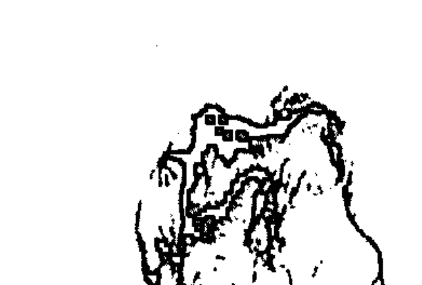
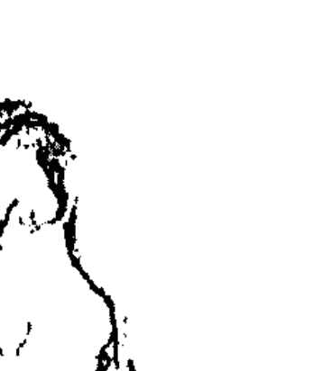

# 凤麟易理案例精解

# 易经

易经，又称《周易》，是中国古代的一部经典著作，被誉为“群经之首，大道之源”。它起源于商周时期，由伏羲画八卦，周文王演六十四卦，并作卦辞和爻辞，后经孔子及其弟子作《易传》十篇，合称《易经》。

易经的核心思想是“阴阳”和“变化”。它认为宇宙万物都由阴阳两种基本力量构成，并处于不断的变化之中。通过六十四卦和三百八十四爻，易经系统地阐述了事物变化的规律，揭示了天、地、人三才之道。

易经不仅是一部占卜之书，更是一部哲学、伦理和政治著作。它强调“天人合一”，主张人应顺应自然规律，修身养性，以达到和谐共生的境界。其思想深刻影响了中国的哲学、医学、军事、艺术等各个领域。

易经的占卜方法主要有两种：蓍草占卜和金钱卦。通过特定的程序得到卦象，再根据卦辞和爻辞进行解读，以预测吉凶祸福，指导行动。然而，其更深层的价值在于提供了一种认识世界和解决问题的思维模式。

# 前言

道家阴盘遁甲预测术，是从上古时期流传下来的，历经数千载，一直在民间默默传承，所以向来鲜为人知。因为任何一种高层次的预测方法都是神传文化，也就是自然法则在人间的展现，所以能掌握这一门知识的人一定是有缘人，能够在其中受益的也一定是有缘人！

阴盘遁甲在社会上公开传授已有四年了，在这期间越来越多的易学爱好者认识到这是一门绝学，感悟到它的博大内涵，领悟到预测的真谛，体悟到事物“神”的一面。阴盘遁甲不同于以往任何一门的预测模式，以全息读象的方式取代了格局定式，淡化了生克，规范了应期，强调了没吉没凶和神助大于一切的道家思维模式，尤其是移星换斗风水术，把预测未来和调整环境完美有机地融为一体，变黑夜为白昼，成梦想为现实，化腐朽为神奇！

感受过阴盘遁甲的人都能悟出一个道理——世间的事没有偶然的，一切都是必然的，人只不过是按照写好的剧本在演自己的角色。为什么这个时间会是你走进来预测，因为你的剧本就在这里，这个时间的剧本是属于你的。这个剧本是谁写的呢？是神，是宇宙玄妙规律在你生命中的具体体现，是天、地、人、神在世间的瞬间组合，是过去、现在和未来在道法中的自然展现。而阴盘遁甲就是揭示这部神秘剧本的解码器，通过它不但可以读懂“神的旨意”——宇宙规律，还可以根据“神的旨意”，用特殊的方法——移星换斗，修改剧本。修改剧本不就等于修改命运了吗？！

所以学会了阴盘遁甲，无异于读懂了一本天书、掌握了一部神曲、暗识了一条天路。从《帝王之术》开始，我开天辟地头一次把天书中的符号、神曲中的音符和天路中的标识，以象意的形式公诸于世，为预测学打开了新的思路；在《凤鸣易理》中我又拿出了几把开启天地之门的密匙，为大家往更高层次上学习铺平了道路；这次的《实战案例精解》是在前两部书的基础上更上一层楼，以华美的哲理语言揭示心法，以大量的实战案例贯穿主线，以简明的易理解析导读全篇，阐述了更多的用神选取方法和预测实战技巧，相信一定能启悟遁甲爱好者的智慧之神！

王凤麟

# 第一章 阴盘遁甲的象意

遁甲符号象意是学习遁甲必不可少而且是非常重要的内容，遁甲中神星十干八门九宫八卦是宇宙自然万事万物全息的代码，就像计算机的数码一样，数码的不同组合可以模拟无穷无尽的事物和信息，但必须首先熟练掌握计算机语言才能很好地运用，遁甲也是如此，只有熟练掌握各种符号的象意才能驾轻就熟地解读遁甲中的各种信息组合。

社会上流行的遁甲书籍中谈到的关于象意的内容非常少，而且很死板甚至谬误叠出，然而遁甲符号象意非常庞杂，它包罗万象，可以说宇宙间的所有事物都可以用遁甲的符号来代表。

## 第一节 阴盘遁甲八卦象意

### 一、乾为天

概念：威严、傲慢、权力、战争、竞争、胆量、优胜、充实、满足、模范、正直、尊敬、喜悦、健壮、圆满、收获、统帅、永久、创造、法则、本原、高亢、核心、精华、向上、长辈、坚固、激烈。

性情：好动少静、严正威武、重情讲义
形态：高档贵重、精致完美
天时：晴天、晴空、太阳
动物：狮子、大象、老虎
植物：秋花、菊花、大树、能结果的树、药草
人体：头、颈、面部
疾病：头痛、脑淤血、心脏病
时间：秋天、九十月之交、戌、亥年、月、日、时
色彩：金黄色、白色等强烈的颜色

### 二、坎为水

概念：劳苦、艰难、苦难、险阻、烦恼、陷落、沉溺、色情、诱惑、交际、交往、关系、结合、悲哀、哭泣、毒害、灾难、踌躇
性情：善谋多智、独立见解
形态：不规则形状的、辛苦劳碌的
天时：雨、雪、云
动物：猪、狐狸、四足动物
植物：水草、海草、荷花、水仙、菱角、芦苇、冬梅等
食物：莲藕、酒类、饮料、糖浆、汽水、果汁、海带、生鱼片
人体：肾、膀胱、泌尿系统
疾病：肾病、耳病、怕冷、水肿、疮
时间：冬十一月、子年、月、日、时

# 第一章 阴盘遁甲的象意

色彩: 黑色、紫色

### 三、艮为土

概念: 静止、开始、变化、转折、改革、断绝、呆板、稳定、固守、慎重、等待、困难、迟滞、诚实、守信、阻隔、艰难、安定

性情: 保守、固执、憨厚、稳重、诚实、守信、谨慎、迟缓、安静、笃实、任劳任怨

形态: 坚硬的、顽固的、与腿脚有关的、向下发展的、上硬下软的、停止不前的、独立存在的、静止的、保守的

天时: 阴天、云彩、雾气、山岚

动物: 老虎、狼、熊、狗、鼠、狐

植物: 瓜类、黄色植物、萝卜

食物: 牛肉、兽肉、根类食物、山蘑

人体: 背、腰、鼻、手、指、关节

疾病: 筋骨酸痛、脾胃病、消化不良

时间: 冬春之交、丑、寅年、月、日、时

色彩: 黄、棕、咖啡、棕黄

### 四、震为雷

概念: 震动、奋起、惊动、奋进、上升、躁动、积极、性急、冲动、显现、影响、迅速、喧哗、争论、转移、旺盛、发育、果断、生长

性情: 意气风发、易怒、勤奋、直爽、自尊心强、心烦意乱、宁死不屈

形态: 震动、激烈的、有声有响的、高速的、急躁的、外虚内实的、滑动的、勇敢的、竞争的、吃惊的

天时: 大冰雹、闪电、东风

动物: 龙、蛇、龟、鹰、燕

植物: 树木、草、竹、蔬菜

食物: 醋、酸的水果、樱桃、柠檬

人体: 足、大拇指、肝脏、发

疾病: 神经病、足疾、扭伤、脚气

时间: 春二月、卯年、月、日、时

色彩: 青绿、碧色

### 五、巽为风

概念: 空虚、柔和、顺从、调和、疑惑、轻快、深入、浅出、高度、流动、货运、迷途、谦逊、徘徊、号令、荣誉、普遍性、渗透性、没有固定地点、自由运动、忙碌、奔波

性情: 优柔寡断、柔和谦虚、心情徘徊

形态: 烟状气态、轻飘轻浮、向下向里发展、上实下虚、神奇的、耳闻鼻嗅的、游动传输的

天时: 风、大风、旋风、龙卷风

动物: 鸡、鸭、鹅、蜻蜓、蝙蝠

植物: 柳、芦苇、蔓草类

食物: 鸡肉、泥鳅、鲤鱼、兽肉

人体: 股、胆、呼吸系统、食道、肠、神经、头发、血管、腹部、左肩、筋腱、腋下、乳、耳、练功元气

疾病: 伤风感冒、气管阻塞、哮喘

时间: 春夏之交、辰巳年、月、日、时

色彩: 青绿、碧绿、洁白

### 六、离为火

概念: 外刚内柔，光明、美丽、变化、迅速、文明、流行、时尚、枯燥、空虚、尊敬、化妆、妆饰、警惕、文才、远见、洞察、判断、鉴定、餐馆、暴露、虚伪

性情: 聪明、名誉、虚心、色情、重礼、爱美、喜欢装扮、知书达理、易冲动、性急暴躁、内心空虚

形态: 鲜艳的、明亮的、发光的、美丽的

天时: 太阳、晴天、热天、中午

动物: 雉、龟、蚌、蟹、鸟、孔雀

植物: 花朵、竹子、椰子、带壳的果实

食物: 烧烤类食物、有苦味的食物

人体: 眼睛、乳房、头部

疾病: 心脏病、眼疾、视力减退

时间: 夏天、农历五月、午年、月、日、时

色彩: 红、赤、紫色

### 七、坤为地

概念: 大地、方形、柔顺、平安、开阔、稳健、文雅、勤俭、谦卑、依赖、迷惘、忧虑、慈悲、安静、温厚、踏实、沉默、伏藏、迟缓、包容、含蓄、消极、沉默、优柔、寡断、懦弱、卑贱、丑陋等

性情: 温柔谦虚、行动迟缓

形态: 方形、柔软、粗笨、能容

天时: 多云、阴天

动物: 牛、羊、蚂蚁、蜘蛛

植物: 苔、茸、蕨、芹菜、柿子

食物: 糙米、小麦

人体: 腹、脾脏

疾病: 口腔疾病、牙病

时间: 秋天、八月、酉年、月、日、时

色彩: 白色、浅黄、金色、金黄色

### 八、兑为泽

概念: 口舌、议论、饮食、酒食、舞会、唱歌、庆典、娱乐、色情、接吻、恩惠、和睦、敬爱、伪善、机敏、雄辩、女性、爱欲、魅力

性情: 喜悦、口舌是非

形态: 上面开口、外软内坚、坚硬的

天时: 新月、黄昏、星

动物: 羊、虎、泥鳅、豹

植物: 荷、水草、菱、芦苇

食物: 泥鳅、兔肉、羊肉、石榴、胡桃

人体: 口、舌、牙齿、涎

疾病: 胃病、消化系统疾病

时间: 农历六、七月、辰戌丑未月、未、申年、月、时

色彩: 深黄、黑

## 第二节 阴盘遁甲十天干象意

### 一、甲

五行: 阳木

概念: 直觉力、高贵的、有名望的、第一的、首领

形态: 直、方、高

性情: 威严、正直、愉快、独断、心高、清洁、浪费

人体: 头、指甲、头发

动物: 穿山甲、玳瑁、龙虾、乌龟、鳖、贝类、螺类

植物: 大树、带壳的果实

方位: 东方

天时: 风、春天、早晨

食物: 馐珍、美味

色彩: 青色、绿色

### 二、乙

五行: 阴木

概念: 希望达成、质软、转机、艺术、文化、柔弱、弯曲、曲折、依附

形态: 苗条、微驼背、皮肤白嫩、骨肉松弛、瘦长脸

性情: 仁慈、柔弱、仁爱、温柔

人体: 肝、胆、肠、发、神经

动物: 蚯蚓、蛇、天鹅、龙、海参、海肠、蚕虫、鸟类

植物: 中草药、花草、小树

方位: 东方

天时: 风、月亮

色彩: 苍、碧、绿

### 三、丙

五行: 阳火

概念: 希望、光明、雄威、乱子、刚猛、热烈、急速、圆状、片状、权威

形态: 体态丰满、圆脸、少胡须、短发、皮肤白里透红

性情: 暴烈、强悍、虚荣、正义、愤怒、性急、果断

人体: 眼、血液、唇、心脏

动物: 马、牛、猪、驴

植物: 带柄的果实、梨子

方位: 南方

天时: 太阳、晴朗、炎热

色彩: 红色、紫色

### 四、丁

五行: 阴火

概念: 希望、执着、发展、尖锐、逼人、带刺、顶尖、突出

形态: 主人秀丽清高、肤白粉嫩、发细而长、额宽须尖

性情: 性情柔弱、和顺而有心计、体贴人情、洞察奸邪

人体: 眼、牙、心脏、血液、骨刺、肉刺、男性生殖器

感觉: 热烫

动物: 叮咬人和动物的昆虫、蚊子、跳蚤、马蜂、蜜蜂、牛虻。带刺的动物、刺猬、野猪、蛇

植物: 带刺的植物或果实、玫瑰

方位: 南方

天时: 星星、晴天、夏天、中午

色彩: 红色、紫色

### 五、戊

五行: 阳土

概念: 中正、厚德载物、包容、资本、钱财、金融、宽厚、守信、忠诚、方大

形态: 形体敦厚、四方脸、肤黄白、身体多肉

性情: 果敢豪杰、刚烈暴躁、憨厚、愚笨

人体: 鼻、胸、乳房

动物: 牛、猪、骆驼

植物: 叶子宽厚方大或土生的肉质多的果实

方位: 中央，寄在坤宫

天时: 星云、银河

色彩: 黄色、棕色

### 六、己

五行: 阴土

概念: 策划、欲望、邪念、创意、花花肠子、节约、拐弯抹角、吝啬、杂乱、有主意、想法多、忌讳多、思考问题细心

形态: 形体单薄，瘦弱丑陋，圆脸

性情: 忧愁之相、声音含糊重浊、静多动少、温顺沉静、忍辱负重、卧薪尝胆、以柔克刚

人体: 嘴、乳头、肚脐、肛门、耳垂

动物: 蜗牛、章鱼、墨鱼

植物: 卷曲没有展开的植物，含苞待放的花蕾

方位: 中央，寄于西南

天时: 星云

色彩: 黄色、黄绿色

### 七、庚

五行: 阳金

概念: 阻碍、阻隔、打斗、魄力、气概、刚健、肃杀、凶恶、野蛮、技术过硬

形态: 形体瘦长、骨格健壮

性格: 刚健敏锐、坚忍不拔、威严残暴

人体: 头骨、骨骼、肺

动物: 凶恶的动物、老虎

植物: 植物的干、根、果壳等

方位: 西方

天时: 秋天

色彩: 白色、粉色、金属色

### 八、辛

五行: 阴金

概念: 革命、错误、问题、叛逆

形态: 修长方正、皮肤白嫩、长脸凹腮

性情: 忠诚爽柔、温润秀气、自尊但虚荣、意志不够坚定

人体: 牙、骨、肺、皮毛、疙瘩、瘤、骨刺、湿疹、粉刺、痘

动物: 寄在人或动物身上的生物或病毒

植物: 颗粒状粮食如: 大豆、高粱

方位: 西方

天时: 秋天

色彩: 白色、粉色

### 九、壬

五行: 阳水

概念: 孕育、蕴藏、流动、迷茫、迁移、变化、智慧、困境、生产

形态: 皮肤稍黑、大眼睛、双眼皮、走路摇摆、长发秀眉

性情: 柔顺、阴险、勇敢、多智、纵欲、任性、热情、威严、容纳

人体: 发、眼、动脉

动物: 水中物、鱼、虾、蟹、龟等

植物: 荷花、菱角、海带、水草等

方位: 北方

天时: 冬天

色彩: 黑色、蓝色

### 十、癸

五行: 阴水

概念: 制约、管束、艰难困苦、跋涉、流动、变动、变化、性、淫

形态: 矮小黑丑、圆脸瘦肩、声调不高

性情: 阴柔怕事、多愁善感、不能自主

人体: 足、私处、静脉、肾脏、眼球、精液、痣、口水、眼泪、鼻涕、汗液、尿溺

动物: 水鸟、鸭、鹅、雁、鹤、鸥、鹭、鸳、黑蝇等

植物: 水稻、蔬菜、水果、水仙、喜水植物

方位: 北方

天时: 冬天

色彩: 黑色、玄色

## 第三节 阴盘遁甲十二地支象意

### 一、子

五行: 阳水

概念: 首领、名人、智慧、聪明、豪奢、阴私、奸邪、暗昧、色欲、悲泣、丢失

形态: 面黑或眼大、大头、身体圆润、皮肤光滑

性情: 可圆可方、处事圆滑

人体: 肾、膀胱、精神、血液

动物: 老鼠、田鼠、鸟类

植物: 蔬菜、水果、水草

方位: 正北

天时: 雨

颜色: 黑色

### 二、丑

五行: 阴土

概念: 忠厚、正直、贤良、福德、职称、难看、丑陋、田产、房屋、财产、院落、争斗、诅咒、冤仇、告状、官司、举荐

形态: 丑陋、矮子、瘸子、驼背、大肚子、秃发人、眼睛有毛病

性情: 忠厚、贤良、说话不好听、爱骂人、告状

人体: 脾、胃、肠

动物: 牛、马、驴、骡、羊

植物: 蔬菜、瓜果、桑树、地瓜、土豆、植物的根

方位: 北偏东

天时: 雨天

色彩: 黄色

### 三、寅

五行: 阳木

概念: 开始、发挥、实际、变化、进行、木器、文章、文艺、文化、艺术、教育、经济、管理、婚姻、喜庆

形态: 方脸、面色青白、额头大、有胡须、身材魁梧

性情: 仁慈、虚伪、伪装、易怒

人体: 肝、胆、发、口、眼、筋、手、指甲、腿

动物: 老虎、豹子、猫、狐狸、狗、啄木鸟

植物: 高大树木、竹子、果树、花木等

方位: 东北

天时: 风

色彩: 绿色

### 四、卯

五行: 阴木

概念: 逃往、振动、摇摆、急促、消耗、失盗、流动、艺术、文化、欢乐、祥和

形态: 面长、脸色青白、大脑门、身体细长

性情: 冲动、直白、说话不拐弯抹角、性急

人体: 十指、毛发、肝

动物: 兔子、松鼠、羊、鹿

植物: 花草、竹子、植物的茎、农作物

方位: 东方

天时: 风

色彩: 绿

### 五、辰

五行: 阳土

概念: 斗争、死丧、困难、牢狱、官司、迟滞、顽恶、坚硬、凶怪、打架、动摇、辈分、惊恐、焦虑、孕育、邪梦、自缢

形态: 圆脸、满脸严肃

性情: 心狠手辣、心情冷酷、思想顽固、邪恶多淫

人体: 肠、胃、胸

动物: 龙、蛟、鱼类、蜥蜴、蚯蚓、不带翅膀的虫、昆虫类的幼虫

方位: 东偏南

天时: 龙卷风

色彩: 黄色

### 六、巳

五行: 阴火

概念: 信息、惊扰、怪异、争斗、口舌、流血、变化、乞索、讨债、赏赐、奖赏、聪明、狡诈、虚伪、忧愁、文艺、轻狂、谩骂、犯法

形态: 红脑门、大嘴、头发黄

性情: 狡猾善变、神经质、虚伪怪异、精神恍惚

人体: 血液、心、面部、口腔

动物: 蛇、蚓、蝉、萤火虫

植物: 植物的尖部、藤萝、瓜秧

方位: 南偏东

天时: 炎热、星星

色彩: 红色

### 七、午

五行: 阳火

概念: 惊恐、疑惑、口舌、是非、诚信、火光、文书、诅咒、胎孕、词讼、信息、光彩

形态: 圆目、面赤、身体高大

性情: 脾气急躁、点火就着

人体: 心、口、目

动物: 马、鹿、獐、麝、漂亮的鸟类

植物: 花、盆景、绿篱、观赏树

方位: 正南

天时: 太阳

色彩: 红色

### 八、未

五行: 阴土

概念: 口味、味道、酒食、宴会、婚姻、喜庆、拜神、召见、会见、小的收获、否定

形态: 肥胖、丰满

性情: 豪爽好饮

人体: 头、胃、肝

动物: 海鲜、河鲜、羊、鹿、驴

植物: 农作物、蔬菜

方位: 南偏西

天时: 燥热

色彩: 黄色

### 九、申

五行: 阳金

概念: 运动、传递、道路、疾病、精神、意识、交易、问题、阻碍、阻隔、困难

形态: 圆脸、圆眼、脖子短粗、脑门后平、身材肥大

性情: 严肃、急躁、不怒而威

人体: 大肠、右胸

动物: 狮子、老虎、猴子

植物: 大麦、坚果、榛子、核桃

方位: 西偏南

天时: 闪电

色彩: 白色、金色

### 十、酉

五行: 阴金

概念: 密谋、筹划、策划、缜密、精致、细节、完美、金融、经济、市场、交易、买卖

形态: 形貌端庄、面色黄白

性情: 文静、文雅、谈吐不凡、细腻认真

人体: 右肋、手臂、口、耳

动物: 鸡、鸽、鸭、鹅、羊、善鸣叫的鸟类

植物: 葱、姜、辣椒、大蒜、小麦、辛辣植物

方位: 西

天时: 雪

色彩: 白

### 十一、戌

五行: 阳土

概念: 欺诈、虚伪、虚耗、虚假、思考、空虚、伪装、虚幻、飘渺、茫然、不切合实际、深邃、精神、宗教

形态: 方脸、眼泡大

性情: 慈祥、宽厚、态度安然

人体: 命门、膀胱

动物: 狗、豺、狼、鹰

植物: 红柳、甘草、枸杞、枣树

方位: 西偏北

天时: 阴天

色彩: 黄色

### 十二、亥

五行: 阴水

概念: 惊讶、胆怯、流动、光明、召见、隐私、肮脏、偷盗、眩晕、恍惚、困难、疑惑、争斗、沉溺、索取

形态: 长脸、面黑、手脚也黑、大头

性情: 精神恍惚、神经衰弱

人体: 眼、头发、毛发

动物: 鱼虾等水中生长的动物

植物: 梅花、葫芦、水草、海带

方位: 北偏西

天时: 阴雨

色彩: 黑色、蓝色

## 第四节 阴盘遁甲十二长生象意

五行不仅在一年四季中有旺、相、休、囚、死的状态，而且与地支所代表的十二个月相对应，还有一个从生长到死亡的全过程，叫做“寄生十二宫”的原理。十天干相对于十二地支有十二种状态: 长生、沐浴、冠带、临官、帝旺、衰、病、死、墓、绝、胎、养。其排列规律为阳生阴死。

### 一、长生

概念: 依靠、根基、关爱、抚养、有实力、享受、长寿

地理: 客厅、田间、充满活力的地方、生活区、大自然

动物: 抚育的动物、喂养的动物

植物: 正在生长的植物、依靠的植物

静物: 使人长寿的物品、长寿面、镜子、茶壶、伞

人物: 关爱他人的人、被人依靠的人、帮助别人的人

### 二、沐浴

概念: 暴露、简单、坦诚、失败、桃花、娱乐、休闲

地理: 带水的地方、卫生间、美容院、游泳池、更衣室

动物: 相恋的动物、刚出壳的动物

植物: 嫩的、脆的、刚经过风雨的植物、桃花、嫩芽

静物: 简单的物品、水龙头、粪便、蜡烛、热水器

人物: 穿的少的人、清理工、失败的人

### 三、冠带

概念: 包装、复杂、城府、伪装、遮盖、假的、深藏

地理: 遮盖的地方、复杂的环境、被遮盖的环境、有广告宣传的地方、日食

动物: 伪装的动物、竹节虫、变色龙、用修饰带来的漂亮动物、孔雀、隐藏的动物

植物: 经过修剪、修饰过的植物、遮盖的植物

静物: 遮掩的衣服、面具、装饰品、帽子、包装品、隐藏复杂的东西

人物: 化妆复杂的人、戴帽子的人、正在修剪的人

### 四、临官

概念: 保护、经济、领袖

地理: 工作场所、建筑区、车间、田间、机场

动物: 正在捕获的动物

植物: 正在捕捉的、含苞待放的植物

静物: 帽子、带盖的东西、钥匙、货币、商品

人物: 正在工作的人、领导、耕种者、戴帽子的人

### 五、帝旺

概念: 富有、巅峰、强大、收获、完美、领袖

环境: 京都、会所、最美的地方

动物: 为王的动物、凶猛的、虎、狮子、蛇、蝎、鹰

植物: 名贵的花、霸王花、霸王鞭、帝王树、仙人掌

静物: 名贵、比较完美的物品

人物: 到达巅峰的人、最完美的人、国家领导人

### 六、衰

概念: 衰败、破旧、虚弱、悲伤、走下坡路

### 七、病

概念: 问题、生病、突出、动、升迁、牵挂、思考

环境: 败落的环境、废弃的环境

动物: 衰老、无能的动物、休息的动物、疲倦的动物

植物: 败落的植物、被虫咬了的植物

静物: 破旧的物品、使人伤感的物品

人物: 疲倦的人、衰老的人、哀思、哭泣的人

### 八、死

概念: 危险、黑暗、死亡、教条、悲伤、稳重、休息

环境: 土地、药店、医院、太平间、坟墓、监狱、刑场、寺庙、宇宙

动物: 乌龟、蜗牛、牛、海参、海螺

植物: 枯死的植物、生长慢的植物、松树、柏树、红薯、土豆、藕、荸荠

静物: 危险品、凶器、神佛用品、神像、经书

人物: 过世的人、灵异的人、恐怖分子、危险的人、休息的人、医生、护士

### 九、墓

概念: 遮盖、黑暗、模糊、实在、能力没发挥、被约束、捆绑

地理: 遮盖的地方、大雾、暗沟、山洞、坟地、关押的地方、库房、塔、黑暗的场所

动物: 行动缓慢的动物、蜗牛、熊、甲鱼、娃娃鱼、牛

植物: 红薯花、山药、菱角、芋头

静物: 盒子、柜、袋子、面具、鞋、壶、粮囤

人物: 藏起来的人、被关押的人、被束缚的人、技术能力没发挥好的人

### 十、绝

概念: 阻隔、失踪、珍稀、转换、独特、绝对、尽头

地理: 断了的地方、尽头、隔绝的地方、顶峰

动物: 灭绝的、极少的动物、恐龙、毒蛙、骆驼、熊猫

植物: 花谢果还没出来的时候、受孕的植物

静物: 极致品、坏了的物品、断开不能用的物品、转换器、烟花、锁

人物: 绝美的人、挑战极限的人

### 十一、胎

概念: 酝酿、思考、根源、内部、内涵、怀孕

地理: 内部的环境、孕育着的地方、产房、卫生间

动物: 怀孕的、孕育的动物

植物: 含苞待放的、孕育的植物、玉米、向日葵

静物: 内部的物品、车胎、内衣

人物: 孕妇、思考的人、酝酿的人

### 十二、养

概念: 调理、教育、学习、懒散

地理: 休闲场所、调养室、教堂、寺院

动物: 休息的动物

植物: 花期

静物: 供人休养的物品、睡床、健身器材、茶壶

人物: 拜佛的人、休息的人、美容师、气功师、教徒

## 第五节 阴盘遁甲八星象意

八星即天蓬星、天任星、天冲星、天辅星、天英星、天芮星、天柱星、天心星。

### 一、天蓬星

五行: 水

概念: 智商——思考力、膨胀鼓起、蓬松、四面透风的、松软的、汹涌澎湃、聪明智慧

形态: 庄严、威猛、彪悍、精干、面黑或眼大

性情: 圆融果敢、胆大妄为、心狠手辣、贪恋酒色

# 第一章 阴盘遁甲的象意

人体：耳、肾、膀胱

动物：猪、鼠、蝙蝠

人物：多毛之人、头发蓬松之人、威猛彪悍之人、聪明智慧之人

植物：蘑菇类、菌类植物、树冠大的树

地理：冠状大树、篷子、帐篷、岗楼、楼房、戴尖顶的房屋、带角的物体。

静物：伞、雨衣、雨具、宽松的衣服

方位：北方

天时：冬天

色彩：黑色、蓝色、玄色

### 二、天任星

五行：土

概念：志商——目标力、担当、承受、任劳任怨、任重道远

形态：拱形、弯腰驼背、胸部丰满

性情：忠厚老实、任劳任怨、倔强

人体：手、腰、脊柱、鼻

动物：牛、骆驼、虎

人物：驼背人、大胸之人、登山运动员、钢琴演奏者、弦乐弹奏者

植物：谷穗、稻子、黍子、柳树等低垂植物

地理：桥、台阶、山峦、坡路等

静物：盆景、石制品、积木、背包、背篓等

方位：东北方

天时：雾

色彩：黄色

### 三、天冲星

五行：木

概念：敏商——行动力、执行力、冲动、直往前闯、冲击、猛烈、矛盾

形态：直、高、长方脸、长发、梳抓髻的人、身体瘦长

性情：性子急、工作麻利、雷厉风行

人体：肝、筋骨

动物：兔子、天鹅、燕子

人物：张飞、李逵式的人物、性急之人、雷厉风行之人、射手、台球手、跳高运动员、田径运动员

植物：竹、树、高粱、玉米、白杨树、参天树

地理：桂林山水、塔、高楼

静物：枪、炮、子弹、炮竹、炸药

方位：东

天时：地震、风

色彩：碧绿

### 四、天辅星

五行：木

概念：德商——诚信力、帮助、奉献、辅佐、协助、指导、关爱、关怀、协调

形态：凹陷、身体细长、发缜密、脸清白、手细长

性情：文雅、谦虚、有修养

人体：大腿、呼吸器官、乳房

动物：鸡、蛇、泥鳅、蚯蚓

人物：文王正的人物、雷锋、耶稣、苏格拉底、孔子

植物：柳树、葡萄、葫芦、丝瓜、南瓜、杨树

地理：麦田、稻田、竹林、果园、房子

静物：食品、衣物、车子、水果

方位：东南

天时：风、祥云

色彩：绿色

### 五、天英星

五行：火

概念：情商——关系力、社交力、卓越、杰出、贤明、秀丽、智勇

形态：漂亮、风姿、瓜子脸、面红白、身体瘦、头发较黄

性情：声音焦脆、礼貌虚伪、焦躁不安、易怒

人体：眼睛、血液、心脏

动物：孔雀、鹦鹉、火鸡、锦鲤

人物：演员、社交家、漂亮的人物、英雄式的人物

植物：开花的植物、盆景、花卉、漂亮的植物

地理：高亢之地、阳光充足之地、炉冶之地。

静物：发光之物、电子元件、外观漂亮之物

方位：南方

天时：太阳

色彩：红、品红、绛红

### 六、天芮星

五行：土

概念：健商——保健力、问题、毛病、错误、联合、结交

形态：斑点、方脸、大嘴、肚子大

性情：固执、迟钝、懦弱

人体：脾、胃、腹部、肩部、嘴部、脐部

动物：牛、羊、家畜

人物：教师、医生、学生、幼儿

植物：庄稼、农作物、土豆、地瓜

地理：学校、医院、学府

静物：医疗器械、医药、文化用品

方位：西南

天时：云

色彩：黄色

### 七、天柱星

五行：金

概念：逆商——驾驭力、惊恐怪异、顶天立地、力挽狂澜、中流砥柱、能独当一面、破坏毁折

形态：柱状、面白、方圆脸、唇薄、身体健壮

性情：口舌是非、能说会道、好斗争讼、喜杀好战、能言善辩

人体：中直部位，颈椎、大腿

动物：公鸡、鼹鼠、羊、鸟类

人物：律师、教师、演员、靠嘴生活者

植物：直的树、芦苇、毛竹、胡杨

地理：电杆、铁塔、寺庙、高楼、纪念碑

静物：发声的电器、乐器、物体

方位：西

天时：秋天

色彩：白色

### 八、天心星

五行：金

概念：心商——心态力、思想活动、想法、感情、中间、坚固、专制、压抑

形态：圆形、高大、威严、雄伟

性情：聪明能干、精明机智、有领导才能

人体：头、心脏

动物：马、猪、狗、狮子、老虎、熊、天鹅、鲸鱼

人物：企业家、领导者、中心人物

植物：菊花、果树、大树、桔子、草药

地理：高亢之地，客厅、院落、广场

静物：球类、珠类

方位：西北

天时：雪

色彩：白色、金色

## 第六节 阴盘遁甲八门象意

八门即为休、生、伤、杜、景、死、惊、开。奇门中，八门代表人事。

### 一、休门

五行：水

概念：休养生息、休闲、懒散、旅游、休息、漫不经心、调养、调理、整理、美容、美发、死亡

形态：漂亮、美丽、气质好、语音偏低

性情：安然、漫不经心、懒散倦怠、性情温顺、没有活力

人体：生殖系统

动物：金鱼、毛虫、蜗牛、水牛、黄牛等性情温顺的动物

植物：水草、白菜、青菜、萝卜

方位：北方

天时：冬天

色彩：蓝色、黑色

### 二、生门

五行：土

概念：延续、靠山、利润、利息、效益、学习、工作、经商、生意、生活、生产、生存、生长、活着

形态：方脸、乐观向上

性情：忠厚、守时、诚恳、乐观

人体：鼻、嘴、胃、脾、肠

动物：泛指一切生物

植物：泛指一切植物

方位：东北

天时：阴天

色彩：黄色

### 三、伤门

五行：木

概念：损害、消耗、妨碍、受伤、伤心、伤痛、捕捉、索取、赌博、戏耍、挑逗、收敛财货、渔猎

形态：威严、恐怖、难看、丑陋

性情：性情直爽、不拐弯抹角、雷厉风行

人体：脚、手、肝、胆

动物：狮子、老虎、狗、鹰

植物：仙人掌、金虎、刺梅、荆棘、玫瑰

方位：东方

天时：风

色彩：青色、绿色

### 四、杜门

五行：木

概念：阻塞、阻止、困难、限制、闭塞、隐藏、覆盖、遮掩、关闭、断绝、技术、艺技；体会到的、感觉到的、意识到的、想象到的

形态：晦涩、呆滞、神色黯然

性情：不爱言语、心平气和、文静内向

人体：呼吸系统、肝、胆、筋

动物：夜行动物，如：黄鼠狼、老鼠、猫、狗、猫头鹰、蚊子

植物：小草、庄稼、树木、苔藓植物

方位：东南方

天时：风、空气

颜色：绿色

### 五、景门

五行：火

概念：文化、文书、漂亮、火光、流血、风景、旅游、愿景、前程

形态：漂亮、红脸、脸尖形、身体偏瘦

性情：心直口快、脾气急躁、虚心处事、知书达理

人体：血液、心脏

动物：雉鸡、孔雀、雄鹰

植物：漂亮的花卉、植物、盆景

方位：南方

天时：太阳、晴天、炎热、中午

色彩：红色、赤色

### 六、死门

五行：土

概念：执着、不灵活、没有变化、丧失生命、没有生命的、不可调和、固定不变、不可周转、断了念头、鬼神

形态：脸色呆板、木纳、不灵活、死板

性情：固执迟钝、稳重保守、死心眼、死气沉沉、死不认帐、一条道走到黑、不灵活

人体：一般代表没有活力的部位、病灶部位

动物：牛、羊、动物的尸体

植物：松树、柏树等生长缓慢的树、有病的植物、干枯的植物

方位：西南

天时：雨

色彩：灰色、黑色、蓝色

### 七、惊门

五行：金

概念：惊恐、奇怪、刺激、吃惊、诧异、惊慌、恐慌、声音、官非、口舌是非、斗讼、忧疑、音乐、响声

形态：瞪目结舌状、大眼睛、嘴闭不上

性情：能说会道、声音宏亮、惊恐不安

人体：心脏、喉咙

动物：蝉、蛙、蝈蝈、蟋蟀、黄鹂

植物：白杨（沙沙）、松树（松涛阵阵）

方位：西方

天时：雷电

色彩：白色

### 八、开门

五行：金

概念：公开、暴露、舒展、宽广、开放、开创、开始、开明、开朗、打开、手术、驾驶、顺利、通畅、经营、经济、升迁、出行、学业、婚嫁、贸易、庆典、谋求

形态：脸方顶圆、鼻正口方、上身长直、不怒而威

## 第七节 阴盘遁甲八神象意

八神为：值符、腾蛇、太阴、六合、白虎、玄武、九地、九天

### 一、值符

五行：木、土

概念：直觉力、高贵、高档、稀有、有组织能力、名牌、重点、高尚、有影响力、服众、威严、德高望重

形态：方脸、粗眉、重发、鼻子直大

性情：气概雄伟、文韬武略、品质高雅

人体：头、面

语言：有分量、掷地有声、有哲理、意味深长

动物：名贵的稀有的动物如藏獒、老虎、熊猫

植物：名贵的稀有的树种和花木如金丝楠木、红木

方位：中央地带

天时：晴朗、风和日丽

性情：豁达爽朗、谈吐不凡

人体：头、肺、大肠

动物：虎、狮、豹、马、天鹅、龙

植物：高大之树、在结果实的植物

方位：西北

天时：秋天

色彩：绚烂、五彩缤纷

### 二、腾蛇

五行：火

概念：缠绕、惊恐、虚惊、怪异、虚幻、梦境、变来变去、反反复复、虚诈、虚伪、华而不实、闪烁不定、光怪陆离、耀眼、妖艳、猜疑、狠毒、纠缠、变化、拐弯抹角

形态：水蛇腰、驼背、头发黄或稀少、大脑门

性情：虚伪巧诈、奸佞心毒、惊恐不安、心口不一

人体：心脏、血液、血管

语言：喋喋不休、颠三倒四、没完没了、死缠烂打

动物：蛇、蟒、蚯蚓、爬虫类、海参

植物：龙爪槐、爬山虎、西瓜秧

方位：南方

天时：太阳

色彩：杂色、红色

### 三、太阴

五行：金

概念：提升、护佑、隐避、藏匿、喜庆、贞祥、淫乱、阴私、隐私、密谋、缜密、诅咒、哭泣、忧疑、欺诈、口舌、私通、策划、遮盖、暗处、雕刻

形态：脸色白净、口似樱桃、鼻子挺直

性情：品质优良、正直慷慨、助人为乐

人体：嘴、肺、皮肤

语言：柔声细语、说话声低

动物：刺猬、老鼠、猫、猫头鹰等夜间出没的动物

植物：带壳的果实如：花生、瓜子等；苔藓植物、沼泽生长的植物，如苇子、蒲草等

方位：西方

天时：月亮

色彩：灰色、白色

### 四、六合

五行：木

概念：欢乐、祥和、仁慈、包容、合作、联合、交易、谈判、结婚、众多、收拢、关闭、平和、共同、适合、合抱、重叠、相聚、聚集

形态：圆脸、兔牙、一团和气、笑容可掬、点头哈腰、缩头耸肩

性情：开朗平和、仁慈谦让、荐贤不妒、喜做说合之事

人体：手、手指、脚趾

语言：说话和气、幽默滑稽

动物：兔子、鸳鸯、狼、麻雀、蜻蜓、蝴蝶、蜜蜂

植物：小树、花草、果树、竹林、柳树

方位：东方

天时：和风、旭日、春天、早晨

色彩：绿色、多种颜色的组合

### 五、白虎

五行：金

概念：凶猛、威严、阻隔、斗争、权力、刚毅、冷库、严肃、艳丽、强硬、官司、伤灾、牢狱、疾病、死亡、技术过硬、道路

形态：圆眼、虎头虎脑、面部表情严肃或死板、身体多肌肉、强健

性情：凶猛刚毅、大义凛然

人体：骨骼、拳头

语言：话语强硬、污言秽语、詈骂

动物：虎、豹、豺、狼、猎狗、鹰、肉食动物

植物：猪笼草、蒺藜草、蝎子草

方位：西方

天时：秋天

色彩：白色、刺眼的光

### 六、玄武

五行：水

概念：深奥、玄虚、不可靠、不可捉摸、玄妙、神秘、幻想、领悟、理解、智慧、偷盗、偷情、谎言、阴谋、诡计

形态：贼眉鼠眼、神色不定、弯腰驼背

性情：机智灵活、巧言善辩、干练虚伪、偷奸取巧

人体：眼睛、头发、肾

语言：天花乱坠、无中生有、谎话连篇、百般抵赖

动物：老鼠、鹰、蛇、猫头鹰、鱼类、喜水类动物

植物：水草、海带、紫菜、蔬菜、水果含水量大的植物

方位：北方

天时：雨天

色彩：黑色、玄色、蓝色

### 七、九地

五行：土

概念：矮小、稳定、厚重、柔顺、文静、恭敬、谦卑、吝啬、消极、哭泣、自私、模糊、旧物、博大、包容、关怀、缓慢、困惑

形态：大腹、肥厚、方脸多肉、肥胖、身材五短、声音如瓮

性情：柔顺文静、自私消极、缺乏上进心、吝啬节俭

人体：胃、脾、肉

语言：语速较慢、被动低调

动物：牛、猪、熊猫、地蚕、虫类

植物：地瓜、土豆、农作物、地衣、苔藓、地丁

方位：西南

天时：多云、阴天

色彩：黄色

### 八、九天

五行：金

概念：高大、天空、虚无、高处、极端、重要、主宰、意志、灵魂、自然、高大、聪明、光明、恩赐、幸福、豪放、美丽

形态：高大、魁梧、威严、脸方正、手绵软、言语掷地有声

性情：不怒而威、刚强好动，志向远大

人体：头、额头、肺、大肠

语言：语速较快、张扬、沸沸扬扬

动物：马、龙、飞鸟、虎、狮、天鹅

植物：高大的树、高粱、果树、高山或高原植物

方位：西北

天时：蓝天、雷电、秋天

色彩：白色、青色

## 第二章 阴盘遁甲的定局排盘

### 第一步 排四柱

排四柱即是把起局时的阳历时间转换成干支表示方式。
比如2005年12月1日12时15分四柱为：乙酉 丁亥 己未 庚午

### 第二步 定局

阳遁：冬至后夏至前的这段时间为阳遁
阴遁：夏至后冬至前的这段时间为阴遁
局数取(年支序数+月数+日数+时支序数)除9之余数
比如：2006年5月23日19时45分农历：四月廿六日
四柱为：丙戌 癸巳 壬子 庚戌
年支戌序数为11，四月廿六为4+26，时支戌序数为11，
所以(11+4+26+11)/9 余数为7
因为，此时是冬至后夏至前起的局，定为阳局，所以此局
为阳7局。

### 第三步 画九宫格

阴盘遁甲讲究神助大于一切，所以在起局时一定要符合宇宙的规律，所以在画九宫格时，先画大方格，格定天地，再分小方格，格定九洲，如此则信息能量完全贯注其中，分析判断起来必然有如神助。现在流行的遁甲大多是画井字格，井字格四面透风，气场不聚，能量呈消耗状态，操作者容易分散注意力，看不到关键，抓不住要领。

还有一点，起局要心平气和，讲究心法。如此，则产生共振的场效应，达到天人合一的境界，提高预测的准确率。画九宫时心中默念：“无极生太极，太极生两仪，两仪生四象，四象生八卦，八卦定乾坤。”所画格局线与线之间要交接紧密，格与格之间不要相通，否则信息容易混乱，导致判断不清，切记！

### 第四步 布地盘三奇六仪

根据局数，依阳局顺布、阴局逆布原则排列：戊己庚辛壬癸丁丙乙，是几局戊就落几宫。这里要记住九宫数：戴九履一，左三右七，二四为肩，六八为足，五居中宫。如下表。

| 4 | 9 | 2 |
|---|---|---|
| 3 | 5 | 7 |
| 8 | 1 | 6 |

如阳1局：戊落坎一宫，己落坤二宫，庚落震三宫，辛落巽四宫，壬落中宫，癸落乾六宫，丁落兑七宫，丙落艮八宫，乙落离九宫。如下表：

| 辛 | 乙 | 己 |
|---|---|---|
| 庚 | 壬 | 丁 |
| 丙 | 戊 | 癸 |

如果是阴1局：则戊落坎一宫，己落离九宫，庚落艮八宫，辛落兑七宫，壬落乾六宫，癸落中宫，丁落巽四宫，丙落震三宫，乙落坤二宫。如下表：

| 丁 | 己 | 乙 |
|---|---|---|
| 丙 | 癸 | 辛 |
| 庚 | 戊 | 壬 |

如果是阳7局则为：

| 丁 | 庚 | 壬 |
|---|---|---|
| 癸 | 丙 | 戊 |
| 己 | 辛 | 乙 |

### 第五步 找出旬首

甲子戊，甲戌己，甲申庚，甲午辛，甲辰壬，甲寅癸为旬首。
旬首是根据时柱来定的。可以从下表查询，比如壬申时
预测，则旬首是甲子戊，丁未时旬首是甲辰壬。

旬首表：

#### 甲子戊

| 甲 | 乙 | 丙 | 丁 | 戊 | 己 | 庚 | 辛 | 壬 | 癸 |
|---|---|---|---|---|---|---|---|---|---|
| 子 | 丑 | 寅 | 卯 | 辰 | 巳 | 午 | 未 | 申 | 酉 |

#### 甲戌己

| 甲 | 乙 | 丙 | 丁 | 戊 | 己 | 庚 | 辛 | 壬 | 癸 |
|---|---|---|---|---|---|---|---|---|---|
| 戌 | 亥 | 子 | 丑 | 寅 | 卯 | 辰 | 巳 | 午 | 未 |

#### 甲申庚

| 甲 | 乙 | 丙 | 丁 | 戊 | 己 | 庚 | 辛 | 壬 | 癸 |
|---|---|---|---|---|---|---|---|---|---|
| 申 | 酉 | 戌 | 亥 | 子 | 丑 | 寅 | 卯 | 辰 | 巳 |

#### 甲午辛

| 甲 | 乙 | 丙 | 丁 | 戊 | 己 | 庚 | 辛 | 壬 | 癸 |
|---|---|---|---|---|---|---|---|---|---|
| 午 | 未 | 申 | 酉 | 戌 | 亥 | 子 | 丑 | 寅 | 卯 |

#### 甲辰壬

| 甲 | 乙 | 丙 | 丁 | 戊 | 己 | 庚 | 辛 | 壬 | 癸 |
|---|---|---|---|---|---|---|---|---|---|
| 辰 | 巳 | 午 | 未 | 申 | 酉 | 戌 | 亥 | 子 | 丑 |

#### 甲寅癸

| 甲 | 乙 | 丙 | 丁 | 戊 | 己 | 庚 | 辛 | 壬 | 癸 |
|---|---|---|---|---|---|---|---|---|---|
| 寅 | 卯 | 辰 | 巳 | 午 | 未 | 申 | 酉 | 戌 | 亥 |

### 第六步 定值符与值使门

值符就是值班的八星，值使就是值班的门。地盘的旬首落在哪个宫，那个宫的地盘之星和门就为值符和值使门。地盘的八星和八门可以从下表查出。

#### 地盘的八星和八门

| 天辅星 | 天英星 | 天芮星 |
| :--- | :--- | :--- |
| 杜门 4 | 景门 9 | 死门 2 |
| 天冲星 | 5 土 | 天柱星 |
| 伤门 3 | | 惊门 7 |
| 天任星 | 天蓬星 | 天心星 |
| 生门 8 | 休门 1 | 开门 6 |

比如，阳一局，甲子旬，旬首戊落在坎一宫，所以值符就是天蓬星，值使就是休门。

如果甲寅旬，癸落兑七宫，则天柱星为值符，惊门为值使门。

### 第七步 确定天盘三奇六仪和八星

遁甲局中，三奇六仪有两层，下面的一层为地盘三奇六仪，上面的为天盘三奇六仪。

根据“旬首和值符随时干转”的规律，看预测时辰的时干在地盘落几宫，就将值符和旬首直接写在这个宫内，同时将它原在地盘宫内的三奇六仪也随之写在它如今运转到的宫内。

## 第二章 阴盘遁甲的定局排盘

如下下面的阳7局。

2006年5月23日19时45分，农历：四月廿六日。

四柱：丙癸壬庚
戊巳子戌

阳七局，甲辰壬，天芮星为值符，死门为值使。

| 丁 | 庚 | 壬 |
|---|---|---|
| 癸 | 丙 | 戊 |
| 己 | 辛 | 乙 |

甲辰旬中壬为旬首。因为地盘的旬首壬落在坤宫，所以在坤宫的地盘的星和门即为值符和值使。查地盘的八星和八门表，坤二宫的地盘的星为天芮星，因此天芮星为值符，在坤二宫地盘的门为死门，因此死门就为值使门。根据旬首和值符随时干转的规律，则上面的局的天盘六仪和八星的排列如下：

上局中，时干为庚，地盘的庚落在了离9宫。所以旬首壬就加在离9宫中的庚上面。再把旬首壬所在的宫的地盘八星移在了离9宫。

| 丁 | 癸 | 己 |
|---|---|---|
| 壬庚 | 丙 | 辛 |
| 戊壬 | 戊 | 乙 |

依次填写三奇六仪和八星如下图：

| 庚 英 丁 | 壬 芮 庚 | 戊 柱 壬 |
|---|---|---|
| 丁 辅 癸 | 丙 | 乙 心 戊 |
| 癸 冲 己 | 己 任 辛 | 辛 蓬 乙 |

### 第八步 排八神

八神为：值符，腾蛇，太阴，六合，白虎，玄武，九地，九天。

这里八神的顺序一个接一个的顺序是固定不变的。八神排列阳遁顺时运转，阴遁逆时运转。八神中的值符首先写在地盘时干的宫内，是天盘中的句首落几宫值符就落几宫。然后余下七神按顺序分别填在其它宫内。这里的顺时逆时转不是指宫数的顺逆，而是顺时针转：坎1→艮8→震3→巽4→离9→坤2→兑7→乾6→坎1。逆时针转为：坎1→乾6→兑7→坤2→离9→巽4→震3→艮8。

### 第九步 定八门

看旬首地盘在哪里，哪里就是旬首的这个时间，也就是值使门所落之宫。比如上局中为甲辰旬，地盘壬在坤2宫，所以甲辰时，值使门在坤2宫值班。然后看预测时是什么时辰在哪个宫，再依此找到值使门落在哪个宫。上面的阳7局，庚戌时在艮8宫，所以值使门落在艮8宫值班。

甲辰时值使门在坤2宫，乙巳时在震3宫，丙午时在巽4宫，丁未时在中5宫，戊申时在乾6宫，己酉时在兑7宫，庚戌时在艮8宫。这里找值使门落宫是按宫位的顺序去找的，即阳局是按九宫数1234567891的顺序找，阴局则为9876543219。

找出值使门所落宫后，按八门固定不变的顺序填。即八门：休门→生门→伤门→杜门→景门→死门→惊门→开门。不管是阳局还是阴局，找出值使门后，在排列其他各门的时候，都是按顺时针方向。这里的顺时针是指坎1→艮8→震3→巽4→离9→坤2→兑7→乾6→坎1的顺序，而不是指宫数的顺序。

如上面的阳7局。死门落艮八宫后，惊门落震宫，开门落巽宫，休门落离宫，生门落坤宫，伤门落兑宫，杜门落乾宫，景门落坎宫。

注意：中宫的奇仪寄坤二宫，此例中宫的丙寄于坤宫。

| 天 庚 丁 | 地 丁 癸 | 玄 癸 己 |
| :--- | :--- | :--- |
| 英 开 | 辅 惊 | 冲 死 |
| 符 王丙 庚 | | 白 己 辛 |
| 芮 休 | | 任 景 |
| 蛇 戊 壬丙生 | 阴 乙 戊 | 六 辛 乙 |
| 柱 | 心 伤 | 蓬 杜 |

### 第十步 排隐干

隐干的排列原则是：时干加在值使门上，然后按照天盘的顺序或者地盘的三奇六仪顺序排列一圈即可。

如上面的阳七局的隐干排法：这里天盘三奇六仪在九宫格的顺序为：庚→壬丙→戊→乙→辛→己→癸→丁。如下面的完整的局：

2006年5月23日19时45分，农历：四月廿六日。

丙癸壬庚
戊巳子戊

阳七局，甲辰壬，天芮星为值符落9宫，死门为值使落8宫。

| 乙 | 辛 | 己 | 癸 |
|---|---|---|---|
| 符 壬丙庚 | 蛇 戊壬丙 | 太 乙戊 | 白 己辛 |
| 芮 休 | 柱 生 | 心 傷 | 任 景 |
| 天 庚丁 | 地 丁癸 | 玄 癸己 | 六 辛乙 |
| 英 開 | 輔 驚 | 沖 死 | 蓬 杜 |

戊
壬丙
庚

丁

癸

己

辛

### 第十一步 空亡和马星

空亡查法：甲子旬中戌亥空，即乾宫空。

甲寅旬中子丑空，即坎宫和艮宫空

甲辰旬中寅卯空，即艮宫和震宫空

甲午旬中辰巳空，即巽宫空

甲申旬中午未空，即离宫和坤宫空

甲戌旬中申酉空，即坤宫和兑宫空

马星查法：亥卯未时 马星在巽宫

申子辰时 马星在艮宫

寅午戌时 马星在坤宫

巳酉丑时 马星在乾宫

下面是个完整的奇门局：

公元:2006年5月23日19时45分阳7局

农历:戊年04月26日19时45分时盘

干支:丙戌 癸巳 壬子 庚戌 (寅卯空)

直符:天芮直使:死门 旬首:甲辰壬

| 戊 | 壬丙 ○ | 庚 ○ |
|---|---|---|
| 天 庚 丁 | 地 丁 癸 | 玄 癸 己 |
| 英 开 | 辅 惊 | 冲 死 |
| 符 壬丙 庚 | | 白 己 辛 |
| 芮 休 | | 任 景 |
| 蛇 戊 壬丙 | 阴 乙 戊 | 六 辛 乙 |
| 柱 生 | 心 伤 | 蓬 杜 |

乙

丁

马

辛

己

癸

## 第三章 阴盘遁甲的现代技术应用与实战

### 第一节 身体疾病角度分析与预测

#### 一、阴盘遁甲综述

俗语说：有什么也别有病，没什么也别没钱。可见，在一般人的心目中，健康是很受关注的。

生病是痛苦的。疾病的种类成千上万，比较难以治愈的顽症有：癌症、中风、糖尿病、心脏病、高血压等。在过去肺结核是不治之症，当人们攻克了它之后，新的疾病又接踵而至，如让人谈之色变的爱滋病。这也符合自然规律，符合辩证法，更符合易经中一阴一阳的道理。正常的生理状态、生理功能为阳，与之对立的破坏这一状态的方面就为阴，阴阳就是在这种对立斗争中形成的一个共同体，对人类优胜劣汰的进化起着不可磨灭的作用。

几千年来，人们在同疾病斗争中，积累了丰富的诊病治病经验，形成了多系统、多学科的医学。

中国的祖先，在医学上有着骄人的成就和贡献。上古时期的神农氏，尝百草，留下了《神农本草经》；战国的扁鹊，能查病于无形；汉代的张仲景著书《伤寒论》，被后人尊为医圣；后汉的华佗，尤善外科与妇科，刮骨疗毒成就关羽威名；唐朝的孙思邈，活过百岁，医术如神被封为药王。

中国的易学与医学同根同源，古代的很多名医大家不但精医术而且精术数，像药王孙思邈就是用易术为人诊病，并由此计算药量，来为人治病的。

人得病就得调理。要想调理好疾病，先得诊断准确。

遁甲的诊病方式，是通过对用神所在的九宫里的天干、地支、八星、八门、八神的组合，来分析被测人得的是什么疾病，再分析疾病宫的环境状况，然后运用万象相干论、万象全息论、万象系统论、万象有意论的原理，解除环境中不良物质信息场的组合，从而达到调理疾病的目的。

要诊断好疾病，就要了解天干、地支、八星、八神、八门的象意。

#### 二、阴盘遁甲八门测病象意

八门一般代表预测者的疾病状态。

休门的象意代表预测者的行为懒散、倦怠、萎靡不振。代表疾病处在修复期，调理状态，或休眠潜伏状态，或停止状态。

生门的象意代表预测者的行为朝气蓬勃、生龙活虎、充满活力。代表疾病处在活跃状态，发展状态。

伤门的象意代表预测者的行为雷厉风行、果断、主动出击。代表疾病处在损害、消耗、妨碍状态。

杜门的象意代表预测者的行为先思后行、稳重、周密。代表疾病处在隐藏、堵塞、性质不明显、不顺畅的状态。

景门的象意代表预测者的行为虚幻、暴躁、急迫。代表疾病处在活跃、发热、发烧、烫伤、烧伤状态。

死门的象意代表预测者的行为安静、死板、不变通。代表疾病处在功能丧失，性质转变状态。

惊门的象意代表预测者的行为一鸣惊人、口才一流，声音洪亮。代表疾病处在阵痛、抽搐、放射性酸、麻、胀、咳、喘等状态。

开门的象意代表预测者的行为性情开朗、思想开放、积极进取。代表疾病处在性质特征明显、清晰、易于判断等状态。

#### 三、阴盘遁甲八星测病象意

八星一般代表预测者的疾病的特性等。

天蓬星的象意代表疾病的特性是病情善变，转化，转移。医治要善于变化。

天任星的象意代表疾病的特性是病情发展缓慢。医治速度慢，时间长。

天冲星的象意代表疾病的特性是病情发展速度快，或疾病突然爆发。医治也要用快速手法。

天辅星的象意代表疾病的特性是传染、感染。医治时要切断感染源。

天英星的象意代表疾病特性是表症、表象、虚象。医治宜治标。

天芮星的象意代表疾病特性是病灶、病的部位、病因。医治宜治本。

天柱星的象意代表疾病特性是得病的条件、病的温床、外因。

天心星的象意代表疾病特性是得病的根源、因素、内因。

#### 四、阴盘遁甲八神测病象意

八神一般代表预测者疾病的总体状态。

值符的象意代表病情明朗，表现痛苦难以忍受。易于辨别治疗。

腾蛇的象意代表病情变化不定，表现惊疑扰乱、失眠、惊悸、梦多、怪异。治疗手法要高明。

太阴的象意代表病在内部，沉疴，表现虚弱无力，精神萎靡等。用药效果要慢。

六合的象意代表病情综合，表现头晕、身痛、呕吐、麻木等多种疾病。多方治疗。

白虎代表病人膏肓，表示伤、病、灾难。治疗难度大。

玄武代表眩晕、糊涂，表现呕吐、怪异。治疗不对症。

九地的象意代表病情稳定，阴症，表现血压低、昏迷、懒言少语等。

九天的象意代表病情逐渐加重，阳症，表现血压高、兴奋、多动。

现代西方医学飞速的发展，在诊病治病方面有着骄人的成就，尤其是在人体生理解剖学上更是精确入微，在诊断疾病上更有着里程碑式的发展，现代医学借助很多先进的设备仪器来诊断疾病，诸如听诊器、温度计、血压表、B超、X光机、CT、核磁共振等等。很多疾病的名字也与中医叫法大不相同，但是无论怎样变化也超脱不了易学体系的框架。奇门遁甲能够很精确地模拟人体从上到下，从内到外的各种系统、器官、组织并判断出相关的各种疾病，因为它跳不出阴阳五行的范畴，跳不出九宫格这个总体框架。

遁甲的九宫格是宇宙的法则，是放之四海皆准的普适性规律，可以模拟天、模拟地、模拟人、模拟大自然中的万事万物。九宫格可以模拟整个人体，洛书九宫即是戴九履一，左三右七，二四为肩，六八为足。九宫格也同样可以模拟人体的大到每个器官和组织，比如它可以模拟整个胃，可以模拟整个心脏，可以模拟头，可以模拟手等等。也可以模拟小到如细胞等，因为九宫格是一个其大无外，其小无内的泛太极体系。

根据易学象、数、理的模拟性，采用比类取象的方法，只要能举一反三，触类旁通，就能够很好地读出读准遁甲局中所反映的各种信息。

#### 五、阴盘遁甲断病的思路

阴盘遁甲测病分为整体断法和单宫断法两种情况。

世上流行的书籍是看天芮星落宫，以天芮星为主要测病用神，其实这是不太正确的，最起码有失偏颇。不错，有时天芮星可以反映出人的病情病症，因为天芮是问题，有问题就会有病。但不全面，天芮星落宫临门迫、击刑、入墓、空亡时才是问题和疾病，如果不临门迫、击刑、入墓、空亡时可能就不是问题不是病。那么，应该如何分析判断疾病呢？

首先应定好坐标，问测者问事分人在面前和电话问测两种情况。人当面问测时，日干是求测者，首先看日干落宫。日干落宫是求测者信息最集中的体现，包括性格、相貌、爱好、职业也包括身体状况，对日干落宫的神、干、星、门的组合做一番全面的分析之后就会得出比较明确的结论。有门迫、击刑、入墓、空亡时，说明能量低，容易产生疾病。

当求测者是电话问测时，就以月干定坐标来判断求测人的身体情况。

当求测者不是问自己的病，而是代问别人的病时，就要根据六亲关系来定坐标。如问父母长辈的病则以年干定用神；如问兄弟、姐妹、朋友的病时就以月干定用神；如问子女或晚辈的健康时就以时干定坐标。

日为人，辰为事，时干落宫也要参考，时干落宫反映的是疾病目前的状态。将用神落宫与时干落宫的生克制化作用关系进行比较之后综合判断疾病的性质、部位、内外、程度、病因、病理、发展状况等等。

当遇到落宫空亡或伏吟时，则说明原来是此宫所反映的病，后来病情发生了变化，病灶转移了，应该用空亡转宫法来查其状态。

在求测者只为自己问病时，不但用神落宫是病的反映，其实整个九宫都是病。有人会说这是没病找病，现在医学得出结论，我们每个正常人的血液里都有癌细胞存在，只不过是量的多少不同而已。一万个癌细胞之内的存在量就是健康人，超过了这个数字很多就会诱发癌细胞的恶性增生，就会得癌症。但这样说起来我们每个人都有病，世界上就没有健康人了，这样看是钻牛角尖了？事物从量变到质变是一个临界点，现代医学上叫亚健康，亚健康是健康与疾病的中间状态。治疗亚健康的关键在于“早发现、早预防、早治疗”，人体70%的疾病都与基因异常有关，当人体处于亚健康状态时，其患病风险就会大大提高。现代医学认为，疾病是由于先天的基因体质和后天的外来因素共同造成的。那么怎样全面判断身体的状态呢？从年月日时四柱的天干入手，先看日干，之后再看其余的年干、月干、时干，分析哪个宫位有问题，有问题的宫就会是病。在四柱之外的宫出现的问题可能就是亚健康状态，如果及时防范就会好转，不会转化为病态。

人有时会有几种病同时在身体上出现，如一个人有糖尿病，但同时他膝盖也不好，而且牙还疼，所以单宫断是不足取的，只有全面分析，综合判断才能把问题看清楚。

宫外的隐干是查疾病的引子，先从隐干入手分析原由，一般来讲隐干是导致疾病产生的导火索，然后再从宫内进行分析。其神、星、门、干及宫的属性都从不同层面、不同角度反映疾病的各种情况，在进行分析判断时一定要理论联系实际，具体问题具体分析，用排除法一点一点地最后圈定目标得出结论，不能漫无边际地瞎联系，这样才能确保预测的准确性。

无规矩不成方圆，有规矩能臻化境。在实际应用中，有许多变数，这就是法无定法。因为大千世界，芸芸众生，万事万物，其范围之广，情势之繁，数量之巨，实在是无量无边，难以尽述，只要能以不变应万变，以有限应无限，又能审时度势，灵活机动，必然会从必然王国升华到自由王国，做到出口即中，百不失一。

九宫格中，离为头面，坤巽为左右肩，这是常法，也就是九分法，粗分还有三分法，九宫格巽、离、坤三宫为上三路，也就是把三宫合为一宫了，这三宫都代表头部，戊为大肉、鼻子、脸频，戊落巽宫代表左脸，那么落坤宫代表右脸，癸落巽宫代表左眼睛，落坤宫代表右眼睛。丁落震宫代表心脏，震宫的符号组合反映心脏的情况，但如果更细致更广泛地分析时，整个九宫格又都是心脏，不同的宫位则代表心脏的不同部分。

当然如果具备相当的中医与西医知识的话，预测起来更会得心应手，如虎添翼，所以学习掌握一些必要的医学知识是必须的。

天心星、乙奇为医生医药，天心星为西医药，乙奇为中医药。如天心星乙奇临值符则为高级药品，名医名院。临腾蛇则多虚假不实，假医假药。临腾蛇、死门也主巫婆、神汉、仙姑之类。临白虎则主医术一流，技术过硬。临太阴则主医生心理细腻，心细认真，临开门、丁、辛则主手术开刀治疗。

击刑主灾病，因为击刑为别扭、拧劲，自然是不舒服，是灾病了。壬临巽四宫，癸临巽四宫是击刑，巽为股为大腿，巽又为肩部，引申为四肢，主肢体伤残或疼痛。庚临艮八宫为击刑，则多主车祸、伤灾，艮为手，又为腿，易伤腿手或脚，艮为土为肠胃，也是肠胃病。艮为山，伤灾一般是在山林之地或高冈土丘之处。以此类推，无不详尽。

门迫主破损，在外则是肢体伤残，在内是脏腑、组织坏损。反吟代表急性病，病情反复。伏吟则为久病，慢性病，得病时间较长，短时期难以治愈。

在治疗疾病时，可以用奇门来指导选择到有利的方位方向去就医，并找到合适的医生，比如什么属相、什么形体特征等等，以便更有效、更快地治愈疾病。选择医生时，以克病神落宫的宫为首选，最好是阳克阳、阴克阴，因为同性相克力量大，治疗效果更好。

#### 六、阴盘遁甲具体断病

- 1、感冒：日干临丙，时干临丙、丁，或天芮星临丙丁丁为发烧症状；戊加壬或戊加癸为流鼻涕症状。
- 2、腮腺炎：是戊和己的关系，坤宫、巽宫出现病星，日干和时干加在戊上，临巽宫和坤宫之上。
- 3、肝炎：乙加丁、丙为肝炎，乙加庚为肝硬化，如果时干、日干、天芮星有这个信息要根据他的组合来断病。
- 4、脊髓炎：脊髓为天柱星，天芮、日干、时干如临离宫加庚代表发热、头疼；临兑宫遇惊门或天柱代表咳嗽；戊加己加癸加壬代表流鼻涕；庚加丙代表恶心；庚加己代表呕吐；壬、癸都代表汗液，临旺地人必多汗；庚加戊还代表食欲不振；乙加壬癸落坎宫代表大便溏稀；己加壬代表糖尿病。
- 5、糖尿病：必有水，因为壬、癸水代表血液；必有土，土代表甜的东西，代表血液成分不太好；必有天芮，如没有天芮，庚或白虎都可以，组合血液粘稠，和糖尿病有关系。
- 6、痢疾：天芮星、日干、时干落在火宫，天心临庚也落其中一个宫，戊加庚代表呕吐，天心临庚代表恶心，天芮星落在坤宫、坎宫，又有白虎或壬癸代表肚子痛、腹泻，又临六合，大便次数增多，六合是次数多的意思，如有以上特征就是湿热型痢疾。
- 7、颈淋巴结核：就是脖子上长疙瘩。乙加辛代表淋巴结核，乙加辛临腾蛇、临天芮，戊加癸或己加癸，又代表腐烂生脓，辛这个符号越旺，结核越大。
- 8、肺结核：天芮，日干、时干落乾宫或兑宫，有辛和白虎出现为肺结核。
- 9、疟疾：（症状是高烧、呕吐、寒热），乙加庚落离宫脖子强硬，日干、时干在这个时候又出现戊加庚或癸加庚，又代表呕吐，丁加辛临景门代表心烦，丙丁临兑宫代表口渴。
- 10、中暑：日干、时干、天芮星，如果出现甲加庚落离宫代表头疼，临玄武为眩晕，戊加庚为呕吐，天心加庚代表心烦，巽

## 第三章 阴盘遁甲的现代技术应用与实战

宫临白虎代表气粗。

11、肺炎：庚辛加丙丁或庚加丙、辛加丙、庚加丁、辛加丁落离宫、兑宫代表肺炎；庚加天柱代表咳嗽，值符加在庚上为头痛。坤宫、坎宫加庚或白虎代表身痛；癸加庚代表白痰；癸加戊为黄痰；癸加丙为血痰。

12、支气管炎：乙代表气管，丙丁代表炎症，乙加丙、乙加丁临天芮星或日干、时干，乙加丙、乙加丁落巽宫。

13、急性肠胃炎：乙和坤宫、艮宫、戊土、己土都代表肠胃，如果天芮、日干、时干落在坤宫、艮宫或乙戊己土临庚加白虎临马星或临惊门就代表呕吐、肠鸣。

14、胃炎：戊己加丙丁临坤、艮两宫为胃炎。

15、肠炎：乙加丙丁落在坤、艮两宫为肠炎。

16、胆囊炎、胆结石：乙加辛临震宫、巽宫，代表胆囊炎或胆结石，胆囊炎是加丙丁，胆结石是加庚辛，落在震宫和巽宫。

17、肾炎：壬癸、玄武代表肾，丙丁代表炎症，戊加辛代表肾小球，马星代表急症，肾结石是壬癸加辛落坎宫。

18、泌尿系统结石：坎、震、兑三宫都为腰部，如落宫庚加杜门为隐痛或阵痛，加马星疼痛激烈。

19、前列腺癌：乙加丁、乙加庚、乙加辛、乙加丙，看健康的指数，再看是否有白虎和庚，如果有，病很严重，如果不现，则为炎症。处理丁的时候用山楂、枸杞子；去乙上的病的时候用葫芦或者藤蔓植物。

20、癌症：白虎+庚+天芮。

## 凤麟易理 —— 阴盘遁甲移星换斗实战案例精解

21、冠心病：在遁甲中，离宫、震宫、坎宫、马星、丙、丁、壬、癸水代表心脏，乙和壬水代表动脉，己+庚、癸+辛，又有乙临宫，冠状动脉粥样硬化，也代表管腔狭窄，杜门代表闭塞不通。

22、风湿性心脏病：离震坎宫丙丁壬癸代表心脏，六合代表瓣膜临天芮星白虎。

23、高血压：九天、天冲星为高血压，若临离宫、乾宫，再有景门、天英、丙丁或壬癸出现，为高血压的特征。

24、低血压：九地、玄武临离宫、乾宫等，再有景门、天英、丙丁或者壬癸出现代表低血压，若临腾蛇代表血压不稳。

25、甲亢：乙加戊，己、辛落离宫、巽宫、坤宫或兑宫，临天芮病星加马星，壬癸、丙丁加辛或加己加戊是甲亢特征。

26、三叉神经痛：乙加庚、丁，白虎落巽、离、坤三宫代表三叉神经痛。

27、面部神经麻痹症：乙加戊己或戊己加乙，临死门落离宫乾宫坤宫巽宫是面部神经麻痹的表现。

28、脑血栓、脑血管意外出血：乙加丙、丁、辛，临天芮、白虎、杜门落离宫或乾宫、巽宫、坤宫为脑血管意外的信息。

29、坐骨神经痛：乙加庚，白虎、天芮病星落艮、乾、坎三宫是坐骨神经痛的表现。

30、多发性神经炎：震、艮代表手足，如有乙加庚，临天芮病星落艮、震两宫，为多发性神经炎。

31、癔病：腾蛇落巽、离、坤、乾四宫，如再有白虎或天芮病星加临是癔病，又为精神创伤。

32、血液病：天芮星和杜门落在艮、坤两宫，或壬癸水加杜门是在血液上出问题。

33、腰椎病：天柱星临坎宫、兑宫、乾宫、震宫，加临天芮病星为腰椎病，天柱星代表腰椎。

34、颈椎病：乙加辛临巽、离、坤三宫为颈椎病。

35、妇科病：用壬癸代表，壬+辛，壬+己，临坎宫、震宫、兑宫、坤宫为子宫肌瘤。

36、便秘：己+庚临坎宫，己+癸为拉肚子。

#### 七、阴盘遁甲策划健康实例精解

##### 例一：前世炼丹童子，今世母子情深

我从遥远遥远的世界而来
只为爸爸妈妈殷切的期盼
生命在呱呱坠地的哭声中诞生
延伸了多少个世纪生命的传奇
人类全部的爱
是我，成长熟悉又温馨的家园

天空是鸟儿自由的天堂，但无论它飞到天涯海角，总会回到树林——它熟悉的家。泰戈尔曾经说过，当翅膀绑上黄金，那鸟儿便不再翱翔。也许在漂洋过海漫长的迁徙中，小小的负担会让鸟儿的生命在大海中结束，但又有谁知道，一个细小而平凡的树枝却是鸟儿生命的支撑，那树枝里透出家的气息便是鸟生存的意义啊！

“慈母手中线，游子身上衣”。那一件密密缝补的衣裳，不知寄托了母亲心中多少的不舍与担心？那无数的针孔藏不住母亲对儿子的关爱。无人感受过岳飞背脊上深深刺上“精忠报国”四个大字时穿心的痛，更无人能体会到岳母送儿子上战场时无法言尽的悲伤，小小的银针注入了母亲对儿子的期望，但儿子身上的痛却深深地刺进了母亲的心中。原来那又长又细的银针，那望眼欲穿的亲情才是母亲心中拔不掉，早已深深扎根的树枝啊！

背井离乡的游子临别时总不忘抓一把家乡的泥土，那平凡的泥土是游子对家乡无尽的思念啊！一位台湾商人一下飞机，在踏上祖国大陆第一步时便跪了下来痛哭：“这是家乡的土地，是母亲的气息啊！”一条海湾半个多世纪的隔绝，却割不断血浓于水的亲情，消不褪祖国母亲那熟悉的气息。原来朴实的黄土，无尽的思乡之情才是游子心中放不下、剪不断的树枝啊！

杜甫命运坎坷，身处漏雨茅屋，依然忧国忧民，兼济天下，那支破旧的笔杆下发出了“安得广厦千万间，大庇天下寒士俱欢颜”的呼喊。一支极为普通的笔杆却在鲁迅的手中敲醒了无数愚昧、腐朽的中国人，为中国人指明了通向光明的道路，那通心的笔杆永远也写不尽鲁迅对当时祖国衰败的痛心和对革命者的期望。原来那坚挺的笔杆，那无法言尽、无法表达的爱国之情，才是祖国儿女们心中折不断、不可毁灭的树枝啊！

不要放弃了心中的那一树枝，它虽小却是你生命的支撑，它虽细却是你精神的依靠！
孩子永远是父母心中的那根树枝，来谱写生命的乐章……

公元:2007年5月16日17时48分阳1局
农历:亥年03月30日17时48分时盘
干支:丁亥乙巳庚戌乙酉(午未空)
直符:天冲直使:伤门旬首:甲申庚

| 己壬 ○ | ○ |
|---|---|
| 乙 | 辛 | 庚 |
| 天 | 丙 | 辛 |
| 任 | 伤 | 冲 | 杜 |
| 符 | 庚 | 乙 | 辛 | 己 | 壬 | 景 | 辅 |
| 蛇 | 辛 | 己 | 壬 | 景 | 辅 |
| 地 | 戊 | 庚 | 蓬 | 生 |
| 白 | 丁 | 戊 | 柱 | 开 |
| 玄 | 癸 | 丙 | 心 | 休 |
| 六 | 己 | 壬 | 芮 | 惊 |
| 阴 | 乙 | 丁 | 英 | 死 |

张小姐多年来和丈夫感情不和，婚姻始终存在危机，前几个月请我过去给她现场做环境调理，现在比以前有了很大的进步，老公也重新回到他们当初辛辛苦苦构建的爱巢，婚姻的危机缓解后张小姐这时把注意力放到了儿子身上。这几年两个人闹离婚，忽视了对孩子的关爱，以至于他小小的年纪眼神里却充满了忧伤，孩子越来越内向，学习成绩也在下降，加上他身体从小体弱多病，让这位做母亲的心里感到无比的愧疚，母子连心，为了孩子的健康她再次来到了鹿鼎公司。

“王教授，您看一下我孩子现在情况如何？”这是张小姐现在最为关心的话题了。

“他现在脾气大、固执（儿子不在现场，看时干乙在兑宫，英为火，主脾气大，死门为固执），很内向，不爱说话（临太阴），一旦发脾气就象火山爆发一样（英）。但是这个孩子要是教育好了，是个志士能臣。”

“是的，现在脾气很大，也不爱说话。他的身体怎么样啊？”

“现在是肠胃有点问题，容易有炎症（兑宫乙为肠子，丁为炎症）。”

“是的，他肠胃经常有问题。我们两个闹离婚对他影响挺大，他学习成绩下降了，我现在该如何教育他呢？”

“在学习上你不能狠逼他，他在文化艺术方面很擅长，爱雕刻、爱画画（兑宫乙为艺术、丁为刀为细致、太阴为雕刻）。”

“是这样的，那孩子的性格、脾气对他以后有没有什么影响啊？”

“有影响，他以后有自杀的信息（兑宫乙为手、丁为刀、又临太阴、死门），要特别注意兔年时有凶险（卯年填实震宫，冲小孩所在的兑宫），容易遇到对他很不利的事，以至于思想上想不开，产生轻生的念头，从而死于非命。这两年他睡觉爱惊悸，原因是你和丈夫经常吵闹，使他受到惊吓（戌亥年填实乾宫，乾宫有惊门），造成他这两年大便不正常（乾宫己为肛门、壬十癸为便稀、惊门为响声）。今年内他还很容易摔伤（流年在乾宫，六合为摔腿、癸为足，马星为走动），今年过去就没事了，你还是要特别注意2011年的凶险。”

听到这个消息，张小姐非常焦急地问道：“您看他这个性格可以调吗？灾难可以避免吗？”

“可以，他很会看父母的脸色，很细心（丁），比较敏感。他做事细心将来是做领导的料，但是平台是空的（时干乙为儿子，日干就为孩子的平台，看庚空亡），就很影响他的发挥。”

“他自杀的事是别人的原因还是他自己的原因造成的？”

“是由于他自身的原因造成的，你知道吗？他前世是太上老君身边炼丹的童子（看前世，人不在，飘转到巽宫，九天为天宫、任为老人、丙为火炉、辛为颗粒）。”

“我知道，在他很小的时候我们找人给看过，也处理过，说他是童子而且很容易被收走，处理完了之后就没有问题了，难道是没有处理完全吗？”张小姐疑惑地问。

“是的，这样没有处理完整之后使他经常爱生病，喉咙容易发炎（巽宫引干乙为喉咙、丙为圆形、辛为小骨，丙十辛就指喉咙），容易得肺炎（引干乙为气管、丙为炎症）、发烧（巽宫丙）。”

“是这样的，您说的这些症状都有，王教授，今天我有缘见到您，您可一定得帮我啊，救救我的孩子！您一定要去家里现场给调理一下环境。”

过了几日，张小姐邀请我去她家里进行现场处理，我运用道家的移星换斗把孩子屋里的环境重新做了布局。时隔不久，张小姐打来的电话，说孩子的身体好多了。

一次看似偶然的预测，却改变一个人一生的命运，如果没有这次预测，那局里一切的事情都会在特定的时空发生，悲剧将不可避免，漫漫人生路，人要把命运掌握在自己手里。

##### 例二：为爱妻求医无路，遁甲局尽显天机

世界因爱而博大
生命因爱而精彩
让爱的光芒照亮大地
用炽热的心创造奇迹
辉煌成就，唱响
生命的礼赞

在一次讨论会上，一位著名的演说家没讲一句开场白，手里却高举着一张20美元的钞票。
面对会议室里的200个人，他问：“谁要这20美元？”一只只手举了起来。他接着说：“我打算把这20美元送给你们中的一位，但在这之前，请准许我做一件事。”
他说着将钞票揉成一团，然后问：“谁还要？”仍有人举起手来。
他又说：“那么，假如我这样做又会怎么样呢？”他把钞票扔到地上，又踏上一只脚，并且用脚碾它。尔后他拾起钞票，钞票已变得又脏又皱。
“现在谁还要？”还是有人举起手来。
“朋友们，你们已经上了一堂很有意义的课。无论我如何对待那张钞票，你们还是想要它，因为它并没贬值，它依旧值20美元。人生路上，我们会无数次被自己的决定或碰到的逆境击倒、欺凌甚至碾得粉身碎骨。我们觉得自己似乎一文不值。但无论发生什么，或将要发生什么，在上帝的眼中，你们永远不会丧失价值。在他看来，肮脏或洁净，衣着齐整或不齐整，你们依然是无价之宝。”
在我们主人公陈先生的心目中，自己的结发妻子永远是他心中的无价之宝。

公元:2007年6月8日9时8分阳9局
农历:亥年04月23日9时8分时盘
干支:丁亥 丙午 癸酉 丁巳 (子丑空)
直符:天禽直使:死门 旬首:甲寅癸

| 辛 | 壬 | 戊 | 癸 |
|---|---|---|---|
| 白 乙 壬 | 玄 辛 戊 | 地 壬 庚癸 | 天 戊 丙 |
| 任 开 | 冲 休 | 辅 生 | 英 伤 |
| 六 己 辛 | 蛇 丙 己 | 符 庚癸 丁 | 芮 杜 |
| 蓬 惊 | 柱 景 | 心 死 | 丙 丁 乙 |
| 阴 丁 乙 | 丁 乙 | 丙 丁 乙 | 马 |

“天有不测风云，人有旦夕祸福。”陈先生怎么也没想到，他原本幸福的家庭却因为爱人的一场病让他头痛不已、苦不堪言。“百年修得同船渡，千年修得共枕眠”，陈先生是重情重意之人，非常珍惜这夫妻间的缘份，他多处求医，至今无果，爱人的病却是一天天加重，陈先生看在眼里，痛在心里。在陈先生近乎绝望的时候，一次偶然的机会，他听到身边朋友提到了鹿鼎公司，这个消息顿时让他感觉眼前一亮，仿佛是黑暗中的行人看到了一丝曙光。于是第二天他就从邢台来到鹿鼎，对于他来说，只要有一线的希望，他都不会放弃，只为能减轻爱人的一丝痛苦，相濡以沫，共同走完这漫漫人生路……

起好局，看着神情哀伤的陈先生，我说道：“你爱人内心有点抑郁狂燥，有点急（来人是日干癸，爱人看合干戊落兑宫，地盘丙为内心狂燥），有时自己与自己发狠（临伤门），她的病潜伏期已有8年了（99年为卯年落在震宫冲戊所在的兑宫），在前年就有这个苗头（05年为酉年填实爱人本宫兑宫），不是一下得的这个病。”

“太对了，王教授，您怎么什么都知道呢！她现在就是这种状态，我每天心急如焚，把她送到医院也没有任何的好转，听朋友讲了您的神奇之处，我是抱着最后一线希望来的，希望您能救救她。”陈先生听我一上来就把爱人的病测出来后显得非常激动。

“她是有事总想不开才得的这个病，现在也不爱与人交往，去年下半年开始加重的（酉月填实兑宫加重）。”

“是去年下半年，当时吃了药好了，前一段时间又开始复发。她突然坐立不安，自己打自己，说什么也干不了，活着不如死了痛快，但就是舍不得孩子与我，听了这些话我每次都是心如刀绞，有泪也只能往肚里咽，非常难受。她如果再治不好，我的精神也快崩溃了。”陈先生伤感地说道。

“她现在吃镇静药了吗？”我问道。

“吃的时间不短了，有时也吃点安定，她有时一下吃5片。”

“这病如果在我们看就是先后天(因果)的问题。”

“求您救救她，我们全家现在都很痛苦。”陈先生焦急地说道。

“这个病是受了阴宅的影响(阴宅看戊的七杀甲即值符在乾宫)。”

“那一定要处理一下阴宅，让她的病彻底治好。”

“你家西北角是否还放有神像(庚、芮)。”

“对，那儿是放了神像。”陈先生连忙点头。

“神像不要乱供，烧香一定不要随便烧，不是供了神像就保佑你的，供奉时要讲时间和方位，有时供不好，反而会出问题。你明天或后天晚上7－11点(乾宫时间)，把神像移开。”

“从去年下半年开始我们把神像重新摆放在家的西北方。”

“你爱人就是从那时病情开始加重的，你把菩萨请到庙里去吧。这里有个前因后果的问题，只有先把她这个平台与她本人的关系处理好，病情就会控制住。记住，这种病一定不要找民间跳大神的人去治，易被附体（戊的下一步丙翻到坎宫，临螣蛇逢空），这样她身体容易更弱。你回家后先把神像移开，再吃点中药，把神物送到西北边的寺庙里去。”我非常认真地告诉他。

“真神了，西北方真的有个寺庙。”陈先生惊奇的说。

“你送走神像之前，烧上三柱香，送时你念叨念叨，然后用红布包起来，送到庙里，放下时你不要打开，你走后再让他们打开。”我认真给陈先生交待着每一个细节。

“你爱人得病的原因是，她小时候去庙里的庙台子外面小便过，带了不干净的东西；第二次在桥底下小解，也遇到这种场，受了附体的干扰，一直烦闷，你这两年开车时后车胎易被扎是吧（庚+癸为轮胎、丁为坚硬之物、马星为动）。”

“太对了，我的车一扎就是后胎。”陈先生说。

“你先处理一下，可以先缓解，这病得有一段时间才能治好，这样处理会逐渐好转，但不会太快。你先让中医调理她内燥的情况，还继续让她先喝汤药，药要慢慢停，别突然停。这个病是要一步步处理，主要还是阴宅有问题。”

陈先生听了我的一番话，一扫脸上的忧伤，好像看到了全家的希望。时隔不久，我们对陈先生爱人的阴宅进行了环境处理，没几天，他兴奋的打电话过来，说他爱人的病情已有了明显的好转。也许正是他对妻子深深地爱、一种不放弃的精神才会有现在的转机……

##### 例三：珍爱生命，健康无价

> 也许我瘦弱的身躯象攀附的葛藤，
把握不住自己命运的前程，
那请在凄风苦雨中听我的声音，
仍在反复地低语：热爱生命。

也许经过人生激烈的搏斗后，
我死得比那湖水还要平静，
那请去墓地寻找我的碑文，
上面仍刻着：热爱生命。

对于一个人来说，健康是什么？

健康是“1”，幸福、成就、事业、金钱等等，都是后面的“0”，“1”后面的“0”越多证明您这一生越有意义，但是，假如这个最前面的“1”过早倒下了，“0”怎么还能多起来呢？而且，假如这个最前面的“1”真的倒下了，“0”再多又有什么意义呢？可是，如何才能获得健康，如何才能得到人们生活质量中最最基本的元素，却令很多的现代人陷入深深的迷茫……

有位知名的企业家说：“我只有真正得了这个严重的病，躺在手术台上，把自己的命交给手拿手术刀的医生的那一刻起，才真正体会到健康的重要性。生命是那样的脆弱，人在生病的时候是那么的无助。之前，我也说我知道健康的重要性，也知道抽烟喝酒不好，也知道不按时吃饭不好，也知道半夜不睡不好，但真正做的时候却又是另外一回事，因为我没有真正的体会到病来如山倒的可怕。现在，我终于知道了，所以我做的比谁都好。可惜的是，身体经过这场浩劫，永远也不可能回到过去那个生龙活虎的状态了，我知道的还是太迟了。”

希望不要每个人都留有这样的遗憾……

人一旦生了病，急也无用，恼则无益，只能静静的等着养着。可人又总是好了伤疤忘了疼，安然无恙时却不懂善待自己的身体。身体健康的重要性往往是在一次次的遭遇病痛后才体会得真切，“老始养生，为时晚矣。”

当谈及关于健康与人生这个话题时，我只想告诉大家，如果你有健康的身体一定要好好爱护。人生美丽，健康无价，树叶落了还可再生，花儿谢了仍会再开，但属于每个人的生命只有一次，请珍惜你的每一天……

公元:2007年8月24日 13时20分 阴3局
农历:亥年07月12日13时20分 时盘
干支：丁亥戊申庚寅癸未（申酉空）
直符：天芮直使：死门 旬首：甲戌己

| 马 | 己丙 | 癸 | 丁 | 庚 |
|---|---|---|---|---|
| 六乙 | 冲杜 | 阴乙辛 | 辅景 | 蛇辛己丙英死 |
| 戊 | 白壬戊 | 任伤 | 符己丙芮 | 惊 |
| 乙 | 玄庚壬 | 蓬生 | 地丁庚 | 天癸丁柱开 |
| 戊 | 壬 | 庚 |

孙先生是一位事业成功人士，多年来苦心经营自己的企业，在业界也是颇具规模。可能因为操劳太多，年近五十的他近段时间经常出现身体不适的症状，身体每况愈下，令孙先生很是担心。他非常明白身体是婚姻、事业的基础，一旦健康出了问题，他拥有的一切也就没有任何意义。身边有几位好友都是由于过度操劳而英年早逝、撒手人寰，留给亲人无尽的悲伤。这给他敲响了生命的警钟，让他对人生有了更多更深地思考，这时他才感觉到自己以前太忽视自己的健康了，属于每个人的生命只有一次，是多少金钱难以换回的。不能拼命挣

## 第三章 阴盘遁甲的现代技术应用与实战

钱，然后再拿钱去买命。于是他找到了我，让我详细给他做一下健康策划。

落座后，孙先生说道：“我这段时间有时感觉头晕，怕自己身体出什么大的问题，想让您给看看，我身边有几个朋友都找您处理过事情，效果非常好，我也是慕名而来的。”

我看着局对孙先生说：“从健康上看，你特别注意你的肝功能不好（日干庚在艮宫，为肝的信息），肝火犯上的人易头晕（玄武），早起口发苦，嗓子不舒服。右肾有结石的信息（乾宫癸为肾，丁为颗粒，庚为硬），是你第六颈椎的问题造成的（乾宫3、6、9数，临九天，断第六节颈椎），另外你血流不畅（乾宫癸为血液，庚为阻碍）。”

“你说的这些我都知道，那该如何处理呢？”孙先生问道。

“在你右眼角附近有个痣（乾宫为头，九天为高处，丁为眼睛，癸为痣），你大腿根生殖器上部也有个痣（乾宫柱为大腿，九天为上部，丁为男性器官，癸为痣），把这两个地方的痣去掉后对你头晕、肾结石都有改善作用。从环境上分析，你住的房间西北角有个水龙头，位置比较高（乾宫柱为管道，九天为高、癸为水，开门为水龙头的开关），而且房间的灯也不亮了（丁为灯被癸水克、九天为高处）。”

“是的，那里有个水龙头比较高，抬起手才能开。王教授，您这阴盘遁甲太神奇了，没去我家就把环境看个一清二楚，您是怎么测出来的呀？”孙先生惊讶之中带着几分好奇。

看着他的表情，我笑着说：“根据万象全息论，我们在这个特定的时空下给你起的局，一定会清清楚楚地把你家的环境给反映出来，西北侧的环境产生的场对你的健康产生了不利的影响。”

我接着断：“你可能不太明白（日干庚临玄），你家东南角窗子堵了（巽宫临杜门，乙辛为窗）或窗子旁边有开花的绿色植物（乙是植物、辛是花），要么就放了小件物品（辛为小件物品、六合为多）。”

“是的，放了些小件东西。”孙先生点头称是。

“这些东西有时会被拿走又放回（临马星），把这些东西清理一下，对你发展很有好处，处理后你的疾病就好多了，病情就会减弱。”

“我的病是不是器质性病变？”孙先生担心的问。

“这个现在还不影响，局里也显示你腿部神经被堵（巽为腿、乙为神经、杜为堵），且从此局看，你财运方面现在偏弱（日干庚入墓、击刑），处理好后，事业也会有所发展，到今年年底（丑寅月填实本宫）会恢复很快，到明年（丑寅年 填实本宫）就开始稳定发展了。”

“你在25号或26号上午9－11点之间(巽宫冲乾宫)把痣去掉，把家里东南窗边的物品收拾一下，再把西北侧的灯弄亮，这样你的疾病和事业都会往好的方面改变！”

“谢谢您，今天我真正感受了您的神断，真是名不虚传，以后我碰到什么问题一定请您来给把握一下。”知道自己身体没什么大的问题，通过环境也能得到很好地调理，孙先生一扫心中的担心，露出了舒心的笑容。

##### 例四：都市丽人结缘鹿鼎，阴盘遁甲伴你同行

不去想是否能够成功
既然选择了远方
便只顾风雨兼程
我不去想能否赢得爱情
既然钟情于玫瑰
就让我勇敢地吐露真诚
我不去想身后会不会袭来寒风冷雨
既然目标是地平线
留给世界的只能是背影
我不去想未来是平坦还是泥泞
只要热爱生命
一切，都在意料之中

生命是什么，生命是风的轻盈岁月，生命是雨的淋漓尽致，生命是有着许多合音的交响，生命是有着一颗感恩而快乐的心，生命是能够每日快乐洋溢的幸福。生命给予了我们无限多的东西，我们唯一能回报生命的只有珍爱生命。我们要学会珍惜生命，理解生存的意义，善待自己，善待他人。

当我们无病无忧的时候，我们甚至无法真正去懂得珍惜生命，而当生命的倒计时出现在我们面前的时候，我们是这样的无助，这样的无力，这样的惋惜，这样的想极力地挽救即将要失去的生命！可是往往在这个时候，我们已经无法拯救即将失去的生命，这时，我们才真正的意识到，我们的健康对于我们来说是多么的重要，那么，在今天我们该如何好好来保证我们的健康呢？

生命是宝贵的，也是用金钱买不回来的，一生的生命只有一次，我曾经听说过一个这样的故事。

有个国王非常残忍，每次处决死刑犯的时候，他都要想些新鲜的花招。

一次一位犯人被告知明天将被处以极刑，行刑方式是在他的手臂上割个口子，让他流尽鲜血而死。犯人惊恐之至，百般哀求，但毫无用处。

次日一早，犯人被带到一个房间中，锁在一面墙上，墙上有个小孔，刚好可以把一只胳膊穿过去。行刑者把他的手从孔中穿过，在墙的另一边，用刀子在他的手上割了一个口子，在手下边还放了一个瓦罐来盛血。

“滴答，滴答……”血一滴滴的滴在瓦罐中，四周静极了。

墙这边的犯人就这样静静的听着自己的血滴在瓦罐中的声音，他觉得浑身的血液都在向这个胳膊涌去，越来越快的流向那个瓦罐。不一会儿，他的意志也随着血流走了，他无力的倒下来，死了。

在墙的另一边，他手上的那个小口子早就不流血了，刀手身边的桌上放着一个大水瓶，水瓶中的水正通过一个特制的漏斗软管往下边的瓦罐中滴答。

一种强烈的心理暗示，让犯人杀死了自己。

心理学家曾对二战时的集中营做过分析调查，发现自然死亡中无牵无挂的人占多数，而对亲人牵肠挂肚的大都活了下来，因为他们天天告诉自己：我要活下去！而正是这种强烈的求生意愿和心理暗示让他们都活了下来。

公元:2007年9月17日11时14分阴7局
农历:亥年08月07日11时14分时盘
干支:丁亥 己酉 甲寅 庚午 (戌亥空)
直符:天柱 直使:惊门 旬首:甲子戊

| 丁 | 己 | 戊 |
|---|---|---|
| 阴 丙 辛 | 六 辛 壬 | 白 壬 乙 |
| 英 生 | 辅 休 | 冲 开 |
| 蛇 癸 庚 丙 | 玄 乙 丁 | 地 丁 己 |
| 芮 伤 | 任 惊 | 蓬 死 |
| 符 戊 癸 庚 | 天 己 戊 | 柱 杜 |
| 柱 杜 | 心 景 | 蓬 死 |

周小姐是个热爱生活、珍惜生命的人，言谈举止中透露着几分端庄和高雅，身为现代都市女性的周小姐和其他人一样有着很强的保健意识，在自己没什么大病时，让阴盘遁甲给把握一下，防患于未然，她希望自己有一个健康的身体能够与心爱的人白头偕老。

“王教授，您好，久仰您的大名了，我这段时间身体不太好，想通过阴盘遁甲全方位的预测一下。”周小姐说道。

我看了看局后，开始逐条分析：“你右侧（日干甲落坤宫）乳房有点增生（坤宫戊为乳房，癸、壬为奶水，马为流动，庚为硬块，杜门为堵，这个病不严重（坤宫入暮门迫），但也不太容易好（临值符）。你还有膀胱炎，小腹爱痛（坤宫引干壬为膀胱，壬、癸为尿液，庚为疼痛）。这些都是因为你身上的痣造成的，在你脊柱下面有颗痣（坤宫符十柱十癸），这颗痣产生的场导致了你得这些病，在下午1一5点把痣去掉，身体会往好处转化。”

“您真是神断，这些病我都有，您比医生说的还细，我真服了。”周小姐满脸惊奇的表情，觉得阴盘遁甲不可思议。“您怎么什么都不问就把我身上的病断的如此细致，这真是门绝学，您再开班时我一定要来北京学习，我真是命里有这个福缘才能结识您。”周小姐是满脸的钦佩。

“你的身体还有其他方面的病呢，心脏的瓣膜开合的不好，会造成胸闷，心慌，无力，但不严重（兑宫己、戊为心肌，心为心脏、景门为血液、引干辛为瓣膜），易引起血压不正常。”我继续补充道。

“我真的是心脏不好，这个局居然能反映出这么多信息，比我经历的任何预测都精准，我一定请您去家里现场处理一下环境。”周小姐在经历这番预测之后，对阴盘遁甲产生了浓厚的兴趣……

##### 例五：结发为夫妻，恩爱两不疑

夕阳红透漫天霞，相濡以沫倍觉亲。
历雨经风与君老，齐眉举案敬若宾。
并肩无悔观山碧，绕膝含饴带小孙。
天不负我逢盛世，悠闲最是白发人。

一个死囚在临刑前被突然告知：如果能端着一碗水绕皇宫走上一圈而滴水不洒，国王就赦免他，死囚答应了。
皇宫周围高低不平，还有许多台阶，闲人们起哄，而死囚只是死死盯着碗里的水一步步走了大半天，终于走回出发点，而竟然一滴水都没有泼洒出来。人群沸腾了，国王也非常高兴，问他：“你怎么能做到滴水不洒呢？”
死囚回答说：“我端的哪里是水，分明是我的生命啊！”
当有人“哇哇”地哭着降临到这个美丽缤纷的世界，就意味着这个世界又多了一个生灵，世界变得更加亮丽；当有人躺在病榻上，和亲人难舍难分时，世界瞬间又少了一种独特的声音，世界变得安宁了许多。这来也匆匆，去也匆匆，来去之间，我们应该把握生命，珍爱生命，让有限的生命变得更精彩。
人生只是一个竞技场，当你扮演自己的角色在场上自由呼吸着生命的阳光时，也许你并未察觉到生命、自由的宝贵，而一旦将失去这些，除了懊悔与自责外，更多的是加倍珍惜。

人在步入晚年后，经历了一世的岁月沧桑，已经淡泊了金钱和名利。他们最大的心愿，莫过于希望自己有个好的身体，不拖累儿女，能和自己的儿孙享受天伦之乐，安享晚年。

公元:2008年10月14日9时37分阴5局
农历:子年09月16日9时37分时盘
干支:戊子壬戌丁亥乙巳(寅卯空)
直符:天蓬直使:休门旬首:甲辰壬

| 乙 | 丙 | 辛戊 | 癸 |
|---|---|---|---|
| 白 | 玄 | 地 | 天 |
| 癸 | 己 | 庚 | 丁 |
| 己 | 庚 | 丁 | 壬 |
| 英 | 辅 | 冲 | 任 |
| 开 | 惊 | 死 | 景 |
| 六 | 蛇 | 符 | 符 |
| 辛戊 | 乙 | 壬 | 壬 |
| 丙 | 丙 | 丁 | 乙 |
| 芮 | 心 | 蓬 | 蓬 |
| 休 | 伤 | 杜 | 杜 |
| 阴 | 阴 | 阴 | 阴 |
| 辛戊 | 辛戊 | 辛戊 | 辛戊 |
| 柱 | 柱 | 柱 | 柱 |
| 生 | 生 | 生 | 生 |

这天公司刚开门，孙女士夫妻俩就一起来到了鹿鼎，这对患难与共的结发夫妻十分恩爱。虽然身体看上去有点柔弱，但他们的笑声里依然透露出对生活的热爱，丝丝白发饱含了他们曾历经的岁月沧桑，如今已是儿孙满堂了。他们常听身边的朋友提起鹿鼎和神奇的阴盘遁甲，不但能测病还能调理疾病，百闻不如一见，为了了解自己的健康状况同时也为了亲自来鹿鼎感受一下中国道家这门绝学，他们一大早赶了过来，让我给他们做一个详细的健康预测。

起好局后，我问道：“你想了解什么，这个局里都有信息显示。”

孙女士首先发问：“王教授，您看我身体方面有哪些问题？”

“您大脑出现供血不足的现象，里面有血栓（离宫辛击刑、休门门迫，戊为大脑，癸为血液，芮为出问题了；乾宫符为头、乙为血管、壬为血液，庚为堵塞，为脑部有血栓），颈椎有好几节都出了问题（离宫乙、辛为颈椎，六合为多节，芮为问题）。”

“太神了，这些病我都有，您什么也不问全能看的出来，我去医院检查，医生也这么说。以前只是听说，这次我可是亲身感受了一次咱们道家的阴盘遁甲！”

看到这么神奇，同来的老伴也坐不住了，忙问道：“这局，能看出我的身体状况吗？”

我笑着说：“你的信息也都包含在这里面，你血压、血脂都偏高（老伴看壬在乾宫，乾宫代表心脏和头部，乙为血管、壬为血液，临杜门，血脂高，血管有点堵了，前列腺也有点问题（符为生殖器、乙为弯曲的、壬为尿液、引干庚、临杜门为堵塞），不过你的病不太严重（乾宫没有门迫击刑）。

“太对了，我就是这些毛病。”他连点点头称是。

“其实这些都是你家的环境出了问题，这是一种场效应。

你家南边的窗裂了，有漏水的信息（离宫戊为墙，乙、辛为窗，癸为脏水），回去把它处理一下；南边的窗帘也不经常拉开（乙辛为窗，六合为合住），经常拉开对你的病有好处。”

“是的，那是我小孙子的屋，窗帘很少拉开。”

“还有，你家的南边放了很多药瓶子（离宫芮为问题、辛为颗粒、六合为多），也把这些东西移开，这些都是导致你生病的罪魁祸首。”

“是的，确实放了一堆药，我们回去赶快把它移开。”夫妻俩不约而同地说。

“处理好了，你的病就会往好的方面转换。”

“太感谢您了，王教授！我们一定听您的。”

“祝你们身体健康！”我笑着说道。这对夫妻找到了影响他们健康的环境根源，也体验了阴盘遁甲的神奇之处，还没回去处理环境，心理上已感觉到来自阴盘遁甲的力量，人也比来时精神了很多，望着他们远去的背景，我在心里送上了默默地祝福，希望这两位老人能健康长寿，安度晚年。

##### 例六：鹿鼎，为生命画上一片绿叶

我是一棵小草
任凭狂风的欺凌
但我从不怀疑自己的坚强
最终生出种子
待到春天播得一个绿洲
装点山河

我是一条大河
尽管行程那么曲折
但我从不怀疑东去的方向
最终奔进浩瀚的大海
托起你的航船
送你远航

只要心存信念，总有奇迹发生，希望虽然渺茫，但它永存人世。

美国作家欧·亨利在他的小说《最后一片叶子》里讲了个故事：病房里，一个生命垂危的小女孩从房间里看见窗外的一棵树，在秋风中一片片地掉落下来。小女孩望着眼前的萧萧落叶，身体也随之每况愈下，一天不如一天。她说：“当树叶全部掉光时，我也就要死了。”一位老画家得知后，连夜冒着雨用彩笔画了一片叶脉青翠的树叶挂在树枝上。

最后这一片叶子始终没掉下来，只因为生命中的这片绿，小女孩竟奇迹般地活了下来，而那位画家却因冒雨画画得了肺炎去世了。

人生可以没有很多东西，却唯独不能没有希望。希望是人类生活的一项重要的价值。有希望之处，生命就生生不息！

“十月怀胎，一朝分娩。”每一个母亲在孩子出生后，都对可爱的小天使倾注了无数的爱，她们是爱情的结晶，是父母心中永不熄灭的希望之灯。在每个人的成长道路上，父母都希望自己的孩子聪明健康，长大能成为社会的栋梁之材。一旦孩子的健康出现了严重的问题，对父母来说将是沉重地打击，做父母的自是焦急万分。

公元：2008年10月16日11时19分 阴8局
农历：子年09月18日11时19分 时盘
干支：戊子 壬戌 己丑 庚午 (戌亥空)
直符：天任直使：生门 旬首：甲子戊

| 丁辛 | 白 | 丁辛 | 壬 | 芮 | 丙 | 开 | 六 | 己 | 乙 | 柱 | 庚 | 休 | 阴 | 庚 | 丁辛 | 心 | 生 |
|---|---|---|---|---|---|---|---|---|---|---|---|---|---|---|---|---|---|
| 乙 | 玄 | 乙 | 癸 | 英 | 惊 | 蛇 | 丙 | 己 | 蓬 | 伤 | 丙 | 丙 | 丙 | 丙 | 丙 | 丙 | 丙 |
| 壬 | 地 | 壬 | 戊 | 辅 | 死 | 天 | 癸 | 丙 | 冲 | 景 | 符 | 戊 | 庚 | 任 | 杜 | 戊 | 戊 | 戊 |

黄女士的爱女得了很难治的病，为了孩子她始终不言放弃，多方求治，在她心里永远抱着希望，一种强烈的信念，希望女儿一定会好，希望奇迹发生。她带着孩子从老家不远千里到北京医治已有几个月了，但仍不见好转，后在一位朋友的介绍下，她带着生病的女儿一起来到鹿鼎公司。她的女儿正在上初中，圆圆地脸庞，大大的眼睛透出几分稚气和单纯，也透出了她对未来生活的渴望。

黄女士神情凝重地说：“王教授，我是来给孩子测病的，您看下她的病情如何？”

起好局后，我审思了一下，对黄女士说道：“你女儿是脑部的神经系统出了问题（本人在离宫，休门门迫，乙为神经、己、休门为脑子）。”

“是的，她是脑子出了问题。”黄女士非常无奈地叹了口气。

这个小女孩在也认真听我分析，我问道：“你还经常能听到一种声音（离宫有柱，为声音）。”

“是的，我经常能听到摩托车的声音。”小女孩眨着天真的眼睛说。

“医生从西医的角度是怎么诊断的。”我问黄女士。

“西医诊断说是精神分裂症，我带着她到处求医，已在北京的一个医院里住了七个多月了，听人介绍来到这里，您能给看下是什么原因引起的这个病吗？”

“这个病是因为有刺猬仙在影响她（己往前翻宫看兑宫，临腾蛇了，在兑宫为刺猬），她爱团缩在一起睡觉。”我说道。

“是的，我有段时间经常这样睡。”小女孩点头说道。

“刺猬仙是如何缠在她身上的？”黄女士满脸的疑惑。

“是孩子爷爷辈或上几辈的人在影响她（己的父亲是正财壬，壬的父亲是偏财丙），这个人圆脸（丙），蓬头垢面的（蓬），眼睛或嘴角还受过伤（丙为眼睛、己为嘴临伤门），他曾经玩过刺猬，现在就影响到了孩子。”

“他是个太爷眼睛不好，另外，她还有个弟弟，也就是我的小儿子今年三岁属鸡的，您看对她姐姐的病有影响吗？”

“弟弟出生后加快了她的病情（第二个孩子已下翻宫看乙在震宫，冲动兑宫）。”

“是不是我家的环境哪方面出了问题。”黄女士猜测地说。

“你家南侧有多根电线杆，还有垃圾（离宫柱+六合+己），房子西侧的墙皮有鼓出来和裂的信息（兑宫丙为圆、蓬为鼓起来的，蛇为裂纹，临伤门），这引起磁场都对她产生不利的影响。”

“是的，我在原来房子的西边又接了几间，上面的墙皮是出了问题。”

“此房子是你在05年的阴历二月或八月份接上去的，也就是你在生第二个孩子的时候。”我肯定地告诉她。

“太对了，您怎么什么都知道啊，您测事真是太细了。”

“这些环境处理好了之后，到年底病情就会慢慢往好的方面发展（子月冲离宫）。”

随后我告诉她详细的办法去化解这个不利的环境场……

几天以后，鹿鼎的电话依然响个不停，大家都在紧张有序的忙碌着，这时，黄女士打电话到公司，说不知为什么，她女儿特别喜欢处理环境时用的吉祥物，每天都愿意看着，看着就觉得心理清亮很多，现在是一天比一天好，是鹿鼎重新给了她们全家生活的希望，给了女儿的未来，黄女士在电话里激动的表达她的喜悦之情……

##### 例七：母爱感天地，遁甲显神威

我来自偶然，像一颗尘土
有谁看出我的脆弱
我来自何方，我情归何处
谁在下一刻呼唤我

感恩的心，感谢有你
伴我一生，让我有勇气做我自己
感恩的心，感谢命运
花开花落，我一样会珍惜

公元：2007年11月18日11时27分阴2局
农历：亥年10月09日11时15分时盘
干支：丁亥辛亥丙辰甲午(辰巳空)
直符：天任直使：生门旬首：甲午辛

## 鳳鳴易理——阴盘遁甲移星换斗实战案例精解

| 壬 ○ | 癸 | 戊 |
|---|---|---|
| 地 丙 丙 辅 杜 庚 庚 玄 英 景 白 戊 丁 戊 丁 丙 芮 死 | 天 乙 乙 冲 伤 辛 六 壬 壬 柱 惊 | 符 辛 辛 任 生 己 己 蛇 蓬 休 阴 癸 癸 心 开 |
| ○ | 乙 | 马 |
| 丁 | 己 | 庚 |

“慈母手中线，游子身上衣。临行密密缝，意恐迟迟归。谁言寸草心，报得三春晖。”孟郊的这首《游子吟》千百年来脍炙人口，成为千古传诵的佳句。每当我看到这首诗，就想起了母爱的伟大无私。当家里的孩子出现了问题，最牵挂的是自己的父母。下面的主人公曹女士就是一位这样的母亲，为了儿子的病，千里迢迢地从南昌连夜坐火车赶到北京，不顾旅途的疲劳，直接来到了鹿鼎公司，这是一位非常质朴的女人，也是一位伟大的母亲，虽然满脸的疲惫，却依然流露出母性的光辉。为了儿子，她一切苦都能吃。刚进门，还没等起好局这位母亲已是泣不成声了，连声说道：“王教授，救救我的孩子。”

看到情景，我内心被深深地触动了，真是可怜天下父母心啊，我也有孩子，也是为人父，更能体会到她的心情，我忙安慰她说：“别急，阴盘遁甲会帮助你的。”

起好局我审思了一下，说道：“你孩子的脾气性格都非常糟糕，思想不集中，易伤人，脾气很大（来人是日干丙，儿子看乙，平台看丙在巽宫，空亡。乙在震宫，冲、伤为脾气大爱伤人）。学习上想得太高了（九天），他总是爱动（天），不稳定，学习上有困难（引干是癸）。”

说到这里，我停顿了一下，看着曹女士说：“其实你这个孩子得的是狂躁症（乙在震宫为风，也为疯，乙+乙为疯了）。”

“是这样的，您看有什么办法能解救他。”曹女士听了我的话，强忍住哭泣，抬起头满面泪痕哽咽地说道。

“可以，他的先天素质没问题，但平台不行（时干丙空亡）。得这样的病，先看是不是阴宅的影响，但局里看阴宅对他没有产生什么不好的影响（坟地看乙的七杀辛，在艮宫没毛病，和乙所在震宫同气）。”

“可怜的孩子，我现在最大的心愿就是让他早日康复。”说到痛处，曹女士的眼泪忍不住又掉了下来。

“看看他为什么会有这样的病，这是一种因果。其实你孩子前世是个很好的军人，在战场上被人暗算，不明不白的死去（看前世乙在震深挖到离，引干是乙和震宫也有联系，庚十庚为军人，英、景为流血，临玄武为不明不白地死，他的冤魂在世上飘荡。因为他前世是不正常死亡，所以就造成今世的狂躁，他现在特爱提防人，谁靠近他他就会伤害谁（震宫里有伤门）。

曹女士听到我讲到孩子的前世以及他的病因，感觉非常吃惊，看着我说：“王教授，您既然知道起因，一定有解救的办法。”

“你住房的东南侧有条弧形的路（九地、丙），家里东南方位是厨房（丙为火，天辅为吃的东西），但空间有点狭小而且很乱（地、杜门）。”

“是的，我经常在厨房吃饭，空间是很小也有点乱。”

“这样的环境产生的磁场对孩子的病不太有利。你回去清理一下厨房对孩子身体会有好处。再看看身体部位，小孩肚脐部位附近部位有块小斑（巽宫辅、杜门为肚子，壬为浅斑），用激光去掉，时间是上午7-11之间。”

“是的，他肚脐左边是有个胎记，长得像一只眼睛。你真是神了！唉，这孩子其实很可怜，在他两岁多的时候差点出车祸死掉。我的婚姻一直不好，孩子基本是跟着我。一天早上7点多我带着他过马路时被一辆汽车撞倒，当时他都已被卷入车轮下，眼看着车轮就要压到他，危急之时我使出全身力气把儿子从车轮下拉了出来，当时车轮已挨着他的头皮了。”提起当时惊恐的一幕，曹女士还是感到心有余悸。

听了曹女士的讲述，我对身边的弟子说：“当时巽宫肯定处于填实状态，如果那天不被填实，当时人就会性命不保，出事日期一定在辰巳日，把巽宫填实了，你还记得那天的日期吗？”

“是95年10月16日早上7点多。”

我让弟子查了一下，那天是庚辰日，早上7点多刚好是辰时，出事的时间（辰日辰时，两个辰）正好填实巽宫。我对曹女士说：“你儿子大难不死，必有后福，你回去按我说的赶快处理，孩子的病就会开始好转。”

听到这句话，曹女士好像看到了孩子的未来和希望，激动地说：“谢谢您，您真是我们全家的救命恩人！”在万分感谢之后，曹女士迈着坚定的步伐离开了鹿鼎，她脚下的路还有很长很长，但在阴盘遁甲的指导下，她和孩子的人生道路上会减少许多艰难险阻。

##### 例八：殚竭心力终为子 可怜天下父母心

世间爹妈情最真，
泪血溶入儿女身。
殚竭心力终为子，
可怜天下父母心！

慈禧母亲七十大寿的时候，慈禧没有时间去参加母亲的大寿，就让侍臣给母亲送了很多的东西，同时，亲笔写了这首诗，裱好后送去了，这副书法一直保存了几代人，最后毁于文革。

俗话说：儿女是父母的心头肉。这句话一点也不假。

可怜天下父母心啊！在孩子小的时候，盼的就是她能健康、聪明的成长；读书后又希望她能考上好的学校；读书毕业以后又为她的工作担忧；找到工作后又要为她的婚姻伤脑筋；也许，以后还要给第三代服务，不容易啊！

爱，一个伟大的代名词。一个人的本能就会让她学会爱，而在千千万万种爱中，父母对孩子的爱是最伟大的，最让人嫉妒的。“再穷也不能穷孩子”，当今社会，家长常常抱怨孩子养不起，可当我们伸手向父母要零花钱时，他们还是会会毫无保留地掏出血汗钱。这就是世间最普通，也是最真挚的爱。这种爱，是为了孩子拥有美好的明天，是为了孩子的日子过得更滋润，这种爱与天地共存！

公元：2008年8月1日12时10分 阴7局
农历：子年07月01日12时10分 时盘
干支：戊子 己未 癸酉 戊午（子丑空）
直符：天芮直使：死门 旬首：甲寅癸

托尔斯泰曾说过：“幸福的家庭都是相似的，不幸的家庭各有各的不幸”。宋先生原本有个温馨的家，这天他突然接到女儿得病的消息，犹如晴天霹雳。他把女儿视为掌上明珠，聪明伶俐的女儿从小学习成绩非常优秀，长大顺利地考上了名牌大学，每当身边的朋友提起女儿赞不绝口时，都会让宋先生感到无比骄傲。但天有不测风云，生活有时总是那么的残酷，那么不尽人意。女儿的一场病打破了他所有的梦想，一夜之间，他头发白了一大半。为了女儿的病，他开始四处奔波，女儿却依然不见好转。他祈祷上天，愿意用自己的生命来换取女儿一生的幸福。漫漫求医路，洒下了这位父亲多少辛勤的汗水和无助的泪水，谱写了一曲人间爱的赞歌。

| 辛 | 壬 | 乙 |
|---|---|---|
| 六 | 白 | 玄 |
| 壬 | 乙 | 丁 |
| 辛 | 壬 | 乙 |
| 冲 | 任 | 蓬 |
| 伤 | 生 | 休 |
| 阴 | | 地 |
| 辛 | | 己 |
| 丙 | | 丁 |
| 辅 | | 心 |
| 杜 | | 开 |
| 蛇 | 符 | 天 |
| 丙 | 癸 | 戊 |
| 癸 | 庚 | 己 |
| 英 | 芮 | 柱 |
| 景 | 死 | 惊 |

丙
马

庚癸
戊
己

○ 丁 ○

“山重水复疑无路，柳暗花明又一村”，就在他欲哭无泪、求医无门时，一位朋友把他带到了鹿鼎，通过阴盘遁甲来给他寻找治愈女儿的答案。

多日的奔波使宋先生看上去满脸的憔悴，坐在那里非常地沉默。局起好后我审思了片刻，开口对宋先生说道：“你女儿现在的确是出了问题，她现在思维上出现了障碍，人爱絮叨、总是自言自语（女儿戊落乾宫，入墓，乾、九天均为头，戊、己均为脑、戊也为呆傻；己代表垃圾，也代表愁事，入墓为处于混沌状态，惊门爱说、九天为想法太高）。”

我的一番话，让沉默地宋先生惊叹不已，忙说道：“您说的非常到位，太神了，我终于领教什么是高人了。我进来一句话都没说呢，您就给看出来了，看来我女儿真是遇到贵人了。她目前就是这种状态，怎么处理，还请您继续指点。”

“看看病的根源在哪里，主要是你家坟地影响她的病（兑宫符是坟地，与孩子‘戊’不同气），所以主要瓶颈是坟地。在她下身私处有个痣（兑宫值符、芮、戊、癸），另外，她右边脸上也有个痣（值符是头、戊为脸、癸为痣），这两个地方的痣都要去掉，在下午5－7点钟，会对病情有帮助。她的问题也与谈恋爱有关（兑宫癸为男友），他们的恋爱关系肯定不行。”

“现在孩子一个是处理脸上和下身的痣，另一个是处理坟地，对吗？”宋先生紧张地问道。

“是的，你家坟地进水了（兑宫癸），气场不旺（临死门），与她的宫位挨的近，对她的影响也就很大。”我详细地给他解释。
“您说的很对，我家祖坟是裂了两个大缝，10多公分宽。”
“阴历8月份处理最好（兑宫时间）。”
“她现在谈了一个对象，您看如何？”
“她男朋友是公检法系统的（兑宫有庚）。”
“是的，是部队上的人。”
“你女儿找的这个男朋友外面还有其他人（兑宫寄宫），不处理墓地很难长久，现在他们正拧着呢（两宫不同气），不和谐（两宫阴阳颠倒）。到阴历八月份时（兑宫），肯定就谈不成了。”
我分析了他俩的情况。
“我女儿正在住院，他还不知道呢？”宋先生无奈地叹了口气。
“先别说她在住院，快处理坟地，越快越好。”我提醒他。
“你女儿个子高（九天），很能说，是做和动嘴有关的行业（己、惊）。”
“对，我女儿是个子高，很能说，是大学教师。”宋先生连连点头。
“他男朋友是个领导（兑宫临值符）。”
“是的，是海军（兑宫癸、庚）的一个领导。您测的非常对，谢谢您！我回去会先按照您说的去做的，回头再跟您联系处理坟地的事，到时候还少不了要麻烦您！”宋先生感激地说，然后长长的舒了一口气。

宋先生走时比来时的心情轻松了许多，我的一番话重新燃起了他心中的希望……

##### 例九：慈母病重孝子忧，阴盘遁甲寻妙方

> 母苦儿未见，儿劳母不安。
老母一百岁，常念八十儿。
尊前慈母在，浪子不觉寒。
十月胎恩重，三生报答轻。

每个人自从呱呱落地，来到人世间，父母就要倾注一生的心血把自己培育成人，但当他们的生命烛光一点点耗尽，身体一点点衰老时，为人子女的，要尽孝道，也要对自己父母的健康负责。而对父母最大的孝敬，不是等父母生病了为他们救治，而是让疾病早早远离父母。父母的健康，是儿女的责任；父母有个好的身体也是儿女的最大福气；身体有病了再去治是被动的、迫不得已的行为，身心都遭受比较大的损害。只有在健康的时候，通过健康，科学、智慧的办法力求不得病，或把疾病消灭于萌芽状态，这才是上策。

下面这是一位年迈的母亲写给儿子的一段话，看了后让人感受颇多。

孩子！当你还很小的时候，我花了很多时间，教你慢慢用汤匙、用筷子吃东西。教你系鞋带、扣扣子、溜滑梯、教你穿衣服、梳头发、擦鼻涕。这些和你在一起的点点滴滴，是多么的令我怀念不已。所以，当我想不起来，接不上话时，请给我一点时间，等我一下，让我再想一想……极可能最后连要说什么，我也一并忘记。

孩子！你忘记我们练习了好几百回，才学会的第一首娃娃歌吗？是否还记得每天总要我绞尽脑汁，去回答不知道你从哪里冒出来的吗？所以，当我重复又重复说着老掉牙的故事，哼着我孩提时代的儿歌时，体谅我。让我继续沉醉在这些回忆中吧！希望你，也能陪着我闲话家常吧！

孩子，现在我常忘了扣扣子、系鞋带。吃饭时，会弄脏衣服，梳头发时手还会不停的抖，不要催促我，要对我多一点耐心和温柔，只要有你在一起，就会有很多的温暖涌上心头。

孩子！如今，我的脚站也站不稳，走也走不动。所以，请你紧紧的握着我的手，陪着我，慢慢的。就像当年一样，我带着你一步一步地走。

> “百善孝为先”，多点时间陪陪父母吧，对他们好一点，树欲静而风不止，子欲养而亲不待，不要当失去时才去后悔没有珍惜……

请每个人都关爱自己的父母！

公元:2008年8月28日17时41分阴1局
农历:子年07月28日17时41分时盘
干支:戊子 庚申 庚子 乙酉 (午未空)
直符:天任直使:生门 旬首:甲申庚

| 丁 ○ ○ | 己 | 癸乙 | 辛 | 马 |
|---|---|---|---|---|
| 阴 壬 丁 心 惊 | 蛇 戊 己 蓬 开 | 符 庚 乙癸 任 休 | | |
| 六 辛 丙 柱 死 | | 天 丙 辛 冲 生 | | |
| 白 乙 癸 芮 景 | 玄 己 戊 英 杜 | 地 丁 壬 辅 伤 | | |
| 庚 | 壬 | | | |

林先生就是一位这样的孝子，他从小与父母感情深厚，步入中年的他在事业上做的很成功，可自己母亲却为子女一生操劳而体弱多病，母亲近日病情加重，林先生焦急万分，网上多处搜寻，联系到了鹿鼎，起好局后，林先生的电话打了进来。

“您好，王教授，我父母现在身体状况都不太好，想替他们详细测一下健康状况，您先看我母亲吧。”电话那头传来林先生焦急的声音。

“你母亲血液方面出了问题，胃功能也不行，胃的下口特别弱，易发生恶化(林先生电话测，母亲看癸，癸为血液、乙为血管，引干戊在艮宫主胃，庚击刑入墓，临白虎为恶性病)，你“是的，您说的这些病的确是这样，她现在一直在吃药。”

“她还有糖尿病（癸为血液、戊为甜）、血脂方面也有点高（乙为血管、癸为血液，庚为阻塞）。你一定要特别注意，明后年是一个坎儿（艮宫为2009、2010年），过了这个时间病情就可以稳定。”

“我想再了解一下我父亲的身体状况？”

“你父亲要注意心血管方面的病（父亲为戊，戊在离宫空亡，戊、己都为心肌，丁为血液），你家南侧是厨房吗？”

“是的，厨房的灶台该修理一下了，因为这个灶台再出问题时，你父亲就会生病，你把灶台修好了，你父亲就会好一些（离宫引干丁为火，蛇为烟，己为食物，蓬为鼓包，蛇+丁为有裂纹）。另外，你母亲最近腿也不太舒服（艮宫乙为拐弯的为腿，庚为疼痛），你问一下。”

“你家西北角放着食品。”

“是的，放了。”

“是浅的，袋装的，半空的，不是装的很满，你记住，这里放就放满一点，不要空着。这两个方位一定要注意，南边的环境影响你父亲，东北角的环境影响你母亲。”

“谢谢您，要注意的事我都记下了，一定会认真执行。”林先生说。

“好，祝你父母身体健康长寿！”

## 凤舞九天——阴盘遁甲移星换斗实战案例精解

##### 例十：杯弓蛇影非笑谈，阴盘遁甲解怪异

世间百态伴离奇，
未料居家偶染疾。
觅遍千家无良药，
阴盘遁甲解怪疑。

一年夏天，县令应郴设宴招待主簿杜宣。酒席设在厅堂里，北墙上悬挂着一张红色的弓。由于光线折射，酒杯中映入了弓的影子。杜宣看了，以为是一条蛇在酒杯中蠕动，顿时冷汗涔涔。但县令是他的上司，又是特地请他来饮酒的，他不敢不饮，所以硬着头皮喝了几口。仆人再斟酒时，他借故推却，起身告辞了。

回到家里，杜宣越来越疑心，认为饮下的酒中有蛇，又感到随酒入口的蛇在肚中蠕动，觉得胸腹部疼痛异常，难以忍受，吃饭、喝水都非常困难。

家里人赶紧请大夫来诊治。但他服了很多药，病情还是不见好转。

过了几天，应郴有事到杜宣家中，问他怎么会闹病的，杜宣便讲了那天在饮酒时酒杯中有蛇的事。应郴安慰了他几句就回家了。他坐在厅堂里反复回忆和思考，也弄不明白杜宣酒杯里怎么会有蛇。

突然，北墙上的那张红色的弓引起了他的注意。他立即坐在那天杜宣的位置上，取来一杯酒，也放在原来的位置上。结果发现，酒杯中有弓的影子，不仔细看，确实像是一条蛇在蠕动。应郴马上命人用马车把杜宣接来，让他坐在原位置上，叫他仔细观看酒杯中的影子，并说：

> “你说的杯中的蛇，我现在也看到了，不过是墙上那张弓的倒影罢了，没有其它的什么怪东西，现在你可以放心了吧！”

杜宣朋友半信半疑，又和应彬重新演示了几遍，这才哈哈大笑起来，心中的疑团顿时消失，精神一下子清爽了许多。回去以后，病也很快地好了。

害疑心病的人，往往陷入庸人自扰的泥淖而难以自拔；有人就喜欢没病找病，对自己身体任何细节的变化和不适，就会立即怀疑自己身体某部分有病。这种人，尽管详细检查、反复说明没有病，但仍不能消除他的疑虑，总是千方百计地到处求医检查，试图证实自己有病。因为患上疑心病的人首先非常关注自己的健康，以至到了过分的地步；这些人喜欢看一些医学方面的书，又一知半解，“听风就是雨”，在不了解的基础上去瞎猜；身体一有点儿不适，就觉得有什么大病，对自己不断地进行暗示，非要“找”出病来不可，结果弄得医院也诊断不清楚这个人到底是有病没病了。但是在阴盘遁甲断面前，有病没病一看便知。

公元:2008年10月19日13时11分阴3局
农历:子年09月21日13时11分时盘
干支:戊子壬戌壬辰丁未(寅卯空)
直符:天任直使:生门旬首:甲辰壬

| | | | |
|---|---|---|---|
| 白 己丙 乙 | 六 癸 辛 | 阴 丁 己丙 |
| 己丙 芮 开 | 柱 休 | 心 生 |
| 玄 辛 戊 | 蛇 庚 癸 | 符 壬 丁 |
| 辛 英 惊 | 庚 蓬 伤 | 壬 任 杜 |
| 地 乙 壬 | 天 戊 庚 | 辅 死 |

这天，我正在给顾客做预测，突然接到了老家邻居的一个短信，说他母亲近日得了一种怪病，回到家就全身刺痒，有如针扎，非常严重，但离开家就没有这种现象，去医院检查了半个月也没查出任何问题，全家人都很焦急，发短信让我给预测一下，想想办法，他们在猜是不是受了刺猬精的干扰。
邻居的母亲是我远房的一个姑姑，我起好局，看了一下，然后拨通了电话：“你母亲得的病没有受什么灵异干扰，她得的是风水病，是家里的环境产生的磁场影响了她。病情局里都已显示出来了（因为是我的远房姑姑，我是日干壬，我的父亲是偏财丙，姑姑看丙的劫财丁，丁在坤宫，己击刑，丁为刺痒），其实她现在的血糖也有点高，有糖尿病（丁为血液，己为甜）。”

“是的，她是有糖尿病。”邻居说。

“她的眼角长了个小疙瘩，另外在家里的西南角放了很多乱七八糟的东西，里面有些瓶瓶罐罐，把它收拾干净。”

“是的，您说的这些都有。”

“今天下午1－5点把小疙瘩去掉，把西南的环境清理一下，再让她洗个澡，买个红内裤穿上，按这样的方式处理，明天就会有效果。”我非常肯定地对他说。

“谢谢哥，我马上按您说的去做。”

放下电话，我对身边的弟子说道：“这种病，用我们的方式处理极为灵验，今天下午处理，明天就会看到效果。”

第二天，姑姑亲自打来电话，电话里传出她激动地声音，说这事神奇地让她无法相信，按我说的方法处理完后，再回去就不痒了，困扰她的怪病终于治好了，阴盘遁甲又一次显出了神威。

### 第二节 阴盘遁甲婚姻家庭分析与预测

男大当婚，女大当嫁，乃人之常情。婚姻，是家庭的纽带，家庭是社会的细胞。在提倡安定团结，社会稳定和共建和谐社会的今天，在具有“家和万事兴”传统文化的熏陶下，美满的婚姻、稳定的家庭是人们共同的心愿。

#### 一、选取用神

世上流行的遁甲论婚恋，看乙、庚，认为乙是妻子，庚是丈夫，因为乙温柔贤惠是女人、是妻子；庚阳刚、霸道是男人，是丈夫。难道世界上的女人都温柔贤惠吗？世界上的男人都阳刚霸道吗？根本不是这样。人与人的性格千差万别，小家碧玉似的女人当然是乙，但象撒切尔夫人这样的铁女人就肯定是庚了，粗鲁、愚钝、肥肥胖胖的女人是戊，秀气、细腻的女人是丁等等。男人也一样。怎么武断地把男女一律分为乙和庚呢？

- 1、在道家阴盘遁甲里，选取用神一般按相合的两个干来定。人当面预测时，日干为预测人，与日干相合的干为配偶。如果是电话问测，月干为预测人，与月干相合的干为配偶。
- 2、如预测者问兄弟、朋友的婚姻，则月干为兄弟、朋友，月干的相合之干为其配偶。
- 3、当预测人问其父母或长辈的婚姻时，以年干为父母或长辈，以年干的合干为他们的配偶。
- 4、时干为子女，判断落宫法与月干、年干之法相同。
- 5、预测者通过电话、电脑、信件等媒体求测，预测师为日干，月干为电话预测者，以日干预测者来定阴阳。
- 6、如求测者落宫空亡，其配偶仍然以空亡之宫天盘相合之宫断。因为落宫空亡（参见空亡转宫法），本宫有本人20%的信息。转宫的信息是80%。各自参断。

公元：2006年1月18日12时57分阳3局
农历：酉年12月19日12时57分
干支：乙酉己丑丁未丙午(寅卯空)
值符：天柱值使：惊门 旬首：甲辰壬

| 辛 | 壬 | 乙庚 |
|---|---|---|
| 六合 | 太阴 | 螣蛇 |
| 癸 | 丙 | 辛 |
| 己 | 戊 | 癸 |
| 任 | 蓬 | 心 |
| 死 | 景 | 杜 |
| 白虎 | 玄武 | 九地 |
| 戊 | 丁 | 壬 |
| 丁 | 丙 | 乙庚 |
| 冲 | 柱 | 芮 |
| 惊 | 伤 | 生 |
| 九天 | 九地 | 太阴 |
| 丁 | 壬 | 乙庚 |
| 丙 | 辛 | 癸 |
| 辅 | 英 | 芮 |
| 开 | 休 | 生 |

丙

丁

马

癸

戊

己

。115。

## 凤凰易理 —— 阴盘遁甲移星换斗实战案例精解

- 7、求测者相合之干的地盘六仪是求测者的第二个婚恋对象，以上局为例，日干丁为求测者，壬为其配偶落坎宫，如婚恋失败，则由坎宫的地盘丙翻宫。那么，震宫的丙为日干丁的第二个婚恋对象；同理，离宫戊为日干丁的第三个婚恋对象。
- 8、如用神为甲，就找值符落宫。

#### 二、十干化合详述

那什么是十干化合呢？

十天干有五组对应关系，也就是五对相合关系。在婚姻中这五组相合关系即代表构成婚姻关系的配偶双方，或代表谈恋爱的男女双方。

十干合：甲己合、乙庚合、丙辛合、丁壬合、戊癸合。甲己合为中正之合，乙庚合为仁义之合，丙辛合为权威之合，丁壬合为淫荡之合、戊癸合为无情之合。

婚姻以干的合神为配偶或对象。

- 甲——己
- 乙——庚
- 丙——辛
- 丁——壬
- 戊——癸

阴阳得位叫正配，即男的为阳，女的为阴，反过来就颠倒了，为偏配。

当五阳干甲、丙、戊、庚、壬为男人，五阴干乙、丁、己、辛、癸为女人的时候就为正配，正配的婚姻一般比较好。当五阴干乙、丁、己、辛、癸为男人，五阳干甲、丙、戊、庚、壬为女人的时候为偏配，而偏配不太好，婚姻易出问题。

##### 甲——己

甲代表有名望的人，有管理能力的人，是众所瞩目的人。是带头人物，是被人敬仰之人，是有粉丝追求的人。甲的性格直爽，有领导架子。

己代表卧薪尝胆之人、忍辱负重之人，委曲求全之人，能屈能伸之人，逆来顺受之人。己的性格柔顺乖巧，策划能力强，主意多，有很强的欲望。

古称甲己为中正之和。

##### 乙——庚

乙代表有文化修养之人，含蓄深沉之人，温文尔雅之人，文化艺术之人。性格温顺典雅，气质高雅。

庚代表为人强硬，坚强不屈，威严凶猛，不怒而威。性格倔强，霸道、武断，坚强，不服管教，不服输。

古称乙庚为仁义之合，双方注重情感，讲面子，不给对方难堪，矛盾再大也不让其当众出丑。

##### 丙——辛

丙代表光明磊落之人，热情奔放之人，有礼有节之人，有权威之人。性格刚烈，有魄力，有胆识，有气度。

辛代表有才华之人，有艺术细胞之人，有审美能力之人，有品味之人。性格细腻，有内涵，有修养，有气质。

古称丙辛为威制之合，双方互相制约，互相牵制，互相监督。

## 凤凰易理——阴盘遁甲移星换斗实战案例精解

丙代表光明磊落之人，性情急躁之人，独权威猛之人，悖乱武逆之人，阴险狡诈之人。

辛代表欣欣欢喜之人，洗心革面之人，富于创新之人，变革向上之人。

古称丙辛为权威之合。

##### 丁——壬

丁代表秀气靓丽之人，细腻尖锐之人，苛刻严格之人，风口浪尖之人，顶尖独立之人。

壬代表风流倜傥之人，聪明好动之人，精力旺盛之人，体魄强健之人，水性杨花之人。

古称丁壬为淫荡之合。

##### 戊——癸

戊代表公正无私之人，憨厚老实之人，经营运作之人，资本运营之人，忠诚可靠之人。

癸代表多愁善感多欲之人，多情多欲之人，欲火冲天之人，欲望无止之人，灵肉双持之人。

古称戊癸为无情之合。

#### 三、天干婚恋观

##### 1、甲：

性情：庄重威仪、城府深、不怒而威、气质高雅、自负傲物、冷酷武断、孤独寂寞。

相貌：脸型长方、皮肤青白、筋骨强健、浓眉秀发。
职业：有名望、有地位、领导才能、中心人物。
男人是甲，婚姻一般都有多个配偶，或是女有多个配偶。
女人是甲，婚姻多是不顺，离婚率高。

##### 2、乙：
性情：温柔贤惠、仁慈善良、柔情似水、娴于世故、优柔寡断。
相貌：脸长体长、肤色青白、性感品味、体态柔美、身材苗条，水蛇细腰。

职业：一般从事艺术工作、文学、演艺事业等。

##### 3、丙：
性情：英武雄猛、光明直爽、脾气急躁、热情好客。
相貌：圆脸色红、皮肤干燥、身体瘦长。

职业：一般是从事与热有关的工作，如电力、化工、采暖、锅炉、照明、影视等。

##### 4、丁：
性情：精致细腻、洞察力强、锋芒毕露。
相貌：额宽颚尖、秀气妩媚、眼神如电。

职业：一般是从事电子、照明、图书、影视、娱乐等行业。

##### 5、戊：
性情：诚实守信、有条不紊、大智若愚、固执麻木、拙嘴笨舌。

相貌：方面大耳、嘴厚鼻直、丰满憨厚。

职业：一般是从事金融、会计、地产、矿产、建筑施工、农业

## 凤舞鸡鸣——阴盘遁甲移星换斗实战案例精解

##### 6、己：
性情：温顺沉静、诡计多端、机智圆滑。
相貌：身材矮小、面黄肌瘦、圆头圆脸。
职业：一般从事广告策划、中介传媒、泥工陶艺、卫生清洁等行业。

##### 7、庚：
性情：大义凛然、刚健锐利、勇猛威严。
相貌：肌肉健壮、魁梧高大、方脸豹头。
职业：一般从事军人、警察、公检法、炼钢、机械、黑社会等行业。

##### 8、辛：
性情：思想叛逆、性格偏激、阴谋鬼计。
相貌：体态瘦长、方脸颧腮、肤色灰白。
职业：一般为评论家、思想家、改革者、理论家、军警、公安、犯错人、金银首饰产销、小件金属加工人员。

##### 9、壬：
性情：圆滑多变、聪明伶俐、目标迷茫、性情不定。
相貌：长脸颚方、皮肤色黑、圆眼而双。
职业：一般从事物流、交易、娱乐、宾馆、酒店、水产、捕捞、饮品、液体制作等行业。

##### 10、癸：
性情：多愁善感、多情多欲、犹豫不决、聪明。

相貌：脸型方圆、眼黑如漆、皮肤偏黑。

职业：一般是从事酿造、水产、养殖、菜果产销、运输业等行业。

#### 四、八门婚恋象意

- 1、开门：豁达爽朗、谈吐不凡、坦诚无私、开诚布公、性情愉快、意识活跃、思想开放、性感、通情达理、讲情重义、自尊心强、勤奋好学、讲义气、不拘小节、开放、暴露。
- 2、休门：柔顺平静、休闲懒散、追求时尚、语音温和、多有能人提携，喜欢旅游。
- 3、生门：敦厚老实、做事规矩、前途美好、经济观念强、诚恳守信用，职业为生产管理、经营、贸易之人。
- 4、伤门：雷厉风行、勤勉奋进、多动少静、直爽性急、自尊心强，易伤害对方，性情急躁，说话不计后果。职业为运动员、军人、军警、渔猎、机械设备、兵工、车船、技术制造使用有关。
- 5、杜门：动作缓慢、朝气不足、思想保守、不爱说话（或聋哑）。职业上为从事与技术有关的工作等。
- 6、景门：美貌漂亮、化妆打扮、虚荣心强、自我欣赏、喜欢表演、能说会道、脸色红润、知书达理。职业则从事影视、广告、图书、电子、文化艺术、美容美体等。
- 7、死门：保守内向、循规蹈矩、思想束缚、固执迟钝，一心一意（咬定青山不放松）。一般从事宗教工作，或从事地产、不动产、屠宰、医院等有关行业。

## 凤腾腾理 —— 阴盘遁甲移星换斗实战案例精解

- 8、惊门：声音宏亮、一鸣惊人、热情大方、惊恐不安、心跳加速。一般从事教师、律师、歌手、乐器、音响、播音员、导游、营销人员、娱乐场所等行业。

#### 五、八星婚恋象意

- 1、天蓬星：胆大妄为、聪明智慧、心狠手辣、敢于冒险、阴险奸诈。眼睛大或皮肤黑、头发蓬松、能干大事业、说话很直白。
- 2、天任星：老诚厚道、勤勤恳恳、任劳任怨、保守固执、怕老婆（老公）、慎重守信。
- 3、天冲星：直爽果断、声音雄壮、自尊心强、心烦易怒、性急倔强、点火就着、耐性不足、说话冲、语言态度强烈、个子高大、身材挺直。
- 4、天辅星：气度非凡、性情彬彬有礼、心慈而善，有教养、有文化，谦恭礼让、漂亮含蓄、谈吐不凡、稳重大方、气质高雅、做事勤恳认真、有奉献精神、含蓄、稳重、有爱心，能包容别人。
- 5、天英星：性情急躁、沾火就着、虚荣浮夸、英俊潇洒、聪明好学、虚心处事、美好的憧憬。
- 6、天芮星：吝啬贪婪、节俭朴素、固执迟钝、温厚柔顺、恭敬谦让、肚大腰圆、面色萎黄、满脸雀斑、做事问题多。从事文化教育、医疗卫生等职业。
- 7、天柱星：能说会道、声音清脆、语调响亮、活泼好动、身体灵巧、中流砥柱、业务骨干、顶梁柱。天柱星为破军星，做事不循规蹈矩，不按常规办事，具有破坏性。

#### 六、八神婚恋象意

- 1、值符：浪漫、气质高雅、雍容华贵、性格直爽、不怒而威、道貌岸然、有名望、有管理能力、不屈居人下、多得能人帮助、有靠山。
- 2、腾蛇：反复变化、奸诈虚假、三心二意、阴阳怪气、男主水蛇腰、女主身材苗条、清秀、大脑门、头发黄。腾蛇也主智慧、才能出众、聪明、善变、感情不固定、缠人，追求人死缠烂打，粘上就不易摆脱。
- 3、太阴：思想细腻、性情温顺、自私隐瞒、暗中行事、面白、品相极佳、十指如葱、少说多做、策划能力强。太阴主感情细腻、会照顾人、喜欢暗中做事、喜欢独处、悄悄话。感情上暗中喜欢，暗恋。太阴内心有阴暗面，爱哭泣。
- 4、六合：随和温顺、慈祥乐观、人缘极佳、身绵如玉、手如佛掌、眼睛细长。测婚临六合就在一起了，六合为合上，结婚。六合主和气、和蔼、爱笑、阳光，六合是兔子，有兔牙，招人喜爱，可爱、伴侣多。
- 6、白虎：威严霸道、武断狂傲、硬、厉害、用鞭子抽人、本领过人、脸圆项粗、豹头环眼、脸白身净、虎背熊腰。白虎主过硬的职业技能、干什么事都愿出头之人、做事猛烈、对待异性情感炽烈，张口就说。
- 7、玄武：神秘莫测、口若悬河、奸诈虚假、暗有私情、贼眉鼠眼、弯背含胸、视物昏花。玄武也主人聪明智巧、道法高明、神秘、好忽悠人、有技巧，或懂玄学、偷东西、说谎话、有迷惑性。
- 8、九地：沉稳安静、憨厚笃实、节俭勤恳、身材矮小、脸方唇厚、手指短粗。九地主发展稳定、事业稳固、稳重、沉静、憨厚、勤恳、谈朋友发展慢，不能大胆进取，但相对稳固。
- 9、九天：志向高远、心高气傲、性情不定、高大英俊、威严威猛。九天主远见卓识、发展空间大、技术超群、好高骛远、胆大、谈天说地、虚幻。

八神是内心的一种表现，恋爱的心态。

#### 七、阴盘遁甲策划婚恋经验

预测婚姻恋爱，不论男女，也不论是已婚还是找对象，一旦确定用神，都以相合之干为其配偶。男女所落之宫所临的八门、八星、八神及组合，代表男女各方的性格、身材、长相、身体条件、及职业状态。

比较配偶或男女双方的落宫来判断他（她）们之间的婚姻状况或情感状况。

宫与宫之间的生克只是一种参考，阴盘遁甲淡化了生克。

如果两宫之间相克，但有符号相连，说明克的一方对被克的一方，是一种约束爱，负责任的爱。如果没有符号连接，表明克的一方约束不了对方，被克方怨恨被克方。

如果两宫之间相生，有符号连接，说明生的一方对被生的一方是一种奉献的爱。如果没有符号连接，表示生的一方费力不讨好，被生的一方毫不领情。

如果两宫之间相比，有符号相连，说明被比双方是比翼双飞，相互提携的爱。如果没有符号连接，表示双方同床异梦，感情很淡。

如果两宫相冲相克，如果双方总保持着一定的距离，或过着牛郎织女的生活，也能维持其婚姻关系，如果双方总在一起，就是生离死别了。

人的愿望和行为是不能违背自然规律的。这也为我们策划婚姻时提供了一个解决问题的清晰思路。

##### 不利的婚恋：

- 1、伏吟局：呻吟不安，有重叠之意。表示婚恋不利。未婚者找对象波澜曲折，阴差阳错，晚婚之象；已婚者必然二婚或多婚。
- 2、反吟局：反复不定，孤独之意。表示婚姻反复不定，无所依靠。
- 3、空亡：虚无缥缈，捉摸不定。男女双方有一人落宫遇空亡者，不管是否生、克，均可断婚恋不利。
- 4、寄宫：寄人篱下，被人为奴。测婚恋时，男女双方有一人遇寄宫。都代表双方有双妻或双夫。
- 5、相生、相比的组合：既然相冲相克的格局组合也可保持婚姻关系，同理，相生相比的格局组合也可有不利婚姻的。除了以上的四个格局不利婚恋外，当有一方（或两方）地盘或隐干遇乙、丙、丁时，婚恋也会出现三角恋问题。乙的年龄或相貌偏大。丁的年龄或相貌偏小。
- 6、值符的人不论男女婚姻都会出现问题。

#### 八、关于夫妻吵架的思考

夫妻吵架是感情生活的一部分，他们是在吵架中相比则成长，他们是在吵架中遇白虎庚则受伤，他们是在吵架中相生则和谐，他们是在吵架中相克分离。

- 1、夫妻两宫相比，吵架时希望事业、行为、爱好等向我看齐，和我保持一致。
- 2、我宫克他宫，吵架时强迫对方，强行无理之举。
- 3、对方宫克我宫，被对方约束，强迫而不满。
- 4、我宫生对方宫，向对方妥协。
- 5、对方宫生我宫，对方向我妥协。

#### 九、遁甲策划的婚恋实例精解

##### 例一：一杯苦酒守孤城，两行清泪露愁容

> 问天何时老，问情何时绝？
我心深深处，中有千千结，
千结万结解不开，风风雨雨满园来，
此愁此恨何时了？我心我情谁知晓？
自从当日入重门，风也无言月无痕，
惟有心事重重结，谁是系铃解铃人？

• 126 •

婚姻，如同景德镇瓷器，制作艰难，精美无比，价值昂贵，一旦摔碎了，它还能复原吗？现实的婚姻，有多少无奈？

美满幸福的婚姻，是船儿避风的港湾，倦鸟的暖巢，骏马的草原，蝶儿依恋的花朵，游子的世外桃源，蜂儿甜蜜的蜂房，鱼儿游动的一湾碧水。甜蜜、温馨、和谐、快乐，所有幸福的婚姻大都如此惊人的相似。

失败苦涩的婚姻，是硝烟弥漫的战场，是黑暗冰冷的地狱，是漫漫难明的耿耿长夜，是杯难以下咽的苦酒与毒药。在这片失败的废墟上，最终并没有胜利者，倒下失败的是夫妻双方。受到严重伤害的，是双方两颗饱受折磨的心灵，还有年幼的孩子们。这种伤害是令人终生难忘的，其后遗症也是终生难以治愈的。在婚姻的废墟上，也有人惨败得一塌糊涂，为此而疯癫，甚至为此付出了美丽鲜活的生命与青春。此种灰色婚姻如同吞噬生命的沼泽，其毒害甚于围城百倍。

婚姻，一座感情的山峰，山峰两侧是截然不同的两个世界：一侧是光明幸福的天堂，另一侧则是漆黑痛苦的地狱。两者距离并不遥远，仅隔一步之遥。

婚姻，钱锤书先生把它形象地比喻成一座围城，城里的人想冲出来，城外的人想冲进去。其实，失败的婚姻，是座监狱牢笼，囚禁着青春与感情；成功的婚姻，象结实温暖的蜂巢，夫妻用终生共同酿造甜蜜幸福。

# 凤麟易理——阴盘遁甲移星换斗实战案例精解

公元:2007年5月15日15时32分阳8局
农历:亥年03月29日15时32分时盘
干支:丁亥乙巳己酉壬申(戊亥空)
直符:天任直使:生门旬首:甲子戊

| 庚 | 丙 | 乙 | 辛丁 | 马 |
|---|---|---|---|---|
| 蛇 | 符 | 天 | 地 | 六 |
| 壬 | 戊 | 庚 | 丙 | 己 |
| 癸 | 壬 | 戊 | 庚 | 丁 |
| 冲 | 任 | 蓬 | 心 | 辅 |
| 惊 | 死 | 景 | 杜 | 开 |
| 己 | | | | 辛丁 |
| 阴 | | | | 英 |
| 癸 | | | | 休 |
| | | | | 戊 |
| | | | | 壬 |
| | | | | 癸 |
| | | | | ○ |

郑女士就是居于围城之中的人，在这座城中生活了多年，她已经习惯这里的气息。生活本身就是一座围城，工作、学习、生活组成了围城的多元化。郑女士已经适应了城中的每一处风景。但是意想不到的事情还是发生了，去年老公有了外遇，这对于郑女士来讲有如晴空霹雳，不想苦心经营多年的家就这样失去，不想让自己的孩子成为单亲家庭的受害者。她茫然无助地来到了鹿鼎，恳请我一定要帮帮她，帮她保持住家的稳定。我帮她处理了环境，挽回了她风雨漂泊的家庭。但此后，她一直怀疑自己的老公还有问题，却又毫无证据，所以总想通过阴盘遁甲来验证一下她的想法。于是她便成了鹿鼎的常客，我对她也就有了更多的了解。

因为彼此之间都已经很熟识了，所以我上来就对她讲：“你虽然现在自己心里还拧着劲（日干在坤宫击刑），但现在已经处在一种平和、平淡的状态中了（己的丈夫甲落震宫，戊击刑，与己的状态同气）。他现在与打得最火热的那个女的处在分离状态（震宫戊癸合，癸在离宫与震宫不同气，又没有相同符号）。”

“家是一个基本生活空间，我总认为他狗改不了吃屎，他改不了根。”郑女士每次来的时候，都是带着情绪，说起话来对她老公总是不依不饶。

我连忙劝解：“他断不了根（震宫临值符，戊癸有先后的关系），还是在拈花惹草（震宫的引干是乙），但在他心里老婆最重要，所以他不会离婚（甲己两宫状态同气）。”

“那您看那个女的是个什么样的人？”

“她岁数偏小（癸落离宫，离为中女，比日干所在坤宫的岁数小），有39或43岁（离宫数），长的白（引干庚），大眼睛（癸），长头发（天辅星），会关心人、会疼人（天辅星），做服务性行业或餐饮业（癸+己+开+辅）。此人也有家庭信息，有孩子信息，孩子十二或十五岁（癸的上一步翻到巽宫，壬+癸，壬时干，为孩子）。他与她不和谐，不会成，已经有分离信息（离宫与震宫不同气）。”

## 凤舞九天——阴盘遁甲移星换斗实战案例精解

“我去年十一月份找您预测过，你说我子宫上长了东西，结果回去我就做了手术，一切都与您说的吻合。您调过之后我老公是比过去有改善，也经常回家了。我就想让他别再找女人，让我安安心心过好下半辈子，要是因为这些事总是打打闹闹的，对孩子的影响都很大。你看我孩子的学习怎么样？”

“孩子能力只发挥10%（来人没说小孩是男是女，直接看时干壬在巽宫，门迫击刑），学习成绩不稳定，为忽上忽下（时干壬落巽宫，壬为迷茫，癸为困境，腾蛇为不稳定）。而且精神状态不好，有自杀的信息（时干壬临腾蛇+癸+冲+惊）。”

“你说得真对！她对我说考不上高中就去自杀，请您救救我的孩子，让中考考上去，远离坏学生，别去三流学校。我孩子特聪明，前两天成绩下来分数很低，您看她中考能考上吗？”

“她今年中考还是有把握的（时干壬和平台己、流年同步），她有失眠等不好状态（时干壬临腾蛇+惊门）。”

“我不想让她上职业高中，想让她上个好一点的学校，我也不敢奢望她上四中、八中。她一说自杀我就急了，您想大人遇到挫折还会心灰意冷呢，孩子怎能承受！”

我深深理解郑女士做母亲的心情，所以认真地帮她分析家庭的现状：“你丈夫很固执，死心眼，钻牛角尖（丈夫在震宫，临天任星+死门）。”

“是的，他动不动就和我吵，有时还打我，急了就扔东西，还说要到单位去把我名声弄坏，真是变态，他对孩子也不好。求求您给处理一下，让他改变改变心态。同时您再给孩子处理一下，让她中考可以顺利点，让她别出什么事儿，这样我们心里也踏实一些。”

“行，你的这些问题通过咱们阴盘遁甲的风水术都可以处理！这样处理后，孩子学业肯定进步，夫妻关系还会往好处发展。但是你自己也要注意自己的行为，你经常说话带刺（日干己+辛，为嘴闹革命），容易伤人（己+辛丁）。”

“是，我有时确实管不住自己的嘴，一不高兴就什么都说，没有按照您的要求去做，以后一定注意！麻烦您再看看我的身体有问题吗？”

“你胃功能上弱一点，没有大问题（日干己+戊，击刑）。你血压偏高，但不是一直在高，是忽高忽低的（时干壬+癸+蛇+冲）。”

“是这样的，您能看看我父母的大限吗？他们已经很大年纪了。”

“母亲还有四年（年干丁为母亲，落兑宫，卯年兑宫受冲），父亲还有四、五年时间（父亲壬落巽宫，辰巳年填实）。”

郑女士感慨地说：“谢谢您，这辈子我幸亏遇到您了，要不这辈子我亏死了，早就气死了。另外，我还想多问一句，我老公的妹妹很有钱，但是听别人给看过说她活不过50岁，是有这回事吗？”

“是这样（甲的妹妹是乙，落乾宫，乙、丙入墓、空亡，能量过低）。”

“最后我还想问问我女儿有个致命的病，您给看看是什么？”

“是神经系统的病，精神会出毛病，应该有灵体上身，时间不短了（时干壬临蛇+癸+丙+冲+惊，门迫、击刑、入墓）。”

“是这样的，她六岁就得了，叫神经秽语抽动症。”

“你回去照我说的去做，孩子在学习、健康上都会有所好转的。”

“谢谢您，等我们好了我一定再来拜访您，好好感谢您！”

“你要笑对人生，多看看淡一些。记住：

夫妇是前缘，善缘恶缘，无缘不合；
儿女原宿债，讨债还债，有债方来。

这就叫‘缘来如此’，学会忘记，才会进步！”

##### 例二：爱是责任，情是包容

假如我来世上一遭
只为与你相聚一次
只为了亿万光年里的那一刹那
一刹那里所有的甜蜜和悲凄
那么 就让一切该发生的
都在瞬间出现
让我俯首感谢所有星球的相助
让我与你相遇 与你别离
完成了上帝所作的一首诗
然后 再缓缓地老去

没有一个人不希望自己的配偶同时拥有妩媚的外观和精美的“内容”，但是，生活不时打破我们的梦想，我们在得到一种东西的同时，往往不得不放弃另一种。世上的男人与女人总是有着各种缺点的，漂亮英俊的可能学历低；学历高的也许长相不如人意；收入高、懂得浪漫的或许花心，老老实实、可以让人放心的又不会来事……我们只能在缺陷中选择对自己伤害最轻的一种，却无法完全规避这种缺陷。有一个这样的笑话：一男人来到一家婚姻介绍所，进了大门后，迎面又见两扇小门，一扇写道：美丽的，另一扇写着：不太美丽的。男人推开“美丽”的门，迎面又是两扇门。一扇写着“年轻”的，另一扇写着“不太年轻”的。男人推开“年轻”的门——这样一路走下去，男人先后推开过美丽、年轻、善良、温柔、有钱、忠诚、勤劳、文化程度高、身体健康、有幽默感等十道门，当他推开最后一道门时，门上写着一行字：您追求得过于完美了，到天上去找吧。笑话当然是笑话，但是说明一个道理：真正十全十美的人是找不到的。

婚姻理想与婚姻现实的差距还表现在择偶永远是一个双向互动的过程，你要求别人完美，别人也会要求你完美，你看中了别人，别人不一定看上你，或者因为某种原因不得不放弃你。有人说过这样的话：“找爱人就像买东西，你一眼看中的那一个或者仅供陈列——非卖品，或者已经被预订——售出品。”这话非常有道理。

对于爱情、婚姻的不完美，生活中永远有三种人：一种人死等自己的缘分，他们心中只有一种爱侣模式，那个人没有出现，决不将就；一种人在久等无望时，也可能结婚、生子，但他们时时以梦中情人的框框来套生活中的伴侣，结果夫妻关系浓烟滚滚；还有一种人明知自己的配偶不是那么理想，却能以平常心待之，用心体会配偶的优点，以理解和宽容胶合着婚姻可能的裂缝。这种人最容易体会到婚姻的快乐。

婚姻有一点与玉石相似，再完美我们也可以找出疵点，一般的人不会因为玉石的瑕疵而丢掉整块玉石，然而，他们却常常因为婚姻的一点不足断送原本可能获得的幸福。从婚姻中获得满足感的人与忧心忡忡者的区别只是在于：前者懂得调整自己的心态，用对人的眼光而不是对神的眼光来要求自己的配偶，尊重婚姻那份与生俱来的“烟火味”。

公元:2007年11月18日15时38分阴4局
农历:亥年10月09日15时38分时盘
干支:丁亥 辛亥 丙辰 丙申 (辰巳空)
直符:天蓬 直使:休门 旬首:甲午辛

文小姐一言不发，跷着二郎腿，高傲地坐在对面等着起局，她在考验我的预测水平。这是我最喜欢做的事，客户越不相信我们阴盘遁甲，我们的预测效果越好，等预测完之后，客户的反应就越强烈。

“我去过好多家预测公司，他们都算不准我的事，听好多人讲，你算得最准，那么给我算算吧！”

我笑了笑说：“我们这里叫策划，不叫算命。这个阴盘遁甲局反映了你的所有信息。你想了解什么？”

“你先看看我的婚姻吧。”

| 白 | 英 | 伤 | 壬 | 戊 | 六 | 庚乙 | 壬 | 杜 | 丙 | 阴 | 丁 | 庚乙 | 柱 | 景 |
|---|---|---|---|---|---|---|---|---|---|---|---|---|---|---|
| 玄 | 戊 | 己 | 辅 | 生 | 蛇 | 丙 | 丁 | 心 | 死 | 符 | 辛 | 丙 | 蓬 | 惊 |
| 地 | 己 | 癸 | 冲 | 休 | 天 | 癸 | 辛 | 任 | 开 |

癸 ○ 己 戊 壬 乙庚
马 丙 辛 ○ 丁

“你的婚姻有问题（日干丙落兑宫，丙的合干辛落乾宫，入墓；乾、兑宫两宫一好一坏，不同气），你心中的目标太集中、太固定了（死门），你也是脚踩两只船，爱你的人不少（丙下在临丁），但真正爱你的人你找不到感觉（辛在乾宫丙入墓，又冲不开）。今年追求你的人很多，要么是结过婚的有妇之夫，要么有对象（乾宫引干有乙庚寄宫符号），这个人岁数比你大很多（乾宫为父），属狗或属猪（戊亥落乾宫），是个当官的（辛上值符）。”

“啊呀！您说得太神了！现在就是有个这样的人想和我结婚，他大我18岁，是个药厂的经理，为了和我在一起他已经离了，这个人也确实是属狗。刚才我对您有不敬之处请您多包涵。”

我微微一笑：“没关系，我遇到过很多这种情况，什么事情都有一个认知的过程嘛！”

“谢谢您！可这事您说我父母会同意吗？”

“现在都和你拧着劲，都不同意（父亲辛和日干丙不同气；母亲甲和日干也不同气）。”

“那您能给处理一下吗？”

“不要紧的，我们可以通过阴盘遁甲风水术帮你化解。首先，你下身处有颗外痣，尾骨有小疙瘩（乾宫值符+丙+辛），你后背也有很多小疙瘩（乾宫丙+辛+乙庚），处理一下婚姻就好了，同时病也治好了，否则你这个病临值符，很难治，你长这个疙瘩就找不到对象了。”

“对，是有很多的小疙瘩。”

“还有，你剪短头发是对的，越短他还越追求你（乾宫值符+蓬+乙庚）。”

“那你看我什么时候结婚？”

“慢的说，2011年之前肯定结婚（卯年冲兑宫），明年也有机会，我们给你处理之后，在明年年底十一月前就能和这个人结婚（戊、亥月乾宫填实）。”

“能和他一起做事吗？”

“行（腾蛇和值符可以合作），在一起做事很好，如果再找，还不如这个呢（往下翻宫看，日干翻宫到坤宫，辛下翻到兑宫，坤宫和兑宫不同气）！”

“他和他前妻还联系吗？”

“他心里还想（甲的合干是己，有共同符号丙相连，又有先后天关系）。你和这个人结婚也只是个中等婚，结婚以后你对他也没有太大的感觉，性生活方面会不太和谐（男辛女丙，阴阳反悖），他对你不错（丙、辛两宫比和）。”

“我事业上有变动吗？”

“暂且还没变化，还是做目前的工作，先做着吧（兑宫不临马星）。”

“到什么时候能和自己的丈夫一起做事？”

“四年后吧（卯年冲兑宫）！”

“这四年在事业上会有大的发展吗？”

“平稳发展（日时同宫，与流年同步）。”

“您看我身体怎么样？”

“前段时间出过车祸，有轻微脑震荡，只是受了惊吓，问题不大（乾宫值符+乙庚+惊门，入墓），车祸时间是在10月或11月（戌、亥月乾宫填实）。”

“太对了，是在10月30日！”

“还有十二指肠不太好，有炎症（乾宫乙庚+辛，为肠）；肾气不足，右腰总是爱酸（乾宫乙+辛，乙为腰，为酸疼，辛为腰椎），处理了后背上的疙瘩就都会好起来。”

“您说的比医生看得都准！”

“你的肾也有问题，再把西北环境处理一下，你西北角盒子里放了很多碟片，其中有色情的（乾宫乙为艺术，庚为硬，丙为圆、蓬为色情的，惊门为能出出声的，丙入墓，是装在盒子里的），把这些碟片拿走。”

“确实有，你真是像亲眼所见！太神了，我今天终于知道什么叫大师了！麻烦您再看一下我适合做什么职业？”

“现在做新闻很适合你（兑宫丁为信息、文章）。”

“我以后能自己做吗？”

“可以自己做（兑宫日时同宫，自坐平台）。”

“我财运怎么样呢？”

“财还可以，基础不错，但和你的远景比起来偏弱了（戊为财，天、地盘的戊落宫都有问题）。”

此时文小姐已经和刚进来时态度判若两人，她已经深深地被阴盘遁甲的魅力所折服！从这里走出去的时候发现眼前的世界一切都变了，脑海里只有两个字——神奇！

如果两个人真想相约黄昏看人生夕阳。请切记：爱是责任，情是包容！

##### 例三：人世间百媚千红，我只爱你那一种

> 上邪！
我欲与君相知，
长命无绝衰。
山无陵，
江水为竭，
冬雷震震，
夏雨雪。
天地合，
乃敢与君绝！

一对新婚夫妇挤上公共汽车，人太多，两个人被挤散了，拥挤的车厢甚至连回头的空间都没有。不知过了多久，人缝里慢慢伸来一只细长，柔软的小手，似是经意又似不经意地拉住了丈夫的手。眩晕的丈夫无法形容那只手的美妙，也慢慢舒展了手掌，全心全意地接受了那只小手。车到站了，丈夫无法说服自己放开那只小手，便掏出名片毫不犹豫地塞给了那只小手。

下车时，突然有一辆卡车发疯般地向丈夫冲来，身后的妻子毫不犹豫地推开了丈夫，自己却倒在了血泊中。当丈夫抱起气息全无的妻子时，发现妻子手里紧攥的竟是自己下车留给那只可爱小手的名片。

人往往太容易得到就不知道珍惜，等到失去以后才知道，空留无尽的遗憾，错过了的，却是一世的情缘……

> 佛说：“前世500次的回眸，才换回今生的擦肩而过”，珍惜这前世的缘份，珍惜你的另一半，就是珍惜你自己。

闵女士是位精干的事业型女性，看上去缺少了些女人的温柔与妩媚，这几年忙于经营自己的生意，却忽略了对老公应有的关爱，当有一日她发现老公的手机上有另外女人的短信时，才知道老公已有新欢了，这时她才意识到自己这几年忙于生意而冷落了老公，但一切为时已晚，老公心意已决，无可挽回，万般无奈时，在一位朋友的指点下，她来到了鹿鼎，要通过阴盘奇门给她找回失去的爱。

公元:2007年11月19日12时51分阴3局
农历:亥年10月10日12时51分时盘
干支:丁亥辛亥丁巳丙午(寅卯空)
直符:天任直使:生门旬首:甲辰壬

| 戊 | 马 | 乙 | 辛 | 己丙 |
|---|---|---|---|---|
| 符 | 任 | 开 | 己丙 | |
| 壬 | 蛇 | 蓬 | 惊 | |
| 庚 | 辛 | | | |
| 阴 | 丁 | 乙 | 心 | 死 | |
| 六 | 癸 | 戊 | 柱 | 景 | |
| 天 | 戊 | 癸 | 冲 | 休 | |
| 地 | 乙 | 丁 | 辅 | 生 | |
| 白 | 己丙 | 壬 | 芮 | 杜 | |
| 玄 | 辛 | 庚 | 英 | 伤 | |
| 癸 | | | | |

闵女士衣冠得体、举止不俗，但是眼神中却流露出一丝哀怨。

“你马上就面临着离婚的考验，你的老公即将离你而去（日干是丁，落巽宫；老公是合干壬，落坤宫，入墓；丁、壬两宫不同气，壬临马星），他已经有第三者（壬下临丙，丙在艮宫门迫、入墓、空亡，丙、壬两宫同气），对方非常厉害（丙上临白虎）。”我直言相告。

“我爱人已经走了一个多月了，没有任何消息，但是我还想挽回这段婚姻，您看不离婚行吗？”

“你想挽回，可是不好控制，因为对方想给他生孩子（壬+丙，丙为第三者，又为时干。你们从8月份就开始闹（壬落坤宫，未申月填实），己好几个月了，他把大部分的钱都藏起来了，要带走（丙+杜+马星），只会给你很少（丁与丙不同气）。今年的信息对你爱人有利，对你不利（流年亥在乾宫，乙入墓，与老公同气）。”

“他99年就和一个女人住在一起了，现在的是不是那个人？”

“不是，是另一个，他们已经在一起三年了（未、申年冲艮宫，填实坤宫），现在的这个怀着孕呢（艮宫己丙+壬+芮，丙为时干），这个人胖（丙），比他小（丙为时干），很性感（白+丙+丁+壬），身高1.62~1.65米（艮宫为2、5、8数）。”

“她是不是当地的？”

“是，不会太远。这个女的怀孕快四个月了（申月到亥月），是个女孩（丙为时干，又为第三者，同宫）。”

“那您看怎么调整一下才行？”

“你住的西南侧放了关公财神（坤宫象意）。”

“是的，有一个。”

“把财神移走，你有乳腺增生（坤宫己击刑），但不是恶性的（宫内没有白虎、庚）。”

闵女士听了我的话笑了：“王教授，您真是有特异功能，一下看出我这里多了点东西，我有点乳腺增生，但我还做了隆胸手术，往里注了点儿脂肪。”

“乳房增大对你不好（加重了坤宫入墓、击刑的信息）。还有，西南角墙上有裂缝（坤宫己丙+任+开），赶快把它修好。你下身隐私处有痣（艮宫象意），那个痣就是第三者，马上找出来，去掉。”

我叫助手陪闵女士到卫生间去查找，结果很快发现屁股沟里有浅痣。

接下来闵女士又问：“他什么时候能回来？”

“到年底之前（反吟局，人能回来；丑、寅月冲坤宫）。”

“现在也不知他在哪儿，找不到人？”

“在你们S市的西南方向（坤宫）。”

“是不是租房子住？”

“是那个女人的房子（壬在坤宫，下临丙，坤、艮两宫同看），房子很漂亮（临值符），挨着学校（天芮）。”

“是不是在一起做生意？”

“是和那个女的一起做（壬+丙，丙为财）。”

“我以前每天只顾做生意，忽略了这种感情，以前我们就离过婚又复婚了。”

“你爱人至少1.78米（坤宫2、5、8数，临值符），不算胖（壬），挺帅的（值符）。”

“他是长的不错，我查了电话，有个女的叫菲菲，他们一天至少打5个电话。当初他坐牢时我把房子都卖了，救他出来，他跟我说过要爱我一辈子不分手的，可现在却这样。王教授，您一定要帮帮我，不能让他和那女的成了。”说到这，闵女士呜呜地哭了起来。

看着闵女士痛不欲生的样子，我安慰她说：“我一定帮你解决这个问题。”当晚，我们一起驱车，赶往S市，为闵女士处理了环境……

半月后闵女士给我们打来电话，她与老公已经合好了。

聪明的女人会把丈夫的感受放在第一位，即便是他做错事了，她会选择适当的时机轻言细语来说服对方。给配偶一个适当的空间和尺度，不是说距离才产生美吗？如果成天把自己的男人管的太紧，他就有逆反心理。一个家庭就是一个爱情银行，这个银行既可以男人做董事长，也可以女人做董事长，是蒸蒸日上还是濒临破产，要看两个人如何经营？只要两个人悉心呵护，这个银行的资产就会逐年增长。反之，就会越来越枯竭。

##### 例四：哪里才是我爱情的港湾

飘流已久，在每个港口只能稍作停留
喜乐和哀愁今生不能由我，
任风带我停停走走
孤独依旧，多希望你能靠在我的胸口
却不愿痴心得到你的温柔
人群之中装作冷漠
泪不敢流，让命运牵引着我南北西东
看世间悲欢离合难分难舍
而谁在为我守候
我和我追逐的梦擦肩而过
永远也不能重逢
我和我追逐的梦一再错过
只留下我独自寂寞，却不敢回头

有一个男孩有着很坏的脾气，于是他的父亲就给了他一袋钉子，并且告诉他，每当他发脾气的时候就钉一根钉子在后院的围篱上。

第一天，这个男孩钉下了37根钉子。慢慢地每天钉下的数量减少了。他发现控制自己的脾气要比钉下那些钉子来得容易些。终于有一天这个男孩再也不会失去耐性乱发脾气，他告诉他的父亲这件事，父亲告诉他，现在开始每当他能控制自己的脾气的时候，就拔出一根钉子。

一天天地过去了，最后男孩告诉他的父亲，他终于把所有钉子都拔出来了。

父亲握着他的手来到后院说：“你做得很好，我的好孩子。但是看看那些围篱上的洞，这些围篱将永远不能回复成从前。你生气的时候说的话将像这些钉子一样留下疤痕。如果你拿刀子捅别人一刀，不管你说了多少次对不起，那个伤口将永远存在。话语的伤痛就像真实的伤痛一样令人无法承受。”

人与人之间常常因为一些彼此无法释怀的坚持，而造成永远的伤害。如果我们都能从自己做起，开始宽容地看待他人，相信你一定能收到许多意想不到的结果……帮别人开启一扇窗，也能让自己看到更完整的天空……

如今这社会，离婚率越来越高，一纸结婚证再也无法保证围城中的男女能相携一生白头到老。面对这样的大环境，太多人把婚姻崩塌的原因归罪于诸多的客观因素。其实婚姻如此脆弱，乃为二人不善经营所致。总以为结婚就万事大吉了，不注意自己的行为言辞举止，久而久之，给婚姻埋下了重重隐患，一旦有了导火索，围城大墙顷刻间分崩离析灰飞湮灭。

## 第三章 阴盘遁甲的现代技术应用与实战

公元:2007年11月20日9时39分阴3局
农历:亥年10月11日9时39分时盘
干支:丁亥辛亥戊午丁巳(子丑空)
直符:天柱直使:惊门旬首:甲寅癸

| 丁 | 白 | 戊 | 乙 | 冲 | 惊 | 六 | 乙 | 辛 | 辅 | 开 | 阴 | 辛 | 己 | 丙 | 英 | 休 |
|---|---|---|---|---|---|---|---|---|---|---|---|---|---|---|---|---|
| 癸 | 玄 | 壬 | 戊 | 任 | 死 | 蛇 | 己 | 丙 | 癸 | 生 | 戊 | 戊 | 壬 | 庚 | 地 | 蓬 | 景 |
| 己 | 丙 | 壬 | 庚 | 天 | 丁 | 庚 | 符 | 癸 | 丁 | 柱 | 伤 | 辛 | ○ | ○ | 马 | 乙 | 戊 | 壬 |

佛家讲五眼六神通，道家讲九九八十一层法眼，能洞彻宇宙间的一切事物的存在状态，而我们阴盘遁甲就是层层法眼的组合体，局一打开，一切尽收眼底，无所遗漏地还原了事物的本原状态，可谓“出口便成仙，句句是神断”。

> “你和你老公在一起不和谐(日干戊落巽宫门迫，戊合癸，癸落乾宫，乾、巽两宫不同气，你老公已经走了（乾宫临马星），你们处于半分离状态（乾、巽两宫中互有对方引干），而且你们两个都有外遇了（日干戊下临乙，乙为第三者；戊的合干癸下临丁，值符甲己合、丁、己是第三者）。你的外遇男友特别关心你（乙落离宫，临天辅星），脾气硬朗，看上去很成熟（引干庚），你们的感情发展得磕磕绊绊（巽、离两个宫一个门迫一个击刑），除了他，还有别人喜欢你，你命里有多婚的信息（日干戊下临乙，引干是丁），要找到第四个对象时才算成功的，是最稳定的（本人落宫数为1、4、7）。你老公的女友（兑宫）和他很和谐（乾宫癸+丁，丁空亡，为不固定的情人；甲合己，己落兑宫，为固定的情人，己下又临癸），他找的是有夫之妇（兑宫己丙+天芮星）。

“那我的未来怎么样？”

“你和谁也不会彻底分开（乾、巽两宫中互有对方引干相连），你这次婚姻是不行的，这两年闹得最厉害（乾、巽两宫对冲），明年你们各自都还是和第三者在一起（坎宫填实，冲离宫，坎宫中丁，离宫的乙都为第三者），你的脾气太冲（巽宫有天冲星），老公打架伤人（乾宫有伤门），去掉你阴部的痣，会好些（乾宫有癸）。”

“有吗？”

“马上去查。”
我让助手陪她到洗手间查痣，不一会儿蔺小姐就从里面出来说：“查出了好几个。”
“应该是3、6、9数，是从05年开始长的（兑宫己丙下临癸），所以这几年都不好，另外你家西北侧放了很多酒瓶子（乾宫癸+丁+柱）。”
“西北角放了酒柜。”
“还是打开的，或瓶标撕烂了（伤门），西北角有个灯坏了（癸+丁+伤）。”
“对，西北角抽油烟机上的灯坏了，酒柜里有个药瓶打开了。与老公9月份开始就没有任何联系了，您看我们下一步怎么办啊？”
“你到明年会有个身高1.77米的人出现（坎宫中的丁为第三者，坎宫为1、4、7数），这个人对你会比较温柔。”
“那最终能和我白头携老的是个什么样的人？”
“这个人做事比较硬朗（第一个男友乾宫，第二个男友离宫，第三个男友坎宫，第四个男友艮宫），离过婚的（庚在艮宫，引干为己丙），个不高，1.68米（九地，艮宫为2、5、8数），比较幽默（己丙+蓬）。虽然不能算上等婚，但能成（离宫、艮宫两宫虽然都击刑，但同气），时间在2010年（艮宫在丑、寅年填实）。”

“我现在这个(离宫)是2004年认识的，今年10月份在一起生活了，关系虽然比较好，但还是很难接受对方做我的老公，现在喜欢我的这个人是个老外。”

“将来的老公不是这个人。”

“以后我长期居住地是国内还是国外？”

“应该到国外去生活(戊的下一步看乙，落离宫，离宫有离开的信息；庚为西方；辛为变化)”

“您看我适合戴项链吗？”

“你戴项链运气就非常好(离宫六合+乙+辛为项链)，同时还要穿低胸装(开门)，这样亲和力强(六合)。”

“您说的真对，我是学音乐的，上台表演时就是这样打扮。您说我是个什么样的人？”

“你一方面很内秀(巽宫地盘是乙)，另一方面说话办事很直(丁+天冲星+惊门)，而办什么事都是随心所欲，跟着感觉走(乙为感觉)，就像你和你男友一样(乙)。”

“您又说对了，我们是03年认识的，还没结婚，到04年底我就怀孕了，最后他也没和他老婆离婚，我自己去美国生了个女孩，他(乾宫)在05年11月份因做假疫苗被抓入狱。你再看看我事业怎么样？”

“事业不错(时干丁为事业，落坎宫)，有大靠山(丁为戊的正印，为靠山，又临九天，有钱（丁落宫见庚、辛为财），就是一个阶段、一个阶段的赚钱（日干的食神庚为产品，和时干丁同宫）。”

“我孩子将来怎么样？”

“孩子聪明（时干丁），个很高（九天），长得漂亮（丁+庚），将来也会和你一起去国外（庚辛为西方，九天为远行）。”

“我将来找的对象对孩子如何？”

“可以（庚与丁有相同符号相连的）。”

“孩子将来做什么？”

“电子、信息、管理、律师（丁+庚+辛+心）。”

“我想让她做律师，她身体没事吧？”

“小孩腿要受伤，不受伤就会腿疼，最近这两个月要注意（流月在乾宫柱为大腿，临伤门）。”

“小孩将来婚姻怎样？”

“将来婚姻也不顺（丁的下一步是庚，翻到艮宫，引干是丙己寄宫符号）”

“对我孝顺吗？”

“孝顺（时干丁落宫生日干落宫，两宫又同气）。”

蔺小姐在问完她心中所有的疑惑之后，满意的离开了鹿鼎，祝愿蔺小姐早日找到自己真爱的港湾！

只要我们多一份责任，多一份宽容，多承担一份苦难，少一些责难，少一些逃避。对生活多一点热情，对感情多一点激情，对婚姻多一点宽容。用心去经营婚姻中的感情世界，我们就一定能执子之手，与子偕老！

##### 例五：恋爱需要浪漫投入，婚姻需要激情点缀

> 请放下你的琵琶
我的爱
让你的柔臂自由地把我拥抱。
让你的触摸
把我的洋溢的心儿引向我身体的最边缘。
请不要把头儿你垂
也不要把脸儿转开
请你给我一个亲吻
一个像久闭在花蕾里的芬芳的亲吻。
请不要用多余的言语把这一片刻窒息；
让我们的心儿在寂静的潜流里颤动
把我们所有的思绪都卷到无边的喜悦里。
——泰戈尔

每个人都想寻找到自己的真爱，寻找到一份十全十美的爱情。在这个过程中，可能对方会有这样或那样让人不是十分满意的地方，如果不及时调整自己的心态，人海茫茫，缘分很可能就与你擦肩而过了，真爱到底在哪里？盖小姐便带着这样的困惑来到了鹿鼎。

公元:2007年12月3日13时51分阴9局
农历:亥年10月24日13时51分时盘
干支:丁亥辛亥辛未乙未(辰巳空)
直符:天心直使:开门句首:甲午辛

| 马 | ○ | 辛 |
|---|---|---|
| 庚 | ○ | 白 | 辅 | 六 | 英 |
| 丁 | 冲 | 癸 | 戊 | 戊 | 开 |
| 癸 | 死 | 戊 | 丙壬 | 丙壬 | 丙壬 |
| 玄 | 地 | 阴 | 蛇 |
| 丁 | 己 | 丙壬 | 庚 |
| 癸 | 丁 | 丙壬 | 庚 |
| 任 | 景 | 芮 | 休 |
| 天 | 符 | 蛇 | 阴 |
| 乙 | 辛 | 庚 | 丙壬 |
| 己 | 乙 | 辛 | 庚 |
| 蓬 | 心 | 柱 | 芮 |
| 杜 | 伤 | 生 | 休 |

戊
癸
乙
己
丁

“王教授，我非常想结婚，但怎么也找不到一个爱我的人，有人说我是尼姑命，可我实在无法再忍受这种孤枕难眠的寂寞，您能帮我化解一下吗？”盖小姐很坦率的道出了她的困惑。

“你的婚姻确实不顺(日干辛落坎宫，临值符；辛+乙，乙为平台，门迫、入墓；日干合干是丙，落兑宫，有丙壬寄宫符号)，你意识中总想找一个比较完美的人（日干辛临伤门，伤门为猎取），可是你命中注定就只能找个离过婚的（兑宫有丙壬寄宫符号），否则永远也找不到，你愿意也不行，这就是你的命。”

“遁甲不是能改变人的命运吗？”

“遁甲不是万能的，但是不懂遁甲却是万万不能的！遁甲可以给人改运，但改不了命；如果能改命，那你就不是你自己了。”

“那我什么时候能找到呢？”

“明年阴历二月份婚姻应该就成了（卯月冲兑宫）。”

“他比我大几岁？”

“他比你大1、4、7岁（兑宫为1、4、7数），才能成。”

“将来这个人有没有能力？”

“相比之下，你比他有能力，你的管理能力强（日干辛临值符+天心），内秀（日干辛临乙），接待能力和应变能力都是不错的（辛）；可是对方很懒散（兑宫丙临休门），态度强硬（庚），你们能够建立家庭（男丙女辛，为正配），生儿育女（辛下临乙，乙为时干），明年你们就会在一起（子年填实坎宫），其实在05年就有机会，只是不好抓住，05年农历二、八月份这个人就出现了（酉年卯、酉月冲实、填实兑宫）。”

“是，但那个人比我小。”

“是的，但那个注定就不成，到08年就出现了。”

“哪怕离过婚也行，就是别带小孩。”盖小姐咬了咬牙，下了下狠心说。

“要么你在明年结婚前怀个孩子，否则人家就带一个来（辛临时干乙），你这样的命局是先怀孕后结婚，这样就破除了男方带孩子的情况。你不认可结过婚的，就无法建立这种缘分”。

盖小姐叹了口气，“唉，我错过了好几次机会！要早知道这样，我早就……唉！”

“你下身右侧有斑痣（兑宫壬），还有个小肉瘊（兑宫己），要去掉。”

“我下身右侧是有个小肉瘊，斑痣没注意。”

“在后天下午5~7点（兑宫时刻），去掉后会好些，婚姻就美满了。”

“我下身是爱长疙瘩，现在肛门附近就长了疙瘩。”

“要处理掉，也在这个时候。”

盖小姐沉思半晌，鼓足勇气问道：“我能不能找个没结婚的？我特别想找一位童男。”

“你命里带的信息已经注定了你的这个愿景这一世都无法实现。”

盖小姐显得有几分失落，“别人都能找个没结过婚的，我怎么就不能体味一下那种感觉？这是不是和我自己家的风水有关系？”

“对，你家西侧窗边放了书（兑宫天芮星）。”

“有一纸箱书放在了西侧。”

“你家西边不超过700米，必有医院或学校，这种场效应对你有干扰（兑宫天芮）。”

“有，我处理后还要不要先怀孕？”

“别莽撞，处理好就很好了。”

“最近和一个朋友走的较近，他答应借给我钱，这个人要是不实在，我就不和他接触了。”

“他能帮你（月干和日干同宫）。”

“我的财运如何？”

“你的财运一般（乙为时干，为平台，落艮宫，门迫、入墓），等到09年财运才会好（丑、寅年艮宫填实），明年也好点（子年填实日干宫）。”

“现在我在做一家直销公司，但没赚到钱。我还喜欢易学，看学这有没有问题？”

“可以（日干临值符，有道性）。”

“做直销好不好？”

“顾客嫌价钱高（时干乙克日干辛，时干临九天为价高），你要把左侧乳房增生治好（艮宫九天+乙+戊+己），处理平台，你今年下半年就已经出现这种病了。你公司东北角有杂物，很乱（艮宫己+蓬+杜），明天凌晨1~5点或下午1~5点把杂物处理一下（艮、坤宫的时间）。处理后，明年可以为后年打基础，后年会好。”

其实，恋爱需要投入，婚姻更需要经营。恋爱需要浪漫，婚姻更需要激情点缀；恋爱需要理解，婚姻更需要宽容。

祝福盖小姐早日找到自己的真爱，做一个幸福的新娘！

##### 例六：错爱一生难回首，真情一世当珍惜

> 没有什么比爱和被爱
更好的了
不然，生命就是苍白的
就象河流没有了水
树木没有了根
花儿没有了颜色
躯体没有了灵魂

他和她属于青梅竹马，相互熟悉得连呼吸的频率都相似。时间久了，婚姻便有了一种沉闷与压抑。她知道他体贴，知道他心好，可还是感到不满，她问他，你怎么一点情趣都没有，他尴尬地笑笑，怎么才算有情趣？

后来，她想离开他。他问，为什么？她说，我讨厌这种死水样的生活。他说，那就让老天来决定吧，如果今晚下雨，就是天意让我们在一起。到了晚上，她刚睡下，就听见雨滴打窗的声音，她一惊，真的下雨了？她起身走到窗前，玻璃上正淌着水，望望夜空，却是繁星满天！她爬上楼顶，天啊！他正在楼上一勺一勺地往下浇水。她心里一动，从后面轻轻地把他抱住。

婚姻是需要一点情趣的，它犹如沙漠中的一片绿洲，带给人们希望和欢欣，适当地给“左手”和“右手”一种新鲜的感觉吧。

单调乏味的生活是婚姻隐藏的杀手！当激情不再时，每天面对的是索然无味的柴米油盐、一日三餐，睁开眼看到的永远是那张熟悉的面孔，如何给婚姻注入新的活力，度过婚姻危险期是很多人要面对的问题，如果对这个问题不给予充分的重视，很容易导致家庭破裂，给夫妻双方及孩子留下难以磨灭的阴影和无尽的伤害。董女士带着这样的疑惑来到了鹿鼎。

公元:2008年6月6日21时40分阳3局
农历:子年05月03日21时40分时盘
干支:戊子戊午丁丑辛亥(寅卯空)
直符:天柱直使:惊门 旬首:甲辰壬

| 巽 | 离 | 坎 |
|---|---|---|
| 白 戊 己
冲 景
玄 己 丁
辅 死
地 丁 乙庚
英 惊 | 壬 | 马 乙庚
六 癸 戊
任 杜
天 乙庚 壬
芮 开 | 
| 震 | 中 | 兑 |
| 丁 ○
癸 戊
癸 戊 | | 己 ○
丙 癸
阴 丙 癸
蓬 伤
蛇 辛 丙
心 生
符 壬 辛
柱 休 |
| 艮 | 坎 | 乾 |
| 辛 | 丙 | 癸 |

戊

女人四十一枝花，董女士也不例外，看上去还是风韵犹存，皮肤细腻，仪态端庄，举止优雅。董女士在读书时，就受到身边众多优秀男子的追求，可她偏偏对成熟稳重的男人情有独钟，所以最终选择了大自己八岁的老公，她觉得这样的男人才有魅力，才诚实可靠。但是现实毕竟是现实，由于年龄的差距和对生活的态度，董女士与老公之间渐渐产生了分歧。她越来越不习惯老公终日忙于工作而缺乏生活的浪漫情趣，渐渐地产生了一种莫名的压抑感。她后悔了当初对婚姻的这种不切实际的选择。她多么希望有一个情趣相投的男人的出现。

一次同学聚会之中，董女士遇到了上学时曾经追求过她的王同学。王同学风流倜傥，温柔体贴，他邀请董女士共唱了一曲《知心爱人》，此时此景，彼时彼刻，一首《心雨》过后，两人更是难舍难分。但终究纸里包不住火，婚外情最终还是被老公发现了。两人好合好散，一纸离婚协议让董女士感觉分外轻松。可是心爱的男友却迟迟不肯离婚，这让董女士倍感不安。带着这种惴惴不安的心情，她来到了鹿鼎寻求帮助。

作为一个专业的策划师，我必须把客户的现状如实告之：“你的婚姻确实不顺（日干下临乙庚寄宫符号），虽然已离婚，但你和你老公还有联系，因为孩子的原因（日干丁在坤宫，老公壬在乾宫，时干辛为孩子，坤宫和乾宫都有辛的符号）。你现已有心爱的人，他占据了你老公的位置（坤宫下临乙+庚），但他还跟另外一个人有姻缘（乙落兑宫，引干出现丙），你们的姻缘与他和与另外一个女人的姻缘都难断开（日干丁在坤宫；男友的另一个对象看乙的引干丙，丙落艮宫，艮宫空，转乾宫。兑宫和乾宫有共同符号壬相连；乙为日干的男友）。你的男友是个又柔情（乙），又开朗的人（开），你内心对他很好（坤生兑宫）。

“我喜欢的男人还没离婚。”董女士面露难色地说。

“对方不离，是因为他的妻子很强硬，他没办法（乙庚同宫，庚为乙的妻子，为强硬）。”

“那我该怎么办？”

“假如两个人同时爱你，谁离得近谁是第一位，如果要是舍去一个，那就留下那个离的近的。你的这个朋友挺有男人味（兑宫的阳性符号多一些）。你如果想让他与你成，你处理左侧背上的一个硬痂或白斑（庚），这样你与男朋友间的信息就建立起来了，你下身还有白斑（庚），你现在去查，一定有的。”

我当场让助理陪董女士到卫生间去查找，确实背后有白斑，腹部还有妊娠纹（乙十庚），董女士感到非常惊奇。我接着讲：“你这个男朋友的下一步就类似你现在的这个老公（乙的下一步翻宫到壬，与老公同宫），其实就又走回来了，这样你就不如跟第一个老公好，还是不离的好。这个人和老公有类似之处，是个领导，有管理能力。再往下走，一个不如一个（壬翻宫是辛，门迫；辛翻宫是丙，门迫、空亡），还是原配老公好。”

“这个局当第一个男朋友结束后，另一个马上会出现，其实爱你的人很多，你的婚姻真是很难（乙落兑宫，引干是丙），有道是曾经沧海难为水，除却巫山不是云，他们的文化素养都很好，文化底蕴深如大海（乙的地盘是壬）。

“你的第一个老公文化素养也不错，老天给了你一个很大的缘，但没给你一个很好的份，份就是平台。”

我希望世间每一对夫妻都能够生活得幸福。

“你的这个男朋友很难离婚，他本身就是个桃园三结义的人（兑宫有天芮星），三个人建立的平台如打破了，后面就不平衡了，不完美了。你前夫年龄偏大，你和他在一起有种压抑感（壬落乾宫，临值符）；现在的男友虽然有家庭，却是你想要的，你对他特别好（日干丁落坤宫，地盘是乙庚；丁落宫生乙落宫），这个男人有性格，是绵里藏针（乙+庚+壬）。”

“我不想找岁数大的。”董女士在我面前没有任何的隐瞒。

“可你命里就是要找个岁数大的（乙为比自己年龄大），你与对方也不易分开，他也不会离开你的（丁、乙两宫有相同符号），他是你心中的太阳（乙宫的引干见丙）。”

“我想把男朋友叫来，通过调整，能否让他离婚？”

我笑了笑说：“可以，但他不是真心想离婚，说的话都是借口（兑宫天芮）。”

“我想与他了断。”

我摇了摇头说：“这样的关系，断掉是很难的。如果真断掉了，你一生中很难再找到这样的人了，找不到那种心醉的感觉了，你一生中很难再找到这样的人了，找不到那种心醉的感觉了。你的爱情就像一杯烈酒，美丽却难以忍受。”

“你说这与我居住的环境有关系吗？”

“有关系，你家的西侧放了很多书，有神物（兑宫天芮星）。”

“对，客厅西墙，书房西墙上都有神像。”

“现在你把佛像摘下来就行了，但坤、兑两宫的人已融进去了，分不开。”

“那我们在一起还要多久？”

“还要七年，尤其天芮星是很难分开的。”

“我的第一个老公是个自由职业者、下海经商的人（乾宫壬+辛），很休闲（休门）。现在这个男朋友是个国家有官职的人，我是05年与老公离的婚。”

“你与男朋友是03、04年好的（丁+乙，落坤宫，应在未、申年，临九地，为隐藏），但是在05年浮出水面的（兑宫九天、开门为暴露）。另外，你将来要特别注意呼吸系统（坤宫引干为辛，辛为肺）。”

“是的，我特别易患呼吸系统的疾病。我职位何时能提升？”

“平平淡淡才是真，你的工作很稳定（九地），但一生中不会只做一份工作的（丁+乙庚）。从今年的流年上讲，你过得有些辛苦、厌倦（流年生门门迫，临辛为辛苦；临天心为心已厌倦；临腾蛇为不稳定）。对经济来源来说，只要是你想要，就会来（天盘戊和引干戊均与日干有先后天关系），而且挣钱很快（戊）。

## 第三章 阴盘遁甲的现代技术应用与实战

“那我适合做什么？”

“信息、文化等（丁+乙+英），这个局很好，只是平台有点问题（时干辛落坎宫为门迫）。”

“您说心已疲倦，我经常这么想，早想退休或早点离开这个平台做其他自己喜欢的事。”

“还是在这个平台上做吧，这个企业是无忧的，非常平稳，但提升的信息较弱。”

“您看我还有干别的工作或兼职的信息吗？”

“有（坤宫丁+乙庚，乙庚为多个职业）。”

“麻烦您看看我的孩子怎么样？”

“你心就想着孩子（日干丁落坤宫，引干是辛，辛又为时干），孩子爱乱花钱，将来也能挣钱（时干辛落坎宫，引干戊）。”

“真是这样！您再看看我身体怎么样？”

“你有轻微的宫颈糜烂（坎宫中戊是子宫，丙为炎症，辛为颗粒）。”

“您看我朋友能再买一套房吗？”

“只要你想买房的时候，他就会想办法给你做贡献，想着法给你钱（乙为偏印，为房屋，为男友）。你是冰，已融于水，再想把水从冰里分开，你自己想一想吧，你去掉内心自我的时候，完全无私的时候，不要想他是属于你的，这时候就行了，放下了就自在了（坤宫九地）。”

## 凤鸣鹤唱——阴盘遁甲移星换斗实战案例精解

董女士双目微闭，深深地吁了口气，如释重负地走出鹿鼎，希望董女士能在人生路上找到自己的真爱。

##### 例七：美丽的青春，迷茫的青春

轻轻的我走了，
正如我轻轻的来；
我轻轻的招手，
作别西天的云彩。
寻梦？撑一支长篙，
向青草更青处漫溯；
满载一船星辉，
在星辉斑斓里放歌。
但我不能放歌，
悄悄的是别离的笙箫；
夏虫也为我沉默，
沉默是今晚的康桥！
悄悄的我走了，
正如我悄悄的来；
我挥一挥衣袖，
不带走一片云彩。

都说校园爱情是最纯洁的，没有掺杂金钱、门第的观念，没有世俗的污染。然而，当生活步入真实与平淡，爱人指尖的温暖，能否抵抗时间与空间的巨大转变？我想大多数是不能的，到底是什么让曾经的海誓山盟变成了空泡影。

在校园的象牙塔中劳动不是学生们谋生的手段，社会不需要学生去创造财富，只需要他们读好书。离开了校园的防护栏，走入社会，人就要生存，就要劳动和创造，就要承担对于单位和家庭的责任。人面临着自然和社会两重规则的制约，你要玩好游戏就必然要读懂规则，而这就是社会的全部复杂性的根源！对于即将或正要面临的挑战，有些人会产生茫然和无所适从，做出了这样或那样的改变……

如果有一天真要离开校园，又有多少人能做到潇洒从容，挥一挥衣袖，不带走一片云彩；又有几人能坚持自己对爱情的执着，做到“山无棱，天地合，乃敢与君绝”。不同的人又会对这一段美丽的青春做出何等不同的交待呢？

田小姐是电影学院表演系的应届毕业生，身材高挑，清纯靓丽。怀着对未来的无限憧憬和满腔热情踏入社会，但是社会的复杂，与校园的简单有很大的差距，她在找工作的过程中屡屡碰壁，非常迷茫。而且感情上也遇到了问题，特来找我把握一下方向。

公元：2008年10月7日13时40分阴9局
农历：子年09月09日13时40分时盘

· 165 ·

## 凤凰易学——阴盘遁甲移星换斗实战案例精解

干支：戊子 辛酉 庚辰 癸未（申酉空）
直符：天任 直使：生门 旬首：甲戌己

| 马 | 庚 | 辛 | 乙 | 己 |
|---|---|---|---|---|
| 符 | 任 | 杜 | 天 | 丁 | 戊 | 冲 | 景 | 地 | 癸 | 丙 | 壬 | 辅 | 死 |
| 己 | 癸 | 戊 | 丁 | 壬 | 丙 | 辛 | 乙 | 庚 | 己 | 丁 | 乙 | 癸 | 辛 | 丙 | 壬 | 庚 | 己 | 辛 | 丙 | 壬 | 庚 | 己 | 辛 | 丙 | 壬 | 庚 | 己 | 辛 | 丙 | 壬 | 庚 | 己 | 辛 | 丙 | 壬 | 庚 | 己 | 辛 | 丙 | 壬 | 庚 | 己 | 辛 | 丙 | 壬 | 庚 | 己 | 辛 | 丙 | 壬 | 庚 | 己 | 辛 | 丙 | 壬 | 庚 | 己 | 辛 | 丙 | 壬 | 庚 | 己 | 辛 | 丙 | 壬 | 庚 | 己 | 辛 | 丙 | 壬 | 庚 | 己 | 辛 | 丙 | 壬 | 庚 | 己 | 辛 | 丙 | 壬 | 庚 | 己 | 辛 | 丙 | 壬 | 庚 | 己 | 辛 | 丙 | 壬 | 庚 | 己 | 辛 | 丙 | 壬 | 庚 | 己 | 辛 | 丙 | 壬 | 庚 | 己 | 辛 | 丙 | 壬 | 庚 | 己 | 辛 | 丙 | 壬 | 庚 | 己 | 辛 | 丙 | 壬 | 庚 | 己 | 辛 | 丙 | 壬 | 庚 | 己 | 辛 | 丙 | 壬 | 庚 | 己 | 辛 | 丙 | 壬 | 庚 | 己 | 辛 | 丙 | 壬 | 庚 | 己 | 辛 | 丙 | 壬 | 庚 | 己 | 辛 | 丙 | 壬 | 庚 | 己 | 辛 | 丙 | 壬 | 庚 | 己 | 辛 | 丙 | 壬 | 庚 | 己 | 辛 | 丙 | 壬 | 庚 | 己 | 辛 | 丙 | 壬 | 庚 | 己 | 辛 | 丙 | 壬 | 庚 | 己 | 辛 | 丙 | 壬 | 庚 | 己 | 辛 | 丙 | 壬 | 庚 | 己 | 辛 | 丙 | 壬 | 庚 | 己 | 辛 | 丙 | 壬 | 庚 | 己 | 辛 | 丙 | 壬 | 庚 | 己 | 辛 | 丙 | 壬 | 庚 | 己 | 辛 | 丙 | 壬 | 庚 | 己 | 辛 | 丙 | 壬 | 庚 | 己 | 辛 | 丙 | 壬 | 庚 | 己 | 辛 | 丙 | 壬 | 庚 | 己 | 辛 | 丙 | 壬 | 庚 | 己 | 辛 | 丙 | 壬 | 庚 | 己 | 辛 | 丙 | 壬 | 庚 | 己 | 辛 | 丙 | 壬 | 庚 | 己 | 辛 | 丙 | 壬 | 庚 | 己 | 辛 | 丙 | 壬 | 庚 | 己 | 辛 | 丙 | 壬 | 庚 | 己 | 辛 | 丙 | 壬 | 庚 | 己 | 辛 | 丙 | 壬 | 庚 | 己 | 辛 | 丙 | 壬 | 庚 | 己 | 辛 | 丙 | 壬 | 庚 | 己 | 辛 | 丙 | 壬 | 庚 | 己 | 辛 | 丙 | 壬 | 庚 | 己 | 辛 | 丙 | 壬 | 庚 | 己 | 辛 | 丙 | 壬 | 庚 | 己 | 辛 | 丙 | 壬 | 庚 | 己 | 辛 | 丙 | 壬 | 庚 | 己 | 辛 | 丙 | 壬 | 庚 | 己 | 辛 | 丙 | 壬 | 庚 | 己 | 辛 | 丙 | 壬 | 庚 | 己 | 辛 | 丙 | 壬 | 庚 | 己 | 辛 | 丙 | 壬 | 庚 | 己 | 辛 | 丙 | 壬 | 庚 | 己 | 辛 | 丙 | 壬 | 庚 | 己 | 辛 | 丙 | 壬 | 庚 | 己 | 辛 | 丙 | 壬 | 庚 | 己 | 辛 | 丙 | 壬 | 庚 | 己 | 辛 | 丙 | 壬 | 庚 | 己 | 辛 | 丙 | 壬 | 庚 | 己 | 辛 | 丙 | 壬 | 庚 | 己 | 辛 | 丙 | 壬 | 庚 | 己 | 辛 | 丙 | 壬 | 庚 | 己 | 辛 | 丙 | 壬 | 庚 | 己 | 辛 | 丙 | 壬 | 庚 | 己 | 辛 | 丙 | 壬 | 庚 | 己 | 辛 | 丙 | 壬 | 庚 | 己 | 辛 | 丙 | 壬 | 庚 | 己 | 辛 | 丙 | 壬 | 庚 | 己 | 辛 | 丙 | 壬 | 庚 | 己 | 辛 | 丙 | 壬 | 庚 | 己 | 辛 | 丙 | 壬 | 庚 | 己 | 辛 | 丙 | 壬 | 庚 | 己 | 辛 | 丙 | 壬 | 庚 | 己 | 辛 | 丙 | 壬 | 庚 | 己 | 辛 | 丙 | 壬 | 庚 | 己 | 辛 | 丙 | 壬 | 庚 | 己 | 辛 | 丙 | 壬 | 庚 | 己 | 辛 | 丙 | 壬 | 庚 | 己 | 辛 | 丙 | 壬 | 庚 | 己 | 辛 | 丙 | 壬 | 庚 | 己 | 辛 | 丙 | 壬 | 庚 | 己 | 辛 | 丙 | 壬 | 庚 | 己 | 辛 | 丙 | 壬 | 庚 | 己 | 辛 | 丙 | 壬 | 庚 | 己 | 辛 | 丙 | 壬 | 庚 | 己 | 辛 | 丙 | 壬 | 庚 | 己 | 辛 | 丙 | 壬 | 庚 | 己 | 辛 | 丙 | 壬 | 庚 | 己 | 辛 | 丙 | 壬 | 庚 | 己 | 辛 | 丙 | 壬 | 庚 | 己 | 辛 | 丙 | 壬 | 庚 | 己 | 辛 | 丙 | 壬 | 庚 | 己 | 辛 | 丙 | 壬 | 庚 | 己 | 辛 | 丙 | 壬 | 庚 | 己 | 辛 | 丙 | 壬 | 庚 | 己 | 辛 | 丙 | 壬 | 庚 | 己 | 辛 | 丙 | 壬 | 庚 | 己 | 辛 | 丙 | 壬 | 庚 | 己 | 辛 | 丙 | 壬 | 庚 | 己 | 辛 | 丙 | 壬 | 庚 | 己 | 辛 | 丙 | 壬 | 庚 | 己 | 辛 | 丙 | 壬 | 庚 | 己 | 辛 | 丙 | 壬 | 庚 | 己 | 辛 | 丙 | 壬 | 庚 | 己 | 辛 | 丙 | 壬 | 庚 | 己 | 辛 | 丙 | 壬 | 庚 | 己 | 辛 | 丙 | 壬 | 庚 | 己 | 辛 | 丙 | 壬 | 庚 | 己 | 辛 | 丙 | 壬 | 庚 | 己 | 辛 | 丙 | 壬 | 庚 | 己 | 辛 | 丙 | 壬 | 庚 | 己 | 辛 | 丙 | 壬 | 庚 | 己 | 辛 | 丙 | 壬 | 庚 | 己 | 辛 | 丙 | 壬 | 庚 | 己 | 辛 | 丙 | 壬 | 庚 | 己 | 辛 | 丙 | 壬 | 庚 | 己 | 辛 | 丙 | 壬 | 庚 | 己 | 辛 | 丙 | 壬 | 庚 | 己 | 辛 | 丙 | 壬 | 庚 | 己 | 辛 | 丙 | 壬 | 庚 | 己 | 辛 | 丙 | 壬 | 庚 | 己 | 辛 | 丙 | 壬 | 庚 | 己 | 辛 | 丙 | 壬 | 庚 | 己 | 辛 | 丙 | 壬 | 庚 | 己 | 辛 | 丙 | 壬 | 庚 | 己 | 辛 | 丙 | 壬 | 庚 | 己 | 辛 | 丙 | 壬 | 庚 | 己 | 辛 | 丙 | 壬 | 庚 | 己 | 辛 | 丙 | 壬 | 庚 | 己 | 辛 | 丙 | 壬 | 庚 | 己 | 辛 | 丙 | 壬 | 庚 | 己 | 辛 | 丙 | 壬 | 庚 | 己 | 辛 | 丙 | 壬 | 庚 | 己 | 辛 | 丙 | 壬 | 庚 | 己 | 辛 | 丙 | 壬 | 庚 | 己 | 辛 | 丙 | 壬 | 庚 | 己 | 辛 | 丙 | 壬 | 庚 | 己 | 辛 | 丙 | 壬 | 庚 | 己 | 辛 | 丙 | 壬 | 庚 | 己 | 辛 | 丙 | 壬 | 庚 | 己 | 辛 | 丙 | 壬 | 庚 | 己 | 辛 | 丙 | 壬 | 庚 | 己 | 辛 | 丙 | 壬 | 庚 | 己 | 辛 | 丙 | 壬 | 庚 | 己 | 辛 | 丙 | 壬 | 庚 | 己 | 辛 | 丙 | 壬 | 庚 | 己 | 辛 | 丙 | 壬 | 庚 | 己 | 辛 | 丙 | 壬 | 庚 | 己 | 辛 | 丙 | 壬 | 庚 | 己 | 辛 | 丙 | 壬 | 庚 | 己 | 辛 | 丙 | 壬 | 庚 | 己 | 辛 | 丙 | 壬 | 庚 | 己 | 辛 | 丙 | 壬 | 庚 | 己 | 辛 | 丙 | 壬 | 庚 | 己 | 辛 | 丙 | 壬 | 庚 | 己 | 辛 | 丙 | 壬 | 庚 | 己 | 辛 | 丙 | 壬 | 庚 | 己 | 辛 | 丙 | 壬 | 庚 | 己 | 辛 | 丙 | 壬 | 庚 | 己 | 辛 | 丙 | 壬 | 庚 | 己 | 辛 | 丙 | 壬 | 庚 | 己 | 辛 | 丙 | 壬 | 庚 | 己 | 辛 | 丙 | 壬 | 庚 | 己 | 辛 | 丙 | 壬 | 庚 | 己 | 辛 | 丙 | 壬 | 庚 | 己 | 辛 | 丙 | 壬 | 庚 | 己 | 辛 | 丙 | 壬 | 庚 | 己 | 辛 | 丙 | 壬 | 庚 | 己 | 辛 | 丙 | 壬 | 庚 | 己 | 辛 | 丙 | 壬 | 庚 | 己 | 辛 | 丙 | 壬 | 庚 | 己 | 辛 | 丙 | 壬 | 庚 | 己 | 辛 | 丙 | 壬 | 庚 | 己 | 辛 | 丙 | 壬 | 庚 | 己 | 辛 | 丙 | 壬 | 庚 | 己 | 辛 | 丙 | 壬 | 庚 | 己 | 辛 | 丙 | 壬 | 庚 | 己 | 辛 | 丙 | 壬 | 庚 | 己 | 辛 | 丙 | 壬 | 庚 | 己 | 辛 | 丙 | 壬 | 庚 | 己 | 辛 | 丙 | 壬 | 庚 | 己 | 辛 | 丙 | 壬 | 庚 | 己 | 辛 | 丙 | 壬 | 庚 | 己 | 辛 | 丙 | 壬 | 庚 | 己 | 辛 | 丙 | 壬 | 庚 | 己 | 辛 | 丙 | 壬 | 庚 | 己 | 辛 | 丙 | 壬 | 庚 | 己 | 辛 | 丙 | 壬 | 庚 | 己 | 辛 | 丙 | 壬 | 庚 | 己 | 辛 | 丙 | 壬 | 庚 | 己 | 辛 | 丙 | 壬 | 庚 | 己 | 辛 | 丙 | 壬 | 庚 | 己 | 辛 | 丙 | 壬 | 庚 | 己 | 辛 | 丙 | 壬 | 庚 | 己 | 辛 | 丙 | 壬 | 庚 | 己 | 辛 | 丙 | 壬 | 庚 | 己 | 辛 | 丙 | 壬 | 庚 | 己 | 辛 | 丙 | 壬 | 庚 | 己 | 辛 | 丙 | 壬 | 庚 | 己 | 辛 | 丙 | 壬 | 庚 | 己 | 辛 | 丙 | 壬 | 庚 | 己 | 辛 | 丙 | 壬 | 庚 | 己 | 辛 | 丙 | 壬 | 庚 | 己 | 辛 | 丙 | 壬 | 庚 | 己 | 辛 | 丙 | 壬 | 庚 | 己 | 辛 | 丙 | 壬 | 庚 | 己 | 辛 | 丙 | 壬 | 庚 | 己 | 辛 | 丙 | 壬 | 庚 | 己 | 辛 | 丙 | 壬 | 庚 | 己 | 辛 | 丙 | 壬 | 庚 | 己 | 辛 | 丙 | 壬 | 庚 | 己 | 辛 | 丙 | 壬 | 庚 | 己 | 辛 | 丙 | 壬 | 庚 | 己 | 辛 | 丙 | 壬 | 庚 | 己 | 辛 | 丙 | 壬 | 庚 | 己 | 辛 | 丙 | 壬 | 庚 | 己 | 辛 | 丙 | 壬 | 庚 | 己 | 辛 | 丙 | 壬 | 庚 | 己 | 辛 | 丙 | 壬 | 庚 | 己 | 辛 | 丙 | 壬 | 庚 | 己 | 辛 | 丙 | 壬 | 庚 | 己 | 辛 | 丙 | 壬 | 庚 | 己 | 辛 | 丙 | 壬 | 庚 | 己 | 辛 | 丙 | 壬 | 庚 | 己 | 辛 | 丙 | 壬 | 庚 | 己 | 辛 | 丙 | 壬 | 庚 | 己 | 辛 | 丙 | 壬 | 庚 | 己 | 辛 | 丙 | 壬 | 庚 | 己 | 辛 | 丙 | 壬 | 庚 | 己 | 辛 | 丙 | 壬 | 庚 | 己 | 辛 | 丙 | 壬 | 庚 | 己 | 辛 | 丙 | 壬 | 庚 | 己 | 辛 | 丙 | 壬 | 庚 | 己 | 辛 | 丙 | 壬 | 庚 | 己 | 辛 | 丙 | 壬 | 庚 | 己 | 辛 | 丙 | 壬 | 庚 | 己 | 辛 | 丙 | 壬 | 庚 | 己 | 辛 | 丙 | 壬 | 庚 | 己 | 辛 | 丙 | 壬 | 庚 | 己 | 辛 | 丙 | 壬 | 庚 | 己 | 辛 | 丙 | 壬 | 庚 | 己 | 辛 | 丙 | 壬 | 庚 | 己 | 辛 | 丙 | 壬 | 庚 | 己 | 辛 | 丙 | 壬 | 庚 | 己 | 辛 | 丙 | 壬 | 庚 | 己 | 辛 | 丙 | 壬 | 庚 | 己 | 辛 | 丙 | 壬 | 庚 | 己 | 辛 | 丙 | 壬 | 庚 | 己 | 辛 | 丙 | 壬 | 庚 | 己 | 辛 | 丙 | 壬 | 庚 | 己 | 辛 | 丙 | 壬 | 庚 | 己 | 辛 | 丙 | 壬 | 庚 | 己 | 辛 | 丙 | 壬 | 庚 | 己 | 辛 | 丙 | 壬 | 庚 | 己 | 辛 | 丙 | 壬 | 庚 | 己 | 辛 | 丙 | 壬 | 庚 | 己 | 辛 | 丙 | 壬 | 庚 | 己 | 辛 | 丙 | 壬 | 庚 | 己 | 辛 | 丙 | 壬 | 庚 | 己 | 辛 | 丙 | 壬 | 庚 | 己 | 辛 | 丙 | 壬 | 庚 | 己 | 辛 | 丙 | 壬 | 庚 | 己 | 辛 | 丙 | 壬 | 庚 | 己 | 辛 | 丙 | 壬 | 庚 | 己 | 辛 | 丙 | 壬 | 庚 | 己 | 辛 | 丙 | 壬 | 庚 | 己 | 辛 | 丙 | 壬 | 庚 | 己 | 辛 | 丙 | 壬 | 庚 | 己 | 辛 | 丙 | 壬 | 庚 | 己 | 辛 | 丙 | 壬 | 庚 | 己 | 辛 | 丙 | 壬 | 庚 | 己 | 辛 | 丙 | 壬 | 庚 | 己 | 辛 | 丙 | 壬 | 庚 | 己 | 辛 | 丙 | 壬 | 庚 | 己 | 辛 | 丙 | 壬 | 庚 | 己 | 辛 | 丙 | 壬 | 庚 | 己 | 辛 | 丙 | 壬 | 庚 | 己 | 辛 | 丙 | 壬 | 庚 | 己 | 辛 | 丙 | 壬 | 庚 | 己 | 辛 | 丙 | 壬 | 庚 | 己 | 辛 | 丙 | 壬 | 庚 | 己 | 辛 | 丙 | 壬 | 庚 | 己 | 辛 | 丙 | 壬 | 庚 | 己 | 辛 | 丙 | 壬 | 庚 | 己 | 辛 | 丙 | 壬 | 庚 | 己 | 辛 | 丙 | 壬 | 庚 | 己 | 辛 | 丙 | 壬 | 庚 | 己 | 辛 | 丙 | 壬 | 庚 | 己 | 辛 | 丙 | 壬 | 庚 | 己 | 辛 | 丙 | 壬 | 庚 | 己 | 辛 | 丙 | 壬 | 庚 | 己 | 辛 | 丙 | 壬 | 庚 | 己 | 辛 | 丙 | 壬 | 庚 | 己 | 辛 | 丙 | 壬 | 庚 | 己 | 辛 | 丙 | 壬 | 庚 | 己 | 辛 | 丙 | 壬 | 庚 | 己 | 辛 | 丙 | 壬 | 庚 | 己 | 辛 | 丙 | 壬 | 庚 | 己 | 辛 | 丙 | 壬 | 庚 | 己 | 辛 | 丙 | 壬 | 庚 | 己 | 辛 | 丙 | 壬 | 庚 | 己 | 辛 | 丙 | 壬 | 庚 | 己 | 辛 | 丙 | 壬 | 庚 | 己 | 辛 | 丙 | 壬 | 庚 | 己 | 辛 | 丙 | 壬 | 庚 | 己 | 辛 | 丙 | 壬 | 庚 | 己 | 辛 | 丙 | 壬 | 庚 | 己 | 辛 | 丙 | 壬 | 庚 | 己 | 辛 | 丙 | 壬 | 庚 | 己 | 辛 | 丙 | 壬 | 庚 | 己 | 辛 | 丙 | 壬 | 庚 | 己 | 辛 | 丙 | 壬 | 庚 | 己 | 辛 | 丙 | 壬 | 庚 | 己 | 辛 | 丙 | 壬 | 庚 | 己 | 辛 | 丙 | 壬 | 庚 | 己 | 辛 | 丙 | 壬 | 庚 | 己 | 辛 | 丙 | 壬 | 庚 | 己 | 辛 | 丙 | 壬 | 庚 | 己 | 辛 | 丙 | 壬 | 庚 | 己 | 辛 | 丙 | 壬 | 庚 | 己 | 辛 | 丙 | 壬 | 庚 | 己 | 辛 | 丙 | 壬 | 庚 | 己 | 辛 | 丙 | 壬 | 庚 | 己 | 辛 | 丙 | 壬 | 庚 | 己 | 辛 | 丙 | 壬 | 庚 | 己 | 辛 | 丙 | 壬 | 庚 | 己 | 辛 | 丙 | 壬 | 庚 | 己 | 辛 | 丙 | 壬 | 庚 | 己 | 辛 | 丙 | 壬 | 庚 | 己 | 辛 | 丙 | 壬 | 庚 | 己 | 辛 | 丙 | 壬 | 庚 | 己 | 辛 | 丙 | 壬 | 庚 | 己 | 辛 | 丙 | 壬 | 庚 | 己 | 辛 | 丙 | 壬 | 庚 | 己 | 辛 | 丙 | 壬 | 庚 | 己 | 辛 | 丙 | 壬 | 庚 | 己 | 辛 | 丙 | 壬 | 庚 | 己 | 辛 | 丙 | 壬 | 庚 | 己 | 辛 | 丙 | 壬 | 庚 | 己 | 辛 | 丙 | 壬 | 庚 | 己 | 辛 | 丙 | 壬 | 庚 | 己 | 辛 | 丙 | 壬 | 庚 | 己 | 辛 | 丙 | 壬 | 庚 | 己 | 辛 | 丙 | 壬 | 庚 | 己 | 辛 | 丙 | 壬 | 庚 | 己 | 辛 | 丙 | 壬 | 庚 | 己 | 辛 | 丙 | 壬 | 庚 | 己 | 辛 | 丙 | 壬 | 庚 | 己 | 辛 | 丙 | 壬 | 庚 | 己 | 辛 | 丙 | 壬 | 庚 | 己 | 辛 | 丙 | 壬 | 庚 | 己 | 辛 | 丙 | 壬 | 庚 | 己 | 辛 | 丙 | 壬 | 庚 | 己 | 辛 | 丙 | 壬 | 庚 | 己 | 辛 | 丙 | 壬 | 庚 | 己 | 辛 | 丙 | 壬 | 庚 | 己 | 辛 | 丙 | 壬 | 庚 | 己 | 辛 | 丙 | 壬 | 庚 | 己 | 辛 | 丙 | 壬 | 庚 | 己 | 辛 | 丙 | 壬 | 庚 | 己 | 辛 | 丙 | 壬 | 庚 | 己 | 辛 | 丙 | 壬 | 庚 | 己 | 辛 | 丙 | 壬 | 庚 | 己 | 辛 | 丙 | 壬 | 庚 | 己 | 辛 | 丙 | 壬 | 庚 | 己 | 辛 | 丙 | 壬 | 庚 | 己 | 辛 | 丙 | 壬 | 庚 | 己 | 辛 | 丙 | 壬 | 庚 | 己 | 辛 | 丙 | 壬 | 庚 | 己 | 辛 | 丙 | 壬 | 庚 | 己 | 辛 | 丙 | 壬 | 庚 | 己 | 辛 | 丙 | 壬 | 庚 | 己 | 辛 | 丙 | 壬 | 庚 | 己 | 辛 | 丙 | 壬 | 庚 | 己 | 辛 | 丙 | 壬 | 庚 | 己 | 辛 | 丙 | 壬 | 庚 | 己 | 辛 | 丙 | 壬 | 庚 | 己 | 辛 | 丙 | 壬 | 庚 | 己 | 辛 | 丙 | 壬 | 庚 | 己 | 辛 | 丙 | 壬 | 庚 | 己 | 辛 | 丙 | 壬 | 庚 | 己 | 辛 | 丙 | 壬 | 庚 | 己 | 辛 | 丙 | 壬 | 庚 | 己 | 辛 | 丙 | 壬 | 庚 | 己 | 辛 | 丙 | 壬 | 庚 | 己 | 辛 | 丙 | 壬 | 庚 | 己 | 辛 | 丙 | 壬 | 庚 | 己 | 辛 | 丙 | 壬 | 庚 | 己 | 辛 | 丙 | 壬 | 庚 | 己 | 辛 | 丙 | 壬 | 庚 | 己 | 辛 | 丙 | 壬 | 庚 | 己 | 辛 | 丙 | 壬 | 庚 | 己 | 辛 | 丙 | 壬 | 庚 | 己 | 辛 | 丙 | 壬 | 庚 | 己 | 辛 | 丙 | 壬 | 庚 | 己 | 辛 | 丙 | 壬 | 庚 | 己 | 辛 | 丙 | 壬 | 庚 | 己 | 辛 | 丙 | 壬 | 庚 | 己 | 辛 | 丙 | 壬 | 庚 | 己 | 辛 | 丙 | 壬 | 庚 | 己 | 辛 | 丙 | 壬 | 庚 | 己 | 辛 | 丙 | 壬 | 庚 | 己 | 辛 | 丙 | 壬 | 庚 | 己 | 辛 | 丙 | 壬 | 庚 | 己 | 辛 | 丙 | 壬 | 庚 | 己 | 辛 | 丙 | 壬 | 庚 | 己 | 辛 | 丙 | 壬 | 庚 | 己 | 辛 | 丙 | 壬 | 庚 | 己 | 辛 | 丙 | 壬 | 庚 | 己 | 辛 | 丙 | 壬 | 庚 | 己 | 辛 | 丙 | 壬 | 庚 | 己 | 辛 | 丙 | 壬 | 庚 | 己 | 辛 | 丙 | 壬 | 庚 | 己 | 辛 | 丙 | 壬 | 庚 | 己 | 辛 | 丙 | 壬 | 庚 | 己 | 辛 | 丙 | 壬 | 庚 | 己 | 辛 | 丙 | 壬 | 庚 | 己 | 辛 | 丙 | 壬 | 庚 | 己 | 辛 | 丙 | 壬 | 庚 | 己 | 辛 | 丙 | 壬 | 庚 | 己 | 辛 | 丙 | 壬 | 庚 | 己 | 辛 | 丙 | 壬 | 庚 | 己 | 辛 | 丙 | 壬 | 庚 | 己 | 辛 | 丙 | 壬 | 庚 | 己 | 辛 | 丙 | 壬 | 庚 | 己 | 辛 | 丙 | 壬 | 庚 | 己 | 辛 | 丙 | 壬 | 庚 | 己 | 辛 | 丙 | 壬 | 庚 | 己 | 辛 | 丙 | 壬 | 庚 | 己 | 辛 | 丙 | 壬 | 庚 | 己 | 辛 | 丙 | 壬 | 庚 | 己 | 辛 | 丙 | 壬 | 庚 | 己 | 辛 | 丙 | 壬 | 庚 | 己 | 辛 | 丙 | 壬 | 庚 | 己 | 辛 | 丙 | 壬 | 庚 | 己 | 辛 | 丙 | 壬 | 庚 | 己 | 辛 | 丙 | 壬 | 庚 | 己 | 辛 | 丙 | 壬 | 庚 | 己 | 辛 | 丙 | 壬 | 庚 | 己 | 辛 | 丙 | 壬 | 庚 | 己 | 辛 | 丙 | 壬 | 庚 | 己 | 辛 | 丙 | 壬 | 庚 | 己 | 辛 | 丙 | 壬 | 庚 | 己 | 辛 | 丙 | 壬 | 庚 | 己 | 辛 | 丙 | 壬 | 庚 | 己 | 辛 | 丙 | 壬 | 庚 | 己 | 辛 | 丙 | 壬 | 庚 | 己 | 辛 | 丙 | 壬 | 庚 | 己 | 辛 | 丙 | 壬 | 庚 | 己 | 辛 | 丙 | 壬 | 庚 | 己 | 辛 | 丙 | 壬 | 庚 | 己 | 辛 | 丙 | 壬 | 庚 | 己 | 辛 | 丙 | 壬 | 庚 | 己 | 辛 | 丙 | 壬 | 庚 | 己 | 辛 | 丙 | 壬 | 庚 | 己 | 辛 | 丙 | 壬 | 庚 | 己 | 辛 | 丙 | 壬 | 庚 | 己 | 辛 | 丙 | 壬 | 庚 | 己 | 辛 | 丙 | 壬 | 庚 | 己 | 辛 | 丙 | 壬 | 庚 | 己 | 辛 | 丙 | 壬 | 庚 | 己 | 辛 | 丙 | 壬 | 庚 | 己 | 辛 | 丙 | 壬 | 庚 | 己 | 辛 | 丙 | 壬 | 庚 | 己 | 辛 | 丙 | 壬 | 庚 | 己 | 辛 | 丙 | 壬 | 庚 | 己 | 辛 | 丙 | 壬 | 庚 | 己 | 辛 | 丙 | 壬 | 庚 | 己 | 辛 | 丙 | 壬 | 庚 | 己 | 辛 | 丙 | 壬 | 庚 | 己 | 辛 | 丙 | 壬 | 庚 | 己 | 辛 | 丙 | 壬 | 庚 | 己 | 辛 | 丙 | 壬 | 庚 | 己 | 辛 | 丙 | 壬 | 庚 | 己 | 辛 | 丙 | 壬 | 庚 | 己 | 辛 | 丙 | 壬 | 庚 | 己 | 辛 | 丙 | 壬 | 庚 | 己 | 辛 | 丙 | 壬 | 庚 | 己 | 辛 | 丙 | 壬 | 庚 | 己 | 辛 | 丙 | 壬 | 庚 | 己 | 辛 | 丙 | 壬 | 庚 | 己 | 辛 | 丙 | 壬 | 庚 | 己 | 辛 | 丙 | 壬 | 庚 | 己 | 辛 | 丙 | 壬 | 庚 | 己 | 辛 | 丙 | 壬 | 庚 | 己 | 辛 | 丙 | 壬 | 庚 | 己 | 辛 | 丙 | 壬 | 庚 | 己 | 辛 | 丙 | 壬 | 庚 | 己 | 辛 | 丙 | 壬 | 庚 | 己 | 辛 | 丙 | 壬 | 庚 | 己 | 辛 | 丙 | 壬 | 庚 | 己 | 辛 | 丙 | 壬 | 庚 | 己 | 辛 | 丙 | 壬 | 庚 | 己 | 辛 | 丙 | 壬 | 庚 | 己 | 辛 | 丙 | 壬 | 庚 | 己 | 辛 | 丙 | 壬 | 庚 | 己 | 辛 | 丙 | 壬 | 庚 | 己 | 辛 | 丙 | 壬 | 庚 | 己 | 辛 | 丙 | 壬 | 庚 | 己 | 辛 | 丙 | 壬 | 庚 | 己 | 辛 | 丙 | 壬 | 庚 | 己 | 辛 | 丙 | 壬 | 庚 | 己 | 辛 | 丙 | 壬 | 庚 | 己 | 辛 | 丙 | 壬 | 庚 | 己 | 辛 | 丙 | 壬 | 庚 | 己 | 辛 | 丙 | 壬 | 庚 | 己 | 辛 | 丙 | 壬 | 庚 | 己 | 辛 | 丙 | 壬 | 庚 | 己 | 辛 | 丙 | 壬 | 庚 | 己 | 辛 | 丙 | 壬 | 庚 | 己 | 辛 | 丙 | 壬 | 庚 | 己 | 辛 | 丙 | 壬 | 庚 | 己 | 辛 | 丙 | 壬 | 庚 | 己 | 辛 | 丙 | 壬 | 庚 | 己 | 辛 | 丙 | 壬 | 庚 | 己 | 辛 | 丙 | 壬 | 庚 | 己 | 辛 | 丙 | 壬 | 庚 | 己 | 辛 | 丙 | 壬 | 庚 | 己 | 辛 | 丙 | 壬 | 庚 | 己 | 辛 | 丙 | 壬 | 庚 | 己 | 辛 | 丙 | 壬 | 庚 | 己 | 辛 | 丙 | 壬 | 庚 | 己 | 辛 | 丙 | 壬 | 庚 | 己 | 辛 | 丙 | 壬 | 庚 | 己 | 辛 | 丙 | 壬 | 庚 | 己 | 辛 | 丙 | 壬 | 庚 | 己 | 辛 | 丙 | 壬 | 庚 | 己 | 辛 | 丙 | 壬 | 庚 | 己 | 辛 | 丙 | 壬 | 庚 | 己 | 辛 | 丙 | 壬 | 庚 | 己 | 辛 | 丙 | 壬 | 庚 | 己 | 辛 | 丙 | 壬 | 庚 | 己 | 辛 | 丙 | 壬 | 庚 | 己 | 辛 | 丙 | 壬 | 庚 | 己 | 辛 | 丙 | 壬 | 庚 | 己 | 辛 | 丙 | 壬 | 庚 | 己 | 辛 | 丙 | 壬 | 庚 | 己 | 辛 | 丙 | 壬 | 庚 | 己 | 辛 | 丙 | 壬 | 庚 | 己 | 辛 | 丙 | 壬 | 庚 | 己 | 辛 | 丙 | 壬 | 庚 | 己 | 辛 | 丙 | 壬 | 庚 | 己 | 辛 | 丙 | 壬 | 庚 | 己 | 辛 | 丙 | 壬 | 庚 | 己 | 辛 | 丙 | 壬 | 庚 | 己 | 辛 | 丙 | 壬 | 庚 | 己 | 辛 | 丙 | 壬 | 庚 | 己 | 辛 | 丙 | 壬 | 庚 | 己 | 辛 | 丙 | 壬 | 庚 | 己 | 辛 | 丙 | 壬 | 庚 | 己 | 辛 | 丙 | 壬 | 庚 | 己 | 辛 | 丙 | 壬 | 庚 | 己 | 辛 | 丙 | 壬 | 庚 | 己 | 辛 | 丙 | 壬 | 庚 | 己 | 辛 | 丙 | 壬 | 庚 | 己 | 辛 | 丙 | 壬 | 庚 | 己 | 辛 | 丙 | 壬 | 庚 | 己 | 辛 | 丙 | 壬 | 庚 | 己 | 辛 | 丙 | 壬 | 庚 | 己 | 辛 | 丙 | 壬 | 庚 | 己 | 辛 | 丙 | 壬 | 庚 | 己 | 辛 | 丙 | 壬 | 庚 | 己 | 辛 | 丙 | 壬 | 庚 | 己 | 辛 | 丙 | 壬 | 庚 | 己 | 辛 | 丙 | 壬 | 庚 | 己 | 辛 | 丙 | 壬 | 庚 | 己 | 辛 | 丙 | 壬 | 庚 | 己 | 辛 | 丙 | 壬 | 庚 | 己 | 辛 | 丙 | 壬 | 庚 | 己 | 辛 | 丙 | 壬 | 庚 | 己 | 辛 | 丙 | 壬 | 庚 | 己 | 辛 | 丙 | 壬 | 庚 | 己 | 辛 | 丙 | 壬 | 庚 | 己 | 辛 | 丙 | 壬 | 庚 | 己 | 辛 | 丙 | 壬 | 庚 | 己 | 辛 | 丙 | 壬 | 庚 | 己 | 辛 | 丙 | 壬 | 庚 | 己 | 辛 | 丙 | 壬 | 庚 | 己 | 辛 | 丙 | 壬 | 庚 | 己 | 辛 | 丙 | 壬 | 庚 | 己 | 辛 | 丙 | 壬 | 庚 | 己 | 辛 | 丙 | 壬 | 庚 | 己 | 辛 | 丙 | 壬 | 庚 | 己 | 辛 | 丙 | 壬 | 庚 | 己 | 辛 | 丙 | 壬 | 庚 | 己 | 辛 | 丙 | 壬 | 庚 | 己 | 辛 | 丙 | 壬 | 庚 | 己 | 辛 | 丙 | 壬 | 庚 | 己 | 辛 | 丙 | 壬 | 庚 | 己 | 辛 | 丙 | 壬 | 庚 | 己 | 辛 | 丙 | 壬 | 庚 | 己 | 辛 | 丙 | 壬 | 庚 | 己 | 辛 | 丙 | 壬 | 庚 | 己 | 辛 | 丙 | 壬 | 庚 | 己 | 辛 | 丙 | 壬 | 庚 | 己 | 辛 | 丙 | 壬 | 庚 | 己 | 辛 | 丙 | 壬 | 庚 | 己 | 辛 | 丙 | 壬 | 庚 | 己 | 辛 | 丙 | 壬 | 庚 | 己 | 辛 | 丙 | 壬 | 庚 | 己 | 辛 | 丙 | 壬 | 庚 | 己 | 辛 | 丙 | 壬 | 庚 | 己 | 辛 | 丙 | 壬 | 庚 | 己 | 辛 | 丙 | 壬 | 庚 | 己 | 辛 | 丙 | 壬 | 庚 | 己 | 辛 | 丙 | 壬 | 庚 | 己 | 辛 | 丙 | 壬 | 庚 | 己 | 辛 | 丙 | 壬 | 庚 | 己 | 辛 | 丙 | 壬 | 庚 | 己 | 辛 | 丙 | 壬 | 庚 | 己 | 辛 | 丙 | 壬 | 庚 | 己 | 辛 | 丙 | 壬 | 庚 | 己 | 辛 | 丙 | 壬 | 庚 | 己 | 辛 | 丙 | 壬 | 庚 | 己 | 辛 | 丙 | 壬 | 庚 | 己 | 辛 | 丙 | 壬 | 庚 | 己 | 辛 | 丙 | 壬 | 庚 | 己 | 辛 | 丙 | 壬 | 庚 | 己 | 辛 | 丙 | 壬 | 庚 | 己 | 辛 | 丙 | 壬 | 庚 | 己 | 辛 | 丙 | 壬 | 庚 | 己 | 辛 | 丙 | 壬 | 庚 | 己 | 辛 | 丙 | 壬 | 庚 | 己 | 辛 | 丙 | 壬 | 庚 | 己 | 辛 | 丙 | 壬 | 庚 | 己 | 辛 | 丙 | 壬 | 庚 | 己 | 辛 | 丙 | 壬 | 庚 | 己 | 辛 | 丙 | 壬 | 庚 | 己 | 辛 | 丙 | 壬 | 庚 | 己 | 辛 | 丙 | 壬 | 庚 | 己 | 辛 | 丙 | 壬 | 庚 | 己 | 辛 | 丙 | 壬 | 庚 | 己 | 辛 | 丙 | 壬 | 庚 | 己 | 辛 | 丙 | 壬 | 庚 | 己 | 辛 | 丙 | 壬 | 庚 | 己 | 辛 | 丙 | 壬 | 庚 | 己 | 辛 | 丙 | 壬 | 庚 | 己 | 辛 | 丙 | 壬 | 庚 | 己 | 辛 | 丙 | 壬 | 庚 | 己 | 辛 | 丙 | 壬 | 庚 | 己 | 辛 | 丙 | 壬 | 庚 | 己 | 辛 | 丙 | 壬 | 庚 | 己 | 辛 | 丙 | 壬 | 庚 | 己 | 辛 | 丙 | 壬 | 庚 | 己 | 辛 | 丙 | 壬 | 庚 | 己 | 辛 | 丙 | 壬 | 庚 | 己 | 辛 | 丙 | 壬 | 庚 | 己 | 辛 | 丙 | 壬 | 庚 | 己 | 辛 | 丙 | 壬 | 庚 | 己 | 辛 | 丙 | 壬 | 庚 | 己 | 辛 | 丙 | 壬 | 庚 | 己 | 辛 | 丙 | 壬 | 庚 | 己 | 辛 | 丙 | 壬 | 庚 | 己 | 辛 | 丙 | 壬 | 庚 | 己 | 辛 | 丙 | 壬 | 庚 | 己 | 辛 | 丙 | 壬 | 庚 | 己 | 辛 | 丙 | 壬 | 庚 | 己 | 辛 | 丙 | 壬 | 庚 | 己 | 辛 | 丙 | 壬 | 庚 | 己 | 辛 | 丙 | 壬 | 庚 | 己 | 辛 | 丙 | 壬 | 庚 | 己 | 辛 | 丙 | 壬 | 庚 | 己 | 辛 | 丙 | 壬 | 庚 | 己 | 辛 | 丙 | 壬 | 庚 | 己 | 辛 | 丙 | 壬 | 庚 | 己 | 辛 | 丙 | 壬 | 庚 | 己 | 辛 | 丙 | 壬 | 庚 | 己 | 辛 | 丙 | 壬 | 庚 | 己 | 辛 | 丙 | 壬 | 庚 | 己 | 辛 | 丙 | 壬 | 庚 | 己 | 辛 | 丙 | 壬 | 庚 | 己 | 辛 | 丙 | 壬 | 庚 | 己 | 辛 | 丙 | 壬 | 庚 | 己 | 辛 | 丙 | 壬 | 庚 | 己 | 辛 | 丙 | 壬 | 庚 | 己 | 辛 | 丙 | 壬 | 庚 | 己 | 辛 | 丙 | 壬 | 庚 | 己 | 辛 | 丙 | 壬 | 庚 | 己 | 辛 | 丙 | 壬 | 庚 | 己 | 辛 | 丙 | 壬 | 庚 | 己 | 辛 | 丙 | 壬 | 庚 | 己 | 辛 | 丙 | 壬 | 庚 | 己 | 辛 | 丙 | 壬 | 庚 | 己 | 辛 | 丙 | 壬 | 庚 | 己 | 辛 | 丙 | 壬 | 庚 | 己 | 辛 | 丙 | 壬 | 庚 | 己 | 辛 | 丙 | 壬 | 庚 | 己 | 辛 | 丙 | 壬 | 庚 | 己 | 辛 | 丙 | 壬 | 庚 | 己 | 辛 | 丙 | 壬 | 庚 | 己 | 辛 | 丙 | 壬 | 庚 | 己 | 辛 | 丙 | 壬 | 庚 | 己 | 辛 | 丙 | 壬 | 庚 | 己 | 辛 | 丙 | 壬 | 庚 | 己 | 辛 | 丙 | 壬 | 庚 | 己 | 辛 | 丙 | 壬 | 庚 | 己 | 辛 | 丙 | 壬 | 庚 | 己 | 辛 | 丙 | 壬 | 庚 | 己 | 辛 | 丙 | 壬 | 庚 | 己 | 辛 | 丙 | 壬 | 庚 | 己 | 辛 | 丙 | 壬 | 庚 | 己 | 辛 | 丙 | 壬 | 庚 | 己 | 辛 | 丙 | 壬 | 庚 | 己 | 辛 | 丙 | 壬 | 庚 | 己 | 辛 | 丙 | 壬 | 庚 | 己 | 辛 | 丙 | 壬 | 庚 | 己 | 辛 | 丙 | 壬 | 庚 | 己 | 辛 | 丙 | 壬 | 庚 | 己 | 辛 | 丙 | 壬 | 庚 | 己 | 辛 | 丙 | 壬 | 庚 | 己 | 辛 | 丙 | 壬 | 庚 | 己 | 辛 | 丙 | 壬 | 庚 | 己 | 辛 | 丙 | 壬 | 庚 | 己 | 辛 | 丙 | 壬 | 庚 | 己 | 辛 | 丙 | 壬 | 庚 | 己 | 辛 | 丙 | 壬 | 庚 | 己 | 辛 | 丙 | 壬 | 庚 | 己 | 辛 | 丙 | 壬 | 庚 | 己 | 辛 | 丙 | 壬 | 庚 | 己 | 辛 | 丙 | 壬 | 庚 | 己 | 辛 | 丙 | 壬 | 庚 | 己 | 辛 | 丙 | 壬 | 庚 | 己 | 辛 | 丙 | 壬 | 庚 | 己 | 辛 | 丙 | 壬 | 庚 | 己 | 辛 | 丙 | 壬 | 庚 | 己 | 辛 | 丙 | 壬 | 庚 | 己 | 辛 | 丙 | 壬 | 庚 | 己 | 辛 | 丙 | 壬 | 庚 | 己 | 辛 | 丙 | 壬 | 庚 | 己 | 辛 | 丙 | 壬 | 庚 | 己 | 辛 | 丙 | 壬 | 庚 | 己 | 辛 | 丙 | 壬 | 庚 | 己 | 辛 | 丙 | 壬 | 庚 | 己 | 辛 | 丙 | 壬 | 庚 | 己 | 辛 | 丙 | 壬 | 庚 | 己 | 辛 | 丙 | 壬 | 庚 | 己 | 辛 | 丙 | 壬 | 庚 | 己 | 辛 | 丙 | 壬 | 庚 | 己 | 辛 | 丙 | 壬 | 庚 | 己 | 辛 | 丙 | 壬 | 庚 | 己 | 辛 | 丙 | 壬 | 庚 | 己 | 辛 | 丙 | 壬 | 庚 | 己 | 辛 | 丙 | 壬 | 庚 | 己 | 辛 | 丙 | 壬 | 庚 | 己 | 辛 | 丙 | 壬 | 庚 | 己 | 辛 | 丙 | 壬 | 庚 | 己 | 辛 | 丙 | 壬 | 庚 | 己 | 辛 | 丙 | 壬 | 庚 | 己 | 辛 | 丙 | 壬 | 庚 | 己 | 辛 | 丙 | 壬 | 庚 | 己 | 辛 | 丙 | 壬 | 庚 | 己 | 辛 | 丙 | 壬 | 庚 | 己 | 辛 | 丙 | 壬 | 庚 | 己 | 辛 | 丙 | 壬 | 庚 | 己 | 辛 | 丙 | 壬 | 庚 | 己 | 辛 | 丙 | 壬 | 庚 | 己 | 辛 | 丙 | 壬 | 庚 | 己 | 辛 | 丙 | 壬 | 庚 | 己 | 辛 | 丙 | 壬 | 庚 | 己 | 辛 | 丙 | 壬 | 庚 | 己 | 辛 | 丙 | 壬 | 庚 | 己 | 辛 | 丙 | 壬 | 庚 | 己 | 辛 | 丙 | 壬 | 庚 | 己 | 辛 | 丙 | 壬 | 庚 | 己 | 辛 | 丙 | 壬 | 庚 | 己 | 辛 | 丙 | 壬 | 庚 | 己 | 辛 | 丙 | 壬 | 庚 | 己 | 辛 | 丙 | 壬 | 庚 | 己 | 辛 | 丙 | 壬 | 庚 | 己 | 辛 | 丙 | 壬 | 庚 | 己 | 辛 | 丙 | 壬 | 庚 | 己 | 辛 | 丙 | 壬 | 庚 | 己 | 辛 | 丙 | 壬 | 庚 | 己 | 辛 | 丙 | 壬 | 庚 | 己 | 辛 | 丙 | 壬 | 庚 | 己 | 辛 | 丙 | 壬 | 庚 | 己 | 辛 | 丙 | 壬 | 庚 | 己 | 辛 | 丙 | 壬 | 庚 | 己 | 辛 | 丙 | 壬 | 庚 | 己 | 辛 | 丙 | 壬 | 庚 | 己 | 辛 | 丙 | 壬 | 庚 | 己 | 辛 | 丙 | 壬 | 庚 | 己 | 辛 | 丙 | 壬 | 庚 | 己 | 辛 | 丙 | 壬 | 庚 | 己 | 辛 | 丙 | 壬 | 庚 | 己 | 辛 | 丙 | 壬 | 庚 | 己 | 辛 | 丙 | 壬 | 庚 | 己 | 辛 | 丙 | 壬 | 庚 | 己 | 辛 | 丙 | 壬 | 庚 | 己 | 辛 | 丙 | 壬 | 庚 | 己 | 辛 | 丙 | 壬 | 庚 | 己 | 辛 | 丙 | 壬 | 庚 | 己 | 辛 | 丙 | 壬 | 庚 | 己 | 辛 | 丙 | 壬 | 庚 | 己 | 辛 | 丙 | 壬 | 庚 | 己 | 辛 | 丙 | 壬 | 庚 | 己 | 辛 | 丙 | 壬 | 庚 | 己 | 辛 | 丙 | 壬 | 庚 | 己 | 辛 | 丙 | 壬 | 庚 | 己 | 辛 | 丙 | 壬 | 庚 | 己 | 辛 | 丙 | 壬 | 庚 | 己 | 辛 | 丙 | 壬 | 庚 | 己 | 辛 | 丙 | 壬 | 庚 | 己 | 辛 | 丙 | 壬 | 庚 | 己 | 辛 | 丙 | 壬 | 庚 | 己 | 辛 | 丙 | 壬 | 庚 | 己 | 辛 | 丙 | 壬 | 庚 | 己 | 辛 | 丙 | 壬 | 庚 | 己 | 辛 | 丙 | 壬 | 庚 | 己 | 辛 | 丙 | 壬 | 庚 | 己 | 辛 | 丙 | 壬 | 庚 | 己 | 辛 | 丙 | 壬 | 庚 | 己 | 辛 | 丙 | 壬 | 庚 | 己 | 辛 | 丙 | 壬 | 庚 | 己 | 辛 | 丙 | 壬 | 庚 | 己 | 辛 | 丙 | 壬 | 庚 | 己 | 辛 | 丙 | 壬 | 庚 | 己 | 辛 | 丙 | 壬 | 庚 | 己 | 辛 | 丙 | 壬 | 庚 | 己 | 辛 | 丙 | 壬 | 庚 | 己 | 辛 | 丙 | 壬 | 庚 | 己 | 辛 | 丙 | 壬 | 庚 | 己 | 辛 | 丙 | 壬 | 庚 | 己 | 辛 | 丙 | 壬 | 庚 | 己 | 辛 | 丙 | 壬 | 庚 | 己 | 辛 | 丙 | 壬 | 庚 | 己 | 辛 | 丙 | 壬 | 庚 | 己 | 辛 | 丙 | 壬 | 庚 | 己 | 辛 | 丙 | 壬 | 庚 | 己 | 辛 | 丙 | 壬 | 庚 | 己 | 辛 | 丙 | 壬 | 庚 | 己 | 辛 | 丙 | 壬 | 庚 | 己 | 辛 | 丙 | 壬 | 庚 | 己 | 辛 | 丙 | 壬 | 庚 | 己 | 辛 | 丙 | 壬 | 庚 | 己 | 辛 | 丙 | 壬 | 庚 | 己 | 辛 | 丙 | 壬 | 庚 | 己 | 辛 | 丙 | 壬 | 庚 | 己 | 辛 | 丙 | 壬 | 庚 | 己 | 辛 | 丙 | 壬 | 庚 | 己 | 辛 | 丙 | 壬 | 庚 | 己 | 辛 | 丙 | 壬 | 庚 | 己 | 辛 | 丙 | 壬 | 庚 | 己 | 辛 | 丙 | 壬 | 庚 | 己 | 辛 | 丙 | 壬 | 庚 | 己 | 辛 | 丙 | 壬 | 庚 | 己 | 辛 | 丙 | 壬 | 庚 | 己 | 辛 | 丙 | 壬 | 庚 | 己 | 辛 | 丙 | 壬 | 庚 | 己 | 辛 | 丙 | 壬 | 庚 | 己 | 辛 | 丙 | 壬 | 庚 | 己 | 辛 | 丙 | 壬 | 庚 | 己 | 辛 | 丙 | 壬 | 庚 | 己 | 辛 | 丙 | 壬 | 庚 | 己 | 辛 | 丙 | 壬 | 庚 | 己 | 辛 | 丙 | 壬 | 庚 | 己 | 辛 | 丙 | 壬 | 庚 | 己 | 辛 | 丙 | 壬 | 庚 | 己 | 辛 | 丙 | 壬 | 庚 | 己 | 辛 | 丙 | 壬 | 庚 | 己 | 辛 | 丙 | 壬 | 庚 | 己 | 辛 | 丙 | 壬 | 庚 | 己 | 辛 | 丙 | 壬 | 庚 | 己 | 辛 | 丙 | 壬 | 庚 | 己 | 辛 | 丙 | 壬 | 庚 | 己 | 辛 | 丙 | 壬 | 庚 | 己 | 辛 | 丙 | 壬 | 庚 | 己 | 辛 | 丙 | 壬 | 庚 | 己 | 辛 | 丙 | 壬 | 庚 | 己 | 辛 | 丙 | 壬 | 庚 | 己 | 辛 | 丙 | 壬 | 庚 | 己 | 辛 | 丙 | 壬 | 庚 | 己 | 辛 | 丙 | 壬 | 庚 | 己 | 辛 | 丙 | 壬 | 庚 | 己 | 辛 | 丙 | 壬 | 庚 | 己 | 辛 | 丙 | 壬 | 庚 | 己 | 辛 | 丙 | 壬 | 庚 | 己 | 辛 | 丙 | 壬 | 庚 | 己 | 辛 | 丙 | 壬 | 庚 | 己 | 辛 | 丙 | 壬 | 庚 | 己 | 辛 | 丙 | 壬 | 庚 | 己 | 辛 | 丙 | 壬 | 庚 | 己 | 辛 | 丙 | 壬 | 庚 | 己 | 辛 | 丙 | 壬 | 庚 | 己 | 辛 | 丙 | 壬 | 庚 | 己 | 辛 | 丙 | 壬 | 庚 | 己 | 辛 | 丙 | 壬 | 庚 | 己 | 辛 | 丙 | 壬 | 庚 | 己 | 辛 | 丙 | 壬 | 庚 | 己 | 辛 | 丙 | 壬 | 庚 | 己 | 辛 | 丙 | 壬 | 庚 | 己 | 辛 | 丙 | 壬 | 庚 | 己 | 辛 | 丙 | 壬 | 庚 | 己 | 辛 | 丙 | 壬 | 庚 | 己 | 辛 | 丙 | 壬 | 庚 | 己 | 辛 | 丙 | 壬 | 庚 | 己 | 辛 | 丙 | 壬 | 庚 | 己 | 辛 | 丙 | 壬 | 庚 | 己 | 辛 | 丙 | 壬 | 庚 | 己 | 辛 | 丙 | 壬 | 庚 | 己 | 辛 | 丙 | 壬 | 庚 | 己 | 辛 | 丙 | 壬 | 庚 | 己 | 辛 | 丙 | 壬 | 庚 | 己 | 辛 | 丙 | 壬 | 庚 | 己 | 辛 | 丙 | 壬 | 庚 | 己 | 辛 | 丙 | 壬 | 庚 | 己 | 辛 | 丙 | 壬 | 庚 | 己 | 辛 | 丙 | 壬 | 庚 | 己 | 辛 | 丙 | 壬 | 庚 | 己 | 辛 | 丙 | 壬 | 庚 | 己 | 辛 | 丙 | 壬 | 庚 | 己 | 辛 | 丙 | 壬 | 庚 | 己 | 辛 | 丙 | 壬 | 庚 | 己 | 辛 | 丙 | 壬 | 庚 | 己 | 辛 | 丙 | 壬 | 庚 | 己 | 辛 | 丙 | 壬 | 庚 | 己 | 辛 | 丙 | 壬 | 庚 | 己 | 辛 | 丙 | 壬 | 庚 | 己 | 辛 | 丙 | 壬 | 庚 | 己 | 辛 | 丙 | 壬 | 庚 | 己 | 辛 | 丙 | 壬 | 庚 | 己 | 辛 | 丙 | 壬 | 庚 | 己 | 辛 | 丙 | 壬 | 庚 | 己 | 辛 | 丙 | 壬 | 庚 | 己 | 辛 | 丙 | 壬 | 庚 | 己 | 辛 | 丙 | 壬 | 庚 | 己 | 辛 | 丙 | 壬 | 庚 | 己 | 辛 | 丙 | 壬 | 庚 | 己 | 辛 | 丙 | 壬 | 庚 | 己 | 辛 | 丙 | 壬 | 庚 | 己 | 辛 | 丙 | 壬 | 庚 | 己 | 辛 | 丙 | 壬 | 庚 | 己 | 辛 | 丙 | 壬 | 庚 | 己 | 辛 | 丙 | 壬 | 庚 | 己 | 辛 | 丙 | 壬 | 庚 | 己 | 辛 | 丙 | 壬 | 庚 | 己 | 辛 | 丙 | 壬 | 庚 | 己 | 辛 | 丙 | 壬 | 庚 | 己 | 辛 | 丙 | 壬 | 庚 | 己 | 辛 | 丙 | 壬 | 庚 | 己 | 辛 | 丙 | 壬 | 庚 | 己 | 辛 | 丙 | 壬 | 庚 | 己 | 辛 | 丙 | 壬 | 庚 | 己 | 辛 | 丙 | 壬 | 庚 | 己 | 辛 | 丙 | 壬 | 庚 | 己 | 辛 | 丙 | 壬 | 庚 | 己 | 辛 | 丙 | 壬 | 庚 | 己 | 辛 | 丙 | 壬 | 庚 | 己 | 辛 | 丙 | 壬 | 庚 | 己 | 辛 | 丙 | 壬 | 庚 | 己 | 辛 | 丙 | 壬 | 庚 | 己 | 辛 | 丙 | 壬 | 庚 | 己 | 辛 | 丙 | 壬 | 庚 | 己 | 辛 | 丙 | 壬 | 庚 | 己 | 辛 | 丙 | 壬 | 庚 | 己 | 辛 | 丙 | 壬 | 庚 | 己 | 辛 | 丙 | 壬 | 庚 | 己 | 辛 | 丙 | 壬 | 庚 | 己 | 辛 | 丙 | 壬 | 庚 | 己 | 辛 | 丙 | 壬 | 庚 | 己 | 辛 | 丙 | 壬 | 庚 | 己 | 辛 | 丙 | 壬 | 庚 | 己 | 辛 | 丙 | 壬 | 庚 | 己 | 辛 | 丙 | 壬 | 庚 | 己 | 辛 | 丙 | 壬 | 庚 | 己 | 辛 | 丙 | 壬 | 庚 | 己 | 辛 | 丙 | 壬 | 庚 | 己 | 辛 | 丙 | 壬 | 庚 | 己 | 辛 | 丙 | 壬 | 庚 | 己 | 辛 | 丙 | 壬 | 庚 | 己 | 辛 | 丙 | 壬 | 庚 | 己 | 辛 | 丙 | 壬 | 庚 | 己 | 辛 | 丙 | 壬 | 庚 | 己 | 辛 | 丙 | 壬 | 庚 | 己 | 辛 | 丙 | 壬 | 庚 | 己 | 辛 | 丙 | 壬 | 庚 | 己 | 辛 | 丙 | 壬 | 庚 | 己 | 辛 | 丙 | 壬 | 庚 | 己 | 辛 | 丙 | 壬 | 庚 | 己 | 辛 | 丙 | 壬 | 庚 | 己 | 辛 | 丙 | 壬 | 庚 | 己 | 辛 | 丙 | 壬 | 庚 | 己 | 辛 | 丙 | 壬 | 庚 | 己 | 辛 | 丙 | 壬 | 庚 | 己 | 辛 | 丙 | 壬 | 庚 | 己 | 辛 | 丙 | 壬 | 庚 | 己 | 辛 | 丙 | 壬 | 庚 | 己 | 辛 | 丙 | 壬 | 庚 | 己 | 辛 | 丙 | 壬 | 庚 | 己 | 辛 | 丙 | 壬 | 庚 | 己 | 辛 | 丙 | 壬 | 庚 | 己 | 辛 | 丙 | 壬 | 庚 | 己 | 辛 | 丙 | 壬 | 庚 | 己 | 辛 | 丙 | 壬 | 庚 | 己 | 辛 | 丙 | 壬 | 庚 | 己 | 辛 | 丙 | 壬 | 庚 | 己 | 辛 | 丙 | 壬 | 庚 | 己 | 辛 | 丙 | 壬 | 庚 | 己 | 辛 | 丙 | 壬 | 庚 | 己 | 辛 | 丙 | 壬 | 庚 | 己 | 辛 | 丙 | 壬 | 庚 | 己 | 辛 | 丙 | 壬 | 庚 | 己 | 辛 | 丙 | 壬 | 庚 | 己 | 辛 | 丙 | 壬 | 庚 | 己 | 辛 | 丙 | 壬 | 庚 | 己 | 辛 | 丙 | 壬 | 庚 | 己 | 辛 | 丙 | 壬 | 庚 | 己 | 辛 | 丙 | 壬 | 庚 | 己 | 辛 | 丙 | 壬 | 庚 | 己 | 辛 | 丙 | 壬 | 庚 | 己 | 辛 | 丙 | 壬 | 庚 | 己 | 辛 | 丙 | 壬 | 庚 | 己 | 辛 | 丙 | 壬 | 庚 | 己 | 辛 | 丙 | 壬 | 庚 | 己 | 辛 | 丙 | 壬 | 庚 | 己 | 辛 | 丙 | 壬 | 庚 | 己 | 辛 | 丙 | 壬 | 庚 | 己 | 辛 | 丙 | 壬 | 庚 | 己 | 辛 | 丙 | 壬 | 庚 | 己 | 辛 | 丙 | 壬 | 庚 | 己 | 辛 | 丙 | 壬 | 庚 | 己 | 辛 | 丙 | 壬 | 庚 | 己 | 辛 | 丙 | 壬 | 庚 | 己 | 辛 | 丙 | 壬 | 庚 | 己 | 辛 | 丙 | 壬 | 庚 | 己 | 辛 | 丙 | 壬 | 庚 | 己 | 辛 | 丙 | 壬 | 庚 | 己 | 辛 | 丙 | 壬 | 庚 | 己 | 辛 | 丙 | 壬 | 庚 | 己 | 辛 | 丙 | 壬 | 庚 | 己 | 辛 | 丙 | 壬 | 庚 | 己 | 辛 | 丙 | 壬 | 庚 | 己 | 辛 | 丙 | 壬 | 庚 | 己 | 辛 | 丙 | 壬 | 庚 | 己 | 辛 | 丙 | 壬 | 庚 | 己 | 辛 | 丙 | 壬 | 庚 | 己 | 辛 | 丙 | 壬 | 庚 | 己 | 辛 | 丙 | 壬 | 庚 | 己 | 辛 | 丙 | 壬 | 庚 | 己 | 辛 | 丙 | 壬 | 庚 | 己 | 辛 | 丙 | 壬 | 庚 | 己 | 辛 | 丙 | 壬 | 庚 | 己 | 辛 | 丙 | 壬 | 庚 | 己 | 辛 | 丙 | 壬 | 庚 | 己 | 辛 | 丙 | 壬 | 庚 | 己 | 辛 | 丙 | 壬 | 庚 | 己 | 辛 | 丙 | 壬 | 庚 | 己 | 辛 | 丙 | 壬 | 庚 | 己 | 辛 | 丙 | 壬 | 庚 | 己 | 辛 | 丙 | 壬 | 庚 | 己 | 辛 | 丙 | 壬 | 庚 | 己 | 辛 | 丙 | 壬 | 庚 | 己 | 辛 | 丙 | 壬 | 庚 | 己 | 辛 | 丙 | 壬 | 庚 | 己 | 辛 | 丙 | 壬 | 庚 | 己 | 辛 | 丙 | 壬 | 庚 | 己 | 辛 | 丙 | 壬 | 庚 | 己 | 辛 | 丙 | 壬 | 庚 | 己 | 辛 | 丙 | 壬 | 庚 | 己 | 辛 | 丙 | 壬 | 庚 | 己 | 辛 | 丙 | 壬 | 庚 | 己 | 辛 | 丙 | 壬 | 庚 | 己 | 辛 | 丙 | 壬 | 庚 | 己 | 辛 | 丙 | 壬 | 庚 | 己 | 辛 | 丙 | 壬 | 庚 | 己 | 辛 | 丙 | 壬 | 庚 | 己 | 辛 | 丙 | 壬 | 庚 | 己 | 辛 | 丙 | 壬 | 庚 | 己 | 辛 | 丙 | 壬 | 庚 | 己 | 辛 | 丙 | 壬 | 庚 | 己 | 辛 | 丙 | 壬 | 庚 | 己 | 辛 | 丙 | 壬 | 庚 | 己 | 辛 | 丙 | 壬 | 庚 | 己 | 辛 | 丙 | 壬 | 庚 | 己 | 辛 | 丙 | 壬 | 庚 | 己 | 辛 | 丙 | 壬 | 庚 | 己 | 辛 | 丙 | 壬 | 庚 | 己 | 辛 | 丙 | 壬 | 庚 | 己 | 辛 | 丙 | 壬 | 庚 | 己 | 辛 | 丙 | 壬 | 庚 | 己 | 辛 | 丙 | 壬 | 庚 | 己 | 辛 | 丙 | 壬 | 庚 | 己 | 辛 | 丙 | 壬 | 庚 | 己 | 辛 | 丙 | 壬 | 庚 | 己 | 辛 | 丙 | 壬 | 庚 | 己 | 辛 | 丙 | 壬 | 庚 | 己 | 辛 | 丙 | 壬 | 庚 | 己 | 辛 | 丙 | 壬 | 庚 | 己 | 辛 | 丙 | 壬 | 庚 | 己 | 辛 | 丙 | 壬 | 庚 | 己 | 辛 | 丙 | 壬 | 庚 | 己 | 辛 | 丙 | 壬 | 庚 | 己 | 辛 | 丙 | 壬 | 庚 | 己 | 辛 | 丙 | 壬 | 庚 | 己 | 辛 | 丙 | 壬 | 庚 | 己 | 辛 | 丙 | 壬 | 庚 | 己 | 辛 | 丙 | 壬 | 庚 | 己 | 辛 | 丙 | 壬 | 庚 | 己 | 辛 | 丙 | 壬 | 庚 | 己 | 辛 | 丙 | 壬 | 庚 | 己 | 辛 | 丙 | 壬 | 庚 | 己 | 辛 | 丙 | 壬 | 庚 | 己 | 辛 | 丙 | 壬 | 庚 | 己 | 辛 | 丙 | 壬 | 庚 | 己 | 辛 | 丙 | 壬 | 庚 | 己 | 辛 | 丙 | 壬 | 庚 | 己 | 辛 | 丙 | 壬 | 庚 | 己 | 辛 | 丙 | 壬 | 庚 | 己 | 辛 | 丙 | 壬 | 庚 | 己 | 辛 | 丙 | 壬 | 庚 | 己 | 辛 | 丙 | 壬 | 庚 | 己 | 辛 | 丙 | 壬 | 庚 | 己 | 辛 | 丙 | 壬 | 庚 | 己 | 辛 | 丙 | 壬 | 庚 | 己 | 辛 | 丙 | 壬 | 庚 | 己 | 辛 | 丙 | 壬 | 庚 | 己 | 辛 | 丙 | 壬 | 庚 | 己 | 辛 | 丙 | 壬 | 庚 | 己 | 辛 | 丙 | 壬 | 庚 | 己 | 辛 | 丙 | 壬 | 庚 | 己 | 辛 | 丙 | 壬 | 庚 | 己 | 辛 | 丙 | 壬 | 庚 | 己 | 辛 | 丙 | 壬 | 庚 | 己 | 辛 | 丙 | 壬 | 庚 | 己 | 辛 | 丙 | 壬 | 庚 | 己 | 辛 | 丙 | 壬 | 庚 | 己 | 辛 | 丙 | 壬 | 庚 | 己 | 辛 | 丙 | 壬 | 庚 | 己 | 辛 | 丙 | 壬 | 庚 | 己 | 辛 | 丙 | 壬 | 庚 | 己 | 辛 | 丙 | 壬 | 庚 | 己 | 辛 | 丙 | 壬 | 庚 | 己 | 辛 | 丙 | 壬 | 庚 | 己 | 辛 | 丙 | 壬 | 庚 | 己 | 辛 | 丙 | 壬 | 庚 | 己 | 辛 | 丙 | 壬 | 庚 | 己 | 辛 | 丙 | 壬 | 庚 | 己 | 辛 | 丙 | 壬 | 庚 | 己 | 辛 | 丙 | 壬 | 庚 | 己 | 辛 | 丙 | 壬 | 庚 | 己 | 辛 | 丙 | 壬 | 庚 | 己 | 辛 | 丙 | 壬 | 庚 | 己 | 辛 | 丙 | 壬 | 庚 | 己 | 辛 | 丙 | 壬 | 庚 | 己 | 辛 | 丙 | 壬 | 庚 | 己 | 辛 | 丙 | 壬 | 庚 | 己 | 辛 | 丙 | 壬 | 庚 | 己 | 辛 | 丙 | 壬 | 庚 | 己 | 辛 | 丙 | 壬 | 庚 | 己 | 辛 | 丙 | 壬 | 庚 | 己 | 辛 | 丙 | 壬 | 庚 | 己 | 辛 | 丙 | 壬 | 庚 | 己 | 辛 | 丙 | 壬 | 庚 | 己 | 辛 | 丙 | 壬 | 庚 | 己 | 辛 | 丙 | 壬 | 庚 | 己 | 辛 | 丙 | 壬 | 庚 | 己 | 辛 | 丙 | 壬 | 庚 | 己 | 辛 | 丙 | 壬 | 庚 | 己 | 辛 | 丙 | 壬 | 庚 | 己 | 辛 | 丙 | 壬 | 庚 | 己 | 辛 | 丙 | 壬 | 庚 | 己 | 辛 | 丙 | 壬 | 庚 | 己 | 辛 | 丙 | 壬 | 庚 | 己 | 辛 | 丙 | 壬 | 庚 | 己 | 辛 | 丙 | 壬 | 庚 | 己 | 辛 | 丙 | 壬 | 庚 | 己 | 辛 | 丙 | 壬 | 庚 | 己 | 辛 | 丙 | 壬 | 庚 | 己 | 辛 | 丙 | 壬 | 庚 | 己 | 辛 | 丙 | 壬 | 庚 | 己 | 辛 | 丙 | 壬 | 庚 | 己 | 辛 | 丙 | 壬 | 庚 | 己 | 辛 | 丙 | 壬 | 庚 | 己 | 辛 | 丙 | 壬 | 庚 | 己 | 辛 | 丙 | 壬 | 庚 | 己 | 辛 | 丙 | 壬 | 庚 | 己 | 辛 | 丙 | 壬 | 庚 | 己 | 辛 | 丙 | 壬 | 庚 | 己 | 辛 | 丙 | 壬 | 庚 | 己 | 辛 | 丙 | 壬 | 庚 | 己 | 辛 | 丙 | 壬 | 庚 | 己 | 辛 | 丙 | 壬 | 庚 | 己 | 辛 | 丙 | 壬 | 庚 | 己 | 辛 | 丙 | 壬 | 庚 | 己 | 辛 | 丙 | 壬 | 庚 | 己 | 辛 | 丙 | 壬 | 庚 | 己 | 辛 | 丙 | 壬 | 庚 | 己 | 辛 | 丙 | 壬 | 庚 | 己 | 辛 | 丙 | 壬 | 庚 | 己 | 辛 | 丙 | 壬 | 庚 | 己 | 辛 | 丙 | 壬 | 庚 | 己 | 辛 | 丙 | 壬 | 庚 | 己 | 辛 | 丙 | 壬 | 庚 | 己 | 辛 | 丙 | 壬 | 庚 | 己 | 辛 | 丙 | 壬 | 庚 | 己 | 辛 | 丙 | 壬 | 庚 | 己 | 辛 | 丙 | 壬 | 庚 | 己 | 辛 | 丙 | 壬 | 庚 | 己 | 辛 | 丙 | 壬 | 庚 | 己 | 辛 | 丙 | 壬 | 庚 | 己 | 辛 | 丙 | 壬 | 庚 | 己 | 辛 | 丙 | 壬 | 庚 | 己 | 辛 | 丙 | 壬 | 庚 | 己 | 辛 | 丙 | 壬 | 庚 | 己 | 辛 | 丙 | 壬 | 庚 | 己 | 辛 | 丙 | 壬 | 庚 | 己 | 辛 | 丙 | 壬 | 庚 | 己 | 辛 | 丙 | 壬 | 庚 | 己 | 辛 | 丙 | 壬 | 庚 | 己 | 辛 | 丙 | 壬 | 庚 | 己 | 辛 | 丙 | 壬 | 庚 | 己 | 辛 | 丙 | 壬 | 庚 | 己 | 辛 | 丙 | 壬 | 庚 | 己 | 辛 | 丙 | 壬 | 庚 | 己 | 辛 | 丙 | 壬 | 庚 | 己 | 辛 | 丙 | 壬 | 庚 | 己 | 辛 | 丙 | 壬 | 庚 | 己 | 辛 | 丙 | 壬 | 庚 | 己 | 辛 | 丙 | 壬 | 庚 | 己 | 辛 | 丙 | 壬 | 庚 | 己 | 辛 | 丙 | 壬 | 庚 | 己 | 辛 | 丙 | 壬 | 庚 | 己 | 辛 | 丙 | 壬 | 庚 | 己 | 辛 | 丙 | 壬 | 庚 | 己 | 辛 | 丙 | 壬 | 庚 | 己 | 辛 | 丙 | 壬 | 庚 | 己 | 辛 | 丙 | 壬 | 庚 | 己 | 辛 | 丙 | 壬 | 庚 | 己 | 辛 | 丙 | 壬 | 庚 | 己 | 辛 | 丙 | 壬 | 庚 | 己 | 辛 | 丙 | 壬 | 庚 | 己 | 辛 | 丙 | 壬 | 庚 | 己 | 辛 | 丙 | 壬 | 庚 | 己 | 辛 | 丙 | 壬 | 庚 | 己 | 辛 | 丙 | 壬 | 庚 | 己 | 辛 | 丙 | 壬 | 庚 | 己 | 辛 | 丙 | 壬 | 庚 | 己 | 辛 | 丙 | 壬 | 庚 | 己 | 辛 | 丙 | 壬 | 庚 | 己 | 辛 | 丙 | 壬 | 庚 | 己 | 辛 | 丙 | 壬 | 庚 | 己 | 辛 | 丙 | 壬 | 庚 | 己 | 辛 | 丙 | 壬 | 庚 | 己 | 辛 | 丙 | 壬 | 庚 | 己 | 辛 | 丙 | 壬 | 庚 | 己 | 辛 | 丙 | 壬 | 庚 | 己 | 辛 | 丙 | 壬 | 庚 | 己 | 辛 | 丙 | 壬 | 庚 | 己 | 辛 | 丙 | 壬 | 庚 | 己 | 辛 | 丙 | 壬 | 庚 | 己 | 辛 | 丙 | 壬 | 庚 | 己 | 辛 | 丙 | 壬 | 庚 | 己 | 辛 | 丙 | 壬 | 庚 | 己 | 辛 | 丙 | 壬 | 庚 | 己 | 辛 | 丙 | 壬 | 庚 | 己 | 辛 | 丙 | 壬 | 庚 | 己 | 辛 | 丙 | 壬 | 庚 | 己 | 辛 | 丙 | 壬 | 庚 | 己 | 辛 | 丙 | 壬 | 庚 | 己 | 辛 | 丙 | 壬 | 庚 | 己 | 辛 | 丙 | 壬 | 庚 | 己 | 辛 | 丙 | 壬 | 庚 | 己 | 辛 | 丙 | 壬 | 庚 | 己 | 辛 | 丙 | 壬 | 庚 | 己 | 辛 | 丙 | 壬 | 庚 | 己 | 辛 | 丙 | 壬 | 庚 | 己 | 辛 | 丙 | 壬 | 庚 | 己 | 辛 | 丙 | 壬 | 庚 | 己 | 辛 | 丙 | 壬 | 庚 | 己 | 辛 | 丙 | 壬 | 庚 | 己 | 辛 | 丙 | 壬 | 庚 | 己 | 辛 | 丙 | 壬 | 庚 | 己 | 辛 | 丙 | 壬 | 庚 | 己 | 辛 | 丙 | 壬 | 庚 | 己 | 辛 | 丙 | 壬 | 庚 | 己 | 辛 | 丙 | 壬 | 庚 | 己 | 辛 | 丙 | 壬 | 庚 | 己 | 辛 | 丙 | 壬 | 庚 | 己 | 辛 | 丙 | 壬 | 庚 | 己 | 辛 | 丙 | 壬 | 庚 | 己 | 辛 | 丙 | 壬 | 庚 | 己 | 辛 | 丙 | 壬 | 庚 | 己 | 辛 | 丙 | 壬 | 庚 | 己 | 辛 | 丙 | 壬 | 庚 | 己 | 辛 | 丙 | 壬 | 庚 | 己 | 辛 | 丙 | 壬 | 庚 | 己 | 辛 | 丙 | 壬 | 庚 | 己 | 辛 | 丙 | 壬 | 庚 | 己 | 辛 | 丙 | 壬 | 庚 | 己 | 辛 | 丙 | 壬 | 庚 | 己 | 辛 | 丙 | 壬 | 庚 | 己 | 辛 | 丙 | 壬 | 庚 | 己 | 辛 | 丙 | 壬 | 庚 | 己 | 辛 | 丙 | 壬 | 庚 | 己 | 辛 | 丙 | 壬 | 庚 | 己 | 辛 | 丙 | 壬 | 庚 | 己 | 辛 | 丙 | 壬 | 庚 | 己 | 辛 | 丙 | 壬 | 庚 | 己 | 辛 | 丙 | 壬 | 庚 | 己 | 辛 | 丙 | 壬 | 庚 | 己 | 辛 | 丙 | 壬 | 庚 | 己 | 辛 | 丙 | 壬 | 庚 | 己 | 辛 | 丙 | 壬 | 庚 | 己 | 辛 | 丙 | 壬 | 庚 | 己 | 辛 | 丙 | 壬 | 庚 | 己 | 辛 | 丙 | 壬 | 庚 | 己 | 辛 | 丙 | 壬 | 庚 | 己 | 辛 | 丙 | 壬 | 庚 | 己 | 辛 | 丙 | 壬 | 庚 | 己 | 辛 | 丙 | 壬 | 庚 | 己 | 辛 | 丙 | 壬 | 庚 | 己 | 辛 | 丙 | 壬 | 庚 | 己 | 辛 | 丙 | 壬 | 庚 | 己 | 辛 | 丙 | 壬 | 庚 | 己 | 辛 | 丙 | 壬 | 庚 | 己 | 辛 | 丙 | 壬 | 庚 | 己 | 辛 | 丙 | 壬 | 庚 | 己 | 辛 | 丙 | 壬 | 庚 | 己 | 辛 | 丙 | 壬 | 庚 | 己 | 辛 | 丙 | 壬 | 庚 | 己 | 辛 | 丙 | 壬 | 庚 | 己 | 辛 | 丙 | 壬 | 庚 | 己 | 辛 | 丙 | 壬 | 庚 | 己 | 辛 | 丙 | 壬 | 庚 | 己 | 辛 | 丙 | 壬 | 庚 | 己 | 辛 | 丙 | 壬 | 庚 | 己 | 辛 | 丙 | 壬 | 庚 | 己 | 辛 | 丙 | 壬 | 庚 | 己 | 辛 | 丙 | 壬 | 庚 | 己 | 辛 | 丙 | 壬 | 庚 | 己 | 辛 | 丙 | 壬 | 庚 | 己 | 辛 | 丙 | 壬 | 庚 | 己 | 辛 | 丙 | 壬 | 庚 | 己 | 辛 | 丙 | 壬 | 庚 | 己 | 辛 | 丙 | 壬 | 庚 | 己 | 辛 | 丙 | 壬 | 庚 | 己 | 辛 | 丙 | 壬 | 庚 | 己 | 辛 | 丙 | 壬 | 庚 | 己 | 辛 | 丙 | 壬 | 庚 | 己 | 辛 | 丙 | 壬 | 庚 | 己 | 辛 | 丙 | 壬 | 庚 | 己 | 辛 | 丙 | 壬 | 庚 | 己 | 辛 | 丙 | 壬 | 庚 | 己 | 辛 | 丙 | 壬 | 庚 | 己 | 辛 | 丙 | 壬 | 庚 | 己 | 辛 | 丙 | 壬 | 庚 | 己 | 辛 | 丙 | 壬 | 庚 | 己 | 辛 | 丙 | 壬 | 庚 | 己 | 辛 | 丙 | 壬 | 庚 | 己 | 辛 | 丙 | 壬 | 庚 | 己 | 辛 | 丙 | 壬 | 庚 | 己 | 辛 | 丙 | 壬 | 庚 | 己 | 辛 | 丙 | 壬 | 庚 | 己 | 辛 | 丙 | 壬 | 庚 | 己 | 辛 | 丙 | 壬 | 庚 | 己 | 辛 | 丙 | 壬 | 庚 | 己 | 辛 | 丙 | 壬 | 庚 | 己 | 辛 | 丙 | 壬 | 庚 | 己 | 辛 | 丙 | 壬 | 庚 | 己 | 辛 | 丙 | 壬 | 庚 | 己 | 辛 | 丙 | 壬 | 庚 | 己 | 辛 | 丙 | 壬 | 庚 | 己 | 辛 | 丙 | 壬 | 庚 | 己 | 辛 | 丙 | 壬 | 庚 | 己 | 辛 | 丙 | 壬 | 庚 | 己 | 辛 | 丙 | 壬 | 庚 | 己 | 辛 | 丙 | 壬 | 庚 | 己 | 辛 | 丙 | 壬 | 庚 | 己 | 辛 | 丙 | 壬 | 庚 | 己 | 辛 | 丙 | 壬 | 庚 | 己 | 辛 | 丙 | 壬 | 庚 | 己 | 辛 | 丙 | 壬 | 庚 | 己 | 辛 | 丙 | 壬 | 庚 | 己 | 辛 | 丙 | 壬 | 庚 | 己 | 辛 | 丙 | 壬 | 庚 | 己 | 辛 | 丙 | 壬 | 庚 | 己 | 辛 | 丙 | 壬 | 庚 | 己 | 辛 | 丙 | 壬 | 庚 | 己 | 辛 | 丙 | 壬 | 庚 | 己 | 辛 | 丙 | 壬 | 庚 | 己 | 辛 | 丙 | 壬 | 庚 | 己 | 辛 | 丙 | 壬 | 庚 | 己 | 辛 | 丙 | 壬 | 庚 | 己 | 辛 | 丙 | 壬 | 庚 | 己 | 辛 | 丙 | 壬 | 庚 | 己 | 辛 | 丙 | 壬 | 庚 | 己 | 辛 | 丙 | 壬 | 庚 | 己 | 辛 | 丙 | 壬 | 庚 | 己 | 辛 | 丙 | 壬 | 庚 | 己 | 辛 | 丙 | 壬 | 庚 | 己 | 辛 | 丙 | 壬 | 庚 | 己 | 辛 | 丙 | 壬 | 庚 | 己 | 辛 | 丙 | 壬 | 庚 | 己 | 辛 | 丙 | 壬 | 庚 | 己 | 辛 | 丙 | 壬 | 庚 | 己 | 辛 | 丙 | 壬 | 庚 | 己 | 辛 | 丙 | 壬 | 庚 | 己 | 辛 | 丙 | 壬 | 庚 | 己 | 辛 | 丙 | 壬 | 庚 | 己 | 辛 | 丙 | 壬 | 庚 | 己 | 辛 | 丙 | 壬 | 庚 | 己 | 辛 | 丙 | 壬 | 庚 | 己 | 辛 | 丙 | 壬 | 庚 | 己 | 辛 | 丙 | 壬 | 庚 | 己 | 辛 | 丙 | 壬 | 庚 | 己 | 辛 | 丙 | 壬 | 庚 | 己 | 辛 | 丙 | 壬 | 庚 | 己 | 辛 | 丙 | 壬 | 庚 | 己 | 辛 | 丙 | 壬 | 庚 | 己 | 辛 | 丙 | 壬 | 庚 | 己 | 辛 | 丙 | 壬 | 庚 | 己 | 辛 | 丙 | 壬 | 庚 | 己 | 辛 | 丙 | 壬 | 庚 | 己 | 辛 | 丙 | 壬 | 庚 | 己 | 辛 | 丙 | 壬 | 庚 | 己 | 辛 | 丙 | 壬 | 庚 | 己 | 辛 | 丙 | 壬 | 庚 | 己 | 辛 | 丙 | 壬 | 庚 | 己 | 辛 | 丙 | 壬 | 庚 | 己 | 辛 | 丙 | 壬 | 庚 | 己 | 辛 | 丙 | 壬 | 庚 | 己 | 辛 | 丙 | 壬 | 庚 | 己 | 辛 | 丙 | 壬 | 庚 | 己 | 辛 | 丙 | 壬 | 庚 | 己 | 辛 | 丙 | 壬 | 庚 | 己 | 辛 | 丙 | 壬 | 庚 | 己 | 辛 | 丙 | 壬 | 庚 | 己 | 辛 | 丙 | 壬 | 庚 | 己 | 辛 | 丙 | 壬 | 庚 | 己 | 辛 | 丙 | 壬 | 庚 | 己 | 辛 | 丙 | 壬 | 庚 | 己 | 辛 | 丙 | 壬 | 庚 | 己 | 辛 | 丙 | 壬 | 庚 | 己 | 辛 | 丙 | 壬 | 庚 | 己 | 辛 | 丙 | 壬 | 庚 | 己 | 辛 | 丙 | 壬 | 庚 | 己 | 辛 | 丙 | 壬 | 庚 | 己 | 辛 | 丙 | 壬 | 庚 | 己 | 辛 | 丙 | 壬 | 庚 | 己 | 辛 | 丙 | 壬 | 庚 | 己 | 辛 | 丙 | 壬 | 庚 | 己 | 辛 | 丙 | 壬 | 庚 | 己 | 辛 | 丙 | 壬 | 庚 | 己 | 辛 | 丙 | 壬 | 庚 | 己 | 辛 | 丙 | 壬 | 庚 | 己 | 辛 | 丙 | 壬 | 庚 | 己 | 辛 | 丙 | 壬 | 庚 | 己 | 辛 | 丙 | 壬 | 庚 | 己 | 辛 | 丙 | 壬 | 庚 | 己 | 辛 | 丙 | 壬 | 庚 | 己 | 辛 | 丙 | 壬 | 庚 | 己 | 辛 | 丙 | 壬 | 庚 | 己 | 辛 | 丙 | 壬 | 庚 | 己 | 辛 | 丙 | 壬 | 庚 | 己 | 辛 | 丙 | 壬 | 庚 | 己 | 辛 | 丙 | 壬 | 庚 | 己 | 辛 | 丙 | 壬 | 庚 | 己 | 辛 | 丙 | 壬 | 庚 | 己 | 辛 | 丙 | 壬 | 庚 | 己 | 辛 | 丙 | 壬 | 庚 | 己 | 辛 | 丙 | 壬 | 庚 | 己 | 辛 | 丙 | 壬 | 庚 | 己 | 辛 | 丙 | 壬 | 庚 | 己 | 辛 | 丙 | 壬 | 庚 | 己 | 辛 | 丙 | 壬 | 庚 | 己 | 辛 | 丙 | 壬 | 庚 | 己 | 辛 | 丙 | 壬 | 庚 | 己 | 辛 | 丙 | 壬 | 庚 | 己 | 辛 | 丙 | 壬 | 庚 | 己 | 辛 | 丙 | 壬 | 庚 | 己 | 辛 | 丙 | 壬 | 庚 | 己 | 辛 | 丙 | 壬 | 庚 | 己 | 辛 | 丙 | 壬 | 庚 | 己 | 辛 | 丙 | 壬 | 庚 | 己 | 辛 | 丙 | 壬 | 庚 | 己 | 辛 | 丙 | 壬 | 庚 | 己 | 辛 | 丙 | 壬 | 庚 | 己 | 辛 | 丙 | 壬 | 庚 | 己 | 辛 | 丙 | 壬 | 庚 | 己 | 辛 | 丙 | 壬 | 庚 | 己 | 辛 | 丙 | 壬 | 庚 | 己 | 辛 | 丙 | 壬 | 庚 | 己 | 辛 | 丙 | 壬 | 庚 | 己 | 辛 | 丙 | 壬 | 庚 | 己 | 辛 | 丙 | 壬 | 庚 | 己 | 辛 | 丙 | 壬 | 庚 | 己 | 辛 | 丙 | 壬 | 庚 | 己 | 辛 | 丙 | 壬 | 庚 | 己 | 辛 | 丙 | 壬 | 庚 | 己 | 辛 | 丙 | 壬 | 庚 | 己 | 辛 | 丙 | 壬 | 庚 | 己 | 辛 | 丙 | 壬 | 庚 | 己 | 辛 | 丙 | 壬 | 庚 | 己 | 辛 | 丙 | 壬 | 庚 | 己 | 辛 | 丙 | 壬 | 庚 | 己 | 辛 | 丙 | 壬 | 庚 | 己 | 辛 | 丙 | 壬 | 庚 | 己 | 辛 | 丙 | 壬 | 庚 | 己 | 辛 | 丙 | 壬 | 庚 | 己 | 辛 | 丙 | 壬 | 庚 | 己 | 辛 | 丙 | 壬 | 庚 | 己 | 辛 | 丙 | 壬 | 庚 | 己 | 辛 | 丙 | 壬 | 庚 | 己 | 辛 | 丙 | 壬 | 庚 | 己 | 辛 | 丙 | 壬 | 庚 | 己 | 辛 | 丙 | 壬 | 庚 | 己 | 辛 | 丙 | 壬 | 庚 | 己 | 辛 | 丙 | 壬 | 庚 | 己 | 辛 | 丙 | 壬 | 庚 | 己 | 辛 | 丙 | 壬 | 庚 | 己 | 辛 | 丙 | 壬 | 庚 | 己 | 辛 | 丙 | 壬 | 庚 | 己 | 辛 | 丙 | 壬 | 庚 | 己 | 辛 | 丙 | 壬 | 庚 | 己 | 辛 | 丙 | 壬 | 庚 | 己 | 辛 | 丙 | 壬 | 庚 | 己 | 辛 | 丙 | 壬 | 庚 | 己 | 辛 | 丙 | 壬 | 庚 | 己 | 辛 | 丙 | 壬 | 庚 | 己 | 辛 | 丙 | 壬 | 庚 | 己 | 辛 | 丙 | 壬 | 庚 | 己 | 辛 | 丙 | 壬 | 庚 | 己 | 辛 | 丙 | 壬 | 庚 | 己 | 辛 | 丙 | 壬 | 庚 | 己 | 辛 | 丙 | 壬 | 庚 | 己 | 辛 | 丙 | 壬 | 庚 | 己 | 辛 | 丙 | 壬 | 庚 | 己 | 辛 | 丙 | 壬 | 庚 | 己 | 辛 | 丙 | 壬 | 庚 | 己 | 辛 | 丙 | 壬 | 庚 | 己 | 辛 | 丙 | 壬 | 庚 | 己 | 辛 | 丙 | 壬 | 庚 | 己 | 辛 | 丙 | 壬 | 庚 | 己 | 辛 | 丙 | 壬 | 庚 | 己 | 辛 | 丙 | 壬 | 庚 | 己 | 辛 | 丙 | 壬 | 庚 | 己 | 辛 | 丙 | 壬 | 庚 | 己 | 辛 | 丙 | 壬 | 庚 | 己 | 辛 | 丙 | 壬 | 庚 | 己 | 辛 | 丙 | 壬 | 庚 | 己 | 辛 | 丙 | 壬 | 庚 | 己 | 辛 | 丙 | 壬 | 庚 | 己 | 辛 | 丙 | 壬 | 庚 | 己 | 辛 | 丙 | 壬 | 庚 | 己 | 辛 | 丙 | 壬 | 庚 | 己 | 辛 | 丙 | 壬 | 庚 | 己 | 辛 | 丙 | 壬 | 庚 | 己 | 辛 | 丙 | 壬 | 庚 | 己 | 辛 | 丙 | 壬 | 庚 | 己 | 辛 | 丙 | 壬 | 庚 | 己 | 辛 | 丙 | 壬 | 庚 | 己 | 辛 | 丙 | 壬 | 庚 | 己 | 辛 | 丙 | 壬 | 庚 | 己 | 辛 | 丙 | 壬 | 庚 | 己 | 辛 | 丙 | 壬 | 庚 | 己 | 辛 | 丙 | 壬 | 庚 | 己 | 辛 | 丙 | 壬 | 庚 | 己 | 辛 | 丙 | 壬 | 庚 | 己 | 辛 | 丙 | 壬 | 庚 | 己 | 辛 | 丙 | 壬 | 庚 | 己 | 辛 | 丙 | 壬 | 庚 | 己 | 辛 | 丙 | 壬 | 庚 | 己 | 辛 | 丙 | 壬 | 庚 | 己 | 辛 | 丙 | 壬 | 庚 | 己 | 辛 | 丙 | 壬 | 庚 | 己 | 辛 | 丙 | 壬 | 庚 | 己 | 辛 | 丙 | 壬 | 庚 | 己 | 辛 | 丙 | 壬 | 庚 | 己 | 辛 | 丙 | 壬 | 庚 | 己 | 辛 | 丙 | 壬 | 庚 | 己 | 辛 | 丙 | 壬 | 庚 | 己 | 辛 | 丙 | 壬 | 庚 | 己 | 辛 | 丙 | 壬 | 庚 | 己 | 辛 | 丙 | 壬 | 庚 | 己 | 辛 | 丙 | 壬 | 庚 | 己 | 辛 | 丙 | 壬 | 庚 | 己 | 辛 | 丙 | 壬 | 庚 | 己 | 辛 | 丙 | 壬 | 庚 | 己 | 辛 | 丙 | 壬 | 庚 | 己 | 辛 | 丙 | 壬 | 庚 | 己 | 辛 | 丙 | 壬 | 庚 | 己 | 辛 | 丙 | 壬 | 庚 | 己 | 辛 | 丙 | 壬 | 庚 | 己 | 辛 | 丙 | 壬 | 庚 | 己 | 辛 | 丙 | 壬 | 庚 | 己 | 辛 | 丙 | 壬 | 庚 | 己 | 辛 | 丙 | 壬 | 庚 | 己 | 辛 | 丙 | 壬 | 庚 | 己 | 辛 | 丙 | 壬 | 庚 | 己 | 辛 | 丙 | 壬 | 庚 | 己 | 辛 | 丙 | 壬 | 庚 | 己 | 辛 | 丙 | 壬 | 庚 | 己 | 辛 | 丙 | 壬 | 庚 | 己 | 辛 | 丙 | 壬 | 庚 | 己 | 辛 | 丙 | 壬 | 庚 | 己 | 辛 | 丙 | 壬 | 庚 | 己 | 辛 | 丙 | 壬 | 庚 | 己 | 辛 | 丙 | 壬 | 庚 | 己 | 辛 | 丙 | 壬 | 庚 | 己 | 辛 | 丙 | 壬 | 庚 | 己 | 辛 | 丙 | 壬 | 庚 | 己 | 辛 | 丙 | 壬 | 庚 | 己 | 辛 | 丙 | 壬 | 庚 | 己 | 辛 | 丙 | 壬 | 庚 | 己 | 辛 | 丙 | 壬 | 庚 | 己 | 辛 | 丙 | 壬 | 庚 | 己 | 辛 | 丙 | 壬 | 庚 | 己 | 辛 | 丙 | 壬 | 庚 | 己 | 辛 | 丙 | 壬 | 庚 | 己 | 辛 | 丙 | 壬 | 庚 | 己 | 辛 | 丙 | 壬 | 庚 | 己 | 辛 | 丙 | 壬 | 庚 | 己 | 辛 | 丙 | 壬 | 庚 | 己 | 辛 | 丙 | 壬 | 庚 | 己 | 辛 | 丙 | 壬 | 庚 | 己 | 辛 | 丙 | 壬 | 庚 | 己 | 辛 | 丙 | 壬 | 庚 | 己 | 辛 | 丙 | 壬 | 庚 | 己 | 辛 | 丙 | 壬 | 庚 | 己 | 辛 | 丙 | 壬 | 庚 | 己 | 辛 | 丙 | 壬 | 庚 | 己 | 辛 | 丙 | 壬 | 庚 | 己 | 辛 | 丙 | 壬 | 庚 | 己 | 辛 | 丙 | 壬 | 庚 | 己 | 辛 | 丙 | 壬 | 庚 | 己 | 辛 | 丙 | 壬 | 庚 | 己 | 辛 | 丙 | 壬 | 庚 | 己 | 辛 | 丙 | 壬 | 庚 | 己 | 辛 | 丙 | 壬 | 庚 | 己 | 辛 | 丙 | 壬 | 庚 | 己 | 辛 | 丙 | 壬 | 庚 | 己 | 辛 | 丙 | 壬 | 庚 | 己 | 辛 | 丙 | 壬 | 庚 | 己 | 辛 | 丙 | 壬 | 庚 | 己 | 辛 | 丙 | 壬 | 庚 | 己 | 辛 | 丙 | 壬 | 庚 | 己 | 辛 | 丙 | 壬 | 庚 | 己 | 辛 | 丙 | 壬 | 庚 | 己 | 辛 | 丙 | 壬 | 庚 | 己 | 辛 | 丙 | 壬 | 庚 | 己 | 辛 | 丙 | 壬 | 庚 | 己 | 辛 | 丙 | 壬 | 庚 | 己 | 辛 | 丙 | 壬 | 庚 | 己 | 辛 | 丙 | 壬 | 庚 | 己 | 辛 | 丙 | 壬 | 庚 | 己 | 辛 | 丙 | 壬 | 庚 | 己 | 辛 | 丙 | 壬 | 庚 | 己 | 辛 | 丙 | 壬 | 庚 | 己 | 辛 | 丙 | 壬 | 庚 | 己 | 辛 | 丙 | 壬 | 庚 | 己 | 辛 | 丙 | 壬 | 庚 | 己 | 辛 | 丙 | 壬 | 庚 | 己 | 辛 | 丙 | 壬 | 庚 | 己 | 辛 | 丙 | 壬 | 庚 | 己 | 辛 | 丙 | 壬 | 庚 | 己 | 辛 | 丙 | 壬 | 庚 | 己 | 辛 | 丙 | 壬 | 庚 | 己 | 辛 | 丙 | 壬 | 庚 | 己 | 辛 | 丙 | 壬 | 庚 | 己 | 辛 | 丙 | 壬 | 庚 | 己 | 辛 | 丙 | 壬 | 庚 | 己 | 辛 | 丙 | 壬 | 庚 | 己 | 辛 | 丙 | 壬 | 庚 | 己 | 辛 | 丙 | 壬 | 庚 | 己 | 辛 | 丙 | 壬 | 庚 | 己 | 辛 | 丙 | 壬 | 庚 | 己 | 辛 | 丙 | 壬 | 庚 | 己 | 辛 | 丙 | 壬 | 庚 | 己 | 辛 | 丙 | 壬 | 庚 | 己 | 辛 | 丙 | 壬 | 庚 | 己 | 辛 | 丙 | 壬 | 庚 | 己 | 辛 | 丙 | 壬 | 庚 | 己 | 辛 | 丙 | 壬 | 庚 | 己 | 辛 | 丙 | 壬 | 庚 | 己 | 辛 | 丙 | 壬 | 庚 | 己 | 辛 | 丙 | 壬 | 庚 | 己 | 辛 | 丙 | 壬 | 庚 | 己 | 辛 | 丙 | 壬 | 庚 | 己 | 辛 | 丙 | 壬 | 庚 | 己 | 辛 | 丙 | 壬 | 庚 | 己 | 辛 | 丙 | 壬 | 庚 | 己 | 辛 | 丙 | 壬 | 庚 | 己 | 辛 | 丙 | 壬 | 庚 | 己 | 辛 | 丙 | 壬 | 庚 | 己 | 辛 | 丙 | 壬 | 庚 | 己 | 辛 | 丙 | 壬 | 庚 | 己 | 辛 | 丙 | 壬 | 庚 | 己 | 辛 | 丙 | 壬 | 庚 | 己 | 辛 | 丙 | 壬 | 庚 | 己 | 辛 | 丙 | 壬 | 庚 | 己 | 辛 | 丙 | 壬 | 庚 | 己 | 辛 | 丙 | 壬 | 庚 | 己 | 辛 | 丙 | 壬 | 庚 | 己 | 辛 | 丙 | 壬 | 庚 | 己 | 辛 | 丙 | 壬 | 庚 | 己 | 辛 | 丙 | 壬 | 庚 | 己 | 辛 | 丙 | 壬 | 庚 | 己 | 辛 | 丙 | 壬 | 庚 | 己 | 辛 | 丙 | 壬 | 庚 | 己 | 辛 | 丙 | 壬 | 庚 | 己 | 辛 | 丙 | 壬 | 庚 | 己 | 辛 | 丙 | 壬 | 庚 | 己 | 辛 | 丙 | 壬 | 庚 | 己 | 辛 | 丙 | 壬 | 庚 | 己 | 辛 | 丙 | 壬 | 庚 | 己 | 辛 | 丙 | 壬 | 庚 | 己 | 辛 | 丙 | 壬 | 庚 | 己 | 辛 | 丙 | 壬 | 庚 | 己 | 辛 | 丙 | 壬 | 庚 | 己 | 辛 | 丙 | 壬 | 庚 | 己 | 辛 | 丙 | 壬 | 庚 | 己 | 辛 | 丙 | 壬 | 庚 | 己 | 辛 | 丙 | 壬 | 庚 | 己 | 辛 | 丙 | 壬 | 庚 | 己 | 辛 | 丙 | 壬 | 庚 | 己 | 辛 | 丙 | 壬 | 庚 | 己 | 辛 | 丙 | 壬 | 庚 | 己 | 辛 | 丙 | 壬 | 庚 | 己 | 辛 | 丙 | 壬 | 庚 | 己 | 辛 | 丙 | 壬 | 庚 | 己 | 辛 | 丙 | 壬 | 庚 | 己 | 辛 | 丙 | 壬 | 庚 | 己 | 辛 | 丙 | 壬 | 庚 | 己 | 辛 | 丙 | 壬 | 庚 | 己 | 辛 | 丙 | 壬 | 庚 | 己 | 辛 | 丙 | 壬 | 庚 | 己 | 辛 | 丙 | 壬 | 庚 | 己 | 辛 | 丙 | 壬 | 庚 | 己 | 辛 | 丙 | 壬 | 庚 | 己 | 辛 | 丙 | 壬 | 庚 | 己 | 辛 | 丙 | 壬 | 庚 | 己 | 辛 | 丙 | 壬 | 庚 | 己 | 辛 | 丙 | 壬 | 庚 | 己 | 辛 | 丙 | 壬 | 庚 | 己 | 辛 | 丙 | 壬 | 庚 | 己 | 辛 | 丙 | 壬 | 庚 | 己 | 辛 | 丙 | 壬 | 庚 | 己 | 辛 | 丙 | 壬 | 庚 | 己 | 辛 | 丙 | 壬 | 庚 | 己 | 辛 | 丙 | 壬 | 庚 | 己 | 辛 | 丙 | 壬 | 庚 | 己 | 辛 | 丙 | 壬 | 庚 | 己 | 辛 | 丙 | 壬 | 庚 | 己 | 辛 | 丙 | 壬 | 庚 | 己 | 辛 | 丙 | 壬 | 庚 | 己 | 辛 | 丙 | 壬 | 庚 | 己 | 辛 | 丙 | 壬 | 庚 | 己 | 辛 | 丙 | 壬 | 庚 | 己 | 辛 | 丙 | 壬 | 庚 | 己 | 辛 | 丙 | 壬 | 庚 | 己 | 辛 | 丙 | 壬 | 庚 | 己 | 辛 | 丙 | 壬 | 庚 | 己 | 辛 | 丙 | 壬 | 庚 | 己 | 辛 | 丙 | 壬 | 庚 | 己 | 辛 | 丙 | 壬 | 庚 | 己 | 辛 | 丙 | 壬 | 庚 | 己 | 辛 | 丙 | 壬 | 庚 | 己 | 辛 | 丙 | 壬 | 庚 | 己 | 辛 | 丙 | 壬 | 庚 | 己 | 辛 | 丙 | 壬 | 庚 | 己 | 辛 | 丙 | 壬 | 庚 | 己 | 辛 | 丙 | 壬 | 庚 | 己 | 辛 | 丙 | 壬 | 庚 | 己 | 辛 | 丙 | 壬 | 庚 | 己 | 辛 | 丙 | 壬 | 庚 | 己 | 辛 | 丙 | 壬 | 庚 | 己 | 辛 | 丙 | 壬 | 庚 | 己 | 辛 | 丙 | 壬 | 庚 | 己 | 辛 | 丙 | 壬 | 庚 | 己 | 辛 | 丙 | 壬 | 庚 | 己 | 辛 | 丙 | 壬 | 庚 | 己 | 辛 | 丙 | 壬 | 庚 | 己 | 辛 | 丙 | 壬 | 庚 | 己 | 辛 | 丙 | 壬 | 庚 | 己 | 辛 | 丙 | 壬 | 庚 | 己 | 辛 | 丙 | 壬 | 庚 | 己 | 辛 | 丙 | 壬 | 庚 | 己 | 辛 | 丙 | 壬 | 庚 | 己 | 辛 | 丙 | 壬 | 庚 | 己 | 辛 | 丙 | 壬 | 庚 | 己 | 辛 | 丙 | 壬 | 庚 | 己 | 辛 | 丙 | 壬 | 庚 | 己 | 辛 | 丙 | 壬 | 庚 | 己 | 辛 | 丙 | 壬 | 庚 | 己 | 辛 | 丙 | 壬 | 庚 | 己 | 辛 | 丙 | 壬 | 庚 | 己 | 辛 | 丙 | 壬 | 庚 | 己 | 辛 | 丙 | 壬 | 庚 | 己 | 辛 | 丙 | 壬 | 庚 | 己 | 辛 | 丙 | 壬 | 庚 | 己 | 辛 | 丙 | 壬 | 庚 | 己 | 辛 | 丙 | 壬 | 庚 | 己 | 辛 | 丙 | 壬 | 庚 | 己 | 辛 | 丙 | 壬 | 庚 | 己 | 辛 | 丙 | 壬 | 庚 | 己 | 辛 | 丙 | 壬 | 庚 | 己 | 辛 | 丙 | 壬 | 庚 | 己 | 辛 | 丙 | 壬 | 庚 | 己 | 辛 | 丙 | 壬 | 庚 | 己 | 辛 | 丙 | 壬 | 庚 | 己 | 辛 | 丙 | 壬 | 庚 | 己 | 辛 | 丙 | 壬 | 庚 | 己 | 辛 | 丙 | 壬 | 庚 | 己 | 辛 | 丙 | 壬 | 庚 | 己 | 辛 | 丙 | 壬 | 庚 | 己 | 辛 | 丙 | 壬 | 庚 | 己 | 辛 | 丙 | 壬 | 庚 | 己 | 辛 | 丙 | 壬 | 庚 | 己 | 辛 | 丙 | 壬 | 庚 | 己 | 辛 | 丙 | 壬 | 庚 | 己 | 辛 | 丙 | 壬 | 庚 | 己 | 辛 | 丙 | 壬 | 庚 | 己 | 辛 | 丙 | 壬 | 庚 | 己 | 辛 | 丙 | 壬 | 庚 | 己 | 辛 | 丙 | 壬 | 庚 | 己 | 辛 | 丙 | 壬 | 庚 | 己 | 辛 | 丙 | 壬 | 庚 | 己 | 辛 | 丙 | 壬 | 庚 | 己 | 辛 | 丙 | 壬 | 庚 | 己 | 辛 | 丙 | 壬 | 庚 | 己 | 辛 | 丙 | 壬 | 庚 | 己 | 辛 | 丙 | 壬 | 庚 | 己 | 辛 | 丙 | 壬 | 庚 | 己 | 辛 | 丙 | 壬 | 庚 | 己 | 辛 | 丙 | 壬 | 庚 | 己 | 辛 | 丙 | 壬 | 庚 | 己 | 辛 | 丙 | 壬 | 庚 | 己 | 辛 | 丙 | 壬 | 庚 | 己 | 辛 | 丙 | 壬 | 庚 | 己 | 辛 | 丙 | 壬 | 庚 | 己 | 辛 | 丙 | 壬 | 庚 | 己 | 辛 | 丙 | 壬 | 庚 | 己 | 辛 | 丙 | 壬 | 庚 | 己 | 辛 | 丙 | 壬 | 庚 | 己 | 辛 | 丙 | 壬 | 庚 | 己 | 辛 | 丙 | 壬 | 庚 | 己 | 辛 | 丙 | 壬 | 庚 | 己 | 辛 | 丙 | 壬 | 庚 | 己 | 辛 | 丙 | 壬 | 庚 | 己 | 辛 | 丙 | 壬 | 庚 | 己 | 辛 | 丙 | 壬 | 庚 | 己 | 辛 | 丙 | 壬 | 庚 | 己 | 辛 | 丙 | 壬 | 庚 | 己 | 辛 | 丙 | 壬 | 庚 | 己 | 辛 | 丙 | 壬 | 庚 | 己 | 辛 | 丙 | 壬 | 庚 | 己 | 辛 | 丙 | 壬 | 庚 | 己 | 辛 | 丙 | 壬 | 庚 | 己 | 辛 | 丙 | 壬 | 庚 | 己 | 辛 | 丙 | 壬 | 庚 | 己 | 辛 | 丙 | 壬 | 庚 | 己 | 辛 | 丙 | 壬 | 庚 | 己 | 辛 | 丙 | 壬 | 庚 | 己 | 辛 | 丙 | 壬 | 庚 | 己 | 辛 | 丙 | 壬 | 庚 | 己 | 辛 | 丙 | 壬 | 庚 | 己 | 辛 | 丙 | 壬 | 庚 | 己 | 辛 | 丙 | 壬 | 庚 | 己 | 辛 | 丙 | 壬 | 庚 | 己 | 辛 | 丙 | 壬 | 庚 | 己 | 辛 | 丙 | 壬 | 庚 | 己 | 辛 | 丙 | 壬 | 庚 | 己 | 辛 | 丙 | 壬 | 庚 | 己 | 辛 | 丙 | 壬 | 庚 | 己 | 辛 | 丙 | 壬 | 庚 | 己 | 辛 | 丙 | 壬 | 庚 | 己 | 辛 | 丙 | 壬 | 庚 | 己 | 辛 | 丙 | 壬 | 庚 | 己 | 辛 | 丙 | 壬 | 庚 | 己 | 辛 | 丙 | 壬 | 庚 | 己 | 辛 | 丙 | 壬 | 庚 | 己 | 辛 | 丙 | 壬 | 庚 | 己 | 辛 | 丙 | 壬 | 庚 | 己 | 辛 | 丙 | 壬 | 庚 | 己 | 辛 | 丙 | 壬 | 庚 | 己 | 辛 | 丙 | 壬 | 庚 | 己 | 辛 | 丙 | 壬 | 庚 | 己 | 辛 | 丙 | 壬 | 庚 | 己 | 辛 | 丙 | 壬 | 庚 | 己 | 辛 | 丙 | 壬 | 庚 | 己 | 辛 | 丙 | 壬 | 庚 | 己 | 辛 | 丙 | 壬 | 庚 | 己 | 辛 | 丙 | 壬 | 庚 | 己 | 辛 | 丙 | 壬 | 庚 | 己 | 辛 | 丙 | 壬 | 庚 | 己 | 辛 | 丙 | 壬 | 庚 | 己 | 辛 | 丙 | 壬 | 庚 | 己 | 辛 | 丙 | 壬 | 庚 | 己 | 辛 | 丙 | 壬 | 庚 | 己 | 辛 | 丙 | 壬 | 庚 | 己 | 辛 | 丙 | 壬 | 庚 | 己 | 辛 | 丙 | 壬 | 庚 | 己 | 辛 | 丙 | 壬 | 庚 | 己 | 辛 | 丙 | 壬 | 庚 | 己 | 辛 | 丙 | 壬 | 庚 | 己 | 辛 | 丙 | 壬 | 庚 | 己 | 辛 | 丙 | 壬 | 庚 | 己 | 辛 | 丙 | 壬 | 庚 | 己 | 辛 | 丙 | 壬 | 庚 | 己 | 辛 | 丙 | 壬 | 庚 | 己 | 辛 | 丙 | 壬 | 庚 | 己 | 辛 | 丙 | 壬 | 庚 | 己 | 辛 | 丙 | 壬 | 庚 | 己 | 辛 | 丙 | 壬 | 庚 | 己 | 辛 | 丙 | 壬 | 庚 | 己 | 辛 | 丙 | 壬 | 庚 | 己 | 辛 | 丙 | 壬 | 庚 | 己 | 辛 | 丙 | 壬 | 庚 | 己 | 辛 | 丙 | 壬 | 庚 | 己 | 辛 | 丙 | 壬 | 庚 | 己 | 辛 | 丙 | 壬 | 庚 | 己 | 辛 | 丙 | 壬 | 庚 | 己 | 辛 | 丙 | 壬 | 庚 | 己 | 辛 | 丙 | 壬 | 庚 | 己 | 辛 | 丙 | 壬 | 庚 | 己 | 辛 | 丙 | 壬 | 庚 | 己 | 辛 | 丙 | 壬 | 庚 | 己 | 辛 | 丙 | 壬 | 庚 | 己 | 辛 | 丙 | 壬 | 庚 | 己 | 辛 | 丙 | 壬 | 庚 | 己 | 辛 | 丙 | 壬 | 庚 | 己 | 辛 | 丙 | 壬 | 庚 | 己 | 辛 | 丙 | 壬 | 庚 | 己 | 辛 | 丙 | 壬 | 庚 | 己 | 辛 | 丙 | 壬 | 庚 | 己 | 辛 | 丙 | 壬 | 庚 | 己 | 辛 | 丙 | 壬 | 庚 | 己 | 辛 | 丙 | 壬 | 庚 | 己 | 辛 | 丙 | 壬 | 庚 | 己 | 辛 | 丙 | 壬 | 庚 | 己 | 辛 | 丙 | 壬 | 庚 | 己 | 辛 | 丙 | 壬 | 庚 | 己 | 辛 | 丙 | 壬 | 庚 | 己 | 辛 | 丙 | 壬 | 庚 | 己 | 辛 | 丙 | 壬 | 庚 | 己 | 辛 | 丙 | 壬 | 庚 | 己 | 辛 | 丙 | 壬 | 庚 | 己 | 辛 | 丙 | 壬 | 庚 | 己 | 辛 | 丙 | 壬 | 庚 | 己 | 辛 | 丙 | 壬 | 庚 | 己 | 辛 | 丙 | 壬 | 庚 | 己 | 辛 | 丙 | 壬 | 庚 | 己 | 辛 | 丙 | 壬 | 庚 | 己 | 辛 | 丙 | 壬 | 庚 | 己 | 辛 | 丙 | 壬 | 庚 | 己 | 辛 | 丙 | 壬 | 庚 | 己 | 辛 | 丙 | 壬 | 庚 | 己 | 辛 | 丙 | 壬 | 庚 | 己 | 辛 | 丙 | 壬 | 庚 | 己 | 辛 | 丙 | 壬 | 庚 | 己 | 辛 | 丙 | 壬 | 庚 | 己 | 辛 | 丙 | 壬 | 庚 | 己 | 辛 | 丙 | 壬 | 庚 | 己 | 辛 | 丙 | 壬 | 庚 | 己 | 辛 | 丙 | 壬 | 庚 | 己 | 辛 | 丙 | 壬 | 庚 | 己 | 辛 | 丙 | 壬 | 庚 | 己 | 辛 | 丙 | 壬 | 庚 | 己 | 辛 | 丙 | 壬 | 庚 | 己 | 辛 | 丙 | 壬 | 庚 | 己 | 辛 | 丙 | 壬 | 庚 | 己 | 辛 | 丙 | 壬 | 庚 | 己 | 辛 | 丙 | 壬 | 庚 | 己 | 辛 | 丙 | 壬 | 庚 | 己 | 辛 | 丙 | 壬 | 庚 | 己 | 辛 | 丙 | 壬 | 庚 | 己 | 辛 | 丙 | 壬 | 庚 | 己 | 辛 | 丙 | 壬 | 庚 | 己 | 辛 | 丙 | 壬 | 庚 | 己 | 辛 | 丙 | 壬 | 庚 | 己 | 辛 | 丙 | 壬 | 庚 | 己 | 辛 | 丙 | 壬 | 庚 | 己 | 辛 | 丙 | 壬 | 庚 | 己 | 辛 | 丙 | 壬 | 庚 | 己 | 辛 | 丙 | 壬 | 庚 | 己 | 辛 | 丙 | 壬 | 庚 | 己 | 辛 | 丙 | 壬 | 庚 | 己 | 辛 | 丙 | 壬 | 庚 | 己 | 辛 | 丙 | 壬 | 庚 | 己 | 辛 | 丙 | 壬 | 庚 | 己 | 辛 | 丙 | 壬 | 庚 | 己 | 辛 | 丙 | 壬 | 庚 | 己 | 辛 | 丙 | 壬 | 庚 | 己 | 辛 | 丙 | 壬 | 庚 | 己 | 辛 | 丙 | 壬 | 庚 | 己 | 辛 | 丙 | 壬 | 庚 | 己 | 辛 | 丙 | 壬 | 庚 | 己 | 辛 | 丙 | 壬 | 庚 | 己 | 辛 | 丙 | 壬 | 庚 | 己 | 辛 | 丙 | 壬 | 庚 | 己 | 辛 | 丙 | 壬 | 庚 | 己 | 辛 | 丙 | 壬 | 庚 | 己 | 辛 | 丙 | 壬 | 庚 | 己 | 辛 | 丙 | 壬 | 庚 | 己 | 辛 | 丙 | 壬 | 庚 | 己 | 辛 | 丙 | 壬 | 庚 | 己 | 辛 | 丙 | 壬 | 庚 | 己 | 辛 | 丙 | 壬 | 庚 | 己 | 辛 | 丙 | 壬 | 庚 | 己 | 辛 | 丙 | 壬 | 庚 | 己 | 辛 | 丙 | 壬 | 庚 | 己 | 辛 | 丙 | 壬 | 庚 | 己 | 辛 | 丙 | 壬 | 庚 | 己 | 辛 | 丙 | 壬 | 庚 | 己 | 辛 | 丙 | 壬 | 庚 | 己 | 辛 | 丙 | 壬 | 庚 | 己 | 辛 | 丙 | 壬 | 庚 | 己 | 辛 | 丙 | 壬 | 庚 | 己 | 辛 | 丙 | 壬 | 庚 | 己 | 辛 | 丙 | 壬 | 庚 | 己 | 辛 | 丙 | 壬 | 庚 | 己 | 辛 | 丙 | 壬 | 庚 | 己 | 辛 | 丙 | 壬 | 庚 | 己 | 辛 | 丙 | 壬 | 庚 | 己 | 辛 | 丙 | 壬 | 庚 | 己 | 辛 | 丙 | 壬 | 庚 | 己 | 辛 | 丙 | 壬 | 庚 | 己 | 辛 | 丙 | 壬 | 庚 | 己 | 辛 | 丙 | 壬 | 庚 | 己 | 辛 | 丙 | 壬 | 庚 | 己 | 辛 | 丙 | 壬 | 庚 | 己 | 辛 | 丙 | 壬 | 庚 | 己 | 辛 | 丙 | 壬 | 庚 | 己 | 辛 | 丙 | 壬 | 庚 | 己 | 辛 | 丙 | 壬 | 庚 | 己 | 辛 | 丙 | 壬 | 庚 | 己 | 辛 | 丙 | 壬 | 庚 | 己 | 辛 | 丙 | 壬 | 庚 | 己 | 辛 | 丙 | 壬 | 庚 | 己 | 辛 | 丙 | 壬 | 庚 | 己 | 辛 | 丙 | 壬 | 庚 | 己 | 辛 | 丙 | 壬 | 庚 | 己 | 辛 | 丙 | 壬 | 庚 | 己 | 辛 | 丙 | 壬 | 庚 | 己 | 辛 | 丙 | 壬 | 庚 | 己 | 辛 | 丙 | 壬 | 庚 | 己 | 辛 | 丙 | 壬 | 庚 | 己 | 辛 | 丙 | 壬 | 庚 | 己 | 辛 | 丙 | 壬 | 庚 | 己 | 辛 | 丙 | 壬 | 庚 | 己 | 辛 | 丙 | 壬 | 庚 | 己 | 辛 | 丙 | 壬 | 庚 | 己 | 辛 | 丙 | 壬 | 庚 | 己 | 辛 | 丙 | 壬 | 庚 | 己 | 辛 | 丙 | 壬 | 庚 | 己 | 辛 | 丙 | 壬 | 庚 | 己 | 辛 | 丙 | 壬 | 庚 | 己 | 辛 | 丙 | 壬 | 庚 | 己 | 辛 | 丙 | 壬 | 庚 | 己 | 辛 | 丙 | 壬 | 庚 | 己 | 辛 | 丙 | 壬 | 庚 | 己 | 辛 | 丙 | 壬 | 庚 | 己 | 辛 | 丙 | 壬 | 庚 | 己 | 辛 | 丙 | 壬 | 庚 | 己 | 辛 | 丙 | 壬 | 庚 | 己 | 辛 | 丙 | 壬 | 庚 | 己 | 辛 | 丙 | 壬 | 庚 | 己 | 辛 | 丙 | 壬 | 庚 | 己 | 辛 | 丙 | 壬 | 庚 | 己 | 辛 | 丙 | 壬 | 庚 | 己 | 辛 | 丙 | 壬 | 庚 | 己 | 辛 | 丙 | 壬 | 庚 | 己 | 辛 | 丙 | 壬 | 庚 | 己 | 辛 | 丙 | 壬 | 庚 | 己 | 辛 | 丙 | 壬 | 庚 | 己 | 辛 | 丙 | 壬 | 庚 | 己 | 辛 | 丙 | 壬 | 庚 | 己 | 辛 | 丙 | 壬 | 庚 | 己 | 辛 | 丙 | 壬 | 庚 | 己 | 辛 | 丙 | 壬 | 庚 | 己 | 辛 | 丙 | 壬 | 庚 | 己 | 辛 | 丙 | 壬 | 庚 | 己 | 辛 | 丙 | 壬 | 庚 | 己 | 辛 | 丙 | 壬 | 庚 | 己 | 辛 | 丙 | 壬 | 庚 | 己 | 辛 | 丙 | 壬 | 庚 | 己 | 辛 | 丙 | 壬 | 庚 | 己 | 辛 | 丙 | 壬 | 庚 | 己 | 辛 | 丙 | 壬 | 庚 | 己 | 辛 | 丙 | 壬 | 庚 | 己 | 辛 | 丙 | 壬 | 庚 | 己 | 辛 | 丙 | 壬 | 庚 | 己 | 辛 | 丙 | 壬 | 庚 | 己 | 辛 | 丙 | 壬 | 庚 | 己 | 辛 | 丙 | 壬 | 庚 | 己 | 辛 | 丙 | 壬 | 庚 | 己 | 辛 | 丙 | 壬 | 庚 | 己 | 辛 | 丙 | 壬 | 庚 | 己 | 辛 | 丙 | 壬 | 庚 | 己 | 辛 | 丙 | 壬 | 庚 | 己 | 辛 | 丙 | 壬 | 庚 | 己 | 辛 | 丙 | 壬 | 庚 | 己 | 辛 | 丙 | 壬 | 庚 | 己 | 辛 | 丙 | 壬 | 庚 | 己 | 辛 | 丙 | 壬 | 庚 | 己 | 辛 | 丙 | 壬 | 庚 | 己 | 辛 | 丙 | 壬 | 庚 | 己 | 辛 | 丙 | 壬 | 庚 | 己 | 辛 | 丙 | 壬 | 庚 | 己 | 辛 | 丙 | 壬 | 庚 | 己 | 辛 | 丙 | 壬 | 庚 | 己 | 辛 | 丙 | 壬 | 庚 | 己 | 辛 | 丙 | 壬 | 庚 | 己 | 辛 | 丙 | 壬 | 庚 | 己 | 辛 | 丙 | 壬 | 庚 | 己 | 辛 | 丙 | 壬 | 庚 | 己 | 辛 | 丙 | 壬 | 庚 | 己 | 辛 | 丙 | 壬 | 庚 | 己 | 辛 | 丙 | 壬 | 庚 | 己 | 辛 | 丙 | 壬 | 庚 | 己 | 辛 | 丙 | 壬 | 庚 | 己 | 辛 | 丙 | 壬 | �

## 第三章 阴盘遁甲的现代技术应用与实战

“那我什么时候会好起来啊？”听了我的一番话，田小姐有点担忧。

“你现在的状况是一枝独秀，木秀于林风必摧之，你没融进这个圈子里（年月日时四宫中只有日干好，其他三宫都坏）。你要想有发展得到后年了（艮宫冲平台）。”

“我现在谈了一个朋友，麻烦您看一下我们两个在一起合适吗？以后会幸福吗？”提到男朋友，田小姐露出了甜蜜的笑容。

“唉，怎么说呢！你的男朋友外面其实还有别的女人（男朋友看乙，乙+丁，丁为第三者），他们现在正热乎呢（乙丁两宫同气）！这个月他经常给她打电话（酉月填实兑宫，冲震宫乙，丁为电话）。他在你面前会逐渐自卑（因为女为庚，男为乙，阴阳颠倒），他的经济条件很好（乙宫见戊），能给你一些经济上的帮助。你很爱他（坎生震，两宫有乙、丁相同符号），但他却朝三暮四（乙临腾蛇），而且他说话很有技巧（震宫乙+丁），你们两人的感情到底是一个高潮，以后会越来越淡（乙和庚的落宫都和流年坎宫同气，到艮宫就和流年流月不同气了），可你心里却还在想着和他结婚呢（坎宫六合）！”

“那个第三者现在的状态比你好，你现在做事墨守成规（丁在离宫为临官禄位，庚在坎宫为死地），你爱他更多一些（庚地盘压着乙，阴大于阳），你从心里上想找一个可以依靠的人，他的年龄比你大（乙的引干是年干戊）。”我把局里出现的信息都认真给她分析。

田小姐是个感情专一的女孩，不能接受自己喜欢的人还在喜欢别人，听了我的这些话后伏案痛哭，边哭边说：“这可是我第一次谈朋友，当时我的父母都不同意，我对他可是真心的，没想到他居然还有女人。不能接受他在外边有女人，我回去就和他分手。”

看着如此单纯的女孩，我赶紧安慰道：“人法地，地法天，天法道，道法自然，现在不用分手，走一步说一步吧。等明年你们才会分开，他现在多少能给你一些经济上的帮助，但也不会给他太多，因为他内心非常细致（震宫地盘丁）。”

“是这样的。”田小姐忍住悲伤点了点头。“那个女的是个什么样的人？”

“你男朋友很好色（蓬），和那个女孩现在热恋着，那个女孩也很漂亮（景门），个子高（九天），比你丰满（戊为丰满），而且你还曾经见过她，可能是你同学或朋友（坎宫里也有丁）。”

“那我就成全他吧，回去和他就分手。”

“你现在还是很爱他的，回去也不会和他马上分手，一切都顺其自然吧，你这个人很善良，人缘很好（六合），内秀（地盘乙为艺术），但你性格很固执（庚落死地）。”

“那我下一个男朋友是个什么样的人？”

“下一个男友看上去比你大或少年老成（下个男友看戊），经济条件比较好（本宫见戊），是做电子行业的（天英星）。”

“我什么时候能遇到他。”听到我讲到下一个男友，田小姐逐渐从刚才的悲伤里走了出来。

“在2011年，如果这年错过了，就要等到2017年了。你以后会找到一个好老公的！”

听了我的话，田小姐破涕为笑，通过阴盘遁甲的指导，在面临选择时，她看清了自己的人生方向，不经历风雨，怎能见彩虹，路在前方，忘掉不愉快，擦干眼泪走自己的路吧！

##### 例八：失去莫失意，拥有当珍惜

当你碰到某个对你特别的人
不要太轻易就感动
当你碰到某个让你心仪的对象
也不要马上深陷
当某天有个人向你告白
也请你慢慢发现他的好
当某天有个人对你倾吐
也不忘静静聆听他的心

由于生理和心理的不同，不论从古至今，不论东方西方，男人对异性的渴望远远要超过女人。今天，面对这个花花世界，面对各种各样的诱惑，男人和女人，都在心底暗自思量——外遇啊，你到底离我有多远，他（她）有一天是不是也会这样？那激动人心的情爱是不是真的无法抗拒！婚姻出轨其实是把双刃剑，尤其是女性朋友（因为给人感觉现在女人出轨的几率要比男人小一些），现在可以心平气和地、轻松地谈一谈这个问题了。原因有二：你不能保证自己永远不是“背叛者”，那就从现在准备好一颗坚强的心，背叛也需要坚强；如果你成为了“受害者”，你也同样需要智慧和勇气去解决问题。

公元：2008年10月13日14时41分 阴6局
农历：子年09月15日14时41分
干支：戊子 壬戌 丙戌 乙未（辰巳空）
直符：天冲 直使：伤门 旬首：甲午辛

| 馬 | ○ | 壬己 |
|---|---|---|
| 丁 ○ | 六 戊 庚 | 心 休 |
| 庚 | 白 乙 辛 | 柱 開 |
| 辛 | 玄 壬 己 丙 | 芮 驚 |
| | 陰 癸 丁 | 蓬 生 |
| | 蛇 丙 壬 己 | 任 傷 |
| | 符 辛 乙 | 衝 杜 |
| | 地 丁 癸 | 英 死 |
| | 天 庚 戊 | 輔 景 |
| 乙 | 戊 | 癸 |

丙

在预测婚姻的顾客中以女性居多，她们多数是由于自己或老公有了外遇，导致家庭濒临破裂，在进退两难的时候，她们抱着试一试的心态来到鹿鼎，寻求一条出路，最终得到的不仅是一条出路，更是一碗心灵鸡汤。卢小姐也是因为老公有外遇想寻求解脱，特来找我求助的。

> “你看看我和我老公什么时候离？我都快没有信心了。我们两个现在已经成了一个屋檐下的陌客，谁也不理谁，都一年多了，您看我们还能过下去吗？”卢小姐委屈地说。

> “你们不会离婚，因为你老公和情人过得也不幸福，他们也是拧着劲，所以他们不可能结婚（日干是落坤宫，合干辛落兑宫，两宫有引干乙相连；老公的情人乙落震宫，虽然和老公有相同符号，两宫反吟对冲；兑宫和坤、震两宫都不同气，但坤、兑两宫离得近），因为孩子也不会离婚（乙为时干，为孩子），而且他想在别人身上找到你的影子，可却又找不到，所以你不用担心，只是最近有人追求你（日干是丙，下临壬己），你要把握一下。”

> “我觉得他对我一点也不好，他冷落我，不想接近我。”

> “你说他对你不好，可你对他也不好，所以你们在一起不和谐（女丙男辛，阴阳反背），而且你特别任性（天任星），说话拐着弯伤人（伤门+己，门迫），活的太透明（丙），眼里容不得沙子（丙+己，击刑）。你老公需要的是温柔（兑宫地盘乙），那个女的很会装小孩（震宫乙，乙为年龄大，乙又为时干），还肯为他献身（开+柱），但你老公并不喜欢她（震、兑两宫不同气，对冲反吟）。最终你老公还是离不开你，他慢慢会转变的（值符离不了腾蛇），那个女的动摇不了你的位置，但你要改改你的性格。”

“是这样，上次他和那个女的差点打起来。”

“还有一点，那个女的有性病（震宫白+庚+辛+开+柱），别让他传染给你。”

卢女士一听，眼睛都瞪圆了，非常气愤：“那个女的是不是性生活很乱，给点钱她就献身了？”

“她很会装温柔（乙），以前和好多男人有过关系（震宫乙+庚、乙+辛、开+柱）。”

“她对我老公是真心的吗？她现在外面还有人吗？”

“她对你老公不是真心的，现在外面还有别的男人。”

“我老公知道吗？”

“他不知道，他还蒙在鼓里（兑宫有杜门）。”

“哼，怪不得他动不动就要和我离婚。”卢女士越说越生气。

“他们在一起不会长久的。”

“我老公有性病吗？”

“有点，有感染的信息（兑宫有辛）。”

“他还没感觉到。”

“那个女的很会包装，很有花样（乙+辛），是柔中带硬（乙+庚）。”

“她是不是经常去娱乐场所。”

“她经常去做这个行业（开+柱），很厉害（白虎）。”

“我老公是怎么想的？”

“他和那个女的拧着劲，他们的关系并不好（震、兑两宫不同气，对冲），他不想离开你，也没想和你分开，最终你们会呆在一起。你只要对他好点，他就回来了。对方只能和他建立一种肉体的关系，但感情上不和谐。”

听了我的这番话，卢女士心里稍稍得到了安慰，她无奈地说：“他一星期回来两天就走了，也不知道这死东西躲哪去了。我有没有必要提醒他到医院去检查一下？”

“没必要，不要提这事，难得糊涂。”

“什么时候才算完呢？”

“这个局不是太坏的局，他离不开你的，他命中只有你一个人能成为他妻子（兑宫辛上临值符，值符的妻子是己，另一个对象已落艮宫排在壬后面的第二位，是个二婚的，和她也形成不了局；乙又拧着劲），所以你转换一下态度就行了！”

“儿子在他心目中是什么位置？”

“很重要（时干乙为儿子，与辛同宫），当你改变态度，假戏真做的时候，这事就成了。”

“那个女的想嫁给他吗？”

“我说过了，他们在一起不和谐，是身在曹营心在汉。他会对你说这样的话：‘外面的一切都是虚伪的，只有你对我是真心的！’”

“他的确说过这话。”卢女士说着眼里闪出了泪花。

“他越想出轨越不行，性功能越差。”（妻子丙的下面是壬己）

“他是不是要向我低头啊？”

“他的内心是柔肠子（辛下乙），而你是花花肠子（丙下壬己），你活得太累了，总觉得对他好点，就是在做你不愿做的事了，所以总是错过机会。”

“我儿子六岁了，还尿床，您看能好吗？”

“没事，他是遗传了他爸爸的毛病（时干乙落震宫，与兑有相同符号相连，兑宫值符+辛为泌尿系统），我给他开个道家的秘方，吃点螳螂子，榆树上就有，烤着吃。还有你右胸上有个痣（坤宫丙+己壬+任+蛇），把它挑了，这样有助于改善你和老公的关系。再有你上周的下午遇到了一只黄鼠狼，对吗？”

卢女士听了吃了一惊：“您真是太神了！我的确是上周下午，在楼下遇到了一只黄鼠狼，没人知道这事，这有什么影响吗？”

“没有什么大事，只是你自身的空间场受了黄鼠狼信息的干扰。”

“啊？那怎么办？”

“挑了右胸上的痣，黄鼠狼的信息就走了。现在就挑吧！”

“好，太谢谢您了！”

当时卢女士脸上的表情很难用语言来形容，她的心情也一定难以形容，其实只要相信阴盘遁甲的神奇力量，并认真按照其内容去做的人，他的人生一定会变得越来越美好！同时也祝愿天下所有的女性打赢自己的爱情保卫战。

有些失去是注定的，有些缘分是永远不会有结果的，爱一个人不一定要拥有，但拥有了一个人就一定要珍惜，不要等到伤害的时候才去乞求原谅，不要等到失去的时候再去挽回！

##### 例九：等待的夏荷

我，是一朵盛开的夏荷，
多希望，你能看见现在的。
风霜还不曾来侵蚀，
秋雨还未滴落。
青涩的季节又已离我远去，
我已亭亭，不忧，亦不惧。

现在，正是，
最美丽的时刻，
重门却已深锁，
在芬芳的笑靥之后，
谁人知道我莲的心事。

无缘的你啊，
不是来得太早，就是，
太迟……

当代年轻人的恋爱择偶观各有不同，有追求传统保守型的，有追求事业情感性格与精神和谐型的，有追求经济务实型的，有只图外表满足欲望，追求所谓不求天长地久，只求曾经拥有型的，这个问题的确使不少人感到困惑。

茫茫人海如果可以找到一个自己心仪的，互相真爱的人，不容易，也是多么大的荣幸，也许事事不是你想的那样，没有如此完美，或许没有你想象那么好，应该也不会糟糕到哪里，生活本来没有那么美好，所有幸福都要知福惜福好好珍惜，多说关怀话，少说责备话，人与人之间是需要互相体谅的。爱人也同样。

随着社会的发展进步和人们自我意识的觉醒，追求人生的幸福与提高婚姻的质量成为人们普遍的共识，而不再仅仅为了完成生儿育女的任务和走过一段人生必需的旅程。夫妻间能否达到情感的满足和精神上的愉悦成为婚姻中的第一要素。通过恋爱过程，人们在努力寻找与自己心灵密切契合，人格和和谐统一的另一半。而要达成上述目标，需要双方在思想修养，道德修养，学识修养，家庭教育，社会背景等诸方面的相对和谐统一。

据有关单位的调查，多数女性谈恋爱把对方的人品放在第一位，经济能力放在第二位，认为人品好的人自律性强，也是保证未来家庭生活幸福的基础。这个比例达到了99.8%。

而据美国波士顿地区的调查显示，很多人把学历，性格，修养等条件摆在择偶的首位，说明发达国家的人们更注重的是婚后精神和情感生活的满足。德才兼备有发展潜力的人士得到人们的普遍青睐，而不是看谁家缠万贯。每个人都有追求自己幸福生活的权利，但每个人都同时担负着社会角色和家庭角色，都应该为家庭的稳定社会的和谐尽到自己应尽的责任和义务，谁也没有权利把自己的快乐幸福建立在他人的痛苦之上，甚至给子孙后代造成终生的痛苦，让社会源源不断的上演《悲惨世界》的一幕幕人间悲剧。樊小姐就是带着这个疑惑来到了鹿鼎，希望早日找到她生命中的另一半。

公元：2008年10月15日10时1分 阴6局
农历：子年09月17日10时1分
干支：戊子 壬戌 戊子 丁巳（子丑空）
直符：天蓬 直使：休门 旬首：甲寅癸

| 辛 | 丙 | 癸 | 戊 |
|---|---|---|---|
| 蛇 | 符 | 阴 | 六 |
| 戊 | 癸 | 乙 | 壬 |
| 庚 | 丁 | 辛 | 己 |
| 心 | 蓬 | 柱 | 芮 |
| 死 | 惊 | 景 | 杜 |
| 天 | 地 | 玄 | 白 |
| 丙 | 辛 | 庚 | 丁 |
| 壬 | 乙 | 戊 | 癸 |
| 任 | 冲 | 辅 | 英 |
| 开 | 休 | 生 | 伤 |
| 庚 | 丁 | 己壬 | 马 |

“王教授，你看我什么时候才能成家呀？”樊小姐问。
“你的婚姻还要再等四年。”
“这么长时间啊！是我找不到对象吗？”
“不是找不到，只是不合适！因为你总是以固定的模式看男人（日干落巽宫，临死门），这是你婚恋情结中的障碍。你喜欢成熟的男人，但往往这样的男人在你面前就阴阳颠倒，变得不成熟了（日干是戊，合干是癸，阴阳反背；戊又临年干）！而且对方爱你的同时，也会爱上别人，会出现三角关系（癸上值符，癸+丁，会出现第三者）。”
“那您看这是个什么样的人？”
“对方身高1.76~1.79（离宫为3、6、9数），方脸（甲）、尖下巴（丁），留着背头（蓬）。他有管理能力（值符），有魄力（蓬），能说会道，是个律师或记者（惊），你很爱他（巽宫生离宫），人很成熟，像你父亲一样（日干的父亲也是癸），比你大3~6岁。这个人在今年年底十二月就能出现（癸落离宫，子年子月冲离宫），但要结婚，得到了2012年才行，日干落巽宫，辰年巽宫填实）。”

“会是国外人吗？”
“没有外国人的信息，（辛是外国人，但只是引干），但会讲外语（惊+辛）。”

“这个离我远吗？”
“不远，就在你身边产生（巽、离两宫相邻为近）。”

“这个人将来有发展吗？”
“他和你一谈对象就会出名、当官（癸上临值符）。”

“那我怎么样才能谈得顺利点？”
“把你屁股上痣去掉就行了！婚姻就能提前，让你稳稳当当得过上好日子！”

“那太谢谢您了！您看我住的环境还需要调理一下吗？”
“你家南边太吵了（离宫惊门），还有路口（丁），处理一下就行了。”接着我给樊小姐讲述了处理环境的具体方法。

“我嘴上的这颗痣用去掉吗？”
“这颗痣是你的姻缘痣（癸+丁+惊），不能去。”

“您看我将来是生男生女？”
“生女孩（时干地盘癸为女孩）。”

樊小姐听了我用阴盘遁甲全面地描述未来的婚姻状态之后，一下子来了精神。仿佛看到幸福之神在向她招手。
无论男女，婚前一定要睁大眼睛耐心寻找，婚后要半睁眼睛苦心经营；婚前选择你所爱的，婚后爱你所选择的。用你的真心换得人间的一片真情、爱情、友情、亲情。这就是获得人生幸福的真谛，也是人生选择的智慧。希望就在前方，我们共同祝福她的明天会更好！

##### 例十：老公性冷淡之谜

> 一夜风声凝咽，
吹起闲愁千万，
人静夜阑时，
也把梦儿寻遍，
魂断魂断，
空有柔情无限！

窈窕淑女，君子好逑。性爱是夫妻感情的基础。随着大都市生活节奏的加快，“性冷淡”竟成为越来越多白领的一种“职业病”。据不完全统计，30%的女性和10%的男性有不同程度的性冷淡症状。常常听说女人会因为什么原因，在某个阶段会出现性冷淡，孰不知男人也有性冷淡的时候。究竟是什么原因导致男人“性”趣降低呢？
好多女人发现自己的男人有性冷淡，总怀疑他是不是得了肾亏，事实上男人的性冷淡多半并不是肾脏问题，而是性感觉麻木问题。我曾对许多有阳痿或性冷淡毛病的男人作过咨询，结果他们全都没有真正的肾脏问题，而是性感觉系统不对路，性心理有问题。很多阳痿或性冷淡的人，只要换上与他（她）对路的异性，个个马上都可能变成性爱上的猛虎。这样一来就出现了新的社会问题：传统道德与生理需求的冲突。

这是一个很难解决的大问题，它涉及到整个人文环境变化和伦理道德的更新。任何男人对某个女人的冷淡，背后都隐藏着很深的生理原因。生理反应是一种与阶级和道德完全不相干的体系，如果对路了那个人即使是你的敌人，你都会又爱又恨。

男人的冷淡体现着男人喜新厌旧的本质，其实在生理反应上女人与男人都一样，只不过女人比男人表现得隐晦。由此看来，男女关系的恒久在于对变化的驾驭，任何男人或女人都不能逃避对变的渴望。幸福男女是在深深爱着对方的同时，又以同步状态演变着自己。要想你的爱人对你不冷淡，就一定得有变化。

变是一种新生，能让对方有新鲜感。成熟者的变很从容和淡定，浮躁的变是一种失败。

上官女士的老公近来就出现了这种情况。每当灯火阑珊之时，娇妻们都依偎在自己老公的怀里，享受着亚当和夏娃在伊甸园中的快乐，而此时却正是上官女士最难过的时候。当她想用自己的温存为老公驱走一天的疲劳时，老公却从睡榻上砰然而起，转身去了另一个房间独眠。这令上官女士大为不解，是自己不够温柔体贴吗？还是老公又有了心上人？看着心爱的老公从自己视线中淡去的背影，上官女士心里难受极了，她多么希望老公能转回身来，把自己拥入怀中，却每每孤床独影，泪洒衣裳……在辗转反侧几个无眠之夜后，上官女士再也无法忍受了，她带着无尽的疑惑和隐忍，来到鹿鼎，想请我帮她解开这个深夜之谜。

公元：2008年10月16日13时35分 阴9局
农历：子年09月18日13时35分
干支：戊子 壬戌 己丑 辛未（戌亥空）
直符：天英 直使：景门 旬首：甲子戊

| | | | |
|---|---|---|---|
| 白乙癸 | 六己戊 | 陰丁丙壬 | |
| 蓬傷 | 任杜 | 沖景 | |
| | | | |
| 玄辛丁 | 蛇癸庚 | 符戊辛 | |
| 心生 | 輔死 | 英驚 | |
| | | | |
| 地庚己 | 天丙壬乙 | | |
| 柱休 | 芮開 | | |

馬
庚
辛
乙
己
丁
○
癸
戊
丙壬

## 第三章 阴盘遁甲的现代技术应用与实战

阴盘遁甲就是智慧之神的化身，她就像一面镜子，照见五蕴皆空，照遍了世间的一切悲欢离合，喜乐哀愁，用无声的语言倾诉着宇宙的心声。局一起出，一切豁然。

“你和你老公不存在感情上的问题，他心里很爱你（日干己落离宫，己的合干甲落乾宫，有着先后天的关系，两宫有着相同符号戊、己），他也想和你共度春宵，阴阳交合乐逍遥，只是近来他的雄风不起，有心无力，无法和你对阵疆场，所以虚晃一枪，败下阵去，你越乘胜追击，他越闭门不出（乾宫入墓、空亡，能量只有4%）。”我委婉地描述了上官女士的老公当前的性生理和性生活的状态。

“那您看我应该怎么办才好？现在他晚上连碰都不让我碰。”

“你要一点一点的来，一点一点攻克他的心理防线，你一上来就取其要害，他当然会抵触、恐惧（乾宫临惊门），甚至反抗（辛），所以你先来个蜻蜓点水，用指甲轻轻触摸他的脸颊，捏捏他的鼻子，同时哼着小曲，这样可以消除他的性心理恐惧（乾宫符+戊+辛+惊）。”

“原来是这样！”上官女士如梦方醒，“那您看还需要调整一下我的居住环境吗？”

“要调整一下，让老公树起‘雄风不倒’的大旗，这样你们的生活会变得和谐。”于是我详细地给她讲述了调理环境的具体方法。

“太谢谢您了！我还想问问什么时候能要上小孩？”

“这个容易，你把屁股上的小疙瘩去掉（乾宫引干为己），这样明年就可以要小孩了，而且你的事业还能上升一步，这两个月就有起色，你等着验证吧！”

“太谢谢您了！”上官女士嘴角洋溢着微笑，满怀期待地离开了！祝福她吧！

在这个世界，快乐和幸福不仅仅来源于金钱、美貌。幸福是靠人举手投足去创造的。世界由男人和女人组成，为爱情也好，为婚姻也好，融爱情和婚姻为一体更好。总之，男人与女人组成了家庭，谁都愿意自己的生活幸福快乐。

凤鸣蜀帼 —— 阴盘遁甲移星换斗实战案例精解

### 第三节 事业与财运角度分析与预测

#### 一、策划事业与财运思路

人生一世，草活一秋，短短几十年，光阴似箭，日月如梭，岁月如流，真好像白驹过隙，转瞬即逝。李白在《春夜宴桃李园序》中也说：夫天地者，万物之逆旅。光阴者，百代之过客。

人为什么要来到这个世界上？这个问题太过庞大，历代很多哲人、思想家、天才们都百思不得其解。

既然来了，就要认真地生活，就要面对。

财为养命之源，是生存的物质基础，开门七件事：柴米油盐酱醋茶。人活在世界上就要首先考虑生存问题，只有填饱肚子之后，才能考虑别的事情。人吃饭是为了活着，但人活着并不是为了吃饭。人来到这个世界上总要干一些事情，如果你是胸藏锦绣、气吞山河的旷世奇才，你可能会干一番轰轰烈烈、利国利民的大事业；如果你不甘平庸、又颇有理想，一定会积极进取，努力拼搏。有政治禀赋的，就会进身仕途，为官一任，造福一方；有经济头脑的，就会遨游商海，成为一个企业家；有研究才能的，就会潜心钻研，成为一个专家、学者、发明家；如果你自认平凡，小富即安，也要在自己的岗位上任劳任怨、踏踏实实地做力所能及的事情。

马斯洛教授认为，人有五种需求层次，即生理需求、安全需求、社交需求、尊重需求和自我实现需求，这五种需求层次是按照由较低层次到较高层次来排列的，人们总是在力图满足某种需求，一旦一种需求得到满足，就会有另一种需要取而代之。一般来说，只有在较低层次的需求得到满足之后，较高层次的需求才会成为你努力追求的目标。

其中生理需求是人的第一需求，也是最基本的需求，是人们生存的需要，也是人的一生所面临的基本的选择。要想实现这一需求，你就得干事情，干事业。

事业和财运是两个不可分割的但又不能等同的两个概念。要想获得财富必须干事业，但获得财富并不是干事业的唯一目的，这在马斯洛教授的需求理论里得到最好的体现。

在二十一世纪的今天，我们每一个人都已强烈地感到了生活的压力，我们每一个人都要面对未来的挑战，有些人可能要重新选择自己的职业，有些人可能要重新确定自己的事业目标，但是如果我们的思想观念不能适应二十一世纪，那么我们就会在残酷的竞争中败下阵来。

当今时代知识更新，日新月异。尽管你今天刚刚拿到大学的文凭，可是如果你想赶上时代的步伐，就必须不断地补充和更新知识，并制定出一个终生的学习计划。如果你想成功，只限于学习是不够的，你还必须改变自己。改变是一个痛苦的过程，但一个人不愿改变，就不能取得进步，就不可能成功。改变要从今天开始，改变要从每一件小事开始，改变要从自身开始。这里所说的改变，不是要你去试图改变别人、改变世界、改变社会，而是改变你自身，更好地适应社会现实。“大山不向我走来，我向大山走去”。

在这个世界上，存在一个法则，那就是二八法则。人群是这样划分的，一边是百分之八十，一边是百分之二十，百分之二十的人拥有世界上百分之八十的财富，而百分之八十的人在这个世界上拥有的财富却不到整个社会财富的百分之二十。世界上的财富绝大多数掌握在少数人手里。

世界从一个工业化时代进入到一个信息化时代，进入到一个新经济时代，这种转变，会对我们的生活、事业产生很大的影响。这种现象，已经影响到世界上许多国家。不管你是老板，还是工薪族，如果你自认为你现有的职业或事业，是可以终生不变的，那将是非常危险和不现实的想法。现有的绝大多数职业，再过几十年，将永远在这个地球上消失，失业和倒闭将是二十一世纪最时髦的名词。

但是危机与机会并存，回顾一下世界发展史，每经过一次重大变革时，总是旧的行业在消失，同时也预示着新的机会在产生。只有那些有先见之明的人，才能紧紧抓住这些机会，从而走向成功。机会总是向那些有准备的人敞开大门。

世上求财的路很多，机会也很多。三百六十行，行行出状元，条条大路通罗马，说的就是这个道理。遁甲是放之四海而皆准的、具有普适性的真理，大为国而小为家，当然也能很好地为人的事业及求财提供指导和策划。

宋代赵普的《烟波钓叟歌》中也有论述开创事业、求财的内容，其中说道：八门若遇开休生，诸事逢之总称情。伤宜捕捉猎终须获，杜好邀遮及隐形。景上投书并破阵，惊能擒讼有声名。若问死门何所主，只宜吊死与行刑。又有歌诀说道：欲求财利往生方，葬猎须知死路强。征战远行开门吉，休门见贵最为良。赵普认为，只有“开”“休”“生”是三吉门，而且求财必须到生门，或者到“开”“休”“生”三吉门去求财，这就大错特错了。

其实不然，开门、休门、生门利求财，景门、死门、惊门也可以求财。搞养殖的，当然生门是财，但是搞屠宰的呢？搞不动产的呢？那么死门是财，他们做的是“死”的事，当然以死门为财。

由此可知，搞音乐的以惊门为财，搞技术的以杜门为财，搞美容的以休门为财，搞渔猎的以伤门为财，搞表演的以景门为财。

遁甲创制时期正处于农耕时代，那时土地是最重要的资源。

#### 二、策划事业与财运要点

遁甲策划事业和财运有三个要点：

1.  首先看用神落宫（求测者落宫），适应干什么，应该选什么职业，往哪些方面去发展，奇门就已经给人指出了方向。当问测者当面问自己的事业时，日干落宫就代表问测者本人，也代表他所应该从事的职业或行业。当问测者电话问测时，月干落宫代表问测人，月干落宫的符号组合也代表他所应该从事的职业或行业。当问测者当面来问，但问的不是自己，而是代别人问测时，应以问测者的六亲关系来定坐标。当来人代兄弟姐妹问时，以月干定坐标；当来人代子女问时，以时干定坐标；当来人代父母或长辈问时，以年干定坐标。
2.  日为人而时为事，时干事体，为求测者所问之事，是事物发展的趋势，是未来。
3.  选定一个用神，便于细断。比如，到医疗、卫生、教育等部门求职，看天芮星；不动产、炒地皮、屠宰等行业看死门；金融、财务等行业看庚、辛、戊。

#### 三、遁甲符号求财信息

##### 1、八卦所主事业求财信息

坎宫：内容为茶馆、鱼塘、餐饮、洗浴、饮料等。求利大多与渔、盐、酒、饮料有关。

艮宫：内容多为山林、田地交易，如：石刻、玉器、桌椅、矿山、房地产、山林种植等。

震宫：表示交易大多为山林之物、竹木、茶货、乐器、动处求财等，主经营汽车、电动玩具、车船、运输、停车场、乐器店、蔬菜种植、苗圃等。

巽宫：经营求财内容大多为木材制品、蔬菜、苗圃、纤维品、宣传品、报纸业、香烟、邮票、股票、充气设备、电气设备维修部门等。

离宫：内容为画廊、展览馆、影剧院、冶炼厂、娱乐场所、电影院、电器商店、电厂等。

坤宫：内容为妇女用品、日常生活用品、农业种植、建筑材料、房地产。

兑宫：内容为金属加工厂、乐器、鱼塘、五金商店、金、玉珠宝之物。

乾宫：内容为金属加工厂、五金商店、配件商店、金融、机械、金、玉、珠宝之物。

##### 2、十干所主事业求财信息

甲乙木则求财之事与木制品有关，如木料、木制品、木材装饰、家具、种植、中药品、文化类、艺术类行业。

丙丁火则主电子器材、玻璃制品、烟酒、鞭炮、化学物品、文化、网络、照明、摄影、礼仪培训等行业。

戊己土则主土建、地皮、房地产、金融、中介、策划、矿石、陶器、瓷器、肉品加工等行业。

庚主金属冶炼、矿山、桥梁、道路、军工、机械、金属、车船、黑社会性质或与罪犯相关的行业。

辛主首饰、金银制品、金属装饰、各种器材、金融、或与罪犯相关的行业。

壬癸水主水产、养殖、餐饮、娱乐、酿酒、海洋运输、液体类、物流、流通性质的行业。

##### 3、八星所主事业、求财信息

天蓬星：用神临天蓬星表示求测人机智、胆大、敢于冒险、做风险的生意或非正道之财、捞偏门、搞水产品、养殖业、餐饮业、洗浴中心、冷饮店、妓院、酒吧等。

天任星：用神临天任星表示求测人诚诚恳恳、老实坦白、不想占别人的便宜、不敢放手大干、安于现状、农民、经营土地、农业产品、矿山、采石厂、土地建筑。

天冲星：用神临天冲星表示求财人直来直去、不会拐弯抹角、不拖泥带水、成败迅速、求财急切、求财之事大多为电器商店、花店、游乐场、山林野味、鞭炮、音响制品、木器加工厂、乐器、电话、手机等。

天辅星：用神临天辅星表示求测人为儒商、有文化之人、行业为文教卫生用品、服装、工艺工厂、设计规划、科技公关项目、木材商等。

天英星：用神临天英星表示求测人脾气大、性子急、沾火就着、虚荣、会表演、情商高，求财行业为电子电器产品，例如：灯具、电视、音响、录像机、灯光、道具、电厂照明器材、火柴、打火机、液化气灶等。

天芮星：用神临天芮星表示求测人为学生、爱交朋友、懦弱、固执迟钝、恭敬谦让，求财行业为救病治人、救死扶伤用品、学校、学生用品、棉麻布帛、肉类加工厂、农贸物品、家禽家畜之类、物品有质量问题或经营有问题的产品等。

天柱星：用神临天柱星表示求测人能说会道、伶牙俐齿，行业为娱乐器材或与说教有关，例如：歌手、说客、中介服务公司、娱乐性或破坏性职业，如妓院、音乐厅、影视厅、废品收购站、游乐园、修理厂、金属制品厂等。

天心星：用神临天心星表示求测人求财能力强、管理有方、工于心计、善于营谋，求财内容大多与医药、组织策划、管理有关。

##### 4、八神所主事业、求财信息

值符：为高档物品、高级产品、名牌产品、昂贵、正宗的、货真价实的物品。

腾蛇：变来变去，所测之事不稳定或有变数。主要经营物品为假货、不真实的东西、生意不是正道、受骗上当、交易三心两意，物品大多为曲物、长物、柔物，例如：电线、卷尺、围绳、丝巾、腰带、磁带、领带等。

太阴：则主暗下交易、密谋策划成事、物品为雕琢细腻之物，如：玉器、珠宝、装饰物品、小商品、羞于启齿、女人用品等。

六合：主合伙求财、中介公司、经纪人、经营生意多样性、瓜果蔬菜、竹木、家具、布帛、烟酒之物。

白虎：主大件物品、重要物品、凶器、剑、刀、枪等体育用品、金银铜器、医药、死丧物品、机械、道路施工、军火等。

玄武：主玄妙、让人摸不着头脑、暗中做事、策划、玄学、演艺等。从另一方面说也主上当受骗、骗人、忽悠人、晕晕乎乎、迷茫、缺少方向感、虚诈不实、假货、烂货、捞偏门，从事不正当职业，例如：小偷，盗贼等。

九地：事业起步较慢，但平稳。主交易平稳、合作长久、做事低调。主衣服、种植品、埋葬丧具、各种走兽、不公开的、地下经营等。

九天：主动中求财、远方交易、跨国经营、名声在外、积极主动，又主交通、航空、航天、空中作业、金属制品等。

##### 5、八门所主事业、求财信息

休门：主有贵人扶持成就生意、水类、休闲娱乐、修理业、美容、暗箱操作。

生门：主做生意求财、买卖人、养殖业、种植业、禽类孵化、房地产开发、有新机会产生。

伤门：主车船类生意、司机、驾驶员、运动员、军警、捕猎、赌博、讨债公司、危险品、爆炸物、木业加工、蔬菜、苗圃等行业。

杜门：主从事技术类行业、保密、公检法、科学技术、木业加工、苗圃、草皮。

景门：主经营美容、装饰、化妆用品、影视、广告业、通信器材、玻璃门窗、画面制作、电子用品、计算机耗材、礼仪、表演、餐饮、娱乐场所等。

死门：主经营神佛用品、各种肉类、肉制品、屠宰厂、书包、锁具、地皮、土地、不动产等。

惊门：求财之道大多与口舌、说唱有关，例如：饭店、娱乐场所、咖啡馆、歌手、教师、律师、金融行业、经销人员、宗教物品、乐器、金属刀具、扩音器等。

开门：主工厂、店铺、五金、与政府打交道、开拓新财源、公开做事。

#### 四、毕业分配、求职

确定好用神，建立好坐标。当问测人当面问自己的事情时，以日干为用神，为求测者。日干落宫的符号组合反映了问测人主要的信息特征。当问测人电话问测时，以月干为用神，为求测者。月干落宫的符号组合反映了问测人主要的信息特征。当问测人当面问测，但不是问及自己的事情，而是问别人的事情时，以六亲关系来建立坐标，定用神。当问及兄弟姐妹的事情时，以月干落宫为用神。当问及父母长辈时，以年干落宫为用神。当问及子女时，以时干落宫为用神。用神确定之后，看其落宫的符号组合，用神落宫旺相，既不门迫，也不击刑，表示自身条件好，如得天时地利，再得时干相生，则毕业分配、求职上岗顺利；如果日干克时干，经过努力，也能找到工作和达到自己的目的；如果自身不得天时地利，又逢时干相克者，必然求职不利。

在策划时，当天时、地利、人和三者都合拍共振时，其结果是最佳的。天时即时运，这一点不必细说，地利是说求测者应该适合去什么方位，什么区域。如果用神落宫没有门迫、击刑等问题，用神落宫就是求测者最适合的方位，如落在乾宫，就应该去西北方去求职、工作；如落兑宫，就应该去西方去求职、工作。如果用神落宫有问题，见门迫、击刑等，看整个九宫中哪个宫位没有问题，就去哪个方向。日干是你自己，整个九宫都是你自己，只不过日干落宫是你信息最集中的体现。一个人不能只有头，还要有脚、有躯干、有五脏六腑，这样才是一个完整的人。日干落宫有问题，就不能解决了吗？一个方案不行，再用另一套方案，第一不行用第二，最理想的没有可以退而求其次，智者会临时而审情。

在选择行业或职业时，要参考用神落宫的符号组合，只有选择的行业或职业与宫里的内容相吻合时才是最佳的，见火多可以选择能源、化工、照明、影视、摄影、电子、互联网等；见水多的可以选择物流、水产、运输、旅游、饮料、酒业等；见金多的可以选择金融、机械、金属、财政等，运用之妙，存乎一心，全在灵活变通。

有几点经验供大家参考：

1.  其一、作为策划师，要明白求测者适应干什么，应该去选什么职业，做到自知之明，量体裁衣。
2.  其二、求测者所求职业是否与自身条件相符，所以要参照“选定一个用神”的一节，为求职者策划，指明求职的方向。
3.  其三、时干是事体，是平台，是趋势，必须参考。

#### 五、官运、升迁与调动

在中国传统的观念里，把人群划分为仕、农、工、商这几个阶层，其中把仕放在第一位，仕也就是仕途，就是当官。孔子说：学而优则仕，认为当官是人生的第一追求，只有当官才是成功，才能够光宗耀祖，才能够做人上人。在传统观念中，认为商人是最没地位的，在清朝，一个读书人可以骑马，但一个家财万贯的富商却不允许骑马，一旦违反规定被人举报，就会被定罪。

在新时代、新社会里，过去的观念已经被人们淡忘了，原则上没有高低贵贱之分，人与人都是平等的，不同的只是社会分工不同。话虽如此，现实毕竟是现实，升官发财仍然是许多人梦寐以求的。

遁甲也能够很好地为人在升迁、调动和官运方面进行指导策划。

首先要建立坐标，确定用神。当问测人当面问自己的事情时，以日干为用神，为求测者。日干落宫的符号组合反映了问测人主要的信息特征。当问测人电话问测时，以月干为用神，为求测者。月干落宫的符号组合反映了问测人主要的信息特征。当问测人当面问测，但不是问及自己的事情，而是问的别人的事情时，以六亲关系来建立坐标，定用神。当问及兄弟姐妹的事情时，以月干落宫为用神。当问及父母长辈时，以年干落宫为用神。当问及子女时，以时干落宫为用神。

用神确定之后，看其落宫的符号组合，临值符、见丙有官运，因为值符为领导、首领、管理者，丙为权柄，有权柄一定是领导。用神落宫临值符或太阴有提升的机会，太阴被冲是提职，因为太阴为印绶，有官必有印，没印就没法行使权利，有句话说：当官把印丢了。

当以日干为用神时，月干是直接领导，也是竞争对手，年干为间接领导，为大领导，时干为下属、员工，为做事平台、单位。比较权衡日干落宫与其余年、月、时三宫的作用关系，就可以得出结论。首先要判断求测人自身条件和运气，即天时、地利、人和、神助及格局组合。自身适应不适应工作单位的环境，包括地理环境、单位内部管理环境等因素。其中也包括人际关系环境，上下级、同事间的关系相处能否融洽，能否被接受等等。

天时不如地利，地利不如人和。人和就是人际关系，人际关系是比较关键的因素，也是不好把握的因素。一个人不是因为你有能力而用你，而是看你可用而不可用。有一位企业家提出这样一个用人原则：有德有才重点使用，有德无才培养使用，有才无德谨慎使用，无德无才禁止使用。说得真是好极了，也反映出绝大多数领导与老板的用人原则和心态。易有五行，人有五商，其中情商是代表一个人处理人际关系的能力、社会交往能力，在官场以及职场中情商起着关键的作用。一个人不懂得领会上司的意图，不能很好地执行上司的指示，甚至和上司对着干，这样的人领导不会喜欢，领导不喜欢怎么会提拔你呢？尊重领导也是德行之一。在遁甲中是体现在日干与年干的作用关系上，日干与年干相生，而且两宫之间有相连的符号，这样说明上下级之间水乳交融，配合默契，互相信任，政治环境和谐，位置坐得稳，上升的空间就大，反之就小，甚至还会有降职的危险。

## 鳳凰 獨理——陰盤遁甲移星換斗實戰案例精解

月干是競爭對手也是同級別或直接領導，他們之間的關係也很重要。如果競爭對手的力量太強大，會對自己構成嚴重威脅，或者直接領導不喜歡你，工作起來也會遇到很大阻力和障礙。試想，天天有人給你打小報告，處處給你小鞋穿，你的心情會很鬱悶。比較一下日干與月干的作用關係就會知曉。

時干是下屬、員工，也是你的事業平台，比較一下日干與時干的作用關係，就能夠知道自己的事業平台如何，員工素質如何，好不好管理。

年干生日干領導對自己滿意，會支持自己的工作；月干與日干相生或比和，直接領導與自己或同事與自己相處融洽，不會有人暗地告狀，威脅你的地位；時干來生日干下屬或員工擁戴，服從你的領導，不會起哄鬧事。

當月干或時干臨玄武沖克日干時，單位內部有小人作祟，引起口舌官非；臨騰蛇相克難纏，不好擺脫；臨白虎相沖克時，對方很厲害，氣勢洶洶，明目張膽；臨太陰相沖克時，暗中行事，不知不覺；臨六合或寄宮沖克日干，合伙聚眾為難自己。

六甲伏吟主新的局面剛剛開始，反吟則主反復、不穩定或調任。日干或用神臨空亡是離職或退休革職，日干或用神臨門迫、擊刑、入墓，主能力發揮不出來，做事不順利等。

若求測者問調動之事，用神臨馬星、壬、癸、九天必動。

## 第三章 阴盘遁甲的现代技术应用与实战

#### 六、阴盘遁甲策划事业财运实例精解

##### 例一：山登绝顶我为峰，海阔无涯天作岸

山外有高山，
天外有青天，
鹰击长空万里阔。
力挽北斗，
气吞日月。
风雨又大作。
青山座座皆巍峨，
披荆斩棘，
勇求索，
千古英雄皆本色。

一位武林高手跪在武学宗师的面前，接受得来不易的黑带的仪式。这个徒弟经过多年的严格训练，在武林终于出人头地。“在授予你黑带之前，你必须接受一个考验。”武学宗师说。“我准备好了。”徒弟答到，以为可能是最后一个回合的练拳。“你必须回答最基本的问题：黑带的真正含义是什么？”“是我习武的结束。”徒弟答到“是我辛苦练功应该得到的奖励。”武学宗师等待着他再说些什么，显然他不满意徒弟的回答。最后他开口了：“你还没有到拿黑带的时候，一年以后再来。”

一年以后，徒弟再度跪在宗师的面前，黑带的真正含义是什么？“是本门武学中最杰出和最高荣誉的象征。”徒弟说。武学宗师等啊等，过了好几分钟，徒弟还是不说话，显然他很不满意。最后说“你仍然没有到拿黑带的时候，一年以后再来。”

一年以后，徒弟又跪在宗师的面前，师父又问：“黑带的真正含义是什么？”“黑带代表开始——代表无休止的磨练、奋斗和追求更高标准的里程的起点。”“好，你已经可以接受黑带开始奋斗了。”

公元:2007年4月13日17时10分阳5局
农历:亥年02月26日17时10分时盘
干支:丁亥甲辰丁丑己酉(寅卯空)
直符:天英直使:景门旬首:甲辰壬

| 丁戊 | 白 | 蓬 | 伤 | 玄 | 辛 | 壬 | 任 | 杜 | 地 | 丙 | 丁戊 | 冲 | 景 |
|------|----|----|----|----|----|----|----|----|----|----|------|----|----|
| 壬 | 六 | 己 | 丙 | 心 | 生 | | | | 天 | 乙 | 庚 | 辅 | 死 |
| 乙 | 阴 | 庚 | 辛 | 柱 | 休 | 蛇 | 丁戊 | 芮 | 开 | 符 | 壬 | 己 | 英 | 惊 |

庚

己

癸

辛

马

丙

。200。

钱总是一家国营屠宰场的中层领导，工作一向兢兢业业，可是几年来事业发展缓慢，终日忙忙碌碌，感觉很累，却没什么起色，都快五十的人了，再这样熬下去就退休了。钱总不甘心活得这么庸庸碌碌，加之最近工作也总有很多不顺心的事发生，钱总的心情非常糟糕，他特别想摆脱现状，可是又苦于没有出路，所以上下求索，终于在一个偶然的机会，听我的一个弟子提到了我，于是马上给鹿鼎公司打电话预约。

这天他如约把电话打了进来，拿起电话，我说道：“从你现在看，你本人没有问题（电话测看月干乙落兑宫，宫内符号没问题），从做事风格上、技术上都很过硬（庚），只是别人认为你太死板（死门），所以你的平台没有搭建好（时干空）。”

“是的，您说的都对。”钱总说。

“人际关系方面你都没问题，与你的领导处得也可以，但是虽然哥们儿弟兄相称（看丁是领导，兑宫生坎宫，同气，又是先后天的关系），这只是表面上的，你们之间来往少或没有往来（本宫里没有共同符号）。主要事业不顺的原因是你的平台没有构建好，运气不好（时干空）。你工作上在阴历八月份（本人落兑宫，酉月填实）有变动的信息（九天），如果你到一个新单位还可以（平台已下翻宫到坤），会让你管事管得多一些（坤宫地盘有丁戊寄宫符号）。你今年流年也有变动的信息（亥年乾宫临马星），你到某个单位是有二把手的信息，你现在也是做辅助性的工作（兑宫天辅）。”

“是这样的，你看今年单位会有什么事故发生吗？”

“在今年阳历4、5月有流血事件发生，会出伤亡事故（巽宫癸击刑、临白虎、伤门，癸为血液），你们厂子的东南角会有死亡、伤的信息出现，是碰伤事故，碰腿（巽为大腿）或脸（引干戊），伤眼睛（引干丁），就是这两个月里（巽宫为辰巳月），躲过10、11月就没事了（戊亥月冲巽宫）。”

“前几天已经出伤亡事故了。”

“你办公室外环境的东南角，是不是有脏水了（癸），你办公室东南角有水管子（乙癸），这个环境今年会对你产生不良影响。”

“是洗澡的锅炉，有水管子。”

“那不能动，你把左肩上靠后背的痣（巽为左肩，癸为痣，乙为拐弯的地方），和你左脸眼睛旁边的痣一起去掉（丁为眼、癸为痣），去掉后对你事业有好的影响，这样出事故会小一些，受伤会轻一些。”

“我现在买股票行吗？”钱总问道。

“你运气差的话，做事总是会有障碍，现在买股票也不太好，你现在应韬光养晦。”

“好吧，听您的，下步我的每一件大事都得让你给把握一下，您测得太准了！”电话里传来钱总兴奋的声音。

阴盘遁甲能把宇宙的能量场清楚地模拟出来，这个局里当看到巽宫时间要出伤亡事故时，现实中就真真切切地发生了。这不得不给我们敲响了警钟，在阴盘遁甲面前，有多少悲剧可以避免……

##### 例二：暗战中的第三只眼

让我们天天锻炼
来抵挡明枪暗箭
生长在淤泥中间
才能够一尘不染

让我们海枯石烂
把铁树熬成白兰
纵使你千转百变
不抵我第三只眼

有两个人在树林里过夜。早上突然从树林里跑出一头大黑熊来，其中一人忙着穿球鞋；另一个人对他说：“你把球鞋穿上有什么用？我们反正跑不过熊啊！”忙着穿球鞋的人说：“我不是要跑得快过熊，我是要跑得快过你。”

故事听起来有点无情，但竞争就是如此残酷。因为，我们面对的世界，是一个充满变数并且竞争非常激烈的世界，跑得快不快，很可能成为决定成功与失败的关键。“快”、“好”、“能干”、“聪明”其实都是相对的形容词，有的时候知道我们竞争对手是谁非常重要。在太阳出来的时候，非洲草原上的动物就开始跑了。狮子知道如果它跑不过最慢的羚羊，它就会饿死。对羚羊来说，它知道如果它跑不过狮子，它就会被吃掉。对企业而言，亦是此理。

竞争已经成为社会发展的需求。兔子与乌龟赛跑输了以后，狠狠地进行了反骄破满，总结经验教训，并提出与乌龟重赛一次。赛跑开始后，乌龟按规定线路拼命前爬，心想：“这次我输定了，不过比赛不是目的，只要我尽力而为，赢不赢都达到了锻炼自己的目的。”可当它到了终点，却不见兔子，正在纳闷之时，只见兔子气喘吁吁地跑了过来。乌龟问其缘由：“兔老兄，难道又睡觉了？”兔子哀叹道：“睡觉倒没有，却跑错了路。”原来兔子求胜心切，一上路就埋头狂奔，恨不得三步两窜就到终点。估计快到终点了，它抬头一看，发现竟跑在另一条路上，不得不返回叉道口重新奔跑起来，因而还是落在了乌龟之后。这则新的寓言故事深刻地说明：竞争道路上，尽管你的实力再足、条件再好，也要依赖于明智的战略指导。

公元：2007年4月13日19时32分 阳6局
农历：亥年02月26日19时32分 时盘
干支：丁亥 甲辰 丁丑 庚戌 (寅卯空)
直符：天蓬直使：休门 旬首：甲辰壬

• 204 •

何总是国营某大集团的副总裁，前一阵子传闻集团要有重大人事变动，总裁要升到部里当领导。总裁的位置一空出来，就成为三个副总裁的争夺目标，何总是其中实力较强的一个，但心里还是觉得没有把握，于是经朋友介绍，去年请我为其处理了家宅、办公室和坟地的环境。

三个月过去，总裁马上要调走了，当前集团内部的关系还很微妙，所以何总想看一看当前事态的整体发展状态和对手的动态，做到“知己知彼，百战不殆”，于是再次到鹿鼎请我为其预测一下。

起好局后，我对何总说：“这次你一定会被提升，咱们处理的环境非常成功，此事没有变化（来人看日干丁，临太阴为提拔，也为暗地策划，死门为稳定）。竞争对手现在状态很差，能力现在非常弱（月干壬为竞争对手，落艮宫，空亡，庚击刑入墓、杜门门迫、壬为流动）。现在平台为空，我们虽然只占20%，但对方能量只有4%（艮宫空、入墓、门迫）。对方的状态很糟糕，所以想破坏平台，这两个月虽然他们破坏了一部分平台，但流年对你有利（乾宫冲巽宫），你的坟地起了最大的作用（丙为战前总动员，死、阴、己为坟地）。再看上边的人向着我们（日干和年干同宫），对方虽然克我们（月干空，人不在，漂移到乾宫入墓；乾宫克巽宫），此事还有变数（平台临腾蛇），时间是在6月份前（也就是阳历4、5月份巽宫时间），我们可以打击对方一下。你没有走的信息，只有在原地提拔的信息（巽宫有太阴，死门为稳定不走，没有马星）。现在我们可以公开与他们决裂，他们虽然临值符，但力量没有我们大。”

“集团16号开会，他们可能会被选上，他们先写信给上级领导，再托关系去说，说的内容与信中写的都差不多，领导一听就知道是怎么回事了。”何总说道。

“他们暗地里做坏事，耍阴谋诡计（艮宫临杜门），但还是被发现了（艮宫击刑）。”

“我们这几天打击了对方，他们基本上已不行。”

“我们是策划（巽宫引干己），他们是想变革（艮宫辛），但越变越不好（艮宫有问题）。他们现在掩藏（艮宫杜门），总有一天会露出来。不管怎么样，最终还是咱们往上发展，而对手有走的信息（艮宫壬为流动，不稳定）。现在怎么都是你占优势，平台下一步会翻到我们同宫位置来了。”

何总听了我的话，长舒一口气，感叹地说：“阴盘遁甲真是我在和对手暗战中的第三只眼啊。”

半个月后，上级任命何总为集团总裁，其他二个副总裁一个调离，一个原地不动。

##### 例三：花男人的钱，走女人的路

人=吃饭+睡觉+上班+玩。
猪=吃饭+睡觉。
人=猪+上班+玩。
人-玩=猪+上班。
结论：不懂玩的人=会上班的猪。

男人=吃饭+睡觉+挣钱。
猪=吃饭+睡觉。
男人=猪+挣钱。
猪=男人-挣钱。
所以男人不挣钱等于猪。

女人=吃饭+睡觉+花钱。
猪=吃饭+睡觉。
女人=猪+花钱。
女人-花钱=猪。
结论:女人不花钱的都是猪。

综合以上：
男人为了让女人不变成猪而挣钱！
女人为了让男人不变成猪而花钱！
男人+女人=两头猪！

“爱情与金钱亲吻？那多脏啊！”肯定会有人这么想。这个时代，爱情与金钱永远是人们最想要的焦点事物，它们也常常因此相克相生：困惑的是有钱没爱，痛苦的是有爱没钱，伤感的是钱让爱变，喜悦的是爱让钱变。而喜悦的，大约是最少的。

花不花男人的钱，花多少男人的钱，这个历史遗留到今天的问题，一直和爱与不爱纠缠在一起。感性的女人，最终总会把爱的温情落实到看得见、摸得着的物质上，仿佛只有物质这个载体才能承担起爱这个使命。花男人的钱，证明彼此相爱，没有间隙，反之，则两人还有着距离。

女人花男人钱原来是一种境界，也分花得好与不好。花得不好，会被人看轻了人格；花得好，不仅促进消费，还能促进家庭和睦。其实，光想想男人挣钱的动机，不过是为了让孩子生活得更好，就该懂得，女人应该好好地去花男人为了爱你而辛苦挣下的钱。不过，身为女人也要时刻提醒自己，花钱的手腕要尽量高明一点，再高明一点。

这么想的起源来自一位朋友的俗套故事。待嫁闺中的她不幸和一个有妇之夫遭遇，在她眼里，他实在是优秀：仪表俊朗，德才兼备，声名不小，地位显赫。他们偶然相遇，难分难舍，常常在她租的蜗居里幽会。女友说，她觉得他什么都好，知情识趣，嘘寒问暖，体贴入微，宽容风趣……拥有他已经让她很满足了，她不想破坏他现有的一切。她想做的，只是为他锦上添花。可添着添着，她心里突然觉得很不踏实。不踏实的原因是：她对他感情的底线有点儿摸不准。换句话说，她忽然不知道他对她的感情到底怎样。爱当然是有的，只是有多少？她不想和他的太太孩子比，也知道比不起。她想知道的只是，如果能够用一个看得见摸得着的标准去掂量，那么她在他心中，到底是几斤几两！？

公元：2007年5月16日15时16分阳9局
农历：亥年03月30日15时16分时盘
干支：丁亥乙巳庚戌甲申（午未空）
直符：天芮直使：死门旬首：甲申庚

。209。

丁 ○ ○

| 己 | 戊 | 癸 | 马 |
|---|---|---|---|
| 地 | 玄 | 白 | 六 | 阴 | 蛇 | 符 |
| 壬 | 辛 | 乙 | 己 | 丁 | 丙 | 庚 |
| 辅 | 冲 | 任 | 蓬 | 柱 | 英 | 芮 |
| 杜 | 伤 | 生 | 休 | 惊 | 景 | 死 |
| 天 | | | | | | |
| 戊 | | | | | | |
| 戊 | | | | | | |
| 庚 | | | | | | |
| 丙 | | | | | | |
| 丙 | | | | | | |
| 丁 | | | | | | |
| 丁 | | | | | | |
| 乙 | 壬 | 辛 |

田女士是非常精明能干、也很开放的女性，无论在事业还是在感情上，她都把帐算得很清，从异性身上挣钱是她最擅长的事。

她经常调侃说：“物欲横流啊，人们都这么说。都已经物欲横流了，我还在这里宣称让本该纯洁的爱情与成分复杂的金钱亲吻，能有什么好呢？既然已经物欲横流了，那就顺其规矩吧。都知道一分价钱一分货的道理，爱情怎么就不可以呢？”

虽然从男人那里挣的钱多了，但她内心里不满足于现状，所以还想知道自己下一个目标应往哪儿发展，于是到鹿鼎请我为她策划。

“您看我适合什么？以后财运如何？”田女士问道。

“你应该是从文化、艺术（日干庚落坤宫，引干为乙）、医疗、教育（芮）、金融（庚）方面来钱比较好。而且你挣钱的方式是必须自己抻头（时干平台临值符），组织别人运作或者与别人合作（芮）。今年年底（丑、寅月冲坤宫）你的财运还会大。”我对田女士说。

“我这几年一直在做广告，始终没有找到突破点，去年就没有工作。”

“你总是跑着、在流动着做（坤宫癸为流动，另外艮宫马星冲坤宫）。”

“是的，去年我是做在一些票务（乙也为票务），另外一些收入是男人给的。”田女士很坦诚地说。

“是，钱是从男人手中得来的，而且是有家的男人身上得来的（坤宫有寄宫符号），后年财更旺（丑、寅年冲坤宫）。今年空亡正是万事开始的一个时期。今年你在9月8日前财运还能建立起来（未申月填实坤宫），会有个有妇之夫的男人找你合作（芮），你会进到一笔钱。”

“现在有一件事，是我的一个朋友找我，他们是凤凰卫视杂志的代理，让我做天津的代理，目前这个事正搁置着，此事对我是否有帮助？”田女士说出了心中的想法。

“有帮助，也是属于文化类的（坤宫乙），是别人主动来找你的，谈合作的事，他们出钱，你出力，此事可行。”

“好的，还想问一句，我是否适合做股票？”

“暂时不要做，你真正的财运从明年开始。”

“现在我想去圈一笔钱，这事有希望吗？”

“到今年7、8月份行（未申月），6月份不行。”

“我的目标对象能帮我，为我投资这笔钱吗？”

“能。”我肯定地回答。

“您帮我看看这个目标对象大概长什么样？”

“这个人圆脸盘（看艮宫月干乙，白虎为圆），胖胖的，大眼睛，如果眼睛小，他的皮肤就比较黑（引干为癸），个子不高，有点哈腰（任）。这是个会从工作上帮助你的人（艮冲坤）。”

“你的右肩有痣或斑点（坤宫为右肩，癸为痣），把它去掉。去掉就好一些，对事业对财运都有帮助。”

“你和男朋友在一起时容易没有什么感觉，达不到如醉如痴的感觉（日干为庚，男友为乙，阴阳颠倒，不和谐）。”

“是这样，我对爱情是个很执着的人，但是对婚姻已经不敢再相信了，我看不到未来，事业上也是停滞阶段。去年我的财运不好，所以今年我定的目标很高。”

“今年你是迷迷糊糊的（坤宫癸入墓），你的财是多方来财，是挣多人的钱的（芮）。”

“那我今年的财与去年相比如何？”

“今年与去年比差不太多，明年就比今年好很多。”

“你家的西南角有书籍类的东西（坤宫天芮星），还有一些饰品（乙）。”

“对，有个书架。您再给我看看我今后的财运？”

“你在8年之内能达到千万富翁（冲实、填实坤宫时间），因为你现在只发挥出了4%（坤宫符+癸入墓），将来会是现在的20倍。”

“明年我还能做今年的工作吗？”

“可以，你是八方来财的。”

“有从男人身上来的财吗？”

“有，你的圈子还可以，不是一把手也是二把手，最差也是与领导作对的人，有点名望的人，今年下半年就有合作的人来找你（坤宫天芮星）。”

“我的来财主源是什么？”

“主要与文化类有关（乙）。”

“贸易可以做吗？”

“当然可以（癸加庚）。”

“您刚才说我今年7、8月份才可以和我设想的目标人合作，前边帮助我的人一个个都合作失败了，使我很郁闷。现在就有一个人，但我运作得不太好，已经快分开，都已经有点陌生了，其实这个已经失败了。您说的那个与我合作成功的人现在出现了吗？”

“众里寻他千百度，蓦然回首，那人却在灯火阑珊处。这个人方圆脸（坤宫庚+庚），他总想跟你发生性关系（癸+癸），大概在8月份遇到。”

“我还不知道这个人，他会主动找我吗？”

“你自然就会遇到他的，他要么有名望，要么是单位里的”

## 風雲際會——陰盤遁甲移星換斗實戰案例精解

小頭目(值符)。

“你的平台空亡，但是一旦建立起來，會了不得。”

“您看我的財運有從國外來的嗎？”

“有這個信息(庚)。”

田女士看我測的如此細致，把她心中的疑惑全部都給解開了，當她知道自己還有很大的發展空間時，頓時充滿了自信，再三感謝能有緣走進鹿鼎，陰盤遁甲在她迷茫時給她找到了人生的方向，她要好好把握機會，做女中豪杰，成就一番大的事業。

##### 例四：欲窮千里目，更上一層樓

自小刺頭深草里，
而今漸覺出蓬蒿。
時人不識凌雲木，
直待凌雲始道高。

有一天動物園管理員們發現袋鼠從籠子里跑出來了，於是開會討論，一致認為是籠子的高度過低。所以它們決定將籠子的高度由原來的十公尺加高到二十公尺。結果第二天他們發現袋鼠還是跑到外面來，所以他們又決定再將高度加高到三十公尺。

沒想到隔天居然又看到袋鼠全跑到外面，於是管理員們大為緊張，決定一不做二不休，將籠子的高度加高到一百公尺。

## 第三章 阴盘遁甲的现代技术应用与实战

一天长颈鹿和几只袋鼠们在闲聊，“你们看，这些人会不会再继续加高你们的笼子？”长颈鹿问。
“很难说。”袋鼠说：“如果他们再继续忘记关门的话！”
其实很多人都是这样，只知道有问题，却不能抓住问题的核心和根本。

公元:2007年5月20日11时55分阳9局
农历:亥年04月04日11时55分时盘
干支:丁亥乙巳甲寅庚午(戌亥空)
直符:天英直使:景门旬首:甲子戊

| 乙 | 己 | 丁 |
|---|---|---|
| 地 辛 壬 | 玄 乙 辛 | 白 己 乙 |
| 冲 休 | 任 开 | 蓬 惊 |
| 天 壬 戊 | | 六 丁 己 |
| 辅 生 | | 心 死 |
| 符 戊 庚癸 | 蛇 庚癸 丙 | 阴 丙 丁 |
| 英 伤 | 芮 杜 | 柱 景 |

辛
马
壬
戊
丙
○
癸庚 ○

## 凤舞九天——阴盘遁甲移星换斗实战案例精解

在我应邀去南方参加一次讲学之后，何女士慕名来到房间找我预测事业。何女士这几年总感觉做事劳而无功，一无所获，每天身心疲惫也没有任何成绩，几年下来，人已憔悴很多，在听完我现场讲课后，深刻体会到了阴盘遁甲的威力，下课后就预约登记求测，她想看看自己以后的事业发展趋势。

落座后，何女士说道：“王教授，我现场听了您的讲课及预测，太精彩了，今天真是有缘能见到您，您可要好好帮我测一下。这几年我非常努力创业，也没做出成绩，每天感觉太累了，不知问题出在哪里？”

“你这个人有能力（日干在坤宫临值符）、亲和力强，人际关系好（英），你做金融行业（戊）、美容行业（癸）都可以，但你能力只发挥了4%（坤宫符+癸双重入墓），将来潜力很大，你的平台不错（时干在兑宫没问题），但没有真正去驾驭，你目前是处在混沌状态（坤入墓）。”

“您说的都对，那您看我做股票怎么样？”

“你做股票也不行，你非要做的话，7、8月份就会有大的消耗（坤宫入墓），所以你在股市该收手就收手吧。”

“我买的是船运股。”何女士说。

“有这信息（坤壬、马），但会下跌（坤入墓）。”

“那我怎么去预防？”何女士听我这样分析有点担心。

“可以调理，你要注意阳历7、8月份有破财（未、申月填实坤宫）、出车祸的信息（坤宫入墓、伤门门迫）。你在9月8日前开车容易撞在右前方（坤宫位置），你坐车也会撞车。你若现在有车，右前方已经划破了（坤宫伤门门迫）。”我提醒她。
“是划了个大口子。那我这段时间不开车行吗？”
“过了阴历六、七月份就可以，能过去就过去了。今年你财运上没有发展的机会。你右侧乳房增生（兑宫丙为圆、庚为硬、杜门为堵了），而且上面还有痣（兑宫癸+戊，戊为乳房）。”
“是的，您说的每句话都那么正确！”何女士钦佩地说。
“下午5－7点（兑宫时间），你把它挑一下。”
“我在财富上有没有大的发展？”
“没有大的发展。”
“我住的地方是否对我有帮助？”
“没有，你很会收拾家，但家居摆放对你没有起好作用（坤、兑两宫不同气）。”
“您说我本身具备能力和条件，只是没有发挥出来，通过调理可以改变吗？”
“是的，通过调理家居环境是可以改变的。”
“您刚才说我适合投资理财、美容保健、还有别的行业吗？”
“做中介也行（坤宫有戊），过了07年，到08年、09年你还有一个大的发展（丑、寅年冲坤），你的能力就发挥出来了。你做事是多项运作（坤宫、兑宫有寄宫符号），现在只是环境造成

## 鳳凰易理——阴盘遁甲移星换斗实战案例精解

“我与汪小姐合作怎么样？”何女士指了指身旁坐的汪小姐。

“可以，有合作信息（日干戊翻宫到兑宫，兑宫有寄宫符号）。你住的地方的门（坤宫壬+癸+庚+马），改动过一点儿（坤宫伤门+马星），你的门往外突出一点，比别人的厚（坤宫符+戊，戊临病地），这对你有影响。”

“对，确实改动过。”

“我今年38岁，自己是有感觉的，我的能力是没有完全发挥出来。”

“对你来说是星星之火可以燎原，能力发挥出来后不得了，不可限量（坤宫入墓只有4%，发挥出来是25倍）。”

“好，今天把痣挑了，你会很开心，乳腺增生也会好，会神清气爽。”

“好的，我一定照您说的去做，遇到您，是我的福份！谢谢您，王教授！”

##### 例五：学会放弃，才能成功

因为拥有的时候，
我们也许正在失去，
而放弃的时候，
我们也许正在重新获得。

## 第三章 阴盘遁甲的现代技术应用与实战

对万事万物，
我们其实都不可能有绝对的把握。
如果刻意去追逐与拥有，
就很难走出患得患失的误区，
所以生命需要升华出安静超脱的精神。
明白的人懂得放弃，
真情的人懂得牺牲，
幸福的人懂得超脱！

春秋末期，范蠡辅助勾践廿余年，终于使勾践于公元前四七三年灭吴。“吴王亡身余杭山，越王摆宴姑苏台。”范蠡认为大名之下，难以久居，于是在举国欢庆之时，急流勇退，遂乘舟泛海而去。

后至齐国，父子戮力耕作，致产数十万。范蠡仗义疏财，施善乡梓，因贤明能干而被齐人赏识，齐王把他请进国都临淄，拜为主持政务的相国。才三年，他再次急流勇退，向齐王归还了相印，散尽家财给知交和老乡。

一身布衣，范蠡第三次迁徙至陶，在这个居于“天下之中”的最佳经商之地，操自然之术（根据时节、气候、民情、风俗等，人弃我取、人取我与，顺其自然、待机而动。）以治产，没出几年，经商积资又成巨富，遂自号陶朱公，当地民众皆尊陶朱公为财神，乃我国道德经商——儒商之鼻祖。

范蠡既能治国用兵，又能齐家保身，是先秦时期罕见的智士，史书概括其平生“与时逐而不责于人”。

一个决定可以改变一个人的命运，这个决定是对是错，恐怕我们要用一生去做赌。没有放弃就没有获取，舍弃是获取的重要前提，大舍弃才能带来大获取。对于每一个人来说，舍弃都是一个痛苦的过程，因为放弃意味着永远不再拥有过去；但是不放弃，又无法获得未来，最终你将一无所有，这是生命的无奈之处。不放弃眼前的热烈，就无法享受花前月下的温馨，生活给予我们每一个人都是丰富的宝库，但人必须学会许诺，选择适合你拥有的，否则，生命将难以承受。能够放弃是一种超越，当你能够放弃一切看似无所谓的选择，其实是奠定了我们一生中重大的基础。

雨水放弃了在高空浮云般的自在，所以它汇成了大海。人生面临许多选择，而选择的前提首先是放弃，放弃得正确，即是选择的成功。面临选择的深渊，也许潇洒地离去，才能得到一双翅膀，让自己越飞越高，越来越接近心灵的天空。

公元:2007年6月2日11时51分阳4局
农历:亥年04月17日11时51分时盘
干支:丁亥乙巳丁卯丙午(寅卯空)
直符:天任直使:生门旬首:甲辰壬

## 第三章 阴盘遁甲的现代技术应用与实战

人生就是选择，选择就在进退之间。马总正在面临着人生中的一次重大选择，他倾尽全力和朋友一起合作的项目刚刚有了起色，朋友却突然撤走了资金，这个釜底抽薪之举令马总进退两难：是继续坚持做下去，还是放弃这个平台，另起炉灶。如果放弃，将意味两年来的努力付之东流，而且还会有资金、资源上的损失，一切将会从头再来；如果不放弃，自己很难独立驾驭这个平台，可能最终一无所有。弃之可惜，食之无味的感觉真是一根令人难以下咽的鸡肋。

| 丁 | 庚 | 辛 | 壬 | 癸 | 乙 | 戊 | 己 | 庚 | 辛 | 壬 | 癸 | 乙 | 戊 | 己 | 庚 | 辛 | 壬 | 癸 | 乙 | 戊 | 己 | 庚 | 辛 | 壬 | 癸 | 乙 | 戊 | 己 | 庚 | 辛 | 壬 | 癸 | 乙 | 戊 | 己 | 庚 | 辛 | 壬 | 癸 | 乙 | 戊 | 己 | 庚 | 辛 | 壬 | 癸 | 乙 | 戊 | 己 | 庚 | 辛 | 壬 | 癸 | 乙 | 戊 | 己 | 庚 | 辛 | 壬 | 癸 | 乙 | 戊 | 己 | 庚 | 辛 | 壬 | 癸 | 乙 | 戊 | 己 | 庚 | 辛 | 壬 | 癸 | 乙 | 戊 | 己 | 庚 | 辛 | 壬 | 癸 | 乙 | 戊 | 己 | 庚 | 辛 | 壬 | 癸 | 乙 | 戊 | 己 | 庚 | 辛 | 壬 | 癸 | 乙 | 戊 | 己 | 庚 | 辛 | 壬 | 癸 | 乙 | 戊 | 己 | 庚 | 辛 | 壬 | 癸 | 乙 | 戊 | 己 | 庚 | 辛 | 壬 | 癸 | 乙 | 戊 | 己 | 庚 | 辛 | 壬 | 癸 | 乙 | 戊 | 己 | 庚 | 辛 | 壬 | 癸 | 乙 | 戊 | 己 | 庚 | 辛 | 壬 | 癸 | 乙 | 戊 | 己 | 庚 | 辛 | 壬 | 癸 | 乙 | 戊 | 己 | 庚 | 辛 | 壬 | 癸 | 乙 | 戊 | 己 | 庚 | 辛 | 壬 | 癸 | 乙 | 戊 | 己 | 庚 | 辛 | 壬 | 癸 | 乙 | 戊 | 己 | 庚 | 辛 | 壬 | 癸 | 乙 | 戊 | 己 | 庚 | 辛 | 壬 | 癸 | 乙 | 戊 | 己 | 庚 | 辛 | 壬 | 癸 | 乙 | 戊 | 己 | 庚 | 辛 | 壬 | 癸 | 乙 | 戊 | 己 | 庚 | 辛 | 壬 | 癸 | 乙 | 戊 | 己 | 庚 | 辛 | 壬 | 癸 | 乙 | 戊 | 己 | 庚 | 辛 | 壬 | 癸 | 乙 | 戊 | 己 | 庚 | 辛 | 壬 | 癸 | 乙 | 戊 | 己 | 庚 | 辛 | 壬 | 癸 | 乙 | 戊 | 己 | 庚 | 辛 | 壬 | 癸 | 乙 | 戊 | 己 | 庚 | 辛 | 壬 | 癸 | 乙 | 戊 | 己 | 庚 | 辛 | 壬 | 癸 | 乙 | 戊 | 己 | 庚 | 辛 | 壬 | 癸 | 乙 | 戊 | 己 | 庚 | 辛 | 壬 | 癸 | 乙 | 戊 | 己 | 庚 | 辛 | 壬 | 癸 | 乙 | 戊 | 己 | 庚 | 辛 | 壬 | 癸 | 乙 | 戊 | 己 | 庚 | 辛 | 壬 | 癸 | 乙 | 戊 | 己 | 庚 | 辛 | 壬 | 癸 | 乙 | 戊 | 己 | 庚 | 辛 | 壬 | 癸 | 乙 | 戊 | 己 | 庚 | 辛 | 壬 | 癸 | 乙 | 戊 | 己 | 庚 | 辛 | 壬 | 癸 | 乙 | 戊 | 己 | 庚 | 辛 | 壬 | 癸 | 乙 | 戊 | 己 | 庚 | 辛 | 壬 | 癸 | 乙 | 戊 | 己 | 庚 | 辛 | 壬 | 癸 | 乙 | 戊 | 己 | 庚 | 辛 | 壬 | 癸 | 乙 | 戊 | 己 | 庚 | 辛 | 壬 | 癸 | 乙 | 戊 | 己 | 庚 | 辛 | 壬 | 癸 | 乙 | 戊 | 己 | 庚 | 辛 | 壬 | 癸 | 乙 | 戊 | 己 | 庚 | 辛 | 壬 | 癸 | 乙 | 戊 | 己 | 庚 | 辛 | 壬 | 癸 | 乙 | 戊 | 己 | 庚 | 辛 | 壬 | 癸 | 乙 | 戊 | 己 | 庚 | 辛 | 壬 | 癸 | 乙 | 戊 | 己 | 庚 | 辛 | 壬 | 癸 | 乙 | 戊 | 己 | 庚 | 辛 | 壬 | 癸 | 乙 | 戊 | 己 | 庚 | 辛 | 壬 | 癸 | 乙 | 戊 | 己 | 庚 | 辛 | 壬 | 癸 | 乙 | 戊 | 己 | 庚 | 辛 | 壬 | 癸 | 乙 | 戊 | 己 | 庚 | 辛 | 壬 | 癸 | 乙 | 戊 | 己 | 庚 | 辛 | 壬 | 癸 | 乙 | 戊 | 己 | 庚 | 辛 | 壬 | 癸 | 乙 | 戊 | 己 | 庚 | 辛 | 壬 | 癸 | 乙 | 戊 | 己 | 庚 | 辛 | 壬 | 癸 | 乙 | 戊 | 己 | 庚 | 辛 | 壬 | 癸 | 乙 | 戊 | 己 | 庚 | 辛 | 壬 | 癸 | 乙 | 戊 | 己 | 庚 | 辛 | 壬 | 癸 | 乙 | 戊 | 己 | 庚 | 辛 | 壬 | 癸 | 乙 | 戊 | 己 | 庚 | 辛 | 壬 | 癸 | 乙 | 戊 | 己 | 庚 | 辛 | 壬 | 癸 | 乙 | 戊 | 己 | 庚 | 辛 | 壬 | 癸 | 乙 | 戊 | 己 | 庚 | 辛 | 壬 | 癸 | 乙 | 戊 | 己 | 庚 | 辛 | 壬 | 癸 | 乙 | 戊 | 己 | 庚 | 辛 | 壬 | 癸 | 乙 | 戊 | 己 | 庚 | 辛 | 壬 | 癸 | 乙 | 戊 | 己 | 庚 | 辛 | 壬 | 癸 | 乙 | 戊 | 己 | 庚 | 辛 | 壬 | 癸 | 乙 | 戊 | 己 | 庚 | 辛 | 壬 | 癸 | 乙 | 戊 | 己 | 庚 | 辛 | 壬 | 癸 | 乙 | 戊 | 己 | 庚 | 辛 | 壬 | 癸 | 乙 | 戊 | 己 | 庚 | 辛 | 壬 | 癸 | 乙 | 戊 | 己 | 庚 | 辛 | 壬 | 癸 | 乙 | 戊 | 己 | 庚 | 辛 | 壬 | 癸 | 乙 | 戊 | 己 | 庚 | 辛 | 壬 | 癸 | 乙 | 戊 | 己 | 庚 | 辛 | 壬 | 癸 | 乙 | 戊 | 己 | 庚 | 辛 | 壬 | 癸 | 乙 | 戊 | 己 | 庚 | 辛 | 壬 | 癸 | 乙 | 戊 | 己 | 庚 | 辛 | 壬 | 癸 | 乙 | 戊 | 己 | 庚 | 辛 | 壬 | 癸 | 乙 | 戊 | 己 | 庚 | 辛 | 壬 | 癸 | 乙 | 戊 | 己 | 庚 | 辛 | 壬 | 癸 | 乙 | 戊 | 己 | 庚 | 辛 | 壬 | 癸 | 乙 | 戊 | 己 | 庚 | 辛 | 壬 | 癸 | 乙 | 戊 | 己 | 庚 | 辛 | 壬 | 癸 | 乙 | 戊 | 己 | 庚 | 辛 | 壬 | 癸 | 乙 | 戊 | 己 | 庚 | 辛 | 壬 | 癸 | 乙 | 戊 | 己 | 庚 | 辛 | 壬 | 癸 | 乙 | 戊 | 己 | 庚 | 辛 | 壬 | 癸 | 乙 | 戊 | 己 | 庚 | 辛 | 壬 | 癸 | 乙 | 戊 | 己 | 庚 | 辛 | 壬 | 癸 | 乙 | 戊 | 己 | 庚 | 辛 | 壬 | 癸 | 乙 | 戊 | 己 | 庚 | 辛 | 壬 | 癸 | 乙 | 戊 | 己 | 庚 | 辛 | 壬 | 癸 | 乙 | 戊 | 己 | 庚 | 辛 | 壬 | 癸 | 乙 | 戊 | 己 | 庚 | 辛 | 壬 | 癸 | 乙 | 戊 | 己 | 庚 | 辛 | 壬 | 癸 | 乙 | 戊 | 己 | 庚 | 辛 | 壬 | 癸 | 乙 | 戊 | 己 | 庚 | 辛 | 壬 | 癸 | 乙 | 戊 | 己 | 庚 | 辛 | 壬 | 癸 | 乙 | 戊 | 己 | 庚 | 辛 | 壬 | 癸 | 乙 | 戊 | 己 | 庚 | 辛 | 壬 | 癸 | 乙 | 戊 | 己 | 庚 | 辛 | 壬 | 癸 | 乙 | 戊 | 己 | 庚 | 辛 | 壬 | 癸 | 乙 | 戊 | 己 | 庚 | 辛 | 壬 | 癸 | 乙 | 戊 | 己 | 庚 | 辛 | 壬 | 癸 | 乙 | 戊 | 己 | 庚 | 辛 | 壬 | 癸 | 乙 | 戊 | 己 | 庚 | 辛 | 壬 | 癸 | 乙 | 戊 | 己 | 庚 | 辛 | 壬 | 癸 | 乙 | 戊 | 己 | 庚 | 辛 | 壬 | 癸 | 乙 | 戊 | 己 | 庚 | 辛 | 壬 | 癸 | 乙 | 戊 | 己 | 庚 | 辛 | 壬 | 癸 | 乙 | 戊 | 己 | 庚 | 辛 | 壬 | 癸 | 乙 | 戊 | 己 | 庚 | 辛 | 壬 | 癸 | 乙 | 戊 | 己 | 庚 | 辛 | 壬 | 癸 | 乙 | 戊 | 己 | 庚 | 辛 | 壬 | 癸 | 乙 | 戊 | 己 | 庚 | 辛 | 壬 | 癸 | 乙 | 戊 | 己 | 庚 | 辛 | 壬 | 癸 | 乙 | 戊 | 己 | 庚 | 辛 | 壬 | 癸 | 乙 | 戊 | 己 | 庚 | 辛 | 壬 | 癸 | 乙 | 戊 | 己 | 庚 | 辛 | 壬 | 癸 | 乙 | 戊 | 己 | 庚 | 辛 | 壬 | 癸 | 乙 | 戊 | 己 | 庚 | 辛 | 壬 | 癸 | 乙 | 戊 | 己 | 庚 | 辛 | 壬 | 癸 | 乙 | 戊 | 己 | 庚 | 辛 | 壬 | 癸 | 乙 | 戊 | 己 | 庚 | 辛 | 壬 | 癸 | 乙 | 戊 | 己 | 庚 | 辛 | 壬 | 癸 | 乙 | 戊 | 己 | 庚 | 辛 | 壬 | 癸 | 乙 | 戊 | 己 | 庚 | 辛 | 壬 | 癸 | 乙 | 戊 | 己 | 庚 | 辛 | 壬 | 癸 | 乙 | 戊 | 己 | 庚 | 辛 | 壬 | 癸 | 乙 | 戊 | 己 | 庚 | 辛 | 壬 | 癸 | 乙 | 戊 | 己 | 庚 | 辛 | 壬 | 癸 | 乙 | 戊 | 己 | 庚 | 辛 | 壬 | 癸 | 乙 | 戊 | 己 | 庚 | 辛 | 壬 | 癸 | 乙 | 戊 | 己 | 庚 | 辛 | 壬 | 癸 | 乙 | 戊 | 己 | 庚 | 辛 | 壬 | 癸 | 乙 | 戊 | 己 | 庚 | 辛 | 壬 | 癸 | 乙 | 戊 | 己 | 庚 | 辛 | 壬 | 癸 | 乙 | 戊 | 己 | 庚 | 辛 | 壬 | 癸 | 乙 | 戊 | 己 | 庚 | 辛 | 壬 | 癸 | 乙 | 戊 | 己 | 庚 | 辛 | 壬 | 癸 | 乙 | 戊 | 己 | 庚 | 辛 | 壬 | 癸 | 乙 | 戊 | 己 | 庚 | 辛 | 壬 | 癸 | 乙 | 戊 | 己 | 庚 | 辛 | 壬 | 癸 | 乙 | 戊 | 己 | 庚 | 辛 | 壬 | 癸 | 乙 | 戊 | 己 | 庚 | 辛 | 壬 | 癸 | 乙 | 戊 | 己 | 庚 | 辛 | 壬 | 癸 | 乙 | 戊 | 己 | 庚 | 辛 | 壬 | 癸 | 乙 | 戊 | 己 | 庚 | 辛 | 壬 | 癸 | 乙 | 戊 | 己 | 庚 | 辛 | 壬 | 癸 | 乙 | 戊 | 己 | 庚 | 辛 | 壬 | 癸 | 乙 | 戊 | 己 | 庚 | 辛 | 壬 | 癸 | 乙 | 戊 | 己 | 庚 | 辛 | 壬 | 癸 | 乙 | 戊 | 己 | 庚 | 辛 | 壬 | 癸 | 乙 | 戊 | 己 | 庚 | 辛 | 壬 | 癸 | 乙 | 戊 | 己 | 庚 | 辛 | 壬 | 癸 | 乙 | 戊 | 己 | 庚 | 辛 | 壬 | 癸 | 乙 | 戊 | 己 | 庚 | 辛 | 壬 | 癸 | 乙 | 戊 | 己 | 庚 | 辛 | 壬 | 癸 | 乙 | 戊 | 己 | 庚 | 辛 | 壬 | 癸 | 乙 | 戊 | 己 | 庚 | 辛 | 壬 | 癸 | 乙 | 戊 | 己 | 庚 | 辛 | 壬 | 癸 | 乙 | 戊 | 己 | 庚 | 辛 | 壬 | 癸 | 乙 | 戊 | 己 | 庚 | 辛 | 壬 | 癸 | 乙 | 戊 | 己 | 庚 | 辛 | 壬 | 癸 | 乙 | 戊 | 己 | 庚 | 辛 | 壬 | 癸 | 乙 | 戊 | 己 | 庚 | 辛 | 壬 | 癸 | 乙 | 戊 | 己 | 庚 | 辛 | 壬 | 癸 | 乙 | 戊 | 己 | 庚 | 辛 | 壬 | 癸 | 乙 | 戊 | 己 | 庚 | 辛 | 壬 | 癸 | 乙 | 戊 | 己 | 庚 | 辛 | 壬 | 癸 | 乙 | 戊 | 己 | 庚 | 辛 | 壬 | 癸 | 乙 | 戊 | 己 | 庚 | 辛 | 壬 | 癸 | 乙 | 戊 | 己 | 庚 | 辛 | 壬 | 癸 | 乙 | 戊 | 己 | 庚 | 辛 | 壬 | 癸 | 乙 | 戊 | 己 | 庚 | 辛 | 壬 | 癸 | 乙 | 戊 | 己 | 庚 | 辛 | 壬 | 癸 | 乙 | 戊 | 己 | 庚 | 辛 | 壬 | 癸 | 乙 | 戊 | 己 | 庚 | 辛 | 壬 | 癸 | 乙 | 戊 | 己 | 庚 | 辛 | 壬 | 癸 | 乙 | 戊 | 己 | 庚 | 辛 | 壬 | 癸 | 乙 | 戊 | 己 | 庚 | 辛 | 壬 | 癸 | 乙 | 戊 | 己 | 庚 | 辛 | 壬 | 癸 | 乙 | 戊 | 己 | 庚 | 辛 | 壬 | 癸 | 乙 | 戊 | 己 | 庚 | 辛 | 壬 | 癸 | 乙 | 戊 | 己 | 庚 | 辛 | 壬 | 癸 | 乙 | 戊 | 己 | 庚 | 辛 | 壬 | 癸 | 乙 | 戊 | 己 | 庚 | 辛 | 壬 | 癸 | 乙 | 戊 | 己 | 庚 | 辛 | 壬 | 癸 | 乙 | 戊 | 己 | 庚 | 辛 | 壬 | 癸 | 乙 | 戊 | 己 | 庚 | 辛 | 壬 | 癸 | 乙 | 戊 | 己 | 庚 | 辛 | 壬 | 癸 | 乙 | 戊 | 己 | 庚 | 辛 | 壬 | 癸 | 乙 | 戊 | 己 | 庚 | 辛 | 壬 | 癸 | 乙 | 戊 | 己 | 庚 | 辛 | 壬 | 癸 | 乙 | 戊 | 己 | 庚 | 辛 | 壬 | 癸 | 乙 | 戊 | 己 | 庚 | 辛 | 壬 | 癸 | 乙 | 戊 | 己 | 庚 | 辛 | 壬 | 癸 | 乙 | 戊 | 己 | 庚 | 辛 | 壬 | 癸 | 乙 | 戊 | 己 | 庚 | 辛 | 壬 | 癸 | 乙 | 戊 | 己 | 庚 | 辛 | 壬 | 癸 | 乙 | 戊 | 己 | 庚 | 辛 | 壬 | 癸 | 乙 | 戊 | 己 | 庚 | 辛 | 壬 | 癸 | 乙 | 戊 | 己 | 庚 | 辛 | 壬 | 癸 | 乙 | 戊 | 己 | 庚 | 辛 | 壬 | 癸 | 乙 | 戊 | 己 | 庚 | 辛 | 壬 | 癸 | 乙 | 戊 | 己 | 庚 | 辛 | 壬 | 癸 | 乙 | 戊 | 己 | 庚 | 辛 | 壬 | 癸 | 乙 | 戊 | 己 | 庚 | 辛 | 壬 | 癸 | 乙 | 戊 | 己 | 庚 | 辛 | 壬 | 癸 | 乙 | 戊 | 己 | 庚 | 辛 | 壬 | 癸 | 乙 | 戊 | 己 | 庚 | 辛 | 壬 | 癸 | 乙 | 戊 | 己 | 庚 | 辛 | 壬 | 癸 | 乙 | 戊 | 己 | 庚 | 辛 | 壬 | 癸 | 乙 | 戊 | 己 | 庚 | 辛 | 壬 | 癸 | 乙 | 戊 | 己 | 庚 | 辛 | 壬 | 癸 | 乙 | 戊 | 己 | 庚 | 辛 | 壬 | 癸 | 乙 | 戊 | 己 | 庚 | 辛 | 壬 | 癸 | 乙 | 戊 | 己 | 庚 | 辛 | 壬 | 癸 | 乙 | 戊 | 己 | 庚 | 辛 | 壬 | 癸 | 乙 | 戊 | 己 | 庚 | 辛 | 壬 | 癸 | 乙 | 戊 | 己 | 庚 | 辛 | 壬 | 癸 | 乙 | 戊 | 己 | 庚 | 辛 | 壬 | 癸 | 乙 | 戊 | 己 | 庚 | 辛 | 壬 | 癸 | 乙 | 戊 | 己 | 庚 | 辛 | 壬 | 癸 | 乙 | 戊 | 己 | 庚 | 辛 | 壬 | 癸 | 乙 | 戊 | 己 | 庚 | 辛 | 壬 | 癸 | 乙 | 戊 | 己 | 庚 | 辛 | 壬 | 癸 | 乙 | 戊 | 己 | 庚 | 辛 | 壬 | 癸 | 乙 | 戊 | 己 | 庚 | 辛 | 壬 | 癸 | 乙 | 戊 | 己 | 庚 | 辛 | 壬 | 癸 | 乙 | 戊 | 己 | 庚 | 辛 | 壬 | 癸 | 乙 | 戊 | 己 | 庚 | 辛 | 壬 | 癸 | 乙 | 戊 | 己 | 庚 | 辛 | 壬 | 癸 | 乙 | 戊 | 己 | 庚 | 辛 | 壬 | 癸 | 乙 | 戊 | 己 | 庚 | 辛 | 壬 | 癸 | 乙 | 戊 | 己 | 庚 | 辛 | 壬 | 癸 | 乙 | 戊 | 己 | 庚 | 辛 | 壬 | 癸 | 乙 | 戊 | 己 | 庚 | 辛 | 壬 | 癸 | 乙 | 戊 | 己 | 庚 | 辛 | 壬 | 癸 | 乙 | 戊 | 己 | 庚 | 辛 | 壬 | 癸 | 乙 | 戊 | 己 | 庚 | 辛 | 壬 | 癸 | 乙 | 戊 | 己 | 庚 | 辛 | 壬 | 癸 | 乙 | 戊 | 己 | 庚 | 辛 | 壬 | 癸 | 乙 | 戊 | 己 | 庚 | 辛 | 壬 | 癸 | 乙 | 戊 | 己 | 庚 | 辛 | 壬 | 癸 | 乙 | 戊 | 己 | 庚 | 辛 | 壬 | 癸 | 乙 | 戊 | 己 | 庚 | 辛 | 壬 | 癸 | 乙 | 戊 | 己 | 庚 | 辛 | 壬 | 癸 | 乙 | 戊 | 己 | 庚 | 辛 | 壬 | 癸 | 乙 | 戊 | 己 | 庚 | 辛 | 壬 | 癸 | 乙 | 戊 | 己 | 庚 | 辛 | 壬 | 癸 | 乙 | 戊 | 己 | 庚 | 辛 | 壬 | 癸 | 乙 | 戊 | 己 | 庚 | 辛 | 壬 | 癸 | 乙 | 戊 | 己 | 庚 | 辛 | 壬 | 癸 | 乙 | 戊 | 己 | 庚 | 辛 | 壬 | 癸 | 乙 | 戊 | 己 | 庚 | 辛 | 壬 | 癸 | 乙 | 戊 | 己 | 庚 | 辛 | 壬 | 癸 | 乙 | 戊 | 己 | 庚 | 辛 | 壬 | 癸 | 乙 | 戊 | 己 | 庚 | 辛 | 壬 | 癸 | 乙 | 戊 | 己 | 庚 | 辛 | 壬 | 癸 | 乙 | 戊 | 己 | 庚 | 辛 | 壬 | 癸 | 乙 | 戊 | 己 | 庚 | 辛 | 壬 | 癸 | 乙 | 戊 | 己 | 庚 | 辛 | 壬 | 癸 | 乙 | 戊 | 己 | 庚 | 辛 | 壬 | 癸 | 乙 | 戊 | 己 | 庚 | 辛 | 壬 | 癸 | 乙 | 戊 | 己 | 庚 | 辛 | 壬 | 癸 | 乙 | 戊 | 己 | 庚 | 辛 | 壬 | 癸 | 乙 | 戊 | 己 | 庚 | 辛 | 壬 | 癸 | 乙 | 戊 | 己 | 庚 | 辛 | 壬 | 癸 | 乙 | 戊 | 己 | 庚 | 辛 | 壬 | 癸 | 乙 | 戊 | 己 | 庚 | 辛 | 壬 | 癸 | 乙 | 戊 | 己 | 庚 | 辛 | 壬 | 癸 | 乙 | 戊 | 己 | 庚 | 辛 | 壬 | 癸 | 乙 | 戊 | 己 | 庚 | 辛 | 壬 | 癸 | 乙 | 戊 | 己 | 庚 | 辛 | 壬 | 癸 | 乙 | 戊 | 己 | 庚 | 辛 | 壬 | 癸 | 乙 | 戊 | 己 | 庚 | 辛 | 壬 | 癸 | 乙 | 戊 | 己 | 庚 | 辛 | 壬 | 癸 | 乙 | 戊 | 己 | 庚 | 辛 | 壬 | 癸 | 乙 | 戊 | 己 | 庚 | 辛 | 壬 | 癸 | 乙 | 戊 | 己 | 庚 | 辛 | 壬 | 癸 | 乙 | 戊 | 己 | 庚 | 辛 | 壬 | 癸 | 乙 | 戊 | 己 | 庚 | 辛 | 壬 | 癸 | 乙 | 戊 | 己 | 庚 | 辛 | 壬 | 癸 | 乙 | 戊 | 己 | 庚 | 辛 | 壬 | 癸 | 乙 | 戊 | 己 | 庚 | 辛 | 壬 | 癸 | 乙 | 戊 | 己 | 庚 | 辛 | 壬 | 癸 | 乙 | 戊 | 己 | 庚 | 辛 | 壬 | 癸 | 乙 | 戊 | 己 | 庚 | 辛 | 壬 | 癸 | 乙 | 戊 | 己 | 庚 | 辛 | 壬 | 癸 | 乙 | 戊 | 己 | 庚 | 辛 | 壬 | 癸 | 乙 | 戊 | 己 | 庚 | 辛 | 壬 | 癸 | 乙 | 戊 | 己 | 庚 | 辛 | 壬 | 癸 | 乙 | 戊 | 己 | 庚 | 辛 | 壬 | 癸 | 乙 | 戊 | 己 | 庚 | 辛 | 壬 | 癸 | 乙 | 戊 | 己 | 庚 | 辛 | 壬 | 癸 | 乙 | 戊 | 己 | 庚 | 辛 | 壬 | 癸 | 乙 | 戊 | 己 | 庚 | 辛 | 壬 | 癸 | 乙 | 戊 | 己 | 庚 | 辛 | 壬 | 癸 | 乙 | 戊 | 己 | 庚 | 辛 | 壬 | 癸 | 乙 | 戊 | 己 | 庚 | 辛 | 壬 | 癸 | 乙 | 戊 | 己 | 庚 | 辛 | 壬 | 癸 | 乙 | 戊 | 己 | 庚 | 辛 | 壬 | 癸 | 乙 | 戊 | 己 | 庚 | 辛 | 壬 | 癸 | 乙 | 戊 | 己 | 庚 | 辛 | 壬 | 癸 | 乙 | 戊 | 己 | 庚 | 辛 | 壬 | 癸 | 乙 | 戊 | 己 | 庚 | 辛 | 壬 | 癸 | 乙 | 戊 | 己 | 庚 | 辛 | 壬 | 癸 | 乙 | 戊 | 己 | 庚 | 辛 | 壬 | 癸 | 乙 | 戊 | 己 | 庚 | 辛 | 壬 | 癸 | 乙 | 戊 | 己 | 庚 | 辛 | 壬 | 癸 | 乙 | 戊 | 己 | 庚 | 辛 | 壬 | 癸 | 乙 | 戊 | 己 | 庚 | 辛 | 壬 | 癸 | 乙 | 戊 | 己 | 庚 | 辛 | 壬 | 癸 | 乙 | 戊 | 己 | 庚 | 辛 | 壬 | 癸 | 乙 | 戊 | 己 | 庚 | 辛 | 壬 | 癸 | 乙 | 戊 | 己 | 庚 | 辛 | 壬 | 癸 | 乙 | 戊 | 己 | 庚 | 辛 | 壬 | 癸 | 乙 | 戊 | 己 | 庚 | 辛 | 壬 | 癸 | 乙 | 戊 | 己 | 庚 | 辛 | 壬 | 癸 | 乙 | 戊 | 己 | 庚 | 辛 | 壬 | 癸 | 乙 | 戊 | 己 | 庚 | 辛 | 壬 | 癸 | 乙 | 戊 | 己 | 庚 | 辛 | 壬 | 癸 | 乙 | 戊 | 己 | 庚 | 辛 | 壬 | 癸 | 乙 | 戊 | 己 | 庚 | 辛 | 壬 | 癸 | 乙 | 戊 | 己 | 庚 | 辛 | 壬 | 癸 | 乙 | 戊 | 己 | 庚 | 辛 | 壬 | 癸 | 乙 | 戊 | 己 | 庚 | 辛 | 壬 | 癸 | 乙 | 戊 | 己 | 庚 | 辛 | 壬 | 癸 | 乙 | 戊 | 己 | 庚 | 辛 | 壬 | 癸 | 乙 | 戊 | 己 | 庚 | 辛 | 壬 | 癸 | 乙 | 戊 | 己 | 庚 | 辛 | 壬 | 癸 | 乙 | 戊 | 己 | 庚 | 辛 | 壬 | 癸 | 乙 | 戊 | 己 | 庚 | 辛 | 壬 | 癸 | 乙 | 戊 | 己 | 庚 | 辛 | 壬 | 癸 | 乙 | 戊 | 己 | 庚 | 辛 | 壬 | 癸 | 乙 | 戊 | 己 | 庚 | 辛 | 壬 | 癸 | 乙 | 戊 | 己 | 庚 | 辛 | 壬 | 癸 | 乙 | 戊 | 己 | 庚 | 辛 | 壬 | 癸 | 乙 | 戊 | 己 | 庚 | 辛 | 壬 | 癸 | 乙 | 戊 | 己 | 庚 | 辛 | 壬 | 癸 | 乙 | 戊 | 己 | 庚 | 辛 | 壬 | 癸 | 乙 | 戊 | 己 | 庚 | 辛 | 壬 | 癸 | 乙 | 戊 | 己 | 庚 | 辛 | 壬 | 癸 | 乙 | 戊 | 己 | 庚 | 辛 | 壬 | 癸 | 乙 | 戊 | 己 | 庚 | 辛 | 壬 | 癸 | 乙 | 戊 | 己 | 庚 | 辛 | 壬 | 癸 | 乙 | 戊 | 己 | 庚 | 辛 | 壬 | 癸 | 乙 | 戊 | 己 | 庚 | 辛 | 壬 | 癸 | 乙 | 戊 | 己 | 庚 | 辛 | 壬 | 癸 | 乙 | 戊 | 己 | 庚 | 辛 | 壬 | 癸 | 乙 | 戊 | 己 | 庚 | 辛 | 壬 | 癸 | 乙 | 戊 | 己 | 庚 | 辛 | 壬 | 癸 | 乙 | 戊 | 己 | 庚 | 辛 | 壬 | 癸 | 乙 | 戊 | 己 | 庚 | 辛 | 壬 | 癸 | 乙 | 戊 | 己 | 庚 | 辛 | 壬 | 癸 | 乙 | 戊 | 己 | 庚 | 辛 | 壬 | 癸 | 乙 | 戊 | 己 | 庚 | 辛 | 壬 | 癸 | 乙 | 戊 | 己 | 庚 | 辛 | 壬 | 癸 | 乙 | 戊 | 己 | 庚 | 辛 | 壬 | 癸 | 乙 | 戊 | 己 | 庚 | 辛 | 壬 | 癸 | 乙 | 戊 | 己 | 庚 | 辛 | 壬 | 癸 | 乙 | 戊 | 己 | 庚 | 辛 | 壬 | 癸 | 乙 | 戊 | 己 | 庚 | 辛 | 壬 | 癸 | 乙 | 戊 | 己 | 庚 | 辛 | 壬 | 癸 | 乙 | 戊 | 己 | 庚 | 辛 | 壬 | 癸 | 乙 | 戊 | 己 | 庚 | 辛 | 壬 | 癸 | 乙 | 戊 | 己 | 庚 | 辛 | 壬 | 癸 | 乙 | 戊 | 己 | 庚 | 辛 | 壬 | 癸 | 乙 | 戊 | 己 | 庚 | 辛 | 壬 | 癸 | 乙 | 戊 | 己 | 庚 | 辛 | 壬 | 癸 | 乙 | 戊 | 己 | 庚 | 辛 | 壬 | 癸 | 乙 | 戊 | 己 | 庚 | 辛 | 壬 | 癸 | 乙 | 戊 | 己 | 庚 | 辛 | 壬 | 癸 | 乙 | 戊 | 己 | 庚 | 辛 | 壬 | 癸 | 乙 | 戊 | 己 | 庚 | 辛 | 壬 | 癸 | 乙 | 戊 | 己 | 庚 | 辛 | 壬 | 癸 | 乙 | 戊 | 己 | 庚 | 辛 | 壬 | 癸 | 乙 | 戊 | 己 | 庚 | 辛 | 壬 | 癸 | 乙 | 戊 | 己 | 庚 | 辛 | 壬 | 癸 | 乙 | 戊 | 己 | 庚 | 辛 | 壬 | 癸 | 乙 | 戊 | 己 | 庚 | 辛 | 壬 | 癸 | 乙 | 戊 | 己 | 庚 | 辛 | 壬 | 癸 | 乙 | 戊 | 己 | 庚 | 辛 | 壬 | 癸 | 乙 | 戊 | 己 | 庚 | 辛 | 壬 | 癸 | 乙 | 戊 | 己 | 庚 | 辛 | 壬 | 癸 | 乙 | 戊 | 己 | 庚 | 辛 | 壬 | 癸 | 乙 | 戊 | 己 | 庚 | 辛 | 壬 | 癸 | 乙 | 戊 | 己 | 庚 | 辛 | 壬 | 癸 | 乙 | 戊 | 己 | 庚 | 辛 | 壬 | 癸 | 乙 | 戊 | 己 | 庚 | 辛 | 壬 | 癸 | 乙 | 戊 | 己 | 庚 | 辛 | 壬 | 癸 | 乙 | 戊 | 己 | 庚 | 辛 | 壬 | 癸 | 乙 | 戊 | 己 | 庚 | 辛 | 壬 | 癸 | 乙 | 戊 | 己 | 庚 | 辛 | 壬 | 癸 | 乙 | 戊 | 己 | 庚 | 辛 | 壬 | 癸 | 乙 | 戊 | 己 | 庚 | 辛 | 壬 | 癸 | 乙 | 戊 | 己 | 庚 | 辛 | 壬 | 癸 | 乙 | 戊 | 己 | 庚 | 辛 | 壬 | 癸 | 乙 | 戊 | 己 | 庚 | 辛 | 壬 | 癸 | 乙 | 戊 | 己 | 庚 | 辛 | 壬 | 癸 | 乙 | 戊 | 己 | 庚 | 辛 | 壬 | 癸 | 乙 | 戊 | 己 | 庚 | 辛 | 壬 | 癸 | 乙 | 戊 | 己 | 庚 | 辛 | 壬 | 癸 | 乙 | 戊 | 己 | 庚 | 辛 | 壬 | 癸 | 乙 | 戊 | 己 | 庚 | 辛 | 壬 | 癸 | 乙 | 戊 | 己 | 庚 | 辛 | 壬 | 癸 | 乙 | 戊 | 己 | 庚 | 辛 | 壬 | 癸 | 乙 | 戊 | 己 | 庚 | 辛 | 壬 | 癸 | 乙 | 戊 | 己 | 庚 | 辛 | 壬 | 癸 | 乙 | 戊 | 己 | 庚 | 辛 | 壬 | 癸 | 乙 | 戊 | 己 | 庚 | 辛 | 壬 | 癸 | 乙 | 戊 | 己 | 庚 | 辛 | 壬 | 癸 | 乙 | 戊 | 己 | 庚 | 辛 | 壬 | 癸 | 乙 | 戊 | 己 | 庚 | 辛 | 壬 | 癸 | 乙 | 戊 | 己 | 庚 | 辛 | 壬 | 癸 | 乙 | 戊 | 己 | 庚 | 辛 | 壬 | 癸 | 乙 | 戊 | 己 | 庚 | 辛 | 壬 | 癸 | 乙 | 戊 | 己 | 庚 | 辛 | 壬 | 癸 | 乙 | 戊 | 己 | 庚 | 辛 | 壬 | 癸 | 乙 | 戊 | 己 | 庚 | 辛 | 壬 | 癸 | 乙 | 戊 | 己 | 庚 | 辛 | 壬 | 癸 | 乙 | 戊 | 己 | 庚 | 辛 | 壬 | 癸 | 乙 | 戊 | 己 | 庚 | 辛 | 壬 | 癸 | 乙 | 戊 | 己 | 庚 | 辛 | 壬 | 癸 | 乙 | 戊 | 己 | 庚 | 辛 | 壬 | 癸 | 乙 | 戊 | 己 | 庚 | 辛 | 壬 | 癸 | 乙 | 戊 | 己 | 庚 | 辛 | 壬 | 癸 | 乙 | 戊 | 己 | 庚 | 辛 | 壬 | 癸 | 乙 | 戊 | 己 | 庚 | 辛 | 壬 | 癸 | 乙 | 戊 | 己 | 庚 | 辛 | 壬 | 癸 | 乙 | 戊 | 己 | 庚 | 辛 | 壬 | 癸 | 乙 | 戊 | 己 | 庚 | 辛 | 壬 | 癸 | 乙 | 戊 | 己 | 庚 | 辛 | 壬 | 癸 | 乙 | 戊 | 己 | 庚 | 辛 | 壬 | 癸 | 乙 | 戊 | 己 | 庚 | 辛 | 壬 | 癸 | 乙 | 戊 | 己 | 庚 | 辛 | 壬 | 癸 | 乙 | 戊 | 己 | 庚 | 辛 | 壬 | 癸 | 乙 | 戊 | 己 | 庚 | 辛 | 壬 | 癸 | 乙 | 戊 | 己 | 庚 | 辛 | 壬 | 癸 | 乙 | 戊 | 己 | 庚 | 辛 | 壬 | 癸 | 乙 | 戊 | 己 | 庚 | 辛 | 壬 | 癸 | 乙 | 戊 | 己 | 庚 | 辛 | 壬 | 癸 | 乙 | 戊 | 己 | 庚 | 辛 | 壬 | 癸 | 乙 | 戊 | 己 | 庚 | 辛 | 壬 | 癸 | 乙 | 戊 | 己 | 庚 | 辛 | 壬 | 癸 | 乙 | 戊 | 己 | 庚 | 辛 | 壬 | 癸 | 乙 | 戊 | 己 | 庚 | 辛 | 壬 | 癸 | 乙 | 戊 | 己 | 庚 | 辛 | 壬 | 癸 | 乙 | 戊 | 己 | 庚 | 辛 | 壬 | 癸 | 乙 | 戊 | 己 | 庚 | 辛 | 壬 | 癸 | 乙 | 戊 | 己 | 庚 | 辛 | 壬 | 癸 | 乙 | 戊 | 己 | 庚 | 辛 | 壬 | 癸 | 乙 | 戊 | 己 | 庚 | 辛 | 壬 | 癸 | 乙 | 戊 | 己 | 庚 | 辛 | 壬 | 癸 | 乙 | 戊 | 己 | 庚 | 辛 | 壬 | 癸 | 乙 | 戊 | 己 | 庚 | 辛 | 壬 | 癸 | 乙 | 戊 | 己 | 庚 | 辛 | 壬 | 癸 | 乙 | 戊 | 己 | 庚 | 辛 | 壬 | 癸 | 乙 | 戊 | 己 | 庚 | 辛 | 壬 | 癸 | 乙 | 戊 | 己 | 庚 | 辛 | 壬 | 癸 | 乙 | 戊 | 己 | 庚 | 辛 | 壬 | 癸 | 乙 | 戊 | 己 | 庚 | 辛 | 壬 | 癸 | 乙 | 戊 | 己 | 庚 | 辛 | 壬 | 癸 | 乙 | 戊 | 己 | 庚 | 辛 | 壬 | 癸 | 乙 | 戊 | 己 | 庚 | 辛 | 壬 | 癸 | 乙 | 戊 | 己 | 庚 | 辛 | 壬 | 癸 | 乙 | 戊 | 己 | 庚 | 辛 | 壬 | 癸 | 乙 | 戊 | 己 | 庚 | 辛 | 壬 | 癸 | 乙 | 戊 | 己 | 庚 | 辛 | 壬 | 癸 | 乙 | 戊 | 己 | 庚 | 辛 | 壬 | 癸 | 乙 | 戊 | 己 | 庚 | 辛 | 壬 | 癸 | 乙 | 戊 | 己 | 庚 | 辛 | 壬 | 癸 | 乙 | 戊 | 己 | 庚 | 辛 | 壬 | 癸 | 乙 | 戊 | 己 | 庚 | 辛 | 壬 | 癸 | 乙 | 戊 | 己 | 庚 | 辛 | 壬 | 癸 | 乙 | 戊 | 己 | 庚 | 辛 | 壬 | 癸 | 乙 | 戊 | 己 | 庚 | 辛 | 壬 | 癸 | 乙 | 戊 | 己 | 庚 | 辛 | 壬 | 癸 | 乙 | 戊 | 己 | 庚 | 辛 | 壬 | 癸 | 乙 | 戊 | 己 | 庚 | 辛 | 壬 | 癸 | 乙 | 戊 | 己 | 庚 | 辛 | 壬 | 癸 | 乙 | 戊 | 己 | 庚 | 辛 | 壬 | 癸 | 乙 | 戊 | 己 | 庚 | 辛 | 壬 | 癸 | 乙 | 戊 | 己 | 庚 | 辛 | 壬 | 癸 | 乙 | 戊 | 己 | 庚 | 辛 | 壬 | 癸 | 乙 | 戊 | 己 | 庚 | 辛 | 壬 | 癸 | 乙 | 戊 | 己 | 庚 | 辛 | 壬 | 癸 | 乙 | 戊 | 己 | 庚 | 辛 | 壬 | 癸 | 乙 | 戊 | 己 | 庚 | 辛 | 壬 | 癸 | 乙 | 戊 | 己 | 庚 | 辛 | 壬 | 癸 | 乙 | 戊 | 己 | 庚 | 辛 | 壬 | 癸 | 乙 | 戊 | 己 | 庚 | 辛 | 壬 | 癸 | 乙 | 戊 | 己 | 庚 | 辛 | 壬 | 癸 | 乙 | 戊 | 己 | 庚 | 辛 | 壬 | 癸 | 乙 | 戊 | 己 | 庚 | 辛 | 壬 | 癸 | 乙 | 戊 | 己 | 庚 | 辛 | 壬 | 癸 | 乙 | 戊 | 己 | 庚 | 辛 | 壬 | 癸 | 乙 | 戊 | 己 | 庚 | 辛 | 壬 | 癸 | 乙 | 戊 | 己 | 庚 | 辛 | 壬 | 癸 | 乙 | 戊 | 己 | 庚 | 辛 | 壬 | 癸 | 乙 | 戊 | 己 | 庚 | 辛 | 壬 | 癸 | 乙 | 戊 | 己 | 庚 | 辛 | 壬 | 癸 | 乙 | 戊 | 己 | 庚 | 辛 | 壬 | 癸 | 乙 | 戊 | 己 | 庚 | 辛 | 壬 | 癸 | 乙 | 戊 | 己 | 庚 | 辛 | 壬 | 癸 | 乙 | 戊 | 己 | 庚 | 辛 | 壬 | 癸 | 乙 | 戊 | 己 | 庚 | 辛 | 壬 | 癸 | 乙 | 戊 | 己 | 庚 | 辛 | 壬 | 癸 | 乙 | 戊 | 己 | 庚 | 辛 | 壬 | 癸 | 乙 | 戊 | 己 | 庚 | 辛 | 壬 | 癸 | 乙 | 戊 | 己 | 庚 | 辛 | 壬 | 癸 | 乙 | 戊 | 己 | 庚 | 辛 | 壬 | 癸 | 乙 | 戊 | 己 | 庚 | 辛 | 壬 | 癸 | 乙 | 戊 | 己 | 庚 | 辛 | 壬 | 癸 | 乙 | 戊 | 己 | 庚 | 辛 | 壬 | 癸 | 乙 | 戊 | 己 | 庚 | 辛 | 壬 | 癸 | 乙 | 戊 | 己 | 庚 | 辛 | 壬 | 癸 | 乙 | 戊 | 己 | 庚 | 辛 | 壬 | 癸 | 乙 | 戊 | 己 | 庚 | 辛 | 壬 | 癸 | 乙 | 戊 | 己 | 庚 | 辛 | 壬 | 癸 | 乙 | 戊 | 己 | 庚 | 辛 | 壬 | 癸 | 乙 | 戊 | 己 | 庚 | 辛 | 壬 | 癸 | 乙 | 戊 | 己 | 庚 | 辛 | 壬 | 癸 | 乙 | 戊 | 己 | 庚 | 辛 | 壬 | 癸 | 乙 | 戊 | 己 | 庚 | 辛 | 壬 | 癸 | 乙 | 戊 | 己 | 庚 | 辛 | 壬 | 癸 | 乙 | 戊 | 己 | 庚 | 辛 | 壬 | 癸 | 乙 | 戊 | 己 | 庚 | 辛 | 壬 | 癸 | 乙 | 戊 | 己 | 庚 | 辛 | 壬 | 癸 | 乙 | 戊 | 己 | 庚 | 辛 | 壬 | 癸 | 乙 | 戊 | 己 | 庚 | 辛 | 壬 | 癸 | 乙 | 戊 | 己 | 庚 | 辛 | 壬 | 癸 | 乙 | 戊 | 己 | 庚 | 辛 | 壬 | 癸 | 乙 | 戊 | 己 | 庚 | 辛 | 壬 | 癸 | 乙 | 戊 | 己 | 庚 | 辛 | 壬 | 癸 | 乙 | 戊 | 己 | 庚 | 辛 | 壬 | 癸 | 乙 | 戊 | 己 | 庚 | 辛 | 壬 | 癸 | 乙 | 戊 | 己 | 庚 | 辛 | 壬 | 癸 | 乙 | 戊 | 己 | 庚 | 辛 | 壬 | 癸 | 乙 | 戊 | 己 | 庚 | 辛 | 壬 | 癸 | 乙 | 戊 | 己 | 庚 | 辛 | 壬 | 癸 | 乙 | 戊 | 己 | 庚 | 辛 | 壬 | 癸 | 乙 | 戊 | 己 | 庚 | 辛 | 壬 | 癸 | 乙 | 戊 | 己 | 庚 | 辛 | 壬 | 癸 | 乙 | 戊 | 己 | 庚 | 辛 | 壬 | 癸 | 乙 | 戊 | 己 | 庚 | 辛 | 壬 | 癸 | 乙 | 戊 | 己 | 庚 | 辛 | 壬 | 癸 | 乙 | 戊 | 己 | 庚 | 辛 | 壬 | 癸 | 乙 | 戊 | 己 | 庚 | 辛 | 壬 | 癸 | 乙 | 戊 | 己 | 庚 | 辛 | 壬 | 癸 | 乙 | 戊 | 己 | 庚 | 辛 | 壬 | 癸 | 乙 | 戊 | 己 | 庚 | 辛 | 壬 | 癸 | 乙 | 戊 | 己 | 庚 | 辛 | 壬 | 癸 | 乙 | 戊 | 己 | 庚 | 辛 | 壬 | 癸 | 乙 | 戊 | 己 | 庚 | 辛 | 壬 | 癸 | 乙 | 戊 | 己 | 庚 | 辛 | 壬 | 癸 | 乙 | 戊 | 己 | 庚 | 辛 | 壬 | 癸 | 乙 | 戊 | 己 | 庚 | 辛 | 壬 | 癸 | 乙 | 戊 | 己 | 庚 | 辛 | 壬 | 癸 | 乙 | 戊 | 己 | 庚 | 辛 | 壬 | 癸 | 乙 | 戊 | 己 | 庚 | 辛 | 壬 | 癸 | 乙 | 戊 | 己 | 庚 | 辛 | 壬 | 癸 | 乙 | 戊 | 己 | 庚 | 辛 | 壬 | 癸 | 乙 | 戊 | 己 | 庚 | 辛 | 壬 | 癸 | 乙 | 戊 | 己 | 庚 | 辛 | 壬 | 癸 | 乙 | 戊 | 己 | 庚 | 辛 | 壬 | 癸 | 乙 | 戊 | 己 | 庚 | 辛 | 壬 | 癸 | 乙 | 戊 | 己 | 庚 | 辛 | 壬 | 癸 | 乙 | 戊 | 己 | 庚 | 辛 | 壬 | 癸 | 乙 | 戊 | 己 | 庚 | 辛 | 壬 | 癸 | 乙 | 戊 | 己 | 庚 | 辛 | 壬 | 癸 | 乙 | 戊 | 己 | 庚 | 辛 | 壬 | 癸 | 乙 | 戊 | 己 | 庚 | 辛 | 壬 | 癸 | 乙 | 戊 | 己 | 庚 | 辛 | 壬 | 癸 | 乙 | 戊 | 己 | 庚 | 辛 | 壬 | 癸 | 乙 | 戊 | 己 | 庚 | 辛 | 壬 | 癸 | 乙 | 戊 | 己 | 庚 | 辛 | 壬 | 癸 | 乙 | 戊 | 己 | 庚 | 辛 | 壬 | 癸 | 乙 | 戊 | 己 | 庚 | 辛 | 壬 | 癸 | 乙 | 戊 | 己 | 庚 | 辛 | 壬 | 癸 | 乙 | 戊 | 己 | 庚 | 辛 | 壬 | 癸 | 乙 | 戊 | 己 | 庚 | 辛 | 壬 | 癸 | 乙 | 戊 | 己 | 庚 | 辛 | 壬 | 癸 | 乙 | 戊 | 己 | 庚 | 辛 | 壬 | 癸 | 乙 | 戊 | 己 | 庚 | 辛 | 壬 | 癸 | 乙 | 戊 | 己 | 庚 | 辛 | 壬 | 癸 | 乙 | 戊 | 己 | 庚 | 辛 | 壬 | 癸 | 乙 | 戊 | 己 | 庚 | 辛 | 壬 | 癸 | 乙 | 戊 | 己 | 庚 | 辛 | 壬 | 癸 | 乙 | 戊 | 己 | 庚 | 辛 | 壬 | 癸 | 乙 | 戊 | 己 | 庚 | 辛 | 壬 | 癸 | 乙 | 戊 | 己 | 庚 | 辛 | 壬 | 癸 | 乙 | 戊 | 己 | 庚 | 辛 | 壬 | 癸 | 乙 | 戊 | 己 | 庚 | 辛 | 壬 | 癸 | 乙 | 戊 | 己 | 庚 | 辛 | 壬 | 癸 | 乙 | 戊 | 己 | 庚 | 辛 | 壬 | 癸 | 乙 | 戊 | 己 | 庚 | 辛 | 壬 | 癸 | 乙 | 戊 | 己 | 庚 | 辛 | 壬 | 癸 | 乙 | 戊 | 己 | 庚 | 辛 | 壬 | 癸 | 乙 | 戊 | 己 | 庚 | 辛 | 壬 | 癸 | 乙 | 戊 | 己 | 庚 | 辛 | 壬 | 癸 | 乙 | 戊 | 己 | 庚 | 辛 | 壬 | 癸 | 乙 | 戊 | 己 | 庚 | 辛 | 壬 | 癸 | 乙 | 戊 | 己 | 庚 | 辛 | 壬 | 癸 | 乙 | 戊 | 己 | 庚 | 辛 | 壬 | 癸 | 乙 | 戊 | 己 | 庚 | 辛 | 壬 | 癸 | 乙 | 戊 | 己 | 庚 | 辛 | 壬 | 癸 | 乙 | 戊 | 己 | 庚 | 辛 | 壬 | 癸 | 乙 | 戊 | 己 | 庚 | 辛 | 壬 | 癸 | 乙 | 戊 | 己 | 庚 | 辛 | 壬 | 癸 | 乙 | 戊 | 己 | 庚 | 辛 | 壬 | 癸 | 乙 | 戊 | 己 | 庚 | 辛 | 壬 | 癸 | 乙 | 戊 | 己 | 庚 | 辛 | 壬 | 癸 | 乙 | 戊 | 己 | 庚 | 辛 | 壬 | 癸 | 乙 | 戊 | 己 | 庚 | 辛 | 壬 | 癸 | 乙 | 戊 | 己 | 庚 | 辛 | 壬 | 癸 | 乙 | 戊 | 己 | 庚 | 辛 | 壬 | 癸 | 乙 | 戊 | 己 | 庚 | 辛 | 壬 | 癸 | 乙 | 戊 | 己 | 庚 | 辛 | 壬 | 癸 | 乙 | 戊 | 己 | 庚 | 辛 | 壬 | 癸 | 乙 | 戊 | 己 | 庚 | 辛 | 壬 | 癸 | 乙 | 戊 | 己 | 庚 | 辛 | 壬 | 癸 | 乙 | 戊 | 己 | 庚 | 辛 | 壬 | 癸 | 乙 | 戊 | 己 | 庚 | 辛 | 壬 | 癸 | 乙 | 戊 | 己 | 庚 | 辛 | 壬 | 癸 | 乙 | 戊 | 己 | 庚 | 辛 | 壬 | 癸 | 乙 | 戊 | 己 | 庚 | 辛 | 壬 | 癸 | 乙 | 戊 | 己 | 庚 | 辛 | 壬 | 癸 | 乙 | 戊 | 己 | 庚 | 辛 | 壬 | 癸 | 乙 | 戊 | 己 | 庚 | 辛 | 壬 | 癸 | 乙 | 戊 | 己 | 庚 | 辛 | 壬 | 癸 | 乙 | 戊 | 己 | 庚 | 辛 | 壬 | 癸 | 乙 | 戊 | 己 | 庚 | 辛 | 壬 | 癸 | 乙 | 戊 | 己 | 庚 | 辛 | 壬 | 癸 | 乙 | 戊 | 己 | 庚 | 辛 | 壬 | 癸 | 乙 | 戊 | 己 | 庚 | 辛 | 壬 | 癸 | 乙 | 戊 | 己 | 庚 | 辛 | 壬 | 癸 | 乙 | 戊 | 己 | 庚 | 辛 | 壬 | 癸 | 乙 | 戊 | 己 | 庚 | 辛 | 壬 | 癸 | 乙 | 戊 | 己 | 庚 | 辛 | 壬 | 癸 | 乙 | 戊 | 己 | 庚 | 辛 | 壬 | 癸 | 乙 | 戊 | 己 | 庚 | 辛 | 壬 | 癸 | 乙 | 戊 | 己 | 庚 | 辛 | 壬 | 癸 | 乙 | 戊 | 己 | 庚 | 辛 | 壬 | 癸 | 乙 | 戊 | 己 | 庚 | 辛 | 壬 | 癸 | 乙 | 戊 | 己 | 庚 | 辛 | 壬 | 癸 | 乙 | 戊 | 己 | 庚 | 辛 | 壬 | 癸 | 乙 | 戊 | 己 | 庚 | 辛 | 壬 | 癸 | 乙 | 戊 | 己 | 庚 | 辛 | 壬 | 癸 | 乙 | 戊 | 己 | 庚 | 辛 | 壬 | 癸 | 乙 | 戊 | 己 | 庚 | 辛 | 壬 | 癸 | 乙 | 戊 | 己 | 庚 | 辛 | 壬 | 癸 | 乙 | 戊 | 己 | 庚 | 辛 | 壬 | 癸 | 乙 | 戊 | 己 | 庚 | 辛 | 壬 | 癸 | 乙 | 戊 | 己 | 庚 | 辛 | 壬 | 癸 | 乙 | 戊 | 己 | 庚 | 辛 | 壬 | 癸 | 乙 | 戊 | 己 | 庚 | 辛 | 壬 | 癸 | 乙 | 戊 | 己 | 庚 | 辛 | 壬 | 癸 | 乙 | 戊 | 己 | 庚 | 辛 | 壬 | 癸 | 乙 | 戊 | 己 | 庚 | 辛 | 壬 | 癸 | 乙 | 戊 | 己 | 庚 | 辛 | 壬 | 癸 | 乙 | 戊 | 己 | 庚 | 辛 | 壬 | 癸 | 乙 | 戊 | 己 | 庚 | 辛 | 壬 | 癸 | 乙 | 戊 | 己 | 庚 | 辛 | 壬 | 癸 | 乙 | 戊 | 己 | 庚 | 辛 | 壬 | 癸 | 乙 | 戊 | 己 | 庚 | 辛 | 壬 | 癸 | 乙 | 戊 | 己 | 庚 | 辛 | 壬 | 癸 | 乙 | 戊 | 己 | 庚 | 辛 | 壬 | 癸 | 乙 | 戊 | 己 | 庚 | 辛 | 壬 | 癸 | 乙 | 戊 | 己 | 庚 | 辛 | 壬 | 癸 | 乙 | 戊 | 己 | 庚 | 辛 | 壬 | 癸 | 乙 | 戊 | 己 | 庚 | 辛 | 壬 | 癸 | 乙 | 戊 | 己 | 庚 | 辛 | 壬 | 癸 | 乙 | 戊 | 己 | 庚 | 辛 | 壬 | 癸 | 乙 | 戊 | 己 | 庚 | 辛 | 壬 | 癸 | 乙 | 戊 | 己 | 庚 | 辛 | 壬 | 癸 | 乙 | 戊 | 己 | 庚 | 辛 | 壬 | 癸 | 乙 | 戊 | 己 | 庚 | 辛 | 壬 | 癸 | 乙 | 戊 | 己 | 庚 | 辛 | 壬 | 癸 | 乙 | 戊 | 己 | 庚 | 辛 | 壬 | 癸 | 乙 | 戊 | 己 | 庚 | 辛 | 壬 | 癸 | 乙 | 戊 | 己 | 庚 | 辛 | 壬 | 癸 | 乙 | 戊 | 己 | 庚 | 辛 | 壬 | 癸 | 乙 | 戊 | 己 | 庚 | 辛 | 壬 | 癸 | 乙 | 戊 | 己 | 庚 | 辛 | 壬 | 癸 | 乙 | 戊 | 己 | 庚 | 辛 | 壬 | 癸 | 乙 | 戊 | 己 | 庚 | 辛 | 壬 | 癸 | 乙 | 戊 | 己 | 庚 | 辛 | 壬 | 癸 | 乙 | 戊 | 己 | 庚 | 辛 | 壬 | 癸 | 乙 | 戊 | 己 | 庚 | 辛 | 壬 | 癸 | 乙 | 戊 | 己 | 庚 | 辛 | 壬 | 癸 | 乙 | 戊 | 己 | 庚 | 辛 | 壬 | 癸 | 乙 | 戊 | 己 | 庚 | 辛 | 壬 | 癸 | 乙 | 戊 | 己 | 庚 | 辛 | 壬 | 癸 | 乙 | 戊 | 己 | 庚 | 辛 | 壬 | 癸 | 乙 | 戊 | 己 | 庚 | 辛 | 壬 | 癸 | 乙 | 戊 | 己 | 庚 | 辛 | 壬 | 癸 | 乙 | 戊 | 己 | 庚 | 辛 | 壬 | 癸 | 乙 | 戊 | 己 | 庚 | 辛 | 壬 | 癸 | 乙 | 戊 | 己 | 庚 | 辛 | 壬 | 癸 | 乙 | 戊 | 己 | 庚 | 辛 | 壬 | 癸 | 乙 | 戊 | 己 | 庚 | 辛 | 壬 | 癸 | 乙 | 戊 | 己 | 庚 | 辛 | 壬 | 癸 | 乙 | 戊 | 己 | 庚 | 辛 | 壬 | 癸 | 乙 | 戊 | 己 | 庚 | 辛 | 壬 | 癸 | 乙 | 戊 | 己 | 庚 | 辛 | 壬 | 癸 | 乙 | 戊 | 己 | 庚 | 辛 | 壬 | 癸 | 乙 | 戊 | 己 | 庚 | 辛 | 壬 | 癸 | 乙 | 戊 | 己 | 庚 | 辛 | 壬 | 癸 | 乙 | 戊 | 己 | 庚 | 辛 | 壬 | 癸 | 乙 | 戊 | 己 | 庚 | 辛 | 壬 | 癸 | 乙 | 戊 | 己 | 庚 | 辛 | 壬 | 癸 | 乙 | 戊 | 己 | 庚 | 辛 | 壬 | 癸 | 乙 | 戊 | 己 | 庚 | 辛 | 壬 | 癸 | 乙 | 戊 | 己 | 庚 | 辛 | 壬 | 癸 | 乙 | 戊 | 己 | 庚 | 辛 | 壬 | 癸 | 乙 | 戊 | 己 | 庚 | 辛 | 壬 | 癸 | 乙 | 戊 | 己 | 庚 | 辛 | 壬 | 癸 | 乙 | 戊 | 己 | 庚 | 辛 | 壬 | 癸 | 乙 | 戊 | 己 | 庚 | 辛 | 壬 | 癸 | 乙 | 戊 | 己 | 庚 | 辛 | 壬 | 癸 | 乙 | 戊 | 己 | 庚 | 辛 | 壬 | 癸 | 乙 | 戊 | 己 | 庚 | 辛 | 壬 | 癸 | 乙 | 戊 | 己 | 庚 | 辛 | 壬 | 癸 | 乙 | 戊 | 己 | 庚 | 辛 | 壬 | 癸 | 乙 | 戊 | 己 | 庚 | 辛 | 壬 | 癸 | 乙 | 戊 | 己 | 庚 | 辛 | 壬 | 癸 | 乙 | 戊 | 己 | 庚 | 辛 | 壬 | 癸 | 乙 | 戊 | 己 | 庚 | 辛 | 壬 | 癸 | 乙 | 戊 | 己 | 庚 | 辛 | 壬 | 癸 | 乙 | 戊 | 己 | 庚 | 辛 | 壬 | 癸 | 乙 | 戊 | 己 | 庚 | 辛 | 壬 | 癸 | 乙 | 戊 | 己 | 庚 | 辛 | 壬 | 癸 | 乙 | 戊 | 己 | 庚 | 辛 | 壬 | 癸 | 乙 | 戊 | 己 | 庚 | 辛 | 壬 | 癸 | 乙 | 戊 | 己 | 庚 | 辛 | 壬 | 癸 | 乙 | 戊 | 己 | 庚 | 辛 | 壬 | 癸 | 乙 | 戊 | 己 | 庚 | 辛 | 壬 | 癸 | 乙 | 戊 | 己 | 庚 | 辛 | 壬 | 癸 | 乙 | 戊 | 己 | 庚 | 辛 | 壬 | 癸 | 乙 | 戊 | 己 | 庚 | 辛 | 壬 | 癸 | 乙 | 戊 | 己 | 庚 | 辛 | 壬 | 癸 | 乙 | 戊 | 己 | 庚 | 辛 | 壬 | 癸 | 乙 | 戊 | 己 | 庚 | 辛 | 壬 | 癸 | 乙 | 戊 | 己 | 庚 | 辛 | 壬 | 癸 | 乙 | 戊 | 己 | 庚 | 辛 | 壬 | 癸 | 乙 | 戊 | 己 | 庚 | 辛 | 壬 | 癸 | 乙 | 戊 | 己 | 庚 | 辛 | 壬 | 癸 | 乙 | 戊 | 己 | 庚 | 辛 | 壬 | 癸 | 乙 | 戊 | 己 | 庚 | 辛 | 壬 | 癸 | 乙 | 戊 | 己 | 庚 | 辛 | 壬 | 癸 | 乙 | 戊 | 己 | 庚 | 辛 | 壬 | 癸 | 乙 | 戊 | 己 | 庚 | 辛 | 壬 | 癸 | 乙 | 戊 | 己 | 庚 | 辛 | 壬 | 癸 | 乙 | 戊 | 己 | 庚 | 辛 | 壬 | 癸 | 乙 | 戊 | 己 | 庚 | 辛 | 壬 | 癸 | 乙 | 戊 | 己 | 庚 | 辛 | 壬 | 癸 | 乙 | 戊 | 己 | 庚 | 辛 | 壬 | 癸 | 乙 | 戊 | 己 | 庚 | 辛 | 壬 | 癸 | 乙 | 戊 | 己 | 庚 | 辛 | 壬 | 癸 | 乙 | 戊 | 己 | 庚 | 辛 | 壬 | 癸 | 乙 | 戊 | 己 | 庚 | 辛 | 壬 | 癸 | 乙 | 戊 | 己 | 庚 | 辛 | 壬 | 癸 | 乙 | 戊 | 己 | 庚 | 辛 | 壬 | 癸 | 乙 | 戊 | 己 | 庚 | 辛 | 壬 | 癸 | 乙 | 戊 | 己 | 庚 | 辛 | 壬 | 癸 | 乙 | 戊 | 己 | 庚 | 辛 | 壬 | 癸 | 乙 | 戊 | 己 | 庚 | 辛 | 壬 | 癸 | 乙 | 戊 | 己 | 庚 | 辛 | 壬 | 癸 | 乙 | 戊 | 己 | 庚 | 辛 | 壬 | 癸 | 乙 | 戊 | 己 | 庚 | 辛 | 壬 | 癸 | 乙 | 戊 | 己 | 庚 | 辛 | 壬 | 癸 | 乙 | 戊 | 己 | 庚 | 辛 | 壬 | 癸 | 乙 | 戊 | 己 | 庚 | 辛 | 壬 | 癸 | 乙 | 戊 | 己 | 庚 | 辛 | 壬 | 癸 | 乙 | 戊 | 己 | 庚 | 辛 | 壬 | 癸 | 乙 | 戊 | 己 | 庚 | 辛 | 壬 | 癸 | 乙 | 戊 | 己 | 庚 | 辛 | 壬 | 癸 | 乙 | 戊 | 己 | 庚 | 辛 | 壬 | 癸 | 乙 | 戊 | 己 | 庚 | 辛 | 壬 | 癸 | 乙 | 戊 | 己 | 庚 | 辛 | 壬 | 癸 | 乙 | 戊 | 己 | 庚 | 辛 | 壬 | 癸 | 乙 | 戊 | 己 | 庚 | 辛 | 壬 | 癸 | 乙 | 戊 | 己 | 庚 | 辛 | 壬 | 癸 | 乙 | 戊 | 己 | 庚 | 辛 | 壬 | 癸 | 乙 | 戊 | 己 | 庚 | 辛 | 壬 | 癸 | 乙 | 戊 | 己 | 庚 | 辛 | 壬 | 癸 | 乙 | 戊 | 己 | 庚 | 辛 | 壬 | 癸 | 乙 | 戊 | 己 | 庚 | 辛 | 壬 | 癸 | 乙 | 戊 | 己 | 庚 | 辛 | 壬 | 癸 | 乙 | 戊 | 己 | 庚 | 辛 | 壬 | 癸 | 乙 | 戊 | 己 | 庚 | 辛 | 壬 | 癸 | 乙 | 戊 | 己 | 庚 | 辛 | 壬 | 癸 | 乙 | 戊 | 己 | 庚 | 辛 | 壬 | 癸 | 乙 | 戊 | 己 | 庚 | 辛 | 壬 | 癸 | 乙 | 戊 | 己 | 庚 | 辛 | 壬 | 癸 | 乙 | 戊 | 己 | 庚 | 辛 | 壬 | 癸 | 乙 | 戊 | 己 | 庚 | 辛 | 壬 | 癸 | 乙 | 戊 | 己 | 庚 | 辛 | 壬 | 癸 | 乙 | 戊 | 己 | 庚 | 辛 | 壬 | 癸 | 乙 | 戊 | 己 | 庚 | 辛 | 壬 | 癸 | 乙 | 戊 | 己 | 庚 | 辛 | 壬 | 癸 | 乙 | 戊 | 己 | 庚 | 辛 | 壬 | 癸 | 乙 | 戊 | 己 | 庚 | 辛 | 壬 | 癸 | 乙 | 戊 | 己 | 庚 | 辛 | 壬 | 癸 | 乙 | 戊 | 己 | 庚 | 辛 | 壬 | 癸 | 乙 | 戊 | 己 | 庚 | 辛 | 壬 | 癸 | 乙 | 戊 | 己 | 庚 | 辛 | 壬 | 癸 | 乙 | 戊 | 己 | 庚 | 辛 | 壬 | 癸 | 乙 | 戊 | 己 | 庚 | 辛 | 壬 | 癸 | 乙 | 戊 | 己 | 庚 | 辛 | 壬 | 癸 | 乙 | 戊 | 己 | 庚 | 辛 | 壬 | 癸 | 乙 | 戊 | 己 | 庚 | 辛 | 壬 | 癸 | 乙 | 戊 | 己 | 庚 | 辛 | 壬 | 癸 | 乙 | 戊 | 己 | 庚 | 辛 | 壬 | 癸 | 乙 | 戊 | 己 | 庚 | 辛 | 壬 | 癸 | 乙 | 戊 | 己 | 庚 | 辛 | 壬 | 癸 | 乙 | 戊 | 己 | 庚 | 辛 | 壬 | 癸 | 乙 | 戊 | 己 | 庚 | 辛 | 壬 | 癸 | 乙 | 戊 | 己 | 庚 | 辛 | 壬 | 癸 | 乙 | 戊 | 己 | 庚 | 辛 | 壬 | 癸 | 乙 | 戊 | 己 | 庚 | 辛 | 壬 | 癸 | 乙 | 戊 | 己 | 庚 | 辛 | 壬 | 癸 | 乙 | 戊 | 己 | 庚 | 辛 | 壬 | 癸 | 乙 | 戊 | 己 | 庚 | 辛 | 壬 | 癸 | 乙 | 戊 | 己 | 庚 | 辛 | 壬 | 癸 | 乙 | 戊 | 己 | 庚 | 辛 | 壬 | 癸 | 乙 | 戊 | 己 | 庚 | 辛 | 壬 | 癸 | 乙 | 戊 | 己 | 庚 | 辛 | 壬 | 癸 | 乙 | 戊 | 己 | 庚 | 辛 | 壬 | 癸 | 乙 | 戊 | 己 | 庚 | 辛 | 壬 | 癸 | 乙 | 戊 | 己 | 庚 | 辛 | 壬 | 癸 | 乙 | 戊 | 己 | 庚 | 辛 | 壬 | 癸 | 乙 | 戊 | 己 | 庚 | 辛 | 壬 | 癸 | 乙 | 戊 | 己 | 庚 | 辛 | 壬 | 癸 | 乙 | 戊 | 己 | 庚 | 辛 | 壬 | 癸 | 乙 | 戊 | 己 | 庚 | 辛 | 壬 | 癸 | 乙 | 戊 | 己 | 庚 | 辛 | 壬 | 癸 | 乙 | 戊 | 己 | 庚 | 辛 | 壬 | 癸 | 乙 | 戊 | 己 | 庚 | 辛 | 壬 | 癸 | 乙 | 戊 | 己 | 庚 | 辛 | 壬 | 癸 | 乙 | 戊 | 己 | 庚 | 辛 | 壬 | 癸 | 乙 | 戊 | 己 | 庚 | 辛 | 壬 | 癸 | 乙 | 戊 | 己 | 庚 | 辛 | 壬 | 癸 | 乙 | 戊 | 己 | 庚 | 辛 | 壬 | 癸 | 乙 | 戊 | 己 | 庚 | 辛 | 壬 | 癸 | 乙 | 戊 | 己 | 庚 | 辛 | 壬 | 癸 | 乙 | 戊 | 己 | 庚 | 辛 | 壬 | 癸 | 乙 | 戊 | 己 | 庚 | 辛 | 壬 | 癸 | 乙 | 戊 | 己 | 庚 | 辛 | 壬 | 癸 | 乙 | 戊 | 己 | 庚 | 辛 | 壬 | 癸 | 乙 | 戊 | 己 | 庚 | 辛 | 壬 | 癸 | 乙 | 戊 | 己 | 庚 | 辛 | 壬 | 癸 | 乙 | 戊 | 己 | 庚 | 辛 | 壬 | 癸 | 乙 | 戊 | 己 | 庚 | 辛 | 壬 | 癸 | 乙 | 戊 | 己 | 庚 | 辛 | 壬 | 癸 | 乙 | 戊 | 己 | 庚 | 辛 | 壬 | 癸 | 乙 | 戊 | 己 | 庚 | 辛 | 壬 | 癸 | 乙 | 戊 | 己 | 庚 | 辛 | 壬 | 癸 | 乙 | 戊 | 己 | 庚 | 辛 | 壬 | 癸 | 乙 | 戊 | 己 | 庚 | 辛 | 壬 | 癸 | 乙 | 戊 | 己 | 庚 | 辛 | 壬 | 癸 | 乙 | 戊 | 己 | 庚 | 辛 | 壬 | 癸 | 乙 | 戊 | 己 | 庚 | 辛 | 壬 | 癸 | 乙 | 戊 | 己 | 庚 | 辛 | 壬 | 癸 | 乙 | 戊 | 己 | 庚 | 辛 | 壬 | 癸 | 乙 | 戊 | 己 | 庚 | 辛 | 壬 | 癸 | 乙 | 戊 | 己 | 庚 | 辛 | 壬 | 癸 | 乙 | 戊 | 己 | 庚 | 辛 | 壬 | 癸 | 乙 | 戊 | 己 | 庚 | 辛 | 壬 | 癸 | 乙 | 戊 | 己 | 庚 | 辛 | 壬 | 癸 | 乙 | 戊 | 己 | 庚 | 辛 | 壬 | 癸 | 乙 | 戊 | 己 | 庚 | 辛 | 壬 | 癸 | 乙 | 戊 | 己 | 庚 | 辛 | 壬 | 癸 | 乙 | 戊 | 己 | 庚 | 辛 | 壬 | 癸 | 乙 | 戊 | 己 | 庚 | 辛 | 壬 | 癸 | 乙 | 戊 | 己 | 庚 | 辛 | 壬 | 癸 | 乙 | 戊 | 己 | 庚 | 辛 | 壬 | 癸 | 乙 | 戊 | 己 | 庚 | 辛 | 壬 | 癸 | 乙 | 戊 | 己 | 庚 | 辛 | 壬 | 癸 | 乙 | 戊 | 己 | 庚 | 辛 | 壬 | 癸 | 乙 | 戊 | 己 | 庚 | 辛 | 壬 | 癸 | 乙 | 戊 | 己 | 庚 | 辛 | 壬 | 癸 | 乙 | 戊 | 己 | 庚 | 辛 | 壬 | 癸 | 乙 | 戊 | 己 | 庚 | 辛 | 壬 | 癸 | 乙 | 戊 | 己 | 庚 | 辛 | 壬 | 癸 | 乙 | 戊 | 己 | 庚 | 辛 | 壬 | 癸 | 乙 | 戊 | 己 | 庚 | 辛 | 壬 | 癸 | 乙 | 戊 | 己 | 庚 | 辛 | 壬 | 癸 | 乙 | 戊 | 己 | 庚 | 辛 | 壬 | 癸 | 乙 | 戊 | 己 | 庚 | 辛 | 壬 | 癸 | 乙 | 戊 | 己 | 庚 | 辛 | 壬 | 癸 | 乙 | 戊 | 己 | 庚 | 辛 | 壬 | 癸 | 乙 | 戊 | 己 | 庚 | 辛 | 壬 | 癸 | 乙 | 戊 | 己 | 庚 | 辛 | 壬 | 癸 | 乙 | 戊 | 己 | 庚 | 辛 | 壬 | 癸 | 乙 | 戊 | 己 | 庚 | 辛 | 壬 | 癸 | 乙 | 戊 | 己 | 庚 | 辛 | 壬 | 癸 | 乙 | 戊 | 己 | 庚 | 辛 | 壬 | 癸 | 乙 | 戊 | 己 | 庚 | 辛 | 壬 | 癸 | 乙 | 戊 | 己 | 庚 | 辛 | 壬 | 癸 | 乙 | 戊 | 己 | 庚 | 辛 | 壬 | 癸 | 乙 | 戊 | 己 | 庚 | 辛 | 壬 | 癸 | 乙 | 戊 | 己 | 庚 | 辛 | 壬 | 癸 | 乙 | 戊 | 己 | 庚 | 辛 | 壬 | 癸 | 乙 | 戊 | 己 | 庚 | 辛 | 壬 | 癸 | 乙 | 戊 | 己 | 庚 | 辛 | 壬 | 癸 | 乙 | 戊 | 己 | 庚 | 辛 | 壬 | 癸 | 乙 | 戊 | 己 | 庚 | 辛 | 壬 | 癸 | 乙 | 戊 | 己 | 庚 | 辛 | 壬 | 癸 | 乙 | 戊 | 己 | 庚 | 辛 | 壬 | 癸 | 乙 | 戊 | 己 | 庚 | 辛 | 壬 | 癸 | 乙 | 戊 | 己 | 庚 | 辛 | 壬 | 癸 | 乙 | 戊 | 己 | 庚 | 辛 | 壬 | 癸 | 乙 | 戊 | 己 | 庚 | 辛 | 壬 | 癸 | 乙 | 戊 | 己 | 庚 | 辛 | 壬 | 癸 | 乙 | 戊 | 己 | 庚 | 辛 | 壬 | 癸 | 乙 | 戊 | 己 | 庚 | 辛 | 壬 | 癸 | 乙 | 戊 | 己 | 庚 | 辛 | 壬 | 癸 | 乙 | 戊 | 己 | 庚 | 辛 | 壬 | 癸 | 乙 | 戊 | 己 | 庚 | 辛 | 壬 | 癸 | 乙 | 戊 | 己 | 庚 | 辛 | 壬 | 癸 | 乙 | 戊 | 己 | 庚 | 辛 | 壬 | 癸 | 乙 | 戊 | 己 | 庚 | 辛 | 壬 | 癸 | 乙 | 戊 | 己 | 庚 | 辛 | 壬 | 癸 | 乙 | 戊 | 己 | 庚 | 辛 | 壬 | 癸 | 乙 | 戊 | 己 | 庚 | 辛 | 壬 | 癸 | 乙 | 戊 | 己 | 庚 | 辛 | 壬 | 癸 | 乙 | 戊 | 己 | 庚 | 辛 | 壬 | 癸 | 乙 | 戊 | 己 | 庚 | 辛 | 壬 | 癸 | 乙 | 戊 | 己 | 庚 | 辛 | 壬 | 癸 | 乙 | 戊 | 己 | 庚 | 辛 | 壬 | 癸 | 乙 | 戊 | 己 | 庚 | 辛 | 壬 | 癸 | 乙 | 戊 | 己 | 庚 | 辛 | 壬 | 癸 | 乙 | 戊 | 己 | 庚 | 辛 | 壬 | 癸 | 乙 | 戊 | 己 | 庚 | 辛 | 壬 | 癸 | 乙 | 戊 | 己 | 庚 | 辛 | 壬 | 癸 | 乙 | 戊 | 己 | 庚 | 辛 | 壬 | 癸 | 乙 | 戊 | 己 | 庚 | 辛 | 壬 | 癸 | 乙 | 戊 | 己 | 庚 | 辛 | 壬 | 癸 | 乙 | 戊 | 己 | 庚 | 辛 | 壬 | 癸 | 乙 | 戊 | 己 | 庚 | 辛 | 壬 | 癸 | 乙 | 戊 | 己 | 庚 | 辛 | 壬 | 癸 | 乙 | 戊 | 己 | 庚 | 辛 | 壬 | 癸 | 乙 | 戊 | 己 | 庚 | 辛 | 壬 | 癸 | 乙 | 戊 | 己 | 庚 | 辛 | 壬 | 癸 | 乙 | 戊 | 己 | 庚 | 辛 | 壬 | 癸 | 乙 | 戊 | 己 | 庚 | 辛 | 壬 | 癸 | 乙 | 戊 | 己 | 庚 | 辛 | 壬 | 癸 | 乙 | 戊 | 己 | 庚 | 辛 | 壬 | 癸 | 乙 | 戊 | 己 | 庚 | 辛 | 壬 | 癸 | 乙 | 戊 | 己 | 庚 | 辛 | 壬 | 癸 | 乙 | 戊 | 己 | 庚 | 辛 | 壬 | 癸 | 乙 | 戊 | 己 | 庚 | 辛 | 壬 | 癸 | 乙 | 戊 | 己 | 庚 | 辛 | 壬 | 癸 | 乙 | 戊 | 己 | 庚 | 辛 | 壬 | 癸 | 乙 | 戊 | 己 | 庚 | 辛 | 壬 | 癸 | 乙 | 戊 | 己 | 庚 | 辛 | 壬 | 癸 | 乙 | 戊 | 己 | 庚 | 辛 | 壬 | 癸 | 乙 | 戊 | 己 | 庚 | 辛 | 壬 | 癸 | 乙 | 戊 | 己 | 庚 | 辛 | 壬 | 癸 | 乙 | 戊 | 己 | 庚 | 辛 | 壬 | 癸 | 乙 | 戊 | 己 | 庚 | 辛 | 壬 | 癸 | 乙 | 戊 | 己 | 庚 | 辛 | 壬 | 癸 | 乙 | 戊 | 己 | 庚 | 辛 | 壬 | 癸 | 乙 | 戊 | 己 | 庚 | 辛 | 壬 | 癸 | 乙 | 戊 | 己 | 庚 | 辛 | 壬 | 癸 | 乙 | 戊 | 己 | 庚 | 辛 | 壬 | 癸 | 乙 | 戊 | 己 | 庚 | 辛 | 壬 | 癸 | 乙 | 戊 | 己 | 庚 | 辛 | 壬 | 癸 | 乙 | 戊 | 己 | 庚 | 辛 | 壬 | 癸 | 乙 | 戊 | 己 | 庚 | 辛 | 壬 | 癸 | 乙 | 戊 | 己 | 庚 | 辛 | 壬 | 癸 | 乙 | 戊 | 己 | 庚 | 辛 | 壬 | 癸 | 乙 | 戊 | 己 | 庚 | 辛 | 壬 | 癸 | 乙 | 戊 | 己 | 庚 | 辛 | 壬 | 癸 | 乙 | 戊 | 己 | 庚 | 辛 | 壬 | 癸 | 乙 | 戊 | 己 | 庚 | 辛 | 壬 | 癸 | 乙 | 戊 | 己 | 庚 | 辛 | 壬 | 癸 | 乙 | 戊 | 己 | 庚 | 辛 | 壬 | 癸 | 乙 | 戊 | 己 | 庚 | 辛 | 壬 | 癸 | 乙 | 戊 | 己 | 庚 | 辛 | 壬 | 癸 | 乙 | 戊 | 己 | 庚 | 辛 | 壬 | 癸 | 乙 | 戊 | 己 | 庚 | 辛 | 壬 | 癸 | 乙 | 戊 | 己 | 庚 | 辛 | 壬 | 癸 | 乙 | 戊 | 己 | 庚 | 辛 | 壬 | 癸 | 乙 | 戊 | 己 | 庚 | 辛 | 壬 | 癸 | 乙 | 戊 | 己 | 庚 | 辛 | 壬 | 癸 | 乙 | 戊 | 己 | 庚 | 辛 | 壬 | 癸 | 乙 | 戊 | 己 | 庚 | 辛 | 壬 | 癸 | 乙 | 戊 | 己 | 庚 | 辛 | 壬 | 癸 | 乙 | 戊 | 己 | 庚 | 辛 | 壬 | 癸 | 乙 | 戊 | 己 | 庚 | 辛 | 壬 | 癸 | 乙 | 戊 | 己 | 庚 | 辛 | 壬 | 癸 | 乙 | 戊 | 己 | 庚 | 辛 | 壬 | 癸 | 乙 | 戊 | 己 | 庚 | 辛 | 壬 | 癸 | 乙 | 戊 | 己 | 庚 | 辛 | 壬 | 癸 | 乙 | 戊 | 己 | 庚 | 辛 | 壬 | 癸 | 乙 | 戊 | 己 | 庚 | 辛 | 壬 | 癸 | 乙 | 戊 | 己 | 庚 | 辛 | 壬 | 癸 | 乙 | 戊 | 己 | 庚 | 辛 | 壬 | 癸 | 乙 | 戊 | 己 | 庚 | 辛 | 壬 | 癸 | 乙 | 戊 | 己 | 庚 | 辛 | 壬 | 癸 | 乙 | 戊 | 己 | 庚 | 辛 | 壬 | 癸 | 乙 | 戊 | 己 | 庚 | 辛 | 壬 | 癸 | 乙 | 戊 | 己 | 庚 | 辛 | 壬 | 癸 | 乙 | 戊 | 己 | 庚 | 辛 | 壬 | 癸 | 乙 | 戊 | 己 | 庚 | 辛 | 壬 | 癸 | 乙 | 戊 | 己 | 庚 | 辛 | 壬 | 癸 | 乙 | 戊 | 己 | 庚 | 辛 | 壬 | 癸 | 乙 | 戊 | 己 | 庚 | 辛 | 壬 | 癸 | 乙 | 戊 | 己 | 庚 | 辛 | 壬 | 癸 | 乙 | 戊 | 己 | 庚 | 辛 | 壬 | 癸 | 乙 | 戊 | 己 | 庚 | 辛 | 壬 | 癸 | 乙 | 戊 | 己 | 庚 | 辛 | 壬 | 癸 | 乙 | 戊 | 己 | 庚 | 辛 | 壬 | 癸 | 乙 | 戊 | 己 | 庚 | 辛 | 壬 | 癸 | 乙 | 戊 | 己 | 庚 | 辛 | 壬 | 癸 | 乙 | 戊 | 己 | 庚 | 辛 | 壬 | 癸 | 乙 | 戊 | 己 | 庚 | 辛 | 壬 | 癸 | 乙 | 戊 | 己 | 庚 | 辛 | 壬 | 癸 | 乙 | 戊 | 己 | 庚 | 辛 | 壬 | 癸 | 乙 | 戊 | 己 | 庚 | 辛 | 壬 | 癸 | 乙 | 戊 | 己 | 庚 | 辛 | 壬 | 癸 | 乙 | 戊 | 己 | 庚 | 辛 | 壬 | 癸 | 乙 | 戊 | 己 | 庚 | 辛 | 壬 | 癸 | 乙 | 戊 | 己 | 庚 | 辛 | 壬 | 癸 | 乙 | 戊 | 己 | 庚 | 辛 | 壬 | 癸 | 乙 | 戊 | 己 | 庚 | 辛 | 壬 | 癸 | 乙 | 戊 | 己 | 庚 | 辛 | 壬 | 癸 | 乙 | 戊 | 己 | 庚 | 辛 | 壬 | 癸 | 乙 | 戊 | 己 | 庚 | 辛 | 壬 | 癸 | 乙 | 戊 | 己 | 庚 | 辛 | 壬 | 癸 | 乙 | 戊 | 己 | 庚 | 辛 | 壬 | 癸 | 乙 | 戊 | 己 | 庚 | 辛 | 壬 | 癸 | 乙 | 戊 | 己 | 庚 | 辛 | 壬 | 癸 | 乙 | 戊 | 己 | 庚 | 辛 | 壬 | 癸 | 乙 | 戊 | 己 | 庚 | 辛 | 壬 | 癸 | 乙 | 戊 | 己 | 庚 | 辛 | 壬 | 癸 | 乙 | 戊 | 己 | 庚 | 辛 | 壬 | 癸 | 乙 | 戊 | 己 | 庚 | 辛 | 壬 | 癸 | 乙 | 戊 | 己 | 庚 | 辛 | 壬 | 癸 | 乙 | 戊 | 己 | 庚 | 辛 | 壬 | 癸 | 乙 | 戊 | 己 | 庚 | 辛 | 壬 | 癸 | 乙 | 戊 | 己 | 庚 | 辛 | 壬 | 癸 | 乙 | 戊 | 己 | 庚 | 辛 | 壬 | 癸 | 乙 | 戊 | 己 | 庚 | 辛 | 壬 | 癸 | 乙 | 戊 | 己 | 庚 | 辛 | 壬 | 癸 | 乙 | 戊 | 己 | 庚 | 辛 | 壬 | 癸 | 乙 | 戊 | 己 | 庚 | 辛 | 壬 | 癸 | 乙 | 戊 | 己 | 庚 | 辛 | 壬 | 癸 | 乙 | 戊 | 己 | 庚 | 辛 | 壬 | 癸 | 乙 | 戊 | 己 | 庚 | 辛 | 壬 | 癸 | 乙 | 戊 | 己 | 庚 | 辛 | 壬 | 癸 | 乙 | 戊 | 己 | 庚 | 辛 | 壬 | 癸 | 乙 | 戊 | 己 | 庚 | 辛 | 壬 | 癸 | 乙 | 戊 | 己 | 庚 | 辛 | 壬 | 癸 | 乙 | 戊 | 己 | 庚 | 辛 | 壬 | 癸 | 乙 | 戊 | 己 | 庚 | 辛 | 壬 | 癸 | 乙 | 戊 | 己 | 庚 | 辛 | 壬 | 癸 | 乙 | 戊 | 己 | 庚 | 辛 | 壬 | 癸 | 乙 | 戊 | 己 | 庚 | 辛 | 壬 | 癸 | 乙 | 戊 | 己 | 庚 | 辛 | 壬 | 癸 | 乙 | 戊 | 己 | 庚 | 辛 | 壬 | 癸 | 乙 | 戊 | 己 | 庚 | 辛 | 壬 | 癸 | 乙 | 戊 | 己 | 庚 | 辛 | 壬 | 癸 | 乙 | 戊 | 己 | 庚 | 辛 | 壬 | 癸 | 乙 | 戊 | 己 | 庚 | 辛 | 壬 | 癸 | 乙 | 戊 | 己 | 庚 | 辛 | 壬 | 癸 | 乙 | 戊 | 己 | 庚 | 辛 | 壬 | 癸 | 乙 | 戊 | 己 | 庚 | 辛 | 壬 | 癸 | 乙 | 戊 | 己 | 庚 | 辛 | 壬 | 癸 | 乙 | 戊 | 己 | 庚 | 辛 | 壬 | 癸 | 乙 | 戊 | 己 | 庚 | 辛 | 壬 | 癸 | 乙 | 戊 | 己 | 庚 | 辛 | 壬 | 癸 | 乙 | 戊 | 己 | 庚 | 辛 | 壬 | 癸 | 乙 | 戊 | 己 | 庚 | 辛 | 壬 | 癸 | 乙 | 戊 | 己 | 庚 | 辛 | 壬 | 癸 | 乙 | 戊 | 己 | 庚 | 辛 | 壬 | 癸 | 乙 | 戊 | 己 | 庚 | 辛 | 壬 | 癸 | 乙 | 戊 | 己 | 庚 | 辛 | 壬 | 癸 | 乙 | 戊 | 己 | 庚 | 辛 | 壬 | 癸 | 乙 | 戊 | 己 | 庚 | 辛 | 壬 | 癸 | 乙 | 戊 | 己 | 庚 | 辛 | 壬 | 癸 | 乙 | 戊 | 己 | 庚 | 辛 | 壬 | 癸 | 乙 | 戊 | 己 | 庚 | 辛 | 壬 | 癸 | 乙 | 戊 | 己 | 庚 | 辛 | 壬 | 癸 | 乙 | 戊 | 己 | 庚 | 辛 | 壬 | 癸 | 乙 | 戊 | 己 | 庚 | 辛 | 壬 | 癸 | 乙 | 戊 | 己 | 庚 | 辛 | 壬 | 癸 | 乙 | 戊 | 己 | 庚 | 辛 | 壬 | 癸 | 乙 | 戊 | 己 | 庚 | 辛 | 壬 | 癸 | 乙 | 戊 | 己 | 庚 | 辛 | 壬 | 癸 | 乙 | 戊 | 己 | 庚 | 辛 | 壬 | 癸 | 乙 | 戊 | 己 | 庚 | 辛 | 壬 | 癸 | 乙 | 戊 | 己 | 庚 | 辛 | 壬 | 癸 | 乙 | 戊 | 己 | 庚 | 辛 | 壬 | 癸 | 乙 | 戊 | 己 | 庚 | 辛 | 壬 | 癸 | 乙 | 戊 | 己 | 庚 | 辛 | 壬 | 癸 | 乙 | 戊 | 己 | 庚 | 辛 | 壬 | 癸 | 乙 | 戊 | 己 | 庚 | 辛 | 壬 | 癸 | 乙 | 戊 | 己 | 庚 | 辛 | 壬 | 癸 | 乙 | 戊 | 己 | 庚 | 辛 | 壬 | 癸 | 乙 | 戊 | 己 | 庚 | 辛 | 壬 | 癸 | 乙 | 戊 | 己 | 庚 | 辛 | 壬 | 癸 | 乙 | 戊 | 己 | 庚 | 辛 | 壬 | 癸 | 乙 | 戊 | 己 | 庚 | 辛 | 壬 | 癸 | 乙 | 戊 | 己 | 庚 | 辛 | 壬 | 癸 | 乙 | 戊 | 己 | 庚 | 辛 | 壬 | 癸 | 乙 | 戊 | 己 | 庚 | 辛 | 壬 | 癸 | 乙 | 戊 | 己 | 庚 | 辛 | 壬 | 癸 | 乙 | 戊 | 己 | 庚 | 辛 | 壬 | 癸 | 乙 | 戊 | 己 | 庚 | 辛 | 壬 | 癸 | 乙 | 戊 | 己 | 庚 | 辛 | 壬 | 癸 | 乙 | 戊 | 己 | 庚 | 辛 | 壬 | 癸 | 乙 | 戊 | 己 | 庚 | 辛 | 壬 | 癸 | 乙 | 戊 | 己 | 庚 | 辛 | 壬 | 癸 | 乙 | 戊 | 己 | 庚 | 辛 | 壬 | 癸 | 乙 | 戊 | 己 | 庚 | 辛 | 壬 | 癸 | 乙 | 戊 | 己 | 庚 | 辛 | 壬 | 癸 | 乙 | 戊 | 己 | 庚 | 辛 | 壬 | 癸 | 乙 | 戊 | 己 | 庚 | 辛 | 壬 | 癸 | 乙 | 戊 | 己 | 庚 | 辛 | 壬 | 癸 | 乙 | 戊 | 己 | 庚 | 辛 | 壬 | 癸 | 乙 | 戊 | 己 | 庚 | 辛 | 壬 | 癸 | 乙 | 戊 | 己 | 庚 | 辛 | 壬 | 癸 | 乙 | 戊 | 己 | 庚 | 辛 | 壬 | 癸 | 乙 | 戊 | 己 | 庚 | 辛 | 壬 | 癸 | 乙 | 戊 | 己 | 庚 | 辛 | 壬 | 癸 | 乙 | 戊 | 己 | 庚 | 辛 | 壬 | 癸 | 乙 | 戊 | 己 | 庚 | 辛 | 壬 | 癸 | 乙 | 戊 | 己 | 庚 | 辛 | 壬 | 癸 | 乙 | 戊 | 己 | 庚 | 辛 | 壬 | 癸 | 乙 | 戊 | 己 | 庚 | 辛 | 壬 | 癸 | 乙 | 戊 | 己 | 庚 | 辛 | 壬 | 癸 | 乙 | 戊 | 己 | 庚 | 辛 | 壬 | 癸 | 乙 | 戊 | 己 | 庚 | 辛 | 壬 | 癸 | 乙 | 戊 | 己 | 庚 | 辛 | 壬 | 癸 | 乙 | 戊 | 己 | 庚 | 辛 | 壬 | 癸 | 乙 | 戊 | 己 | 庚 | 辛 | 壬 | 癸 | 乙 | 戊 | 己 | 庚 | 辛 | 壬 | 癸 | 乙 | 戊 | 己 | 庚 | 辛 | 壬 | 癸 | 乙 | 戊 | 己 | 庚 | 辛 | 壬 | 癸 | 乙 | 戊 | 己 | 庚 | 辛 | 壬 | 癸 | 乙 | 戊 | 己 | 庚 | 辛 | 壬 | 癸 | 乙 | 戊 | 己 | 庚 | 辛 | 壬 | 癸 | 乙 | 戊 | 己 | 庚 | 辛 | 壬 | 癸 | 乙 | 戊 | 己 | 庚 | 辛 | 壬 | 癸 | 乙 | 戊 | 己 | 庚 | 辛 | 壬 | 癸 | 乙 | 戊 | 己 | 庚 | 辛 | 壬 | 癸 | 乙 | 戊 | 己 | 庚 | 辛 | 壬 | 癸 | 乙 | 戊 | 己 | 庚 | 辛 | 壬 | 癸 | 乙 | 戊 | 己 | 庚 | 辛 | 壬 | 癸 | 乙 | 戊 | 己 | 庚 | 辛 | 壬 | 癸 | 乙 | 戊 | 己 | 庚 | 辛 | 壬 | 癸 | 乙 | 戊 | 己 | 庚 | 辛 | 壬 | 癸 | 乙 | 戊 | 己 | 庚 | 辛 | 壬 | 癸 | 乙 | 戊 | 己 | 庚 | 辛 | 壬 | 癸 | 乙 | 戊 | 己 | 庚 | 辛 | 壬 | 癸 | 乙 | 戊 | 己 | 庚 | 辛 | 壬 | 癸 | 乙 | 戊 | 己 | 庚 | 辛 | 壬 | 癸 | 乙 | 戊 | 己 | 庚 | 辛 | 壬 | 癸 | 乙 | 戊 | 己 | 庚 | 辛 | 壬 | 癸 | 乙 | 戊 | 己 | 庚 | 辛 | 壬 | 癸 | 乙 | 戊 | 己 | 庚 | 辛 | 壬 | 癸 | 乙 | 戊 | 己 | 庚 | 辛 | 壬 | 癸 | 乙 | 戊 | 己 | 庚 | 辛 | 壬 | 癸 | 乙 | 戊 | 己 | 庚 | 辛 | 壬 | 癸 | 乙 | 戊 | 己 | 庚 | 辛 | 壬 | 癸 | 乙 | 戊 | 己 | 庚 | 辛 | 壬 | 癸 | 乙 | 戊 | 己 | 庚 | 辛 | 壬 | 癸 | 乙 | 戊 | 己 | 庚 | 辛 | 壬 | 癸 | 乙 | 戊 | 己 | 庚 | 辛 | 壬 | 癸 | 乙 | 戊 | 己 | 庚 | 辛 | 壬 | 癸 | 乙 | 戊 | 己 | 庚 | 辛 | 壬 | 癸 | 乙 | 戊 | 己 | 庚 | 辛 | 壬 | 癸 | 乙 | 戊 | 己 | 庚 | 辛 | 壬 | 癸 | 乙 | 戊 | 己 | 庚 | 辛 | 壬 | 癸 | 乙 | 戊 | 己 | 庚 | 辛 | 壬 | 癸 | 乙 | 戊 | 己 | 庚 | 辛 | 壬 | 癸 | 乙 | 戊 | 己 | 庚 | 辛 | 壬 | 癸 | 乙 | 戊 | 己 | 庚 | 辛 | 壬 | 癸 | 乙 | 戊 | 己 | 庚 | 辛 | 壬 | 癸 | 乙 | 戊 | 己 | 庚 | 辛 | 壬 | 癸 | 乙 | 戊 | 己 | 庚 | 辛 | 壬 | 癸 | 乙 | 戊 | 己 | 庚 | 辛 | 壬 | 癸 | 乙 | 戊 | 己 | 庚 | 辛 | 壬 | 癸 | 乙 | 戊 | 己 | 庚 | 辛 | 壬 | 癸 | 乙 | 戊 | 己 | 庚 | 辛 | 壬 | 癸 | 乙 | 戊 | 己 | 庚 | 辛 | 壬 | 癸 | 乙 | 戊 | 己 | 庚 | 辛 | 壬 | 癸 | 乙 | 戊 | 己 | 庚 | 辛 | 壬 | 癸 | 乙 | 戊 | 己 | 庚 | 辛 | 壬 | 癸 | 乙 | 戊 | 己 | 庚 | 辛 | 壬 | 癸 | 乙 | 戊 | 己 | 庚 | 辛 | 壬 | 癸 | 乙 | 戊 | 己 | 庚 | 辛 | 壬 | 癸 | 乙 | 戊 | 己 | 庚 | 辛 | 壬 | 癸 | 乙 | 戊 | 己 | 庚 | 辛 | 壬 | 癸 | 乙 | 戊 | 己 | 庚 | 辛 | 壬 | 癸 | 乙 | 戊 | 己 | 庚 | 辛 | 壬 | 癸 | 乙 | 戊 | 己 | 庚 | 辛 | 壬 | 癸 | 乙 | 戊 | 己 | 庚 | 辛 | 壬 | 癸 | 乙 | 戊 | 己 | 庚 | 辛 | 壬 | 癸 | 乙 | 戊 | 己 | 庚 | 辛 | 壬 | 癸 | 乙 | 戊 | 己 | 庚 | 辛 | 壬 | 癸 | 乙 | 戊 | 己 | 庚 | 辛 | 壬 | 癸 | 乙 | 戊 | 己 | 庚 | 辛 | 壬 | 癸 | 乙 | 戊 | 己 | 庚 | 辛 | 壬 | 癸 | 乙 | 戊 | 己 | 庚 | 辛 | 壬 | 癸 | 乙 | 戊 | 己 | 庚 | 辛 | 壬 | 癸 | 乙 | 戊 | 己 | 庚 | 辛 | 壬 | 癸 | 乙 | 戊 | 己 | 庚 | 辛 | 壬 | 癸 | 乙 | 戊 | 己 | 庚 | 辛 | 壬 | 癸 | 乙 | 戊 | 己 | 庚 | 辛 | 壬 | 癸 | 乙 | 戊 | 己 | 庚 | 辛 | 壬 | 癸 | 乙 | 戊 | 己 | 庚 | 辛 | 壬 | 癸 | 乙 | 戊 | 己 | 庚 | 辛 | 壬 | 癸 | 乙 | 戊 | 己 | 庚 | 辛 | 壬 | 癸 | 乙 | 戊 | 己 | 庚 | 辛 | 壬 | 癸 | 乙 | 戊 | 己 | 庚 | 辛 | 壬 | 癸 | 乙 | 戊 | 己 | 庚 | 辛 | 壬 | 癸 | 乙 | 戊 | 己 | 庚 | 辛 | 壬 | 癸 | 乙 | 戊 | 己 | 庚 | 辛 | 壬 | 癸 | 乙 | 戊 | 己 | 庚 | 辛 | 壬 | 癸 | 乙 | 戊 | 己 | 庚 | 辛 | 壬 | 癸 | 乙 | 戊 | 己 | 庚 | 辛 | 壬 | 癸 | 乙 | 戊 | 己 | 庚 | 辛 | 壬 | 癸 | 乙 | 戊 | 己 | 庚 | 辛 | 壬 | 癸 | 乙 | 戊 | 己 | 庚 | 辛 | 壬 | 癸 | 乙 | 戊 | 己 | 庚 | 辛 | 壬 | 癸 | 乙 | 戊 | 己 | 庚 | 辛 | 壬 | 癸 | 乙 | 戊 | 己 | 庚 | 辛 | 壬 | 癸 | 乙 | 戊 | 己 | 庚 | 辛 | 壬 | 癸 | 乙 | 戊 | 己 | 庚 | 辛 | 壬 | 癸 | 乙 | 戊 | 己 | 庚 | 辛 | 壬 | 癸 | 乙 | 戊 | 己 | 庚 | 辛 | 壬 | 癸 | 乙 | 戊 | 己 | 庚 | 辛 | 壬 | 癸 | 乙 | 戊 | 己 | 庚 | 辛 | 壬 | 癸 | 乙 | 戊 | 己 | 庚 | 辛 | 壬 | 癸 | 乙 | 戊 | 己 | 庚 | 辛 | 壬 | 癸 | 乙 | 戊 | 己 | 庚 | 辛 | 壬 | 癸 | 乙 | 戊 | 己 | 庚 | 辛 | 壬 | 癸 | 乙 | 戊 | 己 | 庚 | 辛 | 壬 | 癸 | 乙 | 戊 | 己 | 庚 | 辛 | 壬 | 癸 | 乙 | 戊 | 己 | 庚 | 辛 | 壬 | 癸 | 乙 | 戊 | 己 | 庚 | 辛 | 壬 | 癸 | 乙 | 戊 | 己 | 庚 | 辛 | 壬 | 癸 | 乙 | 戊 | 己 | 庚 | 辛 | 壬 | 癸 | 乙 | 戊 | 己 | 庚 | 辛 | 壬 | 癸 | 乙 | 戊 | 己 | 庚 | 辛 | 壬 | 癸 | 乙 | 戊 | 己 | 庚 | 辛 | 壬 | 癸 | 乙 | 戊 | 己 | 庚 | 辛 | 壬 | 癸 | 乙 | 戊 | 己 | 庚 | 辛 | 壬 | 癸 | 乙 | 戊 | 己 | 庚 | 辛 | 壬 | 癸 | 乙 | 戊 | 己 | 庚 | 辛 | 壬 | 癸 | 乙 | 戊 | 己 | 庚 | 辛 | 壬 | 癸 | 乙 | 戊 | 己 | 庚 | 辛 | 壬 | 癸 | 乙 | 戊 | 己 | 庚 | 辛 | 壬 | 癸 | 乙 | 戊 | 己 | 庚 | 辛 | 壬 | 癸 | 乙 | 戊 | 己 | 庚 | 辛 | 壬 | 癸 | 乙 | 戊 | 己 | 庚 | 辛 | 壬 | 癸 | 乙 | 戊 | 己 | 庚 | 辛 | 壬 | 癸 | 乙 | 戊 | 己 | 庚 | 辛 | 壬 | 癸 | 乙 | 戊 | 己 | 庚 | 辛 | 壬 | 癸 | 乙 | 戊 | 己 | 庚 | 辛 | 壬 | 癸 | 乙 | 戊 | 己 | 庚 | 辛 | 壬 | 癸 | 乙 | 戊 | 己 | 庚 | 辛 | 壬 | 癸 | 乙 | 戊 | 己 | 庚 | 辛 | 壬 | 癸 | 乙 | 戊 | 己 | 庚 | 辛 | 壬 | 癸 | 乙 | 戊 | 己 | 庚 | 辛 | 壬 | 癸 | 乙 | 戊 | 己 | 庚 | 辛 | 壬 | 癸 | 乙 | 戊 | 己 | 庚 | 辛 | 壬 | 癸 | 乙 | 戊 | 己 | 庚 | 辛 | 壬 | 癸 | 乙 | 戊 | 己 | 庚 | 辛 | 壬 | 癸 | 乙 | 戊 | 己 | 庚 | 辛 | 壬 | 癸 | 乙 | 戊 | 己 | 庚 | 辛 | 壬 | 癸 | 乙 | 戊 | 己 | 庚 | 辛 | 壬 | 癸 | 乙 | 戊 | 己 | 庚 | 辛 | 壬 | 癸 | 乙 | 戊 | 己 | 庚 | 辛 | 壬 | 癸 | 乙 | 戊 | 己 | 庚 | 辛 | 壬 | 癸 | 乙 | 戊 | 己 | 庚 | 辛 | 壬 | 癸 | 乙 | 戊 | 己 | 庚 | 辛 | 壬 | 癸 | 乙 | 戊 | 己 | 庚 | 辛 | 壬 | 癸 | 乙 | 戊 | 己 | 庚 | 辛 | 壬 | 癸 | 乙 | 戊 | 己 | 庚 | 辛 | 壬 | 癸 | 乙 | 戊 | 己 | 庚 | 辛 | 壬 | 癸 | 乙 | 戊 | 己 | 庚 | 辛 | 壬 | 癸 | 乙 | 戊 | 己 | 庚 | 辛 | 壬 | 癸 | 乙 | 戊 | 己 | 庚 | 辛 | 壬 | 癸 | 乙 | 戊 | 己 | 庚 | 辛 | 壬 | 癸 | 乙 | 戊 | 己 | 庚 | 辛 | 壬 | 癸 | 乙 | 戊 | 己 | 庚 | 辛 | 壬 | 癸 | 乙 | 戊 | 己 | 庚 | 辛 | 壬 | 癸 | 乙 | 戊 | 己 | 庚 | 辛 | 壬 | 癸 | 乙 | 戊 | 己 | 庚 | 辛 | 壬 | 癸 | 乙 | 戊 | 己 | 庚 | 辛 | 壬 | 癸 | 乙 | 戊 | 己 | 庚 | 辛 | 壬 | 癸 | 乙 | 戊 | 己 | 庚 | 辛 | 壬 | 癸 | 乙 | 戊 | 己 | 庚 | 辛 | 壬 | 癸 | 乙 | 戊 | 己 | 庚 | 辛 | 壬 | 癸 | 乙 | 戊 | 己 | 庚 | 辛 | 壬 | 癸 | 乙 | 戊 | 己 | 庚 | 辛 | 壬 | 癸 | 乙 | 戊 | 己 | 庚 | 辛 | 壬 | 癸 | 乙 | 戊 | 己 | 庚 | 辛 | 壬 | 癸 | 乙 | 戊 | 己 | 庚 | 辛 | 壬 | 癸 | 乙 | 戊 | 己 | 庚 | 辛 | 壬 | 癸 | 乙 | 戊 | 己 | 庚 | 辛 | 壬 | 癸 | 乙 | 戊 | 己 | 庚 | 辛 | 壬 | 癸 | 乙 | 戊 | 己 | 庚 | 辛 | 壬 | 癸 | 乙 | 戊 | 己 | 庚 | 辛 | 壬 | 癸 | 乙 | 戊 | 己 | 庚 | 辛 | 壬 | 癸 | 乙 | 戊 | 己 | 庚 | 辛 | 壬 | 癸 | 乙 | 戊 | 己 | 庚 | 辛 | 壬 | 癸 | 乙 | 戊 | 己 | 庚 | 辛 | 壬 | 癸 | 乙 | 戊 | 己 | 庚 | 辛 | 壬 | 癸 | 乙 | 戊 | 己 | 庚 | 辛 | 壬 | 癸 | 乙 | 戊 | 己 | 庚 | 辛 | 壬 | 癸 | 乙 | 戊 | 己 | 庚 | 辛 | 壬 | 癸 | 乙 | 戊 | 己 | 庚 | 辛 | 壬 | 癸 | 乙 | 戊 | 己 | 庚 | 辛 | 壬 | 癸 | 乙 | 戊 | 己 | 庚 | 辛 | 壬 | 癸 | 乙 | 戊 | 己 | 庚 | 辛 | 壬 | 癸 | 乙 | 戊 | 己 | 庚 | 辛 | 壬 | 癸 | 乙 | 戊 | 己 | 庚 | 辛 | 壬 | 癸 | 乙 | 戊 | 己 | 庚 | 辛 | 壬 | 癸 | 乙 | 戊 | 己 | 庚 | 辛 | 壬 | 癸 | 乙 | 戊 | 己 | 庚 | 辛 | 壬 | 癸 | 乙 | 戊 | 己 | 庚 | 辛 | 壬 | 癸 | 乙 | 戊 | 己 | 庚 | 辛 | 壬 | 癸 | 乙 | 戊 | 己 | 庚 | 辛 | 壬 | 癸 | 乙 | 戊 | 己 | 庚 | 辛 | 壬 | 癸 | 乙 | 戊 | 己 | 庚 | 辛 | 壬 | 癸 | 乙 | 戊 | 己 | 庚 | 辛 | 壬 | 癸 | 乙 | 戊 | 己 | 庚 | 辛 | 壬 | 癸 | 乙 | 戊 | 己 | 庚 | 辛 | 壬 | 癸 | 乙 | 戊 | 己 | 庚 | 辛 | 壬 | 癸 | 乙 | 戊 | 己 | 庚 | 辛 | 壬 | 癸 | 乙 | 戊 | 己 | 庚 | 辛 | 壬 | 癸 | 乙 | 戊 | 己 | 庚 | 辛 | 壬 | 癸 | 乙 | 戊 | 己 | 庚 | 辛 | 壬 | 癸 | 乙 | 戊 | 己 | 庚 | 辛 | 壬 | 癸 | 乙 | 戊 | 己 | 庚 | 辛 | 壬 | 癸 | 乙 | 戊 | 己 | 庚 | 辛 | 壬 | 癸 | 乙 | 戊 | 己 | 庚 | 辛 | 壬 | 癸 | 乙 | 戊 | 己 | 庚 | 辛 | 壬 | 癸 | 乙 | 戊 | 己 | 庚 | 辛 | 壬 | 癸 | 乙 | 戊 | 己 | 庚 | 辛 | 壬 | 癸 | 乙 | 戊 | 己 | 庚 | 辛 | 壬 | 癸 | 乙 | 戊 | 己 | 庚 | 辛 | 壬 | 癸 | 乙 | 戊 | 己 | 庚 | 辛 | 壬 | 癸 | 乙 | 戊 | 己 | 庚 | 辛 | 壬 | 癸 | 乙 | 戊 | 己 | 庚 | 辛 | 壬 | 癸 | 乙 | 戊 | 己 | 庚 | 辛 | 壬 | 癸 | 乙 | 戊 | 己 | 庚 | 辛 | 壬 | 癸 | 乙 | 戊 | 己 | 庚 | 辛 | 壬 | 癸 | 乙 | 戊 | 己 | 庚 | 辛 | 壬 | 癸 | 乙 | 戊 | 己 | 庚 | 辛 | 壬 | 癸 | 乙 | 戊 | 己 | 庚 | 辛 | 壬 | 癸 | 乙 | 戊 | 己 | 庚 | 辛 | 壬 | 癸 | 乙 | 戊 | 己 | 庚 | 辛 | 壬 | 癸 | 乙 | 戊 | 己 | 庚 | 辛 | 壬 | 癸 | 乙 | 戊 | 己 | 庚 | 辛 | 壬 | 癸 | 乙 | 戊 | 己 | 庚 | 辛 | 壬 | 癸 | 乙 | 戊 | 己 | 庚 | 辛 | 壬 | 癸 | 乙 | 戊 | 己 | 庚 | 辛 | 壬 | 癸 | 乙 | 戊 | 己 | 庚 | 辛 | 壬 | 癸 | 乙 | 戊 | 己 | 庚 | 辛 | 壬 | 癸 | 乙 | 戊 | 己 | 庚 | 辛 | 壬 | 癸 | 乙 | 戊 | 己 | 庚 | 辛 | 壬 | 癸 | 乙 | 戊 | 己 | 庚 | 辛 | 壬 | 癸 | 乙 | 戊 | 己 | 庚 | 辛 | 壬 | 癸 | 乙 | 戊 | 己 | 庚 | 辛 | 壬 | 癸 | 乙 | 戊 | 己 | 庚 | 辛 | 壬 | 癸 | 乙 | 戊 | 己 | 庚 | 辛 | 壬 | 癸 | 乙 | 戊 | 己 | 庚 | 辛 | 壬 | 癸 | 乙 | 戊 | 己 | 庚 | 辛 | 壬 | 癸 | 乙 | 戊 | 己 | 庚 | 辛 | 壬 | 癸 | 乙 | 戊 | 己 | 庚 | 辛 | 壬 | 癸 | 乙 | 戊 | 己 | 庚 | 辛 | 壬 | 癸 | 乙 | 戊 | 己 | 庚 | 辛 | 壬 | 癸 | 乙 | 戊 | 己 | 庚 | 辛 | 壬 | 癸 | 乙 | 戊 | 己 | 庚 | 辛 | 壬 | 癸 | 乙 | 戊 | 己 | 庚 | 辛 | 壬 | 癸 | 乙 | 戊 | 己 | 庚 | 辛 | 壬 | 癸 | 乙 | 戊 | 己 | 庚 | 辛 | 壬 | 癸 | 乙 | 戊 | 己 | 庚 | 辛 | 壬 | 癸 | 乙 | 戊 | 己 | 庚 | 辛 | 壬 | 癸 | 乙 | 戊 | 己 | 庚 | 辛 | 壬 | 癸 | 乙 | 戊 | 己 | 庚 | 辛 | 壬 | 癸 | 乙 | 戊 | 己 | 庚 | 辛 | 壬 | 癸 | 乙 | 戊 | 己 | 庚 | 辛 | 壬 | 癸 | 乙 | 戊 | 己 | 庚 | 辛 | 壬 | 癸 | 乙 | 戊 | 己 | 庚 | 辛 | 壬 | 癸 | 乙 | 戊 | 己 | 庚 | 辛 | 壬 | 癸 | 乙 | 戊 | 己 | 庚 | 辛 | 壬 | 癸 | 乙 | 戊 | 己 | 庚 | 辛 | 壬 | 癸 | 乙 | 戊 | 己 | 庚 | 辛 | 壬 | 癸 | 乙 | 戊 | 己 | 庚 | 辛 | 壬 | 癸 | 乙 | 戊 | 己 | 庚 | 辛 | 壬 | 癸 | 乙 | 戊 | 己 | 庚 | 辛 | 壬 | 癸 | 乙 | 戊 | 己 | 庚 | 辛 | 壬 | 癸 | 乙 | 戊 | 己 | 庚 | 辛 | 壬 | 癸 | 乙 | 戊 | 己 | 庚 | 辛 | 壬 | 癸 | 乙 | 戊 | 己 | 庚 | 辛 | 壬 | 癸 | 乙 | 戊 | 己 | 庚 | 辛 | 壬 | 癸 | 乙 | 戊 | 己 | 庚 | 辛 | 壬 | 癸 | 乙 | 戊 | 己 | 庚 | 辛 | 壬 | 癸 | 乙 | 戊 | 己 | 庚 | 辛 | 壬 | 癸 | 乙 | 戊 | 己 | 庚 | 辛 | 壬 | 癸 | 乙 | 戊 | 己 | 庚 | 辛 | 壬 | 癸 | 乙 | 戊 | 己 | 庚 | 辛 | 壬 | 癸 | 乙 | 戊 | 己 | 庚 | 辛 | 壬 | 癸 | 乙 | 戊 | 己 | 庚 | 辛 | 壬 | 癸 | 乙 | 戊 | 己 | 庚 | 辛 | 壬 | 癸 | 乙 | 戊 | 己 | 庚 | 辛 | 壬 | 癸 | 乙 | 戊 | 己 | 庚 | 辛 | 壬 | 癸 | 乙 | 戊 | 己 | 庚 | 辛 | 壬 | 癸 | 乙 | 戊 | 己 | 庚 | 辛 | 壬 | 癸 | 乙 | 戊 | 己 | 庚 | 辛 | 壬 | 癸 | 乙 | 戊 | 己 | 庚 | 辛 | 壬 | 癸 | 乙 | 戊 | 己 | 庚 | 辛 | 壬 | 癸 | 乙 | 戊 | 己 | 庚 | 辛 | 壬 | 癸 | 乙 | 戊 | 己 | 庚 | 辛 | 壬 | 癸 | 乙 | 戊 | 己 | 庚 | 辛 | 壬 | 癸 | 乙 | 戊 | 己 | 庚 | 辛 | 壬 | 癸 | 乙 | 戊 | 己 | 庚 | 辛 | 壬 | 癸 | 乙 | 戊 | 己 | 庚 | 辛 | 壬 | 癸 | 乙 | 戊 | 己 | 庚 | 辛 | 壬 | 癸 | 乙 | 戊 | 己 | 庚 | 辛 | 壬 | 癸 | 乙 | 戊 | 己 | 庚 | 辛 | 壬 | 癸 | 乙 | 戊 | 己 | 庚 | 辛 | 壬 | 癸 | 乙 | 戊 | 己 | 庚 | 辛 | 壬 | 癸 | 乙 | 戊 | 己 | 庚 | 辛 | 壬 | 癸 | 乙 | 戊 | 己 | 庚 | 辛 | 壬 | 癸 | 乙 | 戊 | 己 | 庚 | 辛 | 壬 | 癸 | 乙 | 戊 | 己 | 庚 | 辛 | 壬 | 癸 | 乙 | 戊 | 己 | 庚 | 辛 | 壬 | 癸 | 乙 | 戊 | 己 | 庚 | 辛 | 壬 | 癸 | 乙 | 戊 | 己 | 庚 | 辛 | 壬 | 癸 | 乙 | 戊 | 己 | 庚 | 辛 | 壬 | 癸 | 乙 | 戊 | 己 | 庚 | 辛 | 壬 | 癸 | 乙 | 戊 | 己 | 庚 | 辛 | 壬 | 癸 | 乙 | 戊 | 己 | 庚 | 辛 | 壬 | 癸 | 乙 | 戊 | 己 | 庚 | 辛 | 壬 | 癸 | 乙 | 戊 | 己 | 庚 | 辛 | 壬 | 癸 | 乙 | 戊 | 己 | 庚 | 辛 | 壬 | 癸 | 乙 | 戊 | 己 | 庚 | 辛 | 壬 | 癸 | 乙 | 戊 | 己 | 庚 | 辛 | 壬 | 癸 | 乙 | 戊 | 己 | 庚 | 辛 | 壬 | 癸 | 乙 | 戊 | 己 | 庚 | 辛 | 壬 | 癸 | 乙 | 戊 | 己 | 庚 | 辛 | 壬 | 癸 | 乙 | 戊 | 己 | 庚 | 辛 | 壬 | 癸 | 乙 | 戊 | 己 | 庚 | 辛 | 壬 | 癸 | 乙 | 戊 | 己 | 庚 | 辛 | 壬 | 癸 | 乙 | 戊 | 己 | 庚 | 辛 | 壬 | 癸 | 乙 | 戊 | 己 | 庚 | 辛 | 壬 | 癸 | 乙 | 戊 | 己 | 庚 | 辛 | 壬 | 癸 | 乙 | 戊 | 己 | 庚 | 辛 | 壬 | 癸 | 乙 | 戊 | 己 | 庚 | 辛 | 壬 | 癸 | 乙 | 戊 | 己 | 庚 | 辛 | 壬 | 癸 | 乙 | 戊 | 己 | 庚 | 辛 | 壬 | 癸 | 乙 | 戊 | 己 | 庚 | 辛 | 壬 | 癸 | 乙 | 戊 | 己 | 庚 | 辛 | 壬 | 癸 | 乙 | 戊 | 己 | 庚 | 辛 | 壬 | 癸 | 乙 | 戊 | 己 | 庚 | 辛 | 壬 | 癸 | 乙 | 戊 | 己 | 庚 | 辛 | 壬 | 癸 | 乙 | 戊 | 己 | 庚 | 辛 | 壬 | 癸 | 乙 | 戊 | 己 | 庚 | 辛 | 壬 | 癸

## 凤鸣蜀道——阴盘遁甲移星换斗实战案例精解

航灯？可大千世界，芸芸众生，这一盏灯又能到哪里去寻？真是苍天不负有心人，就在马总左右盘旋之际，朋友邀他一起到清华大学听讲座，正赶上那一天是我讲“传统文化与现代企业管理”，马总听得入了迷，一下课，他就请求我为他预测，于是我就让助手给他安排了时间。

“我和几个朋友合伙开公司，其中有一个大股东把资金撤走了，您看我这一关能否过去？”马总问道。
“你的事业平台现在是出了问题，遭到严重的破坏（时干落艮宫，空亡、入墓、门迫），但这件事对你本人影响不太大（日干落离宫，没有问题），只是做不成事而已。”

“明年我想单干，开自己的公司，可以吗？”
“明年你有动的信息，适合自己单干（日干落离宫，临九天，又反吟，地盘癸，隐干壬都主动，子年填实坎宫时冲动离宫）。”
“几月份能动？”

“今年就要做准备，明年阳历6月份你会出来（午月填实离宫），但明年动有点难（坎宫门迫，冲离宫力小）。”
“我做事很有原则，走之前我会把工作交接好。我打算明年3月份动。平台不行了，我自己另开公司，您看我找的这两个合伙人如何？”

“这两个合伙人素质不错（月干乙，落兑宫，与日干宫同气），但还是你另外单做好，现在合作不合适（日干没有合作信息，离、兑两宫没有相同符号）。”

## 第三章 阴盘遁甲的现代技术应用与实战

“顺便看一下我的婚姻怎么样？”

“婚姻肯定不好（日干丁的合干壬落坤宫，入墓、击刑，与日干宫不同气），你妻子特别固执（坤宫临天任），但你们还有内在联系，暂时不会分开，很难离（坤、离两宫有相同符号壬；两宫的宫位离得很近），要离还得两年（丑年冲动坤宫）。”

“我爱人很柔弱，看着让人心疼，其实我也很善良，但性格上我与她不一样。我们在一起很不舒服，她对我来说是种折磨。”

“我本来想不伤害她，所以想在08年动一动工作，离她远点儿。”

“你们还会有内在联系，即使到09年也得慢慢来，不会那么快（丑年艮宫入墓、门迫，与日干宫不同气）。”

“她很任性，认定的事，不管对错都要去做，但她也任劳任怨（任），很辛苦（临马星），是个很柔弱的人（坤引干乙）。”

“对，她认定的事，八匹马都拉不回来的。”

“我出来发展是否还能上一新台阶，还是维持现状？”

“出来还是可以的（时干平台空，人在深挖转震宫，震宫和离宫同气），你适合做金融（震宫有庚、辛），还是搞技术（杜门），是用虚拟的平台来运做（玄武）。”

“对，我一直在做这业务，十几年了。”

“明年要转换平台，你现在已厌烦到极点了（艮宫白+伤，门迫、入墓、空亡）。”

## 凤舞九天——阴盘遁甲移星换斗实战案例精解

“我恨不得明天就不做了，很烦。”

“明年6月份才能完结（午月填实离宫）。”

“我就这些问题了，您的这种知识系统太深奥了，我实在不知道您怎么能看出这么多事，但我非常敬佩您，一定要给您鞠个躬，谢谢您！”马总冲着我深深地鞠了一躬以表达他的敬意。

如今马总已经自己独立开了一家公司，当我们在昆仑饭店共进晚餐时，马总举起酒杯，对我说：“再次谢谢您指点我放弃原来的旧平台，建立自己的一片新天地，这是我一生中最大的一次收获和转折！来，我敬您！”

我也举起杯，对马总说：“不破不立，大破大立。学会放弃，才能成功！来，干杯！”

##### 例六：戊土居中，稳中求胜

稳坐江山幸运皇，
小心谨慎不张扬。
人才济济开言路，
边境遥遥万里长。

梁山智有吴用，道有公孙，武更是好汉如云。英雄如雨，却以宋江为首。蜀国谋赖孔明，勇让关张，却以刘备为王。东木西金，南火北水，却以戊土居中。何也？

## 第三章 阴盘遁甲的现代技术应用与实战

宋公明为人沉稳，刘备做事敦厚，戊土谦稳厚实，终脱颖而出，施展风采，各得其所，故曰：为人沉稳，稳中求胜，吉。

沉稳从志而来。一个人若没有远大的志向，只沉迷于现实的花花世界之中，自然无法拥有沉稳的性格。班超投笔从戎，志在报国，在对匈奴一战中从容不迫，沉稳冷静，终弘扬国威，不教胡马度阴山。林则徐斩钉截铁，志在禁烟，在与洋人交涉中不卑不亢，稳中含刚，终虎门销烟，让洋人胆战心寒。有远大的志向，眼光便放得远，心胸会沉稳下来，故曰：非有志者不能稳也。

沉稳从难而来。一个人若没有经历无数的挫折与磨难，身陷蜜水与襁褓之中，自然无法拥有沉稳的性格，一遇困境，便心浮气躁，岂能成所谓大事哉？君不见文王拘而演《周易》，仲尼厄而作《春秋》，左丘失明厥有《国语》，孙子膑脚《兵法》修列。没有经历磨难，便无法形成沉稳的性格，也就无法取得辉煌的成就。始皇建秦以来，不居安思危，身陷声色犬马，终心浮气躁，毫无沉稳。一夫作难而七庙隳，身死人手，为天下笑。倘若秦王不念纷奢，经历磨难，以求沉稳，则可递三世以至万世而为君。

沉稳从无欲而来。孟子曰：“无欲者，可王矣。”无欲就是没有私欲，做大事者，不能因蝇头私利而毁坏全局，只有这样才能练就沉稳的性格，赢得最终的胜利。如来佛祖抛除私欲，性格沉稳，终修成正果，普渡众生；诸葛孔明淡泊明志，宁静致远，终运筹帷幄，功成名就。有了私欲，心中自然无法沉稳下来，遇事则慌，处事则乱。霸王以一己私欲，赶走亚父，气走韩信，终被困垓下，遗憾千古，长使英雄泪满襟。霸王之败，后人哀之。后人哀之而不鉴之，则必使后人而复哀后人矣。

宋公明以沉稳之心赢得了好汉的拥护，刘备以沉稳之心赢得了半壁江山，而自然界的大山以沉稳的性格也在四季中变化出不同的色彩。让我们拥有一颗和大山一样沉稳的心吧，自己的人生中也变化出不同的色彩来。

公元：2007年8月10日15时58分阴1局
农历：亥年06月28日15时58分时盘
干支：丁亥戊申丙子丙申（辰巳空）
直符：天柱 直使：惊门 旬首：甲午辛

| 戊 ○ | 天 | 地 | 玄 |
| --- | --- | --- | --- |
| ○ 庚 | 丁 壬 心 景 | 戊 己 蓬 死 | 庚 乙 癸 任 驚 |
| | 辛 丙 符 杜 | | 丙 辛 白 開 |
| | 蛇 乙 癸 芮 傷 | 陰 己 戊 英 生 | 六 丁 壬 輔 休 |
| 丙 | 丁 | 己 |

马

辛

壬

乙癸

## 第三章 阴盘遁甲的现代技术应用与实战

何先生虽然才三十出头，却沉稳有佳，说话不慌不忙，头头是道，很有逻辑。所以事业如其人，发展得很平稳，在一家大企业干了七、八年，很得领导的赏识，已经升到了部门经理。

春风得意马蹄疾，一夜看尽长安花。如今的何先生感到自己羽翼已丰满，所以不满于现在高级白领的工作，想要自己独立经营，干一番大事业，便终究是面临挑战，所以还想请高人策划一下，几经打听，听说鹿鼎策划最为神奇，所以就打来电话提前预约。

局刚起好，电话铃声响起来了，我接通电话，电话那边传来何先生兴奋的声音：“您好，王教授，您真是太忙了，我听身边的一个朋友总提到您，今天总算是有缘和你联系上了，听到您的声音我感到很高兴，我今天主要想测一下事业和财运。”

我边接电话，边看着局说道：“你的事业发展已经很平稳了，你还想再往前发展一步是吧？”

“是的。”何先生答道。

“你的事业财运这两年（兑、乾宫）是一点点好转，平稳发展的（求测者看月干戊，临九地），明年有个转折点，有可能下滑（坎宫门迫）。”

“我想换个地方发展，自己去经商，您看合适吗？”何先生再次征求我的意见。

“我认为你最好稳住别动（日干戊临九地；戊的下一步翻到坎宫，门迫），先做着再说。你若想经商的话，明年下半年6月份（午月填实离宫）你才有机会，但发展也不太好（坎宫流年门迫）。在你生殖器上有个痣或小黑斑，把它点掉之后就会有所发展（坎宫太阴、引干乙癸），时间是晚上11－1点。你左脚腕子往下或脚趾上有颗痣（艮宫为左脚、乙为弯曲的、癸为痣），下午1－5点去掉，去掉后你的事业发展会稳步上升的。”

“让我看看……真的有啊！好神啊！我如果做生意，做什麼行业合适？”何先生问。

“你经商适合做中介（离宫戊）、策划（己）、金融（戊、庚），到2011年时你的事业妙不可言（卯年震宫冲平台丙），发展会很好。我认为你最好是以店铺经营为主，这样稳当。你没有合作的信息（没有天芮、六合、寄宫的信息）。”

“我还有什么该注意的问题？”

“其实你是一个做事很稳的人（离宫九地），这是你的特点，认准一件事，咬定青山不放松（死门），你明年有破财信息（坎宫戊为钱、死门门迫），化解方法就是点去那个痣。”

“我家裡摆放上有什么要注意的地方？”

“你住处北边较零乱（坎宫己）或放有书、图文、杂志类（英）的物品，东北角有很多弯曲的管子（艮宫乙、庚、癸），还容易漏水（癸、伤）。你家靠东北角的窗子有破了的信息，窗子没破的话，窗框或墙必有裂痕（艮宫庚+辛+蛇+伤），把这些环境清理一下。”

“是的，您说的都有。”对方回答。

“你家里处理完后对你的事业很有好处，这样你的事业发展会较完美。”接着我详细地给何先生讲述处理环境的方法。

“我能出国吗？”何先生问。

“你想出国，2009、2010年有马星才会动（艮宫为2009、2010年临马星），你以后会很有成就的，现在要坚持一下。”我在电话里鼓励他。

“好，谢谢，您的预测给我很大的信心，我一定会努力的！”

“你按我说的这样去做，就会很平稳地起步了，该处理的都处理了，就会产生一种蝴蝶效应，一石激起千层浪，祝你成功！”

何先生听了我的分析，立刻有了信心，感到前途一片光明。阴盘遁甲改变一个人，首先是改变一个人的心态，心态变了，人生命运自然会变。

##### 例七：两弊相衡取其轻，两利相权取其重

看你选择你要走的路
我依然为你默默地祝福
就算为此你会输
我也不愿看你再走回头路

看你选择你要走的路
我依然为你默默地守护
纵然大地已没温度
你会发现那还是你的归宿

从前，有一个傻大姐，媒婆替她说亲，问她：“东家人丑而家富，西家人俊而家贫。你选择哪一个？”傻大姐毫不含糊地答道：“那就西家卧而东家食吧。”傻大姐真是傻得可爱，企图利益均占，不知道鱼与熊掌不可兼得的道理。

人生就是选择，或彼或此，我们无时不在选择。正是因为有不同的选择，所以才会有千差万别的结局，才会有千姿百态的人生。人总是在选择中前进的。

选择，是摇摆于多种可能性之间的最后的决断。由于结局是未知的，不可预见的，所以才让人举棋不定、左右为难。

选择，是量力而行的睿智和远见。所以说，学会选择就是学会审时度势、扬长避短和把握时机。人虽是自由的，却也只拥有选择的自由，而并不拥有自由的选择。

对于一个具体的人来说，本质决定着选择，选择定义着本质。选择是多种多样的。对于孤注一掷的赌博式选择来说，选择是痛苦的，因为选择就意味着冒险。当鸟儿选择在两翼上系上黄金，就意味着它放弃展翅高飞；选择云天搏击，就意味着放弃身外的负累。智者曰：“两弊相衡取其轻，两利相权取其重。”

人生总是要面临这样的选择。犹豫不决，就必然会错失良机，后悔莫及。

人生之路是不可逆的，也就是说不可能重新选择。即使不满意，也无可奈何，只有硬着头皮走下去。后悔是什么？后悔就是以为当初可以有更好的选择！所以选择比努力更重要。

选择当及时。千鸟在林，不如一鸟在手。

## 第三章 阴盘遁甲的现代技术应用与实战

只有参透选择玄机的人，才能彻悟人生，才能笑看人生，拥有海阔天空的人生境界。

公元：2008年10月17日9时4分阴8局
农历：子年09月19日9时4分时盘
干支：戊子 壬戌 庚寅 辛巳（申酉空）
直符：天柱 直使：惊门 旬首：甲戌己

| 辛丁 | 己 | 庚 | 丙 | 马 |
|---|---|---|---|---|
| 阴 | 符 | 天 | 地 | |
| 乙 | 己 | 庚 | 丙 | |
| 壬 | 丁辛 | 己 | 丙 | |
| 英 | 柱 | 心 | 蓬 | |
| 死 | 开 | 休 | 生 | |
| 蛇 | | | | |
| 丁辛 | | | | |
| 乙 | | | | |
| 芮 | | | | |
| 惊 | | | | |
| 六 | | | | |
| 壬 | | | | |
| 癸 | | | | |
| 辅 | | | | |
| 景 | | | | |
| 白 | | | | |
| 癸 | | | | |
| 戊 | | | | |
| 冲 | | | | |
| 杜 | | | | |
| 玄 | | | | |
| 戊 | | | | |
| 丙 | | | | |
| 任 | | | | |
| 伤 | | | | |

来自内蒙大草原的张总目前正面临着一个重大选择。本来张总的事业已经到了巅峰，功成名就，本无心再进取，只准备退休养老了，可最近又有了一个非常好的大项目找上门来。不干吧，项目难得，一本万利；干吧，项目周期长，又有几年不得安闲了，而且还有一定的风险。张总翻来覆去权衡利弊，也没有得出一个结果。

## 鳳凰翡翠——阴盘遁甲移星换斗实战案例精解

进退两难之时，张总听我的弟子说鹿鼎公司曾为许多大型企业做过很多项目的策划，通过阴盘遁甲把事物发展的每个环节清晰地展现出来，做出了全面、准确、合理、切实的判断，规避了一切不利因素和风险。于是张总特地地赶来京城，请我为他指点迷津。

起好局后，张总问道：“我现在有个项目举棋不定，面临选择。这个项目是建一个工业园区，投资额较大，慎重起见，还是特意来让您给分析把控一下，您给看看这项目能不能运作，整体状况怎么样？”

“这件事不是你一人做，至少是三方或多方合作（时干辛在离宫，芮为合作），你是很想把这件事做起来（日干庚落兑宫，空亡，人在深挖到坎，冲着时干），但要付出双倍的努力（时干辛在离宫击刑）。你现在的状态是干劲不足，有点懒散了（日干宫临休门，空亡）。”

“是的，我感觉太累，不想再做了，想休息一下，现在政府出面提出来要跟我合作。”张总无奈地说道。

“这个项目能做，只是六年以后也就是到马年才能赚钱（午年填实时干落宫，又冲日干的转宫），利益很可观，只是这六年过程相当艰难（时干击刑），精力和财力的投入比较大，中间也可能小有收益（卯年冲日干所在的兑宫），但还是出的多进的少，不过你能撑得住，资金还是比较充裕的（坎宫有戊）。

“如果把环境处理后，这个项目能达到一个什么效果呢？”张总问。

“如果处理后，可把过程缩短三年，也就是在2011年兔年达到预期目的（兔年冲克宫本人宫）。”

“那我一定请您去处理一下环境，把这件事提前做完，提前三年也就意味着少付出三年的金钱和精力啊！”

张总开心地笑了：“麻烦您再看一下，我现在正在做个煤矿，你看适合做吗？”

“可以，煤矿有钱赚，局里有这信息（日干宫空无，深挖到坎宫，戌是矿产，也为钱，临玄武是黑色的）。”我微笑着说。

通过阴盘遁甲的分析，张总最终放弃了退休的想法，拿下了这个项目，又走上人生的一个新的征程。

半个月后，我们去了大草原，为张总的项目做了详细的环境策划，为他的最终选择——走向几年之后的收获季节——铺平了神助之路……

##### 例八：大音希声扫阴霾，拨开云雾见晴天

天会破晓的，
希望的种子深藏在泥土里，
它会发芽的。
睡眠，
像一个花蕾，
会向阳光打开它的心，
而沉默也会找到它的声音。
白天是近在眼前了，
那时你的负担将变成礼物，
你受的苦将照亮你的路。
——泰戈尔

有一天老禅师带着两个徒弟，提着灯笼在黑夜行走。一阵风，灯灭了。

“怎么办？”徒弟问。
“看脚下！”师父答。

当一切变成黑暗，后面的来路，与前面的去路，都看不见，如同前世与来生，都摸不着。我们要做的是什么？

当然是：“看脚下，看今生！”

许多人都相信来生与前世，因为那让我们能对今生的不幸，用前世做借口，说那是前世欠下的。而对今生的不满，用来生做憧憬，说可以等待来生去实现。

问题是，哪个“今生”不是“前世”的“来生”？
哪个“来生”不是“来生”的“今生”？

看脚下！看脚下！

什么比脚下踩的地更实在？有什么比今生更直接？

今生都不积极地把握，凭什么瞻望来生？今生都不耕耘，凭什么盼望来生丰收？

如同蝉！17年，只换来30天。

我们当然要像它们一样，高高地飞到枝头，欢唱着、呐喊着。敢爱、敢恨，能取能舍。倾我们最大的力量，以我们最真实的心灵，把握我们有限的今生！

又有人问一位智者：“请问，怎样才能成功呢？”

智者笑笑，递给他一颗花生：“用力捏捏它。”

那人用力一捏，花生壳碎了，只留下花生仁。

“再搓搓它。”智者说。

那人又照着做了，红色的种皮被搓掉了，只留下白白的果实。

“再用手捏它。”智者说。

那人用力捏着，却怎么也没法把它毁坏。

“再用手搓搓它。”智者说。

当然，什么也搓不下来。

“虽然屡遭挫折，却有一颗坚强的百折不挠的心，这就是成功的秘密。”智者说。

每一位成功者都知道，要想成功就要有一种持之以恒、不达目的的誓不罢休的精神。一锹挖不成水井，成功需要积累，成功需要坚持。一个人想干成任何大事，都要能够坚持，坚持下去才能取得成功。一个人克服一点儿困难也许并不难，难的是能够持之以恒地做下去，直到最后成功。

## 鳳麟易理——陰盤遁甲移星換斗實戰案例精解

公元：2007年11月2日17时2分阴9局
农历：亥年09月23日17时2分时盘
干支：丁亥庚戌庚子乙酉（午未空）
直符：天柱 直使：惊门 旬首：甲申庚

| 丙壬 ○ ○ |
|---|---|---|
| 戊 | 癸 | 丁 |
| 玄 己 癸 | 地 乙 丁 | 天 辛 己 |
| 任 伤 | 蓬 生 | 心 休 |
| 白 丁 戊 | 符 庚 乙 | 蛇 丙 壬 |
| 冲 杜 | 柱 开 | 芮 惊 |
| 六 癸 丙壬 | 阴 戊 庚 | 辅 景 英 死 |
| 庚 | 辛 | 乙 |

朱先生虽然才三十多岁，但他比起同龄人略显沧桑，从他的脸上可以看出岁月风霜划过的痕迹，唯有他的两只眼睛炽烁放光，那里面仿佛埋藏了无数的故事。从他十五岁当兵时，就立志要做一番大事业。但世事无常，转业后只做了一个酒店保安，可这并没有使他放弃他的理想，一边学习一边开始做些生意，尽管赢利不算太好，但交下了一帮圈里的朋友。

## 第三章 阴盘遁甲的现代技术应用与实战

又过了两年，他开始组建自己的公司，这期间困难无数，公司几度濒临倒闭，但他都凭着自己的一股韧劲坚持了下来，并打开了京城的一部分市场，资产巨增。为了进一步开拓市场，发展事业，他打算让公司上市，但心里还没底儿，在一个偶然机会里，听朋友提起我给国内外几个大公司做过策划，于是专程到鹿鼎公司来请我为他预测。

起局后，朱先生开口问道：“王教授，您看看我的情况吧。”

“你现在事业处于最底层（日干落坎宫，为最低处），下一步怎么走都是往上发展的。你这个人有名望、管理能力强（坎宫值符），性格是外刚内柔（坎宫庚下压乙，庚为刚，乙为柔），你有极强的策划能力（庚、己），逆商高、百折不挠（柱），你开拓市场有5年的时间了（02年在午宫，冲坎宫）。”

“对的，情况是这样，我想上市可以吗？”

“你现在做事情收获只有20%（乾宫为流年入墓），到今年年底事情就有些明朗了（子月填实坎宫），明年的12月份（子年的子月填实日干所在的坎宫），就可以上市了。”

“你家西侧的窗帘经常不拉开，只要你把窗帘打开些（兑宫戊为墙、庚为窗、英是漂亮的、阴是遮光的，死门为不动），你的心境也打开了（去掉兑宫不好的信息，兑宫可以加大能量，冲震宫平台乙）。在你的西北角放着菩萨或神物（芮）。”我从环境的角度给他进行了详细的分析。

“您说的非常对！我以前虽是军人，但也有些信仰。”

## 凤鸣鹤唳——阴盘遁甲移星换斗实战案例精解

“你屁股右边有个浅斑（乾宫丙为屁股、壬为浅斑、惊门为发声的地方），晚上7－11点时把它去掉（填实乾宫的时间），你的事业就会有更好的发展（减弱乾宫入墓的信息，加强流年宫位的力量）。”

“好，通过您的分析，我对这件事情下一步的发展就很清楚了，谢谢您！”

通过我的策划，朱先生有了一种拨开云雾见晴天的感觉，同时也对易学产生了兴趣。此后多次请我为他在重大事件上把关，经过环境处理，他的公司在今年二月成功上市，仅仅五个月时间，资产翻了几十倍，瞬间栖身于京城名流之列。

事业成功后的朱总回想当年吃的苦，感慨万分，眼含热泪地唱起了：

> 一部春秋史
> 千年孤臣泪
> 成败难长久
> 兴亡瞬息间
> 总在茶余后
> 供予后人说
> 多少辛酸话因果
> 百战旧河山
> 古来功难全
> 江山几局残
> 荒城重拾何年
> 文章写不尽
> 悠悠沧桑史
> 悲欢岁月尽无情
> 长江长千里
> 黄河水不停
> 江山依旧人事已非

## 第三章 阴盘遁甲的现代技术应用与实战

只剩古月照今尘
莫负古圣贤 效历朝英雄
再造一个辉煌的汉疆和唐土

##### 例九：江湖无奈笑傲情，名利赞叹叹人生

人生的风景，就像大海的浪涌，
有时猛，有时平，
亲爱的朋友你要小心。
人生的环境，乞丐也有出头时，
莫怨天，莫尤人，
命好命坏也要走一生。
是缘份，是注定，
好汉为朋友向前冲，
讲情义，论感情，
我是世界第一等。
短短的光阴啊，
逍遥还在少年时，
求名利，无止境，
千金难买好人生。

世上有比友情更令人感觉温馨的吗？好酒难得，好友更难得。朋友就是朋友，绝对没任何事能代替，绝对没任何事能形容——就是世上所有的玫瑰，再加上世上所有的花朵也不能比拟友情的美丽与芬芳。

看三国，桃园三结义，千古流芳，令人景仰。看水浒，梁山好汉们大口吃肉，大口喝酒，令人羡慕。看武侠人物，最常说的一个词就是“义气”。

要衡量武侠人物的价值与意义不能用一般的标准，他们是孤独的人，在人世上自成一系统。他们的孤独不是无助的，无可奈何的孤独，而是一种倔强的、辽阔的孤独。他们的系统也和一般社会系统一样，有好的，有坏的，有可爱的，也有可恨的。但他们最重义气，那种肝胆相照、生死与共的义气，比爱情，比一切感情更伟大，更感人。

江湖人是一种什么样的人呢？

在某一方面来说，他们也许根本不能算是一种人，因为他们的思想和行为都是和别人不同的。

他们身如飘云，就像风中的落叶，水中的浮萍，什么都抓不住，什么都没有，连家都没有。他们有的只是一腔热血，很热的血。

他们轻生死，重义气，为了一句话什么都愿意做。每个人都必须为某些事付出代价——朋友间永恒不变的友情和义气，一种一言即出永无更改的信约。

情人虽是新的好，但朋友总是老的好。

朋友第一，朋友永远最重要。

## 第三章 阴盘遁甲的现代技术应用与实战

公元:2007年11月12日9时7分阴4局
农历:亥年10月03日9时7分时盘
干支:丁亥辛亥庚戌辛巳(申酉空)
直符:天冲直使:伤门旬首:甲戌己

| 丁 | 庚乙 | 壬 |
|---|---|---|
| 玄 | 地 | 天 |
| 庚乙 | 壬己 | 戊癸 |
| 戊 | 己 | 辛 |
| 丙 | 英 | 辅 |
| 休 | 开 | 惊 |
| 白 | 符 | 蛇 |
| 丁 | 己 | 癸 |
| 壬 | 辛 | 丙 |
| 柱 | 冲 | 任 |
| 生 | 死 | 景 |
| 六 | 阴 | 蛇 |
| 丙 | 辛 | 丁 |
| 庚乙 | 丁 | 丙 |
| 心 | 蓬 | 芮 |
| 伤 | 杜 | 丙 |

辛 ○ 癸 ○ 己 马

来鹿鼎的都是客，没有身份高低、背景好坏、职位大小、财富多少的差别。
宋先生原本是一个很讲义气、很江湖的人，十九岁时为朋友出头，拔刀出手，将对方致残，被判入狱，在里面一呆就是四年。出来后宋先生洗心革面，决定不再过问江湖之事，和朋友一起合伙做起了生意，几年后发了迹。因为宋先生喜欢结交天下，对朋友的事又特别热心，所以很快就在县政府里谋得一职，成为名副其实的官商。

一晃十几年过去了，官运和财运还都说得过去，只是前两年宋先生投资实业受挫，近来的生意也不甚景气。虽然朋友很多，却都帮不上什么忙，看着日子一天天消磨过去，半年过去了也未见起色，宋先生有点沉不住气了。闲着也没事，他就和一帮朋友在自家小院里饮酒解闷，提起生意上的事，一个朋友说：“你生意不好，一定是你家宅子风水不好了，得找人调调。我听说北京有个王大师，用奇门遁甲调风水，很灵验，你应该找他给你看看。”

“是吗？奇门遁甲，我听人说过很厉害，能呼风唤雨，撒豆成兵啊！真要是这么灵，咱们一定得去北京见识见识！”

于是他们一行四人，驱车千里来到了鹿鼎公司。

落座后，宋先生首先求测，我让弟子在白板上起好局，看着局，我开口便断：“你这个人缘好、讲义气（天芮），有赚钱的能力（庚下临戊），但这几年运势不是很好（亥年在乾宫入墓，与日干宫不同气），平台也不行（时干辛空），没有很好的发展机遇，总的发展是迟滞的。”

宋先生说：“我想和朋友合伙做生意，可以吗？”

“到明年的阴历二月份你会和朋友合作（卯月冲时干平台辛，月干与平台同宫），适合搞信息（日干宫丁）、中介（戊）、文化艺术（乙），在这几方面有所发展，但发展空间不大，平台没搭建好（时干空亡），官运方面更是如此。”我说道。

“这都是什么原因造成的？”

## 第三章 阴盘遁甲的现代技术应用与实战

“首先这与环境有关，在你住的西边有一条十字路口（时干辛十丁），这条路不过40米或70米，但必须走过去才能看到（杜门），这个路口对自己产生了影响。还有，你右腋下有一痣（兑宫阴、杜、癸），这个痣使运气受阻，你在下午5-7点（兑宫为酉时）去掉它，去了痣你就会提升（宫里有太阴），对事业发展会带来好处。”

“身上的痣您也能看得出来？我去找一下。”宋先生亲自去洗手间看了下，出来后惊奇地说道：“右腋确实有一颗，这个痣就能影响我的运气，这真是太神奇了。”

“其实你在94年已经被提拔过（戊年冲巽宫），不过这几年发展不太好（坤、兑宫空），在你住处的东南角放有神物，有菩萨、小艺术品挂件（巽宫芮为观音、丁是小的，乙是艺术）。”

“我有四套房子，都去住，按哪个算？”宋先生问道。

“你住哪哪对你有影响，这叫信息同步，东南方向摆这个东西后，你就爱交朋友（芮），喜欢金屋藏娇了（乙）。你将来很有希望，还有四倍的发展空间（时干空被冲实会翻四倍）。你卧室的西侧（巽宫日干有休门，为卧室；兑宫时干空亡，转到巽宫），放有项链或颗粒状的饰品（兑宫天蓬为性感的，杜门为隐藏、辛为小金属、丁为颗粒，太阴为精致），把它收拾一下，对你能力的发挥很有好处。今年冲不起来你（亥年乾宫入墓、门迫），你小便上的痣也要去掉（乾宫蛇为弯曲、丙为圆、任、己为弯曲，马星为能动的地方），去了痣还能治病，今天晚上7-11点之间就能冲巽宫（乾宫时间）。”

## 凤凰独理——阴盘遁甲移星换斗实战案例精解

“是的！我知道那地方有痣！我想从县里调到市区，看有没有调动的信息。”

“现在动不了（日干宫没有动的迹象），看下步发展，2009、2010年有调动的信息（日干庚的下一步翻到艮宫，临九天为动）。”

“我从04年开始和朋友投资80万做生意赔了，现在欠了将近一百万元的债务，做的是石料厂，现在朋友都找我要钱，对我的工作有没有影响？”

“处理好后，就没有什么太大影响了，损失会减到最低，最终于不了了之（临玄武），明年阴历二月份你还会暗地里和别人做小生意（卯月填实震宫，冲时干平台辛；震宫有九地），到阴历八月份会更好（酉月填实时干平台）。”

“你05年之前还很好，这两年运气偏弱（乾宫流年入墓）。处理完后，明年（阴历八月）能稳定下来。如果这个局不处理，到2017年也会变好（酉年填实时干平台辛），但时间太长了。你现在虽然欠债，但没伤元气，还小有储蓄（日干宫临戊，没有出现问题，戊就是钱）。”

“您能不能现场调理一下？”

“现在我们的处理已趋于完美，家里调更好，你坟地的作用也是空的（庚的七杀丙），坟地在你住处西南侧。”

“家里的坟找不到了。”

“坟地也会对自己造成危害（丙在坤宫空亡，伤门门迫），03、04年有受伤的信息，是在头部（丙是圆的，头部、六合，还不止一处受伤）。”

“是的，我那时头部受过伤，缝了十针，右肩也抬不起来（丙为圆的，庚为骨、乙为拐弯的），那年春节前后还翻了一次车（丑、寅月冲坤宫），车不行了，人没事。”

“你08年就能发展起来了（坎宫流年生巽宫，还和自己同气，又有相同符号）。”

“谢谢您，王教授，听了您的预测我打开了心结，对自己的前途也充满了信心。我这几位朋友已经等不及了，您赶快给他们预测吧！”

随后我给他们同来的几个人——做了人生、事业的详细策划……

##### 例十：寻机而动，择路而通

身倚青山已数春，
安然尘远柳条新。
今来欲买相邻住，
不见拍肩同话人。

一位富翁在非洲狩猎，经过三个昼夜的周旋，一匹狼成了他的猎物。在向导准备剥下狼皮时，富翁制止了他，问：“你认为这匹狼还能活吗？”向导点点头。富翁打开随身携带的通讯设备，让停在营地的直升机立即起飞，他想救活这匹狼。直升机载着受了重伤的狼飞走了，飞向500公里外的一家医院。富翁坐在草地上陷入了沉思。这已不是他第一次来这里狩猎，可是从来没像这一次给他如此大的触动。过去，他曾捕获过无数的猎物，斑马、小牛、羚羊、鬣狗甚至狮子，这些猎物在营地大多被当作美餐，当天分而食之，然而这匹狼却让他产生了“让它继续活着”的念头。狩猎时，这匹狼被他追到一个近似于“丁”字的岔道上，正前方是迎面包抄过来的向导，他也端着一把枪，狼夹在中间。在这种情况下，狼本来可以选择岔道逃掉，可是它没有那么做。

当时富翁很不明白，狼为什么不选择岔道，而是迎着向导的枪口扑过去，准备夺路而逃。难道那条岔道比向导的枪口更危险吗？狼在夺路时被捕获，它的臀部中了弹。面对富翁的迷惑，向导说：“埃托沙的狼是一种很聪明的动物，它们知道只要夺路成功，就有生的希望，而选择没有猎枪的岔道，必定死路一条，因为那条看似平坦的路上必有陷阱，这是它们在长期与猎人周旋中悟出的道理。”

富翁听了向导的话，非常震惊。据说，那匹狼最后救治成功，如今在纳米比亚埃托沙禁猎公园里生活，所有的生活费用由那位富翁提供，因为富翁感激它告诉他这么一个道理：在这个互相竞争的社会里，真正的陷阱会伪装成机会，真正的机会也会伪装成陷阱。

## 第三章 阴盘遁甲的现代技术应用与实战

公元:2007年12月3日9时46分阴7局
农历:亥年10月24日9时46分时盘
干支:丁亥辛亥辛未癸巳 (午未空)
直符:天禽直使:死门 旬首:甲申庚

| 己 ○ ○ | 丁 | 丙 | 庚 |
|---|---|---|---|
| 阴 辛 辛 辅 杜 蛇 丙 丙 英 景 符 癸 癸 芮 死 | 六 壬 壬 冲 伤 天 戊 戊 柱 惊 | 白 乙 乙 任 生 玄 丁 丁 蓬 休 地 己 己 心 开 |

企业发展总会出现很多意想不到的问题，一个想上市的公司更要考虑多个细节，一个小细节上的疏忽可能会造成功亏一篑，胡总为了公司上市已筹备了很久，但还是没成功，他总感觉近来无论做什么事都不太顺利，不知哪个环节出了问题，这天经一个老朋友介绍一起来到鹿鼎公司。

> “我想让您测一下我事业的发展趋势，另外我今年想在香港上市，您看行不行？”

## 凤鸣鹤唳——阴盘遁甲移星换斗实战案例精解

弟子很快在白板上起好了局，我看着胡总，说道：“你现在的发展迟滞（伏吟局），现在是有能力发挥不出来，平台不好（时干癸空亡、入墓），有很多事情正要实施。你做起事来感觉很累（日干克时干），很多事还没做起来（平台空）。”

听到这里，胡总叹口气说道：“实际情况的确是这样，那什么时候才能好起来呢？”

“明年春节前后头绪会理清（丑、寅月冲坤宫平台），这几年还很难受，要到2009、2010年才能够很好的发展（丑、寅年冲坤宫平台）。”

“是什么原因造成发展迟滞呢？”

“你后背上有好几个痣（符是头，庚为背，癸+癸为不止一个痣），要去掉其中二个。”

说到这，胡总满脸地惊奇，问道：“您是怎么知道呢？”

“我还知道你的办公室西南角有神物（庚、芮、死）。”

“是的，有一个神像，您是坐在这里，什么都了如指掌啊！我那放有神像您也能看出来。”

我笑着说：“你这个时间来，起了这个局，什么信息都在这里面。你把身上的痣去掉，西南的神物移开，对你的事业有好处。”

“位置放的不对吗？”胡总问道。

“是的，那个位置压了你的运。”

“我脖子上戴了一个菩萨，也要取下来吗？我是不是以后一直都不能戴观音吗？”

## 第三章 阴盘遁甲的现代技术应用与实战

“你现在戴的这段时间压运，可能过段时间就不压运了，切入的时空不一样，作用也不同，不是永久的。今天下午1-5点把西南角的神像移开，痣点掉，身上的菩萨项链也取下，事业会往上发展一步。”

“今年我想上市，没上去，看明年行不行？”

“春节前后（艮宫丑寅月冲平台）或明年阳历7、8月份（填平台宫）你会往上发展一点，真正的大事在后头呢，有的做，到2009、2010年有大发展（丑、寅年冲坤宫平台）。”

“如何才能更快一步呢？”

“这是个慢局（伏吟局慢），如果想快的话，必须现场处理环境，会加大能量，让上市时间提前。”

“好的，我们什么都准备好了，可就是上市不顺利，您一定要去给我处理一下环境，加快上市的时间。”

过了几天，我带着弟子去到了他的办公现场，看到在办公室的西南角真的放了一个弥勒佛，屋里的环境也都和局里显示的一样，弟子再次感受到了阴盘遁甲的神奇，我们现场对胡总的办公室进行了移星换斗……

##### 例十一：阴盘遁甲除小人，神机妙算得升迁

> 彼尧舜之耿介兮，
> 既遵道而得路。
> 何桀纣之猖披兮，
> 夫唯捷径以窘步。
> 惟夫党人之偷乐兮，
> 路幽昧以险隘。
> 岂余身之惮殃兮，
> 恐皇舆之败绩！
> 忽奔走以先后兮，
> 及前王之踵武。
> 荃不察余之中情兮，
> 反信谗而齌怒。
> 余故知謇謇之为患兮，
> 忍而不能舍也。
> ——楚辞·离骚

战国晚期，赵国的名将廉颇、李牧，当年曾戎马倥偬，南征北战，为赵国的强盛立下过多么大的功劳，可是让赵王身边的宠臣郭开、韩仓等人一玩手脚，便处处碰壁，大祸临头，一个仓皇逃命，流亡到异国他乡当“寓公”，在百无聊赖中郁郁而终；另一个不幸遇害，抱恨终生。燕国名将乐毅，统帅五国联军伐齐，攻克齐国城池70余座，几亡齐国，为燕国一洗昔日遭齐入侵侵之国耻，功勋盖世。可是让燕惠王身边的小人一挑拨、一捣乱，即刻便有性命之虞，无奈只好逃亡赵国，其彻底平定齐地的夙愿就此付诸东流。

唐代名将高仙芝、封常清，在“安史之乱”爆发后受命扼守潼关，针对叛军兵锋甚锐、来势凶猛的实情，持重待机，坚壁不战。这在当时形势下，应该说是正确的战略部署，如能贯彻，则潼关或许可保，唐明皇或许不必“千乘万骑西南行”，逃往四川做“太上皇”了。可是几个奸佞之徒一搅和，唐明皇居然给高、封二人安上丧师失地、畏葸不战的罪名，残忍杀害，结果造成军心动摇，大势尽去，并逼得继任者哥舒翰为避免蹈高、封两人之覆辙，而投降了贼酋安禄山。潼关终于不守，京城长安终于落入叛军之手，局面糜烂，不可收拾。小人乱政、奸佞受宠的恶果一至于斯！

在中国历史上，君子与小人斗法，结果多是小人赢而君子败。因为那些庸庸碌碌的小人，虽无一技之长，却能凭着八面玲珑、摇唇鼓舌而飞黄腾达、左右逢源。会做事的不如会做人的，有功劳的不如没功劳的，英雄豪杰、功臣勋将四处碰壁、历尽坎坷，甚至付出生命的代价；无能之辈、奸佞之徒春风得意、称心如愿，或当大官，或捞大钱，这可说是令人痛心疾首的历史悲剧。

而在当今社会，仍是时有小人当道，令君子无计可施，没有消解小人的良方，有时甚至连身边的小人是谁都无所从知，在暗战中被对方点杀于无形。所以历史上许多钢铸铁浇般的政治家、军事家，最终悲怆辞世的时候，最痛恨的不是自己明确的政敌和对手，而是曾经给过自己很多逆耳的佳言和突变的脸色最终还说不清究竟是敌人还是朋友的那些人物。处于弥留之际的政治家和军事家死不瞑目，颤动的嘴唇艰难地吐出一个词汇“小人……”

君子为何斗不过小人？是因为君子讲道义，小人讲势利；君子爱讲正理，小人总说歪理；君子言行一致，小人阳奉阴违；君子追求和谐，小人存心捣乱；君子严责自己，小人暗算他人；君子总在明处，小人常在暗处；君子不记人过，小人与人交恶；君子唯理是求，小人拉帮结派；君子顾全大局，小人只顾己私；君子顾及脸面，小人不计影响；君子老实做事，小人弄虚做假；君子襟怀坦荡，小人鼠肚鸡肠；君子适可而止，小人揪住不放；君子温和如三春暖风，小人阴险如冬日严霜。

小人虽然难斗，但在阴盘遁甲面前只能原形毕露，就象孙悟空永远逃不出如来佛的手心一样，变得什么也不是。我们通过处理环境，可以轻而易举地将小人拿下，既可以让其远离我们，也可以让其为我们所用，那时的小人真的变成了小小不言之人了。

公元:2007年12月14日15时29分阴1局
农历:亥年11月05日15时29分时盘
干支:丁亥 壬子 壬午 戊申 (寅卯空)
直符:天心 直使:开门 旬首:甲辰壬

## 第三章 阴盘遁甲的现代技术应用与实战

李先生是某政府部门的一个领导，刚逾不惑之年，外表精干，做事沉稳，可是现在还是个副处级干部，近年来工作上一次次升职的机会都错过去了，和他一起参加工作的同僚一个个都青云直上，有的都已经升到厅级了，为什么自己还迟滞不前？现在干部队伍越来越年轻化了，随着年龄的增长，也就意味着李先生的仕途空间越来越小了。

之前他曾多次用各种官场的交际方式努力过，虽然上面也说了“没问题”，可是到现在还是没有任何回音，希望一次次地变成了遥遥无期的等待，这种仕途上的煎熬对李先生来说是最痛苦的事。他经常想：难道真是命该如此，我的职位已经升到头了吗？还是我什么方面做得不够？或者是我身边有人对我不利，这个人是谁呢？我怎么才能把他挖出来呢？

终于机会来了，在一次聚会时，从朋友那里听说阴盘遁甲和王凤麟这个名字，于是找了个星期天，他专程坐飞机来到北京，找到鹿鼎公司，请我帮他找出一条发展的捷径，在更大的平台上实现人生价值。

起好局后我对李先生说：“你是一个领导（日干落坎宫，临值符），管理能力很强（心）、掌握经济实权（戊），也很聪明（壬）。”

“您说的都对！您再看看影响我发展的因素有哪些？”李先生点头称是。

“看你现在发展的瓶颈在哪儿，你的直接领导和你一条心（月干壬和与日干同宫），和上级领导关系处理得也不错（年干丁落离宫，与日干宫同气，又有相同符号）。但使你迟迟在原地不动的原因是你的平台（时干戊落艮宫，空亡、入墓、门迫）。

你手下人里有一个胖子（时干戊），个子偏高（天），这个人最矮在1.8米以上（九天为高，艮宫为2、5、8数），头发偏长（蓬），他和你不和，经常去上级领导那里打你的小报告（时干宫和年干宫有己相连；时干宫又克日干宫），领导听信了他的话，造成了领导光说提拔你，但就是不做。”我对李先生的事业进行了详细地分析。

## 第三章 阴盘遁甲的现代技术应用与实战

“原来是他！是有这么一个人！王教授，您说的和真实情况一模一样，您到底是怎么看出来的呀，什么都了如指掌，我一直觉得身边有人在暗中整我，但是我怎么也找不出来。”李先生虽然来之前就听朋友说过阴盘遁甲的神奇之处，可把自己的事断得如此精准，还是令他赞叹不已，连声说：“您真是神人，来之前我还是半信半疑，今天我是彻底服了。”

我笑着说：“局里还有很多信息，我接着帮你分析。”

“今天您一定好好给我看下，这事困扰我几年了。”李先生说。

“你明年在事业的发展上有个好机会（子年填实坎宫），你要抓住明年6月份机会（午月冲实日干宫），一定会往上发展，错过了明年就很麻烦。这个小人打报告延缓了你往上发展的时间，还有，你和上级领导来往得不太密切（两宫对冲），他不太想提你。如何破这个小人呢？你家东北的阳台上放了一些杂物（艮宫己为阳台，杜门为堵了），清理一下，要不你还经常失眠（艮宫克坎宫；艮宫空亡，转兑宫，临腾蛇）。”

“是的，那里是堆了一些杂物，我这段时间睡眠也不太好。”

“你现在事业上的不顺利，都是你家的坟地对你造成了影响（时干戊落艮宫，空亡、入墓、门迫；艮宫克坎宫，又与坎宫不同气），坟地的东北有路（艮宫庚+马星），不太容易看到（杜门），这条路影响你的官运，坟地东北侧有坑洞（空亡、己），在草丛里，不太明显（天蓬+杜门），这些环境产生的场效应对你的事业平台产生影响，同时你身体上也受到影响。”

“那我有时间一定请您好好处理一下我家坟地的环境，让我的各方面都顺利起来。您看看我得的是什么病？”

“你左肺大叶下部（艮宫戊为肺大叶），有病变的信息，有一钙化点（庚）。胃部左侧最近不太好，也不太严重，有发胀不舒服的信息（戊是胃，天蓬为发胀）。”

“是的，我前几天刚去医院检查，您说的病情都对，没想到测病也能测得如此细致。那该如何运作这件事？”

“处理好坟地就行了。”

“去年坟地北边种了几棵树。”李先生说。

“对的，但树受伤了（坎宫，值符为大树临伤门）。你先把身上的痣去掉，右侧肩膀那里有痣（坤宫癸），不是一个，至少有两个（六合）。”

“我看看。”李先生当场脱衣验身，“确实有唉！”

“你家西南墙上挂了一幅画（乙+英）”

“是的，是一张大山水画（乙癸+英）。”

“把画去掉，会发展一步。处理好你能掌握经济大权，是实权派的（日干宫符+戊），如果不赶快处理，下面的小人升得会比你快（时干临九天），再一提就和你平级了，这样对你不利。明后两天下午1-5点（未申日时填实坤宫），把痣点掉、把画也去掉，阳台也清理一下。”

“太谢谢您了，我一定按您说的去做！”

通过阴盘遁甲的分析，李先生一下明白了许多，对自己的未来充满了信心。原来自己不能提升的原因并不是自己做得不够，而是环境出了问题，导致事业上平台上出现了小人作祟。回去之后认真地按照我说的做了，结果当晚李先生的睡眠好了。

一个月后单位里的小人因故调离。
二个月后李先生邀我为他调整了阴宅坟地。
三个月后，他得到了提升为正处级的确切消息。
……
一年之后李先生调到上级部门，负责全面的财务工作。

##### 例十二：对手是黄金

- 看一个国家的国民教育，要看他的公共厕所。
- 看一个男人的品味，要看他的袜子。
- 看一个女人是否养尊处优，要看她的手。
- 看一个人的气血，要看他的头发。
- 看一个人的心术，要看他的眼神。
- 看一个人的身价，要看他的对手。
- 看一个人的底牌，要看他身边的好友。
- 看一个人的性格，要看他的字写得怎样。
- 看一个人是否快乐，不要看笑容，要看清晨梦醒时的一刹那表情。
- 看一个人的胸襟，要看他如何面对失败及被人出卖。
- 看两个人的关系，要看发生意外时，另一方的紧张程度。

对手首先是强手。能构成对手的人，一定也有过人之处，是与自己有得一搏的人。对手越强大，竞争才会越激烈，才能充分展示出双方的实力和水平。真正的勇士从来不惧怕对手强大，棋逢对手，是人生一大开心事，他们最担心的，恰恰是没有对手。遇强更强，这才是真正的对手。

对手偶尔会露一手。露出的这一手，是一个信号，显示一下他的实力。这一手是有表情的，剽悍，威猛，孔武有力，给人以震慑。但是，这一手肯定不是绝招，也不是他的拿手好戏，更不是他的看家本领，这一手，力一般只会用到七八成，点到即止，见好就收，很大程度上，带有表演的成分。

对手自然也会藏一手。藏起来的，那是真正的实力，是独门秘籍，往往也是制胜的一招。对手卧薪尝胆，苦练了若干年，只为了决胜的这一天。因为有了藏一手，那露出来的一手，就像是一颗烟幕弹，是要迷惑别人的。但藏起来的这一手，绝不是暗箭，也不是绊脚，使坏从来为勇士所不齿。为了获胜，对手可能会下狠手，却永远不会下毒手。

只要是对手，就永远不会束手就擒。对手之间，可以有力量的悬殊，技术的差距，水平的高下，但是，再强大的对手，也不能令自己的对手束手待毙，不战而败，那还能叫对手吗？没有对手，就没有英雄，对手是成就英雄的催化剂。所以，对手之间，往往惺惺相惜，互相爱不释手。很多时候，对手与对手，就像是我们的左手与右手，少了哪一只，就不一双。

公元:2007年12月23日9时30分阳7局
农历:亥年11月14日9时30分时盘
干支:丁亥壬子辛卯癸巳 (午未空)
直符:天英直使:景门旬首:甲申庚

| 巽 | 离 | 坤 |
|---|---|---|
| 蛇 | 阴 | 六 |
| 壬丙 | 戊 | 乙 |
| 芮 | 柱 | 心 |
| 杜 | 景 | 死 |
| 丁 | 庚 | 壬丙 |
|---|---|---|
| 震 | 中 | 兑 |
| 符 | 白 | 玄 |
| 庚癸 | 辛 | 己 |
| 英 | 蓬 | 任 |
| 伤 | 惊 | 开 |
| 庚 | 辛 | 己乙 |
|---|---|---|
| 艮 | 坎 | 乾 |
| 天 | 地 | 地 |
| 丁己 | 癸 | 辛 |
| 辅 | 冲 | 辅 |
| 生 | 休 | 生 |
| 己 | 癸 | 辛 |

癸 ○ ○

戊

马

丁

庚

丙壬

己

辛

乙

多年的军旅生涯磨练了宁先生坚强的毅志和忍耐力，从入伍到现在一晃十八年过去了，他还是一个连职干部，看看同期入伍的战友，有的都升到了团职了，宁先生有些沉不住气了。因为不善交际和与世无争的消极心态，使他多次错过了升职机会，这时他总是安慰自己：“人的命运是安排好了，该是我的就是我的。”

终于有一天宁先生去书店买书，无意中看到一本《凤麟易理》，翻了翻上面预测案例，一下子被吸引住了，他马上买了一本，回去认真研读，越看这本书越觉得人的命运是可以改变的，没有改变是因为环境和自己不努力造成。这下他明白了，人不能像井底蛙一样，终日坐井观天，守株待兔，应该积极地生活，于是他便拨通了鹿鼎的电话，要求预测。

宁先生一早就来到公司等候，举手抬足之间，流露着军人的气质。见到我后，寒暄了几句，便切入正题：

> “我想预测自己的前途，看还有多大的发展空间？”

> “你是军人，本宫里有这样的信息（日干落兑宫，临白虎、庚），具备当领导的素质（兑宫符号没问题），平台也好（时干癸落坎宫，宫内符号没问题），但你是英雄无用武之地，竞争对手的层次太低，把你也给带低了（月干壬落巽宫，击刑）。你本身有官运，但发展得极为缓慢（年干丁落艮宫，丁、己双重入墓）。你结交的人层次都很低（月干壬落艮宫，丁、己双重入墓）。你发展的趋势也就很弱，你的朋友同事不易帮上忙，你与下属和，与上司不和（日干辛和年干、月干不同气，所以使自己的机会错过去。你命中有官运，但生不逢时，运气差，你和领导没处好，一看你的对手就知道你的官不大，建立的层次低。

> “俗话说：‘移花可以邀蝶；垒石可以邀云；栽松可以邀风；贮水可以邀萍；筑台可以邀月；种蕉可以邀雨；植柳可以邀蝉’。如何建立自己的平台，你被谁赏识，得到的结果就会不一样。你的领导现在的运气也不好（年干丁在艮宫入墓），他们升不起来，你也升不起来。他和你是金钱关系（兑宫地盘戊）。”

“是的，王教授，您真是名不虚传，金口直断啊，我坐这还没开口说呢，您把我的实际情况全测出来了，您说怎么处理吧。”宁先生说道。

听了他的话，我微微一笑，说道：“一切信息都不会脱离阴盘遁甲这个局，你左侧大腿根生殖器旁边有红色的小疙瘩（艮宫丁、己），另外你左侧肩膀上有块黑斑（巽宫壬），这样使自己的官运很差，明后两天上午7-11点之间处理。”

“是吗？这我得看看。”于是宁先生去了卫生间，不一会儿，他笑着出来说：“真是有唉，我还没太留意！您看我家里有什么要注意的吗？”

“在你的住处东南角有个观音像（巽宫芮），东北角放着一个女人的画，那里还放着瓶子，瓶子上有美女，瓶子也有破损（艮宫丁、己、辅），把这些移开。”

“那里有沙发，沙发上有孩子水瓶，饮料瓶，瓶上印有美少女组合的图像。”

“我能不能进京？”宁先生很关心自己的未来。

“没大问题。”我说道。

“其实你05年有个机会错过了（酉年填实兑宫），下次机会到2011年太慢了（卯年冲兑宫）。”

“我家祖坟有影响吗？”

“坟地有问题，不帮你，地势高（七杀落艮宫，临九天），是在一个丁字路口（丁），坟地的东侧有棵树伤了，破坏这棵树后对自己有影响（震宫值符为大树，临伤门）。”

“调完坟后自己能走到什么位置？”

“你在部队里是掌实权的人，将来是做大将军的（兑宫白虎、庚、蓬），你不掌实权必掌经济（兑宫地盘有戊）。你坟地只有4%的能量（艮宫双入墓），处理完后能量将会很大。”

听到自己以后还有如此大的发展，宁先生立即精神倍增，临走时激动地握着我的手说：“太感谢您了，这次预测真可谓改变了我一生的命运，也彻底感受了咱们道家的文化，真是博大精深，易学之瑰宝啊，以后有机会我一定要来学习一下，我回去马上按您说的去做。”宁先生抑制不住内心的喜悦，离开了鹿鼎。“海阔凭鱼跃，天高任鸟飞”，雄鹰即将展翅，等待他的将是更广阔的天空……

### 第四节 企业角度分析与预测

#### 一、总论

##### 1、阴盘遁甲与企业策划

阴盘遁甲九宫符号是模拟企业生产、管理、运营的九大模块。深刻全面地了解阴盘遁甲中的神、干、星、门等符号含义及宫位关系，就能细致入微地把企业内部各部门之间、企业与企业之间、企业与国家政策法规之间等一系列的情况进行分析模拟。

一般地讲，企业是众多社会团体组合中的一种，它的结构与大到一个国家，小到一个家庭的结构形式相似。国家是一个大家庭，企业是一个小社会。只不过是系统的级别大小不同而已。

每个企业管理系统都有一个它自身的管理经营的脉络和链条，这个脉络和链条就是企业各个部门之间的关系，包括企业管理系统、人力资源系统、技术开发、采购等，主要活动包括后勤、经营、市场销售、服务等。

每一个部门既相对独立又相互联系，它们相互制约，相互依存。企业与外部——地区、社会、国家都有着千丝万缕的联系，现在全球经济一体化，世界格局、经济走势、市场冲击、战争因素都会给企业造成各式各样的影响。

##### 2、企业的演变与现状

自从有了人类，在相当漫长的几千年里，整个世界都是农耕社会，生产力低下，效率不高，财富增长相当缓慢。

在农耕时代中，谁拥有了土地，谁就拥有了财富，所以奇门中戊代表土地、代表房屋，也代表资本，因为那时土地是最重要的资本。

随着蒸汽机的发明，社会进入到一个工业化时代。在这个时代中，谁拥有了机器、自然资源，石油、金矿，谁就拥有了财富。这时，生产力大大提高，社会节奏加快，财富迅速增长，土地已经不再是最重要的资本了，戊代表资本已经太狭隘了，不能适应时代的发展。这时戊、庚、辛、丙、丁、壬、癸都代表资本，戊代表土地，也代表矿产，庚是机械设备，辛是工具，丙丁是能源、电力，壬癸是石油。

到了二十世纪初，随着工业的发展，大工业时代到来了，当时困扰着大型制造商继续发展的重要原因，就是产品销售不畅，货物积压。为了解决这个问题，就产生了一个与大型工业企业相配套的流通环节。从而，真正意义上的市场经济就开始了，制造商不得不把他的产品卖给代理商，再由代理商卖给批发商，批发商卖给零售商，最后由零售商卖给消费者。

及至二十世纪的今天，科学技术迅猛发展，航天和卫星的应用，计算机以及网络的普及，社会已经进入到信息化的新经济时代，全球经济一体化，地球不再象蛮荒时代那样显得广大无边，而是越来越小，甚至被称为“地球村”了。计算机在提速、网络在提速、火车在提速、飞机在提速，节奏越来越快，知识爆炸、信息爆炸，竞争日趋激烈。人类在农业化时代和工业化时代的初期，财富是有形的，是可以用手去触摸的，比如土地、石油、机器。随着信息化时代的到来，绝大多数财富已经变成无形的了。如今世界首富不是地主、不是工业家，而是美国软件业的巨头比尔·盖茨。所以资产、资本更趋向于知识、信息等无形的方面，现在评估一个企业的实力分为有形资产和无形资产两方面，无形的价值更大、更重要，这也符合遁甲阴大于阳的理念。

#### 二、五行与企业

五行学是自然科学和社会科学的概括和总结。
阴盘遁甲中的五行代表企业的五种力。

| 五行 | 符号 | 代表 |
|---|---|---|
| 木 | 辅、冲、任、心 | 杜、伤、生、开 |
| 火 | 英 | 景 |
| 土 | 芮 | 死 |
| 金 | 柱 | 惊 |
| 水 | 蓬 | 休 |

金代表企业的核心竞争力。
水代表企业的应变能力。
木代表企业的增长力。
火代表企业文化、企业形象。
土代表企业的综合实力与整合力。

#### 三、企业管理模式

阴盘遁甲决策企业，必须弄清企业的组织架构。企业性质大小都影响企业的架构。但不外乎有管理、生产、产品、宣传、营销、物流、财务、市场、保卫、后勤、保障等等机构。

##### 1、企业供应链

供应商—生产商—（产品）—销售商—市场(顾客)
供应、生产和销售都是为了经济利益，追求企业利益最大化是企业所共同遵守的原则。

生产商：预测者在场时，日干代表企业，代表生产商。日干代表管理层。有什么样的管理层就有什么样的企业，就有什么样的企业文化，就有什么样的下属，管理层的思想行为代表企业发展模式。台塑集团董事长王永庆先生曾说：一群羊让一只老虎带领，羊都变成了老虎；一群老虎让一只羊带领，老虎都变成了羊。

预测者不在场时，以月干代表企业，代表生产商。

供应商：生产商用日干来代表，供应商为日干正印和偏印；生产商用月干来代表，供应商为月干的正印和偏印。在这里，正印代表长期合作的供应商；偏印代表短期的或临时的供应商。

产品:产品为日干(在场)或月干(不在场)的食神和伤官。这里食神为正品,伤官为副品。

销售商:销售商为时干的食神和伤官。这里的食神是长期销售商,伤官是短期或临时销售商。

市场:时干为市场、客户。

竞争对手:日干为企业时,竞争对手为月干,月干为企业时,竞争对手为日干。

大趋势:年干为发展的大趋势。

供应商和生产商的关系:

当供应商生生产商时,货源充足,生产商可以压价;两者相比时达到平衡,没有降价的余地;供应商克生产商时,供应物品涨价,供应商不愿意供应原材料;

生产商克供应商时,供应商被生产商掌握,这时生产商可以考虑打压供应商。

产品和生产商的关系:

生产商生产品时,产品是新产品,刚刚生产,生产过盛,应计划生产。

产品生生产商时,销售旺盛;

产品克生产商时,产品有技术难题,应该积极改进;

生产商与产品比和时,产销平衡。

产品和市场的关系:

当时干生产品时,产品供不应求;

当时干和产品比和时，市场接近饱和，顾客已经有了这种产品；

当产品生市场时，产品不好卖，降价才能销售；

当市场克产品时，受顾客指责，顾客不太认可这个产品，不好卖；

当产品克市场时，可强行推销，如依靠政府政策干预等。

市场有没有潜在市场，要看时干地盘的天干落宫，也就是时干的第二步，如果其落宫生产品，则有潜在市场。

如果一个人八字中没有印，则其人出生地后面很开阔，也就是没有父母，没有靠山。以上是生我的，如企业中的供应商是父母。

我生者为子孙，为我帮之人，耗我之人。消耗我能量的物品，帮我战胜困难的人或物（可以理解为我给他钱才帮我，和父母无私帮助不同），我所生产的物品、工厂生产的产品为子孙，食神。

克我者为官鬼，管理我的、制约我的是官，过劲了为鬼。

##### 2、企业价值链

- (1)日干或月干(分为当面问测和电话问测)代表企业，也可以代表总经理。
- (2)日干为企业时，月干为同行竞争对手；月干为企业时，日干为同行竞争对手。
- (3)日干或月干的官鬼是企业管理能力、企业管理技术和方法。
- (4)生日干或月干的正印偏印是供应商和供应渠道。
- (5)克日干或月干落宫的宫是企业发展的瓶颈。
- (6)日干或月干的财星为企业管理人员，即人才。穿起来即为企业价值链，有了这个价值链即可对企业进行信息预测。

##### 3、企业各个部门的划分

用天干划分部门：

- 甲——(值符)领导、决策部门、生产要害部门
- 乙——文化部门、企划部门、产品包装部门、图书馆、工会
- 丙——宣传部门、广告部门
- 丁——技术部门、产品研发部门
- 戊——财务部门、劳动资源部门
- 己——策划部门、公关部门
- 庚——攻坚部门、保卫部门
- 辛——革新部门、薄弱环节位置
- 壬——生产部门、运输部门
- 癸——营销部门、生产调度部门

用天干划分车间：

- 甲——生产主要车间
- 乙——包装设计车间
- 丙——供暖热力车间
- 丁——电工车间、电力车间
- 戊——原材料、物资供应车间
- 己——食堂、饭店、废料车间
- 庚——生产设备车间
- 辛——薄弱危险车间、要害部门
- 壬——生产运行车间、供排水车间
- 癸——车班、运输车队

以上部门车间的划分还不全面，智者斟酌使用。

###### (1)十天干人事所主

值符：(甲)有管理能力，有社会背景，有后台，善于出谋划策。

乙：为优柔寡断，做事情拐弯，不走直线，采取迂回战术。

丙：有热情，轰轰烈烈，发烧友的做法。

丁：有新奇的点子，出奇制胜，有钉子精神，咬定青山不放松。

己：花花肠子，策划能力强，贪婪，企业好高骛远，期待美好的愿望。

庚：钢铁一般的意志，做事情手法强硬，厉害，有时企业出现了困难、阻碍。

辛：富有改革精神，对现状不满，求变化，总想革命，有时在工作管理上出现错误，有不正确的管理行为(门迫、击刑)。

壬：聪明、智慧、好走动、流动性强，但有时代表迷茫、困惑、没有方向感。

癸：聪明、感情用事、黏黏糊糊、缺乏魄力，有时代表困境、艰难。

###### (2)八神所主

值符：产品临值符为稀有、名贵、高档、值钱。

腾蛇：产品临腾蛇变来变去、不稳定。企业临腾蛇，企业

## 第三章 阴盘遁甲的现代技术应用与实战

一起一伏，变化，拿捏不定，瞻前顾后。

太阴：产品临太阴为细腻、精雕细琢、内在质量好、结构严谨、设计合理。企业临太阴策划能力强，主思维缜密，也善于把企业管理的井井有条，太阴也代表背后有小人。

六合：产品临六合为多种产品、一分为二、卡通一点、小孩喜欢、人见人爱，切入市场了。企业临六合主外交好，善于合作，联合经营。

白虎：产品临白虎技术过硬、极精致、别人不可战胜。企业临白虎强势，厉害。

玄武：产品临玄武为高技术产品、别人不能够模仿，玄妙。企业临玄武主鬼点子多，脑子快，利于合作，但有时候也代表上当受骗。

九地：产品临九地稳定、长久、服务也稳定、产品经济耐用。企业临九地主行动迟缓，易错过机会，也代表人物稳重保守，等待时机。

九天：产品临九天高端、高技术、高质量、高价格，与值符相比有区别，值符货真价实，九天是天价、高价，但不一定货真价实，临九天产品富于变化，技术指标有提升空间。用神临九天主志向远大，有谋略，但有时又代表好高骛远，不切合实际。

###### (3)八星所主

天蓬星：敢说敢做、敢冒险、胆大妄为、乱中取胜。

天任星：勤奋积极、任劳任怨、但有时任性、固执、缺乏开拓精神。

天冲星：做事一鸣惊人、轰轰烈烈、不拖泥带水、雷厉风行、有闯劲、有开拓性、但有时卤莽、缺乏谋略。

天辅星：有文化注意企业文化管理、仁爱、有胸怀。

天英星：注重企业形象、注重名声、好伪装，但有时过于急躁。

天芮星：为有问题存在，为好研究发现问题，也代表善于合作、结交。

天柱星：为中流砥柱、有独撑局面的能力、力挽狂澜的精神、不循规蹈矩、不按常规出牌，但有时有惊恐是非等事发生。

用神临天心星：主有管理能力、能屈能伸、有心计、做事善谋划、细致周到。

日干所落之宫的格局组合来反映企业的性质，也决定了企业老板经理的管理能力和思想经营。

#### 四、企业管理

##### 1、企业运营环节

一个企业，至少需要七个环节的有效运营，这就是：人、财、物、进、销、存、产。

人：指的是人力资源或人力资本。在经营中，要始终处理好内部和外部的方方面面的人际关系。如果处理不好人的因素，其他一切就都谈不上了。

阴盘遁甲通过各个宫位的比较，找出各部门或车间的管理者的管理方法，发现问题及时处理。

财：指资金。企业需要启动资金和周转资金，不擅理财的公司是注定要破产的。

阴盘遁甲通过“戊”落宫来判断资金的情况，找出瓶颈，及时处理。

物：指设备和设施以及相关的物流系统。

阴盘遁甲是通过“庚”落宫和“癸”落宫的信息来判断的。

进：指的是进货，你要有能力低价进货，并且还要保证质量，这样才可以降低成本。

阴盘遁甲用日干落宫的印落宫来判断供应商供货的价格情况。

销：指要把商品有利润地销售出去，并且营业额还要稳定地持续上升。

阴盘遁甲是通过食神落宫和时干落宫的比较来判断商品利润。

存：指库存要安全、合理。因为库存太少生意做不大，库存大了又占压资金，最后会把企业拖垮。

阴盘遁甲是通过日干落宫和食神落宫的比较来确定库存。

产：指产品和生产产品公司的品牌，产指的是要拥有科技含量高、市场又适销的产品，这样才有竞争力。

阴盘遁甲中是分析食神落宫的符号情况来确定产品的情况。

##### 2、企业环境

企业环境是指对企业生产经营活动具有直接或间接影响作用的内部、外部条件，构成现代企业的主要因素是人、财、技术和信息，这些因素每时每刻都会受到环境的影响。

各种不同的环境影响着企业的管理发展环境，包括社会环境(如国家、政府、政治、经济、法律政策等)、企业环境(如市场环境、技术环境、资金环境、信息环境、劳动力环境、投资环境等)、地理区域环境(如企业所处的地理位置、自然条件、资源的优势与劣势、民族生活习俗环境情况)等等。

分析阴盘遁甲的各宫位情况能够准确的判断企业的环境。

##### 3、企业内部机构状况

(1)生产管理状况
生产管理就是对产品生产过程进行计划、组织、指挥控制与协调。
阴盘遁甲中甲落宫代表组织管理状况。

(2)营销管理状况
营销是引导商品或劳务从生产者到达消费者(用户)手中所实行的企业活动。
阴盘遁甲中壬癸落宫情况代表营销管理状况。

(3)技术质量管理状况
技术是指在整个生产过程中所应用的知识，这个过程指从产品研究到销售的全过程。质量不仅是产品质量，也包括各个工作管理环节中的工作质量。阴盘遁甲以杜门代表技术质量管理部门，其所落宫的格局组合反映其部门中存在的状况。

阴盘遁甲中丁落宫代表技术管理状况。

(4)市场策划与信息管理状况
包括企业的计划、规划、方案、规章制度、决策思路、广告宣传、战略指导、前景开发等信息状况，阴盘遁甲中景门为用神，所落之宫格局组合反映其状况。

阴盘遁甲中已落宫代表策划与信息管理状况。

(5)财务管理状况

企业财务管理是在一定的整体目标下进行的关于资金的筹集和分配的管理工作，以便使企业价值最大化。

阴盘遁甲以戊落宫代表财务管理状况，落宫的符号组合没有问题则资金充足，击刑、门迫资金不足、受损，逢空暂时没资金。

(6)产品状况

阴盘遁甲中时干代表产品、商品，其所落之宫的符号组合代表其产品的发展状况，如符号组合好说明产品好，反之则差，临值符质量好、档次高、名贵；临腾蛇假货或产品质量不稳定，时好时坏，档次低；临玄武宫位没问题质量高，别人模仿不了，玄妙；见门迫、击刑则质量差，技术上有疑点，检查不出来；临九天主销路广；临九地产品耐用，稳定，存放时间长；临六合主产品种类齐全，或消费者喜爱。

#### 五、企业外部发展条件诸因素

##### 1、行业环境分析

行业环境包括行业性质种类(做哪一行业，朝阳产业还是夕阳产业)，行业能力(在这个行业中的竞争能力)，行业规模结构，行业技术条件状况等。

阴盘遁甲中用日干落宫和年干落宫比较来了解行业环境。

##### 2、竞争者分析

竞争者的信息有两个方面：一是预测竞争者的整体能力；二是预测竞争者未来的战略和决策。

(1)预测竞争者的整体能力
月干代表同行竞争对手，以其所落宫位的符号组合来判断对手的状态，实力强弱，企业经营方针。

(2)预测竞争者未来的战略和决策
月干下临地盘之干所落天盘之宫，代表竞争者未来的战略和决策。

##### 3、全面理解竞争

(1)与竞争对手的产品进行价格作比较
日干的食神是我方产品，月干的食神是竞争对手的产品，时干为市场。分析日干的食神落宫和月干的食神落宫情况，比较产品的好坏，再把日干的食神落宫和月干的食神落宫与时干落宫进行比较，判断出市场对双方产品的认可度。如果时干落宫克日干的食神落宫，则市场不认可我方产品，或信誉度差；如果时干落宫克月干的食神落宫，则市场不认可竞争对手产品。

(2)与竞争对手的服务进行比较
服务也是产品的一部分，是软产品，通过分析日干食神的落宫和时干的关系来断判服务质量。

##### 4、合理的判断企业发展的优劣

对日干和月干所落宫位的符号组合进行分析，再对日干和月干所落宫位的生克关系进行比较，还要把日干和月干所落宫位与年干宫的生克关系进行比较。

##### 5、抓住机会，择时发展

(1)找最佳时间开业，抓住最佳的市场机会。
(2)尽最大努力在市场竞争中夺取市场份额
对日干落宫和月干落宫的生克关系进行比较，被克的一方将被压制，在市场竞争中将处于劣势。
(3)迅速扩展其它新市场
分析时干地盘的翻宫，挖掘新市场、潜在市场。
(4)率先抓住机会，建立竞争优势
根据万象全息、万象相干、万象有意和万象系统论，在企业内部环境中建立最佳的风水系统。
(5)尽力抓住现有的人力、财力、物力，扩大市场，分析企业内部人、财、物、进、销、存、产各宫符号组合状态，再分析日干落宫和时干落宫的关系。

##### 6、分析企业面临的危机

(1)逐渐缩小的市场需求
对时干翻宫状态时的各宫状态进行比较。
(2)旧技术的落伍
如果丁所落宫的符号组合不好，又遇到九地、死门，就会出现旧技术落伍的情况，这时要分析关键的供应部门、供应商（即正印）和关键客户（时干）的落宫情况，把旧技术变成新技术。
(3)分析行业变化和企业的快速应变能力
分析年干落宫和日干落宫及日干翻宫的生克关系。
(4)分析成本结构与效率差别以及客户对差异化产品越来越高的要求。
分析日干食神落宫及日干食神翻宫的状态，再分析日干食神落宫及日干食神翻宫和时干的生克关系。
(5)政府制度和政策的变化
分析年干的落宫状态和与日干落宫的关系。

##### 7、三种基本的竞争战略

(1)成本领先，进行资本核算。

A.建立有效规模的生产设施
分析日干的落宫状态，建立适合企业发展的生产设施。

B.最大限度减少研发广告的服务费
广告宣传用丙来表示，通过分析日干落宫和丙的关系来评判广告宣传的作用，如果日干落宫生丙落宫或丙落宫克日干落宫，说明广告宣传所起的作用不大，甚至起反作用，那就应该取消广告这个部门。同时，还要分析时干落宫（市场）和丙落宫的关系，来判断市场对广告的接受程度。

C.降低生产成本和管理费
分析日干食神落宫和日干财星落宫的生克关系。

(2)差异化战略体系

A.分析产品差别、产品功能差异
分析日干食神落宫，根据八神对产品特点进行分析，同时分析日干食神落宫及日干食神落宫翻宫的生克关系，如果比和，则产品差异不是很大。还要分析日干食神落宫及日干食神落宫翻宫和日干落宫之间的生克关系。

B.分析产品的外观、包装
丁和景门为产品的外观、包装，分析丁和景门的落宫状态，再分析丁、景门与日干的食神的落宫的关系，如果丁、景门生日干的食神或与日干的食神相比和，则产品的外观、包装能够刺激购买欲；反之，则不能刺激购买欲。

C.分析差异、受不受市场欢迎和销售状况
分析日干食神的落宫和时干的关系来断判受市场欢迎程度和销售状况。

(3)分析产品的专一化程度，把经营目标集中到特定市场如果市场很大，就象一个大蛋糕，则要考虑如何切割的问题。分析日干食神落宫及日干食神落宫翻宫的状态，再分析日干食神落宫及日干食神落宫翻宫和时干的关系。

#### 六、阴盘遁甲企业策划实例精解

##### 例一：学会驾驭自己马车

皮鞭没改变我的性格
缰绳让我变得十分低落
剪短曾经飞扬鬃鬃
告诉我
烈性也可能是一种过错

耳朵里充满怒斥
飘飞的鞭影在眼中划过
在缰索的时间里面
我依然等待奔驰的勇敢
和飘逸洒脱的快乐

东野稷十分擅长于驾马车。他凭着自己一身驾车的本领去求见鲁庄公。鲁庄公接见了他，并让他驾车表演。

只见东野稷驾着马车，前后左右，进退自如，十分熟练。他驾车时，无论是进还是退，车轮的痕迹都像木匠画的墨线那样直；无论是向左还是向右旋转打圈，车辙都像木匠用圆规划的圈那么圆。鲁庄公大开眼界。他满意地称赞说：“你驾车的技巧的确高超。看来，没有谁比得上你了。”说罢，鲁庄公兴致未了地叫东野稷兜了一百个圈子再返回原地。

一个叫颜阖(hé)的人看到东野稷这样不顾一切地驾车用马，于是对鲁庄公说：“我看，东野稷的马车很快就会翻的。”

鲁庄公听了很不高兴。他没有理睬站在一旁的颜阖，心里想着东野稷会创造驾车兜圈的纪录。但没过一会儿，东野稷的马果然累垮了，它一失前蹄，弄了个人仰马翻，东野稷因此扫兴而归，见了庄公很是难堪。

鲁庄公不解地问颜阖说：“你是怎么知道东野稷的马要累垮的呢？”颜阖回答说：“马再好，它的力气也总有个限度。我看东野稷驾的那匹马力气已经耗尽，可是他还要让马拼命地跑。像这样蛮干，马不累垮才怪呢。”听了颜阖的话，鲁庄公也无话可说。

世间万物，其能力总有一个限度。如果我们不认真把握这个限度，只是一味蛮干或瞎指挥，到时候只会弄巧成拙或碰钉子。

公元:2007年9月17日15时43分阴9局
农历:亥年08月07日15时43分时盘
干支:丁亥 己酉 甲寅 壬申 (戌亥空)
直符:天英 直使:景门 旬首:甲子戊

| 己 | 丁 | 癸 | 戊 | 壬 | 丙 | 辛 | 庚 | 乙 |
| :---: | :---: | :---: | :---: | :---: | :---: | :---: | :---: | :---: |
| 丁 | 癸 | 戊 | 壬 | 丙 | 辛 | 庚 | 乙 | 丁 |
| 癸 | 戊 | 壬 | 丙 | 辛 | 庚 | 乙 | 丁 | 癸 |
| 戊 | 壬 | 丙 | 辛 | 庚 | 乙 | 丁 | 癸 | 戊 |
| 壬 | 丙 | 辛 | 庚 | 乙 | 丁 | 癸 | 戊 | 壬 |
| 丙 | 辛 | 庚 | 乙 | 丁 | 癸 | 戊 | 壬 | 丙 |
| 辛 | 庚 | 乙 | 丁 | 癸 | 戊 | 壬 | 丙 | 辛 |
| 庚 | 乙 | 丁 | 癸 | 戊 | 壬 | 丙 | 辛 | 庚 |
| 乙 | 丁 | 癸 | 戊 | 壬 | 丙 | 辛 | 庚 | 乙 |

## 鳳凰涅槃——阴盘遁甲移星换斗实战案例精解

请，于是我们一行人又匆匆赶到了中国小家电之都的顺德市，为一大型服装加工企业做环境规划指导，他们主要做外贸出口，公司的徐总这段时间感觉企业发展有点迟滞，想找找原因，通过环境的调理，加快企业发展的步伐，实现企业的利润最大化。

来到工厂，我们大致参观了一下，然后来到了徐总的办公室。起好局后，我对徐总说：“你现在的能力还没发挥出来，只发挥20%（日干为企业，落坤宫，入墓），在未来几年里，还要往上发展（丑、寅年冲坤宫），现在还是稀里糊涂地管理，稀里糊涂地发展（坤宫值符入墓）。

市场消费群体也在挑毛病（时干壬为市场，落兑宫；坤、兑两宫不同气），现在做的事已经趋于饱和，供大于求，消耗自己（日干生时干）。我们的产品是未来同行中的佼佼者，现在只作了两分的名气（坤宫值符入墓），到2009年、2010年能再增加三分名气（丑、寅年艮宫也入墓，冲坤只能冲出一部分）。供应商也在精打细算（正印癸落离宫，癸+戊，引干是己），和咱们关系还行（离、坤两宫有相同符号戊）。企业的宣传力度还存在问题（丙为宣传，芮为问题），在这两年宣传力度还不够（戊、亥年乾宫空亡，就没怎么做），品牌的技术是过硬的，但也是只使出两分力（庚空亡），没有很好去思维、策划（己为策划在震宫门迫）。总的来说企业发展潜力很大，但发展速度慢。”

“太绝妙了，您分析的都对，我们的现状就是这样，这次您一定要好好给我调理一下环境，让企业再上一个新台阶！”徐总兴奋地说道。

## 第三章 阴盘遁甲的现代技术应用与实战

随后，我给徐总详细地列出了企业环境的调理方案……

##### 例二：乘势而上，一举成功

> 竹外桃花三两枝，
> 春江水暖鸭先知。
> 蒌蒿满地芦芽短，
> 正是河豚欲上时。

功夫熊猫阿宝本是一厨师兼店小二，其义父亦将其当成“王厨”，精心调教，熟知阿宝梦寐以求的却是武艺高强、行侠仗义。虽然阿宝外在条件与大侠的概念相去甚远，但他有他的“功夫”：热爱，梦想，执着，顽强。爬上那万道台阶，已经暗指其追求之心、拼搏之功。“意外”从天而降至比武擂台，成为龟大仙钦命的“神龙大侠”，实是必然。

人生没有意外。这话龟大仙说了数次。偶然中蕴藏必然，一切早已注定。阿宝和我们一样，不知道命运所在，只有坚持理想，不懈追求。如果说是宿命，那也是阿宝的痴迷与执着，让他心无旁骛、勇往直前。

勇气是前提，担当是内核，还必须要有“硬”功夫。敌人不会与你坐而论道，一定要兵戎相见。大敌当前，危如累卵。龟大仙托浣熊师傅以重任，浣熊师傅亦托阿宝以重任。此托付重于泰山，此担当重于泰山啊。

在这个临阵磨枪的“速成班”里，浣熊师傅明白不能以传统套路按部就班施教，需要特事特办。他敏锐地发现了阿宝贪吃的习性，即将计就计、因势力导，用包子等食物为诱饵，在饭桌上、筷子间、碗碟中将顶尖功夫悉数传授。朴素、憨厚的阿宝倒是把缺点变成特点，乘势而上，一举成功。

公元:2007年10月9日17时13分阴5局
农历:亥年08月29日17时13分时盘
干支:丁亥庚戌丙子丁酉(辰巳空)
直符:天芮直使:死门 旬首:甲午辛

| 己 ○ | 庚 | 丁 |
|---|---|---|
| 地 乙 己 | 天 丙 庚 | 符 辛戊 丁 |
| 心 开 | 柱 惊 | 芮 死 |
| 玄 壬 癸 | 蛇 癸 壬 | 阴 己 乙 |
| 蓬 休 | 英 景 | 辅 杜 |
| 白 丁 辛戊 | 六 庚 丙 | 阴 己 乙 |
| 任 生 | 冲 伤 | 辅 杜 |

倪总是一家国营企业的老总，前几年企业经营连续亏损，自从我去年给他所在的企业处理过环境之后，经营上开始扭亏为赢，月月盈利，一跃成为当地的利税大户，令同行刮目相看。从此，倪总成了我们的老客户，重大决策必让我用阴盘遁甲给把握一下。前不久，我给他们设置的风水局无意中被人破坏，随后工厂发生了一系列意想不到的事，倪总非常焦急，几次打电话请我们快些过去，再帮他们重新处理一下环境，当时我正在讲课，无法抽身。在课程结束之后，我们一行人马上驱车赶往天津市，为他们做新的环境调理。

倪总在他办公室热情地招待了我们，他现在碰到了个人的问题，想让我给把握一下，我起好局后对他说：“我先分析一下企业的发展情况，现在工厂发展势头很好，产品现在虽然只占20%（日干丙的食神戊落艮宫，入墓），但被市场冲着，需求很大（时干丁落坤宫，冲艮宫）。你们产品和市场的潜力是顶尖的（日干丁的下一步翻到艮宫，与日干丙的食神戊同宫，临值符+丁），产品的价格有往上升的趋势，还能再涨（戊是产品，临值符为价格高），上次涨价在阴历六、七月份（未、申月冲艮宫），下次涨价在今年年底（丑、寅填实艮宫）。员工劲头也很高（偏财辛落艮宫，临值符，被时干丁冲）。竞争对手的发展潜力不如我们（月干庚下一步翻宫到震宫、门迫）。”

“企业的情况正如您所说，您再分析一下我个人的情况吧。”

“你是个冲锋在前、开拓市场，中流砥柱的人（日干丙落震宫，临天柱星），你思想很活跃、要求高（九天），也很能说（惊门）。现在发展的大趋势很好（年干丁与时干同落坤宫，坤宫符号没有问题，对手也层次也不低（月干庚落兑宫，也没问题），现在唯一的问题就是你自己有问题（日丙在震宫，惊门门迫），你与领导宫关系还是不和谐（丙在震宫，惊门门迫，与年干不同气）。在明年阴历的二月份有调动的信息，会往条件不好的地方调动（日干丙门迫）。

“您看领导是个什么样的人？”倪总问道。
“是个很细心的人，爱挑剔（年干丁），喜欢钱（丁的地盘是辛戌）。因为你和领导关系不和谐，所以他总盯着你的毛病（日干丙与年干丁不同气）。会把你调到另一个地方让你去当顶梁柱（柱），那是一个乱摊子（丙），去做辛苦的工作，事倍功半的干（惊门门迫），你离开后现在这个厂也不行了。你即使卯月不动，卯年也得动（卯为震宫时间）。如果你不想走，就要重新处理环境建立新的平衡。”

“那就重新处理一下吧。”倪总最后决定还留在这个单位继续做下去。

随后，我再次对倪总的企业环境进行了策划处理，打破原来的格局，建立新的平衡，让倪总和企业能再上一个新的台阶。

##### 例三：信念不灭结奇缘，鹿鼎指引渡难关

信念是“永恒的万应灵药”，
它赋予突发奇想以生命、力量和行动！
信念是所有财富积累的起点！

· 286 ·

###### 信念是一切“奇迹”

以及所有科学法则无法分析的奥秘的根基！

信念是惟一已知失败之解药！

信念是重要元素、“化学物质”，

一旦与祈祷结合便会使你与上帝直接沟通。

人类的智慧固然有限，

普通的灵感闪现一经信念指点，

便会转换成精神震撼。

信念是惟一的中介，通过它

上帝的宇宙力会成为人类开发和利用的资源。

> ——拿破仑·希尔

有一位老飞行员，接受了一项特殊的任务：不是扔炸弹也不是接名人而是——运老虎。这是一只被用作亲善大使之用的成年老虎，脑门的“JS”字极有霸气。老虎很不服气被关在大铁笼子里，在被运上飞机的那一刻还不忘大叫了一声。飞行员觉得很有趣，他在前面开飞机，身后就是老虎的铁笼子，和百兽之王进行如此近距离接触，还真不多见。开了一会儿，飞行员又回过头去瞧老虎。“天哪！”他不禁一个哆嗦，老虎离他只有几步之遥，正在向他逼进。该死的铁笼子，竟然没有关严！情急之中，他没有大叫着乱跑（其实即使他这样做了也无路可退），而是睁大了眼睛，狠狠地盯着老虎，像一头发威的雄狮。奇迹出现了，老虎和他对视了一会儿，竟然自己又走回到笼子里。飞行员自己救了自己。

我们要学会播种信念。播种快乐成功的信念。一位独自穿行大沙漠的旅行者迷失方向，丢失了干粮和水，口袋里只有一个苹果，他攥着这个苹果在大漠中寻找出路。几天后，他仍没走出沙漠，饥饿和干渴曾使他绝望，但他安慰自己说：“我还有一个苹果。”他最终走出了沙漠，他并没舍得吃那个苹果，但正是这只小小的苹果，给予他坚强的信念和强烈的求生愿望，将他带出了沙漠。这就是精神与信念的力量。

当生命感到快乐，有种积极向上的信念时，身体就会产生充满活力的细胞。因此，追求成功、渴望成功的人们都要学会善于运用信念的力量，从积极的方面去思考、去行动、去体验生存的质量。

信念是一种强大的精神力量。在遇到挫折的时候，它会鼓励你，从失败走向成功；在你取得一定成绩的时候，它会鞭策你，引导你发现下一个更新、更高的目标，使你拥有开阔的眼界，体验更丰富的生命快乐。

自信且又有能力的人，能把握自己的命运，而一个没有能力又缺乏主见的人，往往把自己的命运交给别人。生活中我们要学习自信，体验自信，播种自信。

你想要什么，你就会得到什么！你想要成功，你一定能成功！你的“心”有多大，你的舞台就有多大。“天生我才必有用”，“自信人生二百年，会当击水三千里”。

公元：2007年12月24日10时14分阳8局
农历：亥年11月15日10时14分时盘
干支：丁亥壬子壬辰乙巳(寅卯空)
直符：天冲直使：伤门旬首：甲辰壬

| 乙 | 丙 | 庚 |
|---|---|---|
| 玄 丙 癸 | 地 庚 己 | 天 戊 辛丁 |
| 心 伤 | 蓬 杜 | 任 景 |
| 白 乙 壬 | 符 壬 乙 | 蛇 癸 丙 |
| 柱 生 | 冲 死 | 英 开 |
| 六 辛丁 戊 | 阴 己 庚 | 辅 惊 |

性格豪爽的朱小姐就是一个充满自信、敢于开拓的女性，她两年前收购了京城的一家大酒店，刚开始酒店的生意如日中天、人气高涨，来这儿吃饭的不乏京城中名人大腕、高官显贵，很快朱小姐就成为同行业中的佼佼者，也由此在圈儿里得了个美名儿，叫“蛛儿”。

本来志得意满的朱小姐应该为自己取得的成就日日开心、夜夜欢歌才对，可近来她却因为酒店的经营问题急得一筹莫展、夜不能寐。不知什么原因今年酒店的生意一下子大幅度地下滑，营业额莫名其妙地下降，昔日的繁华已不复在，仿佛一切成了过眼云烟，取而代之的是萧条、寂寥和冷清。难道两年来的苦心经营都要由此而付之东流了吗？

情急之下的朱小姐此时心里却有一个强烈的信念，“我一定能渡过难关，一定会出奇迹”。她把自己一个人关在房间里，上网冲浪，希望能在虚幻的世界里忘却连日来的烦恼，同时希望能在冲浪时得到一丝灵感和启示。于是她就在网上看起了金庸的武侠小说，在找《鹿鼎记》时，无意间搜到了“鹿鼎信息策划有限公司”，打开网页后，许多成功的策划案例一下吸引住了她的眼球，她仿佛一下抓到救命的稻草，马上打电话给鹿鼎公司，要求预测。

朱小姐一见到我就激动地说：“王教授，我感觉和您特有缘，您就是我命中的救星，您一定能帮我。我的酒店现在经营上出现瓶颈，请您帮我分析一下，问题出在哪儿？”

我非常肯定地说：“没问题，我们这套模式可以把你酒店的整体情况给模拟出来，找到哪个环节出了问题，从而有针对性地消除你的瓶颈。”

“太好了！那我一定天天请您吃大餐！”

起好了局，我就开始给她分析：“你这个酒店档次不低（日干壬落兑宫，壬的食神甲是酒店，和日干同宫，值符是高档的），但现在人气不行，酒店的服务有点儿跟不上，顾客也不多（时干乙落震宫，为顾客、为服务质量，空亡）。你下个月比这月的要好一些（时干乙空，不分人在不在，丑、寅月填实艮宫）。”

“你的经营方针不灵活（日干落兑宫，临死门），比较仓促地就做了（冲），从整体上看赔不了，咱们设法让事业旺起来，到明年下半年阳历9月份就可以了（酉月填实兑宫，又冲平台宫），你饭店的主要客人是公检法系统或部队的人（震宫有白虎）。”

“王教授，您真是神断，您分析的都对，一切情况就像您亲眼看到一样！”

“还有，服务员的制服要穿类似军人的衣服或严肃点的衣服（要符合震、兑两宫的象意，白虎、天冲为军人，死门为严肃），饭菜也要进行变革，多点创意（震宫引干辛），上的菜要有艺术美感、讲究造型（乙+丁+柱）、经营海鲜类的比较好（壬为水、生门为鲜活的）。你的竞争对手和你竞争得挺激烈（对手壬和自己同宫，同宫必转，深挖到坎，和自己状态差不多）。”

“可不是嘛！我现在的烦心事特别多！”朱小姐皱着眉头说道。

“你现在出现的情况主要是以下几种，一是服务人员留不住(时干乙十壬，空亡，壬为流动)；二是酒店里经常出现吵架事件(白十柱)，你这段时间不行，顾客太少(乙空亡)，要坚持到明年9月份就行(到本宫时间)。”

“外界总有人作梗，您看竞争对手对我有影响吗？”

“没有太大的影响，我们能压住对方，可以在你的酒店和住的地方设定风水局，这样可以加强了你本人的能量，同时也加强平台的能量，处理完后，会比原来改善很多。你要雷厉风行(冲)，咬定青山不放松(死)，有阴盘遁甲的太极思维指导模式，你就大胆地做吧！”

朱小姐是个执行力很强的人，有了阴盘遁甲的精确分析和指导，时隔不久，她的酒店又火了起来。当她再次见到我时，已是满面笑容，春风又渡玉门关了。她握着我的手真诚地说：“谢谢您，王教授，是您帮我渡过了难关。从现在起，你就成为我们酒店的名誉会员，我还要聘请您做我们酒店的环境顾问。”

我笑了笑说：“God helps those who helps themselves. 自助者天助。成功的人都自信，阴盘遁甲只帮助那些充满自信的人，你自信你就会成功，是你自己救了自己！”

### 第五节 阴盘遁甲官司、官灾实战案例精解

#### 例一：讨债难于上青天，遁甲亮出杀手锏

讨债难，讨债难，讨债更比挣钱难，跋山涉水千里远，背井离家遭白眼，进门先喊大老板，未曾讲话腰先弯，老兄欠账一年半，我的货款几时还？老板台后脸一愁，凉水不肯赏一碗，资金周转有点紧，老弟你再缓一缓，想起订货同把盏，他可不是这张脸，口口声声有困难，摇头乞尾装可怜，赊账好比兄弟会，要债竟比上刀山，一缓又是小半年，冬去春来近年关，妻儿老小家中盼，盼人盼钱早团圆，磕头作揖去礼拜，好歹要回万八千，两手空空往回转，刚够旅费和盘缠，大骂无赖不要脸，大年三十桌子掀，法制社会天天讲，我就不信没人管，鱼死网破上法院，诉诸公堂把脸翻，盼到胜诉去执行，谁知人家早破产，公司垮了账不烂，破铜烂铁把账还。

讨债之所以这么难，原因有多种。一种是债权人在跟对方交易之前，没有掌握对方的资信状况，或者没有落实担保、抵押措施就轻轻松松把货赊欠出去了，另一种是对方确实有钱，但抱着赖一个就是利润的思想，采取转移资产、假破产或者东躲西藏的办法去逃避债务。因此，交易之前设置好“防火墙”很重要。一定要请个律师查查对方底细，拟好合同，约定违约责任，能让对方提供抵押、担保更好。“宁可生意咱不做，自家钱袋要看严”。不过，有的老板不赞同：“现在生意难做，竞争激烈，如果要对方提供抵押、担保，会导致客户流失。”他们抱着做做看的心理：万一对方不还钱，上法院打官司！可一些老赖面对法院强制执行也不买账，常常摆出一副死猪不怕开水烫的嘴脸：宁可坐牢，绝不还钱！所以发生债务纠纷，一些人也不到法院告状，而是找讨债公司，采取不合法的手段要钱。现在暴力讨债成了妓女卖淫之外最容易引发犯罪的根源之一了。所以，找讨债公司时请您悠着点。

对有些债务人来说，请法院帮您讨债还是管用的。不过，要通过法院讨债，最好先要采取财产保全措施，让法院查封其财产，冻结其银行账户，然后起诉。这样对方见赖不掉债务，会主动找你协商。这是变被动为主动的最好办法。如果对方实力强大，暂时不会丧失履行能力，您也可以不申请财产保全。因为申请财产保全，你首先得拿出一笔钱来提供担保，防止保全错了给对方造成损失。但如果对方有财务恶化的可能，您还是申请财产保全后再去诉讼为妙。否则，对方见你告他，会抓紧转移财产，或者在漫长的诉讼马拉松中，对方资信状况发生变化，您的官司打到最后很可能就是竹篮子打水一场空。

公元:2007年6月6日9时10分阳7局
农历:亥年04月21日9时10分时盘
干支:丁亥乙巳辛未癸巳 (午未空)
直符:天英直使:景门 旬首:甲申庚

| 癸 | ○ | ○ |
|---|---|---|
| 蛇 | 阴 | 六 |
| 壬丙 | 戊 | 乙 |
| 丁 | 庚 | 壬丙 |
| 芮 | 杜 | 柱 |
| 丙 | 戊 | 乙 |
| 符 | 英 | 白 |
| 庚 | 辛 | 辛 |
| 癸 | 伤 | 戊 |
| 天 | 地 | 玄 |
| 丁 | 癸 | 己 |
| 己 | 辛 | 乙 |
| 辅 | 冲 | 任 |
| 生 | 休 | 开 |

戊

马

丁

庚

丙壬

皮女士的朋友冯先生深夜造访，送来一套精美的白金首饰，令冯女士爱不释手，激动不已。礼来于人，必有所求，冯先生随即说：“妹子，我有点儿小事相求。”
“有什么事尽管说，只要我能给哥帮上忙的，包在我身上。”皮女士非常爽快地说。
“最快我公司有一批货发出去，款还没有到帐，资金有点周转不开，我想从妹子你这儿借个几十万，半个月就还。”

“这点小事，没问题，明天就叫人打到你户头上。”皮女士欣然同意。

半个月后，皮女士给冯先生打过去电话提起欠款的事，冯先生说他的货款还未到帐，请求延缓几天，皮女士同意了。

一个月后，冯先生再次请求延期还款，皮女士心中有些不快，但想想白金首饰，还是同意了。

又过了半月，皮女士沉不住气了，她想在电话里数落冯先生几句，结果对方手机已停机。皮女士马上感到事情大为不妙，于是驱车赶到冯先生的公司，可他的公司已宣布倒闭，人也不知去向。这时皮女士的大脑一片空白，气得说不出话来，只恨当初不该那么轻信他的话，把钱借给他。

钱到底还能不能要回来，姓冯的那小子藏哪去？这一切皮女士都想知道个结果。正在这时，有人跟她提起鹿鼎策划，她一下觉得找到了救星，于是打来电话。

“王教授，您好！是这样，有人欠我钱不还，我想测一下能不能要回来？”

“从信息中看，你处于劣势，现在钱不好要回来（女士电话预测，看月干乙的另一面甲，落震宫；对手为日干辛，落兑宫；兑宫冲克震宫），只有通过打官司方式来解决（震宫见庚，为公检法），而且你越等越麻烦，表面上他说没钱给你，但他有钱（兑宫辛+戊），你不打官司他也不给。”

“可他把公司关了。”

“公司关了，法律责任还得由他承担，你跟他个人打，他公司、个人都有钱、有财产，你只有打官司才能把钱要回来，几十万的款子，你打官司花个几万块，值得。”

“可别人也欠他的。”

“别人欠他，他再起诉别人，但他现在有钱，他70万都有（兑宫数）。他才欠你30多万（震宫数）”

“对，他是欠我33万。”

“他是想把别人钱拿回来给你，自己钱不动（八门伏吟），你要先按住他的钱，把他的帐封了吧，你等是等不来的。”

“可我现在找不到他人？他会不会出走了？”

“暂且不会，没有出走的信息（兑宫不临马星）。”

“麻烦您顺便看看我的婚姻吧！”

“你婚姻还不稳定（甲的对象看合干己，落乾宫，乙入墓，与甲不同气），喜欢你的人早就有对象（乾宫引干丙壬寄宫符号），现在你们的缘分还不到，暂且还成不了（乾、震有宫没有相同符号和先后天关系）。对方中等身材（己），1.76米（乾宫为6数），不太白（玄武），视力有点儿问题（丙壬），身子稍微有点往前探（天任）。”

“我和他今后结局会如何？”

“不了了之，最好再等等，最近婚姻还不成熟，现在见的人都不行，婚后也不幸福（己的下一步翻宫看乙，落坤宫，空亡，乙下有壬丙寄宫符号）。”

“你看看我公司内部怎么样？”

“公司内部人员不稳定（时干癸+辛，临天冲星），这种情况……”

## 凤鸣高岗——阴盘遁甲移星换斗实战案例精解

现象还得持续一段时间（九地），你先把这个官司解决吧。”
“行，谢谢您！”
“好，祝你成功！”

皮女士放下电话后，马上拿着欠条赶到司法部门，起诉那个姓冯的，同时要求冻结了他的账户。三天后欠债人冯先生浮出了水面，主动找到皮女士，要求协商解决。皮女士也没给他好脸色，冯先生没办法，忍痛咬牙还了钱。

#### 例二：身陷囹圄风雨打，遁甲指路莫惊怕

难分真与假，
人面多险诈，
几许有共享荣华，
檐畔水滴不分差，
无知井里蛙，
徒望添声价，
空得意，目光如麻，
谁料金屋变败瓦，
命里有时终须有，
命里无时莫强求，
雷声风雨打，
何用多惊怕，
心公正，白璧无瑕，
行善积德最乐也。

生下来就一贫如洗的林肯，终其一生都在面对挫败，八次竞选八次落败，两次经商失败，甚至还精神崩溃过一次。好多次，他本可以放弃，但他并没有如此，也正因为他没有放弃，才成为美国历史上最伟大的总统之一。

林肯从不放弃。以下是林肯进驻白宫前的简历：

- 1816年，家人被赶出了居住的地方，他必须工作以抚养他们。
- 1831年，经商失败。
- 1832年，竞选州议员但落选了！
- 1832年，工作也丢了，想就读法学院，但进不去。
- 1833年，向朋友借钱经商，但年底就破产了。
- 1834年，再次竞选州议员赢了！
- 1835年，订婚后即将结婚时，未婚妻却死了，因此他的心也碎了！
- 1836年，精神完全崩溃，卧病在床六个月。
- 1838年，争取成为州议员的发言人没有成功。
- 1840年，争取成为选举人失败了！
- 1843年，参加国会大选落选了！
- 1846年，再次参加国会大选，这次当选了！前往华盛顿特区，表现可圈可点。
- 1848年，寻求国会议员连任失败了！
- 1849年，想在自己的州内担任土地局长的工作被拒绝了！
- 1854年，竞选美国参议员落选了！
- 1856年，在共和党的全国代表大会上争取副总统的提名得票不到一百张。
- 1858年，再度竞选美国参议员再度落败。
- 1860年，当选美国总统。

> “此路艰辛而泥泞。我一只脚滑了一下，另一只脚也因而站不稳；但我缓口气，告诉自己，这不过是一个长长的破折号。”

林肯在竞选参议员落败后如是说。

公元：2007年7月2日14时26分阴7局
农历：亥年05月18日14时26分时盘
干支：丁亥丙午丁酉丁未（寅卯空）
直符：天冲直使：伤门旬首：甲辰壬

| 马 | 己 | 戊 | 癸庚 |
|---|---|---|---|
| 玄 | 辛 | 丙 | 壬 |
| 癸庚 | 芮 | 丙 | 丁 |
| 生 | 丙 | 戊 | 壬 |
| 白 | 柱 | 伤 | 符 |
| 丁 | 乙 | 辛 | 乙 |
| 辅 | 开 | 冲 | 惊 |
| 六 | 己 | 癸庚 | 杜 |
| 阴 | 丁 | 戊 | 蛇 |
| 蓬 | 景 | 任 | 死 |
| 乙 | 壬 | 辛 | 丙 |

## 第三章 阴盘遁甲的现代技术应用与实战

孟先生是我的旧交，刚刚当上某国营大企业的副厂长，负责销售工作，最近厂里就有人给上级领导和纪检委写了告状信，说他贪污公款，私设小金库，乱搞男女关系。于是前两天上面有人找他谈了话，孟先生一听气愤不已：“真是明枪易躲，暗箭难防。我整天起早贪黑地为了工作忙前忙后，没想到还有人在暗地里给我小鞋穿！这个人真是太可耻了！”

话音未落，就听到外面有职工吵吵嚷嚷地跟他对话。原来是有人在职工中传播谣言，发动一帮人来闹事。孟厂长见势一下慌了神，他深知众怒难平的道理，这事闹大了，自己的位置就保不住了。他激动地对群众说：“我告诉大家，有人在造谣生事，是想破坏咱们厂正常的生产环境，破坏安定团结，……大家不要听信谣言，好好生产！好好工作！我在这里谢谢大家了！”他说着向大家深鞠了一躬。

孟厂长用真情打动了大伙儿，人群渐渐散去了，这时他才感觉到自己的两腿一点儿力气也没有了，下意识地瘫坐在沙发上。此刻他脑海里第一个想到的就是我，马上拨通了我的电话要求预测，当时我正在外地，等我赶回公司，他已经等候多时了。

“凤麟啊！快帮帮老兄吧！他们简直逼得我没活路了！”
“别急！先喝口水！安稳一下，咱们起个局看看！”

## 凤舞易通——阴盘遁甲移星换斗实战案例精解

局起出来，和孟厂长的现状分毫不差，于是我直断：
“你们现在的内部斗争非常激烈，有人在暗地里告你的状，（日干丁落兑宫，门迫；月干丙落震宫，空亡，转离宫；离宫临白虎+丁+天柱+伤门，克兑宫），因为经济问题（离宫临戊），在闹事，他暗地里操纵这件事（震宫九地），对你非常不利，产生一个很大的影响。”

“这事能发展到什么程度？”
“他们已经往上捅了，看来还不好平息，且还要牵扯到上边人要过问这件事（离宫为高处，引干是丁，丁又为年干）。”
“组织上说这个月公检法就派人由来参与调查这件事。”
“对方真的抓住了这个所谓的证据在他们手里面（离宫引干丁，丁又为时干）。”

“这件事是否是与环境有关？”
“有关系，你住的地方或办公环境西边有墙角冲着你（兑宫丁+戊），西侧有个丁字路口（丁），也对我们产生不良影响。”
“没错。”

“要是没有这个丁字路口也不会有官司（兑宫阴+丁，阴为暗着，丁为文书、状子）。”
“怎么才能不扯皮，我们是干事的人。”
“那就得调整环境，否则到阴历8月份更麻烦（兑宫门迫，被填实），他们告的是经济（戊），他们抓住这个因素整你，此事在阴历二月份就有预谋（填实震宫），对方现在联合公检法来找我们的麻烦（离宫伤门），这时的状态就对我们已经不利了，然后还会惊动领导，他们与领导也有勾结在一起（震宫下一步翻到坎宫，坎宫符+惊）。”

“这种人就是想篡权，在暗地里使坏。”

“对，现在形势对你不利，这种情况在处理时，只要切断局中的一个环节就行了。”

“这帮人是小混混儿，他们的实力如何？”

“他们与上边领导勾结着呢（离宫引干有年干丁）。”

“对，这帮人还给纪检委打电话呢！”

“你们上边也有人（日干丁与太岁同宫）。”

“通过调理环境可以把对方压下去吗？”

“可以，要不这样做，就把你排挤出来了，而且会有官司，所以尽快为好，他们现在有发动一些人到这边来闹事的信息（离宫信息）。”

“据我所知，组织闹事的人是58年生的。”

“58年戊戌年生人，这个人还真有点儿死不罢休（戊在乾宫，临死门）、死缠烂打（蛇）的劲，而且还花花肠子多（乙+己），认死理，不罢休（任）。”

“这个人进过公安局，跟这儿总捣乱，还牵连到我们。”

“处理好了就好，对手的下一步就是为了当官（震宫翻坎宫，坎宫有值符），我们的下一步是有钱（兑宫翻离宫，离宫有戊）。”

孟厂长回去后认真按我说得处理了他的办公室和家宅，静观其变。果然事情发生了变化，原定的纪检委的检查取消了，告状信被驳回，并在全厂大会上对孟厂长的问题进行了澄清，这件事反而提高了群众对他的信任度。

#### 例三：苦笑离群莫忧愤，心中有爱感天神

河水弯又弯，冷暖说忧虑，
别我乡里时，眼泪一串湿衣衫。
人于天地中，似蝼蚁千万，
独我苦笑离群，当日抑愤忧心间。
若有轻舟强渡，有朝必定再返，
水涨水退，难免起落数番。
大地倚在河畔，水声轻说变幻，
梦里依稀满地青翠，
但我发上已斑斑。

爱神和恶鬼一起来到了人间。
春天里，他们同游花园。爱神说：“啊！多么美丽的景致——百花烂漫！”恶鬼说：“美什么？那花朵下有刺呢！”
夏天里，他们一起游山林。爱神说：“瞧！多么美妙的风光——绿树浓荫！”恶鬼说：“妙什么？那树里有虫呢！”
秋天里，他们一起游郊野。爱神说：“看！多么欢乐的美景——黄金世界！”恶鬼说：“乐什么？那黄表示是枯萎呢！”
冬天里，他们同游大漠。爱神说：“哈！多么洁净的大地——白雪皑皑！”恶鬼说：“洁什么那雪下全是沙呢！”
于是，上帝让爱神留在天堂，将恶鬼打入了地狱。
内心有爱，得到的是欢乐；内心有恨，得到的只是痛苦。
人间百态，一笑而过。巴金曾语，“只有一点微弱的灯光，就是那点仿佛随时都会被扑灭的灯光，也可以让我多走一段长长的路。”在那战火连绵的年代，他凭着心中的这股信念走过了一段漫长的人生道路，终成了一代文学大家，让后世的学者们所景仰。“我将每次去迎接初升的旭日”，双目失明的海伦·凯特是这样说的。她用心灵的慧眼寻觅阳光的踪迹；用心灵的巧手触摸阳光的缤纷，于是她成为了世界上的阳光女人，为万众所瞩目。

公元：2007年7月2日 15时32分 阴8局
农历：亥年05月18日 15时32分 时盘
干支：丁亥 丙午 丁酉 戊申 （寅卯空）
直符：天辅 直使：杜门 旬首：甲辰壬

| 丙 | 庚 | 己 | 马 |
|---|---|---|---|
| 地 | 天 | 符 | |
| 丁辛 | 乙 | 壬 | |
| 芮 | 英 | 辅 | |
| 伤 | 生 | 休 | |
| 玄 | 蛇 | 阴 | |
| 己 | 癸 | 戊 | |
| 柱 | 冲 | 任 | |
| 杜 | 开 | 惊 | |
| 白 | 六 | | |
| 庚 | 丙 | | |
| 心 | 蓬 | | |
| 景 | 死 | | |
| 癸 | 壬 | 乙 | 丁辛 |

林小姐自幼父母双亡，与哥哥相依为命。为了供妹妹上学，哥哥没上完初中就出去打工，奋斗了十几年，哥哥现在成了个小老板。

如今林小姐已经大学毕业了，哥哥本应该过上幸福的日子了。可天有不测风云，他被人以“莫须有”的罪名告上法庭，吉凶未卜。兄妹俩儿从小感情笃深，做妹妹的心里怎能不急？可自己又没有什么关系，怎么才能把哥哥救出来？没办法，她只能去庙拜佛求仙，乞求佛祖保佑哥哥平安无事。但几天过去了，哥哥的问题不但没有被澄清，反而又加重了，林小姐一筹莫展，只有暗自落泪。

苍天不负有心人，林小姐无意中在网上看到鹿鼎策划的信息，于是哭着打来电话要求预测。

起好了局，我拿起电话，对林小姐说：

“现在的形势对你哥哥相当不利，他有被人诬告的信息（电话替哥哥预测，用神是月干丙的另一面丁，丁落巽宫；竞争对手是日干丁，与用神丁同落巽宫，转兑宫；兑宫克巽宫），这种情况易犯官刑（巽宫入墓、击刑），而且各个部门还经常扯皮，不好办（兑宫临六合+死门）。你哥哥是被牵扯进去的（兑宫六合），去年10月、11月（戌、亥月冲巽宫）就开始搜罗他的材料、证据（巽宫丁），对他非常不利。”

“什么原因造成的？”

“是环境场的效应造成的，他的居住环境对他有不利影响，东南有幼儿园或学校（巽宫天芮星），东南还有个路口（丁），屋里东南角的灯也有不亮的信息（丁+壬+伤），且在东南放了好多书（天芮），这些都对他产生不利的影响。”

“那里是书房。”

“他书房的窗帘总是不拉开（丙+壬），这样会造成事业的波折，应该拉开，否则有牢狱之灾。”

“怎么才能不使灾祸发生？”

“这得通过环境调理，把好的场效应建立后才行。”然后我就给林小姐讲述了具体的调整环境的方法。“按这样处理，可化解此事，不行我们再过去调理。”

“我们全家先谢谢您了，王教授！”

“不用客气，祝你哥哥早日走出困境！”
“谢谢您！”

林小姐认真地按照我做的之后，狂风大作，电闪雷鸣，倾盆大雨瓢泼而落，仿佛老天在为林小姐的哥哥鸣冤哭泣。一周之后，原告被驳回，哥哥无罪释放。正是：

> 只应天山有，
更无山与齐。
举头红日近，
回首白云低。

#### 例四：世上本无后悔药，一点良知是处方

> 这世上
有一种你永远也吃不到的药
它叫后悔药
这世上
有一种你永远也喝不到的水
它叫忘情水
这世上
不断在后悔的人
命中注定他永远一错再错
这世上
想喝忘情水的人
情感旅途他永远藕断丝连
是智者
就永不后悔
是勇士
就敢于决断

大千世界，芸芸众生，大多都不愿面对这样一个既让人讨厌又让人无奈的词儿——后悔。然而，对于绝大多数人来说，又往往不得不面对它，不得不正视它，不得不承受它。
的确，后悔是很折磨人的，有时它让人痛心得无地自容，有时它把人折磨得痛不欲生。

有一幅儿漫画儿，题为《我想进去买盒“后悔药”》，画面是有个警察押送一名被手铐铐着的犯人经过一家“药房”，犯人请求警察让他进去买盒“后悔药”。这是幅儿漫画儿，更是一则笑话儿，然而，这又十分深刻地勾画出一些犯下罪恶之人的内心世界。如果这世上真的有这种“后悔药”的话，那买卖肯定是很火爆的，每天都会有很多人排很长的队来抢购这种药的。

遗憾的是，常识告诉人们：“世上是没有卖后悔药的！”不管你多么急需，多么渴求，多么心急如焚地想得到，都没有用，正如常言说的“开弓没有回头的箭”，“泼出去的水难收回”。
也有不少人在标榜自己“人生无悔！”其实真正无悔的人生是不多见的，只不过后悔的程度不同罢了，也就是小失误小后悔，大错误大后悔。

罪犯的悔罪，是很难博得同情的，因为他们往往是罪有应得的，他们的被揭发被惩办被镇压是大快人心的。但是他们的后悔，还是应该允许的，甚至应该赞许或支持的。刑法上就规定着视其认罪态度，悔改表现，而在量刑上给以考虑，可做参考，这就是支持其悔罪的体现。我们汉语中的“下不为例”“治病救人”“从新做人”“以观后效”等语，就是给人悔改的机会的。

后悔，其实是思过的表现。做错事儿也不后悔，伤害过他人，也不忏悔，那是一种不道德的表现。说声“对不起”，请求原谅，是我们应有的美好品德。

世上虽然没有卖“后悔药”的，但表示后悔，表示悔悟，表示愧悔，表示悔恨，表示悔罪，表示忏悔，还是可取的。虽然有追悔莫及，悔不当初，悔恨交加之词，但毕竟还有翻然悔悟，悔过自新，脱胎换骨，从新做人，亡羊补牢未为晚矣之语。无论如何，死不改悔是要不得的。

公元：2007年12月8日17时5分阴7局
农历：亥年10月29日17时5分时盘
干支：丁亥壬子丙子丁酉（辰巳空）
直符：天辅直使：杜门 旬首：甲午辛

| 辛 ○ | 壬 | 乙 |
|---|---|---|
| 玄 戊 辛 | 地 癸 庚 壬 | 天 丙 乙 |
| 柱 惊 | 芮 死 | 英 景 |
| 白 己 丙 | 符 辛 丁 | 辅 杜 |
| 心 开 | 蛇 壬 己 | 冲 伤 |
| 六 丁 癸 庚 | 阴 乙 戊 | 蓬 休 |
| 庚癸 | 戊 | 己 |

一个人出了问题会牵动许多人的心。古小姐在某市政府部门做秘书，她的一个朋友丁先生几天前不明原因地失踪了，经多方查找，最后得知人是进了拘留所。到底是什么原因，谁也不清楚，但是古小姐知道他的朋友与社会上一些“江湖人士”经常接触，心中也猜出了一、二分。几天来，古小姐托了许多关系想帮丁先生从困境中解脱出来，但回来的人都说丁先生的犯事不小。古小姐越来越感觉到丁先生凶多吉少，在无计可施的时候，从网上查到了我们鹿鼎公司，于是焦急万分地到公司求测。

“我有个朋友现出事了，全家人都很焦急，我是在网上找到您，慕名而来的。”古小姐急切地说道。

## 鳞易理——阴盘遁甲移星换斗实战案例精解

“你朋友犯官灾入狱了（来人是日干丙，测男性朋友看月干壬的另一面癸，癸落震宫，芮为出问题了，庚为警察，地、死为不动，被看管之象），挺严重，往下发展的话，要判刑，至少得四个年头，到2011年才会被放出来（震宫时间）。”

“这个案件还在调查，现在以一项罪名来起诉，能看出是以什么罪来起诉的吗？”

“不是经济上和偷漏税的事（没有戊），有涉黑、诈骗这方面的信息（庚为黑社会）。”

“他会损失钱吗？”

“必损无疑，数目不小，40万左右（戊在巽宫逢空，巽为4）。”

“会不会给他留个底？”

“有底（地盘戊在兑宫没问题）。”

“他家人以前找了风水师调过风水，包括阴宅都调过了，调完以后他却出了这样的事情。”

“这里看肯定出不来。”

“谁能帮他？”

“别人都帮不上忙，就看他运气怎么样了。他家的风水调完后，在阳历3月份（震宫时间），他得罪了上面的一个人（年干丁在坤宫；震宫克坤宫；坤、震两宫不同气），人家合伙整他（坤宫六合）。”

“谢谢您！王教授！”古小姐声音非常沉重，她知道阴盘遁甲预测所下的结论，如同是医院给病人下了病危通知书，结局将无法改变。

### 第六节 阴盘遁甲综合策划实例精解

#### 例一：放慢生活脚步，品味百态人生

生活像是一首多情的诗歌
浪漫而完美
情于生活，心于生活
一切内在的美
都是诗歌里每一个动人的文字

涉足踏入生活
总能有一份平静
一份安逸
欢乐的笑容
是对生活的肯定

有一个圆，被切去了好大一块的三角楔，想自己恢复完整，没有任何残缺，因此四处寻找失去的部分。
因为它残缺不全，只能慢慢滚动，所以能在路上欣赏花草树木，还和毛毛虫聊天，享受阳光。
它找到各种不同的碎片，都不合适，所以把它们留在路边，继续向前寻找。
有一天，这个残缺不全的圆找到一个非常合适的碎片，它很开心地把那碎片拼了上去，开始滚动。
现在它是完整的圆了，能滚得很快，快得使它注意不到路边的花草树木，也不能和毛毛虫聊天。
它终于发现滚动太快使它看到的世界好象完全不同，便停止滚动，把补上的碎片丢在路旁，慢慢滚走了。

有的时候我们走的太快，反而忽略了很多身边的东西，失去很多乐趣和成长的机会。

别只顾在人生的道路上狂奔，时不时的停下来，看一看，歇一歇，总结总结，或者就是单纯的欣赏一下风景，细细地品味品味人生。

生活是要品的，就像有人喜欢品茶、品酒、品咖啡，当你细细品味的时候，你会发现匆匆掠过时不能发现的美丽。你见过吗？年轻的母亲带着幼小的孩子数着路边的电线杆，亲密的伙伴带着画夹记录着身边的美景，年老的伴侣手拉着手看着夕阳。这，很平淡，却很美。美好的一瞬定格在生活的空间，常常会令人特别感动。其实，这都是生活的真实片断啊，只要你时时关心，生活是从不缺乏美的。生活的艺术者，通常不会顾虑太多，积极生活，问心无愧地把事情做好，只用平常心对待得失。过分的苛求就是对生命的压榨。

罗女士是一位外企高级白领，几年打拼收入颇丰，事业家庭都要兼顾的她，有时总感觉身心疲惫。她感觉自己人生的步伐太快，总想放慢脚步歇歇脚，去细细地品味生活，经人介绍，她找到了我，要做一次人生的策划，她要看清她人生的方向，看清脚下的路。

公元：2007年9月16日17时30分阴9局
农历：亥年08月06日17时30分

## 第三章 阴盘遁甲的现代技术应用与实战

干支：丁亥己酉癸丑辛酉（子丑空）
直符：天辅 直使：杜门 旬首：甲寅癸

| 白 | 辛 | 癸 | 心 | 开 | 六 | 乙 | 戊 | 蓬 | 休 | 阴 | 己 | 丙壬 | 任 | 生 |
|---|---|---|---|---|---|---|---|---|---|---|---|---|---|---|
| 玄 | 庚 | 丁 | 柱 | 惊 | | | | | | 蛇 | 丁 | 庚 | 冲 | 伤 |
| 地 | 丙壬 | 己 | 芮 | 死 | 天 | 戊 | 乙 | 英 | 景 | 符 | 癸 | 辛 | 辅 | 杜 |

戊

癸

丁

己

壬丙

庚

辛

马

○ 乙 ○

起好局，我问道：“您的信息都在局里，想了解什么，我会详细告诉你。”

“我先想问问我的健康。”罗女士声音非常轻柔。

“你的子宫内壁不平（日干癸落乾宫，临值符，为子宫，辛为不平），右侧输卵管有点不通（乾宫临杜门），子宫底部，输卵管两侧又有小颗粒，有炎症而且有小囊肿（乾宫地盘临辛，辛又为时干，辛落巽宫，巽为输卵管，门迫、击刑、入墓，辛为小颗粒；把整个盘看成子宫，艮宫临九地，为底部，入墓、空亡，丙为炎症，己为囊肿）。而且你的脖子和肩不舒服，有微微的肩周炎（离宫休门门迫，六合+乙为肩；月干己落坤宫，击刑，丙为肩）。”

“您看看我脸上的暗疮怎么办？”罗女士面带愁容地问道。

“是因为你后背脊柱旁长了很多小颗粒（震宫与离宫有先后天的关系，先天震宫为根，惊门门迫，临天柱为脊柱，丁为小颗粒），但你并不知道（玄武）。你在早上5~7点挑掉它，脸上的颗粒就会好转很多（震宫卯时填实）。”

“我能不能生第二胎？”

“可以要（日干癸+辛，癸为时干）。”

“您看我的事业怎么样？”

“你是官命（日干临值符），做二把手、辅助工作（天辅星），是跑动着做工作，很辛苦（马星），能力强（杜门），做事细腻、踏实（癸），有革命性（辛），做事灵活、得体，游刃有余（辛）。”

“什么时候我能做老板？”

“你如果不打工，自己开工厂的话，发展前景暗淡（正财丙落艮宫，空亡、入墓），你现在的工厂，会因为票据引起官司，最迟不过明年三月份（正印庚落震宫，庚+丁+惊，门迫）。今年不会发生（年干丁落兑宫，冲震宫），你总是把工厂的事当成自己的事来做（年干丁为日干的偏财），有这个能力和老板配合好（日干癸临值符，老板是丁，两宫比和）。老板脾气直（丁下临庚），会留你（腾蛇），他做事细心（丁），外表柔弱，内心坚强（丁+庚）。你今年年底不出来，明年年底一定会出来（乾、兑和老板没有相同符号，又临马星，子年子月填实坎宫，临九天）。”

“我应该选择什么行业？”

“还是类似这样的行业（日干癸的下一步翻到巽宫，辛+癸，与乾宫的符号相同）。”

“您再看看我的婚姻吧！”

“夫妻关系没问题，只是你们意见不统一（老公在坎宫，空亡，但乾、坎不同气），你处处让着他（乾、坎两宫是相生的关系）！”

罗女士半开玩笑地问：“我老公外面有情人吗？”

我坚决地说：“当然没有！”因为她老公当时在场，我不便深说，其实罗女士和她老公都是有情人的（戊空，深挖到坤宫，坤宫有丙壬寄宫符号；乾宫的引干也是丙壬寄宫符号）。

“我出行有问题吗？”

“有问题，开车或坐车时，一下车容易扭脚。（时干落巽宫，辛+癸+开门+马星冲动，门迫、击刑、入墓，癸为足，辛为小骨头，又为犯错误，开门为开车）。”

“以前发生过这种事情。”

“我想买房置业行不行？”

“今年不行，只是有这个欲望，买不成，明年可以（房子看正印庚，落震宫，临玄武，惊门门迫；流年亥在乾宫；乾震两宫同气。明年子在坎宫，与震宫同气），今年适合卖房子（这是个行为风水，减弱震宫门迫信息，使正印庚与日干同气）。”

“你看看我在D镇上有几套房？”罗女士有意考考我。

“有三套（震宫数）。”

“对，我在镇上有三套房子。我们要搬进去住，想在10月1号安神，举行个仪式，您看看这个房子怎么样？”

“房子装修华丽，吸引人眼球，房子的质量也很好（看下一套房子，看庚的翻宫兑宫，蛇+丁+庚）。”

“我们想在一进门的地方种一棵棕竹，可以吗？”

“可以种，门是不是北偏西（日干癸落乾宫，临辅、杜、马星）？”

“是的。”

“这个房子有哪些不合适的地方？”

“很好（乾、兑两宫同气），只是稍微有点儿不和谐，因为神位空亡，不保吉祥，还冲老公，使他运气变差（天芮星为神位，落艮宫，空亡，冲老公所在的坤宫，加重了坤宫已击刑的信息）。”

“在主人房间开窗往外看有两个尖角对着房间，对我们有影响吗？”

“尖角在西侧（兑宫丁+冲），只是在背运的年头影响运气，不会有生命危险（乾、兑两宫同气）。”

“我们可以养鱼吗？养几条合适？”

“可以，八条（用艮宫数）。”

这时罗女士的老公问：“您看我们的基金怎么样？”

“今年12月份要特别注意（戊为资本、基金，落坎宫，空亡，子月填实坎宫）。”

“明年可以吗？”

“不行，明年买就空了（子年填实坎宫），须谨慎。”

“我们的女儿怎么样？”

“您的大女儿，能力没发挥出来（巽宫为长女，门迫、入墓、击刑），有组织协调能力（开门、天心），现在就爱管着你们。”

“王教授，您真神！真是这么回事。”罗女士笑着说。

天色已晚，罗女士约我共进晚餐，听着轻柔的音乐，她和我一起畅谈她的人生理想，这是她最悠闲的一次晚餐了，这次预测改变了她的人生观，她要做个爱生活、会生活的女人，让生活不再单调，让人生充满色彩。

#### 例二：阴盘遁甲显天机，绘出人生晴雨表

昨天所有的荣誉，
已变成遥远的回忆，
勤勤苦苦已度过半生，
今夜重又走入风雨。
我不能随波浮沉，
为了我至爱的亲人，
再苦再难也要坚强，
只为那些期待眼神。
心若在梦就在，
天地之间还有真爱，
看成败人生豪迈，
只不过是从头再来。

人生必须度过逆流才能走向更高的层次，最重要的是永远看得起自己。

有一天某个农夫的一头驴子，不小心掉进一口枯井里，农夫绞尽脑汁想办法救出驴子，但几个小时过去了，驴子还在井里痛苦地哀嚎着。

最后，这位农夫决定放弃，他想这头驴子年纪大了，不值得大费周折去把它救出来，不过无论如何，这口井还是得填起来。于是农夫便请来左邻右舍帮忙一起将井中的驴子埋了，以免除它的痛苦。

农夫的邻居们人手一把铲子，开始将泥土铲进枯井中。当这头驴子了解到自己的处境时，刚开始哭得很凄惨。但出人意料的是，一会儿之后这头驴子就安静下来了。农夫好奇地探头往井底一看，出现在眼前的景象令他大吃一惊：

当铲进井里的泥土落在驴子的背部时，驴子的反应令人称奇——它将泥土抖落在一旁，然后站到铲进的泥土堆上面！

就这样，驴子将大家铲倒在它身上的泥土全数抖落在井底，然后再站上去。很快地，这只驴子便得意地上升到井口，然后在众人惊讶的表情中快步地跑开了！

就如驴子的情况，在生命的旅程中，有时候我们难免会陷入“枯井”里，会被各式各样的“泥沙”倾倒在我们身上，而想要从这些“枯井”脱困的秘诀就是：将“泥沙”抖落掉，然后站到上面去！

在历史的长河中，人是那么渺小，如沧海一粟。人生的道路上有鲜花也有沼泽，如何走完这短暂而漫长的一生，如何少走弯路让人生活的充实而有意义，是每个人都在思考的问题。做事应该未雨绸缪，居安思危，这样在危险突然降临时，才不至于手忙脚乱。邝先生在参加阴盘遁甲学习班后，想对自己的人生有个全方位的了解，减少自己人生旅途的障碍，于是我做了全面预测。

公元：2008年6月6日9时33分阳6局
农历：子年05月03日9时33分时盘
干支：戊子 戊午 丁丑 乙巳 （寅卯空）
直符：天蓬 直使：休门 旬首：甲辰壬

| 辛 | | | | |
|---|---|---|---|---|
| 丙 | 地 | 己 | 丙 | 柱 | 惊 | 天 | 戊 | 辛 | 心 | 开 | 符 | 壬 | 癸 | 乙 | 蓬 | 休 |
| 丁 | 玄 | 癸 | 乙 | 丁 | 芮 | 死 | 蛇 | 庚 | 己 | 任 | 生 |
| 庚 | 白 | 辛 | 庚 | 英 | 景 | 六 | 丙 | 壬 | 辅 | 杜 | 阴 | 丁 | 戊 | 冲 | 伤 |

癸乙
己
戊
马

壬

“王老师，您好！听了这几天的课程后，我感受太深了，对咱们的阴盘遁甲也有了全新的认识和体验。我现在生活中出现了很多困惑，想请您指点迷津。”邱先生说。

“你的事业一直在困难中发展，事倍功半，总是达不到预期目的（日干丁落乾宫，戊入墓，只能达到预期值的20%）。你干的行业是在流动中求财（乾宫戊+伤门+马星）。”我几句话就把他现在事业上所处的状况给概述出来。

“对，我是做船运的。”

“你的事业平台正在萎缩（平台乙空），其实你还是能扩张（空可以填实），只是发展太慢（日干丁入墓，时干空亡），三年后才能扩大平台，增加船队，（卯年震宫填实），但太慢了，所以你现在有点厌倦，不想做了，就是做也是硬着头皮在做。今年不顺，亏损、消耗大，财来财去（流年在坎宫，与乾宫不同气）。”我详细地给他分析。

“这与环境有关吗？”邱先生学了遁甲班后，深知环境对人的影响。

“有，你家的坟地东侧有一个路口（时干落震宫，地盘临丁），还有弯曲交汇的小河或水沟（乙+癸+丁），但站在墓地位置可能看不到（玄武）。”

“我父亲的坟地东边有河。”邱先生说。

“是你父亲的墓地影响了你（年干戊的合干癸为父亲）。另外，你左腰上有痣（癸）或红点儿（丁），也对你产生了不利的影响。”我让他现场查看，果然有。我接着说：“你胃的右下口有炎症（乾宫丁+戊，入墓）。你有冠心病，心脏功能有些弱，血液粘稠度增加，心血管易堵死（震宫癸乙+丁+死门，空亡；离宫也为心脏，击刑），所以你一定要注意心脏。”我提醒他注意健康问题。

“你说的这些症状我都有。您再看看我的官运如何？”

“你管理能力强（日干丁落乾宫），有提升的信息（太阴），只是不走时运，事倍功半。”

“您看我会有大的伤灾吗？”

“今年9、10月份易出车祸（乾宫伤门+驿马，入墓），时间是在晚上（乾宫，戌、亥时）华灯初上时（丁），在路上走动的时候（马星+伤门），阴天（太阴）。你小时候7、8岁时也出过车祸，脸下部有个疤（乾宫伤门），也是戌年（乾宫之年），你这次9、10月份自己不受伤，也会伤别人（伤门，不伤别人伤自己），但无生命危险（没有凶灾符号）。”我对他说。

“小时候7、8岁我是出过车祸，下巴上缝了三针，您看，这还有疤痕，这次我一定注意。您再看看我用人方面的信息。”

“你现在只靠自己，并没有放权，没有真正用任何人（时干为下属，空），其实有一个人可以用，她能帮你（坤宫能生乾宫，与乾宫同气），但这个人是个女士（坤宫为女）、有点儿懒散（坤宫休门）、大眼睛（癸）、长头发（壬），头发有点蓬松（蓬），长的很性感（蓬、壬），是个能出头、能管事的女人（值符）。成也萧何，败也萧何，害你的也是女人（离宫克乾宫，离为女），但你记住很多的成功灵感来自于女人。你内心很乱（乾宫地盘戊入墓），你做事雷厉风行，说做就做（冲），经济大权一手抓（日干下临戊，戊为财）。还有一个帮你的人（看艮宫，艮宫生乾宫），这个人脸白（白虎），性格很刚（庚），与你能同苦（乾宫与艮宫都存在问题，但两宫同气），但不能共甘（乾宫一旦出墓，则与艮宫不同气）。

“您说的这个人，我身边确实有。您再看看我母亲的身体怎么样。”邱先生还挂念着母亲的身体。

“母亲的血压不稳（母亲看年干戊，落离宫，击刑；离宫为心脏，临九天为不稳定），有血栓（辛），在下个月心脏会出问题（午月离宫填实），她是个性格很开朗的人（开门）。”

“您有什么说什么，她现90岁了，您能看看她寿数吗？”

“今年子月她有个坎儿（九天代表快，但坎宫与离不同气，子年子月填实坎宫，冲离宫，坎宫与离宫不同气），今年年底，明年年初是母亲的坎儿，过了就到马年去了（午年填实离宫）。公司发展今年也是低谷。”

“是这样，今年很不顺心。”邱先生面带愁容地说道。

“公司的重组、改革、扩展，到第三个年头才能完成，现投资都是错误的（年干戊十辛），要多加小心。竞争对手比你稍好，他是你的下一步（竞争对手看癸，与平台同落震宫，遇空亡，漂移到离宫，临九天，是日干丁的下一步），也在开拓（开门），竞争对手是你的下一步，所以总比你，快一步，那标就是人家的，你快他也更快。而竞争对手转到离宫，与平台乙是先后天关系，且平台还生着他。现只能处理你家墓地才行，处理了，这个标就是你的。”

“我可以做别的行业吗？”

“可以做地产（日干丁+戊）。”

“您再看看公司安全问题，我是79年开始做的，今年近30年了，从2003年开始总出问题，已经死了三个人。”

“震宫平台空亡，有安全问题，05年乙酉年庚冲震宫，会造成人员死亡。”

“我现想调整办公室和墓地，并为母亲选个墓。”

“你现在选的那个墓地在高处（离宫九天），不是很好（辛是骨头，击刑）。”

“我这么大年龄了，还能发挥多少？”

“你只发挥了20%，还有80%的能量没发挥呢（日干入墓）！”

“我还想让儿女来经营这个公司，儿子在国外读书，女儿从国外回来，但没在我公司。”

“儿子将来能来公司干，占着你的平台呢（时干乙与平台同宫）。”

“好，谢谢您，您的预测把我心中的疑惑都给解开了，咱们的阴盘遁甲我感受更深了，这是一门真知，是世间的绝学，我一定要好好学下去。”

邱先生坚定地握着我的手，我感觉到了来自他内心的坚定和自信，相信有阴盘遁甲的帮助，他的人生将会更加精彩。

#### 例三：南国花月夜，遁甲美名扬

金秋喜雨聚南国，
续缘千年梦，
天放晴，
满堂闻笑声。

惜往事，
皇帝战蚩尤，
大雾困军中，
玄女赐兵法。

遁甲灵，
现场妙语演奇门，
雷声动，
豪情向天穹。

金秋九月，我应邀到南方某城市参加一场在五星级酒店举办的大型嘉年华晚会，当时到场的有三百多人。前面有很多精彩的文艺演出，我是做为压轴节目放在最后一个。当宣布我出场时，全场顿时沸腾起来，所有的人都站起来，双手举过头顶，报以最热烈的掌声，我在保安的簇拥下登上了舞台。

我给在场的观众阐述了道家阴盘遁甲的四大理论，万象全息论、万象相干论、万象系统论、万象有意论，大家听的津津有味，这些知识使他们大开眼界，以前只知道环境的重要性，但却不知为什么环境对人有如此大的影响，是“只知其然不知其所以然”，听了这四大理论，观众的思维也跟着清晰起来。当我宣布要进行大家期待已久的现场预测时，现场顿时一片欢呼，他们都想亲身感受一下道家阴盘遁甲的风采，于是我让弟子现场起了以下的一个局。

公元：2007年9月15日21时18分阴1局
农历：亥年08月05日21时18分时盘
干支：丁亥己酉壬子辛亥（寅卯空）
直符：天心 直使：开门 旬首：甲辰壬

| 巽 | 离 | 坤 |
|---|---|---|
| 六己丁
英生
阴乙癸
己丙伤 | 白丁丙
辅休 | 玄丙庚
冲开 |
| 震 | 中 | 兑 |
| 地庚戊
任惊 | | 天戊壬
蓬死 |
| 艮 | 坎 | 乾 |
| 符壬辛
心景 | 蛇辛乙癸
柱杜 |

马
庚
丙
丁
己

戊
壬
辛
○

乙癸

局起好后，大家争先恐后地举手要求预测，我随意叫了一位女士走上台前，问道：“现在局已起好，你的信息都在这里面，你想了解什么只管问。”

“我想问下我老公的生意。”这位女士说道。

我开口即断：“你老公现在经营的企业时好时坏，不稳定，做事总是事倍功半（时干为平台在坤宫入墓门迫，临蛇）。”

“是的，情况的确如此，那是什么原因影响的呢？”

“在他办公室西南角，堆了很多杂物（坤宫杜门门迫），其中有发响声的电器，还有鱼（乙癸）。”

“太准了，那个位置是养了鱼，摆的也很乱。”台上这位女士惊奇地说道。

“鱼缸把窗子遮了一些（坤宫杜门门迫），导致老公发展受阻。明天下午1-5点（坤宫未申时）把鱼缸搬开，老公生意就会好转。”

“他的身体有什么问题吗？”女士又问。

“你老公第五颈椎不好（坤宫柱为脊柱、辛为小骨头、杜门为堵为狭窄、坤宫有2、5、8数）。”

“如果想好，把老公发髻边上的黑痣去掉，在头发里面，不太容易看到（坤宫乙为头发、癸为痣、杜门为隐藏）。”

“我不知道他有没有。”

“你可以现场打电话问你老公，不会错的。”我非常肯定地告诉他。

这时，在场的人都要求这位女士给她老公打电话证实一下，于是这位女士拨通了老公的电话，顿时全场鸦雀无声，只听这位女士问道：“我这里有一位大师给我做现场预测，说你右边发髻部分有痣，影响你的生意和健康，你看下有吗？你也不知道啊，赶快照照镜子看一下。”这时，空气好像凝固了，大家神情看似有些紧张，都在等待着这个结果，只有我的几个弟子神情轻松，因为他们深信，阴盘遁甲决不会出错，他们经历的太多了。这时女士老公回话了，说那个位置的确有痣，全场顿时响起雷鸣般的掌声，在场的人从没有见过当着数百人能做如此精确预测的人，晚会气氛达到一个高潮。

我挥了一下手，全场才安静下来，我继续说：“你老公长了这个痣，就容易有桃花，把痣去掉就会好。另外你们的夫妻生活不和谐，老公没有雄风（坤宫辛乙癸），把这个痣去掉，就会好很多。”

“我自己身体方面有什么问题吗？”

“你心脏有杂音（看日干在兑宫，景门门迫，心为心脏、辛为错误），在你右肋上有个黑痣，把它去掉病就会好。”

“我不知道啊。”

“你去让你同来的女友给你去屋里看下，给大家证实一下。”

于是，这位女士在女友的陪伴下进了房间现场检查，几分钟后她激动地走上台前，拿着话筒对着全场观众说：“我右肋上的确有一颗黑痣。”顿时全场再次爆发出更热烈的掌声，我微笑着示意大家安静，接着说：“这个局里有很多信息，还没给说完呢，你的两腿还有风湿，腰腿不舒服（看乾宫为右腿，戊入墓、临死门、壬为湿），你经常把雨伞放在西北角（天蓬），常放这个东西，产生这个场，就会让她腰腿不舒服。消化功能也不太好，胃的幽门部位有浅表性胃炎。”

“我今天是第一次感受，您真是神断，这些情况都对。您再看下我的小孩学习情况如何？”这位女士还牵挂着自己的子女。

“学习情况不太稳定，忽上忽下（小孩看辛，坤宫不好，又临腾蛇）。”

“真是太感谢了，今天我是现场真实地感受了一下咱们道家的文化，太神奇了！”这位女士激动地握着我的手说道。

断到这里，台下观众热情不减，依然有很多观众举手求测，晚会继续热烈地进行……

### 第七节 阴盘遁甲杂项策划

#### 一、遁甲策划考试与学业

食欲、性欲、求知欲，是人与生俱来的三大本能。黄帝开创了中华文明的先河。仓颉造字，天地动，鬼神哭。观测日月星辰，明天文，确定物候，制定音律而备礼乐，发明舟车，播种百谷草木，纺织布帛，驯化鸟兽。中华泱泱大国的文明从此真正开始，五千年的历史积淀了深厚的中国文化。

## 第三章 阴盘遁甲的现代技术应用与实战

宋代著名学者汪洙说：“万般皆下品，惟有读书高。”圣人孔子是历史上开办个人教育的第一人，孔门三千弟子，出了七十二位贤人，孔子是儒家的开宗先祖，被后人尊为万世师表。炎黄子孙历来重视学习，及至后来出现了闻名中外的四大书院——岳麓书院、白鹿书院、嵩阳书院、应天书院。

二十一世纪的今天，我国以教育为本，所以社会对教育尤为关注，尤其是家长对孩子的学习抓得很紧。我们知道，一个孩子的未来，不仅是他自己的未来，也是一个家庭的未来，更是一个民族的未来，而他所从事的职业，不仅对他自己的人生有着深远的影响，也对一个民族的兴旺有着重要的意义。十年树木，百年树人。那么，如何使每一个人都成为有用之才？

> 胡适曾说过：今天做明天的准备，这才是真稳健；父母做儿女的准备，这才是真慈爱。

“记得少时骑竹马，看看又是白头翁”。人的一生是非常短暂的，要在这有限的时间里有所作为，有所成就，就必须有一种规划意识。小时候，老师总教导我们，志当存高远。其实除了立志，还需要有成就大志，实现理想的具体计划。有远景规划，有近期计划，这样随着一个个小目标的实现，坚持到最后就是理想的实现。当然，小时候，人的理想总是显得丰富多彩，也有些不切实际。到了中学以后，随着年龄的增长，世界观、人生观的逐渐形成，必然要对自己的人生目标进行合乎实际的调整。《孙子兵法》说道，夫未战而庙算胜者，得算多矣。

未战而庙算不胜者，得算少矣。多算胜，少算不胜，况未算乎。正如俗话所说：马到临崖收缰晚，船到江心补漏迟。因此，在人生的十字路口上，一定要对自己的未来进行一番合理的筹划。谋定而后动，才能在社会上立于不败之地。

##### 1、遁甲学业象意

- 壬：数学。壬为智慧，代表人的逻辑思维能力、计算能力，代表数学。
- 癸：生物。
- 丁：语文。丁为叮叮当当，是说话，代表语文。
- 庚：物理。
- 辛：化学。辛为革命、改革、变化，代表化学。
- 戊：经济、地理。
- 己：历史。
- 乙：艺术、美术。
- 甲丙：政治。甲为领导，丙为权柄，代表政治。
- 庚辛落外盘为英语。天英星也为英语。临马星为体育。

##### 2、遁甲策划学业的基本思路

首先，要建立坐标系，定好用神。看用神落宫（求测者落宫），求测者状态如何，有什么特长，有什么优势，奇门就已经给人指出了方向。当问测者当面问自己的学业时，日干落宫就代表问测者本人。当问测者电话问测时，月干落宫代表问测人。当问测者当面来问，但不是问的自己，而是代别人问测时，应以他与问测者的六亲关系来定坐标。当来人代兄弟姐妹问时，以月干定坐标；当来人代子女问时，以时干定坐标；当来人代父母或长辈问时，以年干定坐标。

其二，日为人而辰为事，时干事体，为求测者所问之事，是事物发展的趋势，是未来。

其三，选定一个用神，具体判断结果如何。如果要看求测者的数学如何，看壬落宫；如果要看求测者的物理如何，看庚落宫；如果要看求测者的化学如何，看辛落宫等等；然后再与问测者落宫进行比较，便能得出结论。一般来讲，生、比较好，我克要努力主动追求，克我不好，我生消耗付出。本宫是主要思想，主要行为，如果自己不好、整体的都要往下降，用神落宫是主基调，自己是最重要的，基调先要定好。

##### 3、阴盘遁甲策划学业案例精解：

###### 例一：抓住心愿石，不虚此生行

白发无凭吾老矣！
青春不再汝知乎？
年将弱冠非童子，
学不成名岂丈夫？

有个年轻人，想发财想到几乎发疯的地步。每每听到哪里有财路他便不辞劳苦地去寻找。有一天，他听说附近深山中有位白发老人，若有缘与他见面，则有求必应，肯定不会空手而归。

于是，那年轻人便连夜收拾行李，赶上山去。

他在那儿苦等了5天，终于见到了传说中的老人，他向老者请求，赐珠宝给他。

老人便告诉他说：“每天早晨，太阳未东升时，你到村外的沙滩上寻找一粒‘心愿石’。其他石头是冷的，而那颗‘心愿石’却与众不同，握在手里，你会感觉到很温暖而且会发光。一旦你寻到那颗‘心愿石’后，你所祈祷的东西都可以实现了。”

青年人很感激老人，便赶快回村去。

每天清晨，那青年人便在沙滩上捡石头，发觉不温暖也不发光的，他便丢下海去。日复一日，月复一月，那青年在沙滩上寻找了大半年，始终也没找到温暖发光的“心愿石”。

有一天，他如往常一样，在沙滩开始捡石头。一发觉不是“心愿石”，他便丢下海去。一粒、二粒、三粒。突然，“哇……”青年人哭了起来，因为他刚才习惯地将那颗“心愿石”随手丢下海去后，才发觉它是“温暖”的！

机会降临眼前，很多人都习惯地让它从手上溜走，一旦发觉时，就后悔莫及了，“哭”和“早知道”都是没用的。

公元：2007年5月14日15时3分阳7局
农历：亥年03月28日15时3分时盘
干支：丁亥乙巳戊申庚申（子丑空）
直符：天冲 直使：伤门 旬首：甲寅癸

| 庚 | 丁 | 癸 | 己 | 马 |
|---|---|---|---|---|
| 天 | 地 | 玄 | 白 | 六 |
| 己 | 辛 | 乙 | 戊 | 壬 |
| 丁 | 癸 | 己 | 辛 | 丙 |
| 任 | 蓬 | 心 | 柱 | 芮 |
| 生 | 休 | 开 | 惊 | 死 |
| 符 | | | | |
| 癸 | | | | |
| 庚 | | | | |
| 冲 | | | | |
| 伤 | | | | |
| 蛇 | 阴 | | | |
| 丁 | 庚 | | | |
| 壬 | 戊 | | | |
| 辅 | 英 | | | |
| 杜 | 景 | | | |
| 丙壬 | 戊 | 乙 | 辛 | ○ |
| ○ | ○ | ○ | ○ | ○ |

还有不到一个月，江女士的儿子大宝就要参加高考了，这是他人生中的一个重大的转折点，做母亲的有多么关心备至，就可想而知了。但是大宝这孩子的学习热情并不是很高，平时看书少，大部分时间都坐在电脑前玩游戏，甚至都这节骨眼了，大宝还要求每天玩上一小时游戏，这可急坏了江女士。如果这几天时间都不愿意抓紧，那上大学还有戏呀！

情急之下，江女士到庙里求神拜佛，请菩萨保佑大宝考上大学，让大宝现在别玩游戏了。可是，大宝还是每天游戏照玩不误，丝毫没有变化。说也说不得，哄也不管用，江女士更着急上火了，就向对门邻居说起这个事诉苦，邻居马上跟她提起了鹿鼎策划的事，她听了感到非常神奇，就马上给鹿鼎公司打电话要求预测儿子学业。

安排预测的时间一到，就听见电话铃声响起，那一头传来江女士的声音：“喂，王教授，您好！我孩子今年高考，我想看看他考得怎么样？”

“你好！你的孩子他很细心（时干庚落兑宫，临太阴），对电脑很感兴趣（兑宫有英、景）。今年能力只发挥了一半（兑宫门迫），不能照常发挥，这很影响他的成绩。”

“那您看怎么处理一下？”

“你家的北边是不是放了电话、电视了或发出响声的东西（日干戊为平台，落坎宫，有柱、惊）。”

“对，北边放了电脑。”

“你把电脑移开，把他西墙上的图片和图画（阴+戊+英+景）给他摘下来，还有艺术品的雕刻的东西（阴+庚+戊），也要移开，时间在下午五点以后（兑宫时间），这样对他产生一个好的影响。他的头有磕伤、受伤的信息（离宫值符+庚+伤）。”

“对，磕破了，还缝了几针。您看他报考什么样的学校？”

“金融类、机械类、信息类（兑宫庚+戊+英+景），参考着这些方面去报志愿，对他考学有帮助，要报考西边（时干宫）、北边（日干宫）的学校都可以。”

“谢谢您，王教授！再见！”

“好，再见！”

江女士认真按照我说的做了，之后大宝发生了戏剧性变化，他们班的一个同学原来学习比他差，可现在学习一下名列前茅，这一下对大宝触动很大。他马上问那个同学为什么变化这么大，对方说：“我悔悟了，青春不再有，机会只有一次，不能让它白白地溜走！”大宝听后心里触动很大，回家后对江女士说：“我当初不抓紧时间好好学！真傻！我一定要上大学！”

这下可把江女士乐坏了，世间竟然有这么灵验的策划术，能改变人的心态，这也太神了！

转眼间，高考结束了，大宝超水平发挥，考入了北京国际金融学院，抓住了他的心愿石，也改变了他的人生。

###### 例二：积极消极一念间，结果却是两重天！

我不去想是否能够成功
既然选择了远方
便只顾风雨兼程
我不去想身后会不会袭来寒风冷雨
既然目标是地平线
留给世界的只能是背影
我不去想未来是平坦还是泥泞

只要热爱生命
一切，都在意料之中

有位秀才第三次进京赶考，住在一个经常住的店里。考试前两天他做了三个梦，第一个梦是梦到自己在墙上种白菜，第二个梦是下雨天，他戴了斗笠还打伞，第三个梦是梦到跟心爱的表妹脱光了衣服躺在一起，但是背靠着背。

这三个梦似乎有些深意，秀才第二天就赶紧去找算命的解梦。算命的一听，连拍大腿说：“你还是回家吧。你想想，高墙上种菜不是白费劲吗？戴斗笠打雨伞不是多此一举吗？跟表妹都脱光了躺在一张床上了，却背靠背，不是没戏吗？”

秀才一听，心灰意冷，回店收拾包袱准备回家。店老板非常奇怪，问：“不是明天才考试吗，今天你怎么就回乡了？”秀才如此这般说了一番，店老板乐了：“哟，我也会解梦的。我倒觉得，你这次一定要留下来。你想想，墙上种菜不是高种吗？戴斗笠打伞不是说明你这次有备无患吗？跟你表妹脱光了背靠背躺在床上，不是说明你翻身的时候就要到了吗？”

秀才一听，觉得比算命的说的更有道理，于是精神振奋地参加考试，居然中了个探花。

许多事情做得好与不好，就源于最初的那积极或是消极的一念之间。悲观厌世、消极逃避只能使事情变得更加糟糕、更加难办，于人于己都无益；而积极进取、主动出击，事情的发展可能会很理想、很顺利。

积极的人，像太阳，照到哪里哪里亮；消极的人，像月亮，初一十五不一样。想法决定我们的生活，有什么样的想法，就有什么样的未来。

积极和消极只在一念之间，结果却是两重不同的天！

公元：2007年6月3日11时31分阳5局
农历：亥年04月18日11时31分时盘
干支：丁亥 乙巳 戊辰 戊午（子丑空）
直符：天蓬 直使：休门 旬首：甲寅癸

| 壬 | 马 |
|---|---|
| 乙 | 丁戊 |
| 丙 | 庚 |
| 辛 | 己 |
| 地 | 天 | 符 | 蛇 | 阴 | 六 | 白 | 玄 |
| 庚 | 己 | 癸 | 辛 | 壬 | 乙 | 丁戊 | 丙 |
| 乙 | 壬 | 丁戊 | 庚 | 辛 | 丙 | 己 | 丁戊 |
| 柱 | 心 | 蓬 | 任 | 冲 | 辅 | 英 | 芮 |
| 惊 | 开 | 休 | 生 | 伤 | 杜 | 景 | 死 |

陈女士的儿子豆豆是个虎头虎脑的孩子，学习挺刻苦，可就是成绩上不去，尤其是上了初中，老师讲的好多问题都弄不明白，写作业还特别慢，有时一道题就做上半个小时，结果还是把数算错了，所以豆豆觉得学习太难了，渐渐地失去了兴趣，消极怠工。还有20天就要中考了，陈女士别提心里多急了，要是考不上高中，这孩子可怎么办啊？！

正在万般无奈的时候，陈女士发现和豆豆住一个院的同学苗苗最近学习进步很快，就去找苗苗的妈妈沈女士讨教。沈女士神秘的一笑说：“我前一段找大师给我们苗苗策划过，在苗苗那屋摆了几样东西，苗苗的成绩就上来了。”

“有这么好的事，你怎么不早说呀！你是从哪找的大师？”
“鹿鼎公司的王凤麟大师。” 于是陈女士打来电话要求给儿子预测。

这天中午豆豆一放学，陈女士就领着他赶到鹿鼎。

“我儿子今年正要面临考高中，我想请您预测一下他的学业。”

“从现在的情况看，你儿子的学习事倍功半（日干戊落震宫，击刑），学习方式不对（天芮星），越学越不明白（玄武），做事慢（死门）。将来只要采取正确的方式，他会学得非常好。当然学不好的原因是环境造成的，他住的屋子东侧放着书（天芮星），此种布局产生的场对他影响不好。”

“对，他的书橱在那儿。”

“在书橱旁是否放了玩偶（震宫有死门），像是小熊猫之类的，肉墩墩的（戊），圆乎乎的（丙）？”

陈女士想了想说：“可不是吗！他特别喜欢机器猫，就买了一个放那儿了。”

“这些东西你先给他清理掉。从小孩总趋势看，天生素质还不错，考学、升学应该没问题，但现在不行，现在是稀里糊涂，潜力没发挥出来（戊、亥年，乾宫入墓），08年后，他潜力能发挥出来就行（子年坎宫被填实）。他右脸上有一个痣，去掉。”

“是有痣，还有个小疙瘩。”

“小疙瘩应该是眼下边，脑门上也有吧（震宫戊丁+丙）。最好给他擦一些防粉刺的药，把它们去掉，这都影响他学习的进步。注意把他环境换一下，找个合适的环境，他写字台摆的位置也不助学运，还有书房中有佛像（戊丁+丙+天芮+死门），这样的环境使他不能安心学习。”

“对，是有佛像。佛像有问题吗？”

“有点儿问题，最好选今天下午5-7点（酉时冲震宫），给他抬一抬佛像，变换一下方向，改变他的思维习惯，再把书给搬开，不要在原来位置就好。”

“那我把书桌放在哪里？”

“打破了原来的格局，挪到一个顺眼的地方就行。你处理好一个地方，其他各方面就好很多，就更稳定了。他学文科可以（日干戊临丁），文要比理强。你家里环境处理好了，要比去学校宿舍强得多。数学偏弱，马马虎虎，他没学明白（壬为数学，落艮宫，空亡）。处理好之后有发展，他从事金融、中介类（戊），文化（丁）、教育（芮）、电类（丙、丁）、信息类（丁）的工作会好一些。他特容易磕腿、左腿上伤疤挺多的，磕得很重（艮）。”

“您看他腿会有问题吗？”

“没有大的影响，都是过去的事。”

“那我就放心了，谢谢您！”

陈女士按照我说的，回家后认真地处理了豆豆的房间。说来也怪，豆豆再做起题来感觉不那么难，做题速度也快了，背东西也不吃力了，这样他一下子有了积极性。尤其是这次中考，成绩比平时成绩高了一大截儿，顺利地考入了高中。

###### 例三：心中有梦想，现在就出发

内心总在渴望
渴望一种辉煌
心灵总在攀沿
攀沿一种情怀
难以割舍的执着
雕造成一座座巅峰
这巅峰令人心驰神往
春夏秋冬
寒来暑往
寂寞的日子
写出荡气回肠

美国某个小学的作文课上，老师给小朋友的作文题目是：“我的志愿”。

一位小朋友非常喜欢这个题目，在他的簿子上，飞快地写下他的梦想。他希望自己能拥有一座占地十余公顷的庄园，在壮阔的土地上植满如茵的绿草。庄园中有无数的小木屋，烤肉区，及一座休闲旅馆。除了自己住在那儿外，还可以和前来参观的游客分享自己的庄园，有住处供他们歇息。

写好的作文经老师过目，这位小朋友的簿子上被划了一个大大的红“X”，发回到他手上，老师要求他重写。

小朋友仔细看了看自己所写的内容，并无错误，便拿着作文簿去请教老师。

老师告诉他：“我要你们写下自己的志愿，而不是这些如梦呓般的空想，我要实际的志愿，而不是虚无的幻想，你知道吗？”

小朋友据理力争：“可是，老师，这真的是我的梦想啊！”

老师也坚持：“不，那不可能实现，那只是一堆空想，我要你重写。”

小朋友不肯妥协：“我很清楚，这才是我真正想要的，我不愿意改掉我梦想的内容。”

老师摇头：“如果你不重写，我就不让你及格了，你要想清楚。”

小朋友也跟着摇头，不愿重写，而那篇作文也就得到了大大的一个“E”。

事隔三十年之后，这位老师带着一群小学生到一处风景优美的度假胜地旅行，在尽情享受无边的绿草，舒适的住宿，及香味四溢的烤肉之余，他望见一名中年人向他走来，并自称曾是他的学生。

这位中年人告诉他的老师，他正是当年那个作文不及格的小学生，如今，他拥有这片广阔的度假庄园，真的实现了儿时的梦想。

老师望着这位庄园的主人，想到自己三十余年来，不敢梦想的教师生涯，不禁喟叹：

> “三十年来为了我自己，不知道用成绩改掉了多少学生的梦想。而你，是唯一保留自己的梦想，没有被我改掉的。”

人之所以能，是相信能。任何的限制，都是从自己的内心开始的。成功不是将来才有的，而是从决定去做的那一刻起，持续累积而成。只有一条路不能选择——那就是放弃的路；只有一条路不能拒绝——那就是成长的路。

公元：2007年7月2日9时8分阴5局
农历：亥年05月18日9时8分时盘
干支：丁亥丙午丁酉乙巳（寅卯空）
直符：天蓬 直使：休门 旬首：甲辰壬

| 乙 | 丙 | 辛戊 | 癸 |
|---|---|---|---|
| 白 | 六 | 玄 | 地 |
| 癸 | 辛戊 | 己 | 庚 |
| 己 | 癸 | 庚 | 丁 |
| 英 | 芮 | 辅 | 冲 |
| 开 | 休 | 惊 | 死 |
| 阴 | 蛇 | 符 | 天 |
| 丙 | 乙 | 壬 | 丁 |
| 辛戊 | 丙 | 乙 | 壬 |
| 柱 | 心 | 蓬 | 任 |
| 生 | 伤 | 杜 | 景 |

谷女士的儿子小龙今年28岁，毕业于某知名高校。他从上学起便志向高远，总想成就一番自己的事业，但每每都是想法多多而鲜于实践，所以尽管先后在多家金融部门任职，可每一份工作干的时间都不是很长，原因他总感觉到自己的能力没有得到有效的发挥，得不到领导的认可。为此，小龙感觉很是压抑，想进一步出国深造，于是考过了托福。

小龙与大学女友相恋多年，女友一再催促结婚，他却总是踌躇满志地说，“男人嘛，要先立业，后成家。”知子莫如母，看到孩子每日郁郁寡欢，也不提结婚的事，谷女士非常焦急，听朋友说鹿鼎公司是最专业的咨询策划机构，特此前来求教。

我看着局对谷女士说道：
“你的孩子很聪明，有管理能力（来人为日干丁，为女士，其儿子看时干乙的另一面甲，落乾宫，临值符，可是现在能力还没有完全发挥出来，只发挥了20%（乾宫乙入墓），所以现阶段他自己也迷茫（壬），做事没有头绪，而且他很忙（马星），就像明珠埋土里，还没有发光。另一面，他做事有目标（日干丁是儿子的平台落坎宫，临任、景），他总是给自己规划蓝图，但由于目标太高（九天），总是达不到，能力得不到发挥（日干壬与时干不同气），自己内心很压抑（日干临杜门，乙入墓），因为在他的思潮中总是想搏一下（蓬），但他不愿付出（乾宫乙入墓）。

“您说的一点不错，他就是这样！你看看他的身体怎么样？”

“他总是昏昏沉沉的状态，另外他胃功能弱（乾宫乙入墓，离宫的引干是乙，离宫戊临辛，击刑），导致他总是懒懒散散的（离宫休门门迫），这是一个不健康的状态。”

“他将来还会有其他病吗？”

“有，是一个综合的病（离宫有辛戊寄宫符号），肺和消化系统的疾病（离宫辛戊击刑）。”

“他小时候得过哮喘，会有影响吗？”

“没事，综合看他能力没发挥出来，要想让他的事业顺当，得给他做很好的铺垫，打破这个格局，你住的地方西北方有尖状的楼（乾宫天蓬），比较密（杜门）。”

“对，而且还对着我们的窗户。”

“这些因素影响孩子的心态，使他产生迷茫，工作定不下来。”

## 第三章 阴盘遁甲的现代技术应用与实战

来，不稳定（平台乙落兑宫，临腾蛇），他将来会做领导，也会有自己的企业（乾宫值符），能成功（乾为天，为大），职业是在贸易（壬+庚+马星）、娱乐业方面（壬+天蓬+杜门）、政界方面（值符+天蓬+马星）。

“他会做银行行长吗？”

“很有可能（值符+庚+壬+马星）。他视力偏弱（值符+壬+乙+杜门，乾、符为头部，壬为眼睛，壬+乙为视神经，杜为堵塞）。”

“对，高度近视。”

“为使他发展速度更快，把他右发际边上有个斑点处理（符+壬+乙）。”

“是有斑啊，都凸出来了。您真是名不虚传啊，太厉害了。”

“往往一个小的障碍，处理后就把事情转变了。”

“他出国留学能走成吗？”

“能行，让他赶快去办（乾宫临马星）。”

“今年能走成吗？”

“今年走有难度（乾宫乙入墓），最快也得等明年的6月以前（辰、巳月冲乾宫）。”

“他去哪个方向好？”

“去西方国家好（乾宫翻宫到兑宫，为西方）。”

“他的确想去美国，考过了托福，满分120分，他考97分。”

“马上让他申报。”

“能看出他最高学历吗？”

“读完博士没问题（乾宫值符+庚+杜门，为一流的技术过硬的知名人士）。”

“他能进一流大学吗？”

“他是想去一流大学，这里看是二流（乾宫乙入墓）。”

“他上完大学，会回国吗？”

“会回国（下一步从乾转兑，再下一步兑转坤），他在那里待的时间会很长，会有6年时间（乾宫6数；辰、巳年冲乾宫时回国）。”

“他就是想读完博士。在那边工作完再回国，您讲得很对，太神了，他什么时候能结婚？”

“他有对象，但没定下来，结婚还早呢（甲的合干己落震宫）。”

“他35岁以前不想结。”

“他现在就有一个很好的女朋友（甲己同气）。但没想到结婚（乾宫入墓，震宫门迫、空亡），所以没告诉你（乾宫杜门）。”

“我说怎么每月花两、三千块钱，原来都花在女朋友身上了。他出去会遇到9.11那样的天灾人祸吗？”

“不会（兑宫没有白虎、庚的符号），只是膝盖的地方容易碰伤，但没大问题（乾宫壬+乙，入墓）。”

“能给我养老送终吗？”

“能，只是在你身边，总与你拧着劲儿（日干为壬，丁为母亲，两宫不同气）。其实他很孝顺，能在身边（乾、坎两宫有相同符号壬）。”

“他跟爸爸远不远？”

“与爸爸不如跟妈妈缘近，与爸爸缘浅一点，他爸有离开的信息，和你有矛盾了（父为壬，落乾宫，临马星，与日干同宫，转到离宫，乾、离两宫有先后天关系和引干相连，但不如乾坎两宫距离近；离、坎两宫相冲）。”

“太对了！您太神了！他爸爸已经走了，被我从家里开除了，他是北大金融系教数学的（符号+庚+壬）。”

“孩子会有离婚的情况吗？”

“晚婚就不会出现这种情况，现在不稳定（乾宫入墓，震宫门迫、空亡）。”

“我得让您把记录给我打印出来，我儿子就是好高骛远，我们经常有矛盾，但他确实很孝顺，我拿回去让他心服口服！”

现在小龙已经带着梦想，和女友一起踏上了出国留学之路，谷女士心里的一块石头落了地。

有了梦想，就需坚持；有了梦想，就要向着这个方向努力；有了梦想，现在就出发！

###### 例四：幸福就在你身边

梦中读到过你的影子
心中回荡过童年的诗歌
阳光温柔稚嫩纯真的季节
一颗糖果就能高兴许久的岁月
你可曾想过
那曾在童年中看着窗外蓝天的你我
那曾在花丛绿叶间嘻玩打闹的你我
已经看不清长大后的童年

一株小草，站立在微风中，摇摆不定。它的周围，同样的，站满了与它命运相似的各类花草。它们没有欲望，没有理想，唯一生存的目标就是拼命的吸收阳光和土壤的养分从而进行光合作用。为什么要这样做，连他们自己也说不上原因。唯一能解释的原因只有一个：本能。

这株小草在默默的生长着，外界的一切事物似乎都与它无关，有一种“你做你的工作，我过我的生活”的感觉。它的一生，只是一个很短暂的旅程。寒暑交易，便是它生命的全部。从出土到枯死，在它身上，基本上是找不到什么值得一提的事件。

生根，发芽，出土，长叶，进行光合作用。它的生命，从长出叶子的那一天起，就只在不断的重复着同一件事情，并且，它只想做好那一件事情，那就是光合作用。循环，枯燥，无趣味，在人们的眼中，小草的生活不外乎这几个形容词，可小草却在这循环，枯燥，无趣味的环境中生活得不亦乐乎。对它而言，生命的延续，那才是最重要的。岁月将它杀死的那一刻前，只要从它的身上长出新的一株小生命，它便完成了它的使命，可含笑九泉了。

就这么渺小而平凡的一株小草，生前几乎没有对这世界，对这周围做出什么贡献，可就在它枯萎的那一刻起，它用它自己的生命及身体所有的一切，完完全全奉献给了自己的后代。用结束自己生命作为代价，将自己的身体转化成养分来支撑后代生命的延续。此时，让我想起了古人的一句诗词“落红本是无情物，化作春泥更护花。”

人类，就是我们，芸芸众生中，又能有几个可以在走完生命历程之后，留给子孙后代有益的东西呢？
平凡，并不能掩盖自我价值实现的光辉。
理解了小草的生命之后，似乎就知道以后的路该怎么走了……

幸福——其实就在你身边。

公元：2007年8月23日14时21分阴9局
农历：亥年07月11日14时21分时盘
干支：丁亥戊申己丑壬申(戌亥空)
直符：天英直使：景门旬首：甲子戊

| 乙 | 己 | 辛 | 庚 | 马 |
|---|---|---|---|---|
| 阴 丁 癸 | 蛇 癸 戊 | 六 己 丁 | 白 乙 己 | 壬 丙 |
| 冲 开 戊 | 辅 休 丙 壬 | 任 惊 庚 | 蓬 死 乙 | ○ |
| 符 戊 丙 壬 | 天 丙 壬 芮 | 地 庚 辛 | 玄 辛 乙 | |
| 英 生 | 芮 伤 | 柱 杜 | 心 景 | |
| 丁 | 癸 | ○ 戊 | | |

我特别喜欢小孩子，看到他们天真无邪的样子，就唤起了我童年的记忆，那时整天和小伙伴们在一起，无忧无虑地走过田间、趟过小溪、越过高岭，听着蝉鸣、盯着游鱼、闻着稻香，那是别一番的风情，想着、想着我忘记了自己已经长大成人，为人夫、为人父、为人师，直到荣女士女儿小玉的一声“教授叔叔，您好！”才让我从童年的回忆中走出来，又回到现实中，今天是她妈妈领她专程来预测学业的。

我温和地对她说：“你好！请坐！我们今天一起来谈谈你的学习，好吗？”

“好的！”小玉非常听话，安静地坐在母亲身旁，好奇地盯着白板上刚刚画上的九宫格，突然她天真地问道：“我们要玩BINGO游戏吗？”

我笑着回答：“对，叔叔今天就陪你玩个猜谜游戏，我看着这个方格，猜猜你在学校的事，好吗？”

“好啊！”

我用老师的语气微笑地对她说：“你有一个小毛病，上课时精力不太容易集中，特别爱和同桌说悄悄话（日干己，临惊门门迫）。因为总爱说话，老师讲的重点听不着了。你很聪明，你爱学的就使劲学（壬），不爱学的就放弃了（己为花花肠子），但你人缘好（六合），很有天资（时干平台壬落兑宫，临九天、天芮星），天资是基础，天资好就没有问题。”

荣女士插话说：“对，她平时不好好学，都是回家我给她辅导，不听讲。”

“是吧！”我接着对孩子说：“你还有个特点，做作业特别慢（震宫临天任星，门迫）。”

“咦，你怎么知道的？！”小玉吃惊的问。

“我是猜的！”我对她开玩笑说，“我还能猜出你会弹琴（天任星），对吗？”

“对呀！”

“那么我们来分析一下，怎么才能在上课时封住你的嘴巴呢？首先是你家东边有桥（震宫天任星），还有路口（丁），这样的环境导致学习出了问题，其实你脑子不慢。”

“是，我们家东边是三环路口的立交桥。那她身体有问题吗？”荣女士问。

“她有点缺钙（震宫门迫，合+辛+任，六合为闭塞，辛为骨骼，天任为缺钙）。鼻子有炎症（己+丁+天任），有时会咳嗽（辛+惊，辛为喉节、咽喉、嗓子）。”

“你又猜对了，我是有鼻炎。”小家伙说。

“上焦火大，大都是头部以上的问题。”

“您看怎么给她调理一下学业？”荣女士问。

“把东侧凉台的零乱东西清理掉（震宫己+丁+辛）。”然后我详细地讲解了处理学业的方法。

这时小玉问道：“你怎么什么都知道？那些方格里面的字到底是什么意思？我也想看懂。”

“好啊！你好好学习，将来叔叔教你！”

“谢谢教授叔叔！再见！”

“再见！”

目送着母女俩离开，我的思绪渐渐又回到了童年的记忆里……
其实生活就是这样，在平凡中实现自我价值，幸福就会留在你身边。

#### 二、遁甲策划行人走失

人的一生充满了苦难，不如意事常有。小时候家庭环境、学习压力让许多青少年压抑、苦恼；青年时就业、感情的纠缠让很多年轻人苦闷、彷徨；中年时，职场的残酷竞争、家庭的重负、社会上的种种不公平让太多处于中年的人士，不堪忍受。这些情况使得很多人心失衡出现精神问题，因为无法排解而离家出走，有的从此杳无音信，无处寻觅。尤其是现代社会，生活节奏越来越快，竞争日趋激烈，心理有问题的人越来越多，君不见在媒体上经常有寻人启事登出。

遁甲为我们寻找行人，分析行人在外的处境以及能否找回提供了一个很好的解决之道。

以问测人发问的时间切入时空起局断事，而不是以行人走失的时间起局，这一点至关重要。玄机生乎动，心念一动即与宇宙耦合。

大道至简，要想判断行人情况，只需确定用神就可以了。要确定用神先建立坐标。当问测者当面问测时，应以和问测者的六亲关系来定坐标。当来人问子女走失时，以时干定坐标；当来人问兄弟姐妹走失时，以月干定坐标；当来人问父母或长辈走失时，以年干定坐标。用神定好之后，就可以对用神落宫的符号进行分析，首先用神落宫的方向就是行人目前所在的方向，如用神落离宫，那么人往南方去了；如用神落兑宫，那么人往西方去了。可“人是地行仙，一日不见走三千”，一个人不可能总在一个地方呆着不动，那么如何动态把握走失之人的方向呢？只需用翻宫法就可以把走失之人未来的情况判断清楚。

除了方向之外，还要判断走失之人在外的处境。首先要判断出总体状态，如果用神落宫逢寄宫、六合等说明是结伴而行，或在外不孤单有人陪伴；用神落宫没有问题则说明人在外平安无事；见门迫、击刑等为不安困苦。然后进一步仔细分析，用神入墓或临杜门隐伏不出，藏匿起来；门迫、击刑再临白虎、伤门、死门等符号，疾病伤残或死亡；临惊门有是非口舌；临景门、丙丁有血光之灾；临九天或见马星远走高飞。走失之人栖身何处？宫中见壬癸水多为在水边，见火土多为在陆地或高冈山峦等高处，见木多在树旁，遇伏吟为出走未远。

运用之妙，存乎一心。依此类推，无不应验。

##### 阴盘遁甲策划行人走失案例：

###### 例一：苍天无情人有情，阴盘遁甲寻亲归

> 亲爱的姐姐
半个月的时间已经过去
至今没有你任何消息
你是否听到了孩子的啼哭
母亲的呼唤
你是否留恋家的温暖
只要还有一线希望
我们都不会放弃
即使你远离了我们的视线
但你永远也走不出
我们心中不尽的牵挂和思念

公元:2008年9月8日8时39分阴5局
农历:子年08月09日8时39分时盘
干支:戊子 辛酉 辛亥 壬辰 (午未空)
直符:天冲 直使:伤门 旬首:甲申庚

| 丁 ○ ○ | 庚 | 己 | 癸 |
|---|---|---|---|
| 玄 辛戊 己 伤 | 白 丙 癸 杜 | 六 乙 辛戊 景 | 蛇 丁 乙 惊 |
| 天 己 丁 辅 休 | 符 庚 壬 冲 开 | 阴 壬 丙 蓬 死 | 地 癸 庚 英 生 |
| 壬 | 乙 | 丙 | 马 |

辛戊

“海上生明月，天涯共此时”，家家户户都盼望着能在中秋佳节合家团聚，可是临近中秋的一天，胡小姐的姐姐却突然失踪了，多日来杳无音讯，生死不明，全家人焦急万分，多处寻找，也没有任何线索。胡小姐自小和姐姐感情深厚，姐姐生死未卜，心中是万分牵挂。她通过网络查寻到了鹿鼎公司，希望能在这里让她在绝望中看到光明，给他全家人带来好的消息。这天胡小姐如约而至，心情沉重地坐在那里看着我们起局，一句话也不说。

看着局起好后，胡小姐开始叙述，但还未开口，眼圈已微微发红，忧伤地说道：“我姐姐出门时走失了，现不知在哪儿。她有点抑郁症，但不是很严重，她只带了150元钱，也没有身份证，那时石家庄正在火炬传递，查不到她，现在有人在石家庄看到她了，您看下她到底是什么情况，我们全家都快急死了，不知她现在是不是露宿街头？”

看到此景，我连忙安慰她：“你不用很担心，她现在没有什么危险，有人帮助她。只是所处的环境有点差，她在一个阴暗的、安静的地方（时干兑宫临太阴、死门），她与很多人在一起（姐姐看月干辛在巽宫，宫里符号多，地盘寄宫），被人看管着（辛入墓、临伤门被人看管），她自己很迷糊（巽宫玄武）、迷茫（时干宫壬），现在正伤心呢（巽宫伤门），阴历八月份也就是这个月就会有消息（应在平台所在宫的时间）。”

“她在什么方向？”胡小姐依然关切地问。

“在东南这一块，你与当地公安联系协查一下。”我提醒她。

“已经报案了。”胡小姐神情凝重地说。

“最后还是当地公安帮助找到的（巽宫伤门为公安）。”我说道。

“我姐姐挺苦的，两年前离婚没离成。如果能找到她，回老家盖间房子，我养着她。”胡小姐言语中透露出深深地姐妹情。

在预测完后，听到姐姐没有生命之忧，本月也能找回来，胡小姐比来时的心情舒缓了很多。时隔几日，胡小姐的电话就打到了鹿鼎公司，告诉我们她的姐姐已安全返回，之前被公安机关收容了，一切情节都和阴盘遁甲描述的一模一样，她代表全家向鹿鼎公司表示深深地谢意，知道胡小家全家又重新团聚了，我也深深为她们高兴。

#### 三、遁甲策划天象与气象

中国是个农业大国，自古以来就对天时气象很重视，对这方面的研究从未间断，取得了丰硕的成果，积累了大量的经验。中国的历法是为农业服务的，被称为农历。历法里面有很多关于天时气象的内容，二十四节气就是最突出的代表。在民间流传着许多农谚歇后语，也是对天时气象研究的经验总结，有着很高的实用价值。

比如“风三风三，一刮三天”，“风刮一大片，雹打一条线”，“朝霞不出门，晚霞行千里”，“蚂蚁挡道，大雨即到。蚂蚁搬家，大雨要下”，“蚯蚓路上爬，雨水乱如麻”，“云往东，刮阵风；云往西，披蓑衣”等等。

遁甲是探索天时气象的另一条路子，与农谚歇后语有着很大的不同。农谚歇后语大多是经验总结，而遁甲预测天气则充满了玄学色彩。时至今日，科技飞速发展，已经进入信息化和航天时代，人们用计算机和卫星对气象进行分析预报，取得了可喜的成果。但气象是复杂的，老天爷的脾气不是那么好摸的。一只小小的蝴蝶在巴西上空煽动翅膀，可能在一个月后的美国得克萨斯州会引起一场风暴。这就是混沌学中著名的“蝴蝶效应”，也是最早发现的混沌现象之一。自从有了气象卫星，视野更加开阔了。台风无论多狡猾，都不会骗过卫星敏锐的目光，台风的螺旋云型、台风眼都一目了然。但金无足赤，人无完人，气象卫星也一样。地球同步气象卫星目不转睛地注视着天气变化，但是它离地面的距离非常遥远，分辨能力比较有限，而且它的云图是拼接而成的，在观察一个特定区域时，相当于卫星有“眨眼睛”的毛病，而有一些天气就在“眨眼间”发生了。另外，如果有云层覆盖，我们就难以观察并测算植被、水体、沙尘的面积和强度等等，云层会掩盖很多秘密。

人们常用“东边日出西边雨”来形容天气的局部差异。在地形比较复杂的地区，或者强对流天气，如暴雨、冰雹等比较流行的季节，在一个范围很小的区域中，天气也常常会迥然不同。即使是某种常规天气，预报了不发生，没预报发生的情况也时常出现。天气预报永远有预报不准的时候。

遁甲预测天气有着和天气预报很不同的地方，它是个性化的。所谓个性化就是遁甲预测的天气是对应以具体的人为坐标系。也就是遁甲预测的天气是具体的某个人所处在的空间，而不是泛泛的空间。所以说，即便是在二十一世纪的今天，遁甲预测天气仍然具有很高的应用价值，可以和气象台站的天气预报互相补充。

##### 1、遁甲天时象意

(1) 十天干象意
戊：大朵云，水分少的白云；云雾
己：小朵的云，阴云，含水分多
庚辛：雷电
壬癸：雨水，冬天雪花
丙丁：晴天，见阳光，丙为太阳
乙：风

(2) 八星象意
天蓬星：是搭棚子，阴天
天任星：云雾
天冲星：大风、风刮得很猛很急
天辅星：和风
天英星：烈日炎炎
天芮星：云，一般为阴云黑云
天柱星：雷声，风吼叫
天心星：雷电

(3) 八神象意
值符：高贵的、稀少的
腾蛇：五颜六色、光怪陆离，闪电
太阴：阴天
六合：和风丽日。六合加壬是连雨天，多雨的天气
白虎：雷电。入墓、击刑、门迫击死人
玄武：雨水
九地：云彩
九天：晴天，天高云淡，很开阔

(4) 八门象意
休门：雨水
生门：云雾
伤杜：风，伤门风大，杜门风小
景门：太阳，晴天
死门：云，一般为不飘动的云
惊门：雷声
开门：晴天

##### 2、遁甲分析气象的一般思路

(1) 首先确定好坐标，如果预测师自己想了解天气情况，那么随着意念的发出，就以那时的时空切入起出一个遁甲局。当他人问当天的天气情况，那么整个遁甲局就反映出问测人当天的情况。问测人想知道午时的天气，离宫的地支为午，离宫的符号组合就反映出问测人所在的空间午时的天气情况；问测人想知道酉时的天气，兑宫的地支为酉，兑宫的符号组合就反映出问测人所在的空间酉时的天气情况；其它依此类推。如果有人问预测师当天天气如何，就以人发问的那个时空切入起出一个遁甲局，那么整个遁甲局就反映出问测人所在空间当天的天气情况。遁甲局反应的问测人所在的时空信息，这一点很重要。这是辩证的思想，灵动的信息，如果问测人在北京问测的事情，但他当天又坐飞机去了海口，那么这个信息就不是北京的天气信息，而是海口的天气情况了，遁甲总是建立在特定的时空上。

(2) 当你问最近一个星期的天气情况时，遁甲又反映的是一段时间的天气情况。震宫的符号组合反映的是卯日的天气情况，离宫的符号组合反映的是午日的天气情况，其它依此类推。当你问三个月后卯日的天气如何，遁甲局的震宫又反映出三个月后卯日的天气情况。总之，近问近应，远问远应，万事都在一念之间。

#### 四、遁甲策划刑事案件与诉讼

一阴一阳为之道，社会上即有阳光的一面，也有黑暗的一面，有忠臣良将，也有乱臣贼子，有遵纪守法的良民百姓，也有作奸犯科的罪恶小人，有救死扶伤见义勇为的义士，也有坑害百姓杀人越货的魔王。社会要发展，必须保持平衡和和谐的状态，公安系统就是为此而设立的功能机构。公安人员要打击刑事犯罪，维护社会治安，罪犯要逃避打击，双方是对立的、矛盾的，竞争对手的关系。

# 凤麟易理——阴盘遁甲移星换斗实战案例精解

遁甲策划刑侦案件的一般思路：

1.  公安系统来人当面问测时，以日干为公安，月干为犯罪嫌疑人，时干为事件或受害者。日干落宫代表公安部门的总体状态、整体实力和破案方针；月干落宫代表犯罪嫌疑人的总体情况、作案手段、逃匿方向等；比较日干与月干的作用关系，即可作出判断。如果月干落宫出现寄宫或临六合等，说明犯罪是多人作案或团伙作案；临庚、辛、伤门、白虎是持械作案；见丙、丁、天冲等是身带炸药或拥有火器；临九天或马星远方逃窜，入墓或临杜门、太阴隐藏不出；当月干落宫没有问题时说明犯罪嫌疑人实力强大，再有持械信息出现，抓捕时千万小心谨慎，以免被罪犯伤害。当日干克月干时，说明公安人员占上风，比较容易破案，当月干生日干时，犯罪分子可能会主动投案自首。
2.  当公安人员打电话问测时，以月干落宫代表公安系统，日干落宫代表犯罪嫌疑人，时干落宫为事件或受害者。
3.  分析判断方法与上面相同。

#### 五、遁甲策划体育竞技

体育竞技存在竞技双方两个方面，它们之间构成竞争对手关系，所以永远以日干和月干代表竞技双方。当一方来当面问测时，日干为问测一方，月干为另一方，时干为事、为竞技平台、为观众。如果竞技双方没人来问测而是预测师想了解竞赛结果时，分主客来定坐标。主客的区分是以参赛双方距离比赛场地的远近来分。谁离比赛场地近谁为主，另一方为客，为主的一方用日干代表，为客的一方用月干代表。坐标建立之后就可以比较日干与月干的作用关系从而作出判断。

##### 阴盘遁甲杂项实例精解

###### 例一：阴盘遁甲择吉日，顺应天时百事兴

> 天不得时，日月无光
> 地不得时，万物不生
> 水不得时，风浪不静
> 人不得时，利路不通
> 鬼不得时，地狱不超
> 神不得时，求之不灵

择吉，顾名思义，就是从时间上选择一个好日子、好时辰，从空间上选择一个好地点、好方位。

择吉自古以来，多得人们的重视。从帝王将相到平民百姓，都要选黄道吉日出行或办大事。

那么择吉的意义在哪里？择吉是否有科学依据？我们为什么要择吉？

万事万物都是时空变化的产物，没有时间和空间就没有万事万物。所以时空的变化决定了事物的发展变化及吉凶成败。

一年四季春夏秋冬，莫乎一个时字。不到春天，田里的种子不会发芽，不到秋天，果实不会成熟。在人事上，不到良好的时机，一个满腹才华的人不能春风得意。同样时机不利，贤德的周文王也有七年牢狱之灾。

著名的希腊哲学家赫拉克利特曾说：“人不能两次踏进同一条河流。”我们每一个人的昨天、今天、明天经历的事情或心情不可能相同，不是我们人的原因，归根结底是时间和空间变换的作用。

故此，择吉是十分必要的。选择有利的时间和有利的地点做事，不但可以避免不顺的事情发生，而且会心想事成地达到自己的目的。

古人讲究天时地利人和，天时就是时间，地利就是空间，人和就是人的主观能动性以及智慧。办任何事情，首要条件是人的智慧，只有高度的智慧，才能善用天时地利。

公元：2007年6月6日11时26分阳8局
农历：亥年04月21日11时26分时盘
干支：丁亥丙午辛未甲午(辰巳空)
直符：天芮直使：死门 旬首：甲午辛

孙小姐是公司的老客户了，这天我正在给客户做预测，她不约而至，等我送走了客人，她说道：“王教授，我的公司要开业，您给选个好日子吧。”

起好局后，我对她分析道：“你属羊，不能选丑日，因为丑未相冲；也不能选子日，子未相害。乾宫也不能选（丙入墓），6月25日庚寅日不错，亥卯未相合，选的日子正好把本人冲起来就好（艮冲坤），那天天气多云（戊+戊为多云），也会出点太阳（丁为太阳）。”

“您多给选几个日子吧，我怕经营许可证到时办不下来。”

“7月19日甲寅日也可以，8月24庚寅日不好听，9月5日壬寅日，9月17日甲寅日都可以，但最好是7月19日，其次...”

| 庚 ○ | 己 | 丁 |
|---|---|---|
| 地 癸 癸 | 玄 壬 壬 | 白 戊 戊 |
| 辅 杜 | 冲 伤 | 任 生 |
| 天 己 己 | 六 庚 庚 | 庚 庚 庚 |
| 英 景 | 辛 | 蓬 休 |
| 符 辛 丁 | 蛇 乙 乙 | 阴 丙 丙 |
| 芮 死 | 柱 惊 | 心 开 |

乙

丙

马

戊

癸

壬

是6月25日，上午9-11点。为什么选艮宫，因为艮宫有戊为钱，可以冲自己所在的宫（坤）。
“我大领导属鸡，你看我们合不合？”
“和你没什么不合的，你忌属牛（丑未相冲）和属鼠（子未相害）的。”
“我们公司养鱼、养植物有关系吗？”
“没有关系，都可以养。”
“还有其他什么讲究吗？要用红地毯吗，礼炮数是多少？”
“艮宫8响，或8的倍数。”
“经营证什么时候能拿到手？”
“看六合在哪，7月19日前能拿到手（阴历五月份在离冲坎宫的六合）。”
“谢谢您，王教授！”
“祝你生意兴隆！”

###### 例二：选择正确的时间，做正确的事

劝君莫惜金缕衣
劝君珍惜少年时
花开堪折直须折
莫待无花空折枝

布鲁斯是一家公司的高级主管，虽然他自己一直都非常努力地工作，但是在自己的工作岗位上，他并没有取得自己所希望取得的成绩，为此他苦恼不已。有一天，他和自己的父亲谈起这件事情，父亲问他：“你觉得每天都很忙碌吗？”布鲁斯回答说：“是的父亲！”父亲继续问他：“你认为每天的忙碌对你完成自己的职责是否有很大的帮助呢？”儿子想了想，摇摇头，说：“我一直希望能够如此，可实际上，虽然我一直都在忙碌，但我的工作完成得并不出色。”

事实上，我发现无论自己多么繁忙，都无法做完所有的事情。所以，有的时候，我甚至会认为自己不适合目前的工作岗位！而且我的时间总是不够用！

父亲看了看儿子，笑了：“儿子，并不是你不适合目前的工作岗位，也不是你的时间不够用，而是你的工作方法不适合目前的工作岗位。”

有的时候，繁忙并不代表你的效率最高，只有学会在正确的时间做正确的事，你才是最有收获的！”父亲看着儿子困惑的目光，没有再说什么，而是拿起一张纸，写下了如下几句话：

- 划分不同的时间段；
- 寻找自己的最佳状态；
- 激发内心的热情；
- 丰富自我，提高潜能发挥……

公元:2007年4月24日19时4分阳7局
农历:亥年03月08日19时4分时盘
干支:丁亥 甲辰 戊子 壬戌 (子丑空)
直符:天冲 直使:伤门 旬首:甲寅癸

| 丁 | 癸 | 己 |
|---|---|---|
| 地 辛 丁 | 玄 乙 癸 | 白 戊 己 |
| 蓬 休 | 心 开 | 柱 惊 |
| 天 己 庚 | 六 壬 丙 | 阴 庚 乙 |
| 任 生 | 芮 死 | 英 景 |
| 符 癸 壬 | 蛇 丁 戊 | 冲 伤 |

苏总是公司的老客户，以前很多重要的事都要让我起局给指点一下。近日他公司有个很重要的会议即将召开，想通过阴盘遁甲的指导选个有利的时间和方位以及自己的着装，另外看下会议的主题内容和讲话时的口气，他以前为工作上的事多次找我预测，对阴盘遁甲的体系已有了很深地认识和感受，他知道那天该如何做，阴盘遁甲都会告诉他，他要通过阴盘遁甲的指点在正确的时间做正确的事，他尊敬神，神就一定会帮助他。

苏总这天如约而至，寒暄过后，开门见山说道：“王教授，您好！我们要召开公司内部中层以上扩大会议，请你给选个最佳的日子。”

“你开会的主题思想是什么？”
“树立公司骨干的威信，把不好好工作的人清出去。”
“你态度要温和一点的儿，还是强硬一点儿。”
“强硬一点儿。”

“强硬点儿就选午日(离宫庚主态度强硬，午日冲时干宫)，如果选酉日就多谈经济方面的事(年干丁十戊落兑宫)，用安抚的方式去说(天辅星)，多穿腾蛇的衣服和领带(蛇十丁)。开会时坐在办公室西边(兑宫位)，大约70、71、74、77人数(兑宫为1、4、7数)。竞争对手总想夺你的位置，总想临值符(月干为对手，临值符，落坤宫，与日干戊对冲)。他越闹的厉害，越冲你，越找麻烦，对你越有利(坤宫冲艮宫，使艮宫出墓出空)，对方不如你的状态好(坤宫门迫、入墓)，而且平台是你的(时干平台在兑宫，与艮宫有相同符号戊相连)，对方无法占领。”

通过我详细的分析，苏总好像吃了定心丸，会议该如何开，他已是胸有成竹。

###### 例三：任凭风云起 稳坐钓鱼台

涨停几时有，把酒问青天。
不知天上股市，今夕是“牛”年？
我欲乘跌抄底，又恐庄家砸盘，高处不胜寒。
起舞被套牢，何似在人间！
转绩优，增蓝筹，套无眠。
不应有恨，何事长向K线圆？
月有阴晴圆缺，股有涨跌起伏，此事古难全。
但愿盈长久，千里共呈丹。

公元:2007年5月14日21时8分阳1局
农历:亥年03月28日21时8分时盘
干支:丁亥乙巳戊申癸亥(子丑空)
直符:天心直使:开门旬首:甲寅癸

| 马 | 壬 | 辛 | 乙 |
|---|---|---|---|
| 白 | 辛 | 辛 | 辛 |
| 辅 | 杜 | | |
| 玄 | 乙 | 乙 | 乙 |
| 英 | 景 | | |
| 地 | 己 | 己 | 己 |
| 芮 | 死 | | |
| 庚 | | | |
| 六 | 庚 | 庚 | 庚 |
| 冲 | 伤 | | |
| 癸 | | | |
| 天 | 丁 | 丁 | 丁 |
| 柱 | 惊 | | |
| 丙 | | | |
| 阴 | 丙 | 丙 | 丙 |
| 任 | 生 | | |
| 蛇 | 戊 | 戊 | 戊 |
| 蓬 | 休 | | |
| 符 | 癸 | 癸 | 癸 |
| 心 | 开 | | |
| 丁 | | | |

韩总炒股多年，在股市起起伏伏，有一夜暴富的得意，也有血本无归的凄惨。股市风云变幻，难以捉摸。前几年一次偶然的机会，在一次清华大学讲座上，我结识了他。从那时开始，韩总凡是股市上大的投资，一定请我把关。这天夜色已深，韩总还是约到了我，请我为他做一次详细的股市分析。

“王教授，您好！最近听人说XX股票要大涨，麻烦您帮我看一下能不能买进？”都是老朋友了，没有太多的寒暄，韩总说话开门见山，直奔主题。

“此股票变化很大(日干戊落坎，临蛇，空亡)，总体趋势不错(年干丁+丁落兑宫，没有问题)，再发展到年底阴历12月份就会很好，明年一年是旺季(子年、子月坎宫填实)，后年也可以(艮宫空，流年填实)。今年不算旺，从目前状况看，先不要动(日干戊和流年空)，三年后没毛病还可以，空亡为有发展，到填实时会涨很多钱，钱目前还没有涨到程度，此股票能力还有发展4倍的信息，此股在4月份涨势不喜人(巽宫辛入墓)，6月份会猛涨一下，涨势喜人，最大潜力会涨4倍(午月冲实坎宫)，到时提前准备就好。”

韩总连连点头，有了阴盘遁甲的指导，他能及时规避风险，减少不必要的损失。任凭股市风云起，他依然是稳坐钓鱼台。

# 附录一：活在当下

有一天，释迦牟尼静坐默思，探索生命的意义。他心有所思，便问身边的人：“人生几何？”
那人出口便答：“十几年吧。”
释迦牟尼摇了摇头。
另一人思忖片刻，轻声答道：“真正称得上人生只有几年吧。”
释迦牟尼又摇了摇头。
二位疑惑了，便问：“依您之见呢？”
释迦牟尼沉沉答道：“人生只在呼吸之间。”

朋友，珍重你的呼吸就是珍重你的生命，就是珍重你的所有。人活一世，草木一秋，不求轰轰烈烈，但求无愧于心！其实生命就是一个过程，逗号、顿号、冒号、叹号、问号、省略号，最终都是一个句号结束。

要知道：活着是快乐的，呼吸同样也是快乐的。
其实珍惜生命的方法很简单，就是珍惜你的呼吸就可以了。

# 附录二：世界本无吉凶 一切皆在本心

阴盘遁甲的其中一个核心理论就是无吉无凶，任何事物都有它的两面性，看你站在哪个角度去体会，下面的故事就讲述了这个世间的道理。

古时候，希腊有个国王。他很懂得治国之道，经常微服出巡了解民情。在他的治理下，人民丰衣足食，安居乐业。

他有个学识渊博的丞相，每当有什么重要大事，国王都会先请教这名大臣，听听这位部属的真知灼见。

有一天，国王准备微服出巡，但天公不作美，突然下起雨来，国王外出的计划受阻。国王便问他身边的大臣：“这场大雨下得好不好？”

“好！大雨一过。街道干净清洁，空气清新。国王您可以享受雨过天晴的美妙景物，又可深入民间巡视民情。”

国王听了很高兴。

又有一次，国王要外出巡视时，天气非常炎热，热得国王汗流浃背，国王便问大臣：“这样的热天，出门好不好？”

大臣不假思索地说：“好！这样的天气是希腊近日少有的，国王出巡，将会更加了解人民的疾苦，而百姓们见到您，一定会大受鼓舞，更加努力地工作的。”

国王觉得很有道理，便高兴地出门去了。

这位国王与大臣都有个共同的嗜好——打猎。国王每次打猎时，只有大臣相伴。

有一次，国王在检查猎器时，不小心被猎器截断了一截食指。他赶忙询问丞相：“我的食指被截了一段，好不好？”

“好，国王陛下。”

国王听后，满腔怒气，认为大臣幸灾乐祸，便下令将大臣关起来。国王对关在牢房的大臣说：“现在你被关在牢房里，好不好？”

“好。很好！”

国王被他气坏了。

“既然你认为好，便在这儿住几天吧！”说完，国王很生气地走开了。

过了两天，国王的“打猎欲望”发作，很想出去打猎，但又碍于面子，不想释放大臣，只好一个人单独骑马去打猎了。

平时，大臣比较熟悉地理环境。因此，经常都是凯旋而归。

那天，国王一个人单独打猎。在森林内追逐动物，几个钟头下来，竟一无所获。国王很不开心，便骑马四处寻觅动物。不久，太阳下山，飞鸟回巢。国王也累了，便下马来牵着马儿走道。

突然，他发现四周的自然环境非常陌生。他心想：“一定是迷了路”。

走啊走，突然，国王不小心跌进了一个捕捉动物的陷阱。

那陷阱很深，国王几次尝试爬出去，但总是失败。

过了一会儿，他听到一阵脚步声，越来越近。国王心中感到万分高兴，这回有救星了！

“救命啊！”国王大声呼救。

上面的人将他救了出来。不过，那些都是邻国食人族的土人。那三五个土人将国王捆缚着带回部落。

当晚，食人族上下皆大欢喜，族人们围着国王高兴地又跳又唱。

国王被绑在一根十字架上，脚下堆积着一堆木柴。土人们准备点火，吃烧人肉。

国王因语言无法沟通，只好哑口无言。除非奇迹出现，不然就难逃一死了。

仪式开始了，酋长指示众人坐下，不久一名巫师便开始祭礼。他以清水喷在国王身上，然后，逐步检查他身体的各个部位。当他检查到国王的手时，他低声感叹，不断地摇头叹息。

众人不知怎么回事，都感到惊奇。

巫师向酋长说：“我们族人只吃完整的动物。这种动物是不祥物，因为他的食指断了！我们不可以吃他！不然会有灾祸。”

酋长立刻赶去查看，果然发现国王的食指少了一截，便下令放走了国王。

国王劫后余生捡回一条性命，非常激动。他走了三天三夜，终于回到了本国。国王顾不得休息，马上赶回到国都的监牢去拜见大臣。当他一见到大臣，便抱着这位“恩臣”哭了起来。

“现在我才知道为什么你说我的断指是件好事。它救了我一命，我错怪你了！”

之后，国王又对大臣说：“我关你在牢里十多天，好不好？”

“好！很好！”

“为什么？”国王不明白。

“陛下，如果您不抓我进监牢，我一定会随您去打猎。我们就会一起被食人族抓去。您可以因为断指而保全性命，但我必死无疑，因为我很完整啊！”

一时间，国王才茅塞顿开，领悟了一个真理：每件事都有两面性，是好，是坏，都在于你自己。

这世界本无吉凶，所谓的吉凶全在你本心……

# 附录三：一百只猴子效应

阴盘遁甲在预测和调理环境时始终讲场效应，很多人不太理解，看了下面的《一百只猴子效应》这篇文章你一定会有所领悟。

在1950年代，京都大学灵长类研究所的科学家们，在研究日本九州岛宫崎县幸岛上的猴子，他们给猴子一种从来没有吃过的番薯。起初那群猴子一直在观望该不该吃那些沾满泥巴的番薯。后来终于有一只猴子，把番薯带到海边洗干净之后吃了。其他的猴子看到这只猴子这样做之后，也纷纷加以效仿。很奇妙的，当到了第一百只猴子在模仿清洗时，却发生惊人的变化，从来没有学习过洗番薯的猴子，突然在一夕之间，几乎都学会了这种新的方式；也就是说，其它不知道如何洗番薯的猴子，虽然没有跟已经学会的猴子接触，可是竟然也知道这个方法。更令人惊讶的！没隔多久洗番薯的新行为，竟横越海洋，传到对岸大分县高崎山的猴子，可是这两群猴子完全没有任何关联和接触。这是猴子的意识产生了一种场效应在传播。

# 后记

自《凤麟易理——阴盘遁甲移星换斗实战技术揭秘》出版以来，在易学界引起了很大反响，得到了众多遁甲爱好者的青睐，越来越多的易学爱好者感受到了道家阴盘遁甲预测的准确性、全息性、实战性和哲理性，尤其是当我把几十年来研究、总结、发展的道家秘传象意公布于世，更是令人拍手叫绝，致使很多人说我为预测界开辟了新的道路。其实我的初衷只是想把道家的易学知识传承下来，为社会造福，为更多的有缘人造福，却没想到得到社会上的如此关注，每天都有许多电话打到公司要求学习阴盘遁甲，大家的厚爱反而使我有些忐忑不安了！

为了感谢众多弟子、学员对遁甲知识的热爱，本着对社会负责，对中华传统文化的弘扬，我决定把阴盘遁甲的深层知识体系进一步通过案例集的方式给大家公布出来，于是就有了《凤麟易理——阴盘遁甲移星换斗实战案例精解》（简称《凤麟易理Ⅱ》），作为前一本书的补充，这是我在近年来开班讲课和日常实战策划中的精华部分，我把它贡献出来，与弟子、学员和遁甲爱好者们共享，希望这本书能给大家抛砖引玉，启迪更多的断卦思路，更快地提高阴盘遁甲的断卦水平。

为了方便读者学习阴盘遁甲知识和领悟道家哲学思想，《凤麟易理 II》保留了前者的编写风格，把预测实战技巧、道家哲理、实战案例和易理导读融为一体，力求成为一本集文学性、故事性、实战性、技术性为一体的雅俗共赏的大众书籍。

感谢吉林音像出版社、吉林电子出版社为本书出版所做的工作！

感谢责任编辑为书稿所做的努力！

感谢我的弟子为本书材料整理所做的贡献！

由于编写时间有限，书中难免有错误和不妥之处，恳请读者批评指正。

王凤麟
2008年12月28日于北京

鹿鼎信息策划(北京)有限公司
电话: 010—84801115 010—84803777
网址: http://www.lucking.com.cn
