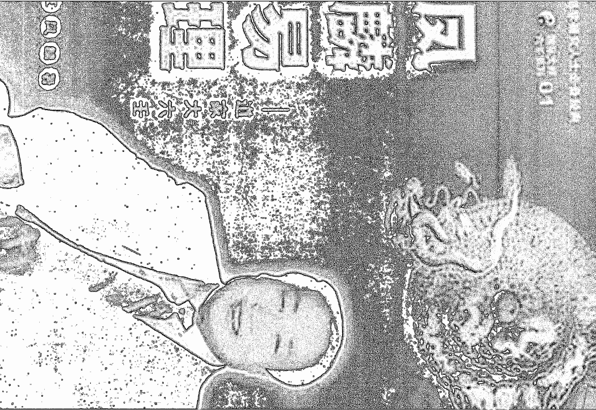
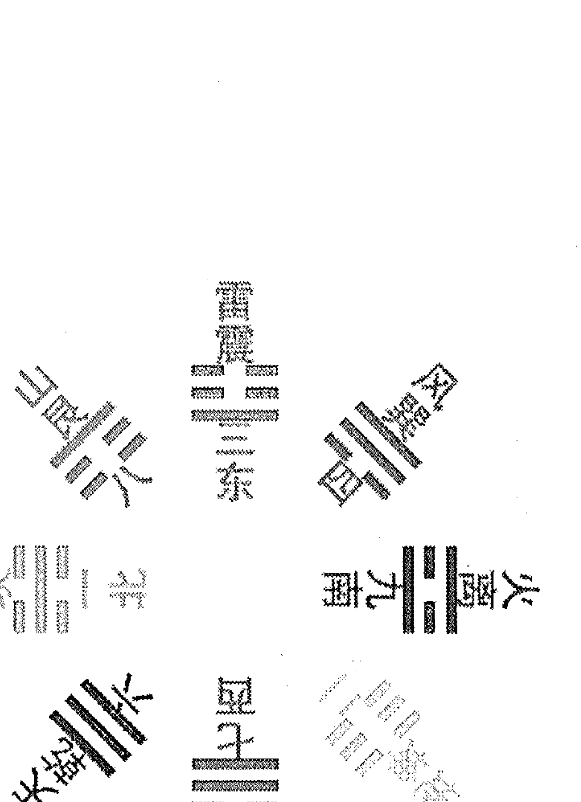
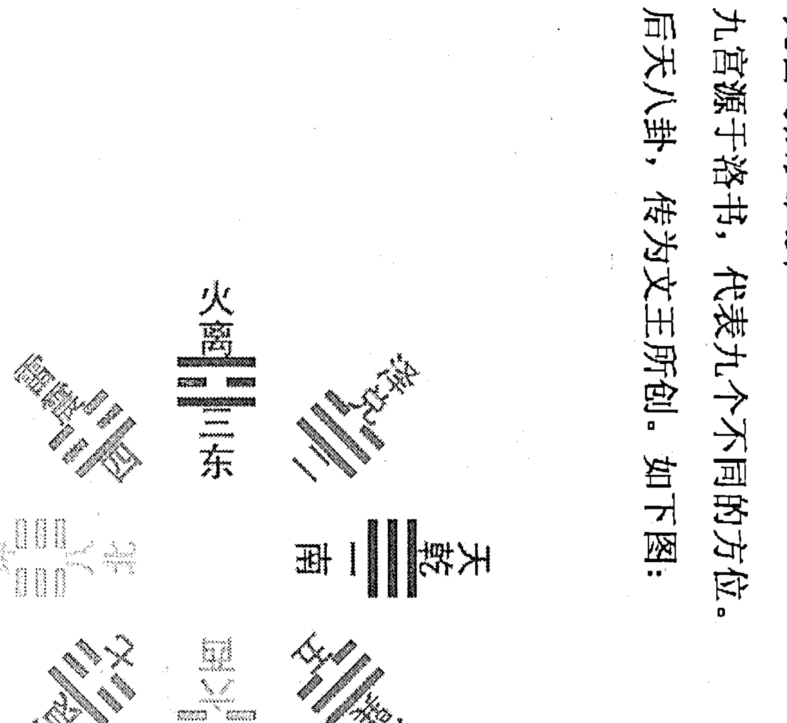

# HUSTLE

HUSTLE

# 《汉魏六朝诗选》注释

正文

# 目 录

## 第一章 阴盘六壬的基础知识

- 第一节 阴阳五行
- 第二节 天干与地支
- 第三节 八卦与九宫
- 第四节 四时五方
- 第五节 十神、六亲
- 第六节 十二长生
- 第七节 十二建星
- 第八节 十二月将
- 第九节 十二神将
- 第十节 易学的四大理论
  - 一、万象系统论
  - 二、万象相干论
  - 三、万象全息论
  - 四、万象有“意”论
- 第十一节 时间切入法
- 第十二节 怎样排四柱
  - 一、排年干支
  - 二、排月干支
  - 三、日上起时法

## 第二章 阴盘六壬的神煞

- 第一节 九宝
  - 一、天德、天德合、月德、月德合、日德
  - 二、合化
  - 三、奇
  - 四、禄
  - 五、马星
  - 六、长生
  - 七、旺
  - 八、贵
  - 九、天赦
  - 十、喜神
- 第二节 煞
  - 一、刑
  - 二、冲
  - 三、破
  - 四、害
  - 五、鬼
  - 六、墓神
  - 七、丘神
  - 八、败
  - 九、空
  - 十、劫煞
  - 十一、灾煞
  - 十二、血支血忌
  - 十三、丧魄
  - 十四、飞符
  - 十五、孤寡
  - 十六、皇书
  - 十七、丧车
  - 十八、游都
  - 十九、鲁都
  - 二十、贼神
- 第三节 年煞
  - 一、太岁
  - 二、太阳
  - 三、丧门
  - 四、合神
  - 五、官符
  - 六、小耗
  - 七、大耗
  - 八、年墓
  - 九、白虎
  - 十、德神
  - 十一、吊客
  - 十二、病符

## 第三章 阴盘六壬的用神取法

- 一、取用神原则
- 二、方位取用神

## 第四章 阴盘六壬的起课、定局排盘

- 第一节 阴盘六壬的定局排盘
- 第二节 伏吟局的三传排法

## 第五章 阴盘六壬的象意

- 第一节 阴盘六壬八卦的象意
  - 一、乾为天
  - 二、坎为水
  - 三、艮为土
  - 四、震为雷
  - 五、巽为风
  - 六、离为火
  - 七、坤为地
  - 八、兑为泽
- 第二节 阴盘六壬十天干象意
  - 一、甲
  - 二、乙
  - 三、丙
  - 四、丁
  - 五、戊
  - 六、己
  - 七、庚
  - 八、辛
  - 九、壬
  - 十、癸
- 第三节 阴盘六壬十二地支象意
  - 一、子
  - 二、丑
  - 三、寅
  - 四、卯
  - 五、辰
  - 六、巳
  - 七、午
  - 八、未
  - 九、申
  - 十、酉
  - 十一、戌
  - 十二、亥
- 第四节 阴盘六壬十二长生象意
  - 一、长生
  - 二、沐浴
  - 三、临官
  - 四、冠带
  - 五、帝旺
  - 六、衰
  - 七、病
  - 八、死
  - 九、墓
  - 十、绝
  - 十一、胎
  - 十二、养
- 第五节 阴盘六壬十二月将象意
  - 一、亥：登明
  - 二、戌：河魁
  - 三、酉：从魁
  - 四、申：传送
  - 五、未：小吉
  - 六、午：胜光
  - 七、巳：太乙
  - 八、辰：天罡
  - 九、卯：太冲
  - 十、寅：功曹
  - 十一、丑：大吉
  - 十二、子：神后
- 第六节 阴盘六壬十二神将象意
  - 一、贵人
  - 二、螣蛇
  - 三、朱雀
  - 四、六合
  - 五、勾陈
  - 六、青龙
  - 七、天空
  - 八、白虎
  - 九、太常
  - 十、玄武
  - 十一、太阴
  - 十二、天后

## 第六章 道家六壬的现代技术应用与实战

### 第一节 阴盘六壬的预测思路

### 第二节 身体疾病分析与预测

- 一、阴盘六壬断病思路
- 二、十二地支对应的身体部位
- 三、十天干配十二地支
- 四、阴盘六壬策划健康实例精解

### 第三节 阴盘六壬婚姻家庭分析与预测

- 一、策划分析婚姻的思路
- 二、阴盘六壬策划婚姻实例精解

### 第四节 阴盘六壬事业与财运分析与预测

- 一、策划事业与财运的思路
- 二、毕业分配、求职
- 三、官运、升迁与调动
- 四、阴盘六壬财运事业实例精解

### 第五节 阴盘六壬官灾与灾祸分析

- 一、策划官灾与灾祸的思路
- 二、阴盘六壬测官灾与灾祸实例精解

## 第一章 阴盘六壬的基础知识

### 第一节 阴阳五行

我认为，阴阳五行是两个不同的概念。

#### 一、阴阳：

阴阳学说将宇宙万物万象分为阴阳两大类，认为一切事物的形成、变化与发展在阴阳二气的运动之中。自然界一切事物都存在着相反的两种属性，即存在着对立统一。最初的阴阳现象来自阳光的向背，物体向阳的一面为阳，背面的一面为阴，继而不断引申解释自然与社会的所有现象，比如：明暗、寒热、日月、昼夜、内外、动静、上下、黑白、快慢、男女、强弱、奇偶、进退等等。

而阴阳关系又不是一成不变的，它随着外界条件的变化而转化，并且是阴中有阳，阳中有阴，互相包涵着。

阴阳有以下特征：

1. 阴阳互根：阴为阳根，阳为阴根，互为依存，互相为用。
2. 阴阳消长：阴阳始终处于此消彼长，彼进此退的动态平衡中，量变时时处处都存在。
3. 阴阳转化：在一定条件下，阴阳发生“质”的变化，各自向其对立面转化。

阴阳学说与现代唯物辩证法的矛盾对立统一规律完全相符。这也就是说，我们看待事物，不能片面的、静止地去看，而是应该用全面的、发展的眼光去看。

太极图十分形象的、直观的反映了阴阳的特征，它有着丰富的内涵，它几乎成了道家的标志。该图中的阴阳两仪，中间呈现S形曲线，表示了阴阳消长、刚柔相济和稳定和谐。对这个图，你感悟的愈多，你的道行修为就愈深，你的立足点就愈高。当一个预测师站在宇宙的角度看事物时，世上的一切都是一目了然的了。

我们所说的“没吉没凶”观点的理论基础，就是阴阳学说的认识论。

阴阳还反映到节气上。

早在三千年前，我国的天文学家已经测定了太岁(木星)的运行和每年冬至、夏至的确定时间，从而分出四季和记时的天干地支。

每年农历十一月的冬至节(太阳直射南回归线)太阳开始北移，日渐长，夜渐短，称为一阳生。每年农历六月的夏至节(太阳直射北回归线)，太阳开始南移，日渐短，夜渐长，称为一阴生。

把一年时间分作两份，冬至开始至夏至之前为阳，夏至开始至冬至之前为阴。一日也如此，白昼为阳，黑夜为阴；午前为阳，子前为阴。

#### 二、五行：

五行学说是阴盘六壬的重要根本观念。水、木、火、土、金是构成宇宙的五种基本物质，自然界和人类社会的各种事物和现象，都可以依其性质与这五种物质相比拟而进行归类。这五种各具特性的物质不断运动和互相作用，便形成了宇宙间万物生长与消亡的规律和原因。

人体的五行，是人与自然的和谐与对应：人有毛发，自然就有草木；人有双目，自然就有日月；呼吸为风，挥泪就成雨；骨为山，血脉就为河流。真可谓天人合一。

中医的五行，也反映出了这种对应：五脏属阴，肝属木，肾属水，肺属金，心属火，脾属土。六腑属阳，肝以胆为腑，肾以膀胱为腑，肺以大肠为腑，心以小肠为腑，脾以胃为腑，腑脏相连，有病互染。

##### 1、五行的性质：

水——湿润入土，以生万物；具有寒冷、向下的特征。
火——火向上升，具有炎热、向上的特征。
木——具有生发、条达的特征。
金——具有清静、收杀的特征。
土——具有长养、化育的特征。

##### 五行归类简表

| 五行 | 木 | 火 | 土 | 金 | 水 |
|---|---|---|---|---|---|
| 天干 | 甲乙 | 丙丁 | 戊己 | 庚辛 | 壬癸 |
| 地支 | 寅卯 | 巳午 | 丑辰未戌 | 申酉 | 亥子 |
| 方位 | 东 | 南 | 中 | 西 | 北 |
| 五气 | 风 | 热 | 湿 | 燥 | 寒 |
| 五化 | 生 | 长 | 化 | 收 | 藏 |
| 五形 | 矩形 | 尖形 | 方形 | 圆形 | 波形 |
| 五色 | 青 | 赤 | 黄 | 白 | 黑 |
| 五味 | 酸 | 苦 | 甘 | 辛 | 咸 |
| 五音 | 角 | 徵 | 宫 | 商 | 羽 |
| 五窍 | 目 | 舌 | 唇 | 鼻 | 耳 |
| 五脏 | 肝 | 心 | 脾 | 肺 | 肾 |
| 五腑 | 胆 | 小肠 | 胃 | 大肠 | 膀胱 |
| 五体 | 筋 | 血 | 肉 | 皮毛 | 骨 |
| 五津 | 泪 | 汗 | 涎 | 涕 | 唾 |
| 五腧 | 井 | 荥 | 俞 | 经 | 合 |
| 五元 | 元性 | 元神 | 元气 | 元情 | 元精 |
| 五贼 | 怒 | 喜 | 思 | 忧 | 恐 |
| 五德 | 仁 | 礼 | 信 | 义 | 智 |
| 五魔 | 财 | 贵 | 胜 | 杀 | 淫 |
| 五星 | 岁星 | 荧惑 | 镇星 | 太白 | 辰星 |
| 五帝 | 大昊 | 炎帝 | 皇帝 | 少昊 | 颛顼 |
| 五虫 | 鳞虫 | 羽虫 | 倴虫 | 毛虫 | 介虫 |

### 第二节 天干与地支

天干、地支，简称干支。它是我国古代人民用来记录年、月、日、时的符号，用于古历法之中。

十天干：甲、乙、丙、丁、戊、己、庚、辛、壬、癸

##### 2、五行相生：

五行相生好比母生子，有相亲相爱之意，指某种物质对另一种物质起着促进滋生的帮助作用。

金生水——铜镜凝结空中水气变成露珠，金属熔化后成液体状态。
水生木——草木赖水份以生长。
木生火——木柴燃烧产生火。
火生土——火能把燃烧后的东西变成土；地震喷火，生成新土地。
土生金——一切金属来自土地。

##### 3、五行相克：

相克，指某种物质对另一种物质起着制约、压抑的作用。其规律如下：

金克木——金属制品能砍伐树木。
木克土——树木的根能入土。
土克水——土能吸收水份，土堤能防水。
水克火——水能灭火。
火克金——火能熔化金属，铸铜成器。

有了相生、相克，世间万物才能够维持着一种比较固定与稳定的平衡与和谐状态。

| 五器 | 五商 | 企业五素 | 五温 | 气象 | 地理 | 八神 | 九星 | 八门 |
|---|---|---|---|---|---|---|---|---|
| 规 | 财 | 竞争 | 温 | 风 | 树木 | 符合 | 辅冲 | 伤杜 |
| 绳 | 情 | 文化 | 热 | 晴 | 山 | 蛇天 | 英 | 景 |
| 度量 | 健 | 整合 | 自然 | 雾云 | 平原 | 地 | 任芮禽 | 死生 |
| 矩 | 逆 | 核心 | 凉 | 雷 | 道路 | 虎阴 | 柱心 | 惊开 |
| 准 | 智 | 应变 | 寒 | 雨 | 河流 | 玄 | 蓬 | 休 |

### 第三节 八卦与九宫

“八卦”是易经中的基本图形，八卦是怎样产生的呢？在《周易·系辞》中说：“是故易有太极生两仪，两仪生四象，四象生八卦。”太极生两仪：太极是天地混沌，阴阳未分时的“元气”状态，天地尤如鸡蛋，后来盘古氏开天辟地，奠定乾坤。两仪就是天和地。两仪生四象：阴与阳继续演变，相重或相交，产生出老阳、老阴、少阳、少阴四象，这四象象征着四时、四方等现象。四象生八卦：四象再继续演变就产生出上述的八个卦了。八卦分别象征八节、八方等现象。

八卦的五行属性是：坎属水，离属火，乾和兑属金，震和巽属木，坤和艮属土。

八卦又分先天八卦与后天八卦。

什么叫“先天”，什么叫“后天”？以哲学的观点来说，宇宙万物没有形成以前，即是所谓的先天，有了宇宙万物，那就是后天。如果从人的方面来说，在出生前为先天，出生后为后天。从事情发展角度来看，发生过了的为先天，未发生过的为后天。先后天知识用以划分阶段范围而已。

#### 一、先天八卦：

先天八卦的卦序是：一乾、二兑、三离、四震、五巽、六坎、七艮、八坤。
先天八卦为伏羲所作，如下图：

#### 二、九宫与后天八卦：

九宫源于洛书，代表九个不同的方位。
后天八卦，传为文王所创。如下图：

后天八卦数：一数坎兮二数坤三震四巽数中分，五寄中宫六乾是，七兑八艮九离门。后天八卦的宫位排法可以用以下歌诀来记住：戴九履一，左三右七，二四为肩，六八为足。

### 第四节 四时五方

时间与空间的观念是阴盘六壬极为重要的观念。时间，在这里指的是“四时”，即一年四季；空间，则指“五方”，即东、南、西、北、中五个方位。上面说到的阴阳、干支、五行等观念中，尤其以五行观念极为重要，成为分析判断事物的核心。而五行的相生、相克等现象，则要与四时五方等因素相结合，看它们各自所旺盛的是哪个季节，所适宜的是哪个方向。进行综合的分析，才能更精确地反映事物的情况。

#### 一、五行、干支所适宜的时季和方位：

| 五行 | 天干 | 地支 | 所旺四季 | 所主方向 |
| :--- | :--- | :--- | :--- | :--- |
| 木 | 甲乙 | 寅卯辰 | 春 | 东 |
| 火 | 丙丁 | 巳午未 | 夏 | 南 |
| 金 | 庚辛 | 申酉戌 | 秋 | 西 |
| 水 | 壬癸 | 亥子丑 | 冬 | 北 |
| 土 | 戊己 | 辰戌丑未 | 寄旺四季 | 中 |

这里土“寄旺四季”的意思，是指它旺盛于一年四个季节的最后一个月。在每一年的四个季节里，每一个季节都有五行中的一个处于“旺”即“王”之意，也就是旺盛状态；一个处于“相”即“宰相”之意，属于次旺状态；一个处于“休”即“休息”状态，退休无事；一个处于“囚”即衰落、被关禁之意；一个处于“死”即被克制、毫无生气的状态。

#### 二、五行与四季的关系：

| 状态\五行 | 旺 | 相 | 休 | 囚 | 死 |
| :--- | :--- | :--- | :--- | :--- | :--- |
| 木 | 春 | 冬 | 夏 | 四季 | 秋 |
| 火 | 夏 | 春 | 四季 | 秋 | 冬 |
| 土 | 四季 | 夏 | 秋 | 冬 | 春 |
| 金 | 秋 | 四季 | 冬 | 春 | 夏 |
| 水 | 冬 | 秋 | 春 | 夏 | 四季 |

从五行的相生相克等原理出发，来分析判断世间万事万物在发展与运动过程中与时间和空间的具体关系，并从中拟出了一定的规律，以便用来寻找有利于事物发展运动的“时空”，避开不利于事物发展运动的“时空”。

### 第五节 十神、六亲

所谓的“十神”就是以日干为中心而生发出来的与日干本人相关的社会关系。日干代表自身，根据五行生克关系，克我者为官鬼，我克者为妻财，生我者为印绶，我生者为子孙，同我者为兄弟，称为六亲。根据阴阳五行之不同，我生，生我，我克，克我，同我共有十种存在方式，八字预测中称为十神。这种关系在道家六壬预测中找用神的时候会用到。

(1) 我克者为财：
① 正财异性相克，记作才
② 偏财：同性相克，记作财

(2) 克我者为官：
① 正官：异性相克，记作官
② 偏官：同性相克，又叫七杀，记作杀

(3) 我生者为食伤：
① 伤官：异性相生，记作伤
② 食神：同性相生，记作食

(4) 生我者为印绶：
① 正印：异性相生，记作印
② 偏印：同性相生，又叫枭神，记作枭

(5) 同我者为比劫：
① 比肩：同性，记作比
② 劫财：异性，记作劫

十神间生克关系随同五行生克关系，即相生：官杀生印枭，印枭生日主劫比，日主劫比生食伤，食伤生正偏财，正偏财生官杀。
相克：官杀克日主劫比，日主劫比克正偏财，正偏财克印枭，印枭克食伤，食伤克官杀。

| 木 | 火 | 金 | 水 | 土 |
|---|---|---|---|---|
| 春 | 夏 | 秋 | 冬 | 四季末 |
| 冬 | 春 | 四季末 | 秋 | 夏 |
| 夏 | 四季末 | 冬 | 春 | 秋 |
| 四季末 | 秋 | 夏 | 冬 | 春 |
| 秋 | 冬 | 春 | 夏 | 四季末 |

以日干为中心，查其他天干是日干的什么十神：

| 日干\他干 | 甲 | 乙 | 丙 | 丁 | 戊 | 己 | 庚 | 辛 | 壬 | 癸 |
|---|---|---|---|---|---|---|---|---|---|---|
| 甲 | 比肩 | 劫财 | 食神 | 伤官 | 偏财 | 正财 | 七杀 | 正官 | 偏印 | 正印 |
| 乙 | 劫财 | 比肩 | 伤官 | 食神 | 正财 | 偏财 | 正官 | 七杀 | 正印 | 偏印 |
| 丙 | 偏印 | 正印 | 比肩 | 劫财 | 食神 | 伤官 | 偏财 | 正财 | 七杀 | 正官 |
| 丁 | 正印 | 偏印 | 劫财 | 比肩 | 伤官 | 食神 | 正财 | 偏财 | 正官 | 七杀 |
| 戊 | 七杀 | 正官 | 偏印 | 正印 | 比肩 | 劫财 | 食神 | 伤官 | 偏财 | 正财 |
| 己 | 正官 | 七杀 | 正印 | 偏印 | 劫财 | 比肩 | 伤官 | 食神 | 正财 | 偏财 |
| 庚 | 偏财 | 正财 | 七杀 | 正官 | 偏印 | 正印 | 比肩 | 劫财 | 食神 | 伤官 |
| 辛 | 正财 | 偏财 | 正官 | 七杀 | 正印 | 偏印 | 劫财 | 比肩 | 伤官 | 食神 |
| 壬 | 食神 | 伤官 | 偏财 | 正财 | 七杀 | 正官 | 偏印 | 正印 | 比肩 | 劫财 |
| 癸 | 伤官 | 食神 | 正财 | 偏财 | 正官 | 七杀 | 正印 | 偏印 | 劫财 | 比肩 |

### 第六节 十二长生

五行不仅在一年四季中有旺、相、休、囚、死的状态，而且与地支所代表的十二个月相对应，还有一个从生长到死亡的全过程，叫做“寄生十二宫”的原理。十天干相对于十二地支有十二种状态：长生、沐浴、冠带、临官、帝旺、衰、病、死、墓、绝、胎、养。其排列规律为阳生阴死。

长生：就像人出生于世，或降生阶段，是指万物萌发之际。引申的意义很多，在现实中它包含有出生、生长、来源、起点、帮助、依靠、靠山、哺育、源泉、原始、获救、产生等含义。

沐浴：洗礼与生长之意，又叫“败”，形体柔而脆，易为所损。它含有洗澡、裸体、淫乱、脱衣、暴露、光滑、坦诚、大小便、睡觉、破败等含义。

冠带：为小儿可以穿衣戴帽了，是指万物渐荣。冠带含有穿衣、整装、打扮、包装、装饰、衣服、升级、荣誉、遮盖、外表、高贵等含义。

临官：像人长成强壮，可以做官，化育，领导人民，是指万物长成。临冠含有公家的、官府、有男人在身边、巴结当官的、阿谀奉迎、出仕、当官、有官运、有地位、公务员等含义。

帝旺：象征人壮盛到极点，可辅助帝王大有作为，是指万物成熟。帝旺含有荣发、发达、得意、精神、兴奋、神气、有力、雄壮、强大、辉煌、欣欣向荣、高潮、顶点等含义。

衰：指盛极而衰，是指万物开始发生衰变。它含有无力、软弱、衰弱、不景气、败落、退缩、没靠山、虚弱、无能等含义。

病：如人患病，是指万物困顿。病含有疾病、讨厌、仇人、不足之处、缺点、毛病、弱点、漏洞、问题等含义。

死：如人气已尽，形体已死，是指万物死灭。死含有死亡、钻牛角尖、不灵活、不能变通、滞留、终结、完蛋、没有余地、无生气、无活力、呆板、笨拙、想不开、心胸狭窄、寂静等含义。

墓：也称“库”，如人死后归入于墓，是指万物成功后归库。墓含有包容、收藏、埋藏、关闭、存放、管制、包含、陷阱、不自由、受管束、隐藏、围栏、仓库、昏沉、糊涂、黑暗、不畅通等含义。

绝：人形体绝灭化归为土；万物前气已绝，后继之气还未到来，在地中未有其象。绝含有绝地、绝境、悬崖、分手、断绝、失望、心灰意冷、无情、冷酷、不融融、消失、无影无踪、把事做绝、把话说绝之含义。

胎：人受父母之气结聚成胎；天地气交之际，气来受胎。胎含有怀胎、酝酿、打算、计划、形成、天生、本性、幼稚等含义。

养：像人养胎于母腹之中，之后出生，是指万物在地中成形，继而萌发，又得经历一个生生灭灭永不停止的天道循环过程。养含有寄托、收养、休养、疗养、营养、滋养、过继、培养、养育、扶持等含义。

“寄生十二宫”的现象比较形象地反映了宇宙万物生生死死，循环往复、永无休止以至无穷的自然状态与规律，它体现了古代人民朴素的唯物观与合理的科学与哲学思想。

五行寄生十二宫的对应月份等情况列表如下：

### 第七节 十二建星

建除十二星也叫十二建星：建、除、满、平、定、执、破、危、成、收、开、闭。
其中除危定执为黄道、成收开闭为黑道。
建就是每月的月建，建就是旺的意思。

| 月建 | 正月 | 二月 | 三月 | 四月 | 五月 | 六月 | 七月 | 八月 | 九月 | 十月 | 十一月 | 十二月 |
|---|---|---|---|---|---|---|---|---|---|---|---|---|
| 地支 | 寅 | 卯 | 辰 | 巳 | 午 | 未 | 申 | 酉 | 戌 | 亥 | 子 | 丑 |

比如现在是酉月，建就加在酉上，除加戌上，依此类推……
酉 戌 亥 子 丑 寅 卯 辰 巳 午 未 申
建 除 满 平 定 执 破 危 成 收 开 闭

#### 十二建星的含义：

- 1、建：建设、建立，用时上起建
- 2、除：除去
- 3、满：满足、满意
- 4、平：摆平、死神
- 5、定：死气、安定
- 6、执：执使、执行
- 7、破：破坏
- 8、危：显眼、居高临下
- 9、成：成事、天医
- 10、收：收获、猎取
- 11、开：公开、建设、生气
- 12、闭：关闭

### 第八节 十二月将

十二月将：也叫太阳过宫，
亥为登明正月将、戌为河魁二月将、酉是从魁三月将
申是传送四月将、未是小吉五月将、午是胜光六月将
巳是太乙七月将、辰是天罡八月将、卯是太冲九月将
寅是功曹十月将、丑是大吉十一月将、子是神后十二月将

雨水后用亥（登明）、春分后用戌（河魁）
谷雨后用酉（从魁）、小满后用申（传送）
夏至后用未（小吉）、大暑后用午（胜光）
处暑后用巳（太乙）、秋分后用辰（天罡）
霜降后用卯（太冲）、小雪后用寅（功曹）
冬至后用丑（大吉）、大寒后用子（神后）

### 第九节 十二神将

一、十二神将：
贵人、腾蛇、朱雀、六合、勾陈、青龙、天空、白虎、太常、玄武、太阴、天后
排盘时写：贵、腾、朱、六、勾、青、空、白、常、玄、阴、后

二、十二神对应的地支：

| 神将 | 贵人 | 腾蛇 | 朱雀 | 六合 | 勾陈 | 青龙 | 天空 | 白虎 | 太常 | 玄武 | 太阴 | 天后 |
|---|---|---|---|---|---|---|---|---|---|---|---|---|
| 地支 | 丑 | 巳 | 午 | 卯 | 辰 | 寅 | 戌 | 申 | 未 | 子 | 酉 | 亥 |

### 第十节 易学的四大理论

一、万象系统论
现代科学研究表明：世界万象（物象、意象）或万事万物都是以系统的形式存在的，无论是场，还是基本粒子都有系统的特征：系统的元素、部分和整体，结构和功能，竞争和协同，无序和有序，有渐变和突变规律等都适合于万事万物，系统性是万事万物的本质特性。

二、万象相干论
系统与系统之间，万事万物之间，总是相互联系、相互作用的，就是所谓的相干。世界上无论天象、物象、地象、人象、意象、万事万物都处于一种相干作用之中，整个宇宙实际是“牵一发而动全身”。无论间接的、直接的，无论是已知与不知的，从物理、化学、生物学到社会经济层次等各种相干形式，都无处不在、无时不有。

三、万象全息论
尽管世界千姿百态、气象万千，但整个宇宙各元素之间由于处于一种“你中有我，我中有你；你是我的函数，我又是你的函数”的相干作用之中，因此，宇宙万象之间都是相互映象、相互包含的。“一叶生而知天下春，一叶落而知天下秋”，任何一个元素可能包含着宇宙的所有信息，任何一个元素都可能拉出一个不同全息度的全息系统。

四、万物有“意”论
自古就有许多哲人提出过诸如宇宙灵魂说、万物有灵论、万物有神论、万物有心论、泛灵论等，过去我们都把它们当作“反动的”唯心主义哲学加以批判，然而科学的发展表明，万物确是有“意”的。微生物、植物、动物、人都早已被科学界证明是有“意识”的。许多一流的科学家也认为，任何一个有生命的细菌都具有心理特性，多细胞的动植物的灵魂生活总是组成其细胞体的心理功能的非线性总和。而现代自组织理论认为，就是无机物也普遍存在“生命特征”的高度自组织现象。自组织作为任何系统普遍存在的特征，它必有自组织核、自组织极限环和自组织意识。因此，意识不但是一个细胞的基本特性，也是一切基本粒子的基本特性。显然无机物也是有意识的，只不过相对于“人”这个高度自组织化的自组织核而言，其组织程度较低，其意识程序不同或可忽略而已。反过来，由于万事万物也有这个特性，深层次意义的“意识”是无法与万事万物沟通的，也就是无法认识整个世界。大自然、社会、宇宙就是处于一种有意的和谐安排之中。

### 第十一节 时间切入法

始进入午时，道家交接时辰的方式却不是这样，而是提前5分钟进入下一个时辰。
为什么这样呢？一个时辰就是一个系统，一个全息元，一个国家，一个单位。比如清朝的乾隆皇帝是一个时代，到了嘉庆皇帝又是一个时代，一朝天子一朝臣，有一个改朝换代的过程，下一任天子要提前接班，人心都是流向新一任天子，如果违背了这一法则便会受到惩罚。比如和珅，乾隆时期权倾朝野，但他在嘉庆皇帝即将要接班时仍然只知道围着乾隆转，对新皇帝却不置一顾，到头来弄得家败人亡。一个单位（岗位）交接班也是提前交接，而不是正点交接。时辰的交接也是同理，必须提前5分钟交接才更符合自然法则。还有任何事情都是宁可提前不可错后，莫道君行早，更有早来人，打提前仗处处得力，否则一步赶不上步步赶不上。就如同抓一头牛，迎在前面能抓住牛头，即使抓不住牛头也能抓住牛身子，如果从正中间抓，抓不住牛身子还能抓住牛尾，如果从后面抓顶多能抓住牛尾巴，弄不好出溜过去了什么也抓不住，只落个竹篮打水一场空。所以说提前切入时空是多么的重要。

### 第十二节 怎样排四柱

四柱即年柱、月柱、日柱、时柱。每柱由一个天干和一个地支组成。是由断事排局（或一个人出生）的年、月、日、时的天干和地支组合而成。

如1993年4月13日上午8点钟，农历，三月二十二日，其四柱如下：

酉（年柱） 丙辰（月柱） 甲子（日柱） 戊辰（时柱）

一、排年干支
以立春为年分界线，立春前为上一年，立春后本年。例如：
1993年农历12月24日上午9时33分，年干支为癸酉，同一日9时33分后的年干支为甲戌。又如2005年农历12月26日前为乙酉年，12月26后就为丙戌年了。因为12月26日那天是立春。年分界是以立春为分界的。年的干支是固定的，可以从万年历中查出。

二、排月干支
月干支中地支是固定不变的，正月建寅，二月建卯，三月建辰，四月建巳，五月建午，六月建未，七月建申，八月建酉，九月建戌，十月建亥，十一月建子，十二月建丑。
人们习惯上把初1到30为一个月，如正月初一到正月三十为正月，而预测中的四柱，月是以令为分界线的，正月是从立春起到惊蛰间的一段时间，立春可能是正月初一，也可能是上一年腊月中的某一天，也可能会是农历正月的某一天，这就有了月令与习惯上的不统一，此时以月令为准。月令的确立是以二十四节气中的“节”为标准的。即：
正月：立春——惊蛰 二月：惊蛰——清明 三月：清明——立夏
四月：立夏——芒种 五月：芒种——小暑 六月：小暑——立秋
七月：立秋——白露 八月：白露——寒露 九月：寒露——立冬
十月：立冬——大雪 十一月：大雪——小寒 十二月：小寒——立春

每年每月的地支都是固定不变的，天干不是固定的，在知道了年干和月令后可以推算出月干，方法是：

> 甲己之年丙作首，乙庚之岁戊为头；
> 丙辛之岁庚寅上，丁壬壬寅顺水流，
> 若问戊癸何方起，甲寅之上好追求。

凡甲或己之年干，正月起“丙”，乙或庚之年干，正月起戊……，然后向后顺推，看最后一位天干是哪一位即为所求的月干。

| 月干\年干 | 甲己 | 乙庚 | 丙辛 | 丁壬 | 戊癸 |
| :--- | :--- | :--- | :--- | :--- | :--- |
| 寅 | 丙 | 戊 | 庚 | 壬 | 甲 |
| 卯 | 丁 | 己 | 辛 | 癸 | 乙 |
| 辰 | 戊 | 庚 | 壬 | 甲 | 丙 |
| 巳 | 己 | 辛 | 癸 | 乙 | 丁 |
| 午 | 庚 | 壬 | 甲 | 丙 | 戊 |
| 未 | 辛 | 癸 | 乙 | 丁 | 己 |
| 申 | 壬 | 甲 | 丙 | 戊 | 庚 |
| 酉 | 癸 | 乙 | 丁 | 己 | 辛 |
| 戌 | 甲 | 丙 | 戊 | 庚 | 壬 |
| 亥 | 乙 | 丁 | 己 | 辛 | 癸 |
| 子 | 丙 | 戊 | 庚 | 壬 | 甲 |
| 丑 | 丁 | 己 | 辛 | 癸 | 乙 |

比如农历2003年9月，我们可以从万年历上查出2003年的干支记年法为癸未，9月建戌，那么9月的天干是什么呢？对照年上起月的口诀，其中有“若问戊癸何方起，甲寅之上好追求”，“戊”“癸”指的是天干为戊和癸的年份，“甲寅之上好追求”指的是，凡是戊和癸年的正月（即寅月）天干都以甲来表示，依次为二月的“乙”，三月为“丙”……如乙酉年十一月，乙酉（年柱） 戊子（月柱）。

三、排日干支
日干支是从《万年历》中查得。需说明的是，起至当晚亥时末为今日，即子时为日的分界线。

1998年农历7月23时10分预测时间的年月日干支为：戊寅 庚申 癸丑

四、排时干支
时干支中地支也是固定不变的。古人将一日等分为十二时辰，完全以当地的太阳光线的照射强弱而定，夏天与冬天的时辰长短都不一样的，即：

夜半者子也，鸡鸣者丑也，平旦者寅也，日出者卯也，
食时者辰也，隅中者巳也，日中者午也，日昳者未也，
晡时者申也，日入者酉也，黄昏者戌也，人定者亥也。

与北京时间约略对应为：

23—1时为子时，1—3时为丑时，3—5时为寅时，5—7时为卯时，7—9时为辰时，9—11时为巳时，11—13时为午时，13—15时为未时，15—17时为申时，17—19时为酉时，19—21时为戌时，21—23时为亥时。

从日上推时辰天干的方法称作“五鼠遁”：

甲己还加甲，乙庚丙作初，
丙辛从戊起，丁壬庚子居，
戊癸何方发，壬子是真途。

这个歌诀的用法与年上起月法的歌诀是一样的。年上起月是从正月起，日上起时是从子时起。凡甲日、己日，时干从子上起甲，依次推出：甲子、乙丑、丙寅、丁卯……。

凡乙日、庚日，时干从子上起丙，依次推出：丙子、丁丑、戊寅、己卯……。

凡丙日、辛日，时干从子上起戊，依次推出：戊子、己丑、庚寅、辛卯……。

凡丁日、壬日，时干从子上起庚，依次推出：庚子、辛丑、壬寅、癸卯……。

凡戊日、癸日，时干从子上起壬，依次推出：壬子、癸丑、甲寅、乙卯……。

以上排四柱最为简单的方法就是查万年历，年月日的干支都能查出来，就是记住“五鼠遁”把时干推出来即可。

| 时\日 | 甲己 | 乙庚 | 丙辛 | 丁壬 | 戊癸 |
| :--- | :--- | :--- | :--- | :--- | :--- |
| 子 | 甲子 | 丙子 | 戊子 | 庚子 | 壬子 |
| 丑 | 乙丑 | 丁丑 | 己丑 | 辛丑 | 癸丑 |
| 寅 | 丙寅 | 戊寅 | 庚寅 | 壬寅 | 甲寅 |
| 卯 | 丁卯 | 己卯 | 辛卯 | 癸卯 | 乙卯 |

## 第二章 阴盘六壬的神煞

### 第一节 九宝

一、德神：有天德、天德和、月德、月德和、日德

1、天德：

正见丁（未）、二坤（申）官
三壬见（亥）、四辛见（戌）同
五乾（亥）、六甲（寅）上
七癸（丑）、八艮（寅）逢
九丙（巳）、十居乙（辰）
子巽（巳）、丑庚（申）

正丁二坤宫、三壬四辛同
五乾六甲上、七癸八寅逢
九丙十居乙、子巽丑庚中

天德是以月令为标准来取的，即正月在丁（未）、二月在坤（申）、三月在壬亥、四月在辛戌、五月在乾亥、六月在甲（寅）、七月在癸（丑）、八月在寅、九月在丙（巳）、十月在乙（辰）、十一月在巽（巳）、十二月在庚（申）

见括号里的字也是天德，如八月见艮，遇天德了，遇天德月德，一切都不坏，虽然受点罪，但能达到好的结果。

2、天德合

3、月德、月德合
寅午戌月见丙为月德、见辛为月德合
申子辰月见壬为月德，见丁为月德合
巳酉丑月见庚为月德，见乙为月德合
亥卯未月见甲为月德，见己为月德合

丙巳 壬亥 甲寅 庚申
辛戌 丁未 己未 乙辰

4、日德：
甲己日见寅、乙庚日见申、丙辛日见巳、丁壬日见亥、戊癸日见巳

二、合化：

1、天干合化：
甲己合化土
乙庚合化金
丙辛合化水
丁壬合化木
戊癸合化火

2、地支三合化：
寅午戌合化火
申子辰合化水
亥卯未合化木
巳酉丑合化金

3、地支六合化：
- 子丑合化土
- 寅亥合化木
- 卯戌合化火
- 辰酉合化金
- 巳申合化水
- 午未合化火

要想使合化成功的话，必须要在所合化五行出现的年、月、日、时。
例如：甲己合，必须要在土年土月土日土时，才能合化成功；辰酉合，必须在金年金月金日金时才能合化成功；寅午戌合，必须在火年火月火日火时，才能合化成功。反之，则不能合化成功，会出现合化双方勾心斗角，貌合神离的状态。总之，旺则合，衰则不合。

三、奇：

1、三奇：
- 天上三奇甲戊庚
- 地上三奇乙丙丁
- 人中三奇壬癸辛

三奇发用，疑惑就解开了，不好的事变成好事，奇就是奇怪、奇特，出奇才能制胜。

2、旬奇：（只指日柱）
- 甲子旬、甲戌旬见丑
- 甲申旬、甲午旬见子
- 甲辰旬、甲寅旬见亥

例如：壬申日，是甲子旬，甲子旬见丑就叫三奇，三奇克自己照样不吉，坏的生自己照样好。

3、六仪：
- 甲子旬中见子
- 甲戌旬中见戌
- 甲申旬中见申
- 甲午旬中见午
- 甲辰旬中见辰
- 甲寅旬中见寅

见六仪者，无论得病有多重，也不以凶论，即便遇白虎也不会死；遇难者，见六仪，灾难立解。六仪可以解凶，古书云：课见六仪，病将痊，狱囚出。坏事遇六仪，一切会有好转，好事遇六仪，高者更高，锦上添花。

四、禄：
甲禄在寅，乙禄在卯
丙戊禄在巳，丁己禄在午
庚禄在申，辛禄在酉
壬禄在亥，癸禄在子

禄即是十二长生中的临官状态，禄如起作用，必落在年月日时上。禄如落年上，又临贵人，一定能迅速得到一个超值的东西；禄如临马星则做事更快；禄不能逢空，空则发挥不了禄的作用，如临空，这个人往往吃不下东西，甚至饿死；
禄就象是人的收入，如果命中坐禄，再生用神宫，一生吃喝不愁；若命临禄克用神，则受钱管制，这种人往往是过路财神，就象银行职员一样，拿到钱但花不了。

五、马星：

1、驿马：
- 申子辰见寅
- 寅午戌见申
- 亥卯未见巳
- 巳酉丑见亥

2、天马：
- 正月见午、二月见申、三月见戌
- 四月见子、五月见寅、六月见辰
- 七月见午、八月见午、九月见戌
- 十月是子、十一月是寅、十二月是辰

马星主动，也主快。禄临马星，来财快；血光临驿马，血灾来的也快；贵人临驿马，能马上得到贵人的帮助。马是好是坏，要把神煞放在一起综合来看，才能确定是什么样的结果。

#### 六、长生：

长生是吉星，遇长生者主有依靠、有根基和靠山。

- 甲长生在亥、乙长生在午
- 丙戊长生在寅、丁己长生在酉
- 庚长生在巳、辛长生在子
- 壬长生在申、癸长生在卯

#### 七、旺：

旺即十二长生中的帝旺，是事物发展到顶峰、极点的状态。旺又名羊刃。
旺星生、比用神则好；旺星克、泄用神，必见血光、灾难。
如果七杀临刃克用神者，必见血光之灾。
旺又有年旺、月旺、日旺、时旺之分，年旺则旺一年，月旺则旺一月，日旺则旺一日，时旺则旺一世。

- 甲旺在卯、乙旺在寅
- 丙戊旺在午、丁己旺在巳
- 庚旺在酉、辛旺在申
- 壬旺在子、癸旺在亥

#### 八、贵：

贵即十二神将的贵人，有帮助、解救、护佑的作用。
在阴盘六壬中，贵人的含义不分阴贵和阳贵。如求官者遇贵人，必得贵人相助；求学者遇贵人，必然成绩优异；贵人遇天空，则玄妙无比。贵人要发挥作用必须在生、比用神时。

- 甲戊庚见牛羊，乙己鼠猴乡
- 丙丁猪鸡位，壬癸蛇兔藏
- 六辛用马虎，此是贵人方

#### 九、天赦：

- 春戊寅、夏甲午
- 秋戊申、冬甲子

#### 十、喜神：

天赦临用神，一切灾煞都能解除。即使被抓走，遇天赦也能被放出。

##### 1、天喜：

- 甲己在艮（寅）
- 乙庚在乾（亥）
- 丙辛坤（申）处喜神安
- 丁壬喜在离（午）宫坐
- 戊癸由来在巽（巳）间

##### 2、喜神

- 春遇戊、夏遇丑
- 秋遇辰、冬遇未

天喜为开心之神，遇天喜的人，为人大度，有良好的心态，能把坏事当做好事来看，所以这种人往往能够长寿。
天喜又名天耳，选天耳日可治耳病、聋病；练功时用耳抱法，可以听到另外空间的声音。

### 第二节 八煞

判断用神有狐疑，全凭神煞解心迷。

#### 一、刑：

地支相刑：

- 子刑卯、卯刑子，为无礼之刑
- 寅刑巳、巳刑申、申刑寅为无恩之刑
- 丑刑戌、戌刑未、未刑丑为恃势之刑
- 辰刑辰、午刑午、酉刑酉、亥刑亥为自刑

遇到刑，做事扭曲、反反复复。
如刑克用神，则必见刑伤。年刑则刑一年，月刑则刑一月，日刑则刑一日，时刑则刑一世。
刑出现在年月日时上，则刑的程度严重；如相刑的两个字都在年月日时上刑得更严重。遇到自刑的人，自己爱和自己过不去，易生闷气。
在断应期时，有一个刑的字出现，应期则是与之相刑的另一个字。

#### 二、冲：

地支有六冲：
子午相冲，丑未相冲，寅申相冲
卯酉相冲，辰戌相冲，巳亥相冲

冲就是散、破，所表示事物的状态是细碎的、散开的、零乱的。
冲都是强冲弱，好事逢冲则坏，坏事逢冲则好。这里所说的坏是指在空亡状态下的坏，而别的情况下的坏逢冲都不会改变。
在预测中，当某个物品遇到冲时，这个物品往往是破的、细碎的、散开的、零乱的。
特别旺时才代表完整。

#### 三、破：

地支相破：
其中：
子酉相破、丑辰相破、寅亥相破
午卯相破、未戌相破、巳申相破

子酉、午卯相破为生中带破
丑辰相破为比中带破
寅亥相破为合中带破
未戌相破为刑中带破
巳申相破为合刑克破

破也代表破坏、零乱、细碎、散落。

#### 四、害：

地支相害：

子未相害，丑午相害，寅巳相害
卯辰相害，申亥相害，酉戌相害

相害的又名相穿，有阻隔、妨害之意。

古人在合婚时非常重视相害的作用，如合婚的双方出现相害则不能成婚，合作的双方也是如此。

##### 古人的合婚口诀：

猪猴不到头，白马犯青牛
蛇虎如刀错，龙兔泪交流
金鸡犯玉犬，羊鼠一段休

男女婚姻中如遇相害，往往会出现以下几种情况：

- 1、夫妻离异；
- 2、夫妻之间意见不统一；
- 3、夫妻一方多病；
- 4、夫妻一方早亡。

#### 五、鬼：

阳克阳，阴克阴为鬼，也叫七杀。

##### 天干七杀：

- 甲杀在庚、乙杀在辛
- 丙杀在壬、丁杀在癸
- 戊杀在甲、己杀在乙
- 庚杀在丙、辛杀在丁
- 壬杀在戊、癸杀在己

##### 地支七杀：

- 子杀在辰戌、亥杀在丑未
- 寅杀在申、卯杀在酉
- 辰戌杀在寅、丑未杀在卯
- 巳杀在亥、午杀在子
- 申杀在午、酉杀在巳

巳 午 未 申
辰       酉
卯        戌
寅 丑 子 亥

七杀又叫鬼，一般情况下
七杀落在卯辰巳午未申上时，为阳鬼；
七杀落在寅丑子亥戌酉上时，为阴鬼。
根据当地太阳出没的时间去区分，当太阳出现时，按阳鬼判断；阴天不见太阳时，按阴鬼判断。

鬼就是克你的、制你的、对你不利的人或事物。如有阳鬼和你作对，你会知道对你不利的、害你的人是谁；如阴鬼和你作对，则对手在暗处，你不易察觉对手是谁。阴鬼如临螣蛇，特别容易出现灵异事件。

#### 六、墓神：

- 寅午戌见戌，申子辰见辰
- 巳酉丑见丑、亥卯未见未

墓神又叫四墓，就是入墓的含义，表示人昏昏沉沉，有能力发挥不出来。
墓神又名华盖，代表学业。

#### 七、丘神

- 寅午戌见辰、申子辰见戌
- 巳酉丑见未、亥卯未见丑

丘神与墓神相对，和墓神的作用相同。
好人遇丘神，能力发挥不出来；病人遇丘神，病者必亡。
如丘神或墓神被冲开时，就是病人的死期，因为墓开了，就要埋人了。
死人遇到丘墓被冲开时，可断为坟地被挖或墓穴有洞，墓破了。

#### 八、败：

败即是十二长生中的沐浴之地，又名桃花，有失败、败露、简单之意。用神如遇败地，再强大也会失败。

例如：辰见酉为败，酉为辰之子，如测儿子，酉就是败家子；如敌人临败地，再强大，也能找到他的弱点，去攻击他。

- 寅午戌败在卯、申子辰败在酉
- 亥卯未败在子、巳酉丑败在午

#### 九、空：

空就是不起作用，不是绝对的没有，而是一种转换形式。空只有在冲实时才有作用，填实也能起一些作用，但冲实时最灵验。

- 甲子旬中戌亥空、甲寅旬中子丑空
- 甲辰旬中寅卯空、甲午旬中辰巳空
- 甲申旬中午未空、甲戌旬中申酉空

#### 十、劫煞：

劫煞就是十二长生中的绝地，主来事凶猛、迅速。好事临劫煞，好事来得突然；坏事临劫煞，坏事也来得突然。

- 寅午戌见亥、申子辰见巳
- 亥卯未见申、巳酉丑见寅

#### 十一、灾煞：

灾煞就是十二长生中的胎位，有灾祸之意。

- 寅午戌见子、亥卯未见酉
- 申子辰见午、巳酉丑见卯

#### 十二、血支血忌：

- 寅月见丑、卯月见寅、辰月见卯
- 巳月见辰、午月见巳、未月见午
- 申月见未、酉月见申、戌月见酉
- 亥月见戌、子月见亥、丑月见子

血支血忌就是十二建除中的闭，多主妇女生孩子时难产、流产之事。再遇死神死气，孩子动不了，有胎死之象。同时血支血忌又表示血光之灾。

#### 十三、丧魄：

丧魄即为十二长生中的衰，表示衰老、衰退、背运、霉运。用神临丧魄，健则衰而病则死，不管多么强大，遇到衰字也会衰败；不管多么强健，遇到衰也会出现病痛；财是遇衰则越来越少。

- 寅午戌见未、申子辰见丑
- 亥卯未见辰、巳酉丑见戌

#### 十四、飞符：

- 甲见巳、乙见辰
- 丙见卯、丁见寅
- 戊见丑、己见午
- 庚见未、辛见申
- 壬见酉、癸见戌

遇飞符时人有灾难、家宅不安，有飞来横祸。

#### 十五、孤寡：

- 春见丑为孤、见巳为寡
- 夏见辰为孤、见申为寡
- 秋见未为孤、见亥为寡
- 冬见戌为孤、见寅为寡

孤寡有孤独之意。年遇孤寡，不容易找到对象。行事孤独，我行我素，不爱结伴。

#### 十六、皇书：

- 春见寅、夏见巳、秋见申、冬见亥

皇书又名天书，与做官者有关。

#### 十七、丧车：

- 春遇卯、夏遇午、秋遇酉、冬遇子

出行时遇丧车，会遇到不愉快之事，心情不好，有麻烦、不吉利。

#### 十八、游都：

- 甲己日见丑
- 乙庚日子
- 丙辛日见寅
- 丁壬日见巳
- 戊癸日见申

游都主要是看出门好不好，出行时遇到游都，易被恶霸、无赖抢劫；游都也多用于抓贼捕盗，抓贼时，可以确定贼的方向、贼的数量和擒贼的方法。

#### 十九、鲁都：

- 甲己日见未
- 乙庚日见午
- 丙辛日见申
- 丁壬日见亥
- 戊癸日见寅

游都对冲的位置就是鲁都。预测时，看游都、鲁都哪个先出现在年月日时中，就以哪个来确定。

#### 二十、贼神：

贼神有丢失、被盗的含义。如用神被贼神所克，容易丢失钱物，女人则会突然失身。

游都、鲁都克用神，再遇白虎、死神时，出门可能被杀。

### 第三节 年煞

#### 一、太岁

太岁有强旺之意，太岁生用神则吉，太岁冲克用神则凶。

#### 二、太阳

太阳，和月将的太阳有些类似，代表光明，遇到任何事都往好处发展。

#### 三、丧门：

丧门有出事、死亡的信息，与天喜相反，当一个人遇丧门时，给他好事他也不觉得是好事。遇丧门，亲戚这年中会发生不幸的事。

#### 四、合神：

遇合神，做事和气，与人合作顺利。合神生用神，会有迁官之喜。

#### 五、官符：

- 子年见子、丑年见丑、寅年见寅
- 卯年见卯、辰年见辰、巳年见巳
- 午年见午、未年见未、申年见申
- 酉年见酉、戌年见戌、亥年见亥

- 子年在丑、丑年在寅、寅年在卯
- 卯年在辰、辰年在巳、巳年在午
- 午年在未、未年在申、申年在酉
- 酉年在戌、戌年在亥、亥年在子

- 子年见寅、丑年见卯、寅年见辰
- 卯年见巳、辰年见午、巳年见未
- 午年见申、未年见酉、申年见戌
- 酉年见亥、戌年见子、亥年见丑

- 子年见卯、丑年见辰、寅年见巳
- 卯年见午、辰年见未、巳年见申
- 午年见酉、未年见戌、申年见亥
- 酉年见子、戌年见丑、亥年见寅

- 子年见辰、丑年见巳、寅年见午
- 卯年见未、辰年见申、巳年见酉

官者，管也，是受人管制、受欺辱、被欺诈之意，这是官符坏的一面，好的一面也有当官的信息。

#### 六、小耗：

小耗即小的消耗。
小耗又名福神，当官者会有人送礼；又名宅神，小耗断事往往和住宅有关；又名仙位，代表求仙问道之事。

- 子年见巳、丑年见午、寅年见未
- 卯年见申、辰年见酉、巳年见戌
- 午年见亥、未年见子、申年见丑
- 酉年见寅、戌年见卯、亥年见辰

#### 七、大耗：

大耗又名岁破、年破，大耗和破是一个概念，指大的破损、消耗。

- 子年见午、丑年见未、寅年见申
- 卯年见酉、辰年见戌、巳年见亥
- 午年见子、未年见丑、申年见寅
- 酉年见卯、戌年见辰、亥年见巳

#### 八、年墓：

年墓和墓神有点类似，用神临年墓，有能力发挥不出来，也有死人的信息。

- 子年见未、丑年见申、寅年见酉
- 卯年见戌、辰年见亥、巳年见子
- 午年见丑、未年见寅、申年见卯
- 酉年见辰、戌年见巳、亥年见午

#### 九、白虎：

白虎有凶恶、阻隔之意。

- 子年见申、丑年见酉、寅年见戌
- 卯年见亥、辰年见子、巳年见丑
- 午年见寅、未年见卯、申年见辰
- 酉年见巳、戌年见午、亥年见未

#### 十、德神：

德神又名阴神，是阴德、暗中得到的意思。

- 子年见酉、丑年见戌、寅年见亥
- 卯年见子、辰年见丑、巳年见寅
- 午年见卯、未年见辰、申年见巳
- 酉年见午、戌年见未、亥年见申

#### 十一、吊客：

吊客即给死人吊孝、替人戴孝帽。经常和运气差的人在一起，或想上吊的人也为吊客。

- 子年见戌、丑年见亥、寅年见子
- 卯年见丑、辰年见寅、巳年见卯
- 午年见辰、未年见巳、申年见午
- 酉年见未、戌年见申、亥年见酉

#### 十二、病符：

病符和丧是一个概念，都是身体衰弱，事物衰败之意。

- 子年见亥、丑年见子、寅年见丑
- 卯年见寅、辰年见卯、巳年见辰
- 午年见巳、未年见午、申年见未
- 酉年见申、戌年见酉、亥年见戌

## 第三章 阴盘六壬的用神取法

六壬在定局排盘之前要排好四柱，即年、月、日、时的天干地支。六壬的具体用神取法下面举例说明。

| 年干 | 月干 | 日干 | 时干 |
| :--- | :--- | :--- | :--- |
| 戊 | 辛 | 壬 | 丙 |
| 子 | 酉 | 申 | 午 |

### 一、取用神原则：

- 1、来人在现场，不论男女均看日干，预测师是月干，以日干定阴阳。
- 2、电话求测，求测者为月干，预测师为日干，以日干预测师定阴阳。
- 3、年干代表长辈、上级、领导
- 4、月干代表同辈、朋友、合作伙伴
- 5、时干代表晚辈、下属
- 6、当求测者问及六亲时，要根据用神的十神来取六亲，即：

丈夫：看正偏官 妻子：看正偏财
父亲：男看偏财、女看正财 母亲：男看正印、女看枭
姐妹：男看劫财、女看比肩 兄弟：男看比肩、女看劫财
儿子：男看七杀、女看伤官 女儿：男看正官、女看食神
祖父：男看枭、女看正财 祖母：男看伤官、女看食神

### 二、方位取用神：

如果多人在现场用同一局来预测，可用求测人所在的方位预测事情。人坐在哪个方位，就看哪个宫，如图所示：

| 巳 | 午 | 未 | 申 |
| :--- | :--- | :--- | :--- |
| 辰 | | | 酉 |
| 卯 | | | 戌 |
| 寅 | 丑 | 子 | 亥 |

### 第一节 阴盘六壬的定局排盘

#### 第一步 排四柱

排四柱即是把起局时的年月日时用干支表示。

比如：2008年10月2日 12时35分 四柱为：戊子 辛酉 乙亥 壬午

#### 第二步 定用神

参看取用神的方法，确定用神。定好用神后，起贵人和确定空亡都以用神来确定。

此例是一女性现场预测，用神是日柱乙亥。她所要问的所有人均以日干为座标来定阴阳。

如来人替男性朋友问事，就由月干来定，因为来人是女性占日干乙，那么男性朋友则看月干庚，因为月干辛的地支是酉，那么庚的地支往前逆推一位是申，所以用神取庚申。下面我们以来人给自己测为例，详细讲解如何定局排盘。

#### 第三步 定月将

- 亥为登明正月将、戌为河魁二月将、酉是从魁三月将
- 申是传送四月将、未是小吉五月将、午是胜光六月将
- 巳是太乙七月将、辰是天罡八月将、卯是太冲九月将
- 寅是功曹十月将、丑是大吉十一月将、子是神后十二月将

雨水后用亥（登明）、春分后用戌（河魁）、谷雨后用酉（从魁）、
小满后用申（传送）、夏至后用未（小吉）、大暑后用午（胜光）、
处暑后用巳（太乙）、秋分后用辰（天罡）、霜降后用卯（太冲）、
小雪后用寅（功曹）、冬至后用丑（大吉）、大寒后用子（神后）

此例10月2日用辰将。

#### 第四步 确定空亡：

- 1、以用神的干支找出在旬首，然后找出空亡位置。
- 2、空亡的查法：

甲子旬中戌亥空、甲寅旬中子丑空
甲辰旬中寅卯空、甲午旬中辰巳空
甲申旬中午未空、甲戌旬中申酉空

- 3、此例：乙亥为用神，落甲戌旬，空亡为申酉。
（如果来人给异性朋友测，用神取庚申，那么就是甲寅旬中子丑空了）

#### 第五步 排地支地盘：

这一步初学者可排，以后熟练时可省去此步。

例：一女现场测自己
2008年10月2日12点35分
戊 辛 乙 壬
子 酉 亥 午
用神：乙亥 月将：辰 空亡：申酉

巳 午 未 申
辰     酉
卯     戌
寅 丑 子 亥

#### 第六步 月将加在时支上顺排一圈：

月将加在时支上，按地支顺序永远顺排。此例是辰将，时支是午，把辰加在地盘的时支午上，按地支顺序顺排。

卯 辰 巳 午
寅     未
丑     申
子 亥 戌 酉

#### 第七步 排贵神：

甲戊庚牛羊、乙己鼠猴乡
丙丁猪鸡位、壬癸蛇兔藏
六辛逢马虎、此是贵人方

根据阴阳贵人歌，为方便查找，特列表如下：

| 用神天干 | 甲戊庚 | 乙己 | 丙丁 | 壬癸 | 辛 |
| :--- | :--- | :--- | :--- | :--- | :--- |
| 阳贵人 | 丑 | 子 | 亥 | 巳 | 午 |
| 阴贵人 | 未 | 申 | 酉 | 卯 | 寅 |

贵人要以用神来确定，贵人又分阳贵和阴贵，白天用贵人的前一个字，叫阳贵；晚上用贵人的后一个字，叫阴贵。不管在什么地方预测，都以日出日落的时间来确定。有时天阴的很重不见太阳时也用阴贵。

此例中用神是乙亥，那么乙的贵人找鼠猴（即子申），因为是午时测，当时又为晴天，所以取前一个字“子”，为阳贵人，子落在上图中分界线的左边（即地盘的亥子丑寅卯辰）时，则按顺时针方向排列十二神将；如果落在分界线的右边（即地盘的巳午未申酉戌）时，则按逆时针方向排列十二神将。

此例中的贵人应加在天盘的子上，因为子落在了分界线的左边，所以按顺时针方向排列十二神将。

十二神将的排列顺序：贵、腾、朱、六、勾、青、空、白、常、玄、阴、后
不管顺排还是逆排，十二神将的排列顺序永远不变。

六 勾 青 空
卯 辰 巳 午
巳 午 未 申

#### 第八步 排天干：

天干的排列要根据用神的干支来确定，把用神的天干加在用神地支所在的天盘位置（即月将上），按十天干顺序顺排列。

十天干的排列顺序为：甲乙丙丁戊己庚辛壬癸甲乙，其中癸后的甲乙是空亡的位置。这个排列顺序永远不变。

十天干排列顺序永远按顺时针排列。

此例中，用神是乙亥，找出亥的天盘落宫位置，然后把乙加在天盘亥上面对应的位置上按十天干的排列顺序排列如下：

| 朱 | 贵 | 后 | 阴 | 玄 |
| :--- | :--- | :--- | :--- | :--- |
| 寅 | 丑 | 子 | 亥 | 戌 |
| 辰 | 卯 | 寅 | 丑 | 子 |
| 巳 | 辰 | 卯 | 寅 | 丑 |
| 午 | 巳 | 辰 | 卯 | 寅 |
| 未 | 午 | 巳 | 辰 | 卯 |
| 申 | 未 | 午 | 巳 | 辰 |
| 酉 | 申 | 未 | 午 | 巳 |
| 戌 | 酉 | 申 | 未 | 午 |
| 亥 | 戌 | 酉 | 申 | 未 |
| 子 | 亥 | 戌 | 酉 | 申 |
| 丑 | 子 | 亥 | 戌 | 酉 |
| 寅 | 丑 | 子 | 亥 | 戌 |
| 卯 | 寅 | 丑 | 子 | 亥 |
| 辰 | 卯 | 寅 | 丑 | 子 |
| 巳 | 辰 | 卯 | 寅 | 丑 |
| 午 | 巳 | 辰 | 卯 | 寅 |
| 未 | 午 | 巳 | 辰 | 卯 |
| 申 | 未 | 午 | 巳 | 辰 |
| 酉 | 申 | 未 | 午 | 巳 |
| 戌 | 酉 | 申 | 未 | 午 |
| 亥 | 戌 | 酉 | 申 | 未 |
| 子 | 亥 | 戌 | 酉 | 申 |
| 丑 | 子 | 亥 | 戌 | 酉 |
| 寅 | 丑 | 子 | 亥 | 戌 |
| 卯 | 寅 | 丑 | 子 | 亥 |
| 辰 | 卯 | 寅 | 丑 | 子 |
| 巳 | 辰 | 卯 | 寅 | 丑 |
| 午 | 巳 | 辰 | 卯 | 寅 |
| 未 | 午 | 巳 | 辰 | 卯 |
| 申 | 未 | 午 | 巳 | 辰 |
| 酉 | 申 | 未 | 午 | 巳 |
| 戌 | 酉 | 申 | 未 | 午 |
| 亥 | 戌 | 酉 | 申 | 未 |
| 子 | 亥 | 戌 | 酉 | 申 |
| 丑 | 子 | 亥 | 戌 | 酉 |
| 寅 | 丑 | 子 | 亥 | 戌 |
| 卯 | 寅 | 丑 | 子 | 亥 |
| 辰 | 卯 | 寅 | 丑 | 子 |
| 巳 | 辰 | 卯 | 寅 | 丑 |
| 午 | 巳 | 辰 | 卯 | 寅 |
| 未 | 午 | 巳 | 辰 | 卯 |
| 申 | 未 | 午 | 巳 | 辰 |
| 酉 | 申 | 未 | 午 | 巳 |
| 戌 | 酉 | 申 | 未 | 午 |
| 亥 | 戌 | 酉 | 申 | 未 |
| 子 | 亥 | 戌 | 酉 | 申 |
| 丑 | 子 | 亥 | 戌 | 酉 |
| 寅 | 丑 | 子 | 亥 | 戌 |
| 卯 | 寅 | 丑 | 子 | 亥 |
| 辰 | 卯 | 寅 | 丑 | 子 |
| 巳 | 辰 | 卯 | 寅 | 丑 |
| 午 | 巳 | 辰 | 卯 | 寅 |
| 未 | 午 | 巳 | 辰 | 卯 |
| 申 | 未 | 午 | 巳 | 辰 |
| 酉 | 申 | 未 | 午 | 巳 |
| 戌 | 酉 | 申 | 未 | 午 |
| 亥 | 戌 | 酉 | 申 | 未 |
| 子 | 亥 | 戌 | 酉 | 申 |
| 丑 | 子 | 亥 | 戌 | 酉 |
| 寅 | 丑 | 子 | 亥 | 戌 |
| 卯 | 寅 | 丑 | 子 | 亥 |
| 辰 | 卯 | 寅 | 丑 | 子 |
| 巳 | 辰 | 卯 | 寅 | 丑 |
| 午 | 巳 | 辰 | 卯 | 寅 |
| 未 | 午 | 巳 | 辰 | 卯 |
| 申 | 未 | 午 | 巳 | 辰 |
| 酉 | 申 | 未 | 午 | 巳 |
| 戌 | 酉 | 申 | 未 | 午 |
| 亥 | 戌 | 酉 | 申 | 未 |
| 子 | 亥 | 戌 | 酉 | 申 |
| 丑 | 子 | 亥 | 戌 | 酉 |
| 寅 | 丑 | 子 | 亥 | 戌 |
| 卯 | 寅 | 丑 | 子 | 亥 |
| 辰 | 卯 | 寅 | 丑 | 子 |
| 巳 | 辰 | 卯 | 寅 | 丑 |
| 午 | 巳 | 辰 | 卯 | 寅 |
| 未 | 午 | 巳 | 辰 | 卯 |
| 申 | 未 | 午 | 巳 | 辰 |
| 酉 | 申 | 未 | 午 | 巳 |
| 戌 | 酉 | 申 | 未 | 午 |
| 亥 | 戌 | 酉 | 申 | 未 |
| 子 | 亥 | 戌 | 酉 | 申 |
| 丑 | 子 | 亥 | 戌 | 酉 |
| 寅 | 丑 | 子 | 亥 | 戌 |
| 卯 | 寅 | 丑 | 子 | 亥 |
| 辰 | 卯 | 寅 | 丑 | 子 |
| 巳 | 辰 | 卯 | 寅 | 丑 |
| 午 | 巳 | 辰 | 卯 | 寅 |
| 未 | 午 | 巳 | 辰 | 卯 |
| 申 | 未 | 午 | 巳 | 辰 |
| 酉 | 申 | 未 | 午 | 巳 |
| 戌 | 酉 | 申 | 未 | 午 |
| 亥 | 戌 | 酉 | 申 | 未 |
| 子 | 亥 | 戌 | 酉 | 申 |
| 丑 | 子 | 亥 | 戌 | 酉 |
| 寅 | 丑 | 子 | 亥 | 戌 |
| 卯 | 寅 | 丑 | 子 | 亥 |
| 辰 | 卯 | 寅 | 丑 | 子 |
| 巳 | 辰 | 卯 | 寅 | 丑 |
| 午 | 巳 | 辰 | 卯 | 寅 |
| 未 | 午 | 巳 | 辰 | 卯 |
| 申 | 未 | 午 | 巳 | 辰 |
| 酉 | 申 | 未 | 午 | 巳 |
| 戌 | 酉 | 申 | 未 | 午 |
| 亥 | 戌 | 酉 | 申 | 未 |
| 子 | 亥 | 戌 | 酉 | 申 |
| 丑 | 子 | 亥 | 戌 | 酉 |
| 寅 | 丑 | 子 | 亥 | 戌 |
| 卯 | 寅 | 丑 | 子 | 亥 |
| 辰 | 卯 | 寅 | 丑 | 子 |
| 巳 | 辰 | 卯 | 寅 | 丑 |
| 午 | 巳 | 辰 | 卯 | 寅 |
| 未 | 午 | 巳 | 辰 | 卯 |
| 申 | 未 | 午 | 巳 | 辰 |
| 酉 | 申 | 未 | 午 | 巳 |
| 戌 | 酉 | 申 | 未 | 午 |
| 亥 | 戌 | 酉 | 申 | 未 |
| 子 | 亥 | 戌 | 酉 | 申 |
| 丑 | 子 | 亥 | 戌 | 酉 |
| 寅 | 丑 | 子 | 亥 | 戌 |
| 卯 | 寅 | 丑 | 子 | 亥 |
| 辰 | 卯 | 寅 | 丑 | 子 |
| 巳 | 辰 | 卯 | 寅 | 丑 |
| 午 | 巳 | 辰 | 卯 | 寅 |
| 未 | 午 | 巳 | 辰 | 卯 |
| 申 | 未 | 午 | 巳 | 辰 |
| 酉 | 申 | 未 | 午 | 巳 |
| 戌 | 酉 | 申 | 未 | 午 |
| 亥 | 戌 | 酉 | 申 | 未 |
| 子 | 亥 | 戌 | 酉 | 申 |
| 丑 | 子 | 亥 | 戌 | 酉 |
| 寅 | 丑 | 子 | 亥 | 戌 |
| 卯 | 寅 | 丑 | 子 | 亥 |
| 辰 | 卯 | 寅 | 丑 | 子 |
| 巳 | 辰 | 卯 | 寅 | 丑 |
| 午 | 巳 | 辰 | 卯 | 寅 |
| 未 | 午 | 巳 | 辰 | 卯 |
| 申 | 未 | 午 | 巳 | 辰 |
| 酉 | 申 | 未 | 午 | 巳 |
| 戌 | 酉 | 申 | 未 | 午 |
| 亥 | 戌 | 酉 | 申 | 未 |
| 子 | 亥 | 戌 | 酉 | 申 |
| 丑 | 子 | 亥 | 戌 | 酉 |
| 寅 | 丑 | 子 | 亥 | 戌 |
| 卯 | 寅 | 丑 | 子 | 亥 |
| 辰 | 卯 | 寅 | 丑 | 子 |
| 巳 | 辰 | 卯 | 寅 | 丑 |
| 午 | 巳 | 辰 | 卯 | 寅 |
| 未 | 午 | 巳 | 辰 | 卯 |
| 申 | 未 | 午 | 巳 | 辰 |
| 酉 | 申 | 未 | 午 | 巳 |
| 戌 | 酉 | 申 | 未 | 午 |
| 亥 | 戌 | 酉 | 申 | 未 |
| 子 | 亥 | 戌 | 酉 | 申 |
| 丑 | 子 | 亥 | 戌 | 酉 |
| 寅 | 丑 | 子 | 亥 | 戌 |
| 卯 | 寅 | 丑 | 子 | 亥 |
| 辰 | 卯 | 寅 | 丑 | 子 |
| 巳 | 辰 | 卯 | 寅 | 丑 |
| 午 | 巳 | 辰 | 卯 | 寅 |
| 未 | 午 | 巳 | 辰 | 卯 |
| 申 | 未 | 午 | 巳 | 辰 |
| 酉 | 申 | 未 | 午 | 巳 |
| 戌 | 酉 | 申 | 未 | 午 |
| 亥 | 戌 | 酉 | 申 | 未 |
| 子 | 亥 | 戌 | 酉 | 申 |
| 丑 | 子 | 亥 | 戌 | 酉 |
| 寅 | 丑 | 子 | 亥 | 戌 |
| 卯 | 寅 | 丑 | 子 | 亥 |
| 辰 | 卯 | 寅 | 丑 | 子 |
| 巳 | 辰 | 卯 | 寅 | 丑 |
| 午 | 巳 | 辰 | 卯 | 寅 |
| 未 | 午 | 巳 | 辰 | 卯 |
| 申 | 未 | 午 | 巳 | 辰 |
| 酉 | 申 | 未 | 午 | 巳 |
| 戌 | 酉 | 申 | 未 | 午 |
| 亥 | 戌 | 酉 | 申 | 未 |
| 子 | 亥 | 戌 | 酉 | 申 |
| 丑 | 子 | 亥 | 戌 | 酉 |
| 寅 | 丑 | 子 | 亥 | 戌 |
| 卯 | 寅 | 丑 | 子 | 亥 |
| 辰 | 卯 | 寅 | 丑 | 子 |
| 巳 | 辰 | 卯 | 寅 | 丑 |
| 午 | 巳 | 辰 | 卯 | 寅 |
| 未 | 午 | 巳 | 辰 | 卯 |
| 申 | 未 | 午 | 巳 | 辰 |
| 酉 | 申 | 未 | 午 | 巳 |
| 戌 | 酉 | 申 | 未 | 午 |
| 亥 | 戌 | 酉 | 申 | 未 |
| 子 | 亥 | 戌 | 酉 | 申 |
| 丑 | 子 | 亥 | 戌 | 酉 |
| 寅 | 丑 | 子 | 亥 | 戌 |
| 卯 | 寅 | 丑 | 子 | 亥 |
| 辰 | 卯 | 寅 | 丑 | 子 |
| 巳 | 辰 | 卯 | 寅 | 丑 |
| 午 | 巳 | 辰 | 卯 | 寅 |
| 未 | 午 | 巳 | 辰 | 卯 |
| 申 | 未 | 午 | 巳 | 辰 |
| 酉 | 申 | 未 | 午 | 巳 |
| 戌 | 酉 | 申 | 未 | 午 |
| 亥 | 戌 | 酉 | 申 | 未 |
| 子 | 亥 | 戌 | 酉 | 申 |
| 丑 | 子 | 亥 | 戌 | 酉 |
| 寅 | 丑 | 子 | 亥 | 戌 |
| 卯 | 寅 | 丑 | 子 | 亥 |
| 辰 | 卯 | 寅 | 丑 | 子 |
| 巳 | 辰 | 卯 | 寅 | 丑 |
| 午 | 巳 | 辰 | 卯 | 寅 |
| 未 | 午 | 巳 | 辰 | 卯 |
| 申 | 未 | 午 | 巳 | 辰 |
| 酉 | 申 | 未 | 午 | 巳 |
| 戌 | 酉 | 申 | 未 | 午 |
| 亥 | 戌 | 酉 | 申 | 未 |
| 子 | 亥 | 戌 | 酉 | 申 |
| 丑 | 子 | 亥 | 戌 | 酉 |
| 寅 | 丑 | 子 | 亥 | 戌 |
| 卯 | 寅 | 丑 | 子 | 亥 |
| 辰 | 卯 | 寅 | 丑 | 子 |
| 巳 | 辰 | 卯 | 寅 | 丑 |
| 午 | 巳 | 辰 | 卯 | 寅 |
| 未 | 午 | 巳 | 辰 | 卯 |
| 申 | 未 | 午 | 巳 | 辰 |
| 酉 | 申 | 未 | 午 | 巳 |
| 戌 | 酉 | 申 | 未 | 午 |
| 亥 | 戌 | 酉 | 申 | 未 |
| 子 | 亥 | 戌 | 酉 | 申 |
| 丑 | 子 | 亥 | 戌 | 酉 |
| 寅 | 丑 | 子 | 亥 | 戌 |
| 卯 | 寅 | 丑 | 子 | 亥 |
| 辰 | 卯 | 寅 | 丑 | 子 |
| 巳 | 辰 | 卯 | 寅 | 丑 |
| 午 | 巳 | 辰 | 卯 | 寅 |
| 未 | 午 | 巳 | 辰 | 卯 |
| 申 | 未 | 午 | 巳 | 辰 |
| 酉 | 申 | 未 | 午 | 巳 |
| 戌 | 酉 | 申 | 未 | 午 |
| 亥 | 戌 | 酉 | 申 | 未 |
| 子 | 亥 | 戌 | 酉 | 申 |
| 丑 | 子 | 亥 | 戌 | 酉 |
| 寅 | 丑 | 子 | 亥 | 戌 |
| 卯 | 寅 | 丑 | 子 | 亥 |
| 辰 | 卯 | 寅 | 丑 | 子 |
| 巳 | 辰 | 卯 | 寅 | 丑 |
| 午 | 巳 | 辰 | 卯 | 寅 |
| 未 | 午 | 巳 | 辰 | 卯 |
| 申 | 未 | 午 | 巳 | 辰 |
| 酉 | 申 | 未 | 午 | 巳 |
| 戌 | 酉 | 申 | 未 | 午 |
| 亥 | 戌 | 酉 | 申 | 未 |
| 子 | 亥 | 戌 | 酉 | 申 |
| 丑 | 子 | 亥 | 戌 | 酉 |
| 寅 | 丑 | 子 | 亥 | 戌 |
| 卯 | 寅 | 丑 | 子 | 亥 |
| 辰 | 卯 | 寅 | 丑 | 子 |
| 巳 | 辰 | 卯 | 寅 | 丑 |
| 午 | 巳 | 辰 | 卯 | 寅 |
| 未 | 午 | 巳 | 辰 | 卯 |
| 申 | 未 | 午 | 巳 | 辰 |
| 酉 | 申 | 未 | 午 | 巳 |
| 戌 | 酉 | 申 | 未 | 午 |
| 亥 | 戌 | 酉 | 申 | 未 |
| 子 | 亥 | 戌 | 酉 | 申 |
| 丑 | 子 | 亥 | 戌 | 酉 |
| 寅 | 丑 | 子 | 亥 | 戌 |
| 卯 | 寅 | 丑 | 子 | 亥 |
| 辰 | 卯 | 寅 | 丑 | 子 |
| 巳 | 辰 | 卯 | 寅 | 丑 |
| 午 | 巳 | 辰 | 卯 | 寅 |
| 未 | 午 | 巳 | 辰 | 卯 |
| 申 | 未 | 午 | 巳 | 辰 |
| 酉 | 申 | 未 | 午 | 巳 |
| 戌 | 酉 | 申 | 未 | 午 |
| 亥 | 戌 | 酉 | 申 | 未 |
| 子 | 亥 | 戌 | 酉 | 申 |
| 丑 | 子 | 亥 | 戌 | 酉 |
| 寅 | 丑 | 子 | 亥 | 戌 |
| 卯 | 寅 | 丑 | 子 | 亥 |
| 辰 | 卯 | 寅 | 丑 | 子 |
| 巳 | 辰 | 卯 | 寅 | 丑 |
| 午 | 巳 | 辰 | 卯 | 寅 |
| 未 | 午 | 巳 | 辰 | 卯 |
| 申 | 未 | 午 | 巳 | 辰 |
| 酉 | 申 | 未 | 午 | 巳 |
| 戌 | 酉 | 申 | 未 | 午 |
| 亥 | 戌 | 酉 | 申 | 未 |
| 子 | 亥 | 戌 | 酉 | 申 |
| 丑 | 子 | 亥 | 戌 | 酉 |
| 寅 | 丑 | 子 | 亥 | 戌 |
| 卯 | 寅 | 丑 | 子 | 亥 |
| 辰 | 卯 | 寅 | 丑 | 子 |
| 巳 | 辰 | 卯 | 寅 | 丑 |
| 午 | 巳 | 辰 | 卯 | 寅 |
| 未 | 午 | 巳 | 辰 | 卯 |
| 申 | 未 | 午 | 巳 | 辰 |
| 酉 | 申 | 未 | 午 | 巳 |
| 戌 | 酉 | 申 | 未 | 午 |
| 亥 | 戌 | 酉 | 申 | 未 |
| 子 | 亥 | 戌 | 酉 | 申 |
| 丑 | 子 | 亥 | 戌 | 酉 |
| 寅 | 丑 | 子 | 亥 | 戌 |
| 卯 | 寅 | 丑 | 子 | 亥 |
| 辰 | 卯 | 寅 | 丑 | 子 |
| 巳 | 辰 | 卯 | 寅 | 丑 |
| 午 | 巳 | 辰 | 卯 | 寅 |
| 未 | 午 | 巳 | 辰 | 卯 |
| 申 | 未 | 午 | 巳 | 辰 |
| 酉 | 申 | 未 | 午 | 巳 |
| 戌 | 酉 | 申 | 未 | 午 |
| 亥 | 戌 | 酉 | 申 | 未 |
| 子 | 亥 | 戌 | 酉 | 申 |
| 丑 | 子 | 亥 | 戌 | 酉 |
| 寅 | 丑 | 子 | 亥 | 戌 |
| 卯 | 寅 | 丑 | 子 | 亥 |
| 辰 | 卯 | 寅 | 丑 | 子 |
| 巳 | 辰 | 卯 | 寅 | 丑 |
| 午 | 巳 | 辰 | 卯 | 寅 |
| 未 | 午 | 巳 | 辰 | 卯 |
| 申 | 未 | 午 | 巳 | 辰 |
| 酉 | 申 | 未 | 午 | 巳 |
| 戌 | 酉 | 申 | 未 | 午 |
| 亥 | 戌 | 酉 | 申 | 未 |
| 子 | 亥 | 戌 | 酉 | 申 |
| 丑 | 子 | 亥 | 戌 | 酉 |
| 寅 | 丑 | 子 | 亥 | 戌 |
| 卯 | 寅 | 丑 | 子 | 亥 |
| 辰 | 卯 | 寅 | 丑 | 子 |
| 巳 | 辰 | 卯 | 寅 | 丑 |
| 午 | 巳 | 辰 | 卯 | 寅 |
| 未 | 午 | 巳 | 辰 | 卯 |
| 申 | 未 | 午 | 巳 | 辰 |
| 酉 | 申 | 未 | 午 | 巳 |
| 戌 | 酉 | 申 | 未 | 午 |
| 亥 | 戌 | 酉 | 申 | 未 |
| 子 | 亥 | 戌 | 酉 | 申 |
| 丑 | 子 | 亥 | 戌 | 酉 |
| 寅 | 丑 | 子 | 亥 | 戌 |
| 卯 | 寅 | 丑 | 子 | 亥 |
| 辰 | 卯 | 寅 | 丑 | 子 |
| 巳 | 辰 | 卯 | 寅 | 丑 |
| 午 | 巳 | 辰 | 卯 | 寅 |
| 未 | 午 | 巳 | 辰 | 卯 |
| 申 | 未 | 午 | 巳 | 辰 |
| 酉 | 申 | 未 | 午 | 巳 |
| 戌 | 酉 | 申 | 未 | 午 |
| 亥 | 戌 | 酉 | 申 | 未 |
| 子 | 亥 | 戌 | 酉 | 申 |
| 丑 | 子 | 亥 | 戌 | 酉 |
| 寅 | 丑 | 子 | 亥 | 戌 |
| 卯 | 寅 | 丑 | 子 | 亥 |
| 辰 | 卯 | 寅 | 丑 | 子 |
| 巳 | 辰 | 卯 | 寅 | 丑 |
| 午 | 巳 | 辰 | 卯 | 寅 |
| 未 | 午 | 巳 | 辰 | 卯 |
| 申 | 未 | 午 | 巳 | 辰 |
| 酉 | 申 | 未 | 午 | 巳 |
| 戌 | 酉 | 申 | 未 | 午 |
| 亥 | 戌 | 酉 | 申 | 未 |
| 子 | 亥 | 戌 | 酉 | 申 |
| 丑 | 子 | 亥 | 戌 | 酉 |
| 寅 | 丑 | 子 | 亥 | 戌 |
| 卯 | 寅 | 丑 | 子 | 亥 |
| 辰 | 卯 | 寅 | 丑 | 子 |
| 巳 | 辰 | 卯 | 寅 | 丑 |
| 午 | 巳 | 辰 | 卯 | 寅 |
| 未 | 午 | 巳 | 辰 | 卯 |
| 申 | 未 | 午 | 巳 | 辰 |
| 酉 | 申 | 未 | 午 | 巳 |
| 戌 | 酉 | 申 | 未 | 午 |
| 亥 | 戌 | 酉 | 申 | 未 |
| 子 | 亥 | 戌 | 酉 | 申 |
| 丑 | 子 | 亥 | 戌 | 酉 |
| 寅 | 丑 | 子 | 亥 | 戌 |
| 卯 | 寅 | 丑 | 子 | 亥 |
| 辰 | 卯 | 寅 | 丑 | 子 |
| 巳 | 辰 | 卯 | 寅 | 丑 |
| 午 | 巳 | 辰 | 卯 | 寅 |
| 未 | 午 | 巳 | 辰 | 卯 |
| 申 | 未 | 午 | 巳 | 辰 |
| 酉 | 申 | 未 | 午 | 巳 |
| 戌 | 酉 | 申 | 未 | 午 |
| 亥 | 戌 | 酉 | 申 | 未 |
| 子 | 亥 | 戌 | 酉 | 申 |
| 丑 | 子 | 亥 | 戌 | 酉 |
| 寅 | 丑 | 子 | 亥 | 戌 |
| 卯 | 寅 | 丑 | 子 | 亥 |
| 辰 | 卯 | 寅 | 丑 | 子 |
| 巳 | 辰 | 卯 | 寅 | 丑 |
| 午 | 巳 | 辰 | 卯 | 寅 |
| 未 | 午 | 巳 | 辰 | 卯 |
| 申 | 未 | 午 | 巳 | 辰 |
| 酉 | 申 | 未 | 午 | 巳 |
| 戌 | 酉 | 申 | 未 | 午 |
| 亥 | 戌 | 酉 | 申 | 未 |
| 子 | 亥 | 戌 | 酉 | 申 |
| 丑 | 子 | 亥 | 戌 | 酉 |
| 寅 | 丑 | 子 | 亥 | 戌 |
| 卯 | 寅 | 丑 | 子 | 亥 |
| 辰 | 卯 | 寅 | 丑 | 子 |
| 巳 | 辰 | 卯 | 寅 | 丑 |
| 午 | 巳 | 辰 | 卯 | 寅 |
| 未 | 午 | 巳 | 辰 | 卯 |
| 申 | 未 | 午 | 巳 | 辰 |
| 酉 | 申 | 未 | 午 | 巳 |
| 戌 | 酉 | 申 | 未 | 午 |
| 亥 | 戌 | 酉 | 申 | 未 |
| 子 | 亥 | 戌 | 酉 | 申 |
| 丑 | 子 | 亥 | 戌 | 酉 |
| 寅 | 丑 | 子 | 亥 | 戌 |
| 卯 | 寅 | 丑 | 子 | 亥 |
| 辰 | 卯 | 寅 | 丑 | 子 |
| 巳 | 辰 | 卯 | 寅 | 丑 |
| 午 | 巳 | 辰 | 卯 | 寅 |
| 未 | 午 | 巳 | 辰 | 卯 |
| 申 | 未 | 午 | 巳 | 辰 |
| 酉 | 申 | 未 | 午 | 巳 |
| 戌 | 酉 | 申 | 未 | 午 |
| 亥 | 戌 | 酉 | 申 | 未 |
| 子 | 亥 | 戌 | 酉 | 申 |
| 丑 | 子 | 亥 | 戌 | 酉 |
| 寅 | 丑 | 子 | 亥 | 戌 |
| 卯 | 寅 | 丑 | 子 | 亥 |
| 辰 | 卯 | 寅 | 丑 | 子 |
| 巳 | 辰 | 卯 | 寅 | 丑 |
| 午 | 巳 | 辰 | 卯 | 寅 |
| 未 | 午 | 巳 | 辰 | 卯 |
| 申 | 未 | 午 | 巳 | 辰 |
| 酉 | 申 | 未 | 午 | 巳 |
| 戌 | 酉 | 申 | 未 | 午 |
| 亥 | 戌 | 酉 | 申 | 未 |
| 子 | 亥 | 戌 | 酉 | 申 |
| 丑 | 子 | 亥 | 戌 | 酉 |
| 寅 | 丑 | 子 | 亥 | 戌 |
| 卯 | 寅 | 丑 | 子 | 亥 |
| 辰 | 卯 | 寅 | 丑 | 子 |
| 巳 | 辰 | 卯 | 寅 | 丑 |
| 午 | 巳 | 辰 | 卯 | 寅 |
| 未 | 午 | 巳 | 辰 | 卯 |
| 申 | 未 | 午 | 巳 | 辰 |
| 酉 | 申 | 未 | 午 | 巳 |
| 戌 | 酉 | 申 | 未 | 午 |
| 亥 | 戌 | 酉 | 申 | 未 |
| 子 | 亥 | 戌 | 酉 | 申 |
| 丑 | 子 | 亥 | 戌 | 酉 |
| 寅 | 丑 | 子 | 亥 | 戌 |
| 卯 | 寅 | 丑 | 子 | 亥 |
| 辰 | 卯 | 寅 | 丑 | 子 |
| 巳 | 辰 | 卯 | 寅 | 丑 |
| 午 | 巳 | 辰 | 卯 | 寅 |
| 未 | 午 | 巳 | 辰 | 卯 |
| 申 | 未 | 午 | 巳 | 辰 |
| 酉 | 申 | 未 | 午 | 巳 |
| 戌 | 酉 | 申 | 未 | 午 |
| 亥 | 戌 | 酉 | 申 | 未 |
| 子 | 亥 | 戌 | 酉 | 申 |
| 丑 | 子 | 亥 | 戌 | 酉 |
| 寅 | 丑 | 子 | 亥 | 戌 |
| 卯 | 寅 | 丑 | 子 | 亥 |
| 辰 | 卯 | 寅 | 丑 | 子 |
| 巳 | 辰 | 卯 | 寅 | 丑 |
| 午 | 巳 | 辰 | 卯 | 寅 |
| 未 | 午 | 巳 | 辰 | 卯 |
| 申 | 未 | 午 | 巳 | 辰 |
| 酉 | 申 | 未 | 午 | 巳 |
| 戌 | 酉 | 申 | 未 | 午 |
| 亥 | 戌 | 酉 | 申 | 未 |
| 子 | 亥 | 戌 | 酉 | 申 |
| 丑 | 子 | 亥 | 戌 | 酉 |
| 寅 | 丑 | 子 | 亥 | 戌 |
| 卯 | 寅 | 丑 | 子 | 亥 |
| 辰 | 卯 | 寅 | 丑 | 子 |
| 巳 | 辰 | 卯 | 寅 | 丑 |
| 午 | 巳 | 辰 | 卯 | 寅 |
| 未 | 午 | 巳 | 辰 | 卯 |
| 申 | 未 | 午 | 巳 | 辰 |
| 酉 | 申 | 未 | 午 | 巳 |
| 戌 | 酉 | 申 | 未 | 午 |
| 亥 | 戌 | 酉 | 申 | 未 |
| 子 | 亥 | 戌 | 酉 | 申 |
| 丑 | 子 | 亥 | 戌 | 酉 |
| 寅 | 丑 | 子 | 亥 | 戌 |
| 卯 | 寅 | 丑 | 子 | 亥 |
| 辰 | 卯 | 寅 | 丑 | 子 |
| 巳 | 辰 | 卯 | 寅 | 丑 |
| 午 | 巳 | 辰 | 卯 | 寅 |
| 未 | 午 | 巳 | 辰 | 卯 |
| 申 | 未 | 午 | 巳 | 辰 |
| 酉 | 申 | 未 | 午 | 巳 |
| 戌 | 酉 | 申 | 未 | 午 |
| 亥 | 戌 | 酉 | 申 | 未 |
| 子 | 亥 | 戌 | 酉 | 申 |
| 丑 | 子 | 亥 | 戌 | 酉 |
| 寅 | 丑 | 子 | 亥 | 戌 |
| 卯 | 寅 | 丑 | 子 | 亥 |
| 辰 | 卯 | 寅 | 丑 | 子 |
| 巳 | 辰 | 卯 | 寅 | 丑 |
| 午 | 巳 | 辰 | 卯 | 寅 |
| 未 | 午 | 巳 | 辰 | 卯 |
| 申 | 未 | 午 | 巳 | 辰 |
| 酉 | 申 | 未 | 午 | 巳 |
| 戌 | 酉 | 申 | 未 | 午 |
| 亥 | 戌 | 酉 | 申 | 未 |
| 子 | 亥 | 戌 | 酉 | 申 |
| 丑 | 子 | 亥 | 戌 | 酉 |
| 寅 | 丑 | 子 | 亥 | 戌 |
| 卯 | 寅 | 丑 | 子 | 亥 |
| 辰 | 卯 | 寅 | 丑 | 子 |
| 巳 | 辰 | 卯 | 寅 | 丑 |
| 午 | 巳 | 辰 | 卯 | 寅 |
| 未 | 午 | 巳 | 辰 | 卯 |
| 申 | 未 | 午 | 巳 | 辰 |
| 酉 | 申 | 未 | 午 | 巳 |
| 戌 | 酉 | 申 | 未 | 午 |
| 亥 | 戌 | 酉 | 申 | 未 |
| 子 | 亥 | 戌 | 酉 | 申 |
| 丑 | 子 | 亥 | 戌 | 酉 |
| 寅 | 丑 | 子 | 亥 | 戌 |
| 卯 | 寅 | 丑 | 子 | 亥 |
| 辰 | 卯 | 寅 | 丑 | 子 |
| 巳 | 辰 | 卯 | 寅 | 丑 |
| 午 | 巳 | 辰 | 卯 | 寅 |
| 未 | 午 | 巳 | 辰 | 卯 |
| 申 | 未 | 午 | 巳 | 辰 |
| 酉 | 申 | 未 | 午 | 巳 |
| 戌 | 酉 | 申 | 未 | 午 |
| 亥 | 戌 | 酉 | 申 | 未 |
| 子 | 亥 | 戌 | 酉 | 申 |
| 丑 | 子 | 亥 | 戌 | 酉 |
| 寅 | 丑 | 子 | 亥 | 戌 |
| 卯 | 寅 | 丑 | 子 | 亥 |
| 辰 | 卯 | 寅 | 丑 | 子 |
| 巳 | 辰 | 卯 | 寅 | 丑 |
| 午 | 巳 | 辰 | 卯 | 寅 |
| 未 | 午 | 巳 | 辰 | 卯 |
| 申 | 未 | 午 | 巳 | 辰 |
| 酉 | 申 | 未 | 午 | 巳 |
| 戌 | 酉 | 申 | 未 | 午 |
| 亥 | 戌 | 酉 | 申 | 未 |
| 子 | 亥 | 戌 | 酉 | 申 |
| 丑 | 子 | 亥 | 戌 | 酉 |
| 寅 | 丑 | 子 | 亥 | 戌 |
| 卯 | 寅 | 丑 | 子 | 亥 |
| 辰 | 卯 | 寅 | 丑 | 子 |
| 巳 | 辰 | 卯 | 寅 | 丑 |
| 午 | 巳 | 辰 | 卯 | 寅 |
| 未 | 午 | 巳 | 辰 | 卯 |
| 申 | 未 | 午 | 巳 | 辰 |
| 酉 | 申 | 未 | 午 | 巳 |
| 戌 | 酉 | 申 | 未 | 午 |
| 亥 | 戌 | 酉 | 申 | 未 |
| 子 | 亥 | 戌 | 酉 | 申 |
| 丑 | 子 | 亥 | 戌 | 酉 |
| 寅 | 丑 | 子 | 亥 | 戌 |
| 卯 | 寅 | 丑 | 子 | 亥 |
| 辰 | 卯 | 寅 | 丑 | 子 |
| 巳 | 辰 | 卯 | 寅 | 丑 |
| 午 | 巳 | 辰 | 卯 | 寅 |
| 未 | 午 | 巳 | 辰 | 卯 |
| 申 | 未 | 午 | 巳 | 辰 |
| 酉 | 申 | 未 | 午 | 巳 |
| 戌 | 酉 | 申 | 未 | 午 |
| 亥 | 戌 | 酉 | 申 | 未 |
| 子 | 亥 | 戌 | 酉 | 申 |
| 丑 | 子 | 亥 | 戌 | 酉 |
| 寅 | 丑 | 子 | 亥 | 戌 |
| 卯 | 寅 | 丑 | 子 | 亥 |
| 辰 | 卯 | 寅 | 丑 | 子 |
| 巳 | 辰 | 卯 | 寅 | 丑 |
| 午 | 巳 | 辰 | 卯 | 寅 |
| 未 | 午 | 巳 | 辰 | 卯 |
| 申 | 未 | 午 | 巳 | 辰 |
| 酉 | 申 | 未 | 午 | 巳 |
| 戌 | 酉 | 申 | 未 | 午 |
| 亥 | 戌 | 酉 | 申 | 未 |
| 子 | 亥 | 戌 | 酉 | 申 |
| 丑 | 子 | 亥 | 戌 | 酉 |
| 寅 | 丑 | 子 | 亥 | 戌 |
| 卯 | 寅 | 丑 | 子 | 亥 |
| 辰 | 卯 | 寅 | 丑 | 子 |
| 巳 | 辰 | 卯 | 寅 | 丑 |
| 午 | 巳 | 辰 | 卯 | 寅 |
| 未 | 午 | 巳 | 辰 | 卯 |
| 申 | 未 | 午 | 巳 | 辰 |
| 酉 | 申 | 未 | 午 | 巳 |
| 戌 | 酉 | 申 | 未 | 午 |
| 亥 | 戌 | 酉 | 申 | 未 |
| 子 | 亥 | 戌 | 酉 | 申 |
| 丑 | 子 | 亥 | 戌 | 酉 |
| 寅 | 丑 | 子 | 亥 | 戌 |
| 卯 | 寅 | 丑 | 子 | 亥 |
| 辰 | 卯 | 寅 | 丑 | 子 |
| 巳 | 辰 | 卯 | 寅 | 丑 |
| 午 | 巳 | 辰 | 卯 | 寅 |
| 未 | 午 | 巳 | 辰 | 卯 |
| 申 | 未 | 午 | 巳 | 辰 |
| 酉 | 申 | 未 | 午 | 巳 |
| 戌 | 酉 | 申 | 未 | 午 |
| 亥 | 戌 | 酉 | 申 | 未 |
| 子 | 亥 | 戌 | 酉 | 申 |
| 丑 | 子 | 亥 | 戌 | 酉 |
| 寅 | 丑 | 子 | 亥 | 戌 |
| 卯 | 寅 | 丑 | 子 | 亥 |
| 辰 | 卯 | 寅 | 丑 | 子 |
| 巳 | 辰 | 卯 | 寅 | 丑 |
| 午 | 巳 | 辰 | 卯 | 寅 |
| 未 | 午 | 巳 | 辰 | 卯 |
| 申 | 未 | 午 | 巳 | 辰 |
| 酉 | 申 | 未 | 午 | 巳 |
| 戌 | 酉 | 申 | 未 | 午 |
| 亥 | 戌 | 酉 | 申 | 未 |
| 子 | 亥 | 戌 | 酉 | 申 |
| 丑 | 子 | 亥 | 戌 | 酉 |
| 寅 | 丑 | 子 | 亥 | 戌 |
| 卯 | 寅 | 丑 | 子 | 亥 |
| 辰 | 卯 | 寅 | 丑 | 子 |
| 巳 | 辰 | 卯 | 寅 | 丑 |
| 午 | 巳 | 辰 | 卯 | 寅 |
| 未 | 午 | 巳 | 辰 | 卯 |
| 申 | 未 | 午 | 巳 | 辰 |
| 酉 | 申 | 未 | 午 | 巳 |
| 戌 | 酉 | 申 | 未 | 午 |
| 亥 | 戌 | 酉 | 申 | 未 |
| 子 | 亥 | 戌 | 酉 | 申 |
| 丑 | 子 | 亥 | 戌 | 酉 |
| 寅 | 丑 | 子 | 亥 | 戌 |
| 卯 | 寅 | 丑 | 子 | 亥 |
| 辰 | 卯 | 寅 | 丑 | 子 |
| 巳 | 辰 | 卯 | 寅 | 丑 |
| 午 | 巳 | 辰 | 卯 | 寅 |
| 未 | 午 | 巳 | 辰 | 卯 |
| 申 | 未 | 午 | 巳 | 辰 |
| 酉 | 申 | 未 | 午 | 巳 |
| 戌 | 酉 | 申 | 未 | 午 |
| 亥 | 戌 | 酉 | 申 | 未 |
| 子 | 亥 | 戌 | 酉 | 申 |
| 丑 | 子 | 亥 | 戌 | 酉 |
| 寅 | 丑 | 子 | 亥 | 戌 |
| 卯 | 寅 | 丑 | 子 | 亥 |
| 辰 | 卯 | 寅 | 丑 | 子 |
| 巳 | 辰 | 卯 | 寅 | 丑 |
| 午 | 巳 | 辰 | 卯 | 寅 |
| 未 | 午 | 巳 | 辰 | 卯 |
| 申 | 未 | 午 | 巳 | 辰 |
| 酉 | 申 | 未 | 午 | 巳 |
| 戌 | 酉 | 申 | 未 | 午 |
| 亥 | 戌 | 酉 | 申 | 未 |
| 子 | 亥 | 戌 | 酉 | 申 |
| 丑 | 子 | 亥 | 戌 | 酉 |
| 寅 | 丑 | 子 | 亥 | 戌 |
| 卯 | 寅 | 丑 | 子 | 亥 |
| 辰 | 卯 | 寅 | 丑 | 子 |
| 巳 | 辰 | 卯 | 寅 | 丑 |
| 午 | 巳 | 辰 | 卯 | 寅 |
| 未 | 午 | 巳 | 辰 | 卯 |
| 申 | 未 | 午 | 巳 | 辰 |
| 酉 | 申 | 未 | 午 | 巳 |
| 戌 | 酉 | 申 | 未 | 午 |
| 亥 | 戌 | 酉 | 申 | 未 |
| 子 | 亥 | 戌 | 酉 | 申 |
| 丑 | 子 | 亥 | 戌 | 酉 |
| 寅 | 丑 | 子 | 亥 | 戌 |
| 卯 | 寅 | 丑 | 子 | 亥 |
| 辰 | 卯 | 寅 | 丑 | 子 |
| 巳 | 辰 | 卯 | 寅 | 丑 |
| 午 | 巳 | 辰 | 卯 | 寅 |
| 未 | 午 | 巳 | 辰 | 卯 |
| 申 | 未 | 午 | 巳 | 辰 |
| 酉 | 申 | 未 | 午 | 巳 |
| 戌 | 酉 | 申 | 未 | 午 |
| 亥 | 戌 | 酉 | 申 | 未 |
| 子 | 亥 | 戌 | 酉 | 申 |
| 丑 | 子 | 亥 | 戌 | 酉 |
| 寅 | 丑 | 子 | 亥 | 戌 |
| 卯 | 寅 | 丑 | 子 | 亥 |
| 辰 | 卯 | 寅 | 丑 | 子 |
| 巳 | 辰 | 卯 | 寅 | 丑 |
| 午 | 巳 | 辰 | 卯 | 寅 |
| 未 | 午 | 巳 | 辰 | 卯 |
| 申 | 未 | 午 | 巳 | 辰 |
| 酉 | 申 | 未 | 午 | 巳 |
| 戌 | 酉 | 申 | 未 | 午 |
| 亥 | 戌 | 酉 | 申 | 未 |
| 子 | 亥 | 戌 | 酉 | 申 |
| 丑 | 子 | 亥 | 戌 | 酉 |
| 寅 | 丑 | 子 | 亥 | 戌 |
| 卯 | 寅 | 丑 | 子 | 亥 |
| 辰 | 卯 | 寅 | 丑 | 子 |
| 巳 | 辰 | 卯 | 寅 | 丑 |
| 午 | 巳 | 辰 | 卯 | 寅 |
| 未 | 午 | 巳 | 辰 | 卯 |
| 申 | 未 | 午 | 巳 | 辰 |
| 酉 | 申 | 未 | 午 | 巳 |
| 戌 | 酉 | 申 | 未 | 午 |
| 亥 | 戌 | 酉 | 申 | 未 |
| 子 | 亥 | 戌 | 酉 | 申 |
| 丑 | 子 | 亥 | 戌 | 酉 |
| 寅 | 丑 | 子 | 亥 | 戌 |
| 卯 | 寅 | 丑 | 子 | 亥 |
| 辰 | 卯 | 寅 | 丑 | 子 |
| 巳 | 辰 | 卯 | 寅 | 丑 |
| 午 | 巳 | 辰 | 卯 | 寅 |
| 未 | 午 | 巳 | 辰 | 卯 |
| 申 | 未 | 午 | 巳 | 辰 |
| 酉 | 申 | 未 | 午 | 巳 |
| 戌 | 酉 | 申 | 未 | 午 |
| 亥 | 戌 | 酉 | 申 | 未 |
| 子 | 亥 | 戌 | 酉 | 申 |
| 丑 | 子 | 亥 | 戌 | 酉 |
| 寅 | 丑 | 子 | 亥 | 戌 |
| 卯 | 寅 | 丑 | 子 | 亥 |
| 辰 | 卯 | 寅 | 丑 | 子 |
| 巳 | 辰 | 卯 | 寅 | 丑 |
| 午 | 巳 | 辰 | 卯 | 寅 |
| 未 | 午 | 巳 | 辰 | 卯 |
| 申 | 未 | 午 | 巳 | 辰 |
| 酉 | 申 | 未 | 午 | 巳 |
| 戌 | 酉 | 申 | 未 | 午 |
| 亥 | 戌 | 酉 | 申 | 未 |
| 子 | 亥 | 戌 | 酉 | 申 |
| 丑 | 子 | 亥 | 戌 | 酉 |
| 寅 | 丑 | 子 | 亥 | 戌 |
| 卯 | 寅 | 丑 | 子 | 亥 |
| 辰 | 卯 | 寅 | 丑 | 子 |
| 巳 | 辰 | 卯 | 寅 | 丑 |
| 午 | 巳 | 辰 | 卯 | 寅 |
| 未 | 午 | 巳 | 辰 | 卯 |
| 申 | 未 | 午 | 巳 | 辰 |
| 酉 | 申 | 未 | 午 | 巳 |
| 戌 | 酉 | 申 | 未 | 午 |
| 亥 | 戌 | 酉 | 申 | 未 |
| 子 | 亥 | 戌 | 酉 | 申 |
| 丑 | 子 | 亥 | 戌 | 酉 |
| 寅 | 丑 | 子 | 亥 | 戌 |
| 卯 | 寅 | 丑 | 子 | 亥 |
| 辰 | 卯 | 寅 | 丑 | 子 |
| 巳 | 辰 | 卯 | 寅 | 丑 |
| 午 | 巳 | 辰 | 卯 | 寅 |
| 未 | 午 | 巳 | 辰 | 卯 |
| 申 | 未 | 午 | 巳 | 辰 |
| 酉 | 申 | 未 | 午 | 巳 |
| 戌 | 酉 | 申 | 未 | 午 |
| 亥 | 戌 | 酉 | 申 | 未 |
| 子 | 亥 | 戌 | 酉 | 申 |
| 丑 | 子 | 亥 | 戌 | 酉 |
| 寅 | 丑 | 子 | 亥 | 戌 |
| 卯 | 寅 | 丑 | 子 | 亥 |
| 辰 | 卯 | 寅 | 丑 | 子 |
| 巳 | 辰 | 卯 | 寅 | 丑 |
| 午 | 巳 | 辰 | 卯 | 寅 |
| 未 | 午 | 巳 | 辰 | 卯 |
| 申 | 未 | 午 | 巳 | 辰 |
| 酉 | 申 | 未 | 午 | 巳 |
| 戌 | 酉 | 申 | 未 | 午 |
| 亥 | 戌 | 酉 | 申 | 未 |
| 子 | 亥 | 戌 | 酉 | 申 |
| 丑 | 子 | 亥 | 戌 | 酉 |
| 寅 | 丑 | 子 | 亥 | 戌 |
| 卯 | 寅 | 丑 | 子 | 亥 |
| 辰 | 卯 | 寅 | 丑 | 子 |
| 巳 | 辰 | 卯 | 寅 | 丑 |
| 午 | 巳 | 辰 | 卯 | 寅 |
| 未 | 午 | 巳 | 辰 | 卯 |
| 申 | 未 | 午 | 巳 | 辰 |
| 酉 | 申 | 未 | 午 | 巳 |
| 戌 | 酉 | 申 | 未 | 午 |
| 亥 | 戌 | 酉 | 申 | 未 |
| 子 | 亥 | 戌 | 酉 | 申 |
| 丑 | 子 | 亥 | 戌 | 酉 |
| 寅 | 丑 | 子 | 亥 | 戌 |
| 卯 | 寅 | 丑 | 子 | 亥 |
| 辰 | 卯 | 寅 | 丑 | 子 |
| 巳 | 辰 | 卯 | 寅 | 丑 |
| 午 | 巳 | 辰 | 卯 | 寅 |
| 未 | 午 | 巳 | 辰 | 卯 |
| 申 | 未 | 午 | 巳 | 辰 |
| 酉 | 申 | 未 | 午 | 巳 |
| 戌 | 酉 | 申 | 未 | 午 |
| 亥 | 戌 | 酉 | 申 | 未 |
| 子 | 亥 | 戌 | 酉 | 申 |
| 丑 | 子 | 亥 | 戌 | 酉 |
| 寅 | 丑 | 子 | 亥 | 戌 |
| 卯 | 寅 | 丑 | 子 | 亥 |
| 辰 | 卯 | 寅 | 丑 | 子 |
| 巳 | 辰 | 卯 | 寅 | 丑 |
| 午 | 巳 | 辰 | 卯 | 寅 |
| 未 | 午 | 巳 | 辰 | 卯 |
| 申 | 未 | 午 | 巳 | 辰 |
| 酉 | 申 | 未 | 午 | 巳 |
| 戌 | 酉 | 申 | 未 | 午 |
| 亥 | 戌 | 酉 | 申 | 未 |
| 子 | 亥 | 戌 | 酉 | 申 |
| 丑 | 子 | 亥 | 戌 | 酉 |
| 寅 | 丑 | 子 | 亥 | 戌 |
| 卯 | 寅 | 丑 | 子 | 亥 |
| 辰 | 卯 | 寅 | 丑 | 子 |
| 巳 | 辰 | 卯 | 寅 | 丑 |
| 午 | 巳 | 辰 | 卯 | 寅 |
| 未 | 午 | 巳 | 辰 | 卯 |
| 申 | 未 | 午 | 巳 | 辰 |
| 酉 | 申 | 未 | 午 | 巳 |
| 戌 | 酉 | 申 | 未 | 午 |
| 亥 | 戌 | 酉 | 申 | 未 |
| 子 | 亥 | 戌 | 酉 | 申 |
| 丑 | 子 | 亥 | 戌 | 酉 |
| 寅 | 丑 | 子 | 亥 | 戌 |
| 卯 | 寅 | 丑 | 子 | 亥 |
| 辰 | 卯 | 寅 | 丑 | 子 |
| 巳 | 辰 | 卯 | 寅 | 丑 |
| 午 | 巳 | 辰 | 卯 | 寅 |
| 未 | 午 | 巳 | 辰 | 卯 |
| 申 | 未 | 午 | 巳 | 辰 |
| 酉 | 申 | 未 | 午 | 巳 |
| 戌 | 酉 | 申 | 未 | 午 |
| 亥 | 戌 | 酉 | 申 | 未 |
| 子 | 亥 | 戌 | 酉 | 申 |
| 丑 | 子 | 亥 | 戌 | 酉 |
| 寅 | 丑 | 子 | 亥 | 戌 |
| 卯 | 寅 | 丑 | 子 | 亥 |
| 辰 | 卯 | 寅 | 丑 | 子 |
| 巳 | 辰 | 卯 | 寅 | 丑 |
| 午 | 巳 | 辰 | 卯 | 寅 |
| 未 | 午 | 巳 | 辰 | 卯 |
| 申 | 未 | 午 | 巳 | 辰 |
| 酉 | 申 | 未 | 午 | 巳 |
| 戌 | 酉 | 申 | 未 | 午 |
| 亥 | 戌 | 酉 | 申 | 未 |
| 子 | 亥 | 戌 | 酉 | 申 |
| 丑 | 子 | 亥 | 戌 | 酉 |
| 寅 | 丑 | 子 | 亥 | 戌 |
| 卯 | 寅 | 丑 | 子 | 亥 |
| 辰 | 卯 | 寅 | 丑 | 子 |
| 巳 | 辰 | 卯 | 寅 | 丑 |
| 午 | 巳 | 辰 | 卯 | 寅 |
| 未 | 午 | 巳 | 辰 | 卯 |
| 申 | 未 | 午 | 巳 | 辰 |
| 酉 | 申 | 未 | 午 | 巳 |
| 戌 | 酉 | 申 | 未 | 午 |
| 亥 | 戌 | 酉 | 申 | 未 |
| 子 | 亥 | 戌 | 酉 | 申 |
| 丑 | 子 | 亥 | 戌 | 酉 |
| 寅 | 丑 | 子 | 亥 | 戌 |
| 卯 | 寅 | 丑 | 子 | 亥 |
| 辰 | 卯 | 寅 | 丑 | 子 |
| 巳 | 辰 | 卯 | 寅 | 丑 |
| 午 | 巳 | 辰 | 卯 | 寅 |
| 未 | 午 | 巳 | 辰 | 卯 |
| 申 | 未 | 午 | 巳 | 辰 |
| 酉 | 申 | 未 | 午 | 巳 |
| 戌 | 酉 | 申 | 未 | 午 |
| 亥 | 戌 | 酉 | 申 | 未 |
| 子 | 亥 | 戌 | 酉 | 申 |
| 丑 | 子 | 亥 | 戌 | 酉 |
| 寅 | 丑 | 子 | 亥 | 戌 |
| 卯 | 寅 | 丑 | 子 | 亥 |
| 辰 | 卯 | 寅 | 丑 | 子 |
| 巳 | 辰 | 卯 | 寅 | 丑 |
| 午 | 巳 | 辰 | 卯 | 寅 |
| 未 | 午 | 巳 | 辰 | 卯 |
| 申 | 未 | 午 | 巳 | 辰 |
| 酉 | 申 | 未 | 午 | 巳 |
| 戌 | 酉 | 申 | 未 | 午 |
| 亥 | 戌 | 酉 | 申 | 未 |
| 子 | 亥 | 戌 | 酉 | 申 |
| 丑 | 子 | 亥 | 戌 | 酉 |
| 寅 | 丑 | 子 | 亥 | 戌 |
| 卯 | 寅 | 丑 | 子 | 亥 |
| 辰 | 卯 | 寅 | 丑 | 子 |
| 巳 | 辰 | 卯 | 寅 | 丑 |
| 午 | 巳 | 辰 | 卯 | 寅 |
| 未 | 午 | 巳 | 辰 | 卯 |
| 申 | 未 | 午 | 巳 | 辰 |
| 酉 | 申 | 未 | 午 | 巳 |
| 戌 | 酉 | 申 | 未 | 午 |
| 亥 | 戌 | 酉 | 申 | 未 |
| 子 | 亥 | 戌 | 酉 | 申 |
| 丑 | 子 | 亥 | 戌 | 酉 |
| 寅 | 丑 | 子 | 亥 | 戌 |
| 卯 | 寅 | 丑 | 子 | 亥 |
| 辰 | 卯 | 寅 | 丑 | 子 |
| 巳 | 辰 | 卯 | 寅 | 丑 |
| 午 | 巳 | 辰 | 卯 | 寅 |
| 未 | 午 | 巳 | 辰 | 卯 |
| 申 | 未 | 午 | 巳 | 辰 |
| 酉 | 申 | 未 | 午 | 巳 |
| 戌 | 酉 | 申 | 未 | 午 |
| 亥 | 戌 | 酉 | 申 | 未 |
| 子 | 亥 | 戌 | 酉 | 申 |
| 丑 | 子 | 亥 | 戌 | 酉 |
| 寅 | 丑 | 子 | 亥 | 戌 |
| 卯 | 寅 | 丑 | 子 | 亥 |
| 辰 | 卯 | 寅 | 丑 | 子 |
| 巳 | 辰 | 卯 | 寅 | 丑 |
| 午 | 巳 | 辰 | 卯 | 寅 |
| 未 | 午 | 巳 | 辰 | 卯 |
| 申 | 未 | 午 | 巳 | 辰 |
| 酉 | 申 | 未 | 午 | 巳 |
| 戌 | 酉 | 申 | 未 | 午 |
| 亥 | 戌 | 酉 | 申 | 未 |
| 子 | 亥 | 戌 | 酉 | 申 |
| 丑 | 子 | 亥 | 戌 | 酉 |
| 寅 | 丑 | 子 | 亥 | 戌 |
| 卯 | 寅 | 丑 | 子 | 亥 |
| 辰 | 卯 | 寅 | 丑 | 子 |
| 巳 | 辰 | 卯 | 寅 | 丑 |
| 午 | 巳 | 辰 | 卯 | 寅 |
| 未 | 午 | 巳 | 辰 | 卯 |
| 申 | 未 | 午 | 巳 | 辰 |
| 酉 | 申 | 未 | 午 | 巳 |
| 戌 | 酉 | 申 | 未 | 午 |
| 亥 | 戌 | 酉 | 申 | 未 |
| 子 | 亥 | 戌 | 酉 | 申 |
| 丑 | 子 | 亥 | 戌 | 酉 |
| 寅 | 丑 | 子 | 亥 | 戌 |
| 卯 | 寅 | 丑 | 子 | 亥 |
| 辰 | 卯 | 寅 | 丑 | 子 |
| 巳 | 辰 | 卯 | 寅 | 丑 |
| 午 | 巳 | 辰 | 卯 | 寅 |
| 未 | 午 | 巳 | 辰 | 卯 |
| 申 | 未 | 午 | 巳 | 辰 |
| 酉 | 申 | 未 | 午 | 巳 |
| 戌 | 酉 | 申 | 未 | 午 |
| 亥 | 戌 | 酉 | 申 | 未 |
| 子 | 亥 | 戌 | 酉 | 申 |
| 丑 | 子 | 亥 | 戌 | 酉 |
| 寅 | 丑 | 子 | 亥 | 戌 |
| 卯 | 寅 | 丑 | 子 | 亥 |
| 辰 | 卯 | 寅 | 丑 | 子 |
| 巳 | 辰 | 卯 | 寅 | 丑 |
| 午 | 巳 | 辰 | 卯 | 寅 |
| 未 | 午 | 巳 | 辰 | 卯 |
| 申 | 未 | 午 | 巳 | 辰 |
| 酉 | 申 | 未 | 午 | 巳 |
| 戌 | 酉 | 申 | 未 | 午 |
| 亥 | 戌 | 酉 | 申 | 未 |
| 子 | 亥 | 戌 | 酉 | 申 |
| 丑 | 子 | 亥 | 戌 | 酉 |
| 寅 | 丑 | 子 | 亥 | 戌 |
| 卯 | 寅 | 丑 | 子 | 亥 |
| 辰 | 卯 | 寅 | 丑 | 子 |
| 巳 | 辰 | 卯 | 寅 | 丑 |
| 午 | 巳 | 辰 | 卯 | 寅 |
| 未 | 午 | 巳 | 辰 | 卯 |
| 申 | 未 | 午 | 巳 | 辰 |
| 酉 | 申 | 未 | 午 | 巳 |
| 戌 | 酉 | 申 | 未 | 午 |
| 亥 | 戌 | 酉 | 申 | 未 |
| 子 | 亥 | 戌 | 酉 | 申 |
| 丑 | 子 | 亥 | 戌 | 酉 |
| 寅 | 丑 | 子 | 亥 | 戌 |
| 卯 | 寅 | 丑 | 子 | 亥 |
| 辰 | 卯 | 寅 | 丑 | 子 |
| 巳 | 辰 | 卯 | 寅 | 丑 |
| 午 | 巳 | 辰 | 卯 | 寅 |
| 未 | 午 | 巳 | 辰 | 卯 |
| 申 | 未 | 午 | 巳 | 辰 |
| 酉 | 申 | 未 | 午 | 巳 |
| 戌 | 酉 | 申 | 未 | 午 |
| 亥 | 戌 | 酉 | 申 | 未 |
| 子 | 亥 | 戌 | 酉 | 申 |
| 丑 | 子 | 亥 | 戌 | 酉 |
| 寅 | 丑 | 子 | 亥 | 戌 |
| 卯 | 寅 | 丑 | 子 | 亥 |
| 辰 | 卯 | 寅 | 丑 | 子 |
| 巳 | 辰 | 卯 | 寅 | 丑 |
| 午 | 巳 | 辰 | 卯 | 寅 |
| 未 | 午 | 巳 | 辰 | 卯 |
| 申 | 未 | 午 | 巳 | 辰 |
| 酉 | 申 | 未 | 午 | 巳 |
| 戌 | 酉 | 申 | 未 | 午 |
| 亥 | 戌 | 酉 | 申 | 未 |
| 子 | 亥 | 戌 | 酉 | 申 |
| 丑 | 子 | 亥 | 戌 | 酉 |
| 寅 | 丑 | 子 | 亥 | 戌 |
| 卯 | 寅 | 丑 | 子 | 亥 |
| 辰 | 卯 | 寅 | 丑 | 子 |
| 巳 | 辰 | 卯 | 寅 | 丑 |
| 午 | 巳 | 辰 | 卯 | 寅 |
| 未 | 午 | 巳 | 辰 | 卯 |
| 申 | 未 | 午 | 巳 | 辰 |
| 酉 | 申 | 未 | 午 | 巳 |
| 戌 | 酉 | 申 | 未 | 午 |
| 亥 | 戌 | 酉 | 申 | 未 |
| 子 | 亥 | 戌 | 酉 | 申 |
| 丑 | 子 | 亥 | 戌 | 酉 |
| 寅 | 丑 | 子 | 亥 | 戌 |
| 卯 | 寅 | 丑 | 子 | 亥 |
| 辰 | 卯 | 寅 | 丑 | 子 |
| 巳 | 辰 | 卯 | 寅 | 丑 |
| 午 | 巳 | 辰 | 卯 | 寅 |
| 未 | 午 | 巳 | 辰 | 卯 |
| 申 | 未 | 午 | 巳 | 辰 |
| 酉 | 申 | 未 | 午 | 巳 |
| 戌 | 酉 | 申 | 未 | 午 |
| 亥 | 戌 | 酉 | 申 | 未 |
| 子 | 亥 | 戌 | 酉 | 申 |
| 丑 | 子 | 亥 | 戌 | 酉 |
| 寅 | 丑 | 子 | 亥 | 戌 |
| 卯 | 寅 | 丑 | 子 | 亥 |
| 辰 | 卯 | 寅 | 丑 | 子 |
| 巳 | 辰 | 卯 | 寅 | 丑 |
| 午 | 巳 | 辰 | 卯 | 寅 |
| 未 | 午 | 巳 | 辰 | 卯 |
| 申 | 未 | 午 | 巳 | 辰 |
| 酉 | 申 | 未 | 午 | 巳 |
| 戌 | 酉 | 申 | 未 | 午 |
| 亥 | 戌 | 酉 | 申 | 未 |
| 子 | 亥 | 戌 | 酉 | 申 |
| 丑 | 子 | 亥 | 戌 | 酉 |
| 寅 | 丑 | 子 | 亥 | 戌 |
| 卯 | 寅 | 丑 | 子 | 亥 |
| 辰 | 卯 | 寅 | 丑 | 子 |
| 巳 | 辰 | 卯 | 寅 | 丑 |
| 午 | 巳 | 辰 | 卯 | 寅 |
| 未 | 午 | 巳 | 辰 | 卯 |
| 申 | 未 | 午 | 巳 | 辰 |
| 酉 | 申 | 未 | 午 | 巳 |
| 戌 | 酉 | 申 | 未 | 午 |
| 亥 | 戌 | 酉 | 申 | 未 |
| 子 | 亥 | 戌 | 酉 | 申 |
| 丑 | 子 | 亥 | 戌 | 酉 |
| 寅 | 丑 | 子 | 亥 | 戌 |
| 卯 | 寅 | 丑 | 子 | 亥 |
| 辰 | 卯 | 寅 | 丑 | 子 |
| 巳 | 辰 | 卯 | 寅 | 丑 |
| 午 | 巳 | 辰 | 卯 | 寅 |
| 未 | 午 | 巳 | 辰 | 卯 |
| 申 | 未 | 午 | 巳 | 辰 |
| 酉 | 申 | 未 | 午 | 巳 |
| 戌 | 酉 | 申 | 未 | 午 |
| 亥 | 戌 | 酉 | 申 | 未 |
| 子 | 亥 | 戌 | 酉 | 申 |
| 丑 | 子 | 亥 | 戌 | 酉 |
| 寅 | 丑 | 子 | 亥 | 戌 |
| 卯 | 寅 | 丑 | 子 | 亥 |
| 辰 | 卯 | 寅 | 丑 | 子 |
| 巳 | 辰 | 卯 | 寅 | 丑 |
| 午 | 巳 | 辰 | 卯 | 寅 |
| 未 | 午 | 巳 | 辰 | 卯 |
| 申 | 未 | 午 | 巳 | 辰 |
| 酉 | 申 | 未 | 午 | 巳 |
| 戌 | 酉 | 申 | 未 | 午 |
| 亥 | 戌 | 酉 | 申 | 未 |
| 子 | 亥 | 戌 | 酉 | 申 |
| 丑 | 子 | 亥 | 戌 | 酉 |
| 寅 | 丑 | 子 | 亥 | 戌 |
| 卯 | 寅 | 丑 | 子 | 亥 |
| 辰 | 卯 | 寅 | 丑 | 子 |
| 巳 | 辰 | 卯 | 寅 | 丑 |
| 午 | 巳 | 辰 | 卯 | 寅 |
| 未 | 午 | 巳 | 辰 | 卯 |
| 申 | 未 | 午 | 巳 | 辰 |
| 酉 | 申 | 未 | 午 | 巳 |
| 戌 | 酉 | 申 | 未 | 午 |
| 亥 | 戌 | 酉 | 申 | 未 |
| 子 | 亥 | 戌 | 酉 | 申 |
| 丑 | 子 | 亥 | 戌 | 酉 |
| 寅 | 丑 | 子 | 亥 | 戌 |
| 卯 | 寅 | 丑 | 子 | 亥 |
| 辰 | 卯 | 寅 | 丑 | 子 |
| 巳 | 辰 | 卯 | 寅 | 丑 |
| 午 | 巳 | 辰 | 卯 | 寅 |
| 未 | 午 | 巳 | 辰 | 卯 |
| 申 | 未 | 午 | 巳 | 辰 |
| 酉 | 申 | 未 | 午 | 巳 |
| 戌 | 酉 | 申 | 未 | 午 |
| 亥 | 戌 | 酉 | 申 | 未 |
| 子 | 亥 | 戌 | 酉 | 申 |
| 丑 | 子 | 亥 | 戌 | 酉 |
| 寅 | 丑 | 子 | 亥 | 戌 |
| 卯 | 寅 | 丑 | 子 | 亥 |
| 辰 | 卯 | 寅 | 丑 | 子 |
| 巳 | 辰 | 卯 | 寅 | 丑 |
| 午 | 巳 | 辰 | 卯 | 寅 |
| 未 | 午 | 巳 | 辰 | 卯 |
| 申 | 未 | 午 | 巳 | 辰 |
| 酉 | 申 | 未 | 午 | 巳 |
| 戌 | 酉 | 申 | 未 | 午 |
| 亥 | 戌 | 酉 | 申 | 未 |
| 子 | 亥 | 戌 | 酉 | 申 |
| 丑 | 子 | 亥 | 戌 | 酉 |
| 寅 | 丑 | 子 | 亥 | 戌 |
| 卯 | 寅 | 丑 | 子 | 亥 |
| 辰 | 卯 | 寅 | 丑 | 子 |
| 巳 | 辰 | 卯 | 寅 | 丑 |
| 午 | 巳 | 辰 | 卯 | 寅 |
| 未 | 午 | 巳 | 辰 | 卯 |
| 申 | 未 | 午 | 巳 | 辰 |
| 酉 | 申 | 未 | 午 | 巳 |
| 戌 | 酉 | 申 | 未 | 午 |
| 亥 | 戌 | 酉 | 申 | 未 |
| 子 | 亥 | 戌 | 酉 | 申 |
| 丑 | 子 | 亥 | 戌 | 酉 |
| 寅 | 丑 | 子 | 亥 | 戌 |
| 卯 | 寅 | 丑 | 子 | 亥 |
| 辰 | 卯 | 寅 | 丑 | 子 |
| 巳 | 辰 | 卯 | 寅 | 丑 |
| 午 | 巳 | 辰 | 卯 | 寅 |
| 未 | 午 | 巳 | 辰 | 卯 |
| 申 | 未 | 午 | 巳 | 辰 |
| 酉 | 申 | 未 | 午 | 巳 |
| 戌 | 酉 | 申 | 未 | 午 |
| 亥 | 戌 | 酉 | 申 | 未 |
| 子 | 亥 | 戌 | 酉 | 申 |
| 丑 | 子 | 亥 | 戌 | 酉 |
| 寅 | 丑 | 子 | 亥 | 戌 |
| 卯 | 寅 | 丑 | 子 | 亥 |
| 辰 | 卯 | 寅 | 丑 | 子 |
| 巳 | 辰 | 卯 | 寅 | 丑 |
| 午 | 巳 | 辰 | 卯 | 寅 |
| 未 | 午 | 巳 | 辰 | 卯 |
| 申 | 未 | 午 | 巳 | 辰 |
| 酉 | 申 | 未 | 午 | 巳 |
| 戌 | 酉 | 申 | 未 | 午 |
| 亥 | 戌 | 酉 | 申 | 未 |
| 子 | 亥 | 戌 | 酉 | 申 |
| 丑 | 子 | 亥 | 戌 | 酉 |
| 寅 | 丑 | 子 | 亥 | 戌 |
| 卯 | 寅 | 丑 | 子 | 亥 |
| 辰 | 卯 | 寅 | 丑 | 子 |
| 巳 | 辰 | 卯 | 寅 | 丑 |
| 午 | 巳 | 辰 | 卯 | 寅 |
| 未 | 午 | 巳 | 辰 | 卯 |
| 申 | 未 | 午 | 巳 | 辰 |
| 酉 | 申 | 未 | 午 | 巳 |
| 戌 | 酉 | 申 | 未 | 午 |
| 亥 | 戌 | 酉 | 申 | 未 |
| 子 | 亥 | 戌 | 酉 | 申 |
| 丑 | 子 | 亥 | 戌 | 酉 |
| 寅 | 丑 | 子 | 亥 | 戌 |
| 卯 | 寅 | 丑 | 子 | 亥 |
| 辰 | 卯 | 寅 | 丑 | 子 |
| 巳 | 辰 | 卯 | 寅 | 丑 |
| 午 | 巳 | 辰 | 卯 | 寅 |
| 未 | 午 | 巳 | 辰 | 卯 |
| 申 | 未 | 午 | 巳 | 辰 |
| 酉 | 申 | 未 | 午 | 巳 |
| 戌 | 酉 | 申 | 未 | 午 |
| 亥 | 戌 | 酉 | 申 | 未 |
| 子 | 亥 | 戌 | 酉 | 申 |
| 丑 | 子 | 亥 | 戌 | 酉 |
| 寅 | 丑 | 子 | 亥 | 戌 |
| 卯 | 寅 | 丑 | 子 | 亥 |
| 辰 | 卯 | 寅 | 丑 | 子 |
| 巳 | 辰 | 卯 | 寅 | 丑 |
| 午 | 巳 | 辰 | 卯 | 寅 |
| 未 | 午 | 巳 | 辰 | 卯 |
| 申 | 未 | 午 | 巳 | 辰 |
| 酉 | 申 | 未 | 午 | 巳 |
| 戌 | 酉 | 申 | 未 | 午 |
| 亥 | 戌 | 酉 | 申 | 未 |
| 子 | 亥 | 戌 | 酉 | 申 |
| 丑 | 子 | 亥 | 戌 | 酉 |
| 寅 | 丑 | 子 | 亥 | 戌 |
| 卯 | 寅 | 丑 | 子 | 亥 |
| 辰 | 卯 | 寅 | 丑 | 子 |
| 巳 | 辰 | 卯 | 寅 | 丑 |
| 午 | 巳 | 辰 | 卯 | 寅 |
| 未 | 午 | 巳 | 辰 | 卯 |
| 申 | 未 | 午 | 巳 | 辰 |
| 酉 | 申 | 未 | 午 | 巳 |
| 戌 | 酉 | 申 | 未 | 午 |
| 亥 | 戌 | 酉 | 申 | 未 |
| 子 | 亥 | 戌 | 酉 | 申 |
| 丑 | 子 | 亥 | 戌 | 酉 |
| 寅 | 丑 | 子 | 亥 | 戌 |
| 卯 | 寅 | 丑 | 子 | 亥 |
| 辰 | 卯 | 寅 | 丑 | 子 |
| 巳 | 辰 | 卯 | 寅 | 丑 |
| 午 | 巳 | 辰 | 卯 | 寅 |
| 未 | 午 | 巳 | 辰 | 卯 |
| 申 | 未 | 午 | 巳 | 辰 |
| 酉 | 申 | 未 | 午 | 巳 |
| 戌 | 酉 | 申 | 未 | 午 |
| 亥 | 戌 | 酉 | 申 | 未 |
| 子 | 亥 | 戌 | 酉 | 申 |
| 丑 | 子 | 亥 | 戌 | 酉 |
| 寅 | 丑 | 子 | 亥 | 戌 |
| 卯 | 寅 | 丑 | 子 | 亥 |
| 辰 | 卯 | 寅 | 丑 | 子 |
| 巳 | 辰 | 卯 | 寅 | 丑 |
| 午 | 巳 | 辰 | 卯 | 寅 |
| 未 | 午 | 巳 | 辰 | 卯 |
| 申 | 未 | 午 | 巳 | 辰 |
| 酉 | 申 | 未 | 午 | 巳 |
| 戌 | 酉 | 申 | 未 | 午 |
| 亥 | 戌 | 酉 | 申 | 未 |
| 子 | 亥 | 戌 | 酉 | 申 |
| 丑 | 子 | 亥 | 戌 | 酉 |
| 寅 | 丑 | 子 | 亥 | 戌 |
| 卯 | 寅 | 丑 | 子 | 亥 |
| 辰 | 卯 | 寅 | 丑 | 子 |
| 巳 | 辰 | 卯 | 寅 | 丑 |
| 午 | 巳 | 辰 | 卯 | 寅 |
| 未 | 午 | 巳 | 辰 | 卯 |
| 申 | 未 | 午 | 巳 | 辰 |
| 酉 | 申 | 未 | 午 | 巳 |
| 戌 | 酉 | 申 | 未 | 午 |
| 亥 | 戌 | 酉 | 申 | 未 |
| 子 | 亥 | 戌 | 酉 | 申 |
| 丑 | 子 | 亥 | 戌 | 酉 |
| 寅 | 丑 | 子 | 亥 | 戌 |
| 卯 | 寅 | 丑 | 子 | 亥 |
| 辰 | 卯 | 寅 | 丑 | 子 |
| 巳 | 辰 | 卯 | 寅 | 丑 |
| 午 | 巳 | 辰 | 卯 | 寅 |
| 未 | 午 | 巳 | 辰 | 卯 |
| 申 | 未 | 午 | 巳 | 辰 |
| 酉 | 申 | 未 | 午 | 巳 |
| 戌 | 酉 | 申 | 未 | 午 |
| 亥 | 戌 | 酉 | 申 | 未 |
| 子 | 亥 | 戌 | 酉 | 申 |
| 丑 | 子 | 亥 | 戌 | 酉 |
| 寅 | 丑 | 子 | 亥 | 戌 |
| 卯 | 寅 | 丑 | 子 | 亥 |
| 辰 | 卯 | 寅 | 丑 | 子 |
| 巳 | 辰 | 卯 | 寅 | 丑 |
| 午 | 巳 | 辰 | 卯 | 寅 |
| 未 | 午 | 巳 | 辰 | 卯 |
| 申 | 未 | 午 | 巳 | 辰 |
| 酉 | 申 | 未 | 午 | 巳 |
| 戌 | 酉 | 申 | 未 | 午 |
| 亥 | 戌 | 酉 | 申 | 未 |
| 子 | 亥 | 戌 | 酉 | 申 |
| 丑 | 子 | 亥 | 戌 | 酉 |
| 寅 | 丑 | 子 | 亥 | 戌 |
| 卯 | 寅 | 丑 | 子 | 亥 |
| 辰 | 卯 | 寅 | 丑 | 子 |
| 巳 | 辰 | 卯 | 寅 | 丑 |
| 午 | 巳 | 辰 | 卯 | 寅 |
| 未 | 午 | 巳 | 辰 | 卯 |
| 申 | 未 | 午 | 巳 | 辰 |
| 酉 | 申 | 未 | 午 | 巳 |
| 戌 | 酉 | 申 | 未 | 午 |
| 亥 | 戌 | 酉 | 申 | 未 |
| 子 | 亥 | 戌 | 酉 | 申 |
| 丑 | 子 | 亥 | 戌 | 酉 |
| 寅 | 丑 | 子 | 亥 | 戌 |
| 卯 | 寅 | 丑 | 子 | 亥 |
| 辰 | 卯 | 寅 | 丑 | 子 |
| 巳 | 辰 | 卯 | 寅 | 丑 |
| 午 | 巳 | 辰 | 卯 | 寅 |
| 未 | 午 | 巳 | 辰 | 卯 |
| 申 | 未 | 午 | 巳 | 辰 |
| 酉 | 申 | 未 | 午 | 巳 |
| 戌 | 酉 | 申 | 未 | 午 |
| 亥 | 戌 | 酉 | 申 | 未 |
| 子 | 亥 | 戌 | 酉 | 申 |
| 丑 | 子 | 亥 | 戌 | 酉 |
| 寅 | 丑 | 子 | 亥 | 戌 |
| 卯 | 寅 | 丑 | 子 | 亥 |
| 辰 | 卯 | 寅 | 丑 | 子 |
| 巳 | 辰 | 卯 | 寅 | 丑 |
| 午 | 巳 | 辰 | 卯 | 寅 |
| 未 | 午 | 巳 | 辰 | 卯 |
| 申 | 未 | 午 | 巳 | 辰 |
| 酉 | 申 | 未 | 午 | 巳 |
| 戌 | 酉 | 申 | 未 | 午 |
| 亥 | 戌 | 酉 | 申 | 未 |
| 子 | 亥 | 戌 | 酉 | 申 |
| 丑 | 子 | 亥 | 戌 | 酉 |
| 寅 | 丑 | 子 | 亥 | 戌 |
| 卯 | 寅 | 丑 | 子 | 亥 |
| 辰 | 卯 | 寅 | 丑 | 子 |
| 巳 | 辰 | 卯 | 寅 | 丑 |
| 午 | 巳 | 辰 | 卯 | 寅 |
| 未 | 午 | 巳 | 辰 | 卯 |
| 申 | 未 | 午 | 巳 | 辰 |
| 酉 | 申 | 未 | 午 | 巳 |
| 戌 | 酉 | 申 | 未 | 午 |
| 亥 | 戌 | 酉 | 申 | 未 |
| 子 | 亥 | 戌 | 酉 | 申 |
| 丑 | 子 | 亥 | 戌 | 酉 |
| 寅 | 丑 | 子 | 亥 | 戌 |
| 卯 | 寅 | 丑 | 子 | 亥 |
| 辰 | 卯 | 寅 | 丑 | 子 |
| 巳 | 辰 | 卯 | 寅 | 丑 |
| 午 | 巳 | 辰 | 卯 | 寅 |
| 未 | 午 | 巳 | 辰 | 卯 |
| 申 | 未 | 午 | 巳 | 辰 |
| 酉 | 申 | 未 | 午 | 巳 |
| 戌 | 酉 | 申 | 未 | 午 |
| 亥 | 戌 | 酉 | 申 | 未 |
| 子 | 亥 | 戌 | 酉 | 申 |
| 丑 | 子 | 亥 | 戌 | 酉 |
| 寅 | 丑 | 子 | 亥 | 戌 |
| 卯 | 寅 | 丑 | 子 | 亥 |
| 辰 | 卯 | 寅 | 丑 | 子 |
| 巳 | 辰 | 卯 | 寅 | 丑 |
| 午 | 巳 | 辰 | 卯 | 寅 |
| 未 | 午 | 巳 | 辰 | 卯 |
| 申 | 未 | 午 | 巳 | 辰 |
| 酉 | 申 | 未 | 午 | 巳 |
| 戌 | 酉 | 申 | 未 | 午 |
| 亥 | 戌 | 酉 | 申 | 未 |
| 子 | 亥 | 戌 | 酉 | 申 |
| 丑 | 子 | 亥 | 戌 | 酉 |
| 寅 | 丑 | 子 | 亥 | 戌 |
| 卯 | 寅 | 丑 | 子 | 亥 |
| 辰 | 卯 | 寅 | 丑 | 子 |
| 巳 | 辰 | 卯 | 寅 | 丑 |
| 午 | 巳 | 辰 | 卯 | 寅 |
| 未 | 午 | 巳 | 辰 | 卯 |
| 申 | 未 | 午 | 巳 | 辰 |
| 酉 | 申 | 未 | 午 | 巳 |
| 戌 | 酉 | 申 | 未 | 午 |
| 亥 | 戌 | 酉 | 申 | 未 |
| 子 | 亥 | 戌 | 酉 | 申 |
| 丑 | 子 | 亥 | 戌 | 酉 |
| 寅 | 丑 | 子 | 亥 | 戌 |
| 卯 | 寅 | 丑 | 子 | 亥 |
| 辰 | 卯 | 寅 | 丑 | 子 |
| 巳 | 辰 | 卯 | 寅 | 丑 |
| 午 | 巳 | 辰 | 卯 | 寅 |
| 未 | 午 | 巳 | 辰 | 卯 |
| 申 | 未 | 午 | 巳 | 辰 |
| 酉 | 申 | 未 | 午 | 巳 |
| 戌 | 酉 | 申 | 未 | 午 |
| 亥 | 戌 | 酉 | 申 | 未 |
| 子 | 亥 | 戌 | 酉 | 申 |
| 丑 | 子 | 亥 | 戌 | 酉 |
| 寅 | 丑 | 子 | 亥 | 戌 |
| 卯 | 寅 | 丑 | 子 | 亥 |
| 辰 | 卯 | 寅 | 丑 | 子 |
| 巳 | 辰 | 卯 | 寅 | 丑 |
| 午 | 巳 | 辰 | 卯 | 寅 |
| 未 | 午 | 巳 | 辰 | 卯 |
| 申 | 未 | 午 | 巳 | 辰 |
| 酉 | 申 | 未 | 午 | 巳 |
| 戌 | 酉 | 申 | 未 | 午 |
| 亥 | 戌 | 酉 | 申 | 未 |
| 子 | 亥 | 戌 | 酉 | 申 |
| 丑 | 子 | 亥 | 戌 | 酉 |
| 寅 | 丑 | 子 | 亥 | 戌 |
| 卯 | 寅 | 丑 | 子 | 亥 |
| 辰 | 卯 | 寅 | 丑 | 子 |
| 巳 | 辰 | 卯 | 寅 | 丑 |
| 午 | 巳 | 辰 | 卯 | 寅 |
| 未 | 午 | 巳 | 辰 | 卯 |
| 申 | 未 | 午 | 巳 | 辰 |
| 酉 | 申 | 未 | 午 | 巳 |
| 戌 | 酉 | 申 | 未 | 午 |
| 亥 | 戌 | 酉 | 申 | 未 |
| 子 | 亥 | 戌 | 酉 | 申 |
| 丑 | 子 | 亥 | 戌 | 酉 |
| 寅 | 丑 | 子 | 亥 | 戌 |
| 卯 | 寅 | 丑 | 子 | 亥 |
| 辰 | 卯 | 寅 | 丑 | 子 |
| 巳 | 辰 | 卯 | 寅 | 丑 |
| 午 | 巳 | 辰 | 卯 | 寅 |
| 未 | 午 | 巳 | 辰 | 卯 |
| 申 | 未 | 午 | 巳 | 辰 |
| 酉 | 申 | 未 | 午 | 巳 |
| 戌 | 酉 | 申 | 未 | 午 |
| 亥 | 戌 | 酉 | 申 | 未 |
| 子 | 亥 | 戌 | 酉 | 申 |
| 丑 | 子 | 亥 | 戌 | 酉 |
| 寅 | 丑 | 子 | 亥 | 戌 |
| 卯 | 寅 | 丑 | 子 | 亥 |
| 辰 | 卯 | 寅 | 丑 | 子 |
| 巳 | 辰 | 卯 | 寅 | 丑 |
| 午 | 巳 | 辰 | 卯 | 寅 |
| 未 | 午 | 巳 | 辰 | 卯 |
| 申 | 未 | 午 | 巳 | 辰 |
| 酉 | 申 | 未 | 午 | 巳 |
| 戌 | 酉 | 申 | 未 | 午 |
| 亥 | 戌 | 酉 | 申 | 未 |
| 子 | 亥 | 戌 | 酉 | 申 |
| 丑 | 子 | 亥 | 戌 | 酉 |
| 寅 | 丑 | 子 | 亥 | 戌 |
| 卯 | 寅 | 丑 | 子 | 亥 |
| 辰 | 卯 | 寅 | 丑 | 子 |
| 巳 | 辰 | 卯 | 寅 | 丑 |
| 午 | 巳 | 辰 | 卯 | 寅 |
| 未 | 午 | 巳 | 辰 | 卯 |
| 申 | 未 | 午 | 巳 | 辰 |
| 酉 | 申 | 未 | 午 | 巳 |
| 戌 | 酉 | 申 | 未 | 午 |
| 亥 | 戌 | 酉 | 申 | 未 |
| 子 | 亥 | 戌 | 酉 | 申 |
| 丑 | 子 | 亥 | 戌 | 酉 |
| 寅 | 丑 | 子 | 亥 | 戌 |
| 卯 | 寅 | 丑 | 子 | 亥 |
| 辰 | 卯 | 寅 | 丑 | 子 |
| 巳 | 辰 | 卯 | 寅 | 丑 |
| 午 | 巳 | 辰 | 卯 | 寅 |
| 未 | 午 | 巳 | 辰 | 卯 |
| 申 | 未 | 午 | 巳 | 辰 |
| 酉 | 申 | 未 | 午 | 巳 |
| 戌 | 酉 | 申 | 未 | 午 |
| 亥 | 戌 | 酉 | 申 | 未 |
| 子 | 亥 | 戌 | 酉 | 申 |
| 丑 | 子 | 亥 | 戌 | 酉 |
| 寅 | 丑 | 子 | 亥 | 戌 |
| 卯 | 寅 | 丑 | 子 | 亥 |
| 辰 | 卯 | 寅 | 丑 | 子 |
| 巳 | 辰 | 卯 | 寅 | 丑 |
| 午 | 巳 | 辰 | 卯 | 寅 |
| 未 | 午 | 巳 | 辰 | 卯 |
| 申 | 未 | 午 | 巳 | 辰 |
| 酉 | 申 | 未 | 午 | 巳 |
| 戌 | 酉 | 申 | 未 | 午 |
| 亥 | 戌 | 酉 | 申 | 未 |
| 子 | 亥 | 戌 | 酉 | 申 |
| 丑 | 子 | 亥 | 戌 | 酉 |
| 寅 | 丑 | 子 | 亥 | 戌 |
| 卯 | 寅 | 丑 | 子 | 亥 |
| 辰 | 卯 | 寅 | 丑 | 子 |
| 巳 | 辰 | 卯 | 寅 | 丑 |
| 午 | 巳 | 辰 | 卯 | 寅 |
| 未 | 午 | 巳 | 辰 | 卯 |
| 申 | 未 | 午 | 巳 | 辰 |
| 酉 | 申 | 未 | 午 | 巳 |
| 戌 | 酉 | 申 | 未 | 午 |
| 亥 | 戌 | 酉 | 申 | 未 |
| 子 | 亥 | 戌 | 酉 | 申 |
| 丑 | 子 | 亥 | 戌 | 酉 |
| 寅 | 丑 | 子 | 亥 | 戌 |
| 卯 | 寅 | 丑 | 子 | 亥 |
| 辰 | 卯 | 寅 | 丑 | 子 |
| 巳 | 辰 | 卯 | 寅 | 丑 |
| 午 | 巳 | 辰 | 卯 | 寅 |
| 未 | 午 | 巳 | 辰 | 卯 |
| 申 | 未 | 午 | 巳 | 辰 |
| 酉 | 申 | 未 | 午 | 巳 |
| 戌 | 酉 | 申 | 未 | 午 |
| 亥 | 戌 | 酉 | 申 | 未 |
| 子 | 亥 | 戌 | 酉 | 申 |
| 丑 | 子 | 亥 | 戌 | 酉 |
| 寅 | 丑 | 子 | 亥 | 戌 |
| 卯 | 寅 | 丑 | 子 | 亥 |
| 辰 | 卯 | 寅 | 丑 | 子 |
| 巳 | 辰 | 卯 | 寅 | 丑 |
| 午 | 巳 | 辰 | 卯 | 寅 |
| 未 | 午 | 巳 | 辰 | 卯 |
| 申 | 未 | 午 | 巳 | 辰 |
| 酉 | 申 | 未 | 午 | 巳 |
| 戌 | 酉 | 申 | 未 | 午 |
| 亥 | 戌 | 酉 | 申 | 未 |
| 子 | 亥 | 戌 | 酉 | 申 |
| 丑 | 子 | 亥 | 戌 | 酉 |
| 寅 | 丑 | 子 | 亥 | 戌 |
| 卯 | 寅 | 丑 | 子 | 亥 |
| 辰 | 卯 | 寅 | 丑 | 子 |
| 巳 | 辰 | 卯 | 寅 | 丑 |
| 午 | 巳 | 辰 | 卯 | 寅 |
| 未 | 午 | 巳 | 辰 | 卯 |
| 申 | 未 | 午 | 巳 | 辰 |
| 酉 | 申 | 未 | 午 | 巳 |
| 戌 | 酉 | 申 | 未 | 午 |
| 亥 | 戌 | 酉 | 申 | 未 |
| 子 | 亥 | 戌 | 酉 | 申 |
| 丑 | 子 | 亥 | 戌 | 酉 |
| 寅 | 丑 | 子 | 亥 | 戌 |
| 卯 | 寅 | 丑 | 子 | 亥 |
| 辰 | 卯 | 寅 | 丑 | 子 |
| 巳 | 辰 | 卯 | 寅 | 丑 |
| 午 | 巳 | 辰 | 卯 | 寅 |
| 未 | 午 | 巳 | 辰 | 卯 |
| 申 | 未 | 午 | 巳 | 辰 |
| 酉 | 申 | 未 | 午 | 巳 |
| 戌 | 酉 | 申 | 未 | 午 |
| 亥 | 戌 | 酉 | 申 | 未 |
| 子 | 亥 | 戌 | 酉 | 申 |
| 丑 | 子 | 亥 | 戌 | 酉 |
| 寅 | 丑 | 子 | 亥 | 戌 |
| 卯 | 寅 | 丑 | 子 | 亥 |
| 辰 | 卯 | 寅 | 丑 | 子 |
| 巳 | 辰 | 卯 | 寅 | 丑 |
| 午 | 巳 | 辰 | 卯 | 寅 |
| 未 | 午 | 巳 | 辰 | 卯 |
| 申 | 未 | 午 | 巳 | 辰 |
| 酉 | 申 | 未 | 午 | 巳 |
| 戌 | 酉 | 申 | 未 | 午 |
| 亥 | 戌 | 酉 | 申 | 未 |
| 子 | 亥 | 戌 | 酉 | 申 |
| 丑 | 子 | 亥 | 戌 | 酉 |
| 寅 | 丑 | 子 | 亥 | 戌 |
| 卯 | 寅 | 丑 | 子 | 亥 |
| 辰 | 卯 | 寅 | 丑 | 子 |
| 巳 | 辰 | 卯 | 寅 | 丑 |
| 午 | 巳 | 辰 | 卯 | 寅 |
| 未 | 午 | 巳 | 辰 | 卯 |
| 申 | 未 | 午 | 巳 | 辰 |
| 酉 | 申 | 未 | 午 | 巳 |
| 戌 | 酉 | 申 | 未 | 午 |
| 亥 | 戌 | 酉 | 申 | 未 |
| 子 | 亥 | 戌 | 酉 | 申 |
| 丑 | 子 | 亥 | 戌 | 酉 |
| 寅 | 丑 | 子 | 亥 | 戌 |
| 卯 | 寅 | 丑 | 子 | 亥 |
| 辰 | 卯 | 寅 | 丑 | 子 |
| 巳 | 辰 | 卯 | 寅 | 丑 |
| 午 | 巳 | 辰 | 卯 | 寅 |
| 未 | 午 | 巳 | 辰 | 卯 |
| 申 | 未 | 午 | 巳 | 辰 |
| 酉 | 申 | 未 | 午 | 巳 |
| 戌 | 酉 | 申 | 未 | 午 |
| 亥 | 戌 | 酉 | 申 | 未 |
| 子 | 亥 | 戌 | 酉 | 申 |
| 丑 | 子 | 亥 | 戌 | 酉 |
| 寅 | 丑 | 子 | 亥 | 戌 |
| 卯 | 寅 | 丑 | 子 | 亥 |
| 辰 | 卯 | 寅 | 丑 | 子 |
| 巳 | 辰 | 卯 | 寅 | 丑 |
| 午 | 巳 | 辰 | 卯 | 寅 |
| 未 | 午 | 巳 | 辰 | 卯 |
| 申 | 未 | 午 | 巳 | 辰 |
| 酉 | 申 | 未 | 午 | 巳 |
| 戌 | 酉 | 申 | 未 | 午 |
| 亥 | 戌 | 酉 | 申 | 未 |
| 子 | 亥 | 戌 | 酉 | 申 |
| 丑 | 子 | 亥 | 戌 | 酉 |
| 寅 | 丑 | 子 | 亥 | 戌 |
| 卯 | 寅 | 丑 | 子 | 亥 |
| 辰 | 卯 | 寅 | 丑 | 子 |
| 巳 | 辰 | 卯 | 寅 | 丑 |
| 午 | 巳 | 辰 | 卯 | 寅 |
| 未 | 午 | 巳 | 辰 | 卯 |
| 申 | 未 | 午 | 巳 | 辰 |
| 酉 | 申 | 未 | 午 | 巳 |
| 戌 | 酉 | 申 | 未 | 午 |
| 亥 | 戌 | 酉 | 申 | 未 |
| 子 | 亥 | 戌 | 酉 | 申 |
| 丑 | 子 | 亥 | 戌 | 酉 |
| 寅 | 丑 | 子 | 亥 | 戌 |
| 卯 | 寅 | 丑 | 子 | 亥 |
| 辰 | 卯 | 寅 | 丑 | 子 |
| 巳 | 辰 | 卯 | 寅 | 丑 |
| 午 | 巳 | 辰 | 卯 | 寅 |
| 未 | 午 | 巳 | 辰 | 卯 |
| 申 | 未 | 午 | 巳 | 辰 |
| 酉 | 申 | 未 | 午 | 巳 |
| 戌 | 酉 | 申 | 未 | 午 |
| 亥 | 戌 | 酉 | 申 | 未 |
| 子 | 亥 | 戌 | 酉 | 申 |
| 丑 | 子 | 亥 | 戌 | 酉 |
| 寅 | 丑 | 子 | 亥 | 戌 |
| 卯 | 寅 | 丑 | 子 | 亥 |
| 辰 | 卯 | 寅 | 丑 | 子 |
| 巳 | 辰 | 卯 | 寅 | 丑 |
| 午 | 巳 | 辰 | 卯 | 寅 |
| 未 | 午 | 巳 | 辰 | 卯 |
| 申 | 未 | 午 | 巳 | 辰 |
| 酉 | 申 | 未 | 午 | 巳 |
| 戌 | 酉 | 申 | 未 | 午 |
| 亥 | 戌 | 酉 | 申 | 未 |
| 子 | 亥 | 戌 | 酉 | 申 |
| 丑 | 子 | 亥 | 戌 | 酉 |
| 寅 | 丑 | 子 | 亥 | 戌 |
| 卯 | 寅 | 丑 | 子 | 亥 |
| 辰 | 卯 | 寅 | 丑 | 子 |
| 巳 | 辰 | 卯 | 寅 | 丑 |
| 午 | 巳 | 辰 | 卯 | 寅 |
| 未 | 午 | 巳 | 辰 | 卯 |
| 申 | 未 | 午 | 巳 | 辰 |
| 酉 | 申 | 未 | 午 | 巳 |
| 戌 | 酉 | 申 | 未 | 午 |
| 亥 | 戌 | 酉 | 申 | 未 |
| 子 | 亥 | 戌 | 酉 | 申 |
| 丑 | 子 | 亥 | 戌 | 酉 |
| 寅 | 丑 | 子 | 亥 | 戌 |
| 卯 | 寅 | 丑 | 子 | 亥 |
| 辰 | 卯 | 寅 | 丑 | 子 |
| 巳 | 辰 | 卯 | 寅 | 丑 |
| 午 | 巳 | 辰 | 卯 | 寅 |
| 未 | 午 | 巳 | 辰 | 卯 |
| 申 | 未 | 午 | 巳 | 辰 |
| 酉 | 申 | 未 | 午 | 巳 |
| 戌 | 酉 | 申 | 未 | 午 |
| 亥 | 戌 | 酉 | 申 | 未 |
| 子 | 亥 | 戌 | 酉 | 申 |
| 丑 | 子 | 亥 | 戌 | 酉 |
| 寅 | 丑 | 子 | 亥 | 戌 |
| 卯 | 寅 | 丑 | 子 | 亥 |
| 辰 | 卯 | 寅 | 丑 | 子 |
| 巳 | 辰 | 卯 | 寅 | 丑 |
| 午 | 巳 | 辰 | 卯 | 寅 |
| 未 | 午 | 巳 | 辰 | 卯 |
| 申 | 未 | 午 | 巳 | 辰 |
| 酉 | 申 | 未 | 午 | 巳 |
| 戌 | 酉 | 申 | 未 | 午 |
| 亥 | 戌 | 酉 | 申 | 未 |
| 子 | 亥 | 戌 | 酉 | 申 |
| 丑 | 子 | 亥 | 戌 | 酉 |
| 寅 | 丑 | 子 | 亥 | 戌 |
| 卯 | 寅 | 丑 | 子 | 亥 |
| 辰 | 卯 | 寅 | 丑 | 子 |
| 巳 | 辰 | 卯 | 寅 | 丑 |
| 午 | 巳 | 辰 | 卯 | 寅 |
| 未 | 午 | 巳 | 辰 | 卯 |
| 申 | 未 | 午 | 巳 | 辰 |
| 酉 | 申 | 未 | 午 | 巳 |
| 戌 | 酉 | 申 | 未 | 午 |
| 亥 | 戌 | 酉 | 申 | 未 |
| 子 | 亥 | 戌 | 酉 | 申 |
| 丑 | 子 | 亥 | 戌 | 酉 |
| 寅 | 丑 | 子 | 亥 | 戌 |
| 卯 | 寅 | 丑 | 子 | 亥 |
| 辰 | 卯 | 寅 | 丑 | 子 |
| 巳 | 辰 | 卯 | 寅 | 丑 |
| 午 | 巳 | 辰 | 卯 | 寅 |
| 未 | 午 | 巳 | 辰 | 卯 |
| 申 | 未 | 午 | 巳 | 辰 |
| 酉 | 申 | 未 | 午 | 巳 |
| 戌 | 酉 | 申 | 未 | 午 |
| 亥 | 戌 | 酉 | 申 | 未 |
| 子 | 亥 | 戌 | 酉 | 申 |
| 丑 | 子 | 亥 | 戌 | 酉 |
| 寅 | 丑 | 子 | 亥 | 戌 |
| 卯 | 寅 | 丑 | 子 | 亥 |
| 辰 | 卯 | 寅 | 丑 | 子 |
| 巳 | 辰 | 卯 | 寅 | 丑 |
| 午 | 巳 | 辰 | 卯 | 寅 |
| 未 | 午 | 巳 | 辰 | 卯 |
| 申 | 未 | 午 | 巳 | 辰 |
| 酉 | 申 | 未 | 午 | 巳 |
| 戌 | 酉 | 申 | 未 | 午 |
| 亥 | 戌 | 酉 | 申 | 未 |
| 子 | 亥 | 戌 | 酉 | 申 |
| 丑 | 子 | 亥 | 戌 | 酉 |
| 寅 | 丑 | 子 | 亥 | 戌 |
| 卯 | 寅 | 丑 | 子 | 亥 |
| 辰 | 卯 | 寅 | 丑 | 子 |
| 巳 | 辰 | 卯 | 寅 | 丑 |
| 午 | 巳 | 辰 | 卯 | 寅 |
| 未 | 午 | 巳 | 辰 | 卯 |
| 申 | 未 | 午 | 巳 | 辰 |
| 酉 | 申 | 未 | 午 | 巳 |
| 戌 | 酉 | 申 | 未 | 午 |
| 亥 | 戌 | 酉 | 申 | 未 |
| 子 | 亥 | 戌 | 酉 | 申 |
| 丑 | 子 | 亥 | 戌 | 酉 |
| 寅 | 丑 | 子 | 亥 | 戌 |
| 卯 | 寅 | 丑 | 子 | 亥 |
| 辰 | 卯 | 寅 | 丑 | 子 |
| 巳 | 辰 | 卯 | 寅 | 丑 |
| 午 | 巳 | 辰 | 卯 | 寅 |
| 未 | 午 | 巳 | 辰 | 卯 |
| 申 | 未 | 午 | 巳 | 辰 |
| 酉 | 申 | 未 | 午 | 巳 |
| 戌 | 酉 | 申 | 未 | 午 |
| 亥 | 戌 | 酉 | 申 | 未 |
| 子 | 亥 | 戌 | 酉 | 申 |
| 丑 | 子 | 亥 | 戌 | 酉 |
| 寅 | 丑 | 子 | 亥 | 戌 |
| 卯 | 寅 | 丑 | 子 | 亥 |
| 辰 | 卯 | 寅 | 丑 | 子 |
| 巳 | 辰 | 卯 | 寅 | 丑 |
| 午 | 巳 | 辰 | 卯 | 寅 |
| 未 | 午 | 巳 | 辰 | 卯 |
| 申 | 未 | 午 | 巳 | 辰 |
| 酉 | 申 | 未 | 午 | 巳 |
| 戌 | 酉 | 申 | 未 | 午 |
| 亥 | 戌 | 酉 | 申 | 未 |
| 子 | 亥 | 戌 | 酉 | 申 |
| 丑 | 子 | 亥 | 戌 | 酉 |
| 寅 | 丑 | 子 | 亥 | 戌 |
| 卯 | 寅 | 丑 | 子 | 亥 |
| 辰 | 卯 | 寅 | 丑 | 子 |
| 巳 | 辰 | 卯 | 寅 | 丑 |
| 午 | 巳 | 辰 | 卯 | 寅 |
| 未 | 午 | 巳 | 辰 | 卯 |
| 申 | 未 | 午 | 巳 | 辰 |
| 酉 | 申 | 未 | 午 | 巳 |
| 戌 | 酉 | 申 | 未 | 午 |
| 亥 | 戌 | 酉 | 申 | 未 |
| 子 | 亥 | 戌 | 酉 | 申 |
| 丑 | 子 | 亥 | 戌 | 酉 |
| 寅 | 丑 | 子 | 亥 | 戌 |
| 卯 | 寅 | 丑 | 子 | 亥 |
| 辰 | 卯 | 寅 | 丑 | 子 |
| 巳 | 辰 | 卯 | 寅 | 丑 |
| 午 | 巳 | 辰 | 卯 | 寅 |
| 未 | 午 | 巳 | 辰 | 卯 |
| 申 | 未 | 午 | 巳 | 辰 |
| 酉 | 申 | 未 | 午 | 巳 |
| 戌 | 酉 | 申 | 未 | 午 |
| 亥 | 戌 | 酉 | 申 | 未 |
| 子 | 亥 | 戌 | 酉 | 申 |
| 丑 | 子 | 亥 | 戌 | 酉 |
| 寅 | 丑 | 子 | 亥 | 戌 |
| 卯 | 寅 | 丑 | 子 | 亥 |
| 辰 | 卯 | 寅 | 丑 | 子 |
| 巳 | 辰 | 卯 | 寅 | 丑 |
| 午 | 巳 | 辰 | 卯 | 寅 |
| 未 | 午 | 巳 | 辰 | 卯 |
| 申 | 未 | 午 | 巳 | 辰 |
| 酉 | 申 | 未 | 午 | 巳 |
| 戌 | 酉 | 申 | 未 | 午 |
| 亥 | 戌 | 酉 | 申 | 未 |
| 子 | 亥 | 戌 | 酉 | 申 |
| 丑 | 子 | 亥 | 戌 | 酉 |
| 寅 | 丑 | 子 | 亥 | 戌 |
| 卯 | 寅 | 丑 | 子 | 亥 |
| 辰 | 卯 | 寅 | 丑 | 子 |
| 巳 | 辰 | 卯 | 寅 | 丑 |
| 午 | 巳 | 辰 | 卯 | 寅 |
| 未 | 午 | 巳 | 辰 | 卯 |
| 申 | 未 | 午 | 巳 | 辰 |
| 酉 | 申 | 未 | 午 | 巳 |
| 戌 | 酉 | 申 | 未 | 午 |
| 亥 | 戌 | 酉 | 申 | 未 |
| 子 | 亥 | 戌 | 酉 | 申 |
| 丑 | 子 | 亥 | 戌 | 酉 |
| 寅 | 丑 | 子 | 亥 | 戌 |
| 卯 | 寅 | 丑 | 子 | 亥 |
| 辰 | 卯 | 寅 | 丑 | 子 |
| 巳 | 辰 | 卯 | 寅 | 丑 |
| 午 | 巳 | 辰 | 卯 | 寅 |
| 未 | 午 | 巳 | 辰 | 卯 |
| 申 | 未 | 午 | 巳 | 辰 |
| 酉 | 申 | 未 | 午 | 巳 |
| 戌 | 酉 | 申 | 未 | 午 |
| 亥 | 戌 | 酉 | 申 | 未 |
| 子 | 亥 | 戌 | 酉 | 申 |
| 丑 | 子 | 亥 | 戌 | 酉 |
| 寅 | 丑 | 子 | 亥 | 戌 |
| 卯 | 寅 | 丑 | 子 | 亥 |
| 辰 | 卯 | 寅 | 丑 | 子 |
| 巳 | 辰 | 卯 | 寅 | 丑 |
| 午 | 巳 | 辰 | 卯 | 寅 |
| 未 | 午 | 巳 | 辰 | 卯 |
| 申 | 未 | 午 | 巳 | 辰 |
| 酉 | 申 | 未 | 午 | 巳 |
| 戌 | 酉 | 申 | 未 | 午 |
| 亥 | 戌 | 酉 | 申 | 未 |
| 子 | 亥 | 戌 | 酉 | 申 |
| 丑 | 子 | 亥 | 戌 | 酉 |
| 寅 | 丑 | 子 | 亥 | 戌 |
| 卯 | 寅 | 丑 | 子 | 亥 |
| 辰 | 卯 | 寅 | 丑 | 子 |
| 巳 | 辰 | 卯 | 寅 | 丑 |
| 午 | 巳 | 辰 | 卯 | 寅 |
| 未 | 午 | 巳 | 辰 | 卯 |
| 申 | 未 | 午 | 巳 | 辰 |
| 酉 | 申 | 未 | 午 | 巳 |
| 戌 | 酉 | 申 | 未 | 午 |
| 亥 | 戌 | 酉 | 申 | 未 |
| 子 | 亥 | 戌 | 酉 | 申 |
| 丑 | 子 | 亥 | 戌 | 酉 |
| 寅 | 丑 | 子 | 亥 | 戌 |
| 卯 | 寅 | 丑 | 子 | 亥 |
| 辰 | 卯 | 寅 | 丑 | 子 |
| 巳 | 辰 | 卯 | 寅 | 丑 |
| 午 | 巳 | 辰 | 卯 | 寅 |
| 未 | 午 | 巳 | 辰 | 卯 |
| 申 | 未 | 午 | 巳 | 辰 |
| 酉 | 申 | 未 | 午 | 巳 |
| 戌 | 酉 | 申 | 未 | 午 |
| 亥 | 戌 | 酉 | 申 | 未 |
| 子 | 亥 | 戌 | 酉 | 申 |
| 丑 | 子 | 亥 | 戌 | 酉 |
| 寅 | 丑 | 子 | 亥 | 戌 |
| 卯 | 寅 | 丑 | 子 | 亥 |
| 辰 | 卯 | 寅 | 丑 | 子 |
| 巳 | 辰 | 卯 | 寅 | 丑 |
| 午 | 巳 | 辰 | 卯 | 寅 |
| 未 | 午 | 巳 | 辰 | 卯 |
| 申 | 未 | 午 | 巳 | 辰 |
| 酉 | 申 | 未 | 午 | 巳 |
| 戌 | 酉 | 申 | 未 | 午 |
| 亥 | 戌 | 酉 | 申 | 未 |
| 子 | 亥 | 戌 | 酉 | 申 |
| 丑 | 子 | 亥 | 戌 | 酉 |
| 寅 | 丑 | 子 | 亥 | 戌 |
| 卯 | 寅 | 丑 | 子 | 亥 |
| 辰 | 卯 | 寅 | 丑 | 子 |
| 巳 | 辰 | 卯 | 寅 | 丑 |
| 午 | 巳 | 辰 | 卯 | 寅 |
| 未 | 午 | 巳 | 辰 | 卯 |
| 申 | 未 | 午 | 巳 | 辰 |
| 酉 | 申 | 未 | 午 | 巳 |
| 戌 | 酉 |

#### 第十步 根据用神干支起三传：

在起三传之前，先要了解十天干寄于地盘的宫位：

甲寄寅宫、乙寄辰宫
丙戊寄巳宫、丁己寄未宫
庚寄申宫、辛寄戌宫
壬寄亥宫、癸寄丑宫

此例用神是乙亥

##### 一、根据用神天干起三传：

1.  先把用神天干写出来；此例用神的天干是乙。
2.  乙寄于辰宫，找出地盘辰上见的天盘地支，然后写在乙上。此例地盘辰上见寅，那么把寅写在乙的上面。
3.  接下来看地盘寅上见的天盘地支。此例地盘寅上见子，那么乙上写寅后，寅上再写子；
4.  最后看地盘子上见的天盘地支，把它加在子上。此例中地盘子上见戊，把戊写在子上。

| 六 | 勾 | 青 | 空 |
|---|---|---|---|
| 卯 | 辰 | 巳 | 午 |
| 卯 | 辰 | 巳 | 午 |
| 巳 | 午 | 未 | 申 |
| 戊 | 朱 | 寅 | 辰 |
| 丁 | 膳 | 丑 | 卯 |
| 寅 | 丑 | 子 | 亥 |
| 寅 | 丑 | 子 | 亥 |
| 戌 | 未 | 白 | 癸 |
| 戌 | 申 | 常 | 甲 |
| 贵 | 后 | 阴 | 玄 |
| 子 | 亥 | 戌 | 酉 |
| 子 | 亥 | 戌 | 酉 |
| 丙 | 乙 | 甲 | 乙 |

##### 二、根据用神地支起三传（方法同上）

1.  先把用神的地支亥写出来；
2.  找出地盘亥上见的天盘地支，然后写在亥上。此例地盘亥上见酉，那么把酉写在亥的上面。
3.  接下来看地盘酉上见的天盘地支。此例地盘酉上见未，那么亥上写酉后，酉上再写未；
4.  最后看地盘未上见的天盘地支，把它加在未上。此例中地盘未上见巳，把巳写在未上。

#### 第十一步 定时运命

1.  定时：时即为天时，时支就为时。
2.  定运：运即为运势，月将就为运。
3.  定命：命即为人的宿命，被测者的属相就为命。

此例中：时支午为时、月将辰为运、被测者属相是羊（即未）为命，按时运命顺序从上往下竖排如下：

下面就是一个完整的阴盘六壬局：

子
寅
乙

酉
亥

未
酉
亥

巳
未
酉
亥

午
辰
未

#### 例：一女现场测自己

2008年10月2日12点35分

戊 辛 乙 壬
子 酉 亥 午

用神：乙亥 月将：辰
空亡：申酉

| 巳 庚 辛 壬 |
| 六 勾 青 空 |
| 卯 辰 巳 午 |
| 巳 午 未 申 |

| 戊 朱 寅 辰 |
| 丁 腾 丑 卯 |
| 酉 未 白 癸 |
| 戊 申 常 甲 |

| 寅 丑 子 亥 |
| 子 亥 戌 酉 |
| 贵 后 阴 玄 |
| 丙 乙 甲 乙 |

| 戊 巳 |
| 子 未 |
| 寅 酉 |
| 乙 亥 |

### 第二节 伏吟局的三传排法

一、如果出现月将和时支相同时，则天地盘处于同一位置，这种局式叫伏吟。伏吟局起三传时用刑，即月将所刑的地支。伏吟局遇到自刑时先用月将相冲的地支，然后再用冲支所刑的地支。

| 巳 午 未 申 |
| 巳 午 未 申 |
| 辰 辰 酉 酉 |

## 第五章 阴盘六壬的象意

六壬象意是学习阴盘六壬必不可少而且是非常重要的内容，六壬中八卦、天干、地支、十二长生、十二神将、十二月将是宇宙自然万事万物全息的代码，就象计算机的数码一样，数码的不同组合可以模拟无穷无尽的事物和信息，但必须首先熟练掌握计算机语言才能很好地运用，阴盘六壬也是如此，只有熟练掌握各种符号的象意才能驾轻就熟地解读六壬中的各种信息组合。

社会上流行的六壬书籍中谈到的关于象意的内容非常少，而且很死板甚至谬误叠出，然而六壬符号象意非常庞杂，它包罗万象，可以说宇宙间的所有事物都可以用六壬的符号来代表。

1.  假如：日干为甲，甲寄于寅宫，地盘寅上又见天盘寅，所以甲上传寅；寅刑巳，所以以寅上传巳；巳又刑申，巳上传申，如下所示：

申
巳
寅
甲

2.  假如：日干为乙，乙寄于辰宫，地盘辰上又见天盘辰，辰辰属于自刑，没有相刑的地支，这时就要先用和辰相冲的地支，然后再用冲支所刑的地支。此例中乙寄于辰宫，辰上见辰，所以乙上传辰；辰戌相冲，辰上传戌；戌又刑未，戌上传未。

未
戌
辰
乙

卯 卯
寅 丑 子 亥
寅 丑 子 亥
戌 戌

### 第一节 阴盘六壬八卦象意

#### 一、乾为天

概念：威严、傲慢、权力、战争、竞争、胆量、优胜、充实、满足、模范、正直、尊敬、喜悦、健壮、圆满、收获、统帅、永久、创造、法则、本原、高亢、核心、精华、向上、长辈、坚固、激烈。

性情：好动少静、严正威武、重情讲义

形态：高档贵重、精致完美

天时：晴天、晴空、太阳

动物：狮子、大象、老虎

植物：秋花、菊花、大树、能结果的树、药草

人体：头、颈、面部

疾病：头痛、脑淤血、心脏病

时间：秋天、九十月之交、戊、亥年、月、日、时

色彩：金黄色、白色等强烈的颜色

#### 二、坎为水

概念：劳苦、艰难、苦难、险阻、烦恼、陷落、沉溺、色情、诱惑、交际、交往、关系、结合、悲哀、哭泣、毒害、灾难、踌躇

性情：善谋多智、独立见解

形态：不规则形状的、辛苦劳碌的

天时：雨、雪、云

动物：猪、狐狸、四足动物

植物：水草、海草、荷花、水仙、菱角、芦苇、冬梅等

食物：莲藕、酒类、饮料、糖浆、汽水、果汁、海带、生鱼片

人体：肾、膀胱、泌尿系统

疾病：肾病、耳病、怕冷、水肿、疮

时间：冬十一月、子年、月、日、时

色彩：黑色、紫色

#### 三、艮为土

概念：静止、开始、变化、转折、改革、断绝、呆板、稳定、固守、慎重、等待、困难、迟滞、诚实、守信、阻隔、艰难、安定

性情：保守、固执、憨厚、稳重、诚实、守信、谨慎、迟缓、安静、笃实、任劳任怨

形态：坚硬的、顽固的、与腿脚有关的、向下发展的、上硬下软的、停止不前的、独立存在的、静止的、保守的

天时：阴天、云彩、雾气、山岚

动物：老虎、狼、熊、狗、鼠、狐

植物：瓜类、黄色植物、萝卜

食物：牛肉、兽肉、根类食物、山蘑

人体：背、腰、鼻、手、指、关节

疾病：筋骨酸痛、脾胃病、消化不良

时间：冬春之交、丑、寅年、月、日、时

色彩：黄、棕、咖啡、棕黄

姓字排行：土字傍姓氏、排行五、七、十、八

#### 四、震为雷

概念：震动、奋起、惊动、奋进、上升、躁动、积极、性急、冲动、显现、影响、迅速、喧哗、争论、转移、旺盛、发育、果断、生长

性情：意气风发、易怒性勤奋直爽、自尊心强、心烦意乱、宁死不屈

形态：震动、激烈的、有声有响的、高速的、急躁的、外虚内实的、滑动的、勇敢的、竞争的、吃惊的

天时：大冰雹、闪电、东风

动物：龙、蛇、龟、鹰、燕

植物：树木、草、竹、蔬菜

食物：醋、酸的水果、樱桃、柠檬

人体：足、大拇指、肝脏、发

疾病：神经病、足疾、扭伤、脚气

时间：春二月、卯年、月、日、时

色彩：青绿、碧色

#### 五、巽为风

概念：空虚、柔和、顺从、调和、疑惑、轻快、深入、浅出、高度、流动、货运、迷途、谦逊、徘徊、号令、荣誉、普遍性、渗透性、没有固定地点、自由运动、忙碌、奔波

形态：烟状气态、轻飘轻浮、向下向理发展、上实下虚、神奇的、耳闻鼻嗅的、游动传输的

性情：优柔寡断、柔和谦虚、心情徘徊

天时：风、大风、旋风、龙卷风

动物：鸡、鸭、鹅、蜻蜓、蝙蝠

植物：柳、芦苇、蔓草类

食物：鸡肉、泥鳅、鲤鱼、兽肉

人体：股、胆、呼吸系统、食道、肠、神经、头发、血管、腹部、左肩、筋腱、腋下、乳、耳、练功元气

疾病：伤风感冒、气管阻塞、哮喘

时间：春夏之交、辰巳年、月、日、时

色彩：青绿、碧绿、洁白

#### 六、离为火

概念：外刚内柔，光明、美丽、变化、迅速、文明、流行、时尚、枯燥、空虚、尊敬、化妆、妆饰、警惕、文才、远见、洞察、判断、鉴定、餐馆、暴露、虚伪

形态：鲜艳的、明亮的、发光的、美丽的

性情：聪明、名誉、虚心、色情、重礼、爱美、喜欢装扮、知书达理、易冲动、性急暴躁、内心空虚

天时：太阳、晴天、热天、中午

动物：雉、龟、蚌、蟹、鸟、孔

植物：花朵、竹子、椰子、带壳的果实

食物：烧烤类食物、有苦味的食物

人体：眼睛、乳房、头部

疾病：心脏病、眼疾、视力减退

时间：夏天、农历五月、午年、月、日、时

#### 七、坤为地

概念：大地、方形、柔顺、平安、开阔、稳健、文雅、勤俭、谦卑、依赖、迷惘、忧虑、慈悲、安静、温厚、踏实、沉默、伏藏、迟缓、包容、含蓄、消极、沉默、优柔、寡断、懦弱、卑贱、丑陋等

性情：温柔谦虚、行动迟缓

形态：方形、柔软、粗笨、能容

天时：多云、阴天

动物：牛、羊、蚂蚁、蜘蛛

植物：苔、茸、蕨、芹菜、柿子

食物：糙米、小麦

人体：腹、脾脏

疾病：胃病、消化系统疾病

时间：农历六、七月、辰戌丑未月、未、申年、月、时

色彩：深黄、黑

#### 八、兑为泽

概念：口舌、议论、饮食、酒食、舞会、唱歌、庆典、娱乐、色情、接吻、恩惠、和睦、敬爱、伪善、机敏、雄辩、女性、爱欲、魅力

性情：喜悦、口舌是非

形态：上面开口、外软内坚、坚硬的

天时：新月、黄昏、星

动物：羊、虎、泥鳅、豹

植物：荷、水草、菱、芦苇

食物：泥鳅、兔肉、羊肉、石榴、胡桃

人体：口、舌、牙齿、涎

疾病：口腔疾病、牙病

时间：秋天、八月、酉年、月、日、时

色彩：白色、浅黄、金色、金黄色

色彩：红、赤、紫色

### 第二节 阴盘六壬十天干象意

#### 一、甲

五行：阳木。
概念：直觉力、高贵的、有名望的、第一的、首领
形态：直、方、高
性情：威严、正直、愉快、独断、心高、清洁、浪费
人体：头、指甲、头发
动物：穿山甲、玳瑁、龙虾、乌龟、鳖、贝类、螺类、螃蟹
植物：大树、带壳的果实
方位：东方
天时：风、春天、早晨
食物：馐珍、美味
色彩：青色、绿色

#### 二、乙

五行：阴木
概念：希望达成、质软、转机、艺术、文化、柔弱、弯曲、曲折、依附
形态：苗条、微驼身、皮肤白嫩、骨肉松弛、瘦长脸
性情：仁慈、柔弱、仁爱、温柔
人体：肝、胆、肠、发、神经
动物：蚯蚓、蛇、天鹅、龙、海参、海肠、蚕虫、鸟类
植物：中草药、花草、小树
方位：东方
天时：风、月亮
色彩：苍、碧、绿

#### 三、丙

五行：阳火
概念：希望、光明、雄威、乱子、刚猛、热烈、急速、圆状、片状、权威
形态：体态丰满、圆脸、少胡须、短发、皮肤白里透红
性情：暴烈、强悍、虚荣、正义、愤怒、性急、果断

#### 四、丁

五行：阴火

概念：希望、执著、发展、尖锐、逼人、带刺、顶尖、突出

形态：主人秀丽清高、肤白粉嫩、发细而长、额宽颏尖

性情：性情柔弱、和顺而有心计、体贴人情、洞察奸邪

人体：眼、牙、心脏、血液、骨刺、肉刺、男性生殖器

感觉：热烫

动物：叮咬人和动物的昆虫、蚊子、跳蚤、马蜂、蜜蜂、牛虻。带刺的动物、刺猬、野猪、蛇

植物：带刺的植物或果实、玫瑰

方位：南方

天时：星星、晴天、夏天、中午

色彩：红色、紫色

#### 五、戊

五行：阳土

概念：中正、厚德载物、包容、资本、钱财、金融、宽厚、守信、忠诚、方大

形态：形体敦厚、四方脸、肤黄白、身体多肉

性情：果敢豪杰、刚烈暴躁、憨厚、愚笨

人体：鼻、胸、乳房

动物：牛、猪、骆驼

植物：叶子宽厚方大或土生的肉质多的果实

方位：中央，寄在坤宫

天时：星云、银河

人体：眼、血液、唇、心脏

动物：马、牛、猪、驴

植物：带柄的果实、梨子

方位：南方

天时：太阳、晴朗、炎热

色彩：红色、紫色

#### 六、己

五行：阴土
概念：策划、欲望、邪念、创意、花花肠子、节约、拐弯抹角、吝啬、杂乱、有主意、想法多、忌讳多、思考问题细心
形态：形体单薄，瘦弱丑陋，圆脸
性情：忧愁之相、声音含糊重浊、静多动少、温顺沉静、忍辱负重、卧薪尝胆、以柔克刚
人体：嘴、乳头、肚脐、肛门、耳垂
动物：蜗牛、章鱼、墨鱼
植物：卷曲没有展开的植物，含苞待放的花蕾
方位：中央，寄于西南
天时：星云
色彩：黄色、黄绿色

#### 七、庚

五行：阳金
概念：阻碍、阻隔、打斗、魄力、气概、刚健、肃杀、凶恶、野蛮、技术过硬
形态：形体瘦长、骨格健壮
性格：刚健敏锐、坚忍不拔、威严残暴
人体：头骨、骨骼、肺
动物：凶恶的动物、老虎
植物：植物的干、根、果壳等
方位：西方
天时：秋天
色彩：白色、粉色，金属制品

#### 八、辛

五行：阴金
概念：革命、错误、问题、叛逆

色彩：黄色、棕色

#### 九、壬

五行：阳水
概念：孕育、蕴藏、流动、迷茫、迁移、变化、智慧、困境、生产
形态：皮肤稍黑、大眼睛、双眼皮、走路摇摆、长发秀眉
性情：柔顺、阴险、勇敢、多智、纵欲、任性、热情、威严、容纳
人体：发、眼、动脉
动物：水中物、鱼、虾、蟹、龟等
植物：荷花、菱角、海带、水草等
方位：北方
天时：冬天
色彩：黑色、蓝色

#### 十、癸

五行：阴水
概念：制约、管束、艰难困苦、跋涉、流动、变动、变化、性、淫
形态：矮小黑丑、圆脸瘦肩、声调不高
性情：阴柔怕事、多愁善感、不能自主
人体：足、私处、静脉、肾脏、眼球、精液、痣、口水、眼泪、鼻涕、汗液、尿溺
动物：水鸟、鸭、鹅、雁、鹤、鹭、黑蝇等
植物：水稻、蔬菜、水果、水仙、喜水植物
方位：北方
天时：冬天

色彩：黑色、玄色

### 第三节 阴盘遁甲十二地支象意

十二地支中子、午、卯、酉为四正，分别占东、西、南、北四方，即坎、震、离、兑四宫。其它每两地支占一宫，分别占在四隅（四维）宫，即乾、巽、艮、坤四宫。

十二地支表示时间为坎宫为子年、月、日、时。艮宫为丑，寅年、月、日、时，依此类推。表示方位如子在坎宫代表北方、有水的地方。未申在坤宫代表西南方、平原广阔地带等。

十二地支配月建分别为正月建寅、二月建卯、三月建辰、四月建巳、五月建午、六月建未、七月建申、八月建酉、九月建戌、十月建亥、十一月建子、十二月建丑，通常将一月寅月称为正月。商朝把丑作为一月，周朝又把子作为一月，秦始皇又把亥作为一月，夏朝把寅作为一月，直到汉武帝时才恢复了夏朝月份的排法，一直沿用到今天。寅为春天到来之义，古人说，“斗柄归寅万物春”。故历代王朝把更改了月份的第一月叫正月，意为改正。

#### 一、子

五行：阳水
概念：首领、名人、智慧、聪明、豪奢、阴私、奸邪、暗昧、色欲、悲泣、丢失
形态：面黑或眼大、大头、身体圆润、皮肤光滑
性情：可圆可方、处事圆滑
人体：肾、膀胱、精神、血液
动物：老鼠、田鼠、鸟类
植物：蔬菜、水果、水草
方位：正北
天时：雨
颜色：黑色

#### 二、丑

五行：阴土

概念：忠厚、正直、贤良、福德、职称、难看、丑陋、田产、房屋、财产、院落、争斗、诅咒、冤仇、告状、官司、举荐
形态：丑陋、矮子、瘸子、驼背、大肚子、秃发人、眼睛有毛病者
性情：忠厚、贤良、说话不好听、爱骂人、告状
人体：脾、胃、肠
动物：牛、马、驴骡、羊
植物：蔬菜、瓜果、桑树、地瓜、土豆、山药、植物的根
方位：北偏东
天时：雨天
色彩：黄色

#### 三、寅

五行：阳木
概念：开始、发挥、实际、变化、进行、木器、文章、文艺、文化、艺术、教育、经济、管理、婚姻、喜庆
形态：方脸、面色青白、额头大、有胡须、身材魁梧
性情：仁慈、虚伪、伪装、易怒
人体：肝、胆、发、口、眼、筋、手、指甲、腿
动物：老虎、豹子、猫、狐狸、狗、啄木鸟
植物：高大树木、竹子、果树、花木等
方位：东北
天时：风
色彩：绿色

#### 四、卯

概念：逃往、振动、摇摆、急促、消耗、失盗、流动、艺术、文化、欢乐、祥和
形态：面长、脸色青白、大脑门、身体细长
性情：冲动、直白、说话不拐弯抹角、性急
人体：十指、毛发、肝
动物：兔子、松鼠、羊、鹿
植物：花草、竹子、植物的茎、农作物

方位：东方
天时：风
色彩：绿

#### 五、辰

五行：阳土
概念：斗争、死丧、困难、牢狱、官司、迟滞、玩恶、坚硬、凶怪、打架、动摇、辈分、惊恐、焦虑、孕育、邪梦、自缢
形态：圆脸、满脸严肃
性情：心狠手辣、心情冷酷、思想顽固、邪恶多淫
人体：肠、胃、胸
动物：龙、蛟、鱼类、蜥蜴、蚯蚓、不带翅膀的虫、昆虫类的幼虫
方位：东偏南
天时：龙卷风
色彩：黄色

#### 六、巳

五行：阴火
概念：信息、惊扰、怪异、争斗、口舌、流血、变化、乞索、讨债、赏赐、奖赏、聪明、狡诈、虚伪、忧愁、文艺、轻狂、谩骂、犯法
形态：红脑门、大嘴、头发黄
性情：狡猾善变、神经质、虚伪怪异、精神恍惚
人体：血液、心、面部、口腔
动物：蛇、蚓、蝉、萤火虫
植物：植物的尖部、藤萝、瓜秧
方位：南偏东
天时：炎热、星星
色彩：红色

#### 七、午

五行：阳火

光彩
概念：惊恐、疑惑、口舌、是非、诚信、火光、文书、诅咒、胎孕、词讼、信息、

形态：圆目、面赤、身体高大
性情：脾气急躁、点火就着
人体：心、口、目
动物：马、鹿、獐、麝、漂亮的鸟类
植物：花、盆景、绿篱、观赏树
方位：正南
天时：太阳
色彩：红色

#### 八、未

五行：阴土
概念：口味、味道、酒食、宴会、婚姻、喜庆、拜神、召见、会见、小的收获、否定
形态：肥胖、丰满
性情：豪爽好饮
人体：头、胃、肝
动物：海鲜、河鲜、羊、鹿、驴
植物：农作物、蔬菜
方位：南偏西
天时：燥热
色彩：黄色

#### 九、申

五行：阳金
概念：运动、传递、道路、疾病、精神、意识、交易、失脱、问题、阻碍、阻隔、困难
形态：圆脸、圆眼、脖子短粗、脑门后平、身材肥大
性情：严肃、急躁、不怒而威
人体：大肠、右胸

动物：狮子、老虎、猴子
植物：大麦、坚果、榛子、核桃
方位：西偏南
天时：闪电
色彩：白色、金色

#### 十、酉

五行：阴金
概念：密谋、筹划、策划、缜密、精致、细节、完美、金融、经济、市场、交易、买卖
形态：形貌端庄、面色黄白
性情：文静、文雅、谈吐不凡、细腻认真
人体：右肋、手臂、口、耳
动物：鸡、鸽、鸭、鹅、羊、善鸣叫的鸟类
植物：葱、姜、辣椒、大蒜、小麦、辛辣植物
方位：西
天时：雪
色彩：白

#### 十一、戌

五行：阳土
概念：欺诈、虚伪、虚耗、虚假、思考、空虚、伪装、虚幻、飘渺、茫然、不切合实际、深邃、精神、宗教
形态：方脸、眼泡大
性情：慈祥、宽厚、态度安然
人体：命门、膀胱
动物：狗、豺、狼、鹰
植物：红柳、甘草、枸杞、枣树
方位：西偏北
天时：阴天
色彩：黄色

#### 十二、亥

五行：阴水

概念：惊讶、胆怯、流动、光明、召见、隐私、肮脏、偷盗、眩晕、恍惚、困难、疑惑、争斗、沉溺、索取

形态：长脸、面黑、手脚也黑、大头

性情：精神恍惚、神经衰弱

人体：眼、头发、毛发

动物：鱼虾等水中生长的动物

植物：梅花、葫芦、水草、海带

方位：北偏西

天时：阴雨

色彩：黑色、蓝色

### 第四节 阴盘六壬十二长生象意

#### 一、长生

概念：靠山、依靠、根基、凭借、源泉、关爱、帮助、抚养、能力、诱惑力、有实力、享受、修炼、长寿

地理：客厅、庭院、田间、充满活力的地方、公园、生活区、大自然

动物：抚育的动物、喂养的动物、长寿的动物

植物：正在生长的植物、依靠的植物、花叶贴在一起的植物

静物：使人长寿的物品、长寿面、镜子、茶壶、伞

人物：关爱他人的人、被人依靠的人、帮助别人的人、长寿的人、耶稣、寿星

#### 二、沐浴

概念：暴露、公开、简单、单纯、目光短浅、坦诚、被识破、失败、桃花、漂亮、两性关系、吸引、调理、清理、清洁、洗涤、娱乐、休闲

地理：带水的地方、浴池、卫生间、美容院、洗浴中心、游泳池、更衣室、卧室

动物：相恋的动物、刚出壳的动物

植物：嫩的、脆的、刚经过风雨的植物、桃花、嫩芽

#### 三、冠带

概念：包装、打扮、宣传、修饰、品牌、复杂、城府、伪装、遮盖、假的、深藏、深沉

地理：装饰的、背阴的、遮盖的地方、被修饰过的地方、复杂的环境、被遮盖的环境、有广告宣传的地方、日食、白雪覆盖的地方

动物：伪装的动物、竹节虫、变色龙、用修饰带来的漂亮动物、孔雀、隐藏的动物

植物：经过修剪、修饰过的植物、遮盖的植物

静物：遮掩的衣服、化妆用具、面具、装饰品、化妆品、梳妆台、帽子、包装品、隐藏复杂的东西

人物：化妆复杂的人、戴帽子的人、正在修剪的人、园艺工、深沉的人、休闲的人

#### 四、临官

概念：保护、禄、经济、领袖、正在工作的、当官的、旗帜

地理：工作场所、办公室、工作区、建筑区、车间、田间、机场

动物：正在捕获的动物

植物：正在捕捉的、含苞待放的植物

静物：皇冠、帽子、带盖的东西、钥匙、锁、钱、货币、商品

人物：正在工作的人、领导、保镖、秘书、耕种者、戴帽子的人、盘头的人

#### 五、帝旺

概念：豪华极致、富有、巅峰、强大、强盛、收获、完美、极为美丽、霸道、最高元首、领袖、血光

环境：京都会所、豪华极致场所、最美的地方

动物：为王的动物、凶猛的、完美的动物、虎、狮子、蛇、蝎、鹰

植物：名贵的花、高大的植物、霸王花、霸王鞭、帝王树、仙人掌

静物：名贵、极致的物品、比较完美的物品

人物：到达巅峰的人、最完美的人、国家领导人、指挥、球王

#### 六、哀

概念：衰败、败落、失落、破旧、衰老、疲倦、虚弱、脆弱、悲伤、哀思、哭泣、走下坡路、无能为力

环境：败落的环境、落叶、破旧的场所、废弃的环境

动物：弱、衰老、无能的动物、休息的动物、疲倦的动物

植物：凋零、败落的植物、残枝落叶、枯木、被虫咬了的植物

静物：破旧、破损的物品、使人伤感的物品

人物：疲倦的人、受伤的人、衰老的人、无能为力的人、休息的人、哀思、哭泣的人

#### 七、病

概念：问题、毛病、生病、突出、特殊、特别、不正常、动、升迁、迁移、牵挂、思考、贫穷、损坏

环境：有问题的地方、破损的地方、动的环境、破旧的场所、流水的场所、突出的地方、活动的场所、坟墓、车站、裂缝、被堵的路、干裂的土地、门

动物：会动的、和水有关的动物、突出的动物、迁徙的动物

植物：受损的、苍老的、突出的、凋谢的、会动的、有问题的植物

静物：夸张的、突出的、显眼的、毁坏的、转动的、破损、有毛病的物品、门、窗

人物：有问题的人、不正常的人、突出的人、病态的人、护士、医生

#### 八、死

概念：恐怖、危险、黑暗、冷酷、灵异、死亡、屠宰、毁坏、死板、死气沉沉、死心眼、教条、墨守陈规、保守、执行、悲伤、沉静、静止、稳重、休息

环境：土地、沙漠、药店、医院、太平间、坟墓、纪念死人的地方、屠宰场、纪念碑、监狱、刑场、寺庙、天空、宇宙、银河系、毁坏的环境

动物：行动慢的动物、死的动物、乌龟、蜗牛、牛、海参、海星、海螺

植物：枯死、果实结在地下的植物、死的植物、生长慢的植物、松树、柏树、红薯、土豆、藕、荸荠

静物：危险品、致人与死地的物品、武器、凶器、神佛用品、神像、玩偶、经书、祭文、陪葬品、锁

人物：过世的人、教徒、怪异的、灵异的人、死人、装死的人、吊唁的人、恐怖分子、危险的人、休息的人、医生、护士

#### 九、蠢

概念：遮盖、遮挡、隐藏、夜晚、黑暗、昏暗、阴暗、阴影、看不清、模糊、老实、实在、能力没发挥、被约束、捆绑、关押、夜晚

地理：遮盖的地方、大雾、洼地、阴沟、暗沟、地下通道、地井、地下室、山洞、地穴、窑洞、坟地、关押的地方、库房、塔、黑暗的场所

动物：行动缓慢的动物、蜗牛、熊、甲鱼、娃娃鱼、牛、狗、企鹅

植物：低矮的、潮湿的植物、地下产东西的植物、红薯花、山药、菱角、芋头

静物：盒子、柜、箱、包、钱包、袋子、面具、墨镜、鞋、壶、粮囤

人物：藏起来的人、穿的严实的人、老实人、被关押的人、被捆绑的人、被束缚的人、技术能力没发挥好的人

#### 十、绝

概念：阻隔、隔绝、断、灭绝、失踪、消失、珍稀、转换、独特、极致、空即是色、绝顶、绝对、尽头、极端

地理：断了的地方、悬崖峭壁、尽头、隔绝的地方、水岸交接线、两个事物的交界点、天涯海角、顶峰、闪电

动物：灭绝的、极少的动物、珍稀的动物、极致的动物、恐龙、毒蛙、骆驼、熊猫

植物：花谢果还没出来的时候、受孕的植物

静物：极致品、稀世之物、坏了、断了、隔绝的物品、断开不能用的物品、转换器、烟、花、锁

人物：绝美的人、挑战极限的人、登山运动员

#### 十一、胎

概念：酝酿、孕育、蕴藏、思考、根源、内部、内心、内胎、内涵、怀孕

地理：内部的环境、孕育着的地方、产房、卫生间

动物：怀孕的、生仔、孕育的动物

植物：含苞待放的、孕育的植物、玉米、向日葵

静物：内部的物品、车胎、内衣、很薄的碗

人物：孕妇、思考的人、酝酿的人、穿内衣的人

### 第五节 阴盘六壬十二月将象意

#### 十二、癸

概念：调理、调养、养精蓄锐、休息、休养、养生、修炼、气功、养育、护理、调整、修理、教养、调教、教育、培养、看护、学习、懒散、懒惰、基督、佛

地理：美容院、休闲场所、调养室、养生馆、教堂、寺院、休养的地方、极致的仙界、大雄宝殿练功场

动物：休息的动物

植物：花期

静物：供人休养的物品、睡床、椅子、沙发、健身器材、茶壶、未使用的东西

人物：拜佛的人、练功的人、休息的人、被调理的人、学生、美容师、气功师、教徒

#### 一、亥：登明

概念：害怕、胆怯、疑惑、惊讶、危险、恐惧、炫丽、眩晕、醉、色情、性崇拜、淫秽、隐私、偷情、偷盗、偷看、肮脏、沉溺、流动、湿、洗澡、光明、黑暗中的光、漂亮、祈祷、祈索、召见、欺诈、争斗、圆形的

地理：有水的地方、河流、湖、瀑布、水井、菜地、湿地、游泳池、浴场、菜地、庙宇、寺院、塔、亭台、洗手间、渡口、车站、秋千、蓬子

动物：猪、熊、熊猫、狡猾的动物、狐狸

植物：水中植物、荷花、葫芦、大王莲、水草、梅花

静物：雨、水珠、饮料、尿液、酒具、茶具、碗、雨具、斗笠、伞、雨衣、便池、杯子、笔、书画、文字、被子、窗帘、灯罩、纱帐、帐篷、墨镜、毛皮、车篷、帽子、鞋、圆环的绳带、圆环、圆状物、猪肉制品

人物：孩子、性感的人、风流人物、裸体者、醉酒的人、喝饮料的人、打伞的人、害怕的人、哭泣的人、乞丐、祈祷者、游泳的人、与液体打交道的人、学玄学的人、演员、艺人、养猪者

#### 二、戊：河魁

概念：虚幻、幻想、虚无飘渺、茫然、虚伪、虚假、伪装、欺诈、深邃、思考、宗教、境界、精神

地理：监狱、牢房、坟墓、骷髅、高岗、高坡、山岭、土堆、墙壁、寺庙、堂屋、冶炼、洗手间

动物：狗、狼、驴、熊

植物：耐旱的植物、仙人掌、红柳

静物：陶瓷、瓷器、坛子、缸、瓦、玻璃制品、佛像、服装、鞋子、镣铐、炉子、农具、枪、锁、钥匙、充电设备

人物：养狗的人、善人、恶人、军人、警察、罪人、黑社会、强盗、义士、学佛的人、教徒、长者、猎人、建筑工人、农民、乞丐

#### 三、酉：从魁

概念：交易、金钱、金融、商务、密谋、策划、阴私、阴谋、暗中行事、诱惑、赌博、淫欲、精致、完美、咬

地理：房子、门、窗、乐器、道路、跑道、光滑的地、停车场、赌场、银行、证券交易所

动物：鸡、大型的鸟、善叫的鸟、鸽子、海鸥、孔雀

植物：刺激性的植物、葱、姜、辣椒、蒜、洋葱

静物：金属制品、金银、钱币、信用卡、珠宝、水晶、玉石、刀具、枪、宝剑、玻璃制品、镜子、茶具、酒具、手表、口罩、乐器、胸罩、皮革、羽毛、洗衣机

人物：从事说教工作的人、教师、律师、歌星、性感的人、善于装饰的人、精致的女人、金融工作者、经纪人、商人、文静的人、少女、受伤的人

#### 四、申：传送

概念：动、传递、运输、运动、穿梭、伸展、舞动、打仗、战斗、交易、问题、阻碍、疾病、凶恶、玄妙、意识、境界、精神、神秘、时间、吃惊、裸体、好色、淫乱

地理：轨道、道路、悬崖、灵柩、墓地、神殿、机械厂、水之源头、湖地

动物：猴、鸟类、虎、豹、豺狼、猫、狮子

植物：大麦、核桃、板栗、榴莲、挂刺的东西

静物：金属制品、金银、刀剑、武器、飞机、车、门、石头、水泥制品、药物、医疗设备、孝服、经文、纱、羽毛、掸子、弹簧、蛋

人物：运动的人、旅行者、冶炼者、打架的人、恶人、警察、军人、武士、漂亮的人、好色的人、魔术师、商人、企业家、医生、穿孝的人、祭祀的人、僧人、神、神父

#### 五、未：小吉

概念：味道、食品、酒食、亲昵、吻、收获、喜庆、婚庆、宴会、会见、拜神、否定

地理：羊圈、猪圈、庭院、井院、园子、凉台、客厅、厨房、餐厅、起居室、大堂、酒店、茶馆、坑洞、地窖、地下室、寺庙、石柱、黄土地、监狱

动物：羊、长颈鹿、海鲜、鱼类、骆驼

植物：农作物、蔬菜、水果

静物：食物、香料、瓷器、酒具、墙、砖、瓦、炉、印、信、笔、衣裳

人物：厨师、调酒师、茶艺师、喜食者、肥胖的人、丰满的人、吹奏乐器者、化妆者、好打扮的人、亲吻的人、寡妇、鳏夫、妓女、教师、道人、牧羊人、皮肤干燥者

#### 六、午：胜光

概念：光、光明、光亮、光彩、火光、佛光、华丽、亮丽、吸人眼球的、化妆、美容美发、漂亮、怀孕、胎孕、好色、网络、信息、疑惑、诚信

地理：高处、高地、山岭、歌舞场所、景色美的地方、客厅、鸟巢、晚霞、彩云、冶炼厂、电影院

动物：鸟类、猩猩、马、装饰好看的动物

植物：观赏的植物、带花的植物

静物：火、灯、燃烧的、吸人眼球的物品、烟花、炮竹、锅炉、炉灶、加热器、暖气、热水器、发出响声的、电子产品、手机、电话、枪炮、衣架、裤子、丝绸、鸟巢、旗帜、书画、食品

人物：好打扮的人、漂亮的人、富翁、文艺工作者、歌舞的人、舞女、演员、做广告的人、教徒、僧人、恐惧的人、流血的人、骑士、武术运动员、秘书、情人、善良老人、父亲、母亲、少妇、孕妇、发烧者、烫伤者

#### 七、巳：太乙

概念：炫丽多彩、光、光亮、玄光、变化、弯曲、摇摆、缠绕、花纹、网格、性感迷人、吸人眼球、魂牵梦绕、意乱情迷、狡诈、怪异、惊讶、惊恐、忧愁、诱惑、疑惑、思考、讨债、电子、信息、争斗、盯、祈索、乞丐、轻狂、流血

地理：灯火、烟花、闪电、弯曲的河流、弯曲的路、化工厂、砖厂、窗、凉台、娱乐场所、赌场

#### 八、辰：天罡

概念：官司、词讼、牢狱、枪毙、自杀、死丧、仇恨、焦虑、惊恐、恐怖、困难、艰苦、凶恶、凶象、打斗、斗争、不屈、孕育

地理：政府机关、司法机关、监狱、医院、坟地、教堂、寺院、破墙、走廊、泥泞的路、浅滩、田地、庄稼、土堆、池塘、沟渠、水库、龙卷风

动物：龙、打斗的动物、虫子、蜥蜴、鱼类、蝴蝶、金龙鱼

植物：花

静物：瓶子、盆、碗、瓦、瓮、胸罩、药品、旗帜、花

人物：军人、特工、黑社会、恶人、流氓、囚犯、杀人犯、医生、护士、病人、死人、捕猎者、大胸的人、斜视人、勾引人的人、用美色征服人的人

#### 九、卯：太冲

概念：急速、快、流动、流浪、逃亡、摇摆、震动、盗窃、偷、偷看、文化、艺术、祥和、欢乐、柔术

地理：草地、庄稼地、有小树的地、山林、公园、园艺、道路、风、桥、月亮、门、车

动物：兔子、青蛙、松鼠、鹿、羊、螳螂、天牛、蜻蜓、蜘蛛、蚊子、蝴蝶、蝈蝈、马蜂、蚂蚁

植物：树木、芦苇、竹子、富贵竹、文竹、爬山虎、丝瓜、牵牛花、藤萝、菊兰、吊兰、兰花、荸荠

静物：车、船、摩托艇、竹制品、篱笆、家俱、门、窗、椅子、被子、毯子、床、报纸、图书、乐器、药材

人物：小孩、长子、冲动的人、开快车的驾驶员、劲女、富贵的女人、母亲、偷东西的人、艺人

#### 十、巳：太乙（续）

动物：蛇、蚯蚓、龙、蜥蜴、飞鸟、飞虫、蝉、蝗虫、萤火虫、蝌蚪、鱼、小狗

植物：开小红花的植物、藤蔓植物、爬山虎、果实、红豆、花朵、灵芝、樱桃、鸡蛋花

静物：灯光、火光、灯、蜡烛、发热体、烟、烟花、烟雾、烟囱、电子产品、电器、电线、绳索、网格状衣物、辣椒、文字、书、瓷器、瓦、塔

人物：跟火有关的、举火把的、抽烟的人、厨师、迷人、吸人眼球的、漂亮女人、爱穿格子衣服的、头发卷曲着、摇摆的人、妖女、怪异的人、精神病、爱做梦的人、长做恶梦的人、文艺工作者、歌手、乞丐、犯法的人

#### 十一、寅：功曹

概念：欢乐、喜庆、祥和、奖励、婚姻、经济、文书、教育、发挥、艺术、表演、开始、变化、创意、化妆、木制品

地理：加热地、锅炉房、山林、花园、果园、公园、草坪、柱状物、横梁、栋梁、塔、电杆、华表、楼梯、台阶、桥、梯田、房、办公室、山、丘陵、寺庙、亭子

动物：虎、豹、豺狼、猫、狗、狐狸、驴、猴、啄木鸟

植物：香炉瓜、大树、竹林

静物：壶、碗、炉灶、青铜器、香炉、便池、洗手盆、屏风、椅子、蔬菜、水果、衣服、帽子、袜子、鞋、奖状、书籍、画、伞

人物：领导、管理者、家长、教师、丈夫、朋友、文化人、演员、医生、木匠、教徒、警察、矿工、包头的人、戴帽的人、淫乱之人

#### 十二、丑：大吉

概念：福德、正直、忠厚、贤惠、收获、看、吸引、暴露隐私、淫秽、肮脏、有缺陷的、诅咒、不和谐、突出

地理：礼堂、寺庙、宫殿、教堂、监狱、仓库、银行、客厅、庭院、大地、原野、田园、桑园、麦田、菜地、河流、桥梁、坟墓

动物：牛、羊、猪、驴、马、斑马、大象、骆驼、乌龟、鹅、天鹅、蜈蚣

植物：根茎植物、红薯、木薯、山药、土豆

静物：珠宝、首饰、雕像、锁、尺子、鞋、寿星摆件、车、枯树、死尸、骷髅、大便

人物：和鬼神打交道的人、孔子、老子、耶稣、僧人、清真教徒、地产商、种田人、矿工、胖人、矮人、长者、丑陋的人、壮汉、女孩

#### 十三、子：神后

概念：领袖、名人、英雄、思考、智慧、冥想、圆融、年轻女人、性、淫乱、胎儿、遮光的、装水的、小动物

地理：和水有关的地方、瀑布、湖池、暗河、池塘、河塘、井、游泳池、湿地、水池、菜地、净化厂、水管、饮料厂、厕所

动物：水里的动物、小型动物、夜间出没的动物、老鼠、田鼠、松鼠、袋鼠、蝙蝠、燕子、蝴蝶、蜻蜓、苍蝇、蚊子、蜗牛、鸳鸯、鱼、兔子、狮子

### 第六节 阴盘六壬十二神将象意

#### 一、贵人

五行：丑（阴土）

概念：荣华富贵、高档、高雅、领导、领袖、管理、有能力、利益、财富、帮助、慈善、公益、救护、解救、捐助、施舍、关爱、看护、调解、直觉、欢庆、婚庆、喜庆、祈祷

地理：道路、街道、高档住宅、寺庙、宫殿、阶梯、桥梁、坟地、神位

动物：名贵的动物、名贵的马、名犬、龙、牛、鬼

植物：名贵的植物、荷花、马蹄莲、君子兰、蝴蝶兰、兰花、牡丹、脱鞋兰、红杉树、紫荆花、紫檀、蘑菇

静物：高档名贵的物品、名贵瓷器、红木家俱、黄金、首饰、珍宝、钻石、钱币、信用卡、财神、名车、名表、香水、文章、鞋

人物：帝王宰相、宗教领袖、政治领袖、大德之人、管理者、名人、真主、孔子、尊长、耶稣、富贵之人、高贵典雅之人、有气质的人、僧人、修女、学者、慈善家、调解员、有爱心的人、秃头的、有眼病的人

静物：水、露珠、颜料、饮料、水杯、酒具、茶具、壶、汤勺、桶、水缸、鱼缸、灯、首饰、交通工具、车、船、盐、糖果、茶、豆子、筐、篮子、乐器、书画、鼠标、绳、丝绸、棋子、珠子、鞋、风筝、消防设备

人物：孩子、女人、艺人、好色之徒、黑脸人、美人鱼、子弹

植物：喜水植物、水汁多的植物、芦苇、水草、水稻、荷花、胡萝卜、水果、草莓、西瓜、金橘、红薯、大烟花、桔子、种子

#### 二、腾蛇

五行：巳（阴火）

概念：五光十色、吸人眼球、光影、幻觉、幻化、梦境、迷惑、引诱、扰乱、干扰、网格状的、花纹、卷曲、弯曲、盘曲、捆绑、缠绕、上吊、拥抱、舔、颜色

地理：炫丽的灯光、弯曲的路、弯曲的河流、高压线、烟雾

动物：蛇、蜈蚣、蜥蜴、鹦鹉、蝴蝶、斑马

植物：藤蔓植物、长瓣的花、牵牛、爬山虎、紫藤、吊兰、黄瓜、菊花、狗尾草、卷曲

#### 三、朱雀

五行：午（阳火）

概念：声音、叫声、听觉、音乐、演奏、演艺、能说会道、吵架、文化、信息、文字、飞翔、跳跃、发动机、发射、活泼、活跃、轻的

地理：喧嚣场所、电影院、礼堂、家庭影院、音像室、集贸市场、商场、鸟巢、鸟巢式建筑、书房、图书馆、会客室、门、小房子

动物：飞鸟、鸽子、海鸥、天鹅、鹦鹉、飞虫、蝴蝶、蜜蜂、蜻蜓、蝇

植物：花类

静物：喇叭、乐器、铃铛、音响、电脑、飞机、飞弹、飞行器、火箭、热气球、风筝、风车、文书、证书、书画、文章、文字、书信、蜂巢、鸟巢

人物：音乐人、歌唱家、演奏者、音乐爱好者、演员、天使、体操运动员、高空飞行者、舞蹈者、跳跃者、跳高者、身轻如燕的人、读书人、活泼的女孩、美女、花枝招展的人

#### 四、六合

五行：卯（阴木）

概念：多、组合、合作、结合、团队、博弈、亲和力、默契、心心相通、和乐融融、乐善好施、亲密无间、亲昵、求爱、相融、爱护、理解、保护、欢乐、婚姻、亲吻、触觉、紧抱、依偎、求爱、交欢、怀孕、小孩、清纯的女孩

地理：庄稼地、长满绿草的地方、表示多的地方

动物：兔子、数量多的动物、鸡群、羊群、腿多的动物、蜘蛛、蜈蚣

植物：多的意思、葡萄、樱桃、梨、百合、菊花、柳树、笋、竹林、香蕉、南瓜、嫩芽、枣、西瓜、荔枝

静物：窗、盒子、桌椅、多角的、被子、壶、筐、画、伞、娃娃

人物：孕妇、恋人、拥抱者、结婚的人、胎儿、小孩、思考的人、合作之人、知识分子

静物：光和影、影子、烟、灯、绳子、条纹衣服、纹身、中国结、电话线、网、曲线、吊环、吊坠、弹簧、面条、眼镜、丝绸、起重机、书法、杂草

人物：吸人眼球的人、穿的花里胡哨的人、穿网格衣服的人、纹身人、长发人、爱纠缠的人、旋转人、精神病人、爱蛇的人

植物：的叶子、蕨菜、树干

人物：书画家、小说家、能工巧匠、魔术师、驾驶员、长兔牙的人

#### 五、勾陈

五行：辰（阳土）

概念：争斗、打斗、撕扯、勾心斗角、不忠心、博弈、赌博、犯法、官司、竞技、冷酷、残忍、凶恶、霸道、玩固、兵火、战争、争斗、勾引

地理：土堆、坡地、岗岭、墙、房脊、土沟、田地、麦地、弯曲的路、海滩、沟渠、石滩、垃圾堆、碾磨、寺院、法院、竞技场、体育场、娱乐场、弯月、龙卷风

动物：善于打斗的动物、凶恶的动物、龙、狼、猿猴、螳螂、斗鸡、斗牛、山羊、蟋蟀、金龙鱼、鲤鱼

植物：坚果类的植物、杏、核桃、银杏、松果、坚果类、桃、胡桃

静物：盆、罐、瓮、墙、瓦、金属制品、黄金、如意、钱、刀、剑、武器、钩子、飞檐、诉讼状、传票、赌具、扑克牌、象棋

人物：警察、军人、革命者、审判员、法官、囚犯、打官司之人、侠士、棋手、运动员、拳击手、足球运动员、斗牛士、裁判员、娱乐人员、歌星、丑妇、斗鸡眼

#### 六、青龙

五行：寅（阳木）

概念：富贵、高雅、名人、知名度、权威、指挥、成功、升迁、金融、钱币、文字、智慧、品牌、神秘、变化莫测、喜庆、婚姻、私通、暗中行事、两性、房事

地理：长城、弯曲的山脉、弯曲的河流、好风水的地方、龙脉、龙泉阁、白云观、堤坎、桥梁、田埂、华尔街、金融中心、教堂、寺庙

动物：龙、麒麟、豹、虎、狗、狸、猫、鹿

植物：大树、神树、发财树、槐树、牡丹、龙舌兰、五谷、谷子

静物：龙龟、麒麟、钱币、财帛、信用卡、电脑、棺材、骨灰盒、剪刀、剑、茅、刀、枪、书籍、文字、龙须面、面条、肉、笼子、桶

人物：伟人、名人、富翁、领袖、道士、教徒、僧人、耶稣、私通的人、文化人、读者

#### 七、天空

五行：戌（阳土）

概念：宽阔、宽松、敞开、劈开、蓬松、暴露、裸露、飞翔、幻像、幻影、梦幻、虚幻

虚无飘渺、中空、佛性、道性、空灵、悟性、境界、机关、感觉的到看不到的、空气、思念、回忆、追忆、往事、寂寞、孤独、单身、冷清、空车、空难、夸大、欺诈、窍、脱、跳高、坠落、电波、电磁

地理：中空的、空间、天空、白云、云雾、星座、悬空、地道、洞穴、山洞、石洞、黑洞、桥洞、溶洞、空洞、井、空房子、空门、窟窿、旷野、打开门窗、寺院、亭子

动物：飞虫、蝴蝶、蜜蜂、蜻蜓、飞鸟、飞燕、蝙蝠、蜘蛛、蝈蝈、蜗牛、企鹅

植物：蒲公英、百合花、荷花、芦苇、竹子、有洞的树、辣椒、牵牛花、猪笼草

静物：飞机、风筝、宽松的衣服、露脐装、空调、空气净化器、中空的物品、空瓶、管子、罐、空心石、空心砖、球类、轮胎、泡、气球、伞、纱衣、烟、火、灯、羽毛、蜂窝煤、壶类、影子、屁、印绶、证件

人物：活佛、基督、圣母、修女、仙女、僧人、孙悟空、觉者、空姐、裸体者、肥胖者、思想家、跳高运动员、秃头人、空想、妄想的人、飞行员、宇航员、悬空者、跳水运动员、演员、穿宽松衣服的人、单身者、鳏寡之人

#### 八、白虎

五行：申（阳金）

概念：惊恐、凶猛、凶残、狠毒、恶斗、冷酷、灾难、阻隔、阻碍、恐吓、危险、破坏、伤痛、杀戮、流血、死亡、听觉、犯罪、战胜、白色、风骚、诱惑、车祸、虐待、枷锁、降服

地理：自然灾害、水灾、冰雹、台风、地震、闪电、道路、关口、堵塞的地方、隔离带、房角、墙角、墙、门、凶地、法庭

动物：凶猛的动物、猴、恐龙、虎、豹、狮子、熊、狼、猫、凶猛的鹰、鳄鱼

植物：罂粟、大麻、带刺的、玫瑰、断肠草、沙漠植物、仙人球、猪笼草

静物：核武器、武器、枪、飞机、发射器、铁丝网、石制品、石狮子、碾子、骨骼、口红、锁、纽扣、蛋

人物：军人、警察、武师、义士、恐怖分子、黑社会、土匪、流氓、狠毒的人、恶斗的人、医生

#### 九、太常

五行：未（阴土）

#### 十、玄武

五行：子（阳水）

概念：玄妙、虚幻、错觉、玄光、太极、深邃、通灵、幽灵、鬼魅、聪明多智、暧昧、偷情、怀孕、色情、色欲、诱惑、春光泄露、好色、荡妇、忽悠、骗人、表演、炫丽多姿、晕、模糊、旋转、危险、涂抹、偷看、偷盗、黑暗、愤怒、哭泣、生活艰辛、乞讨、等待

地理：大海、河流、洗手间、暗处、阴沟地井、探头煞、幽灵地带、寺庙、讲经场所、影院、弦月、悬空之地、墨水

动物：黑色动物、乌鸦、黑狗、黑马、黑豹、黑熊、夜行动物、蝙蝠、偷盗的动物、老鼠、黄鼠狼、松鼠、狡诈的动物、狐狸

植物：漂亮、绚烂艳丽的植物、水生的植物、桃花、蟹爪兰、大理菊

静物：水珠、液体、饮料、啤酒、酒类、洗漱品、色情物品、图片、地图、图画、文字、书法、照片、手印、电视、天梯、蛋

人物：哭泣的人、偷情者、色情的人、通灵者、巫师、钟馗、修道者、布道者、幽灵、鬼魂、笔仙、鬼魅忽悠的人、气功师、导演、演员、画家、作家、科学家、哲学家、脸色青白之人、目光呆滞之人、黑衣女、乞丐、孕妇、如厕的人

#### 十一、太阴

五行：酉（阴金）

概念：提升、恩遇、喜庆、收获、赦免、创新、感觉、婚姻、怀孕、胎产、私通、幽会、隐私、淫乱、阴暗、阴谋、青光的、沉默、忧愁、冷淡、冷酷、欺诈、诅咒、冤仇、痛苦、哭泣、暗示、看不到的地方、另类

地理：庭院、客厅、厨房、酒店、酒吧、集市、商店、田园、学校、医院、幼儿园、云、地藏王庙、阴曹地府、地下通道、暗洞、酒吧、湿地、坟地、阴间、阴天、月亮

动物：天鹅、大雁、家畜、牛、羊、鸡、夜行动物、猫头鹰、蝙蝠、臭虫、蟑螂、蚊子、蜗牛

植物：小麦、高粱、谷子、稻子、玉米、蔬菜、木瓜、黄皮、葡萄、喜湿植物、苔藓、蘑菇树、芦苇、灵芝

静物：喜庆用品、食品、酒类、金银、财帛、信用卡、印信、印章、证件、农用机械、收割机、拖拉机、丝绸、衣服、帽子、寿星、金银首饰、金属制品、刀、雕刻品、镜子、内衣、羽毛、冷饮

人物：厨师、教师、购物者、家庭主妇、长寿人、牧羊者、牧马人、农民、武官、武警、学生、地藏王菩萨、通阴的人、巫师、第三者、律师、少女、小姐、酒吧女、忧伤的人、哭泣的人、孕妇、去世的人

概念：富豪、富贵、财帛、婚姻、提亲、说媒、喜庆、酒食、吃、食品、文章、文书、印、武职、军衔、职位、家畜、生活用品

#### 十二、天后

五行：亥（阴水）

概念：成功女性、女皇、女中豪杰、怀孕、文静、贤淑、性、淫乱、暧昧、阴私、第三者、拯救

地理：大海、河流、湖泊、湿地、水库、水塘、水坑、游泳池、水田、菜园、天后宫、月亮

动物：鱼类、喜水的动物、螺类、蛙、蝙蝠、贵妇犬、老鼠、松鼠、荷兰鼠、淫乱的动物

植物：水中植物、多水植物、花、兰花、水草、萝卜、水果、西红柿、花菜

静物：水、香水、饮品、水具、妇女用品、衣服、内衣、首饰、米老鼠、鱼类食品、水果、糖、洗浴设备

人物：漂亮的女人、有权威的女人、女强人、王母娘娘、天后娘娘、女娲、九天玄女、水神、贵妇人、气质端庄的女人、典雅雍容的人、绝美的人、夜里活动者、游泳者、水鬼、第三者

## 第六章 阴盘六壬的现代技术应用与实战

阴盘六壬不同于世上所传的阳盘六壬，它的构成以天、地、人、神四合一为基础，在盘中同时反映一个人的思维、心态、行为和环境。阴盘六壬的用神也不同于阳盘六壬的用神，它的用神也是不固定的，问谁就看谁，法无定法。阴盘六壬的三传也不同于世上阳盘六壬的三传，全方位地反映了预测人的全部信息。特别是阴盘六壬中提出了时运命的概念，综合分析影响一个人命运的各层因素，客观地反映了事物的本源状态。阴盘六壬和阴盘遁甲提出了神助大于一切的指导思想，阐述了精神和物质多个层面的内在联系，“煞虽恶生我，则其喜终至；将虽良克我，则忧患不已”，辩证地诠释了世间事没吉没凶的特点。同时，讲述了阴大于阳的宇宙法则，体现了隐藏的事物比浮出水面的事物力量更大。阴盘六壬还规范了年月日时四纲的作用，年不如月、月不如日、日不如时；日管一日、月管一月、年管一年、时管一世。在断课中，详细地阐述了事物发展地每一个环节和来龙去脉。阴盘六壬起局简便，断事直观，取象直读，细致入微，应期准确，不现于世上阳盘六壬起局方式繁杂，断事模棱两可，应期不准。

### 第一节 阴盘六壬的预测思路

#### 一、阴盘六壬是天地人神四合一：

- 十天干为天盘，代表人的思维、想法；
- 十二神将为神盘，代表人的心态，这是预测事物的关键，神助大于一切；
- 十二月将为人盘，代表行为，代表事物发展的具体状态；
- 十二地支是地盘，代表环境，代表事物发展的根基，也代表应期。

#### 二、预测思路：

1. 用神干上三传代表预测人当前的状态和正在发生的事情；
2. 用神支上三传代表预测人的事业平台和所处的地利环境；
3. 时运命代表预测人一生所得的天时、大运和宿命；
4. 预测时，首先要找出预测人当前所关注的事宜，例如：预测人问官则看官杀；问财则看财；问婚姻，男看财，女看官杀；问文书、房产，看印；问竞争对手，看七杀；问合作伙伴，看三合、六合；问六亲，则看六亲的十神关系，等等。
5. 如要找到事物发展的细节、环节，则可从局中找出事物所在宫的状态。如问当什么官，则找出官鬼所在宫位的信息；问发什么财，则找出财所在宫位的信息，等等。
6. 当看预测人的上一步和下一步则可通过上下翻宫的方式来实现。
7. 如要一局测多人，则可根据年月日时所代表的人物和六亲的对应关系找出用神，再根据所找的用神起三传，就可看出这个人的状态和发展趋势。比如预测人是丙，男性，要测母亲的事情，则看正印乙和卯；如看妻子则看庚辛申酉；如看领导，则看年干；看朋友、同辈，则看月干；如看下属、晚辈，则看时干。
8. 预测时先从干三传找发用，再从支三传找发用，最后从时运命当中找发用。
9. 干神将支即可直读象意又可通过生克关系找出问题所在。
10. 判断用神有狐疑，全凭神煞解心迷。神煞是用干神将支的补充，在预测中必不可少。神煞没吉没凶，生用神者吉，克用神凶。

#### 三、阴盘六壬的翻宫法：

1. 如看预测人的下一步，则向上翻宫；看预测人的上一步，则向下翻宫。
2. 伏吟局中，如用神自刑，则先取用神所冲地支为下一步，再取冲支所刑为下一步；如遇子刑卯，卯就是子的下一步，再下一步用子所冲的地支午为下下步；如遇三刑（丑戌未、寅申巳）则取所刑之地支为下一步和下下步。
3. 反吟局时，取对冲宫的地支为下一步，再取对冲宫的所刑的地支为下下步。

### 第二节 身体疾病分析与预测

#### 一、阴盘六壬测病思路：

1. 看用神的三传出没有出现克，克者就有病，克哪个位置哪个位置会出现问题，再根据宫里符号细断；
2. 克者有痣，就是被克的地方会有痣，根据符号断具体位置；
3. 把用神宫里的符号拿出来单看，从上往下排的顺序是：天干、神将、月将、地将。天干代表头、神将代表胸、月将代表腹、地将代表腿和足，如图所示：

| 丙 | 膻 | 子 | 卯 |
| :---: | :---: | :---: | :---: |
| (头) | (胸) | (腹) | (足) |

#### 二、十二地支对应的身体部位：

如图所示：

| 午未 | 巳申 | 辰酉 | 卯戌 | 寅亥 | 子丑 |
|---|---|---|---|---|---|
| 头 | 肩 | 胸 | 腰 | 腿 | 脚 |

子、寅、辰、午、申、戌为阳干支，男主左边，女主右边；
丑、卯、巳、未、酉、亥为阴干支，男主右边，女主左边。

#### 三、十天干配十二地支五行表：

阴配阴，阳配阳，如图所示：

| 甲 | 乙 | 戊 | 己 | 庚 | 辛 | 壬 | 癸 | 丙 | 丁 |
|---|---|---|---|---|---|---|---|---|---|
| 寅 | 卯 | 辰戌 | 丑未 | 申 | 酉 | 子 | 亥 | 午 | 巳 |

#### 四、阴盘六壬策划健康实例精解：

##### 例一：

各路群雄京城聚 六壬绝学显神威

高贤俊秀会京城，巨笔如椽写大风。
万朵云霞舒锦绣，一腔浩气贯长虹。
心怀天地五洲外，思入风雷四海中。
墨迹未干君去也，温榆水涌热难平。

金秋十月，秋高气爽，鹿鼎公司举办了第一期道家阴盘六壬绝学班，各地易学爱好者纷纷慕名而来，他们很多在当地已是名振一方的易学大师，这真可谓是一次群雄聚会！在授课过程中，为了让学员们更好的掌握疾病的预测方法，我在课堂上采用互动的方式，给学员们现场起局预测疾病。

2008年10月3日 14点48分

戊 辛 丙 乙

子 酉 子 未

用神：丙子 月将：辰

空亡：申酉

因为是给学员现场测，属相没法确定，学员当时相对来说都是在子位，所以在把命写成子。

当局起好后，一位男学员急不可耐的举起手来求测，当时他坐在卯位，我就把六壬局里卯宫的那组符号单列出来进行分析。

我张口就断：“你最近睡眠不好，思绪烦乱，上火了；你右胸有痣，心脏还有杂音，视力也不好（这个学员已戴近视镜），你的第4腰椎不舒服。”

“太准了，我这几天是失眠、上火。”听了这个学员的反馈，现场爆发出热烈的掌声。

看着学员如此高涨的学习热情，我继续分析道：“为什么这样断呢，我给大家逐条讲解清楚。子水克丙火，丙为头部，丙为火，也代表炎症，所以断他上火了；子水又克丙火又临腾蛇，所以断他失眠。因为他坐在卯宫，卯酉为腰，腾落在胸的部位，被子和年支子一克，断心脏有杂音；丙在头部，丙也为圆为眼睛，被子水一克，视力有问题；卯宫还代表腰，腾蛇被克，腾蛇的数是四，断第四腰椎不好。子水克螣蛇，螣代表胸部位，克都必有痣。你们在场的任何一个人都可以测。”
话音还未落，在场的学员争先恐后地举起手来，我随意叫起了一位坐在寅位的学员接着说：“这个学员在寅位，我们把寅宫的符号单拿出来看，

乙（卯）
贵（丑）
亥
寅

乙木克贵（丑土），贵丑土克亥水，丑是胃，乙克贵，胃功能弱，因为你坐寅宫，所以是胃的左下方即幽门位置有病。”
“是的，我是胃不好。”这个学员立即反馈。

我接着断：“看看你家东北角的环境，寅宫为东北方向，那里有个花盆破了，寅是花盆，亥是养的花，寅是带爪的，被当月的酉金克，底下破了。寅宫也为腿，亥为水主动，是活动的关节，亥被贵（丑土）克，必有疤。”

“是的，我昨天刚摔的。太神奇了！”全班的学员报以热烈掌声。

“还有呢，你家东北必放着吊坠之类的东西，贵在月支酉入墓，乙是艺术的、贵是贵重的、亥为绳带、寅是木制的柜子。”

“是的，柜子上面放了一个弥勒佛的小吊坠。”学员说道。

“还有谁要断，今天我们通过这个例子，掌握一局多断的技巧。”这时，一位坐在戌位的学员高高地举起了手。

癸（亥）
常（未）
未
戌

“你坐戌位，看戌宫符号，你这段时间嗓子不太好，上火了，戌未戌三土克一水，癸代表头部。”

“是的，我确实是上火了。”这位学员反馈说。

“通过这个例子，大家可以从中感受到道家阴盘六壬的魅力，和世面上流传的六壬不相同，阴盘六壬断事细腻精准，准确无误，能把事物的过程描述的非常清楚，大家要认真学习，掌握好这门知识。”教室再次响起了雷鸣般的掌声，所有的学员通过这次现场实战，都被阴盘六壬的神妙所深深折服，他们的掌声里也包含了对我

们先人的无比崇敬。

### 第三节 阴盘六壬婚姻家庭分析与预测

#### 一、策划分析婚姻的思路：

- 1、预测事业时，男以正财和偏财为妻星；女以正官偏官为夫星。
- 2、男测婚姻时，先看用神干支三传及时运命里是否出现妻星，则有实质性的婚姻存在；否则，就没有实质的婚姻，婚姻有名无实。
- 3、女测婚姻时，如果三传及时运命里出现夫星，则有实质性的婚姻存在；否则，就没有实质的婚姻，婚姻有名无实。
- 4、
- 5、第三者的断法：看用神的三传里及时运命里有几个财，就是有几个外遇。
- 6、判断结婚时间就看妻星或夫星落宫的地盘。

#### 二、阴盘六壬策划婚姻实例精解：

##### 例一：

> 但愿人长久 千里共婵娟
人有悲欢离合，
月有阴晴圆缺，
此事古难全。
但愿人长久，
千里共婵娟。

再过几日就是一年一度的中秋佳节了，大家都在忙着走亲访友，到处弥漫着节日的气氛。“独在异乡为异客，每逢佳节倍思亲。”在这万家团聚的日子，身处异乡的汪先生更是触景生情，他虽事业有成，但至今婚姻问题依然没有解决，仍形单影支，这天他如约来到了鹿鼎公司，想通过中国古老的易学文化给他找到答案。

看他伤感的样子，我安慰道：“别急，起好局后你的信息都会在里面，会把你的问题分析清楚的。”

2008年9月10日9点28分
戊 辛 癸 丁
子 酉 丑 巳
用神：癸丑 月将：巳
空亡：寅卯

甲 腾 辰 卯
乙 朱 卯 卯

未 戌 丑 癸
未 戌 丑 丑

乙 丙 丁 戊
贵 后 阴 玄
巳 午 未 申

寅 卯 辰 巳
丑 子 子 亥

贵 后 阴 玄
丑 子 子 亥

甲 癸 壬 辛

未 戌 丑 癸
未 戌 丑 丑

戊 白 庚

酉 常 己

酉 戊 白 庚

起好局后，我给身边的弟子说：“男看婚姻，先看三传及时运命里有没有见财，时运命见两个巳都是他的妻星，这说明有人追求他。”随后，我对汪先生说道：“从你本人的信息看，现在有很多女孩在追求你，内心想和你结婚，但你没感觉，排斥人家。你命中想结婚，想找个你认为好的人，这个命叫先结婚后恋恋爱，结婚后才能找到感觉，如果碰到条件合适地就和她结婚。”

“我一定要找我喜欢的，一见钟情的人我才会结婚。”汪先生固执地说。

“可你命里没有一见钟情的信息，爱是可以培养的，你可以先找个喜欢你的结婚，先结婚后恋爱，你就是这样的命。”

##### 例二：

夜色已深，李小姐为了个人的婚姻问题不远千里从南方赶到鹿鼎。安稳之后，我让弟子起了一个阴盘六壬局。正好白天课堂上刚刚讲完了用阴盘六壬预测婚姻的方法，我通过这个现场案例给弟子们详细讲解了婚姻预测的实战技巧。

> 花开堪折直须折
莫待无花空折枝

2008年10月2日20点20分

戊 辛 乙 丙
子 酉 亥 戌

用神：乙亥 月将：辰
空亡：申酉

| 甲 朱 戌 | 乙 膝 酉 | 辰 卯 | 巳 午 | 未 丑 | 申 子 | 酉 戌 | 戌 巳 | 巳 戌 | 辰 戌 | 卯 辰 | 白 己 | 常 庚 |
|---|---|---|---|---|---|---|---|---|---|---|---|---|
| 戌 巳 | 辰 亥 | 戌 巳 | 乙 亥 |

我开门见山对李小姐说：“你现在可是孤身一人啊（三传及时运命里未见夫星，平台上见两个亥，亥为寡，主孤独），想找一个爱你的或你爱的人，但现在还没出现。”

“是的，我一直是单身，几年来寻寻觅觅也一直没找到意中人，您看是什么原因造成的。”

“你现在女性的魅力还没有完全发挥出来，不被人认可。就像一个美女站在暗处，让人看不到，感觉不到，没有引起别人的注意和好感（乙上传戌为入墓之地）。说句不中听的实话，你命中与佛道有缘，最适合去庙里修行（三传上和是运命有多个辰戌土出现，戌即为空，辰戌又都有寺庙之意）”

我的话触动了李小姐的痛处，她低下头，无奈地说：“是啊，男人从我身边走过，都不多看我一眼，我感觉到有些自卑，也不愿和太多的人交往，有时我真想出家算了，您什么我辈子还有希望结婚吗？”

“花开堪折直须折，莫待无花空折枝。你不是没有机会，但你一定要把握住时机，在今年的十月份（乙上传戌，戌上传辰，辰落戌宫，形成戌+常+辰+戌的组合，庚为乙的夫星，月将辰+戌，应在戌月）和虎年、兔年（月将申酉为乙的实质夫星，分别落于寅、卯宫）都会有人出现，但你一定要把握住。”

李小姐眼睛亮了起来，忙问：“您看出现在的那个人是什么样的，最后能成吗？”

“今年十月的那个，对方挺喜欢你的，但你却不在意，只想花他的钱，所以没成（三传中辰落宫的组合为庚+常+辰+戌，庚为正官夫星，为正配，思维上有感情；乙木克太常未土，太常也是乙的偏财，从内心里不爱对方，只爱对方的财）。后年是虎年，在二月或八月（申金实质夫星落于寅宫，但申空亡，本为不存在，只有在寅申月才能填实、冲突）你会遇见一个有气质能挣钱、有领导能力的人（夫得申落宫形成了甲+贵+申+寅的组合，甲为有领导能力；贵为有气质；贵也为乙的偏财，说明能挣钱），但是你们在一起感觉像哥们弟兄（甲是乙的劫财为兄弟），内心里你也不太喜欢他（乙克贵人丑土），你们恐怕只是擦肩而过，有缘无份啊。”

“我真的那么不幸吗？”李小姐黯然地问。

“别着急，你真正的白马王子是在兔年，也就是2011年才会出现。虽然你们在一起还像哥们弟兄一样（酉金夫星落卯宫，形成了乙+腾+酉+卯的组合，乙是用神的乙的比肩，为兄弟），但是从内心里你会爱上他（用神乙生腾蛇巳火）。这个人有一种让你捉摸不透的吸引力（腾蛇为变来变去，为诱惑）。你好好努力吧！”

李小姐听到这儿才感觉有了希望，我也衷心地祝福她早日走上婚姻的殿堂。

##### 例三：

##### 众里寻他千百度

东风夜放花千树，
更吹落，星如雨。
宝马雕车香满路。
凤箫声动，玉壶光转，
一夜鱼龙舞。

蛾儿雪柳黄金缕，
笑语盈盈暗香去。
众里寻他千百度，
蓦然回首，那人却在，
灯火阑珊处。

刚刚送走了李小姐，朱小姐又如约而至，她也是一位被爱情所困的女性，为了寻找爱情的答案慕名而来。我还是让弟子起了一个阴盘六壬局。

2008年10月2日21点15分
戊 辛 乙 丁
子 酉 亥 亥
用神：乙亥 月将：辰
空亡：申酉

乙 甲
螣 贵
酉 申
辰 卯
未 丑 子 亥 戌 酉 申 未 午 巳 辰 卯 寅 丑 子 亥 戌 酉 申 未 午 巳 辰 卯 寅 丑 子 亥 戌 酉 申 未 午 巳 辰 卯 寅 丑 子 亥 戌 酉 申 未 午 巳 辰 卯 寅 丑 子 亥 戌 酉 申 未 午 巳 辰 卯 寅 丑 子 亥 戌 酉 申 未 午 巳 辰 卯 寅 丑 子 亥 戌 酉 申 未 午 巳 辰 卯 寅 丑 子 亥 戌 酉 申 未 午 巳 辰 卯 寅 丑 子 亥 戌 酉 申 未 午 巳 辰 卯 寅 丑 子 亥 戌 酉 申 未 午 巳 辰 卯 寅 丑 子 亥 戌 酉 申 未 午 巳 辰 卯 寅 丑 子 亥 戌 酉 申 未 午 巳 辰 卯 寅 丑 子 亥 戌 酉 申 未 午 巳 辰 卯 寅 丑 子 亥 戌 酉 申 未 午 巳 辰 卯 寅 丑 子 亥 戌 酉 申 未 午 巳 辰 卯 寅 丑 子 亥 戌 酉 申 未 午 巳 辰 卯 寅 丑 子 亥 戌 酉 申 未 午 巳 辰 卯 寅 丑 子 亥 戌 酉 申 未 午 巳 辰 卯 寅 丑 子 亥 戌 酉 申 未 午 巳 辰 卯 寅 丑 子 亥 戌 酉 申 未 午 巳 辰 卯 寅 丑 子 亥 戌 酉 申 未 午 巳 辰 卯 寅 丑 子 亥 戌 酉 申 未 午 巳 辰 卯 寅 丑 子 亥 戌 酉 申 未 午 巳 辰 卯 寅 丑 子 亥 戌 酉 申 未 午 巳 辰 卯 寅 丑 子 亥 戌 酉 申 未 午 巳 辰 卯 寅 丑 子 亥 戌 酉 申 未 午 巳 辰 卯 寅 丑 子 亥 戌 酉 申 未 午 巳 辰 卯 寅 丑 子 亥 戌 酉 申 未 午 巳 辰 卯 寅 丑 子 亥 戌 酉 申 未 午 巳 辰 卯 寅 丑 子 亥 戌 酉 申 未 午 巳 辰 卯 寅 丑 子 亥 戌 酉 申 未 午 巳 辰 卯 寅 丑 子 亥 戌 酉 申 未 午 巳 辰 卯 寅 丑 子 亥 戌 酉 申 未 午 巳 辰 卯 寅 丑 子 亥 戌 酉 申 未 午 巳 辰 卯 寅 丑 子 亥 戌 酉 申 未 午 巳 辰 卯 寅 丑 子 亥 戌 酉 申 未 午 巳 辰 卯 寅 丑 子 亥 戌 酉 申 未 午 巳 辰 卯 寅 丑 子 亥 戌 酉 申 未 午 巳 辰 卯 寅 丑 子 亥 戌 酉 申 未 午 巳 辰 卯 寅 丑 子 亥 戌 酉 申 未 午 巳 辰 卯 寅 丑 子 亥 戌 酉 申 未 午 巳 辰 卯 寅 丑 子 亥 戌 酉 申 未 午 巳 辰 卯 寅 丑 子 亥 戌 酉 申 未 午 巳 辰 卯 寅 丑 子 亥 戌 酉 申 未 午 巳 辰 卯 寅 丑 子 亥 戌 酉 申 未 午 巳 辰 卯 寅 丑 子 亥 戌 酉 申 未 午 巳 辰 卯 寅 丑 子 亥 戌 酉 申 未 午 巳 辰 卯 寅 丑 子 亥 戌 酉 申 未 午 巳 辰 卯 寅 丑 子 亥 戌 酉 申 未 午 巳 辰 卯 寅 丑 子 亥 戌 酉 申 未 午 巳 辰 卯 寅 丑 子 亥 戌 酉 申 未 午 巳 辰 卯 寅 丑 子 亥 戌 酉 申 未 午 巳 辰 卯 寅 丑 子 亥 戌 酉 申 未 午 巳 辰 卯 寅 丑 子 亥 戌 酉 申 未 午 巳 辰 卯 寅 丑 子 亥 戌 酉 申 未 午 巳 辰 卯 寅 丑 子 亥 戌 酉 申 未 午 巳 辰 卯 寅 丑 子 亥 戌 酉 申 未 午 巳 辰 卯 寅 丑 子 亥 戌 酉 申 未 午 巳 辰 卯 寅 丑 子 亥 戌 酉 申 未 午 巳 辰 卯 寅 丑 子 亥 戌 酉 申 未 午 巳 辰 卯 寅 丑 子 亥 戌 酉 申 未 午 巳 辰 卯 寅 丑 子 亥 戌 酉 申 未 午 巳 辰 卯 寅 丑 子 亥 戌 酉 申 未 午 巳 辰 卯 寅 丑 子 亥 戌 酉 申 未 午 巳 辰 卯 寅 丑 子 亥 戌 酉 申 未 午 巳 辰 卯 寅 丑 子 亥 戌 酉 申 未 午 巳 辰 卯 寅 丑 子 亥 戌 酉 申 未 午 巳 辰 卯 寅 丑 子 亥 戌 酉 申 未 午 巳 辰 卯 寅 丑 子 亥 戌 酉 申 未 午 巳 辰 卯 寅 丑 子 亥 戌 酉 申 未 午 巳 辰 卯 寅 丑 子 亥 戌 酉 申 未 午 巳 辰 卯 寅 丑 子 亥 戌 酉 申 未 午 巳 辰 卯 寅 丑 子 亥 戌 酉 申 未 午 巳 辰 卯 寅 丑 子 亥 戌 酉 申 未 午 巳 辰 卯 寅 丑 子 亥 戌 酉 申 未 午 巳 辰 卯 寅 丑 子 亥 戌 酉 申 未 午 巳 辰 卯 寅 丑 子 亥 戌 酉 申 未 午 巳 辰 卯 寅 丑 子 亥 戌 酉 申 未 午 巳 辰 卯 寅 丑 子 亥 戌 酉 申 未 午 巳 辰 卯 寅 丑 子 亥 戌 酉 申 未 午 巳 辰 卯 寅 丑 子 亥 戌 酉 申 未 午 巳 辰 卯 寅 丑 子 亥 戌 酉 申 未 午 巳 辰 卯 寅 丑 子 亥 戌 酉 申 未 午 巳 辰 卯 寅 丑 子 亥 戌 酉 申 未 午 巳 辰 卯 寅 丑 子 亥 戌 酉 申 未 午 巳 辰 卯 寅 丑 子 亥 戌 酉 申 未 午 巳 辰 卯 寅 丑 子 亥 戌 酉 申 未 午 巳 辰 卯 寅 丑 子 亥 戌 酉 申 未 午 巳 辰 卯 寅 丑 子 亥 戌 酉 申 未 午 巳 辰 卯 寅 丑 子 亥 戌 酉 申 未 午 巳 辰 卯 寅 丑 子 亥 戌 酉 申 未 午 巳 辰 卯 寅 丑 子 亥 戌 酉 申 未 午 巳 辰 卯 寅 丑 子 亥 戌 酉 申 未 午 巳 辰 卯 寅 丑 子 亥 戌 酉 申 未 午 巳 辰 卯 寅 丑 子 亥 戌 酉 申 未 午 巳 辰 卯 寅 丑 子 亥 戌 酉 申 未 午 巳 辰 卯 寅 丑 子 亥 戌 酉 申 未 午 巳 辰 卯 寅 丑 子 亥 戌 酉 申 未 午 巳 辰 卯 寅 丑 子 亥 戌 酉 申 未 午 巳 辰 卯 寅 丑 子 亥 戌 酉 申 未 午 巳 辰 卯 寅 丑 子 亥 戌 酉 申 未 午 巳 辰 卯 寅 丑 子 亥 戌 酉 申 未 午 巳 辰 卯 寅 丑 子 亥 戌 酉 申 未 午 巳 辰 卯 寅 丑 子 亥 戌 酉 申 未 午 巳 辰 卯 寅 丑 子 亥 戌 酉 申 未 午 巳 辰 卯 寅 丑 子 亥 戌 酉 申 未 午 巳 辰 卯 寅 丑 子 亥 戌 酉 申 未 午 巳 辰 卯 寅 丑 子 亥 戌 酉 申 未 午 巳 辰 卯 寅 丑 子 亥 戌 酉 申 未 午 巳 辰 卯 寅 丑 子 亥 戌 酉 申 未 午 巳 辰 卯 寅 丑 子 亥 戌 酉 申 未 午 巳 辰 卯 寅 丑 子 亥 戌 酉 申 未 午 巳 辰 卯 寅 丑 子 亥 戌 酉 申 未 午 巳 辰 卯 寅 丑 子 亥 戌 酉 申 未 午 巳 辰 卯 寅 丑 子 亥 戌 酉 申 未 午 巳 辰 卯 寅 丑 子 亥 戌 酉 申 未 午 巳 辰 卯 寅 丑 子 亥 戌 酉 申 未 午 巳 辰 卯 寅 丑 子 亥 戌 酉 申 未 午 巳 辰 卯 寅 丑 子 亥 戌 酉 申 未 午 巳 辰 卯 寅 丑 子 亥 戌 酉 申 未 午 巳 辰 卯 寅 丑 子 亥 戌 酉 申 未 午 巳 辰 卯 寅 丑 子 亥 戌 酉 申 未 午 巳 辰 卯 寅 丑 子 亥 戌 酉 申 未 午 巳 辰 卯 寅 丑 子 亥 戌 酉 申 未 午 巳 辰 卯 寅 丑 子 亥 戌 酉 申 未 午 巳 辰 卯 寅 丑 子 亥 戌 酉 申 未 午 巳 辰 卯 寅 丑 子 亥 戌 酉 申 未 午 巳 辰 卯 寅 丑 子 亥 戌 酉 申 未 午 巳 辰 卯 寅 丑 子 亥 戌 酉 申 未 午 巳 辰 卯 寅 丑 子 亥 戌 酉 申 未 午 巳 辰 卯 寅 丑 子 亥 戌 酉 申 未 午 巳 辰 卯 寅 丑 子 亥 戌 酉 申 未 午 巳 辰 卯 寅 丑 子 亥 戌 酉 申 未 午 巳 辰 卯 寅 丑 子 亥 戌 酉 申 未 午 巳 辰 卯 寅 丑 子 亥 戌 酉 申 未 午 巳 辰 卯 寅 丑 子 亥 戌 酉 申 未 午 巳 辰 卯 寅 丑 子 亥 戌 酉 申 未 午 巳 辰 卯 寅 丑 子 亥 戌 酉 申 未 午 巳 辰 卯 寅 丑 子 亥 戌 酉 申 未 午 巳 辰 卯 寅 丑 子 亥 戌 酉 申 未 午 巳 辰 卯 寅 丑 子 亥 戌 酉 申 未 午 巳 辰 卯 寅 丑 子 亥 戌 酉 申 未 午 巳 辰 卯 寅 丑 子 亥 戌 酉 申 未 午 巳 辰 卯 寅 丑 子 亥 戌 酉 申 未 午 巳 辰 卯 寅 丑 子 亥 戌 酉 申 未 午 巳 辰 卯 寅 丑 子 亥 戌 酉 申 未 午 巳 辰 卯 寅 丑 子 亥 戌 酉 申 未 午 巳 辰 卯 寅 丑 子 亥 戌 酉 申 未 午 巳 辰 卯 寅 丑 子 亥 戌 酉 申 未 午 巳 辰 卯 寅 丑 子 亥 戌 酉 申 未 午 巳 辰 卯 寅 丑 子 亥 戌 酉 申 未 午 巳 辰 卯 寅 丑 子 亥 戌 酉 申 未 午 巳 辰 卯 寅 丑 子 亥 戌 酉 申 未 午 巳 辰 卯 寅 丑 子 亥 戌 酉 申 未 午 巳 辰 卯 寅 丑 子 亥 戌 酉 申 未 午 巳 辰 卯 寅 丑 子 亥 戌 酉 申 未 午 巳 辰 卯 寅 丑 子 亥 戌 酉 申 未 午 巳 辰 卯 寅 丑 子 亥 戌 酉 申 未 午 巳 辰 卯 寅 丑 子 亥 戌 酉 申 未 午 巳 辰 卯 寅 丑 子 亥 戌 酉 申 未 午 巳 辰 卯 寅 丑 子 亥 戌 酉 申 未 午 巳 辰 卯 寅 丑 子 亥 戌 酉 申 未 午 巳 辰 卯 寅 丑 子 亥 戌 酉 申 未 午 巳 辰 卯 寅 丑 子 亥 戌 酉 申 未 午 巳 辰 卯 寅 丑 子 亥 戌 酉 申 未 午 巳 辰 卯 寅 丑 子 亥 戌 酉 申 未 午 巳 辰 卯 寅 丑 子 亥 戌 酉 申 未 午 巳 辰 卯 寅 丑 子 亥 戌 酉 申 未 午 巳 辰 卯 寅 丑 子 亥 戌 酉 申 未 午 巳 辰 卯 寅 丑 子 亥 戌 酉 申 未 午 巳 辰 卯 寅 丑 子 亥 戌 酉 申 未 午 巳 辰 卯 寅 丑 子 亥 戌 酉 申 未 午 巳 辰 卯 寅 丑 子 亥 戌 酉 申 未 午 巳 辰 卯 寅 丑 子 亥 戌 酉 申 未 午 巳 辰 卯 寅 丑 子 亥 戌 酉 申 未 午 巳 辰 卯 寅 丑 子 亥 戌 酉 申 未 午 巳 辰 卯 寅 丑 子 亥 戌 酉 申 未 午 巳 辰 卯 寅 丑 子 亥 戌 酉 申 未 午 巳 辰 卯 寅 丑 子 亥 戌 酉 申 未 午 巳 辰 卯 寅 丑 子 亥 戌 酉 申 未 午 巳 辰 卯 寅 丑 子 亥 戌 酉 申 未 午 巳 辰 卯 寅 丑 子 亥 戌 酉 申 未 午 巳 辰 卯 寅 丑 子 亥 戌 酉 申 未 午 巳 辰 卯 寅 丑 子 亥 戌 酉 申 未 午 巳 辰 卯 寅 丑 子 亥 戌 酉 申 未 午 巳 辰 卯 寅 丑 子 亥 戌 酉 申 未 午 巳 辰 卯 寅 丑 子 亥 戌 酉 申 未 午 巳 辰 卯 寅 丑 子 亥 戌 酉 申 未 午 巳 辰 卯 寅 丑 子 亥 戌 酉 申 未 午 巳 辰 卯 寅 丑 子 亥 戌 酉 申 未 午 巳 辰 卯 寅 丑 子 亥 戌 酉 申 未 午 巳 辰 卯 寅 丑 子 亥 戌 酉 申 未 午 巳 辰 卯 寅 丑 子 亥 戌 酉 申 未 午 巳 辰 卯 寅 丑 子 亥 戌 酉 申 未 午 巳 辰 卯 寅 丑 子 亥 戌 酉 申 未 午 巳 辰 卯 寅 丑 子 亥 戌 酉 申 未 午 巳 辰 卯 寅 丑 子 亥 戌 酉 申 未 午 巳 辰 卯 寅 丑 子 亥 戌 酉 申 未 午 巳 辰 卯 寅 丑 子 亥 戌 酉 申 未 午 巳 辰 卯 寅 丑 子 亥 戌 酉 申 未 午 巳 辰 卯 寅 丑 子 亥 戌 酉 申 未 午 巳 辰 卯 寅 丑 子 亥 戌 酉 申 未 午 巳 辰 卯 寅 丑 子 亥 戌 酉 申 未 午 巳 辰 卯 寅 丑 子 亥 戌 酉 申 未 午 巳 辰 卯 寅 丑 子 亥 戌 酉 申 未 午 巳 辰 卯 寅 丑 子 亥 戌 酉 申 未 午 巳 辰 卯 寅 丑 子 亥 戌 酉 申 未 午 巳 辰 卯 寅 丑 子 亥 戌 酉 申 未 午 巳 辰 卯 寅 丑 子 亥 戌 酉 申 未 午 巳 辰 卯 寅 丑 子 亥 戌 酉 申 未 午 巳 辰 卯 寅 丑 子 亥 戌 酉 申 未 午 巳 辰 卯 寅 丑 子 亥 戌 酉 申 未 午 巳 辰 卯 寅 丑 子 亥 戌 酉 申 未 午 巳 辰 卯 寅 丑 子 亥 戌 酉 申 未 午 巳 辰 卯 寅 丑 子 亥 戌 酉 申 未 午 巳 辰 卯 寅 丑 子 亥 戌 酉 申 未 午 巳 辰 卯 寅 丑 子 亥 戌 酉 申 未 午 巳 辰 卯 寅 丑 子 亥 戌 酉 申 未 午 巳 辰 卯 寅 丑 子 亥 戌 酉 申 未 午 巳 辰 卯 寅 丑 子 亥 戌 酉 申 未 午 巳 辰 卯 寅 丑 子 亥 戌 酉 申 未 午 巳 辰 卯 寅 丑 子 亥 戌 酉 申 未 午 巳 辰 卯 寅 丑 子 亥 戌 酉 申 未 午 巳 辰 卯 寅 丑 子 亥 戌 酉 申 未 午 巳 辰 卯 寅 丑 子 亥 戌 酉 申 未 午 巳 辰 卯 寅 丑 子 亥 戌 酉 申 未 午 巳 辰 卯 寅 丑 子 亥 戌 酉 申 未 午 巳 辰 卯 寅 丑 子 亥 戌 酉 申 未 午 巳 辰 卯 寅 丑 子 亥 戌 酉 申 未 午 巳 辰 卯 寅 丑 子 亥 戌 酉 申 未 午 巳 辰 卯 寅 丑 子 亥 戌 酉 申 未 午 巳 辰 卯 寅 丑 子 亥 戌 酉 申 未 午 巳 辰 卯 寅 丑 子 亥 戌 酉 申 未 午 巳 辰 卯 寅 丑 子 亥 戌 酉 申 未 午 巳 辰 卯 寅 丑 子 亥 戌 酉 申 未 午 巳 辰 卯 寅 丑 子 亥 戌 酉 申 未 午 巳 辰 卯 寅 丑 子 亥 戌 酉 申 未 午 巳 辰 卯 寅 丑 子 亥 戌 酉 申 未 午 巳 辰 卯 寅 丑 子 亥 戌 酉 申 未 午 巳 辰 卯 寅 丑 子 亥 戌 酉 申 未 午 巳 辰 卯 寅 丑 子 亥 戌 酉 申 未 午 巳 辰 卯 寅 丑 子 亥 戌 酉 申 未 午 巳 辰 卯 寅 丑 子 亥 戌 酉 申 未 午 巳 辰 卯 寅 丑 子 亥 戌 酉 申 未 午 巳 辰 卯 寅 丑 子 亥 戌 酉 申 未 午 巳 辰 卯 寅 丑 子 亥 戌 酉 申 未 午 巳 辰 卯 寅 丑 子 亥 戌 酉 申 未 午 巳 辰 卯 寅 丑 子 亥 戌 酉 申 未 午 巳 辰 卯 寅 丑 子 亥 戌 酉 申 未 午 巳 辰 卯 寅 丑 子 亥 戌 酉 申 未 午 巳 辰 卯 寅 丑 子 亥 戌 酉 申 未 午 巳 辰 卯 寅 丑 子 亥 戌 酉 申 未 午 巳 辰 卯 寅 丑 子 亥 戌 酉 申 未 午 巳 辰 卯 寅 丑 子 亥 戌 酉 申 未 午 巳 辰 卯 寅 丑 子 亥 戌 酉 申 未 午 巳 辰 卯 寅 丑 子 亥 戌 酉 申 未 午 巳 辰 卯 寅 丑 子 亥 戌 酉 申 未 午 巳 辰 卯 寅 丑 子 亥 戌 酉 申 未 午 巳 辰 卯 寅 丑 子 亥 戌 酉 申 未 午 巳 辰 卯 寅 丑 子 亥 戌 酉 申 未 午 巳 辰 卯 寅 丑 子 亥 戌 酉 申 未 午 巳 辰 卯 寅 丑 子 亥 戌 酉 申 未 午 巳 辰 卯 寅 丑 子 亥 戌 酉 申 未 午 巳 辰 卯 寅 丑 子 亥 戌 酉 申 未 午 巳 辰 卯 寅 丑 子 亥 戌 酉 申 未 午 巳 辰 卯 寅 丑 子 亥 戌 酉 申 未 午 巳 辰 卯 寅 丑 子 亥 戌 酉 申 未 午 巳 辰 卯 寅 丑 子 亥 戌 酉 申 未 午 巳 辰 卯 寅 丑 子 亥 戌 酉 申 未 午 巳 辰 卯 寅 丑 子 亥 戌 酉 申 未 午 巳 辰 卯 寅 丑 子 亥 戌 酉 申 未 午 巳 辰 卯 寅 丑 子 亥 戌 酉 申 未 午 巳 辰 卯 寅 丑 子 亥 戌 酉 申 未 午 巳 辰 卯 寅 丑 子 亥 戌 酉 申 未 午 巳 辰 卯 寅 丑 子 亥 戌 酉 申 未 午 巳 辰 卯 寅 丑 子 亥 戌 酉 申 未 午 巳 辰 卯 寅 丑 子 亥 戌 酉 申 未 午 巳 辰 卯 寅 丑 子 亥 戌 酉 申 未 午 巳 辰 卯 寅 丑 子 亥 戌 酉 申 未 午 巳 辰 卯 寅 丑 子 亥 戌 酉 申 未 午 巳 辰 卯 寅 丑 子 亥 戌 酉 申 未 午 巳 辰 卯 寅 丑 子 亥 戌 酉 申 未 午 巳 辰 卯 寅 丑 子 亥 戌 酉 申 未 午 巳 辰 卯 寅 丑 子 亥 戌 酉 申 未 午 巳 辰 卯 寅 丑 子 亥 戌 酉 申 未 午 巳 辰 卯 寅 丑 子 亥 戌 酉 申 未 午 巳 辰 卯 寅 丑 子 亥 戌 酉 申 未 午 巳 辰 卯 寅 丑 子 亥 戌 酉 申 未 午 巳 辰 卯 寅 丑 子 亥 戌 酉 申 未 午 巳 辰 卯 寅 丑 子 亥 戌 酉 申 未 午 巳 辰 卯 寅 丑 子 亥 戌 酉 申 未 午 巳 辰 卯 寅 丑 子 亥 戌 酉 申 未 午 巳 辰 卯 寅 丑 子 亥 戌 酉 申 未 午 巳 辰 卯 寅 丑 子 亥 戌 酉 申 未 午 巳 辰 卯 寅 丑 子 亥 戌 酉 申 未 午 巳 辰 卯 寅 丑 子 亥 戌 酉 申 未 午 巳 辰 卯 寅 丑 子 亥 戌 酉 申 未 午 巳 辰 卯 寅 丑 子 亥 戌 酉 申 未 午 巳 辰 卯 寅 丑 子 亥 戌 酉 申 未 午 巳 辰 卯 寅 丑 子 亥 戌 酉 申 未 午 巳 辰 卯 寅 丑 子 亥 戌 酉 申 未 午 巳 辰 卯 寅 丑 子 亥 戌 酉 申 未 午 巳 辰 卯 寅 丑 子 亥 戌 酉 申 未 午 巳 辰 卯 寅 丑 子 亥 戌 酉 申 未 午 巳 辰 卯 寅 丑 子 亥 戌 酉 申 未 午 巳 辰 卯 寅 丑 子 亥 戌 酉 申 未 午 巳 辰 卯 寅 丑 子 亥 戌 酉 申 未 午 巳 辰 卯 寅 丑 子 亥 戌 酉 申 未 午 巳 辰 卯 寅 丑 子 亥 戌 酉 申 未 午 巳 辰 卯 寅 丑 子 亥 戌 酉 申 未 午 巳 辰 卯 寅 丑 子 亥 戌 酉 申 未 午 巳 辰 卯 寅 丑 子 亥 戌 酉 申 未 午 巳 辰 卯 寅 丑 子 亥 戌 酉 申 未 午 巳 辰 卯 寅 丑 子 亥 戌 酉 申 未 午 巳 辰 卯 寅 丑 子 亥 戌 酉 申 未 午 巳 辰 卯 寅 丑 子 亥 戌 酉 申 未 午 巳 辰 卯 寅 丑 子 亥 戌 酉 申 未 午 巳 辰 卯 寅 丑 子 亥 戌 酉 申 未 午 巳 辰 卯 寅 丑 子 亥 戌 酉 申 未 午 巳 辰 卯 寅 丑 子 亥 戌 酉 申 未 午 巳 辰 卯 寅 丑 子 亥 戌 酉 申 未 午 巳 辰 卯 寅 丑 子 亥 戌 酉 申 未 午 巳 辰 卯 寅 丑 子 亥 戌 酉 申 未 午 巳 辰 卯 寅 丑 子 亥 戌 酉 申 未 午 巳 辰 卯 寅 丑 子 亥 戌 酉 申 未 午 巳 辰 卯 寅 丑 子 亥 戌 酉 申 未 午 巳 辰 卯 寅 丑 子 亥 戌 酉 申 未 午 巳 辰 卯 寅 丑 子 亥 戌 酉 申 未 午 巳 辰 卯 寅 丑 子 亥 戌 酉 申 未 午 巳 辰 卯 寅 丑 子 亥 戌 酉 申 未 午 巳 辰 卯 寅 丑 子 亥 戌 酉 申 未 午 巳 辰 卯 寅 丑 子 亥 戌 酉 申 未 午 巳 辰 卯 寅 丑 子 亥 戌 酉 申 未 午 巳 辰 卯 寅 丑 子 亥 戌 酉 申 未 午 巳 辰 卯 寅 丑 子 亥 戌 酉 申 未 午 巳 辰 卯 寅 丑 子 亥 戌 酉 申 未 午 巳 辰 卯 寅 丑 子 亥 戌 酉 申 未 午 巳 辰 卯 寅 丑 子 亥 戌 酉 申 未 午 巳 辰 卯 寅 丑 子 亥 戌 酉 申 未 午 巳 辰 卯 寅 丑 子 亥 戌 酉 申 未 午 巳 辰 卯 寅 丑 子 亥 戌 酉 申 未 午 巳 辰 卯 寅 丑 子 亥 戌 酉 申 未 午 巳 辰 卯 寅 丑 子 亥 戌 酉 申 未 午 巳 辰 卯 寅 丑 子 亥 戌 酉 申 未 午 巳 辰 卯 寅 丑 子 亥 戌 酉 申 未 午 巳 辰 卯 寅 丑 子 亥 戌 酉 申 未 午 巳 辰 卯 寅 丑 子 亥 戌 酉 申 未 午 巳 辰 卯 寅 丑 子 亥 戌 酉 申 未 午 巳 辰 卯 寅 丑 子 亥 戌 酉 申 未 午 巳 辰 卯 寅 丑 子 亥 戌 酉 申 未 午 巳 辰 卯 寅 丑 子 亥 戌 酉 申 未 午 巳 辰 卯 寅 丑 子 亥 戌 酉 申 未 午 巳 辰 卯 寅 丑 子 亥 戌 酉 申 未 午 巳 辰 卯 寅 丑 子 亥 戌 酉 申 未 午 巳 辰 卯 寅 丑 子 亥 戌 酉 申 未 午 巳 辰 卯 寅 丑 子 亥 戌 酉 申 未 午 巳 辰 卯 寅 丑 子 亥 戌 酉 申 未 午 巳 辰 卯 寅 丑 子 亥 戌 酉 申 未 午 巳 辰 卯 寅 丑 子 亥 戌 酉 申 未 午 巳 辰 卯 寅 丑 子 亥 戌 酉 申 未 午 巳 辰 卯 寅 丑 子 亥 戌 酉 申 未 午 巳 辰 卯 寅 丑 子 亥 戌 酉 申 未 午 巳 辰 卯 寅 丑 子 亥 戌 酉 申 未 午 巳 辰 卯 寅 丑 子 亥 戌 酉 申 未 午 巳 辰 卯 寅 丑 子 亥 戌 酉 申 未 午 巳 辰 卯 寅 丑 子 亥 戌 酉 申 未 午 巳 辰 卯 寅 丑 子 亥 戌 酉 申 未 午 巳 辰 卯 寅 丑 子 亥 戌 酉 申 未 午 巳 辰 卯 寅 丑 子 亥 戌 酉 申 未 午 巳 辰 卯 寅 丑 子 亥 戌 酉 申 未 午 巳 辰 卯 寅 丑 子 亥 戌 酉 申 未 午 巳 辰 卯 寅 丑 子 亥 戌 酉 申 未 午 巳 辰 卯 寅 丑 子 亥 戌 酉 申 未 午 巳 辰 卯 寅 丑 子 亥 戌 酉 申 未 午 巳 辰 卯 寅 丑 子 亥 戌 酉 申 未 午 巳 辰 卯 寅 丑 子 亥 戌 酉 申 未 午 巳 辰 卯 寅 丑 子 亥 戌 酉 申 未 午 巳 辰 卯 寅 丑 子 亥 戌 酉 申 未 午 巳 辰 卯 寅 丑 子 亥 戌 酉 申 未 午 巳 辰 卯 寅 丑 子 亥 戌 酉 申 未 午 巳 辰 卯 寅 丑 子 亥 戌 酉 申 未 午 巳 辰 卯 寅 丑 子 亥 戌 酉 申 未 午 巳 辰 卯 寅 丑 子 亥 戌 酉 申 未 午 巳 辰 卯 寅 丑 子 亥 戌 酉 申 未 午 巳 辰 卯 寅 丑 子 亥 戌 酉 申 未 午 巳 辰 卯 寅 丑 子 亥 戌 酉 申 未 午 巳 辰 卯 寅 丑 子 亥 戌 酉 申 未 午 巳 辰 卯 寅 丑 子 亥 戌 酉 申 未 午 巳 辰 卯 寅 丑 子 亥 戌 酉 申 未 午 巳 辰 卯 寅 丑 子 亥 戌 酉 申 未 午 巳 辰 卯 寅 丑 子 亥 戌 酉 申 未 午 巳 辰 卯 寅 丑 子 亥 戌 酉 申 未 午 巳 辰 卯 寅 丑 子 亥 戌 酉 申 未 午 巳 辰 卯 寅 丑 子 亥 戌 酉 申 未 午 巳 辰 卯 寅 丑 子 亥 戌 酉 申 未 午 巳 辰 卯 寅 丑 子 亥 戌 酉 申 未 午 巳 辰 卯 寅 丑 子 亥 戌 酉 申 未 午 巳 辰 卯 寅 丑 子 亥 戌 酉 申 未 午 巳 辰 卯 寅 丑 子 亥 戌 酉 申 未 午 巳 辰 卯 寅 丑 子 亥 戌 酉 申 未 午 巳 辰 卯 寅 丑 子 亥 戌 酉 申 未 午 巳 辰 卯 寅 丑 子 亥 戌 酉 申 未 午 巳 辰 卯 寅 丑 子 亥 戌 酉 申 未 午 巳 辰 卯 寅 丑 子 亥 戌 酉 申 未 午 巳 辰 卯 寅 丑 子 亥 戌 酉 申 未 午 巳 辰 卯 寅 丑 子 亥 戌 酉 申 未 午 巳 辰 卯 寅 丑 子 亥 戌 酉 申 未 午 巳 辰 卯 寅 丑 子 亥 戌 酉 申 未 午 巳 辰 卯 寅 丑 子 亥 戌 酉 申 未 午 巳 辰 卯 寅 丑 子 亥 戌 酉 申 未 午 巳 辰 卯 寅 丑 子 亥 戌 酉 申 未 午 巳 辰 卯 寅 丑 子 亥 戌 酉 申 未 午 巳 辰 卯 寅 丑 子 亥 戌 酉 申 未 午 巳 辰 卯 寅 丑 子 亥 戌 酉 申 未 午 巳 辰 卯 寅 丑 子 亥 戌 酉 申 未 午 巳 辰 卯 寅 丑 子 亥 戌 酉 申 未 午 巳 辰 卯 寅 丑 子 亥 戌 酉 申 未 午 巳 辰 卯 寅 丑 子 亥 戌 酉 申 未 午 巳 辰 卯 寅 丑 子 亥 戌 酉 申 未 午 巳 辰 卯 寅 丑 子 亥 戌 酉 申 未 午 巳 辰 卯 寅 丑 子 亥 戌 酉 申 未 午 巳 辰 卯 寅 丑 子 亥 戌 酉 申 未 午 巳 辰 卯 寅 丑 子 亥 戌 酉 申 未 午 巳 辰 卯 寅 丑 子 亥 戌 酉 申 未 午 巳 辰 卯 寅 丑 子 亥 戌 酉 申 未 午 巳 辰 卯 寅 丑 子 亥 戌 酉 申 未 午 巳 辰 卯 寅 丑 子 亥 戌 酉 申 未 午 巳 辰 卯 寅 丑 子 亥 戌 酉 申 未 午 巳 辰 卯 寅 丑 子 亥 戌 酉 申 未 午 巳 辰 卯 寅 丑 子 亥 戌 酉 申 未 午 巳 辰 卯 寅 丑 子 亥 戌 酉 申 未 午 巳 辰 卯 寅 丑 子 亥 戌 酉 申 未 午 巳 辰 卯 寅 丑 子 亥 戌 酉 申 未 午 巳 辰 卯 寅 丑 子 亥 戌 酉 申 未 午 巳 辰 卯 寅 丑 子 亥 戌 酉 申 未 午 巳 辰 卯 寅 丑 子 亥 戌 酉 申 未 午 巳 辰 卯 寅 丑 子 亥 戌 酉 申 未 午 巳 辰 卯 寅 丑 子 亥 戌 酉 申 未 午 巳 辰 卯 寅 丑 子 亥 戌 酉 申 未 午 巳 辰 卯 寅 丑 子 亥 戌 酉 申 未 午 巳 辰 卯 寅 丑 子 亥 戌 酉 申 未 午 巳 辰 卯 寅 丑 子 亥 戌 酉 申 未 午 巳 辰 卯 寅 丑 子 亥 戌 酉 申 未 午 巳 辰 卯 寅 丑 子 亥 戌 酉 申 未 午 巳 辰 卯 寅 丑 子 亥 戌 酉 申 未 午 巳 辰 卯 寅 丑 子 亥 戌 酉 申 未 午 巳 辰 卯 寅 丑 子 亥 戌 酉 申 未 午 巳 辰 卯 寅 丑 子 亥 戌 酉 申 未 午 巳 辰 卯 寅 丑 子 亥 戌 酉 申 未 午 巳 辰 卯 寅 丑 子 亥 戌 酉 申 未 午 巳 辰 卯 寅 丑 子 亥 戌 酉 申 未 午 巳 辰 卯 寅 丑 子 亥 戌 酉 申 未 午 巳 辰 卯 寅 丑 子 亥 戌 酉 申 未 午 巳 辰 卯 寅 丑 子 亥 戌 酉 申 未 午 巳 辰 卯 寅 丑 子 亥 戌 酉 申 未 午 巳 辰 卯 寅 丑 子 亥 戌 酉 申 未 午 巳 辰 卯 寅 丑 子 亥 戌 酉 申 未 午 巳 辰 卯 寅 丑 子 亥 戌 酉 申 未 午 巳 辰 卯 寅 丑 子 亥 戌 酉 申 未 午 巳 辰 卯 寅 丑 子 亥 戌 酉 申 未 午 巳 辰 卯 寅 丑 子 亥 戌 酉 申 未 午 巳 辰 卯 寅 丑 子 亥 戌 酉 申 未 午 巳 辰 卯 寅 丑 子 亥 戌 酉 申 未 午 巳 辰 卯 寅 丑 子 亥 戌 酉 申 未 午 巳 辰 卯 寅 丑 子 亥 戌 酉 申 未 午 巳 辰 卯 寅 丑 子 亥 戌 酉 申 未 午 巳 辰 卯 寅 丑 子 亥 戌 酉 申 未 午 巳 辰 卯 寅 丑 子 亥 戌 酉 申 未 午 巳 辰 卯 寅 丑 子 亥 戌 酉 申 未 午 巳 辰 卯 寅 丑 子 亥 戌 酉 申 未 午 巳 辰 卯 寅 丑 子 亥 戌 酉 申 未 午 巳 辰 卯 寅 丑 子 亥 戌 酉 申 未 午 巳 辰 卯 寅 丑 子 亥 戌 酉 申 未 午 巳 辰 卯 寅 丑 子 亥 戌 酉 申 未 午 巳 辰 卯 寅 丑 子 亥 戌 酉 申 未 午 巳 辰 卯 寅 丑 子 亥 戌 酉 申 未 午 巳 辰 卯 寅 丑 子 亥 戌 酉 申 未 午 巳 辰 卯 寅 丑 子 亥 戌 酉 申 未 午 巳 辰 卯 寅 丑 子 亥 戌 酉 申 未 午 巳 辰 卯 寅 丑 子 亥 戌 酉 申 未 午 巳 辰 卯 寅 丑 子 亥 戌 酉 申 未 午 巳 辰 卯 寅 丑 子 亥 戌 酉 申 未 午 巳 辰 卯 寅 丑 子 亥 戌 酉 申 未 午 巳 辰 卯 寅 丑 子 亥 戌 酉 申 未 午 巳 辰 卯 寅 丑 子 亥 戌 酉 申 未 午 巳 辰 卯 寅 丑 子 亥 戌 酉 申 未 午 巳 辰 卯 寅 丑 子 亥 戌 酉 申 未 午 巳 辰 卯 寅 丑 子 亥 戌 酉 申 未 午 巳 辰 卯 寅 丑 子 亥 戌 酉 申 未 午 巳 辰 卯 寅 丑 子 亥 戌 酉 申 未 午 巳 辰 卯 寅 丑 子 亥 戌 酉 申 未 午 巳 辰 卯 寅 丑 子 亥 戌 酉 申 未 午 巳 辰 卯 寅 丑 子 亥 戌 酉 申 未 午 巳 辰 卯 寅 丑 子 亥 戌 酉 申 未 午 巳 辰 卯 寅 丑 子 亥 戌 酉 申 未 午 巳 辰 卯 寅 丑 子 亥 戌 酉 申 未 午 巳 辰 卯 寅 丑 子 亥 戌 酉 申 未 午 巳 辰 卯 寅 丑 子 亥 戌 酉 申 未 午 巳 辰 卯 寅 丑 子 亥 戌 酉 申 未 午 巳 辰 卯 寅 丑 子 亥 戌 酉 申 未 午 巳 辰 卯 寅 丑 子 亥 戌 酉 申 未 午 巳 辰 卯 寅 丑 子 亥 戌 酉 申 未 午 巳 辰 卯 寅 丑 子 亥 戌 酉 申 未 午 巳 辰 卯 寅 丑 子 亥 戌 酉 申 未 午 巳 辰 卯 寅 丑 子 亥 戌 酉 申 未 午 巳 辰 卯 寅 丑 子 亥 戌 酉 申 未 午 巳 辰 卯 寅 丑 子 亥 戌 酉 申 未 午 巳 辰 卯 寅 丑 子 亥 戌 酉 申 未 午 巳 辰 卯 寅 丑 子 亥 戌 酉 申 未 午 巳 辰 卯 寅 丑 子 亥 戌 酉 申 未 午 巳 辰 卯 寅 丑 子 亥 戌 酉 申 未 午 巳 辰 卯 寅 丑 子 亥 戌 酉 申 未 午 巳 辰 卯 寅 丑 子 亥 戌 酉 申 未 午 巳 辰 卯 寅 丑 子 亥 戌 酉 申 未 午 巳 辰 卯 寅 丑 子 亥 戌 酉 申 未 午 巳 辰 卯 寅 丑 子 亥 戌 酉 申 未 午 巳 辰 卯 寅 丑 子 亥 戌 酉 申 未 午 巳 辰 卯 寅 丑 子 亥 戌 酉 申 未 午 巳 辰 卯 寅 丑 子 亥 戌 酉 申 未 午 巳 辰 卯 寅 丑 子 亥 戌 酉 申 未 午 巳 辰 卯 寅 丑 子 亥 戌 酉 申 未 午 巳 辰 卯 寅 丑 子 亥 戌 酉 申 未 午 巳 辰 卯 寅 丑 子 亥 戌 酉 申 未 午 巳 辰 卯 寅 丑 子 亥 戌 酉 申 未 午 巳 辰 卯 寅 丑 子 亥 戌 酉 申 未 午 巳 辰 卯 寅 丑 子 亥 戌 酉 申 未 午 巳 辰 卯 寅 丑 子 亥 戌 酉 申 未 午 巳 辰 卯 寅 丑 子 亥 戌 酉 申 未 午 巳 辰 卯 寅 丑 子 亥 戌 酉 申 未 午 巳 辰 卯 寅 丑 子 亥 戌 酉 申 未 午 巳 辰 卯 寅 丑 子 亥 戌 酉 申 未 午 巳 辰 卯 寅 丑 子 亥 戌 酉 申 未 午 巳 辰 卯 寅 丑 子 亥 戌 酉 申 未 午 巳 辰 卯 寅 丑 子 亥 戌 酉 申 未 午 巳 辰 卯 寅 丑 子 亥 戌 酉 申 未 午 巳 辰 卯 寅 丑 子 亥 戌 酉 申 未 午 巳 辰 卯 寅 丑 子 亥 戌 酉 申 未 午 巳 辰 卯 寅 丑 子 亥 戌 酉 申 未 午 巳 辰 卯 寅 丑 子 亥 戌 酉 申 未 午 巳 辰 卯 寅 丑 子 亥 戌 酉 申 未 午 巳 辰 卯 寅 丑 子 亥 戌 酉 申 未 午 巳 辰 卯 寅 丑 子 亥 戌 酉 申 未 午 巳 辰 卯 寅 丑 子 亥 戌 酉 申 未 午 巳 辰 卯 寅 丑 子 亥 戌 酉 申 未 午 巳 辰 卯 寅 丑 子 亥 戌 酉 申 未 午 巳 辰 卯 寅 丑 子 亥 戌 酉 申 未 午 巳 辰 卯 寅 丑 子 亥 戌 酉 申 未 午 巳 辰 卯 寅 丑 子 亥 戌 酉 申 未 午 巳 辰 卯 寅 丑 子 亥 戌 酉 申 未 午 巳 辰 卯 寅 丑 子 亥 戌 酉 申 未 午 巳 辰 卯 寅 丑 子 亥 戌 酉 申 未 午 巳 辰 卯 寅 丑 子 亥 戌 酉 申 未 午 巳 辰 卯 寅 丑 子 亥 戌 酉 申 未 午 巳 辰 卯 寅 丑 子 亥 戌 酉 申 未 午 巳 辰 卯 寅 丑 子 亥 戌 酉 申 未 午 巳 辰 卯 寅 丑 子 亥 戌 酉 申 未 午 巳 辰 卯 寅 丑 子 亥 戌 酉 申 未 午 巳 辰 卯 寅 丑 子 亥 戌 酉 申 未 午 巳 辰 卯 寅 丑 子 亥 戌 酉 申 未 午 巳 辰 卯 寅 丑 子 亥 戌 酉 申 未 午 巳 辰 卯 寅 丑 子 亥 戌 酉 申 未 午 巳 辰 卯 寅 丑 子 亥 戌 酉 申 未 午 巳 辰 卯 寅 丑 子 亥 戌 酉 申 未 午 巳 辰 卯 寅 丑 子 亥 戌 酉 申 未 午 巳 辰 卯 寅 丑 子 亥 戌 酉 申 未 午 巳 辰 卯 寅 丑 子 亥 戌 酉 申 未 午 巳 辰 卯 寅 丑 子 亥 戌 酉 申 未 午 巳 辰 卯 寅 丑 子 亥 戌 酉 申 未 午 巳 辰 卯 寅 丑 子 亥 戌 酉 申 未 午 巳 辰 卯 寅 丑 子 亥 戌 酉 申 未 午 巳 辰 卯 寅 丑 子 亥 戌 酉 申 未 午 巳 辰 卯 寅 丑 子 亥 戌 酉 申 未 午 巳 辰 卯 寅 丑 子 亥 戌 酉 申 未 午 巳 辰 卯 寅 丑 子 亥 戌 酉 申 未 午 巳 辰 卯 寅 丑 子 亥 戌 酉 申 未 午 巳 辰 卯 寅 丑 子 亥 戌 酉 申 未 午 巳 辰 卯 寅 丑 子 亥 戌 酉 申 未 午 巳 辰 卯 寅 丑 子 亥 戌 酉 申 未 午 巳 辰 卯 寅 丑 子 亥 戌 酉 申 未 午 巳 辰 卯 寅 丑 子 亥 戌 酉 申 未 午 巳 辰 卯 寅 丑 子 亥 戌 酉 申 未 午 巳 辰 卯 寅 丑 子 亥 戌 酉 申 未 午 巳 辰 卯 寅 丑 子 亥 戌 酉 申 未 午 巳 辰 卯 寅 丑 子 亥 戌 酉 申 未 午 巳 辰 卯 寅 丑 子 亥 戌 酉 申 未 午 巳 辰 卯 寅 丑 子 亥 戌 酉 申 未 午 巳 辰 卯 寅 丑 子 亥 戌 酉 申 未 午 巳 辰 卯 寅 丑 子 亥 戌 酉 申 未 午 巳 辰 卯 寅 丑 子 亥 戌 酉 申 未 午 巳 辰 卯 寅 丑 子 亥 戌 酉 申 未 午 巳 辰 卯 寅 丑 子 亥 戌 酉 申 未 午 巳 辰 卯 寅 丑 子 亥 戌 酉 申 未 午 巳 辰 卯 寅 丑 子 亥 戌 酉 申 未 午 巳 辰 卯 寅 丑 子 亥 戌 酉 申 未 午 巳 辰 卯 寅 丑 子 亥 戌 酉 申 未 午 巳 辰 卯 寅 丑 子 亥 戌 酉 申 未 午 巳 辰 卯 寅 丑 子 亥 戌 酉 申 未 午 巳 辰 卯 寅 丑 子 亥 戌 酉 申 未 午 巳 辰 卯 寅 丑 子 亥 戌 酉 申 未 午 巳 辰 卯 寅 丑 子 亥 戌 酉 申 未 午 巳 辰 卯 寅 丑 子 亥 戌 酉 申 未 午 巳 辰 卯 寅 丑 子 亥 戌 酉 申 未 午 巳 辰 卯 寅 丑 子 亥 戌 酉 申 未 午 巳 辰 卯 寅 丑 子 亥 戌 酉 申 未 午 巳 辰 卯 寅 丑 子 亥 戌 酉 申 未 午 巳 辰 卯 寅 丑 子 亥 戌 酉 申 未 午 巳 辰 卯 寅 丑 子 亥 戌 酉 申 未 午 巳 辰 卯 寅 丑 子 亥 戌 酉 申 未 午 巳 辰 卯 寅 丑 子 亥 戌 酉 申 未 午 巳 辰 卯 寅 丑 子 亥 戌 酉 申 未 午 巳 辰 卯 寅 丑 子 亥 戌 酉 申 未 午 巳 辰 卯 寅 丑 子 亥 戌 酉 申 未 午 巳 辰 卯 寅 丑 子 亥 戌 酉 申 未 午 巳 辰 卯 寅 丑 子 亥 戌 酉 申 未 午 巳 辰 卯 寅 丑 子 亥 戌 酉 申 未 午 巳 辰 卯 寅 丑 子 亥 戌 酉 申 未 午 巳 辰 卯 寅 丑 子 亥 戌 酉 申 未 午 巳 辰 卯 寅 丑 子 亥 戌 酉 申 未 午 巳 辰 卯 寅 丑 子 亥 戌 酉 申 未 午 巳 辰 卯 寅 丑 子 亥 戌 酉 申 未 午 巳 辰 卯 寅 丑 子 亥 戌 酉 申 未 午 巳 辰 卯 寅 丑 子 亥 戌 酉 申 未 午 巳 辰 卯 寅 丑 子 亥 戌 酉 申 未 午 巳 辰 卯 寅 丑 子 亥 戌 酉 申 未 午 巳 辰 卯 寅 丑 子 亥 戌 酉 申 未 午 巳 辰 卯 寅 丑 子 亥 戌 酉 申 未 午 巳 辰 卯 寅 丑 子 亥 戌 酉 申 未 午 巳 辰 卯 寅 丑 子 亥 戌 酉 申 未 午 巳 辰 卯 寅 丑 子 亥 戌 酉 申 未 午 巳 辰 卯 寅 丑 子 亥 戌 酉 申 未 午 巳 辰 卯 寅 丑 子 亥 戌 酉 申 未 午 巳 辰 卯 寅 丑 子 亥 戌 酉 申 未 午 巳 辰 卯 寅 丑 子 亥 戌 酉 申 未 午 巳 辰 卯 寅 丑 子 亥 戌 酉 申 未 午 巳 辰 卯 寅 丑 子 亥 戌 酉 申 未 午 巳 辰 卯 寅 丑 子 亥 戌 酉 申 未 午 巳 辰 卯 寅 丑 子 亥 戌 酉 申 未 午 巳 辰 卯 寅 丑 子 亥 戌 酉 申 未 午 巳 辰 卯 寅 丑 子 亥 戌 酉 申 未 午 巳 辰 卯 寅 丑 子 亥 戌 酉 申 未 午 巳 辰 卯 寅 丑 子 亥 戌 酉 申 未 午 巳 辰 卯 寅 丑 子 亥 戌 酉 申 未 午 巳 辰 卯 寅 丑 子 亥 戌 酉 申 未 午 巳 辰 卯 寅 丑 子 亥 戌 酉 申 未 午 巳 辰 卯 寅 丑 子 亥 戌 酉 申 未 午 巳 辰 卯 寅 丑 子 亥 戌 酉 申 未 午 巳 辰 卯 寅 丑 子 亥 戌 酉 申 未 午 巳 辰 卯 寅 丑 子 亥 戌 酉 申 未 午 巳 辰 卯 寅 丑 子 亥 戌 酉 申 未 午 巳 辰 卯 寅 丑 子 亥 戌 酉 申 未 午 巳 辰 卯 寅 丑 子 亥 戌 酉 申 未 午 巳 辰 卯 寅 丑 子 亥 戌 酉 申 未 午 巳 辰 卯 寅 丑 子 亥 戌 酉 申 未 午 巳 辰 卯 寅 丑 子 亥 戌 酉 申 未 午 巳 辰 卯 寅 丑 子 亥 戌 酉 申 未 午 巳 辰 卯 寅 丑 子 亥 戌 酉 申 未 午 巳 辰 卯 寅 丑 子 亥 戌 酉 申 未 午 巳 辰 卯 寅 丑 子 亥 戌 酉 申 未 午 巳 辰 卯 寅 丑 子 亥 戌 酉 申 未 午 巳 辰 卯 寅 丑 子 亥 戌 酉 申 未 午 巳 辰 卯 寅 丑 子 亥 戌 酉 申 未 午 巳 辰 卯 寅 丑 子 亥 戌 酉 申 未 午 巳 辰 卯 寅 丑 子 亥 戌 酉 申 未 午 巳 辰 卯 寅 丑 子 亥 戌 酉 申 未 午 巳 辰 卯 寅 丑 子 亥 戌 酉 申 未 午 巳 辰 卯 寅 丑 子 亥 戌 酉 申 未 午 巳 辰 卯 寅 丑 子 亥 戌 酉 申 未 午 巳 辰 卯 寅 丑 子 亥 戌 酉 申 未 午 巳 辰 卯 寅 丑 子 亥 戌 酉 申 未 午 巳 辰 卯 寅 丑 子 亥 戌 酉 申 未 午 巳 辰 卯 寅 丑 子 亥 戌 酉 申 未 午 巳 辰 卯 寅 丑 子 亥 戌 酉 申 未 午 巳 辰 卯 寅 丑 子 亥 戌 酉 申 未 午 巳 辰 卯 寅 丑 子 亥 戌 酉 申 未 午 巳 辰 卯 寅 丑 子 亥 戌 酉 申 未 午 巳 辰 卯 寅 丑 子 亥 戌 酉 申 未 午 巳 辰 卯 寅 丑 子 亥 戌 酉 申 未 午 巳 辰 卯 寅 丑 子 亥 戌 酉 申 未 午 巳 辰 卯 寅 丑 子 亥 戌 酉 申 未 午 巳 辰 卯 寅 丑 子 亥 戌 酉 申 未 午 巳 辰 卯 寅 丑 子 亥 戌 酉 申 未 午 巳 辰 卯 寅 丑 子 亥 戌 酉 申 未 午 巳 辰 卯 寅 丑 子 亥 戌 酉 申 未 午 巳 辰 卯 寅 丑 子 亥 戌 酉 申 未 午 巳 辰 卯 寅 丑 子 亥 戌 酉 申 未 午 巳 辰 卯 寅 丑 子 亥 戌 酉 申 未 午 巳 辰 卯 寅 丑 子 亥 戌 酉 申 未 午 巳 辰 卯 寅 丑 子 亥 戌 酉 申 未 午 巳 辰 卯 寅 丑 子 亥 戌 酉 申 未 午 巳 辰 卯 寅 丑 子 亥 戌 酉 申 未 午 巳 辰 卯 寅 丑 子 亥 戌 酉 申 未 午 巳 辰 卯 寅 丑 子 亥 戌 酉 申 未 午 巳 辰 卯 寅 丑 子 亥 戌 酉 申 未 午 巳 辰 卯 寅 丑 子 亥 戌 酉 申 未 午 巳 辰 卯 寅 丑 子 亥 戌 酉 申 未 午 巳 辰 卯 寅 丑 子 亥 戌 酉 申 未 午 巳 辰 卯 寅 丑 子 亥 戌 酉 申 未 午 巳 辰 卯 寅 丑 子 亥 戌 酉 申 未 午 巳 辰 卯 寅 丑 子 亥 戌 酉 申 未 午 巳 辰 卯 寅 丑 子 亥 戌 酉 申 未 午 巳 辰 卯 寅 丑 子 亥 戌 酉 申 未 午 巳 辰 卯 寅 丑 子 亥 戌 酉 申 未 午 巳 辰 卯 寅 丑 子 亥 戌 酉 申 未 午 巳 辰 卯 寅 丑 子 亥 戌 酉 申 未 午 巳 辰 卯 寅 丑 子 亥 戌 酉 申 未 午 巳 辰 卯 寅 丑 子 亥 戌 酉 申 未 午 巳 辰 卯 寅 丑 子 亥 戌 酉 申 未 午 巳 辰 卯 寅 丑 子 亥 戌 酉 申 未 午 巳 辰 卯 寅 丑 子 亥 戌 酉 申 未 午 巳 辰 卯 寅 丑 子 亥 戌 酉 申 未 午 巳 辰 卯 寅 丑 子 亥 戌 酉 申 未 午 巳 辰 卯 寅 丑 子 亥 戌 酉 申 未 午 巳 辰 卯 寅 丑 子 亥 戌 酉 申 未 午 巳 辰 卯 寅 丑 子 亥 戌 酉 申 未 午 巳 辰 卯 寅 丑 子 亥 戌 酉 申 未 午 巳 辰 卯 寅 丑 子 亥 戌 酉 申 未 午 巳 辰 卯 寅 丑 子 亥 戌 酉 申 未 午 巳 辰 卯 寅 丑 子 亥 戌 酉 申 未 午 巳 辰 卯 寅 丑 子 亥 戌 酉 申 未 午 巳 辰 卯 寅 丑 子 亥 戌 酉 申 未 午 巳 辰 卯 寅 丑 子 亥 戌 酉 申 未 午 巳 辰 卯 寅 丑 子 亥 戌 酉 申 未 午 巳 辰 卯 寅 丑 子 亥 戌 酉 申 未 午 巳 辰 卯 寅 丑 子 亥 戌 酉 申 未 午 巳 辰 卯 寅 丑 子 亥 戌 酉 申 未 午 巳 辰 卯 寅 丑 子 亥 戌 酉 申 未 午 巳 辰 卯 寅 丑 子 亥 戌 酉 申 未 午 巳 辰 卯 寅 丑 子 亥 戌 酉 申 未 午 巳 辰 卯 寅 丑 子 亥 戌 酉 申 未 午 巳 辰 卯 寅 丑 子 亥 戌 酉 申 未 午 巳 辰 卯 寅 丑 子 亥 戌 酉 申 未 午 巳 辰 卯 寅 丑 子 亥 戌 酉 申 未 午 巳 辰 卯 寅 丑 子 亥 戌 酉 申 未 午 巳 辰 卯 寅 丑 子 亥 戌 酉 申 未 午 巳 辰 卯 寅 丑 子 亥 戌 酉 申 未 午 巳 辰 卯 寅 丑 子 亥 戌 酉 申 未 午 巳 辰 卯 寅 丑 子 亥 戌 酉 申 未 午 巳 辰 卯 寅 丑 子 亥 戌 酉 申 未 午 巳 辰 卯 寅 丑 子 亥 戌 酉 申 未 午 巳 辰 卯 寅 丑 子 亥 戌 酉 申 未 午 巳 辰 卯 寅 丑 子 亥 戌 酉 申 未 午 巳 辰 卯 寅 丑 子 亥 戌 酉 申 未 午 巳 辰 卯 寅 丑 子 亥 戌 酉 申 未 午 巳 辰 卯 寅 丑 子 亥 戌 酉 申 未 午 巳 辰 卯 寅 丑 子 亥 戌 酉 申 未 午 巳 辰 卯 寅 丑 子 亥 戌 酉 申 未 午 巳 辰 卯 寅 丑 子 亥 戌 酉 申 未 午 巳 辰 卯 寅 丑 子 亥 戌 酉 申 未 午 巳 辰 卯 寅 丑 子 亥 戌 酉 申 未 午 巳 辰 卯 寅 丑 子 亥 戌 酉 申 未 午 巳 辰 卯 寅 丑 子 亥 戌 酉 申 未 午 巳 辰 卯 寅 丑 子 亥 戌 酉 申 未 午 巳 辰 卯 寅 丑 子 亥 戌 酉 申 未 午 巳 辰 卯 寅 丑 子 亥 戌 酉 申 未 午 巳 辰 卯 寅 丑 子 亥 戌 酉 申 未 午 巳 辰 卯 寅 丑 子 亥 戌 酉 申 未 午 巳 辰 卯 寅 丑 子 亥 戌 酉 申 未 午 巳 辰 卯 寅 丑 子 亥 戌 酉 申 未 午 巳 辰 卯 寅 丑 子 亥 戌 酉 申 未 午 巳 辰 卯 寅 丑 子 亥 戌 酉 申 未 午 巳 辰 卯 寅 丑 子 亥 戌 酉 申 未 午 巳 辰 卯 寅 丑 子 亥 戌 酉 申 未 午 巳 辰 卯 寅 丑 子 亥 戌 酉 申 未 午 巳 辰 卯 寅 丑 子 亥 戌 酉 申 未 午 巳 辰 卯 寅 丑 子 亥 戌 酉 申 未 午 巳 辰 卯 寅 丑 子 亥 戌 酉 申 未 午 巳 辰 卯 寅 丑 子 亥 戌 酉 申 未 午 巳 辰 卯 寅 丑 子 亥 戌 酉 申 未 午 巳 辰 卯 寅 丑 子 亥 戌 酉 申 未 午 巳 辰 卯 寅 丑 子 亥 戌 酉 申 未 午 巳 辰 卯 寅 丑 子 亥 戌 酉 申 未 午 巳 辰 卯 寅 丑 子 亥 戌 酉 申 未 午 巳 辰 卯 寅 丑 子 亥 戌 酉 申 未 午 巳 辰 卯 寅 丑 子 亥 戌 酉 申 未 午 巳 辰 卯 寅 丑 子 亥 戌 酉 申 未 午 巳 辰 卯 寅 丑 子 亥 戌 酉 申 未 午 巳 辰 卯 寅 丑 子 亥 戌 酉 申 未 午 巳 辰 卯 寅 丑 子 亥 戌 酉 申 未 午 巳 辰 卯 寅 丑 子 亥 戌 酉 申 未 午 巳 辰 卯 寅 丑 子 亥 戌 酉 申 未 午 巳 辰 卯 寅 丑 子 亥 戌 酉 申 未 午 巳 辰 卯 寅 丑 子 亥 戌 酉 申 未 午 巳 辰 卯 寅 丑 子 亥 戌 酉 申 未 午 巳 辰 卯 寅 丑 子 亥 戌 酉 申 未 午 巳 辰 卯 寅 丑 子 亥 戌 酉 申 未 午 巳 辰 卯 寅 丑 子 亥 戌 酉 申 未 午 巳 辰 卯 寅 丑 子 亥 戌 酉 申 未 午 巳 辰 卯 寅 丑 子 亥 戌 酉 申 未 午 巳 辰 卯 寅 丑 子 亥 戌 酉 申 未 午 巳 辰 卯 寅 丑 子 亥 戌 酉 申 未 午 巳 辰 卯 寅 丑 子 亥 戌 酉 申 未 午 巳 辰 卯 寅 丑 子 亥 戌 酉 申 未 午 巳 辰 卯 寅 丑 子 亥 戌 酉 申 未 午 巳 辰 卯 寅 丑 子 亥 戌 酉 申 未 午 巳 辰 卯 寅 丑 子 亥 戌 酉 申 未 午 巳 辰 卯 寅 丑 子 亥 戌 酉 申 未 午 巳 辰 卯 寅 丑 子 亥 戌 酉 申 未 午 巳 辰 卯 寅 丑 子 亥 戌 酉 申 未 午 巳 辰 卯 寅 丑 子 亥 戌 酉 申 未 午 巳 辰 卯 寅 丑 子 亥 戌 酉 申 未 午 巳 辰 卯 寅 丑 子 亥 戌 酉 申 未 午 巳 辰 卯 寅 丑 子 亥 戌 酉 申 未 午 巳 辰 卯 寅 丑 子 亥 戌 酉 申 未 午 巳 辰 卯 寅 丑 子 亥 戌 酉 申 未 午 巳 辰 卯 寅 丑 子 亥 戌 酉 申 未 午 巳 辰 卯 寅 丑 子 亥 戌 酉 申 未 午 巳 辰 卯 寅 丑 子 亥 戌 酉 申 未 午 巳 辰 卯 寅 丑 子 亥 戌 酉 申 未 午 巳 辰 卯 寅 丑 子 亥 戌 酉 申 未 午 巳 辰 卯 寅 丑 子 亥 戌 酉 申 未 午 巳 辰 卯 寅 丑 子 亥 戌 酉 申 未 午 巳 辰 卯 寅 丑 子 亥 戌 酉 申 未 午 巳 辰 卯 寅 丑 子 亥 戌 酉 申 未 午 巳 辰 卯 寅 丑 子 亥 戌 酉 申 未 午 巳 辰 卯 寅 丑 子 亥 戌 酉 申 未 午 巳 辰 卯 寅 丑 子 亥 戌 酉 申 未 午 巳 辰 卯 寅 丑 子 亥 戌 酉 申 未 午 巳 辰 卯 寅 丑 子 亥 戌 酉 申 未 午 巳 辰 卯 寅 丑 子 亥 戌 酉 申 未 午 巳 辰 卯 寅 丑 子 亥 戌 酉 申 未 午 巳 辰 卯 寅 丑 子 亥 戌 酉 申 未 午 巳 辰 卯 寅 丑 子 亥 戌 酉 申 未 午 巳 辰 卯 寅 丑 子 亥 戌 酉 申 未 午 巳 辰 卯 寅 丑 子 亥 戌 酉 申 未 午 巳 辰 卯 寅 丑 子 亥 戌 酉 申 未 午 巳 辰 卯 寅 丑 子 亥 戌 酉 申 未 午 巳 辰 卯 寅 丑 子 亥 戌 酉 申 未 午 巳 辰 卯 寅 丑 子 亥 戌 酉 申 未 午 巳 辰 卯 寅 丑 子 亥 戌 酉 申 未 午 巳 辰 卯 寅 丑 子 亥 戌 酉 申 未 午 巳 辰 卯 寅 丑 子 亥 戌 酉 申 未 午 巳 辰 卯 寅 丑 子 亥 戌 酉 申 未 午 巳 辰 卯 寅 丑 子 亥 戌 酉 申 未 午 巳 辰 卯 寅 丑 子 亥 戌 酉 申 未 午 巳 辰 卯 寅 丑 子 亥 戌 酉 申 未 午 巳 辰 卯 寅 丑 子 亥 戌 酉 申 未 午 巳 辰 卯 寅 丑 子 亥 戌 酉 申 未 午 巳 辰 卯 寅 丑 子 亥 戌 酉 申 未 午 巳 辰 卯 寅 丑 子 亥 戌 酉 申 未 午 巳 辰 卯 寅 丑 子 亥 戌 酉 申 未 午 巳 辰 卯 寅 丑 子 亥 戌 酉 申 未 午 巳 辰 卯 寅 丑 子 亥 戌 酉 申 未 午 巳 辰 卯 寅 丑 子 亥 戌 酉 申 未 午 巳 辰 卯 寅 丑 子 亥 戌 酉 申 未 午 巳 辰 卯 寅 丑 子 亥 戌 酉 申 未 午 巳 辰 卯 寅 丑 子 亥 戌 酉 申 未 午 巳 辰 卯 寅 丑 子 亥 戌 酉 申 未 午 巳 辰 卯 寅 丑 子 亥 戌 酉 申 未 午 巳 辰 卯 寅 丑 子 亥 戌 酉 申 未 午 巳 辰 卯 寅 丑 子 亥 戌 酉 申 未 午 巳 辰 卯 寅 丑 子 亥 戌 酉 申 未 午 巳 辰 卯 寅 丑 子 亥 戌 酉 申 未 午 巳 辰 卯 寅 丑 子 亥 戌 酉 申 未 午 巳 辰 卯 寅 丑 子 亥 戌 酉 申 未 午 巳 辰 卯 寅 丑 子 亥 戌 酉 申 未 午 巳 辰 卯 寅 丑 子 亥 戌 酉 申 未 午 巳 辰 卯 寅 丑 子 亥 戌 酉 申 未 午 巳 辰 卯 寅 丑 子 亥 戌 酉 申 未 午 巳 辰 卯 寅 丑 子 亥 戌 酉 申 未 午 巳 辰 卯 寅 丑 子 亥 戌 酉 申 未 午 巳 辰 卯 寅 丑 子 亥 戌 酉 申 未 午 巳 辰 卯 寅 丑 子 亥 戌 酉 申 未 午 巳 辰 卯 寅 丑 子 亥 戌 酉 申 未 午 巳 辰 卯 寅 丑 子 亥 戌 酉 申 未 午 巳 辰 卯 寅 丑 子 亥 戌 酉 申 未 午 巳 辰 卯 寅 丑 子 亥 戌 酉 申 未 午 巳 辰 卯 寅 丑 子 亥 戌 酉 申 未 午 巳 辰 卯 寅 丑 子 亥 戌 酉 申 未 午 巳 辰 卯 寅 丑 子 亥 戌 酉 申 未 午 巳 辰 卯 寅 丑 子 亥 戌 酉 申 未 午 巳 辰 卯 寅 丑 子 亥 戌 酉 申 未 午 巳 辰 卯 寅 丑 子 亥 戌 酉 申 未 午 巳 辰 卯 寅 丑 子 亥 戌 酉 申 未 午 巳 辰 卯 寅 丑 子 亥 戌 酉 申 未 午 巳 辰 卯 寅 丑 子 亥 戌 酉 申 未 午 巳 辰 卯 寅 丑 子 亥 戌 酉 申 未 午 巳 辰 卯 寅 丑 子 亥 戌 酉 申 未 午 巳 辰 卯 寅 丑 子 亥 戌 酉 申 未 午 巳 辰 卯 寅 丑 子 亥 戌 酉 申 未 午 巳 辰 卯 寅 丑 子 亥 戌 酉 申 未 午 巳 辰 卯 寅 丑 子 亥 戌 酉 申 未 午 巳 辰 卯 寅 丑 子 亥 戌 酉 申 未 午 巳 辰 卯 寅 丑 子 亥 戌 酉 申 未 午 巳 辰 卯 寅 丑 子 亥 戌 酉 申 未 午 巳 辰 卯 寅 丑 子 亥 戌 酉 申 未 午 巳 辰 卯 寅 丑 子 亥 戌 酉 申 未 午 巳 辰 卯 寅 丑 子 亥 戌 酉 申 未 午 巳 辰 卯 寅 丑 子 亥 戌 酉 申 未 午 巳 辰 卯 寅 丑 子 亥 戌 酉 申 未 午 巳 辰 卯 寅 丑 子 亥 戌 酉 申 未 午 巳 辰 卯 寅 丑 子 亥 戌 酉 申 未 午 巳 辰 卯 寅 丑 子 亥 戌 酉 申 未 午 巳 辰 卯 寅 丑 子 亥 戌 酉 申 未 午 巳 辰 卯 寅 丑 子 亥 戌 酉 申 未 午 巳 辰 卯 寅 丑 子 亥 戌 酉 申 未 午 巳 辰 卯 寅 丑 子 亥 戌 酉 申 未 午 巳 辰 卯 寅 丑 子 亥 戌 酉 申 未 午 巳 辰 卯 寅 丑 子 亥 戌 酉 申 未 午 巳 辰 卯 寅 丑 子 亥 戌 酉 申 未 午 巳 辰 卯 寅 丑 子 亥 戌 酉 申 未 午 巳 辰 卯 寅 丑 子 亥 戌 酉 申 未 午 巳 辰 卯 寅 丑 子 亥 戌 酉 申 未 午 巳 辰 卯 寅 丑 子 亥 戌 酉 申 未 午 巳 辰 卯 寅 丑 子 亥 戌 酉 申 未 午 巳 辰 卯 寅 丑 子 亥 戌 酉 申 未 午 巳 辰 卯 寅 丑 子 亥 戌 酉 申 未 午 巳 辰 卯 寅 丑 子 亥 戌 酉 申 未 午 巳 辰 卯 寅 丑 子 亥 戌 酉 申 未 午 巳 辰 卯 寅 丑 子 亥 戌 酉 申 未 午 巳 辰 卯 寅 丑 子 亥 戌 酉 申 未 午 巳 辰 卯 寅 丑 子 亥 戌 酉 申 未 午 巳 辰 卯 寅 丑 子 亥 戌 酉 申 未 午 巳 辰 卯 寅 丑 子 亥 戌 酉 申 未 午 巳 辰 卯 寅 丑 子 亥 戌 酉 申 未 午 巳 辰 卯 寅 丑 子 亥 戌 酉 申 未 午 巳 辰 卯 寅 丑 子 亥 戌 酉 申 未 午 巳 辰 卯 寅 丑 子 亥 戌 酉 申 未 午 巳 辰 卯 寅 丑 子 亥 戌 酉 申 未 午 巳 辰 卯 寅 丑 子 亥 戌 酉 申 未 午 巳 辰 卯 寅 丑 子 亥 戌 酉 申 未 午 巳 辰 卯 寅 丑 子 亥 戌 酉 申 未 午 巳 辰 卯 寅 丑 子 亥 戌 酉 申 未 午 巳 辰 卯 寅 丑 子 亥 戌 酉 申 未 午 巳 辰 卯 寅 丑 子 亥 戌 酉 申 未 午 巳 辰 卯 寅 丑 子 亥 戌 酉 申 未 午 巳 辰 卯 寅 丑 子 亥 戌 酉 申 未 午 巳 辰 卯 寅 丑 子 亥 戌 酉 申 未 午 巳 辰 卯 寅 丑 子 亥 戌 酉 申 未 午 巳 辰 卯 寅 丑 子 亥 戌 酉 申 未 午 巳 辰 卯 寅 丑 子 亥 戌 酉 申 未 午 巳 辰 卯 寅 丑 子 亥 戌 酉 申 未 午 巳 辰 卯 寅 丑 子 亥 戌 酉 申 未 午 巳 辰 卯 寅 丑 子 亥 戌 酉 申 未 午 巳 辰 卯 寅 丑 子 亥 戌 酉 申 未 午 巳 辰 卯 寅 丑 子 亥 戌 酉 申 未 午 巳 辰 卯 寅 丑 子 亥 戌 酉 申 未 午 巳 辰 卯 寅 丑 子 亥 戌 酉 申 未 午 巳 辰 卯 寅 丑 子 亥 戌 酉 申 未 午 巳 辰 卯 寅 丑 子 亥 戌 酉 申 未 午 巳 辰 卯 寅 丑 子 亥 戌 酉 申 未 午 巳 辰 卯 寅 丑 子 亥 戌 酉 申 未 午 巳 辰 卯 寅 丑 子 亥 戌 酉 申 未 午 巳 辰 卯 寅 丑 子 亥 戌 酉 申 未 午 巳 辰 卯 寅 丑 子 亥 戌 酉 申 未 午 巳 辰 卯 寅 丑 子 亥 戌 酉 申 未 午 巳 辰 卯 寅 丑 子 亥 戌 酉 申 未 午 巳 辰 卯 寅 丑 子 亥 戌 酉 申 未 午 巳 辰 卯 寅 丑 子 亥 戌 酉 申 未 午 巳 辰 卯 寅 丑 子 亥 戌 酉 申 未 午 巳 辰 卯 寅 丑 子 亥 戌 酉 申 未 午 巳 辰 卯 寅 丑 子 亥 戌 酉 申 未 午 巳 辰 卯 寅 丑 子 亥 戌 酉 申 未 午 巳 辰 卯 寅 丑 子 亥 戌 酉 申 未 午 巳 辰 卯 寅 丑 子 亥 戌 酉 申 未 午 巳 辰 卯 寅 丑 子 亥 戌 酉 申 未 午 巳 辰 卯 寅 丑 子 亥 戌 酉 申 未 午 巳 辰 卯 寅 丑 子 亥 戌 酉 申 未 午 巳 辰 卯 寅 丑 子 亥 戌 酉 申 未 午 巳 辰 卯 寅 丑 子 亥 戌 酉 申 未 午 巳 辰 卯 寅 丑 子 亥 戌 酉 申 未 午 巳 辰 卯 寅 丑 子 亥 戌 酉 申 未 午 巳 辰 卯 寅 丑 子 亥 戌 酉 申 未 午 巳 辰 卯 寅 丑 子 亥 戌 酉 申 未 午 巳 辰 卯 寅 丑 子 亥 戌 酉 申 未 午 巳 辰 卯 寅 丑 子 亥 戌 酉 申 未 午 巳 辰 卯 寅 丑 子 亥 戌 酉 申 未 午 巳 辰 卯 寅 丑 子 亥 戌 酉 申 未 午 巳 辰 卯 寅 丑 子 亥 戌 酉 申 未 午 巳 辰 卯 寅 丑 子 亥 戌 酉 申 未 午 巳 辰 卯 寅 丑 子 亥 戌 酉 申 未 午 巳 辰 卯 寅 丑 子 亥 戌 酉 申 未 午 巳 辰 卯 寅 丑 子 亥 戌 酉 申 未 午 巳 辰 卯 寅 丑 子 亥 戌 酉 申 未 午 巳 辰 卯 寅 丑 子 亥 戌 酉 申 未 午 巳 辰 卯 寅 丑 子 亥 戌 酉 申 未 午 巳 辰 卯 寅 丑 子 亥 戌 酉 申 未 午 巳 辰 卯 寅 丑 子 亥 戌 酉 申 未 午 巳 辰 卯 寅 丑 子 亥 戌 酉 申 未 午 巳 辰 卯 寅 丑 子 亥 戌 酉 申 未 午 巳 辰 卯 寅 丑 子 亥 戌 酉 申 未 午 巳 辰 卯 寅 丑 子 亥 戌 酉 申 未 午 巳 辰 卯 寅 丑 子 亥 戌 酉 申 未 午 巳 辰 卯 寅 丑 子 亥 戌 酉 申 未 午 巳 辰 卯 寅 丑 子 亥 戌 酉 申 未 午 巳 辰 卯 寅 丑 子 亥 戌 酉 申 未 午 巳 辰 卯 寅 丑 子 亥 戌 酉 申 未 午 巳 辰 卯 寅 丑 子 亥 戌 酉 申 未 午 巳 辰 卯 寅 丑 子 亥 戌 酉 申 未 午 巳 辰 卯 寅 丑 子 亥 戌 酉 申 未 午 巳 辰 卯 寅 丑 子 亥 戌 酉 申 未 午 巳 辰 卯 寅 丑 子 亥 戌 酉 申 未 午 巳 辰 卯 寅 丑 子 亥 戌 酉 申 未 午 巳 辰 卯 寅 丑 子 亥 戌 酉 申 未 午 巳 辰 卯 寅 丑 子 亥 戌 酉 申 未 午 巳 辰 卯 寅 丑 子 亥 戌 酉 申 未 午 巳 辰 卯 寅 丑 子 亥 戌 酉 申 未 午 巳 辰 卯 寅 丑 子 亥 戌 酉 申 未 午 巳 辰 卯 寅 丑 子 亥 戌 酉 申 未 午 巳 辰 卯 寅 丑 子 亥 戌 酉 申 未 午 巳 辰 卯 寅 丑 子 亥 戌 酉 申 未 午 巳 辰 卯 寅 丑 子 亥 戌 酉 申 未 午 巳 辰 卯 寅 丑 子 亥 戌 酉 申 未 午 巳 辰 卯 寅 丑 子 亥 戌 酉 申 未 午 巳 辰 卯 寅 丑 子 亥 戌 酉 申 未 午 巳 辰 卯 寅 丑 子 亥 戌 酉 申 未 午 巳 辰 卯 寅 丑 子 亥 戌 酉 申 未 午 巳 辰 卯 寅 丑 子 亥 戌 酉 申 未 午 巳 辰 卯 寅 丑 子 亥 戌 酉 申 未 午 巳 辰 卯 寅 丑 子 亥 戌 酉 申 未 午 巳 辰 卯 寅 丑 子 亥 戌 酉 申 未 午 巳 辰 卯 寅 丑 子 亥 戌 酉 申 未 午 巳 辰 卯 寅 丑 子 亥 戌 酉 申 未 午 巳 辰 卯 寅 丑 子 亥 戌 酉 申 未 午 巳 辰 卯 寅 丑 子 亥 戌 酉 申 未 午 巳 辰 卯 寅 丑 子 亥 戌 酉 申 未 午 巳 辰 卯 寅 丑 子 亥 戌 酉 申 未 午 巳 辰 卯 寅 丑 子 亥 戌 酉 申 未 午 巳 辰 卯 寅 丑 子 亥 戌 酉 申 未 午 巳 辰 卯 寅 丑 子 亥 戌 酉 申 未 午 巳 辰 卯 寅 丑 子 亥 戌 酉 申 未 午 巳 辰 卯 寅 丑 子 亥 戌 酉 申 未 午 巳 辰 卯 寅 丑 子 亥 戌 酉 申 未 午 巳 辰 卯 寅 丑 子 亥 戌 酉 申 未 午 巳 辰 卯 寅 丑 子 亥 戌 酉 申 未 午 巳 辰 卯 寅 丑 子 亥 戌 酉 申 未 午 巳 辰 卯 寅 丑 子 亥 戌 酉 申 未 午 巳 辰 卯 寅 丑 子 亥 戌 酉 申 未 午 巳 辰 卯 寅 丑 子 亥 戌 酉 申 未 午 巳 辰 卯 寅 丑 子 亥 戌 酉 申 未 午 巳 辰 卯 寅 丑 子 亥 戌 酉 申 未 午 巳 辰 卯 寅 丑 子 亥 戌 酉 申 未 午 巳 辰 卯 寅 丑 子 亥 戌 酉 申 未 午 巳 辰 卯 寅 丑 子 亥 戌 酉 申 未 午 巳 辰 卯 寅 丑 子 亥 戌 酉 申 未 午 巳 辰 卯 寅 丑 子 亥 戌 酉 申 未 午 巳 辰 卯 寅 丑 子 亥 戌 酉 申 未 午 巳 辰 卯 寅 丑 子 亥 戌 酉 申 未 午 巳 辰 卯 寅 丑 子 亥 戌 酉 申 未 午 巳 辰 卯 寅 丑 子 亥 戌 酉 申 未 午 巳 辰 卯 寅 丑 子 亥 戌 酉 申 未 午 巳 辰 卯 寅 丑 子 亥 戌 酉 申 未 午 巳 辰 卯 寅 丑 子 亥 戌 酉 申 未 午 巳 辰 卯 寅 丑 子 亥 戌 酉 申 未 午 巳 辰 卯 寅 丑 子 亥 戌 酉 申 未 午 巳 辰 卯 寅 丑 子 亥 戌 酉 申 未 午 巳 辰 卯 寅 丑 子 亥 戌 酉 申 未 午 巳 辰 卯 寅 丑 子 亥 戌 酉 申 未 午 巳 辰 卯 寅 丑 子 亥 戌 酉 申 未 午 巳 辰 卯 寅 丑 子 亥 戌 酉 申 未 午 巳 辰 卯 寅 丑 子 亥 戌 酉 申 未 午 巳 辰 卯 寅 丑 子 亥 戌 酉 申 未 午 巳 辰 卯 寅 丑 子 亥 戌 酉 申 未 午 巳 辰 卯 寅 丑 子 亥 戌 酉 申 未 午 巳 辰 卯 寅 丑 子 亥 戌 酉 申 未 午 巳 辰 卯 寅 丑 子 亥 戌 酉 申 未 午 巳 辰 卯 寅 丑 子 亥 戌 酉 申 未 午 巳 辰 卯 寅 丑 子 亥 戌 酉 申 未 午 巳 辰 卯 寅 丑 子 亥 戌 酉 申 未 午 巳 辰 卯 寅 丑 子 亥 戌 酉 申 未 午 巳 辰 卯 寅 丑 子 亥 戌 酉 申 未 午 巳 辰 卯 寅 丑 子 亥 戌 酉 申 未 午 巳 辰 卯 寅 丑 子 亥 戌 酉 申 未 午 巳 辰 卯 寅 丑 子 亥 戌 酉 申 未 午 巳 辰 卯 寅 丑 子 亥 戌 酉 申 未 午 巳 辰 卯 寅 丑 子 亥 戌 酉 申 未 午 巳 辰 卯 寅 丑 子 亥 戌 酉 申 未 午 巳 辰 卯 寅 丑 子 亥 戌 酉 申 未 午 巳 辰 卯 寅 丑 子 亥 戌 酉 申 未 午 巳 辰 卯 寅 丑 子 亥 戌 酉 申 未 午 巳 辰 卯 寅 丑 子 亥 戌 酉 申 未 午 巳 辰 卯 寅 丑 子 亥 戌 酉 申 未 午 巳 辰 卯 寅 丑 子 亥 戌 酉 申 未 午 巳 辰 卯 寅 丑 子 亥 戌 酉 申 未 午 巳 辰 卯 寅 丑 子 亥 戌 酉 申 未 午 巳 辰 卯 寅 丑 子 亥 戌 酉 申 未 午 巳 辰 卯 寅 丑 子 亥 戌 酉 申 未 午 巳 辰 卯 寅 丑 子 亥 戌 酉 申 未 午 巳 辰 卯 寅 丑 子 亥 戌 酉 申 未 午 巳 辰 卯 寅 丑 子 亥 戌 酉 申 未 午 巳 辰 卯 寅 丑 子 亥 戌 酉 申 未 午 巳 辰 卯 寅 丑 子 亥 戌 酉 申 未 午 巳 辰 卯 寅 丑 子 亥 戌 酉 申 未 午 巳 辰 卯 寅 丑 子 亥 戌 酉 申 未 午 巳 辰 卯 寅 丑 子 亥 戌 酉 申 未 午 巳 辰 卯 寅 丑 子 亥 戌 酉 申 未 午 巳 辰 卯 寅 丑 子 亥 戌 酉 申 未 午 巳 辰 卯 寅 丑 子 亥 戌 酉 申 未 午 巳 辰 卯 寅 丑 子 亥 戌 酉 申 未 午 巳 辰 卯 寅 丑 子 亥 戌 酉 申 未 午 巳 辰 卯 寅 丑 子 亥 戌 酉 申 未 午 巳 辰 卯 寅 丑 子 亥 戌 酉 申 未 午 巳 辰 卯 寅 丑 子 亥 戌 酉 申 未 午 巳 辰 卯 寅 丑 子 亥 戌 酉 申 未 午 巳 辰 卯 寅 丑 子 亥 戌 酉 申 未 午 巳 辰 卯 寅 丑 子 亥 戌 酉 申 未 午 巳 辰 卯 寅 丑 子 亥 戌 酉 申 未 午 巳 辰 卯 寅 丑 子 亥 戌 酉 申 未 午 巳 辰 卯 寅 丑 子 亥 戌 酉 申 未 午 巳 辰 卯 寅 丑 子 亥 戌 酉 申 未 午 巳 辰 卯 寅 丑 子 亥 戌 酉 申 未 午 巳 辰 卯 寅 丑 子 亥 戌 酉 申 未 午 巳 辰 卯 寅 丑 子 亥 戌 酉 申 未 午 巳 辰 卯 寅 丑 子 亥 戌 酉 申 未 午 巳 辰 卯 寅 丑 子 亥 戌 酉 申 未 午 巳 辰 卯 寅 丑 子 亥 戌 酉 申 未 午 巳 辰 卯 寅 丑 子 亥 戌 酉 申 未 午 巳 辰 卯 寅 丑 子 亥 戌 酉 申 未 午 巳 辰 卯 寅 丑 子 亥 戌 酉 申 未 午 巳 辰 卯 寅 丑 子 亥 戌 酉 申 未 午 巳 辰 卯 寅 丑 子 亥 戌 酉 申 未 午 巳 辰 卯 寅 丑 子 亥 戌 酉 申 未 午 巳 辰 卯 寅 丑 子 亥 戌 酉 申 未 午 巳 辰 卯 寅 丑 子 亥 戌 酉 申 未 午 巳 辰 卯 寅 丑 子 亥 戌 酉 申 未 午 巳 辰 卯 寅 丑 子 亥 戌 酉 申 未 午 巳 辰 卯 寅 丑 子 亥 戌 酉 申 未 午 巳 辰 卯 寅 丑 子 亥 戌 酉 申 未 午 巳 辰 卯 寅 丑 子 亥 戌 酉 申 未 午 巳 辰 卯 寅 丑 子 亥 戌 酉 申 未 午 巳 辰 卯 寅 丑 子 亥 戌 酉 申 未 午 巳 辰 卯 寅 丑 子 亥 戌 酉 申 未 午 巳 辰 卯 寅 丑 子 亥 戌 酉 申 未 午 巳 辰 卯 寅 丑 子 亥 戌 酉 申 未 午 巳 辰 卯 寅 丑 子 亥 戌 酉 申 未 午 巳 辰 卯 寅 丑 子 亥 戌 酉 申 未 午 巳 辰 卯 寅 丑 子 亥 戌 酉 申 未 午 巳 辰 卯 寅 丑 子 亥 戌 酉 申 未 午 巳 辰 卯 寅 丑 子 亥 戌 酉 申 未 午 巳 辰 卯 寅 丑 子 亥 戌 酉 申 未 午 巳 辰 卯 寅 丑 子 亥 戌 酉 申 未 午 巳 辰 卯 寅 丑 子 亥 戌 酉 申 未 午 巳 辰 卯 寅 丑 子 亥 戌 酉 申 未 午 巳 辰 卯 寅 丑 子 亥 戌 酉 申 未 午 巳 辰 卯 寅 丑 子 亥 戌 酉 申 未 午 巳 辰 卯 寅 丑 子 亥 戌 酉 申 未 午 巳 辰 卯 寅 丑 子 亥 戌 酉 申 未 午 巳 辰 卯 寅 丑 子 亥 戌 酉 申 未 午 巳 辰 卯 寅 丑 子 亥 戌 酉 申 未 午 巳 辰 卯 寅 丑 子 亥 戌 酉 申 未 午 巳 辰 卯 寅 丑 子 亥 戌 酉 申 未 午 巳 辰 卯 寅 丑 子 亥 戌 酉 申 未 午 巳 辰 卯 寅 丑 子 亥 戌 酉 申 未 午 巳 辰 卯 寅 丑 子 亥 戌 酉 申 未 午 巳 辰 卯 寅 丑 子 亥 戌 酉 申 未 午 巳 辰 卯 寅 丑 子 亥 戌 酉 申 未 午 巳 辰 卯 寅 丑 子 亥 戌 酉 申 未 午 巳 辰 卯 寅 丑 子 亥 戌 酉 申 未 午 巳 辰 卯 寅 丑 子 亥 戌 酉 申 未 午 巳 辰 卯 寅 丑 子 亥 戌 酉 申 未 午 巳 辰 卯 寅 丑 子 亥 戌 酉 申 未 午 巳 辰 卯 寅 丑 子 亥 戌 酉 申 未 午 巳 辰 卯 寅 丑 子 亥 戌 酉 申 未 午 巳 辰 卯 寅 丑 子 亥 戌 酉 申 未 午 巳 辰 卯 寅 丑 子 亥 戌 酉 申 未 午 巳 辰 卯 寅 丑 子 亥 戌 酉 申 未 午 巳 辰 卯 寅 丑 子 亥 戌 酉 申 未 午 巳 辰 卯 寅 丑 子 亥 戌 酉 申 未 午 巳 辰 卯 寅 丑 子 亥 戌 酉 申 未 午 巳 辰 卯 寅 丑 子 亥 戌 酉 申 未 午 巳 辰 卯 寅 丑 子 亥 戌 酉 申 未 午 巳 辰 卯 寅 丑 子 亥 戌 酉 申 未 午 巳 辰 卯 寅 丑 子 亥 戌 酉 申 未 午 巳 辰 卯 寅 丑 子 亥 戌 酉 申 未 午 巳 辰 卯 寅 丑 子 亥 戌 酉 申 未 午 巳 辰 卯 寅 丑 子 亥 戌 酉 申 未 午 巳 辰 卯 寅 丑 子 亥 戌 酉 申 未 午 巳 辰 卯 寅 丑 子 亥 戌 酉 申 未 午 巳 辰 卯 寅 丑 子 亥 戌 酉 申 未 午 巳 辰 卯 寅 丑 子 亥 戌 酉 申 未 午 巳 辰 卯 寅 丑 子 亥 戌 酉 申 未 午 巳 辰 卯 寅 丑 子 亥 戌 酉 申 未 午 巳 辰 卯 寅 丑 子 亥 戌 酉 申 未 午 巳 辰 卯 寅 丑 子 亥 戌 酉 申 未 午 巳 辰 卯 寅 丑 子 亥 戌 酉 申 未 午 巳 辰 卯 寅 丑 子 亥 戌 酉 申 未 午 巳 辰 卯 寅 丑 子 亥 戌 酉 申 未 午 巳 辰 卯 寅 丑 子 亥 戌 酉 申 未 午 巳 辰 卯 寅 丑 子 亥 戌 酉 申 未 午 巳 辰 卯 寅 丑 子 亥 戌 酉 申 未 午 巳 辰 卯 寅 丑 子 亥 戌 酉 申 未 午 巳 辰 卯 寅 丑 子 亥 戌 酉 申 未 午 巳 辰 卯 寅 丑 子 亥 戌 酉 申 未 午 巳 辰 卯 寅 丑 子 亥 戌 酉 申 未 午 巳 辰 卯 寅 丑 子 亥 戌 酉 申 未 午 巳 辰 卯 寅 丑 子 亥 戌 酉 申 未 午 巳 辰 卯 寅 丑 子 亥 戌 酉 申 未 午 巳 辰 卯 寅 丑 子 亥 戌 酉 申 未 午 巳 辰 卯 寅 丑 子 亥 戌 酉 申 未 午 巳 辰 卯 寅 丑 子 亥 戌 酉 申 未 午 巳 辰 卯 寅 丑 子 亥 戌 酉 申 未 午 巳 辰 卯 寅 丑 子 亥 戌 酉 申 未 午 巳 辰 卯 寅 丑 子 亥 戌 酉 申 未 午 巳 辰 卯 寅 丑 子 亥 戌 酉 申 未 午 巳 辰 卯 寅 丑 子 亥 戌 酉 申 未 午 巳 辰 卯 寅 丑 子 亥 戌 酉 申 未 午 巳 辰 卯 寅 丑 子 亥 戌 酉 申 未 午 巳 辰 卯 寅 丑 子 亥 戌 酉 申 未 午 巳 辰 卯 寅 丑 子 亥 戌 酉 申 未 午 巳 辰 卯 寅 丑 子 亥 戌 酉 申 未 午 巳 辰 卯 寅 丑 子 亥 戌 酉 申 未 午 巳 辰 卯 寅 丑 子 亥 戌 酉 申 未 午 巳 辰 卯 寅 丑 子 亥 戌 酉 申 未 午 巳 辰 卯 寅 丑 子 亥 戌 酉 申 未 午 巳 辰 卯 寅 丑 子 亥 戌 酉 申 未 午 巳 辰 卯 寅 丑 子 亥 戌 酉 申 未 午 巳 辰 卯 寅 丑 子 亥 戌 酉 申 未 午 巳 辰 卯 寅 丑 子 亥 戌 酉 申 未 午 巳 辰 卯 寅 丑 子 亥 戌 酉 申 未 午 巳 辰 卯 寅 丑 子 亥 戌 酉 申 未 午 巳 辰 卯 寅 丑 子 亥 戌 酉 申 未 午 巳 辰 卯 寅 丑 子 亥 戌 酉 申 未 午 巳 辰 卯 寅 丑 子 亥 戌 酉 申 未 午 巳 辰 卯 寅 丑 子 亥 戌 酉 申 未 午 巳 辰 卯 寅 丑 子 亥 戌 酉 申 未 午 巳 辰 卯 寅 丑 子 亥 戌 酉 申 未 午 巳 辰 卯 寅 丑 子 亥 戌 酉 申 未 午 巳 辰 卯 寅 丑 子 亥 戌 酉 申 未 午 巳 辰 卯 寅 丑 子 亥 戌 酉 申 未 午 巳 辰 卯 寅 丑 子 亥 戌 酉 申 未 午 巳 辰 卯 寅 丑 子 亥 戌 酉 申 未 午 巳 辰 卯 寅 丑 子 亥 戌 酉 申 未 午 巳 辰 卯 寅 丑 子 亥 戌 酉 申 未 午 巳 辰 卯 寅 丑 子 亥 戌 酉 申 未 午 巳 辰 卯 寅 丑 子 亥 戌 酉 申 未 午 巳 辰 卯 寅 丑 子 亥 戌 酉 申 未 午 巳 辰 卯 寅 丑 子 亥 戌 酉 申 未 午 巳 辰 卯 寅 丑 子 亥 戌 酉 申 未 午 巳 辰 卯 寅 丑 子 亥 戌 酉 申 未 午 巳 辰 卯 寅 丑 子 亥 戌 酉 申 未 午 巳 辰 卯 寅 丑 子 亥 戌 酉 申 未 午 巳 辰 卯 寅 丑 子 亥 戌 酉 申 未 午 巳 辰 卯 寅 丑 子 亥 戌 酉 申 未 午 巳 辰 卯 寅 丑 子 亥 戌 酉 申 未 午 巳 辰 卯 寅 丑 子 亥 戌 酉 申 未 午 巳 辰 卯 寅 丑 子 亥 戌 酉 申 未 午 巳 辰 卯 寅 丑 子 亥 戌 酉 申 未 午 巳 辰 卯 寅 丑 子 亥 戌 酉 申 未 午 巳 辰 卯 寅 丑 子 亥 戌 酉 申 未 午 巳 辰 卯 寅 丑 子 亥 戌 酉 申 未 午 巳 辰 卯 寅 丑 子 亥 戌 酉 申 未 午 巳 辰 卯 寅 丑 子 亥 戌 酉 申 未 午 巳 辰 卯 寅 丑 子 亥 戌 酉 申 未 午 巳 辰 卯 寅 丑 子 亥 戌 酉 申 未 午 巳 辰 卯 寅 丑 子 亥 戌 酉 申 未 午 巳 辰 卯 寅 丑 子 亥 戌 酉 申 未 午 巳 辰 卯 寅 丑 子 亥 戌 酉 申 未 午 巳 辰 卯 寅 丑 子 亥 戌 酉 申 未 午 巳 辰 卯 寅 丑 子 亥 戌 酉 申 未 午 巳 辰 卯 寅 丑 子 亥 戌 酉 申 未 午 巳 辰 卯 寅 丑 子 亥 戌 酉 申 未 午 巳 辰 卯 寅 丑 子 亥 戌 酉 申 未 午 巳 辰 卯 寅 丑 子 亥 戌 酉 申 未 午 巳 辰 卯 寅 丑 子 亥 戌 酉 申 未 午 巳 辰 卯 寅 丑 子 亥 戌 酉 申 未 午 巳 辰 卯 寅 丑 子 亥 戌 酉 申 未 午 巳 辰 卯 寅 丑 子 亥 戌 酉 申 未 午 巳 辰 卯 寅 丑 子 亥 戌 酉 申 未 午 巳 辰 卯 寅 丑 子 亥 戌 酉 申 未 午 巳 辰 卯 寅 丑 子 亥 戌 酉 申 未 午 巳 辰 卯 寅 丑 子 亥 戌 酉 申 未 午 巳 辰 卯 寅 丑 子 亥 戌 酉 申 未 午 巳 辰 卯 寅 丑 子 亥 戌 酉 申 未 午 巳 辰 卯 寅 丑 子 亥 戌 酉 申 未 午 巳 辰 卯 寅 丑 子 亥 戌 酉 申 未 午 巳 辰 卯 寅 丑 子 亥 戌 酉 申 未 午 巳 辰 卯 寅 丑 子 亥 戌 酉 申 未 午 巳 辰 卯 寅 丑 子 亥 戌 酉 申 未 午 巳 辰 卯 寅 丑 子 亥 戌 酉 申 未 午 巳 辰 卯 寅 丑 子 亥 戌 酉 申 未 午 巳 辰 卯 寅 丑 子 亥 戌 酉 申 未 午 巳 辰 卯 寅 丑 子 亥 戌 酉 申 未 午 巳 辰 卯 寅 丑 子 亥 戌 酉 申 未 午 巳 辰 卯 寅 丑 子 亥 戌 酉 申 未 午 巳 辰 卯 寅 丑 子 亥 戌 酉 申 未 午 巳 辰 卯 寅 丑 子 亥 戌 酉 申 未 午 巳 辰 卯 寅 丑 子 亥 戌 酉 申 未 午 巳 辰 卯 寅 丑 子 亥 戌 酉 申 未 午 巳 辰 卯 寅 丑 子 亥 戌 酉 申 未 午 巳 辰 卯 寅 丑 子 亥 戌 酉 申 未 午 巳 辰 卯 寅 丑 子 亥 戌 酉 申 未 午 巳 辰 卯 寅 丑 子 亥 戌 酉 申 未 午 巳 辰 卯 寅 丑 子 亥 戌 酉 申 未 午 巳 辰 卯 寅 丑 子 亥 戌 酉 申 未 午 巳 辰 卯 寅 丑 子 亥 戌 酉 申 未 午 巳 辰 卯 寅 丑 子 亥 戌 酉 申 未 午 巳 辰 卯 寅 丑 子 亥 戌 酉 申 未 午 巳 辰 卯 寅 丑 子 亥 戌 酉 申 未 午 巳 辰 卯 寅 丑 子 亥 戌 酉 申 未 午 巳 辰 卯 寅 丑 子 亥 戌 酉 申 未 午 巳 辰 卯 寅 丑 子 亥 戌 酉 申 未 午 巳 辰 卯 寅 丑 子 亥 戌 酉 申 未 午 巳 辰 卯 寅 丑 子 亥 戌 酉 申 未 午 巳 辰 卯 寅 丑 子 亥 戌 酉 申 未 午 巳 辰 卯 寅 丑 子 亥 戌 酉 申 未 午 巳 辰 卯 寅 丑 子 亥 戌 酉 申 未 午 巳 辰 卯 寅 丑 子 亥 戌 酉 申 未 午 巳 辰 卯 寅 丑 子 亥 戌 酉 申 未 午 巳 辰 卯 寅 丑 子 亥 戌 酉 申 未 午 巳 辰 卯 寅 丑 子 亥 戌 酉 申 未 午 巳 辰 卯 寅 丑 子 亥 戌 酉 申 未 午 巳 辰 卯 寅 丑 子 亥 戌 酉 申 未 午 巳 辰 卯 寅 丑 子 亥 戌 酉 申 未 午 巳 辰 卯 寅 丑 子 亥 戌 酉 申 

但最后能成，对方的心理压力很大”（酉所落宫里螣蛇克酉金）

“您说他外面的女人应该是他的前妻了，他是因为孩子经常去她那里。他既然舍不下以前的家，我还不如再找一个，您能看下我的下一个男朋友是个什么样的人？”朱小姐继续问道。

“你的下一个朋友也有钱，但他内心不实在，你还总想约束他（酉上见寅，下一个男朋友要翻宫看寅，寅落宫里出现了戊十空十寅十申的组合，空为他内心不实在；戊代表钱财；空为戊土，被乙木克）。你不如和现在这个结婚好。”我看着局认真地给她分析。

“其实很多问题在你身上，你这个人性格好斗（乙寄于辰，辰所落宫里有勾陈），是嘴硬心软的人；你做事也不合群，喜欢独处，和人沟通也有障碍（时运命里见未和亥，未为孤，亥为寡）。另外，你家西北角的环境也出了问题，那里的墙上挂了一幅暖色调的画，把它摘下来对你的婚姻会有好处（地盘子落里有辛十玄十巳十子的组合，玄和巳都为图画，巳为火，为暖色调，去掉画后巳火就不制酉金了），再改改你的性格，好好把握住现在这个，他最适合你。你们到2012年辰年，就会结婚的（夫星酉金落在辰宫）。”

“好的，王教授，我一定听您的，这门知识太神奇了，下次您再开班我也要来学习一下。”朱小姐说。

“好的，记住要把握好你现在拥有的，在婚姻的道路上不要错过最佳时机，祝你们有情人终成眷属！”

“谢谢您，王教授！”朱小姐终于打开了自己的心结，找到了爱情的答案，脸上露出了灿烂的笑容，心早已飞向了远方……

### 第四节 阴盘六壬事业与财运分析与预测

2008年10月3日 11点45分

戊 辛 丙 戊
子 酉 子 子

用神：丙子 月将：辰
空亡：申酉

乙 甲 乙 丙
贵 后 阴 玄
巳 午 未 申

用神干代表他本人的发展趋势，用神支代表他的事业平台、工作单位，求财运看用神干所克的，克者为财，甲戌旬中申酉空，酉被月支填实不为空，求财看酉，乙贵酉巳，已是花里胡哨的，贵是高贵典雅的、贵为丑土、也代表房间，乙是艺术的，求这方面的财好。看能不能得到，看劫财，巳火是自己的禄，又是自己的日德，命中又见财，求财很旺，申酉月财旺，巳酉丑合金局，你生着贵人，求财很累，客户的思维乙生丙火，认可你，你干的活是你的禄。你的心态要生他们才行。你在华盖位，丑年荣誉感好，勾是爱和别人打斗。

事业申子辰合水局，克自己丙，带来没发展状大，建议克搬家，到明年消耗少了，明年申子辰虽合水局，但明年是丑年，水局克自己没那么旺，今年子年，水旺克自己。平台申是马星，你这个平台要动，三传中，中间的字是正在动，最后一传叫临马，说明动完了。

2008年10月3日 11点45分

戊 辛 丙 甲
子 酉 子 午

用神：丙子 月将：辰
空亡：申酉

戊 腾 寅
丁 朱 丑
子 寅 卯 辰 巳 午 未 申 酉 戌 亥 子
子 丑 子 亥 戌 酉 申 未 午 巳 辰 卯
甲 癸 壬 辛 庚 己 戊 丁 丙 乙 甲 癸
常 白 空 青 勾 朱 腾 贵 后 阴 玄 常

甲 腾 未 申 辰 卯
癸 朱 未 申 辰 卯
申 辰 巳 午 未 申 酉 戌 亥 子 丑 寅
子 辰 巳 午 未 申 酉 戌 亥 子 丑 寅
庚 辛 壬 癸 甲 乙 丙 丁 戊 己 庚 辛
青 空 白 常 阴 后 贵 朱 腾 勾 青 空

### 第五节 阴盘六壬官司与官灾分析

#### 一、官司官灾的预测技巧：

1、测官灾时看用神的正官、七杀是否用课。
用神的三传和时命运中，不见官杀则没有官灾，有官杀则会有官灾。

丙上见卯，卯也是他的印，四纲里没有，印星无力，到这地方去自己的权力得不到提升，官星是亥，也有相制的，做官不会出问题，去年亥到现在是病符，到这地方去当官肯定有问题。

官印两全才好，看什么样的官，亥贵乙，贵是高贵的，官上见丑，地盘落在太阳上了，还是比较光明的，亥是衰地，自己当官的能力发挥不出来，贵神克官，是自己的食神（丙生辰土），太消耗自己，太累，思维上是印，乙生丙，还可以，思想上很愿意接受这份工作，官虽临旺地，不旺，临病符，做事总出问题。

问：到那儿能不能发展，做的稳不稳。
到那后，看印星，印虽是荣誉，到那有禄（地盘巳），能发展，能挣钱，勾陈，争斗，初期名誉受损，做事绞尽脑汁（己），太累，丑是太阴，有食神，当官不会犯法，犯法也抓不起来。能创造价值的，功大于过的，不会被抓，食神是自己的价值，丑是食神，丁朱丑，食神也是自己的产品，你做喜火的行业，信息行业和自己相比，没危害。

亥是官，临贵人，酉是可以的，在这个做官可以，看平台，申空着呢，看戌和丙的关系，是食神的关系，戌是欺诈，事还真正在落实，在运作过程中，经济上有点跟不上，申是酉，中间有段时间停顿，申月过去了，到寅月冲实才能做下去，看（壬白午），地盘是申，大运，是正当旺之时，午是帝旺，但没有帮午的，有帮就更好了，时旺旺一世，你不管到哪做事都做的很完美，临空亡，做的就不完美了。

运是辰是食神，当官不犯法，子是命，克自己，命里临腾蛇，命克自己，拿到的财也不是自己的，运作再好也是给别人运作。命要生自己，做什么事都好。

| 六 | 勾 | 青 | 空 |
|---|---|---|---|
| 丙 | 乙 | 甲 | 乙 |
| 亥 | 丑 | 卯 | 丙 |
| 午 | 申 | 戌 | 子 |
| 午 | 辰 | 子 |  |

2、有官灾还要看有没有救星，救星即用神的食神和伤官。课中有得力的食神和伤官则没有问题，如果没有食神伤官或食神伤官被制受伤，则会出问题、犯官灾。

3、找出九宝、八煞，分析神煞对官运的影响。

#### 二、阴盘六壬官司与官司实例精解：

##### 例一、

##### 昔日同窗好友 为何反目成仇

度尽劫波兄弟在
相逢一笑泯恩仇

“没有永远的朋友只有永远的利益”，有人说这句话很对，因为世界是千变万化的，朋友关系不可能一劳永逸、千古不变。还有人说，朋友关系说穿了也是一种利益关系，是相同的利益促成了朋友关系，一旦利益发生冲突，朋友关系也就荡然无存了。也有人说，这是政治家说的话，用在人的情感方面不合适。而诸多人认为，“永远的朋友”，应该更多地建构在精神层面。

连着讲了一天的课，还没顾的上喘口气，就匆匆赶回了鹿鼎公司，因为孙先生已经在那里等候多时了，他是专程主为自己的事来预测的。安稳片刻，我让弟子在白板上起了一个阴盘六壬局。

2008年10月1日18点25分
戊 辛 甲 癸
子 酉 戌 酉
用神：甲戌 月将：辰
空亡：申酉

| 乙 勾 亥 | 甲 六 戌 | 丙 丁 戊 己 | 青 空 白 常 | 子 丑 寅 卯 | 巳 午 未 申 | 辰 巳 阴 玄 | 戌 酉 申 未 | 庚 辛 |

| 乙 甲 癸 壬 |
|---|---|
| 亥 | 未 |
| 辰 | 子 |
| 酉 | 巳 |
| 甲 | 戌 |
| | 酉 |
| | 辰 |
| | 卯 |

孙先生问道：“您看看我最近怎么样？”

我看了一下六壬局，开口便道：“你最近有官司方面的麻烦（用神甲三传上见正官酉金，酉金虽空，确被月建酉填实；传中有巳火伤官制酉金，但巳火被子水所制，又入戌墓，无力制酉金；同时酉月辰酉合金，克甲力大；正官酉金在局中落寅宫，形成了乙十朱十酉十寅的组合，酉上见朱雀，朱雀为官司口舌），是今年二月份开始出现的（正官酉金落寅宫为正月）。”

“高，您实在是高！我就是为官司的事来找您预测的。您看我这个官司主要是什么原因造成的？”

“是一个和你关系好的同辈造成的（正官酉金落宫组合中的乙木劫财为甲同辈），他经常给你送钱送物（酉金的落宫组合中的寅是甲的禄，酉也为钱财），其实这钱不能要（酉为钱财，克甲木）。你们是因为房产、地皮的事而引起经济上的纠纷（甲三传见辰，辰为甲的偏财，又为房产、地皮；辰酉合为官）。”

“没错，就是和我关系很好的一个朋友让我进退两难。”孙先生无奈地回答道。“您看看我怎么才能过得去这个坎儿。”

“你现在有劲使不出（甲寄宫在寅，落于未宫，为入墓之地），要尽可能发挥你的口才，为自己申辩（酉金落宫组合中临朱雀午火，午火能克酉金，朱雀为口才，为辩解），而且不能直说，要拐弯抹角地说（酉金落宫组合里有乙木，乙为艺术、为拐弯抹角；乙木生朱雀午火），还有你不能托人（传中亥水生甲木、泄酉金，但亥水动就制传中巳火；亥为甲的正印，为帮忙的人，所以不能托人），也不能请人吃饭（传中平台的未土为正财生正官酉金，未为酒食，所以也不能请客吃饭）。”

“这样做就行了吗？”

“要从我们阴盘六壬的角度看，这一切都是你家环境惹的祸。你家西北的灯不亮了（三传中唯有巳火能制酉金，但巳火在戌位入墓，又被子水所克，无力制酉金；巳落戌宫，为西北方，巳也为灯，被子克则不亮），西北厨房的窗户也裂了（巳火落戌宫，形成了辛十阴十巳十戌的组合，辛和太阴都为窗；巳火克太阴酉金；年支子水破酉金，所以窗户出了问题），要处理一下。”

于是，我详细地给孙先生讲解了处理环境，破解官司的方法，孙先生非常满意地离开了鹿鼎，等待他的将是雨过天晴的一道彩虹。

##### 例二、

##### 为官当清廉 莫为财折腰

平步青云喜万钟，
威风八面正当红。
香车美女青楼月，
舞榭歌台沐暖风。
双规后，再难逢。
当庭忏悔总相同。
洗心革面非真意，
但恨余生在狱中。

人的本性就是贪婪的，人最难做到的是放不下手中已有的东西，有贪婪的想法很正常，也符合人的心理特质，让自己的日子过的更好一点，打打没有危险的擦边球。尤其是对于那些刚刚踏上小领导职位的当官者而言，这是踏入腐败的第一步。官愈做愈大，身不由己的感慨愈来愈深，为了更高的目标也需要更多外延力量的支持，上了贼船难到岸，这段是是做官最难熬的日子，也是当官者开始失去良知的隘口，当然会付出远比得到更多的代价，官场生涯就此结束，彻底宣布人生旅程已到头。

田女士预测中所提到的这个高官就是一个因财生灾的典型代表。

当时正值我在给第一期阴盘六壬班的学员上课，讲台传来一阵阵电话的震动声音，因为上课，我没有理睬，没想到下课时田女士已赶到教室门口，非要让我预测。看着她焦急的样子，知道一定有什么重要的事，因为田女士是我们北京某部门的重要领导，没有特殊的事情，她不会急成这个样子。所以我就利用中午吃饭的时间给她起局预测。

双方坐定后，没等我说话，田女士就迫不及待地说：“我想让你帮我看预测一下的我的一个朋友，他是男的，属龙。”于是我起了一个阴盘六壬局：

2008年10月2日12点35分
戊 辛 乙 壬
用神：庚申 月将：辰
子 酉 亥 午
空亡：子丑

乙 丙 丁 戊
戊 青 午 申
未 空 巳 庚

朱 六 勾
辰 巳 午
申 白

卯 辰 巳
午 未 申

甲 膺
寅 卯
辰

乙 贵
寅 卯
辰

甲 后
子 丑 寅
戌 亥 子
酉 戌 亥

甲 癸 壬 辛

寅 辰 午 申

（来人是女，替男性朋友测事首先根据月干支来定用神干支，月干支是辛酉，那么所测的异性朋友应是辛酉的另一面庚申，所以庚申为用神。）

局一起好，我未加思索，开口就讲：“你要预测的这位朋友是一个当官的（用神庚下临申，申为禄；时上见七杀午火，一生为官）。”

“对，您看他是在什么部门？”

“他是一个交通部门的领导（根据用神庚申所落的宫来看，庚白申戌是他本宫的主要信息，庚、白虎均为道路、申为传送为交通），命不错，做官级别不低（辰为命入课，生用神庚，说明此人是好命，做官级别也不会低）。”

“对，他是交通厅的一个厅级干部，您看看他现在怎么样？”田女士说。

我认真分析了一下格局，非常肯定地回答：“他现在出事了，出了非常严重的官灾（用神的三传和时运命中见三个七杀午火，而且三传和时运命中不见制食神、伤官，官灾无解），而且被判了刑，刑期是六到八年（七杀午火落在申宫，申的大衍数为七，所以断刑期为六至八年）。”

田女士听了吃了一惊：“您真是神了，我朋友确实出了事，被判七年。你能看出他什么时间出的什么事吗？”

“他是因为把单位买房的款项导来导去（看月将午火落在地盘申宫的信息组合——戊十青十午十申，戊、青龙均为钱，青龙是庚的偏财；戊为土地是庚的偏印，代表房子；申为传送，为导来导去），结果事发暴露（庚落戌宫，为衰地，为丧魄；庚的上神七杀午火为庚的沐浴之地，为败地，为暴露，上沐下衰，此事无法隐藏，暴露无遗），时间在今年的八月（七杀午火的地盘为申，所以断申月入狱，即阳历八月份）。

“没错，就是这么回事，看来您真是神人，什么都知道。麻烦给看我朋友现在在里面怎么样？”

“你朋友在里面态度不好，非常强硬，而且还不老实交待（用神庚落在戌宫，构成了庚十白十申十戊的组合，庚白申，为专横强硬；戊为欺诈）。”

田女士一听，皱了皱眉，问道：“您看他还有贵人相助吗？”

我看了看局，如实相告：“他正走背运（庚在戌上为衰地），虽然有贵人相助，但作用不大（年支太岁子水为庚的食神，能克制七杀午火，有解救之意，但太岁子没入课，也不起作用），即便出现，也为时已晚（年支和日支虽然出现了食神、伤官、亥、子水，可是亥下临丑、子下临寅，要等到丑、寅年或丑、寅月才能解灾），而且命中帮他的人有点拧劲，不太心甘情愿（命中辰土偏印生用神庚，生来有贵人相助，但命和运的两个辰土又自刑）。”

田女士叹了口气说道：“难道他真的命该如此吗？”

我笑了笑说：“哎，都是贪财惹的祸啊！他命中注定不能做赃官，只能做清官，否则会因财生灾，要钱不要命（时为七杀午火发用，此人一生都有官灾的信息，运和命都为偏印辰。三传中的偏财寅木克命辰土，寅木也生时上七杀午火，所以财越多，官灾越大）。其实是他的思维模式出现了障碍（命中天干丙火克庚，天干代表人的思维），他心里觉得自己是个能挣大钱的人，但实际上却是一个损财的命（大运辰土上的六合卯木，表示心态同时也为财，但六合克命和运的辰土）。”

“那么您看他现在应该怎么办，才能把减轻灾难？”

我郑重地说：“破财免灾，马上把挪用的款项退回去（官灾七杀午火的根源在戊十青十午十申十中的组合上。青龙寅木为偏财，生七杀午火，所以越贪财，七杀午火越旺，官灾越大。要想解官灾，先把青龙偏财的能量减弱，同时用我们阴盘六壬的风水术帮他消灾，在他家的西南方方向有一颗开红花的树或一条红色的龙（申宫为西南方，一定有青十午的组合，青龙为龙、为大树；午为红色），那是引起官灾的环境因素。”之后，我告诉田女士如何帮他的朋友处理环境。田女士听后赞叹不已，深深地为中华亘古绝学所折服，同时也感悟到许多为官之道……

下午我把这个例子在六壬学习班上公布出来，大家感觉六壬断事如此细致精准，学习热情非常高涨，为了进一步激发大家，我话锋一转：“现在我就用这个局现场给大家断，谁想断事可以举手。”话音刚落，一位二十多岁的小伙子举起手来，我让走到台前，开口就断：“你左胸必有一颗痣，把衣服掀起来让大家看下。”这个学员马上照着做了，果不其然，左胸下面有一颗豆大的痣，课堂上顿时掌声响起，大家深深被六壬绝学的神妙所震撼。我接着说：“我刚才断的这个有官灾的人，在和你一样的位置上也会有一颗痣，这叫信息同步。所以六壬中所展现的事物都是必然存在的，我们的阴盘六壬准确率百分之百。为什么这个时间你会举手到前面来，这不是偶然的，这都是神安排的，是宇宙的规律安排的！”于是，更热烈的掌声又响了起来……