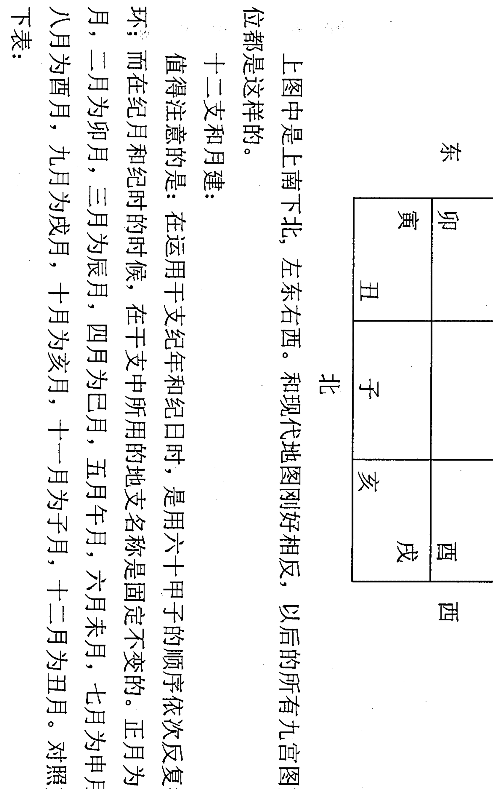

# 中国建筑工业出版社

王凤麟 著

现代预测技术概论

阴盘奇门遁甲预测学

鹿鼎国际

1

## 目录

序

第一章 导论：阴盘遁甲的理念

- 第一节 在深层次中谈“易”
- 第二节 阴盘遁甲，与道同行
- 第三节 大音希声，大道无形

第二章 阴盘遁甲的基础知识

- 一、阴阳五行
- 二、天干地支
- 三、四时五方
- 四、五行与五商
- 五、策划四大理论
- 六、时间切入法
- 七、怎样排四柱
- 八、十神
- 九、九宫八卦
- 十、八星
- 十一、八门
- 十二、八神
- 十三、遁甲常用的几个概念

第三章 阴盘遁甲的定局排盘

- 一、四柱
- 二、定局
- 三、画九宫格
- 四、布地盘三奇六仪
- 五、找旬首
- 六、定值符与值使门
- 七、确定天盘三奇六仪与九星
- 八、排八神
- 九、定八门
- 十、排隐干
- 十一、标空亡和马星

第四章 阴盘遁甲的象意

- 一、八卦象意
- 二、十天干象意
- 三、十二地支象意
- 四、八星象意
- 五、八门象意
- 六、八神象意

第五章 阴盘遁甲用神的选取

- 一、年、月、日、时取用神
- 二、方位取用神
- 三、年命取用神
- 四、报数或编号取用神

第六章 阴盘遁甲的断事密法

- 一、空亡象断转宫法
- 二、伏吟象断转宫法
- 三、翻宫法

第七章 阴盘遁甲的现代技术应用与实验

### 第一节 身体疾病角度分析与预测

- 一、综述
- 二、天干落九宫的象意
- 三、八门测病象意
- 四、八星测病象意
- 五、八神测病象意
- 六、阴盘遁甲断病的思路
- 七、阴盘遁甲具体断病
- 八、阴盘遁甲策划健康实例精解

### 第二节 人生婚姻角度分析与预测

- 一、理论、概念、心法部分
- 二、坐标的建立
- 三、十干化合详述
- 四、天干婚恋象意
- 五、八门婚恋象意
- 六、八星婚恋象意
- 七、八神婚恋象意
- 八、阴盘遁甲策划婚恋经验
- 九、阴盘遁甲策划的婚恋实例精解

### 第三节 事业与财运角度分析与预测

- 一、策划事业与财运思路
- 二、策划事业与财运要点
- 三、阴盘遁甲符号求财信息
  - 1、八神所主事业与求财信息
  - 2、八星所主事业与求财信息
  - 3、八门所主事业与求财信息
  - 4、十干所主事业与求财信息
  - 5、八卦所主事业与求财信息
- 四、毕业分配与求职
- 五、官运、升迁与调动
- 六、阴盘遁甲策划事业实例精解

### 第四节 企业角度分析与预测

- 一、总论
- 二、五行与企业
- 三、企业管理模式
- 四、阴盘遁甲中神、干、星、门代表企业中的各种象意
- 五、企业管理
- 六、企业外部发展条件诸因素
- 七、阴盘遁甲策划企业实例精解

### 第五节 地理环境角度分析与预测

- 一、阴盘遁甲地理环境概论
- 二、环境简述
- 三、阴盘遁甲符号地理环境象意
  - 1、十天干在地理环境预测中的信息象意
  - 2、八门在地理环境预测中的信息象意
  - 3、八神在地理环境预测中的信息象意
  - 4、九星在地理环境预测中的信息象意
- 四、阴盘遁甲勘察地理环境的判断思路
  - 1、综观全局，分析环境的外景和内景
  - 2、分析六亲宫位
  - 3、移星换斗
  - 4、环境与移星换斗撮要
- 五、阴盘遁甲策划地理环境实例精解

### 第六节 阴盘遁甲杂项策划

- 一、阴盘遁甲策划考试与学业
- 二、阴盘遁甲策划行人走失
- 三、阴盘遁甲策划天象与气象
- 四、阴盘遁甲策划刑事案件与诉讼
- 五、阴盘遁甲策划体育竞赛与机遇
- 六、阴盘遁甲杂项实例精解

## 附录

- 一、信息反馈
- 二、媒体报道
- 三、王凤麟策划的企业名录

## 后记

## 序

卢泰

奇门遁甲，是中国古代术数三式（太乙、六壬、奇门）之一。奇门遁甲的名字，从感官上给我们的感觉是神秘、玄奥、深邃莫测，甚至有恐惧感，可望而不可及，可观而不敢学。古有“学了三式，便是神仙”的流传，更有“学了奇门遁，来人不用问”的说法。随着对传统文化的深入研究，对“奇门遁甲”的研究也在逐步深入，很多关于奇门遁甲的书籍相继出版。研究奇门遁甲的人逐渐增多；奇门遁甲的神秘面纱也被逐渐揭开；现在，应用奇门遁甲测事、规划、调整环境的人也在增多，奇门遁甲已成为术数爱好者研究的热点。

《周易》是“理”“数”之源，《周易筮法》是术数之源。一切靠推演的术数都来源于对九宫、八卦、天干、地支的变化，加之各自的特点而演绎的。

奇门遁甲也不例外，它也是将《周易筮法》的“参伍以变，错综其数”、“广大配天地，变通配四时”、八卦套九宫的演绎方法，加上了三奇六仪，九星八门，符使八神，进行时空定位后所形成的格局来看吉凶的。奇门遁甲同《周易筮法》的阴阳行局完全一样。因而掌握了奇门遁甲的演绎方法，再学习《周易的筮法》就非常容易演卦了。所以奇门遁甲是《周易筮法》的衍支。

自古以来，奇门遁甲被奉为“帝王之学”，会者秘而不轻易传于人。传人也不传枢机要旨，所以得真传者很少。即使留有文字者也难得真谛。近年来很多研究者，把奇门遁甲进行了现代语言整理，这大大方便了学习者。但它们大多都是飞盘，转盘，起局方法依阴阳十八局，二十四节气，一气统三，五日换元。用置闰法，超神、接气，有的则用无闰法或拆补法。这些方法应用起来，实用、准确效果虽然很好，但是起局、判断格局比较复杂。

王凤麟教授把奇门遁甲与中国的风水学相融合，著书立说，难能可贵，读了他的《阴盘遁甲风水现代预测学》，颇感他是中国奇门风水的第一人。

王凤麟先生自幼习易，得道家玄学秘传阴盘遁甲。三十年来云游世界，走遍大江南北弘扬实演此绝学，深得世界各地广大易友和受益者的尊崇与青睐。

王凤麟先生学识渊博，“理”“数”结合，实战预测技艺精湛，曾为国内外诸多大型企业策划及名人指点迷津，名闻遐迩。外国友人赞叹其为：“东方有奇学，中国有奇人”。

《阴盘遁甲风水现代预测学》之所以称为阴盘，是因为它的起局方法是根据月球绕地球转动所产生的农历月日，并以其月日数加年地支序数，再加时地支序数的数字之和，即：年支序数+农历月数+农历日数+时支序数除以九所得的余数为局数。此法中的月球为阴，地支对天干来讲也是阴。故将以阴数为基础起局盘的奇门遁甲称为阴盘奇门遁甲。

阴盘遁甲起局简易，快速。只须知道年月日时的四柱就可以起局了。

阴盘遁甲断法独到，有转宫、翻宫、论空亡远空断、近空断、先天断、后天断以及隐干法等断法。

阴盘遁甲通过拆、补、移调整风水环境，有其独到的移星换斗法。

阴盘遁甲对古典奇门的诸多信息元和现代事物都给以全新的现代象意贴释，令学习者易懂易用。

阴盘遁甲之所以称其为现代预测学，因为王凤麟先生对奇门遁甲中诸多古典信息元的八卦、九宫、八门、九星、三奇六仪、直符直使、八神等古象意都用现代语言描绘，给予现代寓意，对现代实物给予新的象意，这种新的分类取象，贴近生活，反映生活，预测现代信息，具有鲜明的时代性。

《阴盘遁甲风水现代预测学》是奇门遁甲研究中古为今用的创新与发展，是对奇门遁甲实战应用上的一大贡献。

阴盘遁甲乃是道家“口传心授，不泄于纸”的一门秘传绝学。今王凤麟先生，悯易友之学渴，乃扬绝学于世，无量功德，可贺可赞。《阴盘遁甲风水现代预测学》看后会令您耳目一新！

阴盘遁甲玄机藏，
道家绝学世无双，
凤麟正一传秘法；
文笔千秋留墨香。

当此，凤麟先生大作《阴盘遁甲风水现代预测学》付梓之际，我真诚地贺之！学之！用之！并以能为之序甚感荣幸。以上片语，聊以为序。

2007年8月 于长春

## 第一章 导论：阴盘遁甲的理念

### 第一节 在深层次中谈“易”

问世间，
茫茫宇宙，浩瀚苍穹，
谁主沉浮？
天地间，
人来人往，潮起潮落，
几人悟道？
挥手间，
花开花谢，沧海桑田，
哪有始终？

一切从自然中来，又回到自然中去，自然为何物？老子曰：“人法地，地法天，天法道，道为自然。”自然体现于日月，于天地，于阴阳，于道、于法、于“易”。

“易”是最博大精深的，它是世界上最玄奥的学问，如果要开辟这一学科领域，就必须从根本上改变常人的思维。否则，自然的奥秘对于人来说只能是永远的神话。

“易”也不只是经书中的那一点内容，那只是人们在一般层次上对“易”的理解，是“易”在浅层次上的体现。真正的“易”，是从微观到宏观，从粒子、分子到星系、宇宙，从无到有，又从有到无的一个无穷无尽、无量无际的演化过程。

俗话说，穷则变，变则通，通则久。“易”是变，变是发展，变也可能意味着衰亡，佛家讲宇宙的变化过程是成、住、坏、灭，唯物论说，事物都有一个产生、发展、高潮、灭亡的过程。人类社会的变迁和现代科学的发展，也只是“易”在一定层次上的体现，而更深层次的“易”只有通过学习道家的易学知识，并在“易”中体悟才能真正明了，因为，“易”在道中。

道是宇宙规律，而“易”是宇宙规律的演绎，以“易”论道，以“易”悟道。而真正道家的易学知识是不入世的，千古以来一直在民间世代单传，世人所了解的“易”，只是做理论知识或一般层次的预测，而更深层次上的调理环境和道家神通数术对世人来说也只是天方夜谭，或觉得不可知、不可信、不可悟，或觉得高不可及、不可捉摸。

不同层次有不同层次的“易”，层次越高，易越完美，越能模拟宇宙建构的框架，越接近宇宙的真理。世界上东西方的智者都在研“易”，“易”不是谁发明的，她从远古中走来，随风而化，随雨而落，随云而动。但“易”的本质从未改变，历史变，“易”理不变；人心变，“易”法不变；苍穹变，“易”道不变。易如道，不刚不柔，不骄不躁，是道家的玄妙，是佛家的圆融，是儒家的中正，是基督教的博爱。易简朴而华贵，生动而沉静。易是存在，随宇宙生而生，与天同功，与地同行。易没有七情六欲，没有喜乐哀愁，无色无味无嗅，无欲无求，无为而无不为。

易就是那么存在，存在中有姻缘，越高层次的“易”越讲缘，有缘者得之。过去道家传弟子，历代单传，有的用《推背图》来选弟子，就选一个，对外经常讲，“吾门一入深似海，不是真人不进来”，得到的就是该得的，因为就是那么安排的。弟子一定是德行极高的，一定是道中人。高层次的道法，非常珍贵，非常神秘，用“真传一句话，假传万卷书”来形容一点也不为过，真是千两黄金难寻、万两黄金难买。同时，有的东西一般人也学不了，学不会，弄不好还会造成社会的混乱。

我自幼跟师父学“易”，而且一学就学了被古人称为帝王之学的古三式——遁甲、六壬、太乙，还有许多道家秘传的东西，而且每一样东西都有一个独立庞大的系统，这些系统间又有着密切的联系，比如，“三式”就有“遁甲前，六壬后，太乙跟左右”之说。“三式”中每一式都可以贯穿宇宙，上应天、下应地、中应人，无所不包，无所遗漏，只要是天地间存在的事物，都可以在其中映射出来，既可以洞彻未来，又能知晓过去，还能通过道法转换宇宙能量，改变事物发展的势态，如果一个人掌握了这些知识，退可以安身养命、安家立业，进可以安邦、平天下、成就霸业，甚至可以返本归真、修仙得道，真是世人可望而不可求、千金万金买不来的瑰宝。我的师父、师祖一直没有舍得把这些东西拿出来大面积公开传授，我在过去三十多年的实践中也没有传给过任何人，但是我实在不愿让这一派绝学失传于民间。在下了很大的决心后，才决定传出道家阴盘遁甲的一部分，这也是数千年来第一次将此术公布于世。

前些年也有许多易学家出来传播奇门遁甲知识，但他们所传的只是预测术在世上流传的那一层次上的东西，并不是这些东西不好，我只是说，更深层次上的东西他们没有传。因为单就遁甲知识而言，是一个极其庞大的系统，从古到今在世上从未全部公开过，世面上流行的书中也只是呈现了冰山一角，没有人在深层次中讲述遁甲术的应用方法。大家只是听说历史上轩辕黄帝、姜太公、张子房、诸葛亮、刘伯温等大军事家运用遁甲之术，呼风唤雨，撒豆成兵，运筹帷幄，决胜千里，成就大业的故事，并不知道遁甲在其中的真正运用之术。

最早的遁甲也叫《阴符经》，也就是今天我传的阴盘遁甲，这和世上流行的奇门预测术，不是一码事，不是一个体系。尽管从浅层次上看都有相同的符号，但从深层次上来讲，区别很大，内涵不同，方法不同，用途不同，意义不同。

### 第二节 阴盘遁甲，与道同行

- 阴盘遁甲无三奇
- 亦无吉凶与格局
- 取象直读藏功用
- 大易至简是玄机
- 阴阳通变为大道
- 天地人神四合一
- 转星换斗乾坤定
- 决策必用拆补移

#### 一、拥有阳光心态，何必谈吉论凶

老子曰：“道可道，非常道；名可名，非常名。”道无常，世事无常，善恶无常，吉凶无常，世上没有一成不变的事情。人有悲欢离合，月有阴晴圆缺，吉凶随时随地随人随势而变，事物都在吉凶之间徘徊，塞翁失马，焉知祸福，今日之吉在明日可能就是凶；此地之吉在彼地可能就是凶。真是“月子弯弯照几州？几家欢乐几家愁，几家夫妇同罗帐，几家飘散在他州。”天地总在颠倒间，世上没有绝对的好事，也没有绝对的坏事；没有绝对的好人，也没有绝对的坏人；没有绝对的好风水，也没有绝对的坏风水。

《庄子》中有个《古木与雁》的故事：

一天，庄子和他的学生在山上看山中有一棵参天古木，因为高大无用而免遭砍伐，于是庄子感叹说：“这棵树恰好因为它不成材而能享有天年。”

晚上，庄子和他的学生又到他的一位朋友家中做客。主人殷勤好客，便吩咐家里的仆人：“家里有两只雁，一只会叫，一只不会叫，将那一只不会叫的雁杀了来招待我们的客人。”

庄子的学生听了很疑惑，向庄子问道：“老师，山里的巨木因为无用而保存了下来，家里养的雁却因不会叫而丧失性命，我们该采取什么样的态度来对待这繁杂无序的社会呢？”

庄子回答说：“还是选择有用和无用之间吧，虽然这之间的分寸太难掌握了，而且也不符合人生的规律，但已经可以避免许多争端而足以应付人世了。”

如庄子言，既然如此，不如取其中正，不去讲吉凶，也不要设定吉凶模式，把自己局限在吉凶格局之中。这样不自我设限了，思维就开阔了，境界就升华了，意识就与道同行了。我传的这个阴盘遁甲就是没有凶吉的概念，也不设定格局，因为天道无形，神龙见首不见尾，游走于变化莫测之中，本来就没有吉凶概念，但世人都有好吉恶凶之心，动辄吉凶悔吝，非要总结出几个好的格局，认为吉祥无比；又总结出坏的格局，大讲凶罹难当。但这些格局是人定的，不是天定的。

后世研究遁甲的学者大多受宋代宰相赵普的影响，走的全都是赵普的路子。赵普对传播遁甲术数功绩很大，使很多人了解了奇门，但同时也由于受儒家思想影响，自我设限，将吉凶思想和格局概念推到顶峰。他的《烟波钓叟歌》中这样论述九星：“蓬任冲辅禽阳星，英芮柱心阴宿名，辅禽心星为上吉，冲任小吉未全亨，大凶蓬芮不堪使，小凶英柱不精明。”可九星（阴盘遁甲中只论八星，天禽星与值符同行）是人的心灵，人的心灵也不是一成不变的，当心灵充满阳光时，是真、善、美的，是和宇宙能量共振的，是与道同行的；当心灵布满阴云时，是假、恶、丑的，是和宇宙能量相悖的，是背道而驰的。

例如：大吉的天辅星是文曲之星，是教育之星，是人的德商，可大吉星也有转凶的时候，一旦凶起来，人就会被教育、被拘留、被刑罚。而由于拥有大凶的天蓬星而胆大妄为、做事大手笔、敢于冒风险，最终成为大政治家、大军事家、大企业家的人比比皆是。又如：天英星被认为是小凶之星，但有这颗星的人经常是行业精英或英雄人物。天柱也被认为是小凶之星，又名破军，可有这颗星的人却是因逆商颇高，而成为行业中里里外外一把手、中流砥柱式的人物，毛泽东的命局中即临天柱星，所以毛泽东能够力挽狂澜，不按传统规矩办事，打破旧世界，后来又破“四旧”，立“四新”。

道有阴阳，遁甲局中的每一个符号和组合，也包含着阴阳相抱、正反对立、吉凶并存的信息。人无完人，事无完事，一个人最大的优点可能就是他的缺点，最大的弱点可能就是他的强项。吉凶只存在于特定时空、特定的人和事的特定心态中，是一种感觉、一种错觉、一种幻觉。所以吉凶只在道浅处，道的层次越高深越不重吉凶，当我们时刻保持着阳光心态，与天地同声、与日月同气、与道同行的时候，那些劫数、运数、定数也就无所谓了。

#### 二、没有格局不设限，见树木又见森林

儒家喜欢谈吉论凶，把吉凶格局分得很细致、很严格，总是站在某一个角度、某一个立场、某一观点上来看问题，把人的思维禁锢起来，就像《烟波钓叟歌》中说的：“六癸加丁蛇天矫，六丁加癸雀入江。六乙加辛龙逃走，六辛加乙虎猖狂，谨观四者是凶神，百事逢之莫措手。丙加甲兮鸟跌穴，甲加丙兮龙反首，只此二者是吉神，为事如意十八九。”还有九遁、三诈五假、年月日时格、大格小格、庚格、飞干、伏干、龙逃走、虎猖狂、蛇妖娇、雀入江等等，听起来怪吓人的。受其影响，后世流传的奇门书中都讲格局，可这些格局没有让遁甲中的符号成为一种普适性的代码，使人只见树木不见森林，在预测时显得无从下手。

而阴盘遁甲，与道同行，打破格局，只读象意，天地间有的事物从这里都能读出来。根据万象全息、万象相干、万象有意、万象系统理论，通过宫中符号的组合，可以读出环境、健康、事业、学业、爱情、家庭等方方面面的事情，而且可以根据符号组合找出症结所在，运用道家思维解决问题，真正做到了“天地人神四合一”。道家是站在事物之外的更高层次来认识世界，既见树木又见森林。在当今世上流传的奇门预测术中，还没有一家能做到这一步。例如：

（1）甲午辛，天任星为值符。

| 符 | 辛戊 | 丁 |
|---|---|---|
| 任 | 景 | |

此例是为一位女孩测事业，日干为辛落坤宫。若论格局，辛加丁为狱神得奇，公废私就，囚禁得赦，女性犯罪倾向，经商求财获利倍增。但实际上这位女孩是一位演员，是弹古筝的。外面隐干癸代表困境，马星表示跑动较多，上乘值符是个有名望的人，辛是旬首是甲，它含八分甲性，二分金性，古筝是一块木头上安装了很多的金属丝弦，但木头多丝弦少，正符合八分甲木，二分辛金，戊是土，其形方、长方，古筝的木板是长方形的，丁是钉子古筝的丝弦是用钉子固定在木板上的，丁也是法是音律，天任星是哈腰的动作，弹古筝必须哈腰来弹，景门是表演。一个格局怎么能包含这么多的信息呢？

（2）

| 阴 | 芮 |
|---|---|
| 庚癸 | 乙 |
| 丙 | 兑 |
| 休 | |

此比例为一位客人测疾病，论格局为庚加丙，太白入荧，贼来破财，客利主破。如此几个字怎能把疾病的情况分析透彻呢。

实际上这位先生是冬天滑雪之后得病。外面的隐干乙是反映的是滑雪场滑跑道的形状，太阴是代表阴冷，庚是代表雪，反映的是雪的颜色，也代表硬，滑道上的雪经过人的反复踩踏已非常坚硬，癸也是代表雪，反映的是雪的实质为水，丙是乱子是热闹，滑雪场上的人非常多，热闹非常，天芮星是问题、是传授，滑雪的人有很多滑雪技术不好，经常摔倒，有教练和同伴在教他们滑雪技术，休门为休闲娱乐场所。

晚上滑雪之后吃的是火锅，此宫又反映出吃火锅的信息，在兑宫主病从口入，是与吃饭有关，庚是铜火锅，癸是火锅里的汤，丙是火锅下面的火，休门是调料，太阴是凉的食品又是精细的食品，是火锅的各种凉菜，外面的隐干乙是代表液化气的管子，晚上又吃了几个梨子，乙木是水果梨子，天芮星是问题，代表吃的食品有问题，隐干是事物的引子是弦外音，也就是因为吃了几个梨子才引出病来。

什么病呢？庚是大肠下面丙火是炎症，说明是肠炎，癸水是拉稀，太阴是病的时间较长，不容易康复。这样一个组合反映的信息非常丰富，根本不是奇门吉凶格那简单的几句话所能概括的。

由以上的例子充分说明了吉凶格局的僵化教条，在预测时它阻碍了人的灵感和发挥。死抱着吉凶格局不放，对提高预测水平极为不利，所以应该打破格局，展开思维与联想的翅膀。读象才是最高层次的预测术，只有在遁甲的符号象意中自由翱翔，才能入道得法，那是与道沟通的介质。

#### 三、不讲奇门，只言遁甲

几千年来，世上一直把遁甲术叫奇门遁甲，因为这里面包含乙、丙、丁三奇和休、生、开三吉门。三奇到底奇在哪里？很多人不明白其中的道理，而在阴盘遁甲中很容易解释清楚。世界是由物质构成的，物质是能量的载体，能量高低不平衡是造成世事所谓吉凶的根本原因。人往高处走，水往低处流，能量无时无刻不在转化之中，吉凶变化实质上是宇宙能量在道中转化的结果。在阴盘遁甲中，当出现击刑、门迫、入墓和空亡四种情况时，能量会不同程度地减弱，造成事物发展的不平衡状态。乙、丙、丁这三个天干符号从象意上讲，分别对应天体中的月、日、星，乙月丙日丁为星（和世上流传的乙日丙月丁为星不同），这三个符号在遁甲局的九宫中游走时不会出现击刑的情况，但也会因为门迫、入墓和空亡这三种情况而降低能量，而其他对应天体中六大星云的戊、己、庚、辛、壬、癸在局中都会出现击刑、门迫、入墓和空亡四种情况，所以乙、丙、丁三个符号比戊、己、庚、辛、壬、癸这六个符号降低能量的机会少一点儿，所以人们就认为它们三个“好”，认为它们三个“奇”，所以合起来叫“三奇”。可这“三奇”也并不是那么好，在阴盘遁甲预测婚姻时，它们往往是婚姻出问题的标志之一；在测疾病时，这“三奇”也病得不轻，乙是神经、血管出问题，丙是炎症、流血、发烧，丁有手术的信息。由此可见，“三奇”也没什么“奇”的。

另外，有的奇门预测书中还讲“临值符百灾消散”，其实，六甲值符和乙、丙、丁一样在局中没有击刑的情况，但也会因为门迫、入墓和空亡这三种情况而降低能量。有的书中讲的值符在震三宫击刑，这就是大错特错了，因为他把值符甲和戊混为一谈了，值符就是甲，当值符甲临戊在震三宫时，戊会出现击刑，而甲不会，但因为戊临值符会使戊损失的能量相对地减少一些，但也不会百灾消散，全都是好事。在阴盘遁甲测婚姻时，女人临值符婚姻就不怎么样，因为道家讲男刚女柔，女人太强了，像武则天那样，非要领导男人，男人就会躲得远远的，所以“做女人难，做值符女人更难”。

还有，历代奇门书中都把休门、生门、开门统称为“三吉门”，赵普的《烟波钓叟歌》中就有“八门若遇开休生，诸事逢之总称情”，这样的说法，就更加牵强附会了。因为八门是宇宙中事物存在的状态，休、生、开三门的状态都那么好吗？在阴盘遁甲的象意中，休门既可以象征休息、休整、修理、休养生息，也可以象征生命的休止、消亡；生门既可以象征生长、生育、生意、生机勃发，也可以象征病在生长，癌细胞在生长；开门既可以象征开店、开悟、开心、开创基业，也可以象征开刀、开除。而其他五个门伤、杜、景、死、惊就那么凶吗？就人而言，临伤门的人直爽，临杜门的人有技术，临景门的人漂亮，临死门的人“咬定青山不放松”，临惊门的人口才好。这里的吉凶何在？在人心，在于人对事物的认识和内心感受。就像世人都认为吃苦遭罪不好，坐享其成是福，可历代修佛修道的人却认为吃苦是好事，可以偿还前世的业债，得道成仙，苦点儿凶点儿又有何妨？

这样看来，乙、丙、丁“三奇”和休、生、开“三吉门”的说法有名无实，所以我所传的这门知识就不讲奇门，也不叫奇门，而只言遁甲。

#### 四、阴大于阳，让海天为我聚能量

《道德经》云：“天长地久。天地所以能长且久者，以其不自生，故能长生。”

阴盘遁甲为什么能和宇宙的信息一一对应？为什么能处理环境风水？为什么能转化宇宙能量？为什么能修炼神通数术？为什么能改变事物发展态势？为什么能改变人生命运？为什么能修炼神通数术？其中一个重要原因就是因为其起局方式与世上流行的起局方式都不一样，它不根据节气，不讲置闰超神，不用拆补，也不用一日之中的阴阳子午遁求局数，而是用最简单不过的加法和除法。道分阴阳，大道至简至易，年月日时的四个太阴数相加，就是把宇宙中日月星辰的全部能量聚集在一起，让海天为我聚能量，这代表宇宙的总和，再把总和数用九宫数去除，把宇宙能量平均分配，不偏不倚，剩下的余数为用，也就是局数，这是道在“阴”这面的体现。再根据时柱，排出八神、八星、八门、引干，以体现当时的时空状态。

同时，在推演事物发展状态时，参照年月日时的太阳数，即四柱干支，这是道在“阳”这面的体现。这样，阴盘遁甲把道的阴阳两方面交汇于局中，正所谓“阴阳交合乐逍遥”。而流行于世的其他奇门的起局方法，都没有把宇宙能量在道阴的一面体现出来，而道阴的一面就像冰山在水面以下的部分，道阳的一面，就像冰山在水面以上的部分，水面以下的部分永远大于水面以上的部分，所以阴永远大于阳，这和宇宙中看不见的暗物质远远大于看得见的明物质有异曲同工之处。

阴盘遁甲是重阴的，也就是更重视宇宙深层次中的信息和能量，即神的力量（规律），所以在处理风水和运用神通数术时，非常灵验，正因如此，我们才叫它阴盘遁甲。当然用其它的奇门方法也能预测事物的表面状态，但很难调动和转化宇宙能量。从表面上看，阴盘遁甲和其它奇门运用的符号大同小异，但其内涵却是差之千里，而且阴盘遁甲在神、星、门、干的排列顺序和位置上非常讲究，每个符号都和宇宙天体中的信息能量完美对应，同时特别重视神的作用，强调天时不如地利，地利不如人和，人和不如神助，神助大于一切。

再有，时家的阴盘遁甲是一个时辰演一局，每个时辰的神、星、门、干都在不停地变化，这样的遁甲建构模式，淋漓尽致地展现了宇宙能量在生生不息、终日乾乾地演化的过程，而有的预测术五天，也就是六十个时辰才能演完一局，这就意味着，阴盘遁甲有着更多丰富的信息量，预测事情更为精准细致。

#### 五、玄之又玄，众妙之门

老子曰：“无名，天地之始；有名，万物之母。故常无欲，以观其妙；常有欲，以观其徼。此两者同出而异名，同谓之玄，玄之又玄，众妙之门。”

宇宙有无穷的奥秘，有人类眼睛看不见的世界，还有我们眼睛能看见的人类世界。眼睛看不到的上界无量天体宇宙以外的时空，叫无，叫空，生命在空无的境界才可看到生命宇宙时空的奥妙关键所在，这一境界与遁甲中空亡的状态相对应。

空亡的内涵很丰富很深奥，一般的遁甲书里只讲空亡就是没有了；人即是死，物即是无。其实远没有这么简单，阴盘遁甲里的空亡玄机最大。空亡是时空隧道，是时空盲区，是阴阳转换点，无中生有都是从空亡而来。在断事时是要转宫来看的，有远空断、近空断、先天断、后天断，一切玄机尽在空亡之中。

在阴盘遁甲里，伏吟也要转宫，伏吟时盘中信息重叠，为天地未动之象，是事物刚刚要开始的状态，信息量相对较少，断事困难，这时要转宫看，信息量大丰富，断事情更加精细。和空亡法一样也分远空断、近空断、先天断、后天断。转宫之说在过去都是天机，在世上从来没有人传出过，因为它玄妙嘛！

除此之外，遁甲通六壬，能妙断事物的原由和发展方向。三式是一家，有着千丝万缕的联系，在应用上也是互相借鉴、互相补充的，所以有人说是壬遁之学。事物的发展是连续的，是处于不断运动和变化当中的，这样就会有以前、现在和未来等不同的时空状态。那么，这个纵向的轴线是如何确立的呢？六壬天地盘前后翻、前后贯穿成一条脉络查事物的原由和未来发展方向，遁甲同样也能用此法，把事物的来龙去脉摸得清清楚楚，这就是阴盘的翻宫法。

阴盘遁甲还有隐干法。《奇门法窍》一书略微提及暗干的应用，但阐述得不细，也不正确。隐干也是通六壬的，有了隐干遁甲局中十干，天地人三才齐备，信息完整，断事更加得心应手。隐干是事物的引子，就象中药里的药引子一样，是弦外音，是导火索，一切事情都从隐干导出，一个玄机暗里存。

### 第三节 大音希声，大道无形

一程走了又一程，
水远山深露更浓。
只为众生说顺逆，
甘将心血出群雄。
高名未就最难逃，
大道已昭渐可名。
莫畏浮华迷乱眼，
心中自有玉玲珑。

> 《道德经》云：“希言自然。故飘风不终朝，骤雨不终日。孰为此者？天地。天地尚不能久，而况于人乎？故从事于道者，同于道；德者，同于德；失者，同于失。同于道者，道亦乐得之；同于德者，德亦乐得之；同于失者，失亦乐得之。”

哲学认为世界是物质的，物质是运动的，物质的运动是有规律的。既然有规律，那么我们就能够通过一定的方式认识规律，把握规律，利用规律，顺应规律，就能够运用我们掌握的物质运动规律指导我们日常的生产生活实践，或颇具前瞻性的预测事物未来的发展变化。

我们知道，世界上的物质运动规律由低级向高级分为机械运动、物理运动、化学运动、生命运动、社会运动。我们知道，一位深明机械运动的机械工程师，他可以用他掌握的规律、理论预知机械设备以前、现在和未来的状况。一位精通物理学规律的物理学家，他可以把握预知物理层面的事物过去、现在与未来的发展情况。一位精研化学规律的化学家，他可以把握预知化学层面事物的以前、现在和未来状态。以此类推，生命运动、社会运动也是如此，术数学是另类地、特异地全方位、多角度、多层面地探研世界万事万物的运动发展规律，即是一种综合性学科，它包括天文学、气象学、历法、地球物理学、水文地质学、地球磁场学、信息学、运筹学、美学、心理学、医学、环境景观学、建筑学、光电学、星象学、气功学、人体科学、生命信息学、生物场学、宇宙学、历史学、文学、民俗学、社会学等科学。先人们即是通过长年累月的观察、了解和实践，传承、发展和沉积，凝聚成一个另类的、特异的学科——中国古代术数学，它也有有别于其他学科的体系与理论构架。如果掌握了术数学的理论体系，就能对世界上的万事万物进行预测，并可以通过调整环境风水来改变事物发展路线。

阴盘遁甲的风水法是一个重要环节，是遁甲术的灵魂，其在占断环境和处理环境上奥妙无穷，其中的理法与技法独步天下。遁甲一盘反映的是宇宙能量场在地球上的分布，易学注重的是天人感应，易经上讲在天成象，在地成形，地球上的人或事物与天上的星宿息息相关，也就是说地球上的人与事物不是孤立的，而是时时刻刻受宇宙气场的影响。所以说遁甲处理风水是最为神奇灵验的，最有理论依据的，所以要比世上流传的其他风水法效果都要好，可以说立竿见影，药到病除，我的许多弟子、学员在这方面都有许多体会。

遁甲移星换斗风水学是根据遁甲排盘来巧妙处理的。在天成象，在地成形，地上的物与天上的象相对应。人法地，地法天，天法道，道法自然，人是小宇宙，天是大宇宙，小宇宙和大宇宙同呼吸，共脉搏，是息息相关的。什么形对应什么象，什么形充什么气，气就是能量，能量足了即可改变周围的空间状态，风水环境即随之改变，居住在其环境中的人也会受到影响，这就是移星换斗处理风水的奥妙所在。遁甲风水的移星换斗大法，就是运用遁甲盘中天地人神符号所代表的象意，设定风水物品摆放在最佳方位，接收宇宙间特定的能量气场，以此来调整环境能量结构分布，提升环境的能量层级，使此环境的居住者的运势得以有效改变。

有人问：“什么是最好的风水？”我说：“没有。”因为风水不能孤立存在，脱离了人的因素，单讲环境是不科学的，不合道的，那样天地人神无法合为一体。风水是针对人的风水，有人才会有风水，所以我们阴盘遁甲的风水处理方法是以人为本，只针对个体，紧紧地把握住个体的特殊性，选择最佳时间，切入其空间场，通过改变其居住环境的场效应，来改变事物发展的方向和态势，最终影响人的命运。

同时，有人就有风水，与人相关的一切生理、心理和社会环境都对人有影响，都是风水，所以我们讲的风水是广义的，不仅限于改变居住、工作、学习的环境，还包括着装搭配、姓名策划、行为指导、心理辅导和建立活砂（人脉）等全方位的风水处理。这些策划方法理论指导都来源于我们阴盘遁甲。阴盘遁甲的象意是世上流传的所有预测术中最为丰富的，可以说包罗万象，而且一直在与时俱进，在我三十多年的实践中，不断地对其进行补充、发展，可以说宇宙间的所有存在的事物都可用遁甲符号来模拟。由于阴盘遁甲的一大特点就是直接读象，避免了极其复杂的推理，所以简单实用，这也符合大道至简之理。定坐标的方法也非常辩证，非常灵活，逻辑性极强。应期之法也很简单，非冲即填，这和普通之法根本不同。

阴盘遁甲是集预测、环境调理和行为指导为一体的高层次的风水预测学，所以可以完全对客户负责任，我们会把周围环境中对客户实现愿景的各种有利的和不利的因素告诉他，并如实告诉他处理的结果会如何，然后从实际出发，对他的每一步发展不断进行监控和调整，最终实现其愿景。我身边的许多朋友都是这样一步一步地走到重要的领导岗位上去的，就是用我们的道家风水把他们的潜力最大限度地激发出来。

还有，过去有一些风水术是有漏洞的，调整环境时，风水师自己要付出代价的，别人事业发展了，风水师自己趴下了；别人病好了，风水师自己住院了，有的甚至英年早逝了。因为他不知道，宇宙中信息是相通的，在给别人处理环境时，自己也进入到了对方的环境场中，也受这个场的影响，用一般的术数方法根本看不到自己环境场中的位置，也不知道处理环境后对自己有何影响。但我们这阴盘遁甲在处理风水时不会出现这个问题，因为我们这个遁甲是与道同行的，可以说是宇宙的缩影，在这个特定环境中，所有相关的信息都装到了局中，包括风水师自己的信息，给别人调整的时候首先看到了自己的情况，调好别人的同时也调好了自己，宇宙的信息达到了良性的同步同振，因此我们这一派的地师是有福报的，我们做什么事都是与道同行、依法办事的，我们做的事都是经过神（宇宙规律）同意的，所以我们每调完风水都会应天象，要变天——阴天、刮风、下雨或出奇象。

阴盘遁甲的理论知识是经得起实践检验的。在几十年实践中，我走遍了大江南北，世界各地，用这一门知识为无数人解决了无数的问题，救过许多人的命，也获得了无数荣耀。在实践中，我感觉我们的这一门知识真的非常好用，真的可以以为社会造福，可以帮人，也能救人，利民兴国。这么好的东西，我决定把它拿出来与大家共享，这在我们这一派流传史上还是破天荒的第一次，所以希望有缘之士能了解和学习这一门知识，将这派绝学发扬光大。其实，我们已经有许多弟子、学员在学习之后，用得效果非常好，出现了许多奇迹。

当然，我也并不排斥其他各家各派的易学理论，这些易学理论都是我们中华民族古代文化的一部分。各家各类关于预测、风水术方面的书，我也基本上都拜读过，全国各地举办的易学学习班我也参加了不少，有些东西非常好，非常实用，但就预测和处理风水的方法而言，超过我们阴盘遁甲术的，我还没有见过。因为阴盘遁甲的理论知识，是从上古时期流传下来，经过无数先师不断完善而成的，不是你抄我，我抄他，东抄西抄抄来的；我们的知识预测体系非常庞大，到现在也只是传出一小部分，因为学会了这一派知识，就等于学会了各家各派的知识。

我这个人有一丈我可以说一尺，能不能说就不说，但说出来就是一定是真的，在知识面前不来半点虚假，我们的知识好不好，这一点我们全国各地的众多弟子、学员和经我处理过风水的客户都可以作证。

现在有许多家的奇门，也在预测中套用我们的象意，我不会介意，因为知识拿出来就是让大家用的，但每一派知识都有一体系，把我们的东西套在别的知识体系上，单纯搞搞预测还说得过去，但不能用来处理风水，不应象，也不应事，因为起局方法不同，就无法和宇宙良性信息共振，弄不好还要出事。因为处理风水是一件非常严肃的事，改变风水能救人，也能害人。所以我传这些知识，都是本着对社会负责，对弟子、学员负责的态度，才敢大面积公开传的。

还有，我们的东西是道家的，道家的知识也伴随着道家的心法在一起传，领悟了这些心法对我们做人、处事是非常有益的，因为我们遁甲局中埋藏了人世间数不清、道不尽的悲欢离合、喜乐哀愁。通过学习，渐渐地你的心性就会提高，心态会越来越好，心中会时刻充满阳光。这时，这个世界也就变得美丽了……因为那就是道！

## 第二章 阴阳遁甲的基础知识

### 第一节 阴阳五行

我认为，阴阳五行是两个不同的概念。

**阴阳：**

阴阳学说将宇宙万物万象分为阴阳两大类，认为一切事物的形成、变化与发展在阴阳二气的运动之中。自然界一切事物都存在着相反的两种属性，即存在着对立统一。最初的阴阳现象来自阳光的向背，物体向阳的一面为阳，背面的一面为阴，继而不断引申解释自然与社会的所有现象，比如：明暗、寒热、日月、昼夜、内外、动静、上下、黑白、快慢、男女、强弱、奇偶、进退等等。

而阴阳关系又不是一成不变的，它随着外界条件的变化而转化，并且是阴中有阳，阳中有阴，互相包涵着。

阴阳有以下特征：

-   1、阴阳互根：阴为阳根，阳为阴根，互为依存，互相为用。
-   2、阴阳消长：阴阳始终处于此消彼长，彼进此退的动态平衡中，量变时时处处都存在。
-   3、阴阳转化：在一定条件下，阴阳发生“质”的变化，各自向其对立面转化。

阴阳学说与现代唯物辩证法的矛盾对立统一规律完全相符。这也就是说，我们看待事物，不能片面的、静止地去看，而是应该用全面的、发展的眼光去看。

太极图十分形象的、直观的反映了阴阳的特征，它有着丰富的内涵，它几乎成了道家的标志。该图中的阴阳两仪，中间呈现S形曲线，表示了阴阳消长、刚柔相济和稳定和谐。对这个图，你感悟的愈多，你的道行修为就愈深，你的立足点就愈高。当一个预测师站在宇宙的角度看事物时，世上的一切都是一目了然的了。

我们所说的“没吉没凶”观点的理论基础，就是阴阳学说的认识论。

阴阳还反映到节气上。

早在三千年前，我国的天文学家已经测定了太岁(木星)的运行和每年冬至、夏至的确定时间，从而分出四季和记时的天干地支。

每年农历十一月的冬至节(太阳直射南回归线)太阳开始北移，日渐长，夜渐短，称为一阳生。每年农历六月的夏至节(太阳直射北回归线)，太阳开始南移，日渐短，夜渐长，称为一阴生。

把一年时间分作两份，冬至开始至夏至之前为阳，夏至开始至冬至之前为阴。一日也如此，白昼为阳，黑夜为阴；午前为阳，子前为阴。

**五行：**

五行学说是奇门遁甲的重要根本观念。水、木、火、土、金是构成宇宙的五种基本物质，自然界和人类社会的各种事物和现象，都可以依其性质与这五种物质相比拟而进行归类。这五种各具特性的物质不断运动和互相作用，便形成了宇宙间万物生长与消亡的规律和原因。

人体的五行，是人与自然的和谐与对应：人有毛发，自然就有草木；人有双目，自然就有日月；呼吸为风，挥泪就成雨；骨为山，血脉就为河流。真可谓天人合一。

中医的五行，也反映出了这种对应：五脏属阴，肝属木，肾属水，肺属金，心属火，脾属土。六腑属阳，肝以胆为腑，肾以膀胱为腑，肺以大肠为腑，心以小肠为腑，脾以胃为腑，腑脏相连，有病互染。

五行的性质：
-   水——湿润入土，以生万物；具有寒冷、向下的特征。
-   火——火向上升，具有炎热、向上的特征。
-   木——具有生发、条达的特征。
-   金——具有清静、收杀的特征。
-   土——具有长养、化育的特征。

| 五行 | 木 | 火 | 土 | 金 | 水 |
|---|---|---|---|---|---|
| 天干 | 甲乙 | 丙丁 | 戊己 | 庚辛 | 壬癸 |
| 地支 | 寅卯 | 巳午 | 丑辰未戌 | 申酉 | 亥子 |
| 方位 | 东 | 南 | 中 | 西 | 北 |
| 五气 | 风 | 热 | 湿 | 燥 | 寒 |
| 五化 | 生 | 长 | 化 | 收 | 藏 |
| 五形 | 矩形 | 尖形 | 方形 | 圆形 | 波形 |

五行归类简表

五行还是相生的。
五行相生好比母生子，有相亲相爱之意，指某种物质对另一种物质起着促进滋生的帮助作用。
-   金生水——铜镜凝结空中水气变成露珠，金属熔化后成液体状态。
-   水生木——草木赖水份以生长。
-   木生火——木柴燃烧产生火。
-   火生土——火能把燃烧后的东西变成土；地震喷火，生成新土地。
-   土生金——一切金属来自土地。

| 五色 | 五味 | 五音 | 五窍 | 五脏 | 五腑 | 五体 | 五津 | 五腧 | 五元 | 五贼 | 五德 | 五魔 | 五星 | 五帝 | 五虫 | 五器 | 五商 | 企业五素 | 五温 | 气象 | 地理 | 八神 | 九星 | 八门 |
|---|---|---|---|---|---|---|---|---|---|---|---|---|---|---|---|---|---|---|---|---|---|---|---|---|
| 青 | 酸 | 角 | 目 | 肝 | 胆 | 筋 | 泪 | 井 | 元性 | 怒 | 仁 | 财 | 岁星 | 大昊 | 鳞虫 | 规 | 财 | 竞争 | 温 | 风 | 树木 | 符合 | 辅冲 | 伤杜 |
| 赤 | 苦 | 徵 | 舌 | 心 | 小肠 | 血 | 汗 | 荥 | 元神 | 喜 | 礼 | 贵 | 荧惑 | 炎帝 | 羽虫 | 绳 | 情 | 文化 | 热 | 晴 | 山 | 蛇天 | 英 | 景 |
| 黄 | 甘 | 宫 | 唇 | 脾 | 胃 | 肉 | 涎 | 俞 | 元气 | 思 | 信 | 胜 | 镇星 | 皇帝 | 倮虫 | 度量 | 健 | 整合 | 自然 | 雾云 | 平原 | 地 | 任芮禽 | 死生 |
| 白 | 辛 | 商 | 鼻 | 肺 | 大肠 | 皮毛 | 涕 | 经 | 元情 | 忧 | 义 | 杀 | 太白 | 少昊 | 毛虫 | 矩 | 逆 | 核心 | 凉 | 雷 | 道路 | 虎阴 | 柱心 | 惊开 |
| 黑 | 咸 | 羽 | 耳 | 肾 | 膀胱 | 骨 | 唾 | 合 | 元精 | 恐 | 智 | 淫 | 辰星 | 颛顼 | 介虫 | 准 | 智 | 应变 | 寒 | 雨 | 河流 | 玄 | 蓬 | 休 |

五行也是相克的。

相克，指某种物质对另一种物质起着制约、压抑的作用。其规律如下：

- 金克木——金属制品能砍伐树木。
- 木克土——树木的根能入土。
- 土克水——土能吸收水份，土堤能防水。
- 水克火——水能灭火。
- 火克金——火能熔化金属，铸铜成器。

有了相生、相克，世间万物才能够维持着一种比较固定与稳定的平衡与和谐状态。

### 第二节 天干与地支

天干、地支，简称干支。它是我国古代人民用来记录年、月、日、时的符号，用于古历法之中。

十天干：甲、乙、丙、丁、戊、己、庚、辛、壬、癸

十二地支：子、丑、寅、卯、辰、巳、午、未、申、酉、戌、亥

干支演变出六十花甲子。

六十花甲子，是古人在发明干支的基础上，将它们进行组合，同性干支依次配合，进行不重复的排列，产生了60对干支组合，俗称六十花甲子。从数学角度讲，就是干支组合的最小公倍数。六十花甲子的特点是阳干配阳支，阴干配阴支，由此可见，其是由天干地支叠加而成的。之所以不用阳干配阴支，是因为干支原来即为两个独立的系统，本无阴阳之别。

六十花甲子传为黄帝所制，六十花甲子是组成年、月、日、时四个时空的基本元素，用来表示年、月、日、时四个时空参量，用六十花甲子可以模拟任一时空——

- 甲子、乙丑、丙寅、丁卯、戊辰、己巳、庚午、辛未、壬申、癸酉；
- 甲戌、乙亥、丙子、丁丑、戊寅、己卯、庚辰、辛巳、壬午、癸未；
- 甲申、乙酉、丙戌、丁亥、戊子、己丑、庚寅、辛卯、壬辰、癸巳；
- 甲午、乙未、丙申、丁酉、戊戌、己亥、庚子、辛丑、壬寅、癸卯；
- 甲辰、乙巳、丙午、丁未、戊申、己酉、庚戌、辛亥、壬子、癸丑；
- 甲寅、乙卯、丙辰、丁巳、戊午、己未、庚申、辛酉、壬戌、癸亥。

十天干中有阴干和阳干，单数为阳，双数为阴。

阳干为：甲、丙、戊、庚、壬；

阴干为：乙、丁、己、辛、癸。

天干可与五行四时方位相配：

甲乙属木，其时春，其位东方；丙丁属火，其时夏，其位南方；戊己属土，其时四季（辰戌丑未月），其位中央；庚辛属金，其时秋，其位西方；壬癸属水，其时冬，其位北方。

天干有冲合之论：
甲庚、乙辛、壬丙、癸丁为四冲，甲己合化土、乙庚合化金、丙辛合化水、丁壬合化木、戊癸合化火。冲也是一种克，因为方位相对，所以力量较大；合为合化合解之意，在奇门预测男女婚恋时，以相合之干为配偶和对象。
地支的五行和方位是：寅卯属木，巳午属火，申酉属金，亥子属水，辰戌丑未属土。方位如下图：

上图中是上南下北，左东右西。和现代地图刚好相反，以后的所有九宫图方位都是这样的。

十二支和月建：
值得注意的是：在运用干支纪年和纪日时，是用六十甲子的顺序依次反复循环；而在纪月和纪时的时候，在干支中所用的地支名称是固定不变的。正月为寅月，二月为卯月，三月为辰月，四月为巳月，五月午月，六月未月，七月为申月，八月为酉月，九月为戌月，十月为亥月，十一月为子月，十二月为丑月。对照如下表：

| 月建 | 正月 | 二月 | 三月 | 四月 | 五月 | 六月 | 七月 | 八月 | 九月 | 十月 | 十一月 | 十二月 |
|------|------|------|------|------|------|------|------|------|------|------|--------|--------|
| 地支 | 寅   | 卯   | 辰   | 巳   | 午   | 未   | 申   | 酉   | 戌   | 亥   | 子     | 丑     |

十二支和十二时辰纪时也是采用相应固定的十二地支，来代表每天的十二个时辰。每个时辰相当于现在的两个小时。23—1时为子时，1—3时为丑时，3—5时为寅时，5—7时为卯时，7—9时为辰时，9—11时为巳时，11—13时为午时，13—15时为未时，15—17时为申时，17—19时为酉时，19—21时为戌时，21—23时为亥时。对应情况见下表：

#### 地支与小时对照表

| 时间 | 23-1 | 1-3 | 3-5 | 5-7 | 7-9 | 9-11 | 11-13 | 13-15 | 15-17 | 17-19 | 19-21 | 21-23 |
| :--- | :--- | :--- | :--- | :--- | :--- | :--- | :--- | :--- | :--- | :--- | :--- | :--- |
| 地支 | 子 | 丑 | 寅 | 卯 | 辰 | 巳 | 午 | 未 | 申 | 酉 | 戌 | 亥 |

十二支有冲、合、刑、害这样的关系。

地支有六冲：子午相冲，丑未相冲，寅申相冲，卯酉相冲，辰戌相冲，巳亥相冲。

地支有六合：子丑合化土，寅亥合化木，卯戌合化火，辰酉合化金，巳申合化水，午未合化土。

地支三合：申子辰合化水，寅午戌合化火，亥卯未合化木，巳酉丑合化金。

地支相刑：子刑卯、卯刑子，寅刑巳、巳刑申，申刑寅，丑刑戌、戌刑未、未刑丑，辰刑辰、午刑午、酉刑酉、亥刑亥。

地支相害：子未相害，丑午相害，寅巳相害，卯辰相害，申亥相害，酉戌相害，奇门运用较少。

五行不仅在一年四季中有旺、相、休、囚、死的状态，而且与地支所代表的十二个月相对应，还有一个从生长到死亡的全过程，叫做“寄生十二宫”的原理。

十天干相对于十二地支有十二种状态：长生、沐浴、冠带、临官、帝旺、衰、病、死、墓、绝、胎、养。其排列规律为阳生阴死。

长生：就像人出生于世，或降生阶段，是指万物萌发之际。引申的意义很多，在现实中它包含有出生、生长、来源、起点、帮助、依靠、靠山、哺育、源泉、原始、获救、产生等含义。

沐浴：洗礼与生长之意，又叫“败”，形体柔而脆，易为所损。它含有洗澡、裸体、淫乱、脱衣、暴露、光滑、坦诚、大小便、睡觉、破败等含义。

冠带：为小儿可以穿衣戴帽了，是指万物渐荣。冠带含有穿衣、整装、打扮、包装、装饰、衣服、升级、荣誉、遮盖、外表、高贵等含义。

临官：像人长成强壮，可以做官，化育，领导人民，是指万物长成。临冠含有有公家的、官府、有男人在身边、巴结当官的、阿谀奉迎、出仕、当官、有官运、有地位、公务员等含义。

帝旺：象征人壮盛到极点，可辅助帝王大有作为，是指万物成熟。帝旺含有荣发、发达、得意、精神、兴奋、神气、有力、雄壮、强大、辉煌、欣欣向荣、高潮、顶点等含义。

衰：指盛极而衰，是指万物开始发生衰变。它含有无力、软弱、衰弱、不景气、败落、退缩、没靠山、虚弱、无能等含义。

病：如人患病，是指万物困顿。病含有疾病、讨厌、仇人、不足之处、缺点、毛病、弱点、漏洞、问题等含义。

死：如人气已尽，形体已死，是指万物死灭。死含有死亡、钻牛角尖、不灵活、不能变通、滞留、终结、完蛋、没有余地、无生气、无活力、呆板、笨拙、想不开、心胸狭窄、寂静等含义。

墓：也称“库”，如人死后归入于墓，是指万物成功后归库。墓含有包容、收藏、埋藏、关闭、存放、管制、包含、陷阱、不自由、受管束、隐藏、围拦、仓库、昏沉、糊涂、黑暗、不畅通等含义。

绝：人形体绝灭化归为土；万物前气已绝，后继之气还未到来，在地中未有其象。绝含有绝地、绝境、悬崖、分手、断绝、失望、心灰意冷、无情、冷酷、不通融、消失、无影无踪、把事做绝、把话说绝之含义。

胎：人受父母之气结聚成胎；天地气交之际，气来受胎。胎含有怀胎、酝酿、打算、计划、形成、天生、本性、幼稚等含义。

养：像人养胎于母腹之中，之后出生，是指万物在地中成形，继而萌发，又得经历一个生生灭灭永不停止的天道循环过程。养含有寄托、收养、休养、疗养、营养、滋养、过继、培养、养育、扶持等含义。

“寄生十二宫”的现象比较形象地反映了宇宙万物生生死死、循环往复、永无休止以至无穷的自然状态与规律，它体现了古代人民朴素的唯物观与合理的科学与哲学思想。

五行寄生十二宫的对应月份等情况列表如下：

### 第三节 四时五方

时间与空间的观念是奇门遁甲术极为重要的观念。时间，在这里指的是“四时”，即一年四季；空间，则指“五方”，即东、南、西、北、中五个方位。上面说到的阴阳、干支、五行等观念中，尤其以五行观念极为重要，成为分析判断事物的核心。而五行的相生、相克等现象，则要与四时五方等因素相结合，看它们各自所旺盛的是哪个季节，所适宜的是哪个方向。进行综合的分析，才能更精确地反映事物的情况。

五行、干支所适宜的时季和方位：

| 五行 | 天干 | 地支 | 所旺四季 | 所主方向 |
| :--- | :--- | :--- | :--- | :--- |
| 木 | 甲乙 | 寅卯辰 | 春 | 东 |
| 火 | 丙丁 | 巳午未 | 夏 | 南 |
| 金 | 庚辛 | 申酉戌 | 秋 | 西 |
| 水 | 壬癸 | 亥子丑 | 冬 | 北 |
| 土 | 戊己 | 辰戌丑未 | 寄旺四季 | 中 |

| 时令 | 五行 | 五阳干 | 五阴干 |
| :--- | :--- | :--- | :--- |
| 状态 | 甲木 | 乙木 |
| 长生 | 亥 | 午 |
| 沐浴 | 子 | 巳 |
| 冠带 | 丑 | 辰 |
| 临官 | 寅 | 卯 |
| 帝旺 | 卯 | 寅 |
| 衰 | 辰 | 丑 |
| 病 | 巳 | 子 |
| 死 | 午 | 亥 |
| 墓 | 未 | 戌 |
| 绝 | 申 | 酉 |
| 胎 | 酉 | 申 |
| 养 | 戌 | 未 |

这里土“寄旺四季”的意思，是指它旺盛于一年四个季节的最后一个月。在每一年的四个季节里，每一个季节都有五行中的一个处于“旺”即“王”之意，也就是旺盛状态；一个处于“相”即“宰相”之意，属于次旺状态；一个处于“休”即“休息”状态，退休无事；一个处于“囚”即衰落、被关禁之意；一个处于“死”即被克制、毫无生气的状态。

| 状态 | 旺 | 相 | 休 | 囚 | 死 |
|---|---|---|---|---|---|
| 木 | 春 | 冬 | 夏 | 四季末 | 秋 |
| 火 | 夏 | 春 | 四季末 | 秋 | 冬 |
| 金 | 秋 | 四季末 | 冬 | 春 | 夏 |
| 水 | 冬 | 秋 | 春 | 夏 | 四季末 |
| 土 | 四季末 | 夏 | 秋 | 冬 | 春 |

从五行的相生相克等原理出发，来分析判断世间万事万物在发展与运动过程中与时间和空间的具体关系，并从中拟出了一定的规律，以便用来寻找有利于事物发展运动的“时空”，避开不利于事物发展运动的“时空”。

### 第四节 五行与五商

易有五行，人有五商。五商是指健商、财商、情商、智商、逆商五种，它是反映人的各种能力、素质的评估指标。
健商、财商、情商、智商、逆商与遁甲八门八星也有对应：

| 天辅星 | 天英星 | 天芮星 |
|---|---|---|
| 杜门 | 景门 | 死门 |
| (财商) | (情商) | (健商) |
| 天冲星 | | 天柱星 |
| 伤门 | | 惊门 |
| (财商) | | (逆商) |

| 天任星 | 天蓬星 | 天心星 |
| :---: | :---: | :---: |
| 生门 | 休门 | 开门 |
| (健商) | (智商) | (逆商) |

#### 一、健商：

健商代表一个人的健康智慧及其对健康的态度。像智商、情商一样，健商也是一个人的特征之一。但是与构成智商的特点不同的是，健商不是先天决定的，教育、认识、毅力和情商都可以提高一个人的健商。一个人的情感、心理状态以及生存环境和生活方式，都可以对他的健康产生直接影响。健康在一定程度上是克制自己做某些事情。不良的饮食习惯、吸烟、过度工作和操劳、压力、久坐等生活方式不能仅仅依靠运动锻炼解决。你需要纠正不良习惯，如吸烟、控制酒精、脂肪和糖类的摄取。健商的五大要素是：（1）自我保健、（2）健康知识、（3）生活方式、（4）心理状态、（5）生活技能。

健康在遁甲属于土，健康不是看生就是看死，不是看天芮星就是看天任星。寿命天任星起的作用大，寿命天芮星起的作用大。能量的大小是根据旺相休囚来定。万象全在生克之间。健商代表寿命长短，代表工作的能力。健康指数越大，也就是正分数值越高人的身体越好，寿命越长；健康指数越小，也就是负分数值越高，人的身体越不好，寿命越短。

#### 二、财商：

财商是指一个人在财务方面的智力，是理财的智慧，是能够深刻认识金钱的规律、懂得灵活运用金钱、让金钱为其服务的智慧。财商的高低是测算你如何运用自己的金钱和财富为自己带来幸福生活的指标。简单地说就是：如果随着年龄增大，你手中的金钱能够不断地给你买回更多的自由、幸福、健康和人生选择的话，那就意味着你的财商在增加；反之，如果你很有钱，但整天生活在想赚取更多钱或想着如何保住现有的财富而处于紧张与痛苦的生活状态，那就说明你的财商不足。正数值越大则财富指数越高。

#### 三、情商：

情商概括起来有五个方面：（1）情绪控制力；（2）自我认识能力，即对自己的感知力；（3）自我激励(自我发展)能力；（4）认知他人的能力；（5）人际交往的能力。会演戏，情商是火，火好伪装。智商（IQ）决定录用，情商(EQ)决定提升。IQ 和 EQ 都很重要。

#### 四、智商：

智商指的是人的感觉、知觉、注意、记忆、语言、思维和想象等各种认识能力的综合，其核心是抽象思维能力和解决问题的能力。因此，简要地说，智商就是是人们进行认知活动所必需的心理条件的综合。智力是人所共有的一种能力，适用于广泛的活动范围，符合多种活动要求，保证人们较容易和有效地掌握知识。

#### 五、逆商：

逆商是处理逆境的能力，逆商越高，处理能力越强，职位越高。
逆商与健康有一定的关系。逆商就是我们说的逆境商或挫折商，简单地说，就是当面对逆境或挫折时，不同的人对待逆境或挫折产生不同反应，这种反应的能力就是逆境商(挫折商)。

#### 八星：

星的属性本身与月令比：我生之月称为旺5分，与我同行即为相4分，我克者为休3分，克我者为囚2分，生我者为废1分。

#### 八门：

门的属性本身与月令比：我生者旺5分，比我者相4分，生我者休3分，克我者囚2分，我克者死1分。
门的属性本身与宫相比：我生者旺5分，比我者相4分，生我者休3分，克我者囚2分，我克者死1分。

只有八门与月令和落宫进行比较。八星只与月令比较。

健商：最大的分数是12分，最低的分数是负12分；
逆商：最大的分数是12分，最低的分数是负12分；
财商：最大的分数是12分，最低的分数是负12分；
情商：最大的分数是15分，最低的分数是3分；
智商：最大的分数是15分，最低的分数是3分；

#### 八星旺相休囚的能量分数

- 1、天蓬星：（智商）给正分，与月令作比较。旺（5分），相（4分），休（3分），囚（2分），废（1分）。
- 2、天任星：（健商）给正分，与月令作比较。旺（5分），相（4分），休（3分），囚（2分），废（1分）。
- 3、天冲星：（财商）给负分，与月令作比较。旺（负1分），相（负2分），休（负3分），囚（负4分），废（负5分）。
- 4、天辅星：（财商）给正分，与月令作比较。旺（5分），相（4分），休（3分），囚（2分），废（1分）。
- 5、天英星：（情商）给正分，与月令作比较。旺（5分），相（4分），休（3分），囚（2分），废（1分）。
- 6、天芮星：（健商）给负分，与月令作比较。旺（负1分），相（负2分），休（负3分），囚（负4分），废（负5分）。

#### 八门旺相休囚的能量分数

一、与月令衡量

- 1、休门：（智商）给正分，与月令作比较。旺（5分），相（4分），休（3分），囚（2分），废（1分）。
- 2、生门：（健商）给正分，与月令作比较。旺（5分），相（4分），休（3分），囚（2分），废（1分）。
- 3、伤门：（财商）给负分，与月令作比较。旺（负1分），相（负2分），休（负3分），囚（负4分），废（负5分）。
- 4、杜门：（财商）给正分，与月令作比较。旺（5分），相（4分），休（3分），囚（2分），废（1分）。
- 5、景门：（情商）给正分，与月令作比较。旺（5分），相（4分），休（3分），囚（2分），废（1分）。
- 6、死门：（健商）给负分，与月令作比较。旺（负1分），相（负2分），休（负3分），囚（负4分），废（负5分）。
- 7、惊门：（逆商）给负分，与月令作比较。旺（负1分），相（负2分），休（负3分），囚（负4分），废（负5分）。
- 8、开门：（逆商）给正分，与月令作比较。旺（5分），相（4分），休（3分），囚（2分），废（1分）。

二、与落宫衡量

- 1、休门：（智商）给正分，与落宫作比较。旺（5分），相（4分），休（3分），囚（2分），废（1分）。
- 2、生门：（健商）给正分，与落宫作比较。旺（5分），相（4分），休（3分），囚（2分），废（1分）。
- 3、伤门：（财商）给负分，与落宫作比较。旺（负1分），相（负2分），休（负3分），囚（负4分），废（负5分）。
- 4、杜门：（财商）给正分，与落宫作比较。旺（5分），相（4分），休（3分），囚（2分），废（1分）。
- 5、景门：（情商）给正分，与落宫作比较。旺（5分），相（4分），休（3分），囚（2分），废（1分）。
- 6、死门：（健商）给负分，与落宫作比较。旺（负1分），相（负2分），休（负3分），囚（负4分），废（负5分）。
- 7、惊门：（逆商）给负分，与落宫作比较。旺（负1分），相（负2分），休（负3分），囚（负4分），废（负5分）。
- 8、开门：（逆商）给正分，与落宫作比较。旺（5分），相（4分），休（3分），囚（2分），废（1分）。

### 第五节 易学四大理论

#### 一、万象系统论

现代科学研究表明：世界万象（物象、意象）或万事万物都是以系统的形式存在的，无论是场，还是基本粒子都有系统的特征：系统的元素、部分和整体，结构和功能，竞争和协同，无序和有序，有渐变和突变规律等都适合于万事万物，系统性是万事万物的本质特性。

#### 二、万象相干论

系统与系统之间，万事万物之间，总是相互联系、相互作用的，就是所谓的相干。世界上无论天象、物象、地象、人象、意象、万事万物都处于一种相干作用之中，整个宇宙实际是“牵一发而动全身”。无论间接的、直接的，无论是已知与不知的，从物理、化学、生物学到社会经济层次等各种相干形式，都无处不在、无时不有。

#### 三、万象全息论

尽管世界千姿百态、气象万千，但整个宇宙各元素之间由于处于一种“你中有我，我中有你；你是我的函数，我又是你的函数”的相干作用之中，因此，宇宙万象之间都是相互映象、相互包含的。“一叶生而知天下春，一叶落而知天下秋”，任何一个元素可能包含着宇宙的所有信息，任何一个元素都可能拉出一个不同全息度的全息系统。

#### 四、万物有“意”论

自古就有许多哲人提出过诸如宇宙灵魂说、万物有灵论、万物有神论、万物有心论、泛灵论等，过去我们都把它们当作“反动的”唯心主义哲学加以批判，然而科学的发展表明，万物确是有“意”的。微生物、植物、动物、人都早已被科学界证明是有“意识”的。许多一流的科学家也认为，任何一个有生命的细菌都具有心理特性，多细胞的动植物的灵魂生活总是组成其细胞体的心理功能的非线性总和。而现代自组织理论认为，就是无机物也普遍存在“生命特征”的高度自组织现象。自组织作为任何系统普遍存在的特征，它必有自组织核、自组织极限环和自组织意识。因此，意识不但是细胞的基本特性，也是一切基本粒子的基本特性。显然无机物也是有意识的，只不过相对于“人”这个高度自组织化的自组织核而言，其组织程度较低，其意识程序不同或可忽略而已。反过来，由于万事万物也有这个特性，深层次意义的“意识”是无法与万事万物沟通的，也就是无法认识整个世界。大自然、社会、宇宙就是处于一种有意的和谐安排之中。

### 第六节 时间切入法

我们知道古人的时间概念与现在是有一定区别的，过去按时辰分，现在按小时分。过去的一个时辰相当于现在两个小时。一昼夜为24小时，12个时辰，12个时辰为子、丑、寅、卯、辰、巳、午、未、申、酉、戌、亥。但在时辰交界的时候怎么办呢？一般的书籍里都认为从正点开始换时辰，也就是说上午11点至13点为午时，从11时整开始进入午时，道家交接时辰的方式却不是这样，而是提前5分钟进入下一个时辰。

为什么这样呢？一个时辰就是一个系统，一个全息元，一个国家，一个单位。比如清朝的乾隆皇帝是一个时代，到了嘉庆皇帝又是一个时代，一朝天子一朝臣，有一个改朝换代的过程，下一任天子要提前接班，人心都是流向新一任天子，如果违背了这一法则便会受到惩罚。比如和珅，乾隆时期权倾朝野，但他在嘉庆皇帝即将要接班时仍然只知道围着乾隆转，对新皇帝却不置一顾，到头来弄得家败人亡。一个单位（岗位）交接班也是提前交接，而不是正点交接。时辰的交接也是同理，必须提前5分钟交接才更符合自然法则。还有任何事情都是宁可提前不可错后，莫道君行早，更有早来人，打提前仗处处得力，否则一步赶不上步步赶不上。就如同抓一头牛，迎在前面能抓住牛头，即使抓不住牛头也能抓住牛身子，如果从正中间抓，抓不住牛身子还能抓住牛尾，如果从后面抓顶多能抓住牛尾巴，弄不好出溜过去了什么也抓不住，只落个竹篮打水一场空。所以说提前切入时空是多么的重要。

### 第七节 怎样排四柱

四柱即年柱、月柱、日柱、时柱。每柱由一个天干和一个地支组成。是由断事排局（或一个人出生）的年、月、日、时的天干和地支组合而成。

如1993年4月13日上午8点钟，农历，三月二十二日，其四柱如下：

酉（年柱） 丙辰（月柱） 甲子（日柱） 戊辰（时柱）

#### 一、排年干支

以立春为年分界线，立春前为上一年，立春后本年。例如：

1993年农历12月24日上午9时33分，年干支为癸酉，同一日9时33分后的年干支为甲戌。又如2005年农历12月26日前为乙酉年，12月26后就为丙戌年了。因为12月26日那天是立春。年分界是以立春为分界的。年的干支是

#### 二、排月干支

月干支中地支是固定不变的，正月建寅，二月建卯，三月建辰，四月建巳，五月建午，六月建未，七月建申，八月建酉，九月建成，十月建亥，十一月建子，十二月建丑。人们习惯上把初1到30为一个月，如正月初一到正月三十为正月，而预测中的四柱，月是以令为分界线的，正月是从立春起到惊蛰间的一段时间，立春可能是正月初一，也可能是上一年腊月中的某一天，也可能会是农历正月的某一天，这就有了月令与习惯上的不统一，此时以月令为准。月令的确立是以二十四节气中的“节”为标准的。即：

- 正月：立春——惊蛰
- 二月：惊蛰——清明
- 三月：清明——立夏
- 四月：立夏——芒种
- 五月：芒种——小暑
- 六月：小暑——立秋
- 七月：立秋——白露
- 八月：白露——寒露
- 九月：寒露——立冬
- 十月：立冬——大雪
- 十一月：大雪——小寒
- 十二月：小寒——立春

每年每月的地支都是固定不变的，天干不是固定的，在知道了年干和月令后可以推算出月干，方法是：

> 甲己之年丙作首，乙庚之岁戊为头；
> 丙辛之岁庚寅上，丁壬壬寅顺水流，
> 若问戊癸何方起，甲寅之上好追求。

凡甲或己之年干，正月起“丙”，乙或庚之年干，正月起戊……，然后向后顺推，看最后一位天干是哪一位即为所求的月干。

| 年干\月支 | 寅 | 卯 | 辰 | 巳 | 午 | 未 | 申 | 酉 | 戌 | 亥 | 子 | 丑 |
|---|---|---|---|---|---|---|---|---|---|---|---|---|
| 甲己 | 丙 | 丁 | 戊 | 己 | 庚 | 辛 | 壬 | 癸 | 甲 | 乙 | 丙 | 丁 |
| 乙庚 | 戊 | 己 | 庚 | 辛 | 壬 | 癸 | 甲 | 乙 | 丙 | 丁 | 戊 | 己 |
| 丙辛 | 庚 | 辛 | 壬 | 癸 | 甲 | 乙 | 丙 | 丁 | 戊 | 己 | 庚 | 辛 |
| 丁壬 | 壬 | 癸 | 甲 | 乙 | 丙 | 丁 | 戊 | 己 | 庚 | 辛 | 壬 | 癸 |
| 戊癸 | 甲 | 乙 | 丙 | 丁 | 戊 | 己 | 庚 | 辛 | 壬 | 癸 | 甲 | 乙 |

之上好追求”指的是，凡是戊和癸年的正月（即寅月）天干都以甲来表示，依次为二月的“乙”，三月为“丙”……如乙酉年十一月，乙酉（年柱）戊子（月柱）。

#### 三、排日干支

日干支是从《万年历》中查得。需说明的是，起至当晚亥时末为今日，即子时为日的分界线。

1998年农历7月23时10分预测时间的年月日干支为：戊寅 庚申 癸丑

#### 四、排时干支

时干支中地支也是固定不变的。古人将一日等分为十二时辰，完全以当地的太阳光线的照射强弱而定，夏天与冬天的时辰长短都不一样的，即：

夜半者子也，鸡鸣者丑也，平旦者寅也，日出者卯也，
食时者辰也，隅中者巳也，日中者午也，日昳者未也，
晡时者申也，日入者酉也，黄昏者戌也，人定者亥也。

与北京时间约略对应为：
23—1时为子时，1—3时为丑时，3—5时为寅时，5—7时为卯时，7—9时为辰时，9—11时为巳时，11—13时为午时，13—15时为未时，15—17时为申时，17—19时为酉时，19—21时为戌时，21—23时为亥时。

从日上推时辰天干的方法称作“五鼠遁”：
甲己还加甲，乙庚丙作初，
丙辛从戊起，丁壬庚子居，
戊癸何方发，壬子是真途。

这个歌诀的用法与年上起月法的歌诀是一样的。年上起月是从正月起，日上起时是从子时起。凡甲日、己日，时干从子上起甲，依次推出：甲子、乙丑、丙寅、丁卯……

凡乙日、庚日，时干从子上起丙，依次推出：丙子、丁丑、戊寅、己卯……
凡丙日、辛日，时干从子上起戊，依次推出：戊子、己丑、庚寅、辛卯……
凡丁日、壬日，时干从子上起庚，依次推出：庚子、辛丑、壬寅、癸卯……
凡戊日、癸日，时干从子上起壬，依次推出：壬子、癸丑、甲寅、乙卯……

以上排四柱最为简单的方法就是查万年历，年月日的干支都能查出来，就是记住“五鼠遁”把时干推出来即可。

### 第八节 十神

所谓的“十神”就是以日干为中心而生发出来的与日干本人相关的社会关系。日干代表自身，根据五行生克关系，克我者为官鬼，我克者为妻财，生我者为印绶，我生者为子孙，同我者为兄弟，称为六亲。根据阴阳五行之不同，我生，生我，我克，克我，同我共有十种存在方式，八字预测中称为十神。这种关系在道家奇门预测中找用神的时候会用到。

- (1)我克者为财：
  - ①正财异性相克，记作才
  - ②偏财：同性相克，记作财
- (2)克我者为官：
  - ①正官：异性相克，记作官
  - ②偏官：同性相克，又叫七杀，记作杀
- (3)我生者为食伤：
  - ①伤官：异性相生，记作伤
  - ②食神：同性相生，记作食
- (4)生我者为印绶：
  - ①正印：异性相生，记作印
  - ②偏印：同性相生，又叫枭神，记作枭

“年上起月”与“日上起时”有一个简便的记忆方法：生合者定月，克合者定时。比如甲年寅月，甲己合土，生土者为丙，故甲年寅月干为丙；丙日子时，丙辛合水，克水者戊，故丙日子时干为戊。

| 时\日 | 甲己 | 乙庚 | 丙辛 | 丁壬 | 戊癸 |
|---|---|---|---|---|---|
| 子 | 甲子 | 丙子 | 戊子 | 庚子 | 壬子 |
| 丑 | 乙丑 | 丁丑 | 己丑 | 辛丑 | 癸丑 |
| 寅 | 丙寅 | 戊寅 | 庚寅 | 壬寅 | 甲寅 |
| 卯 | 丁卯 | 己卯 | 辛卯 | 癸卯 | 乙卯 |
| 辰 | 戊辰 | 庚辰 | 壬辰 | 甲辰 | 丙辰 |
| 巳 | 己巳 | 辛巳 | 癸巳 | 乙巳 | 丁巳 |
| 午 | 庚午 | 壬午 | 甲午 | 丙午 | 戊午 |
| 未 | 辛未 | 癸未 | 乙未 | 丁未 | 己未 |
| 申 | 壬申 | 甲申 | 丙申 | 戊申 | 庚申 |
| 酉 | 癸酉 | 乙酉 | 丁酉 | 己酉 | 辛酉 |
| 戌 | 甲戌 | 丙戌 | 戊戌 | 庚戌 | 壬戌 |
| 亥 | 乙亥 | 丁亥 | 己亥 | 辛亥 | 癸亥 |

#### 时干求法对照表

- (5)同我者为比劫：
  - ①比肩：同性，记作比
  - ②劫财：异性，记作劫

十神间生克关系随同五行生克关系，即相生：官杀生印枭，印枭生日主劫比，日主劫比生食伤，食伤生正偏财，正偏财生官杀。
相克：官杀克日主劫比，日主劫比克正偏财，正偏财克印枭，印枭克食伤，食伤克官杀。

以日干为中心，查其他天干是日干的什么十神：

| 日干\他干 | 甲 | 乙 | 丙 | 丁 | 戊 | 己 | 庚 | 辛 | 壬 | 癸 |
|---|---|---|---|---|---|---|---|---|---|---|
| 甲 / | 比肩 | 劫财 | 食神 | 伤官 | 偏财 | 正财 | 七杀 | 正官 | 偏印 | 正印 |
| 乙 / | 劫财 | 比肩 | 伤官 | 食神 | 正财 | 偏财 | 正官 | 七杀 | 正印 | 偏印 |
| 丙 / | 偏印 | 正印 | 比肩 | 劫财 | 食神 | 伤官 | 偏财 | 正财 | 七杀 | 正官 |
| 丁 / | 正印 | 偏印 | 劫财 | 比肩 | 伤官 | 食神 | 正财 | 偏财 | 正官 | 七杀 |
| 戊 / | 七杀 | 正官 | 偏印 | 正印 | 比肩 | 劫财 | 食神 | 伤官 | 偏财 | 正财 |
| 己 / | 正官 | 七杀 | 正印 | 偏印 | 劫财 | 比肩 | 伤官 | 食神 | 正财 | 偏财 |
| 庚 / | 偏财 | 正财 | 七杀 | 正官 | 偏印 | 正印 | 比肩 | 劫财 | 食神 | 伤官 |
| 辛 / | 正财 | 偏财 | 正官 | 七杀 | 正印 | 偏印 | 劫财 | 比肩 | 伤官 | 食神 |
| 壬 / | 食神 | 伤官 | 偏财 | 正财 | 七杀 | 正官 | 偏印 | 正印 | 比肩 | 劫财 |
| 癸 / | 伤官 | 食神 | 正财 | 偏财 | 正官 | 七杀 | 正印 | 偏印 | 劫财 | 比肩 |

### 第九节 八卦九宫

奇门以九宫八卦作为排盘的基础，为地盘。
九宫源于洛书，代表九个不同的方位。
这就是口诀“戴九履一，左三右七，二四为肩，六八为足，中央为五”的格局与数字。

“八卦”是易经中的基本图形，八卦是怎样产生的呢？在《周易·系辞》中说：“是故易有太极生两仪，两仪生四象，四象生八卦。”太极生两仪：太极是天地混沌，阴阳未分时的“元气”状态，天地尤如鸡蛋，后来盘古氏开天辟地，奠定乾坤。两仪就是天和地。两仪生四象：阴与阳继续演变，相重或相交，产生出老阳、老阴、少阳、少阴四象，这四象象征着四时、四方等现象。四象生八卦：四象再继续演变就产生出上述的八个卦了。八卦分别象征八节、八方等现象。

八卦的五行属性是：坎属水，离属火，乾和兑属金，震和巽属木，坤和艮属土。请注意，奇门预测的生、克就是以八卦宫位的五行来确定的，如用神落震宫属木，克坤宫（土），又受兑宫（金）所冲克。

八卦又分先天八卦与后天八卦。

什么叫“先天”，什么叫“后天”？以哲学的观点来说，宇宙万物没有形成以前，即是所谓的先天，有了宇宙万物，那就是后天。如果从人的方面来说，在出生前为先天，出生后为后天。从事事情发展角度来看，发生过了的为先天，未发生过的为后天。先后天知识用以划分阶段范围而已。

先天八卦为伏羲所作。如下图：

| 兑二 | 乾一 | 巽五 |
|------|------|------|
| 离三 |      | 坎六 |
| 震四 | 坤八 | 艮七 |

先天八卦为乾、坎、艮、震、巽、离、坤、兑。先天八卦与后天八卦的排列、象征方位及数都有所不同。先天八卦数为：乾一兑二离三震四巽五坎六艮七坤八。先天八卦所主是：乾居南方，数为一，与坤相对。坤居北方，数为八，与乾相对。震居东北，数为四，与巽相对。巽居西南，数为五，与震相对。离居东方，数为三，与坎相对。坎居西方，数为六，与离相对。艮居西北，数为七，与兑相对。兑居东南，数为二，与艮相对。

另一种则是后天八卦，传为文王所创。如下图：

| 巽四 | 离九 | 坤二 |
|------|------|------|
| 震三 | 五   | 兑七 |
| 艮八 | 坎一 | 乾六 |

后天八卦所主：离居南方，五形属火，与坎相对，数为9。坎居北方，五形属水，数为1，与离相对。震居东方，五形属木，数为3，与兑相对。兑居西方，五形属金，数为7，与震相对。乾居西北，五形属金，数为6，与巽相对。巽居东南，五形属木，数为4，与乾相对。坤居西南，五形属土，数为2，与艮相对。

艮居东北，五行属土，数为8，与坤相对。
后天八卦数可以用以下歌诀来记住：一数坎兮二数坤三震四巽数中分，五寄中宫六乾是，七兑八艮九离门。后天八卦的宫位排法可以用以下歌诀来记住：戴九履一，左三右七，二四为肩，六八为足。
在奇门中，用后天的八卦图。八卦旺衰：乾、兑旺于秋，衰于冬；震、巽旺于春，衰于夏；坤、艮旺于四季，衰于秋；离旺于夏，衰于四季；坎旺于冬，衰于春。

#### 实用九宫八卦图

| | 南 | | |
|---|---|---|---|
| | （离）火九午 | （巽）木四巳 | （坤）土二申 |
| 东 | （震）木三卯 | | （兑）金七酉 |
| | （艮）土八丑 | （坎）水一子 | （乾）金六戌 |
| 北 | | | 西 |

### 第十节 八星简介

九星是古代天文学中的九个星宿，也就是北斗七星加上左辅星，右弼星。
在奇门遁甲中，九星组成“天盘”，我们在运用中称为“天时”。
九星就是天蓬星、天任星、天冲星、天辅星、天英星、天芮星、天柱星、天心星、天禽星，在遁甲盘中所占为天盘。在道家遁甲中，天禽星随值符走，所以在阴盘遁甲中只有八星。
天蓬星五行属水、天任星、天芮星属土、天冲星属木、天辅星属木、天英星属火，天柱星、天心星属金。
八星在遁甲地盘静止时位置是固定的，天蓬星在坎一宫，天芮星在坤二宫，天冲星在震三宫，天辅星在巽四宫，天心星在乾六宫，天柱星在兑七宫，天任星在艮八宫，天英星在离九宫，如下图：

| 地盘的九星图 | | |
|---|---|---|
| 天辅星 | 天英星 | 天芮星 |
| 天冲星 | 天蓬星 | 天柱星 |
| 天任星 | 天心星 | |

这种排列不是固定不变的，根据事物发生的不同时间，天盘上的九星也要进行转动，因而产生出种种不同的形势与变化。

九星各自旺于它生的月份，相于与自己属性相同的月份，休于它克的月份，囚于克它的月份，废于生它的月份，九星论废不论死。

### 第十一节 八门简介

人世间的万事万物的运动与发展变化，受着空间方位的直接影响，于是就按各种方位与事物之间的联系与不同的特性，把空间分为八个方向，称作“八门”。

八门就是休门、生门、伤门、杜门、景门、死门、惊门、开门，在遁甲盘中所占为人盘。休门五行属水，生门、死门属土，伤门、杜门属木，景门属火，惊门、开门属金。

八门在遁甲盘静止时位置是固定的，休门在坎一宫，生门在艮八宫，伤门在震三宫，杜门在巽四宫，景门在离九宫，死门在坤二宫，惊门在兑七宫，开门在乾六宫，如下图。

| 地盘八门图 | | |
|---|---|---|
| 杜门 | 景门 | 死门 |
| 伤门 | | 惊门 |
| 生门 | 休门 | 开门 |

当输入了时间的信息之后，八门方位也开始产生变化。

### 第十二节 八神简介

关于神的概念，《荀子·天论》中说得很形象：群星追逐着循环运行，日、月交替着照耀大地，四时轮转着向前递进；阴阳造化普及于四方，风雨布施于万物，万物得到自然的滋养而生长，万事得到自然的和气而成就，人们看不见它的行动，可是看得见它的功绩，这就叫“神”。

在遁甲中，八神即是神助，八神是规律，是总纲，是做出判断的一个主线。八神决定了一个格局的即一个宫的大方向。所以，八神盘在遁甲断事中是非常重要的。

八神就是值符、腾蛇、太阴、六合、白虎、玄武、九地、九天，在遁甲盘中所占为神盘。

阳遁局和阴遁局，八神的排列有所不同，阳遁时顺排，阴遁时逆排。

### 第十三节 阴盘遁甲常用的几个概念

遁甲中经常要用到六仪击刑、门迫、入墓、空亡等概念，这些概念在普通的遁甲书中也有所论述，但道家密传之法与众不同。

#### 一、门迫与击刑

所谓门迫，就是八门克所落之宫叫做门迫。遇到门迫能量耗损减弱。门迫是自己拆自己的台，九宫是平台，所以不好，起内讧了，窝里反。

- 伤门落艮宫、坤宫；
- 杜门落艮宫、坤宫；
- 景门落乾宫、兑宫；
- 惊门落震宫、巽宫；
- 开门落震宫、巽宫；
- 休门落离宫；
- 生门落坎宫；
- 死门落坎宫；

| 巽 | 震 | 艮 |
|---|---|---|
| 开 惊 | 开 惊 | 伤 杜 |
| 离 | 坎 | 坤 |
| 休 | 生 死 | 伤 杜 |
| 兑 | 乾 | |
| 景 | 景 | |

以上都为门迫，如开门、惊门落巽宫即为门迫。门迫力量减弱百分之五十。

以求财为例：如巽宫数为四，因为门迫，实得财之数为二。

所谓击刑，也就是十干与所落之宫构成三刑。

- 甲子戊落震三宫；
- 甲戌己落坤二宫；
- 甲申庚落艮八宫；
- 甲午辛落离九宫；
- 甲辰壬落巽四宫；
- 甲寅癸落巽四宫。

以上都为六仪击刑。击刑是别扭、拧劲的意思。击刑力量减弱百分之五十。击刑门迫好变坏，坏的更坏。

| 甲辰壬 | 甲午辛 | 甲戌己 |
| :--- | :--- | :--- |
| 甲寅癸 | | |
| 甲子戊 | | |
| 甲申庚 | | |

#### 二、入墓与空亡

甲癸落坤宫为入墓；乙丙戊落乾宫为入墓；丁己庚落艮宫为入墓；辛壬落巽宫为入墓；

| 辛壬 | | 甲癸 |
| :--- | :--- | :--- |
| | | |
| 丁己庚 | | 乙丙戊 |

入墓是被藏起来的意思，就象物品装入仓库里，也象东西装进口袋里，十干入墓也起一定的作用，但力量只有原来的百分之二十，百分之八十的力量失去了。比如武士用的宝剑，当把它拿在手中的时候，寒光四射，令人胆寒，把它装入鞘里的时候宝剑的锋芒便不见了，但它毕竟还是一把宝剑，还具有一定的震慑力，只不过减弱了而已。一个符号入墓全部入墓，牵一发而动全身，一马勺坏一锅。一个符号又入墓又击刑只论击刑不论入墓。如果是不同的符号一个击刑一个入墓则重叠看，能量的损失是叠加的。

空亡是六十花甲子分为六旬，每一旬中有两个地支逢空。
甲子旬中戌亥空；甲戌旬中申酉空；甲申旬中午未空；
甲午旬中辰巳空；甲辰旬中寅卯空；甲寅旬中子丑空。

## 第三章 阴盘遁甲的定局排盘

在遁甲中九宫逢空是信息转移了，百分之八十的信息转走了，只有百分之二十的信息留在原处。空亡是转化了，转化的如何看本宫与转化的宫如何。盐融入了大海，便拥有了大海。因为溶解之后转化了，自己从一种形式转化为另一种形式。

### 第一步 排四柱

排四柱即是把起局时的阳历时间转换成干支表示方式。
比如2005年12月1日 12时15分四柱为：乙酉 丁亥 己未 庚午

### 第二步 定局

阳遁：冬至后夏至前的这段时间为阳遁
阴遁：夏至后冬至前的这段时间为阴遁
局数取（年支序数+月数+日数+时支序数）除 9 之余数
比如：2006年5月23日 19时45分 农历：四月 廿六日
四柱为：丙戌 癸巳 壬子 庚戌
年支戌序数为11，四月廿六 为4+26 ，时支戌序数为9 ，所以
（11+4+26+11）/9 余数为7
因为，此时是冬至后夏至前起的局，定为阳局，所以此局为阳7局。

### 第三步 画九宫格

遁甲预测是讲神的。遁甲布局用九宫格，先画大方格，格定天地，再分小方格，格定九洲，如此则信息能量完全贯注其中，分析判断起来必然有如神助。现在的遁甲大多画井字格四面透风，气场不聚，能量呈消耗状态，操作者容易分散注意力，看不到关键，抓不住要领。
还有一点，起局要心平气和，讲究心法。如此，则产生共振的场效应，达到天人合一的境界，提高预测的准确率。画九宫时心中默念：“无极生太极，太极生两仪，两仪生四象，四象生八卦，八卦定乾坤。”所画格局线与线之间要交接紧密，格与格之间不要相通，否则信息容易混乱，导致判断不清，切记！

### 第四步 布地盘三奇六仪

根据局数，依阳局顺布、阴局逆布原则排列：戊己庚辛壬癸丁丙乙，是几局戊就落几宫。这里要记住九宫数：戴九履一，左三右七，二四为肩六八为足，五居中宫。如下表。

如阳1局：戊落坎一宫，己落坤二宫，庚落震三宫，辛落巽四宫，壬落中宫，癸落乾六宫，丁落兑七宫，丙落艮八宫，乙落离九宫。如下表：

| 4 | 9 | 2 |
|---|---|---|
| 3 | 5 | 7 |
| 8 | 1 | 6 |

如果是阴1局：则戊落坎一宫，己落离九宫，庚落艮八宫，辛落兑七宫，壬落乾六宫，癸落中宫，丁落巽四宫，丙落震三宫，乙落坤二宫。如下表：

| 辛 | 乙 | 己 |
|---|---|---|
| 庚 | 壬 | 丁 |
| 丙 | 戊 | 癸 |

如果是阳7局则为：

| 丁 | 己 | 乙 |
|---|---|---|
| 丙 | 癸 | 辛 |
| 庚 | 戊 | 壬 |

| 丁 | 癸 | 己 |
|---|---|---|
| 丙 | 辛 | 乙 |
| 庚 | 戊 | 壬 |

### 第五步 找出旬首

甲子戊，甲戌己，甲申庚，甲午辛，甲辰壬，甲寅癸为旬首。
旬首是以时柱来找。可以从下表查询，比如壬申时预测，则旬首是甲子戊。
丁未时旬首是甲辰壬。

旬首表：

| 甲子戊 | 甲戌己 | 甲申庚 | 甲午辛 | 甲辰壬 | 甲寅癸 |
| :---: | :---: | :---: | :---: | :---: | :---: |
| 甲子 | 甲戌 | 甲申 | 甲午 | 甲辰 | 甲寅 |
| 乙丑 | 乙亥 | 乙酉 | 乙未 | 乙巳 | 乙卯 |
| 丙寅 | 丙子 | 丙戌 | 丙申 | 丙午 | 丙辰 |
| 丁卯 | 丁丑 | 丁亥 | 丁酉 | 丁未 | 丁巳 |
| 戊辰 | 戊寅 | 戊子 | 戊戌 | 戊申 | 戊午 |
| 己巳 | 己卯 | 己丑 | 己亥 | 己酉 | 己未 |
| 庚午 | 庚辰 | 庚寅 | 庚子 | 庚戌 | 庚申 |
| 辛未 | 辛巳 | 辛卯 | 辛丑 | 辛亥 | 辛酉 |
| 壬申 | 壬午 | 壬辰 | 壬寅 | 壬子 | 壬戌 |
| 癸酉 | 癸未 | 癸巳 | 癸卯 | 癸丑 | 癸亥 |

### 第六步 定值符与值使门

值符就是值班的九星，值使就是值班的门。地盘的旬首落在哪个宫，那个宫的地盘之星和门就为值符和值使门。地盘的八星和八门可以从下表查出。

#### 地盘的八星和八门

| 天辅星 | 天英星 | 天芮星 |
| :--- | :--- | :--- |
| 杜门 4 | 景门 9 | 死门 2 |
| 天冲星 | | 天柱星 |
| 伤门 3 | 5 土 | 惊门 7 |
| 天任星 | 天蓬星 | 天心星 |
| 生门 8 | 休门 1 | 开门 6 |

比如，阳一局，甲子旬，旬首戊落在坎一宫，所以值符就是天蓬星，值使就是休门。

如果甲寅旬，癸落兑七宫，则天柱星为值符，惊门为值使门。

### 第七步 确定天盘三奇六仪和九星

遁甲局中，三奇六仪有两层，在下面的一层为地盘三奇六仪，在上面的为天盘六仪。

根据“旬首和值符随时干转”的规律，看预测时辰的时干在地盘落几宫，就将值符和旬首直接写在这个宫内，同时将它原在地盘宫内的三奇六仪也随之写在它如今运转到的宫内。

如下面的阳7局。

2006年5月23日19时45分，农历：四月廿六日。

四柱：丙 癸 壬 庚
戊 巳 子 戌

阳七局，甲辰壬，天芮星为值符，死门为值使。

甲辰旬中壬为旬首。因为地盘的旬首壬落在了坤宫，所以在坤宫的地盘的星和门既为值符和值使。查地盘的八星和八门表，坤二宫的地盘的星为天芮星，因此天芮星为值符，在坤二宫地盘的门为死门，因此死门就为值使门。根据旬首和值符随时干转的规律，则上面的局的天盘六仪和九星的排列如下：

| 丁 | 癸 | 己 |
|---|---|---|
| 壬庚 | 丙 | 辛 |
| 壬 | 戊 | 乙 |

| 丁 | 癸 | 己 |
|---|---|---|
| 庚 | 丙 | 辛 |
| 壬 | 戊 | 乙 |

上局中，时干为庚，地盘的庚落在了离9宫。所以旬首壬就加在了离9宫中的庚上面。再把旬首壬所在的宫的地盘八星移在了离9宫。

### 第八步 排八神

八神为：值符，腾蛇，太阴，六合，白虎，玄武，九地，九天。这里八神的顺序一个接一个的顺序是固定不变的。八神排列阳遁顺时运转，阴遁逆时运转。八神中的值符首先写在地盘时干的宫内也就是天盘中的旬首落几宫他就落几宫。然后余下七神按顺序分别填在其它宫内。这里的顺时逆时转不是指宫数的顺逆，而是顺时转：坎1→艮8→震3→巽4→离9→坤2→兑7→乾6→坎1。逆时转为：坎1→乾6→兑7→坤2→离9→巽4→震3→艮8。

依次填写三奇六仪和八星如下图：

| 丁 | 癸 | 己 |
|---|---|---|
| 壬 庚 | 辛 | 乙 |
| 戊 壬 | 戊 | 乙 |

| 庚 丁 | 丁 癸 | 癸 己 |
| 英 | 辅 | 冲 |
| 壬 庚 | 丙 | 己 辛 |
| 芮 | | 任 |
| 戊 壬 | 乙 戊 | 辛 乙 |
| 柱 | 心 | 蓬 |

### 第九步 定八门

看旬首地盘在哪里？那里就是旬首的这个时间，值使门所落之宫。比如上局中为甲辰旬，地盘壬在坤2宫，所以，在甲辰时这个时辰内，值使门在坤2宫值班。然后看预测时是什么时辰在哪个宫，再依此找到值使门落在哪个宫。上面的阳7局，庚戌时在艮8宫，所以值使门落在艮8值班。

甲辰时值使门在坤2宫，乙巳时在震3宫，丙午时在巽4宫，丁未时在中5宫，戊申时在乾6宫，己酉时在兑7宫，庚戌时在艮8宫。这里找值使门落宫是按宫位的顺序去找的，即阳局是按九宫数1234567891的顺序找，阴局则为9876543219的顺序找。

找出值使门所落宫后，按八门固定不变的顺序填。即八门：休门→生门→伤门→杜门→景门→死门→惊门→开门。不管是阳局还是阴局，找出值使门后，在填其他的门的时候，都是按顺时针方向填写。这里的顺时针是指坎1→艮8→震3→巽4→离9→坤2→兑7→乾6→坎1的顺序，而不是指宫数的顺序。

如上面的阳7局。死门落艮八宫后，惊门落震宫，开门落巽宫，休门落离宫，生门落坤宫，伤门落兑宫，杜门落乾宫，景门落坎宫。

注意：中宫的奇仪寄坤二宫，此例中宫的丙寄于坤宫。

| 天 | 庚 | 丁 | 地 | 丁 | 癸 | 玄 | 癸 | 己 |
|---|---|---|---|---|---|---|---|---|
| 英 | | | 辅 | | | 冲 | | |
| 符 | 壬 | 庚 | | | | 白 | 己 | 辛 |
| 芮 | | | 任 | | | 蓬 | | |
| 蛇 | 戊 | 壬 | 阴 | 乙 | 戊 | 六 | 辛 | 乙 |
| 柱 | | | 心 | | | 芮 | | |

### 第十步 排隐干

隐干的排列原则是：时干加在值使门上，然后按照天盘的顺序或者地盘的三奇六仪顺序排列一圈即可。

如上面的阳七局的隐干排法：这里天盘三奇六仪在九宫格的顺序为：庚→壬→戊→乙→辛→己→癸→丁。如下面的完整的局：

2006年5月23日19时45分，农历：四月廿六日。
丙癸壬庚
戊巳子戊
阳七局，甲辰壬，天芮星为值符落9宫，死门为值使落8宫。

| 乙 | 符 | 蛇 | 阴 | 六 | 白 | 玄 | 地 | 天 |
|---|---|---|---|---|---|---|---|---|
| 芮 | 柱 | 心 | 任 | 冲 | 辅 | 英 | 蓬 | 芮 |
| 壬丙 | 戊 | 乙 | 辛 | 己 | 癸 | 丁 | 庚 | 壬丙 |
| 生 | 休 | 伤 | 杜 | 景 | 死 | 惊 | 开 | 生 |

### 第十一步 空亡和马星

空亡查法：甲子旬中戌亥空，即乾宫空。
甲戌旬中申酉空，即坤和兑宫空
甲申旬中午未空，即是离和坤宫空
甲午旬中辰巳空，即是巽宫空
甲辰旬中寅卯空，即艮和震宫空
甲寅旬中子丑空，即坎和艮宫空

马星查法：亥卯未时 马星在巽宫
申子辰时 马星在艮宫
寅午戌时 马星在坤宫
巳酉丑时 马星在乾宫

如下下面是个完整的奇门局：
2006年5月23日19时45分，农历：四月廿六日。
丙癸壬庚
戊巳子戊
阳七局，甲辰壬，天芮星为值符落9宫，死门为值使落8宫。

| 乙 | 丁 | 己 | 辛 | 癸 |
|---|---|---|---|---|
| 天 庚 丁 开 | 地 丁 癸 惊 | 玄 癸 己 死 | 白 己 辛 景 | 六 辛 乙 杜 |
| 符 壬丙 庚 休 | 阴 戊 乙 伤 | 蛇 戊 壬丙 生 | | |
| 英 | 辅 | 冲 | 任 | 蓬 |
| 庚 | 壬 | 戊 | | |

## 第四章 阴盘遁甲的象意

遁甲象意是学习遁甲必不可少而且是非常重要的内容，遁甲中神星十干八门九宫八卦是宇宙自然万事万物全息的代码，就象计算机的数码一样，数码的不同组合可以模拟无穷无尽的事物和信息，但必须首先熟练掌握计算机语言才能很好地运用，遁甲也是如此，只有熟练掌握各种符号的象意才能驾轻就熟地解读遁甲中的各种信息组合。

社会上流行的遁甲书籍中谈到的关于象意的内容非常少，而且很死板甚至谬误叠出，然而遁甲符号象意非常庞杂，它包罗万象，可以说宇宙间的所有事物都可以用遁甲的符号来代表。

### 第一节 阴盘遁甲八卦象意

#### 一、乾为天
概念：威严、傲慢、权力、战争、竞争、胆量、优胜、充实、满足、模范、正直、尊敬、喜悦、健壮、圆满、收获、统帅、永久、创造、法则、本原、高亢、核心、精华、向上、长辈、坚固、激烈。

性情：好动少静、严正威武、重情讲义

形态：高档贵重、精致完美

天时：晴天、晴空、太阳

动物：狮子、大象、老虎

植物：秋花、菊花、大树、能结果的树、药草

人体：头、颈、面部

疾病：头痛、脑淤血、心脏病

时间：秋天、九十十月之交、戌、亥年、月、日、时

色彩：金黄色、白色等强烈的颜色

#### 二、坎为水

概念：劳苦、艰难、苦难、险阻、烦恼、陷落、沉溺、色情、诱惑、交际、交往、关系、结合、悲哀、哭泣、毒害、灾难、踌躇

性情：善谋多智、独立见解

形态：不规则形状的、辛苦劳碌的

天时：雨、雪、云

动物：猪、狐狸、四足动物

植物：水草、海草、荷花、水仙、菱角、芦苇、冬梅等

食物：莲藕、酒类、饮料、糖浆、汽水、果汁、海带、生鱼片

人体：肾、膀胱、泌尿系统

疾病：肾病、耳病、怕冷、水肿、疮

时间：冬十一月、子年、月、日、时

色彩：黑色、紫色

#### 三、艮为土

概念：静止、开始、变化、转折、改革、断绝、呆板、稳定、固守、慎重、等待、困难、迟滞、诚实、守信、阻隔、艰难、安定

性情：保守、固执、憨厚、稳重、诚实、守信、谨慎、迟缓、安静、笃实、任劳任怨

形态：坚硬的、顽固的、与腿脚有关的、向下发展的、上硬下软的、停止不前的、独立存在的、静止的、保守的

天时：阴天、云彩、雾气、山岚

动物：老虎、狼、熊、狗、鼠、狐

植物：瓜类、黄色植物、萝卜

食物：牛肉、兽肉、根类食物、山蘑

#### 四、震为雷

概念：震动、奋起、惊动、奋进、上升、躁动、积极、性急、冲动、显现、影响、迅速、喧哗、争论、转移、旺盛、发育、果断、生长

性情：意气风发、易怒、性勤奋直爽、自尊心强、心烦意乱、宁死不屈

形态：震动、激烈的、有声有响的、高速的、急躁的、外虚内实的、滑动的、勇敢的、竞争的、吃惊的

天时：大冰雹、闪电、东风

动物：龙、蛇、龟、鹰、燕

植物：树木、草、竹、蔬菜

食物：醋、酸的水果、樱桃、柠檬

人体：足、大拇指、肝脏、发

疾病：神经病、足疾、扭伤、脚气

时间：春二月、卯年、月、日、时

色彩：青绿、碧色

#### 五、巽为风

概念：空虚、柔和、顺从、调和、疑惑、轻快、深入、浅出、高度、流动、货运、迷途、谦逊、徘徊、号令、荣誉、普遍性、渗透性、没有固定地点、自由运动、忙碌、奔波

性情：优柔寡断、柔和谦虚、心情徘徊

形态：烟状气态、轻飘轻浮、向下向理发展、上实下虚、神奇的、耳闻鼻嗅的、游动传输的

天时：风、大风、旋风、龙卷风

动物：鸡、鸭、鹅、蜻蜓、蝙蝠

植物：柳、芦苇、蔓草类

食物：鸡肉、泥鳅、鲤鱼、兽肉

人体：股、胆、呼吸系统、食道、肠、神经、头发、血管、腹部、左肩、筋腱、腋下、乳、耳、练功元气

疾病：伤风感冒、气管阻塞、哮喘

时间：春夏之交、辰巳年、月、日、时

#### 六、离为火

概念：外刚内柔，光明、美丽、变化、迅速、文明、流行、时尚、枯燥、空虚、尊敬、化妆、妆饰、警惕、文才、远见、洞察、判断、鉴定、餐馆、暴露、虚伪

性情：聪明、名誉、虚心、色情、重礼、爱美、喜欢装扮、知书达理、易冲动、性急暴躁、内心空虚

形态：鲜艳的、明亮的、发光的、美丽的

天时：太阳、晴天、热天、中午

动物：雉、龟、蚌、蟹、鸟、孔雀

植物：花朵、竹子、椰子、带壳的果实

食物：烧烤类食物、有苦味的食物

人体：眼睛、乳房、头部

疾病：心脏病、眼疾、视力减退

时间：夏天、农历五月、午年、月、日、时

色彩：红、赤、紫色

#### 七、坤为地

概念：大地、方形、柔顺、平安、开阔、稳健、文雅、勤俭、谦卑、依赖、迷惘、忧虑、慈悲、安静、温厚、踏实、沉默、伏藏、迟缓、包容、含蓄、消极、沉默、优柔、寡断、懦弱、卑贱、丑陋等

性情：温柔谦虚、行动迟缓

形态：方形、柔软、粗笨、能容

天时：多云、阴天

动物：牛、羊、蚂蚁、蜘蛛

植物：苔、茸、蕨、芹菜、柿子

食物：糙米、小麦

人体：腹、脾脏

疾病：胃病、消化系统疾病

时间：农历六、七月、辰戌丑未月、未、申年、月、时

色彩：深黄、黑

#### 八、兑为泽

概念：口舌、议论、饮食、酒食、舞会、唱歌、庆典、娱乐、色情、接吻、恩惠、和睦、敬爱、伪善、机敏、雄辩、女性、爱欲、魅力

性情：喜悦、口舌是非

形态：上面开口、外软内坚、坚硬的

天时：新月、黄昏、星

动物：羊、虎、泥鳅、豹

植物：荷、水草、菱、芦苇

食物：泥鳅、兔肉、羊肉、石榴、胡桃

人体：口、舌、牙齿、涎

疾病：口腔疾病、牙病

时间：秋天、八月、酉年、月、日、时

色彩：白色、浅黄、金色、金黄色

### 第二节 阴盘遁甲十天干象意

#### 一、甲
五行：阳木。
概念：直觉力、高贵的、有名望的、第一的、首领
形态：直、方、高
性情：威严、正直、愉快、独断、心高、清洁、浪费
人体：头、指甲、头发
动物：穿山甲、玳瑁、龙虾、乌龟、鳖、贝类、螺类、螃蟹
植物：大树、带壳的果实
方位：东方
天时：风、春天、早晨
食物：馐珍、美味
色彩：青色、绿色

#### 二、乙
五行：阴木
概念：希望达成、质软、转机、艺术、文化、柔弱、弯曲、曲折、依附
形态：苗条、微驼身、皮肤白嫩、骨肉松弛、瘦长脸
性情：仁慈、柔弱、仁爱、温柔
人体：肝、胆、肠、发、神经
动物：蚯蚓、蛇、天鹅、龙、海参、海肠、蚕虫、鸟类
植物：中草药、花草，小树
方位：东方
天时：风、月亮
色彩：苍、碧、绿

#### 三、丙

五行：阳火
概念：希望、光明、雄威、乱子、刚猛、热烈、急速、圆状、片状、权威
形态：体态丰满、圆脸、少胡须、短发、皮肤白里透红
性情：暴烈、强悍、虚荣、正义、愤怒、性急、果断
人体：眼、血液、唇、心脏
动物：马、牛、猪、驴
植物：带柄的果实、梨子
方位：南方
天时：太阳、晴朗、炎热
色彩：红色、紫色

#### 四、丁

五行：阴火
概念：希望、执著、发展、尖锐、逼人、带刺、顶尖、突出
形态：主人秀丽清高、肤白粉嫩、发细而长、额宽颏尖
性情：性情柔弱、和顺而有心计、体贴人情、洞察奸邪
人体：眼、牙、心脏、血液、骨刺、肉刺、男性生殖器
感觉：热烫
动物：叮咬人和动物的昆虫、蚊子、跳蚤、马蜂、蜜蜂、牛虻。带刺的动物、刺猬、野猪、蛇
植物：带刺的植物或果实、玫瑰
方位：南方
天时：星星、晴天、夏天、中午
色彩：红色、紫色

#### 五、戊

五行：阳土
概念：中正、厚德载物、包容、资本、钱财、金融、宽厚、守信、忠诚、方大
形态：形体敦厚、四方脸、肤黄白、身体多肉
性情：果敢豪杰、刚烈暴躁、憨厚、愚笨
人体：鼻、胸、乳房
动物：牛、猪、骆驼
植物：叶子宽厚方大或土生的肉质多的果实
方位：中央，寄在坤宫
天时：星云、银河
色彩：黄色、棕色

#### 六、己

五行：阴土
概念：策划、欲望、邪念、创意、花花肠子、节约、拐弯抹角、吝啬、杂乱、有主意、想法多、忌讳多、思考问题细心
形态：形体单薄，瘦弱丑陋，圆脸
性情：忧愁之相、声音含糊重浊、静多动少、温顺沉静、忍辱负重、卧薪尝胆、以柔克刚
人体：嘴、乳头、肚脐、肛门、耳垂
动物：蜗牛、章鱼、墨鱼
植物：卷曲没有展开的植物，含苞待放的花蕾
方位：中央，寄于西南
天时：星云
色彩：黄色、黄绿色

#### 七、庚

五行：阳金
概念：阻碍、阻隔、打斗、魄力、气概、刚健、肃杀、凶恶、野蛮、技术过硬
形态：形体瘦长、骨格健壮
性格：刚健敏锐、坚忍不拔、威严残暴
人体：头骨、骨骼、肺
动物：凶恶的动物、老虎
植物：植物的干、根、果壳等
方位：西方
天时：秋天
色彩：白色、粉色，金属制品

#### 八、辛

五行：阴金
概念：革命、错误、问题、叛逆
形态：修长方正、皮肤白嫩、长脸凹腮
性情：忠诚爽柔、温润秀气、自尊但虚荣、意志稍不坚
人体：牙、骨、肺、皮毛、疙瘩、瘤、骨刺、湿疹、粉刺、痘
动物：寄在人或动物身上的生物或病毒

### 第三节 阴盘遁甲十二地支象意

十二地支中子、午、卯、酉为四正，分别占东、西、南、北四方，即坎、震、离、兑四宫。其它每两地支占一宫，分别占在四隅（四维）宫，即乾、巽、艮、坤四宫。
十二地支表示时间为坎宫为子年、月、日、时。艮宫为丑，寅年、月、日、时，依此类推。表示方位如子在坎宫代表北方、有水的地方。未申在坤宫代表西方、平原广阔地带等。

十二地支配月建分别为正月建寅、二月建卯、三月建辰、四月建巳、五月建午、六月建未、七月建申、八月建酉、九月建戌、十月建亥、十一月建子、十二月建丑，通常将一月寅月称为正月。商朝把丑作为一月，周朝又把子作为一月，秦始皇又把亥作为一月，夏朝把寅作为一月，直到汉武帝时才恢复了夏朝月份的排法，一直沿用到今天。寅为春天到来之义，古人说，“斗柄归寅万物春”。故历代王朝把更改了月份的第一月叫正月，意为改正。

#### 一、子

- 五行：阳水
- 概念：首领、名人、智慧、聪明、豪奢、阴私、奸邪、暗昧、色欲、悲泣、丢失
- 形态：面黑或眼大、大头、身体圆润、皮肤光滑
- 性情：可圆可方、处事圆滑
- 人体：肾、膀胱、精神、血液
- 动物：老鼠、田鼠、鸟类
- 植物：蔬菜、水果、水草
- 方位：正北
- 天时：雨
- 颜色：黑色

#### 二、丑

- 五行：阴土
- 概念：忠厚、正直、贤良、福德、职称、难看、丑陋、田产、房屋、财产、院落、争斗、诅咒、冤仇、告状、官司、举荐
- 形态：丑陋、矮子、瘸子、驼背、大肚子、秃发人、眼睛有毛病者
- 性情：忠厚、贤良、说话不好听、爱骂人、告状
- 人体：脾、胃、肠
- 动物：牛、马、驴骡、羊
- 植物：蔬菜、瓜果、桑树、地瓜、土豆、山药、植物的根
- 方位：北偏东
- 天时：雨天
- 色彩：黄色

#### 三、寅

- 五行：阳木
- 概念：开始、发挥、实际、变化、进行、木器、文章、文艺、文化、艺术、教育、经济、管理、婚姻、喜庆
- 形态：方脸、面色青白、额头大、有胡须、身材魁梧
- 性情：仁慈、虚伪、伪装、易怒
- 人体：肝、胆、发、口、眼、筋、手、指甲、腿
- 动物：老虎、豹子、猫、狐狸、狗、啄木鸟
- 植物：高大树木、竹子、果树、花木等
- 方位：东北
- 天时：风
- 色彩：绿色

#### 四、卯

- 五行：阴木
- 概念：逃往、振动、摇摆、急促、消耗、失盗、流动、艺术、文化、欢乐、祥和
- 形态：面长、脸色青白、大脑门、身体细长
- 性情：冲动、直白、说话不拐弯抹角、性急
- 人体：十指、毛发、肝
- 动物：兔子、松鼠、羊、鹿
- 植物：花草、竹子、植物的茎、农作物
- 方位：东方
- 天时：风
- 色彩：绿色

#### 五、辰

- 五行：阳土
- 概念：斗争、死丧、困难、牢狱、官司、迟滞、玩恶、坚硬、凶怪、打架、动摇、辈分、惊恐、焦虑、孕育、邪梦、自缢
- 形态：圆脸、满脸严肃
- 性情：心狠手辣、心情冷酷、思想顽固、邪恶多淫
- 人体：肠、胃、胸
- 动物：龙、蛟、鱼类、蜥蜴、蚯蚓、不带翅膀的虫、昆虫类的幼虫
- 方位：东偏南
- 天时：龙卷风
- 色彩：黄色

#### 六、巳

- 五行：阴火
- 概念：信息、惊扰、怪异、争斗、口舌、流血、变化、乞索、讨债、赏赐、奖赏、聪明、狡诈、虚伪、忧愁、文艺、轻狂、谩骂、犯法
- 形态：红脑门、大嘴、头发黄
- 性情：狡猾善变、神经质、虚伪怪异、精神恍惚
- 人体：血液、心、面部、口腔
- 动物：蛇、蚓、蝉、萤火虫
- 植物：植物的尖部、藤萝、瓜秧
- 方位：南偏东
- 天时：炎热、星星
- 色彩：红色

#### 七、午

- 五行：阳火
- 概念：惊恐、疑惑、口舌、是非、诚信、火光、文书、诅咒、胎孕、词讼、信息、光彩
- 形态：圆目、面赤、身体高大
- 性情：脾气急躁、点火就着
- 人体：心、口、目
- 动物：马、鹿、獐、麝、漂亮的鸟类
- 植物：花、盆景、绿篱、观赏树
- 方位：正南
- 天时：太阳
- 色彩：红色

#### 八、未

- 五行：阴土
- 概念：口味、味道、酒食、宴会、婚姻、喜庆、拜神、召见、会见、小的收获、否定
- 形态：肥胖、丰满
- 性情：豪爽好饮
- 人体：头、胃、肝
- 动物：海鲜、河鲜、羊、鹿、驴
- 植物：农作物、蔬菜
- 方位：南偏西
- 天时：燥热
- 色彩：黄色

#### 九、申

- 五行：阳金
- 概念：运动、传递、道路、疾病、精神、意识、交易、失脱、问题、阻碍、阻隔、困难
- 形态：圆脸、圆眼、脖子短粗、脑门后平、身材肥大
- 性情：严肃、急躁、不怒而威
- 人体：大肠、右胸
- 动物：狮子、老虎、猴子
- 植物：大麦、坚果、榛子、核桃
- 方位：西偏南
- 天时：闪电
- 色彩：白色、金色

#### 十、酉

- 五行：阴金
- 概念：密谋、筹划、策划、缜密、精致、细节、完美、金融、经济、市场、交易、买卖
- 形态：形貌端庄、面色黄白
- 性情：文静、文雅、谈吐不凡、细腻认真
- 人体：右肋、手臂、口、耳
- 动物：鸡、鸽、鸭、鹅、羊、善鸣叫的鸟类
- 植物：葱、姜、辣椒、大蒜、小麦、辛辣植物
- 方位：西
- 天时：雪
- 色彩：白色

#### 十一、戌

- 五行：阳土
- 概念：欺诈、虚伪、虚耗、虚假、思考、空虚、伪装、虚幻、飘渺、茫然、不切实际、深邃、精神、宗教
- 形态：方脸、眼泡大
- 性情：慈祥、宽厚、态度安然
- 人体：命门、膀胱
- 动物：狗、豺、狼、鹰
- 植物：红柳、甘草、枸杞、枣树
- 方位：西偏北
- 天时：阴天
- 色彩：黄色

#### 十二、亥

- 五行：阴水
- 概念：惊讶、胆怯、流动、光明、召见、隐私、肮脏、偷盗、眩晕、恍惚、困难、疑惑、争斗、沉溺、索取
- 形态：长脸、面黑、手脚也黑、大头
- 性情：精神恍惚、神经衰弱
- 人体：眼、头发、毛发
- 动物：鱼虾等水中生长的动物
- 植物：梅花、葫芦、水草、海带
- 方位：北偏西
- 天时：阴雨
- 色彩：黑色、蓝色

### 第四节 阴盘遁甲八星象意

八星即天蓬星、天任星、天冲星、天辅星、天英星、天芮星、天柱星、天心星。

#### 一、天蓬星

- 五行：水
- 概念：智商——思考力、膨胀鼓起、蓬松、四面透风的、松软的、汹涌澎湃、聪明智慧
- 形态：庄严、威猛、彪悍、精干、面黑或眼大
- 性情：圆融果敢、胆大妄为、心狠手辣、贪恋酒色
- 人体：耳、肾、膀胱
- 动物：猪、鼠、蝙蝠
- 人物：多毛之人、头发蓬松之人、威猛彪悍之人、聪明智慧之人
- 植物：蘑菇类、菌类植物、树冠大的树
- 地理：冠状大树、篷子、帐篷、岗楼、楼房、戴尖顶的房屋、带角的物体
- 静物：伞、雨衣、雨具、宽松的衣服
- 方位：北方
- 天时：冬天
- 色彩：黑色、蓝色、玄色

#### 二、天任星

- 五行：土
- 概念：志商——目标力、担当、承受、任劳任怨、任重道远
- 形态：拱形、弯腰驼背、胸部丰满
- 性情：忠厚老实、任劳任怨、倔强
- 人体：手、腰、脊柱、鼻
- 动物：牛、骆驼、虎
- 人物：驼背人、大胸之人、登山运动员、钢琴演奏者、弦乐弹奏者
- 植物：谷穗、稻子、黍子、柳树等低垂植物
- 地理：桥、台阶、山峦、坡路等
- 静物：盆景、石制品、积木、背包、背篓等
- 方位：东北方
- 天时：雾
- 色彩：黄色

#### 三、天冲星

- 五行：木
- 概念：敏商——行动力、执行力、冲动、直往前闯、冲击、猛烈、矛盾
- 形态：直、高、长方脸、长发、梳抓髻的人、身体瘦长
- 性情：性子急、工作麻利、雷厉风行
- 人体：肝、筋骨
- 动物：兔子、天鹅、燕子
- 人物：张飞、李逵式的人物、性急之人、雷厉风行之人、射击手、台球员、跳高运动员、田径运动员
- 植物：竹、树、高粱、玉米、白杨树、参天树
- 地理：桂林山水、塔、高楼
- 静物：枪、炮、子弹、炮竹、炸药
- 方位：东
- 天时：地震、风
- 色彩：碧绿

#### 四、天辅星

- 五行：木
- 概念：德商——诚信力、帮助、奉献、辅佐、协助、指导、关爱、关怀、协调
- 形态：凹陷、身体细长、发缜密、脸清白、手细长
- 性情：文雅、谦虚、有修养
- 人体：大腿、呼吸器官、乳房
- 动物：鸡、蛇、泥鳅、蚯蚓
- 人物：文王时的人物、雷锋、耶稣、苏格拉底、孔子
- 植物：柳树、葡萄、葫芦、丝瓜、南瓜、杨树
- 地理：麦田、稻田、竹林、果园、房子
- 静物：食品、衣物、车子、水果
- 方位：东南
- 天时：风、祥云
- 色彩：绿色

#### 五、天英星

- 五行：火
- 概念：情商——关系力、社交力、卓越、杰出、贤明、秀丽、智勇
- 形态：漂亮、风姿、瓜子脸、面红白、身体瘦、头发较黄
- 性情：声音焦脆、礼貌虚伪、焦躁不安、易怒
- 人体：眼睛、血液、心脏
- 动物：孔雀、鹦鹉、火鸡、锦鲤
- 人物：演员、社交家、漂亮的人物、英雄式的人物
- 植物：开花的植物、盆景、花卉、漂亮的植物
- 地理：高亢之地、阳光充足之地、炉冶之地
- 静物：发光之地物、电子元件、外观漂亮之物
- 方位：南方
- 天时：太阳
- 色彩：红色、品红、绛红

#### 六、天芮星

- 五行：土
- 概念：健商——保健力、问题、毛病、错误、联合、结交
- 形态：斑点、方脸、大嘴、肚子大
- 性情：固执、迟钝、懦弱
- 人体：脾、胃、腹部、肩部、嘴部、脐部
- 动物：牛、羊、家畜
- 人物：教师、医生、学生、幼儿
- 植物：庄稼、农作物、土豆、地瓜
- 地理：学校、医院、学府
- 静物：医疗器械、医药、文化用品
- 方位：西南
- 天时：云
- 色彩：黄色

#### 七、天柱星

- 五行：金
- 概念：逆商——驾驭力、惊恐怪异、顶天立地、力挽狂澜、中流砥柱、能独当一面、破坏毁折
- 形态：柱状、面白、方圆脸、唇薄、身体健壮
- 性情：口舌是非、能说会道、好斗争讼、喜杀好战、为能言善辩
- 人体：中直部位，颈椎、大腿
- 动物：公鸡、鼹鼠、羊、鸟类
- 人物：律师、教师、演员、靠嘴生活者
- 植物：直的树、芦苇、毛竹、胡杨
- 地理：电杆、铁塔、寺庙、高楼、纪念碑
- 静物：发声的电器、乐器、物体
- 方位：西
- 天时：秋天
- 色彩：白色

#### 八、天心星

- 五行：金
- 概念：心商——心态力、思想活动、想法、感情、中间、坚固、专制、压抑
- 形态：圆形、高大、威严、雄伟
- 性情：聪明能干、精明机智、有领导才能
- 人体：头、心脏
- 动物：马、猪、狗、狮子、老虎、熊、天鹅、鲸鱼
- 人物：企业家、领导者、中心人物
- 植物：菊花、果树、大树、桔子、草药
- 地理：高亢之地，客厅、院落、广场
- 静物：球类、珠类
- 方位：西北
- 天时：雪
- 色彩：白色、金色

### 第五节 阴盘遁甲八门象意

八门即为休、生、伤、杜、景、死、惊、开。奇门中，八门代表人事。

#### 一、休门

- 五行：水
- 概念：休养生息、休闲、懒散、旅游、休息、漫不经心、调养、调理、整理、美容、美发、死亡
- 形态：漂亮、美丽、气质好、语音偏低
- 性情：安然、漫不经心、懒散倦怠、性情温顺、没有活力
- 人体：生殖系统
- 动物：金鱼、毛虫、蜗牛、水牛、黄牛等性情温顺的动物
- 植物：水草、白菜、青菜、萝卜
- 方位：北方
- 天时：冬天
- 色彩：蓝色、黑色

#### 二、生门

- 五行：土
- 概念：延续、靠山、利润、利息、效益、学习、工作、经商、生意、生活、生产、生存、生长、活着
- 形态：方脸、乐观向上
- 性情：忠厚、守时、诚恳、乐观
- 人体：鼻、嘴、胃、脾、肠
- 动物：泛指一切生物
- 植物：泛指一切植物
- 方位：东北
- 天时：阴天
- 色彩：黄色

#### 三、伤门

- 五行：木
- 概念：损害、消耗、妨碍、受伤、伤心、伤痛、捕捉、索取、赌博、戏耍、挑逗、收敛财货、渔猎
- 形态：威严、恐怖、难看、丑陋
- 性情：性情直爽、不拐弯抹角、雷厉风行
- 人体：脚、手、肝、胆
- 动物：狮子、老虎、狗、鹰
- 植物：仙人掌、金虎、刺梅、荆棘、玫瑰
- 方位：东方
- 天时：风
- 色彩：青色、绿色

#### 四、杜门

- 五行：木
- 概念：阻塞、阻止、困难、限制、闭塞、隐藏、覆盖、遮掩、关闭、断绝、技术、艺技；体会到的、感觉到的、意识到的、想象到的
- 形态：晦涩、呆滞、神色黯然
- 性情：不爱言语、心平气和、文静内向
- 人体：呼吸系统、肝、胆、筋
- 动物：夜行动物，如：黄鼠狼、老鼠、猫、狗、猫头鹰、蚊子
- 植物：小草、庄稼、树木、苔藓植物
- 方位：东南方
- 天时：风、空气
- 色彩：绿色

#### 五、景门

- 五行：火
- 概念：文化、文书、漂亮、火光、流血、风景、旅游、愿景、前程
- 形态：漂亮、红脸、脸尖形、身体偏瘦
- 性情：心直口快、脾气急躁、虚心处事、知书达理
- 人体：血液、心脏
- 动物：雉鸡、孔雀、雄鹰
- 植物：漂亮的花卉、植物、盆景
- 方位：南方
- 天时：太阳、晴天、炎热、中午
- 色彩：红色、赤色

#### 六、死门

- 五行：土
- 概念：执着、不灵活、没有变化、丧失生命、没有生命的、不可调和、固定不变、不可周转、断了念头、鬼神
- 形态：脸色呆板、木纳、不灵活、死板
- 性情：固执迟钝、稳重保守、死心眼、死气沉沉、死不认帐、一条道走到黑、不灵活
- 人体：一般代表没有活力的部位、病灶部位
- 动物：牛、羊、动物的尸体
- 植物：松树、柏树等生长缓慢的树、有病的植物、干枯的植物
- 方位：西南
- 天时：雨
- 色彩：灰色、黑色、蓝色

#### 七、惊门

- 五行：金
- 概念：惊恐、奇怪、刺激、吃惊、诧异、惊慌、恐慌、声音、官非、口舌是非、斗讼、忧疑、音乐、响声
- 形态：瞠目结舌状、大眼睛、嘴闭不上
- 性情：能说会道、声音宏亮、惊恐不安
- 人体：心脏、喉咙
- 动物：蝉、蛙、蝈蝈、蟋蟀、黄鹂
- 植物：白杨（沙沙）、松树（松涛阵阵）
- 方位：西方
- 天时：雷电
- 色彩：白色

#### 八、开门

- 五行：金
- 概念：公开、暴露、舒展、宽广、开放、开创、开始、开明、公开、开朗、打开、手术、驾驶、顺利、通畅、经营、经济、升迁、出行、学业、婚嫁、贸易、庆典、谋求
- 形态：脸方顶圆、鼻正口方、上身长直、不怒而威
- 性情：豁达爽朗、谈吐不凡
- 人体：头、肺、大肠
- 动物：虎、狮、豹、马、天鹅、龙
- 植物：高大之树、在结果实的植物
- 方位：西北
- 天时：秋天
- 色彩：红色、赤色

### 第六节 阴盘遁甲八神象意

八神即值符、腾蛇、太阴、六合、白虎、玄武、九地、九天。神是一种看不见的通过物体而显现的能量巨大的物质。天文学理解为黑洞；物理学理解为能；自然学理解为自然；哲学理解为客观规律；理学理解为理；神学理解为神；道家理解为道；佛学理解为佛法等，现代人也有叫神为暗物质，信息波等。

有一个故事可以给我们一些启发。
有一个非常信神的人掉到了河里，湍急的河水把他冲到了河的深处。他坚信神一定能够救他。这时，有一个捕鱼者从岸上经过，只要他喊叫一声，他就会得救。可是他认为救他的应该是他相信的神，而不是捕鱼者。他没有喊叫。捕鱼者走过去了。
这时，有一块木头从上游漂了过来。只要他伸手抓住木头，他就不会沉到水底。可是，他坚信救他的应该是他相信的神，而不是木板。木头漂了过去。
他淹死了……
他见到了神。
他非常愤怒地对神吼到：“我非常坚信你能够救我！你为什么袖手旁观！将来谁会相信你的慈悲？！你的恩德？！”
神无可奈何地摇摇头：“我救了你两次……”

这个故事，我们可以理解为，神是通过物体而显现其大能的。
神用遍野的，挤满枝头，争芳斗艳的桃花、杏花、梨花；万条垂下绿丝绦的柳树和似剪刀裁出的柳芽，来显示着、讲述着春天。用棉花朵朵白，大豆粒粒饱，高粱涨红了脸，稻子笑弯了腰；冬瓜披白纱，茄子穿紫袄，白菜一片绿油油，又青又红是辣椒来告诉我们这是秋天。

神用值符来显示物品的高贵、高价和稀有，显示人的高尚、显赫和权力。
神用腾蛇来显示物品的花纹、柔软和光亮，显示人的狡诈、善变和缠绵。
神用太阴来显示物品的精致、细腻和缜密，显示人的文静、贤惠和忧愁。
神用六合来显示物品的数量、相连和状态，显示人的和蔼、慈祥和乐观。
神用白虎来显示物品的锐利、坚硬和危险，显示人的坚强、凶恶和威严。
神用玄武来显示物品的伪劣、假冒和伪装，显示人的假象、谎言和贼性。
神用九地来显示物品的稳定、稳固和长久，显示人的宽厚、包容和吝啬。
神用九天来显示物品的高大、雄伟和庄严，显示人的理想、目标和志向。

我们来一同了解八神的象意：

#### 一、值符

- 五行：木、土
- 概念：直觉力、高贵的、高档的、稀有的、有组织能力的、名牌的、重点的、高尚的、有影响力的、服众的、威严的、德高望重的
- 形态：方脸、粗眉、重发、鼻子直大
- 性情：气概雄伟、文韬武略、品质高雅
- 人体：头、面
- 语言：有分量、掷地有声、有哲理、意味深长
- 动物：名贵的稀有的动物如藏獒、老虎、熊猫
- 植物：名贵的稀有的树种和花木如金丝楠木、红木
- 方位：中央地带
- 天时：晴朗、风和日丽
- 色彩：绚烂、五彩缤纷

#### 二、腾蛇

- 五行：火
- 概念：缠绕、惊恐、虚惊、怪异、虚幻、梦境、变来变去、反反复复、虚诈、虚伪、华而不实、闪烁不定、光怪陆离、耀眼、妖艳、猜疑、狠毒、纠缠、变化、拐弯抹角
- 形态：水蛇腰、驼背、头发黄或稀少、大脑门
- 性情：虚伪巧诈、奸佞心毒、惊恐不安、心口不一
- 人体：心脏、血液、血管
- 语言：喋喋不休、颠三倒四、没完没了、死缠烂打
- 动物：蛇、蟒、蚯蚓、爬虫类、海参
- 植物：龙爪槐、爬山虎、西瓜秧
- 方位：南方
- 天时：太阳
- 色彩：杂色、红色

#### 三、太阴

- 五行：金
- 概念：提升、护佑、隐避、藏匿、喜庆、贞祥、淫乱、阴私、隐私、密谋、缜密、诅咒、哭泣、忧疑、欺诈、口舌、私通、策划、遮盖、暗处、雕刻
- 形态：脸色白净、口似樱桃、鼻子挺直
- 性情：品质优良、正直慷慨、助人为乐
- 人体：嘴、肺、皮肤
- 语言：柔声细语、说话声低
- 动物：刺猬、老鼠、猫、猫头鹰等夜间出没的动物
- 植物：带壳的果实如：花生、瓜子等；苔藓植物、沼泽生长的植物，如苇子、蒲草等
- 方位：西方
- 天时：月亮
- 色彩：灰色、白色

#### 四、六合

- 五行：木
- 概念：欢乐、祥和、仁慈、包容、合作、联合、交易、谈判、结婚、众多、收拢、关闭、平和、共同、适合、合抱、重叠、相聚、聚集
- 形态：圆脸、兔牙、一团和气、笑容可掬、点头哈腰、缩头耸肩
- 性情：开朗平和、仁慈谦让、荐贤不妒、喜做说合之事
- 人体：手、手指、脚趾
- 语言：说话和气、幽默滑稽
- 动物：兔子、鸳鸯、狼、麻雀、蜻蜓、蝴蝶、蜜蜂
- 植物：小树、花草、果树、竹林、柳树
- 方位：东方
- 天时：和风、旭日、春天、早晨
- 色彩：绿色、多种颜色的组合

#### 五、白虎

- 五行：金
- 概念：凶猛、威严、阻隔、斗争、权力、刚毅、冷库、严肃、艳丽、强硬、官司、伤灾、牢狱、疾病、死亡、技术过硬、道路
- 形态：圆眼、虎头虎脑、面部表情严肃或死板、身体多肌肉、强健
- 性情：凶猛刚毅、大义凛然
- 人体：骨骼、拳头
- 语言：话语强硬、污言秽语、詈骂
- 动物：虎、豹、豺、狼、猎狗、鹰、肉食动物
- 植物：猪笼草、蒺藜草、蝎子草
- 方位：西方
- 天时：秋天
- 色彩：白色、刺眼的光

#### 六、玄武

- 五行：水
- 概念：深奥、玄虚、不可靠、不可捉摸、玄妙、神秘、幻想、领悟、理解、智慧、偷盗、偷情、谎言、阴谋、诡计
- 形态：贼眉鼠眼、神色不定、弯腰驼背
- 性情：机智灵活、巧言善辩、干练虚伪、偷奸取巧
- 人体：眼睛、头发、肾
- 语言：天花乱坠、无中生有、谎话连篇、百般抵赖
- 动物：老鼠、鹰、蛇、猫头鹰、鱼类、喜水类动物
- 植物：水草、海带、紫菜、蔬菜、水果含水量大的植物
- 方位：北方
- 天时：雨天
- 色彩：黑色、玄色、蓝色

#### 七、九地

- 五行：土
- 概念：矮小、稳定、厚重、柔顺、文静、恭敬、谦卑、吝啬、消极、哭泣、自私、模糊、旧物、博大、包容、关怀、缓慢、困惑
- 形态：大腹、肥厚、方脸多肉、肥胖、身材五短、声音如瓮
- 性情：柔顺文静、自私消极、缺乏上进心、吝啬节俭
- 人体：胃、脾、肉
- 语言：语速较慢、被动低调
- 动物：牛、猪、熊猫、地蚕、虫类
- 植物：地瓜、土豆、农作物、地衣、苔藓、地丁
- 方位：西南
- 天时：多云、阴天
- 色彩：黄色

#### 八、九天

- 五行：金
- 概念：高大、天空、虚无、高处、极端、重要、主宰、意志、灵魂、自然、高大、聪明、光明、恩赐、幸福、豪放、美丽
- 形态：高大、雄伟、庄严
- 性情：理想、目标和志向
- 人体：头、肺、大肠
- 动物：虎、狮、豹、马、天鹅、龙
- 植物：高大之树、在结果实的植物
- 方位：西北
- 天时：秋天
- 色彩：白色、金色

## 第五章 阴遁遁甲用神的选取

形态：高大、魁梧、威严、脸方正、手绵软、言语掷地有声
性情：不怒而威、刚强好动，志向远大
人体：头、额头、肺、大肠
语言：语速较快、张扬、沸沸扬扬
动物：马、龙、飞鸟、虎、狮、天鹅
植物：高大的树、高粱、果树、高山或高原植物
方位：西北
天时：蓝天、雷电、秋天
色彩：白色、青色

八神的排列次序从值符到九天，无论顺逆，位置不变，其运行规律是阳顺阴逆即阳遁顺行阴遁逆行，八神又分为天盘八神和地盘八神两种：随天盘九星运行的叫天盘八神，随地盘六甲值符运行的叫地盘八神。天盘八神每个时辰随天盘九星的值符星转动一次，地盘八神转动较慢，每十个时辰随句首六甲值符转动一次。

### 一、年、月、日、时取用神

遁甲在定局排盘之前要排好四柱，即年、月、日、时，四柱本身是一个六亲体系。年干为父母，月干为兄弟姐妹朋友，日干为自己，时干为子女。六亲在具体定位时比较复杂，下面举一个例子说明。

| 年干 | 月干 | 日干 | 时干 |
| :---: | :---: | :---: | :---: |
| 乙 | 辛 | 戊 | 丁 |
| 酉 | 己 | 寅 | 己 |

假如一男士当面来问测事情，日干即是问测人自己，当其问及其兄弟姐妹时，月干辛为其姐妹或异性平辈朋友，因为日干戊是阳干，辛为阴干，与日干戊相异。庚为其兄弟或男性平辈朋友。年干乙为其母亲，因为乙与戊相异，一阴一阳，那么乙的合神庚即为其父亲。时干丁为其女儿或异性晚辈，丙即为其儿子或男性晚辈。

四柱也可以确定企业内上下级组织结构，这在后面的企业策划章节中专门论述。

### 二、方位取用神

如果有多个人在现场用同一个局来预测，可以用问测人所在的方位来看落宫预测事情。阴盘遁甲在室内没有阻隔的可视空间内用的活坐标，即不是以室外大空间的南北为南北，而是以预测师的坐向来定坐标。以预测师的面前方向为朱雀即南方，后面为玄武即北方，左边方向为青龙即东方，右边为白虎即西方，预测师的四隅方向即九宫八卦的四隅方向，预测师的左前方为巽宫，右前方为坤宫，左后方为艮宫，右后方为乾宫，预测师中间的宫为中宫。

如图：

午（预测师面向）

| 巽 人 | 离 人 | 坤 人 |
| :---: | :---: | :---: |
| 震 人 | 预 测 师 | 兑 人 |
| 艮 人 | 坎 人 | 乾 人 |

子（预测师背向）

上图是根据预测师的坐向建立的坐标，有了这个坐标则四面八方，九宫八卦便全部建立起来，人坐在哪个方位，则看哪个宫。

### 三、年命取用神

如果来人很多，方位又不好去定，或者是来电来函预测，可用其人年命来预测。

### 四、报数或编号取用神

如果用别的方法不好取用神，可以让想预测的人随意报一个一位或二位数字来定用神预测。如果是一个小于9的数字，则是几便用几宫预测，如报数是8，就用艮八宫；如报数是4，就用巽四宫预测。如果报的数是一个大于9的数字，则用此数除以九求余数，余数是几便用几宫。如果想预测别人又不在现场，又不知道其人年命，而且人又多，可用编号的办法解决。如一位老板想测手下几位员工的情况，可让其将这几位员工的名字全部写在纸上，然后随意从一开始按照顺序编号，编为1号的就用一宫，编为2号的使用二宫等等。

## 第六章 阴盘遁甲的断事要秘法

### 第一节 空亡象断转宫法（远空断、近空断、先天断、后天断）

四柱排好之后，时柱必有旬空，反映在遁甲盘中必有一个宫或两个宫显现空亡状态。空亡则事情有变，空亡不是不存在了，而是由一种状态转化为另一种状态，由一个空间转移到另一个空间。比如一锅水在常温下是液态的，当在锅下点起柴火时，水便被加热，不断地加热之后，水温升高到100摄氏度便汽化了，水由液态转化为气态。但空亡之后，空亡之宫存在20%的信息，转移之宫有80%的信息。就像上边提到的那锅水，当锅里的水被蒸发了一大部分之后，锅里仍剩下一小部分。这种20%与80%的比例也符合现在通用的二八法则。空亡又好比用餐，餐桌上摆满了菜肴，当人们吃过之后，杯盘狼藉，盘子里的菜所剩无几，空空如也，菜消失了吗？没有，都吃到人的肚子里了，只不过由一个空间转移到另一个空间。

空亡象断又分远空断和近空断。当一个人向预测师问测时，有时当面问，有时通过电话咨询，或其人在预测师面前问别人的事，而那个人不在现场，这就会出现人在面前与不在面前的两种情况，也就是所谓的远空与近空。空亡之后，信息转移到哪里去了呢？如何转移的呢？当人在预测师面前时，信息所成的是实像，出现空亡之后，表面那层空了，深层的信息还存在。阴盘遁甲用的是后天洛书九宫，但后天为用，先天为体，可以说先天的信息是深层的东西，是本源的东西。表面的宫空了之后，深层的信息便显露出来，但深层的信息又必须到后天与它对应的宫里去成像，所以又要转到后天洛书九宫里面。下面举一个例子说明。

2005年3月10日12时28分，A先生与其兄弟当面问测。

| 乙 | 己 | 癸 | 戊 |
|---|---|---|---|
| 酉 | 卯 | 巳 | 午 |
| 10 | 2 | 1 | 7 |

甲寅癸，阳二局，天柱星为值符，惊门为值使。

与坎宫空亡。其兄弟为月干己落艮宫，艮宫空亡，人在面前，往深处挖，艮宫深处是先天的震，先天震要在后天成像，转到洛书的震三宫。震三宫的神、星、门组合便是其兄弟的百分之八十的信息，艮宫只占百分之二十的信息。

问测人在面前，其落宫出现空亡时转宫如下：

- 落坎宫空亡时，转到坤宫。
- 落震宫空亡时，转到离宫。
- 落离宫空亡时，转到乾宫。
- 落兑宫空亡时，转到坎宫。
- 落乾宫空亡时，转到艮宫。
- 落艮宫空亡时，转到震宫。
- 落巽宫空亡时，转到兑宫。
- 落坤宫空亡时，转到巽宫。

当人不在面前问测时，或人在面前而所问的是不在面前的人的事时，所成的像是虚象，这时不再往深处挖，当空亡之后是飘着转，是由空亡之宫所对应的卦转到与其对应的先天卦宫中去。下面举例说明：

2005年6月15日上午10时35分，B先生来电问测其妹妹的事情。

乙 壬 庚 辛
酉 午 午 巳
10 5 9 6
甲戌己，阳三局，天辅星为值符，杜门为值使。

| 白 | 辛 | 心 | 玄 | 丙 | 蓬 | 地 | 癸 | 任 |
|---|---|---|---|---|---|---|---|---|

从盘中看出艮宫

| 地 | 丙 | 英 | 天 | 戊辛 | 芮 | 符 | 癸 | 柱 |
|---|---|---|---|---|---|---|---|---|
| 庚 | 景 | | 丙 | 死 | | 戊辛 | 惊 | |
| 玄 | 杜 | | 蛇 | 心 | | | | |
| 己 | | | 壬 | | | | | |
| 白 | 冲 | | 合 | 任 | | 阴 | 蓬 | |
| 己 | | | 丁 | | | 乙 | | |
| 丁 | 伤 | | 乙 | 生 | | 壬 | 休 | |

B先生的妹妹看月干壬的另一半癸落宫、癸落坤二宫逢空，人不在面前飘着转，由坤宫转到坎宫，那么坎宫是B先生妹妹百分之八十的信息，坤宫只占百分之二十的信息。

问测人不在面前，其落宫逢空亡时，转宫如下：

- 落坎宫空亡时，转到兑宫。
- 落离宫空亡时，转到震宫。
- 落兑宫空亡时，转到巽宫。
- 落震宫空亡时，转到艮宫。
- 落巽宫空亡时，转到坤宫。
- 落坤宫空亡时，转到坎宫。
- 落乾宫空亡时，转到离宫。
- 落艮宫空亡时，转到乾宫。

### 第二节 伏吟象断转宫法（远空断、近空断、先天断、后天断）

当奇门局出现六甲伏吟时，与空亡同断。因为伏吟局的信息量相对要少，必须要转宫看信息才会增多。伏吟为天地重叠不动之象，与空亡有许多相似之处，所以伏吟的转宫法与空亡的转宫法相同，参照上面空亡象断的内容即可。

### 第三节 翻宫法（前后翻宫妙断事物的前因后果，来龙去脉）

排四柱，定局排盘之后，用神落宫反映的是人的一个特定时空的状态，但此时空亡之前与此时空亡后的状态又如何呢？这就需要查其前因后果。用什么方法来查呢？这就需要用翻宫法。阴盘奇门翻宫法与六壬的天地盘翻宫相似，有异曲同工之妙。用神十干天盘落宫，翻为地盘落宫，那么其他盘落宫即为其以前的时空状态，用神十干天盘落宫，下面所压的地盘十干翻为天盘落宫即为其以后的时空状态。如此可以往以前翻三步，往以后翻三步。下面举例来说明。

2005年5月17日上午9时35分，C先生来当面问测事情。

乙 辛 乙 辛
酉 巳 未 巳
10 4 4 6
甲戌己，阳六局，天柱星为值符，惊门为值使。

| 天 | 芮 | 蛇 | 心 |
|---|---|---|---|
| 癸乙 | 丙 | 庚 | 癸乙 |
| 景 | 符 | 柱 | 惊 |
| 地 | 英 | 己 | 辛 |
| 辛 | 杜 | 阴 | 蓬 |
| 丁 | | 壬 | 开 |
| 玄 | 辅 | 合 | 任 |
| 丙 | 伤 | 庚 | 生 |
| 庚 | 壬 | 丁 | 戊 |

日干为乙木，乙便是C先生落巽宫，要看以前的状态，天盘乙翻为地盘落坤宫，坤宫便是C先生以前的状态，坤宫天盘戊再翻为地盘落乾宫是以前第二步的状态，如此方式可翻三步。日干乙木落宫所在的地盘为丙，丙再翻到天盘落艮宫，艮宫便是C先生以后也就是未来的状态，艮宫地盘庚再翻为天盘落乾宫，乾宫就是C先生以后也就是未来第二步的状态，如此方式往后也可翻三步。通过前后翻宫便可查以前和以后的事情的状态。

## 第七章 阴盘遁甲的现代技术应用与实验

### 第一节 身体疾病角度分析与预测

#### 一、阴盘遁甲综述

俗话说：有什么也别有病，没什么也别没钱。可见，在一般人的心目中，健康是很受关注的。

生病是痛苦的。疾病的种类成千上万，比较难以治愈的顽症有：癌症、中风、糖尿病、心脏病、高血压等。在过去肺结核是不治之症，当人们攻克了它之后，新的疾病又接踵而至，如让人谈之色变的爱滋病。这也符合自然规律，符合辩证法，更符合易经中一阴一阳的道理。正常的生理状态、生理功能为阳，与之对立的破坏这一状态的方面就为阴，阴阳就是在这种对立斗争中形成的一个共同体，对人类优胜劣汰的进化起着不可磨灭的作用。

几千年来，人们在同疾病斗争中，积累了丰富的诊病治病经验，形成了多系统、多学科的医学。

中国的祖先，在医学上有着骄人的成就和贡献。上古时期的神农氏，尝百草，留下了《神农本草经》；战国的扁鹊，能查人之未病；汉代的张仲景著书《伤寒论》，被后人尊为医圣；后汉的华佗，尤善外科与妇科，刮骨疗毒成就关羽威名；唐朝的孙思邈，活过百岁，医术如神被封为药王。

中国的易学与医学同根同源，古代的很多名医大家不但精医术而且精术数，像药王孙思邈就是用易术为人诊病，并由此计算药量，来为人治病的。

人得病就得调理。要想调理好疾病，先得诊断准确。

遁甲的诊病方式，是通过对用神所在的九宫里的天干、地支、八星、八神的组合，来分析被测人得的是什么疾病，再分析疾病宫的环境状况，然后运用万象相干论、万象全息论、万象系统论、万象有意论的原理，解除环境中不良物质信息场的组合，从而达到调理疾病的目的。

要诊断好疾病，就要了解天干、地支、八星、八神、八门的象意。象意在前边已经描述得很清楚，我们就从天干入手来了解他们的组合吧。

#### 二、阴盘遁甲天干落九宫象意

天干一般代表预测者的人体疾病状态。

##### （一）乾宫

乾宫的人体象意：头、颈、面部、肋骨、指甲、右腿、肺、大肠、皮毛、骨骼、男性生殖器、精液、右下腹、胸部。

###### 1、用神乙落乾宫

乙落乾宫的象意代表右脚或右腿、右脚的神经、血管，也代表头部或头部的神经、血管。

乙加乙代表腿部血管或神经相缠；腿部受风；腿部弯曲，不能伸直。乙加丙表示腿部有炎症；烧伤、烫伤等。乙加丁代表腿部有炎症；被锐器割伤或扎伤；被动物咬伤、叮伤；烧伤烫伤等。乙加戊代表腿部浮肿；血管有增生物等。乙加己代表腿部或脚部长有疙瘩或瘤子；腿部血管有血栓等。乙加庚代表腿部得了硬皮病、牛皮癣等；肌肉坏死；断腿。乙加壬代表腿部有颗粒状物；或断过腿；或血管神经有变异。乙加辛代表腿部有湿疹、皮炎、疮、流脓血、或血管的血有栓塞的信息等。

###### 2、用神丙落乾宫

丙落乾宫象意代表脚部的踝骨、脚后跟或头部的血液或眼睛。
丙加乙代表脚踝骨或脚后跟酸痛。丙加丙代表脚后跟有炎症。丙加丁代表脚踝骨或脚后跟有骨刺或炎症。丙加戊代表脚踝骨肥大或腿肚子大。丙加己代表脚后跟有脚垫或皮质增厚。丙加庚脚踝骨骨折。丙加辛代表脚踝骨有脚垫或皲裂。丙加壬代表脚踝骨或脚跟酸胀。丙加癸代表脚踝骨或脚根发麻发凉。

###### 3、用神丁落乾宫

丁落乾宫的象意代表脚趾、血管、血液。
丁加乙代表脚趾弯曲或酸痛。丁加丙代表脚趾有炎症或痒痛，有脚气流血。丁加丁代表脚部有脚丁、脚气或指甲有问题。丁加戊代表脚趾肿胀或发麻。丁加己代表脚趾不干净，长了多余的东西。丁加庚代表脚趾有折断的信息。丁加辛代表脚趾有增生、骨刺的信息。丁加壬代表脚趾发胀或流血。丁加癸代表脚趾流脓或发炎。

###### 4、用神戊落乾宫

戊落乾宫的象意代表腿肚子（腓肠肌）、头部的鼻子。
戊加乙代表腿肚子酸痛。戊加丙代表腿肚子发炎或流血。戊加丁代表腿肚子被叮咬扎伤或流血手术。戊加戊代表腿肚子肿胀。戊加己代表腿肚子长瘤，或多余的肉。戊加庚腿肚子肌肉萎缩。戊加辛代表腿肚子有颗粒状物质。戊加壬代表腿肚子流血或胀痛。戊加癸代表腿肚子长疮流脓或湿疹。

###### 5、用神己落乾宫

己落乾宫的象意代表脚筋（跟腱）、根头部代表嘴。
己加乙代表跟腱酸痛。己加丙代表跟腱痒痛或发炎。己加丁代表跟腱部有炎症或受伤。己加戊代表跟腱掌麻痛。己加己代表跟腱有瘤。己加庚代表跟腱部位萎缩或受伤。己加辛代表跟腱部位受伤或做手术。己加壬代表跟腱部位胀痛。己加癸代表跟腱部位感染。

###### 6、用神庚落乾宫

庚落乾宫的象意代表大腿骨（股骨），代表头骨。
庚加乙代表股骨弯曲。庚加丙代表股骨发炎。庚加丁代表股骨有炎症或有金属钉。庚加戊代表股骨髓变异。庚加己代表股骨疏松。庚加庚代表股骨断裂或骨癌。庚加辛代表股骨头病。庚加壬代表股骨骨髓炎。庚加癸代表股骨骨髓炎。

###### 7、用神辛落乾宫

辛落乾宫的象意代表膝盖骨（髌骨）和腓骨，代表头的下颌骨或牙齿。
辛加乙代表膝盖有风湿或酸痛。辛加丙代表膝盖有炎症。辛加丁代表膝盖部位长了骨刺，或有炎症。辛加戊代表膝盖部位肿胀。辛加壬代表膝盖部位有积液。辛加癸代表膝盖部位有湿疹、积液或脓血。

壬落乾宫的象意代表小腿骨（胫骨）；代表腿部动脉血管；代表脑动脉。
壬加乙代表胫骨弯曲、腿血管曲张。壬加丙代表胫骨炎症或血管炎。壬加丁代表胫骨有炎症或有卡子；小腿血管栓塞。壬加戊代表胫骨骨髓变异；小腿部血管壁增厚。壬加己代表胫骨骨髓炎或血管瘤。壬加庚代表胫骨骨折或小腿血管变异。壬加辛代表小腿骨裂或骨折；血液中血浓度高。壬加壬代表胫骨有炎症。壬加癸代表胫骨骨髓炎或血管炎。

###### 8、用神壬落乾宫

癸落乾宫的象意代表足骨、足部。
癸加乙代表足部酸胀。癸加丙代表足部有炎症。癸加丁代表足部有鸡眼或足部被扎、叮咬。癸加戊代表足部麻木。癸加己代表足部有炎症。癸加庚代表足部受伤或骨折。癸加辛代表足部错位或足骨有伤的信息。癸加壬代表足部有水肿或发胀的信息。癸加癸代表足部有脚气或疮或湿疹的信息。

###### 9、用神癸落乾宫

##### （二）坎宫

坎宫的人体象意：肾、膀胱、泌尿系统、生殖系统、血液、体液、骨髓、阴部、子宫、卵巢、膀胱、尿道、生殖器、内分泌系统、耳、肛门。

###### 1、用神乙落坎宫

乙落坎宫的象意代表阴道、输卵管、卵巢、尿道、阴茎、输精管、精子、卵子等。
乙加乙男性代表阳痿，输精管狭窄或阻塞；女性代表阴道不直，输卵管狭窄或阻塞。乙加丙代表尿血、炎症；男性代表阴茎或输精管有炎症；女性代表阴道炎、卵巢或输卵管有炎症。乙加丁代表尿血、炎症；男性代表阴茎生丁（性病）；女性代表妇科病。乙加戊男性代表生殖器上有脏东西如白带，白色念珠菌等。乙加庚代表输精管、输精管等硬化、堵塞、病变。乙加辛代表输精管、输精管等做手术或有小型瘤。乙加壬女性怀孕或月经不调，经水过多，男性尿床、小便次数多。乙加癸代表女性有阴道内有白带、经血、或感染、溃烂，男性小便滴浊，阴茎上感染溃烂。

###### 2、用神丙落坎宫

丙落坎宫的象意代表男女外生殖器、血液。

丙加乙代表外生殖器畸形、外观不正常。丙加丙代表外生殖器有炎症或红肿、瘙痒，女性有经血。丙加丁代表外生殖器有湿疣等增生物或手术。丙加戊代表外生殖器失去知觉或肥大。丙加己代表外生殖器有湿疣等增生物或分泌物。丙加庚代表外生殖器有癣类疾病或萎缩。丙加辛代表外生殖器有湿疹等颗粒状物。丙加壬代表外生殖器有常有汗液等分泌物。丙加癸代表外阴溃烂或外阴胀痛。

###### 3、用神丁落坎宫

丁落坎宫的象意代表男性外生殖器、女性的阴蒂。
丁加乙男性阳痿、女性冷阴、性冷淡。丁加丙代表男女外阴红肿刺痒。丁加丁代表男女外阴湿疣、增生、刺痒。丁加戊代表男女外阴麻胀、肥厚。丁加己代表外阴不洁或有增生物。丁加庚代表外阴萎缩或有硬皮症或外阴白斑。丁加辛代表外阴部有湿疹等颗粒状物。丁加壬代表外阴潮湿，大小便失禁。丁加癸代表男性遗精盗汗、女性淫液横流、经血。

###### 4、用神戊落坎宫

戊落坎宫代表臀部、腹股沟、大阴唇、肛门、龟头。
戊加乙代表腹股沟部为手术或刺痒或红肿。戊加丙代表腹股沟部为肥厚或失去知觉等。戊加丁代表腹股沟部为手术或刺痒或红肿。戊加戊代表腹股沟部为肥厚或失去知觉等。戊加己代表腹股沟部位有增生物或瘤或不干净。戊加庚代表腹股沟部位有癣、白斑等。戊加辛代表腹股沟部位有湿疹等颗粒状物或手术。戊加壬代表腹股沟部位有黑斑、肿胀等。戊加癸代表腹股沟部位有湿疹或疮等。

###### 5、用神己落坎宫

己落坎宫代表前列腺、小阴唇、肛门、龟头。
己加乙代表前列腺部位狭窄，直肠弯曲，龟头、小阴唇酸痛不适。己加丙代表前列腺炎，肛门痔疮、红肿，龟头、阴唇发炎。己加丁代表前列腺疾病，小阴唇、肛门部位有炎症。己加戊代表肛门息肉或小阴唇、龟头部位麻痛或失去知觉。己加己代表肛门、龟头、小阴唇部位息肉或有不洁物。己加庚代表便秘，龟头、小阴唇部位白斑硬化等。己加辛代表肛门、龟头、小阴唇部有颗粒状物或手术。己加壬代表肛门流血。己加癸代表龟头流脓、肛门痔疮或小阴唇部有疮、溃疡等。

###### 6、用神庚落坎宫

庚落坎宫代表骨盆、大肠。
庚加乙代表骨盆不正，直肠弯曲。庚加丙代表骨盆炎或直肠炎。庚加丁代表骨盆、大肠有炎症或手术。庚加戊代表骨盆位置失去知觉或直肠息肉。庚加己代表骨盆位置有瘤或骨质增生，大肠息肉。庚加庚代表骨盆骨折或便秘。庚加辛代表骨盆骨质增生或直肠息肉等。庚加壬代表骨盆错位，直肠流血等。庚加癸代表骨盆错位或直肠便脓血等。

###### 7、用神辛落坎宫

辛落坎宫表示睾丸、腰椎。
辛加乙代表腰椎弯曲。辛加丙代表睾丸炎或腰椎发炎。辛加丁代表睾丸炎或腰椎炎腰椎增生、手术。辛加戊代表睾丸肥大，腰椎增生或麻木。辛加己代表睾丸长疮或腰椎增生。辛加庚代表睾丸癌变或腰椎骨折。辛加辛代表睾丸手术或腰椎增生或手术。辛加壬代表睾丸肿大或腰椎错位。辛加癸代表睾丸湿疹或炎症，腰椎错位或炎症。

###### 8、用神壬落坎宫

壬落坎宫代表膀胱、女性的子宫。
壬加乙代表子宫前倾，排尿不畅。壬加丙代表膀胱炎，尿血，子宫出血及炎症。壬加丁代表膀胱炎，尿血，子宫出血或手术。壬加戊代表膀胱炎，子宫肌瘤。壬加己代表子宫后倾，子宫肌瘤，膀胱炎，子宫肌瘤或囊肿。壬加庚代表尿潴留、膀胱癌、子宫癌或不孕等。壬加辛代表膀胱手术、排尿不通，宫颈糜烂，手术等。壬加壬代表子宫脱垂、子宫出血、膀胱肿胀等。壬加癸代表膀胱肿胀、尿血，子宫出血、宫颈糜烂。

###### 9、用神癸落坎宫

癸落坎宫代表肾、阴道、尿道、睾丸。
癸加乙代表尿道狭窄，阴道不直，排尿不畅，肾功能衰弱。癸加丙代表肾炎、尿道炎、阴道炎、睾丸炎等。癸加丁代表肾炎、尿路感染、结石、睾丸炎等。癸加戊代表肾囊肿、睾丸肿大等。癸加己代表肾囊肿、阴道尿道感染、睾丸炎。癸加庚代表肾结石、肾衰竭、尿道不通等。癸加辛代表肾结石、尿路结石、尿路感染手术等。癸加壬代表肾积水、睾丸积水、尿频、尿多。癸加癸代表肾炎、睾丸炎、尿路感染等。

##### （三）艮宫

艮宫的人体象意：背、腰、鼻、手、指、关节、左腿、脚腕、脚趾、乳房、脾、胃、结肠、男性生殖器。

###### 1、用神乙落艮宫

乙落艮宫的象意代表乾宫腿的部分象意（这里不再赘述）；代表手、手指、结肠。
乙加乙代表手关节酸痛，手关节变形，肠重叠。乙加丙代表手烫伤、烧伤、炎症，肠炎。乙加丁代表手长疣，也代表烫烧伤，肠炎等。乙加戊代表手肥厚、手发麻，肠梗阻。乙加己代表手长疮，长瘤，肠梗阻。乙加庚代表手折断，手掌癣或白斑，肠部恶性疾病。乙加辛代表手上有疣物等颗粒状物，肠部作手术。乙加壬代表手关节错位、酸胀，肠炎，消化不良，乙加癸手部溃烂，肠炎等。

###### 2、用神丙落艮宫

丙落艮宫的象意表示背部、小肠。
丙加乙代表背部酸胀，消化不良。丙加丙代表背部有肿块、炎症，小肠炎症。
丙加丁代表背部有炎症，有肿包，肠炎。丙加戊代表背部有赘肉，背部麻痛，肠梗阻。丙加己代表背部有疮或瘤、疙瘩，肠炎。丙加庚代表背部疼痛、白斑、皮肤病，小肠恶性病。丙加辛代表背部不平、手术，小肠手术。丙加壬代表背部有斑痣或溃烂，小肠炎症。丙加癸代表背部溃烂，小肠炎症。

###### 3、用神丁落艮宫

丁落艮宫的象意代表手指尖部位，男性生殖器。
丁加乙代表指甲变形。丁加丙代表指甲炎症。丁加丁代表指甲沟有倒刺或炎症。丁加戊代表指尖发麻。丁加己代表指尖有疣物或指甲部位麻木。丁加庚代表指骨折断或指尖疼痛。丁加辛代表指尖畸形。丁加壬代表指骨错位。丁加癸代表指甲部位感染、溃烂。

###### 4、用神戊落艮宫

戊落艮宫代表胃、鼻。
戊加乙代表胃酸过多，胃胀。戊加丙代表胃炎、胃出血。戊加丁代表浅表性胃炎。戊加戊代表胃瘤或胃动力不足。戊加己代表胃消化不良。戊加庚代表胃有恶性病变。戊加辛代表胃部颗粒状炎症。戊加壬代表胃胀胃寒。戊加癸代表胃溃疡、胃糜烂。

###### 5、用神己落艮宫

己落艮宫的象意代表脾、肠。
己加乙代表肠功能衰弱，消化不良等。己加丙代表脾出血，肠炎。己加丁代表脾出血，肠炎。己加戊代表脾肥大，肠蠕动慢。己加己代表脾肿，肠粘连或肠套叠，肠蠕动慢。己加庚代表脾病变，肠恶性病变，肠梗阻。己加壬代表肠胀气，肠移位。己加癸代表脾附水，肠炎。

###### 6、用神庚落艮宫

庚落艮宫的象意代表小手臂骨（尺骨、桡骨）。
庚加乙代表小手臂骨弯曲，扭伤，酸痛。庚加丙代表小手臂骨部位有炎症。庚加丁代表小手臂骨部位手术或有炎症。庚加戊代表小手臂发麻。庚加己代表小手臂长疮或长瘤。庚加庚代表小手臂骨折断或长癣或白斑。庚加辛代表小手臂骨裂或扭伤等。庚加壬代表小手臂骨错位或肿胀。庚加癸代表小手臂骨长疮或感染发炎。

###### 7、用神辛落艮宫

辛落艮宫代表手骨。
辛加乙代表手骨弯曲变形。辛加丙代表手骨部位有炎症。辛加丁代表手骨部位有炎症。辛加戊代表手骨神经失去知觉。辛加己代表手骨增生，有炎症。辛加壬代表手骨错位。辛加癸代表手骨部位溃烂。

###### 8、用神壬落艮宫

壬落艮宫代表小手臂。
壬加乙代表小手臂弯曲。壬加丙代表小手臂肌肉发炎或烫伤烧伤等。壬加丁代表小手臂肌肉部位有炎症或烧烫伤，或被叮咬碰上扎伤等。壬加戊代表小手臂部位麻木等。壬加己代表小手臂部位长瘤或疮。壬加庚代表小手臂肌肉部位有癣或白斑或肌肉坏死。壬加辛代表小手臂肌肉部位有颗粒，麻疹、疮、小型瘤等。壬加壬代表小手臂肌肉松弛，溃烂。壬加癸代表溃烂、湿疹等。

###### 9、用神癸落艮宫

癸落艮宫代表手部。
癸加乙代表手部肌肉酸痛。癸加丙代表手部有炎症。癸加丁代表手部有斑点状炎症。癸加戊代表手部麻木。癸加己代表手部生疮。癸加庚代表手部硬皮症、白斑、癣。癸加辛代表手部有疣、瘊状物。癸加壬代表手部肿胀。癸加癸代表手部湿疹、溃烂。

##### （四）震宫

震宫的人体象意：足、大拇指、肝脏、胆、发、喉咙、声带、左肋、神经、舌、左肩臂、左手。

###### 1、用神乙落震宫

乙落震宫的象意代表肝、胆。
乙加乙代表胆管狭窄。乙加丙代表肝炎、胆囊炎。乙加丁代表心肌炎。丙加戊代表心脏肥厚。丙加己代表冠心病。丙加庚代表心肌梗塞。丙加辛代表心脏瓣膜问题。丙加壬代表心脏移位。丙加癸代表心脏血液循环不畅。

###### 2、用神丙落震宫

丙落震宫的象意代表心脏、小肠。
丙加乙代表心脏动脉狭窄。丙加丙代表心肌炎。丙加丁代表心肌炎。丙加戊代表心脏肥厚。丙加己代表冠心病。丙加庚代表心肌梗塞。丙加辛代表心脏瓣膜问题。丙加壬代表心脏移位。丙加癸代表心脏血液循环不畅。

###### 3、用神丁落震宫

丁落震宫代表舌头、心脏。
丁加乙代表舌头中风，流口水。丁加丙代表舌头发炎。丁加丁代表舌头有溃疡。丁加戊代表舌苔增厚。丁加己代表舌疮。丁加庚代表舌硬、舌癌。丁加辛代表舌疮。丁加壬代表舌流血、舌肿。丁加癸代表舌溃疡。

###### 4、用神戊落震宫

戊落震宫的象意代表乳房、腹部。
戊加乙代表乳房胀痛。戊加丙代表乳腺炎。戊加丁代表乳腺增生。戊加戊代表乳房肥大。戊加己代表乳房瘤。戊加庚代表乳房肿块。戊加辛代表乳房结节。戊加壬代表乳房肿胀。戊加癸代表乳房湿疹或感染。

###### 5、用神己落震宫

己落震宫的象意代表腹部、脾脏。
己加乙代表腹部、脾脏不适。己加丙代表腹部、脾脏有炎症。己加丁代表腹部、脾脏手术或炎症。己加戊代表腹部、脾脏肥大。己加庚代表腹部、脾脏手术或炎症。己加辛代表腹部、脾脏手术或炎症。己加壬代表腹部、脾脏手术或炎症。己加癸代表腹部、脾脏手术或炎症。

###### 6、用神庚落震宫

庚落震宫代表大臂骨（肱骨）等。
庚加乙代表肱骨弯曲、肋骨畸形。庚加丙代表肋骨炎。庚加丁代表肱骨炎症或手术。庚加戊代表肱骨麻木。庚加己代表肱骨骨髓炎。庚加庚代表肋骨折断或骨癌。庚加辛代表肋骨手术或劈裂。庚加壬代表肱骨手术或劈裂。庚加癸代表肋骨手术或劈裂。

###### 7、用神辛落震宫

辛落震宫代表肋骨。
辛加乙代表肋骨畸形。辛加丙代表肋膜炎。辛加丁代表肋部手术、肋膜炎。辛加戊代表肋间神经麻木。辛加己代表肋疮。辛加庚代表肋骨折断，肋骨癌。辛加辛代表肋骨手术或劈裂。辛加壬代表肋骨手术或劈裂。辛加癸代表肋骨手术或劈裂。

###### 8、用神壬落震宫

壬落震宫代表大胳膊。
壬加乙代表胳膊麻木。壬加丙代表胳膊发炎。壬加丁代表胳膊手术或发炎。壬加戊代表胳膊酸痛。壬加己代表胳膊生疮生瘤。壬加庚代表肩臂肌肉萎缩、僵硬、湿疹白斑等。壬加辛代表胳膊肌肉拉伤或手术。壬加壬代表胳膊肿胀。壬加癸代表胳膊溃烂。

###### 9、用神癸落震宫

癸落震宫的象意代表神经、血管等。
癸加乙代表血管缠绕或神经缠绕。癸加丙代表血管炎，神经炎。癸加丁代表血管堵塞、血管炎、神经炎。癸加戊代表血管壁厚、神经麻痹。癸加己代表血管堵塞或神经麻痹。癸加庚代表血管堵塞，硬化神经坏死。癸加辛代表血液血脂高。癸加壬代表血液膨胀。癸加癸代表血液中胆固醇或血脂等含量高。

##### （五）巽宫

巽宫的人体象意：股、肝、胆、呼吸系统、食道、肠、神经、头发、血管、腹部、左肩、筋腱、腋下、乳、耳、精神、练功元气。

###### 1、用神乙落巽宫

乙落巽宫的意象代表胆、气管、食道、神经、血管、股、肠等。
乙加乙代表胆管变细，食道不畅，神经错乱，血管缠绕或血流不畅，大腿弯曲，肠功能障碍。乙加丙代表胆管发炎，气管炎，食道发炎，神经发炎，血管炎，大腿部红肿，肠炎等。乙加丁代表胆管炎症或堵塞，气管、食道局部发炎，神经炎，血管炎肠炎，大腿局部红肿。乙加戊代表胆息肉，胆壁增厚，气管食管瘤，神经麻痹，血管瘤，腿部肉厚或瘤，肠蠕动慢。乙加庚代表胆有息肉或瘤状物，气管食道有异物，神经麻痹，血管壁增厚或瘤，股部瘤疮等。乙加辛代表恶性病变，气管、食道、血管、肠等恶性病变，神经麻痹，股部手术等。乙加壬代表胆结石，肠梗阻，气管、食道、神经炎症，腿部手术等。乙加癸代表胆汁排泄不畅，气管、食道溃烂出血，血管破裂，肠部积水，股部水肿等。乙加癸代表胆汁排泄不畅，气管、食道溃烂，血管中血脂高、胆固醇高等，股部溃烂，肠炎等。

###### 2、用神丙落巽宫

丙落巽宫的象意代表眼睛、血液。
丙加乙代表眼部中风或鱼尾纹多。丙加丙代表眼部红肿有炎症。丙加丁代表眼红、炎症（多为麦粒肿）等。丙加戊代表眼部肥厚肿大等。丙加己代表眼部有疮痂或瘤或眼部肿大等。丙加庚代表眼严重视力障碍。丙加辛代表眼部有增生等。丙加壬代表眼部水肿。丙加癸代表眼部感染或溃烂。

###### 3、用神丁落巽宫

丁落巽宫的象意代表牙齿、心脏（与用神丙落震宫的象意类似）、血液、眼睛（与丙落巽宫的象意类似）。
丁加乙代表牙齿不齐。丁加丙代表牙龈出血。丁加丁代表牙结石或牙有炎症。丁加戊代表牙龈肿。丁加己代表牙龋齿。丁加庚代表牙结石或口腔病变。丁加辛代表牙结石。丁加壬代表牙龈出血。丁加癸代表牙龈感染。

###### 4、用神戊落巽宫

戊落巽宫的象意代表胸大肌。
戊加乙代表胸大肌酸胀。戊加丙代表胸大肌发炎红肿。戊加丁代表胸大肌长疮或手术。戊加戊代表胸大肌肥厚或麻木。戊加己代表胸大肌胀疮或瘤。戊加庚代表胸大肌萎缩、硬化或长癣。戊加辛代表胸大肌湿疹或长癣疥。戊加壬代表胸大肌胀痛。戊加癸代表胸大肌湿疹或疮疥。

###### 5、用神己落巽宫

己落巽宫的象意代表三角肌。
己加乙代表三角肌酸胀。己加丙代表三角肌发炎红肿。己加丁代表三角肌长疮或手术。己加戊代表三角肌肥厚或麻木。己加庚代表三角肌萎缩、硬化或长癣。己加辛代表三角肌湿疹或长癣。己加壬代表三角肌胀痛。己加癸代表三角肌湿疹或疮疖。

###### 6、用神庚落巽宫

庚落巽宫的象意代表肩胛骨。
庚加乙代表肩胛骨肥大。庚加丙代表肩胛骨炎症。庚加丁代表肩胛骨炎症。庚加戊代表锁骨肥大。庚加己代表肩胛骨结核。庚加庚代表肩胛骨断裂。庚加辛代表锁骨骨劈裂。庚加壬代表肩胛骨错位。庚加癸代表锁骨炎症。

###### 7、用神辛落巽宫

辛落巽宫的象意代表锁骨。
辛加乙代表锁骨畸形。辛加丙代表锁骨炎症。辛加丁代表锁骨炎症。辛加戊代表锁骨肥大。辛加己代表锁骨结核。辛加庚代表锁骨断裂。辛加辛代表锁骨骨劈裂。辛加壬代表锁骨错位。辛加癸代表锁骨炎症。

###### 8、用神壬落巽宫

壬落巽宫的象意代表锁骨下动脉。
壬加乙代表锁骨下动脉狭窄。壬加丙代表锁骨下动脉炎症。壬加丁代表锁骨下动脉炎症。壬加戊代表锁骨下动脉管壁增厚。壬加己代表锁骨下动脉管壁流血不畅。壬加庚代表锁骨下动脉硬化或阻塞。壬加辛代表锁骨下动脉硬化。壬加壬代表锁骨下动脉血管膨胀。壬加癸代表锁骨下动脉血管炎症。

###### 9、用神癸落巽宫

癸落巽宫的象意代表锁骨下静脉。
癸加乙代表锁骨下静脉狭窄。癸加丙代表锁骨下静脉炎症。癸加丁代表锁骨下静脉炎症。癸加戊代表锁骨下静脉管壁增厚。癸加己代表锁骨下静脉管壁流血不畅。癸加庚代表锁骨下静脉硬化或阻塞。癸加辛代表锁骨下静脉硬化。癸加壬代表锁骨下静脉血管膨胀。癸加癸代表锁骨下静脉血管炎症。

##### （六）离宫

离宫的人体象意：眼睛、乳房、头部、血液、心脏、小肠、神经、女人私处。

###### 2、用神丙落离宫

丙落离宫的象意代表眼睛（外眼角）、嘴唇。
丙加乙代表嘴歪或眼斜。丙加丙代表眼睛红肿或嘴巴发炎。丙加丁代表眼睛长疔或嘴巴长疔。丙加戊代表眼睛肿大或嘴唇厚。丙加己代表眼部、嘴巴、长疮或疮。丙加庚代表眼睛白内障或眼盲，嘴巴不说话或爱教训人。丙加辛代表眼睛视力差或有病，嘴巴兔唇或有病或说胡话。丙加壬代表眼睛流泪或口流涎。丙加癸代表眼部嘴部长疮或溃烂。

###### 3、用神丁落离宫

丁落离宫的象意代表心脏、牙齿、眼睛（内眼角）、舌头。
丁加乙代表冠心病。丁加丙代表心肌炎。丁加丁代表心肌梗塞。丁加戊代表心脏肥大。丁加己代表心脏受阻，停止跳动。丁加庚代表心脏血压高。丁加辛代表心律不齐或心率过速等。丁加壬代表心脏跳动缓慢。丁加癸代表心脏跳动缓慢。

###### 4、用神戊落离宫

戊落离宫的象意代表大脑。
戊加乙代表脑中风。戊加丙代表脑炎。戊加丁代表脑出血。戊加戊代表脑痴呆。戊加己代表脑瘤。戊加庚代表脑梗塞。戊加辛代表脑血栓。戊加壬代表脑出血。戊加癸代表脑栓塞。

###### 5、用神己落离宫

己落离宫的象意代表小脑。
己加乙代表脑中风。己加丙代表脑炎。己加丁代表脑出血。己加戊代表脑痴呆。己加己代表脑瘤。己加庚代表脑梗塞。己加辛代表脑血栓。己加壬代表脑出血。己加癸代表脑栓塞。

###### 6、用神庚落离宫

庚落离宫的象意代表头骨。
庚加乙代表头骨不正。庚加丙代表头骨大面积受伤。庚加丁代表头骨受伤。庚加戊代表头骨发麻。庚加己代表头部长疮或长瘤。庚加庚代表头骨骨折。庚加辛代表头骨被小型器皿所伤。庚加壬代表头骨错位。庚加癸代表头骨错位。

###### 7、用神辛落离宫

辛落离宫的象意代表下颈椎、颌骨、鼻骨、牙齿等。
辛加乙代表颈椎弯曲等，辛加丙代表颈椎炎症等。辛加丁代表颈椎骨质增生。辛加戊代表颈椎麻木。辛加己代表颈椎狭窄。辛加庚代表颈椎折断。辛加辛代表颈椎有骨刺。辛加壬代表颈椎错位。辛加癸代表颈椎错位。

###### 8、用神壬落离宫

壬落离宫的象意代表脑动脉、眼睛（眼黑）。
壬加乙代表脑动脉流血不畅。壬加丙代表脑动脉出血或炎症。壬加丁代表脑动脉流血不畅。壬加戊代表脑动脉流血不畅。壬加己代表脑动脉流血不畅。壬加庚代表脑动脉流血不畅。壬加辛代表脑动脉流血不畅。壬加壬代表脑动脉流血不畅。壬加癸代表脑动脉流血不畅。壬加癸代表脑动脉血栓或炎症。壬加戊代表脑动脉粥样硬化。壬加己代表脑动脉粥样硬化或瘤。壬加庚代表脑动脉梗塞。壬加辛代表脑动脉堵塞。壬加壬代表脑动脉出血。壬加癸代表脑动脉出血。

###### 9、用神癸落离宫

癸落离宫的象意代表脑静脉、眼睛（瞳孔）。
癸加乙代表脑静脉流血不畅。癸加丙代表脑静脉出血或炎症。癸加丁代表脑静脉血栓或炎症。癸加戊代表脑静脉粥样硬化。癸加己代表脑静脉粥样硬化或瘤。癸加庚代表脑静脉梗塞。癸加辛代表脑静脉堵塞。癸加壬代表脑静脉出血。癸加癸代表脑静脉出血。

##### （七）坤宫

坤宫的人体象意：腹、脾脏、胃、肚脐、右手、右肩、耳、肌肉、女性生殖器、肠、消化器官。

###### 1、用神乙落坤宫

乙落坤宫代表食道、十二指肠、颈部神经、颈部淋巴等。
乙加乙代表食道不畅，十二指肠蠕动慢，颈部神经缠绕等。乙加丙代表食道烫伤、食道炎症等。乙加丁代表食道扎伤或发炎等。乙加戊代表食道麻痹。乙加己代表食道生疮。乙加庚代表食道癌等。乙加辛代表食道有炎症或咽炎等。乙加壬代表食道出血。乙加癸代表食道出血。

###### 2、用神丙落坤宫

丙落坤宫的象意代表胃的贲门和幽门。
丙加乙代表贲门或幽门部位狭窄。丙加丁代表贲门或幽门部位出现颗粒状炎症。丙加戊代表贲门或幽门部位增厚、堵塞。丙加己代表贲门或幽门部位溃烂。丙加庚代表贲门或幽门部位恶性病变。丙加辛代表贲门或幽门部位出现颗粒状炎症。丙加壬代表胃部胀满。丙加癸代表贲门或幽门部位溃烂。

###### 3、用神丁落坤宫

丁落坤宫的象意代表肚脐。
丁加乙代表脐部酸痛，肚脐不正。丁加丙代表脐部炎症。丁加丁代表脐部红肿，有炎症。丁加戊代表脐部肥大、脐部麻胀不适。丁加己代表脐部溃烂、疮疡或幽炎症。丁加庚代表脐部萎缩，脐部长癣或出现白斑等。丁加辛代表脐部麻疹、有颗粒状物质。丁加壬代表脐部胀满。丁加癸代表脐部湿疹、溃烂。

###### 4、用神戊落坤宫

戊落坤宫的象意代表胃、腹肌。
戊加乙代表胃痉挛、胃痛。戊加丙代表胃炎。戊加丁代表胃浅表性胃炎。戊加戊代表胃蠕动能力差。戊加己代表胃积食或胃瘤。戊加庚代表胃恶性病变。戊加辛代表胃有颗粒状炎症或手术。戊加壬代表胃涨满或胃出血。戊加癸代表胃溃疡或胃出血。

###### 5、用神己落坤宫

己落坤宫的象意代表脾、小腹、肠、女性生殖器。
己加乙代表小腹酸痛、女性生殖器畸形。己加丙代表小腹刺痒，肠炎，女性生殖器红肿。己加丁代表小腹、女性生殖器有水泡湿疹。己加戊代表小腹肥厚，麻胀，女性生殖器增生物。己加己代表腹部生疮，女性生殖器增生物。己加庚代表小腹白斑、癣疥。女性生殖器念珠菌或恶性病变。己加辛代表小腹不平有疤痕，女性生殖器湿疹、颗粒状物。己加壬代表小腹胀痛、女性外阴出血。己加癸代表女性外阴部、小腹部湿疹或溃烂。

###### 6、用神庚落坤宫

庚落坤宫的象意代表胸椎。
庚加乙代表胸椎弯曲。庚加丙代表胸椎炎。庚加丁代表胸椎有增生物或炎症。庚加戊代表胸椎部麻木或肥大。庚加己代表胸椎部增生，或胸骨瘤。庚加庚代表胸椎部恶性病变，胸椎骨伤。庚加辛代表胸椎有增生物或手术。庚加壬代表胸椎部错位。庚加癸代表胸椎部炎症。

###### 7、用神辛落坤宫

辛落坤宫的象意代表胸骨。
辛加乙代表胸骨弯曲。辛加丙代表胸骨炎。辛加丁代表胸骨有增生物或炎症。辛加戊代表胸骨部麻木或肥大。辛加己代表胸骨部增生，或胸骨瘤。辛加庚代表胸骨部恶性病变，胸骨骨伤。辛加辛代表胸骨有增生物或手术。辛加壬代表胸骨部错位。辛加癸代表胸骨部炎症。

###### 8、用神壬落坤宫

壬落坤宫的象意代表腹腔动脉。
壬加乙代表腹腔动脉血流不畅。壬加丙代表腹腔动脉血管壁增厚或流血不畅。壬加丁代表腹腔动脉出血或炎症。壬加戊代表腹腔动脉瘤或流血不畅。壬加己代表腹腔动脉受阻。壬加庚代表腹腔动脉有血栓等。壬加辛代表腹腔动脉出血。壬加癸代表腹腔动脉出血。

###### 9、用神癸落坤宫

癸落坤宫的象意代表腹腔静脉。
癸加乙代表腹腔静脉血流不畅。癸加丙代表腹腔静脉血管壁增厚或流血不畅。癸加丁代表腹腔静脉出血或炎症。癸加戊代表腹腔静脉瘤或流血不畅。癸加己代表腹腔静脉受阻。癸加庚代表腹腔静脉有血栓等。癸加辛代表腹腔静脉出血。癸加癸代表腹腔静脉出血。癸加壬代表腹腔静脉出血。癸加癸代表腹腔静脉出血。

##### （八）兑宫

兑宫的人体象意：口、舌、牙齿、涎、女性器官、气管、咽喉、肺、右肋、右肩臂、胸部、大肠、肛门。

###### 1、用神乙落兑宫

乙落兑宫的象意代表气管、肺部神经等。
乙加乙代表气管狭窄。乙加丙代表气管炎。乙加丁代表气管炎。乙加戊代表气管增生物。乙加己代表气管瘤或增生物。乙加庚代表气管部位受阻或呼吸困难或恶性病变。乙加辛代表气管部位炎症、痰鸣。乙加壬代表支气管水肿。乙加癸代表气管炎、痰阻。

###### 2、用神丙落兑宫

丙落兑宫的象意代表肺支气管。
丙加乙代表支气管狭窄。丙加丙代表支气管炎。丙加丁代表支气管炎。丙加戊代表支气管增生物。丙加己代表支气管瘤或增生物。丙加庚代表支气管部位受阻或呼吸困难或恶性病变。丙加辛代表支气管部位炎症、痰鸣。丙加壬代表支气管水肿。丙加癸代表气管炎、痰阻。

###### 3、用神丁落兑宫

丁落兑宫的象意代表口、舌、牙齿。
丁加乙代表嘴不正或中风，说话不利落，牙齿不齐。丁加丙代表口腔炎，舌肿大，牙龈炎。丁加丁代表口舌生疮，牙龈肿痛。丁加戊代表嘴肿大，舌苔厚，牙龈肿。丁加己代表口腔溃疡，牙龈炎。丁加庚代表口腔恶性病变。丁加辛代表嘴部湿疹，舌部溃疡或颗粒状炎症，牙结石等。丁加壬代表口腔出血。丁加癸代表口腔溃烂或出血。

###### 4、用神戊落兑宫

戊落兑宫的象意代表肺上叶。
戊加乙代表肺上叶扩张困难。戊加丙代表肺上叶炎症。戊加丁代表肺上叶有钙化点或炎症。戊加戊代表肺上叶肥厚或肿大。戊加己代表肺上叶有结核或瘤状物。戊加庚代表肺上叶有恶性病变。戊加辛代表肺上叶有结核或钙化点。戊加壬代表肺上叶积水。戊加癸代表肺上叶有积水。

###### 5、用神己落兑宫

己落兑宫的象意代表肺下叶。
己加乙代表肺下叶扩张困难。己加丙代表肺下叶炎症。己加丁代表肺下叶有钙化点或炎症。己加戊代表肺下叶肥厚或肿大。己加己代表肺下叶有结核或瘤状物。己加庚代表肺下叶有恶性病变。己加辛代表肺下叶有结核或钙化点。己加壬代表肺下叶有结核或钙化点。己加癸代表肺下叶有结核或钙化点。

肺下叶积水。已加癸代表肺下叶有积水。

###### 6、用神庚落兑宫

庚落兑宫的象意代表大肠、左上叶气管（右上中叶支气管）。
庚加乙代表左上支气管狭窄。庚加丙代表左上支气管炎。庚加丁代表下支气管炎。庚加戊代表左上支气管增生物。庚加己代表左上支气管瘤或增生物。庚加庚代表左上支气管部位受阻或呼吸困难或恶性病变。庚加辛代表左上支气管部位炎症、痰鸣。庚加壬代表左上支气管部位炎症、痰鸣。庚加癸代表左上支气管炎、痰阻。

###### 7、用神辛落兑宫

辛落兑宫的象意代表肺、下支气管。
辛加乙代表下支气管狭窄。辛加丙代表下支气管炎。辛加丁代表下支气管炎。辛加戊代表下支气管增生物。辛加己代表下支气管瘤或增生物。辛加庚代表下支气管部位受阻或呼吸困难或恶性病变。辛加辛代表下支气管部位炎症、痰鸣。辛加壬代表下支气管水肿。辛加癸代表下支气管炎、痰阻。

###### 8、用神壬落兑宫

壬落兑宫的象意代表肺动脉。
壬加乙肺动脉循环不畅。壬加丙肺动脉炎症。壬加丁代表肺动脉炎症。壬加戊代表肺动脉循环障碍。壬加己代表肺动脉瘤或有物质增生。壬加庚代表肺动脉部恶性病变。壬加辛代表肺动脉部瘤状物。壬加壬代表肺动脉部血流受阻。壬加癸代表肺动脉部血流迟滞。

###### 9、用神癸落兑宫

癸落兑宫的象意代表肺静脉。
癸加乙肺静脉循环不畅。癸加丙肺静脉炎症。癸加丁代表肺静脉炎症。癸加戊代表肺静脉循环障碍。癸加己代表肺静脉瘤或有物质增生。癸加庚代表肺静脉部恶性病变。癸加辛代表肺静脉部瘤状物。癸加壬代表肺静脉部血流受阻。癸加癸代表肺静脉部血流迟滞。

上述天干在各宫里的组合所代表的疾病情况，只是抛砖引玉，给研究者打开思路，供研究者学习参考。

#### 三、阴盘遁甲八门测病象意

八门一般代表预测者的疾病状态。
休门的象意代表预测者的行为懒散、倦怠、萎靡不振。代表疾病处在修复期，调理状态，或休眠潜伏状态，或停止状态。
生门的象意代表预测者的行为朝气蓬勃、生龙活虎、充满活力。代表疾病处在活跃状态，发展状态。
伤门的象意代表预测者的行为雷厉风行、果断、主动出击。代表疾病处在损害、消耗、妨碍状态。
杜门的象意代表预测者的行为先思后行、稳重、周密。代表疾病处在隐藏、杜塞、性质不明显、不顺畅的状态。
景门的象意代表预测者的行为虚幻、暴躁、急迫。代表疾病处在活跃、发热、发烧、烫伤、烧伤状态。
死门的象意代表预测者的行为安静、死板、不变通。代表疾病处在功能丧失，性质转变状态。
惊门的象意代表预测者的行为一鸣惊人、口才一流，声音洪亮。代表疾病处在阵痛、抽搐、放射性酸、麻、胀、咳、喘等状态。
开门的象意代表预测者的行为性情开朗、思想开放、积极进取。代表疾病处在性质特征明显、清晰、易于判断等状态。

#### 四、阴盘遁甲八星测病象意

九星一般代表预测者的疾病的特性等。

天蓬星的象意代表疾病的特性是病情善变，转化，转移。医治要善于变化。
天任星的象意代表疾病的特性是病情发展缓慢。医治速度慢，时间长。
天冲星的象意代表疾病的特性是病情发展速度快，或疾病突然爆发。医治也要用快速手法。
天辅星的象意代表疾病的特性是传染、感染。医治时要切断感染源。
天英星的象意代表疾病特性是表症、表象、虚象。医治宜治标。
天芮星的象意代表疾病特性是病灶、病的部位、病因。医治宜治本。
天柱星的象意代表疾病特性是得病的条件、病温床、外因。
天心星的象意代表疾病特性是得病的根源、因素、内因。

#### 五、阴盘遁甲八神测病象意

八神一般代表预测者疾病的总体状态。

值符的象意代表病情明朗，表现痛苦难以忍受。易于辨别治疗。
腾蛇的象意代表病情变化不定，表现惊疑扰乱、失眠、惊悸、梦多、怪异。治疗手法要高明。
太阴的象意代表病在内部，沉疴，表现虚弱无力，精神萎靡等。用药效果要慢。
六合的象意代表病情综合，表现头晕、身痛、呕吐、麻木等多种疾病。多方治疗。
白虎代表病入膏肓，表示伤、病、灾难。治疗难度大。
玄武代表眩晕、糊涂，表现呕吐、怪异。治疗不对症。
九地的象意代表病情稳定，阴症，表现血压低、昏迷、懒言少语等。
九天的象意代表病情逐渐加重，阳症，表现血压高、兴奋、多动。

现代西方医学飞速的发展，在诊病治病方面有着骄人的成就，尤其是在人体生理解剖学上更是精确入微，在诊断疾病上更有着里程碑式的发展，现代医学借助很多先进的设备仪器来诊断疾病，诸如听诊器、温度计、血压表、B超、X光机、CT、核磁共振等等。

很多疾病的名字也与中医叫法大不相同，但是无论怎样变化也超脱不了易学体系的框架。奇门遁甲能够很精确地模拟人体的从上到下，从内到外的各种系统、器官、组织以及涉及到的各种疾病，因为它跳不出阴阳五行的范畴，跳不出九宫格这个总体框架。

遁甲的九宫格是宇宙的法则，是放之四海而皆准的普适性规律，可以模拟天、模拟地、模拟人、模拟大自然中的万事万物。九宫格可以模拟整个人体，洛书九宫即是戴九履一，左三右七，二四为肩，六八为足。九宫格也同样可以模拟人体的大到每个器官和组织，比如它可以模拟整个胃，可以模拟整个心脏，可以模拟头，可以模拟手等等。也可以模拟小到如细胞等，因为九宫格是一个其大无外，其小无内的泛太极体系。

根据易学象、数、理的模拟性，采用比类取象的方法，只要能举一反三，触类旁通，就能够很好地读出读准遁甲局中所反映的各种信息。

#### 六、阴盘遁甲断病的思路

阴盘遁甲测病分为整体断法和单宫断法两种情况。传统的断法是看天芮星落宫的情况，此种方法过于片面狭隘，是不足取的。

世上流行的书籍是看天芮星落宫，以天芮星为主要测病用神，其实这是不太正确的，最起码有失偏颇。不错，有时天芮星可以反映出人的病情病症，因为天芮是问题，有问题就会有病。但不全面，天芮星落宫临门迫、击刑、入墓、空亡时才是问题是病，如果不临门迫、击刑、入墓、空亡时可能就不是问题不是病。

那么，应该如何分析判断疾病呢？

首先应定好坐标，问测者问事分人在面前和电话问测两种情况。人当面问测时，日干是求测者，首先看日干落宫。日干落宫是求测者信息最集中的体现，包括性格、相貌、爱好、职业也包括身体状况，对日干落宫的神、干、星、门的组合做一番全面的分析之后就会得出比较明确的结论。有门迫、击刑、入墓、空亡时，说明能量低，容易产生疾病。

当求测者是电话问测时，以月干定坐标来判断求测人的身体情况。
当求测者不是问自己的病，而是代问别人的病时，根据六亲关系来定坐标。
如问父母长辈的病以年干定用神；如问兄弟、姐妹、朋友的病时以月干定用神；如何子女或晚辈的健康时以时干定坐标。
日为人，辰为事，时干落宫也要参考，时干落宫反映的是疾病目前的状态。
将用神落宫与时干落宫的生克制化作用关系进行比较之后综合判断疾病的性质、部位、内外、程度、病因、病理、发展状况等等。

当遇到落宫空亡或伏吟时说明原来是此宫所反映的病，后来病情发生了变化，病灶转移了，应该用空亡转宫法来查其状态。

在求测者只为自已问病时，不但用神落宫是病的反映，其实整个九宫都是病。有人会说这是没病找病，现在医学得出结论，我们每个正常人的血液里都有癌细胞存在，只不过是量的多少不同而已。一万个癌细胞之内的存在量就是健康人，超过了这个数字很多就会诱发癌细胞的恶性增生，就会得癌症。但这样说起来我们每个人都有病，世界上就没有健康人了，这样看是钻牛角尖了。问题的性质和量化是有区别的，它有一个临界点，现代医学上叫亚健康，亚健康是健康与疾病的中间状态。治疗亚健康的关键在于“早发现、早预防、早治疗”，人体70%的疾病都与基因异常有关，当人体处于亚健康状态时，其患病风险就会大大提高。现代医学认为，疾病是由于先天的基因体质和后天的外来因素共同造成的。

那么怎样全面判断身体的状态呢？从年月日时四柱的天干入手，先看日干，之后再看其余的年干、月干、时干，分析哪个宫位有问题，有问题的宫就会是病。在四柱之外的宫出现的问题可能就是亚健康状态，如及时防范就会好转，不会转化为病态。

人有时会有几种病同时在身体上出现，如一个人有糖尿病，但同时他膝盖也不好，而且牙还疼，所以单宫断是不足取的，只有全面分析，综合判断才能把问题看清楚。

宫外的隐干是查疾病的引子，先从隐干入手分析原由，一般来讲隐干是导致疾病产生的导火索，然后再从宫内进行分析。其神、星、门、干及宫的属性都从不同层面、不同角度反映疾病的各种情况，在进行分析判断时一定要理论联系实际，具体问题具体分析，用排除法一点一点地最后圈定目标得出结论，不能漫无边际地瞎联系，这样才能确保预测的准确性。

无规矩不成方圆，拘规矩能臻化境。在实际应用中，有许多变数，这就是法无定法。因为大千世界，芸芸众生，万事万物，其范围之广，情势之繁，数量之巨，实在是无量无边，难以尽述，只要能以不变应万变，以有限应无限，又能审时度势，灵活机动，必然会从必然王国升华到自由王国，做到出口即中，百不失一。

九宫格中，离为头面，坤巽为左右肩，这是常法，也就是九分法，粗分还有三分法，九宫格巽、离、坤三宫为上三路，也就是把三宫合为一宫了，这三宫都代表头部，戊为大肉、鼻子、脸颊，戊落巽宫代表左脸，那么落坤宫代表右脸，癸落巽宫代表左眼睛，落坤宫代表右眼睛。丁落震宫代表心脏，震宫的符号组合反映心脏的情况，但如果更细致更广泛地分析时，整个九宫格又都是心脏，不同的宫位则代表心脏的不同部分。

当然如果具备相当的中医与西医知识的话，预测起来更会得心应手，如虎添翼，所以学习掌握一些必要的医学知识是必须的。

天心星、乙奇为医生医药，天心星为西医药，乙奇为中医药。如天心星乙奇临值符则为高级药品，名医名院。临腾蛇则多虚假不实，假医假药。临白虎则主医术一流，技术过硬。临太阴则主医生心理细腻，心细认真，临开门、丁、辛则主手术开刀治疗。

击刑主灾病，因为击刑为别扭、拧劲，自然是不舒服，是灾病了。壬临巽四宫，癸临巽四宫是击刑，巽为股为大腿，巽又为肩部，引申为四肢，主肢体伤残或疼痛。庚临艮八宫为击刑，则多主车祸、伤灾，艮为手，又为腿，是伤及腿脚或手等，艮为土为肠胃，也是肠胃病。艮为山，伤灾一般是在山林之地或高冈土丘之处。以此类推，无不详尽。

门迫主破损，在外则是肢体伤残，在内是脏腑、组织坏损。

反吟代表急性病，病情反复。伏吟则为久病，慢性病，得病时间较长，短时期难以治愈。

在治疗疾病时可以用奇门来指导选择到有利的方位方向去就医以及找什么样的医生比如什么属相、什么形体特征等等，以便更有效、更快地治愈疾病。选择时以克病神落宫的宫为首选，最好是阳克阳、阴克阴，因为同性相克力量大，治疗效果更好。

#### 七、阴盘遁甲具体断病

- 1、感冒：日干临丙，时干临丙、丁，或天芮星临丙丁为发烧症状；戊加壬或戊加癸为流鼻涕症状。
- 2、腮腺炎：是戊和己的关系，坤宫、巽宫出现病星，日干和时干加在戊上，临巽宫和坤宫之上。
- 3、肝炎：乙加丁、丙为肝炎，乙加庚为肝硬化，如果时干、日干、天芮星有这个信息要根据他的组合来断病。
- 4、脊髓炎：脊髓为天柱星，天芮、日干、时干如临离宫加庚代表发热、头疼；临兑宫遇惊门或天柱代表咳嗽；戊加己加癸加壬代表流鼻涕；庚加丙代表恶心；庚加己代表呕吐；壬、癸都代表汗液，临旺地人必多汗；庚加戊还代表食欲不振；乙加壬癸落坎宫代表大便糖稀；己加壬代表糖尿病。
- 5、糖尿病：必有水，因为壬、癸水代表血液；必有土，土代表甜的东西，代表血液成分不太好；必有天芮，如没有天芮，庚或白虎都可以，组合血液粘稠，和糖尿病有关系。
- 6、痢疾：天芮星、日干、时干落在火宫，天心临庚也落其中一个宫，戊加庚代表呕吐，天心临庚代表恶心，天芮星落在坤宫、坎宫，又有白虎或壬癸代表肚子痛、腹泻，又临六合，大便次数增多，六合是次数多的意思，如有以上特征就是湿热型痢疾。
- 7、颈淋巴结核：就是脖子上长疙瘩。乙加辛代表淋巴结核，乙加辛临腾蛇、临天芮，戊加癸或己加癸，又代表腐烂生脓，辛这个符号越旺，结核越大。
- 8、肺结核：天芮，日干、时干落乾宫或兑宫，有辛和白虎出现为肺结核。
- 9、疟疾：（症状是高烧、呕吐、寒热），乙加庚落离宫脖子强硬，日干、时干在这个时候又出现戊加庚或癸加庚，又代表呕吐，丁加辛临景门代表心烦，丙丁临兑宫代表口渴。
- 10、中暑：日干、时干、天芮星，如果出现甲加庚落离宫代表头疼，临玄武为眩晕，戊加庚为呕吐，天心加庚代表心烦，巽宫临白虎代表气粗。
- 11、肺炎：庚辛加丙丁或庚加丙、辛加丙、庚加丁、辛加丁落离宫、兑宫代表肺炎；庚加天柱代表咳嗽，值符加在庚上为头痛。坤宫、坎宫加庚或白虎代表身痛；癸加庚代表白痰；癸加戊为黄痰；癸加丙为血痰。
- 12、支气管炎：乙代表气管，丙丁代表炎症，乙加丙、乙加丁临天芮星或日干、时干，乙加丙、乙加丁落巽宫。
- 13、急性肠胃炎：乙和坤宫、艮宫、戊土、己土都代表肠胃，如果天芮、日干、时干落在坤宫、艮宫或乙戊己土临庚加白虎临马星或临惊门就代表呕吐、肠鸣。
- 14、胃炎：戊己加丙丁临坤、艮两宫为胃炎。
- 15、肠炎：乙加丙丁落在坤、艮两宫为肠炎。
- 16、胆囊炎、胆结石：乙加辛临震宫、巽宫，代表胆囊炎或胆结石，胆囊炎是加丙丁，胆结石是壬癸加辛落坎宫。
- 17、肾炎：壬癸、玄武代表肾，丙丁代表炎症，戊加辛代表肾小球，马星代表急症，肾结石是壬癸加辛落坎宫。
- 18、泌尿系统结石：坎、震、兑三宫都为腰部，如落宫庚加杜门为隐痛或阵痛，加马星疼痛激烈。
- 19、前列腺癌：乙加丁、乙加庚、乙加辛、乙加丙，看健康的指数，再看是否有白虎和庚，如果有，病很严重，如果不，则为炎症。处理丁的时候用山楂、枸杞子；去乙上的病的时候用葫芦或者藤蔓植物。
- 20、癌症：白虎+庚+天芮。
- 21、冠心病：在遁甲中，离宫、震宫、坎宫、马星、丙、丁、壬、癸水代表心脏，乙和壬水代表动脉，己+庚、癸+辛，又有乙临宫，冠状动脉粥样硬化，也代表管腔狭窄，杜门代表闭塞不通。
- 22、风湿性心脏病：离震坎宫丙丁壬癸代表心脏，六合代表瓣膜临天芮星白虎。
- 23、高血压：九天、天冲星为高血压，若临离宫、乾宫，再有景门、天英、丙丁或者壬癸出现，为高血压的特征。
- 24、低血压：九地、玄武临离宫、乾宫等，再有景门、天英、丙丁或者壬癸出现代表低血压，若临腾蛇代表血压不稳。
- 25、甲亢：乙加戊，己、辛落离宫、巽宫、坤宫或兑宫，临天芮病星加马星，壬癸、丙丁加辛或加己加戊是甲亢特征。
- 26、三叉神经痛：乙加庚、丁，白虎落巽、离、坤三宫代表三叉神经痛。
- 27、面部神经麻痹症：乙加戊己或戊己加乙，临死门落离宫乾宫坤宫巽宫是面部神经麻痹的表现。
- 28、脑血栓、脑血管意外出血：乙加丙、丁、辛，临天芮、白虎、杜门落离宫或乾宫、巽宫、坤宫为脑血管意外的信息。
- 29、坐骨神经痛：乙加庚，白虎、天芮病星落艮、乾、坎三宫是坐骨神经痛的表现。
- 30、多发性神经炎：震、艮代表手足，如有乙加辛或有乙加庚，临天芮病星落艮、震两宫，为多发性神经炎。
- 31、癔病：腾蛇落巽、离、坤、乾四宫，如再有白虎或天芮病星加临是癔病，又为精神创伤。
- 32、血液病：天芮星和杜门落在艮、坤两宫，或壬癸水加杜门是在血液上出问题。
- 33、腰椎病：天柱星临坎宫、兑宫、乾宫、震宫，加临天芮病星为腰椎病，天柱星代表腰椎。
- 34、颈椎病：乙加辛临巽、离、坤三宫为颈椎病。
- 35、妇科病：用壬癸代表，壬+辛，壬+己，临坎宫、震宫、兑宫、坤宫为子宫肌瘤。
- 36、便秘：己+庚临坎宫，己+癸为拉肚子。

#### 八、阴盘遁甲策划健康实例精解

##### 例1 都是环境惹的祸

偏偏似糖如蜜说来最动人
再怎么心如钢也成绕指柔

对于感情来说，月亮如水，沁人心肺。感情波澜起伏，只因身在其中陶醉；
对于健康来说，环境如风，山雨欲来风满楼，有什么环境就有什么病。孙女士的病就是因为环境之风。

公元：2006年12月26日16时30分 阳2局
农历：戊年11月07日16时30分 时盘
干支：丙戊 庚子 己丑 壬申 (戊亥空)
直符：天芮 直使：死门 旬首：甲子戊

| 己 | 丁 | 庚 | 白 |  |  |  |  |  |  |  |  |
|---|---|---|---|---|---|---|---|---|---|---|---|
|  |  |  |  |  |  |  |  |  |  |  |  |
|  |  |  |  |  |  |  |  |  |  |  |  |
|  |  |  |  |  |  |  |  |  |  |  |  |
|  |  |  |  |  |  |  |  |  |  |  |  |

庚

这位孙女士，做完事业咨询后，又问：“我身体怎样？”
我回答说：“你的大脑（戊）右下方（乾）的动脉（壬）附近，好象长了一个颗粒（辛）大的肿瘤（隐干癸）。”
“你经常的心慌（艮宫心惊），走路时更严重（马）。”
孙女士说：“您说得对，我大脑是有一个肿瘤，压迫着动脉，走路时经常，心常发慌。”

我安慰她说：“你可要注意多休息。”
孙女士有些担心：“怎么处理这个病呢？”
我说：“要处理病，乾宫二分，艮宫八分。你东北墙（心）边有一暗藏（太阴）着的带水龙头（丁）的弯曲的（隐干乙）水（壬）管子。这个水管子打开时（马星为动），发出响声（惊）。”
孙女士马上回答：“是有这么一个带水龙头的水管子。”
“那就对了，你马上把水管拆了，再补上一个灯，或放一个水晶球。”
我接着又说：“你家的西北角墙边（戊）是不是放着汤药阿（辛壬芮景）！”
孙女士：“阿！！！是是是！这个您也能看出来。我在那里放了好多我吃的中药。”
“怎么？中药怎么不用黑纸包装的？还很漂亮（景）？”
孙女士“嘿！我抓的中药能够让我吃几个月的，我怕生虫，把它全装到一个彩色的大瓷罐里！”
“你把它全部挪开，你的身体就会好转！”
孙女士：“我一定照办！”

##### 例2 一个栽柱拔柱的故事

《西游记》中的孙悟空把定海神针化作了他的金箍棒，能够斩妖除魔、大闹天宫。而生活中的一根柱子（天柱星）却能让人痛苦不堪。它们之间到底有什么样的连带关系？只有用阴盘遁甲的万象有益论、万象相干论才能说得清。

公元：2005年7月30日17时32分 阴6局
农历：酉年06月25日17时32分 时盘
干支：乙酉 癸未 乙卯 乙酉（午未空）
直符：天辅 直使：杜门 旬首：甲申庚

2005年7月30日下午6点钟，已是进晚餐的时候了。可是，第四期奇门培训班的师生们，并没有因为一天的紧张学习而有丝毫的疲惫。课堂气氛生动、热烈。我在白板上起好了局，吉林来的贺先生就举起手要求我为他预测。

我判断坎宫：“你家的北边地势低洼有水（地、壬），也有坟地(己)。并且还有一所幼儿园或是小学校（芮、地、生、己）”

答：“有个鱼塘，远的地方有坟地。还有一所学校，是小学。”

我判断艮宫说：“这样的环境会使人生病，你现在腰腿就有毛病了（柱伤），膝盖（乙丙）经常的疼痛。”

贺先生惊奇地站了起来：“可不是吗，近一个月来，我的腿就无缘无故的痛。”

“在你家的东北边一定有柱子，还有花草类的植物。”（柱，乙+丙）

贺先生回答：“只有花草，好象没有柱子（玄武）。”

我肯定的说：“没错的，你再想想，没柱子你的腿是不会痛的。”

过了一会儿，贺先生似有所悟：“对了，两个月前我母亲在那里栽了两根柱子，那是做花架用的。”

“这就对了，那藤蔓植物还是开的红花吧？”

贺先生激动地说：“是的，就是从那个时候起，我的腿就痛，到医院去看也查不出什么。”（玄武，有病查不出）

| 戊 | 白 | 辛 | 杜 | 乙 | 开 |
|---|---|---|---|---|---|
| 癸 | 蓬 | 丙 | 任 | 辛 | 冲 | 丙 |
| 庚 | 景 | 丁 | 死 | 壬己 | 惊 |

| 乙 | 戊 | 心 | 庚 | 辅 | 辛 |
|---|---|---|---|---|---|
| 壬己 | 乙 | 柱 | 壬己 | 芮 | 丁 | 英 | 庚 |
| 丙 | 伤 | 癸 | 生 | 戊 | 休 |

癸 ○ ○

丁 马

##### 例3 这样的房子卖掉才好

黄河远上白云间
一片孤城万仞山
羌笛何须怨杨柳
春风不度玉门关

春风为何不度玉门关？是当时的环境不允许。人们总希望拥有一个理想的住宅，而这个理想的住宅一定是环境好，舒适，即有利于家人健康，又有利于事业发展，且财丁两旺。当人住在一个不好的环境中，会对人的身体健康造成坏的影响，让人感觉到永远也没有春天。

那么，什么样的房子才算是好的呢？其实，没有针对个性化的人，也就是说没有一个具体的人为参照物，任何一座房子、一处住宅，是不能定吉凶，定它的好与坏的。这是唯物辩证法的观点，也是道家秘传阴盘遁甲断风水的基本原则。

第七期遁甲培训班学员吴先生，在美国有一所房子，自从住进这所房子后，他就感到很多方面都不太对劲。学习班结束后，他特地请我为他策划。

公元：2006年3月13日16时40分 阳9局
农历：戊年02月14日16时40分 时盘
干支：丙戌 辛卯 辛丑 丙申 (辰巳空)
直符：天冲 直使：伤门 旬首：甲午辛

|  | 庚癸 |  |  |  |  |  |  |  |  |
|---|---|---|---|---|---|---|---|---|---|
| 戊 | 丁 | 玄 | 〇 | 壬 | 休 | 戊 | 生 | 庚癸 | 伤 |
| 心 | 己 | 蓬 | 乙 | 任 | 丙 |  |  |  |  |
| 地 | 天 |  |  |  |  |  |  |  |  |
| 白 | 丙 | 柱 | 辛 | 开 | 丙 | 杜 |  |  |  |
| 符 | 辛 | 冲 | 丁 |  |  |  |  |  |  |
| 六 | 阴 | 蛇 |  |  |  |  |  |  |  |
| 庚癸 | 芮 | 戊 | 英 | 壬 | 辅 | 己 |  |  |  |
| 乙 | 惊 | 己 | 死 | 丁 | 景 |  |  |  |  |

马 乙

我指着坎宫说：“这个住宅不好，房子地下不干净（己），有坟地（死门）。这个死者是个漂亮的女人（英阴）。”
吴先生：“是有坟，而且是以前贵族的坟地。”
“自从住进此房，你的财运就下降，生意大不如前（死门门迫）。而且家中老人经常腰腿肿（坎是腰腿，戊是肿）。”
吴先生：“我母亲腿经常浮肿。我的财运也大不如前。”
“房子的东边开阔（开），见水（壬为水）。”
吴先生说：“房子的东边是海。”
“你孩子易发烧，爱犯睾丸疾病（开柱是腿，辛是睾丸）。”
吴先生回答：“住进这个房子后，我儿子经常发烧，上医院也解决不了问题。（儿子时干丙，落震宫，白虎，丙+辛，暗干壬为击刑）”
“这个环境也会引起你的肺部感染，嗓子发炎，而且你和你父亲的耳朵都有点背。（符为头，辛为肺，丙为炎症）时间长了还会引起心脑血管的疾病。（艮宫，坤宫结合看，乙加庚癸有血管阻塞不通的信息）。”我说。
吴先生说：“您都说对了，看为这所房子不适合我，那我去卖掉吧，我再买什么样的房子才好呢？”

“你再买房时，站在你想买的房子的地方跟我通电话，我就可以告诉你，为你做指导了。”

##### 例4 医者不能自医

路纵崎岖亦不怕受磨练
愿一生中苦痛快乐也体验
愉快悲哀在身边转又转
风中赏雪 雾里赏花
快乐回旋
毋庸计较 快欣赏身边美丽每一天
还愿确信美景良辰在脚边
愿将欢笑声盖掩苦痛那一面
悲也好 喜也好
每天找到新发现

尽管现代医学与现代科学已高度发展，但是仍有许多疾病不能治愈，而且好像医疗技术越发展，病就越难治，甚至连医生自己都不能把自己的病治好。这真是医不自治啊！刁女士作为一位资深的医疗工作者，对于她自身的疾病竟然束手无策，一筹莫展，这种内心的隐忍只有她自己心里明白。她要我帮她找找病因。

公元：2007年7月7日16时14分 阴4局
农历：亥年05月23日16时14分 时盘
干支：丁亥 丙午 壬寅 戊申 (寅卯空)
直符：天英 直使：景门 旬首：甲辰壬

| 巽 | 离 | 坤 |
|---|---|---|
| 符 戊 英 伤 | 天 庚乙 芮 杜 | 地 丁 柱 景 |
| 壬 | 己 | 戊 |
| 蛇 戊 辅 生 | 玄 丙 丁 心 死 | 白 辛 丙 蓬 惊 |
| 辛 | 乙庚 | 丙 |
| 阴 己 冲 休 | 六 癸 辛 任 开 | 白 辛 丙 蓬 惊 |
| 癸 | 丁 | 丙 |

刁女士：“王教授，我去年来找过您，按照您为我策划的要求一步一步去做的，结果与您说的一样，过程中不太顺利，磕磕绊绊，但是达到我所希望的愿景了。今年比去年好过一倍，事业已经成功一半了，整整一年时间，效果还是比较明显的，我太谢谢您了。今天又来麻烦您帮我看看健康上的问题。我一直关注事业，没有注意健康，最近感觉应该来找找您，因为我相信您能帮助我。”

我看了看格局，开口就道：“第一，你有子宫肌瘤，但是不是很厉害（日干落巽宫，壬+戊，击刑）。第二，你的胃功能比较弱（时干戊落震宫，击刑、空亡），是胃的上部（震宫空亡转离宫），容易引起睡眠不好（震宫临腾蛇）。”

刁女士点着头说道：“是的，您说的都对。”

“就是子宫肌瘤要特别注意一下，内部有4厘米大的小肌瘤（戊为肉瘤，巽宫为4数）。”

刁女士：“我刚检查过身体，子宫底部确实有个肌瘤，大概就是4厘米大。我的胃不好已经很久了，胃总是有烧灼感，夜里非常重。”

“你应该先养胃，胃好以后才能去肌瘤。香砂养胃丸可以治疗你的胃。胃好了，就不失眠了，神经衰弱就好了。然后再化掉你的子宫肌瘤。”

刁女士：“对啊，您说得对，我现在吃的都是去肌瘤的药，把胃都伤了。很多中医说我肝火旺，医生给我开了去干活的药，我吃后就胃不好，胃酸过多。太有意思了，我自己就是医生，却看不了自己的病，找了很多知名的中医，也吃了不少中药，都没有看好。那我就是先治胃吧！”

刁女士又说：“胃好了，子宫肌瘤怎么办？”

“很多功能有问题要找它的根，把根解决了，就都解决了。你把你家的东南角的破了口的酒坛子挪开吧！这是万象相干论原理。然后再吃药问题就解决了。”

刁女士开怀地笑着说：“正有一个装黄酒的破口坛子。这就是说主要矛盾解决了。不可思议。”

##### 例5 怪病哪里来，环境分好坏

西北风卷炊烟急，
枯木萧萧寒来。
风中瑟瑟一黑鸦，
乱羽裹腹依木栖。
天涯人在犹景凄，
一碗苦酒愁肠涤。

人为什么会得病，这在医学界不能完全解释，也可能永远是一个谜，尤其到了当代社会，出现了许多怪病、疑难病及叫不出来名字的病，令医生措手不及，无所事从，令患者痛苦不堪。也许只有阴盘遁甲术能描述出疾病的症状和环境之间的关系。

公元：2006年12月22日19时44分 阳9局
农历：戊年11月03日19时44分 时盘
干支：丙戌 庚子 乙酉 丙戌 (午未空)
直符：天芮 直使：死门 旬首：甲申庚

| 丁 | ○ | ○ | 马 |
|---|---|---|---|
| 丙 | 玄 | 辛 | 壬 | 冲 | 死 | 戊 | 地 | 壬 | 戊 | 辅 | 惊 | 天 | 戊 | 英 | 开 | 己 |
| 庚癸 | 白 | 乙 | 辛 | 任 | 景 | 符 | 庚癸 | 芮 | 休 | 乙 |
| 戊 | 六 | 己 | 乙 | 蓬 | 杜 | 阴 | 丁 | 己 | 心 | 伤 | 蛇 | 丙 | 丁 | 柱 | 生 | 辛 |

蒋女士是鹿鼎公司的老客户了。这天，她在公司等我，从下午等到黄昏。一见面，蒋女士就说：“以前住在亚运村时来您公司，回去按您说的摆了两只貔貅，还真灵，几天我头上长的疱就好了。着实让我高兴了好多天。”

我笑了笑说：“都好了怎么还来咨询健康呢？”
蒋女士皱着眉头说：“搬家之后，我一看见电子器件、电话之类的东西头就发蒙，气感觉往外泄，所以只能又来找您帮我，只能您能治好我的病！”

“你是颈椎有问题（日干乙落震宫，乙+辛为颈椎，临白虎有问题），肠胃也不好（乙落震宫为肝胆，下临辛为革命，造成肝脾不和，影响到了肠胃）。这都是因为你住所的环境导致的。”

蒋女士接着问：“那是什么呢？”
“你新家外部环境的西北方有很多的霓虹灯（乾宫临腾蛇+丙+丁），家里内部环境，西北的门是暖色调的（丙+丁），门上有格状花纹（临腾蛇），而且开关门时必有响声（天柱星）。这样的环境磁场会导致你对电子产品很敏感（丙+丁+...）”

“没错，自从搬到中关村，西北方就有很多霓虹灯。我家的门是我老公选的，黑红色的，出门时不用钥匙锁，一碰就自动锁了，碰门时肯定得响一下。早知道这样就不让他安这样的门了。您说现在应该怎么办呢？”

“一切都是由环境造成的，想解决问题，首先把自动门换成半自动门……”

蒋女士听后高兴地说：“我就知道王教授有办法帮我治好这个怪病！”

##### 例6 珍惜生命的每一天

风急天高猿啸哀，渚清沙白鸟飞回。
无边落木萧萧下，不尽长江滚滚来。
万里悲秋常作客，百年多病独登台。
艰难苦恨繁霜鬓，潦倒新停浊酒杯。

有一故事说道：有一天，魔鬼差小鬼到一个城市去传播病菌，要它杀死一千人，结果死的却有两千人。于是魔鬼就责问小鬼，小鬼回答：“大王，我是遵命而行的，我杀的只有一千人。”“那另外一千人呢？”“是因为惧怕而死，那些人疑神疑鬼，自己吓死了自己。”

这个故事在现实生活中并不少见，有时候，夺人性命的不是疾病本身，而是病人疑心太重，惧怕心太重，自己吓死了自己。

祖小姐曾经在婚姻上遇到过危机，经过我的策划指点之后，迅速且成功地过了这个危险阶段。她是个聪明能干又坚强的女孩子，经过自己处理婚姻的真实体验和与许多我的客户、朋友、弟子的经常接触，对奇门的真实案例感受颇深。她虽然不懂策划的理论，但是她深知，执行力强对来预测且需要解决问题、想要达到愿景的每一个人来说是多么重要。一天，她又来到了鹿鼎公司，一向开朗乐观的祖小姐，满脸愁容。

公元：2007年3月17日11时48分 阳3局
农历：亥年01月28日11时48分 时盘
干支：丁亥 癸卯 庚戌 壬午 (申酉空)
直符：天辅 直使：杜门 旬首：甲戌己

祖小姐忧虑地说：“王老师，我母亲得了癌症，这两天到北京来了，麻烦您看看情况怎么样了？如果有救，我该怎么去做？”

我说：“你的母亲得的是肺小叶癌，位置应该是肺的左下方的位置（与年干丁相合的壬为母亲，壬与时干平台同落艮宫，伤门门迫，引干庚为肺，六合+天柱为小叶）。”

祖小姐：“是的，您说的太准了，是肺左下方的位置，是肺小叶癌。”

“现在的情况不是太好，已经转移扩散了（壬+癸+伤门+马星冲）。”

祖小姐：“对，现在已经转移并扩散了，已经进入癌症晚期了。”

“你母亲是04年发病的（未、申年填实坤宫，冲艮宫），从淋巴上转移的（引干乙+壬+癸为淋巴血液）。此病很难治，今年很难过去（用神、时干平台都门迫）。”

祖小姐：“对，是这样的，当时发现这个病是因为淋巴肿大才去检查的，才发现是肺的问题。我母亲得病已经两年多了，现在该用的药全都用过了，我们很担心我母亲挺不过去，还担心我父亲会因为此事受到拖累，身体上出现问题。”

“你父亲的身体不会有大问题（丁落乾宫，乾宫宫内符号组合好）。你母亲的身体几乎都出了毛病（艮宫六合为多）。传导系统也有问题（壬+癸），七月份严重（未月填实坤宫，冲艮宫）。”

祖小姐：“是的，这两年，年年化疗，已经导致多处脏器都受损了。同病房的病友几乎都去世了，我们已经麻木了，有点过一天算一天了，因为已经到晚期了。昨天我妈还说4月份就要去肿瘤医院复查，因为从一月份到现在都没有去检查过了。”

| 丙 | 马 |
|---|---|
| 辛 | 癸 |
| 玄 | 己 |
| 丙 | 蓬 |
| 己 | 景 |
| 地 | 癸 |
| 丁 | 任 |
| 死 | 乙 |
| 天 | 戊 |
| 冲 | 惊 |
| 壬 | 戊 |
| 白 | 辛 |
| 心 | 杜 |
| 符 | 己 |
| 壬 | 辅 |
| 开 | 乙 |
| 庚 | 阴 |
| 六 | 壬 |
| 柱 | 伤 |
| 乙 | 芮 |
| 丁 | 生 |
| 蛇 | 丁 |
| 辛 | 英 |
| 休 | 己 |
| 丁 | 己 |
| 戊 | 戊 |
| 癸 | 癸 |

“你母亲家东北角有个电视或发出声响的东西吗？那个东西应该是旧的或者有裂纹的（艮宫天柱星，伤门迫），把它搬开。”

祖小姐连连点着头说：“对，东北角是主卧，有一个电视放在那里，是个旧电视。这个电视对我妈有影响吗？”

我接着说：“你妈妈左腿靠下边的地方有痣（艮宫壬+癸），把痣点掉。”

祖小姐当场打电话给妈妈，证实了母亲的腿上有好几个很黑的黄豆大小的痣。

她紧接着又问：“我妈能听您的话认真去做吗？”

“表面上听，但是心里也会晕乎（艮宫壬、癸为迷茫、晕乎）。你先回家去看看，按照我说的处理一下，让她身体渐渐好转起来。”

祖小姐虔诚地说：“好的，王教授，谢谢您，您真是我们家的大恩人，我这辈子遇到您真是有福气！”

2007年7月初，祖小姐又来到鹿鼎公司，她的神色也比上次见面时好了许多，她开心地告诉我：

“4月底我妈妈来北京检查，肿瘤大小无变化，肿瘤不再发展，肿瘤标志物与正常人一样，血液各方面指标正常，医生不让妈妈化疗了，开始放疗。到7月份来北京检查，医生就不让化疗了，直接让回家休息，明年再来复查。”

而今，祖小姐的母亲身体状况良好，而且还计划外出旅游，祖小姐心里别提有多开心了。

##### 例7 千里调众病，遁甲显神通

> 前不见古人，
后不见来者。
念天地之悠悠，
独怆然而涕下。

当一个人得病的时候，最感觉到无助，生命就像无根之木一样，显得那样脆弱，不论你有多少钱，有多高的地位也无济于事，只能在残喘中苟活，那种滋味是生命中最痛苦的呻吟。运用太古思维为这些人解灾解难，我从这里体会到了环境的重要性和为人民服务的快乐。有什么样的环境就会有什么样的健康，这就是万象全息论和万象相干论。

公元：2007年8月2日10时50分 阴8局
农历：亥年06月20日10时50分 时盘
干支：丁亥 丁未 戊辰 丁巳（子丑空）
直符：天冲 直使：伤门 旬首：甲寅癸

| 丁辛 |  |  |  |
|---|---|---|---|
| 乙 | 壬 | 癸 |  |
| 阴 | 六 | 白 |  |
| 丙 | 庚 | 己 |  |
| 蓬 | 心 | 柱 |  |
| 生 | 休 | 开 |  |
| 戊 | 癸 | 丁 |  |
| 蛇 |  | 玄 |  |
| 戊 |  | 辛 |  |
| 任 |  | 芮 |  |
| 伤 |  | 惊 |  |
| 乙 |  | 丙 |  |
| 符 | 天 | 地 |  |
| 癸 | 壬 | 乙 |  |
| 冲 | 辅 | 英 |  |
| 杜 | 景 | 死 |  |
| 丁 | 己 | 庚 |  |
| 己 | 庚 | 丙 |  |

三伏天的北京，时而雷雨交加，时而狂风大作，让人心情极为烦躁。这时电话铃响了，电话那边传来了关先生虚弱嘶哑的声音。他受疾病折磨已一年之久，工作都无法正常进行，所以打来电话要求为他测病，并希望从环境方面能够得到调理。

我回应说：“从中医角度看您这是肝肾两虚（丙为电话预测，落巽宫击刑，隐干是乙为肝），表现出混身无力，腰酸腿痛，不舒服，还有肝功能不正常。还要注意肾的右侧有结石（平台坎宫丁辛，辛落寄宫断右）。”

关先生：“在前几年检查时，有个小结石。”

我说：“你的腿也有问题（巽宫壬击刑），而且越来越严重（蓬生）。”

关先生：“我去年做个脑瘤手术，从此腿就有了问题，而且越来越不能走路。那您说怎么处理才好呢？”

“你现在所住的环境东南角有尖顶状的房子，房子的角正斜冲射着你（巽宫临天蓬星，击刑），还有，再往东南方的地面上看，有一个圆形的水池（丙+壬，击刑），这些环境产生的磁场，是造成你不利的原因。”

关先生：“对，那边是有一个圆形的水池，也有尖顶房。这个圆形的水池和房还影响我呀？”

“没错，这样的环境是对你的身体造成不健康的因素。”

“还有你的北侧的房子，远处有探头煞，而且是一组，这方还很热闹（坎宫临玄武+天芮，空亡）。你还要注意，你北方放了一个神像（天芮星），不是你放的也是别人放的，不容易察觉啊。是一个不太大的能够挂在脖子上的，雕有菩萨的一个挂件（丁辛+戊+天芮星）。如果这两个方向处理好了，你的病就会好转。”

这叫万象相干论！

关先生：“是的，家里有。在办公室里面有一串观音菩萨挂件。”

“办公室不太影响你的，是你休息的地方影响你。你的右肾还有小囊肿。（坎宫玄武+丁辛+丙）。”

关先生：“对，我昨天检查说是有一个亮点。怎么来处理呢？”

我在局的提示下，告诉他解决的方法。电话那边的关先生，声音一下变得兴奋起来……

两个月后关先生电话反馈说：“自从那次调整环境后，我的病已好了许多，现在能上班了。”

##### 例8 官业健康皆可得

月落乌啼霜满天
江枫渔火对愁眠
姑苏城外寒山寺
夜半钟声到客船

健商是一个人事业和家庭生活的基础，没有良好的身体做后盾，就无法实现一个人的人生愿景，尤其是对于一个三十而立的男士，疾病不仅会拖垮他的身体，更会摧残他的意志。到那时，理想和信念都化做了泡影，人生也会因为蒙上一层阴影而变得灰暗。

2006年8月2日14点，一位常先生来到公司找到我，想咨询疾病与职业方面的问题。

公元：2006年8月2日 13时52分 阴8局
农历：丙戌年07月09日13时52分 时盘
干支：丙戌 乙未 癸亥 己未（子丑空）
直符：天冲 直使：伤门 旬首：甲寅癸

| 马 | 乙 | 辛丁 | 己 | 庚 |
|---|---|---|---|---|
| 六 | 阴 | 蛇 | 符 | 天 |
| 庚 | 丙 | 戊 | 癸 | 壬 |
| 心 | 蓬 | 任 | 冲 | 辅 |
| 开 | 休 | 生 | 伤 | 杜 |
| 王 | 乙 | 丁辛 | 己 | 庚 |
| 白 | 地 | 玄 | 虎 | 武 |
| 己 | 乙 | 丁辛 | 己 | 庚 |
| 柱 | 英 | 芮 | 冲 | 辅 |
| 惊 | 景 | 死 | 伤 | 杜 |
| 癸 | 丙 | 戊 | 丁辛 | 己 |
| 癸 | 丙 | 戊 | 丁辛 | 己 |
| 柱 | 英 | 芮 | 冲 | 辅 |
| 惊 | 景 | 死 | 伤 | 杜 |

○ 丙 ○

我说道：“你的病是痔疮，经常地便血（己癸柱惊）。
常先生：“是的，您所说的真对。我现在很想把它治好，您看行吗？”
我说：“不好治，这个病很顽固，不容易治（时干临白虎）。”
常先生：“那您说是什么原因引起的呢？”
“原因就是你家环境引发了你的这些疾病。你家阳台上放了很多杂物，鞋之类的物品（震宫己+癸），还有瓷瓶瓦罐（己）以及植物类（兑宫己+天冲星+伤门）的东西。窗户的东侧还会经常发出响声（天柱星、惊门）。”
常先生：“是啊，我家阳台上放了些鞋盒、花盆还有一个瓷盆。窗户的东边是空调的排风扇，现在天气热，家里经常开空调，肯定有响声。”
“你花盆里的花长得很高，很直（天冲星），这些东西对你的身体有影响。”
常先生：“没错，是棵黑金钢，有我这么高，我是用它来净化家里空气的。
请您再帮我看看什么职业适合我呢？”
“从你的信息里可以看出，你适合做中介、策划、销售买卖、贸易之类或与医药有关的（日干癸+己+冲）。你做事雷厉风行，办事不拖泥带水（天冲星）。”
常先生：“我是做中介的，是做医疗器械与配件的。哪家医院要医疗器械配件，都是限定时间的，我就要在规定的时间内送货，慢了不行！”
“在你的圈子里你做的业务还比较有名望（日干临值符），人际、业务关系都处理得很好（月干乙落坎宫，与日干有先后天关系且相生）。”
常先生：“的确，我的名声很好。可是我在单位有些不顺，您给看看是人际关系上出了问题吗？”
“你的同事与你关系是很好的，不会有什么事。但你的领导与你关系就紧张了，他总是在压制约束你。（年干丙落离宫为领导克本人兑宫），不过不用担心，

### 第二节 阴盘遁甲婚姻家庭分析与预测

#### 一、理论、概念、心法部分

男大当婚，女大当嫁，乃人之常情。婚姻，是家庭的纽带，家庭是社会的细胞。在提倡安定团结，社会稳定和共建和谐社会的今天，在具有“家合万事兴”传统文化的熏陶下，美满的婚姻、稳定的家庭是人们共同的心愿。

#### 二、坐标的建立

世上流行遁甲论婚恋，看乙、庚，认为乙是妻子，庚是丈夫，因为乙温柔贤惠是女人、是妻子；庚阳刚、霸道是男人，是丈夫。难道世界上的女人都温柔贤惠吗？世界上的男人都阳刚霸道吗？根本不是这样。人与人的性格千差万别，小家碧玉似的女人当然是乙，但象撒切尔夫人这样的铁女人就肯定是庚了，粗鲁、愚钝、肥肥胖胖的女人是戊，秀气、细腻的女人是丁等等。男人也一样。怎么武断地把男女一律分为乙和庚呢？

- 1、在道家阴盘遁甲里，选取用神一般按相合的两个干来定。人当面预测时，日干为预测人，与日干相合的干为配偶。如果是电话问测，月干为预测人，与月干相合的干为配偶。
- 2、如预测者问兄弟、朋友的婚姻，则月干为兄弟、朋友，月干的相合之干为其配偶。
- 3、当预测人问其父母或长辈的婚姻时，以年干为父母或长辈，以年干的合干为他们的配偶。
- 4、时干为子女，判断落宫法与月干、年干之法相通。
- 5、预测测者通过电话、电脑、信件等媒体求测，预测师为日干，月干为电话预测者，以日干预测者来定阴阳。

#### 三、十干化合详述

- 1、如求测者落宫空亡，其配偶仍然以空亡之宫天盘相合之宫断。因为落宫空亡（参见空亡转宫法），本宫有本人20%的信息。转宫的信息是80%。各自参断。
- 2、求测者相合之干的地盘六仪是求测者的第二个婚恋对象，以此为例，日干丁为求测者，壬为其配偶落坎宫，如婚恋失败，则由坎宫的地盘丙翻宫。那么，震宫的丙为日干丁的第二个婚恋对象；同理，离宫戊为日干丁的第三个婚恋对象。
- 3、如用神为甲，就找值符落宫。

那什么是十干化合呢？

十天干有六组对应关系，也就是六对相合关系。在婚姻中这六组相合关系即代表构成婚姻关系的配偶双方，或代表谈恋爱的男女双方。

十干合：甲己合、乙庚合、丙辛合、丁壬合、戊癸合。甲己合为中正之合，乙庚合为仁义之合，丙辛合为威制之合，丁壬合为淫之合，戊癸合为无情之合。

婚姻以干的合神为配偶或对象。

- 甲——己
- 乙——庚
- 丙——辛
- 丁——壬
- 戊——癸

阴阳得位叫正配，即男的为阳，女的为阴。反过来就颠倒了，为偏配。

当五阳干甲、丙、戊、庚、壬为男人，五阴干乙、丁、己、辛、癸为女人的时候就为正配，正配的婚姻一般比较好。当五阴干乙、丁、己、辛、癸为男人，五阳干甲、丙、戊、庚、壬为女人的时候为偏配，而偏配不太好，婚姻易出问题。

**甲——己**
甲代表有名望的人，有管理能力的人，是众所瞩目的人。是带头人物，是被人敬仰之人，是有粉丝追求的人。甲的性格直爽，有领导架子。

己代表卧薪尝胆之人、忍辱负重之人，委曲求全之人，能屈能伸之人，逆来顺受之人。己的性格柔顺乖巧，策划能力强，主意多，有很强的欲望。

古称甲己为中正之和。

**乙——庚**
乙代表有文化修养之人，含蓄深沉之人，温文尔雅之人，文化艺术之人。性格温顺典雅，文化气质浓。

庚代表为人强硬，坚强不屈，威严凶猛，不怒而威。性格倔强，霸道、武断，坚强，不服管教，不服输。

古称乙庚为仁义之合，双方注重情感，讲面子，不给对方难堪，矛盾再大也不让其当众出丑。

**丙——辛**
丙代表光明磊落之人，性情急躁之人，独权威猛之人，悖乱武逆之人，阴险狡诈之人。
辛代表欣欣欢喜之人，洗心革面之人，富于创新之人，变革向上之人。
古称丙辛为权威之合。

**丁——壬**
丁代表秀气靓丽之人，细腻尖锐之人，苛刻严格之人，风口浪尖之人，顶尖独立之人。
壬代表风流倜傥之人，聪明好动之人，精力旺盛之人，体魄强健之人，水性杨花之人。
古称丁壬为淫荡之合。

**戊——癸**
戊代表公正无私之人，憨厚老实之人，经营运作之人，资本运营之人，忠诚可靠之人。
癸代表多愁善感多欲之人，多情多欲之人，欲火冲天之人，欲望无止之人，灵肉双持之人。
古称戊癸为无情之合。

#### 四、天干婚恋象意

1、甲：庄重威仪、城府深、不怒而威、气质高雅、自负傲物，冷酷武断、孤独寂寞。
相貌：脸型长方、皮肤青白、筋骨强健、浓眉秀发。
职业：有名望、有地位、领导才能、中心人物。

2、乙：温柔贤惠、仁慈善良、柔情似水、娴于世故、优柔寡断。
相貌：脸长体长、肤色青白、性感品味、体态柔美、身材苗条，水蛇细腰。
职业：一般是从事艺术工作、文学、演艺事业等。

男人是甲婚姻一般都有多配偶，或是女有多。女人是甲，婚姻多是不顺，离婚率高。

3、丙：英武雄猛、光明直爽、脾气急躁、热情好客。
相貌：圆脸色红、皮肤干燥、身体瘦长。
职业：一般是从事与热有关的工作，如电力、化工、采暖、锅炉、照明、影视等。

4、丁：精致细腻、洞察力强、锋芒毕露。
相貌：额宽颚尖、秀气妩媚、眼神如电。

5、戊：诚实守信、有条不紊、大智若愚、固执麻木、拙嘴笨舌。
相貌：方面大耳、嘴厚鼻直、丰满憨厚。
职业：一般是从事金融、会计、地产、矿产、建筑施工、农业能源等。

6、己：温顺沉静、诡计多端、机智圆滑。
相貌：身材矮小、面黄肌瘦、圆头圆脸。
职业：一般从事广告策划、中介传媒、泥工陶艺、卫生清洁等行业。

7、庚：大义凛然、刚健锐利、勇猛威严。
相貌：肌肉健壮、魁梧高大、方脸豹头。
职业：一般从事军人、警察、公检法、炼钢、机械、黑社会等行业。

8、辛：思想叛逆、性格偏激、阴谋诡计。
相貌：体态瘦长、方脸嘬腮、肤色灰白。
职业：一般为评论家、思想家、改革者、理论家、军警、公安、犯错人、金银首饰产销、小件金属加工人员。

9、壬：圆滑多变、聪明伶俐、目标迷茫、性情不定。
相貌：长脸颚方、皮肤色黑、圆眼而双。
职业：一般从事物流、交易、娱乐、宾馆、酒店、水产、捕捞、饮品、液体制作等行业。

10、癸：多愁善感、多情多欲、犹豫不决、聪明。
相貌：脸型方圆、眼黑如漆、皮肤偏黑。
职业：一般是从事酿造、水产、养殖、菜果产销、运输业等行业。

#### 五、八门婚恋象意

1、开门：豁达爽朗、谈吐不凡、坦诚无私、开诚布公、性情愉快、意识活跃、思想开放、暴露、性感、通情达理、讲情重义、自尊心强、勤奋好学、讲义气、不拘小节、开放、暴露。

2、休门：柔顺平静、休闲懒散、追求时尚、语音温和、多有能人提携，喜欢旅游。

3、生门：敦厚老实、做事规矩、前途美好、经济观念强、诚恳守信用，职业为生产管理、经营、贸易之人。

4、伤门：雷厉风行、勤勉奋进、多动少静、直爽性急、自尊心强，易伤害对方，性情急躁，说话不计后果。职业为运动员、军人、军警、渔猎、机械设备、兵工、车船、技术制造使用有关。

5、杜门：动作缓慢、朝气不足、思想保守、不爱说话（或聋哑）。职业上为从事与技术有关的工作等。

6、景门：美貌漂亮、化妆打扮、虚荣心强、自我欣赏、喜欢表演、能说会道、脸色红润、知书达理。职业则从事影视、广告、图书、电子、文化艺术、美容美体等。

7、死门：保守内向、循规蹈矩、思想束缚、固执迟钝，一心一意（咬定青山不放松）。一般从事宗教工作，或从事地产、不动产、屠宰、医院等有关行业。

8、惊门：声音宏亮、一鸣惊人、热情大方、惊恐不安、心跳加速。一般从事教师、律师、歌手、乐器、音响、播音员、导游、营销人员、娱乐场所等行业。

#### 六、八星婚恋象意

1、天蓬星：胆大妄为、聪明智慧、心狠手辣、敢于冒险、阴险奸诈。眼睛大或皮肤黑、头发蓬松、能干大事业、说话很直白。

2、天任星：老诚厚道、勤勤恳恳、任劳任怨、保守固执、怕老婆（老公）、慎重守信。

3、天冲星：直爽果断、声音雄壮、自尊心强、心烦易怒、性急倔强、点火就着、耐性不足、说话冲、语言态度强烈、个子高大、身材挺直。

4、天辅星：气度非凡、性情彬彬有礼、心慈而善、有教养、有文化，谦恭礼让、漂亮含蓄、谈吐不凡、稳重大方、气质高雅、做事勤恳认真、有奉献精神、含蓄、稳重、有爱心，能包容别人。

5、天英星：性情急躁、沾火就着、虚荣浮夸、英俊潇洒、聪明好学、虚心处事、美好的憧憬。

6、天芮星：吝啬贪婪、节俭朴素、固执迟钝、温厚柔顺、恭敬谦让、肚大腰圆、面色萎黄、满脸雀斑、做事问题多。从事文化教育、医疗卫生等职业。

7、天柱星：能说会道、声音清脆、语调响亮、活泼好动、身体灵巧、中流砥柱、业务骨干、顶梁柱。天柱星为破军星，做事不循规蹈矩，不按常规办事，具有破坏性。

8、天心星：思维缜密、精于管理、办事周到、做事有心计、有能力、心眼多、有责任心，里外一把手、有所作为。

#### 七、八神婚恋象意

1、值符：浪漫、气质高雅、雍容华贵、性格直爽、不怒而威、道貌岸然、有名望、有管理能力、不屈居人下、多得能人帮助、有靠山。

2、腾蛇：反复变化、奸诈虚假、三心二意、阴阳怪气、男主水蛇腰、女主身材苗条、清秀、大脑门、头发黄。腾蛇也主智慧、才能出众、聪明、善变、感情不固定、缠人，追求人死缠烂打，粘上就不易摆脱。

3、太阴：思想细腻、性情温顺、自私隐晦、暗中行事、面白、品相极佳、十指如葱、少说多做、策划能力强。太阴：感情细腻、会照顾人、喜欢暗中做事、喜欢独处、悄悄话。感情上暗中喜欢，暗恋。太阴内心有阴暗面，爱哭泣。

4、六合：随和温顺、慈祥乐观、人缘极佳、身绵如玉、手如佛掌、眼睛细长。测婚临六合就在一起了，六合为合上，结婚。六合：和气、和蔼、爱笑、阳光，六合是兔子，有兔牙，招人喜爱，可爱、伴侣多。

6、白虎：威严霸道、武断狂傲、硬、厉害、用鞭子抽人、本领过人、脸圆项粗、豹头环眼、脸白身净、虎背熊腰。白虎：过硬的职业技能、干什么事都愿出头之人、做事猛烈、对待异性情感炙烈，张口就说。

7、玄武：神秘莫测、口若悬河、奸诈虚假、暗有私情、贼眉鼠眼、弯背含胸、视物昏花。玄武也主人聪明智巧、道法高明、神秘、好忽悠人、有技巧，或懂玄学、偷东西、说谎话、有迷惑性。

8、九地：沉稳安静、憨厚笃实、节俭勤恳、身材矮小、脸方唇厚、手指短粗。九地主发展稳定、事业稳固、稳重、沉静、憨厚、勤恳、谈朋友发展慢，不能大胆进取，但相对稳固。

9、九天：志向高远、心高气傲、性情不定、高大英俊、威严威猛。九天主远见卓识、发展空间大、技术超群、好高骛远、胆大、谈天说地、虚幻。

八神是内心的一种表现，恋爱的心态。

#### 八、阴盘遁甲策划婚恋经验

预测婚姻恋爱，不论男女，也不论是已婚还是找对象，一旦确定用神，都以相合之干为其配偶。男女所落之宫所临的八门、八星、八神及组合，代表男女各方的性格、身材、长相、身体条件、及职业状态。

比较配偶或男女双方的落宫来判断他（她）们之间的婚姻状况或情感状况。宫与宫之间的生克只是一种参考，阴盘遁甲淡化了生克。

如果两宫之间相克，但有符号相连，说明克的一方对被克的一方，是一种约束爱，负责任的爱。如果没有符号连接，表明克的一方约束不了对方，被克方怨恨被克方。

如果两宫之间相生，有符号连接，说明生的一方对被生的一方是一种奉献的爱。如果没有符号连接，表示生的一方费力不讨好，被生的一方毫不领情。

如果两宫之间相比，有符号相连，说明被比双方是比翼双飞，相互提携的爱。如果没有符号连接，表示双方同床异梦，感情很淡。

如果两宫相冲相克，如果双方总保持着一定的距离，或过着牛郎织女的生活，也能维持其婚姻关系，如果双方总在一起，就是生离死别了。

人的愿望和行为是不能违背自然规律的。这也为我们策划婚姻时提供了一个解决问题的清晰思路。

##### 不利的婚恋：

- 1、伏吟局：呻吟不安，有重叠之意。表示婚恋不利。未婚者找对象波澜曲折，阴差阳错，晚婚之象；已婚者必然二婚或多婚。
- 2、反吟局：反复不定，孤独之意。表示婚姻反复不定，无所依靠。
- 3、空亡：虚无缥缈，捉摸不定。男女双方有一人落宫遇空亡者，不管是否生、克，均可断婚恋不利。
- 4、寄宫：寄人篱下，被人为奴。测婚恋时，男女双方有一人遇寄宫。都代表双方有双妻或双夫。
- 5、相生、相比的组合：既然相冲克的格局组合也可保持婚姻关系，同理，相生相比的格局组合也可有不利婚恋外，当有一方（或两方）地盘或隐干遇乙、丙、丁时，婚恋也会出现三角恋问题。乙的年龄或相貌偏大。丁的年龄或相貌偏小。
- 6、直符的人不论男女婚姻都会出现问题。

#### 九、关于夫妻吵架的思考

夫妻吵架是感情生活的一部分，他们是在吵架中相比则成长，他们是在吵架中遇虎庚则受伤，他们是在吵架中相生则和谐，他们是在吵架中相克分离。

- 1、夫妻两宫相比，吵架时希望事业、行为、爱好等向我看齐，和我保持一致。
- 2、我宫克他宫，吵架时强迫对方，强行无理之举。
- 3、对方宫克我宫，被对方约束，强迫而不满。
- 4、我宫生对方宫，向对方妥协。
- 5、对方宫生我宫，对方向我妥协。

#### 十、遁甲策划的婚恋实例精解

##### 例1 老公有外遇 鹿鼎解心结

绝代有佳人，幽居在空谷。
白云良家子，零落依草木。

现代人是幸福的，也是苦恼的。在二十一世纪的今天，物质生活极大改善，丰衣足食已经不是梦想，尤其是大都市，不仅物质繁荣，精神文化生活丰富多彩，国际大都市，夜生活比白天还精彩，纸醉金迷、灯红酒绿，在歌声与笑声背后其实也滋生着无尽的烦恼、幽怨。婚外恋、一夜情等小资习性愈演愈烈。
对于一个女人来说，婚姻就是她的生命，爱情就是她的生活支柱，没有爱情的婚姻和家庭，就像黑夜一样笼罩着人生。

公元：2006年6月27日16时40分 阴1局
农历：戊年06月02日16时40分 时盘
干支：丙戌 甲午 丁亥 戊申 (寅卯空)
直符：天心 直使：开门 旬首：甲辰壬

| 宫位 | 天盘 | 地盘 | 八神 | 八星 | 八门 |
| :--- | :--- | :--- | :--- | :--- | :--- |
| 巽四宫 | 辛 | 乙癸 | 白虎 | 天冲 | 死门 |
| 离九宫 | 丙 | 庚 | 九地 | 天任 | 景门 |
| 坤二宫 | 丁 | 丙 | 太阴 | 天辅 | 惊门 |
| 震三宫 | 己 | 己 | 值符 | 天英 | 开门 |
| 中五宫 | 戊 | 戊 | 腾蛇 | 天芮 | 休门 |
| 兑七宫 | 庚 | 壬 | 天心 | 天心 | 伤门 |
| 艮八宫 | 己 | 辛 | 白虎 | 天蓬 | 杜门 |
| 坎一宫 | 戊 | 癸 | 六合 | 天柱 | 生门 |

下午四点多，一位女士来到鹿鼎公司。她看上去四十多岁，面色憔悴，眼睛无神，一副满怀忧愁的样子。

马女士开门见山地说：“您看看我的婚姻怎样？”

“你的老公有了女友（老公值符壬，己是女友）。你老公经常为孩子的事伤心，他总想要一个男孩（坎宫戊是时干）。你又不愿意给他生孩子（平台戊落宫空亡，代表没有小孩的平台）。于是，他就去找女友（己），让女友为他生孩子（隐干戊，六合也有小孩信息），已经为他生过两个孩子了（坤2数），都是女孩（癸）。此女友个子不高（己），长着两颗兔牙（六合），头发卷曲（乙癸），长相漂亮（景）。他们2004年前就认识了（坤），并且就好上了。”

马女士：“您说的都对，我老公在04年就爱上了这个女人，这个女人是给他生过孩子。老公已经跟我坦白了。您看！老公对我怎样？”

“你老公对你还是很好的（坎离两宫没有问题，并由相同符号相连），你说话非常生硬（白虎、惊），很爱挑刺（丁）。你老公又是一位要面子的人（值符），所以，你们之间经常发生冲突。但你是一位贤妻良母、热心关爱型的妻子（印、天辅），这又使他离不开你。并且，你和你的婆婆关系非常好（婆媳同宫），经常替你说话。”

“是的，就是这样！”马女士说。

“这个女人花了你老公很多钱（隐干戊），她以前是在酒吧做皮肉生意（六合人多，已癸英开有酒吧的含义）。”

马女士点了点头：“我老公是爱逛酒吧。他们是在酒吧相识，后来又在一起做生意。我老公借给她五十万，您看能还回来吗？”

“难啊（对方入墓击刑）！对方没能力还！”

马女士：“怎么让对方还啊？！”

“对方肚脐右上侧有一黑痣吧(癸)？还很漂亮的（英、乙）！”

马女士：“是啊！真有！她穿短款上衣时，我曾见过。”

“还有，你家的东南角堆放很多酒类杂品（已癸英）。”

马女士“那个地方是储物间。”

“你能否让你老公让她把黑痣去掉？并且把储物间的东西清理掉，这样她就有还钱的能力了。但是你老公可能永远和她分不开了。要钱还是要人，你自己分辨吧。”

马女士沉默半晌，最后抬起头来看看我：“我决定让老公不离开我，用温情感化我老公。”

##### 例2 大山不向我走来 我向大山走去

不管是甜蜜或者伤悲，
你给我的已不能取回。
爱过就不要说后悔，
有些日子挺好的你说对不对？

曾经失去过的和没有得到过的，是世界上最珍贵的东西。人往往在失去的时候才懂得去珍惜，亡羊补牢为之晚已。只有倍加珍惜眼前所拥有的，才是正确的选择。爱一个人也是如此，互相体谅，互相理解。珍惜眼前人，莫到失去了才去珍惜。爱上一个人很难，但要忘记一个人就更难了！

公元：2007年3月17日10时0分 阳2局
农历：亥年01月28日10时0分 时盘
干支：丁亥 癸卯 庚戌 辛巳 (申酉空)
直符：天冲 直使：伤门 旬首：甲戌己

朱小姐是一位漂亮的空姐，长得楚楚动人。她的感情出现了很大的危机，不知如何是好，万般无奈之下找到了我。

朱小姐双泪俱下：“王教授，我跟我的爱人分手了，您给看他是否还能回心转意？”

我说：“你们现在的关系是不好，但是他心里有你（庚），你心中也有他（先后天关系）。他想离开你的原因是你自己没有做好，他希望你很好地料理家务（己是家逢空），而你却比较懒散（休空），不收拾家到处摆放物品（己戊辛开）；他希望你温柔缠绵（蛇），你却不知温存他；他希望你关心爱抚他（辅空），你却对他象白开水，你变来变去的像个孩子似的不稳定。”（求测者为庚，爱人为乙，他们所在宫有相同符号，所以说还有几分感情可言。日干落宫临腾蛇为变来变去，休门为懒散）

朱小姐：“是的，昨天他跟我谈话时说的就是这个意思。”

我说：“再来看看你，你平时说话太生硬了（兑庚），还有时候带脏话（癸）说起来喋喋不休（蛇），你的弱点已经被他掌握了，你在他面前没有新鲜感。所以他失望了，但是目前还没有完全放弃，所以你们还有希望。”（兑宫空了，转到了坎宫，坎宫信息带了80%该女士的信息。坎宫中乙又是一个相连的符号。）

朱小姐：“那您看他是否外面有人了？”

“对方是一个很固执与保守的人，他不会移情别恋，拈花惹草，相反，问题出在你身上。你很不稳定，使他心里认为跟你过日子很危险，说不定哪天你就会”

| 宫位 | 天盘 | 地盘 | 八神 | 八星 | 八门 |
| :--- | :--- | :--- | :--- | :--- | :--- |
| 巽四宫 | 丁 | 乙 | 九地 | 天蓬 | 死门 |
| 离九宫 |  | 庚 | 天冲 | 丁 | 丙 |
| 坤二宫 |  | 己 | 值符 | 己 | 戊辛 |
| 震三宫 |  | 壬 | 玄武 | 天心 | 己 |
| 中五宫 |  |  |  |  |  |
| 兑七宫 |  | 庚 | 腾蛇 | 天辅 | 庚 |
| 艮八宫 |  | 白虎 | 六合 | 太阴 |  |
| 坎一宫 | 癸 | 戊辛 | 乙 |  |  |
| 乾六宫 | 丁 | 乙 | 壬 |  |  |
|  | 辛戊 | 马 | 丙 | 庚 | 己 |

有变化。”（乙落宫临九地与死门主固执保守，是个循规蹈矩的人。坎宫地盘有乙是红杏出墙的征兆。）

朱小姐：“那您看我该怎么办呢？”

王教授：“我们来分析一下他内心的想法，他需要什么样的人，不喜欢什么样的人。他对家的概念是艺术的，整齐的，而不是你现在的状况：懒散的、杂乱的、不整齐的，再加上他对你的不稳定状况担忧，才导致今天的结果。”（巽宫信息，乙代表艺术，死门代表整洁，规矩）

朱小姐：“我很后悔，请您再给我指点指点吧。”

“你有离婚的信息和分手的信息，原因在你自己，你总是变来变去的，不稳定。他是搞艺术的人，心很细，对爱人的要求也很细，而你却很粗心，是个大大咧咧的人。从你的情况看，你对他来说，吸引他的只剩下夫妻生活是最好的了，还算是比较协调，其他很多方面他都对你有看法了。”

朱小姐：“那现在我该怎么办呢？”

我问：“你自己有什么想法呢？”

朱小姐：“我想让他到我身边，王教授您一定要帮帮我。”

“你爱人有走的信息，他渴望你的关爱，希望你会料理家，希望你踏踏实实，你做到了吗？”

朱小姐：“王教授，听了您的一席话我知道自己错在哪里了。我对他的各方面还是比较满意的，所以我很希望他能回心转意，因为他在外企工作，很稳定，我不想找那种做生意的人让人担惊受怕，再说我认为他是对我最好的了，我应该珍惜他。另外，您看我现在适合去上班吗？”

“你去上班很好，他很希望你去上班的，你的为人很慈善，亲和力也强。你现在总是在家里呆着，无所事事，心情也不会好（填实兑宫）。”

朱小姐：“王教授，我一定按照您的指点去做。”说完，起身给我深深地鞠了一个躬。

不久，她真的找了一份工作，在百度网站营业部上班（蛇辅）。后来她的老公也回来了。

##### 例3 “爱我的”与“我爱的”

###### 爱我的人为我痴心不悔
我却为我爱的人甘心一生伤悲
在乎的人始终不对

生命中有这样两种人，他们分别教会我们爱与被爱。爱情有时候就像是在跟我们开玩笑，我爱的人名花有主，爱我的人惨不忍睹。是月老牵错了红线，还是上帝跟我们开了一个玩笑？只能让人无奈地感叹造化弄人。遇到这样的问题，也只能是记住该记住的，忘记该忘记的，改变可以改变的，接受不能改变的，因为爱与被爱同样是一种责任。

公元：2006年2月6日13时2分 阳2局
农历：戊年01月09日13时2分 时盘
干支：丙戌 庚寅 丙寅 乙未 (辰巳空)
直符：天禽 直使：死门 旬首：甲午辛

| 马 | ○ | 戊辛 |
|---|---|---|
| 丙 | ○ | 庚 |
| 六 | 乙 | 庚 |
| 蓬 | 生 | 丙 |
| 白 | 丁 | 丙 |
| 任 | 己 | 戊辛 |
| 玄 | 己 | 冲 |
| 杜 | | |
| 庚 | | |
| 阴 | 壬 | 己 |
| 心 | 休 | 癸 |
| 地 | 庚 | 辅 |
| 景 | | |
| 己 | | |
| 蛇 | 癸 | 丁 |
| 柱 | 开 | 乙 |
| 符 | 戊辛 | 芮 |
| 惊 | 丙 | 壬 |
| 天 | 丙 | 英 |
| 死 | | |
| 丁 | | |

2006年2月6日，刚过完春节，北京A女士如约来到鹿鼎公司，请我为她策划。A女士中等偏高的身材，圆脸盘，皮肤白里透红，大眼睛，长发飘逸，穿着时髦得体，但表情略显凝重。A女士从事文化艺术类的工作，经常出差，四海为家。近年来，A女士事业蒸蒸日上，而婚姻却磕磕撞撞，一叶轻舟，却找不到港湾。我们坐定，排好奇门局。

听了她的介绍之后，我说：“这可是个典型的多角恋爱。你是个咬定青山不放松的人，你死死地爱着一个人，可这个人却有女朋友，你和他本来是可以结婚的，可是，你却错过了时机，在你没拿定主意的时候，被另一个女人钻了空子。”

A女士对我的判断点头，她打断我的话：“我在2000年时就和他相好了，去年，我们分手，可他又两次来找我……”

我接过话题：“你先别急，听我说。你这个男友四方脸，腿不直，爱学习，很能说。脾气不好，有时他会动手揍你，但内心还是喜欢你的。”（丙日干为A女士，与丙相合之干为辛，落坎宫，天芮主学习，惊门能说，辛为二分错，乙为手，手犯错，再见天芮，主脾气不好，有动手打人的毛病。）

A女士说：“他就是这样的一个人，但是我就是喜欢他，忘不了他。”

我说：“可是，你没把握好机会，就在12月份，有个女人和他在一起了。这个女人很聪明，来了个先下手为强，他们是闪电式的同居。”

A女士说：“是这样的，那个女人主动向他求爱。请问老师，他们最后能结婚吗？”

我答道：“他们这个月就要操办婚事了，这个女人眼睛不好，是个开放、性感的、很会缠男人的女人。”（艮宫，蛇主缠绕，会勾引男人的女人；开、柱、癸+丁主男女交合之事。）

A女士：“您说的很对，我见过这个女人，我想去阻止他们的婚事。”

“用不着啊，机不可失，失不再来。其实现在还有一个人爱着你，此人做房地产建材生意，敢说敢干，也很聪明，有钱。”（巽宫天蓬，生门，逢空转坤宫。）

A女士：“是呀，这个男士送了一个价值九万元的戒指给我，向我求爱。”

“这人很聪明，他是哄你玩的，他爱你是真，但那枚戒指值不了九万块，最多值四万五千元。”（坤有8之数，见杜门，为门迫，打折减半，45000元。）

A女士：“可这打动不了我，我就是只爱第一个男人。”

我笑着说：“正因为这样，卷进这个感情漩涡的四个人都累。这种局面是您的环境造成的，你家北边的办公桌上一定有能发出响声的电器，还有一些书。”

A女士：“是一个书桌，旁边放一个电冰箱。”

“你右肋有一颗黑痣。”

A女士：“这个您也能看出来呀，确实有，它对我有影响吗？”

我说：“去掉这颗痣，处理一下北边的环境，你就不是现在这种心态了。”

接着，王教授就如何处理环境提出了方案和要求。

A女士的心情也轻松了许多，微笑着说：“行，我回去就照您说的办。可我还是想听听您的意见。”

我说：“一个是爱我的人，一个是我爱的人，聪明的人自己去选择吧！”

一月后，A女士打来电话告诉我们，她已经定了婚，准备五一结婚，新郎是“爱我的人”。

此例重点：寄宫的婚姻一般不顺，象戊与辛在一起的组合，其配偶很容易转化为戊与癸合了，如果该女士提前预测，稍做处理，那花好月圆时的白马王子也许就是“我爱的人”了。

##### 例4 两男测婚女同宫 一分一合终不同

天地间没有两个彼此完全相同的东西。

> ——莱布尼茨

莱布尼茨的名言告诉我们世间万事千差万别，即使看似相同的事情也会有不同的结果。

有两个读书人一同进京赶考，途经测字名家邵康节住处，于是两人便决定同去测功名。

甲生写了一个“且”字求测。邵康节看了一下便说，恭喜！恭喜！你前去京城应考必能高中，一定功成名就。甲生听了大喜。乙生看了很羡慕，于是也写了个“且”字求问功名。没想到邵康节看了后说，很抱歉，我必须告诉你实话，你不但功名无望，还会有生命之忧，请保重。乙生听了非常不高兴，就问邵康节，为什么两个人都用“且”字求测，结果却南辕北辙，一吉一凶呢？

邵康节解释，因为你同伴写的“且”字看起来像顶乌纱帽，所以说他会金榜题名。而你写的“且”字却像个墓碑，是大凶，所以说你会有生命危险。后来，甲生果然高中进士。

公元：2006年1月9日16时5分 阳5局
农历：酉年12月10日16时5分 时盘
干支：乙酉 己丑 戊戌 庚申 (子丑空)
直符：天蓬 直使：休门 旬首：甲寅癸

| 壬 | 乙 | 丙 | 辛 | 马 |
|---|---|---|---|---|
| 玄 | 丁戊 | 乙 | 六 | ○ |
| 芮 | 死 | 辅 | 杜 | 癸 |
| 地 | 庚 | 壬 | 阴 | ○ |
| 柱 | 惊 | 丙 | 冲 | |
| 天 | 己 | 丁戊 | 蛇 | |
| 心 | 开 | 任 | 辛 | |
| 戊丁 | 庚 | 己 | | |

A先生从事摄影的软件开发、销售工作，近来为婚姻的事举棋不定。今天来到鹿鼎公司，请我为他策划。

大家坐定，排好了局，A先生便问：“请老师看看，我和我女朋友关系怎样？”

我很快断出：“你们关系不怎么好，在一起总是很别扭，她总爱唠唠叨叨的，你要跟她讲道理，嘿！还讲不过她，她总爱挑你的毛病。你们总是闹矛盾。”（A先生日干落巽宫，其女友落兑宫，相克，兑主爱说、能说，庚主相互沟通困难。）

A先生一丝苦笑：“是这样的，您看她是怎样的一个人？”

我指着兑宫说：“你女友是个能管点事的人，她眼睛偏大，皮肤不白，长得文静、可爱，但有些懒散，爱说，说话伤人。”（并对我们学员解释说：猪八戒本身就懒，还加上休，就是懒散了。）

A先生点点头，接着问：“她对我是真心的吗？”

“谈不上真心，在跟你谈恋爱的同时，还有人追求她。”（癸+庚，隐干又见庚）

A先生急忙问：“是什么时候开始的，现在还在联系吗？”

我指指兑宫的隐干“庚”说道：“今年九月份就在来往了，一定还有联系的。这件事你还不知道。”（离宫九地为没公开）

A先生说：“我们在一起就不愉快，想分又分不开，是为什么？”

“你这是藕断丝连啊！地盘的乙和庚相合，兑宫与巽宫又有先后天的关系，因此，就有了缘分；但是毕竟相克，夫妻相处又是一辈子的事。藕断丝连终得断啊！”

A先生好像主意已定：“那我就慢慢疏远她吧，可是我的婚姻什么时候能好呢？”

“你的婚姻确实不顺，但是，你的桃花运不错，总有女人缘（戊+丁+乙）。2007年时，你的婚姻才好起来。”

A先生好奇地问：“这里有风水的原因吧？”

“那是一样的，A先生住宅的南边有根电杆吧？”

A先生说：“是一根矮的电杆。”（天柱、九地）

“你家的东南方放了书和神物吧？”

A先生想了想说：“是有书，但没有神物，只有一串水晶佛珠。”

“那就是了，你的床下放了很多东西。”（乙+辛+杜）

A先生点点头：“是啊，这些都对我有不好的影响吗？”

“要婚姻好，你要马上把你床下的东西掏干净。”

我继续说：“今天要是你和女友一起来，婚姻结果就会变好了。”（艮宫空，人在先天转后天落震宫位，与巽比和。）这就是易学的辩证法，这就是道家奇门的奥秘之所在！

“回家后搬走东南方的书，拿走水晶佛珠，对事业、对身体都会有好处。掏走床下的东西，婚姻就会向好的方面转化。”

A先生刚刚出门，B先生的求测电话又响了起来。

B先生电话求测，已为B先生本人落坤宫。看着坤宫的格局，我们知道B先生从事房地产，事业兴旺，春风得意。B先生的女友是与己相合的干，看甲，正好又落在了兑宫。

我拿起电话说：“B先生，你追求的女友有对象，但是她想离开那个男人，和你走在一起。”

B先生问：“和我结婚的人会是她吗？”

“你这个女友是搞管理的吧？”

B先生回答：“对，是搞物业管理的。”

“你看看，她的右腰有一颗痣。”（兑宫，癸）

B先生：“是有一颗痣。她身体怎样，还有别的病吗？”

“有附件炎，没多大关系。她就是你未来的老婆。”（癸+庚，癸为妇科）

B先生：“她会离开她的男友吗？他们有感情吗？”

“他们没有感情（离克兑）。终究会分手的。那个男人也会离开她。”

B先生：“那个男人是什么样的？”

“个子不高，很能说，此人犯过罪。”（九地个不高，庚为罪人）

B先生：“对！他坐过牢。”

“是2002年坐的牢。”（九地、庚、天柱，人要不动了就是坐牢）

B先生：“是那一年进去的，今年才出来。他会对我们有影响吗？”

“他有黑社会性质（离宫、兑宫、震宫有着相关联的关系）。他已经知道了你们的事情（开）。只是恨你们，但不会对你们有大的影响。”

B先生又问：“那他们什么时候会分手？”

“明年二月，他们就会摊牌，7月前会彻底解决问题。其实，这个男人也有老婆。”

B先生：“是这样的！真神，什么都能知道！”

“那个女人有点哈腰，是烫了发，头发颜色是金黄色的。”（那个男人的老婆就是与庚相合的日干乙，落艮宫，空转乾。头发犯错了，蛇，卷曲的变来变去。任，为哈腰）

此局同时为两个先生断婚。女友又落在同一宫，却出现了两个完全不同的结果。假设A先生来求测时带着女友；或者那时不是子丑空亡；或者A先生床下本来就空……，那结果又会是怎样呢？

不言而喻，“转宫有奥妙，空亡藏玄机。”

##### 例5 语惊四座断生死

十年生死两茫茫。
不思量，自难忘。

人世间最痛苦的事情是什么？莫过于深爱的人撒手人寰、离我们而去，从此天人永隔。而此后应该怎样做，我想没有比爱惜自己更能让天堂里的爱人感到欣慰的了。

农历：酉年10月17日9时10分 时盘
干支：乙酉 丁亥 丙午 癸巳 (午未空)

11月18日早晨8点多钟，柳女士已早早地来到鹿鼎公司，她脸上略显旅途的疲惫。柳女士是今天早晨从深圳飞到北京的。

上午9：45分，征得柳女士同意，我的两位学员（北京的赵先生、山东吕先生）也一起走进了我的办公室。大家坐定，我在板上排好了局。

（此局为伏吟局）

我首先对柳女士说：“你家的东边很开阔，有路，有车，还有水。”

柳女士想了想：“对，是有条路，路边是个停车的地方，总停着很多车，可就是没有水。”

我说：“你再想一想，一定会有的。”

“哦！对了，那边有个游泳池。”柳女士有些兴奋了。（天冲为路，伤门为车，壬为水，六合有多之意。）

“你们家南面的凉台很亮，有红色的东西和杂物。”我继续分析。

柳女士说：“是，那是我凉晒衣物的地方。”（丙+丙+己 英 景）

“你的信息都在这个局里，想知道什么只管问，一定会让你满意的。”

柳女士毫不犹豫地说：“请老师看看，我的婚姻怎样？”

我也直截了当地回答：“婚姻肯定不顺。”

我也对着我的学员说：“告诉你们，伏吟局测婚姻不顺，日干为求测人，丙+丙婚上出乱子。”

| 丁 | 丙 | 庚 |
|---|---|---|
| 阴 辛 辅 丙 蛇 英 癸 符 芮 | 六 壬 冲 癸 天 戊 柱 | 白 乙 任 丁 玄 蓬 己 地 心 |
| 辛 | 壬 | 乙 |

直符：天禽 直使：死门 旬首：甲申庚

己 ○ ○

戊

马

壬

辛

乙

我又继续对柳女士说：“你谈朋友只能好一阵子，追你的人你不爱，你爱的人又不能结合，总是阴差阳错。”（男友辛落巽宫，生离宫本吉，但离宫空亡，转乾宫，与辛落之宫对冲。离宫填实年月相合，空亡时对冲则散。）

柳女士轻轻点点头，没说什么。

“你还会因为谈朋友，给你的名誉，精神上造成很大的伤害和压力。”（己+壬）。2000年，你在婚姻上有个机会，可惜错过了。（巽宫流年）

柳女士显得紧张起来：“对，可为什么没成呢？”

我用笔在巽宫的辛上划了一个圈。“男友犯错误了（辛+辛）辛为道路，开车出错。”接着我又在乾宫的“己”上划了一圈，对柳女士说：“你男友离开了你——他不在世了”

柳女士急忙拿出手巾捂住脸一阵抽泣，紧接着痛哭出声。（太阴、九地，阴间地下之意；辛、己为尸骨、坟地。）

“发生时间，不是十一，就是五一。”我判断着。

柳女士呜咽着说：“就是十一。”

柳女士逐渐平静下来：“是他该死吗？我要是早认识您，这个灾能解吗？”

“能！其实，你婚姻不顺就是环境惹的祸，你家东边的那个游泳池，那条路就是‘罪魁祸首’。”我说。

柳女士接着问：“现在有人给我介绍朋友，能成吗？”

“现在谈，不会成功，2006年、2007年都不会成功（对冲之年），2008年可成。”（坎宫冲实离宫，辛生丙可成）

柳女士一丝苦笑：“那这两年我就不操这份心了，能告诉我将来的男友是怎样的？比我大多少？是干什么的？”

“你的男友比你大四岁，在家是老大，长相白净，长方脸，有技术，从事文化教育、辅导类的工作，在婚姻上也曾受过挫折；你男朋友在你的东南方或西北方向。”（巽数为四，为长男）

柳女士又问：“您能描绘我现在的状况吗？”

“你现在心灰意冷，有时还会冒出出家的念头。”（日干空，主婚上心灰意冷）

柳女士无奈地说：“是啊，确是这样，我是想过出家。”

我安慰柳女士说：“2008年会成家，会好起来，你还会有个孩子，是女孩。”（时干为子女，癸落坤宫空转巽宫，太阴星为女。）

接着，柳女士问了事业、自己的身体、幸运数和喜忌颜色等，我都做了详细的回答。并建议她回家后，对住宅环境调理一下，对自己的事业、婚姻、心情都会有好处。

柳女士此刻的心情已放松了许多。

我最后送她三句话：“婚姻走自己的路，不管别人评说；事业创出一条路，前途光明；转折2008年，财色双收。”

柳女士笑了，来时的疲惫、不安一扫而光，显得年轻了许多。

此例重点：伏吟局断婚，二婚之象；断应期非冲即填。

##### 例6 莫道江河不流水 人海茫茫路不同

就在我的心刚要融化的时候，
而你却悄悄的离去。
我多希望你希望你回心转意，
因为我将会把你珍惜。

在预测者中，不乏在感情上受挫折的年轻人，刘先生正是怀着这种痛苦的心情来到的。刘先生深爱多年的女友，不知什么原因，突然离他而去，这对他来说，就像是到了世界末日一样，他多么希望春去春会再来，花谢花会再开，心爱的人能重新回到他的身边。

公元：2007年6月1日15时12分 阳5局
农历：亥年04月16日15时12分 时盘
干支：丁亥 乙巳 丙寅 丙申 (辰巳空)
直符：天任 直使：生门 旬首：甲午辛

| ○ 庚 | 己 | 癸 | 辛 |
|---|---|---|---|
| 丁戊 ○ | 蛇 丙 乙 冲 乙 阴 乙 辅 死 壬 丁戊 | 六 壬 丁戊 英 惊 | 己 |
| 壬 | 符 辛 丙 任 杜 | 白 丁戊 芮 开 | 癸 |
| 乙 | 天 癸 辛 蓬 伤 癸 | 地 己 庚 心 生 己 | 辛 |
| 马 丙 | | | |

刘先生一进来就说：“我慕名而来，你有话尽管直说。我听力不好，请您大声点。我遇到了感情问题，无法解脱，请您指点。”

于是，我直言道：“你来测婚姻，你落巽宫（日干丙），女朋友落震宫（辛），虽然你们之间相爱（震巽有相同符号丙），但不合拍（巽空），她认为你不稳定（腾蛇），靠不住，虽然你是她需要的人（辛丙合），但你好冲动（天冲星），你们观念不统一，你总是与对方对着干，是你的原因（日干空亡，转到兑宫与震宫犯冲）。你们要发展只有20%的把握（巽宫空亡），她是个任劳任怨的人（天任星），不善于表达自己的情感（杜门），而你总是叮叮当当，唠唠叨叨（引干丁），使她不愉快，闹心（丙）。”

刘先生忙说：“你说的都对，可以调理好吗？”

“可以调，现在对方有要走的信息（引干壬），有点不爱理你了，有话她不愿说，她不愿跟你发脾气（杜门）。感情淡漠了，心里不想你了（巽空，只有20%的能量），但她心里有数（值符），她想革命了（辛），有乱子了，易出现别人了（丙）。她很文静，倔强（天任星）。”

刘先生急得冒出了汗：“会出现别人吗？我应该怎么做？”

“有时你不替她着想，站在她的对立面看人，这段婚姻从现状发展不下去（震兑冲）。”

刘先生：“我感觉也是，我通过改变我自己来缓和关系行吗？”

“可以呀，因为你们之间没有什么大的问题，只是鸡毛蒜皮的小事引起的矛盾。”

刘先生似乎抑制不住自己的情绪：“我还想与她在一起，我应该怎么做？”

“对方藏起来了，不想与你见面（杜门）。先调理你，冲起来吧！第一你不要与她对立，你向她忏悔，多说，在一个景色比较美的地方（巽宫景门、乙、丁），公园是合适一些（景门），有羊肠小道（腾蛇），有树（乙），在一个以你住处为中心东南的公园或花园里，不要在太嘈杂的地方，把自己想法与她谈一下，表明心机，你先表达，要开门见山（天冲星）。”

“有多大的把握？”

“80%的把握。你哪方面都好，太急，太直（冲），不会表达自己，她目前烦你。”

了（丙）。

刘先生忍不住问：“你看看第三者那个人出现了吗？她与他与我哪个好？”

“你在她面前表现得古板（白虎），生硬，强硬（庚），而那个人会逗乐的人（引干壬临六合），她很喜欢会逗乐，她内心深处是个很闷的一个人（杜门）。”

“我住在北苑，去哪个公园？”

“朝阳公园或红领巾公园。”

“我与她是两地，回来后他与我是否有发展？”

“有发展（不相冲）。”

“她与那个人呢？”

“对方看壬，有对象或家事（引干壬下有寄宫符号），他们不会有发展（震坤两宫里没有相同符号）。”

刘先生坚定地说：“我一定要把20%的机会变成80%的把握，我希望我的把握越大越好，您告诉我还应该注意什么？”

“你晓之以理，动之以情，多谈谈，不要急，不要强硬。她很倔，你要见面时用缠的方式来做（腾蛇），向她表示你有坚定信息，又不要口气强硬（乙）。”

“那个人不可能与她再走近了吗？以后只是想起而已吗？”

“不会再走近了，以后只是想起而已，不会再有别的。”

“我可以告诉她来预测的事吗？”

我笑说：“你自己表现得乐观就行了，不用也没必要告诉她这些事。”

刘先生言犹未尽：“以后我们能和谐吗？能走到结婚吗？”

我坚定地回答：“能和谐！我送你一首普希金的诗：

“假如生活欺骗了你，
不要悲伤，也不要气愤！
在愁苦的日子，要心平气和，
心儿把希望寄托给未来，
眼前的事情虽叫人苦恼，
但一切转眼就会过去，
一过去，生活又充满欢笑。”

过后的一天，刘先生又来了。

“大师，您真神了。我按您说的办法和我对象好好谈了一次，结果一到公园，她心情就特别好，她说觉得我好像变了一个人，比以前成熟了、有风度了，以前从来没有这种感觉。后来的几个月，我们的关系闪电发展，下个礼拜我们就结婚了，今天我是专程给你送喜糖来的！”

##### 例7 请你回来，我的爱人

天长地久有没有，
浪漫传说说得太多，
有谁能为我写下一个。
天若有情天亦老，
我只担心等不到，
矛盾心情怎样面对才好。

问世间情为何物，直教人生死相许。从古到今，从西方到东方，从少年到白发，无论是平民百姓，还是帝王将相，爱情是一个永恒不变的主题。但是到了现代，婚恋却又和孤独、痛苦连在了一起，经常是我爱的人不爱我，爱我的人还没有到来，或者是不喜欢孤独，却又害怕两个人相处，就像钱钟书先生在他不朽的名著《围城》中讲述的：用随手拾起的黄土塑造了一个无毛两足类的典型，他从一个女人那里挣扎出来，接着便跌入另一个女人怀里，如此出来进去的节目反复上演没有了结局，于是寻找自我与逃避自由这个进退两难的困境，这成了现代人的一个挥之不去的梦魇。

道家的阴盘奇门最注重心法的传授，没有心法的指导，在预测中就不容易把握要领，有些人只抱着学知识的目的来学习阴盘奇门，最终是缘木求鱼，事倍功半。心法的学习只有口传心授，我经常在心法的传授中教给弟子，如何站在道家高层次的角度上，看待大千世界，看待芸芸众生，看待世间的悲欢离合、喜乐哀愁，提醒他们时刻保持一颗真诚、善良的平常心去做事，在预测时不要让周围环境影响自己的情绪。对待当今社会上的不正常现象，要怀着一颗慈悲心，想尽办法帮助那些善良而无助的人，为社会大众服务。家庭出现矛盾时，要耐心调解；大龄青年找不到伴侣时，要伸出热情之手，帮人出谋划策；出现第三者破坏家庭时，要倾尽全力维护家庭的稳定，“宁拆一座庙，不拆一桩婚”。

2006年夏天，董女士来预测丈夫的疾病。无意间，我发现了她的家庭要出现问题，个性坚强的董女士表示，宁死也不失去她一手经营的幸福家庭，她的这种精神也让我很感动。此后的几个月，通过前前后后数十局的暗算，对第三者进行跟踪把脉，并运用道家阴盘奇门密法与对方展开暗战，将其丈夫的第三者扼杀于无形，挽救了这个本应离散的家庭。

###### 晴天霹雳，爱人突然提出离婚

坚，是一种特性，有刚之感，坚硬无比。在中国千百年来的智慧里有“兵强则灭，木强则折”的真理，因此人的性格中只有坚是不行的，还要有韧，坚韧结合才是无敌于天下的性格。

董女士因为有这种坚韧这种性格，所以她做事专一，百折不挠，不达目的誓不罢休的精神，终于在一番轰轰烈烈、波波折折的过程中保卫了自己风雨飘摇的婚姻。

公元：2006年7月27日11时14分 阴1局
农历：戊年07月03日11时14分 时盘
干支：丙戌 乙未 丁巳 丙午 (寅卯空)
直符：天心 直使：开门 旬首：甲辰壬

| 丁 | 马 |
|---|---|
| 丙 | 己 |
| 天 | 玄 |
| 戊 | 丙 |
| 蓬 | 冲 |
| 开 | 生 |
| 庚 | 癸乙 |
| 地 | 白 |
| 庚 | 丁 |
| 任 | 辅 |
| 休 | 伤 |
| 己 | 辛 |
| 符 | 蛇 |
| 壬 | 辛 |
| 心 | 柱 |
| 惊 | 死 |
| 丙 | 庚 |
| 阴 | 六 |
| 乙癸 | 己 |
| 芮 | 英 |
| 景 | 杜 |
| 戊 | 壬 |

2006年夏天，身材高挑的董女士因为爱人的病情，找到了我。我分析了她爱人的病情起因、现在状况及以后的结果，并提出了解决方案。我的弟子也在旁边，插了一句：“你爱人外面都有别人了，你还这么关心他。”

这时董女士一脸不相信的说：“不可能，他决对不会做这样的事！王教授，您弟子说的对吗？”

我解释说：“我们在婚姻上是宁拆一座庙，不拆一桩婚，既然您问到了，我也只能实话实说。你爱人的确有情人了（爱人是日干丁的合干壬；空亡，心不在董女士身上；壬下丙，有第三者），而且这个人是你爱人以前就认识的（第三者丙在坤宫，正好是日干宫的引干），他们已交往的时间不短了（第三者落坤宫，在未申年填实）。”

董女士心里很不乐意，便回家去了。

日子没过多久，这位面色惊慌的董女士又来了。见到我时忍不住地流下了眼泪：“王教授，全让您说中了，我老公这两天跟我闹离婚，也不在卧室睡觉了，每天晚上都在客厅的沙发上睡觉。您说我该怎么办呢？”

###### 及时补救，为时不晚

董女士的婚姻目前已濒临解体，她正在痛苦中受煎熬。她太爱她的丈夫了，对她来说，丈夫就是她心中的白马王子，就是她生命中的火焰，为了他，她什么都可以付出，什么都可以牺牲。

公元：2006年8月21日7时17分 阴6局
农历：戊年07月28日7时17分 时盘
干支：丙戌 丙申 壬午 甲辰 (寅卯空)
直符：天芮 直使：死门 旬首：甲辰壬

我认真地对董女士说：“从信息里看，如果顺其自然的话，您的婚姻的确是要解体的（伏吟局不利婚，日干的引干是丙，为出乱子），现在你在你爱人内心里的份量很轻（日干壬在坤宫，入墓击刑，能量几乎没有），没有那个女人的份量重（日干壬的配偶是丁，落离宫，引干是戊，落乾宫，入墓，能量是4%，大于日干壬的能量）。你是想顺其自然呢还是想挽回这桩婚姻呢？”

董女士肯定地说：“我当然想保护好这桩婚姻啊！”

“从信息场里了解到，你爱人不爱你跟你说话（日干壬入墓击刑，临死门，没有信息沟通），而你的能力较强，而且说话很直（值符），他与你在一起会有一种驾驭不了你的感觉（值符的女人不好驾驭）。”

“没错，他就是这么说的，他嫌我能力强，怕控制不了我。”

“他喜欢性感的女人，像杨贵妃般的身材（引干戊，为性感）。”

“他与那个女人什么时候认识的？最近有没有接触呢？”

“你老公爱的是他的初恋情人（情人戊在乾宫，与离宫有先后天的关系），此女人婚姻也出了问题或离过婚（乾宫戊入墓，引干辛为革命），两人暗地里来往，他们认识很久了（乾宫临九地为暗地、长久）。4、5月份接触频繁（农历三、四月份冲开乾宫入墓）。8月18日晚上两人在一起（卯日震宫填实空亡，临六合），但性爱并不圆满（震宫辛为错误，伤门为不完美）。”

董女士听着，脸色发白地说道：“我以后的婚姻怎么样才能幸福呢？”

“你必须从环境上、思想上、心理上、生理上来个转变，因为你总是一成不变，时间一长，你老公就难有激情了。”

“我现在的状况如何呢？”

“你现在心里想法很多（日干壬在坤宫，有寄干己，击刑入墓为思绪杂乱），但不敢说出来（入墓，临死门），一开口就出差错（天芮星），你现在心里很迷茫（壬为迷茫）。”

“我老公与那个女人是在家中做爱的吗？”

“不是在家里，而是在家东边的一条路上，在车里吧（震宫辛为路，伤门为车），也会在家南边一处风景优美的花园里，紧挨墙边等地（景门、天英星为风景优美，戊+丁为墙边）。”

| 戊 | | | | | | |
|---|---|---|---|---|---|---|
| 癸 | | | | | | 丙 |
| 阴 | 蛇 | 符 | | | | |
| 庚 | 丁 | 壬 | | | | |
| 辅 | 英 | 芮 | | | | |
| 丁 | 丁 | 己 | | | | |
| 杜 | 景 | 死 | | | | |
| 六 | | | | | | 庚 |
| 辛 | | | | | | |
| 冲 | | | | | | |
| | | | | | | |
| 伤 | | | | | | |
| 白 | 玄 | 地 | | | | 辛 |
| 丙 | 癸 | 戊 | | | | |
| 任 | 蓬 | 心 | | | | |
| 生 | 休 | 开 | | | | |
| 己 | | | | | | |
| ○ | | | | | | |
| 丙 | | | | | | |
| | | | | | | |
| | | | | | | |
| 马 | | | | | | |
| 乙 | | | | | | |

董女士越听越激动：“你帮帮我吧！”

“我们的理论是一切都是因环境引起的，因为环境决定心态，心态决定思维，思维决定行为，行为决定习惯，习惯决定性格，性格决定命运。我们可以通过改变环境的效应来改变你爱人的心态，最终达到你的目的。”

董女士当下决定请我到她家里做调理。

下午，我来到她家，现场起局，对董女士的居住环境进行调整。

公元：2006年8月21日13时22分 阴9局
农历：戊年07月28日13时22分 时盘
干支：丙戌 丙申 壬午 丁未 (寅卯空)
直符：天禽 直使：死门 旬首：甲辰壬

| 马 | 己 | 乙 | 辛 | 庚 | 庚 | 丙壬 |
|---|---|---|---|---|---|---|
| 天 | 地 | 符 | 蛇 | 阴 | 白 | 玄 |
| 庚 | 辛 | 丙壬 | 戊 | 癸 | 己 | 乙 |
| 柱 | 心 | 芮 | 英 | 辅 | 任 | 蓬 |
| 杜 | 景 | 伤 | 生 | 休 | 惊 | 死 |
| 癸 | 丁 | 戊 | 乙 | 辛 | 庚 | 丙壬 |

董女士的家虽然不大，但给人一种现代年青人的生活气息。客厅西南角的两只巴西乌龟（玄武+乙+丙壬）在那里匍匐着不动（死门），偶尔把头探出来东张西望（丁）。

董女士还拿出一张2005年一位所谓的大师给她批的八字请我看，但她认为那位大师所写的与她现在的经历完全不符，令她非常失望。

对董女士家的每个角落都仔细观察一遍后，我说道：“你住的这个房子用我们的行话讲，叫鳏寡孤独宅，住在这里的人时间一长，必然夫妻感情不合，容易出乱子。”

###### 风云再起

一个月过去了，董女士便迫不及待地来到了鹿鼎公司，请我为其婚姻做追踪分析。

董女士说：“自从您到我家里做了环境调理后，我老公现在比以往爱说话了，他自己还奇怪怎么变得比以前能说了，而且从沙发上搬回卧室里睡了。他的态度虽然不像以前那么强硬，但还是与我谈他想离婚，这让我感到很苦恼。我与他在一起感到很尴尬。”

“从信息里看，你们现在已离不了婚了，只要你凡事多顺从他，遇事不要再与他争辩、多让着他，做个小鸟依人式的女人。”我接过话茬说。

董女士表示一定认真执行我提出的意见。

但好景不长。一想到自己的老公与别的女人花前月下、卿卿我我，董女士就按捺不住自己的情绪，无法压住自己久积的怒火。她暗中了解老公情人的情况，结果竟与我分析的如出一辙。

她没有听从我的话，当时一激动，便打电话给对方，让对方不要干涉她的婚姻，没想到这个电话引来了一场不小的风波。

当天晚上，董女士的爱人居然陪同这位情人回到家里一起与她争论，这位情人居然声称她与董女士的老公早就认识，董女士才是真正的第三者。当天发生的一切让董女士无法接受，使她无法安心工作，整日精神恍惚。

董女士这种焚心似火的感受，无法用语言来表达。

###### 天降奇迹，百日报捷

就在我为董女士调理环境的第100天，奇迹发生了。董女士的爱人在无意中发现他的情人在与他交往的同时，还与其他男人有深度的接触，他的内心世界在瞬间被深深的刺伤了。在痛苦和无奈中，他回到了属于自己家。

同时，董女士也在指导下不断地改变自我，让爱人越发觉得愧对自己的妻子。这时，在他眼中，妻子是世界上最善良、最美丽、最贤惠的女人，所以呵护倍加，每天都送董女士上下班。

董女士受宠若惊，她怎么也没想到老公变化这么大，真是180度的大转弯。由于老公现在与她寸步不离，使她无法“脱身”，只能打电话、发短信给我：

“王教授，真的很感谢您，很感谢您，我现在与我老公很恩爱，真的很谢谢您！等我有时间就亲自去您那里当面感谢您！为了表达自己的感激之情，特意定制了上等蛋糕送到公司来。”

### 第三节 事业与财运角度分析与预测

#### 一、策划事业与财运思路

人生一世，草活一秋，短短几十年，光阴似剑，日月如梭，岁月如流，真好像白驹过隙，转瞬即逝。李白在《春夜宴桃李园序》中也说：夫天地者，万物之逆旅。光阴者，百代之过客。

人为什么要来到这个世界上？这个问题太过庞大，历代很多哲人、思想家、天才们都百思不得其解。

既然来了，就要认真的生活，就要面对。

财为养命之源，是生存的物质基础，开门七件事：柴米油盐酱醋茶。人活在世界上就要首先考虑生存问题，只有填饱肚子之后，才能考虑别的事情。人吃饭是为了活着，但人活着并不是为了吃饭。人来到这个世界上总要干一些事情，如果你是胸藏锦绣、气吞山河的旷世奇才，你可能会干一番轰轰烈烈、利国利民的大事业；如果你不甘平庸、又颇有理想，一定会积极进取，努力拼搏。有政治禀赋的，就会进身仕途，为官一任，造福一方；有经济头脑的，就会遨游商海，成为一个企业家；有研究才能的，就会潜心钻研，成为一个专家、学者、发明家；如果你自认平凡，小富即安，也要在自己的岗位上任劳任怨、踏踏实实地做力所能及的事情。

马斯洛教授认为，人有五种需求层次，即生理需求、安全需求、社交需求、尊重需求和自我实现需求，这五种需求层次是按照由较低层次到较高层次来排列的，人们总是在力图满足某种需求，一旦一种需求得到满足，就会有另一种需要取而代之。一般来说，只有在较低层次的需求得到满足之后，较高层次的需求才会成为你努力追求的目标。

其中生理需求是人的第一需求，也是最基本的需求，是人们生存的需要，也是人的一生所面临的基本的选择。要想实现这一需求，你就得干事情，干事业。

事业和财运是两个不可分割的但又不能等同的两个概念。要想获得财富必须干事业，但获得财富并不是干事业的唯一目的，这在马斯洛教授的需求理论里得到最好的体现。

在二十一世纪的今天，我们每一个人都已强烈地感到了生活的压力，我们每一个人都要面对未来的挑战，有些人可能要重新选择自己的职业，有些人可能要重确定自己的事业目标，但是如果我们的思想观念不能适应二十一世纪，那么我们就会在残酷的竞争中败下阵来。

当今时代知识更新，日新月异。尽管你今天刚刚拿到大学的文凭，可是如果你想赶上时代的步伐，就必须不断地补充和更新知识，并制定出一个终生的学习计划。如果你想成功，只限于学习是不够的，你还必须改变自己。改变是一个痛苦的过程，但一个人不愿改变，就不能取得进步，就不可能成功。改变要从今天开始，改变要从每一件小事开始，改变要从自身开始。这里所说的改变，不是要你去试图改变别人，改变世界，改变社会，而是改变你自身，更好地适应社会现实，“大山不向我走来，我向大山走去”。

在这个世界上，存在一个法则，那就是二八法则。人群是这样划分的，一边是百分之八十，一边是百分之二十，百分之二十的人拥有世界上百分之八十的财富，而百分之八十的人在这个世界上拥有的财富却不到整个社会财富的百分之二十。世界上的财富绝大多数掌握在少数人手里。

世界从一个工业化时代进入到一个信息化时代，进入到一个新经济时代，这种转变，会对我们的生活、事业产生很大的影响。这种现象，已经影响到世界上许多国家。不管你现在是老板，还是工薪族，如果你自认为你现有的职业或事业，是可以终生不变的，那将是非常危险和不现实的想法，现有的绝大多数职业，再过几十年，将永远地在这个地球上消失，失业和倒闭将是二十一世纪最时髦的名词。

但是危机与机会并存，回顾一下世界发展史，每经过一次重大变革时，总是旧的行业在消失，同时也预示着新的机会在产生。只有那些有先见之明的人，才能紧紧抓住这些机会，从而走向成功。机会总是向那些有准备的人敞开大门。

世上求财的路很多，机会也很多。三百六十行，行行出状元，条条大路通罗马，说的就是这个道理。遁甲是放之四海而皆准的、具有普适性的真理，大为国而小为家，当然也能很好地为人的事业及求财提供指导和策划。

宋代赵普的《烟波钓叟歌》中也有论述开创事业、求财的内容，其中说道：八门若遇开休生，诸事逢之总称情。伤宜捕猎终须获，杜好邀遮及隐形。景上投书并破阵，惊能擒讼有声名。若问死门何所主，只宜吊死与行刑。征战远行开门吉，休门见贵最为良。赵普认为，只有“开”“休”“生”是三吉门，而且求财必须到生门，或者到“开”“休”“生”三吉门去求财，这就大错特错了。其实不然，开门、休门、生门利求财，景门、死门、惊门也可以求财。搞养殖的，当然生门是财，但是搞屠宰的呢？搞不动产的呢？那么死门是财，他们做的是“死”的事，当然以死门为财。由此可知，搞音乐的以惊门为财，搞技术的以杜门为财，搞美容的以休门为财，搞渔猎的以伤门为财，搞表演的以景门为财。

遁甲创制时期正处于农耕时代，那时土地是最重要的资本，所以经常以戊代表资本，但不等于说只有戊才是资本，戊是财，遁甲中的所有符号都是资本、都是财，人的美貌、名望、技术、影响力、政治地位都可以是资本。女人年轻美丽，会成为很多富翁追捧的对象，女人会因此得到很多财富。很多企业让明星大腕当企业形象代言人，企业利用他们的名人效应来增加企业和产品的知名度，从而为企业带来更大的经济效益，这些名人也从企业那里获得非常可观的巨额收入。

#### 二、策划事业与财运要点

遁甲策划事业和财运有三个要点：

1. 首先看用神落宫（求测者落宫），适应干什么，应该选什么职业，往哪些方面去发展，奇门就已经给人指出了方向。当问测者当面问自己的事业时，日干落宫就代表问测者本人，也代表他所应该从事的职业或行业。当问测者电话问测时，月干落宫代表问测人，月干落宫的符号组合也代表他所应该从事的职业或行业。当问测者当面来问，但不是问的自己，而是代别人问测时，应以和问测者的六亲关系来定坐标。当来人代兄弟姐妹问时，以月干定坐标；当来人代子女问时，以时干定坐标；当来人代父母或长辈问时，以年干定坐标。

2. 日为人而辰为事，时干事体，为求测者所问之事，是事物发展的趋势，是未来。

好资料：

- 增一。刘文元 07 年大六壬面授录像 DVD 200 元（强烈推荐奇门六壬爱好者的必学之作）
  中国大陆第一套完整详细透彻的讲解大六壬的光盘，从基础起课到高级断事。
- 增二。北海闲人大六壬授课 DVD 录音加文字资料 100 元
- 增三。徐伟刚正统大六壬面授电脑 DVD 录音 100 元
- 增四。张子健六爻体用法大全 三套 350 元
  - 1. 张子健六爻体用法密钥 150 元
  - 2. 张子健六爻体用风水密钥 150 元
  - 3. 张子健六爻体用股票密钥 180 元

##### 07年俏梅花外应预测术面授班记录

清晰手稿本 邓海一主讲，16开100页，100元内部资料

##### 《玄命阳宅秘谱》

庞民生著 280元内部资料

##### 《玄命日课谱》

庞民生著 200元内部资料

两套300元

《玄命日课谱》是本人十多年用二遍日课经验精华，编成操作简单，选课快捷，一查便知。选课内容有：催财，催丁，催官，催婚，并注明此课适合何人使用，何人忌用，以及用事应期等等。是一本习风水最佳选课本。有了此书本门学员以后就不用再学复杂的择课理论。是本门做风水的必备。此日课谱只限本门学员购买，不对外出售。

QQ：190330244 电话：(0)13562439970 可发短信。

中国工商银行卡号：6222023700001913××× 户名：李

农行 6228480210281047××× 户名：李

欢迎光临特价资料光盘网：http://hi.baidu.com/lihanchen/blog

##### 盲派八字宗师段建业广州面授录像

电脑DVD盘售300元（学八字者不可不看顶级推荐，现货供应）。欢迎试看

###### 第一章 盲派命理体系介绍

第一节 盲派命理的论命方法

第二节 盲派命理体系的特点

- 一、宾主的概念
- 二、“体用”的概念
- 三、功神、废神概念
- 四、能量与效率概念
- 五、贼神捕神的概念
- 六、象

###### 第二章 四柱宫位取象

- 一、宫位诸象
- 二、宫位吉凶

###### 第三章 十神类象

- 一、十神类象
- 二、十神虚透的含义

###### 第四章 盲派命里的看命方法

第一节 八字入手方法

- 一、看八字的功
- 二、分八字富贵贫贱
  - 1、富贵八字
  - 2、普通八字

第二节 干支详解

- 一、十天干详解
- 二、干支配置原理
  - （一）干支生克原理
  - （二）干支互通原理
  - （三）干支虚实原理
- 三、五行、干支的其它特性
  - （一）辰戌丑未特性
  - （二）木的死活
  - （三）巳火的特殊性
  - （四）水的特性

第三节 天干五合

第四节 十二支相合

- 一、十二支相合
  - （一）支合的作用意思
  - （二）大运和八字合的含义
  - （三）六合详解
- 二、十二支三合局
- 三、暗合

第五节 十二支刑、冲、破、害、墓

- 一、十二支相冲
- 二、十二支相穿
- 三、十二支相刑
- 四、地支相破
- 五、地支之墓

##### 盲派中级命理学目录

##### 《段建业2007年中级班录音》+《盲派中级命理学笔记》

优惠价300元。独家赠送初级班录音笔记

欢迎试听

###### 第一章、正局、反局

- 一、如何看正局反局
- 二、大运反局
- 三、冲合反局
  - 1、原局冲合反局
  - 2、岁运冲合反局

###### 第二章、应期

- 一、大限应期
- 二、禄与原身应期
- 三、通禄透干应期
- 四、流年或大运与八字作用应期

###### 第三章、干支类象

- 一、十干类象
- 二、十二支类象
- 三、六十干支类象

###### 第四章、神煞类象

- 一、禄神类象
- 二、羊刃类象
- 三、墓库之象
- 四、驿马之象
- 五、空亡之象

###### 第五章、四柱宫位类象

###### 第六章、十神类象

- 一、正印类象
- 二、偏印类象
- 三、正官类象
- 四、七杀类象
- 五、正财类象
- 六、偏财类象
- 七、比肩类象
- 八、劫财类象
- 九、食神类象
- 十、伤官类象

###### 第七章、象的应用

- 一、共象原则
- 二、合象原则
- 三、化象原则
- 四、墓象原则
- 五、制象原则
- 六、带象原则
- 七、借象原则

###### 第八章、财命专辑

第一节、财富看法

- 一、禄神当财
- 二、伤食当财
- 三、官杀当财

第二节、取财方法

- 一、经营取财
- 二、风险取财
- 三、智力取财
- 四、体力取财
- 五、工薪取财

###### 第九章、官命看法

- 一、制用做功当官
  - 1、官杀配伤食组合，伤食制官杀或官杀制伤食做功。
  - 2、官杀配劫刃组合，官杀制劫刃或劫刃制官杀做功。
  - 3、印星配财星组合，财星制印或印制财星做功。
  - 4、印星配伤食组合，印制伤食或伤食制印做功。
- 二、生用化用做功当官
  - 1、生用化用做功有：官杀配印，印化官杀的组合。
  - 2、印生禄的，禄在主位，禄当权力，为官禄格。
  - 3、印带官帽子，与主位发生关联，也是官命。
- 三、其他组合
- 四、管财的官或做企业的官

###### 第十章、婚姻专辑

第一节、如何判断婚姻的好坏

- 一、好婚姻的组合
- 二、差结婚的组合

第二节、多婚的命理

第三节、独身的命理

第四节、结婚应期

- 一、配偶星地支三合、六合合入配偶宫者为婚期
- 二、配偶星逢天干五合为婚期
- 三、配偶宫与配偶星逢刑冲为结婚应期

第五节、离婚应期

###### 第十一章、命术铁口解析

1、悲惨的女人
2、黑道头目
3、苦尽甘来
4、牢狱命定
5、汉奸
6、命克子女
7、骗子（求财当有道）
8、小偷与盗贼
9、将门虎女
10、父亲的悲哀

###### 第十二章、赵宇实战集

- 一、修为
  - 1、系辞中的部分精采语录与八字。
  - 2、鱼樵问答中涉及到官派命理的体用，理为体，象为用
  - 3、理解阴阳
- 二、实战演示
  - 1、甲乙木
  - 2、丙丁火
  - 3、庚辛金
  - 4、增补命例
  - 5、继续庚辛金
  - 6、壬癸水
  - 7、戊己

##### 马万成08年4月第二期《心易太极风水学》面授班录音

100元

##### 王凤胜2008年6月高级奇门风水学实战培训班录音

12讲完整版加打印笔记80元

##### 名学声08年元旦录像

超低价优惠销售100元

##### 蔡炳丁12年易学心得系列全套视频录像

原版34讲（包配套文字材料）200元，独家破解版120元。可复制电脑里

##### 么学声08年5月奇门研讨班加《风水师实战技术高级培训》班录音

50元

##### 东方循道08年第三期阴盘奇门风水预测基础和原理揭秘综合班录音笔记

80元。第一，第二期录音笔记50元

##### 《干支易象学面授讲座光盘》

17张DVD 约30小时 贺云飞 220元 电脑压缩盘120元特别推荐

##### 特别推荐王凤庭07年第三期弟子班录音

加两套电子笔记100元，送王老师新书《凤庭易理》。

##### 王凤庭07年5月加密录像破译版

100元。可以复制。电视版200元。10几张DVD，40个G容量。没有压缩过。可以在电视带的DVD机里播放。送任意一期07年高级班录音笔记。有东方循道录音的朋友可以交换。新到《凤庭易理》电子版10元，详细介绍见鹿鼎网站 http://www.lucking.com.cn/tuijian_article.asp?advID=944

##### 李涵辰07年风水班全程录音

150元【山东口音】

##### 张振杰主讲涵辰06年高级班普通话录音

200元。含163页手稿笔记。声音效果好。

##### 王凤庭07年3月，5月，7月，10月【效果最好】，12月高级录音笔记全部打包

100元

##### 名学声07年3月，5月，8月，10月录音笔记打包

80元

##### 张代祥07年5月六爻新法高级班笔记

90页手稿 200元

##### 《入坟断全套教材5册》

魏思安著 120元（含入坟断讲义上下卷2本、入坟断金口诀1本、阳宅百窍1本、阴阳宅破解密法1本）内部资料

##### 《相法指南秘要》

一手抄本—黄寅 200元（引进价3000元）内部资料

##### 内传风水相应密诀

一手抄本—黄寅 100元 内部资料 引进价2000元

##### 《地理横财法诀汇验》

一手抄本—黄寅 80元 内部资料

##### 形峦神断书

传本—黄寅 100元 内部资料 引进价1800元

##### 《斗首藏本》

一打印本—黄寅整理 80元 内部资料

##### 《地理易简》

陈南湖著.黄寅校 打印本—80元 引进价500元 内部资料

##### 贵人小人相法

黄寅 80元。引进价1000元

##### 《连山择日学。外卷》

打印本 内部资料 不单卖。买二百元黄寅资料赠送。

##### 《风水寻光集》

上下—黄寅—30元不含邮费

##### 莲花十二宫佛家奇门面授资料(叶茂然)

500元

QQ：190330244 电话：(0)13562439970 可发短信。

中国工商银行西安分行卡号：6222023700001913××× 户名：李

农行 6228480210281047××× 户名：李

##### 30. 皇极十三千面授班

面授VCD19张 260元，3DVD 100元 新到

特大喜讯 本中心隆重推出《皇极十三千》全套面授资料！此面授资料是由去参加面授班的易友手中花大价钱购得！由于面授之钱都要发誓不让外传，所以购得此资料实属不易。此易友也是为了让更多的易友能轻松的看到这部资料着想，最后还是传了出来！全套面授资料包括了课堂上传授的所有内容（含）：二卷全部条文，铁板神数钥匙一部、局运法则部（四柱破解钥匙）、课堂笔记一部、天地盘。现价仅售260元。（复印资料共九本）独有面授录像光盘19集100元

##### 31. 最新黄鉴08年元旦广州面授班录音加手稿笔记

100元。07年山东潍坊易魂时空网络学面授班录音80元

最新高价引进！内容有一G多。包括八卦象数预测法 易医疾病诊治法 姓名学 人与时空网络学 人与自然环境学等各方面内容！！声音特别清晰

##### 32. 王凤麟大师奇门系列

23种（4套视频 3套电子书 14套录音，最新最全），打包260元。

1. 王凤麟2006年3·1奇门风水学面授录像光盘10讲，DVD压缩盘1张。
2. 王凤麟2006年5·1奇门风水学面授录像光盘12讲，DVD压缩盘1张。
3. 王凤麟2006年7·1奇门风水学面授录像光盘7讲，DVD压缩盘1张。
4. 王凤麟2007年5·1奇门风水学面授录像光盘10讲，DVD压缩盘1张。
5. 王凤麟2007年10月道家阴盘奇门风水弟子班全程录音加课堂笔记两份（稀世极品）
6. 王凤麟06年10·1道家奇门移星换斗风水高级培训实战班录音1加电子笔记碟。
7. 王凤麟2007年3月道家奇门移星换斗风水高级培训实战班录音加电子笔记
8. 王凤麟2007年5月道家奇门移星换斗风水高级培训实战班面授录音加电子笔记
9. 王凤麟2007年7月道家奇门移星换斗风水高级培训实战班面授录音加电子笔记
10. 王凤麟2007年10月道家奇门移星换斗风水高级培训实战班面授录音加电子笔记
11. 王凤麟2007年12月道家奇门移星换斗风水高级培训实战班面授录音加电子笔记
12. 王凤麟2008年3月道家奇门移星换斗风水高级培训实战班面授录音加电子笔记
13. 王凤麟第二期道家奇门移星换斗风水高级培训实战班录音1碟10元
14. 王凤麟第三期道家奇门移星换斗风水高级培训实战班录音加电子笔记1碟
15. 王凤麟第五期道家奇门移星换斗风水高级培训实战班录音加电子笔记1碟
16. 王凤麟第六期道家奇门移星换斗风水高级培训实战班录音加电子笔记1碟
17. 王凤麟第七期道家奇门移星换斗风水高级培训实战班录音加电子笔记1碟
18. 王凤麟第八期道家奇门移星换斗风水高级培训实战班录音加电子笔记1碟
19. 王凤麟电子版《奇门实战案例精解》。
20. 王凤麟电子版《帝王之术》。
21. 王凤麟电子版《凤麟易理》。

免费赠送王凤麟大师真正的奇门催官催财资料（内含移星换斗资料）电子版
免费赠送王凤麟奇门电脑排盘软件

##### 33. 玄学大师奇门全套系列

10种（2套视频 8套录音，最新最全）打包200元。

1. 么学声大师05年奇门高级培训面授光盘20讲，DVD压缩盘1张
2. 么学声大师08年1月奇门高级培训面授全程录像，DVD压缩盘1张
3. 么学声大师04年奇门高级培训面授录音1碟
4. 么学声大师05年奇门高级培训面授录音加电子笔记
5. 么学声大师05年奇门高级培训面授录音加电子笔记
6. 么学声大师07年3月奇门高级培训面授录音加电子笔记
7. 么学声大师07年5月奇门高级培训面授录音加电子笔记
8. 么学声大师07年8月奇门高级培训面授录音加电子笔记
9. 么学声大师07年10月奇门高级培训面授录音加电子笔记
10. 么学声大师08年1月奇门高级培训面授录音

##### 34. 练力华风水07年5月笔记手稿

100多页。100元。上海陈仲易玄空风水函授教材228页电子版150元

##### 35. 吕文艺06年职业风水师，命理师，六爻弟子特训班全程讲课录像

三套dvd压缩盘打包120元

- 吕文艺06年职业风水师弟子特训班全程讲课vcd43碟 DVD压缩盘2张【单卖80元】
- 吕文艺06年职业命理师弟子特训班全程讲课vcd30碟 DVD压缩盘1张【单卖50元】
- 吕文艺06年职业六爻师弟子特训班全程讲课VCD10碟 DVD压缩盘1张【单卖50元】。

以上合购120元。包邮费。

QQ：190330244 电话：(0)13562439970 可发短信。
欢迎光临特价资料光盘网：http://hi.baidu.com/ihanchen/blog

3、选定一个用神，便于细断。比如，到医疗、卫生、教育等部门求职，看天芮星；不动产、炒地皮、屠宰等行业看死门；金融、财务等行业看庚、辛、戊。

前两点很直观，排好局就能定下来，唯有确定用神有些难度。但是，在实践中，往往时干与所测之事（用神）是符合的。为了拓展大家的思路，我们列举选用神的两个实际范例：

###### 例一：

A先生有两个预选项目，第一个项目是送变电，第二个项目是生产维护。究竟选择哪个才有利，A先生举棋不定，请求策划。

公元：2005年11月10日16时25分 阴2局
农历：酉年10月09日16时25分 时盘
干支：乙酉 丁亥 戊戌 庚申 (子丑空)
直符：天心 直使：开门 旬首：甲寅癸

| 庚 | 丙 | 乙 | 辛 | 马 |
|---|---|---|---|---|
| 蛇 | 阴 | 六 | 白 | 玄 |
| 壬 | 戊丁 | 庚 | 丙 | 辛 |
| 丙 | 乙 | 辛 | 己 | 癸 |
| 柱 | 芮 | 英 | 辅 | 冲 |
| 惊 | 死 | 景 | 杜 | 伤 |
| 庚 | 丁戊 | 壬 | 癸 | 乙 |
| 符 | 地 | 天 | 蓬 | 任 |
| 癸 | 辛 | 己 | 戊丁 | 生 |
| 心 | 任 | 蓬 | 休 | 伤 |
| 开 | 生 | 休 | 伤 | 死 |

我告诉A先生，第一个项目适合他。

分析策划思路：A先生为日干戊落震宫，第一个项目是送变电，根据送变电工程的特点，我断第一个项目落巽宫。丙为电压（火性），壬为电流（动态的），又丙为火，为高；壬为水，为低，是高低压的转换，蛇主变来变去，都具有典型的变电项目的特点；天柱为铁塔，惊门为变压器运行时发出的响声。巽宫的符号组合惟妙惟肖的模拟出变电站项目所有的特点。巽宫与震宫同属木比和，选择第一个项目是最好不过了。

此例为灵活选择用神的思路：灵活机动，不拘一格，意料之外，情理之中。

###### 例二：

B先生想开矿求财，请求策划。

公元：2005年12月17日16时43分 阴2局
农历：酉年11月17日16时43分 时盘
干支：乙酉 戊子 乙亥 甲申 (午未空)
直符：天英 直使：景门 旬首：甲申庚

| 丙 | ○ | ○ |
|---|---|---|
| 辛 | 蛇 | 符 | 天 | 癸 |
| 丙 | 辅 | 英 | 芮 | |
| 丙 | 杜 | 庚 | 死 | |
| 壬 | 阴 | | 地 | 戊 |
| 乙 | 冲 | | 柱 | |
| 乙 | 伤 | 庚 | 惊 | |
| 乙 | 六 | 白 | 玄 | 己 |
| 辛 | 任 | 己 | 蓬 | |
| 辛 | 生 | 己 | 休 | |
| 马 | 丁 | | | |

我断：你想开采金矿，但不会成功，不但开不出金矿，还要惹很多麻烦。B先生反馈：正是这样的。

思路分析：B先生为日干落震宫，时干为事落离宫，离宫的格局组合正符合B先生所测之事。英，景为B先生美好的计划和愿望；庚为金属，符主名贵，那名贵的金属自然就是金矿了，见丙还主不仅仅是开出矿来，还得用火冶炼。因为甲申旬时干离宫落空亡，故断希望不能实现；丙为乱子，2005年流年兑宫冲克震宫，惊门，天柱星为官非口舌，所以，可断不但开不出金矿来，还有麻烦事。

小结：时干一般就反映了所测之事的特征和状态，世上流行的一句话，“学了奇门遁，来人（断事）不用问”就是说明了时干是断事之纲要，时干与我们要选的用神大多是相通的、一致的。从以上两例中，大家一定有所感悟，有所收获。

#### 三、遁甲符号求财信息

##### 1、八卦所主事业求财信息

- 坎宫：内容为茶馆、鱼塘、餐饮、洗浴、饮料等。求利大多与渔、盐、酒、饮料有关。
- 艮宫：内容多为山林、田地交易，如：石刻、玉器、桌椅、矿山、房地产、山林种植等。
- 震宫：表示交易大多为山林之物、竹木、茶货、乐器、动处求财等，主经营汽车、电动玩具、车船、运输、停车场、乐器店、蔬菜种植、苗圃等。
- 巽宫：经营求财内容大多为木材制品、蔬菜、苗圃、纤维品、宣传品、报纸业、香烟、邮票、股票、充气设备、电气设备维修部门等。
- 离宫：内容为画廊、展览馆、影剧院、冶炼厂、娱乐场所、电影院、电器商店、电厂等。
- 坤宫：内容为妇女用品、日常生活用品、农业种植、房地产。
- 兑宫：内容为金属加工厂、乐器、鱼塘、五交商店、金、玉珠宝之物。
- 乾宫：内容为金属加工厂、五交商店、配件商店、金融、机械、金、玉、珠宝之物。

##### 2、十干所主事业求财信息

- 甲乙木则求财之事与木制品有关，如木料、木制品、木材装饰、家具、种植、中药品、文化类、艺术类行业。
- 丙丁火则主电子器材、玻璃制品、烟酒、鞭炮、化学物品、文化、网络、照明、摄影、礼仪培训等行业。
- 戊己土则主土建、地皮、房地产、金融、中介、策划、矿石、陶器、瓷器、肉品加工等行业。
- 庚主金属冶炼、矿山、桥梁、道路、军工、机械、金属、车船、黑社会性质或与罪犯相关的行业。
- 辛主首饰、金银制品、金属装饰、各种器材、金融、或与罪犯相关的行业。
- 壬癸水主水产、养殖、餐饮、娱乐、酿酒、海洋运输、液体类、物流、流通性质的行业。

##### 3、八星所主事业、求财信息

- 天蓬星：用神临天蓬星表示求测人机智、胆大、敢于冒险、做风险的生意或非正道之财、捞偏门、搞水产品、养殖业、餐饮业、洗浴中心、冷饮店、妓院、酒吧等。
- 天任星：用神临天任星表示求测人诚诚恳恳、老实坦白、不想占别人的便宜、不敢放手大干、安于现状、农民、经营土地、农业产品、矿山、采石厂、土地建

#### 四、毕业分配、求职

确定好用神，建立好坐标。当问测人当面问自己的事情时，以日干为用神，为求测者。日干落宫的符号组合反映了问测人主要的信息特征。当问测人电话问测时，以月干为用神，为求测者。月干落宫的符号组合反映了问测人主要的信息特征。当问测人当面问测，但不是问及自己的事情，而是问别人的事情时，以六亲关系来建立坐标，定用神。当问及兄弟姐妹的事情时，以月干落宫为用神。当问及父母长辈时，以年干落宫为用神。当问及子女时，以时干落宫为用神。用神确定之后，看其落宫的符号组合，用神落宫旺相，既不门迫，也不击刑，表示自身条件好，如得天时地利，再得时干相生，则毕业分配、求职上岗顺利；如果日干克时干，经过努力，也能找到工作和达到自己的目的；如果自身不得天时地利，又逢时干相克者，必然求职不利。

在策划时，当天时、地利、人和三者都合拍共振时，其结果是最佳的。天时即时运，这一点不必细说，地利是说求测者应该适合去什么方位，什么区域。如果用神落宫没有门迫、击刑等问题，用神落宫就是求测者最适合的方位，如落在乾宫，就应该去西北方去求职，工作；如落兑宫，就应该去西方去求职，工作。

如果用神落宫有问题，见门迫、击刑等，看整个九宫中哪个宫位没有问题，就去哪个方向。日干是你自己，整个九宫都是你自己，只不过日干落宫是你信息最集中的体现。一个人不能只有头，还要有脚、有躯干、有五脏六腑，这样才是一个完整的人。日干落宫有问题，就不能解决了吗？一个方案不行，再用另一套方案，第一不行用第二，最理想的没有可以退而求其次，智者会临时而审情。

在选择行业或职业时，要参考用神落宫的符号组合，只有选择的行业或职业与宫里的内容相吻合时才是最佳的，见火多可以选择能源、化工、照明、影视、摄影、电子、互联网等；见水多的可以选择物流、水产、运输、旅游、饮料、酒业等；见金多的可以选择金融、机械、金属、财政等，运用之妙，存乎一心，全在灵活变通。

有几点经验供大家参考：

- 其一、作为策划师，要明白求测者适应干什么，应该去选什么职业，做到自知之明，量体裁衣。
- 其二、求测者所求职业是否与自身条件相符，所以要参照“选定一个用神”的一节，为求职者策划，指明求职的方向。
- 其三、时干是事件，是平台，是趋势，必须参考。

#### 五、官运、升迁与调动

在中国传统的观念里，把人群划分为仕、农、工、商这几个阶层，其中把仕放在第一位，仕也就是仕途，就是当官。孔子说：学而优则仕，认为当官是人生的第一追求，只有当官才是成功，才能够光宗耀祖，才能够做人上人。在传统观念中，认为商人是最没地位的，在清朝，一个读书人可以骑马，但一个家财万贯的富商却不允许骑马，一旦违反规定被人举报，就会被定罪。

在新时代、新社会里，过去的观念已经被人们淡忘了，原则上没有高低贵贱之分，人与人都是平等的，不同的只是社会分工不同。话虽如此，现实毕竟是现实，升官发财仍然是许多人梦寐以求的。

遁甲也能够很好地为人在升迁、调动和官运方面进行指导策划。

首先要建立坐标，确定用神。当问测人当面问自己的事情时，以日干为用神，为求测者。日干落宫的符号组合反映了问测人主要的信息特征。当问测人电话问测时，以月干为用神，为求测者。月干落宫的符号组合反映了问测人主要的信息特征。当问测人当面问测，但不是问及自己的事情，而是问的别人的事情时，以六亲关系来建立坐标，定用神。当问及兄弟姐妹的事情时，以月干落宫为用神。当问及父母长辈时，以年干落宫为用神。当问及子女时，以时干落宫为用神。

用神确定之后，看其落宫的符号组合，临值符、见丙有官运，因为值符为领导、首领、管理者，丙为权柄，有权柄一定是领导。用神落宫临值符和太阴有提升的机会，太阴被冲是提职，因为太阴为印绶，有官必有印，没印就没法行使权力，有句话说：当官把印丢了。

当以日干为用神时，月干是直接领导，也是竞争对手，年干为间接领导，为大领导，时干为下属、员工，为做事平台、单位。比较权衡日干落宫与其余年、月、时三宫的作用关系，就可以得出结论。首先要判断求测人自身条件和运气，即天时、地利、人和、神助及格局组合。自身适应不适应工作单位的环境，包括地理环境、单位内部管理环境等因素。其中也包括人际关系环境，上下级、同事间的关系相处能否融洽，能否被接受等等。

天时不如地利，地利不如人和，人和不如神助，神助大于一切。人和就是人际关系，人际关系是比较关键的因素，也是不好把握的因素。一个人不是因为你有能力而用你，而是看你可用而不可用。有一位企业家提出这样一个用人原则：有德有才重点使用，有德无才培养使用，有才无德谨慎使用，无德无才禁止使用。说得真是好极了，也反映出绝大多数领导与老板的用人原则和心态。易有五行，人有五商，其中情商是代表一个人处理人际关系的能力、社会交往能力，在官场以及职场中情商起着关键的作用。一个人不懂得领会上司的意图，不能很好地执行上司的指示，处处和上司对着干，这样的人领导不会喜欢，领导不喜欢怎么会提拔你呢？尊重领导也是德行之一。在奇门中是体现在日干与年干的作用关系上，日干与年干相生，而且两宫之间有相连的符号，这样说明上下级之间水乳交融，配合默契，互相信任，政治环境和谐，位置坐得稳，上升的空间就大，反之就小，甚至还会有降职的危险。

月干是竞争对手也是同级别或直接领导，之间的关系也很重要。如果竞争对手的力量太强大，会对自己构成严重威胁，或者直接领导不喜欢你，工作起来也会遇到很大阻力和障碍。试想，天天有人给你打小汇报，处处给你小鞋穿，你的心情会很郁闷。比较一下日干与月干的作用关系就会知晓。

时干是下属、员工，也是你的事业平台，比较一下日干与时干的作用关系，就能够知道自己的事业平台如何，员工素质如何，好不好管理。

年干生日干领导对自己满意，会支持自己的工作；月干与日干相生或比和，直接领导与自己或同事与自己相处融洽，不会有人暗地告状，威胁你的地位；时干来生日干下属或员工拥戴，服从你的领导，不会起哄闹事。

当月干或时干临玄武冲克日干时，单位内部有小人作祟，引起口舌官非；临腾蛇相克难缠，不好摆脱；临白虎相冲克时，对方很厉害，气势汹汹，明目张胆；临太阴相冲克时，暗中行事，不知不觉；临六合或寄宫冲克日干，合伙聚众为难自己。

六甲伏吟主新的局面刚刚开始，反吟则主反复、不稳定或调任。日干或用神临空亡是离职或退休革职，日干或用神临门迫、击刑、入墓，主能力发挥不出来，别扭等。

若求测者问调动之事，用神临马星、壬、癸、九天必动。

#### 六、遁甲策划事业实例精解

##### 例1 该出手时就出手

昔日龌龊不足夸，
今朝放荡思无涯。
春风得意马蹄疾，
一日看尽长安花。

机遇是个人的奋斗精神与社会环境条件的一种契合，是一种对目标的努力追求与时代、环境等外部条件碰撞后的火花。机遇是现实生活中存在的一种普遍现象，它不仅能“给勇敢者以勇气，也能给善良者以欢乐”，更能给迷惘者以希望，“只要你抓住它的真谛”，它还能给你提供更上一层楼的台阶。能够抓住机遇不撒手的人，更像是一个抓住战机不放松的将领，只有捕捉到战机，才能让这样的人生战功彪炳。只有捕捉机遇，把握机遇，善用机遇，才能使你在自己的人生道路上一次次地取得成功。

公元：2006年3月17日20时45分 阳6局
农历：丙戌年02月18日20时45分 时盘
干支：丙戌 辛卯 乙巳 丙戌 (午未空)
直符：天任 直使：生门 旬首：甲申庚

| 宫位 | 八神 | 天盘干 | 星 | 门 | 地盘干 |
| :--- | :--- | :--- | :--- | :--- | :--- |
| 巽 | 符 | 庚 | 任 | 景 | 辛 |
| 离 | 蛇 | 丁 | 冲 | 死 | 癸乙 |
| 坤 | 阴 | 丙 | 辅 | 惊 | 丙 |
| 震 | 天 | 壬 | 蓬 | 杜 | 丁 |
| 中 | 六 | 辛 | 英 | 开 | 己 |
| 兑 | 白 | 癸乙 | 芮 | 休 | 戊 |
| 乾 | 地 | 戊 | 心 | 伤 | 庚 |
| 艮 | 玄 | 己 | 柱 | 生 | 壬 |
| 坎 | 白 | 癸乙 | 芮 | 休 | 戊 |

戊 ○ ○ 马

丙

壬

庚

丁

2006年3月17日，B先生为升迁之事找到我。B先生在公安部门工作，是我的好朋友。
我对他说：今年有升职的希望，七、八月份你就要调动工作，职务会动，肯定升迁。

具体分析如下：

1. 日干为B先生落乾宫，临白虎、芮是警察，芮是管理和处理有问题的人和事。
2. 时干为事，临马星，又见壬水为动，生乾宫，因空亡转巽宫与值符同宫，也主职务要动。年太岁丙为领导也与时干同宫，生乾宫，说明领导也对自己有利。
3. 7、8月时坤宫填实，生乾宫，B先生升迁有望，因乾宫隐干见丁，所以，巽宫冲动乾宫，为希望达成。
4. B先生还该做些什么呢？乾宫芮、休主多交朋友，乙+戊则明确提示：“该出手时就出手”。

##### 例2 这个“雷”能排吗？

尔虞我诈是三国，说不清对与错
纷纷扰扰千百年以后，一切又从头

当今社会职场竞争是残酷而激烈的，哪怕是人们印象中非常纯净的校园，每天也会上演一场场没有硝烟的战争。很多时候，即使我们不去争斗，也会“树欲静而风不止”，难道真的是有人的地方就会有江湖？真的是“人在江湖，身不由己”

公元：2005年12月13日11时46分 阴5局
农历：乙酉年11月13日11时46分 时盘
干支：乙酉 戊子 辛未 甲午 (辰巳空)
直符：天芮 直使：死门 旬首：甲午辛

| 宫位 | 八神 | 天盘干 | 星 | 门 | 地盘干 |
| :--- | :--- | :--- | :--- | :--- | :--- |
| 巽 | 阴 | 己 | 辅 | 癸 | 六 |
| 离 | 蛇 | 己 | 英 | 癸 | 庚 |
| 坤 | 符 | 辛戊 | 芮 | 死 | 丙 |
| 震 | 白 | 丁 | 任 | 生 | 壬 |
| 中 | | | | | |
| 兑 | 天 | 丙 | 柱 | 惊 | 乙 |
| 乾 | 玄 | 壬 | 蓬 | 休 | 乙 |
| 艮 | 地 | 乙 | 心 | 开 | 乙 |
| 坎 | | | | | |

2005年12月13日中午11时20分，古先生与朋友一起来了。古先生瘦瘦的，中等身材，戴一副近视眼镜，显得成熟稳重又文质彬彬。古先生坐下，我看了一眼奇门局就说：“你是一位领导，做的是教育方面的行业。”

“对，我是一所学校的校长。”古先生答道。

“你现在犯小人，而且小人与你离得很近，与你是一荣俱荣，一损俱损的关系。这个人是个副手，隐藏得很深，这个小人是个女的，圆脸盘，白白净净，但比较胖，大肚子，此人贪心极强，也极其聪明，此人上半年就在暗中捣鬼算计你，是埋在你身边的地雷。”

“您这么一说，我想起来了，确实有迹象表明有人在暗中算计我。”古先生皱起眉头若有所思。

###### 格局分析如下

1. 日干辛落坤二宫，为值符，值符为领导，天芮星是学生，老师，是学习，学问，教育方面。
2. 月干为竞争者，为小人，与日干同宫，但在一宫要拆开，转到巽宫。上乘太阴主圆脸盘，白白净净，临天辅星主为助手，有文化，临杜门主藏得很深，己为欲望强烈，又主不甘寂寞，聪明智慧。

##### 例3 为中国物资再生协会策划

> 展转不能寐，披衣起彷徨。
彷徨忽已久，白露沾我裳。

身为领导，重任在肩，多少要做一些对自己有挑战性的事情。但是在我们打算完美地完成事情的过程中，经常会碰到解决事情的瓶颈。那么，我们该如何突破这一瓶颈呢？

对于做不同类型的事情，突破瓶颈的方式各不相同。当我们真正遇到瓶颈的时候，最让我们苦恼往往是无法客观正确地认识主要矛盾之所在。

公元：2006年1月16日11时47分 阳1局
农历：乙酉年12月17日11时47分 时盘
干支：乙酉 己丑 乙巳 壬午 (申酉空)
直符：天芮 直使：死门 旬首：甲戌己

| 宫位 | 八神 | 天盘干 | 星 | 门 | 地盘干 |
| :--- | :--- | :--- | :--- | :--- | :--- |
| 巽 | 地 | 辛 | 辅 | 休 | 乙 |
| 离 | 天 | 辛 | 英 | 生 | 乙 |
| 坤 | 符 | 辛 | 己 | 己 | 壬 |
| 震 | 玄 | 庚 | 冲 | 开 | 丁 |
| 中 | | | | | |
| 兑 | 蛇 | 庚 | 柱 | 杜 | 丁 |
| 乾 | | | | | |
| 艮 | | | | | |
| 坎 | | | | | |

| 宫位 | 八神 | 天盘干 | 星 | 门 | 地盘干 |
| :--- | :--- | :--- | :--- | :--- | :--- |
| 巽 | 白 | 丙 | 任 | 戊 | 惊 |
| 离 | 六 | 戊 | 蓬 | 癸 | 死 |
| 坤 | 阴 | 癸 | 心 | 景 | |
| 震 | | | | | |
| 中 | | | | | |
| 兑 | | | | | |
| 乾 | | | | | |
| 艮 | | | | | |
| 坎 | 壬己 | | | | 乙 |

春天的脚步已越来越近，年味也越来越浓。我又应邀来到某物资再生协会，为协会的常务副会长做办公室环境风水策划。

该办公室设在大都市的现代城。办公室畅亮、简朴、现代，反映了主人干练、务实、与时俱进的风格。大家坐定，排好奇门局。副会长（简称主人）问：“我能胜任这项工作吗？”

“你起点高，有亲和力，讲究领导艺术，工作能力很强，虽然是副职，但全权在握。你担此重任，当之无愧。”

主人：“领导很信任我，可我的压力大呀。”

“目前你困难不少，烦心的事很多，所属部下缺乏主观能动性，虽然在近期进行了整改，但效果不佳，必须在春节后才会看到效果。”

主人说：“正是这样，上任后我感觉原来的这班人缺乏灵活性和战斗力，上个月进行了整合，但现在还看不出有大的变化。”

“你们的经营之道是动中求财，南方和西南方为战略重点，6月份会有所起色。2006年、2007年打好基础，2008年才会真正地好起来，有质的飞跃。”

主人高兴地说：“我们也不是急功近利的，听了大师的预言我们就会更加有信心了。” 一会儿主人又问：“能看出我身体怎样吗？”

“这样的环境会对你的脾胃有很大的影响，而且，你现在的第二颈椎已经出现了增生，引起头昏和血压不稳。”

主人感到更神奇：“太准了，您就象是看到了我拍的片子一样。这些都与环境风水有关吗？能解决吗？”

“这些都是环境惹的祸，不好的环境会对人们的生活、事业、健康产生不好的影响。解决这个问题其实很简单，你只要在办公室的门前挂一串风铃，拉上南边的窗帘就行了。”

不兜圈子，不打罗盘，举手投足之间。

分析思路：

日干为主人落离宫，离宫格局组合说明主人的地位、性格及管理能力；因为直接领导、月干、时干都遇空亡，年干又与日干同宫，所以可断主人大权在握，重任在肩，同时又有孤掌难鸣之忧。

时干为主人所从事的事业，壬落坤宫，值符为有名望，牌子响（国家级的），己为策划，为垃圾，芮主有问题的东西，伤和壬为运输、中介等。

主人目前的事业正是如此，“物资再生”就是破铜烂铁，废旧物品再利用；甲戌旬中坤宫空，转巽宫，生离宫，巽宫的组合说明主人眼下正在调理，整合自己的团队。主人事业的财在哪里呢？辛、庚、壬、癸都是他的财源啊！国外的废铁通过海运到国内，再经他们转手给别人加工，又有国家政策的支持，何愁无财。

本例小结：你干的事生你就是你的财，“垃圾”也是黄金。

##### 例4 腾达的辉煌

飞来山上千寻塔，闻说鸡鸣见日升。
不畏浮云遮望眼，自缘身在最高层。

公元：2006年1月15日17时49分 阳3局
农历：丙戌年十二月十六日17时49分 时盘
干支：乙酉 己丑 甲辰 癸酉 (戌亥空)
直符：天冲 直使：伤门 旬首：甲子戊

| 宫位 | 八神 | 天盘干 | 星 | 门 | 地盘干 |
| :--- | :--- | :--- | :--- | :--- | :--- |
| 巽 | 阴 | 己 | 英 | 杜 | 丁 |
| 离 | 丁 | 己 | 芮 | 景 | 乙庚 |
| 坤 | 蛇 | 戊 | 柱 | 死 | 壬 |
| 震 | 符 | 戊 | 癸 | 辛 | 壬 |
| 中 | | | | | |
| 兑 | | | | | |
| 乾 | | | | | |
| 艮 | | | | | |
| 坎 | | | | | |

企业要生存，要持续发展，必须深谋远虑，必须有战略眼光，确定战略定位，明确战略重点，抓好战略方向。企业战略是企业发展和拓业必须遵循的原则和方针。它应该根据企业拥有的资源情况，企业的产品、技术、信息优势的具体情况来制定。

戊
癸
丙

庚乙
丁

○ 壬

###### 辛 ○ 马

2006年1月15日，我应邀来到天津腾达集团。集团董事长李总热情接待。该集团的基础产业，腾达集团就是从这里一步步走向辉煌。今天的腾达已是集轻工、房地产、养殖等多项产业于一体的资产十多亿的综合集团公司了。在李总的接待室里，我们排好奇门局：

李总首先问：“企业的发展前景怎样，我们应该注意些什么？”

我回答：“咱们的产业克市场，可以做，强压就是想办法去做，咱们是一步一步挣钱，稳步发展。落在艮宫，事业刚刚开始，癸是动，为足，正符合皮鞋生意。就在这几年，应励精图治。运输、旅游、酒店宾馆都可以做，本行业也可以做得更精。你是资本利润生门同宫，也不门迫，是很好的。从客观上来说，外国排挤中国，2008奥运之后是个机遇，2009年时会达到一个高峰，运输行业也行。（企业文化就是老板文化，日干就是李总，也是企业。落艮宫，符为老板，为有名的企业；戊、丙在艮宫长生之地，说明企业实力雄厚，戊+癸不是钱财流失，而是靠癸水挣钱，癸为足为鞋；时干为市场落坎宫，九天为远销国外；日干克时干能做，能发展）。”

李总又问：“我想买船搞运输，行吗？”

“完全可以，这与你的格局是相吻合的，戊+癸，钱就是靠水托着的（因为有学生在，李总也懂些命理知识，所以我回答问题时就用专业术语了），坎宫、乾宫见蓬、水，又有船的信息。你想做的正是适合你做的，这就是神助啊！”

听说神助，李总更来精神了，他说：“我有个房地产大项目，现已投资5个亿，这个项目能做好吗？”

“这个项目能做，最好与休闲娱乐、旅游等有关。”

李总兴奋地说：“我开发的正是游泳池等休闲娱乐项目。”

我们都会心地笑了，李总的主业离不开水，就是房地产也要与壬、癸水沾边。

李总又问：“我还有一个小型奶牛养殖场，是否有利可图？”

“牛应该看天任星，看坎宫，今年六月份以后就会有转机，能挣钱（天任星落坎宫，下半年金生水，坎宫旺时获利）。”

我对李总说：“你们厂区布局没什么大问题，只是门开得小点，有些小问题，干部职工爱上火，嗓子痛。”

李总和在座的厂领导齐声说：“正是如此。”

最后，我对李总说：“你读书时就是学生干部，参加工作后又做领导，但是，你官运不如财运强。04年以后你的事业，你的思路上了一个高度，06年，07年有开拓性的发展，09年又会上升到新的层次，事业是蒸蒸日上，但是要注意身体，特别是心脑血管，要预防中风。”

李总对策划非常满意，连夜带着我们参观了集团的其它产业和开发项目，腾达宏伟的规划也给我们留下了难忘而美好的印象。

##### 例5 预期的捷报

两岸猿声啼不尽，
轻舟已过万重山。

一句“轻舟已过万重山”，是何等的潇洒与惬意，这也是做外贸工作的A女士日思夜盼的，可很多事情却是欲速则不达。随着我国加入WTO，做外贸生意的人越来越多，并且有很多人还从中取得了不错的收益。但是很多时候外贸人并不像我们想象的那样，轻松自在又赚钱，比如说遇到外贸压港的问题时，那可真是让人愁白少年头啊。最关键的是，谁也不知道究竟还要等多久，让人心底没底。

有句话说得好：从容，是因为能够掌握一切；紧张，是因为心里没底。

我给了A女士这个“底”。

公元：2005年11月17日9时51分 阴6局
农历：酉年10月16日9时51分 时盘
干支：乙酉 丁亥 乙巳 辛巳 (申酉空)
直符：天禽 直使：死门 旬首：甲戌己

| 戊 | 乙 | 壬己 |
|---|---|---|
| 天 | 乙 | 蛇 |
| 庚 | 辛 | 丁 |
| 柱 | 芮 | 英 |
| 伤 | 生 | 阴 |
| 丁 | 丙 | 庚 |
| 地 | 白 | 六 |
| 戊 | 乙 | 辛 |
| 心 | 任 | 冲 |
| 杜 | 死 | 辅 |
| 壬己 | 乙 | 辛 |
| 玄 | | |
| 癸 | | |
| 蓬 | | |
| 景 | | |
| 丙 | 辛 | 庚 |

癸

A女士从事外贸工作，在国内组织货物，由集装箱通过海运发往世界各地。近几月来，几批货分别压在汉堡、加里等港口，造成资金周转困难，A女士十分着急。

我对A女士说：“这个局很清晰地反映了你的状况（乙为求测人落巽宫，天为高、远，动态的；伤门为车、船）。你目前遇到了困难（乙+庚），但是，这事还是能挣钱的（隐干戊）。时干为事，是你的货物，落乾宫，冲克着咱们，不利。”

（六合+庚为大型铁的盒子—集装箱）

A女士担心地问：“这问题能解决吗？”

“你这批货被合住了（并对着我们学员说：合的缠绕力比腾蛇还厉害）但是，临马星，一冲就会动，是有希望的。这个生意是你们夫妻共同经营的吧（乙+庚）？”

A女士说：“是的，我老公现在正在那边港口上督办呢。”

“那就好，你老公在那里办就很好（女士老公落坎宫，乾生坎）。为发货的事，你们与别人发生了冲突，有些口角。”（巽宫天柱，乾宫天冲，惊门，庚）

A女士说：“可不是吗，我们还请朋友帮忙，也花了钱，可就是搞不定。”

“你朋友也出了乱子，变来变去的，帮不了忙。”（朋友丁落艮宫生对方，克女士老公）

A女士问：“那这几批货什么时候能启运呢？”

“你随便把它们编几个号，我再告诉你。”

女士马上排好了批号：第一批，汉堡；第二批，俄罗斯；第三批，加里……

“你记住，第一批在12月8日前可启运（乾宫子月前）；第二批在2006年元月6日前可解决（翻宫看离宫，子月冲即动）；第三批2006年3月8日前（艮宫）；第四批2006年4月份解决（兑宫）。”

A女士认真地做了笔记，但还是有些半信半疑。

我对她讲：“你别担心，一定会解决的，到时别忘了给我打电话。”

A女士笑着说：“到时我一定给您报喜。”

12月6日，A女士打来电话：“王教授，我给你报喜，第一批货昨天已经启运了（亥月亥日为应期）。”

此局要点：1、翻宫断。2、宫位断应期，不冲即填。3、时干冲克日干，不吉，应凶。但是，在A女士预测当日，该女士请王教授到她家中做了调理。（女士住宅门开在西边，白虎，死门，阻隔大，发展慢）

##### 例6 公司的顶梁柱

远方，远方
该是个模样
我踮起脚尖眺望
用那迷茫的眼睛和更迷茫的心灵

选择，在很多时候是一个博弈的过程。我们选择，是因为“鱼与熊掌，不可兼得”。而我们面对选择时所体现的慎重态度也正体现了人尽善尽美追求美好，挑战卓越的天性。面对选择，我们既需要魄力与勇气，也需要勇于面对敢于承担的精神，一干到底的勇气，也需要正确的方向，在迷茫中为我们指航。

公元：2005年12月26日16时53分 阳2局
农历：酉年11月26日16时53分 时盘
干支：乙酉 戊子 甲申 壬申 (戊亥空)
直符：天芮 直使：死门 旬首：甲子戊

| 己 | 丁 | 乙 |
|---|---|---|
| 白 | 丁 | 庚 |
| 任 | 休 | 丙 |
| 玄 | 己 | 丙 |
| 冲 | 生 | 戊 |
| 庚 | 辛 | 伤 |
| 地 | 庚 | 辅 |
| 丙 | 辛 | 伤 |

| 六 | 乙 | 己 |
|---|---|---|
| 蛇 | 蓬 | 开 |
| 癸 | 乙 | 丙 |
| 天 | 丙 | 癸 |
| 英 | 杜 | 辛 |
| 符 | 戊 | 辛 |
| 芮 | 景 | 癸 |

| 阴 | 壬 | 丁 |
|---|---|---|
| 蛇 | 心 | 惊 |
| 癸 | 乙 | 丙 |
| 天 | 丙 | 癸 |
| 英 | 杜 | 辛 |
| 符 | 戊 | 辛 |
| 芮 | 景 | 癸 |

马

庚

壬

○

丙

辛戊

癸

○

2005年12月26日，新学员A女士请我为她综合咨询和策划。此局的特点是项目多，切入时用了不同的选用神的方法，有很强的示范性和启发性。

A女士是第六期遁甲学习班的新学员，眼睛大而有神，皮肤白净，体态丰满，漂亮有气质(乾宫看2分，艮宫8分)。

排好局。A女士问事业：“请老师看看我的事业。”

我指着艮宫说：“你办事很慎密，严谨，管理能力强，很能说，办什么事，只要你一出马就会成功，特别是和男人合作、谈生意就很好(壬+丁)。”

A女士也笑着说：“就是这样的，我是顶梁柱，什么事我去办就成，有时一个电话就管用，与男同志合作特别好。”

我说：“其实你落艮宫，你的事业才刚刚开始，这几年，你能挣钱，但你的事业发展总是不大顺，有阻隔（看各个宫的格局断流年），2009年才会有一个很大的发展。”

A女士问：“我现在的一个酒店生意不错，我想明年扩建，搞一个自助餐厅，能行吗？”

“你问的事看时干“壬”，又落艮宫，与自己同宫生二分；壬，流动的，自助餐，人流动快，动态的熙熙攘攘很热闹的；惊门在此宫又不门迫，你管理有序，很好，很适合自助餐厅（壬+丁，惊又临马星）。”

A女士：“我在北京良乡有块地皮，明年是否有机会？”

“地皮看死门，你应该是这个月刚得到的信息吧（坎宫子月）？”

A女士说：“政策刚解冻，合作伙伴通知了我（三人合作）。”

“天柱为口头承诺，蛇，变来变去，这件事还会有变化。要运作也得到明年年中（离宫），艮克坎，能做，但做起来你会很吃力。最终能挣钱，但就是钱不容易到手（翻宫看三步，坎，震，离+隐干庚）。”

A女士说：“只要能挣钱就行，这笔钱就在生意里滚动发展，我不要用它。”

“这样就很好了，乙丙丁三奇升殿，最终，生门生着咱们。”

A女士问道：“我在深圳有个房地产项目，是否能行？”

“深圳在南方，看离宫，这个项目看起来可以，但是，有很多不确定因素，也会有很大的困难（玄，庚），总的来说，如果做下去，也不会亏（生门生自己）。”

A女士继续说：“我还有个房产项目在大连，请你看看怎样？”

“大连在东北，与自己同宫，能做。”

A女士接着又问：“我身体怎样？”

我答：“你腿经常痛，动脉血管有炎症。”

A女士说：“是的，坐骨神经也有问题。”

“你血压高，头晕，心脑血管有问题。”

A女士说：“我是血压高，发病时血压高达200，心常发慌（心，惊）。怎么处理这个病呢？”

“要处理病，乾宫二分，艮宫八分。你东北边有电视或是发出声的东西吗？”

A女士想了一会回答：“是一台电脑，也能看电视。”

“你马上搬开它，再补上一个灯或放一个水晶球，丁是希望啊，不能除的。那个方向还有水管、暖气管什么的吧？”

A女士说：“是一个水管，和一面镜子（壬，太阴为镜）。”

“那就在那里放上花木（属乙木的东西），这样处理后，你就不会再心发慌了（除掉了惊）。”

A女士又问：“看看我母亲身体怎样？”

我指着坤宫说：“你母亲还是心脑血管的问题，在丑寅、未申年月要特别注意。”

A女士说：“是呀，她曾经脑出血，现脑血管多处堵塞。我父亲也是心脑血管的问题，他已经去世了。说也奇怪，父亲去世后，我的事业才有了大的发展。”

“是这样的，你父亲看乙落震宫，克着你，他去世后就不克你了，你不受制就发展了。这是有一定的规律性的，这样的例子很多。”

此局要点：时干为事（断自助餐厅）；地皮的事找死门；不同地方的项目找方位。

##### 例7 企业发展遇高原，奇门遁出杀手锏

天苍苍，
野茫茫，
风吹草低见牛羊。

我经常座客北大、清华等高等学府，为国内外高端学术界人士和顶级企业领导做环境发展讲座。在与企业的接触中，许多老总都谈到企业自成立以来一直发展比较顺利，而且速度比较快，但最近却遇到“再发展”、“再提高”很费劲的情况，比如最典型也是最直接的——销售额度上不去，采取好多办法都收效甚微。这种状况一般来自企业体不错的成长型企业，发展中许多方面和环节都可能遇到，不仅仅是销售问题。表面上看，按照企业的发展逻辑和预先的规划应该不成问题，也不该出现这种“死活上不去”的情况，但在本质上讲，企业发展和其他事物的发展规律一样，都会出现来内部和外部因素的制约。这些制约往往会发生一些预警信号，有的是疲劳信号，有的是饥渴信号，有的是气候信号，有的是干扰信号等等，我们把这种情况称作“高原现象”。高原现象首先是“高”，已经不低了，其次是“平”，已经有了一块广场。这个阶段对企业整体发展来说非常关键，决策时的任何不慎或失误，往往都会引起非常严重的后果。

造成“高原平台”现象主要原因有：

-   1、资源使用出现暂时性极限。企业资源是企业运动的根本，企业的各种生产性要素都可以归结为资源。成长型企业在资源上一般准备不足，大多是边经营边开掘，而使用上出于企业的快速成长，有限的资源被铺展使用，维持现状可能还没有大的问题，但再想起扩容使用，业已不具备条件。
-   2、能量发挥出现暂时性极限。能量是企业运动的动力，同资源使用一样，成长型的企业在一边蓄能一边释放，能量的原始储备也是非常欠缺的。长时间高强度运转，企业作为一部大机器，势必出现各个部门、部件的疲劳和饥渴。同样维持现状可能还没有问题，但再想起负荷发挥，已经没有余地。
-   3、环境变化，企业需要做适应性调整。企业不是独立的怪物，和人一样，天要下雨要备伞，立秋过后须加衣。企业的环境最直接的是市场环境的变化，其次是金融环境、劳动力供应环境，然后是国家的政治经济环境、国际经济环境等，比较深层次的还有人们的文化、习俗、时尚的变化，比较具体的有行业的情况、竞争对手的情况，所有这些都在不停地运动。成长型的企业与环境的不协调音符多是与生俱来，所以，当这种差距过大时，就会显示出来，制约了企业的发展。

对于“高原现象”，就连最具智慧的经济学家也是一筹莫展，他们经常采取一些常规性、原则性和多元化的理论来指导实践，认为这是更理性的做法，如：

-   1、不要急于突破。突破需要耗费大的企业体能，需要大的资源供应，但如果上所说，本已到了暂时性极限，你再不节制使用，将伤及元气，功亏一篑，千万不要采取激进性的措施。
-   2、企业的正面前沿保持现状，后台在资源占有、能量补充和环境适应上采取积极的办法。成长型企业的企业家，往往性格上有局限性，冲劲足，守劲差，往往把维持现状视为“碌碌无为”的代名词，也多信奉“进攻是最好的防守”的信条。这里我们不辩论理念上的问题，而是要讲清一个事实：企业过去一段时间本已超水平、超负荷作了发挥，目前气血不足。
-   3、尽量不做结构性调整。企业的“高原平台”期，所做的调整是微调、慢火，对客观条件甚至对环境适应和改造，不是靠单纯效率可以解决的，时间变量、措施手法又起着很大的作用，一般时间较长，操作要巧妙。同时，企业也需要必要的休养生息。所以，这个时期的调整，尽量不采取结构性调整的做法，因为结构性调整一般震动和负作用比较大。

但是对于企业发展中具体的人员调配、资金分配和资源整合，专家们却不好给出实质性的指导。这样，就有一些企业家就来与我探讨了。

公元：2007年4月15日9时41分 阳3局
农历：亥年02月28日9时41分
干支：丁亥 甲辰 己卯 己巳 (戌亥空)
直符：天冲 直使：伤门 旬首：甲子戊

| 己 | 丁 | 乙庚 |
|---|---|---|
| 癸 丙 地 | 戊 癸 天 | 己 戊 符 |
| 伤 蓬 | 杜 任 | 景 冲 |
| 丙 辛 玄 | | 己 丁 蛇 |
| 生 心 | | 死 辅 |
| 壬 白 | 乙庚 芮 | 丁 乙庚 阴 |
| 辛 柱 | 开 | 英 惊 |

来自山东的女企业家穆总讲道：“我们厂现在面临着搬迁问题。前任政府领导在我们市的北面开辟了一个经济开发区，经过几年的发展，路修好了，但是没有人去开发，一直以来都很冷清，经济总是搞不上去。换了书记之后，他们为了使开发区经济搞上去，让我们企业都搬进去，如果我们不搬迁进开发区，我们在所占用土地的卖地收入要有40%上交财政；如果去了，只交5%就可以。现在我们想向您请教一下，我们是到东北方、西方、还是北方？

我提出：“从你的信息里分析，往西方去建立厂区有利企业发展，在这里有于市场的开拓，企业会生机勃勃（兑宫宫内符号组合好；日干落离宫，与兑宫有先后天的关系）。如果到北方、东北方发展，生产发展不会太好（艮宫和坎宫门迫）。你就是少交钱发展也会吃力，而不管你多少交钱，到了西边发展会更好，你的发展将会形成一个集团的趋势（天芮星）。没准你在西边建厂，政策又会出现变化（年干丁落坤宫，与兑宫有相同符号）。如在北边，明年就会出现不利发展的政策（坤宫克坎宫，在子年坎宫填实）。”

穆总说道：“我的地一亩要向上交35万，但这块地已经没有发展空间了，想通过土地增值。现在的问题是怎么能做通政府的工作，让我去西方发展？”

“你的内心在2005年就想合作（兑宫天芮星），但没有机会。想扩大经营，但一直没有实现（离宫死门），做任何事情都是亲力亲为（天辅星）。而现在往西边发展，有合作的信息，会壮大新的平台。”

穆总问：“您说的情况与实际状况非常稳合，在我市的北方开工厂的话，很不利于我们印染业的发展。我应该怎么办呢？”

“现在看来，通过一种手段还是能解决的。你还是可以找领导谈一谈。政府领导与你是相生的关系（离宫与巽宫值符、坤宫年干相生）。他们表面上看是一致统一的，但实质上他们内心也很犹豫（坤宫惊门），你可以攻克他们，因为你在他们心中还是举足轻重的（离宫与巽宫、坤宫有相同符号）。你可以采用软磨硬泡的方式谈，说明自己的情况（离宫蛇+死门），与这些领导是讲道理的（天英星）。你可以说，你们不能让我的企业去送死，你们说的北方不具备我发展的条件。还有一种方式就是三十六计中的声东击西，先买一块地，同时向西部开发。”

穆总：“对啊，其实他们也知道我们企业到北方根本干不了，那里又缺水，又不好排污。王教授，您说西边这块地会有发展吗？”

“总的来说，这块地还是有发展前景的，但时间太长了，要等到五年以后才能初具规模（卯年填实震宫，冲兑宫）。”

穆总：“现在是县长、县委书记让去，市长没有让去，主要原因是税收问题，这里现在还是个农业县，将来就变成区。那好，这回我心里也就更踏实了，我下决心往西去做了，如果到时候实在做不通领导工作，我再来请您给我调理，让此事成功。我们是市里的重点企业，必须成功。我有一个想法，我给市委领导面子，我在北方买上100亩地。”

“这正是声东击西，好策略，这个方法很符合此局，这样做很好！”

穆总：“等我们在西边开始建厂时，您可一定要帮我选址啊！”

##### 例8 动中生财成象意，合作经营定妙计

昨夜星辰昨夜风，
画楼西畔桂堂东。
身无彩凤双飞翼，
心有灵犀一点通。

天下苍生，各含其性。世之万物，各有其形。此物非彼物，彼人非此人。彼此相通，物均为物。形同性异，人不同人。而彼此相安于一字者，有共存之愿望，无替代之野心。其所以和者，在彼此之相容。不求千人之一面，不求万物之一形。宁屈之己，不强之于人。己所不欲，勿施于人。不强于人者，人不强于己。容人者，容于人。故和谐之社会，需博大之胸襟。尊重个体价值之独立，包容个人属性之差异。允不同之喜好，许悬殊之习性。有创造之自由，任想象之变幻。奇才异技，各得其用。神思妙想，各有其音。对立之观点，听其争鸣；不同之诉求，任其论证。

一生二，二生三，三生万物；地法天，天法道，道法自然，需动则动，要静则静，顺应自然规律和客观规律去做事，才能成功，这正符合阴盘遁甲的象意。牛总与其朋友的合作方式就因此而获得了成功。

公元：2006年6月28日 戊午时 阴9局

干支：丙戌 甲午 戊子 戊午（子丑空）
直符：天辅 直使：杜门 旬首：甲寅癸

| 戊 | 牛 |
|---|---|
| 蛇 坤 符 震 天 坎 | 丁 冲 癸 辅 戊 英 丙 壬 景 |
| 癸 伤 戊 杜 丙 壬 景 | 己 阴 艮 任 生 庚 死 |
| 丁 己 丁 | 丙 壬 芮 庚 死 |
| 六 乾 蓬 休 白 兑 心 开 玄 离 柱 惊 | 己 乙 辛 乙 辛 庚 辛 惊 |

牛总是我的朋友，其事业发展在2002年产生飞跃。这次他把要与他合作的伙伴带来求测。

“你做的行业（日干戊落坤宫）与热水、燃烧的油（引干壬丙）、IT产业（英+景）和金属、地产、中介（戊+壬）有关。你们想的事志向非常高远（九天），要动中发展、创业、挣钱才行（壬、马星）。”我说。

求测者：“你说的几项都对，我搞油可以吗？搞药呢？”

“搞油没有问题，正合卦意（坤宫有壬丙，壬为水，丙为火，为大火，为热），搞燃油肯定可以大发展，但搞医药不合适（没有象意）。”

求测者：“谢谢大师指点迷津，为我指明了投资方向，我打算把准备投资医药的项目拆掉，决定投资燃油。我可以和牛总合作吗？”

“可以（月干甲落离宫，日干戊落坤宫，离宫与坤宫有相同符号且相生），离宫戊为金钱，值符为领导，天辅星为文化水平高，杜门为技术，（癸+戊，癸为石油、油类，戊为金钱、中介），而牛总是做油的，这都是非常符合奇门格局。”

牛总问：“我们之间合作由他搞IT产业我搞经营可以吗？”

我回答道：“完全可以（离宫临值符）。离宫不仅生坤宫，而且离宫中的戊和坤宫中的戊宜金融、地产。2009年2010年可以再发展（丑、寅年填实艮宫，冲坤宫）。他搞IT产业、壬+丙为信息、油，但要动，在动中求财（马星）。”

牛总和他的朋友非常开心，言犹未尽。

##### 例9 环境换了换，收益翻一翻

山重水复疑无路，
柳暗花明又一村。

“唯变所适，与时偕行”。如果世界没有什么变化，我们都不会有活着的可能了，主动地、积极地应对困难和挫折，我们的根基就会安稳。

美国有一个叫葛里斯曼的销售员，他销售安全玻璃的业绩一直都是第一名。

在一次颁奖大会上，主持人问他有什么特别的方法。葛里斯曼说：“每次我去拜访客户时，都会随身携带几块安全玻璃和一把小铁锤。我会问他：‘你相不相信安全玻璃？’，如果客户说不相信，我就把玻璃放在他们面前，然后用锤子往玻璃上一敲。当他们发现玻璃真的没有碎裂开来时，他们都会很惊讶。这时，我就趁机问他们：‘你想买多少？’，最后买卖往往直接成交，而整个过程还不到一分钟。”

这以后，公司其他业务员去拜访客户的时候，都会随身携带许多块安全玻璃以及一把小铁锤。但经过一段时间，他们发现葛里斯曼的业绩仍然是第一，对此，他们觉得很奇怪。

于是，在第二年的颁奖大会上，主持人又问他：“他们已经做了和你同样的事情，为什么你的销售业绩仍是第一呢？”

葛里斯曼笑了笑，说：“我的秘诀其实很简单，我早就知道当我上次说完这个点子以后，其他业务员会很快地模仿。所以，自那以后，我到客户那里时，就把玻璃放在他们的桌子上，然后问他们：‘你相不相信安全玻璃？’，当他们说不相信时，我就把锤子交给他们，让他们自己来砸这块玻璃。”

在逆境之中，一筹莫展之际，要想让自己有所作为和成就大业时，古人早已告诉了我们解决问题先决条件——“易穷则变，变则通，通则久”（《易经·系辞下》）。当事物发展到极点、穷尽的时候，变化之后便能够通达，适合需要，许多的愁烦则会迎刃而解，因为它捕捉到事物发展的基本核心，阴长阳消，阴消阳长，变化不已。

谈到如何变，不是简单的一句话，而对于袁先生夫妇来说，阴盘遁甲可以模拟出这一变化的全过程。

公元：2007年1月8日9时55分 阳3局
农历：戊年11月20日9时55分 时盘
干支：丙戌 辛丑 壬寅 乙巳（寅卯空）
直符：天柱 直使：惊门 旬首：甲辰壬

| 丙 | 辛 | 壬 | 乙庚 |
|---|---|---|---|
| 地 | 丁 | 己 | 休 |
| 英 | 乙庚 | 芮 | 壬乙庚 |
| 天 | 丁 | 生 | 伤 |
| 符 | 壬 | 乙庚 | 柱 |
| 玄 | 己 | 戊 | 开 |
| 辅 | 辛 | 心 | 杜 |
| 蛇 | 辛 | 壬 | 景 |
| 白 | 戊 | 癸 | 冲 |
| 任 | 丙 | 辛 | 死 |
| 六 | 癸 | 丙 | 惊 |

2007年，鹿鼎公司的客户依然络绎不绝，预约电话总在忙碌着。这天，公司来了一对夫妇做财运咨询。

我对袁先生说道：“您在公司是个领导（日干壬落坤宫，临值符），但自身能力只发挥出10%（坤宫门迫击刑）。从2003年起开始走入低谷（未申年坤宫填实），可以说您现在是进入了困境（乾宫入墓，戊、亥流年填实）。您所运作的项目很好（时干落离宫，宫内符号组合好），但您一做就会出现问题，获得的利润也只能是原计划的10%（日干格局不好），而且运作项目过程中，环节常会有中断现象（本人日干落坤宫，直符入墓，伤门门迫）。”

袁先生连声说道：“对！对！我现在就深感做事吃力，所做的事情都没有达到我预期设想的。去年就有好几个项目，做到一半就做不下去了，结果就荒废了。”

“您只适合做流动、流通（日干落坤宫，壬+癸）、宣传（天柱星）、贸易、矿产（时干乙落离宫，庚、生门）等行业才能有好的发展。”

袁先生问：“我打算今年投资做有色金属及影视方面的项目，您看能行吗？”

“可以运作，但运气没有上来（时干乙+丙+丁+庚为有色金属，天芮星；乙+丁+九天+天柱星为影视）。”

袁先生问道：“那是什么原因导致我的运气上不来呢？是命注定的吗？”

“一切都是环境造成的。首先，您办公环境的西南方外面的车流太大（坤宫壬+癸+庚+伤），有噪音，太吵（伤+柱），太吵就导致了不安心。其次，办公室内西偏南墙皮裂缝了或有墙皮掉了（兑宫戊+辛+心）。这种磁场都影响了您的发挥能力，做事也易半途而废。”

这时坐在一旁的袁太太好奇地说道：“是的，没错，您怎么知道的呢？我们公司西南方每天都有很多车来来往往，很吵，而且墙上贴的是壁纸，您说的那个地方的壁纸掉了一块。那怎么办才好呢？”

“以目前的状况来看，我的建议是三十六计，走为上策，换个环境就会很好。换一个比较安静的环境办公。”事业发展趋势很好，只是环境影响你。如您换了环境，到2009年则妙不可言，两年的时间，您的能力就能发挥出80%，收益将会翻一翻（丑、寅年填实艮宫，冲开坤宫）。”

袁先生与袁太太异口同声地说：“那我们今年一定要搬家，搬到一处比较静的环境，到时还要再请王教授帮我们选个地方！”

袁先生又接着问道：“那我们还需要注意些什么呢？”

“2011年会有一个大的跌落，您在投资时要多注意（震宫门迫击刑，卯年填实）。”

袁先生点头：“我会格外注意的……”

##### 例10 股市风云再起，奇门斗转星移

- 政策沧海一声笑，
股市涛涛两岸潮，
股民浮沉随浪，
谁还记得有明朝？

面对股市的起伏跌荡，面对行情的扑朔迷离，面对国家政策的瞬息万变，许多的散户投资者在被动无奈中随波沉浮。一旦股市震荡，各行业板块就会飞速下跌，风险如此巨大，如何能让自己在股市的刀光剑影中少一些波折，多一些幸运呢？

在痛斥中国股市非理性、非常规、非技术性的运作之后，裘先生发誓：再也不相信股评的空谈说教，从此之后不问苍天问“鬼神”。于是，他打电话给我，让我指导他运做股市。

公元：2007年3月5日11时56分 阳9局
农历：亥年01月16日11时56分 时盘
干支：丁亥 壬寅 戊戌 戊午 (子丑空)
直符：天禽 直使：死门 旬首：甲寅癸

| 戊 | 马 |
|---|---|
| 天 | 符 | 蛇 |
| 戊 | 庚 | 丙 |
| 英 | 芮 | 柱 |
| 景 | 死 | 惊 |
| 戊 | 庚 | 癸 |
| 地 | 阴 |
| 壬 | 辛 | 丁 |
| 辅 | 心 |
| 杜 | 开 |
| 丙 | 丁 |
| 玄 | 白 | 六 |
| 辛 | 乙 | 己 |
| 冲 | 任 | 蓬 |
| 伤 | 生 | 休 |
| 己 | 丁 | 丁 |

“有关你的股票，投资的是制造业，船舶业（日干壬+辛为设备制造，时干戊为投资平台，戊+壬船船业），你的股票赔惨了（时干宫壬击刑），它的信息与你是相背的。你不应该买这类股，而会赔了4万多（巽宫数），在阳历3月8日到4月8日之间，它还会有发展的信息（卯月震宫填实），你看差不多的话，就出手吧。你觉得适合买的、你认为好的你说一下，我来帮你分析一下。”我开门见山。

于是裘先生说出了几支股票。

“银行系统，金融没问题（离宫庚+戊临值符，宫内符号组合好），信息类，广告类或传媒（坤宫蛇+丙+天柱星+惊门）这类股票会在2月份或8月份有发展（寅申月坤宫冲实填实）。你不要买在东南方的股（巽宫击刑），正南方可以买（离宫临值符，宫内符号组合好）。东北方的不可以买（艮宫空），西方、西北方的也可以买（兑宫、乾宫宫内符号组合好）。”我说。

裘先生顿时来了精神，按照指点，再次投身股市大潮。

8月的一天，裘先生打来电话说，他买进的鹏博士已经由2元涨到48元。

##### 例11 筑巢引凤凤将至，奇门星转转乾坤

射人先射马，
擒贼先擒王。

对很多人来说，成功的界定可能差别很大，或者说怎样让我们的后几十年不成为社会的负担，创造出卓越的价值？那就是抓住企业发展的主要矛盾——构建平台。有什么样的平台就有什么样的发展，成功赢在平台。

平台就是我们脚下赖以生存和发展的“地板”，企业的高度往往取决于领军人物的高度，领军人物的高度往往取决于他所站着的“地板”的高度，“地板”决定视野，视野决定格局，所以企业的高度取决于领军人物的平台。

凡在事业上取得持续辉煌的企业或个人，绝不是靠一己之力去谋求自身的发展，而是平衡地利用关联组织的能量和价值组成一个新的竞争系统去拓展市场，竞争主体与关联组织各方按照共同受益的原则，平衡享有新竞争系统带来的增值利益。反观那些停滞不前或者失败者的做法，要么截然相反，要么就是虽然意识到了这一点，却没能付诸实施或者执行不彻底。

卓越的平台是关注个人能量的平台。思路决定出路。如何使我们的思路更清晰，发掘自身无限的潜能，是成功的重要条件。成功只怜爱那些以德为先，以积极的心态做事的有责任感的人，这也是几千年来儒家诚信传统文化所提倡的。

这种心态可以使人愉悦，可以使人轻松自然中改变自己。善于保持一种积极的心态，就善于激发自己的潜能，就能够怀有希望的阳光，就会拥有明确的目标和方向，就会有行动的力量，也就能够时时激励自我，变得勇敢坚强，同时也就能够充满创造力，拥有爱心和信念，因而达到心静如水，胸阔如海的境界。

谁掌握了阴盘遁甲术，谁就掌握了成功的法宝，来自江苏的吴总就是阴盘遁甲的受益者之一。

公元：2007年7月20日9时1分 阴4局
农历：亥年06月07日9时1分 时盘
干支：丁亥 丁未 乙卯 辛巳 (申酉空)
直符：天冲 直使：伤门 旬首：甲戌己

| 丙 | 丁 | 庚乙 | 壬 |
|---|---|---|---|
| 玄 | 白 | 地 | 天 |
| 庚乙 | 丁 | 壬 | 戊 |
| 芮 | 柱 | 英 | 辅 |
| 休 | 生 | 开 | 惊 |
| 丁 | 壬 | 己 | 辛 |
| 六 | 阴 | 符 | 蛇 |
| 丙 | 辛 | 己 | 癸 |
| 心 | 任 | 冲 | 芮 |
| 伤 | 死 | 景 | 杜 |
| 庚乙 | 丁 | 癸 | 丙 |
| 辛 | 癸 | 己 | 马 |

经弟子引见，我见到了吴总。没有过多的客套，我直言道：“您本人运气还不错（日干落巽宫，宫内符号组合好），在经营方面从事资金运作（戊），表示合作方面都不错（巽宫出现庚乙寄宫符号和天芮星）。只是平台运作不够（平台辛落兑宫，空亡）。思想是有了（日干临玄武，引干丁），但是拓展不开（兑宫空亡，只有20%的能量），如果你拓展开了，你的企业要比现在大。所以现在是思想有，运气也有，就是平台空，平台不足，有能力也施展不开，由于拓展不开所以就蹩肘了您企业的发展。”

我继续说：“您最大的问题主要是因为下属没有强有力地去执行（时干空亡）。你的企业现在生产不出高档的东西（兑宫空转到坎宫，临值符，但门迫）。”

吴总：“我的企业产品现在就是这种状况，所以我一直想改行，可行吗？”

“你没有必要改行，只需革新就行（兑宫辛为革新），最好是在原来的基础上，增加平台、技术和精雕细刻的人的能量（兑宫太阴+杜门），服装生意刚好是你的事业（杜门、天蓬星为服装）。”

吴总：“我想把我的服装厂搬到外地去经营行吗？”

“可以。往正南方搬可以（看平台兑宫下一步转到离宫）。”

吴总：“往正北方搬可以吗？”

“可以，不如往南方搬好，但是调整环境也还可以，稍微偏弱一些（坎宫门迫）。你现在缺的员工是高精尖的技术人员（兑宫平台杜门+丁，空亡）。”

吴总：“是啊，这正是我最头疼的问题，一下子就让您给点到正点上了。”

“这两年事业发展迟滞、缓慢，但是不会亏（流年戊、亥在乾宫，入墓）。”

吴总：“怎么解决这个问题呢？”

“环境决定一切。”

吴总：“我们公司下一步发展如何？”

“看离宫，临白虎，技术过硬；有天柱星，一鸣惊人；临生门，是发展之象。”

吴总：“企业发展都是有起伏的，您看会持续发展多少年？”

“现在状态下是挣不了大钱，磕磕绊绊，总是濒临破产。缺乏技术人员，花销、品种都不多，大钱赚不了，小钱还赚着，有资金流动，沟沟坎坎，口舌不断（艮宫戊+癸、惊门），打破重组（环境）之后，至少比现在往上发展一倍。此格局叫英雄无用武之地，你的手下不行，必须得筑巢引凤，调整环境，有了环境，需要的事情就发生了。”

吴总：“您看我最适合做什么？”

“你适合文化、教育、金融、艺术、中介、地产、信息等等（巽宫符号的信息）。”

吴总：“您说的都对，与我的实际情况都一样，我就是小钱有，大钱赚不到，还辛苦得不得了。那你看我做地产怎么样？”

“做地产方面当然可以了（巽宫临戊）。”

吴总最后惊叹的说：“太神了。”

##### 例12 搭建平台聚人气，天地人神四合一

横看成岭侧成峰，
远近高低各不同。
不识庐山真面目，
只缘身在此山中。

人的成长就是一次次地遭遇创伤或挫折，以及一次次地对创伤或挫折进行修复的过程。其实我们每一次对创伤或挫折进行修复的过程，既是习得战胜困难和障碍方法的过程，也是培养和提高追求高峰体验或自我实现的过程，当然也是提高生命质量的过程。

一切重新开始，从头做起，当我们迈出新的一步的时候，我们周围的人就会以欣赏的目光看待我们，进而促使我们重新找回自己的尊严、自信。平和心态，承认现实，顺应自然，学会客观地看自己。不否定自己，自己欣赏自己，不断地告诫自己“我是最好的”。正视现实正确看待社会、看待人生、看待自己的处境、对待挫折要有心理准备，接受适量的挫折经验，即适当地去“经风雨见世面”。要认识自己所面对的周围环境，并且要调整自己，尽最大可能去适应环境。要了解自我，正视自我，找出自己的缺点和不足，正确地看待别人。对生活要抱有乐观态度，要以微笑去面对每天的人和事，胸襟要开阔，丰富自己的知识，多交朋友，走出自我的封地。

不要对自己要求过高，要现实。相信并运用自己的能力，相信自己可以控制生活、改变生活，并能够掌握自己的命运。

不惑之年的金先生，在事业上有些迷惑，通过朋友来到了鹿鼎公司，要我对他进行事业策划。

公元：2007年2月27日9时34分 阳2局
农历：亥年01月10日9时34分 时盘
干支：丁亥 壬寅 壬辰 乙巳 (寅卯空)
直符：天心 直使：开门 旬首：甲辰壬

| 戊辛 | 丙 | 庚 |
|---|---|---|
| 六 己 庚 | 阴 丁 己 | 蛇 乙 丁 |
| 冲 景 | 任 杜 | 蓬 伤 |
| 白 庚 丙 | 符 壬 乙 | 天 癸 壬 |
| 辅 死 | 心 生 | 柱 休 |
| 玄 丙 戊辛 | 地 戊辛 癸 | 英 惊 |

癸

己

马

丁

乙

壬

我留下“流动、液体”四个字后，分析道：“您一生应从事流动、液体类行业（日干壬为流动、液体），从官运上就是做领导的命（值符）。目前您的能力只能发挥50%，现在来讲，您官运的级别也刚走了一半（本人落坎宫，门迫）。到2008年您的职位肯定会提升（子年坎宫填实）。从事业来看，您所管辖的范围只掌握了10%（时干乙落艮宫，门迫、入墓、空亡，能量只剩下10%），这几年您的处境必是蛰伏不动、发展迟滞，而且工作很忙。今年你要韬光养晦（日干门迫，时干迫、墓、空），等到2008年以后，您的事业就会蓬勃发展。”

金先生吃惊地说：“正如您所写的这四个字，我学的专业是石油方面的，虽然我现在做的与我所学的专业跨度很大，是做酒店旅游的，但都是流动性行业。”

“您与你的上级领导关系处理不错（日干生年干），但与您的直接领导关系就不太融洽，表面看上去很和睦，但他内心对您还是有所顾忌，担心您的能力超过他，暗中压制着您。今年下半年这个直接领导将会有变动，9月份他将有变动（兑宫癸），您到了今年年底也会有变动（日干壬），你们内部现在比较乱。”

金先生：“我上司与我是同一个级别的。我2004年来到这里，如您所说，发展迟滞、停步不前，而且还是出力不讨好。我来到这个公司是因为他们做不下去，所以由我来做，而且做的效果还不错。我来公司时，公司是一张白纸，但我接管之后到去年有了不小的发展。不过如您分析，这也只是我们所预期的10%。您看我有什么需要注意的呢？”

“搭建平台，应是韩信点兵，多多易善（艮宫平台天蓬星）。但是怎么调理呢？从环境磁场讲，您住所的东北角有一个很尖状的蓬子冲着你（艮宫天蓬星）；在南边有花，花的叶子还有些枯萎（离宫天辅星、死门），这种环境磁场在潜移默化中会对您产生负面影响。”

金先生：“对，东北方那边的确有像您所说的蓬子状的楼，南边也摆放了一些花。”

随后我指导金先生如何处理。

##### 例13 沟通，人际交往的灵丹妙药

恰同学少年，
风华正茂；
书生意气，
挥斥方遒。
指点江山，
激扬文字，
粪土当年万户侯。
曾记否，
到中流击水，
浪遏飞舟。

战国时期，齐国有一位著名的学者名叫淳于。他博学多才，能言善辩，被任命为齐国的大夫。他经常利用寓言故事、民间传说、山野轶闻来劝谏齐王，而不是通过讲大道理来说服他，却往往能收到意想不到的效果。有一次，齐宣王想攻打魏国，积极调动军队，征集粮草补充兵源，使得国库空虚，民间穷困，有的百姓已经逃到其它国家去了。淳于对此十分忧虑，他就去求见齐宣王。齐宣王爱听故事，淳于投其所好，说：“臣最近听到一个故事，想讲给大王听。”齐宣王说：“好啊，寡人好久没听先生讲故事了。”淳于说：“有一条叫韩子卢的黑狗，是普天下跑得最快的狗。有一只叫东郭逡的兔子，是四海内最狡猾的兔子。有一天，韩子卢追逐东郭逡，绕着山跑了三圈，又翻山顶来回追了五趟，兔子在前面跑得精疲力尽，狗在后面追得力尽精疲，双双累死在山腰。一个农夫看见了，没花一点力气，就独自得到了这个便宜。”齐宣王听出淳于语中有话，就笑着说：“先生想教我什么呢？”淳于说：“现在齐、魏两国相持不下，双方的军队都很疲惫，两国的百姓深受其害，恐怕秦、楚等强国正在后面等着，像老农一样准备捡便宜呢。”齐宣公听了，认为很有道理，就下令停止进攻魏国。

齐宣王喜欢招贤纳士，于是让淳于举荐人才。淳于一天之内接连向齐鲁王推荐了7位贤能之士。

齐宣王很惊讶，就问淳于：“寡人听说，人才是很难得的，如果一千年之内能找到一位贤人，那贤人就好像多得像肩并肩站着一样；如果一百年能出现一个圣人，那圣人就像脚跟挨着脚跟来到一样。现在，你一天之内就推荐了7个贤士，那贤士是不是太多了？”

淳于回答说“不能这样说。要知道，同类的鸟儿总聚在一起飞翔，同类的野兽总是聚在一起行动。人们要寻找柴胡、桔梗这类药材，如果到水浑洼地去找，恐怕永远也找不到，要是到梁文山的背面去找，那就可以成车地找到。这是因为天下同类的事物，总是要相聚在一起。我淳于大概也算个贤士，所以让我举荐贤士，就如同在黄河里取水，在燧石中取火一样容易，我还要给您再推荐一些贤士，何止这七个！”

人与人之间交往需要沟通，只有沟通大家才能相互了解，很多时候许多矛盾都是因为缺乏沟通造成的，许多不必要的麻烦也是沟通不善引起的。沟通，要讲方法。

公元：2007年5月14日9时36分 阳4局
农历：亥年03月28日9时36分 时盘
干支：丁亥 乙巳 戊申 丁巳 (子丑空)
直符：天英 直使：景门 旬首：甲寅癸

| 乙 | 戊 | 癸 | 己丙 |
|---|---|---|---|
| 六 | 庚 | 戊 | 壬 |
| 心 | 死 | 癸 | 丁 |
| 白 | 蓬 | 惊 | 丙己 |
| 玄 | 任 | 开 | 壬 |
| 阴 | 辛 | 乙 | 辛 |
| 柱 | 景 | | 地 |
| 乙 | 辛 | 冲 | 休 |
| 蛇 | 丙己 | 杜 | 丁 |
| 符 | 芮 | 癸 | 英 |
| 伤 | 庚 | 戊 | 天 |
| 辅 | 生 | 己丙 |

五月里一个阳光明媚的早晨，鹿鼎公司的老朋友何校长匆匆赶来，焦虑满腹、忧心忡忡。

何校长气质儒雅、彬彬有礼，鼻梁上架着一副金丝眼镜，显示出学者独有的风度，一件淡蓝色的衬衫，使他越发显得清瘦和忧郁。

何校长这次是来求测他个人发展情况的，简短的寒暄过后，我开口即断：“今年要动一下，有动的信息（日干戊落乾宫，临九天、马星）。”

一听这话，何校长像被针扎了一下，十分意外，惊奇地问道：“能怎么动啊？”

“平动，没有往上发展的信息（乾宫日干入墓）。”

“唉，王教授，中间有这样一件事情。我是七月份的生日，到了今年八月我就该退休了，您看为了这所学校能不能退休返聘或延聘？”何校长关切地问。

我略微摇了摇头：“难度挺大呀！在十月份、十一月份就有离开的信息（日干入墓为退休之象）。”

何校长迷惑地看着我，自言自语道：“教育系统一般在七、八月份会做人事调整，在十月、十一月会是怎么回事呢？”接着他又继续问道：“这个动能是怎么个动啊？”

“就是离开这个岗位，不会再在这上继续做了，即使做也只是一些辅助性的工作，不会再当一把手了（入墓临马星）。”

何校长叹了口气，失望地跌落在椅子上：“原因呢？到底是什么原因？”

我解释道：“是有新的领导酝酿着要过来接替（竞争对手月干乙落兑宫）。八、九月份，人家这事可就有眉目了（兑宫在酉月填实）。”

“那这是个什么样的人呢？”

“此人中等身材（九地为低、冲为高），长得挺瘦（乙+辛），年龄在四十到五十之间（兑宫为2、4、7、9数，根据实际情况取4数），还戴着副眼镜（癸+辛为眼睛有问题）。这个人在暗地里跟领导关系很近（兑宫与年干离宫有联系和相同符号乙、癸），跟领导太远（离、兑两宫没有相同符号，离、乾两宫没有离乾两宫的距离近），应该多跟领导沟通，欠沟通就会引起许多不便。咱们工作忙得不亦乐乎（日干临马星），人家却是‘近水楼台先得月’，这个人经常跟领导一起吃饭、喝酒，而且还带着领导一起出入娱乐场所（兑宫癸为酒，休门为娱乐场所）。”

“我知道是谁了！是他！一定是他！”何校长显得有些激动，“但我想不通，我八月退休，他为什么要在十月、十一月才动我？”

我笑了：“等交接工作做完呀！”

“上周我也采取了一些措施。新上任的主管教育的区长是我的学生，我给他写了一封长信，明确谈到退休后还想再做三年。”

“这个学生视力也不太好，戴眼镜，他没起什么作用（离宫丁+癸）。”

“他答应我跟领导好好谈谈，可是正如您所说，没起什么作用。”何校长无奈地说，“您刚才说竞争对手跟领导走得很近，那他现在都在跟谁沟通，是其他领导还是我的学生？”

“都有，都在沟通。学生对你只是敷衍。你呀，都成老黄牛了，只管埋头拉车，不管抬头看路，功绩很大，现在看起来很好，可是过了这个月就要出问题了。在五、六月间赶快去跟领导沟通沟通、表表功绩，还来得及（辰、巳月巽宫填实，冲开乾宫的入墓）。”

“现在采取措施还来得及？”

“赶在6月6日前就来得及。”

“那具体应该怎样沟通呢？”何校长请教。

“从你的学生这里切入，多跟他沟通（学生为时干丁，和年干同落离宫，与乾宫日干戊有先后天的关系），还需要一些物质刺激（日干是戊），但是不能用钱，否则他不会接受，要从关心学生的角度出发（戊+天辅星），他一接受就好了，他这个关节打通了，其它关节也都通了，这就是多米诺骨牌效应。我们用这种方法策划过很多高层，都非常有效。”

何校长很兴奋，我又继续道：“我们就是要动。处理人事关系和处理风水一样，都得动，水嘛，就是流动的。你现在的处境危险呐，很危险，但是还有救，你赶快去找领导活动！”

何校长下了决心：“我是得动真格的去活动了！”

我也有些无奈：“你有能力，但是和人家不是一类的人，再有能力，不是同类谁用你啊（乾宫和离宫没有相同符号）！就连布什组阁不是也都找一类人嘛，所以咱们才要策划，来个战前动员！”

“那我现在都需要跟谁沟通呢？除了我的学生还需要找教委主任吗？”

“第一，区长，也就是你的学生，他是一定要找的，先从他那里着手，重点攻他。另外，主任也得找，都得找。今年肯定要动，但是往好里动还是往坏里动呢？现在是个分水岭，如果顺其自然的话就下来了，及时处理还能上去。你按照这种方式走还有机会，所谓的命就是这样走出来的。用这种方法，我曾经帮助一位要退休的领导又多在任两年。你采取这种方法就会变被动为主动。”

何校长情绪也不像刚才那般低落了，问道：“说白了，我得给区长还有教委主任……”

“你做事要讲究方式，先找个场所大家一起吃吃饭，说说心里话，有什么想法就说出来嘛，多沟通，变换一种方式，就把事情办了。”

何校长茅塞顿开，信心百倍地告别了……

八月的一天，何校长满面春风地又来了——他的事成了。

##### 例14 前途路漫漫，挺下去

心若在，梦就在，
天地之间还有真爱
看成败，人生豪迈，
只不过是从头再来。

人的一生都不会一帆风顺，人生的曲线如同股票的K线图，有时会大起大落，有时会小幅度震荡。当走熊势时，“运去金成铁”；走牛势时，那就成了“时来铁成金”。纵使你满腹经纶，却是英雄无用武之地，周先生目前就身陷滑铁卢。

公元：2007年6月19日9时37分 阳1局
农历：亥年05月05日9时37分 时盘
干支：丁亥 丙午 甲申 己巳 (戌亥空)
直符：天蓬 直使：休门 旬首：甲子戊

| 庚 | 辛 | 乙 | 壬 | 癸 | 戊 | 己 | 丁 | 丙 |
|---|---|---|---|---|---|---|---|---|

我们的对话这样开始，我说：“你想做职业，一个人做不起来，只有合伙才能做（时干天芮星）。现在你的能力没有发挥出来，职业只发挥出10%（日干戊落坤宫，入墓、击刑），说明你挣钱不行。这说明你事业不好吗？也不是，到时候才能好。你这几年有势头不好（流年亥落乾宫，空亡），但平台构建得很好。”

周先生：“平台指的是什么？”

我解释道：“平台就是指你做的事。这两年里你做的事很好，但就是做的时候总出现问题（时干落震宫，临天芮星）。俗话说是运气差一些，只挣10%的钱（坤宫入墓、击刑）。什么时候能好呢，要想事业发展壮大，今年与去年相比发展迟滞（乾宫入墓，戊、亥年填实），到2009年以后才能发展得完美（丑寅年填实艮宫，冲开坤宫入墓）。在合作中易出现明争暗斗的现象（艮宫伤门门迫），但这样合作的路也得走。”

周先生蹙眉问道：“什么时候能起来呢？”

“你有领导、管理能力（日干临值符），现在发挥不出来（入墓、击刑）。到后年也就是2009年能发挥40%（丑年冲开坤宫入墓，能量由10%增加到50%），如这时你挣100万元，到那时挣400万元。运作中口舌是非多（坤宫辛、惊门）。”

周先生问道：“什么样的状况造成这样的呢？”

“这是规律，从环境上说，你居住的西南角地井太多，地沟太多，比较乱，噪杂（坤宫己、壬、惊门），而且那边有尖状的房子冲着你（天蓬星），还有办公的西南角有墓地（己、辛），这些场效应导致你的发展迟滞。如果发展好了，2009年事业就把你冲起来了，一发起来不可收，现在只能说英雄无用之地，有领导的命就是发挥不出来（丑年填实艮宫，冲开坤宫入墓）。”

周先生说：“中环广场是有尖，我在东直门工作。”

“还有，现在就是你自己都不太清楚，你办公室的东侧放了书，不常看，半藏着放的。你现在不知道，这书还不常看，半盖着的（时干震宫，临玄武、天芮星、杜门），这个场也影响你的发展。”

周先生继续着：“是别人把书放在那里的，也影响我吗？”

“影响。坐你东边的这个人还是信佛、信气功或搞玄学的（震宫玄武+杜门+天芮），此处放的书必是这类的书。你的平台不错（震宫宫内的符号组合好），就是本人不行，自己没有运用好（流年亥落乾宫，空亡）。”

“你这两年是忙碌年，有动的信息，七、八月份也有动的信息（乾宫临马星，本人宫有壬水）。今年正是忙的时候，到处跑，明年就会好一些（坎宫生门门迫，有50%的能量，比空亡20%的能量大些）。”

“您看我单位怎么样呢？”

“你所在的平台这个单位，人不明不白地在减少下滑（震宫临玄武+壬+庚，时干平台克日干宫），但你的发展不会进行不下去，就是平平，就是你所团结周围的人在减少（日干宫和时干有相同的符号）。”

“可现在人在增多啊！”

“现在是增多，下半年是减少。在七、八月份开始减少，就是因为你做的事会越来越少（坤宫入墓）。事情好，但自己没有操作好。”

周先生说：“我上面的领导和我的团队怎么样？”

“领导没问题（年干丁落巽宫），中等身材（九地+天柱星），这个人能说，口才好（丁+天柱星），思想有变革性（辛）。他没放开，有压制（辛有点入墓）。你领导的这个团队不明朗（玄武+杜门），人与人合作方面也没有协调好，没有达到他们的愿景（杜门）。他们能力过硬，技术很好（杜门+庚），但没有发展好，成了他们是官、你是兵了。你的能力在发挥过程中，下面人的有点反抗，也就是执行力不够（坤宫值符入墓，震克坤，时干克日干）。”

周先生继续说：“领导与我拧着怎么呢？”

“需要多沟通，与领导统一思想（巽宫与坤宫有先后天的关系）。”

“到2009年这个领导会有变化吗？”

“2009年是很大的变化（艮宫冲开坤宫入墓）。”

“我在仕途上什么时候能升一步？”

“还是要到2009年，现在怎么发展都迟滞，能力发展不出来。”

“竞争对手呢？”

“竞争对手做得细（月干丙+丁），与领导关系得搞好，人家与领导的意思统一啊（月干与年干有先后天的关系和相同符号）。”

“这个人在哪啊？”

“这个人在西边（月干在兑宫）。这个人特征是性格开朗（开门），较能说（丁+兑宫），带眼镜（丙+丁），有点哈腰（天任星），圆脸（丙）。”

随后，我给了改善现状的调理方法。

##### 例15 企业文化要修炼，不智而治大道行

一张一弛，文武之道也。

企业文化=建设+修炼+实践。

它是深层智慧，修炼之美，它能使企业获得竞争优势。关键在于，使企业成员明确和认同企业的方向与目标，这又取决于他们在所有重大问题上是否有共同的追求、共同的价值取向、共同的理想、共同奋斗的事业心。一句话，能否认同企业的文化。因此，不论多么优秀的企业文化，如果不结合企业实际情况，也是难以发挥其作用的。这就要求企业必须分层次，根据不同对象有针对性地加强对企业成员的企业文化教育，尤其是企业理念的教育，使他们从内心深处真正认同企业的文化和核心价值观念。

我在给女企业家冯总预测时，从特殊的角度阐述这一问题。

公元：2007年7月4日14时39分 阴9局
农历：亥年05月20日14时39分 时盘
干支：丁亥 丙午 己亥 辛未 (戌亥空)
直符：天英 直使：景门 旬首：甲子戊

| 马 | 庚 | 辛 | 乙 | 己 |
|---|---|---|---|---|
| 丙壬 | 白 | 六 | 阴 | 蛇 |
| 乙 | 蓬 | 任 | 丁 | 癸 |
| 癸 | 伤 | 杜 | 丙壬 | 庚 |
| 戊 | 玄 | 地 | 天 | 符 |
| 辛 | 心 | 柱 | 丙壬 | 戊 |
| 丁 | 生 | 休 | 开 | 辛 |
| 癸 | 蛇 | 辅 | 英 | 惊 |
| 庚 | 死 | | | |
| 丁 | | | | ○ |
| 己 | | | | |

我对冯女士说：“你企业目前的发展状况，从整体来说应该往好处发展（年月日时干的宫内符号组合都好），你事业平台的规模也在慢慢变大（时干辛+生门），你的技术也是发展过硬的（日干己+杜门）。去年和今年的流年不利，发展迟滞（亥年填实乾宫，空亡），对您的事业有些阻隔，但是从你的趋势还是往上发展。今年有些阻碍，你的对手竞争太激烈了，不择手段（月干丙落坎宫，临九天、天芮星，引干丁）。这两年过去之后，等到2008年，发展还是不错的（子年填实坎宫，冲日干落宫）。”

“您说的很对，我以前事业，运行得都很顺利，就是在这两年里感到很辛苦，现在我的公司一个在北京，一个在海南，您看哪个公司发展会更有前景。”

“北京的公司不错（日干落离宫，宫内符号组合好），海南的公司只要能坚持到十二月份就好了（日干宫翻到乾宫，入墓空亡；子月冲日干落宫）。”

“我还有一些人事上的问题，我有很多的亲戚都在我的公司里，您看我需要调整一下吗？”

“你人性很好，太善良（日干临六合）。人员变动也是平台的变动，这种平台看起来好像是瓶颈，我认为还是暂缓，他们想在经济上出问题（震宫临玄武+生门），但是您只要做好预防，就不影响大局、不阻碍你的发展。这两个月先不要动，动也要在明年动。明年你的发展是个迅猛的发展（流年亥在乾宫入墓）。”

“我的朋友给了我一个图画，我把它钉到墙上了，当时钉钉子时墙面有点裂。还有，我的公司是以营销为主的，您看看应该朝什么方向发展？”

“您的营销队伍是不错的，在北京来说应该是在东侧，中国的东边开发，现在你的市场还没有饱和，完全可以做，市场很认可您的产品（时干为市场，落震宫，宫内符号组合好，与产品、即日干的食神同宫）。”

“是的，我的产品是自动化仪表、机电产品和钢厂的化工产品等，都很受市场欢迎，在国内属第一。您看我们公司有贵人帮助吗？”

“贵人就是你自己，这段时间你的公司会有很好的发展（日干己+戊）。”

“您看我公司的管理模式应该是松散式管理，还是紧密式管理呢？”

“最好是灵活的多种管理模式（日干临六合），具体事情具体分析，如果统一管理就会有很多人被淘汰。该松就松，该紧就紧，我认为你现在改革还不到时候，完全统一的管理是不行的。现在要以“人和”的方式管理，你要有策略（日干己）。”

冯总最后问：“我在沧州设个办事处可以吗？”

我说：“可以（震宫宫内符号组合好）。今年要多建立分支机构（时干辛+丁）。现在不要改革，还保持现状（日干宫的引干是庚）不动。动是在发展迟滞的情况才动，你现在的经营方式可以采取按兵不动，多种经营，以不变应万变。你的产品是一流的，说明市场需求大（日干临杜门，时干生日干）。”

冯总脸上有了灿烂的笑容……

##### 例16 不公平的环境，如何竞争？

滚滚长江东逝水，
浪花淘尽英雄。
是非成败转头空。

世界上没有绝对的公平，只有绝对的竞争。人生在世难免会碰到许多不公平事，哪里可以找到真正能避风的港湾？

世界上没有绝对的好人，也没有绝对的坏人，只有绝对的凡人。有人说，这世界是公平的，你努力多少就会得到多少，但是试问，真的是这样吗？有谁能理直气壮地说：我付出了就会有收获！有时事情没有想象的那样完美。因为残缺，这个世界才完美，所以往往只有付出很多很多的努力后，你才会有那样的收获。这就是现实。

可有时候，方法不同，结果不同，有的是事半功倍，有的是事倍功半。一般人在挫折面前，总是有个感叹：付出对于一个人来说，就是享受付出的过程中所得到经历，其中的辛酸与难以忘怀的事情绝对比结果要重要几倍，因为对于他人来说，结果只是个结果而已，因为结果无非只有两个，好的结果，与不好的结果，好的也就是你成功了，不好的就是你失败了！但无论结果怎么样，别人也不知道你这样的结果是点点滴滴纠集在一起才形成的！其中的滋味，谁人可知？但有时候，无论你做过什么，经历什么，对于别人来说，只要你成功了，做好了，那么人家就是觉得你付出了；如果你失败了，人家不知道你的付出，只知道你很糟糕，做什么都是错的，但是你确实付出了啊。

自然生存法则也不外乎这样的经典总结：物竞天择，适者生存；吹尽黄沙始见金。多么强悍、多么残酷的生存法则！我们在尘世间是渺小的，注定在浩瀚的尘世间漂泊，流下晶莹剔透的生存眼泪，辗落为泥，化为尘。千年之后，如果有幸，漂泊的结晶成为动人琥珀，那也是一颗最有故事的琥珀……

林总就是在竞争中失意的一位，本来属于他东西，转瞬间成了别人的囊中之物，林总无法接受这个本不可能存在的事实。

公元：2007年4月15日15时41分 阳6局
农历：亥年02月28日15时41分 时盘
干支：丁亥 甲辰 己卯 壬申 (戌亥空)
直符：天心 直使：开门 旬首：甲子戊

| 己 | 六 | 丁 | 丙 | 白 | 丙 | 辛 | 玄 | 辛 | 英 | 开 |
|---|---|---|---|---|---|---|---|---|---|---|
| 癸乙 | 阴 | 庚 | 丁 | 任 | 景 | 地 | 癸乙 | 芮 | 休 | 庚 |
| 辛 | 蛇 | 壬 | 杜 | 蓬 | 符 | 戊 | 心 | 伤 | 己 | 天 |
| 庚 | 杜 | 壬 | 戊 | 伤 | 戊 | 己 | 柱 | 生 | 丁 | 丁 |
| 马 | 丙 | ○ | ○ | ○ | ○ | ○ | ○ | ○ | ○ | ○ |

在我的办公室，看着老林，沉思片刻后说：“从你的信息里看，你在今年的四、五月份会有一个很好的机会。现在是有能力使不出来（日干落乾宫，入墓空亡，辰巳月填实巽宫，冲开乾宫入墓，冲实空亡），你本来就应该往上发展（乾宫九天），你把握好今年的四、五月份与十月、十一月的机会就绝对没有问题（戊、亥月填实乾宫），还会往上发展。现在你的竞争对手的能力很强（月干临值符，落坎宫，临伤门、天心星，宫内符号组合好），他们与直接领导关系比你与直接领导也有联系（乾宫与巽宫有相同符号丁、己）。今年机会如果错过去的话，明年如发展仍然很稳定（子年填实坎宫，坎宫宫内符号组合好），只不过2008年发展会多走一步，费些周折（坎宫是乾宫翻宫的下一步）。”

林总问：“您说四、五月份有个转折点，我们单位改制就在四、五月份。刚开始是采用选举制，当看到我的选票比竞争对手高时，董事长就取消了选票制，而重新指定他的一个人做副董事长，但这个副董事长不懂经营。我现在是不求再次上升，但求保住目前的地位。”

“目前从表面上看起来不太乐观，但是实际权力还在你手里（日干己+戊，戊为值符），主要是忽略了与领导搞好关系，与领导走得不近，你们之间缺乏沟通，才导致领导对你也不了解（乾、巽对冲）。”

“您说的很对，我从来没请领导吃过饭，关系走得也不近，我需要动用经济手段吗？”

“从信息里显示，还是得涉及到经济（乾宫有戊），如果顺其自然，2008年也会有机会发展（坎宫临值符）。”

“到那时我会换单位吗？”

“不会，是在原单位内提升。今年可以保留原有位置，您要搞好群众与领导的关系，创造出和谐的人际环境（乾宫日干与艮宫时干平台有先后天关系）。”

随后，林总愉快地接受了建议，满意地踏上了新的征程。

##### 例17 世事洞明皆学问，人情练达即文章

> 木秀于林，风必摧之；
> 堆出于岸，流必湍之；
> 行高于人，众必非之。

这几句话出自三国魏人李康的《运命论》。

一个人，虽然你很优秀，但必须学会适应环境，审时度势，不可清高自傲，一意孤行，我行我素；应虚怀若谷，团结同事，用自己的行动，发挥大家的主观能动性，激发大家的创造性。这样，你才能在社会上有一席之地。为什么有些人能力强却仕途坎坷呢？很简单，就是没有处理好各方面的人际关系。

公元：2007年4月8日15时43分 阳8局
农历：亥年02月21日15时43分 时盘
干支：丁亥 甲辰 壬申 戊申（寅卯空）
直符：天冲 直使：伤门 旬首：甲辰壬

| 丙 | 乙 | 辛丁 |
|---|---|---|
| 阴 | 己 | 癸 |
| 己 | 英 | 辛丁 |
| 开 | 己 | 芮 |
| 蛇 | 癸 | 乙 |
| 癸 | 辅 | 辛丁 |
| 休 | 辛丁 | 生 |
| 玄 | 丙 | 乙 |
| 丙 | 心 | 乙 |
| 伤 | 乙 | 戊 |

##### 例18 阴盘遁甲定方向，观星看斗选金矿

会当凌绝顶，
一览众山小。

面对高先生，我分析道：“你本人应该是一个领导，有当官的命（来测人日干落艮宫，临值符），但却在蜕变之中（艮宫空亡），是什么原因呢？就是因为你说话太直了（天冲星），不会绕弯子（死门），而且你给别人的感觉总是变来变去，不踏实（空亡转宫到震宫，临腾蛇）。虽然你做事努力，也很忙碌（马星），但与领导没有建立起真正的关系，以致有提升的机会，却总是提升不了，犹如空头支票（年干丁落离宫，艮宫与离宫没有先后天的关系和相同符号）。”

高先生如遇到知音，激动地说道：“您说的很符合我的情况。我的一个领导都指名提拔我了，所以我觉得我升职是应该的，就没请他吃饭，后来就一直没有升上去，那时我差点请朋友去吃升职宴呢！”

我接着说道：“导致您发展不前的原因是环境，环境就是影响一切的因素！您看看，你家的南方是不是有座学校（离宫临天芮星，门迫击刑）？”

高先生身子坐直了，说道：“对，对，那边有所学校，就离我家不远。”

“还有，您家里的南边放了佛像。这些场效应都对您的发展起了绊脚石的作用（离宫临天芮星，门迫击刑）。”

“您说得真对，我家南边供着观音，我在东北请您的学生给我预测过，但他说的不像您说的这样细致，有几个比较有难度的问题他不好回答，就推荐我来拜访您。”

“恕我直言，您的官职不高（艮宫位置不高），现在应该是科长级别（值符+壬+冲），以上我说的因素都在影响着您的提升。”

“不瞒您说，我就是科长级别，目前单位有提升的机会，我不想再错过去了，您看我该怎么做才好？”

随后，我为高先生做了精心的规划指导，他都认真地做了记录。

作为投资者来说，第一步的选择是至关重要的。为什么有的投资项目一旦投资下去，就进行得顺风顺水，财源滚滚；但有的投资项目一旦投下去却是长江九曲，曲曲折折，更有甚者血本无归。

宫总，为了投资采矿项目一事来找我，要策划指导出主意。

公元：2007年4月19日9时49分 阳6局
农历：亥年03月03日9时49分 时盘
干支：丁亥 甲辰 癸未 丁巳 (子丑空)
直符：天芮 直使：死门 旬首：甲寅癸

| 己 | 戊 | 壬 | 庚 |
|---|---|---|---|
| 蛇 | 己 | 丙 | 杜 |
| 己 | 丙 | 杜 | 辛 |
| 柱 | 戊 | 辛 | 阴 |
| 杜 | 辛 | 阴 | 戊 |
| 辛 | 戊 | 景 | 心 |
| 景 | 心 | 癸乙 | 六 |
| 癸乙 | 六 | 壬 | 蓬 |
| 死 | 蓬 | 壬 | 丁 |
| 丁 | 丙 | 辛 | 庚 |
| 符 | 癸乙 | 丁 | 伤 |
| 癸乙 | 丁 | 伤 | 己 |
| 芮 | 伤 | 己 | 白 |
| 伤 | 己 | 白 | 庚 |
| 庚 | 己 | 任 | 惊 |
| 任 | 惊 | 丙 | 辛 |
| 丙 | 辛 | 天 | 辛 |
| 天 | 辛 | 英 | 丙 |
| 辛 | 英 | 丙 | 地 |
| 英 | 丙 | 地 | 壬 |
| 壬 | 丙 | 辅 | 休 |
| 辅 | 休 | 壬 | 戊 |
| 壬 | 戊 | 玄 | 丁 |
| 玄 | 丁 | 冲 | 开 |
| 丁 | 戊 | 冲 | 开 |

○ 癸乙 ○ 马

宫总问道：“目前我手里有几个矿，一个是在我家北方300平方公里处的金矿，一个是在西方3000平方公里的处铜矿，还有一个是在东边500平方公里处的稀有金属矿。您看我投资哪个矿有收益呢？”

我回答道：“局里体现了你本人是做文化教育起家的（日干临天芮星）。现在您的运气很好（震宫），资金运作得很顺（隐干戊），但平台没有搭建好（时干落乾宫，入墓），还需要变革（隐干辛），变革什么呢？要合作才能行（震宫天芮星）。北方金矿有问题，没有东西（坎宫空亡），要慎重考虑；现在可以重点考虑东边的稀有金属矿（震宫宫内符号组合好，临值符）；其次为西边铜矿，也是可以的（兑宫宫内符号组合好，临白虎+庚）。”

“现在还有一个项目，就是在西藏目前已勘探出一个很大储量的铜矿，价格不菲，对方报价是8亿。我目前资金有限，所以只能搭桥，挣个中介费。您看我能不能做成这个项目呢？”

“从信息里看这个矿的确储量很大，但做起来会比较困难（坤宫入墓）。东边与西边的项目都很好，但更直接更好的是东边的稀有金属矿，这个事会发生对方有夸大其词的成份，给人产生一种错觉（时干临玄武）。”

宫总身子往前倾了倾，说道：“是啊，东边矿的人说再过几天拿一个探矿证，但探矿证不知是否是真实的？”

“你要记得，在签订合同时，一定要建立在法律的基础上（坤宫引干丁），而且一定得与他人合作的形式做这个项目，拉着当地人（坤宫临六合），再找三、四个人合作（震宫为三、四数，临天芮星）。”

“听说曾经有很多人请您帮忙探矿，因为所有的矿面积都很大，我们要通过很多工序才能找到好的矿口，等我东边的项目做成了，到时候如您能亲自为我们探矿就太好了，我们就会在物力人力方面省不少的事！”

“当然可以。这涉及区域矿的品质如何，采矿的深度等等，还有在什么方向开采矿能避免出现伤亡事故等等……”

四个月后的一天，宫总的爱人来到鹿鼎公司，她是专程来请我为其稀有金属矿项目设计公司名称及标识的。

宫太太说：“我爱人这几个月都为东边那个稀有金属矿的事忙着，他本来想亲自到您这里来，但因为那边的很多手续需要他去办，实在拖不开，他让我向您汇报一下情况，事态的发展与您所说的一样，他按您指导的方式专门与当地的三个人一起合作，目前几个合伙人各任其职，合作得很顺利。我这次来就是为了东边稀有金属矿，来麻烦您为这个合作公司起名，让这个公司能够锦上添花！”

##### 例19 小胜 中胜 大胜

莫听穿林打叶声，
何妨吟啸且徐行。

职场生涯，漫漫长路。每一次休息都是为了走得更远，每一次停留都是为了更高的飞跃。

很多时候，职场的发展也是需要机遇的，该来的终究会来，该去的还是要去，急是急不来的。有位名人说得好：“我这人做事向来不喜强求，但是有了机会就一定要抓住。”

人在职场，走累的时候何不停下来，思考、总结、充电、休息，养精蓄锐，使自己的阅历变得更加丰富，寻找更多的机会，然后朝着更高的山峰迈进。

职场“白骨精”任小姐就深谙此道，一路上走走停停，且歌且行，好不惬意。

当然，不是所有的事情都会一帆风顺，任小姐有时也会有苦恼与彷徨，这种时候，她直接找到我，请教未来的发展方向并与探讨人生的哲理。

公元：2007年1月8日11时52分 阳4局
农历：戊年11月20日11时52分 时盘
干支：丙戌 辛丑 壬寅 丙午 (寅卯空)
直符：天任 直使：生门 旬首：甲辰壬

| 壬 | 马 |
|---|---|
| 丁 | 乙 |
| 庚 | 戊 |
| 辛 | 癸 |
| ○ | 丙己 |

| 地 | 天 | 符 |
|---|---|---|
| 庚 | 丁 | 壬 |
| 戊 | 癸 | 丙己 |
| 心 | 蓬 | 任 |
| 景 | 死 | 惊 |

| 玄 | 蛇 |
|---|---|
| 辛 | 乙 |
| 乙 | 辛 |
| 柱 | 冲 |
| 杜 | 开 |

| 白 | 六 | 阴 |
|---|---|---|
| 丙己 | 癸 | 戊 |
| 壬 | 丁 | 庚 |
| 芮 | 英 | 辅 |
| 伤 | 生 | 休 |

任小姐困惑地说：“我今年工作一直都不顺利，现在离职已经很长时间了。求职信发出去好多，但没有一个合适我的。”

我说：“信息场显示，您很有潜能（日干壬落坤宫，临值符），有团队精神（坤宫有寄宫符号），但现在暗淡了（坤宫入墓击刑），去年的7、8月份离的职（未、申月坤宫填实）。您还是适合做流动性的工作，如策划、信息类的（壬+丙己）。你现在事业平台没有建立起来，所找的工作都没有达到所期望的（时干丙空亡）。以现在的状况看，您现在到处跑呀（日干临马星）！”

任小姐笑着说：“您说的对。发出去的求职信，有公司聘请我，但我觉得不适合我，所以就没去；有的我去了，却没成功。所以这段时间我就到处旅游。”

“从信息里看得出你是结伴旅游，还爬山涉水（坤宫壬+丙+任），很开心了！”

任小姐说道：“是啊，我们爬了好多山，已到过20多个省，青海、西藏、四川、云南等地我都去了。的确很开心，但是总这么下去不行啊，花费很大，再这样下去我都有点害怕了。”

我笑了：“你真幸福，精神方面得到了充实，有很多的收获吧。‘人情阅尽同云厚，事事经过蜀道平’，阅历很丰富。您不要急，从现在就开始再找工作，3月6日之前，你就能找到一个你满意的工作（丑、寅月填实艮宫，冲开坤宫之墓），这家单位是有一定名望的公司，做中介、信息、广告类的行业（坤宫象意）。还有，您把佛放在家里的东侧（震宫临玄武，空亡），另外，你后背上的一个疙瘩也影响你的运程（震宫辛+乙+柱）。”

“他们都说我的命很好，但我没觉得啊？我有爆发的可能吗？”

“奇门讲三个层面，您目前从精神方面得到了充实。知识也是‘财’。挣钱有三个阶段，分小胜、中胜、大胜，小胜靠技术，中胜靠实力，大胜靠人脉。到2008年、2009年您就会有好的发展（丑、寅年填实艮宫，冲开坤宫之墓）。”

任小姐变得信心百倍了。

### 第四节 企业角度分析与预测

#### 一、总论

##### 1、阴盘遁甲与企业策划

阴盘遁甲九宫符号是模拟企业生产、管理、运营的九大模块。深刻全面地了解阴盘遁甲中的神、干、星、门等符号含义及宫位关系，就能细致入微地把企业内部各部门之间、企业与企业之间、企业与国家政策法规之间等一系列的情况进行分析模拟。

一般地讲，企业是众多社会团体组合中的一种，它的结构与大到一个国家，小到一个家庭的结构形式相似。国家是一个大家庭，企业是一个小社会。只不过是系统的级别大小不同而已。

每个企业管理系统都有一个它自身的管理经营的脉络和链条，这个脉络和链条就是企业各个部门之间的关系，包括企业管理系统、人力资源系统、技术开发、采购等，主要活动包括内部后勤、经营、外部后勤、市场营销、服务等。

每一个部门既相对独立又相互联系，它们相互制约，相互依存。企业与外部——地区、社会、国家都有着千丝万缕的联系，现在全球经济一体化，世界的格局、经济走势、市场冲击、战争因素都会给企业造成各式各样的影响。

##### 2、企业的演变与现状

人类从一开始到大约200年以前，在这相当漫长的几千年里，整个世界都是农耕社会，生产力很低下，效率不高，财富增长相当缓慢。

在农耕时代中，谁拥有了土地，谁就拥有了财富，所以奇门中戊代表土地、代表房屋，也代表资本，因为那时土地是最重要的资本。

随着蒸汽机的发明，进入到一个工业化时代。在这个时代中，谁拥有了机器、自然资源，石油、金矿，谁就拥有了财富。这时，生产力大大提高，社会节奏加快，财富迅速增长，土地已经不再是最重要的资本了，戊代表资本已经太狭隘了，不能适应时代的发展。这时戊、庚、辛、丙、丁、壬、癸都代表资本，戊代表土地，也代表矿产，庚是机械设备，辛是工具，丙丁是能源、电力，壬癸是石油。

到了二十世纪初，随着工业的发展，大工业时代到来了，当时困扰着大型制造商继续发展的重要原因，就是产品销售不畅，货物积压。为了解决这个问题，就产生了一个与大型工业企业相配套的流通环节，从而，真正意义上的市场经济就开始了。制造商不得不把他的产品卖给代理商，再由代理商再卖给批发商，批发商卖给零售商，最后由零售商卖给消费者。

制造商——代理商——批发商——零售商——消费者

及至二十一世纪的今天，科学技术迅猛发展，航天和卫星的应用，计算机以及网络的普及，社会已经进入到信息化的新经济时代，全球经济一体化，地球不再象蛮荒时代那样显得广大无边，而是越来越小，甚至被称为“地球村”了。计算机在提速、网络在提速、火车在提速、飞机在提速，节奏越来越快，知识爆炸、信息爆炸，竞争日趋激烈。人类在农业化时代和工业化时代的初期，财富是有形的，是可以用手去触摸的，比如土地、石油、机器。随着信息化时代的到来，绝大多数财富已经变成无形的了。如今世界首富不是地主、不是工业家，而是美国软件业的巨头比尔·盖茨。所以资产、资本更趋向于知识、信息等无形的方面，现在评估一个企业的实力分为有形资产和无形资产两方面，无形的价值更大，更重要，这也符合遁甲阴大于阳的理念。

#### 二、五行与企业

五行学是自然科学和社会科学的概括和总结。

阴盘奇门中的五行代表企业的五种力：

金代表企业的核心竞争力。
水代表企业的应变能力。
木代表企业的增长力。
火代表企业文化、企业形象。
土代表企业的综合实力与整合力。

| 辅 | 冲 | 任 |
|---|---|---|
| 木 | 木 | 土 |
| 杜 | 伤 | 生 |
| 火 | | 水 |
| 英 | | 蓬 |
| 景 | | 休 |
| 土 | 金 | 金 |
| 芮 | 柱 | 心 |
| 死 | 惊 | 开 |

#### 三、企业管理模式

阴盘遁甲决策企业，必须弄清企业的组织机构。企业性质大小都影响企业的机构。但不外乎有管理、生产、产品、宣传、营销、物流、财务、市场、保卫、后勤、保障等等机构。

##### 1、企业有供应链：供应商-生产商-产品-销售商-市场（顾客）

供应、生产和销售都是为了效益、为了经济利益，追求企业利益最大化是企业所共同遵守的原则。

生产商：预测者在场时，日干代表企业，代表生产商。日干代表管理层。有什么样的管理层就有什么样的企业，就有什么样的企业文化，就有什么样的下属，管理层的思想行为代表企业发展模式。台塑集团董事长王永庆先生曾说：一群羊让一只老虎带领，羊都变成了老虎；一群老虎让一支羊带领，老虎都变成了羊。

供应商和生产商的关系：

当供应商生生产商时，货源充足，生产商可以压价；

两者相比时达到平衡，没有降价的余地；

供应商克生产商时，供应物品涨价，供应商不愿意供应原材料；

生产商克供应商时，供应商被生产商掌握，这时生产商可以考虑打压供应商。

产品和生产商的关系：

生产商生产品时，产品是新产品，刚刚生产，生产过盛，应计划生产。

产品生生产商时，销售旺盛；

产品克生产商时，产品有技术难题，应该积极改进；

生产商与产品比合时，产销平衡。

产品和市场的关系：

当时干生产品时，产品供不应求；

当时干和产品比和时，市场接近饱和，顾客已经有了这种产品；

当产品生市场时，产品不好卖，降价才能销售；

当市场克产品时，受顾客指责，顾客不太认可这个产品，不好卖；

当产品克市场时，可强行推销，如依靠政府政策干预等。

市场有没有潜在市场，要看时干地盘的天干落宫，也就是时干的第二步，如果其落宫生产品，则有潜在市场。

如果一个人八字中没有印，则其人出生地后面很开阔，也就是没有父母，没有靠山。以上是生我的，如企业中的供应商是父母。

我生者为子孙，为我帮之人，耗我之人。消耗我能量的物品，帮我战胜困难的人或物（可以理解为我给他钱才帮我，和父母无私帮助不同），我所生产的物品、工厂生产的产品为子孙，食神。

克我者为官鬼，管理我的、制约我的是官，过劲了为鬼。

##### 2、企业价值链

1）、日干或月干（分为当面问测和电话问测）代表企业，也可以代表总经理；
2）、日干为企业时，月干为同行竞争对手；月干为企业时，日干为同行竞争对手。
3）、日干或月干的官鬼是企业管理能力、企业管理技术和方法。
4）、生日干或月干的偏印是供应商和供应渠道。
5）、克日干或月干落宫的官是企业发展的瓶颈。
6）、日干或月干的财星为企业管理人员，即人才。穿起来即为企业价值链，有了这个价值链即可对企业进行信息预测。

##### 3、企业各个部门的划分

用天干划分部门：

- 甲——领导、决策部门、生产要害部门
- 乙——文化部门、企划部门、产品包装部门、图书馆、工会
- 丙——宣传部门、广告部门
- 丁——技术部门、产品研发部门
- 戊——财务部门、劳动资源部门
- 己——策划部门、公关部门
- 庚——攻坚部门、保卫部门
- 辛——革新部门、薄弱环节位置
- 壬——生产部门、运输部门
- 癸——营销部门、生产调度部门

用天干划分车间：

- 甲——生产主要车间
- 乙——包装设计车间
- 丙——供暖热力车间
- 丁——电工车间、电力车间
- 戊——原材料、物资供应车间
- 己——食堂、饭店、废料车间
- 庚——生产设备车间
- 辛——薄弱危险车间、要害部门。
- 壬——生产运行车间、供排水车间
- 癸——车班、运输车队

以上部门车间的划分还不全面，智者斟酌使用。

###### 十天干人事所主

直符：有管理能力，有社会背景，有后台，善于出谋划策。

乙：为优柔寡断，做事情拐弯，不走直线，采取迂回战术。

丙：有热情，轰轰烈烈，发烧友的做法。

丁：有新奇的点子，出奇制胜，有钉子精神，咬定青山不放松。

己：花花肠子，策划能力强，贪婪，企业好高骛远，期待美好的愿望。

庚：钢铁一般的意志，做事情手法强硬，厉害，有时企业出现了困难、阻碍。

辛：富有改革精神，对现状不满，求变化，总想革命，有时在工作管理上出现错误，有不正确的管理行为（门迫、击刑）。

壬：聪明、智慧、好走动、流动性强，但有时代表迷茫、困惑、没有方向感。

癸：聪明、感情用事、黏黏糊糊、缺乏魄力，有时代表困境、艰难。

###### 2）八神所主

值符：产品临值符为稀有、名贵、高档、值钱。

腾蛇：产品临腾蛇变来变去、不稳定。企业临腾蛇，企业一起一伏，变化，拿捏不定，瞻前顾后。

太阴：产品临太阴为细腻、精雕细琢、内在质量好、结构严谨、设计合理。企业临太阴策划能力强，主思维缜密，也善于把企业管理的井井有条，太阴也代表背后有小人。

六合：产品临六合为多种产品、一分为二、卡通一点、小孩喜欢、人见人爱，切入市场了。企业临六合主外交好，善于合作，联合经营。

白虎：产品临白虎技术过硬、极精致、别人不可战胜。企业临白虎强势，厉害。

玄武：产品临玄武为高技术产品、别人不能够模仿，玄妙。企业临玄武主鬼点子多，脑子快，利于合作，但有时候也代表上当受骗。

九地：产品临九地稳定、长久、服务也稳定、产品经济耐用。企业临九地主行动迟缓，易错过机会，也代表人物稳重保守，等待时机。

九天：产品临九天高端、高技术、高质量、高价格，与值符相比有区别，值符货真价实，九天是天价、高价，但不一定货真价实，临九天产品富于变化，技术指标有提升空间。用神临九天主志向远大，有谋略，但有时又代表好高骛远，不切合实际。

###### 3）八星所主

天蓬星：敢说敢做、敢冒险、胆大妄为、乱中取胜。

天任星：勤奋积极、任劳任怨、但有时任性、固执、缺乏开拓精神。

天冲星：做事一鸣惊人、轰轰烈烈、不拖泥带水、雷厉风行、有闯劲、有开拓性、但有时卤莽、缺乏谋略。

天辅星：有文化注意企业文化管理、仁爱、有胸怀。

天英星：注重企业形象、注重名声、好伪装，但有时过于急躁。

天芮星：为有问题存在，为好研究发现问题，也代表善于合作、结交。

天柱星：为中流砥柱、有独撑局面的能力、力挽狂澜的精神、不循规蹈矩、不按常规出牌，但有时有惊恐是非等事发生。

用神临天心星：主有管理能力、能屈能伸、有心计、做事善谋划、细致周到。

日干所落之宫的格局组合来反映企业的性质，也决定了企业老板经理的管理

#### 五、企业管理

##### 1、企业运营环节

一个企业，至少需要七个环节的有效运营，这就是：人、财、物、进、销、存、产。

人：指的是人力资源或人力资本。在经营中，要始终处理好内部的和外部的方方面面的人际关系。如果处理不好人的因素，其他一切就都谈不上了。

阴盘遁甲通过各个宫位的比较，找出各部门或车间的管理者的管理方法，发现问题及时处理。

财：指资金。你的企业需要启动资金和周转资金，不擅理财的公司是注定要破产的。

阴盘遁甲通过“戊”落宫来判断资金的情况，找出瓶颈，及时处理。

物：指设备和设施以及相关的物流系统。

阴盘遁甲是通过“庚”落宫和“癸”落宫的信息来判断的。

进：指的是进货，你要有能力低价进货，并且还要保证质量，这样才可以降低成本。

阴盘遁甲用日干落宫的印落宫来判断供应商供货的价格情况。

销：指要把商品有利润地销售出去，并且营业额还要稳定地持续上升。

阴盘遁甲是通过食神落宫和时干落宫的比较来判断商品利润。

存：指库存要安全、合理。因为库存太少生意做不大，库存大了又占压资金，最后会把企业拖垮。

阴盘遁甲是通过日干落宫和食神落宫的比较来确定库存。

产：指产品和生产产品公司的品牌，产指的是要拥有科技含量高、市场又适销的产品，这样才有竞争力。

阴盘遁甲中是分析食神落宫的符号情况来确定产品的情况。

##### 2、企业环境

企业环境是指对企业生产经营活动具有直接或间接影响作用的内部、外部条件，构成现代企业的主要因素是人、财、技术和信息，这些因素每时每刻都会受到环境的影响。

各种不同的环境影响着企业的管理发展环境，包括社会环境（如国家、政府、政治、经济、法律政策等）、企业环境（如市场环境、技术环境、资金环境、信息环境、劳动力环境、投资环境等）、地理区域环境（如企业所处的地理位置、自然条件、资源的优势与劣势、民族生活习俗环境情况）等等。

分析阴盘遁甲的各宫位情况能够准确的判断企业的环境。

##### 3、企业内部机构状况

###### 1）生产管理状况

生产管理就是对产品生产过程进行计划、组织、指挥控制与协调。

阴盘遁甲中甲落宫代表组织管理状况。

###### 2）营销管理状况

营销是引导商品或劳务从生产者到达消费者（用户）手中所实行的企业活动。

阴盘遁甲中壬癸落宫情况代表营销管理状况。

###### 3）技术质量管理状况

技术是指在整个生产过程中所应用的知识，这个过程指从生产产品研究到销售的全过程。质量不仅是产品质量，也包括各个工作管理环节中的工作质量。阴盘遁甲以杜门代表技术质量管理部门，其所落宫的格局组合反映其部门中存在的状况。

阴盘遁甲中丁落宫代表技术管理状况。

###### 4）市场策划与信息管理状况

包括企业的计划、规划、方案、规章制度、决策思路、广告宣传、战略指导、前景开发等信息状况，阴盘遁甲中景门为用神，所落之宫格局组合反映其状况。

阴盘遁甲中己落宫代表策划与信息管理状况。

###### 5）财务管理状况

企业财务管理是在一定的整体目标下进行的关于资金的筹集、摆放和分配的管理工作，以便使企业价值最大化。

阴盘遁甲以戊落宫代表财务管理状况，落宫的符号组合没有问题则资金充足，击刑、门迫资金不足、受损，逢空暂时没资金。

###### 6）产品状况

阴盘遁甲中时干代表产品、商品，其所落之宫的符号组合代表其产品的发展状况，如符号组合好说明产品好，反之则差，临值符质量好、档次高、名贵；临腾蛇假货或产品质量不稳定，时好时坏，档次低；临玄武宫位没问题质量高，别人模仿不了，玄妙；见门迫、击刑则质量差，技术上有疑点，检查不出来；临九天主销路广；临九地产品耐用，稳定，存放时间长；临六合主产品品种齐全，或消费者喜爱。

#### 六、企业外部发展条件诸因素

##### 1、行业环境分析

行业环境包括行业性质种类（做哪一行业，朝阳产业还是夕阳产业），行业能力（在这个行业中的竞争能力），行业规模结构，行业技术条件状况等。

阴盘遁甲中用日干落宫和年干落宫比较来了解行业环境。

##### 2、竞争者分析

竞争者的信息有两个方面：一是预测竞争者的整体能力；二是预测竞争者未来的战略和决策；

###### （1）预测竞争者的整体能力

月干代表同行竞争对手，以其所落宫位的符号组合来判断对手的状态，实力强弱，企业经营方针。

###### （2）预测竞争者未来的战略和决策

月干下临地盘之干所落天盘之宫，代表竞争者未来的战略和决策。

##### 3. 全面理解竞争

###### （1）与竞争对手的产品进行价格作比较

日干的食神是我方产品，月干的食神是竞争对手的产品，时干为市场。分析日干的食神落宫和月干的食神落宫情况，比较产品的好坏，再把日干的食神落宫和月干的食神落宫与时干落宫进行比较，判断出市场对双方产品的认可度。如果时干落宫克日干的食神落宫，则市场不认可我方产品，或信认度差；如果时干落宫克月干的食神落宫，则市场认可竞争对手不方产品。

###### （2）与竞争对手的服务进行比较

服务也是产品的一部分，是软产品，通过分析日干食神的落宫和时干的关系来断判服务质量。

##### 4. 合理的判断企业发展的优劣

对日干和月干所落宫位的符号组合进行分析，再对日干和月干所落宫位的生克关系进行比较，还要把日干和月干所落宫位与年干宫的生克关系进行比较。

##### 5. 抓住机会，择时发展

- （1）找最佳时间开业，抓住最佳的市场机会。
- （2）尽最大努力在市场竞争中夺取市场份额。对日干落宫和月干落宫的生克关系进行比较，被克的一方将被压制，在市场竞争中将处于劣势。
- （3）迅速扩展其它新市场。分析时干地盘的翻宫，挖掘新市场、潜在市场。
- （4）率先抓住机会，建立竞争优势。根据万象全息、万象相干、万象有意和万象系统论，在企业内部环境中建立最佳的风水系统。
- （5）尽力抓住现有的人力、财力、物力，扩大市场。分析企业内部人、财、物、进、销、存、产各宫符号组合状态，再分析日干落宫和时干落宫的关系。

##### 6. 分析企业面临的威胁

- （1）逐渐缩小的市场需求。对时干翻宫状态时的各宫状态进行比较。
- （2）旧技术的落伍。如果丁所落宫的符号组合不好，又遇到九地、死门，就会出现旧技术落伍的情况，这时要分析关键的供应部门、供应商（即正印）和关键客户（时干）的落宫情况，把旧技术变成新技术。
- （3）分析行业变化和企业的快速应变能力。分析年干落宫和日干落宫及日干翻宫的生克关系。
- （4）分析成本结构与效率差别以及客户对差异化产品越来越高的要求。分析日干食神落宫及日干食神翻宫的状态，再分析日干食神落宫及日干食神翻宫和时干的生克关系。
- （5）政府制度和政策的变化。分析年干的落宫状态和与日干落宫的关系。

##### 7、三种基本的竞争战略

###### （1）成本领先，进行资本合算。

- A. 建立有效规模的生产设施。分析日干翻宫状态，建立适合企业发展的生产设施。
- B. 最大限度减小研发广告的服务费。广告宣传用丙来表示，通过分析日干落宫和丙的关系来评判广告宣传所起的作用，如果日干落宫生丙落宫或丙落宫克日干落宫，说明广告宣传所起的作用不大，甚至起反作用，那就应该取消广告这个部门。同时，还要分析时干落宫（市场）和丙落宫的关系，来判断市场对广告的接受程度。
- C. 降低生产成本和管理费。分析日干食神落宫和日干财星落宫的生克关系。

###### （2）差异化战略体系

- A. 分析产品差别、产品功能差异。分析日干食神落宫，根据八神对产品特点进行分析，同时分析日干食神落宫及日干食神落宫翻宫的生克关系，如果比和，则产品差异不是很大。还要分析日干食神落宫及日干食神落宫翻宫和日干落宫之间的生克关系。
- B. 分析产品的外观、包装。分析丁和景门为产品的外观、包装，分析丁和景门的落宫状态，再分析丁、景门与日干的食神的落宫的关系，如果丁、景门生日干的食神或与日干的食神相比和，则产品的外观、包装能够刺激购买欲；反之，则不能刺激购买欲。同时，丁也表示产品技术，如果丁临杜门，则
- C. 分析差异、受不受市场欢迎和销售状况。分析日干食神的落宫和时干的关系来判断受市场欢迎程度和销售状况。

###### （3）分析产品的专一化程度，把经营目标集中到特定市场

如果市场很大，就象一个大蛋糕，则要考虑如何切割的问题。分析日干食神落宫及日干食神落宫翻宫的状态，再分析日干食神落宫及日干食神落宫翻宫和时干的关系。

##### 例1 资产重组 合作是关键

九州生气恃风雷，
万马齐喑究可哀。
我劝天公重抖擞，
不拘一格降人才。

麻雀虽小，五脏俱全。企业不论大小，其经营模式都殊途同归，当发展到一定程度时，必须要经历变革，资产重组是其中最常见方式之一。

资产重组是指通过不同法人主体的法人财产权、出资人所有权及债权人债权进行符合资本最大增值目的的相互调整与改变，对实业资本、金融资本、产权资本和无形资本的重新组合，它是有关兼并、收购、托管、资产置换、借壳、买壳等一类行为的总称。资产重组是指通过不同企业之间或同一企业内部的这些经济资源进行符合资产最大增值目的的相互调整与改变，对实业资本、金融资本、产权资本和无形资本的重新组合。资产重组的目的是企业为了获取利润及股东投资回报率最大化，充分使用管理资源以对付日益激烈的市场竞争。资产重组的结果是企业所占有的资产形态和数量的改变。

但企业资金的重组既可能使企业获得生机，也可能使企业获入困境。赵总的企业正是因为面临着资产重组拿不定主意而拨通我工作室的电话。

公元：2007年4月13日11时56分 阳2局
农历：亥年02月26日11时56分 时盘
干支：丁亥 甲辰 丁丑 丙午 (寅卯空)
直符：天心 直使：开门 旬首：甲辰壬

| 壬 | 马 |
|---|---|
| 癸 | 天 | 柱 | 生 | 庚 | 符 | 壬 | 丙 | 心 | 伤 | 蛇 | 乙 | 戊 | 辛 | 杜 | 蓬 |
| 戊 | 辛 | 地 | 戊 | 辛 | 芮 | 己 | 休 | 阴 | 丁 | 癸 | 任 | 景 |
| 丙 | 玄 | 丙 | 英 | 开 | 白 | 庚 | 乙 | 辅 | 惊 | 六 | 己 | 壬 | 冲 | 死 |
| 丁 | 丁 | 己 | 己 |

2007年4月13日中午我通过电话为赵总做企业策划。
电话接通，我问：“你想具体了解什么？”
赵总：“我们现在面临着资产重组问题，您看目前的状况如何？能否和A集团合并”

我说：“你（符王）目前心里不舒服（丙），心情很不好（伤心）、迷茫（壬），但是一定要保持高姿态（离宫为高），因为你今后的发展会越来越好，要充满信心（平台空亡，填实就能发展）。可以看出与A集团合作时条件很苛刻（丁兑），条文很细致（阴）对我们不利（景门门迫）。”

赵总：“正是这样。但A集团想把我们合并，“B集团”想把我们拉过去，政府在和稀泥，我们是哪里都不敢得罪。我们今后的发展怎样？”

“与A集团合并暂且不可能（时干空亡），只要你不积极主动。B集团拉你，你也要应付了事。合并事情就不了了之了。关于企业发展，现在不行，6月时会有初步盈利。2008年发展会更好（时干丙为平台落艮宫逢空，是平台不行。08年子年冲离宫，事业发展）。”

赵总：“帮助我们企业策划一下吧。”

“你们的企业原材料供应渠道（癸）有问题，虽然价格相对较低（癸宫位巽生甲宫位离）但总是不能很好的供应（癸击刑）。可是你们自己能够解决一部分（壬甲同宫）。”

“你们的企业和竞争对手相比有很大的优势（丁门迫），你们的企业名声是很大的（符）。”

“你的产品（甲）性能是很好的，是名牌（符），能够打败竞争对手（伤）。竞争对手产品多年（六合）没有变化（死），牌子也不出名。”

“购买商有20%是你们廉价供应的客户（离生艮）。80%是高于市场价格的客户，但是他们只能支付给你们公司一半的资金（震击刑生离）。但竞争对手的购买商有20%是高于市场价格的客户（艮生乾），80%的购买商都被他们控制着，但有不给钱（乾克震击刑）。相比之下你们占优势。”

“你们的新产品开发（艮比）符合市场需要的只占20%，80%被消费者排斥（震克艮）。对方的新产品（离）开发正和你们现在的销售水平一至。只有到2009年我们销售才最好。”

“所以你到2009年，再推销你的新产品为最好。”

赵总：“你分析得非常正确，我们一定按你的建议去做。”

##### 例2 企业有难题 数语解疑惑

惊鸿一般短暂 花一样绚烂
惊鸿一般短暂 开放在你眼前

生命，象朝霞、春花般艳丽，象雨后划过长天的彩虹般壮美，象壁立千仞的岩石般坚强，象严冬冻土下成长的小草般柔韧。生命是美丽而宝贵的，因为她对我们每个人来说只有一次。所以，安全生产的重要性作为企业管理的永恒话题，其重要性自不用多说，并且随着企业生产规模的不断扩大，行业竞争的日趋激烈，安全生产愈发重要。

公元：2007年4月1日11时57分 阳8局
农历：亥年02月14日11时57分 时盘
干支：丁亥 癸卯 乙丑 壬午 (申酉空)
直符：天英 直使：景门 旬首：甲戌己

| 巽 | 离 | 坤 |
|---|---|---|
| 蛇 | 阴 | 六 |
| 辛丁 | 乙 | 丙 |
| 芮 | 柱 | 心 |
| 惊 | 开 | 辛丁 |
| 己 | 己 | 休 |
| 乙 | | |
|---|---|---|
| 震 | 中 | 兑 |
| 符 | | 白 |
| 己 | | 庚 |
| 英 | | 蓬 |
| 死 | | 生 |
| 壬 | | 乙 |
|---|---|---|
| 艮 | 坎 | 乾 |
| 天 | 地 | 玄 |
| 癸 | 壬 | 戊 |
| 辅 | 冲 | 戊 |
| 景 | 杜 | 任 |
| 庚 | 丙 | 伤 |
| | | 庚 |

辛丁
马

戊

2007年4月1日11时，我正准备出门，急匆匆地进来一位先生，他是石家庄的姚总，有急事求见。

“姚总，你想了解什么，直说吧？”
“王教授，耽误您的时间了，真的很抱歉。麻烦你帮忙看看我们企业目前的情况，好吗？”

“事业不稳，在操作过程中会出现问题，小毛病不断。看现在的状况还有3年好的发展趋势。上级部门制约、检查我们会给我们造成麻烦。安全隐患为爆炸、着火等，有响声，为轻伤事故，无死亡信息。应在阴历3、4月份或9、10月份时注意安全的宣传和管理。你们易出事故的方位还有西北角（生产乙炔的地方），要多抓、多管、多讲安全隐患的预防。西北角有着火伤人信息，流血事件。在技术上没有问题，市场前景很好，自己单位内部没有矛盾。”（日干为人也为企业，日干落宫没有击刑、门迫等问题，企业内部没有矛盾。巽宫和乾宫见击刑、门迫，信息不好，易出不好的事情）

姚总：“现在我们的情况比上一次来的时候好很多了，今年我的工作会有变化吗？”

“有变化。你有意想不到的提拔的信息。2008年还有自己的权力、职位向上发展的信息。”（提升信息为能量扩大，盘子扩大。太阴被冲有提拔的信息）

姚总：“我明白了，提升的信息可能是调到集团公司。”

##### 例3 企业发展遇高原，奇门遁出杀手锏

天苍苍，
野茫茫，
风吹草低见牛羊。

我经常座客北大、清华等高等学府，为国内外高端学术界人士和顶级企业领导做环境发展讲座。在与企业的接触中，许多老总都谈到企业自成立以来一直发展比较顺利，而且速度比较快，但最近却遇到“再发展”、“再提高”很费劲的情况，比如最典型也是最直接的——销售额度上不去，采取好多办法都收效甚微。

这种状况一般来自企业体不错的成长型企业，发展中许多方面和环节都可能遇到，不仅仅是销售问题。表面上看，按照企业的发展逻辑和预先的规划应该不成问题，也不该出现这种“死活上不去”的情况，但在本质上讲，企业发展和其他事物的发展规律一样，都会出现来内部和外部因素的制约。这些制约往往会发生出一些预警信号，有的是疲劳信号，有的是饥渴信号，有的是气候信号，有的是干扰信号等等，我们把这种情况称作“高原现象”。高原现象首先是“高”，已经不低了，其次是“平”，已经有了一块广场。这个阶段对企业整体发展来说非常关键，决策时的任何不慎或失误，往往都会引起非常严重的后果。

造成“高原平台”现象主要原因有：

- 1、资源使用出现暂时性极限。企业资源是企业运动的根本，企业的各种生产性要素都可以归结为资源。成长型企业在资源上一般准备不足，大多是边经营边开掘，而使用上出于企业的快速成长，有限的资源被铺展使用，维持现状可能还没有大的问题，但再想继续扩容使用，业已不具备条件。
- 2、能量发挥出现暂时性极限。能量是企业运动的动力，同资源使用一样，成长型的企业在一边蓄能一边释放，能量的原始储备也是非常欠缺的。长时间高强度运转，企业作为一部大机器，势必出现各个部门、部件的疲劳和饥渴。同样维持现状可能还没有问题，但再想起负荷发挥，已经没有余地。
- 3、环境变化，企业需要做适应性调整。企业不是独立的怪物，和人一样，天要下雨要备伞，立秋过后须加衣。企业的环境最直接的是市场环境的变化，其次是金融环境、劳动力供应环境，然后是国家的政治经济环境、国际经济环境等；比较深层次的还有人们的文化、习俗、时尚的变化，比较具体的有行业的情况、竞争对手的情况，所有这些都在不停地运动。成长型的企业与环境的不协调音符多是与生俱来，所以，当这种差距过大时，就会显示出来，制约了企业的发展。

对于“高原现象”，就连最具智慧的经济学家也是一筹莫展，他们经常采取一些常规性、原则性和多元化的理论来指导实践，认为这是更理性的做法，如：

- 1、不要急于突破。突破需要耗费大的企业体能，需要大的资源供应，但如上所说，本已到了暂时性极限，你再不节制使用，将伤及元气，功亏一篑，千万不要采取激进性的措施。
- 2、企业的正面前沿保持现状，后台在资源占有、能量补充和环境适应上采取积极的办法。成长型企业的企业家，往往性格上有局限性，冲劲足，守劲差，往往把维持现状视为“碌碌无为”的代名词，也多信奉“进攻是最好的防守”的信条。这里我们不辩论理念上的问题，而是要讲清一个事实：企业过去一段时间本已超水平、超负荷作了发挥，目前气血不足。
- 3、尽量不做结构性调整。企业的“高原平台”期，所做的调整是微调、慢火，对客观条件甚至对环境适应和改造，不是靠单纯效率可以解决的，时间变量、措施手法又起着很大的作用，一般时间较长，操作要巧妙。同时，企业也需要必要的休养生息。所以，这个时期的调整，尽量不采取结构性调整的做法，因为结构性调整一般震动和负作用比较大。

但是对于企业发展中具体的人员调配、资金分配和资源整合，专家们却不好给出实质性的指导。这样，就有一些企业家就来与我探讨了。

公元：2007年4月15日9时41分 阳3局
农历：亥年02月28日9时41分
干支：丁亥 甲辰 己卯 己巳 (戌亥空)

直符：天冲 直使：伤门 旬首：甲子戊

| 符 | 蛇 | 阴 | 六 | 白 | 玄 | 地 | 天 |
|---|---|---|---|---|---|---|---|
| 戊 | 己 | 丁 | 乙庚 | 壬 | 辛 | 丙 | 癸 |
| 冲 | 辅 | 英 | 芮 | 柱 | 心 | 蓬 | 任 |
| 景 | 死 | 惊 | 开 | 休 | 生 | 伤 | 杜 |
| 己 | 丁 | 乙庚 | 壬 | 辛 | 丙 | 癸 | 戊 |

来自山东的女企业家穆总讲道：“我们厂现在面临着搬迁问题。前任政府领导在我们市的北面开辟了一个经济开发区，经过几年的发展，路修好了，但是没有人去开发，一直以来都很冷清，经济总是搞不上去。换了书记之后，他们为了使开发区经济搞上去，让我们企业都搬进去，如果我们不搬迁进开发区，我们现在所占用土地的卖地收入要有40%上交财政；如果去了，只交5%就可以。现在我们想向您请教一下，我们是到东北方、西方、还是北方？”

我提出：“从你的信息里分析，往西方去建立厂区有利企业发展，在这里有有助于市场的开拓，企业会生机勃勃（兑宫宫内符号组合好）。如果到北方、东北方发展，生产发展不会太好（艮宫和坎宫门迫）。你就是少交钱发展也会吃力，而不管你交多少钱，到了西边发展会更好，你的发展将会形成一个集团的趋势（天芮星）。没准你在西边建厂，政策又会出现变化（年干丁落坤宫，与兑宫有相同符号且相生）。如在北边，明年就会出现不利发展的政策（坤宫克坎宫，在子年坎宫填实）。”

穆总说道：“我的地一面要向上交35万，但这块地已经没有发展空间了，想通过土地增值。现在的问题是怎么能做通政府的工作，让我去西方发展？”

“你的内心在2005年就想合作（兑宫天芮星），但没有机会。想扩大经营，但一直没有实现（日干的食神辛为产品，落坎宫门迫，又受坤宫的年干丁之克），做任何事情都是亲力亲为（值符落巽宫，为企业管理部门，与日干己落宫有相同符号）。而现在往西边发展，有合作的信息，会壮大新的平台（兑宫生日干的食神落宫）。

穆总问：“您说的情况与实际状况非常稳合，在我市的北方开工厂的话，很不利于我们印染业的发展。我应该怎么办呢？”

“现在看来，通过一种手段还是能解决的。你还是可以找领导谈一谈。政府领导与你是相生的关系（日干落离宫，与坤宫年干相生）。他们表面上看是一致统一的，但实质上他们内心也很犹豫（坤宫惊门），你可以攻克他们，因为你在他们心中还是举足轻重的（离宫与坤宫有相同符号）。你可以采用软磨硬泡的方式谈，说明自己的情况（离宫蛇+死门），与这些领导是讲道理的（天辅星）。你可以说，你们不能让我的企业去送死，你们说的北方不具备发展的条件。还有一种方式就是三十六计中的声东击西，先买一块地，同时向西部开发（离宫蛇）。”

穆总：“对啊，其实他们也知道我们企业到北方根本干不了，那里又缺水，又不好排污。王教授，您说西边这块地会有发展吗？”

“总的来说，这块地还是有发展前景的，但时间太长了，要等到五年以后才能初具规模（坎宫门迫，翻艮宫门迫，再翻震宫击刑）。”

穆总：“现在是县长、县委书记让去，市长没有让去，主要原因是税收问题，这里现在还是个农业县，将来就变成区。那好，这回我心里也就更踏实了，我下决心往西去做了，如果到时候实在做不通领导工作，我再来请您给我调理，让此事成功。我们是市里的重点企业，必须成功。我有一个想法，我给市委领导面子，我在北方买上100亩地。”

“这正是声东击西，好策略，这个方法很符合此局，这样做很好！”

穆总：“等我们在西边开始建厂时，您可一定要帮我选地啊！”

##### 例4 企业文化要修炼，不智而治大道行

一张一弛，

文武之道也。

“企业文化=建设+修炼+实践”，它是深层智慧，修炼之美，它能使企业获得竞争优势的关键在于使企业成员明确和认同企业的方向与目标，这又取决于他们在所有重大问题上是否有共同的追求、共同的价值取向、共同的理想、共同奋斗的事业心。一句话，能否认同企业的文化。因此，不论多么优秀的企业文化，如果不结合企业实际情况，也是难以发挥其作用的。这就要求企业必须分层次、根据对象有针对性地加强对企业成员的企业文化教育，尤其是企业理念的教育，使他们从内心深处真正认同企业的文化和核心价值观念。如开展“分工不同，共做贡献”与“由能力而等级，由等级而差异”相结合的教育，以及公平与效率的教育，对管理者和职员教育的重点和视角就不同。

我在给女企业家冯总预测时，从特殊的角度阐述这一问题。

公元：2007年7月4日13时59分 阴9局
农历：亥年05月20日13时59分 时盘
干支：丁亥 丙午 己亥 辛未 (戌亥空)
直符：天英 直使：景门 旬首：甲子戊

| 马 | 庚 | 丙壬 | 白 | 乙 | 蓬 | 伤 | 六 | 己 | 戊 | 任 | 杜 | 阴 | 丁 | 丙壬 | 冲 | 景 |
|---|---|---|---|---|---|---|---|---|---|---|---|---|---|---|---|---|
| 戊 | 玄 | 辛 | 心 | 生 | 蛇 | 癸 | 辅 | 死 | 辛 | 符 | 戊 | 英 | 惊 | 己 | 庚 | 地 | 柱 | 休 | 天 | 丙壬 | 芮 | 开 | 乙 |

我对冯女士说：“你企业目前的发展状况，从整体来说应该往好处发展（时干辛与日干的食神同宫，生日干落宫），你事业平台的规模也在慢慢变大（时干辛与日干的食神同宫，临生门），你的技术也是发展过硬的（日干己+庚+杜门）。去年和今年的流年不利，发展迟滞（戊、亥年落乾宫，空亡），对您的事业有些阻隔，但是从你的趋势还是往上发展。今年有些阻碍，你的对手竞争太激烈了，不择手段（月干丙落坎宫，临九天、天芮星，引干丁，克日干落宫）。这两年过去之后，等到2008年，发展还是不错的（子年填实坎宫，冲日干落宫）。”

“您说的很对，我以前事业，运行得都很顺利，就是在这两年里感到很辛苦，现在我的公司一个在北京，一个在海南，您看哪个公司发展会更有前景。”

“北京的公司不错（日干落离宫，宫内符号组合好），海南的公司只要能坚持到十二月份就好了（日干宫翻到乾宫，入墓空亡；子月冲日干落宫）。”

“我还有一些人事上的问题，我有很多的亲戚都在我的公司里，您看我需要调整一下吗？”

“你人性很好，太善良（日干临六合）。人员变动也是平台的变动，这种平台看起来好像是瓶颈，我认为还是暂缓，他们想在经济上出问题（震宫临玄武+生门），但是您只要做好预防，就不影响大局、不阻碍你的发展。这两个月先不要动，动也要在明年动（子年填实坎宫，冲日干落宫）。明年你的发展是个迅猛的发展。你怎么来处理下面的人呢？在你办公室东侧的墙面有裂缝（震宫戊+辛+天心星），要使他们的物欲下降，就把裂缝修补好。”

“我的朋友给了我一个图画，我把它钉到墙上了，当时钉钉子时墙面有点裂。还有，我的公司是以营销为主的，您看看应该朝什么方向发展？”

“您的营销队伍是不错的，在北京来说应该是在东侧，中国的东边开发，现在你的市场还没有饱和，完全可以做，市场很认可您的产品（时干为市场，落震宫，宫内符号组合好，与产品、即日干的食神同宫）。”

“是的，我的产品是自动化仪表、机电产品和钢厂的化工产品等（辛、丁），都很受市场欢迎，在国内属第一。您看我们公司有贵人帮助吗？”

“贵人就是你自己，这段时间你的公司会有很好的发展（日干己+戊）。”

“您看我公司的管理模式应该是松散式管理，还是紧密式管理呢？”

“最好是灵活的多种管理模式（日干临六合），具体事情具体分析，如果统一管理就会有很多人被淘汰。该松就松，该紧就紧，我认为你现在改革还不到时候，完全统一的管理是不行的。现在要以“人和”的方式管理，你要有策略（日干于己）。”

冯总最后问：“我在沧州设个办事处可以吗？”

我说：“可以（震宫宫内符号组合好）。今年要多建立分支机构（时干辛+丁）。现在不要改革，还保持现状（日干宫的引干是庚）不动。动是在发展迟滞的情况才动，你现在的经营方式可以采取按兵不动，多种经营，以不变应万变。你的产品是一流的，说明市场需求大（日干临杜门，时干生日干）。
冯总脸上有了灿烂的笑容……

### 第五节 地理环境角度分析与预测

#### 一、遁甲地理环境概论

遁甲风水就是运用宇宙的能量（神、星、门、干等表示），通过人们工作、生活的环境与人发生作用而产生的对人的各个方面（事业、家庭、婚姻、财运、健康）的影响。

抛开宇宙能量来谈论风水是舍本逐末，丢了西瓜拣芝麻。上等帝师观星斗，中等帝师看水口，下等帝师满山走，说的即是这个道理。

遁甲作为一种术数体系，从一个非常高的角度运用独特的宇宙认知模式解析风水环境，遁甲中的符号代表的都是宇宙的能量，分析这些符号所代表的环境物质对人的影响，并找出合理的解决问题的方法，来满足预测者的愿景。

当预测者的宫位和所达愿景的宫位不协调时，通过转宫法、拆填法、添加法等来调理环境。

在遁甲中，年干代表父辈、领导，月干代表兄弟辈、竞争对手，日干代表预测者本人，时干代表晚辈、下属。分析所落之宫的具体情况和所克之宫的具体情况，来判断环境的弊端。

当我们转换或变化他们（或我们）的位置时，他的能量也随之变化，对人的影响也随之变化，这就是奇门风水所说的移星换斗大法。

分析与处理风水离不开九宫八卦，九宫八卦是一个框架、一个载体、一个平台，所有的信息都从它上面体现出来。九宫八卦在分析处理风水时有这样一些规律：

乾方要比巽方稍低一点，巽方也不宜太低，巽卦阳气稍多所以不宜太高；东方开阔，不利长子，出鳏寡孤独之人，否则长子愚蠢、无能，二子、三子没有问题，木开运者居之大吉；北方见水低洼不好，人住在这样的环境下会奔波、劳苦，尤其对二子不利，其它排行影响会小些，水开运者居之大吉，奔波劳碌得财。

西北开阔才能当老板、当领导，而且越开阔事业做得越大。为什么呢？西北为乾位，为头、为首领、为天门，且西北先天位为艮，为阳，故宜见阴开阔。“福禄寿禧财，全从西北来”，故宫是众官会聚之地，其西北是北海，低洼见水，空间开阔，就是这样的道理。

不同的空间发不同的财。东边开阔利于做教育，西边开阔利于做金融，西边开阔见水，居住者一定是做金融或其它金类行业的。不管是路冲还是水冲，尤其冲在北方，是大凶之象，不利二子，严重者有牢狱之灾。一般而言，东南、西南地势高，或住宅内外这两个方位有树木或高大之物有利学习。

东边开阔易出肝胆疾病；南方狭窄，易出心脏、血液疾病；西方闭塞易出肺部、呼吸系统疾病；北方开阔易出肾脏、泌尿系统疾病。具体应病与否还要看天地人三才情况，要有引发。

#### 二、环境简述

奇门所说的环境是指小到一滴水、一个病毒、一粒尘埃，中到一樽器物、一个果实、一头动物，大到一座建筑物、一条河流、一座山脉、一条道路，再大到一颗恒星、一颗行星、一条星系。

环境也就是砂体。广义上说，世界上存在的所有事物都是砂，但砂又分为活砂和死砂两种。所谓活砂，就是具有生命力的砂体，比如你周围的人包括亲人朋友等等，还有就是存在于你身边的动物，象宠物、水里的鱼虾等等。所谓死砂，就是存在于你周围的事物。

环境决定心态，心态决定思维，思维决定行为，行为决定习惯，习惯决定性格，性格决定命运——环境决定一切。

要想调理环境，先要认识环境，要想认识环境，先要了解奇门中的天干、八神、九星、八门所代表的环境象意。

#### 三、遁甲符号地理环境象意

##### 1、十天干在地理环境预测中的信息象意

甲（值符所临之宫）代表的象意：

- 动物：穿山甲、玳瑁、龙虾、乌龟、鳖、贝类、螺类、螃蟹
- 植物：大树、带壳的果实、花生、核桃、松子、栗子、菱角、瓜子
- 静物：金、玉、珠宝、古董、文物、帽子、甲胄、背心、盔甲、家具、盾牌、车船的外壳
- 地理：无烟烟囱、粗柱子、房梁、棺材、高亢之地、省会、首都、领导办公室、名人居所、高大建筑物、机关、办公室

象意应活解，举一反三，触类旁通。例如：

甲加甲落坎宫：
如果预测环境外景代表北方有一棵大树，或有粗柱子。如果预测环境内景代表北面放有珠宝等贵重物品，或放有贝类物品。

甲加乙临坎宫：
如果预测环境外景代表北方有一栋房子，很有艺术性，或北方有一棵好看的大树。如果预测环境内景代表北边放有名贵的项链，一件名贵的艺术品。

甲加丙落坎宫：
如果预测环境外景代表北方有一栋房子是红色的，有一棵开红花的树。如果预测环境内景代表北面是漂亮的厨房，或有一盏漂亮的灯具，或有名贵电器放在北方。（甲是高档名贵一流，既然是这样一定会很漂亮，用起来很舒适好用。厨房一定见火见水，除非不动烟火）

甲加丁落坎方：
如果预测环境外景代表北方有一栋房子是红色的，有一棵开红花的树。如果预测环境内景代表北面是漂亮的厨房，或有一盏漂亮的灯具，或有名贵电器放在北方。（甲是高档名贵一流，既然是这样一定会很漂亮，用起来很舒适好用。厨房一定见火见水，除非不动烟火）

甲加戊落坎宫：
如果预测环境外景代表北方有带刺的大树（枣树、槐树等），或北方有开小红花的树。如果预测环境内景代表北方有名贵的电器、电灯等电子产品，或有名贵的花卉。（一个象意当它接收一种能量时，那么别的能量就不会充入，就好比人吃饭，当夹一个菜时，桌子上的别的菜就不会同时到你的口里，因为同一时空只能有一类东西占据）

甲加己落坎宫：
如果预测环境外景代表北方的墙院边有一棵大树，或北方有一颗叶子肥大的树（梧桐、杨树等），如果预测环境内景代表北方放有一带壳的食物，带甲壳的动物标本等。

甲加庚落坎宫：
如果预测环境外景代表北方有弯曲的大树，或结满果实的大树。如果预测环境内景代表北方有蜗牛类的动物，北方方有名贵的食物等。

甲加辛落坎宫：
如果预测环境外景代表北方有一条繁华的大道，或高大的铁塔等。如果预测环境内景代表北方有贵重的金属物品，或有名贵的宝剑、刀具。

如果预测环境外景代表北方有一条漂亮的小路，北方有名贵的石头制品。如果预测环境内景代表北方有名贵的金属制品或金银首饰等。

甲加壬落坎宫：
如果预测环境外景代表北方有一条风景秀丽的河或塘或繁华的大街。如果预测环境内景代表北方有漂亮的洗澡间，或有漂亮的窗帘、图片等。（壬水是克火的，光即是火，图片大多是黑色的，过去是用墨）

甲加癸落坎宫：
如果预测环境外景代表北方有漂亮的水井、茅坑、污水池、消防栓等。如果预测环境内景代表北方有名贵的酒水、饮料、茶具等。（癸水是脏水，是不纯的水，是混合的液体）

以上预测法是给读者抛砖引玉，更精细的断法还要加上星神门隐干等。

乙代表的象意：
- 动物：蚯蚓，蛇，天鹅，龙，海参、海肠、蚕虫、鸟类
- 植物：中草药、花草，小树，水果树，藤蔓细嫩植物、牵牛、黄瓜、柳枝、爬山虎、龙爪槐
- 静物：漂亮的雕梁画柱，美丽的艺术品，葫芦、木雕，图画，椅子，办公桌，床，装饰性强的物品，漂亮的房间，门、窗，藤椅，管道，拐弯之物，楼梯，面条
- 地理：草地、花园、果林、菜园、艺术馆、美容院、漂亮的建筑物

象意活解，举一反三，触类旁通。

例如：
乙加甲落坎宫：
如果预测环境外景代表北方有一棵弯曲的大树，或种有大豆、花生等作物（带甲壳的果实）。如果预测环境内景代表北方有漂亮的床、办公桌椅子或家具。

乙加乙落坎宫：
如果预测环境外景代表北方有草地或绿植。如果预测环境内景代表北面有花卉或艺术品。

乙加丙落坎宫：
如果预测环境外景代表北方有开红花的植物，或有化工厂、热能厂等。如果预测环境内景代表北面有炉灶等发热器具，或有窗子等。

乙加丁落坎宫：
如果预测环境外景代表北方有玫瑰、月季、小枣树、刺槐等带刺的植物。
如果预测环境内景代表北方有电器、电子产品、电灯等。

乙加戊落坎宫：
如果预测环境外景代表北方有种绿植的庭院（戊为庭院），或有一道弯曲的墙，墙上有爬山虎等藤类植物。如果预测环境内景代表北方的墙面上有一艺术品。

乙加己落坎宫：
如果预测环境外景代表北方有杂乱的草或凌乱的垃圾等。如果预测环境内景代表晾台上有盆景花卉或艺术品等，也代表北方凌乱，有电线绳索等物。

乙加庚落坎宫：
如果预测环境外景代表北方有一条弯曲的大路或有林荫大道，堆放大型金属器具。如果预测环境内景代表北面有金属横梁，或金属门窗。

乙加辛落坎宫：
如果预测环境外景代表北方有一条弯曲的小路或草地上有一条小路。如果预测环境内景代表北面有一扇门窗已经变形，或窗前方有花草，或北面有一张金属床等。

乙加壬落坎宫：
如果预测环境外景代表北方有一条弯曲的河流或不规则的湖泊，也代表河边青青草。如果预测环境内景代表北面有水管线、水龙头、鱼缸、浴缸等。

乙加癸落坎宫：
如果预测环境外景代表北方有荷塘、芦苇塘、湿地、菜地等。如果预测环境内景代表北面有喜水植物、盆景、菜盘子、菜汤、酒类、饮料、厕所等。

丙代表的象意：
- 动物：马、牛、猪、驴（肉多的动物，肉多了就会圆了）
- 植物：带柄的果实、梨子、樱桃、西瓜、南瓜、莲蓬、苹果（带柄的，圆形的果实水果）
- 静物：光亮之物，灯，灶，发热之物，有柄之物，饼干，火箭，武器，变压器，窗户等
- 地理：厨房、高岭（丙丁旺处为高岭）、南方、炉冶、化工厂、煤炭、电厂、明亮场所

象意活解，举一反三，触类旁通。例如：

丙加甲落坎宫：
如果预测环境外景代表北方有开红花的大树（榕树、桃树、石榴树等），或有炉灶、变压器等。如果预测环境内景代表北侧有带灯罩的电器等（甲是外罩）。

丙加乙落坎宫：
如果预测环境外景代表北方有开红花的植物、热力管线、热能器、电灯杆等。如果预测环境内景代表北侧有炉灶或窗子、台灯等。

丙加丙落坎宫：
如果预测环境外景代表北方有电器设备，有炉冶，北方地势高等。如果预测环境内景代表北面有厨房、明亮的窗户等。

丙加丁落坎宫：
如果预测环境外景代表北方有电器设备，有炉冶，或北面地势高。如果预测环境内景代表北面有灶、灯等明亮发光或发热的物体。

丙加戊落坎宫：
如果预测环境外景代表北方有窑灶，地势高而开阔，或是北面有红墙，北面的墙边有电器设备等。如果预测环境内景代表北面有灯、炉、电器等。

丙加己落坎宫：
如果预测环境外景代表北方有圆形的坑，有红色的绳状物，有红砖堆等。如果预测环境内景代表北面有圆形垃圾桶，堆放杂物等。

丙加庚落坎宫：
如果预测环境外景代表北面有马路高出地面，北面有灯塔、电杆等。如果预测环境内景代表北面有明亮的窗或门、金属发热体等。

丙加辛落坎宫：
如果预测环境外景代表北面有高出地面的小路、圆形金属物体。如果预测环境内景代表北面有红色的花，或有花生米、红小豆等物品。

丙加壬落坎宫：
如果预测环境外景代表有红色飘动物、圆形的水池等。如果预测环境内景代表北面有热水器、暖水瓶、圆形容水器等。

丙加癸落坎宫：
如果预测环境外景代表北方有热力管线、荷花塘、热水井等。如果预测环境内景代表北面有红酒、红醋、红色饮料、热水管线等。

丁代表的象意：
- 动物：叮咬人的动物和昆虫，蚊子、跳蚤、马蜂、蜜蜂、牛虻；带刺的动物，刺猬、野猪、蛇
- 植物：带刺的植物或果实，玫瑰、月季、槐树、仙人掌、松树、石榴、板栗、毛丹、枣树、榛子
- 静物：发光体、灯、弱热体、刀、针、剑、注射器、钉子、牙签、票据、文章、拐杖、香火、电子产品、证件、烟火、打火机、炮弹、子弹、小型金属物件、首饰、灶
- 地理：路口、房檐、屋角、房顶、塔、高岗

象意活解，举一反三，触类旁通。例如：

丁加甲临坎宫：
环境外景代表北面带刺的或开红花的树，红色的建筑物或玻璃的耀眼的建筑物等。环境内景代表北面有首饰品、电子产品、红色艺术品等。

丁加乙落坎宫：
环境外景代表北面有开小红花或带刺的植物、小树，环境内景代表北面有红马甲、红帽子、钻石水晶等首饰品。

丁加丙落坎宫：
环境外景代表北方地势高，有电厂、锅炉厂等。环境内景代表北面有电器设备、圆形灯具等。

丁加丁落坎宫：
环境外景代表北方地势高，或有房檐屋角类物、尖状建筑物等。环境内景代表北方有灯或电器、电子物品等。

丁加戊落坎宫：
环境外景代表北方有墙角状物体，北面的墙面反光。环境内景代表北面墙上有灯、图画等物，北面墙有红色物等。

丁加己落坎宫：
环境外景代表北方有塑料、玻璃、瓷片等垃圾，北面有凌乱的砖头、瓦片。环境内景代表北侧有凌乱物品等。

丁加庚落坎宫：
环境外景代表北方有路口、铁塔、高楼等。环境内景代表北侧有炉灶、电器等。

丁加辛落坎宫：
环境外景代表北方有岔路或道路不平。环境内景代表北面有小型电器、金银首饰用品、手电筒、小型灯具等。

丁加壬落坎宫：
环境外景代表北方河口，或有温泉，或有红色飘动物等。环境内景代表北面有电动设备、电热设备等。

丁加癸落坎宫：
环境外景代表北方有废水、污水、脏水。环境内景代表北侧有洗澡间、电热设备、电动设备等。

戊代表的象意：
- 动物：牛、猪、骆驼、狗熊、企鹅、熊猫等（肉多的动物）
- 植物：叶子宽厚方大或土生的肉质多的果实，如芭蕉、向日葵、杨树、南瓜、倭瓜、白薯、土豆、山药、萝卜等
- 静物：陶制品、土制品、瓷碗、瓷杯、瓷勺、瓷盆、瓷缸、砖瓦、水泥制品等
- 地理：庭院、起居室、客厅、墙壁、水泥横梁、堤防、坟地、陵园、土地、中介所、顾问机构、水泥厂等

象意活解，举一反三，触类旁通。例如：

戊加甲落坎宫：
环境外景代表北方有高大的墙，或带有瓦片的墙，或有大叶子的树，结有果实的树（苹果、梨、桃）。环境内景代表北面有横梁。

戊加乙落坎宫：

###### 戊加丙落坎宫：
环境外景代表北方有窑灶炉冶、热力塔等。内环境代表北方有保温瓶、微波炉、包糖罐等物。

###### 戊加丁落坎宫：
环境外景代表北方有砖墙，或北方有墙角。环境内景代表北方有水泥横梁，馒头、面包、点心类物质。

###### 戊加戊落坎宫：
环境外景代表北方有坟地、陵园、垃圾堆等。环境内景代表北侧墙边有垃圾、杂乱物，墙边有食品等。

###### 戊加己落坎宫：
环境外景代表北方有桥梁，水泥路等。环境内景代表北侧有水泥柱、水泥横梁等。

###### 戊加庚落坎宫：
环境外景代表北方有断裂的墙、墙上有裂缝，北方有沙堆、砖堆、石头堆等。环境内景代表屋内北侧的墙面不平，有颗粒，或裂缝等，或北侧方有苹果、梨子等物。

###### 戊加辛落坎宫：
环境外景代表北方有蓄水池、堤坝、河堤等。环境内景代表北侧有椰子、西瓜、坛子、水缸等水具。

###### 戊加壬落坎宫：
环境外景代表北方有湿土、湿泥、水泥管线等。环境内景代表北侧有洗手间、厨房等。

###### 戊加癸落坎宫：
环境外景代表北方有湿土、湿泥、水泥管线等。环境内景代表北侧有洗手间、厨房等。

###### 己代表的象意：
- 动物：蜗牛、章鱼、墨鱼、卷曲身子的动物、身体过度弯曲的动物、休眠的动物（如蛇、熊、猫狗）等
- 植物：卷曲没有展开的植物，含苞待放的花蕾，圆白菜、菊花、含羞草、植物的芽
- 静物：土制泥制陶制工艺品，卷曲状物，绳索、线团、食物、垃圾、大便等
- 地理：坑、沟、厕、下水道、垃圾、湿地、坟地、墓场、田园、菜地、低洼地、明堂、阳台、肮脏污秽之物

象意活解，举一反三，触类旁通。例如：

###### 己加甲落坎宫：
环境外景代表北方大树旁边有一坑厕，或大树旁边有垃圾物，田园边有大树等。环境内景代表北侧有洗手间、厨房等。

###### 己加乙落坎宫：
环境外景代表北方有田园、菜园、公园等。环境内景代表北侧有绳索、电线乱成一团。

###### 己加丙落坎宫：
环境外景代表北方有花园、锅炉房、饭店、食品加工厂等。环境内景代表北侧有电器设备、电磁壶、茶壶等物品。

###### 己加丁落坎宫：
环境外景代表北面有花园、变压器、菜园等。环境内景代表北侧有厨房或灶台。

###### 己加庚落坎宫：
环境外景代表北方有弯曲的大路，路边有垃圾堆等。环境内景代表北侧有锅、碗等食品加工用具，或马桶、垃圾桶等。

###### 己加辛落坎宫：
环境外景代表北方有羊肠线路，小路旁有土堆或垃圾堆，小路旁有菜园、坟地等。环境内景代表北侧小型颗粒食品，金属项链和手镯、金属摆件等。

###### 己加壬落坎宫：
环境外景代表北方有一条弯曲的河流，或不规则的湖泊。环境内景代表北侧有爬动的物品。

###### 己加癸落坎宫：
环境外景代表北方有坑厕、垃圾塘、泥塘等。环境内景代表北侧有泥或瓷的酒瓶、油瓶、饮料瓶。

###### 庚代表的象意：
- 动物：凶恶的动物，老虎、狼、狮子、豹子、毒蛇、生物病毒等
- 植物：植物的干、根、果壳等
- 静物：石头、石制品、石兽、门窗、骨类、刀枪器械、汽车、金属制品
- 地理：道路、关卡、收费站、钢铁厂、矿山机械等

象意活解，举一反三，触类旁通。例如：

###### 庚加甲落坎宫：
环境外景代表北方有钢架构的建筑物，或水泥结构的建筑物。环境内景代表北侧有铁树，或北侧有横梁等。

###### 庚加乙落坎宫：
环境外景代表北方有条弯曲的路，北方有钢结构门窗。环境内景代表北侧有条横梁弯曲了，窗子旁爬满的爬山虎或牵牛花，窗子旁放了艺术品等。

###### 庚加丙落坎宫：
环境外景代表北方有锅炉、化工设备等。环境内景代表北侧有明亮的窗子或门。

###### 庚加丁落坎宫：
环境外景代表北方有大型的金属电力设备，又耀眼的钢性建筑。环境内景代表北侧窗子上有灯或电子设备等。

###### 庚加戊落坎宫：
环境外景代表北方有铁塔、墙角、铁栅栏等物。环境内景代表北侧是金属墙壁，有横梁。

###### 庚加己落坎宫：
环境外景代表北方有废铁堆、废水泥堆、道路不平等。环境内景代表北侧有横梁，门窗旁堆满垃圾等。

###### 庚加庚落坎宫：
环境外景代表北方道路上有关卡、收费站等，也代表北方有两条路等。环境内景代表北侧有横梁，门窗旁堆满垃圾等。

###### 庚加辛落坎宫：
环境外景代表北方大路的路面不平或坏损。北方有大小两条道路，路边有。环境内景代表北侧有大小门窗两个。

###### 庚加壬落坎宫：
环境外景代表北方有车站、港口、或马路等。环境内景代表北面的窗子有窗帘等，北面有水管等。

###### 庚加癸落坎宫：
环境外景代表北方有储运罐，水管、车站等。环境内景代表北方有金属管道、垃圾道。

###### 辛代表的象意：
- 动物：寄生在人或动物身上的生物或病毒，直径不超过一厘米的虫类，动物的卵或胎坯
- 植物：颗粒状粮食（如：大豆、高粱、玉米）等，小型花朵（如：茉莉、米兰，花果）等
- 静物：小型的金属物品、饰品、艺术品，如：戒指、项链、手镯、小摆件、钥匙、螺丝、佛珠、手表、金银珠宝、小刀、贵重物品、金钱、印章、保险柜、骸骨、尸体、工程塑料等小型制品
- 地理：门窗、道路、石块、水泥、五金加工厂、手表厂、首饰厂、工艺品厂等

象意活解，举一反三，触类旁通。例如：

###### 辛加甲落坎宫：
环境外景代表北方有开小花或结小颗粒果实的大树，或大树旁有铁器。环境内景代表北侧有金银首饰等贵重物品。

###### 辛加乙落坎宫：
环境外景代表北方有铁丝网、金属线，有结果或开花的小树或植物。环境内景代表北侧有手镯、项链的金属制品和艺术品等。

###### 辛加丙落坎宫：
环境外景代表北方有饭店、厨房、有铁厂、电厂、机械厂、首饰加工厂等。环境内景代表北侧有厨房、电热器等。

###### 辛加丁落坎宫：
环境外景代表北方有路口。环境内景代表北侧有首饰，电话、电器等。

###### 辛加戊落坎宫：
环境外景代表北方的墙上镶有瓷砖，北面的墙不平，有损伤等。环境内景代表北侧墙上有钉子等。

###### 辛加己落坎宫：
环境外景代表北方有小路，路旁有垃圾或菜园、土坑等。环境内景代表北侧有窗子和晾台，或窗子旁堆有垃圾等。

###### 辛加庚落坎宫：
环境外景代表两条道路，小路上有障碍物。环境内景代表北侧有门窗，门窗上有锁等。

###### 辛加辛落坎宫：
环境外景代表北方有一条崎岖的小路。环境内景代表北侧有门窗，或门窗有毛病。

###### 辛加壬落坎宫：
环境外景代表北方有一座桥，或北方有车站、码头等。环境内景代表北侧有钟表、手表等，玩具模型等。

###### 辛加癸落坎宫：
环境外景代表北方路旁有泥坑或池塘或低洼地等。环境内景代表北侧有水壶、酒瓶、饮料瓶、水瓶、容水器等。

###### 壬代表的象意：
- 动物：水中物、鱼、虾、蟹、龟等
- 植物：荷花、菱角、海带、水草等
- 静物：被子、窗帘、图片、灯罩、水池、自来水、洗手间、厨房、水管、水线等、消防用品
- 地理：江、河、湖、海、道路、人流、电影院、娱乐场所、礼堂、会堂、饭店、车站、码头、机场、监狱等

象意活解，举一反三，触类旁通。例如：

###### 壬加甲落坎宫：
环境外景代表北方有一条河流，河上有桥。环境内景代表北面大门很名贵，自来水、洗澡间很漂亮舒适。

###### 壬加乙落坎宫：
环境外景代表北方有一条弯曲的河流，或人流很多的街道。环境内景代表北侧有漂亮的窗帘，艺术的大门等。

###### 壬加丙落坎宫：
环境外景代表北方有圆形的湖泊或水池。环境内景代表北侧有红窗帘、透光的门窗、热水器等。

###### 壬加丁落坎宫：
环境外景代表北方有河流交汇或有道路交汇。环境内景代表北侧有连体的门窗、热水器、交汇的水管等。

###### 壬加戊落坎宫：
环境外景代表北方有河堤、水坝、桥梁或道路堵塞等。环境内景代表北侧水管堵、洗澡池。

###### 壬加己落坎宫：
环境外景代表北方河水流通不畅，北方街道人流拥挤，北方街道弯曲。环境内景代表北侧有弯曲水管，或有水池等。

###### 壬加庚落坎宫：
环境外景代表北方河流上有闸口，或河道堵塞，河上有桥梁，或立交桥等。环境内景代表北侧门窗经常不开或上锁等。

###### 壬加辛落坎宫：
环境外景代表北方河流改道、出岔，道路分成两岔等。环境内景代表门窗关不严、或门窗出问题等。

###### 壬加壬落坎宫：
环境外景代表北方有宽广的河流、湖泊，或宽广的街道，或宽广的广场等。环境内景代表北侧门窗开阔、浴室厨房大等。

###### 壬加癸落坎宫：
环境外景代表北方的河流混浊、肮脏。北方的街道凌乱不平。环境内景代表北侧的窗户很脏，不卫生，洗手间、厨房脏乱等。

###### 癸代表的象意：
- 动物：水鸟、鸭、鹅、雁、鹤、鸥、鹭、黑蝇等
- 植物：水稻、蔬菜、水果、水仙、喜水植物
- 静物：酒、醋、盐、茶、饮品、油漆、汤、液体物品、水具、鞋、图片
- 地理：湿地、池塘、水塔、地沟、地井、地下水、污水、粪池、淫秽场所等

象意活解，举一反三，触类旁通。例如：

###### 癸加甲落坎宫：
环境外景代表北方有大树、池塘和洼地。环境内景代表北侧洗手间（厕所）华丽舒适。

###### 癸加乙落坎宫：
环境外景代表北方有水塘、水草、低洼地等。环境内景代表北侧有水管线，煤气管线、有淋浴器、水龙头，醋瓶、饮料、调料等。

###### 癸加丙落坎宫：
环境外景代表北方有圆形水池、池塘等，有热水管线，地下热能或有消防系统等。环境内景代表北侧有灭火器、热水器、暖器等。

###### 癸加丁落坎宫：
环境外景代表北方有星罗棋布的池塘，或水道纵横，或污水遍布。环境内景代表北侧有下水井、阴沟、厕所等。

###### 癸加戊落坎宫：
环境外景代表北方墙边有污水池、污水井等。环境内景代表北侧有汤盆、酒坛、酒瓶、水缸等物器。

###### 癸加己落坎宫：
环境外景代表北方有垃圾脏水，湿泥坑等。环境内景代表北侧有发酵的物品、发霉的物品、厕所、储物间等。

###### 癸加庚落坎宫：
环境外景代表北方道路有积水、脏物，道路坑洼不平等。环境内景代表北侧门窗肮脏，门窗边有污物等。

###### 癸加辛落坎宫：
环境外景代表北方有酿造厂、饮料厂，小路上有积水、脏物，道路坑洼不平砖石砌成的水池。环境内景代表北侧有发酵、变质的液体，或饮料、调料瓶。

###### 癸加壬落坎宫：
环境外景代表北方有大小交错的河或湖池，或热闹的街巷。环境内景代表北侧黑暗潮湿，北侧有双层窗帘，有厨房洗手间、管线等。

###### 癸加癸落坎宫：
环境外景代表北方河流纵横，或街道车水马龙，或是湿地洼地等。环境内景代表北方黑暗潮湿、霉气味，有洗手间、厨房等。

##### 2、八门在地理环境预测中的信息象意
八门除去象意外，还代表物体的性质状况。休门的性质代表环境静谧、安静、万籁俱寂。生门代表环境中有动物或植物，此方生机勃勃。伤门代表环境中有物体损伤或残缺不齐。杜门代表环境中拥挤堵塞的象意。景门代表环境中井井有条、优美悦目。死门代表环境中死气沉沉、没有生机。惊门代表环境中有声音。开门代表环境中有动的、高大或开阔的物体。

###### 休门的象意：
- 动物：金鱼、毛虫、蜗牛、水牛、黄牛等性情温顺、动作缓慢的动物；水中动物；栖息在沼泽中的动物；喜水的动物
- 植物：水草、白菜、青菜、萝卜、芹菜、黄瓜、西瓜等含水量大的植物
- 静物：饮料、酒、油、盐、酱油、醋、调料、水、油漆、汽油、煤油、柴油、润滑油等液体物质；布匹、绳索、衣物、棉花海绵等松软物质；船、汽车、火车、自行车电瓶车、摩托车等运输工具；钟表、风扇、洗衣机、空调等能动的家电
- 地理：水池、水景、河流、海滨等有水的场所、车站、码头等运输地方；广场、公园、酒吧、娱乐厅等休闲的地方；名人居所、卧室、客厅、疗养院等休息的地方

###### 生门的象意：
- 动物：泛指一切生物
- 植物：泛指一切植物
- 静物：用于人们生活所需的一切物品
- 地理：生活的地方，如：房屋、桥梁、街道、公园；生产的地方，如：工厂、农场、渔场；商品交易场所，如：商店、销售部、交易市场等

###### 伤门的象意：
- 动物：狮子、老虎、狗、鹰、豹子、蚊子、跳蚤、马蜂等一切能够伤人和骚扰人的动物
- 植物：仙人掌、金虎、刺梅、荆棘、玫瑰、月季、蝎子草、茅草等一切容易扎伤、拉伤、刺伤人的植物花草
- 静物：刀、剑、剪子、针、枪、炮、子弹、弓箭、锐器、炸药、武器、毒药、毒气等一切使人伤亡的物质；破裂不完整的物质
- 地理：破坏的道路、危险的环境、悬崖、屠宰厂、医院、化工厂、兵工厂、工厂、停车场、歌舞厅、闹市、公安局、检察院、法院、危险品生产存放地

###### 杜门的象意：
- 动物：夜行动物，如：黄鼠狼、老鼠、猫、狗、猫头鹰、蚊子等
- 植物：小草、庄稼、树木、苔藓植物等
- 静物：书籍、报刊、门窗、瓶塞、瓶盖、衣物、被子、窗帘、内衣、胸罩、电子芯片
- 地理：堤坝、围墙、隔离带、绿篱、通道、闸口、门槛、监狱、闭塞之地、交通拥堵之地

###### 景门的象意：
- 动物：雉鸡、孔雀、雄鹰、鸟类、观赏鱼、观赏动物等一切漂亮的生物
- 植物：漂亮的花卉、植物、盆景等
- 静物：图书、图画、照片、图片、灯光、艺术品、首饰、时装、文件、合同、证书、颜料、油漆、美容美发用品、书画用品、书籍、烟火爆竹、霓虹灯、电影机、电视机、投影机等
- 地理：旅游景区、公园、繁华街道、电影院、戏院、歌厅、美容院、娱乐场所、酒吧、歌厅、电视制作发射中心、美容、装饰、风景区，为风景、烟花、爆竹、霓虹灯、灯光

###### 死门的象意：
- 动物：牛、羊、动物的尸体
- 植物：松树、柏树等生长缓慢的树；有病的植物；干枯的植物
- 静物：雕塑、神佛、偶像、木偶、玩具、死人照片、锁、凶器、刀、枪、剑、炸弹、绳索、枷锁、医疗器械、墓碑、俑等
- 地理：低洼地、废井、坟墓、垃圾站、杂物堆、屠宰厂、玩具厂、雕塑厂、不住人的空房、停尸间、医院、刑场

###### 惊门的象意：
- 动物：蝉、蛙、蝈蝈、蟋蟀、黄鹂、麻雀等一切善于鸣叫的生物
- 植物：白杨（沙沙）、松树（松涛阵阵）
- 静物：风铃、钟、音响、电视、电话、钟表、乐器、鞭炮、一切能够发声的物体
- 地理：闹市、汽车噪音的街道、公安局、检察院、法院、歌厅、影院、娱乐场所、球场、操场、井、洞穴、池塘、乐器厂、兵工厂、炸药厂、一切能够发声的场所

###### 开门的象意：
- 动物：虎、狮、豹、马、天鹅、龙
- 植物：高大之树、在结果实的植物
- 静物：金银饰品、贵重物品、圆形物品
- 地理：高亢之地、开阔之地、高大建筑物、街道、市场、名人居所、领导办公室、厂矿、工作单位、店铺、门市、法院、检察院、审判庭、飞机场、车站、码头；又代表公司的大门

##### 3、八神在地理环境预测中的信息象意
八神在风水环境中代表宇宙中看不见的各种能量。

###### 值符的象意：
- 动物：名贵的稀有的动物，如藏獒、老虎、熊猫、狮子、天鹅、金龙鱼、燕鱼等
- 植物：名贵的稀有的树种和花木，如金丝楠木、红木、君子兰、玫瑰花等
- 静物：贵重高档物品、钱币、珠宝首饰、名贵古董、钻石、名人字画、名贵艺术品、高档家具、印章、玉玺、符、国旗、帽徽、令徽、委任状、证书等
- 地理：首都、首府、古建筑、庙宇、高档场所、首饰店、珠宝店、古董行、金矿、珠宝柜、煤矿、油矿等

###### 腾蛇的象意：
- 人体：心脏、血液、血管、神经、经络、梦、精神
- 动物：蛇、蟒、蚯蚓、爬虫类、海参、海肠、地蚕、蜈蚣
- 植物：龙爪槐、爬山虎、西瓜秧、南瓜秧、黄瓜秧、豆角秧、牵牛、红薯秧、藤萝、紫藤等一切蔓状类植物
- 静物：绳子、绳索、锁链、烟筒、灯、霓虹灯、烟火、汽车排气筒、蜡烛、相火、带花纹的布和衣服、渔网、腰带、鞋带、领带、项链、手链、表链、拉锁、发辫等
- 地理：弯路、海岸线、河流、烟囱、窑灶、塔吊、高压线、山脉、弯曲的建筑物、反光的建筑物、耀眼的光

###### 太阴的象意：
- 动物：刺猬、老鼠、猫、猫头鹰等夜间出没的动物
- 植物：带壳的果实，如：花生、瓜子等；苔藓植物、沼泽生长的植物，如苇子、蒲草等
- 静物：为雕琢品、金银、羽毛、字迹、墨迹、字画、玩具、喜庆用品、化妆品、冰、冷饮、车、碾碎机
- 地理：佛寺、山的阴面、不见光的房屋、粮仓、地下室、潮湿的地方、洞穴、厕所、洗手间

###### 六合的象意：
- 动物：兔子、鸳鸯、狼、麻雀、蜻蜓、蝴蝶、蜜蜂、蝗虫、燕子、大雁、天鹅等一切群居或双聚的动物
- 植物：小树、花草、果树、竹林、柳树等
- 静物：盒子、伞、低矮的柜子、箱子、椅子、床、窗、结婚证书、合约、合同、证书、信印、书契、果品、羽毛、布帛、衣裳、轿车、轮船、飞机、钱财
- 地理：草地、公园、竹林、苇塘、葱岭、树林、影院、会堂、婚庆机构、娱乐场所、学校、幼儿园、商场、酒店、谈判厅、慈善机构、交易场所

###### 白虎代表的象意：
- 动物：虎、豹、豺、狼、猎狗、鹰、肉食动物
- 植物：猪笼草、蒺藜草、蝎子草、荆棘、枣树、杜梨树、刺槐等能够使人类动物类伤亡的一切植物
- 静物：毒品、金银、刀剑、枪枝、武器、凶器、锁、碾子、磨、石狮子、石制品、铁制品、瓦、石、网罗、交通信号灯

###### 玄武代表的象意：
- 动物：老鼠、鹰、蛇、猫头鹰、鱼类、喜水类动物
- 植物：水草、海带、紫菜、蔬菜、水果含水量大的植物
- 静物：图片、图画、文章、印信、盐、酱、醋、油、酒、油漆、伞、碳、一切流体类物质；瓶、罐、瓢、缸等容器；黑色物质
- 地理：阴沟、地井、下水道、地窖、地下室、不见光的场所、低洼地、河流、池塘、湖泊、污水、粪便、厕所、洗手间、厨房

###### 九地代表的象意：
- 动物：牛、猪、熊猫、地蚕、虫类、大象等动作缓慢、性情温顺的动物
- 植物：地瓜、土豆、农作物、地衣、苔藓、地丁、姜、荸荠、大蒜、中草药
- 静物：五谷、布帛、沙石、缸、瓦盆、瓦罐、土制品、储存粮食的器皿、储存衣物的柜子、首饰盒、载物载人的车子
- 地理：地基、地窖、低洼地带、地下室、地道、地下铁、地摊、地下水、地炉、地炕

###### 九天代表的象意：
- 动物：马、龙、飞鸟、虎、狮、天鹅
- 植物：高大的树、高粱、果树、高山或高原植物
- 静物：金玉、宝石、高耸、剑戟、刀枪、钱、镜子、铜铁、帽子、眼镜、水果、天马、光亮玲珑物、旋转活动物、直升飞机
- 地理：天井、明堂、院落、天车、开阔地、高原、高空、高大建筑、首府、办公室、经理室、豪华地方、楼房最高层

##### 4、九星在预测风水环境中的象意
九星代表整座住宅房屋的大气场、大环境、大趋势、大形状。

###### 天蓬星代表的象意：
- 动物：猪、鼠、蝙蝠、毛多毛厚的动物、水生物等
- 植物：蘑菇类、菌类植物、树冠大的树、大叶植物、蓬草类、刚出土的植物、水果、蔬菜、水中生长的植物
- 静物：伞、雨具、渔具、船、车
- 地理：宫殿、亭子、庙宇、茅屋、简陋的房屋、四面透风的房子、破了门窗的房子、房顶、三角状的建筑、桥等

###### 天任星代表的象意：
- 动物：牛、骆驼、虎、豹、狗、狼、猪、山中的动物
- 植物：谷穗、稻子、黍子、葵花、山里红、桃李梨杏荔枝等山果
- 静物：桌子、椅子、床、被子、车子、柜子、鞋子等
- 地理：桥、山丘、土包、丘陵、梯田、台阶、门槛、起伏不平的路等

###### 天冲星代表的象意：
- 动物：兔子、天鹅、燕子、蛇、鹰鹫、跳蚤、蟋蟀、蝗虫、蚱蜢等
- 植物：竹、树、高粱、玉米
- 静物：乐器、音响、钟、铃、枪炮、剑、汽车、飞机、弹药、鞭炮、电动玩具等

###### 天辅星代表的象意：
- 动物：鸡、蛇、泥鳅、蚯蚓、蜥蜴、壁虎、带鱼、斑马、蝴蝶、蜻蜓等
- 植物：柳树、葡萄、葫芦、丝瓜、南瓜、杨树等
- 静物：空调、风扇、窗口、绳子、电线、窗帘、衣服、筷子、桌椅、板凳、家具、雨衣、伞、床
- 地理：围墙、栅栏、隔离带、护栏、林荫路

###### 天英星代表的象意：
- 动物：孔雀、鹦鹉、火鸡、锦鲤、金鱼、热带鱼等一切漂亮的动物
- 植物：开花的植物、盆景、花卉等
- 静物：爆炸易燃物品、家用电器、影视用品、烟花爆竹、太阳、眼睛、望远镜等

#### 四、遁甲勘察地理环境的判断思路：

1、要纵观全局，全面了解分析环境的外景和内景。

环境外景：

- 1）、丁加戊临白虎代表有墙角射过来；丁加庚临太冲有大路冲射；天蓬临丁冲克代表有房檐冲射；丁加戊天任、九地落宫临绝克有地脚线冲克等。
- 2）、丙丁临腾蛇冲克代表光煞；庚临白虎冲克为白虎煞；白虎临开门、天柱代表天斩煞等。
- 3）、庚辛临宫冲克为路冲；壬癸临宫冲克为水冲等。
- 4）、门迫之宫代表物破。宫位见辛必有破。
- 5）、临玄武必有探头煞。
- 6）、天柱临腾蛇、丙、丁代表电杆、电塔；天柱临甲、乙代表大树；天柱临丁加壬代表红旗杆等。
- 7）、庚辛落宫临食神代表反弓路；壬癸落宫临食神代表反弓水等。
- 8）、庚辛落宫临空亡为路断；壬癸落宫临空亡为水断。

##### 奇门风水八法

风水中有八类情况即是：插、反、断、走、射、破、探、冲。

插：外景为电线杆、柱状物、高楼、烟囱、大树、棍子等都是插。奇门中天柱星、值符、伤门、乙、庚等符号代表插。插如果不好会出哑巴、心脏病、结巴、嘴笨。克谁危害谁，见天柱星为大腿、嘴，见庚为车祸，见值符为头，见乙为四肢。

反：外景为反弓路、反弓水。刑冲克害的路，不生我们的路和水都是反弓，能量不足，击刑扭曲。出现反弓不聚财，反目成仇。反弓水：落宫见壬、癸、玄武。反弓路：落宫见庚、辛。如见克与击刑则出事，克谁谁出事。水临桃花桃花动，庚、辛克出车祸，震宫为腿脚受伤。

断：路突然断了，水突然断了，奇门中是从空亡显示出来，见空亡即是断开，见克不吉。住在路的尽头，不能延续是断，住在桥边也是断，偏弱。应在事情上做事情突然终止，突然巨变。

走：消耗，泄气，虚弱。日干所生之宫为走，奇门局里表现是食神，顺路顺水是走，眼睁睁看着消耗。

射：房角、屋角对着房子，射是从高处。看年月日时四柱透出的四个字，射谁就伤谁。

破：门迫。门迫了，事物不完整，破损。

探：向方有探头，就看见一个尖。玄武是探，奇门里表现为玄武加丁，玄武加柱，玄武加蓬等。探主被偷、被盗、偷情、强奸、暗耗，也可能被老鼠偷了，干偷偷摸摸的事情。

冲：高处为射（九天）、低处为冲（九地）。路冲或窗户朝着你，门冲、窗冲。冲就是散伙了，在实际中有正冲有斜冲两种。

##### 环境内景：

- 1）、休门、乙临桃花的组合代表床的位置。
- 2）、值使门临马星或壬癸水代表门的位置。
- 3）、壬、癸、临惊门、桃花、代表浴室、洗手间。
- 4）、己、癸、死门临桃花是厕所。
- 5）、丙、丁、腾蛇、生门代表厨房的炉灶。
- 6）、己加乙、景门代表餐厅、餐桌。
- 7）、六合、乙、戊、天心的组合代表客厅、起居室。
- 8）、景门、玄武、代表图画照片。
- 9）、丙、丁、惊门代表电器音响。

总之，仔细分析各宫的组合，根据象意，结合预测地的地理、经济、文化、民俗等情况，精确预测判断环境、物象。

##### 2、分析六亲宫位

年干落宫代表长辈，年干的合干落宫代表长辈的配偶；月干落宫代表兄弟辈，月干的合干落宫代表兄弟辈的配偶；日干代表预测者本人，日干的合干落宫代表预测者的配偶；时干代表晚辈，时干的合干落宫代表晚辈的配偶。根据日干阴阳与预测者性别比较划分六亲。

预测者是女性，日干是阳，所有阳干代表女性；日干是阴，所有阴干代表女性。预测者是男性，日干是阳，所有阳干代表男性；日干是阴，所有阴干代表男性。

分析六亲所落之宫的各个信息符号，了解六亲的性格、健康、事业等，再分析其余各宫位与六亲宫位的生克关系，来了解风水环境情况，找到结症。

##### 3、移星换斗

移星换斗是道家密传之法，与一般风水法截然不同。它需要跟随老师实践，这样可以将理、法、技、境融为一体，得其精髓，全面掌握。易学不仅仅是思维科学，更是实用科学。移星换斗是实用科学的具体体现，充分发挥人的主观能动性，通过调理环境去建立一个人与自然的平衡关系，而达到人们的愿景。

奇门中的符号代表的都是宇宙的能量，当我们转换或变化他们（或我们）的位置时，它的能量也随之变化，对人的影响也会随之变化。当预测者的宫位和所达到愿景的宫位不协调时，通过转宫法、拆填法、添加法等来调理环境，这就是奇门风水所说的移星换斗大法。

###### 移星换斗主要有三种方法

1）转宫法。运用奇门盘中天、地、人、神符号所代表的象意，设定风水物品摆放在相应的宫位，从而转变原有宫位的格局，转换求测者的位置，从而改变运势。

2）拆填法。根据预测者的愿望，在不改变宫位的前提下，拆掉一些物品（如除去垃圾），填补相应的风水物品，以减少或消除对求测者不利的因素。

3）添加法。在不改变宫位的前提下，添加相应的风水物品（如放一个文昌塔），以提升能量层级，达到求测者所要达到的效果。

运用移星换斗大法必须注意以下三点：

1）移星换斗是高层次的术数，历来道家都是口传心授，心法十分重要。

2）移星换斗大法是把双刃剑，既能助人，又能害人，因此师父传授，心术不正者不传。

3）对道家奇门一知半解者、学术不精者不宜使用，否则，轻则顾此失彼，重则害人害己。

鉴于以上原因，我们在此郑重声明，并劝诫大家，不要随意滥用移星换斗大法，必须熟练掌握道家奇门知识，得到奇门心法，才能运用自如，造福于人。否则，因运用不当而造成的不良后果，我们只能表示遗憾。

##### 4、环境与移星换斗的撮要

环境决定命运，三才之间是互相配合协调的。有什么样的环境就应什么样的事，有什么样的事也会应什么样的环境。

如离宫见癸加丁：眼睛不好，有毛病。内环境家中南边的灯坏了，外环境南方有脏水，但落宫一定是门迫、击刑才会这样。

如坎宫见癸加乙：乙是手，癸是性器官，代表性，人的行为是手淫。对应的环境北方有下水道，有草，把下水道去除，下身的毛去掉就不会手淫了。环境改变了，人的行为也跟着改变。

拆补起百分之二十的作用，移起百分之八十的作用。不在现场可以用拆补法，但不能用移法。在现场才可以用移法。在处理风水时，最多只能动三个宫位，不能多动，全调容易把场弄乱，局面会越来越坏。就象一个人有病了，需要动手术，只处理一个有问题的局部，如胃或肺，人的病会好，慢慢地人就能恢复健康。如果是一次就把心肝脾肺肾都动了，人会承受不住，会死掉的。又比如，人一次吃一百个包子就撑死了，关键是掌握一个度。

修建之前调最好，假如值符对我好，就把值符这个地方修得很高大，官当得就舒服，反之就窝囊。风水就是多米诺骨牌效应，第一块骨牌有多大，就能推倒多大的骨牌。

从无到有叫造，从有到无叫化。风水讲的就是造化。拆补时要注意，斟酌再三才可以决定。因为九宫都代表你自己，你把哪个割下去都不好。永远不要把敌人治死，敌人帮助你成长，消灭一个敌人，就会出现一个新的敌人。二十年前肺结核死人，现在没问题了，可又出现了艾滋病，敌人永远不会消失。生的对面就是死，死人越多，生得就越快。人落宫临生门，冲自己的是死门，应了死的事，才给你冲起来生上去。

#### 五、遁甲策划地理环境实例精解

##### 例1 “真传一句话”的体验

南阳诸葛庐，西蜀子云亭。

> 孔子云：“何陋之有？”

按照万物全息论，环境在潜移默化中对人产生着影响，富丽堂皇的房屋不一定就适合我们居住。

2006年3月4日，第七期遁甲培训已近尾声，教学进入到实战阶段，这也是学员最关心、最想掌握的知识，因此，这节课我讲得很细致。

公元：2007年3月4日9时3分 阳7局
农历：亥年01月15日9时3分 时盘
干支：丁亥 壬寅 丁酉 乙巳 (寅卯空)
直符：天芮 直使：死门 旬首：甲辰壬

| 巽 | 离 | 坤 |
|---|---|---|
| 白 己 丁 | 玄 癸 庚 | 地 丁 壬丙 |
| 任 惊 | 冲 开 | 辅 休 |
| 辛 | 己 | 癸 |
| 震 | 中 | 兑 |
| 六 辛 癸 | | 虎 庚 戊 |
| 蓬 死 | | 英 生 |
| 乙 | | 丁 |
| 艮 | 坎 | 乾 |
| 阴 癸 | 蛇 戊 | 符 壬 |
| 芮 | 柱 | 心 |
| 乙 | | 丁 |

| 戊 | 乙 | 心 | 戊 | 柱 | 壬丙 | 芮 | 庚 |
|---|---|---|---|---|---|---|---|
| ○ | 己 | 景 | 辛 | 杜 | 乙 | 伤 | |

壬丙

马

###### 1) 巽宫

我断事从巽宫开始示范：东南方地势低，空间相对窄，楼房可能吊顶了（九地，神是规律性的东西，此宫的事物都带有它的性质）；东南有根柱子（电线杆或比较直的树），这根柱子也不高；东南边有发出响声的东西（惊门、天柱都是发声的东西）；如果是在农村，可能那电线杆上有喇叭，而且是低音喇叭（体现九地的规律）；东南方有垃圾（见己），或者，你家东南的凉台上有红色的东西，或者是凉台光线很强。

在这样的环境中，易犯口舌，出乱子，流血事件，经常发烧（低烧），嘴角发炎，犯痔疮，肛门发炎，肠炎，爱肠鸣，经常放屁（课堂上一片笑声）（己为嘴、肛门、小肉、肠、丙为血、为乱子、为炎症）。

你家出教师、律师、歌唱家等用嘴说话的人才，但发展缓慢，收入不高（适合己、惊门、天柱的职业，惊门落此宫为门迫，所以收入就打折了）。你很能说，如果说你不爱说，你是做生意的，也不是律师、教师，那你就是做歌厅生意、做音响生意的，你的商店在地下，或是楼层很低的地方，你卖的音响也不高，卖低音喇叭才好呢！你嘴角发炎越厉害，你生意才越红火，你想生意好，不发炎还不行呢（又是一遍掌声和笑声）。

婚姻不怎么样，经常吵架，而且不是公开的吵，只要经常吵就可能离不了，要是不吵就该分手了（己的配偶为甲，坤宫的值符为甲，相克）。

“怎样断风水环境，怎样断事？”我做了一个示范，而且用的都是大家已经掌握了的基本知识。这一下，可把大家的思路打开了，大伙情绪也充分调动起来了，学员们就从离宫开始起飞了！

###### 2) 离宫

你家南边有墙，墙很高，很不平（戊为墙，辛为不平）。这墙对咱不利啊（戊十辛为墙犯错）。南边有一个影壁（天心为影壁），有学员说：南边有个装钱的罐子（戊为罐，辛为钱）。

我说：“贴谱。大家看这人长的怎么样？”有人说：“这人个子高，鼻子不好看，满脸的不平。”有人说：“这女人鼻子上有一个金属饰品，很漂亮，开朗大方，爱穿开放、性感的衣服（戊为鼻，辛为颗粒、为饰品，开门为开放）。”

职业：
开公司的、开店的、做财会金融、首饰的。有学员说：“是卖包子的（戊为包子、为皮，辛为馅）。”我说：“没错，可这包子质量不好，大家可要注意，如果是卖食品的，那用铁皮包装就好了（戊为食品，辛为金属，辛为错误）。这人经常坐飞机，到处跑（九天为动为高为远）。这人干的是开心的事，总想出国发展呢。”

这人很聪明，在当地很有名气，敢想敢干，风流倜傥，胆大好色，有时也很懒散。

###### 3）坤宫

西南边有尖状的房子或建筑物，有个休闲娱乐场所，酒吧，我补充：“档次还挺高的，强调值符（蓬为尖状的建筑物，休门，壬，癸为休闲娱乐之地）。”那边放了高档的酒水、化妆品（值符贵重），桑拿房，放了雨伞；那里有一个水龙头（癸+乙），而且一定是高档的水龙头，一个艺术感很强的漂亮的水龙头。”

###### 4）兑宫

西边有路，路边有垃圾，很零乱，清理过后又有（庚为路，己为垃圾，生门为生长、产生），阳台或庭院里放了金属的东西，或盘着的钢丝。有个学员问：“那边有个做生意的，是废品收购的，看上去很老实，这样断行吗？”

我笑着回答：“很好，这人还是“罗锅”呢！可这家伙临腾蛇，常变来变去的，很狡猾，有时老实，有时又不老实。是个地、富、反、坏、右份子，是该批斗的对象。”

课堂上又是一阵欢笑。

###### 5）乾宫

西北方有一条路，冲着咱（丁为路口）那边有面墙，对咱有影响，你可能看不见（太阴为隐藏）。墙上有灯，柱子上有灯，柱子上有伤，西北墙边有车。那边墙上还装了面镜子（太阴为镜）。

这家是干什么的？有人说是开屠宰场的，有人说是晚上出去开黑车挣钱的（伤门为车），还有人说是个“心狠手辣”的外科大夫（丁和伤为手术信息）。

###### 6）坎宫

北边有水，低洼之地，北边有条路，有很多植物堵上了，路在这儿断了（壬为水，为路，天辅为植物，杜门为堵）。有热水管（丙），有学员说：“丙为红，那边有红水。”我纠正：“要符合常规，红水不多见，断热水管才合理。”

水箱被堵，漏水。

这人是二把手，搞辅导的，搞技术的，圆脸，眼大，文职警察（见白虎，庚，辛就是公检法的），搞中介的，传销的。

###### 7）艮宫

东北边有两条大路，景色很美。（白虎，庚为道路）东北边有刀、剑，金属之物或构成某种威胁的物体。

是干什么的呢？钢厂的炼钢工人、锅炉工、警察、黑社会性质的、交通收费站（白虎，庚为关卡）。

断病：肠癌、还吐血（白虎、庚在一起主癌症，天英、景门为红、为血）；粉碎性骨折，交通事故。

###### 8）震宫

东边有艺术的灯，有问题的灯，有女神、佛堂、神佛用品等（丁为灯，乙为艺术，玄武为不亮，丙为有问题，天芮，死门为神佛及神佛用品，玩偶），可断东边有个书房，那里有笔架，挂着毛笔。

教室东边墙上有两盏灯，正符合这个局。此宫格局可读为：大家是学生，来学玄学，大家是一心一意，咬定青山不放松（天芮为学生，死门是一心一意）。

我特别强调：“因为临玄武，大家在实践过程中，被测的这个人他是不明白的，你说的他不知道，但事物是一定存在的。”因为课堂的震位正坐着一位僧人学员，所以针对震宫的格局，有位学员说：“老师，可以断这个和尚暗地里还有两个女人吗？”（玄武、天芮、可断修行之人，佛僧之人，丁为女人）同学们都乐了。我说：“可以这么说，但也可以说这个和尚是一心一意修行，但还是有两个女人暗恋着他；也可以说丁为香火，表现的是寺庙和他周边的环境。”那位僧人学员也站起来，双手合掌，对着大伙，口中念道：“阿弥陀佛。”又是一阵哄堂大笑。

##### 例2 请“神”不慎反招罪

宜将剩勇追穷寇，不可沽名学霸王；
天若有情天亦老，人间正道是沧桑。

企业发展分为若干个阶段，如何夯实基础，一步一步、稳扎稳打，使企业向着更高的台阶迈进？环境磁场在微妙中影响着企业的发展，如何从环境问题上着手，给企业创造更广阔的前景和空间？

阴盘奇门会给出一个满意的答案。

2006年3月10日，成都某商贸有限责任公司老总卢先生从成都飞到北京，请我做企业策划。

策划方案如下：

- 1、企业现状及存在的问题
  - 1）产品及运作没有得到市场的认可；
  - 2）人员流动大，心眼死，推销不得力，业务面窄，市场打不开，工作阻力大。
  - 3）管理层愿景过高，在策划、产品宣传上也存在问题。
  - 4）2005年困难很大，由于以上造成的亏损，估计在24万—30万元之间。

- 2、环境分析（办公室或住宅）
  - 1）东南边有一个艺术性很强的漂亮的石英钟；
  - 2）西南方外边有一棵较直的树或者电杆，对着一个墙角，室内有发出响声的东西（电视、电话、手机等各种电器）。
  - 3）南边有书、女人像、神佛用品、玩偶等物品。

这些环境是造成企业困境的原因，这样的环境还会影响人的健康，引起视力下降、头昏、心脑血管、腰腿痛等疾病。

- 3、处理意见
  - 1）办公室（住宅）南边的书、女人像、神佛用品、玩偶等物品搬走。
  - 2）操作时间：3月12日中午12点左右。

- 4、产品推销重点意见
  - 1）歌厅、迪厅、酒店、小姐和生意人常消费的地方（成都市郊）。
  - 2）档次较高的酒店、桑拿、休闲娱乐场所（成都市区）。
  - 3）加强产品保健、补肾壮阳功效的宣传。
  - 4）选择合格的工作人员。其特点是：圆脸盘、漂亮的、好动的、亲和力强的员工。

##### 5、前景预测

- 1）公司4、5月份有动的信息，动为好。
- 2）2006年企业经营向好的方面转化，流水可达到600万以上。
- 3）2008年会上一个新的台阶。

公元：2006年3月10日14时 阳5局
农历：丙戌年2月11日14时
干支：丙 辛 戊 己
未 申 戌 未
11 2 11 7
直符：天蓬 直使：休门 旬首：甲寅癸

| | | | | | | | |
|---|---|---|---|---|---|---|---|
| | 白 | 玄 | 地 | | | | |
| | 壬 | 丁戊 | 丙庚 | 桂 | 戊丁 | | |
| | 英 | 景 | 任 | 死 | 丁戊 | 惊 | |
| | 乙 | | | | | | |
| | | | | | | | |
| | 六 | | | | | | |
| | 乙 | 辅 | | | | | |
| | 丙 | 壮 | | | | | |
| | | | | | | | |
| | 阴 | | | | | | |
| | 丙 | 冲 | 辛 | 蛇 | | | |
| | 辛 | 伤 | 癸 | 任 | 癸 | 符 | |
| | | | | | | | |
| | | | | | | | |
| | | | | | | | |
| | | | | | | | |
| | | | | | | | |
| | | | | | | | |
| | | | | | | | |
| | | | | | | | |
| | | | | | | | |
| | | | | | | | |
| | | | | | | | |
| | | | | | | | |
| | | | | | | | |
| | | | | | | | |
| | | | | | | | |
| | | | | | | | |
| | | | | | | | |
| | | | | | | | |
| | | | | | | | |
| | | | | | | | |
| | | | | | | | |
| | | | | | | | |
| | | | | | | | |
| | | | | | | | |
| | | | | | | | |
| | | | | | | | |
| | | | | | | | |
| | | | | | | | |
| | | | | | | | |
| | | | | | | | |
| | | | | | | | |
| | | | | | | | |
| | | | | | | | |
| | | | | | | | |
| | | | | | | | |
| | | | | | | | |
| | | | | | | | |
| | | | | | | | |
| | | | | | | | |
| | | | | | | | |
| | | | | | | | |
| | | | | | | | |
| | | | | | | | |
| | | | | | | | |
| | | | | | | | |
| | | | | | | | |
| | | | | | | | |
| | | | | | | | |
| | | | | | | | |
| | | | | | | | |
| | | | | | | | |
| | | | | | | | |
| | | | | | | | |
| | | | | | | | |
| | | | | | | | |
| | | | | | | | |
| | | | | | | | |
| | | | | | | | |
| | | | | | | | |
| | | | | | | | |
| | | | | | | | |
| | | | | | | | |
| | | | | | | | |
| | | | | | | | |
| | | | | | | | |
| | | | | | | | |
| | | | | | | | |
| | | | | | | | |
| | | | | | | | |
| | | | | | | | |
| | | | | | | | |
| | | | | | | | |
| | | | | | | | |
| | | | | | | | |
| | | | | | | | |
| | | | | | | | |
| | | | | | | | |
| | | | | | | | |
| | | | | | | | |
| | | | | | | | |
| | | | | | | | |
| | | | | | | | |
| | | | | | | | |
| | | | | | | | |
| | | | | | | | |
| | | | | | | | |
| | | | | | | | |
| | | | | | | | |
| | | | | | | | |
| | | | | | | | |
| | | | | | | | |
| | | | | | | | |
| | | | | | | | |
| | | | | | | | |
| | | | | | | | |
| | | | | | | | |
| | | | | | | | |
| | | | | | | | |
| | | | | | | | |
| | | | | | | | |
| | | | | | | | |
| | | | | | | | |
| | | | | | | | |
| | | | | | | | |
| | | | | | | | |
| | | | | | | | |
| | | | | | | | |
| | | | | | | | |
| | | | | | | | |
| | | | | | | | |
| | | | | | | | |
| | | | | | | | |
| | | | | | | | |
| | | | | | | | |
| | | | | | | | |
| | | | | | | | |
| | | | | | | | |
| | | | | | | | |
| | | | | | | | |
| | | | | | | | |
| | | | | | | | |
| | | | | | | | |
| | | | | | | | |
| | | | | | | | |
| | | | | | | | |
| | | | | | | | |
| | | | | | | | |
| | | | | | | | |
| | | | | | | | |
| | | | | | | | |
| | | | | | | | |
| | | | | | | | |
| | | | | | | | |
| | | | | | | | |
| | | | | | | | |
| | | | | | | | |
| | | | | | | | |
| | | | | | | | |
| | | | | | | | |
| | | | | | | | |
| | | | | | | | |
| | | | | | | | |
| | | | | | | | |
| | | | | | | | |
| | | | | | | | |
| | | | | | | | |
| | | | | | | | |
| | | | | | | | |
| | | | | | | | |
| | | | | | | | |
| | | | | | | | |
| | | | | | | | |
| | | | | | | | |
| | | | | | | | |
| | | | | | | | |
| | | | | | | | |
| | | | | | | | |
| | | | | | | | |
| | | | | | | | |
| | | | | | | | |
| | | | | | | | |
| | | | | | | | |
| | | | | | | | |
| | | | | | | | |
| | | | | | | | |
| | | | | | | | |
| | | | | | | | |
| | | | | | | | |
| | | | | | | | |
| | | | | | | | |
| | | | | | | | |
| | | | | | | | |
| | | | | | | | |
| | | | | | | | |
| | | | | | | | |
| | | | | | | | |
| | | | | | | | |
| | | | | | | | |
| | | | | | | | |
| | | | | | | | |
| | | | | | | | |
| | | | | | | | |
| | | | | | | | |
| | | | | | | | |
| | | | | | | | |
| | | | | | | | |
| | | | | | | | |
| | | | | | | | |
| | | | | | | | |
| | | | | | | | |
| | | | | | | | |
| | | | | | | | |
| | | | | | | | |
| | | | | | | | |
| | | | | | | | |
| | | | | | | | |
| | | | | | | | |
| | | | | | | | |
| | | | | | | | |
| | | | | | | | |
| | | | | | | | |
| | | | | | | | |
| | | | | | | | |
| | | | | | | | |
| | | | | | | | |
| | | | | | | | |
| | | | | | | | |
| | | | | | | | |
| | | | | | | | |
| | | | | | | | |
| | | | | | | | |
| | | | | | | | |
| | | | | | | | |
| | | | | | | | |
| | | | | | | | |
| | | | | | | | |
| | | | | | | | |
| | | | | | | | |
| | | | | | | | |
| | | | | | | | |
| | | | | | | | |
| | | | | | | | |
| | | | | | | | |
| | | | | | | | |
| | | | | | | | |
| | | | | | | | |
| | | | | | | | |
| | | | | | | | |
| | | | | | | | |
| | | | | | | | |
| | | | | | | | |
| | | | | | | | |
| | | | | | | | |
| | | | | | | | |
| | | | | | | | |
| | | | | | | | |
| | | | | | | | |
| | | | | | | | |
| | | | | | | | |
| | | | | | | | |
| | | | | | | | |
| | | | | | | | |
| | | | | | | | |
| | | | | | | | |
| | | | | | | | |
| | | | | | | | |
| | | | | | | | |
| | | | | | | | |
| | | | | | | | |
| | | | | | | | |
| | | | | | | | |
| | | | | | | | |
| | | | | | | | |
| | | | | | | | |
| | | | | | | | |
| | | | | | | | |
| | | | | | | | |
| | | | | | | | |
| | | | | | | | |
| | | | | | | | |
| | | | | | | | |
| | | | | | | | |
| | | | | | | | |
| | | | | | | | |
| | | | | | | | |
| | | | | | | | |
| | | | | | | | |
| | | | | | | | |
| | | | | | | | |
| | | | | | | | |
| | | | | | | | |
| | | | | | | | |
| | | | | | | | |
| | | | | | | | |
| | | | | | | | |
| | | | | | | | |
| | | | | | | | |
| | | | | | | | |
| | | | | | | | |
| | | | | | | | |
| | | | | | | | |
| | | | | | | | |
| | | | | | | | |
| | | | | | | | |
| | | | | | | | |
| | | | | | | | |
| | | | | | | | |
| | | | | | | | |
| | | | | | | | |
| | | | | | | | |
| | | | | | | | |
| | | | | | | | |
| | | | | | | | |
| | | | | | | | |
| | | | | | | | |
| | | | | | | | |
| | | | | | | | |
| | | | | | | | |
| | | | | | | | |
| | | | | | | | |
| | | | | | | | |
| | | | | | | | |
| | | | | | | | |
| | | | | | | | |
| | | | | | | | |
| | | | | | | | |
| | | | | | | | |
| | | | | | | | |
| | | | | | | | |
| | | | | | | | |
| | | | | | | | |
| | | | | | | | |
| | | | | | | | |
| | | | | | | | |
| | | | | | | | |
| | | | | | | | |
| | | | | | | | |
| | | | | | | | |
| | | | | | | | |
| | | | | | | | |
| | | | | | | | |
| | | | | | | | |
| | | | | | | | |
| | | | | | | | |
| | | | | | | | |
| | | | | | | | |
| | | | | | | | |
| | | | | | | | |
| | | | | | | | |
| | | | | | | | |
| | | | | | | | |
| | | | | | | | |
| | | | | | | | |
| | | | | | | | |
| | | | | | | | |
| | | | | | | | |
| | | | | | | | |
| | | | | | | | |
| | | | | | | | |
| | | | | | | | |
| | | | | | | | |
| | | | | | | | |
| | | | | | | | |
| | | | | | | | |
| | | | | | | | |
| | | | | | | | |
| | | | | | | | |
| | | | | | | | |
| | | | | | | | |
| | | | | | | | |
| | | | | | | | |
| | | | | | | | |
| | | | | | | | |
| | | | | | | | |
| | | | | | | | |
| | | | | | | | |
| | | | | | | | |
| | | | | | | | |
| | | | | | | | |
| | | | | | | | |
| | | | | | | | |
| | | | | | | | |
| | | | | | | | |
| | | | | | | | |
| | | | | | | | |
| | | | | | | | |
| | | | | | | | |
| | | | | | | | |
| | | | | | | | |
| | | | | | | | |
| | | | | | | | |
| | | | | | | | |
| | | | | | | | |
| | | | | | | | |
| | | | | | | | |
| | | | | | | | |
| | | | | | | | |
| | | | | | | | |
| | | | | | | | |
| | | | | | | | |
| | | | | | | | |
| | | | | | | | |
| | | | | | | | |
| | | | | | | | |
| | | | | | | | |
| | | | | | | | |
| | | | | | | | |
| | | | | | | | |
| | | | | | | | |
| | | | | | | | |
| | | | | | | | |
| | | | | | | | |
| | | | | | | | |
| | | | | | | | |
| | | | | | | | |
| | | | | | | | |
| | | | | | | | |
| | | | | | | | |
| | | | | | | | |
| | | | | | | | |
| | | | | | | | |
| | | | | | | | |
| | | | | | | | |
| | | | | | | | |
| | | | | | | | |
| | | | | | | | |
| | | | | | | | |
| | | | | | | | |
| | | | | | | | |
| | | | | | | | |
| | | | | | | | |
| | | | | | | | |
| | | | | | | | |
| | | | | | | | |
| | | | | | | | |
| | | | | | | | |
| | | | | | | | |
| | | | | | | | |
| | | | | | | | |
| | | | | | | | |
| | | | | | | | |
| | | | | | | | |
| | | | | | | | |
| | | | | | | | |
| | | | | | | | |
| | | | | | | | |
| | | | | | | | |
| | | | | | | | |
| | | | | | | | |
| | | | | | | | |
| | | | | | | | |
| | | | | | | | |
| | | | | | | | |
| | | | | | | | |
| | | | | | | | |
| | | | | | | | |
| | | | | | | | |
| | | | | | | | |
| | | | | | | | |
| | | | | | | | |
| | | | | | | | |
| | | | | | | | |
| | | | | | | | |
| | | | | | | | |
| | | | | | | | |
| | | | | | | | |
| | | | | | | | |
| | | | | | | | |
| | | | | | | | |
| | | | | | | | |
| | | | | | | | |
| | | | | | | | |
| | | | | | | | |
| | | | | | | | |
| | | | | | | | |
| | | | | | | | |
| | | | | | | | |
| | | | | | | | |
| | | | | | | | |
| | | | | | | | |
| | | | | | | | |
| | | | | | | | |
| | | | | | | | |
| | | | | | | | |
| | | | | | | | |
| | | | | | | | |
| | | | | | | | |
| | | | | | | | |
| | | | | | | | |
| | | | | | | | |
| | | | | | | | |
| | | | | | | | |
| | | | | | | | |
| | | | | | | | |
| | | | | | | | |
| | | | | | | | |
| | | | | | | | |
| | | | | | | | |
| | | | | | | | |
| | | | | | | | |
| | | | | | | | |
| | | | | | | | |
| | | | | | | | |
| | | | | | | | |
| | | | | | | | |
| | | | | | | | |
| | | | | | | | |
| | | | | | | | |
| | | | | | | | |
| | | | | | | | |
| | | | | | | | |
| | | | | | | | |
| | | | | | | | |
| | | | | | | | |
| | | | | | | | |
| | | | | | | | |
| | | | | | | | |
| | | | | | | | |
| | | | | | | | |
| | | | | | | | |
| | | | | | | | |
| | | | | | | | |
| | | | | | | | |
| | | | | | | | |
| | | | | | | | |
| | | | | | | | |
| | | | | | | | |
| | | | | | | | |
| | | | | | | | |
| | | | | | | | |
| | | | | | | | |
| | | | | | | | |
| | | | | | | | |
| | | | | | | | |
| | | | | | | | |
| | | | | | | | |
| | | | | | | | |
| | | | | | | | |
| | | | | | | | |
| | | | | | | | |
| | | | | | | | |
| | | | | | | | |
| | | | | | | | |
| | | | | | | | |
| | | | | | | | |
| | | | | | | | |
| | | | | | | | |
| | | | | | | | |
| | | | | | | | |
| | | | | | | | |
| | | | | | | | |
| | | | | | | | |
| | | | | | | | |
| | | | | | | | |
| | | | | | | | |
| | | | | | | | |
| | | | | | | | |
| | | | | | | | |
| | | | | | | | |
| | | | | | | | |
| | | | | | | | |
| | | | | | | | |
| | | | | | | | |
| | | | | | | | |
| | | | | | | | |
| | | | | | | | |
| | | | | | | | |
| | | | | | | | |
| | | | | | | | |
| | | | | | | | |
| | | | | | | | |
| | | | | | | | |
| | | | | | | | |
| | | | | | | | |
| | | | | | | | |
| | | | | | | | |
| | | | | | | | |
| | | | | | | | |
| | | | | | | | |
| | | | | | | | |
| | | | | | | | |
| | | | | | | | |
| | | | | | | | |
| | | | | | | | |
| | | | | | | | |
| | | | | | | | |
| | | | | | | | |
| | | | | | | | |
| | | | | | | | |
| | | | | | | | |
| | | | | | | | |
| | | | | | | | |
| | | | | | | | |
| | | | | | | | |
| | | | | | | | |
| | | | | | | | |
| | | | | | | | |
| | | | | | | | |
| | | | | | | | |
| | | | | | | | |
| | | | | | | | |
| | | | | | | | |
| | | | | | | | |
| | | | | | | | |
| | | | | | | | |
| | | | | | | | |
| | | | | | | | |
| | | | | | | | |
| | | | | | | | |
| | | | | | | | |
| | | | | | | | |
| | | | | | | | |
| | | | | | | | |
| | | | | | | | |
| | | | | | | | |
| | | | | | | | |
| | | | | | | | |
| | | | | | | | |
| | | | | | | | |
| | | | | | | | |
| | | | | | | | |
| | | | | | | | |
| | | | | | | | |
| | | | | | | | |
| | | | | | | | |
| | | | | | | | |
| | | | | | | | |
| | | | | | | | |
| | | | | | | | |
| | | | | | | | |
| | | | | | | | |
| | | | | | | | |
| | | | | | | | |
| | | | | | | | |
| | | | | | | | |
| | | | | | | | |
| | | | | | | | |
| | | | | | | | |
| | | | | | | | |
| | | | | | | | |
| | | | | | | | |
| | | | | | | | |
| | | | | | | | |
| | | | | | | | |
| | | | | | | | |
| | | | | | | | |
| | | | | | | | |
| | | | | | | | |
| | | | | | | | |
| | | | | | | | |
| | | | | | | | |
| | | | | | | | |
| | | | | | | | |
| | | | | | | | |
| | | | | | | | |
| | | | | | | | |
| | | | | | | | |
| | | | | | | | |
| | | | | | | | |
| | | | | | | | |
| | | | | | | | |
| | | | | | | | |
| | | | | | | | |
| | | | | | | | |
| | | | | | | | |
| | | | | | | | |
| | | | | | | | |
| | | | | | | | |
| | | | | | | | |
| | | | | | | | |
| | | | | | | | |
| | | | | | | | |
| | | | | | | | |
| | | | | | | | |
| | | | | | | | |
| | | | | | | | |
| | | | | | | | |
| | | | | | | | |
| | | | | | | | |
| | | | | | | | |
| | | | | | | | |
| | | | | | | | |
| | | | | | | | |
| | | | | | | | |
| | | | | | | | |
| | | | | | | | |
| | | | | | | | |
| | | | | | | | |
| | | | | | | | |
| | | | | | | | |
| | | | | | | | |
| | | | | | | | |
| | | | | | | | |
| | | | | | | | |
| | | | | | | | |
| | | | | | | | |
| | | | | | | | |
| | | | | | | | |
| | | | | | | | |
| | | | | | | | |
| | | | | | | | |
| | | | | | | | |
| | | | | | | | |
| | | | | | | | |
| | | | | | | | |
| | | | | | | | |
| | | | | | | | |
| | | | | | | | |
| | | | | | | | |
| | | | | | | | |
| | | | | | | | |
| | | | | | | | |
| | | | | | | | |
| | | | | | | | |
| | | | | | | | |
| | | | | | | | |
| | | | | | | | |
| | | | | | | | |
| | | | | | | | |
| | | | | | | | |
| | | | | | | | |
| | | | | | | | |
| | | | | | | | |
| | | | | | | | |
| | | | | | | | |
| | | | | | | | |
| | | | | | | | |
| | | | | | | | |
| | | | | | | | |
| | | | | | | | |
| | | | | | | | |
| | | | | | | | |
| | | | | | | | |
| | | | | | | | |
| | | | | | | | |
| | | | | | | | |
| | | | | | | | |
| | | | | | | | |
| | | | | | | | |
| | | | | | | | |
| | | | | | | | |
| | | | | | | | |
| | | | | | | | |
| | | | | | | | |
| | | | | | | | |
| | | | | | | | |
| | | | | | | | |
| | | | | | | | |
| | | | | | | | |
| | | | | | | | |
| | | | | | | | |
| | | | | | | | |
| | | | | | | | |
| | | | | | | | |
| | | | | | | | |
| | | | | | | | |
| | | | | | | | |
| | | | | | | | |
| | | | | | | | |
| | | | | | | | |
| | | | | | | | |
| | | | | | | | |
| | | | | | | | |
| | | | | | | | |
| | | | | | | | |
| | | | | | | | |
| | | | | | | | |
| | | | | | | | |
| | | | | | | | |
| | | | | | | | |
| | | | | | | | |
| | | | | | | | |
| | | | | | | | |
| | | | | | | | |
| | | | | | | | |
| | | | | | | | |
| | | | | | | | |
| | | | | | | | |
| | | | | | | | |
| | | | | | | | |
| | | | | | | | |
| | | | | | | | |
| | | | | | | | |
| | | | | | | | |
| | | | | | | | |
| | | | | | | | |
| | | | | | | | |
| | | | | | | | |
| | | | | | | | |
| | | | | | | | |
| | | | | | | | |
| | | | | | | | |
| | | | | | | | |
| | | | | | | | |
| | | | | | | | |
| | | | | | | | |
| | | | | | | | |
| | | | | | | | |
| | | | | | | | |
| | | | | | | | |
| | | | | | | | |
| | | | | | | | |
| | | | | | | | |
| | | | | | | | |
| | | | | | | | |
| | | | | | | | |
| | | | | | | | |
| | | | | | | | |
| | | | | | | | |
| | | | | | | | |
| | | | | | | | |
| | | | | | | | |
| | | | | | | | |
| | | | | | | | |
| | | | | | | | |
| | | | | | | | |
| | | | | | | | |
| | | | | | | | |
| | | | | | | | |
| | | | | | | | |
| | | | | | | | |
| | | | | | | | |
| | | | | | | | |
| | | | | | | | |
| | | | | | | | |
| | | | | | | | |
| | | | | | | | |
| | | | | | | | |
| | | | | | | | |
| | | | | | | | |
| | | | | | | | |
| | | | | | | | |
| | | | | | | | |
| | | | | | | | |
| | | | | | | | |
| | | | | | | | |
| | | | | | | | |
| | | | | | | | |
| | | | | | | | |
| | | | | | | | |
| | | | | | | | |
| | | | | | | | |
| | | | | | | | |
| | | | | | | | |
| | | | | | | | |
| | | | | | | | |
| | | | | | | | |
| | | | | | | | |
| | | | | | | | |
| | | | | | | | |
| | | | | | | | |
| | | | | | | | |
| | | | | | | | |
| | | | | | | | |
| | | | | | | | |
| | | | | | | | |
| | | | | | | | |
| | | | | | | | |
| | | | | | | | |
| | | | | | | | |
| | | | | | | | |
| | | | | | | | |
| | | | | | | | |
| | | | | | | | |
| | | | | | | | |
| | | | | | | | |
| | | | | | | | |
| | | | | | | | |
| | | | | | | | |
| | | | | | | | |
| | | | | | | | |
| | | | | | | | |
| | | | | | | | |
| | | | | | | | |
| | | | | | | | |
| | | | | | | | |
| | | | | | | | |
| | | | | | | | |
| | | | | | | | |
| | | | | | | | |
| | | | | | | | |
| | | | | | | | |
| | | | | | | | |
| | | | | | | | |
| | | | | | | | |
| | | | | | | | |
| | | | | | | | |
| | | | | | | | |
| | | | | | | | |
| | | | | | | | |
| | | | | | | | |
| | | | | | | | |
| | | | | | | | |
| | | | | | | | |
| | | | | | | | |
| | | | | | | | |
| | | | | | | | |
| | | | | | | | |
| | | | | | | | |
| | | | | | | | |
| | | | | | | | |
| | | | | | | | |
| | | | | | | | |
| | | | | | | | |
| | | | | | | | |
| | | | | | | | |
| | | | | | | | |
| | | | | | | | |
| | | | | | | | |
| | | | | | | | |
| | | | | | | | |
| | | | | | | | |
| | | | | | | | |
| | | | | | | | |
| | | | | | | | |
| | | | | | | | |
| | | | | | | | |
| | | | | | | | |
| | | | | | | | |
| | | | | | | | |
| | | | | | | | |
| | | | | | | | |
| | | | | | | | |
| | | | | | | | |
| | | | | | | | |
| | | | | | | | |
| | | | | | | | |
| | | | | | | | |
| | | | | | | | |
| | | | | | | | |
| | | | | | | | |
| | | | | | | | |
| | | | | | | | |
| | | | | | | | |
| | | | | | | | |
| | | | | | | | |
| | | | | | | | |
| | | | | | | | |
| | | | | | | | |
| | | | | | | | |
| | | | | | | | |
| | | | | | | | |
| | | | | | | | |
| | | | | | | | |
| | | | | | | | |
| | | | | | | | |
| | | | | | | | |
| | | | | | | | |
| | | | | | | | |
| | | | | | | | |
| | | | | | | | |
| | | | | | | | |
| | | | | | | | |
| | | | | | | | |
| | | | | | | | |
| | | | | | | | |
| | | | | | | | |
| | | | | | | | |
| | | | | | | | |
| | | | | | | | |
| | | | | | | | |
| | | | | | | | |
| | | | | | | | |
| | | | | | | | |
| | | | | | | | |
| | | | | | | | |
| | | | | | | | |
| | | | | | | | |
| | | | | | | | |
| | | | | | | | |
| | | | | | | | |
| | | | | | | | |
| | | | | | | | |
| | | | | | | | |
| | | | | | | | |
| | | | | | | | |
| | | | | | | | |
| | | | | | | | |
| | | | | | | | |
| | | | | | | | |
| | | | | | | | |
| | | | | | | | |
| | | | | | | | |
| | | | | | | | |
| | | | | | | | |
| | | | | | | | |
| | | | | | | | |
| | | | | | | | |
| | | | | | | | |
| | | | | | | | |
| | | | | | | | |
| | | | | | | | |
| | | | | | | | |
| | | | | | | | |
| | | | | | | | |
| | | | | | | | |
| | | | | | | | |
| | | | | | | | |
| | | | | | | | |
| | | | | | | | |
| | | | | | | | |
| | | | | | | | |
| | | | | | | | |
| | | | | | | | |
| | | | | | | | |
| | | | | | | | |
| | | | | | | | |
| | | | | | | | |
| | | | | | | | |
| | | | | | | | |
| | | | | | | | |
| | | | | | | | |
| | | | | | | | |
| | | | | | | | |
| | | | | | | | |
| | | | | | | | |
| | | | | | | | |
| | | | | | | | |
| | | | | | | | |
| | | | | | | | |
| | | | | | | | |
| | | | | | | | |
| | | | | | | | |
| | | | | | | | |
| | | | | | | | |
| | | | | | | | |
| | | | | | | | |
| | | | | | | | |
| | | | | | | | |
| | | | | | | | |
| | | | | | | | |
| | | | | | | | |
| | | | | | | | |
| | | | | | | | |
| | | | | | | | |
| | | | | | | | |
| | | | | | | | |
| | | | | | | | |
| | | | | | | | |
| | | | | | | | |
| | | | | | | | |
| | | | | | | | |
| | | | | | | | |
| | | | | | | | |
| | | | | | | | |
| | | | | | | | |
| | | | | | | | |
| | | | | | | | |
| | | | | | | | |
| | | | | | | | |
| | | | | | | | |
| | | | | | | | |
| | | | | | | | |
| | | | | | | | |
| | | | | | | | |
| | | | | | | | |
| | | | | | | | |
| | | | | | | | |
| | | | | | | | |
| | | | | | | | |
| | | | | | | | |
| | | | | | | | |
| | | | | | | | |
| | | | | | | | |
| | | | | | | | |
| | | | | | | | |
| | | | | | | | |
| | | | | | | | |
| | | | | | | | |
| | | | | | | | |
| | | | | | | | |
| | | | | | | | |
| | | | | | | | |
| | | | | | | | |
| | | | | | | | |
| | | | | | | | |
| | | | | | | | |
| | | | | | | | |
| | | | | | | | |
| | | | | | | | |
| | | | | | | | |
| | | | | | | | |
| | | | | | | | |
| | | | | | | | |
| | | | | | | | |
| | | | | | | | |
| | | | | | | | |
| | | | | | | | |
| | | | | | | | |
| | | | | | | | |
| | | | | | | | |
| | | | | | | | |
| | | | | | | | |
| | | | | | | | |
| | | | | | | | |
| | | | | | | | |
| | | | | | | | |
| | | | | | | | |
| | | | | | | | |
| | | | | | | | |
| | | | | | | | |
| | | | | | | | |
| | | | | | | | |
| | | | | | | | |
| | | | | | | | |
| | | | | | | | |
| | | | | | | | |
| | | | | | | | |
| | | | | | | | |
| | | | | | | | |
| | | | | | | | |
| | | | | | | | |
| | | | | | | | |
| | | | | | | | |
| | | | | | | | |
| | | | | | | | |
| | | | | | | | |
| | | | | | | | |
| | | | | | | | |
| | | | | | | | |
| | | | | | | | |
| | | | | | | | |
| | | | | | | | |
| | | | | | | | |
| | | | | | | | |
| | | | | | | | |
| | | | | | | | |
| | | | | | | | |
| | | | | | | | |
| | | | | | | | |
| | | | | | | | |
| | | | | | | | |
| | | | | | | | |
| | | | | | | | |
| | | | | | | | |
| | | | | | | | |
| | | | | | | | |
| | | | | | | | |
| | | | | | | | |
| | | | | | | | |
| | | | | | | | |
| | | | | | | | |
| | | | | | | | |
| | | | | | | | |
| | | | | | | | |
| | | | | | | | |
| | | | | | | | |
| | | | | | | | |
| | | | | | | | |
| | | | | | | | |
| | | | | | | | |
| | | | | | | | |
| | | | | | | | |
| | | | | | | | |
| | | | | | | | |
| | | | | | | | |
| | | | | | | | |
| | | | | | | | |
| | | | | | | | |
| | | | | | | | |
| | | | | | | | |
| | | | | | | | |
| | | | | | | | |
| | | | | | | | |
| | | | | | | | |
| | | | | | | | |
| | | | | | | | |
| | | | | | | | |
| | | | | | | | |
| | | | | | | | |
| | | | | | | | |
| | | | | | | | |
| | | | | | | | |
| | | | | | | | |
| | | | | | | | |
| | | | | | | | |
| | | | | | | | |
| | | | | | | | |
| | | | | | | | |
| | | | | | | | |
| | | | | | | | |
| | | | | | | | |
| | | | | | | | |
| | | | | | | | |
| | | | | | | | |
| | | | | | | | |
| | | | | | | | |
| | | | | | | | |
| | | | | | | | |
| | | | | | | | |
| | | | | | | | |
| | | | | | | | |
| | | | | | | | |
| | | | | | | | |
| | | | | | | | |
| | | | | | | | |
| | | | | | | | |
| | | | | | | | |
| | | | | | | | |
| | | | | | | | |
| | | | | | | | |
| | | | | | | | |
| | | | | | | | |
| | | | | | | | |
| | | | | | | | |
| | | | | | | | |
| | | | | | | | |
| | | | | | | | |
| | | | | | | | |
| | | | | | | | |
| | | | | | | | |
| | | | | | | | |
| | | | | | | | |
| | | | | | | | |
| | | | | | | | |
| | | | | | | | |
| | | | | | | | |
| | | | | | | | |
| | | | | | | | |
| | | | | | | | |
| | | | | | | | |
| | | | | | | | |
| | | | | | | | |
| | | | | | | | |
| | | | | | | | |
| | | | | | | | |
| | | | | | | | |
| | | | | | | | |
| | | | | | | | |
| | | | | | | | |
| | | | | | | | |
| | | | | | | | |
| | | | | | | | |
| | | | | | | | |
| | | | | | | | |
| | | | | | | | |
| | | | | | | | |
| | | | | | | | |
| | | | | | | | |
| | | | | | | | |
| | | | | | | | |
| | | | | | | | |
| | | | | | | | |
| | | | | | | | |
| | | | | | | | |
| | | | | | | | |
| | | | | | | | |
| | | | | | | | |
| | | | | | | | |
| | | | | | | | |
| | | | | | | | |
| | | | | | | | |
| | | | | | | | |
| | | | | | | | |
| | | | | | | | |
| | | | | | | | |
| | | | | | | | |
| | | | | | | | |
| | | | | | | | |
| | | | | | | | |
| | | | | | | | |
| | | | | | | | |
| | | | | | | | |
| | | | | | | | |
| | | | | | | | |
| | | | | | | | |
| | | | | | | | |
| | | | | | | | |
| | | | | | | | |
| | | | | | | | |
| | | | | | | | |
| | | | | | | | |
| | | | | | | | |
| | | | | | | | |
| | | | | | | | |
| | | | | | | | |
| | | | | | | | |
| | | | | | | | |
| | | | | | | | |
| | | | | | | | |
| | | | | | | | |
| | | | | | | | |
| | | | | | | | |
| | | | | | | | |
| | | | | | | | |
| | | | | | | | |
| | | | | | | | |
| | | | | | | | |
| | | | | | | | |
| | | | | | | | |
| | | | | | | | |
| | | | | | | | |
| | | | | | | | |
| | | | | | | | |
| | | | | | | | |
| | | | | | | | |
| | | | | | | | |
| | | | | | | | |
| | | | | | | | |
| | | | | | | | |
| | | | | | | | |
| | | | | | | | |
| | | | | | | | |
| | | | | | | | |
| | | | | | | | |
| | | | | | | | |
| | | | | | | | |
| | | | | | | | |
| | | | | | | | |
| | | | | | | | |
| | | | | | | | |
| | | | | | | | |
| | | | | | | | |
| | | | | | | | |
| | | | | | | | |
| | | | | | | | |
| | | | | | | | |
| | | | | | | | |
| | | | | | | | |
| | | | | | | | |
| | | | | | | | |
| | | | | | | | |
| | | | | | | | |
| | | | | | | | |
| | | | | | | | |
| | | | | | | | |
| | | | | | | | |
| | | | | | | | |
| | | | | | | | |
| | | | | | | | |
| | | | | | | | |
| | | | | | | | |
| | | | | | | | |
| | | | | | | | |
| | | | | | | | |
| | | | | | | | |
| | | | | | | | |
| | | | | | | | |
| | | | | | | | |
| | | | | | | | |
| | | | | | | | |
| | | | | | | | |
| | | | | | | | |
| | | | | | | | |
| | | | | | | | |
| | | | | | | | |
| | | | | | | | |
| | | | | | | | |
| | | | | | | | |
| | | | | | | | |
| | | | | | | | |
| | | | | | | | |
| | | | | | | | |
| | | | | | | | |
| | | | | | | | |
| | | | | | | | |
| | | | | | | | |
| | | | | | | | |
| | | | | | | | |
| | | | | | | | |
| | | | | | | | |
| | | | | | | | |
| | | | | | | | |
| | | | | | | | |
| | | | | | | | |
| | | | | | | | |
| | | | | | | | |
| | | | | | | | |
| | | | | | | | |
| | | | | | | | |
| | | | | | | | |
| | | | | | | | |
| | | | | | | | |
| | | | | | | | |
| | | | | | | | |
| | | | | | | | |
| | | | | | | | |
| | | | | | | | |
| | | | | | | | |
| | | | | | | | |
| | | | | | | | |
| | | | | | | | |
| | | | | | | | |
| | | | | | | | |
| | | | | | | | |
| | | | | | | | |
| | | | | | | | |
| | | | | | | | |
| | | | | | | | |
| | | | | | | | |
| | | | | | | | |
| | | | | | | | |
| | | | | | | | |
| | | | | | | | |
| | | | | | | | |
| | | | | | | | |
| | | | | | | | |
| | | | | | | | |
| | | | | | | | |
| | | | | | | | |
| | | | | | | | |
| | | | | | | | |
| | | | | | | | |
| | | | | | | | |
| | | | | | | | |
| | | | | | | | |
| | | | | | | | |
| | | | | | | | |
| | | | | | | | |
| | | | | | | | |
| | | | | | | | |
| | | | | | | | |
| | | | | | | | |
| | | | | | | | |
| | | | | | | | |
| | | | | | | | |
| | | | | | | | |
| | | | | | | | |
| | | | | | | | |
| | | | | | | | |
| | | | | | | | |
| | | | | | | | |
| | | | | | | | |
| | | | | | | | |
| | | | | | | | |
| | | | | | | | |
| | | | | | | | |
| | | | | | | | |
| | | | | | | | |
| | | | | | | | |
| | | | | | | | |
| | | | | | | | |
| | | | | | | | |
| | | | | | | | |
| | | | | | | | |
| | | | | | | | |
| | | | | | | | |
| | | | | | | | |
| | | | | | | | |
| | | | | | | | |
| | | | | | | | |
| | | | | | | | |
| | | | | | | | |
| | | | | | | | |
| | | | | | | | |
| | | | | | | | |
| | | | | | | | |
| | | | | | | | |
| | | | | | | | |
| | | | | | | | |
| | | | | | | | |
| | | | | | | | |
| | | | | | | | |
| | | | | | | | |
| | | | | | | | |
| | | | | | | | |
| | | | | | | | |
| | | | | | | | |
| | | | | | | | |
| | | | | | | | |
| | | | | | | | |
| | | | | | | | |
| | | | | | | | |
| | | | | | | | |
| | | | | | | | |
| | | | | | | | |
| | | | | | | | |
| | | | | | | | |
| | | | | | | | |
| | | | | | | | |
| | | | | | | | |
| | | | | | | | |
| | | | | | | | |
| | | | | | | | |
| | | | | | | | |
| | | | | | | | |
| | | | | | | | |
| | | | | | | | |
| | | | | | | | |
| | | | | | | | |
| | | | | | | | |
| | | | | | | | |
| | | | | | | | |
| | | | | | | | |
| | | | | | | | |
| | | | | | | | |
| | | | | | | | |
| | | | | | | | |
| | | | | | | | |
| | | | | | | | |
| | | | | | | | |
| | | | | | | | |
| | | | | | | | |
| | | | | | | | |
| | | | | | | | |
| | | | | | | | |
| | | | | | | | |
| | | | | | | | |
| | | | | | | | |
| | | | | | | | |
| | | | | | | | |
| | | | | | | | |
| | | | | | | | |
| | | | | | | | |
| | | | | | | | |
| | | | | | | | |
| | | | | | | | |
| | | | | | | | |
| | | | | | | | |
| | | | | | | | |
| | | | | | | | |
| | | | | | | | |
| | | | | | | | |
| | | | | | | | |
| | | | | | | | |
| | | | | | | | |
| | | | | | | | |
| | | | | | | | |
| | | | | | | | |
| | | | | | | | |
| | | | | | | | |
| | | | | | | | |
| | | | | | | | |
| | | | | | | | |
| | | | | | | | |
| | | | | | | | |
| | | | | | | | |
| | | | | | | | |
| | | | | | | | |
| | | | | | | | |
| | | | | | | | |
| | | | | | | | |
| | | | | | | | |
| | | | | | | | |
| | | | | | | | |
| | | | | | | | |
| | | | | | | | |
| | | | | | | | |
| | | | | | | | |
| | | | | | | | |
| | | | | | | | |
| | | | | | | | |
| | | | | | | | |
| | | | | | | | |
| | | | | | | | |
| | | | | | | | |
| | | | | | | | |
| | | | | | | | |
| | | | | | | | |
| | | | | | | | |
| | | | | | | | |
| | | | | | | | |
| | | | | | | | |
| | | | | | | | |
| | | | | | | | |
| | | | | | | | |
| | | | | | | | |
| | | | | | | | |
| | | | | | | | |
| | | | | | | | |
| | | | | | | | |
| | | | | | | | |
| | | | | | | | |
| | | | | | | | |
| | | | | | | | |
| | | | | | | | |
| | | | | | | | |
| | | | | | | | |
| | | | | | | | |
| | | | | | | | |
| | | | | | | | |
| | | | | | | | |
| | | | | | | | |
| | | | | | | | |
| | | | | | | | |
| | | | | | | | |
| | | | | | | | |
| | | | | | | | |
| | | | | | | | |
| | | | | | | | |
| | | | | | | | |
| | | | | | | | |
| | | | | | | | |
| | | | | | | | |
| | | | | | | | |
| | | | | | | | |
| | | | | | | | |
| | | | | | | | |
| | | | | | | | |
| | | | | | | | |
| | | | | | | | |
| | | | | | | | |
| | | | | | | | |
| | | | | | | | |
| | | | | | | | |
| | | | | | | | |
| | | | | | | | |
| | | | | | | | |
| | | | | | | | |
| | | | | | | | |
| | | | | | | | |
| | | | | | | | |
| | | | | | | | |
| | | | | | | | |
| | | | | | | | |
| | | | | | | | |
| | | | | | | | |
| | | | | | | | |
| | | | | | | | |
| | | | | | | | |
| | | | | | | | |
| | | | | | | | |
| | | | | | | | |
| | | | | | | | |
| | | | | | | | |
| | | | | | | | |
| | | | | | | | |
| | | | | | | | |
| | | | | | | | |
| | | | | | | | |
| | | | | | | | |
| | | | | | | | |
| | | | | | | | |
| | | | | | | | |
| | | | | | | | |
| | | | | | | | |
| | | | | | | | |
| | | | | | | | |
| | | | | | | | |
| | | | | | | | |
| | | | | | | | |
| | | | | | | | |
| | | | | | | | |
| | | | | | | | |
| | | | | | | | |
| | | | | | | | |
| | | | | | | | |
| | | | | | | | |
| | | | | | | | |
| | | | | | | | |
| | | | | | | | |
| | | | | | | | |
| | | | | | | | |
| | | | | | | | |
| | | | | | | | |
| | | | | | | | |
| | | | | | | | |
| | | | | | | | |
| | | | | | | | |
| | | | | | | | |
| | | | | | | | |
| | | | | | | | |
| | | | | | | | |
| | | | | | | | |
| | | | | | | | |
| | | | | | | | |
| | | | | | | | |
| | | | | | | | |
| | | | | | | | |
| | | | | | | | |
| | | | | | | | |
| | | | | | | | |
| | | | | | | | |
| | | | | | | | |
| | | | | | | | |
| | | | | | | | |
| | | | | | | | |
| | | | | | | | |
| | | | | | | | |
| | | | | | | | |
| | | | | | | | |
| | | | | | | | |
| | | | | | | | |
| | | | | | | | |
| | | | | | | | |
| | | | | | | | |
| | | | | | | | |
| | | | | | | | |
| | | | | | | | |
| | | | | | | | |
| | | | | | | | |
| | | | | | | | |
| | | | | | | | |
| | | | | | | | |
| | | | | | | | |
| | | | | | | | |
| | | | | | | | |
| | | | | | | | |
| | | | | | | | |
| | | | | | | | |
| | | | | | | | |
| | | | | | | | |
| | | | | | | | |
| | | | | | | | |
| | | | | | | | |
| | | | | | | | |
| | | | | | | | |
| | | | | | | | |
| | | | | | | | |
| | | | | | | | |
| | | | | | | | |
| | | | | | | | |
| | | | | | | | |
| | | | | | | | |
| | | | | | | | |
| | | | | | | | |
| | | | | | | | |
| | | | | | | | |
| | | | | | | | |
| | | | | | | | |
| | | | | | | | |
| | | | | | | | |
| | | | | | | | |
| | | | | | | | |
| | | | | | | | |
| | | | | | | | |
| | | | | | | | |
| | | | | | | | |
| | | | | | | | |
| | | | | | | | |
| | | | | | | | |
| | | | | | | | |
| | | | | | | | |
| | | | | | | | |
| | | | | | | | |
| | | | | | | | |
| | | | | | | | |
| | | | | | | | |
| | | | | | | | |
| | | | | | | | |
| | | | | | | | |
| | | | | | | | |
| | | | | | | | |
| | | | | | | | |
| | | | | | | | |
| | | | | | | | |
| | | | | | | | |
| | | | | | | | |
| | | | | | | | |
| | | | | | | | |
| | | | | | | | |
| | | | | | | | |
| | | | | | | | |
| | | | | | | | |
| | | | | | | | |
| | | | | | | | |
| | | | | | | | |
| | | | | | | | |
| | | | | | | | |
| | | | | | | | |
| | | | | | | | |
| | | | | | | | |
| | | | | | | | |
| | | | | | | | |
| | | | | | | | |
| | | | | | | | |
| | | | | | | | |
| | | | | | | | |
| | | | | | | | |
| | | | | | | | |
| | | | | | | | |
| | | | | | | | |
| | | | | | | | |
| | | | | | | | |
| | | | | | | | |
| | | | | | | | |
| | | | | | | | |
| | | | | | | | |
| | | | | | | | |
| | | | | | | | |
| | | | | | | | |
| | | | | | | | |
| | | | | | | | |
| | | | | | | | |
| | | | | | | | |
| | | | | | | | |
| | | | | | | | |
| | | | | | | | |
| | | | | | | | |
| | | | | | | | |
| | | | | | | | |
| | | | | | | | |
| | | | | | | | |
| | | | | | | | |
| | | | | | | | |
| | | | | | | | |
| | | | | | | | |
| | | | | | | | |
| | | | | | | | |
| | | | | | | | |
| | | | | | | | |
| | | | | | | | |
| | | | | | | | |
| | | | | | | | |
| | | | | | | | |
| | | | | | | | |
| | | | | | | | |
| | | | | | | | |
| | | | | | | | |
| | | | | | | | |
| | | | | | | | |
| | | | | | | | |
| | | | | | | | |
| | | | | | | | |
| | | | | | | | |
| | | | | | | | |
| | | | | | | | |
| | | | | | | | |
| | | | | | | | |
| | | | | | | | |
| | | | | | | | |
| | | | | | | | |
| | | | | | | | |
| | | | | | | | |
| | | | | | | | |
| | | | | | | | |
| | | | | | | | |
| | | | | | | | |
| | | | | | | | |
| | | | | | | | |
| | | | | | | | |
| | | | | | | | |
| | | | | | | | |
| | | | | | | | |
| | | | | | | | |
| | | | | | | | |
| | | | | | | | |
| | | | | | | | |
| | | | | | | | |
| | | | | | | | |
| | | | | | | | |
| | | | | | | | |
| | | | | | | | |
| | | | | | | | |
| | | | | | | | |
| | | | | | | | |
| | | | | | | | |
| | | | | | | | |
| | | | | | | | |
| | | | | | | | |
| | | | | | | | |
| | | | | | | | |
| | | | | | | | |
| | | | | | | | |
| | | | | | | | |
| | | | | | | | |
| | | | | | | | |
| | | | | | | | |
| | | | | | | | |
| | | | | | | | |
| | | | | | | | |
| | | | | | | | |
| | | | | | | | |
| | | | | | | | |
| | | | | | | | |
| | | | | | | | |
| | | | | | | | |
| | | | | | | | |
| | | | | | | | |
| | | | | | | | |
| | | | | | | | |
| | | | | | | | |
| | | | | | | | |
| | | | | | | | |
| | | | | | | | |
| | | | | | | | |
| | | | | | | | |
| | | | | | | | |
| | | | | | | | |
| | | | | | | | |
| | | | | | | | |
| | | | | | | | |
| | | | | | | | |
| | | | | | | | |
| | | | | | | | |
| | | | | | | | |
| | | | | | | | |
| | | | | | | | |
| | | | | | | | |
| | | | | | | | |
| | | | | | | | |
| | | | | | | | |
| | | | | | | | |
| | | | | | | | |
| | | | | | | | |
| | | | | | | | |
| | | | | | | | |
| | | | | | | | |
| | | | | | | | |
| | | | | | | | |
| | | | | | | | |
| | | | | | | | |
| | | | | | | | |
| | | | | | | | |
| | | | | | | | |
| | | | | | | | |
| | | | | | | | |
| | | | | | | | |
| | | | | | | | |
| | | | | | | | |
| | | | | | | | |
| | | | | | | | |
| | | | | | | | |
| | | | | | | | |
| | | | | | | | |
| | | | | | | | |
| | | | | | | | |
| | | | | | | | |
| | | | | | | | |
| | | | | | | | |
| | | | | | | | |
| | | | | | | | |
| | | | | | | | |
| | | | | | | | |
| | | | | | | | |
| | | | | | | | |
| | | | | | | | |
| | | | | | | | |
| | | | | | | | |
| | | | | | | | |
| | | | | | | | |
| | | | | | | | |
| | | | | | | | |
| | | | | | | | |
| | | | | | | | |
| | | | | | | | |
| | | | | | | | |
| | | | | | | | |
| | | | | | | | |
| | | | | | | | |
| | | | | | | | |
| | | | | | | | |
| | | | | | | | |
| | | | | | | | |
| | | | | | | | |
| | | | | | | | |
| | | | | | | | |
| | | | | | | | |
| | | | | | | | |
| | | | | | | | |
| | | | | | | | |
| | | | | | | | |
| | | | | | | | |
| | | | | | | | |
| | | | | | | | |
| | | | | | | | |
| | | | | | | | |
| | | | | | | | |
| | | | | | | | |
| | | | | | | | |
| | | | | | | | |
| | | | | | | | |
| | | | | | | | |
| | | | | | | | |
| | | | | | | | |
| | | | | | | | |
| | | | | | | | |
| | | | | | | | |
| | | | | | | | |
| | | | | | | | |
| | | | | | | | |
| | | | | | | | |
| | | | | | | | |
| | | | | | | | |
| | | | | | | | |
| | | | | | | | |
| | | | | | | | |
| | | | | | | | |
| | | | | | | | |
| | | | | | | | |
| | | | | | | | |
| | | | | | | | |
| | | | | | | | |
| | | | | | | | |
| | | | | | | | |
| | | | | | | | |
| | | | | | | | |
| | | | | | | | |
| | | | | | | | |
| | | | | | | | |
| | | | | | | | |
| | | | | | | | |
| | | | | | | | |
| | | | | | | | |
| | | | | | | | |
| | | | | | | | |
| | | | | | | | |
| | | | | | | | |
| | | | | | | | |
| | | | | | | | |
| | | | | | | | |
| | | | | | | | |
| | | | | | | | |
| | | | | | | | |
| | | | | | | | |
| | | | | | | | |
| | | | | | | | |
| | | | | | | | |
| | | | | | | | |
| | | | | | | | |
| | | | | | | | |
| | | | | | | | |
| | | | | | | | |
| | | | | | | | |
| | | | | | | | |
| | | | | | | | |
| | | | | | | | |
| | | | | | | | |
| | | | | | | | |
| | | | | | | | |
| | | | | | | | |
| | | | | | | | |
| | | | | | | | |
| | | | | | | | |
| | | | | | | | |
| | | | | | | | |
| | | | | | | | |
| | | | | | | | |
| | | | | | | | |
| | | | | | | | |
| | | | | | | | |
| | | | | | | | |
| | | | | | | | |
| | | | | | | | |
| | | | | | | | |
| | | | | | | | |
| | | | | | | | |
| | | | | | | | |
| | | | | | | | |
| | | | | | | | |
| | | | | | | | |
| | | | | | | | |
| | | | | | | | |
| | | | | | | | |
| | | | | | | | |
| | | | | | | | |
| | | | | | | | |
| | | | | | | | |
| | | | | | | | |
| | | | | | | | |
| | | | | | | | |
| | | | | | | | |
| | | | | | | | |
| | | | | | | | |
| | | | | | | | |
| | | | | | | | |
| | | | | | | | |
| | | | | | | | |
| | | | | | | | |
| | | | | | | | |
| | | | | | | | |
| | | | | | | | |
| | | | | | | | |
| | | | | | | | |
| | | | | | | | |
| | | | | | | | |
| | | | | | | | |
| | | | | | | | |
| | | | | | | | |
| | | | | | | | |
| | | | | | | | |
| | | | | | | | |
| | | | | | | | |
| | | | | | | | |
| | | | | | | | |
| | | | | | | | |
| | | | | | | | |
| | | | | | | | |
| | | | | | | | |
| | | | | | | | |
| | | | | | | | |
| | | | | | | | |
| | | | | | | | |
| | | | | | | | |
| | | | | | | | |
| | | | | | | | |
| | | | | | | | |
| | | | | | | | |
| | | | | | | | |
| | | | | | | | |
| | | | | | | | |
| | | | | | | | |
| | | | | | | | |
| | | | | | | | |
| | | | | | | | |
| | | | | | | | |
| | | | | | | | |
| | | | | | | | |
| | | | | | | | |
| | | | | | | | |
| | | | | | | | |
| | | | | | | | |
| | | | | | | | |
| | | | | | | | |
| | | | | | | | |
| | | | | | | | |
| | | | | | | | |
| | | | | | | | |
| | | | | | | | |
| | | | | | | | |
| | | | | | | | |
| | | | | | | | |
| | | | | | | | |
| | | | | | | | |
| | | | | | | | |
| | | | | | | | |
| | | | | | | | |
| | | | | | | | |
| | | | | | | | |
| | | | | | | | |
| | | | | | | | |
| | | | | | | | |
| | | | | | | | |
| | | | | | | | |
| | | | | | | | |
| | | | | | | | |
| | | | | | | | |
| | | | | | | | |
| | | | | | | | |
| | | | | | | | |
| | | | | | | | |
| | | | | | | | |
| | | | | | | | |
| | | | | | | | |
| | | | | | | | |
| | | | | | | | |
| | | | | | | | |
| | | | | | | | |
| | | | | | | | |
| | | | | | | | |
| | | | | | | | |
| | | | | | | | |
| | | | | | | | |
| | | | | | | | |
| | | | | | | | |
| | | | | | | | |
| | | | | | | | |
| | | | | | | | |
| | | | | | | | |
| | | | | | | | |
| | | | | | | | |
| | | | | | | | |
| | | | | | | | |
| | | | | | | | |
| | | | | | | | |
| | | | | | | | |
| | | | | | | | |
| | | | | | | | |
| | | | | | | | |
| | | | | | | | |
| | | | | | | | |
| | | | | | | | |
| | | | | | | | |
| | | | | | | | |
| | | | | | | | |
| | | | | | | | |
| | | | | | | | |
| | | | | | | | |
| | | | | | | | |
| | | | | | | | |
| | | | | | | | |
| | | | | | | | |
| | | | | | | | |
| | | | | | | | |
| | | | | | | | |
| | | | | | | | |
| | | | | | | | |
| | | | | | | | |
| | | | | | | | |
| | | | | | | | |
| | | | | | | | |
| | | | | | | | |
| | | | | | | | |
| | | | | | | | |
| | | | | | | | |
| | | | | | | | |
| | | | | | | | |
| | | | | | | | |
| | | | | | | | |
| | | | | | | | |
| | | | | | | | |
| | | | | | | | |
| | | | | | | | |
| | | | | | | | |
| | | | | | | | |
| | | | | | | | |
| | | | | | | | |
| | | | | | | | |
| | | | | | | | |
| | | | | | | | |
| | | | | | | | |
| | | | | | | | |
| | | | | | | | |
| | | | | | | | |
| | | | | | | | |
| | | | | | | | |
| | | | | | | | |
| | | | | | | | |
| | | | | | | | |
| | | | | | | | |
| | | | | | | | |
| | | | | | | | |
| | | | | | | | |
| | | | | | | | |
| | | | | | | | |
| | | | | | | | |
| | | | | | | | |
| | | | | | | | |
| | | | | | | | |
| | | | | | | | |
| | | | | | | | |
| | | | | | | | |
| | | | | | | | |
| | | | | | | | |
| | | | | | | | |
| | | | | | | | |
| | | | | | | | |
| | | | | | | | |
| | | | | | | | |
| | | | | | | | |
| | | | | | | | |
| | | | | | | | |
| | | | | | | | |
| | | | | | | | |
| | | | | | | | |
| | | | | | | | |
| | | | | | | | |
| | | | | | | | |
| | | | | | | | |
| | | | | | | | |
| | | | | | | | |
| | | | | | | | |
| | | | | | | | |
| | | | | | | | |
| | | | | | | | |
| | | | | | | | |
| | | | | | | | |
| | | | | | | | |
| | | | | | | | |
| | | | | | | | |
| | | | | | | | |
| | | | | | | | |
| | | | | | | | |
| | | | | | | | |
| | | | | | | | |
| | | | | | | | |
| | | | | | | | |
| | | | | | | | |
| | | | | | | | |
| | | | | | | | |
| | | | | | | | |
| | | | | | | | |
| | | | | | | | |
| | | | | | | | |
| | | | | | | | |
| | | | | | | | |
| | | | | | | | |
| | | | | | | | |
| | | | | | | | |
| | | | | | | | |
| | | | | | | | |
| | | | | | | | |
| | | | | | | | |
| | | | | | | | |
| | | | | | | | |
| | | | | | | | |
| | | | | | | | |
| | | | | | | | |
| | | | | | | | |
| | | | | | | | |
| | | | | | | | |
| | | | | | | | |
| | | | | | | | |
| | | | | | | | |
| | | | | | | | |
| | | | | | | | |
| | | | | | | | |
| | | | | | | | |
| | | | | | | | |
| | | | | | | | |
| | | | | | | | |
| | | | | | | | |
| | | | | | | | |
| | | | | | | | |
| | | | | | | | |
| | | | | | | | |
| | | | | | | | |
| | | | | | | | |
| | | | | | | | |
| | | | | | | | |
| | | | | | | | |
| | | | | | | | |
| | | | | | | | |
| | | | | | | | |
| | | | | | | | |
| | | | | | | | |
| | | | | | | | |
| | | | | | | | |
| | | | | | | | |
| | | | | | | | |
| | | | | | | | |
| | | | | | | | |
| | | | | | | | |
| | | | | | | | |
| | | | | | | | |
| | | | | | | | |
| | | | | | | | |
| | | | | | | | |
| | | | | | | | |
| | | | | | | | |
| | | | | | | | |
| | | | | | | | |
| | | | | | | | |
| | | | | | | | |
| | | | | | | | |
| | | | | | | | |
| | | | | | | | |
| | | | | | | | |
| | | | | | | | |
| | | | | | | | |
| | | | | | | | |
| | | | | | | | |
| | | | | | | | |
| | | | | | | | |
| | | | | | | | |
| | | | | | | | |
| | | | | | | | |
| | | | | | | | |
| | | | | | | | |
| | | | | | | | |
| | | | | | | | |
| | | | | | | | |
| | | | | | | | |
| | | | | | | | |
| | | | | | | | |
| | | | | | | | |
| | | | | | | | |
| | | | | | | | |
| | | | | | | | |
| | | | | | | | |
| | | | | | | | |
| | | | | | | | |
| | | | | | | | |
| | | | | | | | |
| | | | | | | | |
| | | | | | | | |
| | | | | | | | |
| | | | | | | | |
| | | | | | | | |
| | | | | | | | |
| | | | | | | | |
| | | | | | | | |
| | | | | | | | |
| | | | | | | | |
| | | | | | | | |
| | | | | | | | |
| | | | | | | | |
| | | | | | | | |
| | | | | | | | |
| | | | | | | | |
| | | | | | | | |
| | | | | | | | |
| | | | | | | | |
| | | | | | | | |
| | | | | | | | |
| | | | | | | | |
| | | | | | | | |
| | | | | | | | |
| | | | | | | | |
| | | | | | | | |
| | | | | | | | |
| | | | | | | | |
| | | | | | | | |
| | | | | | | | |
| | | | | | | | |
| | | | | | | | |
| | | | | | | | |
| | | | | | | | |
| | | | | | | | |
| | | | | | | | |
| | | | | | | | |
| | | | | | | | |
| | | | | | | | |
| | | | | | | | |
| | | | | | | | |
| | | | | | | | |
| | | | | | | | |
| | | | | | | | |
| | | | | | | | |
| | | | | | | | |
| | | | | | | | |
| | | | | | | | |
| | | | | | | | |
| | | | | | | | |
| | | | | | | | |
| | | | | | | | |
| | | | | | | | |
| | | | | | | | |
| | | | | | | | |
| | | | | | | | |
| | | | | | | | |
| | | | | | | | |
| | | | | | | | |
| | | | | | | | |
| | | | | | | | |
| | | | | | | | |
| | | | | | | | |
| | | | | | | | |
| | | | | | | | |
| | | | | | | | |
| | | | | | | | |
| | | | | | | | |
| | | | | | | | |
| | | | | | | | |
| | | | | | | | |
| | | | | | | | |
| | | | | | | | |
| | | | | | | | |
| | | | | | | | |
| | | | | | | | |
| | | | | | | | |
| | | | | | | | |
| | | | | | | | |
| | | | | | | | |
| | | | | | | | |
| | | | | | | | |
| | | | | | | | |
| | | | | | | | |
| | | | | | | | |
| | | | | | | | |
| | | | | | | | |
| | | | | | | | |
| | | | | | | | |
| | | | | | | | |
| | | | | | | | |
| | | | | | | | |
| | | | | | | | |
| | | | | | | | |
| | | | | | | | |
| | | | | | | | |
| | | | | | | | |
| | | | | | | | |
| | | | | | | | |
| | | | | | | | |
| | | | | | | | |
| | | | | | | | |
| | | | | | | | |
| | | | | | | | |
| | | | | | | | |
| | | | | | | | |
| | | | | | | | |
| | | | | | | | |
| | | | | | | | |
| | | | | | | | |
| | | | | | | | |
| | | | | | | | |
| | | | | | | | |
| | | | | | | | |
| | | | | | | | |
| | | | | | | | |
| | | | | | | | |
| | | | | | | | |
| | | | | | | | |
| | | | | | | | |
| | | | | | | | |
| | | | | | | | |
| | | | | | | | |
| | | | | | | | |
| | | | | | | | |
| | | | | | | | |
| | | | | | | | |
| | | | | | | | |
| | | | | | | | |
| | | | | | | | |
| | | | | | | | |
| | | | | | | | |
| | | | | | | | |
| | | | | | | | |
| | | | | | | | |
| | | | | | | | |
| | | | | | | | |
| | | | | | | | |
| | | | | | | | |
| | | | | | | | |
| | | | | | | | |
| | | | | | | | |
| | | | | | | | |
| | | | | | | | |
| | | | | | | | |
| | | | | | | | |
| | | | | | | | |
| | | | | | | | |
| | | | | | | | |
| | | | | | | | |
| | | | | | | | |
| | | | | | | | |
| | | | | | | | |
| | | | | | | | |
| | | | | | | | |
| | | | | | | | |
| | | | | | | | |
| | | | | | | | |
| | | | | | | | |
| | | | | | | | |
| | | | | | | | |
| | | | | | | | |
| | | | | | | | |
| | | | | | | | |
| | | | | | | | |
| | | | | | | | |
| | | | | | | | |
| | | | | | | | |
| | | | | | | | |
| | | | | | | | |
| | | | | | | | |
| | | | | | | | |
| | | | | | | | |
| | | | | | | | |
| | | | | | | | |
| | | | | | | | |
| | | | | | | | |
| | | | | | | | |
| | | | | | | | |
| | | | | | | | |
| | | | | | | | |
| | | | | | | | |
| | | | | | | | |
| | | | | | | | |
| | | | | | | | |
| | | | | | | | |
| | | | | | | | |
| | | | | | | | |
| | | | | | | | |
| | | | | | | | |
| | | | | | | | |
| | | | | | | | |
| | | | | | | | |
| | | | | | | | |
| | | | | | | | |
| | | | | | | | |
| | | | | | | | |
| | | | | | | | |
| | | | | | | | |
| | | | | | | | |
| | | | | | | | |
| | | | | | | | |
| | | | | | | | |
| | | | | | | | |
| | | | | | | | |
| | | | | | | | |
| | | | | | | | |
| | | | | | | | |
| | | | | | | | |
| | | | | | | | |
| | | | | | | | |
| | | | | | | | |
| | | | | | | | |
| | | | | | | | |
| | | | | | | | |
| | | | | | | | |
| | | | | | | | |
| | | | | | | | |
| | | | | | | | |
| | | | | | | | |
| | | | | | | | |
| | | | | | | | |
| | | | | | | | |
| | | | | | | | |
| | | | | | | | |
| | | | | | | | |
| | | | | | | | |
| | | | | | | | |
| | | | | | | | |
| | | | | | | | |
| | | | | | | | |
| | | | | | | | |
| | | | | | | | |
| | | | | | | | |
| | | | | | | | |
| | | | | | | | |
| | | | | | | | |
| | | | | | | | |
| | | | | | | | |
| | | | | | | | |
| | | | | | | | |
| | | | | | | | |
| | | | | | | | |
| | | | | | | | |
| | | | | | | | |
| | | | | | | | |
| | | | | | | | |
| | | | | | | | |
| | | | | | | | |
| | | | | | | | |
| | | | | | | | |
| | | | | | | | |
| | | | | | | | |
| | | | | | | | |
| | | | | | | | |
| | | | | | | | |
| | | | | | | | |
| | | | | | | | |
| | | | | | | | |
| | | | | | | | |
| | | | | | | | |
| | | | | | | | |
| | | | | | | | |
| | | | | | | | |
| | | | | | | | |
| | | | | | | | |
| | | | | | | | |
| | | | | | | | |
| | | | | | | | |
| | | | | | | | |
| | | | | | | | |
| | | | | | | | |
| | | | | | | | |
| | | | | | | | |
| | | | | | | | |
| | | | | | | | |
| | | | | | | | |
| | | | | | | | |
| | | | | | | | |
| | | | | | | | |
| | | | | | | | |
| | | | | | | | |
| | | | | | | | |
| | | | | | | | |
| | | | | | | | |
| | | | | | | | |
| | | | | | | | |
| | | | | | | | |
| | | | | | | | |
| | | | | | | | |
| | | | | | | | |
| | | | | | | | |
| | | | | | | | |
| | | | | | | | |
| | | | | | | | |
| | | | | | | | |
| | | | | | | | |
| | | | | | | | |
| | | | | | | | |
| | | | | | | | |
| | | | | | | | |
| | | | | | | | |
| | | | | | | | |
| | | | | | | | |
| | | | | | | | |
| | | | | | | | |
| | | | | | | | |
| | | | | | | | |
| | | | | | | | |
| | | | | | | | |
| | | | | | | | |
| | | | | | | | |
| | | | | | | | |
| | | | | | | | |
| | | | | | | | |
| | | | | | | | |
| | | | | | | | |
| | | | | | | | |
| | | | | | | | |
| | | | | | | | |
| | | | | | | | |
| | | | | | | | |
| | | | | | | | |
| | | | | | | | |
| | | | | | | | |
| | | | | | | | |
| | | | | | | | |
| | | | | | | | |
| | | | | | | | |
| | | | | | | | |
| | | | | | | | |
| | | | | | | | |
| | | | | | | | |
| | | | | | | | |
| | | | | | | | |
| | | | | | | | |
| | | | | | | | |
| | | | | | | | |
| | | | | | | | |
| | | | | | | | |
| | | | | | | | |
| | | | | | | | |
| | | | | | | | |
| | | | | | | | |
| | | | | | | | |
| | | | | | | | |
| | | | | | | | |
| | | | | | | | |
| | | | | | | | |
| | | | | | | | |
| | | | | | | | |
| | | | | | | | |
| | | | | | | | |
| | | | | | | | |
| | | | | | | | |
| | | | | | | | |
| | | | | | | | |
| | | | | | | | |
| | | | | | | | |
| | | | | | | | |
| | | | | | | | |
| | | | | | | | |
| | | | | | | | |
| | | | | | | | |
| | | | | | | | |
| | | | | | | | |
| | | | | | | | |
| | | | | | | | |
| | | | | | | | |
| | | | | | | | |
| | | | | | | | |
| | | | | | | | |
| | | | | | | | |
| | | | | | | | |
| | | | | | | | |
| | | | | | | | |
| | | | | | | | |
| | | | | | | | |
| | | | | | | | |
| | | | | | | | |
| | | | | | | | |
| | | | | | | | |
| | | | | | | | |
| | | | | | | | |
| | | | | | | | |
| | | | | | | | |
| | | | | | | | |
| | | | | | | | |
| | | | | | | | |
| | | | | | | | |
| | | | | | | | |
| | | | | | | | |
| | | | | | | | |
| | | | | | | | |
| | | | | | | | |
| | | | | | | | |
| | | | | | | | |
| | | | | | | | |
| | | | | | | | |
| | | | | | | | |
| | | | | | | | |
| | | | | | | | |
| | | | | | | | |
| | | | | | | | |
| | | | | | | | |
| | | | | | | | |
| | | | | | | | |
| | | | | | | | |
| | | | | | | | |
| | | | | | | | |
| | | | | | | | |
| | | | | | | | |
| | | | | | | | |
| | | | | | | | |
| | | | | | | | |
| | | | | | | | |
| | | | | | | | |
| | | | | | | | |
| | | | | | | | |
| | | | | | | | |
| | | | | | | | |
| | | | | | | | |
| | | | | | | | |
| | | | | | | | |
| | | | | | | | |
| | | | | | | | |
| | | | | | | | |
| | | | | | | | |
| | | | | | | | |
| | | | | | | | |
| | | | | | | | |
| | | | | | | | |
| | | | | | | | |
| | | | | | | | |
| | | | | | | | |
| | | | | | | | |
| | | | | | | | |
| | | | | | | | |
| | | | | | | | |
| | | | | | | | |
| | | | | | | | |
| | | | | | | | |
| | | | | | | | |
| | | | | | | | |
| | | | | | | | |
| | | | | | | | |
| | | | | | | | |
| | | | | | | | |
| | | | | | | | |
| | | | | | | | |
| | | | | | | | |
| | | | | | | | |
| | | | | | | | |
| | | | | | | | |
| | | | | | | | |
| | | | | | | | |
| | | | | | | | |
| | | | | | | | |
| | | | | | | | |
| | | | | | | | |
| | | | | | | | |
| | | | | | | | |
| | | | | | | | |
| | | | | | | | |
| | | | | | | | |
| | | | | | | | |
| | | | | | | | |
| | | | | | | | |
| | | | | | | | |
| | | | | | | | |
| | | | | | | | |
| | | | | | | | |
| | | | | | | | |
| | | | | | | | |
| | | | | | | | |
| | | | | | | | |
| | | | | | | | |
| | | | | | | | |
| | | | | | | | |
| | | | | | | | |
| | | | | | | | |
| | | | | | | | |
| | | | | | | | |
| | | | | | | | |
| | | | | | | | |
| | | | | | | | |
| | | | | | | | |
| | | | | | | | |
| | | | | | | | |
| | | | | | | | |
| | | | | | | | |
| | | | | | | | |
| | | | | | | | |
| | | | | | | | |
| | | | | | | | |
| | | | | | | | |
| | | | | | | | |
| | | | | | | | |
| | | | | | | | |
| | | | | | | | |
| | | | | | | | |
| | | | | | | | |
| | | | | | | | |
| | | | | | | | |
| | | | | | | | |
| | | | | | | | |
| | | | | | | | |
| | | | | | | | |
| | | | | | | | |
| | | | | | | | |
| | | | | | | | |
| | | | | | | | |
| | | | | | | | |
| | | | | | | | |
| | | | | | | | |
| | | | | | | | |
| | | | | | | | |
| | | | | | | | |
| | | | | | | | |
| | | | | | | | |
| | | | | | | | |
| | | | | | | | |
| | | | | | | | |
| | | | | | | | |
| | | | | | | | |
| | | | | | | | |
| | | | | | | | |
| | | | | | | | |
| | | | | | | | |
| | | | | | | | |
| | | | | | | | |
| | | | | | | | |
| | | | | | | | |
| | | | | | | | |
| | | | | | | | |
| | | | | | | | |
| | | | | | | | |
| | | | | | | | |
| | | | | | | | |
| | | | | | | | |
| | | | | | | | |
| | | | | | | | |
| | | | | | | | |
| | | | | | | | |
| | | | | | | | |
| | | | | | | | |
| | | | | | | | |
| | | | | | | | |
| | | | | | | | |
| | | | | | | | |
| | | | | | | | |
| | | | | | | | |
| | | | | | | | |
| | | | | | | | |
| | | | | | | | |
| | | | | | | | |
| | | | | | | | |
| | | | | | | | |
| | | | | | | | |
| | | | | | | | |
| | | | | | | | |
| | | | | | | | |
| | | | | | | | |
| | | | | | | | |
| | | | | | | | |
| | | | | | | | |
| | | | | | | | |
| | | | | | | | |
| | | | | | | | |
| | | | | | | | |
| | | | | | | | |
| | | | | | | | |
| | | | | | | | |
| | | | | | | | |
| | | | | | | | |
| | | | | | | | |
| | | | | | | | |
| | | | | | | | |
| | | | | | | | |
| | | | | | | | |
| | | | | | | | |
| | | | | | | | |
| | | | | | | | |
| | | | | | | | |
| | | | | | | | |
| | | | | | | | |
| | | | | | | | |
| | | | | | | | |
| | | | | | | | |
| | | | | | | | |
| | | | | | | | |
| | | | | | | | |
| | | | | | | | |
| | | | | | | | |
| | | | | | | | |
| | | | | | | | |
| | | | | | | | |
| | | | | | | | |
| | | | | | | | |
| | | | | | | | |
| | | | | | | | |
| | | | | | | | |
| | | | | | | | |
| | | | | | | | |
| | | | | | | | |
| | | | | | | | |
| | | | | | | | |
| | | | | | | | |
| | | | | | | | |
| | | | | | | | |
| | | | | | | | |
| | | | | | | | |
| | | | | | | | |
| | | | | | | | |
| | | | | | | | |
| | | | | | | | |
| | | | | | | | |
| | | | | | | | |
| | | | | | | | |
| | | | | | | | |
| | | | | | | | |
| | | | | | | | |
| | | | | | | | |
| | | | | | | | |
| | | | | | | | |
| | | | | | | | |
| | | | | | | | |
| | | | | | | | |
| | | | | | | | |
| | | | | | | | |
| | | | | | | | |
| | | | | | | | |
| | | | | | | | |
| | | | | | | | |
| | | | | | | | |
| | | | | | | | |
| | | | | | | | |
| | | | | | | | |
| | | | | | | | |
| | | | | | | | |
| | | | | | | | |
| | | | | | | | |
| | | | | | | | |
| | | | | | | | |
| | | | | | | | |
| | | | | | | | |
| | | | | | | | |
| | | | | | | | |
| | | | | | | | |
| | | | | | | | |
| | | | | | | | |
| | | | | | | | |
| | | | | | | | |
| | | | | | | | |
| | | | | | | | |
| | | | | | | | |
| | | | | | | | |
| | | | | | | | |
| | | | | | | | |
| | | | | | | | |
| | | | | | | | |
| | | | | | | | |
| | | | | | | | |
| | | | | | | | |
| | | | | | | | |
| | | | | | | | |
| | | | | | | | |
| | | | | | | | |
| | | | | | | | |
| | | | | | | | |
| | | | | | | | |
| | | | | | | | |
| | | | | | | | |
| | | | | | | | |
| | | | | | | | |
| | | | | | | | |
| | | | | | | | |
| | | | | | | | |
| | | | | | | | |
| | | | | | | | |
| | | | | | | | |
| | | | | | | | |
| | | | | | | | |
| | | | | | | | |
| | | | | | | | |
| | | | | | | | |
| | | | | | | | |
| | | | | | | | |
| | | | | | | | |
| | | | | | | | |
| | | | | | | | |
| | | | | | | | |
| | | | | | | | |
| | | | | | | | |
| | | | | | | | |
| | | | | | | | |
| | | | | | | | |
| | | | | | | | |
| | | | | | | | |
| | | | | | | | |
| | | | | | | | |
| | | | | | | | |
| | | | | | | | |
| | | | | | | | |
| | | | | | | | |
| | | | | | | | |
| | | | | | | | |
| | | | | | | | |
| | | | | | | | |
| | | | | | | | |
| | | | | | | | |
| | | | | | | | |
| | | | | | | | |
| | | | | | | | |
| | | | | | | | |
| | | | | | | | |
| | | | | | | | |
| | | | | | | | |
| | | | | | | | |
| | | | | | | | |
| | | | | | | | |
| | | | | | | | |
| | | | | | | | |
| | | | | | | | |
| | | | | | | | |
| | | | | | | | |
| | | | | | | | |
| | | | | | | | |
| | | | | | | | |
| | | | | | | | |
| | | | | | | | |
| | | | | | | | |
| | | | | | | | |
| | | | | | | | |
| | | | | | | | |
| | | | | | | | |
| | | | | | | | |
| | | | | | | | |
| | | | | | | | |
| | | | | | | | |
| | | | | | | | |
| | | | | | | | |
| | | | | | | | |
| | | | | | | | |
| | | | | | | | |
| | | | | | | | |
| | | | | | | | |
| | | | | | | | |
| | | | | | | | |
| | | | | | | | |
| | | | | | | | |
| | | | | | | | |
| | | | | | | | |
| | | | | | | | |
| | | | | | | | |
| | | | | | | | |
| | | | | | | | |
| | | | | | | | |
| | | | | | | | |
| | | | | | | | |
| | | | | | | | |
| | | | | | | | |
| | | | | | | | |
| | | | | | | | |
| | | | | | | | |
| | | | | | | | |
| | | | | | | | |
| | | | | | | | |
| | | | | | | | |
| | | | | | | | |
| | | | | | | | |
| | | | | | | | |
| | | | | | | | |
| | | | | | | | |
| | | | | | | | |
| | | | | | | | |
| | | | | | | | |
| | | | | | | | |
| | | | | | | | |
| | | | | | | | |
| | | | | | | | |
| | | | | | | | |
| | | | | | | | |
| | | | | | | | |
| | | | | | | | |
| | | | | | | | |
| | | | | | | | |
| | | | | | | | |
| | | | | | | | |
| | | | | | | | |
| | | | | | | | |
| | | | | | | | |
| | | | | | | | |
| | | | | | | | |
| | | | | | | | |
| | | | | | | | |
| | | | | | | | |
| | | | | | | | |
| | | | | | | | |
| | | | | | | | |
| | | | | | | | |
| | | | | | | | |
| | | | | | | | |
| | | | | | | | |
| | | | | | | | |
| | | | | | | | |
| | | | | | | | |
| | | | | | | | |
| | | | | | | | |
| | | | | | | | |
| | | | | | | | |
| | | | | | | | |
| | | | | | | | |
| | | | | | | | |
| | | | | | | | |
| | | | | | | | |
| | | | | | | | |
| | | | | | | | |
| | | | | | | | |
| | | | | | | | |
| | | | | | | | |
| | | | | | | | |
| | | | | | | | |
| | | | | | | | |
| | | | | | | | |
| | | | | | | | |
| | | | | | | | |
| | | | | | | | |
| | | | | | | | |
| | | | | | | | |
| | | | | | | | |
| | | | | | | | |
| | | | | | | | |
| | | | | | | | |
| | | | | | | | |
| | | | | | | | |
| | | | | | | | |
| | | | | | | | |
| | | | | | | | |
| | | | | | | | |
| | | | | | | | |
| | | | | | | | |
| | | | | | | | |
| | | | | | | | |
| | | | | | | | |
| | | | | | | | |
| | | | | | | | |
| | | | | | | | |
| | | | | | | | |
| | | | | | | | |
| | | | | | | | |
| | | | | | | | |
| | | | | | | | |
| | | | | | | | |
| | | | | | | | |
| | | | | | | | |
| | | | | | | | |
| | | | | | | | |
| | | | | | | | |
| | | | | | | | |
| | | | | | | | |
| | | | | | | | |
| | | | | | | | |
| | | | | | | | |
| | | | | | | | |
| | | | | | | | |
| | | | | | | | |
| | | | | | | | |
| | | | | | | | |
| | | | | | | | |
| | | | | | | | |
| | | | | | | | |
| | | | | | | | |
| | | | | | | | |
| | | | | | | | |
| | | | | | | | |
| | | | | | | | |
| | | | | | | | |
| | | | | | | | |
| | | | | | | | |
| | | | | | | | |
| | | | | | | | |
| | | | | | | | |
| | | | | | | | |
| | | | | | | | |
| | | | | | | | |
| | | | | | | | |
| | | | | | | | |
| | | | | | | | |
| | | | | | | | |
| | | | | | | | |
| | | | | | | | |
| | | | | | | | |
| | | | | | | | |
| | | | | | | | |
| | | | | | | | |
| | | | | | | | |
| | | | | | | | |
| | | | | | | | |
| | | | | | | | |
| | | | | | | | |
| | | | | | | | |
| | | | | | | | |
| | | | | | | | |
| | | | | | | | |
| | | | | | | | |
| | | | | | | | |
| | | | | | | | |
| | | | | | | | |
| | | | | | | | |
| | | | | | | | |
| | | | | | | | |
| | | | | | | | |
| | | | | | | | |
| | | | | | | | |
| | | | | | | | |
| | | | | | | | |
| | | | | | | | |
| | | | | | | | |
| | | | | | | | |
| | | | | | | | |
| | | | | | | | |
| | | | | | | | |
| | | | | | | | |
| | | | | | | | |
| | | | | | | | |
| | | | | | | | |
| | | | | | | | |
| | | | | | | | |
| | | | | | | | |
| | | | | | | | |
| | | | | | | | |
| | | | | | | | |
| | | | | | | | |
| | | | | | | | |
| | | | | | | | |
| | | | | | | | |
| | | | | | | | |
| | | | | | | | |
| | | | | | | | |
| | | | | | | | |
| | | | | | | | |
| | | | | | | | |
| | | | | | | | |
| | | | | | | | |
| | | | | | | | |
| | | | | | | | |
| | | | | | | | |
| | | | | | | | |
| | | | | | | | |
| | | | | | | | |
| | | | | | | | |
| | | | | | | | |
| | | | | | | | |
| | | | | | | | |
| | | | | | | | |
| | | | | | | | |
| | | | | | | | |
| | | | | | | | |
| | | | | | | | |
| | | | | | | | |
| | | | | | | | |
| | | | | | | | |
| | | | | | | | |
| | | | | | | | |
| | | | | | | | |
| | | | | | | | |
| | | | | | | | |
| | | | | | | | |
| | | | | | | | |
| | | | | | | | |
| | | | | | | | |
| | | | | | | | |
| | | | | | | | |
| | | | | | | | |
| | | | | | | | |
| | | | | | | | |
| | | | | | | | |
| | | | | | | | |
| | | | | | | | |
| | | | | | | | |
| | | | | | | | |
| | | | | | | | |
| | | | | | | | |
| | | | | | | | |
| | | | | | | | |
| | | | | | | | |
| | | | | | | | |
| | | | | | | | |
| | | | | | | | |
| | | | | | | | |
| | | | | | | | |
| | | | | | | | |
| | | | | | | | |
| | | | | | | | |
| | | | | | | | |
| | | | | | | | |
| | | | | | | | |
| | | | | | |

西南方外边有一棵较直的树或者电杆，对着一个墙角，室内有发出响声的东西（电视、电话、手机等各种电器），坤为西南，柱为树或电杆，丁戊为墙角，惊，柱又见丁就是能发出响声的电器。

南边有书、女人像、神佛用品、玩偶等物品。离为南，芮、死为书、女人像、神佛用品、玩偶等，造成企业管理混乱，决策思路不清晰。

反馈：南边放了一个观世音菩萨。

这些环境是造成企业困境的原因，这样的环境还会影响人的健康，引起视力下降、头昏、心脑血管、腰腿痛等疾病。

做完策划，离开鹿鼎时，刘先生自有一番感叹：原来请神也有讲究啊！

### 第六节 遁甲杂项策划

#### 一、遁甲策划考试与学业

食欲、性欲、求知欲，是人与生俱来的三个本能。黄帝开创了中华文明的先河。仓颉造字，天地动，鬼神哭。观测日月星辰，明天文，确定物候，制定音律而备礼乐，发明舟车，播种百谷草木，纺织布帛，驯化鸟兽。中华泱泱大国的文明从此真正开始，五千年的历史积淀了深厚的文化。

宋代著名学者汪洙说：“万般皆下品，惟有读书高。”圣人孔子是历史上开办个人教育的第一人，孔门三千弟子，出了七十二位贤人，孔子是儒家的开宗先祖，被后人尊为万世师表。炎黄子孙历来重视学习，及至后来出现了闻名中外的四大书院——岳麓书院、白鹿书院、嵩阳书院、应天书院。

二十一世纪的今天，我国以教育为本，走科教兴国的路线，所以社会对教育尤为关注，尤其是家长对孩子的学习抓得很紧。我们知道，一个孩子的未来，不仅是他自己的未来，也是一个家庭的未来，更是一个民族的未来，而他所从事的职业，不仅对他自己的人生有着深远的影响，也对一个民族的兴旺有着重要的决定意义。十年树木，百年树人。那么，如何使每一个人都成为有用之才？胡适曾说过：今天做明天的准备，这才是真稳健；父母做儿女的准备，这才是真慈爱。

> “记得少时骑竹马，看看又是白头翁”。人的一生是非常短暂的，要在这有限的时间里有所作为，有所成就，就必须有一种规划意识。小时候，老师总教导我们，志当存高远。其实除了立志，还需要有成就大志，实现理想的具体计划。有远景规划，有近期计划，这样随着一个个小目标的实现，坚持到最后就是理想的实现。当然，小时候，人的理想总是显得丰富多彩，也有些不切实际。到了中学以后，随着年龄的增长，世界观、人生观的逐渐形成，必然要对自己的人生目标进行合乎实际的调整。《孙子兵法》说道，夫未战而庙算胜者，得算多矣。未战而庙算不胜者，得算少矣。多算胜，少算不胜，况未算乎。正如俗话所说：马到临崖收缰晚，船到江心补漏难。因此，在人生的十字路口上，一定要对自己的未来进行一番合理的筹划。谋定而后动，才能在社会上立于不败之地。

##### 1、遁甲学业象意

- 壬：数学。壬为智慧，代表人的逻辑思维能力、计算能力，代表数学。
- 癸：生物。
- 丁：语文。丁为叮叮当当，是说话，代表语文。
- 庚：物理。
- 辛：化学。辛为革命、改革、变化，代表化学。
- 戊：经济、地理。
- 己：历史。
- 乙：艺术、美术。
- 甲丙：政治。甲为领导，丙为权柄，代表政治。
- 庚辛落外盘为英语。天英星也为英语。临马星为体育。

##### 2、遁甲策划学业的基本思路

首先，要建立坐标系，定好用神。看用神落宫（求测者落宫），求测者状态如何，有什么特长，有什么优势，奇门就已经给人指出了方向。当问测者当面问自己的学业时，日干落宫就代表问测者本人。当问测者电话问测时，月干落宫代表问测人。当问测者当面来问，但不是问的自己，而是代别人问测时，应以他与问测者的六亲关系来定坐标。当来人代兄弟姐妹问时，以月干定坐标；当来人代子女问时，以时干定坐标；当来人代父母或长辈问时，以年干定坐标。

其二，日为人而辰为事，时干事体，为求测者所问之事，是事物发展的趋势，是未来。

其三，选定一个用神，具体判断结果如何。如果要看求测者的物理如何，看庚落宫；如果要看求测者的化学如何，看辛落宫等等；然后再与问测者落宫进行比较，便能得出结论。一般来讲，生、比较好，我克要努力追求，克我不好，我生消耗付出。本宫是主要思想，主要行为，如果自己不好、整体的都要往下降，用神落宫是主基调。自己是最重要的，基调先要定好。

##### 3、遁甲策划学业精解

###### 例1 可怜天下父母心 母亲节里问学业

世间爹妈情最真，
泪血溶入儿女身。
殚竭心力终为子，
可怜天下父母心！

为了高考，为了让孩子考上大学，家长可以不顾自己的身体，可以不在乎生活的磨难……然而有的时候，孩子还不完全理解自己的家长。高考的旅程有欢笑，有泪水，很是艰难，折磨着千千万万家长的心。

公元：2006年5月14日14时 阳4局
农历：丙戌年04月17日14时
干支：丙 癸 癸 己
      戌 巳 卯 未
      11 4 17 14
直符：天英 直使：景门 旬首：甲寅癸

| 马 | 癸 |   |   |   |   |   |   |
|---|---|---|---|---|---|---|---|
|   |   |   |   |   |   |   |   |
|   |   |   |   |   |   |   |   |
|   |   |   |   |   |   |   |   |
|   |   |   |   |   |   |   |   |
|   |   |   |   |   |   |   |   |
|   |   |   |   |   |   |   |   |
|   |   |   |   |   |   |   |   |

母亲节这天上午，秦皇岛一对姓郑的夫妇来到了鹿鼎公司。

在听了一些介绍后说：“你们的孩子总犯错误，这样导致他的学习成绩很不稳定，忽高忽低。孩子其实很聪明，但思想不集中，总爱走神，学校里的老师也不喜欢他，对他有偏见，他内心自然也很排斥他的老师，所以他就不愿意上学。（时干己为子女落兑宫，隐干见辛易犯错误，宫内也有辛是错上加错，临腾蛇是不稳定，学习成绩时好时坏，天辅星为老师落离宫克兑宫，是老师不喜欢）三年前你们的孩子学习成绩还是不错的，可最近几年就不太好了，尤其在去年前年，他在学校里总出错，让你们操了很多的心，也导致老师误认为他笨，其实他的能力没有被激发出来。”（三年前是2002年壬午，离宫见九天高升上升、天辅星主文昌学业、杜门为技术，学习成绩自然很好）

郑先生问道：“是的，没错！孩子就是像您所说的，他学习成绩有时好有时坏，考试有时得90分，有时就得60、70分，我们也搞不清楚为什么。王教授，您说这是什么原因呢？”

我说：“原因归根结底就在于你们所居住的环境。你们住所的西边有垃圾，而且还有坟地的信息，你们家里的东北角有个灯不亮了（兑宫己为垃圾，己、辛、死门主坟地；艮宫丁为灯，被壬合住不亮了）。”

郑太太疑惑地看着丈夫：“咦，我怎么不知道呢，我们家是这样的情况吗？”

郑先生想了想：“嗯，对！咱们家东北角是厨房，两个洗菜盆上不是有两个灯嘛，其中是有一个坏了。”

郑太太惊讶：“您连这个都知道啊，比我还了解我们家呢！真是太神奇了！”

“你孩子的嘴角边长了一个小颗粒，这些都影响着孩子的身心健康，而且孩子的视力也开始下降。”（己是嘴，辛为颗粒，丙为眼睛，临辛为眼睛犯错误，视力下降）

郑先生、郑太太这时激动不已：“太神了，我孩子就在前两天嘴角长了一个白点，比小米粒小一点，我还奇怪呢，孩子以前嘴边没有这个。王教授这您也都能知道啊！真是太神奇了、太准了！”

郑先生说：“是啊，孩子最近视力不好，总说看不清楚。我们在三年前搬到目前所住的地方，我们自从搬过来之后，孩子就不像搬家前好了，那时我们也没往这方面考虑，要是早遇到您我们现在也就不用这么着急了。现在孩子马上要小学毕业了，我们希望他能考一个好的学校，像北京四中之类的。我再冒昧地问一下，您还能看出我的孩子的其它信息吗，比如身体健康方面？”

“你的孩子在兔年也就是6年前作过肠子手术的信息。”（卯年冲克兑宫，应兑宫的事，辛为错误也为手术刀，阴盘遁甲应期讲究非冲即填，简单明了）

此时夫妇瞠目结舌：“王教授，什么话也不说了，您看什么时候有时间能抽空到我们秦皇岛，来帮我们策划一下，我们现在最大的希望就是能让孩子好起来……”

鹿鼎是个港湾，是人们疲惫心灵的栖息地；鹿鼎是座航标，为迷茫的人们指明方向。

###### 例2 清华学子 鹿鼎解惑

花开堪折直须折，
莫待无花空折枝。

“熟悉的地方没有风景。”子女长期处于父母的教育下，很容易产生抵触情绪，代沟因此形成。代沟的产生是由于父母一代和子女一代人具有不同的知识结构，由于他们的思想不同，所以经常造成沟通上的障碍。代沟解决的途径在于双方。父母应该努力学习文化知识，预先了解子女的特点、心理变化，并努力把握时代脉搏，及时更新观念；不断学习进步；同时调整好身心状态，争取以乐观开朗的面貌和信任的态度对待子女。子女要体谅，关心父母，采用合适的办法引导父母了解自己，了解时代观念；同时，对自己的年轻和肤浅需要有清醒而深刻的认识。

2006年4月20日，一位来自辽宁的姜女士，满怀希望带着自己21岁的儿子小杨，再次来到了鹿鼎公司，欲了解儿子今后应如何发展。可怜天下父母心，姜女士对爱子期望值很高，却又认为儿子的能力不行，十分矛盾。

小杨：“王教授，因为我妈的原因，我在加拿大读了一年的大学，又在北大读了一年的大学，现在又到了清华。我妈说我还小，总觉得我能力不行，您看呢？”

“你的学习一般，可以说在你所在的学校里相比不算好，但你的人缘非常好，交际能力、策划能力都很强，说话铿锵有力、掷地有声，做事情也是踏踏实实，一步一个脚印。（日干己为小杨落离宫，月干壬为竞争对手落坎宫，坎宫克离宫，对手比小杨强，所以说他的学习不算很好。六合为人缘好，己为策划，隐干丁是语言表达能力，地盘临庚是铁嘴，天任星是脚踏实地。）”

| 丁 | 乙 | 丙 | 丁 | 乙 | 丙 | 丁 | 乙 | 丙 |
|---|---|---|---|---|---|---|---|---|
| 丁 | 乙 | 丙 | 丁 | 乙 | 丙 | 丁 | 乙 | 丙 |
| 丁 | 乙 | 丙 | 丁 | 乙 | 丙 | 丁 | 乙 | 丙 |
| 丁 | 乙 | 丙 | 丁 | 乙 | 丙 | 丁 | 乙 | 丙 |
| 丁 | 乙 | 丙 | 丁 | 乙 | 丙 | 丁 | 乙 | 丙 |
| 丁 | 乙 | 丙 | 丁 | 乙 | 丙 | 丁 | 乙 | 丙 |
| 丁 | 乙 | 丙 | 丁 | 乙 | 丙 | 丁 | 乙 | 丙 |
| 丁 | 乙 | 丙 | 丁 | 乙 | 丙 | 丁 | 乙 | 丙 |
| 丁 | 乙 | 丙 | 丁 | 乙 | 丙 | 丁 | 乙 | 丙 |

公元：2006年4月20日10时 阳7局
农历：丙戌年03月23日10时
干支：丙 壬 己 己
      戊 辰 申 巳
      11 3 23 6
直符：天柱 直使：惊门 旬首：甲子戊

小杨：“您说的没错，我就是学习不好，但我好交朋友，他们都愿意跟我在一起。在清华北大，好多都是各地区的高考状元，一砖头就能拍出几个690分的，我学习成绩哪能跟他们比啊，但我要在别的方面发挥我的长处。我在北大学的是法律专业，在辩论会上，虽说我的专业知识不行，但就靠我这张嘴吧，还就把理又都说了回来。”小杨得意地说道。

他又说道：“王教授，目前清华开始学生会换届，您看我能否竞选上学生会干部？”

“你很会及时调整自己的心理，从而发挥出自己的优势。因为你的口才和人际关系都很好，所以能被选上，但不会是正职，而是一个副的职位，如副部长、副主席之类”。

小杨目瞪口呆：“王教授，您也太神了吧！这次我是肯定竞选不上正职的，因为清华大学有个不成文的规定，就是论资排辈。我刚进学校没多久，目前正在着手竞选清华学生会常务副部长或副主席。王教授，您再看看我以后事业的发展吧？”

我很欣赏这位小伙子的自信，“你今后会有很好的发展，你在策划、管理方面能够发挥出你的优势，你会充分运用你的人脉资源与他们合作，而且合作的一定会很成功（隐干见丁是希望，六合为八神是规律，神助大于一切）。”

小杨惊叹地说：“王教授，您说的与我的想法是一样的，我在加拿大读了一年书，结交了一帮朋友，在北大读了一年书，又结交了一群朋友，在外人眼里我是在浪费时间，到现在还在读大一，但我认为我得到的是无价之宝，他们与我的关系也非常铁。王教授，我真是太钦佩您了。”

这位清华学子郁郁迷茫而来，踌躇满志而去。

###### 例3 孩子，你的未来不是梦！

白日不到处，
青春恰自来。
苔花如米小，
也学牡丹开。

2007年的春天刚刚来临，高考的紧张气氛已笼罩了每个应届生的家庭。多少担心与矛盾交织在一起，有的考生担心自己会因为过分紧张而不能正常发挥，有的担心会因为身体不适而考得不理想，还有的担心自己会因疏忽大意而与高分失之交臂。

到了仲夏六月的分水岭，考生们或为高考成绩不理想而苦恼，或为收不到大学录取通知书而郁闷，更为无法面对辛勤培育他们的师长而愧疚。背负着沉重的压力和诸多的疑虑，一位文静的女应届生柳小姐来到我的工作室，一副厚厚的眼镜片后面充满了渴求和希冀，因为她正在面对着人生中的一个重要的抉择。

公元：2007年2月8日 阳6局
农历：丙戌年12月21日
干支：丁 壬 癸 戊
      亥 寅 酉 午
      12 12 21 7
直符：天芮 直使：死门 旬首：甲寅癸

| 辛 | 马 |
|---|---|
| 白 | 玄 |
| 庚 | 丁 |
| 丙 | 辛 |
| 生 | 任 | 冲 | 辅 | 乙癸 |
| 伤 | 癸乙 | 杜 |

| 丁 | 六 |
|---|---|
| 壬 | 蓬 |
| 丁 | 休 |
| 己 | 天 |
| 辛 | 英 | 己 |

| 庚 | 阴 |
|---|---|
| 戊 | 蛇 |
| 庚 | 开 | 己 | 柱 | 癸乙 | 芮 | 戊 | 死 |

○ 壬 ○

柳小姐：“王教授，6月8号我就要参加高考了，可我总不在状态，所以很着急。我想预测一下这次考试有没有问题。”
我语重心长地说：“你的能力没有完全发挥出来啊（日干癸落乾宫，天芮为学生，入墓），做事一半清醒一半醉，没有弄明白（值符为有上进心，癸为迷惘，戊为迟钝）。你的数学相对来说还是不错的嘛（壬落震宫，宫内符号组合好）！但是英语、语文不太好（丁为语文，落离宫击刑；外盘辛、天英星为英语，落兑宫，门迫）。”
听到这儿，柳小姐有些不好意思：“您说的没错。我四月初的会考，您看能过关吗？”
“只要把你的环境调理一下，四月的这次考试就没有大问题。”
柳小姐又问：“您看我考哪个方向的大学好？”
我指着白板上的奇门局说：“西北或东南方向好一些（乾、巽两宫都没问题）。咱们再看看你目前的状况，你与你们班主任不合（年干为班主任，落离宫，与乾宫相克），总是拧着劲儿（离宫击刑），但是没有大矛盾（离宫和乾宫有先后天的关系）。你们之间不协调，是你的原因，你看老师不顺眼（乾宫值符+癸为眼睛，入墓，临天芮）。班主任爱唠叨、多事，说话直（离宫丁+辛+辛+冲+伤，击刑）。”

柳小姐马上证实：“就是，就是！我总觉得她管得太宽了！我看见她就烦，但我不招惹她。我6月份的高考能考好吗？”

“现在离考试还有一段时间，按我说的方法去做，还来得及。自己努力一下吧！”我说道。

柳小姐踏实多了。

进入三伏天的八月，虽然天气闷热，雷雨不断，但是还能听出电话那边的柳小姐心情极佳：“谢谢王教授，我已收到了河北一个重点大学的录取通知书了！回头我要到您那儿当面拜谢！”

###### 例4 乖乖女因何得了“自闭症”？

外面的天空好狭小，
我的理想比天高，
外面的世界很宽阔，
我什么都想知道。
在这多彩的十六岁花季，
给自己编首歌，
唱给自己拥抱那朝阳，
让希望飘扬。

孩子拥抱朝阳，健康成长，这是每一个做父母的都希望看到的结果。

哪一个做父母的不希望自己的儿女健康、聪明、学业有成？哪一个家长不是望子成龙，望女成凤？哪一个老师不希望学生成才？他们的每一句叮咛和嘱托都包含着浓浓的希冀和祝福，可是，如果孩子没有健康的身体和良好的学业，纵然家财万贯，他们怎么能快乐起来呢？几家欢乐几家愁，当有的家长正为自己儿女的成功而骄傲时，有的家长却正为自己儿女的前途命运而断肠愁向天涯。

来自天津的赵女士就是因为女儿的学业和健康而心急如焚，寝食难安，辗转不眠。看着原来一直在班级名列前茅的乖乖女学习成绩一天天下滑，性格渐渐变得乖戾，总想把自己封闭起来不愿与任何人交流，甚至冒出了退学的念头，赵女士怎不担忧？为什么自己的孩子不能像别人的孩子一样健康快乐的生活？带着酸涩的隐痛，母亲四处求医，暗自落泪。

我用阴盘奇门为她的孩子找出了病因，解开了“自闭症”之谜，并用道家风水秘法对她家的环境进行了处理。

公元：2007年4月27日 阳7局
农历：丁亥年03月11日
干支：丁 甲 辛 乙
      亥 辰 卯 未
      12 3 11 8
直符：天蓬 直使：休门 旬首：甲子辛

| 戊 | ○ | 马 |
|---|---|---|
| 白 | 玄 | 地 |
| 丁 | 壬丙 | 戊 |
| 英 | 英 | 柱 |
| 丁 | 壬丙 | 戊 |
| 惊 | 开 | 休 |
| 庚 | 丙 | 乙 |
| 六 | 天 | 符 |
| 丁 | 乙 | 戊 |
| 辅 | 心 | 蓬 |
| 丁 | 乙 | 戊 |
| 死 | 生 | 伤 |
| 辛 | 己 | 乙 |
| 阴 | 蛇 | 符 |
| 癸 | 己 | 辛 |
| 冲 | 任 | 蓬 |
| 癸 | 己 | 辛 |
| 杜 | 伤 | 伤 |

赵女士用嘶哑的声音说道：“王教授，我现在实在是没办法了，不知道为什么我的孩子不愿再上学。急得我都上火了，您听我这嗓子都哑了！”
我安慰道：“你先别急，我来给你分析一下孩子的状况。您来看孩子，孩子看乙，落兑宫。孩子本身没有毛病，只是这两年来她思想上有变化，心思不用到学习上了。她的想法总是比别人大得多，比别人高得多。在近两年里，从去年开始吧，流年不利，她的学习能力只发挥出20%（流年在乾宫，乙入墓）。她现在认为学习没有意思，不想上了（乾宫乙入墓），想变革（辛），想做生意（生门），想挣钱（戊）。”
赵女士听到这儿，眼眶湿润了：“前两天开始，她突然就不上学了，一直在家待着，除了上网、看电视，什么也不做。以前她最爱去姥姥家了，现在不知怎么也不去了，连提都不提了，哪里也不去，整天就在家呆着，到现在都有十几天了。以前她也出现厌学的情况，但是一考试她又考得很好，就是不想上学。这一次又来劲儿了，又不想上学了。这次根本不能提上学的事，一提就揪头发跟我喊：‘别跟我提上学！’我想跟她谈心的时候，她说：‘我不想跟你说话！’她现在还这么小，主要任务是学习，怎么会有这么奇怪的想法呀！我是真没办法了，正好听朋友说起您，这就赶快来找您了。”

“孩子为乙，为搞文化、艺术，这孩子天生就与文化艺术有缘，天生聪明。她有想写书的想法，实际上心里主要还是想挣钱（乙加戊）。其实她天生有艺术细胞，只是目前把自己的平台设想得太高了，心太高（九天），以致影响到她正常的学业。再看坎宫也没有问题，过去2007年，到2008年她就稳定了。从目前的状况来讲，她80%都入墓了，她自己不明白的话，谁说也没有用，谁说她都不听，她就拧不过这个劲儿来。”

赵女士点点头：“对，您说她与文化有缘，她的文章常被老师做范文。她喜欢与她小姨在一起，曾说过‘妈妈是盐，小姨是味精。妈妈是离不开的，小姨可以在适当的时间里增添色彩’。她说，她离不开我，可是当我教育她时，她就是不听，这孩子拧着呢！”

我又看了看局说：“是啊，她的问题主要是对自己要求过高，给她的学习上拖了后腿（戊为慢），又正赶上她流年不利。这一切都是您孩子自身内在环境与外在环境导致的，这孩子的眉毛附近长的疙瘩（兑宫乙+辛）与右腿的伤疤（乾宫伤门）很影响她的思绪，你家西北角方向有很多尖角的房子，伤她了，对她很不利（乾宫天蓬+伤门），这种磁场导致孩子的脾气倔，不听父母的话，说话易伤人，所以必须加大乾宫的能量，化掉外面的尖角煞。”

赵女士想了想说：“对，是这样的，外面有好几个尖角顶的大楼。”

我随后运用太古思维为赵女士提出化解方法，并对孩子居住的环境进行了处理，去掉影响孩子学习的不利因素，加强改善孩子的学运的能量场。

赵女士又问：“除此之外，还有其他需要做的吗？”

“您孩子还有一个不想上学的原因是她在初中时期是班干部（九天），但到高中以后就不再担任（流年入墓，能力发挥不出来），这让她心里很失落。她现在的状况用现在的术语叫‘自闭症’（大凡临九天心气高，又遇到入墓阶段情况的为‘自闭症’）。我还建议您让孩子今年休学一年，就随她让她写书！不要跟她拧着来，过了这两年就好了，这样可以更好地调整她的心态。她的心太乱了，想得太高了，过了这两年她后面的发展就很好了。因为她太要强，实际又达不到，这产生的差异，造成她思维上有偏差。让她安静一点，休息休息，调理她本身的系统。目前你先不要强求她，不提上学的事，她想写作，写东西得要素材，就带她出去玩玩，五一这几天出去转上十几天，往西南方向云南、贵州、四川等地旅游散心，去休闲一下，（西南临九地、休门），可以使她找到自己的位置，思想慢慢地就转变过来了。环境变化了，想法就变了，心态就变了。”

赵女士又问：“那我们如果想给她转学呢？她目前的学校怎么样？”

“孩子的学校选择得不太适合她，她不喜欢（乾宫为学校），等她休学后再转学吧。从她的下一步来看，转学从乾宫转到兑宫，兑宫情况很好，对她来说学校比较称心如意。”

“她姥爷在世的时候，她跟姥爷感情最好，姥爷去世后她想给姥爷写一本书。还有就是，她在我领她下楼溜弯儿的时候，她看见保安过来都惊吓地跳起来，晚上在家总是得把灯全部打开，她总是感到恐惧，而且还失眠。”

“带她出去转转吧，10天左右就够了。多转转累了晚上睡觉就好了（入墓为黑，所以孩子怕黑）。”

“孩子的名字，您看看是不是需要改一下？”

“这个名字确实不太好，致使孩子思想不集中，容易失眠、多梦，她叫这个名字应该肚子上有痣，视力减弱，满脸起疙瘩。”

“是这样，您说的情况她都有。那就还要麻烦您再给她改个名字吧！”

“好的，你按我们的方法处理了，从环境开始着手，你孩子的心性肯定会有所好转的。环境决定心态，心态决定思维，思维决定行为，行为决定习惯，习惯决定性格，性格决定命运。祝你和孩子一切平安顺利！”

三个月后，赵女士打来电话：“我们按照你说的，对我女儿周围环境进行了调整，现在她情绪已恢复正常。我们正按照你说的给她办理转学事宜，她自己也希望在一个新环境中重新找回自我。王教授，您挽救了我们的女儿，等于挽救了我们一家人啊！”

##### 例5 向左走？向右走？

长风破浪会有时，
直挂云帆济沧海。

有时，我们为前程发愁，不是因为路太窄，而是因为路太宽，选择太多让人为难。人生没有“预演”，很多事情即使做错了也不可能从头再来，一切都是“现场直播”，经常面临的种种选择将给我们带到未知的终点。

大千世界，纷繁芜杂，多少人都曾经面临“向左走，向右走？”的抉择，可是，真正有几人能做到未卜先知，做出最适合自己的选择呢？杨澜曾经说过：“成功不在于努力，而在于选择。”所以，每当站在人生的十字路口，我们多么希望能有一位智者为我们指明方向，点亮航灯，帮助我们拨开重重迷雾，教会我们看清种种诱惑，最终带领我们抵达成功的彼岸啊。

罗女士在儿子面临选择的关键时刻找到了我。

公元：2007年4月11日 阳4局
农历：丁亥年02月24日
干支：丁 甲 乙 丙
亥 辰 亥 戌
12 2 24 11
直符：天心 直使：开门 旬首：甲申庚

| 丁 | ○ | ○ | 导 |
|---|---|---|---|
| 庚 | 地 | 丙己 | 芮 |
| 辛 | 柱 | 庚 | 心 |
| 壬 | 杜 | 戊 | 生 |
| 癸 | 伤 | 丙己 | 杜 |
| 辛 | 玄 | 癸 | 英 |
| 乙 | 休 | 乙 | 丁 |
| 蓬 | 辛 | 景 | 丙己 |
| 白 | 戊 | 辅 | 乙 |
| 六 | 壬 | 开 | 丁 |
| 冲 | 壬 | 阴 | |

罗女士：“我孩子是做信息工程的。偶然间我为他找了一个博导，这个老师是研究金融的，他就一直劝我儿子学金融，我儿子也很喜欢金融。”

“你儿子做事业会稳步发展，并且他很有经济头脑。”

罗女士骄傲地说：“上初中时，他就很喜欢鞋，把运动鞋的性能都研究透了。在大学里，他通过网络卖鞋，学生们都团购他的运动鞋（平台乙+癸+冲为运动鞋，六合为团购）。”

我笑着说：“你儿子做这个事一点都不费力，而且还做得很轻松。”

“对啊，他很轻松，都是大家主动找他购买（因为用神丙落巽宫，下临戊，能挣钱，平台乙落坎宫，坎宫生巽宫）。”

“这个孩子的策划能力也很强（丙下临己）。”

罗女士听到这里更高兴了：“哦，是的。他们学校论坛有一个版块，很是冷清。后来他做版主，做了一年，很快就成了学校论坛里最火的版块。因为他大四要毕业了，就由别人来接替版主职位，可是人气马上就下来了。”

罗女士临别之际高兴地留下了自己的联系方式，并说：“谢谢，您分析得都很符合我孩子的实际状况，我回去一定会按照您所指导的方法去做……”

##### 例6 望子成龙寻大道，龙行天下遇先知

> 慈母手中线，游子身上衣，
> 临行密密缝，意恐迟迟归，
> 谁言寸草心，报得三春晖。

生命有多长，辛苦有多久。做父母的都是这样，他们可以不期待孩子有所回报，但他们无法做到不为孩子的将来而担心。无论你的地位有多高，在母亲看来永远是孩子。在这个世界里，没有人比母亲更爱自己的孩子了，母亲给了我们生命，而我们却成了母亲无时无刻的牵挂。

看着自己抚养的孩子一天天长大，终于步入大学校门，做母亲的能不高兴吗？！可孩子以后的路应该怎样走?做母亲的心里还是没底。在竞争激烈的当今社会，谁知道孩子将来适合做什么？谁又能保证命运之舟永不翻船？带着这些疑问，岳女士冒着夏日炎炎酷暑，千里迢迢来到北京向我咨询，希望倾听讲述他孩子未来的命运之声。

公元：2007年7月2日 阴5局
农历：丁亥年06月18日
干支：丁 丙 丁 乙
亥 午 酉 巳
12 6 18 6

直符：天蓬 直使：休门 旬首：甲辰壬

| 乙 | 六 | 癸 | 己 | 丙 | 辛 | 庚 | 丁 | 壬 | 乙 | 丁 | 壬 | 乙 | 丁 | 壬 | 乙 | 丁 | 壬 | 乙 | 丁 | 壬 | 乙 | 丁 | 壬 | 乙 | 丁 | 壬 | 乙 | 丁 | 壬 | 乙 | 丁 | 壬 | 乙 | 丁 | 壬 | 乙 | 丁 | 壬 | 乙 | 丁 | 壬 | 乙 | 丁 | 壬 | 乙 | 丁 | 壬 | 乙 | 丁 | 壬 | 乙 | 丁 | 壬 | 乙 | 丁 | 壬 | 乙 | 丁 | 壬 | 乙 | 丁 | 壬 | 乙 | 丁 | 壬 | 乙 | 丁 | 壬 | 乙 | 丁 | 壬 | 乙 | 丁 | 壬 | 乙 | 丁 | 壬 | 乙 | 丁 | 壬 | 乙 | 丁 | 壬 | 乙 | 丁 | 壬 | 乙 | 丁 | 壬 | 乙 | 丁 | 壬 | 乙 | 丁 | 壬 | 乙 | 丁 | 壬 | 乙 | 丁 | 壬 | 乙 | 丁 | 壬 | 乙 | 丁 | 壬 | 乙 | 丁 | 壬 | 乙 | 丁 | 壬 | 乙 | 丁 | 壬 | 乙 | 丁 | 壬 | 乙 | 丁 | 壬 | 乙 | 丁 | 壬 | 乙 | 丁 | 壬 | 乙 | 丁 | 壬 | 乙 | 丁 | 壬 | 乙 | 丁 | 壬 | 乙 | 丁 | 壬 | 乙 | 丁 | 壬 | 乙 | 丁 | 壬 | 乙 | 丁 | 壬 | 乙 | 丁 | 壬 | 乙 | 丁 | 壬 | 乙 | 丁 | 壬 | 乙 | 丁 | 壬 | 乙 | 丁 | 壬 | 乙 | 丁 | 壬 | 乙 | 丁 | 壬 | 乙 | 丁 | 壬 | 乙 | 丁 | 壬 | 乙 | 丁 | 壬 | 乙 | 丁 | 壬 | 乙 | 丁 | 壬 | 乙 | 丁 | 壬 | 乙 | 丁 | 壬 | 乙 | 丁 | 壬 | 乙 | 丁 | 壬 | 乙 | 丁 | 壬 | 乙 | 丁 | 壬 | 乙 | 丁 | 壬 | 乙 | 丁 | 壬 | 乙 | 丁 | 壬 | 乙 | 丁 | 壬 | 乙 | 丁 | 壬 | 乙 | 丁 | 壬 | 乙 | 丁 | 壬 | 乙 | 丁 | 壬 | 乙 | 丁 | 壬 | 乙 | 丁 | 壬 | 乙 | 丁 | 壬 | 乙 | 丁 | 壬 | 乙 | 丁 | 壬 | 乙 | 丁 | 壬 | 乙 | 丁 | 壬 | 乙 | 丁 | 壬 | 乙 | 丁 | 壬 | 乙 | 丁 | 壬 | 乙 | 丁 | 壬 | 乙 | 丁 | 壬 | 乙 | 丁 | 壬 | 乙 | 丁 | 壬 | 乙 | 丁 | 壬 | 乙 | 丁 | 壬 | 乙 | 丁 | 壬 | 乙 | 丁 | 壬 | 乙 | 丁 | 壬 | 乙 | 丁 | 壬 | 乙 | 丁 | 壬 | 乙 | 丁 | 壬 | 乙 | 丁 | 壬 | 乙 | 丁 | 壬 | 乙 | 丁 | 壬 | 乙 | 丁 | 壬 | 乙 | 丁 | 壬 | 乙 | 丁 | 壬 | 乙 | 丁 | 壬 | 乙 | 丁 | 壬 | 乙 | 丁 | 壬 | 乙 | 丁 | 壬 | 乙 | 丁 | 壬 | 乙 | 丁 | 壬 | 乙 | 丁 | 壬 | 乙 | 丁 | 壬 | 乙 | 丁 | 壬 | 乙 | 丁 | 壬 | 乙 | 丁 | 壬 | 乙 | 丁 | 壬 | 乙 | 丁 | 壬 | 乙 | 丁 | 壬 | 乙 | 丁 | 壬 | 乙 | 丁 | 壬 | 乙 | 丁 | 壬 | 乙 | 丁 | 壬 | 乙 | 丁 | 壬 | 乙 | 丁 | 壬 | 乙 | 丁 | 壬 | 乙 | 丁 | 壬 | 乙 | 丁 | 壬 | 乙 | 丁 | 壬 | 乙 | 丁 | 壬 | 乙 | 丁 | 壬 | 乙 | 丁 | 壬 | 乙 | 丁 | 壬 | 乙 | 丁 | 壬 | 乙 | 丁 | 壬 | 乙 | 丁 | 壬 | 乙 | 丁 | 壬 | 乙 | 丁 | 壬 | 乙 | 丁 | 壬 | 乙 | 丁 | 壬 | 乙 | 丁 | 壬 | 乙 | 丁 | 壬 | 乙 | 丁 | 壬 | 乙 | 丁 | 壬 | 乙 | 丁 | 壬 | 乙 | 丁 | 壬 | 乙 | 丁 | 壬 | 乙 | 丁 | 壬 | 乙 | 丁 | 壬 | 乙 | 丁 | 壬 | 乙 | 丁 | 壬 | 乙 | 丁 | 壬 | 乙 | 丁 | 壬 | 乙 | 丁 | 壬 | 乙 | 丁 | 壬 | 乙 | 丁 | 壬 | 乙 | 丁 | 壬 | 乙 | 丁 | 壬 | 乙 | 丁 | 壬 | 乙 | 丁 | 壬 | 乙 | 丁 | 壬 | 乙 | 丁 | 壬 | 乙 | 丁 | 壬 | 乙 | 丁 | 壬 | 乙 | 丁 | 壬 | 乙 | 丁 | 壬 | 乙 | 丁 | 壬 | 乙 | 丁 | 壬 | 乙 | 丁 | 壬 | 乙 | 丁 | 壬 | 乙 | 丁 | 壬 | 乙 | 丁 | 壬 | 乙 | 丁 | 壬 | 乙 | 丁 | 壬 | 乙 | 丁 | 壬 | 乙 | 丁 | 壬 | 乙 | 丁 | 壬 | 乙 | 丁 | 壬 | 乙 | 丁 | 壬 | 乙 | 丁 | 壬 | 乙 | 丁 | 壬 | 乙 | 丁 | 壬 | 乙 | 丁 | 壬 | 乙 | 丁 | 壬 | 乙 | 丁 | 壬 | 乙 | 丁 | 壬 | 乙 | 丁 | 壬 | 乙 | 丁 | 壬 | 乙 | 丁 | 壬 | 乙 | 丁 | 壬 | 乙 | 丁 | 壬 | 乙 | 丁 | 壬 | 乙 | 丁 | 壬 | 乙 | 丁 | 壬 | 乙 | 丁 | 壬 | 乙 | 丁 | 壬 | 乙 | 丁 | 壬 | 乙 | 丁 | 壬 | 乙 | 丁 | 壬 | 乙 | 丁 | 壬 | 乙 | 丁 | 壬 | 乙 | 丁 | 壬 | 乙 | 丁 | 壬 | 乙 | 丁 | 壬 | 乙 | 丁 | 壬 | 乙 | 丁 | 壬 | 乙 | 丁 | 壬 | 乙 | 丁 | 壬 | 乙 | 丁 | 壬 | 乙 | 丁 | 壬 | 乙 | 丁 | 壬 | 乙 | 丁 | 壬 | 乙 | 丁 | 壬 | 乙 | 丁 | 壬 | 乙 | 丁 | 壬 | 乙 | 丁 | 壬 | 乙 | 丁 | 壬 | 乙 | 丁 | 壬 | 乙 | 丁 | 壬 | 乙 | 丁 | 壬 | 乙 | 丁 | 壬 | 乙 | 丁 | 壬 | 乙 | 丁 | 壬 | 乙 | 丁 | 壬 | 乙 | 丁 | 壬 | 乙 | 丁 | 壬 | 乙 | 丁 | 壬 | 乙 | 丁 | 壬 | 乙 | 丁 | 壬 | 乙 | 丁 | 壬 | 乙 | 丁 | 壬 | 乙 | 丁 | 壬 | 乙 | 丁 | 壬 | 乙 | 丁 | 壬 | 乙 | 丁 | 壬 | 乙 | 丁 | 壬 | 乙 | 丁 | 壬 | 乙 | 丁 | 壬 | 乙 | 丁 | 壬 | 乙 | 丁 | 壬 | 乙 | 丁 | 壬 | 乙 | 丁 | 壬 | 乙 | 丁 | 壬 | 乙 | 丁 | 壬 | 乙 | 丁 | 壬 | 乙 | 丁 | 壬 | 乙 | 丁 | 壬 | 乙 | 丁 | 壬 | 乙 | 丁 | 壬 | 乙 | 丁 | 壬 | 乙 | 丁 | 壬 | 乙 | 丁 | 壬 | 乙 | 丁 | 壬 | 乙 | 丁 | 壬 | 乙 | 丁 | 壬 | 乙 | 丁 | 壬 | 乙 | 丁 | 壬 | 乙 | 丁 | 壬 | 乙 | 丁 | 壬 | 乙 | 丁 | 壬 | 乙 | 丁 | 壬 | 乙 | 丁 | 壬 | 乙 | 丁 | 壬 | 乙 | 丁 | 壬 | 乙 | 丁 | 壬 | 乙 | 丁 | 壬 | 乙 | 丁 | 壬 | 乙 | 丁 | 壬 | 乙 | 丁 | 壬 | 乙 | 丁 | 壬 | 乙 | 丁 | 壬 | 乙 | 丁 | 壬 | 乙 | 丁 | 壬 | 乙 | 丁 | 壬 | 乙 | 丁 | 壬 | 乙 | 丁 | 壬 | 乙 | 丁 | 壬 | 乙 | 丁 | 壬 | 乙 | 丁 | 壬 | 乙 | 丁 | 壬 | 乙 | 丁 | 壬 | 乙 | 丁 | 壬 | 乙 | 丁 | 壬 | 乙 | 丁 | 壬 | 乙 | 丁 | 壬 | 乙 | 丁 | 壬 | 乙 | 丁 | 壬 | 乙 | 丁 | 壬 | 乙 | 丁 | 壬 | 乙 | 丁 | 壬 | 乙 | 丁 | 壬 | 乙 | 丁 | 壬 | 乙 | 丁 | 壬 | 乙 | 丁 | 壬 | 乙 | 丁 | 壬 | 乙 | 丁 | 壬 | 乙 | 丁 | 壬 | 乙 | 丁 | 壬 | 乙 | 丁 | 壬 | 乙 | 丁 | 壬 | 乙 | 丁 | 壬 | 乙 | 丁 | 壬 | 乙 | 丁 | 壬 | 乙 | 丁 | 壬 | 乙 | 丁 | 壬 | 乙 | 丁 | 壬 | 乙 | 丁 | 壬 | 乙 | 丁 | 壬 | 乙 | 丁 | 壬 | 乙 | 丁 | 壬 | 乙 | 丁 | 壬 | 乙 | 丁 | 壬 | 乙 | 丁 | 壬 | 乙 | 丁 | 壬 | 乙 | 丁 | 壬 | 乙 | 丁 | 壬 | 乙 | 丁 | 壬 | 乙 | 丁 | 壬 | 乙 | 丁 | 壬 | 乙 | 丁 | 壬 | 乙 | 丁 | 壬 | 乙 | 丁 | 壬 | 乙 | 丁 | 壬 | 乙 | 丁 | 壬 | 乙 | 丁 | 壬 | 乙 | 丁 | 壬 | 乙 | 丁 | 壬 | 乙 | 丁 | 壬 | 乙 | 丁 | 壬 | 乙 | 丁 | 壬 | 乙 | 丁 | 壬 | 乙 | 丁 | 壬 | 乙 | 丁 | 壬 | 乙 | 丁 | 壬 | 乙 | 丁 | 壬 | 乙 | 丁 | 壬 | 乙 | 丁 | 壬 | 乙 | 丁 | 壬 | 乙 | 丁 | 壬 | 乙 | 丁 | 壬 | 乙 | 丁 | 壬 | 乙 | 丁 | 壬 | 乙 | 丁 | 壬 | 乙 | 丁 | 壬 | 乙 | 丁 | 壬 | 乙 | 丁 | 壬 | 乙 | 丁 | 壬 | 乙 | 丁 | 壬 | 乙 | 丁 | 壬 | 乙 | 丁 | 壬 | 乙 | 丁 | 壬 | 乙 | 丁 | 壬 | 乙 | 丁 | 壬 | 乙 | 丁 | 壬 | 乙 | 丁 | 壬 | 乙 | 丁 | 壬 | 乙 | 丁 | 壬 | 乙 | 丁 | 壬 | 乙 | 丁 | 壬 | 乙 | 丁 | 壬 | 乙 | 丁 | 壬 | 乙 | 丁 | 壬 | 乙 | 丁 | 壬 | 乙 | 丁 | 壬 | 乙 | 丁 | 壬 | 乙 | 丁 | 壬 | 乙 | 丁 | 壬 | 乙 | 丁 | 壬 | 乙 | 丁 | 壬 | 乙 | 丁 | 壬 | 乙 | 丁 | 壬 | 乙 | 丁 | 壬 | 乙 | 丁 | 壬 | 乙 | 丁 | 壬 | 乙 | 丁 | 壬 | 乙 | 丁 | 壬 | 乙 | 丁 | 壬 | 乙 | 丁 | 壬 | 乙 | 丁 | 壬 | 乙 | 丁 | 壬 | 乙 | 丁 | 壬 | 乙 | 丁 | 壬 | 乙 | 丁 | 壬 | 乙 | 丁 | 壬 | 乙 | 丁 | 壬 | 乙 | 丁 | 壬 | 乙 | 丁 | 壬 | 乙 | 丁 | 壬 | 乙 | 丁 | 壬 | 乙 | 丁 | 壬 | 乙 | 丁 | 壬 | 乙 | 丁 | 壬 | 乙 | 丁 | 壬 | 乙 | 丁 | 壬 | 乙 | 丁 | 壬 | 乙 | 丁 | 壬 | 乙 | 丁 | 壬 | 乙 | 丁 | 壬 | 乙 | 丁 | 壬 | 乙 | 丁 | 壬 | 乙 | 丁 | 壬 | 乙 | 丁 | 壬 | 乙 | 丁 | 壬 | 乙 | 丁 | 壬 | 乙 | 丁 | 壬 | 乙 | 丁 | 壬 | 乙 | 丁 | 壬 | 乙 | 丁 | 壬 | 乙 | 丁 | 壬 | 乙 | 丁 | 壬 | 乙 | 丁 | 壬 | 乙 | 丁 | 壬 | 乙 | 丁 | 壬 | 乙 | 丁 | 壬 | 乙 | 丁 | 壬 | 乙 | 丁 | 壬 | 乙 | 丁 | 壬 | 乙 | 丁 | 壬 | 乙 | 丁 | 壬 | 乙 | 丁 | 壬 | 乙 | 丁 | 壬 | 乙 | 丁 | 壬 | 乙 | 丁 | 壬 | 乙 | 丁 | 壬 | 乙 | 丁 | 壬 | 乙 | 丁 | 壬 | 乙 | 丁 | 壬 | 乙 | 丁 | 壬 | 乙 | 丁 | 壬 | 乙 | 丁 | 壬 | 乙 | 丁 | 壬 | 乙 | 丁 | 壬 | 乙 | 丁 | 壬 | 乙 | 丁 | 壬 | 乙 | 丁 | 壬 | 乙 | 丁 | 壬 | 乙 | 丁 | 壬 | 乙 | 丁 | 壬 | 乙 | 丁 | 壬 | 乙 | 丁 | 壬 | 乙 | 丁 | 壬 | 乙 | 丁 | 壬 | 乙 | 丁 | 壬 | 乙 | 丁 | 壬 | 乙 | 丁 | 壬 | 乙 | 丁 | 壬 | 乙 | 丁 | 壬 | 乙 | 丁 | 壬 | 乙 | 丁 | 壬 | 乙 | 丁 | 壬 | 乙 | 丁 | 壬 | 乙 | 丁 | 壬 | 乙 | 丁 | 壬 | 乙 | 丁 | 壬 | 乙 | 丁 | 壬 | 乙 | 丁 | 壬 | 乙 | 丁 | 壬 | 乙 | 丁 | 壬 | 乙 | 丁 | 壬 | 乙 | 丁 | 壬 | 乙 | 丁 | 壬 | 乙 | 丁 | 壬 | 乙 | 丁 | 壬 | 乙 | 丁 | 壬 | 乙 | 丁 | 壬 | 乙 | 丁 | 壬 | 乙 | 丁 | 壬 | 乙 | 丁 | 壬 | 乙 | 丁 | 壬 | 乙 | 丁 | 壬 | 乙 | 丁 | 壬 | 乙 | 丁 | 壬 | 乙 | 丁 | 壬 | 乙 | 丁 | 壬 | 乙 | 丁 | 壬 | 乙 | 丁 | 壬 | 乙 | 丁 | 壬 | 乙 | 丁 | 壬 | 乙 | 丁 | 壬 | 乙 | 丁 | 壬 | 乙 | 丁 | 壬 | 乙 | 丁 | 壬 | 乙 | 丁 | 壬 | 乙 | 丁 | 壬 | 乙 | 丁 | 壬 | 乙 | 丁 | 壬 | 乙 | 丁 | 壬 | 乙 | 丁 | 壬 | 乙 | 丁 | 壬 | 乙 | 丁 | 壬 | 乙 | 丁 | 壬 | 乙 | 丁 | 壬 | 乙 | 丁 | 壬 | 乙 | 丁 | 壬 | 乙 | 丁 | 壬 | 乙 | 丁 | 壬 | 乙 | 丁 | 壬 | 乙 | 丁 | 壬 | 乙 | 丁 | 壬 | 乙 | 丁 | 壬 | 乙 | 丁 | 壬 | 乙 | 丁 | 壬 | 乙 | 丁 | 壬 | 乙 | 丁 | 壬 | 乙 | 丁 | 壬 | 乙 | 丁 | 壬 | 乙 | 丁 | 壬 | 乙 | 丁 | 壬 | 乙 | 丁 | 壬 | 乙 | 丁 | 壬 | 乙 | 丁 | 壬 | 乙 | 丁 | 壬 | 乙 | 丁 | 壬 | 乙 | 丁 | 壬 | 乙 | 丁 | 壬 | 乙 | 丁 | 壬 | 乙 | 丁 | 壬 | 乙 | 丁 | 壬 | 乙 | 丁 | 壬 | 乙 | 丁 | 壬 | 乙 | 丁 | 壬 | 乙 | 丁 | 壬 | 乙 | 丁 | 壬 | 乙 | 丁 | 壬 | 乙 | 丁 | 壬 | 乙 | 丁 | 壬 | 乙 | 丁 | 壬 | 乙 | 丁 | 壬 | 乙 | 丁 | 壬 | 乙 | 丁 | 壬 | 乙 | 丁 | 壬 | 乙 | 丁 | 壬 | 乙 | 丁 | 壬 | 乙 | 丁 | 壬 | 乙 | 丁 | 壬 | 乙 | 丁 | 壬 | 乙 | 丁 | 壬 | 乙 | 丁 | 壬 | 乙 | 丁 | 壬 | 乙 | 丁 | 壬 | 乙 | 丁 | 壬 | 乙 | 丁 | 壬 | 乙 | 丁 | 壬 | 乙 | 丁 | 壬 | 乙 | 丁 | 壬 | 乙 | 丁 | 壬 | 乙 | 丁 | 壬 | 乙 | 丁 | 壬 | 乙 | 丁 | 壬 | 乙 | 丁 | 壬 | 乙 | 丁 | 壬 | 乙 | 丁 | 壬 | 乙 | 丁 | 壬 | 乙 | 丁 | 壬 | 乙 | 丁 | 壬 | 乙 | 丁 | 壬 | 乙 | 丁 | 壬 | 乙 | 丁 | 壬 | 乙 | 丁 | 壬 | 乙 | 丁 | 壬 | 乙 | 丁 | 壬 | 乙 | 丁 | 壬 | 乙 | 丁 | 壬 | 乙 | 丁 | 壬 | 乙 | 丁 | 壬 | 乙 | 丁 | 壬 | 乙 | 丁 | 壬 | 乙 | 丁 | 壬 | 乙 | 丁 | 壬 | 乙 | 丁 | 壬 | 乙 | 丁 | 壬 | 乙 | 丁 | 壬 | 乙 | 丁 | 壬 | 乙 | 丁 | 壬 | 乙 | 丁 | 壬 | 乙 | 丁 | 壬 | 乙 | 丁 | 壬 | 乙 | 丁 | 壬 | 乙 | 丁 | 壬 | 乙 | 丁 | 壬 | 乙 | 丁 | 壬 | 乙 | 丁 | 壬 | 乙 | 丁 | 壬 | 乙 | 丁 | 壬 | 乙 | 丁 | 壬 | 乙 | 丁 | 壬 | 乙 | 丁 | 壬 | 乙 | 丁 | 壬 | 乙 | 丁 | 壬 | 乙 | 丁 | 壬 | 乙 | 丁 | 壬 | 乙 | 丁 | 壬 | 乙 | 丁 | 壬 | 乙 | 丁 | 壬 | 乙 | 丁 | 壬 | 乙 | 丁 | 壬 | 乙 | 丁 | 壬 | 乙 | 丁 | 壬 | 乙 | 丁 | 壬 | 乙 | 丁 | 壬 | 乙 | 丁 | 壬 | 乙 | 丁 | 壬 | 乙 | 丁 | 壬 | 乙 | 丁 | 壬 | 乙 | 丁 | 壬 | 乙 | 丁 | 壬 | 乙 | 丁 | 壬 | 乙 | 丁 | 壬 | 乙 | 丁 | 壬 | 乙 | 丁 | 壬 | 乙 | 丁 | 壬 | 乙 | 丁 | 壬 | 乙 | 丁 | 壬 | 乙 | 丁 | 壬 | 乙 | 丁 | 壬 | 乙 | 丁 | 壬 | 乙 | 丁 | 壬 | 乙 | 丁 | 壬 | 乙 | 丁 | 壬 | 乙 | 丁 | 壬 | 乙 | 丁 | 壬 | 乙 | 丁 | 壬 | 乙 | 丁 | 壬 | 乙 | 丁 | 壬 | 乙 | 丁 | 壬 | 乙 | 丁 | 壬 | 乙 | 丁 | 壬 | 乙 | 丁 | 壬 | 乙 | 丁 | 壬 | 乙 | 丁 | 壬 | 乙 | 丁 | 壬 | 乙 | 丁 | 壬 | 乙 | 丁 | 壬 | 乙 | 丁 | 壬 | 乙 | 丁 | 壬 | 乙 | 丁 | 壬 | 乙 | 丁 | 壬 | 乙 | 丁 | 壬 | 乙 | 丁 | 壬 | 乙 | 丁 | 壬 | 乙 | 丁 | 壬 | 乙 | 丁 | 壬 | 乙 | 丁 | 壬 | 乙 | 丁 | 壬 | 乙 | 丁 | 壬 | 乙 | 丁 | 壬 | 乙 | 丁 | 壬 | 乙 | 丁 | 壬 | 乙 | 丁 | 壬 | 乙 | 丁 | 壬 | 乙 | 丁 | 壬 | 乙 | 丁 | 壬 | 乙 | 丁 | 壬 | 乙 | 丁 | 壬 | 乙 | 丁 | 壬 | 乙 | 丁 | 壬 | 乙 | 丁 | 壬 | 乙 | 丁 | 壬 | 乙 | 丁 | 壬 | 乙 | 丁 | 壬 | 乙 | 丁 | 壬 | 乙 | 丁 | 壬 | 乙 | 丁 | 壬 | 乙 | 丁 | 壬 | 乙 | 丁 | 壬 | 乙 | 丁 | 壬 | 乙 | 丁 | 壬 | 乙 | 丁 | 壬 | 乙 | 丁 | 壬 | 乙 | 丁 | 壬 | 乙 | 丁 | 壬 | 乙 | 丁 | 壬 | 乙 | 丁 | 壬 | 乙 | 丁 | 壬 | 乙 | 丁 | 壬 | 乙 | 丁 | 壬 | 乙 | 丁 | 壬 | 乙 | 丁 | 壬 | 乙 | 丁 | 壬 | 乙 | 丁 | 壬 | 乙 | 丁 | 壬 | 乙 | 丁 | 壬 | 乙 | 丁 | 壬 | 乙 | 丁 | 壬 | 乙 | 丁 | 壬 | 乙 | 丁 | 壬 | 乙 | 丁 | 壬 | 乙 | 丁 | 壬 | 乙 | 丁 | 壬 | 乙 | 丁 | 壬 | 乙 | 丁 | 壬 | 乙 | 丁 | 壬 | 乙 | 丁 | 壬 | 乙 | 丁 | 壬 | 乙 | 丁 | 壬 | 乙 | 丁 | 壬 | 乙 | 丁 | 壬 | 乙 | 丁 | 壬 | 乙 | 丁 | 壬 | 乙 | 丁 | 壬 | 乙 | 丁 | 壬 | 乙 | 丁 | 壬 | 乙 | 丁 | 壬 | 乙 | 丁 | 壬 | 乙 | 丁 | 壬 | 乙 | 丁 | 壬 | 乙 | 丁 | 壬 | 乙 | 丁 | 壬 | 乙 | 丁 | 壬 | 乙 | 丁 | 壬 | 乙 | 丁 | 壬 | 乙 | 丁 | 壬 | 乙 | 丁 | 壬 | 乙 | 丁 | 壬 | 乙 | 丁 | 壬 | 乙 | 丁 | 壬 | 乙 | 丁 | 壬 | 乙 | 丁 | 壬 | 乙 | 丁 | 壬 | 乙 | 丁 | 壬 | 乙 | 丁 | 壬 | 乙 | 丁 | 壬 | 乙 | 丁 | 壬 | 乙 | 丁 | 壬 | 乙 | 丁 | 壬 | 乙 | 丁 | 壬 | 乙 | 丁 | 壬 | 乙 | 丁 | 壬 | 乙 | 丁 | 壬 | 乙 | 丁 | 壬 | 乙 | 丁 | 壬 | 乙 | 丁 | 壬 | 乙 | 丁 | 壬 | 乙 | 丁 | 壬 | 乙 | 丁 | 壬 | 乙 | 丁 | 壬 | 乙 | 丁 | 壬 | 乙 | 丁 | 壬 | 乙 | 丁 | 壬 | 乙 | 丁 | 壬 | 乙 | 丁 | 壬 | 乙 | 丁 | 壬 | 乙 | 丁 | 壬 | 乙 | 丁 | 壬 | 乙 | 丁 | 壬 | 乙 | 丁 | 壬 | 乙 | 丁 | 壬 | 乙 | 丁 | 壬 | 乙 | 丁 | 壬 | 乙 | 丁 | 壬 | 乙 | 丁 | 壬 | 乙 | 丁 | 壬 | 乙 | 丁 | 壬 | 乙 | 丁 | 壬 | 乙 | 丁 | 壬 | 乙 | 丁 | 壬 | 乙 | 丁 | 壬 | 乙 | 丁 | 壬 | 乙 | 丁 | 壬 | 乙 | 丁 | 壬 | 乙 | 丁 | 壬 | 乙 | 丁 | 壬 | 乙 | 丁 | 壬 | 乙 | 丁 | 壬 | 乙 | 丁 | 壬 | 乙 | 丁 | 壬 | 乙 | 丁 | 壬 | 乙 | 丁 | 壬 | 乙 | 丁 | 壬 | 乙 | 丁 | 壬 | 乙 | 丁 | 壬 | 乙 | 丁 | 壬 | 乙 | 丁 | 壬 | 乙 | 丁 | 壬 | 乙 | 丁 | 壬 | 乙 | 丁 | 壬 | 乙 | 丁 | 壬 | 乙 | 丁 | 壬 | 乙 | 丁 | 壬 | 乙 | 丁 | 壬 | 乙 | 丁 | 壬 | 乙 | 丁 | 壬 | 乙 | 丁 | 壬 | 乙 | 丁 | 壬 | 乙 | 丁 | 壬 | 乙 | 丁 | 壬 | 乙 | 丁 | 壬 | 乙 | 丁 | 壬 | 乙 | 丁 | 壬 | 乙 | 丁 | 壬 | 乙 | 丁 | 壬 | 乙 | 丁 | 壬 | 乙 | 丁 | 壬 | 乙 | 丁 | 壬 | 乙 | 丁 | 壬 | 乙 | 丁 | 壬 | 乙 | 丁 | 壬 | 乙 | 丁 | 壬 | 乙 | 丁 | 壬 | 乙 | 丁 | 壬 | 乙 | 丁 | 壬 | 乙 | 丁 | 壬 | 乙 | 丁 | 壬 | 乙 | 丁 | 壬 | 乙 | 丁 | 壬 | 乙 | 丁 | 壬 | 乙 | 丁 | 壬 | 乙 | 丁 | 壬 | 乙 | 丁 | 壬 | 乙 | 丁 | 壬 | 乙 | 丁 | 壬 | 乙 | 丁 | 壬 | 乙 | 丁 | 壬 | 乙 | 丁 | 壬 | 乙 | 丁 | 壬 | 乙 | 丁 | 壬 | 乙 | 丁 | 壬 | 乙 | 丁 | 壬 | 乙 | 丁 | 壬 | 乙 | 丁 | 壬 | 乙 | 丁 | 壬 | 乙 | 丁 | 壬 | 乙 | 丁 | 壬 | 乙 | 丁 | 壬 | 乙 | 丁 | 壬 | 乙 | 丁 | 壬 | 乙 | 丁 | 壬 | 乙 | 丁 | 壬 | 乙 | 丁 | 壬 | 乙 | 丁 | 壬 | 乙 | 丁 | 壬 | 乙 | 丁 | 壬 | 乙 | 丁 | 壬 | 乙 | 丁 | 壬 | 乙 | 丁 | 壬 | 乙 | 丁 | 壬 | 乙 | 丁 | 壬 | 乙 | 丁 | 壬 | 乙 | 丁 | 壬 | 乙 | 丁 | 壬 | 乙 | 丁 | 壬 | 乙 | 丁 | 壬 | 乙 | 丁 | 壬 | 乙 | 丁 | 壬 | 乙 | 丁 | 壬 | 乙 | 丁 | 壬 | 乙 | 丁 | 壬 | 乙 | 丁 | 壬 | 乙 | 丁 | 壬 | 乙 | 丁 | 壬 | 乙 | 丁 | 壬 | 乙 | 丁 | 壬 | 乙 | 丁 | 壬 | 乙 | 丁 | 壬 | 乙 | 丁 | 壬 | 乙 | 丁 | 壬 | 乙 | 丁 | 壬 | 乙 | 丁 | 壬 | 乙 | 丁 | 壬 | 乙 | 丁 | 壬 | 乙 | 丁 | 壬 | 乙 | 丁 | 壬 | 乙 | 丁 | 壬 | 乙 | 丁 | 壬 | 乙 | 丁 | 壬 | 乙 | 丁 | 壬 | 乙 | 丁 | 壬 | 乙 | 丁 | 壬 | 乙 | 丁 | 壬 | 乙 | 丁 | 壬 | 乙 | 丁 | 壬 | 乙 | 丁 | 壬 | 乙 | 丁 | 壬 | 乙 | 丁 | 壬 | 乙 | 丁 | 壬 | 乙 | 丁 | 壬 | 乙 | 丁 | 壬 | 乙 | 丁 | 壬 | 乙 | 丁 | 壬 | 乙 | 丁 | 壬 | 乙 | 丁 | 壬 | 乙 | 丁 | 壬 | 乙 | 丁 | 壬 | 乙 | 丁 | 壬 | 乙 | 丁 | 壬 | 乙 | 丁 | 壬 | 乙 | 丁 | 壬 | 乙 | 丁 | 壬 | 乙 | 丁 | 壬 | 乙 | 丁 | 壬 | 乙 | 丁 | 壬 | 乙 | 丁 | 壬 | 乙 | 丁 | 壬 | 乙 | 丁 | 壬 | 乙 | 丁 | 壬 | 乙 | 丁 | 壬 | 乙 | 丁 | 壬 | 乙 | 丁 | 壬 | 乙 | 丁 | 壬 | 乙 | 丁 | 壬 | 乙 | 丁 | 壬 | 乙 | 丁 | 壬 | 乙 | 丁 | 壬 | 乙 | 丁 | 壬 | 乙 | 丁 | 壬 | 乙 | 丁 | 壬 | 乙 | 丁 | 壬 | 乙 | 丁 | 壬 | 乙 | 丁 | 壬 | 乙 | 丁 | 壬 | 乙 | 丁 | 壬 | 乙 | 丁 | 壬 | 乙 | 丁 | 壬 | 乙 | 丁 | 壬 | 乙 | 丁 | 壬 | 乙 | 丁 | 壬 | 乙 | 丁 | 壬 | 乙 | 丁 | 壬 | 乙 | 丁 | 壬 | 乙 | 丁 | 壬 | 乙 | 丁 | 壬 | 乙 | 丁 | 壬 | 乙 | 丁 | 壬 | 乙 | 丁 | 壬 | 乙 | 丁 | 壬 | 乙 | 丁 | 壬 | 乙 | 丁 | 壬 | 乙 | 丁 | 壬 | 乙 | 丁 | 壬 | 乙 | 丁 | 壬 | 乙 | 丁 | 壬 | 乙 | 丁 | 壬 | 乙 | 丁 | 壬 | 乙 | 丁 | 壬 | 乙 | 丁 | 壬 | 乙 | 丁 | 壬 | 乙 | 丁 | 壬 | 乙 | 丁 | 壬 | 乙 | 丁 | 壬 | 乙 | 丁 | 壬 | 乙 | 丁 | 壬 | 乙 | 丁 | 壬 | 乙 | 丁 | 壬 | 乙 | 丁 | 壬 | 乙 | 丁 | 壬 | 乙 | 丁 | 壬 | 乙 | 丁 | 壬 | 乙 | 丁 | 壬 | 乙 | 丁 | 壬 | 乙 | 丁 | 壬 | 乙 | 丁 | 壬 | 乙 | 丁 | 壬 | 乙 | 丁 | 壬 | 乙 | 丁 | 壬 | 乙 | 丁 | 壬 | 乙 | 丁 | 壬 | 乙 | 丁 | 壬 | 乙 | 丁 | 壬 | 乙 | 丁 | 壬 | 乙 | 丁 | 壬 | 乙 | 丁 | 壬 | 乙 | 丁 | 壬 | 乙 | 丁 | 壬 | 乙 | 丁 | 壬 | 乙 | 丁 | 壬 | 乙 | 丁 | 壬 | 乙 | 丁 | 壬 | 乙 | 丁 | 壬 | 乙 | 丁 | 壬 | 乙 | 丁 | 壬 | 乙 | 丁 | 壬 | 乙 | 丁 | 壬 | 乙 | 丁 | 壬 | 乙 | 丁 | 壬 | 乙 | 丁 | 壬 | 乙 | 丁 | 壬 | 乙 | 丁 | 壬 | 乙 | 丁 | 壬 | 乙 | 丁 | 壬 | 乙 | 丁 | 壬 | 乙 | 丁 | 壬 | 乙 | 丁 | 壬 | 乙 | 丁 | 壬 | 乙 | 丁 | 壬 | 乙 | 丁 | 壬 | 乙 | 丁 | 壬 | 乙 | 丁 | 壬 | 乙 | 丁 | 壬 | 乙 | 丁 | 壬 | 乙 | 丁 | 壬 | 乙 | 丁 | 壬 | 乙 | 丁 | 壬 | 乙 | 丁 | 壬 | 乙 | 丁 | 壬 | 乙 | 丁 | 壬 | 乙 | 丁 | 壬 | 乙 | 丁 | 壬 | 乙 | 丁 | 壬 | 乙 | 丁 | 壬 | 乙 | 丁 | 壬 | 乙 | 丁 | 壬 | 乙 | 丁 | 壬 | 乙 | 丁 | 壬 | 乙 | 丁 | 壬 | 乙 | 丁 | 壬 | 乙 | 丁 | 壬 | 乙 | 丁 | 壬 | 乙 | 丁 | 壬 | 乙 | 丁 | 壬 | 乙 | 丁 | 壬 | 乙 | 丁 | 壬 | 乙 | 丁 | 壬 | 乙 | 丁 | 壬 | 乙 | 丁 | 壬 | 乙 | 丁 | 壬 | 乙 | 丁 | 壬 | 乙 | 丁 | 壬 | 乙 | 丁 | 壬 | 乙 | 丁 | 壬 | 乙 | 丁 | 壬 | 乙 | 丁 | 壬 | 乙 | 丁 | 壬 | 乙 | 丁 | 壬 | 乙 | 丁 | 壬 | 乙 | 丁 | 壬 | 乙 | 丁 | 壬 | 乙 | 丁 | 壬 | 乙 | 丁 | 壬 | 乙 | 丁 | 壬 | 乙 | 丁 | 壬 | 乙 | 丁 | 壬 | 乙 | 丁 | 壬 | 乙 | 丁 | 壬 | 乙 | 丁 | 壬 | 乙 | 丁 | 壬 | 乙 | 丁 | 壬 | 乙 | 丁 | 壬 | 乙 | 丁 | 壬 | 乙 | 丁 | 壬 | 乙 | 丁 | 壬 | 乙 | 丁 | 壬 | 乙 | 丁 | 壬 | 乙 | 丁 | 壬 | 乙 | 丁 | 壬 | 乙 | 丁 | 壬 | 乙 | 丁 | 壬 | 乙 | 丁 | 壬 | 乙 | 丁 | 壬 | 乙 | 丁 | 壬 | 乙 | 丁 | 壬 | 乙 | 丁 | 壬 | 乙 | 丁 | 壬 | 乙 | 丁 | 壬 | 乙 | 丁 | 壬 | 乙 | 丁 | 壬 | 乙 | 丁 | 壬 | 乙 | 丁 | 壬 | 乙 | 丁 | 壬 | 乙 | 丁 | 壬 | 乙 | 丁 | 壬 | 乙 | 丁 | 壬 | 乙 | 丁 | 壬 | 乙 | 丁 | 壬 | 乙 | 丁 | 壬 | 乙 | 丁 | 壬 | 乙 | 丁 | 壬 | 乙 | 丁 | 壬 | 乙 | 丁 | 壬 | 乙 | 丁 | 壬 | 乙 | 丁 | 壬 | 乙 | 丁 | 壬 | 乙 | 丁 | 壬 | 乙 | 丁 | 壬 | 乙 | 丁 | 壬 | 乙 | 丁 | 壬 | 乙 | 丁 | 壬 | 乙 | 丁 | 壬 | 乙 | 丁 | 壬 | 乙 | 丁 | 壬 | 乙 | 丁 | 壬 | 乙 | 丁 | 壬 | 乙 | 丁 | 壬 | 乙 | 丁 | 壬 | 乙 | 丁 | 壬 | 乙 | 丁 | 壬 | 乙 | 丁 | 壬 | 乙 | 丁 | 壬 | 乙 | 丁 | 壬 | 乙 | 丁 | 壬 | 乙 | 丁 | 壬 | 乙 | 丁 | 壬 | 乙 | 丁 | 壬 | 乙 | 丁 | 壬 | 乙 | 丁 | 壬 | 乙 | 丁 | 壬 | 乙 | 丁 | 壬 | 乙 | 丁 | 壬 | 乙 | 丁 | 壬 | 乙 | 丁 | 壬 | 乙 | 丁 | 壬 | 乙 | 丁 | 壬 | 乙 | 丁 | 壬 | 乙 | 丁 | 壬 | 乙 | 丁 | 壬 | 乙 | 丁 | 壬 | 乙 | 丁 | 壬 | 乙 | 丁 | 壬 | 乙 | 丁 | 壬 | 乙 | 丁 | 壬 | 乙 | 丁 | 壬 | 乙 | 丁 | 壬 | 乙 | 丁 | 壬 | 乙 | 丁 | 壬 | 乙 | 丁 | 壬 | 乙 | 丁 | 壬 | 乙 | 丁 | 壬 | 乙 | 丁 | 壬 | 乙 | 丁 | 壬 | 乙 | 丁 | 壬 | 乙 | 丁 | 壬 | 乙 | 丁 | 壬 | 乙 | 丁 | 壬 | 乙 | 丁 | 壬 | 乙 | 丁 | 壬 | 乙 | 丁 | 壬 | 乙 | 丁 | 壬 | 乙 | 丁 | 壬 | 乙 | 丁 | 壬 | 乙 | 丁 | 壬 | 乙 | 丁 | 壬 | 乙 | 丁 | 壬 | 乙 | 丁 | 壬 | 乙 | 丁 | 壬 | 乙 | 丁 | 壬 | 乙 | 丁 | 壬 | 乙 | 丁 | 壬 | 乙 | 丁 | 壬 | 乙 | 丁 | 壬 | 乙 | 丁 | 壬 | 乙 | 丁 | 壬 | 乙 | 丁 | 壬 | 乙 | 丁 | 壬 | 乙 | 丁 | 壬 | 乙 | 丁 | 壬 | 乙 | 丁 | 壬 | 乙 | 丁 | 壬 | 乙 | 丁 | 壬 | 乙 | 丁 | 壬 | 乙 | 丁 | 壬 | 乙 | 丁 | 壬 | 乙 | 丁 | 壬 | 乙 | 丁 | 壬 | 乙 | 丁 | 壬 | 乙 | 丁 | 壬 | 乙 | 丁 | 壬 | 乙 | 丁 | 壬 | 乙 | 丁 | 壬 | 乙 | 丁 | 壬 | 乙 | 丁 | 壬 | 乙 | 丁 | 壬 | 乙 | 丁 | 壬 | 乙 | 丁 | 壬 | 乙 | 丁 | 壬 | 乙 | 丁 | 壬 | 乙 | 丁 | 壬 | 乙 | 丁 | 壬 | 乙 | 丁 | 壬 | 乙 | 丁 | 壬 | 乙 | 丁 | 壬 | 乙 | 丁 | 壬 | 乙 | 丁 | 壬 | 乙 | 丁 | 壬 | 乙 | 丁 | 壬 | 乙 | 丁 | 壬 | 乙 | 丁 | 壬 | 乙 | 丁 | 壬 | 乙 | 丁 | 壬 | 乙 | 丁 | 壬 | 乙 | 丁 | 壬 | 乙 | 丁 | 壬 | 乙 | 丁 | 壬 | 乙 | 丁 | 壬 | 乙 | 丁 | 壬 | 乙 | 丁 | 壬 | 乙 | 丁 | 壬 | 乙 | 丁 | 壬 | 乙 | 丁 | 壬 | 乙 | 丁 | 壬 | 乙 | 丁 | 壬 | 乙 | 丁 | 壬 | 乙 | 丁 | 壬 | 乙 | 丁 | 壬 | 乙 | 丁 | 壬 | 乙 | 丁 | 壬 | 乙 | 丁 | 壬 | 乙 | 丁 | 壬 | 乙 | 丁 | 壬 | 乙 | 丁 | 壬 | 乙 | 丁 | 壬 | 乙 | 丁 | 壬 | 乙 | 丁 | 壬 | 乙 | 丁 | 壬 | 乙 | 丁 | 壬 | 乙 | 丁 | 壬 | 乙 | 丁 | 壬 | 乙 | 丁 | 壬 | 乙 | 丁 | 壬 | 乙 | 丁 | 壬 | 乙 | 丁 | 壬 | 乙 | 丁 | 壬 | 乙 | 丁 | 壬 | 乙 | 丁 | 壬 | 乙 | 丁 | 壬 | 乙 | 丁 | 壬 | 乙 | 丁 | 壬 | 乙 | 丁 | 壬 | 乙 | 丁 | 壬 | 乙 | 丁 | 壬 | 乙 | 丁 | 壬 | 乙 | 丁 | 壬 | 乙 | 丁 | 壬 | 乙 | 丁 | 壬 | 乙 | 丁 | 壬 | 乙 | 丁 | 壬 | 乙 | 丁 | 壬 | 乙 | 丁 | 壬 | 乙 | 丁 | 壬 | 乙 | 丁 | 壬 | 乙 | 丁 | 壬 | 乙 | 丁 | 壬 | 乙 | 丁 | 壬 | 乙 | 丁 | 壬 | 乙 | 丁 | 壬 | 乙 | 丁 | 壬 | 乙 | 丁 | 壬 | 乙 | 丁 | 壬 | 乙 | 丁 | 壬 | 乙 | 丁 | 壬 | 乙 | 丁 | 壬 | 乙 | 丁 | 壬 | 乙 | 丁 | 壬 | 乙 | 丁 | 壬 | 乙 | 丁 | 壬 | 乙 | 丁 | 壬 | 乙 | 丁 | 壬 | 乙 | 丁 | 壬 | 乙 | 丁 | 壬 | 乙 | 丁 | 壬 | 乙 | 丁 | 壬 | 乙 | 丁 | 壬 | 乙 | 丁 | 壬 | 乙 | 丁 | 壬 | 乙 | 丁 | 壬 | 乙 | 丁 | 壬 | 乙 | 丁 | 壬 | 乙 | 丁 | 壬 | 乙 | 丁 | 壬 | 乙 | 丁 | 壬 | 乙 | 丁 | 壬 | 乙 | 丁 | 壬 | 乙 | 丁 | 壬 | 乙 | 丁 | 壬 | 乙 | 丁 | 壬 | 乙 | 丁 | 壬 | 乙 | 丁 | 壬 | 乙 | 丁 | 壬 | 乙 | 丁 | 壬 | 乙 | 丁 | 壬 | 乙 | 丁 | 壬 | 乙 | 丁 | 壬 | 乙 | 丁 | 壬 | 乙 | 丁 | 壬 | 乙 | 丁 | 壬 | 乙 | 丁 | 壬 | 乙 | 丁 | 壬 | 乙 | 丁 | 壬 | 乙 | 丁 | 壬 | 乙 | 丁 | 壬 | 乙 | 丁 | 壬 | 乙 | 丁 | 壬 | 乙 | 丁 | 壬 | 乙 | 丁 | 壬 | 乙 | 丁 | 壬 | 乙 | 丁 | 壬 | 乙 | 丁 | 壬 | 乙 | 丁 | 壬 | 乙 | 丁 | 壬 | 乙 | 丁 | 壬 | 乙 | 丁 | 壬 | 乙 | 丁 | 壬 | 乙 | 丁 | 壬 | 乙 | 丁 | 壬 | 乙 | 丁 | 壬 | 乙 | 丁 | 壬 | 乙 | 丁 | 壬 | 乙 | 丁 | 壬 | 乙 | 丁 | 壬 | 乙 | 丁 | 壬 | 乙 | 丁 | 壬 | 乙 | 丁 | 壬 | 乙 | 丁 | 壬 | 乙 | 丁 | 壬 | 乙 | 丁 | 壬 | 乙 | 丁 | 壬 | 乙 | 丁 | 壬 | 乙 | 丁 | 壬 | 乙 | 丁 | 壬 | 乙 | 丁 | 壬 | 乙 | 丁 | 壬 | 乙 | 丁 | 壬 | 乙 | 丁 | 壬 | 乙 | 丁 | 壬 | 乙 | 丁 | 壬 | 乙 | 丁 | 壬 | 乙 | 丁 | 壬 | 乙 | 丁 | 壬 | 乙 | 丁 | 壬 | 乙 | 丁 | 壬 | 乙 | 丁 | 壬 | 乙 | 丁 | 壬 | 乙 | 丁 | 壬 | 乙 | 丁 | 壬 | 乙 | 丁 | 壬 | 乙 | 丁 | 壬 | 乙 | 丁 | 壬 | 乙 | 丁 | 壬 | 乙 | 丁 | 壬 | 乙 | 丁 | 壬 | 乙 | 丁 | 壬 | 乙 | 丁 | 壬 | 乙 | 丁 | 壬 | 乙 | 丁 | 壬 | 乙 | 丁 | 壬 | 乙 | 丁 | 壬 | 乙 | 丁 | 壬 | 乙 | 丁 | 壬 | 乙 | 丁 | 壬 | 乙 | 丁 | 壬 | 乙 | 丁 | 壬 | 乙 | 丁 | 壬 | 乙 | 丁 | 壬 | 乙 | 丁 | 壬 | 乙 | 丁 | 壬 | 乙 | 丁 | 壬 | 乙 | 丁 | 壬 | 乙 | 丁 | 壬 | 乙 | 丁 | 壬 | 乙 | 丁 | 壬 | 乙 | 丁 | 壬 | 乙 | 丁 | 壬 | 乙 | 丁 | 壬 | 乙 | 丁 | 壬 | 乙 | 丁 | 壬 | 乙 | 丁 | 壬 | 乙 | 丁 | 壬 | 乙 | 丁 | 壬 | 乙 | 丁 | 壬 | 乙 | 丁 | 壬 | 乙 | 丁 | 壬 | 乙 | 丁 | 壬 | 乙 | 丁 | 壬 | 乙 | 丁 | 壬 | 乙 | 丁 | 壬 | 乙 | 丁 | 壬 | 乙 | 丁 | 壬 | 乙 | 丁 | 壬 | 乙 | 丁 | 壬 | 乙 | 丁 | 壬 | 乙 | 丁 | 壬 | 乙 | 丁 | 壬 | 乙 | 丁 | 壬 | 乙 | 丁 | 壬 | 乙 | 丁 | 壬 | 乙 | 丁 | 壬 | 乙 | 丁 | 壬 | 乙 | 丁 | 壬 | 乙 | 丁 | 壬 | 乙 | 丁 | 壬 | 乙 | 丁 | 壬 | 乙 | 丁 | 壬 | 乙 | 丁 | 壬 | 乙 | 丁 | 壬 | 乙 | 丁 | 壬 | 乙 | 丁 | 壬 | 乙 | 丁 | 壬 | 乙 | 丁 | 壬 | 乙 | 丁 | 壬 | 乙 | 丁 | 壬 | 乙 | 丁 | 壬 | 乙 | 丁 | 壬 | 乙 | 丁 | 壬 | 乙 | 丁 | 壬 | 乙 | 丁 | 壬 | 乙 | 丁 | 壬 | 乙 | 丁 | 壬 | 乙 | 丁 | 壬 | 乙 | 丁 | 壬 | 乙 | 丁 | 壬 | 乙 | 丁 | 壬 | 乙 | 丁 | 壬 | 乙 | 丁 | 壬 | 乙 | 丁 | 壬 | 乙 | 丁 | 壬 | 乙 | 丁 | 壬 | 乙 | 丁 | 壬 | 乙 | 丁 | 壬 | 乙 | 丁 | 壬 | 乙 | 丁 | 壬 | 乙 | 丁 | 壬 | 乙 | 丁 | 壬 | 乙 | 丁 | 壬 | 乙 | 丁 | 壬 | 乙 | 丁 | 壬 | 乙 | 丁 | 壬 | 乙 | 丁 | 壬 | 乙 | 丁 | 壬 | 乙 | 丁 | 壬 | 乙 | 丁 | 壬 | 乙 | 丁 | 壬 | 乙 | 丁 | 壬 | 乙 | 丁 | 壬 | 乙 | 丁 | 壬 | 乙 | 丁 | 壬 | 乙 | 丁 | 壬 | 乙 | 丁 | 壬 | 乙 | 丁 | 壬 | 乙 | 丁 | 壬 | 乙 | 丁 | 壬 | 乙 | 丁 | 壬 | 乙 | 丁 | 壬 | 乙 | 丁 | 壬 | 乙 | 丁 | 壬 | 乙 | 丁 | 壬 | 乙 | 丁 | 壬 | 乙 | 丁 | 壬 | 乙 | 丁 | 壬 | 乙 | 丁 | 壬 | 乙 | 丁 | 壬 | 乙 | 丁 | 壬 | 乙 | 丁 | 壬 | 乙 | 丁 | 壬 | 乙 | 丁 | 壬 | 乙 | 丁 | 壬 | 乙 | 丁 | 壬 | 乙 | 丁 | 壬 | 乙 | 丁 | 壬 | 乙 | 丁 | 壬 | 乙 | 丁 | 壬 | 乙 | 丁 | 壬 | 乙 | 丁 | 壬 | 乙 | 丁 | 壬 | 乙 | 丁 | 壬 | 乙 | 丁 | 壬 | 乙 | 丁 | 壬 | 乙 | 丁 | 壬 | 乙 | 丁 | 壬 | 乙 | 丁 | 壬 | 乙 | 丁 | 壬 | 乙 | 丁 | 壬 | 乙 | 丁 | 壬 | 乙 | 丁 | 壬 | 乙 | 丁 | 壬 | 乙 | 丁 | 壬 | 乙 | 丁 | 壬 | 乙 | 丁 | 壬 | 乙 | 丁 | 壬 | 乙 | 丁 | 壬 | 乙 | 丁 | 壬 | 乙 | 丁 | 壬 | 乙 | 丁 | 壬 | 乙 | 丁 | 壬 | 乙 | 丁 | 壬 | 乙 | 丁 | 壬 | 乙 | 丁 | 壬 | 乙 | 丁 | 壬 | 乙 | 丁 | 壬 | 乙 | 丁 | 壬 | 乙 | 丁 | 壬 | 乙 | 丁 | 壬 | 乙 | 丁 | 壬 | 乙 | 丁 | 壬 | 乙 | 丁 | 壬 | 乙 | 丁 | 壬 | 乙 | 丁 | 壬 | 乙 | 丁 | 壬 | 乙 | 丁 | 壬 | 乙 | 丁 | 壬 | 乙 | 丁 | 壬 | 乙 | 丁 | 壬 | 乙 | 丁 | 壬 | 乙 | 丁 | 壬 | 乙 | 丁 | 壬 | 乙 | 丁 | 壬 | 乙 | 丁 | 壬 | 乙 | 丁 | 壬 | 乙 | 丁 | 壬 | 乙 | 丁 | 壬 | 乙 | 丁 | 壬 | 乙 | 丁 | 壬 | 乙 | 丁 | 壬 | 乙 | 丁 | 壬 | 乙 | 丁 | 壬 | 乙 | 丁 | 壬 | 乙 | 丁 | 壬 | 乙 | 丁 | 壬 | 乙 | 丁 | 壬 | 乙 | 丁 | 壬 | 乙 | 丁 | 壬 | 乙 | 丁 | 壬 | 乙 | 丁 | 壬 | 乙 | 丁 | 壬 | 乙 | 丁 | 壬 | 乙 | 丁 | 壬 | 乙 | 丁 | 壬 | 乙 | 丁 | 壬 | 乙 | 丁 | 壬 | 乙 | 丁 | 壬 | 乙 | 丁 | 壬 | 乙 | 丁 | 壬 | 乙 | 丁 | 壬 | 乙 | 丁 | 壬 | 乙 | 丁 | 壬 | 乙 | 丁 | 壬 | 乙 | 丁 | 壬 | 乙 | 丁 | 壬 | 乙 | 丁 | 壬 | 乙 | 丁 | 壬 | 乙 | 丁 | 壬 | 乙 | 丁 | 壬 | 乙 | 丁 | 壬 | 乙 | 丁 | 壬 | 乙 | 丁 | 壬 | 乙 | 丁 | 壬 | 乙 | 丁 | 壬 | 乙 | 丁 | 壬 | 乙 | 丁 | 壬 | 乙 | 丁 | 壬 | 乙 | 丁 | 壬 | 乙 | 丁 | 壬 | 乙 | 丁 | 壬 | 乙 | 丁 | 壬 | 乙 | 丁 | 壬 | 乙 | 丁 | 壬 | 乙 | 丁 | 壬 | 乙 | 丁 | 壬 | 乙 | 丁 | 壬 | 乙 | 丁 | 壬 | 乙 | 丁 | 壬 | 乙 | 丁 | 壬 | 乙 | 丁 | 壬 | 乙 | 丁 | 壬 | 乙 | 丁 | 壬 | 乙 | 丁 | 壬 | 乙 | 丁 | 壬 | 乙 | 丁 | 壬 | 乙 | 丁 | 壬 | 乙 | 丁 | 壬 | 乙 | 丁 | 壬 | 乙 | 丁 | 壬 | 乙 | 丁 | 壬 | 乙 | 丁 | 壬 | 乙 | 丁 | 壬 | 乙 | 丁 | 壬 | 乙 | 丁 | 壬 | 乙 | 丁 | 壬 | 乙 | 丁 | 壬 | 乙 | 丁 | 壬 | 乙 | 丁 | 壬 | 乙 | 丁 | 壬 | 乙 | 丁 | 壬 | 乙 | 丁 | 壬 | 乙 | 丁 | 壬 | 乙 | 丁 | 壬 | 乙 | 丁 | 壬 | 乙 | 丁 | 壬 | 乙 | 丁 | 壬 | 乙 | 丁 | 壬 | 乙 | 丁 | 壬 | 乙 | 丁 | 壬 | 乙 | 丁 | 壬 | 乙 | 丁 | 壬 | 乙 | 丁 | 壬 | 乙 | 丁 | 壬 | 乙 | 丁 | 壬 | 乙 | 丁 | 壬 | 乙 | 丁 | 壬 | 乙 | 丁 | 壬 | 乙 | 丁 | 壬 | 乙 | 丁 | 壬 | 乙 | 丁 | 壬 | 乙 | 丁 | 壬 | 乙 | 丁 | 壬 | 乙 | 丁 | 壬 | 乙 | 丁 | 壬 | 乙 | 丁 | 壬 | 乙 | 丁 | 壬 | 乙 | 丁 | 壬 | 乙 | 丁 | 壬 | 乙 | 丁 | 壬 | 乙 | 丁 | 壬 | 乙 | 丁 | 壬 | 乙 | 丁 | 壬 | 乙 | 丁 | 壬 | 乙 | 丁 | 壬 | 乙 | 丁 | 壬 | 乙 | 丁 | 壬 | 乙 | 丁 | 壬 | 乙 | 丁 | 壬 | 乙 | 丁 | 壬 | 乙 | 丁 | 壬 | 乙 | 丁 | 壬 | 乙 | 丁 | 壬 | 乙 | 丁 | 壬 | 乙 | 丁 | 壬 | 乙 | 丁 | 壬 | 乙 | 丁 | 壬 | 乙 | 丁 | 壬 | 乙 | 丁 | 壬 | 乙 | 丁 | 壬 | 乙 | 丁 | 壬 | 乙 | 丁 | 壬 | 乙 | 丁 | 壬 | 乙 | 丁 | 壬 | 乙 | 丁 | 壬 | 乙 | 丁 | 壬 | 乙 | 丁 | 壬 | 乙 | 丁 | 壬 | 乙 | 丁 | 壬 | 乙 | 丁 | 壬 | 乙 | 丁 | 壬 | 乙 | 丁 | 壬 | 乙 | 丁 | 壬 | 乙 | 丁 | 壬 | 乙 | 丁 | 壬 | 乙 | 丁 | 壬 | 乙 | 丁 | 壬 | 乙 | 丁 | 壬 | 乙 | 丁 | 壬 | 乙 | 丁 | 壬 | 乙 | 丁 | 壬 | 乙 | 丁 | 壬 | 乙 | 丁 | 壬 | 乙 | 丁 | 壬 | 乙 | 丁 | 壬 | 乙 | 丁 | 壬 | 乙 | 丁 | 壬 | 乙 | 丁 | 壬 | 乙 | 丁 | 壬 | 乙 | 丁 | 壬 | 乙 | 丁 | 壬 | 乙 | 丁 | 壬 | 乙 | 丁 | 壬 | 乙 | 丁 | 壬 | 乙 | 丁 | 壬 | 乙 | 丁 | 壬 | 乙 | 丁 | 壬 | 乙 | 丁 | 壬 | 乙 | 丁 | 壬 | 乙 | 丁 | 壬 | 乙 | 丁 | 壬 | 乙 | 丁 | 壬 | 乙 | 丁 | 壬 | 乙 | 丁 | 壬 | 乙 | 丁 | 壬 | 乙 | 丁 | 壬 | 乙 | 丁 | 壬 | 乙 | 丁 | 壬 | 乙 | 丁 | 壬 | 乙 | 丁 | 壬 | 乙 | 丁 | 壬 | 乙 | 丁 | 壬 | 乙 | 丁 | 壬 | 乙 | 丁 | 壬 | 乙 | 丁 | 壬 | 乙 | 丁 | 壬 | 乙 | 丁 | 壬 | 乙 | 丁 | 壬 | 乙 | 丁 | 壬 | 乙 | 丁 | 壬 | 乙 | 丁 | 壬 | 乙 | 丁 | 壬 | 乙 | 丁 | 壬 | 乙 | 丁 | 壬 | 乙 | 丁 | 壬 | 乙 | 丁 | 壬 | 乙 | 丁 | 壬 | 乙 | 丁 | 壬 | 乙 | 丁 | 壬 | 乙 | 丁 | 壬 | 乙 | 丁 | 壬 | 乙 | 丁 | 壬 | 乙 | 丁 | 壬 | 乙 | 丁 | 壬 | 乙 | 丁 | 壬 | 乙 | 丁 | 壬 | 乙 | 丁 | 壬 | 乙 | 丁 | 壬 | 乙 | 丁 | 壬 | 乙 | 丁 | 壬 | 乙 | 丁 | 壬 | 乙 | 丁 | 壬 | 乙 | 丁 | 壬 | 乙 | 丁 | 壬 | 乙 | 丁 | 壬 | 乙 | 丁 | 壬 | 乙 | 丁 | 壬 | 乙 | 丁 | 壬 | 乙 | 丁 | 壬 | 乙 | 丁 | 壬 | 乙 | 丁 | 壬 | 乙 | 丁 | 壬 | 乙 | 丁 | 壬 | 乙 | 丁 | 壬 | 乙 | 丁 | 壬 | 乙 | 丁 | 壬 | 乙 | 丁 | 壬 | 乙 | 丁 | 壬 | 乙 | 丁 | 壬 | 乙 | 丁 | 壬 | 乙 | 丁 | 壬 | 乙 | 丁 | 壬 | 乙 | 丁 | 壬 | 乙 | 丁 | 壬 | 乙 | 丁 | 壬 | 乙 | 丁 | 壬 | 乙 | 丁 | 壬 | 乙 | 丁 | 壬 | 乙 | 丁 | 壬 | 乙 | 丁 | 壬 | 乙 | 丁 | 壬 | 乙 | 丁 | 壬 | 乙 | 丁 | 壬 | 乙 | 丁 | 壬 | 乙 | 丁 | 壬 | 乙 | 丁 | 壬 | 乙 | 丁 | 壬 | 乙 | 丁 | 壬 | 乙 | 丁 | 壬 | 乙 | 丁 | 壬 | 乙 | 丁 | 壬 | 乙 | 丁 | 壬 | 乙 | 丁 | 壬 | 乙 | 丁 | 壬 | 乙 | 丁 | 壬 | 乙 | 丁 | 壬 | 乙 | 丁 | 壬 | 乙 | 丁 | 壬 | 乙 | 丁 | 壬 | 乙 | 丁 | 壬 | 乙 | 丁 | 壬 | 乙 | 丁 | 壬 | 乙 | 丁 | 壬 | 乙 | 丁 | 壬 | 乙 | 丁 | 壬 | 乙 | 丁 | 壬 | 乙 | 丁 | 壬 | 乙 | 丁 | 壬 | 乙 | 丁 | 壬 | 乙 | 丁 | 壬 | 乙 | 丁 | 壬 | 乙 | 丁 | 壬 | 乙 | 丁 | 壬 | 乙 | 丁 | 壬 | 乙 | 丁 | 壬 | 乙 | 丁 | 壬 | 乙 | 丁 | 壬 | 乙 | 丁 | 壬 | 乙 | 丁 | 壬 | 乙 | 丁 | 壬 | 乙 | 丁 | 壬 | 乙 | 丁 | 壬 | 乙 | 丁 | 壬 | 乙 | 丁 | 壬 | 乙 | 丁 | 壬 | 乙 | 丁 | 壬 | 乙 | 丁 | 壬 | 乙 | 丁 | 壬 | 乙 | 丁 | 壬 | 乙 | 丁 | 壬 | 乙 | 丁 | 壬 | 乙 | 丁 | 壬 | 乙 | 丁 | 壬 | 乙 | 丁 | 壬 | 乙 | 丁 | 壬 | 乙 | 丁 | 壬 | 乙 | 丁 | 壬 | 乙 | 丁 | 壬 | 乙 | 丁 | 壬 | 乙 | 丁 | 壬 | 乙 | 丁 | 壬 | 乙 | 丁 | 壬 | 乙 | 丁 | 壬 | 乙 | 丁 | 壬 | 乙 | 丁 | 壬 | 乙 | 丁 | 壬 | 乙 | 丁 | 壬 | 乙 | 丁 | 壬 | 乙 | 丁 | 壬 | 乙 | 丁 | 壬 | 乙 | 丁 | 壬 | 乙 | 丁 | 壬 | 乙 | 丁 | 壬 | 乙 | 丁 | 壬 | 乙 | 丁 | 壬 | 乙 | 丁 | 壬 | 乙 | 丁 | 壬 | 乙 | 丁 | 壬 | 乙 | 丁 | 壬 | 乙 | 丁 | 壬 | 乙 | 丁 | 壬 | 乙 | 丁 | 壬 | 乙 | 丁 | 壬 | 乙 | 丁 | 壬 | 乙 | 丁 | 壬 | 乙 | 丁 | 壬 | 乙 | 丁 | 壬 | 乙 | 丁 | 壬 | 乙 | 丁 | 壬 | 乙 | 丁 | 壬 | 乙 | 丁 | 壬 | 乙 | 丁 | 壬 | 乙 | 丁 | 壬 | 乙 | 丁 | 壬 | 乙 | 丁 | 壬 | 乙 | 丁 | 壬 | 乙 | 丁 | 壬 | 乙 | 丁 | 壬 | 乙 | 丁 | 壬 | 乙 | 丁 | 壬 | 乙 | 丁 | 壬 | 乙 | 丁 | 壬 | 乙 | 丁 | 壬 | 乙 | 丁 | 壬 | 乙 | 丁 | 壬 | 乙 | 丁 | 壬 | 乙 | 丁 | 壬 | 乙 | 丁 | 壬 | 乙 | 丁 | 壬 | 乙 | 丁 | 壬 | 乙 | 丁 | 壬 | 乙 | 丁 | 壬 | 乙 | 丁 | 壬 | 乙 | 丁 | 壬 | 乙 | 丁 | 壬 | 乙 | 丁 | 壬 | 乙 | 丁 | 壬 | 乙 | 丁 | 壬 | 乙 | 丁 | 壬 | 乙 | 丁 | 壬 | 乙 | 丁 | 壬 | 乙 | 丁 | 壬 | 乙 | 丁 | 壬 | 乙 | 丁 | 壬 | 乙 | 丁 | 壬 | 乙 | 丁 | 壬 | 乙 | 丁 | 壬 | 乙 | 丁 | 壬 | 乙 | 丁 | 壬 | 乙 | 丁 | 壬 | 乙 | 丁 | 壬 | 乙 | 丁 | 壬 | 乙 | 丁 | 壬 | 乙 | 丁 | 壬 | 乙 | 丁 | 壬 | 乙 | 丁 | 壬 | 乙 | 丁 | 壬 | 乙 | 丁 | 壬 | 乙 | 丁 | 壬 | 乙 | 丁 | 壬 | 乙 | 丁 | 壬 | 乙 | 丁 | 壬 | 乙 | 丁 | 壬 | 乙 | 丁 | 壬 | 乙 | 丁 | 壬 | 乙 | 丁 | 壬 | 乙 | 丁 | 壬 | 乙 | 丁 | 壬 | 乙 | 丁 | 壬 | 乙 | 丁 | 壬 | 乙 | 丁 | 壬 | 乙 | 丁 | 壬 | 乙 | 丁 | 壬 | 乙 | 丁 | 壬 | 乙 | 丁 | 壬 | 乙 | 丁 | 壬 | 乙 | 丁 | 壬 | 乙 | 丁 | 壬 | 乙 | 丁 | 壬 | 乙 | 丁 | 壬 | 乙 | 丁 | 壬 | 乙 | 丁 | 壬 | 乙 | 丁 | 壬 | 乙 | 丁 | 壬 | 乙 | 丁 | 壬 | 乙 | 丁 | 壬 | 乙 | 丁 | 壬 | 乙 | 丁 | 壬 | 乙 | 丁 | 壬 | 乙 | 丁 | 壬 | 乙 | 丁 | 壬 | 乙 | 丁 | 壬 | 乙 | 丁 | 壬 | 乙 | 丁 | 壬 | 乙 | 丁 | 壬 | 乙 | 丁 | 壬 | 乙 | 丁 | 壬 | 乙 | 丁 | 壬 | 乙 | 丁 | 壬 | 乙 | 丁 | 壬 | 乙 | 丁 | 壬 | 乙 | 丁 | 壬 | 乙 | 丁 | 壬 | 乙 | 丁 | 壬 | 乙 | 丁 | 壬 | 乙 | 丁 | 壬 | 乙 | 丁 | 壬 | 乙 | 丁 | 壬 | 乙 | 丁 | 壬 | 乙 | 丁 | 壬 | 乙 | 丁 | 壬 | 乙 | 丁 | 壬 | 乙 | 丁 | 壬 | 乙 | 丁 | 壬 | 乙 | 丁 | 壬 | 乙 | 丁 | 壬 | 乙 | 丁 | 壬 | 乙 | 丁 | 壬 | 乙 | 丁 | 壬 | 乙 | 丁 | 壬 | 乙 | 丁 | 壬 | 乙 | 丁 | 壬 | 乙 | 丁 | 壬 | 乙 | 丁 | 壬 | 乙 | 丁 | 壬 | 乙 | 丁 | 壬 | 乙 | 丁 | 壬 | 乙 | 丁 | 壬 | 乙 | 丁 | 壬 | 乙 | 丁 | 壬 | 乙 | 丁 | 壬 | 乙 | 丁 | 壬 | 乙 | 丁 | 壬 | 乙 | 丁 | 壬 | 乙 | 丁 | 壬 | 乙 | 丁 | 壬 | 乙 | 丁 | 壬 | 乙 | 丁 | 壬 | 乙 | 丁 | 壬 | 乙 | 丁 | 壬 | 乙 | 丁 | 壬 | 乙 | 丁 | 壬 | 乙 | 丁 | 壬 | 乙 | 丁 | 壬 | 乙 | 丁 | 壬 | 乙 | 丁 | 壬 | 乙 | 丁 | 壬 | 乙 | 丁 | 壬 | 乙 | 丁 | 壬 | 乙 | 丁 | 壬 | 乙 | 丁 | 壬 | 乙 | 丁 | 壬 | 乙 | 丁 | 壬 | 乙 | 丁 | 壬 | 乙 | 丁 | 壬 | 乙 | 丁 | 壬 | 乙 | 丁 | 壬 | 乙 | 丁 | 壬 | 乙 | 丁 | 壬 | 乙 | 丁 | 壬 | 乙 | 丁 | 壬 | 乙 | 丁 | 壬 | 乙 | 丁 | 壬 | 乙 | 丁 | 壬 | 乙 | 丁 | 壬 | 乙 | 丁 | 壬 | 乙 | 丁 | 壬 | 乙 | 丁 | 壬 | 乙 | 丁 | 壬 | 乙 | 丁 | 壬 | 乙 | 丁 | 壬 | 乙 | 丁 | 壬 | 乙 | 丁 | 壬 | 乙 | 丁 | 壬 | 乙 | 丁 | 壬 | 乙 | 丁 | 壬 | 乙 | 丁 | 壬 | 乙 | 丁 | 壬 | 乙 | 丁 | 壬 | 乙 | 丁 | 壬 | 乙 | 丁 | 壬 | 乙 | 丁 | 壬 | 乙 | 丁 | 壬 | 乙 | 丁 | 壬 | 乙 | 丁 | 壬 | 乙 | 丁 | 壬 | 乙 | 丁 | 壬 | 乙 | 丁 | 壬 | 乙 | 丁 | 壬 | 乙 | 丁 | 壬 | 乙 | 丁 | 壬 | 乙 | 丁 | 壬 | 乙 | 丁 | 壬 | 乙 | 丁 | 壬 | 乙 | 丁 | 壬 | 乙 | 丁 | 壬 | 乙 | 丁 | 壬 | 乙 | 丁 | 壬 | 乙 | 丁 | 壬 | 乙 | 丁 | 壬 | 乙 | 丁 | 壬 | 乙 | 丁 | 壬 | 乙 | 丁 | 壬 | 乙 | 丁 | 壬 | 乙 | 丁 | 壬 | 乙 | 丁 | 壬 | 乙 | 丁 | 壬 | 乙 | 丁 | 壬 | 乙 | 丁 | 壬 | 乙 | 丁 | 壬 | 乙 | 丁 | 壬 | 乙 | 丁 | 壬 | 乙 | 丁 | 壬 | 乙 | 丁 | 壬 | 乙 | 丁 | 壬 | 乙 | 丁 | 壬 | 乙 | 丁 | 壬 | 乙 | 丁 | 壬 | 乙 | 丁 | 壬 | 乙 | 丁 | 壬 | 乙 | 丁 | 壬 | 乙 | 丁 | 壬 | 乙 | 丁 | 壬 | 乙 | 丁 | 壬 | 乙 | 丁 | 壬 | 乙 | 丁 | 壬 | 乙 | 丁 | 壬 | 乙 | 丁 | 壬 | 乙 | 丁 | 壬 | 乙 | 丁 | 壬 | 乙 | 丁 | 壬 | 乙 | 丁 | 壬 | 乙 | 丁 | 壬 | 乙 | 丁 | 壬 | 乙 | 丁 | 壬 | 乙 | 丁 | 壬 | 乙 | 丁 | 壬 | 乙 | 丁 | 壬 | 乙 | 丁 | 壬 | 乙 | 丁 | 壬 | 乙 | 丁 | 壬 | 乙 | 丁 | 壬 | 乙 | 丁 | 壬 | 乙 | 丁 | 壬 | 乙 | 丁 | 壬 | 乙 | 丁 | 壬 | 乙 | 丁 | 壬 | 乙 | 丁 | 壬 | 乙 | 丁 | 壬 | 乙 | 丁 | 壬 | 乙 | 丁 | 壬 | 乙 | 丁 | 壬 | 乙 | 丁 | 壬 | 乙 | 丁 | 壬 | 乙 | 丁 | 壬 | 乙 | 丁 | 壬 | 乙 | 丁 | 壬 | 乙 | 丁 | 壬 | 乙 | 丁 | 壬 | 乙 | 丁 | 壬 | 乙 | 丁 | 壬 | 乙 | 丁 | 壬 | 乙 | 丁 | 壬 | 乙 | 丁 | 壬 | 乙 | 丁 | 壬 | 乙 | 丁 | 壬 | 乙 | 丁 | 壬 | 乙 | 丁 | 壬 | 乙 | 丁 | 壬 | 乙 | 丁 | 壬 | 乙 | 丁 | 壬 | 乙 | 丁 | 壬 | 乙 | 丁 | 壬 | 乙 | 丁 | 壬 | 乙 | 丁 | 壬 | 乙 | 丁 | 壬 | 乙 | 丁 | 壬 | 乙 | 丁 | 壬 | 乙 | 丁 | 壬 | 乙 | 丁 | 壬 | 乙 | 丁 | 壬 | 乙 | 丁 | 壬 | 乙 | 丁 | 壬 | 乙 | 丁 | 壬 | 乙 | 丁 | 壬 | 乙 | 丁 | 壬 | 乙 | 丁 | 壬 | 乙 | 丁 | 壬 | 乙 | 丁 | 壬 | 乙 | 丁 | 壬 | 乙 | 丁 | 壬 | 乙 | 丁 | 壬 | 乙 | 丁 | 壬 | 乙 | 丁 | 壬 | 乙 | 丁 | 壬 | 乙 | 丁 | 壬 | 乙 | 丁 | 壬 | 乙 | 丁 | 壬 | 乙 | 丁 | 壬 | 乙 | 丁 | 壬 | 乙 | 丁 | 壬 | 乙 | 丁 | 壬 | 乙 | 丁 | 壬 | 乙 | 丁 | 壬 | 乙 | 丁 | 壬 | 乙 | 丁 | 壬 | 乙 | 丁 | 壬 | 乙 | 丁 | 壬 | 乙 | 丁 | 壬 | 乙 | 丁 | 壬 | 乙 | 丁 | 壬 | 乙 | 丁 | 壬 | 乙 | 丁 | 壬 | 乙 | 丁 | 壬 | 乙 | 丁 | 壬 | 乙 | 丁 | 壬 | 乙 | 丁 | 壬 | 乙 | 丁 | 壬 | 乙 | 丁 | 壬 | 乙 | 丁 | 壬 | 乙 | 丁 | 壬 | 乙 | 丁 | 壬 | 乙 | 丁 | 壬 | 乙 | 丁 | 壬 | 乙 | 丁 | 壬 | 乙 | 丁 | 壬 | 乙 | 丁 | 壬 | 乙 | 丁 | 壬 | 乙 | 丁 | 壬 | 乙 | 丁 | 壬 | 乙 | 丁 | 壬 | 乙 | 丁 | 壬 | 乙 | 丁 | 壬 | 乙 | 丁 | 壬 | 乙 | 丁 | 壬 | 乙 | 丁 | 壬 | 乙 | 丁 | 壬 | 乙 | 丁 | 壬 | 乙 | 丁 | 壬 | 乙 | 丁 | 壬 | 乙 | 丁 | 壬 | 乙 | 丁 | 壬 | 乙 | 丁 | 壬 | 乙 | 丁 | 壬 | 乙 | 丁 | 壬 | 乙 | 丁 | 壬 | 乙 | 丁 | 壬 | 乙 | 丁 | 壬 | 乙 | 丁 | 壬 | 乙 | 丁 | 壬 | 乙 | 丁 | 壬 | 乙 | 丁 | 壬 | 乙 | 丁 | 壬 | 乙 | 丁 | 壬 | 乙 | 丁 | 壬 | 乙 | 丁 | 壬 | 乙 | 丁 | 壬 | 乙 | 丁 | 壬 | 乙 | 丁 | 壬 | 乙 | 丁 | 壬 | 乙 | 丁 | 壬 | 乙 | 丁 | 壬 | 乙 | 丁 | 壬 | 乙 | 丁 | 壬 | 乙 | 丁 | 壬 | 乙 | 丁 | 壬 | 乙 | 丁 | 壬 | 乙 | 丁 | 壬 | 乙 | 丁 | 壬 | 乙 | 丁 | 壬 | 乙 | 丁 | 壬 | 乙 | 丁 | 壬 | 乙 | 丁 | 壬 | 乙 | 丁 | 壬 | 乙 | 丁 | 壬 | 乙 | 丁 | 壬 | 乙 | 丁 | 壬 | 乙 | 丁 | 壬 | 乙 | 丁 | 壬 | 乙 | 丁 | 壬 | 乙 | 丁 | 壬 | 乙 | 丁 | 壬 | 乙 | 丁 | 壬 | 乙 | 丁 | 壬 | 乙 | 丁 | 壬 | 乙 | 丁 | 壬 | 乙 | 丁 | 壬 | 乙 | 丁 | 壬 | 乙 | 丁 | 壬 | 乙 | 丁 | 壬 | 乙 | 丁 | 壬 | 乙 | 丁 | 壬 | 乙 | 丁 | 壬 | 乙 | 丁 | 壬 | 乙 | 丁 | 壬 | 乙 | 丁 | 壬 | 乙 | 丁 | 壬 | 乙 | 丁 | 壬 | 乙 | 丁 | 壬 | 乙 | 丁 | 壬 | 乙 | 丁 | 壬 | 乙 | 丁 | 壬 | 乙 | 丁 | 壬 | 乙 | 丁 | 壬 | 乙 | 丁 | 壬 | 乙 | 丁 | 壬 | 乙 | 丁 | 壬 | 乙 | 丁 | 壬 | 乙 | 丁 | 壬 | 乙 | 丁 | 壬 | 乙 | 丁 | 壬 | 乙 | 丁 | 壬 | 乙 | 丁 | 壬 | 乙 | 丁 | 壬 | 乙 | 丁 | 壬 | 乙 | 丁 | 壬 | 乙 | 丁 | 壬 | 乙 | 丁 | 壬 | 乙 | 丁 | 壬 | 乙 | 丁 | 壬 | 乙 | 丁 | 壬 | 乙 | 丁 | 壬 | 乙 | 丁 | 壬 | 乙 | 丁 | 壬 | 乙 | 丁 | 壬 | 乙 | 丁 | 壬 | 乙 | 丁 | 壬 | 乙 | 丁 | 壬 | 乙 | 丁 | 壬 | 乙 | 丁 | 壬 | 乙 | 丁 | 壬 | 乙 | 丁 | 壬 | 乙 | 丁 | 壬 | 乙 | 丁 | 壬 | 乙 | 丁 | 壬 | 乙 | 丁 | 壬 | 乙 | 丁 | 壬 | 乙 | 丁 | 壬 | 乙 | 丁 | 壬 | 乙 | 丁 | 壬 | 乙 | 丁 | 壬 | 乙 | 丁 | 壬 | 乙 | 丁 | 壬 | 乙 | 丁 | 壬 | 乙 | 丁 | 壬 | 乙 | 丁 | 壬 | 乙 | 丁 | 壬 | 乙 | 丁 | 壬 | 乙 | 丁 | 壬 | 乙 | 丁 | 壬 | 乙 | 丁 | 壬 | 乙 | 丁 | 壬 | 乙 | 丁 | 壬 | 乙 | 丁 | 壬 | 乙 | 丁 | 壬 | 乙 | 丁 | 壬 | 乙 | 丁 | 壬 | 乙 | 丁 | 壬 | 乙 | 丁 | 壬 | 乙 | 丁 | 壬 | 乙 | 丁 | 壬 | 乙 | 丁 | 壬 | 乙 | 丁 | 壬 | 乙 | 丁 | 壬 | 乙 | 丁 | 壬 | 乙 | 丁 | 壬 | 乙 | 丁 | 壬 | 乙 | 丁 | 壬 | 乙 | 丁 | 壬 | 乙 | 丁 | 壬 | 乙 | 丁 | 壬 | 乙 | 丁 | 壬 | 乙 | 丁 | 壬 | 乙 | 丁 | 壬 | 乙 | 丁 | 壬 | 乙 | 丁 | 壬 | 乙 | 丁 | 壬 | 乙 | 丁 | 壬 | 乙 | 丁 | 壬 | 乙 | 丁 | 壬 | 乙 | 丁 | 壬 | 乙 | 丁 | 壬 | 乙 | 丁 | 壬 | 乙 | 丁 | 壬 | 乙 | 丁 | 壬 | 乙 | 丁 | 壬 | 乙 | 丁 | 壬 | 乙 | 丁 | 壬 | 乙 | 丁 | 壬 | 乙 | 丁 | 壬 | 乙 | 丁 | 壬 | 乙 | 丁 | 壬 | 乙 | 丁 | 壬 | 乙 | 丁 | 壬 | 乙 | 丁 | 壬 | 乙 | 丁 | 壬 | 乙 | 丁 | 壬 | 乙 | 丁 | 壬 | 乙 | 丁 | 壬 | 乙 | 丁 | 壬 | 乙 | 丁 | 壬 | 乙 | 丁 | 壬 | 乙 | 丁 | 壬 | 乙 | 丁 | 壬 | 乙 | 丁 | 壬 | 乙 | 丁 | 壬 | 乙 | 丁 | 壬 | 乙 | 丁 | 壬 | 乙 | 丁 | 壬 | 乙 | 丁 | 壬 | 乙 | 丁 | 壬 | 乙 | 丁 | 壬 | 乙 | 丁 | 壬 | 乙 | 丁 | 壬 | 乙 | 丁 | 壬 | 乙 | 丁 | 壬 | 乙 | 丁 | 壬 | 乙 | 丁 | 壬 | 乙 | 丁 | 壬 | 乙 | 丁 | 壬 | 乙 | 丁 | 壬 | 乙 | 丁 | 壬 | 乙 | 丁 | 壬 | 乙 | 丁 | 壬 | 乙 | 丁 | 壬 | 乙 | 丁 | 壬 | 乙 | 丁 | 壬 | 乙 | 丁 | 壬 | 乙 | 丁 | 壬 | 乙 | 丁 | 壬 | 乙 | 丁 | 壬 | 乙 | 丁 | 壬 | 乙 | 丁 | 壬 | 乙 | 丁 | 壬 | 乙 | 丁 | 壬 | 乙 | 丁 | 壬 | 乙 | 丁 | 壬 | 乙 | 丁 | 壬 | 乙 | 丁 | 壬 | 乙 | 丁 | 壬 | 乙 | 丁 | 壬 | 乙 | 丁 | 壬 | 乙 | 丁 | 壬 | 乙 | 丁 | 壬 | 乙 | 丁 | 壬 | 乙 | 丁 | 壬 | 乙 | 丁 | 壬 | 乙 | 丁 | 壬 | 乙 | 丁 | 壬 | 乙 | 丁 | 壬 | 乙 | 丁 | 壬 | 乙 | 丁 | 壬 | 乙 | 丁 | 壬 | 乙 | 丁 | 壬 | 乙 | 丁 | 壬 | 乙 | 丁 | 壬 | 乙 | 丁 | 壬 | 乙 | 丁 | 壬 | 乙 | 丁 | 壬 | 乙 | 丁 | 壬 | 乙 | 丁 | 壬 | 乙 | 丁 | 壬 | 乙 | 丁 | 壬 | 乙 | 丁 | 壬 | 乙 | 丁 | 壬 | 乙 | 丁 | 壬 | 乙 | 丁 | 壬 | 乙 | 丁 | 壬 | 乙 | 丁 | 壬 | 乙 | 丁 | 壬 | 乙 | 丁 | 壬 | 乙 | 丁 | 壬 | 乙 | 丁 | 壬 | 乙 | 丁 | 壬 | 乙 | 丁 | 壬 | 乙 | 丁 | 壬 | 乙 | 丁 | 壬 | 乙 | 丁 | 壬 | 乙 | 丁 | 壬 | 乙 | 丁 | 壬 | 乙 | 丁 | 壬 | 乙 | 丁 | 壬 | 乙 | 丁 | 壬 | 乙 | 丁 | 壬 | 乙 | 丁 | 壬 | 乙 | 丁 | 壬 | 乙 | 丁 | 壬 | 乙 | 丁 | 壬 | 乙 | 丁 | 壬 | 乙 | 丁 | 壬 | 乙 | 丁 | 壬 | 乙 | 丁 | 壬 | 乙 | 丁 | 壬 | 乙 | 丁 | 壬 | 乙 | 丁 | 壬 | 乙 | 丁 | 壬 | 乙 | 丁 | 壬 | 乙 | 丁 | 壬 | 乙 | 丁 | 壬 | 乙 | 丁 | 壬 | 乙 | 丁 | 壬 | 乙 | 丁 | 壬 | 乙 | 丁 | 壬 | 乙 | 丁 | 壬 | 乙 | 丁 | 壬 | 乙 | 丁 | 壬 | 乙 | 丁 | 壬 | 乙 | 丁 | 壬 | 乙 | 丁 | 壬 | 乙 | 丁 | 壬 | 乙 | 丁 | 壬 | 乙 | 丁 | 壬 | 乙 | 丁 | 壬 | 乙 | 丁 | 壬 | 乙 | 丁 | 壬 | 乙 | 丁 | 壬 | 乙 | 丁 | 壬 | 乙 | 丁 | 壬 | 乙 | 丁 | 壬 | 乙 | 丁 | 壬 | 乙 | 丁 | 壬 | 乙 | 丁 | 壬 | 乙 | 丁 | 壬 | 乙 | 丁 | 壬 | 乙 | 丁 | 壬 | 乙 | 丁 | 壬 | 乙 | 丁 | 壬 | 乙 | 丁 | 壬 | 乙 | 丁 | 壬 | 乙 | 丁 | 壬 | 乙 | 丁 | 壬 | 乙 | 丁 | 壬 | 乙 | 丁 | 壬 | 乙 | 丁 | 壬 | 乙 | 丁 | 壬 | 乙 | 丁 | 壬 | 乙 | 丁 | 壬 | 乙 | 丁 | 壬 | 乙 | 丁 | 壬 | 乙 | 丁 | 壬 | 乙 | 丁 | 壬 | 乙 | 丁 | 壬 | 乙 | 丁 | 壬 | 乙 | 丁 | 壬 | 乙 | 丁 | 壬 | 乙 | 丁 | 壬 | 乙 | 丁 | 壬 | 乙 | 丁 | 壬 | 乙 | 丁 | 壬 | 乙 | 丁 | 壬 | 乙 | 丁 | 壬 | 乙 | 丁 | 壬 | 乙 | 丁 | 壬 | 乙 | 丁 | 壬 | 乙 | 丁 | 壬 | 乙 | 丁 | 壬 | 乙 | 丁 | 壬 | 乙 | 丁 | 壬 | 乙 | 丁 | 壬 | 乙 | 丁 | 壬 | 乙 | 丁 | 壬 | 乙 | 丁 | 壬 | 乙 | 丁 | 壬 | 乙 | 丁 | 壬 | 乙 | 丁 | 壬 | 乙 | 丁 | 壬 | 乙 | 丁 | 壬 | 乙 | 丁 | 壬 | 乙 | 丁 | 壬 | 乙 | 丁 | 壬 | 乙 | 丁 | 壬 | 乙 | 丁 | 壬 | 乙 | 丁 | 壬 | 乙 | 丁 | 壬 | 乙 | 丁 | 壬 | 乙 | 丁 | 壬 | 乙 | 丁 | 壬 | 乙 | 丁 | 壬 | 乙 | 丁 | 壬 | 乙 | 丁 | 壬 | 乙 | 丁 | 壬 | 乙 | 丁 | 壬 | 乙 | 丁 | 壬 | 乙 | 丁 | 壬 | 乙 | 丁 | 壬 | 乙 | 丁 | 壬 | 乙 | 丁 | 壬 | 乙 | 丁 | 壬 | 乙 | 丁 | 壬 | 乙 | 丁 | 壬 | 乙 | 丁 | 壬 | 乙 | 丁 | 壬 | 乙 | 丁 | 壬 | 乙 | 丁 | 壬 | 乙 | 丁 | 壬 | 乙 | 丁 | 壬 | 乙 | 丁 | 壬 | 乙 | 丁 | 壬 | 乙 | 丁 | 壬 | 乙 | 丁 | 壬 | 乙 | 丁 | 壬 | 乙 | 丁 | 壬 | 乙 | 丁 | 壬 | 乙 | 丁 | 壬 | 乙 | 丁 | 壬 | 乙 | 丁 | 壬 | 乙 | 丁 | 壬 | 乙 | 丁 | 壬 | 乙 | 丁 | 壬 | 乙 | 丁 | 壬 | 乙 | 丁 | 壬 | 乙 | 丁 | 壬 | 乙 | 丁 | 壬 | 乙 | 丁 | 壬 | 乙 | 丁 | 壬 | 乙 | 丁 | 壬 | 乙 | 丁 | 壬 | 乙 | 丁 | 壬 | 乙 | 丁 | 壬 | 乙 | 丁 | 壬 | 乙 | 丁 | 壬 | 乙 | 丁 | 壬 | 乙 | 丁 | 壬 | 乙 | 丁 | 壬 | 乙 | 丁 | 壬 | 乙 | 丁 | 壬 | 乙 | 丁 | 壬 | 乙 | 丁 | 壬 | 乙 | 丁 | 壬 | 乙 | 丁 | 壬 | 乙 | 丁 | 壬 | 乙 | 丁 | 壬 | 乙 | 丁 | 壬 | 乙 | 丁 | 壬 | 乙 | 丁 | 壬 | 乙 | 丁 | 壬 | 乙 | 丁 | 壬 | 乙 | 丁 | 壬 | 乙 | 丁 | 壬 | 乙 | 丁 | 壬 | 乙 | 丁 | 壬 | 乙 | 丁 | 壬 | 乙 | 丁 | 壬 | 乙 | 丁 | 壬 | 乙 | 丁 | 壬 | 乙 | 丁 | 壬 | 乙 | 丁 | 壬 | 乙 | 丁 | 壬 | 乙 | 丁 | 壬 | 乙 | 丁 | 壬 | 乙 | 丁 | 壬 | 乙 | 丁 | 壬 | 乙 | 丁 | 壬 | 乙 | 丁 | 壬 | 乙 | 丁 | 壬 | 乙 | 丁 | 壬 | 乙 | 丁 | 壬 | 乙 | 丁 | 壬 | 乙 | 丁 | 壬 | 乙 | 丁 | 壬 | 乙 | 丁 | 壬 | 乙 | 丁 | 壬 | 乙 | 丁 | 壬 | 乙 | 丁 | 壬 | 乙 | 丁 | 壬 | 乙 | 丁 | 壬 | 乙 | 丁 | 壬 | 乙 | 丁 | 壬 | 乙 | 丁 | 壬 | 乙 | 丁 | 壬 | 乙 | 丁 | 壬 | 乙 | 丁 | 壬 | 乙 | 丁 | 壬 | 乙 | 丁 | 壬 | 乙 | 丁 | 壬 | 乙 | 丁 | 壬 | 乙 | 丁 | 壬 | 乙 | 丁 | 壬 | 乙 | 丁 | 壬 | 乙 | 丁 | 壬 | 乙 | 丁 | 壬 | 乙 | 丁 | 壬 | 乙 | 丁 | 壬 | 乙 | 丁 | 壬 | 乙 | 丁 | 壬 | 乙 | 丁 | 壬 | 乙 | 丁 | 壬 | 乙 | 丁 | 壬 | 乙 | 丁 | 壬 | 乙 | 丁 | 壬 | 乙 | 丁 | 壬 | 乙 | 丁 | 壬 | 乙 | 丁 | 壬 | 乙 | 丁 | 壬 | 乙 | 丁 | 壬 | 乙 | 丁 | 壬 | 乙 | 丁 | 壬 | 乙 | 丁 | 壬 | 乙 | 丁 | 壬 | 乙 | 丁 | 壬 | 乙 | 丁 | 壬 | 乙 | 丁 | 壬 | 乙 | 丁 | 壬 | 乙 | 丁 | 壬 | 乙 | 丁 | 壬 | 乙 | 丁 | 壬 | 乙 | 丁 | 壬 | 乙 | 丁 | 壬 | 乙 | 丁 | 壬 | 乙 | 丁 | 壬 | 乙 | 丁 | 壬 | 乙 | 丁 | 壬 | 乙 | 丁 | 壬 | 乙 | 丁 | 壬 | 乙 | 丁 | 壬 | 乙 | 丁 | 壬 | 乙 | 丁 | 壬 | 乙 | 丁 | 壬 | 乙 | 丁 | 壬 | 乙 | 丁 | 壬 | 乙 | 丁 | 壬 | 乙 | 丁 | 壬 | 乙 | 丁 | 壬 | 乙 | 丁 | 壬 | 乙 | 丁 | 壬 | 乙 | 丁 | 壬 | 乙 | 丁 | 壬 | 乙 | 丁 | 壬 | 乙 | 丁 | 壬 | 乙 | 丁 | 壬 | 乙 | 丁 | 壬 | 乙 | 丁 | 壬 | 乙 | 丁 | 壬 | 乙 | 丁 | 壬 | 乙 | 丁 | 壬 | 乙 | 丁 | 壬 | 乙 | 丁 | 壬 | 乙 | 丁 | 壬 | 乙 | 丁 | 壬 | 乙 | 丁 | 壬 | 乙 | 丁 | 壬 | 乙 | 丁 | 壬 | 乙 | 丁 | 壬 | 乙 | 丁 | 壬 | 乙 | 丁 | 壬 | 乙 | 丁 | 壬 | 乙 | 丁 | 壬 | 乙 | 丁 | 壬 | 乙 | 丁 | 壬 | 乙 | 丁 | 壬 | 乙 | 丁 | 壬 | 乙 | 丁 | 壬 | 乙 | 丁 | 壬 | 乙 | 丁 | 壬 | 乙 | 丁 | 壬 | 乙 | 丁 | 壬 | 乙 | 丁 | 壬 | 乙 | 丁 | 壬 | 乙 | 丁 | 壬 | 乙 | 丁 | 壬 | 乙 | 丁 | 壬 | 乙 | 丁 | 壬 | 乙 | 丁 | 壬 | 乙 | 丁 | 壬 | 乙 | 丁 | 壬 | 乙 | 丁 | 壬 | 乙 | 丁 | 壬 | 乙 | 丁 | 壬 | 乙 | 丁 | 壬 | 乙 | 丁 | 壬 | 乙 | 丁 | 壬 | 乙 | 丁 | 壬 | 乙 | 丁 | 壬 | 乙 | 丁 | 壬 | 乙 | 丁 | 壬 | 乙 | 丁 | 壬 | 乙 | 丁 | 壬 | 乙 | 丁 | 壬 | 乙 | 丁 | 壬 | 乙 | 丁 | 壬 | 乙 | 丁 | 壬 | 乙 | 丁 | 壬 | 乙 | 丁 | 壬 | 乙 | 丁 | 壬 | 乙 | 丁 | 壬 | 乙 | 丁 | 壬 | 乙 | 丁 | 壬 | 乙 | 丁 | 壬 | 乙 | 丁 | 壬 | 乙 | 丁 | 壬 | 乙 | 丁 | 壬 | 乙 | 丁 | 壬 | 乙 | 丁 | 壬 | 乙 | 丁 | 壬 | 乙 | 丁 | 壬 | 乙 | 丁 | 壬 | 乙 | 丁 | 壬 | 乙 | 丁 | 壬 | 乙 | 丁 | 壬 | 乙 | 丁 | 壬 | 乙 | 丁 | 壬 | 乙 | 丁 | 壬 | 乙 | 丁 | 壬 | 乙 | 丁 | 壬 | 乙 | 丁 | 壬 | 乙 | 丁 | 壬 | 乙 | 丁 | 壬 | 乙 | 丁 | 壬 | 乙 | 丁 | 壬 | 乙 | 丁 | 壬 | 乙 | 丁 | 壬 | 乙 | 丁 | 壬 | 乙 | 丁 | 壬 | 乙 | 丁 | 壬 | 乙 | 丁 | 壬 | 乙 | 丁 | 壬 | 乙 | 丁 | 壬 | 乙 | 丁 | 壬 | 乙 | 丁 | 壬 | 乙 | 丁 | 壬 | 乙 | 丁 | 壬 | 乙 | 丁 | 壬 | 乙 | 丁 | 壬 | 乙 | 丁 | 壬 | 乙 | 丁 | 壬 | 乙 | 丁 | 壬 | 乙 | 丁 | 壬 | 乙 | 丁 | 壬 | 乙 | 丁 | 壬 | 乙 | 丁 | 壬 | 乙 | 丁 | 壬 | 乙 | 丁 | 壬 | 乙 | 丁 | 壬 | 乙 | 丁 | 壬 | 乙 | 丁 | 壬 | 乙 | 丁 | 壬 | 乙 | 丁 | 壬 | 乙 | 丁 | 壬 | 乙 | 丁 | 壬 | 乙 | 丁 | 壬 | 乙 | 丁 | 壬 | 乙 | 丁 | 壬 | 乙 | 丁 | 壬 | 乙 | 丁 | 壬 | 乙 | 丁 | 壬 | 乙 | 丁 | 壬 | 乙 | 丁 | 壬 | 乙 | 丁 | 壬 | 乙 | 丁 | 壬 | 乙 | 丁 | 壬 | 乙 | 丁 | 壬 | 乙 | 丁 | 壬 | 乙 | 丁 | 壬 | 乙 | 丁 | 壬 | 乙 | 丁 | 壬 | 乙 | 丁 | 壬 | 乙 | 丁 | 壬 | 乙 | 丁 | 壬 | 乙 | 丁 | 壬 | 乙 | 丁 | 壬 | 乙 | 丁 | 壬 | 乙 | 丁 | 壬 | 乙 | 丁 | 壬 | 乙 | 丁 | 壬 | 乙 | 丁 | 壬 | 乙 | 丁 | 壬 | 乙 | 丁 | 壬 | 乙 | 丁 | 壬 | 乙 | 丁 | 壬 | 乙 | 丁 | 壬 | 乙 | 丁 | 壬 | 乙 | 丁 | 壬 | 乙 | 丁 | 壬 | 乙 | 丁 | 壬 | 乙 | 丁 | 壬 | 乙 | 丁 | 壬 | 乙 | 丁 | 壬 | 乙 | 丁 | 壬 | 乙 | 丁 | 壬 | 乙 | 丁 | 壬 | 乙 | 丁 | 壬 | 乙 | 丁 | 壬 | 乙 | 丁 | 壬 | 乙 | 丁 | 壬 | 乙 | 丁 | 壬 | 乙 | 丁 | 壬 | 乙 | 丁 | 壬 | 乙 | 丁 | 壬 | 乙 | 丁 | 壬 | 乙 | 丁 | 壬 | 乙 | 丁 | 壬 | 乙 | 丁 | 壬 | 乙 | 丁 | 壬 | 乙 | 丁 | 壬 | 乙 | 丁 | 壬 | 乙 | 丁 | 壬 | 乙 | 丁 | 壬 | 乙 | 丁 | 壬 | 乙 | 丁 | 壬 | 乙 | 丁 | 壬 | 乙 | 丁 | 壬 | 乙 | 丁 | 壬 | 乙 | 丁 | 壬 | 乙 | 丁 | 壬 | 乙 | 丁 | 壬 | 乙 | 丁 | 壬 | 乙 | 丁 | 壬 | 乙 | 丁 | 壬 | 乙 | 丁 | 壬 | 乙 | 丁 | 壬 | 乙 | 丁 | 壬 | 乙 | 丁 | 壬 | 乙 | 丁 | 壬 | 乙 | 丁 | 壬 | 乙 | 丁 | 壬 | 乙 | 丁 | 壬 | 乙 | 丁 | 壬 | 乙 | 丁 | 壬 | 乙 | 丁 | 壬 | 乙 | 丁 | 壬 | 乙 | 丁 | 壬 | 乙 | 丁 | 壬 | 乙 | 丁 | 壬 | 乙 | 丁 | 壬 | 乙 | 丁 | 壬 | 乙 | 丁 | 壬 | 乙 | 丁 | 壬 | 乙 | 丁 | 壬 | 乙 | 丁 | 壬 | 乙 | 丁 | 壬 | 乙 | 丁 | 壬 | 乙 | 丁 | 壬 | 乙 | 丁 | 壬 | 乙 | 丁 | 壬 | 乙 | 丁 | 壬 | 乙 | 丁 | 壬 | 乙 | 丁 | 壬 | 乙 | 丁 | 壬 | 乙 | 丁 | 壬 | 乙 | 丁 | 壬 | 乙 | 丁 | 壬 | 乙 | 丁 | 壬 | 乙 | 丁 | 壬 | 乙 | 丁 | 壬 | 乙 | 丁 | 壬 | 乙 | 丁 | 壬 | 乙 | 丁 | 壬 | 乙 | 丁 | 壬 | 乙 | 丁 | 壬 | 乙 | 丁 | 壬 | 乙 | 丁 | 壬 | 乙 | 丁 | 壬 | 乙 | 丁 | 壬 | 乙 | 丁 | 壬 | 乙 | 丁 | 壬 | 乙 | 丁 | 壬 | 乙 | 丁 | 壬 | 乙 | 丁 | 壬 | 乙 | 丁 | 壬 | 乙 | 丁 | 壬 | 乙 | 丁 | 壬 | 乙 | 丁 | 壬 | 乙 | 丁 | 壬 | 乙 | 丁 | 壬 | 乙 | 丁 | 壬 | 乙 | 丁 | 壬 | 乙 | 丁 | 壬 | 乙 | 丁 | 壬 | 乙 | 丁 | 壬 | 乙 | 丁 | 壬 | 乙 | 丁 | 壬 | 乙 | 丁 | 壬 | 乙 | 丁 | 壬 | 乙 | 丁 | 壬 | 乙 | 丁 | 壬 | 乙 | 丁 | 壬 | 乙 | 丁 | 壬 | 乙 | 丁 | 壬 | 乙 | 丁 | 壬 | 乙 | 丁 | 壬 | 乙 | 丁 | 壬 | 乙 | 丁 | 壬 | 乙 | 丁 | 壬 | 乙 | 丁 | 壬 | 乙 | 丁 | 壬 | 乙 | 丁 | 壬 | 乙 | 丁 | 壬 | 乙 | 丁 | 壬 | 乙 | 丁 | 壬 | 乙 | 丁 | 壬 | 乙 | 丁 | 壬 | 乙 | 丁 | 壬 | 乙 | 丁 | 壬 | 乙 | 丁 | 壬 | 乙 | 丁 | 壬 | 乙 | 丁 | 壬 | 乙 | 丁 | 壬 | 乙 | 丁 | 壬 | 乙 | 丁 | 壬 | 乙 | 丁 | 壬 | 乙 | 丁 | 壬 | 乙 | 丁 | 壬 | 乙 | 丁 | 壬 | 乙 | 丁 | 壬 | 乙 | 丁 | 壬 | 乙 | 丁 | 壬 | 乙 | 丁 | 壬 | 乙 | 丁 | 壬 | 乙 | 丁 | 壬 | 乙 | 丁 | 壬 | 乙 | 丁 | 壬 | 乙 | 丁 | 壬 | 乙 | 丁 | 壬 | 乙 | 丁 | 壬 | 乙 | 丁 | 壬 | 乙 | 丁 | 壬 | 乙 | 丁 | 壬 | 乙 | 丁 | 壬 | 乙 | 丁 | 壬 | 乙 | 丁 | 壬 | 乙 | 丁 | 壬 | 乙 | 丁 | 壬 | 乙 | 丁 | 壬 | 乙 | 丁 | 壬 | 乙 | 丁 | 壬 | 乙 | 丁 | 壬 | 乙 | 丁 | 壬 | 乙 | 丁 | 壬 | 乙 | 丁 | 壬 | 乙 | 丁 | 壬 | 乙 | 丁 | 壬 | 乙 | 丁 | 壬 | 乙 | 丁 | 壬 | 乙 | 丁 | 壬 | 乙 | 丁 | 壬 | 乙 | 丁 | 壬 | 乙 | 丁 | 壬 | 乙 | 丁 | 壬 | 乙 | 丁 | 壬 | 乙 | 丁 | 壬 | 乙 | 丁 | 壬 | 乙 | 丁 | 壬 | 乙 | 丁 | 壬 | 乙 | 丁 | 壬 | 乙 | 丁 | 壬 | 乙 | 丁 | 壬 | 乙 | 丁 | 壬 | 乙 | 丁 | 壬 | 乙 | 丁 | 壬 | 乙 | 丁 | 壬 | 乙 | 丁 | 壬 | 乙 | 丁 | 壬 | 乙 | 丁 | 壬 | 乙 | 丁 | 壬 | 乙 | 丁 | 壬 | 乙 | 丁 | 壬 | 乙 | 丁 | 壬 | 乙 | 丁 | 壬 | 乙 | 丁 | 壬 | 乙 | 丁 | 壬 | 乙 | 丁 | 壬 | 乙 | 丁 | 壬 | 乙 | 丁 | 壬 | 乙 | 丁 | 壬 | 乙 | 丁 | 壬 | 乙 | 丁 | 壬 | 乙 | 丁 | 壬 | 乙 | 丁 | 壬 | 乙 | 丁 | 壬 | 乙 | 丁 | 壬 | 乙 | 丁 | 壬 | 乙 | 丁 | 壬 | 乙 | 丁 | 壬 | 乙 | 丁 | 壬 | 乙 | 丁 | 壬 | 乙 | 丁 | 壬 | 乙 | 丁 | 壬 | 乙 | 丁 | 壬 | 乙 | 丁 | 壬 | 乙 | 丁 | 壬 | 乙 | 丁 | 壬 | 乙 | 丁 | 壬 | 乙 | 丁 | 壬 | 乙 | 丁 | 壬 | 乙 | 丁 | 壬 | 乙 | 丁 | 壬 | 乙 | 丁 | 壬 | 乙 | 丁 | 壬 | 乙 | 丁 | 壬 | 乙 | 丁 | 壬 | 乙 | 丁 | 壬 | 乙 | 丁 | 壬 | 乙 | 丁 | 壬 | 乙 | 丁 | 壬 | 乙 | 丁 | 壬 | 乙 | 丁 | 壬 | 乙 | 丁 | 壬 | 乙 | 丁 | 壬 | 乙 | 丁 | 壬 | 乙 | 丁 | 壬 | 乙 | 丁 | 壬 | 乙 | 丁 | 壬 | 乙 | 丁 | 壬 | 乙 | 丁 | 壬 | 乙 | 丁 | 壬 | 乙 | 丁 | 壬 | 乙 | 丁 | 壬 | 乙 | 丁 | 壬 | 乙 | 丁 | 壬 | 乙 | 丁 | 壬 | 乙 | 丁 | 壬 | 乙 | 丁 | 壬 | 乙 | 丁 | 壬 | 乙 | 丁 | 壬 | 乙 | 丁 | 壬 | 乙 | 丁 | 壬 | 乙 | 丁 | 壬 | 乙 | 丁 | 壬 | 乙 | 丁 | 壬 | 乙 | 丁 | 壬 | 乙 | 丁 | 壬 | 乙 | 丁 | 壬 | 乙 | 丁 | 壬 | 乙 | 丁 | 壬 | 乙 | 丁 | 壬 | 乙 | 丁 | 壬 | 乙 | 丁 | 壬 | 乙 | 丁 | 壬 | 乙 | 丁 | 壬 | 乙 | 丁 | 壬 | 乙 | 丁 | 壬 | 乙 | 丁 | 壬 | 乙 | 丁 | 壬 | 乙 | 丁 | 壬 | 乙 | 丁 | 壬 | 乙 | 丁 | 壬 | 乙 | 丁 | 壬 | 乙 | 丁 | 壬 | 乙 | 丁 | 壬 | 乙 | 丁 | 壬 | 乙 | 丁 | 壬 | 乙 | 丁 | 壬 | 乙 | 丁 | 壬 | 乙 | 丁 | 壬 | 乙 | 丁 | 壬 | 乙 | 丁 | 壬 | 乙 | 丁 | 壬 | 乙 | 丁 | 壬 | 乙 | 丁 | 壬 | 乙 | 丁 | 壬 | 乙 | 丁 | 壬 | 乙 | 丁 | 壬 | 乙 | 丁 | 壬 | 乙 | 丁 | 壬 | 乙 | 丁 | 壬 | 乙 | 丁 | 壬 | 乙 | 丁 | 壬 | 乙 | 丁 | 壬 | 乙 | 丁 | 壬 | 乙 | 丁 | 壬 | 乙 | 丁 | 壬 | 乙 | 丁 | 壬 | 乙 | 丁 | 壬 | 乙 | 丁 | 壬 | 乙 | 丁 | 壬 | 乙 | 丁 | 壬 | 乙 | 丁 | 壬 | 乙 | 丁 | 壬 | 乙 | 丁 | 壬 | 乙 | 丁 | 壬 | 乙 | 丁 | 壬 | 乙 | 丁 | 壬 | 乙 | 丁 | 壬 | 乙 | 丁 | 壬 | 乙 | 丁 | 壬 | 乙 | 丁 | 壬 | 乙 | 丁 | 壬 | 乙 | 丁 | 壬 | 乙 | 丁 | 壬 | 乙 | 丁 | 壬 | 乙 | 丁 | 壬 | 乙 | 丁 | 壬 | 乙 | 丁 | 壬 | 乙 | 丁 | 壬 | 乙 | 丁 | 壬 | 乙 | 丁 | 壬 | 乙 | 丁 | 壬 | 乙 | 丁 | 壬 | 乙 | 丁 | 壬 | 乙 | 丁 | 壬 | 乙 | 丁 | 壬 | 乙 | 丁 | 壬 | 乙 | 丁 | 壬 | 乙 | 丁 | 壬 | 乙 | 丁 | 壬 | 乙 | 丁 | 壬 | 乙 | 丁 | 壬 | 乙 | 丁 | 壬 | 乙 | 丁 | 壬 | 乙 | 丁 | 壬 | 乙 | 丁 | 壬 | 乙 | 丁 | 壬 | 乙 | 丁 | 壬 | 乙 | 丁 | 壬 | 乙 | 丁 | 壬 | 乙 | 丁 | 壬 | 乙 | 丁 | 壬 | 乙 | 丁 | 壬 | 乙 | 丁 | 壬 | 乙 | 丁 | 壬 | 乙 | 丁 | 壬 | 乙 | 丁 | 壬 | 乙 | 丁 | 壬 | 乙 | 丁 | 壬 | 乙 | 丁 | 壬 | 乙 | 丁 | 壬 | 乙 | 丁 | 壬 | 乙 | 丁 | 壬 | 乙 | 丁 | 壬 | 乙 | 丁 | 壬 | 乙 | 丁 | 壬 | 乙 | 丁 | 壬 | 乙 | 丁 | 壬 | 乙 | 丁 | 壬 | 乙 | 丁 | 壬 | 乙 | 丁 | 壬 | 乙 | 丁 | 壬 | 乙 | 丁 | 壬 | 乙 | 丁 | 壬 | 乙 | 丁 | 壬 | 乙 | 丁 | 壬 | 乙 | 丁 | 壬 | 乙 | 丁 | 壬 | 乙 | 丁 | 壬 | 乙 | 丁 | 壬 | 乙 | 丁 | 壬 | 乙 | 丁 | 壬 | 乙 | 丁 | 壬 | 乙 | 丁 | 壬 | 乙 | 丁 | 壬 | 乙 | 丁 | 壬 | 乙 | 丁 | 壬 | 乙 | 丁 | 壬 | 乙 | 丁 | 壬 | 乙 | 丁 | 壬 | 乙 | 丁 | 壬 | 乙 | 丁 | 壬 | 乙 | 丁 | 壬 | 乙 | 丁 | 壬 | 乙 | 丁 | 壬 | 乙 | 丁 | 壬 | 乙 | 丁 | 壬 | 乙 | 丁 | 壬 | 乙 | 丁 | 壬 | 乙 | 丁 | 壬 | 乙 | 丁 | 壬 | 乙 | 丁 | 壬 | 乙 | 丁 | 壬 | 乙 | 丁 | 壬 | 乙 | 丁 | 壬 | 乙 | 丁 | 壬 | 乙 | 丁 | 壬 | 乙 | 丁 | 壬 | 乙 | 丁 | 壬 | 乙 | 丁 | 壬 | 乙 | 丁 | 壬 | 乙 | 丁 | 壬 | 乙 | 丁 | 壬 | 乙 | 丁 | 壬 | 乙 | 丁 | 壬 | 乙 | 丁 | 壬 | 乙 | 丁 | 壬 | 乙 | 丁 | 壬 | 乙 | 丁 | 壬 | 乙 | 丁 | 壬 | 乙 | 丁 | 壬 | 乙 | 丁 | 壬 | 乙 | 丁 | 壬 | 乙 | 丁 | 壬 | 乙 | 丁 | 壬 | 乙 | 丁 | 壬 | 乙 | 丁 | 壬 | 乙 | 丁 | 壬 | 乙 | 丁 | 壬 | 乙 | 丁 | 壬 | 乙 | 丁 | 壬 | 乙 | 丁 | 壬 | 乙 | 丁 | 壬 | 乙 | 丁 | 壬 | 乙 | 丁 | 壬 | 乙 | 丁 | 壬 | 乙 | 丁 | 壬 | 乙 | 丁 | 壬 | 乙 | 丁 | 壬 | 乙 | 丁 | 壬 | 乙 | 丁 | 壬 | 乙 | 丁 | 壬 | 乙 | 丁 | 壬 | 乙 | 丁 | 壬 | 乙 | 丁 | 壬 | 乙 | 丁 | 壬 | 乙 | 丁 | 壬 | 乙 | 丁 | 壬 | 乙 | 丁 | 壬 | 乙 | 丁 | 壬 | 乙 | 丁 | 壬 | 乙 | 丁 | 壬 | 乙 | 丁 | 壬 | 乙 | 丁 | 壬 | 乙 | 丁 | 壬 | 乙 | 丁 | 壬 | 乙 | 丁 | 壬 | 乙 | 丁 | 壬 | 乙 | 丁 | 壬 | 乙 | 丁 | 壬 | 乙 | 丁 | 壬 | 乙 | 丁 | 壬 | 乙 | 丁 | 壬 | 乙 | 丁 | 壬 | 乙 | 丁 | 壬 | 乙 | 丁 | 壬 | 乙 | 丁 | 壬 | 乙 | 丁 | 壬 | 乙 | 丁 | 壬 | 乙 | 丁 | 壬 | 乙 | 丁 | 壬 | 乙 | 丁 | 壬 | 乙 | 丁 | 壬 | 乙 | 丁 | 壬 | 乙 | 丁 | 壬 | 乙 | 丁 | 壬 | 乙 | 丁 | 壬 | 乙 | 丁 | 壬 | 乙 | 丁 | 壬 | 乙 | 丁 | 壬 | 乙 | 丁 | 壬 | 乙 | 丁 | 壬 | 乙 | 丁 | 壬 | 乙 | 丁 | 壬 | 乙 | 丁 | 壬 | 乙 | 丁 | 壬 | 乙 | 丁 | 壬 | 乙 | 丁 | 壬 | 乙 | 丁 | 壬 | 乙 | 丁 | 壬 | 乙 | 丁 | 壬 | 乙 | 丁 | 壬 | 乙 | 丁 | 壬 | 乙 | 丁 | 壬 | 乙 | 丁 | 壬 | 乙 | 丁 | 壬 | 乙 | 丁 | 壬 | 乙 | 丁 | 壬 | 乙 | 丁 | 壬 | 乙 | 丁 | 壬 | 乙 | 丁 | 壬 | 乙 | 丁 | 壬 | 乙 | 丁 | 壬 | 乙 | 丁 | 壬 | 乙 | 丁 | 壬 | 乙 | 丁 | 壬 | 乙 | 丁 | 壬 | 乙 | 丁 | 壬 | 乙 | 丁 | 壬 | 乙 | 丁 | 壬 | 乙 | 丁 | 壬 | 乙 | 丁 | 壬 | 乙 | 丁 | 壬 | 乙 | 丁 | 壬 | 乙 | 丁 | 壬 | 乙 | 丁 | 壬 | 乙 | 丁 | 壬 | 乙 | 丁 | 壬 | 乙 | 丁 | 壬 | 乙 | 丁 | 壬 | 乙 | 丁 | 壬 | 乙 | 丁 | 壬 | 乙 | 丁 | 壬 | 乙 | 丁 | 壬 | 乙 | 丁 | 壬 | 乙 | 丁 | 壬 | 乙 | 丁 | 壬 | 乙 | 丁 | 壬 | 乙 | 丁 | 壬 | 乙 | 丁 | 壬 | 乙 | 丁 | 壬 | 乙 | 丁 | 壬 | 乙 | 丁 | 壬 | 乙 | 丁 | 壬 | 乙 | 丁 | 壬 | 乙 | 丁 | 壬 | 乙 | 丁 | 壬 | 乙 | 丁 | 壬 | 乙 | 丁 | 壬 | 乙 | 丁 | 壬 | 乙 | 丁 | 壬 | 乙 | 丁 | 壬 | 乙 | 丁 | 壬 | 乙 | 丁 | 壬 | 乙 | 丁 | 壬 | 乙 | 丁 | 壬 | 乙 | 丁 | 壬 | 乙 | 丁 | 壬 | 乙 | 丁 | 壬 | 乙 | 丁 | 壬 | 乙 | 丁 | 壬 | 乙 | 丁 | 壬 | 乙 | 丁 | 壬 | 乙 | 丁 | 壬 | 乙 | 丁 | 壬 | 乙 | 丁 | 壬 | 乙 | 丁 | 壬 | 乙 | 丁 | 壬 | 乙 | 丁 | 壬 | 乙 | 丁 | 壬 | 乙 | 丁 | 壬 | 乙 | 丁 | 壬 | 乙 | 丁 | 壬 | 乙 | 丁 | 壬 | 乙 | 丁 | 壬 | 乙 | 丁 | 壬 | 乙 | 丁 | 壬 | 乙 | 丁 | 壬 | 乙 | 丁 | 壬 | 乙 | 丁 | 壬 | 乙 | 丁 | 壬 | 乙 | 丁 | 壬 | 乙 | 丁 | 壬 | 乙 | 丁 | 壬 | 乙 | 丁 | 壬 | 乙 | 丁 | 壬 | 乙 | 丁 | 壬 | 乙 | 丁 | 壬 | 乙 | 丁 | 壬 | 乙 | 丁 | 壬 | 乙 | 丁 | 壬 | 乙 | 丁 | 壬 | 乙 | 丁 | 壬 | 乙 | 丁 | 壬 | 乙 | 丁 | 壬 | 乙 | 丁 | 壬 | 乙 | 丁 | 壬 | 乙 | 丁 | 壬 | 乙 | 丁 | 壬 | 乙 | 丁 | 壬 | 乙 | 丁 | 壬 | 乙 | 丁 | 壬 | 乙 | 丁 | 壬 | 乙 | 丁 | 壬 | 乙 | 丁 | 壬 | 乙 | 丁 | 壬 | 乙 | 丁 | 壬 | 乙 | 丁 | 壬 | 乙 | 丁 | 壬 | 乙 | 丁 | 壬 | 乙 | 丁 | 壬 | 乙 | 丁 | 壬 | 乙 | 丁 | 壬 | 乙 | 丁 | 壬 | 乙 | 丁 | 壬 | 乙 | 丁 | 壬 | 乙 | 丁 | 壬 | 乙 | 丁 | 壬 | 乙 | 丁 | 壬 | 乙 | 丁 | 壬 | 乙 | 丁 | 壬 | 乙 | 丁 | 壬 | 乙 | 丁 | 壬 | 乙 | 丁 | 壬 | 乙 | 丁 | 壬 | 乙 | 丁 | 壬 | 乙 | 丁 | 壬 | 乙 | 丁 | 壬 | 乙 | 丁 | 壬 | 乙 | 丁 | 壬 | 乙 | 丁 | 壬 | 乙 | 丁 | 壬 | 乙 | 丁 | 壬 | 乙 | 丁 | 壬 | 乙 | 丁 | 壬 | 乙 | 丁 | 壬 | 乙 | 丁 | 壬 | 乙 | 丁 | 壬 | 乙 | 丁 | 壬 | 乙 | 丁 | 壬 | 乙 | 丁 | 壬 | 乙 | 丁 | 壬 | 乙 | 丁 | 壬 | 乙 | 丁 | 壬 | 乙 | 丁 | 壬 | 乙 | 丁 | 壬 | 乙 | 丁 | 壬 | 乙 | 丁 | 壬 | 乙 | 丁 | 壬 | 乙 | 丁 | 壬 | 乙 | 丁 | 壬 | 乙 | 丁 | 壬 | 乙 | 丁 | 壬 | 乙 | 丁 | 壬 | 乙 | 丁 | 壬 | 乙 | 丁 | 壬 | 乙 | 丁 | 壬 | 乙 | 丁 | 壬 | 乙 | 丁 | 壬 | 乙 | 丁 | 壬 | 乙 | 丁 | 壬 | 乙 | 丁 | 壬 | 乙 | 丁 | 壬 | 乙 | 丁 | 壬 | 乙 | 丁 | 壬 | 乙 | 丁 | 壬 | 乙 | 丁 | 壬 | 乙 | 丁 | 壬 | 乙 | 丁 | 壬 | 乙 | 丁 | 壬 | 乙 | 丁 | 壬 | 乙 | 丁 | 壬 | 乙 | 丁 | 壬 | 乙 | 丁 | 壬 | 乙 | 丁 | 壬 | 乙 | 丁 | 壬 | 乙 | 丁 | 壬 | 乙 | 丁 | 壬 | 乙 | 丁 | 壬 | 乙 | 丁 | 壬 | 乙 | 丁 | 壬 | 乙 | 丁 | 壬 | 乙 | 丁 | 壬 | 乙 | 丁 | 壬 | 乙 | 丁 | 壬 | 乙 | 丁 | 壬 | 乙 | 丁 | 壬 | 乙 | 丁 | �

“他在前程上有很好的资质，但他现在发挥不出来（入墓）。要想使他事业顺当，在近几年他应该做一个很好的铺垫。”

“王教授，那我能做些什么呢？”

“你住的西北方一定比较堵（杜门），那边还有尖状的楼（天蓬星），这种环境会影响孩子的状态，这是他产生迷茫的原因，他将来肯定会东跑西颠，不会坐下来（临马星）。”

“他适合做什么行业呢？”

“他肯定是东跑西走，贸易（壬+庚）、娱乐行业（天蓬星）等等。”

“他对政治比较感兴趣，想当领导。”

“即使他做政治，也是忙碌地到处跑（临值符、马星）。”

“他会做银行行长（值符+庚）吗？”

“有可能。银行也是进进出出的（壬+马星）。他发髻左边有一个斑点，把它去掉就可以改善他目前的状况了。（值符+壬+乙+蓬）。”

岳女士：“对对对，还长出来了，你的预测水平这真是名不虚传。”

接着，我在岳女士的要求下，运用太古思维对其儿子的居住环境进行了全面调整。

岳女士又问：“他留学能走成吗？”

我说：“能动（马星），让他赶快去办，没问题。”

“美国能去吗？”

“这几个字有什么呢，美国差不多（美国的位置在西方兑宫，壬+乙+丙是美丽之象，蛇也是美丽之象，天心星是中心）。他在金融方面多发展发展的（庚是金融）。”

岳女士赞叹地说道：“你讲的半点都不差，他是在北大的，学金融、数学的。您真是太厉害了。”

##### 例7 施女士预测儿子学业

身边，虽然有些拥挤，
放眼神州依然是广阔天地；
心头，虽然有时迷离，
烟云散去依然是春光万里。

孩子对于一个母亲来说意味着什么？孩子是她未来的寄托，孩子是她人生的期望，孩子给了她奋斗的理由，同样孩子也会带给她莫名的惶恐。

现在的独生子女居多，一个孩子成材与否，对于父母来说就是百分之百的成功或是百分之百的失败。对于单亲家庭中成长的孩子，情况恐怕更是如此。

施女士做为一名单身母亲，独自抚养、培育孩子成长的确是一件相当不容易的事情。但是，做为母亲在教育孩子的同时也应该考虑自己的方式以及自己给予的是不是孩子所需要的。否则，做的越多，就错的越多。总之，教育孩子在于如何去引导，一句话——宜疏不宜堵。施女士正是为此事烦恼才特意赶来鹿鼎公司求教。

公元：2007年3月20日 阳8局
农历：丁亥年02月02日
干支：丁 癸 癸 辛
亥 卯 卯 酉
12 2 2 10
直符：天辅 直使：杜门 旬首：甲寅癸

| 巽 | 离 | 坤 |
|---|---|---|
| 癸 | 己 | 丁 |
| 地 | 天 | 符 |
| 戊 | 任 | 冲 |
| 生 | 己 | 伤 |
| 辛 | 丁 | 柱 |
| 乙 | 乙 | 乙 |
| 乙 | 乙 | 乙 |
| 乙 | 乙 | 乙 |
| 乙 | 乙 | 乙 |
| 乙 | 乙 | 乙 |
| 乙 | 乙 | 乙 |
| 乙 | 乙 | 乙 |
| 乙 | 乙 | 乙 |
| 乙 | 乙 | 乙 |
| 乙 | 乙 | 乙 |
| 乙 | 乙 | 乙 |
| 乙 | 乙 | 乙 |
| 乙 | 乙 | 乙 |
| 乙 | 乙 | 乙 |
| 乙 | 乙 | 乙 |
| 乙 | 乙 | 乙 |
| 乙 | 乙 | 乙 |
| 乙 | 乙 | 乙 |
| 乙 | 乙 | 乙 |
| 乙 | 乙 | 乙 |
| 乙 | 乙 | 乙 |
| 乙 | 乙 | 乙 |
| 乙 | 乙 | 乙 |
| 乙 | 乙 | 乙 |
| 乙 | 乙 | 乙 |
| 乙 | 乙 | 乙 |
| 乙 | 乙 | 乙 |
| 乙 | 乙 | 乙 |
| 乙 | 乙 | 乙 |
| 乙 | 乙 | 乙 |
| 乙 | 乙 | 乙 |
| 乙 | 乙 | 乙 |
| 乙 | 乙 | 乙 |
| 乙 | 乙 | 乙 |
| 乙 | 乙 | 乙 |
| 乙 | 乙 | 乙 |
| 乙 | 乙 | 乙 |
| 乙 | 乙 | 乙 |
| 乙 | 乙 | 乙 |
| 乙 | 乙 | 乙 |
| 乙 | 乙 | 乙 |
| 乙 | 乙 | 乙 |
| 乙 | 乙 | 乙 |
| 乙 | 乙 | 乙 |
| 乙 | 乙 | 乙 |
| 乙 | 乙 | 乙 |
| 乙 | 乙 | 乙 |
| 乙 | 乙 | 乙 |
| 乙 | 乙 | 乙 |
| 乙 | 乙 | 乙 |
| 乙 | 乙 | 乙 |
| 乙 | 乙 | 乙 |
| 乙 | 乙 | 乙 |
| 乙 | 乙 | 乙 |
| 乙 | 乙 | 乙 |
| 乙 | 乙 | 乙 |
| 乙 | 乙 | 乙 |
| 乙 | 乙 | 乙 |
| 乙 | 乙 | 乙 |
| 乙 | 乙 | 乙 |
| 乙 | 乙 | 乙 |
| 乙 | 乙 | 乙 |
| 乙 | 乙 | 乙 |
| 乙 | 乙 | 乙 |
| 乙 | 乙 | 乙 |
| 乙 | 乙 | 乙 |
| 乙 | 乙 | 乙 |
| 乙 | 乙 | 乙 |
| 乙 | 乙 | 乙 |
| 乙 | 乙 | 乙 |
| 乙 | 乙 | 乙 |
| 乙 | 乙 | 乙 |
| 乙 | 乙 | 乙 |
| 乙 | 乙 | 乙 |
| 乙 | 乙 | 乙 |
| 乙 | 乙 | 乙 |
| 乙 | 乙 | 乙 |
| 乙 | 乙 | 乙 |
| 乙 | 乙 | 乙 |
| 乙 | 乙 | 乙 |
| 乙 | 乙 | 乙 |
| 乙 | 乙 | 乙 |
| 乙 | 乙 | 乙 |
| 乙 | 乙 | 乙 |
| 乙 | 乙 | 乙 |
| 乙 | 乙 | 乙 |
| 乙 | 乙 | 乙 |
| 乙 | 乙 | 乙 |
| 乙 | 乙 | 乙 |
| 乙 | 乙 | 乙 |
| 乙 | 乙 | 乙 |
| 乙 | 乙 | 乙 |
| 乙 | 乙 | 乙 |
| 乙 | 乙 | 乙 |
| 乙 | 乙 | 乙 |
| 乙 | 乙 | 乙 |
| 乙 | 乙 | 乙 |
| 乙 | 乙 | 乙 |
| 乙 | 乙 | 乙 |
| 乙 | 乙 | 乙 |
| 乙 | 乙 | 乙 |
| 乙 | 乙 | 乙 |
| 乙 | 乙 | 乙 |
| 乙 | 乙 | 乙 |
| 乙 | 乙 | 乙 |
| 乙 | 乙 | 乙 |
| 乙 | 乙 | 乙 |
| 乙 | 乙 | 乙 |
| 乙 | 乙 | 乙 |
| 乙 | 乙 | 乙 |
| 乙 | 乙 | 乙 |
| 乙 | 乙 | 乙 |
| 乙 | 乙 | 乙 |
| 乙 | 乙 | 乙 |
| 乙 | 乙 | 乙 |
| 乙 | 乙 | 乙 |
| 乙 | 乙 | 乙 |
| 乙 | 乙 | 乙 |
| 乙 | 乙 | 乙 |
| 乙 | 乙 | 乙 |
| 乙 | 乙 | 乙 |
| 乙 | 乙 | 乙 |
| 乙 | 乙 | 乙 |
| 乙 | 乙 | 乙 |
| 乙 | 乙 | 乙 |
| 乙 | 乙 | 乙 |
| 乙 | 乙 | 乙 |
| 乙 | 乙 | 乙 |
| 乙 | 乙 | 乙 |
| 乙 | 乙 | 乙 |
| 乙 | 乙 | 乙 |
| 乙 | 乙 | 乙 |
| 乙 | 乙 | 乙 |
| 乙 | 乙 | 乙 |
| 乙 | 乙 | 乙 |
| 乙 | 乙 | 乙 |
| 乙 | 乙 | 乙 |
| 乙 | 乙 | 乙 |
| 乙 | 乙 | 乙 |
| 乙 | 乙 | 乙 |
| 乙 | 乙 | 乙 |
| 乙 | 乙 | 乙 |
| 乙 | 乙 | 乙 |
| 乙 | 乙 | 乙 |
| 乙 | 乙 | 乙 |
| 乙 | 乙 | 乙 |
| 乙 | 乙 | 乙 |
| 乙 | 乙 | 乙 |
| 乙 | 乙 | 乙 |
| 乙 | 乙 | 乙 |
| 乙 | 乙 | 乙 |
| 乙 | 乙 | 乙 |
| 乙 | 乙 | 乙 |
| 乙 | 乙 | 乙 |
| 乙 | 乙 | 乙 |
| 乙 | 乙 | 乙 |
| 乙 | 乙 | 乙 |
| 乙 | 乙 | 乙 |
| 乙 | 乙 | 乙 |
| 乙 | 乙 | 乙 |
| 乙 | 乙 | 乙 |
| 乙 | 乙 | 乙 |
| 乙 | 乙 | 乙 |
| 乙 | 乙 | 乙 |
| 乙 | 乙 | 乙 |
| 乙 | 乙 | 乙 |
| 乙 | 乙 | 乙 |
| 乙 | 乙 | 乙 |
| 乙 | 乙 | 乙 |
| 乙 | 乙 | 乙 |
| 乙 | 乙 | 乙 |
| 乙 | 乙 | 乙 |
| 乙 | 乙 | 乙 |
| 乙 | 乙 | 乙 |
| 乙 | 乙 | 乙 |
| 乙 | 乙 | 乙 |
| 乙 | 乙 | 乙 |
| 乙 | 乙 | 乙 |
| 乙 | 乙 | 乙 |
| 乙 | 乙 | 乙 |
| 乙 | 乙 | 乙 |
| 乙 | 乙 | 乙 |
| 乙 | 乙 | 乙 |
| 乙 | 乙 | 乙 |
| 乙 | 乙 | 乙 |
| 乙 | 乙 | 乙 |
| 乙 | 乙 | 乙 |
| 乙 | 乙 | 乙 |
| 乙 | 乙 | 乙 |
| 乙 | 乙 | 乙 |
| 乙 | 乙 | 乙 |
| 乙 | 乙 | 乙 |
| 乙 | 乙 | 乙 |
| 乙 | 乙 | 乙 |
| 乙 | 乙 | 乙 |
| 乙 | 乙 | 乙 |
| 乙 | 乙 | 乙 |
| 乙 | 乙 | 乙 |
| 乙 | 乙 | 乙 |
| 乙 | 乙 | 乙 |
| 乙 | 乙 | 乙 |
| 乙 | 乙 | 乙 |
| 乙 | 乙 | 乙 |
| 乙 | 乙 | 乙 |
| 乙 | 乙 | 乙 |
| 乙 | 乙 | 乙 |
| 乙 | 乙 | 乙 |
| 乙 | 乙 | 乙 |
| 乙 | 乙 | 乙 |
| 乙 | 乙 | 乙 |
| 乙 | 乙 | 乙 |
| 乙 | 乙 | 乙 |
| 乙 | 乙 | 乙 |
| 乙 | 乙 | 乙 |
| 乙 | 乙 | 乙 |
| 乙 | 乙 | 乙 |
| 乙 | 乙 | 乙 |
| 乙 | 乙 | 乙 |
| 乙 | 乙 | 乙 |
| 乙 | 乙 | 乙 |
| 乙 | 乙 | 乙 |
| 乙 | 乙 | 乙 |
| 乙 | 乙 | 乙 |
| 乙 | 乙 | 乙 |
| 乙 | 乙 | 乙 |
| 乙 | 乙 | 乙 |
| 乙 | 乙 | 乙 |
| 乙 | 乙 | 乙 |
| 乙 | 乙 | 乙 |
| 乙 | 乙 | 乙 |
| 乙 | 乙 | 乙 |
| 乙 | 乙 | 乙 |
| 乙 | 乙 | 乙 |
| 乙 | 乙 | 乙 |
| 乙 | 乙 | 乙 |
| 乙 | 乙 | 乙 |
| 乙 | 乙 | 乙 |
| 乙 | 乙 | 乙 |
| 乙 | 乙 | 乙 |
| 乙 | 乙 | 乙 |
| 乙 | 乙 | 乙 |
| 乙 | 乙 | 乙 |
| 乙 | 乙 | 乙 |
| 乙 | 乙 | 乙 |
| 乙 | 乙 | 乙 |
| 乙 | 乙 | 乙 |
| 乙 | 乙 | 乙 |
| 乙 | 乙 | 乙 |
| 乙 | 乙 | 乙 |
| 乙 | 乙 | 乙 |
| 乙 | 乙 | 乙 |
| 乙 | 乙 | 乙 |
| 乙 | 乙 | 乙 |
| 乙 | 乙 | 乙 |
| 乙 | 乙 | 乙 |
| 乙 | 乙 | 乙 |
| 乙 | 乙 | 乙 |
| 乙 | 乙 | 乙 |
| 乙 | 乙 | 乙 |
| 乙 | 乙 | 乙 |
| 乙 | 乙 | 乙 |
| 乙 | 乙 | 乙 |
| 乙 | 乙 | 乙 |
| 乙 | 乙 | 乙 |
| 乙 | 乙 | 乙 |
| 乙 | 乙 | 乙 |
| 乙 | 乙 | 乙 |
| 乙 | 乙 | 乙 |
| 乙 | 乙 | 乙 |
| 乙 | 乙 | 乙 |
| 乙 | 乙 | 乙 |
| 乙 | 乙 | 乙 |
| 乙 | 乙 | 乙 |
| 乙 | 乙 | 乙 |
| 乙 | 乙 | 乙 |
| 乙 | 乙 | 乙 |
| 乙 | 乙 | 乙 |
| 乙 | 乙 | 乙 |
| 乙 | 乙 | 乙 |
| 乙 | 乙 | 乙 |
| 乙 | 乙 | 乙 |
| 乙 | 乙 | 乙 |
| 乙 | 乙 | 乙 |
| 乙 | 乙 | 乙 |
| 乙 | 乙 | 乙 |
| 乙 | 乙 | 乙 |
| 乙 | 乙 | 乙 |
| 乙 | 乙 | 乙 |
| 乙 | 乙 | 乙 |
| 乙 | 乙 | 乙 |
| 乙 | 乙 | 乙 |
| 乙 | 乙 | 乙 |
| 乙 | 乙 | 乙 |
| 乙 | 乙 | 乙 |
| 乙 | 乙 | 乙 |
| 乙 | 乙 | 乙 |
| 乙 | 乙 | 乙 |
| 乙 | 乙 | 乙 |
| 乙 | 乙 | 乙 |
| 乙 | 乙 | 乙 |
| 乙 | 乙 | 乙 |
| 乙 | 乙 | 乙 |
| 乙 | 乙 | 乙 |
| 乙 | 乙 | 乙 |
| 乙 | 乙 | 乙 |
| 乙 | 乙 | 乙 |
| 乙 | 乙 | 乙 |
| 乙 | 乙 | 乙 |
| 乙 | 乙 | 乙 |
| 乙 | 乙 | 乙 |
| 乙 | 乙 | 乙 |
| 乙 | 乙 | 乙 |
| 乙 | 乙 | 乙 |
| 乙 | 乙 | 乙 |
| 乙 | 乙 | 乙 |
| 乙 | 乙 | 乙 |
| 乙 | 乙 | 乙 |
| 乙 | 乙 | 乙 |
| 乙 | 乙 | 乙 |
| 乙 | 乙 | 乙 |
| 乙 | 乙 | 乙 |
| 乙 | 乙 | 乙 |
| 乙 | 乙 | 乙 |
| 乙 | 乙 | 乙 |
| 乙 | 乙 | 乙 |
| 乙 | 乙 | 乙 |
| 乙 | 乙 | 乙 |
| 乙 | 乙 | 乙 |
| 乙 | 乙 | 乙 |
| 乙 | 乙 | 乙 |
| 乙 | 乙 | 乙 |
| 乙 | 乙 | 乙 |
| 乙 | 乙 | 乙 |
| 乙 | 乙 | 乙 |
| 乙 | 乙 | 乙 |
| 乙 | 乙 | 乙 |
| 乙 | 乙 | 乙 |
| 乙 | 乙 | 乙 |
| 乙 | 乙 | 乙 |
| 乙 | 乙 | 乙 |
| 乙 | 乙 | 乙 |
| 乙 | 乙 | 乙 |
| 乙 | 乙 | 乙 |
| 乙 | 乙 | 乙 |
| 乙 | 乙 | 乙 |
| 乙 | 乙 | 乙 |
| 乙 | 乙 | 乙 |
| 乙 | 乙 | 乙 |
| 乙 | 乙 | 乙 |
| 乙 | 乙 | 乙 |
| 乙 | 乙 | 乙 |
| 乙 | 乙 | 乙 |
| 乙 | 乙 | 乙 |
| 乙 | 乙 | 乙 |
| 乙 | 乙 | 乙 |
| 乙 | 乙 | 乙 |
| 乙 | 乙 | 乙 |
| 乙 | 乙 | 乙 |
| 乙 | 乙 | 乙 |
| 乙 | 乙 | 乙 |
| 乙 | 乙 | 乙 |
| 乙 | 乙 | 乙 |
| 乙 | 乙 | 乙 |
| 乙 | 乙 | 乙 |
| 乙 | 乙 | 乙 |
| 乙 | 乙 | 乙 |
| 乙 | 乙 | 乙 |
| 乙 | 乙 | 乙 |
| 乙 | 乙 | 乙 |
| 乙 | 乙 | 乙 |
| 乙 | 乙 | 乙 |
| 乙 | 乙 | 乙 |
| 乙 | 乙 | 乙 |
| 乙 | 乙 | 乙 |
| 乙 | 乙 | 乙 |
| 乙 | 乙 | 乙 |
| 乙 | 乙 | 乙 |
| 乙 | 乙 | 乙 |
| 乙 | 乙 | 乙 |
| 乙 | 乙 | 乙 |
| 乙 | 乙 | 乙 |
| 乙 | 乙 | 乙 |
| 乙 | 乙 | 乙 |
| 乙 | 乙 | 乙 |
| 乙 | 乙 | 乙 |
| 乙 | 乙 | 乙 |
| 乙 | 乙 | 乙 |
| 乙 | 乙 | 乙 |
| 乙 | 乙 | 乙 |
| 乙 | 乙 | 乙 |
| 乙 | 乙 | 乙 |
| 乙 | 乙 | 乙 |
| 乙 | 乙 | 乙 |
| 乙 | 乙 | 乙 |
| 乙 | 乙 | 乙 |
| 乙 | 乙 | 乙 |
| 乙 | 乙 | 乙 |
| 乙 | 乙 | 乙 |
| 乙 | 乙 | 乙 |
| 乙 | 乙 | 乙 |
| 乙 | 乙 | 乙 |
| 乙 | 乙 | 乙 |
| 乙 | 乙 | 乙 |
| 乙 | 乙 | 乙 |
| 乙 | 乙 | 乙 |
| 乙 | 乙 | 乙 |
| 乙 | 乙 | 乙 |
| 乙 | 乙 | 乙 |
| 乙 | 乙 | 乙 |
| 乙 | 乙 | 乙 |
| 乙 | 乙 | 乙 |
| 乙 | 乙 | 乙 |
| 乙 | 乙 | 乙 |
| 乙 | 乙 | 乙 |
| 乙 | 乙 | 乙 |
| 乙 | 乙 | 乙 |
| 乙 | 乙 | 乙 |
| 乙 | 乙 | 乙 |
| 乙 | 乙 | 乙 |
| 乙 | 乙 | 乙 |
| 乙 | 乙 | 乙 |
| 乙 | 乙 | 乙 |
| 乙 | 乙 | 乙 |
| 乙 | 乙 | 乙 |
| 乙 | 乙 | 乙 |
| 乙 | 乙 | 乙 |
| 乙 | 乙 | 乙 |
| 乙 | 乙 | 乙 |
| 乙 | 乙 | 乙 |
| 乙 | 乙 | 乙 |
| 乙 | 乙 | 乙 |
| 乙 | 乙 | 乙 |
| 乙 | 乙 | 乙 |
| 乙 | 乙 | 乙 |
| 乙 | 乙 | 乙 |
| 乙 | 乙 | 乙 |
| 乙 | 乙 | 乙 |
| 乙 | 乙 | 乙 |
| 乙 | 乙 | 乙 |
| 乙 | 乙 | 乙 |
| 乙 | 乙 | 乙 |
| 乙 | 乙 | 乙 |
| 乙 | 乙 | 乙 |
| 乙 | 乙 | 乙 |
| 乙 | 乙 | 乙 |
| 乙 | 乙 | 乙 |
| 乙 | 乙 | 乙 |
| 乙 | 乙 | 乙 |
| 乙 | 乙 | 乙 |
| 乙 | 乙 | 乙 |
| 乙 | 乙 | 乙 |
| 乙 | 乙 | 乙 |
| 乙 | 乙 | 乙 |
| 乙 | 乙 | 乙 |
| 乙 | 乙 | 乙 |
| 乙 | 乙 | 乙 |
| 乙 | 乙 | 乙 |
| 乙 | 乙 | 乙 |
| 乙 | 乙 | 乙 |
| 乙 | 乙 | 乙 |
| 乙 | 乙 | 乙 |
| 乙 | 乙 | 乙 |
| 乙 | 乙 | 乙 |
| 乙 | 乙 | 乙 |
| 乙 | 乙 | 乙 |
| 乙 | 乙 | 乙 |
| 乙 | 乙 | 乙 |
| 乙 | 乙 | 乙 |
| 乙 | 乙 | 乙 |
| 乙 | 乙 | 乙 |
| 乙 | 乙 | 乙 |
| 乙 | 乙 | 乙 |
| 乙 | 乙 | 乙 |
| 乙 | 乙 | 乙 |
| 乙 | 乙 | 乙 |
| 乙 | 乙 | 乙 |
| 乙 | 乙 | 乙 |
| 乙 | 乙 | 乙 |
| 乙 | 乙 | 乙 |
| 乙 | 乙 | 乙 |
| 乙 | 乙 | 乙 |
| 乙 | 乙 | 乙 |
| 乙 | 乙 | 乙 |
| 乙 | 乙 | 乙 |
| 乙 | 乙 | 乙 |
| 乙 | 乙 | 乙 |
| 乙 | 乙 | 乙 |
| 乙 | 乙 | 乙 |
| 乙 | 乙 | 乙 |
| 乙 | 乙 | 乙 |
| 乙 | 乙 | 乙 |
| 乙 | 乙 | 乙 |
| 乙 | 乙 | 乙 |
| 乙 | 乙 | 乙 |
| 乙 | 乙 | 乙 |
| 乙 | 乙 | 乙 |
| 乙 | 乙 | 乙 |
| 乙 | 乙 | 乙 |
| 乙 | 乙 | 乙 |
| 乙 | 乙 | 乙 |
| 乙 | 乙 | 乙 |
| 乙 | 乙 | 乙 |
| 乙 | 乙 | 乙 |
| 乙 | 乙 | 乙 |
| 乙 | 乙 | 乙 |
| 乙 | 乙 | 乙 |
| 乙 | 乙 | 乙 |
| 乙 | 乙 | 乙 |
| 乙 | 乙 | 乙 |
| 乙 | 乙 | 乙 |
| 乙 | 乙 | 乙 |
| 乙 | 乙 | 乙 |
| 乙 | 乙 | 乙 |
| 乙 | 乙 | 乙 |
| 乙 | 乙 | 乙 |
| 乙 | 乙 | 乙 |
| 乙 | 乙 | 乙 |
| 乙 | 乙 | 乙 |
| 乙 | 乙 | 乙 |
| 乙 | 乙 | 乙 |
| 乙 | 乙 | 乙 |
| 乙 | 乙 | 乙 |
| 乙 | 乙 | 乙 |
| 乙 | 乙 | 乙 |
| 乙 | 乙 | 乙 |
| 乙 | 乙 | 乙 |
| 乙 | 乙 | 乙 |
| 乙 | 乙 | 乙 |
| 乙 | 乙 | 乙 |
| 乙 | 乙 | 乙 |
| 乙 | 乙 | 乙 |
| 乙 | 乙 | 乙 |
| 乙 | 乙 | 乙 |
| 乙 | 乙 | 乙 |
| 乙 | 乙 | 乙 |
| 乙 | 乙 | 乙 |
| 乙 | 乙 | 乙 |
| 乙 | 乙 | 乙 |
| 乙 | 乙 | 乙 |
| 乙 | 乙 | 乙 |
| 乙 | 乙 | 乙 |
| 乙 | 乙 | 乙 |
| 乙 | 乙 | 乙 |
| 乙 | 乙 | 乙 |
| 乙 | 乙 | 乙 |
| 乙 | 乙 | 乙 |
| 乙 | 乙 | 乙 |
| 乙 | 乙 | 乙 |
| 乙 | 乙 | 乙 |
| 乙 | 乙 | 乙 |
| 乙 | 乙 | 乙 |
| 乙 | 乙 | 乙 |
| 乙 | 乙 | 乙 |
| 乙 | 乙 | 乙 |
| 乙 | 乙 | 乙 |
| 乙 | 乙 | 乙 |
| 乙 | 乙 | 乙 |
| 乙 | 乙 | 乙 |
| 乙 | 乙 | 乙 |
| 乙 | 乙 | 乙 |
| 乙 | 乙 | 乙 |
| 乙 | 乙 | 乙 |
| 乙 | 乙 | 乙 |
| 乙 | 乙 | 乙 |
| 乙 | 乙 | 乙 |
| 乙 | 乙 | 乙 |
| 乙 | 乙 | 乙 |
| 乙 | 乙 | 乙 |
| 乙 | 乙 | 乙 |
| 乙 | 乙 | 乙 |
| 乙 | 乙 | 乙 |
| 乙 | 乙 | 乙 |
| 乙 | 乙 | 乙 |
| 乙 | 乙 | 乙 |
| 乙 | 乙 | 乙 |
| 乙 | 乙 | 乙 |
| 乙 | 乙 | 乙 |
| 乙 | 乙 | 乙 |
| 乙 | 乙 | 乙 |
| 乙 | 乙 | 乙 |
| 乙 | 乙 | 乙 |
| 乙 | 乙 | 乙 |
| 乙 | 乙 | 乙 |
| 乙 | 乙 | 乙 |
| 乙 | 乙 | 乙 |
| 乙 | 乙 | 乙 |
| 乙 | 乙 | 乙 |
| 乙 | 乙 | 乙 |
| 乙 | 乙 | 乙 |
| 乙 | 乙 | 乙 |
| 乙 | 乙 | 乙 |
| 乙 | 乙 | 乙 |
| 乙 | 乙 | 乙 |
| 乙 | 乙 | 乙 |
| 乙 | 乙 | 乙 |
| 乙 | 乙 | 乙 |
| 乙 | 乙 | 乙 |
| 乙 | 乙 | 乙 |
| 乙 | 乙 | 乙 |
| 乙 | 乙 | 乙 |
| 乙 | 乙 | 乙 |
| 乙 | 乙 | 乙 |
| 乙 | 乙 | 乙 |
| 乙 | 乙 | 乙 |
| 乙 | 乙 | 乙 |
| 乙 | 乙 | 乙 |
| 乙 | 乙 | 乙 |
| 乙 | 乙 | 乙 |
| 乙 | 乙 | 乙 |
| 乙 | 乙 | 乙 |
| 乙 | 乙 | 乙 |
| 乙 | 乙 | 乙 |
| 乙 | 乙 | 乙 |
| 乙 | 乙 | 乙 |
| 乙 | 乙 | 乙 |
| 乙 | 乙 | 乙 |
| 乙 | 乙 | 乙 |
| 乙 | 乙 | 乙 |
| 乙 | 乙 | 乙 |
| 乙 | 乙 | 乙 |
| 乙 | 乙 | 乙 |
| 乙 | 乙 | 乙 |
| 乙 | 乙 | 乙 |
| 乙 | 乙 | 乙 |
| 乙 | 乙 | 乙 |
| 乙 | 乙 | 乙 |
| 乙 | 乙 | 乙 |
| 乙 | 乙 | 乙 |
| 乙 | 乙 | 乙 |
| 乙 | 乙 | 乙 |
| 乙 | 乙 | 乙 |
| 乙 | 乙 | 乙 |
| 乙 | 乙 | 乙 |
| 乙 | 乙 | 乙 |
| 乙 | 乙 | 乙 |
| 乙 | 乙 | 乙 |
| 乙 | 乙 | 乙 |
| 乙 | 乙 | 乙 |
| 乙 | 乙 | 乙 |
| 乙 | 乙 | 乙 |
| 乙 | 乙 | 乙 |
| 乙 | 乙 | 乙 |
| 乙 | 乙 | 乙 |
| 乙 | 乙 | 乙 |
| 乙 | 乙 | 乙 |
| 乙 | 乙 | 乙 |
| 乙 | 乙 | 乙 |
| 乙 | 乙 | 乙 |
| 乙 | 乙 | 乙 |
| 乙 | 乙 | 乙 |
| 乙 | 乙 | 乙 |
| 乙 | 乙 | 乙 |
| 乙 | 乙 | 乙 |
| 乙 | 乙 | 乙 |
| 乙 | 乙 | 乙 |
| 乙 | 乙 | 乙 |
| 乙 | 乙 | 乙 |
| 乙 | 乙 | 乙 |
| 乙 | 乙 | 乙 |
| 乙 | 乙 | 乙 |
| 乙 | 乙 | 乙 |
| 乙 | 乙 | 乙 |
| 乙 | 乙 | 乙 |
| 乙 | 乙 | 乙 |
| 乙 | 乙 | 乙 |
| 乙 | 乙 | 乙 |
| 乙 | 乙 | 乙 |
| 乙 | 乙 | 乙 |
| 乙 | 乙 | 乙 |
| 乙 | 乙 | 乙 |
| 乙 | 乙 | 乙 |
| 乙 | 乙 | 乙 |
| 乙 | 乙 | 乙 |
| 乙 | 乙 | 乙 |
| 乙 | 乙 | 乙 |
| 乙 | 乙 | 乙 |
| 乙 | 乙 | 乙 |
| 乙 | 乙 | 乙 |
| 乙 | 乙 | 乙 |
| 乙 | 乙 | 乙 |
| 乙 | 乙 | 乙 |
| 乙 | 乙 | 乙 |
| 乙 | 乙 | 乙 |
| 乙 | 乙 | 乙 |
| 乙 | 乙 | 乙 |
| 乙 | 乙 | 乙 |
| 乙 | 乙 | 乙 |
| 乙 | 乙 | 乙 |
| 乙 | 乙 | 乙 |
| 乙 | 乙 | 乙 |
| 乙 | 乙 | 乙 |
| 乙 | 乙 | 乙 |
| 乙 | 乙 | 乙 |
| 乙 | 乙 | 乙 |
| 乙 | 乙 | 乙 |
| 乙 | 乙 | 乙 |
| 乙 | 乙 | 乙 |
| 乙 | 乙 | 乙 |
| 乙 | 乙 | 乙 |
| 乙 | 乙 | 乙 |
| 乙 | 乙 | 乙 |
| 乙 | 乙 | 乙 |
| 乙 | 乙 | 乙 |
| 乙 | 乙 | 乙 |
| 乙 | 乙 | 乙 |
| 乙 | 乙 | 乙 |
| 乙 | 乙 | 乙 |
| 乙 | 乙 | 乙 |
| 乙 | 乙 | 乙 |
| 乙 | 乙 | 乙 |
| 乙 | 乙 | 乙 |
| 乙 | 乙 | 乙 |
| 乙 | 乙 | 乙 |
| 乙 | 乙 | 乙 |
| 乙 | 乙 | 乙 |
| 乙 | 乙 | 乙 |
| 乙 | 乙 | 乙 |
| 乙 | 乙 | 乙 |
| 乙 | 乙 | 乙 |
| 乙 | 乙 | 乙 |
| 乙 | 乙 | 乙 |
| 乙 | 乙 | 乙 |
| 乙 | 乙 | 乙 |
| 乙 | 乙 | 乙 |
| 乙 | 乙 | 乙 |
| 乙 | 乙 | 乙 |
| 乙 | 乙 | 乙 |
| 乙 | 乙 | 乙 |
| 乙 | 乙 | 乙 |
| 乙 | 乙 | 乙 |
| 乙 | 乙 | 乙 |
| 乙 | 乙 | 乙 |
| 乙 | 乙 | 乙 |
| 乙 | 乙 | 乙 |
| 乙 | 乙 | 乙 |
| 乙 | 乙 | 乙 |
| 乙 | 乙 | 乙 |
| 乙 | 乙 | 乙 |
| 乙 | 乙 | 乙 |
| 乙 | 乙 | 乙 |
| 乙 | 乙 | 乙 |
| 乙 | 乙 | 乙 |
| 乙 | 乙 | 乙 |
| 乙 | 乙 | 乙 |
| 乙 | 乙 | 乙 |
| 乙 | 乙 | 乙 |
| 乙 | 乙 | 乙 |
| 乙 | 乙 | 乙 |
| 乙 | 乙 | 乙 |
| 乙 | 乙 | 乙 |
| 乙 | 乙 | 乙 |
| 乙 | 乙 | 乙 |
| 乙 | 乙 | 乙 |
| 乙 | 乙 | 乙 |
| 乙 | 乙 | 乙 |
| 乙 | 乙 | 乙 |
| 乙 | 乙 | 乙 |
| 乙 | 乙 | 乙 |
| 乙 | 乙 | 乙 |
| 乙 | 乙 | 乙 |
| 乙 | 乙 | 乙 |
| 乙 | 乙 | 乙 |
| 乙 | 乙 | 乙 |
| 乙 | 乙 | 乙 |
| 乙 | 乙 | 乙 |
| 乙 | 乙 | 乙 |
| 乙 | 乙 | 乙 |
| 乙 | 乙 | 乙 |
| 乙 | 乙 | 乙 |
| 乙 | 乙 | 乙 |
| 乙 | 乙 | 乙 |
| 乙 | 乙 | 乙 |
| 乙 | 乙 | 乙 |
| 乙 | 乙 | 乙 |
| 乙 | 乙 | 乙 |
| 乙 | 乙 | 乙 |
| 乙 | 乙 | 乙 |
| 乙 | 乙 | 乙 |
| 乙 | 乙 | 乙 |
| 乙 | 乙 | 乙 |
| 乙 | 乙 | 乙 |
| 乙 | 乙 | 乙 |
| 乙 | 乙 | 乙 |
| 乙 | 乙 | 乙 |
| 乙 | 乙 | 乙 |
| 乙 | 乙 | 乙 |
| 乙 | 乙 | 乙 |
| 乙 | 乙 | 乙 |
| 乙 | 乙 | 乙 |
| 乙 | 乙 | 乙 |
| 乙 | 乙 | 乙 |
| 乙 | 乙 | 乙 |
| 乙 | 乙 | 乙 |
| 乙 | 乙 | 乙 |
| 乙 | 乙 | 乙 |
| 乙 | 乙 | 乙 |
| 乙 | 乙 | 乙 |
| 乙 | 乙 | 乙 |
| 乙 | 乙 | 乙 |
| 乙 | 乙 | 乙 |
| 乙 | 乙 | 乙 |
| 乙 | 乙 | 乙 |
| 乙 | 乙 | 乙 |
| 乙 | 乙 | 乙 |
| 乙 | 乙 | 乙 |
| 乙 | 乙 | 乙 |
| 乙 | 乙 | 乙 |
| 乙 | 乙 | 乙 |
| 乙 | 乙 | 乙 |
| 乙 | 乙 | 乙 |
| 乙 | 乙 | 乙 |
| 乙 | 乙 | 乙 |
| 乙 | 乙 | 乙 |
| 乙 | 乙 | 乙 |
| 乙 | 乙 | 乙 |
| 乙 | 乙 | 乙 |
| 乙 | 乙 | 乙 |
| 乙 | 乙 | 乙 |
| 乙 | 乙 | 乙 |
| 乙 | 乙 | 乙 |
| 乙 | 乙 | 乙 |
| 乙 | 乙 | 乙 |
| 乙 | 乙 | 乙 |
| 乙 | 乙 | 乙 |
| 乙 | 乙 | 乙 |
| 乙 | 乙 | 乙 |
| 乙 | 乙 | 乙 |
| 乙 | 乙 | 乙 |
| 乙 | 乙 | 乙 |
| 乙 | 乙 | 乙 |
| 乙 | 乙 | 乙 |
| 乙 | 乙 | 乙 |
| 乙 | 乙 | 乙 |
| 乙 | 乙 | 乙 |
| 乙 | 乙 | 乙 |
| 乙 | 乙 | 乙 |
| 乙 | 乙 | 乙 |
| 乙 | 乙 | 乙 |
| 乙 | 乙 | 乙 |
| 乙 | 乙 | 乙 |
| 乙 | 乙 | 乙 |
| 乙 | 乙 | 乙 |
| 乙 | 乙 | 乙 |
| 乙 | 乙 | 乙 |
| 乙 | 乙 | 乙 |
| 乙 | 乙 | 乙 |
| 乙 | 乙 | 乙 |
| 乙 | 乙 | 乙 |
| 乙 | 乙 | 乙 |
| 乙 | 乙 | 乙 |
| 乙 | 乙 | 乙 |
| 乙 | 乙 | 乙 |
| 乙 | 乙 | 乙 |
| 乙 | 乙 | 乙 |
| 乙 | 乙 | 乙 |
| 乙 | 乙 | 乙 |
| 乙 | 乙 | 乙 |
| 乙 | 乙 | 乙 |
| 乙 | 乙 | 乙 |
| 乙 | 乙 | 乙 |
| 乙 | 乙 | 乙 |
| 乙 | 乙 | 乙 |
| 乙 | 乙 | 乙 |
| 乙 | 乙 | 乙 |
| 乙 | 乙 | 乙 |
| 乙 | 乙 | 乙 |
| 乙 | 乙 | 乙 |
| 乙 | 乙 | 乙 |
| 乙 | 乙 | 乙 |
| 乙 | 乙 | 乙 |
| 乙 | 乙 | 乙 |
| 乙 | 乙 | 乙 |
| 乙 | 乙 | 乙 |
| 乙 | 乙 | 乙 |
| 乙 | 乙 | 乙 |
| 乙 | 乙 | 乙 |
| 乙 | 乙 | 乙 |
| 乙 | 乙 | 乙 |
| 乙 | 乙 | 乙 |
| 乙 | 乙 | 乙 |
| 乙 | 乙 | 乙 |
| 乙 | 乙 | 乙 |
| 乙 | 乙 | 乙 |
| 乙 | 乙 | 乙 |
| 乙 | 乙 | 乙 |
| 乙 | 乙 | 乙 |
| 乙 | 乙 | 乙 |
| 乙 | 乙 | 乙 |
| 乙 | 乙 | 乙 |
| 乙 | 乙 | 乙 |
| 乙 | 乙 | 乙 |
| 乙 | 乙 | 乙 |
| 乙 | 乙 | 乙 |
| 乙 | 乙 | 乙 |
| 乙 | 乙 | 乙 |
| 乙 | 乙 | 乙 |
| 乙 | 乙 | 乙 |
| 乙 | 乙 | 乙 |
| 乙 | 乙 | 乙 |
| 乙 | 乙 | 乙 |
| 乙 | 乙 | 乙 |
| 乙 | 乙 | 乙 |
| 乙 | 乙 | 乙 |
| 乙 | 乙 | 乙 |
| 乙 | 乙 | 乙 |
| 乙 | 乙 | 乙 |
| 乙 | 乙 | 乙 |
| 乙 | 乙 | 乙 |
| 乙 | 乙 | 乙 |
| 乙 | 乙 | 乙 |
| 乙 | 乙 | 乙 |
| 乙 | 乙 | 乙 |
| 乙 | 乙 | 乙 |
| 乙 | 乙 | 乙 |
| 乙 | 乙 | 乙 |
| 乙 | 乙 | 乙 |
| 乙 | 乙 | 乙 |
| 乙 | 乙 | 乙 |
| 乙 | 乙 | 乙 |
| 乙 | 乙 | 乙 |
| 乙 | 乙 | 乙 |
| 乙 | 乙 | 乙 |
| 乙 | 乙 | 乙 |
| 乙 | 乙 | 乙 |
| 乙 | 乙 | 乙 |
| 乙 | 乙 | 乙 |
| 乙 | 乙 | 乙 |
| 乙 | 乙 | 乙 |
| 乙 | 乙 | 乙 |
| 乙 | 乙 | 乙 |
| 乙 | 乙 | 乙 |
| 乙 | 乙 | 乙 |
| 乙 | 乙 | 乙 |
| 乙 | 乙 | 乙 |
| 乙 | 乙 | 乙 |
| 乙 | 乙 | 乙 |
| 乙 | 乙 | 乙 |
| 乙 | 乙 | 乙 |
| 乙 | 乙 | 乙 |
| 乙 | 乙 | 乙 |
| 乙 | 乙 | 乙 |
| 乙 | 乙 | 乙 |
| 乙 | 乙 | 乙 |
| 乙 | 乙 | 乙 |
| 乙 | 乙 | 乙 |
| 乙 | 乙 | 乙 |
| 乙 | 乙 | 乙 |
| 乙 | 乙 | 乙 |
| 乙 | 乙 | 乙 |
| 乙 | 乙 | 乙 |
| 乙 | 乙 | 乙 |
| 乙 | 乙 | 乙 |
| 乙 | 乙 | 乙 |
| 乙 | 乙 | 乙 |
| 乙 | 乙 | 乙 |
| 乙 | 乙 | 乙 |
| 乙 | 乙 | 乙 |
| 乙 | 乙 | 乙 |
| 乙 | 乙 | 乙 |
| 乙 | 乙 | 乙 |
| 乙 | 乙 | 乙 |
| 乙 | 乙 | 乙 |
| 乙 | 乙 | 乙 |
| 乙 | 乙 | 乙 |
| 乙 | 乙 | 乙 |
| 乙 | 乙 | 乙 |
| 乙 | 乙 | 乙 |
| 乙 | 乙 | 乙 |
| 乙 | 乙 | 乙 |
| 乙 | 乙 | 乙 |
| 乙 | 乙 | 乙 |
| 乙 | 乙 | 乙 |
| 乙 | 乙 | 乙 |
| 乙 | 乙 | 乙 |
| 乙 | 乙 | 乙 |
| 乙 | 乙 | 乙 |
| 乙 | 乙 | 乙 |
| 乙 | 乙 | 乙 |
| 乙 | 乙 | 乙 |
| 乙 | 乙 | 乙 |
| 乙 | 乙 | 乙 |
| 乙 | 乙 | 乙 |
| 乙 | 乙 | 乙 |
| 乙 | 乙 | 乙 |
| 乙 | 乙 | 乙 |
| 乙 | 乙 | 乙 |
| 乙 | 乙 | 乙 |
| 乙 | 乙 | 乙 |
| 乙 | 乙 | 乙 |
| 乙 | 乙 | 乙 |
| 乙 | 乙 | 乙 |
| 乙 | 乙 | 乙 |
| 乙 | 乙 | 乙 |
| 乙 | 乙 | 乙 |
| 乙 | 乙 | 乙 |
| 乙 | 乙 | 乙 |
| 乙 | 乙 | 乙 |
| 乙 | 乙 | 乙 |
| 乙 | 乙 | 乙 |
| 乙 | 乙 | 乙 |
| 乙 | 乙 | 乙 |
| 乙 | 乙 | 乙 |
| 乙 | 乙 | 乙 |
| 乙 | 乙 | 乙 |
| 乙 | 乙 | 乙 |
| 乙 | 乙 | 乙 |
| 乙 | 乙 | 乙 |
| 乙 | 乙 | 乙 |
| 乙 | 乙 | 乙 |
| 乙 | 乙 | 乙 |
| 乙 | 乙 | 乙 |
| 乙 | 乙 | 乙 |
| 乙 | 乙 | 乙 |
| 乙 | 乙 | 乙 |
| 乙 | 乙 | 乙 |
| 乙 | 乙 | 乙 |
| 乙 | 乙 | 乙 |
| 乙 | 乙 | 乙 |
| 乙 | 乙 | 乙 |
| 乙 | 乙 | 乙 |
| 乙 | 乙 | 乙 |
| 乙 | 乙 | 乙 |
| 乙 | 乙 | 乙 |
| 乙 | 乙 | 乙 |
| 乙 | 乙 | 乙 |
| 乙 | 乙 | 乙 |
| 乙 | 乙 | 乙 |
| 乙 | 乙 | 乙 |
| 乙 | 乙 | 乙 |
| 乙 | 乙 | 乙 |
| 乙 | 乙 | 乙 |
| 乙 | 乙 | 乙 |
| 乙 | 乙 | 乙 |
| 乙 | 乙 | 乙 |
| 乙 | 乙 | 乙 |
| 乙 | 乙 | 乙 |
| 乙 | 乙 | 乙 |
| 乙 | 乙 | 乙 |
| 乙 | 乙 | 乙 |
| 乙 | 乙 | 乙 |
| 乙 | 乙 | 乙 |
| 乙 | 乙 | 乙 |
| 乙 | 乙 | 乙 |
| 乙 | 乙 | 乙 |
| 乙 | 乙 | 乙 |
| 乙 | 乙 | 乙 |
| 乙 | 乙 | 乙 |
| 乙 | 乙 | 乙 |
| 乙 | 乙 | 乙 |
| 乙 | 乙 | 乙 |
| 乙 | 乙 | 乙 |
| 乙 | 乙 | 乙 |
| 乙 | 乙 | 乙 |
| 乙 | 乙 | 乙 |
| 乙 | 乙 | 乙 |
| 乙 | 乙 | 乙 |
| 乙 | 乙 | 乙 |
| 乙 | 乙 | 乙 |
| 乙 | 乙 | 乙 |
| 乙 | 乙 | 乙 |
| 乙 | 乙 | 乙 |
| 乙 | 乙 | 乙 |
| 乙 | 乙 | 乙 |
| 乙 | 乙 | 乙 |
| 乙 | 乙 | 乙 |
| 乙 | 乙 | 乙 |
| 乙 | 乙 | 乙 |
| 乙 | 乙 | 乙 |
| 乙 | 乙 | 乙 |
| 乙 | 乙 | 乙 |
| 乙 | 乙 | 乙 |
| 乙 | 乙 | 乙 |
| 乙 | 乙 | 乙 |
| 乙 | 乙 | 乙 |
| 乙 | 乙 | 乙 |
| 乙 | 乙 | 乙 |
| 乙 | 乙 | 乙 |
| 乙 | 乙 | 乙 |
| 乙 | 乙 | 乙 |
| 乙 | 乙 | 乙 |
| 乙 | 乙 | 乙 |
| 乙 | 乙 | 乙 |
| 乙 | 乙 | 乙 |
| 乙 | 乙 | 乙 |
| 乙 | 乙 | 乙 |
| 乙 | 乙 | 乙 |
| 乙 | 乙 | 乙 |
| 乙 | 乙 | 乙 |
| 乙 | 乙 | 乙 |
| 乙 | 乙 | 乙 |
| 乙 | 乙 | 乙 |
| 乙 | 乙 | 乙 |
| 乙 | 乙 | 乙 |
| 乙 | 乙 | 乙 |
| 乙 | 乙 | 乙 |
| 乙 | 乙 | 乙 |
| 乙 | 乙 | 乙 |
| 乙 | 乙 | 乙 |
| 乙 | 乙 | 乙 |
| 乙 | 乙 | 乙 |
| 乙 | 乙 | 乙 |
| 乙 | 乙 | 乙 |
| 乙 | 乙 | 乙 |
| 乙 | 乙 | 乙 |
| 乙 | 乙 | 乙 |
| 乙 | 乙 | 乙 |
| 乙 | 乙 | 乙 |
| 乙 | 乙 | 乙 |
| 乙 | 乙 | 乙 |
| 乙 | 乙 | 乙 |
| 乙 | 乙 | 乙 |
| 乙 | 乙 | 乙 |
| 乙 | 乙 | 乙 |
| 乙 | 乙 | 乙 |
| 乙 | 乙 | 乙 |
| 乙 | 乙 | 乙 |
| 乙 | 乙 | 乙 |
| 乙 | 乙 | 乙 |
| 乙 | 乙 | 乙 |
| 乙 | 乙 | 乙 |
| 乙 | 乙 | 乙 |
| 乙 | 乙 | 乙 |
| 乙 | 乙 | 乙 |
| 乙 | 乙 | 乙 |
| 乙 | 乙 | 乙 |
| 乙 | 乙 | 乙 |
| 乙 | 乙 | 乙 |
| 乙 | 乙 | 乙 |
| 乙 | 乙 | 乙 |
| 乙 | 乙 | 乙 |
| 乙 | 乙 | 乙 |
| 乙 | 乙 | 乙 |
| 乙 | 乙 | 乙 |
| 乙 | 乙 | 乙 |
| 乙 | 乙 | 乙 |
| 乙 | 乙 | 乙 |
| 乙 | 乙 | 乙 |
| 乙 | 乙 | 乙 |
| 乙 | 乙 | 乙 |
| 乙 | 乙 | 乙 |
| 乙 | 乙 | 乙 |
| 乙 | 乙 | 乙 |
| 乙 | 乙 | 乙 |
| 乙 | 乙 | 乙 |
| 乙 | 乙 | 乙 |
| 乙 | 乙 | 乙 |
| 乙 | 乙 | 乙 |
| 乙 | 乙 | 乙 |
| 乙 | 乙 | 乙 |
| 乙 | 乙 | 乙 |
| 乙 | 乙 | 乙 |
| 乙 | 乙 | 乙 |
| 乙 | 乙 | 乙 |
| 乙 | 乙 | 乙 |
| 乙 | 乙 | 乙 |
| 乙 | 乙 | 乙 |
| 乙 | 乙 | 乙 |
| 乙 | 乙 | 乙 |
| 乙 | 乙 | 乙 |
| 乙 | 乙 | 乙 |
| 乙 | 乙 | 乙 |
| 乙 | 乙 | 乙 |
| 乙 | 乙 | 乙 |
| 乙 | 乙 | 乙 |
| 乙 | 乙 | 乙 |
| 乙 | 乙 | 乙 |
| 乙 | 乙 | 乙 |
| 乙 | 乙 | 乙 |
| 乙 | 乙 | 乙 |
| 乙 | 乙 | 乙 |
| 乙 | 乙 | 乙 |
| 乙 | 乙 | 乙 |
| 乙 | 乙 | 乙 |
| 乙 | 乙 | 乙 |
| 乙 | 乙 | 乙 |
| 乙 | 乙 | 乙 |
| 乙 | 乙 | 乙 |
| 乙 | 乙 | 乙 |
| 乙 | 乙 | 乙 |
| 乙 | 乙 | 乙 |
| 乙 | 乙 | 乙 |
| 乙 | 乙 | 乙 |
| 乙 | 乙 | 乙 |
| 乙 | 乙 | 乙 |
| 乙 | 乙 | 乙 |
| 乙 | 乙 | 乙 |
| 乙 | 乙 | 乙 |
| 乙 | 乙 | 乙 |
| 乙 | 乙 | 乙 |
| 乙 | 乙 | 乙 |
| 乙 | 乙 | 乙 |
| 乙 | 乙 | 乙 |
| 乙 | 乙 | 乙 |
| 乙 | 乙 | 乙 |
| 乙 | 乙 | 乙 |
| 乙 | 乙 | 乙 |
| 乙 | 乙 | 乙 |
| 乙 | 乙 | 乙 |
| 乙 | 乙 | 乙 |
| 乙 | 乙 | 乙 |
| 乙 | 乙 | 乙 |
| 乙 | 乙 | 乙 |
| 乙 | 乙 | 乙 |
| 乙 | 乙 | 乙 |
| 乙 | 乙 | 乙 |
| 乙 | 乙 | 乙 |
| 乙 | 乙 | 乙 |
| 乙 | 乙 | 乙 |
| 乙 | 乙 | 乙 |
| 乙 | 乙 | 乙 |
| 乙 | 乙 | 乙 |
| 乙 | 乙 | 乙 |
| 乙 | 乙 | 乙 |
| 乙 | 乙 | 乙 |
| 乙 | 乙 | 乙 |
| 乙 | 乙 | 乙 |
| 乙 | 乙 | 乙 |
| 乙 | 乙 | 乙 |
| 乙 | 乙 | 乙 |
| 乙 | 乙 | 乙 |
| 乙 | 乙 | 乙 |
| 乙 | 乙 | 乙 |
| 乙 | 乙 | 乙 |
| 乙 | 乙 | 乙 |
| 乙 | 乙 | 乙 |
| 乙 | 乙 | 乙 |
| 乙 | 乙 | 乙 |
| 乙 | 乙 | 乙 |
| 乙 | 乙 | 乙 |
| 乙 | 乙 | 乙 |
| 乙 | 乙 | 乙 |
| 乙 | 乙 | 乙 |
| 乙 | 乙 | 乙 |
| 乙 | 乙 | 乙 |
| 乙 | 乙 | 乙 |
| 乙 | 乙 | 乙 |
| 乙 | 乙 | 乙 |
| 乙 | 乙 | 乙 |
| 乙 | 乙 | 乙 |
| 乙 | 乙 | 乙 |
| 乙 | 乙 | 乙 |
| 乙 | 乙 | 乙 |
| 乙 | 乙 | 乙 |
| 乙 | 乙 | 乙 |
| 乙 | 乙 | 乙 |
| 乙 | 乙 | 乙 |
| 乙 | 乙 | 乙 |
| 乙 | 乙 | 乙 |
| 乙 | 乙 | 乙 |
| 乙 | 乙 | 乙 |
| 乙 | 乙 | 乙 |
| 乙 | 乙 | 乙 |
| 乙 | 乙 | 乙 |
| 乙 | 乙 | 乙 |
| 乙 | 乙 | 乙 |
| 乙 | 乙 | 乙 |
| 乙 | 乙 | 乙 |
| 乙 | 乙 | 乙 |
| 乙 | 乙 | 乙 |
| 乙 | 乙 | 乙 |
| 乙 | 乙 | 乙 |
| 乙 | 乙 | 乙 |
| 乙 | 乙 | 乙 |
| 乙 | 乙 | 乙 |
| 乙 | 乙 | 乙 |
| 乙 | 乙 | 乙 |
| 乙 | 乙 | 乙 |
| 乙 | 乙 | 乙 |
| 乙 | 乙 | 乙 |
| 乙 | 乙 | 乙 |
| 乙 | 乙 | 乙 |
| 乙 | 乙 | 乙 |
| 乙 | 乙 | 乙 |
| 乙 | 乙 | 乙 |
| 乙 | 乙 | 乙 |
| 乙 | 乙 | 乙 |
| 乙 | 乙 | 乙 |
| 乙 | 乙 | 乙 |
| 乙 | 乙 | 乙 |
| 乙 | 乙 | 乙 |
| 乙 | 乙 | 乙 |
| 乙 | 乙 | 乙 |
| 乙 | 乙 | 乙 |
| 乙 | 乙 | 乙 |
| 乙 | 乙 | 乙 |
| 乙 | 乙 | 乙 |
| 乙 | 乙 | 乙 |
| 乙 | 乙 | 乙 |
| 乙 | 乙 | 乙 |
| 乙 | 乙 | 乙 |
| 乙 | 乙 | 乙 |
| 乙 | 乙 | 乙 |
| 乙 | 乙 | 乙 |
| 乙 | 乙 | 乙 |
| 乙 | 乙 | 乙 |
| 乙 | 乙 | 乙 |
| 乙 | 乙 | 乙 |
| 乙 | 乙 | 乙 |
| 乙 | 乙 | 乙 |
| 乙 | 乙 | 乙 |
| 乙 | 乙 | 乙 |
| 乙 | 乙 | 乙 |
| 乙 | 乙 | 乙 |
| 乙 | 乙 | 乙 |
| 乙 | 乙 | 乙 |
| 乙 | 乙 | 乙 |
| 乙 | 乙 | 乙 |
| 乙 | 乙 | 乙 |
| 乙 | 乙 | 乙 |
| 乙 | 乙 | 乙 |
| 乙 | 乙 | 乙 |
| 乙 | 乙 | 乙 |
| 乙 | 乙 | 乙 |
| 乙 | 乙 | 乙 |
| 乙 | 乙 | 乙 |
| 乙 | 乙 | 乙 |
| 乙 | 乙 | 乙 |
| 乙 | 乙 | 乙 |
| 乙 | 乙 | 乙 |
| 乙 | 乙 | 乙 |
| 乙 | 乙 | 乙 |
| 乙 | 乙 | 乙 |
| 乙 | 乙 | 乙 |
| 乙 | 乙 | 乙 |
| 乙 | 乙 | 乙 |
| 乙 | 乙 | 乙 |
| 乙 | 乙 | 乙 |
| 乙 | 乙 | 乙 |
| 乙 | 乙 | 乙 |
| 乙 | 乙 | 乙 |
| 乙 | 乙 | 乙 |
| 乙 | 乙 | 乙 |
| 乙 | 乙 | 乙 |
| 乙 | 乙 | 乙 |
| 乙 | 乙 | 乙 |
| 乙 | 乙 | 乙 |
| 乙 | 乙 | 乙 |
| 乙 | 乙 | 乙 |
| 乙 | 乙 | 乙 |
| 乙 | 乙 | 乙 |
| 乙 | 乙 | 乙 |
| 乙 | 乙 | 乙 |
| 乙 | 乙 | 乙 |
| 乙 | 乙 | 乙 |
| 乙 | 乙 | 乙 |
| 乙 | 乙 | 乙 |
| 乙 | 乙 | 乙 |
| 乙 | 乙 | 乙 |
| 乙 | 乙 | 乙 |
| 乙 | 乙 | 乙 |
| 乙 | 乙 | 乙 |
| 乙 | 乙 | 乙 |
| 乙 | 乙 | 乙 |
| 乙 | 乙 | 乙 |
| 乙 | 乙 | 乙 |
| 乙 | 乙 | 乙 |
| 乙 | 乙 | 乙 |
| 乙 | 乙 | 乙 |
| 乙 | 乙 | 乙 |
| 乙 | 乙 | 乙 |
| 乙 | 乙 | 乙 |
| 乙 | 乙 | 乙 |
| 乙 | 乙 | 乙 |
| 乙 | 乙 | 乙 |
| 乙 | 乙 | 乙 |
| 乙 | 乙 | 乙 |
| 乙 | 乙 | 乙 |
| 乙 | 乙 | 乙 |
| 乙 | 乙 | 乙 |
| 乙 | 乙 | 乙 |
| 乙 | 乙 | 乙 |
| 乙 | 乙 | 乙 |
| 乙 | 乙 | 乙 |
| 乙 | 乙 | 乙 |
| 乙 | 乙 | 乙 |
| 乙 | 乙 | 乙 |
| 乙 | 乙 | 乙 |
| 乙 | 乙 | 乙 |
| 乙 | 乙 | 乙 |
| 乙 | 乙 | 乙 |
| 乙 | 乙 | 乙 |
| 乙 | 乙 | 乙 |
| 乙 | 乙 | 乙 |
| 乙 | 乙 | 乙 |
| 乙 | 乙 | 乙 |
| 乙 | 乙 | 乙 |
| 乙 | 乙 | 乙 |
| 乙 | 乙 | 乙 |
| 乙 | 乙 | 乙 |
| 乙 | 乙 | 乙 |
| 乙 | 乙 | 乙 |
| 乙 | 乙 | 乙 |
| 乙 | 乙 | 乙 |
| 乙 | 乙 | 乙 |
| 乙 | 乙 | 乙 |
| 乙 | 乙 | 乙 |
| 乙 | 乙 | 乙 |
| 乙 | 乙 | 乙 |
| 乙 | 乙 | 乙 |
| 乙 | 乙 | 乙 |
| 乙 | 乙 | 乙 |
| 乙 | 乙 | 乙 |
| 乙 | 乙 | 乙 |
| 乙 | 乙 | 乙 |
| 乙 | 乙 | 乙 |
| 乙 | 乙 | 乙 |
| 乙 | 乙 | 乙 |
| 乙 | 乙 | 乙 |
| 乙 | 乙 | 乙 |
| 乙 | 乙 | 乙 |
| 乙 | 乙 | 乙 |
| 乙 | 乙 | 乙 |
| 乙 | 乙 | 乙 |
| 乙 | 乙 | 乙 |
| 乙 | 乙 | 乙 |
| 乙 | 乙 | 乙 |
| 乙 | 乙 | 乙 |
| 乙 | 乙 | 乙 |
| 乙 | 乙 | 乙 |
| 乙 | 乙 | 乙 |
| 乙 | 乙 | 乙 |
| 乙 | 乙 | 乙 |
| 乙 | 乙 | 乙 |
| 乙 | 乙 | 乙 |
| 乙 | 乙 | 乙 |
| 乙 | 乙 | 乙 |
| 乙 | 乙 | 乙 |
| 乙 | 乙 | 乙 |
| 乙 | 乙 | 乙 |
| 乙 | 乙 | 乙 |
| 乙 | 乙 | 乙 |
| 乙 | 乙 | 乙 |
| 乙 | 乙 | 乙 |
| 乙 | 乙 | 乙 |
| 乙 | 乙 | 乙 |
| 乙 | 乙 | 乙 |
| 乙 | 乙 | 乙 |
| 乙 | 乙 | 乙 |
| 乙 | 乙 | 乙 |
| 乙 | 乙 | 乙 |
| 乙 | 乙 | 乙 |
| 乙 | 乙 | 乙 |
| 乙 | 乙 | 乙 |
| 乙 | 乙 | 乙 |
| 乙 | 乙 | 乙 |
| 乙 | 乙 | 乙 |
| 乙 | 乙 | 乙 |
| 乙 | 乙 | 乙 |
| 乙 | 乙 | 乙 |
| 乙 | 乙 | 乙 |
| 乙 | 乙 | 乙 |
| 乙 | 乙 | 乙 |
| 乙 | 乙 | 乙 |
| 乙 | 乙 | 乙 |
| 乙 | 乙 | 乙 |
| 乙 | 乙 | 乙 |
| 乙 | 乙 | 乙 |
| 乙 | 乙 | 乙 |
| 乙 | 乙 | 乙 |
| 乙 | 乙 | 乙 |
| 乙 | 乙 | 乙 |
| 乙 | 乙 | 乙 |
| 乙 | 乙 | 乙 |
| 乙 | 乙 | 乙 |
| 乙 | 乙 | 乙 |
| 乙 | 乙 | 乙 |
| 乙 | 乙 | 乙 |
| 乙 | 乙 | 乙 |
| 乙 | 乙 | 乙 |
| 乙 | 乙 | 乙 |
| 乙 | 乙 | 乙 |
| 乙 | 乙 | 乙 |
| 乙 | 乙 | 乙 |
| 乙 | 乙 | 乙 |
| 乙 | 乙 | 乙 |
| 乙 | 乙 | 乙 |
| 乙 | 乙 | 乙 |
| 乙 | 乙 | 乙 |
| 乙 | 乙 | 乙 |
| 乙 | 乙 | 乙 |
| 乙 | 乙 | 乙 |
| 乙 | 乙 | 乙 |
| 乙 | 乙 | 乙 |
| 乙 | 乙 | 乙 |
| 乙 | 乙 | 乙 |
| 乙 | 乙 | 乙 |
| 乙 | 乙 | 乙 |
| 乙 | 乙 | 乙 |
| 乙 | 乙 | 乙 |
| 乙 | 乙 | 乙 |
| 乙 | 乙 | 乙 |
| 乙 | 乙 | 乙 |
| 乙 | 乙 | 乙 |
| 乙 | 乙 | 乙 |
| 乙 | 乙 | 乙 |
| 乙 | 乙 | 乙 |
| 乙 | 乙 | 乙 |
| 乙 | 乙 | 乙 |
| 乙 | 乙 | 乙 |
| 乙 | 乙 | 乙 |
| 乙 | 乙 | 乙 |
| 乙 | 乙 | 乙 |
| 乙 | 乙 | 乙 |
| 乙 | 乙 | 乙 |
| 乙 | 乙 | 乙 |
| 乙 | 乙 | 乙 |
| 乙 | 乙 | 乙 |
| 乙 | 乙 | 乙 |
| 乙 | 乙 | 乙 |
| 乙 | 乙 | 乙 |
| 乙 | 乙 | 乙 |
| 乙 | 乙 | 乙 |
| 乙 | 乙 | 乙 |
| 乙 | 乙 | 乙 |
| 乙 | 乙 | 乙 |
| 乙 | 乙 | 乙 |
| 乙 | 乙 | 乙 |
| 乙 | 乙 | 乙 |
| 乙 | 乙 | 乙 |
| 乙 | 乙 | 乙 |
| 乙 | 乙 | 乙 |
| 乙 | 乙 | 乙 |
| 乙 | 乙 | 乙 |
| 乙 | 乙 | 乙 |
| 乙 | 乙 | 乙 |
| 乙 | 乙 | 乙 |
| 乙 | 乙 | 乙 |
| 乙 | 乙 | 乙 |
| 乙 | 乙 | 乙 |
| 乙 | 乙 | 乙 |
| 乙 | 乙 | 乙 |
| 乙 | 乙 | 乙 |
| 乙 | 乙 | 乙 |
| 乙 | 乙 | 乙 |
| 乙 | 乙 | 乙 |
| 乙 | 乙 | 乙 |
| 乙 | 乙 | 乙 |
| 乙 | 乙 | 乙 |
| 乙 | 乙 | 乙 |
| 乙 | 乙 | 乙 |
| 乙 | 乙 | 乙 |
| 乙 | 乙 | 乙 |
| 乙 | 乙 | 乙 |
| 乙 | 乙 | 乙 |
| 乙 | 乙 | 乙 |
| 乙 | 乙 | 乙 |
| 乙 | 乙 | 乙 |
| 乙 | 乙 | 乙 |
| 乙 | 乙 | 乙 |
| 乙 | 乙 | 乙 |
| 乙 | 乙 | 乙 |
| 乙 | 乙 | 乙 |
| 乙 | 乙 | 乙 |
| 乙 | 乙 | 乙 |
| 乙 | 乙 | 乙 |
| 乙 | 乙 | 乙 |
| 乙 | 乙 | 乙 |
| 乙 | 乙 | 乙 |
| 乙 | 乙 | 乙 |
| 乙 | 乙 | 乙 |
| 乙 | 乙 | 乙 |
| 乙 | 乙 | 乙 |
| 乙 | 乙 | 乙 |
| 乙 | 乙 | 乙 |
| 乙 | 乙 | 乙 |
| 乙 | 乙 | 乙 |
| 乙 | 乙 | 乙 |
| 乙 | 乙 | 乙 |
| 乙 | 乙 | 乙 |
| 乙 | 乙 | 乙 |
| 乙 | 乙 | 乙 |
| 乙 | 乙 | 乙 |
| 乙 | 乙 | 乙 |
| 乙 | 乙 | 乙 |
| 乙 | 乙 | 乙 |
| 乙 | 乙 | 乙 |
| 乙 | 乙 | 乙 |
| 乙 | 乙 | 乙 |
| 乙 | 乙 | 乙 |
| 乙 | 乙 | 乙 |
| 乙 | 乙 | 乙 |
| 乙 | 乙 | 乙 |
| 乙 | 乙 | 乙 |
| 乙 | 乙 | 乙 |
| 乙 | 乙 | 乙 |
| 乙 | 乙 | 乙 |
| 乙 | 乙 | 乙 |
| 乙 | 乙 | 乙 |
| 乙 | 乙 | 乙 |
| 乙 | 乙 | 乙 |
| 乙 | 乙 | 乙 |
| 乙 | 乙 | 乙 |
| 乙 | 乙 | 乙 |
| 乙 | 乙 | 乙 |
| 乙 | 乙 | 乙 |
| 乙 | 乙 | 乙 |
| 乙 | 乙 | 乙 |
| 乙 | 乙 | 乙 |
| 乙 | 乙 | 乙 |
| 乙 | 乙 | 乙 |
| 乙 | 乙 | 乙 |
| 乙 | 乙 | 乙 |
| 乙 | 乙 | 乙 |
| 乙 | 乙 | 乙 |
| 乙 | 乙 | 乙 |
| 乙 | 乙 | 乙 |
| 乙 | 乙 | 乙 |
| 乙 | 乙 | 乙 |
| 乙 | 乙 | 乙 |
| 乙 | 乙 | 乙 |
| 乙 | 乙 | 乙 |
| 乙 | 乙 | 乙 |
| 乙 | 乙 | 乙 |
| 乙 | 乙 | 乙 |
| 乙 | 乙 | 乙 |
| 乙 | 乙 | 乙 |
| 乙 | 乙 | 乙 |
| 乙 | 乙 | 乙 |
| 乙 | 乙 | 乙 |
| 乙 | 乙 | 乙 |
| 乙 | 乙 | 乙 |
| 乙 | 乙 | 乙 |
| 乙 | 乙 | 乙 |
| 乙 | 乙 | 乙 |
| 乙 | 乙 | 乙 |
| 乙 | 乙 | 乙 |
| 乙 | 乙 | 乙 |
| 乙 | 乙 | 乙 |
| 乙 | 乙 | 乙 |
| 乙 | 乙 | 乙 |
| 乙 | 乙 | 乙 |
| 乙 | 乙 | 乙 |
| 乙 | 乙 | 乙 |
| 乙 | 乙 | 乙 |
| 乙 | 乙 | 乙 |
| 乙 | 乙 | 乙 |
| 乙 | 乙 | 乙 |
| 乙 | 乙 | 乙 |
| 乙 | 乙 | 乙 |
| 乙 | 乙 | 乙 |
| 乙 | 乙 | 乙 |
| 乙 | 乙 | 乙 |
| 乙 | 乙 | 乙 |
| 乙 | 乙 | 乙 |
| 乙 | 乙 | 乙 |
| 乙 | 乙 | 乙 |
| 乙 | 乙 | 乙 |
| 乙 | 乙 | 乙 |
| 乙 | 乙 | 乙 |
| 乙 | 乙 | 乙 |
| 乙 | 乙 | 乙 |
| 乙 | 乙 | 乙 |
| 乙 | 乙 | 乙 |
| 乙 | 乙 | 乙 |
| 乙 | 乙 | 乙 |
| 乙 | 乙 | 乙 |
| 乙 | 乙 | 乙 |
| 乙 | 乙 | 乙 |
| 乙 | 乙 | 乙 |
| 乙 | 乙 | 乙 |
| 乙 | 乙 | 乙 |
| 乙 | 乙 | 乙 |
| 乙 | 乙 | 乙 |
| 乙 | 乙 | 乙 |
| 乙 | 乙 | 乙 |
| 乙 | 乙 | 乙 |
| 乙 | 乙 | 乙 |
| 乙 | 乙 | 乙 |
| 乙 | 乙 | 乙 |
| 乙 | 乙 | 乙 |
| 乙 | 乙 | 乙 |
| 乙 | 乙 | 乙 |
| 乙 | 乙 | 乙 |
| 乙 | 乙 | 乙 |
| 乙 | 乙 | 乙 |
| 乙 | 乙 | 乙 |
| 乙 | 乙 | 乙 |
| 乙 | 乙 | 乙 |
| 乙 | 乙 | 乙 |
| 乙 | 乙 | 乙 |
| 乙 | 乙 | 乙 |
| 乙 | 乙 | 乙 |
| 乙 | 乙 | 乙 |
| 乙 | 乙 | 乙 |
| 乙 | 乙 | 乙 |
| 乙 | 乙 | 乙 |
| 乙 | 乙 | 乙 |
| 乙 | 乙 | 乙 |
| 乙 | 乙 | 乙 |
| 乙 | 乙 | 乙 |
| 乙 | 乙 | 乙 |
| 乙 | 乙 | 乙 |
| 乙 | 乙 | 乙 |
| 乙 | 乙 | 乙 |
| 乙 | 乙 | 乙 |
| 乙 | 乙 | 乙 |
| 乙 | 乙 | 乙 |
| 乙 | 乙 | 乙 |
| 乙 | 乙 | 乙 |
| 乙 | 乙 | 乙 |
| 乙 | 乙 | 乙 |
| 乙 | 乙 | 乙 |
| 乙 | 乙 | 乙 |
| 乙 | 乙 | 乙 |
| 乙 | 乙 | 乙 |
| 乙 | 乙 | 乙 |
| 乙 | 乙 | 乙 |
| 乙 | 乙 | 乙 |
| 乙 | 乙 | 乙 |
| 乙 | 乙 | 乙 |
| 乙 | 乙 | 乙 |
| 乙 | 乙 | 乙 |
| 乙 | 乙 | 乙 |
| 乙 | 乙 | 乙 |
| 乙 | 乙 | 乙 |
| 乙 | 乙 | 乙 |
| 乙 | 乙 | 乙 |
| 乙 | 乙 | 乙 |
| 乙 | 乙 | 乙 |
| 乙 | 乙 | 乙 |
| 乙 | 乙 | 乙 |
| 乙 | 乙 | 乙 |
| 乙 | 乙 | 乙 |
| 乙 | 乙 | 乙 |
| 乙 | 乙 | 乙 |
| 乙 | 乙 | 乙 |
| 乙 | 乙 | 乙 |
| 乙 | 乙 | 乙 |
| 乙 | 乙 | 乙 |
| 乙 | 乙 | 乙 |
| 乙 | 乙 | 乙 |
| 乙 | 乙 | 乙 |
| 乙 | 乙 | 乙 |
| 乙 | 乙 | 乙 |
| 乙 | 乙 | 乙 |
| 乙 | 乙 | 乙 |
| 乙 | 乙 | 乙 |
| 乙 | 乙 | 乙 |
| 乙 | 乙 | 乙 |
| 乙 | 乙 | 乙 |
| 乙 | 乙 | 乙 |
| 乙 | 乙 | 乙 |
| 乙 | 乙 | 乙 |
| 乙 | 乙 | 乙 |
| 乙 | 乙 | 乙 |
| 乙 | 乙 | 乙 |
| 乙 | 乙 | 乙 |
| 乙 | 乙 | 乙 |
| 乙 | 乙 | 乙 |
| 乙 | 乙 | 乙 |
| 乙 | 乙 | 乙 |
| 乙 | 乙 | 乙 |
| 乙 | 乙 | 乙 |
| 乙 | 乙 | 乙 |
| 乙 | 乙 | 乙 |
| 乙 | 乙 | 乙 |
| 乙 | 乙 | 乙 |
| 乙 | 乙 | 乙 |
| 乙 | 乙 | 乙 |
| 乙 | 乙 | 乙 |
| 乙 | 乙 | 乙 |
| 乙 | 乙 | 乙 |
| 乙 | 乙 | 乙 |
| 乙 | 乙 | 乙 |
| 乙 | 乙 | 乙 |
| 乙 | 乙 | 乙 |
| 乙 | 乙 | 乙 |
| 乙 | 乙 | 乙 |
| 乙 | 乙 | 乙 |
| 乙 | 乙 | 乙 |
| 乙 | 乙 | 乙 |
| 乙 | 乙 | 乙 |
| 乙 | 乙 | 乙 |
| 乙 | 乙 | 乙 |
| 乙 | 乙 | 乙 |
| 乙 | 乙 | 乙 |
| 乙 | 乙 | 乙 |
| 乙 | 乙 | 乙 |
| 乙 | 乙 | 乙 |
| 乙 | 乙 | 乙 |
| 乙 | 乙 | 乙 |
| 乙 | 乙 | 乙 |
| 乙 | 乙 | 乙 |
| 乙 | 乙 | 乙 |
| 乙 | 乙 | 乙 |
| 乙 | 乙 | 乙 |
| 乙 | 乙 | 乙 |
| 乙 | 乙 | 乙 |
| 乙 | 乙 | 乙 |
| 乙 | 乙 | 乙 |
| 乙 | 乙 | 乙 |
| 乙 | 乙 | 乙 |
| 乙 | 乙 | 乙 |
| 乙 | 乙 | 乙 |
| 乙 | 乙 | 乙 |
| 乙 | 乙 | 乙 |
| 乙 | 乙 | 乙 |
| 乙 | 乙 | 乙 |
| 乙 | 乙 | 乙 |
| 乙 | 乙 | 乙 |
| 乙 | 乙 | 乙 |
| 乙 | 乙 | 乙 |
| 乙 | 乙 | 乙 |
| 乙 | 乙 | 乙 |
| 乙 | 乙 | 乙 |
| 乙 | 乙 | 乙 |
| 乙 | 乙 | 乙 |
| 乙 | 乙 | 乙 |
| 乙 | 乙 | 乙 |
| 乙 | 乙 | 乙 |
| 乙 | 乙 | 乙 |
| 乙 | 乙 | 乙 |
| 乙 | 乙 | 乙 |
| 乙 | 乙 | 乙 |
| 乙 | 乙 | 乙 |
| 乙 | 乙 | 乙 |
| 乙 | 乙 | 乙 |
| 乙 | 乙 | 乙 |
| 乙 | 乙 | 乙 |
| 乙 | 乙 | 乙 |
| 乙 | 乙 | 乙 |
| 乙 | 乙 | 乙 |
| 乙 | 乙 | 乙 |
| 乙 | 乙 | 乙 |
| 乙 | 乙 | 乙 |
| 乙 | 乙 | 乙 |
| 乙 | 乙 | 乙 |
| 乙 | 乙 | 乙 |
| 乙 | 乙 | 乙 |
| 乙 | 乙 | 乙 |
| 乙 | 乙 | 乙 |
| 乙 | 乙 | 乙 |
| 乙 | 乙 | 乙 |
| 乙 | 乙 | 乙 |
| 乙 | 乙 | 乙 |
| 乙 | 乙 | 乙 |
| 乙 | 乙 | 乙 |
| 乙 | 乙 | 乙 |
| 乙 | 乙 | 乙 |
| 乙 | 乙 | 乙 |
| 乙 | 乙 | 乙 |
| 乙 | 乙 | 乙 |
| 乙 | 乙 | 乙 |
| 乙 | 乙 | 乙 |
| 乙 | 乙 | 乙 |
| 乙 | 乙 | 乙 |
| 乙 | 乙 | 乙 |
| 乙 | 乙 | 乙 |
| 乙 | 乙 | 乙 |
| 乙 | 乙 | 乙 |
| 乙 | 乙 | 乙 |
| 乙 | 乙 | 乙 |
| 乙 | 乙 | 乙 |
| 乙 | 乙 | 乙 |
| 乙 | 乙 | 乙 |
| 乙 | 乙 | 乙 |
| 乙 | 乙 | 乙 |
| 乙 | 乙 | 乙 |
| 乙 | 乙 | 乙 |
| 乙 | 乙 | 乙 |
| 乙 | 乙 | 乙 |
| 乙 | 乙 | 乙 |
| 乙 | 乙 | 乙 |
| 乙 | 乙 | 乙 |
| 乙 | 乙 | 乙 |
| 乙 | 乙 | 乙 |
| 乙 | 乙 | 乙 |
| 乙 | 乙 | 乙 |
| 乙 | 乙 | 乙 |
| 乙 | 乙 | 乙 |
| 乙 | 乙 | 乙 |
| 乙 | 乙 | 乙 |
| 乙 | 乙 | 乙 |
| 乙 | 乙 | 乙 |
| 乙 | 乙 | 乙 |
| 乙 | 乙 | 乙 |
| 乙 | 乙 | 乙 |
| 乙 | 乙 | 乙 |
| 乙 | 乙 | 乙 |
| 乙 | 乙 | 乙 |
| 乙 | 乙 | 乙 |
| 乙 | 乙 | 乙 |
| 乙 | 乙 | 乙 |
| 乙 | 乙 | 乙 |
| 乙 | 乙 | 乙 |
| 乙 | 乙 | 乙 |
| 乙 | 乙 | 乙 |
| 乙 | 乙 | 乙 |
| 乙 | 乙 | 乙 |
| 乙 | 乙 | 乙 |
| 乙 | 乙 | 乙 |
| 乙 | 乙 | 乙 |
| 乙 | 乙 | 乙 |
| 乙 | 乙 | 乙 |
| 乙 | 乙 | 乙 |
| 乙 | 乙 | 乙 |
| 乙 | 乙 | 乙 |
| 乙 | 乙 | 乙 |
| 乙 | 乙 | 乙 |
| 乙 | 乙 | 乙 |
| 乙 | 乙 | 乙 |
| 乙 | 乙 | 乙 |
| 乙 | 乙 | 乙 |
| 乙 | 乙 | 乙 |
| 乙 | 乙 | 乙 |
| 乙 | 乙 | 乙 |
| 乙 | 乙 | 乙 |
| 乙 | 乙 | 乙 |
| 乙 | 乙 | 乙 |
| 乙 | 乙 | 乙 |
| 乙 | 乙 | 乙 |
| 乙 | 乙 | 乙 |
| 乙 | 乙 | 乙 |
| 乙 | 乙 | 乙 |
| 乙 | 乙 | 乙 |
| 乙 | 乙 | 乙 |
| 乙 | 乙 | 乙 |
| 乙 | 乙 | 乙 |
| 乙 | 乙 | 乙 |
| 乙 | 乙 | 乙 |
| 乙 | 乙 | 乙 |
| 乙 | 乙 | 乙 |
| 乙 | 乙 | 乙 |
| 乙 | 乙 | 乙 |
| 乙 | 乙 | 乙 |
| 乙 | 乙 | 乙 |
| 乙 | 乙 | 乙 |
| 乙 | 乙 | 乙 |
| 乙 | 乙 | 乙 |
| 乙 | 乙 | 乙 |
| 乙 | 乙 | 乙 |
| 乙 | 乙 | 乙 |
| 乙 | 乙 | 乙 |
| 乙 | 乙 | 乙 |
| 乙 | 乙 | 乙 |
| 乙 | 乙 | 乙 |
| 乙 | 乙 | 乙 |
| 乙 | 乙 | 乙 |
| 乙 | 乙 | 乙 |
| 乙 | 乙 | 乙 |
| 乙 | 乙 | 乙 |
| 乙 | 乙 | 乙 |
| 乙 | 乙 | 乙 |
| 乙 | 乙 | 乙 |
| 乙 | 乙 | 乙 |
| 乙 | 乙 | 乙 |
| 乙 | 乙 | 乙 |
| 乙 | 乙 | 乙 |
| 乙 | 乙 | 乙 |
| 乙 | 乙 | 乙 |
| 乙 | 乙 | 乙 |
| 乙 | 乙 | 乙 |
| 乙 | 乙 | 乙 |
| 乙 | 乙 | 乙 |
| 乙 | 乙 | 乙 |
| 乙 | 乙 | 乙 |
| 乙 | 乙 | 乙 |
| 乙 | 乙 | 乙 |
| 乙 | 乙 | 乙 |
| 乙 | 乙 | 乙 |
| 乙 | 乙 | 乙 |
| 乙 | 乙 | 乙 |
| 乙 | 乙 | 乙 |
| 乙 | 乙 | 乙 |
| 乙 | 乙 | 乙 |
| 乙 | 乙 | 乙 |
| 乙 | 乙 | 乙 |
| 乙 | 乙 | 乙 |
| 乙 | 乙 | 乙 |
| 乙 | 乙 | 乙 |
| 乙 | 乙 | 乙 |
| 乙 | 乙 | 乙 |
| 乙 | 乙 | 乙 |
| 乙 | 乙 | 乙 |
| 乙 | 乙 | 乙 |
| 乙 | 乙 | 乙 |
| 乙 | 乙 | 乙 |
| 乙 | 乙 | 乙 |
| 乙 | 乙 | 乙 |
| 乙 | 乙 | 乙 |
| 乙 | 乙 | 乙 |
| 乙 | 乙 | 乙 |
| 乙 | 乙 | 乙 |
| 乙 | 乙 | 乙 |
| 乙 | 乙 | 乙 |
| 乙 | 乙 | 乙 |
| 乙 | 乙 | 乙 |
| 乙 | 乙 | 乙 |
| 乙 | 乙 | 乙 |
| 乙 | 乙 | 乙 |
| 乙 | 乙 | 乙 |
| 乙 | 乙 | 乙 |
| 乙 | 乙 | 乙 |
| 乙 | 乙 | 乙 |
| 乙 | 乙 | 乙 |
| 乙 | 乙 | 乙 |
| 乙 | 乙 | 乙 |
| 乙 | 乙 | 乙 |
| 乙 | 乙 | 乙 |
| 乙 | 乙 | 乙 |
| 乙 | 乙 | 乙 |
| 乙 | 乙 | 乙 |
| 乙 | 乙 | 乙 |
| 乙 | 乙 | 乙 |
| 乙 | 乙 | 乙 |
| 乙 | 乙 | 乙 |
| 乙 | 乙 | 乙 |
| 乙 | 乙 | 乙 |
| 乙 | 乙 | 乙 |
| 乙 | 乙 | 乙 |
| 乙 | 乙 | 乙 |
| 乙 | 乙 | 乙 |
| 乙 | 乙 | 乙 |
| 乙 | 乙 | 乙 |
| 乙 | 乙 | 乙 |
| 乙 | 乙 | 乙 |
| 乙 | 乙 | 乙 |
| 乙 | 乙 | 乙 |
| 乙 | 乙 | 乙 |
| 乙 | 乙 | 乙 |
| 乙 | 乙 | 乙 |
| 乙 | 乙 | 乙 |
| 乙 | 乙 | 乙 |
| 乙 | 乙 | 乙 |
| 乙 | 乙 | 乙 |
| 乙 | 乙 | 乙 |
| 乙 | 乙 | 乙 |
| 乙 | 乙 | 乙 |
| 乙 | 乙 | 乙 |
| 乙 | 乙 | 乙 |
| 乙 | 乙 | 乙 |
| 乙 | 乙 | 乙 |
| 乙 | 乙 | 乙 |
| 乙 | 乙 | 乙 |
| 乙 | 乙 | 乙 |
| 乙 | 乙 | 乙 |
| 乙 | 乙 | 乙 |
| 乙 | 乙 | 乙 |
| 乙 | 乙 | 乙 |
| 乙 | 乙 | 乙 |
| 乙 | 乙 | 乙 |
| 乙 | 乙 | 乙 |
| 乙 | 乙 | 乙 |
| 乙 | 乙 | 乙 |
| 乙 | 乙 | 乙 |
| 乙 | 乙 | 乙 |
| 乙 | 乙 | 乙 |
| 乙 | 乙 | 乙 |
| 乙 | 乙 | 乙 |
| 乙 | 乙 | 乙 |
| 乙 | 乙 | 乙 |
| 乙 | 乙 | 乙 |
| 乙 | 乙 | 乙 |
| 乙 | 乙 | 乙 |
| 乙 | 乙 | 乙 |
| 乙 | 乙 | 乙 |
| 乙 | 乙 | 乙 |
| 乙 | 乙 | 乙 |
| 乙 | 乙 | 乙 |
| 乙 | 乙 | 乙 |
| 乙 | 乙 | 乙 |
| 乙 | 乙 | 乙 |
| 乙 | 乙 | 乙 |
| 乙 | 乙 | 乙 |
| 乙 | 乙 | 乙 |
| 乙 | 乙 | 乙 |
| 乙 | 乙 | 乙 |
| 乙 | 乙 | 乙 |
| 乙 | 乙 | 乙 |
| 乙 | 乙 | 乙 |
| 乙 | 乙 | 乙 |
| 乙 | 乙 | 乙 |
| 乙 | 乙 | 乙 |
| 乙 | 乙 | 乙 |
| 乙 | 乙 | 乙 |
| 乙 | 乙 | 乙 |
| 乙 | 乙 | 乙 |
| 乙 | 乙 | 乙 |
| 乙 | 乙 | 乙 |
| 乙 | 乙 | 乙 |
| 乙 | 乙 | 乙 |
| 乙 | 乙 | 乙 |
| 乙 | 乙 | 乙 |
| 乙 | 乙 | 乙 |
| 乙 | 乙 | 乙 |
| 乙 | 乙 | 乙 |
| 乙 | 乙 | 乙 |
| 乙 | 乙 | 乙 |
| 乙 | 乙 | 乙 |
| 乙 | 乙 | 乙 |
| 乙 | 乙 | 乙 |
| 乙 | 乙 | 乙 |
| 乙 | 乙 | 乙 |
| 乙 | 乙 | 乙 |
| 乙 | 乙 | 乙 |
| 乙 | 乙 | 乙 |
| 乙 | 乙 | 乙 |
| 乙 | 乙 | 乙 |
| 乙 | 乙 | 乙 |
| 乙 | 乙 | 乙 |
| 乙 | 乙 | 乙 |
| 乙 | 乙 | 乙 |
| 乙 | 乙 | 乙 |
| 乙 | 乙 | 乙 |
| 乙 | 乙 | 乙 |
| 乙 | 乙 | 乙 |
| 乙 | 乙 | 乙 |
| 乙 | 乙 | 乙 |
| 乙 | 乙 | 乙 |
| 乙 | 乙 | 乙 |
| 乙 | 乙 | 乙 |
| 乙 | 乙 | 乙 |
| 乙 | 乙 | 乙 |
| 乙 | 乙 | 乙 |
| 乙 | 乙 | 乙 |
| 乙 | 乙 | 乙 |
| 乙 | 乙 | 乙 |
| 乙 | 乙 | 乙 |
| 乙 | 乙 | 乙 |
| 乙 | 乙 | 乙 |
| 乙 | 乙 | 乙 |
| 乙 | 乙 | 乙 |
| 乙 | 乙 | 乙 |
| 乙 | 乙 | 乙 |
| 乙 | 乙 | 乙 |
| 乙 | 乙 | 乙 |
| 乙 | 乙 | 乙 |
| 乙 | 乙 | 乙 |
| 乙 | 乙 | 乙 |
| 乙 | 乙 | 乙 |
| 乙 | 乙 | 乙 |
| 乙 | 乙 | 乙 |
| 乙 | 乙 | 乙 |
| 乙 | 乙 | 乙 |
| 乙 | 乙 | 乙 |
| 乙 | 乙 | 乙 |
| 乙 | 乙 | 乙 |
| 乙 | 乙 | 乙 |
| 乙 | 乙 | 乙 |
| 乙 | 乙 | 乙 |
| 乙 | 乙 | 乙 |
| 乙 | 乙 | 乙 |
| 乙 | 乙 | 乙 |
| 乙 | 乙 | 乙 |
| 乙 | 乙 | 乙 |
| 乙 | 乙 | 乙 |
| 乙 | 乙 | 乙 |
| 乙 | 乙 | 乙 |
| 乙 | 乙 | 乙 |
| 乙 | 乙 | 乙 |
| 乙 | 乙 | 乙 |
| 乙 | 乙 | 乙 |
| 乙 | 乙 | 乙 |
| 乙 | 乙 | 乙 |
| 乙 | 乙 | 乙 |
| 乙 | 乙 | 乙 |
| 乙 | 乙 | 乙 |
| 乙 | 乙 | 乙 |
| 乙 | 乙 | 乙 |
| 乙 | 乙 | 乙 |
| 乙 | 乙 | 乙 |
| 乙 | 乙 | 乙 |
| 乙 | 乙 | 乙 |
| 乙 | 乙 | 乙 |
| 乙 | 乙 | 乙 |
| 乙 | 乙 | 乙 |
| 乙 | 乙 | 乙 |
| 乙 | 乙 | 乙 |
| 乙 | 乙 | 乙 |
| 乙 | 乙 | 乙 |
| 乙 | 乙 | 乙 |
| 乙 | 乙 | 乙 |
| 乙 | 乙 | 乙 |
| 乙 | 乙 | 乙 |
| 乙 | 乙 | 乙 |
| 乙 | 乙 | 乙 |
| 乙 | 乙 | 乙 |
| 乙 | 乙 | 乙 |
| 乙 | 乙 | 乙 |
| 乙 | 乙 | 乙 |
| 乙 | 乙 | 乙 |
| 乙 | 乙 | 乙 |
| 乙 | 乙 | 乙 |
| 乙 | 乙 | 乙 |
| 乙 | 乙 | 乙 |
| 乙 | 乙 | 乙 |
| 乙 | 乙 | 乙 |
| 乙 | 乙 | 乙 |
| 乙 | 乙 | 乙 |
| 乙 | 乙 | 乙 |
| 乙 | 乙 | 乙 |
| 乙 | 乙 | 乙 |
| 乙 | 乙 | 乙 |
| 乙 | 乙 | 乙 |
| 乙 | 乙 | 乙 |
| 乙 | 乙 | 乙 |
| 乙 | 乙 | 乙 |
| 乙 | 乙 | 乙 |
| 乙 | 乙 | 乙 |
| 乙 | 乙 | 乙 |
| 乙 | 乙 | 乙 |
| 乙 | 乙 | 乙 |
| 乙 | 乙 | 乙 |
| 乙 | 乙 | 乙 |
| 乙 | 乙 | 乙 |
| 乙 | 乙 | 乙 |
| 乙 | 乙 | 乙 |
| 乙 | 乙 | 乙 |
| 乙 | 乙 | 乙 |
| 乙 | 乙 | 乙 |
| 乙 | 乙 | 乙 |
| 乙 | 乙 | 乙 |
| 乙 | 乙 | 乙 |
| 乙 | 乙 | 乙 |
| 乙 | 乙 | 乙 |
| 乙 | 乙 | 乙 |
| 乙 | 乙 | 乙 |
| 乙 | 乙 | 乙 |
| 乙 | 乙 | 乙 |
| 乙 | 乙 | 乙 |
| 乙 | 乙 | 乙 |
| 乙 | 乙 | 乙 |
| 乙 | 乙 | 乙 |
| 乙 | 乙 | 乙 |
| 乙 | 乙 | 乙 |
| 乙 | 乙 | 乙 |
| 乙 | 乙 | 乙 |
| 乙 | 乙 | 乙 |
| 乙 | 乙 | 乙 |
| 乙 | 乙 | 乙 |
| 乙 | 乙 | 乙 |
| 乙 | 乙 | 乙 |
| 乙 | 乙 | 乙 |
| 乙 | 乙 | 乙 |
| 乙 | 乙 | 乙 |
| 乙 | 乙 | 乙 |
| 乙 | 乙 | 乙 |
| 乙 | 乙 | 乙 |
| 乙 | 乙 | 乙 |
| 乙 | 乙 | 乙 |
| 乙 | 乙 | 乙 |
| 乙 | 乙 | 乙 |
| 乙 | 乙 | 乙 |
| 乙 | 乙 | 乙 |
| 乙 | 乙 | 乙 |
| 乙 | 乙 | 乙 |
| 乙 | 乙 | 乙 |
| 乙 | 乙 | 乙 |
| 乙 | 乙 | 乙 |
| 乙 | 乙 | 乙 |
| 乙 | 乙 | 乙 |
| 乙 | 乙 | 乙 |
| 乙 | 乙 | 乙 |
| 乙 | 乙 | 乙 |
| 乙 | 乙 | 乙 |
| 乙 | 乙 | 乙 |
| 乙 | 乙 | 乙 |
| 乙 | 乙 | 乙 |
| 乙 | 乙 | 乙 |
| 乙 | 乙 | 乙 |
| 乙 | 乙 | 乙 |
| 乙 | 乙 | 乙 |
| 乙 | 乙 | 乙 |
| 乙 | 乙 | 乙 |
| 乙 | 乙 | 乙 |
| 乙 | 乙 | 乙 |
| 乙 | 乙 | 乙 |
| 乙 | 乙 | 乙 |
| 乙 | 乙 | 乙 |
| 乙 | 乙 | 乙 |
| 乙 | 乙 | 乙 |
| 乙 | 乙 | 乙 |
| 乙 | 乙 | 乙 |
| 乙 | 乙 | 乙 |
| 乙 | 乙 | 乙 |
| 乙 | 乙 | 乙 |
| 乙 | 乙 | 乙 |
| 乙 | 乙 | 乙 |
| 乙 | 乙 | 乙 |
| 乙 | 乙 | 乙 |
| 乙 | 乙 | 乙 |
| 乙 | 乙 | 乙 |
| 乙 | 乙 | 乙 |
| 乙 | 乙 | 乙 |
| 乙 | 乙 | 乙 |
| 乙 | 乙 | 乙 |
| 乙 | 乙 | 乙 |
| 乙 | 乙 | 乙 |
| 乙 | 乙 | 乙 |
| 乙 | 乙 | 乙 |
| 乙 | 乙 | 乙 |
| 乙 | 乙 | 乙 |
| 乙 | 乙 | 乙 |
| 乙 | 乙 | 乙 |
| 乙 | 乙 | 乙 |
| 乙 | 乙 | 乙 |
| 乙 | 乙 | 乙 |
| 乙 | 乙 | 乙 |
| 乙 | 乙 | 乙 |
| 乙 | 乙 | 乙 |
| 乙 | 乙 | 乙 |
| 乙 | 乙 | 乙 |
| 乙 | 乙 | 乙 |
| 乙 | 乙 | 乙 |
| 乙 | 乙 | 乙 |
| 乙 | 乙 | 乙 |
| 乙 | 乙 | 乙 |
| 乙 | 乙 | 乙 |
| 乙 | 乙 | 乙 |
| 乙 | 乙 | 乙 |
| 乙 | 乙 | 乙 |
| 乙 | 乙 | 乙 |
| 乙 | 乙 | 乙 |
| 乙 | 乙 | 乙 |
| 乙 | 乙 | 乙 |
| 乙 | 乙 | 乙 |
| 乙 | 乙 | 乙 |
| 乙 | 乙 | 乙 |
| 乙 | 乙 | 乙 |
| 乙 | 乙 | 乙 |
| 乙 | 乙 | 乙 |
| 乙 | 乙 | 乙 |
| 乙 | 乙 | 乙 |
| 乙 | 乙 | 乙 |
| 乙 | 乙 | 乙 |
| 乙 | 乙 | 乙 |
| 乙 | 乙 | 乙 |
| 乙 | 乙 | 乙 |
| 乙 | 乙 | 乙 |
| 乙 | 乙 | 乙 |
| 乙 | 乙 | 乙 |
| 乙 | 乙 | 乙 |
| 乙 | 乙 | 乙 |
| 乙 | 乙 | 乙 |
| 乙 | 乙 | 乙 |
| 乙 | 乙 | 乙 |
| 乙 | 乙 | 乙 |
| 乙 | 乙 | 乙 |
| 乙 | 乙 | 乙 |
| 乙 | 乙 | 乙 |
| 乙 | 乙 | 乙 |
| 乙 | 乙 | 乙 |
| 乙 | 乙 | 乙 |
| 乙 | 乙 | 乙 |
| 乙 | 乙 | 乙 |
| 乙 | 乙 | 乙 |
| 乙 | 乙 | 乙 |
| 乙 | 乙 | 乙 |
| 乙 | 乙 | 乙 |
| 乙 | 乙 | 乙 |
| 乙 | 乙 | 乙 |
| 乙 | 乙 | 乙 |
| 乙 | 乙 | 乙 |
| 乙 | 乙 | 乙 |
| 乙 | 乙 | 乙 |
| 乙 | 乙 | 乙 |
| 乙 | 乙 | 乙 |
| 乙 | 乙 | 乙 |
| 乙 | 乙 | 乙 |
| 乙 | 乙 | 乙 |
| 乙 | 乙 | 乙 |
| 乙 | 乙 | 乙 |
| 乙 | 乙 | 乙 |
| 乙 | 乙 | 乙 |
| 乙 | 乙 | 乙 |
| 乙 | 乙 | 乙 |
| 乙 | 乙 | 乙 |
| 乙 | 乙 | 乙 |
| 乙 | 乙 | 乙 |
| 乙 | 乙 | 乙 |
| 乙 | 乙 | 乙 |
| 乙 | 乙 | 乙 |
| 乙 | 乙 | 乙 |
| 乙 | 乙 | 乙 |
| 乙 | 乙 | 乙 |
| 乙 | 乙 | 乙 |
| 乙 | 乙 | 乙 |
| 乙 | 乙 | 乙 |
| 乙 | 乙 | 乙 |
| 乙 | 乙 | 乙 |
| 乙 | 乙 | 乙 |
| 乙 | 乙 | 乙 |
| 乙 | 乙 | 乙 |
| 乙 | 乙 | 乙 |
| 乙 | 乙 | 乙 |
| 乙 | 乙 | 乙 |
| 乙 | 乙 | 乙 |
| 乙 | 乙 | 乙 |
| 乙 | 乙 | 乙 |
| 乙 | 乙 | 乙 |
| 乙 | 乙 | 乙 |
| 乙 | 乙 | 乙 |
| 乙 | 乙 | 乙 |
| 乙 | 乙 | 乙 |
| 乙 | 乙 | 乙 |
| 乙 | 乙 | 乙 |
| 乙 | 乙 | 乙 |
| 乙 | 乙 | 乙 |
| 乙 | 乙 | 乙 |
| 乙 | 乙 | 乙 |
| 乙 | 乙 | 乙 |
| 乙 | 乙 | 乙 |
| 乙 | 乙 | 乙 |
| 乙 | 乙 | 乙 |
| 乙 | 乙 | 乙 |
| 乙 | 乙 | 乙 |
| 乙 | 乙 | 乙 |
| 乙 | 乙 | 乙 |
| 乙 | 乙 | 乙 |
| 乙 | 乙 | 乙 |
| 乙 | 乙 | 乙 |
| 乙 | 乙 | 乙 |
| 乙 | 乙 | 乙 |
| 乙 | 乙 | 乙 |
| 乙 | 乙 | 乙 |
| 乙 | 乙 | 乙 |
| 乙 | 乙 | 乙 |
| 乙 | 乙 | 乙 |
| 乙 | 乙 | 乙 |
| 乙 | 乙 | 乙 |
| 乙 | 乙 | 乙 |
| 乙 | 乙 | 乙 |
| 乙 | 乙 | 乙 |
| 乙 | 乙 | 乙 |
| 乙 | 乙 | 乙 |
| 乙 | 乙 | 乙 |
| 乙 | 乙 | 乙 |
| 乙 | 乙 | 乙 |
| 乙 | 乙 | 乙 |
| 乙 | 乙 | 乙 |
| 乙 | 乙 | 乙 |
| 乙 | 乙 | 乙 |
| 乙 | 乙 | 乙 |
| 乙 | 乙 | 乙 |
| 乙 | 乙 | 乙 |
| 乙 | 乙 | 乙 |
| 乙 | 乙 | 乙 |
| 乙 | 乙 | 乙 |
| 乙 | 乙 | 乙 |
| 乙 | 乙 | 乙 |
| 乙 | 乙 | 乙 |
| 乙 | 乙 | 乙 |
| 乙 | 乙 | 乙 |
| 乙 | 乙 | 乙 |
| 乙 | 乙 | 乙 |
| 乙 | 乙 | 乙 |
| 乙 | 乙 | 乙 |
| 乙 | 乙 | 乙 |
| 乙 | 乙 | 乙 |
| 乙 | 乙 | 乙 |
| 乙 | 乙 | 乙 |
| 乙 | 乙 | 乙 |
| 乙 | 乙 | 乙 |
| 乙 | 乙 | 乙 |
| 乙 | 乙 | 乙 |
| 乙 | 乙 | 乙 |
| 乙 | 乙 | 乙 |
| 乙 | 乙 | 乙 |
| 乙 | 乙 | 乙 |
| 乙 | 乙 | 乙 |
| 乙 | 乙 | 乙 |
| 乙 | 乙 | 乙 |
| 乙 | 乙 | 乙 |
| 乙 | 乙 | 乙 |
| 乙 | 乙 | 乙 |
| 乙 | 乙 | 乙 |
| 乙 | 乙 | 乙 |
| 乙 | 乙 | 乙 |
| 乙 | 乙 | 乙 |
| 乙 | 乙 | 乙 |
| 乙 | 乙 | 乙 |
| 乙 | 乙 | 乙 |
| 乙 | 乙 | 乙 |
| 乙 | 乙 | 乙 |
| 乙 | 乙 | 乙 |
| 乙 | 乙 | 乙 |
| 乙 | 乙 | 乙 |
| 乙 | 乙 | 乙 |
| 乙 | 乙 | 乙 |
| 乙 | 乙 | 乙 |
| 乙 | 乙 | 乙 |
| 乙 | 乙 | 乙 |
| 乙 | 乙 | 乙 |
| 乙 | 乙 | 乙 |
| 乙 | 乙 | 乙 |
| 乙 | 乙 | 乙 |
| 乙 | 乙 | 乙 |
| 乙 | 乙 | 乙 |
| 乙 | 乙 | 乙 |
| 乙 | 乙 | 乙 |
| 乙 | 乙 | 乙 |
| 乙 | 乙 | 乙 |
| 乙 | 乙 | 乙 |
| 乙 | 乙 | 乙 |
| 乙 | 乙 | 乙 |
| 乙 | 乙 | 乙 |
| 乙 | 乙 | 乙 |
| 乙 | 乙 | 乙 |
| 乙 | 乙 | 乙 |
| 乙 | 乙 | 乙 |
| 乙 | 乙 | 乙 |
| 乙 | 乙 | 乙 |
| 乙 | 乙 | 乙 |
| 乙 | 乙 | 乙 |
| 乙 | 乙 | 乙 |
| 乙 | 乙 | 乙 |
| 乙 | 乙 | 乙 |
| 乙 | 乙 | 乙 |
| 乙 | 乙 | 乙 |
| 乙 | 乙 | 乙 |
| 乙 | 乙 | 乙 |
| 乙 | 乙 | 乙 |
| 乙 | 乙 | 乙 |
| 乙 | 乙 | 乙 |
| 乙 | 乙 | 乙 |
| 乙 | 乙 | 乙 |
| 乙 | 乙 | 乙 |
| 乙 | 乙 | 乙 |
| 乙 | 乙 | 乙 |
| 乙 | 乙 | 乙 |
| 乙 | 乙 | 乙 |
| 乙 | 乙 | 乙 |
| 乙 | 乙 | 乙 |
| 乙 | 乙 | 乙 |
| 乙 | 乙 | 乙 |
| 乙 | 乙 | 乙 |
| 乙 | 乙 | 乙 |
| 乙 | 乙 | 乙 |
| 乙 | 乙 | 乙 |
| 乙 | 乙 | 乙 |
| 乙 | 乙 | 乙 |
| 乙 | 乙 | 乙 |
| 乙 | 乙 | 乙 |
| 乙 | 乙 | 乙 |
| 乙 | 乙 | 乙 |
| 乙 | 乙 | 乙 |
| 乙 | 乙 | 乙 |
| 乙 | 乙 | 乙 |
| 乙 | 乙 | 乙 |
| 乙 | 乙 | 乙 |
| 乙 | 乙 | 乙 |
| 乙 | 乙 | 乙 |
| 乙 | 乙 | 乙 |
| 乙 | 乙 | 乙 |
| 乙 | 乙 | 乙 |
| 乙 | 乙 | 乙 |
| 乙 | 乙 | 乙 |
| 乙 | 乙 | 乙 |
| 乙 | 乙 | 乙 |
| 乙 | 乙 | 乙 |
| 乙 | 乙 | 乙 |
| 乙 | 乙 | 乙 |
| 乙 | 乙 | 乙 |
| 乙 | 乙 | 乙 |
| 乙 | 乙 | 乙 |
| 乙 | 乙 | 乙 |
| 乙 | 乙 | 乙 |
| 乙 | 乙 | 乙 |
| 乙 | 乙 | 乙 |
| 乙 | 乙 | 乙 |
| 乙 | 乙 | 乙 |
| 乙 | 乙 | 乙 |
| 乙 | 乙 | 乙 |
| 乙 | 乙 | 乙 |
| 乙 | 乙 | 乙 |
| 乙 | 乙 | 乙 |
| 乙 | 乙 | 乙 |
| 乙 | 乙 | 乙 |
| 乙 | 乙 | 乙 |
| 乙 | 乙 | 乙 |
| 乙 | 乙 | 乙 |
| 乙 | 乙 | 乙 |
| 乙 | 乙 | 乙 |
| 乙 | 乙 | 乙 |
| 乙 | 乙 | 乙 |
| 乙 | 乙 | 乙 |
| 乙 | 乙 | 乙 |
| 乙 | 乙 | 乙 |
| 乙 | 乙 | 乙 |
| 乙 | 乙 | 乙 |
| 乙 | 乙 | 乙 |
| 乙 | 乙 | 乙 |
| 乙 | 乙 | 乙 |
| 乙 | 乙 | 乙 |
| 乙 | 乙 | 乙 |
| 乙 | 乙 | 乙 |
| 乙 | 乙 | 乙 |
| 乙 | 乙 | 乙 |
| 乙 | 乙 | 乙 |
| 乙 | 乙 | 乙 |
| 乙 | 乙 | 乙 |
| 乙 | 乙 | 乙 |
| 乙 | 乙 | 乙 |
| 乙 | 乙 | 乙 |
| 乙 | 乙 | 乙 |
| 乙 | 乙 | 乙 |
| 乙 | 乙 | 乙 |
| 乙 | 乙 | 乙 |
| 乙 | 乙 | 乙 |
| 乙 | 乙 | 乙 |
| 乙 | 乙 | 乙 |
| 乙 | 乙 | 乙 |
| 乙 | 乙 | 乙 |
| 乙 | 乙 | 乙 |
| 乙 | 乙 | 乙 |
| 乙 | 乙 | 乙 |
| 乙 | 乙 | 乙 |
| 乙 | 乙 | 乙 |
| 乙 | 乙 | 乙 |
| 乙 | 乙 | 乙 |
| 乙 | 乙 | 乙 |
| 乙 | 乙 | 乙 |
| 乙 | 乙 | 乙 |
| 乙 | 乙 | 乙 |
| 乙 | 乙 | 乙 |
| 乙 | 乙 | 乙 |
| 乙 | 乙 | 乙 |
| 乙 | 乙 | 乙 |
| 乙 | 乙 | 乙 |
| 乙 | 乙 | 乙 |
| 乙 | 乙 | 乙 |
| 乙 | 乙 | 乙 |
| 乙 | 乙 | 乙 |
| 乙 | 乙 | 乙 |
| 乙 | 乙 | 乙 |
| 乙 | 乙 | 乙 |
| 乙 | 乙 | 乙 |
| 乙 | 乙 | 乙 |
| 乙 | 乙 | 乙 |
| 乙 | 乙 | 乙 |
| 乙 | 乙 | 乙 |
| 乙 | 乙 | 乙 |
| 乙 | 乙 | 乙 |
| 乙 | 乙 | 乙 |
| 乙 | 乙 | 乙 |
| 乙 | 乙 | 乙 |
| 乙 | 乙 | 乙 |
| 乙 | 乙 | 乙 |
| 乙 | 乙 | 乙 |
| 乙 | 乙 | 乙 |
| 乙 | 乙 | 乙 |
| 乙 | 乙 | 乙 |
| 乙 | 乙 | 乙 |
| 乙 | 乙 | 乙 |
| 乙 | 乙 | 乙 |
| 乙 | 乙 | 乙 |
| 乙 | 乙 | 乙 |
| 乙 | 乙 | 乙 |
| 乙 | 乙 | 乙 |
| 乙 | 乙 | 乙 |
| 乙 | 乙 | 乙 |
| 乙 | 乙 | 乙 |
| 乙 | 乙 | 乙 |
| 乙 | 乙 | 乙 |
| 乙 | 乙 | 乙 |
| 乙 | 乙 | 乙 |
| 乙 | 乙 | 乙 |
| 乙 | 乙 | 乙 |
| 乙 | 乙 | 乙 |
| 乙 | 乙 | 乙 |
| 乙 | 乙 | 乙 |
| 乙 | 乙 | 乙 |
| 乙 | 乙 | 乙 |
| 乙 | 乙 | 乙 |
| 乙 | 乙 | 乙 |
| 乙 | 乙 | 乙 |
| 乙 | 乙 | 乙 |
| 乙 | 乙 | 乙 |
| 乙 | 乙 | 乙 |
| 乙 | 乙 | 乙 |
| 乙 | 乙 | 乙 |
| 乙 | 乙 | 乙 |
| 乙 | 乙 | 乙 |
| 乙 | 乙 | 乙 |
| 乙 | 乙 | 乙 |
| 乙 | 乙 | 乙 |
| 乙 | 乙 | 乙 |
| 乙 | 乙 | 乙 |
| 乙 | 乙 | 乙 |
| 乙 | 乙 | 乙 |
| 乙 | 乙 | 乙 |
| 乙 | 乙 | 乙 |
| 乙 | 乙 | 乙 |
| 乙 | 乙 | 乙 |
| 乙 | 乙 | 乙 |
| 乙 | 乙 | 乙 |
| 乙 | 乙 | 乙 |
| 乙 | 乙 | 乙 |
| 乙 | 乙 | 乙 |
| 乙 | 乙 | 乙 |
| 乙 | 乙 | 乙 |
| 乙 | 乙 | 乙 |
| 乙 | 乙 | 乙 |
| 乙 | 乙 | 乙 |
| 乙 | 乙 | 乙 |
| 乙 | 乙 | 乙 |
| 乙 | 乙 | 乙 |
| 乙 | 乙 | 乙 |
| 乙 | 乙 | 乙 |
| 乙 | 乙 | 乙 |
| 乙 | 乙 | 乙 |
| 乙 | 乙 | 乙 |
| 乙 | 乙 | 乙 |
| 乙 | 乙 | 乙 |
| 乙 | 乙 | 乙 |
| 乙 | 乙 | 乙 |
| 乙 | 乙 | 乙 |
| 乙 | 乙 | 乙 |
| 乙 | 乙 | 乙 |
| 乙 | 乙 | 乙 |
| 乙 | 乙 | 乙 |
| 乙 | 乙 | 乙 |
| 乙 | 乙 | 乙 |
| 乙 | 乙 | 乙 |
| 乙 | 乙 | 乙 |
| 乙 | 乙 | 乙 |
| 乙 | 乙 | 乙 |
| 乙 | 乙 | 乙 |
| 乙 | 乙 | 乙 |
| 乙 | 乙 | 乙 |
| 乙 | 乙 | 乙 |
| 乙 | 乙 | 乙 |
| 乙 | 乙 | 乙 |
| 乙 | 乙 | 乙 |
| 乙 | 乙 | 乙 |
| 乙 | 乙 | 乙 |
| 乙 | 乙 | 乙 |
| 乙 | 乙 | 乙 |
| 乙 | 乙 | 乙 |
| 乙 | 乙 | 乙 |
| 乙 | 乙 | 乙 |
| 乙 | 乙 | 乙 |
| 乙 | 乙 | 乙 |
| 乙 | 乙 | 乙 |
| 乙 | 乙 | 乙 |
| 乙 | 乙 | 乙 |
| 乙 | 乙 | 乙 |
| 乙 | 乙 | 乙 |
| 乙 | 乙 | 乙 |
| 乙 | 乙 | 乙 |
| 乙 | 乙 | 乙 |
| 乙 | 乙 | 乙 |
| 乙 | 乙 | 乙 |
| 乙 | 乙 | 乙 |
| 乙 | 乙 | 乙 |
| 乙 | 乙 | 乙 |
| 乙 | 乙 | 乙 |
| 乙 | 乙 | 乙 |
| 乙 | 乙 | 乙 |
| 乙 | 乙 | 乙 |
| 乙 | 乙 | 乙 |
| 乙 | 乙 | 乙 |
| 乙 | 乙 | 乙 |
| 乙 | 乙 | 乙 |
| 乙 | 乙 | 乙 |
| 乙 | 乙 | 乙 |
| 乙 | 乙 | 乙 |
| 乙 | 乙 | 乙 |
| 乙 | 乙 | 乙 |
| 乙 | 乙 | 乙 |
| 乙 | 乙 | 乙 |
| 乙 | 乙 | 乙 |
| 乙 | 乙 | 乙 |
| 乙 | 乙 | 乙 |
| 乙 | 乙 | 乙 |
| 乙 | 乙 | 乙 |
| 乙 | 乙 | 乙 |
| 乙 | 乙 | 乙 |
| 乙 | 乙 | 乙 |
| 乙 | 乙 | 乙 |
| 乙 | 乙 | 乙 |
| 乙 | 乙 | 乙 |
| 乙 | 乙 | 乙 |
| 乙 | 乙 | 乙 |
| 乙 | 乙 | 乙 |
| 乙 | 乙 | 乙 |
| 乙 | 乙 | 乙 |
| 乙 | 乙 | 乙 |
| 乙 | 乙 | 乙 |
| 乙 | 乙 | 乙 |
| 乙 | 乙 | 乙 |
| 乙 | 乙 | 乙 |
| 乙 | 乙 | 乙 |
| 乙 | 乙 | 乙 |
| 乙 | 乙 | 乙 |
| 乙 | 乙 | 乙 |
| 乙 | 乙 | 乙 |
| 乙 | 乙 | 乙 |
| 乙 | 乙 | 乙 |
| 乙 | 乙 | 乙 |
| 乙 | 乙 | 乙 |
| 乙 | 乙 | 乙 |
| 乙 | 乙 | 乙 |
| 乙 | 乙 | 乙 |
| 乙 | 乙 | 乙 |
| 乙 | 乙 | 乙 |
| 乙 | 乙 | 乙 |
| 乙 | 乙 | 乙 |
| 乙 | 乙 | 乙 |
| 乙 | 乙 | 乙 |
| 乙 | 乙 | 乙 |
| 乙 | 乙 | 乙 |
| 乙 | 乙 | 乙 |
| 乙 | 乙 | 乙 |
| 乙 | 乙 | 乙 |
| 乙 | 乙 | 乙 |
| 乙 | 乙 | 乙 |
| 乙 | 乙 | 乙 |
| 乙 | 乙 | 乙 |
| 乙 | 乙 | 乙 |
| 乙 | 乙 | 乙 |
| 乙 | 乙 | 乙 |
| 乙 | 乙 | 乙 |
| 乙 | 乙 | 乙 |
| 乙 | 乙 | 乙 |
| 乙 | 乙 | 乙 |
| 乙 | 乙 | 乙 |
| 乙 | 乙 | 乙 |
| 乙 | 乙 | 乙 |
| 乙 | 乙 | 乙 |
| 乙 | 乙 | 乙 |
| 乙 | 乙 | 乙 |
| 乙 | 乙 | 乙 |
| 乙 | 乙 | 乙 |
| 乙 | 乙 | 乙 |
| 乙 | 乙 | 乙 |
| 乙 | 乙 | 乙 |
| 乙 | 乙 | 乙 |
| 乙 | 乙 | 乙 |
| 乙 | 乙 | 乙 |
| 乙 | 乙 | 乙 |
| 乙 | 乙 | 乙 |
| 乙 | 乙 | 乙 |
| 乙 | 乙 | 乙 |
| 乙 | 乙 | 乙 |
| 乙 | 乙 | 乙 |
| 乙 | 乙 | 乙 |
| 乙 | 乙 | 乙 |
| 乙 | 乙 | 乙 |
| 乙 | 乙 | 乙 |
| 乙 | 乙 | 乙 |
| 乙 | 乙 | 乙 |
| 乙 | 乙 | 乙 |
| 乙 | 乙 | 乙 |
| 乙 | 乙 | 乙 |
| 乙 | 乙 | 乙 |
| 乙 | 乙 | 乙 |
| 乙 | 乙 | 乙 |
| 乙 | 乙 | 乙 |
| 乙 | 乙 | 乙 |
| 乙 | 乙 | 乙 |
| 乙 | 乙 | 乙 |
| 乙 | 乙 | 乙 |
| 乙 | 乙 | 乙 |
| 乙 | 乙 | 乙 |
| 乙 | 乙 | 乙 |
| 乙 | 乙 | 乙 |
| 乙 | 乙 | 乙 |
| 乙 | 乙 | 乙 |
| 乙 | 乙 | 乙 |
| 乙 | 乙 | 乙 |
| 乙 | 乙 | 乙 |
| 乙 | 乙 | 乙 |
| 乙 | 乙 | 乙 |
| 乙 | 乙 | 乙 |
| 乙 | 乙 | 乙 |
| 乙 | 乙 | 乙 |
| 乙 | 乙 | 乙 |
| 乙 | 乙 | 乙 |
| 乙 | 乙 | 乙 |
| 乙 | 乙 | 乙 |
| 乙 | 乙 | 乙 |
| 乙 | 乙 | 乙 |
| 乙 | 乙 | 乙 |
| 乙 | 乙 | 乙 |
| 乙 | 乙 | 乙 |
| 乙 | 乙 | 乙 |
| 乙 | 乙 | 乙 |
| 乙 | 乙 | 乙 |
| 乙 | 乙 | 乙 |
| 乙 | 乙 | 乙 |
| 乙 | 乙 | 乙 |
| 乙 | 乙 | 乙 |
| 乙 | 乙 | 乙 |
| 乙 | 乙 | 乙 |
| 乙 | 乙 | 乙 |
| 乙 | 乙 | 乙 |
| 乙 | 乙 | 乙 |
| 乙 | 乙 | 乙 |
| 乙 | 乙 | 乙 |
| 乙 | 乙 | 乙 |
| 乙 | 乙 | 乙 |
| 乙 | 乙 | 乙 |
| 乙 | 乙 | 乙 |
| 乙 | 乙 | 乙 |
| 乙 | 乙 | 乙 |
| 乙 | 乙 | 乙 |
| 乙 | 乙 | 乙 |
| 乙 | 乙 | 乙 |
| 乙 | 乙 | 乙 |
| 乙 | 乙 | 乙 |
| 乙 | 乙 | 乙 |
| 乙 | 乙 | 乙 |
| 乙 | 乙 | 乙 |
| 乙 | 乙 | 乙 |
| 乙 | 乙 | 乙 |
| 乙 | 乙 | 乙 |
| 乙 | 乙 | 乙 |
| 乙 | 乙 | 乙 |
| 乙 | 乙 | 乙 |
| 乙 | 乙 | 乙 |
| 乙 | 乙 | 乙 |
| 乙 | 乙 | 乙 |
| 乙 | 乙 | 乙 |
| 乙 | 乙 | 乙 |
| 乙 | 乙 | 乙 |
| 乙 | 乙 | 乙 |
| 乙 | 乙 | 乙 |
| 乙 | 乙 | 乙 |
| 乙 | 乙 | 乙 |
| 乙 | 乙 | 乙 |
| 乙 | 乙 | 乙 |
| 乙 | 乙 | 乙 |
| 乙 | 乙 | 乙 |
| 乙 | 乙 | 乙 |
| 乙 | 乙 | 乙 |
| 乙 | 乙 | 乙 |
| 乙 | 乙 | 乙 |
| 乙 | 乙 | 乙 |
| 乙 | 乙 | 乙 |
| 乙 | 乙 | 乙 |
| 乙 | 乙 | 乙 |
| 乙 | 乙 | 乙 |
| 乙 | 乙 | 乙 |
| 乙 | 乙 | 乙 |
| 乙 | 乙 | 乙 |
| 乙 | 乙 | 乙 |
| 乙 | 乙 | 乙 |
| 乙 | 乙 | 乙 |
| 乙 | 乙 | 乙 |
| 乙 | 乙 | 乙 |
| 乙 | 乙 | 乙 |
| 乙 | 乙 | 乙 |
| 乙 | 乙 | 乙 |
| 乙 | 乙 | 乙 |
| 乙 | 乙 | 乙 |
| 乙 | 乙 | 乙 |
| 乙 | 乙 | 乙 |
| 乙 | 乙 | 乙 |
| 乙 | 乙 | 乙 |
| 乙 | 乙 | 乙 |
| 乙 | 乙 | 乙 |
| 乙 | 乙 | 乙 |
| 乙 | 乙 | 乙 |
| 乙 | 乙 | 乙 |
| 乙 | 乙 | 乙 |
| 乙 | 乙 | 乙 |
| 乙 | 乙 | 乙 |
| 乙 | 乙 | 乙 |
| 乙 | 乙 | 乙 |
| 乙 | 乙 | 乙 |
| 乙 | 乙 | 乙 |
| 乙 | 乙 | 乙 |
| 乙 | 乙 | 乙 |
| 乙 | 乙 | 乙 |
| 乙 | 乙 | 乙 |
| 乙 | 乙 | 乙 |
| 乙 | 乙 | 乙 |
| 乙 | 乙 | 乙 |
| 乙 | 乙 | 乙 |
| 乙 | 乙 | 乙 |
| 乙 | 乙 | 乙 |
| 乙 | 乙 | 乙 |
| 乙 | 乙 | 乙 |
| 乙 | 乙 | 乙 |
| 乙 | 乙 | 乙 |
| 乙 | 乙 | 乙 |
| 乙 | 乙 | 乙 |
| 乙 | 乙 | 乙 |
| 乙 | 乙 | 乙 |
| 乙 | 乙 | 乙 |
| 乙 | 乙 | 乙 |
| 乙 | 乙 | 乙 |
| 乙 | 乙 | 乙 |
| 乙 | 乙 | 乙 |
| 乙 | 乙 | 乙 |
| 乙 | 乙 | 乙 |
| 乙 | 乙 | 乙 |
| 乙 | 乙 | 乙 |
| 乙 | 乙 | 乙 |
| 乙 | 乙 | 乙 |
| 乙 | 乙 | 乙 |
| 乙 | 乙 | 乙 |
| 乙 | 乙 | 乙 |
| 乙 | 乙 | 乙 |
| 乙 | 乙 | 乙 |
| 乙 | 乙 | 乙 |
| 乙 | 乙 | 乙 |
| 乙 | 乙 | 乙 |
| 乙 | 乙 | 乙 |
| 乙 | 乙 | 乙 |
| 乙 | 乙 | 乙 |
| 乙 | 乙 | 乙 |
| 乙 | 乙 | 乙 |
| 乙 | 乙 | 乙 |
| 乙 | 乙 | 乙 |
| 乙 | 乙 | 乙 |
| 乙 | 乙 | 乙 |
| 乙 | 乙 | 乙 |
| 乙 | 乙 | 乙 |
| 乙 | 乙 | 乙 |
| 乙 | 乙 | 乙 |
| 乙 | 乙 | 乙 |
| 乙 | 乙 | 乙 |
| 乙 | 乙 | 乙 |
| 乙 | 乙 | 乙 |
| 乙 | 乙 | 乙 |
| 乙 | 乙 | 乙 |
| 乙 | 乙 | 乙 |
| 乙 | 乙 | 乙 |
| 乙 | 乙 | 乙 |
| 乙 | 乙 | 乙 |
| 乙 | 乙 | 乙 |
| 乙 | 乙 | 乙 |
| 乙 | 乙 | 乙 |
| 乙 | 乙 | 乙 |
| 乙 | 乙 | 乙 |
| 乙 | 乙 | 乙 |
| 乙 | 乙 | 乙 |
| 乙 | 乙 | 乙 |
| 乙 | 乙 | 乙 |
| 乙 | 乙 | 乙 |
| 乙 | 乙 | 乙 |
| 乙 | 乙 | 乙 |
| 乙 | 乙 | 乙 |
| 乙 | 乙 | 乙 |
| 乙 | 乙 | 乙 |
| 乙 | 乙 | 乙 |
| 乙 | 乙 | 乙 |
| 乙 | 乙 | 乙 |
| 乙 | 乙 | 乙 |
| 乙 | 乙 | 乙 |
| 乙 | 乙 | 乙 |
| 乙 | 乙 | 乙 |
| 乙 | 乙 | 乙 |
| 乙 | 乙 | 乙 |
| 乙 | 乙 | 乙 |
| 乙 | 乙 | 乙 |
| 乙 | 乙 | 乙 |
| 乙 | 乙 | 乙 |
| 乙 | 乙 | 乙 |
| 乙 | 乙 | 乙 |
| 乙 | 乙 | 乙 |
| 乙 | 乙 | 乙 |
| 乙 | 乙 | 乙 |
| 乙 | 乙 | 乙 |
| 乙 | 乙 | 乙 |
| 乙 | 乙 | 乙 |
| 乙 | 乙 | 乙 |
| 乙 | 乙 | 乙 |
| 乙 | 乙 | 乙 |
| 乙 | 乙 | 乙 |
| 乙 | 乙 | 乙 |
| 乙 | 乙 | 乙 |
| 乙 | 乙 | 乙 |
| 乙 | 乙 | 乙 |
| 乙 | 乙 | 乙 |
| 乙 | 乙 | 乙 |
| 乙 | 乙 | 乙 |
| 乙 | 乙 | 乙 |
| 乙 | 乙 | 乙 |
| 乙 | 乙 | 乙 |
| 乙 | 乙 | 乙 |
| 乙 | 乙 | 乙 |
| 乙 | 乙 | 乙 |
| 乙 | 乙 | 乙 |
| 乙 | 乙 | 乙 |
| 乙 | 乙 | 乙 |
| 乙 | 乙 | 乙 |
| 乙 | 乙 | 乙 |
| 乙 | 乙 | 乙 |
| 乙 | 乙 | 乙 |
| 乙 | 乙 | 乙 |
| 乙 | 乙 | 乙 |
| 乙 | 乙 | 乙 |
| 乙 | 乙 | 乙 |
| 乙 | 乙 | 乙 |
| 乙 | 乙 | 乙 |
| 乙 | 乙 | 乙 |
| 乙 | 乙 | 乙 |
| 乙 | 乙 | 乙 |
| 乙 | 乙 | 乙 |
| 乙 | 乙 | 乙 |
| 乙 | 乙 | 乙 |
| 乙 | 乙 | 乙 |
| 乙 | 乙 | 乙 |
| 乙 | 乙 | 乙 |
| 乙 | 乙 | 乙 |
| 乙 | 乙 | 乙 |
| 乙 | 乙 | 乙 |
| 乙 | 乙 | 乙 |
| 乙 | 乙 | 乙 |
| 乙 | 乙 | 乙 |
| 乙 | 乙 | 乙 |
| 乙 | 乙 | 乙 |
| 乙 | 乙 | 乙 |
| 乙 | 乙 | 乙 |
| 乙 | 乙 | 乙 |
| 乙 | 乙 | 乙 |
| 乙 | 乙 | 乙 |
| 乙 | 乙 | 乙 |
| 乙 | 乙 | 乙 |
| 乙 | 乙 | 乙 |
| 乙 | 乙 | 乙 |
| 乙 | 乙 | 乙 |
| 乙 | 乙 | 乙 |
| 乙 | 乙 | 乙 |
| 乙 | 乙 | 乙 |
| 乙 | 乙 | 乙 |
| 乙 | 乙 | 乙 |
| 乙 | 乙 | 乙 |
| 乙 | 乙 | 乙 |
| 乙 | 乙 | 乙 |
| 乙 | 乙 | 乙 |
| 乙 | 乙 | 乙 |
| 乙 | 乙 | 乙 |
| 乙 | 乙 | 乙 |
| 乙 | 乙 | 乙 |
| 乙 | 乙 | 乙 |
| 乙 | 乙 | 乙 |
| 乙 | 乙 | 乙 |
| 乙 | 乙 | 乙 |
| 乙 | 乙 | 乙 |
| 乙 | 乙 | 乙 |
| 乙 | 乙 | 乙 |
| 乙 | 乙 | 乙 |
| 乙 | 乙 | 乙 |
| 乙 | 乙 | 乙 |
| 乙 | 乙 | 乙 |
| 乙 | 乙 | 乙 |
| 乙 | 乙 | 乙 |
| 乙 | 乙 | 乙 |
| 乙 | 乙 | 乙 |
| 乙 | 乙 | 乙 |
| 乙 | 乙 | 乙 |
| 乙 | 乙 | 乙 |
| 乙 | 乙 | 乙 |
| 乙 | 乙 | 乙 |
| 乙 | 乙 | 乙 |
| 乙 | 乙 | 乙 |
| 乙 | 乙 | 乙 |
| 乙 | 乙 | 乙 |
| 乙 | 乙 | 乙 |
| 乙 | 乙 | 乙 |
| 乙 | 乙 | 乙 |
| 乙 | 乙 | 乙 |
| 乙 | 乙 | 乙 |
| 乙 | 乙 | 乙 |
| 乙 | 乙 | 乙 |
| 乙 | 乙 | 乙 |
| 乙 | 乙 | 乙 |
| 乙 | 乙 | 乙 |
| 乙 | 乙 | 乙 |
| 乙 | 乙 | 乙 |
| 乙 | 乙 | 乙 |
| 乙 | 乙 | 乙 |
| 乙 | 乙 | 乙 |
| 乙 | 乙 | 乙 |
| 乙 | 乙 | 乙 |
| 乙 | 乙 | 乙 |
| 乙 | 乙 | 乙 |
| 乙 | 乙 | 乙 |
| 乙 | 乙 | 乙 |
| 乙 | 乙 | 乙 |
| 乙 | 乙 | 乙 |
| 乙 | 乙 | 乙 |
| 乙 | 乙 | 乙 |
| 乙 | 乙 | 乙 |
| 乙 | 乙 | 乙 |
| 乙 | 乙 | 乙 |
| 乙 | 乙 | 乙 |
| 乙 | 乙 | 乙 |
| 乙 | 乙 | 乙 |
| 乙 | 乙 | 乙 |
| 乙 | 乙 | 乙 |
| 乙 | 乙 | 乙 |
| 乙 | 乙 | 乙 |
| 乙 | 乙 | 乙 |
| 乙 | 乙 | 乙 |
| 乙 | 乙 | 乙 |
| 乙 | 乙 | 乙 |
| 乙 | 乙 | 乙 |
| 乙 | 乙 | 乙 |
| 乙 | 乙 | 乙 |
| 乙 | 乙 | 乙 |
| 乙 | 乙 | 乙 |
| 乙 | 乙 | 乙 |
| 乙 | 乙 | 乙 |
| 乙 | 乙 | 乙 |
| 乙 | 乙 | 乙 |
| 乙 | 乙 | 乙 |
| 乙 | 乙 | 乙 |
| 乙 | 乙 | 乙 |
| 乙 | 乙 | 乙 |
| 乙 | 乙 | 乙 |
| 乙 | 乙 | 乙 |
| 乙 | 乙 | 乙 |
| 乙 | 乙 | 乙 |
| 乙 | 乙 | 乙 |
| 乙 | 乙 | 乙 |
| 乙 | 乙 | 乙 |
| 乙 | 乙 | 乙 |
| 乙 | 乙 | 乙 |
| 乙 | 乙 | 乙 |
| 乙 | 乙 | 乙 |
| 乙 | 乙 | 乙 |
| 乙 | 乙 | 乙 |
| 乙 | 乙 | 乙 |
| 乙 | 乙 | 乙 |
| 乙 | 乙 | 乙 |
| 乙 | 乙 | 乙 |
| 乙 | 乙 | 乙 |
| 乙 | 乙 | 乙 |
| 乙 | 乙 | 乙 |
| 乙 | 乙 | 乙 |
| 乙 | 乙 | 乙 |
| 乙 | 乙 | 乙 |
| 乙 | 乙 | 乙 |
| 乙 | 乙 | 乙 |
| 乙 | 乙 | 乙 |
| 乙 | 乙 | 乙 |
| 乙 | 乙 | 乙 |
| 乙 | 乙 | 乙 |
| 乙 | 乙 | 乙 |
| 乙 | 乙 | 乙 |
| 乙 | 乙 | 乙 |
| 乙 | 乙 | 乙 |
| 乙 | 乙 | 乙 |
| 乙 | 乙 | 乙 |
| 乙 | 乙 | 乙 |
| 乙 | 乙 | 乙 |
| 乙 | 乙 | 乙 |
| 乙 | 乙 | 乙 |
| 乙 | 乙 | 乙 |
| 乙 | 乙 | 乙 |
| 乙 | 乙 | 乙 |
| 乙 | 乙 | 乙 |
| 乙 | 乙 | 乙 |
| 乙 | 乙 | 乙 |
| 乙 | 乙 | 乙 |
| 乙 | 乙 | 乙 |
| 乙 | 乙 | 乙 |
| 乙 | 乙 | 乙 |
| 乙 | 乙 | 乙 |
| 乙 | 乙 | 乙 |
| 乙 | 乙 | 乙 |
| 乙 | 乙 | 乙 |
| 乙 | 乙 | 乙 |
| 乙 | 乙 | 乙 |
| 乙 | 乙 | 乙 |
| 乙 | 乙 | 乙 |
| 乙 | 乙 | 乙 |
| 乙 | 乙 | 乙 |
| 乙 | 乙 | 乙 |
| 乙 | 乙 | 乙 |
| 乙 | 乙 | 乙 |
| 乙 | 乙 | 乙 |
| 乙 | 乙 | 乙 |
| 乙 | 乙 | 乙 |
| 乙 | 乙 | 乙 |
| 乙 | 乙 | 乙 |
| 乙 | 乙 | 乙 |
| 乙 | 乙 | 乙 |
| 乙 | 乙 | 乙 |
| 乙 | 乙 | 乙 |
| 乙 | 乙 | 乙 |
| 乙 | 乙 | 乙 |
| 乙 | 乙 | 乙 |
| 乙 | 乙 | 乙 |
| 乙 | 乙 | 乙 |
| 乙 | 乙 | 乙 |
| 乙 | 乙 | 乙 |
| 乙 | 乙 | 乙 |
| 乙 | 乙 | 乙 |
| 乙 | 乙 | 乙 |
| 乙 | 乙 | 乙 |
| 乙 | 乙 | 乙 |
| 乙 | 乙 | 乙 |
| 乙 | 乙 | 乙 |
| 乙 | 乙 | 乙 |
| 乙 | 乙 | 乙 |
| 乙 | 乙 | 乙 |
| 乙 | 乙 | 乙 |
| 乙 | 乙 | 乙 |
| 乙 | 乙 | 乙 |
| 乙 | 乙 | 乙 |
| 乙 | 乙 | 乙 |
| 乙 | 乙 | 乙 |
| 乙 | 乙 | 乙 |
| 乙 | 乙 | 乙 |
| 乙 | 乙 | 乙 |
| 乙 | 乙 | 乙 |
| 乙 | 乙 | 乙 |
| 乙 | 乙 | 乙 |
| 乙 | 乙 | 乙 |
| 乙 | 乙 | 乙 |
| 乙 | 乙 | 乙 |
| 乙 | 乙 | 乙 |
| 乙 | 乙 | 乙 |
| 乙 | 乙 | 乙 |
| 乙 | 乙 | 乙 |
| 乙 | 乙 | 乙 |
| 乙 | 乙 | 乙 |
| 乙 | 乙 | 乙 |
| 乙 | 乙 | 乙 |
| 乙 | 乙 | 乙 |
| 乙 | 乙 | 乙 |
| 乙 | 乙 | 乙 |
| 乙 | 乙 | 乙 |
| 乙 | 乙 | 乙 |
| 乙 | 乙 | 乙 |
| 乙 | 乙 | 乙 |
| 乙 | 乙 | 乙 |
| 乙 | 乙 | 乙 |
| 乙 | 乙 | 乙 |
| 乙 | 乙 | 乙 |
| 乙 | 乙 | 乙 |
| 乙 | 乙 | 乙 |
| 乙 | 乙 | 乙 |
| 乙 | 乙 | 乙 |
| 乙 | 乙 | 乙 |
| 乙 | 乙 | 乙 |
| 乙 | 乙 | 乙 |
| 乙 | 乙 | 乙 |
| 乙 | 乙 | 乙 |
| 乙 | 乙 | 乙 |
| 乙 | 乙 | 乙 |
| 乙 | 乙 | 乙 |
| 乙 | 乙 | 乙 |
| 乙 | 乙 | 乙 |
| 乙 | 乙 | 乙 |
| 乙 | 乙 | 乙 |
| 乙 | 乙 | 乙 |
| 乙 | 乙 | 乙 |
| 乙 | 乙 | 乙 |
| 乙 | 乙 | 乙 |
| 乙 | 乙 | 乙 |
| 乙 | 乙 | 乙 |
| 乙 | 乙 | 乙 |
| 乙 | 乙 | 乙 |
| 乙 | 乙 | 乙 |
| 乙 | 乙 | 乙 |
| 乙 | 乙 | 乙 |
| 乙 | 乙 | 乙 |
| 乙 | 乙 | 乙 |
| 乙 | 乙 | 乙 |
| 乙 | 乙 | 乙 |
| 乙 | 乙 | 乙 |
| 乙 | 乙 | 乙 |
| 乙 | 乙 | 乙 |
| 乙 | 乙 | 乙 |
| 乙 | 乙 | 乙 |
| 乙 | 乙 | 乙 |
| 乙 | 乙 | 乙 |
| 乙 | 乙 | 乙 |
| 乙 | 乙 | 乙 |
| 乙 | 乙 | 乙 |
| 乙 | 乙 | 乙 |
| 乙 | 乙 | 乙 |
| 乙 | 乙 | 乙 |
| 乙 | 乙 | 乙 |
| 乙 | 乙 | 乙 |
| 乙 | 乙 | 乙 |
| 乙 | 乙 | 乙 |
| 乙 | 乙 | 乙 |
| 乙 | 乙 | 乙 |
| 乙 | 乙 | 乙 |
| 乙 | 乙 | 乙 |
| 乙 | 乙 | 乙 |
| 乙 | 乙 | 乙 |
| 乙 | 乙 | 乙 |
| 乙 | 乙 | 乙 |
| 乙 | 乙 | 乙 |
| 乙 | 乙 | 乙 |
| 乙 | 乙 | 乙 |
| 乙 | 乙 | 乙 |
| 乙 | 乙 | 乙 |
| 乙 | 乙 | 乙 |
| 乙 | 乙 | 乙 |
| 乙 | 乙 | 乙 |
| 乙 | 乙 | 乙 |
| 乙 | 乙 | 乙 |
| 乙 | 乙 | 乙 |
| 乙 | 乙 | 乙 |
| 乙 | 乙 | 乙 |
| 乙 | 乙 | 乙 |
| 乙 | 乙 | 乙 |
| 乙 | 乙 | 乙 |
| 乙 | 乙 | 乙 |
| 乙 | 乙 | 乙 |
| 乙 | 乙 | 乙 |
| 乙 | 乙 | 乙 |
| 乙 | 乙 | 乙 |
| 乙 | 乙 | 乙 |
| 乙 | 乙 | 乙 |
| 乙 | 乙 | 乙 |
| 乙 | 乙 | 乙 |
| 乙 | 乙 | 乙 |
| 乙 | 乙 | 乙 |
| 乙 | 乙 | 乙 |
| 乙 | 乙 | 乙 |
| 乙 | 乙 | 乙 |
| 乙 | 乙 | 乙 |
| 乙 | 乙 | 乙 |
| 乙 | 乙 | 乙 |
| 乙 | 乙 | 乙 |
| 乙 | 乙 | 乙 |
| 乙 | 乙 | 乙 |
| 乙 | 乙 | 乙 |
| 乙 | 乙 | 乙 |
| 乙 | 乙 | 乙 |
| 乙 | 乙 | 乙 |
| 乙 | 乙 | 乙 |
| 乙 | 乙 | 乙 |
| 乙 | 乙 | 乙 |
| 乙 | 乙 | 乙 |
| 乙 | 乙 | 乙 |
| 乙 | 乙 | 乙 |
| 乙 | 乙

能力发挥不出来，学习不稳定。”

施女士：“真象您说的这样！”

“你家的西侧墙上有漂亮的图片或画（景门），家的西北角有书和神物（天芮星）。”

“对，那里放了一个书架，书架里有很多佛教的书和吉祥物。”

“这样的环境影响他的学业。去年和今年这两年他比较好动，爱到处跑（乾宫临驿马），不好好学习（乾宫临天芮星，入墓），其实他本人的素质是很不错的。”

“是啊，就象王教授说的，他用功连一半都不到。”

“其实他2005年就开始不好好学了，把心用到女朋友身上去了，学习上只用了20%的精力。”

“对对，他谈朋友的精力用得比学习多。你能看看他的学习还有救吗？”

我笑了：“没有问题，处理一下还是可以的。2003年到2006年，他一直跟你是拧着劲呢，不是你教育他，而是他教育你（用神克日干）。”

施女士：“对，他总是嫌我没有水平，不听我的，反过来教育我。王教授您这么神奇，希望您一定要帮助我，我一个人带着孩子挺不容易的！”

#### 二、遁甲策划行人走失

人的一生充满了苦难，不如意事常有。小时候家庭环境、学习压力让许多青少年压抑、苦恼；青年时就业、感情的纠缠让很多年轻人苦闷、彷徨；中年时，职场的残酷竞争、家庭的重负、社会上的种种不公平让太多处于中年的人士，不堪忍受。这些情况使得很多人心理失衡出现精神问题，因为无法排解而离家出走，有的从此杳无音信，无处寻觅。尤其是现代社会，生活节奏越来越快，竞争日趋激烈，心理有问题的人越来越多，君不见在媒体上经常有寻人启事登出。

遁甲为我们寻找行人，分析行人在外的处境以及能否找回提供了一个很好的解决之道。

以问测人发问的时间切入时空起局断事，而不是以行人走失的时间起局，这一点至关重要。玄机生乎动，心念一动即与宇宙耦合。

大道至简，要想判断行人情况，只需确定用神就可以了。要确定用神先建立坐标。当问测者当面问测时，应以和问测者的六亲关系来定坐标。当来人问兄弟姐妹走失时，以月干定坐标；当来人问子女走失时，以时干定坐标；当来人问父母或长辈走失时，以年干定坐标。用神定好之后，就可以对用神落宫的符号进行分析，首先用神落宫的方向就是行人目前所在的方向，如用神落离宫，那么人往南方去了；如用神落兑宫，那么人往西方去了。可“人是地行仙，一日不见走三千”，一个人不可能总在一个地方呆着不动，那么如何动态把握走失之人的方向呢？只需用翻宫法就可以把走失之人未来的情况判断清楚。

除了方向之外，还要判断走失之人在外的处境。首先要判断出总体状态，如果用神落宫逢寄宫、六合等说明是结伴而行，或在外孤单有人陪伴；用神落宫没有问题则说明人在外平安无事；见门迫、击刑等为不安困苦。

然后再进一步仔细分析，用神入墓或临杜门隐伏不出，藏匿起来；门迫、击刑再临白虎、伤门、死门等符号，疾病伤残或死亡；临惊门有是非口舌；临景门、丙丁有血光之灾；临九天或见马星远走高飞。走失之人栖身何处？宫中见壬癸水多为在水边，见火土多为在陆地或高冈山峦等高处，见木多在树旁，遇伏吟为出走未远。

运用之妙，存乎一心。依此类推，无不应验。

#### 三、遁甲策划天象与气象

中国是个农业大国，自古以来就对天时气象很重视，对这方面的研究从未间断，取得了丰硕的成果，积累了大量的经验。中国的历法是为农业服务的，被称为农历。历法里面有很多关于天时气象的内容，二十四节气就是最突出的代表。在民间流传着许多农谚歇后语，也是对天时气象研究的经验总结，有着很高的实用价值。

比如“风三风三，一刮三天”，“风刮一大片，雹打一条线”，“朝霞不出门，晚霞行千里”，“蚂蚁挡道，大雨即到。蚂蚁搬家，大雨要下”，“蚯蚓路上爬，雨水乱如麻”，“云往东，刮阵风；云往西，披蓑衣”等等。

遁甲是探索天时气象的另一条路子，与农谚歇后语有着很大的不同。农谚歇后语大多是经验总结，而遁甲预测天气则充满了玄学色彩。时至今日，科技飞速发展，已经进入信息化和航天时代，人们用计算机和卫星对气象进行分析预报，取得了可喜的成果。但气象是复杂的，老天爷的脾气不是那么好摸的。一只小小的蝴蝶在巴西上空煽动翅膀，可能在一个月后的美国得克萨斯州会引起一场风暴。这就是混沌学中著名的“蝴蝶效应”，也是最早发现的混沌现象之一。自从有了气象卫星，视野更加开阔了。台风无论多狡猾，都不会骗过卫星敏锐的目光，台风的螺旋云型、台风眼都一目了然。但金无足赤，人无完人，气象卫星也一样。地球同步气象卫星目不转睛地注视着天气变化，但是它离地面的距离非常遥远，分辨能力比较有限，而且它的云图是拼接而成的，在观察一个特定区域时，相当于卫星有“眨眼睛”的毛病，而有一些天气就在“眨眼间”发生了。另外，如果有云层覆盖，我们就难以观察并测算植被、水体、沙尘的面积和强度等等，云层会掩盖很多秘密。

人们常用“东边日出西边雨”来形容天气的局部差异。在地形比较复杂的地区，或者强对流天气，如暴雨、冰雹等比较流行的季节，在一个范围很小的区域中，天气也常常会迥然不同。即使是某种常规天气，预报了不发生，没预报发生的情况也时常出现。天气预报永远有预报不准的时候。

遁甲预测天气有着和天气预报很不同的地方，它是个性化的。所谓个性化就是遁甲预测的天气是对应以具体的人为坐标系。也就是遁甲预测的天气是具体的某个人所处在的空间，而不是泛泛的空间。所以说，即便是在二十一世纪的今天，遁甲预测天气仍然具有很高的应用价值，可以和气象台站的天气预报互相补充。

##### 1、遁甲天时象意

###### 1）十天干象意

- 戊：大朵云，水分少的白云；云雾
- 己：小朵的云，阴云，含水分多
- 庚辛：雷电
- 壬癸：雨水，冬天雪花
- 丙丁：晴天，见阳光，丙为太阳
- 乙：风

###### 2）八星象意

- 天蓬星：是搭棚子，阴天
- 天任星：云雾
- 天冲星：大风、风刮得很猛很急
- 天辅星：和风
- 天英星：烈日炎炎
- 天芮星：云，一般为阴云黑云
- 天柱星：雷声，风吼叫
- 天心星：雷电

###### 3）八神象意

- 值符：高贵的、稀少的
- 腾蛇：五颜六色、光怪陆离，闪电
- 太阴：阴天
- 六合：和风丽日。六合加壬是连雨天，多雨的天气
- 白虎：雷电。入墓、击刑、门迫击死人
- 玄武：雨水
- 九地：云彩
- 九天：晴天，天高云淡，很开阔

###### 4）八门象意

- 休门：雨水
- 生门：云雾
- 伤杜：风，伤门风大，杜门风小
- 景门：太阳，晴天
- 死门：云，一般为不飘动的云
- 惊门：雷声
- 开门：晴天

##### 2、遁甲分析气象的一般思路

1）首先确定好坐标，如果预测师自己想了解天气情况，那么随着意念的发出，就以那时的时空切入起出一个遁甲局。当他人问当天的天气情况，那么整个遁甲局就反映出问测人当天的情况。问测人想知道午时的天气，离宫的地支为午，离宫的符号组合就反映出问测人所在的空间午时的天气情况；问测人想知道酉时的天气，兑宫的地支为酉，兑宫的符号组合就反映出问测人所在的空间酉时的天气情况；其它依此类推。

如果有人问预测师当天天气如何，就以人发问的那个时空切入起出一个遁甲局，那么整个遁甲局就反映出问测人所在空间当天的天气情况。遁甲局反应的问测人所在的时空信息，这一点很重要。这是辩证的思想，灵动的信息，如果问测人在北京问测的事情，但他当天又坐飞机去了海口，那么这个信息就不是北京的天气信息，而是海口的天气情况了，遁甲总是建立在特定的时空上。

2）当你问最近一个星期的天气情况时，遁甲又反映的是一段时间的天气情况。震宫的符号组合反映的是卯日的天气情况，离宫的符号组合反映的是午日的天气情况，其它依此类推。当你问三个月后卯日的天气如何，遁甲局的震宫又反映出三个月后卯日的天气情况。总之，近问近应，远问远应，万事都在一念之间。

##### 3、天气实例精解

###### 例1 明日天气果如何，遁甲局中给答案

黑云翻墨未遮山，
白雨跳珠乱入船。
卷地风来忽吹散，
望湖楼下水如天。

对于一个公司的开业庆典来说，最让人紧张的就是当日的天气状况，没有什么事情比天公作美更让人高兴的了。

公元：2006年7月13日22时 阴2局
农历：丙戌年06月18日22时
干支：丙 乙 癸 癸
戊 未 卯 亥
11 6 18 12
直符：天心 直使：开门 旬首：甲寅癸

| 宫位 | 天盘 | 地盘 | 八神 | 八星 | 八门 | 备注 |
| :--- | :--- | :--- | :--- | :--- | :--- | :--- |
| **巽** | 白 | 丙 | 辅 | 英 | 阴 | |
| **离** | 丙 | 庚 | 戊 | | | |
| **坤** | 丙 | 杜 | 丁 | | | |
| **震** | | | | | | |
| **中** | | | | | | |
| **兑** | | | | | | |
| **艮** | 庚 | 辛 | 任 | 蓬 | 心 | |
| **坎** | 辛 | 己 | 癸 | | | |
| **乾** | 蛇 | 天 | 符 | | | |

会下雨。当然，下雨可以搭棚子，可又怕搭棚子可能会有视线死角，引发安全保卫问题。

老总思来想去还是拨了电话给我。

2006年6月20日已时，电话咨询6月26日天气情况。

公元：2006年6月20日10时 阳2局
农历：丙戌年05月25日10时
干支：丙 甲 庚 辛
戊 午 辰 巳
11 5 25 6
直符：天冲 直使：伤门 旬首：甲戊己

| 地 | 天 | 符 |
|---|---|---|
| 乙 | 乙 | 庚 |
| 蓬 | 丁 | 死 |
| 丁 | 任 | 丙 |
|  | 己 | 惊 |
|  |  | 戊辛 |
|  |  | 开 |
|  |  | ○ |
|  |  | 己 |

| 玄 | 蛇 |
|---|---|
| 壬 | 己 |
| 心 | 辅 |
| 壬 | 庚 |
| 己 |  |

| 白 | 六 |
|---|---|
| 癸 | 丁 |
| 柱 | 戊辛 |
| 癸 | 丙 |
|  |  |
|  |  |
|  |  |
|  |  |
|  |  |

辛戊 马

老总在电话中问：“王教授，我们公司将于6月26日中午11点开业，您看看那天的天气如何，会不会下雨啊？我们最怕那天有雨，有雨就得搭棚子，搭棚子安全问题很难办。我正为此事犯愁，希望您给我一颗定心丸。”

老总的话语中充满着期待。

我说：“您略等片刻，我一会就告诉您结果。”

起好遁甲局，我审视一下说：“6月26日开业那天，先晴天，再出现多云，有时会掉点雨点，但不会大，中午更不会有问题，请您放心吧，用不着搭棚子。”老总听我语气这么肯定，也就放下心来，连声称谢。

比例要点：

1）6月26日为戊日看乾宫，引干见丙为太阳，生门属土为多云，太阴为阴天，见马星天气变化快，地盘虽见壬水，但宫内整体分析火多，所以有雨也很小，根本不用担心。

2）中午11点为午时看离宫，丁为晴天，丙为烈日，天任星为多云，更不用担心。

#### 四、遁甲策划刑事案件与诉讼

一阴一阳为之道，社会上即有阳光的一面，也有黑暗的一面，有忠臣良将，也有乱臣贼子，有遵纪守法的良民百姓，也有作奸犯科的罪恶小人，有救死扶伤见义勇为的义士，也有坑害百姓杀人越货的魔王。社会要发展，必须保持平衡和谐的状态，公安系统就是为此而设立的功能机构。公安人员要打击刑事犯罪，维护社会治安，罪犯要逃避打击，双方是对立的、矛盾的，竞争对手的关系。

遁甲策划刑侦案件的一般思路：

1、公安系统来人当面问测时，以日干为公安，月干为犯罪嫌疑人，时干为事件或受害者。日干落宫代表公安部门的总体状态、整体实力和破案方针；月干落宫代表犯罪嫌疑人的总体情况、作案手段、逃匿方向等；比较日干与月干的作用关系，即可作出判断。如果月干落宫出现寄宫或临六合等，说明罪犯是多人作案或团伙作案；临庚、辛、伤门、白虎是持械作案；见丙、丁、天冲等是身带炸药或拥有火器；临九天或马星远方逃窜，入墓或临杜门、太阴隐藏不出；当月干落宫没有问题时说明犯罪嫌疑人实力强大，再有持械信息出现，抓捕时千万小心谨慎，以免被罪犯伤害。当日干克月干时，说明公安人员占上风，比较容易破案，当月干生日干时，犯罪分子可能会主动投案自首。

2、当公安人员打电话问测时，以月干落宫代表公安系统，日干落宫代表犯罪嫌疑人，时干落宫为事件或受害者。

3、分析判断方法与上面相同。

#### 五、遁甲策划体育竞技

体育竞技存在竞技双方两个方面，它们之间构成竞争对手关系，所以永远以日干和月干代表竞技双方。当一方来当面问测时，日干为问测一方，月干为另一方，时干为事、为竞技平台、为观众。如果竞技双方没人来问测而是预测师想了解竞赛结果时，分主客来定坐标。主客的区分是以参赛双方距离比赛场地的远近来分。谁离比赛场地近谁为主，另一方为客，为主的一方用日干代表，为客的一方用月干代表。坐标建立之后就可以比较日干与月干的作用关系从而作出判断。

##### 遁甲杂项实例精解

###### 例1 “725抢劫杀人案”的信息场

径满浊流冬将逝，
飞雪残霜佳人逝。

人生无常，就像一个不知道结局的故事，谁也不知道哪一天故事就会结束。生生世世，就像在无穷无尽的梦里，偶尔翻起日记，才翻起了彼此之间的故事。梦，或美或丑，最终都会落下帷幕，生命也就此而终止，于是留下了片片回忆。

当我们听到了“725抢劫杀人案”的消息，都感到异常震惊，只能默默帮助公安部门尽早破案，让受害者早日安息。但是此案线索少，难度大，要找到犯罪嫌疑人如大海捞针。办案人员顶着来自各方面的强大压力，辗转找到了我，希望能通过阴盘遁甲的指导，尽快破案，将凶手绳之以法。

公元：2006年8月4日 阴5局
农历：丙戌年07月11日
干支：丙 乙 乙 丁
戊 未 丑 亥
11 7 11 12
直符：天冲 直使：伤门 旬首：甲申庚

| 马 | 丁 ○ ○ |
|---|---|
| 壬 | 地 | 玄 | 白 |
| | 己 | 癸 | 辛戊 | 丙 | 辛戊 |
| | 生 | 癸 | 伤 | 辛戊 | 杜 |
| | | | | | 庚 |
| 乙 | 天 | 六 | 乙 | 己 |
| | 己 | 辅 | 乙 | 心 |
| | 庚 | 休 | 丙 | 景 |
| | | | | | 癸 |
| 丙 | 符 | 蛇 | 阴 |
| | 庚 | 冲 | 丁 | 任 | 壬 | 蓬 |
| | 丁 | 开 | 壬 | 惊 | 乙 | 死 |

辛戊

7月25日午夜，一外籍女子在北京朝阳区某地被歹徒劫杀。
8月4日晚，重案组的文警官与我会了面。文警官性情直爽，做事雷厉风行，果断干练。
文警官说：“为了侦破“725”杀人案件，我们警局已动用了全部警力展开搜捕和调查工作。我们压力很大，因为8月15日，要召开世界锦标赛，再过两天，各国的运动员就将抵达北京。“725”事件影响很大，涉及到中国的声誉问题。前两天，法国路透社记者已经到警局问我们侦破的进展程度，弄得我们很被动。”

我说：“你的同志们属下与你配合得非常好（日干乙和月干同落兑宫），但现在做什么事都要付出双倍的努力（日干落宫门迫）。目前你要侦破的案件头绪非常复杂（时干丁落坎宫，临腾蛇），而你的领导很看重你，工作上也支持你（年干丙落坤宫生兑宫），但是你领导的能力始终没有发挥出来（坤宫空亡）。”

文警官随即说：“是啊，我们的领导确实像您所说的。您看，过两天要来个政委，您说我与他的关系会好吗？”

我说：“你们的关系没有问题，会相处得不错（日干和月干同宫）。你最大的问题就是事倍功半（景门门迫）。摘掉办公室西边的地图（兑宫天心+景门为墙头挂地图），磁场改变了，9月份就会好了（酉月填实兑宫）。”

文警官：“我听您的。您能帮我们分析一下这个案子吗？过去，曾经在您的帮助下，有不少案件都侦破了。”

“从信息场里可以知道这个案件是由两个人做的（月干乙也为罪犯），年龄偏小，在20岁左右（兑宫有2的信息，六合年龄小），他们经常犯案（六合），手法老辣（天心），但此次行凶可费了一番功夫（景门门迫）。被害者个子较高（兑宫的对冲宫震宫为被害人，临九天），职业与教育、文化有关（天辅星）。当时她的肺及脾等部位被伤（己+庚），手部被伤（乙）。不是当场死亡，是失血过多而死（九天、休门代表死亡，乙代表慢慢死）。”

文警官：“没错，从摄像头摄到的资料来看，很像年青人，死者的确胸部、腰部多部位有伤，送到医院抢救无效而亡。那您说他们现在躲藏在什么方位呢？出北京市了吗？”

“目前还有没出北京，他们现在躲藏在案发现场的西侧（月干落兑宫），你们可以顺着这个方面搜索调查。”

文警官：“什么时候能破了这个案子呢？”

“会在10月9日之前有消息。最关键的日子是8月12日、24日及9月5日、17日（酉月酉日填实兑宫）。”

###### 例2 环境磁场不打破，车祸终究难躲过

劳歌一曲解行舟，
红叶青山水急流。
日暮酒醒人已远，
满天风雨下西楼。

什么样的环境就会造成什么样的灾难，这是宇宙万象全息系统造就的规律。规律面前人人平等，如果打破这一规律存在的信息场，就能避开灾难，这就是为什么阴盘遁甲能够解灾的原因。
柯总就体验了一次这种本应避开的“规律”。

公元：2007年3月19日 阳3局
农历：丁亥年02月01日
干支：丁 癸 壬 乙
亥 丑 子 巳
12 2 1 6
直符：天柱 直使：惊门 旬首：甲辰壬

| 丙 | 丁 | 己 | 庚 | 辛 | 壬 | 癸 | 戊 | 乙 |

柯总是我的朋友。在一次喝茶时，我说：“柯总，您最近开车一定要小心，多注意安全（日干落坤宫，临庚+伤门，门迫、入墓），尤其是下雨天（癸+壬）。”
柯总：“哦？是吗？什么时候？”
我说：“就在这七八天吧（未、申日坤宫填实），原因主要是你家外面的西南角一定有根破电线杆，家里西边有一个破坏的音箱（坤宫天柱星+伤门），这个音箱是个名牌（坤宫临值符，入墓）。”随后我告诉柯总化解方法。

3月27日的下午，我接到了柯总的电话，对方沮丧的说：“王大师啊！您前几天提醒我要注意的事，都发生了。哎！这也怪我，您告诉了化解的方法，因为我回去就出差了，把化解的事给忘了。昨天下午（3月26日未日未时）下雨时（癸）开车路上打滑，没有控制好，车撞到电线杆上（柱），头（值符）受伤了。”

###### 例3 遁甲择日应天象，指导行动定安邦

东临碣石，以观沧海。
水何澹澹，山岛竦峙。
树木丛生，百草丰茂。
秋风萧瑟，洪波涌起。
日月之行，若出其中；
星汉灿烂，若出其里。
幸甚至哉！歌以咏志。

日为阳，天下最为公正之物；月为亮，天下最为皎洁之物。二者高高在上，普照大地，日月为明，其意为公正。所以，凡举大事，必择佳期，方能明智顺畅，诸事遂心如意。我给邢总选的开会的日子就是如此。

公元：2007年4月24日 阳7局
农历：丁亥年03月08日
干支：丁 甲 戊 壬
亥 辰 子 戌
12 3 8 11
直符：天冲 直使：伤门 旬首：甲寅癸

| 庚 | 马 |
|---|---|
| 地 | 天 | 符 |
| 辛 | 己 | 丁 | 癸 | 冲 | 丙壬 |
| 蓬 | 任 | 休 | 生 | 伤 | |
| 丁 | 庚 | 壬丙 | |
| 玄 | 蛇 | |
| 乙 | 丁 | 戊 | |
| 心 | 辅 | 杜 | |
| 白 | 六 | 阴 |
| 戊 | 壬丙 | 庚 | 芮 | 英 | 乙 |
| 桂 | 死 | 景 | |
| 己 | 辛 | 乙 |

经我环境调理之后，在短短的三个月便升为董事长的邢总。
皓月当空，清风拂面。邢总约见我，品茶论事。
邢总：“王教授，我们马上就要召开员工大会了，我这次刚上来，内部情况目前还不稳定，所以这次开员工大会一定得开得很成功，而且这次大会的目的就是把骨干的威信树立起来，把不贴心的人清理出去。您看哪天开会对对我们有利呢？”

我啜了一口茶，说道：“你如想体贴下属的话，就把开会的时间定在5月15日（兑宫宫内符号组合好，酉日填实兑宫），开会时你要多谈经济方面的问题（兑宫戊+戊），用安抚的方式去说（天辅星），穿带有斜纹或网状的衣服及打花领带（腾蛇），开会时坐在办公室的西边（兑宫），人数控制一下，大约在70、71、76、77（兑宫数为7）。如想用强硬一点则选在5月12日（午日填实离宫），可以设定比较远的目标（九天），语气要坚定些（庚），人数可在控制在90、93、99人（离宫数为9）。”

邢总点头说道：“人数方面我是可以控制的，我刚坐上这个位子，我打算用安抚的方式先谈。那就定在5月15日吧。”

第十七期奇门学习班开班了。这期来了一位女学员，她是邢总的爱人。通过数次经历，她认为有些东西太神奇了，想通过学习来了解这门不为众人所知的绝学。

## 附录：

### 一、信息反馈

#### 来信1

鹿鼎公司并王老师：
你们好！
本人经营着一家电脑三维动画图像公司，虽然这是一个比较专业的领域，但竞争也十分激烈。公司经过几年的艰苦创业，虽然生存了下来并有所发展，但发展一直不是很理想，尽管公司上下都很努力，但业务量一直不是很饱满和稳定。尤其是进入今年七月份以后，业务量非常稀少，大部分员工常常无事可做。看到这种状况，本人心情十分焦虑，经常吃不好睡不好，但又不知如何改变这种局面。
经朋友介绍，我找到贵公司，请求帮助。

七月底的一天上午，王凤麟老师和助理应邀来到我公司。王老师先简单地参观了一下公司的各办公空间后，便来到我的办公室。王老师在本人办公室中央支起了一个三脚架，将罗盘平放在三脚架上，找出门所处的准确方位，并笔在纸上画了一个九格飞星图，然后看了一下手表。根据当时的时间起局，找出吉位和五黄位。

王老师对我说，你的办公室门正好处在五黄煞位上，是个五黄门，你现在坐的位置也不好，你办公室的南方宜开阔，但现在窗外很近处就有一栋楼挡在前面，不利于公司的发展，东面不宜开阔，所以东面的窗不好，宜封堵。听了王老师的结论，我说，原来公司的环境存在这么多的问题，难怪公司发展一直不是很顺利，并急切地向王老师请教该如何解决。王老师说，首先是门的问题，门不必改，只需在门的上方悬挂铜铃，并穿上六枚铜钱化煞既可。第二，办公桌的位置应该放在东北方（吉位），坐北朝南。为了验证这一结论，王老师还专门拿出龙头尺，并旋转了两次，结果两次龙头都停止在指向东北方的位置上，第三，南面窗外不开阔，可在窗上悬挂一串水晶串以放大磁场。第四，东面的窗平时可拉上窗帘，并在窗台上放置假山石盆景封堵。

经过王老师调整。过了短短几天时间，效果开始体现出来。公司业务开始繁忙起来，各项工作的进展也很顺利。八月份公司业绩创造力达到今年以来的最好成绩，公司上下都很高兴，对公司充满了信心。
经过这活生生的事实，本人除了对环境的神奇作用表示叹服外，更为王凤麟老师的精湛绝技折服。因此，特意给你们写信，表达对王凤麟老师的衷心感谢！
顺致
安好

北京 张志伟
200×年×月×日

#### 来信 2

此篇最好不用

鹿鼎公司并转王教授：
你们好。
盘古开天辟地，万物浑浊初开；女娲造人，炼石补天；后羿射日，大禹治水。
这些都很神奇，你相信吗？诸葛亮坐阵，大摆空城计，有道是“运筹帷幄之中，决胜千里外”。这也很神奇，你相信吗？我相信！
我们是凡人，每个凡人遇到苦闷烦恼之时，都希望能有智者在身边指点一二，这样我们就可以平安清醒地度过，以免一错再错。每当我们遇到困难危机时，都希望有人在身边提示一下，敲一敲警钟，可以让我躲开伤害，以保平安。而这一切，只有先知能做得到。你相信先知吗？我相信！
鹿鼎网站我是偶然发现的。这里的许多案例，让我感到很神奇。
最近，因自己的店想往外兑，又苦于时间不多，一时不知道怎么办才好，迷茫中求教于鹿鼎的老师们，问他们可否给我一个具体的时间，让我在这个时间内兑出去。鹿鼎公司为我安排了王教授。教授要去我的生辰八字，告诉我，七日后有希望。预测的那一天是9月13日。
我在焦虑不安中度过了七天，在这七天中，我一度失去信心。可没有想到的是9月20日真有人来兑店了，给的价钱和大师说的数字也正相吻合。震惊中，我用极快的速度办完手续。手里拿着钱，我舒心的笑了，几日来烦躁不安的情绪一扫而光。你说这不神奇吗！
在此我深深地感谢王教授。不多写了，回家睡个好觉。另想请教王教授，我适合做什么工作或生意？
谢谢！

×××
○○○年○○月○○日

#### 来信 3

鹿鼎公司：
您好。
我叫江波，河北人。早就听朋友讲，北京的王凤麟教授易道高深，给中外商界、文艺界很多名人做过人生指导，策划方面做得非常到位，为不少人解除了疑难并使他们走向成功！
打小时候我就喜欢诸葛亮借东风、刘伯温烧饼歌一类神机妙算的传奇故事，

#### 来信4

鹿鼎公司：
你们好。

我叫李晚著，曾经是一个痴迷预测术的虔诚的周易爱好者。在没接触到凤麟老师的预测理论之前，我大量购买并研读了许多古今易学书籍，经常学得头晕头大，到后来还是一头雾水，对如何预测仍是一筹莫展。

一个命例，经过不同的人往往能推测出几个不同的结果，往往是公说公有理，婆说婆有理，模棱两可、自相矛盾又牵强附会。偶然的机会，我有幸拜在凤麟老师门下，为他创建的预测理论所深深吸引，真有一种“山穷水尽疑无路，柳暗花明又一村”之感，仿佛发现新大陆一样的兴奋。

凤麟老师的学习班课时不长，仅仅三天，但是收获颇丰，只觉茅塞顿开、豁然开朗，以往的一些零散的知识一下子串了起来，好象通了电一样，一下子全看清楚了。

凤麟老师的课，深入浅出，重理论，更重实战。他把高深莫测、深奥玄妙的周易之精髓带到了我们的面前，真正体会到什么叫大道至简。凤麟老师给我们广大的周易爱好者一把打开易学之门的金钥匙，给专职从事预测的人们递去了一个沉甸甸的金饭碗！

我一定认真学习凤麟老师的理论，来报答老师的恩情。滴水之恩当涌泉相报，何况是对我恩重如山的凤麟老师。

此致
敬礼

江 波
XXX
年月日

上个世纪九十年代，周易热兴起后我开始研习，不知不觉也有十余个年头了。这其间也曾经结识过不少易界名人，但深深感到水平一般者居多。有不少所谓的“大师”，谈起易理来滔滔不绝，真正预测起来并没有宣传的那样神。

因为王教授很忙，几经预约才得以会面。王教授身材高大、态度和蔼。客气几句后，为了了解王教授的水平，我坚持让他先露几手，王教授稍作沉思道：“你脾胃不好，痔疮比较严重，你家东南方向的人家无子无女。”我听后大吃一惊，因为我刚做的痔疮手术，目前还在康复中，而我家东南方向的邻居也确实没有生育过，看来王教授确实水平不凡。

我当即报名参加7月份举办的“奇门与现代应用中高级研讨班”，因为高人并不多见。

此致
敬礼

### 二、媒体报道

##### 八个原则，选择吉宅

###### 选择吉宅的八个原则

文/王凤麟

堪舆之术源远流长，门派众多。我们今天以科学的态度剔除其中的迷信色彩和玄学成分后可以看出，这实际上是一门古老的环境学和场态学，是研究人和自然之间关系的学问。其所依据的理论体系是“天人合一”，追求人与自然的融洽和谐。这种哲学观念长期影响着人们的意识形态和生活方式，造成了我们民族崇尚自然的风尚。

古人在选择居住环境时，一般认为：“山环水抱”“藏风聚气”的地方最佳。因为“山环水抱”之处直接受到山水灵秀之气的润泽，无论从磁场学、美学还是心理学的角度来看，都是非常理想的选择。

古代高士隐居林壑、发达国家的富庶居民移民郊外山水之间，这都是深得其中三昧的。可是佳山秀水又环抱有情的地方毕竟太少，都市中的住宅区往往处于楼群、道路、厂房之间。在这样的条件下，我们只好多从“藏风聚气”的角度来考虑了。尤为重要的一点是，严格来说每个人理想的居住模式是不一样的，并不是“吉地”俱发而“凶地”俱败。我们在这里只从普遍意义上讲些最基本的选址常识。

###### 一、风宜柔和

选购住宅前，最好先到你所中意的住宅区体验一下，如果第一感觉是风柔气聚，场和气润，那便说明，这个地方的环境是良性的，适合你的。“风”是衡量居住地优劣的一个重要参数，“气乘风则散”，说明太疾厉的风是可以把环境场中的“气”给散掉的。所以，当发现你所考察的地方风大、急、刚、厉时，那便首先考虑放弃它。因为不管多旺的气也能被风给坏掉，理想的风态应该是清风徐来，吹面不寒，缭绕有情的。

###### 二、阳光充足

我们常说风和日丽，窗明几净。良好的采光不仅有利于身体健康，而且从心理上也会给人产生明快舒适的感觉。阴暗潮湿的环境是令人不愉快的，假如你选择的住宅南方近处有非常高大的建筑物，那势必会影响室内的采光，长期在这种环境中生活，会感到压抑，烦躁，最终导致心情和身体的每况愈下，对事业与生

###### 三、地势宜平

现在开发的住宅工地地面一般不会存在坎坷不平的情况，但地势的倾斜是较常见的，倾斜较严重的地势蕴涵了破败和风险的信息，就像在斜坡上放一个圆球，天然就有向下的趋势，出门上坡也不好，古人的说法叫“伤丁”，就是损伤人口的意思。所以，坎坷不平的地方是不宜选择的。

###### 四、衙前庙后不宜

官府，衙门，也就是现在的官署、军营、监狱等场所，这些场所的附近不宜作民居。这些地方所放射的场能有肃杀之气，这种对人不利的气场叫“煞气”，古人又形象地将杀伐之气称为“白虎”，说明这种气场对人非常有害，如虎在侧，久之是会伤人的。

寺院、庙宇、教堂等地属阴气之地。古人把气场分为阴气和阳气，阴气指向下的、消沉的、静止的、冷凝的；阳气指向上的，积极的、运动的、热烈的。中国祖先认为“孤阴不生，孤阳不长”，阴阳二气不调和，过重的阴气是没有生机的，形成的气场也缺乏生生不息的流转之象，不适合居住。

###### 五、大门不宜冲路

门是“纳气”的入口，就像人要用嘴吃东西，用鼻子呼吸一样重要。纳气自然以纳入吉利祥和之气为好。而路所承载的信息场含有奔波劳碌、车祸伤灾、冲撞疾厉等种种不利之气。这样的气形成的能量场径直冲射大门当然大为不吉。即便是从安全角度来考虑，出门冲路，行人车辆都迎面疾驰而来，也是充满危险的，不宜居住的。

###### 六、外围宜和

“外围”指的是周围的住宅事物情况。“和”是柔和，和谐的意思。根据“万物相干论”（万事万物都是普遍联系，相互影响的）原理，住宅外围事物也是有能量的。良性能量对房主事业、身体各方面都有助益，恶性能量则相反，会给房主带来一系列的灾难。所谓恶性能量指的是：电线杆、变压器、公厕、污水池、屠宰场、坟墓、噪音、建筑的棱、角、缝、怪异的形状，反弓路（指弓形的水和路以弓背直冲住宅）等等。这些东西最好是远远地避开为宜，因为其场能较强时也会对人造成很大的伤害。

###### 七、住宅要大小适宜

现在有许多人一味追求大房子，大空间，这个大是要有限度的。如何掌握这个限度呢？主要根据居住人数的多少来定，并没有严格的标准。总体原则为大而不空，方便舒适。如果居住的人很少，而房间很大，这就形成了古风水学中的人不胜房——“房欺人”的格局。久居易使人的气场散而不聚，阴气重而阳气衰，导致场态的失衡。“人多房小”古人认为是吉利的，这样人气就可以压倒房气了。当然，这个小也是有限度的，要小而不塞才行。

###### 八、宅形宜整

无论平房式的宅院还是楼房式的居室，都以完整方正为好。方整的形状，各部位能量场分布均衡，不偏不倚，不会产生太过或不及的祸患。奇形怪状和损位缺角的住宅，能量场的分布就很不均衡。住宅和人的身体一样，以各部位、各器官机能协调，各司其职为美，既不喜弱也不喜亢。大家进行住宅选择时，不要为了追求外形、视觉上的奇异而忽略了完整方正这个大原则，否则会得不偿失的。

总而言之，一个人或者一个家庭自身固有的信息场是先天的，而居住的环境所具有的信息场是后天的，选择住宅则要把握好这两者之间相互作用的关系。所谓的“吉宅”，说的是宅的信息场与人的信息场和谐不违，则人宅两安；所谓的“凶宅”则指宅的信息场与人的信息场两相撞，久必失和。以上八种选址原则都是在共性范畴内所做的要求，至于个性方面，则要因人而异。

> （此文发表于2004年2月《时尚家居置业》，略有改动）

——发表于2006年2—3月的《新地产》，文 关珊 梁隽

##### 悉数风水中的地产“道道”

对于风水，有些人认为很神秘，有些人认为是迷信。但在今天，“风水”确实在地产市场“热”了起来。许多豪宅别墅的业主，都会带风水先生来看房买房；开发商也常常向“大师”咨询楼盘布局。其实，即使普通人也会对风水有不同程度的认识，比如北京城地产圈，就一直有北边房子“上风上水”的说法。

风水学说究竟是科学，还是迷信？记者就此问题采访了京城知名“风水大师——王凤麟教授”，一探究竟。

##### 蝴蝶效应：对于风水的一种解释

“南美洲亚马逊河流域的一只蝴蝶偶尔扇动翅膀，两周后引起了美国德克萨斯州的一场龙卷风。”这一神秘而富有诗意的句子就是气象学家洛伦兹在1963年提出的“蝴蝶效应”，这说明初始条件的极小偏差，也会引起结果的极大差异。

近年来，“蝴蝶效应”被应用到各个领域。记者没想到，两位风水大师也不约而同地用这一理论解释风水的科学性。

“风水的科学性是这样体现的：物质是由原子组成，原子核中存在带电粒子。有这样的组合，就会带电。带电，就会产生场。人到哪个地方都会有场，有场就会对人有影响。场与人相互和谐就对人有好处，跟人背离的时候就对人有坏的影响。任何事物都是有联系的，一个微不足道的小东西可能对人产生巨大的影响，这就是蝴蝶效应。”鹿鼎国际策略机构国学风水大师王凤麟的话听起来颇有些道理。

风水的本质其实是唯物的。风也好，水也好，都是一种自然能量，并没有什么神秘的地方。风水是一种场态学，五行八卦就是五种态、八种场的统称，各场态之间彼此依存、相生相克。对于人来说，环境中某些改变可能无关紧要，而另一些变化，即使十分微小，也足以对人产生巨大的影响，就像蝴蝶效应一样。

现在，对于风水有两种特别极端的错误看法：第一种就是认为它是迷信，伪科学，盲目排斥；第二种则把它当神仙，盲目夸大。人们对风水的错误认识是因为中国古代术数文化在当代已经出现断裂。“很多刚学会一点皮毛的江湖术师到处调整风水，结果不灵验，长此以往，导致人们最终不相信风水，这也正是断裂的症结所在。”王凤麟叹了口气。

##### 没有绝对的好房子

那么，究竟什么才是风水里面的好房子呢？其实没有绝对的好房子，也没有绝对的“凶宅”。风水是有个性的，好房子就是在最适宜的时间段，最适宜的人住进最适合的环境里面去。王凤麟则说：“藏风聚气，有山有水，植被比较好，环境空气清新，这些是好房子的基本标准，但是‘真正的风水条件还得跟个人联系。故宫房子好不好？对康熙来说就好，对珍妃就未必好。其实环境无好坏，只有人住进去，才有好坏之分。’”

现在，许多开发商会在圈地之前、规划设计时或楼盘销售时想到风水。而购房人一般在入住前，装修时，物件摆设时也会考虑风水问题。在风水领域里，开发商考虑最多是这个地方的位置如何才能吸引周边哪些受众人群，什么时候适合开发。其实，开发商已经把天地人都考虑了，只是没从更系统的角度出发，而是从市场运作上考虑的。现在开发楼盘有一个很大的误区，就是你开发你的，我开发我的，哪怕是毗邻的楼盘。其实这两个场是息息相关的，两个场所拥有的空间布局、楼向都是相互影响的。此外，有些人喜欢在家里放风水吉祥物，如若放对地方是可以增运的，但放错也会产生反作用。这点得到王凤麟的认同。

##### PK 真伪大师

在王凤麟看来现在大多数自称“风水大师”的人都是在牟利。普通消费者不好识别，因为隔行如隔山。他举了一个例子，有一个“大师”让一个女孩拿一个硬币指在胸口，他能“发功”治女孩的胸口症。女孩也确实觉得胸口热，拿下来的时候，硬币上好多灰，而且字也看不清了。可实际上，在他指女孩胸口的时候，已经把药抹在硬币上了。

风水不是万能的，它要跟时代结合。现在真正懂得风水的人非常少。有些确实是没有研究，就是江湖骗子；有一些是研究过，但没跟上时代，还是老一套。现在看风水要的是立竿见影的效果，用过去调慢节奏的风水去调现在快节奏的东西，肯定是不适应的。

那么，如何分辨“风水大师”真伪呢？要先跟看风水者沟通了解，看他的文化层次和对问题的把握。持“放心吧，只要找我，什么都能好”论调的往往是江湖骗子。而且还可以用环境调整后的效果来验证风水大师的说法。

对于看风水所需的费用，目前没有一个统一规定，而是根据个人的消费水平而定。当然对那些狮子大张口的，要避而远之。这其中，需要通过调风水“治病”的，风水大师们投入精力会比较大，而且还要跟踪，这就需花大价钱了。

此文发表于2004年2月的《时尚家居置业》

### 三、王凤麟策划的企业及会议名录（排名不分先后）

- 戴姆勒—克莱斯勒
- 香港帝胜集团
- 中国联通公司
- 北京申通快递公司
- 广东中创股份有限公司
- 印尼LG集团
- 印尼PanDe集团
- 北京翘楚广告有限公司
- 广东省广发集团
- 加拿大希望基金会
- 北京金浩安装饰有限公司
- 北京伍强贸易有限公司
- 北京元祖食品有限公司
- 北京金逢时制造有限公司
- 广东佛山海外公司
- 北京众晓恒业机电设备有限公司
- 加拿大枫华国际商务有限公司
- 加拿大国际联邦金融总公司
- 加拿大魁北克文化商务有限公司
- 海南航空股份公司
- 内蒙古鹿王羊绒（集团）公司
- 北京盈之宝汽车销售服务有限公司
- 中国华能集团公司
- 中国黄金总公司
- 北京韩建集团有限公司
- 北新建材（集团）有限公司
- 深圳日本小松代理机构
- 北京都王烤鸭店
- 香港怡宝集团（英柏斯）大酒店
- 北京天伦王朝大酒店
- 三九企业集团
- 北京碧海天港餐饮服务有限公司
- 加拿大蒙特利尔大学
- 海南铭豪实业（集团）有限公司
- 中国南方航空股份有限公司
- 丹麦伊堡有限公司
- 光阳集团（台湾）摩托车
- 印尼奔达（集团）有限公司
- 台湾凯悦大酒店
- 北京东方洁生物技术开发有限公司
- 中国保安协会培训基地
- 中辉能源国际集团
- 北京欧风企鹅涂料有限公司
- 北京北方佳苑大饭店
- 北京三三立服装服饰制造有限公司
- 海南昌导实业有限公司
- 北京海通基业房地产经纪有限公司
- 山东金瀚科技股份有限公司
- 包头天伦环保产业有限公司
- 天津德塔科技集团
- 北京君峰钢塑铝门窗有限公司
- 天津海豚轮胎厂
- 天津燕化新材料有限公司
- 北京碧露轩茶艺店
- 湖北绿民办环保科技股份有限公司
- 山西双鹰集团
- 韩国LG集团
- 北京如意宝吉祥礼品商贸有限公司
- 北京宏秋投资顾问有限公司
- 中美企业家峰会
- 加拿大蒙特利尔上海同乡会
- 北京同方电气安装有限公司
- 北京广深正华影视文化传播中心
- 加拿大国际联邦金融公司
- 中国醇油集团
- 天津石化公司
- 上海建全投资公司
- 内蒙古包头天伦环保产业有限公司
- 深圳戴维营俱乐部有限公司
- 中国人保资产管理有限公司
- 中企视讯网络传播技术有限公司
- 北京澎达自控系统科技有限公司

## 后记

这里呈献给大家，特别是易学界朋友的这部书，是我多年学习、研究的体会，几经整理和加工。它原本是我讲课的线索蓝本，文字不免有些粗糙和口语化，作为一部严谨的学术著作尚有需要改进的地方。由此，我常常心怀忐忑。

秘传的奇门遁甲，传承数千年，至我，诚惶诚恐，无不敬畏，不敢不努力待之。阴盘遁甲与风水的贯通，是我数年潜心提炼的结果。

对于学习奇门阴盘遁甲的朋友们，这本书提供的学术信息是有限的，有时难免挂一漏万，有些重要的理念、方法、解读不得不舍去。好在还可以通过开班讲课来弥补此书的不足和失衡。

正式出版这部书，我有过退缩，是一些领导、师长、同仁和弟子的真诚鼓励和热情支持才得以实现的。弘扬中华民族的经典文化，让一些秘传的专业知识走出象牙之塔，我觉得，是我们每一个学者的社会责任。中华上下五千年，创造了璀璨的文化。清代的《四库全书》是一部重要著作。在这部著作里有这样一段话：“六壬与遁甲、太乙，世谓三式。”在古时，太乙以占测国事、灾凶为主；遁甲以占测军事制敌为主；六壬是以占测日常百事为主。它们给中国的文化留下浓重的一笔。历史上许多为王者之师的人，有雄才大略的人，莫不精通这三式，比如周朝的姜子牙、春秋的伍子胥和范蠡、汉朝的张良、三国时的诸葛亮、唐朝的李靖、元朝的耶律楚材、明朝的刘基等。从尊重历史和历史人物，到揭秘、研究、普及中国古老文化，心得不敢独享，此书谨作抛砖引玉之用，为了共同的提高。

感谢×××××出版社为本书出版所做的工作；感谢我的学生马钰卿、张晖健、巫远军、栾浩国、姜馨淇、侯燕为本书所做的材料整理工作；感谢李佳凝、宋玮同志为本书所做的文字整理工作；感谢李沐函同志所做的助理工作。也感谢责任编辑为书稿所做的努力。

王凤麟

- 加拿大《华侨新报》社
- 北京纳盟投资有限公司
- 加拿大古德曼—菲利普律师事务所
- 民安证券有限责任公司
- 法国维特拉国际有限公司
- 北京玉亭房地产开发有限公司
- 北京昌平高苑房地产开发有限公司
- 海南长信房地产开发公司
- 海南海口妇女儿童医院
- 鲁能集团及“领秀城”
- 北京碧水源房地产开发有限公司及“优山美地”
- 万通地产公司及“新新小镇”
- 北京大地房地产开发有限公司及“红螺湖别墅”
- 北京天正中广置业有限公司及“望京k6区”
- 北京华远地产股份公司
- 中国国际旅行社总社等

2007年9月5日于北京