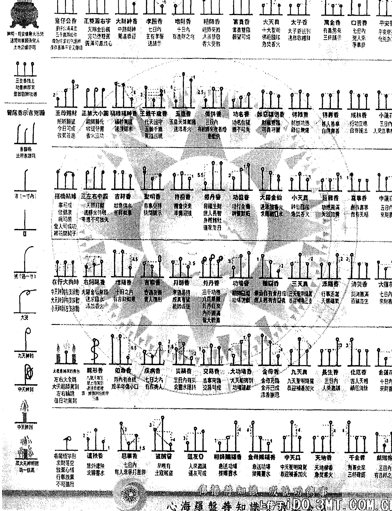
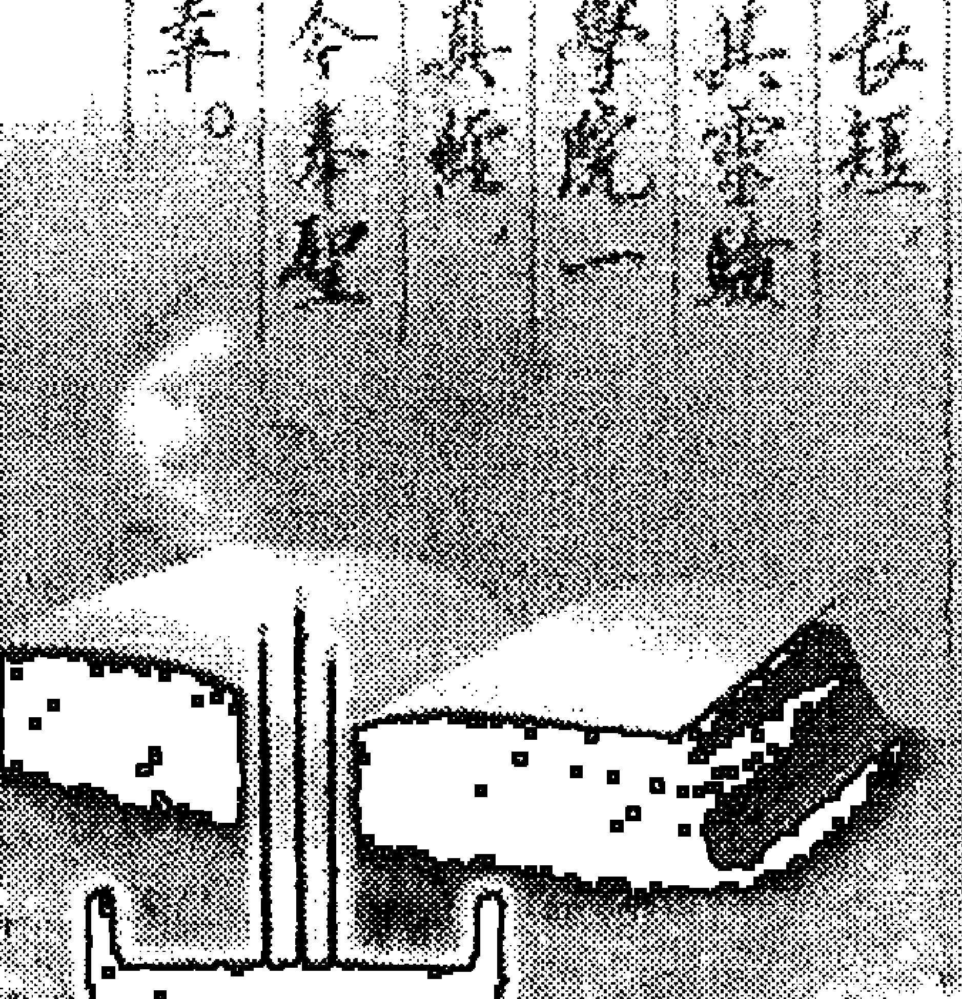

## 详解民间仙道法（出马仙）

## 第四卷 堂口的有关知识

### 第四章 堂口的有关知识

- 第一节 上香和看香、看香密决、香火上的全息世界、七十二香谱、二十四香谱
- 第二节 神（佛）、仙供奉的方法和禁忌
- 第三节 堂口结构、仙堂的组成、查事时候的调兵遣将
- 第四节 堂口的分类、香堂的区分、堂口形式、谈暗堂的表现形式、出马仙堂口的一些分类、从一次治病的经历浅谈一种特殊的堂口形式、合堂和龙凤堂
- 第五节 四正堂口的具体解说
- 第六节 浅谈养堂
- 第七节 旗令印剑
- 第八节 谈大堂系列

#### 第一节 上香、看香

在仙堂，1根是烟魂香。三根是胡黄常。四根是带一根烟魂香，三根胡黄常。七跟是破关时候人马香。九根是拜月人马香。十三根是九根满堂驻堂人马，三根坐堂领兵报马，一根悲王。

在佛家，1根是禅香，坐禅用，代表一真法界。三根是佛法僧三宝，上香时候我们都是念，供养十方三世一切佛，供养十方三世一切法，供养十方三世一切清净僧。四根就是再加一根供养十方三世一切护法善神。

插香，香不过寸，左香到右香不能超过一寸。护法香上午在人这边，下午在佛那边。仙家香，四根横三根一排，偏一根。七根九根是一簇。十三根，后九一簇，前三，偏一。

点香，不可自己先去闻香味道，不可用手山灭点香时候的火苗，也不可用嘴去吹，要把香分开抖灭。

佛家上香有很多种方法，我一般是左手卧式拿香，右手拇指掐无名指，念“嗡，阿弥利得吽，帕的，梭哈。”供养真言。

#### 第二节 看香密决

上边红中间黑下边红，表明此人有心脏病。

#### 香火上的全息世界

香火上显示的也是大世界的缩影，同样昭显全息性。

上香时，香火呈相有着三层的含义。

第一代表个人。在看身体，看虚症的时候最为明显。到底是什么病症，香火上会有一个标示性的显示。比如整把香火中间有几根香灰发黑，是心脏可能有问题。同理身体的其它部位有症状，香火上也会有所显示。有没有附体，散仙、阴气、正规仙等，如果有都会在一把香不同的位置显示出来，一根或者几根比别的香高出一截。

第二代表具体的事件。在看具体事件的时候香火上会显示这个事件的提示性信息。整个事件现在的状况，在这个事件中谁是小人，谁是贵人，谁在动心思。比如看事时中间香火有几根发黑，则代表当事人的心情不好，如果发黑香火朝向阴气位，则说明事情最后不成功。拿看婚姻来说吧，婚姻中的男女，真心投入、三心二意、脚踏N只船、父母的干扰、选择婚姻的原因、恩怨附体的干扰等，都可以看的到。如果一个人同时和几个异性纠缠不清，在香火上的特定位置就会有几支高香，显示出来。

第三代表身处的环境。这个主要是偏重于风水，家居环境、店铺财运、阴宅风水。以家居环境来说主要是方位布置对于家居主人的影响，身体、情感、财运、事业等与我们密切相关的事情，都会受到家居环境的影响。如一个人上香时，中间有几支香灰发黑，朝向北方，我母亲详查后告诉他说：你房子的北边有三间闲置了很久的房子，里面阴气很重，有时会干扰你，致使你现在心情烦躁，休息不好。吻合看香者的症状。

同时，香火上显示的因素会有很多：香火燃烧的火势、香灰颜色、香灰形状、香灰的延展、香灰的朝向、高香的位置、高香数量等诸多因素一起标示着事件的状况。

但是为什么是“标示”而不是“诠释”呢？因为香上给出的信息，只是起到提纲挈领的作用，或者可以理解为事件的索引。香火上显示的只是事件的冰山一角，更深层的信息，事件的内在逻辑，因转启承，谐调沟通，解决问题的方法，都是要通过香火上显示的“索引”和缘分师父求教沟通获得的。

#### 七十二香谱（敬请附上观世音菩萨像）

#### 神傳七十二種香譜密示吉凶

先點燃蠟燭，插三支香，恭請堂上主神及過往眾神明、天兵天將，
五分後，燭火始可熄滅，有事相求，可先盡籠鼓或稯器或拜請主神降臨三跪拜。

#### 二十四香谱

| 平安香 \n平安无事 | 平安香 \n七日内主家中有孝服穿 | \n| --- | --- | \n| \n左搭右增\n右搭左减 | \n| \n左搭右增\n右搭左减 | \n| \n小大真\n神仙临玄\n急焚香火 | \n| \n大大真\n佛祖临玄\n急焚香火 | \n| \n借命香\n月内有命终之人\n南半年有伤小口 | \n| \n赌财香\n十日内有\n进财之兆 | \n| \n小莲花香\n三日内必有\n人来吉事相望 | \n| \n大莲花香\n七日内来财否 | \n| \n献瑞香\n三日内有\n吉祥之兆 | \n| \n口舌香\n七日内有\n凶人来争是非 |

#### 二十四香谱

| 长生香 | 恭事香 |
| --- | --- |
| 三日内有人来相邀请 | 七日内有人来争打是缘 |
| 财帛香 | 消灾香 |
| 七日之内有病人 | 家祸难满 有福并生 |
| 赠彩香 | 樱乐香 |
| 早有上客 晚有贼盗 | 修仙自有金丹成 度人终有喜庆成 |
| 功德香 | 天地香 |
| 功行全备 神灵默佑 | 天地系香 急其香火 |
| 成林香 | 僧佛香 |
| 行功立德 自有护法 创作善事 自有天相 | 三日内有 祖师来救 香烟急献供 |
| 增福香 | 修丹香 |
| 十日内有 吉祥如意 | 道家生丹 身轻体壮 |
|  | @御楼的风水字 weibo.com/u/2441478537 |

#### 神傳二十四香譜密作古凶二

二十四種香譜應用法：凡聖佛仙神慶典，或消灾求安，或遇疑难事時，必用好香三種，選大小均等焚之。虔誠上香供養神佛，合十禮拜神佛。首先舉香三叩拜，虔誠新祝機準排插于爐中，注意高低一致。再合十，三叩拜，祭祀完畢，等爐中香剰半煙時，視三種香所示的長短，對照香譜說明以明了吉吉，其靈驗如神。此乃由北京萬國道德學院一位周威熙先生賜送門姥九皇真經連此香譜，密藏四十餘年，今奉聖命，公闢道友，珍重救世是幸。

## 第二节 神（佛）、仙供奉的方法和禁忌

如果讲供奉神（佛）的禁忌，真是很多，而且这些禁忌都是被很多的善男信女忽视的。有的人自己或家人连年病痛，家宅失和，或者生意越来越差，门庭冷清，连年亏损。诸如此类的不利因素，都有可能是在供奉神（佛）时，自己不自觉的触犯了供神（佛）的禁忌，神灵在这些不利的条件之下，有心无力或无心帮助。如果供奉神灵，就要知道避免犯规，以祈求神灵扶佑，家宅昌盛，生意兴旺。

为了大家将来更好的供奉神灵，避免犯规，本人在这里简单的介绍一下神（佛）供奉的忌讳，由于所知有限，如果有错误的地方，还请高人指教，不胜感激。

## 一．神台的高度与颜色

神台的高度原则上是宜高不宜低。一般供奉的高度选择以香炉的高度为准。香炉高不宜高于眼眉，低不宜低于肚脐。太高，难以与神（佛）沟通。太低有不敬之嫌。

神台的颜色，一般以红色的为主，因为在我国，红色代表吉祥。

因为道教崇尚黄色，所以供奉道教的神仙，也可以选择黄色。

另外民间有一种说法，红色是代表求福，黄色是代表求财，写到这里仅供参考。

## 二．神台宜在静方，不宜在动方

- 1. 神台不宜放在经常开启的家具上面或旁边。
- 2. 神台上下和附近不宜安放电视机、音响、放像机、电话等经常有声音的物品。
- 3. 神台不宜放在电冰箱、洗衣机的旁边。
- 4. 不宜在神台的附近打牌，会餐，喧哗，嬉闹或作不礼貌的举动。

## 三．神台宜稳定不宜左右摇摆

神台的安放必须安放牢固，平稳。不要稍有碰撞就左右摇摆。

## 四．神台忌犯门冲（对门）武财神除外

因为现在我们住的房间通常不是很大，神台和门的距离相对也很近。神灵需要的是安宁的环境，不可喧哗嘈杂。对着门会令神灵受到干扰不得安宁，不舒服。另外门风的流动还会带来不好的气味和信息。

## 五．神台要经常保持干净

神台要经常打扫，最好是经常有鲜花素果，散发出一种自然的芬芳味道。神台附近不宜放置有异味的物品和食物。也不要挂、放脏衣服和内衣、袜子一类的物品。

家里饲养宠物时，切忌这些宠物在神台或附近留下不洁之物。万一发生了这种情况，应马上细心的清理干净。

神台也不宜放置卧室里，特别是夫妻的卧室。

神台不宜紧挨着厕所、洗浴间的墙或相对着厕所、洗浴间的门。

神台不宜于放在厨房内，不宜在有神台的房间杀生和放有异味的物品和食物，特别是荤腥的食物更要注意。

不可在神台的上下和旁边放置鱼缸，因为神台经常有香火且属于阳，水属于阴，水火相克相冲。

## 六．原则上不宜供奉假香烛

清香一柱，即上达天庭，下达阴界（仙堂、祖先）的传递信息方式，若用假香烛，则没有这种功能。另外这种方法还有怠慢和偷懒之嫌。如果家里没有人或没有时间上香，可以不上。神灵不会怪罪。

## 七．香炉的种类与用法

供奉神（佛）包括仙家，宜采用铜制的圆形香炉为主。

供奉祖先和土地等地界的神灵，宜采用陶瓷的香炉，以方形的香炉为主。

## 详解民间仙道法（出马仙）

天圆地方，这是古代人对宇宙的看法，传统风水学，亦套用了这个方法。

## 八．神灯的作用

供奉神（佛）时，安上红色或黄色的长明神灯，是招吉避凶的。长明神灯宜采用那种经常亮着的，不宜选用闪光的，就是那种一明一暗的。

- 1. 长明灯五行属火，可以增加屋内的阳气。
- 2. 可以看做是供奉神（佛）的一种供奉物品。
- 3. 如果没事时间上香的话，可以代替香供养。

## 九．神台的方位

神台的方位按风水学的说法非常复杂，非专业人士很难确定。现在我介绍一种民间比较通用的做法。一般神仙的神台都是坐北朝南，佛、菩萨的神台坐西朝东。但神台不可以放在窗户的位置，原理同对门的原理。

## 十．供奉神（佛）上供的禁忌

- 1. 不可供奉荤腥的食品，一律素食、水果供奉。
- 2. 不可供奉过期、不干净、陈旧、腐烂的食品。
- 3. 不宜供奉湿生、化生类的食品（指仙堂）。这属于低等食品，不敬。
- 4. 石榴、樱桃不可上供（所有的神、佛、仙堂都是）因

为生长的渠道不洁，这两种水果的种子都是要经过排泄道以后才可以发芽生长，所以认为不洁。

- 5. 佛、菩萨不供荔枝。(荔枝音译为释迦，避讳)
- 6. 道教神仙不供李子（避太上老君姓，避讳）
- 7. 如果没有贡品可以不上，但不可乱上。
- 8. 贡品根据品种安排供奉时间，原则上不可超过三天。
- 9. 下列食品仙家堂不可上供，牛肉（牛）、龟、甲鱼（鬼）、蛇、鳝鱼、（蛇）、狗肉（神）。

## 十一. 地仙上大供是常用的贡品

- 1. 菜类：一般常见的为五样，猪头肉（切成方块摆放），鱼（要求是整条的，最好是做熟的）鸡（要求是整只的，最好是熟的，放的时候头要向外放），鸡蛋（一般是放五个熟的，四个生的），豆腐（整块上，一般在上面放些染成红色的粉条）
- 2. 水果：根据个人的条件选择上几样，常见的是放四样，加上菜类一共是九样。常用的水果为：苹果（代表平安），桔子：（取义聚财、拘财），桃子（取义仙桃），梨（取义离苦得福），香蕉（取型为元宝），枣（取义早日成道），猕猴桃（取原来的名字的意义，神奇果，代表神奇），葡萄：取义多子多孙。橙子：取义成功。西瓜：取型圆满。桂圆：（取义高贵、圆满），栗子：多用于求子的时候，取义立子。葵花籽：取义多子多孙。花生：过去求孩子的时候取义男孩、女孩交替着生。糖果：代表甜蜜。香瓜：取义香甜。杏：取义幸运。

### 第三节 堂口结构

堂口 24 主管部门及帅营人员称谓。

掌堂大教主；十位部门分堂教主；扫堂，压堂，传堂，监堂，护堂，坐堂，接堂，圈堂，风水堂，医堂。

二位管理兵营的王；领兵王，收兵王。

首席报马及首席护法；大报马，大护法。

十位部门分管使者；通天，探地，闯关，探兵，合兵，布阵，圈财，度善，行令，授法。

以上是 24 个堂口主管部门！

以下是帅营人员——

四位帅营童子常伴大教主左右；执令童子，执印童子，执旗童子，执剑童子！

另外还有“八大护法金刚”及护身报马二位，跑堂童子二位。

胡黄蟒常杂鬼医各堂封“教主”一位。“副教主”二位。“元帅”五位。“将军”若干名！

堂单最后鬼堂还需封一到五名“通阴童子”！

## 十位教主；

扫堂；就是把堂内不好的仙家和看完事后留在堂内的外堂仙鬼清出堂外，保证堂内的秩序，属于治安保卫部门！

压堂；就是压阵的部门，属于堂口的保留力量，压堂教主属于比较有威信的，可以阵住闹事的仙家，保证堂口的稳定！

传堂；负责传递消息于各个山头洞府，一般都是黄家担当此职！

监堂；属于监察部门，查验堂仙的行为，决定谁上榜谁下榜！

护堂；保卫部门，护法护坛护堂都属于护堂教主的管辖范围！

坐堂；又叫看堂，守堂，此部门都是留守于堂上的坐堂仙，属于堂内的主要中坚力量！

接堂；接引新来的堂仙入堂，审核要谁入堂不要谁入堂，有的堂口兵马以足，不再招堂仙入堂，就改成了封堂教主，把堂门一关，阻止其他杂仙的闯堂！

圈堂；就是负责给堂上圈活的！

风水堂，医堂不用解释了，都明白！

领兵王是打仗盘道时的主帅，是很重要的角色，有的也叫刀兵王，有领兵的就有收兵的，收兵王负责召回散兵，保证兵力不流失！

## 十位使者；

通天；就是负责上天上报事情及上天查事的部门。

探地；就是负责下地府查事及处理事情的部门。

闯关；是负责查事时办理手续，顺利过关卡，走四方的部门！

探兵；黑话叫“踩盘子”的，侦察兵的性质，就是病人没来之前，探听好病人的基本情况，这样弟子才能脱口而出说出病人的事情！

合兵；一个仙堂的仙家不一定都是一个或几个山头的，有好多堂口人马众多，所以堂仙也是几百个山头汇聚成一个大堂的，真正打仗和查大事时，坐堂力量不够时，就由合兵使者出面，去各个山头合兵，兵合一处！

布阵；是看事办事打仗时专管布阵的部门！

圈财；不用解释，给弟子圈财的，相当于自家的财神，但是弟子时运未到时，怎么求也没用，弟子时运到时倒会帮助弟子获得该得的财，而不错过及流失！

度善；堂口处理鬼邪之事，势必有的要杀要收，设立这个部门主要是先以佛法度化教诲，能改过自新者放其一条生路，使其重归正途。

行令；属于一个执法部门，总堂教主下令处理哪个仙家，或是整治堂内人员时执法的部门！

授法；是弟子的直接老师，负责教弟子心法及其他功法！

四位帅营童子，分别执掌大堂的四样手续法器，大旗，令箭，堂印，执法剑。

## 八大护法金刚；

是八位堂内最善战的仙家，负责保护弟子不被暗伤，现在末法时期，各家仙家都有自己的法门，话语不和，或许就会暗地里伤及弟子，有这八位保护，能够保证弟子最基本的安全，一般都是四大家族各选一到两位，杂仙像龙，虎，狼，豹仙也可以！

## 护身报马；

等同于现在流行的出马仙小说《通灵》里的随身护马，是和弟子最亲密的仙家，时刻随弟子身，帮助弟子处理及查一些临时的事情，一般都是胡黄两家各选一位。

## 跑堂童子；

负责传递堂内消息，弟子有何时相求，由跑堂童子传递给堂内主要人员，也是胡黄两家各选一位！

## 通阴童子；

一般都是枉死的鬼或未成年夭折的小孩，成鬼后拜某家仙师而修成鬼仙，负责出入地府，帮助弟子通阴下地府查事等！

按照东北的做法，通常都是在出马的时候确定堂主和各教人马的首领的人选，其他的都由堂主自己在堂口内部安排，不用直接安排。香童知道还是不知道并不重要。都是堂主一手安排的，不必外界干预。

#### 仙家用语（个人见解，仅供参考）

四梁：掌堂、碑王（分配仙家工作的，相当于军师）、报马（传令的）、令通（管旗、印的）加上胡、黄、白、柳四大家族合称八柱。

## 代表仙家的主要力量。

四梁八柱 是立堂口的根本，要是不齐全的话在给看事的时候就会有办不了的事。四梁指的是四大仙类，胡，黄，长（蟒，蛇）和清风。杂仙归蛇堂。八柱是扫，看，串，护和通天，归地，关碍，探兵八个组织机构。缺一不成堂口。这是走阴阳看百病的前提。

在这给您解释下；

扫堂；指的是负责清扫堂内人员的部门，好的留下，不好的清走，相当于堂内的人事部门，

看堂；这里说的应该说的是坐堂仙，就是只在您的堂里不去别家的仙家！

串堂 ；应该是负责调度堂内串堂仙的部门，因为有很多仙家是在好多堂上挂名，谁家有事来谁家的，这就需要有一个这样的调度部门，负责通报等工作！

护堂；属于保卫部门，护法护坛护堂都属于护堂教主的管辖范围！

通天；是负责向上方传达信息和查询信息的一个部门，

归地；当然就是向地府传达信息和查询信息的一个部门！
关碍；是负责查事时闯关的一个部门，负责办理相关的通天手续！

探兵；相当于一个间谍部门，黑话叫“踩盘子”，就是来看事的人还没来你就知道这人要来干吗，问什么事，这个就是探兵的作用！

以上是我个人的理解，如有不对的地方，还请各位指教！

## 四梁八柱的部门分布！

掌堂大教主：十位部门分堂教主；扫堂，压堂，传堂，监堂，护堂，坐堂，接堂，圈堂，风水堂，医堂。

二位管理兵营的王；领兵王，收兵王。

首席报马及首席护法； 大报马，大护法。

十位部门分管使者；通天，探地，闯关，探兵，合兵，布阵，圈财，度善，行令，授法。

以上是 24 个堂口主管部门！

## 以下是帅营人员；

四位帅营童子常伴大教主左右；执令童子，执印童子，执旗童子，执剑童子！

另外还有“八大护法金刚”及护身报马二位，跑堂童子二位。

胡黄蟒常杂鬼医各堂封“教主”一位。“副教主”二位。“元帅”五位。“将军”若干名！

堂单最后鬼堂还需封一到五名“通阴童子”！

#### 仙堂的组成

仙堂有很多东西可以写，写点遗漏的地方吧，仙堂有六部分，分别是坛、城、营、堂、盘、山。很多大师对这个问题的讲解不是很详细。

一、坛其实就是法坛，也可以简单的说就是仙堂的摆设，

用什么样的堂单，摆什么样的法器等等，这些物品以及起坛的方式方法对一个仙堂有很深的含义，依法而成坛，依法而起坛，这“依法”两字很重要，坛的引申含义就是受到什么样的法的约束和支持，比如从堂单上看出仙堂流派，从法器上看出法术传承根基等，合理与否是关键，也是仙堂能不能名正言顺存在的根本之一。

二、城是仙堂存在的表现，一沙一世界，一花一天堂，城就是仙堂仙家聚集的地方，也算异度空间，他们的时间规则等均和我们这个世界是不同的，坛其实就是很多玄幻小说所说的召唤术的法坛，仙家要从自己的空间通过堂单来到我们这个世界来行使法术。城就是整个仙堂仙家的聚集地。

三、营很多人都知道，其实可以说是兵营，没有兵营的仙堂是不稳定的仙堂，只有在兵营齐备的情况下，仙堂才能够正常运作，才能够保证仙家出入平安。

四、堂，大家对这个字的含义不是很明确，也许很多人把它和仙堂、堂口混淆了，其实堂就是县衙大堂之类的，是仙家处理事务的办公室，看仙堂主要就是看堂，看堂口的建筑形式，看堂口的组织机构等，堂就是仙堂的主要部分，是看事看病的主要办公机构。

五、盘这个名词知道的人不多，营盘这个词大家都知道，其实盘就是仙堂营和堂的基础，是受法约束的，一个仙堂的存在是否合法主要看的就是是否合盘，更明确一点的说，就是异度空间给你多大的盘，你建立了多大的仙堂，合盘了，就能够良好发展，不合盘，就要根基不稳，乱堂、翻堂。

六、山，山是仙家的出生、修炼的基地，它和城、堂、营有着非常默契的联系，或者说，仙家的来去主要就是靠空间的转换和传送，如果你能够在看仙堂的时候，直接看出仙家的来历，就是从什么山上来的，可以说，你的仙堂和本人都很有发展的，如果暂时还看不出来，那么，还是再修炼一段时间吧。

还有一点很重要，一个仙堂的堂、营、盘、城都是建立在山上的，到底是哪一座山，这座山到底是谁的，或者说，谁给了你一个仙堂，这个问题是很多人根本没有去想的……

#### 查事时候的调兵遣将

我们大多数弟子查事的时候都是靠仙家给的信息去查事。而自己不知道整体查事的过程和人员分派的过程，今天我讲这篇文章呢，不是要大家以后依照这个去查事，而是让大家了解查事的过程和调兵遣将的理念！

首先、来人看事说明事情后，我们请仙家落位，这时就要分派兵将。

第一；要请最擅长看此事或与对方缘分最大的仙家主查此事。

二；如果对方是堂口之事、阴灵之事，我们要分派护法守住自身，以免阴灵入侵伤了自身！

三；请大报名指派堂中报马去查此事，一般都是胡黄两家各派一位，这样去查比较稳妥！

四；如果对方要盘道，我们就要派好兵将，请领兵王点好兵马与其盘道，保证盘道的成功！

## 一般查事的过程是这样；

先请师傅落位，请出主要查此事的仙家坐阵主看，分派报名去查！查好后，请坐阵仙家审核，然后告诉事主！再问，再分派报名去查！

有危险的时候直接请护法守阵，请领兵王调拨兵力！

我们虽然是弟子，但是我们查事时就要像一个元帅，指挥自己堂口的千军万马！分派自己堂上的兵将！这就是为什么大家都管我们叫领仙弟子的原因！

### 第三节 堂口的分类

堂子有两种，一种叫清堂，一种叫混堂。

#### 清堂

所谓清堂就是堂子上可能有一种仙或几种仙，但唯独没有鬼仙。但是清堂有一个弊端，就是没法破关，关就是关卡，灾。因为但凡破灾都要走阴，就是下到地府才能破。而所有的鬼仙都可以下地府，破灾的时候，鬼仙要领着顶香（也叫弟马）下去，没有鬼仙领着，人是下不去的，下去了也会迷路。这里说到鬼仙能破灾，也是分道行的，大事都得道行高的人出马破才行。少部分黄仙也可以下阴。

拿蛇仙爷爷的堂口来说，他家就是清堂，堂子上靠蛇仙爷爷一人撑着，我爸说蛇仙爷爷下面有几个胡黄仙，都是他的学徒，求学过来的。

#### 混堂

所谓混堂就是堂子上胡黄常莽鬼蛇都齐全了才能出。当说到鬼仙的时候，大家都嗤之以鼻，其实鬼也分正仙和邪仙。好堂口的仙都是正仙，一般都是鬼仙坐镇，他们都是以前这个家族横死的或者出马的人。之所以称鬼仙坐镇，我爹跟我说了点，我的理解就是鬼仙类似于人力资源，因为有些小仙修炼的道行浅，在堂子上胡闹，有鬼仙看管，他们就不敢胡来。

堂子分为两种。一种叫武堂，一种叫文堂。

武堂仙附身弟子全身哆嗦，说话时唱着说，弟子很累。武堂弟子看事的时候，最好是有 2 神在边上打下手，仙家有啥要求 2 神明白能好些。(2 神是会唱仙歌的人，既能请神，也能送神)

稳堂仙家附身弟子的表现就是打几下哈欠。说话和正常人是一样的，没有什么特殊表现。

为啥能分出稳堂和武堂，这就是人的事情。现在都是稳堂多，武堂少。这就是没出马前弟子要和仙家沟通好。仙家原要出武堂，而弟子怕累要求出稳堂。如果仙家不答应弟子，那么双方就要慢慢沟通，沟通好了再办出马的事情，不要过急。

#### 武堂仙附身后的表现

武堂仙附身后先是要自报家门，报出是啥名，一般是穿堂报马先下来问下要看什么，他就回去找对应的人。因为仙家各有分工，谁看什么哪项是专长，穿堂报马都知道。穿堂报马的职位也类似于调度，堂子上的仙都听他调度，但是他不会看。

穿堂报马的选择也很重要，一般都是由黄家选出来的，还得经过堂上几位大教主的同意。穿堂报马的地位很高，权利大，仙家之间也是争官位的。立堂子时必须要把住关，尤其是几位教主很关键。如果立堂子的师傅没把握好，那么这个堂子即使立起来也会翻堂，或是费堂子。啥也不能看，而且还闹的家人不太平。

堂子上的兵马要少而精，不要凑数，多了不好，和人一样。多了大家一起做事就会闹事，产生很多摩擦。所以要选精兵强将，啥也不会的或者水平低坚决不能让上堂子。

一个堂子的水平高低主要是教主，教主的水平高，他选的兵也是高水平的。

#### 香堂的区分

香堂的具体区分现在香堂大多数很混乱，没有个具体划分标准，其实在很久之前，这里面就有类似区分的规则，现在我详细的说一下。香堂的说法大至上分为，三主，四正，十二旁门，七舍道，七外道！三十三种门类！

三主，主要是说香堂的三种主要形式，一般分为混堂，清堂，阴阳堂！

混堂俗称就是跳神了，清堂也叫坐堂，文堂！说法很多! 半巫半医！当然清堂有时候也请神上身，但是一般多扶乩而占！与混堂的上身还是有区别的！

阴阳堂严格的来说算不上堂口，类似堂口的预备形态，一般这样的阴阳堂都是很特殊的因果下立的，不同于正规的香堂，首先，掌堂的教主就不是胡家的多，阴阳堂在过去几乎不给人看病的，他们那类似西方的黑巫一样，睚眦必报，不是正规的神主组合，但是他们这样的组合一般有不少特殊的本事，但是行事好恶来决定，是很不稳定的因素！

在以前很少存在阴阳堂的，但是现在的的情况发现，不少人误打误撞的立上阴阳堂！倒是堂口很不稳定！还有一个特点就是，阴阳堂的神主也是不上身说话的！

## 详解民间仙道法（出马仙）

四正，说的就是正规香堂应该具备的四样基本条件！也可以说是检验一个堂口完整性的指标，一般这个东西外传，说出来的很少！主要是作为我们给人立堂的时候内部参考的一个很重要的数据！四正分别是：一，守封保号！二，续脉流传！三，扬名舍道。四，老堂营盘！这里我分别解释一下，不然你们很难理解！

（一）守封保号！这个是牵掣道讨封挂号的，简单的来说，讨封挂号指的是争取上面批下来的部队番号，把自己的势力合法化！那么守封保号就是争取的这个番号的必要过程！

上天每次给人间的指标名额是有数的，比方说，今年上天给了人间十个出堂的名额，那么现在有200个堂口想出堂，哪怎么办？简单，就好像竞标一样，争取下来，要知道这个过程是很残酷的，往往文斗好说，基本上都差不多，考验的就是武斗！很多人有时候刚要立，或者立的时间不长的时候总是做梦打仗，其实就是这个过程！

当然，这里还包括另外一个情况！要是上面的番号你竞标失败，得不到的话，你也可以抢夺现有的番号！例如张家已经挂号讨封，我自认本事能力都不如它强，就可以去挑战它，争夺来它的番号编制，自然要是没有绝对的实力，这种事情还是少作的好。因为每一个堂口都有自己隐藏的潜势力！摸不清楚人的底就去，最后的下场只有翻船一个！

（二）续脉流传，我们很多人都知道香堂是一辈辈传下来的，这个是有传承的！上面说的第一点是说名一个新成立的香堂的困难，想必大家也应该能看出来，新建立一个香堂不是一件容易的事情，而建立一个香堂的苦难大家知道了，那么想必应该想想，我们人的寿命很短，有限制的，更何况有的时候抓的弟子年纪都在中年了，也领不了个几年，所以来说香堂是一辈辈按照辈分传下去的，这里有一个重点的指标，哪就是神主非常注重的是辈分的排序，绝对不可能爷爷领完了，父亲这一辈没领的直接抓孙子这一辈出马的，要是不按照辈分来的，一般多非正堂神主，这个香堂大多流传时间很短，或者出现意外断代！如类似文革这样的浩劫！衡量一个堂口的续脉清楚与否，是一个香堂的重要指数标准！

这里我在说一点潜藏的东西，这是绝对保密化的，至今为止众说纷纭，没有一个明确的概念，我们弟子领了堂口，最后我们能捞着啥结果？我在这里告诉你，如果你的香根确实是正堂人马的话，恭喜你！因为正堂人马在讨封挂号的时候，是要扎营人家的，说白了，这个时候挂号捎带着可是把你的家族也挂上去的，也就是说你的家族成员中，只要是做弟子的，在去世后叫碑王，都有机会成仙的！这里的成仙不是那种散仙就可以，必须按照道家的级别，位列真仙才算是完成了合同！

（三）扬名舍道！你要是了解第二点了，自然也就明白第三点了，领堂的人，修的是公德，修的是善心，七舍道中我会点出来，我们的功能来自哪里，论倒修心养性，可能我们不如人家十世罗汉，但是论到功德以及处理事情的手段，我们是在实践中来的！我们掌握的扎实的技能，有最好的基本功，这就是别人比不了的，关于这点我在七舍道中在详细解释！我们既然立了堂口，出了山，那么就是要给人断灾去难，我想这点上大家没有什么疑惑的了，为什么要扬名舍道哪，这就是我们要明白的香堂的本质。

香堂的本质是什么，说白了，香堂的本质就是各界的人才储备库，将来是走向各个岗位的精英分子，来我们人间就是为了锻炼来的，要问还有哪一界有我们人间界这么复杂，恐怕再也没有找不出来了。我们这里，佛家称五浊恶世，听这个名字，想想也知道这里的复杂险恶，香堂的组成大多非人类修行者，在先天上来说，修炼不易，到了这个地步，缺少的不是别的，就是经验了，在哪里混得最长经验见识，哪里就是在人间了。

在人间自然就要找一个人来为他们指引，让他们多了解人间的疾苦悲伤，多了解人间的规矩善恶观念，多理解这个人间的人情往来，自然，要是碰上一个好的弟子，为他们带来的益处是可以想象的，离天道不远矣！要是碰上心术不正的弟子，他们自然也被带入歧途！这里不要怀疑，对于神主门来说，善恶无凭皆为道，是非不分也为真！他们不是人，不必占在人类的角度上去考虑你人的善恶是非，这些对于他们来说不是牵绊！你弟子财迷心窍了，不是堂口也财迷了。因为堂口不会开口要钱，要钱的是你做弟子的，胡搞乱搞的，不归上届天庭管！管你的自然有人间律法，触犯了诈骗罪名坐牢去好了！道理就是这么简单！

从第二点我们知道，这个缘分来的不易啊，我们不要轻易的断送了自己的缘分，一个人修佛修道，不知道修几辈子才能修出去，你这个内定的要不知道珍惜，到时候没个一年半载的，神主撤身，香堂被封，资格一没，那些因果一上来，恐怕以后世世代代在也没出头之日，永坠因果轮回之中了！领大堂，就好像走钢丝，必须谨慎小心，高回报自然高风险，这些都是成正比例的！

（四）老堂营盘，现在经过前面的解释，想必你已经对于堂口有一个基本概念了，要知道一个香堂从它立，到它的传承，都是很严谨的，尤其是最后这一点，是必须有保证的！

为什么要老堂营盘，这个老堂营盘是时间的产物，你想想，随着时间段增长，堂口逐渐的得道的成正果的越来越多，这样就不可能在守在堂上了，当然，也不是一堂的人马一下全都可能成了正果的！都是一个一个修炼得道的！当修炼成道以后，就去上任新的工作了，那么现在堂上的职务职责，工作必须有人来做，不然香堂运转就要失灵了！谁来继承，这就牵掣到家族的继承，为什么我们堂口这么多年要以胡黄为主，因为胡黄是家族修行连！

在马上就要修成的时候，这个时候，堂上的神主动的培养自己的接班人，然后潜修一段时间，到时候自然成正果，在这个潜修的时间内，不再堂单名讳上的人马世在一个固定隐秘的位置的，这个位置我们称为老堂营盘！简称，老堂！一个香堂是不是稳定，老堂很关键的，要知道这是一个堂口的隐藏的势力，也就是潜势力。

我们在给人立堂的时候，都要先查看一番的，所谓查堂查根，这个根就是老堂了，是否存在潜势力，潜势力大小！这些是衡量一个香堂稳定与否的标准！是非常重要的一个参考指数！

12旁门就很简单了，一般是指不符合四正，或者说不符合香堂的标准所成立的集体，在农村过去的时候，叫这种堂口为黄草堂子！一般多供奉在谷仓，棚子之类的地方，而在过去也就是这样的堂子最多，几乎家家的都有，现在叫保家仙！

这样的堂口也有一定的本事，但是往往很单一，因为单一，所以往往有的时候他们的技能很专业，这里也有很多的让人敬佩的存在！例如精通接骨按摩的。针灸推拿的，做膏药炼丹的！一般我们有很多机会能接触上的！他们在民间很活跃的。

七舍道是一种特殊的情况，在正规的大堂建立的时候，建立之初，有一个阶段叫做明志！在明志阶段，弟子依心而誓，许下大愿！为凭借其愿而舍弃人间诸多种种福报功过！以换来行愿度世的能力！我换得的能力，佛家叫做方便般若，亦称方便菩提！舍弃的是我的姻缘婚姻！同样的道理，我们知道这个正堂缘分很不容易，能得到也算是种缘分，所以在得到这种缘分的时候，面临的第-点就是这个考验，是否你能舍弃哪？明志前有一个考验叫做问心？唯心而问！不论是非善恶！凭愿而答，自有功过因果！

七舍道可过可不过，过了你就直接到真界！自然明白啥叫真！以前我在网上最初的时候叫过“一真子”这个名字！包括现在的知秋叶雨，也都是暗含万法皆虚，唯道一真的概念！是不是过这关，全靠人自己选，选了这一关，有一个为期百天到三年不等的时间作为考验，哪时候人因为了断了因果，在这个时间内，懵懵懂懂。似幻实虚。是人悟道的阶段，也是人经历诸般苦楚，思想得道的阶段！没这个保证，天界也不可能让你白白的挂了虚职，就是虚职也不是让人说挂就挂的！七外道是另外一种情况！现在这么说好了，基本上我们看见的那些大忽悠门，几乎都是这个！我建议大家，为了避免上当！找人立堂的，最好是对方出山三年或者五年以上的！一句话，七外道的时间很少能坚持到三年或者五年！所以时间是检验真理的唯一标准，我觉得这个话还是很准确的！七外道因为不归属天界，不归属各界，属于无组织负责机构，所作的一切，完全凭个人自我承担，这个时候也就是说，这个人也好，仙也罢，是坑蒙拐骗，烧杀抢略，因果自身种的，完全的沦落为外道旁门。左道一支！这样的是长久不了的！所以上面也说了，作为不明其中关系的诸位，想问神求卜也好，想发财行愿也罢，最好还是找那些出山年头多一些的，这也算是保险一点！

## 堂口形式

一般来讲堂口是有层次划分的，常见的有金花教和通天教，还有一种是极为少见的皇天教，我分别解释一下——

金花教里又有文堂和武堂之分，清堂和混堂之分，阳堂和阴堂之分；这是三种划分的方式，不能混淆。

文堂，就是说那看病的时候非常稳当，不知道是哪位仙家在说话，有的时候连是不是仙都不知道。但文堂不能给人破关，也不能给人立堂子（现在有好多武堂会翻咒语，所以貌似文堂）。

武堂，这种堂子可以说是最真实的，但通常找这样的堂子看病的人却很少，因为他比较麻烦。看的时候要请二神请仙，还总说行话；去看病的人还不知道什么意思，并且还要三天回香，所以通常状态下去看病的人很少，但去找他们的一般都是大事，在别的地方弄不明白了。因为是捆死壳武上，所以弟子就是一个扬声器，仙走了以后自己都不知道自已说了什么也不知道自己做了什么。因此不存在欺骗的情况，但现实种这种堂子少之又少，多数都不愿意去看。等仙走了弟子会很疲惫，那种痛苦是说不出来的。为了适应现在人的生活，有好多武堂都改变了看病的方式，叫“武堂文看”；就是说没有必要的时候就不武，这样会给弟子减少一点痛苦。

清堂就是掌堂大教主是胡家的，并且在堂单上会很清晰的看到堂口内部的职务划分。整个堂口分成四个部分，是胡,黄,长（蟒,蛇,还有杂仙，例如，龟仙,虎仙等），清风分别都有一个教主，各管各的事，这种堂口大多数是很安宁的，几乎没有闹事的。

混堂就比较杂乱了，里面什么形式的都有。掌堂教主也是五花八门什么当的都有，下面也没有那么多规矩，什么样形式都有，在这我就不多说了；我也解释不清楚，也说不明白。

阳堂说的就是看病形式了，就是说绝大多数情况下弟子不走地府，看病很快。

阴堂就不一样了，看病的方式很蹩脚。总之—句话，就是累~！而且多数是清风看病，整个堂口就像一个家堂一样，死人多。

通天教的形式就比较单一了，用上面的话解释就是武堂，清堂，阳堂。但多数是武堂文看，都会翻咒语，而且家里还要供有佛和上房仙。

皇天教少的可怜，我就不说了，要是有遇到的了那就单独再聊。

自己家的堂口是什么形式的，那就要问你自己家掌堂的了，现在立堂子没有盘道的了。其实在立堂的时候就应该把这个问题弄明白了；立堂前所请的大神就应该替出马的人问。堂口多少位香火啊，香怎么上啊，自己家是走官还是走民啊之类的，等立完了完全告诉人家。这才是尽职尽责的给人家立堂子。我不想批判谁，但我想说堂子立好了，一个家就会安宁，立不好就毁了一个家，各位同行们还请三思啊~!

区分一下，人去世以后顶香的行话叫烟魂，但如果上了堂子（就可以给人看病，明确的说就是堂单上有他的名字了）就叫清风，清风的头头叫碑王。没结婚的女孩叫花姐。

看病的时候仙（包括清风）叫男人为罗汉，叫女的猪猡女。没结婚的小孩子叫男孩童子（跟要还替身的童子不一样，这只是一个称呼，不代表什么）叫小女孩为花灵。当然也有不这么叫的。

门里指的是男方三代直系亲属，门外指的是女方亲属，大门外指的是女方姥姥家。这个东西有点男尊女卑，是看坟说话的，所以比较重视家族。

当然也有不这么说的，我就不一一列出了，省着迷糊。

### 谈暗堂的表现形式

很多朋友对出道堂口存在暗堂这种形式表示了极大的关注，并且很多道友还被告知自己即将要出堂口也应该是暗堂，到底暗堂是什么形式，怎么才算是暗堂，笔者就自己的领悟解释一下，丰富一下大家的思路。

按照通俗的解释，所谓的暗堂是指领仙弟子在出堂的时候不供堂单，不供香火，更直白的解释就是说，和普通人一样，没有坐堂、保家堂弟子那么繁琐的形式，暗堂有很多种形式，不是简简单单的象传说的那样。

第一种就是出马意义上的暗堂，这种暗堂真实存在，而且地位很高，各种供奉一样都不少，唯一不同的就是堂单上面一个仙家的名字都没有，只有到一定层次的出马弟子或高僧、高道、高人可以看到仙家留下的排名。

第二种指的是半明半暗的堂口，就是指堂单做过处理的大堂，比如很多地方的立堂方法，写堂单用的是作画的方法，别人看到堂单不过是一幅画而已。还有的堂口用画遮挡堂单、把堂单折叠起来供奉等，都属于一种保护手段，使得堂口介于明暗之间，不是传统意义上的暗堂，不过作一种介绍而已。

第三种应该是佛堂，修佛的人不领仙，而且基本上不承认自己领仙，其实佛家的护法香就是为仙家护法所上，宣化上人讲过，自己身边有五条皈依的龙，自己走到哪里都下雨，就是龙仙的功劳。这种佛家弟子所带的，是一种非常标准的暗堂。

第四种是道家堂，修道的人也不领仙，比如丹道弟子、法术弟子等，但是这些弟子也承认仙家的存在，丹道弟子知道修炼金丹大道有护法，护法是祖师所派遣的，笔者在《浅谈护法来历》一文中讲过护法的来历，这种丹道弟子的护法也是暗堂的一种，笔者也讲过一种特殊的堂口——法术堂的实例，法术堂也算是暗堂的一种。

第五种堂口和上面四种说的有些不一样，上面的那些堂口都有香火供应，确实有不需要香火的暗堂，少之又少，甚至说基本上不存在，理论上说，这种不需要香火的堂口可以存在，那么维持大堂运作的基础在哪里？弟子的功德和善念是关键，等到弟子明白这些功德和善念对自己修行的意义的时候，也就是功能提升的时候，同样的也明白了香火对仙家的意义，这时候堂口会演变成我们所说的第-一种堂口，或者比第一种堂口升级一下，不供堂单，只供香火。

大家都知道庸医误人，也知道一堂兴家、一堂败家的道理，那些对出道理论并不是很精通的引路师父才是这些所谓暗堂弟子的噩梦，笔者在这里直接打消这些道友的念头，你们那些所谓的暗堂，十个里面有九个半是大堂的雏形，而不是暗堂，其中缘由，笔者解释如下：——

“三次出堂、多次落马”这个问题的，要么就是藏私，要么就是没有注意到这个细节，基本上来说，出道弟子的堂口都有三个阶段，而且都是以堂口形式存在的，这三个阶段分别以开阴、阳、慧眼为主要任务，一般来说前两次堂口仙家都是不和弟子要求香火，随着堂口的两次升级，到弟子心性修为提高到一定程度的时候，大堂才正式运作，到时候，香火的供应是必不可少的。

一个简单的例子，如果说大堂是一个企业，那么它是由三个阶段发展来的，初期是筹备小组进驻，看起来虽然人员少，但是也五脏俱全，主要目的是初步打开弟子心窍，给予弟子适当感应，增强弟子悟性，这个时期弟子会看到一些鬼魂，或者对一些事情有预测能力等。二期是升级为筹备委员会，人员增加，组织结构更加鲜明，并且要伴随串窍现象的发生，仙家陆陆续续的要增加不少，弟子的很多感应会增强，弟子的肉眼也会出现一些功能，甚至可以看仙，个别素质好的弟子会和正式出堂的弟子能力不相上下。最后一个阶段就是大堂的正式成立，后面种种和我们的要说的暗堂没有太多的关系，放下不提。

### 出马仙堂口的一些分类

出马仙是一个与萨满教、佛教、道教等多种宗教都有关联的，一个综合性的宗教类别，说不上宗教类别吧，算是一朵宗教花园里的奇葩吧。同时出马仙堂口也是与当地的一些风俗习惯都紧紧的结合在了一起。巫医在中国的历史舞台上有很大的角色，演变到近代的时候，将巫和医分开，巫一直都是给人一种很神秘的色彩，让人难以捉摸。尤其是作为一个灵媒的传递人，出马弟子，更是让人猜测很多。只想说一句话，出马弟子也是一名普普通通的人！

第一，按照传承关系来划分出马仙堂口分为三类：

+ 1. 家族关系出马仙堂口：就是说家族辈辈相传的堂口。在东北大多数都是只要家族里有一个人出马，那么他的下一代也必须有一个出马的。常见的是婆婆的仙家传给了儿媳妇。辈辈相传。占这样缘分的出马仙堂口，都是很殊胜的。（简称为，辈辈相传堂口。）

+ 2. 师承关系的出马仙堂口：就是说这个人家中祖上并没有出马的人，或者说是祖上有出马的人，但是没有延续这个祖上的仙家，或是供养过仙家的人，今生因为某种缘分遇到了自己的师傅，这个师傅是活人师傅，通过他的点化，出马了，就是师承关系的出马。一般占有这样的缘分的人，多是有着与众不同的经历，然后出马立堂的。（简称为，半路出家，与仙结缘。）

+ 3. 与生俱来的出马仙堂口：就是说这个人从小就有着不一样的成长经历，对灵异空间的表现为很是亲近等诸多情况，在某种特殊的情况下，一梦惊醒知道了自己的缘分，然后出马立堂。这样的缘分的弟子多是婚前出马的较多，婚后的较少，或者是姻缘不顺的人也有。（简称为：命中注定，仙门中人。）

第二，按照仙家附体形式将出马仙堂口分为两类：

+ 1. 出现仙文堂口：文堂口就是仙师下来附体看病的时候，很文静，很稳当，有问必答，答疑解惑。掌堂的师傅是文将。
+ 2. 出马仙武堂口：武堂口就是仙师下来附体看病的时候，需要有二神从旁协助，就是常说的跳大神。武堂办事雷厉风行，行就行，不行就不行。现在武堂越来越少了，有的基本也都是武堂文看了。掌堂的师傅是武将。

无论黑猫白猫，能抓耗子的都是好猫。文堂和武堂都是意在救人渡人。

## 详解民间仙道法（出马仙）

第三，按照仙家堂口的供养形式分为两类：

- 1. 暗堂仙出马仙堂口，就是说供养者没有把堂单直接供养起来，而是放在了一副山水画后面，或者是按照仙师其他的要求方法去供养的。
- 2. 明堂仙出马仙堂口，就是说供养者把堂单直接悬挂供养起来。

第四，按照天庭册封将出马仙堂口划分为三类：

- 1. 天庭册封的出马仙执法堂口，这种执法堂口的权利是负责一个地区出马仙总部的代理，负责维护一方出马仙堂口的安宁和出马仙的秩序。执法堂可以对不合法的出马仙堂口进行调查，调查后，经过天界允许可进行处决执行。同时也负责所有新出马堂口的审核工作。并且执法堂自身的要求也很严格，对弟子有着深严的戒律，一旦触犯，比平常的出马弟子受到的惩罚更大。同时执法堂也是天界的天神到某个地区办事的一个驿站。这个地区如果出现了地震，瘟疫，干旱等自然灾害执法堂都是最先知道的。但是，现在正值仙门末法时代，一个真正的天庭册封的出马仙执法堂口真的是很少见了！

2. 天庭正式受封的出马仙堂口，每年天界册封的出马仙名额都是有限的，比如今年的名额较往年就多了一些，至于多出多少，这里我不能说。我能说的是今年出马仙名额里，鬼仙占堂的出马仙名额较多，并且近几年出马香童的年龄都偏小化了。同时天庭每年也对已经受封过的堂口也是要进行审核的，考核过关继续留用正规的出马仙名额，考核不过关自然就扣消出马仙名额。打个比方说就是一个营业执照。每年都得去审证的。每个弟子在接受天庭正式册封的时候，仙师都会给弟子感应的。都会有一些不平常的表现，比如弟子身上后天出现了特殊的掌纹，特殊的胎记，特殊的记号等等。一切的前提都是要和自己的仙师沟通上！当然了天外有天，我相信也有不需要用天庭册封也能帮助人的好法门。时代在进步嘛！还是那句话，我的经验之谈，个人浅见，大家合理取舍

3. 未接受天庭正式册封的出马仙堂口。每年天庭给的正式册封的名额都是有限的。所有的出马仙堂口都要等待考核，考核通过以后或者是晋升果位，或者是取消正式的出马仙名额。就好比千军万马过独木桥一样。就是每年的三月三，六月六，九月九，也都是册封晋级的大日子。没有顺利通过考核的出马仙堂口，仙师也都会教导香童第马，不要灰心的，要再接再厉，继续努力。同时也会告诉弟子，在今年里做一些什么事情来弥补自己的不足，就是失败是成功的妈妈嘛！老仙家和弟子都是不容易的，都是好样的！当然了，不是说

没有天庭正式册封的出马仙堂口就不是出马仙堂口，就不能给人办事看病算卦，每个堂口都有自己的法门，有自己的修行方式。还是那句老话，我看到的一些经验之谈，个人浅见，大家合理取舍。

### 从一次治病的经历浅谈一种特殊的堂口形式

很多出马出道的弟子都知道所谓的三主四正等堂口方式。实际上，我们这些弟子身边存在着一种非常常见的堂口形式，他们没有堂单，没有仙家，甚至这些弟子本人都不知道这种堂口的存在，在此笔者把他称为法术堂。

法术是一种大家很熟悉也很陌生的事物，他们神奇神秘，有很多的符咒、仪轨，也有很多错综复杂的门派网络，很多出马、出道的弟子都在研究一些符籙和咒语，其实符籙和咒语作为出马和出道的弟子来说，笔者认为不是很需要，应该说，法术类应该拘召法术居多，就是请求或者命令一些玄灵去做什么事情，和顶堂弟子请求仙家做事有异曲同工之妙。很多顶堂弟子也会在仙家的指令下写一些符咒或者说一些咒语，笔者理解为仙家能力不够，用符籙请求上方主管神仙的帮助，或者是仙家认为根本不值得出手、不好意思出手等情况，所以用符籙拘召鬼灵协助办理。

修法术的弟子和出道弟子有相近之处，就是必须修炼自身，自己的意识力、道行功力的增长非常有利于法术的发挥。或者说，法术弟子和出道弟子的能力运用正好是相反的，出道弟子的修炼是为了更好的接受信息，以便和仙家沟通，而法术弟子的修炼是为了更好的发散消息，以便能够更广大范围的召请玄灵协助办事。

朋友们会问，既然法术是召请仙家，施行法术的时候，法师都会直接摆供品，俗称的一把一呲牙，法师和仙家彼此不相拖欠，那么为什么还会有堂的存在呢？

这个问题从一件经历过的事情说起吧，一位朋友请笔者帮助治疗他的孩子，当时出现了很多很奇异的事情，说出来当个玄幻故事听，也许能够说明上面的一些疑问，没有这个经历，笔者也不会知道法术堂的存在。

当时笔者和孩子的父亲在网络上聊天，讲述孩子的病情，很简单，只要孩子晚上出去玩，回来的时候必然带回来脏东西。这个孩子的体质非常特殊，不管是佛、仙、鬼接近孩子，孩子都会出现类似于哮喘的迹象，孩子的父亲要求笔者用视频看看孩子，打开视频窗口的时候，一个非常胖的孩子，气喘吁吁非常难受的和笔者打招呼，当时笔者就看到孩子身上附有阴魂，诧异的是，孩子的背后是一大群仙家，远远的看热闹，阴魂没有什么道行，仙家根本不管，事情很奇怪，更奇怪的是，孩子的窍脉全通，非常适合捆身说话，当时笔者灵机一动，就请阴魂上来说话，孩子用阴森森的语气说了“自己”的来历，说了可以离开的要求，笔者和孩子身边的父母都答应后，鬼魂离开。笔者很奇怪，孩子的体质算是行内人非常难得一见的顶级邪骨头，是顶仙的好材料，后面的仙家

明显就是弟子的师傅，为什么袖手旁观呢？

孩子当时被鬼魂捆的死窍，刚刚撤身，笔者思考疑问的时候，有位仙家上身说话，讲述了事情的来龙去脉，原来捆身的这位仙家是孩子的仇仙，孩子曾在三岁的时候打死过一条小蛇，应该算是这个仙家的子侄，这位仙家是为寻仇而来，所以，阴魂上身，仙家从来不管，简单的说吧，费劲口舌，答应了仙家的若干条件，仇仙的恩怨了结，孩子恢复正常。

事情仅仅是开始，因为一连两次的捆死窍说话，都是孩子自己说出来的事情，让孩子父母非常相信笔者，处理这个事情后的一周，孩子父亲突然急三火四的找笔者，孩子突然出现了哮喘现象，而且说院子外面有邪恶的东西要进来，当时躺在床上不会动，笔者请仙家去查，没有发现任何脏东西在，仙家只是给了一个图像，笔者的眼里都是大公鸡，笔者很奇怪，孩子虽然家住农村，但是孩子家里开作坊，不可能养鸡，出于对仙家的信任，询问孩子家里是否养鸡的时候，孩子的父亲很惊讶，家里确实养了一只大公鸡，是一个高人的指点，说孩子受到法术的侵袭，自己能力不够，不能管，所以建议孩子家里养一公鸡保护孩子，还给笔者出示了一张照片，是一个女人，这个女人常年为孩子驱赶附身的阴魂，从孩子家挣取不少钱财，孩子父母怀疑说这个女人是背地害孩子的人，孩子的父亲还讲述了午睡的时候做了一个梦，梦

到一个七层的宝塔，塔尖上面吊着一个人，似乎有人要他去救塔上的人，他爬到一半掉了下来，惊醒了，随后孩子就发病了。

笔者看看女人的照片，感应仙家给了一个好大的墨绿的蜈蚣的形象，再联系到前面公鸡的图片，感觉就是这个人把孩子的元神困住。随即在上方、地方香炉燃香请仙家解救孩子，当时很清晰的看到上方堂单上一道白光闪过，上千只白色的公鸡中间站立着一位金甲武士，头戴雉鸡翎，带着公鸡和堂上仙家浩浩荡荡的赶到一个山洞，山洞口一只很大的蜈蚣，那位金甲武士缠斗蜈蚣，公鸡们冲进山洞，四处都是各式各样的虫子，一番搏斗后，仙家冲进山洞，抬出了一个七层的宝塔，从里面抱出一个童子形象的人……

第二天清早，孩子的父亲找到笔者，告诉笔者说，孩子病好了，还说孩子感应自己的仙家告诉他，让他谢谢笔者，再有那个女人早上请医生到家里去看病，卧床不起，后背上无缘无故的肿起两个大包。

这件事情对笔者来说很神奇，事后反复思考法术堂的问题，有了一下的认识和见解，请朋友们指点——

封神演义之前，人、鬼、神三界不分，所以用道术就可

以上天入地，自封神演义之后，姜子牙断天梯，周武王断地府，隔断了肉身进入天地的可能，所以人只有通过修炼来锻炼元神，很多高僧高道坐空神游物外，应该就是元神出游，所谓的神、佛、菩萨、仙家等都应该是以元神的形式存在的。出道的弟子都说有任务来到人间，这个任务指的就应该是元神的任务，仙家就是帮助元神执行任务的。

那么修法术的人，同样也要修元神，不管能力的高低，元神是一定存在的，只不过是對元神的、感应控制能力有高下之分，所以说法师在施展法术的时候，同样的，元神也在配合工作，所谓的法术堂，实际上应该是元神召请帮忙的玄灵时候用的会议室或者是办公室，初级入门的法术修炼的时候，其基本功就应该是召请玄灵来修建这个法术堂口，以备以后施行法术的时候，元神有自己独立的空间来分发供品，调兵遣将。再有，法术堂会在自己独特的空间内留下一些元神使用的法器、蛊术使用的药物、蛊虫等，有能够查看堂口功能的弟子会看到这些奇奇怪怪的法器和药物等，如果机缘巧合，甚至可以看到临时召集来的协助办事的玄灵。

以上是笔者的愚见，不管对错与否，笔者主要目的还要告诫朋友们，天地之间有本帐，动念就会记帐的，法术堂不就是在法师动念时侯建立的吗？不要以为阴曹地府的判官老爷忙着记生死簿，管的人太多忙不过来，其实这个账本就在

人心，记帐的人恰恰是自己，判官老爷不过是到时候收账本的人。

### 合堂、龙凤堂

两堂和一个堂的事。这样的事很少。这样的事一班是夫妻双方祖辈都有出马堂子，现在都来抓弟子，这样的堂子是很难办的是需要很好的勾通协商。需要点堂师的仙和他们两堂教主勾通，最后选出新的教主。胡黄长莽的好办主要是悲王教主难办，先说到这，那天在接着说。

今天接着说。悲王教主有两种。一个是他活的时也是领仙看事的，一种是他没领过仙，他是横死的年头多了道修成了要抓弟马和胡黄等仙一起做事的。要是有这样的就很难办了，就要慎重了。主要看他俩谁的道深，还要看谁是门里的。同等条件就用门里的当教主。

如不是同等条件那就由过去领仙出过马的悲王当教主，因他过去领过仙他的道要比没领仙的道要深的多。说以这个教主就的他来当。要不这样就很可能翻堂子，那可就更麻烦了。翻堂子人就要变经精神病，没有好的仙堂是治不好的。说以立堂子一定要小心。

## 第四节 四正堂口的具体解说

四正，说的就是正规香堂应该具备的四样基本条件！也可以说是检验一个堂口完整性的指标，一般这个东西外传，说出来的很少！主要是作为我们给人立堂的时候内部参考的一个很重要的数据！四正分别是：

- 一: 守封保号！
- 二: 续脉流传！
- 三: 老堂营盘！

这里我分别解释一下，不然你们很难理解！

一守封保号！这个是牵掣道讨封挂号的，简单的来说，讨封挂号指的是争取上面批下来的部队番号，把自己的势力合法化！那么守封保号就是争取的这个番号的必要过程！

上天每次给人间的指标名额是有数的，比方说，今年上

天给了人间十个出堂的名额, 那么现在有 200 个堂口想出堂, 哪怎么办? 简单, 就好像竞标一样, 争取下来, 要知道这个过程是很残酷的, 往往文斗好说, 基本上都差不多, 考验的就是武斗! 很多人有时候子钢要立, 或者立的时间不长的时候总是做梦打仗, 其实就是这个过程!

当然, 这里还包括另外一个情况! 要是上面的番号你竞标失败, 得不到的话, 你也可以抢夺现有的番号! 例如张家已经挂号讨封, 我自认本事能力都不它强, 就可以去挑战它, 争夺来它的番号编制, 自然要是没有绝对的实力, 这种事情还是少作的好. 因为每一个堂口都有自己隐藏的潜势力! 摸不清楚人家的底就去, 最后的下场只有翻船一个!

二续脉流传, 我们很多人都知道香堂是一辈辈传下来的, 这个是有传承的! 上面说的第一点是说名一个新成立的香堂的困难, 想必大家也应该能看出来, 新建立一个香堂不是一件容易的事情, 而建立一个香堂的苦难大家知道了, 那么想必应该想想, 我们人的寿命很短, 有限制的, 更何况有的时候抓的弟子年纪都在中年了, 也领不了个几年, 所以来讲香堂是一辈辈按照辈分传下去的! 这里有一个重点的指标, 哪就是神主非常注重的是辈分的排序! 绝对不可能爷爷领完了, 父亲着辈没领的直接抓孙子哪辈出马的! 要是不按照辈分来的, 一般多非正堂神主, 这个香堂大多流传时间很短, 或者出现意外断代!

如类似文革这样的浩劫!衡量一个堂口的续脉清楚与否,是一个香堂的重要指数标准!

这里我在说一点潜藏的东西!这是绝对保密化的!至今为止众说纷纭,没有一个明确的概念,我们弟子领了堂口,最后我们能捞着啥结果?我在这里告诉你!如果你的香根确实是正堂人马的话,恭喜你!因为正堂人马在讨封挂号的时候,是要扎营人家的!说白了,这个时候挂号捎带着可是把你 的家族也挂上去的,也就是说你的家族成员中,只要是做弟子的,在去世后叫碑王,都有机会成仙的!这里的成仙不是那种散仙就可以,必须按照道家的级别,位列真仙才算是完成了合同!要不你当人为什么要供奉他们 .即使是活着的时候,做弟子的因为挂号于天,受天命所归,自身挂天界虚职!也是位同真仙级别!有修佛有成的,尚可在佛界挂号,至于是罗汉果位,金刚果位,还是菩萨果位,这就看个人因果了!这些位置是虚的!不一定你就得这个,但是总算是比别人号的多,因为要是有这个空闲的话,最优先考虑的就是你!合一个十世罗汉来比较,可能你比他先得正果!为什么啊?

三，老堂营盘，现在经过前面的解释，想必你已经对于堂口有一个基本概念了，要知道一个香堂从它立，倒它的传承，都是很严禁的，尤其是最后这一点，是必须有保证的！

为什么要老堂营盘，这个老堂营盘是时间的产物，你想想，随着时间段增长，神主逐渐的得道的成正果的越来越多，这样就不可能在守在堂上了，当然，也不是一堂的人马一下全都可能成了正果的！都是一个一个修炼得道的！当修炼成道以后，就去上任新的工作了，那么现在堂上的职务职责，工作必须有人来做，不然香堂运转就要失灵了！谁来继承，这就牵掣倒家族的继承，为什么我们堂口这么多年要以胡黄为主，因为胡黄是家族修连！

在马上就要修成的时候，这个时候，堂上的神主主动的培养自己的接班人，然后潜修一段时间，到时候自然成正果，在这个潜修的时间内，不再堂单名讳上的人马世在一个固定隐秘的位置的，这个位置我们称为老堂营盘！简称，老堂！一个香堂是不是稳定，老堂很关键的，腰知道这是一个堂口的隐藏的势力，也就是潜势力。

我门在给人立堂的时候，都要先查看一番的，所谓查堂查根，这个根就是老堂了，是否存在潜势力，潜势力大小！这些是衡量一个香堂稳定与否的标准！是非常重要的一个参考指数！

## 第五节 浅谈养堂

养堂是出道的堂口所特有的一种形式。出马的堂口极少有养堂的情况发生。原因是出道的堂口出来的目的和出马的堂口是有区别的，出道的堂口主要的目的的是提高弟子本身的修养和能力，所以出道的堂口出来以后，仙家不会单靠自己的能力去看事情，他们首先需要将弟子的能力开发出来。这样他们就需要一定的时间，帮助弟子把先天带来的被封闭的能力逐步打开，等的弟子具备了适当的能力的时候，他们会配合弟子去完成他们的任务。根据每个弟子任务的不同，开发出来的功能也就不同，需要的时间同样也就产生了不同，这就是出道的弟子养堂时间不一样的原因。当然也要看出道弟子在真正办好之前，经过了多少磨难而定。相对来说经过磨难多的弟子养堂时间相对就会少一些，经过磨难少的弟子相对养堂时间就需要多一些。原因就是经过磨难多的弟子相应的一些功能已经提前激发出来了。

出道弟子在出道前的几年甚至有的人是十几年，运气会非常的不好，在你运气处于低谷的时候，你的仙家就会出现了，原因是当你运气处于低谷的时候仙家比较容易接近你，容易上你的身，方便他们给你打窍开发你的先天带来的某些功能，同时这个时候也是弟子最需要保护的时候，因为你就要出道，你的冤亲债主不要让你轻易的得逞的，他们会千方百计的来破坏你，阻止你，骚扰你。当然也有一些是你的仙家的冤亲债主或仇人，他们同样来进行破坏，有的还会上你的

身体，装出你的仙家的样子，在你找人办理出道手续的时候，他们就会给你报出一大堆的名字足够你组成一个堂口的，包括四梁八柱都可以给你报全，如果你遇到一个好师傅、好堂口他们就吓跑了或者收服了，如果你不幸遇到一个半瓶子醋的师傅，你就惨了，他没有能力收服你的或你的仙家的冤亲债主，也没有能力辨别他们的真假，所以当你办完堂口以后你会发现，你的问题根本没有得到解决，甚至有的冤亲债主因为没有被识破感觉无所顾忌，就会变本加厉的折磨你，祸害你，弄得你求生不能、求死不得的。他们这样做的原因就是故意让你误解你的仙家不是好仙家，让你厌恶他们、憎恨他们、排斥他们这样你就不会配合他们相信他们，你的冤亲债主就可以为所欲为了，没有谁可以阻止他们的报复行动了。

所以我在这里提醒那些还没有出道的朋友，当你陷入了困境，遭到了麻烦，或者你和你的家人得病了，受伤了，或者出现了其它的不好的事情，请你相信老九头的话，这些根本不是你的仙家造成的，都是你的仙家或者是你的冤亲债主弄出来的，你千万不要把这些责任都按在你的仙家身上，实际这个时候他们也在努力帮助你化解这些事情，消除他们的怨恨，最后让你顺利的出道。这就是很多仙家出道的时候，

## 详解民间仙道法（出马仙）

会很伤心，会哭的原因。因为他们在背后默默的帮助你，保护你尽量不要受到更多的伤害，可是多数的弟子还是把这些责任就算到他们的身上了，大家想一想他们是不是非常的委屈啊。

由于你的仙家在你出道之前主要的精力都放在化解你们的冤亲债主上和保护你和你的家人上了，所以在你真的出道以后，他们需要一段时间的修养和整顿，同时他们也有利用一定的时间来帮你打开被封闭的功能为你以后行道做准备。这样就出现了一个养堂的特殊情况。养堂的时间，主要取决于弟子的心态和修行程度。大家可以根据你周围的朋友的表现发现这样一个规律，那些心情稳定不着急看事和得到功能的弟子，往往养堂的时间比较短，很快就出现了功能也可以看事情了。而那些着急看事，着急得到功能的朋友往往事与愿违。需要很长时间的养堂才可以看事情，而且往往看的不是很好。原因就是你越是着急，仙家越是担心，不敢轻易的将功能给你打开，因为你的态度和心情都是不稳定的，出来看事情早了害处大于好处。所以仙家就会往后拖，不给你开发功能。通常养堂的时间是几个月到几年，甚至有一些终生都看不了事情，原因就是你放不下，追求功能本身也是贪念的一种，一个有贪念的弟子，仙家是不会轻易的把你的功能打开的。为的就是防止你在将来的修行的路上走入歧途，这样你的将来和他们的将来都是没有好的结果的。这也是区别

于出马堂口的地方。

养堂期间，通常会出现下面几种情况，老九头在这里根据自己的经验简单的说一下。第一，出道以后会突然出现闹心、烦躁、伤心、不安等情况，希望新出道的朋友不要担心，通常这都是你的堂口来了新的仙家，他们故意弄出来反常的事情，原因就是想让你知道他们来了，只要你把他们的名字报出来就可以了。第二，会经常感觉很累，想睡觉（个别的失眠）这些都是正常的情况，经过这么多年的折腾，你的仙家太累了，他们需要休息，需要恢复，因为你办好了，就会和他们心通了或者是感觉相通了，他们的疲劳和难受你也会感应到了，只要你了解了就不会担心了，这些情况不是出问题了是正常的反应。第三，有的朋友会突然出现头晕，头麻，心悸，或者是身上突然起鸡皮疙瘩，同时伴随着一些其它的异常，这个时候你不要害怕，通常都是你的堂口的大道行的仙家出关回来落座了，因为他们的道行比较高所以捆你的时候你的感应会更明显，只要你能把他们的名字报出来就没事了，不过也会出现这样的情况，大道行的仙家不会轻易的报名的，最好去找你的出道师傅，让他来接是最好的，因为仙家也想要个面子，别的仙家都是师傅接的，他们都是大道的，如果让一个普通人接，感觉没有面子，只有师傅给你接下来的他们才感觉有面子。

当然这个时候有的仙家也是有目的的，就是想看看给你出道的师傅是不是真的有能力，他们也会不说话等着师傅点出来，看看师傅的道行如何，一般在这种情况下，师傅是可以点名叫仙家上身的。让仙家知道师傅有用能力的，如果师傅点对了他们的名字，他们就会高高兴兴的落座了。如果点不对，恐怕就会多磨弟子几天了，最后才会报名，弟子只好多受几天苦了。

有部分弟子会在短期内感觉功能降低了，感应弱了，这个不是问题，因为在养堂的期间好多仙家都去休息了，同时事情办好了他们也就没有必要再来骚扰弟子了，所以养堂期间弟子没有感应都是正常的。还有养堂期间弟子也许会出现头疼，眼睛疼，或其它部位的酸、麻、涨、痛、冷、热、跳、触电的感觉、痒或蚁行的感觉等都是正常的，这是在给你打窍。

顺便说上一句，刚刚出道的朋友建议你们在养堂的期间尽量不要去别人的堂口看事，现在的堂口很多都是半瓶子醋，如果你给你胡说一通，吓你一吓，说不定就会影响你的心态，如果你动心了去他那里重新去弄，结果我就不说了。大家都知道，现在有一些弟马心黑财黑，他们为了自己的私利不择手段，不计后果，千方百计的鼓动你重新办理堂口，为的就是挣你点钱，结果经过他们一弄，你的堂口就乱套了，想要恢复又需要很长时间，所以大家一定要慎重考虑。

另外顺便说一句扣仙家的事情，我个人认为我能扣住的仙家证明道行也大不过我自己的仙家，所以我不会要。如果道行大于我的仙家的，我的仙家也扣不住，这样简单的道理大家都会明白，所以如果你遇到的是一个正规的堂口，他们不会扣你的仙家的。因为他们自己的仙家足够用，没有必要去那么做。还有即使可以扣下的通常都是道行不高的仙家，只有那些心术不正的堂口才会做，目的就是拴住你，将来你

必须经常去他那里，不然家里就会出现这样那样的状况。这些事情大道的仙家和好的堂口是不屑去做的。

所以我在这里提醒大家，如果你在一个堂口解决过超过三次以上的相类似的问题（是指那些高收费的，如果是免费的或凭赏的就没有必要怀疑了），那么就该注意了，他多数的可能是在你的堂口或身上做了手脚，抓紧找一个好堂口彻底解决了，不然你永远都逃不出他们的手心，每隔一段时间就必须给他送钱，不然就会出事情。虽然这样的人不多，但是确实存在，所以我特别提醒大家，千万不要让人在你的身上轻易的画符，也不要接受放在堂口的符咒一类的东西。还有不要轻易的将你的名字、住址和八字同时交给一个你不是很了解的人，特别是相片千万不要轻易的交给不熟悉的堂口，这个是最容易害人的。最后说一句，欲速不达，强扭的瓜不甜。

## 第六节 旗 令 印 剑

旗令印剑这四样，出马、出道的弟子没有不知道的，都认为是大堂的手续，没有这些根本不可能出堂，那么旗令印剑到底是什么？他们的用途和用意是什么呢？

旗：军旗漫卷，所向披靡。笔者在四字真言文章中说过，旗开得胜、马到成功这八字真言，说过每个字都有独特的含义，这个旗就是第一个字，大旗有颜色的分别，有样式的区别，更有主旗频繁更换的现象，如果简简单单的说大旗是大堂的手续，什么堂口能频繁更换手续？说手续不一定不对，但是太笼统，我说过，军旗就是大堂人马的方向标，是大堂的灵魂，也有大旗上有字的情况，有道友说是大堂的任务。大旗到底从哪里来，这个大旗上的任务到底谁给？笔者认为，大旗是一种毕业证书的形式，也是大堂兵种的代表，四字真言里面说过，弟子出堂的时候要发愿的，上方专管部门会根据弟子的心性、仙家的能力来衡量有没有执行任务的能力，由此颁发大旗，而且大旗不仅仅是一面，大堂兵马是多兵种的集合体，每个兵种都有自己的军旗，当执行不同任务的时候，开路的兵种不一样，所以大家看到的大堂主旗并不是一样的，而且大旗的颁发部门、行使权力的范围也是不一样的。笔者讲述的还是这个原则，大旗会随着弟子的心性升级、变化，大旗是弟子的愿力、法力、修为的一个体现方面，弟子在修行的时候，心生感悟会出现如法的情况，比如说，我这个感悟就是观音法的一部分，那么你就得到了这一部分观音给予的能力、权利，同时你也要得到观音给予你的任务，你堂口的大旗就会有变化，甚至说多了一面大旗，这大旗代表你修观音法的一个单科毕业证书，也代表你有接受和执行观音授予任务的能力，而且大旗可能有失效期，当任务执行完毕，有的大旗会作废，或者说，大

旗就是你大堂的资质证书。

令：令出如山，令代表任务，出道弟子是人领仙，往往最后得到的才是令，令也可以说是命令，旗代表你有执行任务的能力，令代表你接受任务，你有了上方派下的任务，才能够去调兵遣将，才能够真正执行你大旗许可范围内的任务，和古代调兵遣将一样，你是武将可以拥有兵马，但是没有皇帝的虎符，你没有调兵遣将的能力，虎符就是令，代表任务。令不应该是大家想象的令牌，有了它就可以让大堂兵马言听计从，而是说，接受任务。

印：印信，印就是信，说白了就是信誉度，印通常比令来得早，为什么？就是说，佛、菩萨、仙家根据你的修为给你制定了一个信誉度，我们常看电视剧，很多富豪在赌场里面有多少万的信誉度，这个印也同样代表你在上界、地府有多大的信用，我们知道，出道弟子不管做什么事情都要用印，为什么？表示你作的，配合执行部门要根据你的信誉度来决定是不是配合你，也是日后考核的依据，有人说堂上要经常给烧元宝，说仙家打通关节用，很多人嗤之以鼻，说现在真是末法时期，四处要钱。笔者不这么看，烧元宝也是一种功德，也是一种愿力，我烧元宝为什么？是希望做什么事情，这就是愿力，也是功德，那么功德在仙家社会里面是非常重要的东西，或者说，功德、愿力才是上方社会的主流货币，仙家为什么不走空堂？要的就是功德和愿力，他们执行任务

的时候也是要这样作的，比如说超度，为什么只有大德高僧才能超度，他有弥补鬼道缺欠功德的能力，你大堂的印就是这个信用的表示，大堂要用元宝所附带的功德和愿力来赎出地狱的鬼，我堂口事情不做完，人家不给钱，我用印来打欠条，日后地府要索要的，作为弟子，作为领仙者，你自身也是有功德和愿力的，你的印就是你自身功德和愿力的体现，印有多大的信誉度，就代表你自身有多少功德，仙家走了空堂，日后亏欠的地方来索债，就要从你自身的功德去赔偿。

剑：代表执行力和约束力，不管你仙家和弟子是什么缘分，有多大的道行，不能不遵从弟子的意思，剑就是代表执法，就是弟子真正的上师授予的，只要弟子正确的要求，正确的执行任务，仙家就不得懈怠，违令者，当受到相应的处罚。这剑就是尚方宝剑，弟子的上师授予弟子弹压大堂的工具。

## 第七节 谈大堂系列

很多朋友都对自己的堂口非常的关心，笔者非常的理解。作为一名顶堂弟子，笔者大灾大难承受过，出马顶香经历过，堂口被围攻、大堂被封、教主失踪、龙凤堂内讧、祖先堂散伙、上方堂废弃等等堂上能出现的问题都出现过，笔者也算是屡败屡战，时至今日大堂依然健康的发展，笔者自身能力

稳定的提升，并且和自己所学的诸多技能相融合，可以说形势一片大好，这几天是笔者养堂期间最后一次大规模的调堂，借此机会把笔者对大堂的感悟、仙家的理解、调堂的策略记录一下，留待诸位道友参考借鉴。

很多道兄真心实意的奉劝笔者不要把这么多感悟发出来，一则担心受到感悟不同的道兄恶言相向，二则防止有的骗子抄袭剽窃，增加他们骗人的能力，对此笔者这样看，道不同不相为谋，笔者的感悟只发表在自己的空间，没有强行要哪位道兄来指点，来到空间借鉴、学习可以，指点笔者更欢迎，如果仅仅是来指责辱骂笔者，谁对谁错大家一目了然，都不需要笔者辩驳。对于骗子问题，笔者是这样想，所谓的骗子无非是三种，一种是看事准确率不高的假骗子，如果看到笔者的文章有感悟的话，能力提升了，就不会是骗子了。还有一种是心魔太盛，掩盖了自身和仙家的能力，这样的朋友一般都是很高傲的，根本不可能用笔者的文章去骗人。再有一种就是能力不够，拿自己东拼西凑的材料去卖钱的，各位道兄都是明白人，所谓砍的不如揎的圆，笔者对大堂的感悟算是环环相扣，理论一脉相承，受到文字的限制，不可能把所有的感悟完完全全的写明白，如果有这样的朋友拿笔者的材料出去卖钱，他自己都不能把笔者的材料完完整的讲述下来，更不要提按照顺序编辑了，明眼的道兄一见便知。

罗嗦了很多废话，直接切入正题吧，谈大堂首先要谈的就是顶堂弟子，笔者从今年三月份开始突发奇想要立堂，当时没有任何人告诉笔者有仙缘，在网络上摸爬滚打了半年多，很多网络的名人都给了笔者很多帮助和指点，但是关键的问题就是点不透，为此笔者从九月份开始闭关，自己感悟大堂动态，感悟仙家的要求，有了很多收获，最大的收获就是自己的大堂自己调，外人根本无法插手的，插手则乱，必须学会自己和仙家沟通，学会和仙家交流，人仙共同打造和谐的大堂，弟子随时能够掌握大堂动态，并且可以参与大堂的调整，甚至是调动仙家，才是一个合格的出道弟子，如果一味的被仙家牵着鼻子走，和出马弟子有何区别？

很多道兄最关心的是一个问题，就是如何和仙家沟通，为什么仙家给的感应有时候有，有时候没有，自己想问什么问题的时候，仙家都是沉默寡言，而根本没考虑和仙家沟通什么的时候，很多信息突如其来的就显现了，笔者当初也是为此一筹莫展，询问了很多高人，都指点说，这个问题谁也帮不上，自己打坐去，盯着自己的仙家问。

这样的答复很多道兄说的如出一辙，今天看来也是很对的，但是仅仅打坐就能解决问题吗？其实打坐本来就是一种修炼方法，可以让弟子心静，更好的接受仙家信息，但是人仙共建大堂，仙家方面有没有问题呢？打个比方说，大堂一团糟，连贴身报马都没有确定呢，仙家都要跟着弟子，谁和弟子沟通？仙家抢着上身说话的情况笔者经常看到，这个时候接收信息再好的弟子也会晕，脑海中乱七八糟、七嘴八舌什么都有，还有的时候，弟子身边跟的是武仙，文仙不靠前，你要武仙给什么感应？武仙的一句话，换成文仙能滔滔不绝的说一个小时，很多弟子其实就是这种情况，别人看事说十句话，他也就是说一句，差别在哪里？

笔者罗列一些问题，这些问题每个弟子都可以自己思考一下，其实这些现象和大堂的稳定与否，大堂的调整进度，贴身报马能力等等诸多事项都有联系。不知道如何和仙家沟通，或者说不知道从何种角度和仙家沟通，不知道如何根据自己看事的情况调整大堂的朋友，请好好看看下列的问题：

现在说的是调堂、养堂期间的弟子，甚至包括即将立堂的弟子，你们看事的时候是如何接收仙家的信息的，是闭眼看，还是睁眼看，是看到的图像还是脑海里面直接浮现的话语，还是凭空自己就有一种我就应该这么说的感觉。

都说自己有天目功能，你的天目能看到什么，你如何确定是天目看的？还是说天目之后存在一种类似屏幕的东西，上面在放电影给你展示信息。用天目看东西的时候你感觉累吗？你感觉你用天目看到的图像有色彩吗？清晰度有多高？

是动态还是静态，是你想看什么就能看什么吗？

你平时有学习的冲动吗？比如突然想学中医、针灸、正骨、周易等等，真正学的时候是有如神助还是寸步难行呢？

先罗列这么多吧，笔者将在随后的文章慢慢解释这些问题和大堂的联系，到底那种看事方法好，好在哪里，对应这种看事方法，大堂的稳定和进度呈现什么状态，如何去调整达到大堂和弟子同步进步等等。

谈大堂要先谈祖先堂，这个认识可能很多弟子都不赞同，但是笔者认为是重中之重。出道弟子，祖先堂不稳，大堂永远不会稳。九月十八笔者正式出堂，出堂当晚仙家信息已经给到位，笔者写下了关于大堂的四梁八柱的感悟，可以说，在这种感悟的驱使下，笔者对祖先堂下了很大的力气，这次笔者大规模调堂可以说基本上达到了翻堂重立的地步，原因恰恰就是起源于祖先堂的变动，在此先留个伏笔，等到笔者谈怎样立稳祖先堂的时候再详细说明。

谈祖先堂的重要性，必须说明一个问题，就是人的三魂七魄问题，人有三魂，天魂、地魂和命魂，其中天魂、地魂不在人身，命魂主管人的七魄，这几句话是佛道修炼者的共识，只不过说法不同而已，但是关于天魂、地魂的来历、作用都没有明说。按照名字很容易想到，天魂和地魂一在天，一在地，人出生之后，地魂会追根溯源守候祖坟，侍奉祖先，而天魂则游历天界，侍奉弟子的上师。有道兄和笔者孜孜不倦说，修炼者要有玄师、渡师和祖师，笔者非常赞成，但是这位道兄，你知道玄师、渡师和祖师到底是谁？和弟子有什么关系？作为修炼者，你仅仅认为我顶堂弟子就是仙家附体的躯壳吗？存在就是硬道理，出马、出道、坛图、萨满等一系列仪式，一直可以追溯到有人类开始就有这个请神下界的活动，这种宗教仪式可以说是世界上任何宗教之母，何来小法小术之说？也请修大法、持大道的道兄发大善心，算是帮助笔者，帮助每天努力踩笔者空间的道兄们一个忙，跟随笔者的文章逐步指点我们一下，文章中的错误和漏洞在哪里。

所谓的玄师、渡师和祖师笔者认为其实就是人的三魂的师傅，地魂的师傅是祖师，天魂的师傅是玄师，也有叫做本命师傅、本尊等称呼的，命魂的师傅就是渡师，玄师为天仙，祖师为清风、烟魂或者是鬼仙，而渡师应该对弟子来说就是仙家，所谓的领路师傅，其实就是渡师替弟子找寻的暂时解决眼前疑问的一个过渡师傅而已。三位师傅中，玄师级别最高，可以指定弟子的渡师、护法、仙家等等，可以制定和修正弟子修炼的道路。上面的说法针对的是顶堂弟子所说的。

而修道弟子拜的祖师是指门派创立者，取的也是香火传承之意。玄师是祖师所供奉的天仙、上仙，而渡师就是玄师所指派的入门接引人。

## 详解民间仙道法（出马仙）

很多的感悟都是笔者开始思考并且执笔的，但是是在吊吊的帮助下升华、提纯的，这些感悟完完全全的融入了我们的血液中。这样并肩战斗的战友，恐怕全天下的顶堂弟子中基本上也找不到。但是今日凌晨的谈话，彼此的感觉是一样的，共同的感悟已经到此为止了，两个人的修炼之路从此要走入一个分道扬镳各走半圆的趋势，所以共同的心愿是，把共同探讨感悟的东西拿出来，给和我们当初一样迷惘的道友们去分享和感悟。

- 历尽磨难兄弟在，此时相对一忘言。我以为我已经习惯了思念，原来我仍然不善分离……

- 风云突变，形势有多严峻？考验就在今天，我相信自己，也相信吊吊，难得的一次孤军奋战，不能彼此兼顾对方了，成败在此一举，善意的提醒某些朋友，记得我说过的话，我以鲜血化豪气，立马横枪护大旗。帮忙的不要，看热闹的可以，帮倒忙的时候请考虑一下自己的能力和实力。

很多道兄也讲过怎么立祖先堂，比如“供奉某门府三代祖先之位”，也有用历代祖先之位的说法，也有用红纸做堂单，上面画牌位，两边有对联等形式，不一一述说了。我们所需要探究的是，祖先都请谁来落座，落座对大堂有什么好处，为什么祖先堂会翻堂，到底要供奉几代祖先等等。

笔者在近一段时间搜集整理了一些文字和影音资料，包括赫哲族的萨满仪式、满族的萨满祭师主持的家祭仪式，还包括在空间里面陆续更新的《坛续》，尤其在《坛续》的文字资料中很明确的指出，立坛的时候，请的是十代祖先，而且《坛续》中指明的祖先和赫哲族、满族的仪式中所涉及的祖先范围是一样的，祖先指的是家族祖先，甚至还包括同村、同乡等祖先，而不是简简单单的是单线上传，比如我爷爷在祖先堂落座，一定也要请爷爷的兄弟姐妹，不来是正常，但是不请是不对。

立大堂要查仙缘，这个问题每个弟子都知道，但是仙缘非常的不好查，笔者也只能追溯到太爷辈，奶奶很明确的告诉，本家族无一位是出马弟子，就是爷爷在世的时候，对仙佛根本就不信，甚至拿铜佛换水壶，再查母系，姥姥姥爷笔者都没见过，很明确的信息是，六十年之内，母系家族也没有此类人物出现，那么笔者的仙缘是怎么来的，笔者问谁也问不清楚，只能问仙家，仙家的回答笔者应该是没接到，但是陆陆续续的做了几个梦，当时也是稀里糊涂，对这几个梦只感觉到很有深意，不理解梦的含义，时间一长，慢慢地感悟到了梦里仙家给的就是关于笔者仙缘的解答。

在此，我顺便告诉那些很想让别人帮助解梦的弟子，或者那些和仙家沟通非常困难的弟子，梦是顶堂弟子经常做的，可以说每个梦都有特殊的含义，刨除仙家让弟子了解、经历一些事情以外，基本上都是和大堂有关，或者和弟子的冤亲债主有直接联系，除了自己，谁也不可能完全帮助你解答你的梦。沟通不好的弟子，需要问仙家什么问题，可以采用这种方法，把自己需要问的问题在心里罗列一下，初期尽量少一些，然后在自己做梦之后慢慢关联、感悟，基本上答案就在其中。

仙家给笔者的关于仙缘的答案同时就包括了对祖先堂的解释，抛开特殊机缘，香火传承不是简简单单的就是说由祖上继承来的香火，而是说三代之内的祖先可以请仙家踩自己的子孙作为弟子，而三代之外的祖先就没有这个权力了。这也是很多道兄建议祖先堂供奉三代祖先的原因。

每个弟子都有父系和母系两方面的祖先，一般来说，父系祖先踩自己子孙的可能性极大，而母系祖先的几率非常小，但是随着社会的进步，独生子女的增多，还要考虑子孙后代的个人素质等因素，母系祖先踩外孙之类的事情越来越多，使得大堂仙缘的来历错综复杂。

以笔者为例，在闭关的一段时间感悟中，笔者知道了，任何家族中，每一辈都有祖先内定的顶堂弟子，而且还存在几个候选人之说，笔者就是父系祖先内定的第一候选人，偏偏在母系当中还是第二候选人，因为某些原因，母系祖先把笔者也同样提升为第一候选人，两个派系祖先争相给笔者请仙家落座，大堂的不稳定这就是一个非常主要的原因。更糟糕的是，笔者爱人也是带着一堂仙家进门的，父系祖先请来踩她的仙家是烟魂，烟魂又称为鬼门仙姑，其能力、霸道程度还要超过碑王，龙凤堂的祖先堂更是让笔者一筹莫展。

我在整理资料那段时间，突然仙家给了一幅图像，大堂仙家有一部分列队出发，带队的是一个白盔白甲骑白马的武将，而且出发时候带走的大旗是笔者出堂时候祖先堂插在大堂上的大旗。当时笔者没有太注意，认为仙家外出办事或者是轮调很正常。过了几日，笔者在子时又接到仙家的信息，笔者堂上的代理教主、副教主轮调，新的教主到任，要求说堂上大换血。笔者还是没有上心，就觉得一切事宜拜托教主，只要调整完毕，新的名单给下来，换个堂单不是大问题。三天后笔者接到教主告急，原堂口嫡系人马大部分被抽调，龙凤堂中的龙堂阴阳鱼眼就是护法堂所在，短时间内请不到合适的仙家充实护法堂，另外堂上的主旗不见，大印缺失，令牌过期，执法剑建议更换。当时笔者接到这个信息的时候沉默无语，所能做的就是彻查堂口乱堂的原因，查过之后，笔者明白了一个很重要的道理，由此大堂的实力在短时间内迅速提升，超过当初出堂时候的情况，根源就在于祖先堂！

笔者的祖先堂就是根据当初一位道兄指点的，按照三世祖先而立，而且确实很多祖先都落座了，同时祖先堂把对后代子孙支持的大旗插在了笔者的大堂之上，不要小看这面大旗，任何仙、佛、菩萨对任何拥有这面大旗的堂口永远是另眼相看，百善孝当头，佛家也说过，父母是佛，同样的祖先也是佛，弃祖先而拜佛者，根本都不可能进入佛门，只能沦落魔道。当笔者意识到三世祖先对大堂的作用不如十世祖先的时候，笔者没有意识到十世祖先的堂口和三世祖先的有区别，还是按照三世祖先的方法去供奉，结果一塌糊涂。

原因其实很简单，三世祖先基本上就是清风，笔者的三世祖先根本没有传承香火的碑王职责，只是帮助笔者请到了一些道行不错的仙家，可以作为堂口中层骨干使用，但是三世祖先之外的那七世祖先就不一样了，很多历经这么多年的修炼，已经拿到相应的果位。中国有句老话叫做：庙小装不了大神仙，他们到笔者的祖先堂不可能落座，相反的，倒是来的时候相中了笔者堂口落座的祖先，挑选了两位精明能干的经过指点之后，这两位祖先带走了笔者大堂大部分中层仙家，当鬼仙走马上任去了，祖先堂大旗也带走了。笔者明白这个道理之后，上任的两位祖先笔者也请不回来了，原因给的很明确，一是公务繁忙，不能经常回来落座，二是最重要的，打个比方说吧，警察不允许穿制服到饭店就餐，上面要查的。

经过上面的说明，相信很多道兄都明白了，三世祖先堂怎么立，立了三世祖先堂，可以保证大堂稳定，保证一些仙家死心塌地的跟随大堂，但是这样的祖先堂一是没有太大的用途，二是存在笔者经历的这种隐患，十世祖先堂则不然，有很多有果位、有封号的正神，人鬼神佛都敬孝子，他们落座祖先堂是任何方面都无话可说的，后辈子孙在出生的时候就自然而然的担负了祖先遗留下来的一些福报和业报，所谓一人得道鸡犬升天，弟子的修行对整个家族的祖先也有非常积极的意义，只要认识到这一点，弟子的心性、修行以及获得的隐性支持都会有一个质的飞跃。

十世祖先堂的祖先因为有职位、封号不能落座祖先堂是最主要的问题，怎么落座，使得大堂、弟子都得到强有力的支撑呢？两个字，我们这些出马出道弟子都知道的——讨封，笔者在相关立堂文章中写过祖先堂的立法“奉敕某门府历代祖先之位”，具体做法笔者不写了，原因不是藏私，而是每个堂口的仙家自己都知道怎么做，只要弟子明白为什么要做，仙家自然就会去做！

经过前面四篇文章，立祖先堂的重要性和各种立法的利弊都论述的差不多了，补充记录一种特殊的祖先堂，因为按照中国的风俗习惯，只有男人，而且是长子长孙才可以立祖先堂，那么如果遇到长子长孙立堂之后，同辈弟子就没有权力立祖先堂，或者说女弟子更没有权力立祖先堂，这种情况怎么办？

有的地区供奉了一种特殊的堂口，叫做老人仙，实际上就是碑王或者烟魂教主要求独立立一个堂口自己看事，供奉这种堂口的，女弟子居多，实际上就是一种变相的祖先堂。

而且基本上来说这种要求独立立堂口的碑王、烟魂教主都是弟子的祖先。大家可以按照这个模式，和大堂的仙家商量立好这种变相的祖先堂，但是要记住一点，不争！就是说，如果是男弟子同辈中有长子、长孙立堂的，你不能强行要求祖先落座，只能请祖先跨堂，如果是女弟子同辈中的男弟子立堂，你也只能请祖先跨堂，不能说想办法拆别人的祖先堂丰富自己的堂口，这样是大忌，规矩永远是规矩，不能越雷池一步，否则，画虎不成反类犬。

祖先堂的问题基本上就算是到此为止了，有道兄非常急迫的要求笔者说说佛堂的问题，笔者就自己的领悟说说见解，但是和真正的佛家弟子的堂口到底有什么区别，笔者就无法说清楚了。

佛堂和仙堂、祖先堂、上方堂有异曲同工之妙，即使是佛家子弟供奉的佛堂其实和出马、出道弟子的佛堂也是大同小异。所谓的堂，就是一种机构，仙堂讲究教主、堂主、将军、报马等等。佛堂也是一样，教主落座，然后必须有肋协菩萨、护法罗汉、金刚以及佛兵来保证维持佛堂的正常运作。所谓的堂就是一个缩小的庙，就是一个微波通讯的发射和接收装置。

先谈一谈佛堂要落座的佛、菩萨等等选择。出道弟子立佛堂，笔者认为需要供奉实像或者堂单的，首先是本师释迦牟尼佛，这是佛堂教主，必须供奉的，然后是杨柳观音，这是出道弟子必须供奉的，供奉观音在于其普渡，也在于其闻声救难，另外观音有那么多法身，为什么要供奉杨柳观音？因为杨柳观音是管仙家的，观音的每一尊法相都有特殊的意义，不是说随便供奉的。再有就是地藏王菩萨，在堂上，地藏王菩萨可以帮助弟子管理鬼仙，而且很多弟子有个误区，以为地藏王菩萨仅仅是坐镇地狱的，其实地藏王菩萨又称为六地藏，就是说六道皆渡，同样也是管理仙家的。

这三尊佛、菩萨是顶堂弟子必须供奉的，还有就是弥勒佛，很多弟子可能没有注意到，时下我们通过功能看到佛、菩萨显现的时候，出现几率最高的就是观世音菩萨和弥勒佛，其余的根据弟子的佛缘或者自身情况来供奉，比如弟子希望得到大智慧，供奉文殊菩萨，希望得到功能供奉千手千眼等等，再有就是堂上的护法，一般供奉的是韦驮和关公。

下面说一个比较敏感的问题，但是必然会在很多出道弟子和佛家弟子中引起轩然大波，笔者只能说不争不辩，大家功能不一样，大家感悟不一样，可能笔者看的片面，但是笔者实话实说，大家自己品味。

说的就是落座的问题，很多弟子功能都不错，能看出来佛像上是仙家落座，这种情况很常见，仙家确实有很多会到佛堂混香火，其实仙家很少会这样胡作非为的，只不过大家不了解事实真相而已。

任何佛菩萨都说分身无数，其实都是团队运作，我们出道弟子查佛缘的时候，通常会说，你的佛缘是哈尔滨极乐寺的观世音菩萨，那么为什么观世音菩萨还要分哪个地区、哪个寺庙的呢？这个问题就非常好的解释了，寺庙和道观都是分片治理的，和派出所有相似之处，比如说，极乐寺附近，就都是极乐寺内观世音菩萨安排的护法管理这个区域，而不是观世音菩萨天天在这里坐镇。如果说坐镇在这里的是黑熊大神，寺庙管辖范围内的弟子立佛堂或者请佛像，就是由黑熊大神委派他手下的护法、佛兵到弟子的佛堂上落座，没准派的就是一个皈依佛门的仙家，这个仙家有权力建议你显现观音菩萨法相，他要护持佛法，也要帮助你排忧解难，如果能力不够的时候，他会逐级上报。请佛像的时候，大家都说缘分不同，不同在哪里？就是你和附着在佛像上的护法是不是投脾气。

提到佛堂，有个比较实际的问题，就是佛像开光的问题。堂上供奉的佛像到底需要开光不？是和否两种说法都有道理，笔者都支持，开光有一定的仪式、仪轨。笔者在前文中说过，就是大的寺庙中的佛像，落座的都不一定是佛菩萨的分身，可能是佛菩萨的护法，供奉在家里的佛像其实也是一个道理，开光仪式其实就是请佛家护法合理合法的到佛像上落座的过程，很多朋友对现实中的很多出家人能力表示怀疑，其实不然，出家人是代表佛、菩萨在人间的行走者，他即使一点能力没有，他运行开光仪式的同时，隐性生命同样在根据规则安排护法落座，所不同的是落座的护法级别可能会根据寺庙佛像上落座的护法级别、开光者本身的道行、供奉佛像弟子本身的缘分道行有区别，所有请佛像、开光的时候，弟子本人最后是亲自去，亲自挑选。

包括笔者在内，很多出马弟子都会开光。笔者的开光仪式很简单，一个请字就足够了，笔者的佛堂所有佛像都是这样开光的。但是笔者不赞成即将立堂的弟子这样做，顶堂弟子的大堂是有手续的，合法手续中同样包括佛家手续，手续也是分级别的。即将出堂的弟子也许手续不全，或者手续级别不高，这种开光请护法落座的仪式会和手续的级别、弟子的道行、仙家的能力有很大联系。打个比方说，我们现实中求人办事，求的是国务院办公厅秘书还是企业办公室的秘书，同样是秘书，办事的能力、影响力差距有多大？

很多朋友问笔者，到底有没有出佛堂的弟子，笔者的意见是有，但是不是大家说的那种，佛爷坐堂看病，笔者一再强调佛像上落座的就是佛家护法而不是佛菩萨，也就是说，佛堂、道堂、仙堂的格局大体相同。那么有没有任务存在呢？只要是堂口，一定有任务存在，就是佛堂也不例外。任务不是大家想像的那么简单，出堂口就和办了营业执照一样，开了饭店来了客人就可以提供饮食服务。任何堂口的任务第一点就是渡化弟子、渡化堂口落座的护法、仙家，保证自己堂口的稳定和进步。第二点是随缘渡化。随缘这两个字含义很深，缘分不是简简单单的你和我，我和他直接的缘分，还要有我们背后护法、仙家之间的缘分，同样也包括我们供奉的堂口主管部门给我们安排的任务。关于堂口的任务，笔者以前写过一篇《出道弟子的任务》，虽然片面，但是已经足够说明一些问题了，笔者其实不想写很多神秘的问题，很多修炼佛法、道法的道兄都看不起出马、出道弟子，认为附体是一种入魔的表现，认为我们这些弟子靠的就是玄虚哄骗别人。笔者没有想去辩驳，只是说，修行最低有两个方面，一是修炼自身能量，一个是役使鬼神。修丹道者，强自身能量，吸引高级别的隐性护法来同修。修法术者，以符箓召请隐性护法来帮助。修佛者，靠的是灵光隐现和经文咒语来吸引、召请护法。大道至简，争在人心，对于修炼者，对于大堂弟子，笔者的仙家说几句话：修行者不过是自我提升的过程，不要以为役鬼驱神是能力，德重鬼神钦，修行之本在于一个德字。顶堂弟子，大堂任务简简单单就十二个字，内强素质，外树形象，内外圆融。

想起了《方世玉》电影中雷老虎的经典名句：行走江湖，以德为本。

但有鱼龙处，满目是江湖。仁心济世入名坞，义贯长虹鬼神哭。明礼方得众生扶，智光圆融分佛胡。千金一诺修行路，回首方知云水落。入大道，了大道，出道入道何所道？一粒明珠在掌中，处处毫光何处藏？我有大道本一字，世人为此皆彷徨。顶香弟子无须问，千般解释在大堂。

谈了佛堂的很多问题，其实道堂和佛堂基本上没什么区别，就是道家上单子的多，可供奉的实像少。由此笔者对顶堂和即将顶堂的弟子提出一个建议，大家有没有考虑过仙缘怎么查？查仙缘的方法很多，形式根据各家堂口仙家的要求五花八门。但是大多数道兄查仙缘仅仅停留在查仙堂的一个方面，应该来说对他人查仙缘要全方位的查，包括佛、道、仙、祖先四个方面。笔者在前面两篇文章中说过，佛、道两堂落座的其实就是仙家，所以说现实中佛菩萨、上方仙看病看事是完全可行的。既然都是仙家，查事看病的水平可能不一样，也许还要受到皈依佛门、道门等很多规矩的限制，但是最起码的，同一系统的仙家查同一系统内部的事情不是很难。笔者要说的就是，出道弟子为他人查仙缘的时候，最好的处理办法就是，请佛堂的仙家查对方佛缘，道堂仙家查对方道缘等等，这样准确率要高的多，而且细致周密，也可以为对方决定如何选择修行的道路提供了比较完善的参考依据。

对于堂口供奉实像的弟子，笔者还要提醒一下，大家有没有发现现实生活中有一批很奇特的人，他们孜孜不倦的请实像到家里供奉，过了不久就要把实像送到结缘处结缘，自己堂口要重新供奉实像，周而复始这样的循环。这个现象里面揭示了很多隐藏的事实，就是佛、道、仙堂都是如此，铁打的堂口流水的仙。仙家为什么要踩弟子？踩了弟子之后为什么还要离开？他们的目的是什么？他们所谓的任务又是什么？

笔者用佛家的一个故事来简单的解释一下这些问题，道堂、仙堂的现象大同小异，就不重复多说了。

释迦牟尼在修苦行道的时候，也就是释迦牟尼的前世，非常的艰苦，每天只吃一粒米，最后饿到全身透明，可以说不但修行进展不遂心愿，连起身找吃的可能都没有了。这个时候，附近有个牧羊女，天天用羊奶供养佛爷，使得佛爷顺利的活了下来。后来释迦牟尼成佛的时候，用大神通查到了牧羊女。施主一粒米，大如须弥山，佛爷发愿要渡牧羊女为菩萨。

其实很多时候，我们应该用人的思维来考虑很多事情，佛爷作为西方极乐世界的一把手，公务繁忙，为了一个资质一般的牧羊女，不可能说是佛爷天天跟随牧羊女来渡化，必然是任务逐级下派，仙家为什么要踩弟子，这一问题就不容置疑了。那么从一个人修炼成佛要经历很多阶段、很多层次。仙家跟随牧羊女要一点一点的来渗透、教化。先要想办法要她相信佛教，然后要发菩提心，积累基本知识，渐悟顿悟，再一层一层的修罗汉、修菩萨。那么安排教育、帮助牧羊女的仙家，一定要从幼儿园老师开始，一级一级的变化成小学、初中、高中、大学等老师，什么是仙家的任务？教育帮助保护牧羊女就是他们的任务，因为仙家的能力、专长各有不同，所以随着牧羊女的进步，幼儿园、小学等老师要逐步退休的，仙家的频繁更换这就是一个主要的原因。

一缘一会累劫修，执而不迷是何求？拿起皆为因果至，放下尽把因果休。迷在盘中如走珠，三界五行怎跳出？不如坐看风浪起，他人奔波我乘舟。

大堂系列写到第八部分的时候，应该就是重点写仙堂的问题了，犹豫了很长时间，到底应该怎么写。没有藏私的想法，但是很多东西有的是笔者感悟不到位，有的是很具风险性，一旦写出来，弊大于利，再有很多朋友的功能不一样，笔者看到的东西，很多朋友看的方式、方法不同，所以结果也不一样。笔者准备挑选一些朋友们感觉模糊，甚至是存在误区的观点来写，希望大家能够保持一种平和的心态来对待仙家，对待大堂，真正做到“信而不迷”。迷信是一切事物发展的最大阻碍。

笔者这篇文章谈的问题就是六道轮回及出世、入世的观点问题。这个问题其实就是八个字“灵异空间，因法而升”，只有正确认识了六道轮回及阴阳的关系，才能够明白出世、入世的道理，也就真正知道了弟子和仙家的关系，在驾驭大堂的问题上才能够如鱼得水。

说起六道轮回，首先想到的就是佛家，其实佛、道、儒并称为中华三圣，圣人的眼光和观点虽然比凡人要高明的多，但是不代表非常的全面，而且受到语言文字和受教育者的素质限制，很多东西以讹传讹，导致了今天思维领域的混乱，很多莫名其妙的规矩、道理由此而生，末法时期其实就是这样产生的。

六道轮回其实就是一个非常简单的现象，和当今社会一样，六大人群，劳心者、劳力者级别不同而已，修炼和学习一样，加上机遇、努力等一系列因素，高等的人群享受脑力劳动，高待遇、高生活标准，低等的人群干苦力，为温饱而不屈不挠的努力。

阴阳并存，人间是这样，阴性社会也是如此，他的衡量标准基本上就是灵魂的纯洁度和能量，和我们学到的物理化学知识一样，气体（善恶）越纯洁就越轻（重），那么轻重的中间会因为气体杂质的混合度不同而产生大致的分层现象，这就是所谓的三十三层天、十八层地狱。那么十八层地狱的酷刑其实也很好解释，不过就是为了提纯气体，保证其能够达到一个可以为人的标准而进行的化学试验而已。

很多朋友有误区，认为地狱非常的恐怖，其实很多出道弟子都在仙家的带领下游过地府，在大家共同的认识下，地府不过是个平民区而已，生活条件比人间清苦一些，而地狱则是地府的一小部分而已。似乎中国人都从小受过这样的教育“再不睡觉，小心大马猴来抓你了”，当我们长大之后，看

## 详解民间仙道法（出马仙）

到妈妈口中抓小孩的马猴是个什么样的时候，其实就是地府和地狱的区别。只要是人，都存在人性的弱点，三人成虎就是最典型的。

黑道的人常说一句话，丑事人人有，不露是高手。虽然粗俗，很有道理，用修炼人的话翻译一下，就是债主人人有，摆平是高手。没有人没有阴债，也不可能任何事情都用金钱去摆平。很多人以为烧元宝可以摆平一切阴灵，这个就是最大的误区。传统文化在今天很受批驳，尤其是所谓的三纲，中国人思维被成为周易思维，其实就是阴阳并存思维，经过了五千年的沉淀，经历了那么多圣人的论证，三纲仅仅是为统治阶级服务吗？其实也是做人的规矩，虽然很多时候按照古代规矩生活确实让我们现代人感到费解和委屈，但是，古代思维是把阴放在第一位的，生活中让人费解的规矩其实是为阴德服务的。我们可以看到很多古代在审理案件的过程中，遇到伤害致死之类的案件，很多长官在调节赔偿被害人之后，还要有一个附加条件，就是要伤人者为被害人披麻带孝，这其实也是一种忏悔过程，也是为伤人者处理阴性损伤的最好办法，似乎我们在观看历代正史、野史、民间传说的时候，都有类似的故事，披麻带孝很正常，好像没有哪个官员判伤人者为死者烧多少元宝。金钱不是万能，阳间如此，阴间一样。

## 说第一个误区就是仙家闹人或仙家打灾的问题

很多朋友对出马出道有很多误区，笔者就自己的感悟谈谈这些认识的不同之处，如有不同意见的朋友请回复，并请列出足够证据或理论依据。

说的第一个误区就是仙家闹人或仙家打灾的问题。很多朋友都说大堂乱的时候或者仙家某些要求未能满足的时候，仙家是很闹人的，笔者不赞同。首先仙家的修炼层次、对阴性社会的认知程度、仙家的智慧程度都要远远大于我们弟子，对于他们来说，他们看我们还不如一个穿开裆裤的孩子，谁会和一个这么大的孩子一般见识？仙家到底闹不闹人？笔者的答案很明确，不闹！

说仙家打灾的问题，现在很多朋友都一个共同的认识，笔者在上文中也说过，债主人人有，摆平是高手。也就是说，

## 仙家所谓出马前打灾，其实就是在短时期内压制弟子的运气

仙家所谓出马前打灾，其实就是在短时期内压制弟子的运气，所谓人有十年旺，神鬼不敢傍，只有压制了弟子的运气，那些只能在弟子体弱、年老时候才能找来讨债的冤亲债主近期就能出现，这样，弟子在出堂前既还清了一部分债务，又磨练了心性，对今后出道修炼非常的有好处。笔者说这些的意思就是要从冤亲债主上说说仙家闹人的问题。

出堂前打灾是仙家召集了弟子的部分冤亲债主，其实我们还有很多阴债没有还完。出堂之后，在弟子修炼、看事、治病、破灾等一系列活动中要积累很多功德的，仙堂有专门的部门就是大家都知道的圈堂来管理这些功德的问题。在阴性社会里面，功德是硬通货，所以圈堂就是仙堂的财政部，他所负责的任务其实绝对不是简简单单的圈财，而是还债！所谓圈堂圈来的人，其实是几种来历，一种是弟子的冤亲债主转世，弟子要通过看事等活动偿还前世的因果；一种是和弟子来历有关的人物，需要弟子做某些任务；还有就是弟子出道路上的磨难、考验；再有也存在大堂仙家和对方仙家有某种关系，比如冤亲债主、师徒、兄弟等等。大堂的工作流程是这样的，护堂负责保护大堂安全、维护弟子安全，在出堂后，会把弟子的冤亲债主挡在外面，由圈堂衡量赔偿的办法，给弟子积累功德的机会和改正错误的时间，如果弟子功德积累的足够，有的冤亲债主就会心满意足的离开。有的冤亲债主要求特殊，必须得到弟子的忏悔，同时有不再犯类似的错误的表现才能离开，这个时候弟子的一举一动都要受到冤亲债主的关注，所谓的仙家闹人其实就有这样的一个原因，如果弟子犯错，其实仙家根本不需要闹，只需要护法闪身，冤亲债主才是真正的闹人。

## 所谓的仙家闹人还有两种情况

所谓的仙家闹人还有两种情况，一种是惩戒弟子犯错，这种所谓的闹，其实要远远低于冤亲债主的闹。还有一种情况就是仙家本身就是你的冤亲债主，只有这种情况才是真正的闹，但是仙家一切都有尺度，不会无缘无故的闹，所以说仙家根本就不闹人。

## 第二个误区就是坐堂看事的误区

第二个误区就是坐堂看事的误区，很多弟子都认为出堂顺利之后，基本上前途就是坐堂看事，而不能去工作。也有很多道兄指点，求求仙家，仙家会给你一定时间去工作的。笔者也是一直抱有这种想法，从十几岁开始，笔者就一直和气功玄学接触，也始终认为最终的归宿就是走向脱离社会靠看事养家糊口，其余时间修炼。从 2003 年开始，笔者从事业的巅峰堕落到谷底，全靠亲友的周济活下来，从 2005 年到 2008 年 3 月，笔者为了一个宏伟的事业目标不懈的努力，所有的经历简单的说就是过程一帆风顺，结局一塌糊涂，但是三年的市场培育，给了事业在 2009 年一战翻身的光辉前景，笔者在 08 年将近一年的潜心与仙家沟通后，在出堂之日发自肺腑和仙家商量，笔者愿意放弃一切尘世上的商海浮沉，躲

## 在红尘一角看看事，静心修炼

在红尘一角看看事，静心修炼。仙家只是给了一句话，百日养堂期过后再说。

2009 年 1 月 25 日是鼠年的最后一天，恰恰也是笔者养堂期的最后一天，其实答案在十天前仙家已经明确的给出了，仙家不允许笔者收钱看事，而是去商海中拼搏，可以把这些能力用在商海决断、预测上，也可以用在商海的交际上，仙家大力支持。

## 仙家对笔者的答复说明看事不是出道弟子的专职

仙家对笔者的答复说明看事不是出道弟子的专职。仙家的意思是，全面衡量弟子的素质，把弟子对仙家的宣传、对社会的贡献、对他人的言传身教等能力用在弟子最能发挥特长的地方，而不是仅仅局限于坐堂看事。仙家对弟子修炼的要求就是，因地制宜，勇于面对挑战和磨难，修入世法，在物欲横流中锻炼自己抵抗诱惑的能力，在灯红酒绿中找寻自己的静土，在人心不古的社会里坚定自己的信念。上面几句话，愿与所有出道弟子共勉！

## 第三个误区是大家经常听到的，佛家、上方仙不上身看事

第三个误区是大家经常听到的，佛家、上方仙不上身看事。笔者对这个观点持否定态度，笔者在前一系列文章中说了几个方面的问题，一个是灵异空间因法而升的问题，就是说，你修炼到了什么级别，你就要在阴性社会中有什么样的交际圈，以我们的修炼能力来说，也就是仙家的交际圈而已，

## 所不同的就是仙家的道行高低问题

所不同的就是仙家的道行高低问题。前面也说过，管理这个社会的佛、上方仙其实都是仙家，真正的佛、菩萨、大罗金仙其实和我们现实生活中的总书记、政治局常委差不多，稳坐中南海，管理社会的不过就是公务员和民主党派而已。所以，虽然总书记和政治局常委不可能亲自为我们办零零碎碎的小事，但是代表他们的共产党员们同样以他们的名义给我们谋求福利。阴性社会也是如此，落座佛堂、上方堂的仙家虽然皈依佛道二门，但是他们其实还是仙家，他们帮助弟子的时候一样是上身的，这样上身的仙家不会报自己的真名，而是要报他所代表的佛、菩萨、上方仙。我们小的时候在扶老大娘过马路之后还会很认真的告诉她，我是雷锋，这是我应该做的。这个事情和仙家报观世音菩萨上身是一样的，不要不明真相，以为仙家自吹自擂蒙骗弟子。

## 第四个误区是仙家没有外姓

第四个误区是仙家没有外姓。出马出道弟子都有个共识，狐仙都姓胡，也有姓狐的，这个解释有两种，一种是说胡家和敖家一样，受了皇封才能姓胡或者敖，其余的只能姓狐和龙，另外一种是笔者的感知，笔者堂上狐家非常多，当时报名的时候就商量都写一个胡，仙家坚决不同意，给的感应是，姓狐是说自己不是三太爷一系，表示区别。黄家都姓黄，常家、蟒家、佘家常用的姓氏有常、蟒、蒙、柳、蛇、佘等，也有姓白的。熊家常见的是熊、李、黑等。不一一列举了，长此以往，大家形成了一个惯性，仙家的姓氏基本上就是这些，当然也有用自己道号报名的，就是审堂的道兄见到报名比较奇特的，基本上都会采取审慎态度。

## 笔者很长一段时间之前遇到一位弟子

笔者很长一段时间之前遇到一位弟子，刚刚接触仙家，仙家上来和笔者说话，第一句话就是我是胡家的，我姓李。当时笔者感觉自己鼻子都气歪了，一句话，你给我下去，直接就把仙家赶下去了。后来笔者经历了一件事，有一天去看一位老居士，他对笔者说，你我很有缘啊，你堂上的仙家有一位是从我身上走了到你那里去的，叫张合。笔者当时一愣，名字有点熟悉，但是堂单上没有，老居士给笔者讲了当时的经历，一次外出，看到路上有一条蛇被车压了，好心去看，结果发现根本无救了，转身离开的时候，被这位常仙上身了，跟在他身边三年，离开之后就到了笔者的堂上。笔者很奇怪，常家没有姓张的。老居士笑了，小伙子，你道行还不够，你怎么能知道他的来历呢？他的本名就叫张合，是上方的一位道士，犯错打下来的时候，和猪八戒差不多，投入了蛇胎，修炼之后明白了自己的前因，郁闷之下自杀，跟了我三年得了人身，到你堂上你是以清风的名义给他上堂的，用的是他的道号叫清云。笔者恍然大悟，从此以后，笔者对任何仙家任何姓名都不表示奇怪，到底谁是谁，谁又能分清？清风之前是常仙，常仙之前是上方仙，上方仙之前他又是谁呢？一个姓名而已，由他去吧，相见就是有缘，明亦非明，其实佛爷也是难得糊涂，有多少事值得佛爷开佛眼彻查前因

## 呢？佛爷尚且如此，我辈当如何为之呢？

呢？佛爷尚且如此，我辈当如何为之呢？

## 谈大堂就不能不谈香火问题

谈大堂就不能不谈香火问题，到底仙家争不争香火，有很多弟子都出现过仙家对香火数量不满意的情况，也有出堂时候和教主商议上香数量的规矩，那么香火到底能做什么？仙家为什么会对手香火这么重视呢？

“人争一口气，佛争一炷香”这句话是自古就流传下来的，可以看出来，不仅仅是仙家，佛爷也同样需要香火，香火是信仰力，香火是虔诚力，本身就是一种供养的方式，也是一种能量的代表，仙佛在接受弟子香火的同时，也同样收到了弟子无形中注入的信仰力，加大了仙佛的场能，有信仰的弟子本身就是仙佛的一个发射接收基站，他可以为仙佛加入能量，也可以为仙佛所调遣，帮助有同样信仰的群体和个人。三国时期的武将关羽战败被杀，化厉鬼索头颅，被高僧点化，因其忠义，受到百姓的香火供养，千载下来，在道家高居帝君之位，在佛家为护教迦蓝菩萨，在儒家被尊为武圣，在满族萨满教中被尊为和如来并列的最高天神。关公之能力、人品自然不需要去评说，香火和虔诚力、信仰力的作用也可一目了然。

## 香火是能量的问题实际上是很多道兄公认的

香火是能量的问题实际上是很多道兄公认的，说说大家不太注意的地方，仙家对香火的要求数量是波动的，一个是根据香的质量，一个是根据堂上的需要，这两点说明了很多问题。佛家有真善供养的说法，也就是说对佛菩萨最好的供养不是用香火供品，而是自己的真心、真善，那么真心真善是最好的供养，为什么仙家还要根据香的质量来确定上香的数量呢？这里面很明显说明一个问题，香火对仙家来说，还有其他的实际功能。

## 看堂是出道弟子的基本功能

看堂是出道弟子的基本功能，但是每个弟子看堂看到的都不一样，有的只能看到仙家，有的可以看到堂单，也有的弟子能够看到堂单后面的空间，再有的能够看到大堂的建筑和周边地形等，通过很多的交流和实践，笔者发现大堂确实存在建筑、营盘、各种军用、民用设施的存在，而且很多建筑基本上是一夜之间就能够建立的，一个大堂的地基、面积、地势、形状和弟子的心性、修为有很大的关联，通过看堂上的建筑和主体格局，基本上就能够知道弟子的修为程度和教主的规划能力，所以说看堂有很大的学问和门道。

## 笔者在一次看堂过程中正好赶上一个大堂建筑的拆迁

笔者在一次看堂过程中正好赶上一个大堂建筑的拆迁，十三层宝塔很容易的就被仙家放倒，倒地的部分仙家根本不去管，相反的对塔基部分非常关注。笔者对此也非常感兴趣，原来塔基部分是个地下室，装满了香和一些佛家挂饰。这次事情之后，笔者反复思考沟通，原来堂上的建筑就是来源于仙家的规划、弟子的信仰力和香火，可以说，香火是大堂建筑的主要构成材料之一，所以教主会根据香的质量和大堂的需要来要求弟子的上香数量。

## 说香火就不能不说香火钱

说香火就不能不说香火钱，现在宗教局势复杂，很多香火钱成为了一些出家人挥霍的主要来源，很多弟子也为此心痛，对于香火钱的问题也由此产生了很大的争议。对于一个正常的庙宇来说，供养是必须的，就像我们现实中一样，作为纳税人，我们必须用我们的纳税来支付公务员的工资一样，和尚、道士、尼姑都可以算作佛、道的公务员，我们应该为此支付香火钱。笔者当时就曾做过很可笑的事情，遇到庙宇进去拜一拜，不烧香，不给香火钱，回头到堂上补香火，让仙家给庙上送过去。其实这种做法时至今日笔者也不认为是错误的。但是改观是由一次上网产生的。

当时笔者看的是一条新闻，少林寺方丈释永信百万拍卖少林寺下院护法职务，当时笔者对此嗤之以鼻，仙家的感应马上就给到了，释永信卖的太便宜了，你要是有钱一定要买。庙宇称为道场，是仙家的主要学习场所，弟子的香火钱是仙家的学费，和尚不一定有多高的道行，但是庙宇主政的佛、菩萨呢？你与和尚是香火钱的交流，仙家和佛爷就不是了，要按照学费标准来学习的。你挂个护法的虚职，仙家可就不是虚职的问题了，因为你的香火钱所得到学习的机会，仙家能力的提高对你能力的提高有多大的帮助你想过吗？

## 看香火是出道弟子必会的技能

看香火是出道弟子必会的技能，一般来说，自己堂上的香火，弟子本身就应该看的最明白。而事实却不是这样，很多弟子其实不会看香火。看香火也是一种技能，主要就是用在看仙上，比如查童子、看大堂仙家的比例、看堂上的稳定程度、看仙家的来历等等。看香火也是出堂时候领路师傅应该指点弟子的。虽然每家堂口都不一样，但是有很多约定俗成的内容在里面，也算是窗户纸，一捅就破。

## 看香火一般有两种用途

看香火一般有两种用途，一种是看事用，一种是看堂用，通常都是配合仙家的信息来综合解释的。笔者是自己出堂的，没有受到过师傅指点，是后期接合仙家的信息自己总结出来的一点经验，而且笔者看事、看堂基本上不用香火，所以笔者写的资料只适合那些暂时和堂上沟通不好，又不会看香火的弟子，可以结合笔者的介绍，再看自己堂上的香火，应该大致了解堂上的仙家比例、构成以及自己修炼应该注意调整的方面等等。另外可以结合笔者的介绍，和仙家约定一套自己的规则，用于今后的看事、看堂上。

## 先说说上香的问题

先说说上香的问题，看香火有几种常用的上香方式，三炷香，常用来看童子，或者简单的看堂，全堂香，可以用于集合全堂仙家，也可以仔细的看一些反应出来的问题，还有比较特殊一点的，比如四堂全看，佛道两堂中间是香扎，一边一炷，仙堂用四个香炉，每个香炉三炷香等，看法特殊，讲究也很多，不多做说明了。

## 重点说说用全堂香看仙堂的问题

重点说说用全堂香看仙堂的问题，所谓的全堂香是前三后九的上法，前面三炷香，后面也是三炷香的上法，不过是三根算一炷香。这样看堂的时候，仙家来的全，能够真正反应堂口的实力，如果再配合佛道加上祖先堂一起看，就能够很真实客观的表露出堂上的情况。

首先是对香代表的含义，就是说仙家要从香火上表现出什么来，一般来说，前面三炷香代表弟子身边贴身的仙家配置和道行，后面九炷香代表的是大堂实力，也可以说，前三是普通仙家，后九是大道仙家，香火燃着后，尽量不要开门窗，保证香烟的直上直下，这样能达到基本的看香火要求。

一般来说，香火定义是这样的，中间为主堂，代表胡家，左青龙，代表蟒常，右白虎，代表黄家，杂仙归主堂调动，香火燃着后，等第一茬香灰脱落，看第二茬为准，看香灰的站立程度，站的越高，倒的越晚的，一般代表该家族实力在堂上所占的比重大。以均衡为最好，但是要知道每个堂口都存在特殊技能，所以不可能十分的均衡，但是尽量避免一家独大的可能，否则就是乱堂的开始。而且仙家虽然有道行，但是仙家自身都有弱点，人仙接触常了，潜移默化，人也会

## 感染一些不良习气，除非弟子心性好，可以带好仙家，否则，危险性很大

感染一些不良习气，除非弟子心性好，可以带好仙家，否则，危险性很大。

## 简单的说说弊端

简单的说说弊端，一般来说主堂香站得住，能压住青龙白虎最好，这样的堂口弟子相对稳重，并且具有一些正骨、推拿等治病方法。但是狐仙重情，弟子接触太多容易遭遇桃花。青龙香压制主堂的时候，一般是常家势力大，这样堂口的弟子祛除邪病比较拿手，对一些实病也有很好的办法，比如皮肤病、妇科病等，但是常家喜阴好淫，如果弟子定力不够，小心出轨。白虎香站的高是黄家势力大，黄家重义气，爱玩闹，这样的堂口弟子看事准确率、反应速度要比别的堂口高一些，但是黄家两大弱点要牢记，一点是脸酸，爱吹牛，一点是爱闹事，尤其是对骚扰别的堂口、强占地盘情有独钟。了解大堂的实力，扬长避短，是我们每个弟子必须做到的，可以借助仙家的能力，但是不要被小道行的仙家不良习气所干扰。

## 看香烟能够表现大堂的凝聚力和约束力

看香烟能够表现大堂的凝聚力和约束力，很多道兄都在看香火的时候都认为香烟拔得越高越好，事实上，香烟拔得越高就代表大堂的凝聚力越大，代表仙家走出大堂后的自我约束能力越好，也同样代表教主的管理能力越强。

在无风的情况下，香烟拔高到一定程度后，会出现四散

## 的情况，表现的就是仙家离开大堂后的主要去向，也在一定程度上代表仙家离开大堂修炼的方向

的情况，表现的就是仙家离开大堂后的主要去向，也在一定程度上代表仙家离开大堂修炼的方向。但是如果白虎香高，要特别注意白虎香烟的去向，没准就是黄家集体出去闹事的地方。

## 大体上能说出来的东西就是这些了，其余的都是各自堂口的秘密

大体上能说出来的东西就是这些了，其余的都是各自堂口的秘密了，而且这些内容只适合初期不会看香火的弟子，等到和仙家沟通足够好的时候，这样的介绍就是多此一举了，甚至是误导，请大家审慎阅读。

## 很多朋友在出堂之后对自己不能看事或状态不稳定非常的着急

很多朋友在出堂之后对自己不能看事或状态不稳定非常的着急。笔者当初也是这样，不停的想找高人询问，也孜孜不倦的查找资料，对照着出马仪式上的很多环节来核对自身有什么疏漏和偏差没有。七舍道也许是大家比较关注的一点。不舍不得，这个词语很多弟子都知道，那么七舍道到底适合出道弟子吗？笔者今天的回答是不会，准确的说，七舍道，如饮鸩止渴，舍了也不得，如果出道弟子听信这些，得不偿失。

## 其实笔者在前面的文章中反复提到冤亲债主的问题

其实笔者在前面的文章中反复提到冤亲债主的问题，用人性的角度去思考，出道弟子出堂之日就意味着走向了修道的道路，也许我们很多人是被迫走上这条道路的，但是在冤亲债主看来，这条路是出道弟子走向辉煌、走向成功的最好

## 道路。作为曾经被我们深深伤害过的他们，当然有足够的理由不希望我们时来运转

道路。作为曾经被我们深深伤害过的他们，当然有足够的理由不希望我们时来运转。而且在讨债的时候，仙家没有办法阻拦，七舍道其实就是在这种情况下产生的。作为引领弟子入门的仙家来说，帮助弟子调节和冤亲债主的矛盾是必然的，在弟子平时积累的功德不能答对走冤亲债主的，而仙家对出堂日期要求又很紧迫的前提下，折衷的办法就是谈判，冤亲债主你希望看到弟子怎么样，不就是不想看到他好吗？舍婚姻，舍子女，舍工作，舍荣华富贵等等，你来选择是什么，七舍道的缘由就是这样。

很多时候冤亲债主没有那么大的能力来压制仙家出堂，但是会给大堂制造不少麻烦，这就是所谓的绊道。在弟子和仙家之间制造沟通的障碍，导致弟子大功能变小，小功能变无，由此就回到了上面说的内容，无可奈何之下，弟子和仙家还是要靠舍的办法来换取平安，也就是说，七舍道有靠舍弃换取功能的情况。

## 很多弟子对此不以为然

很多弟子对此不以为然，认为七舍道的内容不过如此，应该是每个修行人都应该放弃的，舍弃了对修行更有好处。其实大错特错，释迦牟尼如何？结婚生子后才出去修行，为什么？他知道责任二字，他知道因果二字，盲目的舍弃不过是逃避今天的因循果报，等到利滚利之后要面临着更大的磨难。与其逃避，不如面对，这才是修行人应有的态度。如果

## 详解民间仙道法（出马仙）

说仅仅靠舍弃来换取一时的安宁，其实自己内心根本没有认识到这些身外之物与自己的关联和因果的话，恶性循环由此产生。

仙家破婚是每个弟子都知道的，问题是我们这么多弟子和仙家沟通好的不在少数，哪个弟子能站出来说，我的仙家不让我结婚？其实还是那四个字——冤亲债主，当初自己酿的苦酒必然要由自己来品尝。怎么面对冤亲债主，怎样平息冤亲债主的报复，是我们每个弟子应该正确面对的问题，我们需要考虑的是，我们应该怎样去反思自身，虽然有很多事情来龙去脉根本无法搞清楚，但是不负责任的把一切问题都推给仙家去承担是个什么态度？出道弟子都知道出道的结局是人仙合一，现实生活中，我们还知道理解万岁，你拿什么让仙家和一个天天抱怨的弟子同心同德？

很多道兄都问笔者自己的大堂为什么不稳，其实就是一句话，人心不稳所以大堂不稳！仙家传授笔者平乱诀的时候很明确的告诉笔者，大堂有九乱，这九乱无一不是和弟子有关联的。一日三洗，洗什么？怎么洗？有时候笔者都絮叨的烦了，哀其不幸，怒其不思啊！

## 补叙个真实的经历吧：

当初笔者和半吊子还没正式出堂的时候，半吊子在网上

遇到一位女弟子，述说自己做性梦，半吊子当时查了一下，看到了纠缠那位弟子的冤魂，也看到了弟子身边有仙家，半吊子非常的气愤，仙家应该爱护弟子，怎么能让弟子这样？当时就要求自己的仙家去帮忙拿下冤魂，结果仙家根本不动。恰巧笔者也在网上，半吊子找笔者帮忙，可是笔者的仙家也不动。实在没有办法的情况下，又害怕丢人，笔者用气功的功能拿下了这个冤魂。拿下了这个冤魂，那个弟子的仙家马上就上身说话了，非常的义正严词：你们这么做不怕触犯天条吗？

笔者和半吊子在气愤之余，反复思考了这个经历，时至今日得到最好的解释也许就是冤亲债主吧，各位道兄如果有更贴近事实的解释，请指教！

犹豫了很长时间，对于很多道兄的留言，笔者不知道该如何答复，笔者对堂口的认识和态度与很多道兄不同，而且基本上所有的道兄对仙堂的认识都应该比笔者高才对，可以确切的说，笔者纯粹是自己摸黑走出来的，没走过堂口，倒是有两个大仙朋友，也是什么都不行，只会说上方语而已。也许大家对笔者感兴趣的地方就在于笔者仅仅用了半年时间就从一窍不通到了现在的敢胡言乱语吧，大家都想看到真东西，都知道笔者为什么能从一个领仙弟子一下子又能做回普通人。笔者其实准备了很多东西想写出来，一时有点抓不

住头绪，今天偶尔发生了一件事，给了笔者一点灵感，就从这件事开始说起吧。

上线被吊吊抓住了，看了一张照片，怪怪的感觉，照片上的人背后的仙家组合很奇怪，仅仅四个，光线非常的好，三个看不清，但是知道是哪家，一个非常的清晰，甚至身上的每根毛都一清二楚，虽然场能范围不大，但是非常轻松的抵挡了外围的冤亲债主。吊吊后来告诉我这个人是谁，笔者还记得当初他对这个人的堂口评价很高，结果这位道兄在网上听从了别人的建议，升了堂单，变成暗堂形式供奉了。吊吊有点气愤，本来这位道兄应该稳定一段之后，功能会大幅度提高，就是因为耐心不足，变成了今天这样。

笔者同意吊吊的看法，但是对这个堂口的特殊形式表示很感兴趣，这位道兄通过吊吊表示想让笔者帮助他重新立堂，笔者马上拒绝了，理由很简单，这个堂口的自我发展能力很强，和孩子一样，应该给予他自我生长的空间，如果在他还没有成型的时候去限制他的发展，到最后，这个堂口的独特性就会损失殆尽，堂口的弟子最简洁悟道的法门也会由此关闭，观望和修心性是现在这位道兄最应该做的，以心养堂，是大堂安稳的最佳法门，耐心、信心、平等心、毅力、义气这三心二意是立稳大堂的关键，笔者能够自己出堂的诀窍就在这里面。

很多道兄都有过类似的经历，立堂之后，感觉不舒服，然后频繁的请人看，然后再重立堂，笔者认识的两位大仙中的一位，出堂十多年了，立堂超过百次，现在能做什么呢？除了喝酒之后不说人话之外，就是二愣能够随时上身帮忙打架，仅此而已。笔者这个城市大仙比例也是非常高的，这位大姐基本上就是本市大仙的活地图，难道说没有一个大仙能帮她立稳堂口吗？

笔者给所有立过堂口的道兄们一个最好的建议，只要你立堂口的人不是纯粹的骗子，那么就是这个堂口不要动了，静静的养堂，每动一次堂口就是养堂三个月，那么我们养半年，不管疼也好，不管什么看不了也好，由他去，就一个想法，香火供足，任何事情不去求堂上仙家做，给大堂一个自我组建的时间和机会，对大堂保持一个态度，堂上任何事情全权由教主安排，任何仙家不得争夺教主之位。

很久以前，玄青子小兄弟在网上办了一次讲座，笔者应邀去帮忙，当时看了一位道兄，很凄惨的，纯粹被骗子骗了，立了个野堂口，偏偏他的爱人还有一堂仙家，他这边聚了一堂散仙。笔者很明确的指出一点，这样的堂口升了也不是，不升就必须整顿，当时点了他堂口的几位仙家，请他自己选择，让谁当教主，明确的告诉他，认准教主，全权交给教主

管理，这样堂口才有可能变成一个稳定的堂口，他的心态和生活也会逐渐好转。当时这位道兄说了一句话，竞争上岗，这就是他的要求，任何仙家来都可以争教主位置，别指定谁，这样才是足够的公平，笔者当时苦笑一下，告诉这位道兄另请高明吧。

任何仙家都不是孤立的，也不是没有人情味的，当弟子把一份沉甸甸的担子压在他身上的时候，他很明白的知道一堂兴家一堂败家的道理，他会肃清堂口的不稳定因素，会遍请高明来组建自己的班底，需要的就是时间和弟子的信任。哪怕弟子的一堂仙家都是假的，只要有一位被认准教主，他就会全心全意为弟子服务，所有翻堂重立的道兄们好好回想一下，你们这样做过吗？你们是不是觉得立堂就应该能看事才对？所有进笔者空间的道兄来互相询问一下，有谁出堂就能看事？莲花山如何？走到今天这一步用了八年的时间，玄青子如何，出堂就能看事，我们也经常联系的，每到心态有问题的时候，他也是出现误差很大的，不要仅仅看到别人好的时候，也不要被那些所谓的坐堂大仙戏弄了，十句话有三句话对的就不错了，其余的都是所谓的江湖话，似是而非的。

今天就说这一点问题，认准教主，加强管理，很多道兄可能认为笔者说的太绝对，因为仙家和人一样，能力都有大小，本来堂口不稳的弟子就看不明白谁的能力大，到时候立

了一个能力小的教主怎么办，堂口不就什么也不是了吗？笔者下一篇文章给大家讲两个截然不同的结果，笔者和半吊子都是这样走过来的，却出现了两种非常好的结果，且听下回分解吧！

前晚睡觉前，看了一眼空间，来了一位很熟识的道兄，躺在床上的时候，仙家对这位道兄的堂口评价了几句话，直接了当，笔者认为非常中肯，大家也来借鉴一下。

这位道兄的堂口前一段的形势和一个孩子差不多，脾胃不和，经常腹泻，只要慢慢调理就无大碍了，结果这位道兄频繁的重立，仙家的评价是，如同给孩子不停的服用氟派酸，看似当时就止住腹泻了，实则氟派酸加速了孩子骨骼的钙化，孩子的身高已经不能和预期中的一样了。就是说，这位道兄的堂口就是到了鼎盛时期，其能力也不会达到当时堂口组建规划时的三分之二了。

工作很忙，感觉自己都有点不适应这种紧张的气氛了。不过有点新发现，每到工作思路走到山穷水尽的时候，总会 有神来之笔，如同看事的感觉一样，也许这就是仙家在帮助笔者吧。不过下班之后，总感觉精力不足，空间的更新速度就非常的不理想了。

昨晚和一个小兄弟聊了一会，他很疑惑，比他出堂晚的人都开始给别人点堂了。可他的师傅还在警告他，千日不点堂，为什么这个规矩对他有效，对别人就无效呢？说到这个问题，也就接上了上一篇文章，用笔者自身的经历应该是很有说服力的了。

说到破坏千日不点堂这个规矩的，也许谁都不如笔者。笔者从 2008 年 3 月开始对仙家感兴趣，慢慢的接触到了莲花山和玄青子两位道兄，学习了不少知识，到了 5 月，脑海里面就逐渐有仙家开始报名，5 月 11 日（阳历），莲花山道兄帮笔者点了一下兵，当时报了 80 多位仙家，莲花山道兄我们有言在先，只帮笔者点兵，出堂的问题不负责，笔者当时基本上还是处在什么都不懂的阶段，但是对自身还是有一定的认识，非常头痛的就是，自己这十多年所练的气功基础和仙家有一定的冲突，所以不可能以正常的方式请别人帮助出堂，只能等待自己和仙家沟通足够好的时候才能想办法出堂。

点兵后的三天，笔者就有点在状态了，可以说出点问题了，随即在善缘居群里面认识了吊吊，吊吊在此之前已经三次翻堂重立，也算是大风大浪没少经过了。一个是初生牛犊不怕虎，一个是本着死马当活马医的想法，两个人一拍即合，5 月 18 日在笔者点兵后的七天，就帮吊吊点兵了，可以说是胆大到了极点。结果还真出人意料，吊吊的堂口竟然站住了。

随后的半年多，笔者和吊吊经历了很多风风雨雨，不一一叙述了，个别有价值的事情会在随后的文章中出现。我们发现了一个问题，就是笔者的堂口和吊吊的堂口基本上都是同时发生同样的问题，时间上也是笔者稍微在前一点，可以说就是笔者的堂口稍微做一点调整，吊吊的堂口也会随之做调整，这个现象就明确的说出一个问题，千日不点堂！点堂的领路师傅堂口就是所点堂口的模板，一个大堂在出堂之后，百日养堂是迅速提高弟子的能力，仙家还是处于流动状态，而千日养堂则是在弟子迅速提升之后的稳定阶段，流动的仙家会慢慢回归大堂，展现出大堂的完整势力，经历了千日养堂之后的大堂才是完整的大堂，才能为别人点堂，这样才是对他人负责的态度，未经历千日养堂阶段的弟子就为他人点堂只有两个结果，一个是所点大堂屡屡翻堂，最后身败名裂，再有一个结果就是和笔者一样，被吊吊折磨半年，追个鸡飞狗跳墙。

时近阴历九月的时候，笔者已经能比较准确的接受一些仙家的信息了，比较重要的是两条，一个是堂上有木马，两边堂口的教主都有问题，这一点笔者已经有独立的文章述说了，还有一个就是笔者和吊吊可以在九月份正式出堂了。根据这两点，笔者和吊吊协商了一下，先肃清堂口，随后发现教主基本不在堂上，而且有短时间内回不来的征兆，对此笔者和吊吊采取了两种不同的对策，各自展示了自己的调堂能力。

吊吊采取的方法是，当机立断自己翻堂，把笔者所点的大堂人马全部从堂单上撤除，重新任命教主，构建新的领导机构，把原来人马变为暗藏势力，争取在正式出堂前实现平稳运作，其壮士断腕的魄力让笔者非常的佩服，而且吊吊成功了，经历了不到一个星期的乱堂，吊吊重立的大堂就恢复了原来大堂的局面，自身能力基本上和翻堂前差不多。

笔者采用的方法和吊吊不同，教主不在，不代表教主不能管理大堂，只对堂上一个要求，稳定！到了九月十八笔者出堂的那一天，笔者和吊吊都看到教主在出堂的仪式上出现了，九月十九吊吊也正式出堂，从九月十八日开始，笔者和吊吊确实进入了迅速提高的阶段，能够迅速接收到仙家的信息，很多理论知识开始灌输到两个人的脑海里面，然后在彼此的交流中慢慢的形成了一张网，由此才有了笔者空间里面的一系列文章。

笔者的故事才刚刚开始，出堂后的几日，笔者明确接到教主信息，基本上不能回大堂了，让笔者自行安排教主。笔者当时和教主明确表示，就认准你这一位教主了，有事走可以，大堂你来安排，你永远是我大堂的教主，谁也不能替代！

教主当时沉吟了一下，给笔者列出了七个名字，这七位可以作堂上的代理教主，看看你喜欢谁？笔者还是那句话，教主来安排吧。

随后的日子可就多姿多彩了，七位代理教主轮流执政，大堂建筑每天都新的变化，大堂人马流水似的频繁调动，基本上达到了每周乱堂三次的程度，笔者对大堂的变化很清楚，但是不插手，大堂不管怎么乱，也都达到了笔者对仙家的要求，乱堂不干扰看事，人马调动不危及大堂安全，而且还呈现了笔者的能力稳步提升的迹象。吊吊对笔者大堂很关注，也曾邀请了几位看仙不错的朋友帮助笔者研究了一下大堂，大家共同的建议就是学习吊吊，果断翻堂！说实话，笔者的工作就是管理职位，最擅长的就是机构建立和人力资源，对于朋友们的建议笔者很是心动，但是笔者当时的状态除了乱堂以外，能力还是稳步提升的，就此一点，笔者认为翻堂的意义不大，不如静观其变。

乱堂持续了两个月终于稳定了，七位代理教主也不见踪迹了，笔者再次观察大堂，发现龙凤两堂完全合并成了一个太极图，再也没有原来彼此不服的迹象，所有的清风、烟魂都划归了祖先堂，祖先堂的规模宏大，也和仙堂一样规矩森严，营堂整齐，旗帜鲜明。

大年三十是笔者养堂的最后一天，久违的教主终于现身了，感觉他的目光就像看一个对他非常牵挂的小弟弟一样，饱含情谊和鼓励：经历了这么多事情，难得你还坚持大堂的教主是我，大堂今天的规模和实力你我都应该满意，从今天起，大堂的教主就是两位了，我还是不经常在堂上，但是你就是大堂的教主，大堂上任何一位仙家都是重情谊的，你能对我如此坚定，我也绝对不会让你失望，大堂的任何一位仙家也不会让你失望。此次回来，为你带来三十六位仙家，任何一位都是没出现在任何一家堂单上的，他们也不会上你的堂单，但是他们的能力也不是你短时间内能想象出来的……

到这里，笔者不知道该说些什么了，信任二字对弟子和仙家来说有多重要？仙家传授笔者平乱诀的时候告诉笔者，大堂有九乱，虽然平定的方法不同，但是信任是前提。各位朋友，基本上大家接触仙家的时间都远远大于笔者，而且笔者还存在气功不能融于仙家的先天性弱点，笔者能用半年的时间迎来了一个稳定的大堂，大家为什么不能呢？

今天这篇文章有特指，笔者准备专门为溪道兄谈一些问题。首先笔者感谢道兄对笔者的一贯支持，道兄的留言让笔者很感动，走过了生死劫之后，道兄还要到笔者的空间来看文章，笔者为道兄这种执着大堂的精神表示佩服，但是，笔者要说明的是，经历了这一场生死劫难，道兄仅仅把这个问题归结到堂口不稳的问题上有点偏激，笔者先从自身的一件

经历讲起，随后分析一下道兄产生这种现象的原因、治疗方法和堂口的处理办法。

笔者的爱人有一天感觉身体不舒服，到医院检查的时候，发现有卵巢囊肿，当时是 5.4×4.8 厘米，已经不小了，询问医生如何治疗的时候，医生的建议是服用一些消炎药，同时观察三个月，最好囊肿能自然消失，如果再有增长的迹象就是恶性囊肿，可能会引发卵巢癌。爱人吃药非常的费劲，所以也没有服药，七天后感觉不舒服的迹象明显加重，再次到医院检查的时候，囊肿已经增加到了 6.4×5.8 厘米，可以说七天增大这么多，是非常不好的现象，医生的诊断结论是，虽然卵巢囊肿可能存在自然消失的情况，但是超过五厘米，而且增长这么快，基本上就是恶性的。最重要的一点是，恶性的卵巢囊肿经不经过手术治疗，存活的时间基本上都是二到三年。

面临这一种结论的时候，笔者爱人所承担的压力是非常巨大的，笔者有很多好友都是学医的，询问后的结果也都大同小异，为此，爱人决定放弃治疗了，但是对笔者说，仙家有什么办法吗？笔者说可以试试吧。当时笔者先找到的莲花山道兄，九哥摇头，狐狸啊，别耽误了啊，有些事情不是闹着玩的。随后笔者打电话给龙生凤养小兄弟，小兄弟本身就是学医的，当时他说的是，大哥，虚的事情你说什么兄弟都

帮你，这个实病，我只能建议你去医院。有两个人当时帮笔者看了一下，并且伸手了，一个是沉默，看的情况和诊断的差不多，伸手的时候，沉默说了一句话，狐狸，不是我不帮你，伸手的时候，你家仙家直接就把我按住了。还有一个是小圣，出手确实快，一顿比划，爱人那边确实有感觉，比划完事了，爱人告诉笔者，感觉病体更沉重了。

经历这些事情，笔者和吊吊好好聊了一下，吊吊劝笔者，虽然家庭条件不好，卖了房子也要治病啊，笔者告诉吊吊，坚信任何实病都能够用虚的方法治疗，那个时候笔者还没有把吊吊逐出师门，就要求吊吊，传授他一些治病手法，把爱人这条命就全部交给他来处理了。吊吊能够走到今天这一步，不在于笔者教了他多少东西，笔者确实没有藏私，十多年和气功师傅东奔西走学到的精华和自己对仙堂的领悟基本上都告诉他了，其实吊吊的成功主要就在于钻、在于悟，在于信而不迷，如果吊吊没有这些优点，可以说，即使是玉皇大帝亲自点的堂，吊吊也不会有今天的成果。

吊吊的认真和勤奋确实很有效果，每天两次的治疗，仙家也很配合，吊吊如果有幅度过大的举动，马上就会有仙家制止，在这十几天里面，爱人反映吊吊伸手处理后，基本上能够缓解半天。笔者对爱人的病情看的很不清楚，吊吊的评价是，这些治疗手法有效果，但是效果不大，不过应该可以

坚持下去。

笔者在上香的时候，爱人问了笔者一句话，你帮我问问仙家，咱们什么时候去医院再检查检查？笔者当时脑海里面出了一个“十三”。爱人当时说，好，如果咱们去了有好转，我就信仙家。笔者把这件事情告诉了吊吊，吊吊还是那个意见，肯定有效果，但是不会很理想。

十三日凌晨两点，爱人突然从床上起来，直奔卫生间，一顿呕吐，然后就趴在卫生间门口起不来了，笔者很明白，这是清风上身的表现，但是那时候笔者和仙家沟通不是很好，而且一般的弟子都是对自己家人的病情看不透彻，并且这件事情就发生在仙家指明的十三日早晨，必然有深意。凌晨六点，笔者打电话请莲花山道兄上网帮忙，通过视频，莲花山道兄看到笔者爱人身上的烟魂，就是爱人的奶奶，当年月子病病故的。笔者当时安置老人家上堂，然后有请老人家上身，用抓法在爱人的腹部抓了一下，当时感觉手里抓到东西了，笔者的手腕嘎嘣的脆响了一下。

在医院拿到彩超结果的第一时间，笔者就给吊吊和莲花山道兄发了短信，难以置信啊，从上次检查，仅仅经历了十七天，一个鸭蛋大的囊肿不翼而飞，彩超的结果写得很明确，仅有一点积液，没有一点囊肿的迹象。

上网的时候，吊吊和笔者说，很佩服你，同样是大仙，你为什么就敢拿老婆的命去赌呢？笔者当时的回答是：我相信仙家，最起码我相信一点，仙家绝对不会踩一个要死的弟子来出马的。（笔者家的大堂是龙凤堂，两口子都是顶堂弟子，偏偏爱人还不信）

溪道兄所描述的突然昏厥的症状，如果排除身体的原因，只有仙家问题的话，应该有三种可能，一种是堂口仙家争权，同样的也争弟子的窝位，因为占窍时间过长，导致气血停滞，出现昏厥。还有一种可能就是仙家串窍的时候，受到了外界的惊吓，在窍位中退不出来。更贴近现实的还有就是仙家串窍的时候，有冤亲债主阻挡仙家撤身，所以道兄该有此难。

治疗方法其实非常的简单，中国民间中医疗法有一种推拿手法叫做“八把半锁”，笔者当年学习正骨的时候接触过，详细的就不介绍了——

- ① 这八把半锁，中医也好，西医也好，都可以学习，但是学习不到精髓，虽然可以使用后患者出现症状减轻，但是只有民间精通这样手法的人才能一眼看出该开哪把锁。大家想想，什么样的人能一眼看出？

- ② 中医和西医通过经络和解剖两种学术对八把半锁的位置都不能精确定位。

- ③ 任何锁都只能开一次。

- ④ 注意这几把锁的位置，出马出道弟子对这些位置都不应该陌生。

不想多说了，点题一句话，出道弟子不是大仙，要学习的，只有学习和领悟之后的东西才是自己的，很多人不知道自己该学什么？笔者反问一句：为什么笔者知道呢？

按照预期的篇幅，笔者的谈大堂系列也写到了尾声，这段时间工作繁忙，而且笔者自出堂以来的感悟大部分也都写在了空间，感谢大家对笔者的支持和指点，也该到了停止空间更新、闭关休整的阶段了。以前有道兄善意的劝解过吊吊，不要在个性签名中写“再度闭关”这几个字，说是很丢人的，也许这位道兄的理解就是出道弟子出堂之后和出马弟子一样，功能稳定，如果再度闭关的话，就是相当于告诉别人自己的堂口翻堂了，其实出道弟子的修炼和其他修炼方法一样，量变引起质变，在一定时间的积累后，要突破一个一个的瓶颈去提升自己，笔者空间的一系列文章就是在去年的百日闭关之后形成的。

## 详解民间仙道法（出马仙）

按照笔者的预期，今日开始闭关，三月三之前争取有一个大的突破，如果突破成功，笔者还会像以前一样，把自己的心得和感悟拿出来与大家分享。

## 第五卷 立堂之后的有关问题

### 第一节 你的香堂算立了吗？

明白人都知道，现在社会上那些所谓的立堂叫什么立堂！无非就是给你随便的抄写上一些不知道那里来的名字，往上一供奉就算完事，就这样的糊涂堂子还愣是有说自己能出山的，掩耳盗铃，不知所谓！实在懒得在这上面多说什么！

作为一个给人立堂的人，起码的良心你有，别人给你多少钱是其次的，再说了，这个行当自古至今都是观香凭赏的，到了现在竟然明码标价上了，人心不古啊！不管怎么说，起码立堂的应该包含几个基本的程序，需要东主明白，一香根来历，二香堂格局，三香堂实力，四香堂规矩，五香堂秘术！起码你要是有良心的话，这五点在给人立堂的时候要搞的清楚明白，也不算是你黑人黑心！

这里我在仔细给大家分析一下，一香根来历，这个基本上没什么悬念，主要是查问出为什么你要供奉这个香堂，这个香堂与东主之间的渊源，这点谁都会查的，但是我在 这里告诉那些外行人，有好多万金油一样的说法，那种说法就无所谓香根来历！最常见的几种说法之一：祖上供奉的，这一个祖上，敢上能忽悠的，能给你追溯到侏罗纪去，大家还真的笑，我在哈尔滨的时候，给一个张姓男子看的时候，曾在他在家有幸的碰上了据说是哈市名人的一个王姓的教授，也来给张家看，这个王教授引经据典的就说这个张家的祖上曾在恐龙时代就领过恐龙仙，被张家人视为天人，而我这臭脾气实在是看不惯，自然开口损了对方无知胡扯几句，可悲的是，说了实话的竟然招致张家的不满！多了不说了，这里大家眼睛雪亮，恐龙仙，开什么玩笑啊！但是竟然就有人信，连农民都不上当的，可怜哪张家男人还是机关领导干部，部门主任哪！无话可说了！这里我告诉大家一个香根祖上流传的标准判断，香根只要是超过六十年没有供奉的，就视为散堂，视为断根！不管祖上是否有无供奉，如果近代内有人证实，其家族内却是六十年内没有人供奉过，哪就是没有这个香根！

还有一种说法是人应该供奉香堂，哪就是所谓的香缘，这个百分百就是万金油说法，万事给你牵扯到一个缘字上面，虚无缥缈的说了半天，实在的，有意义的半点没有，总之用他的话来说，你就是得供奉，哪就是你的缘分，就是他说不清楚啥缘分！就这样好多人迷迷糊糊的就供奉上了，这样的你也信，说你是猪头，那是侮辱猪！啥叫有缘，有缘自显灵，哪里还要求外人啊！真有哪缘分，自己就能知道的一清二楚的，给你显灵，告诉你怎么办，还用的到找外人，仔细想想是不是这么回事！尤其是什么佛缘的说法，更是让人嗤之以鼻！那些佛祖真的清闲到没事做，满天下的附体折腾人去，让人死去活来的，不供上就让人家出事，试问，有这样的佛吗？要是你真有这佛缘，你还难受个啥，真与佛有缘，你还至于被附体！多了不说，自己想去！

还有一种就是印口，这种做法是最缺德的！你去找他查事，本来是看看身体啊，查查钱财啊啥的，他马上话题一转，说你有香堂，如果不供，将会如何如何，总之就是你将家破人亡，全家死光光！这种印口不光表现的立堂上，或者说你有关，或者说你到寿。总之都是你的倒霉事情！这里我告诉大家，真的要是你有这么倒霉的事情，我们不会轻易开口的，这需要细细的查询，前因后果，必须仔细分明，条理脉络必须一清二楚，为什么会有灾，有灾灾多重，能有几分避免……这些不是靠印口能震主人家的！说白了，人家有事，你必须查看清楚明白，以理服人！

二香堂格局，明白了自己为什么供奉香堂，那么剩下的事情就是要知道自己供的是什么堂子，这就好比你要投资开工厂一样的道理，既然要投资，不能糊涂的只知道望外拿钱，不清楚自己干什么，我的博客里面有专门写关于香堂的帖子，大家可以去看看参考一下，我就不再这里多说了！

三香堂实力，这是重点中的重点，这点你必须考虑清楚，有的人给人立堂，还没给人立哪，自己在哪里难受动不了拉，为什么这样，就是实力对比问题！没这金刚钻，别揽瓷器活！还有的人在立堂的时候，觉得心中难受，闷堵。狂躁，烦心，这种症状也和堂口实力相关，是属于实力相当，不服需要争斗，或者是对方心术不正，暗自想拘仙；一旦你出现这样的症状，马上停止，然后打发对方走人！香堂的实力牵掣到很深远的，有句话叫“人贵有自知之明”，自己香堂多大的能耐，牵掣你自己能办多大的事情，没那能耐吧，自己跨上天也没有用，还有就是要明白自己是干什么的，咱们即使供奉胡黄仙的，这说出去不丢人，没有必要给自己套个某某知名神仙的外衣来包装自己，那样的皆非正道，也让人家宗教人士瞧不起。当然也不要没事的妄自菲薄，自己这个不行，那个不会的，成天的把不知道啊，我不会啊，我不明白啊这些话挂在嘴边，这是香堂大忌，不会，不懂，不明白没关系，你学啊，你问啊，你与人交流啊！扪心自问自己有没有对这个上心？过得去自己这关，问心无愧就好。

四香堂规矩！到了这里，香堂想必是立完了的，这个时候就要知道自己堂口都有啥规矩，行什么道，走什么辙，拜的那方，收的那方！门开何处，冲哪烧香！要知道自己上双梁是啥，下双梁是啥，哪个站殿，哪个压营，哪个是跑腿，哪个是掌令！这些基本的规矩都不明白，让人笑话，更别说到时候遇到同道互相之间盘堂问道的时候，人家这里恭恭敬敬的文盘执礼，你在哪啥都不懂，让人笑话不说，你神主也跟你丢不起那人！

五香堂秘法。这个就是最关键的，俗话说，师父领进门，修行在个人，这个授香堂秘法可就是师父领门进来的功夫了，既然堂子给你立了，也算是你的领路人了，既然领了你进这条路，入了这个门，拜师不拜师那是后话，但是起码也算是你进这个行当的担保人吧，所以道义上应该把关于这个行当的一些规矩啊，说道啊，都交代一下，新人一个，做新手指导是必须的！例如，怎么给人查事，怎么给人看病！不一定你都教的多好，但是起码应该教！别的不说，我没看见过几个给人立堂的教人东西的，在过去可不会这样的！

不知不觉的说了这么多，目的就是告诉大家，香堂这个东西，似简实繁。另外给大家一个脉络可循！

### 第二节 堂口不能看事的原因

根据经验，把没有办好的堂口大致分为下面几类，由于道行有限，所说的不一定是完全正确的，仅供后来的同道们作为参考。

一．空堂口：有些弟马财迷心窍，为了尽快的聚集钱财，不管谁来看事，也不管你来看什么事，都会告诉你，你家有堂口，而且必须马上出马，如果不马上办，就会大难临头等等，一些不明真相或胆小怕事的人，为了自己和家人的平安和顺利，抱着花钱免灾的心情，违心的花钱办理。当然，也有个别人看出马仙来钱快，非常愿意的配合。

这种弟马有一个通用的路子，首先宣传自己家的仙家如何如何厉害，堂口如何如何大，人马如何如何多，据我所知，有的弟马说自己家有几万个仙家（我真的有点晕了，天下的仙家好像都集中到了他家了）然后吹嘘自己的仙家道行如何如何的高，据我所知有报仙家的道行是一千万年的（当然是说地仙，如果是说上方的还有点可信的地方），真的不知道，这样的仙家修行了这么多年才修到这个水平，会不会不好意思见人。接着，就会暗示你，他家的仙家可以扣仙之类的，为了是让你知道，你不在他这里办，将来就没有好结果。

如果你答应办了，他通常会选一个很近的日子，告诉你那是好日子（当然是他有时间的日子，以免影响了别的收入）到了那天通常的做法是先说一些你听起来似懂非懂的话，然后请你家的教主，当然不会上你的的身了（因为你根本没有仙家，哪来的仙家上身啊），最后多数的都是哈欠连天，或浑身乱抖，说是你的仙家教主上了他的身了，然后堂而皇之的安排你这个那个，再给你报出一堆仙家的名字，告诉你这就

是你家的堂口，有些还会以你家教主的口气告诉你，以后不要忘了人家帮了你们的大忙，不要忘恩之类的。说到底就是要求你逢年过节的来看看人家了（当然是不能空手的，必须要带些礼物）。最好会让你乖乖的放下几千块钱，还要感恩流涕的谢谢人家。

结果如何？你回到家里供上一辈子都不会有灵感，为什么？因为你的堂口是空的，根本就没有仙家。还有更惨的，有一些立了堂口的，仙家是没有的，可是香火会招来游魂野鬼，结果，用不了多长时间，你家就成了鬼窝了。结果身体会越来越差，运气也越来越差。家宅不宁，祸事连连。

### 二．假堂口：发生假堂口的原因一般有这样几种可能。

1. 家里确实有堂口，但还不到该出马的时候，办出马的时候仙家叫不下来，或者仙家来了不说话，为了早点结束，给你办的人替你报名。
2. 给你办出马的人道行不够，一般出马的仙家为了考验帮兵（给你出马的人）的道行，都会先派一个道行小的仙家探路，如果你看不出来，他就会给你报出一大堆的名字，实际就是一个仙家在说话。别的仙家根本没有报名，甚至有的可以自称是玉皇大帝、王母娘娘。这些都是假的，仙家根本不会落座，将来还要重新找人办理，（记住，仙家是为了自己负责，可不管你弟子有什么损失）。

3. 仙家不说话，或上了帮兵的身上报名（不是弟马自己亲口报出来的仙家是不承认的），这里不排除某些帮兵为了钱而故意这样做的。

4. 仙家自己报名的，但是不够堂口的规模，按堂口办理的。

5. 仙家自己报名的，也够堂口规模的，但给办的人道行不够，没办法办理相关手续的。

在这里提醒后来的同道，仙家必须是自己报名的才算数。

### 三．半堂口：这种堂口的发生主要有以下几种情况。

1. 帮兵的道行或与你家的仙家的缘分不够，你家的仙家不是完全认可，仙家只有一部分报名，而没有报名的往往都是道行比较大的，也就是四梁八柱，办完了，看小事可以，大事办不了。

2. 未到仙家计划的出马时间，部分仙家在闭关或上面的手续没有办完，提前办理了下面的出马手续，这样的等时间到了就可以开堂办事了。

### 四．乱堂口：一般乱堂口都是由半堂口发展过来的。主要有下面几种情况。

1. 由于多次办理出马手续，且都没有遇到好堂口的，结果是搬一次乱一次，越办越乱，越乱越办，恶性循环。
2. 本来办好了，因为某些原因暂时仙家不看事。（例如养堂）而遇到别用心的弟马（别人）或道行不高装高手的弟马，会告诉你，你的堂口有什么什么问题，需要重新办理，如果你相信了，他就会给你加上（或减掉）几个名字，简单的一弄，当然不会忘了吹嘘一番，结果他钱到手了，你的堂口乱套了。
3. 本来是很好的堂口，出的也不错，由于弟马本身争强好胜，喜欢与人斗法，或者贬低嘲笑别人的堂口等，或看人家的仙家好想武力扣人家的仙家，结果不是自己的仙家让你家给打伤了，就是自己的仙家反而让人家给扣下了，还有的是虽然扣下了别人的仙家，可是人家的仙家不会服气，在你的堂口里捣乱破坏，或者天天和你的仙家争斗，把堂口搞得一团糟，结果好堂口变成了乱堂口。

### 五．闷堂口：（也就是堂口被封了）这样的堂口一般都是出马一段时间了，原来看的挺好的，后来因为一些原因而改变的。一般有这样几种情况：

1. 手续不全的堂口，开始看的挺好的，后来被封了。
2. 由于弟马心高气傲，不知进退，不管（或道行不够看不出来）对方的实力，强行出头，或出言不逊，激怒了对方的仙家，被对方的仙家将堂口给封了。
3. 经常与人盘道，或出言不逊，或仗势欺人，或贬低同道，被看不惯的道行大的堂口给封了。
4. 财黑，好色，利用仙家谋私利或干坏事，自己的仙家（或别的堂口）看不惯，将堂口给封了。
5. 出于各种原因，被上方的神仙给封了堂口，或将仙家收走了。

### 六．鬼堂口：一般由空堂口发展而来。由于堂口的仙家是假的，但清风（多数为家亲）是真的，堂口里都是鬼魂。或上香时间长了，招来的游魂野鬼，有时也可以差一点小事，但因为阴气太重，最后弟马的身体会越来越差，运气也会越来越糟。

### 七．魔堂口：这种情况的发生原因很复杂。

1. 本来是好堂口，由于弟马过于追求功能，或乱学乱用法术，追求视觉效果，盲目的开天眼，练内功（而且是急于求成）造成弟马走火入魔。表现为自以为无所不能，大有天下第一的架子，目空一切，或经常的上赶着给人看事，而看出来的不是人家有鬼魂就是有魔之类的，好像除了他谁也看不出来似的。
2. 本来是好堂口，由于弟马贪心重，胡乱招仙，不分好坏都要，盲目扩大仙家队伍，结果招来了魔，变成了魔堂。
3. 弟马心高气傲，目空一切，到处斗法，盘道，逐渐的进入魔道。
4. 弟马追求名利，贪图钱财，心术不正，强迫仙家频繁的做一些不该做的事情，使仙家体力透支，或经常接触恶念，失去自制能力，转变成魔道。

## 立堂的陷阱

前言：  
“免费的吸引力确实很大，但是代价未免太大了，契约的转嫁，契约的合并等肉眼看不到的东西随时在发生，拿到一份出马的契约算是师傅对得起你，还能有功能可以用，要是被人契约合并，不过是沦为他人仙堂的一部分，勉勉强强有点功能而已，仙堂基本上就是被人吞并，成为他人的随从、打手甚至是牺牲品。”  
——引自轩辕遗梦的《一切尽在不言中》

“因为免费让这些人丧失了提防的心。大多都落入了其人阴暗的陷阱里，至于这个谁是谁非，只希望某些人能自悟：最可信任的还是自己，还是你原本的仙家。”

这二位都是半吊子所见到过的，真正让半吊子心服口服的高人。

最初领悟到协议（也就是文中提到的契约），只是简单地以为不过是供俸、行道时所需要约定的一些细节。直到最近才明白，出马是怎么样的的一种协议：那是卖身契！什么叫出马？就是你是仙家的马，任仙家骑，任仙家打。那是一种主仆契约：弟马是奴仆，仙家才是主人！这个契约还不只是终生制，是要延续、传承的！也就是你的子孙后代也要继承！

你觉得很可怕吗？半吊子在吓唬人吧？有谁看过《通灵》一书？还记得爷爷为了不让孙子继承香火，而跪地苦求？为什么？！想想吧，为什么？更让人吃惊的是，没有香根的弟子为什么会 被仙家踩为弟子？那是仙家拿着你前世的契约，到今世来追索了。多少人为有老香根而自得？老香根是什么？老香根不过是这个契约的延续！那个爷爷在怕什么，大家想过 了吗？

而出道的契约要比出马的契约人性化的多，类似于当年的包身工合同升级为今天的国企用工合同，职工不但可以拿到高薪，还可以参与管理，才能优秀的，更可能升职。

为什么这么多人在劝告刚刚接触仙缘的人，不要立早了！为什么不要立早，却很少人说得明白。其实是劝的人都是有一定经验的，他们出堂后才知道了一些秘密，但却不敢公开说出来，只能以一种含糊的说法来劝诫。其中有一个原因就是，你出早了，不知道这个契约，不知道为自己争取利益，遇到那种包装成出道的出马领路师傅，你就沦为最悲惨的待遇！与这个契约比起来，扣仙算什么？根本是不值一提的小事一桩！为什么这么说？因为出马领路师傅有道行的话，可以直接把他的协议转嫁给你，或与你合并，全堂人马都是人家的傀儡！以这种观点来看，若你遇到个能力不够的领路师傅，胡乱的给你立了一个堂，从某种意义上来说还是你幸运呢，若真的遇到个心怀不轨的领路师傅，你死都不知道怎么死的。

还有一种情况存在，什么是跨堂？很多师傅都会在点堂的时候安排几个仙家到弟子堂上跨堂，原因很简单，一是作为控制弟子仙堂的核心人物，二是部分契约的转嫁，就是所谓的出马师傅散仙，把欺压自己的仙家分期分批的送走，实现自己减负的目的，实现仙家不再踩自己的子孙后代，而改为你的子孙后代。

有些人出于经济困难等种种原因，来到网上找免费的师傅立，并以此窃喜，岂不知你就是那个不知死活的人！

有些所谓的“大师”，以免费立堂的名义收徒立堂，以达到自己不可告人的目的。某些所谓的“大师”，甚至还定出徒弟的具体数目，知道为什么吗？传销大家知道吧？同样的方式和道理，就是为了扩大自己仙家的利益。徒弟不过是他培养出来的打手或傀儡，这就是他仙家给他的任务，他与他仙家协议的一部分！网络黑客把不设防的电脑叫肉鸡，来到网上这些刚接触仙缘的人，对仙家事一无所知，简直就是这些“大师”眼中最完美的肉鸡。这些徒弟明白自己处境那天，却也无力摆脱师傅的控制了。

## 浅谈大堂隐形的漏洞---木马大堂

## 详解民间仙道法（出马仙）

大家都知道电脑系统有漏洞，需要打补丁。其实大堂也存在隐形的漏洞，很多大堂看似平安无事，实际上危机四伏，“木马”早就潜伏其中，说起这个问题的认识，要从一个梦开始。

笔者做过一个梦，梦到自己受一个非常有好感的人所托，去暗查他所在的学校的领导，托付笔者做事的人本身就是学校的高级领导，他所点明的是，学校高级别的领导中有一个非常有管理能力，但是不和其他领导一条心，而且梦里给了一张照片，照片上的人看起来非常的熟悉。梦醒之后，恍然大悟，原来仙家是用手段告诉我，我的堂口已经暗藏木马了，点全堂香彻查，竟然有十七位仙家属于梦里这种情况，其中十三位堂单上有名！

那么这些木马角色的仙家从哪里来呢？其实笔者早就知道一些木马仙家的来历，自己平时已经很注意了，但是这类仙家和电脑病毒一样防不胜防，总结这些仙家的来路，大致上有以下几个方面：

第一种是接受功能开发所得，笔者曾跟随别人练习气功很多年，现在很多朋友和当时的我还是一个想法，就是气功和仙家没有关系，实际上气功除了强身健体以外，还要有召唤仙家、驱使仙家的功能，当时气功师父所谓的开发弟子功能，实际上也是用内气疏通弟子经络，再简单点说，就是串窍，通过内气的串窍后，安排仙家跟随弟子，这样弟子就得到功能了。当时气功师父在收一位弟子的时候说过一句话，距离现在已经十五年了，笔者仍然念念不忘，他说：拜我为师要一心不二，否则我将会给你打一个隐形的漏洞，让你永远不能得到功能。这个隐形的漏洞在哪里？平时师父所帮助弟子开发的功能、给予弟子的功力里面都包含的。

第二种就是上面所说的来自于师父的功力，功力也是大堂的漏洞之一，笔者以前在《出马出道区别（闭关所得版）》一文中讲过，什么是人仙交换功力，为什么人仙唇齿相依？就是仙家给予弟子阴性功力，换取弟子自身的阳性功力，你平白无故得到师父给你的功力，实际上给予你的功力来自于师父派给你的仙家，你接受，就相当于签发了一张长期的欠条，你要在很长的时间内慢慢用自己的阳性功力去补偿仙家，这样的仙家大堂调整的时候是最不好驱赶的，欠债还钱，天经地义。

第三种就是点堂师父，点堂师父有好有坏，坏的师父在点堂的时候会扣掉你堂上的大道仙家，然后用自己的仙家冒名顶替，使得你的堂口就是师父堂口的傀儡，确实能看事、看病，但是要是有事，师父可轻而易举的毁掉你的堂口。现实的例子很多，有的朋友就告诉过我，自己堂口有事，仙家直接给信息，不是告诉弟子什么事情，而是督促弟子尽快联系点堂师父，个中缘由大家多想想吧！其实好的点堂师父也一样，师父不动歪念头，但是仙家之间存在一种协议，一旦师父点堂，师父堂口的仙家自然而然的就会去徒弟堂口跨堂，实际上占据了少许弟子堂口的重要位置。现实中例子也不少，为什么弟子堂口出现问题的时候，师父同时也会和弟子一样有感觉呢？内线、谍报、木马……怎么想在于读者了。

第四种就是走堂口，很多道友都在文章里面告诉未出堂的朋友尽量不要走堂口，说是因为人心叵测，扣仙的人不在少数，其实不然，扣仙的不在少数，就是不扣仙的，仙家也会欺负仙家，堂口未成型的弟子走堂口，很容易被堂口的仙家看重，直接安插内线担当重要职务，等到弟子堂口成型的时候，这内线仙家因为是大堂建设的元老、道行还比较高深而得到重用，实际上，这个时候弟子的大堂也有一部分权利被掌控在走过的堂口中。

第五种就是最郁闷的扣仙，很多朋友以为扣仙就是自己的仙家被扣了，以前堂上一百位仙家，现在剩下九十了，笔者其实发自内心的恭喜你，仙家没了可以重新召集，你要是发现堂口一百位仙家被扣之后还剩下一百位，那就是非常的不好玩了，这就是现在很多堂口阴险毒辣之处，直接扣掉弟子的仙家，冒名顶替安插进自己堂口的仙家，弟子还茫然不知，等于自己在替别人培养势力、上香火。笔者甚至还遇到过更稀奇的，仙家被扣之后，还被人放回来，细看之下，人心确实恶毒，回来的仙家满身伤痕，还有控制精神一类的符咒，想想这样的仙家存在于自己的大堂会是什么样的后果？

第六种仙家来路更不好清查，就是自己来踩弟子的，尤其是那种堂口刚组建，陆陆续续来投奔堂口的仙家，弟子还没有能力清查是不是谁家堂口安插进来的眼线，不收堂上势力不够，收了也许是木马。很多朋友还出现过这个问题，平白无故的堂上多了一队仙家，基本上就是一个小型堂口的组织结构来抢教主位置，为什么会这样？弟子是谁，那么值得仙家踩吗？还是熟悉弟子堂口的人别有用心的安插呢？

在这篇文章里面笔者只提出问题，不提出解决问题的方法，其实在《出道弟子领路师父》一文中说的很清楚，要给予弟子调整堂口的能力，换句话说，为什么这样的领路师父以后会把弟子逐出师门，原因之一就是，弟子会把师父跨堂的仙家清理出自己的堂口，完全的独立。个人感情在，堂口互助的感情在，但是木马仙家不在，师父堂口和弟子堂口的仙家都是平级，没有堂口附属之说，所以没有师徒情分。看到这篇文章的朋友如果对这种木马仙家有兴趣、怀疑自己堂口有、想清理的，请咨询半吊子，他现在称得上是大堂防火墙专家了。

任何一个有能力的堂口，都不可能是别人带出来的，而是自己悟出来的。法术之类，有公用的，也有堂上秘传的。公用的你知我也知，只有悟出秘传的，才是自己独到的地方。厚积薄发，水满自溢。半吊子也曾梦想能有人一次点个透彻，来个一步登天，可惜那只能是想想而已。

## 自我调堂

自我调堂的能力是领仙弟子必备能力之一。所谓的三次出堂、多次落马，以及为何养堂，《心月狐谈出道弟子的领路师父》一文中已多有介绍，同时指出了出道弟子的领路师傅要传授弟子自我调堂的能力，这里不在赘述。很多朋友看文章只是走马观花，仅仅只看文字不究其义，不知道做个样子是给谁看的，糊弄自己有必要吗？

为什么要自我调堂呢？自我调堂的意义在哪儿？

一，仙堂上有很多秘密，这些是不为外人所了解的，即使领路师傅也不可能完全了解。当你自己有能力调堂的时候，会开发出这些秘密，秘法或潜力。这才是我们堂口与众不同的地方，也是堂口存在的必要性合理性之一。

二，自我调堂，你自己本身就相当于点堂师傅，就拥有了对堂口的绝对权力，也就有能力整顿堂口人员配比，职务安排等等。同时也就有了修补漏洞清理门户的能力和权力。

三，基于第二点的能力，你就有了修改契约的机会，可以适当调整一些对己不利的约定。

那么是不是所有人都有能力做到自我调堂呢？当然不是，并不是所有的人都有能力做到这点。但这只是暂时性的，随着你的能力提高，逐步对仙堂有了足够的了解，那么就可以做到自我调堂了。自我调堂的效果，不仅取决于个人的能力，还要把握时机，同时还取决于弟子个人的勇气、智力、决断、意志等各种综合素质, 更重要的是对仙家打出信息的理解与把握。对绝大多数的人来说，也很难一次将堂口调整到最佳状态的。

自我调堂的延伸，就是自我立堂，但这点对于弟子综合能力的要求太高，几乎没有人会把自己的综合实力提高到这个层次才立堂。但是如果我们已经立过堂，只是堂口问题多多的时候，你对仙堂已有了足够的了解，自己翻堂重立倒是很有可能成功的。

经验证明，自我调堂的利益远远高于找他人来帮忙调堂整堂。其实很多网络上众所周知的名人，都是走过了自我调堂这一关，只不过他们并没有公开谈及这些。在此，半吊子也仅仅是给大家提供一个思路。至于自我调堂的方法，因其在操作上有一定的危险性，暂不公开，留待有缘。

## 自信与功能

难得一个题目这么多人写，笔者也应邀来凑个热闹，丢个脸吧！

笔者有功能，但绝对不是自信产生的。有很多朋友奉劝过笔者，出来看事吧，你现在能看事，多经历一些，就会和仙家磨合的很好，知道什么样的信息是正确的，什么样的信息需要在反馈之后做出调整。话说的很对，但是笔者还是不出来看事，原因是什么？不是不自信的问题，而是很多朋友没有认识到的方面。

他们的能力确实不错，但是都有个问题，就是都很“狂”。笔者所谓的“狂”虽然有批评的意思，但是不代表贬义，是说这些朋友自信心有点膨胀，过于相信自己的功能了。

说两个经历过的事情，大家做个参考。

有个小兄弟，不喜欢仙家，但是仙家非常爱护他，跟了他十多年，他始终回避仙家的问题，但是比较喜欢和笔者、吊吊聊天，仙家经常在我们聊天的时候捆死窍上来说话，甚至点出了很多笔者和吊吊根本看不明白的问题，应该说捆死窍的弟子，能力不错了吧，结果出了一个大笑话，笔者仙堂的大旗频繁的更换，就随口问了仙家一句，老仙家帮弟子看看堂口的大旗是什么颜色，什么字。老仙家的回答是：我看看……看看……白色……上面有字……怎么是禁止靠近！

吊吊经历过一件事，有人找到他，请他看看仙缘，吊吊就看到了几个鬼，当时很抱歉的告诉对方，能力就这么点，只能看到你身边有几个鬼，什么仙家也看不到。对方想说话的时候，恰巧来电话，从语音里面很清楚的听到对方说话的语气一下子从和吊吊说话的有气无力变成了很有精力，与此同时，吊吊看到了对方身后的很多仙家，旗帜鲜明，队列整齐，分明就是堂口的格局，吊吊告诉对方看到仙家了，对方笑了，对吊吊的评价是：你很不错，刚才确实只让你看到几个鬼，没让你看仙家。

从任何事情上都要吸取教训，对于上面小兄弟仙家看到的旗帜，其实是个警戒旗，各位朋友，基本上各位的自信都来自于仙家，功能也是大部分来自于仙家，也许小兄弟的仙家能力就仅仅能摸到笔者仙堂的旁边，那么仙家给你的信息和答案正确性有多高呢？这个故事告诉我们，自信不简简单单就建立在自己能和仙家顺利沟通的基础上，同样也要建立在对仙家实力、能力有很深了解的基础上。

对于吊吊经历的这个事情，很多朋友嗤之以鼻，都要批评那位朋友是盘道！笔者不知道这个错误的观念是谁给灌输的，有这种想法的人，直接的说一句吧，你提升的机会很容易就从自己手里滑过去了。任何高人也好，任何老师也好，都要对自己的学生的能力做出判断，才能够因人施教，没有考验你的过程，怎么判断？很多人抱怨没有引路师傅，其实很多的引路师傅都是悄悄的在你视线内消失了，也许是因为你好名气，怕丢掉所谓的网上虚名，怕告诉对方你对他什么也不看明白，太丢人了（诸多方面不一一列举了），这次考试吊吊过关了，原因就是他看事的基本观念不是自信，而是诚实。

笔者当年对自己的气功师傅很厌烦，原因就是他在看病的时候很啰嗦，不停的把自己接收到的信息和患者反复核对，笔者问过他，就不能有一点自信吗？你讲过高低位的理论，治病本来就是高位能量传递低位，为什么还要这样不屈不挠的问这些问题，你不怕丢人吗？当时他的回答是：记住，自信是自己给自己挖掘坟墓，有能力不代表不犯错，人有护短的本能，自己有错误会千方百计的推脱一些，其实病也一样，治病过程是个找寻病因的过程，实际上就是判断阴阳双方谁对谁错的过程，不要以为自己能力有多高，越高，犯了错误受到的惩罚越重，在病和病人的面前，你是执法者，有权对任何一方做出惩罚和安置，所以说，三推六审是你核实自己功能是否接收到干扰信号、或者是病给你错误信息的基础……

## 第三节 不能沟通仙家的原因

弟子和仙师沟通不上的原因，还是那句老话，我的经验之谈，大家合理取舍。无论是出马也好，还是出道也好，还是任何一种修行法门也好，一切的前提都是要充分的了解自己的修行法门。在出马圈子里，弟子要做到的第—点，就是出马必须要做到的一点就是和自己的仙师沟通的必须好，要随叫随到，互为一体。一切的前提都是要和自己的仙师好。出马弟子经常遇到的一个问题就是，自己有时候不能确定是自己想出来的信息，还是仙师给弟子的信心，因为仙师只会给弟子一个人信息，是不会给其他人的，所以有很多人都误解出马仙是一个生活在自己编制的谎言世界的。其实不是这样，我出马8年，总结出来一个三多经验，今天说出来，希望能帮上大家。

1. 充分相信仙师，给信息的时候做到多问一遍；

2. 有辨别心，给信息的时候多想一遍；

3. 有公正心，给信息以后多权衡一下。就这么个三多希望能帮上大家。另外其实有很多人是不具备出马的资格的，只是因为一些散仙和阴灵的干扰而出马的，其实严格的说，这不但对自己不负责，对仙师更是不负责。同时也有很多人是羡慕神通而出马，其实如果是因为具有神通而出马，那真的就是自欺欺人了，掉进了自己的陷阱里。我总结出这么一句口号，神通是为了更好的修行，而修行不是为了更好的神通。用这个来衡量神通和修行，我想人人都会做好的。有很多弟子因为某种原因，和仙师沟通不上，错误立堂或者多次的翻堂、占堂，从而就一而再再而三的走进了圆圈，一生都很难明白到出马的真谛。

出马一词，是仙语的翻译成普通话的叫法，意思是说与某种仙师、灵体共同修行，仙师、灵体达到正果以后，弟子、香童也会同样的得到正果品味的一种修行方式。在我国东北，出马也成为跳大神较为常见。并且出马的也多是以给人看病来修行然后达到正果的。其实不然，顶香给人看病只是出马里的一种修行法门，就像咱们上学学习语文数学一样，只是一个出马总体修行里的一个法门，还有别的很多的法门的，每个出马弟子的修行法门都不一样，只不过顶香看病的较多而已。我知道的出马弟子，有的就是走佛道，然后供仙堂的，只是一个守堂人就可以达到修行的果位。总上所言，我总结出来一句话，出马不一定就非得顶香看病，顶香看病只是出马里的一个法门。大家要和仙师沟通好，看看自己应该学习哪一个法门。

下面我就来正式的谈谈，弟子和仙师沟通不上的原因，是我出马 8 年以来总结出来的经验，大家合理取舍。

1、弟子自身招惹到阴灵，（包括：流产阴灵，家鬼，外鬼等），过大过久的阴灵干扰，是会影响弟子和仙师沟通的。因为阴灵都属阴，而弟子是活人生活在阳间属阳，并且跟随弟子的阴灵多是有某种特殊缘分的，或者是直系血亲，或者是累世冤亲，或者是无心的冲撞等，这样的灵体都会长时间的，跟随在弟子的身边，吸收弟子的阳气，希望得到弟子的渡化等。很多弟子都是因为这些灵体的干扰，而无法和仙师沟通，一般这样的情况，最好都是寻找外援，请求明白的堂口来协助自己，根据阴灵的因果，来送走他们。

2、各路仙家上身的感觉和弟子与仙家沟通不上的原因简谈

3、弟子多次的翻堂、占堂，这种情况是很常见的，因为弟子尚未和仙师沟通上，就猫人的立堂了，然后有了一点信息以后，或者又寻找了一个别的堂口，说现在立的不对，然后又翻堂，这是最忌讳的，要知道，自古请神容易送神难，作为弟子的咱们要记好，是自己去请仙师堂单回来的，不是仙家送到咱们门口的。还有的弟子情况是占堂，就是供养的堂单上面不是自己真正的仙师，而是别人的仙师，这种情况多发于找到了心黑的弟子，被人利用了，虽然刚供养时候，会有一些信息，但是时间长了以后，就会发现，自身不顺，求事不成，身体欠佳，只要有一点没有打点明白，所供养的不是自己的仙师就会给弟子眼罩的，这都不是自己真正的仙师所为的。弟子和仙师之间的关系，是师长，是亲人，是父母等等......。仙师是永远不会难为弟子的，谁的弟子谁心疼的。我经常打一个这样的比方，弟子就好像一个装满污水的瓶子，仙师想给弟子干净的水，但是污水已经装满了，干净的水进不来，所以弟子必须要把污水倒掉才可以装进干净的水。这个污水就是阻挡弟子和仙师沟通不上的罪魁祸首，因此一定要解决掉这个污水，送走自身的冤亲债主。

说这个弟子与仙家沟通不上的原因，还有就是身为吧主不能天天在群里和大家聊天，我真的是很惭愧，今天在这里和大家道歉两个，感谢一个。第一道歉是不能天天准时的在群里和大家探讨聊天请原谅，第二个道歉是在贴吧里回复的时候言语失态，说了脏话，犯了口业请原谅。最重要的是感谢，感谢这么多的好朋友相信我，支持我，理解我，谢谢！

现在我继续来讲讲弟子不能和仙师沟通的原因，还是我的经验之谈，大家合理取舍。有的同修在看到我写到续一的时候，认为仙师既然找到弟子，就应该主动的把弟子身上的所有业障消除，认为是仙师找到了弟子，仙师就应该付出。我不这样认为，因为有的时候弟子身上的业障已经太深了，就是仙师给弟子信息了，给弟子帮助了，弟子也会以为是假的，根本无法沟通。我的意思是，这个时候最好能寻找到能帮上自己的人，这样来和仙师沟通，才最可观的做法，当然了这只是我看到的，不代表绝对的正确。有的人还认为，仙师是万能，仙师应该把什么都给弟子，其实这是一个很简单的例子，你想和你的父母要一百万，可是你的父母没有，他们怎么给你呢，还有不给你就不是你的父母了吗？同时更要看的是，就是真有一百万给你了，你会不会胡吃海塞走向歧途呢？所以大家心里都要有一个公正心，事事都是有因果的。不要盲目的追求什么，仙师是仙不是佛！

4、弟子身上淫乱的事情过多而导致无法和仙师沟通，这个情况也是比较常见的，无论是男人还是女人，都要对自己的身体负责，要远离邪淫，当然这里说的是邪淫，是不正常的缘分，所以大家一定要处理好，邪淫过多是仙门比较忌讳的一点。

5、弟子过分的痴迷神通而导致幻觉无法和仙师沟通，有很多弟子过分的痴迷于神通，认为只要出马了，有了神通了就是了不起的人物了，殊不知月满则亏，水满则溢，就像我那句口号说的好，神通是为了更好的修行，而修行不是为了更好的神通。我看过很多弟子都迷惑在自己的仙家世界里，有行话说就是走火入魔了。其实这是最伤害自己仙家的行为，也真的就和外界误会出马弟子的说法一样了，生活在自己编造的谎言世界里了。有句话话说好，尽信书不如无书，不要为了修行而修行。

以上就是我总结出来的 5 点弟子和仙师沟通不上的原因，不是绝对的正确，大家合理取舍。为了增加本群的人气，今晚推出几个常用的小法事，小窍门来帮助大家，大家都好好的，天天好心情。一下的法门，都是我堂口看到的，心诚则灵，要知道一切都有定数，不要强求什么！

1. 如何让自己财运广进的小窍门 1：

钱这个东西是很奇怪的，钱不是万能的，但没有钱是万万不能的。很多人都是求财运的，我仙师给出一个很简单的小法门，就是人人都有钱包，钱包里肯定是装钱的，可以将人民币上的人头统一都朝下，这样是寓意财源滚滚而来的。

2. 如何让自己财运广进的小窍门 2：

此法门是针对那些家里有佛堂或者仙堂的人，大家知道香炉碗就是供养者的聚宝盆，尤其是香灰，是财运的象征。所以一般供养堂口，当香灰多余的时候，最好不要丢掉，可以积攒起来，然后同意放到一个红布包里，或者是放在箱子柜子底下压箱底；寓意财运的招财进宝；或者是逆水流方向扔到长流水的地方，寓意财运滚滚似水而来，记住了千万不可以顺水哟！

3. 如何让让自己财运广进的小窍门 3：

这个就是放生了，放生的福报真的是很大的，可以在每月的初一，十五或者是佛诞日等等。但我堂口的法门是建议大家在自己生日的时候放生，最好放生的时间就是你出生的那个时间，这样招财进宝的效果更为明显。

以上就是我堂口的知道的 3 个招财进宝的小窍门，大家合理取舍。今晚就说到这里，祝福大家在群里度过一个开心的夜晚。

## 详解民间仙道法（出马仙）

的夜晚，天天好心情，有缘明天再见！

### 如何更好的与仙家沟通、配合

很多出道弟子在刚刚获得功能的时候，表现出信心不足，对自己看到的，感应到的事物表示怀疑和不理解，因此出现了很多与仙家沟通不顺利甚至是不能沟通的情况，针对这种现象，笔者思考再三，把自己的心得写出来，希望大家给予借鉴和考虑。

#### 一、核对，要有基本原则：

很多朋友会选择一种方法来鉴定自己看到和感应到的事物是不是正确的，那就是找朋友核对，我所说的核对，是指两个出道弟子共同看一件事物。结果是会出现很多偏差，有时候仅仅是颜色的差异，有时候会出现大小、甚至是存在形态上的差异，笔者思考了很长时间，终于相通了很多事情。核对看到的事物是树立自己信心的一个好办法，但是要掌握核对的原则，才能够真正借助核对的机会，尽快理解仙家给予的信息的含义。具体原则，笔者归纳为以下几点——

1、审美观点不同原则：简单的说，就是两个人对一个事物的评价很难做到一致，这就是审美观点不同造成的，同样

## 详解民间仙道法（出马仙）

的，仙家的审美观点也是不一样的，那么核对同一个信息的双方的仙家给予弟子的信息会出现很大差异，仙家的能力也是不一样的，特长也是有区别的，那么对一件事物的难易度判断都会存在差异，不要因为差异的产生而怀疑仙家、怀疑自己。（特别提示一：信任是和仙家沟通的第一要素）

2、颜色不同原则：本原则是上面原则的细述，很多朋友在核对信息的时候，会发现看到的事物颜色差异不小，颜色是仙家衡量事物的一个标准，准确的说，光线的颜色，是能量的概念，仙家是借鉴光线的颜色来判断对方的能量的，同时在给予弟子信息的时候，会附加上自己对对方的评价，也就是说，两个弟子看同一事物的时候，颜色的差异，可能反应的是身后仙家的能量差异。

3、形象不同原则：为什么会出现两个弟子看到的仙家形象不同呢，去除上面两个原则的分析以外，就是真身和法身（人身）的区别，一个小例子能说明仙家形象不同原则，领导身边的秘书看领导永远是领导，领导的亲戚或者长辈看领导永远是孩子或者是亲人，就这个道理，弟子身后的仙家眼里看到的对方仙家是什么形象，弟子当然看到的就是什么形象。

#### 二、盲目自信，是沟通的最大阻碍

笔者和很多朋友都发表了很多类似于出马出道的分别等文章，提出了很多出道弟子是带任务来的，仙家是辅助等言论，这些言论在一定程度上导致了很多弟子的盲目自信，认为自己很有来历，不管自己怎么样，仙家都要以完成任务为前提，保证自己的能力，实际上这种想法是错误的，对出道弟子来说，摆正自己的位置是最难的：

1、何时要摆到高位？高位就是决定权，很多信息是仙家给予的，但是决定权在弟子手里，这就是出道弟子和出马弟子的一个区别，人领仙还是仙领人，怎么样做出正确的决断，是弟子很不好做的事情，一切推给仙家，要你个领导人干什么？但一切都由自己决断，要那些堂主、教主干什么？仙家和人一样，也有脾气秉性，也有管理能力的大小，什么时候摆在高位，只能是弟子和仙家的磨合，熟悉了自己掌堂教主的脾气秉性，无往不利。

2、何时要摆到低位？这个是最关键的问题，低位的好处是凝聚和动力，简简单单的说，就和瀑布一样，落差越大，产生的动能就越大，在仙家面前，弟子的位置摆的越低，接收的信息就越好，弟子的心里越静，仙家的信息干扰的就越少，两方面是相辅相成的，很多出道的朋友出现了报名的时候捆身，报名之后捆不上的情况，笔者就曾遇到过这种情况，分析捆不上的情况，有这样几个方面：

①笔者的一个朋友说过，当初你能捆我，是我崇拜你，坚信你能把我捆住，所以，成功了，现在和你那么熟悉了，没感觉出你有什么特别的，所以，你不在高位了，我也不在低位了，捆不住很正常。

②所谓的仙家捆身，是一种特殊的方法，原则上来说，每捆身一次，仙家的能量会流失到弟子身上一部分，造成弟子能量越来越高，和仙家的差距越来越小，所以，如果弟子再不主动的放在低位，那么会出现仙家捆身真的捆不住的现象。

③既然捆身消耗能量，那么仙家大多数选择的是给信息的方法，但是很多弟子不懂得静心接收信息，自己的私心杂念严重的干扰了仙家的信息。

综上所述，和仙家沟通困难的几点原因都摆明了，信心、盲目的自信、高位、低位，如何去做，简单的说，静心、打坐、谦恭……修行在个人，领仙的路途满是荆棘和坎坷，出道弟子，一路走好吧！

介绍一种简单有效的与仙家沟通的方法（原创）根据本人多年经验总结出一个直接和仙家沟通的方法，简单有效，不容易出错。供同行们参考使用。

首先，在仙家的香炉（地仙）内上三才香（三根香），然后和仙家说明要请示的问题，一定要说出声音来比较好。

然后和仙家约定，如果同意的话，三根香的香灰都向一个方向弯曲（一般要超过 90 度不掉的为好）如果不同意就随便弯曲。

这种方法可以变通使用，例如：问事情的时候，可以约定吉利的时候向一侧弯曲。问病的时候可以约定，可以痊愈的向一侧弯曲，等等。

注意的是：点一次香只可以问一件事情。

为了准确起见，建议和仙家约定的时候，尽量约定的越细越好。例如：同意全往前弯，不同意全往后弯，会更加准确一些。

提醒：最初几次仙家很有可能不回答，因为是刚刚沟通，仙家没有适应，或主神不在，建议大家有耐性。因为需要沟通的往往都是仙堂存在问题的堂口，一次不成功是正常的。

## 详解民间仙道法（出马仙）

这个方法，每天可以任意用几次，没有次数限制。道行有限，如果那位同修使用的时候，不灵验，还请谅解。

## 关于灵感

经常很多同修和我谈起一个问题，就是说自己分别不清楚自身的信息是自己想出来的还是仙家给的，在这个时候会怎么判断最准确，那就是脑子里第一时间闪过的念头，这个是最准确的，因为这个信息就是仙家给你的，当你再去想对不对呢！是不是这样~这个时候再用自己的想法去改变这个信息的时候，就是错误的了！其实我在看事的当初也有过这个毛病，也怀疑过仙家给的信息的准确性，也想着去用自己正确主观意识去改变这个信息，但是实践证明这些是错误的~还是仙家给的信息准~脑子里第一时间想到什么就说什么，因为这个才是仙家给的信息，说出去一定是准的！

要相信自身的仙家，很多弟子为什么不能看事，或者看事不准，是由于自身的胆子不大，怕说出去是错的。还说仙家没给信息。~但是我经过多次验证，很多弟马其实是有信息的，因为我看到他们的仙家已经在身了，而且信息也给了，但是弟子不会运用，说白了就是说信息给了，弟子不知道怎么说。所以这个时候就需要高师在旁边引导，还有就是给他一些信心！~自然水到渠成~~仙家给的感应是什么呢？其实很简单，好比说开眼功的，就会给你一些图片画面，当仙家给你的时候就需要自身去理解这些画面去分析他，去参悟他。我妈妈刚出马的时候有个女人来家里看事，来了就说我看了很多家都不准，希望你能帮到我，其实这个时候我妈妈也紧张，但是我家仙家一点也不紧张，在旁边慢慢指点与她，这个女人就说，你就说对了，我是做什么的，我就信你。仙家这个时候就给我妈妈一个画面，这个画面是什么呢，就是一个女人拿个大本子，但是看到一个楼房，这个女人在这个楼房里，不断上楼梯。~这个信息是什么意思呢？这个时候就需要弟子本身和仙家配合，因为仙家已经给出你的画面了，需要你自身去理解这个画面的含义。一个女人拿个本子在楼房里来回上下楼。我妈妈说你是收什么费用的？？房管所的？呵呵，当时这个女人就笑了，他说我是收房费的。其实一切就这么简单！当你第一句话给来的客人说准了，其他事情自然好办，人家也会相信你，有弟马本身是体感强烈！~就可以很好的利用这些事情。因为很简单，当有人看病的时候，你可以摸他的脉，自身身上会有感应，弟子自身上面哪个部位难受，就是这个病人哪个部位有病变。但是弟子身上最好这个时候没什么疾病，因为会影响准确性。也可以人仙合一，用天眼看这个人，就知道他在那里的部位有疾病，是虚病还是实病。~但是这里小仙奉劝大家，当有人来看病的时候一定要先叫他去看实病，实在看不好了，再来找咱们看他的虚病。1 是别耽误别人的病情，2 是别坏掉自己的名声。本身好心帮人，再落个骗钱的名声。而且当这个病人的亲属带着病人去医院看过了，也能安心来找仙家看他的虚病，您也能得到他们的认可。而且其实现在很多的大夫都知道疫病、虚病这一说，不过都是意会，不是言传。

当然，仙家上身不同，道法不同，看事的方法、语言方式、态度等等都有不同！~因为每个仙家有不同的特长。但是当每个仙家来到以后，都是为了帮弟子把事给人查准，把病给人看好，都是带着菩萨心肠来帮助来的这个人。所以当弟子也要和仙家配合好！~很多时候不是仙家没道，是弟子本身的问题！~一定要相信自身的仙家！~因为他们是真心的帮助病人和弟子的！~阿弥陀佛！小仙就写这么多！~呵，我本人比较懒惰，好多人都催着我写新的，~我的睡眠比较多，只要一有时间一定会写出新的文章给大家参考！~佛菩萨保佑各位仙家以及各位同修。

### 尊重与信赖

看到这个题目时，相信大家就已明白了，又是老生长谈。

很久以前就曾设想将来要取消堂单香炉的形式，改为明堂暗供。很高兴有人走在前面，打出了样板，同时也刺激了半吊子的决心。但这位道兄认为半吊子要在三年之后才有可能做到。半吊子在向仙家提出明堂暗供的想法后，仙家没有反对，唯一的要求就是，你在考虑自己的利益同时，还要考虑仙的需要，并把期限缩短到了三个月之后。《感慨》一文之后，半吊子对仙家的信赖更高，而仙家也因为他们的辛苦、努力得到弟子的认可而欣慰、鼓舞，更愿意接近并与半吊子交流沟通。过去常常会感觉仙家和自己保持着一定距离，而现在却能感觉到他们在我身边，甚至可以感受到他们的情绪。

仙家师傅心情好，给我和狐狸讲了一些东西。让半吊子在回顾过去时，对很多东西有了新的认识。在和狐狸交流的时候出现一点小小的插曲：一个小兄弟上来和我们聊天，我看到小兄弟身边多了一个绿衣绿裙的小姑娘，十八九岁的样子，爱笑，一笑就捂嘴。同时感觉这个姑娘姓宁。因为一边跟狐狸语聊，一边跟小兄弟打字，注意力不集中，没看出是个鬼。但感觉跟水有关，主观的就认为她是出身水族，水性很好。结果小兄弟自己查了一下，原来是个淹死鬼。随后仙家

## 详解民间仙道法（出马仙）

又就接受信息方面，讲了一些东西，让半吊子受益颇深。同狐狸商量后，把我们的认识综合起来，决定由狐狸来执笔，半吊子就不再赘述了。

很多人受了网络文章的误导，在对仙家的认识上出现两种极端的看法，一是认为自己是仙堂的领导者，仙家都要听我指挥；一种是仙家绝对的控制我们，弟子无力反抗，只能被动无奈的任其摆布。对于这两种观点，半吊子都不赞成，我更认为弟子与仙家是一种家人或朋友的感觉，最少半吊子堂上是这样的。我尊重而不是敬畏，信赖而不依赖；同样，仙家也信任我，给我很大的自我表现的空间，并尊重我的选择，同时给予了充分的指导和极大的鼓励。反过来说，如果你过于自大，仙家即使不跟你计较，你也会在不知不觉中把自己孤立起来；而你对他们畏惧憎恨，自然疏远了仙家，这些都会造成沟通上的障碍。每个人思维方式不同，应用的方法当然不尽相同。半吊子只给大家提醒，而不是给大家提供方法。我认为你自己发自内心的做法，才会被仙家所接受。仙家告诉半吊子，出道弟子的沟通，就是以尊重和信赖为基础的。沟通的第二个原则是抑制我们自己思维的活跃。心月狐会对此这个话题做细致的说明，在此我简单的提一句：抑制我们自己思维的活跃。因为沟通方式的转变，造成沟通的困难。过分活跃的思维，阻碍信息的接收。就如同刚刚说的那个小兄弟身边的绿衣女鬼，仙家明明打出信息，但因为个人的思维

## 详解民间仙道法（出马仙）

处于活跃状态，主观意识太强，造成了接收的错误。另外一点，就是提高自身的能力，排除信息干扰。

半吊子所说的这些，并非空洞的说词，但能做到哪些，则因人而异。当然，沟通也不仅仅就这些东西，这些也仅仅是个人体会，是否具有代表性，我也不敢断言。前些日子遇到一个人，九三年就立堂，到现在还是没什么感觉。十六年，半吊子实在无语了。那些追捧着大师，祈求大师慈悲垂怜的朋友们，扪心自问一下，你们到底从大师那里学到了什么？得到了什么真传？对你仙堂仙家到底有了多大的收益？名医就一定是明医？那位朋友用了十六年仍没验证出自己的问题，我们在慨叹的同时，还要思考些什么呢？

半吊子限于自身水平，同时也是面对初学的朋友们，没什么大道理或高深的理论给大家讲，只是简单说一些我们最常遇到的困惑。对于没立堂的朋友，半吊子还是劝大家慎重，不要轻信。而对于已立了堂却仍然满心疑惑的朋友，半吊子建议大家不妨多求自己仙家。说实话，对于报名，半吊子有自己的认识，只要确实是从你口中报出来的名号，或者你手中笔写出来的，就比领路师傅报出一个名然后问你是不是堂上缘分要来得更正确。只要是你报的名字，就是有一定缘分，即使当时不能到位，随后的日子用香火也能请来。这分二种情况，第一，如同拜山拜庙能结缘一样，我坐家用香火也可以结缘。另一种情况是，每个堂口都有一些暗藏势力，你报出的名很可能是这些人当中的一位，只不过你把他从幕后推到了前台。这个方法虽然在某种特定的条件下可行，但是却有一个隐患，就是仙家来了不干活。这个时候，就要看你的嘴皮功夫了，怎么能说动仙家干活，得看个人本事。这个方法，不推荐大家使用，只能在乱到一定情况下，在确实没有其它选择的时候方可一试，若有不良后果还得您自己承担。

适当的时候，我们要知道放弃，追求我们力所不及或太过飘渺的东西，只能令我们陷入沉迷，最终使我们身心受伤。多数的时候，不是别人伤害我们，而是我们自己在伤害自己。大家都知道恋网相当于吸食毒品，却很少人能够自控。

## 第四节 打坐修炼

打坐修炼的五个阶段及具体应对方式——

关于打坐，曾经我在以前的文章里提过，但那只是我刚出道时总结的一些经验，而后自己通过不断的感受总结，将打坐划分为五个关键性的阶段！

曾经也想把这篇文章发在网路上和大家分享，可就是怎么也发不上去，所以今天借着这个机缘，和在座的各位有缘人一起分享！

首先，我所说的打坐是我们出马弟子必须要去修炼的功课，无论你出马多久，能力多强，长时间不打坐，不去和师傅沟通，你的灵力一样会逐步减退！

打坐，是我们的基本功，就如同武术中的马步一样！无论修仙、修佛还是修道、所有的静功都是靠打坐去完成的！我们修仙打坐只要心静即可，依各人实际情况去坐，随意盘膝！手或放于两膝、手心向上、或双手合掌、又或随意结佛道手印！

大家都知道，打坐一般是练习子午时功，主要是子时功，也就是我们一般要在子时的时候去打坐，因为此刻是灵力最旺盛的时段，有助于仙家和我们更好的沟通！那么，打坐的时间是多长呢，这个依自身而定，依修炼的阶段而定，一般是每次 40 分钟到一个小时左右！

闲言少叙，现在我就和大家分享打坐的五个阶段；

### 打坐的第一阶段；（困乏）

一般人刚开始打坐时都会感觉想睡觉，这都属于正常现象，因为很少有人能够长时间的处于静止状态而不困乏的！好多人说我一打坐就困，所以坐不下去，而这是我们打坐的第一阶段，我们必须去克服冲破了第一阶段，我们才能向更高的阶段去修行！

一般这个阶段要持续一个月左右，也就是说您只要坚持打坐一个月就可以冲出这个阶段！

### 打坐的第二阶段；（灼痛）

我们打坐的主要目的是让自己的心静下来，因为只有静心之后，才能去感受宇宙万物，感受天地灵气，感受仙家师傅给我们的灵感！我们打坐就是为了和仙家沟通，与他们一同修炼！而我们在出马之前之后身体的功能尚未开发，我们奇经八脉，我们的穴、窍都尚未通全！所以我们经历过打坐的第一阶段后，第二阶段主要是在打坐时打开功能，打通经脉！而打开功能是要靠师傅们落位用他们的功力为我们打开，我们所能做的也只有去坚持打坐，配合师傅们发功！师傅们在发功的同时会给我们造成一些身体上大的反映！例如；针扎一样的疼痛，手脚脉搏的疼痛，头部及天目处玄关处的疼痛涨疼感，身体上的酸痛，乏力，及恶心打嗝，打哈欠等！这些都是师傅们在给我们通功时造成的反映，相信大家都曾经历过！这个阶段要持续多久看弟子、也看仙家的修为、最主要的是弟子和仙家的配合！举个例子，如果半个月就结束这个阶段，那么这半个月的疼痛感或许很强，而如果一年结束这个阶段，那么这一年疼痛感或许不是太强，只是时间周期长一些！正常我们都要经历一到三个月的时间才能完成这个阶段的修炼！

### 打坐的第三阶段；（入静）

前面说过，我们打坐的主要目的就是入静，只有心静了，我们才能与仙家师傅去沟通，也只有心静了，我们才能保证灵感的准确度和保证灵感的顺畅！所以，打坐的第三阶段，就是最主要的入静，我们要排出心底的杂念，排出外界的干扰，排出外灵的袭击！曾经我写过一篇文章讲过入静时的进入状态，今天详细讲一下入静的步骤，首先，我们要请堂上的仙家师傅为我们营造一个安全的修行气场，也就是让自家的护法镇守八门，阻挡住外邪的入侵和干扰！而仙家能阻挡的只是外邪，心魔还需我们自己去压制化解！

什么叫入静，就是外界有声音叫你，干扰你，你的心都不为所动。自己的杂念私欲此刻化为乌有，幻想此刻自己是一湖碧波，无论风有多大，都不泛起涟漪，无有荡漾！

我们刚开始，或许要 10 几分钟才能达到全静的状态，而逐渐依我们的努力和定力，可以迅速入静！

能修到此阶段的同修，看事时才能保证真正的排出自己的想法，静下心去感应灵感，与师傅沟通，才能保证灵感的准确。

## 详解民间仙道法（出马仙）

准确率！

此阶段依修为将持续至少 2−3 个月，而不去打坐时，将退步到从前！

### 打坐的第四阶段（稳心）

我们入静了之后，在打坐的过程中会遇到很多考验，有时是一些狰狞的面孔，有时是神奇的幻境，这些其实都是师傅们给我们打的图像，给我们的考验！只有泰山崩于前而不动的信念才能过关！也就是说当你静下心来，或许你能看见鬼怪，或许你能看见神佛，但这只是幻象，不要去理会，继续 静心打坐！无论什么外界的思想、图像、声音都动摇不了你的信念！当我们看事时，会有很多半信半疑的人对我们产生质疑，我们要保证自己的主要地位靠什么，靠“稳”不论他们怎么质疑，我们不要去慌，要相信自己的师傅，不要自己也对自己产生质疑！还有我们或许在看事的过程中遇到很棘手很难处理的事情，遇到我们降服不了鬼邪。那我们该怎样去面对呢，还是一个字“稳”只要稳住了，师傅们会给我们想办法，会临场告诉我们怎样去处理这件事情！所以稳心是我们冲向真正修行的最重要阶段，这个阶段至少要持续 1−2 个月！

### 打坐的第五阶段（入定）

打坐的最后一个阶段，就是一些高僧大德一样追求的入定！入定之后，世上万物与我无关，天地之间任我遨游！真正的入定也就是魂出体外！也就是我们出马界说的出魂！

首先我们要进入一个忘我的状态，忘了自己的身份，忘了自己是谁，忘了自己周围的一切！化身于万物之中，万物是我，我就是万物！感觉自己是一个巨大的磁场，吸引万物的灵气进入体内！我们忘了自己是谁，这时我们的主元会逐渐增强，我们也就可以在入定后或上或下，处理事情、回溯前世。在入定中，我们上天练剑或在神识里修炼功法都是我们的主元在做，而这些灵力也一样归属到我们自己身上！

这也就是为什么一些高僧道长在静坐中就能修出功能的答案！

### 打坐的时间选择

打坐参禅是每个修行者都要经历的。也是必做的功课。然而，在打坐的时间上，本人觉得，有些人还是不太清楚的。

我们要看一下十二个时辰的阴阳变化。

子时：是第一个时辰，然这个时辰的阴气是最重的时候，如果此时打坐，一定会引来许多不必要的麻烦。因为此时正是鬼界的中午，如果一个阳界中人，在此时打坐，一定会受到不少来自阴界的冲击，时间一久，此人的阴气就会越来越重的。所以，本人不赞同这个时辰打坐的。

丑时：这个时辰，天已渐亮。俗语：鸡鸣丑时。这说明，天开始亮，东方已开始破晓。阴气开始逐渐散去，阳气逐渐转升。此时是可以的。

寅时：尤其是有一句话：太阳露嘴，冻死小鬼。从这句话里，就能体会出，这时候的大气积温是最底的，是最冷的时候。这个时候的阴风最重，如果若是打坐，最好是多穿的，以免得受风寒或时间一长而风湿的。

卯时：日出卯时。这个时候太阳出来了，阳气开始急剧上升。

辰时：阳气开始加速上升。

巳时：阳气达到了一定的高度。

午时：阳气达到最高度。这时一天中阳气最重的时候。太阳高度角最高，大气中的温度最高。

未时：阳气逐渐开始转弱，这时候的太阳高度角开始转偏，

## 详解民间仙道法（出马仙）

所以温度也开始下降。不过，此时是地面温度最高时。也是一天中最热的时候。

申时：阳气下降，阴气逐渐形成。

酉时：日落酉时。阳气急剧下降。阴气迅速上升。这个时候正是阴界的早晨。

戌时：点灯戌时。人们开始休息。而阴界的众生开始出来活动。阴气加速上升。

亥时：阴气上升到一定程度。阴界开始广泛活动。

通过以上的分析，所以打坐最佳的时间应该是在卯时、辰时、巳时。午时和子时分别是阳气和阴气最重的时候，是不允许打坐的。

夜间打坐，受到的干扰会多些的。尤其是一些修行者，开始的定力是不够的，如果在晚间进行打坐，时间一久就会受到阴气的影响，就会改变整个的生物钟的，出现了颠倒，会影响人的许多方面的。

## 第五节 封堂和收堂

简单的说说封堂和收堂的原理和流程，作为常识性的了解以及防范。

不管大家对仙堂的格局及组成如何论述，不管各派仙堂的立堂手法有何区别，本质上都离不开阴阳平衡、能量交融以及信息沟通这三点。有些弟子在功能状态下会看到其他弟子身体外侧存在类似软甲状的能量附着，而身体的几个重点部位则存在类似于圣斗士局部护甲类的能量附着。实际上，软甲类的能量附着就是弟子本身的能量体现，而局部硬甲就是仙家和弟子能量交融的部位。

封堂的原理最简单直接的讲，就是切断弟子和仙家之间的信息沟通，阻断阴阳两种能量的交融。在看堂的时候会出现几种显示情况，也分别显示了封堂弟子以及仙家的能力和修为，常见的有——

- ①障碍物封堂。看堂的时候，对方仙堂外围出现类似建筑工地外围的彩钢板之类的维护栅栏，这是一种低级的封堂手法，一般常出现的原因主要在弟子身上，因为弟子的过失，得罪其他仙堂，其他仙堂警告性的封堂手法，自己仙堂仙家一般不会采取拆除的办法，也是借此警告自己弟子不得胡作非为。同时，这种手法也常出现在自家仙家封堂中。其实解决的方法很简单，一个号令，这些障碍就可以被仙家拆除的。

- ②正规封堂。这种封堂手法很专业，可以看清被封仙堂的门上存在封条和印章，一个是表明封堂的仙堂身份，一个是表明对方仙堂存在封堂职能。对于这种封堂手法的解封只有找到最低和封堂仙堂同一级别的仙堂才能想办法解决，除了查清封堂原因外，很可能会出现仙堂火并的情况。

- ③武力封堂。这种封堂方法是非常卑鄙的，也是最让人头疼的，对方仙堂根本不采用封堂的手法，而是武力围困，用这种手法的仙堂一般来说都是实力很大，而且无所顾忌的，用大量的武力或者阵法来困住对方仙堂，甚至是围城打援。对于这种情况的解决一般很难找到和对方势均力敌或大于对方实力的堂口，一般来说武力对决来解决问题的可能性不大，采用打表的情况解决也不太可能。对方敢采用这种封堂方法，基本上就是百无禁忌，最好的办法是和解。

还存在其他的封堂方法，比如法宝封堂、上方封堂等等，不一一叙述了。对待封堂的问题，一个是弟子自身要正，因为自身过错被封堂是很正常的。虽然现在仙道混乱，很多人居心叵测，但是邪不压正，自然会有说理的地方。

## 详解民间仙道法（出马仙）

二是熟悉自家仙堂的实力和仙家配置，一个仙堂所展现出的实力是非常小的，主要兵力存在于暗堂之中，暗堂兵马永远实力要大于明堂。第三点算是笔者的经验之谈，如果各位朋友的仙堂实力不是很弱的话，记住笔者领仙的一个准则，永远不要把鸡蛋放在一个筐里。

说说收堂的问题，很多领仙弟子在威胁和恐吓别人的时候都有收对方仙堂的说法。笔者很现实的告诉大家，到了能收堂那个层次的人，基本上心性已经是波澜不惊了，出手的可能性很小，叫嚣能收堂的人，他能收堂的可能性比流星砸到头上的概率还要小。为什么？收堂的难度要远远大于立堂，因为立堂仅仅局限于查仙缘、调组织机构、接仙家等等，而收堂在这基础上还要查弟子仙堂的派系、后台、明堂、暗堂、分堂、弟子的功能、弟子体内的能力累积等等。不要以为收堂就是收了对方的仙家那么简单，还要封闭弟子的功能，遣送安置仙家，彻底封死弟子窍位防止再有仙家重新来踩弟子等等，同时还要清理掉弟子身上的仙道标记，纷繁复杂很多事情，说清楚收堂的具体手法，实际上就是一本极其完善的仙道教科。

## 详解民间仙道法（出马仙）

## 第六卷：出马与出道 回第六章目录

- 第六章 出马与出道
  - 第一节 谈出道的基本环节
  - 第二节 出马与出道的不同之处、出马与出道、出马和出道的时间选择和堂单区别、捆窍、出道与出马的区别杂谈、出道与出马的区别
  - 第三节 出道同修常用治病手法、技巧及功能巩固、修炼交流帖
  - 第四节 从夫妻堂的稳定浅谈出道弟子必备的修心条件
  - 第五节 出道杂谈、如何带好出道的仙堂
  - 第六节 再谈出马出道

## 详解民间仙道法（出马仙）

### 第一节 谈出道的基本环节

简单谈谈出道的基本环节，不讲仪式。各地习俗、仙家要求、弟子情况决定了每个出道堂口的唯一性和独特性，笔者只想讲一个环节——里打江山外坐殿，这个环节从仙家踩弟子开始一直到正式看事都在运作，而且出马的弟子对这一点也非常看重，明白了这个环节，很多出道弟子疑惑的问题都能够迎刃而解。

出马弟子讲究仙家分里外，应该用嫡系和雇佣来解释浅显易懂一点。江山也好懂，说白了就是地盘、山头。仙家看事也要有空间，空间怎么来？争夺、战争，武力是关键，所以说，初期踩弟子的仙家多数都是武仙，对内负责串窍，对外负责抢夺、稳固地盘。很多弟子都知道堂口抢大旗的说法，多数都以为是抢营业执照，其实为这手续发生战争的不多，真正抢夺的是地盘。仙家之间的地盘争夺结果，一个是吞并，能力小的堂口被能力大的划归自己堂口的附庸，再有就是联盟，还有的就是永久敌对，谁也不能降服谁，永久对立，划分地界。地盘稳固之后，仙家就要投入到看事中，武仙原则上不负责看事，文仙才是真正上身看事说话的，初期落马的仙家中武仙居多，后期来到的才是文仙，文仙大多数都是后请到的，所以被称为外仙，实则内外只是临时称谓，是要慢慢转化的。

出马的里打江山外坐殿说的很清楚了，有朋友问过笔者说过的三次出堂多次落马是怎么回事，笔者在这篇文章里面给揭露一部分——

出道弟子的堂口和出马堂口上面说的阶段是一样的，仙家争夺地盘，打江山。但是对弟子身体内部来说，也有一个江山的争夺控制问题。笔者说过七星理论，就是人体最重要的七个控制室，仙家要串窍、占窍，从最重要的七星位置开始层层细分。仙家要根据自身的能力、特长决定弟子窍位的开发、联络等一系列原则，同时还要考虑的是弟子自身的修行。打个比方说，仙家是汽车，那么汽油车有多少，柴油车有多少，弟子的能量是供应仙家看事的，弟子修行也是在开发自己的身体，是优先建立汽油加油站还是柴油加油站，这要看弟子和仙家的沟通和磨合了。

再说一点出马出道的区别，让大家明白一下出马和出道弟子仙家分批落马的基本情况。出马弟子类似于建地震棚，仙家只有容身之所，任何补给基本上都没有，仙家必须自己带必备的东西来看事看病。而出道弟子不同，类似于商品楼，仙家是净身入户，所有的补给、装潢都是依靠仙家指导弟子怎么去修来后得来的，所以出道弟子的仙家落马要多余出马仙家。

出马仙家一般来说是两批落马，先打江山，然后聘请文仙看事。出道仙家是先打江山，同步串窍，然后文仙落座一批，指导弟子修炼来装修大堂，根据弟子的大堂装修情况，陆陆续续的聘请相关仙家逐步落马，这就是笔者所说的多次落马含义中的一部分。

明白了上面的事情，很多问题迎刃而解：

- ① 弟子经常梦到打仗，大部分原因就是仙家之间的地盘争夺战。
- ② 有时候清点大堂，或者也有弟子发现一旦大堂有事，仙家会源源不断的来，其实有仙家的亲戚朋友，更多的就是联盟堂口和附庸堂口。
- ③ 很多出道弟子为自己看事不细致等问题担心，其实没有必要，秀才遇到兵，有理说不清，这说明的是弟子身边跟随的应该是武仙，武仙的能力不过如此，开兵见仗他擅长，让他看事，和让张飞绣花有的一比吧，就是说弟子的文仙还不到位，堂口还没建设完毕，武仙给你的感应都能接受这么好了，文仙来了，一定会看的很好，值得鼓励。

## 详解民间仙道法（出马仙）

- ④ 很多弟子有个误区，就是教主天天在作什么，总也看不到，教主在忙于规划外界地盘，远交近攻，周边态势的稳定才是教主最关心的问题，不要盲目的关心教主，少让教主操心就可以了。
- ⑤ 有弟子问，仙家到底让我怎么修炼，只能这么说，十条大路，你走其中的三条，仙家会帮你，你走另外两条，仙家会帮你修正，你要是走了剩下的五条，仙家会修理你，不要以为没有仙家指点自己就不敢修炼，当你选择一种修炼后发现自己频频悟到真谛的时候，就是你修炼走对路了。
- ⑥ 弟子对大堂有领导能力，同样也有干扰能力，不要盲目追求别人的能力和进度，弟子一点小小的干扰，仙家要对大堂作很大的调整，背离了仙家对大堂的初期规划，弟子的看事能力很久不会恢复的。四个字——顺其自然。再加四个字——过犹不及！
- ⑦ 有的出道弟子还有个误区，以为和出马弟子一样，仙家要精简，这是个致命的错误，你的任务、你的地盘、你的能力决定了你需要多少仙家来支撑，盲目的精简大堂，是误人误己，后果有的朋友自己已经在慢慢品尝了。

## 详解民间仙道法（出马仙）

### 第二节 出马与出道的不同之处

出道！一个新的神学概念，是继出马之后而诞生的一个新的名词！大家对此半知半解，是因为目前出马者为多，出道者甚少！今天我就把我所理解的何为出道小写一下，不足之处还望各位同修指教！

先说一下出道与出马的不同之处，出马弟子一般都以附体看病为主，也就是弟子一出马，什么就都会看了！无须过多的修炼，只要仙家一附身，自然就可以看的很准确，说的头头是道！出马堂口的仙家有的是与弟子有累世的缘分或与弟子家族有数辈的渊源，有的是半路看到弟子心地善良，慧根不错才抓的弟子！这些仙家是刚从保家仙的道行层次修到可以出马的道行层次的，或是已经看病多年但尚未修成正果的！他们抓弟子的目的是借弟子之身之口，名扬四海积累功德，为的是功德数满，早脱修罗身，位列仙班！所以在仙家与弟子之间，弟子是处于被动的，被仙家牵引着从事出马的行业，待有一日仙家功德圆满，弟子仍旧留于人道，或因昔日黑财破因果等罪过，堕于鬼道畜生道！

这也就是很多人所说的出马的没有几个有好下场的原因，因为弟子被动，所以修也不知为何而修，迷于其间，怎么能修出功德，修得圆满！

## 详解民间仙道法（出马仙）

出道的弟子是最近几年才多起来的，首先，他们都是带着不同的任务而来，也可以说他们的元神或大或小都是天界佛界的。都是因为天道轮转，末劫将近，而被委派下世，完成自己的那道任务的。他们的也是供奉堂口，堂中也有下房的胡黄蟒常四大家族的仙家，但是这些下房仙家，都是领令随这位弟子下世而来的，他们大多数都已功德圆满，位列仙班。只因营救末劫，随这位前世的天神今世的弟子下世度人。他们的目的不是名扬四海而飞升天界，而是为了度这位弟子完成他的任务，找回他的记忆和能力，而任务圆满，回天复命。所以出道弟子要经历许多的磨难与关卡，仙家们会教弟子修炼的法门，一点点的打开弟子的能力，以至最圆满的元神归位，人仙一体！虽说出道弟子也不是很主动的修行，但他们出道之后，便会知晓一些天机，自身的来历，明白自己所经历的磨难和修炼是为完成任务，回归原位。这样他们清楚了修行的目的，修好修不好就看他们自己了！

出道的弟子看病基本不附身，都是靠自己的能力和仙家在身旁指点，能力也是一点点的增强。所以刚开始出道时甚至不如刚出马的弟子灵感强烈和看的好！因为出马者一出马便附身看病，不用自己过多的修炼，即可看的很准很好，而出道者需按步就班，一点点的通过修炼而获得能力，因心性稳定而增强看事的准确率。这也就是为什么现在很多刚出道的弟子不明白自己为何灵感不强，不像其他出马的一出了什么都会的原因所在。

简单的说就是出马的是以完成仙家的任务为目的而修行，出道的是以完成弟子的任务为目的而修行！

但无论出马弟子还是出道弟子，只要自己勤于修炼，以善为本，都会在末劫中发挥自己的作用。只要日行一善，积累功德，一样是会往上修，飞升天界，得生净土的！道家曰：“自然得法，平常心度人”。万事不强求，顺天应命，严律己身，我们只要做好一个出马（出道）弟子的本分就可以了！

#### 出马与出道

出马与出道都是很常见人仙共存的形式，有共性，也有很大的区别，很多人都说现在以出道为主，通过很长时间对许多弟子的观察和交流，发现出马弟子还是大有人在。只能说，出马形式与方法在逐步的转变，但是很多本质的区别还是很清晰的划分出界限，笔者就这个问题尽自己所能叙述出来，能力水平有限，请各位同修大德多多指点、完善。

## 一、香根：不管是出马还是出道，最根本的问题就是香根，直接的说，就是弟子这一堂仙家的来历，为什么会有这些仙家会踩到同一个弟子呢？

出马讲究大堂人马、老堂兵，就是说，老堂人马是弟子的长辈香堂的延续，一般来说出马弟子的仙家是三个来路：

一是胡黄连修、子承父业，老堂香火的直接传承。到一定的时候，堂口的仙家因为功德做够、修为增长而离开香堂，由后备的仙家来顶替自己原来的位置，保证大堂的正常运作，也会因为弟子的衰老而抓换肩，踩弟子的后辈做弟子，这样祖辈传承的香火，就是大家常说的老香根。

二是碑王传承香火。上面所说的“老香根”存在形式毕竟很少，尤其是文化大革命期间造成的断代。在出马弟子立堂的时候，最常关注的就是碑王，办出马的师傅都会对碑王的来历询问的很清楚，主要的原因就是追查堂口仙家的来历。老香根出现断代情况之后，一般都会出现出马弟子的长辈作为堂口的碑王，带领自己原来顶堂时候的仙家团队来踩弟子，所以说，出马弟子的堂口碑王一般都会是自己的祖辈。这种情况一般是碑王是弟子的三辈之内的长辈。

搬竿子踩弟子，这种情况现在也比较多见，说白了就是半路出家，而这种半路出家的弟子大致分为四类——

- ① 邪骨头弟子或者是体弱多病的弟子：所谓的邪骨头，简单的解释就是天生比较容易接受阴性信息的人，还有那种体弱多病的弟子因为病痛的折磨，造成阳气衰弱，能够使阴性的灵体容易接近，这样的弟子因为某种机缘被仙家相中，经过串窍等一系列流程后，变成正式的出马弟子。以前气功流行的时候，很多气功师都会说一句话，叫做“久病出功能”，大致就是这个意思。

- ② 仇仙弟子或者鬼堂弟子：仇仙的弟子，常见的就是杀害仙家或者仙家亲属子侄（动物身）的人，被仙家或者仙家亲属纠缠所折磨的（这种情况不仅仅局限于今世的仇恨）。这样的情况出现的时候，因为仇怨的关系，寻仇的仙家会不惜损伤自己的道行、功力化解弟子本身的阳气，强行为弟子打灾降病，使得弟子慢慢变成上面所说的第1种弟子，等到仇怨化解或者机缘所至的时候，这样的弟子就会被其他仙家踩为出马弟子。鬼堂弟子大体情况也是如此，因为和鬼魂有某种特殊关联。

## 详解民间仙道法（出马仙）

③保家堂弟子：供奉保家堂是东北的民俗，很多保家堂会因为师傅的经验等问题慢慢变成招兵堂，很多论坛贴吧都介绍了怎样立好保家堂、不变成招兵堂的文章。实际上，很多保家堂也是按照这些规则来做，但是还是变成了招兵堂，最后发展为大堂，笔者分析，事情是可以理解的，仙家苦修也是为了到红尘中除魔卫道、普渡众生。香火也是一种能量，也是一种场，随着仙家在保家堂享受香火、增长能力的同时，仙家也会考虑在这末法时期多挣取一些功德，多挣取一些香火贡品、修行的快一点，以便能够早早远离红尘这个纷繁复杂的世界，那么出马就是很好的出路，约上三五个好友，找上师兄师弟，不管能力够不够，也要尝试一下出马，这种情况很常见。

④野堂弟子：这类弟子大部分是笔者最同情的人，剩下的小部分是笔者很鄙视的人，这类弟子简单的说，就是根本没有出马资格的人，因为受到那些黑财弟子的哄骗强行立堂的，其实根本没有仙家或者只有保家仙能力，而立成出马堂，导致堂口根基不稳，来堂口的仙家不是道行不够，混香火贡品，要不就是有点道行来争权夺势，导致弟子堂口永无宁日，看事不行，家宅不宁，等于贻误了弟子绝大部分的好时光。

上面所说的四类弟子中，前两种或者前三种，出马的表现很明显，有一部分第三种弟子和第四种弟子因为仙家道行不够，根本捆不住身，会造成那种出道弟子仙家不上身的迹象，请大家在区分出马出道的时候多留意。

出道弟子的仙家的来路就相当的复杂，甚至是无从说起了，要说出道仙家的来历，要先从出道弟子的来历说起，出道弟子的元神一般都是天上的神仙因为犯错误、渡劫或者有任务等因素而从天上下来的，大致分为亲身下凡或者分灵下凡，亲身下凡的，会因为赎罪、完成任务之后元神归位回归天庭，而分灵下凡的，一般在赎罪、完成任务之后，元神和弟子灵魂合一，到天庭上改头换面变成新的神仙，职位较低，再逐步往上修炼。

不管是哪一类元神下凡，都要有帮手，来保证弟子的元神不受伤害，不被红尘迷惑，也不能让弟子在红尘中办事没有帮手，那么天庭的仙家都属于道家，红尘中的仙家，所谓的草仙、地方仙也是道家灵宝天尊的弟子，道家的子弟帮助道家的神仙，是理所当然的事情，这些地方仙、清风、碑王也会因为帮助元神完成任务而得到嘉奖和升职，一部分出道弟子的仙家就是天上指派来帮助弟子的，还有很多仙家就是弟子原来在畜生道轮回时的亲属、朋友，也有的仙家是因为曾经受过弟子在人道、仙道轮回时的恩德而主动来帮忙的，大致上出道弟子的仙家来历只能说出这么多，请知道的朋友加以补充。

## 出马和出道的时间选择、堂单区别

出马和出道的关键就是一个“出”字，说白了，就是堂口什么时候能正式营业，在时间上，出马和出道没什么太大的区别，应该说三月三、九月九是出马的正日子，萨满教义叫做马绊节，地区之间对这两个日子基本上没有争议，很多地区后来增加了六月六为出马的正日子，这个来历笔者不曾探究过，但是在东北的规矩里面，六月六算是出黑堂口的日子，这仅仅算为一种常识吧，仙家的规矩是根据给立堂的师傅的规矩来的，还有所谓的正月初一、七月十五、十月初一出堂口的情况，这三个日子都是我们给老祖仙烧纸的日子，一般都是算为鬼日子，这种日子出的堂口是很特殊的堂口，应该是受过皇封的仙家选择的出堂日子，这样的堂口一般都会有比较特殊的功能，同时劝诫一下看到这里的弟子，心不要动，没有皇封的，不要为了追求什么而特意选这个日子。

从出堂口的时间来看，出马和出道没什么太多的差别，不过在固定出堂口的日子之外另外选择日子出堂口，这样的情况，出道的会明显的多余出马的。

出堂之后，出马的弟子会马上进入到看事治病的工作状态，但是因为弟子心性不稳或者仙家的离开而慢慢的能力逐渐下降，甚至彻底消失。出道弟子在出堂之后，会出现三个月到半年甚至一年的养堂期，养堂期过去后，弟子看事治病的能力也明显不如出马弟子的水平，但是随着时间的增长和弟子修炼、与仙家磨合沟通的增强，出道弟子的后劲要明显强于出马弟子，而且会对仙家的依赖逐渐减少。

所谓的养堂，是出道弟子的堂口内部构建组织机构、安排人员、完善周边关系等一系列事物的时间段，这是出马和出道的一个很明显的区别。

出马弟子和出道弟子有个很明显的差异在于堂单，直接说就是堂口人员的安排和落座上，出马弟子的堂单上除了主要管理人员外，一般都是按照仙家道行的高低、能力的大小来落座，稍有差池，仙家就会争吵闹堂，大体原因就是因为出马的仙家所做的功德归仙家，钱财归弟子，所以说，应该存在功德的分配按照落座的顺序来分，仙家的争吵闹堂实际上是在争香火、争功德。而出道的弟子堂单要求不是很严格，除了主要的管理人员外，其余的仙家可以按照先来后到的顺序上堂单，甚至是不上堂单，大体缘由也许是出道的弟子和仙家功德是按照一定比例来分配的，只要出道弟子的功德做够，仙家就有机会和弟子一同飞升，比自己辛辛苦苦做功德要来的直接和容易吧。

上面所说的情况指的是出马和出道的堂口都是顺利办好的情况。如果出马的堂口办不好或者根本不够出马条件提早办出堂、甚至是没有仙家强行出堂，那么养堂多少年能看事，就真是个谁也不知道的未知数了，不要把出马不能看事当作自己出道养堂来对待。

所谓的圈堂是出马堂口的独有编制，就是给堂上弟子揽活招财的部门，而出道的弟子应该说没有，至少笔者没有见过。

出马的弟子要比出道的弟子财源广进，就是圈堂存在的原因，出马的弟子得钱财，仙家得功德，所以仙家很用心努力的去为自己招揽生意，至于弟子是不是财迷心窍，坑害患者，与仙家无关，责任弟子来担当，仙家在挣取足够的功德时候会离开，或者是看到弟子实在过分可能会影响自己的时候，也会溜之乎也。

也有出道弟子看起来财力十足的情况，但是他们确实没有圈堂的存在，应该说，出道弟子出堂前一般都是从大灾大难经过的，而不是像出马弟子那样从大病中经过，所以说从人生的最低谷走过，经历了很多的风风雨雨，心性修为明显增强，能够善待人生，把握机会，为自己和家人创造了一个很好的生活环境是很正常的事情。一个最简单的例子，很多出道弟子都是带着任务来到人间的，有的就是收服、清除黑堂口，惩治违法弟子的，他们的任务根本不可能为他们带来生活来源，一个是自己把握机会去努力工作，一个是既然上天安排他们来做这个根本不能养活自己和家人的职业，必然也会为他们创造一个可以生存的机会和环境。

在此多说一句，不管是出马还是出道弟子，紧记出了堂口就是自己的机会，出马弟子也有好好修炼上升的机会，不要紧紧盯住钱财，出道弟子不要因为自己生活的清苦而想方设法去捞取钱财，误了自己的大好前程。

## 捆 窍

不管是出马还是出道弟子，没有不知道捆窍的，全窍、半窍的捆法都有，单单从捆窍的方法上，区别不出出马还是出道，但是多多少少还有区别存在的。

捆全窍的，一般都是常见于出马弟子，出道弟子一般在极特殊的情况下才会出现，以前的出马弟子在马绊节的时候会捆死窍表演道术或者彼此盘道，以前的舔红枣（用舌头舔烧红的烙铁）、撸红链（用手撸烧红的铁链）甚至是用铡刀铡掉手掌再接上都是弟子在捆全窍的时候才能够表演出来的。

应该说，捆全窍的情况越来越少，就是出马弟子现在被捆全窍的时候也是在逐渐减少，捆窍和仙家的道行有很大的关系，道行小的捆不了全窍，道行大的捆窍后也会损失自己的道行。末法时期，在西方的说法叫做元素大潮末期，意思是仙家、神、佛修炼所需要的元素处于开采殆尽的状态，所以现在仙家的修炼比以前要困难很多，道行明显不如以前的仙家，所以捆全窍捆不住也是很正常的。另外还有一种说法也比较有道理，就是说现在的社会物欲横流，人心不古，个人的意识都在增强，仙家要想捆全窍的障碍要比以前多的多，非常的困难。捆半窍的情况很多见了，出马的捆不了全窍的就算捆半窍，出道的弟子一般最开始的情况就是捆半窍报名，随着弟子修炼的增强，仙家会越来越捆不住弟子，最后只有靠感应或者给图像等信息交流方式来和弟子交流。

简单的说，出马弟子一定会被捆窍，出道弟子会慢慢出现完全不捆窍的情况。

## 出道与出马的区别杂谈

### 一、出马、出道的仙家到底谁的道行高

这个问题的答案是不确定的。个人认为，这个问题可以用一个例子来比喻，出道的仙家好比大学毕业，出马的仙家就是还没有毕业，在校和离校的都有学习很好的，所以，问在校和离校的学生谁学习好这个问题，实在不好回答。

理论上，个人认为，出道的仙家所谓的学历要高于出马的仙家，也就是说，出道的仙家都应该经历过出马的过程，出马的仙家经历了几次出马的经历之后，会最终走上出道的道路，但是并不代表出道的仙家道行一定要高于出马的。很多出马的仙家的“学习成绩”是很优秀的，也许就是差在功德不足，或者心性不足等原因，还达不到出道的资历。

### 二、再谈出马、出道看事的区别

很多弟子最关心的就是这个问题，尤其是出道的弟子，始终对于出马弟子出堂就能看事始终耿耿于怀，尽管很多资料都表明出道仙家的“学历”高于出马仙家，但是就看事能力来看，出道的弟子确实不如出马的弟子。以前笔者也说过这个问题，看事能力主要在于仙家捆身上，出道的仙家不喜欢捆身，出马的仙家都是捆身看事。通过近一段时间的观察和分析，笔者还发现一个问题，出马和出道的区别还存在于另外一个方面的因素——占窍！

不管出道还是出马的弟子，对占窍、串窍（打窍）没有不知道的，其实在笔者看来，占窍和串窍（打窍）不是一个概念，从流程上讲，出马和出道的弟子从串窍开始之前的整个经历大致是这样的：

- ①是教主或者碑王选择弟子，要从资质、心性、香火传承等方面来考察的，这个不多论述了，详见笔者的浅谈出马与出道的区别！
- ②如果是教主选定弟子，则教主指定碑王全面负责串窍进度，由碑王、清风先期串窍，随着进度的开展，碑王会安排胡、黄、常、蟒等各家仙家按照次序串窍，如果是碑王传承香火，会由碑王安排串窍，并由碑王负责召请教主、仙家陆续来堂口落座。
- ③教主负责召集堂上人马，决定可以上身串窍的仙家。笔者认为，出马和出道的区别差异在这里可以体现出来一点来，出道的弟子不是每个仙家都可以捆弟子身体看事看病的，所以单独有占窍的定义，笔者考证过，出道弟子经历了养堂期之后，可以很清晰的说明每个仙家上身时候的具体位置，大概可以精确到一个拳头大小的范围，就是说，如果没有特殊情况，出道的弟子会有每个仙家单独占弟子身上一个窍。而不像出马弟子那样，每个仙家或者每教仙家上身所占的位置都是大致相同的。

- ④经过串窍、占窍期之后，出马弟子会点兵看事，出道弟子会点兵养堂。
- ⑤还有一点是出马弟子和出道弟子不同的地方，出道弟子会持续出现串窍的迹象，而出马弟子在正式点兵之后，基本上很少出现再次串窍的迹象。这一点和上面的第三点的概念相吻合，出道弟子会随着堂口仙家的增多，而逐渐增加看事的功能，所以会出现新来的仙家占新窍，重新打窍的迹象。

综上所述，打个比方说明，出马的弟子有点类似于做路边摊，每个仙家都是大师傅，自己去招揽顾客，所以出马弟子有圈堂的说法，因为路边摊的经营很简单，所以有一个或者几个灶就足够了，这个灶就是代表窍。那个大师傅招揽来生意就上灶做菜，因此，路边摊会因为大师傅的跳槽而关闭。出道的弟子有点类似于做大酒店，掌堂教主就是经理，他会根据酒店的规模、大师傅的手艺决定对酒店的安排，会对不同的菜系安排设立不同的厨房、灶台，有的仙家做保安，有的仙家做服务员，有的仙家做厨师，不是每个仙家都能做厨师的，要量力而行，规划长远。不会象路边摊那样，把车推到路边就营业，要先选址、装修、试营业之后才能正式营业，大酒店是一个人一生的事业，绝对不能象路边摊那样，随随便便的就能开，就能收，所以，出道弟子点兵后不能看事是非常可以理解的。

### 三、总结性发言，殊途同归，出马出道其实没有区别

还沿用上面的例子继续讲，很多弟子都在研究自己是出马还是出道的，其实没有必要，一言以蔽之，路边摊也总有能做成大酒店的榜样吧，说到区别，出马的弟子堂口还要比出道的弟子多一个授法使者，他就是负责指导出马弟子修行的，只要弟子肯修；能够把自己的小农意识、开路边摊的眼光修炼到开大酒店的规划，那么出马弟子就会逐步转变为出道弟子，路边摊升级为大酒店。再有，大酒店开黄的例子也不在少数吧。

很多朋友对笔者前面两篇浅谈出马与出道的区别提出了很多宝贵的意见，下面将简简单单的列出来几点，笔者的意思是，用发展的眼光去看，出马和出道最终、最好的发展是殊途同归，所以建议所有的朋友们要从表面的差异中看实质的大同！

### 一．组织机构：

1. 出马仙的堂口：对组织机构要求的很严格，四梁八柱要求必须齐全，各分部组织也分工很明确，来不得半点马虎。旗、印多数都是仙家点化到固定的地方用固定的方式去取回来。旗的颜色根据堂口的能力和功用的不同而有区别，不是固定的颜色，得到什么颜色大旗的都有，但多数是以红色的为主。

2. 出道仙的堂口：组织机构相对要简单一下，多数还沿用过去的五教人马的方式。大旗和印通常是神仙在梦里直接送来的，或有给出道的人帮忙请来的。以黄色为主，如果是带任务的还会有字在上面，多数是以四个字的方式。

### 二．出马（道）仙的方式：

1. 出马仙的堂口：必须有一个正规的堂口和引领师给办理，必须手续齐全，差一样都会导致以后的看事不准，堂口不稳，家庭不顺等。多数都需要请仙家，需要二神的帮助（如果引领师的道行高的也可以不用），仙家都会通过考验引领师的道行来确定是否出马。如果引领师的道行低，往往会发生一个仙家报一大堆名字的情况，导致最后还要重新办理。出马的在出马的当天，一般都需要准备一大桌的酒席，而且以荤菜为主。要求堂口披红挂彩，喜欢热闹，多数还要抽烟喝酒。

2. 出道仙的堂口：相对出马的可以放松一些，有些在引领师的点化下，自己就可以办理。出头的时候，对贡品的要求不是很高，比较随意。

### 三．查事：

1. 出马仙的堂口：查事很准，很细，很全面。出马仙的当天就可以看事、查事。而且准确率很高。办事的效率也很高，解决问题很快。所以人气也相对很高。仙家脾气大，说话冲，比较愿意训人，说话直爽，不会给你留脸面。不过比较看重钱财，不压堂的或压堂少的，往往会发脾气，有的干脆就不给办了。不愿意看白活，不挣钱的不愿意看，通常都是在家里看，不愿意到网上来看事。胆子大，不惧神佛，口气也大，敢冒充神佛的口气说话。什么事情都敢看，什么病都敢治，什么人都敢帮，不在乎因果。查事的时间有限，多数的看几年就不看了。

2. 出道仙的堂口：开始看事不是很准，会随着时间的增加和道行的增加逐渐的提高准确率。看事的时间长，可以看一生，而且是越看越好。不在意钱财，多少不计，查事按任务的范围，范围内的查的很准，超出范围的查的不是很准，一般只可以看到大概。办事有原则，该办的办，不该办的不办。比较重缘分，无缘的不愿意看，或看不透。

### 四．节假日：

- 1. 出马仙的堂口：很重视节假日。一般初一、十五，各个节日都会休息，不看事。要求大供供着，烟酒都要供，贡品以荤菜为主。如果不按要求提供贡品，有的仙家会发脾气，甚至会惩罚弟子。三月三、九月九会要求点兵，而且要上大供。

2. 出道仙的堂口：不在意节日，随时都可以看事情。不在意贡品和香火，多少不挑。多数以水果为主上供。

### 五．上方语：

说上方语的出马仙占多数，很多的堂口开始都是用上方语探路，没有人听懂或解答，一般不会和你说普通话的。说上方语的多数也是武堂口，看事的本事很高，办事的能力也很强。出道的一般也会上方语，但多数都不喜欢用。对上方语有不同的看法。

### 六．捆身：

- 1. 出马仙的堂口：以捆全窍的居多，也有捆半窍的，仙家上身感应很强，身上有明显的感觉。接收的信息很强，或可以直接看到或间接看到事情的前因后果。一般不会出错。会明显的知道是那位仙家上身，有的会直接报上自己的名字。

2. 出道的堂口：以不捆窍或捆半窍为主，仙家上身的感应弱，主要靠头脑里的影响或心灵感应看事，有时会没有感觉，这就是仙家不在或不该看的。开始的时候容易出错，随着时间的增加会提高准确率。仙家上身比较低调，有时你问他都不会告诉你名字。多数看完事情不知道是那位仙家看的。

### 七．调用兵马：

出道的仙家会经常被上面调用，而出马的堂口很少发生。

### 八．灵异的梦：

1. 出马仙的堂口：经常梦到仙家教一些东西。去一些人间的地方，学习的以实用的为主，通常都是一些法术，阵法或治病破关一类的方法。有时会提前知道一些发生在人间的事情。

2. 出道仙的堂口：经常梦到神仙和佛。学到的都是以任务和修行有关的为主。

### 九．出堂的目的：

1. 出马仙是以看事治病为主，主要是做功德，为了仙家将来可以提高层次和道行。做到一定的数量就告一段落。因为办事不计因果，有的会将弟子带入名利的怪圈，不可自拔。

- 1. 出道仙的以度人为主，不注重表象，比较关心弟子的修行。经常教育弟子，提醒弟子改正错误，如果弟子做了违背道义的事情还会挨罚。
- 2. 出马仙会帮助弟子找活回来，而出道的不会。
- 3. 出马仙的收入比较好，甚至很好。出道的收入不多，但在修行方面得到的会更多一些。

## 第三节 出道同修常用治病手法、技巧及功能巩固、修炼交流帖

本人只不过是一个即将出道的弟马而已，不过 20 年来，还算孜孜不倦的研习气功，跟随师傅治病救人，积累一点小小的经验。通过和莲花山道兄探讨，感觉气功和出道弟子极大部分都是很相似的，所以，在此比较系统的把自己多年积累的经验拿出来，算是抛砖引玉吧！

## 详解民间仙道法（出马仙）

出道弟子和出马弟子的情况不是很相似，主要差别就在于仙家不上身，出道弟子在治病查事的时候有自我意识，能够起到主导地位，所以出道弟子的主观决断往往也是影响“仙命”的主要原因。记得当初看一个帖子的时候，有这样一句话“哪一仗不是损失的我们狐黄的弟子”，看后心里很酸，不战而屈人之兵方为统帅之高明，而我们这些弟子恰恰不是专业人士，没有经验，没有传承，完全是摸着石头过河，总结出来的经验，不过是很早以前别人都总结出来的。

我在以下的帖子里面要会提到很多经验，这些经验往往就在一句很普通的话里面，外行看热闹，内行看门道，算是给有缘人看吧！

最后补充一句：功力（在出马、出道弟子中为仙家的能力）是力量，力量不是决定治病胜负的原由，在同样力量，或者力量差别不大的时候，技巧、经验才是决定胜负的关键！

## 一、预约看病

先说一个最简单的话题——预约看病

很多弟子都会遇到预约看病这个情况，很多弟子都会有自己的处理方法，我把自己的经验说一下，希望同修大德们能够多加补充。

预约看病对于我们来说有一个很充裕的准备时间，可以打一场完全有准备的仗。一般这样情况，我会要介绍人替我准备一些患者的资料：

这些资料包括：照片、姓名、八字、病历、病史、住址，如果有可能，多提供一些家庭情况。

八字：很多弟子都会看八字，八字是看病的一个主要部分，提醒大家的是，八字中带有的病，往往是先天疾病或者是前世带来的因果，最不好治疗，先掂量好自己的分量，再决定接不接病人。

照片：照片我一般要两张，半身的和全身的，如果是关于不孕不育的，要夫妻合影，也是半身和全身的，最好照相的地点在患者的家里。（原由自己想去）

病历、病史：要这个的主要原由是投机取巧，减少无谓的消耗能量，做到针对性的治疗。毕竟我们弟子都是靠天目、感应等功能来看病，误差率、耗能等很多方面都要有限制，另外很多病症中西医都已经查得很清楚了，差的只不过是治疗而已，根据病历先行研究出治疗方法，该疏通的疏通，该拿走的拿走，方案定好后，再看到病人的时候可以节省很多时间。

家庭住址：不一定要全哦，要全了，别人以为你有别的想法，划到一个范围比如小区就可以了，方便查事、干活，减少报马仙家的劳动量。

很多朋友都说，多数弟子看的都是虚病，不是你所说的实病，记住，阴阳互根，没有独立存在的病情。下一章我们来说就是这个话题。

## 二、先声夺人，看病也有定场诗

很多弟子都有个习惯，把仙家挂在嘴边，这个习惯不好，仙家倒霉都倒霉到这样的弟子身上了，出道看病是仙家和弟子磨合的过程，查病的准确率、治病的成功率都是由仙人合一的程度来决定的，这样的弟子，查不准，别人会说仙家不行，要是再惨点，突发遇到点什么患者突发病情处理不好，警察问你，成天仙家仙家的，你把仙家拿出来我看看！到时候，看你怎么办！你就是巫医，你就是邪教，学会保护自己，学会保护仙家，是我们弟子最应该先懂得的事情，谨慎做人没坏处，治病是关系到别人生死存亡的大事，拿别人的命开玩笑是不可以的，我们很多弟子都走的是修心的路子，可以看破生死，患者可以吗？他要是说能看到得病是替天下众生受业，还能找你吗？

不提仙家怎么办？卖弄学识吧，这个投机取巧的办法叫

## 三、天时地利人和的选择和促成

对于仙家来说，很多时候，治病可以看做一场战争，那么决定战争的主要因素天时、地利、人和怎么去选择，怎么给自己和患者营造出一个适合治病的情势，是提高治病成功率的主要问题。

什么是天时？中医的说法是用五行来调配年月日时，值得借鉴，什么时候该治疗什么病，借助天时可以占很大的便宜，但是病不等人，我所说的天时对于出道弟子来说，有个特殊的含义，简单直白的说，就是看看皇历，今天谁值班，值班的神将有什么特长，也算投机取巧的办法，尽量把患者拖到合适的神将值班的日子来治疗，说白了，事半功倍，还可以少给点加班费，要是赶在不值班的时候请他出马，你最好先掂量好自己的面子有多大，加班费给多少哦！

特别提示一句话，看过《西游记》吧，孙悟空请卯日鸡破蝎子精，记住了，鸡不仅仅吃什么蜈蚣、蝎子，还吃沙子！泥沙状的结石怎么处理，自己尝试发挥去吧！

地利的形成有很多因素，随着弟子看病场所的变化而变化，下一章我准备重点说说不同场地的不同造势方法，这里简单的说几句，三十里一山神，三十里一土地，过河有河神，进门有门神，强龙不压地头蛇，很多俗语都有用，各位自己去品味吧。

## 四、不同看病场所的不同策略、方法

不同的看病场所决定了不同的手法和策略，简单说一下常见的情况：

一、最适合患者治疗的情况应该是在患者的家里进行治疗，可以很清楚的查出其家内的情况，便于处理。

说一个简单的病例：有一个很小的孩子，好像还不会说话呢，每天他父母抱着他进自己家门的时候，孩子都会嚎啕大哭，有时候哭的没办法了，带着去姥姥或者奶奶家住就什么事情也没有，实在找不出原因来，便来请教我师傅，我师傅笑了，那几天确实没时间，就简简单单的告诉孩子的父母，你们把平时左手抱孩子的习惯改成右手，孩子就没事了，等忙完了再去你家看看。

孩子的父母半信半疑的回去了，也奇怪，改了习惯就没事，平安无事的过了一个星期，孩子的母亲抱孩子回家的时候，因为找钥匙，就把孩子换手抱着，孩子又是嚎啕大哭，没办法，给我师傅打电话，要求去看看。师傅去了之后，就在门口抽了一支烟，从此以后，孩子再也没有出现过这种哭闹的情况。

这个病例当时我觉得特别神奇，到那里去转一圈就能看病，询问师傅之后，恍然大悟，确实简单，孩子家门口有一只鬼而已，门神不让进屋，恰巧用左手抱孩子的时候，孩子能看到，换了右手，孩子是背对鬼，看不到，就这么简单。这么简单的事情，师傅为什么要去呢？师傅说了，去了是对鬼的尊重，没有人规定走廊不允许鬼在那里呆着，不管患者有什么情况，最好到家里看一下，你有再大的能耐，也要给灵体面子，很多患者惹的祸，去求那些灵体放一码的时候都不好张嘴，不管什么时候，只要治病要记住八个字：“怨前毖后，治病救人”，要在患者的家里，要在灵体的面前，教育患者，同时也是教育灵体，尽量做到非武力解决！

## 二、堂口看病（自己的主场看病）

跟随师傅很长时间，都是到患者的家里看病，从来没在自己的家里看病，有次说起这个事情，师傅推荐我去一家诊所看看，准确的说，应该是堂口，不过外行看不出来，屋里有个老大夫，可能有七十多了，比较有个性的一个人，留着一条清朝的辫子，桌子上有一瓶酒，来患者了就喝一口酒，然后再说话，我进去之后，来了两个女患者，坐在老大夫对面的沙发上，刚坐好，老大夫喝一口酒，一拍桌子，这个地方是你来的吗？你说进来就进来啊！两个大姐当时就傻了，有一个眼圈都红了，老大夫一摆手，没说你们两个啊！

这次经历之后，我是恍然大悟，主场看病非常简单，投机取巧的可能性太大了，老大夫一句话点醒了我，门神干什么的？天天受香火，让患者带着不干净的东西进屋？我监堂的护法干什么的？八卦平光镜、镇宅桃木剑都闲着落灰啊！门口是一关，先把干扰病人的灵体驱除一部分了，至于要驱赶多大一部分，看你在门口下多大功夫了，以前提到这个方法的时候，很多人都赞同，还提了一个比较尖锐的问题：“进不去屋子，灵体在门口等患者出来再跟着回去好不好？”解决这个问题也很简单，患者出门之前，我们的习惯是给患者加一个防护罩，只要灵体从患者体内出来就不会再回去，具体方法我会再以后的常用手法中讲到。

## 三、串场看病的注意事项：

这个我不准备多说，就说说我师傅的常用做法，大家借鉴一下：

进患者家门前，抬头望天，冲最亮的星星一抱拳！冲患者家门一抱拳，如果是在外地，冲四周转圈抱拳，进门后不脱衣服，不换鞋，如果患者家中有宠物（狗），关在看不到我师傅的屋子里。

礼拜天地、门神这些解释上面章节大致说过，不脱衣服，不换鞋是为了躲避丢盔卸甲（失败）的忌讳，宠物中猫狗等很多都能看到一些灵体，会增加很多不必要的麻烦。

## 五、芳香疗法治病手法

千奇百怪，随心所欲，是根据当时的各种情况因缘的巧合而随意发挥的，在我看来，治病就是一门艺术，可以完全按照自己的灵感尽情发挥，不过，出道弟子都是一步一步磨练出来的，是要逐步打好基础，所以，在这里讲一些常用的手法，算是入门的功夫吧，也有配套的练习方法，也许有朋友会问，你这个和XX气功讲的一样啊，我可以很明确的回答你，传治病手法最直白、最全面的是中功，但是中功不是这些手法的创始，只不过是搜集整理者，而且中功传的东西不全，任何气功都不会把真东西传给非弟子的人，对于学员来说，中功讲的足够多了，我讲的很多东西确实借鉴了中功的特医疗法，但是请用心看，我说的东西绝对和中功的有不同的地方，不同在哪里，自然有他的奇妙之处。

这一章我讲一个手法的用途和锻炼方法，对我来说，它的使用率在100%，而在中功讲座里面，只不过是最粗浅的入门锻炼意念的方法，化腐朽为神奇，方见高明，不是夸我自己，是师傅传的。

我讲的这种手法简单的就可以叫做芳香疗法，它的用途主要有两个，一个是叫场用的，一个是定场用的。

所谓叫场，有点象卖大力丸，就是通过各种方法增加患者对自己的信心，打消其半信半疑的状态，能够完全配合自己完成治疗，以前说过，尊重自己就是尊重仙家嘛！叫场除了通过讲述一些治疗理论以外，很多弟子都是通过看八字、看卦象、查事等通用手法来叫服患者，芳香疗法很简单，就是通过询问患者喜欢什么香味，然后调取患者想要的香味，这种方法很简单实用，很多患者要的都是反季节的花，就是想考验一下弟子的手段如何，一般来说，通过这个手法的使用，患者的信服率大大提高。

所谓定场就是治疗结束的时候收尾的工作，通常我们在即将结束治疗的时候会给患者加一个防护罩，防止调出患者体外的灵体再返回去，百姓有个最简单的理论，就是想吃什么就是体内缺少什么了，同理，喜欢什么香味也是患者缺少什么了，补充香味就是增强患者的抵抗力，一般我们都是询问患者喜欢什么花香，调取在手上之后，让患者深呼吸，一口气吸到丹田。

上面讲的不过是基础理论，各位道兄如果有兴趣请自由发挥，下面讲一点锻炼调取东西的手法，算是芳香疗法中的调取香味的基本功吧。

## 第四节 从夫妻堂的稳定浅谈出道弟子必备的修心条件

对月形单影相护，只羡鸳鸯不羡仙”，很多出道的朋友都是至情至性的，在承受运势低落、串窍痛苦的时候，非常需要自己至亲至爱的人来关心体贴。也常常有很多朋友说仙家破婚，顶堂人婚姻绝对的不美满，这个说法代表了很普遍的现象，但是太绝对。宁拆十座庙，不毁一门婚，老百姓都知道的道理，为什么仙家那么注重功德，还要去破婚呢？笔者认为，没有仙家的错误，错误都在弟子身上。笔者就从夫妻堂的稳定上来说一说出道弟子出堂的必备条件，能明白夫妻堂稳定的道理就一定能顶好自己的堂口，但是能顶好自己堂口的，组建了夫妻堂，其稳定性基本上不会很高。问题在于哪里，听笔者细细解说：

仙家是一个很神秘很神奇的群体，很多事情可以用不可理喻四个字来形容，美满的夫妻生活，神仙羡慕好伴侣！为什么要拆散？是因为仙家认为房事不洁、夫妻生活影响弟子修行吗？问题恰恰不在这里，把毛病归结到仙家身上，就是弟子的错误。夫妻堂，很多朋友也称为鸳鸯堂，非常熟悉的称呼，但是出道、出马的朋友四处看看，哪里有真正的鸳鸯堂存在？万里无一！就是偶尔存在的，有几个真正是功能良好，运作正常的？

很多朋友都看过很多数据，说出马前大病折磨弟子，是为了让弟子服，这种观点不全对。为什么？气功界有句话说的很明确：“久病出功能！”就是说，出马弟子和出道弟子是不同的，不同点在于身体素质，出道的朋友有适合仙家沟通交流流的身体素质，出马的朋友没有，仙家只有通过生病的办法让出马的弟子改变生物场能量形态，变成能够适合仙家上身说话的状态，因为是强行改造的，所以出马弟子看事的表现和出道弟子完全不同。很多朋友也都说出道形式要高于出马，但是为什么出道的弟子看事就是不如出马弟子呢，关键一句话，出道弟子基本上没有悟透最基本的东西。

出道弟子和出马弟子不同，出之前除了串窍的痛苦以外，没有所谓的大病，只有大灾，就是人生运势的大幅衰落，而且很难爬起。很多朋友都说仙家打灾，也有一部分比较正确的解释了一下，是仙家为了弟子出堂以后的顺利，把弟子后半生的灾难还有前世的罪孽都想办法移动到出堂之前，这种说法我赞同，还有补充的就是，出道的关键也在于此，磨炼心性！不经历大风大浪、大波大折，我们做人的心性不能承受出堂后的能力。就像一个小孩拿着一挺机关枪走在人群中一样，随时都有走火的危险，不经历血与火的考验，怎么能熟悉枪的性能，怎么能够用它来冲锋陷阵？不是枪的性能不行，是你身为弟子的人没有拿稳枪的体能，不知道枪得来不易，不知道枪不是用于对着战友和亲人来抢劫谋杀的时候，枪的绝大部分性能是要关闭的，防止你的误伤和图谋不轨！只有你能够端稳枪，淡然面对纷繁复杂的社会，知道枪口该指向谁的时候，你才会明白，枪的威力可以大到秒杀爆头！

心性就是顶堂弟子能够顶住大堂、稳定运作的关键，心性就是大堂仙家的根基。只有弟子按照道的准则去修炼，无欲无求，仙家的能力才会发挥到最大。还是说上面的例子，色心不灭，仙家不会在你面对美色的时候给你枪让你有劫色的机会，贪心不退，仙家也不会在你进银行、珠宝店的时候交给你能够抢劫杀人的枪支！

“小树不修不直溜，人要不打哏啾啾”这是东北人的俗话，磨炼心性、串窍是心灵和肉体的双重痛苦，在物欲横流的花花世界中娇生惯养的我们确实难以承受，这是一个很现实的问题，是我们出道弟子都必须经历的，如何面对，不真心打消自己的贪嗔痴念，永远不会获得随心所欲使用枪支的能力，至于怎么去做，怎么平定自己的心性，一切只能由每个弟子自己去悟了，大理论佛、道经文上都有，笔者怎么说也不如它们说的圆满彻底。

说起破婚的问题前，我先提几个问题，请朋友们好好冷静一下，扪心自问，也许读了下面的问题可能会改变你现在岌岌可危或者名存实亡的婚姻：

①你明白笔者上面所举的例子了吗？枪就是功能，仙家是给予你枪支的人，此时此刻的你知道枪怎么用，枪口该指向谁了吗？

## 详解民间仙道法（出马仙）

②在你和仙家结缘之前，你真的和你的爱人心灵相通、举案齐眉吗？你做到了无微不至的从心灵和生活上每一件事关心你的爱人吗？

③如果把你和你爱人对仙家的信仰换位思考的话，你能够在你爱人频繁出现串窍死去活来、磨心性心烦意乱的情况时候还用心去照顾他吗？久病床前无孝子这句话说的不是没有道理，世人都会骂不孝子，谁知道不孝子的难处呢？

④你能够通过你对仙家及出道的理解来说服你的爱人支持你相信仙家吗？或者说，你对出道的理解上升到了什么地步？你有把握说服他吗？

⑤你是不是感觉不顺心就总是说仙家有事，不屈不挠的找其它人喋喋不休呢？你有没有考虑陪你聊天的人同样也在承受心灵和肉体的折磨呢？他还得承受你的唠叨，你尊敬过这样的人吗？仅仅是因为他道行高值得你服气吗？倾听是一种美德，你理解那种美德背后的痛苦吗？倾听你说话的人，他的爱人理解他吗，也许爱人的一句话就会让心烦意乱的他火冒三丈，当他忍受心灵、肉体、耳朵三层痛苦的同时来换来你一时的心情畅快，你考虑过他背后爱人那种怨恨、忧郁的目光吗？你回头看过你自己身后的目光吗？

上面的问题很尖锐，也很实际，婚姻不是仙家破坏的，但是不排除仙家为了保护弟子，在弟子和爱人、朋友吵架的时候推波助澜，这不是根本原因，一个比较不恰当的例子但是笔者认为恰如其分：你和爱人吵架的时候，你忠心耿耿的宠物狗咬了你爱人，你和爱人在离婚的时候会说是狗破坏了你们的婚姻吗？

夫妻堂是两个出道弟子、两个堂口仙家、两种任务的迭加，单个出马弟子的婚姻、心理危机已经很严重了，如果两个同样运势低落、身体、心灵都饱受折磨的人每天生活在一起，这样日子的煎熬，相信每个出道弟子都会理解，而夫妻堂出堂还会存在很多岔头：

①两个堂口内定的出道日期不可能完全一样，合并一堂出堂，怎么能调和好出堂日期很关键。按先出的办，后出的那个就会存在大道行的仙家不来出早的问题，按后出的办，先出的仙家可能又要有仙家回山闭关，还是办出堂的时候仙家不全的问题。

②夫妻心态不可能平衡，就是我们单独的出道弟子的心态都让人担忧，更何况夫妻两个天天要在一起，磕磕碰碰再加上仙家的站脚助威，夫妻矛盾越来越深，仙家矛盾也潜伏存在，即使日期到了，真的能够合堂，夫妻不是真正的一条心，堂上仙家也不是一股绳，夫妻之间的小摩擦就是堂上内乱的导火索。

③笔者不否认仙家打灾磨弟子心性的说法，或者说就是让弟子服，叫一个服容易，叫两个服容易吗？尤其是那种两个人有一个不信的，朋友们都想想，两个人的心性怎么可能完全一样？心性是大堂稳定的关键，两个人的心性来顶住一堂仙家，怎么样才能四平八稳？个人顶堂都岌岌可危，两个人心性不同的人顶住一个大堂的危机指数有多可怕。

夫妻堂有很多值得探讨关注的方面，笔者不想多说毕竟夫妻堂少之又少，真正能够做到笔者上面所说心性的时候才

呵，也无法说得更多更清了，只怕说到这儿就有人恼了……
如果你说你什么功能没有，什么也不会做，呵呵，可以说你很适合做个看热闹的观众。

条条大路通罗马，但找到适合自己的路，才是出道弟子急需要做的。人仙合一，那是众多领仙弟子梦想中所追求的终极目标，或许只有达到那个层次，才算看到成仙得道的门槛吧。现在即妄言达到人仙合一，只是徒增笑料而已。大家要想清楚，我们来到网上是追求什么，难道就是来网上重新学习一下怎么做人？难道我们现实中十几二十年甚至更多的时间，还没形成一个完整的人生观价值观？还要到网络上回炉重造一番？真的做个好人就能领好仙？难道只有好人才会用枪，坏人不会？笑话！

### 如何带好出道的仙堂

出道的堂口是近几年来刚刚兴起的一个形式。出道的仙家有别于出马的仙家，他们道行很高，都很有修养，出道的仙家很少发火、闹事。多数的出道堂口在出道之前，弟子都没有明显的得病的症状。所以很多弟子不是很确信仙家存在。这个很正常。

出道的仙家有几个特点，对于弟子来说是个困惑，也是个负担。为了解决这些问题，我在这里根据本人的见解和经验逐项分析一下，希望可以给有缘的朋友带来一点光明。

一、捆身：出道的仙家一般都是不捆身的，即使有的堂口是捆身的也是捆半窍，也就是说仙家上身的时候弟子知道，身上有些感觉，但思维很清晰，这样就出现了一个问题，就是不知道那个是仙家给的信息，那个是自己想出来的。这个问题解决起来比较困难，没有太好的方法，要想更好的接收仙家的信息，本人认为最主要的有这样几点：

- 1、树立信心，相信自己，相信仙家，只要你真正的相信了仙家，你才敢相信你接到的信息，才敢说出你得到的信息。
- 2、不要先入为主，就是说在看事情之前不要先去自己推测事情的结果，这样也许就会影响你接到的信息的准确率。
- 3、不要被感情干扰，就是说如果遇到熟人或者是亲人的时候，看事更要慎重，不要被感情困惑，万一接到不良信息，直接说出去，不要犹豫，也不要改变，即使你把信息改成了好的结局，都不会改变将要发生的事情，只有一个结果就是人家认为你看事情看的不准。这样反而不好。本来你如果直接说出去不好的信息，人家也许可以在某个方面做些准备，

你给改变了，耽误了人家，反而让人家看不起你或怪罪与你。

二、查事：因为出道的仙家查事是用天眼查事，不像出马仙是亲自出去查事情，所以看到的结果不是很清晰，也不详细。很多人刚开始的时候，不知道怎么查事，感觉心里是空荡荡的不知道从哪里查起，也不知道该查什么，这是通病，随着你看事的时间和经验的增加会逐渐改变。这里本人给大家提供一个方法，供参考。那就是刚开始给人查事的时候，不妨多问，就是以问答的形式来查，对方问什么，你头脑里就会有相应的反应和反馈的信息，这样就可以查事了，经过一段时间就会慢慢的改善了。

三、号脉：出道的仙家，刚开始查事比较费劲，不妨试一试号脉，结合你收到的信息，这样就会增加你看事看病的准确率。通常摸来人的中指的第一骨节两侧。可以查出是不是仙家的事情，通常如果有仙家，在你号脉的时候他们都会配合，就会有跳动的感觉，一般的说法是，左手中指跳是老辈子的缘分，也就是你老辈子供过的仙家，如果是右手中指跳，那么是你自己的缘分，不是老辈子留下的。看病的时候，你可以像中医那样号脉，当然你是不懂的，可是仙家懂，你就正常的两个手都号一下就可以了，然后感应仙家给你的信息，就可以说出来人身上有什么病了。第二种号脉的方法是按来人手心，如果跳就是身上有鬼魂，这个是必须送走的，

上堂的清风不会在这里上脉，希望大家记住。第三种是摸手指尖，如果手指尖跳动就是说来人是童子，然后在根据仙家给的信息确定童子的来了，穿戴等细节。第四种号脉是按住大拇指的根部，如果有跳动就是有横死的人找来了，需要你帮助。左手跳是家里的，右手跳是外来的。然后可以根据仙家提供的信息具体查出来源和所求之事。

四、看香：出道的仙家看事，开始的时候最好是看着香查事，看一眼香火，然后感觉仙家给你的信息。多数情况都是在脑袋里出现若有若无的影像，根据影像说出结果。

五、打坐：这是出道仙堂的必作功课，很多功能都是在你打坐进入状态的时候给你的。具体方法我空间另有介绍，这里就不多写了。

六、学经：开始可以学《高上玉皇心印妙经》因为出道的堂口，多数都是度化弟子的，而不是仙家，所以弟子应该学经，增加自己的道行和定力。如果你的道行上去了，看事的能力也就上去了。

七、做善事，护道场：可以快速提高你看事的能力和道行。

八、修心：如果你的心越静，接受的信息越好，所以能达到心静也是一个捷径。不管什么时候不要着急，特别不要追求功能，一切顺其自然为好，如果你盲目的追求功能，还有宝物什么的，你的心就会乱，就会不稳定，接收的信息也就不准确了。

### 第六节 再谈出马出道

之所以把这一系列文章命名为《再谈出马出道》，原因就是和过去所有的文章做出区别，虽然没有过去的感悟，笔者不会走到今天。但是，这篇文章的出炉，已经由原来的感悟升级到了一个论文的级别，这些记录可能会出现与前期心得看似矛盾的地方，但是矛盾只是表象，任何事物都是在否定之否定中前进的。敬请各位朋友审慎根据自己能接受的范围、能力阅读。

谈出马出道，首先要谈的问题就是全捆、半捆、不捆这几种看事方式，形式体现本质，很多事物在肉眼和显微镜下的观察是截然不同的答案。全捆什么状态、半捆什么状态，应该不需要笔者来重复，那么不捆看事是个什么状态？答案就是出道弟子看事的高级状态。笔者的气功师傅和笔者说过，宇宙中充满了各种各样的信息，只要你能做到和一台能调频

调幅的高级收音机一样，你就能够得到你想要的任何信息。举个现实的例子，笔者和吊吊认识的一位大姐，能够在千里之外实时观察我们的一举一动、一言一行，能够和大家网上聊天一样，这边对着空气说一句话，那边直接给你打字回复出她的答案（绝对没有语音连接），恐怖吗？心理承受能力差的人，不要继续看笔者这一系列文章吧。笔者和很多朋友聊天的时候说过，笔者眼里没有高人，很多人以为笔者狂，大家都知道笔者是练气功出身，为什么突然从气功里面跑出来了？答案是吓跑的，见到的不可思议的事情太多了，以为转行做个出道弟子，可以减轻一下自己的压力，再次遇到这类型的人物，笔者知道，无可逃避了，只有面对。

谈捆身的问题，要先谈到窍和经络的问题，作为一名气功弟子，同样的经过了出道前的串窍，笔者发现，仙家所串窍通经络的过程，不是完全按照人本来的经络走的，要有偏差，窍者，穴位也，用中医和气功的话来说，是一种阀门井和临时蓄水池，那么经络就是输送管道。仙家串窍的目的就是保证管道的畅通和蓄水池的储备能力提高，是为了捆身做出相应的准备工作。

详细的以全捆为例讲讲捆身的原理和过程，捆身的原理是仙家通过窍位的组合和经络的疏导，把人身体的一部分能量调集到窍位中储存，而且这些窍位中有一部分称为窍口，

就是所谓的泄洪闸，把人仙能量所冲突的部分排泄到仙堂特定空间来临时储存，完成这一点之后，因为失去能量的供应，人的意识自我保护能力下降，仙家意识才能取代人的意识实现全捆。所谓的出马前大病，一部分因素就是仙家为了调试这种人体能量排泄、回收过程，由于多次试验，造成了能量的流失。

仙家和人体的能量是有很大冲突的，捆身之初，人会出现很多不适症状，就是仙家能量和人体能量冲突的表现形式，类似于一种过敏反应，捆身仙家撤身之后，仙家的能量会存留在弟子身体中一部分，根据上身仙家的能量类型和仙家道行，可能会有不同于上身仙家种族的仙家重新用自身能量来减弱这种过敏反应的行为，就是大家常说的，清风上身之后，胡黄必然上身的道理，其实其他的类型的仙家也会存在这种现象。减弱过敏反应后，仙堂仙家会通过窍口把人体临时排泄出来的能量重新注入人体，完成整个捆身过程。

在这个过程中，弟子会有一部分能量损失需要说明，在前期串窍调试工程中损失最大，在捆身过程中，仙家滞留弟子体内的能量，需要弟子自身能量去稀释和中和，是一部分损失，再有一部分就是所谓的覆水难收，从一个水池中排泄到另外一个水池的水，不可能完全都回来，这是第二部分损失，再有仙家捆身看事，同时人体要有一定的活动，这个时候是仙家控制人身，压抑个人意识，同时也压制了人体自我产生能量的机制，所以人体消耗的能量非常大，这也是主要的能量损失。另外，仙家本身就是能量体，也会带走人体一部分能量。人体能量的损失必然造成了人体的疲惫，也为后期出马弟子身体产生变异留下了伏笔。各位朋友，麻烦记住这一点，后期为什么出马仙家要离开弟子，还要从这个问题上有所表述。

半捆的解释就相对简单一些了，中医和道家都有一个论述，就是人体分为天地人三才，这三段身体的能量都是不同的，同理，人体的各个器官、部位的能量也是不同的。仙家的半捆原理和西医的局部麻醉相似，根据仙家种族和能量类型的不同，在人体不同区域内来设置信息通道，一路排泄人体局部对传递信息有干扰的能量，另外一路注入仙家的能量和信息，相对全捆来说，好处是仙家和弟子都处在低功耗状态，双方损失能量小，耗费时间短。缺点是，人体大部分还是处在自身意识控制之内，人体的自然反应会使得自身能量转换机制迅速运作，产生新的能量来补充被仙家排泄掉的能量，所以仙家传递的信息有可能会随时因为新能量的产生而出现干扰波动。很多高人告诉弟子，看事的时候心要静，为什么？原因就是心静会使人体处于低功耗状态，压抑自身能量转化机制，人的能量是干扰仙家信息传送的主要因素之一。

说了这么多问题，就可以接着说说所谓仙家上身反应的问题，仙家上身有反应，我们已经知道是能量过敏的原理，那么为什么反映到具体部位？一般来说，仙家的种族相同，大部分仙家的能量类型也是相近的，排除那些能量特异的仙家，同一种族的仙家一定会选择人体和仙家能量抵触最小的部位先行进入，而反应最强烈的地方，一定是人体能量和仙家能量冲突最严重的部位，或者是仙家的最需要占领的工作区（同时还不能排除个人局部器官过敏程度不同的因素）。所以我们得出这个结论，全捆的弟子，仙家上身反应最强烈的地方，不一定是仙家上身的位置。而半捆弟子不同，因为他是局部麻醉，所以，反应强烈的地方，一定是仙家捆身之后的主要工作区。所以出马仙家上身部位问题有待商榷，而出道弟子仙家上身部位基本肯定，但是不排除种族中能量特异的仙家从特殊部位上身的可能。

这篇文章的最后说一说笔者自己的问题，有很多和笔者类似经历的朋友，都是从气功转道而来的，所以出现了很大的能量干扰问题，笔者也在一年的时间里询问了很多高人，都是无法解答，有了上面的这些解释，笔者就可以为这些气功朋友来解答这个问题。

气功修丹田（瑜伽除外），是一种高级压缩能量储备机制，所以，出马仙家根本不可能排空丹田能量而实现上身，即使

勉强能上身，要耗费很大的能量来中和掉气功弟子的自身能量，就是说，原则上，气功弟子没有可能被仙家全捆。也有例外，笔者亲眼见过气功师主动要求烟魂全捆的全过程，但是其中的诀窍属于个人功法隐秘，得不到教导。那么半捆对于气功弟子来说也是很费劲的，所谓意到气到，只要气功弟子身体不舒服，丹田储备能量自然而然的就会直接赶赴特殊反应部位。所以说，气功弟子要实现半捆，仙家必须付出更多的窍位锁闭工作和能量，甚至要采用重新在人体内开辟特殊经络的方法，躲开气功真气循行经络，同时还要做好自开经络的能量屏蔽功能工作，非常的繁琐和复杂。气功弟子看事，有两个相对无奈一点的建议，一个是酒后看事，酒精会压制真气循行反应机制，但是要掌握好度。另外一点就是走不捆身，采用调频、调幅的办法，实现无线通讯。

这篇文章有个副标题叫做《活在功德的社会》。吊吊对笔者提出了抗议，说这系列文章写的太繁杂，很多朋友会出现阅读和理解困难，笔者认为正常，这就是门槛。佛经是最繁杂难解的，为什么学佛弟子没有畏难情绪，而出道弟子就应该知难而退呢？

功德是什么？笔者认为不需要解释，大家都明白，那么功德有什么用？在阴性社会里面，能量是一种流通货币，香火、供品、功德其实都是能量的一种存在形式，它可以使阴

性生灵凝聚成型的身体，修炼出神通和能力，再高级一点的，就是所谓的凝练金身，实现一种高度压缩的能量体，变得和金像一般的实体化，修炼分身等等。

笔者曾经说过，功德本是挂身土，很多人表示不理解，两层含义，一个是不能和守财奴一样，一心盯在功德上，它和钱不一样，以赚取功德为目的去作任何事情，都是收效甚微的。另外一个含义是，现阶段我们所拥有的功德，连偿还几个冤亲债主的索赔都不够，就如同身上的尘土一样，轻轻一拂，什么都没有了。

有一种解释，说的是佛家三炷香的含义，一炷香是给过去佛，一炷香是给现在佛，还有一炷香是给未来佛，也就是自己给自己上的香。香火就是一种能量，就是一种功德，这炷未来佛的香火，实际上就是帮助弟子凝练一个阴性社会的分灵，便于弟子在阴性社会的交流沟通。同样的道理，道堂、仙堂甚至祖先堂的香火中同样含有弟子的香火比例，很多弟子都说自己能够元神出游，实则就是分灵出游。

揭露一个事实，也许很多佛家子弟会感到惊讶甚至是愤怒。没办法，事实如此，不承认、不接受只能说你还不到看明白的层次。虽然仙、道出于一源，但是在仙家眼里，仙家的修炼有四个方向，学佛、学道、自修、踩弟子。这四个方向

## 详解民间仙道法（出马仙）

向可以根据仙家的意愿随时选择。到底有多少仙家有过学佛经历呢？五成左右，一成是皈依佛门，一成是预备皈依佛门，剩下的三成不过和现实中一样，花钱上学而已，而剩下的五成仙家根本没有做过学佛的考虑，笔者询问过仙家，为什么不去学习佛家法门，答曰：学费太贵。

仙家在阴性社会的见识和经验要远远高于我们这些弟子，这个事实讲述了很多道理，同时也给学佛的弟子点出了很多认识上的误区。为什么佛祖功德无量？因为佛经太好，所以闻道者，必须要支付相应的功德，持经弟子得到一部分，另外一部分，还是要供养佛祖的，几千年下来，佛祖的确功德无量。所以相对道门、仙门来说，佛门功德的富庶可以用通货膨胀来形容，不是简简单单的仙家自己修炼、自己踩弟子行道积攒那点功德就能够支付学费的。给孤独园的故事就很说明问题，黄金铺地恭请佛爷说法，还曰，法门卖的忒便宜了。仙家学佛家法门主要有三种方式，一种是用自身的功德去支付学费，少之又少。二种是卖身学佛法，功德不够，不够部分用劳动来偿还，打个比方说，仙家学观音法门，那么有人持观音法门经本，你就要去护法，这是挣取劳务费，有人念救苦救难观世音菩萨，你要去帮助解灾除难，维护观世音菩萨千处祈求千处应的名号，赚取劳务费，同时那个人所付出的功德，也是算作你的学费。第三种就是弟子支付学费，弟子入寺庙的香火钱，仙家可以将其转化为功德，去学

习佛法，相应的是，仙家会把自己的一些感悟传给弟子作为交换，也会为弟子作一些事情作为偿还，原则上来说，仙家有点投机取巧的意思。

有人问笔者，明堂暗供可不可以，取消对仙家的香火供应可以不，笔者不予回答，只能说自己衡量，先问问你自己那点功德能不能答对走眼前追着你要账的冤亲债主，还要考虑你能不能支付仙家给你传道、授业、解惑的学费。江湖救急，仙家的香火和工资一样，日发和月发不一样，临时出现状况，仙家也要朝弟子借取功德的，你有没有那么多功德储备来帮助仙家？一个弟子的功德要有储备的，一部分用来提升自己功能，一部分用来打点冤亲债主，一部分用来应对不时之需。很多弟子抱怨求仙家不灵，为什么？除去所求不当、要求过难仙家解决不了的问题，还存在仙家心疼弟子的方面，帮你做事，你要付出劳务费的。

各个门派都有盗法之说，任何一个法门都和能量储备有关联，法不是能随便学的，也是要交纳相应的学费，同时施法的时候是要消耗对应的能量，在你没达到一个层次的情况下，又没有交纳学费去学高层次的法门，就是盗法，一旦这个法门超过了你的储备能量极限，后果的严重性自己考虑吧。

这篇文章和上一篇一样，是系列文章中的基础，后续文章将要主要用到这两篇文章的内容，大家自行感悟消化吧。

这篇文章的副标题为《缘来缘散缘如水》，越来越发现自己的冷漠、无情与无奈了，当一个人发现自己生活在功德的社会里面，就和现实中守财奴一样，把任何事情都思考为金钱的得失来衡量。阴阳两个社会的反差，让人很难接受这些。

本文说说为什么会有出马、出道等多种人仙结合形式，很多朋友对出马契约、出道协议表示疑问，揭秘一些东西，简单直白的说，这些契约和协议就是人仙合作过程中双方的权利和义务，重点在于功德的分配，用经济账来解读缘来缘散缘如水的奥秘。

《仙缘何来》这篇文章已经说明了很多仙缘的由来，也就是说，一个仙堂最低要有三个方面的投资，仙家、弟子、祖先。任何一个弟子出堂，都背后会有祖先的参与，有的地区采用的是立祖先堂的办法，有的地区采用的是坛图的方法，隐含祖先堂，还有情况是，弟子根本没有请祖先落座的意识，实际上，笔者已经从一些这样弟子的仙堂建筑上发现了类似祠堂的建筑。

仙家、祖先、弟子，有时候还要加上出道弟子所谓的背后组织，构成了仙堂的董事会，里面的关系错综复杂，任何

双方都存在十分牵扯不断的缘分，也涉及到了投资的办法与回收比例。以仙家和弟子为例，有的仙家和弟子是累世师徒缘分，就是协议或契约投资，有的仙家和弟子是冤亲债主，是以债务方式作为投资，有的仙家和弟子没有任何关系，但是和弟子的祖先有某种关联，因为弟子继承的是祖先的福报和业报，所以祖先可以把一些债权、债务转嫁仙家作为仙堂投资，当然也存在仙家报恩的现象，这就是弟子的仙堂投资了。

回收比例是仙堂契约的主要部分，一方面是明面上的香火、供品、元宝等等，在仙堂内部有自行的分配决议，在董事会中，同样存在分配问题，弟子同样享受仙堂的香火、供品、元宝等，这是很多弟子不明确的问题，一魂聚九灵，映射其他二魂七魄，仙堂的香火等造就了弟子的仙堂分灵，是弟子修炼逐步升级后凝练元神的基础之一。另外一方面就是行道的功德，同样也是有分配比例的，弟子所分配到的功德有三部分支出，提升分灵能力，对应提升了弟子的功能，打点冤亲债主，另外就是常规储备，这三部分的比例和优先级别一般是由弟子自行决定的，在弟子不明了的情况下，仙堂教主或弟子祖先有权做出决定。

那么仙堂的终止是个什么问题呢？原因是多方面的，一种情况是投资方撤资，最常说的就是仙家报恩就三年，弟子

实际上是用的仙家的债权作为仙堂投资，但是弟子在行道中没有很好的挣取功德，相反倒是为非作歹，这样的情况，仙家行道得不到功德，相反倒把作为投资的部分抵偿给仙家，由此，仙家还清债务，仙堂解散了事。二种情况是弟子自身情况不允许，因为仙家捆身对弟子的身体造成了一系列的损伤，达到一定程度的时候，如果现在再继续捆身看事，会造成弟子身体健康程度的严重受损，在阴性社会里面，损伤弟子身体是很严重的罪行，所以在不得已的情况下，仙家会选择抓换肩或直接解散仙堂。三种情况是弟子的升级，这种情况特指出道弟子，出道弟子随着修炼的深入会逐渐升级，在仙堂上的体现是堂口仙家整批调动，当升级到一定程度的时候，仙堂不再象以前那样逐渐扩大，而是相对的精兵简政，直到最后，仙堂上的仙家基本上散尽，原因是修炼级别的不对等，弟子的感悟和修炼对仙家也是有很大的好处的，当道行低下的仙家跟不上弟子的修炼速度的时候，自然而然的就会被仙堂抛弃。第四种情况是非常特殊的情况，就是所谓的出道弟子背后的组织撤资，一般来说一旦出现这种情况，仙堂仙家会大批解散，不排除有部分仙家重新和弟子签约组建新的仙堂的可能。

其实很多原因都会造成仙堂的解散，上面四种是笔者认为比较重要的。

缘来缘散缘如水，看似很金钱化的社会，但是只能说珍惜吧，修炼的尽头是什么？笔者不知道，笔者也询问过仙家，仙家也说不知道，他们的言语准确的说，走修炼之路，大家都在争一线生机而已。

很多问题一直困扰着笔者，走上出道这条路，它的尽头是哪里？没有一个明确的目标，为之努力的方向是什么？都说出道者是修行人，那么出道者该如何去修行？

万法归一，任何事物都可以提炼出一来，作为世间万物存在的共同点，也就是说，仙堂的奥义可以用其他的方法来诠释。修丹道者对道“三乘”的解释，笔者认为完全可以借鉴到仙道中来。

道有三乘，分大乘、中乘和小乘，大乘者神仙抱一之道；中乘者富国安民之法；小乘者强兵战胜之术。从仙堂的发展经过来看，任何一个仙堂都是从里打江山外坐殿开始，逐步发展到仙堂稳定运作，保证弟子和仙家的双向收益，最后向大家理想中的人仙合一迈进。

出道弟子走到极致是哪里？很多人告诉笔者，他们的心目中的极致就是仙人合一或者人仙合一，很多人就是以此为目标奋发努力的，笔者认为这种思维是产生在对仙堂的不理

解上，所以笔者不认为他是个很明确的目标。

万法归一，简单的解释，这个一可以定义为能量，世间任何一种事物都是可以产生能量的，他们的存在都是以一种能量方式来体现，仙家踩弟子不是简简单单的赚取功德，也包括了能量交换这一种方式，阴阳互补，人与仙各自都有自己不能产生而修炼又必须得到的能量，出道就是基于这种能量互补的需求上产生的，那么仙人合一其实就是笔者在本系列文章第一篇中所说的全捆的情况，仙家以自身能量来压制和转移弟子能量，实现仙占人体，合而为一。而人仙合一应该是弟子有能力压制自身能量，让体内能量实现真空状态，而吸附仙家上身，强制仙家和弟子合一。虽然笔者所说的是事实，但是和很多道兄心目中的仙人合一其实不是一个意思，笔者也很清楚这些道兄所说的是个什么状态。

打个比方说，用玉米面、白面、豆面等面粉极其均匀的揉合后，当你揪下任何一块的时候，他们之中的面粉比例都是相同的。也就是说出道弟子和仙家在达到一定的能量交换后，会出现能量性质相同的状态，在这种状态下，人、仙因为能量性质相同，所以会出现信息共享，无所谓仙家是不是上身，在弟子的身上、四周都会存在一个“场”，只要这个场的能量稳定，所有的信息是同一能量频段的人、仙共享的，和现实生活中的对讲机是一个道理。

很多弟子都在问，怎么样才能实现明堂暗供或者真正的实现暗堂，笔者已经在上文中讲述了一部分，按照本文的思路，也可以给与一种答案，就是弟子选择合适的修炼方式，可以保证自身能量实时与仙家实现交换，保证仙家的能量来源，在这种情况下，可以完全撤掉其余香火、供品等供养。

### 谈出道弟子的标记

笔者在《出马出道区别静夜同参版》里面说过，真正的出道弟子很少，有很多朋友都想知道自己是不是真正的出道

弟子，笔者不想回答，就像笔者不想回答任何人他的元神是谁一样，没有意义，很多事情到了结局的时候，往往是出人意料的与众不同。但是笔者要把出道弟子的两种比较明显的标记讲出来，目的不是让大家去看、去找，绝大部分的弟子没有这个能力或者没有这方面的擅长，不要把精力浪费在毫无意义的事情上面。揭示这两种标记的存在，是想告诉大家，这两种标记代表你的身份，代表你的修行等级，应该怎么去修炼能够实现标记的升级，才是最重要的。

莲花山道兄写过《你是神仙转世吗》的文章，里面说过神仙转世的弟子身上有七星标记。实质上，七星标记不仅仅是脸上、身上的痦子、斑点，更有一种肉眼看不到的七星标记，这种七星每个人都有，每个人都不相同，随着你修炼的佛法、道法、仙法、气功要发生很大程度的变化，七星的亮度、颜色、排列等参数会变化的很复杂。

用笔者的话来解释，七星代表人身体经络的七个主控点，不管你使用何种修炼方法，就算是不修炼都会存在。仙家要想捆弟子说话、看事、看病，也是必须争夺的就是人身上的这七个主控点，仙家和电脑病毒有类似的作用，为什么仙家踩弟子要占窍、串窍？明白了这个道理，七星这个理论很多弟子就会明白。

人体的穴位用中医的理论解释就是经络的聚集地，或者更直白的解释，经络是管道，穴位是管道井，负责控制管道的压力、流量、流速等。而西医的解释，穴位是很多神经的聚集地，仙家如果占领弟子身体的穴位后，会使用一种类似电脑病毒的手法来辅助弟子，举例说明，如手感探病，弟子的手放到患者身上的时候，仙家会感应到患者病痛部位，其实弟子的手感觉不到（或者说感觉不是很清晰）患者身体的病痛，但是由于仙家控制了穴位，仙家会在上行的神经中添加冷、热、麻、胀、痛等多种感应，弟子的记忆里面就会知道，当手触摸到患者身体的时候，什么样的感觉是什么样的病，这种手感探病的个人感觉是很弱的，仙家占窍后起到了放大感觉的效果，随着弟子经验、修炼的提升，仙家会慢慢的减弱放大效果，真真正正的变成弟子自身的感应去看病，原则上，出道弟子的仙家就是这样教导弟子的。

既然有占窍就有串窍，仙家占窍之后，就会慢慢加强两个穴位之间的联系，铺设所谓的人体信息高速公路，同时也要建设弟子体内真气的循行高速公路。强行在体内拓宽经络是非常痛苦的事情，很多人都以为串窍是出马、出道弟子的专利，其实不尽然，修佛、修道、练气功的人都有这样的感觉，不过不如出马出道弟子的集中，所以不那么明显而已。

明白了占窍和串窍之后再说七星。笔者说七星每个人都

有，但是黯淡无光，只有修炼的人才会发光，而且七星会根据修炼的功法逐渐变换移位，那么怎么分辨拥有发光七星的人是出道弟子还是其他的修行者呢？很简单，七星就是七个主控点，相当于人体的七个控制室，其他修炼的人都是自己修行，自我加强对七个主控室的控制权，而出道弟子初期的主控权在于仙家，占据七星位置的必然是堂上大道行的仙家，出道弟子的七星所表现出来的能量是人仙混合能量，而不是其他修炼者那种单一能量，看出道弟子的七星就这么简单！

很多弟子都有这种感觉，看什么事情的时候，知道什么仙家上身，细细品味一下，告诉你上身的那个仙家，其实不简简单单是一个仙家，而是一队仙家的首领，报名的仙家占据的主窍位，其他附属仙家依次占领所需的经络和窍位，这一点也可以让弟子明白为什么堂单上有很多仙家不落名字，级别不够，上堂单的，基本上都是能够占据相对主要窍位的仙家。笔者以前也说过，有的出道弟子甚至能感觉到哪位仙家占据那个窍位，那么你细细品味，你堂上道行最大的七位仙家所占据的窍位，基本上就是你的七星所在位置。

笔者说七星理论不是要大家没事研究自己有没有七星标记，也不是要大家彼此去攀比谁的七星亮，七星理论说到这里不过是一个引子，每个人身上都有七星，为什么黯淡无光，既然七星是人身体的七个主要控制室，那么人体发生疾病

的时候，是不是相对应的主控制室出了什么问题呢？

下面我们谈出道弟子的第二种标记，笔者认为出道弟子的第二种标记其实大家都知道，不过没注意，没联想而已，这种标记更深层次的代表了弟子的修炼级别，谈这种标记更有助于大家了解人仙同修的真正内幕。

中国文化博大精深，每一个汉字、每一个成语都有自己丰富的内涵，大家都知道仙风道骨这四个字，这四个字其实就是出道弟子的标记，也是出道弟子修炼到高层次时候的体现，仙风道骨是两个方面的含义，仙家踩弟子的时候，也是风、骨双修，或者叫做轮修。

风是空气，是空气流动的表现，也是一种能量的表现。仙家就是风，你肉眼看不到的能量。为什么要求弟子看事的时候要静心，要恭谨，就是说要弟子把自己放到地位，这样仙家的能量才会从高位流动到地位，落差越大，能量越大，看事的效果就越好。风也代表一种场能，弟子周围聚集的仙家越多，场能越大，就是仙风越大，这仅仅是表象，为什么会有仙风的存在，仙家平时在深山修炼吗？仙家落座仅仅是堂单吗？为什么会有大堂无堂的说法？这种种问题的合理解释在哪里？

笔者这样认为，深山不过是仙家修炼的地方，肃静、远离人烟，好处就是适合仙家修炼、采集、提升自己的阴性能量，这是仙家的一个活动地点，还有一个活动地点是弟子身体，弟子的身体窍位方便仙家看事，还有就是仙家要采集弟子的阳性能量综合自身的阴性能量，便于自己提高，同时也给与弟子一定的阴性能量，提高弟子能力。再有一个活动地点就是仙家所谓的道场，这种道场有的是佛、菩萨、神仙的庙宇，也有仙家自己组织建立的（其实大堂就是脱离堂单仙家自己建立的基地），是学习、交流、提高的基地。堂单只不过是一种形式，也许还是一种暂时栖身的场所，比如接收香火、贡品的食堂或者仓库，坐堂、护堂的值班室之类的。仙家要求弟子修心性，为的是弟子安静、稳定，能够让仙家在弟子身上多一些时间来修炼、串窍，把建立在外面的大堂逐渐搬迁到弟子体内，使得弟子身体能够同时提供更多仙家能量，也能够使弟子同时使用多种功能，大堂无堂，为什么？大堂和弟子融为一体了，到这个时候，仙家是在弟子体内修炼、吐纳，仙家的场能和弟子合而为一，所以弟子表现出稳定的仙风。

道骨是什么？简单的解释就是人体的骨骼被仙家改变了，变成什么？动力源泉。大家都知道，仙家必须踩弟子才能做什么事情，就是因为能量依附原理，弟子身上有仙家没有的能量，那么仙家踩弟子的时候，不可能都是大道仙家串

## 详解民间仙道法（出马仙）

窍，毕竟每个窍位（控制室）都要占窍的仙家自己串，仙家把弟子经络疏通扩张后，加速了人体能量的产生，同时也净化了人体的能量，仙家会在弟子体内采集自己所需的能量，同时放出自己修炼的能量与弟子作交换，这种能量的交换会导致弟子身体逐渐发生变化，和其他修炼类似，出现内丹、舍利子等相似的物质，在道家也好，在出道弟子也好，主要表现就是弟子的骨骼附着一种综合性压缩能量，甚至能量和骨骼融合，形成弟子所谓的仙骨，因为人的经络都是依附骨骼存在的，所以，任何时候，只要道骨存在，就会保证仙家在看事看病等运作中能量不会枯竭。很多朋友在看事的初期都存在看事后筋疲力尽的表现，就是自身修炼不够，道骨没有构建成型。一言以蔽之，道骨就是仙家在弟子身上构建的常规能源储备仓库。

其实每个出道弟子都有道骨，只要被仙家踩中，最初期就会出现三根骨骼和全身骨骼不一样，不必看其他七星之类的标记，即使仙家全部下身不让看，这变异的道骨仙家带不走，领不领仙，成未成堂，一目了然。

笔者说过，出道弟子要三次出堂、多次落马，很多人不理解，套用这个仙风道骨的说法，也许应该想出一小部分吧！

初探神仙转世

我是谁？我的原神是谁？是哪位神仙下凡？本人不知道，也不想去探究。

近日有个朋友跟我说，他的前世是李靖，很关心一个朋友，因为那个朋友的前世是三太子，想知道三太子的近况如何，我听了不禁有些哑然——你都能查出自己前世是李靖，朋友前世是三太子了，那么还需要来问我三太子的近况？

越来越多的朋友在讨论自己的元神是谁，元神的理论逐渐被认同。本人不是元神论的反对者，相反是个拥护者。但是本人不认为谁都会知道自己的原神是谁，或者不是随便一个人就能看出别人的原神是谁。

大家都发现了，现在很多人同时在声称自己是某位大神，我认识的觉得自己是七仙女的就绝对超过了七位，而哪吒也有了多位。网络上两位小龙女争真假的事也被大家所熟知。为什么会出现这种情况呢？哪位才是真的呢？我个人觉得这个问题其实很简单，可以说都是真的，也都是假的！

说都是真的，就是说这个转世的神仙并不是个体完整地转世，而是分成几份或是仅仅派下其多个分灵下世，所以才会出现多人声称是某位神仙的现象。说他们是假的，因为每个人在某种意义上来说，都仅仅是神仙的一部分，不能完全代表他就是某位神仙。当其中的一位通过修行，最先领悟到自己是谁，任务是什么后，就会真正的觉醒并激活所有的能力，然后吞噬或吸收其它分灵的个体及能力，合而为一，成为一个完整的个体。而这个人，才能真正的称之为某位神仙转世，由他来完成任务后，得返天庭。其它人的作用，仅仅就是为了那个合一的人提供“营养”而存在。他们最终只能是作为一个纯粹的出马或出道的弟子形式，走完自己的一生。

可能大家会觉得这种说法太恐怖了，但大家也可以想想，如果这些“原神”不合一，都能重返天庭的话，如何来安置这些神仙的位置？他们又如何互相面对？天上岂不会比人间还乱？所以不管你元神是谁，今生你都要修。别人告诉你，你是哪位神仙，有多大能力，你用什么来确定？如果我说你是元始天尊下凡，可你连看事都做不到，那原始天尊又如何？我说你能掌管天下仙，你连自己的仙家都指挥不动，你去掌管谁？谁又会服从你的掌管？在你自己没认识到自己的情况之前，你拿什么来辨别我说的不是在胡说八道忽悠你？如果你真的知道自己是谁，那别只用嘴说，拿出让人信服的真本事来吧。

没事跟老婆闲逗的时候说，如果哪天我也说谁是谁谁下凡了，能管多大多大事的时候，赶紧找条铁链子把我锁上，电脑砸了，别让我丢人现眼找挨骂。这只是开个玩笑，本人并无意在此打压抨击什么人，只是希望那些和我一样还没有领悟真相的朋友，能够意识清醒，脚踏实地去修行，原神是谁暂时还不需要去劳神当真。今世为人，先做好人，领好仙，当你达到那个程度，领悟这些自然不在话下。

出道弟子的来历、元神与其它

这是最近一段时间本人悟出来的一些事情，经过灵界师傅的同意，现在公布出来，这次老九头恐怕又要成为众矢之指了，因为我这次写的东西和以往流传的说法有很大的区别，本人没有驳斥他人的目的，只是想说出来自己的看法而已，如果与那位道友和同行的说法不一致的，还请谅解。

首先谈一谈出道弟子的来历。出道弟子的来历通常有这样几种：

1. 天上派下来的，这种弟子很少，也就是大家通常所说的带着任务来的。这种弟子身上会有特殊的记号，而且会具备特殊的能力，那就是慧眼，相似于大家所说的阴阳眼，这种慧眼高于阴阳眼，阴阳眼可以看到灵界的神、仙、鬼。甚至可以看到他们身上的东西，装扮，模样等。而慧眼可以看到更多的事情，当一个仙家报出自己的名字的时候，有慧眼的人就马上可以知道这个仙家是在那里修炼的，有多大的道行，出身来历，练的是什么功夫，到了什么程度，等等。还有就是可以看出神仙的真假，不会被幻想所迷惑，所以想骗过有慧眼的人是很难的。这种弟子通常都是天上某个神仙的弟子或侍从一类的，在天上没有正式的封位。他们到人间就是执行某种任务，完成了任务就相当于通过了毕业实习，回去以后就会得到相应的封赏和认同，最后成为天上的一份子。

2. 天上选中的，这种弟子相对多一些，这种弟子一般都是经过多世的修炼，缘分很好，所以会被选中，作为神仙的预备役，如果你今世修好了，就可以得到上面的封赏和认同，最后成为天上的一份子。这种弟子身上没有前面的弟子的那种记号，但可以得到阴阳眼，也可以看灵界的事情，但能力容易被心态的变化干扰，随着修炼的时间会逐步稳定，发展到慧眼。这种弟子不会接到任务，他们的任务就是把自己修好，同时他们会遇到那些上面派来的弟子，协助上面来的弟子完成他的任务，自己的任务就算完成了。

3. 修道有成的弟子，这种弟子通常都是修道的，由于今世修的很好，所以他们同样可以回到或升到天上，得到相应的封赏。这种弟子通常不会出道，但身边会有护法跟随保护，帮他们排斥魔障，修炼正法，最好成正果。

4. 仙家推荐的弟子，这种弟子较多，通常都是先有仙家，然后出道，这种弟子通常是什么也不知道，都是在出道以后逐渐的出现功能。他们的功能受仙家的影响，如果堂口没有弄好，得到正果的机会就会失去。同时这种弟子最容易出偏，容易受外界的干扰。

其次我们说一说元神，出道的弟子通常去看事情的时候会有人告诉你，你的元神是谁，在这里我想说一下自己的看法，如果告诉你，你的元神是某个童子，侍从，侍女那么这就有可能是真的，如果告诉你是个神仙，甚至是很大的神仙，那么我告诉你，这就是假的了，他们看到的不是你的元神，而是你的保护神也就是选定你的神仙师傅。将来你如果得到正果，就会在这位神仙身边做事了。因为真正的神仙是不会转世的，他们不会亲自来人间的，通常我们所说的神仙上身，都是他们在天上控制的，不是真正的上身说话，他们的能力没有必要亲自来的，在天上就可以轻松的控制弟子了。这就是通常说的神仙不上凡人身的道理。

下面我说一下堂口，不管弟子是哪种弟子，身边都会有堂口的，为什么呢？因为弟子需要在人间办事，完成某些任务，涉及到灵界的，就必须有仙家帮着你去办。所以，根据弟子的来历，有的是上面给你安排了堂口仙家，一来保护你，二来帮助你完成任务，随着你的任务的完成，身边的仙家也会受到不同的封赏，当然这要看他们的能力了，所以受到的封赏是不同的。还有的是仙家会自己找上门来，因为跟着你将来他们就有机会修成正果。

这种堂口有区别于出马的堂口，他们以修心助人为主，即帮助了弟子同时也给仙家自己积累了功德。通常这种堂口不在乎钱财，而且不介意名分，很随和，不是很在意香火的多少，但是他们非常注意弟子的举止行动。通常出道的堂口一旦办好了，弟子就会受到限制，不让你做坏事，你如果做了不好的事情就会受到干扰甚至惩罚。据我了解，出道的弟子如果出好了以后，通常都不会让你赌博，几乎逢赌必输，因为仙家希望你多做正事。还有的就是，出道的弟子出道前后，财运不会有太大的变化，因为仙家不会帮你使劲的圈财，目的就是防止你见钱眼开，误入歧途。出道弟子的堂口，通常活不是很多，收入（看事的）不高，仙家更注重度人，所以这样的堂口不喜欢查事算卦，甚至有的弟子根本就不给你这样的功能。所以有相当一部分弟子的堂口出来后不看事或少看事。所以当你办完出道以后，不要考虑靠看事养家，因为仙家是不会让你在这方面有太多的收入的。

最后说一说如何办理出道的堂口，和怎么样知道堂口是不是办好了。办理出道的堂口有别于出马，所以办理出道最好找出道的师傅。通常出道的堂口在出马堂口办的，最后多数都会翻堂重办。因为出马的堂口是没有权利办理出道的堂口的，相反，出道的堂口却可以办理出马的堂口。

最后提醒大家，堂口的办理一定要等到完全具备了条件再办，出早了后患无穷。

出道的堂口如果办好了，通常弟子会逐渐的改变心态，一点点的化掉了贪心。身体会逐渐恢复正常，不再有仙家闹事了。

出道的堂口的能力是逐步递增的，不是马上可以体现出来的，随着你心态的变化，功能也在变化。记住，出来了看不了事情并不一定就是办坏了，而是在养堂，在调整你的心态，随着时间的增加，你会慢慢的感觉到自己的能力也在逐步的增加。如果你心态调整的越快，功能出来的就越快。如果你心修的越宽，那么你的功能就越多越大。出道弟子的能力主要取决于弟子的心态，心态好的仙家就会让你的功能提高，心态不好的仙家就会暂时屏蔽你的功能，让你冷静下来修心。所以大家应该知道，出道的弟子，心有多宽，道有多大。

## 第二节 仙家的修炼与功能

按仙的所修职业把仙分为六类：

1. 通冥界。主要看民间叫癔病的家鬼外鬼、童托、烟魂、小孩子梦癔、招没脸的、招脏东西。

2. 阴阳宅、风水师。他们主要看阴宅和阳宅的风水。当然阴宅的阴气太重，对子孙后代不好，阴宅的阴气重一般情况是有外鬼、外灵、外仙侵入占据自家的阴宅；

3. 看相算命算卦，看事，看婚姻、财运等等，有的弟马是专门顶仙看相算命算卦的；

4. 看实病，看实病的有两种，一种是看红伤，就是骨折、脱臼、脚崴了、手戳了等等。另一种是内科病，可以感知到病人身体某个器官有病变，一般是用草药给人治病，小到感冒，大到脑血栓。但我建议，最好只让他们看看自己是什么部位有问题，然后去医院专项救治。

5. 看仙堂，立保家仙堂和出马仙堂，这是专修的而且道法必须要高，对方要服，才让你的仙做师傅领自己的仙出马。

按仙的看病的方法把仙分为五类：

1. 看香，也叫看香火头，就是来看病者上三柱香，然后仙按照香烧的快慢来看事看病……，

2. 看生辰八字，有的仙家按照你的生日时辰（年月日时）给你掐算看病，有的只要年月日就可以，掐算的时候还很有可能用卦象做诊病的补充……，

3. 看面，就是相面……，

4. 看脉，就是诊脉，从脉象中可以看出病情……，

5. 感知，例如看阴阳宅，通灵者要亲临现场感知是阴气重还是阳气旺……。

以上五种方法一般情况下都不是单一存在，好多时候是几种方法结合着看病的。不要简单的把鬼当做灵异，在灵异世界中鬼是无足轻重的，只有少数的鬼类有能力打扰人，所以论坛里朋友们所遇到的灵异翠〇——关于鬼的翠〇，也大多是自己的感觉，与鬼无关，顶多算心魔。很多事情还是应该用科学的办法解决，实在解决不了的，再找通灵者帮忙。大堂仙的个性大部分比较张扬，属于外向型的。疑问：仙家们如何修炼呢？就像武侠小说里修炼武功那样吗？可不是都张扬。每个堂营里必须要有黄仙，黄仙是跑腿学舌的，也是挑事儿的，纯属外向型，都爱折腾，爱玩，游山逛水，招惹事端，他们从来不怕事儿大，越热闹越好，一般情况下找茬打架的都是黄仙，所以黄仙撑堂（做堂主）的很少，黄仙还爱吹牛，总捡大的说，总说自己的玉皇大帝、王母娘娘、原始天尊、太上老尊等等，这是他们的个性。但也有少数修为高的，修为高了自然就安静多了……

仙家的修炼可没武侠小说那样神乎其神，两年时间就变成武林高手了。他们都是一步一个脚印，要学会每一招每一式，要背会每道经、每道咒，要练习写好每张符，他们弄不好会出人命的也会出仙命的，所以必须认真。用勤学苦练形容他们最贴切，每个出马仙出马的时候都会哭的，是因为他们勤学苦练这么多年（至少 300 年以上），终于有出头之日了，他们其实都很苦，修炼的路呀漫长而艰辛，孤独却要自强。

### 闯天关

1. 仙家的闯天关，仙家在动物身时能够听闻佛法或者是道法仙法修心养性的时候就要闯天关，就是从动物身幻化成人形的天关，然后幻化成人形以后就要继续修行或者直接位列仙班或者下山出古洞找第马，这又是个天关，然后一路修行最终修成正果，这也是天关。

2. 修行人的闯天关，有一些人就我来说我是一名弟子，在我过级考取品味的时候 也叫闯天关。比如从最开始的大元，但现在的三花，过一段时间 就要从三花到六合都是闯天关。还有的修行弟子在自己的仙师指引下或者修行法门不同，也都有自己境界的上升，比如说过阴上天这都是天关。

3. 有特殊身份人的闯天关，大家都知道还替身其实还替身就是闯天关的一个表现，有的人前世是天界的佛国的或者是阴间的，有着特殊的身份的人今生下世为人，就要闯天关，就像还替身就是一个表现方式，人人的闯天关都不一样，现在在佛具批发市场上有一种大关纸，就总结出了人间的闯大关关口姻缘上的、寿命上的、财运上的、等各个关口！以此来缓解闯天关在没有大关纸的时候，我堂口给人办理床天的时候是老仙家下来以后结合当事人的生辰八字推算出来的关口来进行破解。

### 仙的分类

按修炼的时间和能力分为两类：地盘仙和上方仙。地盘仙也叫地仙、草仙。一般修炼时间在 500 年以下。上方仙分云层上方仙和神位上方仙两种。云层上方仙也叫云层仙，一般修炼时间在 500 年以上，会说宇宙语、会写梵文。神位上方仙是指天神由于某种原因走仙道，一般的原因是在以前的生存空间做了错事犯了错误被贬下来走仙道或者有特殊的任务，走仙道的天神被称为神仙上方仙，他们的修炼时间都被打压到比云层仙稍高一些，能力也比云层仙稍高一些。当然不能用简单的时间来分类，以上所说只是一般情况，有的时间短、能力却高，有的时间长、能力却低。

按仙的能力还把仙分为保家仙和出马仙。保家仙一般家家都有，他们只是保家人的平安。有的保家仙需要人们承认他们，给他们立保家仙堂，给他们上香；有的保家仙则漠漠的为家做事，不计回报；有的到了一定时候才有要求，要显示一下自己为家做的功德。总之什么情况都有，保家仙一般都是地盘仙，而且大多数都是自己家的老祖宗，这些老祖宗修炼成仙后放心不下自己的子孙，就在明里或暗里保护他们的家人。出马仙是为了打灾去难的，因为有很多灵体不遵守各自空间的规则，包括有的鬼类，还包括有的仙类，所以就有了鬼上身、被黄仙迷等现象，出马仙帮助其它灵类回到自己的生存空间，说是调节的作用是客气话，其实是在能力上压制那些不服管束的仙鬼神类回到自己的位置。

继续说仙的分类。

补充一点出马仙除了为了打灾去难之外，还有一个原因，是因为他们在修炼过程中需要采人间之阳气、日月之精华，一般情况下灵体到 1500 年以上，更准确一点说是到 2000 年以上（也有极特殊的情况滞留人间的）就不再做出马仙了，而是离开人群，去深山古洞里静修了，其实也不是人间的深山古洞，说是深山古洞指的是个清静的地方，没有外来灵体打扰。所以以后您听到有人说他的仙能力很高呀，道法很高呀，一万年呢，您可以一笑置之了。因为不一定是在骗人，而是有的灵体在骗人，他们的能力也只能骗骗人，不会骗过比他道法高的仙类的。

### 动物仙成仙经历

我堂口传承的五月端午吉祥法门：大家合理取舍，希望能帮上你们！

法门是这样的，因为今年流年庚寅，建议大家在五月端午（时间：清晨，破晓时分）这天，在家中装挂：吉祥如意纸葫芦 1 个（寓意：福慧增长、招财进宝）、万寿无疆纸寿桃 1 个（寓意：寿禄绵长、身体康健）、流水五帝钱 1 挂（寓意：钱串子，财源滚滚而来）、梅花五帝钱 1 挂（寓意：起横财，财路通达顺利）、清净神帚 1 个（寓意：清楚一切瘴气、病气、毒气、病气、秽气）、净宗香囊 1 个（寓意：沐德真香、好运常伴身边）等 6 样吉祥用品。家中有佛堂、仙堂者可挂于堂子里，没有供养堂子者，可挂于门口（大门或二门皆可）。并于农历五月第九个五毒日的第二天也就是农历的 5 月 28 日的清晨破晓时分（备注：五毒日共有 9 个，分别是农历的 5 月初五、初六、初七、十五、十六、十七、二十五、二十六、二十七）撤换下来，将流水五帝钱及梅花五帝钱保存下来放入钱柜、米箱、衣柜等地皆可，其余物品于门口或十字路口焚化，也可仍于长流水之中。

接下来就讲讲我师门里传承的动物仙成仙的经历和过程。仙门殊胜无边，仙家修行功法也是多种多样，世人常把仙家分为正路仙家，邪路仙家，何为正，何为邪，角度不同自然看法不同。以下个人浅见，大家合理取舍。

大家常说的动物仙家多指胡、黄、常、蟒这四大家族。我就先说说胡黄两家带毛仙家的成仙经历。古语云：狐死首丘。狐的灵性是很大的，狡猾、奸诈都是人们对狐的第一印象，其实不然，狐是最懂得家族意识、知恩图报的，就是在死去的时候，头也会朝向自己的家园洞府。这里大家要注意常说的狐狸，是两种动物，一种是狐，一种是狸，万不可混淆。狸指的就是常见的狸猫，其灵性也不亚于狐。在仙门里，狸家太爷、狸家太奶的地位也是相当重要的。有很多人都问我，为什么堂单上写胡仙，而不写狐仙呢，其实也有写狐仙的，大家只要严格的按照自己的仙师教主的要求去做就可以了。为什么写胡仙的多，是因为当年狐仙祖太爷，就是老黑狐仙协助大禹治水成功，其女儿九尾白狐先下嫁大禹，必须要有个人“姓”，所以就取其谐音“胡”，也有一种说法是说，胡仙祖太爷加封神籍，寓意从此脱去了皮毛身，就用了这个“胡”姓。胡仙的称呼就是仙门里的一个传统规矩而已。也代表供养人对仙家的供养尊敬之意吧。但就这一个小小的仙门规矩，也蕴含着带毛仙家的修炼功法的第一个法门：拜月纳气。

带毛仙家修仙第一法门：拜月纳气。“胡”字，“古”、“月”二字左右组成。“古”字，“十”、“口”上下组成。在梅花术数里，“古”字是叫四平八稳的讲究，要十分十力的站在稳定的条条框框上才可以长期发展。则合成仙门里的修行功法，就要带毛仙家尽心尽力地、一心向上地、长久地、坚持不懈地发展下去，有了这个精神准备才有资格谈修行。同时这个“古”字里的“十”字也是带有玄机的，一般带毛仙家多属胎生，常见的孕育周期也就是4个月左右，因此生存寿命也不过几十年而已。这“古”字里的“十”字就规定了修行的基本年限，最低也要十年的带毛身，才可以有资格修行。我为什么一直强调这个“胡”字呢，因为胡仙是所有带毛仙家里，修行得道最优权威性的一个家族，所有带毛仙。

## 详解民间仙道法（出马仙）

家的修行，基本上也都是按照胡仙成仙历程来修炼的。具备了这个“古”字的要求，就可以谈修炼了，就可以脱胎换骨得道神籍了。这时候就要谈到“月”了，月代表皎洁清净，可抵消一切毒气、瘴气。月亮出来的时候，夜深人静，阴阳交替，天地一片寂静，仙家可以自由出来行动，不受干扰。高高山峰，青松翠柏，月光撒满了整个山林，一块青色巨石，上有一全身火红大狐，前爪成作揖状，后爪成蹲立势，对着月亮顶礼膜拜，吐出体内之兽气，纳进月亮之祥气，一呼一吸，蕴含着无比深厚的仙门功法。说到这里，大家也就明白了，这个“胡”字的又一个意义了，这也是带毛仙家最基本的修行功法，就好比学校的学前班一样，夜夜坚持拜月，修一个恒心，修一个静心，修一个持久心，修一个脱胎换骨成道心。

5. 带毛仙家修仙第二法门：捣药炼丹。仙门里光有一个“心”还是不够的，还要有其行动来辅助才可以修仙练道。心再永恒，也难逃病魔的侵害，如何长寿，如何毛体康健也是修仙练道的重要法门。深山老林里，蕴含无数奇珍异果，人参、灵芝等名贵药材多不胜举。没有比带毛仙家嗅觉再灵敏的动物了，可以闻到一年四季不同时机的不同的味道。春天，饮天地之无根之水；夏天，尝天地清香之翠叶；秋天，收极品果尖之髓肉；冬天，存寒冬腊月之火热。这日复一日，年复一年的收集储存，可以说胡家洞府内，名贵药材，奇珍异果，无所不有。目的只有一个，就是消除体内的一切业障病气，为他日闻经听法打下牢固的根基。随着外界饮食各种药材、奇珍，带毛仙家体内的摩尼珠已经开始初具胎形了，摩尼珠每天开始在血液中流窜，游走体内的七经八脉，日日得奇珍之滋养，夜夜得皎月之熏化，这时候的仙家已经初具灵性，具备灵通，可以和阳世间的世间百态交流了。捣药炼丹里的炼丹，练的就是我胡家门里的摩尼珠，练的就是我脱胎换骨的好内丹。

6. 带毛仙家修仙第三法门：听经闻法。佛祖创立佛教，佛法博大精深，众生平等，大开方便法门。寺院里的晨钟暮鼓，香炉里散出的阵阵紫烟，佛前的盏盏明灯，兽性的带毛仙家也是一样的平等众生。多宝髻如来，更是视一切动物为亲人。仙家闻法得道，世代不忘佛祖恩典，世袭护持正法道场。可叹世人偏激带毛仙家，偏激之人必定不如吾等皮毛之身。已然有内丹在体内游走的带毛仙家，每日听经闻法，虽然不是很懂得其中的奥妙之处，但是也可以学其精髓一二。这个时候也是仙家修行最危险的时候，一正一邪都在一念之中，乱串阴宅，吃尸吞胎、等等都是增快道行的捷径法门，但只要心纯正念，都会走正道，得正果。一切都在一念之间。心术不正之毛身，自由天雷诛之、监法者杀之。每天一句南无阿弥陀佛，每天一念救助世人，佛的大智，法的大博，僧的大爱，让带毛仙家看在眼里，记在心中，知道什么事贪嗔痴狠，了解什么事七情六欲，修仙练道的根基就这样一步一步地踏踏实实的走下去。

7. 带毛仙家修仙第四法门：持咒练道。内丹在体内日益强大雄厚，佛法在气场时时刻刻的熏陶影响，此时的带毛仙家已然具备灵性，可以看懂经文，懂得修持咒语。“道可道，非常道，名可名，非常名……”一部道德经帮助了多少带毛仙家修仙练道。通天教主，大开道场，只要是正念仙家均可入场修行。在南天门下的朝阳坡，就是各路仙家的大聚集。只要心存正念，不怕生死，就均可赶往通天教主下设的朝阳坡持咒练道。一句咒语一个法门；一式道法一关生死；起卦问卜、能掐会算、诊脉断病、开药成丹、太极拳法、斧钺钩叉、开经断脉、修炼人形……朝阳坡上好不热闹：南坡上打卦念卷；北坡上习文练武；西坡上腾云驾雾；东坡上般般变化；一句句的咒语修持，一式式的功法练习，只为他朝一日，打马下山，脱胎换骨，位列仙班。

8. 带毛仙家修仙第四法门：闯天关，得正果。朝阳坡上修得功法道行，拜过各家祖师、太爷、太奶，离带毛仙家出头之日就不愿了。我的文字根本无法表达出仙家这一路走来的艰辛，只有大家细细品味其中之奥妙，方可明晓仙家不易之处。经天劫、越龙门、保君王、护道场、闭生关、闭死关、成仙堂等等都是闯天关里的法门，任何一路带毛仙家都要闯过天关，才可得正果有神籍，这里面的辛酸只有弟子才能明白仙家，我书此文字，能代表万分之一就深感荣幸了。闯天关一年也只有一-次，三月三蟠桃大会，就是仙家的天关日，过得了天关，就可以位列仙班，得正菩提，不再受苦。更叹我仙门殊胜无边，效仿观音，倒驾慈行，教化世人！

## 谈上方语

在很多弟子和常人的眼里，仙家很神秘，也很霸道，想折磨弟子就折磨，想让弟子发财就发财，还会说一些嘀里嘟噜大家都听不懂的话，很多人叫它上方话，也叫宇宙语，就这个问题，笔者根据自己的理解来浅显的论述一下——

上方语应该就是仙家没有修炼成人形之前的一种语言，所谓的人有人言，兽有兽语，上方语是仙家在魂灵状态，就是所谓的精灵时期的一种语言。上方语有很多语种，应该和仙家的动物种类、地域方言等有很大的关系。

听说有人做过实验，一个是用上方语和周围的动物尝试交流，出现了动物侧耳倾听的情况，不知道他们是能听懂了还是有别的原因。还有就是很多弟子在聚会的场合，会很习惯使用上方语交流，随着一位弟子说出上方语之后，其余的弟子都会出现仙家捆身说话的迹象，基本上每一位弟子口中的上方语都不尽相同，但是交流的很热烈，弟子也会感觉仙家很高兴。再有就是在看事治病的情况下，有的弟子会不由自主的说上方话，脑海里面会同步给翻译，讲明患者事情、病情的始末缘由。

上面所说的情况，大家也许除了不会无聊的时候去和宠物说上方语之外，基本上都见识过说上方语的弟子，很多人对这个不说人话的弟子表示一定程度的厌烦，理由在于，仙家既然修成人身，能够使用人的语言，为什么还要说兽语呢？对这位捆身仙家的道行也有很多的疑问。

从这个问题上可以引申出很多说法，也可以揭开仙家那种看似神秘、霸道的面纱，仙家也有很多的人性情结存在。

笔者认为，上方语首先是一种语言，尽管是精灵的语言，属于低层次的生物语言，但是，他应该是所有仙家的母语，虽然很多弟子口中的上方语发音完全不一样，但是，他应该是能够相互沟通的。打个比方说，仙家在人类社会，就和中国人在美国一样，为了适应大的语言环境，就必须去说英语，但是他乡遇故知，遇到中国人的时候，尽管地域不同，口音不同，还是要彼此用汉语交流的，那是母语，大家不会为这样的交流而惊讶吧，相反甚至还会鄙视那些见面只知道用英语交流的人。

另外，爱说上方语的弟子大多数都是出马的弟子，出道的弟子很少见，也有不少会说的，但是不是特殊情况，很少看到出道弟子说这种语言，也许这和出马、出道仙家的道行修养有关系吧，出道的仙家管理层大多数都是离飞升相差不远的，性情温和，不喜欢显露，所以，堂上道行小的仙家也都遵守管理层的教诲，不敢随意上弟子身说话嬉闹。而出马的仙家大多数都是刚刚修行到一段时期，出马来做功德，有点类似于学生毕业实习期，喜欢嬉笑打闹，喜欢争强好胜，勤苦的闭关打坐修炼之后，有必要放松一下自己，说说母语，也是人之常情。

再者，上方语也是一种功能，毕竟很多患者身上纠缠的不是仙家、鬼魂，而是精灵，这种事情很常见，精灵不会听懂普通话，自然只能用上方话交流，查清事情的来龙去脉，出马弟子都是捆身说话，仙家总不至于先撤身去和精灵私下交流，回头重新捆了弟子说话，理解仙家是对仙家最好的支持，用上方语来交流看病，很正常的事情，不需要大惊小怪。出道的看病方法和出马的不同，是仙家在弟子身边给予弟子感应，完全可以一边和精灵交流，一边同步传递信息给自己的弟子，自然不需要在大庭广众之下用上方语交流了。

## 浅谈仙家

仙家分为好几种，最常见的是五大仙。所谓的仙家其实就是一些修炼有灵通的动物。它们会附到人身上显灵。这就是所谓的出马看病。同时也是在人间的一种修行。

出马看病首先得安位。

什么叫安位呢？就是把一些仙安到你家里。仙家经常会到处乱窜，也就是到处进别人的家里，当然，你是看不到它们的。仙家看到谁家经常上香就会在这家住下不走了，相同的这家人的灾难也就开始了。

有些人家供着佛、菩萨、仙家照样敢进来，为什么呢？因为佛教不杀生，所以这些仙家肆无忌惮，一住不走了，并且会冒充我是佛祖、观音老母、来迷惑欺骗这家的人。一般佛庙里面的仙家是最多的，它们通常会和佛、菩萨们争香火、夺供果，佛、菩萨却不赶这些仙家走，因为他们倡导的普度众生，所谓的狗也能成佛就是这个例子。但是一般供有道教神位的仙家就不敢进来了，道教天人合一，但道教也杀生，这好比道教是执法者一样，你犯法我就惩处你，佛教不然，哪怕你杀了人，放下屠刀就可成佛，我对这点是很赞同道家的，因为试想一个杀人犯你不用法律约束它反而网开一面，它会肆无忌惮的做更多坏事。

但也有例外，有的仙家照样冒充我是关羽关老爷、太上老君之类的道教之神，遇到这种情况就要看你的造化了，如果是道教正位高神在人间的替身给你安的位，那就什么都不怕了，要是一些冒充佛、道的仙家的替身给你家安的位，那你家的噩运就从此降临了。

仙家可以给人带来福气，也可带来厄运，这就是为甚么有供仙家的人家一夜暴富、和一夜家破人亡的例子。

为什么仙家可以在有的人身上说话显灵，有的人就不行呢？那是因为有人是“半仙体”，也就是前世有可能是天上的某个神，或是神仙的童子，因种种缘故下凡投胎作了人，所以这种人会通灵。但是这种人假如被找到的话（某位天神赴会会来发现自己身边的某位童子不见了，就会去找，倘若在人间找到的话就会被收走，此时人间的这个人就会突发暴病或是突发在或死亡、比如说出车祸、电死了、溺水了。）同样的这种人如果一生遇不到正道神位的话，就会一辈子被仙家所骚扰、会经常撞邪。

正位高神可以换童子，就是做一个纸质的小人烧了送到某位天神的宫里，补缺在凡间的这个童子的职位，换完后一切就无忧了，不会再生某天会突发横祸走人了。仙家也会换童子，道业深的换的保险，浅的就不行了，而且换童子不是容易的事情，因为要查清这个童子的资料很麻烦，佛、道两家都要查，要查这个童子是那位天神的，是端茶到水的还是看门的。仙家则没有这个能力来查，所以仙家换的童子一般的禁忌还是有的。

一些仙家修炼高的，它能修成人形，这属于高级别的仙了。它们也有人的名字，大都是自己给自己取得，比如说：张小铃、刘玉瑛之类的，一般它们“落宫”（附在人身上说话）会自称：我是张姑娘、刘姑娘、黄姑娘……还会冒充各种古代典故中的人物，比如说：仙家刘将军说：我是刘备，事实上他是个在人间修行的狐狸精。还有地说我是杨金花，杨家将的一员女将……此类例子举不胜举，更有甚者会冒充佛、道两家高位正神的法号，佛家一般对此不闻不问，道家却不然，每年都会定期清查这些冒充的仙家，罪轻则罚，罪重则杀。所以为甚么一到初一、十五各个仙家坛口的都不再出马看病或是算命了，因为这两个日子道家的正位高神这个时候就会出兵抓这些仙家。

仙家出马看病不但看香火来判断，眼睛闭着嘴里还要唱着，有的还会来回掐着手指头，它们唱的都很压韵。这些香头大都靠香桌的东首坐着，等瞧病问事的人来后，香头就会上香来请大仙们落宫附身了，大仙来之后仙家开始哈欠不断，有时候大仙落宫后喜欢哭得鼻涕一把泪一把，这时候你可你断定它是狐狸精上身了，别再听它自称什么玉皇大帝、王母娘娘之类的，请各位网友记准了，因为玉皇和王母是不亲自上身落宫给人瞧病预测的。黄鼠狼精上身后喜欢呵呵的笑。

大仙安在你家后有时候你家会不顺，一不顺就会事事不顺，这些搅家仙能搅得你家家破人亡。因为它们有的想出马看病，但是有的仙家的香头却不给你立堂口，为什么呢？因为你家的仙有可能大过这家香头的仙……这时候你就要找正道的香头来把这些仙家赶走，但是现在冒充正道香头的仙家太多了，你要擦亮眼睛千万别上当了，要不然不但看不好，还会往你家安更多的仙。事实上如果你第一次去谋个仙家的坛口，那莫我很遗憾的高诉你，你已经被这家坛口的香头安上了这个仙家的某位家仙，也就是香头的某位手下。

### 坐堂仙与串堂仙

一个堂营一般有 1 个或 2 个堂主，最多时候有 5 个堂主，堂主是主帅，总堂主（大堂主）说得最算；一个堂营中有成百上千的出马仙，挂名单的一般有几位或几十位，最多不超过 200 位，这些都是将军，这里面一顶一的高手也要不少于 10 位，要不然不会长久。

坐堂仙是指只在这个堂营中，只帮助这个弟马，不去别的堂口。串堂仙是指可以找几个弟马，在几个堂营中都挂名，一个地区一个出马仙最多只能找三个弟马，例如四川省，可以随意在不同的市找三个弟马（成都市、广元市、泸州市），也就是说他们不可以在成都市找三个来，必须有区域。

差。有的出马仙全国各地的逛，其实弟马太多他们经常分不开身，所以也不会串太多的堂口。

还有的串堂仙，是友情爱心互助，这个堂营在某个方面看得差（薄弱），堂主就去邀请他的师傅、师兄弟们、朋友们来帮忙。

## 灵界有好有坏

因为有些人还在问，所以就从新说一次：

首先说人的本性：一，人们都想在人群中提高自己的位置，没有人甘于人下的，都想爬到最高，往往是踩在别人的肩膀往上爬，而越在高位的人就越怕自身的位置被别人取代，所以高位的人孤独。二，人类是排挤异类的，潜意识里不允许比人类高大的外灵参与内政，当然要是比人类低级的外灵就一定会被诛杀。

正在出马行医的大堂仙中的灵类大部分都是从人道的基础上修炼而来的，所以保存着人类的本性，有善有恶。有提高自己帮助更多的人，与人为善的；有的是提高自己以打击别人称王称霸的；还有的是提高自己为了防备别的仙也为了防备人类。所以灵类中有好有坏。有很多仙家在抓弟马时，弟马备受折磨，应该说大部分弟马都难逃此劫，只有少数通情达理的仙家给弟马讲道理。弟马受折磨主要有两个原因，一是弟马强烈反抗，是人类排除异己的本性，这样就迫使仙家用强压；二是这个仙家本来就邪道，你不从他，他就强压。

弟马的来源有三种。一是上天指派，就是你出生的时候就带着这个任务来的，要帮助仙家行善，这是天缘，无法反抗；二是在几世轮回中救过仙家的，他们让你代言，是为了帮你；三是偶遇，仙家出来逛，看你不错，心地善良，就相中你了，让你替他代言，这种情况有办法化解……别小看他们，也不要只单纯的以为他们只是动物仙，灵体门类很多，有很多更为高级的，只是人类不晓得他们，或者说是刻意回避不认可他们。

没有缘由仙家是不会招惹人类。但只要被他们选中了，你阳气再胜，他们也能做到让你折服，你就是个年轻体壮气盛万邪不侵的男人，他们一样能收拾你，所以你不要以为你什么也不怕，你血气方刚，他们绝不会来找你。

### 第三节 仙门里一些关于四眼人（孕妇）的常识

各位群友大家晚上，又好几天没有上来写东西了，真是很惭愧，请大家见谅。每年到了这个时候，农历的 10 月份，有道行的堂口就要开始总结一年的工作了，就是咱们常说的工作总结。有的朋友会问我，没到年底怎么就工作总结了呢？原因是这样的，因为进入农历的 11 月份开始，天界的值年大神、值月大神、值时大神也要开始总结工作了，长知道的就是太岁神，就要开始准备明年的交接班工作了。所以人间咱们这些正规的堂口，就要在 10 月份总结一下今年的所作所为，然后禀报仙师。然后就要根据仙师给出的信息，制定出一些关于明年的流年吉祥用品和风水用品了。10 月份准备好以后，进入农历的 11 月，冬月和腊月，农历的 12 月，就要开始给香客信众推算出明年 12 个月份的事情和注意事项了，同时涉及若算卦人明年身上有不好的运气等事情，就要未雨绸缪，进行提前化解或者准备了。我得到的仙师的信息是明年是白虎年，是大大的凶年，尤其是对生肖属虎的人，还有已婚女性（也可理解为破身女性），还有就是身上有官位的已婚女性和爱人有官位的女性等，明年对他们来说，都是流年。

## 详解民间仙道法（出马仙）

不利的，因此大家若是信仰这个，建议大家未雨绸缪，早作打算。当然了还是那句老话，这是我得到的信息，大家合理取舍，以免让大家误会了。在以后的日子里，我有新的信息关于明年的，也会及时拿出来告诉大家，帮助大家。

以上说了一些闲话，今天去看咱们群里的留言，有群友已经提前和大家拜早年了，那我也趁个热乎劲，提前给大家拜个早年，预祝大家在新的一年里万事如意！心想事成！大家过年好！(此处有鞭炮声、春节联欢晚会开播声、和年夜饭饺子的香味……)说的有点早了！言归正传今天我来说说仙门里常说的四眼人，就是孕妇，他们在仙门里的一些常识，希望能帮助大家，大家合理取舍！

- 身上带仙已经立堂的四眼人弟子，就是说一名女弟子怀孕了。我出马这么多年认识很多的女弟子，这其中也有不少怀孕的时候和我结识的。她们身上的经验都是这样的，在怀孕整个过程，是尽量避免让仙师附体的，因为附体是很伤元气，是体内再次注入一个灵体，这样身体素质不好的女怀孕弟子会造成流产的。因此大多数这样的弟子，都会禀明仙师，仙师也会体谅弟子，大多时候都不会附体了，而是报梦或者是其他方式给予信息。同时因为女性是五漏身，怀孕后，天魁星消失，就是没有例假了，这样有很多女弟子所会天罡五行推卦的缘分能量就会降低，因为没有了天魁星截住了血

- 身上带仙的没有立堂的怀孕的女弟子，这样的女弟子，还不能说是弟子吧，只能说是身上带有仙缘的怀孕的女信众。怀孕期间是很难受的，因为自身有很大的仙缘，还没有和仙师沟通上，所以是很容易招惹到不属于自己的虚空灵体的，我称之为不是自己的仙家来找你了，也想让你成为他们的香童。因为怀孕期间，体内已经有了一个灵魂，并且这个灵魂和自己是母子连心，是联系在一起不可分割的一块心头肉，因此自身的阴气就已经很大了。加之外界的灵体干扰，很容易出现脾气异常；行为古怪，口味古怪，梦魇缠身，精神恍惚，开出了假想眼功和假想耳功。有的更是被邪魔外道缠住了，借用孕妇的躯体修炼，吞噬了腹中的胎儿，一尸两命。还有一种情况是，被人迷惑了心窍，被人活活的下降头，或者是验胜之术，将母体含冤枉死，并取其负重胎儿，练成了鬼胎，鬼仔。因此我建议那些身上有仙缘没出立堂的女弟子，在怀孕的时候最好找一个自己相信的堂口帮自己看看，

- 普通的怀孕女性。女性是伟大的，母爱是伟大的，没有女性就没有人类的一辈又一辈，不过话说回来没有男的也是白费。（这是高秀敏老师的经典台词）话糙理不糙。怀孕的正常女性，一般我都建议她们如果以前有过流产恶业，最好都要给流产的阴灵做法事超度。还有就是不要随便的通过理疗手段知道腹中胎儿的性别，你也不喜欢被人偷看吧，胎儿也是一样的。同时，咱们常说的胎神，常说的床头婆婆都是保护孕妇的善神。怀孕的时候也建议多去拜拜这两位正神。还有一种情况就是，如果腹中的胎儿是在神灵面前许愿得来的，怀孕后一定要还愿。许愿就要还愿！同时怀孕的孕妇最好不要去孝房、月房和洞房。同时孕妇家中如果搬家动土的话，也要尽量的不要在动土的场所，以免冲撞到煞神不好！

## 第四节 还替身的方法

童子还替身的方法，首先说说查童子法：歌诀

+ 1 春秋寅子贵，  
+ 2 冬夏卯未辰  
+ 3 金木马卯合，  
+ 4 水火鸡犬多  
+ 5 土命逢辰已，  
+ 6 童子定不错。

解：

+ 1: 生在春秋季节的（以月令为主），日支或者时支见寅或者子便是。  
+ 2: 生在冬夏的，日支时支见卯、未或辰的便是。  
+ 3: 按年柱纳音为金木的，日时见卯午的便是。  
+ 4: 按年柱纳音为水火的，日时见酉戍的。  
+ 5: 按年柱纳音为土的，日时见辰巳。就是说时支为主，时上没有从日上看，凡是能占上一个字就是真童子。  
+ 6: 逢木火土多是扫地童子，金水多为端茶浇花的童子。  
+ 7: 男甲丁日干，时干的多是牵马童子。  
+ 8: 女甲丁日干，时干的多是站班的童子。  
+ 9: 男多是关老爷庙的。  
+ 10: 女多是正宫娘娘庙的。

不论男女，凡是经常有说不清的病，对象难以谈成，结婚晚，逢谈婚、定婚、结婚就有病伤的，甚至死亡，就要看此人是否为真童子（男为金童，女为玉女），如果是，就要用送替身的方法去化灾了。但查真童子与送替身之法有两种，第一种口诀是：春秋寅子贵，冬夏卯未辰，金木马卯合，水火鸡犬多，土命逢辰巳，童子定不错，这是目前广泛流传的一种。还有一种是江湖派秘传，口诀为： xxxx 替身真；童男童女细推分；推算命在何庙门；寅申三清伺道尊；巳亥太子文武身；子午佛道扫墙根；卯酉娘娘草木春；辰戌老爷掌公文；丑未关帝牵马蹲；还送替身敬天恩。

### 送替身的方法

送替身分真假两种：

- 真替身：是用布做的，要求是人多高替身多高，将患者的头发拔下 3 到 7 根，糊在替身头上。

- 关于替身的衣服，以查出替身的干支的色泽来定，比如癸亥，干支属水，水为黑色，上下身都用黑布，如是丁丑，干火支土，上用红色，下用黄色，其余仿此。

- 假替身：是用纸做的，让崇信者到花圈店，扎个纸人。

不管真假，都要用白布条写上此人的姓名别在替身身上，子时或在日出前拣大路走送到十字路口或村外烧掉。同时焚化纸钱，供“路费”之用。焚烧后，此人要换个名字。

焚烧的方向，以真童子的地支来定，比如地支寅卯，去东方烧，余仿此。最好是本人的舅舅（救救），叔叔（赎赎）去烧替身。在扎替身的时候拿上相应的东西，比如是扫地童子的，拿把笤帚。

一般童子没有任务，有任务的不叫童子，只是因为福分完了，或者因为犯错才又回到人间轮回而已。因为童子属于仙界，但仙界还是在六道之内，居于人和佛之间，只有佛才是六道轮回之外的，所以有什么闪失就会打回人间重新修，不过可以肯定的是，请大家注意：童子的仙缘比一般人较重，另外对佛的理解和有种对佛的亲近感，今世修佛比一般人要事半功倍。

### 本质

其实本质应该说根据今世的修为会影响下一世的轮回。

童子因为以前是天上的，所以童子对灵界的感应比常人要灵敏，会不时的看到或发生一些所谓的“怪”事。

### 驳婚姻煞与真童子

诀曰：

春秋寅子贵，冬夏卯未辰；  
金木马卯合，水火鸡犬多；  
土命逢辰巳，童子定不错。

释解：

1. 命造生在春季或秋季的（以月令算），日支或时支见寅或子的；  
2. 命造生在冬季或夏季的（以月令算），日支或时支见卯、未或辰的；  
3. 年柱纳音为金或木的，日支或时支见午或卯的。  
4. 年柱纳音为水或火的，日支或时支见酉或戌的。  
5. 年柱纳音为土命的，日支或时支见辰或巳的。

(凡能占上一个字的，属真童子)

### 童子劫的破解方法

在夜深人静时，22 点左右开始和面，这你会吧？和一团子面，分成 12 份，然后捏成 6 男 6 女的样子，捏女的，剪 3 下，男的剪 4 下。在左右腰上各剪一下，就有双臂了，在下面往上剪一下，就有双腿了。男子的四下怎么剪？在女人的基础上继续，在裆部再剪一下，第三下和第四下用刀的方向不一样，一个是横向，一个是纵向。实际上，你剜起来一点也行。然后拿一张大红布，把小人全放上去，上面一排是男的，下面一排是女的，再拿一条长红线，把他们挨个拴起来，其实，也就是有那个男女姻缘一线穿的意思。每个小人身上绕一圈，也用不着打结，随便在身上中间缠一圈，不要串孔啊！再拿一张红纸，让当事人写上自己的名字、住址、生日、性别，写上，“生于..., 现住于..., 曾用名..., 现用名...”。生日是农历。自从缠小人开始，当事人当晚就不许出门了，并且原则上不许家里再有任何娱乐活动。睡不着也去躺着，尽量连话都不说最好。如果是父母送的话，也可以回家。但是，在出门前，预先在门口放一盆水，一瓶也行。回来，在开门进家前，用冷水在门口围划个半圆，圆向门外鼓。水一定要从这边墙根洒到那边墙根，就是彻底不留空，不让童子能返回的意思。反正把门两边墙用水联起来就行了。然后用红布包起所有小人，里面放进那个写有生日等的红纸，一个人送可以，两人作伴去也行。要求是 11 点以后子时送，拿小人出门的时候，一般要求当事人已在被子里，并且至少要做到出门那一瞬间，自己要把头蒙在被子里，不要被童子看到，拿出去后才可以把头露出来。送的人走出去后，当然要碰上门的了，回来的时候用水围了门，才许打开门进屋。他们出去后，当事人可以把头露出来。出门之后，一定要拣大路走，走到一个比较大的十字路口，这里交通方便，利于童子出走。那些面是湿的，当然不能燃了，不要管它，放到路边就行。如果是丁字路口，正好童子走到丁字，走不通，还可能返回来的。在焚化后，就往回走，所有过程中，彼此不许说话，也不许和别人说话。并且离家、回家时，都是只许前走，不许往后扭，也就是说：回的时候，也不许往后看。回家后，用水围门，关门，门里放张红布或红纸，放一把菜刀在上面。所有这些过程，原则上都只许做，不许说话，捏小人的时候，大家都还和平时一样，可以说话的。就是从抱小人准备出门时起，要严肃起来。

“送替身”有真假两种。真替身以布作要和人等高，将人头发 7－8 根糊在替身上。替身服装以查出的童子的干支定，如丁丑上衣红裤子黄。假替身以纸扎。但不论真假替身都要用白布条写上姓名别在替身上，子时或在日出前拣大路走送到十字路口或村外烧掉。同时焚纸钱供“路费”，此后此人要重换名字。焚烧方向以查出的童子的地支定，如甲寅去东方烧。最好本人的舅或叔去烧一个或两人作伴去都行。出门时起要严肃不许说话。拿出门的时候当事人要在被子里，要把头蒙在被子里不要被童子看到，拿出去后才可以把头露出来。送的人走出去后关门。在焚化后就往回走不许说话。回家时只许前走不许往后看。预先在门口放一瓶或一盆水，回来的时候先用水在门口浇划个半圆向外鼓。一定要从这边墙根洒到那边墙根，彻底不留空不让童子能返回。水围了门后才许再打开门进屋。门里放张红布或红纸，放一把菜刀在上面。心诚则灵。

对童子概念的分析：童子概念与破解的方法的提出是基于一种假说（这里按照这个假设成立来分析）----上界（天界/仙神界）的童子下凡来了，有两个可能，一种是私自偷偷下凡，另一种是受罚下凡。对照童子的概念，凡人八字中属童子应该是很多很多，绝不在少数，这里就有一个疑问：为什么会这么多？按理无论是偷偷下凡还是犯错受罚下凡都应当是极少数的，理由是无论是佛教还是道教都认为：上界（天界/仙神界）是凡人求之不得之地，是只乐不苦之天堂，而人间是有苦有乐之地，天道之神仙都明白这个道理，哪有这么多有乐不享却甘愿来受苦的？所以没有理由有这么多的童子偷偷下凡。再说有很多的童子下凡就意味着上界的管理出了大问题，难道上界就不采取补救之措施？偷偷下凡的童子就不怕受到更严厉的惩罚？更说被处罚下凡吧，怎么会有这么多的童子老犯大错误被打入人间？既然被打入人间来，怎么又那么快地又要收回？传说有“天上一天，人间千年”。在上天只一会儿的功夫就打下又收回？

## 详解民间仙道法（出马仙）

会活？灵魂都没了，人还会活吗？当然破解的人也许会说被送走的不是灵魂，只是我们不能认知的某一部分，可问题又来了，这一部分送走了，人会不会变傻了（按童子的概念命主是很聪明的）？会不会还有别的不可知的影响？难道只是把坏信息送走了，而好信息全保留下来吗？可是我们用花治病都有副作用啊！

第二，这灵性来自于法术招来的。即招来了一个妖魔鬼之类的作替身。

第三，根本没有灵性，那么此破解方法就纯属自欺欺人。

接着，我们来分析一下，这个替身能否成功欺骗上界，也有二种可能，（1），送上去的替身暂时/或长久地蒙混过关了，上界被我们凡人愚弄了，这是个非常可怕的事情，假替身送上去这么多，一旦事情暴露，那么上界会不会震怒？让施法术之人送替身之人个个受罚？即所谓的“逆天行事必遭天遣”？（2），送上去的假替身当场被识破了，那么也有二个结果：第一种结果是上界允许收留了，也不怪罪施法的凡人，这可是大大便宜了被送上天的有灵性的替身，他反而得仙道了，享受着只乐无苦的天福。那么我们不禁要问，这个下凡的真童子将来还能重回上界吗？如果不能岂不是亏大了？

果能这倒无妨，只是要问一下，这天界是这么容易想上就想的吗？一个不知从什么界里来的假替身就这么轻易地被凡人送上天？第二种结果是，上界不承认，把替身赶回原处，那么这个送替身是不是白送了？破解不成功！

“童子”这一类型人的，比如有的孩子，就像上面所说，从小体弱多病或是经常得说不清楚的怪病或是经常受伤，比如经常出现一些烫伤、红伤或是摔伤。还有的孩子表现是从小就“聪明胜过常人”，也就是说比同龄孩子聪明几倍甚至十几倍，但有时候却在别人眼里显得特别愚钝，在学习方面，其他学科成绩都很好，但惟独理科成绩不好，上课容易注意力不集中，开小差，脑子里面有时候能同时想着两件事情，这些孩子，在长大以后，比如说到了谈对象的时候，却怎么也找不到对象，或是有的人一定婚或者是刚结婚便出现怪病或是大病一场，这种人呢，就有可能是四柱学中所谓的“童子”了。

道教有“童子煞”一词，乃天庭的阳童或地府的阴童，因贪玩，偷偷跑到人间投胎转世，一般从个人的生辰八字可以看出来。身带童子煞的人，好处是生性善良，面容较好，聪明伶俐，悟性很高，并具有一定的灵性。一般带有童子煞的人都要请法师送的。

### 烧替身

破关口 还替身 二法 1 替身

胡高风讲，我门最善治小儿病。但有些，却不是病。都是先天的缘分。

总有一些小孩，生来眉清目秀，但学业难成，或婚姻不顺，此时或者破关，或者还替身，全靠出马自己安排。我今流传口诀和还法。

### 查童子口诀

春秋寅子贵，冬夏卯未辰  
金木马卯合，水火鸡犬多  
土命逢辰巳，童子定不错  

凡生月在春秋者，生日日支在寅和子的便是。  
凡生月在冬夏的，生日的日支时支见卯未辰的便是。  
按年柱纳音为金木的，生日的时辰时见卯午的就是。  
按年柱纳音为水火的，生日的时辰见，酉戌的就是。  
按年柱纳音为土的，生日的日时见辰巳。

查是何童子口诀，又叫卧马立断  
木火土为扫地童，金水还是浇花郎。  
男逢丁甲会牵马，女逢丁甲站班上。  
逢木火土多是扫地童子，金水多为端茶浇花的童子。

## 童子寒衣决。

+ 甲乙用青，丙丁红  
戊己土黄，镇中宫  
庚辛色白，无垢染  
壬癸用黑，装小童  

## 童子快脚决。裤子的颜色

+ 鼠黑牛黄虎兔青  
龙要色黄牛蛇红  
羊黄鸡猴同白色  
狗黄猪黑又一春  

看生年的干支，比如比如癸亥年生人，干支属水，水为黑色，上下身都用黑色，如是丁丑，干火支土，  
上身用红色，下身用黄色，其余仿此。

替身身长一尺二寸。一年只能还一次。日子是四月十八。其余全不灵。

### 作替身咒语

童子郎来童子姐，你有难时我来解。  
今朝算定你来处，自有文书我来写。  
既有素因莫留难，便是神仙亲救解。  
既有事，不用愁。

### 烧替身咒

童子哥童子郎 我今请你替小郎  
算来你地神通大 善能去祸纳吉祥  
能上高山并大海 老虎不咬蛇难伤  
你师金华大教主 故而一身本领强  
一化通了天地路 自此三界任行动  
替了孩童骨肉身 仙童便在神仙处  
神仙处 真好耍 有果有茶有仙花  
仙童速速遭登程 明日便到神仙家

### 烧替身方向

鼠北牛中虎兔东  
龙中牛蛇南方行  
羊中鸡猴向东面  
狗中老猪北方行

## 第五节 中国古代民间三出

在东北古代有三出的说法，即出马，领仙通灵者，出道，道家通灵者，出黑：阴阳先生；而其中的出马领仙通灵者，又分为祖传因缘和个人因缘和特殊因缘三种。

以往练气功的人大致有两种情况，一种是被动物仙幻化的图像迷惑。这种情况有三种结果：一种是经过一段时间的病态折磨，终于成为女巫和神汉。一种是在病态折磨中，被当作精神病者送去医院。一种是经过调理，动物仙离体，恢复正常。

音魂在演戏，一方面是对自己的求功心态的满足，一种是引导你修炼。不要忘记音魂的可以分解成无数多的性质，它可以幻化出一群佛、菩萨、仙神、三清、和尚、道士等等，出现在你的功态里。大多数立堂口的似乎都有以下特点：

+ 1. 都有过大病的经历。  
2. 都有过大难不死的经历。  
3. 家里的破旧东西都很多。  
4. 文化层次都不是很高。  
5. 都需要有一种引入功能状态的方法。  
6. 大多数堂口的递马都很能说。  
7. 大多数的递马都很有表现欲。  
8. 大多数递马都有过常上夜班，或者常走夜路的经历。

9. 大多数递马都是说以前的很准，而以后的准确率都不是很高（也有少数的很准）  
10. 大多数递马都是红极一时，看着很能挣钱，最终，一样还是孤贫。  
11. 不是很能抽烟，就是很能喝酒。  
12. 这些人有时很势力眼，很小心眼。  
13. 统一都有一些神经质，而且多疑。  
14. 其中胡黄掌堂子的是大多数。  
15. 家里人往往都很反对，或者都不信任这类事。

有阴必有阳，有阳性物质世界存在就有阴性的信息。很多动物灵体它也想出来做功德，  
但必须上人的身体，借体修行。修道之人，是不能让其得逞的。大凡，“跳大神”的人有几个共性：女的多（阴）、病怏怏的多。而且，附体的人没有一个能长寿的。你能感知某些信息，说明你的某个暗窍略开，这时的信息假的多、真的少，不要理会这些信息。在家可以端坐朗读《太上老君说常清净经》，字里行间信息量很大；也可以打打太极拳；有老师的话可以练练道功。要知道，邪不压正。正气足、阳气足、元气足是没有邪灵干扰的。想修道，也不用出家的，在家也能修大道的。

精气严重不足（正气不足），外邪来绕，当人真气严重不足时，就能与外界的鬼异现象产生共鸣，也不足为奇。最简单的方法就是护精保气补先天。俗话说邪补压正。

附体是一种客观存在的现象，但假的多，真的少，在真的之中女的多男的少。

### 元气不足的人是不是更容易被附体？

（体虚的人容易被附体，内心世界空虚的人也容易被附体，但是有追求，积极向上的人一般不容易被附体。容不容易被附体与脾气大小无关）普通人能知道自己被附体吗？

（普通人一般也不会被附体，被附体的可能性极小，社会上的附体现象真的少，假的多，所以正常的人不用担心自己会被附体，毕竟这是极少数的现象。）

如果遇到不好的“附体”，有什么自我保护的方法？（行正，身正，心正，神正，有追求，生活积极是最好的保护办法。）附体和癔症应该是有区别的，癔症不会给别人治病，更不会说得很准。只有附体现象才会这样。在附体状态下的人，对未来事物的预测有很多是准确的，还可以给别人治病，还会做出一些所谓迷信的法术来解决问题，这些单单用精神病症、癔症等等的就不好解释了。

附体的人之中8个就只能有一个是真的，其他的7个都是假的，即使是有一个真的，做为正常人最好也别轻易的与其接触，没有什么好处的，即使是有好处也只是暂时的，以后祸患无穷。

附体是由多种情况而来的，有的是祖辈的保家仙，有的是累世累劫因缘，你曾经在多劫帮助过它，感招而来，有的是你前生前世，曾堕落过畜牲道的六亲眷属，或者是冤家债主，你转世为人，她还跟着你，还把你当成朋友，跟你在一起，你忘记过去，可是它有灵性，没有忘记，所以，感招而来，也有的是修炼人的心性没有摆正，求名求利，求神通，得来的，真正的神通和智慧，你的心性没到，修持不到，不会禅定智现前，拥有五眼六神通，你的执著心，去求她，动物有灵性的仙，感知你的心，她给你，不能白给，她得占你的身体的躯壳，附上身，曰：走阴闯阳做善事。了因缘看病，也是为了修行更高的层次。她给你钱，名，利，据说能在带仙者身上出现神通，不是真的本性智慧。

谈到附体，说了许多修炼界方面的问题，我们平常百姓遇到附体该怎么办呢，如何克服这些问题呢！就得虔诚心去求大悲观音菩萨加持，念《普门品》，《金刚经》，拜忏，等佛家道家经卷加持，最重要还得从我们自性心中下手，真真正正的明理，这类问题也就迎刃而解，理性去解决问题，拥有一颗平常心，现在寺院里，一般也有**堂，就是为了度化这些有灵性的动物，有的因缘已经成熟，不能扭转的，不如给仙皈依，让她们闻佛会，转魔性为佛性：“见怪不怪怪自亡，见魔非魔魔自灭。”“若以色见我，以声音求我，是人行邪道，不得见如来。”

### 万行上师开示录之一《降伏其心》

今天再谈一谈附体是怎么一回事。为什么现在这个时代被附体的特别多？附体与神通有什么区别呢？首先我们谈第一个问题：为什么现在这个时代被附体的特别多呢？尤其是最近 10 年，到处都能听到有附体的人。而且我们周围有附体的人，也大有人在。凡是有附体的人，都有一个共性，都不是高智商，往往都是自以为是的人。这一类型的人，他的欲望都非常强烈。也有极少数有附体的人，头脑简单，很善良，文化素质不太高。

在修行的时候，心态非常重要。大家现在看到的许多有附体的人，可以说他有这种现在是属于“果”。什么时候种下的“因”，促使他有了现在这种果呢？有的是在前世种下的因，有的就在这以世。如果你在因地上修行的时候，渴望自己有功夫出现，久而久之，在你不知不觉的情况下，就能够看到一些别人看不到的事物，能够预知，猜测别人猜测不出来的事情。最初你还以为是自己修炼出来的神通，但是旁观者都知道这个人的心态和思想，在慢慢起变化，和他原来比，有许多地方是不正常的，但这个人本人并没有觉察到。到最后严重的时候，他会说周围的人都“有问题”。他所讲的，所看到的，所听到的，都是正确的。而且周围人说的话，他都听不进去。一旦到了这种情况，这个人的头脑已经彻底的被无行众生占有了。

通常附体的都不外乎精，灵，鬼，怪四大类。但是被附体的人，往往会说是观音菩萨来了，佛祖来了，或者是某一尊者来了。大家想想，现在的骗子“人”都会冒充，“我是某某公司的老总”“我是某某市委书记的秘书”。何况无行众生，怎么不会冒充佛、菩萨再来呢？

无形众生又是怎么来的呢？它本身在某一世也做过人，因此他还有人的习性存在，虽然它现在没有人的身体，是以无形的身体附在人的身体上，但是他还带有过去世做人记忆。他往往会被诵一些诗词，会讲一些历史上的故事，会做一些超乎常人不能做的事情。有的附体是来讨债的，有的附体是来还债的。

一般来说，附体大约 10~15 年，就会离开。不论它是讨债还是还债，大部分都是这个时间就会告一段落。我们常常会听到，周围的被附体的人，他的功夫没了，失去了，实际上这是精、灵、鬼、怪已经离开他了。来还债的不用说，它是让你出一个名气，发个小财；来讨债的，最后的结果是，他来做人，你死后又取代了他。因为他附在人的身上，他就带有人的信息，或者说是带有人的加持力。他既然带有人的加持力，你也带有它的加持力，也就意味着彼此的相互的交换。他有了你的人气，你有了他的精、灵、鬼、怪之气，往往这种人命终以后，必然会到达精、灵、鬼、怪这个时空层里面去。你活者的时候和什么相应，死后必然会到那个相应的地方去，在临终的时候，精灵鬼怪必然会来接引你。即使是对善缘来附体的，如果你长期和它沟通的话，你人体的阳气的力量，也会逐渐、逐渐减少。假如一个人的阳气很旺的话，无形众生根本没办法附体。它附在你的身体上，是在一个偶然的机会，当你的阳气很低，阴气很旺的时候（即正气虚弱的时候），它乘虚而入。你们是否听说过？往往有附体人，都是在一场大病之后有了“神通”。为什么会发生在大病之后呢？因为在生病的过程中，他的正气很弱，通俗的讲就是阳气很弱。凡是无形众生，它都是属于阴性的，当我们阳气的力量降低阴气很重的时候，自然和它相应，它也就感和我们靠近。通常民间所说的煞气重的人，无行众生根本不敢靠他的边。

如果说大家修行比较敏感的话，阴气重的人往你的身边一靠，你就能感受到。我们在修行的时候，动机一定要正确。即使你现在没有办法入道，也不要可望有神通，当你带着一种渴望神通的心在修道时，这些无行众生，它自然会靠近你。你带有这种欲望在修道，实质上是给了无形众生一个可乘之机。如果你在修行的时候祈祷有神通，就意味着允许无形众生到你的身上来。往往无形众生它是看的见因果，不像我们人类看不到因果，即使看到了也不相信。如过没有我们对无形众生祈祷的话，它是绝对不会附在我们的身上。

可是一旦附在身上，你想赶它走，它是绝对不会走的。

这个阶段的因缘没有结束，你使用任何办法，都赶不走。

还有一种极少数的人，他并没有附体，而是有无形众生跟随在他的周围，这种人的磁场跟有附体的人的磁场，又是截然不一样的。往往“跟随”的这一类型的人，他可以做得了主，可以“差神使鬼”；而有附体的人叫做“神使鬼差”。既然是神使鬼差，那么命终以后，必然会去做“神”。说是成神，实在是高抬他了，他不可能成神，直接了当地讲，就是成为精灵鬼怪。为什么要带着一种正念去修道呢？当你有了正念存在的时候，鬼神都会来拥护你，它也希望你修行成就了以后，因为它护你的法，因此也受益，所以你能差神使鬼。在我们汉传佛教里面，对于修行人的心态，要求的非常严格，“宁可千日不悟，不可一日着魔”。一旦着了魔，和这些无形众生沟通了以后，只有到你开悟的那一天，得道的那一刻，它才不会附在你的身上，而是在你的周围听你的使唤，否则的话，他永远支配着你的头脑。我们常常说的“护法神”，就是这个道理里。提到“护法神”，在这里要特别强调：往往在藏密里边对护法神特别重视，给护法神供酒，供肉，甚至还有整头猪，整只鸡，整只鸭的供它。说的通俗一点，这实际上是修行人养的家奴。他每天都要给护法神供酒，供水，实际上许多不是护法神。

## 第五节 向左走，向右走

提到过一个临界点的问题，这个问题对于出道弟子来说很重要。关系到一个向左走向右走的问题，也关系到弟子的心性稳定和功能的提升。

什么是临界点？出道弟子身上有锁，开锁会使得弟子有一些进步，需要弟子的悟性和心性稳定来配合仙家一起开锁，达到弟子自身积累和功能增加的目的。开锁后弟子与仙家的沟通、弟子对周围事物的感知能力会逐渐增强。达到即将开锁的状态，就是临界点。

讲一个自身的经历，顺便说说笔者对这次经历的看法和认识，也请很多道兄多思考一下，人和人的差距到底在哪里？人和人的思维到底差距有多大，思考是一种习惯，出道弟子应该掌握什么样的思考方法，培养什么样的思维习惯。

一件很小的事情，有一位小兄弟，没有堂口，但是仙家能捆死说话，笔者和吊吊对此很感兴趣，基本上每次和这位小兄弟聊天的时候都要请仙家上来聊聊，也许是邀请的次数多了，仙家就不怎么上来了，吊吊就用了一种常用的请仙方法——说上方语，仙家上身之后，说了一句话，让我们目瞪口呆，别嘟囔了，嘟囔什么，烦死了！

事情虽然小，但是有与众不同的地方，都说上方语是仙家的母语，很多弟子经常在网络上群聊，一聊上方语就是几个小时，说是满足仙家的欲望，结果聊的热火朝天，到最后还不知所云。但是这位仙家上来的第一件事就是对说上方语的弟子表示了极大的厌烦。由此事拓展到现实，真正堂口出利索的弟子，有谁没事说过上方语？笔者虽然没走过什么堂口，但是也见过几个所谓能看事的大仙，有一个很有意思的现象，凡是不说上方语的，还能说出笔者一二来，而说上方语看事的，说出笔者的话来，让笔者哭笑不得，根本不靠谱。

笔者说过临界点暗藏玄机，体现了一种自然法则，领悟了法则，才能如鱼得水。很多人以为这个话题很大，出道弟子天天这样想那样想很累，是一种执迷的状态，其实不然，而是大家没有一种正确的思维方式，这种法则其实就是你现实中遇到一位伊斯兰教徒一样，自然而然的就知道该在言语中规避某种动物。和仙家的交往也是如此，你需要了解一些仙家的准则，才能够和仙家和睦相处。

这个经历告诉大家一个法则，出道弟子是阴阳交集的，合则行道，分则互不干扰，就是说弟子没有权力去没事干扰仙家的生活，而仙家也不可能无缘无故的来扰乱弟子的生活。

面对临界点，向左走？向右走？在做出选择之前，你要知道面临的临界点是要干什么，选择的道路走下去是什么样的前途和结果。

都说上方语是开口窍的，口是一个筐，全身经络里边装。简简单单的念叨一些上方语可能开口窍吗？上方语是仙家给弟子的感应的一种低级方式，表明了仙家的存在，给与弟子一个信心。面对这样的情况，天天用上方语聊天对自己对仙家都没什么好处，这样的临界点有两个选择，一是会说即可，知道仙家的存在，要求仙家换一种沟通方式方法。二是要求仙家在说上方语的时候给予翻译，否则不说，这样循序渐进，最后的结果就是仙家直接说普通话。

面对临界点的时候，仙家会给与弟子一些能量和信息去帮助弟子开锁，要求的是弟子顿悟，这样能做到短暂的人仙合一，共同突破障碍，进步到高一点的层次。但是仙家的能量会对弟子有很大的干扰，如果没有正确的感悟，就会出现反噬现象，结果是弟子进入一种精神不正常的状态。精神病还是大仙，看看选择向左走还是向右走了。

吊吊给笔者发了一段他和一位出道弟子之间的对话，看了这段对话，笔者很伤心，也很失望。其实失望每天都存在，每天都会有不同的出道弟子用不同的问题来打击笔者和吊吊

## 详解民间仙道法（出马仙）

的自信心，笔者和吊吊在怀疑自己的文字表述能力，是不是我们的文章无法说明一些问题，还是误导了很多弟子呢？

下面是这段对话：

请问你一个问题，祖先堂的问题，如果弟子是女弟子，而仙缘却要追溯回娘家，这祖先堂该怎么立？谢谢，以你的领悟回答就好！

某门府氏（旧社会妇女没名字，叫什么什么氏，所以氏有可能代表女子）历代宗亲祖先之位，个人理解，未经证实，取舍自便。上边说的是娘家宗亲。但女子嫁人后，都随夫姓，出家女子只能葬入婆家祖坟，进不了娘家祖坟，所以通常以夫家姓氏为主。不知道我说明白没有，但语言水平就这样了，没办法了。

谢谢，可是时代不同了，总感觉这仙缘总是家族的荣耀，自己祖先的心血，舍近而写远，总感觉心有不甘，可是越过了夫家而写自家，而心又不忍……

关于祖先堂的问题，笔者自认为在谈大堂系列已经写的很清楚了；提问的这个朋友也是经常来支持笔者空间的，但是笔者想不明白，这么幼稚的回复是怎么产生的？出道弟子肩负阴阳两界的法则，要遵循的是最少两个世界的规则，现实社会在进步，隐性社会也在进步，孝敬祖先和孝敬父母没有任何区别，那么孝敬公婆和孝敬夫家的祖先也没有区别，百善孝当头，连孝敬公婆都觉得心不甘的人，如何领仙顶堂？笔者不想危言耸听，但是告诉这位朋友，你的思想已经可怕到了一个层次，这种思维会导致你以后婚姻生活的不幸。

任何一家弟子出堂，祖先不管有没有兴趣，都会回家看看，看看后代子孙如何顶好大堂的，如果有发展前途，很多祖先是非常愿意留下来帮助弟子的。作为女人在夫家出堂，以为仙缘是自己娘家带来的，你可曾想过，连你都是丈夫的，何况仙缘呢？自私是婚姻中的一大忌讳，是婚姻不美满的直接祸根，更何况人间私语，天闻若雷，当你出堂的时候，丈夫的祖先一样会回来看，而且看的理直气壮，相反娘家的祖先倒是无言以对，人家的家族，人家的地盘，在人家的领域里出堂还不情愿请人家祖先落座，以后的仙堂可能会顺利吗？本来就是单子上多几个字的问题，很可能会换来丈夫祖先的落座，甚至还会有很多大道仙家来支持，非常好的解决方法，一念之差，会引出很多不良后果：

- 1. 从隐性社会规则来看，这是很大的忌讳，直接的后果是堂上仙家没有脸面面对周边的仙家，孝是隐性社会衡量弟子的最低标准，踩到一个不孝的弟子，仙家有什么脸面外出行道？

②人争一口气，也许丈夫没有仙缘，但是如果这种事情发生了，丈夫的祖先会不会气愤之下，也请来仙家踩丈夫出堂呢？一家两个大仙，一个仙堂不稳，一个背运串窍，生活能好过吗？

③两边祖先对立，就和现实中亲家对立一样，纷争不断，倒霉的一定是小两口，这样的婚姻绝对不会美满的，仙家有影响弟子思维的能力，可以直接引发夫妻之间的对立，笔者不危言耸听，笔者龙凤堂不稳的时候，吃的亏不少，经验之谈，信不信在于大家了。

面对仙堂的时候，不存在向左走向右走的问题，阴阳虽然殊途，但是阴阳的基本善恶法则是相同的，不要以自身的思维去想当然的思考仙堂的问题，任何人只有融入社会的时候，才能知道社会的法律、法规和潜规则，社会的规则不是为一个人而制定的，同理，当你还不能融入隐性社会的时候，它所包含的法律、法规和潜规则也不是你能理解的，更不会因为你的想当然而改变。

臆想是领仙者最大的祸根，是人仙交融中最不和谐的存在，在根本问题面前，不存在向左走和向右走的问题，走偏任何一步都是万丈深渊！

有人问了笔者一句话，你所写的向左走向右走，你的真实目的到底是向哪里走？笔者当时回答了两个字：你猜。

任何事物没有绝对的向哪个方向发展，很多走向和走向后面的结果都是不可预期的，就是同样的路线，同样的风险，也会因人而异，因心性和脾气的不同而出现不同的效果。

很多朋友不止一次立过堂，当然也不止一次报过名，关于报名的问题，就是众说纷纭，很多人是报名的时候仙家打图像、做动作让弟子猜，也有领路师傅帮助猜的，猜对了仙家就会上堂单，也有的会直接报名，在领路师傅的引导下说出仙家的来路、特长和道行。于是就有了一个说法，这种说法也是笔者当初很支持的说法，名字必须由弟子本人来报，报的越细越好。

行道的时候有很多弟子能够很清楚的知道到底是哪位仙家在看事，也有很多人只能看事，不知道到底是哪位仙家来的，于是有的弟子就说，仙家上身看事一定会报名的，一定会告诉弟子事情的来龙去脉。

上面这两个问题，很多朋友会问，到底该向左走还是向右走，笔者的回答是，不管白猫黑猫，能抓住耗子就是好猫，

中国人的哲学经典就在于模糊，少许、适量等等名词是非常让人头疼的，但是掌握了这少许、适量的精髓，成就都是不一般的。

三月三之前，仙家都会折腾折腾，报名的不在少数，笔者在帮一个人报名的时候就是非常的费劲，当时笔者对仙家有些怨言，就这样的道行，捆都捆不住，为什么还要报名上单子呢？当时仙家直接给了笔者一个答案，仙家行道，也是群体运作，不是简简单单的就是一个大道仙家自己行道的问题，有些仙家虽然道行小，但是是行道的必备，属于特殊工种，报名虽然费劲，但是作用特殊，如同煲汤，再鲜美的汤，不管是鸡汤、鱼汤，没有盐的存在，基本上都不是好喝的汤。笔者由此感悟，仙家报名和占窍有关，报名细致是窍位开的好，是仙家的道行高，相对重要窍位来说，仙家给予的信息越细致，证明结合能力越高，是好事，但是对于特殊窍位、特殊职能的仙家来说，要求就不一样了，有的是能猜对名字就可以，表示这个微弱的信息能接收到。有的特殊窍位代表了堂口和弟子的特殊功能，是必须要报细致的。请神容易送神难，和现实社会一样，报名就是个上岗的过程，如果弟子不能掌握仙家上岗的要求，那么一旦不符合上岗条件的仙家上岗，想撤换很难，特殊岗位有特殊要求，如果一概而论，那么这个特殊岗位闲置，将会对整体运作带来很大的麻烦。

笔者见过一位出道的前辈，她的堂单上就几位仙家，她告诉笔者她的行道原则是，堂单上的仙家名字仅仅是一个代表，代表了仙家的一个群体，行道的时候，把事情交到堂上，仙家自行决定，由哪个群体来完成。她说，我不需要知道谁在做什么，我只需要知道哪个群体在做，作的结果是不是能让我满意。笔者还是倾向于这位前辈的说法，知道堂上仙家每个群体的擅长就可以了，无需事必躬亲，有位出马的高人告诉笔者一句话，笔者非常的赞同，好的出马出道弟子，必然是一个优秀的管理人才。

向左走、向右走，是一念之间的事情，到底该向哪里走？

好久没写东西了，不知道该怎么写，看了轩辕遗梦的《手把手教你做高人》，感慨很多，有些人可能觉得她的文章过于尖刻了，实则感触颇多的是，这篇文章不论正反，也就是说骗子和高人都是一个表现，这里面有很多正面的东西在隐含，不知道大家怎么看，相信能看到正面东西的人不多，所以也不敢出来胡言乱语了。

有道兄问笔者一个问题，这位道兄有功能，但是还不喜欢这种玄幻的气氛，也不愿意请求关闭功能，希望笔者能够给予一个建议。笔者不知道该怎么说，这个问题也算向左走向右走的问题吧，到底是该做个什么样的人，普通人还是修行人？如何去选择自己要走的路，笔者想自己没有这个建议

先说一个朋友的经历和故事：

笔者有位网友，非常擅长算卦，无意中结交之后，笔者和他相互交流，他很喜欢修炼，但是对仙家的事情一点认知都没有，不过从笔者这里借鉴了一些气功方面的知识，当时我们合称阴阳神棍，就是说遇到朋友有事需要帮助，阴性的问题教给笔者，阳性的问期他来答复。交往了一年之后，他千里迢迢从成都来到笔者家里看望笔者，笔者告诉他，安排住处就在仙堂那个屋子，建议他睡前和仙家知会一声，他对仙家一窍不通，就说没事，结果当他住下之后，半夜就听见有人在，他马上睡着的时候就大喊一声，吵的他睡不好。临走前的晚上，这个声音告诉他，他身边的人太少，走的时候给他带一些人走。当时他根本不明白，只不过觉得有点神奇。

这次聚会之后，我们都比较忙，很少交流，昨天晚上难得聚到一起，谈到修炼的问题，他难得高兴的问起了仙家到底是怎么回事，笔者告诉他，这样的事情他知道的越少，准确率越高，并告诉了他交流的方法，他当时就告诉笔者他身边一位仙家的长相、名字、来历和擅长，笔者帮助核对一点都不差！可以肯定的说，这位朋友连仙家都是什么种族都不知道的，能说出这样的信息，相当的不错了，由这件事情，笔者想起了那位道兄的问题，对此加以评论一下。

气功流行的时候有个名词叫做第六感觉，就是说那种突如其来的第六感觉是和阴性物质沟通得到的信息，准确的说，他叫做感性认识，对于感性认识来说，最简单的例子就是，人小的时候看到红的颜色，看到了就是感知，就是感性认识，记住了这种颜色叫做红色，这就是理性认识，再加深一下，就是说红颜色是暖色调、红色表示禁止之类的，都是理性认识，是人类在感知事物时候对这些感知的认识和思考的凝结。

当一个人有了功能之后，他和一个婴儿一样，开始对阴性社会有了感性认识，会看到很多东西，很新鲜，很刺激，但是他拥有的是阳性社会的理性认识，阴阳两个世界的规则是不同的，不能以阳性社会的理性认识去左右阴性社会的感性认识，这点才是产生很多问题的关键！

很多人对笔者孜孜不倦的探究仙堂的世界表示不理解，其实，笔者是要通过对阴性社会的一种感性认识来提升自己的阴性社会理性认识。为什么出道弟子功能表现不如出马？老出马的人为什么没有很多文字传承下来，原因就是这些老出马文化很低，他们本身对现实社会的理性认识就很差，所以，阳性社会的理性认识对阴性社会的感性认识干扰很小，能够让仙家顺利的完成全捆。

向左走，向右走，是三条路，对于这问题也是三个答案，一边是做个不正常的人，完全沉浸在对仙堂的感性认识里面，慢慢的由这些感性认识升华到理性认识，完全实现了解和熟悉阴性社会，很多学习奇门遁甲的人会出现发疯的迹象，而二三年之后又会突然康复，这个方面有很大的因素；一边是做个普通人，始终有阳性社会的理性认识去压制阴性社会的感性认识，这样的人，功能虽然不会关闭，但是提升会很慢。再有一种情况就是做个看似正常的普通人，笔者就是这样吧，自己去感知阴性社会，但是不要用阴性社会的感知来干扰自己在现实社会的正常生活。

任何选择都是自己做出的，没有人能左右得了别人，要不要功能，作什么样的人，不是随随便便就能说的，必须自己去作决定。

有位仙家告诉笔者一段话，什么是任务，很多人为什么不知道自己什么任务？还有的人说考试的问题，到底什么是考试，其实很简单，任务不一定要你知道，但是你在执行，执行的好坏就是你考试的结果，很多人的考试都是不及格的，为什么？因为执行的任务不是阳世间的任务，是阴性社会的，在执行这个任务的时候，不是把你按照一个人的标准来衡量的，而是按照仙家标准来品评的……

先讲一个这两天发生的故事吧：

有一位现实中的朋友春节前找笔者，原因是办公室要搬家，他本人不是很相信这些玄学的东西，但是看到总经理特意请的某知名大学建筑学博士帮助设计办公室风水，所以心血来潮，也想请笔者看看。当时是吊吊和阿明都在网上，就每个人给了他一些建议，当时这位朋友采纳的就是阿明的建议，原因是他所做的单位是军工企业，外人很难进入，所以对笔者提出的现场处理没有办法实现。

前天晚上，这位朋友到网上来找笔者，恰巧笔者和吊吊、阿明在群聊，就把他拉进来一起聊天，他给大家出了一个难题，考考大家，他最近遇到了什么事，笔者当时感应了一下，他本人阴气森森的，身边跟着一个军魂，胸腹中弹，所以说他应该是身体不舒服，除了鬼仙上身的一些表现之外，毛病应该重点突出在胸腹部位。这个朋友对笔者的回答表示满意，说自己的办公室四个人，在短短的一周之内，全部都是因为胃肠疾病而不能工作，并且表象不同，排除传染和共同进食的可能。本着稳妥起见的目的，笔者还是要求现场处理，所以这位朋友还是请教阿明如何从风水的角度来处理这个问题。

当时的情况是，笔者关注这位朋友的身体，细查有没有隐藏的问题，吊吊则是对这个军魂表示很感兴趣，阿明在讲述一系列处理办法的时候，吊吊告诉笔者，不要让阿明说下去了，他的处理方法一定有效，但是他本人一定要遭殃。笔者马上感觉到了那个军魂很浓的敌意。

事情的结果很简单，有笔者和吊吊在，当然不会让阿明吃亏，军魂的问题对于出道弟子来说，很好处理，但是这件事情说明了很多问题，很多朋友相信风水的力量，也喜欢用风水去解决一些问题，以这件事情来说，阿明的处理方法可以说很得当，用化解而不是镇压的办法，相对的把结怨的可能性降低了很多，但是同样遭到了军魂的敌视，如果不是吊吊和笔者在，阿明会不会吃亏，这个问题非常不好说，以他对阴性社会的认识和自身的防护能力来说，可能性极大。

想到万法归一这四个字，这个一代表什么，学佛的弟子说是佛，修道的弟子说是道，笔者不是很认同，笔者认为，这个一代表的是阴阳两个社会的规则交集部分，就是说，阳性社会的人通过一些清规戒律的约束、自身的修炼等情况，能够在阳世间遵守一些阴性社会的规则，所以修行人可以横跨阴阳两界。

一是个程度的标准，过犹不及，过于偏向阴性，就背离了阳性社会的一些东西，给普通人一种非正常人的感觉，同样的，过于偏向阳性，那么看似很象普通人，但是远离了阴性社会很多，不会得到阴性社会的认同，功能和行道的能力会受到很大的压制。

不想多说了，在这个一的范围内，向左走，向右走还是三条大路走中央，在于自己的选择了。

一位消失了一段时间的朋友忽然出现在网络上，第一句话就是告诉笔者他自己堂上的木马了，再次见到这位能被轩辕大姐表扬为出马高人的朋友，笔者很欣慰，他竟然能够摆脱困扰了自己十多年的出马契约，成功的把自己的堂口转型到出道中来，其中的苦辣酸甜可想而知，这位朋友坦言几天来很辛苦，彻查仙堂，仔细审核每位仙家的来历，竟然清理出很大比例的木马，这位朋友很惊讶，混迹出马这个行业多年，早就养成了不相信任何人的防范习惯，竟然还有如此大的漏洞，领仙这个工作太难了。

笔者当时给了这位朋友一点建议，也是自己防范木马的一点心得，现将它整理出来，给那些堂口未成型、整天走堂口四处拜高人的“肉鸡”朋友们。

堂口的很多渠道都是木马入侵的良好后门，常见的几种形式：

①走堂口，对方堂口会将自己仙堂的一些散仙直接清理到你堂上，占据你堂上比较重要的位置。到时候，你的堂口一旦成型，这些木马就会发挥里应外合的作用，堂口这些定时炸弹如果不清理，后果可想而知。

②招兵买马，每个堂口都会根据自己的需要来召集各种类型的人才，尤其是出道的堂口，堂口审核力度要远远小于出马堂口，出马仙堂将多兵少，需要时，可临时去深山抽调，而出道堂口是兵将齐聚，基本上不会出现临时抽调的问题，所以出道堂口招兵买马的机会和需求量要远远大于出马堂口。那么木马就会随着这个机会进入仙堂，如果堂口已经被安插了木马，里应外合，被接应进来的就不一定简简单单是个小兵的问题了。

③契约转嫁，这种堂口不能只用木马来形容了，笔者见过两件事，一是位弟子立堂，当时师傅给写的堂单，弟子功能一直没有很好的开发出来，但是师徒之间对彼此的进展都有感应，徒弟很奇怪，一次趁师傅不注意，偷看了师傅的堂单，发现和自己的堂单一模一样。第二件事是一位朋友接受了师傅送的一堂仙家，师傅号称一个仙家没有了，不再走仙道，自己去修佛道，而徒弟却每天度日如年，承受串窍的痛苦和功能开发不出来的惶惑，师傅却可以在他需要的时候，从他那里抽调仙家帮助自己，笔者察过这位朋友的仙缘，勉勉强强的都凑不上个保家堂。

笔者以前的文章经常说到信任的仙家的问题，基本上不谈不信任的问题，信任和不信任是相对的，肉鸡朋友们，堂口有木马比电脑有病毒的几率还要大，而且很多人对堂口根本没什么感应，有木马虽然是个很让人头疼的事情，彻查的防范有很多种，笔者只推荐一种最简单、最直接的办法，就是建立自己的防马系统！

笔者所说的肉鸡，最起码要达到一个标准，就是能简简单单的报出几个仙家的名字，一般来说，初期报名的几位仙家是木马的可能性非常小，选择你认为能力最大或者最信任的，委托他帮助你招揽一批和他一样只对自己仙堂忠实的仙家，不分能力高低，只要忠诚度，这就是你日后随时清理堂口木马的嫡系。实际上这个方法还存在漏洞，但是木马绝对不是一个堂口针对你而来的，最起码可以清除一大部分，已经很切合实际了。稳定是一切堂口发展的基础，能够尽可能的保持一个仙堂的相对稳定，是每一位弟子必须做到的事情。

结尾的时候，说一件比较特殊的事情，大家也算看一看非常特殊的木马。

笔者和吊吊有个很良好的习惯，每隔两三天就会针对自己近日来有些不寻常的情绪波动做出审查，也请对方帮助审查，搞清楚和堂口变动是不是存在关联，堂口的防木马机制，笔者最少有七种机构，不过近日笔者出现了一点情绪波动，两种非常矛盾的想法不停的在脑海里面旋转，一种是牢牢把握现在的良好市场机会，跟随老总在商海拼搏，一种是在公司低调一些，保证积攒一部分资金够自己开个小店，就赶紧闪人吧，老总很快就要火烧庆功楼了。这种想法交锋了将近半个月，逐渐还是后者占了上峰，笔者一直认为是自己现在的心性已经是不喜欢在社会上交往了，所以没有在意，和吊吊交流这种想法的时候，吊吊当时说了一句话，感觉你坐堂看事的日子不远了，但是到了那个时候，你要舍弃一些东西，更明白的说，有一些仙家要走，与此同时笔者看到了一位仙家，一闪念，笔者恍然大悟。

这位仙家是笔者老总一位朋友的嫡系，这位朋友发生过一件事，还是在笔者从来没接触过仙家的时候，这位朋友曾经在酒醉后不可思议的打了笔者老总两个嘴巴，随后就躺在地上，四个人都没有办法抬到沙发上。当时就是这位仙家上身做的，原因是，老总仙缘重，但是从来不相信，所以老总的仙家经常去这位朋友那里混香火，产生了冲突，笔者对此印象非常的深。因为笔者和吊吊对那位朋友堂口有过帮助，所以这位仙家经常来转转，这次看到他，笔者忽然明白了，在吊吊的配合下，迅速启动木马查杀，结果清理出大批仙家，基本上就是老总的全堂实力。

彻查的结果很明白，这些仙家全是在笔者对仙家没有感应的时候来到的，两个目的，主要目的是帮我们老总圈住笔者，度过公司最难的时候，另外的目的就是混香火，笔者仔细审核了一下这个堂口的能力，和普通堂口非常的不一样，他的中心根本不是放在行道上，而是圈堂、圈财、圈人才是这个堂口最擅长的。

笔者很心痛，查找出这些仙家之后，很多干扰信息被排除，堂口对于这件事情的看法就明确的传递给了笔者，笔者不在乎有谁来混香火，自己的老总，关系非常的不错，而且笔者堂口本身就设立了三炷香，是专门给朋友的仙家预备的，也不在意仙家圈笔者去帮助老总，因为，没有他们的左右，笔者一样会去帮，但是他们不应该是，在公司刚刚看到曙光的时候，就开始分别对笔者和老总加以干扰，一方面让笔者生出退隐之心（实际上笔者和老总早就有约定，公司一旦好转，笔者就会自动辞职），另一方面，给老总灌输火烧庆功楼的想法。虽然是各为其主，但是仙家也同样很卑鄙啊……

## 第六节 详解仙堂与功能

## 详解民间仙道法（出马仙）

很多朋友对仙堂有很多疑问，对纷繁复杂的仙堂礼仪和规则毫无头绪，同样的，也对仙道弟子的功能有很多的疑问，仙道弟子所谓的天目和修炼气功、佛、道等弟子的功能是否一样，其预测、追忆等功能原理是否一样，其实笔者存在的疑问要远远多于大家，为什么所有修行的人功能都不一样，为什么一件事情大家用天目去看，看到的事物颜色、形状甚至根源都不一样，为什么很多仙道弟子都不能好好的去查事，也许大家最关心的就是最后这个问题，笔者就勉为其难把自己最近的感悟写出来，笑骂由人吧。

笔者用了一年的时间从气功转型到仙道，缘由就是来自于气功之路走到了瓶颈，再无寸进，这次调整自身状态，偶然发现自身天目功能有了一些变化，能够把气功的功能和仙道的功能合二为一，清晰的还原了一些仙道的真实事物，由此记录下来，这一系列文章就从天目的原理和功能说起。

### 先说四种天目所看到的情况：

- 1. 气功有看光望气之说，有一定能力的弟子会通过肉眼或者天目看到被观察者身边的气场和光圈，有颜色之分，功能稳定提升之后，弟子会在光圈的内部看到一些阴暗点，对应的就是被观察者身体的病变部位，这个不需要多说了，一些仙道弟子也会有这种功能。

- 2. 仙道弟子会看到仙家的长相、穿着，这一点是气功弟子所不能的，笔者对此非常清楚。但是有高一点能力的气功弟子会看到致病的仙家在人体病变部位展现的原形，也就是说，气功弟子所看到的仙家和仙道弟子不同，除了原形和人形的区别外，仙道弟子看到的仙家个体要远远大于气功弟子，仙道弟子所看到的仙家形象类似于放大观察或者是细微观察。

- 3. 通过很多的交流，笔者发现，能够看到很大的仙家形象的仙道弟子占绝大多数，而看到仙家个体很小、依附人体表面的弟子微乎其微，但是确有存在，这种弟子所描述的仙家个体大小、所在部位和气功弟子所看到的基本一致。

- 4. 笔者近日发现自身功能的提升，天目所观察的人有所变化，在气功看光望气的基础上有了细化。也就是说，人体表面的气浓度、颜色等色彩斑斓，并且是斑驳交错，尤其是出马、出道弟子外围气场变化更为奇妙，不再是当初气功态所见之模样，当细观某处色斑的时候会放大观察，就会正常的出现仙家的容貌，完全类似于一个人用肉眼看事物，随后用放大镜、显微镜逐级观察一样。

其实天目功能大同小异，如果再加上预测、追忆等功能，就是很多人知道的五眼六神通，笔者在修炼气功的时候很深。

### 五眼六神通简述

入的研究了一下，到底这五眼有何区别，未果。后来行走仙道又对睁眼看事和闭眼看事区别研究了很长时间，还是未果，所得到的解释也许就是不管白猫黑猫，抓到耗子就是好猫，何必研究这些呢。顿悟来自于观看《法门寺》这部电视系列片中的一句话：释迦牟尼成佛之时修炼成了“天眼净”。这天眼净三个字恰到好处，揭露了修炼的真谛和功能的原理，而不是用了大家非常不好理解的慧眼和佛眼。

中国人的思想文化根源是百家争鸣，实际上在后期的融合和发展中占主导地位的就是佛、道、儒三家，三种思想相互交融，其实均为阴阳两字。佛家代表为零位图，就是○，修炼方法为从有到无，简单的说就是阴阳平衡，相互融合，叠加为零，是为空也，到了空的地步就是大智慧、大神通。道家的代表为无极图，其含义是从无到有最后回归为无，所谓的道生一，一生二，二生三，三生万物，万物中也包括功能。其原理简单的说就是从混沌中分阴阳，然后颠倒阴阳，阴阳和合，凝练金丹，重归混沌，实现无为无不为的境界。儒家的代表为太极图，其中心思想为中庸之道，平衡阴阳，最后修炼到恢弘之气。实则空、混沌、恢弘之气不过是阴阳和合之后状态的不同描述而已，主导思想大同小异。（此段文字只是笔者简单论述而已，所谓太极、无极两图和儒道两家代表性这个问题争议很大，因为儒道思想融合太深，两教高人对此二图都有高明阐述，对此仁者见仁吧，笔者不做无谓论述。）

上面一段论述实际上揭示了一个问题，阴阳平衡之后实现了阴阳交融就会产生大的功能，这其实就是功能产生的原理。那么作为修行者，身体局部的动态阴阳平衡和交融会产生一些小而且不算稳定的功能，这个论述适合任何修行者，同时包括出马出道弟子。下一篇文章笔者要重点论述天目的工作原理、能力大小的缘由、干扰的产生以及增强天目功能的修炼方法。

先做一个说明，阴阳之说错综复杂，阴阳互根，任何一个事物都不是简简单单的包含阴阳那么简单，为了说明方便，笔者在下面文章中都统一采用一个标准，把所有修行者身边的护法、冤亲债主等阴性生命统一定义为阴，一概称之为仙家，把人体产生的能量统一定义为阳。实则阴阳交错，确实存在不好论述的问题。

天目的功能是一切功能、神通的基础，甚至可以说，一切的功能都是天目功能的附属，举个比较有玩笑意义的例子，佛祖释迦牟尼有什么突出的功能和神通吗？两样，一个是看，一个是说，佛眼能观数劫轮回，佛口能口吐莲花，因为能看的明白，所以能够讲的明白，因果的来龙去脉，福报、业报的根源等等，均是不战而屈人之兵的资本。笔者说过，天眼净这三个字形容的确实恰到好处，为什么，就是说，天目纯净到绝对的程度就是佛眼，天目功能不行的问题就在于天目不纯净上，不纯净的原因有很多种！

出马、出道弟子都知道窍位，修行人都知道穴位。天目就是一个重要的穴位，对于仙道弟子来说，天目是个开口窍位，就是说，这个穴位是开放型穴位，是和仙家有能量交融的重要位置。阴阳互根，是要在达到一个局部的阴阳平衡之后实现交融才能产生天目的功能。形象一点的比喻就是，人的天目穴位实际上是个眼镜框，镜片就是人自身的阳性能量融合仙家的阴性能量之后产生的。眼镜框不重要，重要的就在于镜片，镜片的纯净度决定了天目看清事物的关键。

人是万物之灵，他的一切活动包括思维都代表着能量的流动，食物转换、疾病缠身、思维紊乱、欲望干扰、冤亲债主等很多事物都会使得人体的能量变得浑浊，浑浊的能量不可能在和仙家能量融合时得到提纯，所以产生的镜片就不能纯净，这是来自于人自身方面的干扰。

仙家的能量类型也不是纯净的，如果达到了纯净的地步就是佛、三清、菩萨级别了，也不可能踩弟子了，他的能量中也会含有怨气、戾气等多种负面因素，而且同样会带到天目合成的镜片中。而且因为仙家个体差异，每个仙家的能量构成绝对不可能一模一样，也不可能保持任何时候能量不出现波动，所以即使同一个仙家上身，弟子的天目功能也不可能非常的稳定，何况弟子行道总是存在不同仙家上身的情况，所以天目合成的镜片也不可能是同一类型，仙家会根据患者的情况有选择性的配合弟子行道，从而表现出弟子的天目可能会产生各种各样的镜片，用来观察不同的环境和事物，这个天目可能会出现凸透镜、凹透镜、显微镜、望远镜等多种情况，也会根据仙家、弟子的能量程度、状态等因素而出现不同的倍数、度数以及浑浊度等多种说法。

天目功能是叠接功能，开窍位置在天目，其实很多附属功能遍布全身，比如查上方、查地府、查风水等，其实这些功能的开窍位置是在人体不同的穴位，但是探查后的信息汇总要回馈于天目，形象点的比喻就是，天目不过是一台电脑终端，他是信息的平台，但是平台要依托网络，你需要的是拿到相应网站的入网许可才能出现相应功能。如何开发配套功能以及仙道弟子和其它修行者如何开发这些功能，后文中再详解。

通过上文的介绍，大家也许了解了一下天目的原理，那么如何提高自身天目的功能，或者说如何提高天目的纯净度是大家最关心的问题，这个问题涉及到太多的方面，一般来说，天目的纯净度涉及到人和仙家两个方面，基本上都是人不能好好的配合仙家，那么我们就把仙家的问题甩掉，只挑个人修炼的几个重点来讲讲如何提升自身天目的功能。

很多弟子都在问如何提升自己的看事能力以及与仙家的沟通能力，一般来说都被很多高人告知打坐，这个答案非常的正确，打坐都能成佛，何况提升一点功能呢。不明白原理，很多人就是坐到屁股破也是一事无成。

有道兄问笔者火光遍地水在空是个什么含义，在论述天目的时候简单的讲解一下，肾水是修行者的最大动力来源，也是天目工作的主要能量来源，肾水上升，就是所谓的小周天循行，走后三关，实现了真气在小周天的顺利运行，理论上来说就是天目工作的良好状态了。而心火因为肾水的上升而被压制下来，从而实现清心寡欲，去除了一大部分的欲望、心理活动等不良因素的干扰，一个保证了天目能量的充足，一个去除了部分天目的杂质能量，是修炼的一个良好法门，水在上火在下，实际上就是水火既济的卦象。

从小周天侧面看，小周天是个椭圆，天目位于前上方，根据修炼的原理，其对应修炼重点在于小周天的后下方，准确的说就是会阴——尾闾——命门这一段位置，笔者在以前的文章中论述过无明这个词，不再重复了，这一段位置的无明垢沉积的多少、畅通与否是天目纯净度的关键，想短期迅速提升天目功能要从保证畅通、去除无明入手。了解了无明的产生原理，自然会有办法去除无明，保证了经络畅通，会出现流水不腐的状况，就是这段的无明会被循行真气带走一部分，而不是沉积，也相应的环节了天目干扰的问题。

不想多说了，大致原理都论述出来了，大家如果有兴趣，参考很多修炼法诀中都有相应的解决办法，什么含胸拔背、沉肩垂肘、提肛缩肾都有很深刻的用意，自行参悟吧。

以天目为例说了一些功能和自身能量的关系，那么如何获得功能，为什么很多出道弟子的功能不稳定或者根本开发不出来呢，更直白的问法就是，为什么立了仙堂却不能看事呢？在此就说一说获取功能或者稳定功能的另外一个重要方面——规则。

任何事物的发展都存在有规则，不同的规则在同一事物面前表现的思维方式是不一样的。举一个最简单的例子，一个人搀扶老太太过马路，周围的人表现就是不一样的，佛家子弟可能要说普度众生功德无量，共产党员可能要说为人民服务作人民的好公仆，儒家子弟可能要说勿以善小而不为，小朋友可能要说这就是雷锋叔叔啊。一言以蔽之，就是说你站在什么角度去思考问题，你的思考遵循的是什么规则。获得功能同样是要遵循规则或者潜规则的，你到底和什么样的仙家在什么样的规则约束下来签订契约和协议，从而实现阴阳能量交融而获得了功能。

大家对上面一段话可能不太理解，那么笔者从三个方面来具体解释一下功能的来历——

修佛者都知道，皈依佛门有重重戒律，什么沙弥戒、头陀戒、比丘戒、比丘尼戒、具足戒等等，而且对应的有受什么样的戒律可以修什么法门的规定，每样法门还有详细的说明，修了这个法门会达到什么样的能力，简单的说就是获取功能（佛家弟子不追求功能，算笔者妄语吧！），很多法门（比如咒语、手印等）的修习还要有上师指引，修密宗者还要有上师的灌顶等要求。直白的说，这就是规则，也同样存在潜规则，规则是什么？戒律、上师以及修习法门时的诸多要求，潜规则是什么？当你修一个法门的时候，你接受了规则，同样的潜规则也开始生效，很多经文都有说明，当你持经的时候，会有什么样的菩萨、金刚以及多少佛兵、佛将来护法，你持经的时候还要受到仪轨的约束，摆什么样的佛像，上什么样的香以及供品等等诸多要求，通过现象看本质，笔者不止一次说过，所谓的菩萨、金刚、佛兵、佛将不可能跟随你，不过是皈依佛门的仙家而已。你持经，代表你接受了佛门的潜规则，接受了佛门派遣给你的一堂仙家，要想修炼好这个法门，你必须遵守规则的约束，对应的戒律、供养等都要一一做足，这是你人仙同修的基础。为什么说持经者功德无量，因为你接受了佛门派给你的一堂仙家，你持经是修炼阳，仙家修炼阴，在实现你和仙家阴阳平衡之后会按照规则的规定出现阴阳交融，提升了自己也提升了仙家。你因此获得了功能，同样的，你也为佛门提升了一大批仙家的能力，你对佛门、对整个阴性社会的贡献是不小的。这些事情说的太直白了，可能很多修佛者不太愿意接受，但是也希望很多修佛弟子好好思考一下，天天持经念佛，你们有多大的进步，都说修佛弟子不追求功能，其实有功能者不少，稳定者，或者说达到你所持经文所说的能力标准者有几个？出道弟子，多少人也在走佛道，为什么走了佛道反而功能退化了不少呢？佛道的规则和潜规则你遵守了多少呢？

下文论述另外两个例子，修道者和修仙者的规则。

离地三尺有神明，这句话很多朋友都知道，也有说举头三尺有神明、举头三尺有青天之类的，大家的理解一般都是说，冥冥之中有神明在监管这个社会，要牢记暗室欺心神目如电、人间私语天闻若雷的古训。

笔者还是喜欢离地三尺有神明这个说法，因为这句话的内涵极其丰富，超脱了很多人的思考范围，揭示了一些修炼的真谛。到目前为止，笔者见过的对此话解释最贴切的答案是，离地三尺，表明一个人已经身高超过三尺，可以算作有独立行为能力者，必须要为自己的行为承担责任了。

其实在修炼的角度来讲，离地三尺是个界限，意思是仙家在人体所占据的位置都要高于这个界限。三尺是个长度单位，但是不是以一米为长度计算的，而是以同身寸为测量标准，一个人站立，从地面开始以同身寸来测算，三十寸的长度正好是人的带脉偏下一点，那么仙家附身的位置都在何处呢？双腿盘坐、五心向天，凡是高于刚才测量位置的部位，都是仙家可以附身的位置。

同身寸是个中医取穴概念，分为拇指同身寸、中指同身寸和横指同身寸，以自身指节长度测量自身，完全和现实中的长度单位不是一个概念，只要是发育正常的人，不管是否成年，离地三尺的位置都是相差无几的。

有朋友可能对笔者的上文不以为然，认为过分的强调清规戒律和仪轨是修习的一大误区，其实反驳笔者的观点也很容易，释迦牟尼成佛的时候有这么多仪轨吗？答案是没有，释迦牟尼也是遵从苦行的一些规则而修炼的，成佛之后才出现了佛门这些清规戒律，而仪轨是修习各位佛、菩萨法门的一些高僧流传下来的，具体谁制定的这些，笔者无从考证，笔者只说一句话，存在就是道理。

道门的流派数不胜数，笔者简单的以一个道门修持的法门来举例说明一些问题，就用《九天玄女耳报法》来说明，道门的东西很直接，你遵守什么规则，做到什么，你就获得什么功能，用来说明功能的获取和稳定非常清楚。

九天玄女耳报法的修持规定非常的明白，时间是在新年元旦更尽，就是大年初一天似亮似不亮的时候开始，修行者的朝向、持诵的咒语、所用的符以及修行时所经历的各个阶段身体反应现象和最终实现的目的都有详细的说明，有愿意研究和探讨的朋友可以翻阅《万法秘藏》这本经典。

从这个法门的论述中，我们可以看到，在天时和地利选择之后，道门中人用符咒（追神咒、追神符）办法来召唤符合自己要求的仙家，在达到耳鸣的情况下，以开喉咒实现仙家的言语表达，用仙道弟子的话说就是上身说话，然后有一个最重要的环节是订盟，这个环节非常的明确，修行者对请来的仙家供养什么，自身有什么规则要遵守，仙家要做到什么，订盟这个环节完事后，修行者会得到耳报这个功能。细细思量一下，这和我们这些仙道弟子出堂的经历有多少区别呢？再返回上文看看佛家修持的法门，和我们也有本质的相同，只不过是表达方法不一样而已。

有了上面两个例子，大家应该明白一些东西了吧，和现实社会一样，不入党，你就没有当书记的资格；在本行业中不遵守行业规则和潜规则的，基本上就是寸步难行。那么仙道弟子你遵守的是什么规则呢？三太爷传下出马七十二堂，各有各的堂规礼法，也就是各有各的规则，你遵守的是什么堂口的规则呢？出道弟子，你立了祖先、佛、道、仙四堂，也就是说你有四种不同群体的仙家跟随你，你应该按照什么规则来行事呢？上文结尾特意写了一下离地三尺有神明的解释，就是说这四堂仙家和你都有能量平衡的要求，很多重要的穴位是四个堂口仙家都必须要踩的，四种能量合一与你本人这个重要穴位的能量如果平衡，那么单独一个堂口的仙家行事的时候，这个穴位的阴性能量只能显示四分之一，达不到能量平衡的要求。如果一个堂口的能量就要和你这个穴位能量平衡，那么你这个重要穴位需要承受四倍的阴性能量，可能实现平衡吗？如何实现四堂仙家的能量共享是保证出道弟子功能稳定的首要因素。

出道弟子和出马弟子不同，都是学历比较高，思维比较活跃的，而且很多弟子都是兼修仙、佛、道，笔者只想问一句，你到底要仙家遵守什么样的规则？你是仙堂的董事长，你的仙家到底要按照什么样的标准来划分报酬，佛、道、仙、祖先四个群体的仙家，他们的薪酬标准是各自遵守各自规则的，他们和你能量平衡也是有各自要求的，你如何把自己有限的能量划分好，让各个群体的仙家都达到满意呢？

不想多说什么了，出道弟子也该明白一些东西了吧。为什么遍地都是大仙，还达不到出马者那种专一的能力？笔者给你一个非常中肯的解释，绝大部分的出道者根本不是所谓的仙缘拥有者，而是因为多种原因，比如修炼气功、持佛道经文或者是佛道面前许愿之类的，带来了一部分仙家来帮助你，在出马弟子来看，你就是有仙缘的人，按照他们的说法立堂，其实你身边的仙家遵守的不是仙道规则，立堂之后招来的仙家才是按照你立堂时候规矩行事的仙家。彼此规则的冲突造成了你的仙堂不稳或者仙家不作为。为什么还偶尔有点功能，因为仙家不管属于哪个派系，阴性社会还是有一些相通或者相近的规则存在，所以还是有仙家帮助你的。

从下文开始，笔者将从仙道的一些规则来论述一下旗令印剑的存在意义，以及仙堂的构成、封堂、收堂原理等。需要特别说明的是，从下文开始，大家观看也要遵从笔者文章之外的一个潜规则，有观看后续文章而居心不良、为非作歹者，天下仙家共讨之。这是笔者在三太爷太奶像前如此请示后才敢计划落笔的。

有看了本文感觉自己是被忽悠瘸了的出道弟子，也请不要灰心，合理取舍，好好探究自己的仙缘何来，不要以大仙的话语为准，仙缘的来历是复杂的，最先跟着你的仙家是你仙缘由来的一个重要依据，但不一定是主要依据，两种可能，一种是你真的有仙缘，但是仙缘不一定是引导你走仙道，仙家和人一样，你看到的都是人，你光相面知道哪个是共产党员吗？选对自己的路。还要一种可能是，你真的没有仙缘，是因为修炼或者信奉某种宗教，甚至是你对哪个佛、道、仙实像有过所求而带来的仙缘，哪怕是仅仅带了一个帮你招财的仙家，也会慢慢演变成一个仙堂，如何捋顺这个乱七八糟的仙缘，如何为自己选择一个合适的修炼之路才是关键。

## 详解民间仙道法（出马仙）

对一个人的了解是一样的，当你融入他的圈子，你才能知道你想要的。阳性社会如此，阴性社会也是如此，抛开高层次的佛、菩萨、神仙不说，我们的周围无数的仙家，他们分别属于不同的派系，他们和你表达事物的方式和方法同样是按照各自派系的规则来描述的，透过现象看本质是非常重要的。很多朋友都知道仙堂所谓的旗令印剑到底代表什么，简单的解释就是两个字，标志！那么标志有什么含义呢？

旗很多人解释是五花八门，不外乎营业执照、生产许可之类，在笔者看来，大旗代表的是功能，这个功能和大家所说的 functional 含义不太一样，他代表的是能量的级别、人仙交融产生功能的位置以及能量纯净度、产生功能仙家的派系等等。

大家可能注意到上面文字中，笔者有一句话：随着出马弟子文化素质的提高。一定有人对此有疑问，文化素质提高了不好吗？说仙道和文化素质有关系吗？有！末法时期根源在哪里？思维混乱。老出马仙为什么功能那么强，而今天即使是出马传承的老香根，这样的弟子也不如以前呢？三太爷传下出马七十二堂，其实这七十二堂包括的是七十二种仙堂结构、仙家数量、仙家类型配比、仙家占窍位置、弟马供养规则、弟马能力体现等多种潜在规则的，只要仙家踩了弟子，实现了阴阳平衡之后，按照规则的规定办理出堂手续，弟马的功能马上出现，这个是立竿见影的。仙家所踩弟马一般都是文化素质低的，为什么？心无杂念，很少会给仙家带来干扰。文化素质高的人，心性活跃，信仙、信道、信佛等等，一旦相信就会有对应派系的仙家来跟随，也就是说在纯仙道的仙家群体中存在了不遵守仙道规则的其它门派的仙家，他的存在是帮你修持佛法、道法的，不是跟随你出马看事的，由此大大削弱了弟子的看事能力。

老出马堂大旗一立，其实就直接表明了堂口的结构、仙家的组成以及仙堂的主要功能和仙堂的级别，很多人都问仙堂的大旗颜色代表什么，笔者对此不是很明确，毕竟现实社会老出马弟子太难找。现有老堂口留下的一些说明，对错与否，笔者不敢断言，大家自行借鉴：红色代表查事、黄旗是有上方仙、蓝色的是破关、白的是超拔、求寿、黑色的是查地府、绿色的是代表开药方、紫色的是查前世、棕色的是求药、粉色的代表查婚姻和桃花等等。

笔者也说过，出道弟子的仙堂最乱，各个派系的仙家都存在，因为仙家遵从的规则不同，所以相互牵制，任何时候行道都有不干活的仙家，所以出道弟子功能弱，而且不稳定，观出道弟子的大旗，五颜六色，而且花纹众多，上面还有字，颜色代表的含义和出马的没什么太大的区别。说说花纹和字，旗代表弟子拥有的功能，而出道弟子的大旗代表的是，大旗主色代表功能，其余花纹代表的是这个功能不是简简单单的仙道仙家帮助弟子形成的，而是有别的派系的仙家，这个功能是混合型的，要多个派系仙家共同努力才能达到最佳效果。旗面上的字，很多人说他是任务，笔者认为不贴切，应该说：这字代表的是条件！功能是多个派系仙家给你的，想让它发挥到最佳状态，得各个派系的仙家都认为你要做的事情符合大旗上的字的要求，大家才会共同努力，帮你行使功能，如果有的派系仙家对你要做的这件事认为不符合大旗上的字，他们不会出手，所以你的功能就会减弱。

打个比方，出道弟子的功能和一个联合国实验室相似，各个国家的科学家都有，一个课题组的负责人可能是中国人，也可能是美国人，大家只要共同努力，这个课题一定可以研发很好，但是大家都有各自的种族、国家和个人观念，一旦他认为这个课题和他的这些观念有冲突，他必然会不好好工作，甚至是阻碍他人工作，课题的完成就非常的困难。

佛领黄堂，笔者只能给出这样的解释，这个仙堂是皈依佛门的仙家为主导，皈依道门的仙家为主要工作人员构成的。看过很多文章和资料，出马仙堂有很多衍生，比如摆桌、请神、坛图、坛城等等，摆桌的是上方领路，就是道家仙家为教主，坛图的是祖先为教主，由祖先来招兵买马，而坛城自述所供皆为上方仙，就是所谓的道家神仙。看过一个论坛的帖子，有位坛城弟子到东北来看出马，撰文讥笑说东北大仙不过如此，供的都是胡黄蟒常等草仙而已，连斗法的兴趣都没有。用笔者的话来说，这位道兄还是被宗教的外衣所迷惑，认不清实质的内容了。

说说令的解释，令代表范围，而不是完全和老出马的弟子所说的一样，代表任务和通行证，原因很好解释，一个老堂口，旗令印剑俱全，抓了一个换肩，为什么各种手续都需要重新办理，而且原来多好的堂口，不代表换肩的堂口就和以前的堂口功能程度一样。这个说明，令代表人仙能量契合度，代表这个契合能量所能达到的范围是多大。和很多出马的朋友交流过，令的获得不是简简单单的相关部门审批的问题，而是打过去，就是要过关考试，测验弟子和仙家在能量合一的情况下能不能通过测试考试，如果能通过，才有能力得到令牌。令有很多类型，弟子看到的，多数都是这种代表范围，或者说代表通关的令，其余的令种类和本系列文章主旨不同，不一一叙述了。

印和令一样，也有多种类型，出马弟子印更换的情况少，而出道弟子印是频繁更换，抛开和本文不符的印，大致上来说，印代表信誉度，或者说代表能量储存度，不多做解释了，笔者以前的文章叙述旗令印剑里面，对印描述的比较详细了。

剑的论述和前文也不冲突，但是有补充解释，为什么剑代表执法。剑的含义是舍弃，很多弟子都知道仙缘难解，当一位仙家和弟子契合度很高的时候，是非常难将仙家和弟子之间的联系切断的，所谓的执法剑，其实是一种法宝，专门负责斩断仙家和弟子之间联系使用的，从这个问题上，可以说仙缘有解，但是此剑名为执法，用于非法的话，后果也是要承担的。

剩下一点空间，谈谈马的问题，马在法术应用中很多，甲马、纸马等等，在很多道家法术中，开坛之时除了香蜡贡品之外，在送神的时候还要烧黄纸，代表送给神明的马和衣物，出马弟子中很多人会使用各种符咒，其中就包括各种马，各种马的使用范围、应用对象不同，所表现出的能量颜色也不同，笔者简单记录一下马的种类和使用对应符咒之后出现的马的颜色，这些记录仅为笔者自身在功能状态下所见，不代表大家看到的颜色和笔者相同。

离魂马 绿色、追魂马 黄色、定魂马 紫色、索魂马 黑色、拘魂马 红色、安魂马 蓝色、招魂马 白色、困魂马 青色、散魂马 棕色、塑魂马 金色、断魂马 绛紫色、炼魂马 银色

上述各种马，救人、害人的种类都有，有几种笔者只是从仙家的教导中了解和知道一些，斗法盘道也是正常，但是应该点到为止，所以危险性极大的马，仙家基本上是不传的，也建议一些从老香根中得到散魂马、断魂马之类传承的弟子审慎为重。笔者也就不可能详细讲述。另外，很多马要配合使用，效果更好，如使用定魂马，加配安魂马，如果仙家能力够再加定魂珠或定魂丹，就万无一失了。

临时改变一下提纲顺序，把本文插入在这个位置，顺便提醒大家，本文很重要！

很多朋友现在都有一个共识，弟子立堂的时候，仙家不能捆身报名的，基本上达不到立堂的标准。这句话确实点破了很多出马、出道弟子骗人的手法，领路师傅报名、猜名的现象太普遍，这种靠师傅报名立堂的仙堂基本上没有站住的可能，笔者对这句话是非常赞同的，但是今天，笔者要告诉大家的是，这句话还是正确的，不过，捆身报名的仙家，到底是不是自己的仙缘，关键中的关键！笔者从自身的经历讲述一下问题的所在。

笔者二〇〇七年春节开始对仙堂发生兴趣，流连网络，从一窍不通开始，接触了几位道兄，受到他们的指点，四月初七在莲花山道兄的帮助下捆身报名，报名之后，笔者确实开始出现功能，七天后笔者给吊吊点兵，状态非常的不错。时至今日，笔者还是承认，莲花山道兄的点堂能力确实不错。

问题是出现在四月底，那个时候的善缘居里面几个和莲花山道兄关系不错的堂口相继受到攻击，当时笔者看到自家的仙堂以寡敌众，呈势均力敌状态，一锤定音的是突然出现的一堂仙家和自家仙堂并肩作战，才获得胜利。几分钟之后，笔者就感觉到有仙家要求报名，而且要求是撤换堂单，从教主开始整堂更换，笔者也和莲花山道兄沟通过，两人的意见是一致的，仙堂要稳定为主，不应该随意更换教主和堂单，并且把突然出现的这一堂仙家认定为是笔者爱人的仙缘。

这一次受到攻击是笔者仙道路上的一个重要转折，从此以后，笔者的功能，尤其是查事的功能严重受损，屡次寻求帮助未果，那个时候的狐狸是网络上公认的一个最头疼问题，只要是有名气的道兄都帮助笔者看过，就是给不出一个明确的答案。痛定思痛，笔者最后还是决定就这样一路走下去，看看最终的结果是什么。

将近半年的时间，笔者和爱人都陆陆续续的报了很多名字，仙堂也越来越完善，九月十八在仙家的要求下正式出堂，出堂之后，希望和失望是结伴而来的，仙道理论方面是迅速提升，看仙看堂能力是稳中有升，唯独查事能力是怎么不升，近如半吊子者也坦言，各方面都佩服笔者，唯独不敢恭维的就是笔者查事能力。

在仙家的帮助下，笔者写了很多文章，今日回首，其实自家仙堂的问题根源就在里面，自己感悟不到而已，三查仙缘，仙缘查的确实透彻，四查木马，木马的来源也查的差不多了，为什么还是能力不见增长？

这一系列文章开篇的时候笔者说过，久违的气功功能恢复了，那是真正自己的能力，当时立堂的时候，这能力是被压制死死的，仙道和气功是否冲突是接触过、试图帮助笔者解决查事问题的道兄都想过的问题，今日看来，气功和仙道是相辅相成的，原则上没有冲突。在第三次查木马的时候，笔者写过查出一批老总的仙缘，为圈笔者帮助老总而来，笔者已经有了很深入的怀疑，因为老总对仙道的不相信，所以笔者没有更深入的清查，而是采用观察的办法来监控仙堂，当时的天罡教主一年多仅在笔者出堂和春节时候回来过两次，从来没有为仙堂处理过任何问题，而且给过笔者几次信息，建议笔者更换教主，笔者始终采取的态度是稳重，仙堂的问题仙家自己处理，笔者只接受处理结果。

不想多说了，直接把问题的结果说出来吧，笔者确实有仙缘，所查的仙缘也没有问题，但是所查都是自己的仙缘来历，查木马查的也没问题，但是负责清查木马的仙家存在问题，也就是说，莲花山道兄帮助笔者所点的一堂仙家根本不是笔者的真正仙缘，而是在笔者仙家成堂之前所来的老总的那個仙堂。笔者再次声明，没有责怪莲花山道兄的含义，能把不是自己仙缘的仙堂点成这样，直接就让笔者出功能，也足见莲花山道兄的点堂能力是很不错的了。可叹人心不古，网络上很多人从笔者这里学了东西还要去搬弄是非。

笔者也没有责怪天罡教主的意思，毕竟仙家的很多信息被笔者误解了，此次点破了堂上仙家的来历，很多老总的嫡系仙家离开了笔者的仙堂，一下子失去了很多熟悉的面孔，心情很失落，不知道如何去表达了，脑海里面盘旋的还是仙家告别的时候留下的那几句话：世人谁识此中愁，花自飘零水自流。往事依稀浑如梦，都随风雨到心头。

虽然笔者的经历非常的离奇，但是现身说法还是很有教育意义的，仙堂的事情点破一层就能感悟很多，大家随缘吧。

受朋友所托，前几日看了一位出马弟子，28岁开始被抓的换肩，时至今日54岁了，立堂无数次，今天也不过是偶尔有功能。有功能的时候表现很不错，平日里就是病痛缠身，每到夜里做梦不断，而且基本上都是事后应验的。有意思的是，该弟子见笔者之前的晚上梦到一个人，在他的腰部抓了一把，治好了多年不愈的腰疼。梦里人的穿着打扮和笔者一模一样，而且笔者在见到他的时候，直接点出其带脉被封窍位达三分之二以上，并做了相应的处理。

看到这位弟子，笔者说不出的头疼。两系祖先遗留的仙堂，仅仅存留了三位仙家，剩下的都是乱七八糟走堂口捡来的散仙。其原来的仙堂很有特色，仙家水平能力均大致相当，道行都在中上等左右，虽然没有很大道行的仙家，但是每个仙家都各有擅长，使得这个堂口功能很全，仙家心也齐，可惜弟子不屈不挠的走堂口，自己也知道走堂口自家的仙家被扣，自己被人封窍，但是还是想遇到一个能给自己立稳堂口的人，二十多年就这样走过来的。

扣仙是大家都知道的事情，但是大家对此均是闭口不谈，有道兄也建议过笔者，真理只能留在少数人手里，建议笔者不要多说什么，学学其他人，好东西自己独享。笔者不这样认为，很多仙堂的事物其实就是一张纸，点破就行，笔者的文章一般都能点到临界点之内，做到不点破，全靠观看者的悟性了，这也就是笔者所能做到的极限了。

扣仙有很多原因，主要就在于弟子的心性，看别人的仙家好，有怕其出堂后压制自己的，有想把大道仙家据为己有的，也有是因为仙家之间的摩擦和积怨造成的。总而言之，大多数都是弟子的贪念造成的，当然也存在被扣仙堂的弟子不恭谨或仙家不守规矩的情况。

### 扣仙其实很简单，大致就是几种方法：

- ① 咒语扣仙，这个一般都是来自于老香根的传承，也存在仙家指导弟子如何使用扣仙咒语的情况，大多数堂口扣仙都是采用这种方法，对特定类型的仙家有特定类型的咒语。当年笔者蒙莲花山道兄传授扣仙咒语，做过实验，确实灵验。但是需要说明的是，咒语扣仙最大的毛病是，一切后果自己承担，咒语代表命令，仙堂弟子口诵咒语，仙堂仙家不过是执行命令而已，尤其是那种仙家之间的积怨，仙家传授了弟子扣仙咒语，仙家得偿积怨，弟子承担后果，由此结下仇仙的缘分，不过是给仙家当枪而已。

- ② 法宝扣仙，有些弟子仙堂有专职的扣仙法宝，一旦学会使用，扣仙会轻而易举，而且这些法宝一般都有炼化仙家的能力，只能奉劝有这样能力的朋友，轻易不要杀生、结怨。

- ③ 暴力扣仙，当一个仙堂强大到一定程度的时候，不需要任何咒语和法宝，弟子可以直接指使自己的仙家去强行扣押其他堂口的仙家，但是前提要保证自己足够强大，一旦使用这样的手段扣仙，意味着两个仙堂从此结怨，争斗由此产生。

- ④ 弟子扣仙，弟子能够独立扣押仙家，两种情况，一种是法宝扣仙，除了使用扣仙法宝外，弟子的兵器类法宝有锁拿功能，可以在打伤仙家的情况下扣押。还有一种情况就是弟子自身能量在一定程度的时候，可以直接徒手扣仙。

## 被扣仙家的处治：

一般来说被扣的仙家有几种处治方法，一个是暴力奴役，这样的仙家一般都是能力很高或者有特殊擅长的，被羁押仙堂，用法术控制，为该仙堂效力。二是被扣仙家被迫签订不平等契约，为该仙堂效力多长时间后可获得自由，并且不得报复。三是直接被扣押，一般来说被扣押的仙家不会真心实意的为仙堂效力，所以很多仙堂对被扣仙家就是采取羁押的办法，不为自己所有，也不能让别人所用。四是遣返深山，这样的情况类似第二种，仙家签订了少年不许出山的契约后，被遣返深山继续修炼。五是被杀，这样的情况很少见，但是确实存在。六是被炼化，很多扣仙法宝存在炼化仙家的能力，而且仙家被炼化后，法宝能力会增加。

扣仙不是禁忌之道，自古以来，矛盾并存这是真理，有仙家踩弟子，就一定有弟子降服仙家的道法，医学中不也是同样存在鬼门十三针、八把半锁、祝由十三科之类的学术吗？得法用于正道，勿被自己的贪念所迷惑。牢记众生平等，没有这些扣仙的手法，弟子也不可能和仙家去平等交流、合作。

简单的说说封堂和收堂的原理和流程，作为常识性的了解以及防范。

不管大家对仙堂的格局及组成如何论述，不管各派仙堂的立堂手法有何区别，本质上都离不开阴阳平衡、能量交融以及信息沟通这三点，有些弟子在功能状态下会看到其他弟子身体外侧存在类似软甲状的能量附着，而身体的几个重点部位则存在类似于圣斗士局部护甲类的能量附着，实际上，软甲类的能量附着就是弟子本身的能量体现，而局部硬甲就是仙家和弟子能量交融的部位。封堂的原理最简单直接的讲，就是切断弟子和仙家之间的信息沟通，阻断阴阳两种能量的交融，在看堂的时候会出现几种显示情况，也分别显示了封堂弟子以及仙家的能力和修为，常见的有：

- ① 障碍物封堂。看堂的时候，对方仙堂外围出现类似建筑工地外围的彩钢板之类的维护栅栏，这是一种低级的封堂手法，一般常出现的原因主要在弟子身上，因为弟子的过失，得罪其他仙堂，其他仙堂警告性的封堂手法，自己仙堂仙家一般不会采取拆除的办法，也是借此警告自己弟子不得胡作非为。同时，这种手法也常出现在自家仙家封堂中。其实解决的方法很简单，一个号令，这些障碍就可以被仙家拆除的。

- ② 正规封堂。这种封堂手法很专业，可以看清被封仙堂的门上存在封条和印章，一个是表明封堂的仙堂身份，一个是表明对方仙堂存在封堂职能，对于这种封堂手法的解封只有找到最低和封堂仙堂同一级别的仙堂才能想办法解决，除了查清封堂原因外，很可能会出现仙堂火并的情况。

- ③ 武力封堂。这种封堂方法是非常卑鄙的，也是最让人头疼的，对方仙堂根本不采用封堂的手法，而是武力围困，用这种手法的仙堂一般来说都是实力很大，而且无所顾忌的，用大量的武力或者阵法来困住对方仙堂，甚至是围城打援，对于这种情况的解决一般很难找到和对方势均力敌或大于对方实力的堂口，一般来说武力对决来解决问题的可能性不大，采用打表的情况解决也不太可能，对方敢采用这种封堂方法，基本上就是百无禁忌，最好的办法是和解。

还存在其他的封堂方法，比如法宝封堂、上方封堂等等，不一一叙述了，对待封堂的问题，一个是弟子自身要正，因为自身过错被封堂是很正常的，虽然现在仙道混乱，很多人居心叵测，但是邪不压正，自然会有说理的地方。二是熟悉自家仙堂的实力和仙家配置，一个仙堂所展现出的实力是非常小的，主要兵力存在于暗堂之中，暗堂兵马永远实力要大于明堂。第三点算是笔者的经验之谈，如果各位朋友的仙堂实力不是很弱的话，记住笔者领仙的一个准则，永远不要把鸡蛋放在一个筐里。

说说收堂的问题，很多领仙弟子在威胁和恐吓别人的时候都有收对方仙堂的说法。笔者很现实的告诉大家，到了能收堂那个层次的人，基本上心性已经是波澜不惊了，出手的可能性很小，叫嚣能收堂的人，他能收堂的可能性比流星砸到头上的概率还要小。为什么？收堂的难度要远远大于立堂，因为立堂仅仅局限于查仙缘、调组织机构、接仙家等等，而收堂在这基础上还要查弟子仙堂的派系、后台、明堂、暗堂、分堂、弟子的功能、弟子体内的能力累积等等，不要以为收堂就是收了对方的仙家那么简单，还要封闭弟子的功能，遣送安置仙家，彻底封死弟子窍位防止再有仙家重新来踩弟子等等，同时还要清理掉弟子身上的仙道标记，纷繁复杂很多事情，说清楚收堂的具体手法，实际上就是一本极其完善的仙道教材。

### 做个好弟马

我老九头今天重点要说的是出道的弟马。出道的弟马具有自己的特殊性，所以我今天在这里重点以出道的弟马为中心说几点事情。这些都是本人的想法，如果有不当之处还请谅解。

一. 运气: 出道的弟马最大的特点就是在出道之前运气会极差，一般出道后会逐步的缓解和改变。很多弟马都经历过这样的事情，工作不顺利，找工作很难，很多人往往开始都比较顺利，可是到了最后的阶段就会莫名其妙的被淘汰了。有些已经有工作的人，会经历一些无辜受牵连的事情，单位发生了事情，明明没有自己的责任，却受到了牵连或批评。也有的弟马过去工作很顺利，没有出过什么差错，可以忽然在短时间内连续的出现不该发生的错误，也就是说会犯一些很低级的错误。还有的是同事之间出现摩擦，原来很好的朋友也许都会和你吵架。做买卖的弟马会突然出现对方失信一类的情况或者拖延货款的情况。有的会出现意外的损失。原来很讲信用的客户突然失信了，自己受到了无辜的损失。或者是买卖不稳定，通常会出现不开张的情况。还有的弟马本来夫妻很和睦，会突然出现夫妻吵架，甚至有的都几乎离婚。

## 详解民间仙道法（出马仙）

少数的人会出现意外的伤害或事故，虽然发生的事情不大，但处理起来也挺麻烦的。发生这些情况的主要原因，是弟子先天就带来的，基本和仙家都是无关的，如果把这些事情就当做是仙家给打的灾，那么你就是冤枉他们了，这就是为什么仙家出头的时候往往会伤心的痛哭的原因。实际仙家很想帮助弟子解决这些问题，但是他们不能，也不敢。因为这是上天的旨意，他们不敢随便的改变。

由于出道弟子的特殊性，往往一出生的时候就注定了，他在出道之前会有几年甚至几十年很背的运气，原因就是上天故意把弟子的坏运都集中在了一起，在出道之前都让弟子经过了，等到出道以后通常就不会有多少不好的运气了，同时也是用这些坏运来考验弟子的心态，磨练弟子的心性，就像考试一样，如果通过了，就可以正式的出道了。至于时间的长短和弟子的心态有关，同时也和弟子带来的任务的大小也有关，往往受到苦难越大的弟子，接受的任务也是越重，也就是说出道以后得到的功能也就越多，帮人和救人的本领也就越大。

通常出道以后，会在一个短的时间内，弟子还要受到一些考验，但这些考验相对于出道之前会好了很多。通常比较容易出现的考验是情关，这些考验一方面磨练弟子的意志，一方面也是了结弟子在人间的情债，让弟子最后修成正果的。这时候，在人间在没有牵挂。（当然那些利用自己的能力骗色的、不在此列。）因为这种情债是两方面的牵挂，是那种刻骨铭心的、难以解脱的牵挂，而不是单单为了肉体之欲。发生这种情况的原因就是这两个人在来到人间之前或之后，由于种种原因而结下的情缘，所以必须在弟子的今世彻底的了结掉，最后才可以修成正果。而这种考验是非常的痛苦的，往往都是两个人的痛苦，需要一个很很长的时间去了结。这个情关还会在短期内影响弟子的功能，因为这种情关是那样的刻骨铭心，有的时候会让人感到痛不欲生，所以弟子在这个阶段会出现一些反常的举动让人很难理解的。通常过了一段时间以后，会出现一些事情让两个人互相误会，因为只有这样才可以让两个人冷静下来，这时候功能也会逐步的打开，两个人的感情会升华到一种互相关心、相互惦念的一种形式。还有一种考验就是钱财的考验，出道以后，弟子的生活一般都比较窘迫，这个时候如果你刻意的追求钱财利益，往往会事与愿违，越是着急挣钱越是挣不到钱，只有当你真正的看开的时候，该来的钱财自己就会来了。上天是不会让出道的弟子饿死的，他们有他们的安排，当弟子几乎走投无路的时候，往往也就是考验的结束。这种考验的目的只有一个，就是将弟子的各方面的欲望一点点的磨掉，逐步变成一个无欲无望的人，达到他们需要的标准。

任务：如果大家认为每个弟子都是带着任务来的，那你就错了。任务有两种形式。一种是仙家带着任务来的，他的任务就是负责将弟子培养成一个好人，磨掉你的缺点，提高你的优点，达到可以修成正果的条件。这种堂口，通常很少看事情，他们来的目的就是渡化弟子的，至于看事治病对于他们来说都是辅助的，是为了帮弟子做些功德，并不是他们的任务，所以他们看事会很少，甚至不看，也就是说出道的弟子的堂口不一定是看事的。很多都是相当于保家仙的性质。他们重点是保护你和你的家人平安，让你安心的修行。这种堂口很在意弟子的一举一动，如果弟子犯了错误，他们就会适当的惩罚弟子，让弟子及时的改正错误。另外一种就是弟子本身是带着任务来的，这种弟子相对要少很多，特别是带有大的任务的弟子就更少见了。通常这样的弟子的任务主要的就是帮助那些仙家带着任务来的弟子。同时还有监督管理堂口的任务，一旦发现那个弟子的堂口有违规行为，就会及时汇报给上面，如果违规的很严重，还有收回那种堂口旗印的权利，当然这些是必须经过上面批准的，不是可以任意行动的。如果这个弟子出于自己的私心或恩怨去干扰其它的堂口，也会受到惩罚的，甚至会收回他的权利和能力。所以在这里提醒大家，千万不要滥用功能和权利，不然你会后悔一辈子。

## 第九节 谈出道弟子的背后师父

很多出道弟子都知道，仙家中有弟子的师父，也有弟子说自己的元神是谁，有上方的神仙作为自己的师父，那么出道弟子的师父到底是谁？笔者谈谈自己的感悟。

笔者认为出道弟子的师父一共是三位，对应的就是人的三魂，人的三魂是指天魂、地魂和命魂，各对应一位师父，这三位师父和三魂对出道弟子来说，或者说，对任何修炼的人来说都是非常重要的。

首先简单的说说三魂七魄，三魂管理七魄，也就是说，七魄是人体的执行机构，三魂是管理机构。天魂管理的是天门和天目、所谓的上丹田，属神，实际上管理的是人的智慧。地魂管理的是生殖系统、所谓的下丹田，属精，其实就是管理的是人身体的动力机构。而命魂管理的是人的四肢行为、心脏等、所谓的中丹田，属气，实际上管理的是人的行动和中枢。

知道三魂七魄的对应管理关系，就可以说说仙家踩弟子的原理，一般来说，仙家踩弟子就是用一种占窍的手段阻碍和限制了三魂对七魄的管理，进而达到控制人体的目的。一般来说都是先从人的地魂所管理的动力机构开始，先控制住地魂，夺取动力机构产生的精，使得精不能化气，这时候人会表现出有病、性欲低下等情况。同时，使得命魂控制的中丹田动力不足，由此渗透限制了命魂的控制权。同理，气是神的基础，仙家进而限制了天魂的控制权，得到了人身的整体控制权。全部得到人身的控制权，就是所谓的全捆，部分限制了三魂七魄对身体的管理能力，就是半捆。

仙家首先控制地魂，就是人体的动力机构的，目的是什么呢？精化气，气养神，从根本上削弱了人体的精气神转化，是为了更好的捆住弟子。被仙家截留的精被用于两种方面，一种是仙家利用弟子的精转化为自己的能量，这也就是我们看小说中狐仙采阳补阴的神话故事，再一个方面就是用于在弟子体内建造大堂、储存能源。

知道这一点，我们这就知道了仙家中有一位是弟子的师父，他其实就是弟子大堂建设的总工程师，他会在适当的时候告诉弟子怎么去修炼，他所告诉的修炼方法，实质上是告诉你如何去配合仙家建好大堂，仅仅代表这种修炼方法适合你和你自己的仙家，不代表这种修炼方法你要一直这样做下去，或者传授给别人。

再有的就是天魂，中国有句成语叫做神游物外，现在很多出道弟子经常把别人的天魂看作元神，其实是不对的。天魂掌管智慧和悟性，所谓的出道，道就是方向，这个基本的修炼方向是天魂把关的，也就是天魂的师父负责指引弟子去真正选择修炼方式、方法，天魂的师父其实就是弟子所谓的上师，他在天上看着你，告诉你怎么去修炼，适合用什么方法修炼，甚至还要告诉你，天上缺少什么样的人才，你要往哪个方向修。

弟子最重要的师父其实是本师，本师是谁？好像所有修炼的人都知道，本师就是释迦牟尼，也对也不对，佛爷为什么叫如来？本师就是我自己的真性，我自己就是如来佛，不过你的真佛是被封锁的，怎么释放出来？地魂的师父告诉你怎么修炼去解除层层束缚，天魂的师父告诉你怎么用智慧去找到正确的封锁地点，你真正找到了自己的本师，你就能够成佛作祖。记住，不是成佛，佛是佛家的称呼，用于大千世界应该算是一个级别，佛就是佛家的祖师爷，三清是道家的祖师爷，他们传下来的法门其实就是怎么释放自身真性的方法。同理，出道弟子带着仙家修炼，发掘出自己的真性，他所用的方法，也是其他出道弟子要走的路，你成功了，你就是以后万万千千出道弟子的祖师爷，你就有成佛做祖的资格。

不要把精力浪费在妄想自己是谁，今后怎么样上，自己就是和佛爷平级的人物，关键就在于修炼，多看、多听、多想，从佛、道、气功等多种修炼方式、方法里面找到适合自己的方法才是最重要的，不要盲信，佛、道、气功都有适合出道弟子修炼的地方，但是也或多或少和我们冲突的地方，你有选择的权利，由出道改走佛道，也可以在出道的路上艰难跋涉，独自披荆斩棘，走出一条别人从未走过的路。

## 第八节 恐怖的因果神魔

在我多年超感的种种经验之中，迄今为止，这一件案子无疑是最惊风骇浪的了。一九八七年新年元旦后不久的一夜，来了一个越洋电话。「冯居士！」对方说：「我是 R 居士，你好吗？好久没问候你，老太太好吗？」「R 居士！您好！您一定是有紧急情况了，长途电话很贵，不必多说客气话了，有话请直说吧。是谁病重了？躺在法国医院病房内的老人，是不是你的师尊？」「你看到了？」R 居士说：「我还没开口呢，你就都知道了。」「这有什么难？」我笑：「你打电话就是要问你师尊的病况如何，是什么病，能不能医好，对不对？」「我都不用讲了，」R 居士说：「既然你都看到了，你就告诉我吧！我们几个弟子都在这儿等着听你的话呢？」「R 居士，」我说：「你们都做最坏的打算吧！令师的内脏全都在流血了，内出血相当严重，尤其是肝脏，又硬化又爆了血管，他的内脏已经臭气冒出来了，像臭死老鼠，癌症到了这个田地，他又内出血，又吐血，又屙血⋯。」「你说得很对！」R 居士说：「师父是吐血与屙血，是臭气满房，像臭死老鼠的腐臭，但医生还未能肯定他是什么病，你说是肝脏？我们都还未知道哪！现在还在等候检验结果呢！」「我知道我的观察不会错的。」

「那么，你看我师尊还有没有救呢？」R 居士问：「要怎么样才救得了他？」「我不知道还有什么方法可以救得了他。」

我回答：「他已经病入膏肓了呀！」「请你无论如何设法救救他吧！」她恳求我。「我没有那么大的本事！」「我们做弟子的，不能眼巴巴看着师尊这样受罪呀！」R 居士说：「冯居士，你无论如何必须救他老人家！」「我不能破因果！」我叹息：「我真是不能！很对不起了！你们还是请医生救他吧！这是 Terminal Case（绝症）呀！」「我们师父修行五十余年，修得这么好，怎么也会得病成这样子呢？」R 居士问：「这是不可能的呀！你从前不是说他修为很好么？」「是的，他一向是修得不错，你问我，他将来有没有舍利子？我说会有舍利子，但是，这几年来，他发生了突变，他的修为崩溃了，为山九仞，功亏一篑！」「那么，他将来还有没有舍利子呢？」「那就很难说了，」我答：「他体内的舍利子都已逐渐溶化，将来能剩余多少粒，尚属疑问呢！」「你真不能救他么？」「我只是凡夫俗子啊！，我倘若有病，也还自救不了呀！我有什么本领可以干预别人的因果？」「他修了一生，修得那么好，竟会有此下场！」R 居士叹息道：「这是什么道理呢？你说的因果，是什么因果呢？」「那你们得问你师尊自己，他心里有数。」「我们无论如何一定要救他！」R 居士说：「我们将不惜任何代价！」「任何代价也不能破因果之环！如果你们硬要干预因果，恐怕是必须代负罪果的。」「我们情愿代师父受罪！」她坚决地说。R 居士的师尊某老法师，已经七十多岁，是一位很知名的密宗高僧，精晓密咒，更精通风水星相之学。

我不太明白怎么一位佛教高僧会以看风水为业，这和某地的一位法师挂牌为人算八字、批命是同样使我大惑不解的事。佛陀不是告诫弟子不可相信星相占卜么？我从未会见过这位某某老法师，我只认识他的弟子 R 居士。后者每次来加拿大必然来访，她对她的师尊真是佩服得五体投地，每次都提及老法师的种种神奇事迹。不过，倒从未提及他为人看风水、看相之事。我可知道他从看风水结了很多缘，收得一批富豪人物为弟子，他看风水的本事很高，赚了很多钱，听说看一看就收数千至数万元。我也没对 R 居士提起这些事，免得她以为我是酸葡萄作祟。事不关已，何必劳心？我自己管自己的事还忙不过来哪！

某某老法师买了很多房地产，不过，庙宇却只有一座。他的弟子数以千计，但是并没有一个出家弟子！这是很出乎常情的。他最喜欢的事就是旅行，常常坐飞机飞来飞去，美国、加拿大、欧洲、台湾、大陆、日本，却不是去各地弘法，从来没听说过他云游讲经，似乎他只在本寺讲经而已。他的行事都是与一般比丘不同，资料不多，很难判断他的任何做为。

大前年，他由一群富豪在家弟子拥簇来到了加拿大多伦多，住在豪华酒店。R 居士彼时在温哥华寓所，特别唤工匠装修了新房子的套房，恭候师尊来驻栖，但是，他没有来，他临时又变了卦，转到美国去观光了。R 居士原说等他来了温哥华，就陪他来舍下与我见面，他没来，就缘悭一面了！

我家向来多往来的高僧大德，接应不暇，所以这位某某老法师不来，我并不以为意。老实说，接待有名的高僧大德，是吃力不讨好的事！从大清早到深夜，都有川流不息的弟子或仰慕者来见他们，我光是开门都忙不过来，茶水素筵，张罗不迭，电话铃响个不停。

开饭都得分几批开，赶着烧饭，四个电锅全出动也赶不上，来的客人大多数是陌生人，把我当做仆人看待，吃了一顿，连谢都没一声。他们走后，我还得大半夜里洗盘、洗碗，堆满一厨房的垃圾，更别说三天都清理不完的杂务，这三天休想做什么文章看经了，我不是吝啬，我不怕贴钱供食，可是，每次要牺牲几天宝贵的时间，这一点最困扰我！还碰上有些客人临时强求我为之看财运、看生意什么的，我真是双重赔本！为之气结！次月，电话帐单来了，无缘无故多了几笔长途电话费，也不知是贵客当中哪位趁乱打的长途电话？所以我是怕接待大牌法师的，跟来的人与不速之客之群，一来吃掉我一个月的买菜钱，那都是小事了，因此，R 居士的师父没来，我还真感到侥幸之至啊！

某某老法师显然是从 R 居士得知我的贱名，他也曾托弟子向我致意，我也托之回报问候，不过，除此之外并无交往。我一些也不知道他的情形，但是 R 居士等时常问我：「我们师父的法力如何？」又说：「我们师父的神通是很有名的，不知道你和他比，谁高谁低呢？」「当然是你们师父法力高啦！」我笑道：「他修了五十多年，吃的盐比我吃饭还多呀！我有什么法力？我懂什么？」R 居士等时常会拿他们师父教的密咒来问我：「这个咒你学过没有？」「那个符你会不会？」我都坦白地据实以告：「我都不会，都没有学过，我不曾学过多少密咒。」从 R 居士等口中，我得知老法师精通很多密咒，神通广大，我自问是万万不及的，我并没有什么修为，我虽是显密都学，其实两样都未得皮毛，这是实话，怎能比老法师呢？去年（一九八六）夏天，R 居士打越洋电话来问我：「我师父要我们陪他去大陆游九华山，你看他可不可以去得？我可不可以去？」「你们不怕旅途劳顿辛苦的话，都去得！」我说：「这是用不着问我的。」「总要问一问你好些。」「我知道你是担心你师父的健康受不了劳顿。」我说：「跟你说实话，他这么大一把年纪，身体又多病，还是以少奔波为好，他在庙里多讲经不更好吗？」「他喜欢旅行，他是坐不住的。」「他和我恰恰相反！」我笑道：「我是最怕旅行的。」「你不用旅行。」R 居士笑说：「你只要心一想去什么地方，就出神去了。」「这话我倒不敢否认。」我说：「你知道，我这样神游比较方便些。」

我的确能一闭上眼睛就立刻到达很多地方，包括太空、宇宙深处与地球的任何角落，我并不是想像出来的，我是一闭上肉眼就看见的，像此刻我在写这篇文章，我一合眼就看见。

见大连港口和停泊的船，港口设施，历历在目，我可从来没去过大连。再一合眼，我又看见了天山的大草原，我心中想起台北，一闭眼，就站在台北火车站前面的成千成百辆汽车宾士、机车成群的街道上，吓得我立刻要飞走。著名的作家倪匡先生是与我素未平生的，他在一篇专文中认为我的天眼通其实是神足通，他的见地很高，我的天眼通的确与神足通是相通的。这可见倪先生对佛学了解之深，当然，我的功力还是很浅很浅的。

R 居士某次在越洋电话中说她看上了一幢房子，她叫我看看有没有问题。她只把地址告诉我，我闭上眼睛，马上就出现了那座山坡上的洋房。「是西班牙式的，红瓦，奶油淡黄白粉墙，」我说：「我两个很大的大厅，硬木地板，家俱很讲究，地毯红色，房子有五间房，有两处的墙是弧形的，大窗可望见香港与大屿山，有镂花铁栏及大铁门，地势前段低后面高，有花园，有荔枝树或是龙眼树，叶子看起来像是荔枝，有芒果树，有双车房，工人房，屋后高坡上有一座柏文式大楼，这座房子是业主自己设计的，很新，大约十年，这位老先生是建筑工程师，已经退休了，大概想卖掉，移民到美国，材料一流，环境一流，不过，开价太贵！」「这还是想像出来的么？」R 居士说：「完全正确，你真是看的清楚极了。」这不是我第一次为 R 居士越洋看房子，她考过我很多次了，上一次是为她看一座三十层高楼公寓的第十几层，有公用游泳池的，也都是只给我地址，立时就需在电话兑现，从前有些人说我只是「想像」，我倒要请他们也凭地址对电话越洋「想像」一下，看能否出现那么清晰的画面吧！

R 居士的师父住院，我自动就先指出是在法国医院，我从未见过老法师，连照片亦未见过，弟子们亦从未提过他的健康状况，也不知道。而我心中浮现了他的瘦削至皮包骨的样子，他的皮肤都变黑了，僵硬了，他的内脏在流血……

一切都如在眼前，他的私家病房窗外有凤凰木，枝叶映映……这一切详情只是想像的么？这样斗胆指出一位高僧的病情，不怕挨骂么？我的观察在几天之后就获得证实了。众弟子惊惶不已，公推 R 居士亲来加拿大见我，商量商量。R 居士一下了飞机的次日，就赶来找我。『冯冯居士，』她说：『你看我们师父的病况完全准确，医生都已证实了，现在大家弟子要我来求你救师父，你无论如何不能推辞！』

『我不是说过了吗？我没有神通，也没有法力，又不得医生，』我说：『我又不能破因果，你们是白找我了，我就是想帮你们师父，也不知该怎么做呀！』『我们师父知道你该怎么做，』R 居士说：『这一次也是他自己的意思，他叫我们来求你帮他的，他说只有你可以帮得到他。』『他老人家太器重我了，』我摇摇头说：『不过，他要我为他持念的密咒，我自问是力不胜任的。』」「你已知道？」「他老人家要众弟子都为他持咒，是不是？」我说：「他要你持念多少遍密咒？他要我持念『大白伞盖咒』，是不是？」「他叫我为他持念五百九十九遍『大悲咒』，」R 居士说：「他也希望你为他持念『大白伞盖咒』，次数倒没说。」我摇摇头：「没有用！」「他说只要你肯念，就有用。」「世上有能破因果的咒么？」我苦笑：「就是『大白伞盖咒』也不能破因果呀！现在只有他自己方能救他自己，别人是无能为力的。」「怎么自救法？」「把所有多年累积的财产，全部布施给慈机构，把他那几千万元都用于救助贫病，与饥寒交迫的苦难之人，捐给东华三院的养老院、孤儿院、医院，或者国际红十字会，或者佛教慈济医院……或者给天主教的德蕾莎神母去救济衣索比亚饥民，印度的贫穷病人……都可以，这样种些善因必会得些善果，或者可以得到拖延一些时候的生命，甚至会好起来。」

「这恐怕他不肯。」「到了这个时候还不觉悟吗？」我说：「他的几千万财产，很多都是佛教徒捐献的，不应该拿出来用于慈悲的布施吗？他还留着交给谁？纵然他能成正果，他能带这些金钱去吗？他生平就只盖了一座庙，并未大力布施做六度万行的事，并未做到慈悲济苦度厄，到了现在最后关头还不觉悟吗？对不起，我在批评你的师父了。」R 居士默然。 「我知道他多年来购置了很多产业，有收不完的租金，有用不尽的利息，但是，他没用于社会慈善救济，他的周围是一……」

## 详解民间仙道法（出马仙）

批富豪，大家捧着他到全世界去周游，住大酒店，享受豪华，虽然他本人吃素，但是，功不补过呀！你们劝劝他吧！现在行善还来得及。也许会有奇迹出现呢！」R居士打了越洋电话去劝大师，可是，大师拒绝了，大师说他有自己的计划，不用外人来操心。

已经不能进饮食的这位大师，躺在病床上，还在点数钞票，而且命令弟子们再买一栋楼宇收租，又叫人去办理澳洲签证，他要去旅行，到澳洲住住。"怎么办？"R居士问我："我们该怎么办呢？""我是毫无良策。"当R居士再打越洋电话去时，大师拒绝接听，只吩咐随侍弟子传言说："叫冯冯念「大白伞盖咒」就行了。"我并不是大师的弟子，我没有义务为他持念「大白伞盖咒」，而且我也知道念也救不了他，但是R居士苦苦恳求，她自己也每天日以继夜地为她师父持念「大悲咒」，我在不得已情况下，只好答应。

那天晚上，我沐浴拜佛，然后结印趺坐，持念「大白伞盖咒」，那晚本来是晴朗天气，我念了一半，窗外天空突然狂风大作，万云飞来，遮蔽了星月。

我正在诧异，忽然地，外面天空闪现万丈碧绿光芒，直逼我家而来，一阵阴寒之气侵入，使我全身冰寒，我向来不怕冷，仗着元阳护身，我从不畏寒，零下几十度的天气，我竟也从未打过寒颤，可是这一次，我一连打了冷颤多次！当晚的气温不过零度左右，不可能把我冷到这样呀！那围特别冰冷的绿色光雾侵入了我家佛堂，光雾中出现了一阵恐怖的声音，我一听，有七十二个声音，这是什么魔怪呢？随着声音而现身的一个巨魔，他大约有一千个头，每一个头都不同，青面獠牙的，蛇吻的，鹰喙的，虎头的，龙头的，三眼的，七眼的，剑齿的，喷出绿焰的，呵出金气的……魔眼闪光，魔舌连吐……恐怖极了！

奇怪的是身体只有一个，是龙形的，满长金鳞，泛着绿金色幽光，他从天空云端上倒垂下来，俯视着我，他的光华遮了北边半边天空，看样子，他似乎立刻要吞噬我。

我吓得掉了魂，我倒不为自己恐惧，我是为我母亲而害怕，她彼时正在楼上卧室熟睡，我知道巨魔可能会侵害我们母子。"你是何方魔怪？"我惊慌地以心问："为何现身？""连我也记不得了？"巨魔心意说："好大胆的孩儿，竟敢用『大白伞盖咒』来干预我的事。""啊！原来是这件事！"我心念说："啊！我认出您老来了！您是护法神魔——。""不准你提我法号！"他打断我："你敢提我名号，我叫你母子形神俱灭！""你老也别那么不讲理？"我冷笑："我有做错事，您老罚我就是，为什么要涉及我母亲？""你老要是敢伤我母，"我心念直斥："我不自量力要斗您你老！"我集中全神，金光与红光齐出，罩住全身与我母。"好，我就叫你母受点苦，"他的惨绿光华大盛，相较之下，我的金光、红光只是萤火之光。"您老敢撒野！"我叱叫，我结印，出动了向不敢用的五雷正法，这法我四年前试用，当夜，温哥华天空满布闪电，二十一条闪电在我家周围天空闪闪，向来少雷电的温哥华出现这样的奇观，翌日新闻登出了头条，气象家无法解释大雪夜怎么会有二十多条闪电。

这一次，我结了印，念了真言，北面天空在几秒钟之内雷声隐动！闪雷飞跃！"师尊！帝释！因提拉！"我高叫："快来救孩儿和母亲。"帝释的虹彩三重显现随即在夜空上面，金光像北极光般闪动，罩盖了巨魔的绿光，那金光是像瀑流一般的，像圆形的、巨大的罗伞，我知道师尊帝释来了！巨魔惊退，绿光暴缩，临走，向我传念："孩儿，你不该自恃神通，妄用『大白伞盖咒』去助人破因果，所以我才来惩罚于你，我知我不能伤你，唯有伤你母才叫你怕，其实我并非全怕你的五雷，我是护法正神，我做的是护法正事，那老和尚道行，我是一定要吸尽他的，你不能再多事，今天看帝释面子，我走了，希望你以后别再逞强，乱用神通干预因果！""我不敢了！"我下拜："您老请吧！"

似梦似幻，似假还真，我睁眼一看，炷香未尽，天空依然晴朗，月明星稀，我不敢再念「大白伞盖咒」给那位大师，我拜谢了帝释，那时是子夜三时。我推开房门，看见母亲仍在熟睡，我心中记得神魔之言，我不敢睡，还有两小时就天亮了，要到天亮，神魔才不能再来。我打坐念经，怎料疲极入睡，醒来已是清晨七时，昨夜经历的惊风骇浪都已了无痕迹。

我母亲在房内呼唤，我推门去看，她老人家坐在地下，不能行动，她的左脚忽然青肿了，病得不能动，她说在四点多的时候，不知怎样跌下床来，扭伤了足踝，她的嘴唇也裂了出血。我心里有数，我知道是什么缘故，我在心中默祝，对神魔说："请您老收法吧！我已经答应了您老，就断不敢干预因果了！您老何必还要伤害我母亲？难道真要我与您老一拼吗？五雷正法纵奈您老不何，也还有我师尊帝释呀！"退到九华山的神魔点头："好，我收法，你母亲本来应受七天苦，我明天收法！"我运用我的内力与一些医药为我母亲医治，可是这一天，她完全不能行走，须由我背扶，第二天，她才好了。我打电话给R居士，将经历告诉他，我说我的事真也好，假也好，反正你师父的事我不敢再管了，你也不必多管了，不然，神魔会惩戒你的！R居士并不深信我的故事，谁会相信这种神怪故事呢？她那天晚上照旧用功，为她师父念「大悲咒」与其他咒，怎料果然出了事，我看见了神魔去警戒了她的详情。

次日她打电话告诉我："昨夜全部房门忽然都关上了，怎么也拉不开！房子内发出好大的怪声，厨房冒出滚滚深红的浓烟，冲进内屋来，我们都吓坏了，推门又推不开！后来，推开了门，厨房却又没有火焰！哎呀！好吓人！现在我相信你的故事了！我不敢再逆天而为了！不敢再为师父强念密咒了！"R居士说："因果律真是可怕啊！我明白了，我要再尽一次心，打电话劝师父立刻将财产布施行善！叫律师来为他处理！""很好！如果他能悔悟改过，相信神魔会手下留情的。"很不幸地，R居士的再次建议又被他的师傅拒绝了。这件事的后果，读者必可猜得到，无须我再写下去。

上面我的惊风骇浪的与神魔斗争的事，对于全无超感或灵识经验的人来说，无疑是神话或幻境，但是，对于我个人来说，却不是那么荒谬！在我的感受上，它是真实的经历，这是无法磨灭的教训，这是无法传递给任何人的经验，我从此也不敢再自恃神通去助人做任何有违因果的事，倘若任何人恃强去破因果，那就是要代负因果的，再有这类事，无论是天大面子，我也不再肯出力的了。

您就当这一段是神话小说吧！不过，那一夜上空的奇怪雷声闪电，与北极光般的虹光与金光巨大瀑流，都是有不少人看见的，新闻也报称这是温哥华从未见过的奇象。温哥华很少打雷，也难得见到北极光，而且，也没听说过北极有彩虹色与金光。在灵识界，很多现象都不是只知物质世界的人所能知晓的。R居士后来告诉我，那位大师是在九华山得病的，而且，大师亲口说看见一条有鱼鳞的魔怪在侵食他的元神，他认为是一条鱼精，但他看不见全部，只看到有鳞的一段……

（全书终）