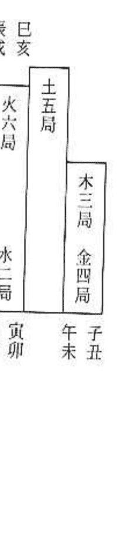
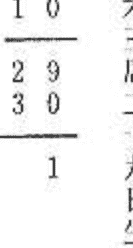

## 初學紫微斗數

鄭景峰著

## 紫微斗數 6

大孚書局印行

### 自序

紫微斗數，是陳希夷一人的英明之作？還是歷經千年來，諸賢眾人之集體創作？若能坐著時光飛機，回到過去，我們便可清楚目睹，斗數之演變與改良之流程。

同年同月同日同時辰生者，在中國大陸，有數千人之多；在臺灣也有數十人之多。紫微命盤一模一樣？命運一定一模一樣乎？同時出生？同年結婚？兒女子嗣同様數目？同年死亡乎？

紫微斗數，是統計出來的星曜符號。二千年的臺灣總統大選，天縱英明的命理第一人們，紛紛在報紙、雜誌、電視上預言，結果是，百分之八十的命理師，都預言錯了。問題出在那裡？套套同命公式也！

那麼，紫微斗數的存在，有何價值？看星曜個性，有不可思議的準確度，如七殺星的衝動，太陰星的求全，太陽星的外向，可以自我參考。

只用單一八字紫微來算命，同命必同運乎？已無法讓人心服口服。所以，慧根業餘服務，總是加看緣客的手相、面相，再令其卜一終身卦，號稱「八斗卦算命法」，勉勉強強可區分同命不同運的地方。不過學佛之

## 目錄

自序

## 第一章 如何排命盤

### （一）繪製表格與填上十二宮位的地支

首先，拿一張空白的紙，依範例形式繪成一張標準的命盤格式。再將十二地支填入表格內。不論男女或生辰，一律依此格式填入命盤。

| 巳 | 午 | 未 | 申 |
| --- | --- | --- | --- |
| 辰 |  |  | 酉 |
|  |  |  |  |
| 卯 |  |  |  |
|  |  |  |  |
| 寅 | 丑 | 子 | 亥 |

### （二）填入十二宮位的天干

| 戊 | 丁 | 丙 | 乙 | 甲 | 天干 |
|---|---|---|---|---|---|
| 戊 | 丁 | 丙 | 乙 | 甲 | 宮位 |
| 戊 | 丁 | 丙 | 乙 | 甲 | 寅 |
| 乙 | 癸 | 辛 | 己 | 丁 | 卯 |
| 丙 | 甲 | 壬 | 庚 | 戊 | 辰 |
| 丁 | 乙 | 癸 | 辛 | 己 | 巳 |
| 戊 | 丙 | 甲 | 壬 | 庚 | 午 |
| 己 | 丁 | 乙 | 癸 | 辛 | 未 |
| 庚 | 戊 | 丙 | 甲 | 壬 | 申 |
| 辛 | 己 | 丁 | 乙 | 癸 | 酉 |
| 壬 | 庚 | 戊 | 丙 | 甲 | 戌 |
| 癸 | 辛 | 己 | 丁 | 乙 | 亥 |
| 甲 | 壬 | 庚 | 戊 | 丙 | 子 |
| 乙 | 癸 | 辛 | 己 | 丁 | 丑 |

此時十二宮位的地支已填入命盤，尚缺天干，十天干的填入法是以左下角的『寅』一位開始，參照出生年的天干，對照十二宮位，由下表查出起首天干，再按照順時針方向，依序將『甲乙丙丁戊己庚辛壬癸』等十天干填在地支的上面。因地支有12個，天干有10個，所以，『子丑』宮位的天干會與『寅卯』宮位的天干相同。

## 初學紫微斗數

| 63-72 小限08 | 祿天存梁 | 73-82 小限09 | 嫡七羊殺 | 83-92 小限10 | 身宮 | 93-102 小限11 | 鈴廉星貞忌 |
|---|---|---|---|---|---|---|---|
| 八天破座官碎 | 天天天哭處使 | 天天月壽 | 天壇 |
| 爻已| 博士病| 拐小遷移| 動三清婉| 甲午| 力士| 火大疾厄| 乙未|
| 53-62 小限07 | 陷天紫羅微 | 身命主主：：：：$戊辛丁丙戌亥酉子$ |
| 台天龍截天輔刑池空傷 | 天賊門 |
| 壬辰| 官衰| 華官蓋符| 公職 |
| 43-52 小限06 | 右巨天弼門機權 |
| 紅鱷 |   |
| 辛卯| 伏帝息貿兵旺神索| 官祿 |
| 33-42 小限05 65 | 文貪曲狼 | 23-32 小限04 | 太太陰陽 | 13-22 火天武文小限03星府曲昌科 | 丙子年八月十一日戌時 | 03-12 左天天輔魁同祿 |
| 解孤神辰 | 地空 |
| 庚寅| 大臨歲衰耗官驛門宅| 辛丑| 病冠攀晦符帶鞍氣德| 庚子| 喜沐將歲父神浴星建母| 己亥| 飛長亡病命廉生神符宮 |

| 妻妾 |
| 丁酉|

| 兄弟 |
| 戊戌| 妻書| 養月甲做客 |

| 夫妻 |
| 丁酉| 將軍胎| 威天池德 |

| 破軍 |
| 小限01 |

| 男女 |
| 丙子年八月十一日戌時 |

| 三 |
| 陽木 |

| 巟 |
| 三 |

| 男局 |

| 真 |

| 真 |

| 真 |

| 真 |

| 真 |

| 真 |

| 真 |

| 真 |

| 真 |

| 真 |

| 真 |

| 真 |

| 真 |

### （三）換算出生時辰

排紫微斗數是需要農曆的出生年、月、日、時基本資料，對照農曆之出生年、月、日請查大學書局出版之「標準萬年曆」即可（如左例）。時辰請參照下表（第六頁）即可得知。

+ 1. 民國60年↓歲次辛亥年。
2. 5月↓農曆四月，癸巳月。
3. 1日↓農曆初七，丙戌日。
4. 晚上10點↓亥時。

## 四安命宮與身宮

根據月份和出生時辰便可找出命宮與身宮的地支宮位，然後依順時針方向依序填入命宮、父母宮、福德宮、田宅宮、官祿宮（事業宮）、僕役宮（交友宮）、遷移宮、疾厄宮、財帛宮、子女宮、夫妻宮、兄弟宮等12個宮位，並於身宮所在宮位加上註明身宮。

| 生月 | 命身 | 子 | 丑 | 寅 | 卯 | 辰 | 巳 | 午 | 未 | 申 | 酉 | 戌 | 亥 |
| --- | --- | --- | --- | --- | --- | --- | --- | --- | --- | --- | --- | --- | --- |
| 正月 | 命身 | 寅 | 寅 | 卯 | 辰 | 巳 | 午 | 未 | 申 | 酉 | 戌 | 亥 | 子 | 丑 |
| 二月 | 命身 | 卯 | 卯 | 辰 | 巳 | 午 | 未 | 申 | 酉 | 戌 | 亥 | 子 | 丑 | 寅 |
| 三月 | 命身 | 辰 | 辰 | 巳 | 午 | 未 | 申 | 酉 | 戌 | 亥 | 子 | 丑 | 寅 | 卯 |
| 四月 | 命身 | 巳 | 巳 | 午 | 未 | 申 | 酉 | 戌 | 亥 | 子 | 丑 | 寅 | 卯 | 辰 |
| 五月 | 命身 | 午 | 午 | 未 | 申 | 酉 | 戌 | 亥 | 子 | 丑 | 寅 | 卯 | 辰 | 巳 |
| 六月 | 命身 | 未 | 未 | 申 | 酉 | 戌 | 亥 | 子 | 丑 | 寅 | 卯 | 辰 | 巳 | 午 |
| 七月 | 命身 | 申 | 申 | 酉 | 戌 | 亥 | 子 | 丑 | 寅 | 卯 | 辰 | 巳 | 午 | 未 |
| 八月 | 命身 | 酉 | 酉 | 戌 | 亥 | 子 | 丑 | 寅 | 卯 | 辰 | 巳 | 午 | 未 | 申 |
| 九月 | 命身 | 戌 | 戌 | 亥 | 子 | 丑 | 寅 | 卯 | 辰 | 巳 | 午 | 未 | 申 | 酉 |
| 十月 | 命身 | 亥 | 亥 | 子 | 丑 | 寅 | 卯 | 辰 | 巳 | 午 | 未 | 申 | 酉 | 戌 |
| 十一月 | 命身 | 子 | 子 | 丑 | 寅 | 卯 | 辰 | 巳 | 午 | 未 | 申 | 酉 | 戌 | 亥 |
| 十二月 | 命身 | 丑 | 丑 | 寅 | 卯 | 辰 | 巳 | 午 | 未 | 申 | 酉 | 戌 | 亥 | 子 |

附註：凡閏月生人，作下月論。

## 陰陽男女判別

陽年生人，男為陽男，女為陽女。

陰年生人，男為陰男，女為陰女。

| 天干 | 閨陽 | 雍陰 | 雍陽 | 雍陰 | 雍陽 | 雍陰 | 雍陽 |
| --- | --- | --- | --- | --- | --- | --- | --- |
| 甲 | 阳 | 阴 | 阳 | 阴 | 阳 | 阴 | 阳 |
| 乙 | 阳 | 阴 | 阳 | 阴 | 阳 | 阴 | 阳 |
| 丙 | 阳 | 阴 | 阳 | 阴 | 阳 | 阴 | 阳 |
| 丁 | 阳 | 阴 | 阳 | 阴 | 阳 | 阴 | 阳 |
| 戊 | 阳 | 阴 | 阳 | 阴 | 阳 | 阴 | 阳 |
| 己 | 阳 | 阴 | 阳 | 阴 | 阳 | 阴 | 阳 |
| 庚 | 阳 | 阴 | 阳 | 阴 | 阳 | 阴 | 阳 |
| 辛 | 阳 | 阴 | 阳 | 阴 | 阳 | 阴 | 阳 |
| 壬 | 阳 | 阴 | 阳 | 阴 | 阳 | 阴 | 阳 |
| 癸 | 阳 | 阴 | 阳 | 阴 | 阳 | 阴 | 阳 |

|  |  |  |  |  |  |  |  |  |  |  |  |  |  |  |
| --- | --- | --- | --- | --- | --- | --- | --- | --- | --- | --- | --- | --- | --- | --- |
|  |  |  |  |  |  |  |  |  |  |  |  |  |  |  |
|  |  |  |  |  |  |  |  |  |  |  |  |  |  |  |
|  |  |  |  |  |  |  |  |  |  |  |  |  |  |  |  |
|  |  |  |  |  |  |  |  |  |  |  |  |  |  |  |  |
|  |  |  |  |  |  |  |  |  |  |  |  |  |  |  |
|  |  |  |  |  |  |  |  |  |  |  |  |  |  |  |  |
|  |  |  |  |  |  |  |  |  |  |  |  |  |  |  |  |
|  |  |  |  |  |  |  |  |  |  |  |  |  |  |  |  |
|  |  |  |  |  |  |  |  |  |  |  |  |  |  |  |  |
|  |  |  |  |  |  |  |  |  |  |  |  |  |  |  |  |
|  |  |  |  |  |  |  |  |  |  |  |  |  |  |  |  |
|  |  |  |  |  |  |  |  |  |  |  |  |  |  |  |
|  |  |  |  |  |  |  |  |  |  |  |  |  |  |  |  |

## 時辰換算表

### （四）安命宮與身宮

### （六）定五行局表

### （五）定十二宮表（由命宮安）

| 身宫 | 父母 | 福德 | 田宅 | 官禄 | 傒役 | 遷移 | 疾厄 | 財帛 | 子女 | 夫妻 | 兄弟 | 餘宮 | 命宫 |
|---|---|---|---|---|---|---|---|---|---|---|---|---|---|---|
| 身宫常附於化宮之内，不一定身命同宮。 | 丑 | 寅 | 卯 | 辰 | 巳 | 午 | 未 | 申 | 酉 | 戌 | 亥 | 子 | 丑 | 子 |
|  | 寅 | 卯 | 辰 | 巳 | 午 | 未 | 申 | 酉 | 戌 | 亥 | 子 | 丑 | 寅 | 寅 |
|  | 卯 | 辰 | 巳 | 午 | 未 | 申 | 酉 | 戌 | 亥 | 子 | 丑 | 寅 | 卯 | 卯 |
|  | 辰 | 巳 | 午 | 未 | 申 | 酉 | 戌 | 亥 | 子 | 丑 | 寅 | 卯 | 辰 | 辰 |
|  | 巳 | 午 | 未 | 申 | 酉 | 戌 | 亥 | 子 | 丑 | 寅 | 卯 | 辰 | 巳 | 巳 |
|  | 午 | 未 | 申 | 酉 | 戌 | 亥 | 子 | 丑 | 寅 | 卯 | 辰 | 巳 | 午 | 午 |
|  | 未 | 申 | 酉 | 戌 | 亥 | 子 | 丑 | 寅 | 卯 | 辰 | 巳 | 午 | 未 | 未 |
|  | 申 | 酉 | 戌 | 亥 | 子 | 丑 | 寅 | 卯 | 辰 | 巳 | 午 | 未 | 申 | 申 |
|  | 酉 | 戌 | 亥 | 子 | 丑 | 寅 | 卯 | 辰 | 巳 | 午 | 未 | 申 | 酉 | 酉 |
|  | 戌 | 亥 | 子 | 丑 | 寅 | 卯 | 辰 | 巳 | 午 | 未 | 申 | 酉 | 戌 | 戌 |
|  | 亥 | 子 | 丑 | 寅 | 卯 | 辰 | 巳 | 午 | 未 | 申 | 酉 | 戌 | 亥 | 亥 |
|  | 子 | 丑 | 寅 | 卯 | 辰 | 巳 | 午 | 未 | 申 | 酉 | 戌 | 亥 | 子 | 子 |

### （八）紫微十四主星速排

有了紫微星所在宮位，即可由下列十二個表中對照出自己的命盤表格，再將符合的表格

| 火六局 | 土五局 | 金四局 | 木三局 | 水二局 | 五行局/生日 |
|---|---|---|---|---|---|
| 午 | 酉 | 巳 | 酉 | 酉 | 16 |
| 卯 | 寅 | 卯 | 午 | 酉 | 17 |
| 辰 | 未 | 申 | 未 | 戌 | 18 |
| 子 | 辰 | 巳 | 戌 | 戌 | 19 |
| 酉 | 巳 | 午 | 未 | 卌 | 20 |
| 寅 | 未 | 巳 | 卯 | 辰 | 21 |
| 戌 | 卯 | 寅 | 午 | 辰 | 22 |
| 未 | 巳 | 卯 | 卯 | 巳 | 23 |
| 子 | 寅 | 丑 | 辰 | 巳 | 24 |
| 巳 | 卯 | 午 | 未 | 午 | 25 |
| 寅 | 申 | 卯 | 辰 | 午 | 26 |
| 卯 | 丑 | 辰 | 巳 | 未 | 27 |
| 申 | 午 | 申 | 丑 | 卯 | 28 |
| 巳 | 午 | 午 | 戌 | 卯 | 29 |
| 午 | 未 | 戌 | 戌 | 辰 | 30 |

### （七）由生日安「紫微星」之所在宮位

| 火六局 | 土五局 | 金四局 | 木三局 | 水二局 | 五行局/生日 |
|---|---|---|---|---|---|
| 酉 | 午 | 戌 | 辰 | 丑 | 1 |
| 午 | 戌 | 辰 | 丑 | 寅 | 2 |
| 戌 | 辰 | 丑 | 寅 | 寅 | 3 |
| 辰 | 丑 | 寅 | 卯 | 卯 | 4 |
| 丑 | 寅 | 子 | 寅 | 卯 | 5 |
| 寅 | 未 | 巳 | 卯 | 辰 | 6 |
| 戌 | 子 | 寅 | 午 | 辰 | 7 |
| 未 | 巳 | 卯 | 卯 | 巳 | 8 |
| 子 | 寅 | 丑 | 辰 | 巳 | 9 |
| 巳 | 卯 | 午 | 未 | 午 | 10 |
| 寅 | 申 | 卯 | 辰 | 午 | 11 |
| 卯 | 丑 | 辰 | 巳 | 未 | 12 |
| 戌 | 午 | 寅 | 申 | 未 | 13 |
| 申 | 卯 | 未 | 巳 | 申 | 14 |
| 丑 | 辰 | 辰 | 午 | 申 | 15 |

## 第一章 如何排命盤

| 天梁陷 | 七殺旺 | 未 | 廉貞廟 |
|---|---|---|---|
| 天相旺 紫微陷 | 在紫 |
| 辰 | 辰微 |
| 宮 |
| 巨門廟 天機旺 |  |
| 卯 |  |
|  |
| 貪狼平 | 太陰陷 太陽陷 | 天府廟 武曲旺 | 天同廟 |
| 寅 | 丑 | 于 | 亥 |
|  |
| 七殺平 紫微旺 |  | 未 | 申 |
| 天梁旺 天機廟 | 在紫 |
| 辰 | 已微 |
| 宮 |
| 天相陷 |  |
| 卯 |  |
| 巨門廟 太陽陷 | 貪狼廟 武曲廟 | 太陰廟 天同旺 | 天府旺 |
| 寅 | 丑 | 子 | 亥 |

### （九）排入其他諸星

1. 安紫微諸星  
由紫微所在宮位，對照查出天機、太陽、武曲、天同、廉貞所在宮位。

2. 安天府星  
由紫微所在宮位，對照查出天府所在宮位。

| 星名 | 甲 | 級 |
|---|---|---|
| 廉貞 | 辰 | 未 |
| 天同 | 申 | 丑 |
| 武曲 | 酉 | 寅 |
| 太陽 | 戌 | 卯 |
| 天機 | 亥 | 辰 |
| 紫微 | 子 | 午 |
| 子 | 丑 | 亥 |

#### 安時系諸星

由出生年地支與出生時辰對照查出時系諸星所在宮位。

#### 安天府諸星

由天府所在宮位，對照查出太陰、貪狼、巨門、天相、天梁、七殺、破軍所在宮位。

## 第一章 如何排命盤

## 8. 安生年博士十二星法

尋祿存星起博士。丙級星。  
祿存所在宮位即為博士所在宮位，依陽男陰女順時針方向，陰男陽女逆時針方向填入其  
其他諸星。

| 博士 | 祿存 |
|---|---|
| 力士 | 不論男女命，尋祿存星起博士，陽男陰女順行，陰男陽女逆行。 |
| 青龍 |  |
| 小耗 |  |
| 將軍 |  |
| 奏書 |  |
| 飛廉 |  |
| 喜神 |  |
| 病符 |  |
| 大耗 |  |
| 伏兵 |  |
| 官府 |  |

| 星級星名 | 乙 | 甲 | 甲 | 甲 | 年干 |
|---|---|---|---|---|---|
| 天天化化化化天天陀擊複 |  |
| 福官忌科權破廉貞 |  |
| 西未太陽武曲紫微天梁天機 |  |
| 申辰太陰文昌天機天同太陰貪狼 |  |
| 子已巨門天機右弼太陰貪狼武曲 |  |
| 卯卯天機天同太陰貪狼武曲 |  |
| 寅酉文曲天同太陰武曲太陽巨門 |  |
| 午亥文昌文曲左輔紫微巨門 |  |
| 巳酉武曲貪狼太陰 |  |
| 巳午戌 |  |
| 丁 |  |

| 丙 | |
|---|
| 戊 |
| 己 |
| 庚 |
| 辛 |
| 壬 |
| 癸 |

## 初學紫微斗數

## 5. 安月系諸星  
由出生月對照查出月系諸星所在宮位。

## 6. 安日系諸星  
星級星名安  
從左輔上起初一，順行，數到本日生。

## 7. 安年系諸星  
從文曲上起初一，逆行，數到本日生再退後一步。  
由出生年干對照查出年系諸星所在宮位。

| 星級星名 | 乙 | 乙 | 乙 | 甲 | 生月 |
|---|---|---|---|---|---|
| 陰天天解天天天右左 |  |
| 煞月巫神馬姚刑弼輔 |  |
| 寅戌巳申申丑酉戍辰月正 |  |
| 子巳申申巳寅戊酉巳月二 |  |
| 戊辰寅戊寅卯亥申午未月三 |  |
| 申寅亥戊亥辰子未未月四 |  |
| 午未巳子申巳丑午申月五 |  |
| 辰卯申子巳午寅巳酉月六 |  |
| 寅亥寅寅寅未卯辰戌月七 |  |
| 子未亥寅亥申辰卯亥月八 |  |
| 戊寅巳辰申酉巳寅子月九 |  |
| 申午申辰巳戊午丑丑月十 |  |
| 午戌寅午寅亥未子寅月十一 |  |
| 辰寅亥午亥子申亥卯月十二 |  |

| 星級星名 | 乙 | 乙 | 乙 | 星級星名 |
|---|---|---|---|---|
| 天 | 恩 | 八 | 三 |
| 貴 | 光 | 座 | 台 |
| 從文曲上起初一，逆行，數到本日生再退後一步。 | 從文昌上起初一，順行，數到本日生。 | 從右弼上起初一，逆行，數到本日生。 | 從左輔上起初一，順行，數到本日生。 |
|  |  |  |  |
|  |  |  |  |
|  |  |  |  |
|  |  |  |  |
|  |  |  |  |

## 第一章 如何排命盤

| 乙 | 乙 | 乙 | 乙 | 乙 | 乙 | 星級星名 | 年支 |
|---|---|---|---|---|---|---|---|
| 天壽 | 天才 | 破碎 | 蜚廉 | 寡宿 | 孤辰 |  |
| 由身宮起子，順行，數至本生年支安天壽星。 | 命 | 巳 | 申 | 戌 | 寅 | 酉 | 卯 | 戌 | 辰 | 午 | 午 | 子 | 丑 |
| 父 | 丑 | 酉 | 戌 | 寅 | 寅 | 未 | 丑 | 丑 | 丑 | 丑 | 丑 | 寅 |
| 福 | 酉 | 戌 | 寅 | 寅 | 未 | 丑 | 丑 | 丑 | 丑 | 丑 | 丑 | 寅 |
| 田 | 巳 | 巳 | 丑 | 巳 | 巳 | 午 | 丑 | 丑 | 丑 | 丑 | 丑 | 寅 |
| 官 | 丑 | 午 | 丑 | 巳 | 巳 | 午 | 巳 | 午 | 午 | 午 | 子 | 午 |
| 僕 | 酉 | 未 | 辰 | 申 | 辰 | 戌 | 巳 | 酉 | 辰 | 子 | 子 | 午 |
| 遷 | 巳 | 寅 | 辰 | 申 | 卯 | 酉 | 辰 | 戌 | 子 | 子 | 子 | 午 |
| 疾 | 丑 | 卯 | 辰 | 申 | 寅 | 申 | 卯 | 丑 | 寅 | 寅 | 寅 | 未 |
| 財 | 酉 | 辰 | 未 | 亥 | 寅 | 未 | 寅 | 丑 | 寅 | 寅 | 丑 | 申 |
| 子 | 巳 | 亥 | 未 | 亥 | 子 | 午 | 丑 | 寅 | 寅 | 丑 | 酉 | 酉 |
| 夫 | 寅 | 子 | 未 | 亥 | 亥 | 巳 | 子 | 寅 | 辰 | 申 | 寅 | 戌 |
| 兄 | 酉 | 丑 | 戌 | 寅 | 戌 | 辰 | 亥 | 卯 | 巳 | 未 | 亥 | 亥 |

由本生年地支對照查出年支星所在宮位。

## 11. 年支星（由本生年地支安）

註：天傷永在僕役宮。天使永在疾厄宮。

| 星級星名 | 丙 | 命宮 |
|---|---|---|
| 天使 | 天傷 |  |
| 未 | 已 | 子 |
| 申 | 午 | 丑 |
| 酉 | 未 | 寅 |
| 戌 | 申 | 卯 |
| 亥 | 酉 | 辰 |
| 子 | 戌 | 巳 |
| 丑 | 亥 | 午 |
| 寅 | 子 | 未 |
| 卯 | 丑 | 申 |
| 辰 | 寅 | 酉 |
| 巳 | 卯 | 戌 |
| 戌 | 卯 | 戌 |
| 亥 | 辰 | 亥 |

## 10. 安天傷天使

由命宮所在宮位，對照查出天傷、天使。

## 註：陽男陰女順行，陰男陽女逆行。

（諸書認為這是丙級星，作者鄭景峰認為是甲級星或超級星，很重要。）

## 初學紫微斗數

## 9. 十二長生星（由五行局排出）

| 星名 | 養 | 胎 | 絶 | 墓 | 死 | 病 | 衰 | 帝旺 | 隨官 | 冠帶 | 沐浴 | 長生 | 五行局 |
|---|---|---|---|---|---|---|---|---|---|---|---|---|---|
| 隱陽 | 未 | 午 | 巳 | 辰 | 卯 | 寅 | 丑 | 子 | 亥 | 戌 | 酉 | 申 | 水二局 |
| 陰陽 | 酉 | 戌 | 亥 | 子 | 丑 | 寅 | 卯 | 辰 | 巳 | 午 | 未 | 申 | 木三局 |
| 陰陽 | 戌 | 酉 | 申 | 未 | 午 | 巳 | 辰 | 卯 | 寅 | 丑 | 子 | 亥 | 金四局 |
| 隱陽 | 未 | 午 | 巳 | 辰 | 卯 | 寅 | 卯 | 辰 | 巳 | 午 | 未 | 申 | 土五局 |
| 陰陽 | 酉 | 戌 | 亥 | 子 | 丑 | 寅 | 卯 | 辰 | 巳 | 午 | 未 | 申 | 火六局 |

註：陽男陰女順行，陰男陽女逆行。

## 第一章 如何排命盤

| 戊 | 丁 | 戊 | 丁 | 級星名 | 流年支 |
|---|---|---|---|---|---|
| 亡神 | 月煞 | 威池 | 指背 | 天煞 | 灾煞 | 劫煞 | 華蓋 | 息神 | 歲駡 | 攀鞍 | 將星 |
| 巳 | 辰 | 卯 | 寅 | 丑 | 子 | 亥 | 戌 | 酉 | 申 | 未 | 午 |
| 亥 | 戌 | 酉 | 申 | 未 | 午 | 巳 | 辰 | 卯 | 寅 | 丑 | 子 |
| 巳 | 未 | 午 | 巳 | 辰 | 卯 | 寅 | 丑 | 子 | 亥 | 巳 | 卯 |
| 申 | 未 | 午 | 巳 | 辰 | 卯 | 寅 | 丑 | 子 | 亥 | 巳 | 酉 |
| 寅 | 丑 | 子 | 亥 | 戌 | 酉 | 申 | 未 | 午 | 巳 | 辰 | 卯 |
| 寅 | 丑 | 子 | 亥 | 戌 | 酉 | 申 | 未 | 午 | 巳 | 辰 | 卯 |

由流年地支對照查出流年將前諸星所在宮位。

## 初學紫微斗數

| 戊 | 丁 | 戊 | 丁 | 戊 | 丁 | 級星名 | 流年支 |
|---|---|---|---|---|---|---|---|
| 病符 | 弔客 | 天德 | 白虎 | 龙德 | 大耗 | 小耗 | 官符 | 貰索 | 邪門 | 暗氣 | 歲建 |
| 亥 | 戌 | 酉 | 申 | 未 | 午 | 巳 | 辰 | 卯 | 寅 | 丑 | 子 |
| 子 | 亥 | 戌 | 酉 | 申 | 未 | 午 | 辰 | 巳 | 卯 | 寅 | 丑 |
| 丑 | 子 | 亥 | 戌 | 酉 | 申 | 未 | 午 | 巳 | 辰 | 卯 | 寅 |
| 寅 | 丑 | 子 | 亥 | 戌 | 酉 | 申 | 未 | 午 | 巳 | 辰 | 卯 |
| 卯 | 寅 | 丑 | 子 | 亥 | 戌 | 酉 | 申 | 未 | 午 | 巳 | 辰 |
| 辰 | 卯 | 寅 | 丑 | 子 | 亥 | 戌 | 酉 | 申 | 未 | 午 | 辰 |
| 巳 | 辰 | 卯 | 寅 | 丑 | 子 | 亥 | 戌 | 酉 | 申 | 未 | 午 |
| 午 | 巳 | 辰 | 卯 | 寅 | 丑 | 子 | 亥 | 戌 | 酉 | 申 | 未 |
| 未 | 午 | 巳 | 辰 | 卯 | 寅 | 丑 | 子 | 亥 | 戌 | 酉 | 申 |
| 申 | 未 | 午 | 巳 | 辰 | 卯 | 寅 | 丑 | 子 | 亥 | 戌 | 酉 |
| 酉 | 申 | 未 | 午 | 巳 | 辰 | 卯 | 寅 | 丑 | 子 | 亥 | 戌 |
| 戌 | 酉 | 申 | 未 | 午 | 巳 | 辰 | 卯 | 寅 | 丑 | 子 | 亥 |
| 亥 | 戌 | 酉 | 申 | 未 | 午 | 辰 | 卯 | 寅 | 丑 | 子 | 亥 |

由流年地支對照查出流年歲前諸星所在宮位。

## 第一章 如何排命盤

## 初學紫微斗數

由出生年支對照查出身主。

由命宮對照查出命主。

| 身主 | 星名/年支 |
|---|---|
| 星火 | 子 |
| 相天 | 丑 |
| 梁天 | 寅 |
| 同天 | 卯 |
| 昌文 | 辰 |
| 機天 | 巳 |
| 星火 | 午 |
| 相天 | 未 |
| 梁天 | 申 |
| 同天 | 酉 |
| 昌文 | 戌 |
| 機天 | 亥 |

| 命主 | 星名/命宮 |
|---|---|
| 狼貪 | 子 |
| 門巨 | 丑 |
| 存祿 | 寅 |
| 曲文 | 卯 |
| 貞廉 | 辰 |
| 曲武 | 巳 |
| 軍破 | 午 |
| 曲武 | 未 |
| 貞廉 | 申 |
| 曲文 | 酉 |
| 存祿 | 戌 |
| 門巨 | 亥 |

| 父母 | 福德 | 田宅 | 官祿 | 僕役 | 遷移 | 疾厄 | 財帛 | 子女 | 夫妻 | 兄弟 | 命宮 | 宮限 | 大限 | 五行 |
|---|---|---|---|---|---|---|---|---|---|---|---|---|---|---|
| 12 | 22 | 32 | 42 | 52 | 62 | 72 | 82 | 92 | 102 | 112 | 2 | 陰陽 | 水 |
| 21 | 31 | 41 | 51 | 61 | 71 | 81 | 91 | 101 | 111 | 121 | 11 | 女男 | 二局 |
| 012 | 102 | 92 | 82 | 72 | 62 | 52 | 42 | 32 | 22 | 12 | 2 | 陽陰 | 木 |
| 121 | 111 | 101 | 91 | 81 | 71 | 61 | 51 | 41 | 31 | 21 | 11 | 女男 | 三局 |
| 13 | 23 | 33 | 43 | 53 | 63 | 73 | 83 | 93 | 103 | 113 | 3 | 陰陽 | 金 |
| 22 | 32 | 42 | 52 | 62 | 72 | 82 | 92 | 102 | 112 | 122 | 12 | 女男 | 四局 |
| 113 | 103 | 93 | 83 | 73 | 63 | 53 | 43 | 33 | 23 | 13 | 3 | 陽陰 | 土 |
| 122 | 112 | 102 | 92 | 82 | 72 | 62 | 52 | 42 | 32 | 22 | 12 | 女男 | 五局 |
| 14 | 24 | 34 | 44 | 54 | 64 | 74 | 84 | 94 | 104 | 114 | 4 | 陰陽 | 火 |
| 23 | 33 | 43 | 53 | 63 | 73 | 83 | 93 | 103 | 113 | 123 | 13 | 女男 | 六局 |

大限是10年的運勢。由五行局與陰陽男女對照查出命宮等十二宮位的大限。

## 初學紫微斗數

表格1：由出生年支與男女性別對照查出十二小限值宮（宮位）之小限之歲。

| 12 | 11 | 10 | 9 | 8 | 7 | 6 | 5 | 4 | 3 | 2 | 1 | 小限之歲 | 小限值宮 | 年支 | 男女 | 寅午戌 | 申子辰 | 巳酉丑 |
|---|---|---|---|---|---|---|---|---|---|---|---|---|---|---|---|---|---|---|---|---|---|---|---|---|---|
| 24 | 23 | 22 | 21 | 20 | 19 | 18 | 17 | 16 | 15 | 14 | 13 |  |  |  | 男 | 女 |  |  |  |
| 36 | 35 | 34 | 33 | 32 | 31 | 30 | 29 | 28 | 27 | 26 | 25 |  |  |  | 男 | 女 |  |  |  |
| 48 | 47 | 46 | 45 | 44 | 43 | 42 | 41 | 40 | 39 | 38 | 37 |  |  |  | 男 | 女 |  |  |  |
| 60 | 59 | 58 | 57 | 56 | 55 | 54 | 53 | 52 | 51 | 50 | 49 |  |  |  | 男 | 女 |  |  |  |
| 72 | 71 | 70 | 69 | 68 | 67 | 66 | 65 | 64 | 63 | 62 | 61 |  |  |  | 男 | 女 |  |  |  |
| 84 | 83 | 82 | 81 | 80 | 79 | 78 | 77 | 76 | 75 | 74 | 73 |  |  |  | 男 | 女 |  |  |  |
| 96 | 95 | 94 | 93 | 92 | 91 | 90 | 89 | 88 | 87 | 86 | 85 |  |  |  | 男 | 女 |  |  |  |
| 108 | 107 | 106 | 105 | 104 | 103 | 102 | 101 | 100 | 99 | 98 | 97 |  |  |  | 男 | 女 |  |  |  |
| 120 | 119 | 118 | 117 | 116 | 115 | 114 | 113 | 112 | 111 | 110 | 109 |  |  |  | 男 | 女 |  |  |  |
| 卯 | 寅 | 丑 | 子 | 亥 | 戌 | 酉 | 申 | 未 | 午 | 巳 | 辰 | 男 | 女 | 寅午戌 | 申子辰 | 巳酉丑 |
| 巳 | 午 | 未 | 申 | 酉 | 戌 | 亥 | 子 | 丑 | 寅 | 卯 | 辰 | 男 | 女 | 寅午戌 | 申子辰 | 巳酉丑 |
| 酉 | 申 | 未 | 午 | 巳 | 辰 | 卯 | 寅 | 子 | 丑 | 寅 | 辰 | 男 | 女 | 寅午戌 | 申子辰 | 巳酉丑 |
| 午 | 巳 | 辰 | 卯 | 寅 | 子 | 丑 | 寅 | 子 | 丑 | 寅 | 辰 | 男 | 女 | 寅午戌 | 申子辰 | 巳酉丑 |
| 子 | 亥 | 戌 | 酉 | 申 | 未 | 午 | 巳 | 辰 | 卯 | 寅 | 辰 | 男 | 女 | 寅午戌 | 申子辰 | 巳酉丑 |

表格2：按本生年之干支丙級星

| 子 | 寅 | 辰 | 午 | 申 | 戌 | 旬空位置 | 年支 | 年干 |
|---|---|---|---|---|---|---|---|---|
| 丑 | 卯 | 巳 | 未 | 酉 | 亥 | 甲 |
| 寅 | 辰 | 午 | 申 | 戌 | 子 | 乙 |
| 卯 | 巳 | 未 | 酉 | 亥 | 子 | 丙 |
| 辰 | 午 | 申 | 戌 | 子 | 寅 | 丁 |
| 巳 | 未 | 酉 | 亥 | 子 | 寅 | 戊 |
| 午 | 申 | 戌 | 子 | 寅 | 辰 | 己 |
| 未 | 酉 | 亥 | 子 | 寅 | 辰 | 庚 |
| 申 | 戌 | 子 | 寅 | 辰 | 午 | 辛 |
| 酉 | 亥 | 子 | 寅 | 辰 | 午 | 壬 |
| 戌 | 子 | 寅 | 辰 | 午 | 申 | 癸 |

左右虧損時因要分為：若用

上述最後各柱之十二地支全數列於28頁右腰。

以上每年之各柱日期十支，存於起碼時之各年柱，尋月之各年柱，尋月之各柱當見之斷為木材之變藝俸。

表格3：17.安截路空亡

17.安截路空亡 （由本生年天干對照查出截路空亡（截空）所在宮位）

| 丙級星名 | 空干 | 年支 |
|---|---|---|
| 丙 | 申 | 甲 |
| 丙 | 酉 | 己 |
| 丙 | 午 | 乙 |
| 丙 | 未 | 庚 |
| 丙 | 辰 | 丙 |
| 丙 | 巳 | 辛 |
| 丙 | 寅 | 丁 |
| 丙 | 卯 | 壬 |
| 丙 | 子 | 戊 |
| 丙 | 丑 | 癸 |

18.安旬空表

| 戌 |
|---|
| 戌 |
| 戌 |
| 戌 |

空亡判斷，當以離00為標準，觀其各干支所在，每十年為一週，每片正負，即為該片之安空矣。共九月，每一步地支，即為該月的安空。

## 第二章 紫微斗數速排

1. 甲己之年起「丙寅」，乙庚之年起「戊寅」，丙辛之年起「庚寅」，丁壬之年起「壬寅」，戊癸之年起「甲寅」。
2. 寅上起正月，順數至生月，逆到生時是「命宮」，順至生時是「身宮」。
3. 十二宮逆佈：命宮、兄弟宮、夫妻宮、子女宮、財帛宮、疾厄宮、遷移宮、交友（僕役）宮、事業宮（官祿宮）、田宅宮、福德宮、父母宮。
4. 三跳法：以命宮的干支定局數。

## 三跳法定五行局

## 初學紫微斗數

| 星名 | 斗別 | 五行 | 主掌 |
|---|---|---|---|
| 紫微 | 中天 | 土 | 帝座，掌造化樞機，為官祿主。 |
| 天機 | 南斗3 | 木 | 智謀益算之善星。 |
| 天同 | 南斗4 | 水 | 福德宮主宰，化氣曰福。 |
| 天相 | 南斗5 | 水 | 司府之宿，為福壽，化氣曰印。 |
| 七殺 | 北斗6 | 金 | 斗中之上將，成敗之孤辰。 |
| 破軍 | 北斗7 | 水 | 化氣曰耗，在天為殺氣。 |
| 文曲 | 北斗4 | 水 | 主科甲文章之宿。 |
| 綠祿 | 北斗3 | 土 | 主人爵祿，掌人壽基。 |
| 文昌 | 北斗3 | 土 | 主科甲之宿。 |
| 天梁 | 南斗2 | 土 | 化氣為蔭，為福壽吉星。 |
| 天馬 | 北斗2 | 水 | 掌管是非，疑是多非。 |
| 巨門 | 北斗2 | 水 | 化氣為桃花，可為祥可為禍。 |
| 貪狼 | 北斗1 | 水 | 財帛之主宰，廷壽解厄。 |
| 天府 | 南斗1 | 土 | 在數司權令。 |
| 廉貞 | 北斗5 | 火 | 福德宮主宰，化氣曰福。 |
| 武曲 | 北斗6 | 金 | 財帛宮主，財星。 |
| 破軍 | 北斗7 | 水 | 化氣曰耗，在天為殺氣。 |
| 文昌 | 南斗3 | 土 | 主科甲之宿。 |
| 綠祿 | 北斗3 | 土 | 主人爵祿，掌人壽基。 |

*二十五顆主星之斗別及主掌*

## 第二章 紫微斗數速排

八加二得十，從寅順數十至亥，紫微在亥宮。

例 6：木三局二十二日生

二減一得一，從寅順數一至寅，紫微在寅宮。

例 5：木三局五日生

二加二得四，從寅順數四至巳，紫微在巳宮。

例 4：木三局四日生

一加零得一，從寅順數一至寅，紫微在寅宮。

例 3：木三局三日生

一加十二減一得十二，從寅順數十二至丑，紫微在丑宮。

例 2：木三局二日生

一加二得三，從寅順數三至辰，紫微在辰宮

例 1：木三局一日生

一加二得三，從寅順數三至辰，紫微在辰宮

## 初學紫微斗數

5. 求紫微星：本生日除以局數，商數加減餘數。餘數若為奇數，則商數減去餘數；若商數不夠減，則加十二，再減餘數。如所得是五，從寅順數五至午宮，紫微星即在午宮。

## 第二章 紫微斗數速排

15.祿存星：
　　甲年寅、乙年卯、丙戌年巳，丁己年午，庚年申、辛年酉、壬年亥、癸年子。

16.四化星：化祿、化權、化科、化忌

17.安天馬（用年支）

18.辰宮順至年支「龍池」，戊宮逆至年支「鳳閣」。

19.卯宮逆至年支「紅鸞」，相對「天喜」。

20.安孤辰、寡宿（用年支）

21.十二長生訣：
　　水土長生在申，木長生在亥，金長生在巳，火長生在寅，
　　長生、沐浴、冠帶、臨官、帝旺、衰、病、死、墓、絕、胎、養。
　　陽男陰女順行，陰男陽女逆行。

第三章 紫微斗數口訣

（一）六十甲子納音歌

| 庚 | 丙 | 壬 | 戊 | 甲 | 庚 | 丙 | 壬 | 戊 | 甲 |
| --- | --- | --- | --- | --- | --- | --- | --- | --- | --- |
| 申 | 辰 | 子 | 申 | 辰 | 子 | 申 | 辰 | 子 | 申 |
| 辛 | 丁 | 癸 | 己 | 乙 | 辛 | 丁 | 癸 | 己 | 乙 |
| 酉 | 巳 | 丑 | 酉 | 巳 | 丑 | 酉 | 巳 | 丑 | 酉 |
| 石 | 沙 | 桑 | 大 | 覆 | 壁 | 山 | 長 | 露 | 泉 |
| 榴 | 中 | 柘 | 驛 | 燈 | 上 | 下 | 流 | 露 | 中 |
| 木 | 土 | 木 | 土 | 火 | 土 | 火 | 水 | 火 | 水 |
| 壬 | 戊 | 甲 | 庚 | 丙 | 壬 | 戊 | 甲 | 庚 | 丙 |

22起大限，由命宮起十年。
23安截空（由年干排）。
24流年歲建十二日生：
25流年將星：

將星、攀鞍、歲驛、息神、華蓋、劫煞、災煞、天煞、指背、咸池、月煞、亡神。

（七）十天干所屬表

| 五行 | 阴阳 | 所属天干 |
|---|---|---|
| 木 | 陽 | 甲 |
|  | 陰 | 乙 |
| 火 | 陽 | 丙 |
|  | 陰 | 丁 |
| 土 | 陽 | 戊 |
|  | 陰 | 己 |
| 金 | 陽 | 庚 |
|  | 陰 | 辛 |
| 水 | 陽 | 壬 |
|  | 陰 | 白 |

注：阳年生人，男为阳男，女为阳女。阴年生人，男为阴男，女为阴女。

（六）百字千金诀

枢库坐命遇吉，富贵始终亨通。机月栋同福寿，日月左右辰生。杀遇终须进退，武破吉化峥嵘。贪贞守垣性劣，昌曲入庙科名。禄存到处皆灵，最怕羊陀火铃。巨化吉宿富贵，同凶也不昌荣。魁越夹拱发达，一生近贵功名。局中最嫌穴劫，诸星不可同宫。（千金断诀，莫泄愚人）

（五）定生时诀

1. 按照头上之发旋决定生时诀：子午卯酉单顶门，或偏左边二三分。寅申已亥亦单顶，偏居右去始为真。
2. 按照小儿临盆时睡相决定生时诀：子午卯酉面向天。寅申已亥侧身眠。辰戊丑未脸伏地。临盆当试用心坚。

（四）安流年斗君诀（由本生月及本生时推之）

流年岁建起正月，逆逢生月顺回程，回程顺至生时止，便是流年正月春。

（三）安十二宫诀（男女都逆时钟转）

1. 命宫 2. 兄弟 3. 夫妻 4. 子女 5. 财帛 6. 疾厄 7. 迁移 8. 僕役 9. 官禄 10. 田宅 11. 福德 12. 父母。
（郑景峰注：僕役可改为交友，官禄改为事业）

初學紫微斗數

（二）四胞胎、七胞胎的命怎麼算

慧根所搜集之资料，目前全世界，七胞胎为最多；其他，四胞胎、三胞胎、双胞胎，时有耳闻。
慧根也曾算过数对四胞胎的命格，至于双胞胎则更多啦！
八字排起来一模一样，紫微斗数可有区别矣！
根据多家门派之理论：

+   * 第一胎看命宫
* 第二胎看迁移宫
* 第三胎看兄弟宫

+   10. 天府星——领袖才能之星，可研究五术，增进人缘。
11. 紫微星——帝王星，可研究五术，增进领导能力。
12. 武曲星——财星，研究五术，增进财源。
13. 七杀星——「铁齿」的七杀星，冲撞挫折后，也会研究五术，来了解如何胜过别人。
14. 破军星——个性刚强的破军星，也想研究五术，增进财运。
15. 廉贞星——囚星的廉贞，藉研究五术宗教，可解开心中之郁结。
16. 文昌、文曲——文采风流，研究宗教五术，文章写作，可名利双收。

初學紫微斗數

第五章 紫微十二宮論斷

（一）紫微十二宮解釋

1. 命宫

「命宫」最重要，可依此看出此人的容貌、个性、才能、性向、理想。如果命宫无主星，则看对宫迁移宫。迁移宫乃外出运，命宫无主星，他乡发展多。「三方」是指命宫、财帛宫、官禄宫，若再加上迁移宫：号称「四正」，这与一个人的命、财、官、外出运，息息相关，缺一不可。

2. 身宫

有人不看「身宫」，慧根则认为，「身宫」可判断后天的运势。命宫为先天本性，身宫为后天的行为。即使命宫不吉，而身宫吉祥，慧根总会鼓励，后天努力，可以弥补先天的缺失，改善命运。反之，命宫虽好，身宫与运限不佳，也得防止命运转坏。但，身宫必须与命宫、夫妻宫、财帛宫、官禄宫、迁移宫、福德宫，其中任一宫同宫。

3. 兄弟宫

兄弟姐妹间缘份，手足之情有无助益。有人说，兄弟宫可以看出兄弟姐妹的成就。慧根说，要用兄弟姐妹的命盘看才是正确！兄弟宫的对宫是僕役宫（又称交友宫），兄弟宫是观看个人内在的人际关系（家庭），而僕役宫是参考外在的人际关系。

4. 夫妻宫

个人对配偶的理想盼望、婚姻状况。有人说，可看到配偶身高瘦胖、才貌、个性、夫妻缘分、美满与否、是否外遇？慧根则说，要拿配偶对方的命盘配合参考。也许自己的夫妻宫是天同星，配偶的命宫是七杀星，天纵英明的你，该说合不合？也有人说终身未娶、未嫁，你说，「夫妻宫」该做何解释？注定终身无夫？无妻乎？那「同命盘」者，都终身无夫？无妻

（八）十二地支所属表

| 生肖 | 五行 | 阴阳 | 所属地支 |
|---|---|---|---|
| 鼠 | 水 | 陽 | 子 |
| 牛 | 土 | 陰 | 丑 |
| 虎 | 木 | 陽 | 寅 |
| 兔 | 木 | 陰 | 卯 |
| 龙 | 土 | 陽 | 辰 |
| 蛇 | 火 | 陰 | 巳 |
| 马 | 火 | 陽 | 午 |
| 羊 | 土 | 陰 | 未 |
| 猴 | 金 | 陽 | 申 |
| 鸡 | 金 | 陰 | 酉 |
| 狗 | 土 | 陽 | 戌 |
| 豚 | 水 | 陰 | 亥 |

初學紫微斗數

（二）斗數各星曜介紹

一、紫微

+   1. 己土，阴土，南北斗中天之尊星，紫微斗数因此星而得名。
2. 优点：具备领袖才能，能制服火星、铃星，而用其长，能降服七杀星为权柄。
3. 缺点：孤傲，内心有孤独感。色情欲望宜节制。
4. 紫微为帝座，为官禄主，有延寿、解厄、制化之功。最好有左辅、右弼相辅佐。天相、文昌、文曲当部下随从，天魁、天钺当传令。太阳、太阴当分司，禄存当主爵之司，天马、天同当使臣之司，天机、七杀当属下之司。

福气与道德，个人的福气、德行、寿命、趣味、嗜好、心情起伏，有关精神生活的變化，皆可参考此宫星曜的吉凶。
对宫为财帛宫，物质生活影响精神生活，个人经济的好坏，也會影响福气与道德。君子爱财，取之有道；小人爱财，不择手段。何种财源的收入，当然影响善恶的福德。
13父母宫
可以参考父母状况、父母地位、家庭背景、父母亲情。至于能否看出父母的个性、健康、成就，仅可参考而已。
对宫为疾厄宫，可以一同参考，因为每个人的身體，均来自父母的遗传因子。个人生病灾厄，也会影响父母运气，所以要一同参考。

初學紫微斗數

（七）天府

1. 戊土，阳土，南斗第一星，化令星，为财帛、田宅主。
2. 天府是颗福星、吉星，逢禄存、武曲，多加努力，可成巨富。
3. 优点：有专业精神，可学多种才艺专长。
4. 缺点：容易自囚，想不开。又防桃花感情之困扰。
5. 廉贞遇紫微有威权，遇文昌好礼乐，遇禄存主富贵，遇煞星显武职，在官禄宫有威权，居身、命宫好风流。

（六）廉贞

1. 丁火，阴火，北斗第五星，化杀囚，在官禄主，在身、命宫，为次桃花。
2. 天同是颗福星，不怕任何煞星，不与人争，在任何一宫，皆以福论。
3. 优点：性情温和，人缘很好，受人欢迎。
4. 缺点：交友复杂，易为别人拖累陷害，也防财色的迷惑。做事常有始无终。
5. 与天府同在身、命宫，可以长寿。

（五）天同

1. 壬水，阳水，南斗第四星，化福，为福德主，有解危，制化之功。
2. 天同是颗福星，不怕任何煞星，不与人争，在任何一宫，皆以福论。
3. 优点：有财运，果断，脚踏实地学才艺。
4. 缺点：固执己见，不知变通，缺少风流文采，人缘普通。不可太过贪财好色。
5. 与天府同在身、命宫，可以长寿。

初學紫微斗數

（二）天相

1. 壬水，阳水，南斗第五星，为官禄主。
2. 在身、命宫，富有正义感，相貌敦厚，性情温和，衣食富足。
十二、天梁
1. 戊土，阳土，南斗第二星，化荫，为寿星，有解厄、制化之功能，为父母之主宰。
2. 优点：厚重耿直，性情温和，谦恭有礼，富同情心，喜好助人，慈善可长寿，福泽儿孙。
3. 缺点：冲劲不够，太重实际，不够浪漫。
4. 天梁加天机，善谈用兵，或僧道玄学，如有昌曲左右加会，可掌大权。
十三、七杀
1. 庚金，南斗第六星，为将星（冲锋陷阵），主肃杀，遇紫微化为权。
2. 在身、命宫，大眼睛，个性强烈急躁，喜怒不定。
3. 优点：性格果敢勇猛，不畏艰苦，具有大将才能，有奋斗的冲劲，宜军、警、武职，或

（四）天马
1. 丙火，阳火，为司禄之星，主迁动。
2. 天马在身、命宫，主好动。
3. 如与禄存同宫，为禄马交驰，出外财利好。
4. 天马与太阳、太阴同宫，称为雌雄马，主吉利。

初學紫微斗數

（一）天魁
+   1. 丙火，阳火，南斗助星，即八字中的天乙贵人，司科甲之星，又为上界和合之神，主白生生人，有贵。

（二）右弼
+   1. 癸水，阴水，南北斗助星，辅佐紫微之星，司制令。
2. 在身、命宫，为人厚重、肚量宽宏，行善乐施，有智谋策略是北斗的善星。
3. 与紫微、天府、天相、文昌、文曲会集时，可财官双美。
4. 若逢羊陀、火铃冲照，有暗痣、斑痕，福气略薄，适宜清闲修行。

（三）左辅
+   1. 戊土，阳土，南北斗助星，代表「助力」，辅佐紫微之星，司制令。
2. 在身、命宫，相貌敦厚，慷慨风流。如得紫微、科、权三合冲照，可文武大贵。
3. 与天府、天相、天机、文昌、贪狼、武曲，与右弼同宫时，可福禄双全，名利通达。
4. 逢廉贞、破军、巨门，有病痛，又得防短寿。
5. 居旺庙，暗处有痣。处落陷，常有斑痕。

初學紫微斗數

（二）天相
2. 优点：聪明清秀、口舌文笔生花，博学多能，考试得意，文章扬名。
3. 缺点：宜防桃花酒色，逢凶星时，巧辩之徒。
4. 在身、命宫，与太阴同行，可做九流术士。
5. 居旺庙，暗处有痣。处落陷，常有斑痕。

（八）天魁
1. 丙火，阳火，南斗助星，即八字中的天乙贵人，司科甲之星，又为上界和合之神，主白生生人，有贵。

（二）右弼
1. 癸水，阴水，南北斗助星，辅佐紫微之星，司制令。
2. 在身、命宫，为人厚重、肚量宽宏，行善乐施，有智谋策略是北斗的善星。
3. 与紫微、天府、天相、文昌、文曲会集时，可财官双美。
4. 若逢羊陀、火铃冲照，有暗痣、斑痕，福气略薄，适宜清闲修行。

（七）左辅
1. 戊土，阳土，南北斗助星，代表「助力」，辅佐紫微之星，司制令。
2. 在身、命宫，相貌敦厚，慷慨风流。如得紫微、科、权三合冲照，可文武大贵。
3. 与天府、天相、天机、文昌、贪狼、武曲，与右弼同宫时，可福禄双全，名利通达。
4. 逢廉贞、破军、巨门，有病痛，又得防短寿。
5. 居旺庙，暗处有痣。处落陷，常有斑痕。

初學紫微斗數

廿八、地劫
1. 丙火，阳火，乃天上劫杀之神，主破失。
2. 身、命宫遇之，主人作事狂傲，动静憎恶，不行正道，喜爱邪僻之事。
3. 大小限遇地劫星，宜防破财。

廿七、天空
1. 丁火、阴火，乃天上空亡之神，主多灾。
2. 入身、命宫，防做事虚空，不走正道，多成多败，无法聚财。
3. 天空又称断桥，多不吉祥；如有吉星，则灾祸减轻。
4. 大限小限走到天空，宜防破财或刑伤。

廿六、天马
1. 丙火，阳火，为司禄之星，主迁动。
2. 天马在身、命宫，主好动。
3. 如与禄存同宫，为禄马交驰，出外财利好。
4. 天马与太阳、太阴同宫，称为雌雄马，主吉利。

廿五、铃星
1. 丁火，阴火，南斗助星，为杀神，主性烈。
2. 在身、命宫，主人性狠破相，胆大出众。

廿四、火星
1. 丙火，阳火，南斗助星，为杀神，主性刚。
2. 在身、命宫，有毛发怪异（卷起），个性刚强出众之倾向，或四肢、唇、齿可能受傷。
3. 火星与贪狼会于庙旺之地，主横发。
4. 火星坐命，东南生人可为福。东南，木火之地也。

廿三、陀罗
1. 辛金，阴金，北斗助星，化忌，主易惹是非。
2. 在身、命宫，主人身雄形粗，刚强破相，横破横成，不守祖业，四处飘荡，他乡发展。
3. 陀罗遇紫微、天府、文昌，最宜武职，财官双美。
4. 如加会文昌、左辅、右弼，可能有暗痣。

廿二、文曲
1. 庚金，阳金，北斗助星，化刑，主刑伤。
2. 在身、命宫，宜防破相，性情刚强粗暴，多机谋狡诈，横立功名。
3. 入庙，主权贵，西北生人為福、四墓（辰戌丑未）生人不忌。
4. 加会昌、曲、辅、弼，可能有暗痣斑痕。

## 第五章 紫微十二宮論斷

### 廿九、化祿

1. 己土，陰土，掌福德，主財祿，喜見祿存。善於社交，有人緣，個性開朗，藝術感性強。言談機智幽默，多受人歡迎。

2. 守於身、命宮或事業宮，喜與化科、化權相逢，可升高官要職，或得意外之財。

3. 化祿，指流動性資產。祿存，指積蓄與固定的資產。

4. 化祿逢凶星沖破，吉轉成凶，有好面子，虛有其表之現象。

### 三十、化權

1. 甲木，陽木，掌生殺，主權勢。

2. 在身、命宮，與化科同宮者，文章揚名，學術界聲望高。

3. 化權會巨門、武曲，可掌兵符，位居要職。

4. 化科最忌六煞星，雖有才華，無法發揮。

### 三十一、化科

1. 壬水，陽水，掌文墨，主聲名。喜歡研究學問藝術，具備語言與文筆才華。

2. 化科與化忌同命宮，喜歡寫與衆不同的另類文章。

3. 化科喜逢天魁、天鉞，可考場得意。

4. 最忌遇羊、陀、火、鈴、空、劫等凶星，則有因小人降職、破財、官司訴訟不停。

### 三十二、化忌

1. 壬水，陽水，即計都星、嫉妒星，為多管之神，多咎之神，主是非。守於身、命宮，多興是非，人捧人貶。

2. 與七殺、破軍、貪狼、廉貞同宮，防意外之災。

3. 化忌守身、命宮，反面適合從事特殊行業，如律師、法官、藝術工作、寫小說、反派另類文章，或星相宗教研究。

4. 丙火，陽火，主孤剋。入廟，掌兵刑。遇太陽，主武貴。

### 三十三、天刑

1. 丙火，陽火，主孤剋。入廟，掌兵刑。遇太陽，主武貴。

2. 入身、命宮，主人性剛無毒，如不為宗教修行，提防孤刑，不夭則貧，或者父母兄弟不全。

### 三十四、天姚

1. 壬水，陰水，主風流。入廟，多飄福風雅。陷地，防淫蕩。

2. 在身、命宮，主人多風流，性疑惑。

3. 天姚在財帛宮，防花酒賭博破財。

4. 天姚在遷移宮，有人幫助，尤其是異性。

### 三十五、天使

1. 壬水，陰水（鐵板道人書中，天使屬丁火），化災禍，亦主災禍。

## 初學紫微斗數

二、太歲與大小二限逢之，如吉星多，可減輕禍害。如無吉星，更逢六煞、巨門、天機、化忌等星，宜防官司訴訟、喪亡、意外之災。

三、天傷、天使二星，俗稱『傷使』，皆屬虛耗災禍的凶星。天使與天傷一樣，皆為暗伏的凶星，性質類似。

四、天傷之『傷』字，鐵板道人書中，天傷屬丙火，化虛耗，主破耗。但，星雲山人說：『實誤。『傷』之本義，乃為未成年而夭折之謂，故其對人所暗示之『傷亡』時機，係在『太歲』與『小限』上也。若係大限逢之，除非眾煞聚沖，無有力之吉曜解救，始有『傷及壽年』之象。徵外，其他頂為叢生困厄，災難而已。』

五、天傷之『傷』字，鐵板道人書中，天傷屬丙火，化虛耗，主破耗。但，星雲山人說：『實誤。『傷』之本義，乃為未成年而夭折之謂，故其對人所暗示之『傷亡』時機，係在『太歲』與『小限』上也。若係大限逢之，除非眾煞聚沖，無有力之吉曜解救，始有『傷及壽年』之象。徵外，其他頂為叢生困厄，災難而已。』

### 三十六、天曜

1. 戊土，陽土，主顯達。入命宮，主大貴，舉止優雅，秀氣豪爽，可少年金榜題名。

2. 天曜入夫妻宮，配偶高貴、貌佳，更有幫助。

3. 天曜入財帛宮，可經營事業獲利。

4. 天曜入事業宮，可擔任要職，事業發展。

### 三十七、天官

1. 戊土，陽土，主顯達大貴。

2. 最喜加會化權、化科、化祿，最怕凶星沖破。

3. 大小二限逢之，為官者有升遷之喜，一般人也吉祥。

### 三十八、天福

1. 戊土，陽土，主爵祿福厚。

### 三十九、天福

1. 戊土，陽土，主爵祿福厚。

2. 天福守命，有吉星加會者，財運佳。逢凶星沖破，福氣受損。

3. 天福在寅、申、巳、卯宮，入廟，吉祥，父母兄弟融洽，夫妻百年好合，其餘諸宮亦佳。

### 四十、天福

1. 戊土，陽土，主爵祿福厚。

2. 天福守命，有吉星加會者，財運佳。逢凶星沖破，福氣受損。

3. 天福在寅、申、巳、卯宮，入廟，吉祥，父母兄弟融洽，夫妻百年好合，其餘諸宮亦佳。

### 五十五、蜚廉

1. 魔火，主孤、剋害。忌入身、命、父母宮。

2. 入命宮，主孤獨離群，多勞苦。穩重踏實少，失敗起伏不定。

3. 逢煞星沖破者，主破損、耗敗，頭、臉、手、足易受傷殘。逢吉星，可解凶象。

4. 蜚廉入子、卯、午、酉宮，入廟，可減凶象。

### 五六、破碎

1. 屬陰火，主損耗不全。

2. 入身、命宮，主破損，提防手、足、頭、臉部易有傷殘。

3. 逢凶星者，更凶。逢吉星者，可減凶象。

### 五七、解神

1. 主能解災厄，化凶為吉。

### 五八、天巫

1. 驛馬星，主升遷之宿。

### 五九、天月

1. 主疾病。

### 六〇、陰煞

## 初學紫微斗數

七六、力士

1. 屬水，主聰明、有壽、有權。

七七、青龍

1. 屬木，主喜氣、進財，有機變能力。

七八、小耗

1. 屬火，主不聚財，或小耗財。

七九、將軍

1. 屬木，主性情暴躁，有威猛。

八十、奏書

1. 屬金，主福德，有文書之喜。

八一、飛廉

1. 屬火，主孤獨，剋害。

八二、喜神

1. 屬火，主延續，吉慶喜事。

八三、病符

1. 屬水，主災病。

### 八四、大耗

1. 屬火，主敗退祖產、破財。

### 八五、伏兵

1. 屬火，主口舌是非。

### 八六、官府

1. 屬火，主訟事，口舌刑杖。

### 八七、將星

1. 主化凶為吉，不怕凶星。

2. 身、命宮逢之，主武貴。

### 八八、攀鞍

1. 主功名，不怕凶星。身、命宮逢之，主武顯。

### 八九、歲驛

1. 主遷動，不怕凶星。身、命宮遇之，主武顯。

### 九〇、息神

1. 主消沉，喜吉星化解，不宜加會凶星。

2. 身、命宮遇之，無吉星化解，主人意志消沉無生氣。

### 九一、華蓋

## 初學紫微斗數

+   1. 魔火，主大敗，忌會凶星及空亡，喜吉星化解。

2. 寅、午、戌、申、子、辰宮，入廟，災較輕。

3. 主化凶為吉，不怕煞星，能辟煞，最喜在命、身宮。

4. 顓金，主凶，忌會煞星，喜吉星化解。

5. 卯、酉宮，入廟，災較輕。

6. 能化凶為吉，不忌凶星，最喜臨命、身宮。

7. 白虎

8. 天德

9. 弔客

逢每年流年流動之星

### （三）流年之星曜

年年換太歲，年年運不同。紫微斗數除了固定排入的星曜，還有隨每一年流年流動之星。

+   1. 主疾病，喜吉星化解，忌凶星。

2. 辰、戌宮，入廟，禍較輕。

3. 主化凶為吉，不怕煞星，能辟煞，最喜在命、身宮。

4. 顓金，主凶，忌會煞星，喜吉星化解。

5. 卯、酉宮，入廟，災較輕。

6. 能化凶為吉，不忌凶星，最喜臨命、身宮。

7. 白虎

8. 天德

9. 弔客

逢每年流年流動之星

### （四）紫微斗數的格局

八字學中，有正官格、偏財格、傷官格……等多種不同的格局。紫微斗數也一樣，可分類出很多大格局，格局的星曜，無論吉凶，也會影響個性與價值觀。例舉於下，以供參考。

+   1. 紫府同宮格
   紫微、天府，寅宮、申宮，同宮守命。
   優點：如不為惡，衣食無憂、財物富足，加會祿星吉星，福祿可觀。
   缺點：孤獨感，不宜早婚。

2. 紫府朝垣格

3. 天府朝垣格

4. 府相朝垣格

5. 極向離明格

6. 日月夾命格

還有各門各派的流年星曜，以後慧根專書詳論之。

+   8. 流年災煞，忌入本命的田宅宮，如主星廟旺，防家人疾病不安。落陷加煞星，防家人重傷死亡。
9. 流年白虎，忌入本命命宮，及大小限，防有意外，凶險，或長輩之重傷孝服。
10. 流年官符，若入本命命宮，及大小限，防官訟是非，及牢獄之災。
11. 流年吊客，若入本命命宮，及大小限，防近親有損傷不利。
12. 流年喪門，若入本命命宮，及大小限，防惡疾，有損壽元之事。

官，宜防小偷強盜，如加煞星，損失加倍。

紫微或天府，廟旺守命，三方四正有吉星相會。

優點：衣食無缺，如不損德，名利雙收。

缺點：易生高傲，宜防桃花。

天府在辰宮、戌宮入廟守命，不宜煞星沖破。

優點：如無損陰德，人緣佳，富貴可雙全。

缺點：宜防桃花，小心肉慾，有損名聲。

紫微為「極」一星，午宮（離官）入廟坐命，無煞星沖破。

優點：肚大量大，可風雲際會，名氣響亮。

缺點：如無輔星，難免孤君孤僻。

天府守命，或天相守命，財帛宮必見天相星或天府星。無煞星沖破。

## 四十、天官

1. 戊土，陽土，主顯達大貴。

2. 最喜加會化權、化科、化祿，最怕凶星沖破。

3. 大小二限逢之，為官者有升遷之喜，一般人也吉祥。

## 四十一、天福

1. 戊土，陽土，主爵祿福厚。

## 四十二、天福

1. 戊土，陽土，主爵祿福厚。

2. 天福守命，有吉星加會者，財運佳。逢凶星沖破，福氣受損。

3. 天福在寅、申、巳、卯宮，入廟，吉祥，父母兄弟融洽，夫妻百年好合，其餘諸宮亦佳。

## 四十三、日月照壁格

田宅宮中，太陰、太陽同坐，又在丑宮、未宮。

## 四十四、日月同臨格

太陽、太陰同在丑宮、未宮坐命，或者太陽、太陰同在遷移宮照命。

優點：智慧早開，學以致用，名利可期。
缺點：宜防感情多波折。

缺點：甲年生人，太陽化忌，宜防眼肝疾病。

優點：光明磊落，才學名聲，如能行善，名利雙收。

## 四十五、日月並明格

又稱「丹墀桂墀格」，天梁丑宮旺勢坐命，太陽巳宮、太陰酉宮，旺勢會照。或命宮在未，太陽卯宮、太陰亥宮會照。日月並明拱照命宮。

缺點：如逢六煞，華而不實，浪得虛名。

優點：興趣寬廣，才華多多，可得名聲。

## 四十六、明珠出海格

命坐未宮、太陽卯宮，太陰亥宮，皆入廟會照，遷移宮對照天同、巨門星。

缺點：宜防桃花心事。

優點：無論男女，清秀優雅，才藝出眾。

## 初學紫微斗數

七、貪武同行格

武曲、貪狼，丑宮、未宮，入廟守命，又有日月夾命。

優點：四十歲後財運發達。從商、從軍警，皆可。
缺點：武貪宜晚發，他鄉可發達。

八、金燦光輝格

太陽、天梁、文昌、祿存，在三方四正會齊。

優點：考試公職有利，名氣不小。

缺點：不宜經商做大老板，可為股東。

九、日照雷門格

太陽卯宮入廟守命，晝生人最佳。又稱「日出扶桑格」。

優點：交際能力佳，富正義感，名揚於世。
缺點：宜防小人。而且女命不宜，怕太外向，又犯桃花。

十、月朗天門格

太陰亥宮入廟守命，夜生人最佳。

## 第五章 紫微十二宮論斷

27 巨日同宮格
缺點：酒色賭博，女命宜防感情波折，桃花劫難。
巨門、太陽、寅宮、申宮守命。寅宮更佳，因為巨、日皆為廟旺。
優點：具雄辯才華，富進取心，熱心公益，先苦後成。
缺點：口舌是非，得罪小人，宜多忍辱。

28 廉貞文武格
廉貞坐命，武曲官祿宮，如有文昌、文曲在三方四正會照。
優點：文武雙全，如果廉貞在寅宮、申宮入廟坐命，再會祿存，財富可觀。
缺點：宜防感情，意外受傷。

29 祉馬交馳格
祿存與命馬在命宮、財宮、遷移、及田宅同坐，無火星、鈴星煞星沖破。如再遇天相同坐，則為祿馬配印格。
優點：愈動愈有財，多旅遊機會，祿馬配印格，有希望獲得權大財大。

30 祉合鴛鴦格
祿存與化祿同守命宮，為祿合鴛鴦格。
如果不同宮，在命宮的三方四正會照，為雙祿朝垣格。
優點：富貴可期，財官雙美，受人羨慕。

## 初學紫微斗數

31. 君臣慶會格
紫微與左輔、右弼同坐命宮，為君臣慶會格。
優點：多得貴人相助，名利可望。
缺點：宜防驕傲，小人之災。

32. 文桂文華格
卯時、酉時生人，文昌、文曲同在丑宮未宮，如坐命宮，為文桂文華格。如文昌、文曲，在命宮的三方四正會照，為文星拱命格。
優點：勤學不止，學術、文藝界，名氣揚揚。
缺點：宜防桃花誘惑。

33. 昌曲夾命格
命宮在丑、未宮，無煞星，文昌、文曲在兩鄰宮夾命。
優點：如能好學，非貴即富。
缺點：宜防桃花誘惑。

34. 左右同宮格
命宮在丑宮、未宮，左輔、右弼同宮，或在相鄰兩宮夾命。或命宮在辰宮、戌宮，左輔、右弼相對照。
優點：有貴人相助。
缺點：易生是非，小人多。

## 第五章 紫微十二宮論斷

43 皇殿首班格
太陽、文昌同坐官祿宮，再逢吉星。太陽必須廟旺。
優點：可任要職，名利雙收。
缺點：加煞星、化忌，宜謹言慎行，提防小人。

44 文梁振紀格
文曲、天梁同在午宮或寅宮坐命；或天梁坐命午宮，文曲在子宮拱照。
優點：利益衆生，可福壽雙全，赫赫名揚。
缺點：如加煞星，宜注意身體健康，提防小人。

45 權殺化祿格
火星廟旺坐命，又有廟旺的七殺、化祿、化權三星來會照。
優點：個性剛烈，能克服千辛萬難，得到名利。
缺點：宜口德修養，提防桃花與小人。

46 蟹宮折桂格
太陰、文曲同坐夫妻宮（太陰必須廟旺），加逢吉星。
優點：男能招貴妻，女能生貴子。

## 初學紫微斗數

47. 祿文拱命
祿存與文曲同宮，三方四正又有文昌拱照。
優點：可因文章進財富，名利雙收。
缺點：加煞星忌星，則言行不一，小人障礙。

48. 財印坐馬格
寅宮、申宮，命馬與武曲（財星）、天相（印星）同守命宮。
優點：可名利雙收，富貴雙全。
缺點：如加煞星忌星，宜防桃花與小人。

49. 命裡逢空格
命宮中有地劫、地空其中一星，為命裡逢空格。
命坐亥宮、巳宮，有空、劫二星在二鄰宮夾命，為空劫夾命格。
優點：宗教修行，布施行善，或可延壽增福。
缺點：與六親較不親密，加會凶星，幼年宜防災。

50. 天同陷落
天同星入陷落宮，為不吉。
優點：如與吉星同宮，可得福。
缺點：如遇凶星同宮，則多煩惱，不宜大志。

51. 破軍陷落
破軍星入陷落宮，為不吉。
優點：若與吉星同宮，可有財運。
缺點：如遇凶星同宮，則容易破財或受小人陷害。

52. 武曲陷落
武曲星入陷落宮，為不吉。
優點：若與吉星同宮，可得財利。
缺點：如遇凶星同宮，則財運不穩，易受他人影響。

53. 天機陷落
天機星入陷落宮，為不吉。
優點：若與吉星同宮，可得學問或智慧。
缺點：如遇凶星同宮，則多煩惱，不利發展。

## 第五章 紫微十二宮論斷

54. 極居卯酉格
紫微為極星，卯宮、酉宮坐命，必有貪狼同宮，如再逢空、劫、四煞、化忌星，合此格。
缺點：若無吉星，宜防災難不斷。
優點：宜宗教信仰，修身養性，可安身立命，名氣揚揚。

55. 梁馬飄蕩格
缺點：雖有紫微，但桃花小人障礙不小。
優點：有宗教信仰，修身養性，可安身立命，名氣揚揚。
天梁星在巳宮、玄宮落陷守命，命宮再遇命馬星。
缺點：忙忙碌碌，勞而少獲。宜防桃花，風流飄蕩。

56. 天梁拱月格
太陰星在辰宮落陷守命，官祿宮天梁星在申宮落陷守命。財帛宮太陰星在辰宮落陷會照。
優點：可宗教修養，行善少淫，不近小人，改善命運。
缺點：宜防他鄉漂泊，酒色招災，小人陷害。

57. 文星失位格
文昌、文曲在寅、午、戌宮落陷守命，再逢四煞或破軍星。
缺點：多是非，財運不順，宜防小人。

## 初學紫微斗數

58. 雨重華蓋格
祿存與化祿星同坐命，遇地劫、地空星沖破。
優點：具宗教緣，行善修行，可享清福。

59. 小人據位格
命宮無主星或吉星，偏有羊、陀、火、鈴諸煞星入命宮。
優點：有衝勁，可藉宗教修養，學習專長，安身立命。
缺點：宜防思想偏邪，誤入歧途。

60. 刑囚夾印格
擎羊為刑，廉貞為囚，天相為印。子午宮，廉相同守，如擎羊也同宮，合此格。
優點：宗教修養，行善增福，可以領導別人。
缺點：古書云，必作公門胥隸，僕役之徒。

61. 貞居卯酉格
卯宮、酉宮，廉貞坐命，加逢四煞星。
優點：宗教修養、行善布施，也可安身立命。
缺點：提防刑剋孤貧，小人風波多。

62. 羊陀夾忌格
化忌星與祿存同坐命宮，見擎羊、陀羅雙煞星，來夾命宮。
優點：宗教修養，轉移化忌，讚揚人我，安身立命。
缺點：提防天折刑傷，個性剛強，惹是生非，可離鄉發展。

63. 馬頭帶劍格
擎羊星在午宮，落陷守命。
優點：可多近宗教，行善改運，多學才藝，安身立命。
缺點：考運欠佳，貴人無力，宜加倍努力，方能有成。

## 第五章 紫微十二宮論斷

64. 權祿巡逢格
命宮的三方四正，逢化權、祿存或化祿星巡守。
優點：有權有祿，財官雙美。
缺點：如逢煞星忌星，即有小人障礙。

65. 頭角崢嶸格
優點：頭角崢嶸，可名利雙收。
缺點：若逢煞星忌星，懷才不遇，小人障礙。

66. 科名會祿格
化科守命宮，三方四正有祿存、化祿會照。
優點：才華多多，財名皆美。
缺點：怕煞星忌星同宮，或者沖破。

## 初學紫微斗數

67. 風流繚枝格
貪狼與擎羊同坐命宮。
優點：宗教修養，才華智慧，可以安身立命。
缺點：聰明才華，宜防風流敗事。

68. 泛水桃花格
貪狼為桃花，坐命亥宮、子宮。
優點：轉業為智，宗教修養，可以安身立命。
缺點：宜提防桃花敗事。

69. 刑囚夾印格
擎羊為刑，廉貞為囚，天相為印。子午宮，廉相同守，如擎羊也同宮，合此格。
優點：宗教修養，行善增福，可以領導別人。
缺點：古書云，必作公門胥隸，僕役之徒。

70. 桃花滾滾格
文曲星獨坐成宮守命，三方四正再會照太陽、巨門二星。
優點：人緣佳，如能宗教修養，轉情為智，也可安身立命。
缺點：桃花感情波折，如滾滾波浪，令人身心不安。

## 第五章 紫微十二宮論斷

71. 日月疾厄格
缺點：吉處藏凶，宜防表面美好，內在潛藏危機。
太陽、太陰星落陷，坐疾厄宮。
優點：宗教修養，或可從事醫療、五術行業，安身立命。
缺點：健康不佳，或身體有障礙。

72. 火星與鈴星入廟格
火星、鈴星廟旺守命，又有合宮的太陽、巨門星。
優點：有強烈行動力與決斷力，可發財致富，創業成就。
缺點：易因爭執或嫉妒招來麻煩，命運波折。

73. 巨門與天機入廟格
巨門、天機星廟旺入命，且在三方四正有吉星會照。
優點：具備洞察力與分析力，適合從事文化、教育、諮詢、研究等工作。
缺點：宜防口舌是非與內心煩惱，感情易波折。

## 初學紫微斗數

74. 破軍與武曲同宮格
破軍、武曲星同宮守命，或在三方四正會照。
優點：有戰鬥力與行動力，適合創業、開拓新領域。
缺點：易因衝突與競爭招來麻煩，需加強人際關係與心性修養。

75. 天同與天機同宮格
天同、天機星同宮守命，或在三方四正會照。
優點：具有良好人際關係與智慧，適合從事教育、研究、政府機構、文教事業。
缺點：易因過於理想化而忽略現實，需加強實際能力。

76. 天相與太陽同宮格
天相、太陽星同宮守命，或在三方四正會照。
優點：具備權力與尊嚴，適合從事領導與管理職務。
缺點：易因權力爭奪而產生煩惱，需設法化解與共處。

77. 天梁與太陰同宮格
天梁、太陰星同宮守命，或在三方四正會照。
優點：具備穩定與仁慈，適合從事教育、宗教、公共事務。
缺點：易因過於保守而導致發展受阻，需保持進取心。

## 第五章 紫微十二宮論斷

78. 命宮得祿格
祿存、化祿星會照命宮，或其他吉星入廟。
優點：財運亨通，事業有成，生活富足。
缺點：易因財帛與事業造成壓力，需注重平衡。

79. 命宮得權格
化權之星會照命宮，或坐命。
優點：具備領導與管理才能，可得權力與尊嚴。
缺點：易因權力爭奪而產生煩惱，需保持謙虛與包容。

80. 命宮得科格
化科之星會照命宮，或坐命。
優點：具備才華與風範，可得名譽與成就。
缺點：需加強人際關係與現實考量，避免誇張。

## 初學紫微斗數

81. 命宮得貴格
貴人星會照命宮，或坐命。
優點：有貴人相助，總能在關鍵時刻得宜。
缺點：得貴人助易使人懶惰，需自我努力。

82. 命宮得印格
天相、文昌、文曲等印星會照命宮，或同宮。
優點：具有良好人際關係與學習力，可得助力與財運。
缺點：需防小人與嘴上是非，加強自我管理。

83. 命宮得祿存、天相、化祿、化權、化科等星拱照
命宮有祿存、天相、化祿、化權、化科等吉星拱照。
優點：各方面皆有助力，事業財運皆佳。
缺點：需防小人與口舌是非，注重心性修養。

## 第五章 紫微十二宮論斷

84. 破軍與煞星同宮格
破軍星與煞星同宮。
優點：能迅速行動，專業技能佳。
缺點：易因衝動行事招致麻煩，需加強心性與人際關係。

85. 天機與煞星同宮格
天機星與煞星同宮。
優點：具備智慧與洞察力，適合從事分析與研究。
缺點：易因思慮過多而煩惱，需加強決斷與行動力。

86. 天同與煞星同宮格
天同星與煞星同宮。
優點：宜與他人合作，互通有無。
缺點：易因過於隨和而遭人欺壓，需提升自信與能力。

87. 天相與煞星同宮格
天相星與煞星同宮。
優點：臨機應變能力强，能面對壓力。
缺點：易因權力與財帛問題苦惱，需平衡各方面關係。

88. 天梁與煞星同宮格
天梁星與煞星同宮。
優點：能處理人際與財務問題，具備智慧與責任感。
缺點：易受小人影響，需加強自我防範與內心平靜。

89. 七殺與煞星同宮格
七殺星與煞星同宮。
優點：有行動力與決斷力，可創業成功。
缺點：易因衝突與爭執招致麻煩，需注重人際關係。

## 初學紫微斗數

90. 武曲與煞星同宮格
武曲星與煞星同宮。
優點：能掌握財帛與事業，具備實際能力。
缺點：易因競爭與壓力導致煩惱，需加強內心修養。

91. 文昌與煞星同宮格
文昌星與煞星同宮。
優點：具備知識與智慧，適合從事文藝、教育、文化產業。
缺點：易因思想過於激進或偏激招致麻煩，需保持中庸。

92. 文曲與煞星同宮格
文曲星與煞星同宮。
優點：具備溝通與協調能力，適合從事公務、文教、旅遊服務等。
缺點：易因言語不慎引發是非，需加強言語控制。

## 第五章 紫微十二宮論斷

93. 破軍與化忌同宮格
破軍星與化忌星同宮。
優點：能快速決定，行動力強。
缺點：易因衝動行事與不滿情緒惹禍，需加強心性與約束。

94. 武曲與化忌同宮格
武曲星與化忌星同宮。
優點：財運佳，有進取心，適合創業。
缺點：易因財務與行動過度導致失衡，需注重節制。

95. 天機與化忌同宮格
天機星與化忌星同宮。
優點：有分析與計畫能力，適應力強。
缺點：易因計畫失誤與思慮過重招致麻煩，需靈活變通。

96. 天同與化忌同宮格
天同星與化忌星同宮。
優點：與他人關係佳，易獲貴人相助。
缺點：易因貴人相助而自滿，需保持進取與努力。

97. 天相與化忌同宮格
天相星與化忌星同宮。
優點：有領導與統御能力，可管理事務。
缺點：易因權力問題產生煩惱，需掌握平衡。

98. 天梁與化忌同宮格
天梁星與化忌星同宮。
優點：有慈悲心與助人能力，適合宗教與公益。
缺點：易因內心煩惱與家庭問題引發麻煩，需修身養性。

99. 七殺與化忌同宮格
七殺星與化忌星同宮。
優點：有行動力與決斷力，適合創業、管理。
缺點：易因過於衝動與倔強惹禍，需加強控製與包容。

100. 太陽與化忌同宮格
太陽星與化忌星同宮。
優點：有領導力與行動力，可發財致富。
缺點：易因處世過於急躁與理想化，招致挫敗。

101. 太陰與化忌同宮格
太陰星與化忌星同宮。
優點：有美貌與能力，易得他人賞識。
缺點：易因外在因素而受挫，需內心平靜與自我調節。

102. 紫微與化忌同宮格
紫微星與化忌星同宮。
優點：領導力強、氣度廣，易得尊榮。
缺點：易因整體壓力與不利環境而受挫，需加強心性修養與策略思考。

## 初學紫微斗數

103. 破軍與煞星、化忌同宮格
破軍星與煞星、化忌星同宮。
優點：能快速行動，具備專業技能。
缺點：易因衝突與失誤招致麻煩，需加強思考與行動的平衡。

104. 武曲與煞星、化忌同宮格
武曲星與煞星、化忌星同宮。
優點：財帛與事業有進展，具備行動力。
缺點：易因財務與競爭導致壓力與煩惱，需調整心性與節制。

105. 天機與煞星、化忌同宮格
天機星與煞星、化忌星同宮。
優點：具備智慧與洞察力，可在變動中抓住機會。
缺點：易因思慮過多與未知因素而煩惱，需靈活應對。

106. 天同與煞星、化忌同宮格
天同星與煞星、化忌星同宮。
優點：與人相處融洽，易得貴人相助。
缺點：易因隨和與草率決定導致後果，需提升決斷力與責任心。

107. 天相與煞星、化忌同宮格
天相星與煞星、化忌星同宮。
優點：有領導力，能掌控事務。
缺點：易因權力爭奪與壓力而煩惱，需掌握平衡。

108. 天梁與煞星、化忌同宮格
天梁星與煞星、化忌星同宮。
優點：具備慈悲心與撫養能力，適合從事公益與教育。
缺點：易因處理人際與家庭事務不利而煩惱，需提升溝通技巧。

109. 七殺與煞星、化忌同宮格
七殺星與煞星、化忌星同宮。
優點：有決斷力與行動力，可掌控事業。
缺點：易因衝突與爭執招致麻煩，需加強包容力與情緒管理。

110. 太陽與煞星、化忌同宮格
太陽星與煞星、化忌星同宮。
優點：有領導才能與知名度。
缺點：易因急躁與外界壓力而失敗，需提升應變與耐心。

111. 太陰與煞星、化忌同宮格
太陰星與煞星、化忌星同宮。
優點：有外在吸引力與社交力。
缺點：易因過度依賴外在與未能妥善處理感情問題而受挫。

112. 紫微與煞星、化忌同宮格
紫微星與煞星、化忌星同宮。
優點：具備權威與領導力，易得尊榮與聲望。
缺點：易因整體壓力與負面環境招致麻煩，需加強心性修養。

## 第六章 副總統連戰的命盤分析

｜ 官祿 ｜ 財帛 ｜ 疾厄 ｜ 事業 ｜ 親子 ｜ 命宮 ｜ 天干四化 ｜ 父母 ｜ 紫微 ｜
｜ 63-72 祿天 ｜ 73-82 擎七 ｜ 83-92 小限10 ｜ 93-102 鈴廉 ｜ ｜ 小限08 存梁 ｜ 小限09 羊殺 ｜
｜ 八天破 ｜ 天天天 ｜ 天天 ｜ 天蜚 ｜ ｜ ｜ ｜
｜ 座官碎 ｜ 哭虛使 ｜ 月壽 ｜ 姚廡 ｜ ｜ ｜ ｜
｜ 燹巳 博士病 劫小遷 甲午 力士 災大 疾厄 乙未 青龍 天龍 財帛 丙申 小絕 指白 子女 ｜ ｜ ｜ ｜
｜ 耗官驛門宅 ｜ 符帶鞍氣德 ｜ 神浴星建母 ｜ 廉生神符宮 ｜ ｜ ｜ ｜
｜ ｜ 謙和 ｜ ｜ ｜
｜ 53-62 陀天紫 ｜ 身命 ｜ 時日月年 ｜ 丙子年八月十一日戌時 ｜ ｜ ｜ ｜
｜ 小限07 羅相微 ｜ 主主 ｜ ：：：： ｜ ｜
｜ ｜ 火巨 ｜ 戊辛丁丙 ｜ ｜
｜ ｜ 星門 ｜ 戊亥西子 ｜ ｜
｜ 台天龍藏天 ｜ ｜ ｜ ｜
｜ 輔刑池空傷 ｜ ｜ ｜ ｜
｜ ｜ ｜ ｜ ｜
｜ 王辰 官衰華官僕 ｜ ｜ ｜ ｜
｜ 官府 益符役 ｜ ｜ ｜ ｜
｜ 43-52 右巨天 ｜ ｜ ｜ ｜
｜ 小限06 弼門機 榨 ｜ ｜ ｜ ｜
｜ 紅鸞 ｜ ｜ ｜ ｜
｜ 辛卯 伏帝息買官 ｜ ｜ ｜ ｜
｜ 兵旺神索祿 ｜ 隔木 ｜ ｜ ｜
｜ ｜ ｜ ｜ ｜
｜ ｜ 三 ｜ ｜ ｜
｜ ｜ 男局 ｜ ｜ ｜
｜ 33-42 文貪 ｜ 23-32 太太 ｜ 13-22 火天武文 ｜ 03-12 左天天 ｜
｜ 小限05 曲狼 ｜ 小限04 陰陽 ｜ 小限03星府曲昌科 ｜ 小限02 鰨魁同祿 ｜
｜ 解孤 ｜ 地空 ｜ 封陰天 ｜ 天天天天 ｜
｜ 神辰 ｜ ｜ 詰煞福 ｜ 馬巫貴才 ｜
｜ 庚寅 大臨歲喪田 ｜ 辛丑 病冠攀晦福 ｜ 庚子 喜沐將歲父 ｜ 己亥 飛長亡病命 ｜

## 第六章 副總統連戰的命盤分析

問題。

七十三到八十二歲之間，七殺加擎羊，大運疾厄宮，又太陽化忌，宜特別注意健康壽元。

如能拖過，八十三到九十二歲，太陰化忌遷移宮，大運疾厄宮廉貢化忌來沖，危之危矣！除非福德夠多，科學夠發達，可以無限延長其臭皮囊之呼吸。

算了罷。

六十三到七十二歲此大限，小心健康，總統有無希望？慧根認為，除非奇蹟，否則知足。

六十六歲，辛巳年，文昌化忌在疾厄宮，癸巳月，泌尿系統疾病住院。

沖，被部下朋友出賣得慘兮兮，飲恨落運。

直到六十五歲，二〇〇〇年台灣總統大選。大運在巳宮，負狼化忌在寅宮，也是小限之位。庚辰流年，天同化忌，紫微、天相、陀羅，事業宮廉貞化忌、加鈴星，又有貪狼化忌來沖。

博士，從海外學人到副總統，連戰先生一生走運差煞多少旁人。

咬金湯匙出生的人，一路走來，始終福氣，偶爾，夫妻宮會出現一些小插曲，從小學到

的連橫，赫赫有名的政治世家。父母庇蔭極大。

## 初學紫微斗數

一、命宮，命坐亥宮，天同化祿加天魁。身宮在未，借對面太陽、太陰。命宮又有天馬、天巫，遷移宮有祿存。雙祿交馳，祿馬交馳。命宮、身宮，無煞星來干擾，富貴雙全，極為罕見。

二、兄弟宮｜破軍，連戰並無傑出之兄弟姐妹。

三、夫妻宮｜天鉞，貴人星，加咸池、天喜，又在酉宮桃花宮，娶中國小姐方瑀為妻。

四、子女宮｜廉貞化忌，鈴星，為較弱之宮位，子女能否像父祖三代那樣風光？

五、財帛宮｜無主星，借對宮太陽、太陰。為何能擁有上億以上之財富，祖上有德？自己掙來？

六、疾厄宮｜七殺、擎羊，健康狀況不是很好，尤其是膀胱、性器官系統。

七、遷移宮｜天梁、祿存、天官，出外運不錯，常代表政府出國，名利雙收。

八、僕役宮｜紫微、天相、陀羅，能得長輩提拔，可惜有陀羅，難免有小人朋友，提防

九、官祿宮｜天機化權，巨門、右弼，事業雖順利，一人之下，萬人之上，但難免遭人

## 第七章 專論財帛宮

財帛宮分析財富的多寡，喜吉星，忌化忌及六煞星。

### 1. 紫微星

紫微帝星坐財帛，財帛可豐足，但忌六煞星與化忌星同宮，財來財去。紫微、破軍同宮，先苦後甜。紫微、天相同宮，智慧致富。與天府同宮，富足一生。與左輔、右弼同宮，土地金融可致富。與七殺同宮，開創財富。

### 2. 天機星

天機坐財帛宮，智慧賺錢，但防賭博輸錢。與巨門同宮，口才文筆賺錢，但防是非，尤其巨門化忌時。與天梁同宮，智慧計謀賺錢。與太陰同宮，而落陷宮時，防財運大起大落。

### 3. 太陽星

太陽坐財帛，得貴財，人緣財，居廟旺財產不少，落陷地，辛勤得財。與太陰、左輔、右弼、文昌、文曲同宮，可以積財。會祿存，宜買土地當財庫。與巨門同宮，防小人損財。

### 4. 武曲星

武曲財星入財帛，財帛豐。加祿加吉，家產不少。加破軍，防小人破財，或者先苦後甜。與天相同宮，可能成爲富豪。與七殺同宮，可以白手創業。與貪狼同宮，可能大器晚成。加六煞星，防財來財去。遇空亡時，防財庫空虛。武曲星入陷地，宜防財富守不住。

天府坐財帛，可富足，不動產不少，再加吉星，財富可觀。加六煞星，財運上下震盪。

### 7. 天府星

與紫微同宮，資產可多多。與武曲同宮加六吉星，財官可雙美。

### 8. 太陰星

太陰守財帛，廟旺可大富，若是落陷宮，難免有波折。與太陽同宮，先苦後甜。與天機同宮，可白手創業。與天同同宮，可白手創業，宗教五術、藝術賺錢。在財帛見六煞星，財運起伏大，提防常犯小人。

### 9. 貪狼星

貪狼坐財帛，廟旺進大財，落陷財波折。與紫微同宮，先成家後進財。與火星同宮，防小人破財。與天同同宮，人緣佳，可白手起家，中晚年富有。與巨門同宮，防小人破財。與天梁同宮，智慧賺錢。加六煞化忌，財來財去，但可用五術口才賺錢。天同怕落陷地，防大破財。

### 6. 廉貞星

在寅、申宮的財帛宮中有廉貞星，往外發展方能成富。廉貢加天府，宜先置房地產後才發達。與貪狼同宮，財富大好也大壞。與七殺同宮，辛勤得財。與擎羊、火星同宮，宜防不義之財。與天相同宮，有不少財富。逢六煞星或官符，容易犯小人官符，招致破財。

### 5. 天同星

財帛坐天同，人緣佳，可白手起家，中晚年富有。與巨門同宮，防小人破財。與天梁同宮，智慧賺錢。加六煞化忌，財來財去，但可用五術口才賺錢。天同怕落陷地，防大破財。

## 第八章 一四四種命盤論斷

|  |  |  |  |
|---|---|---|---|
| 一僕役 太陰陷 △貴人不多。△加七吉，有貴人助。△加六煞，少貴人助。 | 一遷移 貞狼旺 △外緣佳。△加七吉，貴人多。△加六煞，須防小人陷害損失。 | 一疾厄 天同陷、巨門陷 △防胃病、耳病。△加七吉，輕微的胃病。△加六煞，防胃病、耳病、心臟、血壓、神經系統疾病。 | 一財帛 武曲平、天相廟 △正常，可為大富。△加六吉，財運好。△加祿存，更加富有。△加空、劫，防破財。△加六煞，防浪費及破產。 |
| 一官祿 天府廟、廉貞旺 △經商有財利。△加七吉，有主管命。△加六煞，防小人害。 | 要安四化及所有星曜，才能完全算準。 | 一子女 太陽陷、天梁地 △如不節育，可有兩子女，有才能。△加七吉，可栽培子女高學歷。△加六煞，防子女意外。 | 一夫妻 七殺廟 △宜晚婚，包容缺點，否則易不和。△加七吉，感情尚佳。△加六煞，宜晚婚，否則夫妻衝突大。 |
| 一田宅 無主星參考對宮 △至少要買一棟不動產。△加六吉，可居住高級住宅區。△加七煞，防不動產來來去去。 | 一福德 破軍陷 △多忙碌、操心。△加七吉，有福報。△加六煞，提防災劫。 | 一父母 無主星參考對宮 △父母助攻少。△加七吉，能得父母恩惠。△加六煞，父母幫助少，幼年時生活苦。 | 一命宮 紫微平 △可研究宗教、科學、學術、哲學。△加七吉，財官雙美。△加六煞，防六親緣薄。△加天哭、天虛，主心神不寧。 |
| 一兄弟 無主星，參考對宮 △加七吉，友愛佳。△加六煞，宜各自獨立。 |  |  |  |

紫微在子命宮在寅殺破狼格

## 初學紫微斗數

| 疾厄・武曲平，天相廟 | 命宮在丑 | 紫微在子 |  |
| --- | --- | --- | --- |
| △宜防呼吸器官疾病。△加七吉，健康平安。△加六煞，防破相、暗疾、鼻、腸胃病。 | 同巨陰陽格 |  |  |
| --- | --- | --- | --- |
| △加七吉，出外多奔波。△加六煞，出外多辛勞，宜防小人。 |  |  |  |
|  |  |  |  |
| --- | --- | --- | --- |
| 官祿・太陰陷 | 傕設・貪狼旺 | 遷移・巨門陷，天同陷 |  |
| --- | --- | --- | --- |
| △可經營不動產、女性日常用品、裝飾品。△加七吉，可當主管。△加六煞，宜薪水工作。 | △早年朋友部下少助。△加七吉，朋友多助。△加六煞，宜防小人。 | △加七吉，出外有貴人。△加六煞，宜防小人。 |  |
| --- | --- | --- | --- |
| 田宅・廉貞旺，天府廟 | 福德・無主星，參考對宮 |  |  |
| --- | --- | --- | --- |
| △祖產不少。△加七吉，能置不動產。△加六煞，宜防損財、賣祖產。 | △萬事逢凶化吉。△加七吉，福氣多，考試運佳。△加六煞，福氣略差，宜多添福行善。 |  |  |
| --- | --- | --- | --- |
|  | 父母・破軍陷 | 命宮・無主星，參考對宮 |  |
| --- | --- | --- | --- |
|  | △父母助益不大。△加七吉，可助益。△加六煞，助益小，幼年時生活苦。 | △宜防口舌爭端。△加七吉，可揚名。△加六煞，腎病、子宮、膀胱疾病宜注意。 |  |
| --- | --- | --- | --- |
|  |  |  |  |
| --- | --- | --- | --- |
| 財帛・太陽閉，天梁地 | 子女・七殺廟 | 天妻・天機平 |  |
| --- | --- | --- | --- |
| △智慧賺錢。△加七吉，忙碌得財富。△加六煞，宜防損財。 | △加七吉，子女能幹。△加六煞，宜防子女多病，或者破財。 | △配偶外貌佳。△加七吉，配偶感情好。△加六煞，宜晚婚，否則容易衝突。 |  |
| --- | --- | --- | --- |
|  | 兄弟・紫微平 |  |  |
| --- | --- | --- | --- |
|  | △兄弟能主，有相助，出名之人。△加七吉，友愛多。△加六煞，友愛少。 |  |  |  |

## 第八章 一四四種命盤論斷

## 紫微在子命宮在辰天府朝垣格

| 一兄弟一太陰陷 | 一命宮一真狼旺 | 一父母一天同陷，巨門陷 | 一福德一天相廟，武曲平 |
| --- | --- | --- | --- |
| △加七吉，兄弟可互助。 | △加火、鈴，有大財。 | △加七吉，父母略有助益。 | △加六吉及祿存，福報大。 |
| △加六煞，兄弟各獨立，感 | △加空、劫，防損財。 | △加六煞，父母有助益。 | △加七煞，防小人。 |
| 情略差。 |  |  |  |
| 一夫妻一天府廟、廉貞旺 | 一子女一無主星，參考對宮 | 一田宅一太陽閑，天梁地 | 一官祿一七殺廟 |
| --- | --- | --- | --- |
| △加輔、弼，宜特別容忍。 | △加六吉或祿存，子女可出人 | △有些不動產。 | △宜有挑戰性工作。 |
| △加七煞，防生離死別。 | 頭地。 | △加六吉及祿存，可置一些 | △加六煞，防眼高手低。 |
|  | △加七煞，防子女健康、意 | △加六煞，不動產少。 |  |
|  | 外及小人。 |  |  |

## 初學紫微斗數

#### 紫微在子命宮在卯同巨陽梁格

| 一田宅一武曲平，天相廟 | 一官祿一太陽閑，天梁地 | 一僕役一七殺廟 |
| --- | --- | --- |
| △有不少不動產。 | △可獨立創業成功。 | △宜防部下朋友欺騙。 |
| △加七吉，不動產多。 | △加七吉，事業發展佳。 | △加七吉，有些助力。 |
| △加六煞，防資來賣去。 | △加六煞，多波折困礙。 | △加六煞，出外宜防小人。 |
|  | △加六煞，外及小人。 |  |
| 一福德一天同陷，巨門陷 | 一兄弟一天府廟、廉貞旺 | 一子女一破軍陷 |
| --- | --- | --- |
| △具口才，宜自由行業。 | △加七吉，友愛互助。 | △加七吉，可多栽培子女。 |
| △加七吉，福氣大。 | △加六煞，感情略差。 | △加六煞，子女較不聽話。 |
| △加六煞，防小人及口舌是 |  | △加七吉，子女較不聽話。 |
| 非。 |  |  |
| 一父母一貪狼旺 | 一天要一無主星，參考對宮 | 一財帛一無主星，參考對宮 |
| --- | --- | --- |
| △少年運，防父母有損。 | △加輔、弼、七煞，配偶嘮 | △宜自由性行業。 |
| △加七吉，父母有助益。 | △叨多，宜特別容忍。 | △加七吉，財運欠佳。 |
| △加六煞，父母親益小。 |  | △加六煞，財運欠佳。 |
|  | △加六煞，防眼高手低。 | △加六煞，防心臟病。 |
|  | △加六煞，防小人。 | △加空、劫，防心臟病。 |
|  | △加六煞，不宜防小人。 | △加七吉，財運欠佳。 |
|  | △加六煞，有權有利。 | △加七吉，財運欠佳。 |
|  | △加六煞，防心臟病。 | △加六煞，財運欠佳。 |
|  | △加六煞，防小人。 | △加空、劫，防心臟病。 |
|  | △加六煞，不宜防小人。 | △加七吉，財運欠佳。 |
|  | △加六煞，財運欠佳。 | △加六煞，財運欠佳。 |
|  | △加六煞，財運欠佳。 | △加六煞，財運欠佳。 |
| 一遷移一天機平 | 一疾厄一紫微平 | 一財帛一無主星，參考對宮 |
| --- | --- | --- |
| △出外佳，防多勞心。 | △不宜縱慾或過勞。 | △宜自由性行業。 |
| △加七吉，出外有發展。 | △加七吉，少病厄。 | △加七吉，財運欠佳。 |
| △加六煞，出外宜防小人。 | △加七吉，少病厄。 | △加六煞，財運欠佳。 |
| ｜ ｜ ｜
| △加羊、陀、火、鈴，易罹 | △加七吉，少病厄。 | △加六煞，財運欠佳。 |
| 患頭痛、糖尿病、神經衰 | ｜ ｜
| 弱。 | ｜ ｜
| ｜ ｜ ｜

## 第八章 一一四四種命盤論斷

### 紫微在子
命宮在申
紫府武相格

| 一命宮一武曲平，天相廟 | 一父母一太陽閣，天粱地 | 一子女一太陰陷 |
| --- | --- | --- |
| △加六煞，求財宜小心。△武曲化忌，不宜思想偏激。 | △父母有助益。△加六吉或祿存，父親親相助。 | △子女可多栽培讀書。△加六吉祿存，兒女將有成就。 |
| 一夫妻一貪狼旺 | 一財帛一無主星，參考對宮 | 一田宅一七殺廟 |
| --- | --- | --- |
| △宜晚婚，互相容忍。△加輔、弼，化忌、六煞，宜宗教修養，避免衝突。△加昌、曲、魁、鉞、祿存，配偶佳美。 | △為錢忙碌多。△加六吉及祿存，認真努力工作，可得財。△加六煞，求財波折多。 | △可買很多不動產。△加六吉，不動產不穩定來來去去。△加六煞，防小人煩心。△加七吉，福氣大。△加六吉或祿存，則事業順利。 |
| 一福德一七殺廟 | 一官祿一天機平 | 一命宮一七殺廟 |
| --- | --- | --- |
| △攻擊性宜減少。△加六吉，有宗教修養，福報可不小。△加六煞，煩惱多。 | △宜薪水或研究工作。△加六吉或祿存，可有助事業發展。△加七煞，波折隱礙多。 | △有領袖才能。△加輔、弼，地位高。△加火、鈴，有衝勁。△加羊、陀、空、劫，防意外、重傷。△加六吉、祿存，父母助益大。△加六吉，父母有助益。△加六煞，父母助益小。 |

### 初學紫微斗數

### 紫微在子
命宮在未
同巨同宮格

| 一命宮一天同陷，巨門陷 | 一夫妻一太陰陷 | 一子女一天府廟，廉貞旺 |
| --- | --- | --- |
| △宜防口舌爭端。△加輔弼、六煞，宜特別容忍，以免生離。 | △宜防口舌爭端。△加昌、曲、魁、鉞、祿存，夫妻和諧。△加六煞，宜特別容忍，否則衝突大。 | △子女可出人頭地。△加六吉，子女有成就。△加六煞，防子女犯小人惡友。 |
| 一父母一太陽閣，天粱地 | 一財帛一無主星，參考對宮 | 一田宅一七殺廟 |
| --- | --- | --- |
| △父母有助益。△加六吉或祿存，父母親相助。△加六煞，父母助益小。△加六吉，有宗教修養，福報可不小。△加六煞，煩惱多。 | △為錢忙碌多。△加六吉及祿存，認真努力工作，可得財。△加六煞，求財波折多。 | △可買很多不動產。△加六吉，不動產不穩定來來去去。△加六煞，防小人煩心。△加七吉，福氣大。△加六吉或祿存，則事業順利。 |
| 一福德一七殺廟 | 一官祿一天機平 | 一田宅一紫微平 |
| --- | --- | --- |
| △攻擊性宜減少。△加六吉，有宗教修養，福報可不小。△加六煞，煩惱多。 | △宜薪水或研究工作。△加六吉或祿存，可有助事業發展。△加七煞，波折隱礙多。 | △能置不動產。△加七吉、祿存，田宅多。△加六煞，田宅來來去去。 |

### 紫微在子
命宮在酉
日月天梁格

| 一夫妻一天同陷，巨門陷 | 一財帛一太陰陷 | 一兄弟一武曲平，天相廟 |
| --- | --- | --- |
| △宜防口舌爭端。△加輔弼、六煞，宜特別容忍，以防生離。 | △宜多不動產投資。△加六吉或祿存，有財運。△加六煞，防財來財去。 | △兄弟姐妹有財運。△加祿存、七吉，兄弟友愛有助。△加六煞，兄弟宜各自獨立發展。 |
| 一子女一貪狼旺 | 一疾厄一天府廟、廉貞旺 | 一命宮一太陽閉，天梁地 |
| --- | --- | --- |
| △宜防子女外向。△加六吉，可多栽培子女。△加六煞，宜防子女健康、意外、小人。 | △體健疾病少。△加昌、曲、六煞、化忌，宜防嘴唇潰爛和齒病。△加六煞，防勞苦奔波。 | △樂善好施有名聲。△加祿存、六吉，名聲揚。△加六煞，防勞苦奔波。 |
| 一父母一七殺廟 | 一遷移一太陰陷 | 一財帛一天同陷、巨門陷 |
| --- | --- | --- |
| △幼年父母助益少。△加六吉，向佳。△加六煞，幼年時，雙親運氣弱。 | △宜防外向勞碌奔波。△加六吉、祿存，出外可發展。 | △宜防財來財去。△加六吉，有財運。△加六煞，防財來財去，宜買不動產存錢。 |
| 一田宅一紫微平 | 一官祿一無主星，參考對宮 |
| --- | --- | --- |
| △能置不動產。△加七吉、祿存，田宅多。△加六煞，田宅來來去去。 | △事業有發展。△加六吉，事業有發展。△加六煞，事業上波折起伏。 |

### 紫微在子
命宮在亥
機陰同巨格

| 一疾厄一天同旺、天梁陷 | 一遷移一天同旺、天梁陷 | 一財帛一武曲旺、七殺開 |
| --- | --- | --- |
| △健康少病。△加六煞，宜防腎臟。 | △出外貴人助。△加六吉、祿存，出外有發展。 | △經商，不缺德，可成功。△加七吉，經商有成就。△加六煞，防小人破財。 |
| 一子女一無主星，參考對宮 | 一父母一無主星，參考對宮 | 一兄弟一天機廟 |
| --- | --- | --- |
| △宜多栽培，防止兒女太外向、桃花多。△加七吉，子女能幹。△加六煞，防子女桃花、小人多。 | △父母長壽，助益大。△加六吉，父母助益大。△加六煞，少年運，注意父母健康、意外。 | △兄弟姐妹有智慧，可高學歷。△加七吉，友愛多。△加六煞，友愛差。 |

## 第八章 一四四種命盤論斷

| 命宫 | 巨门旺 | 父母 | 天相开 | 命宫 | 命宫 | 父母 | 巨门旺 | 命宫 | 命宫 | 父母 | 巨门旺 | 命宫 | 命宫 | 父母 | 巨门旺 | 命宫 | 命宫 | 父母 | 巨门旺 |
|---|---|---|---|---|---|---|---|---|---|---|---|---|---|---|---|---|---|---|---|
| 有口才聪明，宜多栽培学识。 | 加六吉或禄存，可名利双收。 | 加火、铃，防灾劫。 | 加羊、空、劫，宜修身养性，避免英年早逝。 | 命宫 | 命宫 | 父母 | 巨门旺 | 命宫 | 命宫 | 父母 | 巨门旺 |
| 有口才聪明，宜多栽培学识。 | 加六吉或禄存，可名利双收。 | 加火、铃，防灾劫。 | 加羊、空、劫，宜修身养性，避免英年早逝。 | 命宫 | 命宫 | 父母 | 巨门旺 | 命宫 | 命宫 | 父母 | 巨门旺 |
| 有口才聪明，宜多栽培学识。 | 加六吉或禄存，可名利双收。 | 加火、铃，防灾劫。 | 加羊、空、劫，宜修身养性，避免英年早逝。 | 命宫 | 命宫 | 父母 | 巨门旺 | 命宫 | 命宫 | 父母 | 巨门旺 |
| 有口才聪明，宜多栽培学识。 | 加六吉或禄存，可名利双收。 | 加火、铃，防灾劫。 | 加羊、空、劫，宜修身养性，避免英年早逝。 | 命宫 | 命宫 | 父母 | 巨门旺 | 命宫 | 命宫 | 父母 | 巨门旺 |
| 有口才聪明，宜多栽培学识。 | 加六吉或禄存，可名利双收。 | 加火、铃，防灾劫。 | 加羊、空、劫，宜修身养性，避免英年早逝。 | 命宫 | 命宫 | 父母 | 巨门旺 | 命宫 | 命宫 | 父母 | 巨门旺 |
| 有口才聪明，宜多栽培学识。 | 加六吉或禄存，可名利双收。 | 加火、铃，防灾劫。 | 加羊、空、劫，宜修身养性，避免英年早逝。 | 命宫 | 命宫 | 父母 | 巨门旺 | 命宫 | 命宫 | 父母 | 巨门旺 |

## 初學紫微斗數

| 命宮在丑 | 紫微在丑 |
|---|---|
| △父母一天同旺、天梁陷。△父得有助益。△加六吉或祿存，父母恩惠高。△加六煞、少年運防父母運氣差。 | △福德一武曲旺、七殺開。△心要安定少奔波。△加六吉或祿存，福氣大。△加六煞，心常不安。 |

#### 紫微在丑命宮在戌格 日月反背格

## 初學紫微斗數

| 一兄弟一天同旺、天梁陷 | 一財帛一廉貞陷、高狼陷 | 一子女一巨門旺 | 一命宮一武曲旺、七殺開 | 一父母一太陽陷 | 一福德一無主星，參考對宮 |
| --- | --- | --- | --- | --- | --- |
| △兄弟姐妹感情尚可。 △加六吉、化祿，感情好。 △加六煞、化忌，兄弟宜各自獨立。 | △財運起伏不定。 △加七吉，賺錢之後宜存起來。 △加六煞、化忌，提防破財或投資錯誤。 | △多栽培子女讀書。 △加七吉，子女可栽培有成。 | △個性剛強，宜修養。 △加七吉，有財運。 △加六煞，宜防意外之災。 | △少年運，父母有助力。 △加六吉，父母運略差。 △加六煞、化忌，少年運、父親運差。 | △常奔波勞心。 △加七吉，可享福。 △加六煞，勞心勞力。 |

#### 紫微在丑命宮在亥命無正曜格

## 初學紫微斗數

| 一疾厄一巨門旺 | 一財帛一天相陷 | 一子女一天同旺、天梁陷 |
| 一選移一廉�贞陷、貪狼陷 | 一官祿一太陰陷 | 一兄弟一太陽陷 |
| 一官祿一太陰陷 | 一官祿一太陰陷 | 一父母一天機廟 |
| 一財帛一天相陷 | 一財帛一天相陷 | 一命宮一無主星，參考對宮 |
| 一父母一天機廟 | 一福德一紫微廟、破軍旺 | 一田宅一無主星，參考對宮 |
| 一子女一天同平 | 一選移一廉貞陷、貪狼陷 | 一父母一天機陷 |
| 一官祿一太陰陷 | 一官祿一太陰陷 | 一兄弟一太陽陷 |
| 一財帛一天相陷 | 一財帛一天相陷 | 一父母一天機廟 |
| 一選移一廉貞陷、貪狼陷 | 一官祿一太陰陷 | 一兄弟一太陽陷 |
| 一子女一天同平 | 一財帛一天相陷 | 一父母一天機廟 |
| 一官祿一太陰陷 | 一官祿一太陰陷 | 一兄弟一太陽陷 |
| 一財帛一天相陷 | 一財帛一天相陷 | 一父母一天機廟 |
| 一選移一廉貞陷、貪狼陷 | 一官祿一太陰陷 | 一兄弟一太陽陷 |
| 一子女一天同平 | 一財帛一天相陷 | 一父母一天機廟 |
| 一官祿一太陰陷 | 一官祿一太陰陷 | 一兄弟一太陽陷 |
| 一財帛一天相陷 | 一財帛一天相陷 | 一父母一天機廟 |
| 一選移一廉貞陷、貪狼陷 | 一官祿一太陰陷 | 一兄弟一太陽陷 |
| 一子女一天同平 | 一財帛一天相陷 | 一父母一天機廟 |
| 一官祿一太陰陷 | 一官祿一太陰陷 | 一兄弟一太陽陷 |
| 一財帛一天相陷 | 一財帛一天相陷 | 一父母一天機廟 |

## 第八章 一四四種命盤論斷

| 田宅一巨門平 | 官祿一廉貞平、天相旺 | 嫡役一天梁旺 | 遷移一七殺廟 |
|---|---|---|---|
| △加七吉，不動產多。△加六煞，不動產不多。 | △加七吉，朋友部下間助益。△加六煞，朋友部下間助益。 | △加七吉，朋友部下間助益。△加六煞，朋友部下間助益。 | △加七吉，宜出外奮鬥發展。△加六煞，出外防小人、意外之災。 |

#### 紫微在寅命宮同宮格

## 初學紫微斗數

| 疾厄一七殺廟 | 遷移一天梁旺 | 財帛一天同平 | 子女一武曲廟 | 夫妻一太陽陷 |
| --- | --- | --- | --- | --- |
| △防腸病、痔瘡、癌症。△加七吉，健康佳。△加六煞，防意外傷害，如車禍、刀傷。 | △加七吉，出外可發展。△加六煞，出外運略差。 | △少年奮鬥，晚年發財。△加七吉，財運好。△加六煞、化忌，注意勿亂投資，提防破財。 | △子女宜多栽培讀書。△加七吉，子女能幹。△加六煞，防子女健康、意外，或交惡友。 | △不宜早婚，宜互相容忍。△加魁、鉞、昌、祿，感情佳。△加輔、弼、六煞、化忌，宜晚婚，宗教修養，以保白首。 |

## 官祿一巨門平

## 官祿一巨門平

| 田宅一貪狼廟 | 福德一太陰陷 | 父母一紫微廟、天府廟 |
| --- | --- | --- |
| △中年之後田宅多。△加七吉，田宅多。△加火、鉞、防空災。△加六煞、化忌，防火災，不動產一點點。 | △常苛求完美，操心多。△加七吉，福氣大。△加六煞、化忌，勿苛求完美，神經緊張，培養宗教修養，安身立命。 | △父母恩惠大。△加七吉，父母助益大。△加六煞，防少年時，父母運氣略差。 |

## 嫡役一廉貞平、天相旺

## 命宮一天機陷

## 兄弟一破軍廟

## 福德一太陰陷

## 父母一紫微廟、天府廟

## 嫡役一廉貪平、天相旺

## 命宮一天機陷

## 兄弟一破軍廟

## 福德一太陰陷

## 父母一紫微廟、天府廟

## 第八章 四十四種命盤論斷

| 一父母一巨門平 | 一福德一廉貞平、天相旺 | 一田宅一天梁旺 | 一官祿一七殺廟 |
| --- | --- | --- | --- |
| 一父母助益普通。 | 一有福氣。 | 一有不動產。 | 一可當領袖人才。 |
| 一加七吉、化祿，父母助益大。 | 一加七吉，行善事，富貴雙全。 | 一加七吉，可買不少不動產。 | 一加七吉、化祿，不損德可富貴。 |
| 一加六煞、化忌，少年時防父母運氣欠佳。 | 一加六煞、化忌，防殘疾，招惹是非。 | 一加六煞，有一些不動產。 | 一加六煞，自己創業，加倍努力，也可成功，勿與人爭鋒。 |

| 一命宮一貞狼廟 | 一兄弟一太陰陷 | 一子女一天機陷 | 一財帛一破軍廟 |
| --- | --- | --- | --- |
| 一防感情波折，最好有宗教修養。 | 一兄弟姐妹宜各自獨立。 | 一子女個性強，宜多栽培讀書。 | 一努力工作財運好。 |
| 一加七吉，努力可富貴。 | 一加七吉，兄弟友愛多。 | 一加七吉，如讀書，子女可揚名。 | 一加七吉、化祿，多努力行善，可名利雙收。 |
| 一加六煞、化忌，防身體傷殘，性生活不圓滿。 | 一加六煞、化忌，宜各自獨立發展。 | 一加六煞、化忌，防子女健康、意外，或交惡友。 | 一加六煞、化忌，防投資破財。 |

#### 紫微在寅命宮在辰殺破狼格

## 命宮在申殺破狼格

## 初學紫微斗數

| 一田宅一七殺廟 | 一父母一廉貞平、天相旺 | 一福德一天梁旺 | 一官祿一天同平 |
| --- | --- | --- | --- |
| △不宜動產。△加七吉，有一些不動產。△加六煞、化忌，防小人破壞。 | △小時健康較差。△加七吉，父母助益大。△加六煞、化忌，少年運，防父母健康差。 | △修身養性，福氣好。△加七吉，宜行善，壽比南山。△加六煞，提防勞心忙碌，小人之災。 | △宜薪水工作，或自由才藝工作。△加七吉，有發展。△加六煞、化忌，防小人破壞。 |

| 一兄弟一貢狼廟 | 一財帛一貪狼廟 | 一福德一武曲廟 | 一田宅一武曲廟 |
| --- | --- | --- | --- |
| △對配偶不宜太苛求。△加七吉，友愛多。△加六煞、化忌，宜各自獨立發展。 | △可智慧賺錢。△加七吉，財運佳。△加六煞、化忌，提防投資破財。 | △多勞苦奔波。△加七吉，有福氣。△加六煞、化忌，生活不穩定。 | △有些部下朋友。△加七吉，有助益。△加六煞、化忌，防部下朋友叛離。 |

| 一疾厄一破軍廟 | 一財帛一天機陷 | 一遷移一紫微廟、天府廟 |
| --- | --- | --- |
| △防腎、皮膚、呼吸器官疾病。△加七吉，提防有輕微皮膚病。△加六煞、防性器官、手足傷殘。 | △可智慧賺錢。△加七吉，財運佳。△加六煞、化忌，提防投資破財。 | △有些部下朋友。△加七吉，有助益。△加六煞、化忌，防部下朋友叛離。 |

### 紫微在寅
機月陽梁格

命宮在未

## 初學紫微斗數

| 紫微在寅 命宮在戌 將星得地格 (辰未丑戌年生者最吉) | | |
| --- | --- | --- |
| 一疾厄一巨門平 | 一財帛一廉貞平、天相旺 | 一子女一天梁旺 |
| △加昌、曲、輔、弼、祿存，易患腎病。△加六煞、化忌，易患腫瘤。 | △加七吉，可成大富翁。△加六煞、化忌，防投資錯誤破財。△加七吉，多努力，大富翁有希望。 | △子女可多栽培讀書。△加七吉，多栽培，子女可出人頭地。△加六煞、化忌，防子女健康、意外，或交惡友。 |
| 一遷移一貪狼廟 | 一兄弟一天同平 | 一命宮一武曲廟 |
| △出外多奔波。△加昌、曲、輔、弼，小心爽翼可得財。△加六煞、化忌，防破財。 | △兄弟姐妹感情好。△加七吉，友愛多。△加六煞、化忌，兄弟姐妹宜各自獨立。 | △少年運，父母運氣略差。△加七吉，父母有助益。△加六煞、化忌，少年運時宜防父母之健康、運氣。 |
| 一僕役一太陰陷 | 一父母一太陽陷 | 一福德一破軍廟 |
| △朋友不多。△加七吉、化祿，朋友助益大。△加六煞、化忌，防朋友出賣。 | △少年時，父親運氣略差。△加七吉、化祿，父母有助益。△加六煞、化忌，幼年時，宜防父親健康、意外。 | △多勞苦奔波。△加七吉，有福氣。△加六煞、化忌，生活不穩定。 |
| 一官祿一紫微廟、天府廟 | 一田宅一天機陷 | 一福德一破軍廟 |
| △努力些，可名利雙收。△加七吉，可做主管，事業運好。△加六煞、化忌，事業起伏大。 | △不動產增增減減。△加七吉、化祿，會有不動產。△加六煞、化忌，田宅時買時賣。 | △多勞苦奔波。△加七吉，有福氣。△加六煞、化忌，生活不穩定。 |

### 紫微在寅
機月同陰格

| 一兄弟一七殺廟 | 一夫妻一天梁旺 | 一財帛一巨門平 |
| --- | --- | --- |
| △兄弟姐妹宜各自發展。△加七吉，友愛多。△加六煞，宜各自獨立。 | △配偶佳美。△加昌、曲、魁、鉞、祿存，婚後可增財富、名聲。△加輔、弼、六煞，宜特別容忍，宗教修養，方保和諧到老。 | △財運起伏很大。△加七吉，財運尚佳。△加六煞、化忌，宜提防破財。 |
| 一子女一廉貢平、天相旺 | 一疾厄一貪狼廟 | 一遷移一太陰陷 |
| △多栽培，子女有發展。△加七吉，多栽培，子女可出人頭地。△加六煞、化忌，防子女健康、意外、交惡友。 | △防神經病。△加輔、弼、六煞、化忌，加昌、曲、六煞、化忌，防腎病。 | △出外防糾紛。△加七吉，出外有貴人。△加六煞、化忌，則常為小人、糾紛困擾。 |
| 一官祿一天機陷 | 一田宅一破軍廟 | 一福德一太陽陷 |
| △宜新水工作、公家機關。△加六吉、化祿，能升至中級主管。△加六煞、化忌，防事業起伏不定，小人相害。 | △田宅可逐漸增加。△加七吉，有些不動產。△加六煞、化忌，不動產不穩定，來來去去。 | △勿太外向勞碌。△加七吉、化祿，有福氣。△加六煞、化忌，勞碌奔波苦。 |

#### 紫微在寅命宮在亥巨日格

| | |
|---|---|
| 一子女一七殺廟 |
| △子女多栽培，可有成就。 |
| △加七吉，多栽培，可出人頭地。 |
| △加六煞，防子女健康、意外，或交惡友。 |
| 一財帛一天梁旺 |
| △努力，可富貴。 |
| △加七吉，宜努力，可財運佳。 |
| △加六煞，年青苦，中老年有財。 |
| 一疾厄一廉貞平、天相旺 |
| △防患消化不良。 |
| △加魁、鉞、輔、弼、祿存，健康佳。 |
| △加昌、曲、六煞、化忌，防糖尿病。 |
| 一遷移一巨門平 |
| △宜修養，防出外與人口舌糾紛。 |
| △加七吉，出外發展有貴人相助。 |
| △加六煞、化忌，口舌糾紛多。 |
| 一配偶一貪狼廟 |
| △加六吉，朋友有助益。 |
| △加七吉，朋友有助益。 |
| △加六煞、化忌，朋友助益小。 |
| 一官祿一太陰陷 |
| △宜薪水工作。 |
| △加七吉、化祿，則事業運佳。 |
| △加六煞、化忌，事業運起伏不同。 |
| 一田宅一紫微廟、天府廟 |
| △不動產不少。 |
| △加七吉，田產多。 |
| △加六煞、化忌，不動產少。 |
| △宜晚婚，特別容忍，宗教修養，可和諧。 |
| 一福德一天機廟 |
| △多奔波。 |
| △加七吉、化祿，福氣佳。 |
| △加六煞、化忌，宜多宗教修養，勿太勞心奔波。 |
| 一父母一破軍廟 |
| △少年時，父母運氣不佳。 |
| △加七吉，父母有助益。 |
| △加六煞、化忌，父母運氣略差。 |
| 一命宮一太陽陷 |
| △個性強，女人外向。 |
| △加七吉、化祿，出外有名利。 |
| △加六煞、化忌，主眼瞎不好，多勞心奔波。 |

## 初學紫微斗數

紫微在寅  
命宮在亥  
巨日格

| 一子女一七殺廟 | 一財帛一天梁旺 | 一疾厄一廉貞平、天相旺 | 一遷移一巨門平 | 一配偶一貪狼廟 | 一官祿一太陰陷 | 一田宅一紫微廟、天府廟 | 一福德一天機廟 | 一父母一破軍廟 | 一命宮一太陽陷 | 一兄弟一武曲廟 |
| --- | --- | --- | --- | --- | --- | --- | --- | --- | --- | --- |
| △子女多栽培，可有成就。 | △努力，可富貴。 | △防患消化不良。 | △宜修養，防出外與人口舌糾紛。 | △加六吉，朋友有助益。 | △宜薪水工作。 | △不動產不少。 | △多奔波。 | △少年時，父母運氣不佳。 | △個性強，女人外向。 | △兄弟姐妹宜各自獨立。 |
| △加七吉，多栽培，可出人頭地。 | △加七吉，宜努力，可財運佳。 | △加魁、鉞、輔、弼、祿存，健康佳。 | △加七吉，出外發展有貴人相助。 | △加七吉，朋友有助益。 | △加七吉、化祿，則事業運佳。 | △加七吉，田產多。 | △加七吉、化祿，福氣佳。 | △加七吉，父母有助益。 | △加七吉、化祿，出外有名利。 | △加七吉、化祿，友愛多。 |
| △加六煞，防子女健康、意外，或交惡友。 | △加六煞，年青苦，中老年有財。 | △加昌、曲、六煞、化忌，防糖尿病。 | △加六煞、化忌，口舌糾紛多。 | △加六煞、化忌，朋友助益小。 | △加六煞、化忌，事業運起伏不同。 | △加六煞、化忌，不動產少。 | △加六煞、化忌，宜多宗教修養，勿太勞心奔波。 | △加六煞、化忌，父母運氣略差。 | △加六煞、化忌，主眼瞎不好，多勞心奔波。 | △加六煞、化忌，兄弟宜各自發展。 |
| △加七吉、化祿，才能發展。 | △加七吉、化祿，宜防小人，多勞心奔波。 | △加昌、曲、六煞、化忌，防糖尿病。 | △加七吉，出外發展有貴人相助。 | △加七吉、化祿，可得貴人相助。 | △加七吉，宜多栽培，可出人頭地。 | △加七吉，田產多。 | △加七吉、化祿，福氣佳。 | △加七吉，父母有助益。 | △加七吉，出外有名利。 | △加七吉，友愛多。 |
| △加六煞、化忌，客財為吉。 | △加六煞、化忌，年青苦，中老年有財。 | △加魁、鉞、輔、弼、祿存，健康佳。 | △加六煞、化忌，防出外與人口舌糾紛。 | △加六煞、化忌，朋友助益小。 | △加六煞、化忌，事業運起伏不同。 | △加六煞、化忌，不動產少。 | △加六煞、化忌，宜多宗教修養，勿太勞心奔波。 | △加六煞、化忌，父母運氣略差。 | △加六煞、化忌，主眼瞎不好，多勞心奔波。 | △加六煞、化忌，防子女健康、意外、交友問題。 |

## 第八章 一四四種命盤論斷

| 宮位 | 詳解 |
|---|---|
| 【父母】天相平 | △父母恩惠高。
△加七吉，父母助益大。
△加六煞，與父母有隔閡。 |
| 【福德】天梁廟 | △樂於助人，福氣好。
△加七吉，可福壽雙全。
△加六煞，多勞心忙碌。 |
| 【田宅】廉貞廟、七殺旺 | △有一些不動產。
△加七吉、化祿，不動產很多。
△加六煞、化忌，防賈光不動產。 |
| 【官祿】無主星，參考對宮 | △宜薪水工作，遠地工作。
△加七吉，運氣略差。
△加六煞、化忌，事業運佳。 |
| 【命宮】巨門平 | △宜提防口舌是非，耐性不足。
△加七吉、化祿，努力，名利雙收。
△加六煞、化忌，勿與人口舌爭鋒頭，自惹煩惱。 |
| 【兄弟】紫微旺、貪狼地 | △兄弟姐妹中，有能幹者。
△加七吉、化祿，兄弟有助益。
△加六煞、化忌，兄弟助益少。 |
| 【夫妻】天機旺、太陰開 | △配偶貌佳。
△勿太苛求配偶完美。
△加昌、曲、熒、鉞，夫妻恩愛。
△加六煞、化忌，宜晚婚，特別包容、宗教修養，可和諧。 |
| 【子女】天府廟 | △多栽培子女，子女可出人頭地。
△加七吉，栽培最高學歷，子女出人頭地。
△加六煞，注意子女健康、意外。 |
| 【財帛】太陽陷 | △為錢多奔波。
△加七吉、化祿，要辛苦才能得財。
△加六煞、化忌，宜提防破財。 |
| 【疾厄】武曲平、破軍平 | △健康佳。
△加六吉，健康佳。
△加六煞、化忌，易罹患腫瘤、精神病。 |
| 【遷移】天同平 | △出外有貴人相助，可出國發展。
△加七吉、化祿，出外發展多。
△加六煞、化忌，出外防意外、糾紛。 |

#### 紫微在卯命宮在丑日月夾命格

#### 紫微在卯命宮在寅機月同梁格

#### 紫微在卯命宮在辰同巨格

| 宮位 | 詳解 |
|---|---|
| 【父母】天相平 | △加七吉，父母助益大。
△加六煞、化忌，父母之健康、運氣略差。 |
| 【福德】天梁廟 | △有人緣、福氣。
△加七吉，福氣大。
△加火、鈴，防殘疾。
△加羊、空、劫，福氣小，勞碌多。 |
| 【田宅】天梁廟 | △加七吉，不動產多。
△加六煞，不動產少。 |
| 【官祿】廉貞廟、七殺旺 | △宜軍人、警官、或武職工作，可成功。
△加七吉、化祿，努力，可富貴。
△加六煞、化忌，事業起起伏伏，宜防小人。 |
| 【田宅】無主星，參考對宮 | △加七吉、化祿，有福氣。
△加六煞、化忌，多奔波，提防殘疾。 |
| 【子女】天府廟 | △有不少不動產。
△加七吉，有很多不動產。
△加羊、劫、火、鈴，可自買一些不動產。
△加空、劫，提防寶光不動產。 |
| 【財帛】天梁廟 | △財運佳。
△加七吉，多努力，可成大富。
△加六煞，防財來財去。 |
| 【疾厄】天相平 | △加七吉、化祿，健康佳。
△加六煞、化忌，防胃、腎疾病。 |
| 【遷移】天梁廟 | △宜少口舌爭端。
△加七吉、化祿，有福氣。
△加六煞、化忌，防與人口舌爭端受傷。 |
| 【官祿】天機旺、太陰閏 | △適合薪水工作、公家機關最宜。
△加七吉、化祿，可升至幹部、主管。
△加六煞、化忌，防小人陷害，丟了工作。 |

#### 紫微在卯命宮在未雄宿朝元格

| 宮位 | 詳解 |
|---|---|
| 【命宮】無主星，參考對宮 | △可學文藝、語言、樂器、宗教，多才多藝。
△加七吉，防情色困擾、物質享受佳。
△加六煞，提防因酒色傷身敗名。 |
| 【財帛】天梁廟 | △財運佳。
△加七吉，多努力，可成大富。
△加六煞，防財來財去。 |
| 【子女】天梁廟 | △多栽培子女高學歷。
△加七吉，多栽培，子女可出人頭地。
△加六煞，防子女健康、意外，及交惡友。 |
| 【財帛】天梁廟 | △財運佳。
△加七吉，多努力，可成大富。
△加六煞，防財來財去。 |
| 【夫妻】廉貞陷、七殺旺 | △宜晚婚，特別容忍，否則容易衝突。
△加魁、鉞、昌、曲，宜包容配偶缺失，可和諧。
△加輔、弼、六煞、化忌，宜特別包容配偶缺失，宗教修養，方保和諧到老。 |

## 初學紫微斗數

#### 紫微在卯命宮在戌機月同梁格

| 宮位 | 詳解 |
|---|---|
| 【疾厄】天相平 | △加六煞、化忌，防消化系統疾病。
△加昌、曲、六煞、化忌，健康佳。
△加魁、鉞、樸、弼、祿存，健康佳。 |
| 【財帛】天梁廟 | △加六煞、化忌，年青多勞苦，中年財運好。
△加七吉，宜多努力，可大富。 |
| 【子女】廉貞廟、七殺旺 | △宜多教育子女。
△加七吉、化祿、多栽培，子女能出人頭地。
△加六煞、化忌，宜注意子女之健康、意外，或交惡友。 |
| 【夫妻】無主星，參考對宮 | △命宮無主星，參考對宮。
△可學文藝、語言、樂器、宗教，多才多藝。
△加七吉，防情色困擾、物質享受佳。
△加六煞，提防因酒色傷身敗名。 |
| 【遷移】天府廟 | △有不少不動產。
△加七吉，有很多不動產。
△加羊、劫、火、鈴，可自買一些不動產。
△加空、劫，提防寶光不動產。 |
| 【僕役】紫微旺、貪狼地 | △早年奔波、晚年福。
△加七吉、化祿，有福氣。
△加六煞、多奔波，提防殘疾。
△加天馬，四處流浪苦。 |
| 【官祿】天府廟 | △有一點點不動產。
△加七吉、化祿，能買一些不動產。
△加六煞、化忌，防寶光不動產。 |
| 【田宅】天府廟 | △有一點點不動產。
△加七吉、化祿，能買一些不動產。
△加六煞、化忌，防寶光不動產。 |
| 【福德】武曲平、破軍平 | △早年奔波、晚年福。
△加七吉、化祿，有福氣。
△加六煞、多奔波，提防殘疾。
△加天馬，四處流浪苦。 |
| 【父母】天同平 | △父母恩惠高。
△加七吉、化祿，父母助益大。
△加六煞、化忌，防父母之健康、意外。 |
| 【財帛】天梁廟 | △財運佳。
△加七吉，多努力，可成大富。
△加六煞，防財來財去。 |
| 【田宅】天府廟 | △有不少不動產。
△加七吉，有很多不動產。
△加羊、劫、火、鈴，可自買一些不動產。
△加空、劫，提防寶光不動產。 |
| 【父母】天同平 | △父母恩惠高。
△加七吉、化祿，父母助益大。
△加六煞、化忌，防父母之健康、意外。 |
| 【財帛】天梁廟 | △財運佳。
△加七吉，多努力，可成大富。
△加六煞，防財來財去。 |
| 【父母】武曲平、破軍平 | △早年奔波、晚年福。
△加七吉、化祿，有福氣。
△加六煞、多奔波，提防殘疾。
△加天馬，四處流浪苦。 |
| 【田宅】天府廟 | △有不少不動產。
△加七吉，有很多不動產。
△加羊、劫、火、鈴，可自買一些不動產。
△加空、劫，提防寶光不動產。 |

## 命宮在酉命無正曜格

| 宮位 | 詳解 |
|---|---|
| 【兄弟】無主星，參考對宮 | △兄弟宜各自獨立。
△加七吉，有相助。
△加六煞，兄弟宜各自獨立發展。 |
| 【命宮】無主星，參考對宮 | △命宮無主星，參考對宮。
△可學文藝、語言、樂器、宗教，多才多藝。
△加七吉，防情色困擾、物質享受佳。
△加六煞，提防因酒色傷身敗名。 |
| 【父母】天同平 | △父母恩惠高。
△加七吉、化祿，父 母助益大。
△加六煞、化忌，防父母之健康、意外。 |
| 【福德】武曲平、破軍平 | △早年奔波、晚年福。
△加七吉、化祿，有福氣。
△加六煞、多奔波，提防殘疾。
△加天馬，四處流浪苦。 |
| 【官祿】天府廟 | △努力，事業大發展。
△加七吉，可當領袖人物。
△加六煞，防事業上小人阻礙。 |
| 【財帛】天梁廟 | △財運佳。
△加七吉，多努力，可成大富。
△加六煞，防財來財去。 |
| 【夫妻】廉貞陷、七殺旺 | △宜晚婚，特別容忍，否則容易衝突。
△加魁、鉞、昌、曲，宜包容配偶缺失，可和諧。
△加輔、弼、六煞、化忌，宜特別包容配偶缺失，宗教修養，方保和諧到老。 |
| 【財帛】天梁廟 | △財運佳。
△加七吉，多努力，可成大富。
△加六煞，防財來財去。 |
| 【田宅】太陽陷 | △有一點點不動產。
△加七吉、化祿，能買一些不動產。
△加六煞、化忌，防寶光不動產。 |
| 【遷移】紫微旺、貪狼地 | △異性緣佳，防桃花困擾。
△加七吉、化祿，出外異性貴人多。
△加六煞、化忌，小心桃花傷身損財。 |
| 【僕役】紫微旺、貪狼地 | △異性緣佳，防桃花困擾。
△加七吉、化祿，出外異性貴人多。
△加六煞、化忌，小心桃花傷身損財。 |
| 【財帛】天梁廟 | △財運佳。
△加七吉，多努力，可成大富。
△加六煞，防財來財去。 |
| 【遷移】巨門平 | △防腎病、胃病。
△加七吉、化祿，健康佳。
△加六煞、化忌，防胃、腎疾病。 |
| 【父母】武曲平、破軍平 | △加七吉、化祿，有福氣。
△加六煞、多奔波，提防殘疾。
△加天馬，四處流浪苦。 |
| 【僕役】紫微旺、貪狼地 | △加七吉、化祿，出外異性貴人多。
△加六煞、化忌，小心桃花傷身損財。 |
| 【財帛】天梁廟 | △財運佳。
△加七吉，多努力，可成大富。
△加六煞，防財來財去。 |
| 【父母】天同平 | △父母恩惠高。
△加七吉、化祿，父 母助益大。
△加六煞、化忌，防父母之健康、意外。 |

## 第八章 一四四種命盤論斷

### 紫微在辰
命宮在子
紫府武康相格

| △一(子女)無主星，參考對宮 | △宜注意子女之健康、意外 | △加七吉，多栽培，子女能幹 | △加六煞，宜提防子女之健康、意外或交惡友 |
|---|---|---|---|
| △一(父母)天同平 | △兄弟姐妹可相助 | △加七吉、化祿，友愛多 | △加六煞、化忌，宜各自發展 |
| △一(福德)貪狼平 | △防不良嗜好 | △加七吉，福氣尚佳 | △加六煞、化忌，防因財色惹禍害 |
| △一(父母)太陽陷、太陰廟 | △行善，可長壽 | △加七吉、化祿，父母恩惠高 | 
| △一(命宮)武曲旺、天府廟 | △財經、政界可發展 | △加七吉，宜努力才可當主管，有名利 | △加六煞、化忌，命運起伏大 |
| △一(兄弟)天同廟 | △兄弟姊妹可互助 | △加七吉、化祿，兄弟助益大 | 
| △一(兄弟)天同廟 | △兄弟姊妹可互助 | △加七吉、化祿，兄弟助益大 | 
| △一(田宅)天機旺、太陰廟 | △可自購很多不動產 | △加七吉、化祿，晚年用宅多，可成大富 | 
| △一(福德)天府廟 | △行善事，福氣大 | △加七吉，多奔波勞心 | 
| △一(父母)太陽陷 | △防少年時，父親健康、運氣較差 | △加七吉、化祿，父母有助益 | 
| △一(命宮)武曲平、破軍平 | △個性不宜太倔強，宜出外發展 | △加七吉、化祿，出外多努力，有發展 | △加六煞、化忌，宜多學才藝以謀生 |
| △一(子息)無主星，參考對宮 | △宜晚婚，相包容 | △加七吉、化祿，感情向佳 | △加六煞、化忌，宜防桃花，特別包容配偶之缺失加以宗教修養，也可和諧到老 |
| △一(田宅)天機旺、巨門廟 | △有不動產 | △加七吉、化祿，不動產先賣後買 | △加六煞、化忌，不動產來來去去 |
| △一(官祿)紫微陷、天相旺 | △具有領袖才能，可創業當有 | △加七吉，可升主管 | △加六煞，可經商，但防投資錯誤，破財 |
| △一(官祿)紫微旺、貪狼地 | △異性緣佳，但防困擾 | △加七吉、化祿，可公家工作 | △加六煞、化忌，防朋友部下叛離 |
| △一(兄弟)天同平 | △兄弟姊妹可相助 | △加七吉、化祿，友愛多 | △加六煞、化忌，宜各自發展 |
| △一(子女)無主星，參考對宮 | △可栽培子女高學歷 | △加七吉、化祿，可出人頭地 | △加六煞，防子女之健康、意外，或交惡友 |
| △一(財帛)廉貞廟 | △財運起伏不定 | △加七吉、化祿，多努力，財運佳 | △加六煞、化忌，財來財去 |
| △一(疾厄)無主星，參考對宮 | △加七吉，健康佳 | △加六煞，宜防肝病 | 
| △一(遷移)七殺旺 | △出外多勞苦，可到國外發展 | △加七吉，出外發展好 | △加六煞，到處奔波，防外出意外與小人傷害 |
| △一(疾厄)天梁廟 | △健康保養佳 | △加七吉、化祿，可養身 | △加六煞、化忌，宜預防心臟、血管、胃病 |
| △一(遷移)天相平 | △出外有貴人 | △加七吉，出外則有貴人相助 | △加六煞，出外提防小人相害、及桃花困擾 |
| △一(財帛)廉貞陷、七殺旺 | △財運起伏大 | △加七吉、化祿，財運佳 | △加六煞、化忌，宜提防破財 |

## 初學紫微斗數

### 紫微在卯
命宮在亥
殺破狼格

| △一(子女)無主星，參考對宮 | △宜注意子女之健康、意外 | △加七吉，多栽培，子女能幹 | △加六煞，宜提防子女之健康、意外或交惡友 |
|---|---|---|---|
| △一(父母)天同平 | △兄弟姐妹可相助 | △加七吉、化祿，友愛多 | △加六煞、化忌，宜各自發展 |
| △一(福德)貪狼平 | △防不良嗜好 | △加七吉，福氣尚佳 | △加六煞、化忌，防因財色惹禍害 |
| △一(父母)太陽陷、太陰廟 | △行善，可長壽 | △加七吉、化祿，父母恩惠高 | 
| △一(命宮)武曲旺、天府廟 | △財經、政界可發展 | △加七吉，宜努力才可當主管，有名利 | △加六煞、化忌，命運起伏大 |
| △一(兄弟)天同廟 | △兄弟姊妹可互助 | △加七吉、化祿，兄弟助益大 | 
| △一(兄弟)天同廟 | △兄弟姊妹可互助 | △加七吉、化祿，兄弟助益大 | 
| △一(田宅)天機旺、太陰廟 | △可自購很多不動產 | △加七吉、化祿，晚年用宅多，可成大富 | 
| △一(福德)天府廟 | △行善事，福氣大 | △加七吉，多奔波勞心 | 
| △一(父母)太陽陷 | △防少年時，父親健康、運氣較差 | △加七吉、化祿，父母有助益 | 
| △一(命宮)武曲平、破軍平 | △個性不宜太倔強，宜出外發展 | △加七吉、化祿，出外多努力，有發展 | △加六煞、化忌，宜多學才藝以謀生 |
| △一(子息)無主星，參考對宮 | △宜晚婚，相包容 | △加七吉、化祿，感情向佳 | △加六煞、化忌，宜防桃花，特別包容配偶之缺失加以宗教修養，也可和諧到老 |
| △一(田宅)天機旺、巨門廟 | △有不動產 | △加七吉、化祿，不動產先賣後買 | △加六煞、化忌，不動產來來去去 |
| △一(官祿)紫微陷、天相旺 | △具有領袖才能，可創業當有 | △加七吉，可升主管 | △加六煞，可經商，但防投資錯誤，破財 |
| △一(官祿)紫微旺、貪狼地 | △異性緣佳，但防困擾 | △加七吉、化祿，可公家工作 | △加六煞、化忌，防朋友部下叛離 |
| △一(兄弟)天同平 | △兄弟姊妹可相助 | △加七吉、化祿，友愛多 | △加六煞、化忌，宜各自發展 |
| △一(子女)無主星，參考對宮 | △可栽培子女高學歷 | △加七吉、化祿，可出人頭地 | △加六煞，防子女之健康、意外，或交惡友 |
| △一(財帛)廉貞廟 | △財運起伏不定 | △加七吉、化祿，多努力，財運佳 | △加六煞、化忌，財來財去 |
| △一(疾厄)無主星，參考對宮 | △加七吉，健康佳 | △加六煞，宜防肝病 | 
| △一(遷移)七殺旺 | △出外多勞苦，可到國外發展 | △加七吉，出外發展好 | △加六煞，到處奔波，防外出意外與小人傷害 |
| △一(疾厄)天梁廟 | △健康保養佳 | △加七吉、化祿，可養身 | △加六煞、化忌，宜預防心臟、血管、胃病 |
| △一(遷移)天相平 | △出外有貴人 | △加七吉，出外則有貴人相助 | △加六煞，出外提防小人相害、及桃花困擾 |
| △一(財帛)廉貢陷、七殺旺 | △財運起伏大 | △加七吉、化祿，財運佳 | △加六煞、化忌，宜提防破財 |

## 初學紫微斗數

### 紫微在辰
命宮在辰
府相朝垣格

| 父母 | 天梁陷 | 
|---|---|
| △父母助益小 | △加七吉，父母恩惠大 |
| △加六煞，少年時，防父母之健康、運氣差 | 

| 福德 | 七殺旺 |
|---|---|
| △宜防情色困擾 | △加七吉，福氣尚佳 |
| △加六煞，宜防情色問題困擾 | 

| 田宅 | 無主星，參考對宮 |
|---|---|
| △不動產有一些 | △加七吉，不動產不少 |
| △加六煞，田宅時買時賣 | 

| 命宮在辰 | 紫微在辰 |
|---|---|
| 巨機同臨格 | 

| 命宮 | 紫微陷、天相旺 |
|---|---|
| △不作惡，則一生福氣好 | △加七吉，努力，可名利雙收 |
| △加六煞、化忌，防傷殘、孤獨 | 

| 兄弟 | 貴狼平 |
|---|---|
| △防兄弟姐妹有紛爭 | △加七吉，友愛尚佳 |
| △加六煞、化忌，兄弟宜各自發展 | 

| 天妻 | 太陽陷、太陰廟 |
|---|---|
| △夫妻忍讓可到老 | △加魁、鉞、昌、曲、祿存，配偶佳美 |
| △加輔、弼、化忌、六煞，宜晚婚，特別忍讓、宗教修養，可保和諧 | 

| 子女 | 武曲旺、天府廟 |
|---|---|
| △多栽培子女，子女可出人頭地 | △加七吉、化祿，多栽培，子女前途佳 |
| △加六煞、化忌，防子女健康、意外，或交惡友 | 

| 財帛 | 天同廟 |
|---|---|
| △財運佳 | △加七吉、化祿，努力，可富貴 |
| △加六煞、化忌，宜提防破財，勿亂投資 | 

| 疾厄 | 破軍旺 |
|---|---|
| △防皮膚、呼吸器官疾病 | △加七吉，防皮膚病 |
| △加六煞，防手足傷殘、性器官疾病 | 

| 遷移 | 無主星，參考對宮 |
|---|---|
| △愈活動，愈有財 | △加七吉，出外有貴人 |
| △加六煞，宜出外求發展，宜多學才藝，以利謀生 | 

| 官祿 | 無主星，參考對宮 |
|---|---|
| △朋友部下有助益 | △加七吉、化祿，有助益 |
| △加六煞、化忌，提防朋友部下叛離 | 

| 天妻 | 貴狼平 |
|---|---|
| △加七吉、化祿，防父母健康、運氣差 | △加六煞、化忌，防父母健康、運氣差 | 

| 紫微在辰 | 命宮在卵 |
|---|---|
| 巨機同臨格 | 

## 初學紫微斗數

### 紫微在辰
命宮在巳
日月同梁格

| 一田宅一廉貞廟 | 一福德一無主星，參考對宮 | 一官祿一無主星，參考對宮 | 一僕役一破軍旺 |
|---|---|---|---|
| ▲有些不動產 | ▲福氣中等 | ▲事業運佳 | ▲朋友部下有助益 |
| ▲加七吉、化祿，持有的不動產多 | ▲加七吉，可財官雙美，福氣大 | ▲加七吉，努力些，可升至中級主管 | ▲加七吉，助益大 |
| ▲加六煞、化忌，不動產來去去 | ▲加六煞，命多勞碌，易孤獨 | ▲加六煞，事業上有波折障礙 | ▲加六煞，助益小 |

| 一父母一七殺旺 | 一兄弟一紫微陷、天相旺 | 一夫妻一天機旺、巨門廟 | 一子女一貪狼平 |
|---|---|---|---|
| ▲少年時，父母運氣略差 | ▲可多學才藝謀生 | ▲宜晚婚，配偶貌佳 | ▲宜多栽培讀書 |
| ▲加七吉，父母有恩惠 | ▲加七吉，多才多藝、智慧高 | ▲加魁、鉞、昌、曲、祿存，可因結婚而富貴 | ▲加七吉、化祿，多栽培，子女可出人頭地 |
| ▲加六煞，少年時，提防父母親之健康、意外、運氣差 | ▲加六煞，兄弟姐妹宜各自獨立發展 | ▲加輔、弼、化忌、六煞，宜晚婚，忍讓配偶缺失，可和諧相處 | ▲加六煞、化忌，防子女健康、意外，或與人糾紛 |

| 一遷移一天同廟 | 一疾厄一武曲旺、天府廟 | 一財帛一太陽陷、太陰廟 | 一子女一天機旺、巨門廟 |
|---|---|---|---|
| ▲出外多貴人 | ▲健康佳 | ▲多努力，可富有 | ▲多栽培，子女可成大器 |
| ▲加七吉、化祿，努力，出外發展可名利雙收，但防桃花 | ▲加七吉、化祿，健康佳 | ▲加七吉、化祿，努力，財運佳 | ▲加七吉、化祿，多栽培，子女可出人頭地 |
| ▲加六煞、化忌，出外防小人、桃花 | ▲加六煞、化忌，防鼻病、曠、呼吸器官疾病 | ▲加六煞、化忌，年輕窮困晚來富 | ▲加六煞、化忌，防子女健康、意外，或與人糾紛 |

## 初學紫微斗數

### 紫微在辰
命宮在申
雄宿朝元格

| 命宮（廉貞廟） | 夫妻（七殺旺） | 子女（天梁陷） | 父母（廉貞廟） |
|---|---|---|---|
| 努力工作，富貴雙全。七吉、化祿、努力，可名利雙收。加火、鈴，防意外、傷殘。加陀羅，防違法。加空、劫，防損失大。 | 宜晚婚，互相包容配偶之缺失。加昌、曲、魁、鉞，互相包容配偶佳。加輔、弼、六煞，宜包容配偶之缺失，宗教修養，可保和諧。 | 宜多栽培讀書。加七吉，多栽培，子女可出人頭地。 | 少年時，父母運氣差。加七吉、化祿，父母有幫助。加六煞、化忌，少年時，宜防父母健康、意外、運氣差。 |

| (財帛)（紫微陷、天相旺） | (兄弟)（無主星，參考對宮） | (疾厄)（天機旺、巨門廟） | (遷移)（貪狼平） |
|---|---|---|---|
| 努力工作，可成富有。加七吉，財運佳。加六煞，宜學多技之長，以利謀生。 | 加七吉，有助益。加六煞，防損失。加七吉，父年時，宜提防父母之健康、意外、運氣差。 | 防患腸胃、消化不良。加昌、曲、六煞、化忌，易患胃病。加六煞，體虛弱，防腦神經衰弱。 | 出外多忙碌奔波。加七吉，出外有發展。加六煞、化忌，出外防意外、健康、小人之災。 |

| (官祿)（武曲旺、天府廟） | (田宅)（天同廟） | (福德)（破軍旺） | (官祿)（天同廟） |
|---|---|---|---|
| 私人企業，肯努力，名利好。加七吉、化祿，努力些，事業大發達。加六煞、化忌，適合薪水工作，宜防小人。 | 慢慢增加不動產。加七吉、化祿，能買很多不動產。加六煞，只有一點點不動產。 | 多勞心奔波。加七吉，有福氣。加六煞，宜修行，防生活不安定。 | 宜薪水工作。加七吉、化祿，努力些，可升中級主管。加六煞、化忌，防工作時身體傷殘。 |

| (遷移)（太陽陷、太陰廟） | (疾厄)（貪狼平） | (福德)（破軍旺） | (官祿)（天同廟） |
|---|---|---|---|
| 出外有貴人。加七吉，多努力，出外發展好。加六煞、化忌，出外宜注意健康、意外、小人之災。 | 防關節痛、神經衰弱。加七吉、化祿，健康佳。加六煞、化忌，提防腎、眼、性器官毛病。 | 加七吉、化祿、朋友部下多，幫助大。加六煞、化忌，防朋友部下之叛離。 | 朋友部下能助益。加七吉、化祿，朋友部下多，幫助大。加六煞、化忌，防朋友部下之叛離。 |

## 初學紫微斗數

### 紫微在辰
命宮在未
命無正曜格

| 命宮（無主星，參考對宮） | 夫妻（天梁陷） | 子女（紫微陷、天相旺） | 父母（無主星，參考對宮） |
|---|---|---|---|
| 勞碌奔波，宜學專長以謀生。加七吉，努力些，可財官雙美。加六煞，宜學多技之長，以利謀生。 | 配偶宜年長最好。加七吉，夫妻恩愛。加輔、弼、六煞，宜晚婚，加以宗教修養，互相包容缺點，方保和諧。 | 多栽培子女，子女可出人頭地。加七吉，多栽培，子女可加六煞、化忌，勞心勞身福氣小。 | 少年時，父母運氣差。加七吉、化祿，父母有幫助。加六煞、化忌，少年時，宜防父母健康、意外、運氣差。 |

| (財帛)（天機旺、巨門廟） | (兄弟)（七殺旺） | (田宅)（破軍旺） | (官祿)（天同廟） |
|---|---|---|---|
| 可文筆、口才賺錢。加七吉、化祿，財運佳，但防口舌糾紛。加六煞、化忌，宜防口舌文筆糾紛、破財。 | 加七吉，可互相幫助。加六煞，兄弟姐妹宜各自獨立發展。 | 有些不動產。加七吉、化祿，可繼續增加一些不動產。加六煞，只有一點點不動產。 | 宜薪水工作。加七吉、化祿，努力些，可升中級主管。加六煞、化忌，防工作時身體傷殘。 |

| (疾厄)（貪狼平） | (遷移)（太陽陷、太陰廟） | (福德)（破軍旺） | (官祿)（天同廟） |
|---|---|---|---|
| 防關節痛、神經衰弱。加七吉、化祿，健康佳。加六煞、化忌，提防腎、眼、性器官毛病。 | 出外有貴人。加七吉，多努力，出外發展好。加六煞、化忌，出外宜注意健康、意外、小人之災。 | 加七吉、化祿，朋友部下多，幫助大。加六煞、化忌，防朋友部下之叛離。 | 朋友部下能助益。加七吉、化祿，朋友部下多，幫助大。加六煞、化忌，防朋友部下之叛離。 |

## 第八章 一四四種命盤論斷

| 一疾厄一天梁陷 | 一財帛一七殺旺 | 一子女一無主星，參考對宮 | 一夫妻一無主星，參考對宮 |
| --- | --- | --- | --- |
| △防心臟、血管疾病。△加輔、弼、祿存、魁、鉞、健康佳。△加昌、曲、六煞，宜防心臟、血管病。 | △偶然得財，宜多技之長。△加昌、曲、普通。△加輔、弼、魁、鉞，可名利雙收。△加火、鈴，肯努力，可貴顯。△加羊、陀、空、劫，宜修行，防小人。 | △宜栽培高學歷。△加七吉，多栽培，子女可出人頭地。△加六煞，防子女健康、意外、小人。 | △配偶佳。△加昌、曲、魁、鉞、祿存，恩愛和睦。△加輔、弼、六煞，宜晚婚，可保和諧平安。 |

| 一命宮一無主星，參考對宮 | 一疾厄一紫微陷、天相旺 | 一遷移一天機旺、巨門廟 | 一父母一破軍旺 |
| --- | --- | --- | --- |
| △健康宜注意。△加七吉，努力工作，可有名利。△加六煞，防桃花與小人，節制性生活。 | △胃痛、皮膚病。△加七吉，健康佳。△加六煞，防糖尿病。 | △加七吉、化祿，出外有貴人，有發展，但防口舌爭端。△加六煞、化忌，出外發展需防意外，口舌爭端，小人相害。 | △少年時，父母健康、運氣略差。△加七吉，父母有助益。△加六煞，少年時，父母健康、運氣差。 |

| 一官祿一天機廟、天梁旺 | 一田宅一天相陷 | 一福德一天同旺、太陰廟 | 一命宮一天機廟、天梁旺 |
| --- | --- | --- | --- |
| △智慧賺錢名氣大。△加七吉、化祿，肯努力，名利雙收。△加六煞、化忌，防小人阻礙。 | △有一點不動產。△加七吉，有些不動產。△加六煞，不動產很少。 | △福氣大，勿管閒事。△加七吉、化祿，福氣大。△加六煞、化忌，防口舌惹災，福氣小。 | △宜參謀、公務人員。△加七吉，事業運好。△加六煞，事業運弱。 |

| 一福德一太陽陷、巨門廟 | 一兄弟一破軍陷、廉貞平 | 一田宅一貪狼平 | 一父母一武曲旺、天府廟 |
| --- | --- | --- | --- |
| △福氣不小。△加七吉、化祿，福氣大。△加六煞、化忌，勞心勞力多奔波。 | △子女宜多栽培讀書。△加七吉、化祿，多栽培，子女可出人頭地。△加六煞、化忌，防子女健康、意外與惡友。 | △有些不動產。△加七吉、化祿，肯努力，能增加一些不動產。△加六煞、化忌，防廢光不動產。 | △父母有恩惠。△加七吉、化祿，父母恩惠大。△加六煞、化忌，少年時宜防父母健康、意外，運氣差。 |

| 一兄弟一破軍陷、廉貞平 | 一夫妻一無主星，參考對宮 | 一田宅一貪狼平 | 一父母一武曲旺、天府廟 |
| --- | --- | --- | --- |
| △兄弟姐妹可互助。△加七吉，兄弟姐妹宜各自發展。△加六煞、化忌，容忍缺點，宗教修養，也可和諧平安。 | △宜晚婚，容忍缺點。△加七吉、化祿，可婚育多。△加六煞、化忌，容忍缺點，宗教修養，也可和諧平安。 | △有些不動產。△加七吉、化祿，肯努力，能增加一些不動產。△加六煞、化忌，防廢光不動產。 | △父母有恩惠。△加七吉、化祿，父母恩惠大。△加六煞、化忌，少年時宜防父母健康、意外，運氣差。 |

| 一福德一太陽陷、太陰廟 | 一兄弟一破軍陷、廉貞平 | 一田宅一貪狼平 | 一父母一武曲旺、天府廟 |
| --- | --- | --- | --- |
| △福氣不小。△加七吉、化祿，福氣大。△加六煞、化忌，勞心勞力多奔波。 | △兄弟姐妹可互助。△加七吉，兄弟姐妹宜各自發展。△加六煞、化忌，容忍缺點，宗教修養，也可和諧平安。 | △有些不動產。△加七吉、化祿，肯努力，能增加一些不動產。△加六煞、化忌，防廢光不動產。 | △父母有恩惠。△加七吉、化祿，父母恩惠大。△加六煞、化忌，少年時宜防父母健康、意外，運氣差。 |

*紫微在辰
命宮在西
命無正曜格*

## 初學紫微斗數

| 一兄弟一廉貞廟 | 一財帛一無主星，參考對宮 | 一子女一七殺星 | 一夫妻一無主星，參考對宮 |
| --- | --- | --- | --- |
| △兄弟姐妹可互助。△加七吉、化祿，兄弟姐妹宜各自發展。△加六煞、化忌，容忍缺點，宗教修養，也可和諧平安。 | △努力，可富有。△加七吉，肯努力會富有。△加六煞，年輕時防投資錯誤。 | △多栽培子女成大器。△加七吉、化祿，多栽培，子女可出人頭地。△加六煞、化忌，防子女健康、意外與惡友。 | △宜晚婚，容忍缺點。△加七吉、化祿，可婚育多。△加六煞、化忌，容忍缺點，宗教修養，也可和諧平安。 |

| 一田宅一貪狼平 | 一官祿一無王星，參考對宮 | 一福德一太陽陷、太陰廟 | 一命宮在辰機巨同梁格 |
| --- | --- | --- | --- |
| △有些不動產。△加七吉、化祿，肯努力，能增加一些不動產。△加六煞、化忌，防廢光不動產。 | △宜參謀、公務人員。△加七吉，事業運好。△加六煞，事業運弱。 | △福氣不小。△加七吉、化祿，福氣大。△加六煞、化忌，勞心勞力多奔波。 | △命宮在辰機巨同梁格 |

#### 紫微在辰命宮在辰機巨同梁格

#### 紫微在巳命宮在寅巨日同宮格

| 田宅 | 紫微旺、七殺平 |
| --- | --- |
| 有些不動產。 |
| 加七吉，努力工作，可買很多不動產。 |
| 加六煞，直提防賣光不動產。 |
|  
| 官祿 | 無王星，參考對宮 |
| --- | --- |
| 宜參謀、公務人員。 |
| 加七吉，事業運好。 |
| 加六煞，事業運弱。 |
|  
| 懷役 | 無王星，參考對宮 |
| --- | --- |
| 朋友部下有幫助。 |
| 加七吉，朋友部下多，有助益。 |
| 加六煞，妨朋友部下之背叛。 |
|  
| 遷移 | 無王星，參考對宮 |
| --- | --- |
| 出外有貴人。 |
| 加七吉，出外發展有貴人相助。 |
| 加六煞，出外直防小人、意外之災。 |
|  
| 疾厄 | 無王星，參考對宮 |
| --- | --- |
| 防眼病。 |
| 加七吉，健康佳。 |
| 加六煞，防眼病，宜多注意健康。 |
|  
| 財帛 | 廉貞平、破軍陷 |
| --- | --- |
| 宜經商自創業。 |
| 加七吉、化祿，肯努力，財運佳。 |
| 加六煞、化忌，防投資錯誤，破財多。 |
|  
| 子女 | 無王星，參考對宮 |
| --- | --- |
| 多栽培子女讀書。 |
| 加七吉，多栽培，子女可出人頭地。 |
| 加六煞，防子女健康、意外、小人。 |
|  
| 夫妻 | 天府旺 |
| --- | --- |
| 宗教修養夫妻好。 |
| 加四吉、破、六煞，宜晚婚。 |
| 加六煞、化忌，宗教修養，容忍缺點，可保和諧平安。 |
|  
| 兄弟 | 天同旺、太陰廟 |
| --- | --- |
| 兄弟姐妹可互助。 |
| 加七吉、化祿，助益大。 |
| 加六煞、化忌，兄弟姐妹宜各自獨立。 |
|  
| 父母 | 太陽旺、巨門廟 |
| --- | --- |
| 父母恩惠高。 |
| 加七吉、化祿，父母恩惠高。 |
| 加六煞、化忌，少年時，防父母健康、意外，或運氣差。 |
|  
| 命宮 | 太陽旺、巨門南 |
| --- | --- |
| 文教、法律、外交、宗教皆宜。 |
| 加七吉、化祿，肯努力，名利雙收。 |
| 加六煞、化忌，防口舌紛爭，勿多管閒事。 |
|  
| 兄弟 | 武曲廟、貞狼廟 |
| --- | --- |
| 兄弟姐妹可互助。 |
| 加七吉，互助大。 |
| 加六煞，兄弟宜各自獨立發展。 |
|  
| 夫妻 | 天同旺、太陰廟 |
| --- | --- |
| 配偶貌佳。 |
| 加魁、祿、昌、曲，化祿，夫妻恩愛。 |
| 加六煞、化忌，輔、弼，宜包容對方缺點，宗教修養，可保和諧平安。 |
|  
| 父母 | 天相陷 |
| --- | --- |
| 父母有恩惠。 |
| 加七吉，父母恩惠大。 |
| 加六煞，少年時，防父母健康、意外或運氣差。 |
|  
| 命宮 | 武曲廟、貞狼廟 |
| --- | --- |
| 商界發展佳。 |
| 加七吉、化祿，多努力，名利雙收。 |
| 加六煞、化忌，防色慾，與財務糾紛。 |
|  
| 紫微在巳命宮在丑日月夾命格 |
| --- | --- |
|  
| 紫微在巳山 |
|  
| 命宮在丑 |
|  
| 日月夾命格

## 第八章 一四四種命盤論斷

| 一父母 | 一福德 | 一田宅 | 一官祿 | 一遷移 | 一兄弟 | 一子女 | 一夫妻 | 一財帛 |
|---|---|---|---|---|---|---|---|---|
| 紫微在巳命宮在辰善陰朝綱格機月同梁格 | 無主星，參考對宮 | 無主星，參考對宮 | 無主星，參考對宮 | 廉貞平，破軍陷 | 天相陷 | 武曲廟，貲狼廟 | 太陽旺，巨門廟 | 天同旺，太陰廟 |
| 父母一無主星，參考對宮。△加七吉，父母恩惠大。△加六煞，少年時，防父母健康、意外或運氣差。 | 父母一無主星，參考對宮。△加七吉，宜多努力，可富貴。△加六煞，防與人之財務糾紛。 | 夫妻一紫微旺、七殺平。△宜晚婚，容忍配偶缺點。△加昌、曲、魁、祿、祿存，宜晚婚，可恩愛。△加輔、弼、六煞，宜晚婚、宗教修養，容忍缺點，可和諧平安。 | 子女一紫微旺、七殺平。△多栽培，子女出人頭地。△加七吉，多栽培，子女能力高。△加六煞，提防子女健康、意外，或交惡友。 | 財帛一天機廟、天梁旺。△智慧、才藝賺錢。△加七吉、化祿，肯努力，可名利雙收。△加六煞、化忌，防財來財去。 | 疾厄一天相陷。△防水腫，桃花疾病。△加七吉、健康佳。△加六煞，防消化器官、桃花病。 | 遷移一太陽旺、巨門廟。△出外發展多勞心，勿多管閒事。△加七吉、化祿，出外有貴人相助。△加六煞、化忌，出外防意外、小人糾紛。 | 官祿一天同旺、太陰廟。△薪水工作。△加七吉，在公家機關可升官。△加六煞、化忌，防小人阻礙事業。 | 田宅一天府旺。△有些不動產。△加七吉，能買很多的不動產。△加六煞，不動產略少。 | 事業一天府旺。△事業運佳。△加七吉，肯努力，可名利雙收。△加六煞，提防小人阻礙事業。 | 遷移一武曲廟、貪狼廟。△出外發展可發財，大器晚成型。△加七吉、化祿，出外有長輩貴人相助。△加六煞、化忌，宜多學才藝謀生，酒色宜小心。 | 朋友部下有助益。△加七吉、化祿，助益大。△加六煞、化忌，防朋友部下之叛離。 | 疾厄一太陽旺、巨門廟。△防眼病或胃病。△加七吉、化祿，健康佳。△加六煞、化忌，防頭痛、眼病、胃病。 | 僕役一武曲廟、貪狼廟。△朋友部下有助益。△加七吉、化祿，助益大。△加六煞，防小人朋友來陷害。 |

## 初學紫微斗數

| 宮位 | 詳細說明 |
| --- | --- |
| 父母 | 無主星，參考對宮。△加七吉，父母有助益。△加六煞，防父母健康、意外，或運氣差。 |
| 兄弟 | 紫微旺、七殺平。△加七吉，福氣大。△加六煞，防小人困擾。 |
| 命宮 | 無主星，參考對宮。△加七吉，福氣大。△加六煞，防父健康、意外或運氣差。 |
| 田宅 | 無主星，參考對宮。△加七吉，多買不動產。△加六煞，不動產略少。 |
| 福德 | 無主星，參考對宮。△加七吉，晚年福氣佳。△加六煞，福氣小，宜多學才藝。 |
| 夫妻 | 天機廟、天梁旺。△宜容忍配偶缺點。△加昌、曲、魁、祿、祿存，宜晚婚，可恩愛。△加輔、弼、六煞，宜晚婚、宗教修養，容忍缺點，可和諧平安。 |
| 子女 | 紫微旺、七殺平。△多栽培，子女出人頭地。△加七吉，多栽培，子女能力高。△加六煞，提防子女健康、意外，或交惡友。 |
| 財帛 | 天機廟、天梁旺。△智慧、才藝賺錢。△加七吉、化祿，肯努力，可名利雙收。△加六煞、化忌，防財來財去。 |
| 疾厄 | 天相陷。△防水腫，桃花疾病。△加七吉、健康佳。△加六煞，防消化器官、桃花病。 |
| 遷移 | 太陽旺、巨門廟。△出外發展多勞心，勿多管閒事。△加七吉、化祿，出外有貴人相助。△加六煞、化忌，出外防意外、小人糾紛。 |
| 官祿 | 天同旺、太陰廟。△薪水工作。△加七吉，在公家機關可升官。△加六煞、化忌，防小人阻礙事業。 |
| 田宅 | 天府旺。△有些不動產。△加七吉，能買很多不動產。△加六煞，不動產略少。 |
| 事業 | 天府旺。△事業運佳。△加七吉，肯努力，可名利雙收。△加六煞，提防小人阻礙事業。 |
| 遷移 | 武曲廟、貪狼廟。△出外發展可發財，大器晚成型。△加七吉、化祿，出外有長輩貴人相助。△加六煞、化忌，宜多學才藝謀生，酒色宜小心。 |
| 朋友部下 | 有助益。△加七吉、化祿，助益大。△加六煞、化忌，防朋友部下之叛離。 |
| 疾厄 | 太陽旺、巨門廟。△防眼病或胃病。△加七吉、化祿，健康佳。△加六煞、化忌，防頭痛、眼病、胃病。 |
| 僕役 | 武曲廟、貪狼廟。△朋友部下有助益。△加七吉、化祿，助益大。△加六煞，防小人朋友來陷害。 |

## 第八章 一四四種命盤論斷

## 紫微在已命宮無正曜格

| 宮位 | 詳細說明 |
| --- | --- |
| 父母 | 無主星，參考對宮。△加七吉，父母有助益。△加六煞，防父母健康、意外，或運氣差。 |
| 兄弟 | 無主星，參考對宮。△加七吉，感情尚佳。△加六煞，宜各自發展。 |
| 命宮 | 無主星，參考對宮。△加七吉，父母可長壽有助益。△加六煞，少年時，防父母健康、意外，運氣略差。 |
| 田宅 | 無主星，參考對宮。△加七吉，宜多栽培讀書。△加六煞，防不動產來來去去。 |
| 福德 | 無主星，參考對宮。△加七吉，福氣大。△加六煞，多勞心，福氣略小。 |
| 夫妻 | 無主星，參考對宮。△宜容忍配偶缺點。△加輔、弼、六煞、宜晚婚、宗教修養，包容缺點思愛。△加七吉，宜晚婚。 |
| 子女 | 無主星，參考對宮。△加七吉，宜多栽培讀書。△加六煞，防子女健康、意外，勿交戀友。 |
| 財帛 | 無主星，參考對宮。△加七吉，宜多栽培讀書。△加六煞，防財來財去。 |
| 疾厄 | 無主星，參考對宮。△加七吉，健康佳。△加六煞，防思穎尿病。△防消化不良。 |
| 遷移 | 無主星，參考對宮。△加七吉、化祿，化忌，防意外、勞心多。 |
| 僕役 | 無主星，參考對宮。△加七吉，可得知已。△加六煞，防朋友出賣。 |
| 一父母 | 天府旺。△加七吉，父母有助益。△加六煞，防父母健康、意外。 |
| 一福德 | 天同旺、太陰廟。△加七吉，福氣大。△加六煞，多勞心，福氣略小。 |
| 一田宅 | 天同旺、太陰廟。△加七吉，化祿，不動產會多。△加六煞，化忌，不動產來去去。 |
| 一官祿 | 太陽旺、巨門廟。△加七吉，父母恩惠高。△加六煞，防不義之財。 |
| 一僕役 | 太陽旺、巨門廟。△加七吉，父母有助益。△加六煞，防小人朋友來陷害。 |

## 初學紫微斗數

#### 紫微在巳命宮在亥府相朝垣格

| 宮位 | 詳細說明 |
| --- | --- |
| 備役 | 天機廟、天梁旺。△加七吉，晚年時，得到朋友部下幫助。△加六煞、化忌，防朋友出賣。 |
| 遷移 | 紫微旺、七殺平。△出外發展好。△加七吉，出外大發展。△加六煞，出外宜防意外之災。 |
| 疾厄 | 無主星，參考對宮。△健康向佳。△加魁、鉅、昌、曲，健康佳。△加輔、弼、六煞，防耳、肝之病。 |
| 財帛 | 無主星，參考對宮。△年輕財少晚年多。△加七吉，肯多努力，可富。△加六煞，防破財。 |
| 官祿 | 天相陷。△中晚運較佳。△加七吉，肯努力，事業運佳。△加六煞，事業上宜提防小人。 |
| 田宅 | 太陽旺、巨門廟。△有一些不動產。△加七吉、化祿，可買很多不動產。△加六煞、化忌，防不動產來來去去。 |
| 父母 | 天同旺、太陰廟。△父母有助益。△加七吉、化祿，父母助益大。△加六煞、化忌，防少年時，父母健康、運氣差。 |
| 兄弟 | 無主星，參考對宮。△加七吉，有助益。△加六煞，兄弟姐妹宜各自發展。 |
| 命宮 | 天府旺。△有領導能力，宜進修。△加七吉，多努力，可名利雙收。△加六煞，防小人障礙。 |
| 福德 | 武曲廟、貪狼廟。△起伏不定勞心多。△加七吉、化祿，晚年福氣大。△加六煞、化忌，福氣小。 |
| 夫妻 | 廉貞平、破軍陷。△宜特包容配偶缺點。△加魁、鉅、昌、曲，宜晚婚，夫妻恩愛。△加輔、弼、六煞，宜容忍配偶缺點，宗教修養，可保和諧到老。 |
| 子女 | 無主星，參考對宮。△多栽培子女讀書。△加七吉，多栽培，子女可出人頭地。△加六煞，防子女健康、意外，或交惡友。 |

## 第八章 一四四種命盤論斷

## 紫微在午命宫在寅府相朝垣格

| 官祿 | 天機平 |
| --- | --- |
| △宜公務員、教師、五術、
△宗教、口才行業。
△加七吉、化祿，則事業運
佳，肯努力，名利雙收。
△加六煞、化忌，防小人破
壞。 |  |
| 田宅 | 一七殺旺 |
| --- | --- |
| △有意外財，來貿不動產。
△加七吉，有些不動產一點點。
△加六煞，不動產過度。 |  |
| 父母 | 太陽廟、天梁廟 |
| --- | --- |
| △助人多，福氣大。
△加七吉、化祿，人緣好，
福氣大。
△加六煞、化忌，防勞心煩
惱多。 |  |
| 命宮 | 武曲鬧、天相廟 |
| --- | --- |
| △人緣佳，多才多藝。
△加七吉、化祿，能擔任要
職、掌權。
△加六煞、化忌，防身體受
傷、口舌、錢財惹禍。 |  |
| 兄弟 | 一一天同陷、巨門旺 |
| --- | --- |
| △兄弟姐妹可互助。
△加七吉、化祿，宜各互助。
△加六煞、化忌，兄弟姐妹
宜各自發展。 |  |
| 夫妻 | 一言狼旺 |
| --- | --- |
| △宜晚婚，不宜早婚。
△加七吉、化祿，配偶多才多藝。
△加六煞、化忌，防子女健
康、意外、小人。 |  |
| 子女 | 太陰廟 |
| --- | --- |
| △子女可多栽培高學歷。
△加七吉、化祿，多栽培，
子女可出人頭地。
△加六煞、化忌，防子女健
康、意外、小人。 |  |
| 財帛 | 廉貞廟、天府旺 |
| --- | --- |
| △肯努力，可成大富。
△加七吉、化祿，肯努力，
可成大富。
△加六煞，提防投資錯誤，
小人破財。 |  |
| 福德 | 一七殺旺 |
| --- | --- |
| △感情問題宜小心。
△加七吉，防感情困擾，福
氣可。
△加六煞，防性生活過度，
福氣小。 |  |
| 父母 | 太陽廟、天梁廟 |
| --- | --- |
| △父母有助益。
△加七吉、化祿，父母有助
益。
△加六煞、化忌，少年時，
防父母健康、意外。 |  |
| 田宅 | 一七殺旺 |
| --- | --- |
| △不動產不多。
△加七吉，則可買一些不動產。
△加六煞，不動產一點點。 |  |
| 官祿 | 紫微廟 |
| --- | --- |
| △事業運佳。
△加昌、曲，適合學者、作
家、文藝或公務員。
△加魁、鉞、輔、弼、可從
事政治。
△加六煞，事業起伏不定。 |  |
| 遷移 | 一破軍陷 |
| --- | --- |
| △加七吉，出外運有貴人。
△加六煞，宜多才多藝出外
謀生。
△加六煞，出外勞碌多。
△加七吉，防部下朋友之背
叛。 |  |
| 邁移 | 無主星，參考對宮 |
| --- | --- |
| △加七吉，防皮膚病。
△加七吉，防皮膚病、呼吸器官
疾患。
△加六煞，防營養不良、手
足傷殘。 |  |
| 財帛 | 一無主星，參考對宮 |
| --- | --- |
| △加七吉，防投資破財。
△加六煞，防皮膚病。
△加七吉，肯多努力，財運
佳。 |  |
| 子女 | 廉貞廟、天府旺 |
| --- | --- |
| △加七吉、化祿，多栽培，子女可出人頭地。
△加六煞、化忌，防子女健康、意外或交友狀況。 |  |
| 命宮 | 天同陷、巨門旺 |
| --- | --- |
| △防文筆、口舌糾紛。
△加七吉、化祿，肯努力，
名利雙收。
△加六煞、化忌，防小人傷
害、眼睛、情色困擾。 |  |
| 父母 | 武曲鬧、天相廟 |
| --- | --- |
| △加七吉，父母恩惠大。
△加六煞、化忌，少年時，
防父母健康、意外。 |  |

## 初學紫微斗數

#### 紫微在午命宮在卯日出扶桑格

| 一僕役一 破軍陷 |  △朋友部下幫助少。△加七吉，感情和睦。△加六煞，兄弟姐妹宜各自發展。 |
| --- | --- |
| 一田宅一 紫微廟 |  △可買不少不動產。△加七吉，能買很多的不動產。△加六煞，則不動產來來去去。 |
| 一官祿一 無主星，參考對宮 |  △防與人口舌爭端。△加七吉，事業運佳。△加火、鈴、空、劫，多學才藝，宜自創業。△加六煞，宜防身體傷殘。 |
| 一遷移一 太陽廟、天梁廟 |  △出外貴人多，有發展。△加七吉、化祿，行善積德聲名四播。△加六煞、化忌，出外防意外，與小人。 |
| 一疾厄一 廉貞廟、天府旺 |  △加七吉，健康佳。△加六煞、化忌，防牙病、口腫病。 |
| 一財帛一 太陰廟 |  △用腦賺錢，經商小心。△加七吉、化祿，宜多學才藝，財運差。△加六煞、化忌，防破財，經商小心，以才藝賺錢最好。 |
| 一子女一 武曲閒、天相廟 |  △加七吉，多栽培，子女可成器。△加六煞，防子女健康、意外、交友狀況。 |
| 一父母一 紫微廟 |  △父母有恩惠。△加七吉，父母恩惠高。△加六煞、化忌，少年時防父母健康、意外，或運氣差。 |
| 一福德一 天機平 |  △行善，福氣大。△加七吉、化祿，有德，福氣大。△加六煞、化忌，勞心，福氣小。 |
| 一田宅一 破軍陷 |  △中年後，有些不動產。△加七吉、化祿，努力些，可買很多不動產。△加火、鈴、防住宅火災。△加六煞、化忌，不動產一點點。 |
| 一官祿一 天同陷、巨門旺 |  △先著後甜運轉好。△加七吉、化祿，肯努力，可名利雙收。△加六煞、化忌，宜學多才多藝以謀生。 |
| 一僕役一 武曲廟、天相廟 |  △朋友部下可多助。△加七吉、化祿，多得益友相助。△加六煞、化忌，防小人朋友破財、官司。 |
| 一遷移一 太陽廟、天梁廟 |  △出外貴人多，有發展。△加七吉、化祿，行善積德聲名四播。△加六煞、化忌，出外防意外，與小人。 |
| 一疾厄一 七殺旺 |  △防患腸病或痣瘡。△加七吉，健康佳。△加六煞、體弱多病，防意外傷殘。 |
| 一財帛一 天機平 |  △多努力，可大富。△加祿存，六吉，努力多，可成大富。△加六煞，防投資錯誤，破財多。 |
| 一子女一 無主星，參考對宮 |  △加七吉，多栽培，子女可成器。△加六煞，防子女健康、意外、交友狀況。 |

#### 紫微在午命宮在辰殺破狼格

| 一父母一 廉貞廟、天府旺 |  △父母有恩惠。△加七吉，父母恩惠高。△加六煞、化忌，少年時防父母健康、意外，或運氣差。 |
| --- | --- |
| 一田宅一 貪狼旺 |  △中年後，有些不動產。△加七吉、化祿，努力些，可買很多不動產。△加火、鈴，防住宅火災。△加六煞、化忌，不動產一點點。 |
| 一官祿一 武曲開、天相廟 |  △加七吉、化祿，則事業運佳。△加六煞、化忌，宜多學才藝來謀生。 |
| 一僕役一 紫微廟 |  △朋友多，有幫助。△加七吉、化祿，朋友助益多。△加六煞、化忌，防朋友叛離。 |
| 一福德一 天機平 |  △生活不太穩定。△加七吉、化祿，心宜安定，有福氣。△加六煞、化忌，勞心多，福氣小。 |
| 一父母一 太陰廟 |  △母親恩惠大。△加七吉、化祿，母親幫助較大。△加六煞、化忌，少年時宜防母親健康，運氣較差。 |
| 一田宅一 破軍陷 |  △不動產來去去。△加七吉、化祿，可買一些不動產。 |
| 一官祿一 天機平 |  △防破财。△加七吉、化祿，肯努力，可成大富。△加六煞、化忌，防小人破壞。 |
| 一僕役一 武曲开、天相开 |  △朋友部下可多助。△加七吉、化祿，多得益友相助。△加六煞、化忌，防小人朋友破財、官司。 |
| 一遷移一 天同陷、巨門旺 |  △出外宜防小人。△加七吉，出外有發展。△加六煞、化忌，防朋友叛離。 |
| 一財帛一 破軍陷 |  △加七吉，宜多努力，可大富。△加六煞、化忌，防依據錯誤，破財多。 |
| 一子女一 紫微廟 |  △多栽培，子女才能高。△加七吉，多栽培，子女可出人頭地。△加六煞，防子女健康、意外、交友狀況。 |
| 一夫妻一 無主星，參考對宮 |  △宜晚婚。△加昌、曲、魁、鉞，夫妻恩愛。△加輔、弼、六煞，宜晚婚養，可和諧恩愛。 |
| 一兄弟一 破軍陷 |  △兄弟姐妹間宜各自獨立發展。△加七吉，感情和睦。△加六煞，兄弟姐妹宜各自發展。 |
| 一命宮一 無主星，參考對宮 |  △努力，可富貴。△加七吉，努力些，政界、商界有發展。△加六煞，防小人與桃花。 |
| 一家族一 太陽廟、天梁廟 |  △出外宜防小人。△加七吉、化祿，出外有發展。△加六煞、化忌，防朋友叛離。 |

#### 紫微在午命宮在申殺破狼格

△天妻一破軍陷 △宜容忍配偶缺失。△加魁、鉞、昌、曲，晚婚，互相尊重，夫妻恩愛。△加輔、弼、六煞，宜晚婚，包容缺點，宗教修養，或可和諧平安。
△子女一無主星，參考對宮 △多栽培子女讀書。△加七吉，多栽培，子女可成器。△加六煞，防子女健康、意外、交友狀況。
△財帛一紫微廟 △多努力，可大富。△加祿存，六吉，努力多，可成大富。△加六煞，防投資錯誤，破財多。
△疾厄一天機平 △防頭部、臉部有疤痕。△加魁、鉞、輔、弼、宜多運動四肢，健康可。△加昌、曲、六煞、化忌，防患胃部、神經衰弱。
△遷移一七殺旺 △出外宜防小人。△加七吉，出外有發展，他鄉流浪，宜防小人。
△僕役一太陽廟、天梁廟 △朋友部下可多助。△加七吉、化祿，朋友助益多。△加六煞、化忌，防朋友叛離。
△官祿一武曲開、天相廟 △加七吉、化祿，則事業運佳。△加六煞、化忌，宜多學才藝來謀生。
△田宅一天同陷、巨門旺 △不動產一點點。△加七吉、化祿，可買一些不動產。△加六煞、化忌，不動產來去去。
△福德一貪狼旺 △生活不太穩定。△加七吉、化祿，心宜安定，有福氣。△加六煞、化忌，勞心多，福氣小。
△父母一太陰廟 △母親恩惠大。△加七吉、化祿，母親幫助較大。△加六煞、化忌，少年時宜防母親健康，運氣較差。
△官祿一天同陷、巨門旺 △先苦後甜運轉好。△加七吉、化祿，肯努力，可名利雙收。△加六煞、化忌，宜學多才多藝以謀生。
△僕役一武曲開、天相開 △朋友部下可多助。△加七吉、化祿，多得益友相助。△加六煞、化忌，防小人朋友破財、官司。
△田宅一貪狼旺 △中年後，有些不動產。△加七吉、化祿，努力些，可買很多不動產。△加火、鈴，防住宅火災。△加六煞、化忌，不動產一點點。
△福德一太陰廟 △行善，福氣大。△加七吉、化祿，有德，福氣小。△加六煞、化忌，勞心，福氣小。
△父母一廉貞廟、天府旺 △父母有恩惠。△加七吉，父母恩惠高。△加六煞、化忌，少年時防父母健康、意外，或運氣差。
△遷移一太陽廟、天梁廟 △出外貴人多，有發展。△加七吉、化祿，行善積德聲名四播。△加六煞、化忌，意外，與小人。
△疾厄一七殺旺 △防患關病或癌症。△加七吉，健康佳。△加六煞，體弱多病，防意外傷殘。
△財帛一天機平 △用腦賺錢，經商小心。△加七吉、化祿，宜多學才藝，財運差。△加六煞，防破財，經商小心，以才藝賺錢最好。
△子女一紫微廟 △多栽培，子女才能高。△加七吉，多栽培，子女可出人頭地。△加六煞，防子女健康、意外、交友狀況。
△夫妻一無主星，參考對宮 △宜晚婚。△加昌、曲、魁、鉞，夫妻恩愛。△加輔、弼、六煞，宜晚婚，及包容配偶缺點，宗教修養，可和諧恩愛。
△兄弟一破軍陷 △兄弟姐妹間宜各自獨立發展。△加七吉，感情和睦。△加六煞，兄弟姐妹宜各自發展。
△命宮一無主星，參考對宮 △努力，可富貴。△加七吉，努力些，政界、商界有發展。△加六煞，防小人與桃花。
△專注一太陽廟、天梁廟 △出外宜防小人。△加七吉，出外有發展。△加六煞、化忌，防朋友叛離。

## 初學紫微斗數

| 紫微在午命宮在酉命無正曜格 |
| --- |
| △兄弟一破軍陷 △兄弟姐妹間宜各自獨立發展。△加七吉，感情和睦。△加六煞，兄弟姐妹宜各自發展。 |
| △命宮一無主星，參考對宮 △努力，可富貴。△加七吉，努力些，政界、商界有發展。△加六煞，防小人與桃花。 |
| △父母一廉貞廟、天府旺 △父母有恩惠。△加七吉，父母恩惠高。△加六煞、化忌，少年時防父母健康、意外，或運氣差。 |
| △遷移一太陽廟、天梁廟 △出外貴人多，有發展。△加七吉、化祿，行善積德聲名四播。△加六煞、化忌，意外，與小人。 |
| △疾厄一七殺旺 △防患關病或癌症。△加七吉，健康佳。△加六煞，體弱多病，防意外傷殘。 |
| △財帛一天機平 △用腦賺錢，經商小心。△加七吉、化祿，宜多學才藝，財運差。△加六煞，防破財，經商小心，以才藝賺錢最好。 |
| △子女一紫微廟 △多栽培，子女才能高。△加七吉，多栽培，子女可出人頭地。△加六煞，防子女健康、意外、交友狀況。 |
| △夫妻一無主星，參考對宮 △宜晚婚。△加昌、曲、魁、鉞，夫妻恩愛。△加輔、弼、六煞，宜晚婚，及包容配偶缺點，宗教修養，可和諧恩愛。 |
| △官祿一天同陷、巨門旺 △先苦後甜運轉好。△加七吉、化祿，肯努力，可名利雙收。△加六煞、化忌，宜學多才多藝以謀生。 |
| △僕役一武曲開、天相開 △朋友部下可多助。△加七吉、化祿，多得益友相助。△加六煞、化忌，防小人朋友破財、官司。 |
| △田宅一貪狼旺 △中年後，有些不動產。△加七吉、化祿，努力些，可買很多不動產。△加火、鈴，防住宅火災。△加六煞、化忌，不動產一點點。 |
| △福德一太陰廟 △行善，福氣大。△加七吉、化祿，有德，福氣小。△加六煞、化忌，勞心，福氣小。 |
| △官祿一天同陷、巨門旺 △先苦後甜運轉好。△加七吉、化祿，肯努力，可名利雙收。△加六煞、化忌，宜學多才多藝以謀生。 |
| △僕役一武曲開、天相開 △朋友部下可多助。△加七吉、化祿，多得益友相助。△加六煞、化忌，防小人朋友破財、官司。 |
| △田宅一貪狼旺 △中年後，有些不動產。△加七吉、化祿，努力些，可買很多不動產。△加火、鈴，防住宅火災。△加六煞、化忌，不動產一點點。 |
| △福德一太陰廟 △行善，福氣大。△加七吉、化祿，有德，福氣小。△加六煞、化忌，勞心，福氣小。 |
| △父母一廉貞廟、天府旺 △父母有恩惠。△加七吉，父母恩惠高。△加六煞、化忌，少年時防父母健康、意外，或運氣差。 |
| △遷移一太陽廟、天梁廟 △出外貴人多，有發展。△加七吉、化祿，行善積德聲名四播。△加六煞、化忌，意外，與小人。 |
| △疾厄一七殺旺 △防患關病或癌症。△加七吉，健康佳。△加六煞，體弱多病，防意外傷殘。 |
| △財帛一天機平 △用腦賺錢，經商小心。△加七吉、化祿，宜多學才藝，財運差。△加六煞，防破財，經商小心，以才藝賺錢最好。 |
| △子女一紫微廟 △多栽培，子女才能高。△加七吉，多栽培，子女可出人頭地。△加六煞，防子女健康、意外、交友狀況。 |
| △夫妻一無主星，參考對宮 △宜晚婚。△加昌、曲、魁、鉞，夫妻恩愛。△加輔、弼、六煞，宜晚婚，及包容配偶缺點，宗教修養，可和諧恩愛。 |
| △兄弟一破軍陷 △兄弟姐妹間宜各自獨立發展。△加七吉，感情和睦。△加六煞，兄弟姐妹宜各自發展。 |
| △命宮一無主星，參考對宮 △努力，可富貴。△加七吉，努力些，政界、商界有發展。△加六煞，防小人與桃花。 |
| △專注一太陽廟、天梁廟 △出外宜防小人。△加七吉，出外有發展。△加六煞、化忌，防朋友叛離。 |

## 第八章 一四四種命盤論斷

#### 紫微在未命宮在子石中隱玉格（辛年、癸年生更佳）

| 一子女一破軍陷 | 一財帛一無主星，參考對宮 | 一遷移一天機平 | 一疾厄一紫微廟 |
|---|---|---|---|
| △子女宜多栽培讀書。 △加七吉，子女多栽培，可出人頭地。 △加六煞，防子女、健康、意外、交友問題。 | △宜白手起家。 △加七吉，財運尚佳。 △加六煞，防破財。 | △出外多勞心。 △加七吉、化祿，出外可發展。 △加六煞、化忌，出外多辛勞。 | △防緬情慾。 △加七吉，健康佳。 △加羊、陀、火、鈴，防神經衰弱、頭痛、糖尿病。 |

| 一夫妻一太陰旺 | 一官祿一太陽廟、天梁廟 | 一兄弟一廉貢陷、貪狼陷 | 一田宅一武曲陷、七殺陷 |
|---|---|---|---|
| △配偶貌佳。 △加文昌、曲、魁、祿存，夫妻恩愛。 △加六煞、化忌，事業起伏修養，或可和諧平安。 | △事業運佳。 △加七吉、化祿，人緣好，名利雙收。 △加六煞、化忌，事業起伏大。 | △有才華，文學、藝術。 △加七吉、化祿，多努力，可名利雙收。 △加六煞、化忌，防感情問題，心理困擾。 | △不動產時買時賣。 △加七吉、化祿，能買不少的不動產。 △加六煞、化忌，不動產只有一點點。 |

## 初學紫微斗數

### 紫微在午命宮在亥月朗天門格（夜生人佳）

| 一子女一破軍陷 | 一財帛一無主星，參考對宮 | 一遷移一天機平 | 一疾厄一紫微廟 |
|---|---|---|---|
| △子女宜多栽培讀書。 △加七吉，子女多栽培，可出人頭地。 △加六煞，防子女、健康、意外、交友問題。 | △宜多才多藝來謀生。 △加七吉，財運尚佳。 △加六煞，防破財。 | △出外多勞心。 △加七吉、化祿，出外可發展。 △加六煞、化忌，出外多辛勞。 | △防緬情慾。 △加七吉，健康佳。 △加羊、陀、火、鈴，防神經衰弱、頭痛、糖尿病。 |

| 一財帛一天府陷 | 一田宅一天府陷 | 一官祿一天機廊 | 一兄弟一太陰旺 |
|---|---|---|---|
| △加七吉，健康佳。 | △加七吉，肯努力，財運佳。 | △加七吉、化祿，可名利雙收。 △加六煞、化忌，事業起伏大。 | △加七吉，宜婚後，容忍缺點，宗教修養，或可和諧平安。 |

#### 紫微在未命宮在寅機月同梁格

| 一田宅一無主星，參考對宮 | 一官祿一天機廊 | 一遷移一無主星，參考對宮 |
|---|---|---|
| △加七吉，可買一些的不動產。 | △宜學者、文藝、宗教、五衛、表演、服裝設計。 | △可到國外求發展。 |
| △加六煞，防心臟病。 | △加七吉、化祿，可名利雙收。 | △加七吉，努力些，出外有發展。 |
| △加六煞、化忌，不宜防意外與小人。 | △加六煞，助益小。 | △加六煞、化忌，防意外與小人。 |

| 一財帛一天府陷 | 一子女一太陰旺 | 一疾厄一天府陷 |
|---|---|---|
| △肯努力，財運佳。 △加六煞，財運略差。 | △宜晚婚，容忍缺點。 △加七吉、化祿，可多栽培，子女可出入頭地。 | △加七吉，健康佳。 △加六煞，防心臟病。 |
| △加六煞，防防腫瘤、腦神經疾病。 | △加六煞、化忌，防子女健康、意外，或交友狀況。 | △加七吉、化祿，防泌尿、性器官困擾。 |
| △加七吉，健康佳。 | △加七吉，多栽培，子女可出人頭地。 | △加六煞、化忌，眼病、肝病、泌尿、子宮、性器官病。 |

| 一福德一武曲陷、七殺陷 | 一父母一武曲陷、七殺陷 | 一夫妻一巨門旺 |
|---|---|---|
| △多勞碌，福氣尚可。 △加七吉、化祿，晚年福氣佳。 △加六煞、化忌，防是非小人多，福氣差。 | △加七吉，父母有恩惠。 △加六年時，父母運略差。 | △加七吉、化祿，宜晚婚，容忍缺點，夫妻恩愛。 |
| △加六煞、化忌，不宜防意外與小人。 | △加七吉、化祿，父母運佳。 △加六煞、化忌，少年時防父母健康、運氣差。 | △加七吉、化祿、宗教修養，少口舌輸贏，或可和諧平安。 |

#### 紫微在未命宮在丑紫府天相格

| 一田宅一太陽旺 | 一官祿一無主星，參考對宮 | 一疾厄一無主星，參考對宮 |
|---|---|---|
| △可買一些不動產。 △加七吉、化祿，可買很多不動產，成大富。 △加六煞、化忌，防不動產不穩定，來來去去。 | △薪水工作。 △加七吉，事業有發展。 △加六煞，事業多起伏。 | △加七吉，健康佳。 △加六煞，防心臟病。 |
| △加七吉、化祿，外緣佳，出外發展。 | △加七吉，防身體受傷或牢獄之災。 | △加六煞、化忌，防心臟病。 |

| 一福德一天機廟 | 一僕役一天府陷 | 一遷移一天府陷 |
|---|---|---|
| △年輕奔波晚來福。 △加七吉，福氣好。 △加六煞，多勞心奔波！ | △部下朋友可助益。 △加七吉，助益大。 △加六煞，防朋友部下之叛離。 | △出外有貴人。 △加七吉，出外貴人助，有發展。 △加六煞，多奔波，防死於他鄉。 |

## 紫微在未命宮在辰巨日格？

| 一財帛一廉貞陷、貪狼陷 | 一子女一巨門旺 | 一疾厄一太陰旺 |
|---|---|---|
| △財運起伏不定。 △加七吉、化祿，則財運略佳。 △加六煞、化忌，防破財，桃花損財。 | △可多栽培子女高學歷。 △加七吉、化祿，多栽培，子女有名聲。 △加六煞、化忌，防子女健康、意外，交友狀況。 | △防呼吸器官、手腳受傷、車禍。 △加七吉、化祿，健康佳。 △加六煞、化忌，肝病、眼疾，心理病。 |

#### 紫微在未命宮在卯殺破狼格

| 一財帛一廉貞陷、貪狼陷 | 一子女一巨門旺 | 一疾厄一太陰旺 |
|---|---|---|
| △財運起伏不定。 △加七吉、化祿，則財運略佳。 △加六煞、化忌，防破財，桃花損財。 | △可多栽培子女高學歷。 △加七吉、化祿，多栽培，子女有名聲。 △加六煞、化忌，防子女健康、意外，交友狀況。 | △防呼吸器官、手腳受傷、車禍。 △加七吉、化祿，健康佳。 △加六煞、化忌，肝病、眼疾，心理病。 |

## 第八章 一四四種命盤論斷

#### 紫微在未命宮在午機月同梁格

| 命宮 | 父母 | 兄弟 | 夫妻 | 子女 | 財帛 | 疾厄 | 遷移 |
|---|---|---|---|---|---|---|---|
| 一天機廟 | 紫微廟、破軍廟 | 無主星，參考對宮 | 太陽旺 | 武曲陷、七殺陷 | 天同閣、天梁廟 | 天相廟 | 巨門旺 |
| △加七吉、化祿、多努力、可名利雙收。△加六煞、化忌、防小人之災，健康、意外。 | △防少年時，父母意外與健康。△加七吉，父母有助力。△加六煞、化忌，少年時，防父母意外、健康、運氣差。 | △兄弟姐妹宜各自獨立。△加七吉，可互助。△加六煞、化忌，宜各自發展。 | △防外緣，夫妻和諧。△加昌、曲、娼、鉞，包容缺點，夫妻恩愛。△加六煞、化忌，宜晚婚，容忍缺點，宗教修養，或可和諧平安。 | △防子女之外、健康。△加七吉、化祿，多栽培，子女可出人頭地。△加六煞、化忌，防子女意外、健康、交友狀況。 | △財運佳。△加七吉，肯多努力，可大富。△加六煞、化忌，財運起伏很大。△加七吉、化祿，可名利雙收。△加六煞、化忌，防朋友背叛。 | △健康佳。△加魁、鉞、輔、弼、祿存，健康好。△加昌、曲、六煞，防消化器官病。 | △防與人口舌糾紛。△加七吉、化祿，出外運尚佳。△加六煞、化忌，出外防意外、小人、口舌之災。 |

## 初學紫微斗數

#### 紫微在未命宮在巳命無正曜格

| 命宮 | 父母 | 兄弟 | 夫妻 | 子女 | 財帛 | 疾厄 | 遷移 |
|---|---|---|---|---|---|---|---|
| 無主星，參考對宮 | 一天機廟 | 太陽旺 | 武曲陷、七殺陷 | 天同閣、天梁廟 | 天相廟 | 巨門旺 |
| △加七吉，宜多栽培子女才藝，可出人頭地。△加六煞，防子女意外、健康、交友狀況。 | △防外緣，包容配偶缺點，宜晚婚。△加魁、鉞、昌、曲，包容缺點，夫妻恩愛。△加輔、弼、六煞，宜包容缺點，宗教修養，或可和諧平安。 | △兄弟姐妹可互助。△加七吉，尚可互助。△加六煞、化忌，宜各自獨立發展。 | △肯努力，錢財多。△加七吉、化祿，多才多藝賺錢多。△加六煞、化忌，防破財。 | △防子女意外、健康、交友狀況。△加七吉、化祿，多栽培，子女可出人頭地。△加六煞、化忌，防子女意外、健康、交友狀況。 | △財運起伏很大。△加七吉，財運尚佳。△加六煞、化忌，財運起伏很大。△加七吉、化祿，可名利雙收。△加六煞、化忌，防朋友背叛。 | △防消化不良。△加魁、鉞、輔、弼、祿存，健康佳。△加昌、曲、七殺，宜防鼻病、腸病。 | △出外奔波多。△加七吉、化祿，雖忙碌，有發展。△加六煞、化忌，防出外之意外、健康、小人。 |

| 田宅 | 官祿 | 傀設 | 遷移 |
|---|---|---|---|
| 無主星，參考對宮 | 天府陷 | 太陰旺 | 廉貞陷、貪狼陷 |
| △加七吉、化祿，可買一些不動產。△加六煞、化忌，不動產來來去去。 | △公家、私人企業皆可。△加七吉，不損德，肯多努力，可當主管。△加六煞，事業有起伏。 | △朋友部下有幫助。△加七吉、化祿，則朋友多助。△加六煞、化忌，則朋友少助。 | △出外奔波多。△加七吉、化祿，雖忙碌，有發展。△加六煞、化忌，防出外之意外、健康、小人。 |

### 紫微在未命宮在戌機月同梁格

| 一夫妻一無主星，參考對宮 |
|---|
| △防外緣，包容配偶缺點，宜晚婚。△加魁、鉞、昌、曲，包容缺點，夫妻恩愛。△加輔、弼、六煞，宜包容缺點，宗教修養，或可和諧平安。 |
| 一子女一紫微廟、破軍廟 |
|---|
| △子女可栽培出人頭地。△加七吉，多栽培，子女可出人頭地。△加六煞、化忌，防子女意外、健康、交友狀況。 |
| 一財帛一無主星，參考對宮 |
|---|
| △財運多起伏。△加七吉，財運尚佳。△加六煞，容易破財。 |
| 一兄弟一無主星，參考對宮 |
|---|
| △兄弟姐妹可互助。△加七吉，可互助。△加六煞，宜各自發展。 |
| 一命宮一天府陷 |
|---|
| △有領導能力。△加七吉，肯努力，可名利雙收。△加六煞，防小人困擾。 |
| 一父母一太陰旺 |
|---|
| △母親恩惠多。△加七吉、化祿，因父母力量助益，出人頭地。△加六煞、化忌，防母親健康、意外。 |
| 一福德一廉貞陷、貞狼陷 |
|---|
| △福氣小，勞心奔波。△加七吉、化祿，則福氣尚佳。△加六煞、化忌，福氣小。 |
| 一田宅一巨門旺 |
|---|
| △可買很多不動產。△加七吉、化祿，有能力買很多不動產。△加六煞、化忌，不動產較少。 |
| 一官祿一天相廟 |
|---|
| △公家機關、民間企業均相宜。△加七吉，肯努力，名利雙收。△加六煞，宜公務員，防事業起伏。 |
| 一僕役一天同開、天梁廟 |
|---|
| △朋友部下幫助多。△加七吉、化祿，助益大。△加六煞、化忌，防朋友叛離。 |
| 一遷移一太陽旺 |
|---|
| △外出有發展。△加七吉、化祿，出外貴人助，肯努力，定成功。△加六煞、化忌，出外波折多。 |
| 一疾厄一天同開、天梁廟 |
|---|
| △健康佳。△加七吉，身體健康。△加六煞、化忌，防眼疾。 |
| 一官祿一天同開、天梁廟 |
|---|
| △宜公務員。△加七吉、化祿，肯努力，可升官掌權。△加六煞、化忌，事業起伏不定。 |
| 一田宅一天相廟 |
|---|
| △有些不動產。△加七吉，能買一些不動產。△加六煞，不動產一點點。 |
| 一福德一巨門旺 |
|---|
| △多勞心，不清閒。△加七吉、化祿，只要少口舌紛爭，福氣有。△加六煞、化忌，防口舌紛、煩惱多。 |
| 一父母一廉貞陷、貞狼陷 |
|---|
| △少年時，父母健康、運氣較差。△加七吉、化祿，父母有助益。△加六煞、化忌，少年時，防父母之健康、意外，運氣差。 |
| 一命宮一太陽旺 |
|---|
| △愛乾淨、完美。△喜文藝、哲學、宗教。△加七吉、化祿，多努力，有當貴。△加六煞、化忌，防感情困擾。 |
| 一疾厄一無主星，參考對宮 |
|---|
| △防眼病、性器官病。△加七吉，防眼病、血癌、性器官疾病。 |
| 一財帛一天機廟 |
|---|
| △宜多才多藝賺錢。△加七吉、化祿，多才藝，可空手成大富。△加六煞、化忌，則財來財去。 |

#### 紫微在未命宮在酉府相武殺格

| 一夫妻一紫微廟、破軍廟 |
|---|
| △宜晚婚，包容配偶缺點。△加輔、弼、六煞、昌、曲，宜晚婚，夫妻和諧。△加七吉，快優紀錄。△加六煞，宜晚婚，容許配對缺點，宗教修養，或可和諧平安。 |
| 一子女一天機廟 |
|---|
| △多栽培子女高學歷。△加七吉、化祿，多栽培，子女可出人頭地。△加六煞、化忌，防子女意外、健康，及交友問題。 |
| 一財帛一無主星，參考對宮 |
|---|
| △財運多起伏。△加七吉，財運尚佳。△加六煞，容易破財。 |
| 一兄弟一無主星，參考對宮 |
|---|
| △兄弟姐妹可互助。△加七吉，可互助。△加六煞，宜各自發展。 |
| 一命宮一天府陷 |
|---|
| △有領導能力。△加七吉，肯努力，可名利雙收。△加六煞，防小人困擾。 |
| 一父母一太陰旺 |
|---|
| △母親恩惠多。△加七吉、化祿，因父母力量助益，出人頭地。△加六煞、化忌，防母親健康、意外。 |
| 一福德一廉貢陷、貞狼陷 |
|---|
| △福氣小，勞心奔波。△加七吉、化祿，則福氣尚佳。△加六煞、化忌，福氣小。 |
| 一田宅一巨門旺 |
|---|
| △可買很多不動產。△加七吉、化祿，有能力買很多不動產。△加六煞、化忌，不動產較少。 |
| 一官祿一天相廟 |
|---|
| △公家機關、民間企業均相宜。△加七吉，肯努力，名利雙收。△加六煞，宜公務員，防事業起伏。 |
| 一僕役一天同開、天梁廟 |
|---|
| △朋友部下幫助多。△加七吉、化祿，助益大。△加六煞、化忌，防朋友叛離。 |
| 一遷移一太陽旺 |
|---|
| △外出有發展。△加七吉、化祿，出外貴人助，肯努力，定成功。△加六煞、化忌，出外波折多。 |
| 一疾厄一太陽旺 |
|---|
| △健康佳。△加七吉，身體健康。△加六煞、化忌，防眼疾。 |
| 一官祿一天同開、天梁廟 |
|---|
| △宜公務員。△加七吉、化祿，肯努力，可升官掌權。△加六煞、化忌，事業起伏不定。 |
| 一田宅一天相廟 |
|---|
| △有些不動產。△加七吉，能買一些不動產。△加六煞，不動產一點點。 |
| 一福德一巨門旺 |
|---|
| △多勞心，不清閒。△加七吉、化祿，只要少口舌紛爭，福氣有。△加六煞、化忌，防口舌紛、煩惱多。 |
| 一父母一廉貞陷、貞狼陷 |
|---|
| △少年時，父母健康、運氣較差。△加七吉、化祿，父母有助益。△加六煞、化忌，少年時，防父母之健康、意外，運氣差。 |
| 一命宮一太陽旺 |
|---|
| △愛乾淨、完美。△喜文藝、哲學、宗教。△加七吉、化祿，多努力，有當貴。△加六煞、化忌，防感情困擾。 |
| 一疾厄一無主星，參考對宮 |
|---|
| △防眼病、性器官病。△加七吉，防眼病、血癌、性器官疾病。 |
| 一財帛一天機廟 |
|---|
| △宜多才多藝賺錢。△加七吉、化祿，多才藝，可空手成大富。△加六煞、化忌，則財來財去。 |

### 紫微在子命宮武廉相格

| 一僕役一太陽旺 |
|---|
| △朋友部下有助益。△加七吉、化祿，朋友部下助益大。△加六煞、化忌，助益小。 |
| 一遷移一破軍廟 |
|---|
| △出外可發展。△加七吉，肯努力，出外可成功。△加六煞，宜學多技之長以謀生。 |
| 一官祿一武曲廟 |
|---|
| △少年辛苦，中年佳。△加七吉、化祿，財經、商界發展好。△加六煞、化忌，事業運起伏很大。 |
| 一田宅一天同廟 |
|---|
| △有些不動產。△加七吉、化祿，可買很多不動產。△加六煞，則不動產來來去去。 |
| 一福德一七殺廟 |
|---|
| △勞碌奔波多。△加七吉，軍、警、武職最宜，有福氣。△加六煞、化忌，防意外受傷，或小人加害。 |
| 一父母一天梁旺 |
|---|
| △父母可長壽。△加七吉，父母長壽、恩惠高。△加六煞，少年時，防父母健康、運氣差。 |
| 一命宮一廉貞平、天相廟 |
|---|
| △財經、商界，有責任心。△甲年，廉貞化祿。庚年，武曲化權。千年，紫微化權。肯努力，則可財官雙美。 |
| 一疾厄一天機陷 |
|---|
| △體弱，防頭部、臉部有絕症。△加七吉、化祿，身體狀況尚佳，但防心病，宜多運動四肢。△加六煞、化忌，防胃病、眼疾、心理病。 |
| 一財帛一紫微旺、天府平 |
|---|
| △努力多，可成大富。△加七吉，肯努力，可成大富。△加六煞，防破財。 |
| 一子女一貪狼廟 |
|---|
| △子女宜多栽培才藝。△加七吉、化祿，多栽培，子女可出人頭地。△加六煞、化忌，防子女健康、意外、交友問題。 |
| 一天要一太陰旺 |
|---|
| △宜晚婚，容忍配偶缺點。△加七吉、化祿，可結婚。△加六煞、化忌，防小人陷礙事業。 |
| 一兄弟一巨門旺 |
|---|
| △防兄弟姐妹口舌紛爭。△加七吉、化祿，少口舌，兄弟姐妹可互助。△加六煞、化忌，少口舌，宜各自發展。 |

#### 紫微在未命宮在亥殺破狼格

| 一子女一無主星，參考對宮 |
|---|
| △子女可多栽培高學歷。△加七吉，多栽培，子女可出人頭地。△加六煞，防子女意外、健康、交友問題。 |
| 一財帛一紫微廟、破軍廟 |
|---|
| △少年錢少，中年富。△加七吉，財運佳。△加六煞，防破財。 |
| 一疾厄一天機廟 |
|---|
| △幼兒時健康不佳。△加輔、弼、魁、鉞、祿存，健康佳。△加昌、曲、六煞、化忌，防手足之毛病。 |
| 一遷移一無主星，參考對宮 |
|---|
| △出外多奔波。△加七吉，雖忙碌，也有貴人、福氣。△加六煞，防他鄉流浪，與意外之災。 |
| 一僕役一太陽旺 |
|---|
| △朋友部下有幫助。△加七吉、化祿，助益多。△加六煞、化忌，防部下朋友之叛離。 |
| 一官祿一武曲陷、七殺陷 |
|---|
| △多才藝，事業有發展。△加七吉、化祿，肯努力，事業佳。△加六煞、化忌，防小人陷礙事業。 |
| 一田宅一天同開、天梁廟 |
|---|
| △有一些不動產。△加七吉、化祿，能買很多不動產。△加六煞、化忌，不動產時增時減。 |
| 一福德一天相廟 |
|---|
| △行善福氣大。△加七吉，福大，可長壽。△加六煞，宜防勞心，福氣少。 |
| 一父母一巨門旺 |
|---|
| △提防與父母口舌，意見不同。△加七吉、化祿，父母有恩惠。△加六煞、化忌，防與父母溝通不良，或少年時父母健康、運氣差。 |
| 一命宮一廉貞陷、貪狼陷 |
|---|
| △不要一生為錢苦。△加昌、曲，命運向佳。△加輔、弼、空、劫、羊，防他人的傷害。△加陀羅、火、鈴，宜工作專心賣力。 |

## 第八章 一四四種命盤論斷

一官祿一破軍廟  
宜軍、醫、武職，可富貴顯達。

一田宅一太陽旺  
有些不動產。  
加七吉、化祿，多努力，不動產很多。  
加六煞、化忌，不動產一點點。

一福德一武曲廟  
多勞心勞力。  
加七吉、化祿，福氣好。  
加六煞、化忌，多勞心奔波。

一父母一天同廟  
父母恩惠高。  
加七吉、化祿，父母助益大。  
加六煞、化忌，提防少年差。  
雙親之健康，或運氣差。

一命宮一七殺廟  
有大將之才，宜軍、醫、武職，外向職業。  
加七吉，可為大將，或一級主管。  
加六煞，防意外傷害，或重傷，勿與人結怨。

一兄弟一天梁旺  
兄弟姐妹可互助。  
加七吉、化祿，互助大。  
加六煞、化忌，宜各自獨立發展。

一天妻一廉貞平、天相廟  
宜晚婚，包容缺點。  
加魁、鈺、昌、曲、祿存，宜包容，夫妻恩愛。  
加輔、弼、六煞、化忌，宜晚婚，包容缺點，宗教修養，可保和諧平安。

一紫微在申命宮在寅七殺朝斗格

## 初學紫微斗數

紫微在申命宮在卯機月同巨格  
一、父母一太陽陷  
△加七吉、化祿，父母恩惠高。  
△加七吉、化祿，父母恩惠高。  
△加七吉、化祿，父母恩惠高。  
△加七吉、化祿，父母恩惠高。  
△加七吉、化祿，父母恩惠高。  
△加七吉、化祿，父母恩惠高。  
△加七吉、化祿，父母恩惠高。  

一、福德一紫微旺、天府平  
有福氣。  
△加七吉、則有福氣、順心如意。  
△加六煞、則福氣小，勞心多。

一、田宅一太陰旺  
△有些不動產。  
△加七吉、化祿，可買很多不動產。  
△加六煞、化忌，不動產不穩定，時增時減。

一、官祿一七殺廟  
△防投資錯誤。  
△加七吉、化祿，事業運向佳。  
△加六煞、化忌，防事業運時起時落。

一、疾厄一太陽陷  
△朋友有口舌糾紛。  
△加七吉、化祿，靠自己，防口舌。  
△加六煞、化忌，防常有口舌紛爭。

一、遷移一巨門旺  
△愈忙愈成功。  
△加七吉、化祿，出外有發展、口才、文筆、技藝來謀生。  
△加六煞、化忌，與人紛爭多，宜宗教修養防大錯。

一、財帛一七殺廟  
△有意外之財，防財運起伏不定。  
△加七吉、宜多努力，財運佳。  
△加六煞、防投資錯誤，財來財去。

一、子女一七殺廟  
△多栽培子女多技之長。  
△加七吉、多栽培，可出人頭地。  
△加六煞、化忌，防子女多病災及交友問題。

一、夫婁一武曲廟  
△宜晚婚，包容配偶缺點。  
△加昌、曲、魁、鉞、化祿，婚後財利佳。  
△加六煞、化忌，宜晚婚，包容配偶缺點，或可和諧相處。

一、兄弟一太陽旺  
△兄弟姐妹可互助。  
△加七吉、化祿，助益大。  
△加六煞、化忌，兄弟姐妹宜各自發展。

一、命宮一破軍廟  
△宜多培養多才多藝。  
△宜軍、醫、武職，創新行業。  
△加七吉、多努力，可名利雙收。  
△加六煞，防與人糾紛。

一、子女一太陽旺  
△宜晚婚，須容忍配偶之缺點。  
△加昌、曲、魁、鉞、祿存，互相包容，夫妻恩愛。  
△加六煞、輔、弼，宜晚婚，特別容忍，宗教修養，可保和諧相處。

一、父母一太陰旺  
△母親緣份深。  
△加七吉、化祿，母親恩惠高。  
△加六煞、化忌，中年之後，宜防母親之健康、意外、運氣差。

一、福德一貞狼廟  
△奔波勞心多。  
△加七吉、化祿，能靜心，有福氣。  
△加六煞、化忌，勞心多，福氣小。

一、田宅一巨門旺  
△易因不動產生出糾紛。  
△加七吉、化祿，可買很多不動產。  
△加六煞，不動產只有一點點。

一、兄弟一天機陷  
△兄弟姐妹宜各自發展。  
△加七吉、化祿，兄弟姐妹可互助。

一天妻一破軍廟  
△宜晚婚，須容忍配偶之缺點。  
△加昌、曲、魁、鉞、祿存，互相包容，夫妻恩愛。  
△加六煞、輔、弼，宜晚婚，特別容忍，宗教修養，可保和諧相處。

一、子女一太陽旺  
△宜晚婚，須容忍配偶之缺點。  
△加昌、曲、魁、鉞、祿存，互相包容，夫妻恩愛。  
△加六煞、輔、弼，宜晚婚，特別容忍，宗教修養，可保和諧相處。

一、父母一太陰旺  
△母親緣份深。  
△加七吉、化祿，母親恩惠高。  
△加六煞、化忌，中年之後，宜防母親之健康、意外、運氣差。

一、福德一貞狼廟  
△奔波勞心多。  
△加七吉、化祿，能靜心，有福氣。  
△加六煞、化忌，勞心多，福氣小。

一、田宅一巨門旺  
△易因不動產生出糾紛。  
△加七吉、化祿，可買很多不動產。  
△加六煞，不動產只有一點點。

## 初學紫微斗數

紫微在申命宮在卯機月同梁格  
一、父母一紫微旺、天府平  
△父母有恩惠。  
△加七吉，父母恩惠大。  
△加六煞，少年時，防父母健康、意外、運氣差。

一、命宮一天機陷  
△急功近利，易招失敗。  
△加七吉、化祿，宜多才多藝謀生。  
△加六煞、化忌，勞心多，常為錢苦。

一、兄弟一破軍廟  
△兄弟姐妹宜各自獨立。  
△加七吉，可互助。

一、夫妻一天機陷  
△心不宜外向，宜包容配偶缺點。  
△加昌、曲、魁、鉞，心不外向，夫妻恩愛。  
△加輔、弼、六煞、化忌，宜晚婚、包容缺點，宗教修養，可和諧平安。

一、子女一武曲廟  
△宜栽培子女多才多藝。  
△加七吉、化祿，多栽培，子女能出人頭地。  
△加六煞、化忌，防子女意外、健康、交友。

一、財帛一天同廟  
△少年追錢，老來有。  
△加七吉、化祿，努力存錢積蓄，有財富。  
△加六煞、化忌，防投資錯誤、破財多。

一、疾厄一七殺廟  
△防關病、痣癌。  
△加魁、鉞、輔、弼、祿存，健康好。  
△加昌、曲、六煞，宜注意保養身體。

一、遷移一天梁旺  
△他鄉有貴人相助。  
△加七吉，他鄉貴人相助可發展。  
△加六煞，出外通普通。

一、官祿一巨門旺  
△防口舌糾紛。  
△加七吉、化祿，宜薪水工作、口才、文筆行業。  
△加六煞、化忌，防與人口舌爭端，影響事業。

一、田宅一貞狼廟  
△中年後不動產很多。  
△加七吉、化祿，肯努力，可買很多不動產。  
△加六煞、化忌，防不動產不穩定，來來去去。

一、福德一天機陷  
△心神不寧，多勞心。  
△加七吉、化祿，則福氣尚佳。  
△加六煞、化忌，心不安，多辛苦，宜宗教修養。

## 初學紫微斗數

紫微在申命宮在戌殺破狼格  
一、疾厄一太陽旺  
△加七吉、化祿，健康好。  
△加六煞、化忌，防眼疾、肝病。

一、財帛一破軍廟  
△加七吉、多努力，可大富。  
△加六煞，提防投資錯誤，小人破財，宜多才多藝來謀生。

一、子女一天機陷  
△可栽培子女至最高學歷。  
△加七吉、化祿，多栽培，子女可出人頭地。  
△加六煞、化忌，防子女意外、健康、交友。

一、夫妻一紫微旺、天府平  
△包容缺點，夫妻恩愛。  
△加昌、曲、魁、鉞、祿存，互相尊敬，夫妻恩愛。  
△加輔、弼、六煞、化忌，宜晚婚、包容缺點，宗教修養，可和諧相處。

一、遷移一天梁旺  
△加七吉、化祿，出外有貴人，多努力可發展。  
△加六煞、化忌，出外防意外，小人糾紛。

一、命宮一太陰旺  
△兄弟姐妹可互助。  
△加七吉、化祿，肯努力，能富有。  
△加六煞、化忌，宜培養多才多藝以謀生。

一、父母一貪狼廟  
△行善心慈，能長壽。  
△加七吉、化祿，多才多藝名利好。  
△加六煞、化忌，防物慾太重，奔波受苦。

一、福德一巨門旺  
△心神不寧，多勞心。  
△加七吉、化祿，則福氣尚佳。  
△加六煞、化忌，心不安，多辛苦，宜宗教修養。

## 初學紫微斗數

紫微在申命宮在酉日月同梁格  
一、夫妻一天機陷  
△配偶貌佳。  
△加昌、曲、魁、鉞、化祿，配偶貌佳，不挑毛病，夫妻恩愛。  
△加輔、弼、六煞、化忌，宜晚婚、包容缺點，宗教修養，可和諧平安。

一、兄弟一紫微旺、天府平  
△兄弟姐妹可互助。  
△加七吉、互助多。  
△加六煞，兄弟姐妹宜各自發展。

一、命宮一太陰旺  
△多學才藝，研究學問，名利雙收。  
△加七吉、化祿，肯努力，能富有。  
△加六煞、化忌，宜培養多才多藝以謀生。

一、父母一貪狼廟  
△少年時，父母健康，意外宜防。  
△加七吉、化祿，父母有恩惠。  
△加六煞、化忌，少年時，防父母之意外與健康。

一、福德一巨門旺  
△心神不寧，多勞心。  
△加七吉、化祿，則福氣尚佳。  
△加六煞、化忌，心不安，多辛苦，宜宗教修養。

一、財帛一太陽旺  
△財運佳。  
△加七吉、化祿，肯努力，財運佳。  
△加六煞、化忌，防投資錯誤，小人破財。

一、疾厄一天機陷  
△小時疾病多。  
△加七吉、化祿，健康佳。  
△加六煞、化忌，防呼吸器官、心理病。

一、遷移一個太陰陷  
△出外有長輩貴人相助。  
△加七吉、化祿，出外有發展。  
△加六煞、化忌，出外防意外、小人之災。

一、僕役一七殺廟  
△防朋友部下之叛離。  
△加七吉、化祿，朋友有些助益。  
△加六煞、化忌，防部下朋友之叛離。

一、田宅一廉貞平、天相廟  
△年青時無中生有。  
△加七吉、化祿，晚年可有很多不動產。  
△加六煞、化忌，不動產一點點。

一、官祿一天梁旺  
△防口舌糾紛。  
△加七吉、化祿，宜薪水工作、口才、文筆行業。  
△加六煞、化忌，防與人口舌爭端，影響事業。

## 第八章 一四四種命盤論斷

### 紫微在酉
命宮在子
壽星入廟格

| 一僕役一武曲平、破軍開 | 一遷移一太陽廟 | 一疾厄一天府廟 | 一財帛一天機平、太陰平 |
|---|---|---|---|
| △加七吉、化祿，有助益。△加六煞、化忌，防朋友部下的叛離。 | △出外有長輩貴人相助。△加七吉、化祿，肯努力，名利可雙收。△加六煞、化忌，出外防意外、小人之災。 | △加七吉，健康少病。△加六煞，防膽病、腦部疾病。 | △宜才藝、口才賺錢。△加七吉、化祿，肯努力，錢財多。△加六煞、化忌，防投資錯誤，破財多。 |
| 一官祿一天同平 | 一田宅一無主星，參考對宮 | 一父母一廉貞利、七殺廟 | 一福德一無主星，參考對宮 |
|---|---|---|---|
| △宜公務員、薪水工作。△加七吉、化祿，肯努力，事業運佳。△加六煞、化忌，宜薪水工作，事業宜防小人。 | △有意外之財，可買一些不動產。△加七吉，有能力買一些不動產。△加六煞，不動產不穩定，來來去去。 | △少年時，防父母意外與健康。△加七吉、化祿，父母有恩惠。△加六煞、化忌，少年時，防父母之健康意外，運氣差。 | △行善，福氣好，壽命長。△加七吉、化祿，心慈福氣大。△加六煞、化忌，勞心外求，福氣小。 |

## 初學紫微斗數

### 紫微在申
命宮在亥
巨日格

| 一僕役一武曲廟 | 一遷移一太陽旺 | 一疾厄一破軍陷 | 一財帛一天機陷 |
|---|---|---|---|
| △加七吉、化祿，朋友有助益。△加六煞、化忌，防朋友叛離。 | △出外有貴人發展。△加七吉、化祿，出外有發展。△加六煞、化忌，出外防口舌、小人、意外。 | △性器官、呼吸器官疾病。△加昌、曲、六煞、鉞、祿存，健康佳。△加七吉，宜防皮膚病、性器官、呼吸器官疾病。 | △口才、文筆、才藝賺錢。△加七吉、化祿，多努力可名利雙收。△加六煞、化忌，多學才藝以謀生。 |
| 一官祿一天同廟 | 一田宅一七殺廟 | 一福德一天梁旺 | 一父母一廉貞平、天相廟 |
|---|---|---|---|
| △公家機關，努力，可出人頭地。△加七吉、化祿，努力，可成中級幹部。△加六煞、化忌，宜薪水工作。 | △有意外之財，可買一些不動產。△加七吉，有能力買一些不動產。△加六煞，不動產不穩定，買來賣去。 | △心慈，壽命長。△加七吉，行善，可福壽雙全。△加六煞，福氣略差。 | △小時令父母惆悵。△加七吉、化祿，父母有恩惠。△加六煞、化忌，少年時，防父母之健康意外，運氣差。 |

### 紫微在酉
命宮在丑
殺破狼格

| 一疾厄一天機平、太陰平 | 一田宅一天同平 | 一福德一無主星、參考對宮 | 一父母一無主星、參考對宮 |
|---|---|---|---|
| △防皮膚病。△加七吉、化祿，健康佳。△加六煞、化忌，防肝病、性器官、婦女病。 | △有一些不動產。△加七吉、化祿，可買不少的不動產。△加六煞、化忌，不動產時買時賣。 | △行善福氣佳。△加七吉，努力行善，福氣佳。△加六煞，勞心外求，福氣小。 | △少年時，父母有恩惠。△加六煞、化忌，少年時，防父母之健康、意外。 |
| 一財帛一紫微平、貪狼平 | 一子女一巨門旺 | 一天妻一天相平 | 一兄弟一天梁廟 |
|---|---|---|---|
| △防桃花破財。△晚年財運佳。△加七吉、化祿，肯努力，財運佳。△加六煞、化忌，防桃花、小人破財，或投資錯誤。 | △防子女意外、健康。△加七吉、化祿，多栽培子女到高學歷。△加六煞、化忌，防子女意外、健康、小人傷害。 | △配偶貌佳。△加文昌、曲、魁、鉞、祿存，勿犯桃花，夫妻恩愛。△加輔、弼、六煞，不宜早修養，可保和諧相處。 | △兄弟姐妹可互助。△加七吉，可互助。△加六煞，兄弟姐妹宜各自發展。 |

### 紫微在酉
命宮在辰
機月同梁格

| 一命宮一太陽廟 | 一父母親一太陽廟 | 一子女無主星，參考對宮 | 一財帛一無主星，參考對宮 |
|---|---|---|---|
| △加七吉、化祿，多努力，可出人頭地。 | △加七吉、化祿，可因父親恩惠，出入頭地。 | △多栽培子女到高學歷，子女可出人頭地。 | △多才藝、口舌賺錢。 |
| △加六煞、化忌，防小人及桃色困擾。 | △加六煞、化忌，防父親之健康與意外。 | △加六煞、化忌，防子女健康、意外、交友狀況。 | △加六煞、化忌，宜多學才藝來謀生。 |
| △宜包容配偶缺點，夫妻恩愛。 | △宜晚婚，包容缺點，宗教修養，可和諧平安。 | △加昌、曲、魁、鉞、祿存，宜晚婚，夫妻恩愛。 | △加昌、曲、六煞、化忌，防嘴唇、牙、舌、大小腸病。 |
| △加七吉、化祿，宜各自發展。 | △加七吉、化祿，少口舌、朋友有助。 | △加七吉、化祿，多栽培子女，子女可出人頭地。 | △加七吉、化祿，防投資錯誤，小人破財。 |
| △加七吉、化祿，防子女健康、意外、交友狀況。 | △加七吉、化祿，財緣起伏。 |  |  |

### 紫微在酉
命宮在未
日月夾命格

| 一命宮一武曲平、破軍閏 | 一官祿一紫微平、貪狼平 | 一疾厄一天梁廟 |
|---|---|---|
| △宜早出外求發展。 | △加七吉、化祿，可富貴。 | △加七吉、化祿，可長壽。 |
| △個性剛強，喜歡投機，但防失敗。 | △加七吉、化祿，乃事業連佳。 | △加七吉、化祿，可防身體受傷、腎病。 |
| △加六煞、化忌，防與人爭端，小人之災。 | △加六煞、化忌，防口舌爭端官司。 | △加六煞、化忌，出外防與人發生糾紛、官司。 |
| △加七吉、化祿，宜買很多不動產，成大富翁。 |  | △加六煞、化忌，防投資錯誤，小人破財。 |
| △加七吉、化祿，福德氣好。 |  | △加七吉、化祿，財緣起伏。 |
| △加六煞、化忌，多勞心，福氣略差。 |  | △加六煞、化忌，防飲食過度，傷身。 |

### 紫微在酉
命宮在戌
同巨格

| 一疾厄（天同平） |
|---|
| △加七吉、化祿，宜防孖耳病、腎病。 |
| △加六煞、化忌，宜防異性帶來糾紛。 |

| 一遷移（無主星，參考對宮） |
|---|
| △加七吉，有異性貴人來助。 |
| △加六煞，宜防異性帶來糾紛。 |

| 一僕役（無主星，參考對宮） |
|---|
| △加七吉，有助益。 |
| △加六煞，防損益小。 |

| 一官祿（廉貞利、七殺廟） |
|---|
| △加七吉、化祿，則事業運佳。 |
| △加六煞、化忌，事業防小人、觸犯刑法。 |

| 一田宅（天梁廟） |
|---|
| △加七吉、化祿，可買很多不動產。 |
| △加六煞、化忌，不動產普通。 |

| 一福德（天相平） |
|---|
| △加七吉，福氣大。 |
| △加六煞，防多勞心、福氣小。 |

### 紫微在酉
命宮在西
殺破狼格

## 紫微在戍
命宮在子
七殺朝斗格

## ■一財帛一貪狼平
△加七吉、化祿，宜儲蓄，財運佳。  
△加火、鈴、戊年人，貪狼化祿，或可發橫財。  
△加羊、陀，防因色破財。  
△加空、劫，防破財。  

## ■一疾厄一太陽廟
△加七吉、化祿，出外有長輩貴人相助。  
△加六煞、化忌，出外防意外、小人之災。  

## ■一遷移一武曲平、破軍閑
△加七吉、化祿，出外有長輩貴人相助。  
△加六煞、化忌，出外防意外、小人之災。  

## ■一官祿一破軍旺
△宜民間企業、自己創業當老板。  
△加七吉，商界發展。  
△加六煞，宜防小人阻礙事業。  

## ■一田宅一無主星，參考對宮
△先賣後買不動產。  
△加七吉，有一些不動產。  
△加六煞，不動產少。  

## ■一福德一廉貞廟
△防感情困擾，忙中有福。  
△加七吉、化祿，忙碌中有福氣。  
△加六煞、化忌，多勞碌悶心，防想不開。  

## ■一父母一無主星，參考對宮
△父母有恩惠。  
△加七吉，父母有助益。  
△加六煞，防父母健康、意外。  

## ■一命宮一七殺旺
△個性急躁有誤略。  
△天刑、擊羊拱照，適合外科醫生、牙醫、軍警、居室業、劍子手。  
△加七吉，多精進，可大將主管之才，有名利。  
△加六煞，防意外傷亡，小人多。  

## 初學紫微斗數

### 紫微在酉
命宮在亥
武破府相格

## ■一財帛一天府廟
△努力些，可成大富。  
△加七吉，肯努力，易成大富。  
△加六煞，防投資錯誤，小人破財  

## ■一疾厄一太陽廟
△加七吉、化祿，健康好。  
△加昌、曲、六煞，防眼睛疾病。  

## ■一遷移一武曲平、破軍閑
△加七吉、化祿，出外有長輩貴人相助。  
△加六煞、化忌，出外防意外、小人之災。  

## ■一官祿一無主星，參考對宮
△公家、民間企業皆宜。  
△加七吉，事業運好。  
△加六煞，則事業運起伏不定。  

## ■一田宅一無主星，參考對宮
△可自買不動產。  
△加七吉，不動產多，可成大富。  
△加六煞，不動產不穩定，一點點。  

## ■一福德一廉貞利、七殺廟
△多勞碌，難安閒。  
△加七吉、化祿，晚年福氣大。  
△加六煞、化忌，多管閒事糾紛多，福氣小。  

## ■一父母一天梁廟
△父母心慈、壽命長。  
△加七吉，父母恩惠多。  
△加六煞，少年時，防父母健康、意外、運氣差。  

## ■一命宮一天相平
△多努力，可名利雙收。  
△加七吉，多努力，社會地位高。  
△加六煞，勿多管閒事，小人障礙。  

## ■一兄弟一巨門旺
△兄弟姐妹防口舌爭端。  
△加七吉、化祿，少口舌，感情好。  
△加六煞、化忌，防口舌，宜各自發展。  

## ■一夫妻一紫微平、貪狼平
△容忍缺點，夫妻恩愛。  
△加昌、曲、魁、鉞、祿存，夫妻恩愛。  
△加六煞、化忌，容忍缺點，宜晚婚，可保相諧平安。  

## ■一子女一天機平、太陰平
△多栽培子女高學歷。  
△加七吉、化祿，多栽培，子女可出人頭地。  
△加六煞、化忌，防子女健康、意外、交惡友。  

## ■一官祿一破軍旺
△宜民間企業、自己創業當老板。  
△加七吉，商界發展。  
△加六煞，宜防小人阻礙事業。  

## ■一田宅一無主星，參考對宮
△先賣後買不動產。  
△加七吉，有一些不動產。  
△加六煞，不動產少。

## 第八章 一四四種命盤論斷

### 紫微在戌
命宮在寅
紫府武廉相格

| 田宅一夭同瀾 | 官祿一天府旺、武曲旺 | 傢役一天府旺、武曲旺 |
| --- | --- | --- |
| △有七吉、化祿，能買很多不動產。 | △多努力，可財官雙美。 | △朋友部下多，能助。 |
| △加六煞、化忌，不動產不穩定，時買時賣。 | △加六煞、化忌，防破財、受傷。 | △加七吉、化祿，防朋友背叛。 |
| 福德一破軍旺 | 財帛一紫微閏、天相閣 | 兄弟一七殺旺 |
| △奔波勞碌福氣小。 | △宜晚婚，夫妻恩愛。 | △加七吉，可互助。 |
| △加六煞，則福氣小，心多勞。 | △宜昌、曲、魖、鉞、祿存在，夫妻恩愛。 | △加七吉，宜各自發展，避免衝突。 |
| 田宅一破軍旺 | | |
| △有不動產。 | | |
| △加七吉，有能力買一些不動產。 | | |
| △加六煞，不動產不穩定，一點點。 | | |

### 紫微在戌
命宮在辰
日月照壁格

## 初學紫微斗數

| 一父母一夭同廟 | 一福徳一天同廟 | 一田宅一天府旺、武曲旺 |
| --- | --- | --- |
| 一父母一夭同廟 △心慈壽長，福氣好。 △加七吉、化祿，福氣大。 △加六煞，則勞心多，福氣 小。 | 一福徳一天同廟 △心慈壽長，福氣好。 △加七吉、化祿，福氣大。 △加六煞，則勞心多，福氣 小。 | 一田宅一天府旺、武曲旺 △可買不少的不動產。 △加七吉、化祿，可買很多不動產。 △加六煞、化忌，不動產買來賣去。 |
| 一命宮一破軍旺 | 一父母一破軍旺 | 一命宮一無主星，參考對宮 |
| --- | --- | --- |
| 一命宮一破軍旺 △少年時，父母健康、運氣不佳。 △加七吉，略有助益。 △加六煞，少年時，防父母健康、意外、運氣差。 | 一父母一破軍旺 △口才、文筆佳，但防多惹糾紛。 △加七吉、化祿，政界文藝界皆可。 △加六煞，少口舌糾紛，防官司、傷殘。 | 一命宮一無主星，參考對宮 △兄弟姐妹宜各自發展。 △加七吉，可互助。 △加六煞，宜各自發展。 |
| 一兄弟一廉貞廟 | 一夫妻一無主星，參考對宮 | 一兄弟一廉貢廟 |
| --- | --- | --- |
| 一兄弟一廉貞廟 △兄弟姐妹宜各自發展。 △加七吉，可互助。 △加六煞，宜各自發展。 | 一夫妻一無主星，參考對宮 △宜晚婚，包容對方缺點。 △加昌、曲、魁、鉗，宜包容缺點，夫妻恩愛。 △加六煞，宜晚婚，及包容缺點，宗教修養身心，或可和諧平安。 | 一兄弟一廉貞廟 △兄弟姐妹宜各自發展。 △加七吉，可互助。 △加六煞，宜各自發展。 |
| 一財帛一天梁陷 | 一疾厄一紫微閣、天相閏 | 一財帛一天梁陷 |
| --- | --- | --- |
| 一財帛一天梁陷 △先苦後積財。 △加七吉，財運佳。 △加六煞，防破財。 | 一疾厄一紫微閣、天相閏 △防消化不良。 △加七吉，健康佳。 △加六煞，防患糖尿病。 | 一財帛一天梁陷 △先苦後積財。 △加七吉，財運佳。 △加六煞，防破財。 |

### 紫微在戌
命宮在卯
命無正曜格

## 初學紫微斗數

### 紫微在戌
命宮在午
紫府武廉相格

| 一兄弟一夭同願 | 一命宮一天府旺、武曲旺 | 一父母一太陽平、太陰平 |
| --- | --- | --- |
| △兄弟姐妹可互助。△加七吉、化祿、互助多。△加六煞、化忌，宜各自發展。 | △可在商界、政界發展。△加七吉、化祿，肯努力，名利雙收。△加六煞、化忌，防小人與破財。 | △父母心慈有恩惠。△加七吉、化祿，父母恩惠多。△加六煞、化忌，防父母之意外與健康。 |
| 一夫妻一破軍旺 | 一田宅一貪狠平 | 一福德一貪狠平 |
| --- | --- | --- |
| △宜晚婚，包容配偶缺點。△加昌、曲、魁、鋭、祿存，包容缺點，夫妻恩愛。△宜晚婚，夫妻恩愛。△加六煞、化忌，宜晚婚，宗教修養，或可和諧平安。 | △多奔波，福氣小。△加七吉、化祿，福氣大，可享福，防桃花。△加六煞、化忌，勞心福氣小。 | △加七吉、化祿，福氣大，可享福，防桃花。△加六煞、化忌，勞心福氣小。△加六煞、化忌，防父母之意外與健康。 |
| 一子女一無主星，參考對宮 | 一官祿一紫微開、天相開 | 一疾厄一七殺旺 |
| --- | --- | --- |
| △宜栽培子女高學歷，子女可出人頭地。△加七吉，多栽培，子女可出人頭地。△加六煞、化忌，防子女意外、健康、交惡友。 | △配偶貌佳，宜晚婚，夫妻恩愛。△加昌、曲、魁、鋭、祿存，包容缺點，宗教修養，可保和諧平安。 | △加七吉，健康佳。△加六煞、防意外、傷殘，體弱多病。 |
| 一財帛一廉貞廟 | 一遷移一七殺旺 | 一疾厄一七殺旺 |
| --- | --- | --- |
| △財運起伏大。△加七吉，肯多努力，可成大富。△加六煞、宜多學才藝以謀生，勿亂投資。 | △出外奔波有貴人。△加七吉，出外貴人多，有發展。△加六煞，奔波勞碌，防小人官司糾紛。 | △加七吉，略有防益。△加六煞，防朋友離散。△加六煞，防朋友離散，防朋友離散，防朋友離散。 |

## 初學紫微斗數

### 紫微在戌
命宮在巳
機巨同梁格

| 一田宅一貪狠平 | 一福德一太陽平、太陰平 | 一官祿一天府旺、巨門廟 |
| --- | --- | --- |
| △有一點點不動產。△加七吉、化祿，能買一些不動產、化忌，防不動產賣光光。 | △有福氣。△加七吉、化祿，福氣好，可財官雙美。△加六煞、化忌，福氣小，防孤獨。 | △口才、智慧賺錢。△加七吉、化祿，則事業運佳。△加六煞、化忌，防口舌糾紛、小人官司，受傷害。 |
| 一父母一天府旺、武曲旺 | 一兄弟一破軍旺 | 一夫妻一無主星，參考對宮 |
| --- | --- | --- |
| △父母心慈長壽。△加七吉、化祿，父母恩惠大。△加六煞、化忌，少年時防父母意外、健康、運氣差。 | △宜多努力，有富貴，好享受。△加七吉、化祿，肯努力，財官雙美。△加六煞、化忌，防小人、名利受損。 | △兄弟姐妹宜各自發展。△加七吉，有防益。△加六煞、宜各自發展。△加七吉，有防益。△加六煞、宜各自發展。△加七吉，有防益。△加六煞、宜各自發展。 |
| 一疾厄一七殺旺 | 一遷移一天府陷 | 一財帛一無主星，參考對宮 |
| --- | --- | --- |
| △體弱，防腸胃病、痔瘡、癌症。△加七吉，健康佳。△加六煞、防意外、傷殘，體弱多病。 | △出外奔波有貴人。△加七吉，出外貴人多，有發展。△加六煞，奔波勞碌，防小人官司糾紛。 | △多學才藝可發財。△加七吉，中年可大富。△加六煞，防破財。 |
| 一子女一廉貞廟 | 一官祿一紫微開、天相開 | 一疾厄一七殺旺 |
| --- | --- | --- |
| △宜多栽培子女多才多藝。△加七吉、化祿，多栽培，子女可出人頭地。△加六煞、化忌，防子女意外、健康、交友。 | △配偶貌佳，宜晚婚，夫妻恩愛。△加昌、曲、魁、鋭、祿存，包容缺點，宗教修養，可保和諧平安。 | △加七吉，健康佳。△加六煞、防意外、傷殘，體弱多病。 |

### 紫微在申
命宮在申
殺破狼格

## 初學紫微斗數

### 紫微在戌
命宮在酉
巨機同臨格

| 兄弟一貪狼平 | △兄弟姐妹宜各自發展。 △加七吉、化祿，可互助。 △加六煞、化忌，兄弟姐妹宜各自發展。 |
| --- | --- |
| 夫妻一太陽平、太陰平 | △配偶佳。 △加昌、曲、魁、鉞，夫妻恩愛。 △加輔、弼、六煞、化忌，宜晚婚，包容缺點、宗教修養，可保和諧平安。 |
| 子女一天府旺、武曲旺 | △可多栽培高學歷。 △加七吉、化祿，多栽培，子女可出人頭地。 △加六煞、化忌，防子女健康、意外、交惡友。 |
| 財帛一天同廟 | △到晚年才預財多。 △加七吉、化祿，可積蓄很多財產。 △加六煞、化忌，防投資錯誤，破財多。 |
| 疾厄一破軍旺 | △防呼吸器官病。 △加輔、弼、魁、鉞，健康佳。 △加七吉、化祿，防腎病、不平衡、腎病。 |
| 遷移一無主星，參考對宮 | △忙中有福氣。 △加七吉，出外有發展。 △加六煞，宜多才藝出外發展。 |
| 樸役一無主星，參考對宮 | △朋友部下少助。 △加七吉，有幫助。 △加六煞，防口舌糾紛多，朋友叛離。 |
| 官祿一無主星，參考對宮 | △公家、私人企業皆可。 △加七吉，事業起伏不定，宜薪水工作。 △加六煞，事業起伏不定。 |
| 田宅一七殺旺 | △突有意外之財，來買不動產。 △加七吉，有能力買不少不動產。 △加六煞，防不動產不穩定，來來去去。 |
| 父母一天梁陷 | △心慈壽命長，福氣好。 △加七吉，心慈，福壽可雙全。 △加六煞，福氣略差。 |
| 福德一天梁陷 | △心善雙親可長壽。 △加七吉，父母恩惠高。 △加六煞，少年時，防父母之意外、健康。 |
| 命宮一天機旺、巨門開 | △有才能，但易招惹口舌是非。 △加七吉、化祿，防口舌、政界、文藝界可發展。 △加六煞、化忌，口舌是非多。 |
| 父母一紫微開、天相開 | △心善雙親可長壽。 △加七吉，父母恩惠高。 △加六煞，少年時，防父母之意外、健康。 |
| 命宮一天機旺、巨門開 | △有才能，但易招惹口舌是非。 △加七吉、化祿，防口舌、政界、文藝界可發展。 △加六煞、化忌，口舌是非多。 |

## 第八章 一四四種命盤論斷

#### 紫微在亥命宮在子命無正曜格

| 紫微在亥 | 命宮在子 | 命無正曜格 |
|---|---|---|
| 一僕役一天府平△加七吉，部下朋友多，有助力。△加六煞，提防朋友部下騙財、叛離。 | 一疾厄一武曲廟、貞狼廟△加化祿、魁、鉞、輔、弼△加昌、曲、六煞、化忌，防鼻病、性器官疾病。 | 一財帛一太陽閑、巨門南△加七吉、化祿，宜口才、文筆賺錢，財運佳。△加六煞、化忌，宜多才藝以謀生，經商小心破財。 |
| 一官祿一無主星，參考對宮△加七吉，事業運佳。△加六煞、化忌，適合薪水工作，培養多技之長來謀生。 | 一遷移一天同陷、太陰陷△加七吉、化祿，出外有貴人。△加六煞、化忌，出外防意外、小人、破財。 | 一子女一�贛狼平△多栽培子女多才藝。△加七吉、化祿，多栽培子女可出人頭地。△加六煞、化忌，防子女意外、健康、交友。 |
| 一田宅一廉貞平、破軍旺△有些不動產。△加七吉、化祿，晚年不動產多。△加六煞、化忌，防不動產賣掉。 | 一命宮一無主星，參考對宮△忙碌奔波多。△加七吉，忙碌有成。△加六煞，宜多技之長以謀生。 | 一福德一無主星，參考對宮△生活奔波不安穩定。△加七吉，福氣尚佳。△加六煞，則勞苦多，福氣小。 |
| 一父母一七殺旺△加七吉，父母有恩惠。△加六煞、化忌，少年時，防父母之意外與氣差。 | 一兄弟一紫微旺、七殺平△兄弟姐妹宜各自發展。△加七吉，可互助。△加六煞，宜各自發展。 | 一婚配一破軍旺△朋友可助。△加七吉，助益大。△加六煞，助益小。 |

### 初學紫微斗數

### 紫微在戊命宮在戌日月同梁格

| 紫微在戊 | 命宮在戌 | 日月同梁格 |
|---|---|---|
| 一財帛一太陽平、太陰平△努力，可成大富。△加七吉、化祿，肯努力，財運好。△加六煞、化忌，早年錢少晚年多。 | 一子女一貞狼平△多栽培子女多才藝。△加七吉、化祿，多栽培子女可出人頭地。△加六煞、化忌，防子女意外、健康、交友。 | 一妻一天機旺、巨門旺△配偶容貌佳。△加昌、曲、魁、鉞、祿存，少口舌，夫妻恩愛。△加六煞、化忌，宜晚婚，包容缺點，宗教修養，可保和諧相處。 |
| 一疾厄一天府旺、武曲旺△健康佳。△加魁、鉞、輔、弼、祿存，健康少災厄。△加昌、曲、六煞、化忌，防鼻病、膽病。 | 一兄弟一紫微閏、天相閣△兄弟姐妹可互助。△加七吉，互相幫助大。△加六煞，宜各自發展。 | 一命宮一天梁陷△防桃花，流浪旅行。△加七吉，多宗教修養，運氣佳。△加六煞，防四處流浪。 |
| 一夥役一破軍旺△加七吉，有助益。△加六煞、化忌，助益小。 | 一父母一七殺旺△加七吉，父母有恩惠。△加六煞、化忌，少年時，防父母之意外與氣差。 | 一福德一無主星，參考對宮△快樂有福氣。△加七吉，福氣好。△加六煞，則勞心多，福氣小。 |
| 一官祿一無主星，參考對宮△宜薪水工作。△加七吉，事業運佳。△加六煞，事業起伏不定。 | 一兄弟一紫微閏、天相閣△兄弟姐妹可互助。△加七吉，互相幫助大。△加六煞，宜各自發展。 | 一田宅一廉貞廟△有一點點不動產。△加七吉，可以買一些不動產。△加六煞、化忌，不動產一點點，防被賣光。 |
| 一福德一無主星，參考對宮△快樂有福氣。△加七吉，福氣好。△加六煞，則勞心多，福氣小。 | 一父母一七殺旺△加七吉，父母有恩惠。△加六煞、化忌，少年時，防父母之意外與氣差。 | 一田宅一廉貞廟△有一點點不動產。△加七吉，可以買一些不動產。△加六煞、化忌，不動產一點點，防被賣光。 |
| 一田宅一廉貞廟△有一點點不動產。△加七吉，可以買一些不動產。△加六煞、化忌，不動產一點點，防被賣光。 | 一官祿一無主星，參考對宮△宜薪水工作。△加七吉，事業運佳。△加六煞，事業起伏不定。 | 一田宅一廉貞廟△有一點點不動產。△加七吉，可以買一些不動產。△加六煞、化忌，不動產一點點，防被賣光。 |

#### 紫微在亥命宮在寅命無正曜格

#### 紫微在亥命宮在丑命無正曜格

### 初學紫微斗數

#### 紫微在亥命宮在辰善陰朝綱格？

### 紫微在亥命宮在卯殺破狼格

### 初學紫微斗數

#### 紫微在亥命宮在巳命無正曜格

#### 紫微在亥命宮在午機月同梁格

| 一兄弟一天府平 | 一父母一武曲廟、貪狼廟 | 一福德一太陽開、巨門廟 |
|---|---|---|
| △兄弟姐妹可互助。△加七吉，互助火。△加六煞，宜各自發展。 | △少年時，宜防父母之意外與健康。△加七吉，化祿，父母有恩惠。 | △生活奔波勞心多。△加七吉，化祿，少口舌，有福氣。△加六煞，化忌，口舌糾紛多，福氣小。 |
| 一命宮一天同陷、太陰陷 | 一田宅一天相陷 | 一官祿一天機廟、天梁旺 |
|---|---|---|
| △生活多忙碌，宜培養多技之長。△加七吉，化祿，肯努力，財運佳。△加六煞，化忌，防意外、小人之災。 | △祖產一㸃點。△加七吉，多努力，可買一些不動產。△加六煞，不動產少。 | △公家、民間企業均可。△加七吉，化祩，則事業進佳。△加六煞，化忌，宜多才藝以謀生，薪水工作。 |
| 一夫妻一無主星，參考對宮 | 一子女一廉貞平、破軍旺 | 一財帛一無主星，參考對宮 |
|---|---|---|
| △配偶貌佳。△加魁、鉞、昌、曲、祿存，包容缺點，夫妻恩愛。△加六煞，包容缺點，宜晚婚，可和諧相處。 | △多栽培子女讀書。△加七吉，多栽培，子女可出人頭地。△加六煞，化忌，防子女意外、健康。 | △財運起伏大。△加七吉，中年後財運漸入佳境。△加六煞，防破財，勿亂投資。 |
| 一疾厄一無主星，參考對宮 | 一遷移一無主星，參考對宮 | 一疾厄一無主星，參考對宮 |
|---|---|---|
| △健康佳。△加魁、鉞、輔、弼，健康好。△加昌、曲、六煞，宜防鼻病、性器官疾病。 | △出外奔波辛苦。△加七吉，出外發展有貴人相助，可發達。△加六煞，出外防意外與小人。 | △加七吉，朋友多助。△加六煞，宜防朋友部下欺騙、叛離。 |

### 初學紫微斗數

### 紫微在亥命宮在已紫府武廉相格

| 一田宅一太陽開、巨門廟 | 一官祿一天相陷 | 一疾厄一無主星，參考對宮 |
|---|---|---|
| △有些不動產。△加七吉，化祿，可買很多不動產。△加六煞，化忌，防賣光不動產。 | △事業多波折。△加七吉，事業運佳。△加六煞，事業上防小人破壞。 | △健康佳。△加七吉，健康佳。△加六煞，防肝病。 |
| 一福德一武曲廟、貪狼廟 | 一夫妻一廉貞平、破軍旺 | 一子女一無主星，參考對宮 |
|---|---|---|
| △先苦後甜，晚年有福。△加七吉，化祿，晚年福氣大。△加六煞，化忌，切勿太勞心，福氣小。 | △宜晚婚，包容缺點。△加昌、曲、魁、鉞、祿存，互相包容，夫妻恩愛。△加六煞，包容缺點，宜晚婚，可和諧相處。 | △多栽培子女讀書。△加七吉，多栽培，子女可出人頭地。△加六煞，防子女意外、健康、交友。 |
| 一父母一天同陷、太陰陷 | 一兄弟一無主星，參考對宮 | 一財帛一無主星，參考對宮 |
|---|---|---|
| △父母小助益。△加七吉，父母有恩惠。△加六煞，化忌，少年時，防父母意外與健康。 | △兄弟姐妹可互助。△加七吉，助益大。△加六煞，宜各自發展。 | △年少財少，中年財多。△加七吉，財運佳。△加六煞，防破財。 |
| 一遷移一紫微旺、七殺平 | 一疾厄一無主星，參考對宮 | 一財帛一無主星，參考對宮 |
|---|---|---|
| △出外運氣佳。△加七吉，出外會有貴人相助，可發展。△加六煞，出外防意外與破財。 | △加七吉，健康佳。△加六煞，防肝病。 | △加七吉，朋友多助。△加六煞，宜防朋友部下欺騙、叛離。 |

### 初學紫微斗數

#### 紫微在亥命宮在申巨日同宮格

#### 紫微在亥命宮在未將星得地格貪武同行格

| 命宮在亥 | 命宮在未 |
| --- | --- |
| 紫微在亥 命宮在申 巨日同宮格 | 紫微在未 將星得地格 貪武同行格 |
| [表内容省略，按实际图片内容精确定义] | [表内容省略，按实际图片内容精确定義] |
| 『命宮』太陽開、巨門開 | 『命宮』武曲廟、貪狼廟 |
| 『夫妻』天府平 | 『夫妻』天府平 |
| 『子女』天府平 | 『子女』無主星，參考對宮 |
| 『財帛』無主星，參考對宮 | 『財帛』廉貞平、破軍旺 |
| 『疾厄』廉貞平、破軍旺 | 『疾厄』無主星，參考對宮 |
| 『遷移』無主星，參考對宮 | 『遷移』無主星，參考對宮 |
| 『僕役』無主星，參考對宮 | 『僕役』無主星，參考對宮 |
| 『官祿』無主星，參考對宮 | 『官祿』紫微旺、七殺平 |
| [表内容省略，按实际圖片內容精確定義] | [表內容省略，按實際圖片內容精確定義] |

## 第八章 一四四種命盤論斷

| 疾厄 一天府平 | 財帛 一天同陷、太陰陷 | 子女 一武曲廟、貪狼廟 |
| --- | --- | --- |
| - 加魁、鉞、輔、弼、祿存，健康佳。 | - 加倍努力，財運佳。 | - 多栽培，子女多才藝。 |
| - 加昌、曲、六煞、化忌，宜防膽病、精神病。 | - 加七吉、化祿，財運佳。 | - 加七吉、化祿，多栽培，子女可出人頭地。 |
|  | - 加六煞、化忌，宜多才藝以謀生。 | - 加六煞，化忌，防子女意外、健康。 |
|  |  | - 加七吉、化祿，多才藝，可和諧平安。 |
|  |  | - 加六煞、化忌，防子女意外、健康、交友。 |

| 遷移 一無主星，參考對宮 | 命宮 一太陽廟、巨門廟 | △加七吉、化祿，有助益。 |
| --- | --- | --- |
| - 出外有貴人。 | - 紫微在亥 | - 加六煞、化忌，宜多學才藝以謀生。 |
| - 加七吉，出外有貴人，能發展。 | - 加七吉、化祿，可名利雙收。 | - 加七吉，少年時，防父母之意外與健康。 |
| - 加六煞、出外防意外與小人之災。 | - 加七吉，少口舌，兄弟姐妹可互助。 | - 加六煞、化忌，宜多學才藝以謀生。 |
|  | - 加七吉，部分財運佳。 | - 加七吉、化祿，父母恩惠高。 |
|  | - 加六煞、化忌，防財運起伏破財多。 | - 加六煞、化忌，少年時，防父母之意外與健康。 |

| 懲役 一廉貞平、破軍旺 | 官祿 一無主星，參考對宮 | △加七吉、化祿，宜民間企業，可掌權。 |
| --- | --- | --- |
| - 加七吉、化祿，朋友部下有些助益。 | - 加七吉、化祿，宜多才藝以謀生。 | - 加七吉、化忌，宜薪水工作。 |
| - 加六煞、化忌，防部下朋友叛離。 | - 加七吉，少年時，防父母之意外與健康。 |  |
|  | - 加七吉，福氣大。 | - 加七吉、化忌，宜多才藝以謀生。 |
|  | - 加六煞，防父母健康、意外。 | - 加六煞、化忌，宜多學才藝以謀生。 |
|  | - 加七吉、化祿，有福氣。 | - 加六煞、化忌，防父母健康、意外。 |
|  | - 加六煞、化忌，宜多才多藝以謀生。 | - 加六煞、化忌，少年時，防父母健康、意外。 |

| 田宅 一無主星，參考對宮 | 福德 一無主星，參考對宮 |  |
| --- | --- | --- |
| - 加七吉、化祿，有財力，不宜多投資。 | - 加七吉、化祿，福氣大。 |  |
| - 加七吉、化忌，可多財、財運佳。 | - 加七吉、化祿，有能力買一些不動產。 | - 加七吉、化祿，有能力買一些不動產。 |
| - 加六煞、化忌，宜多學才藝以謀生。 | - 加六煞、化忌，福氣小。 | - 加六煞、不動產不穩定、買來賣去。 |

## 初學紫微斗數

國家圖書館出版品預行編目資料  

初學紫微斗數 / 鄭景峰著. 一初版. --台南市：大孚，民91  

面； 公分. --（紫微斗數：6）  

ISBN 957-765-319-7（平裝）  

1. 命書  

293.1  

91012073  

法律顧問：蕭雄淋律師  

©版權所有・翻印必究  

著者：鄭景峰  

發行人：傅寳泰  

出版者：大孚書局有限公司  

地址：台南市德光街六十五號  

電話：(06)二六八二八六五  

傳真：(06)二六八二四八九  

劃撥帳戶：000三五四四七五四  

登記證：局版台業字第○一五四三號  

印刷者：大孚書局有限公司  

初版一刷：二○○二（民91）年八月  

定價：新台幣180元  

ISBN 957-765-319-7  

| 紫微在亥 | 命宮在亥 | 紫府武廉相格 |
|---|---|---|
| - 加七吉、化祿、多栽培、子女可出人頭地。- 加六煞、宜防子女意外、健康、交友。 | 子女一太陽閏、巨門廟 - 多栽培子女高學歷。- 加七吉、化祿、多栽培、子女可出人頭地。- 加六煞、宜防子女意外、健康、交友。 | - 命宮一紫微旺、七殺平 - 肯努力，可名利雙收。- 加七吉、肯多加努力、地位高，掌大權。- 加六煞、防小人與意外。 |
| - 宜晚婚，容忍缺點。- 加鈇、鈉、昌、曲、祿存 - 宜六煞、化忌、兄弟姐妹可和諧相處。 | 子女一天相陷 - 宜晚婚，容忍缺點。- 加鈇、鈉、昌、曲、祿存 - 宜六煞、化忌、兄弟姐妹可和諧相處。 | - 兄弟一天機廟、天梁旺 - 兄弟姐妹可互助。- 加七吉、化祿、助益大。- 加六煞、化忌，兄弟姐妹宜各自發展。 |
| - 父親有恩惠。- 加七吉、父母恩惠高。- 加六煞、少年時、防父母之健康、意外。 | 父母一無主星、參考對宮 - 父母有恩惠。- 加七吉、父母恩惠高。- 加六煞、少年時、防父母之健康、意外。 | - 福德一無主星、參考對宮 - 多勞心福氣少。- 加七吉、有福氣。- 加六煞、多勞心勞力，福氣小。 |
| - 加七吉、有財力、不宜多投資。- 加七吉、有財力、宜分鬃出外賺錢、使事業進。 | 命宮一無主星、參考對宮 - 有一些不動產。- 加七吉、有能力買一些不動產。- 加六煞、不動產不穩定、買來賣去。 | 田宅一無主星、參考對宮 - 有一些不動產。- 加七吉、有能力買一些不動產。- 加六煞、不動產不穩定、買來賣去。 |