# 化解大法全书下

# 佛教道教符咒之异同

佛教不是我们中国创造的，它是从西方传到我们中国大地的，佛教原本没有用“符”的；只会用经，也可称作“咒”。佛经的种类很多，佛教替人消灾是用念经来悔靠消灾，经过漫长的历史演化，佛教吸取了中国道教的方法，也用画符的方法，许多和尚也能用“符、咒”配合使用，他们虽然学用了中国道教的“符”，但绝大部分“咒语”还是佛教咒语，而符的样式也没有中国道教那样丰富多彩。

本着着重于从道教化解角度研究、介绍符和咒，除了上部实物化解放生章节中与佛教同缘，故对佛教符咒很少涉及，不作细论。

我国道教创建于东汉顺帝时期（公元126年——144年之间）沛人（今江苏沛县）张道陵到四川鹤鸣山修道，精心修炼数年，著作道书二十四篇，感动老子，授以三天正坛，命为天师，后人尊称他为张道陵天师。

张天师以鹤鸣山为中心，设立二十四治，奉老子为道祖，尊称太上老君，以《老子五千言》为主要经典创立了道教，因规定凡人道教者需交纳五斗信米，故而称作“五斗米道”。经过发展，道教又分成两派，即“全真派”和“正一派”，“全真派”的创立者为王重阳，“正一派”的创立者为张与材。“正一派”教主张与材禅领三山符箓，这就标志了“正一派”的正式成立（三山指的是龙虎山、茅山、阁皂山）。“正一”的意思是：以正论道，伐诛邪伪，整理鬼气，真一不二。“道主”指的是从事道教职业者，只有信道、学道、修道、弘道、兴道、业经拜师学艺授经者，才能称之为道主。

“符咒”是道教的职业工具和语言，道教的符咒和佛教的符咒有共同之处，也有不同之处，道教画符的方法繁多，各派因师传关系，有共同之处，又有不同之处，谁对谁错，很难分辨，但有一点必须是共同的，画符必须使用“许字”，没有“许字”的符就不能算道教灵符。

本书上部对实物化解法已作了较为系统的论述，其中也涉及到符咒的运用，为了让从事传统文化研究和爱好者掌握趋吉避凶的技法，将在下部中对符咒具体运用作以介绍。

# 第一章 符咒秘法的研究与分类

## 第一节 祝由十三科符咒的起源

符咒之源流甚久，据史书记载，轩辕氏以草木为人治病，解除疾苦，但对怪异之病施以药石却无功。于是，轩辕氏观鸟兽之足印而画之，听鸟兽之声而造语，并用以为人治疗各种疑难杂症，并见奇效，由此符咒使产生并流传于世，后经历代圣手整理便产生了祝由十三科。

## 第二节 茅山术的继承和发展

由于祝由所涉及的十三个科目，都是人们生活中经常遇到的病灾，绝大部分与中医理论相结合，被广大群众所爱戴，到目前为止，祝由十三科一直保存完整。

茅山符咒术步罡踏斗等符咒书籍，成为中华民族古老文化的重要组成部分。相传古人对符咒的使用有严格的规矩，不可随意而为。其要诀有四：

1. 净室：把准备画符的房舍打扫干净，不可污秽。
2. 净心：要心平气和，心无杂念，心静如水，不可带有私欲和邪念。
3. 净身：沐浴更衣，以显神圣。
4. 净器：如桌椅、笔、砚、墨、纸……要摆放整齐而洁净，无灰尘。另外在书画过程中，要全神贯注，有感天动地，求助其难之真心，这样所画之符才具有神奇之功效。

诵咒也是如此，其郑重之至，必恭必敬，心口相一，丝毫不可懈怠，才能诵咒有用。符与咒大都是同时使用的，画符一般先念咒后再画符，或念咒边画，也有专为病人所诵之咒，心声诵念数遍而病除。画符诵咒其秘诀应是随诵随画，诵毕画毕，如此才能千灵万验见神功。

否则符法毫无用处，因此，诸君必须格外注意。

画符的过程是一种修练的过程，不带有任何随意性，因此，又有十戒之律需牢记：首戒心有二念；再戒晕口；三戒手秽；四戒笔墨不洁；五戒方向不正（画符须定方向，有须向南画，有须向北画，不可随意为之）；六戒造次，七戒复笔（画符不是写字，需出笔之而就，不可如写字重描再写）；八戒口不应笔（诵咒与画符要同步进行有些咒与符是分开的，不能一概而论）；九戒吐疾作恶；十戒改笔（画符既成不可改动笔画）。

同时，画符还有三忌必须牢记。符既画成就要当即使用，或粘或焚或服或埋。一忌他人不洁之手粘贴拿过；二忌吞服之时有外人看见；三忌用不法之火（如向灶内取火则不可，必须用新火为洁），凡埋地之符，切不可有鸡犬踏践扒咬。因此，所埋之处必是鸡犬不及之所。那才使所画之符千灵万验。

关于诵咒也如书符一样，当有灵机而在其中。诵咒之戒与画符之戒略同，人在诵咒之际心口专一，不可有丝毫杂念妄想，不论一咒字长短，每一遍必须一气呵成，否则不灵。另外，诵咒过程无论几遍，中间不可休息，不允与他人讲话，喝水，咳嗽等，如违之则诵咒而无用。

诵咒有姿势的要求，要心口相一，姿势端正，神情威严，要有神圣不可侵犯之念，目须略眯，口不宜大开，声浪轻缓不宜过高。在未诵咒之前要先端坐漱口，如法所做，其咒有神功。

再说画符。初学画符往往以画符笔划先后顺序而为第一难点，其实符法是一种特殊的文字符号，笔划先后顺序依汉字是一致的，先上后下，先左后右，不可违背，一丝不拘，汉字可以顺序颠倒而无碍，画符万万不可，顺序搞错其作用全无，同时不可缺笔少画。“一笔不到神鬼都笑”，正是这个道理。

画符用纸也有严格要求，符分六种，其一为粘贴之符；其二为焚化之符；其三用水吞服之符；其四为书空之符；其五为佩带之符；其六为埋压之符。在作用上又分四种：1、攘，祈免灾殃以焚化之符为多用；2、镇，镇压邪异以粘贴，佩带为多用，也有埋压地下及焚化吞服者；3、趋吉治病焚化吞服，粘贴，佩带埋压多有用者。其画符用纸，如镇邪之符，以正克邪须用梅红纸，便于粘贴门户，焚化者、吞服者，用极薄的黄裱纸为宜，埋土者用厚的黄色纸为宜，因其不易腐朽。画符用纸虽有讲究，但又不拘一格，也可一律用裱黄纸。

画符用色，古有朱砂及松烟墨两种，现代多用朱砂，但准吞服用符必有讲究，一律要用细朱砂。画符用水也是一个很重要的问题，要用净水不要用熟水，现代用白酒也较为普遍。画符之笔绝不可乱放，切不要在口中含之，吮之，笔尖不干净，画符不能用。

吞服之符大多为治病所用，一要确定面的朝向，或朝东或朝西，时间最好是清晨日出，空腹服下。

焚符：手执符之上端，火从下点，点火诵咒，心口相应。

特别注意焚符之火一定是新火，却不可借取灶火或他人之火。所焚符之大小视其诵咒之长短而定之。要做到诵完焚完。

粘符：镇压所用之粘贴有一定之法则，如粘于门者应贴在门的上限正中，若粘梁上，则须贴在最高之中处，梁上不可稍偏，偏则无用。粘贴之时则须家主亲自净手执行。

切不可他人代劳，犹忌妇人与小孩。镇邪妖之符，宜半夜子时粘贴，不许四眼见之，最为灵验。

祝符：祝符不用纸墨，随意可行。就是用右手指书空，书空时口诵其咒，亦须口诵相一，同时进行与实际画符一样规则，书空时要站稳脚跟，别无他念，至诚出之，咒不间断，指法不错乱，自有不可思议之效力。

埋符：镇压邪鬼或土地不吉，须用埋符，可用厚纸书符，也可用桃木板刻画，于清晨早起，不被他人所见，所埋之处，挖地深一尺左右，先以干净的黄纸一张铺在坑内，然后将符平铺在上面，符头指向煞气方，如需与它物同埋者，切记应符在上，物在下，否则不灵。

佩符：为了避邪之病，须将所画之符佩带于身。佩符之要诀须先依情画符用黄布或红布缝制大小相宜一个袋子，将符装人袋中，并随黄豆七粒，灯心七根，日常佩带可逢凶化吉。设坛画符，符法驱邪治病是一件神圣的事情，万不可儿戏。故古有祝由治病，设坛画符之说。必须另设一间清静之屋，设太乙真人之坛。如扶乱请神则必设济祖灵坛，坛室大小不一，依情而定，切忌鸡犬所及之屋。坛内摆设香案，供奉“太乙真人神位”或其它祖先神位，有求必应。治病画符，符咒治病除祝由之外，古老相传之灵符灵咒博多，并有奇效，犹如仙丹妙药，如鱼骨梗喉等急症，边诵边画，相互配合，画毕诵毕，鱼肉化成水，骨头化成泥，食道顺畅，凡身临者无不称奇，其它病症同样如此，不可怀疑。

镇邪化解，凡居家风水出现问题或身患怪症而医院查不出病因，需用镇邪灵符治之。时间选择应择在夜半子时或清晨早起，无外人看见，由主人亲自粘贴，则正气可扶，邪气可除，消灾研究，灾祸作崇必先浑省自身，平日做事有与失德之处，有无肆意横为而冒犯神明之行为，为解其灾，必先行善事祈祷神明，方为根本。施用符咒应该作为是一种辅助的格式和手段，真正的符咒在心中，在独善其根，解毒研二究，符咒大全之解毒符咒虽历经古代，但仍处在研究实践之中，因为有用者不验者，有用而神验者，所以不可一概而论，成之否之。当于生命之危，千钧一发，先用符咒而又大声疾呼以告诸神保佑。但又不可，仅凭一道符咒可保之。

符咒相传百载而犹存，尽管有神验之例，但科学无法解释，因此使人半信半疑，故怀疑者不用，信者用则灵验，怀疑者用之则不灵，望诸君以客观的态度对待符咒的作用，不可独执已见。

## 第三节 轩辕密字符

上古轩辕氏为解此疾苦，所造之秘字，多从“尚”字为头，“食”字为辅，并视其具体之疾病，而添加相应的字形或字数，也有一字者，也有多字者，凡诚心求之，而坚信不疑者，树立见神效，否则不验也。

使用轩辕字符牢记十戒：一戒不诚不敬心存疑虑；二戒秽手画符荤口诵咒；三戒随意试验有心玩视；四戒重财轻命利欲熏心；五戒毁谤天医轻忽圣书；六戒酒醉玩笑妇女翻弄；七戒口不应心邪念横生；八戒涕吐污书不洁不净；九戒借人玩弄欺侮病者；十戒画符张冠李戴草率从事。

轩辕画符先诵神咒：一枝神龙手中擎，万魔千煞都回避，吾奉太上老君急急如律令敕。

同时要诵治病神咒：混混沌沌，天地初分，味偿百草，黄帝之恩，七情六欲，内烁外形，愚氓无知，昏昏腾腾，百草无灵，死气沉沉，古之轩辕，符咒通灵，内省功过，以免劳形，百念俱灭，心神安宁，吾奉太上元始慈悲天尊急急如律令勒。

按古籍论载，使用轩辕字符，还有很多清规戒律，笔者认为古人之法虽有道理，但未免有些烦琐，应于减略，但唯以上所记万不可废，诚望操作之中予以牢记。

以下是具体符形及用途用法。

# 第二章 祝由十三科神灵

## 祝由科的分解

实践是检验真理的唯一标准。然而，如果换个角度说，真理的鉴别需要时间，一人一事是这样。自然科学是这样、社会科学也是这样，而符咒领域则更是如此，这里介绍的是曾长期与巫术混为一谈的“祝由科”。它的庐山真面目就需要“分解的艺术”的帮助。

在我小时候的记忆中，常听长辈说，某某人不可救药，从医院中接出送到祝由科治疗，后来竟然起死回生，那时只听说祝由科会“掐诀念咒”。红旗下长大的我，对此像听“天方夜谭”故事一样。成年后，偶得一部以前上海鸿文书局印行的，《轩辕碑记医学祝由科》，读来颇似“天书”一窍不通，后来对符咒有了一定研究之后再读，则豁然开朗，很有感受了。据载，祝由科系轩辕黄帝所创。故愿冒昧抛砖，以引海内炎黄子孙之玉。

那么，黄帝为何要创立祝由科呢？“轩辕黄帝祝由科叙”中说：“昔神农尝百草以治病，岐伯因病以刺方”，然而中草药和针灸虽可治病，却难治沉疴顽疾，于是“黄帝深五行，详察五脏，内因外因之感，人邪己邪之触”，考虑到患者“一时不得其方药”医生“又未通用察详其手脉”以及“因药深”，“或贫不能办参苓，”“不能广修药品，以救沉脖所以就“仰观天文，俯究人理，立为此法”，可见，黄帝所创之疗法是中草药，针灸之外的疗法。

## 太上戒语

不诚不敬者不治，毁谤天医者不治，疑信不决者不治，重财轻命者不治，符咒不全者不治。

明朝初，天医星尚归斗部掌管，后来属陶许二真人管辖，故十三科符都是以“尚”字作头。

祝由十三科共分为：大脉科、风科、产科、眼科、幼科、口齿科、外科、伤折科、耳鼻科、疮疖科、金簇科、砭针科、书禁科。

正一法派分类：祖师三天火法天师正一静应显佑张真人讳道陵。

祖师三十代天师虚靖圆通弘悟妙道真人讳继光。

祖师三天教主西湖救苦一元无上芦真人讳守坚。

祖师穹窿教养元抱一宜教演化施真人讳道渊。

祖师御前值季提点法官金门逸品潘法师讳元硅。

## 祝由须知

祝由既属祷告之道，自当恭敬信仰，心中不可存犹豫怀疑之念。

祝由须在静室内设一坛，洒扫清洁，妇女六畜禁人为宜。

# 第三章 祝由十三科运用

摘原本（祝由十三科）太上祝由科序：

夫太上有好生之德古仿圣哲皆禀太上之往来故皆有岐黄说医道十三科以疗病者推之自盘古氏后群圣之功无非全欲活民生耳至黄帝岐伯又苦民之不寿饵之不尽奠妹更立祝由之法篆符一百一十七道治疾并驱妖邪鬼魅之灾其功倍於金石草木真仙术也祝由者祝病之原由之礼也此科全在诚敬可以感格神明盖至诚敬信实司法者既祝其病后诚而信则天医自降每於夜半之时或符水或药石或吹嘘或推拿其病立愈所以太上好生之德用之且诸医集充塞宇宙不将三天之神书者惟祝由一科万世罕闻而罕见原不与诬术等焉然其书自战国之后沉没无踪至汉时我始祖大真人讳道陵得黄帝降於蜀之鹤鸣山后授此符力行疗治无不立愈至功成道备於汉安三年正月初七日。住阳平山奉诏上升予子孙住驻龙虎山诏袭仙宗令人至敬曰万代活人仙子态惠不能遍海故将流传四方使志士仁人得遇斯久疗病治灾不失我始祖有好生之德於……

祝由十三科共分为大脉科。

- 风科 产科 眼科 幼科 口齿科 外科 伤折科
- 耳鼻科 疮疖科 金簇科 砭针科 禁科

凡运用十三科必遵守太上戒语

不诚不敬者不治 毁谤天医者不治 疑信不决者不治

重财轻命者不治 符咒不全者不治 明朝初天医星尚归斗

部掌管现今属陶许二真人管下

祝由者有疾折祷须戒荤吃素整洁衣服漱口齿。

以下符咒不按十三科细分只指符咒名称

墨咒曰

天圆地方，律合九章，捏笔在手，万病除殃。即闭目存想祖师，吸丹田祖厢，轩辕黄帝圣像如在目前，呼吹於笔上，下笔书符。

此三字能治疗一切无名肿毒，昼夜共书七次，要取东方生黑天罡厢。

此三字治伤寒伤力伤厢劳力劳怯黑蛊咳嗽吐血吐痰呕吐，头疼心痛虐疾膨胀诸证须要信心真诚。

此字治女人经水不调，服香附汤送下。

（左符）

（右符）

右字治男女一切心腹痛痞块甚效。

书符时口念咒七遍曰：一禁不许痛，二禁不许疼，三禁不许肿。九天玄女娘娘律令敕速消速散，用老酒（指黄酒）送。

左字治虎伤书於患上或书纸上贴之。

（左）

（中）

（右）

右字治蛇伤酒服又书患上；

中字治吹乳水服；

左字治痈，书患处。如邪魅，贴头上。

（左）

（中）

（右）

右字治狗咬，书患上；

中字治破伤风，汤服，又书患上；

左字可治痔瘘，焚灰服。

此字治邪魅放火抛砖鬼叫一切不祥。

捏诀念咒曰：天火烧太阳，地火烧五方，雷火烧常法，烧死诸不祥，六鬼凶恶，拔倒山岳，魍魉邪神，闻风胆落。

将此咒语书在符上，不可捺，再以金光符盖之。

此字治疟。佩之更可避邪。

（中）

（右）

右字治心痛，老酒服。

中字治壁虎咬，水服，又书患上。

（左）

左三字治心痛，汤服。

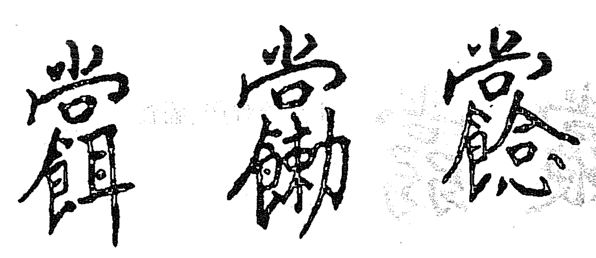

(左) (中) (右)

右字治背发狼疮，汤服，并可治疗咽喉痛；
中字治鬼魅附身；
左字治小儿夜啼，书足上，男左女右。

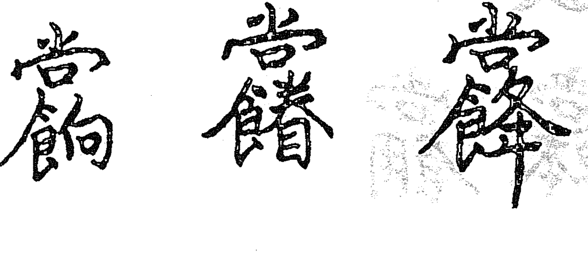

(左) (中) (右)

右字治虎狼随身；
中字治遍身疼痛；
左字治小儿肚痛，书足心，男左女右。

此字治难产、膈食。

此九字治男女一切恶疮，一日书一字，九日九字未完，其疮即愈；如女人夜行，亦书此九字於掌上，能避邪魅，每字书七次。

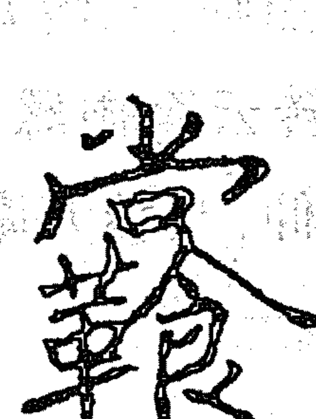

取天罡煞，如治病，取东方生煞。

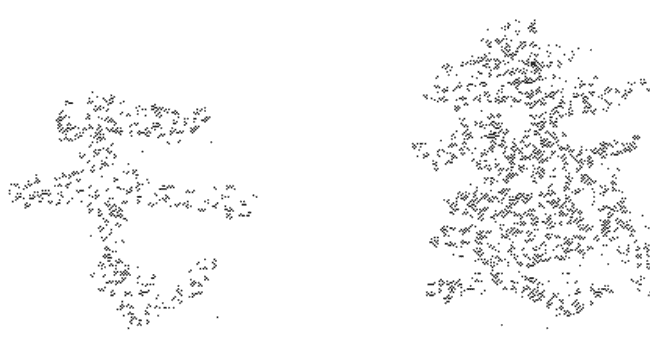

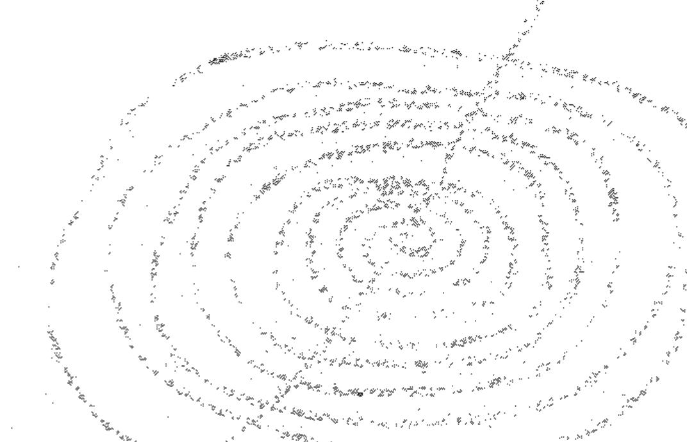

此九字书病处毕再用敕令盖之，用法水喷之，治一切病念咒三遍曰：天清地宁，身中甲兵，紫京妙法，直透天门。向笔上连念七遍，一口气将符书於患上，并能治火丹。前字书毕再。

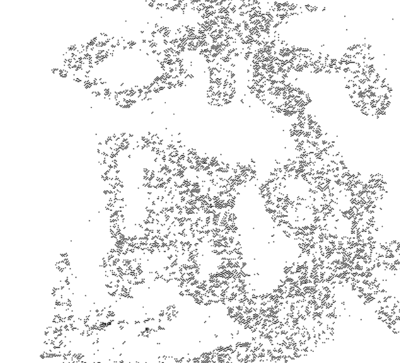

以九转法圈之

一转天地盖开，二转日月照临，三转龙吟虎啸，四转雷电轰腾，五转云奔雨骤，六转鬼哭神悉，七转鬼神钦仰，八转万魔来供，九转万病消除，出笔践上。

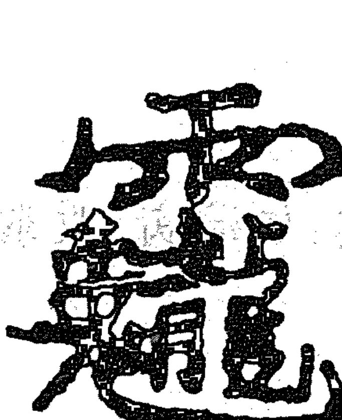

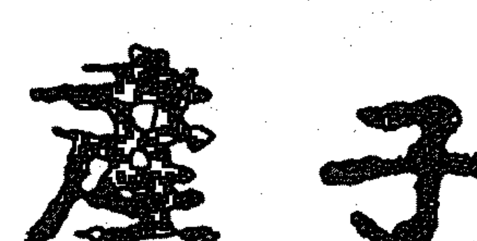

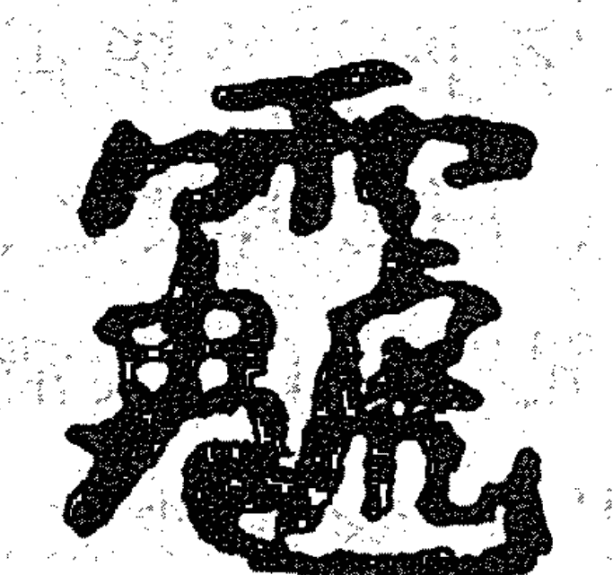

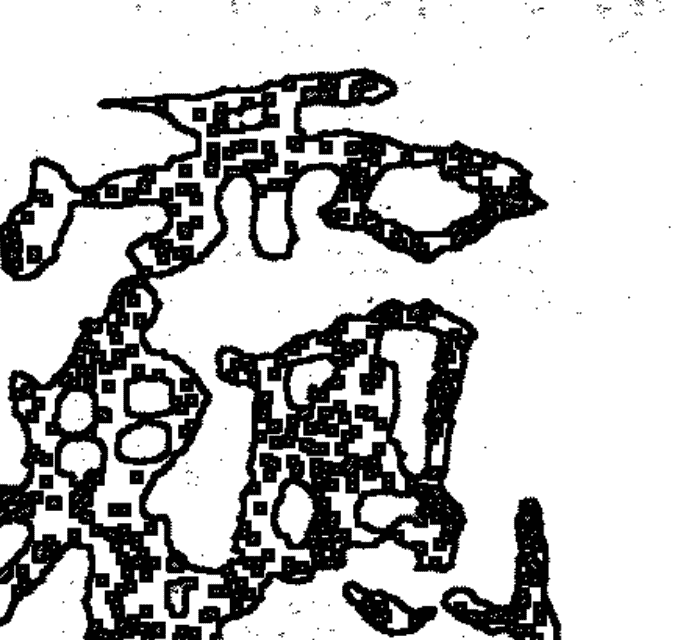

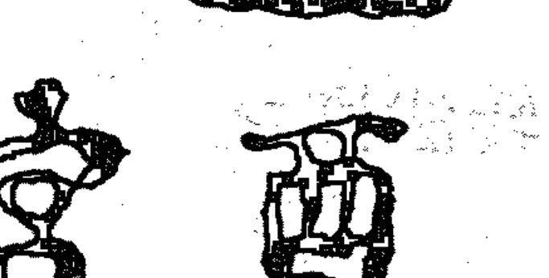

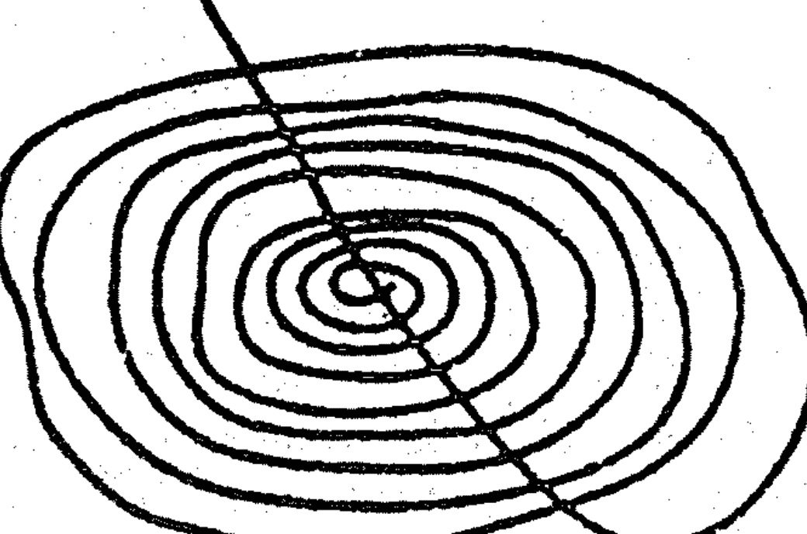

左符治骨鲠法

左手三山诀托碗或茶或酒左手捏诀，虚书，於碗上，吞之立愈。

## 九龙下海符

书前三字后书上符，作用同前。

又法：用水一碗茶亦可以，手指虚写九个龙字，不要踢脚写时口诵九遍咒曰：

天上金鸡叫，

地下草鸡啼，

两鸡并一鸡，

九龙下海，

喉咙化如沧海饮之立愈。

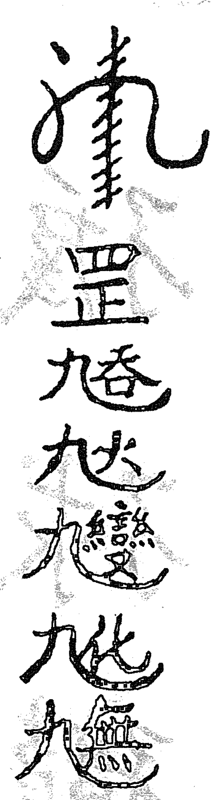

又法：

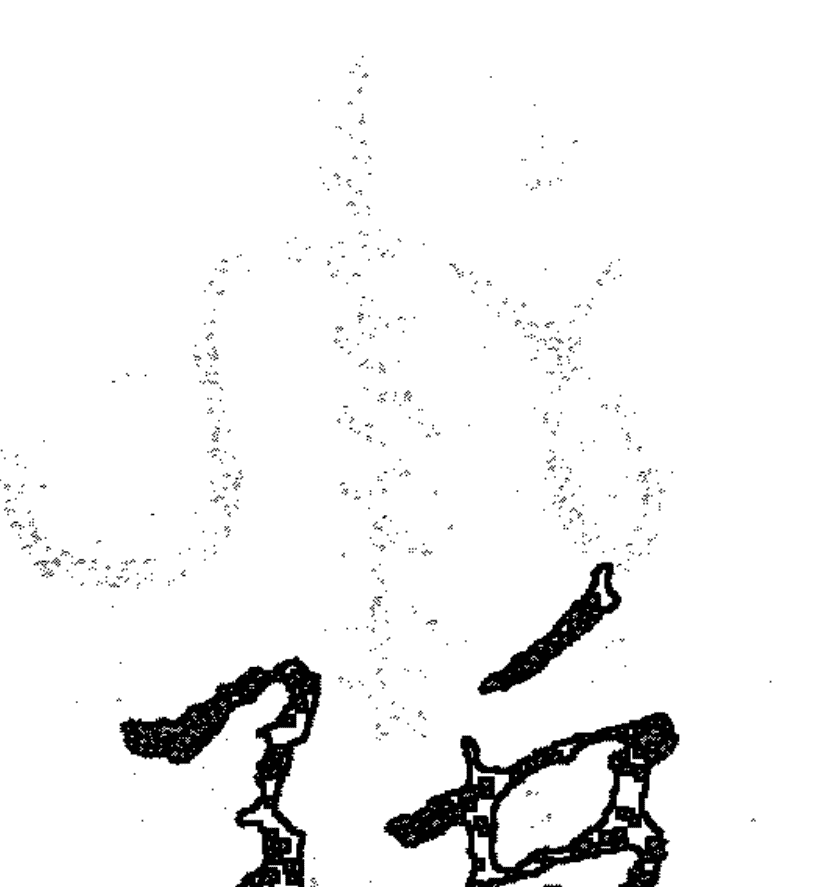

鸟飞龙下鱼
化丹立於或茶或
酒内饮之亦佳。

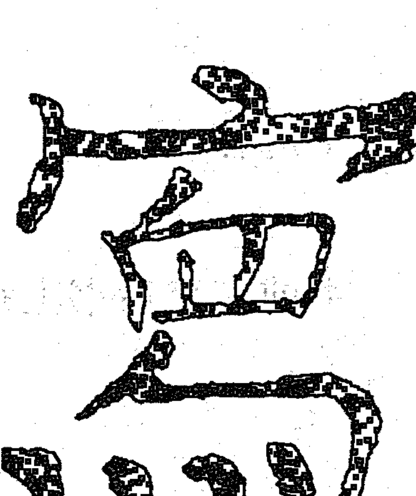

又法：

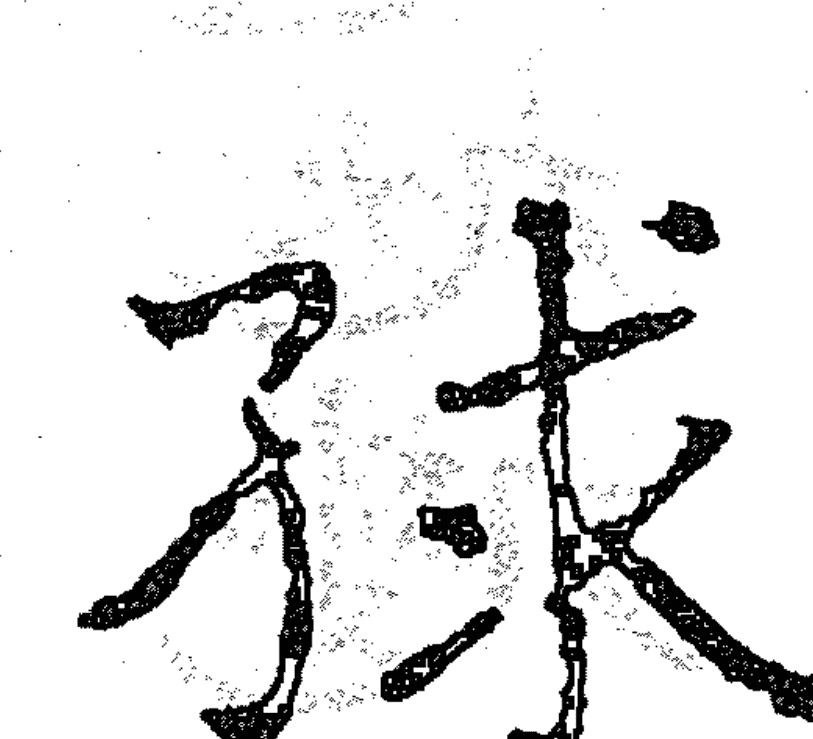

又龙蛇化骨神效敕令罡，凡写字
不可踢脚。

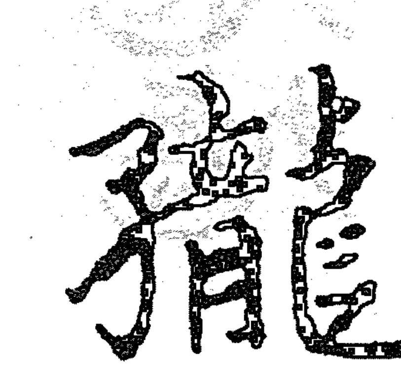

书此三字於茶水酒内，饮之亦效。

## 治三疟法

用黄表纸,朱砂书,或金墨书亦可临其焚灰桃柳枝汤面东南服。咒曰:天皇地皇,日月对三光,不到天光,吾奉太上老君急急如律令。

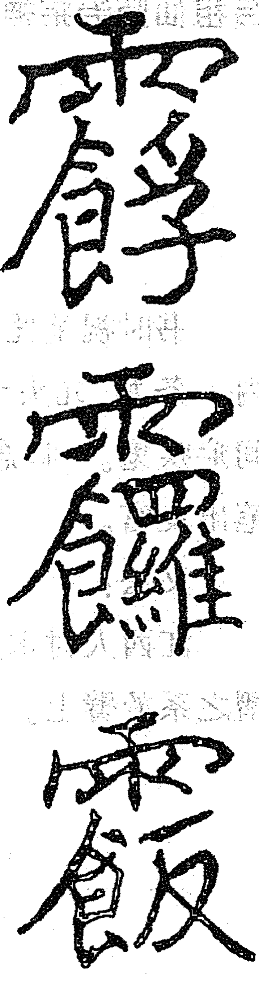

## 吕祖仙师治疟神符

书时祝笔咒曰:吾从东方来,望见一池水,水内一条龙,九头十八尾,不吃人间烟火食只食人间疟疾鬼。一口念七遍,用朱砂书於患人背上,运笔出良宫。

又法:

江西人讨木头钱,要紧要紧。朱书此十一字,摺之系於臂上。不可开看,男左女右无不立愈。

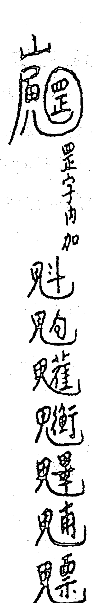

## 捉疟符法

圈内书孟又春、任牙照、冯友贤、田玉良、沈天保。用黄纸长七寸阔二寸，以朱书，书时念咒十遍曰：此笔非凡，笔化为指鬼大金枪，指天天崩，指地地裂，指鬼鬼绝，吾奉太上老君急急如律令敕。

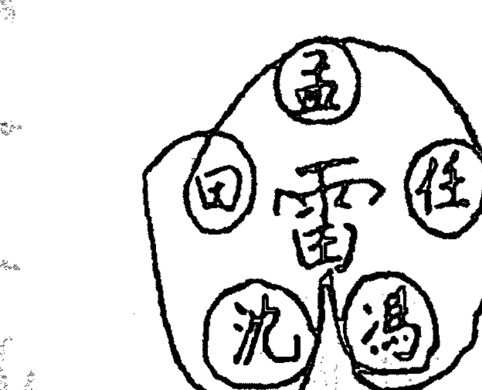

将此符用洁净细绢扎於胸前或臂上

无论三疟间疟俱可除之

## 治胎疟法

用黑枣去核剖开，清晨向日，将墨笔於枣内两面书之，空心开水服之立愈。

## 治火丹法

用刀一把手内执之，刀口向上，念地一口黑，念咒七遍曰：刀向天，云两边，刀向地，百草萎黄，斩鬼自灭，斩神自愁，诸肿毒肿毒自散，急急如太上老君令敕。念完喷水一口於患上立效。

## 又法

令患人向东南坐，用井水一碗，念瘟曰：寒成凛降浓

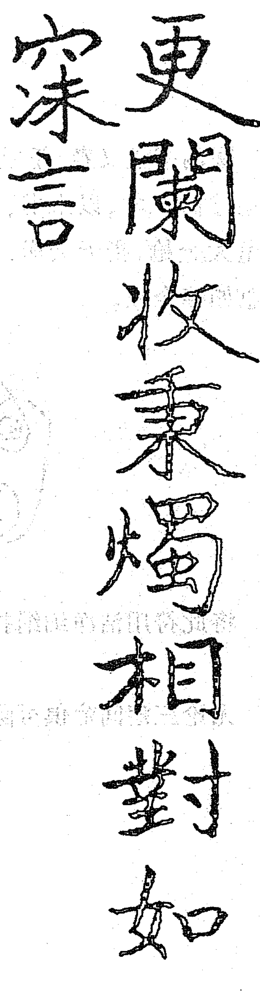

霜，冰雪层层布四方，吾奉北方奉帝令火丹灭迹冰安康。

墨书此五字於患上或水内，咒完存想北方黑熙吹于丹上并剔可文入书完将，笔向火丹一圈喷井水一口即愈。

## 治汤火伤咒

龙树王如来授我行持北方壬癸水禁火大法，龙树王如来，吾是北方壬癸水，斩将天下火星辰千里。火星辰千里火星辰化急急如律令，手捏镇武印吹之少，许令水洗。

## 治荷叶癣法

用金墨书秘字於患上，书时口念咒曰：“鱼吞水，水吞鱼，鱼水相吞诸癣除。熊字一个书完涂之。

## 治梅花癣法

用新汲井水磨墨，蘸笔上咒曰：鱼吞癣，癣吞鱼，鱼癣相吞癣自除。一口厢念七遍，吸黑一口吹笔尖上，叠书三熊字在癣上单日顺转双日逆转涂之一周时即愈。

## 蛇掰咒

上居上，居上居，上请周易文王鬼谷先师，卢医扁鹊二位先师，保佑弟子某蛇掰焦吐缠消除，吾奉太上老君急急如律

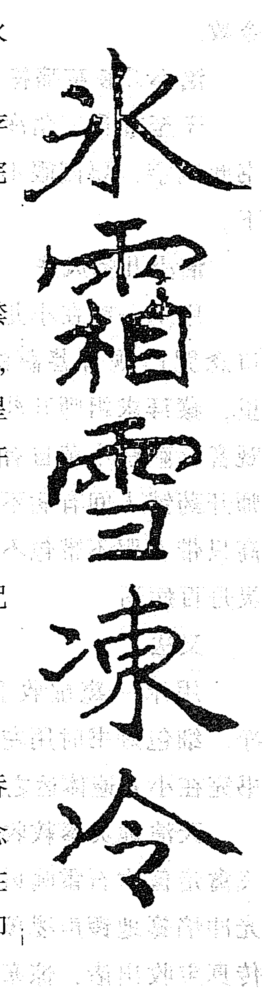

令敕。

## 治小儿夜夜啼符

于至前觅三角净瓦一块，捏剑诀虚书此四字，要四眼不见，藏小儿所睡床下。

## 治小儿惊风法

用米一锤在小儿遍体运之细绢包好口念咒曰观音菩萨法中黄自有药包空里，藏拜求祖师开药铺人间有病不须忙观音菩萨法中黄自有药包空里藏拜求祖师开药铺人间有病不须忙观音菩萨妙药高只带衣服不带包不用雷火并针灸一服灵丹百病消

## 又法

用米一窥虚收盒光篆于米上以洁净，细包好书时用左手三山诀右手剑诀书完在小儿遍体运之念咒曰

天清地灵奉敕收惊妖速散精怪潜形飞禽走兽木石雷鸣风电迅烈波涛沸腾火光冲焰蓦地锣声婴孩胆怯霎时受，惊流传真宝收出诸，惊寒热退散五藏安神吾奉

太上老君急急如律令速退灾星

## 治恶犬法

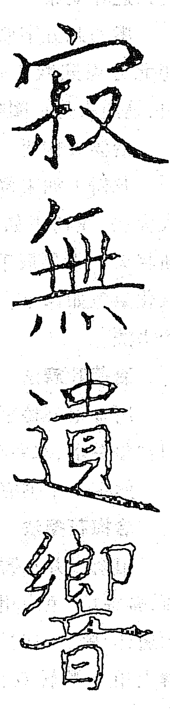

凡遇恶犬一口念咒七遍曰

运龙风虎降伏猛兽将左手挑寅掏戌向艮方吸一口即祖

宝瓶呵手戌上用大母指掏戌作拳捏紧

则真犬不伤靡然而伏

## 治恶犬伤法又治犬咬法

用金墨书一大字于伤处又书四虎

字于大字四方末书一虎字于大字上剔

寅文呈一口即从中虎字踢脚逆圈盖之

## 又法

凡遇犬咬以墨书五字于患上加遇

疯犬咬每字如一反犬

## 又法

出门外对日三步蹲地或竹木瓦石

写虎三字地间吐津三口在所写泥上炼

成烂泥涂之立愈

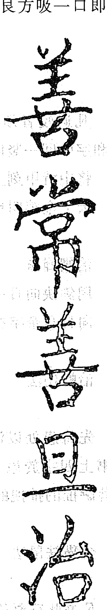

## 治蜈蚣咬法

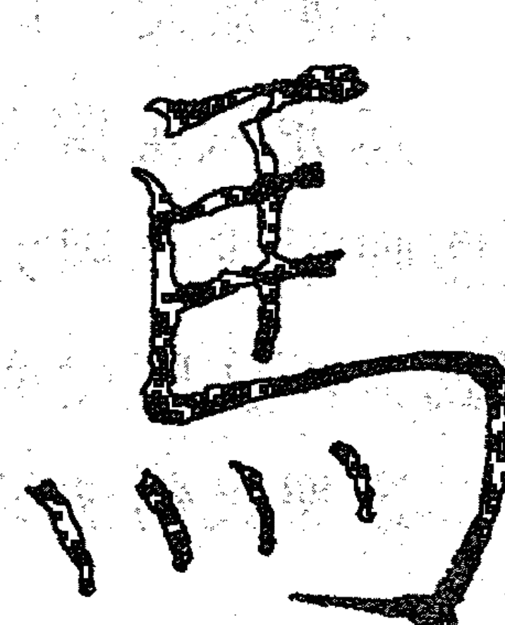

凡遇咬者须避人见向巽方用剑诀虚书和字中间一竖巨地将中背甲刻上尽须涂于咬处立愈咒曰天上金鸡叫地下草鸡啼两边多叫起蜈蚣化作泥

## 治蝴蝶螫

用剑诀向日书随下取土擦之立效又法向日写帝字亦如上取土擦之

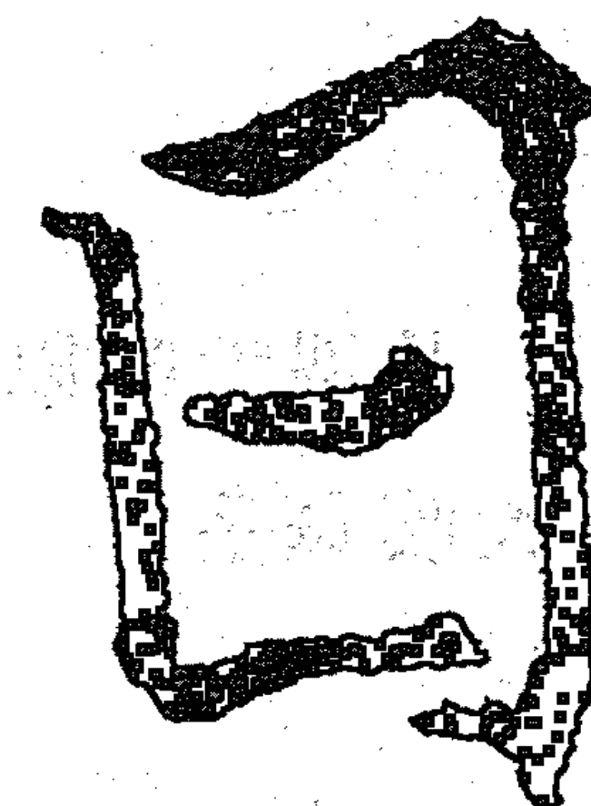

## 治蛇伤法

先将患处以清水洗净挤出血水用新笔墨书上四字於患上口念七次咒曰四大金刚八菩萨扯的扯拽的拽书咒俱完手作撮而甩之之状

## 金猫祛鼠法

凡书此符要危危日，最妙人祖书猫字剔寅文虎声终人

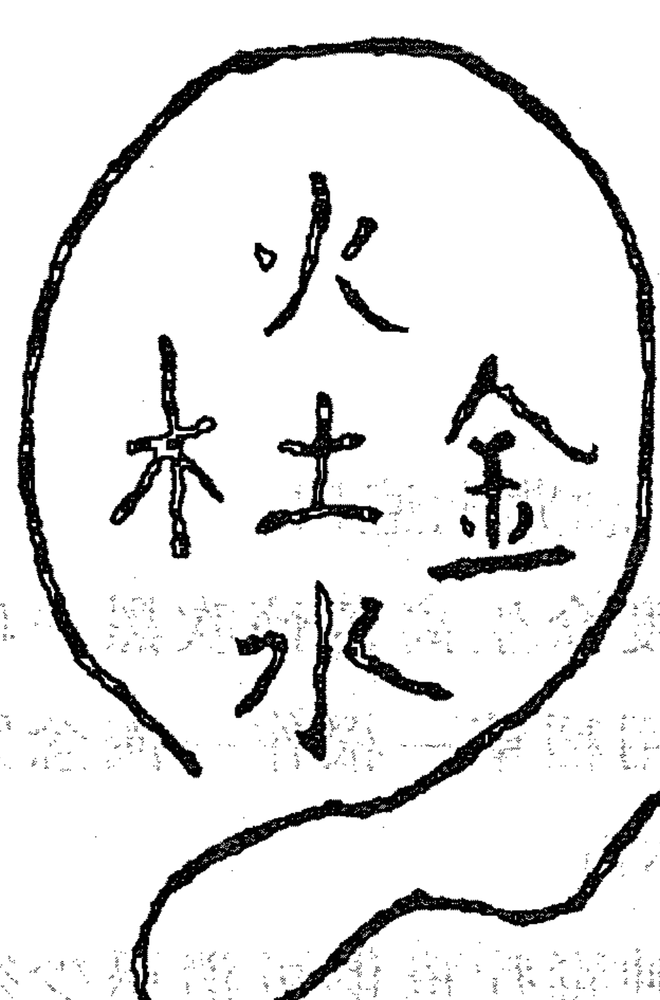

## 蛟龍

念咒三十五遍运三十五次涂黑布太阴
真炁煞鼠文咒曰
吾书一猫字贴在东壁上捉虎耗耗鼠绝
晚终不放急急如
费长房律令
局戏咒
伊帝弥谛弥揭罗谛念万遍可胜

## 征戰

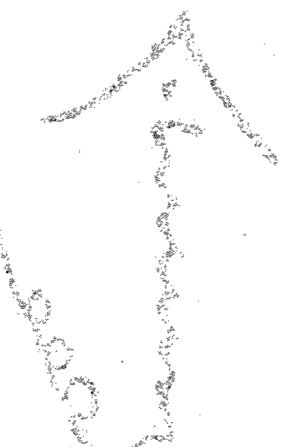

此符咒可保平安，驱邪避凶。

## 救虫蛾投火法

将灯草捏在手一口厢念咒七遍曰
波利瑟托护生草救度众生离苦恼吹黑一口在灯心上点
火可免虫蛾投火之苦或用稻草一根作一圈念咒七遍吹黑一
口于图上将圈悬于灯上亦可
消除散退一切无名肿毒疔疮俱可消退少须练熟得袖无
不验应

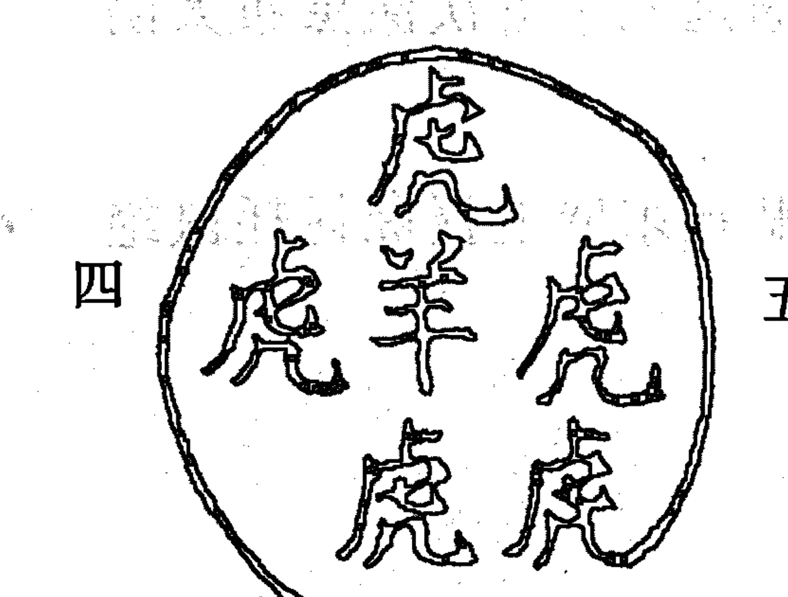

## 治无名肿毒符

第一先写羊字后照二三四五六次第写
虎字以第五虎字踢脚圈转写第六虎字再写
上令字连曲九曲然后以墨涂反具符一头涂
一头念咒九遍

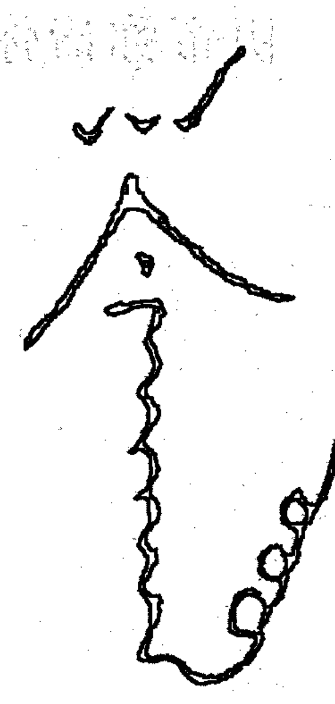

## 治夜梦符

咒曰 赫赫阳阳 日出东方 惊运神笔 五女焚香
一禁无名肿毒 一禁百般恶疮 惊动神笔 一扫精光
吾奉太上老君急急如律令

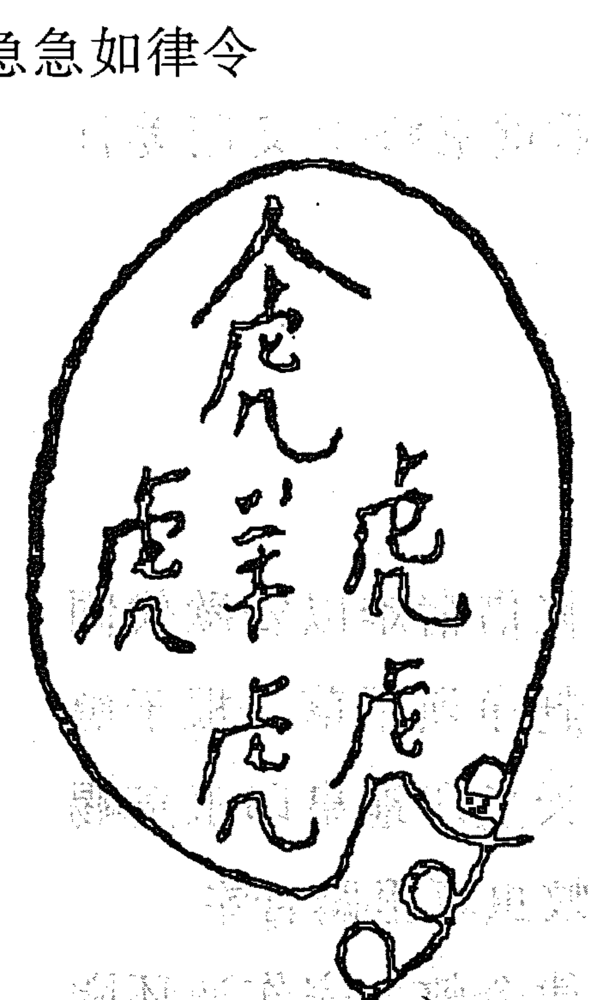

凡人临眠以左手抚心叩齿三通闭目微咒曰

太灵九宫太乙守房百神参位魂魄和同长生不死塞灭邪凶

咒毕而寝能使魂魄安宁不生乱梦常保吉祥

## 治肥疮法

书时念咒曰我是肥疮王你是肥疮鬼埋你东墙下一世不见起
空心用社醋研墨重书疮上又用姜汁猪胆调搽立效

## 驱蚊法

凡遇夏天出路无帐借宿难以安歇俟同室之人俱睡将扇遍处赶净须用草三根于黑时中摘齐念咒三次曰天皇印地皇印玉皇赐吾三颗印客人床上睡蚊虫草里蹲吾奉
太上老君急急如律令敕念完作速环圈三个吹黑环上悬于门上切忌人在圈门下走动若能如法蚊虫不扰

## 又法

念咒曰天明大晴日月大明阴阳文和急急如律令向太阳念七遍吸黑一口吹灯心上点火蚊虫白去

## 又法

于五月五日午时将灯心浸油内望太阳咒曰天上金鸡啄蚊虫脑髓液
太阳一口吹于草上夜中点火蚊虫自去

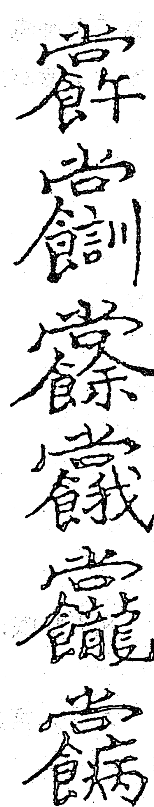

## 治一切痈疽无名肿毒

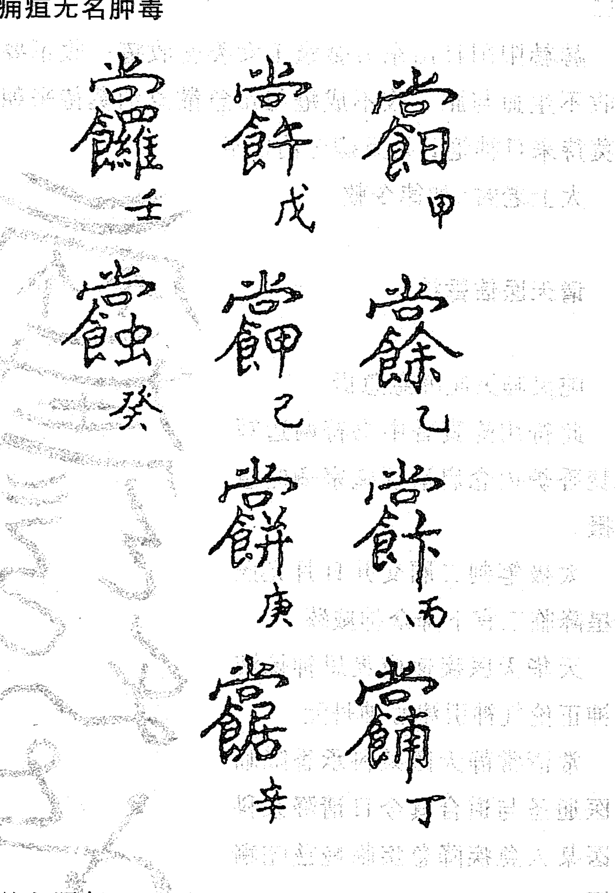

以上照每日天干用墨书于患上临书口念后咒不可参差

### 咒曰

赫赫阳阳日出东方金童玉女委吾收疮一收不要疼与痛
二收不生血与脓三收不成疮与疖急散急消莫待来朝急消急
散莫待来旦神笔到处万病全消吾奉
太上老君 如律令敕

## 请天医信香符

吨灵喃灵叱喃急急摄
此符用降真香中书符两边写
咒焚香炉内念启请颂唵宗喇叱急
急摄。

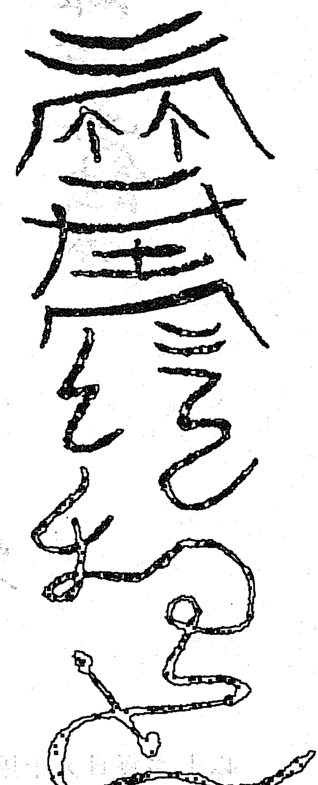

太极笔判二厢交并日月光照
五星降临三官下降众神威臻
天华天医疾速应灵思神炼液
舌神正伦气神引津心神丹元
常清常静天医某科承香降临
天医通圣与道合真今日请降某科
天医某人急疾降急疾临唵兹吒喇
般摄

## 召风科天医符

孙康中
卢元
陈安通
何部
紫黑清灵朗朗大无元真
一召降应虚
唵部帝灵喃兹吒摄
牛牛尼俱轮达计摄午文
南厢以下同

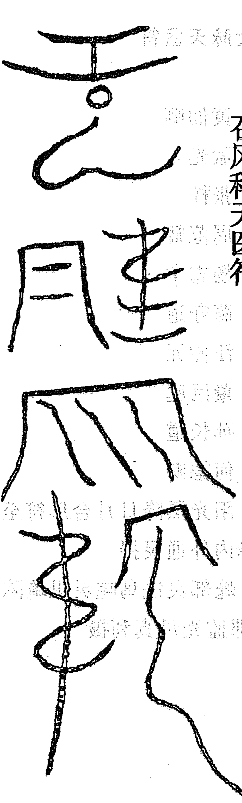

## 召风科天医符

## 召大脉天医符

+   黄仙卿
孟光宗
张梓
周范卿
杨志学
蔺守道
汪仲元
董巨庭
孙长道
何德卿

阳光黑降日月合形符至
应降内外通灵摄
唵部灵洗乌吒灵摄唵陈
吒那监光母真利摄

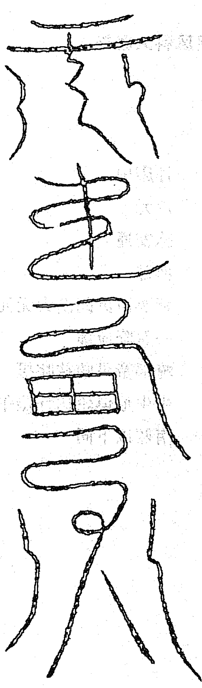

## 召眼科天医符

孟叔安
赵康中
曹福
叶文恭
灵光普降九天清灵斗
罡应极万象俱遵摄
唵都 唵护 那摄

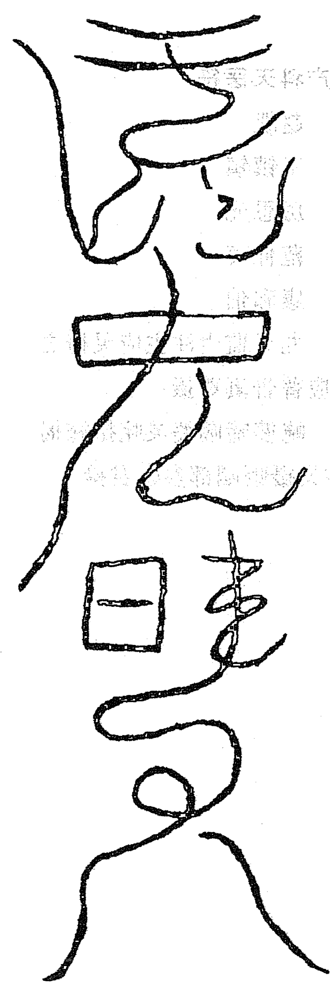

## 召产科天医符

+   - 赵凯
- 王镇镇
- 厉思光
- 范仲夷
- 康和伯

九天监生注主应灵祷之

急应普告真尊摄

唵婆啼喃婆灵吒摄唵揭

吒灵摄喇咽部参帝君摄

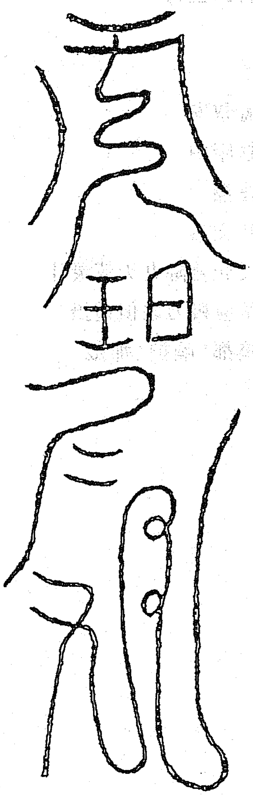

## 召外科天医符

高应和
张天成
张思
江先光

九天上帝垂光真灵一呼
急至天敕合真摄

唵许流金吒摩尼摄
唵提婆灵尊母耶摄

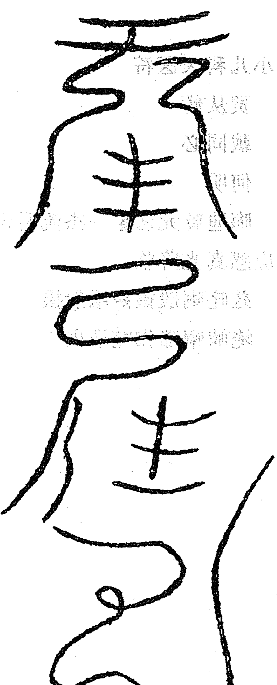

## 召小儿科天医符

贺从辉
戴同必
何明

晦迪乾元法象一杰流明合

真应感真光降临

兹吒喇般摄兹咽般摄
唵喃喇啼伽吒耶摄

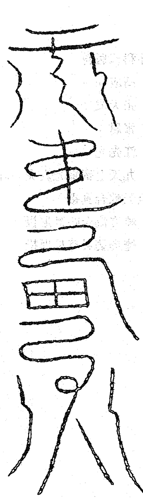

## 召耳鼻科天医符

曹迪
孙应之
天帝运灵日月合形天道
敕降急速为灵摄
唵哒喇奴真吒喇摄唵吒
喇般乌那灵摄

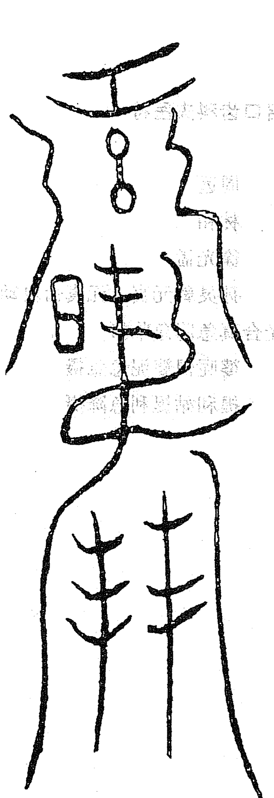

## 召口齿科夫医符

周远
林和
徐光孟
孙灵乾元真灵元真命灵动
光合真急降急临摄
婆呢俱婆泥急急摄
提利姑提利急降摄

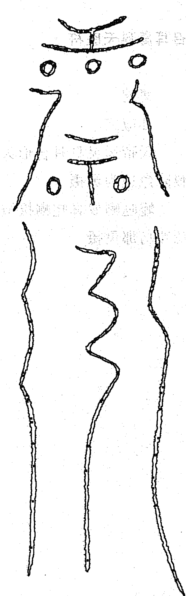

## 召伤折科天医符

赵通
柯中一
缪道
天真元应合应天真助我
道法元合无真摄
唵僧伽那吒毗尼般摄

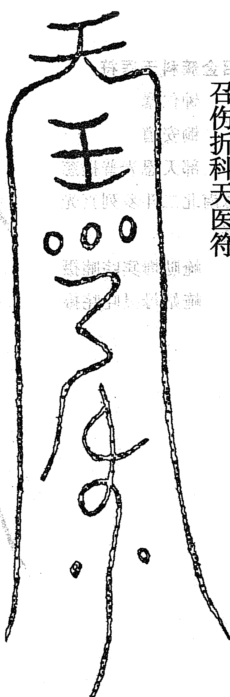

## 召伤折科天医符

## 召金簇科天医符

钟仁暴
锄安道
部天恩光普提慈
恩南北二斗罗列真光
摄
唵哒姆宾吒喃摄
唵姑母灵吒吒摄

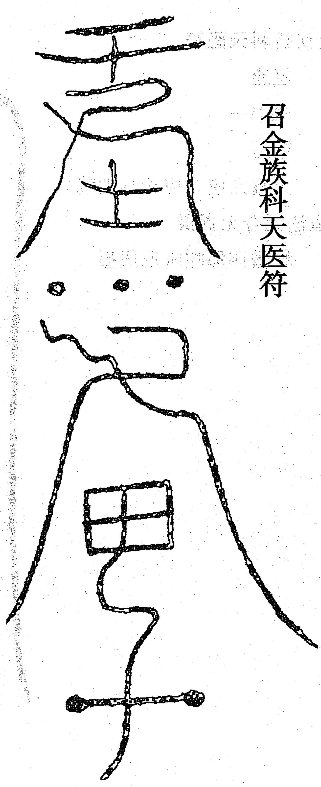

## 召金族科天医符

## 召砭针科天医符

张铸
万凯
元明真诀与应合明大
羔从法一应急灵摄

唵部吒那明敕应摄

唵罗婆帝频吒那摄

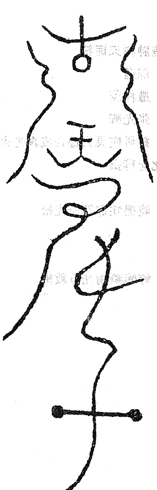

## 召疮肿科天医符

倪道
遭仲茂
张光卿
兹科应灵火德合成真光火
德化应尊摄

唵提吒那婆应光摄

唵啼喇南光尊敕摄

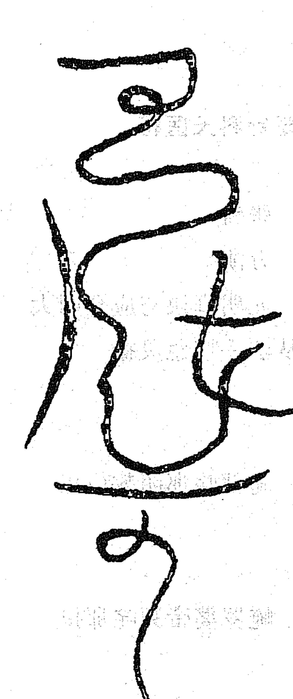

## 召书禁科天医符

天宗真火发降成行书禁应

化大敕急遵摄

唵啼利般降应南摄

唵吒那母灵喃喇摄

法用黄纸书天医符下写奉召，某科天医速降临同信香符於香炉，内念前启请颂并本咒存至祸其某，病患之事然后书给付服符凡书服，符每样用三道先一道焚化随饮服，法师词人皆当至意诚心立彰感应，疴笃疾顿即全愈若起私心怠慢必，诏谴也戒之戒之

应道用

袁智元

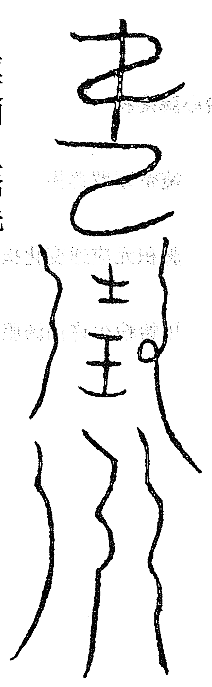

## 治心脾疼符

唵帝摩罗尊摄

脾积元应通变化摄

用蛤粉少许调汤服符灰下

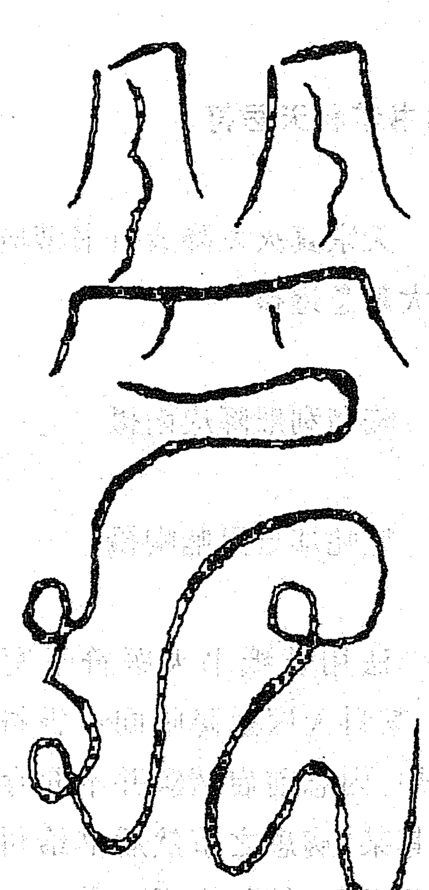

## 治气块符

气元应病都咤摄

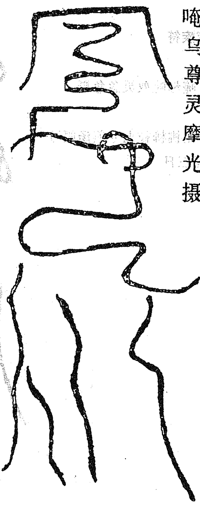

唵乌尊灵摩光摄

## 治疟疾符

唵母吒奴灵急急摄

用桃柳枝七寸煎汤服习

荤胆三日

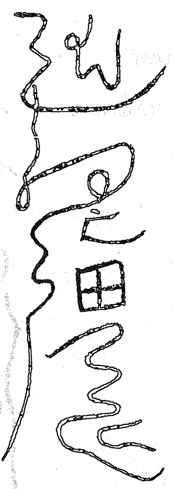

## 治喘满符

唵径乌罗跋帝摄

尊帝喃化病源摄

用疑花汤服


## 治痢疾符

夺赤那兜咤摄

乌部光明真摄

赤痢甘草汤白痢乾姜汤赤
白用乌梅汤禁口痢石榴皮煎汤


## 治腰肾疼符

五悉灵平复摄

用木香汤调服


## 治寒湿气符

捏婆结罗般般摄

赤咤灵婆那那光摄

用鹭藤服兼治脚气肿


## 治头疼符

尼陀昏罗婆光摄

用白芷末和灰茶清汤下


## 治霍乱吐泻符

结罗奴光宾摄

九江真羔灌注使安摄

用丁香或霍香煎汤服


## 治虚损吐血符

俱轮陁正光急摄

唵部吒阿那九真摄

用枣汤或酒或盐汤下


治伤康坏症符

和安通理病元光摄

证通元明安康急急摄


## 治伤寒符

帝都摩光理摄

极救不正伤寒通应大明摄

## 治伤寒汗不出符

利益元通发汗医摄

奉帝救降医科发摄

## 治不明异症符

通神法禁医通定摄

通应大灵摄

## 治杂病符

通利元天保安急急摄

妙应通灵天降灵急急摄

## 治诸风符

唵部都咤灵应炁摄

唵帝思光灵婆那摄

## 治风颇异症符

唵摩灵婆吒那急急摄

唵帝真灵那通真摄

## 治风癫符

唵婆吒那虚灵婆急摄

唵赤利南定正光摄

## 治头风伤人符

唵法降灵慈光急急摄

用乳香汤调下日三服或久服更妙

## 治五疯符

菩陀灵伽婆那摄

唵兹母灵结罗诃摄用酸枣仁汤服

## 治心邪符

母陀尼应病婆帝吒摄

灵光尊利降野盘摄

用枣汤服如大风症雷凡汤下

## 治中风符

治心惊悸口眼歪斜半身不遂

逻真卢颤那婆光摄

斗光咤冰狂恿摄

用远志门冬汤服

## 治夜游符

治风掐搦或歌哭夜不睡卧

提咤灵喃思光喇摄

乌灵婆帝沙尊喇摄

用乳香汤服

## 治胎前产后符

唵兹细灵吒婆野摄

唵啼婆明应光利摄

## 治胎前产后又符

尊母陀灵喃部吒摄

用淡醋汤调服

尼陀安嵬尊光摄

## 治妇人一切异患符

唵明真嘘达哩摄

唵萨灵应摩摄

## 治不孕符

治久无子息腹中涨满怀妊不安符

唵医达陀明痊急急摄

唵迷那光冰涂尼哩摄

## 治产中不症恶候符

元明妙降泡利般摄

唵帝敕明飞兹利摄

## 治月经不调符

治月水不调诸异症

唵计洗尼定光法摄

唵提兹灵南息帝摄

## 治血崩符

乌罗牟至应血摄

中光卢灵婆咤摄

## 治经侯不调疼痛符

兹部吒尼通化摄

呼定真利定喃摄

用当归煮酒服

## 治脾血气符

啼真光卢婆南摄

真都母鬼那应咧摄

## 治胎动不安符

哒婆唵喃涂急摄

用淡醋汤服

都母蛇婆利般摄

## 治胎孕不牢符

尼都宾那摩哒咧摄

尊利般宾兜那摄

用枣汤服

## 治血块气僻符

提兹灵南陀陀尼摄

安婆罗定血块摄

用醋淬烧红铁锤或铁扦服

## 治妇人一切冷病符

乌兜那磕母陀摄

用姜盐汤调服

令宅中灵草利摄

## 治妇人气晕符

赤吒吒尊运化灵摄

用木香汤调服

氣發吒那尊真光攝

## 治妇人气晕符

赤吒吒尊运化灵摄

用木香汤调服

氣發吒那尊真光攝

## 治一切眼疾符

唵啼婆明唵吒摄

唵提菩吒南应摄

## 治眼疾符

治内障睛散不明一切角膜

唵帝利明光尊摄

唵吒盘灵尊吒喇摄

## 治角膜炎符

治邪祟摄睛光上角膜疼痛

唵婆兜罗婆利应南摄

唵乌苏尼赤婆吒喃摄

## 治鬼神摄了晴光符

唵兹利般光应敕摄

唵提明婆应唵咤摄

## 治眼目昏眩符

唵都灵婆吒都摩摄

唵都摩罗定真摄

## 治眼赤烂风毒符

唵赤达都摩耶定摄

唵吒吒都南应摄

用荆芥或铜青煎汤洗

## 治赤肿风毒眼符

唵婆吒那都灵喃摄

用蔓荆子煎汤服

电利涂乾光应化摄

## 治眼肿痒涩痛符

唵兹灵兹灵婆化摄

唵毗灵重娑定命摄

## 治内障眼见黑花符

唵摩罗尼尊吒摄唵毗吒毗尼光摄

用构子汤服

## 治多洞视物不明符

唵咤陀灵僧伽那摄

唵真那卢婆腾帝摄

用熟地煎汤送下

## 治内障眼见黑花符

唵摩罗尼尊吒摄唵毗吒毗尼光摄

用构子汤服

## 治恶症眼符

乌灵尼陀宁摩摄

唵萨陀利般般急摄

## 治惊吊疯符

唵尊利喃普并从尾摄

电 按 光 蓋 塑 吐 吐 摄

## 治惊吊病又符

唵悉吧咤乌耽摄

唵通咤卢，惊搦摄

用枣汤调符灰夜啼涂顶心

## 治小儿喘嗽肠疼符

唵尊利南真光部摄

用枣汤服

## 治小儿杂病符

唵帝婆咤灵母陀光摄

安用药发旋善无畏

## 治小儿吐乳胸中痞塞符

唵咤婆卢咛尊光摄

唵普帝迷灵摄

用白术汤服

## 治小儿泻痢符

唵尊部灵婆帝吒摄

唵提尊南定正利摄

用枣汤服

## 治一切齿息符

唵定镇灵哒陀摄

唵尊吒那卢急急摄

## 治咽喉一切不能明恶症符

唵提喃部南光摄

唵尊茶醯那应摄

唵提喃部南光摄

## 治口齿咽喉一切病符

唵兹吒那应婆吒摄

唵乌涂应般般摄

## 治风虫牙符

唵咛利南乌光宁摄

唵婆那涂宾光摄

用管仲汤服

## 治木舌符

唵尊吒那母敕光摄

用床子和灰烧熏之

敕摄灵官那姑尊明敕

## 治口舌生疮符

唵哒嗔母应吒吒摄

唵僧涂宁光飞摄

用杏仁全符灰嗽之

## 治喉风符

唵风宗喇喃摄

唵呜喃光尊利急摄

## 治身体一切恶候符

唵喃嗔罗乌母陀摄

唵婆毗陵南光摄

## 治身上一切不测之患符

唵毗婆帝南光急摄

唵枷那之伽伽哆摄

## 治身上一切难明症候符

唵普帝喃思哒婆毗那耶摄

唵毒光卢乌摩部南摄

## 治疗疮恶症符

唵帝供灵喃哆婆摄

唵乌部喃咏达哆摄

用石灰和符调贴或用绿豆调灰待服

## 治肾痫肾漏符

唵赤部南涂吒摄

用黑豆和符调敷

## 治下部符

唵呜摩罗哆陷耶摄

唵乌部灵光哆摄

用茴香汤服

## 治淋涩病符

唵菩陷真喇灵急急摄

唵哒明婆帝敕急急摄

用酸竹汁服

## 治五痔符

唵突赤灵南真光摄

唵婆罗利般光摄

用积壳汤洗之

## 治小儿潮热惊疳符

唵哒婆灵喃尊摄

唵吒利喃啼婆摄

用枣汤服

## 治恶患痈疽符

唵兹婆那乌光利摄

唵帝飘灵摩摄

## 治一切颠闪符

唵敕利南光宾摄

唵婆头宾咤那摄

## 治伤损疼瘟刀刃硬物伤符

唵尊利婆那灵摄

唵利帝南灵光摄

## 治伤损疼痛刀刃硬物伤又符

唵婆明尊利光南摄

唵尊卢毗摩帝摄

## 治一切伤损疼痛符

唵婆帝灵南光摄

唵兜婆罗灵南摄

以符灰和膏药贴之

## 治蚊犬伤符

唵尊卢尊卢南摄

唵婆婆尼灵尊摄

以符灰和膏药贴之

## 治虎咬符

唵屯利明光摄

唵婆吒那频光争摄

用乳香汤调灰服仍以灰和膏药贴之

唵屯利明光摄

## 治鼻内患符

唵毗帝尊南敕摄

唵兹利南定尊梦摄

## 治聤耳符

唵帝奴光尊母陀摄

唵勃哒婆宁真摄

用香和灰吹人耳中

## 治瓮鼻符

唵提灵帝宁摄

唵真利南乌光宁摄

以符灰搐人鼻中

## 治恶疮符

唵元恩科应大明摄

唵敕哒母哩光尊摄

## 治一切毒物疮肿符

唵帝南明光飞吒摄

唵帝明光应吒摄

## 又符

唵婆兜水赤地应赤摄

唵帝频那乌光喇摄

用护花草捣调灰贴

## 治疮毒结未成符

唵兹母南尊光利摄

唵母光宾利敕摄

## 治烫火伤符

唵吒喃喃吒应光摄

唵赤毗陵南尊帝摄

用无名异水调灰涂

## 治臁疮反疮溃烂符

唵乌林陀涂光摄

唵敕母陵婆南提摄

用竹叶烧灰调灰敷之

## 治大风疮湿癞符

唵毗毗灵吒涂帝摄

唵突毒那刹利摄

用苍耳子末茶调和灰服别用粉和灰涂

## 治小儿恶疮符

唵帝飘隆通利摄

唵帝明婆吒那般摄

用轻粉和灰调涂

## 治破伤肿毒

唵尊达母光灵摄

唵哒灵涂曼光摄

用鱼胶调灰涂仍以以酒调服

## 治一切刀伤骨损及赘瘤符

唵帝应光尊陀摄

·141·

## 治一切刀刃伤符

唵奇利南婆兜那摄

唵兹吒般急急摄

## 治一切刀刃伤又符

唵启吒师那尊毗摄

唵皮哒母陀光尊摄

## 治一切尖硬物伤符

唵应兹那毗陵达摄

唵兹母灵陌赦帝摄

用血竭草捣和灰盒

## 治一切恶毒符

唵毗灵那灵光急摄

唵母尊陀宁定急摄

## 治诸兽蛇鼠伤毒符

唵帝毗南婆急急摄

唵婆吒那尊灵喇急摄

## 补遗

唵咧唧咕崛哮摩哈钵啰哼那兴吻汗吻
晞摩尼哮吉哮摩那栖唵捉吉那乌深暮崛哮畔畔畔泮
泮泮泮泮泮婆诃

催生神符

先书牛马二字馀不拘
何字随手写不宜勾蹴

上方

玉帝君日月光明普照身奉太上老君急急如律令

治传尸痨芍归血徐散
宜女顶门生发
小圈井水洗去油腻醋
浸一宿日中晒乾纸燃火烧存性
真川芎半两当归二分 木香二分 桃仁二支去皮焙
雄黄一分 安香三分 全蝎二枚江上大鲤鱼头
一枚生截醋留炙酥

右为末分作四分每井水一大
碗净室中煎七分人红硬降真香末
五分烧北斗符人药月初五更空心
向北目天咒曰

瘵神瘵神害我生人吾奉帝敕
服药保身急急如律令

咒五遍面北服药毕南面吸生
黑人口服中烧降香置床底下年时
又如前服药

北斗符

## 治乳疖法

先以墨书一乳字于红纸上后以患妇日常所戴簪一枝不论金银木竹务须日常所插者方验于四眼不见将后咒语口念手写七遍于簪上然后将此簪刺乳字内插在土中俟疖消退然后拔去

咒曰

月里嫦娥树东南第一枝一口及到根两乳便消空消灭消灭疼痛速消灭吾奉太上老君急急如律令敕

## 难产催生方

以此四字写于红纸上要四眼不见贴于产妇帐中床前点香烛一对即能平安产下

## 驱疟神咒

勃疟四山之神使吾来缚六丁使者五道将军收汝精气摄汝神魂速去速去免逢此人

凡在寒热发作之时朗诵即可汗出寒热即退

## 移担子疮符

咒曰
担子恶疮一并钓消吾奉太上老君急急如律令敕咒完敕法至土墙上用刀体一人形患处控洞先将朱笔画符于患洞内用艾绒灸须要虔诚青天每云面朝东处则验

# 第四章 茅山术的继承与发展

茅山术系道教鼻祖张天师所创，后经名派流传，在发展过程中，呈现出许许多多的流派。《步罡踏斗指法》、《百诀全图》等先圣派留下的符法全书不外乎与张天师的《万法归宗》类同，今江西省龙虎山寺仍有历史记载。

茅山术算是道教符咒最为完整的符咒文化，它与各流派不同的是对程序上要求十分严格。我们在前面章节中所谈的祝由十三科主要用来诊治疑难杂症，对分科上十分讲究。下面就茅山术的运用程序作一简述。

## 请仙法

我是从八岁就随养父习茅山之法，所用之符绝大部分是张天师之法，为了满足当地百姓所求，时而也用祝由十三科符，他们之间有一比较明显的区别，祝由治病灾，茅山符避邪，后者却重于神咒，如果将两者结合起来将会产生神奇灵效。

## 焚香咒

请时，有用三盘果子，茶、酒各三盏，虔诚拜请，自然下降。

道由心合，心假香传。香焚玉炉，心注仙愿。真灵下降，天仙临轩。今臣关告，圣达九天。所启所愿，感赐如言（用面向东方，吸生气，吹于纸笔墨砚上）。

## 祝香咒

道由心合，心假香传。香热玉炉，心存帝前，心存帝前，真灵下盼，神抵照庭，令我心灵，鉴我心虔。所祈愿咸惕如言（咒鬼印，以镇洋镇纸）焚于水兽水盂内，又用九字樱于水盂内，即口念。

皇矣上帝，无对至灵上，上世以照乾坤，道德以化用行。各钝五行得令，七不系不及，方比应雷服之，行道气动用法，论起居出人，云在蚬虎发号令，风处文文，视之下见，听之不闻，中和气须，万物化生，下方天德是尊。

惊惶丧魄，恐布处魂，设处祷。虔立诚存，思回天意，即日兴云，广布霖雨，民自生生。急急律令。

## 祈祷文

乾坤摇动，五池秉明。底圣者左，青草不独，里坎霞宫，雨骑近癸，来太保木郎，太乙三山，雄声林林石矣。元元通处。尽展灵通，猛马四匹，欲火香流精见卉见虫，巨神七煞登云中，黑潘化悬，一切呈将雨雨屯。

光向伯城动，以山人三杀，杀海文滨洞，冯夷喜舞长，呼风蓬莱弱水，都兴功龙兴捷，疾称御凶，朱发已翅双，日彤雷霆吐毒，驱五龙四溟（爱建）罗明容一声，四海皆昏，雨阵忍至流洪，金光流金斩早虹，洞阳幽耿照风露，寺雷扳依变崆峒，虚皇秦华妖妇烛，群梁玄黄号前锋，祠泉音蠢威，天公雷火律令翻穹龙鞭系妖，驱蛇虫色吉利，炎赫众圣僧，泽熙悉所从，织女四歌心公忠，辅我救早功勋隆，亦只紫阳习无穹，摄魇缚祟送北丰，紫虚元君临，急急如火铃师律令。

## 净口咒

丹朱口神，哇秽除氛，舌神正伦，通命养神，维千齿神，祛邪卫真。急急律令。

## 净身咒

灵宝天尊，安慰安形。弟子魂魄，五肠玄冥。青龙、白虎、朱雀、玄武、侍卫我身。急急律令。

净土地神咒坛场土地，神晚抵灵。通天达地，出入幽冥。为吾传奏，不得留停。有功之日，各书上请。急急律令。

## 净光咒

天地玄宗，万气本根。广修浩劫，证吾通神。三界内外，惟帝独尊。体有金光，大映吾身，视之不见，听之不闻，包罗天地，养育群生，持育万遍，身有光明，三界侍卫，五帝同通，万神朝礼，役使雷霆，妖怪丧胆，鬼神忘形，内有霹雳，雷神隐名，洞慧交澈，五气腾腾，金光速现，覆护坛庭。急急律令。

## 净水咒

天一生水，地六之一。一六既令，五行用基，吾今动。秽逐尘飞（以口及气吹散，又密咒）白乾元，亨利贞（咒毕，即提笔书此符于水中）。

## 又用指写

至尊至圣（于水中又定）敕封五鬼，于水盏面，又写五字于水面，三三（一作一七，一用笔书此五字焚于水面，先倾，水溶咒，次以水洒四方，望东叩齿密咒）。

某稽道顿首上启九天玄女，真蚓书写符篆，召请蓬莱仙女，伏望至真，生气灌注，谋心身及所用笔，墨纸素之间，今（某）书篆，速降灵通。其下情可胜，恳祷之至（遂以水巽于箕上，及笔黑纸上）。

## 咒纸文

褚王之英，于地生成。龙章凤篆，资之以陈，符习迅速，遍历灵天。

## 咒笔文

神笔扬扬，万古传芳。吾今书篆，飞召千方。云与风飕驭，速降灵场。

## 咒墨文

神灵墨灵，通函达冥。松君效职，兰友凝馨。仙宾降格，速驾云乘（乃向东南气书符）书符咒。

玄女元君，痰化十方，祝祷无不精，求无不通。三教之内，六合之中，顺命者吉，逆命者凶。仙离蓬岛，疾如雷霆，符命一到，电掣风行。急急如律令摄（咒毕，遂书得每点每画，皆密念咒）曰：苍龙朱雀，白虎玄武，经天四七二十八宿（书毕，以符置箕上咒之）。

## 咒符文

太乙灵场，紫气煌煌。精严院宇，粉饰靓堂。吾书化，飞召千方（咒毕，即焚疏牒，升龙车，凤辇仙鹤三运等六符，同符使甲马关牒齐侥，又纸不一贴烧毕，即咒之，曰：烧香达洞府真气接香传，虔诚恭叩请，仙众请降监。咒毕，请箕于香案前以符水，蘸笔，书于箕头：将写时密咒）

青龙朱雀，白虎玄武，经天四七二十八宿，（毕，须用手打）虎头诀。于袖中化得于箕诀。于神中化行于箕上密咒曰：天上人间七七后，以符水书五鬼符：图 1（于扶箕者掌中，图 2 急抱箕而咒请来之。又烧封手符于手中）

## 请仙咒

请神仙时要在完成净身，净言（口）之后而行，不可带有半点杂念邪心。并默念要请哪路神仙为我助一臂之力。

虔诚恭叩，请符使为通传。不分时与刻，直抵到桃源。仙宫尘寂寂，洞府月涓涓。

我令禀启元君令，号召蓬莱请众仙。
五真宝气临尘世，驾鹤腾云阐词源。
高毫仙笔书文字，速降威灵走锦笺。
叩启诸天诸地府，通灵位上紫姑仙。
今时有请远报应，落度乾坤万古传。
火急律令风雷现，威光凛凛作惊天。
请仙宫，桃源洞，东流少郡是真仙。
李公铁拐汉锤离，吕公洞宾韩湘子，
曹公国舅蓝彩和，何氏仙姑张果老，
公明正直显灵通，传梦尚书范太保，
作诗作赋断吉凶。阴阳祸福无私告，
不分高下贫与贵，一一件件分明报，
灵威圣迹箕中显，有求皆应无不从，
回向作急件尘世，先时报兆显名声，
弟子焚香虔诚拜，仙翁亲身齐降监。
天高高，地遥遥，海天万里来飘飘，
不为人间酒与肴，有如王母献蟠桃。
与汝共作神仙会，相随水结威寒交。
敢请仙童达洞府，投仲弟子愿返依。
头上插花迎仙侣，急急归来赴我箕。
天灵灵，水灵灵，火灵灵，天地水，火地最灵。奉请仙翁请圣众，降我明堂赍我净，我净室永协我箕，急急如律令（如念七遍不至）。

## 又咒

卸嘛赫赫，雷光昭昭。无令凝滞，心黯魂销。奉太上老君急急发中律令（如箕动，是临乱）。

## 即咒

云推雾卷，仙真倏到，愿附神算，推诚乐靠（如写向字，是仙要云，却念）。

## 送仙咒

俗说请神容易送神难，又说不请神，不显灵，不请仙，法不占，故而书符必请仙，请仙必送仙。请神不送神，必将怪异生，所以当完全化解事宜后，一定要送走神仙。

已蒙仙真降，格尘环扰扰，难以久留，敬查悠宝香攀送骄返，来时感恩，去时春福，降则无路不通，回则去路难寻。

四海之内，唯同此音。后有所求，再当奉请（将箕托于水盂即退）。

## 牒式

雷霆火急，建都司下：据某省等处，承宣布政使司，某符某县某里社界，奉仙弟子某，力因某事，未知分晓，捐于今月今日今时，就某处焚香百拜，虔请蓬莱仙众、九天玄女无元君、无始真人天仙、地仙五祖真人、少阳正阳纯阳三位真君、五湖映雷三汀真人、玉轴道老仙女、紫阳真、罗山仙翁葛真人、滴仙太白李真人、野人黄真人、云门吕真人、紫霞崔真人、玉蟾白真人、南五相真人、北七真真人、云贞仙女、柱英、庆妈、道妈、雷奴、真聊、地真玉肌素女、天上地下，水府阴间，三岛于洲，洞天福地，古往今来一切仙众暂离洞府，急降尘寰。或作诗赋，或作词篇，挥笔楷书，直判分明，以慰人望。

须到牒者，右仰直符，使赵弓马温准比！太岁某年某月某日某时给牒，行限即刻到（画压牒符）。

## 请仙礼仪

果酒花烛已办，先焚香、祝香、礼拜、咒水、咒纸、咒笔、咒墨、书符、咒符、发牒，随即箫笔蘸灵水写五鬼封箕头。

有诀：

## 密念咒

天上人间，云水迢迢。敢请仙童，队仗迎遥。霓旌羽盖，带离云霄。毋令凝滞，心暗魂销。其符拜先用定仙符，次用粘柱，及粘桌下，次封箕头，次烧桌上桌下斩邪符。其三通符烧在几上，其符须先写二十八宿基箕头，只留轸字书在符中，贴箕头并烧。次焚通仙符及催符。

## 开擅如斗咒（不如不必念）

吾将祖师令，急往蓬莱境。急召逢莱仙，火速到埴筵，倘或迟延，有违上帝，哈哪咆斗咒，急急如律令。

## 祝关符使咒

召请上界天仙直符使，中界地仙直符使，下界外仙直符使，今时奉事直符使，千里寻符名香请，飞云走雾赴坛前，弟子心香通三界，通闻三界直符神，快赌九龙聚首，个个舍珠，铜头铁颈，不畏强御，双手美玉，满腹文章，经天纬地，左右面孔，日月争光。左脚竟天飞云，随之右脚竟天走露，随之手执开文兼同符使，即往仙宫、敢请神仙，蓬圣即邀，遇邪使杀。高在青天之上，深在沧海之中，近在几席之前，远在九州之外。

特奉：太上老君敕令，敢烦三界五方真符使者，乾坎艮震，坤离巽兑，八卦之神，角亢氐房心，尾箕斗牛女，虚铖室壁，奎晏日昂，比觜参井，鬼柳星张，翼轸神将，非神仙符使，与南北律令，同至桃源宫洞，礼请逢众香众，登云驾雾，即速降监，作诗联，明判断，以慰人望。无任虔祷之至。

## 请吕真人咒

谨启蓬莱天仙子，纯心妙道吕真人。拆佐踢师宣政化，巡游天下阐武灵，亲受钟离传秘法，拆将法力校群生。

九转金丹方外道，一轮明月照蓬瀛，朝游苍梧并北海，时游阆苑转昆仑，收拾乾坤归掌握，莫教述劫本原精。大将阴松拥护，我今启请望来监。

## 请紫姑仙咒

虔请蓬莱紫姑仙，清茶一会临世间，洞朝坤时尽醉，空中星斗伴游行。太平年上王母会，海底龙王献金珠，弟子寸心恭叩请，社仙急降把事书。

## 请八仙咒

谨请仙官桃洞（起至）急急归赴我箕（上）。

## 请九仙咒

天灵灵，地灵灵，火灵灵，天地灵灵，水水灵灵，谨请九湖龙王，寿母华狱，上及一切仙众，来我明堂，来我净室，或是或非，或吉或凶，早降神箕，分明判敕，母使王隐，难解急降。

## 请太白咒

弟子虔设花筵，拜请香仙李滴仙，伏劳仙童通达意，早降灵箕作诗联。

## 敕水咒

切以水者，昆仑孕秀，河汉流芳。莲花香裹波寒，柳枝头甘露，洒蓬岛三山，封揖曹溪，一带长流，鼓祥风而聚，于江翻南而银堆。四读禹门春溪，鱼透千层，北海秋风鹏搏万里，七宝池中漂玉宇，九龙口里浴金仙。

群声藉北润焦柁，在帝纸缘兹消垢秽，荡涤万劫之昏蒙，永护一尘之清净，去秽真言谨堂奉诵，七宝池中功德水，河沙诸运亨通，我令灌洒诵真言，能使会筵严洁净。

## 净口神咒

丹朱口唇，吐秽除氛，舌神正伦，通命养神。罗于齿部，却邪卫真，喉神虎贲，无气引津，口神丹元，令我通真。

思神炼液，道气常存。急急如律令。

## 净心神咒

太上台神，应变无停。驱邪缚魅，保命护身，通达神灵，智慧明净。心神安宁，三魂永固，魄不丧倾，急急如律令。

## 安慰神咒

灵宝天尊，安慰身形，弟子魂魄，五脏玄明。青龙白虎，队仗纷纾朱雀玄武，侍卫身形，急急如律令。

## 祝启式

（须请先写）

某地址人，伏为某事专禀：九天玄女真科。请召蓬莱仙众，天上地下，水府阴间，洞天这主地，三岛千洲，召请一切仙众，来降尘寰，伏望三界南北，律令为某赍，此九天玄女符命，直指三岛千洲。召请一切仙众，特为问小事，伏愿乘鸾驾鹤，飞云走市雾，暂离洞府，来降尘寰。某下请祈恳之至，谨启。

## 净去界真言

## 二十八宿符

佛母法净法界真言：（二十六遍）

汉阴出火，藏经字精炼于管字两。

护身真言：（二十一遍）唵齿临（去声二合）。

皈依真言：稽首皈依苏悉帝，头面顶礼七俱胝。今我称诵大准提，惟愿慈悲垂加护，南无萨哆喃，三藐三菩驮，俱胝喃，怛侄多，唵，折隶主隶，准提娑婆诃。

部林合字在，梵○每字，字有种种，光明，安自己分明之中，所谓存想掩字，安头上折字，安两目隶字，项颈玉字安於心，隶字安两眉，准字安济中，提字安两颈，娑娑字安两颈。诃字安两足存想安布口毕，然后持育次念。

大明六字真言一百遍：唵嘛呢叭咪吽

存想必用梵音字安于头、目、项、颈、心、肩、脐、股、胫。

安毕，持诵六字真言一百八遍。

## 治病灵符咒

上部符：治头、目、口、耳、鼻、舌、喉关等症。

中部符：治胸、隔、痰、火、痞、胀、咳、嗽、脏手等玻下部符：治脐下膀胱、淋浊、经水不一，产难脚疾等症。

此符菩萨公用，此咒曾济人无数，或书竹叶上，或书桑叶上，煎汤服之。或纸书烧服，随人用之。须又学祭炼，至诚体道，方可救玻书符自然灵验。

凡人有病，先育诸净咒，次育宝诰及敕纸书咒，就辰文巽宫，嘘气布纸笔上，主可下和书符。

## 葛仙翁定浩：

志心扳依，天台得道，台宅成真，昔受东华、复传西蜀，诰命玉京金关，位登太极仙班，慈怜拯授于沉沦，思念普慈于苦海，葛天氏迁风显著，句漏令丹砂，具存括苍，会游罗浮乃止。

修闲玉笥，修理金书，大悲大愿大呈大慈，太上玉极，东太极，左官仙翁雷霆，系少天机内相，玉虚紫灵，普化玄静，常道冲应，孚佑真君，垂恩广救。慈悲大帝，度人无量无尊。

## 敕纸笔咒

结空成梵，真气白生。赤书玉字，八威龙文。保制去运。使天常存。治病斩邪，万类安这要。急急如：高土神旨，玉清真玉律令（须下辰女、巽宫，嘘气布纸笔上，方右下笔书符）。

## 身有病三符总用（令咒同前）

东华元君，韩君降临，王府真命，保佑灵。真气到处，永保长存。急急如律令。凡人有病，或竹叶，桑叶，黄纸，朱书灵符，在东南念：太乙救苦天尊三百声，将符化大汤服、之，每日三道，不过一句，其病自愈。

## 治诸疮肿痛秘诀

大年五更时，持受此法，或端午持受。咒曰：日出东主，苍苍皎皎，杳杳茫茫。金童玉女，委我收疮。

一收不要疼与痛，二收不粟肿与血，三收不成疮与疖，急散急消，急待来旦。神书到处，万病消汗。吾奉太上老君急急如律敕令：（将此九字秘书在疮上，即消也。）咒枣秘诀修行者，当澄心洁已，寂静端坐，叩齿二遍，存变法身，是天仙想元辰，默朝金阙上帝，俨赐金丹，将枣七枚，敷排面前几案。嘘呵呼洒，吹玉气于枣上，以手引水书符于枣上，每枣二书一。敕八字，然后诵经。

咒言（或七遍、或二十、或三十、或七七、随意行用）。

天道清明，地道安宁，人道虚灵，三才一体，混合乾坤，百神归命，万将随行，随阳洒育；水火通，流，归根复命，龙虎奔行，必神火帝速转无停，炼液一气成真，万魔，拱服，百脉调荣。仙传仙枣，仙化仙丹，炼成仙鼎，温饱仙灵，长生不老，果满飞升。急急如太上老君律令，玉皇上帝律令，我长生在帝律令，玉林二真人法旨：令我长生，令我神仙，飞升蓬岛，名列上仙（念完吞服长生得道无疑矣）。若救诸方病患，借书一赦八字，讳投之枯井、香朱泉竹水、诵咒，加人节蛮王令：（以及太阴）、（太阳）解除病毒，患者治之，以水吞之，退调，除热除寒，退瘟疾，止泻粒信心奉行，万感应万矣治诸寒热毒疮火丹等症甲、乙、丙、盯戊、己、庚、辛、壬、癸、男左女右叱此，随天子曰：神，每题书一至验。咒曰：火神火神，三昧真火，火罗火铃神，烧砖化为尘。凡病从风散，散风病气除。服瘟疫诸毒，气寒热速离身，万病从此散。男女早安宁，贤扳诸贤，哪叱利，急急摄敕（右存想取鸟鹤口中气，吸吹人将狐赦）。

## 秘传六甲天书

### 六甲天书序

昔初，东华大帝君在三十三天，元始天尊、道德老君、玉帝紫微大帝，皆会于此。丙胃宿形宫中，时丁卯昴宿有。

东华大帝久为天宫之产也，起立于殿呈坐前。

奏臣有六甲天书，意欲流传南阎浮提世界之中。凡抄写受持，用臣切见，来世刀兵凶年，黎民失业，父子相离，无法可治。传之上士，受持能驱使六甲六盯天游十二小溪女，那延天女，共为一郡。阴阳之神，各有神通广大。臣本部有三员大将，各管鬼兵百万垓。天书分为三卷，是时，东华大帝君遂将此书上呈三清、吴天、玉皇北天大帝。时有元始极尊言曰：此书流传在世，令传世安邦，定乱救度众生。

东华大帝君谢毕，诸圣首，而退归本位。后至中周老君下世托生之时，带此书于赵相公家宅，暗寄故老子。得至赵家院内，有一白杨梅树，于东，引枝土，化作一枚李子。

当日相公宅中，有一女子，年一十五岁，和爹娘三两人来院中看花得到此处女予爷面观树上有一李子甚大，颜色异众，香熟。遂令摘下来度在手中。恳请娘捻与小娘子食之，吸破忽咽下。小娘子甚惊遂告恳请娘：“早来我的李子不觉咽下，恐为害。”

小娘子惊恐，及呼奶娘，众皆知之。回家中三月余，不敢见父母面前，自此身腹高大。忽父母来唤，小娘子不敢推，急来至面前掩手而立。夫人怪问：在室之妇，身体甚处，与我实说。‘女答曰：前同奶娘去后中看花，看树上李子，一枚甚大，奶娘教摘来吃了。那李子不曾咬破，忽咽下，即时说与奶娘，众皆知之，因此腹大。问奶娘若不同甘吃，痛责。

直到父母俱亡，缘无人说，女子止有家缘。养赡为活八十一年，而颜不改，只似十五六岁颜容。娘子言曰：我今腹内，何鬼怪魅至今八十一年，因何不生？老君在母腹中，忽然告曰：来日卯时我降生。

娘子又去园中李子树下，坐时左手托李树枝，右胁生下儿来，言曰：娘娘辱忧场无斑痕也。是时，老君才生身长九尺五寸，头白如丝。即时，老君与母受记，五色霞光，遍十方三界。诸佛菩萨、元始天尊、紫微大帝、圣众老君，太清天宫，不知其数，遂将此书三卷传关尹喜先生，至今传于凡世。

夫六甲天书三卷，从古至今，抄写不全，有六甲名女，无天游十二溪女，那延天女、能使鬼兵、三员大将，能召万垓鬼兵，能召风云雷雨，能使火炼丹，能使木牛骡马，能使壁画美人，善能不依时放诸般花，能追地下鬼神及地伏藏之宝生，令人身日行万里千里，能避水火兵，能敌百万人，能射箭矢，能使星日之神，与人相见及五帝君、三宫五星、降下凡世之物，皆得如意。

### 六甲阳神名

甲子神，字清官，名元德。

甲戌神，字林齐，名虚逸。

甲申神，字仲权，名节略。

甲午神，字文卿，名浔仁。

甲辰神，字让昌，名迢元。

甲冥神，字子扇，名化召。

### 六丁阴神名

丁卯神，字仁宗，名文化。

丁丑神，字仁贵，名文公。

丁酉神，字仁修，名文卿。

丁亥神，字仁和，名文通。

丁未神，字仁恭，名文通。

丁巳神，字仁惠，名文卿。

### 六甲神像

（其神能千变万化，或见两头，或一头，身披金甲？或锦袍来降。其神通不可犯，各各装束不同。）

甲子神，清台元德真君，身披红锦袍，抹绿巾，敦金束带，身长二丈，眼光大睛小。

甲戌神，林齐虚逸真君，身披绿袍，鸟皮，用敦紫束带，身长二丈，有五目，面如傅粉。

甲申神，仲权节略真君，身著白花金战袍，青皮敦，身长二丈一，有三日，面色黄。

甲午神，文卿溥仁真君，身著淡红袍，绿束金带身长二丈有五，目面黑。

甲辰神，让昌迢元真君，身著锦袍，乌皮敦，身长一丈五尺一，面赤色，两目明急。

甲寅神，子扇化召真君，身著银袍，乌皮敦身长一丈，面赤色，两目明急。

### 六甲神总咒

上清上帝，东华大帝君，令吾印天书，并使六甲六丁之神，天游十二溪女，那延天女，五人统摄神兵，三员大将，火光大将，浮海大将，吼风大将。此等众圣，各领神兵百万垓，助吾法力，神通，千变万化，永得遵吾六甲神印，立在坛前。令吾七政九宫，保佑尔身，使之从吾上朝元君，与道合真，和形炼魂，策空泛浮升天摄云。急急如律令。

现出师人阵地，他兵绕围，四下元出路，内外无救兵，守持六甲神印，念前六甲咒三遍，六甲六丁之神立现面前，鬼兵三员大将，各领鬼兵百万垓，空中作雷声不止，或降大石，或下冰雹，小者似豆，大者如斗，打死他兵。四下若有走失，求救彼兵，见人马遍山川，他兵不改来挡也。自然有粮，然大缺获功。第一，漫漫兵一曳前行，他兵不敢来追。凡人行六甲天书须要至诚祭之，然使行法，自有神通，不可思议。

（下方文字模糊，无法准确识别）

六甲印式样此印雷霹枣一木，方一尺二寸。

如无，以沉香木代之亦可，须用能雕匠人，少言语，就空中焚捍，先念六甲神咒三遍，然后雕之。

此书上士得之，驾云上繁荣昌盛。中士得之，鬼怕神惊。下士得之，掌国安邦。得此书者，谨慎秘之，勿得怠慢。

六甲咒，或念七遍，或三遍，子午时闭户不令人见。忌妇人小儿、鸡犬等。如祭燃灯，坛中合用朱砂、水盏、剪刀之类，放在坛上。祭了用罗锦袋之，系在左臂上，勿令人见。要取用，于城外云墓中行小垂法，印放在自己怀中，行至墓茔中，不以新旧墓上，右手持印，念六甲神咒三遍，用印望墓上召之时，立有本处土地太诸神装束前面见形。又持珍宝与人，收了宝物来本处。

言喝数声，汝等不用自然。

祭六甲神物料新五果，茶一斤，酒二斤，木耳千斤，鹿脯二斤，木三斤，豆一斤，糖饼油各二十四双，镜二面，剑二口，新盆二只，五色彩二段；灯二十四盏，新席二条，净手巾二条。

凡祭，各用沉香，降香，不用檀香，乳香，开神不受也。室中置坛，勿令人人室，自净身，二七日祭。一日之宫，三时上香，卯时，午亥时，谨办五果香茶，灯酒，鹿脯；供养六甲六丁之神，与吾为友。闻吾即至。

奉请立降坛前，助吾行法（咒罢）上香行法，左手持水盏，右手仗剑，绕坛而行七匝，右手仗剑，绕坛而行顺，念六甲神咒三遍，放水在坛心中，取印，用手执印望招之少时，先举左右，踏地五下，请六丁阴神，闭目立于坛前。

见了若五声，放印在中心，某人擎拳而言：凡夫贫羞，有合动忧，真君圣众，位会各依坐次，言求之事，并向二在，前言语不多时，良久，六丁神去后，择日再请。将印念六甲六丁之名，立主放印在左臂系。

### 六甲神坛式

用柏木造作醮牌子一十一二面，用黄纸上书六甲六丁之神名，用朱砂书穿在牌子上，次第排放中心，整齐似围城，念破城咒法三遍，城裂崩倒。

### 破城咒

六甲六丁之神。霹雳天将，雨伯大将，火光大将，吼风大将，混海大将，各领神兵百万垓助吾法力。吾上按天罡，下察地理，足踏夔龙，托住六天之右，统摄六天神君，兵马万垓，今日围城，立破千万客兵人城，他兵败走。急急如律令摄。

凡有统兵，数万城困，一日围塞，一日至两日，夜至三更初，置香、果饼、衣巾、净水盏，左手执水盏，右手执六甲神印，宝剑一口，在地忙念破城咒五遍，噀水一二口。其城霹雳一声裂破，千万人马吼喝而入，不可残害良民，只救大事。此六甲神印，能摄星月之神下凡间，与人相见，求者之事，皆得如意也。

### 三咒大将名像

第一，火光大将康元锋，有两面，前面显色，生面青色。头有两角，面有两须，前赤后黄，身长二尺，着红衣：手执大瓢一个，内有火十块，偏能放火，管上甲天兵百万垓。

第二，吼风大将午文亭，有一面，三目，头有两角，面青色，大獠牙外出，身长二丈，神通广大，衣风袋，管中甲天兵百万垓。

第三，混海天将范文长，一面，两目，赤色，身长二丈，着青衣，钻捍二条，长二丈五尺，广有神通，管下甲天兵百万垓。

其神善能降火，石炮风打死人若有展缩地方，或千里万里，不以多时而到，焚香念六甲神咒五遍，六甲六丁之神，天游十二溪女，那延天女，并三员大将，各来面前云：兵马要赶到某处下寨，如有一千里，一时便到处。人马员军兵什物等，不问饥渴，自然而到。人为赶发时，将六甲神印，印黄绢上，大颗念咒，呼六丁六甲，神兵三员大将，并在日前，更把印剪六处，各载卷作六卷上，更用好纸封了，只前行踏白马旗，并左右人，各与二令，教遂人衣巾中，勿令与人，不得开看，不管央了人马，不以多少，随后而行，千里一日而到也。

### 修行戒忌

六甲六丁之神，三员大将，各领神兵百万垓，在空中得画其力也。行法人将持戒，不得食自死飞禽及诸兽，只得食羊肉，不得食五卒：犬、鸡、牛、马、菟芜？邪淫妄举。以上并皆忌之，及将此书不得妄传，小人无福消受，致令毁。要加审详传之。

### 召神序

凡行法之人，行六甲天书，须那延天女五人在，东华大帝君坛各在。六甲天书中卷内，其五天女中各有神通广大，留传在世。敬佐国安邦治乱，救度黎庶通其大道，召天上一切神众神兵下降。

### 五天女名像

第一天女，字齐之，名仁德，有貌梳一髻，身长五尺三寸，着红衣，系仙裙，身执文字下降。

第二天女，字拣之，名仁拒，有貌梳一髻，身长五尺一寸，着青衣裙，手执文字下降。

第三天女，字罡之，名仁和，有貌带七星冠，身长五尺三寸，着白销金衣，系仙裙，手执文字下降。

第四天女，字真之，名仁岳，有貌梳一髻，身长五尺二寸，着绿色云鹤之衣，系仙裙，手执文字下降。

第五天女，字实之，名仁亮，有貌带大吉冠，身长五尺，着淡黄衣，系仙裙，手执文字下降。

此五天女，用甲子日祭，与十二溪女同。祭时持念溪女咒，召语来现，与人相见，所求之事，言便如意，良久回去。如后再请，不必是甲子日。要见时，持六甲神印，念六甲神咒三遍，呼名立至。随后从上呼，或一，人二人来，不了降金童，持珍馐与行法人共食之。

### 天女溪女神咒

魁罡魁罡奉：九气君降到六甲天书，吾持六甲神印，召请那延天女，天游十二溪女，立赴坛前，与吾朋友。

闻昨即至，君之立便乘云而降，助吾行力用事。急急如律令摄。

### 祭天女溪女物料

新席四领，净巾四条，香花，五果，净清酒浦，油食、糖饼，油饼，鹿脯，细茶，白笋，古镜四面，好枣二升，黄纸钱七分，人幻一二十四盏，用三员大将在下卷祭之，用甲子日卯进人室，焚香，念甲神，咒五遍，散在香桌上按至。

午时焚香，呼溪女名，取六甲神印，在纸上五颗，烧为灰，净水调洗两目，左手执印，闭目，正向立在香几前，闻异香满室，便开目，见十二溪女，那延天女等，并依次而坐。见了或此印用雷劈枣木心，方圆一尺二寸，于三元日，或五月五日，静室中，焚香雕刻，念天女溪女咒五遍，呼天女名：溪女名咒，罢手，女前供养。用柏木作匣，用锦罗口。午时前雕了，放在香桌上，神袋盛放在匣中，当日，神女前献。如要见时，叩用此印，神通不可思议，能作方事三成，就用将此印，可以成也。

请圣：用印请摄五帝君

春用上元正月，夏用八节，中秋用中元七月，冬用下元下月。

### 请五帝诸神坛式

择于净处，或于本家门外，宽作篱园墙院，如法洒扫洁净，勿令有秽烘污物、鸡犬、妇人、驴马各畜等见。

须要远去，恐有声人法，坛排办宽，远帐设地上，铺竹簟二十余条上，更用新席二十余领，郎床四条，每条桌上，柏木醮牌子十二高诸般，果十五碟，烛十说枝排两个，高室点照，及诸般花果糖饼中，献细茶，枣汤，各十盏，素食二十五份手巾五条，净席二条，用盆盛水，两盆满添，两下别置。桌子一张，用锦褥子，放六甲印，天女印，并不见痕迹也。如有新死者，用此水半盏灌下，咽喉中便活也。若有女怀孕，人服此半盏，是男生，为聪明乔慧之男。是女生，理为端正克相之女。若有伤寒无汗，但服一两口，其汗便出。字瘥。若有邪鬼作祟，令法师遗不得者，擒患病人服一口，便令行法人用此水噀二口，其鬼通姓名要去，便与吃浆饭送之。令患人自出户十步到地，其鬼去也。如有人患疮，用此木服之二口，其疮即愈。如有人服毒药至死者，服此水立解。此水是天宫返魂，众圣甘露水也。召请五帝君，求七祖升天，求丹药日服之。用此坛只可三年二次请之，有得频请。但娠请：玉皇三官用此坛其余则不得用此坛。

### 五斗八卦坛式

此坛召请天上星月之神，方用五斗八卦之坛。凡行法之人，左手持水盏，右手执印，念六甲神咒三遍，巽水二口，用印照之，左脚踏地五下，作仇怒之言：地神刘仲武天见吾爱，即须从地面出。二神人来，身长九尺，着黄衣服，面前擎拳而自言：仲武人尊金宝容弟子，搬运前来请旨（某人）曰：吾受六甲天书，并度凡尘，可用些少赡之这，物不用多，地神应诺而之不见了。其人宝之物无，明夜搬运家中来，即解之了。再持六甲咒，执天女印于他神，仲武如何不依吾言？何用太多便往？

须照祭文——依六甲内呼名之也。

凡行法人，于壁上用笔画美人三五人，令伊有衣冠结束，或执乐器，用左手执水盏，右手执天印，壁上照之，念之甲的神咒，吸五方真气各一口，吹在水内，巽、于壁土，高声喝：你这个贱人，不下来与吾抵喉语旨，女人漫漫而似动，忽然而下来，在地面前侍立道万福，如人一般呼唤，递酒食良久。佳候了，如不要用，依然却还，望壁上立也。

凡行法人，欲多方取戏，令尽诸般禽鸟，出林树木，尽风调之状，某人用左手持水盏，右手持天女印，念六甲咒三遍，取五方气各一口，吹在水中，巽水二口，在壁上应戏诸鸟，皆作声出林树，水亦作声，洞内有冷吹人，住凡人有取得六甲天书，上能佐国安邦，驱六甲六丁之神，召十二溪女，那延天女，鬼兵三员大将，前来奏功也。烧迷魂草罩阵，若他兵众多，侵界或两阵相迎，欲戏之时，行法人急呼六丁之神；天游十二溪女，那延天女，三员大将，立便前来，并在空中。三员大将各领神兵百万垓，各有神通保护（某人）其火光大将去久，瓢内取真火，初出如红丝吹风，火将因风吹人阵，其石如千万块尺在阵中也（某人）见火光到地，有马者落马，死其火之地一尺刑常急用水泼其火，转转如熬油焰高，污秽厌臭，每十块石化作百块石，转转更多。水不能救也。他兵各弃了刀枪旗剑，忙奔乱走，我队下人兵大将，随风火追赶，贼兵不敢回头也。

如行法人游海岸上，或江湖之间，左手持天女印，念六甲六丁神咒二遍，真上取天罡气一口，吹水中，用印照之，上下有龙神领兵鬼三五人，擎贵宝至曰：弟子水中得此物，来献自去也。

如行法人人深山，去大石上，右手持天女印，念六甲神咒一二遍，应系山中之神来见吾前，即有龙神大王土地等山精，树精，百般鬼怪，皆来面前擎拳而立。如要用之，任吾意决。如不用喝声汝等无用处，言言各回去。

彼即回也。

凡得法之人，若遇庙宇门立，行法人念六甲咒一遍，真上取天罡气二口，自作恨怒之声，有从地神抵，并皆起壁上画鬼神，皆转眼见人也。

造木牛驴马法凡造木牛驴马法，用槐、枣、利、青等木，任意令匠人雕作，如法志诚，装画毛色。母牛马各描烘门，每头各用梨木子一个，各系左颈上。如要行便时，格了驮了，取梨木子去粪中硬物敲五下。而行法人曰：今日至某处宿，七八十里，或百里，其牛马直至彼处祝搭驮子时，将木牛骡马聚于东方。至夜二更以来，（某人）手持六甲神印，或天女印，念六甲神咒三遍，呼鬼兵，三员大将立在面前，敕曰：骡马，今日赶至处，收买货物，每骡马三下头，差鬼兵二十五人，二十管押前去。

行法人用法水望牛马群中，巽水五口，吸上方真气各二口，望牛马群中吹之，来日绝早起，拨目有神兵管押，忽然而去，更无疏失，自然先至本处。此牛马知者是木，不知者是真也。若有兵忙拨驼，负军中粮器械之类，或置于牛马，每头至三百三十，勉持多负，行迟重三百五十斤，疾快并准前用之。

凡欲作拽子，自犊不休也。得法人取戏时，用法水巽恺上，用五方即气吹在子上，高声言：磨子与吾磨麦子两石，自估转也。或三五日，或半日不解，无明夜旋转，只用一人打罗，闭户不得外人见之。如欲解之，依然用法水巽之，喝言：且祝即时便祝如欲喝捣米，所有米谷不拘多少，亦依法，用木头抵嘴取米。若不支住，取米不得，更踏不祝右请五帝三宫五星等词式南阎浮提阎浮提 X 国 X 州 X 县乡，村居住奉：道弟子 XX 传授六甲天书中卷，今择良时吉日，谨办香灯五里，细茶、枣汤，珍食，素令，食五方彩，五斗星坛，供养奉请：五方帝君，天地水府三官，五星真君一东方青帝，九气天君，姓产名录字干公。南北赤帝，五气天君，姓温名钟字更皋。西方白帝，七气天君，姓彭名叶字照之。

北方黑帝，七气天君，姓昌名贤字水郎。中央黄帝，二十四气天君，姓持名涉字元都。奉请天地水府三官，上元九气赐福天官，中元七气赦罪地官，下元五气解厄水宫，摄请五星真君，东方木德岁星真君，南方火德荧惑真君，西方金德太白真君，北方水德岁星真君，中央土德镇星真君，然愿行法，驱使神兵百万垓，神通广大，变化万物，皆凭六甲神咒二印，扫荡四方宁静。

然愿 XX 先亡，七祖早生净土。又愿生身父母，随众往三古三天宫，请度记愿。诸神慈悲，名赐灵药一粒，令 XX 服之，度免尘劳，与天齐年。但 XX 凡胎浊骨不敢。

圣前触犯，愿诸圣名赐洪恩尚飨。

X年X月X日，X县X乡村奉，X弟子X人谨呈。

所奏请词，用好青光纸二张，好朱砂，新笔一枝，写成粘封。凡设坛召请时，须用物压四角，展放桌子上，恐风吹起，将六甲神印，天女印，放在锦褥上。先请：九天真符使者，九天采访使者，引进用钱三分，驿马笔砚名一张，按桌上纸二张，茶果油饼三分，呼名祭之。

于门人烧纪竿千使，至五方帝君下降时，呈请词在五方帝君面前，土地钱马一分，先烧之。行法人一安排至夜入户闭室。至二更时，有光明入户。忽闻异香，不得开门，于窗棂外观之，不得咳嗽。先用法水洗眼，见五方帝君三宫，名坐龙椅。五星君不坐。九天采访使者凡进，两枚捧青词上呈：五帝君前。

天书佐国

凡世人行六甲天书，须得天游十二溪女，六丁玉女，那延天女，及火光浑海吼风三员大将，可以佐国治乱。

其天游十二女，更有众仙五百余人为群。六丁玉女，那延天女，当游此宫。后有印式。行法人服吞至五年，飞身游此宫。此十二印，神通变化多般，只作赋，醮水泉煎炼为盐。助国养民，几传世人。六甲天书内，有十二溪女，须用六甲英，可以召请。须爽之间来降，与人相见。如有六甲神印，召六甲六丁之神，请十二溪女，求者之事，间得如意。有行法人素供奉此书至临军阵中，呼六甲六丁之神，十二溪女，那延天女并在左右，获功第一也。若缺粮食处，随行自有诸般食用音箭，枪刀剑戟，俱备齐全。昔唐李靖驱兵至阴山，并无粮草，收得此书，随身遂乃焚香，呼诸六丁六甲之神，十二溪女，那延天女，火光浑海吼风三员大将，各领神兵百万垓，搬运粮草自空而来，助况阴山，至南朝三万五千蛙，余去时行了三年有余，兹行丁甲，及闭户无房庶，缩地倾刻而过南朝。此书神力，不要思议，及登仙路也。

### 十二溪女名像

第一溪女韩仁姬，第二溪女史行通，第三溪女李仁受，第四溪女徐仁亭，第五溪女史敬和，第六溪女周琼姬，第七溪女赵子玉，第八溪女展子玉，第九溪女沈公权，第十溪女刘君谕，第十一溪女高思彦，第十二溪女王仁茂。

第一溪女，身长五尺，有颜色，带金冠，著绿珠衣，手执银瓶，有甘露琼浆下降。

第二溪女，身长五尺三寸，有倾国之貌，标一髻，著请衣如童子，手执仙果下降。

## 第三溪女

身长五尺三寸，有容貌，带道冠，著淡红衣，系青仙裙，手执仙果下降。

## 第四溪女

身长五尺四寸，有容貌，带花冠，著锁金银色衣，手执文字下降。

## 第五溪女

身长五尺三寸，有容貌，带七星冠，著女衣，系皂裙，手执文字下降。

## 第六溪女

身长五尺三寸，有容貌，带花冠，著淡黄衣，系仙裙，手执乐器下降。

## 第七溪女

身长五尺三寸，有容貌，带道冠，著绯金衣，系仙裙，手执轴下降。

## 第八溪女

身长五尺三寸，有容貌，梳一髻，着锁金云鹤衣，引少女擎法琴一张下降。

## 第九溪女

身长五尺三寸，有容貌，梳一髻，著蓝衣，系紫裙，手执文字下降。

## 第十溪女

身长五尺三寸，有容貌，带道冠，著青衣，系绿裙，手执文字下降。

## 第十一溪女

身长五尺三寸，有容貌，带道冠，著红衣，系晋青裙，手执乐器下降。

## 第十二溪女

身长五尺三寸，有容貌，梳一髻，著黄衣，系晋青裙，手执仙果下降。

此十二溪女，能大能小，撒手成云，合手成雨，又能佐国治乱，能令行法人长生。如后再请，不用甲子日。

要见时，念六甲神咒，溪女咒更妙，须臾间下降来，从早到暮方归。若非时请一人之名，或二人，从上呼名请之，如人肩臂手。若有大事，十二溪女同来下降。有十二溪女飞刀印，令行法人海日用新水各十二颗，用好朱砂度印在纸上，为丸服之，至百日飞身去地三五尺而行。

他人皆不见。自知去地三五尺，踏尘也。服之五年，容貌更变。少年寒夜，睡在黑房，自有神光满室。月黑夜行不用灯火，自有百步之光也。自有神仙来了矣。身体光滑，如胭脂粉，这样飞身千里万里，如人展臂，却还看芙蓉之宫，便去也。知道芙蓉之宫，不得会一日不还。

凡间启变桑田，服之九年，飞升乘彩云上朝，若去得，虽有功，未有行，亦未有得，只在也。问为仙，须修功行于人间。功行圆满，可以上朝，玉帝亦来也。须去脱了凡躯，然后可以乘彩云上朝，大帝无所不到。后有脱骨壳真法，十二颗也飞身樱造印用五月初五日，取梨木一十二块，每一面阔二寸八分，厚五寸，令匠人雕刻。如当日不了，余者七月七日焚香再雕，念溪女咒，呼溪女名，用朱砂印十二颗，吞服，不怠慢，真能出生离死也。敬之秘之。

## 吞服飞身印诀

行法人服此十二溪女十二颗飞身印，须到五百见功也。当于每日午时，炼二十四气满吞之。又早晨服真气七日，用新水吞十二颗，用好朱砂度在纸上，为丸服之，百日见十二溪女印有验，能飞身去地数尺而行也。

## 祭三员大将祀仪

凡祭此神，下降之日，在东华大帝君前，部名管押神兵百万垓。如有星祭祀之时，于四月之下二更以后，用新席二领，清酒茶果各一分，鼓汤二十四盏，乌鸡一只，造成作分，木耳白笋各三分，新果子三碟，金钱三分，用好厚纸染黄，打世上钱样，每份五张，不得解开，须烧沉香油食五分，净水灯各五张，烛三条，席上放六甲印，天女印，在锦褥上。

左手持水盏，右手伏剑，面东而立，念六甲神咒五遍，放下水盏并剑，鸣天鼓二下四通，叩齿三十六面。向东方，忽见白光，东方长五只，良久不见，知三员大将下降之时，擎拳而立于席前，席设三香，见三元大将唱诺三声。人忙声还诺三声，不得先唱喏，亦不得先拜言：大圣等。四人齐坐于席上，说所求之事，一一皆得如意也。其欲见三员大将时节，有事便呼名，须臾之至，自各领鬼兵百万垓。

若前来说事，只三人求也。

## 追月再现诀

其法至二更二点以后，若天晴之时，于星月之下，用净席二领，焚香，净水二盏，清茶二盏，至将席一。

行法人右手持六甲神印，印之，只见当空出月轮碧溪水。

奉咒吾前，咒曰：面准，东华大帝君，令吾授六甲天书，手执六甲神印，立在某处等月。吹在水中，望月方巽之，其月忽然而出半空中，圆满现似十五夜光。至更尽，则忽然归本处也。

## 东华大帝君脱壳朝真法

凡世人行法，持六甲、天女二印，服了五言丹药，又吞了十二溪女印，至九年功满，未脱凡壳；不能上朝，须脱去凡壳，可以朝上真也。常致一室，如法对了，勿令透风，只留二窗，使月明于室内，焚香礼拜：东华大帝君。然后盘膝正坐，握固存神，披衣冥心，闭目微轻，取火炼气，少时想三魂于上飞扬，凛然自现，与常人不同。已曾炼形，服了飞身印，其功圆满。所以便出也。

自有朱雀前引，玄武后随，青龙、白虎各分左右。自有金童玉女，狮子、白鹤，罗列两行。某人随呼六甲六丁，十三溪女，那延天女等，各随后一心清净，更无邪魔外道，众真护持，三员大将伏剑，前一切魔军奔逃而走也。

更有不着乱累，车歌乐轻，盖绮罗人妇女队，身登五龙色云中，见楼台耸翠，院宇排金玉堆里，花草满庭，不知其数，时间异香，女乐万行，音声嘹亮，升上天宫，朝玉帝受符命而回。人洞府见紫气红光罩顶，祥鸾瑞凤，异景奇花自有，或驾或乘，遍游诸处，已登仙上品。须奏：东华大帝，得享洞天长春之乐也。

## 九品先助功符

持六甲天书上中，升人一品天仙。持六甲天书中用佐国，升人中品天仙。持六甲天书下卷，求长生升人下品天仙。

## 玉帝破城法

一行法人佐国驱兵围城池，探虚实，救兵马生灵，若遇大城，用此法压之，不损兵将，用此法自然而破。

甲子旬，遇虚宿，遣一人着道衣，手执泥龟二只，对城弃之，念六甲神咒三遍，禳虚宿。其城不攻自破，有霹雳之声，裂倒千尺。乘势发敌而人城大胜。

甲戌旬，遇娄宿禳之，以小儿五人，着赤衣，念六甲神咒五遍，其小儿各执芦花火二把，望城弃之，五人数内，拣一名年长小儿，教念六甲神咒三遍，其城不移时有雷声裂倒。

甲申旬，遇觜宿，遣二人着皂道衣，披发仗剑二口，遣小儿装束童子，至三更以来，如天风雷电，乘势发喊，人城大破。

甲午旬，遇星宿，遣二人，着赤衣，执剑二把，将赤小豆五升，面望敌撒之，又遣七八着皂就披发，手持小豆二升，望城撒之。急走各归本处。令人着赤衣，念六甲神咒三遍，其城自倒。

甲辰旬，遇亢宿，遣二人，着赤衣，手执芦花火二把，望城弃之，将弓箭射五枝便回。迁将箭头上书甲辰二字，其城如铁亦破。须令把火之人，念六甲神咒二遍，大获胜也。

甲寅旬，遇尾宿，令二人，着僧衣，右手执幡子，展其左手，望敌人观之，僧人言曰：乘乘堂堂当时，吴僧人念此咒五遍，即城百丈也。变交推倒千余尺，鸣鼓发喊，大胜。不可损害良民，戒之。

## 六甲天书后序

诗曰：人中无语不相争，腹内怀分暗损人：世上阴书生死簿，便教君府面阎君。盘龙山青云爱建，日华洞翠蓬莱仙。但是洞前雾，前有朱雀，后有玄武，左有青龙，右有白虎，乾坤仙堂，五彩影里，类有儿孙。老君引众仙赴此洞，紫云边天，青蓬满地，人人心中不一，各宜从道，修为如正大之人。通古圣书，必有禄福者，得见此书。如无禄福人，不得见此书。故去自从盘古至初分天地。伏羲阴造此书急匿，永传众仙赴会议，此书精，耀通天下之奥机，漏泄圣妙抄录传世。

## 通灵神功方法秘藏

## 煮黑豆隐家法

正月初一日，三更时分，用黑豆不拘多少，朝北斗烧香一炷，宣咒四十九遍。又用甲子日五更时分，照依前咒，宣四十九遍。再遇六甲之日，将豆入锅煮之。其煮豆之时，亦朝北斗念咒七遍。煮熟取出晒干。如遇急难之时，将豆含于口中，又手执六甲总牌二道，众人皆不得见其牌，用桃木做成，上书符。如要遁藏房舍及藏多人，先人即不见房屋。见职万丈之高山，清渠一尺者，或视为江河。如不稳遁。将豆并符起来。

## 朝斗咒（四十九遍）

天则灵，地则灵，左手指七星，右手指北斗，天上二十八宿，是吾所管。头戴北斗七星，脚踏九曲黄河，吾奉上界血子，吾是下界避难人，吾等吞豆人不见，吾等收豆便是人。急急如律令敕。

## 煮豆咒（七遍）

天玄地黄，六甲九章，出行不见，永保长生。人来追我，掩其两目。马来追我，断其四足。吾等隐身，谨请北上元真君，变吾家在须弥山安身。急急如律令敕。

## 书符咒

阳明之精神，威藏人政摄。阴魅遁隐人形，灵符一道，舍宅无迹，敢有违逆。天兵上行，急急如律令敕。

右法不可妄传，非人其灵，不可测也。誓重如山，万金有全之秘。

## 隐身法

此法原书雷公印，在香灯上度过，念五方神咒毕，将印巾在心上，立有神效。若戏盗他人之物，即隐形不见矣。

## 五方神咒

东方大金顶自在轮，天丁力士木吒敕，只换南火中土，西金北水，皆如用也。

## 冷启敬先生神术秘诀

### 请诀法

左手阳文玉诀，右手剑诀，雷文，西文，和合阴阳印，北斗樱凡人学术，十法九利。且如：周岐先生，冷启敬先生学心梯法，无一不利者，且耳报法也。得术人为利，隐遁法也。得术人为争，妙袅法也。得术为王，其法虽不古章，服法魔利知天为术。诸样法，隐人之妻，洁净为正。五鬼法，搬运法，使鬼之便，后人学者，心中之聪明也。手快眼清，且如引鼠，无不可伟得者，不可乱用也。

冷启敬先生法，名曰：引鼠招欢和合法。凡一件内分为三件。

## 引鼠法

凡人家如鼠作怪，只可引之，须用鼠肺和辰砂咀书符，先念和合咒，捻和合诀，烧六神符七道，结北斗印，步罡。

又书和合符于手宫，左脚，口念催神咒，其鼠自然出来。走在桌上来如穴中，鼠作扰，书是符焚之，其鼠自然宁静。其鼠引来，不可打死。但少他几个，放于野外，切不可乱用。

### 招合法（见官兄弟，夫妻，必可由矣）

如见官，先书和合符，藏槛下，行走步履自和。如夫妇不和，同须要年月生辰，写在符上，不令人知，藏之方验。

## 和合法

要自己生辰，头发，姓名，先念和合咒，后捻阴阳和合诀，步罡后，看生辰在何方，且知寅生辰，既寅上用书和合符，将发安符上，左脚踏之，念起催神咒，生神自然不安。三催不来，不可再催也。即念退神咒矣。

今无退神咒。

## 和合咒

天精地精，日月之精，天地合其精，日月合其明，神鬼合其形。你心合我心，我心合你心，千心万心万万心，意合我心。

太上老君急急如律令敕。此念咒先念，立在乾上念之，念毕方步罡。

步罡秘诀千和万合与我心合。前秘诀念九遍，一口气念之。念一句，步一句，不可乱走。且看：生辰书符，用摄魂石书，念诀九遍，步正九步，不可大出声。

此罡仔细步之，念秘诀结阳和令诀，印步毕，且看：生辰收符处，将头发左脚踏，书符地上，念催神咒，书和合符地上。

此符引鼠，烧七道。烧时念催神咒上七个秘字，但写在斗口字内。

## 催神咒

吾有玄女真言诀，敕令某氏合。如若来顺吾，神鬼可停诀。如若不顺吾，山石皆开裂。念动真言诀，天罡速现形。

破军吾问：鬼摄雷形玄女，急急如律令。

此罡焚六甲符后，方可念此符地上，用摄魔石书之，鬼字内，书：年月生辰摄电形在内。

## 急催咒

天精元元，地广山川，雷公系杖，电母制筵，地精神女，天精贯然风伯混跃，雨师沉研，早呼星宿，暮引神仙，社龟合德，使鬼万千。左辅右弼，立在坛前，随吾驱使，禁闭邪缘，神龟龟急急律令敕。

（不来再念）

## 和合咒（秘法）

贞观元年，五月五日，万回圣僧生，下士不信佛法，不信仙尊管人间和合事，和合来时利市来。观梨园舞三台，拍手呵呵常要笑，冬冬金鼓滚地来，男女相逢心相爱，营谋买卖大招财，时时刻刻心常恋，万合千和万事谐。吾奉：万回歌歌张圣僧律令敕。

## 避灾祸法

五月五日，取梧桐西南枝，长五寸，刻成人形，用彩色作衣，裹紧左臂，千灾万祸，不能为害（避大祸符）。

此符二道，书桃板上，悬北堂梁上，并避灾祸，盗贼，及妖怪，所求如意秘之。

## 避怪符

此符避怪，用书桃板上，独行万里，避盗贼狼虎之空。

着怪，可处厌万怪。

## 避刀兵矢石法

此符书，白素着档前，人军中能避刀兵矢石也。

## 反凶变吉法

取梧桐木，刻作二人形，一人赤帽黑衣，立门左。一人黑帽，赤衣，立门右。穿地便衣受门外，以七覆之论，以酒沥之各一，左脚踏二七次，则反凶为吉矣。

凡人起屋，安葬动土，有伤我或在刑害上。令人户舌疫玻如遇工造作日，书门上及中庭，且不为害。

凡有人书此符吞之，及悬室四壁，及鹊栖枝下，大吉，百怪自来也。

## 隐形法

大年初一的妇人，将灵前筋一根，勿令人见，盗之。用众神马子也。藏收净处。俟月食之后，刀削节筋为簪形，念咒无数，待月食了与，则一齐了为度。簪插头上，遇急时，念咒七遍，存想黑云遮了，包时隐形。

如要解时，取太阳一口，即现原身。咒曰：行雷雷星辰烹转轰摄。

## 乌卵蔽形法

八月晦日夜，面朝北斗，吞乌鸡卵一枚，后有急厄，披发自障，人不得见。

## 太上金锁连环隐遁真诀

此仙术用正月一日，五月五日午时，并四时八节，及甲子庚申日，皆可祭炼。受持者，多有应验，乃鬼神不测之机。凡行持之际，必须洁净室宇，斋戒沐浴，方可行动。端作定意，存神一念，居中默想，元始祖气，将意从肾提与心火相交，复将意从心中提起，与太阳混合一处，如天降来，更将己心烧如炭灰相似。取祖气一口吹去，将来降于身心火内，化作太上老君尊像之神。

此时，方须步斗，方念咒良久，方可捏摁诀，念总咒，须满七遍，便请众位天神天将祖师。如人形从天门降来，切莫惧怕，紧紧念咒，不计遍数，只等众神齐至，设位坐定，于中将三牲酒果，香花，茶饭，摆两边列。再将七种名香焚起，即将总咒念动，更将众位十灵口须要治过，从香炉上度过，却念安神总咒七遍，内有常什二神出现。奏请其一神，是二十八宿之内，其一神是三十六员天将之内。二神奏曰：祖师召吾，那里使用了，答曰：或脱离生死，承登天仙之位，或求长生不死，或求立国安邦，或求富贵双全，或求驰名于世。再不可多问。其二神得令，还人班师中。此时将三牲等物、破盘、香花、茶饭，俱抛于水中，纸马均行烧化已毕。急念总咒七遍，众神皆返。自己将三牲吃了。至三日，将隐身六甲五遁都要试过往来。若要天将使用，举心动念，不时前来听用。不可轻传非人，恐遭天谴。

此术非等闲之人，其术乃天地之根苗，阴阳之父母，神仙之奥妙。

凡术有七十二家遁法，此乃七十二家之首，万圣之师，天官之产，祭炼受持之后，可归净室之处，有天神地将每日轮流看守。凡得之者，切莫亵渎。若行此术，立登物外之仙，又能安邦定国，富贵双全，驰名于世千载，无穷变化多般，人金无碍，人木自穿，人水不溺，人火越坚。若遇真土，逐诀隐言，慎勿轻视宝之。

## 步斗式

## 念总咒

太极之先，天地根元，老君立教，密日真传。

玉皇上帝，正坐当廷。帝君真武，列在两罗。三界内外，亿万神仙。九天玄女，速现吾前。六丁六甲，急赴坛筵。二十八宿，九曜星官，三十六将，天将无边，金木水火土神当先，五方神将，各显威权。上帝有令，不得迟延，不听法旨，贬汝阴山。隐显莫测，变化千般，人金无碍，人木自穿，人水不溺，人火越坚。若遇真土，逐诀隐言，千军万马，隐遁无疆。习空走雾，任我心闲，朝游海外，暮宿天边，贪财利己，霹雳当先。汝当听令，分毫无偏。吾奉：太上老君急急如律令，玉皇敕令。

凡遇难之时，持念总咒，寻恰掌中十文诀位，无不感应，自然神力扶持，无穷变化，动使无差。如今当坛。

用法术土，须要公道面行，勿切轻戏，恐有失误。

## 第一诀

若恰天文总诀，念总咒一遍，取乾方气一口，能开天地，驱使无边天将，从天门降下，随意使用，变化无穷。以昼为夜，游日玩月，出人无拘。

## 第二诀

若恰地文诀，念总咒一遍，取坤方气一口，不待人山木，草木金石之类，皆为人马，行执器械，戈甲枪刀，任意而行。

## 第三诀

若恰龙玄诀，念总咒一遍，取巽方气一口，一时刻间，自身变化为能人，上天下地，任意乘驾往来，飞砂走石，地暗天昏，推山倒海，翻浪滚波，应时而验。

## 第四诀

若恰虎文诀，念总咒一遍，取良方气一口，随时自身化为虎豹，犀象禽兽之类，亦能生风布雨，驾雾腾云，往来上天下地。

## 第五诀

若恰金文诀，念总咒一遍，取兑方气一口，随即变金山一座，能隐千军万马，又能柔金碎铁，断斫铁铃，弓弩刀斧，不能伤身。

## 第六诀

若恰木文诀，念总咒一遍，取震方气一口，霎时树木成林，蛇钻不透，鸟飞不过，一切草木变成刀枪，能使木禽木兽搬运粮草。

## 第七诀

若恰水文诀，念总咒一遍，取坎方气千口，即刻以地为水，人见如海相似。若人不信，人水即死，江河湖海，持术人行如平地一般。

## 第八诀

若恰火文诀，念总咒一遍，取离方气一口，即刻将万物化为火光，气冲天际，万人不见，乘火光气升腾天外，聚会十申仙。

## 第九诀

若恰土文诀，念总咒一遍，取中央气一口顷刻平地化为土山，隐万亿人，又能各五谷花木之类。早种暮收。

（十诀掌法在后）

## 踏魁罡步斗法

阴斗从贪字起，至破字止，望北斗拜二十四拜，叩齿三十六通。转身步阳斗，从魁字起，至罡字止。望北斗拜二十四拜。复转身至香案前，祖气停延迟主可恰总诀，念总诀七遍，面朝北，右手按令牌，左手恰剑诀，上击令牌一下，召请将至，密念总咒。班内有当值神二出现，言曰：令召吾何去使用？念敕咒答之曰：太上之法受吾，依旨任吾之。行清神会，合护吾之身，依吾变化，应吾之遁，随吾遁隐。急急如律令。就击令牌一下，双手执笏，望神朝礼上拜。人拜，将令牌香火上度过，按住令牌，念安神咒，将祭物献过，复念咒，左手执笏，右手仗剑，盖将纸马烧化，香火洒果茶饭抛人人水中，将三牲自己吃了，即下坛，勿回头，一百三十步到净处，脱去衣冠，收藏须要练熟。凡遇难中，依此行持，无不感应护佑。

## 合用物件

右造水，造七星剑一把，长二尺四寸，一寸五分。

令牌变用牲木制长七寸五分，三寸三分，厚一寸五分。

造令牌，甲寅日砍木枝，甲午日书写，甲午日刻形。

日期：甲申日上金箔，甲戌日祭炼，甲子日收藏。

## 祭物

七品名香，全副纸马，云鹤甲马各一百张，凤辈各五十张，三牲礼香，花、酒果、茶饭，净水，各一事。凡祭时，先须香汤沐浴，斋戒行功有百日，方可祭炼。

## 修七种名香法

黄檀香，降真香，沉香，安息香，乳香，藿香右为末，酥油调和。为饼，如小铜钱大，每饼重一钱，阴乾，磁罐盛之，黄蜡封口，每用一饼，炭上焚香，向烟直上天门，问神即至。

## 磨光秘法

叩齿三遍，焚香拜请上界天仙，真符下界，水仙真符中界，云仙真符呈现蚊，走报真符，特为信士（某人）仗此宝香，

## 安精神咒

本师安精神，祖师安精神，玉女安精神，安我精神，护我身形，与天地合德，与日月合明，急急如律令。又咒曰：天开光，地开光，年开光，月开光；日开光，时开光：手中开光，掌中开光（就炉上恰诀，书符掌上）谨请：上元天官，中元地官，下元水官。谨请：贪狼巨门，禄存文曲，廉贞武曲，破军左辅右弼，四圣大天尊。谨请：东方青帝青天尊，西方白帝白天尊，南方赤帝赤天尊，北方黑帝黑天帝，中央黄帝黄天尊。

谨请：北极紫微大帝，天雷轰轰官，将罗列照吾身，形神差兵，将在吾前，吾今招汝是吾将，汝听吾令，谨请：东方青帝青童子，南方赤帝赤童子，西方白帝白童子，北方黑帝黑童子，中央黄帝黄童子，真身下降，现身来临。谨请：茅山六壬地理仙，游行天下救民间，推排八卦知凶吉，二十八宿掌中榆，青鸟白鹤灯，吕才，郭璞，杨救贫，迎山捉水三郎神，若有灵台并社稷，神封开时不问尊。吾奉六壬地理仙师急急如律令（仙人化掌，玉女化掌）

| 点掌 | 灭 亡 九皇破秽（申）留入门 开天门（亥）五方音童子 |
| --- | --- |
| | 邪精邪 （巳）开地户 塞鬼路 （差）（口）自与人看 见 |

仙人化纸，玉女化纸，玉女化纸，仙人程云，左手化为日，右手化为月，日月照起焰，焰光差五方。童子上纸，与人见之，差童子请土地作主人，人天宫口曰；请哪吒太子。护请哪吒太子，谨请哪吒太子灵灵传光，太子双髻随行，脚踏魁点七星，发毫米，光灵金枪，踢起救救施行，打开毛内百发强兵，游行天下，救济众生（请卑大音纸上，写讳字，不见九）五方童于归五方，哪吒太子归天堂，本师收魂归祖师，收魂归仙人，收魂归玉女，收魂归精神寿数，还依旧洞口，桃花各自飞（五个章子俱收回掌上，勿与人见，吹一气而归。）

通天如意大法序（共一十四宗，又及香三宗）夫此法者，天地初判日月初明，二气初分，三才初立，天地八卦，四象五行，运圣相生。丁甲相定，诸神所降天地，既立大法，方显及天祥变易，人事吉凶，地理化异。此法，自大周万岁、木朱君传与姜太公，下至六人，峨嵋山白留公，大罗山黄石公，王化山李先生，右岩洞清蝉子，紫峰山王海公，清流洞三化真人。此六人真仙传授，各得超化，人圣升天去矣后，大加元年，六华山李守公，于东齐国避兵，遇得隐化藏身。大加五年，夜，牛庵前见一火光，如日守公。自去看之，光彩射人，石匣自开显灵，忽见书一，名曰：万化无穷录，通天如意大法，及信香一部。自此收之，传教后人。至汉末三分，至唐中授十余人，值之于郭子仪、张子贞、刘元公、俱文质乔三公、化元东黑子，传授至今。非半悟仙道者，所能见也。亦不六耳，所谈所见祸殃非轻，谨之慎之。凡炼此法者，须择甲子、乙卯、戊寅日于静室古庙神祠中，用鹿肺不拘多少，白乌骨鸡一只，大鱼一尾，甲马四十九分，灯七盏，花瓶，馒头七盆，檀香一两二钱，芸香六两，木香柱香，设祖师位，混炼念咒祭时，满斗焚香，诚心斋戒，或三七，五七，七七为验。先念普召咒，每日三次，每一次念四十九遍。拜七拜，服信香一饼。取五方气五口吹之。

九天都王君，敕五方隐身，听吾之法令。遂昏之维行，一切远烦意，勿停刹服巡。

急救如意法，九天印奉行。指天天推裂，指地地动惊。一摄诸异法，众神急奉行，呼千万意至，勿阻别滞形。信香诚意祝，遂应付法行。所从如我意，问信九天君，违吾法令者，奉斩尔身形。急急如九天皇人帝君律令敕摄。

此印方圆各二寸，用雷震木枣为之。

刻时择开除成日，若余日不用，只此三日吉，遇风云雷雨，吉忌鸡犬、僧尼、产妇、教妇、一切秽污之物见之，雕刻时切忌，谨慎记之。

## 信香方

枸杞子一两，柏子仁一两，官桂一两，川椒一两，茅香一两，藿香一两，白芷一两，大黄二两五钱，玄精石五钱，姜黄五钱，细辛五钱，金精石五钱，银精石五钱，安息香五钱（如无安息香，川片可代之）外加黄白紫降真香，麝香。右十五味为末，用六甲神印，朱砂涂印黄纸上二十五道，在香烟上执樱念普召咒二十一遍毕，用火化为灰，人药末内和匀，炼蜜为丸，作饼子，择日向大门上开坑三尺，过十五天取出，以绢袋盛之。

待六甲日或六丁日，夜望北斗，焚香七饼，自食五饼，念咒四十九遍，望五方取即气五口之，勿语，到日出时，毋得乱为妄行，天律非轻，保而敬之，自此其身通灵。

灯水遁诀，凡有急难，欲取活命，务在夜静更深，点灯一盏，净水一盆，先召土地守把，不许水乾火灭。

## 召土地咒

谨请土地此间神，仔细守把水火门。
往来大路随我走，不许透漏我形踪。吾奉太上老君急急如律令敕。念毕，以右手执灯，水边地下写一路字，以左脚蹉定，存形如弹子之圆。请毕，杀神开路，引领而去。

## 请黑杀神咒(右手剑诀)

谨请北方黑杀神，急来正好护我身形。
随天入天，随地入地，随山入山，随海入海，
随树入树，随水入水，随火入火，随金入金，
随土入土，随铁入铁，天明地明，神明鬼明，
年明月明，日明时灯明，山明水明，开条大
路，任我游行。吾奉太老君急急如律令。念
咒毕，向水盆吹气一口，紧关紧要，神力自
为。此法切不可欺天害理，滥究伤人。如意
就回，即宜谨之慎之。如得物，召神护送。

咒曰：天法灵灵，祖师法令，不敢留停。
急风急雨，即早回行。前面什物，六神
后踪。

吾奉太上老君急急如律令。凡炼时，念
黑杀神咒四十九遍，焚灵符四十九道，次化
水吞一道，每道俱用黄纸笔书，印拈此符。
道天灵文，不可胡书乱写，抛弃污秽。作践
之宫，殃及其身。实不谬矣。宝之宝之，旁人
窥视，似人水也。切忌切忌。

## 执草隐形避难法

欲隐形时，执柳枝一尺二寸在手，用东南者，可念前普召咒四十九遍。用印向柳枝虚印二十四印，嚼信香一饼，涂抹柳上，闭目在乾地上挖一坑，深三尺埋之。

四十九日足，取出用之。如不用，以黄绢书，后符包裹柳枝，常袋悬，藏于身边。

不轻天机。宝真秘密，保身护命，以避难也。

## 移山换景

用大葫道一个，空空。用前印在口上虚印三十六印，焚信香一饼，望西引之，大喝一声，叫变变变。右手剑诀，于上周围一道，不一时众人视见，一切宫殿界风光甚美，蓬莱仙府也。微收以左袖一指，喝一声：胡道出来，即如用矣。

此法照前二持炼，无不应之。于深津处所收放，常要焚香念诵，仙真自降。

大则心神明易，与处契合，疏无不成者。秘之秘之。

若非志意相符，世勿轻授。

## 偈曰

每日虔诚一炷香，天曹斗礼下无火，神符一印诚心炼，仙缘真自从引炼。毕，已成。将此祭礼，送圣归仙宫。

将祭物速理速送水中，辞神回家，不可返顾。以后再行，切戒不得亡役，只此叮咛。

## 神仙火坑法

凡学道之士，未超三界，还在五行游方，行于不足之地，夜宿观庙，倘遇降冬，衣单身上寒，迫用此术，以避风雪。各离四尺不沾，漫暖如常，可助修行之人也。

### 咒曰

火帝法地，火帝炎炎，普照九环，烈焰随体，寒气退潜，一丈之内，风雨难沾，绕身八尺，助吾修丹。吾奉南方炎帝真君急急如律令。

此法用大伏庚日起，至示伏庚日止。每日午时，向太阳立下“魁罡”二字于地下。左脚踏定，右脚踏一字让存神注意。左手擎符，右手剑诀，念咒七遍，取气七口，吹符上七遍毕，焚符吞之，忌淫欲，五辛三厌。若天暗之日，向南注想太阳，依旧持炼，授过道衣，切勿折洗。可留收常服不拘。降冬之月，或出外遇荒村古庙，瘟脱卧于地上，右手剑诀，念前咒七遍，就地上虚书真火二字，吹气一口，左脚踏住，以右手指之，神存睡定，风寒远避，可以备其炼道。乃太上君怜悯传世。有德之士，遇者焚香发拆，方可授之。

如传非人，雷火诛身，刀剑来形。戒之秘之。

吾令上界请念金，骑龙跨虎，翻山搅海，手上扬尘。吾奉：东狱府君符金，并请五方童子，白马将军，远报万里祸福，近报千里行人。吾奉：太上老君急急如律令（用黄酒上法，俱为投词）。

## 投词日

投词人(某)系某处弟子,为某事,年、月、日、时,投拜去游全真道人某传授。天玄女林耳报之法,名唤小乌铁神,远报万里,近报千里。若还不报,送人丰都之中。立投词,为十度师。

一年月日时立投词某人投。

## 开金口咒

天之精光,地之精光,二十八宿星光,元始大光,大光照耀十方,林光一照,鬼魅皆藏。南斗六星,北斗七星,吾奉太上老君急急如律令。

## 喝么呼骰法

凡炼此法，预收聪明伶俐死的某人照尸灯油一此圩卵壳内，将贮以俟搽手。于正月十五夜，写博神五鬼牌在静处，用猪肉一块，黑鱼一尾，酒七杯，香油灯烛供献。望北斗念咒一遍，取五方气五口，吹人右手内。如此四下九遍毕，将祀物自用以后，临场叫呼死人名，再喝：成有成要，字要背要，三就三要，六就六随口转也。

博神五鬼住五方，我今请汝入钱场，呼色喝钱随我转，不怕金银着斗量。吾奉：南斗六星，北斗七星，太上老君急急如律令。

## 湘祖白鹤紫芝遁

夫白鹤紫芝遁法，及汉名将钟墩翁伟唐秀士，吕纯阳，纯阳伟韩湘子。

阐阳大教，广发北悲，处后之讲道，难得住世延年，功行不完，未超三界，和光混俗，仍在尘中。如值未劫，兵荒马乱，遍挠天下无由逃避，噫惜哉。

今以仙术，留传于世，夙有道缘者，起得是诀，虔心祷告：万法教主，历代仙师，其通诵意，某设之老祖师牌位，茶果香灯鹿脯白鹤，供奉虔庆。

持炼功成，行藏之光，却而行化后，无极而长存。隐显莫测，变化无空，普度天下人，不可具述矣。

凡炼此法者，用白毛七根，自己头发七根，手足指甲共三分，阴阳瓦焙焦，存性为末，人飞罗面打糊，表蛤蚌纸。如干后，剪成一牌，长三寸三分，阔二寸二分，五色绒绢系之，待鹤神下界之日，一面以鹤涎调朱砂书符。

一面以人乳汁磨墨，画鹤一只听用。又用兰花七朵，已发七根，指甲共三分，照前焙干为末，飞罗面打糊，表蛤蚌纸。如干后，剪成一牌，长三寸三分，阔二寸二分，五色绒绢系之，一面以兰花叶捣汁，调雄黄书符。

一面以人乳汁磨墨，画紫芝一枚。制毕，但人降袋盛之。就于本月日起，净室之中，设位供奉：祖师务要虔诚洁净，焚符各一道，就水吞服，叩礼七拜，将二牌悬于项下，衣内掩之。

一日三次，忌戒五荤三厌，炼至一七日，念咒吞符，拜毕将，如不仍见鹤草，见人形，再咒炼一七日，务要照见鹤草，不见人形为止。若有缘者，道心坚固。诚意合志，不过三七日照鹤草但见。休办三牲蔡礼送神。以后逢凶遇难，先出鹤牌而化鹤。

欲出草牌而草任意而行。此乃助蚊保使命之仙符也。
是为性命有德之士，宜当誓投以为护身之宝。非人切林
可轻传。若无德行，禄薄之辈，侥幸一时炼成，辄起窃盗之心，
上天遣罪，殃祸及身也。乃万金不传之秘。谨之慎之。

## 白银灵形咒

白鹤灵禽白银神，金丹一点得延龄。大化白鹤升天去，人跨白鹤驾浮云。太上玉旨亲垂教，留传助道遁真形。走遍天涯人莫见，非灾横祸不能侵。弟子誓受神仙法，逢凶遇难避刀兵。慧眼遥观来害者，须臾安能隐吾身？一化白鹤，二化紫草，隐显莫测，从神护桃。吾奉太上老君如律令敕，北方帝君速降摄。真立曰：啮临多利多利摄。一气念七遍。

## 鹤符

此符用黄朱砂，书东南面天罡，取气人喝，图内写白鹤幅字真经，因内在咲右咏时，口画二道灰化吞。

## 紫芝灵舍咒诀（右手子诀，右手剑诀，按前置剑）。

方化丛中一颗草，其色青青香更好。神仙采取在花篮，千般变化用不了。吾今法炼隐吾身，纵横世界无烦恼，行变无人知，坐亦无人见。遇兵不受惊，逢贼不受考。漫道你长生，相随向鹤草。吾奉太上老君急急律令敕。东狱帝君速阵摄。真言曰：(摄跟前咒念之)。

## 草符式

作用同前，内书甲乙神符，在内涂之。

## 论鹤神所在日

鹤神癸巳上天堂，巳酉还居原北方，巳卯正东居五日，庚由却人巽宫藏，丙寅午地磨金甲，辛未西南往遇乡，丁丑南方骑白兽，壬午寻乾金放光，戊子北方居五日，鹤神依旧到天堂。

## 造鹤草二牌须择吉日

二牌以五色绒绳系之，盛袋内，悬之衣领掩之。

## 鹤草二牌式

此二牌鹤草真形，总盛绢绛袋内。如欲用时，将左袖一民，先取出鹤牌，千百万军中，则见鹤不见人形。如作戏取乐，口谈诗词，任意舞蹈，如俗人见鹤追赶，急将右翅一指，取出草牌，即花草矣。鹤牌人袋，只见碧兰一颗，真乃湘祖之妙诀也。其中变易多端，难以言荆当誓，受之珍重珍重，秘之秘之。印篆此印用雷惊枣木一断，择甲子戊午吉日，于净室内焚香雕刻。已成甲寅祭，甲辰焚香，羊肉。甲午日，洪注上。

甲申日，烟遗边。甲戌日收厘用。若欲试验，收置鸡罩上，众鸡不敢鸣也。俱埋三日，但持此印，砂符土祛邪，召星立至。夫方印者，阳印也。角印者，阴印也。填符用之，无不灵验矣。

## 五鬼混天法

此法预看，下骼髅五枚，于五癸日五更时分收来，上书五鬼姓名。每遇癸日，烧一枚。用符各另包起，祭六甲坛下于净处。脚踏魁罡二字，左手雷印，右手剑诀，取五方真气五口，念混天咒七遍，焚五鬼符五道，于四十九日书写祭文一道。

为事所求，仍前作用，呼五鬼名氏，各鬼应现形于前，就以前角印望各鬼虚印一印，法毕，各令盟誓于天，任间驱用。如耳有所闻，所察，目有所见可取，事有未来可报，成败福祸可预知。凡欲远行，切忌日画，不宜动用。至夜轿子一张，系二杠于上，令五鬼找抬，不时千里，任意往返。假行中途厂孤村野馆，要歇之处，名为小死恐为物所伤，令五鬼守护无碍。凡百事，若欲求，无不搬运遂意。称之秘之。

## 混天咒

精灵精灵，不知姓名，授雨五鬼，到吾坛庭。顺吾者吉，逆吾者凶。辅吾了道，匡吾成真。令尔搬运，即速就行。逆吾令者，寸斩灭尖。吾奉太上老君君争民如律令。

## 真言曰

南无胃浮，吉利吉利，一气念七遍，吸五方气五口，念嘴焚九灵符一道，后焚五鬼各符五道，每日三次，香羹美酒，肉脯馒首，任意施食，油盐酱醋，全烧金银，经纸千张，常用之。

俱是五鬼姓名，书此符，呼此名，遂一骷髅，包放坛下，敕五鬼搬运，焚香正符势，念真言里，先烧焚如九灵符一道，呼叫一次，五道五次。

如现形时，各与立誓，随吾役用，呼五鬼立至矣。

常不离左右，动止相随。食先与之，若炼毕，祭礼赛之念。

## 神食咒曰

三界无星食，充满法界中。济汝饥渴者，清色无色声。

又念。

## 印开喉咒

悲夫常杠苦，烦恼三途中。猛火烧咽喉，常恩饥渴念，一洒甘霖水，如热复清凉，幽境静乐极，托化逍遥乡。吾今施汝供，益如仙境众。

一粒变十万，河沙鬼神共。吾制乙亿劫中度人无量。

寻声赴感太乙救苦天尊，青玄上帝律令摄。法事毕已后，任意而行，不可泄慢。

慎之。

## 混炼柳灵儿法

凡炼柳灵者，先云戒去好，平常存道德，择吉日，取才方长流水边柳树一枝，雕刻人形，长二寸六分，以按阴数，眉眼分是，七窍玲珑，左手阳印，右手阴覆，头挽双髻，身着纱衣，用朱砂乳汁调写：心肝脾肺肾于黄纸上，卷人腹中。

次以鸡冠血，龟滴沫口内。就记年月日时，八字降生。却待甲子庚申日，祭炼于静室之中，用白鸡鱼脯，免头香果贡献。

每日早晨先念三气咒，念追魂现形咒四十九遍，焚符一道。礼拜毕，向午晚间，照前得持。炼至二十一日，所挂纸旗自然交加，忽然两开，是显灵也。

三十五日见。不许猫犬产孝妇人污浊，自与契合同盟，调教老成，自不相畏，任其呼役，扶危救苦，不可妄役非为，亦不可轻授无德之辈。如违禁戒，定遭天谴。只可助道，偷生不可，奸淫享尽，救贫救苦，阴德两扶，则功行千万，造化深远矣。

## 九靈符

（此处为符图，略）

## 取木咒

柳灵郎，柳灵郎，生存荒郊古道旁。吾今请尔为神将，免在郊野受风霜。四时八节祭祀你，每日时羹你先尝。急念赫赫杨洋，日出东方，神斧一段，早离此立。

吾奉：太上老君急急律令。凡取此木者，将斧砍一下，念一遍。砍七下，念七遍。至第七遍，重手砍下，不可回头。令匠人依前雕刻，依前混炼。妆饰毕，待甲子庚申成吉神在日祭。每早念三气咒一遍。

咒曰

天生云龙，道本上升，平烈生气，利于太清。辅弼正道，行干中正。六甲洞元，九天超形，福延子孙，仙行自真。

次及人皇，人敬长生。六甲九气，秘密真诚，敬之修吉，吴天贵名，久久得道，常任之清。开此真句，与道合真。

先念此咒，后念追神现形咒。要须诚心，有想，以神会神不可六耳所谈，则不灵验矣。

追魂现形咒(左手右剑丁步立)

魂灵柳灵，九窍皆明，处其四象，内全五行。我乃人道，你本精灵。上奉：帝敕念尔同盟，通灵达圣，早现真形。

随吾呼召，拥护吾形。遇善送禄，逢恶助兵。

或取财宝，或摄香羹。疾来疾去，勿得延留。在家出家，尽夜相亲。千人难见，万人难寻。凡所在处，左右跟随。

他时行满，功与同分。稍有迟慢，上奏东教主抚玄立帝君令摄，密公七遍，真言曰：正吟唧哆。

凡书此符，面南，执头向左，取左贤北海黑煞之气，吹喝圈内，即书读字涂之，乾位上出笔。

诗曰

道士于身不等闲，寻思此理彻心寒，千年铁树花开易，一人都出誓难。

道法本无多，南辰贯北河，都来三七字，缚尽世间魔。

## 阴魂报一宗

用辰日死人盖面纸一张，须要乖觉聪明伶俐年少壮者，则可以阴阳瓦二片，将社坛土封固，只留二门，将此纸面朝上，竟放于五内，为安身立命之处所。每晚安设净室念咒二十一遍，拜二十一拜，手捏辰纹，主供尤之物，不拘多少，每用七盏祭之，其祀物自食，不可弃，于别人。用此魂，上士七日，中士二十一日，可不见其魂。如见魂时，就与发誓，跟随使用。倘处用时，将纸木眼一遍，手捏辰纹，疾至报事。远报千里行人，近报眼前祸福。如出外，带此纸在身，遇其魂天伴不唯。如年二月，魂该脱生告放，就将原纸烧毁，汤饭送之即丢。

再要依太，再取行持炼时每日，今经曰：纸钱太喝立至。

收魂咒

鬼神鬼神，鬼见鬼闻。吾今敕汝，契令不，近报祸福，远报行人。下吾同水，当川大恩。违吾令旨，永不超生。吾奉：太上老君如律令。将放在室东南角桌下，以红裙甲面持也。

## 布雁迷魂阵

此法如用时，先念普召咒四十九遍，以黄纸朱砂书八王名号在纸上，又以朱砂涂印，印在八王名号上，又用信香五饼研和，将八王焚化共一处。如遇兵将军人不能敌，将八王与信香净水研调，望他军阵中通喷三口。不一二时，兵将如酒醉，昏迷行立不住，魂魄皆无。法官先于丁甲日，以砂书神符二道，佩之即验。

## 八王名号

一天门王季文，二大门天王王存，三九吼王，四请肖王则王，五请关王杨文，六天那王九大，七天洪王张仁，八今辖大统三鱼王。

以上八王名号，俱以书，黄纸酥如，则化成灰，搅信香水调和。急用时望他军阵三口，自有诸神助力，前攻他军。如酒醉昏迷，伫立不住，魂魄皆无也。不可轻用，谨之谨之。欲试，以符佩羊身上，人群羊之中，以箭射之，此羊不能伤，羊群皆伤。其法灵也。

## 灵倍香方

此灵信香者，能除妖怪邪魔，退病患，躲刀兵，劫速急焚香，即有天神临降，护身免危也。如有天旱，烧焚此香，三日天雨下降。

如有猛兽侵害人民，用口嚼烂，望天门吹之，一切天降善神，俯捧其身，自然不敢来也。

木香，白檀香，降真香，苓陵香各一钱，玄参，香附子，甘松，蒿本各八钱。为细末，炼蜜为丸，用甲子日攒丙子日为末，戊子日入室，和成一块，咒祝愿于庚子日显丸，阴干，壬子日入葫芦内盛之。又用甲子日卯时，望乾方侥焚一丸，秘祝。如有票公害命，用口嚼，望天门吹之，依法禳之，念咒三遍，即解。

### 咒曰

一言成兵，二言成山，有阻我者，急捉此还。吼风大将，浑海大将，火光大将，有近者折其脚，骑马者，倒哉而死。急急如律令奉敕。

## 信美香方

此香名信美香，又名护身香，又名土神香。此方乃昔华山道士燕济子，汉明帝时人也。

将此方书于石壁之上，名传不朽。焚烧此香，开天门，开地户，益寿延年，通灵达望，道远虫兽、避刀兵之灾难，除鬼怪之邪魔，和合买卖，解脱杀害之冤家，消除厄苦之难。随身带之，临阵刀箭不能伤害。

若天降诸曰伤禾稼，走兽害人众，焚此香三日内，其神必降。

方具各药于后。

沉香，白檀香，真降香，广木香，乳香各三钱，苓陵香八钱，香白芷八钱，元参二钱，甘松一两，篙本八钱，香附子八钱，大黄一两。

上十三味为末，炼蜜为丸，如指尖大。或作饼子阴干，遇厄难无人处嚼碎，望虚空喷之，圣贤诸神降临救护。一切厄难即时消除。其法用甲子日修合攒药，丙子日捣药细罗，戊子日炼密为丸，作一块在圣前顿放，庚子日为丸。此香须称自己姓名，凡之阴干，至王子日盛于葫芦内。

若请：圣贤诸神，人人道场中，焚烧此香，必降临之。降百福，除百邪，消千灾而修合。忌妇人鸡犬见之，诚心信礼。君子要戒行耳，非人莫传，恐遭天谴，慎之戒之。

此印上下四寸四分，厚三寸。先要整衣冠，务戒斋七日，然后焚香用樱一者，动鬼神。

二急者，日月不明，三急者，兵将乱打。四急者，龙虎来护。五急者，成云来驼。六急者，群仙来会。七急者，八急者，九急者神兵百万。

跨兽行走。洞府此言，天地之根万祖修真秘术。若非其人，变不传。

传付有德之人，知天地造化，而来赴瑶池之会，立为地神仙之首也。

## 通灵神功法

## 祈雨叙

论祈雨之得法，先要已心正，然后可合于天心。次要已气顺，然后可以用于天气。故中庸小有云：吾之心正，则天地之气亦顺矣。正此谓也。但世人遇景。意欲替天行道，普济民物，必须端其已之心。原其生平之行，并无为所非为。

凡事取天理人心之所在，以阴德而得阴功，虽有分外纤毫利益，便宜之事，于已亦未尝而为之也，若此者之心，若此者之气则可谓正人矣。一言而天地信，一动而鬼神惊。纵有邪魔妖怪，逆境其声，则藏形缩体，见貌则自悚骨退皮。用之地祈雨，莫不感应焉。

如逢旱，有人虔诚求请，用八人遁五方，作九龙取水法，各斋戒沐浴，宿坛祈祷，按好雨露气之星，念天地诸真之咒，书兴云布雨之符，捏云龙风虎之诀，发甲子辰时之牒，掌驱雷掣电之权，切忌丧服劳酒，不洁净之人，混坛其庶乎。天神作品，而龙神享，油然作云，沛然下雨，盖有不期然而然矣。

时在喜庆丙辰春三月，壬申天师张序。

## 祈雨礼仪

凡祈雨，所在以洁净僻处，有檀掉树木处。所设坛，用生龙骨一片，云母石一片，金黑三锭，净白纸五张，寻属龙相童男女，龙日龙时，吐沫和龙骨云母石，研金墨一处，新笔一枚，画五方五色五条，雷公电母五位，新针一枝，取白雄鸡冠血，和金墨研，新笔与五方龙神，雷神，电神，点开光。仍用属龙相壮人五名，又姓雷人一名，大水桶五担，火铳五枝，向五方取井水来到坛场，放在五大瓮内，以画龙悬之。

昼领先焚香，申牒虔诚祷告，画符掐诀叠印咒之大有灵应，无不知影随形焉。论兴云致雨来，急时在于即日。其次在于三日，仍用素有德行人八名，为乡老斋戒沐浴，同雨师宿坛，作八龙化作九龙取水法，如得雨时，以礼谢天地，山川社稷，即五方龙神，不可轻慢取罪。

## 祈雨坛场所用折件（坛取子午向格）

用天棚一所，高一丈五尺，四方栋柱阔一丈，云梯一条，新桌十张，新椅一把，磬一口，钟一口，大方香炉一个，小方香炉一个，花瓶五个，小瓮子一对，灯笼一对，火铳五枝，大秃头五个，大水桶五担，水兽茶壶二个，酒钟十八个，供果二十碟，馒头十五碟，奠茶一盏，印香五斤，香线十封，进贡金钱五百，大纸钱五斤，烛五对，神牌三十个，收牒黄纸五张，书符黄纸十二张，净白纸五张，银珠五钱，砂五钱，生龙骨一片，云母石一片，金墨一锭，新大小笔三枝，新手巾一条，桌炜一张，新大小梳一付，新云头鞋一双，萨青衣帽一付，西北人家鼎一个，烧柴一百斤，属丙午丁未相人二名，属龙相童男童女二名，属龙相壮人五名，姓雷人一名，龙亭一坐，属龙相穿青衣一名，属虎相穿白衣一名，有德行乡老八名，属羽姓人一名，又三名，扛龙亭迎龙相，金鼓旗一付，响器号头一付，黑女人一名，属龙女人一名。

## 五方井上取水法

按本年新正月内，看何龙治水。如甲辰龙治水，是东方龙神，以东方龙神为主，先取东方井水，念东方龙神咒，以甲辰青龙属水，次取南方井上，以木生火论。
三取中央井水，以火生土论。
四取相主井水，以土生金论。五取北方井水，以金生水论。不论何年何方向何龙治水，以五行木火土金水相行，为祷雨之法门，则变化必在于此矣。如有年新正月内丙辰龙治水，是南方龙神，以南方龙神为主，念南方龙神咒，先取南方井水，以南方是赤龙属火。次取中央井水，以金生水论。五取东方井水，以水生木论。亦必在光明正大，素有德行，并无一点欺心邪事之人，可以为雨或祷之时，将先自己生命生辰日月，书于序。已平素立心制行，无书可迁，无恶可改，需写牒中。

上天地三界龙神，而后以牵云蔽日法之，要于早晨太阳在东升俟。圆瞒以黄纸二片对空，一半向太阳，用天地三界龙神，而后以牵点念咒七遍，将日字园遭画红，取一半叠八角，作八方，用墨笔蘸云母石每方书云字，中间书云字，共九个，云字上点念咒七遍毕。

命童男童女默默持去，在西南面方地上掀起大石压住，乌云即起，其日自昏雨术即等咒，书天上八方及中央风字、云字、雷字、雨字，又命属龙相女人，将龙骨捣作刁面和细面，斡作面要，用罐盛之，持三更分，潜自持来坛内，倒在中央大水瓮内，以右手持柳枝，搅水七下，其天自暗，其雨则沛然矣。

## 请五方圣水咒

某方龙神至圣至灵至神，感应圣通，千古灵及一令，感于上帝，应于下民。吾公请你符同圣水，驾雾腾云，俯坛知会，行雨济民，急急如律令。

## 取白雄鸡冠血咒

纯白雄鸡大哉，你禽至哉，忽灵极其有晨。吾令奉道，不灭你，生取你灵血，化作金精。急急律令。

## 与龙神开光咒

某方龙神，确有灵应。吾卜今日辰逢大吉，与你开光，峥嵘鳞甲，兴云布雨，普济下民，急急律令。

## 登坛咒

祈祷坛场，上观赫赫，下看巍危吾今则项金光，护卫五气罗围，保守罡杀跟随。急急律令。

## 雷神咒

仰启雷霆都司将，符图法力众官军，雷火都天邓元帅，银牙猛史辛天君，习符捷疾张使者，五方五帝五雷神，庞刘苟华灵通大，马赵关康阐威灵。
先天令官王元帅，部下参将安将军，逢头黑面先帅现，专打邪巫不正，神。
太岁拽杀殷元帅，闻闫地奏与天皇，翊灵昭武温太保，捉缚枷诸众天下，皂身黑面杨元帅，都省府院众威灵，崔处邓齐杨方耿，周吴邹孟天医君，丰都魏焦曾裴华，田孙苟华文应韩，魔王狱官刽子手，内外两台萧杀神，功曹土地真符使，神虎河乔五道兵，队仗纷排左右，旌幡簇簇摇坤，雷霆轰轰从地雷，火焰焰绕天红扫，荡罡风凶迎雨声。
满方白救生民吾，洞大师亦洞，微敕天兵百万。坛庭我今积百望，大赐威灵加拥护。
急急如律令。

仰启北方大将军鸣雷来助，南方通大将军丁迈，东方远雷大将雷仲文，西方列雷大将军孔仪急，中央左荣雷大将军胡炳，中央右荣雷大将军苏文忠，通知闪电娘娘薛蕙，通灵闪电娘娘招摇，通玄闪电娘娘仁贵，通真闪电娘娘居方，通明闪电娘娘保保，通灵闪电娘娘克俱。

## 祈雨立神位式

天京金关玉皇上帝陛下，居中当令我。
太祖高皇帝，历代皇帝，位居前座中。天地三界，十方行雨龙神位居左。天地水府，三元三晶，三官大帝位居右。

南元法用观世音菩萨居次左，天仙圣母岩霞元、君位居前左，龙虎山天师洞微张先生位居三左，北极玄天紫微大帝位居三右，木郎太乙三山得雨神位居四左，敕封协天大帝关恃位居四右（俱后右左）山川社稷之神位居前左，风雷云雨之神位居前右，五方行雨大龙王位居前次左，敕封四海行寸老龙王位居前次右，敕封九河行雨金龙王位居前三左，敕封四海行雨老龙王位居前三右， 雷霆部司行雨邓天王伴居前左，本境土地福德明神位居五右（此与太祖皇帝；同座在前位）。时在：嘉靖三十九年九月二十日，遇道人传（有口诀）。

## 祈雨口诀

十二月三十日子时，往三叉路口，左手玄天上帝诀，右手加之念扩身咒七遍。系正月初一，略天明有人行，即归家。二月二，三月三，四月四，五月五，六月六，七月七，八月八，九月九，十月十，十一月十一，十二月十二，俱如前法捏诀念咒。

## 护身咒

我身倚太山，太山护我身。太山为我呵，护法身存，上元将军，唐护吾身。中元将军，葛护吾身。下元将军，同护吾身。东方东九夷，西方西六戊，南方南八蛮，北方北九狄，中央真兵，常侍吾侧。奉太上君急急如律令（次念玄天咒）。

## 玄天咒

谨请北方真武神，脚踏天关彬鳌精，披头散发为上将，项戴森罗七座星。来镇北立方上帝，兼管诸天挂甲兵。左青龙，右白虎，前朱雀、后勾陈；坐管千里虚内，立照十方世界中。弟子今日焚香告，云端直上显真身。

骑条火龙长千丈，点检灵邪百方兵。前有皂旗遮日月，雷压百仞见天明。张口狼牙溜铁柱，拥身左右杀奸魂。

先使黄风吹恶魔，后将雷霆震天庭。震动山林海妖气，打山木不散云。将军打点起兵，天又暗时地又昏。地户千魔乱纷纷，千个夜叉手齐杀，万阵天兵铁棒轰。吾奉：玉皇亲敕令，又蒙北斗指挥令。

先收定捣病瘟鬼，后斩堂前六人精。几人闻念真君咒，百年大吉鬼离身。坛前回除妖与怪，搜除邪魔恶气精。喝来与他铜汁灌，饥来与他铁刃吞。火化油熬虽小事，粉骨扬尘方称心。长钉枷锁你，阴山背后存，战战兢兢与出身，为人阳间损害人。吉罗袖护罗神，念动此咒鬼离身。天罡斗转独职摄，黑煞真君奉：南斗六星，北斗星君七星，太上老君急急如律令。太上老君急急如律令。魁爵兵椹猛烈火侯，杀尽邪魔斩尽妖。水火盗贼皆此灭，官北患难即时消（又念星光咒不绝口）。

## 羽性水

堵、扶、臻、扈、燕、浦、鱼、古、步、殳、沃、利、尉、越、嵬、饶、曾、养、吴、褚、卫、盛、吕、外国佬、鲁、韦、苗、哀、费、千、传、卜、伍、南、顾、孟、穆、毛、禹、贝、梅、蒲、厦、胡霍、包翁、于、羿、储、汲、弓、俗、戌、祖、武、符、束、龙、叶、胥、鞠、项、皇甫、公冶、宗、政、淳于、童于、宇文、慕容。

## 雷门秘诀歌

手握天罡秘诀，推转罡相克，必风雷就中，便要寻台风暴雨，狂裂石开燥。若还寻水潦，先雷而后雨。莫疑猜月孛坐宫，水潦遇后，雷先雨，即云开。燥火丙乙相中遇，先雷后雨埃。更有金水逢刃李，霹雳滂沱遍九垓。学人若者秘传授，奇罗平静见三台。金刃太阳并紫气，云收雾散莫祈哀。天罡土溽宫雨降，霹雳冲天振九垓。金水月孛滂滂沱雨，奇罗紫气金水会，阳光下照上星逃，水燥罗乙星遇。

霖霖大雨雾难开，丙乙天罡血刃致。云生协和雨定无柴，法子祈求须详细。相生相克动风雷。

手握天罡正诀论，现罗相遇主晴。其中更遇台将火，曦驾扶金现彩明。台将若还逢月孛，先雷微雨，而的开云。

但要天罡逢血刃，日轮赫赫照天阶。太阳紫气相形遇，云收雾卷现台。学人悟得玄中法，法师掌上起风雷。

天罡土潦现，则雷雨降奇。丙水紫气逢，主大明量。

水火罗乙逢，则霖交加罡。一血刃，三星逢，则雨生溽李潦罡。四星逢，大施甘霖。罡气水燥逢，则天大晴。燥火水潦会，先雷生雨孛。罡刃逢，主暴雨狂风，奇罗坐宫，昏天黑地。

血刃天罡，并属金丙乙。燥火水中寻金水，水潦孛。居海土溽，台将士中生太阳；紫气奇罗木，十二时辰各像形：太阳属水，月孛属水，金属水，台将属土，天罡属金，土溽属土，奇罗属水，正雨。燥火属火，才能阳。

丙乙属火，少阳。水潦属水，老阴，紫气属木，血刃属金。

太阳从子起，逆亥数至血刃丑位止。十二宫各星坐定，每日见地支值何星。将本日值星人中宫，在午上起，顺数九宫至中宫止。查第何星会合照断：天罡（申）台将（酉）金水（戌）月李（亥）土溽（未）太阳（子）奇罗（午）血刃（丑）燥火（巳）丙乙（辰）水潦（卯）紫气（寅）春季雨晴星日逢室宿多风雨，每遇奎星天大晴。胃娄二宿阴雨冻，昂虚阳高天转明。参觜井遇大风作，鬼宿星沉日月昏。

莫道柳星云雾至，四山皎洁反还阴。张宿翼逢狂风作，轸角夜雨日还明。亢宿若逢刁砂石，氐房心尾雨风声。箕斗相逢天欲雨，牛女微微雨沾身，一到虚铖大风起，真到三更见月星。此系祖师亲口诀，春季行令不虚名。

## 夏季雨晴星

虚危室壁天半晴，奎胃昂雨淋淋，昂华相逢带黄色，参觜井位雨风真，鬼星柳宿天降雨，星张翼珍更开阴。

伯亢二星太阳出，氐房星宿雨风声，心尾星迎我大雨，箕斗牛女天大明，夏令相传真妙诀，法师祈雨细推详。

## 秋季雨晴星

虚危宝壁天大明，奎胃昂雨淋淋。毕觜参井天阴雨，无雨主有雾霞生。鬼柳湿湿天黄色，客途道路实堪行。
星张翼珍光无雨，角底之星雷雨兴。氐房心尾微微雨，
箕斗牛女倚山行。若逢七月连八月，雷神隐隐避无声。
秋收雷电隐何处，法子秋后莫祈晴。

## 冬季雨晴星

虚危室壁狂风作，有云无雨阴平平。奎宿若逢阴风水。
娄胃昴毕转天坂。觜井参临有雷雨，雹声云为午晴阴。鬼
柳星宿天气朗，云雾皆迷有雨形。翼珍相逢富有阴冻，角
氐会期雨不倾。氐氐房心尾多霜雨，箕斗牛女虚有声。此
宿若逢春夏到，风雨交飞天未明。法子细玩真秘诀，登坛
祈祷播芳名。

## 炼由某神射法

祭炼日，用甲子，庚申日。香水，茶、酒、众神、纸
马、灯烛、果物，各七色，生鹿脯一斤，羊头一个。
未祭神先斋戒沐浴三日，切忌妇女鸡犬人。增祭七夜，
满射万物，万中射毛发亦中，加宿在内尤其好。祭完下，
忌妇群众观点鸡犬。将弓与人射，亦各中之。

## 告神祭跪读

维现在还用“大清国”，岂不笑话！某府某县弟子某人
告于：普度显圣，妙道真君之神，曰维神得道，宇宙感变，
乾坤造化，莫测玄机。显明在天，通降在地，通灵扶危，
助难定国安邦，阴阳表里，济拔群生，显神威之妙用，布元气之给予，宣扬妙法，展布坛庭。今为某月某宿值日，谨备香仪，用表精庆。希神一为降，伏维尚飨。念毕，即起来念。

## 天蓬炼弓神咒

天蓬大神，威镇乾坤。六丁六甲，八煞将军。神弓神箭，射鬼灭形。急急如律令。

天蓬天蓬，来护吾身。吾令神符，俱我生南方，亦来护吾身，千战千胜，万射万灵。天蓬元帅，来护吾身，劈开夺窝，射中红心。真武灵应，来护吾身。吾用射法，发中他人。

六丁六甲，当日统兵，今吾用射，常随我身。

吾奉：普度呈，妙道真君。急急如律令。念毕烧符，又炼烧符，又炼烧符就拜，拜时即念咒：咒曰精精灵灵，赫赫长生，通天达地，道气氤氲。天心正法，祭陈通灵，急急敕旨，赏罚明明。弓矢应念，神人合心；雷霆灵宝，火速奉行。吾奉普度显圣，妙道真君，急急如律令。毕，起来又念天蓬咒。如此七次，又法：作造灵弓，手燃把愉。安符二道，具符用朱砂、白绢、白藤、水书，各照乾坤二卦，安人爬内，任意礼漆，照休前法行炼，不可颠倒。

旗用青布，粉笔书写。

星符：祖传烧符秘授，每夜七次，遇八宿日，我烧七遍。

弓上：此二符，用白藤水研朱砂，白绢上弓地祭炼，安在弓爬内人去。

祭炼符：书符念天蓬咒。

供奉式：弓箭、茶酒、羊头，一切放在桌上。香水、众神、神币、纸马、放在羊头上，烧灯七十七。凡看八宿日，在皇历上，直角箕虚室胃觜张轸是也。遇此八宿值日，多烧符七遍，多拜七拜。其余日，只七道七拜。

拜，左手掐印，右手掐诀，收符亦左掐印，只念天蓬咒。

羊头初晚用之，次晚不用。其果，每晚再搭，其果要自食。

此书乃虎溪道人年九十三，山东氏传之。

## 神射箭法

取十一月冬至日作箭，随便多少。至年半时，取青铜，虎脂，兔血，鼠血三分，研末用涂镞上，安静地射时，百无一失，此乃养由基之术也。

## 虚无真人造神弹法

凡造神弹子，先于端午日净室焚香，念咒，书符四十九道。每道用黄纸宽一寸，长三寸六分。勿令人知，先取古庙内土烧符一道在心，其土每丸务要重五钱一分，干后可有四钱九分。做毕，于净室之中焚香，每日念咒四十九道，勿念妇人鸡犬见之。

用羊肾子囊盛，不可混戏见怪，细密开具于后。

### 咒曰

九天雷公，箕山有名，面青发赤，巨口金睛，手执铁丸，随我身得。勾股二曲，万神感听。勾股三张，众神威通。勾股数足，天震地惊。风行草偃，天愿

## 阴遁法

不从，敢有违误，责下苍漠。阴兵万万，如敕奉行。急急如：元皇老祖虚无真人律令敕摄。

### 咒曰

丸丸通灵，颗颗急鸣，自来无物下中拨拨首自义义怪音。急急如律令。

书符时，面朝东北，左手雷诀，当拘单子，朝良方万福。

用白杨木，于午月午日午时，往水津拣白杨木。如无，往西北拣柳木。论其形截长二寸，径圆三寸，不得令妇人孝子见之。人净室。夏至日，令雕匠预斋戒密室，雕作一人，长一寸二分，如小指大，衣冠束带，如自己身形一般，用锦为衣，衣之用绢袋盛之，常带身边。作法取乙酉日丑时，披衣起，面东定气，叩齿三十六通，取木人左手执之。

### 咒曰

天圆地方，我处中央，太乙使者，与我同藏。随我作用，往返无妨。遁形开世，常侍我傍。急急如太乙真人律令。念咒七遍，然后取木人复人于囊中。候乙酉日，又如此作用。经七次乙酉日，山当随得我形也。如欲隐萌，右手执木人念：

### 隐形咒

开与我机，共我相随。你藏我隐，免使人知，莫与他神，惟我与你。太上使我，立隐于已。急争如太乙真人律令。

### 现形咒

天上苍苍，地下皇皇，我隐其中，感你视从，遁形如至，妙当还我。躬之令莫呼，匆匆急急如太乙真人，律令敕，念三遍即将木人安临袋中，欲复作，作依然如前法。

### 遁阳法

用桂木人一身，于万人中，隐而不见。以五月五日午时，取黄牛胆一枚，用官桂，阔三指，长二寸四分，厚半指。去其皮，于胆前，望日念咒三遍，望北方取气三口，吹于桂胆上，将桂人胆内，悬于净室。不得见人，及妇人六凶。阴干。百日取出，刻作人形，长一寸二分，以粉涂作人面目大鼻，及二七日以布袋盛之，用时念咒三遍，取气一口，吹桂人身上。执人阵中，人不见。

矣。

太阴幽冥，以使吾形，云雾罩体，易避日精，急急如律令。如欲人不我者，放头上为老翁，口中噗老母，耳中为幼女，鼻上为牛马，尾间为清涧，尻阴头为涧水。

出见摄者，日行千里，还复人袋中，欲复人袋中，欲复作，依前法。

戒曰

阴阳二道，真人之术，若传非人，必遭天谴。有行持者，不许妄为。垂戒如此，可不慎乎。

## 九天玄女耳报法

被罪南行，与杜可大遇诸途，可大授此术。与东怀莹天大日月一法，刘伯温得此传也。凡学此术者，以新年元旦更尽，天色未明之际，当东方日出熹微之时，身东方洁身正心，呵气三口，吸气三口，左手结剑诀，右手结雷诀，念追神咒三道，烧追神符三道，烧云锥二张，坐净室中，不闻鸡犬之声，不见妇人之地，再念追神咒，烧追神符。

云鹤以黑云飞扬，面前往来为验。如下见来，再念追神九尤烧追神符。云鹤一日为满，次日却念开喉咒，烧鸣耳符。云鹤以闻蜂儿声听。职耳中以得蜂儿声，尽一日为满。中日却念开喉咒，烧开喉符。云鹤如听得仙人言、语，尽一日为满，问仙姓名，主与订交订盟毕，放回，此后只念追神咒，烧追神符。云鹤即降坛，言所问事。

授此术者，必择人为重，不可妄传非人，反受天谴。

有人格者，如风涛月牖者，上天眷之，天仙喜之，朝传久可得之。如存心正大，福禄延绵者，七七四十九日可得之。

如存心奸险，处事东方者，终身不得之。盖人有等级，仙亦拣择，不可分毫失误。

### 追神咒

天之灵光，地之精光，日月辉光，原作威光，习符奏，急降我旁，吾奉：太上老君急急如律令敕轰。

### 鸣耳咒

山有山上水，海有海中搓，五龙叱咤轰。吾奉：太上老君急急如律令敕轰。

### 开喉咒

赤山东，赤山东，七七定，九九成。吾奉：太上老君急急如律令敕轰。

### 订盟

吾欲使汝上天，与吾上天。使汝入地，与吾入地。人间百务，与吾通报，他日行满功完，一切功行，与汝平分。你若一悛，上奏天廷。吾奉：太上老君急急如律令敕轰。

### 填雷

天清地宁人平，灵事秘诀。四纵五横，济世和物，敕令人轰轰。上二十五字，依次填于灵符，内即字画重叠不明，亦不妨。

### 求聪明咒

嵇嵇道元通大真士，宣扬神咒，愚蒙十百千遍，我令持智慧，愿回观自在。摩，摩，三摩，三摩。国他利醯（音海），尾休利耶，必休利耶，摩室哩曳（每里念三五遍，言得求解脱）。

### 樟柳耳报

五月五日午时，取樟柳木刻成人形，开光后，每日寅时披衣起，面东定气，叩齿三十六通，取木人左手执之。

### 念咒曰

天圆地方，我处中央，风火郎君，与我同存，随我作用，通报吉凶，图形于世，常侍我侧。急急如风火雷来哑哑叹摄。

### 又咒曰

天与我机，共你相随，你存我隐，免使人知，吉凶之事，惟我与你。太上使我，正隐于已。急急如风火雷令敕，妆形仙人五色之用，勿泄下人记之。

白莲一厄，白莲即水花粉。
神莲一厄，红心即银。
神莲即神砂，点目黑肾即好京墨。

### 墨坛合用物件

空空一处，乌鱼三尾，白雄鸡一只，羊肉一只，沉香乳香各一两，油一斤，烛一对，巴牙香二两，青皮香五升，黄白纸一斤，朱砂三两，安息，姜疡，果子，菜，瓮子三个，豆，豆腐，冬瓜，茶。

去圣杯，山岳吞烟。谨请北方青血奴内（加青），默念金光（血奴）。

## 金光咒

天地玄宗，万气之根，填收万劫，证吾神通。三界内外，惟吾独尊。体有金光，复映吾身。视之勿见，听之勿闻。包罗天地，养育群生。持通一遍，身有光明。

内有霹雳，雷神隐名。洞急交彻，五气辉澄。金光速现，复护真人。

### 净天地咒

天地自然，秽气分散。洞中无虚，晃郎太元。八方威神，使我自然。灵宝符灵，普告九天，乾罗恒那，洞罡太乙。斩妖缚魔，杀鬼万千。中山神人，元始玉文，持诵一遍，却鬼延年。披行五狱，八海知闻。魔王束首，侍卫我前。凶秽消散，道气常存。急急如：天皇真君律令敕。奉请玉封，九天纠察，正一英列，候风火院田元帅，通天郎君，通地郎君，风火郎君，圣弟田，二太尉，眷潘江夫人，和合老人，萧王二位总管，郭卖二付使，千和万合樟柳二大元帅，捉拿枷锁四大将军，消洒二郎君，三郎子，五方甲兵，喧鸦噪雀秦使者，哑口拨舌将，成事与散事八元四大将，招财童子，进宝郎君青衣白衣二位童子，镇山大人，九牛判官，迷魂小娘，金花银花二位娘子，宗师吴先生，霞隐易先生，一万五千应锡兵马，五明提点张赵二位大将军，功曹符使，土地等神，闻此宝千年足详。（每念金光咒，焚烧一柱香）。虔诚奉请：移山摄影，李贾二大天子，降上金光。覆护真人，急急如：天皇真君律令敕。

未云道法本无，多南辰贯北河，都来二千一，横扫尽世间魔。

### 起水咒

习咒：起水咒要学三个月的初一、十五。每月二天，三个月共六天。习时逢初一、十五要在晚上亥时，焚占香三根烛为对，打水一小杯，用于在杯上号此字令，边号喧边念咒语，每次念两遍，念后将杯中水吞下，习咒前清洁卫生，忌犯淫念，烧钱化纸，口念起水咒语，手号令字，习灵起火可掩犯煞，驱邪逐妖，如心不诚，使用则不灵。

起水咒语如下：

伏以请到神水先到普安大吉，此方大吉。天是普安天，地是普安地，普安大神通天上，日月在掌中，吾奉。

帝安，亲身到此，一时说起便开工，天煞归天，地煞归地，年煞、月煞、日煞、时煞、木巴大煞，远前掩押、吾奉太上老君急急如律令。用手点画令：一点乾坤大、日月明婆，罗生万象，五佛定中央、三天门外，浩浩上苍上保龙虎帝皇冠，滔滔江水要回还，四思万理居，东岳庙神，南岳土主、西兵庙神，北岳上土请赴炉前，受纳香烟，洪州得道鲁班先师伏以又请来到某氏门宗顶敬三教神佛。本家镇宅，长生兴隆土地，后官佛庆夫人，招财童子，进宝郎君，浩于九天东厨，司命太乙灶王府君，后宫玉池夫人搬柴童子，运水郎君，先下人伦上有盘古先师、中有盘古先师、下有盘古先师，墨斗先师请赴炉前，起水报犯、安劫六甲，起沟挖地，一切掩犯。

此字用黄纸画符点鸡血烧灰放于起水碗内，百事大吉。

修造禁忌鲁班煞：春忌子、夏忌卯秋忌午、冬忌酉

斧头煞：春忌辰、夏忌未秋忌酉、冬忌子，刀砧煞：春忌亥子、夏忌寅卯秋忌巳午、冬忌申酉木马煞：正月忌巳、二月忌未、三月忌酉四月忌申、五月忌戌、六月忌子七月忌亥、八月忌丑、九月忌卯十月忌寅、十一月忌丑、十二月忌卯伐木开山治煞伏以弟子顶敬，开山祖师，焚香秉烛，酒礼献祭，诸神回避，天煞、地煞、午煞、月煞、日煞、时煞一日二十四位凶神恶煞各归方位。

将鸡血在斧口点画，就能避免砍树时发生伤亡事故。

说明：此段用于打石头开山。又可用于上山砍树伐木论咒，以保平安大吉。

## 修房时倒房墙治倒家煞法

方法：刀头酒焚香烛，三盒炳钱，炳钱上点鸡血。

如图：三盒炳钱点上鸡血向北力焚之口论真言咒语：仗以神通浩浩，圣德昭昭，凡神有请，弟子禀告，土公土母，地厚天高，主家修造，万福来招，天煞归天界，地煞土中埋，年灾月降，百无禁忌，弟子论咒诸神回避大吉大利，再烧散钱一盒。

## 习咒

治倒家咒语要在每月初九、十九、二十九晚亥时开始、用三样糕各半斤作贡品，用三盏清油灯，燃点在墙避上，在土墙壁半空中挖三个洞能容纳灯盘就行。

### 作法

亥时开始时不许人知，自己摆好贡品，向三个燃灯跪地禀告，合手平肩，论真言咒语，共念三遍，论一遍烧一盒炳钱，要学习六个月，每月三天共拜十八天就可使用。

### 附注：

贡品不许掉换，保持清洁，顶敬后可用胶包装好，以免糕点变质，学完后自己要将糕点吃下，切记不要给别人食用。

### 报犯

打米一升，用木板凳一条对着屋中梁，拿米散在碗中，摘鸡冠血点符，羽上点一点，耳上点一点，岁上点一点，把符烧成灰放在水碗中吃下，另外口念报犯咒语：伏以普安祖师大神通，年年月月在家中不论凡良碰三煞，神水落地尽皆通。天煞起，天煞退，地煞起，地煞退，年煞起，年煞退，月煞起，月煞退，日煞起，日煞退，时煞起，时煞退，普佛坐中堂。

恐不见太阳，大地衣裂地，红日照中央，信民犹恐坟前犯，灶前犯，屋前屋后犯，挖高填低犯，东方木犯，南方火犯，西方金犯，北方水犯，中央上犯，东五里，南五里，西五里，北五里，中五里，五五二十五里，退！退！退！大牢押煞。祖传：号水打米一升，由掩煞人带走，方可免退煞，但银钱方面由主家随意赐赏，掩煞者不得争执，如有争执，神咒失灵。

### 九龙化骨水

有鱼刺，千千卡喉可治咒语：伏以力：龙仙师救苦救难九花上水，传授弟子，奉请师僧，灵官马言喉咙化痰，井水大滩谷海茫茫，弟子修成，千叫千应，万叫万灵，吾奉太上老君令，吃骨水，化骨水，千子化来长流水，喉咙化来长流水，东洋大海水，师祖到，师爷到，千千鱼刺就化掉。最后用中指在水碗画符将水吞下。

## 习咒

与报犯咒的学习方法一样，学好后不但当场治病，而且被卡喉的，人不在场也能治。

## 习咒

习报犯咒语：必须选择一、三、五月的单日子初一、初七，初九、十一、十三、十五、十七、二十一、二十三、二十五、二十七、二十九，要查历书上的天星下凡就是天医二字，就是天医星下凡那天，你就在晚上十二点正，燃点香烛，烧钱化纸，口论咒语：先请祖师，千千祖师，万万师爷，弟子奉请论咒，伏以起头，照咒语默论三遍，论七天后将神水吃下，使用就灵。

禁忌：学习期间夫妇不能同房，在论咒前要洗脸，漱口。按照祖传办事，另外你正在当年一、三、五月中找到历书上的天医星，你就镇静习练，切勿起淫心。

### 产妇难产时吹生水吹生

咒语：一化九龙水，二二化王母吹生水，三化观音瓶内水，四化西天华陀水。

使用时要口念吹行咒，手号吹生符，口念手号一起并行，连接起才行，然后让孕妇将水吞下。

### 安胎、保胎符

怀孕易流产者，吃此符，戴此符就能安胎。此符要用鸡血点化。

习吹生，安胎咒法，要学七七四十九天，在当年的历书上查找天医下凡才可论咒起学，学习四十九天后方可使用，每次习完后要画符烧灰同水一起吃下，学习期间忌夫妻同房；注意清洁卫生，否则不灵。

咒语：伏以，手执大金刀，在红沙路不通手执小金刀，大红沙路不通手执小金刀，小红沙路不通，内血不出，外血不流，人见我优，鬼见我愁，大人见我九人愁老君坐洞口，有血不敢流，血公姓印，血母姓周，不流不流真不流，祖师倒起流，

太上老君急急如律令。

做法：在伤口处画符，边画边念咒念完画完用脚踏地，血即止。

### 治毒疮、痒子咒

咒语：左摸左散，右摸右散，铜砸散铁砸散，如若你不散，加起五百蛮雷来打散，吾奉太上老君急急如律令。

作法：口念咒语，手在伤处号符，口念手号，一起动。

习咒：止血咒，疮痒子咒学法一样

要学三个初一、三个十五、一个三十共七天，要在当年历书上查找，逢天赦日才可习念咒语，一年之内可行，学够七天为止，选好日子，向要在大亮之前，不使人知，在家神土地堂燃点香烛，口念真言咒语，习咒日才勿起淫心，忌房事，心要诚否则不灵，如有人知无效重学。

### 吹眼睛吹翳子咒

咒语：奉请大风仙师到，小风仙师到，风来，快快来风：吾奉一去永无，吹风眼，吹火眼，吹水犯，吹木犯，欧土犯，吹金犯（注：先吹三口气）又念吹年煞，吹月煞，吹日煞，吹时煞，吹人殃鬼煞，吹一百二十四位凶神恶煞吹（五口气）吹子丑寅卯辰巳午未申酉戌亥煞，吹七口气。净手在眼睛上号令。

## 习咒

要学斗五天，单月的初一起，十五止，不管那个单月，任意选择，但要心诚，每晚亥时深更夜静，不许人知，焚点香烛，念七遍咒语，念一遍咒语烧一盒炳钱，切忌怨言，否则不灵。

注意：吹眼睛，吹翳子都用此咒，口念咒语，手就号符，一定要连贯起来，否则不灵。

### 合寿木圆盖咒

老人合寿木合好圆盖，在放之时，恐防煞方，犯方，或者棺木响动，损人寿命，用下面咒语和符治之。如图未：说明：回头符，盖上符用鸡血点治就行，不用贴鸡毛。

咒语：伏以，道香得香，灵宝会香，香道三界，遍满十方，恭焚真香，一心奉请，大帝组成，一心又请二十八星宿君恭焚真香广大帝组成，一心奉请三元三品三官大帝上三教，释迦佛，李老君，孔圣人，中三教，观音文昌祖师，下三教川祖，土祖，药王真人，请降斯时薛焚真香，虔诚奉请，五方地脉龙神，地盘业主；馨跄汪府，九垒高皇大帝，后宫紫英夫人薛焚真香，虔诚奉请，请到儒释道三教，迎要连贯得道，鲁班先师之神位，张郎造起巧执斧，童子当伐木郎君，弟子顶敬历带宗师，再请到师祖、师父、师伯、师叔、师兄、师弟主人合寿木时逢X年X月X日请人在前，通名在后，圆盖之期，天开黄道，大吉良辰，备办刀头敬酒香花钱财，主人圆盖，一不保天，二不保地，专保信人，天无忌，地无忌，年无忌，月无忌，日无忌，时无忌，姜太公在此，一百无禁忌，圆盖钱财，火化丙丁，奉纳安位，点相伏维南州大明，今有大中国省市县镇地名人奉神信工彩尽赃衣弟子开光安位拱手神前，上纳安祥，二十六时中，急急如律令。

## 习咒

习寿木圆盖咒要学七七四十九天，从单月开始学，一枪下马。如三月初七学起至四月二十七止。如五月初一起至六月二十一为四十九天，中间不得间断，学习期间要设鲁班先师神位用红纸写贴于正堂或没有住过女人的正寝，同时，四十九天之内，一个人独寝，清晨里在鲁班神位前，燃点香烛，请咒，不许人知，要谙三遍，如修炼期间正谙咒时被人，惊动，阴功作废必须重修要洗三次澡，素静方可心灵。

佛祖传，万病一碗水咒

号一碗水放在香火上，不论修造，结婚，安葬，有病人不安等都能掩押治煞。

咒语：伏以，无事不敢，有事不敢，有事通神，奉请何神，奉请何意，奉请伏曦皇，神农皇，天师七魄，太五雷公，神医扁鹊，医神张仲景，太医玉树和良医华陀老祖，药僧尊人，一世三代名医，弟子再来钱财奉请，二十八位星君角、亢、氐、房、心、尾、箕、斗、牛、女、虚、危、室、壁、

奎、娄、胃、卯、东路五昌、西路五昌，直路五昌、北路五昌、中路五昌、五五二十五昌，弟子再来钱财奉请普安祖师，大神通日月，星神在掌中，不怕九龙并三煞，灵符一道化心空，一斩东诸神，百鬼永无踪，二斩南邪神，鬼怪各归坛，三斩西邪神鬼民怪各归依，四斩北邪神，鬼怪走不得，五斩正中央，一切永踪，一请东方甲乙木，东五里龙神回位，二请南方丙丁火，南五里龙神回位，三请西方庚辛金，西五里龙神回位，四请北方壬癸水，北五里龙神回位，五请中央戊己土，中五里龙神回，东方三煞，五五二十五煞，星君请回，一声不起阴九牛仙神造起二声不起，阳九牛仙神造起，邱先师，陈付先师李得章先师，付割张先师，造符童子次符童郎，木师神象，独脚猛五大将，九牛破土大将军，吾奉杨公仙师，白鹤仙师，九天玄女娘娘太上老君急急如律令。

## 开光展象

### 咒语

一张钱纸四方角，信手拈来排两行，
十指尖尖来扭起，清油点得亮煌煌。
菜籽撒在野荒丘，开花结果望人收，
农夫收在养窖位，巧手匠人打成油。
夜晚拿来佛前照，白天又上美人头，
正月十五元宵会，一照周朝八百秋。
凡人拿来无大用，弟子拿来去开光，
开光莫开灯火光，灯火原来不久长。
开光要开日月光，日月光轮照四方，
开头光，亮头光，头顶乾坤照上苍。
开鼻光，亮鼻光，鼻闻炉光八宝香，
开眉光，亮眉光，眉毛八字排两行。
开耳光，亮耳光，耳听师家作主张，
开眼光，亮眼光，左眼为阴右为阳。
开口光，亮口光，口含银牙十八双，
开喉光，亮喉光，喉咙一下走通肠。
开手光，亮手光，手拿财宝回故乡，
开脚光，亮脚光，脚踏九州走四方。
开膝光，亮膝光，两脚膝地配鸳鸯，
开心光，亮心光，心明朗朗透天堂。

开大肠，为大江，大肠一丈二尺长，
能管二年十二月，月月天天保平安。
开小肠，为小江，二十四节节气忙，
开五肠，并大脏，能管金木水火土。
开三日，八十骨，节八万四午毫毛，
造以通达，开光行咒，谨当念诵。

以上开光咒系祖传最完整的道教开光咒，操作起来十分严格，具体要求分述如下：

-   一、初练时必须设坛，请神详见第四章茅山术。
-   二、时间每晚子时静坐两个小时（一个时辰夜十一点至凌晨一点），连续四十九天功毕。
-   三、练功时绝忌夫妻同房，外人侵入，燥音干扰。
-   四、练功期间戒晕、戒酒尤其是不能吃蒜类食物。
-   五、打坐姿势要端正，心定无邪念，半闭目，勿出声，一气哈成，最好默念时左手拿佛珠，念一遍拨一珠，一般佛珠都是九十九粒，佛珠拨完时间没到继续。

## 习咒

要学七七四十九天，每天诵咒三遍，在双月内选择学习，从深夜子时起，深更夜静燃香点烛，合手平肩，在香烛面前跪拜学习，手在水碗上画符，口诵咒语，诵三次后将水碗的水喝下，学习期间勿起淫心，沐浴三次，独寝安眠，睡觉时手不能放在身上——佛祖传。

口含咒语背熟就行，不用学习，开光时用鸡血点泥人四体。

## 石匠扫圈

## 地支表

## 当年行瘟解说

子年行瘟周大王，丑年行瘟赵大王，寅年行瘟魏大王，卯年行瘟郑大王，辰年行瘟楚大王，巳年行瘟吴大王，午年行瘟秦大王，未年行瘟宋大王，申年行瘟齐大王，酉年行瘟鲁大王，戌年行瘟越大王，亥年行瘟刘大王。

说明：圈门先师姓曾。子年是指戊子、丙子、庚子、壬子年，如壬子年扫圈，就请周大王，其他的不用请。

扫圈作法：圈门前摆上刀头，敬酒，供果燃点香烛，雄鸡一只，化纸时，先请圈门先师，曾姓师祖，师爷，当年行瘟大天。

做法，手拿新扫帚一个，口念咒语：伏以，弟子来到某地名某家，一扫东方甲乙木，二扫南方丙丁火，三扫西方庚申金，四扫北方壬癸水，五扫屎次尿归一处。手拿雄鸡在槽内画符，口又念：瘟水不吃，瘟草不上，日长千斤，夜长万两，恭喜主人家，槽槽肥猪三百斤，符两张烧一张在碗内，往圈内四方散去，贴一张在圈门上。

请主人多备点供果，圈扫完，主人，匠人，围观的人都要抢吃供果，抢吃越快，以后圈内牲口就越会吃会长。

忌讳，扫圈人进出圈时不能从栏杆跨出，要从圈内，否则牲口就要翻圈。不许其它人多说话，抢吃供果时不要大声喧哗。

## 扫圈咒，瘟病符，避邪符习法

不论单月双月，在当年历书上找到天医神将的日子，清晨卯时开始，先洗脸漱口，不许人知，然后烧钱点烛，请到千千师爷，万万神将，习论咒语，画符，每次念三遍咒语。

注：扫圈时不许和主人家争执银钱，否则不灵。

用于赶夜路时驱鬼避邪，出门时，右手中指往天上画符，右脚在地上狠踏三下。

## 修房，下石，伐墨咒

咒语：伏以，神在虚空，香在炉中，凡民叩请，远降来临，大柱真香，一心奉请，天地水府，三元三品，三官大帝，上元一品，赐福天官，中元二品，赦罪地官，清虚大帝，普同普请，速将降临，此界之内，恐有孤魂，远去它方，留在此地，凡民弟子代墨功德，普同普请，远降来临，三天门外，付奏土地，寒林会上，一场老幼孤魂，再来请到氏门宗，家先神众，上三释家佛，李老君，孔圣人。中三教观音七层，文昌祖师，下三判川祖土，汉朝洪州令得道，鲁班先师蔡伦纸匠人，又来请到，在炉信香，一心奉请三家土府，九垒高甄皇力诊后宫紫英夫人，东方青帝土府神君，南方赤地土府神君，土公土母，土子土孙，肖家一宅，孟象一村，奉请高师祖王显清，曾师刘降壁师爷，张国方师付，阴传阴教师，阳传阳教师，口传心教师，不传不教师，弟子顶敬，阴阳会上，七十二巧匠先师，千千师祖，万万师爷请神在前，开壶三献，上来一献三献圆满，礼不重斟。今有大中国省县地忌，时无忌，弟子在此代墨下石，百无禁，大吉大利。

用黑签在下右上画符：

习咒：要学四个初一，四个十五，每次诵画七遍，点清油灯三盏于土地堂中，香火底下在晚上子时的后半时辰，燃点香烛诵咒画符，每念一遍烧一合炳钱，时期日子不论从那月起，只要学够四个初一，四个十五共八天就行，学习期间切忌犯淫，素心真诚方可灵。

## 上梁驱邪法

用当年的历书二本放于中梁两头的墙上，用胶纸包好，就可避免响动，驱蛇进屋。

## 打灶

防止偷油婆，灶马虫在灶上爬，打灶时先画一道符烧于水碗中撒下，然后用泥巴打灶，完工燃点烛就成了。

## 泥木石三行四言八句

咒语：伏以，此鸡不是非凡鸡，周身穿起美毛衣，主家今日来用你，上梁大吉是佳期，雄鸡拿在我手上，恭贺主家大吉昌，鲁班仙师制梁棒，朋请仙师到华堂，今日主家把梁上，锦旗鞭炮喜洋洋，雄鸡点梁头，子孙中公侯，雄鸡点梁腰，子孙福禄招，雄鸡点梁尾，主家六畜肥，前点金满贯，后点福无边。

## 二段简单用

伏以：“日吉时良大吉昌，”张郎伐木鲁班装，松柏长青做梁棒，四面推得光又光，上写福禄子孙旺，下写泥木石三行，大家都来把梁上，要吃主家把和糖，主家红包得旺，发财发福谷满仓，金绳系梁把梁上，恭贺主家享安康。

## 上梁踩梁抛梁粑

天上喜鹊闹喳喳，主家上梁抛梁粑。万丈高楼好跑马，踩梁要丢上梁粑。我今说个四言八，大家恭驾主人家，富贵双全人财发，主家请吃上梁粑。

## 木匠钉大门

天高地厚逢良辰，手拿斧头钉财门。主家财源又茂盛，斗大黄金滚进门。吉日来把财门钉，百事顺心又太平。开门不让邪魔进，晚上关门无坏人。

## 石匠修房下石用

修房石工先行官，吉日来把墙脚安。玉石打底金盖面，修走华堂宽又宽。子孙金榜把名点，不中文宫中武官。

## 生魂咒

要某人一时呕吐不安，心慌气喘，用人头发一尺长摆在地上（如图一用凶刀钉在逢中，先了解受害人姓名，生辰八字，用纸写好，用鸡血点名字处，放于刀下钉着。）念咒：天是普安天，地是普安地，千千军马，万万神将，吾奉太上老君急急如律令。用刀画符钉在人头发中间，半小时受害人就发作。

解法：手号令用脚蹬地三下（右脚）同时口念走！走！走！将刀抽下，受害人马上就好。

## 合符咒

## 六神咒

此罡仔细步这，念秘诀结阳和令诀，印步结，且看：生辰书符处，将头发左脚踏，书符地上，念催神咒，书和合符地上。

此符引鼠，烧七道，烧时念催神咒上个秘字，但写在斗口字内。

## 六神咒

吾有玄女真言廖，敕令某氏合，如若来顺吾，神鬼可停诀，如若不顺吾，山石皆开裂，念动真言诀，天罡速现形，破军吾问：鬼摄雷形玄女，急急如律令，比罡焚六甲符后，方可念之。

## 各合咒（秘法）

贞观元年，五月五日，万回圣僧生，下土不停佛法，不信仙尊管人间和合事，各合来时利市来，观梨园舞三，拍手呵呵常要笑，冬冬金鼓滚地来，男女相逢心爱，营谋买卖大招财，时时刻刻心常恋，万合千和万事谐。

吾奉：万回歌歌张圣僧律令敕。

## 避灾祸法

五月五日，取梧桐西南枝，长五寸，刻成人形，用彩色作衣，裹紧左臂，千灾万祸，不能为害（避大祸符）。

## 避怪符

此符避怪，用朱书桃板上，独行万里，避资贼狼虎之灾，着怪，可处厌万怪。

## 避刀兵矢石法

此符朱书，白素着档前，入军中能避刀兵矢石也。

## 反凶变吉法

取梧桐木，刻作二人形，一人赤帽黑衣，立门左，一人黑帽赤衣，立门右，穿地便衣受门外，以七履之论，以酒沥之各一，左脚踏二七次，则反凶为吉矣。

凡人起屋，安葬动土，有伤我或在刑豁上，令人口舌疫病，如遇工造作日，朱书门上及中庭，且不为害。

凡有人书此符吞之，及悬室四壁，及鹊一栖枝下，大吉，百怪自灭也。

## 隐形法

大年初一亡的妇人，将灵前筋一根，勿令人见，盗之。用众这神马子也。藏收净处。俟月令之后，刀削节筋为簪形，念咒无数待月食了与；则一齐了为度，簪插，头上，遇急时，念咒七遍存想黑云遮了，包时隐形。

如要解时，取太阳一口，即现原身，咒曰：行雷雷星辰烹转轰摄。

## 乌卵蔽形法

八日晦日夜，面朝北斗，吞乌鸡卵一枚，后有急披发自联，人不得见。

## 引鼠法

凡人家如鼠作怪，可引之，须用鼠肺和辰砂咀书符，先念和合咒，捻和合诀，烧六神符七道，结北斗印，步罡，又书和合符于手宫，左脚，口念催神咒，其鼠自然出来，走在桌上来如穴中。鼠作扰，书六神符焚之，其鼠自然宁静，其鼠引来，不可打死但可少他几个，放于野外，切不可扰用。

## 和合法

要自己生辰，头发，姓名。先念和合咒，后捻明阳和合诀，步罡后，看生辰在何方，且知寅生辰，既寅上用书和合符，将发符上，其脚跳之，念起催神咒，生神自然不安。三催不来，不可再催也。即念退神咒矣，今无退神咒。

## 步罡秘法

千和万合与我心合，前秘诀念九遍，一口气念之，念一句，步一句，不可乱走，且看：生辰书符，用摄魂石书，念诀九遍，步正九步，不可大出声。

## 藏身法

藏身藏身真藏身，藏在真武大将军，左手掌二魂，右手掌七魄，藏在何处去，藏在波罗海底存，天盖地，地盖天，揭开云雾看青天，千个邪师寻不到，万个邪师寻不成，若有邪师人来寻到，天雷霹雳化灰尘，谨请南斗六星、北斗七星、吾奉太上老君急急如律令。

## 藏身咒

藏身藏身真藏身，藏在天上紫红云风来随风，雨来随雨、吾有三魂七魄无藏处，通明殿下云藏身、若有邪师来斗法、金刀三把不容情，谨请南斗六星、北斗七星、吾奉太上老君急和律令币藏身兰天念取魂咒化身化身真化身，化到武城大将军，一化释迦佛、二化李老君、三化吾师传真法、四化四体四甲兵、五化五湖波浪起、六化六甲六丙盯七化目连游地府、八化董永自卖身、九化九天并玄女、十化十大香神灵，请化弟子三魂七魄归，谨请南斗六星、北、斗七星、吾奉太土老君急急如律令。

金刀利剪法奉请冥天玉皇尊，灵霄宝殿放光明，急急请急急灵，请金霄云霄碧霄，王母速来临，借向黄金绞剪，降落剪麻绳，麻绳剪得纷碎不容情，若有巫邪教来使法，天（雷一响霹你身，谨请南斗六星，北斗七星，吾奉太上老君急急如律令。

## 解金刀利剪咒

咒曰：三霄洞内妙中玄，两长金龙颠倒颠，铜头铁尾如粉碎，玉女金童用绳缚，倘若死去未亡者，登山石透破肚肠，谨请南斗六星、北斗七星，吾奉太上老君急急如律令。

千斤拖山榨法奉请冥天玉皇尊，天大不如地大，地大不如我大，我大不如泰山大，一请千斤来榨，二请万斤来榨，一人榨十人，十人榨百人，百人榨千人，千人榨万人抬不起，谨请南斗六星、北斗七星，吾奉太上老君急急如律令。

## 解千斤拖山榨

吾奉老君争急如律令，若还不起，金勾钓起，若还不起，九牛找起，阴九牛，阳九牛，叫你前去钓山头，别听你三朝一夕，吾师叫你当时就起，急急如律令。

## 九牛造法

天浩浩，地浩浩，弟子架起九牛造，一造天地动，造鬼神惊，三造山崩并石裂，四造邪师法，师人头闷眼睛昏，不拖千斤榨，九牛一起造两分边，谨请南斗六星、北斗七星，吾奉太上老君急急如律令。

## 解九牛造法

奉请老君奉请老君，借有西天广臣番大印，南无阿弥解吾身，解吾身速速降临，奉请神师，七十二贤人传度师，弟子千叫千应，万叫万灵，解退牛避吾身，谨请南斗六星、北斗七星，吾奉太上老君急急如律令。

紧箍身，紧箍身，咒带随身，紧箍搭在邪法师人脑壳上，即时箍得头破眼睛昏，西天去请唐三藏，南海岸上请观音，紧箍咒降来灵。

## 天罗地网法

冥天玉皇大帝玉尊，一断天瘟路，二断地瘟门，三断人有路，四断鬼无门，五断瘟路，六断被披盗，七断邪师路，八断灾瘟五庙神，九断巫师邪教路，十断吾师有路行，自从都是断过后，人来有路，一切邪师邪尘鬼无门，若有青脸红面人来使法，踏在天罗地网不容情，谨请南斗六星、北斗七星，吾奉太上老君急急如律令。

## 铜楠杆铁楠杆

吾在此处划井格，吾在此处划井格，划在吾底万丈坑，倘若有邪师妖魔法，反手踏在坑井存，踏在楠里不容情，一切魑魅魍魉化风尘，谨请南斗六星、北斗七星，吾奉太上老君急急如律令。

## 金剪飞刀法

天灵灵，地灵灵，鲁班赐飞刀随带身，若有邪师人来使法，金三把不容情，一把斩了蛇头，二把斩了蛇温身，三把斩得头皮眼睛昏，西天去请三藏，南海岸上请观音，急急如律令。

## 五雷油池火咒

此油不是非凡油，钿班赐吾烧邪师，邪法油，弟子头带火帽，身穿火衣，脚踏火鞋，烧得东方邪师，烧得北方鬼怪妖魔，烧得中央邪法，怀胎妇人，一切魍魉化灰尘，谨请南斗六星、北斗七星，吾奉太上老君急急如律令。

## 铁围城

天浩浩，地浩浩，天灵灵，地灵灵，弟子顶敬，洪州得道，鲁国先师，今日架起铁围城，四面八面不显形，铜墙壁万丈高，邪法师人站不扰，万法不能侵其身，一根绳子八丈深，绳铁绳加中心，不论金刀并玉剪，金刀玉剪不沾绳，弟子加下五雷轰，邪师邪法化灰尘法，谨请南斗六星、北斗七星，吾奉太上老君急急如律令。

## 化骨吞千

天灵灵，地灵灵，吾奉龙君祖师，药王尊人，采药童子，寻药郎君，迎请东南西北，海水龙王圣主，中央龙子龙孙，吾方五神，吒龙神君，地脉龙神，奉请急急降来临，化骨吞千，急急如律令，手挽九龙冲。

## 定根法

一二三四五，金木水火土，你来我不来，若有人来不清楚，这人圈圈比你大，倘有生人来到此，反手进圈不言语，叫你不动就不动，泰山压顶永无踪，谨请南斗六星、北斗七星，吾奉太上老君急急如律令。

## 解退法咒

奉请狐狸祖师来解退，一请天解师，二请地解师来解退，来人七魄三魂，一切山精和水怪，巫师邪妖不敢来，若有青与日人来使法，反手押在海底存，急急如律令。

## 百解邪法咒

南海岸上一皮草，昼夜青青不见老，王母蟠桃来解退，百般邪法都解了，一解黄衣端公、二解南海万法、三解百艺法、四解三师法、五解铁匠法、六解花匠法，七解瓦匠法、八解石匠法，九解木匠法，十解割补法、天地解，年月解，日时解，奉请狐祖师，一切祖师百般解退，谨请南斗六星、北斗七星，吾奉太上老君急急如律令。

## 烤洒法咒

吾奉狐狸先师令下山，随代金锁，今碰见生人烤洒吃，把洒封锁人紧门，弟子把令号，在斧中，倾刻不见得，急急如律令。用手在斧头上或石头上。

## 杀猪法咒

吾奉三十三罡，七十二杀祖师令。弟子下山，随代铜铁板枷千刀杀不尽，方刀杀不得行，如若邪法道人来杀不以尽，万箭穿心，不留停，谨请南斗六星，北斗七星，吾奉太上老君急急律令，用手在石头上。

## 煮饭煮肉法咒

天浩浩、地浩浩，弟子把令号，雄鸡不开口，母鸡不能叫，肉在锅中跳，饭在瓶中泡，霎时火来尽，冷冷静静似水浅，叫你木行就不成，如有来碰见，头昏眼花不现形，急急如律令。手在门上。

## 安位藏法咒

用长钱三枚安净，日出东方一点奶，师父叫去藏身，三魂藏在青云内，七魄藏在九霄云，弟子亲身无藏处，铁牛肚里去藏身，藏身藏身真藏身，谨请南斗六星，北斗七星，吾奉太上老君急急律令。

## 金光咒

天地玄中，万无本根，广修意胡，证吾神通，三界内外，惟道独尊，体有金光护在吾身，视之不见，听之不等位，吾帝自迎万神朝礼，五杰腾腾金光连现，复护真文，急急如令。

## 在路上藏身法

老君洞中一株草，只见长来不见老，凡民拿来无用处，吾师拿来寄生草，一魂藏在天边月，二魂藏在佛雷音，只有万事大吉魂无藏处，八影洞内问老君，三魂化为三尊佛，七魄化为真武神，神不知，鬼不闻，邪法见了化灰尘，谨请南斗六星，北斗七星，吾奉太上老君急急律令。

## 安位藏法咒

## 又藏身咒

变吾身，化吾身，吾师将吾化作真，武祖师，披头散发当殿座，骇杀凡间鬼妖怪，大鬼见吾嚎啕哭，小鬼见吾泪纷纷流，邪魔见吾化灰尘，一化身，二化吾身化作九霄云，雷公雷母随后走，人来见我人长寿，鬼来见我化灰尘，急急如律令。

## 谢师收魂咒

湛湛青天紫云开，朱李二仙送魂来。三魂回来归本体，七魄回护本身，青护魂，白帝侍魄，赤帝养杰，黑帝通血，黄帝中主，万神无起，生魂速来，死魂速去，下次有请，又来赴会，谨请南斗六星，北斗七星；吾奉太上老君急急律令。

## 百解咒

昆仑山上一窝草，七十二年长不老，吾奉师拿来庄天地，诸师邪法搬解了，一二三四五，金木水火土，吾师行令邪法化土，谨请南斗六星，北斗七星，吾奉太上老君急急律令。

止血咒朝水练九早晨，见水不流就灵，血公姓周，血母姓刘，生在云南广华洲，叫你不流就不流，若还流，老君在头，谨请南斗六星，北斗七星，吾奉太上老君急急律令。

## 铺山咒

铺来是座岸岩，我今站稳任你百人抬，若是有人来惊我，要取你的阳寿命归阴，不怕诸般邪法人，吾师安下铁楠杆，用手在地上号令，我今若是我令放回转，人情看在老君面，吾奉太上老君急急如律令。

## 收邪咒

起眼看青天，传度师尊在面前，一收青衣和尚，收赤衣端公，三收黄衣道人，四收百艺二师，若是邪师人冲左手挽后手脱节，右手挽冲，左手脱节，口中念咒，口吐鲜血，叫他邪法师人三步一滚，五步一跌，左眼流泪右眼流血，三魂丧命，七魂决命，押人万丈井中，火速受死，谨请南斗六星，北斗七星，吾奉太上老君急急律令。

## 扯锯法咒

天秋秋，地秋秋，老君匠吾滑鱼鳅，献鸡蛋，锯子扯起惊叫唤，你一拖我一拖，不上坡来就下坡，人人看了哈哈笑，个个看了笑哈哈，谨请南斗六星，北斗七星，吾奉太上老君急急律令。

## 解扯锯咒

奉老君令下山，勒令魑魅转回山，弟子手中七皮草，百般邪法都解了，一请天解师，二请年退师，三请传度先生速速解来临，解退，谨请南斗六星，北斗七星，吾奉太上老君急急律令。

## 铁弹子咒

老君炉中炼咒，三千三百三十铁弹子，铁沙子，弟子下山随代起，碰见生人推磨子，拉箱子弟子放些铁弹子，铁沙子，木箱子，石磨子，怎敢拉推铁弹子，铁沙子，箱磨立刻就跳起，左推右跳，右推左跳，谨请南斗六星，北斗七星，吾奉太上老君急急律令。

## 解铁弹子咒

天上红去起，鲁班先师叫我下山收铁弹子，铁沙子，银弹子，弟子下山把令号，急时就是一程好箱子，好磨子，左推右平，右推左平，谨请南斗六星，北斗七星，吾奉太上老君急急律令。

## 寄解法咒

洪洲得道，鲁班先师传真话，前十五里，后十五里，左十五里，右十五里，中央十五里，在这百里内，弟子用手一指，青龙白虎下山来架起，不论木造和土起，日起开工不架起，谨请南斗六星，北斗七星，吾奉太上老君急急律令。

## 铁鱼鳅咒

天秋秋，地秋秋，老君赐吾铁鱼鳅，闯天天破，闯地地裂，闯得土墙两边分，谨请南斗六星，北斗七星，吾奉太上老君急急律令。

搬墙法日出东来照四方，安下铜砖与铁砖，知条鱼鳅闯不过，万条铁牛造，四边填起篱拱铁壁，不怕邪师来斗法，你放铁鱼鳅，我放神猫吃，[此处有模糊字迹]六星，北斗七星，吾奉太上老君急急律令。

## 净口咒

丹朱口神，吐秽出气，[此处有模糊字迹]，通命养神，罗干齿神，即邪卫侯真神，虎喷气神补精，神母元令五通真文，神炼夜气长存。

## 净神咒

灵宝天尊，安慰自形，弟子魂魄，吾藏玄明，队付分云，朱雀玄武待卫我真，山稷消散首气长存。

## 起九龙水咒

吾奉东南西北海龙王圣主，中央龙子龙孙，速海水宠陀起海水，淹屋梁高一尺，水淹一丈水淹天上，淹拢真神淹住火印起不容情，谨请南斗六星，北斗七星，吾奉太上老君急急律令。

## 修造上梁避邪法

主家修时，正迁黄道日，上梁正迁天上紫微星，福禄财神架到此，天降银水往屋流，左流贵子，右流进黄金，吾奉今日吉利，人兴财发万万春，口念神咒。

## 封百口

天上雷公吼，地下掩百白，天上赤口，年月赤口，日时赤口，厂内厂外诸亲百容，是非赤口，掩收押在万丈深潭，天官府地，四季官府掩收押在深旷野，万丈深坑之中，一切白虎赶出南川，金佛寺，千年不逢，万年不迁，谨请南斗六星，北斗七星，吾奉太上老君急急律令。

## 滑油山

天番番，地番番，老君传旨意鲁班，天师赐吾弟子随代滑油三万三，手指一山滑一山，好似蛟龙下九滩，不论打和动，不滑上趾滑下山，吾奉指，朝下指滑还原边，一动一滑到明天，谨请南斗六星，北斗七星，吾奉太上老君急急律令。

## 解滑油山

吾奉尊令下山，收回滑油三万三，狐狸来解，退传度师降来临，解退滑油山，平平安安过高山，叫你不滑就不滑，两来解退，千年不逢，万年不迁，急急如律令。

## 陶朱公吹花十锦术

诗曰
锦阳仙合摘花方，茄荡能今春意狂。阴探葩罗花一朵，因吹木火会中逢。
三春锦剪已神交，离境真精微令交。加射暮吹坤地上，霎时神女会蓝桥。
雀脑天雄雌石白，烧存灵性效非群。飞丹暗递嫦娥体，巫山神女会襄君。
哈蜊枸杞与川牛，美室鞋灰等分优。首孔和丸吞一粒，管都龙虎意绸缪。
天雄严毅件蛇床，分等匀研秘密藏。嫦娥若此春意透，能令坎离会洞房。
苓苓三奈腊狸心，射水加火值万金。甲赋同弹仙女眼，须臾虎啸会龙吟。
信布将来人在囊，天仙同纳此中藏。暗置厕中心即顺，自然织女会牛郎。
愉香妙法有何难，北向桃枝三寸间。用姓名书埋四会，顿教仙女意情缠。
芝麻支与草鞋灰，乌鹊头灰轻粉随。香气暗吹风远去，霎时令子探花回。
酉雄爪左右先开，中取二物火为灰。吞服刀剑圭春色，月移花影到书纬。

## 养蚕法

取道中土，井花水泥，涂灶四角，其蚕不求而求得之。

## 人不觉法

取黑犬两目，阴干，缝成袋，入人家置掌，向人家屋伏之，即一家人不觉。

## 又方

取东方乌蹄踏迹下土，二家井中清泥，贮合和十九，相摩如粉，置卧人头上，一丸服下，传之不魇。

## 止法

用薏苡会七枚，作索雌雄莹，以妇人发贯纳衣领中，即不魇。

## 止妙法

用妇人月为囊相思，厕中即止。

## 记女私法

五月五日，或七月七日，妈守宫一枚，以竹简盛之。以砂喂之，令腹赤为度。刺其血点妇人身上，即不落与男子交则落也。

## 又法

用蝙蝠血（即正名老鼠夜飞也），花草石（非花乳石），柑皮汁，将石榴未调血汁二味，点女子额上，或别处，验其邪正之心。如女有私情，红点即无。

## 求子方

五月五日，散发向北方交合，其娠必男子也。

## 庚申日咒镜仔法

我与汝期，汝与我成，六六阴数，形貌无亏。太上使汝，代我避危。不得变异，常随我机。急急如律令。

## 治盗物法(有符)

凡被盗者，不知盗者姓名，欲知其人，但于戊午时，戊戌日，戊辰日，持金银纸钱，往香坛买土块如鸽子大，又相辰砂。

## 偷身鬼代

凡遇投河落水，被人砍伤，自缢不该数尽之人，骸骨写祭文一道，为某事所求，以红丝袋盛之，偷来祭于六甲坛下。脚踏魁罡二字右手雷印，右手剑诀，取东方气一口，念鬼代咒七遍，焚符一道四十九日毕，用镔铁一条拴在自身项下，仍前作用，喝游脱代，好其镔铁自脱去。而鬼代他人矣：骇哉云。

## 鬼代咒曰

铁柳铁锁，铁鞭酷刑。汝者身代汝者身，从他日功满，用卦筵菜。敢有违者，永不出身吾奉。

## 振鬼击雷

凡人被雷击死者，审实姓名，写祭文一道，为(某)事所求，捞救(某)人以火化之。取其骸骨，以瓦罐盛。周围书雷字五个。并伊姓名于上，脚踏魁罡二字，左手雷印，右手剑诀，取东方气一口，念定身咒七遍，焚符一道。四十九日毕，待雷鸣之日，随声破罐，将前埋洁净处。但要作雷怕，取呼其鬼名，作用吹人手心，令人左手恰恰雷文，右手掘开雷诀，如雷鸣非真雷也。鬼之怨声，学期道者，详究也。

## 击雷咒曰

阴阳失序，极作怨声，汝被振者，罪之当鸣，随气人手，大作怨声。吾奉：三山九假，先生律令摄。

## 屏开洞

于开日，向秀丽之土，取石一块，长二尺四寸，阔一尺六寸，上画仙府一所，洞门外画四个仙女童子，各执笙歌细乐，仙茶、仙酒、仙果、仙花、五彩装饰于内。书蓬莱仙洞四字，将此石祭于六甲坛下，左手敕字，右手剑诀，脚踏魁罡二字，取东方气一口，念开仙洞咒七遍，焚符一道。每日存想作用，其石如手指而成洞也。四十九毕，但行石墙壁之处，掐诀一指，用袖一指，即成一洞，奇而秀，恍然天上人间。

## 屏开仙仙洞咒

奏畔之后，二气之英，开面成洞，唤之作声，仙童仙女，仙乐仙间，取酒酒至，设席食临，用而成象，退而敛形，敢有漏，急急如律令。吾奉：三山九侯先生律令摄。

## 黄代形

用鸡抱窝内蛋，已成形未出而死于内者一个，名为黑串。黑串上用书代形二字，左手雷文，右手剑诀，取东方气一口，念代形咒七遍，焚符一道，存想其物混沌，如广大之势，可安吾身用其形，黑小而不见也。

## 代形咒曰

黑黑沌沌，元皇氤氲，散则广大，收则微分，国吾成道，灭息妖氛，常存正气，雁变无停。吾奉：三山九侯先生律令摄。

其图书符毕，却存想其物混沌，如广大之势，安吾身之妙。急急下等写入圈内，徐仿此。

## 枣木为舟

用枣木一段，一尺二寸长，五寸二分阔刻作小舟形，舟头书飞字，舟尾上书浮字，底下书泉字，面上成龙字，祭六甲坛下，脚踏飞浮二字，左手雷文，右手剑诀，取东方气一口，念飞浮咒七遍，焚符一道。浮存舟中过海之意；四十九日毕，但遇江湖河海之处，折取掐枚草木之类，于上路遇水，如坐大舟之内，不时而过。

## 飞浮咒曰

东洋大海，上十万八千里，吾舟任在处，诸恶尽皆避。吾奉：三山九侯先生律令摄。

## 设席取酒

市中店内，茶酒果品，饭食之火，但可食者，每密窃取一味，勿令人知，以碟盛之。祭六甲坛下，脚踏有这刘二字，左手申文，右手丑文，取东方气一口，念设取咒七遍，焚符一道。四十九日毕，将前祭物里东南十字路口，但遇支产游方士之人。不问三五十人，恰诀人酒食店内，易买一物，幽僻处用徐者，可食之物自来。名日鬼盗也。

量人多寡，该之。若不用，开诀而自去矣。不可一家取之，客店取之为妙。

## 设酒取食咒

张店食，李店食，吾诱一物用者，自走鬼神莫测，随风到手。吾奉：三山九侯先生律令摄。

## 人事秘旨灵文

### 仙童附体

用纸人一个，装成仙童之形，祭六甲坛下，脚踏魁罡二字，左手雷印，右手剑诀，取东方气一口，念咒七遍，焚符一道。四十九日毕，作用召临，报应人间祸福，一切之事。如不用，开诀即止。

#### 召仙童婴

敕召万神，赴坛庭，存记发祸福，准报分明。吾奉：三山九侯先生律令摄。

又一本如此未可知真，故此抄录于后

天皇曰敕演法，群真九天之上，五色祥云，金光皓洁，照耀乾坤。元始符命，敕召万神，盘龙超结，降坛庭。不得容隐金巴驿呈。真灵感应，普告无穷，三皇五帝，列赴上清。吾奉：吴天上帝元降光摄。念天皇咒，吹人酒盏内，左手三山诀，右手剑诀，虚书秘字用。天皇仙月中，三仙字陈文德、桂文英、郑文宜，速护意体，摘魂符，地下书。

## 祭童耳报

七八岁灵使小儿，聪明忽遇病死者，写祭文一道，为(某)事所求，挽救骸骨用绢袋子盛之，审实名姓，年庚月日时，务要得确。取东南一笋桃枝，长二二尺四寸，两项红绒系之，立于童之左右。祭六甲坛下，脚踏呕仙二字，左指掐阳文玉诀，右，后剑诀，取东方气一口，念通仙咒七遍，焚符一道，四十九日毕。收用将前桃枝杖童四十九下，其童哀哀声者，焚鸣耳符一道，念鸣耳咒七遍，听耳边如哭泣者，则作用。如无声，用桃枝再杖，直到耳旁如有蜂声，方可焚开喉符，念开喉咒七遍，耳边觉如婴儿声，不知所报何事。

良久，方可焚宣音符一道，念宣音咒七遍，其童耳边说话；真正可知。到此，与童盟拆于天地，六甲坛下，步步相随，事事相报，过去未来，祸福兴废等事，预先知矣。

## 通仙咒曰

童灵童灵，所事通明事到即报，无事莫声，或吉或凶，其下叮咛。实者有功。妄者罚刑。事奉：三山九侯先生律令摄。

## 鸣耳咒曰

灵童灵童，年少聪明，瑶池仙子，令者降临，耳边密密，句句诉真。吾奉：三山九侯先生律令摄。

## 开喉咒曰

混混沌沌，代尔开关喉，正气不禁，恶气不丧，口功舌利，细说来由。吾奉：三山九侯先生律令摄

## 宣音咒日

喉开耳鸣，宣说来音。先通天脉，三通地津，人间有事，无所不闻。吾奉：三山九侯先生律令摄。

## 邀舞仙女

用十岁聪明俊俏，端庄女儿，遇病死者，写祭文一道，为某事所求，要审实姓名，年庚月日时死的确。用红纸袋盛之，祭六甲坛一下处，设立口位，如先祖祠堂，门书（某）仙女祠堂，仙套，红飘带一付，金义环等物一付，花三对，鞋寸二双，手帕一方，胭脂两包，明镜两面，帐幔人内，被褥俱全，不在大小，有数而已，祭所尸位前，生之数路，鬼罡二字，左手雷文，右手剑诀，念先灵咒七遍，焚符一道，唱仙灵曲一套。四十九日毕，焚香掐诀，随香烟一指，其仙女随手落地，妙舞其声。待仙灵曲毕，开诀用袖一指，而不见矣。

仙东不可久留，恐欲其机，其余金银首饰衣服，收起不用。

## 仙灵咒日

瑶池仙女，调落人间，私情来助，早逝少年。吾奉与汝，共结婚姻，闻香即至，闻咒目前。掐诀即舞，用作即潜，吾奉：三山九候律摄

## 仙灵曲

湛湛灵光，化作窗前，月落云潭，返作冥司莫作，凡女今日，蒙君迢出凡尘去。

## 借地加步

凡一里至里里，尽处两头土一升，铺六甲坛下，书千里一步四字。左脚踏道头：二字，右脚踏万里二字，左手雷印，右手剑诀，取东方气一口，念咒七遍，焚符一道。四十九日毕，将土扫送长流水涔，但凡远行千里之外，依然作用，举步千里，一时可到也。

## 缩地咒曰

一步百步，其地自缩，逢山山平，逢水水涸，逢树树折，逢火火灭，逢地地缩。吾奉：三山九侯先生律令摄。

以下之法不可随意使用，犯者自非功力

## 解带咒曰

三光之下，形影依然，佳人举步，无计可求，吹气一口，身体出羞。吾奉：三山九侯先生律令摄。

## 茶引春心

新茶一两，牛奶一两，和茶拌匀一处，以纸裸之。上收和荡二字，祭六甲坛下，脚踏魁罡二字，左手雷印，右手剑诀，取东方气一口，念春心咒七遍，焚符一道。四十九日毕，将茶作用口食欲求助道之事，向风尘所哉。凡食茶之时，令人食之也心言其情自动无操：助道易也。

## 不期自至

凡妇人登厕之时，其尿所冲坑内，土摄一摄，名曰交福土。用四相手取之，人器盛之。放罐子，左右手恰阳文，书写本妇姓名于上，祭六甲坛下，脚踏魁罡二字，左手雷印，右手剑诀，取东方气一口，念自来咒七遍，焚符一道，每呼其妇名，在目前相似。四十九日毕，将土煎水，沐浴自身，但用妇于，自来上就。

## 自来咒曰

阴秉阳之气，阳受阴之精，尔之交福土，与吾结涂烟。即喜天森，于森如鱼似水。吾春：三山九侯先生律令摄。

## 佳人返步

但于妇人行步去处，脚赤进最佳，取其二足心中土两撮，立褚柞之形，如此等炼力女（各臣若），祭之甲坛下，脚踏魁罡二字，右手雷印，右手剑诀，取东方气一口，焚符一道。四十九日毕，往返行步，一时十九日毕，往返行步，一时去矣，作人返步。

## 月老配偶

凡取大丹，窈窕女子，真正洁白，友无疾病，年庚日月生时人的。有桃符一块，刻成方圆五寸二分，纸人上用印一颗，仰合定，以绒系之。祭六甲坛下，脚踏一合二字，左手雷，右手和合剑诀，东方气一口，念咒七遍，焚符一道。四十九日毕，将剪纸人焚六甲坛下。光明用印于上。左手雷文，右手五龙合珠诀，其女自来成就。

## 和合咒

乾男坤女，前世姻缘，月老偶配，百岁美全。吾奉：山九侯先生律令摄。

## 令妇想思

想男子五个，人头发五钱，乳汁五钱，和成剂十九丸，瓷器盛。祭于六甲坛下，脚踏魁罡二字，右手雷印，左平剑诀，取东方气一门，念想思咒一遍，焚符一道，剪栾心日尽服止为度。如是同换服之，如在自己腹中寄放相似。

如胶作用，从丹田中运药一粒在舌，令妇人咂吞舌药。

从此受恋密浓，千里想，时不能也。

## 想思咒曰

精秉太阳，气秉太阳，汝受一粒、卦意系心。吾奉：三山九侯先生律令摄。

解禳恶鬼用产生女儿，有秽草七根作一束。铁剑一把，长二尺四寸，以纸共挂一处。

上书混元神剑四。祭六甲坛下，脚踏魁罡二字，左手雷印，右手剑诀，取东方气一口，念解禳咒七遍，焚符一道。四十九日毕，将剑草拔出，东方草三根草节，仍擦剑。将草埋东南四十九步。但有恶梦不解之事，醒而言说，但口出不身，不可梳头洗面，自取无水一碗，左手三诀，右手恰中女执剑立步内。先步三台生我来，养我来，三台护我来。

念一句，移下，移一位结，将左脚踏鬼门，右脚立取东方气一口，念解咒一遍，金水一喷于内，用剑将喷下湿处，横画一剑，诛两段，解恶性梦。不祥尽消，百事大吉。共剑斩邪诛妖，治病如神。

## 解禳咒曰

日出东方，夜梦不祥。

天下力士，在吾身旁。桃花仙女，周公文王，三台护我，百事吉昌。神剑一下，万怪消亡。吾奉：三山必侯先生律令摄。

## 形变闺女

用产妇落草者小儿一个，洗净火化收起。再待产妇生的女胎包一个用火化，用黄土匀封，和泥，仍将前小儿放入内，将女包人外，做二个小儿形上，用书形变兰女四字，胭脂五彩装饰。

祭六甲坛下，脚踏魁罡字，左手雷印，右手剑诀一，取东主气一口，念变女咒七遍，焚笋一道。四十九日毕，将前塑尼女用前祭水浸开，人符一道，遍身存想。心事但逢，或立定处，或坐下即变美貌闺女矣。

## 变女咒曰

日出东方一点红，三书乾父变六坤，借形一变，速化女形。吾奉：三山九侯先生律令摄。

## 变女符

乾元亨利贞，胃胡吾同，神照、认，真火，百事自然成越法。左手腾官司，右手恰诀。

## 黑张定身法

用孕妇五七个月堕，不分男女一个，新钉七个，刮大风尾内落下飞土一两，蒸钱钝银内。可人小盆一个，接水一碗，瞎潜洗面水一碗，共前物同捣成泥，作男人形像一个，将面刺同围跟胞上，错迷大阵四字。

背书：断大水崖四字。左书龙字，右书虎字，祭六甲擅下，脚踏魁罡二字，左手雷印，右手是剑诀，取东方气一口，念定身咒七遍，焚符一道。四十九日毕，将泥人十字路口后处理之。遇恶人刀兵所伤，依前作用，不问多少，如立井中，不能动止。若要人去开诀，指袖吹气而去矣。

## 定身咒曰

日出东方，黑庶腾腾。千大万人，眼黑错错，前面山当，后面水箱，左边龙蟠，右边虎文。吾奉，三山九侯先生律令摄。

## 梦游知事章第十四

用猿猴心一个，朱书：飞魂游魄四字，放在罐内，取其心一，人射香一两，祭六甲擅下，脚踏魁罡二字，左手申文，右手剑诀，取东方气一口，念咒七遍，梦符一道。四十九日毕，将猿心烧灰，人符一道为末。以祭水同食之。欲与梦中相叙，会其间多少事，左手申文，右手剑诀，为枕书符一道，焚床下，将沿身主服，侄原倒益伏上身，存想日用三光之气，合限梦中即会，但见叙前梦中之事，大验知事。

## 知事咒曰

逢菜仙子，通圣通灵，日光之气，月光之精与吾神会，。彼此分明。吾奉：三山九侯先生律令摄。

## 金蝉脱壳

已时取蛇退皮一条，上书：盗生死四字，用妇女用水，不拘多少，疱人内。祭六甲坛下，脚踏留是二字，左后雷印右手剑诀，取东方气一口，念脱壳咒符一道，存想心事。四十九日毕。蛇皮用肯带子盛之，佩左膊下，一七作小函了了，埋之净处。但遇险要之处，以是死之势，依前作用，令多人见。死尸人棺，棺验其道。有门户而人也。

## 金蝉脱壳咒

吾尸入棺，看见眼角角者，手落众眼，皆采用身一双，如蛇退壳，如索退壳。吾奉：三山九侯先生律令摄。

## 三山祖师题术诗曰

远丹无术，道难成道术，相扶禁世精，天上未标金榜字，人间无驾碧宁云。才盘龙虎伏金鼎，术迳开上鬼神通。

道法若不如斯类，凡夫如何上天宫。学道遇人多是非，访得玄录妙漏天机。地狱无门人去广，天堂有路来客希混世和光堪保命，受而混沌好施为。神惊鬼惧人瞻仰，遇难逢灾有障图。

仙术修行让命符，学人过数育呜呼。马人赁人引道好，好情籍业相扶持。

## 邀舞仙女祭文

某年某月某赴祭主(某人)为(某)事谨以叙环，妆匣，清曲花粉，菲的之尊，致祭于帮仙女(某)英灵一奠。惟灵生而娜，体翠躯香，肌如端雪，脸俏眉畅，人见欢晒，浮世夺行，清后见喜，拔座非常，本是瑶池仙女偶然摘落。

凡乡，只求长生永久，茨知一梦黄梁，今则略陈菲祭，气感仙魄来洋。

唱之则舞，退则藏奠屡床速现，赴之蓬菜沧沧，呜呼尚音。

## 指掌易明练

古人认为，天有春夏秋冬四时，地有东南西北四方，人有上下左右四脚。人的指节可以观天，掌纹可以察地，天地之理，人身之信息，均可在掌中反映出来，故曰：参阴阳造化之元机，识天地成之奥妙，一掌定万机，指掌有多种用法，分别命名为不同的名称，如：

阴阳家以十二地支分于指之周围十二节，叫做十二支掌，见图；也叫斗柄指月掌。

以洛书之数分为八卦于食指、中指、无名指、三指各三宫，叫做九宫掌，见图。

## 掌指九宫

以八卦分于食指、中指、无名指、去中宫不用，乾起无名指根节西北方位，按后天八卦方位顺序排列终于兑于正西，叫做八方掌，见图。

奇门家谓“野马跳涧走，从寅数到狗，一日过一宫，不八用亥子丑。”就是说，由食指根节从寅上起坎一宫，逐步而上沿四指上中五宫，未上乾六宫，申上兑七宫，酉上艮八宫，戌上离九宫，而终于小指根节上，叫做排山掌，见图。

又以排山掌的次序，从寅始一白、二黑、三碧、四绿、五黄、六白、七赤、八白、九紫而终，叫做九尾紫白掌，见图。

## 九星紫白掌

以甲起寅位而癸终于亥，去子丑两位不用，叫做十干掌，见图。

用食指、中指、无名指上下六节，叫做六壬掌。本掌图主要介绍医疗及太极在掌上的应用。

# 第五章 实用灵符秘集

太岁年号每年更改一次
太岁符用红纸黑墨书写

## 六十甲子太多名号

| 岁次 | 名字 | 又名 | 岁次 | 名字 | 又名 | 岁次 | 名字 | 又名 |
|---|---|---|---|---|---|---|---|---|
| 甲子 | 金赤 | 金辫 | 甲申 | 方公 | 方杰 | 甲辰 | 李成 | 李诚 |
| 乙丑 | 陈泰 | 陈材 | 乙酉 | 蒋岑 | 蒋蒿 | 乙巳 | 吴遂 | |
| 丙寅 | 沈兴 | | 丙戌 | 向般 | 白般 | 丙午 | 文折 | 文佑 |
| 丁卯 | 耿章 | | 丁亥 | 封齐 | 均齐 | 丁未 | 殷丙 | 缪丙 |
| 戊辰 | 赵达 | | 戊子 | 郅班 | 郅镗 | 戊申 | 愈志 | |
| 己巳 | 郭灿 | | 己丑 | 潘盖 | 潘佑 | 己酉 | 程寅 | 程实 |
| 庚午 | 王清 | | 庚寅 | 邬桓 | | 庚戌 | 化秋 | 伍秋 |
| 辛未 | 李素 | 召于 | 辛卯 | 范宁 | | 辛亥 | 叶坚 | 叶铿 |
| 壬辰 | 刘旺 | | 壬辰 | 彭泰 | | 壬子 | 邱德 | 丘德 |
| 癸酉 | 庚志 | 康忠 | 癸巳 | 徐舜 | | 癸丑 | 林薄 | 林沟 |
| 甲戌 | 誓广 | | 甲午 | 张洞 | | 甲寅 | 张朝 | |
| 乙亥 | 伍保 | 伍幸 | 乙未 | 杨贤 | | 乙卯 | 方清 | 万清 |
| 丙子 | 郭嘉 | | 丙申 | 管仲 | | 丙辰 | 辛亚 | |
| 丁丑 | 汪文 | | 丁酉 | 庚杰 | | 丁巳 | 易彦 | |
| 戊寅 | 曾光 | | 戊戌 | 姜武 | | 戊午 | 姚黎 | 黎卿 |
| 己卯 | 伍仲 | 龚仲 | 己亥 | 谢寿 | 谢寿 | 己未 | 傅悦 | 傅说 |
| 庚辰 | 童德 | 董德 | 庚子 | 虞起 | 虞超 | 庚申 | 毛幸 | 毛梓 |
| 辛巳 | 郑祖 | | 辛丑 | 汤信 | | 辛酉 | 文政 | 石政 |
| 壬午 | 路明 | 陆明 | 壬寅 | 贺谔 | | 壬戌 | 洪汜 | 洪克 |
| 癸未 | 魏仁 | | 癸卯 | 戏戈 | | 癸亥 | 虞程 | |

## 第一节 镇煞驱邪符

## 制犯百煞符

## 押煞符（一）

## 押煞符（二）

## 押煞符（三）

照：急走千里

## 押煞符（四）

## 押煞符（五）

## 押煞符(六)

## 治争符

## 曾喰治煞符

## 驱邪符

注：此符贴门门上可收百鬼

## 雷斗驱邪符

## 五雷驱邪符

## 押五方邪鬼符

## 斩邪符

## 治邪符

## 收邪气符

## 收煞邪冲犯符

## 土煞符（地理师必用）

## 治邪怪食鬼符

## 犯土煞符（地理师必用）

## 制三煞符（风水师必用）

## 治煞符

## 治鬼符

## 五雷治邪符

## 治煞符

## 押煞符

## 押煞符

## 治凶神符

## 犯土煞神符 (风水师必用)

## 制三煞符

## 制丧煞符

## 治鬼符

## 斩凶神恶煞符

## 押五方煞神符

## 玄女押煞符

## 斩鬼治煞符

## 老君辟邪符

## 辟煞符

## 驱鬼符

## 治妖符

## 治百怪符

## 斩鬼除邪符

## 收邪煞符

## 镇丧车符

## 制煞符

## 收棺煞符

## 祛棺煞符

## 治墓煞符

## 天将符十二道

## 天将符（一）

## 天将符（二）


## 天将符（三）


## 天将符（四）


## 天将符（五）


## 天将符（六）


## 天将符（七）


## 天将符（八）


## 天将符（九）


## 天将符（十）


## 天将符（十一）


此符为天将符第十一道，用于祈请天将护佑。

## 天将符（十二）

注：以上十二道调
之十二天将符
每逢子寅辰午申戌
日用一至六道
每逢丑卯巳未酉亥
日用七至十二道
犯十二会煞安用


## 第二节 治病符集

### 治热符


### 治阴症符


注：此符治生痛阴症写在痛之处

### 治邪病符


注：治邪病此符领中宫用

### 治胸腹胀满符


注：此符用时念（九龙神贴到）七次化水饮之

### 治百病符


### 治久喇符


注：治久喇用和川贝碾未化水清晨空服七天

### 治腹痛符


注：治一切腹痛用和木香碾未化水小者一次大者七次自愈

### 治水肿符


注：治水种之症用和寒水石开化水一小杯服之每早空心服一天

### 治呕血符


注：治一切呕血之症用和朱砂碾未开化水一小杯每早空心七天

### 治痢泻符


注：治一切痢泻之症用和伏龙肝碾未开化水一小杯服下不次

### 治目肿符


注：黄芙禾薄变化泞冷水洗之

### 安胎符


注：重犯胎神时此道符安房门上

### 催生符

符咒


注：此符化食之

## 第三节 保平安符集

### 保身符


注：此符出外时带身用防邪护身

### 护身符


注：此符出外护身

### 黑夜护身符

注：欲用之时先念“天滑地府土地祇灵元始有软变化无停三光普照随我而行急急如律号动”七次步斗三回然询右手剑诀会符在左手书毕左脚连蹬三下剑诀对符一指喝一声疾断唤明月何在三声自然无火而光然非有德之人不灵反令招宅自身亦要洁净并顺练有桃剑客用之无有一灵


### 五雷平安符


注：此符带用保平安用

### 治煞洗净符


注：犯煞不精彩用此符同坚类化水洗之

## 第四节 阴阳宅镇煞符集

### 修方符


注：修造时安此符可保平安

### 五方土神符五道

#### 东方符


#### 南方符


#### 南方符


#### 北方符


#### 中央符


注：以上五道依各方安贴退土煞用

### 造长修方动土应用符


注：架造时可用此符在动工处地上化火

### 镇煞符


注：此符贴大门上可镇一切煞气

### 安门符


注：此符贴门上

### 坐煞符


注：日犯坐煞万用此符安之

### 制重丧符

重丧日诀
正七连庚甲，
二八乙辛当；
三六九腊月，
戊已是重丧；
丁壬五十一，
四十丙癸方。
造葬送丧逢之大忌
犯者书符解之


### 又重丧符

重丧日诀
春牛滚滚夏犯羊，
秋犬冬猪是重丧；
壬寅四季重丧缝，
三口棺材一起葬。
出丧、死人逢之，画
比符贴在尸体脸上或贴
在棺材，丧车上化之。


### 制白虎符


注：此符日犯白虎用

## 第五节 和合事符集

### 和合符


注：此符均可用此和合胆符化房内

### 和合符


注：此夫妻同食

### 和合符


注：女不爱男化给女人食

## 第六节 小儿平安符集

### 制小儿犯本命三煞


注：此符化水饮之吉或带之亦可

### 小儿水关符


注：小儿命带水工此符可用之

### 治犯新娘煞符


注：此符乃犯新娘煞时化水食之

### 夜啼符


注：先念（半母下降百处消散）七次再书符此符注儿保身来可触杀

### 治小儿夜啼符


注：此符共写二道一食一戴身边

### 收魂符


注：此符收魂化食用之

### 魂魄返本符


注：此两道符选用治小儿受惊换魂落魄化水食之

### 解小儿铁蛇关符


注：小儿金锁铁蛇关是最大的关煞犯之不死则残其查法

命理真传实例 具体运用面授班亲自口传