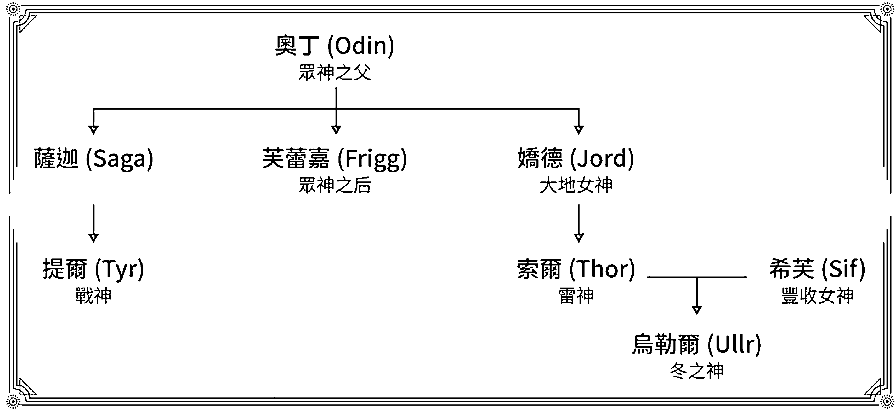
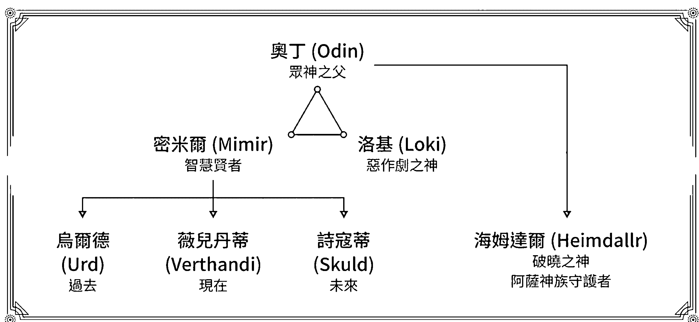
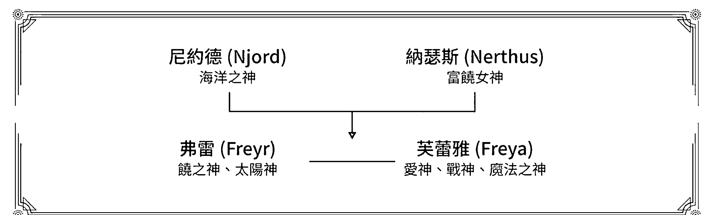
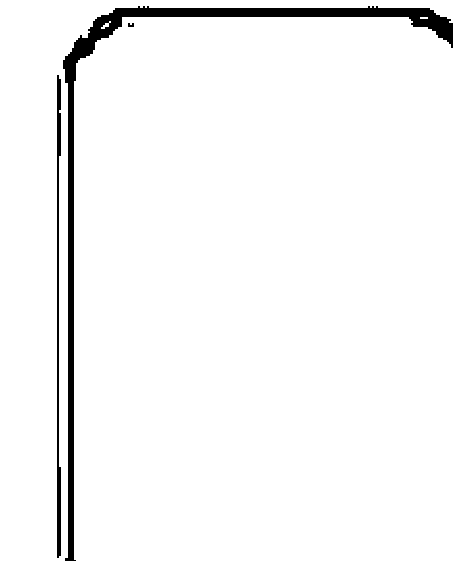
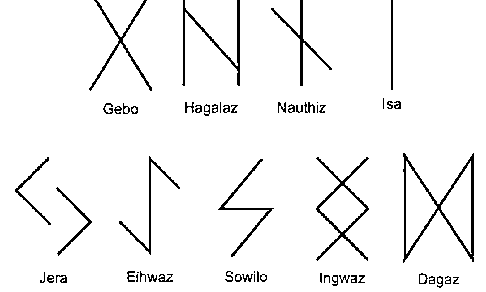
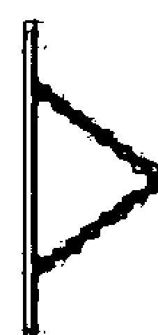
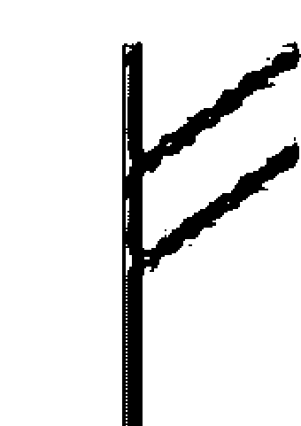
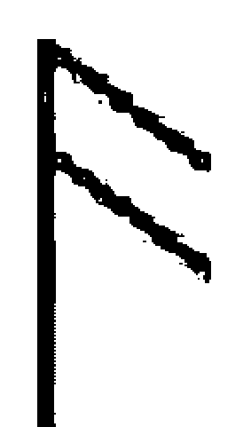
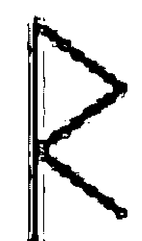

## 北歐秘法

## 盧恩符文

喚起你我遺失的力量 創造你我想要的生活

搜彥/銘

## 特別感謝

平面設計 周聖祐

平衡空間 NO AGE SPACE 全體師生

陪伴完成「北歐祕法·盧恩符文」所有的朋友

## 目錄索引

- 004 前言介紹
- 005 神話故事與歷史文化
- 008 製作材料選擇
- 009 空白符文
- 009 逆位與隱牌
- 010 盧恩基礎介紹
- 033 盧恩與時間
- 033 尋找自身的本命符文
- 041 盧恩符文實際應用介紹
- 091 實占應用與技巧
- 094 色彩與神秘學的關聯性
- 095 淨化方式
- 097 不可不知的魔法能量
- 122 組合符文魔法運用
- 127 月亮週期表
- 128 禁忌與反噬

## 前言

你知道嗎？我們手機裡所用的藍芽(Bluetooth)  ，這也是盧恩符文，透過 ᚺ 與 ᛒ 的組合。-註

曾經問過國外的朋友：「在你的生活中，如何運用盧恩符文？」
國外朋友很認真的回覆：「我不會用符文在我的生活中，他們是我的生活。」
由此可見可以知道國外的朋友對於盧恩符文的認知，並不單單僅有侷限於占卜，反而將它融入了自己的生活中。

起初覺得臺灣有的盧恩符文資料實在太過少，對於有心想瞭解的同好們並沒有這多資源可以運用，加上當前可以參考的中文資料、書籍幾乎都絕版了，這段期間和幾個國外社團、相關外語書籍並加上自身的經驗合力來完成這本「北歐密法・盧恩符文」。

結合許多前輩與同好們的經驗之下，把盧恩符文用一種比較簡單的方式來分享給各位，雖說它有西方易經的美稱，但只用於占卜，我個人覺得似乎太過小看它可以運用的層面，畢竟在神話故事中，奧丁是以祂的眼睛來換取這 24 個神秘符號，對知識的慾望、渴望由此可見，當然我在撰寫這本「原來是盧恩符文」並沒有拿我的眼睛去換去甚麼神秘的力量，只因為覺得盧恩符文相當特別，所以致力研究它、瞭解它，慢慢地發展出另外一種濃厚的興趣，明明只有 24 個符文字母，卻將北歐神話、文化特色、人文風情等，都涵蓋在其中。

在盧恩符文中可以運用許多能量、魔法等相關力量，這股力量同時也是有代價與風險的，並非自己想要獲得甚麼，便可隨心所欲的去施展，別忘了自己在運用盧恩符文之前的初發心，畢竟奧丁也是以眼睛作為代價，才得到這些寶貴的超自然力量，當然依照本書的教學與運用方式，是不需要太過擔心受到影響這件事。

不管是文化的演變還是神話創造了這一切，讓我們一同來窺探北歐神秘學的奧秘-盧恩符文的真相。
在新世代(New Age)當中，有許多神秘學的工具不斷的被大家討論與應用在生活各個層面，若以學派來看，符文學是極少人在使用的古老力量，它可以喚醒自身的能量與創造出自己想要的生活，源自於古北歐的神秘力量，過去資料中並沒有太多的內容可以參考，而如何研讀、使用，讓自己可以快速且簡單成為符文專家，讓我們一同窺探這古老的神秘學系統。

註：ᚺ 與 ᚾ 是一樣的意思；ᚾ Hagalaz 代表颶風、快速和 ᛒ Berkano 代表孕育、誕生，象徵著快速
傳遞資料、連結彼此的資料延伸出全新的資訊。

## 神話故事與歷史文化

在切入盧恩符文之前，我們先瞭解一下北歐神話故事與文化背景的關聯，雖然都是神祇的代表，西方神相較於東方神，更具有人性，從性情上的展現、慾望可求甚至到生命的長度，都是人類的升級版，在東方神卻有著高不可攀的距離，沒有衰老、死亡、喜怒哀樂等，就連在孕育子嗣也相對含蓄非常多！

這也是西方神與讓人類覺得較沒有這麼難以觸及，甚至在某些人身上都能找到某些神祇的個性、特徵等蛛絲馬跡。

在北歐古老的生活環境，實際上是一個生存較不容易的地理位置，當時人們為了要活下去，必須要先滿足最基本的生理條件，無私的愛、奉獻、分享對於早期來說，是很難在這樣的社會體系走下去。

在惡劣的環境讓人們都不確信是否還有下一餐，每次征戰都是為了生存，這樣的民族特色讓生命多了很大的韌性，不管在多麼絕望的環境下，都可以咬著牙生存下去，而北歐神祇-阿斯嘉特(Asgard)更被譽為戰神一般的代表、象徵性，這也讓許多北歐地區的民族對此更加崇拜，以主神奧丁來看，無論在戰爭、謀略、智慧、都可以追尋到祂的足跡。

在《賢者之歌》中提到，奧丁曾經吊在世界樹上九天九夜的時間並以祂的眼睛作為代價，換取神秘的盧恩符文，再次強調了祂對於知識、神秘力量的渴望，在符文當中又呼應了為求結果而不惜犧牲一切作為代價的決心與毅力。

以下列出主要核心幾個與盧恩符文有直接關聯性的北歐神祇組織圖

因為許多神祇都是由奧丁作為延伸，故此奧丁便有眾神之父的稱呼，這點與希臘神-宙斯頗有雷同阿薩神族的主神－奧丁就有五位妻子，列出三位與盧恩符文比較有直接關連性的神祇，戰神提爾與雷神索爾的母親分別為薩迦與嬌德，雖然名稱不同，但也有記載這兩位女神都是由眾神之后-芙蕾嘉所換化而成，冬之神也是箭術之神-烏勒爾則是索爾領養的神祇，真實的父母仍眾說紛紜。

這些神祇的個性特質也緊密呼應在盧恩符文當中，每個符號的涵義恰巧與神祇的性格、特性有密切的關聯，這也是盧恩符文不單單只是占卜工具，在它們背後充滿強大的原因，不外乎是與不同神祇都有互相比照，甚至某些符文特性與北歐神是一樣的，這也是盧恩符文讓人不容易窺探祂的神秘，充滿著神祇所賦予強大的力量原因。

在符文當中不免可以找到神與神之間的關聯，也可以找到符文彼此相合或相斥的微妙協調性，或許在神祇性格上的不同，某些神祇彼此是很投緣的，某些則會有強大的衝突與對立，把符文從神祇上延伸出去，變能一窺一二原由，這也是盧恩符文最有意思的環節，它之所以這麼複雜，不單單僅有符文之間的關聯，還有文化上、神祇性格上的關係也都影響了彼此之間。

奧丁、密米爾和洛基等三人，彼此不僅是兄弟之間的關係，同時也擁有巨人族的身份。

海姆達爾在歷史上象徵著守護者的角色，鎮守在彩虹橋上，保衛阿薩神族的安全，宛如東方神祇的二郎神，海姆達爾真實的身分背景有許多爭議，有資料記載是奧丁的孩子，但本身擁有大海的力量，也被認為是華納神族的子嗣。

密米爾與海尼爾兩位巨人，當時為了換取阿斯嘉特和華納海姆的和平，以人質的身份與華納神族簽下和平協議，奧丁在人質交換之前已經設想好，這兩位巨人都沒有相當攻擊的能力，即使到了華納海姆也不會對阿斯嘉特造成太大的影響。

密米爾的孩子們也就是諾倫女神(在希臘神話中對應著命運三女神)，分別有烏爾德(過去)、薇兒丹蒂(現在)、詩寇蒂(未來)，祂們掌管了時間，也預知了諸神黃昏的到來，當眾神知道這件事情時，帶來不少焦慮與不安。

每個神話故事中都有一位亦正亦邪角色，在北歐神話中被稱為惡作劇之神的洛基便是這樣的角色擔當，有許多祂負面的故事，當然也是事實，甚至因為好玩、有趣而殺了自己的姪子—巴德爾(光明之神)，又或著因為自己擅自作主，化身母馬勾引修繕圍牆工匠的公馬，之後生下奧丁的坐騎-斯萊布尼爾，等各種奇葩事蹟，就個人對祂的認知，無非是想要刷一下存在感，好讓眾神們可以重視祂的存在，時好時壞的性格，也增添了神話故事色彩，只要在北歐神祇故事中，有牽扯到較負面的事情，多半都會與洛基有關，也擁有了惡作劇之神這項封號。

華納神族阿薩神族長年鬥爭，身為華納神族的大家長，海洋之神-尼約德，為了兩國和平將自己的孩子當作人質交換，希望可以求得兩國境內安定。

盧恩字母又被稱為北歐字母，源自於中世紀的日耳曼族語言，取自盧恩符文前六個符號分別為 **Fehu**、**Uruz**、**Thurisaz**、**Ansuz**、**Raido**、**Kenaz**，又被稱為佛薩克文(**Futhark**)，另外一種語系稱為盎格魯撒克遜弗托克文(**Anglo-Saxon**)，歷史記載盎格魯撒克遜弗托克文可能是由古佛薩克文演化而來，起初在公元二世紀就有古佛薩克文，而盎格魯撒克遜弗托克文是在五世紀才開始出現的文字語言，而本書主要討論的盧恩符文運用則是以古佛薩克延伸的佛薩克文，在翻譯上來看 Rune 又有秘密一詞的意義，簡單的來說，盧恩本身也有象徵的神秘、秘密等詞彙，再次添加了它的神秘色彩。

早期的變故，無論是受到基督教影響，被拉丁字母漸漸取代，或是歷史人物曾經不當的使用過，始盧恩蒙上一層負面涵義，又或是經歷一些文革變化，曾經幾度差點消失在歷史上。然而隨著時代的演變，前人與後人的努力，至今盧恩符文除了運用在占卜之外，Logo 商標、建築設計、藝術彩繪，甚至對應在曆法月份上都可以找到它的蹤跡，並且直接對應在生活當中。

## 製作材料選擇

一般來說我們會選擇天然的材質，例如礦石、金屬、木頭、果實等，都是非常接近自然界的產物，由於盧恩符文講求的是與大自然的連結，所運用的工具材料會強烈建議以天然為主，一方面也是在占卜或祝福的過程中，可以快速的與地球最良好的能量傳遞，最原始、純粹的材質，有助於占卜師與媒介連結時，能量上可以比較快速且穩定，不容易受到其他外在事物、能量干擾或影響，就能量的純粹度而言，以天然的媒介是最為適合，也是最方便的選擇之一。

其次的材質可以選擇壓克力、牌卡等加工的產物，對於現今都市化生活來說，這些工具是比較快速可以到手做為使用的媒介，不需要特別費力去找自然產物，甚至再額外進行加工，對於追求高頻能量的朋友們來說，這類的選擇反而少了一些與大自然的連結，相信每個人都有各自喜好、感受強弱的媒介材料作為選擇，無論是天然還是人工的材質，在使用時的起心動念，才是最關鍵的核心，的確有些朋友會特別選擇或要求，但每個人的感受與追求都不盡相同，別忘了尊重每個人的選擇，都有屬於最適合自己的路徑。

另外一項材質是有些朋友會想追求的材質，古今中外都有許多追求者，崇拜於這類屬性材質，如同上述所提到的，每個人選擇的動機不同，對於「骨骸」這項媒介，是非常多人探討，卻不是很多人可以輕易使用的材料之一，雖然在傳統的盧恩符文製作中，這項材料是有被證實拿來運用。

但我個人仍不建議初學者一開始就挑選這麼特殊的材質，原因是每個媒介都會附著使用者的能量、情緒等，若不是將其清理、淨化完整，在後續的使用者都會多少連帶受到影響，更甚有些朋友的盧恩符文不會輕易給他人使用或碰觸，由此可見在能量上的應用是需要更加小心謹慎，而每個生物都有能量殘留，無論是情緒還是生命離逝後所留下的印記，對於初學者而言還要再先學會淨化的能力，在骨骸的能量上，又會更加明顯的被展現出來，在清理與淨化的過程又需要更加完整，至於是否真的那麼適合自己，這就真的見仁見智。

### 空白符文-Woden／Wyrd

它不隸屬於原本這 24 個盧恩符文當中，在許多占卜的工具當中，都有類似這個特性的，往往它們所代表的意思，多半以未知為主，然而在盧恩符文當中，空白符文也代表著變化的可能性，換句話說當空白符文出現的時候，也強調了事情仍有許多變化、可能性，往往在最後一剎那有 180 度的轉變，這也讓盧恩符文增添了更多神秘的色彩，以神祇來看，它所呼應的是眾神之父-奧丁，由此可以延伸、瞭解這些神秘色彩，在特定的時間點到來之前，仍是難以捉摸的，無論是對事情的認知、瞭解，都有象徵主動積極的隱喻存在。

若在占卜的過程中出現空白符文-Woden，建議可以再補抽一個符文搭配解釋，從一個未知的可能性，去尋找它會延伸出的涵義與方向，或許就當前的狀況是無法釐清整個局勢的面貌，透過第二個盧恩符文的解釋進而讓占卜者更能瞭解出背後的意思。

空白符文-Woden 出現的位置，若在「過去」，則代表一些隱藏、秘密是不願意被看穿，或許在過去有些創傷、印記，不是這麼令人想回憶起的，同時也代表著遺忘的可能，遙遠的過去隨著時間的影響，讓真相、事實更加模糊，甚至不願去主動的回想起那些種種曾經。而「現在」則代表著有許多的變化、可能性，就目前來看不應該被拘束、框架住，而是放手去體驗每個可變的可能性，倘若過度的束縛住這些發展，反而會成為絆腳石，影響當事人學習成長。放在「未來」則警惕當事人不要急於去瞭解未來的狀態，在一切尚未明朗之前，不如把重心放在當前，過多的未來信息反而是左右了前進的腳步。

### 逆位與隱牌

或許早期受到基督教的影響，在塔羅牌等相關占卜工具也有逆位的解釋，我個人解讀為增加不同占卜解釋的結果，但在最原始的盧恩符文占卜當中並沒有以逆位作為解讀的意思，而是解讀當前的盧恩符文做為解釋與運用。大多逆位會去解釋該符文相反的意思，後續會一一為各位介紹它們當中每個差異，而其中少數幾個特殊符文是對稱的，這些符文並沒有所謂的正逆位之分。

隱牌可以解釋為隱藏牌，在傳統的盧恩符文中，拿來使用的大多都是以大自然的元素為主，木頭、礦石、骨頭、金屬等，不同現代有這麼多工整的工具可以運用，導致在占卜過程中，拿出的一些符文會有蓋著，不見得每次符文都會正面朝上，也有人運用這種解讀方式，符文雖然沒有逆位的影響這麼大，但也沒有正位明顯的正向。

沒有分正逆位的符文如附圖所示

## 盧恩符文基礎介紹

### Fehu

中文翻譯：財富
發音："FAY-hu"
符文字根涵義：財富、母牛、快速、生產力、熱忱、行動力

顏色對應：紅色、橘色相關色系

元素屬性：火、土

能量礦石：苔紋瑪瑙

代表神祇：弗雷，芙蕾雅

符文引薦：
早期北歐民族的生活型態並非這麼繁榮、富足，得靠掠奪或自己畜牧等方式在惡劣的環境下力求生存，這也造就了北歐民族有這麼強大的韌性與毅力面對大自然的挑戰。Fehu 代表著牛隻，在以物易物的年代，這些牛也等同錢財、收入，不僅可以食用，也可以拿來耕耘種田，隨著時間演變，Fehu 逐漸成了金錢、財富的象徵，但別忘了有牛所代表的行動力，也說明了 Fehu 本身也有相當充足的行動力，以這個符文圖樣來看，宛如稻穗一般，從形貌聯想，可以理解稻穗、食物所扮演的重要性。

符文解釋：
Fehu 本身代表快速、積極等意思，也象徵了金錢、物質、物欲，對於錢財有關的事情，多半都會與 Fehu 有所關連；然而事件的進行有 Fehu 的出現，也會象徵事件可以很快速的有眉目，對應在處理上，並不會太過拖泥帶水，反而是相當有效率的可以看到結果，Fehu 也是熱情、活力的代表，對於許多事情都有一顆熱忱、熾熱的心情來面對，讓人也有越挫越勇的感受。

逆位解釋：
當前狀況得需要留意金錢流動，甚至會有一時衝動而導致非必要的破財行為，而這些行動多半來自於感性的情緒，並非理性思考的決策所造就的影響為主。有時也會因花錢消災或以花錢滿足自身情緒為導向。

占卜延伸關鍵字：財富、快速、行動、熱情、金錢

### Uruz

中文翻譯：權力
發音："OO-rooz"
符文字根涵義：權力、野牛、健康、扭轉、強壯、改變

顏色對應：大地綠、土褐色

元素屬性：土

能量礦石：紅水晶

代表神祇：索爾

符文引薦：
Uruz 這個符文完完整整的象徵維京人海盜的特性，他們豪邁坦率、不拘小節，往往讓旁人覺得少了一絲細膩的心，卻在他們身旁備感安心，早期生存條件較差，也因為有 Uruz 的出現，讓這些人民可以得以身體健康強壯的保障，全依靠這個符文，即便在艱困的環境，依然可以扭轉乾坤，拿野牛的韌度做為比喻在適合不過，無畏當前各種挑戰，依然可以獨自面對，雖然少了合作的柔軟與團隊精神，但不得不說 Uruz 是一位相對堅強的先鋒者，僅僅憑藉自身一己之力，想把所有事情都完成。

符文解釋：
本身來看 Uruz 是一個非常以自我中心為主的符文，並非替他人著想，而是許多事情都以自己的觀點、想法去執行、面對，往往也受這樣的個性特質影響，身體健康會出現不少微恙，行動力超強的符文卻少了計劃安排，容易浪費時間、力氣。但其中的堅韌性格，面對問題和挑戰，那種不願意輕易妥協的性格，也是 Uruz 最大的特色，在危機時 Uruz 經常性會出現扭轉乾坤的可能，讓眾人跌破眼鏡。

逆位解釋：少了原有的動力在面對問題，反而增加更多的魯莽、急躁，使當前狀況更加棘手，加上不聽旁人的建議、勸告，往往讓自己弄得灰頭土臉，自顧自的堅持，也得留意身體狀態，是不是還跟得上自己的想行動的意志。

占卜延伸關鍵字：專注力、扭轉、改變、強壯、健康

### Thurisaz

中文翻譯：雷神
發音："THUR-ee-sahz"
符文字根涵義：雷神、戰鎚、斧、巨人、守護、幸運

顏色對應：紅色、橙色等

元素屬性：火

能量礦石：藍寶石

代表神祇：索爾

符文引薦：
在許多故事中 Thurisaz 象徵了雷神-索爾，當這個符號出現時，同時也象徵了索爾的勇氣與衝勁，可以不畏艱難的面對且接受各種挑戰，然而 Thurisaz 代表著積極與行動力，正因為如此至今 Thurisaz 仍被代表著可以穩定、守護的諸多象徵意義，甚至在會議的掌握、協調等。
在過去神話中有提到，索爾本身也是一位管理神，對於會議的維繫、掌握，若要協助會議上的順利，在會議上都可以祈請索爾的幫助與照顧。

符文解釋：
針對 Thurisaz 對應的解釋上，除了前面提到行動與勇氣之外，對應在保護上也有相當大的作用，然而這類型的保護是指比較具體的事情，例如會議上的運作、事件的發展順利等等，可以將自身的目標做明確的方向釐清與實踐，都可以透過 Thurisaz 來協助當事人完成，也因為對應的神祇在索爾身上，對於許多細微末節的事情難以去掌握，針對在大方向、大目標，可以透過 Thurisaz 來提升自己的行動力，它與 Uruz 最大的差異是，Thurisaz 會留整體的感受與互動，Uruz 多半以個人自身為主。

逆位解釋：
雖然有很強大的衝勁，對於細節和他人感受，也是 Thurisaz 所需要留意的環節，往往過度求好心切，反而讓事情變得更糟，當逆位出現可以讓自己放慢腳步，三思而行是逆位 Thurisaz 所需要留意的部份，對於自己出發心是好的，然而往往在別人身上不見得是如此，除了急躁之外，還有缺乏耐性等都會和 Thurisaz 有所關連。

占卜延伸關鍵字：保護、照顧、行動、堅持、維護

### Ansuz

中文翻譯：信使
發音："AHN-sooz"
符文字根涵義：消息傳遞、溝通協調、嘴、智慧

顏色對應：藍色

元素屬性：風

能量礦石：綠寶石

代表神祇：奧丁，洛基

符文引薦：
Ansuz 的符號原型來看，它非常像鳥喙，從形象上來看是屬於一個溝通、協調的意思，而 Ansuz 又對應在奧丁這位神祇上，除了能言善道之外，它同時也兼具了智慧等意義在其中，而這樣的智慧多半像一位老朽般，給予久遠且深奧的寓意。
透過講話把心裡的訊息完整的傳遞給對方，這也是 Ansuz 所代表重要的價值，許多訊息往往不具有立場，站在中立且客觀的看待這一切，給予當事人簡單而直接有力的提醒。

符文解釋：
如同先祖的遺訓，讓人往往覺得不可逆、不可不遵循，在現代許多人往往只注重形式，而忘了最根本初衷的價值，Ansuz 本身也有傳承的意涵在其中，即便是簡單的溝通，也是將經驗分享於彼此，最快且最直接的途徑，溝通寶貴在於中間瞭解的過程，並非只有結果才是重點，對應在生命當中更是如此。
舉凡透過表達與傳遞等需求，都可以藉由 Ansuz 的力量來協助我們，以更高的視野、宏觀的角度，來將信息完整的傳送出去。

逆位解釋：
Ansuz 則會呈現莽撞的溝通方式，對於事件較沒有耐性，急著想趕快完成所被交付的任務，而忽略中間該留意的細節，甚至在不經意的情況下給予他人言語上的重傷、口舌是非等，都是 Ansuz 所擁有的殺傷力，宛如一把雙面刃，可以助人同時也可以傷人。
留意逆位的 Ansuz 會使自己過度的膨脹、自負，面對他人的忠告視而不見，展現自己時，而忽略一旁的聲音。

占卜延伸關鍵字：溝通、表達、傳遞、智慧、對談

### Raido

中文翻譯：旅行
發音："Rah-EED-ho"
符文字根涵義：旅行、合作、交通、規劃

顏色對應：紅色

元素屬性：風

能量礦石：綠玉髓

代表神祇：弗雷，娜瑟斯

符文引薦：
在過去 Raido 被視為馬車、移動等交通工具的代表，演變至今，對應於各種旅行相關都會和 Raido 連結在一起，在旅程之前，都需要相對充足的安排與規劃，這也代表著 Raido 擁有著籌備事情的能力與特質，撇除個人的資源之外，也有整合他人共同努力創造、合作的涵義在其中。
旅程多半會個人為主，而且是一種追求心靈上的探索，不見得只是單純玩樂、散心，反而在某些時候也有享受個人獨處空間等狀況，而絕大部份的旅程都會擁有豐盛心靈的感受出現。

符文解釋：
在移動的過程中，許多事情是沒辦法預設的，換句話說，從 Raido 的立場面對生活的態度，本是要敞開心胸去接納各種挑戰，並從各種生命挑戰中尋找出一套屬於自己的生命架構，或許說起來很容易，但在 Raido 本質就是一個享受每個當前，對於在不同時機點出現的趣事，都是一種生命中的體驗，而 Raido 也訴說著跳脫舒適圈，有別不同的經驗替自己創造出更多有意義的生命高度。

逆位解釋：
過於莽撞的決策、行動，Raido 也在提醒我們如何承受那種直接的教訓，每一份經驗都相當寶貴，在逆位的情況下更加是要警惕自己不要隨意躁動，面對變化時，更要沉著住氣；有些時候追尋的結果不是重點，反而是在過程會是不同以往的體悟。
耐心、毅力都是在 Raido 逆位時，需要特別留意的環節，別受到一時情緒起伏，而左右了自己原本的規劃。

占卜延伸關鍵字：行動、移動、旅程、遠行、交通

### Kenaz

中文翻譯：火炬
發音："KEN-ahz"
符文字根涵義：火炬、洞察力、智慧、創意

顏色對應：紅色

元素屬性：火

能量礦石：雞血石

代表神祇：芙蕾雅，海姆達爾

符文引薦：
Kenaz 把世事看盡眼底，卻又甚麼都不願表態，宛如隱士、賢者般，它擁有相當高的智慧，卻不擅於與人交流，或許是看盡人生百態，對於人性的信任感已不再，Kenaz 是火元素代表之一，卻不像 Fehu 這麼熾熱，也不像 Sowilo 這麼耀眼，給人溫溫卻又相對的溫暖，在 Kenaz 身上可以看到它擁有極高的創意力、想法，有極高的藝術天賦與眼光，對於生命的熱忱會專注在自己喜愛的事物上，甚至廢寢忘食。

符文解釋：
以藝術、創造為宗旨的 Kenaz 雖然在許多面向不善於表達，內心卻有非常澎湃的想法，束諸自己所擅長的，將一切事物盡收眼底，發掘出不同他人的思維、想法，透過不同工具呈現於生活。
Kenaz 可以像一盞明燈般，給予人們希望，引導一個清楚且明確的方向，但它不會主動告知，多半都要旁人來請求協助，並非 Kenaz 高傲，而是它真的不擅於主動與人互動。

逆位解釋：
過度被動的 Kenaz，有些時候在較為情急的情況下，偶爾也會做出令人驚豔的表現，失去了以往沉著、冷靜的思考，大膽的行為，往往讓自己陷入更多不必要的麻煩與紛爭當中。過份固執的想法，時常讓旁人難以溝通，放低、放軟姿態，才不會使彼此關係這麼僵化。大部份的 Kenaz 都有正向表達的意思存在，在某些時刻 Kenaz 也有著秘密和隱藏的深層涵義，如同它不想主動般，而選擇沉默。

占卜延伸關鍵字：創意、緩慢、堅定、溫暖、省思

### Gebo

中文翻譯：禮物
發音："GEHB-o"
符文字根涵義：禮物、平衡、慷慨、交流

顏色對應：藍色

元素屬性：風

能量礦石：蛋白石

代表神祇：奧丁、芙蕾嘉

符文引薦：
以我們傳統的認知，X 都會讓人聯想到比較負面的或被否定的符號意思，然而在盧恩符文中，這個 Gebo 所象徵的卻是禮物，這樣的禮物不偏不倚是一種完整平衡的關係與狀態，Gebo 代表著上天所賦予的祝福，這也是北歐眾神之父-奧丁所代表的力量，祂所給予至高無上的能量，庇佑著人們所需要的力量，也藉此提醒人們彼此要懂得如何交流、分享，無私的奉獻、付出，讓正面的能量得以不斷循環著。

符文解釋：
一個平衡的狀態，沒有所謂的好或壞，它穩定了各個層面，最大的禮物源自於自身，並非從外在索討而來，懂得平穩自己，便開始有能力把這份禮物分享給他人，Gebo 是一種交流性的代表符文，同時也象徵了完美、完善的結果。
由於 Gebo 是少數幾個沒有分正逆位的符文，無論在哪種位置上，它所提醒的都是和諧交流、穩定分享，不再是單方面的獲得或給予，當這份力量得以穩定，禮物便由內往外分送出去，讓接觸到的人們，可以獲得更多、美好的祝福，這份慷慨是來自於自己所願，當意願展開，我們起心動念所傳遞的，便是那份滿滿的禮物。

占卜延伸關鍵字：平衡、祝福、和諧、交流、喜悅

### Wunjo

中文翻譯：喜悅
發音："WOON-yo"
符文字根涵義：喜悅、成功、勝利、歡樂、積極

顏色對應：藍色

元素屬性：火

能量礦石：鑽石

代表神祇：奧丁、芙蕾嘉

符文引薦：
Wunjo 宛如一個旗幟，它象徵著勝利、喜悅，看似簡單的筆劃，卻擁有著成功的意涵，它的勝利特質是與生俱來的領導特質，除了後天的培育，更強調了先天的優勢，如何借力使力，讓此時此刻更加如虎添翼，替自己開拓出更美好的康莊大道，擁有霸氣的 Wunjo 本身也帶有著高貴的氣息，那份氣質是其他符文都無法比擬的，對於自己所想要的目標，必定是全力以赴去追求，主動的把握每次機會，不會被動的看著契機消逝。
帶著幸福快樂的心態面對生命各種挑戰時，都是以一個正能量的態度來檢視，倒不至於自怨自艾的看待生命，對生命積極、熱忱的態度，往往取決了 Wunjo 對於挑戰的信念有多大。

符文解釋：
積極且努力的想把每件事情給做到最好，有些時候會讓身旁的人備感壓力，過度以自己的標準來衡量周圍人事物，給自己的門檻相對也較高，雖有好的風範、優秀的企圖心，卻也替身旁的人樹立全新的標竿。
只要採取行動，便有好的成果，這是 Wunjo 所信奉的信念，每個人對於勝利的看法、價值不同，然而 Wunjo 所代表的結果大多都是正向且成功的，當它出現時，我們必須意識到過程該怎麼執行，免得樂極生悲。

逆位解釋：
過度的自信心，讓自己忘了天高地廣，面對當前的挑戰仍需要謙卑的看待，即便自己以達到不同以往的身份、地位，物質社會無論甚麼都是假的，唯有面對事情的心態，那才是真的，心態怎麼取決，得先提醒自己放下成見、包袱，否則即有可能使自己摧毀了自己打拼的成就。
Wunjo 逆位的時候，也提醒了當事人，別在過度負面思考，情緒的變化也會影響整體事件走向，在還沒有揭曉之前，請多給予自己些正面的看法。

占卜延伸關鍵字：勝利、喜悅、成功、領導、魅力

### Hagalaz

中文翻譯：颶風
發音："HA-ga-lahz"
符文字根涵義：颶風、快速、變遷、鬥爭、潛力

顏色對應：藍色

元素屬性：水

能量礦石：縞瑪瑙

代表神祇：諾倫三女神-烏爾德 (過去)、海拉

符文引薦：
屬於大自然力量的 Hagalaz，它擁有所有符文無法比擬的力量，這份從自然界出現的能量，是人們無法抵抗的，只能沉默接受 Hagalaz 所帶來的變動，放寬心接受生命賦予的挑戰、臣服於當前各種詭譎變化，然而在 Hagalaz 的影響下，許多問題來的令人措手不及，懂得替自己留有後路，才能降低大自然所帶來的衝擊，自然的反撲，源自於先前影響，它不會沒有任何徵兆、跡象可循，只會藉由一個導火線，瞬間引爆。
歷史給予我們許多寶貴的經驗，呼應在諾倫女神-Urd，提醒了我們這些經驗法則要如何學習，而不是一味的抗衡、對立，學習接受、順勢而為，是 Hagalaz 所給予我重要的建議。

符文解釋：
Hagalaz 也是少數不分正逆位的符文，也可以解釋為當颶風迎面而來，它也不會分對象，一視同仁的掃盡，好的、不好的，全部讓它歸零，或許在這當中的陣痛是令人不適，但卻是一個很好的轉折點，把握當前機會，也會成為一個翻轉的可能。
以中立代表的 Hagalaz 所傳遞出來的都是一樣的，然而衝擊如此之大，是人類較難掌握與抗衡的變化，但可以提早預防，將災難降至最小，而不受後續牽連影響，而發生事件後，反而要更有意識的去省思，這些過程所帶來的意義為何。

占卜延伸關鍵字：重生、破壞、蛻變、整理、殆盡

### Nauthiz

中文翻譯：生存
發音："NOWD-heez"
符文字根涵義：生存、需要、延遲、約束、毅力

顏色對應：黑色

元素屬性：火

能量礦石：青金石

代表神祇：諾倫三女神-薇兒丹蒂 (現在)

符文引薦：
在盧恩符文當中有三個符文代表著延遲的意思，其中 Nauthiz 便是其中之一，對於延遲的解釋並非停滯不前，而是如何留意、看待自己當前所面臨到的問題，耐住著性子思索當下的挑戰，Nauthiz 本身也強調了忍耐的意涵，對於當事人來說並非容忍當前的挑戰是舒適的，而把視野拉高來看，這份延遲是成長過程必須要面臨的考驗，在過度快速變遷的情況下，同時也提醒了我們如何回到生命本質，除了一味追求外在目標之外，內在的核心是不是也同時有去覺察到。
Nauthiz 與諾倫女神-Skuld 有所關連，它提醒著是代表未來的諾倫女神，卻不是隨意去眺望未來之事，而是不斷提醒我們如何活在當下並謹記過去的經驗，而非一直介意未來的諸多可能。

符文解釋：
Naud (h) iz 是原始日耳曼人的語言，Nauthiz 則是一種替代拼寫方式，隨著時間的變遷與文化的流傳，當前這兩者都是屬於同一個意思，在 Nauthiz 的源頭是代表著需要(Need)的原意。
在生命當中，有許多挑戰是需要藉時間累積經驗，才能一一克服，在考驗的陣痛期間，勢必讓人不適，然而蛻變後的成長光輝，是如此令人耀眼，回到符文本質上，提醒當事人有沒有這麼堅定的信念來把持自己，把那份毅力發揮得淋漓盡致。
面臨了停滯，同時也提醒了當下對於「生存」的意義和價值，是怎麼樣來看待、檢視它所帶來的衝擊，是為了逃避當前而想要趕緊往下一個旅程前進，還是知道當下所迎面而來的挑戰，同時也加諸了提升與學習的過程呢？

占卜延伸關鍵字：內省、整理、覺察、等待、延宕

### Isa

中文翻譯：冰
發音："EE-sa"
符文字根涵義：冰、靜止、停止、不變、細膩

顏色對應：黑色

元素屬性：水

能量礦石：金綠寶石

代表神祇：諾倫三女神-詩寇蒂 (未來)

符文引薦：
在早期生活較沒有這富裕的環境下，大自然所給予的影響都是最直接且難以抵抗的，無論是颶風來臨還是暴風雪的襲擊，都提醒人們適時的臣服當前挑戰，面對「冰」更是要我們明白，只靠個人的力量很難與大自然抗衡，與其兩敗俱傷，何不讓自己休息片刻，好好思索在之後可以做甚麼樣的安排，而不至於強迫自己在現階段非要有做出甚麼成果。
神祇上代表著是諾倫女神-Verthandi，不用過度留戀過去種種，不必要投射太多憧憬在未來，而把諸多力量放在現在，可以發揮的都是在此時此刻的當下。

符文解釋：
如同冰的字面意思一般，整個靜止下來，Isa 也是延遲符文，象徵著一切靜止。
當所有事情都靜止下來後，可以一一省思當中每個細節，冰的本質是水，可以從中檢視情感、情緒上的變化，究竟是哪個環節讓我們停滯不前，除了大環境的影響之外，回到個人身上；把每個人視為一個宇宙個體，當內在出了差池，也會連帶波及到外在生活。
等待的過程中，往內在省思、檢視，往往可以找到除了表象問題外的狀況，此時此刻不適合輕易採取行動，尤其受到情緒影響的牽引，往往會讓問題回到原點，回到根本解決，才會是最省力的處理方式。

占卜延伸關鍵字：靜止、停滯、冷靜、等待、延遲

### Jera

中文翻譯：豐年
發音："YARE-a"
符文字根涵義：豐年、收穫、循環、平衡、正義

顏色對應：藍色

元素屬性：土

能量礦石：瑪瑙

代表神祇：弗雷，芙蕾雅

符文引薦：
Jera 代表著在生命當中生生不息的概念，看似如同圓圈一樣的符號，象徵了源源不絕、循環不斷的意思，然而在發展過程中，它保有穩定的平衡，不會有所謂的過頭這件事情，Jera 也隱藏著謹慎在其中，對於他人相處的嚴謹，對於自己的嚴格，都是用很高的標準在看待，換言之，在 Jera 的世界中，道德規範是相當重要的一環，而法規、規範、章法等等，有關條文、法律層面，在 Jera 眼裡都是相當重要的核心意義。

符文解釋：
除了代表豐年、豐收之外，Jera 所代表的豐盛是來自於自己嚴以待己的法則造就而成，一步一腳印而成，絕非瞬間致富的表現，當然有更多部份來自於遵守這些典範，讓這樣的規則持續實施下去，Jera 是一個比較講求規矩的符文，有了章規，所有人世間才有規範，才有秩序去發展，有所耕耘便有收穫，在遵守規則之下，Jera 是會得以保障個人權益。
Jera 也有法律、忠告等意思，面臨到相關法條、規範，在 Jera 的出現下，必須得格外謹慎處理，謹言慎行會是最安全、最有保障的處理方式。

占卜延伸關鍵字：豐盛、財富、規範、條款、契約

### Eihwaz

中文翻譯：異世界
發音："AY-wahz"
符文字根涵義：紫杉樹(世界樹)、靈性、守護、自然根本、蛻變重生

顏色對應：紅色

元素屬性：火、水、風、土

能量礦石：托帕石

代表神祇：烏勒爾

符文引薦：
這個符文蠻有趣的，Eihwaz 所代表的是北歐神話的核心-世界樹，在北歐神話中世界樹代表了天與地，孕育了所有生命，無論哪個種族都可以在世界樹上得以生存，而世界樹又是以紫杉樹做為代表，在典故中，紫杉樹是充滿神秘且靈性的植物，所擁有的神秘力量，是其他植物難以比擬的，更被許多人當作魔杖的素材所使用著，不僅有神秘魔法力量，也強調了整個北歐世界的文化核心與生活基礎根本，擁有強烈保護元素的 Eihwaz，讓使用這個符文時，是有非常強大的後盾與安全感的。

符文解釋：
在 Eihwaz 有著浴火重生的概念，這樣的蛻變、成長，在當前都是不舒服的，然而在改變的過程勢必得好好忍耐，需要花點時間經歷洗禮才有後續的成果可以享受，當 Eihwaz 這個符文出現時，得記得要讓自己回到根本的問題去看待，不要只有關注於表面議題，反而在深層的地方，有許多環節是需要一一釐清，不單單發生的事件這般單純，需要回到本質尋找原因。
Eihwaz 不僅是紫杉樹，同時代表了庇祐、守護等意思，當 Eihwaz 出現時，也有象徵著需要重視安全感與自我實踐價值等涵義，針對於自己在社會當中的定位，如何定義自己在生命當中的角色，都是 Eihwaz 符文所提醒的重點。

占卜延伸關鍵字：揚升、靈性探索、自我探索、生命成長

### Perthro

中文翻譯：魔法
發音："PER-thro"
符文字根涵義：魔法、神秘、直覺、運氣、秘密

顏色對應：黑色、紫色

元素屬性：水

能量礦石：藍晶石

代表神祇：芙蕾雅

符文引薦：
Perthro 在盧恩裏代表著神秘的意思，換一個角度看，把 Perthro 往左翻轉 90°，宛如一個杯子、器皿，它可以裝上滿滿的水，在元素屬性來看，水與直覺有著密不可分的關係，陰屬性較強烈的特性上，我們可以發現，對於神秘學、玄學等比較不可輕易窺探的世界、力量，多半和 Perthro 有著緊密的關係，許多秘密也不是能夠輕易看清楚或瞭解的，也造就了 Perthro 有著一層令人摸不著、看不穿的薄紗，若隱若現當中也隱喻了一部份為顯特質，在過去這類領域是沒辦法在檯面上高談闊論，更不可能在大庭廣眾之下傳授，造就了許多秘密是一般人沒辦法得知，也讓 Perthro 有著亦正亦邪難以捉摸的立場存在，然而在 Perthro 真實的狀態下，沒有所謂的對錯，只有貫徹自己決心的作法罷了。

符文解釋：
在神秘學範疇裡面，Perthro 所代表的絕大部份都指向秘密的解法，然而在秘密當中沒有所謂的好壞，它是一個非常中立、客觀的詞彙，但在人身上往往會覺得這樣的「秘密」是否有涵蓋隱瞞或謊言，坦白說對於 Perthro 它就是很單純的秘密罷了，在人身上加諸許多立場、角度，才讓它不在這麼純然，隱藏的事情，有些時候是不可說、不可公開討論，但它是存在著。
另外一個層面上的 Perthro 有代表著魔法、直覺、運氣，這些較難以用科學去衡量、定義，它們的存在，有些時候如同一個信息、一個機，並非全部都有答案可以解釋，比起其他的符文，Perthro 反倒比較難以以一個有形的東西去衡量、定義它的存在。

逆位解釋：
在魔法、神秘學世界中有所謂的黑魔法、白魔法，兩個不同立場，所做的事情也是完全不一樣，在黑魔法有較多的禁忌，甚至有許多害人的做法，白魔法則是利人、助人的方式居多，無論哪種，都是由魔法所延伸出去，如同 Perthro 本質一般，沒有立場的分別，全在人為的因素下，導致它有所不同。
逆位的 Perthro 是屬於人心比較黑暗的層面，多半還是會有較多負面特質出現，無論是先前提到的謊言還是隱埋實情，在逆位是比較多且當事人要特別多加留意的，當有逆位 Perthro 出現，我們還是需要提早預防，減少受到波及。在許多案例中發現，Perthro 還帶有不誠實的特性，留意符文給的訊息，事情不單單僅有表面上所呈現的樣貌。

占卜延伸關鍵字：秘密、隱私、神秘、隱藏、直覺

### Elhaz

中文翻譯：保護
發音："EL-hazh"
符文字根涵義：守護、傳統、自然、家庭、抵禦

顏色對應：黃色

元素屬性：風

能量礦石：琥珀

代表神祇：海姆達爾

符文引薦：
在過去古日耳曼語當中這個符號又被念為 Algiz，然而在古英語被稱作 Elhaz，無論是哪種念法，所指向的符文意思都是同一個源頭，當時 Elhaz 符文象徵著麋鹿，隱喻有強大的保護的意思存在著，它也是太陽雄鹿的象徵圖騰，一個擁有非常強大防禦的符號，早期打仗時會將武器、盔甲上刻上 Elhaz 符號，意味著在每次征戰中，可以獲得絕對的庇佑，讓每位戰士都能無往不利。
在實體上的協助之外，當我們受不明的能量干擾時，也可以運用 Elhaz 的力量替我們建立一個安全的結界空間，保有在此空間內的人事物不被影響，在靜心冥想之前也可以利用 Elhaz 來保護自己。

符文解釋：
如上述所提到，Elhaz 是一個單純且強大的保護符號，在最純粹的庇佑之下，也道出 Elhaz 擁有傳統的核心觀念，換句話說從 Elhaz 要去改變一件事情的看法、做法是比較不容易的，一旦被認定後，要在扭轉是相對困難的，也因為擁有這樣的特色，對於家庭、相同立場、關係等，有著很強烈的保護意識，或許當下自身沒有明顯的感受，卻讓身旁的人有被呵護、照顧的安全感，甚至在精神上的寄託也有足夠強大的依靠，然而在成為 Elhaz 可以照顧的對象並非容易，Elhaz 也需要一段時間觀察、瞭解後才會付出，也就是說 Elhaz 對於事件的處理態度是相當謹慎、縝密，不會草率、貿然做出行動。

逆位解釋：
過度的謹慎、小心，往往會讓 Elhaz 陷入鑽牛角尖的議題裡，很難走出死胡同，對於事件想的比較多、比較遠，行動上欠缺足夠的魄力，經常性原地打轉，或是出現過度天真的想法，把一切想得太過簡單，沒有實際的瞭解真實狀況，而陷入理虧的結果也是非常多，偶爾會出現過度保護的念頭，讓旁人很難獨立成長。
擁有自己的主見、意識，要接納新的觀念、看法，需要花較多的力氣來面對，態度上並非全盤否定，只是自己會陷入不必要的糾結泥濘中，體驗這樣的過程對於 Elhaz 是必經且重要的。

占卜延伸關鍵字：幸運、保護、傳統、防禦、保守

### Sowilo

中文翻譯：太陽
發音："So-WEE-lo"
符文字根涵義：太陽、生命力、希望、成功、勝利

顏色對應：白色

元素屬性：風

能量礦石：紅寶石

代表神祇：洛基

符文引薦：
相傳早期曾有民族用兩個 Sowilo 來代表生命力可以源源不絕、生生不息，這個宛如閃電的圖騰符號，可是象徵了強大的力量，宛如太陽一般可以給予使用者一切希望、光明，甚至帶來夢寐以求的勝利，在使用過程中沒有將 Sowilo 用在正途上，而為了實踐自己私慾導致盧恩符文一度蒙上汙名，甚至差點消失，盧恩符文這項工具擁有強大的力量，但仍需要看使用者怎麼去操作，透過良善、助人的初衷，共同將世界帶來更多的美好，檢視自己在生命中所扮演的角色、位置，在能量上真實的展現來，而不是投入在物質上的追求，追求那樣的勝利是沒有盡頭的。
Sowilo 擁有一個簡單、純善的赤子之心，恰好對應在北歐惡作劇之神-洛基身上，坦白說這位惡作劇之神，立場並非全然的正善或純粹的邪惡，祂扮演著中庸，非常聰明卻不會有所偏頗，全權按在自己當下的感受所行事，真實的能量狀態也沒有二元對立的狀況，享受每個片刻，專注成為當下的自己。

符文解釋：
代表勝利的 Sowilo，對於在實踐事情的結果或過程中有很高的希望會成功，在勝利女神的祝福下，Sowilo 的目標越單純、簡單，成功也就更加的容易許多，當然 Sowilo 有些時候會呈現比較低階的狀態，少了未雨綢繆，面對事情缺乏宏遠的思考，會陷入偶發幼稚行為，讓身旁的人難以招架。
面對勝利、希望、喜悅等議題，Sowilo 往往給予的都是很正向、純粹的，如果發現事與願違，可以回頭檢視自己是不是一廂情願的執著，而少了面對問題正向的態度與積極性。

占卜延伸關鍵字：勝利、喜悅、成功、希望、歡樂

### Tiwaz

中文翻譯：戰神
發音："TEE-wahz"
符文字根涵義：勇者、戰士、責任、父親、正義

顏色對應：紅色、褐色

元素屬性：風

能量礦石：珊瑚

代表神祇：提爾

符文引薦：
Tiwaz 象徵著理性、邏輯，許多事情背後的議題和分析有著相當大的關聯性。一個箭頭向上的符號，在盧恩符文中象徵了陽剛性的力量，同時這個符號也代表了戰神-提爾，被賦與強大的責任感，堅守家園、保衛一切力量符文原型。相傳在北歐神話中，有許多神祇都擁有戰神的封號，然而提爾是一位比較特別的存在，為了保護家園，鎮守在彩虹橋上，宛如東方版的二郎神君。
起初為了要擒捕魔狼(Fenrir)卸下心防，提爾以自己的手臂作為代價，雖然順利的將魔狼(Fenrir)捕獲，卻發現自己上當受騙，便將提爾的手臂給咬斷，這慘烈的代價，甚至影響到之後末日戰爭無法順利發揮實力，與地獄巨犬(Garm)同歸於盡。

符文解釋：
以戰神著稱的 Tiwaz，當它出現的時候象徵著責任感，如同一位父親的角色，讓身旁眾人備感保護，或許在父親這樣的角色下，少了一些彈性，與人相處之間缺乏了一絲柔軟，雖然正向、善良，不免需要增添一些談話技巧與幽默感。
在執行事件上來看，Tiwaz 具有相當大的責任感，願意對所有事情承擔，執行能力更是不容小覷，Tiwaz 整體而言都屬於強大且成功的，無論是精神上的支撐，還是肉體上的堅毅，不屈不撓刻畫出北歐民族的精神。

逆位解釋：
少了柔軟姿態，往往讓人陷入衝突與磨擦，許多不必要的事情可以避免發生，卻因為過度的堅持而導致花費更多的心力，在逆位的 Tiwaz 有時會出現自以為是的看法、論調，太過主觀，缺乏同理與判斷，容易產生自負的特質，非法、非正義行為，在正位的狀態下可以一一被處理、解決，逆位則會隱瞞，遊走偏門，需要留意每個想法、做法，之後所帶來的後果，缺乏擔當的情況下，連信任、承諾，都彰顯了只是表面的謊言，並不是真誠地發自內心。

占卜延伸關鍵字：勝利、目標、父權、責任、無畏

### Berkanan

中文翻譯：誕生
發音："BER-kah-na"
符文字根涵義：生孕、母親、育孕、誕生、純善

顏色對應：綠色

元素屬性：土

能量礦石：月光石

代表神祇：芙蕾嘉、娜瑟斯

符文引薦：
如果說 Tiwaz 是天父，Berkanan 就如同地母一般，在這個組合中，Berkanan 扮演著母親的角色，對於許多事情呈現著包容、呵護和滿滿的愛，然而這裡所提到的愛和博愛略有不同，畢竟站在 Berkanan 的立場看愛，是從親子之間，並不是呈現完全無私的大愛精神。
但以母親看待孩子為出發點可以發現，母親不會向自己的孩子要求甚麼，那份最純善、自然的流動，才是 Berkanan 最核心的特性。

符文解釋：
Berkanan 孕育、誕生和 Kenaz 有略微不同，雖然兩個符文都是從無到有的產生，Berkanan 是有針對實體生命的誕生，Kenaz 比較偏向於想法上的創造，雖然兩者之間都有誕生的解釋方式，但彼此提到的層面是不太一樣，擁有母性光環的 Berkanan 也比較樂天，在實際社會上的做法稍微過度理想化，少了著手實踐，導致結果和想的會有落差產生。
代表母親的 Berkanan 擁有強大的包容力、同理心，在交談的過程中較能心平氣和面對不同意見，也能接受不同看法。

逆位解釋：
受到情緒化而影響了自身判斷、結果，當 Berkanan 出現逆位狀況時，往往會陷入情緒而非事件的議題，面對膠著時較難以做出理智的判斷和處理，有些時候同情心過於氾濫，給人過度的的呵護、照顧，容易給人無形的壓力，另外一個層面來看 Berkanan，是沒有基本底線的認知，在拉扯後的結果是徒增當事人內心壓力與情緒失衡。
代表母愛的 Berkanan，也容易擁有過度強烈的保護慾望，導致身邊友人過度的依賴，而無法獨立成長。

占卜延伸關鍵字：發想、創意、延伸、孕育、照顧

### Ehwaz

中文翻譯：駿馬
發音："EH-wahz"
符文字根涵義：忠誠、旅行、移動、喜悅、改變

顏色對應：白色

元素屬性：土

能量礦石：冰洲石

代表神祇：弗雷、芙蕾雅

符文引薦：
Ehwaz 這個符文喻為駿馬，擁有強壯的移動能力，同時也兼具了忠誠，早期的駿馬是北歐民族仰賴的夥伴，無論在征戰還是移動家園，駿馬都是不可多得的助手，然而演變至今 Ehwaz 成了這樣的角色，在人群中擔任強而有力的靠山，代表移動的意義和 Raido 略有不同，以 Raido 來看是比較針對於個人的旅程、旅遊，而 Ehwaz 比較多一點來自群體移動，共同旅行，兩者仍有差異，在 Raido 符文中象徵最原始的輪子，移動、交通、大眾運輸較有關聯性，而 Ehwaz 也是移動，但它比較傾向旅行、學習、成長的面向。

符文解釋：
代表改變的 Ehwaz，同時也象徵著在蛻變後的喜悅，是當事人所樂見的，當 Ehwaz 出現時，都在提醒我們要全力以赴去面對四面八方的挑戰，眼前的經歷都是一種考驗，要不維持現狀，要不咬著牙去嘗試一些不同的生活體驗方式。
Ehwaz 擁有忠誠的意思，也代表著 Ehwaz 是可以信賴的對象，雖然過程中有許多的變數，但也暗喻著挑戰之後是擁有更多可能性。

逆位解釋：
缺乏毅力和行動力，導致自己面對問題選擇逃避的方式來面對，對人也容易出現背叛或不真誠的情況，回到事件本質上，許多事情的變數也會在逆位的 Ehwaz 出現，當逆位 Ehwaz 出現時，建議把風險降至最低，避免做出重大的決策或挑戰，因把當前事件給妥善安置，在做未來規劃、打算，不適宜太過躁動或任意唐突的舉動。
逆位 Ehwaz 出現時，得留意這趟旅程是否順利，甚至可以考慮延緩進行，不宜太過冒險而忽略 Ehwaz 的提醒。

占卜延伸關鍵字：變動、移動、堅持、專注、全力以赴

### Mannaz

中文翻譯：人性
發音："MAN-naz"
符文字根涵義：人性、合作、理性、認同、同理心

顏色對應：紅色

元素屬性：風

能量礦石：石榴石

代表神祇：奧丁

符文引薦：
Mannaz 是一個自我的符文，可以透過它，來檢視自己究竟是甚麼類型的內在自我；尋求過程中不是留意身旁有甚麼與自己是衝突的，而是捫心自問，在這個當前可以自己做些甚麼、調整甚麼，Mannaz 是一個很有趣的符文，它提醒我們，每個人都是自己的主人，不需要對外尋求，而是向內尋找屬於自己的人性，身為人的天性、本能，或許受到社會化的影響，逐漸逝去那份合作和憐憫之心，而 Mannaz 提醒著我們時時刻刻要留意並記住那份感覺的存在。

符文解釋：
在這個社會結構下，我們學習如何做人、成為他人心目中理想的人，而忽略了真實自己本質上的樣貌，Mannaz 不斷提醒著我們要懂得記住自己，在群體的互動中會發現，許多事情不在只有自己而已，許多事情還需要設想到其他人的感受，合作的議題也隨之產生，換個角度思考，發揮同理心態等等，都是 Mannaz 再三囑咐的議題，但別因為他人的要求，而忽略了自己真實的樣貌，那份最原始、純粹的自我，人際關係上儼然成為 Mannaz 重要的課題，雖不是八面玲瓏，但也提醒著該如何在人與人之間拿捏更好的距離。

逆位解釋：
以人性層面來看，若 Mannaz 走入逆位，那麼自私自利的情況顯而易見，凡事考量是以自身利益為優先，人前人後完全不同樣，也就是大家所說的小人性格，Mannaz 可以很博愛精深，也可以成為令人痛斥的小人，全看當前的誘因有多大，會不會因為一點利益而出賣了自己。
與人合作上也會有很大的衝突，每個人的立場鮮明，沒有對錯之分，彼此之間各有各自的立場、看法，導致合作關係容易破局，若沒有一方願意讓步，很難會有新的可能性產生。

占卜延伸關鍵字：察言觀色、能言善道、八面玲瓏、協調、互助合作

### Laguz

中文翻譯：水
發音："LAH-gooz"
符文字根涵義：湖、療癒、情緒、思考、包容

顏色對應：藍色、白色

元素屬性：水

能量礦石：珍珠

代表神祇：尼約德、娜瑟斯

符文引薦：
Laguz 是水元素代表的符文，在盧恩符文當中也是最純粹的元素之一，神秘學在早期，把水喻為孕育生命的代表，和 Berkanan 有著類似的意義，但 Laguz 還有療癒的特質，如同水一般給予人照顧，撫慰身體需求以及心靈慰藉。對應神祇是北歐華納神族中的領袖-尼約德，這位神祇是統御海洋聞名，甚至整個神族都生活在海洋世界當中，相傳華納神族除了掌管海洋之外，也掌握著許多神秘魔法的力量，這些神秘面紗讓北歐神話更添許多魔幻色彩，因為在海洋中被孕育出來，這讓 Laguz 擁有著與大海一樣的同理心與創造等無限潛能。

符文解釋：
在神秘學中，水元素也等同掌管了情緒、療癒等效益，在 Laguz 身上可以看到直覺的代表象徵，也可以找到屬於感情層面上的關係狀況，當 Laguz 出現時，我們得更加留意當事人是不是有受到情緒的影響，而忽略了事件本身的意義，當感性大過理性時，Laguz 會以委婉的方式來提醒當事人，畢竟是以呵護、照顧、療癒為出發點的符文，較不會以直接、強硬等方式給人難以接受的衝擊。
直覺與創造的誕生，Laguz 有著非常大的影響力，不單純只有局限在腦袋上的思考，延伸到靈性上的提升，在生活中往往會有神來一筆的靈感，試著接受這些信息，先別抗拒或否定，相信在生活中可以帶來不同的轉變，也如同水一般的順流。

逆位解釋：
受到情緒左右了判斷，沒辦法太過客觀的檢視當前狀況，甚至產生歇斯底里的情緒表現，從療癒變相成為勒索，這點是比較嚴重且恐怖的狀態，當事人不見得知情，卻沒有辦法穩定自身情緒，任憑它爆走、失控，當然在 Laguz 逆位之前，都會有些明顯的徵兆，它不會是瞬間的表現，多半都是累積許久才爆發出來的，過程中 Laguz 會不斷的釋放訊息，提醒自己或身旁的人，對當前事件需要更加留心，優柔寡斷也是 Laguz 逆位時，容易出現的狀況，建議當事人給自己一個適當的停損點，避免無止盡的墜落其中，導致難以抽離。

占卜延伸關鍵字：情感、療癒、感受、直覺、同理心

### Ingwaz

中文翻譯：天使
發音："ING-wahz"
符文字根涵義：天使、神祇、修行者、幸運地、被祝福地

顏色對應：黃色

元素屬性：水、土

能量礦石：琥珀

代表神祇：弗雷

符文引薦：
無論在哪種信仰中，冥冥之中都有一股宇宙的力量眷顧著我們，依照不同信仰，祂的名字可能有所不同，上帝、基督、仙佛、高我、指導靈等等，無論甚麼樣的稱謂，講述的都指向同一個地方，對於無形守護者我們給與祂的名稱是 Ingwaz，祂會守護、照顧我們，每當我們有所需要的時候，Ingwaz 會義不容辭的出現，然而也不是甚麼大小事情都有求必應，倘若只是為了一己私慾而想要許願、祈求，相信這是較難以實踐的。在進行任何祈求之前，別忘了自己也要先努力去做出點甚麼，畢竟不是丟出了一個願望清單，便在原地坐享其成，Ingwaz 的回應是很直接的，如果沒有身體力行，這份願望只會石沉大海，很難被完成。

符文解釋：
Ingwaz 如同修行者一般的態度面對世俗，往往會讓人覺得太過佛系，甚至不接地氣的情況發生，然而 Ingwaz 屬於隨遇而安的狀態，面對物質生活、凡間俗事，比較沒有太多的做法，反而比較忠於自身的感受、狀態，經常讓旁人覺得 Ingwaz 只有活在自己的世界中；在事件中 Ingwaz 扮演著巧妙的角色，在危機關頭時，總能夠給予莫大的協助，換個白話文的講法便是，老天自有安排，不需要太過焦慮當前的問題，船到橋頭自然直。

無關正逆位的 Ingwaz，大多代表著祝福的涵義，在事件本身並不會太立即看到成果，反而需要時間耕耘，但結果多半都以正向發展為主，甚至無畏艱難、考驗、挑戰，一個人咬緊牙關逐一把難題給瓦解。

占卜延伸關鍵字：祝福、照顧、禮物、轉機、信念

### Othala

中文翻譯：家庭
發音："OH-tha-la"
符文字根涵義：家庭、庭園、遺產、文化、先祖

顏色對應：黃色

元素屬性：土

能量礦石：尖晶石

代表神祇：奧丁

符文引薦：
在北歐文化中家庭一直被視為相當重要的一環，無論是在神話故事還是生活周遭都是如此，Othala 正是代表著家庭的符文，在任何種族、文化中，最核心的根本即是「家庭」，伴隨許多傳承，不斷接受新的觀念洗禮，接受許多變革，迎接整合不同的世代的信息與觀念，在北歐神話故事中，可以看見洛基對於家庭的渴望、索爾對於家庭的忠誠、奧丁對於家庭的付出等等，這些典故延伸到我們當前生活，讓我們知道一個人的根本是從哪裡開始，也是每個人生命中的起源。

符文解釋：
在人的關係上 Othala 多半指的議題與家族、家庭層面有較為直接的關聯性，無論是與家人的溝通協調，還是觀念上的認知、做法，都有著密不可分的連結，在資產上，有著文化、遺產(一大筆金錢)等象徵性，甚至有些是傳承許多世代下來的精隨，可分為無形與有形兩個類別，無形會以理念、家族核心作法為導向，有形則以資產、金錢、土地等有關。
Othala 畢竟是家庭的代表，也象徵著許多事情需要時間累積才能夠看到成果，所以在占卜中 Othala 扮演著有延緩的意思存在，對於事件本身並沒有這麼快速可以看到結果，甚至會有一度停滯的可能性發生。

逆位解釋：
所有的事件都與自身想法有所衝突，當逆位 Othala 出現時，會建議個案先冷靜、沉著面對，不要過於冒然的做出任何行動，當然在結果上，Othala 是很明確告訴我們不會這麼順利，甚至會拖延許久才有機會成為理想的結果，在逆位的情況下，通常會比較堅定自己的想法、做法，往往在接納新的事物、觀點時比較不容易的，面對這樣延遲的狀況，多半在當初與自身的想法、觀點就有跡可循，並不是到事件尾聲才發現有狀況的。

占卜延伸關鍵字：家族、家人、家產、延遲、傳統

### Dagaz

中文翻譯：黎明
發音："DAH-gahz"
符文字根涵義：黎明、希望、改變、轉變、契機

顏色對應：藍色

元素屬性：火、風

能量礦石：金綠寶石

代表神祇：海姆達爾

符文引薦：
在盧恩符文第 24 個符號中，並非象徵結束，而是提醒使用者，它只是一個轉化的過程，可以形容這是一個循環，經歷先前種種的課題、挑戰，Dagaz 如同遊戲人間的最終站，但也是開起下趟旅程的起點，有趣的是 Dagaz 在許多問題裡，所扮演著至關重要的角色，當我們歷經了一段過程後，如何消化、轉化，在自己的生命上有不同的轉變，都和 Dagaz 有很密切的關聯，坦白說 Dagaz 像是一個過渡時期的引導，給予的多半都是正向的意思，但前提是當事人有沒有意願去接受這樣的轉化呢？

符文解釋：
如同前面所敘，Dagaz 代表著過度時期的階段，或許在當下苦不堪言，但請相信在不久之後，一切都會有所改善，堅持等待很重要，同時也需要給予一些時間來自我檢視，在蛻變的過程中都有一定程度的陣痛與不適，但黑夜總會度過，黎明總會到來，與其糾結太多不必要的問題，不如直率點，把手邊可以進行的事情先給完成好，太過未雨綢繆不會是 Dagaz 所提供的建議。
危機就是轉機，用這句話來形容 Dagaz 是最貼切不過，在還沒有被放棄之前，千萬別自我放棄，面對生命挑戰固然有許多艱辛的部份，但放棄、投降並不是其中的選項。

占卜延伸關鍵字：轉變、機會、轉機、可能性、財富

## 盧恩與時間

每個符文都有對應不同的時間，其中 24 個盧恩符文如同東方 24 節氣，各自有代表與對應的關係存在，每個符文約代表 15 天左右的週期，透過不同的時間可以去瞭解當時大環境的變化，雖然在過去北歐生長的環境不如東方有明顯的四季變化，卻可以透過這符文的排列，瞭解當前適合做哪些事情。

## 尋找自身的本命符文

透過自身出生月份和日期來尋找對應的符文，透過上表時間介紹來看，以 10/28 為範例，對應上的盧恩本命符文為「Hagalaz」，而我們可以透過 Hagalaz 的解釋來對應個性分析、人格特性與天賦等等，同時本命符文也是自己專屬的力量符文，對於祈求、許願，都會是相當重要的媒介力量，甚至可以做成個人專屬幸運符文，配戴在身上使用著。

過去日耳曼人甚至會將本命符文設計成為專屬圖騰的方式，以刺青等方式描繪在身上，希望藉由盧恩符文本身的的能量來得到庇佑、祝福，無論在生活上的辛勤努力，還是在戰場上的出生入死，都是為了在生存的環境下共同堅持、努力所得到的寄託，人們也相信在每個盧恩符文中都有北歐神在照顧著我們，也因此在生活大小事物上都可以看見這符文深入在每個角落，或許對於北歐人而言，這些符文不僅僅是象徵著神秘魔法力量，也是在生活中每個體面的表現與北歐民族的精神象徵。

## Fehu | 06/29-07/13 |

職涯發展與天賦：
業務、顧問、銷售相關領域都相當適合 Fehu，以人為連結的方式，會是 Fehu 很重要的特質，與人相處才有辦法利他、成就他人，而不是專注在自己的生活與領域中，對於 Fehu 來說是很特別也很重要的，本身 Fehu 是閒不下來的性格，多一點時間去與人交流，可以趁此拓展出全新的生命藍圖，不僅僅侷限在原有的生命環境當中。

## Uruz | 07/14-07/28 |

職涯發展與天賦：
訓獸師、運動員、人事管理等是 Uruz 很好發揮的領域，在 Uruz 身上可以看到身為一位轉變者的身影，在許多行業別中 Uruz 都如同一位先鋒，去開拓、創新，把前面最艱難的考驗給一一解決，本身擁有扭轉乾坤的能力，在危機處理的能力是相對比較優秀的，也因為擁有優異的能力，導致自身容易過度堅持自己的想法，而忽略了旁人給予的建議與方向，容易導致翻船的結果出現。

## Thurisaz | 07/29-08/12 |

職涯發展與天賦：
各類領導者、政治家、企業家等都相當適合 Thurisaz 發揮，Thurisaz 是一個相當有領導風範的符文，在團體中很能夠集結大家的意見與論點，不會因為不同的立場而忽略了自己該做的事情，如何訓練自己成為領導者，這點是需要扎實的學習與淬煉，檢視每個細節，在不同面向的處理，帶人之前，得先將他人的心給帶住，否則過度的強壓自己的想法給他人，只會增加雙方的不悅感罷了。

## Ansuz | 08/13-08/28 |

職涯發展與天賦：
講師、主持人、公關等，需要透過語言表達與人相處的行業別，會是 Ansuz 很能發揮長才的領域，透過溝通、表達，把許多訊息傳遞出去，有些時候儼然化身為導師的角色進行解惑，在 Ansuz 身上都是相當正常的一件事，不需要侷限自己的甚麼行業領域上，但要知道自己的天賦在甚麼地方，藉此透過與生俱來的禮物，好好發揮屬於自身的特質。

## Raido | 08/29-09/12 |

職涯發展與天賦：
旅行業、司機、業務等，需要在不同環境移動的行業別，都相當適合 Raido，對於新奇有趣的事物，Raido 都會想去瞭解、接觸，但非常不喜歡一成不變的生活環境，對於過於穩定的職涯發展，反而讓 Raido 會產生抗拒，善用自己喜歡到處旅遊或接觸他人的特質，與人相處時才能發現，自己就是那個媒介、橋樑。

## Kenaz | 09/13-09/27 |

職涯發展與天賦：
文字工作者、研究者、發明家都非常適合 Kenaz，對於專業上的投入與熱忱，相信在 Kenaz 身上可以看得一覽無遺，或許本身的喜好或對於研究的狂熱，總能夠從 Kenaz 的眼神中看見那份熾熱的神情，對於 Kenaz 最重要的事情是，如何走入人群，在生活中可以投入屬於自己的空間，但別忘了與人相處，才能發揮出更多的空間與餘力。

## Gebo | 09/28-10/12 |

職涯發展與天賦：
仲介、合夥人、人力資源等方面工作，都相當適合 Gebo，對於彼此之間的合作關係，無論同心協力還是各方給予彼此扶持，其实在 Gebo 身上可以看到互補關係，本身就非常容易察覺他人的需求，高配合度的 Gebo 也欣然願意付出，彼此之間在職場上的發揮可以說如虎添翼的給彼此加分，對於獨立完成工作項目，Gebo 反而會有些心有餘而力不足的狀況發生，需要特別留意。

## Wunjo | 10/13-10/27 |

職涯發展與天賦：
領導者、管理、顧問以上這些類型工作，都相當適合，在 Wunjo 身上可以看到獨到的管理能力與領導人特質，然而經過不同的環境經歷、學習，對於事情處理是比較有系統的，這套系統會是專屬用於 Wunjo 身上，訂定一個目標、方向，Wunjo 是非常有能力與執行力去完成；當前若沒有一個明確的藍圖，可以試著檢視過去的生活，調適當前的腳步，進而規劃自己的未來。

## Hagalaz | 10/28-11/12 |

職涯發展與天賦：
業務、廣告傳媒、建築等，以上的行業別都與快速與重新建構有關，沒有破壞就沒有重生，在不同的面向中可以瞭解到，業務是需要快速的與人連結、交流，廣告傳媒則需要許多巧思與創新，讓生活可以不斷享有精彩，建築業較為特別，它得先瞭解整個狀況，在破壞後的重生象徵，房子是每個人的歸屬與休憩的環境，透過 Hagalaz 會更明白自己如何在這些變化中，找到屬於自己的定位與價值，而不是無止盡的在破壞中尋求庇佑。

## Nauthiz | 11/13-11/27 |

職涯發展與天賦：
研究員、出版業、哲學家等，在 Nauthiz 身上可以看見得是不喜歡變動，選擇較為傳統的領域，在內心中會有一定的安全感，對於太多變化性的工作，反而會讓自己有些不知所措，專心一意的投入在自己喜好的事物上，連結過去的能量與當前的變化，會是 Nauthiz 很重要的課題，停滯久了也會需要改革，時間點在於自己的養分有沒有填補到位。

## Isa | 11/28-12/12 |

職涯發展與天賦：
芳療師、美容師、化妝師等，Isa 是所有盧恩符文中代表最細膩的，也因為擁有敏銳的觀察能力，對於美感、對於他人的感受，可以有更多的同理心，往往會把對方的感受放在最前面，也因為這些的特質，導致 Isa 與人之間的連結，會讓對方被感安心與信任，透過專業上的輔助，進而拉近與他人心靈之間的距離。

## Jera | 12/13-12/27 |

職涯發展與天賦：
法官、律師、檢察官等，對於法條相關、規範相關的領域，都相當適合 Jera 去發展，加上本身善於溝通、協調，對於彼此之間的距離又懂得拿捏，在表達上擁有一定程度的能力，促使 Jera 在與律法相關的領域中，能夠展露自己的一片天地。

## Eihwaz | 12/28-01/12 |

職涯發展與天賦：
靈性導師、顧問、生命禮儀等，等於生命有不同的見解與感觸，也因為不同的感受體悟，造就了 Eihwaz 自身對於職涯就與常人的認知有所不一，反而可以從更宏觀的角度去思量、看待，本身對於生命也好、性靈也好，都有足夠的敏銳度，所謂的提升，也涵蓋了如何把這些靈性回歸到生活的本質中，中間的銜接與引領，儼然成為重要的環節。

## Perthro | 01/13-01/27 |

職涯發展與天賦：
占卜師、占星師、八大行業等，對於許多神秘職業來說都相當適合 Perthro，本身帶有相當濃烈的神秘色彩，那份若即若離的感覺，雖然沒有刻意營造，卻也足以讓身旁的人被迷得神昏顛倒，加上本身對於神秘學相關領域有所天賦、涉略，以及與人之間的距離感儼然而生。

## Elhaz | 01/28-02/12 |

職涯發展與天賦：
社工、傳產、老師等，與人互動或接觸傳統領域的行業別，都是相當適合 Elhaz 的能量走向，本身的觀念並非守舊，而是比較能接受傳統文化的理念，亦能透過自己的過程、經歷，轉化成為屬於自己的生命藍圖，開創出全新的可能性，或許舊有模式、思維有它們獨到的地方，相信 Elhaz 也可以整合出屬於自己的一片天空出來。

## Sowilo | 02/13-02/26 |

職涯發展與天賦：
導遊、創業、嬰幼兒相關產業都相當適合，從對生命充滿著熱忱、好奇，甚至到與天真無邪的孩童有所連結，在本質上都與 Sowilo 有很深的關聯性，Sowilo 本身就是個正能量的代表，強的感染力是自己最大的利器，如何用這樣的力量去影響、渲染身邊的人們，這是 Sowilo 每天都在做的事情，生命如此珍貴，又為甚麼要愁眉苦臉的呢？

## Tiwaz | 02/27-03/13 |

職涯發展與天賦：
軍警、消防員、安管等，對於 Tiwaz 而言是非常願意站在第一線面對挑戰的，而這些行業別不僅衝當第一線，還願意為他人付出、犧牲奉獻等等，這樣的情操精神，如同戰神守衛著家園，那份無所畏懼的精神，深深烙印旁人的腦海當中，只要有一次機會可以保護他人，Tiwaz 便有機會敞開自己的極限潛能，對面各方挑戰毫不畏懼。

## Berkanan | 03/14-03/30 |

職涯發展與天賦：
幼保教育人員、演說家、諮商協調者等都相當適合在 Berkanan 發展，自身擁有著非常大的包容與寬恕的心，面對各方的輿論指教都可以心平氣和的概括承受，同時也可以給予身旁需要協助的朋友們，適當的幫助，不僅成生命上可以依靠上的對象，也是心靈上不可或缺的角色，如同母親的角色一般，可以細心呵護、照顧，也能夠在適當的時機點給予適當的方向。

## Ehwaz | 03/31-04/13 |

職涯發展與天賦：
導遊、運動員、自然相關工作人員，戶外類型的相關工作，對於 Ehwaz 本身都蠻容易上手的，加上自己對於戶外的喜好，很能夠在短時間內去銜接上，因自己滿滿的活力與對生態的好奇心，在上述的工作範疇都蠻符合 Ehwaz 的能量走向，停下腳步在同一個地方駐留，反而會讓 Ehwaz 顯得無趣，別忘了自己時時刻刻得對生命的態度保有著好奇心，才有更多的熱情渲染給身旁的人。

## Mannaz | 04/14-04/28 |

職涯發展與天賦：
外交官、心理學家、諮商師等，Mannaz 懂得察覺人性的變化，每個微妙的細節都逃不出 Mannaz 的眼睛，然而如何與人拉近距離，這也考驗著 Mannaz 自己的能力，當自身多一點同理心時，許多人都問題都可以迎刃而解，每個人都想要被認同、接受，而自己本身有沒有做到接納、傾聽，在與人的連結上可以很容易、快速的檢視到這件事情。

## Laguz | 04/29-05/13 |

職涯發展與天賦：
藝術家、治療師、海洋相關產業，在盧恩符文中，Laguz 是屬於水的代表，跟水元素有所關連的產業都可以去接觸、學習，相較於不同的符文特質來說，Laguz 最能洞悉心理、心靈的感受，那股從內心最純粹的療癒力，自然而然對方懂得放鬆，在沒有壓力的情況下，能很泰然的交流。

## Ingwaz | 05/14-05/28 |

職涯發展與天賦：
神職人員、傳教士、知識傳播者等等，在 Ingwaz 身上可以看到很多傳遞、分享的天賦，Ingwaz 擁有一個很願意與人分享的特質，凡是有利於他人的事情，Ingwaz 都會大方的和對方說明，加上本身對於神學領域有一定的投入，在分享許多生命的點滴過程，有著與他人不同的力量與厚度，所談論的觀點與切入面，都能非常精準的在事情本質上。

## Othala | 05/29-06/13 |

職涯發展與天賦：
房地產、園丁、管家等與土地有關聯的行業別，都是 Othala 非常合適的工作範疇，本身對於土地的能量較為敏銳，穩紮穩打的方式學習、精進，都是 Othala 必須要經歷的，從基礎開始訓練的同時，也要將自己的視野高度放大，別因為當前環境因素而影響了自身格局發展，沒有任何人可以侷限自己，只有自己侷限了自己的可能性。

## Dagaz | 06/14-06/28 |

職涯發展與天賦：
思想家、創業工作者等對於夢想、生命藍圖等需要足夠大的衝勁，生活本來就有許多雜亂無章的事件影響著，Dagaz 本身又該如何堅持到底，對於這樣的天賦是需要好好培養、照料，有夢想也需要去實踐，花些心力在提升自我，即便有著很不錯的運氣，也需要努力不懈的意志力和精神。

## 盧恩符文實際應用介紹

所有的工具都是必然會經歷過時間與空間的考驗，才會傳承到現代，無論這些工具是以甚麼方式來運用，都是需要透過不斷的確認、確認、再確認，才有辦法成為現今普羅大眾所使用的系統，這些工具、系統的源頭最終指的方向、終點都是一致的，只是以不同的觀點、立場、角度來檢視這些內容或過程，這一章節會特別以西洋神秘學金三角之稱的「星座」、「塔羅牌」、「生命靈數」三項工具的角度來解讀盧恩符文的系統。

### 「星座」

西洋神秘學中最家喻戶曉的工具之一，在生活中也是相當適合與人結識的一種話題，星座時至今日儼然已經成為大眾生活的一環，無論是否在與人交流或者想要更深入去瞭解生命特性，星座所佔的影響可想而知，早期觀星學家透過行星的變化與宮位的走向，洞悉一個人與大環境之間的對應關係，讓我們可以理解到在大環境的變遷，集體意識的人群們會受到哪些波動、影響。

藉由星盤可以釐清這輩子人在地球上的課題，也可以找出過往前世今生的變化與靈魂印記，在盧恩符文中，也有類似的關聯，更甚可以解讀它們像東方 24 節氣一樣，每個符文所代表一個特殊的日子，不同的時間點有不同的狀態，也讓我們可以瞭解在當前階段，人們可以有哪些「選擇」，甚至可以順勢發揮，降低與自然抗衡的狀態。

如同前面所提到星座可以拿來洞悉大環境走向，而星座中都有對應不同的希臘神話故事，以神話作為背景特質，詮釋了星座的關聯與特性，在不同的時空背景也好、性格表現也好，這些都也讓星座成為相當完整且非常有人性化的神秘學工具，而不會讓人覺得有莫大的距離感，盧恩符文也有異曲同工的地方，對應在不同的北歐神，以九大世界做為宇宙的核心基礎，許多地方與希臘神話有非常相似的地方。

早期基督教的引進，北歐部份地區也有受到基督教的影響，由此不難發現許多希臘神與北歐神有非常多相似、雷同的特性，早期人們不僅會將自然元素神格化，甚至會以許多大自然的象徵作為精神寄託，這點也與東方的神祇有部分相似，無論在哪個國家、哪個文化民族，都可以找到巫師的源頭屬性，如同祭天、拜天等模式，實質上則是透過連結大自然所給予的祝福，反饋給生長在這片大地的人們，無論寄託在甚麼位置上，對於人們而言都是相當重要的一環。

### 「塔羅牌」

源自於 14 世紀左右，在歐洲地區就有陸續出現塔羅牌的蹤跡，最一開始還被作為桌遊的方式進行，隨著時間演化至 18 世紀左右成了現在許多人耳熟能詳的塔羅牌占卜。

對於西方神秘學而言，塔羅牌與占卜是直接畫上等號的，無論是生命經歷非常豐富的年長者，還是在生活中對於自我迷惘的人們，都會透過塔羅牌尋求一個明確的方向指引，塔羅牌分別以火、水、風、土等四元素、占星與數字的結合應用等，作為占卜參考核心，搭配不同的牌數比例、彼此對應關係與大、小牌配比等進行解讀。

占卜可針對範圍非常廣泛，無論在人與人之間的關係、家族關聯，甚至到對於未來的指引，都可以在塔羅牌上一窺究竟，可以適度的將塔羅牌作為生命指導方向，不需要把生命的主導權交付給塔羅牌的結果，畢竟在任何情況下，可以做決定、選擇的人，只有自己，而工具只是輔助我們在生活中可以省力的解決不必要的問題。

塔羅牌還可以針對不同的問題，搭配不同的牌陣應用，加以解決特殊情況，而牌陣的變化有非常多種，從簡易的天狼星單一張牌解讀，到生命路徑有 78 張牌的應用，塔羅牌相對其他工具而言，可以檢視的層面非常廣泛，從生活大小事物到生命或靈性上的對應關係，都可以透過塔羅牌加以詮釋。

以牌卡深入生活，以生活檢視自身生命路徑，就如同古北歐人以不同的符號、文字，來對應自身當前的種種生活變化，從這 24 個盧恩符文中所代表不同種類的涵義，透過不同的角度、觀點，來解讀相似的狀況，或許對於運用占卜這個領域來說，彼此都有許多共通特質，以當前的狀態去卜出未來的可能性與變化性，這也是占卜工具最有趣的地方。

### 「生命靈數」

在生活週遭都被廣泛運用的工具莫過於生命靈數，其系統又分支的非常多，舉凡埃及數字學、畢達哥拉斯、卡巴拉等...，雖然有各種門派系統，但所使用的都是 0~9 這些數字，透過數字的涵義與變化，可洞悉的不僅僅是個人生命歷程的走向，更可以延伸到整個國家、世界的變化，看似簡單的幾個數字，卻蘊釀著相當多的秘密，最為廣泛的運用方式之一，以 9 種數字所解析出的 9 種源頭、屬性，分別進行不同排列組合後所產生的解釋，如靈數 2 可有 11/2、20/2、29/11/2、38/11/2 等。

也有一派系統與塔羅牌、星座共同延伸解釋，這便需要藉由三者的搭配來詮釋。

如：太陽牡羊落點在第 7 宮位，牡羊座則是對應塔羅牌中第四張的皇帝，解釋上就會參考牡羊座的個性對應在夫妻關係上，也會參考皇帝牌的解釋與數字 4、7 的關係，看似複雜的解讀，實際上都有脈絡可以找出端倪，每個細節都有象徵的意義，如同生活中隨處可見的數字，無論是電話號碼、車牌...，這些看似亂碼卻可以給予我們很即時的信息，只是我們當前能不能解讀這些資訊而已。

隨著時代的變遷，社會開始有更多的資訊來增添神秘學的內容，正因為如此，許多工具才有變化與延伸的可能，即便是最簡單的數字，也可以產生千變萬化的組合內容。

註：

塔羅牌大小牌分為，大阿爾克那(Major Arcana)和小阿爾克那(Arcanes mineurs)總共 78 張

大阿爾克那簡稱大牌，總共分為 22 張。小阿爾克那簡稱小牌，總共分為 56 張。

小牌則以風火水土四元素組成，分別代表，風：想法、表達，火：行動、生命力，水：感情、思緒，土：物質、價值觀

1+1=2，在計算寫法會寫成 11/2，2+9=11，1+1=2 則會寫成 29/11/2，以此類推加總到最後個位數

本書的生命靈數是以 1~9 的基礎面來解讀，並沒有使用太複雜組合數字解讀。

## 盧恩符文實際應用介紹

### Fehu

愛情關係：
在 Fehu 上可以看到快速與激情的動力，那股激昂、熱血的行動，在情感上可以感受到強勢與主動性的感受，對於 Fehu 來說那是一種主導權的象徵，在整個愛情關係中，需要的是積極與主動的行動，才有辦法獲得這份關係，相反在被動的狀態下，這份關係也就很快的消失殆盡，不會留下任何發展上的可能性。

人際關係：
富有熱誠的心態、信念與人結識、交流，在整個關係中可以更加提升，成為人群中的開心果，一點一滴的凝聚人們的焦點，儼然成為團體中的領導者，卻要留意到人與人之間的微妙關係，不單單僅有主動就可以成功，多數時間更需要留意他人的感受，否則 Fehu 僅是提醒著我們在行動之前的熱忱，忽略了與人連結的關係，反而是需要更多細水長流的維繫。

學業：
投入自己有興趣、熱忱與好奇的領域中，倘若遇到迷惘、困頓，別忘了當時為甚麼而選擇當前的路途，莫忘初心是非常重要的，尤其在 Fehu 是代表著「開始」的關鍵，找出自己的熱情，才有辦法擁抱枯燥乏味的專業知識，換個方式讓自己輕鬆的面對，甚至以遊戲的方式來享受課業對生活帶來的與眾不同，別再用死板的方式逼迫自己接受。

財務狀況：
有些時候過份的衝動，往往忽略了理財的細節，雖然 Fehu 擁有強大的招財能力，卻沒有穩紮穩打的理財技巧，對於金錢的變化莫測，較難以去掌握住，當前有不錯的金錢運，但更要懂得去把持與規劃，否則經過一段時間後，這些金錢很容易會消散得無影無蹤，對於 Fehu 自身如同鈔票印刷機，更要懂得如何把錢花在每個分刀口上。

##### 從塔羅牌看盧恩：皇后 III

Fehu 和皇后牌相似在於，給予、付出，而且是帶著無私的奉獻，雖然少了一點耐心多了一點嬌貴，說明著 Fehu 是有品味的，面對可以分享時，絕對不會吝嗇，甚至會將對方照顧的非常到位，本身較沒有太足夠的金錢觀，理財的方式會選擇努力的耕耘、賺取，勝過精打細算節省的存錢模式。
相較於皇后來看 Fehu 本身相對行動力比較積極，皇后則會選擇性的看事情採取行動，雖然富有點子、想法與創意等精神，但仍少了親力親為的行動力展現，Fehu 本身必須得要行動才會有金錢或豐盛等資源流動，皇后牌本身則已經掌握好足夠的資源，從中如何運用與發揮罷了，但兩者都會有為了他人奮不顧身、兩肋插刀的潛在力量，倘若是遇到自己人，這股動力會顯現的更加強大、明顯，內在具有母愛與照顧者等情愫存在，也因此與 Fehu 這樣狀態下的人相處會格外的輕鬆。

##### 星座與盧恩的關係：牡羊座

積極、熱觀的態度，面對事情總能有 120%的行動力來處理，這也是許多人所稱羨的特質，如同牡羊般的開朗、外放，讓 Fehu 所到的地方都可以形成話題、熱度，雖然本身沒有刻意去營造出甚麼氛圍，卻能夠快速的與身邊所有人產生友善的共鳴、打成一片，甚至立刻結交到朋友的特質，畢竟本身並沒有多餘的心思去做太多小動作，Fehu 的想法、作法很單純，和牡羊一樣的直線思考模式，盡量把事情簡單化，不會去增加額外的負擔來增添自己的麻煩，但與牡羊的衝動比較起來，Fehu 還會有一分思量，當自己確定有足夠把握的時候，才會採取積極的行動，反而少了牡羊那股不怕困難、挑戰的冒險犯難精神，然而人人好的 Fehu、牡羊，也會因為被傷害而直接把人貼上標籤的行為，雖然是在心裡默默的紀錄，不見得會昭告天下去黑掉一個人。

##### 數字與盧恩的關聯：1

當專注在自身的目標上時，會對於目標以外的事物不太關心，在全心全意投入的過程中，許多時候也會忽略旁人的感受，甚至越親近的友人差異感受會更加明顯，而認真起來的毅力，是其他人所無法比擬，也是 Fehu 有這麼高的效率原因所在，一旦投入便全力以赴，往往會讓與自己較親近的人，產生一種莫名的疏離感，反而對外人格外的親切，這點也讓 Fehu 與 1 的親友們充滿許多莫名，原因在於 Fehu 與 1 認定的親友會應該知道自己的想法，面對外人與對待自家人才會有出現不同的待遇模式，並不是刻意因為是自己人而做出傷害對方的行為，通常這點都是在無意識的狀況下，滲入生活的習慣當中。

### Uruz

**愛情關係：**
通常在 Uruz 身上可以看到擁有自己的想法，即便在感情觀點上，也較少認同他人的觀點與感受，或許在 Uruz 身上可以加強一些柔軟，放低姿態去傾聽、瞭解，而不是過度的直接去勉強對方接受自己的論點與感受，太過陽剛、固執的性格，往往會讓自己吃到許多虧，也因為 Uruz 擁有越挫越勇的性格，導致自己對於失敗並不會氣餒，反而更加努力去面對挑戰。

**人際關係：**
爽朗性格的 Uruz 在相處中真的是講求一個感覺，如果今天感受對頻了甚麼都好說，一旦被否決之後，很多事情也很難有所改觀，或許對於 Uruz 來說逆境中求生存也是一種人際關係的態度，如何從冷漠的關係昇華到熱絡，彼此之間的連結與相處，處處都在考驗著 Uruz 如何扭轉生命格局的器度，不光光硬碰硬，而是運用自身智慧來解決當前的磨擦與衝突。

**學業：**
往後一步來思考當前的課題，或許不單單以一個硬碰硬的方式，我們可以有自己的想法、主見，但不需要堅持不必要的原則，換個角度思考、檢視，問題不只是問題這個層面，也許別人的方式試用別人，但要找到屬於自己的方法，而不是勉強自己去接受、吸收不適合自己的方式，在 Uruz 身上要懂得去改變，而不是太過固執己見。

**財務狀況：**
容易受到一時衝動導致破財或一夕致富，受到 Uruz 的影響，在財運上的運用並沒有如此深思熟慮，即使擁有一筆錢在身上，也比較難去做有效率的投資理財，如何規劃財務計畫，會是 Uruz 很重要的課題，容易憑當前一個感覺衝動的做出決策，沒有太多想法或規劃在金錢上的運用。

##### 從塔羅牌看盧恩：戰車 VII

面對各種疑難雜症的挑戰，都有一套方式可以藉由自己的能力突破，如同 Uruz 讓自己有著扭轉乾坤的能力，或許在當下的壓力非常巨大，卻有著不服輸的精神，讓自身可以改變結果，戰車也象徵著保護自己最核心的價值，改變或完成各種不可能的挑戰，或許兩者之間本身都有著不服輸的精神，面對越有挑戰性的事物，越充滿著滿滿的毅力，導致在最後會讓人跌破眼鏡，看到的結果與一開始天差地遠的可能，Uruz 與戰車也有著守護者心態，若僅針對自己的狀況倒還好，如果今天是為了他人的事情，兩者可以直接展現出 200% 的動力，即使路途中間有任何挑戰、困難，也可以逐一破除、瓦解，然而在戰車身上可以看見需要整合外境與內心的平衡，才有足夠的和諧來完成生命課題，Uruz 本身雖然沒有戰車這麼明顯的特質，但與戰車相似的是，一旦腦袋熱起來只想往前衝時，他人再多的建議也很難傳遞到兩者的耳朵裡，容易給人較為固執的感受。

##### 星座與盧恩的關係：金牛座

看似很固執的土象星座，有著無與倫比的堅持，只因為本身秉持著「原則」，許多事情依照 SOP 處理，才經常讓身旁的友人產生誤解，Uruz 如同野牛的象徵，勇於嘗試面對各式各樣的挑戰，都可以一肩扛下，換個角度來看，也和金牛一樣有著他人無法比擬的責任感與強大的信念，Uruz 有種潛在大男人、大女人的特質，雖然表面上不會特別去展現出來，卻默默對於生活中某些事情有種不可撼動的堅持，經常成為旁人覺得難以溝通的對象，然而只要抓住原則與彼此的核心價值觀點，許多事情仍有轉圜的餘地與調整的空間，千萬別用命令式的口吻請 Uruz 幫忙，否則只會增添彼此濃濃火藥味，Uruz 本身很重視成就感，如同金牛在乎物質上的成就，對於個人的成敗、豐功偉業，會有異常的積極態度想好好的去完成、實踐。

##### 數字與盧恩的關聯：2

看似最柔軟的數字，卻有著堅毅的信念，即使遇到各種挫折、挑戰，都有辦法一個人獨自承受、消化，更甚成為他人依靠的對象，或許在生活中不是這麼突出、耀眼，卻不可不去留意數字 2 默默在後方所付出的種種一切，這點與 Uruz 相似，本身並不是一個會特別邀功的特質，在外表看似強勢、主導，實際上內心是相當纖細，談到這點許多人會對 Uruz 產生誤解，他們並不如外表般的粗獷，反而會將事情的細節顧慮周詳，獨自承載許多旁人所看不見的隱形壓力，Uruz 和數字 2 一樣的部分，還有兩者都是會選擇報喜不報憂，讓旁人看自己的生活都有在一定的水平上，但總是不會讓人知道他們付出背後的代價有多少。

### Thurisaz

**愛情關係：**
在 Thurisaz 身上會看到對愛情的執著與在乎，加上 Thurisaz 非常重視家庭和諧，在感情中不一定會非常濃烈，卻有著家人一般的連結，在轟轟烈烈之後回歸平淡，最初也是最重要的起點，對於 Thurisaz 來說是相當重要的，然而本身有較於強勢的性格，在感情中，往往忽略了他人的聲音、建議，太過我行我素的性格，經常造就彼此之間不必要的衝突。

**人際關係：**
Thurisaz 非常重視團隊合作精神，在關係中會持相對性的和諧，但又不會過於嚴肅、刻板，對於整個環境、氛圍是相當融洽且舒適的，當我們與對方關係中出現了 Thurisaz，該留意自己是不是有些時候過度的拘謹，反而失去了彼此之間的彈性，讓這份距離影響了關係，多了一絲柔軟，能夠增進整體間的默契，以退為進的相處方式，更是 Thurisaz 提醒我們的，善用貴人的幫助，讓自己可以更加融入在友善的人際關係中。

**學業：**
過度的堅持自己的方式，容易造成不必較的代價，這點與 Uruz 有些相似，但 Thurisaz 更多了一些好運，比起 Uruz 的狀況 Thurisaz 更能夠心想事成，然而在課業上的精進、學習，是需要更多力氣讓自己歸零，即使有豐富的經驗值，也需要足夠的努力與付出，在課業上才會看見明顯的起色，只單靠運氣的祝福，悲壯的分數會伴隨在一起甚至揮之不去的。

**財務狀況：**
Thurisaz 擁有非常強大的好運，在偏財運上面可以說數一數二，然而學習分享儼然成為相當重要的事情，否則不斷的藉由強運，最後的結果真的是會讓人不敢想像，加上 Thurisaz 本身願意去付諸行動，所以也會給人覺得，每當有所付出，後頭伴隨而來的價值與祝福是我們無法去想像或衡量的。

**個案分析：**
工作能力非常優秀的 Rebecca 很積極在面對自己分內的工作項目，卻不明緣由頻頻受挫，透過盧恩占卜後，依序出現了 Thurisaz、Uruz 以及 Fehu 我們進而去瞭解狀況發現，Rebecca 很認真的完成每天該完成的工作項目，卻太過投入在自己的工作內容，而忽略與同事之間的關係維繫，導致自己一個人在面對工作上看似很有責任、很盡心盡力的付出，卻沒有獲得該有的待遇甚至不被同事與主管所認同。
原因在於 Thurisaz 很重視整個工作績效，如果工作狀態不是良性的，會受到 Uruz 的影響，自己一間扛起，而忽略了與人合作，如同 Fehu 一股腦兒的往前衝，加上三個符文都以行動當道，促使 Rebecca 在職場上如同孤軍奮戰之外，還找不到援軍可以協助。
適當的與同仁之間保持友好關係，在職場上才有辦法走出團隊戰，否則一個人很難去面對許多接踵而來的考驗與挑戰。

##### 從塔羅牌看盧恩：皇帝 IV、惡魔 XV

皇帝與惡魔最大的共同點就是目標導向，一旦有了明確的方向、目的，他們可以竭盡所能去完成，至於是不是符合道德規範，這就不在這次討論的範疇內，不得不佩服這兩張牌的果斷與運籌帷幄的能力，是許多牌無法比擬的，這也是 Thurisaz 的行動力展現與 Fehu、Uruz 截然不同的地方。

從皇帝看 Thurisaz 不難發現，只要是屬於自己人，無論甚麼類型，全部都會包辦照顧其中，Thurisaz 本身也會因為面子而展現出霸氣，低階的狀態下，容易忽略了自己真正可以掌握的資源，太過自以為是而吃虧的狀況經常出現。

從惡魔看 Thurisaz 不見得都是負面的寓意象徵，惡魔本身也有相當高的智慧與談判技巧，Thurisaz 本身屬於會議守護者的符文，如何維持良好的溝通狀態也是 Thurisaz 所擁有的特質，除了為了目標奮戰之外，同時也會有足夠的聰慧來解決當前的問題。

##### 星座與盧恩的關係：火星

有些時候過於快速、激烈，導致事情經常沒有轉圜的餘地，雖然有積極的行動力代稱，卻少了更多的圓融與柔軟度，容易在許多狀況下產生摩擦與衝突，容易受到情緒而左右了最後理想的結果，往往會因為自身的積極度讓旁人誤以為是一種侵略性的方式，學習如何傳遞方式，也可以達到不同的結果，或許在兩者之間可以看見自我意識高漲較為明顯，在身旁的人容易被忽略或少了被重視，激昂的情緒讓 Thurisaz 與火星都有著顯著的男子氣概，情感表達也相當明顯的在臉上呈現，基本上沒有把心事壓抑在檯面下的狀況，許多狀態都是屬於外顯的方式來呈現，也因此少了拖泥帶水的性格，做起事情來也非常講究速度，有時在推動、前進的過程，反而可以多加留意旁人的感受。

##### 數字與盧恩的關聯：3、5

3 與 5 都是相當跳躍也是變化相當快速的數字組合，有著活潑的性格、樂觀、外向等，卻少了點耐心，Thurisaz 本身雖富有同情心與包容心，但少了恆心、耐心來處理繁瑣的細節，這也是與他們溝通時，要快、狠、準，並直接講訴重點即可。

以數字 3 來看 Thurisaz 的特性，可以發覺有願意挑戰自身極限的特性，Thurisaz 本身擅於與人互動、相處，懂得如何察言觀色他人的需要，雖然偶爾按耐不住自己的心緒，卻可以從微小的地方留意到他人的狀況、需求。

以數字 5 來看 Thurisaz 的特性，許多時候 Thurisaz 要嘛不出聲或不出手處理，一旦動起真格來，往往會讓旁人大吃一驚，下定明確的目標時，會有不顧一切也要完成的壯士情操，屬於短跑衝刺的特質，若要 Thurisaz 長期維持，得需要重新下一番功夫。

### Ansuz

愛情關係：
如同智者般的 Ansuz，在感情中有許多過度理性的論點與感受，往往會讓另一方覺得比較冰冷，但在處理事情上確實比較不會感情用事，懂得用拿捏該有的分寸與方式，比起濃情密意的關係，Ansuz 更像是柏拉圖式的精神戀愛；Ansuz 本身也是相當會語言表達的符文，在關係上的呈現，也會需要留意是不是只有給予空頭支票，而少了實踐的行動力，這是 Ansuz 相當需要注意的環節。

人際關係：
Ansuz 很懂得察言觀色，在人群中知道如何表現自己該說的話，這些話並不僅僅只是逢場作戲的官腔術語，更多的是可以給予他人心靈上與生活上的建言，這也是 Ansuz 會容易被他人喻為心靈導師，所給予的方向，不僅都是相當有說服力，更能夠貼近與打動人心，這也是 Ansuz 即使想要在人群中低調，也顯得非常不容易。

學業：
Ansuz 對於自己想要投入的領域中，可以不顧一切的鑽研下去，在學業上的若有疑難雜症，都會想盡辦法去解決，那份打破砂鍋的精神可以說是 Ansuz 的中心思想，面對自己的人生功課也是如此，Ansuz 不會讓自己隨波逐流甚至茫然的度日，或許 Ansuz 本身對於知識、智慧，有一定的觀點，凡是下定決心要努力耕耘的事情，Ansuz 都有辦法找到適合自己的專屬方法。

財務狀況：
Ansuz 是屬於較為謹慎的代表，對於財務並不會因為衝動而做出決策，許多事情都會經過縝密的思考後，才會逐步去行動，雖然沒有明顯的偏財運勢，但透過自身的努力與耕耘，對於理財的想法與執行力，也能夠替自己創造出全新不同的財務收入，這是非常難能可貴的特性。

##### 從塔羅牌看盧恩：教宗 V

傳道、授業、解惑，如同 Ansuz 一樣把信息傳遞給普羅大眾，教宗所扮演的角色也是同樣，無論是生命導師，還是人生上每個過程所遇到的伯樂，都是在在將資訊傳遞出去，同時也在教育大眾，間接的將溝通、表達視為生命中最重要的核心價值與最不可被取代的意義，透過自身的智慧、經歷，把內容消化完之後再給予出去的精神，本身不僅得要學習非常多資訊，也與教宗一樣會去考究訊息的完整性、正確性，也有一定程度的自我要求，兩者對於求知若渴的態度可見一斑，雖然偶爾會有堅持己見的狀態出現，只要能夠說服出一個道理，相較於教宗來看 Ansuz 是較能夠接受不同的聲音與觀點。

##### 星座與盧恩的關係：金星

愛情代表的行星，本身也有隱藏私慾、虛榮、競爭的特質，並非所有的特性都以負面為主，而是 Ansuz 本身在付出、給予時，大部份都會有一點點目的性，動機並非全然都會非常單純，有些時候在表達的過程中，會給予某部份的誘導，進而滿足自己的需求；更重要的是金星與 Ansuz 都有代表共事、互相合作的涵義，換句話說，Ansuz 有著團隊合作重於單打獨鬥的特質存在，擅用自身的優勢去思量、計畫，讓整個局面掌握在自己手中，不至於太過冒然、魯莽行事，除非受到相當大的誘惑影響，如同一些極具吸引力的魅力、睿智、手腕或生命觀點等，進而失去判斷能力，否則 Ansuz 本身是相當冷靜沉著在看待每件事情。

##### 數字與盧恩的關聯：4

許多事情會如同數字 4 一般的邏輯思維，反而間接封閉了靈活變化，對於 Ansuz 本來說，著重於表達與建立系統，然而有系統的表達方式，是得要按部就班逐一落實，沒辦法太過跳躍性，導致面對學習會有點過於保守、嚴謹，少了彈性的包容與變化的可能，倘若鞏固好穩紮的基礎，在面對於不同的考驗、挑戰，都有足夠的能力來解決、克服，與數字 4 一樣，具有強烈責任感的 Ansuz，會要求、講究自己所給予的內容是否正確，又或者是不是對方想要重點，面對訊息的正確性有著異常的堅持與要求，對於自己與他人都有著相當程度的標準，內心會有一把尺分類，哪些人該傳遞信息到甚麼程度，在心中會默默的將不同的人做出區隔，進而給予不同的方式對待。

### Raido

愛情關係：
雖然 Raido 會重視心靈上的感受，但過多時候仍以自己的感覺為主，容易讓人覺得太過自私或缺乏同理心，然而 Raido 本身是有的，而且也能察覺到他人的情緒變化，只是他們不懂得如何去詮釋、表達，以自己的觀點為出發時，往往造就他人不諒解，在心靈上的溝通、交流，Raido 是很願意去付出的，卻不知道該如何拿捏與表達，所以許多時候會藉由戶外活動來傳達屬於自己心裡的聲音與感受。

人際關係：
伴侶關係中並沒有這麼體貼，在人際關係中卻有著微妙的變化，許多時候 Raido 或藉由一些活動和朋友之間拉近關係，當然過程中 Raido 會主導方向，甚至帶著大家去不同的地方接觸不同的戶外活動，透過活動與計畫的安排，縮短彼此之間的距離，這也是 Raido 讓人覺得非常熱忱的一面。

學業：
有些時候 Raido 會給予一種三分鐘熱度，對於喜好科目會特別感興趣，但隨著熱忱退去後，也會直接反應在成績單上，並不是 Raido 沒有學習的天分，而是沒有找到那份有趣、熱情，導致在課業上的表現並沒有這麼熱衷，在學習上找出屬於自己的方式，別把學業看得這麼死板，換個有趣的方式學習，對於 Raido 都是相當有幫助的。

財務狀況：
財運上的 Raido 是有偏財的運氣，但並不是非常高，偶爾會有些小確幸的意外財，但都不是很多，財來財去在 Raido 身上是很正常的，懂得理財規劃，才有辦法存到一筆金額，否則再有金錢運不懂得規劃很容易就瞬間幻化成泡影，Raido 容易憑著感覺去投資，這時候反而要更加謹慎與看長遠的，太過相信直覺而沒有事前做好功課，結果都會反應在自己的荷包上。

##### 從塔羅牌看盧恩：命運之輪 X

旅程意義有非常多種面向，在命運之輪中所提到的不僅是人生經歷，也有精神上的體驗，Raido 本身是一個在各個地方學習、體驗的代表符文，每個環境都有不同的經驗值可以好好的自我提升、精進，所有的安排都是最巧妙並非刻意的設計，冥冥之中彷彿被指引到適合當前該學習的環境，然而在學習的過程中會有各種挑戰與蛻變，真實的在過程中面對與看見自己的樣貌，也是命運之輪所期許的結果，Raido 身上雖然有前進的過程，這當中是有一個目標導向的，會明白自己究竟是為了甚麼前進、奮鬥，哪怕中間的成長過程也可以是非常重要的經歷。

##### 星座與盧恩的關係：射手座

火象星座中最喜好自由、奔放的星座，也暗喻著 Raido 是一個靜不下來代表，喜歡結交各式各樣的朋友，並體驗在不同環境的人、事、物，給自己本身都是相當豐盛的經驗，也能將自身的熱忱、經驗分享給身邊的友人，勇於嘗試冒險犯難的精神，或許平常自己對挑戰感到稀鬆平常，旁人仍覺得非常不可思議，Raido 會為了追求、探究而不顧反對的聲音，即使有在不同的意見也會堅持自己想完成的目標，往往與射手過於樂天主義的狀態連結在一起，卻也有著不怕困難、越挫越勇的精神，使身旁的人對 Raido 感到欽佩，彷彿有著源源不絕的動力、熱忱，完完全全展現出生命的熱度。

##### 數字與盧恩的關聯：3、5

和 Thurisaz 相似，對應在 3、5 兩個數字上，由於 Raido 本身的快速、思辨，是與 3、5 相同，不同於 Thurisaz 的剛硬，Raido 反而多了變通、變化，這點是 3、5 有，Thurisaz 較不會出現的特質，兩者雖然都喜好自由、奔放，但性格上的差異卻是完全不一樣，Raido 本身會因為環境改變而調整自己的習性，Thurisaz 則會希望大環境來習慣自己的狀態，兩者之間適應會有些許不同，雖然都是 3、5 兩個數字的外向、活潑，卻可以明顯感受出兩者的差別，不僅僅在對於事物的反應，更可以看見 Raido 多了更多的配合度與接納度。

### Kenaz

愛情關係：
在愛情屬於溫火慢慢熬代表的就非 Kenaz 莫屬，一開始並非濃烈的愛，但確實會因為時間的累積，讓彼此的關係越來越濃烈，雖然 Kenaz 比較溫吞、細膩，在感情中卻給人無微不至的呵護與照料，貼心的溫度是感受得到的，卻也容易因為這種濃烈的愛，若在分手時，彼此的關係是非常糾結而且難以釋懷的，而 Kenaz 又屬於較為被動的符文，很多事情會選擇隱藏在心裡，甚至不願意講述出來，也容易讓人覺得 Kenaz 與人會刻意保持距離。

人際關係：
或許本身的保護色就比較強烈，在還沒準備好之前，Kenaz 都會先選擇默默觀察，直到願意交心或付出時，Kenaz 就會不遺餘力的給予，有些時候會讓人覺得前後有判若兩人的感受，卻也明白 Kenaz 的溫暖與體貼，不會讓身邊的人產生莫大的壓力，Kenaz 的朋友不多，但圍繞在身邊的人，絕對都是知心好友，能夠傾吐內心的對象。

學業：
Kenaz 對於學識是相當重視的，甚至自己的專業領域，又有著病態般的要求，往往會讓身邊的人對於這種高要求產生壓迫感，當然 Kenaz 本身不自覺，甚至還享受在其中，對於學習總有一股源源不絕的動力，想要了解透徹，卻會懷疑自己的直覺，寧可用數據分析、理性的方式來將問題一一剖析，就像一位科學家。

財務狀況：
Kenaz 本身對於金錢沒有太多的奢求，反而更專注在自己的領域中，或許錢財對於 Kenaz 如同一項工具，這項工具並不代表著 Kenaz 很善於運用它，可以發現 Kenaz 的財運是穩穩平順的發展，大部份並沒有明顯的高低起伏，換個角度想，這也是一種眾人所期盼的穩定模式。

個案分析：
Emma 是一個相當認真在自己學業上的朋友，他花了很多的心力、時間投注在課業上，直到 Emma 的母親跑來詢問我，想進一步瞭解為甚麼 Emma 的性個會逐漸的轉變，曾經的外向、樂觀，變成如此沉默但在我們熟識後會發現，Emma 內在是非常活潑的孩子，卻因為課業上的壓力與重擔，導致自己壓抑著原有的性格，甚至漸漸失去了孩子該有的天真無邪。
透過盧恩符文我們可以更快速的瞭解到 Emma 對於學習抱持著 Ansuz 的態度與熱忱，對於生活則出現了 Kenaz 和 Raido 兩個看似衝突、矛盾的符文。
可以理解的是 Emma 原本就非常喜歡學習，也喜歡與人交流自己有興趣的事物(Ansuz)，卻因為缺乏自信心(Kenaz)，在與人間處的過程中，若沒有得到相對的肯定或認同，久而久之下來會開始隱藏或壓抑自己，即便有著樂天與外向的特質(Raido)，卻也沒辦法忽略被他人冷漠的對待；若從旁協助 Emma，會建議 Emma 的母親，無論在甚麼情況下都要鼓勵 Emma，甚至讓 Emma 可以好好的把心裡的感受全權表現出來，有許多壓抑的心緒不見的會自我發展有幫助，甚至會間接影響到人格發展。

##### 從塔羅牌看盧恩：女祭司 II、隱者 IX

這兩張牌都是比較低調、寡言的牌意，本身非常有智慧、哲理，卻不輕易踏入世俗，不會與人輕易的產生情緒，經常給人覺得太過脫離世俗、少了點人情冷暖，很多事情 Kenaz 都看在眼裡，但不見得會輕易的表現出來，反而會靜靜的在一旁觀察，或許也因為在觀察的狀態下，旁人總覺得 Kenaz 的行動不如預期的快速，哪怕是女祭司或隱者，都不是一張會特別強調積極主動的牌意，卻可以在檯面下把所有事情都處理到位，將細節都準備的極為周詳、嚴謹及縝密，雖然不善於彰顯自己，卻是會選擇低調默默瞭解每件事情的來龍去脈，進而在著手處理計畫。

##### 星座與盧恩的關係：月亮、處女座

看似木訥、沉默、寡言，實際上的內心卻是波濤洶湧，有點悶騷的內在性格，他們屬於不輕易去展露出自己內心的樣貌，對於不熟悉的外人，會給人產生莫大的距離感，更甚會覺得難以親近，內心某種程度上仍有點強迫行為，希望把事情都處理到位，追求該有的標準同時，也是在提升周遭友人的整體水平，為了共好的目標，經常讓旁人產生莫名壓力，當接受到旁人不同的感受時，自己也會陷入一種情緒矛盾的狀態下，一方面想完成自己的目標，另一方面又會顧慮到他人的感受，導致情緒需要有適度的平衡方式，否則會陷入月亮狀態下的輪迴中，在不知不覺的情況下，不斷的重複演繹著情緒起伏的劇本。

##### 數字與盧恩的關聯：6、9

這兩組數字是以愛聞名，卻經常讓被他們所愛的人產生巨大的壓力，有些時候不懂得去給予他人所需要，反而會將自己所有的一切加諸在他人身上，出發點的確是為了他人好，但若在不擅於溝通、表達的情況下，Kenaz 會容易在言語上產生不必要的誤會，許多時候為了他人好是需要站在他人的立場來看待，若在低階的狀態下，容易陷入自以為是的關心，覺察他人需要的資源，並在即時給予協助，這也是考驗著 6 和 9 這對療癒擔當數字組合，對於 Kenaz 是希望竭盡自己所能去成就圓滿他人任何需求，卻也因此容易忽略了自己本身需要的照顧與感受，長時間在這樣的狀態下，最後反而會成為一個情緒未爆彈，波及身邊所有人。

### Gebo

**愛情關係：**
Gebo 就像是被眷顧的愛情關係代表，在盧恩符文中 Gebo 是相當被喜好且受到祝福的符文之一，愛情關係中如同家人也像朋友，這點反而讓雙方有著更多的空間可以給予彼此，互相成長互相扶持，可以被喻為最舒服的關係狀態，如同符文的名字「禮物」一般給予祝福。

**人際關係：**
在 Gebo 身上可以看善的互動模式，人際關係上經常會挺身而出為他人幫忙，或許因為這份熱心的特質，在人關係上可以看到 Gebo 擁有非常好的人緣，願意付出且不計代價的幫人，身旁的人也隨之回饋在 Gebo 身上，或許不是實質上的收益，卻可以感受到滿滿的人情味。

**學業：**
多少付出便有多少收穫，看 Gebo 身上可以說看得非常清楚，願意付出便可以看到成果，或許在許多人眼中是相對理所當然，但在 Gebo 身上並沒有所謂的僥倖，甚至在學習上便可以看得出來那份認真努力可以完完全全反應在成績上，腦筋靈活的 Gebo，是可以很快速的舉一反三，對於死板的論點，總有自己一套獨到見解來將問題簡單化。

**財務狀況：**
借力使力的去把財務規劃好，善用自己的人脈關係來處理財務，Gebo 本身對於理財雖然沒有很糟，但也不是非常的擅長，交付給可以信任的對象，反而減少了更多的麻煩與力氣，本身以利他的方向為出發點，對於自身會有財運加分，反觀利己為出發點，金錢就只會在門口快閃一下便消失得無影無蹤。

##### 從塔羅牌看盧恩：戀人 VI

無論在工作事業、人際感情、家庭等，講求的都是中庸，而戀人本身也在提醒著我們每件事情都要有所平衡，人與人之間的能量、情緒、男女之間的陰、陽或磁場，都是需要穩定和諧，如同 Gebo 平衡著所有的事情，才有辦法將事件處理並持續往下進行。在戀人牌中可以看到拉斐爾的祝福，Gebo 本身也是禮物的象徵，使 Gebo 的存在是多麼難能可貴、與眾不同，在生活中時時刻刻都彷彿有被眷顧、呵護著，但這也回應著本身願意付出、給予，大環境也會反饋該有的能量共振，使自然界的狀態可以循環並永續下去。

##### 星座與盧恩的關係：雙魚座

浪漫敏感的代表星座非雙魚座莫屬，然而本身心靈與現實中需要達到一個和諧，才有辦法接地氣，否則就只會陷入白日夢幻想中，無論是哪種狀態下的雙魚座，都可以和 Gebo 一樣，透過後天的學習、努力，將自己的想法、浪漫，賦予全新的能量狀態，並實踐在日常生活，或許本身在追求所謂的平衡，心理的敏感被放大檢視後，有些不舒服的情緒會選擇逃避、閃躲，有些則會選擇直接碰撞，當被挑戰到一個程度時，人總會做出翻轉，如 Gebo 隨時都可以選擇自己想要擁有哪種模式的生活狀態，虛與實之間是同時存在，如同陰陽兩極共存共榮，任何一方太過、太多，只會讓自己陷入某種堅持的胡同裡。

##### 數字與盧恩的關聯：6、7

數字 6 追求的境界，是人性當中最高的樣子，「完人」，但世界上並沒有所謂的完美，每個不完整才有辦法襯托出生命的真善美，這也是 Gebo 所得面對的課題。
代表真理的數字是 7，在相信與接受之前，難免會有各式各樣的疑慮，如同 Gebo 要平衡之前，得先完全消融各方不同的聲音、看法，才有足夠的能力來展現出屬於自己的平衡，不再受到外境影響，而陷入懷疑的議題當中。
有些時候像 6 的浪漫、溫柔，卻不免受到 7 的影響，進而對自己產生質疑、不安，要如何平衡這兩股看似衝突但仍可以相互運用的能量，考驗著 Gebo 的情感層面能否適時的落地，與他人相處時，更需要跳脫出只有自己單向思考的窘境。

### Wunjo

**愛情關係：**
Wunjo 雖然代表著勝利與希望的象徵，然而在感情中 Wunjo 會顯得稍為強勢一些，對於自己想要的「目的」會呈現比較積極些，拿捏得好時會讓對方有足夠的安全感，如果拿捏不好反而會覺得有些壓迫，若真對於告白的解果來看 Wunjo，多半指的都是有好的結果，也強調要主動出擊、面對，過於扭捏反而會讓機會錯失。

**人際關係：**
如同領頭羊一般的象徵，在人群中會成為最受到囑目的焦點，往往也會在不知不覺中，成為領導他人的角色，在團體中要得要注意旁人的感受，別過於在乎自己而忘了吸收他人給予的聲音、意見，Wunjo 對於身旁的人都很願意付出、照顧，有點像大哥、大姊頭的角色，那份果斷與直率，是令許多人們稱現的特質。

**學業：**
學習如何讓自己接受不同的可能性，學習過程可以很多元、多變，Wunjo 很喜歡用自己的方式，有些時候會因為如此，造成不必要的时间浪費，或許過程對於 Wunjo 來說相當重要，但考量到整體的效益與學習的時間等，Wunjo 可以多方面嘗試，過於堅持有些時候反而讓自己得花更多的力氣來學習，若單就考試、學習結果來檢視，也是會代表著不錯的成績或結果。

**財務狀況：**
看似精明的 Wunjo 卻對於錢財沒有太多的概念，很多時候憑藉著一股感覺，容易造成財來財去的金錢狀況，Wunjo 大多時候也是為他人付出多過把金錢用於自己身上，明明沒有甚麼偏財運，卻能夠大方的看到 Wunjo 毫不吝嗇的分享自己的金錢，給自己一個理財計劃，才有可能讓自己身上的錢財越滾越多，否則在社交場合上的花費是不容小覷的。

##### 從塔羅牌看盧恩：皇帝 IV、世界 XXI

如同前面所提到的皇帝，一旦訂定目標便有效的完成使命、任務，這裡的 Wunjo 更是如此，他還帶著追求勝利的快感與榮耀心態，面對高難度、有挑戰的事物，Wunjo 便會產生激情、熱情，希望藉由挑戰來展現自己，雖然 Wunjo 沒有愛現的特質，但骨子裡仍希望可以被注意到，隨著物質層面的成功，慢慢轉往到心靈層面的提升，Wunjo 會發現除了物質帶來的成就感之外，也會開始追求心靈上的提升，如同世界牌展現出十方全能的樣貌，追求與探索不同階段的里程碑，會是 Wunjo 追尋自己內在生命路徑很重要的一個過程。

##### 星座與盧恩的關係：獅子座

甚麼都可以不要，就是不可以輸，本身對自己有極大的自尊心，當面對外在的挑戰時，自己會給予莫大的壓力，經常導致得失心太重，產生出失常的窘境，或許也是這般殷切渴望與動能，促使 Wunjo 在許多面向都想要有相當不錯的成績，成為自己認定的表率同時，也間接成為他人全方面的典範代表，久而久之便難以給自己台階下，從中學習如何放下與接受各種面向的自己時，這也是 Wunjo 生命課題所需著重的環節。

##### 數字與盧恩的關聯：8

只要有需要，無論如何都會想辦法去完成，哪怕辛苦萬分，數字 8 是一個會非常能壓抑的數字，對自己想要目標，也會實施完善的計畫安排，想盡辦法忍耐，直到最後的成功，這裡探討的成功是最終的結果，如同 Wunjo 在追求的過程，非常堅持追求最終的目標，兩者都屬於很能隱藏自己真實的情緒，並且願意付諸所有一切來達到自己想要的結果，直到最後嘗到勝利的果實為止，數字 8 還有心想事成的能力，與 Wunjo 搭配起來，只要信念夠堅定，看到成果的速度絕對是非常驚人。

### Hagalaz

愛情關係：
霎那間的煙火如同颶風一般令人刻骨銘心，Hagalaz 代表著快速，對於感情的關係中，它會是一個瞬間的火花，突然很愛，也會突然很不愛，沒有任何理由，若要長久經營這段關係，需要穩定的心態，過於浮躁的性格，往往在關係中會產生距離的摩擦和衝突，對於整體的關係自然不會有更上一層樓的幫助，懂得放慢自己的腳步，才有足夠的高度來檢視關係中的「變數」。

人際關係：
突如其來發生的事情總令人措手不及，上一秒還好端端的關係，在下一秒後完全變質，這並非不可能發生，若受到 Hagalaz 的影響，關係不見得會提升，但可以確定這段關係會以另外一個方式進行，有可能直接結束這段關係，也有可能成為另外一種狀態，跳脫了過往，儼然成為全新的關係，雖然 Hagalaz 如同災難，但它也間接隱喻了之後的重生關係。

學業：
即使準備的在充分，總會有些突發性的事件導致自身備受影響，這並非壞事，有些時候我們很努力的學習，但 Hagalaz 總會給我們狠狠的提醒，換個角度來看，可以別讓自己的得失心影響了原有的發揮，並非在 Hagalaz 的出現後，所有事情就把它放棄了，而是重新校準自己的信念與方向，在學習的初衷是甚麼，自己對於學習的核心又會是甚麼？

財務狀況：
受到 Hagalaz 的影響，金錢是較難守住，甚至面對金錢議題，會隨著情緒起伏而做出較為不理智的決策，容易因為一時的衝動，導致自身後續要面臨的善後，會建議在財務中有出現 Hagalaz 的朋友，需要學習懂得怎麼守，而不是趁此一展豪氣揮霍千金。

個案分析：
有一天 Alex 難掩興奮神情跑來和我說，他找到自己的真命天女了！正當 Alex 很開心的和我分享對方種種一切和自己如此契合時，我們用了盧恩符文快速抽了三個符文作為占卜參考。
分別有 Hagalaz、Gebo、Wunjo，當下就建議了 Alex 要懂得放慢腳步，不要一時被愛沖昏了頭，後續的經營比當前一見鍾情的感動要來得更加重要，當下看得出來 Alex 並沒有太在意我的說法；過了一段時間後，Alex 回來和我說，他們現在似乎過了熱戀期，過去曾有些事情導致兩人差點分手收場，現在彼此的感覺不再像過往這麼濃烈，卻也找到雙方相處的平衡點，現在讓這段關係走得更像朋友，反而彼此的壓力沒這麼大，雙方也有共同的目標一起攜手前進。
最後得知兩人順利結婚共組家庭，對於彼此的目標有了明確的方向，並且共同創造。

##### 從塔羅牌看盧恩：高塔 XVI

在高塔牌中象徵著快速、破壞與措手不及等涵義在其中，與 Hagalaz 相似在於很突發狀況是我們根本沒辦法預料或防範的，然而也會有時候形容事件本身是進行非常臨時，甚至有加速等概義包含在內，雖然高塔也有瓦解與衝突的意思存在，但放在 Hagalaz 的破壞會比較針對於整體大環境，比較不會侷限在單一小範疇，倘若是個人，也會影響的層面較為廣泛、面向較多，比較不會屬於僅此單一事件，Hagalaz 本身也代表著颶風，意思是指生活中的突發狀況來自於大環境、自然事件，偶爾才會出現在人為影響。

##### 星座與盧恩的關係：水瓶座

許多人對水瓶座的認知在於，天馬行空或不切實際的夢想家，與 Hagalaz 較難以去對應上，實際上水瓶座本身是風象星座代表，與改變的狀況是息息相關，不同於雙子、天秤，雙子會受到環境調整變化，天秤會因應週圍人的狀態而讓自己調整，水瓶較多狀態則是偏向忠於自我的特質，對應 Hagalaz 本身會有著不可控的隱性特質，在 Hagalaz 身上可以看到各種可能性，當然這些可能性沒有所謂的好或壞，對於當前的狀況就是變動，該如何接受這樣的結果，全看當事人以甚麼角度、層面來看待，觀點、立場不同，看見的狀態也會不一樣。

##### 數字與盧恩的關聯：7、9

數字 7、9 都是屬於能量數字，Hagalaz 本身也是象徵著大自然的力量之一，面對人為無法抗衡時，我們如何學習接受、順流，與 7 的相信和 9 的包容息息相關，雖然 Hagalaz 給人許多破壞性的印象，但仔細思量不難發現，在重建之前的破壞是不可避免的，而我們能否在衝突、對立、破壞之下，看見背後的涵義，在許多建構之前都會有瓦解與重建，從數字 7 的質疑改變到 9 的全然接納，都與 Hagalaz 本身從抗拒妥協到接受釋懷串連在一起，我們看見表象的對立、衝突之外，可需要去思索這些衝突的背後所代表的涵義，似乎不僅僅是為了破壞而存在，反而是為了自然界的平衡而去校準能量。

### Nauthiz

**愛情關係：**
雖然在愛情中有所停滯，但不代表愛情不會開花結果，的確在 Nauthiz 的影響下，可以發現自己內心還有許多過去的事件沒有——清理完整，也因為受到過去的影響，導致當前的感情容易與過去的議題糾結住，倘若要有新的戀情出現，勢必要好好讓自己重新清理後再出發，帶著過去印記往前走，只會在這條感情路上碰壁，甚至在面對關係時，會產生許多消極的情緒出現。

**人際關係：**
沒有好、沒有壞，只是大多的時間都把重心放在自己的身上，對於各式各樣的社交場合，反倒沒有太濃厚的興趣，當然自己沒有主動去攀談，要有新的交友圈出現自然會顯得稍微困難些，與人交流是可以不用帶有目的性的，想要獲得之前，自己仍需要主動付出些行動，原地等待，任何事情都不會有所改變的。

**學業：**
接受不同的觀點與方式，過於堅持自己的方法只會讓自身不斷碰壁，沒有絕對該怎麼學習，也沒有絕對不能如何學習，生活就是學習的一部份，活化自己的腦袋，而不是受到固化的影響，將題目背下卻不知道背後真正的涵義，這反而會是相當可惜的一件事。

**財務狀況：**
與其投資獲利，不如說 Nauthiz 很懂得守財，但相對的也比較不會隨意的運用錢滾錢，反倒是紮紮實實的把每一筆金額存取下來，與其期待天外飛來一筆的偏財，Nauthiz 反而更會選擇以存款的方式，腳踏實地的把自己的積蓄好好規劃，擁有一個非常好的理財計畫，對 Nauthiz 的金錢財務狀況是非常加分的。

##### 從塔羅牌看盧恩：正義 XI

非黑即白是正義牌最大的解釋，然而經驗與觀念的傳遞，在正義牌中也會經常被拿出來探討，社會的規範、道德、法律等等都是非常重要且維繫社會不可或缺的核心，與 Nauthiz 相似在於許多信條、理念，是不可撼動的，不同的價值觀會影響不同的團體、人、事、物，面臨不同文化、觀念上的衝突，需要平衡、需要溝通，核心不可輕易改變，如同人的根，是不可隨意變更，才有辦法拓展出新的可能性出來，有了絕對的信念與核心規範，這些都是不可撼動的本質，與 Nauthiz 一樣根深蒂固的建立在自我系統中，沒有絕對的好或壞，卻可以影響一個人的本質走向，對於 Nauthiz 很重視過往所學的系統，要重新校準、設定，反而會顯得困難重重。

##### 星座與盧恩的關係：魔羯座

看似工作狂人、物質魔王，實際上在生活中魔羯座扮演著非常至關重要的領航人角色，倘若沒有魔羯座在中間把持、維繫，社會經濟底層可能會因此產生動盪，回應在 Nauthiz 身上也是，若基礎的生存建構沒有充份穩健，未來在成長與發展的過程中，也很容易隨時受到波動而導致瓦解，魔羯與 Nauthiz 都明白在生存者模式中所扮演的定位，不是對夢想願景沒有追求或嚮往，而是更明白自己所扮演的身分，對生活中每件事情看的重、看的踏實，反而少了生命中該有的柔軟與彈性。

##### 數字與盧恩的關聯：4

在實像世界所重視的種種挑戰，反而少了讓自己有可變化的空間，壓縮了 Nauthiz 自身的發展性，也許從小的成長環境給予很重要的影響層面，導致在格局與拓展上與數字 4 有些相似的地方，越是想要抓緊握牢，越容易產生變數，讓數字 4 翻轉自己的原廠設定，與 Nauthiz 相同的是得先釐清當前的環境生態，沒辦法在以過去的模式套用在當前的生活中，學習適應與調整，本質只要不變，便有辦法因應各種不同可能，許多事情的背後有著源頭，也是 Nauthiz 所強調的根源，如同數字 4 所對應家庭是每個人的起始點一樣。

### Isa

愛情關係：
當前若在關係狀態中，那是會呈現保持原樣的狀況，若單身的朋友也會呈現持續單身，對於 Isa 來說，事情就是「靜止」面對很多狀況都是不會有太多的變動，想要突破也較為困難，當前也僅能順流，大環境如何運種，我們就跟著環境的能量走，執意的想要另闢其他路，反而是非常困難的一件事。或許當前狀態和自己的理想有所衝突，但反而可以藉此機會讓自己好好沉澱冷靜下來。

人際關係：
Isa 本身較為細膩的感受對於人與人之間的感情流動，會比其他人要敏銳許多，但也往往因為這般的敏銳的特質，導致自己很難放鬆，甚至無時無刻會覺得自己是不是哪裡不夠好，而不小心得罪到了旁人，即使旁人沒有任何反應，Isa 也會自己腦補到很誇張的境界，放寬心去接受自己與愛戴自己，花更多的心思在自己身上，會更有意外的收穫。

學業：
非常小心翼翼的把該學習的內容都準備到位，對於 Isa 來說是很基本也必須要實踐的，然而在課業上的要求與學習，似乎需要更多的彈性，這與 Nauthiz 有些相似，接受不同的可能性，調整自己的學習方式，對於整個學業提升是有很大的幫助，過度堅持某些作法反而會徒增更多壓力的重擔在自己身上，考試是一個結果，最重要的是學習的過程，中間讓我們真正瞭解到的甚麼，才是最重要的關鍵。

財務狀況：
受到 Isa 影響，性個會稍微膽小或保守些，面對大型投資會花比較多的時間觀察，不會貿然的進場，Isa 本身也會考量的面向較多，比較不容易輕易做出決定，對於財務狀況是呈現比較謹慎的態度在處理，甚至不太會與他人敞開心胸討論理財規劃，多半都是自己研究、觀察為主。

##### 從塔羅牌看盧恩：星星 XVII

星星牌本身有非常多的想法與好奇心，面對一層不變的事物，會產生無趣感，對應 Isa 的原因是在於 Isa 本身是非常注重內在感受的符文，也許表面上不會太多的想法表達，但內心卻有許多點子不斷打轉，與星星相似在於有非常多不同的想法，也許不擅於說出來，卻不能忽略心中壓抑與細膩的特質，在 Isa 的核心中有水的本質，千愁萬緒的感受如同繁天星辰，Isa 本身雖然有這些不同的點子，卻會顯得小心翼翼，深怕一個失誤而無法彌補，對應在星星牌上不難發現，有許多想法與計畫，但對於實踐稍稍缺乏動力，甚至諸多念頭僅存在腦袋的思緒當中。

##### 星座與盧恩的關係：月亮

與塔羅牌相似，月亮是一個內心非常多情緒的象徵，隨著環境有盈缺，與人相處也會有所不同面向呈現，Isa 本身會選擇較多的沉默、壓抑，並非內心沒有任何感受，而是寧可不要製造衝突，許多事情會為了維持表面上的和平而犧牲自己的感受，隨著時間拉長，狀況才會慢慢浮現出來，與月亮一樣是屬於陰性力量的 Isa，實際上當自身有了念頭、想法時，大環境便會開始全力支持、協助，前提在於自己本身有沒有全然的去相信這種可能來影響身旁的人事物，還是受到身旁環境所牽引著自己隨波逐流，而不斷壓抑自己內在真實的想法，採選擇停滯不前。

##### 數字與盧恩的關聯：2

關於 Isa 與 2 一樣都有不亢不卑的特質，從旁觀察他人的許多變化，將各種情緒放在自己心上，一剛開始選擇不衝突的方式來面對問題，卻隨著時間、累積的壓力增加，才會瞬間突顯出內在真實的想法，當真實的情緒表現出來後，經常讓旁人感到措手不及，也因為這樣的結果讓 Isa 感到害怕，才不斷選擇不忠於自己真實的樣貌，卻也忽略了與他人在平常生活中，該如何適時的展現自我，並非一次性的全然釋放，才是內在與外在平衡的終極狀態，如同數字 2 一樣的和諧關係。

### Jera

愛情關係：
這段關係如同朋友一般的戀人，彼此之間雖沒有強烈的濃情密意，卻可以在關係中看見兩個人互相扶持、成長的樣子，受到 Jera 影響，兩人之間也會彼此給予不同的建議與看法，在關係上才有所謂的成長，但也有可能個人主觀意識太強烈，導致雙方溝通出現懸殊、磨擦，甚至在關係中出現惡言來影響感情的發展。

人際關係：
總覺得再為他人著想，說出來的、表現出來的，總是直率、坦承，也往往因為不太懂得修飾，在這樣的相處模式下，彼此會受到言語的影響，產生不必要的衝突，留意每句話、每個字句所帶來的衝擊，對於 Jera 是相當重要的，無論初發心為何，謹言慎行才是 Jera 要特別留意的。

學業：
內外平衡、豐盛，就是 Jera 本身，對於學業、課業上的要求，相信大家是有目共睹的，Jera 本身對於規範、條例又相當敏銳，倘若在學業上有狀況，應該要省思自己是不是過於粗心大意，整個過程沒有仔細的注意到，並不是自己不懂得，或是學習上沒有明白，許多的錯誤都來自沒有細心的看到細節。

財務狀況：
自己懂得如何理財，在金錢上的分配擁有高敏感度，不會因大環境變動而改變了自己的判斷能力，反而能夠更加冷靜的思考、看待事件本質，本身雖然沒有太多的偏財運，卻有著貴人相助的機運，只要 Jera 有認真在耕耘、付出，基本在生活品質上都不會顯得太差強人意。

個案分析：
在靈性的道路上不免會遇到尋找自己生命目的的過程，Toby 自然也不例外，在他的生活圈是相當豐盛的，無論是物質層面還是精神層面，都有著令人稱羨的環境，Toby 某日接觸了盧恩符文後發現自己不該停留在原地，反而有很多議題需要層層探索，此時針對 Toby 靈魂議題抽出了 Nauthiz、Isa、Jera 這三個符文，Toby 自己赫然發現真正的豐盛、富足，是來自於靈魂的平衡、穩定(Jera)，而不是在外在所顯化的部份，也很有感觸的發現自己如同 Isa 在當前無法前進、後退，任憑經歷各種事件，讓生命不斷的提升、蛻變，進而體會到生命不同階段所帶來不同的意義(Nauthiz)。

##### 從塔羅牌看盧恩：審判 XX

Jera 不僅僅是代表法律的公平、公正，同時也代表著道德觀與價值觀，在審判牌中可以學習到我們遵循的不僅是人世間的規則，也涵蓋了靈性等其他層次的範圍，在生命中有許多不同的面向需要校準、思量，審判就像 Jera 一樣，時時刻刻提醒著我們，隨時省思著自己所扮演的角色與存在的位置，Jera 也扮演著豐年、豐盛與富足的特點，在審判牌中所見是心靈上的豐盛，不單局限於物質層面的喜悅，由內在到外境的呈現，才是靈魂最終所嚮往的歸宿與揚升的方向。

##### 星座與盧恩的關係：冥王星

Jera 另外一個層面代表著循環，而冥王星本身有著輪迴、再生等意涵，甚至有出生、死亡再重生等特殊的涵義，這點無論世間萬物都不得不遵守的模式，生命不僅僅有這些輪替，更強調著開始與結束這段過程的意義，當生命在循環的過程中，我們所覺察的狀態應當是整個意識端的走向，倘若大環境在追求的豐盛源頭，是否也間接的告訴我們本身就是源頭，靈魂四處所尋找的答案其實一直都落在自己身上不曾離開過。

##### 數字與盧恩的關聯：3

在道家的觀點中，3 是代表著萬物、多數，許多文化信仰中也經常把 3 拿出來運用，回到 Jera 來看從循環、重複等狀態下延伸可見，其中代表著各種變化與可能性，在豐盛這件事情上，無論是物質層面還是靈性層的向度，提醒著我們生命是呈現複合式的狀態，絕對不會只有單一樣貌的呈現，如同數字 3，看似一種模式，卻是由許多經驗累積而成，可能結合自身或吸取他人的經驗值等，展現出無限可能性與創造性，如同生活中充滿著許多變化與未知性。

### Eihwaz

愛情關係：
少數幾個比較偏向靈性符文的代表，對於 Eihwaz 來說就是其中之一，在感情上比較多呈現在思想上或精神上的關係狀態，若兩人關係中出現了 Eihwaz，也可以解釋為彼此在過去曾經有見過面或認識，Eihwaz 對於靈魂黏著度是比較高的，許多時候感情關係上透過 Eihwaz 來檢視，是兩個人靈魂關係，莫名的相似吸引、也會莫名的排斥抗拒，倘若關係中呈現 Eihwaz，得要留意彼此之間最原始的本質樣貌。

人際關係：
與人相處是蠻重要的，Eihwaz 容易讓自己獨立起來，不擅於和人打交道，關在屬於自己的象牙塔中，外人是很難去瞭解自己想要甚麼，溝通、表達都是 Eihwaz 需要學習的，雖然本身對人情事故有一定的體悟，但與人連結、交流的課題是不可少的，也許每個人都有不同的面向、習性，但回歸靈魂本質中，這不也是自己最真實的樣貌嗎？懂得接受、欣賞，人際關係才會有所改善。

學業：
課業的學習採用努力不懈的方式，學習如何讓自己放輕鬆，更泰然的面對事件、課題，會發現比死背要來得更有效益，除了書籍上的知識之外，對於生命的體悟，也能將它融入學業當中，把學業融進生命中，這不僅僅是一門課，反而更多是像在體驗生命的課題。

財務狀況：
本身會有一筆財產是遺留下來的，有可能是一種精神、素養，不單單只有金錢上，對於 Eihwaz 來說更重視的是內在本質，外在世俗的物質生活，反而不是 Eihwaz 所費盡心力追求的，本身 Eihwaz 並不會匱乏、缺錢，若出現金錢不足，則要留意與省思自己對金錢關的看法的認知，錢僅是一個工具，不是我們所嚮往的目的。

##### 從塔羅牌看盧恩：死神 XIII

Eihwaz 講述比較多在靈性層面上，生死議題更加被放大解讀，如同死神牌的概念一樣，提醒我們事件本身的結束，也是一個新的起始點，眼前的生死只是腦袋所賦予的名詞，在生命背後真正的價值與涵義是 Eihwaz 心心念念想要傳遞的信息，在死神牌中我們看見所謂的結束，卻沒有提到關於生命延續的傳承，在 Eihwaz 身上可以看到傳承的連結，而這也是死神牌最可貴的地方，無論是單一事件的終止，還是整篇故事的劇終，都提醒著我們靈魂不僅僅存在眼前，而是將整個意識都匯集在一起，重新創造與改寫全新的生命層次。

##### 星座與盧恩的關係：天蠍座

掌管著性愛與毀滅的星座，會讓人覺得有些愛恨分明的特色，實際上的 Eihwaz 很果斷、直率的，不會像其他符文可能會出現比較迂迴、模糊的信息，通常 Eihwaz 信息來的也是非常直接，有些時候反而會讓人無力招架，本質的答案與結果都是明確的，在盧恩符文的系統裡，所給予的信息也是全然直白沒有太多模稜兩可的部份，這點與天蠍相似，對身旁信任的人一樣坦率、直接，因為相信對方也相信自己，所以給予的信息都是強而有力也非常簡潔明確，一旦產生信任連結後便不會有其他偽裝、包袱。

##### 數字與盧恩的關聯：4

與 Nauthiz 有點相似，本質中都是著重基本核心，一旦根深蒂固的信念建立後，基底是不容易去改變、撼動的，面對已經長期經年累月的習慣，要重新去適應、調整或轉化是不容易的，反而可以從這些根尋找到最初的緣由，讓自己可以更快速、熟悉原有的本質，也是 Eihwaz 強調的核心，所謂的蛻變也是數字 4 強調的拓展自身的格局與視野，在狹隘的空間裡能展現的身手自然有限，當中也暗示著成長環境左右了未來的可能性。

### Perthro

愛情關係：
危險的情感關係在 Perthro 是經常可以發現到的，這段關係不會只有表面這般單純，Perthro 在感情裡會暗示出危險，甚至帶有強大的吸引力，有些時候也象徵著禁忌關係，往往在一個瞬間會讓自己陷入其中，危險又致命的關係，是在 Perthro 身上可以預期看見的，若要經營一段長久關係，在 Perthro 出現時，需要特別在三思量。

人際關係：
在人際關係中的 Perthro 多半會帶有一些個人目的，不太只有單純的朋友關係，對於人際關係中的 Perthro，需要特別注意每個相處細節與之後的發展，在經營上需要多花點心思留意，甚至自己也要特別謹慎處理與人之間的距離關係，一個不慎都會讓自己跌入利益關係當中，別單看事情表面的模樣。

學業：
本身擁有很多想法、智慧，對於課業上的內容，其實都有非常游刃有餘的可以解決、處理，倘若成績不如預期，多半是自己對當前的課業感到無趣，沒有挑戰也沒有動力想要去做出一些成績，否則就 Perthro 來說是非常聰慧的，對於學業上的問題並不會成為多大的困擾。

財務狀況：
Perthro 本身非常有自己的想法，對於理財概念也非常獨到，不至於會到理虧的程度，倘若金錢周轉不來，要思考自己是不是因為慾望而影響了自身判斷，否則就 Perthro 本身的能力而言，是非常有辦法透過錢帶來更多錢財的。

##### 從塔羅牌看盧恩：倒吊人 XII

倒吊牌主要是提醒我們可以用不同的角度、觀點來看待事件本身，別受到表面的假象而蒙蔽了自己，Perthro 本身宛如一個聖杯、碗的器皿，在過去會被運用魔法儀式中，那層神秘的面紗也是許多人想瞭解而無法輕易看透的，換句話來解釋，別只看表面的狀態而被牽著走，忽略事件本身更重要且不斷提醒我們的信息，以不同的立場、觀點洞見的層面本來就會有所落差，對應在吊人牌會更加明顯、清楚，Perthro 善於利用自己的直覺分析，同時也需要跳脫主觀意識的武斷。

##### 星座與盧恩的關係：土星

在這個二元對立的空間裡，有許多規則與制約，看似很多限制與框架，實際上卻是小心的提醒著我們別淪落了二元批判中，每件事情都有兩個絕對的立場，土星的出現則是小心翼翼的指引我們的靈魂可以走完所挑選的劇本主軸，經常被喻為許多原則、界線等的代表行星，實際上它的規範、嚴謹，是在提醒大家留意生活中的細節，面對長年傳承下來的文化，是非常重大的責任，如同 Perthro 中的魔法、儀式，甚至到靈學範疇，都是需要非常嚴謹，更不能為了一己私慾而隨意妄為。

##### 數字與盧恩的關聯：5

關於 Perthro 的數字 5 是一個從安穩的框架中尋求變化，不是跳脫傳統，也不是改變原有，而是以不同的心境、態度來面對當前的生活，靈活的運用與調整自身步伐，隨著時代的變遷、習慣的轉變，這組數字是提醒著我們隨時留意自己心靈的感受，才有辦法去渲染、分享，而不是死守著自以為是的堅持。

### Elhaz

愛情關係：
對於新時代的觀念似乎還沒有辦法完全轉化過來，Elhaz 本身的想法比較傳統、守舊，對於不清楚、未知的事情，仍有比較保守的態度、方式，往往會讓人覺得有些不解風情，少了一絲浪漫、趣味，但這也是 Elhaz 的優勢，因為他們單純、保守，對於愛情的態度反而更加忠誠、穩定。

人際關係：
看似朋友很多的 Elhaz，真正交心的朋友並沒有多，Elhaz 自己內心知道與人之間的距離拿捏，對於廣泛的人際關係又該怎麼處理，雖然是好好先生的代表，卻也明白如何判斷哪些人可以深交、哪些人是點頭而已，Elhaz 本身會有慣性的自我保護意識，有些時候也會因為這項特質，容易讓人產生莫名的距離感。

學業：
腳踏實地、一步一腳印這些話完全就在形容 Elhaz，對於任何學習的態度，都是非常努力不懈，但也得留意 Elhaz 某些時候會讓自己陷入鑽牛角尖的地步，明明很簡單的事情，卻讓自己非得要打破沙鍋、追根究柢為止，有些時候適度的放過自己，會發現問題本身不是問題，而是自己卡在一個情緒過不去罷了。

財務狀況：
對於金錢的觀念、想法比較保守，不至於讓自己陷入過大的風險當中，當然每個理財計畫都伴隨著風險，如何拿捏權宜，這也是考驗著 Elhaz 本身的心臟，對於許多不確定性的事情而言，Elhaz 仍選擇求穩、求好的做法，慢慢經營、累積一段時間後，才會看得出成果來。

個案分析：
每個成長階段都有一定會有朋友陪伴，不同階段也會有不同的交友圈，當然在 Lizz 身上也不例外，某日外頭下的傾盆大雨，Lizz 站在門外不知道是雨水還是淚水，整個人非常憔悴、無助，走進工作室時和我說他最好的閨蜜背叛了自己，曾經兩人是多麼無話不談，如同親姊妹一般...
Lizz 花了一段時間把心裡的話傾吐出來，看得出他對「友情」的重視，那份連結是一旦接上，就不會輕易斬斷的關係，Lizz 非常痛苦的詢問我該如何處理當前的問題。
從符文中的 Elhaz(Algiz)可以看得出來 Lizz 內在相當在意，對於友情的包容與在乎是非常非常重視，甚至沒辦法說放就放，卻在友人身上出現了 Perthro，對方身上有許多面向、特質，並不如 Lizz 所看、所瞭解的，Perthro 是非常能隱藏自己性格的，既神秘又危險，Lizz 除了自己去學習接受友人的轉變之外，其實也得先從自我內在去調整、調適(Eihwaz)，每個人在不同的過程都有不一樣的經歷，很難去要求每個人從小到大，都維持一樣的性格，或許本質不會變，但也會因為外境的不同，而導致人格上有所變化。

##### 從塔羅牌看盧恩：隱者 IX、太陽 XIX

這是一個比較兩極的牌卡對照關係，一邊非常主動，一邊非常被動，但都強調著同一件事情，兩張牌都是感受相當敏銳的，無論是旁人的言行舉止或情緒變化，都會直接影響到自我本身，隱者或許不擅於與人交流、卻懂得從旁觀察，太陽很容易快速與人打成一片，但更懂得如何在關係裡扮演開心果與釋出歡樂的核心人物，在 Elhaz 身上看見敏銳的特質，許多情緒震盪是非常快速就能察覺出來，說與不說之間的拿捏，Elhaz 反而多了考量，不單只有顧慮自己的感受，也會留意身旁人群的氛圍。

##### 星座與盧恩的關係：巨蟹座

非常感性的水象星座，對不熟悉的人事物會有強大的防備心，對友人、家人的呵護卻是無微不至的奉獻，Elhaz 本身也是有保護、照顧的特質，一旦被 Elhaz 認列為「自己人」時，那份愛的付出是沒在客氣的，有時候甚至會給到窒息的程度，而這點特質也經常讓自己陷入安全感不足與過度的掌控慾中，深怕自己少給、少付出，內心會產生被遺棄的恐懼印記，更甚是容易受到情緒影響將自己給帶著走，導致情緒起伏備受影響，甚至偶爾有多愁善感的情緒產生。

##### 數字與盧恩的關聯：6

數字 6 的付出、療癒、分享，雖然會追求一些高標準要求，讓身旁的人產生壓力，實際上與 Elhaz 相同的是那份求好心切，為了彼此共好而有要求，甚至希望可以有所成長，當然得要留意某些時候只憑藉著感受去行事，甚至過於主觀的認知，忽略了旁人的感受，Elhaz 許多時候不小心以自己的觀點、感受去看待他人，往往讓當事人雖然被照顧卻是承受壓力的接受，學習拿捏剛好的愛，雙方之間的能量才有辦法穩定的平衡流動，而不會變成單方面的索取或霸占。

### Sowilo

**愛情關係：**
擁有著赤子之心的 Sowilo，對於感情有時候會呈現一種好奇的態度，不見得是喜歡，反而會有一種好奇心作祟，想去接觸、瞭解是來自於有趣、好玩，對於真正的愛，需要花點時間去釐清，蛻去了遊玩的心態，才是真正愛情萌芽的開始，對於 Sowilo 本身也是相當重要的成長課題之一。

**人際關係：**
善於與人交流的 Sowilo，本身的人緣自然不在話下，只要在社交場合中，都可以看見 Sowilo 成為聚光燈的焦點，即使他們沒有特別去營造出甚麼氛圍，只是很開心的做自己喜歡的事情，最自然、純粹的表現出自身最原始的樣貌，與人之間的交流本就是如此不是嗎？

**學業：**
或許會因為貪玩而忽略了課業上的進度，但若能用不同的方式來讓課業成為有趣的事情，Sowilo 自然而然也會對整個過程產生濃濃的興趣，許多事情都可以靈活運用，不用這麼一板一眼，尤其在 Sowilo 身上現更加明顯突出，換個方式也能轉換或帶動不同的學習方法。

**財務狀況：**
太過天真、浪漫的情操導致對於金錢沒有太有概念，甚至會因為一時的衝動，導致金錢瞬間流失，這是非常恐怖的一件事情，太過隨心所欲或替身旁的人著想，往往在自己身上是流不太住金錢的，這也提醒了 Sowilo 雖然有不錯的機運，但許多事情仍需要做足功課，別憑著一時感覺就行動，否則後果往往都不是自己可以掌握的。

##### 從塔羅牌看盧恩：魔術師 I、力量 VIII、太陽 XIX

這三張牌共同指出了自身都有具足相當的能力，而這些能力、特質，該怎麼展現出來，全部都是自己可以掌握到的，不需要受到外境影響自身。
魔術師牌具有整合的能力，並且在傳遞訊息相當的快速、直接，主導權是掌握在自己的手中，不需要再透過他人輔助進行。
力量牌擁有足夠的智慧來解決生活中大大小小的挑戰，換個方式、角度來著手，不再以單純的力量證明自己的價值或意義。
太陽牌本身具有相當大的渲染力，那份純然的赤子心態，就是太陽牌想傳遞的訊息層面，不在從個體給予出去，而是由自身散發並吸引外在的人事物靠近。
以上的特質都與 Sowilo 息息相關，同為太陽的涵義，可以選擇烈陽或暖陽，不同模範便可造就出不同的生命層次。

##### 星座與盧恩的關係：太陽

宇宙萬物的生命力代表，Sowilo 也有火焰、生命力等涵義，如同一個生命體最初、最自身的特質，如何將這些意念、想法傳遞出去，如同太陽分享到各個角落，一個明確的指引，就像父親的角色，給予最直接、最確切的方向，展現自我的舞台，若少了太陽的照耀，也就沒有了生命的傳承，在甚麼都沒有的過程中，有了太陽的創造、開拓，給予了自我的力量，從這份特質去延伸出其他生命力的展現，當生活中可以看見每個生命的萌芽、茁壯，都是太陽最渴望也是最驕傲的禮物。

##### 數字與盧恩的關聯：1

Sowilo 的數字對應著重在 1 的環節，沒有了起始就沒有後續的發展，這點與 Fehu 有點相似，而 Sowilo 是屬於大範圍的影響、牽引，Fehu 比較屬於單一面向，雖然都在敘述主動的特質，在 Sowilo 身上看見數字 1 的力量是較為全面、廣泛，即使甚麼資源都沒有的情況下，也願意將自己設定成為他人的燈塔，協尋迷惘的人們，在數字 1 的自我實踐過程中，旁人一開始會稍微覺得缺乏溫度，而不明白 1 的堅持與毅力，隨著相處時間拉長，才會慢慢明白那份用心良苦的動機，與 Sowilo 相同在於不會有太多的解釋，反而是以最直觀的方式引領旁人看見。

### Tiwaz

**愛情關係：**
內在性格有些大男人或大女人，對於感情關又希望自己可以成為另外一半的依靠，Tiwaz 並不是一個非常細膩的代表，但他們懂得勇於承擔、面對問題，卻少了甜言蜜語在經營這段關係，有些時候把自己的脾氣、性格收斂一些，對於雙方的關係會有很大的幫助，成為對方的靠山，並不代表就得要用強勢的態度來面對，偶爾軟化一下，對彼此關係都有很大的幫助。

**人際關係：**
習慣照顧他人，有事也會一肩扛起，這是 Tiwaz 的特質，但也往往因為熱於助人而造成自己的麻煩，並不是每個渾水都需要淌一輪，雖然人緣關係是好的，也是大家模範大哥、大姊樣，容易因為面子而讓自己有些時候難以用輕鬆的樣貌呈現，反而多了一些拘束甚至包袱。

**學業：**
想要有甚麼樣的成績就得付出多少代價，對於 Tiwaz 而言是相當清楚這件事，天底下沒有白吃的午餐，所有收穫都是一點一滴所累積下來的成果，當課業遇到瓶頸時，換個角度思量再調整自己的步伐，成績反而不是絕對的成就，反而可以多留意在過程中所體會、學習到的經驗值。

**財務狀況：**
有些時候會太過隨心所欲，對於金錢的控管並沒有這麼理想，甚至在消費時，憑著感覺而不會特別去留意金錢的額度，而且多半都是付出在他人身上，並不是為了犒賞自己才投注這麼多金錢，對於 Tiwaz 來說這是相當危險的事情，需要謹慎的注意自己每筆開銷、花費，時刻提醒自己到底有沒有都花在刀口上頭？

##### 從塔羅牌看盧恩：皇帝 IV、戰車 VII

這兩張牌都是非常陽剛的性格，Tiwaz 如同父親的角色一樣，會給人感受嚴格、拘謹的感受，但也會不顧一切去呵護、保護自己人，雖然外表嚴肅，內心卻相當柔軟，一旦訂定目標也能全力去拼搏、奮鬥，這份衝進來自於身後有想要守護、照顧的對象，在 Tiwaz 身上可以看到戰神的特質，無論是皇帝牌還是戰車牌，都是為了要去完成某件使命而將自己的力量發揮到極致，前提都有一個「目標」，在 Tiwaz 也是如此，有個明確的方向，便可以全力以赴去達成，甚至將自己燃燒殆盡也在所不辭。

##### 星座與盧恩的關係：天秤座

Tiwaz 還有一個隱藏特殊能力是談判，這樣的對談並非一般的「溝通」，而是會帶有目的性的將信息傳遞給對方，而且會強迫對方接收，這樣的技巧是需要相當不錯的口才天賦，而且還不會傷了彼此之間的情誼，內心深處有著不服輸的精神，但又要表現的優雅、有氣質，這點與天秤的屬性是不謀而合，完全就是另一個寫照，如同天秤總能給予他人和諧感，即使意見產生分歧也能有良好的溝通結果，對於合作與團隊夥伴有著恰到好處的平衡點。

##### 數字與盧恩的關聯：8

表面看似很衝動，實際上在腦海中已經沙盤推演相當多次，每個環節、步驟都非常謹慎的練習，除了對外打仗的企圖心之外，更需要耐心與細心把整個局都顯掌握在手，這裡都強調著 Tiwaz 本身並不是有勇無謀的代表，而是會做很多事前功課、筆記的特性，在整體來說，雖然比較多以自己的意見、想法為主，但絕對不是一個馬虎、衝動的代表，如同數字 8 的做法，釐清掌握整個局面之後，才會開始制定完善的計畫安排，進而將想要的結果到手。

### Berkanan

**愛情關係：**
在盧恩符文中所扮演母親的角色就是 Berkanan，或許本身的陰性力量較為強大，即便是陽剛的男孩也會顯得沒這麼外向、陽光，反而多了幾分細膩的體貼、用心，感情中會比旁人感受的要更多、更明顯，對於伴侶的感受，也會額外的重視與在意，當然也別忘了留意自己的感受，太多時候把自己放在太後面，而忽略了心裡真實的感覺。

**人際關係：**
懂得如何察言觀色，造就了 Berkanan 本身也有不錯的人緣關係，懂得旁人需要些甚麼，適度的提供支援、協助，即便是微小的動作，也讓旁人會溫暖到心坎裡，自己仍得注意太過細膩、敏感，也會造成不必要的壓力，甚至會與人帶來某種程度上的距離感，多一點親和力、主動交流，會遠比默默在一旁觀察要來的好些。

**學業：**
由於心思較為細膩的 Berkanan，在課業上總能比人更加留意每個細節，但往往也會因為太過細膩讓自己不慎鑽牛角尖，導致陷入一些不必要的試題中，難以跳脫出來，複雜的題型簡單做，盡量把事情簡單化處理，會發現課業上的挑戰都不再是問題，留意情緒起伏的變動，會間接影響到作答的心情。

**財務狀況：**
Berkanan 本身是非常小心的，對於沒有把握或高風險的事情，會採取保留與觀望的態度審視著，然而在理財上就沒有非常突兀，一步一腳印是 Berkanan 的座右銘之一，凡是按部就班的處理、面對，讓自己的金錢可以安安穩穩的在銀行著，接受新的想法，放開恐懼的心情，會發現金錢流動和自身想法是不太一樣的。

**個案分析：**
Roy是一個來自單親家庭的孩子，對於現在的社會這樣的孩子並不少見，但因為這樣的成長環境影響，許多人會透過許多靈性課程來檢視自我，從成長過程至今產生了哪些變化甚至影響？
Roy 一開始接觸的是催眠，明白自己內心是非常渴望一個完整的家庭，卻不知道該怎麼去和他的原生家庭和解這個部份。
內心一直有個結，但也沒真正的去解決，直到自己開始成家時才發現，受到原先家庭中的影響，把這項印記也帶入了當前的家庭環境中，Sowilo、Tiwaz、Berkanan 三個符文分別代表著 Roy 想要體驗著被呵護、照護、被愛的童年(Sowilo)，以及堅強且負起責任的陽性角色和細心照料(Tiwaz)、付出的陰性角色(Berkanan)，不同角色在同一個人身上出現，可以發現 Roy 在成長階段並沒有體驗完整，導致內心不足、匱乏，延伸到新的家庭生活中。
從潛意識可以發現到那些沒有被滿足的需求，都還是需要再次的被經歷，直到這項課題結束為止，無論從占卜還是催眠，都可以非常清楚，心理的不滿足，也會再次吸引到相似的議題，讓自己再去經歷過一遍，直到放下也就是俗稱這個生命功課解決為止。

##### 從塔羅牌看盧恩：皇后 III

如前面所提到的，Berkanan 就是母親，與皇后牌一樣，有著寬容的母愛精神，面對許多事物也都能竭盡一切去包容、接納，相反在自己本身也是扮演著無限創造的角色，給予、付出，不僅是在精神層面的照顧，在想法上也可以提供許多不一樣的可能性與建言，但這點並非侷限在天馬行空的想像力，Berkanan 總能義無反顧的給予、付出，能被 Berkanan 照顧是非常幸福的，如同被母親呵護、照顧一般。

##### 星座與盧恩的關係：處女座

母親仍有個會擔心的特質，對應在處女座身上，不難找到這些蛛絲馬跡，很謹慎的看待生活大小事，用心的服務、照顧，而且還會將每個細節做到極致，這是處女座的盡心盡力，或許在他人看起來很極端、很過頭，實際上這是充分表現出盡責的態度，發自內心希望將最好的一面呈現出來，也因此產生高標準來定義生活中大小事情，有時候過於認真的態度，反而讓身旁的友人感到距離與壓力，適度的放鬆自己的腳步，好好享受在生活中的自在、慢活。

##### 數字與盧恩的關聯：3

從 Berkanan 本質的「誕生」中，不難發覺到生命有許多層面交會在一起，如同數字 3 的創新概念，很多生命歷程與樣貌，不僅僅是單一性的創造與付出，而是將生命整個範疇延續下來，實際上的轉變與結合，在數字 3 的概念表現的非常完整，無論是敏感纖細的感受還是整合生活中大小變化，都難不倒 Berkanan，當熱情不斷湧現時，還可以看見數字 3 更加活躍的生命力。

### Ehwaz

**愛情關係：**
過於我行我素的直率性格，在感情中不是大好就是大壞，然而學會圓融的表現是非常重要的過程，接受與傾聽他人心裡的聲音、想法，因為單純、因為直接，是一個非常吸引人的特質，但多了一絲細膩與呵護，彼此之間的感情可以大大的加溫許多，本身不喜歡被約束、控制，以朋友的角度出發，會發現關係中有不同的層次展現。

**人際關係：**
可以說是開心果的代表，在許多場合中都可以看見 Ehwaz 穿梭，喜歡將自身的喜悅渲染給身旁的人，也比較沒辦法靜下來在一旁獨處，在厲害的小旋風也仍需要給自己一些「獨處」的空間與時間，好好平穩自身的能量場。

**學業：**
只要是沒有興趣的科目，基本上都不會有太大的動力學習，在教室內研習、死背，可以說要 Ehwaz 的命一樣痛苦，反而在接觸戶外的大自然更能展現 Ehwaz 本身的生命力，每件事都有兩個面向，從自然、歷史博物館等親身經歷的學習，試著接受原有抗拒的、排斥的那面，會發現學業不僅僅是死的，只是運用的方式不同，所學習到的感受也會不一樣。

**財務狀況：**
錢來的快去的也快，或許對 Ehwaz 來說，金錢就如同一項工具，如何運用這項工作去做更有意義、價值的事情，而不是死守在那邊不用運用，當然也需要適當的理財規劃，別讓自己追著前奔跑，那就本末倒置了，當缺錢的時候，不妨思考當前和金錢的關係狀態中，是在哪個環節中失衡。

##### 從塔羅牌看盧恩：魔術師 I、戀人 VI

魔術師牌與戀人牌共通的特性都是「合作」，藉由他人的力量來強化自身，面對問題時較不會這麼薄弱、無助，Ehwaz 本身有與他人交流、共事的涵義存在，透過不同的工具、方法，達到理想的結果，也間接說明了，這兩張牌本身都有為了目標而具備跨越障礙的能力，找到最輕鬆、合適的辦法來解決問題，從中間明白借力使力不再只靠自己單槍匹馬的力量，無論在魔術師牌與戀人牌中都可以發現到的，Ehwaz 本身很善於媒合，對於創造的能量有著強烈的連結，甚至在合作中找到自己的價值與定位，這也是魔術師牌與戀人牌一直強調的核心本質。

##### 星座與盧恩的關係：雙子座

雙子座的口才、靈活的腦袋，是眾人皆知的，面對他想要的，很容易一股腦的陷進去，很難去聽取旁人給予的建議，雖然腦筋思考的很迅速、轉變的思維很快，但內心仍有著想要突破各種挑戰的精神，這點越挫越勇的態度是 Ehwaz 與其他符文較不同的地方，Ehwaz 很善於從經驗中學習、成長，而這條天堂路也經常讓 Ehwaz 搞得遍體鱗傷，但只要跨過挑戰的檻，Ehwaz 便又能源源不絕的活躍起來，這與雙子超強適應力非常相似，在各種嚴峻的環境下，都可以讓自己好好的生存下來。

##### 數字與盧恩的關聯：5

數字 5 是一個非常求新求變的數字，他們追求的理念就是別讓自己不開心，Ehwaz 在自己的道路上，也是不斷的忠於自身的目標，將較多的心思放在自己的願景上，如同數字 5 的概念，鎖定了一個目標，便能全然的去衝刺、奮鬥，與整個團體為伍比較之下，自己單打獨鬥反而顯得更加順手自在，無論在數字 5 還是 Ehwaz 身上都是如此，並不是無法融入群體，而是明白自己的能力該在甚麼環境下才能完整展現，一旦心裡有了迷網，整個過程便會開始產生無止盡的延遲或撞牆。

### Mannaz

**愛情關係：**
善於察覺人心的 Mannaz，在情感的處理大多都非常到位，很能夠瞭解他人心理的需求、感受，倘若在感情中受挫時，可能要稍微留意自己是不是同時付出太多心力在不同人身上，專注的議題會是 Mannaz 很重要的核心課題，雖然很能同時間處理很多事，但對於集中心力投注在一件事情上，會發現事情發展會比想像中的更加順利。

**人際關係：**
非常擅於懂得如何與人交流，在人際關係上儼然就是 Mannaz 的強項，但如何交到心坎裡，這也是 Mannaz 可以花點心思琢磨的地方，與人交流不難，但如何讓人與人之間細水長流，這才是真正需要經營的核心；除了瞭解旁人的需求、感受，也需要經常覺知自己，自身擁有甚麼樣的狀態，也會如同漣漪一般擴散、傳遞給身旁的人，換句話說用自己去感染他人也是與人交流中非常重要的一環。

**學業：**
Mannaz 是非常聰慧的，瞭解人性的各個面向變化，反觀在學業上也可以非常靈活的運用自身的特質，人的相當活的，習題、測驗只是一個基礎，如何巧妙的運用在生活中，才是考驗著我們各自的腦袋。題目是很單純的，只有自己的心態、心境會影響到題目的複雜度，運用腦袋去解決簡單的本質問題，不是處理複雜的概論。

**財務狀況：**
由於本身非常小心、謹慎，對於理財自然也格外用心，若有破財的狀況多半是在社交場合花費的太多，否則大部份的情況下，金錢是相當夠用的，而且不會過度的揮霍，得在社交場合中得留意這些開銷是不是必要性的，對 Mannaz 來說重新校整身邊的交友圈，適當的節流在人際關係中不見得會比較差。

##### 從塔羅牌看盧恩：魔術師 I

與人相處最需要的就是察言觀色，在魔術師這張牌上可以一覽無遺到這項特質，面對諸多人性，都有辦法一一面對、解決、處理，無論是哪種特質、屬性，都能夠透過巧妙的語言處理到位，這同時也是考驗著自身的危機處理，快速處理各種疑難雜症，Mannaz 身上可以看見許多與人應對進退的能力展現，在不同的身份、角色下，如同魔術師牌可以找到核心問題並加以解決，本身更富有相當的同理心與感同身受，對於他人的議題有著強烈的認同感，不會只有淪陷在自己的世界裡，在魔術師牌可以窺見更多的資訊彙整，不會只有單一信息的傳遞、給予。

##### 星座與盧恩的關係：木星

象徵幸運的行星-木星，在盧恩中扮演著博學者的角色，生活中總有各式各樣的人，在不同的特質、背景、經歷，木星的特性都有辦法將其處理、解決，木星與心靈、信仰有關，鼓勵人們可以有更高度的洞察力與格局，而不僅僅侷限在當前的問題圈套中，透射出甚麼樣的信念便有實踐甚麼樣的生活模式，這也是木星所強調的生活態度，Mannaz 本身具有相當強烈的推動力與實踐能力，前提是自己願不願意去相信或接受，在物質生活層有著許多反覆的考驗，直到 Mannaz 能完全相信為止，這點也是木星不斷創造出來的接受與創造性的特質。

##### 數字與盧恩的關聯：3

數字 3 是反應相當機敏的代表數字之一，散播歡樂、散播愛也是 Mannaz 很熱於做的事情，要如何接受不同的資訊而不被影響，我們討論許多溝通、表達的特性，卻忽略了數字 3 有舉一反三的能力，對應不同的事件中，可以快速長出不同的樣貌，如同 Mannaz 在生活中可以不斷的開創、轉變，而這些資源都從身旁所接收、學習，進而消化完之後，再把信息散播傳遞出去。

### Laguz

**愛情關係：**
如同發電機一般的 Laguz，莫名都會吸引許多人，在感情中最敏銳、細膩的代表非 Laguz 默屬，太過容易把自己的內在情緒壓抑下來，擁有許多內心小劇場，而且演的轟轟烈烈卻不懂得表現出來，這樣容易讓另一半不在狀況內，懂得適度的表達內心情緒，對於 Laguz 的感情經營才有明顯的幫助。

**人際關係：**
與 Laguz 相處是舒服、融洽的，但要如何穩定住自己的情緒，不被情緒左右了與人相處的和諧度，這也是 Laguz 需要花點心思、心力去調整的，往往太過同理心或太過投入他人的情緒，導致自己久久不能自拔，面對他人的事情會看得比自己的事情還要重，拿捏好該有的距離、分寸，對自己對友人都是很重要的。

**學業：**
Laguz 是相當聰穎的性格，也因為過於纖細的性格，容易讓自己陷入三心二意中擺盪不前，讓很簡單的習題複雜化，做事是非常謹慎、小心，懂得如何突破與犯錯，對於成長、學習會有很大的幫助，處處防範、小心，反而沒有辦法真正知道自己的問題，也不知道該如何解決，有些時候放手一搏不見得是壞事。

**財務狀況：**
絕大部份的財務狀況都是穩定的，倘若有失衡或破財狀況出現，得先檢視自身當前是不是太多的情緒壓力累積，導致內在失衡影響到了外在生活，如同水一般，可以長流穩定，也可以如海浪產生狂暴的力量，穩定內在心緒也等同創造出外在實境的物質生活。

**個案分析：**
Emily 在職場上是位受到大家愛戴的好主管，在一次訪談中，我詢問了 Emily 如何這麼成功，不僅把分內工作做好，也將同事之間的關係維繫的如此令人稱羨？
Emily 笑笑的和我表示：「把事情簡單化就好。」
當然我沒有就此放過 Emily，當下就請 Emily 抽了盧恩符文來看看結果，沒想到 Emily 本身非常細膩，不僅對事情的處理，連人的情緒都有考慮到(Laguz)，雖然已經不太會表現在職場上，但內心的狀態是沒辦法偽裝的，加上行動派的代表，對自我要求極高(Ehwaz)，不會將他人的問題加諸在不相關的人事物身上(Mannaz)，即便有狀況也是自己一肩扛起處理，可以看得出來在人際關係上 Emily 是下了多大的功夫在經營，或許簡單的幾個字句，無法描述 Emily 對自己生活的認真態度，但從幾個精簡的字句中，可以看得出 Emily 對職場的付出，不是嘴巴說說畫大餅，而是親力親為的把事情處理到圓滿的智慧與態度。

##### 從塔羅牌看盧恩：月亮 XVIII

塔羅的月亮牌有一部份象徵著恐懼與陰影，在付出給予的同時，也會害怕被傷害，內心的精神層若不夠強大，面對挑戰總會先往較壞的方向、結果去思考，然而隨著潮汐轉變，也提醒著我們善用這份敏銳的洞察力，關心、關注、觀察他人的心緒轉變，而不是受到影響、牽連，Laguz 本身是非常著重在感覺上，與月亮牌同樣有著情緒的議題，要受到恐懼、害怕的牽引，還是將這股力量轉換成前進成長茁壯的力量，實際上都可以自由運用，月亮牌可以療癒、安撫，也可以選擇在陷入惶恐當中。

##### 星座與盧恩的關係：月亮

行星的關係與塔羅牌的對應是蠻相似的，月亮本身掌管著情緒各種變化，在不同的時間有不同的樣貌、情緒表現，和 Laguz 相似在於兩者的情緒層面都非常深，會選擇壓抑，雖不擅於主動去展現，卻有著溫暖他人的心，即使不懂得表也能靜靜在一旁守候他人，成為他人心靈上最佳的靠山，很願意將所有負面的情緒都自己一個人消化、吸收，讓旁人看起來都好端端的，在內心有沒有如實的釋放、平衡，這點也是一種自我提醒。

##### 數字與盧恩的關聯：2

與 Mannaz 的數字剛好相反，Laguz 反而多了些觀察者的角度，比較不會這麼主動去表現自己，隱隱在一旁帶點陰鬱的氣質，需要經過一段時間熟悉，才會逐漸懂得將內心真實的感受給釋放出來，與數字 2 相似的在於會選擇默默關心、付出，卻不會主動彰顯自己的存在，希望能夠給予他人信心與力量，而且無畏艱難的在後方給予支持，數字 2 本身不是特別會邀功或突顯自我的特質，卻很能夠為他人心甘情願、竭盡所能去配合。

### Ingwaz

愛情關係：
雖然 Ingwaz 代表的涵義都是正向的，但卻不是在短時間內可以看到結果的，反而要更多的時間耕耘、維繫，倘若在關係中有 Ingwaz 出現，那可以代表著兩人關係是融洽且逐步升溫的，但有沒有這麼快速可以擦出火花，這裡可能就要稍微思量一下，並不是每段關係都會這麼快速發展，但也極有可能是當事人對感情並沒有這麼積極渴望，導致關係是以非常穩定的狀態下發展。

人際關係：
在 Ingwaz 身上是可以看見人與人之間善的交流，自身交友沒有太多的目的性，這點讓許多人與 Ingwaz 交流是感到開心、放鬆的，也很能快速與 Ingwaz 打成一片，雖然 Ingwaz 不會主動，卻也不會吝嗇的與人互動，太過隨性的生活態度，往往讓身旁的人稱羨不已。

學業：
本身非常有能力可以在學業上琢磨，卻有著當一天和尚敲一天鐘的心態，導致課業並沒有太突出的表現，或許自身還沒找到一個理由或原因，導致給人的感受都比較慵懶，卻不能說 Ingwaz 是不積極在面對學業、生活，而是 Ingwaz 自身所散發出態度就會給人有這樣的感受罷了。

財務狀況：
對於 Ingwaz 來說是非常幸運的一件事，金錢的流動彷彿和自身無關，但若需要一筆金錢，就會莫名的出現，Ingwaz 也不會特別去做些甚麼，反而如何把人與人之間的關係照顧好，身邊就有足夠運用的金錢，當財務出現困頓時，可以留意自身是不是太過浪費、揮霍，沒有把金錢用於利他，而全部都放在利己上。

##### 從塔羅牌看盧恩：節制 XIV

節制牌是一張非常講求內心平衡的塔羅牌，透過大天使米迦勒(麥可)來說明，讓我們學習如何在身心達到平衡，這張牌有點像是小小的考驗、小小的磨練，學習如何在不同的狀態下維持自己的高度與平衡認知，而不會產生心緒的失衡，進而影響了自己的生活品質，生命課題隨時都在身邊展現，無論我們有意識還是無意識發現，身邊都有許多小天使從旁協助我們渡過層層難關，更重要的是這些挑戰、磨練，也在加強我們自身靈魂的蛻變與揚升過程。

##### 星座與盧恩的關係：新月

Ingwaz 對應的星座比較特殊，新月是月亮沒有光的樣子，換句話說，在我們肉眼所見是全黑的一片，此時也象徵的所有自然界的力量回歸之前，在神秘學中會提到這段時間不適合做任何儀式，同時也是需要小心處理每個有關於魔法、能量相關的事情，而新月代表著一切將重新再開始，即使現在是虛無、低潮、歸零，這段過渡期間只是個過程，別因為當前的挫敗而放棄了自己的理念，也許當前是低迷的狀態，卻是讓我們可以重新再創造的轉機，生命的起伏瞬間，全看當事人的信念如何構成。

##### 數字與盧恩的關聯：0

Ingwaz 對應的數字代表著整個空間背景仍在轉化中，過程中也許還沒看見整個輪廓、面貌，卻是非常能夠塑造、創新的階段，數字 0 可以是任何可能，只要我們不去侷限、框架住自己的心，在生活中處處都可以是全新的，也許在轉變的過程需要等待、需要學習，最終結果都會是往好的層面去發揮，不需要過度的給予負面暗示或質疑自己的生命計畫。

### Othala

**愛情關係：**
Othala 的感情萌芽比溫水煮青蛙還要來得更加緩慢，每個過程都是需要醞釀的，然而在 Othala 身上許多事情都會有所延遲，感情呈現的較為保守、拘謹，面對很多感受是壓抑卻不懂得表達出來，往往會因此錯失許多機會，如何把內心澎湃的小宇宙給展現出來，會是 Othala 很大的愛情課題。

**人際關係：**
不擅於表達卻默默的關心著，Othala 本身是非常保守、傳統的，對於人際關係上若出現狀況，或許可以放下心裡的包袱，簡單的與人互動，不用刻意去營造些甚麼，把自己最真實的樣貌呈現出來，那就是最好的交友表現，放開自己的掌控慾，會發現人與人之間關係是非常微妙的，執意的掌控某些事情，會更容易產生彼此的距離隔閡。

**學業：**
換位思考對 Othala 來說是非常重要的，Othala 本身並不是不努力、不認份，而是太多時候堅持過多不必要的堅持，反而讓自己卡住，倘若學業上有問題出現，可以思索自己是不是能用不同的方式學習、調整，舊有的模式固然是很好的方法之一，但也需要自己更加多元、豐富的去學習，以多方面的角度切入、學習，才能夠真正的瞭解到各個面向。

**財務狀況：**
所有符文當中，唯有 Othala 是最會使用金錢這項工具的，如何錢帶錢的增值，甚至在投資運用上都有獨到的觀點與看法，當然對於金錢的敏銳度本身就非常的高，倘若金錢失衡時，那也代表著自身缺乏了安全感，想要用物質慾望來滿足自己與增加價值，而忽略了安全感應該是自己該給予自己，不是外求而來，掌握自己內心安定的力量，也等同掌握了豐盛源頭。

##### 從塔羅牌看盧恩：審判 XX

從物質轉換到精神，實際上兩者並非分開，而是以兩種不同樣貌呈現出來罷了，審判看似很嚴肅，實際上也是提醒我們如何在生命的軌跡上循序往前，無論有無偏離，都會在導引出適合我們當前的路徑，如同地圖一樣，每條路都有一個合適的出口，而我們只需好好享受沿途的風景，從原生家庭做為起始點，伴隨在生命當中的體驗，一層層不斷的蛻變、學習，讓我們在審判牌中可以看見內在精神上的轉變過程，除了依循原有的社會架構之外，更著重在個人靈魂層次的轉變。

##### 星座與盧恩的關係：滿月

在許多資料上都會提到滿月是一個能量非常強大的日子，實際上這裡的滿月象徵著是家族的資源豐沛、完整，如何運用、享受，許多東西是我們並沒有花心思去好好思索、瞭解，尤其是家族的議題，在滿月的星象也有團圓的意思，在東方的信仰習俗中，這是家人齊聚重要的日子之一，在 Othala 這個符文中不難發覺與家族聯結是非常強大的，生命許多根源都從家族開始，更別說家族的力量有多麼強大、完整。

##### 數字與盧恩的關聯：4

如同前面所述的數字 4，與家族議題牽引的較深，學習如何將自己的經驗回歸，並且傳承下去，透過過往的經驗累積，成為一代又一代的經驗，對於數字 4 或 Othala 來說，歷史文化、信仰傳承，都扮演著相當重要的涵義，當中不僅是每一代的經驗傳遞，更是人類的文明流傳至關重要的存在，隨著建立出自己的家族，也是將個人格局拓展到一群人甚至延續到一整個國度，影響最終還可成為歷史，不斷的流傳下去。

### Dagaz

愛情關係：
雖然是一個被祝福的感情關係，但當前仍需要一些時間去等待，它是有希望、有可能的，在當前會許有許多變數、許多負面的感受，但請堅信這是個過程，陣痛後是會海闊天空的，若連自己都放棄、放手，這段關係也就隨之消散，Dagaz 的等待來自於自我療癒、休息，當前得花更多的心力在照顧自己身上，自己都沒有完整時，又如何去愛呢？

人際關係：
整體人際關係上是好的、正向的，面對人們之間的連結都是友善的，人際關係若有變化，多半不是因為衝突，而是彼此的生命軌跡、方向開始有所分歧，隨著成長環境、隨著生活變化，人與人之間的關係也會產生丕變，別忘了彼此的本質，改變的是外在生活，而不是人的初心本我。

學業：
有足夠的能力可以去展現自己時，千萬別低調或閃躲，或許本身有著得天獨厚的能力，把握舞台所給予的機會，相信 Dagaz 不是喜歡處處張揚的性格，但也不需要過度的隱藏自己，有些時候的大方展現，在學習上也是一種躍進，課業上若遇到困難，可以試著去探究問題的背後原因，除了課業學習之外，真正的源頭才是最主要的因素。

財務狀況：
對於錢財 Dagaz 似乎顯得沒這麼在意，許多時候太過隨心所欲的生活，沒有刻意的去經營或規劃，才容易導致匱乏的問題產生，稍微付諸一些心力在理財上，整個生活品質會有不一樣的變化與提升，但 Dagaz 容易隨波逐流，而忘記自己可以帶著意識覺察生命的變化，試想如何體驗不同層次的生命，這也是 Dagaz 最特別的能力之一。

個案分析：
在現代的時代想要擁有怎麼樣的生活品質，就得付出怎麼樣的努力，這句話我想每個人都聽到爛掉了，但在 Olivia 的生活卻有著不同的體會，即使 Olivia 很認真的付出，卻絲毫看不見他想要的金錢豐盛，Olivia 也明白人生不可能一夜致富，可是對於金錢課題，Olivia 內心有著許多不解與納悶。
正當我們靜下心，準備拿出盧恩符文時，意外的掉落出 Ingwaz、Othala、Dagaz 這三個符文，我不禁好奇問了 Olivia 的金錢狀況，後來才發現 Olivia 本身在匱乏、缺錢的時候，總有一筆錢財進來支援 (Ingwaz)，化解掉當前的問題，雖然金錢成長沒有很多，卻從來沒有一天讓 Olivia 挨餓或沒有錢過 (Othala)，反觀是 Olivia 對於金錢的恐懼，導致無法好好的享受生活真正的樂趣(Dagaz)，反而都是戰戰兢兢的盯著每筆金額來來去去，生命的過程不在金錢數量的多寡，雖然這會影響到生活品質，但對於心靈上的安定，似乎更顯得格外重要，在安定的狀態下，金錢的流動才會更加穩定、踏實，且才會出現良善的循環。

##### 從塔羅牌看盧恩：愚者 O

許多人都會覺得愚者只會勇往直前，沒有多做計劃，讓人有莽撞、衝動的意思存在著，然而實際上愚者懂得讓自己真實的面對挑戰，與其擔心各種「可能」不如好好專注在當前每個過程裡，無論未來如何丕變，沒有行動黎明永遠只是個奢望而已，對於生命中有諸多挑戰、課題，我們可以選擇有妥善的計畫安排再付諸行動，然而在愚者牌可以發現到，許多事情反而是先有了行動，之後才因應當時情況做出調整，或許這裡也在提醒我們，沒有所謂的永恆不變，許多事物都從改變中去開創出全新的生命藍圖。

##### 星座與盧恩的關係：海王星

被譽為夢想家的行星-海王星，真實與虛幻兩者需要適當的平衡，我們在追求理想、夢想之前，也要懂得如何面對當前真實的生活，Dagaz 雖然是一個覺醒、突破，海王星就像是一個契機，如何把握這把鑰匙，扭轉出自己的可能性，除了夢幻泡泡之外，該如何推動靈性崛起，而不是脫離現實，許多渴望探索的生命劇本當中，如何讓自己靈魂展現出推動前進，而不是飄忽在天上沒辦法接地、落實，實際上考驗著也是自我意識有沒有隨時對焦在適當的頻率位置上，還是追求飄渺的夢幻國度，讓自己可以逃脫在虛幻的世界裡。

##### 數字與盧恩的關聯：9

「信、願、行」是數字 9 的核心本質，相信自己所相信的，有意願的敞開心胸去接受當前每個可能，親力親為去付諸行動，不再飄忽在靈界，而是有意願的、有意識的，逐步落實生活中大大小小事情，數字 9 很容易與業力因果牽引在一起，實際上是提醒我們如何藉由這些力量來翻轉自己，如同 Dagaz 所代表的蛻變與轉化過程，對於數字 9 與 Dagaz 的關聯在於寄望於未來，但不是原地等待，反而需要從當前落實實踐與行動，否則夢想就只會成為虛幻泡影罷了。

## 實占應用與技巧

### 牌陣介紹

#### 單一事件解析//3 個符文

可從出現的符文作對應，並尋找到問題本質，進行分析解釋。

- 1 代表事件本質
- 2 代表事件狀態
- 3 代表事件走向

#### 個人狀態檢視牌陣//5 個符文

透過五種元素屬性，一一瞭解自身狀態屬性以及當前所需調整的部份。

- 1 代表土元素，象徵身體與安全感
- 2 代表風元素，象徵思想和溝通方式
- 3 代表火元素，象徵創造力及對生活的熱情
- 4 代表水元素，象徵情緒和隱藏的動力
- 5 代表靈(精神)元素，象徵最高目標或自身靈性課題

#### 靈魂暗夜牌陣//7 個符文

有助於檢視當前問題的恐懼或挑戰，如何避免或從哪些點切入、調整。

- 1 代表恐懼，影響當前局勢的心態變化
- 2 代表阻礙，影響當前的阻礙、障礙、困難需如何調整
- 3 代表慾望，自身的慾望表現，檢視如何避免受到自身慾望左右
- 4 代表挑戰，當前的挑戰，該如何對症下藥
- 5 代表優勢，對於現況所擁有的優勢
- 6 代表祝福，整體事件有哪個地方可以不用這麼操心、擔憂
- 7 代表結果，事件最終結果

#### 關係牌陣//7 個符文

瞭解彼此之間的看法與心態，避免即將發生的衝突或保持理想的狀態持續相處下去。

- 1 代表關係情況，這個位置代表了雙方之間關係正在發生的事情，可能是衝突，需要做出的決定，也可能是一個理想的情況
- 2 代表自己，以自己看待當前的關係發展狀況
- 3 代表對方，以對方角度來看當前關係發展狀況
- 4 代表自己的情緒，自己對這段關係真實或隱藏的感受
- 5 代表對方的情緒，對方對這段關係真實或隱藏的感受
- 6 自己的行為與態度，自己對外展現的態度與作法
- 7 對方的行為與態度，對方對外展現的態度與作法

## 盧恩符文特殊占卜術

此方法須非常熟悉每個盧恩符文所流傳下來的古老占卜術，這項占卜方式並沒有局限在哪種議題上，無論是感情、工作、人際關係甚至到精神層面，都可以運用，甚至也可以檢視當前的氣場、能量狀態等。

1. 首先需要額外再準備一張專屬盧恩符文占卜用的布
2. 隨意將盧恩符文拿出、撒落在布上
3. 依序看拿出幾個符文、落點位置、符文正逆位
4. 並解讀盧恩符文與布上對應的盧恩符文

個案討論：
某日在一場聚會，透過朋友的引薦認識 Lily，近半年多的時間四處求醫、求神問卜，始終沒有人可以解決 Lily 的問題，總覺得自己應該做點甚麼，但總是提不起勁，心裡內在的聲音也不斷的提醒自己，即使面對生活議題許多事情都非常清楚明白該如何進行，卻一直沒辦法提起行動力，剛好在這次機緣下，我們用了這個占卜，希望可以讓 Lily 瞭解自己的靈魂本質與使命，不再對甚麼事情都提不起勁。

後來我們抽出五個盧恩符文，依序分別是 Perthro、Fehu、Nauthiz、Kenaz、Ehwaz，分別落在布上符文 Perthro 對到布面上的 Laguz、Fehu 逆位落在 Berkana、Nauthiz 落在 Tiwaz、Kenaz 落在 Isa、Ehwaz 落在 Jera 上，在解讀上以 Perthro 來看會發現 Lily 內心有很多情緒、想法，卻沒有真正去面對，總是以不知道來逃避應該要面對的問題，雖然第二個符文 Fehu 象徵行動力，卻沒有表現出 Berkana 的延伸、延續，反而是沒有目的的橫衝直撞，導致當前更加迷惘、徬徨，實際上 Lily 靜下心來好好省思會發現答案早就在心裡，如 Nauthiz 中代表著所有的一切答案顯於面前，只是甚麼時候要下定決心去放手展現，否則只會像 Kenaz 有一堆想法沒有任何行動，如何平衡心裡想做、現實生活也可以達到理想的狀態，這才是 Ehwaz 所代表的行動。

回到 Lily 本身問題，源自於家人給予許多期待，導致自身有許多想法卻不敢放手，深怕自己跳脫家人的期待，生活的所有一切都會失控，自己的人生過得戰戰兢兢，卻沒辦法承受心底傳來的呼喊，提醒自己要勇於面對真實的自己，而不是埋沒了這輩子該體驗的靈魂劇本。

## 色彩與神秘學的關聯性

色彩在我們生活四周隨處可見，然而不同的顏色本身，也象徵了不同的意思，在各個國家、文化裡，每個色彩都有它們特定的代表意義，以下列舉出的色彩，在盧恩符文中的運用與象徵性，透過這些色彩讓我們可以更快瞭解到每個顏色屬性與關聯，利用不一樣的色彩也等同掌握了自然界神秘的力量，如前面所介紹的，每個盧恩符文都有對應到各自色彩力量，可加以結合盧恩符文原有的特性作為解讀運用在占卜的分析當中。

| 顏色 | 說明 |
| :--- | :--- |
| 紅：生命與活力 | 鮮豔的色彩往往代表著許多力量的來源，尤其以紅色更象徵著北歐人們的印記，對於生命、活力，那份求生意志的展現，都刻劃在紅色當中，它代表著不僅僅是一種熱情與澎湃的心，同時也表達著奧丁對於知識的渴望與熱忱。 |
| 橙：性與激情 | 橙色對應在身體脈輪上的臍輪位置，表著人們對於情感的連結和性的關係，一段穩固、安全的性關係，可以讓彼此關係更加融洽，在許多西方神話故事中，許多神祇都相當多情，在每段關係中充分的展現自我，並非要大家追求多重關係，而是能夠穩固的在每段關係中，熱情的綻放自己。 |
| 黃：成功與希望 | 如同太陽一般的色彩，鮮明、亮眼，讓人們對於未知恐懼能掃除一切陰霾，正視希望與成功的成果，共同接受喜悅的色彩，黃色同時也代表著豐盛的色彩，使用它等同運用了大自然所賦予的成富足，讓自己儼然成為豐盛的源頭。 |
| 綠：療癒與和諧 | 和平的色彩，都會想到綠色，那份自在、放鬆的心緒，同時也有著療癒心靈的力量，撫慰著每個受傷的靈魂，溫柔、和諧的庇佑著我們所到之處，在精神層面上，綠色也代表著平衡，除了安撫心緒之外，也提醒著我們如何掌握穩定和諧的力量。 |
| 藍：思想與自由 | 雖然在許多地方被定義憂鬱的色彩，然而藍色是屬於奧丁的顏色，祂渴望一切知識的力量，又不想被環境所束縛著，面對許多挑戰，仍能跳脫框架不被拘束，除了身體上的自由自在，也是暗喻著思想上不被束縛的色彩。 |
| 靛：精神與信念 | 靛色代表著靈性洞察力，面對精神世界的挑戰，能否更加鞏固穩定自身的信念，靛色考驗著實像世界的真實，開始往更高的次元探索。 |
| 紫：靈性與高貴 | 許多靈性與貴族會使用的色彩，然而在它本質上連結的是睿智與包容，面對許多事件、議題，可以擁有更宏觀的看法、角度，來面對當前的挑戰，不僅僅侷限在個人的視角，反而可以提升整個人面對問題的從容與大度。 |
| 黑：神秘與死亡 | 在許多神秘學中都少不了的色彩，除了象徵難以瞭解的神秘之外，同時也有死亡的隱喻，然而黑色是一個非常有智慧的色彩，不單純只有邪惡或死亡這麼簡單的代表，同時也提醒使用或掌握黑色力量的人，每個初發心需要更有遠見，不單只有近利。 |
| 白：重生與蛻變 | 和黑色相對立的色彩，同時也有純潔、純粹的象徵性，然而重生與死亡，往往都是一線之隔，怎麼看待這一切的發生與經過，可以一蹶不振頹廢下去，也可以透過這次轉變讓自己蛻變重生，都是一個機會，怎麼運用白色無暇的色彩力量，也得看自身有多少覺悟。 |
| 灰：渾沌與框架 | 所有顏色中，灰色是屬於最特別的存在，它夾雜許多可能性，但都還沒延伸出屬於自己的樣貌，往往會背負著沉重的框架與規章，讓自身難以有所突破，灰色必需要很踏實的一步一腳印的完成每個當前功課，不能太過急迫，否則會讓自己陷入混頓中，難以抽身。 |

## 淨化方式

淨化的種類有許多種，隨著目的性不同，所用的方式也不太一樣，不僅在物品可以被用來淨化之外，在人身上有負能量駐留或環境空間上有受到影響、干擾時，然而在過去時代裡，進行占卜是一門很神聖的儀式，在進行之前，都需要做足準備，除了將占卜工具拿出來之外，同時也需要做淨化的儀式，隨著時代在改變，淨化並不像過往這麼繁瑣、複雜，以下分享出幾個簡單的淨化方式與步驟。

### 甚麼情況需要淨化

- I.受到負能量干擾、影響
- II.出入喪葬環境
- III.運勢較低迷者

### 淨化可以做些甚麼

清理不屬於自己的能量，使自己狀態提升，趨於穩定、平衡。

### 注意事項

不要太常淨化自身，尤其在農曆七月份，太過乾淨反而更容易被低頻能量附著或影響。
淨化盡量在白天進行，夜間能量較渾沌，較不適合。

### 淨身

在著手淨化之前可以先進行盥洗，將全身汗穢清洗乾淨，如果當前沒有辦法洗澡，退而求其次可先將手洗乾淨後再進行。

### 空間淨化

自身準備好之後，可利用蠟燭、水晶、香氛、噴霧等工具，將要祝福或占卜的空間做完整的保護與淨化，避免不必要的能量干擾，不僅對於整個過程有所影響，也會間接影響到施展者本人的能量狀態。

淨化方式：透過噴霧把需要的空間噴灑一次，或在四個角落放上水晶(蠟燭)，結束後不要以口吹的方式將蠟燭熄滅，可以用手搧熄或用器皿將蠟燭熄滅。

### 物品淨化

一般來說我們會把運用過的工具做淨化，如同吃完飯會清洗碗筷的概念是一樣的，確保下次使用可以有乾淨良好的狀態，可以運用蠟燭、線香等，以火元素作為媒介運用；火元素是傳導最快速的元素，可以直接將工作本身清理，帶走不必要的渾沌能量。

淨化方式：將使用的工具在蠟燭或線香上順時鐘繞三圈，並且帶著意念想像著工具有被洗滌過。

### 元素淨化工具

| 元素 | 工具 | 方式 |
| :--- | :--- | :--- |
| 風 | 香、線香、艾絨、鼠尾草 | 1. 準備香、線香、艾絨或鼠尾草。 2. 放鬆做完三次深呼吸後，點燃後觀想所燒出來的煙，順著煙向上環繞住整個物品或空間。 3. 讓自己的意識能量和煙一起結合，同時覺察身旁的聲音與感受並調整自身的呼吸。 4. 將物品以順時鐘的方向，繞著燒出來的煙霧三圈。 5. 完成後，再做三次深呼吸之後結束。 |
| 火 | 蠟燭 | 1. 準備四根同樣顏色的蠟燭，顏色挑選可參考上方色彩表。 2. 將需要淨化的物品，放置於中央。 3. 蠟燭放置物品四方，再以順時鐘方向逐一點亮。 4. 當蠟燭全部點亮，請透過觀想四方火焰，與自己的意識逐步結合、穩定，觀想眼前的火焰淨化自己的身軀與物品。 5. 完成後，再做三次深呼吸做完結束。 6. 最後不以口吹的方式來熄滅蠟燭上的火焰。 |
| 水 | 水、精油、純露、花精 | 1. 準備好相關水元素工具。 2. 觀想它們充滿著神聖的白光或療癒的綠光。 3. 噴灑或浸泡物品。 4. 同時觀想這些水帶走所有渾沌汙濁。 5. 完成後，再以陽光曬乾物品即可。  註：若擔心水漬，可以先用餐巾紙或乾布擦拭，再曬太陽光。 |
| 土 | 鹽、水晶 | **鹽** 1. 準備一包鹽。 2. 直接用鹽灑在需要淨化的物品上。 3. 觀想藉由鹽的灑落使得沾附在上面的負能量一併掉落。  註：最理想的淨化順序分別為海鹽>粗鹽>食用鹽。  有些朋友會用鹽燃燒的火焰來淨化，個人較不推崇此方式，原因是做法稍微複雜，不適合初學者，危險程度也較高，用上述的方式也可以達到同樣的效果。  **水晶** 1. 將物品直接放入晶洞內，直接淨化。  註：若使用這種方式，晶洞在農曆 12/24 清屯日，可進行清理與淨化。  2. 觀想水晶本身帶來的能量，同時透過雙腳連結地板。 3. 感受地球的力量從腳底傳入身體，並與水晶連結。 4. 與水晶連結的同時，透過觀想來淨化物品或空間。 |

### 盧恩符文專屬淨化方式

【盧恩符文】本身也可以拿來作為淨化使用，早期符文就是透過喚起、下令等方式進行催動，將符文刻畫在生活用品、食器等當中，將符文的能量注入其中，象徵著使用者可以擁有該符文的力量，並庇佑使用者，之後才有延伸出平安符或刺青圖騰等方式配戴在身上，以利平安順利。

在魔法能量系統中，其中有一個體系是與聲音有關，盧恩符文可以透過喚醒該符文的名稱，並且使用它本身的魔法力量，無論在環境空間的運用還是針對某些特定項目的使用，都可以非常容易、方便，跳脫傳統繁瑣的工具擺設，而擺設這些工具的確是可以添加能量上的力度，使用者可以依照當前的需求進行調整。

1. 呼喊需要的盧恩符文名稱，同時繪製盧恩符文圖樣。
2. 對應所需淨化的物品、空間。
3. 觀想盧恩符文的力量包覆在需要淨化的物品或空間中。
4. 感受與留意盧恩符文的力量流竄。
5. 最後以三個深呼吸調整自己的狀態。

註：盧恩符文各自所代表的魔法力量或淨化屬性，可參考下章節詳細介紹

## 不可不知的魔法能量

盧恩符文各自有解讀的意思，另外在魔法能量上又有不同的解釋涵義，無論是神話中的眾神之父-奧丁(Odin)還是早期北歐民族，在生活石器上與武器上，都刻繪許多盧恩符文來代表能夠獲得該魔法力量，演變至今也成了一些當地文化、藝術共同使用的特殊象徵，每個盧恩符文都有專屬的能量力量，以現代人的說法來解釋，就是震動頻率，不同的符文代表著不同頻率的力量，這也是在每個盧恩符文中，擁有的特殊能量頻率，藉由喚醒、催動，便可以讓使用者獲得與該盧恩符文相同的震動頻率，這也是魔法、能量最為特殊的部份，對於如何使用與各自的解釋意思，可以參考下列盧恩符文能量逐一說明。

### Fehu

所賦予的能量：行動、豐盛、富足、熱情、加速、財富、傳遞
魔法用途：招財、增加行動力
符文能量解釋：
正因為是第一個符文代表，在 Fehu 身上所代表的魔法能量多半快速的能量為主，無論是加速事件的推進還是代表傳遞的角色，都可以看見富有熱忱的心態在進行著，對於豐盛、富足與財富的能量來自於，在過去的時空背景裡，母牛象徵著每一戶人家的財產或可以交易的籌碼，從 Fehu 身上延伸出了財富、金錢等能量，才有富足相關能量代表著 Fehu 這個符文特性。
Fehu 並不是原地等待就會有金錢落下，這個符文仍必須要努力耕耘、實踐，才會得到該有的報酬，換句話說，如何付出便如何得到回報，並非使用了該符文，其他事情都停止進行，原地等待豐盛到來。

從塔羅牌看盧恩魔法：
對應的塔羅牌是皇后牌，本身有著雍容華貴的氣質，然而要駕馭這樣的特質、能力，也得自己下一番功夫才有機會勝任這樣的角色，皇后牌本身有著愛與包容，由內到外散發出的熱情，在皇后牌不難看見，初始動機不在於金錢議題上，卻會隨著自己的付出、照顧，逐漸將豐盛的能量匯集到自己身邊，在一開始的設定、定錨就不太一樣，若是一味的追求金錢財富的豐盛，可能會與皇后牌的核心有所衝突，甚至最後會產生失衡的狀態。
雖然 Fehu 代表著金錢與財富，但核心本質是為了照顧他人，而不是滿足自己的私欲，一旦定位明確，這股能量才有辦法產生。

從星座看盧恩魔法：
牡羊座是黃道十二宮首位的星座，也象徵著一旦設定明確的計畫、目標，便會全力以赴去衝刺、開拓，這樣的積極與行動力與 Fehu 不謀而合，然而這也需要縝密的計畫與完善的想法，否則會花費相當多的時間在四處學習經驗，反而沒有走入生命的核心，牡羊座在追求每件有熱情的事情時，總會帶著相當激昂的心態投入，當熱情冷卻的同時也是考驗著牡羊座是否有足夠的毅力在堅持，與 Fehu 相似的地方在於彼此都會為了他人的事情，不顧一切代價全心全意的去實踐、完成，甚至把這股澎湃的情緒影響、散播到四周。

從數字看盧恩魔法：
或許在生命每個階段都有自己所安排的目標、里程碑，隨著完成這些項目的同時，也不斷的在提升自己前進，這也是數字 1 不斷努力、不斷前進的原力，從數字 1 來看，每個當下僅能專注在一件事情上，不適合同時多功或分散自身的力量在不同的事物上，原因來自於可能沒辦法立即看到自己想要的成效，也可能每件事情都做不好，導致最終告吹收尾，無論哪種結果都不會是彼此所樂見的結局。
數字 1 很懂得去展現、開創出自己想要的生活，有些時候不僅僅是為了自己，也會為了在乎的人事物而去努力、追求，最初的理念、架構是與 Fehu 相似，不單單只是個人好，而是群體共好的前提下努力推動，也造就身後不乏許多跟隨者產生。

### Uruz

所賦予的能量：行動、強壯、扭轉當前挑戰、健康、專注力
魔法用途：翻轉逆境、增強身體
符文能量解釋：
把 Fehu 形容為母(乳)牛，Uruz 就是公牛，那強勁的行動力與強壯的特質在盧恩符文中是數一數二，面對許多挑戰不單單是以蠻力去抗衡，甚至可以看見在心裡的韌性與對於挑戰的勇氣，那份執著與堅持是 Uruz 天生富有扭轉危機的能力，正因有強健的體魄與毅力，將自己所有的注意力集中在一件事情上，完完全全去貫徹到底的這份力量，導致使用者有辦法將危機化為轉機、讓不可能成為可能，很多事情的變化不單單是可不可能實踐，而是有沒有絕對的信念去相信可以達到最終渴望的結果，帶著強而有力的行動力與體魄，才有足夠的能力來完成眼前種種挑戰與考驗。

從塔羅牌看盧恩魔法：
塔羅牌中的戰車是非常目標導向的牌，也會為了自己想保護的對象不顧一切，Uruz 有著外表陽剛，內心非常柔軟的特性，雖然不擅於言語表達，卻經常以行動來證明自己這顆溫柔的心，以戰車而言，所遇到的問題雖然都有辦法迎刃而解，但落在自己在乎的人身上，反而會產生更大的動力去改善或調整，因此每當有目標出現時，要在過程中去改變、修正，反而是比較困難的，唯有讓戰車去從頭到尾體驗過一輪，才能知道如何在過程中做修正，換句話說 Uruz 的能量是一旦啟動便會直達結果，過程中較難重新去改變或三心二意不斷改變的。

從星座看盧恩魔法：
富有決心與毅力的金牛座與 Uruz 相同，要嘛不要，一旦決定就會全力執行、貫徹，而投入其中便會一鼓作氣到底，沒到最後的結果出現時，經常讓旁人感到不知變通，然而換個角度看，這也是專注在一件事情上的熱忱，甚至可以說不畏艱難的奮戰到底，看似有主見、有想法，仍然會留意身旁眾人的感受與動向，看似大刺刺的 Uruz 在相較於 Fehu 來看，Uruz 做起事情來反而還會更加謹慎、注意每個細節變化，可以形如做每件事情都是經過深思熟慮才行動，才因此不會出現半途而廢的窘境，由於想要完成自己的目標、理想，在健康上會格外注意、小心，深怕任何小小的變數，都會造成不必要的負擔。

從數字看盧恩魔法：
數字 2 的特性之一是忍耐，在 Uruz 身上不難看到，為求目的之前，可以讓自己承受許多壓力與責任，可能對自己來說不見得是一種壓力的展現，但在旁人眼裡卻是滿滿的讚嘆與驚呼，數字 2 本身是非常能夠承受與包容，甚至默默的將許多情緒都獨自吸收、消化，在他人面前又呈現出另外一個樣貌，也是 Uruz 在他人面前會積極表現自己好，直到身體產生異狀，才會開始注意到自己可能疲憊不堪。
數字 2 更大的一個特性是平衡，Uruz 雖然可以單靠一己的力量去完成許多事情，但更重要的是如何學習掌握身心平衡的狀態，而不是僅靠意志力強迫自己來承受這些重擔。

### Thurisaz

所賦予的能量：空間守護、會議順利、抵抗負面能量、好運
魔法用途：保持順利、空間保護
符文能量解釋：

Thurisaz 所象徵的就是雷神索爾(Thor)，在北歐神話中扮演著會議守護者的角色，主要力求整個會議、工作可以更加順利、圓滿，降低彼此之間的衝突與摩擦，提升整體運勢，基本上是辦公室專屬好運符文代表之一，在索爾(Thor)身上可以看見為求順利的積極態度，讓 Thurisaz 本身也有該象徵意義，主要在消弭人與人之間的低頻氣場、狀態，甚至隔絕負能量干擾，如同在空間或環境中，建立出一個完整結界、保護的作用。

Thurisaz 大多的魔法效益搭配不同的盧恩符文會有增加能量的效果，相較於其他盧恩符文來看，Thurisaz 本身比較偏向配合或輔助其他符文能量擴張與加強的特性為主。

從塔羅牌看盧恩魔法：
皇帝牌與惡魔牌都有為了目的而努力邁進的共通特質，從 Thurisaz 角度來看是為了保護重視的對象，越在乎、重視的人事物，這股力量發揮的也就越強大，相反若在不相關的對象上，這股力量是完全不會被啟動，即便使用也不會看見該有的效果，皇帝與惡魔雖然都有些利益導向的因子，但以魔法結構來看，彼此都是相當奮力不懈在面對生命賦予的挑戰，為了捍衛生活而不斷的提升自己，無論最終目的是甚麼，都可以看見堅持的毅力與為追求理想的生活品質，如同戰士一般無懼的精神。

從星座看盧恩魔法：
被譽為最有衝力的火星是象徵著原始力量，也是最源頭的動能，經常會憑藉當下的感受而做出決定，看似沒有深思熟慮，卻也顯得格外直接、果斷，這就是屬於火星的魅力，經常一個剎那間的行動驚艷四周的人，如同 Thurisaz 的在下定決心之後，便是毫不猶豫的貫徹，看似魯莽、草率的行為，卻是以最簡單、直接的方式採取行動，反而不會受到太多外在因素導致無法進行作業，面對該實踐的、該守護的，絕對是第一個挺身而出的角色，若侵犯到自己人，Thurisaz 也會毫不遲疑展開動作。

從數字看盧恩魔法：
奇數中的 3 和 5 都有著非常快速的特質，在 Thurisaz 身上看得出來少了一些耐心，可以快點將事情處理到一個段落，絕對不會拖泥帶水，而 3、5 都是風風火火的數字，在他們的世界都是閒不下來，也不願意選擇乏味的生活狀態，如同 Thurisaz 會一直不斷讓自己處於在一個備戰狀態，不斷的成長、不斷的精進，希望自己可以強大到足夠成為他人依靠的對象，這也是 Thurisaz 魔法較多以維護、照顧為主的原因，期許在被守護的狀態下，有安全與祝福等能量協助人們走過低潮、度過困難，並且穩定自身的能量狀態降低起伏不定的頻率發生。

### Ansuz

所賦予的能量：溝通協調、信息傳遞
魔法用途：學習提升、溝通圓滿
符文能量解釋：
在所有的信息能量傳遞上，都可以運用 Ansuz 來輔助，無論是當前 3C 產品的傳輸狀況，還是在演唱會、演講、劇團表演等，無論是透過聲音語言還肢體動作，想要真實的傳遞該有的意念或想法，都可以利用該符文的魔法能量去實踐，讓整體溝通上順利，減少不必要的摩擦、紛爭產生，對於 Ansuz 還有另外一個特殊的魔法特質，它會為了求知慾望而讓自己不斷精進、學習，甚至會運用各種不同管道、方式來找尋相關資料，補足對知識渴望與熱忱，如同瘋狂科學家，一旦投入下去便可能廢寢忘食，Ansuz 也是在盧恩符文中代表著口才思辯、溝通協調最佳的魔法力量角色。

從塔羅牌看盧恩魔法：
如同上述所提到 Ansuz 是非常具有求知慾的代表，對於自己不熟悉或不瞭解的事情，必定會追根究柢的去探究、挖掘，透過學習、精進才有足夠的智慧傳遞給所需要的人，這點無論在教宗牌身上還是 Ansuz 上都可以窺探一二，對於信息的溝通表達、資源分享，都是對應在該有的魔法力量當中。

從星座看盧恩魔法：
大部份我們所討論與溝通表達有關的星座會是水星，而從金星的觀點來看這當中的魔法能量是來自於「渴望」，這點發自內心的期待與追求，讓這份信念增強，不僅在人群中的社交能力展現出來，在生活中也扮演相當重要的推動力，促使我們在前進、提升非常重要的核心點。

從數字看盧恩魔法：
看似中規中矩的模式，仍有許多跳脫傳統的想法、觀點在心裡不斷徘徊，面對外境的聲音與論點，如何讓自己鞏固並成為他人的典範，不僅在數字 4 中可以看見，在 Ansuz 身上也極力的發揮，如何從個體的對談到整體接收，透過任何傳播媒介，將自己的力量、聲音，分散到世界各地，進而展現格局之外也展現了該有的系統。

### Raido

所賦予的能量：移動安全、使事情加速進行、傳遞、正義、秩序
魔法用途：行駛平順、專注目的
符文能量解釋：
在過去 Raido 被形容是輪胎、輪子的代表象徵，因此有了移動相關的魔法能量代表涵義，隨著應用層面增加，後來發現 Raido 可以賦予移動上的安全性，也可以使事情有穩定、快速的發展過程，當中的加速與 Fehu 不太一樣的是，Raido 是屬於讓事件加快腳步進行的狀態，而不是快速發生或吸引而來，而它所代表的傳遞與 Ansuz 的傳遞也有所不同，是將物品從 A 點傳送到 B 點的概念，不屬於想法、思維的傳遞、溝通角色。正義與秩序指的是在一個範圍、領域中，保有該有的規範、條例，使事件進行可以在該有的軌跡而不會產生脫序或失衡的行為。

從塔羅牌看盧恩魔法：
在命運之輪身上可以看見許多智慧與經驗的累積，如同訴說所有萬物都在正常的路徑上運行、轉動，該有的規則、條例都非常清楚的進行，生命的流動與經歷的延續性，無論在生命之輪上可以窺探一二，在 Raido 身上也可以觀察到如何有規律的展現生活，社會上許多事情也有一定的規律、秩序在運作，而這樣的典範與傳承，從命運之輪都可以與 Raido 對應起來，雖然命運之輪有更多的睿智與生命經歷，對於使用者來說，如何在穩定的規則中卻不會顯得枯燥乏味，甚至可以當每次不同的體驗過程中覺察，這會是 Raido 魔法能量很重要的效益之一。

從星座看盧恩魔法：
星座能量與盧恩有甚麼關係
身為火象的射手座，與 Raido 同樣有著停不下來的特質，均有渴望著將事情快點處理到位，正因如此總讓旁人覺得這組能量不間斷，像開拓者一直往前邁進，並且敞開各種可能來面對、接受生命所賦予不同的禮物，在內心會有想趕快經歷或加速自身的腳步，導致在身旁的人會覺得這組能量是靜不下來的能量，卻可以透過 Raido 讓整個能量運展更加穩定、安全，使事情可以更得以順遂發展，減少受到大環境的影響、干擾，這也是 Raido 在強調保護的範疇。

從數字看盧恩魔法：
數字 3 和 5 都是一個相較於其他數字來說，比較活潑、外顯的數字，面對生命也會選擇不斷地前進、體驗，替自己打造出許多豐富、精采的生活，這點同時也與 Raido 不謀而合，每個過程不僅有學習也有玩樂，增添生命不同的厚度，在有趣與多變的環境下，不單單只有傳統的學習也有享受快樂與真實的體悟，用心去感受每個當前，藉由自身去探索不一樣的境界，並將內心真實的感受分享、傳遞給更多的普羅大眾。

### Kenaz

所賦予的能量：淨化、創意
魔法用途：淨化療癒、開創想法
符文能量解釋：

Kenaz 在盧恩中象徵著是火炬的圖騰，和 Sowilo 一樣都是火的代表，但 Kenaz 是溫火，不會給人有強烈或壓迫感，反而可以讓使用者有溫暖、安心的感受，這也是 Kenaz 被視為淨化用途的原因，不僅可以消弭不必要的負能量干擾，也可以溫暖當事人的心靈，如同被受支持、砥礪的感受，本身也象徵著生生不息與生命力的延伸，是為了讓身邊人事物得以無止盡的發展下去。

另一個特殊的魔法能量是針對在創意的部份，讓使用者能夠富有豐富的點子、想法與創意，在設計師中最常被廣為使用，不僅可以提升自身專注之外，也能夠有不同的點子在生活中不斷發揮、延續。

從塔羅牌看盧恩魔法：
如過去所提過的女祭司與隱者，這兩張塔羅牌都不是屬於會特別去表現或彰顯自己的牌，Kenaz 也是屬於默默的在檯面下耕耘，即使今天有不同過往的成就，也會選擇低調，反而還會繼續加強自己還有不足的地方，這也是創意沒有盡頭、年齡的分別，反而是突顯花多少功夫便能看見多少成就的特性。這兩張牌卡雖然不會主動去表現，卻會把許多問題放在心裡，若需要自己出手協助，也不會吝嗇給予幫助，無論是淨化空間還是引導他人走出心中的陰霾，進而淨化心靈層面都是如此，但由於不是這麼熱情的特性，導致與人相處仍有段距離感，甚至會需要花點時間相處，彼此才會慢慢熱絡起來。

從星座看盧恩魔法：
表面看似被動卻都將每件事情都掌握的恰到好處，這是處女座經常會去呈現的方式，總是會默默在一旁做些甚麼事情，直到旁人發現才驚覺、詫異，這點倒有些類似在創意發想上，處女座並不會一天到晚嚷嚷著不同的點子、不同的想法，反而會很專注在自己的創意結構當中；月亮本身有潮汐關係，也會影響到許多人的情緒、感受，淨化的層面比較傾向將人的心理進行一種安撫的作用，或許還是會隨著環境影響，卻可以達到稍微穩定、平衡的狀態，無論是個人還是團體單位，都會默默的替對方付出些有效且實質的行動。

從數字看盧恩魔法：
數字 6 是人的最終狀態，也就是完人的階段，在人性的各個面向都有體驗到一定水平，在數字 6 的體驗過程中會格外的有感，無論在與人相處、合作、開拓甚至回歸到自己內心的感受，一連串的經歷都是在成就人的課題，數字 9 則是體驗大愛的表現，無論甚麼樣的身份、地位、生命，都可以全然的給予那份無私的愛，雖然數字 6 與 9 都是在表現愛的行為，卻有不同層次與不同的展現方式，從數字回到盧恩身上來看，Kenaz 也是一個給予、分享的角色，但他會明白如何給，而不是把自己所認知的一切都不顧對方能否接受的狀態下給，針對淨化的解釋比較偏向從內心的清理、整理，不僅僅是外在的淨化、整理。

### Gebo

所賦予的能量：平衡、和諧、祝福、提升友情與貴人
魔法用途：人緣提升、關係升溫
符文能量解釋：
與 Jera 相同有平衡的能量著稱的力量，在許多失衡或低迷的狀態下，Gebo 是非常好發揮的盧恩符文之一，從個人延伸到家庭都可以找到 Gebo 的蹤跡，在北歐建築中使用了非常多 Gebo 符號來保護家園，實際上不僅在保護住戶安全，同時也守護著住在屋內人們的能量場，可以得以和諧、和樂的關係，甚至如同被北歐眾神之父-奧丁(Odin)庇佑，透過這股穩健的力量，讓使用者不僅如同被照料，也期許在人際關係上有更好的表現，不僅是與友人之間的相處模式，也可以針對在事業上被人提拔、協助，都有涵蓋在 Gebo 的範疇當中。

從塔羅牌看盧恩魔法：
在塔羅牌中僅有三張是有出現大天使的塔羅牌，其中戀人牌對應到的是大天使拉斐爾(Raphael)，代表的象徵意義是療癒人群，協助人們在關係中可以更加和諧、穩定，雖然看不著、摸不到，卻在身邊給予莫大的照顧與守護，如同守護者一般的貴人在身邊，雖然戀人牌仍有與對象、關係想處的議題，在 Gebo 中則是表現如何穩定、和諧的相處，彼此可以互相成長、提升，既像朋友又像伴侶扶持的角色，其中自然也有在不同的觀念、理念中找出最佳平衡的模式，使雙方可以像戀人一般一直保有驚喜、熱情的不斷前進。

從星座看盧恩魔法：
水象星座中的雙魚座，最常被譽為充滿著許多浪漫代表人物，實際上如何運用這些想法落實在生活中，這也是雙魚座獨特的潛力，投射的力量越強烈，展現出來的越明顯，雖然不是成天有著白日夢幻想，或不接地的生活憧憬，在虛實之間尋求合適的平衡點，這是從雙魚座提醒我們如何在 Gebo 身上可以運用的，不能為了生活、為了生存而捨棄了自己的願景。
也因為雙魚座比較感性，經常著重在自己的感受世界裡，一般來說雙魚座會有兩種屬性，一種非常實際、一種則是非常浪漫，無論表現在哪個面向都沒好或壞的區別，而是展現自己的中庸、客觀，別因為某一邊導致失衡，這是在 Gebo 符文中最大的核心。

從數字看盧恩魔法：
數字 6 與數字 7 一起出現時，有些時候會產生莫名的矛盾感，渴望去執行某些事物卻又會被自己的不確定、懷疑、猜忌等情緒影響，導致事情會無法如預期的計畫順利發展，事實上憑藉數字 6 堅定的信念搭配數字 7 理智的規劃，許多事情都可以穩穩的進行，中間難免會遇到阻礙、考驗，這也是生命中最可貴的地方，沒有這些挑戰，我們永遠不知道自己是多想要去完成這些目標方向。無論是要得到祝福、提升還是成為他人的引路人，在生命目標上都得要有明確的核心架構，否則只會受到集體意識的影響，讓自己的生活載浮載沉、渾渾噩噩失去自我。

### Wunjo

所賦予的能量：勝利、祈福、遠行、人際關係提升
魔法用途：成功勝利、提升個人魅力
符文能量解釋：
Wunjo 是盧恩符文中長的像旗幟的符號，也因為這特殊的樣貌，讓 Wunjo 有勝利的涵義，其中的祈福與遠行是在過去人們要爭戰、打仗時，希望藉由 Wunjo 可以帶來好運，得以勝利的運用方式，人際關係的提升是為了要率領、引領部屬，成為領頭羊的角色，需要照顧好自己的下屬，也需要穩定自身的心緒，總不能身為領導者卻有歇斯底里的情緒狀態，雖然 Wunjo 不是針對情緒上運用的符文，但仍可搭配不同符文來穩定心情變化，無論最終在事件上的成功還是個人里程碑上的成就，都是 Wunjo 可以協助並穩健得到的魔法能量。

從塔羅牌看盧恩魔法：
若以征戰的角度來看會與皇帝牌較有關聯，彼此都為了明確的目的而前進，過程中或許受到不同的狀況而有所調整方式，但目的是不會受到影響，甚至可以加速自身突破阻礙，以世界牌的角度來看 Wunjo，比較偏向蛻變、成長的過程，除了有全新的生命目的之外，也加強了自身在整體生命的體悟，不再向過往侷限在某個領域範圍，反而可以從更高的視野來檢視所謂的「勝利」，生命的揚升與成長也會隨在不同的位置有不同的見解，遠行已經是跳脫世俗的體驗，會更偏向在心靈上的昇華。

從星座看盧恩魔法：
雖然在前面提到的都是許多目標導向的解釋，在獅子座身上不難看見王者風範的特質，但要呈現這股特質之前，自己勢必也得先經歷一番淬煉，才有足夠的立場去展現自己獨有的風範，Wunjo 是除了自己帶來勝利之外，也能夠引領大眾得到理想的結果，成為標竿之前，的確會需要花很多力氣去接受挑戰，如何運用資源、整合力量，這也是從獅子座身上可以檢視到的獨有天賦，藉由人脈關係的建立、能力的提升，才有機會成為他人的表率，獲得真正的勝利。

從數字看盧恩魔法：
唯有數字 8 有召喚的能力，所謂的心想事成，在數字 8 身上可以說是輕而易舉，但必須得先知道自己想要召喚甚麼，否則各種妖魔鬼怪的體驗都會出現，事情可能還沒如心裡所預期的發生之前，就先被一票牛鬼蛇神打趴在地，數字 8 可以完全展現出深思熟慮的細膩，也是為求圓滿、順利而讓自己小心翼翼，在獲得最終的結果之前，總是會非常謹慎的面對生命賦予的各種挑戰，尤其是與人之間的關係，會更加格外的謹慎面對，這點也是造就了數字 8 在人際關係都有不錯的表現，隨著時空背景的轉換，數字 8 也會開始懂得將成就果實分享給身邊所需要的人，也就是 Wunjo 前身的能量展現。

### Hagalaz

所賦予的能量：淨化、快速、瓦解、重生、堅定意志、進步
魔法用途：加速、改變舊有生活或現況
符文能量解釋：
在 Hagalaz 身上看見有非常多的魔法能量，實際上可以將它解讀成為破壞後的重生，無論在物質生活還是精神層面上，每個既有的狀態重新摧毀、重建，當然這樣的過程是非常快速，甚至經常會讓人感到措手不及，在當前或許會覺得不見得是好事，也不見得會有喜悅的心情，由於一切來的太過突然、快速，導致還沒反應過來的情緒，也容易被帶動翻攪起來。
從更高、更遠的層面上來看待，不難發現是一個讓自己生命有另外一種可能，無論是體驗、經歷還是與人之間的關係連結，在此時此刻都會做一次非常大的總整理，若一直緊抓著過去不放，反而會相當難走出來，也非常容易陷在過往的成就感當中。

從塔羅牌看盧恩魔法：
如上述所提到的，有些突發狀況不在預期內，甚至是大自然給予一個瞬間的翻轉，如同高塔牌呈現的崩毀與雷擊，如何換個角度、層面看待問題本質，而不是執著在被摧毀或失去的事物上，的確在一開始要馬上跳脫這種思維是不容易的，甚至情緒拉扯的非常厲害，不過我們卻可以從事件本質中尋找，過去自己所架構的核心、初衷是甚麼，最源頭的本質也是高塔牌與 Hagalaz 不斷在提醒我們，生命的課題從不在外在環境的呈現，而是自己內心世界的架構與信念的定錨。

從星座看盧恩魔法：
所有星座中最容易抽離現狀的莫過於水瓶座，並非他不受影響，而是水瓶座很懂得自己的目標與想追其的事物，卻不容易被社會大眾或身旁的友人接受，由於他們的意志異常堅定，才有機會成為那些被稱讚、被追隨的先鋒，正因為目的明確他們不會因外在環境的驟變而迷失了自我，這也是 Hagalaz 會透過許多突發狀況來考驗當事人的決心與毅力，當然本身也有加快速腳步，使事件被推進，發展也會更加快速的體現出來。

從數字看盧恩魔法：
對於外在環境或許有不同的影響，就如同上述所提到的，如何從這些事件抽絲剝繭，找到屬於核心的關鍵，無論是數字 7 還是數字 9，都非常看重在最源頭的位置，許多時候在生活中所發生的大小事情，都是在提醒著我們如何在生命的軌跡上運行，但我們經常被這些事物所吸引目光，甚至忘了要往更內在的地方探究，倘若建立起的基石不在過去的架構上，這必然會在一個程度後整個瓦解、崩毀，重新再來的，這並不表示砍掉重練的過程就是錯誤的，這也會是另外一種生命的體驗，在過程中修正自己的方向與架構。

### Nauthiz

所賦予的能量：保護、抵禦、重生、結束厄運、提升魅力
魔法用途：能量保護、免除災厄
符文能量解釋：
Nauthiz 本身是一個非常強大的保護符文，尤其針對能量上的攻擊、干擾或者惡意，都可以給予當事人相當穩定的守護，倘若在運勢較低迷的狀態下，Nauthiz 也可以調整、平衡當前運勢，但不屬於提升好運，只是讓當事人不再陷入低迷氛圍的能量場，甚至可以跳脫被干擾的狀態，有些意圖比較負面或比較具有攻擊性產生時，Nauthiz 都是一個非常有用的自我防護符文，而且 Nauthiz 也可以用來在家庭環境或空間保護層面；提升魅力所代表的是跳脫過往的樣貌，給自己有一個重新蛻變的生活型態，不僅僅只有外在穿著、打扮的提升，反而更是著重在從內在心靈層面上的改變。

從塔羅牌看盧恩魔法：
守護需要被保護的、嚴懲該被懲罰的，如同正義的天秤看似非黑即白的對立關係，實際上也瞭解 Nauthiz 有著二元對立的關係，雖然很多人、事、物都有不少灰色空間，也有非常多狀況不是這麼簡單可以區分好或壞，但對於塔羅牌中的正義而言，每件事情的根源、本質、源頭，就已經說明了整件事之後的走向，也讓這層能量有著強烈的區隔，反而少了一點點圓融與其他更多可能的空間變化，無論好壞都是一種能量上的展現，也是強調著如何將力量放在應該守護的對象上。

從星座看盧恩魔法：
這裡會形容土象星座的魔羯是堅忍不拔、屹立不搖，面對挑戰仍可以咬牙撐過，無論外在環境有多麼嚴峻，都能夠憑藉自身的意志抵抗過去，這也象徵著 Nauthiz 本身有抵禦、抵抗、面對挑戰的決心，不管挑戰是多麼艱難，都有辦法將這些課題一一處理，之後便有機會享受重生的果實，以及豐盛的人生經歷，Nauthiz 並不是一定得要經歷甚麼驚濤駭浪的生活模式，而是他們有足夠的信念來面對他人無法輕易挑戰的生命課題。

從數字看盧恩魔法：
數字 4 本身有著結界、空間的特殊能量，無論在甚麼樣的環境下，都可以替自己場開所謂的領域，對於自己不喜歡的對象或是不信任的人，很容易會在這個範圍中被排開，有的人會進入空間一陣子而離開、有的人會因各種原因而無法進入這個場域中，看似神奇卻與 Nauthiz 的保護概念有些相似，若不是自己可以信任的對象，其實很難走入數字 4 的領域中，無論是工作環境還是生活空間都是如此，甚至數字 4 的朋友，還有能力可以輕易的將這些人排除在自己生活之外。

### Isa

所賦予的能量：靜止一切、維持現狀
魔法用途：停止一切、放慢腳步
符文能量解釋：
如同冰的概念，將一切都停止下來，無論任何事件的發展，都讓它停止住，在能量上也被維持在當前，為了靜止、穩定、停留，這也是 Isa 被稱為延遲三大符文之一，讓所有的一切都停下來，這個過程可以讓自己重新調整步伐，也可以重新稍作休息再出發，讓當事人先站穩腳步再進行新的行動，Isa 不僅在事件上、能量上、狀態上都可以運用，使用上會比較針對在單一事件發展性，較不會著重在環境上的能量靜止、停留下來運用。

從塔羅牌看盧恩魔法：
星星牌是塔羅牌中最多選擇與機會的牌卡之一，面對這麼多的選項要如何冷靜思考，挑選適合自己的選項，如同反向的 Isa 一樣，在諸多可能性中找到合適的之前，仍需要靜下來好好判斷一番，而不是急著去馬上做出選擇，在挑選、評估的過程中也非常重要，耐心等待、思量也是星星牌很重要的提醒，反而不是貿然的決定來突顯自己多有效率，花點時間思考才有辦法找到最理想的結果。

從星座看盧恩魔法：
月亮有許多變化，無論潮汐之間還是陰晴圓缺，透過月亮來提醒我們的是如何在變化中冷靜，而不是隨著環境有了不同的改變時，自己也會一味的跟風，反而失去了該有的判斷與理智，這是希望透過月亮的角度來看 Isa，有些時候我們並不是不做任何行動、判斷，而是先瞭解整體狀況與當前自己的能力，在進一步做出對策，其中也別忘了心裡的感受與想法，雖然外在環境有很多需要我們去平衡、接受，當 Isa 出現時，更需要我們花點時間去接受心裡所傳遞真實的聲音。

從數字看盧恩魔法：
雖然數字 2 經常被稱為最被動的數字，實際上數字 2 是有許多觀察、判斷，不會輕易貿然的去彰顯自己的聲音，反而會接納他人的意見與看法，甚至會犧牲自己真實的感受，從數字 2 來提醒我們正是內心的聲音，雖然當下不見得要表達、要採取任何意見，卻不能假裝忽視了自己的感受，不表態也可以是一種態度，但要懂得掌握自己，而不是靜靜的任憑一切聲音掩蓋了自己真實的想法與感受。

### Jera

所賦予的能量：豐盛、平衡、法律制裁
魔法用途：官司順利、豐盛喜悅
符文能量解釋：
與 Fehu 的財富有些不同，Fehu 比較偏向行動後得到的金錢豐盛，Jera 本身就是豐盛的，其中的豐盛不單單指金錢，也有心靈上的富足，這也是兩者最大的差異，體驗的範圍也不太一樣，平衡的狀態反而與 Gebo 有些相似，Jera 另外還有比較特別是法律制裁的魔法力量，對於執法者或不遵守規範等狀態下，都可以拿來運用，在過去的部落、族群當中，當有攻擊或傷害其他同族時，這個符文就是針對這些對象加以懲處，儼然成為保障人民、社會的符文，在能量上也可以被運用為防範小人惡意攻擊。

從塔羅牌看盧恩魔法：
Jera 除了世俗間的罰則、懲處之外，也有比較偏向靈性層面的部份，在傳統說法叫作業障因果，而隨著時代的變遷，人們不見得還會受到這項制約信條，反而是站在靈魂更高的位置來看待事件本身，怎麼選擇、怎麼經歷，不單單是當前看起來的樣子，Jera 也會維繫大環境的平衡、能量的平衡，不會淪落個人想要怎麼私用就被拿來操作的魔法力量，所有的能量展現都是一體兩面，如何運用以及要放在甚麼位置上，都有自然界該有的規則在運行著。

從星座看盧恩魔法：
所象徵的生死議題也是自然界的平衡，與 Jera 一樣的是維繫平衡這股能量，彼此之間所針對的議題或許不同，但都是在提醒我們如何學習運用這股平衡在生活中，世界因為有了冥王星的存在也才有推動力，一個環境下要成長，除了有正向的力量也會需要有負向的作為平衡，如果只有極端的善或極端的惡，世界一定會落入失衡的狀態，無論是冥王星還是 Jera 都提醒著我們物極必反的道理，而在自己這項源頭裡，又納入了哪些元素來給予世界帶來循環與提升。

從數字看盧恩魔法：
在許多宗教都可以找到數字 3 代表萬物也代表全部的隱喻，無論在哪個信仰中都可以找到端倪，而數字 3 的延伸也是 Jera 的萬物平衡，本身就源頭的自己也是大環境的一粟，任何的變化都可以產生出三種狀態、三種形象，如同豐盛可以賦予在身、心、靈三個位置等不同境界中，透過 Jera 的能量表現，讓使用者可以從失衡的能量回歸到屬於自己當前最合適、最平穩的狀態當中。

### Eihwaz

所賦予的能量：抵禦負能量影響、排除障礙
魔法用途：抵禦能量干擾、跳脫阻礙
符文能量解釋：
Eihwaz 所代表的能量是較為深層的力量，若有經常在接觸能量、魔法相關的朋友，別忘了保護自己與周圍的環境，在盧恩符文中有非常多的符文都有保護意涵，然而每個保護的層面都不太相同，有些則會有重複，也有專屬在某些領域上比較適合運用的符文，Eihwaz 針對惡意、攻擊這類的防護是非常強大的，有點類似小說-哈利波特(Harry Potter)所提到的黑魔法防禦術的概念，適合運用在庇佑、排除等相關等能量上的延伸使用。

從塔羅牌看盧恩魔法：
如上述所提到 Eihwaz 是代表較為深層的力量，在生命中最大的兩個方向一個是生、另一個則是死，塔羅牌中的死神牌雖然看似掌管死亡，卻也同時代表重生，如何跨過當前的阻礙、瓶頸，重新替自己開拓出全新的生命歷程，如同浴火鳳凰般的象徵，促使我們能夠更清楚知道自己生命了延續與方向，不單單只是為了斷、捨、離，而逃避該面對的生命課題。

從星座看盧恩魔法：
在十二星座中的水象星座是最有強力直覺得星座，其中以天蠍的直覺更為敏銳，尤其在覺察許多危險的時候，自身的雷達總會比平常更加敏感，面對惡意的攻擊或有意的暗算，天蠍座本身在一開始都會先選擇按兵不動，直到搞清楚來龍去脈之後，才會慢慢的展開逆襲，如同 Eihwaz 排除身邊的障礙一樣，雖然不是故意開起戰火，但若被侵犯、攻擊，也絕對不對讓自己吃悶虧被打假的。

從數字看盧恩魔法：
數字 4 本身也代表家的力量，也有領土的力量，面對外來或不屬於當地的能量出現時，數字 4 會自然而然的將它隔絕在外，沒有任何原因就像一種自然反射機制，Eihwaz 懂得保護自家人或認定的人，一旦有被侵犯、攻擊，這道防備牆也會自然而然的產生出現；數字 4 的朋友很容易也很願意替自己人承擔，經常在不自覺的情況下，就將他人的負能量通通吸收到自己身上，默默替他人擋下所有一切。

### Perthro

所賦予的能量：提升魅力、能量保護、提升直覺、青春常駐、保守秘密
魔法用途：靈性或直覺提升、增添魅力
符文能量解釋：
所有符文中最神秘的莫過於 Perthro，它總給人們一種神秘的面紗，本身不僅有提升魅力、青春常駐等特殊的魔法力量，同時也有提升直覺、感知加強之外還有能量上的保護與守護秘密不被公開的特殊能量，講了這麼多特別的魔法力量，主要原因是來自於 Perthro 就像聖杯樣子，如同水一樣神秘、強大，可以加強靈性的成長也可以成為守護學習靈學最佳的護身符，在神秘學中以聖杯代表四大元素之一的水元素，主宰許多感覺、感受、情緒相關的能量，不僅在個人的能量(魅力)可以提升，也有足夠的力量影響周圍四周的人們，這也是許多接觸神秘學的朋友，會將聖杯視為非常重要的聖物之一。

從塔羅牌看盧恩魔法：
吊人牌算少數不在正常範圍內思考的牌卡，總能用特殊的觀點、立場看看待事情，從這點來看 Perthro 不僅是提升自己的直覺、看法，不執著在眼前所看見的事物，反而可以跳脫不同層次來面對、解析問題，不會陷入正常的思維中，讓自己難以找到線索，正因為有不著不同的思維想法，腦筋動得比他人要靈活、快速，才不至於陷入快速老化的狀態。

從星座看盧恩魔法：
相較於其他行星來說，土星是屬於比較保守、穩定的行星，面對未知的事物仍需要謹慎的面對，這點與 Perthro 也是相同的，不會冒然去做出超出自己可以負荷、掌握的事物，瞭解到一定程度時，才會開始會實踐、推動，在沒把握之前會先花點時間去蒐集資料，這也訴說著土星要成道路上的引領者之前，會先以身體驗，再將自身的經歷傳遞、分享給後者，然而這樣的傳遞並不是誰都可以，倘若是為了貪婪、利益的追求者，土星也會選擇保守秘密直到盡頭。

從數字看盧恩魔法：
雖然數字 5 經常被譽為隨心所欲的數字代表，但實際上都是在經歷不同的生命走向，數字 5 懂得怎麼擅用身邊的資院，如何將每個效益發揮到最大的極限，也因為如此經常讓人覺得數字 5 比較偏向我行我素的性格，Perthro 本身也屬於比較獨來獨往的特性，或許是因為人多較難以控制不同的情緒、紛亂的思緒，獨自反而比較能掌握得更多，不同的性個都有各自的優缺點，以數字 5 而言反而更能發揮屬於自身的特質，相較於要跟群體同樣這件事來相比。

### Elhaz

所賦予的能量：全方位保護、堅定信念
魔法用途：各類能量防護（惡意攻擊、負能量干擾等）

符文能量解釋：
Elhaz 如同字面上的涵義——全方位的保護效果，以形象來像，Elhaz 就像鹿角的符號一樣，不僅象徵守護且相當有力量的圖騰，可以為了抵禦外在能量，不惜一切來保護自己所認同的各種事物，也因為有如此堅定的信念出現，才讓這個符文有著不可撼動的力量，針對任何能量干擾或意圖，都能給予有效的防範效果存在。

從塔羅牌看盧恩魔法：
以隱者牌來解讀的意思是 Elhaz 不會四處張揚自己的能力，反而會低調的在身後照顧大家，也更因此自身並不是主要的焦點，反而會把舞台、機會留給他人，當有人需要協助時，才會給予支援、幫忙，甚至不會輕易露面，低調的特性可見一斑；太陽牌則象徵著溫暖的力量，當需要者出現時，能及時給予最適當的協助，如同太陽支持著他人一樣，給予無限的希望與可能。

從星座看盧恩魔法：
巨蟹座愛家的個性相信許多人都略有耳聞，在面對要保護自己人的時刻，總會奮不顧身勇敢站出來當第一位先鋒角色，這樣堅毅且強大的守護力量與 Elhaz 不相上下，同樣都是為了要守護的對象、同樣都是為了想要照顧的人、事、物，哪怕有任何一絲閃失也不願輕易冒險，而且自己會有著非自己莫屬的堅定情操，反而不會輕易將機會假手於他人，一旦成為照顧者的角色，便會完全投入其中，直到對方不再需要為止。

從數字看盧恩魔法：
有著相當療癒情節的數字 6 與巨蟹座非常相似，哪怕是毀天滅的也會為了自己人擠出最後一絲力量，甚至為了他人可以展現出莫名的力量，有趣的是，這些對象必須得要是數字 6 認可的對象，或是接受照顧的對象，倘若心裡沒有接受、認同，即便對方有再多的需求或危難，數字 6 也不見得會出手相助，相反一旦接受後，便會容易少了理智判斷，做起事情來就會希望做好做滿，給予對方最全面的照顧，而且打從心底相信對方是一定會需要自己的協助。

### Sowilo

所賦予的能量：勝利、成功、希望、生命力
魔法用途：財富豐盛、成功勝利、生命力展現

符文能量解釋：
這裡的勝利與 Wunjo 比較不同的是，Sowilo 是延綿持續的勝利，Wunjo 則是單一事件的勝利，雖然兩者提到都有勝利的能量，但針對的項目還是有些區別，當然 Sowilo 的成功與希望也是如此，不僅僅是單一性事件的，而是藉由該次機會讓自己的生命有不同的翻轉握成，進而讓強大的勝利轉換了原有的生活，並給予生命力延綿持續不斷的走向，甚至有壯大原有的力量、加強原有的能力等等，也都在 Sowilo 的能量運用範疇中。

從塔羅牌看盧恩魔法：
塔羅牌中的魔術師、力量、太陽等三張牌，彼此之間都有一個共通性，都是藉由自身的力量去翻轉當前的逆境，即便不可能，也有能力去戰勝、創造出令人驚豔的成果，魔術師懂得整合力量，力量明白以智慧思考、判斷，太陽則能夠創造出全新的局面，無論在哪張塔羅牌下，Sowilo 本身也與它們相同，不僅可以帶來成功的力量，也可以讓生命有更廣、更立體的展現，而不會侷限在過往的平面發展，反而可以開拓出有別過往的可能出現。

從星座看盧恩魔法：
太陽系中的核心角色——太陽，不僅給予萬物生命力，也因為有太陽的溫暖、熱度，造就許多信仰的依託、期盼，當有人民文化出現時，太陽就是一個不可抹滅的存在，也給大地、自然帶來許多希望，甚至是成功的代表，對於 Sowilo 來說更是如此，同樣都是太陽的象徵，彼此都有著要將無限的生命力傳承下去的信念精神。

從數字看盧恩魔法：
在甚麼都沒有的過程中，從此開創出一件事，無論是起源、起頭，在數字 1 都有著獨創的概念，在前方沒有效仿的對象，同時也沒有人可以參考、比擬，作為 Sowilo 正是這樣的存在，與數字 1 同樣的成為那個不可或缺且無可取代的價值，在生活中不斷開創、展現出各種勝利，延續各種成功，由於是先鋒、開拓者，許多狀況也會隨著次數增加，慢慢有不同的改善與變化，讓整個生命軌跡可以漸入佳境，當前就有如所有事物的起點、源頭般的重要身份。

### Tiwaz

所賦予的能量：勝利、成功、行動、果決意志、男性魅力、增加自信心、保護外勤相關工作
魔法用途：專注目標、加強決心

符文能量解釋：
在盧恩符文中最富有男性特質之一的符文，莫過於 Tiwaz，不僅對應在戰神——提爾，還是代表男性力量的象徵，在魔法能量中都代表著勝利與成功，面對各種荊棘、考驗，總有辦法可以獨自面對、突破，憑藉著自身的意志力與堅持不懈的精神，一旦自己確立了目標，在行動過程中也會影響身邊的人、事、物，彼此共同努力、成長、前進，就如同催化劑一般，讓周圍所有人都產生力量、自信心等。
比較特別的是保護外勤這項魔法能量，身邊戰神的角色，最大的核心就是保衛家園、守護身邊重視的人、事、物，而照顧、保護儼然成為至關重要的角色位置。

從塔羅牌看盧恩魔法：
當有明確的目標出現時，不顧一切代價去挑戰、突破，這點也是在皇帝牌、戰車牌有的特性，如同前面所提過兩張牌，在 Tiwaz 中這兩者更加會為了自己想守護的家園、家人奮鬥，展現自己的決心、毅力，另外在這兩張牌上可以看見，彼此都是不會特別去訴說自己有多辛苦，反而會把成就、喜悅，分享給身旁的人，自己反而會選擇默默接受四面八方迎來的挑戰，前提是這些人、事、物，是值得自己去拼搏的對象，才會燃燒自身的力量去展開行動。

從星座看盧恩魔法：
身為開創星座之一的天秤座，雖然表面上不會積極的表現，但內心總會小心計畫、安排，直到時機成熟才會展開驚人的行動，天秤座或許不像其他開創星座，反而會表現得非常優雅、穩健，甚至過程中都可以輕易流露自身魅力，實際上在天秤座身上若沒有十足把握，他們是不會冒然行動，甚至還會花較多的時間觀望、蒐集資料，為求成功、勝利，自己會願意花點功夫。

從數字看盧恩魔法：
當想要的意念產生，這股力量才會開始醞釀、聚集，倘若還呈現可有可無的狀態下，這股力量反而會不斷停滯著，從數字 8 看 Tiwaz 不難發現，若沒有目標在前方引導著就會少了動能，相反的前方有一個追求已久或想要完成的目的，數字 8 會將身上所有資源投入勢必達成，這股行動力的強弱都是依附在自己有多強大的渴望產生。

### Berkanan

所賦予的能量：孕育、誕生、療癒、女性魅力、家庭和諧、新生、觀念的交替
魔法用途：家庭和諧、保護新生命

符文能量解釋：
如果說 Tiwaz 陽剛的像父親，Berkanan 就會是扮演母親的角色，娜瑟斯（Nerthus）是華納海姆（Vanaheim）神族的女皇，整個神族藉由海洋的力量賴以為生，如同大海母親一樣的角色，在 Berkanan 身上看見許多療癒、照顧等陰性的力量，在孕育、新生命等都與 Berkanan 有強大的連結，在一個民族當中，唯有陰性的力量可以去扭轉、改變過往的架構，是每一代家族中的催化劑與變數，由此才會有觀念的交替、轉化，畢竟在父系社會中，過去習慣的家庭背景突然增加另外一股新的能量，彼此才有機會再延伸出全新的生命力量，無論是家庭和諧、還是家庭對立，都因為有 Berkanan 的出現，家庭才會開始有不同過往的轉變，這點也是陰性力量最有魅力、獨特的地方。

從塔羅牌看盧恩魔法：
同樣為人母親的角色——皇后牌，在照顧、呵護上全都是不留餘力的給予、付出，深怕沒辦法好好照料到身邊的人，為求和諧也會費盡心思去思考、思量怎麼讓整個家庭更好，許多時候初發心已經不單純是為了自己，反而會希望讓周圍的人都有所改善、提升，甚至願意一個人會默默付出不求回報，只為了給出最好的環境與幫助他人。

從星座看盧恩魔法：
在處女座身上可以看見為了求好、求滿的心態，導致極力付出或要求，適當的平衡有助於人際關係與家庭關係的和諧發展，若太過激進要求，反而讓旁人會產生莫名的壓力，在 Berkanan 身上不難看到，若進入低階的狀態下便容易產生情感勒索等負面情緒，總覺得自己用心良苦，反而得到不認同、接受，自己的委屈似乎也只有自己明白，換個角度來看，實際上能給予的是對方需要的還是我們自己覺得對方需要的，不同角度所帶來的結果會有非常迥異的區別，在觀念上的交流同時，也在調整自身的信念與想法，不會像單向通道，只有一味的給予而已。

從數字看盧恩魔法：
數字 3 還有一項特別的能量是關於「整合」，在新舊系統的架構、信念中，找出一個適合當前的方式去調整到雙方都非常合適的位置，無論在家庭所扮演甚麼樣的角色，還是在民族、文化中所代表的位置，數字 3 都有能力去讓看似兩個無關或差異非常大的領域，契合出最佳的關係存在，新生的概念不僅是生命力的誕生，也是不同信念、想法的誕生，對於很多傳統、古老的事物固然非常重要，但過程中更需要與時俱進，對於資訊的傳遞、交流與傳承，也是 Berkanan 身上非常重要的任務之一。

### Ehwaz

所賦予的能量：遠程旅途平安、能量迅速傳遞
魔法用途：旅途平順、事件或能量加速進行

符文能量解釋：
與 Raido 一樣都有旅程的意思，在 Ehwaz 身上的魔法能量更著重遠途以及遠距離的傳遞，對於有接觸過靈氣的朋友可以更快理解到，遠距離靈氣的運用跟 Ehwaz 的功能其實有些相似，針對遠端的能量傳遞、穩定，祝福在長途旅程的順利，都是 Ehwaz 獨有的魔法能量，呼應在傳遞這件事情上比較明顯且強烈，而這項力量不單只有個人，對於物件、團體也有同樣的效益。

從塔羅牌看盧恩魔法：
魔術師與戀人牌都有與人連結的特質，在 Ehwaz 身上也人如此，不侷限在個人的領域範疇，反而可以讓更多人作為連結運用，甚至在文化與信仰上的交流，都可以運用 Ehwaz 來分享；魔術師本身就有著將所有力量結合並創新成為嶄新的能力，無論在能量上還是資訊上，都有一定程度的熟悉與擅長，在整體發揮才有助於穩定且平衡的發展出來。戀人牌是與親密的人有所連結，換句話說人與人之間的關係、緊密，都憑藉著自己心裡的感受去拿捏、判斷，並不是從他人認知上所建立，一旦關係確認、連結，雙方之間的能量交流也會瞬間建立起來，彼此之間信息往來也會更加快速、完整。

從星座看盧恩魔法：
相信在活潑好動的星座莫過於雙子座，在生命當中會不斷的追求新鮮事物，同時也會讓自己的生活多彩多姿，不會受限枯燥乏味的，回到能量上來解讀，由於雙子座會不斷提升自我，在能量上的思緒傳遞是非常快速的，想法、思路也能很快速隨著當前狀況隨時做出調整、判斷，在傳遞資訊上也非常有個人特色，總有辦法整合出一套他人聽得懂的邏輯語言，完完全全是接地氣的轉換頭，或許也正因為有這麼快速、有效率的思辨能力，導致身旁的人不見得都能快速跟上雙子座的腳步。

從數字看盧恩魔法：
雖然數字 5 是一個相較於其他數字來說，會比較忠於自我的數字之一，這並不代表自私，反而是更懂得先把自己照顧好，給自己適當的空間獨處、休憩，對於數字 5 而言遠行、旅程，都是一種重新充電的方式，回歸心靈的平靜與安寧，才有辦法在混亂的世俗繼續打滾、前進，面對各方迎來的挑戰，數字 5 總是元氣滿滿的披荊斬棘，或許也經歷過許多大小事情，在人生閱歷上總能與他人產生共鳴，若非要區別比較，雙子座就像資訊上的傳遞、交流，數字 5 就像心靈上的交談、分享，畢竟數字 5 是非常能夠感同身上的數字。

### Mannaz

所賦予的能量：合作關係提升、人際關係增加、貴人協助、保持頭腦清晰
魔法用途：人際關係、計畫安排

符文能量解釋：
在盧恩符文裡，思辨能力最強的符文莫過於 Mannaz，它非常懂得人性，能夠用最淺顯易懂的方式與人交談，並且找出對方內心的需求，在 Mannaz 的魔法能量中，有助於提升人際關係與合作關係，在任何時候都可以非常清楚知道自己該怎麼掌握、運作，在需要幫忙、協助時，也不會感到擔心、恐懼，落落大方的特質反而突顯了自身的自信，造就人與人之間的連結與快速產生良好的互動情誼，在人際上可以看得見許多良好的回饋與認同，但 Mannaz 並不會因此產生自負、驕傲，反而能更懂得謙卑、學習，把姿態放低的接受不同的聲音，不讓自己被情緒帶著走。

從塔羅牌看盧恩魔法：
魔術師的特性在前面提到非常多了，但從魔術師看 Mannaz，可以發現魔術師懂得善於察言觀色，不會冒然的做出不可挽回舉動，反而懂得掌握不同細節，在微小的環節中一一處理、解決，甚至讓人覺得自己成為對方的貴人，讓人與人之間的緊密度順堅提升，與人合作的契機也隨即建立。

從星座看盧恩魔法：
雖然看起來 Mannaz 是非常外向，與人交流的手腕能力不在話下，但從木星來看不難發現 Mannaz 因為本身有意願去做這些事情，導致營造出善念的循環，彼此互相共同成長、幫助，只是 Mannaz 更懂得發現到對方需要甚麼，而不僅僅是無限的給予、付出，更懂得在適當的時機，給出對方剛好當前需要的。

從數字看盧恩魔法：
也許在本身內在特質就希望看見他人的喜悅、歡心，以至於 Mannaz 很熱衷與人建立聯結，也或許這就是數字 3 的本質，與人之間串連在一起，讓彼此都有關聯、關係，在共好的情況下，共同提升、精進，Mannaz 源源不絕的動力來源之一，當然也是看見被需要，懂得與人合作，無論是成為他人所期待的貴人或被貴人提攜，在任何狀態下 Mannaz 都相信人與人之間是連結在一起的，彼此才有辦法共創更好的生活模式。

### Laguz

所賦予的能量：知性魅力、療癒、治癒、直覺提升
魔法用途：舒緩不適、直覺提升

符文能量解釋：
過往日耳曼民族為了爭戰、生存，難免會有一些衝突產生，Laguz 就是撫平這些衝突後所留下來的傷痕，無論是心靈上的療癒，還是肉體上的創傷，都可以透過 Laguz 來進行修復，本身是水元素的 Laguz，不僅有非常強大的直覺力，也懂得運用自身的優勢、特質，並且加以展現在眾人面前，雖然 Laguz 並不是會刻意去彰顯自己，但總有辦法在適當的機會去詮釋自己的角色，甚至給人有一股安定與溫暖的特殊力量。

> 註：身體有任何不適，仍需要請教專業的醫師判定與檢查，並不是有了魔法就可以刀槍不入、百毒不侵。

從塔羅牌看盧恩魔法：
在 Berkanan 的章節有提到陰性的力量，Laguz 也屬於陰性力量的一種，從塔羅牌中的月亮可以推敲出端倪，很多事情會放在心裡，內心的劇場演得如此高潮迭起，在外境仍沒多少人洞悉、覺察到，或許試著去透露、訴說，同時也是讓身旁的人去理解自己，Laguz 身上總能不斷的給予卻鮮少接受，或許從月亮牌可以看見在內心仍有許多安全感是需要建立而成，成為真正的依靠、避風港之前，需要先接受各種樣貌的自己。

從星座看盧恩魔法：
內心的陰晴圓缺會隨著時間有所變化，這點在直覺力上不難發現，隨著不同狀態下，自身也有著不同力量的展現，月亮懂得借力使力，在恰當的環境下展現自己，在劣勢中懂得藏，雖然在內心世界會有各式各樣的變化，這也是 Laguz 讓人覺得有獨特魅力的原因之一。

從數字看盧恩魔法：
前面提到非常多關於數字 2 的特性，學習許多菁英、模仿許多前人，或許為了迎合他人、或許為了與他人一致，經常忽略自己本身的特性，除了先前提到內外境的平衡之外，數字 2 也能成為相當重要的和諧代表，在能量中總讓人非常安心、放心，一股溫暖與療癒的特質不在話下，卻不擅於突顯自己，或許與眾不同容易成為焦點，反而選擇低調或著默默的給予照料，無論哪種狀態下都沒有絕對的好或壞，任何層面的展現，都是這個世界需要有的素材，在能量場才會有所謂的平衡與和諧。

### Ingwaz

所賦予的能量：貴人、使事件順利完成、祝福、完美結局
魔法用途：增添貴人、祈求各類祝福

符文能量解釋：
如同字面上的意思——天使，這也是 Ingwaz 所代表最特別的涵義，本身就有冥冥之中被眷顧、照顧的特殊魔法能量，當事人被祝福的同時，經常不會有特別的感受，直到事件結束，會接近尾聲時，才會頓時有所體悟，Ingwaz 本身也被賦於在讓事件本身可以更加順利，減少過程中不必要的阻礙、挑戰，在生命中出現的貴人不見得是都會發現到的，有些人、事、物會在不經意的情況下協助自己一把，看似誤打誤撞，卻可以順利的完成理想結局。

從塔羅牌看盧恩魔法：
或許體驗中庸的平衡，就是得到最大最多的祝福力量，面對宇宙的能量如何在過程中運用自如，巧妙的拿捏與和諧，也是我們從節制牌上可以學習的，當我們心順的時候，每件事情似乎都可以順勢而為，相反產生煩躁時，對生活中每件事情也會產生過度的排斥感，無論在哪個狀態下，節制牌都提醒著我們自己才是最佳典範，而不是一味追求他人的腳步。

從星座看盧恩魔法：
看似沒有目標、方向，卻悄悄走在生命的路途上，比起他人四處尋覓真正的道路與生命路徑，從新月的角度不難發現，反而回歸到當下，重新校準自己的力量與定位，與其尋找被認同或生命的軌跡，不如先把所有的焦點放在當前，或許人們都會未雨綢繆，但以 Ingwaz 角度來思量，反而不需要的過度計畫在未來，更重要的是把眼前的課題一一解決才是根本，在解決的過程中，自然而然就會產生合適的路徑、軌跡，才真正落實回歸生命的康莊大道上。

從數字看盧恩魔法：
每個數字都有獨特的涵義，就連數字 0 也不例外，除了前面所提到的概意，數字 0 本身就代表著各種可能的顯化機會，每個當下、每個瞬間，都是可以改變未來路徑的元素，相對於其他數字而言，數字 0 會更著重在等待，當所謂的「天時、地利、人和」，一旦到位後，所有的資源就會瞬間遞補上，在時間點還沒出現時，我們僅能好好充實自己，讓自己隨時準備在備戰狀態，機會一旦出現，才有機會一躍而上展現自我。

### Othala

所賦予的能量：財運、家族關係提升、全新開始
魔法用途：累積正財、家庭和諧

符文能量解釋：
如其名的代表——家產、金錢的象徵，在盧恩符文裡，有不少關於財富的寓意符文，Othala 也是其中一個，但 Othala 針對於家族留下的金錢收益或文化資產、遺產，並不屬於自己主動開創而獲得的收益。本身也有提升整個家族關係、和諧，許多原生家庭議題的朋友，在遇到 Othala 是非常有感覺得，彷彿心房瞬間被震撼到，對於有相似議題的朋友，可以透過 Othala 釐清自己與家族的關係，透過梳理與校準後，在未來的人際關係、職場關係甚至到伴侶關係等才較不受原生環境所影響，看似分開的範圍卻都受原生家庭所牽扯在一起，讓自己重新開始之前，也得先瞭解自己的原廠設定。

從塔羅牌看盧恩魔法：
如同前面所提到的，釐清自己原廠設定，才有辦法架構出全新的生命篇章，對於塔羅牌中的審判而言，並不是要判別出哪些功與過，而是讓自己更完整的瞭解生命劇本的走向與涵蓋哪些設定，若自己沒有跳脫制約與框架，很容易陷入其中，甚至很難跳脫出舊有模式的影響，審判牌的角度或許比較犀利、直接，過去所累積的大小事情、好壞對錯都可以藉由審判牌來看見，家庭好的部份會流傳、不好的部份也會留下，無論要撰寫甚麼樣的歷史，留下甚麼樣的資產人文，都不會是短時間一蹴而成。

從星座看盧恩魔法：
正值能量最充足的狀態——滿月，在各種文化信仰中，月亮扮演著異常強大且充滿著神秘力量，所謂的因緣俱足的時刻似乎就如同滿月的狀態，雖然會經歷一個週期，但也得必須醞釀一段時間，如同一個家族的壯大或是一個國度文化的傳承，都需要一些時間累積起來，對於 Othala 的能量而言，絕對不是短時間可以看到效益，卻在經年累月之後看見明顯的變化，無論在整體的提升還是蛻變的樣貌，全都是滿月想與我們訴說，如何啟動意願產生後續事件的連結，不僅僅待坐原地等待。

從數字看盧恩魔法：
提到與家族有關的數字，絕對不可忽略數字 4，許多的原則、信條，也是從數字 4 延伸出來，生活中的規範、標準，看似不經意的狀態下，卻悄悄將彼此建立在一個完善的系統當中，甚至不見得會覺察到自己陷入其中，反而覺得理所當然，在越穩健的狀態下金錢、財富的確也會越來越富足、豐盛，若在一個動盪的基礎下，未來堆積起的架構也相對不穩定，怎麼樣培養、助長，喚醒的不僅是家族的議題，更多是人與人之間的黏著與信任，才有辦法成為「家人」這般親密的關係。

### Dagaz

所賦予的能量：豐盛、轉變、守護財富
魔法用途：改變現況、獲得豐盛
符文能量解釋：

Dagaz 完全就把「老天賞飯吃」這句話展現得淋漓盡致，未來有太多我們無法預知的狀況，但眼前可以怎麼耕耘、付出，生命自然會給出一條屬於自己的路徑，看似曲折、看似多變，卻在冥冥當中引導到最佳的道路上，Dagaz 翻轉的生命、轉變的能量，實際上提醒著我們試著學習接受，無論在甚麼樣的環境下，都有最合適的生命樣貌，而我們不僅得要跳脫舒適圈，更要學習信任生命所帶來的價值與禮物，真正的豐盛與財富，是除了銀行帳本的數字之外，還有生命精彩的厚度與不同的體驗，如果人都在同樣的舒適環境成長，對於人類的演化、歷史，可能就不會有今天這般偉大的突破了。

從塔羅牌看盧恩魔法：
與其說沒有目的的前進，不如說讓自己大膽的去冒險，生命短短幾載時光，懂得與不同人、事、物交流，拓展生命的閱歷與體驗生命不同的向度，真實的財富禮物在自己的經驗、經歷，甚至展現不同的自我價值，若只侷限在帳面數字的變化，反而可惜了生命所賦予的價值與可能，會到 Dagaz 來看，自己又是怎麼定義豐盛，守護的財富或許有更多來自於無形的資產與珍貴的智慧結晶。

從星座看盧恩魔法：
譽為夢想家的行星-海王星，無論從符文的角度檢視還是星座的觀點來看，生命的起點與終點，都來自於「創造」，當我們賦有不同層次的想法，便能創造出各種意想不到的生活經驗，相反的，少了這些點子來突破，生活儼然就成為一灘死水，看似很努力的生活，卻也只是很努力的在扮演如何適應生活，Dagaz 提醒著我們怎麼接受不同的變化，理解豐盛所代表的內涵，說穿了也就是生命可以展現多大的可能，從這些可能中便有機會創造出不凡的體驗經歷，才是生命多彩多姿真正的樣貌。

從數字看盧恩魔法：
與海王星相似的數字 9，都是憑藉許多點子、發想來築夢踏實，如何運用源源不絕的創意，透過不同層次的意識轉換，最終落實於生活當中，而不是僅追求幻想的欣喜若狂，忽略了生活中該面對的責任、義務，無論在數字、星座或是任何神秘學工具當中，我們都得有意識到這件事情，即使在 Dagaz 也提醒著我們本身就是豐盛的源頭，如何開創與落地，才有機會去翻轉不同他人的人生體驗。

## 組合符文魔法力量運用

由上述各個盧恩符文能量上的解釋後，組合符文主要的特點便是將不同性質的符文整合在一起，隨著不同類型、目的、結果，我們會挑選適合當前的組合符文。
在傳統中有些符文是一整個圖案，沒有辦法去拆分成不同類型的單一盧恩符文，而有些則是可以逐一分解之後進而解讀，無論哪種模式所流傳下來的組合符文，都有它獨到的原因，並不會因為不同類性而影響了不同的能量頻率，然而就算沒有拼湊、組合，將所需要的盧恩能量各別挑選出來，也有著不輸組合符文的效果存在。
對於盧恩符文能量的使用，最重要的環節不是只有在啟動或喚醒，而是繪製該盧恩符文的起心動念，對於內心所投射的想法與念頭，反而是讓我們與盧恩符文對頻最核心的意義。

| 工作事業 |  |
| --- | --- |
| | ↑ + ᚾ + ᛈ ; ↑ + ᛈ + ᚠ + ᚱ |
| | 這類組合符文針對於個人事業上的推廣、進行，每逢遇到挑戰與瓶頸時，可以這兩組組合符文做延伸運用，把眼前職場上的問題一一處理，有些時候是屬於自己面對，有些時候屬於整個團體氛圍、狀態，如何運用或挑選，可以留意自身當前的工作狀態來使用符合需要的力量來搭配應用。 |

第一組組合符文主要有帶著戰士的精神，面對各種難關、挑戰，並且讓自己有能力去改變當前的逆境與困難，到最後是可以安然度過危機，這會是屬於個人的力量呈現，無論是提案或是面對客戶的期待、要求，甚至主管給予過多的壓力與許多不可能的任務時，會是非常好使用的組合符文類型。

第二組組合符文強調的部份是溝通、媒合，團體中或團隊中，需要一個整合或協調者的身份，把一切問題賦予較高的行動力來完成，有著主動積極的力量，這裡需要留意的狀況不再只有自己身上，還有許多能量來自群體，如何成為合適的平衡者或中間不可或缺的橋樑，這類型的符文會是相當重要的代表。

| 貴人 幸運 |  |
| --- | --- |
| | X + ᛈ ; X + ᚠ |
| | 貴人與幸運時時刻刻都在我們身邊，如何增加自己的好運甚至得到他人的幫忙，有一部份來自於我們自身要先付出，甚至談到能量交流與平衡的關係，這兩個組合符文中都有一個 Gebo(禮物)，實際上也強調著能量是平衡的關係，想要得到之前，也需要有所回饋給大環境，在善的循環下，才有辦法不斷的創造出更多的好運與貴人提攜。 |
| | 第一組組合符文針對在緊要關頭時上的運用，往往在最後一個瞬間，我們已經做足了許多的努力與付出，只差最後一腳的幫忙，可以使用這類的組合符文，不僅可以協助最後的旗開得勝，也可以讓自己得到期待的結果，前提是事前必須得做足相當充分的努力與準備。 |
| | 第二組來符文是讓我們在做每件事情，有不同的角度來思量、判斷，甚至會有更宏遠的觀點來解讀當前所遇到的問題或狀況，不再只有憑藉當下的感受與情緒做事，這組符文更有不同過往的智慧印記，使使用者有更心平氣和來看待問題本身。 |

| 桃花愛情 | ♂+♀ (图示) | ♂+♂ (图示) |
| --- | --- | --- |
| | ♀+♂ (图示) | ♀+♀ (图示) |

♂+♀( < + ⌐ + ⨂ ) 男追女
♂+♂( ↑ + ⚡ + ⍟ ) 男追男
♀+♂( ⌐ + < + ⌐ ) 女追男
♀+♀( < + B + X ) 女追女

這組感情系列的組合符文依照不同的需求而產生，無論是哪種類型、模式，請在繪製這類愛情組合符文之前，先釐清自己想要的感情是甚麼，若還是茫然的情況下，貿然使用，只想有個對象陪伴，那這段關係、感情，也只會曇花一現，很快就消失無影無蹤。
這四組組合符文是加強我們在桃花上的顯化，如前面所提到的，有明確的目標、方向，這段關係才會走的比較長久，若只是因為當前只有自己一個人，想體驗不同的生命經歷、感情過程，自己也要有心理準備，因為這樣而召喚來的感情會有許多令人印象深刻的地方。

| 財運 |  |
| --- | --- |
| | ᚠ+ᚠ+ᚠ+ᚠ；ᚠ+ᛗ+ᛟ |
| | 財運組合符文分為兩大類型
第一組是以賺錢為主，可以讓自己很忙碌、充實，得到許多的金錢豐盛，雖然忙碌卻有實質上的收入進帳，而且成效是會相當快速展現，而這組組合符文有點偏向用勞力換來的財富，想要得到自己想要的物質條件之前，得先付出該有的努力。

第二組會比較偏向在存錢的角度，將過去所賺的、累積的，無論是名譽、地位還是知識經驗，所堆疊出來後，逐漸轉化為金錢，而這種模式或許會比較慢一點，但卻可以讓財富延續較長的時間，而且可以再多做不同的搭配運用，不會只有藉由勞力換取生活。 |

| 避邪保護 |  |
| --- | --- |
| | $Y + \chi ; \triangleright + \surd + \chi$ |
| | 針對比較敏感或容易受到負能量影響的朋友，可以使用這類的組合符文，如同平安符的效果，這類組合符文強調敞開一個穩定、安全的結界空間，始配戴者可以不受太嚴重的干擾。 |
| | 第一組組合符文無論在空間還是個人都可以使用，讓整個大自然成為自己的堡壘，藉由自然界的力量來加以保護、照顧，這組也是盧恩符文中最常見的保護符文之一。 |
| | 第二組會比較針對空間上的清理、保護來做為運用，有點類似結界的概念，不僅加強整個環境、地域的能量提升，也撇除低頻能量的影響，若與空間(室內)有相關工作的朋友，如房仲、室內設計師、法官、老師..等，都可以搭配這組組合符文作為運用。 |

## 月亮週期

自古以來月亮象徵著陰性的力量，不同的盈缺擁有不同的意義代表，在儀式中固有一些特定的日子很重要，但不見得每次都可以如期在特殊的日子上進行儀式，藉由月亮的盈缺變化，讓我們在每個月都可以進行不同的儀式活動，達到消退以及增益的儀式性質，月亮本身特有的潮汐變化，加強能量上的需求。

在午夜 23:00~01:00 是能量轉換的時候，月亮能量來到最強大的時刻，若要在這段時間或這段時間之後進行儀式的朋友，陰性力量是與陽性力量不同，務必要把當前施展儀式的空間做完整的結界保護，避免不必要的低頻能量干擾或影響，若還在學習階段，可挑選 19:00~22:00 以及白天的時間進行練習。

月亮週期如附圖所示

新月///(每月農曆初二、初三)
也有三日月的名稱說法，這段時間的月亮是看不見的，此時的力量較為不足，不建議做任何儀式與許願的動作。

蛾眉月、上弦月、盈古月等(初四到農曆 14 左右)
這段期間月亮開始有增長的情形，可藉由這段時間點，施展增益相關類的儀式，如：金錢豐盛、桃花增加、貴人提攜、職場運勢提升等，都是相當不錯的，同時可以搭配不同儀式導向，運用不同的色彩、服飾作為輔助，讓整體儀式可以更加事半功倍。

望月(每月農曆 15、16 日左右)
此時代表滿月，同時也是陰性力量最為強大的時刻，可針對許願或訂定下一個目標作出全新的計畫安排，也由於此時的力量最為強大，得注意每個起心動念所投射出的想法，第一次嘗試的朋友們，可以先將自己想要許願的計劃表先行寫下來，以利在儀式過程中更加順遂。

虧凸月、下弦月、殘月等(農曆 17 左右到初一)
月亮開始出現有消退的型態，這段期間適合施展遞減相關類的儀式，如：小人退散、負能量驅除、空間淨化等，得確保當前的目的的本質是遞減作用，否則不小心消除原有的資源，會讓自己得不償失。

## 禁忌與反噬

無論甚麼樣的運用，都得記得自然是平衡的，沒有任何一種方式可以只有為了自己的私欲，而影響了平衡，有些學派信奉著三倍原則，無論好壞都會以三倍的方式奉還，在這邊我想和大家分享的觀念是，我們施展盧恩秘術的人，並不是因為規範而讓自己不為非作歹，而是在每個起心動念之前，當想要共同來提升這個地球，不管是在磁場能量上還是集體意識上的揚升，都是我們需要共同努力的。

深夜的時候切忌別亂運用
以神秘學角度來看，夜晚力量的確很強大，卻也充滿許多反噬的能量，站在科學的立場，夜晚是人們休息的黃金時段，讓整個身體進行充電也是相當重要的。

為了私慾而運用盧恩符文
在初期的確看得到顯著的效果，但如同前面所提到的，自然界需要的是平衡，若打亂了平衡，總是需要用甚麼等同的代價來平衡回來。