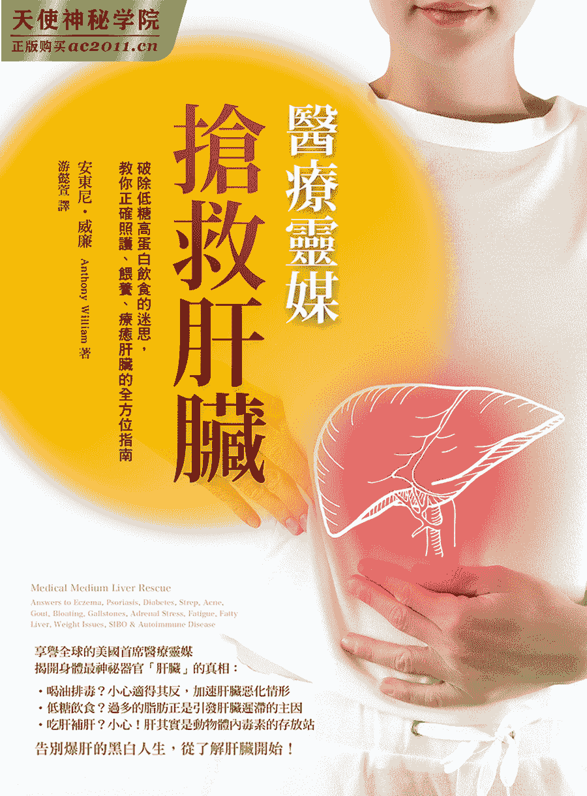

# 目录

1.  封面
2.  各界赞誉
3.  免责声明
4.  引言
5.  前言
6.  致读者
7.  第一部　肝脏的天职
    1.  第一章　肝脏为你做的事
    2.  第二章　调节生理的肝脏　处理脂肪与保护胰脏
    3.  第三章　赋予你生命的肝脏　储存葡萄糖与糖原
    4.  第四章　提供药品的肝脏　维生素与矿物质储存槽
    5.  第五章　保护肝脏　消除与留置有害的物质
    6.  第六章　负责净化的肝脏　筛滤血液
    7.  第七章　英雄般的肝脏　肝脏的免疫系统
8.  第二部　看不见的风暴
    1.  第八章　肝功能迟滞
    2.  第九章　肝酶猜测检验
    3.  第十章　污血症候群
    4.  第十一章　脂肪肝
    5.  第十二章　体重增加
    6.  第十三章　莫名的饥饿感
    7.  第十四章　老化
9.  第三部　宣战
    1.  第十五章　糖尿病与血糖不平衡
    2.  第十六章　莫名的高血压
    3.  第十七章　莫名高胆固醇
    4.  第十八章　莫名心悸
    5.  第十九章　肾上腺问题
    6.  第二十章　化学物质与食物敏感
    7.  第二十一章　甲基化问题
    8.  第二十二章　湿疹与干癣
    9.  第二十三章　痤疮
    10.  第二十四章　小肠菌丛过度增生症
    11.  第二十五章　胀气、便秘、大肠激躁症
    12.  第二十六章　脑雾
    13.  第二十七章　心情起伏与季节性情绪失调
    14.  第二十八章　熊猫症候群、黄疸、婴儿肝
    15.  第二十九章　自体免疫性肝脏问题与肝炎
    16.  第三十章　肝硬化与肝脏疤痕组织
    17.  第三十一章　肝癌
    18.  第三十二章　胆囊疾病
10.  第四部　肝脏救赎
    1.  第三十三章　体内的宁静
    2.  第三十四章　解开肝脏的迷思
    3.  第三十五章　高脂肪饮食的风潮
    4.  第三十六章　肝脏的捣乱者
    5.  第三十七章　肝脏的强效食物、药草、补充品
    6.  第三十八章　救肝三：六：九
    7.  第三十九章　救肝食谱
    8.  第四十章　救肝冥想
11.  尾声　暴风雨会过去，宁静会与你同在
12.  致谢
13.  度量衡转换表
14.  版权页

# 各界赞誉

安东尼对食物及其感受的了解、食物与人体的互动等，令人惊叹连连。他不费吹灰之力就能说明我们的选择带来的是和谐或不和谐，并且浅显易懂。他拥有独一无二的天分。请你帮自己的身体一个忙，并善待自己。

──菲瑞‧威廉斯（Pharrell Williams），十一次葛莱美奖得主暨制作人

安东尼‧威廉的贡献中蕴含了超自然的神秘元素，而他发扬光大的观点（尤其是关于自体免疫疾病的部分）带给人们真切又确实的感受。更棒的是，他建议的课程都很自然、可行又简单。

──葛妮丝‧派特罗（Gwyneth Paltrow），奥斯卡最佳女主角

安东尼值得我们全家人的信赖。他的书为全世界带来光明，引导许多人抵达平安之处。他对我们来说意义非凡。

──劳勃‧狄尼洛（Robert De Niro），与葛莉丝‧海托‧狄尼洛（Grace Hightower De Niro）

安东尼是个伟人。他的知识相当吸引人，对我有相当大的帮助。光是西芹汁就让我完全改变了！

──凯文‧哈里斯（Calvin Harris），音乐制作人，葛莱美奖得主

安东尼是我唱片公司旗下所有艺人的魔术师，如果将他比喻成录音专辑，必定能超越麦克‧杰克森的《战栗》。他的才能堪称深奥、卓越、非凡又令人惊艳。他是位杰出的作者，书中充满预言，医学的未来就在这里。

──克雷格‧考曼（Craig Kallman），大西洋唱片总裁兼执行长

安东尼的书带来了革命，却又相当务实。任何对目前西方医学限制感到失望的人，这本书绝对值得你花时间与考虑。

──詹姆士‧范德比克（James Van Der Beek），《音乐鬼才迪波洛》原创者、演员以及金佰利‧范德比克（Kimberly Van Der Beek），公众演说者与社会运动者

我的家人与朋友都受到了安东尼疗愈天赋的启发。我们获得的好处，包含了身体变年轻及心灵上的健康，实在是笔墨难以形容。

──史考特‧巴库拉（Scott Bakula），《重返犯罪现场：纽奥良》制作人与演员

安东尼是个奇妙的人，他替我找出长久以来的健康问题，也知道我需要何种营养补充品，而我确实立刻有所改善。

──拉西达‧琼斯（Rashida Jones），《爆笑女警》演员暨制作人，《社群网战》、《办公室》演员

要是有人能够透过触摸就告诉你得了什么病，你会觉得如何？欢迎来到安东尼疗愈之手的世界。他是现代的炼金术士，手中很可能握有长寿的关键。他救人一命的建议就像飓风一样，席卷过我的世界，并留下了一条爱与光明的道路。他就是通往世界第九大奇迹的双手。

──丽莎‧格雷戈里施科邓普斯（Lisa Gregorisch-Dempsey），《Extra》资深执行制作

安东尼‧威廉利用他独一无二的天赋，改变与拯救了全世界许多人的性命。他持续不断的努力及大量进步的信息打破了藩篱，让世人获得亟欲寻求的真相，而其中有许多是科学研究尚未发现的。对我个人而言，他帮助了我与女儿，让我们取得有效维持健康的工具。西芹汁现在已经成为我们日常生活的一部分了！

──丽莎‧里纳（Lisa Rinna），《纽约时报》畅销作家，服饰设计师

安东尼不仅是温暖、有同理心的疗愈者，带着神赋予的技能，他也非常可靠而精准。他一直是我生命中的贵人。

──“黑珍珠”娜欧蜜‧坎贝尔（Naomi Campbell），模特儿、演员、社会运动者

当安东尼‧威廉来到洛杉矶，在《娱乐头条》分享他的故事时，我有幸与他共事。那真是一次精彩的访问。他离开的时候，观众还欲罢不能，想要听更多故事……大家都为他疯狂！他显然有温暖的个性与宽容的心胸。安东尼一辈子都在运用神灵告诉他的知识帮助别人，并透过“医疗灵媒”系列书与大家分享信息，改变许多人的生命。安东尼‧威廉真是独一无二的人！

──雪伦‧列文（Sharon Levin），《Extra》资深执行制作

我已经关注安东尼一阵子了，现在经常听到采用他的方式获得成功的故事，虽然觉得相当震撼但并不意外……我已经踏上疗愈之路好几年了，医师一个看过一个，门诊一科看到另一科。他是个肚子里有真材实料的人，我非常相信他与他在甲状腺方面，以及食物对人体造成的影响等广博知识。我介绍了许多朋友、家人、粉丝去找安东尼，因为我真正相信他拥有任何医师都未具备的能力。我是他的信徒，现在已经踏上真正的疗愈之路，很高兴能够认识他、接触到他的作品。每位内分泌科医师都应该阅读他有关甲状腺的著作！

──玛塞拉‧巴拉多利（Marcela Valladolid），厨师，作家、电视节目主持人

我是医师之女，总是靠着西药来解决小病痛。安东尼的洞见让我大开眼界，了解食物带来的疗效，以及能够改变生活的全方位健康之道。

──珍妮‧莫兰（Jenny Mollen），畅销书《我用我的方式喜欢你》（I Like You Just the Way I Am）作者

本书作者安东尼在疗愈上的天赋异秉，简直就是奇迹。

──大卫‧詹姆斯‧艾略特（David James Elliott），《CSI 犯罪现场：纽约》、《广告狂人》演员

安东尼‧威廉是全人类的礼物。他杰出的著作在传统医学一筹莫展时，帮助了数百万人获得疗愈。他助人的热情与努力无人能及，我很荣幸能够在《疗愈》当中分享一小部分他强大的讯息。

──凯莉‧努南‧高尔斯（Kelly Noonan Gores），作家，导演，纪录片《疗愈》（Heal）的制片人

安东尼‧威廉是少数能够运用天赋帮助他人发挥潜能，让他们成为自己健康代言者的人……我曾经参与他令人喝采的现场活动，亲自见证安东尼的伟大。他精准的诊断就像歌手所有高音都到位一样，但除了高音，安东尼充满慈悲的灵魂才是让听众着迷的主因。安东尼‧威廉是我引以为傲的朋友，我可以告诉大家，你们在播客听到的这个人，以及所言成为畅销书内容的人，也正是伸出手拯救需要帮助者的人。这不是在演戏！安东尼‧威廉是玩真的，他透过神灵分享宝贵的信息，并带来力量，这正是这个时代欠缺的内容！

──黛比‧吉布森（Debbie Gibson），百老汇演员，知名歌手暨歌曲创作人

安东尼‧威廉拥有了不起的天赋！我非常感谢他，在许多疾病困扰我多年后，他终于能够替我找出背后的原因。在他的支持下，我看到自己每天都有所改善。我认为他乃神人！

──摩根‧费尔钗（Morgan Fairchild），演员、作家、演说者

安东尼在见到我的三分钟之内，就精准说出我的健康问题。身为医疗灵媒，他的能力独一无二且令人震撼。他的书把许多医生觉得棘手的疑难杂症解释得简单易懂，又提供了解决之道。

──亚力山卓‧杨格（Alejandro Junger）医师，“净化计划”（Clean Program）创始人

天赋使他成为散播信息的渠道，而这些信息对现今科学而言遥不可及。

──克莉丝汀‧诺瑟普（Christiane Northrup）医师畅销书《让生活变得容易》（Make Life Easier）等书的作者

在阅读了《医疗灵媒─甲状腺揭密》后，我就增加了甲状腺的治疗方式，并见证了它在患者身上产生的卓越效果。这结果相当值回票价，令人充满感激之情。

──普鲁登斯‧豪尔（Prudence Hall）医师，豪尔中心创办人暨医学主任

安东尼的发现与慈悲的高灵使我们获益良多且为之感动。这种高灵透过安东尼敏感的天赋与带有关怀的灵媒身分，传递“未来的智慧”，所以我们对佛教医疗文献中所预言，“自作聪明的人类为了追求利益而干预生命元素，所带来使我们受到万般折磨的难解疾病”，已然奇迹地拥有清晰且明确的解释。

──罗伯特‧舒曼（Robert Thurman），哥伦比亚大学印度西藏佛教研究宗喀巴教授，美国西藏之家主席，畅销书《平静之人》（Man of Peace）作者

安东尼‧威廉是天赋异禀的医疗灵媒，对影响我们的难解疾病有真切又不极端的解决方法。我迫不及待想跟他做朋友，让他成为珍贵的资源，提供保健课程给我与我的家人。

──安娜贝丝‧吉什（Annabeth Gish），《电脑狂人》、《丑闻风暴》、《美少女的谎言》、《白宫风云》、《现代灰姑娘》演员

安东尼威廉利用拥有的信息致力于助人，真的让许多人的生活完全改观。

──亚曼达‧卡德纳特（Amanda de Cadenet），Youtube 频道“对话”及“女性视角”计划创办人暨执行长

我爱安东尼！我女儿苏菲亚与萝拉把他的书当成生日礼物送给我，我一翻开就停不下来。他的书帮我链接了健康的所有要素。透过安东尼的著作，我才了解自己小时候生病残留的 EB 病毒，在日后破坏了我的健康。

──凯瑟琳‧巴赫（Catherine Bach），《不安分的青春》、《飚风天王》演员

我几年前发生的嵴椎问题现在已稳定恢复中，后来却出现了肌肉萎缩、神经衰弱及体重增加的问题。某天傍晚，我的挚友打电话建议我阅读安东尼‧威廉的《医疗灵媒》，里面有许多内容引起了我的共鸣，我因此开始采用书中提到的一些观念，随后很幸运能够前去求诊。他的诊断完全正确，让我的疗愈之路一片光明，拥有更深层、更丰富的健康。我的体重以健康的方式减轻了，也能够骑自行车、做瑜伽，回到健身房里，并拥有充分的体力及深度的睡眠。每天早上，我做完例行公事之后，就会微笑着说：“哇，安东尼‧威廉！谢谢你的疗愈天赋……就是这样！”

──罗伯‧威斯顿（Robert Wisdom），《别有隐情》、《私法家医》、《芝加哥警政署》、《音乐之乡》、《火线重案组》、《黑手遮天》演员

在这个混乱的世界里，健康与幸福方面不断出现各种杂音，但我相信安东尼所说的话千真万确。他充满奇迹的真正天赋超越了一切，带领我到达清楚之处。

──帕蒂‧斯丹格（Patti Stanger），《百万美元搭档》节目主持人

我与家人的健康都仰赖安东尼。即使医生都被难倒，安东尼总是知道问题所在与疗愈方法。在这本清晰、友善且慈悲的书中，安东尼为这个时代许多令人深感困惑的健康挑战提供了解决之道。

──雀儿喜‧菲尔德（Chelsea Field），《重返犯罪现场：纽奥良》演员

安东尼让医学的领域变得更加宽广，大幅拓展我们对人体与自己的认知。他的作品是疗愈新先锋的一分子。

──玛丽安娜‧威廉森（Marianne Williamson），畅销书《奇迹年代》（The Age of Miracles）作者

安东尼‧威廉是慷慨与慈悲的指引者。他透入毕生精力帮助他人迈向疗愈之道。

──加布里埃尔‧伯恩斯坦（Gabrielle Bernstein），《现在就拥抱奇迹》（Miracles Now）作者

神秘的才能只有在搭配正直的道德与爱时，才能称为完整的天赋。安东尼‧威廉就是这样神圣的人，同时具备了疗愈、天赋、道德三者。他是货真价实的治疗者。他克尽职守，并真正替全世界的人服务。

──丹妮儿‧拉波特（Danielle LaPorte），畅销书《心灵真相》（White Hot Truth）作者

安东尼是位先知与健康方面的智者。他的天赋非凡，在他的指引下，我已能明确找出并疗愈折磨我多年的健康问题。

──克莉丝‧卡尔（Kris Carr），《疯狂美味饮食》（Crazy Sexy Diet）作者

接受安东尼施行的自信疗法十二小时后，去年以来在我耳朵里嗡嗡作响的声音开始减弱，让我惊讶、感激又开心。

──麦克‧杜利（Mike Dooley），《来自宇宙的笔记》（Notes from the Universe）作者

安东尼推荐的每一种增进健康的自然疗法都很有效。我已经在我女儿身上看到，且改善的效果令人印象深刻。他使用天然食材的方式，是更有效的疗愈之道。

──马丁‧雪福洛夫（Martin D. Shafiroff），财务顾问，曾荣登美国财富管理网站 WealthManagement.com 美国十大证券经纪人之首，以及 Barron’s 财务顾问之首

安东尼针对预防与战胜疾病的珍贵建议，比其他地方所能取得的信息都要先进许多年。

──理查‧索拉佐（Richard Sollazzo），纽约肿瘤学家、血液学家、营养学家与抗老专家

安东尼是我们这个时代的爱德加‧凯西（Edgar Cayce），能以显著的精准度与洞见解读人的身体。他能找出疾病的潜在原因，这些疾病经常令最精明的正统与另类医疗从业人员感到不解。安东尼实际又深刻的医疗建议，使他成为二十一世纪最有效力的疗愈者。

──安‧刘易斯‧吉图曼（Ann Louise Gittleman），《纽约时报》三十多本健康疗愈累书籍的畅销作家，以及广受好评的“脂肪冲刷排毒与饮食计划”发起人

身为好莱坞的商界女强人，我知道何谓价值。在找到安东尼之前，他的一些委托人曾花超过一百万美元为自己的“难解疾病”寻求帮助。

──南希‧钱柏斯（Nanci Chambers），好莱坞制作人与企业家

我从安东尼的书读到许多健康知识，他也准确道出只有我自己知道的身体状况。这位亲切、贴心、有趣、谦卑又慷慨的男士，把我这个灵媒都吓了一跳！他真是现代的爱德加‧凯西，他能出现在我们身边对我们而言是莫大的恩典。

──柯蕾‧鲍隆瑞（Collette Baron-Reid），电视节目《神灵的讯息》（Messages from Spirit）主持人

任何量子物理学家都会告诉你，宇宙中还有我们尚未了解的事在发挥作用。我真的相信安东尼深深了解这一点。他拥有惊人的天赋，能直觉地知道最有效的疗愈方法。

──凯若琳‧李维特（Caroline Leavitt），畅销书《教孩子认识家谱》（The Kids’Family Tree Book）、《残酷美丽的世界》（Cruel Beautiful World）作者

# 免责声明

版权所有。非经出版商许可，本书所有内容均不得以机械、照相、电子、有声录音方式复制，亦不得储存在随机存取装置当中传送或复制以供大众或个人使用，仅能以“适当”方式在文章与评论中引用。

本书作者不会提供医疗建议、其他专业建议或使用任何技巧做为诊断治疗身心与医学问题。作者的用意在于：在人们追求情感与精神健康的路上，提供范例与整体原则的信息。读者使用本书当中的信息，或是书中其他内容时，作者与出版商恕不负担直接与间接责任。读者在采用本书当中的建议或效法书中范例之前，应自行请教医师、健康从业人员及其他专业人士。

# 引言

献给《医疗灵媒》社群读者，那些每天早上醒来都满怀同情心，并用双手生命之光散播神灵讯息的人。

献给过去、现在、未来的医师与执业者，那些奉献生命、视病如亲且积极寻找疗愈真相的人。

也献给我的父母，也就是让我来到这个世界上的人。

# 前言

> 克莉丝汀‧诺瑟普（Christiane Northrup）医师

每次我看到安东尼‧威廉的书，或是听到他的广播节目，都能够学到新知识，那些确实是医学院没教过的东西。不仅如此，我还在日常生活当中运用了我学到的一切，其中一个例子就是我在他的第一本书《医疗灵媒》中学到的蔬果昔。在那本书中，安东尼提供了早餐蔬果昔的食谱，在二十八天净化疗程里揭开每天的序幕，那是我在几年前做过的事。我根据食谱制作的变化版本，已经成为我自己、我孙女及周遭朋友的必备主食。这道食谱总是不断获得好评。现在，读了《医疗灵媒─抢救肝脏》之后，我比过去还要开心，因为我拥有了常备的万灵丹。透过这本书，不仅能让我的细胞组织补充足够的水分、维持最佳的状态，也能在饮用之后帮助肝脏排毒。

我就不在这里卖关子了。这道食谱就是：2 至 3 根有机香蕉，1 又 1/2 至 2 杯的冷冻缅因蓝莓（我会一次买许多份，在家中常备一些），1 勺有机冷冻樱桃。接着，我会再加水达到想要的浓度（通常是 2 至 3 杯水），并在果汁机中打成液态，最后就可以做成 2 大份或是 4 小份的蔬果昔。如果家里没有客人的话，我就会把没喝完的倒入梅森罐中，留待之后再喝。

安东尼的《医疗灵媒─改变生命的食物》一书，正如书名所言，和他的第一本书一样，改变了我的生命。我从这本美好的书中学到了所有关于能量、疗愈的惊人信息，以及所有蔬果带来的精神教诲。这种知识让我连吃那些最粗鄙的马铃薯（代表低下与卑微）时，都会感到更加开心。我不会再心不在焉地吃东西了。现在我与食物创建了一种感恩的关系。（当然不是永远如此，但机率比过去高得多。）

现在，读了本书后，我就比之前更尊敬自己与其他人的肝脏了。身为医师，我在肝功能方面学到的知识，多半仅限于新生儿黄疸，以及在实习时照顾过许多酗酒造成肝硬化的病人。我同时也见证了一九七〇年代最初实验性绕道手术对肝脏造成的致命影响。有许多患者死于并发症，其中包括了肝衰竭。当然，绕道手术在此之后的进步不可同日而语。

但是，问题就出在这里。医学界仍然没有体认到肝脏每天做的事，只有到了肝酶升高，出现脂肪肝或肝硬化的时候，才会注意到肝脏。我在二〇〇一年撰写《更年期的智慧》初版时，完全了解更年期本身并非罪魁祸首，不会导致许多女性在中年时开始出现一些症状，例如失眠、热潮红、易怒等。确实如此，本书指出，这些症状大部分来自于受困的肝脏，不是女性只要到达某个年纪，身体机能就一定会衰退，而是我们的生活型态让肝功能无法完全发挥。

正如安东尼所指出的，肝脏能够提供我们双层保护机制：消除与留置，让我们免于环境与各种毒素的侵害。但如果我们持续忽略肝脏的功能，它们就无法维持正常运作。安东尼解释了我多年来持续观察到的一个现象，就是女性三十八岁、男性四十八岁左右，肝功能会开始衰退，体重增加与热潮红等症状就会相继出现，我们所说的“老化”也包含在内。对大部分人来说，到了这个时候，肝脏排毒的功能就会降到原本的 60％以下。基本上肝脏是在说：“我已经照顾你几十年了，除非你做些改变，否则我没办法继续维持下去了。”

这点真是让人如梦初醒，对吧？（这确实是个再恰当不过的词，想想酒精对肝脏健康造成的影响就知道了。）

你必须要了解这些事。肝脏的功能是负责过滤与筛滤，将有益与有毒的物质分开。肝脏会负责净化由肝脏直接通往心脏的血液，是终极的血液过滤器，它也能在核心深处隔离溶剂、杀虫剂、病毒，让这些远离血液，借此保护你。

肝脏排出毒素时，毒素会跑到三个地方。第一种是透过胆汁及胆囊进入大肠中，最终以粪便的形式排出体外。第二种是进入肾脏，毒素最终会透过尿液排出体外。最后第三种，毒素会以自由基的形式排放到血液中，不过这种是最后的终极手段。

现在请你仔细看。每个人都必须知道这点。在我们生活的时代当中，被诊断出心房颤动、心悸、其他心脏问题的人，比过去还要多出许多。事实上，心血管疾病成了男性与女性的头号杀手。主要原因如下，你之后会在本书中读到安东尼所写的内容：

肝脏到了无法处理这些流经的有害物质时，就会有较多残余的自由基及有毒物质（即毒性较低，肝脏没有把它埋在核心当中的物质）留在血液中，迫使心脏必须更努力跳动才能从肝脏把血液汲出。就像你用吸管想把布丁吸起来一样，最后就会造成高血压。如果肝脏阻塞到一定程度，有生物膜开始脱落进入血液中时，往往就会因为这些果冻般的物质塞住心脏瓣膜，导致血液无法顺畅地流动，因此造成心悸的现象。

但是，无论你现在的健康状况如何，都不需要摊手接受肝功能退化的事实，认为那是年岁渐长时不可避免的状况。你反而应该知道，在你开始照顾肝脏的那一刻起，肝脏能照顾你的程度就更甚以往。我们的身体具有神奇的能力，在我们开始给予身体所需的材料及关注时，就能再生与恢复健康。

在本书当中，你会学到许多医学界仍未知或仍不了解的肝脏功能及迷思。但最重要的是，你会了解肝脏需要什么才能获得疗愈，并发挥内建的功能救你一命。你也会学到在肝脏储存槽太满时，会产生一种特别的“周边”细胞，以及肝脏具有“肝脏追踪”系统，可以产生超自然的力量，并预防捣乱者被排放到血液中的能力。

我可以向你保证，在你读完本书时，就会非常感谢你的肝脏，觉得自己应该去做那些帮助肝脏，同时又能帮助自己的事！不只如此，安东尼也在书中列出明确的指示和营养补充品清单，让你能在各种不同的状况下帮助肝脏，包含日常作息的维持，以及特定的健康问题，例如痤疮、肠躁症、肾上腺问题、胀气、自体免疫问题、便秘、糖尿病、黑眼圈、湿疹、干癣、疲劳、胆囊感染、胆结石、痛风、心悸、高血压、高胆固醇、热潮红、黄疸、肝脏老化、雷诺氏症、季节性情绪失调、体重增加，甚至是静脉曲张等问题。最后，还有一章专门说明如何抢救肝脏，让大家都能抢救肝功能，使肝功能恢复到最佳状态。

总之，这本书是属于大家的健康宝库。请在读完这本书之后，将内容实际应用在生活当中（即使只有一小部分的建议也好），并享受健康快乐的肝脏为你生活带来的好处。你绝对不会后悔。

|  |
| 图说：安东尼‧威廉，四岁，正在疗愈受伤的雏鸟 |

# 致读者

寻宝是人类史上由来已久的一部分。在大家追寻宝藏的时候，无论是装满宝藏的沉船，或是寻宝图上标记的一箱黄金，往往都在追寻多年后与寻宝者失之交臂。这些寻宝者做了详尽的研究，有时耗费数十年的时间，散尽家财投入时间与精力，最后在他们向下挖掘时，发生了地震，宝藏磙入他们永远无法到达的缝隙当中。打捞沉船也是同样的情形。那时的海相必须正好适合潜水，只要有珊瑚礁崩裂，就可能阻碍打捞工作；要是海域内充满鲨鱼，也很可能让过程变得相当不安全。

几十年来，许多优秀的人才投身研究，我们离慢性病的解答越来越近，真相却一直离我们相当遥远。知名的神经学家在接近真相之际，却因为缺乏经费而无法继续研究。这就像我们现代的医学一样，虽然相当接近答案了，但有许多人仍在受苦，甚至失去生命，依旧无法获得解答，一切进展都缓慢不前。答案已经呼之欲出了。然而，诸如怪罪在基因上的这种理论，却将真相推得更远，因为这让医学界倾全力将资源投入基因研究当中，不再继续挖掘真相，因此无法找出能够阻止缠身多年的慢性病真相。

有多少次，你看到事情发生时，内心清楚知道要是别人了解你学到的教训，状况就会完全改变？从小到大这几十年间，我看到医学界为了解人们所受的苦，有了大幅度的进步，也走上了错误的路子。我看到他们在寻找慢性病原因的答案时几乎跌了一大跤，自此之后就没有成功过。我的工作是要将答案告诉你。你准备好要听了吗？

在本书中，你会发现医学与研究界的真相，也就是他们已经相当接近真相了，却突然遭遇阻碍。我已经在书中提出了慢性症状与问题的解答，这样你就不需要因为慢性病在医学发展中犯下的错误而受到限制。此处没有喷火龙看守着答案，或是海怪阻挡你取得宝箱。没有资金短缺的问题，没有既定行程或祖父级的错误，让你无法发现向前迈进的方法，因为我没有受到任何体系的限制。自由就在这些文字当中，是你随手可得的东西。

##### 慢性与神秘疾病的流行

如今，慢性病病例可说创下了有史以来的新高。光是在美国，就有超过两亿五千万人罹病，或是正在与神秘的症状奋斗。有些人莫名就过着受限的生活，或是听到了解释却感到更为难受。你很可能就是其中之一。若是如此，你就见证了医学界仍然不清楚莫名症状与疾病流行的原因。

我在这里要澄清一下，我非常尊敬好的医学。许多天赋异禀的医师、护理师、技师、研究人员、化学家等，都在传统与另类医学领域有杰出的表现。我很荣幸曾与其中一些人共事过。感谢上帝创造这些慈悲的疗愈者。学会如何透过严谨、有系统的方式探索这个世界，是再崇高不过的事了。

大部分医师内心的智慧及直觉告诉他们，现有医学传统无法满足他们的需求，帮助他们对慢性病做出最佳诊断与治疗。有多少次，你听到有人说“（某种疾病）目前还未出现有效的治疗方式”？即使是最顶尖的医学院前几名毕业的医师，都有人诚实坦白，自己在毕业时还没准备好面对慢性病患者，因为这些患者已经久病成良医了。另外也有些医师相信自己已在医学院获得所有答案，他们接受的训练就足以应付神秘疾病。他们认为，其他的一切都是胡说八道，这点相当可悲，因为他们否认了数百万患者找不到答案的事实。无论是何种情形，医学界无法解决神秘的慢性疾病，都不是医师或研究者的错。每天都有许多聪明的科学家在寻找真相的路上跌倒，他们需要投资者及决策者的许可，才能继续前进。有数千种真正可以改善人类生活的发现，却无法继续发展下去，在该领域的科学家也因此受到限制。

有时候，我们看待医学就像看待纯数学一样，认为一切只受逻辑与理性的支配。虽然有时数学与医学有重叠之处，两者却是完全不同的学科。数学相当明确，医学却非如此。真正的科学会产生结果，是能够实际应用的理论。你可以在医学中应用数学，例如可以用来制药，但是药品在未经实验证明有效之前，都不能视其为科学的一部分。科学实验室就像扮家家酒，让那些人有方法地将不同的材料放在一此，测试不同的假设与理论，但投资者却会不断催促，希望能够尽速获得有力的结果。理论往往在获得证实或遭推翻之前，就被当成了结果，在慢性疾病方面更是如此。在慢性病医学界，你很少能够直接获得正确的答案。

如果科学和我们想像中的一样美好，是多么棒的事？如果科学就是纯粹的追求，不需要在乎钱，只要追寻真相，那该有多好？医学方面就像人类在其他方面的追求一样，都还在进步当中。请你想想最近发现的器官“肠系膜”，这种活跃的网状结缔组织，其实是过去以来透过肉眼就能看到的组织，甚至也有人提出，但是直到现在才获得应有的认可。还有更多事情会在未来发生，每天都会出现新的突破。科学不断在进步，因此在某个时候看来像是能解决一切的理论，到了隔天可能就显得过时。这就代表着：科学界仍然没有全部的解答。

我们已经等了超过一百年，等待医学界对肝脏提出真知灼见，以及对那些无人知晓是肝脏造成的健康问题提出洞见，但这些事情都还没出现。你不该再等个十年、二十年、三十年以上，等待科学研究找出真相。如果你卧病在床，苟延残喘地过日子，或是对自己的健康状况感到困惑，那么你连一天都不该再等，更不要说是十年了，你也不该看着自己的孩子承受那些痛苦；然而，目前却有数百万人这么做。

##### 高等的来源

这也就是为何最高的神灵上帝展现了慈悲，在我四岁时进入了我的生活，教我如何看出大家病痛真正的原因，并将这样的讯息传递给全世界。如果你想进一步了解我的背景，可以参考《医疗灵媒》。简单来说，就是神灵经常清楚精确地在我耳边说话，就像一个站在我身边的朋友一样，告诉我周遭的每个人有哪些症状。此外，从我小时候开始，神灵就教我如何对人体进行扫描，就像是一台超级核磁共振仪，能够揭露一切阻塞、疾病、感染、有问题区域与过去的问题。

我们了解你，知道你遭遇了哪些困难，我们不希望你再继续遭受片刻的痛苦了。我的毕生职志，就是要把这样的讯息传递给你，让你从今日健康流行说词所造成的困惑海平面浮现，才能重十健康，找回自己生活的掌控权。

本书中的材料都是千真万确的，都是为了你着想。这本书和其他健康书截然不同，其中包含了许多信息，值得你一读再读，才能了解当中所有信息。有时候，这种信息可能与你先前听过的完全相反；有时候，它可能与其他来源的讯息相当接近，但有着细微且关键性的差异。书中这些信息的共通之处，在于全部都是事实，而非重新包装或回收现有的慢性病理论。书中的信息也非来自不健全的科学研究、利益团体、有利害关系的资金、蹩脚的研究、游说者、内部回扣、推销信念的体系、有力人士的小团体、健康界的业配文，也没有落入时下的陷阱。

上述的包袱阻碍了医学研究与科学在了解慢性病方面的大跃进。在外部资源因为广大的利益而刻意模煳事实时，那些珍贵的研究时间与金钱就会投入无益处的领域当中。一些发现原本应该能让慢性病的治疗大幅跃进，却遭到了忽视，因而丧失资金挹注。我们认为科学资料万能，但它实际上遭到了扭曲，遭到污染及操弄，接着被其他专家奉为圭臬，即使它本身有着瑕疵也不例外。

在接下来的几页当中，你会看到有关肝脏健康的事实与数字，却不会看到我引用无益来源的科学研究。你不需要担心这样的信息会像其他健康书籍一样，最终会被证明有误或遭其他理论超越，因为我在此分享的所有健康信息，都来自于纯粹且未受污染的干净来源，也就是更高等的来源，是神灵的慈悲。世界上没有比慈悲更疗愈的了。

如果你只相信科学界说的话，请你务必明白，我也喜欢科学；也请你了解，除非我们提到肝脏移植（这是科学界非常进步的领域），否则科学界对于肝脏每日的功能、遭遇的挑战与需求，仍有许多待学习的部分。虽然我们处在伟大的时代，却也比过去更容易生病，更容易感到疲劳。如果医学界的专业人士知道有多少人因为肝脏负担过大，或因为肝脏遭到忽略而受苦，那么我们对于健康的各种看法几乎都会改观。

和许多扎根于测量与计算的领域不同，科学界对慢性病的想法一直都建构在理论之上，而今日理论奠基于事实的部分却相当少，这也是为何许多人仍然在和慢性症状与问题搏斗。如果事情继续这样发展下去，最后就会变成没有任何研究与宣传、利益无关。这股潮流，正是导致慢性病界从一开始就感到失望，医师同感失望的原因，最终造成数百万人为疾病所苦。

##### 我们是提出质疑的人

很久很久以前，我们活在权威之下。我们被告知地球是平的、太阳绕着地球转动，然后我们就相信了。这些理论并非事实，大家却把这些当真。当时的人并不会觉得生活颠倒了，生活还是同样一回事。任何提出与当时状况相反说法的人，都被当成了笨蛋。接着，科学界就出现了典范的转移。那些质疑者，也就是认真的研究者与思想家，那些不愿就此接受“事实”的人，最终证实透过分析，能够打开一扇通向深处的门，让我们对世界有更真实的了解。

现在，科学界成了新的权威。在某些情况下，这样能够拯救性命，例如现在的外科手术使用消毒过的工具，因为他们知道手术感染造成的风险，这是过去所不知道的……但也因为某些进步，使我们不禁开始主动质疑。现在就是下一次典范转移的时候了。“因为这是科学”并不足以替慢性病提供解答。那是好的科学吗？其背后的资金来源为何？样本的多样性足够吗？基数够多吗？处理对照组的方式乎合道德规范吗？考虑的变因足够吗？测量工具够先进吗？分析的方式和数字本身所显露的是两回事吗？有出现任何偏见吗？有任何体制内的有力人士插手干预吗？一些科学会带来卓越的成果，另一些则会展现出漏洞：业配、回扣、样本数小、变因控制不佳。我们说这是科学，仿佛向这些低头是理所当然的事。这听起来就像是独裁的概念，不是吗？我们其实没有真正脱离那个思想体系。如果没有挑战现有架构，就不会有进步。但是，在今日的社会当中，科学的架构却不允许我们去挑战。

流行趋势有时看来不像流行趋势，而经常会伪装成健全的医学建议。许多现有的健康信息重复性很高，或者更糟糕的，只不过是街谈巷议。我们必须留意某人散播讯息背后的目的，可能导致我们接收到扭曲的讯息。良好的第一手资料是大家过往奉为圭臬的黄金准则。现在，在追求大量产出内容的情况下，有些健康文献的研究都是急就章，根据似乎还过得去的来源就草草发表。我们必须了解分析与发表者的背后是否有特殊利益关系，甚至连研究结果本身，我们都应该质疑是否可信？

科学经常被做为攻击的工具。那个标签可以用来扭曲一切。以食物的战争为例，采全素者与原始人饮食法者就透过科学宣战，双方都利用科学来为自己的理论佐证，因为不管是什么事，几乎都可以找到科学证据来佐证。（吃肝脏对肝脏有益？有这样的研究为证。乾酪是有助于延长寿命的食物？也有这样的研究。这些都是正确的，还是遭到扭曲的呢？阅读本书后，你可以自行判断。）即使科学的证据不足，参与食物战争的人也诉诸情感来挑战对方的思想体系。倡导全素者对原始人饮食法者说，他们会杀害动物；原始人饮食法者告诉全素者，他们在让自己与孩子挨饿。疗愈并非选边站或是你当下选择的信仰体系，即使那个思想体系来自你曾阅读过的科学报告。疗愈来自于了解肝脏的责任，并支持肝脏进行那些工作。

如果我们把科学视为上帝，将那些质疑理论与发现的人视为笨蛋，那么我们就无法做到这点。医学界必须要对医学界格外当心。虽然有些医师可能极为善良，但整个产业并不是要留意某个人，而是要留意自己的答案，因为医学界必须维持自己的尊严。医学界长久以来涉入的情况就是如此。

坦白说，今日那些我们觉得很具体清楚的科学领域，有时还是会出现一些破绽。如果你听过髋关节置换手术或疝气手术被召回的案例，就会知道我说的是怎么一回事了。这些都是经过精确科学标准设计的有形物件，在实际运用之前也做过严格的科学测试，但即使是这种高标准的科学流程，都无法保证没有任何缺失。一些产品出现了无法预见的问题，看来无懈可击的科学领域结果却是漏洞百出。那么，请你想想，科学界对慢性病、肝脏、肝脏各种功能的了解有多么不明确。这不是你伸手触摸得到，可以让其他人测量或独立分析的东西。这是人体当中活跃的部分，而我们都知道人体是生命中最伟大的奇迹，也是最大的谜团。同样地，科学向来是人类追求的目标，也正在发展当中，有关人体奥秘解谜的部分更是不在话下。我们必须时时提高警觉，敞开心胸接纳一切，并拥有适应的能力，才能真正让结果有所进步。

如果你从未出现健康问题，或长年为健康问题所苦却找不到答案，或是你深信某种医学、科学、营养学的思想体系，那么我希望你能带着好奇心与开放的心胸阅读接下来的章节。近日随处可见的慢性症状与问题，比任何人发现的都还要广。你接下来会读到的部分，无论是有关肝脏、慢性问题，或是疗愈的内容，都与你之前看过的资料不一样。这里的信息在过去几十年来，已经帮助了成千上万人。

##### 我们都在同一艘船上

从我开始分享神灵的讯息开始，已经喜悦地见证这些信息对人们带来的改变。透过出版“医疗灵媒”系列书籍，看到这些信息触及了更广大的世界，多帮助了好几千人，内心实在感动不已。

我也发现，当中的部分讯息遭到一些人的扭曲，借此获得认可与盛名。这种方式其实是踩着别人的痛处，利用了那些受疾病所苦的人。

我的天赋不应遭到如此的利用。神灵的声音应该要用来帮助需要解答的人，与那种一路走来充满圈套、牺牲许多性命的体系无关。我们乐见大家成为为我散播健康信息的专家，并以真正助人的名义传递这些慈悲的信息，我非常感谢大家这么做。然而，当这些信息遭人操弄，把这些信息和流行的错误信息混为一谈，只改变当中少许部分，听起来让人误以为是原始信息，或是大言不惭地说这来自可靠的消息来源，结果却非事实，这是非常危险的。我会这么说，是因为我希望你能保护自己与你挚爱的人，不要受到如此误导。

本书内容不会和你看过的其他书重复。这和那些怪罪自身基因或是说身体有缺陷的思想系统不同，也不是操弄时下流行的高蛋白理论来让症状消失。这里的信息会让你耳目一新，对那些限制许多人的症状及疗愈方式提出全新的观念。

我可以了解你的担心。我们会对事情产生反应，进行判断，这是我们都会做的事。这种反应在某种情况下，是可以保护自己的直觉，有时能帮助我们度过生活的难关。但在这种情况下，我希望你能够三思。你或许会让自己丧失了解真相的机会，也很可能会失去帮助自己与他人的机会。

所以，请你现在就和我一起系上安全带。我们一起处在帮助别人过得更好的船上，我希望你能成为肝脏健康方面的新专家。谢谢你和我一起踏上疗愈的旅程，并花点时间阅读本书。了解真相能够改变你与周遭亲友的一切，现在你终于拥有了真正的宝藏。

> 我们了解你，知道你遭遇了哪些困难。
> 
> 我们不希望你再继续遭受片刻的痛苦了。

# 第一部　肝脏的天职

> 神奇的节律器

## 第一章　肝脏为你做的事

有一小群人站在码头上，等着登上带他们出海的大船。岸边有一名旅行团的摄影师带着相机蹲在一旁，拍摄即将登船的旅客照片。他们的脸上充满期待，只是没有过分展露欣喜之情。天上飘着小雨，寒风凛冽。有些人为了能准时登船，来不及吃早餐就赶来这里，但其实要花一个早上的时间出海，并不是他们原本的打算，只是为了配合自己的亲朋好友。那些人相当坚持，说在平常忙碌的生活里，空出几小时去欣赏自然美景，是相当值得的事。

到了海上，大家的心情就开朗了起来。微风轻拂着每个人的脸庞，船离文明的城市越远，就越容易抛开俗世的烦恼。有几位乘客靠在船舷上，入迷地看着那些无止尽的水波，想知道他们是否真能如愿以偿，还是像过去的许多旅客一样幻灭。

说时迟，那时快。导游要大家朝右边船舷的方向看去，果然看到了鲸豚的鳍。旅客都聚集在栏杆边，有些指着他们方才看见鲸豚没入水中的位置。大伙儿站在那边等待着。过了一会儿后，又出现另一次。那值得我从座位上站起来看吗？有些人心想。他们依旧张大眼睛观望着。

最后，海面上浮出了大片光滑的皮肤，那只壮观的动物清空肺里的水，喷出神圣的水柱。大家精神为之一振，一起发出“噢”的赞叹声。接着鲸鱼再度浮出水面，露出另一侧的鳍肢。它潜入水中时，大家又发出了“啊”的叫声。那只神圣的动物继续待在船边一阵子，这段期间大家继续发出“噢”与“啊”的赞叹。最后，鲸鱼在空中高处挥着尾鳍，才与船只分道扬镳。

所有乘客都赞赏不已，都拥有了深刻如宗教般的体验。他们都在下船之前拍了些照片，并拿来和“之前”拍的照片比较。你会发现那些人有了明显的不同，他们仿佛灵魂出窍般，充满了神一样的光芒。

我们都知道鲸鱼确实存在。或许我们看过一些关于大自然的特别报导，在某处看过文章或给人启示的海报。不过，我们在日常生活中听到鲸鱼的机会却不高。即使鲸鱼繁衍的情况良好，或数量正在慢慢减少，又或是污染影响了鲸鱼的生存，还是当年是鲸鱼大迁徙的一年，都不会成为当天的头条新闻。鲸鱼并非生活在我们放眼所及的地方，我们的文化里多半是“眼见为凭”，看到才会欣赏的那种态度。若要让这些温和巨兽改变我们的观感，我们就必须出海去寻找它们，了解它们的价值，也必须近距离观察。

我们生活中有许多事也是如此。想想那些在超音波室中的准爸爸站在伴侣身边时，第一次看见孕妇肚子里成长中胚胎影像的样子。这种影像带给他们的感受，是衣柜里成堆的孕妇装，或是厨房吧台上一堆孕妇维生素罐子远远不及的。从荧幕上看到宝宝影像的那一刻之前，孕妇的伴侣无法感受到肚皮底下的成长情形；对他来说，胚胎并非真实的存在。

信不信由你，你的肝脏也是如此，在你体内带有宇宙中最深奥的隐形秘密。没错，海中那些如恐龙一样大的生物，以及生产的情形……以及你的肝脏，全都是如此。

##### 真正缺乏的链接

你不知道这点，是因为大家都不太注意肝脏。在人体的器官中，肝脏不是众人注目的焦点。我们在学校里，学到关于肝脏的知识并不多，肝脏也不像大脑一样经常成为报纸的头条新闻。我们可以贴上电波传感贴片来观看脑波的情形。我们知道睡眠与清醒时的脑波有所不同。我们在思绪浑沌、遭遇情绪问题、焦虑或忧郁时，都能直接感受到。我们也相当熟悉大脑退化的影响，还会注意失智的症状。在日常生活当中，有许多方面都会让我们意识到大脑的存在，最简单的例子就是一些词汇：“大脑的食物”、“动动脑”、“脑筋清楚”，或是指着我们的脑袋说：“都记在这里了。”

心脏也是头条新闻的宠儿，因为我们每天都能感受到心脏的存在。我们会感受到心跳，感觉心跳加速，甚至能感觉到心跳不规律的情形。我们可以在荧幕上看见心跳的图形，追踪运动过后是否心跳加速。我们会在超市看见“有益心脏健康”的广告。从小我们就知道心碎、心痛、心脏病发，在情人节到处都看得到心形，甚至会用手比爱心，或是打从心底感受到爱。我们会说：“那让我内心感到温暖。”唱着《只要一点点你的真心话》，并告诉交了新男友的朋友“不要马上把你的心都交给他”。看着孩子陷入初恋的父母，都衷心期盼孩子的心不要受伤。

人体的其他部分也经常会受到注意。我们的肌肉在运动之后，会变得比较结实与明显；在卧床几天之后，肌肉则会变小、变柔软。我们的皮肤能反映身体的表面状况，例如苍白、脱皮、泛红、龟裂、容光焕发。至于肺脏，则是在深深吸一口气时，能够看见外围的肋骨扩张，吐气时则会缩小。过去大家虽然不知道吸烟造成的危害，但现在各种公益广告已经让大家了解吸烟与肺癌之间的关系。我们的膀胱在胀满时，就会感觉到它的存在。我们会分析尿液颜色与排出量，以及当中所含的成分；如果出现疼痛灼热感，则会知道发生泌尿道感染。我们的肠胃道也经常让我们感受到它的存在。肚子饱了，我们感觉得到，肚子饿了则会咕噜咕噜叫，也可以从排出的物质判断曾经摄取了什么。我们都相当重视这些及其他身体部位，因为透过这种方式很容易了解这些部分的努力。

接下来就是肝脏了，这个眼不见、心不念的器官。我们不会感受到肝脏的存在，那不过是奶奶在厨房里做肝脏料理时会提到的器官。如果肝脏给我们的感受不如心跳一样明显，那么它一定没有替我们卖力工作。如果我们感受不到肝脏所受的痛苦，那肯定不会是个问题。因此，那个肝脏依旧维持神秘。那个器官真的在那里吗？有吗？我们很容易就忘了肝脏的存在。

医学专家知道体内必定有些问题。他们知道表面看不见的那些，知道缺乏的链接。他们看到了越来越多的健康问题，他们看到一个又一个的患者说明在身上发生的神秘慢性病，所以努力在各处寻找答案；但问题是，医学界的风向经常阻碍了真相的追寻。

最近流行的风潮是花费大量时间、精力、资源探究甲状腺的问题。我们在前一本书《医疗灵媒─甲状腺揭密》探究了这个流行的理论。这股风潮认为，甲状腺问题是许多问题背后的原因，从掉发到流产包罗万象，我们也探讨了那个说法错误的因素。虽然甲状腺是人体中非常了不起的部分，但这个腺体本身并非造成慢性病的那个神秘链接。长久以来，甲状腺一直在背黑锅，实际上却是肝脏有问题造成的。

事实上，肝脏是你最好的朋友，负责执行医学与科学界尚未发现的两千多种重要功能。肝脏日夜都为你努力工作。在你需要更多帮助时，肝脏会事先准备，也会在你犯了大错时收十残局。肝脏是仓库，是过滤器，是处理中心，也是垃圾回收中心等。肝脏能在各方面保护你，捍卫你，替你抵御外敌，一路上照顾你，为你赴汤蹈火，拆除炸弹，挡下子弹，围捕捣乱者，避免体内出现灾难。在你活着经历过重重危机时，背后的功臣就是你的肝脏。

你可以问问外科医师，在他们第一次看到活体肝脏时有什么感觉。他们花了很长一段时间研读教科书，看过了无数的肝脏图片，在实验室里练习解剖大体老师几个月之后，第一次站在手术房里看见患者活生生的肝脏，有什么感觉？他们很可能告诉你，那种感觉令人难以置信。或许是亲眼看见伟大而神秘的器官而感到目眩神迷，当晚甚至难以入眠，就像看见伟大而神秘的鲸鱼一样。这还不过是了解肝脏一小部分的功能而已。

现在，你必须以全新的角度看待肝脏，像外科医师欣赏肝脏一样，并拥有一些新的想法。这就是我写这本书的目的：让你可以了解自己的身体，熟悉体内最伟大的盟友，那个永远支持你、比任何人都努力为你拼命的器官。想要了解世界令人叹为观止的奥妙之处，我们不需要走遍天涯海角，只需要探究身体的内部世界即可。

##### 濒临危险的肝脏

如果你的身体负担太大，因此无法看到身体的神奇之处，会是什么样的情形呢？在面对日常生活的挑战，有无数项急迫的任务等着我们完成时，就算肝脏能展现人体智慧迷人的奥妙之处，又能怎么样呢？为什么要在乎肝脏？

我们要担心的事已经够多了。我们必须维持家人的安全与健康，在工作上要有良好的表现，要维持良好的体态，避免染上肥胖、忧郁的流行病、心脏病，还要避免早衰及罹患慢性疾病，避免受到地球上的污染，避免野生动物濒临灭绝，更要面对不确定的未来等，写都写不完。面对这一切时，就必须耗费相当多的体力。为何还要在清单上加入更多项目？在时常听到我们应该减压，应该简单过生活，要学习向不需要的事物说“不”之际，为何还要庸人自扰，让自己担心更多的事，例如关心肝脏的健康？

因为我们的肝脏有麻烦了，所以要尽全力去关心肝脏。因为发现肝脏的力量及照顾肝脏能带来的力量之后，就可以改变一切。因为如果维持了肝脏方面的健康，就能让其他部位维持健康，并预防连你自己都没发现的健康问题，又如何呢？但愿大家都能了解有许多症状、问题、病症都来自肝脏，不只是肝癌、肝硬化、肝炎而已，肝脏在医学界可说具有举足轻重的地位。

抢救肝脏，就能够抢救心脏、大脑、免疫系统、皮肤、肠道，让你拥有良好的睡眠、血糖维持平衡、血压降低、体重减轻，看起来与感觉起来也更年轻。肝脏也能维持你的思绪清晰，维持心情平静与愉快。此外，肝脏也能帮助你适应日新月异的时代。愿意帮助肝脏，就是让你完成待办事项清单最快的方式。健康的肝脏是减压的最佳方式，它是抗老化的最佳战友，也能在这个充满威胁的世界里担任最佳救生员。肝脏是心理、情绪、身体、精神健康的关键。将你的注意力转移到肝脏上，并非压垮骆驼的最后一根稻草，而是帮它减轻负担，进而救它一命的方式。

大家寻求灵感的时候，通常会把重点放在大脑及第三只眼上，希望能够静下心让自己明心见性，或是透过思考来安排未来。在这个过程中，肝脏完全遭到忽略。但其实，我们能从肝脏获得的灵感，远超过你的想像。

在我们注意地球环境健康的同时，也不可忘记自身环境的健康。我们每个人都有必须注意的一颗星球，就是我们自己的身体。在你活着的时候，随时都带着一整个世界。正如我们所知，地球的平衡相当微妙，只要有一环变弱，就可能危害到整个地球的完整；我们在照顾自己时也一样。像是鲸鱼那样巨大的生物重要吗？如果鲸鱼绝种了，我们会在乎吗？当然会，那些濒危的物种相当重要，需要我们的保护。所以，我们工作量过多、负担过大、发挥到极致、承受过多压力且备受威胁的肝脏也是一样。没有人希望这个世界上的海洋有毒，让海洋生物在污染中努力求生存，也没有人希望体内的血液含有毒素，必须透过肝脏努力工作才能维持健康。

然而，我们正面临肝脏濒危的历史时刻。我们的环境乌烟瘴气，每天生活中都接触到大量有毒物质；事实上，我们身体的状况比地球更糟糕，因此肝脏只能默默担起清洁工作。想像一下，如果你的肝脏是座头鲸，血液就是海洋。如果海洋变得泥泞而黏稠，里头充满各种抗生素、药物、杀虫剂、除霉剂、清洁产品、溶剂、塑胶、病毒与细菌的废弃物，出现慢性脱水问题，还有食物当中的脂肪等，那头鲸鱼就很难获得养分。如果鲸鱼一直没有喘息的机会，那么经过一段时间，它就会慢慢生病，很难浮到水面呼吸新鲜空气。

全世界的人都有肝脏问题。目前，肝脏功能不健全是相当常见的事。如果我走进人群里，会发现一千人当中约有九百人的肝脏都受伤了，却没有人知道这件事。那是因为正如我所言，肝脏的重要性超过大家的认知。医学界除了移植之外，对肝脏方面的研究相对稀少，所以他们不知道肝脏与世界上许多健康状况不良的问题有关。医学界不知道肝脏做了什么事，不知道现代有多少问题、疾病、症状、病况实际上都源于肝脏的问题，或是肝脏需要什么才能维持健康，因此他们没办法将这些重要的知识传递下去。这仍是众人完全未知的事实，就像太平洋垃圾带一样，在被人类发现之前，大家对它一无所知。（即使发现了，当中黑暗且无法居住的核心，至今仍是难解的谜。）我们在不知不觉的状况下，将肝脏逼到了极限。

如果我们想要在这个世界上有所作为，就必须让身体发挥作用，但我们身上出现的症状限制了我们。脑雾、疲劳、体重增加、季节性情绪失调、易怒、高血压、高胆固醇、焦虑、粉刺、胀气、便秘，这些症状相当常见，你甚至不会去思考背后的原因，但这些往往是肝脏求救的讯号。它们会限制大家的行动，让生活蒙上一层阴影。如果我们不设法阻止这种情形继续下去，问题就会变得越来越严重。肝脏的问题就像蛀牙一样，在引发严重感染之前，会一直被大家所忽略。

之后有许多我们都知道相当严重且不可能被忽略的疾病，例如糖尿病、忧郁症、心悸、痛风、湿疹、干癣及甲基化问题，目前大家仍不知道这些是肝脏造成的问题。至于脂肪肝、黄疸、肝炎、肝硬化、肝癌，虽然医学界已经知道这些疾病与肝脏有关，却依然无法解开肝脏之谜，更不用说肝脏是我们人体主要的过滤器与能量储存宝库这件事了。基本上，肝脏就是解决所有健康问题的重要根源，正是如此。所以，肝脏问题在全球各地都相当盛行，我们现在都身陷危险当中。

如果这个星球上行走的人都拥有健康的肝脏，这个世界就会变得截然不同，这种说法一点也不夸张。若是如此，人类就没有那么多疾病，新闻就不会出现那么多生气、暴怒、贪婪、暴力的事件，现代社会也不会充满着恐惧。这些都与肝脏的健康息息相关。

这正是我们的肝脏相当重要的原因。就像海洋当中的垃圾涡流，或是濒危的物种一样，我们不能因为没有感受到肝脏的存在就忽视它。你不能用远大的目标，像是想要拯救全世界做为借口，就把肝脏丢在一边不管。那些远大的目标必须从我们自己的生活做起，也就是要先抢救我们的肝脏。

##### 肝脏入门课

如果医学研究与科学可以完全了解肝脏的价值，那么小孩在学会字母和阿拉伯数字之后，就应该学习有关肝脏的知识。进入大学之后，“肝脏入门”也会成为所有人的必修课，而不只是准备念医科的学生才要学习。

事实上，我们从很小的时候开始，一不小心就会让我们的肝脏过劳。我们长大并就读大学之后，又是怎么一回事？为了消除压力，许多学生尝试喝酒，甚至吸毒，同时饮食又不佳，不断用咖啡因提神，还经常熬夜。他们这么做的同时，无意间就让肝脏承受了很多压力，但这样其实相当讽刺，因为接受教育的目的在于获得知识。大学生活就像是长时间的反抗肝脏活动。我们非常注重年轻人的心智及脑力开发，尽力获得“适当”的成绩、“适当”的学分，未来才能拥有“适当”的工作，但这一切都是牺牲肝脏换来的。如果肝脏的负担过大，让你无法拥有最佳的表现，或是肝脏差到让你失去努力争取来的工作，那又有什么意义呢？在疲劳与其他症状使你卧床不起时，再多的证书与认可章也没办法帮你从床上起身。

我们心里明白喝太多酒会伤肝，我们也听过肝硬化、肝炎、肝衰竭、黄疸、肝癌、肝脏酶值偏高。或许我们想到了肝热，或是另类疗法医师曾开立了帮助肝脏的营养补充品。当然，我们也都听过吃动物肝脏补肝的说法，其实这是大错特错（之后会再详细说明）。对许多人而言，我们对肝脏的了解就是这些了。肝脏在古代神话中受到注目的程度，比在现代医学来得更多。

肝脏还有许多重要的基本事实等着人类去发掘。在医学院里，除非你打算成为外科医师或肝脏专科医师，想要执行肝脏移植手术，否则学校不会花太多时间教这些医科生有关肝脏的解剖知识，以及肝脏的功能。即使你是这方面的专科医师，也无法学到肝脏的精华知识。你没有学到要如何好好照顾肝脏。现有的资源就好比沙滩上的几粒沙子而已。

如果想学到关于肝脏的必备知识，应该要包含哪些内容呢？首先，我们会发现肝脏是吃苦耐劳的器官，负责执行上千种功能，我们会在第一部“肝脏的天职”稍后章节中提到一些最重要的功能：

•处理脂肪并保护胰脏

•储存葡萄糖与糖原（或肝糖、肝糖原）

•储存维生素与矿物质

•消除与留置有毒物质

•筛滤血液

•用个人化的免疫系统保护你

在进行以上各项工作时，肝脏的主要工作就是让你维持平衡。在这个相当不平衡的世界当中，这是优先次序相当高的一件事。你在生活中是否非常努力工作，努力到觉得负担过大的程度？你是否觉得自己忙到快烧起来了？你是否觉得在幕后做的这一切，功劳都不在自己身上？请把这些乘上二十倍，这就是你肝脏的感受。你很可能像拼命三郎一样地工作，揽了五份工作，要负责的事项多达一百种，但你的肝脏其实工作得比你还努力。要让你的身体达成和谐，首先要能够欣赏与感谢肝脏的这些功劳，这就像你做了无数的家事，但你的另一半多半没向你道谢，最后才终于承认你劳苦功高一样。

如果接受了理想的肝脏教育，就会发现肝脏相当吃苦耐劳。正如我将在第二部“看不见的风暴”及第三部“宣战”中提到的，肝脏随时准备为你出征，无时无刻都保护着其他器官。事实上，肝脏可能现在就在为你奋战当中，正努力对抗毒素及“无情四因素”（辐射、有毒重金属、DDT、病毒爆发），这些都是我们日常生活会接触到的，以及偷偷进入饮食中的有害食物与成分。肝脏在进行这些战争时，经常会出现一些症状与病况，所以你必须了解血糖升高、血压升高、胆固醇升高、脑雾背后真正代表的意义。例如，你必须要了解不明原因的体重增加，其实是肝脏阻塞的象征，不是因为你懒惰或新陈代谢变慢，这点可以让你的生活完全改观。如果你有湿疹、痛风、糖尿病等，请务必明白那不是你的错，只要解开背后的谜，就能摆脱痛苦施加在你身上的影响。

最后，肝脏训练课程很重要的一部分，就是要照顾与喂养肝脏。在你的一生当中，是否有段时间让你感到相当悲惨？是否觉得需要休息一下？你从生活的战争中复原时，是否觉得需要纾解心情并受到呵护？肝脏大声呐喊要求的其实正是这些，所以在第四部“肝脏救赎”当中，我们会探讨在肝脏负荷过重时，如何让肝脏恢复宁静，以及介绍日常生活中照顾肝脏简单且有效的方式，以预防健康问题的发生。肝脏具有不可思议的疗愈与再生力量，并且随时会听命于你。

##### 一生的挚友

在你成为自己的肝脏专家之后，人生就会变成彩色的，新生活会变得一片光明。这不仅是一种拿回发球权、找回疗愈能力并松了一口气的感觉，更是因为你的肝脏也与心情上的幸福感有紧密的链接，这点我们会在之后进一步说明。和肝脏产生链接，就像和自己的心灵产生链接一样。我们从小到大并没有学过这样的内容，这点却相当重要。如果你想体验更多美妙与神奇的事物，想感受到幸福，肝脏的和谐就是重要的关键因素。由于肝脏是你最好的朋友，因此两者间的关系会互相连动。我们的感受会影响到那位朋友，那位朋友的感受也会影响到我们。如果不清楚这点，我们就会对那位朋友造成压力，会挡住朋友的去路，朋友则会拖累我们。与你的朋友并肩作战，不要拖累对方，一切就会变得完全不同。

如果你觉得又累又沮丧，有时候觉得很孤单；如果你整天拖着沉重的步履，整天都处在高压的环境下，别忘了你的肝脏随时陪伴着你，忠心耿耿地耐心等待你看见它真实价值的那一刻。你将会了解更多关于肝脏的事实，以及肝脏能够帮你做的事其实远超过你的想像。

所以，请你做好准备，我们即将启程。现在是离开岸边，进一步见证我们人体深处的一切，等着揭开肝脏之谜的时刻，让我们能够深入了解生命之谜。现在，我们该回报这个为我们大量付出的器官。现在，抢救肝脏的时刻来临，只有这么做才能让肝脏救你一命。

## 第二章　调节生理的肝脏　处理脂肪与保护胰脏

肝脏是身体中真正负责调节生理机能的器官，虽然在某些身心灵与环境巧妙配合的状态下，大脑在一些方面具有惊人的适应能力，但只要能好好照顾肝脏，无论你是谁，或是你在哪里，肝脏都能让你适应各种状况。

你是否曾处在一种状态下，就是无论你多么努力，就是没办法将某种概念传递给其他人？那是因为有些人的大脑就是没办法适应一些状况。这也就是新人进公司一阵子之后，经理会透过观察得知什么行得通，什么行不通，借此指派员工负责特定的工作。虽然我们认为大脑的适应能力很强，却又必须要努力让大脑去适应，有些人的适应力则比其他人强。这就是为什么你会听到有人说：“用你的浆煳脑袋把这件事想通。”

肝脏的适应力则强大许多，在当下立刻就能进行一百八十度大转弯，在你不知不觉的状况下立刻改变，也能持续高速转换正在进行的工作，执行不同的化学功能，完全不会提出质疑。负责新工作的员工，可能需要好几周的时间才能适应新工作，提出无数问题，遇到一个又一个的挑战，才能让大脑适应。光是采用新的方法工作就得花好几个月适应，但肝脏完全不会这样。不需要有人对你大喊：“用你的浆煳肝脏把这件事想通。”

在获得支持的情况下，肝脏就能收放自如。如果你觉得冷，肝脏就会释放出热能，让你觉得温暖。如果你觉得热，肝脏就会吸收热量，让你感觉凉爽。如果你在跑马拉松，肝脏就会释出储存的糖原，帮助你冲过终点线。如果你喝了太多水，稀释了血液中的养分，肝脏就会像海绵一样吸收多余的水分。如果你吸进了香烟的气味，肝脏就会吸收血液当中的化学物质。如果你吃了十二盎司的牛排、薯条、巧克力蛋糕，肝脏就会负责处理与分解那些非天然的 omega-6 脂肪酸及反式脂肪酸来保护你。如果你在海中游泳，突然有个大浪打来，把你往海里卷去，或是出现了激流，让你无法脱身，肝脏就会释出储存的肾上腺素，使你拥有超人的力量，有救自己一命的机会。

肝脏能做的还不只如此，它还是个资料库，就和身体的第二个大脑“肾上腺”一样，是身体的第三个大脑。肝脏本身就是个记忆的器官，能力和大脑同样强大。如果每个月的第一个星期五，你都会和朋友去喝酒，大啖辣鸡翅、吃提拉米苏，肝脏就会记得你大吃大喝的日子，并提前为你做好准备。如果你每个周末都会吃披萨，肝脏也会记住。如果你的饮食习惯不定，肝脏就会不时追踪你的行为。肝脏留存记忆的时间远超过你的想像，所以，你当时所吃的食物看来似乎是随机的选择，例如你在当年第一个变冷的日子里吞下双层培根乾酪堡，或在收到退税时不知不觉间带家人去吃到饱的烤肉餐厅大快朵颐，多年下来，肝脏就会把这些储存在记忆的细胞膜当中，这是医学研究尚未发现的事实。你不可能欺骗肝脏，不可能比肝脏聪明，记忆力也不可能胜过肝脏。你的肝脏记忆和大脑的记忆不一样，大脑有时候可能会唬弄你。（你确定车子停在这里吗，汤姆？还是停在那里，那边那个停车场？）肝脏的记忆永远不会出错，也不会欺骗你。你以为的新方法，很可能其实是五年前你尝试过的饮食计划，只不过你忘了而已。你的肝脏仍保有这笔资料。如果出现了真正的随机选择，例如你这辈子第一次在早餐时吃了乾酪汉堡，那么，我们就回归到肝脏本身的适应能力，也就是能在短时间内回应你的需求。在此同时，肝脏也会记下这笔新的随机早餐资料，长期留存，等着你下次吃出乎意料的早餐时能够取用。

##### 处理脂肪

好的脂肪、坏的脂肪、高脂肪、低脂肪、零脂肪、饱和脂肪、不饱和脂肪、反式脂肪、健康的脂肪、omega 脂肪酸，光是这些就足以让你一个头两个大了。我们知道脂肪是最重要的健康议题，不过近年来，出现那么多与脂肪相关的热门字词，那么多矛盾的建议，你该如何分辨怎样才对你和家人有利？回顾过去各种健康风潮，许多都在各方面误导大众，难道我们应该要认为今日的流行观念已经厘清一切了吗？如果我们跟随流行，相信各种信息，就无法获得可靠的答案，因为舆论的浪潮转眼就会改变，一变再变。

所以，如果我们真的想要了解如何才能作出正确的决定，就必须脚踏实地，花点时间研究人体如何处理脂肪，也就表示要研究肝脏。那是由于肝脏实际上是个处理中心，负责处理进入体内的所有物质，而处理脂肪正是其主要工作之一。只要你摄取脂肪，肝脏就会分泌胆汁进行分解作用，并将脂肪输送至全身各部位做为能量来源。

这实际上比听起来复杂许多。不同的食物及不同程度的脂肪，需要不同数量与成分的胆汁，所以肝脏必须运用自身的记忆与适应力来为你每餐摄取的脂肪做准备，并采取适当的反应。别忘了，胆汁量增加时，当下就能帮助你，不过你不会希望长时间一直发生同样的事。如果发生这种情形，表示肝脏很可能受到其他捣乱者的挑战，例如毒素、有毒物质、病原体等。

肝脏健康警示灯可分为以下几种：

‧绿灯：分泌这种胆汁时，饮食中所含的脂肪成分低于 15%，而且都是来自健康的食物，例如酪梨、坚果、种子、橄榄、某些油品（例如橄榄油、椰子油、亚麻籽油）、椰肉、椰子油、部分鱼类、野味、生乳制品。（也许你曾在我的其他书里看到乳制品可能会喂养病毒，但这不代表肝脏无法适当分解某些乳制品。）绿灯也代表饮食的其他部分包含了大量的水果、绿色叶菜、蔬菜、马铃薯、瓜类，如果你想要，也可以摄取小米和一些豆类。在这种状态下，肝脏能以正常的速度分泌身体所需的胆汁，而不是处在惊慌、挣扎、无助的状态当中。

‧黄灯：这种状态为饮食中的脂肪成分在 15%以下，但有一些是不健康的脂肪，我们会在第三十六章［肝脏的捣乱者］当中讨论。在这种状态下，肝脏会维持低度警戒，提高 5%的胆汁分泌，也会调整胆汁的成分，来产生更多的酸性物质，当中的钠值、氨基酸、酶化合物也会增加。这个医学界与科学界至今仍不知道的化学反应，会产生分解油脂的物质。

‧橘灯：如果饮食当中的脂肪成分在 15%至 30%之间，且都是“绿灯”当中提到的健康脂肪来源，那么肝脏的警戒状态就会升高一级，请务必了解饮食中摄取这么多的脂肪，无法让你维持在最佳健康状态。胆汁的分泌会增加 10%，以保护肝脏最终必须承受的压力，并帮助你维持长寿。

‧橘红灯：如果饮食中的脂肪成分在 15%至 30%之间，且含有部分不健康的脂肪，肝脏就必须努力工作，增加 15%至 20%的胆汁分泌量。

‧红灯：饮食中含有 30%至 40%的脂肪，且都是健康的脂肪，就会让肝脏拼命工作，努力分泌胆汁和胆盐，让脂肪分解与消化，并努力维持身体长寿。到了这种时候，胆汁的分泌量会增加到 20%至 25%，肝脏也会释出一种化学物质做为警告，要求血液提供更多的钠，让肝脏可以调整胆汁的成分以便含有更多分解油脂的物质。肝脏也会释出钙到胆汁中，保护十二指肠及小肠其他部分的内壁，避免受到这种分解油脂物质的伤害。

‧超级红灯：如果饮食中含有 30%以上的脂肪，当中含有部分油炸食物或劣质的烹饪油（例如菜籽油、棕榈油、玉米油）、猪油、培根油、饱和脂肪酸之类的食物，会如何呢？这会让肝脏进入全力以赴的适应状态，用尽全力来大量分泌胆汁，比平常增加 50%以上的量，这些充满活力的胆汁让你的血液不会因为摄取脂肪而变得太浓稠。你的肝脏让自己进入战争状态，并源源不绝地提供身体所需的胆汁。这就像俗话说的“拼了老命”在工作。在这种情况下，不管三七二十一，所有东西都会被丢进胆汁里。这也就是为何这个“超级红灯”的状态比“红灯”还更进一步。采用生酮饮食的时候经常会出现这种状况。生酮饮食的来源可能包含植物性蛋白质与动物性蛋白质。我并不是希望你在今日的饮食战争中选边站。无论你采用哪种饮食法，胆汁都会依照肝脏分解食物的需求分泌，目的在于尽可能以脂肪做为热量来源，来消耗身体的葡萄糖。在这种情况下，你的肝脏会帮你挡子弹，尽一切力量来分解与消除所有脂肪，让你维持苗条，并避免对心脏与血管造成伤害。在你最终耗尽储存的胆汁时，就像你肝脏分泌胆汁的能力发挥到极致，同时分泌某些用来分解脂肪的极酸化学物质，并释出大量的钙来保护肠道不受伤害的能力也发挥到极限时，经过一段时间，肝脏就会耗尽储存的钙及其他宝贵的矿物质。

正如你在这份清单中所见，一切不是“好”脂肪与“坏”脂肪那么简单而已。虽然选择健康的脂肪来源是重要的第一步，却非唯一的防护措施。脂肪量同样也很重要，而这与你的体型无关。即使你非常苗条，也有正常运动，如果你的饮食主要都是脂肪，那么肝脏也会进入“超级红灯”状态当中。你的肝脏也就会被迫尽全力分泌胆汁，才能够保护你免受伤害，最后你可能必须付出的代价就是年纪大一点时体重会增加，以及出现其他跟肝脏有关的健康问题。

如果你在早上起床后，花时间梳洗沐浴，好好打扮，走到厨房时却被一桶油泼得全身都是，你会有什么感觉？你的头发、脸上、衣服都湿透了。这时你必须放下一切，回到浴室再洗一次澡，把衣服换掉，才能再度好好面对这一天。假设你出门去上班，中午又有人对你泼了一桶油，你就必须回家去清洗一番，这是一天当中的第三次了。然后，到了傍晚，在你准备要好好吃顿晚餐时，又被泼了一桶油，你作何感想？在这种全身滴油的状态下，你必须放下手边在做的事，进到浴室里把脏兮兮的衣服脱掉，并清理凌乱的现场。那天你一定不大开心，一定觉得糟透了。你有大半天的时间都在收十残局，到了晚上，你必定觉得工作量不堪负荷，压力太大，动不动就想发火。

如果你的每一餐都含有过多的脂肪，肝脏的感受就是如此。先吃了有油炸物的油腻早餐，午餐的沙拉酱又有大量的油脂，到了晚餐时吃烤鸡、披萨、烤乾酪，或是培根莴苣番茄堡，让肝脏忙个不停。不管你的早餐里只有两片传统的培根，加上传统用抗生素饲养的鸡只所下的蛋，烹饪用的油则是用荷尔蒙饲养的牛只所产的牛油，再加上一片白土司抹奶油，还是两片有机培根加上用有机椰子油、澄清奶油、草饲牛油煎的放山鸡蛋，都一样。谈到处理脂肪，对肝脏来说根本没有区别。当然，含有杀虫剂、荷尔蒙、重金属在其他方面仍会影响肝脏，但谈到脂肪比例时，两者并没有任何差别。无论肉类当中的脂肪含量有多少，是传统的养殖方式、有机饲养或是放养，肝脏的负担都会过大。

顺便一提，食品业最大的错误就是测量食物中脂肪含量的方式。你最喜欢的食物中含有多少脂肪，其实和你想像的不一样。如果你能在厨房中测量一份食物含有的脂肪量，你一定会感到相当惊讶。例如，没有两只鸡是一样的，但同一间公司生产的每一包鸡肉，都标示着同样的营养成分信息，并非那只鸡精准的脂肪量。没有两片猪肉、两罐鲔鱼、两罐坚果奶油、两罐鹰嘴豆泥会是完全相同的。你在标签上看到的，是该类食物平均的脂肪比例。你以为自己吃了 6 克的脂肪，实际上却吃下超过 12 克。说到脂肪量的测量，就像是没有规则的足球赛一样，也就是我们最终摄取的脂肪总是比想像中来得多。这又是另一个根深柢固的系统性错误。

处理一些健康的脂肪本来就是肝脏的责任，但除此之外，其他脂肪就会造成肝脏的压力，让肝脏无法轻松地边吹口哨边工作。肝脏不会在早上起床时对你说：“今天看来是处理大量脂肪的好日子。”就像你不会在起床后说：“今天是个洗三次澡并弄脏三套衣服的好日子。”高脂肪饮食的轰炸，会消耗肝脏的能量与时间，让肝脏无法处理其他工作，因为这种状况就像是清洁员经常听到“麻烦清理三号走道”的广播一样。这样一再重复下去，一年接着一年。这也是为什么你的肝脏需要使用大脑般的观念来事先替你着想。肝脏知道你即将打破某些饮食的规律时，可能就会分泌储存的强效胆汁来处理这种乱象。经常清理乱象仍然不是件好事，不过做好准备是肝脏唯一能让自己不断运作下去的方式，并透过这种方式避免身体垮掉。你在接下来的章节中，就会了解肝脏最多只能撑到这个地步了。

##### 保护胰脏

我们要来讨论一下“为何”要有这种迅速处理的方式：为何肝脏要让自己处理这一切？它为什么不稍微休息一下呢？为什么不把某些工作分给其他器官呢？肝脏即使耗尽储存的养分、能量、活力，也要执行工作，这是由于背后有更伟大的目标：要救你一命。

一切都从氧合作用开始。肝脏会随时注意血液中的含氧量，借此判断你处在绿灯、超级红灯还是两者之间的状态。我们摄取的脂肪（radical fat）越多，也就是食物的主要热量多半来自脂肪时，无论是健康或不健康的脂肪，血液中就含有越多的脂肪，氧气的含量则会越少。在肝脏侦测到氧气值变低时，就会进入分泌胆汁的模式，来分解与清除脂肪，让血液变得不那么浓稠，主要是因为氧气首先会提供给大脑与心脏。没有氧气，这些器官就不能轻松地运作，而会相当费力。所以如果我们相信某一种饮食法，试图采用高蛋白质饮食，通常也会是高脂肪饮食（几乎所有高蛋白质饮食的脂肪含量都很高，无论你知不知道，无论是否为素食、纯素，摄取的是动物蛋白或介于两者之间），让我们在不知不觉的状况下无法提供足够的氧气给大脑与心脏，无论你做了多少运动，带给肝脏的压力都远超乎你的想像。

还不只如此。另一个肝脏必须努力工作的原因是要保护胰脏。肝脏能吃苦耐劳，也可说是一匹战马，但胰脏却是温室里的花朵。这朵花的主要功能在于分泌重要的花蜜，也就是胰岛素荷尔蒙来调节血糖。你的肝脏努力保护身体，不让身体摄取过多的脂肪。如果不这么做，遭殃的就是胰脏。经过一段时间之后，它不得不分泌越来越多的胰岛素，最后荷尔蒙分泌就会失调，甚至可能完全丧失分泌荷尔蒙的功能。如果没有胰岛素，我们最终就会得到糖尿病。

肝脏会努力以最快的速度分解脂肪，并将它运送到各处，不会在血液当中逗留，以免阻碍器官或神经系统的运作，或是间接伤害、妨碍胰脏的运作，导致糖尿病的生成。每个人的饮食中几乎都充满着脂肪，导致肝脏无法完全保护我们不受过多脂肪的侵扰。在肝脏无法承受时，就会把多余的脂肪输送到淋巴系统里。这种保护大脑与心脏的机制，会让过多脂肪漂浮在淋巴液当中，不过这种情形造成的结果却是好坏掺半。在脂肪通过淋巴系统时，免疫系统就会变弱，白血球杀手细胞就无法发挥应有的功能，对抗系统内的病毒、细菌、毒素。那不是肝脏或免疫系统的错，而是我们太习惯摄取那些富含脂肪的食物。

血管、器官、消化道、淋巴液中的脂肪越多，就需要越多的胰岛素才能让糖穿过充满脂肪的地方，进入细胞当中，人体才能发挥正常的功能。假如血液中充满了脂肪，神经系统可能就会挨饿，因为这个系统是靠糖（及矿物质盐类）维持运作，葡萄糖很难通过脂肪的包围，进入神经当中。试图让维持生命的葡萄糖进入器官、肌肉、神经系统里，却同时遭遇过多脂肪造成的阻力，这就是胰岛素阻抗真正的意义，许多人都不知道这一点。

胰脏不仅会在摄取糖与碳水化合物时分泌过量的胰岛素。如果你摄取高脂肪的饮食，血液中含有大量脂肪，即使你只摄取脂肪、蔬菜、蔬菜汁，没有摄取碳水化合物，胰脏仍会分泌同样多的胰岛素，胰岛素阻抗的情形也不会消失。只不过，一开始不会有症状出现，等到你非常强烈地想吃意大利面、面包、甜食之类的东西，并在吃了之后，碳水化合物进入了血液当中，这时接受血糖检验才会看出问题。每个人都会说碳水化合物是引发问题的凶手，但其实健康的碳水化合物并不会造成问题，只不过是像鉴识小组的紫外线灯一样，会让真正的问题无所遁形。你知道我说的是什么吧？就是那种蓝色的灯，会让墙上血迹与地上体液现形的光线。打开灯之后，突然间，你会发现自己所在的饭店客房原本干干净净，现在看起来就像犯罪现场一样。没有人会把错误怪在灯上。我们知道真相之灯让秘密现形时，是在帮我们解谜，而不是要对我们不利。这就是我们应该看待健康碳水化合物的方式：它们是英雄，不是坏蛋。它们会在高脂肪造成犯罪现场时，使其无所遁形。

如果能让饮食中的脂肪比例降低，并摄取更多南瓜、地瓜、马铃薯、金瓜、栉瓜、莓果与其他水果，胰岛素阻抗的情形就会降低，血糖也会较为正常，胰脏也不需要再分泌那么多胰岛素。切记，天然健康的糖与碳水化合物不是你的敌人，而是你的朋友。在学校操场上会霸凌他人的恶棍，其实是多余的脂肪。

##### 让肝脏自由

你是否曾为生命中对你来说很重要的人或事奋斗？现在你应该明白，肝脏对你来说和他们一样重要。在你知道每天肝脏都在为你奋斗时，你可以和它一起并肩作战。那不再是你看得见的战争。或许你可以为你的肝脏而战，不过这也不是绝对所向无敌的战争。首先，你可以先移除一些导致肝脏必须战斗的情况，并让肝脏不时能小歇一下，我们会在第四部“肝脏救赎”里提供一些实用的建议。你不需要完全改变自己的生活型态，不需要对脂肪太执着，只要有足够的认知就行了。知道某些食物具有某些效果，完全了解相关信息后，你就可以用自己的方式继续向前迈进。每次必须作出选择时，你就可以运用自己的判断力，不根据流行的那些看法而非真相来作决定。

真相就是：照顾肝脏并不是琐事，而是一种光荣与荣幸的事。如果肝脏不需要花那么多时间与精力防止胰脏摄取脂肪，就能释出更多的精力进行其他重要且惊人的功能。你的气色会开始变好，精神变好，因为你最忠实的朋友就能把你照顾得比以前更好。肝脏开始可以储存重要的葡萄糖供你使用，这样的结果能让你在过得很糟糕、面临庞大压力时，神经系统也不会崩溃，并能够维持冷静，可谓有着天壤之别。

## 第三章　赋予你生命的肝脏　储存葡萄糖与糖原

你家里是不是有个抽屉柜或壁柜，里面放着一些之后才要用的东西？或是有个食物柜，里面装的点心和食材多到满出来，让你在不想出门吃现煮食物时就能取用。肝脏就像人体的储藏室。肝脏喜欢囤积，不过是用好的方式储存，这么做的原因有好几个，其中一个就是能在未来释出一些营养素，让身体重新吸收。另一个原因则是可以把捣乱者关起来，避免器官接触到这些，借此保护你的生命安全。我们会在第五章［保护肝脏］中提到这点。储存葡萄糖是肝脏的重要功能之一，也正是你之所以能活着的原因。没错，糖就是能让你活着的关键物质。

##### 血糖平衡

肝脏的储存机制能够保护我们，让我们远离糖尿病等病症。假设你整天在外面奔波，要接送孩子，去开会，采买食材，一连五、六个小时都没空吃东西。在那个时候，你从上一餐获得的血糖就会慢慢下降，直到完全用光为止。这时如果肝脏维持在良好的状态，立刻就会释出储存的葡萄糖，在背后帮你一把。那些珍贵的糖来自于上星期某一天你喝的蔬果昔，或是一颗烤地瓜，这时就能把当时的糖还给你，让你不会血糖太低，造成胰脏与肾上腺无法发挥功能。

肝脏会把大部分的葡萄糖用糖原的形式储存起来，储存在肝脏附近的特殊储存组织里，这种组织就像小型甚至是显微尺寸的口袋，医学与科学界尚未完全发现这种组织。（医学与科学界仍未完全了解肝脏组织的所有功能。）肝脏能以有系统的方式精心调配不同浓度的化学物质，这种技术远超过目前人类科学方法能够测量的程度。相较于让你维持生命的肝脏，即使是资深且经验老到的实验室人员，他们在调配与稀释一比百万或四比十亿的水溶液时，程度有如学龄前儿童和博士相比一样有着天壤之别。

这种储存的系统，也正是肝脏储存其他营养素（我们会在下一章探讨）及荷尔蒙、化学物质、其他化合物的方式。像这类对身体有益的成分，只要身体需要时下达指令，肝脏就能在短时间内把储存槽移到接近表面的地方，那里有许多血管，只要接收到大脑或甲状腺释出的讯号，就能迅速准备好吸收这些养分。在需要的时候，肝脏会聪明地把糖原分解为葡萄糖，使用储存的水分子调配成复合配方，重新将葡萄糖释放至血液当中，浓度与剂量都恰到好处。肝脏也能储存一些不是以糖原形式储存的葡萄糖，随时可供取用，这种形式释出至血液中的速度更为迅速。

血糖是维持身体运作的方式，人体必须仰赖血糖才能运作。我们都很清楚血糖降低时那种紧张不安、头昏眼花、易怒的感觉，让我们无法集中精神、维持活跃，或是把事情做完。如果没有肝脏这种关键作用，就会经常出现血糖降低的状况，如果肝脏没有维持在最佳状态（大部分人的肝脏都是如此），那么就得靠肾上腺分泌肾上腺素与可体松来补充血糖的不足。你不会希望总是透过肾上腺执行这种功能，因为肾上腺在这个充满压力的时代里，工作量早就超载了。此外，过多的压力荷尔蒙会对你全身造成不良的影响。要有真正的血糖来维持全身运作，关键就在于功能健全的肝脏，能够储存葡萄糖与糖原。如果我们长期缺乏血糖，就会失去走路、跑步、运动、思考的能力，全身都无法正常运作。

肝脏在运动时扮演的角色无人能及。如果马拉松跑者与其他运动员知道肝脏多么努力在运作，以及多么努力让你达到目标，那么体能训练也能达到前所未有的成果。假设你拥有世界上最敏捷的肌肉，但肝脏却用完了糖等储存的养分，就会让你出现撞墙的情形。肝脏释出所有储存的葡萄糖，你才可以跑到终点线。知道这点之后，你就拥有了全新的观念，知道如何保养身体，进而拥有最佳的体能表现。

##### 肝脏最爱的燃料

葡萄糖不只能用来维持血糖稳定，肝脏本身也需要葡萄糖。在最理想的情况下，我们从小就知道肝脏仰赖氧气、水、葡萄糖、矿物质盐类过活。葡萄糖，也就是糖，就是真正的燃料。那么，糖本身不是很糟糕的东西吗？在蛋白质与脂肪被捧上天之际，我们经常被灌输应该对糖产生恐惧的观念。事实上是这样：我们生下来最早接触到的食物奶水当中，含糖的比例相当高，因为妈妈的身体知道宝宝有了葡萄糖，就能活得很好。葡萄糖有助于孩子的肌肉生长，让他们的许多器官（如大脑、肝脏，尤其是心脏）能够好好发育。我们慢慢长大之后，对葡萄糖的需求量并没有因此减少。在我们遇到冲突、挑战，甚至在公司或学校与人简单辩论时，葡萄糖能让我们的大脑维持冷静。要是没有葡萄糖，我们就无法处理任何压力。我们需要葡萄糖才能维持肌肉、大脑、心脏的健康。肝脏发挥的功能与能力，是可以支持全身的重要因素。

并非所有的糖都对我们有好处。像是白糖、高果糖玉米糖浆类的甘味剂，都不含营养素，对身体没有任何好处，反而对健康会有不良的影响。不过某些糖类，例如全食物中的天然糖分，水果、椰子水、生蜂蜜、地瓜中含有的糖，以及你在消化南瓜与马铃薯等碳水化合物时产生的糖，都具有相当多的好处。

市面上那种常见的反糖建议，听起来不仅相当骇人，也可说是大错特错。或许你害怕吃水果，那很可能是因为有人曾告诉你，水果当中的糖会喂养许多病菌与细胞，例如念珠菌或癌细胞。你也可能听过糖可能会造成脂肪肝，因此应该避免吃水果。嗯，现在你可以放下那个重担了。事实上，你需要那些天然的糖，以及从水果中获得的营养素，才能让身体功能维持在最佳状态。（你可以在《医疗灵媒─改变生命的食物》中，看到许多可以放心吃水果的理由，我们也会在本书的第十一章探讨造成脂肪肝的真正原因。）在你听说应该避免吃下任何糖分时，要先知道这么做其实会伤害肝脏。在你听说糖会在人体内转换为脂肪时，我要告诉你：事实上，只有脂肪才会变成脂肪。没有人知道这件事，是因为没有人在饮食中只吃糖，他们同时也会吞下很多脂肪，但其实造成问题的是那些脂肪。不管这股流行的趋势有多热门，我说的这些都是为你好，让你能好好活下去的内容。重要的是，你要知道真相，也就是从健康的食物来源（如水果）中摄取高品质、高生物利用度的葡萄糖，这就是照顾肝脏的最佳方式。

所以，有什么好困惑的？为什么会有“糖就是糖”这种说法，好像你的身体不会分辨葡萄里的糖和口香糖里的糖有什么不一样？因为医学与科学界尚未发展出够先进的工具，无法全面分析出全食物来源的天然糖有哪些好处。别忘了，传统上，科学与研究官官相护；也就是说，如果他们没有适合的工具来分析与辨别不同的糖，那么他们会说“所有的糖都一样，都是不好的”，并借此保护自己。正如我在本书开头［致读者］里所说的一样，这里我指的人不是那些努力奉献聪明才智与心力进行科学研究，并在实验室中有意外惊人发现的科学家，而是那些机构、投资人、在上位作决定的人，那些能够决定哪些研究应该更进一步，哪些该停止甚至扫到地上的人。

这意味着我们发现白糖与高果糖浆对健康造成的不良影响，依旧和香蕉等所含的糖被视为同类，这实在是所有人的重大损失，因为天然的糖不仅会与你无法从他处获得的重要营养素结合，更是维持肝脏健康不可或缺的一块。大多数人在怪罪糖时，实际上所指的是科学家观察到的事实，也就是精制糖加上脂肪造成的结果，但是人们并不明白这点。我们在前一章稍微提了一下，之后也会讨论更多相关的细节。

我并不是说那些营养素正好与糖结合，而是肝脏需要被糖包围的营养素，因为糖能帮助营养素发挥作用。其他营养素透过血液进入器官时，必须有糖帮忙推送；如果没有糖，营养素就无法进入必须抵达之处。脂肪则不同，我们摄取的脂肪中，并没有携带抗氧化物、维生素或其他必须输送至全身的营养素。它们并不负责把营养素送进器官与组织里。那不是说健康的脂肪不含营养素，而是它们不会像糖一样负责运送营养素。健康的脂肪事实上含有维生素、矿物质及其他营养素，也就是科学界认为脂肪相当营养的依据。医学与科学界尚未发现的事实则是：就算某种脂肪的来源相当健康，能够提供多种营养素，但比起经由糖输送到目的地的营养素分量，可说是微不足道。脂肪中的营养素很难获得利用，是因为周遭都是悬浮且包围着的脂肪球，相当不易分解。

此外，血液中过多的脂肪就像是在送信的路上，一路都有校车开在邮务车前面一样。这并非校车的错，校车里载了许多好孩子，校车司机的责任则是要以规定的速度驾驶校车。不过，校车仍会拖慢邮务车（负责输送养分的糖）的速度，让递件的速度变慢，有些是重要邮件，例如退费的支票或许可以让你带女儿去买她需要的足球装备。虽说脂肪只是在执行份内工作，但太多脂肪却会让糖无法发挥重要的功能。

肝脏需要努力工作才能处理维生素、矿物质、抗氧化成分等，所有这类工作都会产生热能。首先，肝脏可说是全身最热的器官。身为身体的暖气机，肝脏可以帮助你在气温下降时维持温暖，并产生额外的热能来进行许多工作。肝脏要处理的脂肪与毒素越多，就得更努力工作，也会变得更热。避免肝脏过热的唯一方式就是透过糖。只要加上适当的水、矿物质盐类、葡萄糖，就能帮助肝脏维持冷却。葡萄糖就像汽车发动机的冷却液一样，能让肝脏维持顺利的运作。

葡萄糖也能够喂养肝脏。正如我之前说过的，葡萄糖是燃料。肝脏是由两片肝叶、较小的尾状部分及正方形的叶片所组成，内部也含有微小的叶片，称为“小叶”，你可以把这些视为玩具工厂内的精灵。这些精灵非常忙碌，一天到晚负责分门别类运送不同的材料（任何你接触到的东西，包括食物、饮料、吸入的物质，以及皮肤接触到的东西），判定哪些是有用的建设材料，哪些应该送去垃圾堆。这些精灵会把好东西与坏东西捆起来，并把它们送到该运行的信道上，这个工作会让他们觉得非常饥饿。他们必须在规律的时间觅食，至少他们的最爱就是葡萄糖，这也就是肝脏储存的糖原十分珍贵的另一个原因。若非如此，肝脏就无法发挥作用，无法处理重要的营养素，无法让你免受脂肪的伤害，也不能进行我们在第一部提到的其他功能。

要是肝脏太久没有获取燃料，不仅会失去动力，更必须为求生存而奋斗，你也会处在同样的状况里。肝脏甚至会派出战斗的精灵，也就是负责从全身各处蒐集微小葡萄糖的化学物质，并把这些物质送回肝脏里。这种情形就像是挖东墙补西墙。在这个时候，肝脏本身就像另一个大脑一样，因为肝脏记录了从身体其他地方取用的葡萄糖，这个智慧的记录方式完全无法斗量。有了这些细胞的信息，肝脏就能记录从东墙挪用的葡萄糖，再顺路还给西墙，也就在肝脏有了充分的葡萄糖之后，不仅会释出正常数量的葡萄糖给西墙，还会再多释出一点点。肝脏会利用荷尔蒙标记这种额外的葡萄糖，让这些葡萄糖可以很容易地迅速获得使用，也就是以非常有效率的方式还给西墙，不仅让西墙感到非常满足，更会让它忘了之前曾经遭到打劫。

你会发现，今日流行的高脂肪饮食当中，已经加入了一点糖。如果没有的话，长期下来只摄取脂肪和蛋白质，就会造成肝脏为求生存而一再挣扎的惨状，更会造成挖东墙补西墙的情形一发不可收十。此外，由于专家也发现全由脂肪与蛋白质组成的饮食会对健康造成负面的影响，因此会在饮食中加入一些莓果，或是苹果、南瓜、酪梨，或是在高蛋白营养棒中加入隐形的糖。

顺便一提，酪梨过去很长一段时间被视为有毒物质，不久前专家还将酪梨称为危险的发胖物质，说会对健康造成危害。现在酪梨则是当红食物，但其实没有人真正明白酪梨对健康有多大的好处。除了脂肪，酪梨还含有非常珍贵且可获得人体利用的糖。在你开始担心脂肪与糖结合会造成问题之前，我先告诉你酪梨是少数的例外，当中的脂肪与糖结合不会造成问题。酪梨中的脂肪充满糖，因此不会挡路，也能使肝脏维持平衡。只要没有天天都吃大量的酪梨，就不会造成问题。所以，尽管你不会想吃一大堆酪梨，但肝脏在酪梨的脂肪通过时，也不会高声呼救。酪梨脂肪的黏稠度对这个器官来说不会太高，因此比其他许多的脂肪来源还要健康。酪梨对你好处多多。

现在，我们回到饮食专家的问题。要知道，他们从来没有将酪梨与其他低糖食物纳入饮食当中，因为他们了解身体迫切渴望获得葡萄糖。然而，那是因为他们看见旧有的方式最终无法带来改变，不会有进步。如果饮食专家知道摄取高脂肪饮食实际上会让肝脏挨饿，就会慎重考虑这种饮食方式，今日的饮食也会大为不同。他们就会了解，高脂肪饮食对肝脏来说是意外残酷的事实。就像对待其他动物一样，我们知道动物必须觅食，喂食这些动物不适当的食物也是件非常不人道的事。例如，我们知道在喂马、仓鼠、宠物兔的时候该喂什么、不该喂什么。不过在对待肝脏时，医学与科学界仍不清楚这点，所以我们必须成为知道如何照顾自己肝脏的人。

##### 真正的修复

所以多年来，各种健康方面的流行让我们深信应该要对碳水化合物和糖敬而远之。如果你的饮食中不含糖，也就是没有水果、南瓜、马铃薯、地瓜、小米、生蜂蜜等糖类，那么肝脏就会渐渐挨饿，经过一段时间，你就会迅速老化。如果你摄取碳水化合物，同时又摄取脂肪，例如经过两次烘烤的马铃薯加酸奶油与培根脆片、香蕉船冰淇淋，或是我们以为健康的餐点，例如全脂优格加水果与坚果谷物燕麦片、烤鸡沙拉、水煮蛋、全麦卷饼、番茄火鸡莴苣三明治加美乃滋等，这同样也会让肝脏无法获得足够的葡萄糖而挨饿。要保护胰脏不受脂肪的伤害，就会让肝脏无法从食物中取得所有珍贵的葡萄糖，结果就是不管你吃多少，仍然时时感到饥饿。（我们会在第十三章［莫名的饥饿感］深入探讨这点。）无论你摄取的是高脂肪饮食、无糖或低糖饮食，又或是饮食中所有碳水化合物都有脂肪相伴，肝脏就没有修复的机会。那些零星的休息时间，会让肝脏觉得仿佛没有休息到一样，这就好比你周末有三天假，觉得自己可以好好休息一番，但是在假期结束时，却发现自己没有获得充分的休息。你曾经有过这种经验吗？如果肝脏经常遇到脂肪阻碍葡萄糖，就会有同样的感受。

请给肝脏所需的养分，它就会全力以赴支持你。请从健康的饮食中获得具有生物利用度的葡萄糖，再加上肝脏储存起来以备不时之需的糖原，这样肝脏就能赋予你能量，减缓老化的发生，并保护你不受疾病侵扰。肝脏很容易就能因应你不同时候的需求，不需要尽全力拼搏；同时，就会像我们将在下一章看到的，肝脏会是强大的转换工具，也是万能的药品柜。

## 第四章　提供药品的肝脏　维生素与矿物质储存槽

医师告诉你缺乏某种维生素与矿物质时，实际上要说的往往是：“你的肝脏有点问题。”肝脏应该要储存葡萄糖，同样也应该储存每一种维生素与矿物质，以及其他营养素。因此，在你目前的饮食缺乏某种营养素时，身体也能从肝脏先前储存的营养素宝库中获得足够的养分。如果你的维生素 D、B[12]或其他维生素与矿物质的含量不足时，表示肝脏已经帮助你度过难关好一段时间了，现在这个提供生命泉源与活力的泉水终究干枯了。

肝脏储存养分的能力非常强大，并以相当复杂的方式进行分类，它能按照重要性高低分类，最重要的就排在最方便取用之处。状况良好的肝脏就是一座药品柜，储存了能进行各种疗法的营养品。

胃与小肠在消化后将营养素转化为身体可利用的形式，肝脏就会负责储存。这是最初的步骤，也就是你要攀登高山时最先踩踏的几块岩石。这种生化的转换会在肠道发生，目前的科学与医学仪器仍无法测量出来。这并非仅是将 A 转换为 B 的化学反应过程，而是将某种营养素转换之后，让身体能充分利用，并加入一些东西，赋予营养素生命；如此一来，肝脏在适当的时候就会透过血液接收并吸收这些营养素。接着，这些营养素必须再度经过转换，这次是透过肝脏执行，让营养素经过仿佛受洗般的过程进行转换。这样可以让营养素担负起维持生命的任务，同时配有防护盔甲与盾牌，也就是肝脏从某些健康水果获得的抗氧化物后制造的产物，准备展开长征。肝脏会在营养素四周分泌泡沫状的化合物，做为神奇施洗过程的一环，让这些抗氧化物在旅途上不会遭到有毒物质摧毁，或是被血液中过多的脂肪耽误太久。

最后，营养素准备好由肝脏送到血液里，做为珍贵且重要的资源输送到全身的器官与组织，且轻易就能获得利用。在这里的输送过程相当关键，有点像送年节礼品一样。如果你没有包装，绑上蝴蝶结，或者连外盒都没有准备，就投入邮箱里，那么根本禁不起运送，到不了该去的地方。但如果你把东西包装起来，绑上蝴蝶结，并放在内附气泡纸的盒子里，用封箱胶带封好，然后写上地址，就能准备寄出礼物了。在包装上写上“易碎物品”，邮差就会更小心地运送包裹，让包裹顺利抵达目的地。

##### 备援计划

一般来说，在肠道提供进阶的营养素时，肝脏会负责储存，接着在有需要时将营养素重新输送出去。有时候，你的肠道相当痛苦，内壁充满链球菌长期伤害造成的疤痕。胃酸过少会让坏酸增加，产生胃食道逆流的问题，或是肠道因为病毒、其他病原体与喂养这些的食物而发炎。发生这种情形时，肠道就无法发挥正常功能，良好的吸收、改变、运送重要维生营养素，所以肝脏就成了备援的工具，负责进行转换。为了维持生命，肝脏会过度转换，也就是进行甲基化作用。

例如，小肠当中的回肠，应该要负责储藏大量的微生物（来自新鲜食物的微生物，尚未被医学与科学界发现），这些微生物会制造维生素 B[12]，以及将其他甲基化较高与生物利用度较高的来源转换为维生素 B[12]。在回肠功能不佳时，肝脏就必须代打，成为转换的工具，肩负起肠道无法执行的工作，让你能够继续充满活力，维持健康。

即使肠道的健康状况非常糟糕，肝脏依旧可以代为执行大部分工作，让你不会发现自己有大肠激躁症、小肠菌丛过度增生、白色念珠菌过度生长、放屁、胀气等问题；医师也不会发现，因为肝脏帮忙掩盖了这些事实。在肝脏过度操劳，变得缓慢不前、效率迟滞或出现脂肪肝时，担任备援工具的能力也变差了，消化系统或营养不良的问题就会浮现。

由于我们没学过要如何照顾自己的肝脏，往往让肝脏过劳的速度远超过胃肠过劳的速度。这表示如果肠道到了无法转换营养素的程度，往往肝脏也相当迟滞，功能变弱，因此虽然肝脏依旧能进行备援转换的工作，但工作起来相当艰辛。肝脏无法发挥全力吸收、转换、输送养分的能力，在程度更为严重时，医师往往就会说你缺乏某种营养素。除此之外，肝功能迟滞也会让肝脏塞满毒素，并让毒素回渗到身体内，使消化系统变弱，也就表示身体更需要倚赖肝脏的转换能力，因此形成了恶性循环。你的生活中遇到了多少恶性循环？或许这发生在你的友谊或人际关系上，情感的冲突造成了恶性循环。小孩在暴风雨来临时用泥巴筑坝，可能觉得自己非常需要那座水坝，能够借此累积雨水，但是在水越来越多的时候，最终会溃堤而出，让一切变回一滩烂泥。营养转换的法则也一样，如果出现消化问题，背后的原因往往是肝功能不佳，这需要相当长的时间才能治愈，因为肝功能不佳，同时也会损害肠道健康，反之亦然。

##### 我们需要的一切

强健的肝脏对肠道健康来说相当重要，原因不只是肝脏可以转换营养素而已，更是在于储存营养素，因为肝脏的养分储存库越饱和，表示当中塞满肝脏为了救你而蒐集的毒素，剩下能储存维生素与矿物质的空间就越少。这个器官面临了重大抉择：要让这些“核废料”储存系统留在原处来保护身体，还是释出毒素以利储存更多维生素、矿物质、其他能修复肠道与全身的宝贵物质。虽然储存营养素相当重要，但是保护你免受有毒物质伤害又更胜一筹。这是肝脏的一个重要救命功能，也就是你在下一章会进一步了解的功能。

这个困境也是另一个要保护肝脏的重要理由，因为拯救肝脏就能使肝脏不必面临这个困难的抉择。如果我们能帮助肝脏清除这些麻烦制造者（那些无赖的毒素、有毒物质、病原体），且先下手为强，避免肝脏接触到这些捣乱者，肝脏就能拥有足够的空间，用储存营养素的药柜及废料储存空间来全力支持我们。肝脏能够获得所需的一切，就表示我们能够获得所需的一切。

## 第五章　保护肝脏　消除与留置有害的物质

从你获得生命的第一天起，肝脏就不断运用中和的能力拯救你。如果我们都明白这有多重要，就会非常庆幸这点：“嘿，我接触到了有毒物质，我能活下来是因为肝脏在照顾我！”

但实际上，我们会吃装在铝箔容器中烤过的乾酪汉堡，因而吃进了铝粒子，或是在冰箱里冰了许久的肉片里隐藏的霉菌，又或者从施用大量农药的玉米中吃下农药，也可能从微波晚餐里吃下塑胶粒子，或是速食餐点里吃下防腐剂，还可能从品质不佳的贝类中吃下细菌或汞，但我们仍然能够活着，却不清楚其实这是因为有肝脏的介入，才能帮我们处理那些可能对健康造成重大伤害的物品。我们接受正子断层扫描时，也会接触到一些辐射，却没有因此停下脚步，对保护我们的肝脏说声谢谢。

我们会庆祝许多特别的节日，例如生日、毕业、晋升，以及所谓“还健康债”而去看医师。我们往往在大肆狂欢之后，加重了肝脏的工作：吃了含有大量荷尔蒙的传统冰淇淋，乳品来源是用抗生素喂养的牛只，或是由许多味精、色素、人工水果香料调制成的鸡尾酒。肝脏不但没有和我们一起开派对，反而要比平常更卖力工作，才能保护我们不受伤害。

我们的肝脏并未获得应有的尊重。事实上，肝脏是我们全身中最不受尊重的器官。伟大的艾瑞莎‧弗兰克林的一曲《尊重》，仿佛唱出肝脏的心声。真正的庆祝，应该适合摄取一些蔬果汁，或是蒸马铃薯，让肝脏休息一下，恢复消除有害物质的能力。

##### 中和捣乱者的能力

人工杀虫剂、除草剂、病原体、霉菌、塑胶、有毒重金属、其他捣乱者等有害物质所带的离子电荷，都会对人体造成伤害。那些东西威力相当强大，会让这些物质变得像磁铁一样“黏”。这些有毒物质在血液、淋巴液甚至是脑嵴髓液里流动时，就会大肆搞破坏，伤害营养素，吸走我们赖以维生的氧气，甚至伤害免疫系统中的细胞。有毒的离子电荷也会伤害红血球细胞，有点像陨石进入大气层后落地时会削掉树梢，最后落在山边才停下来。

毒素流向肝脏时，通常都会带着有毒的离子电荷。不过，健康的肝脏，也就是功能没有受损、阻塞或迟滞生病的肝脏，就能消除那种电荷。在毒素前往肝脏的路上，也就像是糖果在工厂的输送带上时，肝脏可以中和这些有害物质，让它们不再拥有强大的破坏力。请你想像一下，有一群工人站在输送带上，准备挑掉有瑕疵的糖果，例如有裂缝的拐杖糖，或是裂成两半的硬糖，以免这些糖果被包装成礼物。

肝脏也会分泌不可思议的化学物质，这些物质进入血液之后，就能消除捣乱者带来的有害离子电荷，并使其在体内其他地方活动时不会被点燃。你的身体内不仅充满了电，甚至可说身体本身就是电。这就是为何心脏病发时，救护人员会用电来唤醒心脏，也就是为何我们需要肝脏分泌的化合物漂浮在体内，负责包裹这些毒素，让毒素窒息、所带的电荷短路，并让这些捣乱者沉睡，身体的电才不会引燃这些电荷。肝脏的这项工作相当了不起，如果做得好，就能帮助我们维持健康。

由于医学研究与科学界对肝脏的了解只有皮毛而已，因此我们对肝脏的了解并不多，也无法担任肝脏所需的啦啦队长。如果肝脏正在受苦，这类化合物就只能释出少量，也就表示毒素得以逃离化合物的控制，并慢慢造成重大伤害。

##### 储存捣乱者

如果肝功能太弱，或是为了要中和某些毒素，并以安全的方式重新包装这些毒素，或是要分泌消除毒素的化合物，并送入血液里，因此工作量过大，那么肝脏就会把这些毒素封存起来，透过这种方式保护你。肝脏有两种储存设施，第一种是一些如海绵般有孔的口袋，位于肝脏外部周围，负责存放我们在前两章看到的物质，也就是存放葡萄糖、糖原、维生素、矿物质、其他营养素（以及其他植物化学成分与有益荷尔蒙），这些很容易就能够取用，不需要透过中枢静脉等主要信道输送。

还有一些口袋负责储存有害的化学物质。由于这是处理毒素的次要方式，刚刚提到肝脏的第一线处理方式是将这些毒素排出体外，因此，这些并不是预先规划好用来储存这些物质的空间，比较像是因为需求而积成小山的垃圾堆，废弃金属会放在一堆，朽木放在一堆，废轮胎一堆，洗碗机和洗衣机一堆，而有毒的废弃物像是旧电池、冰箱、微波炉，则放在指定的另一区。肝脏会视这些物质的危害程度，让毒素进入肝脏的深层，最靠近肝脏中心的就是石油产品、戴奥辛、DDT、其他杀虫剂、阿斯巴甜、味精、病毒及病毒废弃物质、传统清洁剂、某些药品（如鸦片类药物），以及有毒的重金属。

肝脏做这些事都是为了保护你。破坏性最强大的物质会在肝脏最深处，这样你就能尽可能活久一点。为何一大堆有害物质进入肝脏最深的核心处，最终会造成肝脏疾病呢？因为肝脏必须负责让这些物质不会自由流动，不能流到大脑及心脏去，否则就会造成严重的伤害，缩短你的寿命。肝脏自愿承担一切，有耐心地等待着，一天又一天，一年又一年，看看有没有机会净化这些毒素，或是用适当的方式排毒。（我们会在第四部“肝脏救赎”进一步说明。）

肝脏并非静止不动的一团器官。那些储存槽过满时，一种尚未被发现的细胞会让肝脏起伏飘动，并改变形状。我姑且称之为“周边细胞”（perime cells）。这些周边细胞是由肝叶制造与释出的。虽然科学研究正确记录了肝脏的叶片有六面，却没有发现这些周边细胞，也没有发现它们以六个或九个的形式丛生在一起（例如一大组三十三个周边细胞，会被视为六个一组），形成能够依照需求聚集或放松的组织，它们会阻塞某些区域，做为某些区域的衬埝，也能分解及重组，让肝脏中的储存槽能加以扩大。周边细胞可以透过这种方式改变肝脏的形状，避免对肝脏与其他器官有害的毒素进入血液中。

自由浮动的周边细胞是肝细胞家族里的细胞，无法脱离肝脏而存活。医学与科学界尚未发现这种细胞，是因为他们不可能在肝脏内住一天，亲眼目睹肝脏里发生了什么事。尸体内的肝脏无法展现活体肝脏的一切，只要是活的肝脏，例如准备要做移植的肝脏，都必须很小心地处理，不能去戳到、刺到或伤害到。所以，对医学界来说，肝脏仍是相当大的谜团，对肝脏内部的运作情形也相当不了解。

##### 承受全世界的错误

这种双重保护机制，也就是消除与留置的方式，无法永远持续下去。平均来说，女性到了三十八岁、男性到了四十八岁时，这种功能就会开始衰退，因此会出现热潮红、体重直线增加等症状，这些问题经常被误认为更年期或老化症状。会出现这种情形，并不是因为肝脏在生命周期里会自动失去能力，而是因为我们一路上要对抗病原体、污染物、毒素、饮食等，让肝脏负担过重。如果没有进行清理，到了某个时间点，肝脏就会透过这些症状发出警讯。肝脏说：“我已经照顾你好几十年，没办法再用这样的速度继续下去了。”

很可惜的是，在这种状况开始时，正好出现在荷尔蒙替代疗法盛行的五〇与六〇年代，肝脏呼救的讯号就遭到了误解。在第一波女性出现这些肝脏问题时，肝脏大声呼救，却被医学界那些别有所图的投机者赏了一巴掌。（请参阅《医疗灵媒》，了解这些症状为何在历史上的那个时候出现。）肝脏至今仍然遭到误解。肝脏遭受到的惩罚，就像你女儿想参加游泳队，纾解适应新学校的情绪压力，却不得其门而入，原因是她不愿意买教练规定的昂贵泳衣，而教练则因为与体育室签约，必须售出超过一定数量的泳衣，而你对这点一无所知。在这种情况下，你女儿真正的需求遭到了忽视，这就像你的肝脏一样。

在人类历史上的这个时候，由于我们在受孕及胚胎时期就继承了一些毒素，使得我们出生之后，肝脏无法发挥百分之百的功能。因此，我们先天就有不良，接着我们出生之后，还会接触到许多毒素。你可能相当注意自己的健康、饮食和运动，维持免疫系统的强健，并遵照医师的指示服用处方药品；但如果不了解我们即将在第四部探讨的拯救肝脏原则，那么你到了四十岁时，肝脏能发挥的保护功能往往只剩下 60%。即使在童年时期正常使用抗生素，如果中途没有采取排毒与修复肝脏的措施，那么到了快三十岁时，就会导致肝功能衰弱。

##### 悬崖勒马

我们在这个世界上要面对许多挑战。病毒、细菌、霉菌、杀虫剂、除草剂、除霉剂、机油、汽油、废气、塑胶、化学芳香剂、有毒重金属、辐射、隐藏的食物成分、高脂肪饮食、高压工作等，可说是长时间的勐烈攻击，肝脏会尽一切努力，尽可能保护我们不受世界上各种错误的伤害，直到最后一刻。肝脏是人体内最坚强的器官，这也是为何肝脏能长时间承受一切，直到无法支持人体为止。肝脏像个卧底间谍，默默以优雅的方式侦测威胁的出现，并中和掉这些威胁物，或将之留置，最后到受不了的时候，才会向你呼救。

到了肝脏再也无法以正常速度处理脂肪，储存葡萄糖、糖原、维生素、矿物质，处理毒素，以及进行下一章我们即将读到的过滤血液功能时，就会开始累积脂肪，出现脂肪肝，或开始在内部长出囊肿、血管瘤、肿瘤，或者会有疤痕组织迅速生长，让你出现肝硬化，也可能出现痛风、糖尿病、湿疹、干癣或其他你以为与肝脏无关的症状。或者，肝脏未能侦测到的病毒迅速繁衍，在体内造成病毒问题，于是病原体吞噬了组织，分解细胞，造成疼痛及慢性的神秘疾病，因此被视为自体免疫疾病。

不过，如果我们能支持肝脏，及时悬崖勒马，或是采取措施主动保护肝脏，不让肝脏发出那些紧急呼救的讯号，那么充满可能性的世界就会对我们敞开大门。我们需要大声呼吁所有人，并动手实践，这样就能改变我们的命运。

## 第六章　负责净化的肝脏　筛滤血液

肝脏是最忙碌的器官之一，血液的高速公路就流经其中。正如前几章所谈的，这些血液携带着从食物中获得的丰富营养素，也充满了我们摄取的药物、偶尔喝下的酒、接触到的有毒重金属及化学物质，以及经常遇到一些状况而分泌的过多肾上腺素，还有各种荷尔蒙。有些荷尔蒙来自有毒且具有破坏性的来源，有些则是肝脏要大量制造细胞时的必备要素，才能让肝脏修补与疗愈筋疲力竭的组织。

肝脏做为身体的中央处理中心，必定相当擅长分离好的与坏的物质，无论是毒素、病原体、来自营养素的过多脂肪、重要的荷尔蒙及其他能帮助你健康生活的有益元素，并同时维持血液中多种不同物质与氧气间的平衡。肝脏要监控血液，就从当中的免疫系统开始：白血球细胞相当聪明，在任何时刻都能迅速反应，并保护肝门静脉，也就是肝脏的主要入口，避免病毒与细菌入侵。（我们会在下一章进一步说明。）接着，血液会流入较小的血管，进入肝脏当中，再来就由肝叶及库佛氏细胞进行分类，并运送有益的物质，筛滤漏网的毒素或病原体。

##### 净化的福音

你大可把肝叶再次视为玩具工厂里站在输送带前，看着原物料从外面送进来的小精灵。那是一块可以用来制作坚固摇摇马的大王松，还是重量轻盈且较适合拿来做玩具飞机的轻木？那块木材是否长了虫，如果在工坊断掉了，会不会酿成大祸？那块板材是否受到了杀虫剂的污染？这些都必须由小精灵作出判断，并根据以上条件分门别类。库佛氏细胞的样子就像清洁工具，是小精灵用来清扫工坊的扫把。在小精灵（肺叶）肚子饿要找食物（葡萄糖）吃的时候，就会有其他生物进入扫把当中（库佛氏细胞），由他们来负责处理工作。

你我都知道这些“精灵”和“扫把”并非魔术。有趣的是，肝叶与库佛氏细胞真正的互动方式及如何处理流入血液的物质，仍未被医学与科学界发现。虽然科学界已知某些细胞负责清理的工作（例如排除老旧红血球细胞），但肝脏细胞如何进行沟通，以及肝脏如何执行自己负责的工作，同时不忘身体的其他部分，又是另外一回事了。医学与科学研究还无法了解复杂且精准的化学运作方式，好比肝细胞之间如何沟通，或是肝叶如何判读物质的好坏。就医学界的观点来看，肝脏可说是相当神奇的器官，能够判断哪些有害物质应该消除并排出体外，或是储存在不会造成伤害的地方；哪些有益物质应该好好整理，分门别类储存起来；哪些要立刻送去精灵那边制成玩具，并包装好送出去。

肝脏区别物质有益或有害的能力相当重要，因为这些物质离开肝脏之后，血液会流到心脏去。流到心脏的血液必须是干净的血液，但只有在肝脏功能良好时才能做到这点。肝脏会用尽全力抵挡与排除有毒物质的威胁，知道这些物质如果逃离了肝脏，会对你造成伤害。正如你之前看过的内容，肝脏会将毒性最强的物质，例如溶剂与杀虫剂埋藏在核心之处，而且相当清楚它必须将病毒埋在深处，这样比让病毒跑到大脑或心脏安全许多。

肝脏在把这些捣乱者埋藏起来之前，会先试着透过滤除的程序排除这些物质。如果能以安全的方式将这些捣乱者排出体外，肝脏一定会这么做。在大部分的情况下，这意味着肝脏会让毒性较弱的残余物留待“倒垃圾”的程序处理掉，并把较多的精力放在处理危险性较高的毒素。在肝脏放手时，毒素可能会进入三个地方：大肠（有时会透过胆汁与胆囊），随着粪便排出体外；肾脏，透过尿液排出体外；最后一个地方，则是会散布在血液中，变成自由基。真正健康的肝脏，非常干净且没有问题的肝脏，只会把捣乱者送到大肠与尿液，借此排出体外。即使肝脏状况不佳，也会尽一切努力避免有毒物质进入血液中自由流窜。

至于那些肝脏认为能够安全排出体外的捣乱者，肝叶精灵会用化合物将中和后的产物包裹起来，并标记去处，就好像包裹的追踪信息一样，然后将其送去大肠或肾脏。肝脏有如海绵般的本质扮演了重要的角色，能够决定如何排出这些残渣。肝脏有麻烦时，也就是中毒情形相当严重，或是肝功能迟滞时，通常会从下方的孔洞排出大部分的毒素，而无法透过胆管排出。这种方式是紧急排放措施，因此结果通常不太完美。这些毒素从肝脏底部挤出后（你可以把肝脏底部想像成蘑菇的菌伞），许多都是经过筛滤、中和，并经过标记化合物包装，因此能被大肠壁面的微血管吸收，引导这些物质进入较大的静脉中，最后进入大肠以利排除。

肝功能迟滞、衰弱时，这些精灵会疲惫不堪，工作量超过负荷，因此无法把这些捣乱者的“礼物”包得太好才送出去。没有经过化合物妥善包装，从肝脏释出的毒素就会变成自由基包裹，没有邮戳、追踪码，也没有载明该送的地址，因此从肝静脉出发后，就会抵达心脏。没有任何标记、特定形式，会在循环系统的其他地方循环，许多时候仍然会回到寄件者这边，也就是透过血液流回肝脏。

肝脏还有第二种把捣乱者送走的办法，就是送到大肠后再排出体外，这种方式必须透过胆汁才能进行。这是大肠在排除较糟的残渣时偏好的方式。虽然这些东西依然是只有在显微镜下才能看得到的大小（甚至更小，显微镜只能看到半数的捣乱者细胞），但都是你的身体希望在运送过程中最好不要接触到的。肝功能不佳，除了造成胆汁减少，也因为胆汁是排毒过程的重要步骤，还会导致另一个大问题。肝功能良好的情况下，有了大量的胆汁，肝脏就能把毒素直接从胆管送到小肠，或是透过肝管送到胆囊去，在下次需要分泌胆汁帮助消化时一并排出体外。但相反地，如果肝功能迟滞或负担太大，遭到阻碍或疲劳不堪的话，不仅失去了精灵进行包装的协助，也没有足够的胆汁可以将毒素冲刷出去，同时能帮助运送的氧气也变少了，最后肝脏只能把这些肇事者留置下来。

在肝脏到了无法处理这些流经的有害物质时，就会有较多残余的自由基及有毒物质（毒性较低，肝脏没有把它埋在核心中的物质）留在血液当中，迫使心脏必须更努力跳动才能从肝脏把血液汲出，就像你用吸管想要把布丁吸起来一样，最后就会造成高血压。如果肝脏阻塞到一定程度，有生物膜开始脱落进入血液时，往往就会因为这些果冻般的物质塞住心脏瓣膜，血液无法顺畅流动，因此造成心悸的现象。（第十八章［莫名心悸］会进一步说明。）这只是肝脏阻塞的两个副作用而已，接下来的第二部“看不见的风暴”及第三部“宣战”，还会看到其他副作用，例如体重增加。

如果我们从出生开始就知道这些，在成长过程中就会对肝脏的过滤能力敬畏三分，也会尊重肝脏。不过，我们却较常听到肝脏扮演解毒的角色，负责分解有害的化学物质，例如药品与酒精，让身体将这些物质排出体外。我们会听到，经过一段时间之后，处理这些化学物质可能会使肝脏组织出现疤痕或硬化。这就是医学界目前对排毒的了解。

但事实上，这只是肝脏强大的功能之一，也就是保护你不受危险物质伤害。医学与科学界尚未发现的是，肝脏即使迟滞、过劳、生病，仍然能发挥神奇的筛滤功能。若是研究人员真正发现肝脏做了哪些事，并发表在医学期刊上，医师与医学院都会认为这是一大福音。

##### 宝贵的肝脏

你也可以把这种筛滤的过程视为检验血液中毒剂与毒素的过程。正如先前所见，肝脏的过滤系统会尽可能抓住这些毒素，不让它们在体内作怪。肝脏会发挥部分的储存功能，把排出后会造成重大危害的捣乱者先丢入肝脏的肝细胞等地方，等待有朝一日身体的生活型态改变，能够安全清除这些物质时再释出。经过一段时间，如果肝脏继续塞进毒素，这些细胞还要挤出空间，就会变得过度拥挤，最后硬化，才能避免细胞壁爆裂后释放出毒素来。至于那些侵略性较低的毒素，肝脏则会透过能够变形的周边细胞，暂时把它们困住，之后能够中和毒素并排出体外时才释出，接着这些细胞就能继续运作，再度收集这些物质，并根据接下来的工作内容进行重组。

造成肝细胞硬化以困住较危险的捣乱者这种化学反应，是由肝脏分泌天然的化学物质浸透细胞与细胞膜，在进入细胞监狱后，将有毒物质与毒素黏在一起，形成显微黏着，经过一段时间就会变成疤痕组织。这就是医师可能在你肝脏上指出的疤痕组织，说那是坏东西。事实上，疤痕组织虽然对肝脏的运作不甚理想，却比捣乱者自由在体内流动，从心脏开始任意制造问题来得好，例如造成斑块在肝脏凝结，或是心脏内部感染。疤痕组织其实是身体想要保护你的象征。这种细胞硬化的过程，是用来对付那些危险的捣乱者，肝脏完全不敢让这些物质在体内自由活动。疤痕的目的在于保护你不会遭遇更严重的问题，也就是放任这些物质跑到大脑或心脏里去，可说是一种牺牲。

肝脏执行的另一项化学功能，是要分泌能聚集白血球细胞守卫的化合物，来软化硬化的“监狱”肝细胞壁。白血球细胞接着就能进入肝细胞，摧毁躲藏在疤痕组织内的病毒。我们有机会排毒时，肝脏也会运用同样的技巧，让肝脏深处硬化的细胞软化，解除禁锢。接着，肝叶精灵就会重新包装这些捣乱者，让它们经由胆汁排出，被大肠吸收，或是透过肾脏排出体外。

或者，你也可以把肝脏想像成香烟的滤嘴，负责在烟雾进入肺部之前，抓住一些焦油、化学物质、尼古丁。现在我们都知道，香烟的滤嘴仍不足以阻挡香烟里所有的有害化学物质，那些毒素仍然会进到肺部。同样地，如果有害物质太多，肝脏也没办法完全挡下来，这也就是为何上一章的中和与留置程序相当重要。肝脏实际上进行的筛滤作用相当神奇。肝脏能够站在我们面前，挡下世界上大量的污染与病原体活动，以及我们根本不知道自己在日常生活中接触到的毒素，使我们继续活下去。如果没有肝脏，我们所有人的血液里都会充满毒素。

不过，肝脏在我们的生活当中却未受到尊重。我们对于滤网的认知是滤网能够替换，甚至是抛弃式的，用过即丢。像是吸尘器的集尘袋、滤芯、冷气滤网、水族箱滤网、油网、游泳池滤网等。看到滤网满了、损坏了，或是因为累积的废弃物变得一片黑时，我们就会把滤网拿出去清理，甚至是丢掉。如果你必须重复使用同一个咖啡滤网长达五年的时间会如何？如果你把车子送去修车厂保养，技师跟你说：“我帮不上忙。我们没办法换掉传输滤波器。”会如何？你就会尽全力了解每天该如何维护、保养、清洁这个过滤器。

最后，肝脏并不是香烟的滤嘴，使用一次之后就会丢到地上踩熄，因为我们知道新的一根烟也同样有着滤嘴。我们只有一个肝脏，这是非常宝贵的过滤器，是人体当中的一个器官，你没办法更换，最多只有透过移植一途。你与生俱来的肝脏就是赋予你生命的器官，是全身上下最聪明的器官，负责许多精密复杂的任务与功能，在受挫时也会全力以赴。

##### 即将面临的麻烦

肝脏最不希望发生的事，就是把一堆凶恶的毒蛇放生到血液及全身当中。在毒素从肝脏的主要过滤与中和程序熘走之后，你在前一章读到的周边细胞（看起来很像正常的肝细胞）就会释出备援的第二道化合物来负责消除与中和毒素，遏止肆无忌惮的毒素，让它们就此停下脚步，进而透过肝叶与库佛氏细胞过滤掉。

有时候，如果肝功能变得太差，就会只剩下最后一线的防御功能。在肝脏察觉到正常的筛滤、清除、留置、抛弃程序都不足以处理大量的捣乱者，而且这些捣乱者即将不受控地逃离时，肝脏就会响起警铃，这种尚未被发现的化学程序，我称之为“肝脏追踪”。基本上，就是肝脏把从日常压力因子吸收的肾上腺素回收后，再加入一些补药，让肝细胞及肝叶的“精灵”服用后，拥有超能力与超级强大的力量，避免这些捣乱者逃脱。这种补药也会帮助肝脏中的所有细胞来管理废弃物，也就是处理那些未能妥善处理、包装、消除毒素的有害物质。由于毒素只有在肝脏已经中毒，且当中有太多捣乱者时才会开始逃脱，因此在警铃响起时，往往会大响特响。这时候可能会出现极为混乱的情形，就像玩具工厂里的火灾警报器响起时一样，生产线会完全停顿，也就是里头的精灵会无法重复进行平常的工作。

##### 启动疗愈的方式

如果你能好好为自己的健康着想，尽可能选择天然的产品，避免使用插电式芳香剂，以及使身体暴露在传统清洁剂中的有毒化学物质，远离那些会让肝脏过劳、让脂肪阻塞肝脏过滤功能的流行饮食法，并采用我们在第四部“肝脏救赎”中讨论的肝脏净化技巧，那么肝功能就会显著改善。这么做，你就能让肝脏发挥良好的品管工作，不会因为处理毒素而濒临崩溃，而是拥有足够的资源去过滤、消除、中和这些捣乱者，让肝脏在不会造成伤害的状况下排出与抛弃这些毒素，这样细胞就不会变得过于拥挤，最后出现疤痕组织。

如果你的肝脏已经出现疤痕组织，你可以透过饮食的力量来启动肝脏的疗愈功能，这是医学与科学界尚未发现的功能。在你摄取抗氧化物，特别是吃下野生蓝莓、红色火龙果、红苹果皮及其他水果、蔬菜、药草植物、香料之后，肝脏就会释出化合物与抗氧化物结合。如此一来，在需要的时候，肝脏的化学配方及疗愈食物的抗氧化物会共同形成混合的生化成分，和白血球细胞功能类似，都能软化细胞壁。唯一的差别在于，白血球细胞产生的化合物，目的在于进入细胞监狱中摧毁病毒，而这种以抗氧化物为基底的软化剂则是用来拯救硬化且负担过重的疤痕细胞及其他受伤的组织、细胞膜、肝叶。这种软化剂尤其能让结痂受伤的肝叶“精灵”重获一线生机。在硬化沾黏及结痂的组织软化之后，就能帮助新的细胞生长，并使肝脏修复与重生。这也表示你的健康状况会越来越好。

现在，你应该明白肝脏是人体中最聪明也是被低估得最严重的器官。肝脏拥有许多极为高超的技巧，给予你的支持无人能及，尤其是在肝脏号召全力以赴的捍卫者，也就是肝脏本身的免疫系统来保护你免受外来侵害时，更是如此。

## 第七章　英雄般的肝脏　肝脏的免疫系统

我们听到免疫系统这个词，往往会想到身体对抗鼻塞、流鼻水、发烧、喉咙痛、咳嗽等症状，这一点也不错。帮助我们不会得到感冒或流感正是免疫系统的重要功能，也就是我们从小就学到的，想要赶快复原就要多喝水、多休息、多补充维生素 C。

不过，入侵者的证据并不是每次都像这些症状一样明显。病毒和细菌有时发动的攻击远超过这些表面症状，而是冲着我们的器官与腺体而来。事实上，像是纤维肌痛、多发性硬化症、类风湿性关节炎、慢性疲劳症候群、狼疮、带状疱疹、莱姆病、桥本氏甲状腺炎、甲状腺功能低下等数十种疾病，都是始于病毒在肝脏中定居下来。我们不知道的是，我们需要体内的免疫系统，才能保护我们免于染上比感冒严重许多的疾病。肝脏不喜欢病毒（及细菌）寄居其中，因此在无法阻止它们进入时，就会尽一切力量把这些埋藏在深处，接着派出杀手细胞进行驱赶，保护肝脏内部深处的组织不受伤害。病毒开始失控或想离开肝脏深处时，特殊的白血球细胞就会大开杀戒。肝脏也会定期与不定期地引进白血球细胞来控制居住在肝脏内部的病毒。为何肝脏不会派出白血球大军大肆扑杀肝脏内部的病原体与病毒呢？因为肝脏已经耗费大量资源对抗新的病原体，避免它们从肝动脉或肝静脉进入，也就是在进入前先设法扑杀，这样根本就不用大费周章把它们埋藏在深处。

这就是肝脏的防御系统，也是肝脏客制化的免疫系统，由一群白血球细胞网所组成的保护网，让你的器官与健康不受伤害。医学与科学界至今仍未知肝脏复杂的免疫系统，因此我们在日常生活中不会听到这样的说法。这就像是我们都喜欢的秘密配方，自己却对此一无所知一样。我们喜欢吃蛋糕，因为吃蛋糕会让我们比较开心。不过，我们不知道当中的所有成分，或是当中的成分有多特别。

##### 为你工作的血球

医学与科学界并不知道肝脏免疫系统主要由六个部分所组成，其中三个为肝血管白血球细胞、肝门静脉白血球细胞、肝动脉白血球细胞，它们负责看守进入肝脏的血液。

肝血管白血球细胞虽然是由肝脏制造出来的，实际上却不住在肝脏里，而是逆流而上，到了遥远的肝门静脉之处，并在此离乡背井度过余生，负责捍卫通往肝门静脉的血管。

肝门静脉白血球细胞负责监控肝门静脉，也就是通往肝脏的主要高速公路，胜过其他通往肝脏的匝道。通过这里之后，就会进入肝脏。这些白血球细胞主要待在通往肝脏的入口处，就像安全警卫或安全运输管理局一样。进入肝门静脉的血液中，充满各种营养素与毒素。这里是各种捣乱者想要闯进肝脏的热点，因为大部分流入肝脏的血液都会经过这里，事先也没有经过消化道过滤，因此含有从食物中获取的病毒、细菌、杀虫剂，以及其他进入胃部的垃圾食物；此外，消化道的血液也会流经这条静脉。这些特化的白血球细胞就负责看守着一切。

肝动脉白血球细胞则负责驻守另一个肝脏循环的入口，也就是肝动脉。由于这里的血液来自肝脏，含氧量高过从肝门静脉进入的血液，行进速度也较快，因此在肝动脉白血球细胞适应的环境中，含氧量与流速也截然不同。肝门静脉白血球细胞可在近乎缺氧的状态下存活，速度也不需要太快，但肝动脉白血球细胞必须积极地游泳，还要担心含氧量不足的问题。

如果今日的医学与科学界能看到这些免疫细胞，或是对细胞感到兴趣，那么在显微镜底下，这些免疫细胞在他们看来很可能大同小异。但事实上，它们之间的微小差异至关重要。这三种白血球细胞其实都是敏捷的游泳健将，偶尔得逆流而上追捕病原体，是顶尖的运动选手。它们具有医学与科学界尚未发现的特殊形状，因此可停驻在湍急的血流里，仿佛是只棕熊，站在激流当中等着捕捉逆流而上的鲑鱼。

顺利逃离这些特工追杀的病原体，在进入肝脏的入口信道后，会发现自己面临肝脏下一道防御机制，也就是肝叶白血球细胞。这些客制化的警卫负责保护肝叶精灵，具有特殊的尺寸与形状，负责保护肝叶的健康。肝叶白血球细胞驻扎在肝脏的微血管及其他血管内，负责抵御 EB 病毒等入侵者；这种病毒会导致 A、B、C、D、E 型肝炎、其他诊断不出来的肝脏自体免疫疾病，以及许多由于肝脏内低阶病毒长期感染造成的慢性疾病，都是医学界仍未知的疾病。这些白血球细胞可以合法地大开杀戒，不过它们负责的工作比守护入口信道的白血球细胞困难许多。由于肝脏是身体的过滤器，所以当中充满了累积的毒素，会阻碍白血球的工作。这就好像战场上的士兵隔着燃烧建筑物的烟，看不清楚内部的情形一样。重金属的迳流、病毒与细菌的废弃物、过去接触的 DDT 等杀虫剂及其他捣乱者，让肝脏蒙上一层灰，因此肝叶白血球细胞的真正目标病原体就会变得模煳不清。（这也是为何维持肝脏的清洁与健康，是保护自己避免罹病的重要步骤，这点并非只适用于肝脏，适用于所有的疾病。）

分泌胆汁是肝脏的重要功能之一，因此人体就有特别的胆管白血球细胞负责看守胆管系统，这是医学界仍未知的事实。这些白血球细胞是免疫系统当中唯一可以耐受胆汁这种严峻质性的部分，它们具有医学与科学界未知的防护罩，像是整套的防护衣或消防员服装，能够保护自身安全。胆管白血球细胞负责看守胆汁中可能造成感染的病原体，这些可能会造成肝脏、胆囊、十二指肠、小肠发炎，甚至可能向上侵犯到胃部，因此就会在病原体惹麻烦前先将它们缉捕到案。偶尔仍会发生病原体偷熘的情形，这时就会有讯号通知一个胆管白血球细胞，进行自杀式攻击，跟踪入侵者离开肝脏，进入胆囊、十二指肠及小肠的其他部分，之后再也没有回到肝脏的机会。旅途结束时，胆管白血球细胞的防护罩就会消耗殆尽，最终导致细胞死亡。不过，细胞的防护罩能让细胞耐受胃酸及饮食中的有毒物质一段时间，因此在细胞踏上追踪病原体的自杀式旅程时，起先仍可维持毫发无伤。

有时候，入侵者的威胁性较高，肝脏就会派出一些胆管白血球细胞。这些勇敢的白血球细胞知道自己不久后即将走到生命的尽头。为了拥有超级细胞的特性，并让自己的牺牲不会白费，它们会摄取肾上腺为了帮助食物消化所分泌的肾上腺素（是肾上腺分泌的五十六种肾上腺素里的其中一种，医学界尚未发现），在吸收后延缓自己死亡的时间，以利追缉正在追踪的病原体。如果肾上腺功能不彰，无法分泌这种特定的肾上腺素，肝脏就会释出预先储存的备品，希望能让白血球细胞找到并加以利用。“有些”胆管白血球细胞似乎不太喜欢这样。切记，这些细胞本来就不多。那些确实存在的都具有强大的力量，因此肝脏真心视它们为英雄。

最后，肝脏淋巴细胞会在肝脏的外部区域巡逻。这些白血球细胞往往待在肝脏外部，从“了望台”的位置看守该处淋巴管内部与周围的情形，不过必要时也会进入肝脏中。它们也具有杀手执照，尤其是遇到 EB 病毒想要透过淋巴液进入肝脏，并发展成单核白血球增生症的时候更是如此。肝脏的淋巴细胞也擅长捍卫肝脏，免于遭受疱疹病毒的攻击，例如人类疱疹病毒第六型、第七型、尚未发现的第十型至第十六型，还有辅因子链球菌、各种突变的细菌与病毒，甚至是危险性相当高的艰难梭状芽孢杆菌，以及抗药性金黄葡萄球菌。

肝脏因为毒素过多而不堪负荷，例如处理来自环境的毒素或现有病毒，甚至是经常摄取的有害食物，过滤系统就会变得效率不彰，这时候，毒素往往会混入淋巴系统当中，加重肝脏淋巴细胞的负担，让它们的了望台充满毒素，不得不从该处撤退。而它们和其他细胞联手攻击病原体时，速度也会被拖慢，因为淋巴液充满了泥泞与残渣，让肝脏淋巴细胞很难游泳通过。这样的情形相当悲惨，因为像 EB 病毒这类病原体进入淋巴系统之后，往往充满了侵略性，处在开战的状态，迫切想要在肝脏等器官定居下来。有时候，病原体会成群结队地对付并消灭落单的淋巴细胞，打赢这场小战争。虽然这不是大战，但如果你能给予肝脏与淋巴系统所需的支持，一切都会变得不同。

##### 了解带来的曙光

在你出生之后，妈妈的肝脏就会传讯息给你的肝脏，要它自立自强。回顾人类几千年来的历史，这点已经在我们的肝脏中根深柢固了，因此我们在生活中不会伸出援手帮助肝脏。这样的认知代代相传，由一个肝脏传给下一个肝脏，让肝脏知道必须自己负起防御的责任。

这并不代表肝脏不能请求协助。经过一段时间之后，肝脏如果缺乏支持，就会受到限制，功能慢慢变弱，最后就会崩溃。在我们不知道肝脏能为我们做什么的时候，肝脏只能孤军奋战。肝脏的免疫系统无法获得所需与应得的外在协助。因此，经过多年之后，肝脏就会失去力量并中毒，肝脏的免疫系统就会变成在战场与壕沟上的老弱残兵，军靴破了洞，军服褴褛不堪，严重缺水和食物，因此必须透过配给的方式发放资源，军火库也空空如也。

但是，我们可以扭转这一切，可以为它们做些事。我们可以治愈疾病，并预防疾病的发生。我们可以保护肝脏的库存及珍贵的免疫系统，可以让肝脏从病恹恹的情况中复原，可以改变许多人认为必定会生病的情形，扭转疾病的宿命。我们可以运用自由意志来作之前不可能的选择，在我们不了解肝脏功劳时办不到的事，现在一切都操之在己。我们可以在不改变自己本质的情况下，改变自己的生活方式。

我们需要肝脏，肝脏也需要我们。你要知道，这就是拼图中缺少的那块。我们的肝脏来到这个世界上，就注定即使没有我们帮忙，它也必须勇往直前，如果真的要说肝脏需要什么，那就是爱与感谢。我们只要用关怀的方式对待肝脏，肝脏的免疫系统就能感受到，甚至能因此恢复能量。若要进一步协助肝脏，我们还要做更多事。摄取富含矿物质的食物、给予肝脏营养素与养分时，就能提供肝脏实际上需要的东西，增强肝脏的免疫系统。在我们同时给予肝脏精神与实质的关怀后，肝脏的免疫系统就能发挥应有的功效，肝脏也能因此获得疗愈，并发挥应有的功能，除去疾病的神秘面纱与误解，取而代之的是肝脏客制化免疫系统当中的认知、真相与答案。肝脏当中的白血球细胞会思考，每个细胞都知道自己要对抗的对象是什么，例如细菌、病毒、毒素。在我们用心对待肝脏时，就能让肝脏发挥真正神奇的疗愈功能。虽然医学界的否认让我们大家处在黑暗里，但只要知道肝脏的免疫系统永远处在了解的曙光中，就能作出正确的决定。

# 第二部　看不见的风暴

> 肝脏里发生的事

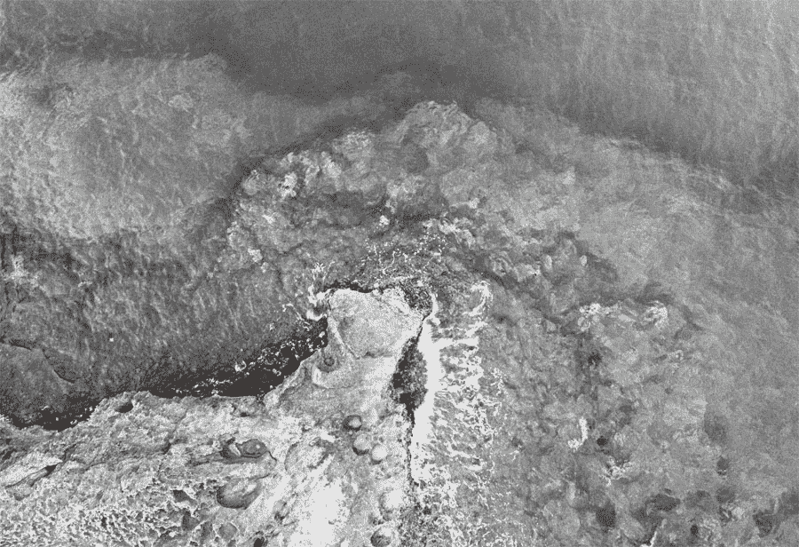

## 第八章　肝功能迟滞

你刚刚才经历过一段重要的肝功能之旅。如果要仔细讨论肝脏为你做的一切，我们可能过了几十年还在这里，替肝脏执行的各种微小功能归类。重要的是，你了解肝脏扮演的主要角色，发现这些可能会让你的生活完全改观，因为它为你打开了一扇窗，让你看见肝脏的灵魂。这就像在海上看见了鲸鱼的鳍、尾巴或神圣的换气喷水一样，令你感到惊叹。我希望你能感谢肝脏时时担任我们最好的朋友，无时无刻都为我们工作，完全不会喊累。

你也可以想像一下肝脏会遇到哪些敌人。病毒、细菌、霉菌、病毒废弃物、有毒重金属、辐射、DDT 及杀虫剂、除草剂、除霉剂、溶剂、污染物、毒品、药物、酒精、过多的肾上腺素、高脂肪饮食，这些都会让肝脏每天在保护我们的同时还要付出其他代价。更糟糕的是，会造成伤害的不只有我们这辈子接触到的东西而已，我们也可能从父母亲身上承袭了病原体和毒素，他们则是从祖父母那边得到这些，祖父母同样也从曾祖父母承袭了这些。这代表我们这辈子肝脏必须努力面对的汞、DDT、EB 病毒，很可能都来自祖先。这是相当伟大的工作，我们的肝脏做这些工作时也觉得相当荣幸。

接着，到了某个时间点，工作量就变得难以负荷。我们不知道如何让肝脏不时休息一下，就像我们不时要清洗碗盘、洗车、清空吸尘器的集尘袋、洗衣服。其实，一开始我们就不知道要如何减轻肝脏的工作量，所以肝脏会因为我们接触到的东西而加重负担，无法自由发挥应有的功能，接着不断累积，最后造成了我所说的肝脏迟滞问题。

##### 隐而不显的问题

要真正了解肝脏迟滞的问题，就必须把肝脏想成人。我们要知道，肝脏是活的，会呼吸也非常活跃，负责的工作超过两千种，包含储存、输送、处理、排除、清理、创造等我们在第一部提过的功能，现在我们应该稍微能了解身为肝脏有什么感觉。每天从早到晚，肝脏都努力为你工作，为了让你变得更好，无私地维护你的健康，一切都是为你着想，为了你周遭的人着想。如果你过得好，你周遭的人也会很好。

肝脏的作用就是担任你身体的节律器，它本是一切的基础，负责让大家感到安心的家庭成员，即使遇到了挑战，也是那位总是维持沉着与冷静的手足，你总会找他倾诉心事，让你在情况失控前恢复正常。肝脏会牺牲自己来保护你，确保你不会出现酒精中毒、血液混浊、高血压等问题。许多人身上的肝脏，几十年来都在做同样的事。不过，正如任何人一样，如果肝脏被逼到超过负荷，或被视为理所当然过久，就会无法维持平静，开始生病、阻塞、不满、感到挫折，甚至相当愤怒，被逼到想要发动战争的边缘。

第一种抗争的模式就是肝功能迟滞。如果这个阶段出现的时间不长，就会出现规模更大也更勐烈的战争，也就是出现你在接下来的章节会读到的那些问题，症状与病况也会更为严重且勐烈。

那么，你的职责是什么？你要做哪些事？你面临了哪些挑战？在你想要打赢战争的日子里，每天的感受又是如何？你感到疲惫吗？你觉得很费力吗？在生活当中，是不是有大大小小的挑战让你觉得筋疲力尽？觉得快解体了，它们啃噬着你，或是让你难以喘息？你是否曾经努力赶工，为了在交期之前完成工作，最后却还是拖了几天？迟滞的肝脏就像这样。

十个人中大约有九个人有肝脏迟滞的问题。十五年之后，只要不知道肝脏迟滞问题，而且不知道怎么保护自己的人，大概十个人里全部都有这种问题。这其实是肝脏其他问题的指标。肝脏迟滞可以说明今日许多疾病的病因，但医学与科学界仍不清楚这点。肝硬化、肝炎、黄疸、脂肪肝、肝癌等，只要提到这个器官，大家注意的就是这些。当然，这些是严重的问题，不得不面对这些问题的人，心理负担必定相当沉重，有时甚至会令人心碎，在本书中也会探讨这些问题。不过，这些问题并非一开始就这么严重。不会有人一觉醒来就立即出现肝硬化或上述重大疾病。首先，他们会出现肝脏迟滞的问题，默默经过一段时间之后，若不注意这种情形，而且无法扭转情势的话，肝脏的负担就会过重，肝功能就会因此变得相当低落，无法再保护你，疾病就会趁机而起。

肝功能不全导致的症状与病况并不是只有你想像中的那些，或是医学与科学研究已有记载的那些。有许多和大家想像中不同的状况，例如湿疹和干癣实际上是由于肝脏负担过大的某种情况造成的。痤疮这种我们以为是荷尔蒙或皮肤造成的问题，也是肝脏受到某些限制的结果。莫名的高血压、心悸、第 2 型糖尿病、季节性忧郁症、黑眼圈、慢性脱水、静脉曲张、体重增加，对化学物质敏感、胀气、便秘等，大家都不知道这些问题其实来自肝脏。在这些问题变成明确可辨识的健康问题前，其实都只是肝脏要处理太多东西，却获得太少帮助所造成的结果。一切都是从肝脏迟滞开始的。

这也就是为何了解这种大家不清楚的情况非常重要。如果不知道如何保护自己，你就无法活得很好，也无法避免自己产生这种状况。

##### 肝脏迟滞的其他名称

“迟滞”只是描述肝脏工作量超载的一种名称。“缓慢”这个说法，也有助于我们了解肝脏的情况。我们在学校学过，死水就是缓慢不动的水，是病原体与病媒昆虫的温床，我们知道亚马逊流域中的死水，甚至有会吞噬大脑的阿米巴原虫！因此，我们必须注意别让院子里有死水，否则蚊子会大肆繁殖。同时，我们却不知道肝脏也可能发生缓慢的情形。不过现在，你应该能够想像我们都不希望肝脏发生缓慢，否则就无法以正常速度处理那些不速之客。

或者，我们也可以把迟滞的肝脏想像成成效不佳的垃圾清运服务。没有人想被别人虐待、抛弃、遗忘、忽略，那些每天处理垃圾的人更是如此。你是否有过被人利用的经验？无论在体力或情绪方面，都可说是最糟糕的经验了。如果这样的事发生在你身上，必定让你感到心碎，压力很大，甚至还会造成伤害。你或许曾经努力不要这样对待他人，所以我们必须付钱请人处理垃圾，缴税给城市处理垃圾，或是自己把垃圾拿去倒，再付钱给清运站。我们会妥善包好垃圾，在固定的时间拿出去，垃圾桶脏了也会清理。在这么做之前，我们还会尽可能做回收或堆肥，减少需要丢弃的垃圾量。

不过，你记得要做这些，却忘了肝脏，也就是人体内部的垃圾清运服务。我这辈子认识的人当中，有人的厨房里清洁熘熘、地毯一尘不染，但是肝脏的情况很糟糕。流汗后去洗澡仍不足以排除我们接触到的垃圾，在今日的世界当中，这么做显然是不够的。我们没有学过如何协助肝脏进行自我净化，也没学过等同“减量、再使用、回收”的原则，透过这些方式减轻肝脏的工作量，结果就是我们偶尔会在不经意间占了肝脏的便宜，以为一切就会像时钟一样不停运作，结果实际上的运作却是戛然而止。这就好比我们从垃圾管道间一直丢垃圾到子车里，却没发现过去几周以来垃圾清运的服务罢工了，没有人会来收垃圾一样。迟滞的肝脏就是肝脏罢工的方式。你要是知道肝脏时时为你工作的情形，就知道这样的罢工是合理且理智的情形。这点让我们了解更重要的事：我们必须像倒垃圾一样勤快清除身体里的废弃物，否则主要病原体就会有样学样，跟我们一样占肝脏的便宜。

最后一种想像过劳肝脏的方式，就是把肝脏想像成在屋子里随意囤积物品的人。想像某个人家里塞得满满，到处都是铅与石绵做的祖传物品，这就仿佛是进入了肝脏的世界里，当中塞满病原体及祖先留传下来的污染物。这个囤积者虽然遭遇重重困难，仍努力设法维持家中整洁，这在短时间之内还算办得到。现在想像一下，如果突然间有些爱乱搞的客人到访，把房子里踩得到处都是泥巴，甚至还有汽油的痕迹。他们带了一大堆装了垃圾的行李过来，把发霉的衣服丢进衣柜里，还带来一些老鼠、跳蚤、床虱，导致家具上爬满虫子。更过分的是，他们把食品柜里的储备粮食都吃光了。这些客人一个个都让主人整理得筋疲力尽，最后不得不放手，有些事情就放着不管，这样才能继续维持一切，确保这个家不会垮掉，邻居也不会因此遭殃。

这是我们大部分人都无法忍受的情形，但是这个譬喻相当贴近肝脏的真实情形。我们每天接触到不希望碰到的病原体及毒素，让肝脏在处理过程中耗尽储存的宝贵营养素。从小到大都没有人跟我们说肝脏不断在对抗各种病毒，例如 EB 病毒、细菌、重金属（包含厨房使用的铝箔，以及接触到的汞）、除草剂、DDT 及较新的杀虫剂等。我们的肝脏原本应该负责净化与过滤，并储存我们未来需要的营养素，却为了保护我们而囤积许多有害物质，接下来就会出现一些症状示警，但我们仍不知道背后真正的因素，只透过吃药把这些症状压下来，使肝脏的负担更为沉重，还必须去处理这些处方药物，实在是雪上加霜。

在我们努力整理周遭环境，抛弃不要的物品，整理留存的东西，开空气清净机，把家具排得井然有序的同时，竟然在做这样的事。我们不知道这么做就是不断丢垃圾给肝脏，造成肝脏完全没有休息的时间。那些把家里整理得一尘不染的人，用有毒的地毯清洁剂刷洗地毯，再插上危险的芳香剂，让一切闻起来清新舒适，却不清楚他们尽力想净化环境，竟同时在伤害自己的肝脏。

所以，肝脏迟滞的情形就是这样：一个无私付出、努力维持和平的人，却被操过头，成为一滩死水；它是罢工中的垃圾清运服务，是充满了尘土、虫子、化学物质的家。这是任何人都不会想要的居家环境，更不希望自己的体内如此。在今天之前，因为你不知道有这种情形，因此对肝脏迟滞的情形无法置喙；现在，情况完全不同了，你不会再迫使这种情形发生，并无缘无故罹病受苦，因为现在的你已经了解背后的秘密了。

##### 救你一命的症状

在继续说明之前，我要先澄清一点。肝脏迟滞不该让你觉得自己很差劲。迟滞的肝脏与懒惰的肝脏完全是不同的两回事。肝脏永远不会懒惰，绝不可能懒惰。

你知道生病是什么感觉，整天做事都会感到特别费力。肝脏迟滞的时候也是一样。在肝脏需要克服障碍时，就必须分外努力工作，事实上，在肝脏迟滞的时候，就必须加倍甚至用三倍的努力才能够弥补运作不良的状况。不管怎么说，就算肝脏处在缓慢的状态下，也会努力克服困难。在你还在母亲子宫里，肝脏就透过与母亲肝脏的化学交换方式学会了这点，而且一辈子都会替你这么做。

肝脏的灵魂里充满了勇气。肝脏的勇敢与毅力造就了你非凡的人生。肝脏为了保护你，什么都能做，就像载着士兵的战马般尽全力保护士兵，肝脏也会为了你的安全承受一切。

但正因为承受了这些，肝功能就变得不够健全。一方面，肝脏会开始失去记忆。之前提过肝脏是人体第三个记忆库（前两个分别是大脑及甲状腺），这是相当严重的事，表示肝脏开始充满重金属、病原体、病毒的副产品、残渣、有毒化学物质后，就无法以所需或想要的方式帮助人体。肝脏会开始失去辨认、吸收、分类、调整、运送重要生化化合物与荷尔蒙的能力。

肝脏也会开始丧失中和的能力，无法中和掉身体不想要的物质。正如我们在第一部所言，肝脏超过两千种功能里，有许多都与排毒有关。在肝脏阻塞或负担过重时，就无力像往常一样转换这些物质，只能把它们储存起来，结果就是过滤的速度会变得更慢。想像一下，如果水族箱里的滤网都塞满鱼的排泄物，或吸尘器的集尘袋装满了灰尘与尘土，你就知道肝脏的功能会受到多大的阻碍。由于肝脏在这种状况下无法发挥应有的过滤功能，废弃物就会逃脱且回到血液当中，造成我们会在第二与第三部看到的问题。这是不断进行的循环：肝脏接触了越多杀虫剂及其他有毒化学物质、病毒、细菌、辐射、酒精、抗生素、药品、有毒重金属、塑胶、高血脂等，肝脏迟滞的情形就会变得更严重，也就更无法中和有害物质，以及有效率地过滤血液。有毒的脏血也将造成黑眼圈、热潮红等问题，我们会在下一章进一步讨论。

这种情形也可能造成肝热。正如发动机使用失去黏性的旧油时，就会慢慢开始发热，也需要更卖力地运转；同样地，肝脏必须处理过多黏稠物质时，就会发热。这就会造成“热潮红”或感到“发热”的情形，我们会在接下来的章节讨论这些。（如果肝脏尚未完全超载，你很可能完全没有感觉。之后我会再进一步说明。）

发热表示肝脏怠工吗？当然不是。要排除那些热，可说是撇开收完五十个烂摊子的额外工作。你曾经承受过这种怒气吗？也就是不管是不是份内工作，你都概括承担责任与责备吗？不只是怒气而已，你是否曾为了保护别人而挨打、接受惩罚、遭受凌虐？那就是你肝脏每天所过的生活，肝脏也正是那个保护你的人。肝脏经常必须因为我们过度污染、压力太大、刺激太多、营养不良的生活而承担一切。

肝脏同时也有抗迟滞的紧急警报措施。这种化学反应会让身体分泌新的能量来打破缓慢的状态，这种反应就是肝脏痉挛。这种痉挛可能会让你觉得身体侧边有刺痛、抽痛、轻微疼痛、温暖、发热、拉扯、发胀、刺痛、针刺般的感受，但大多时候一点感觉也没有。这种情况通常会默默地发生，几乎没有明显的感受。肝脏的某部分在这种情况下发生痉挛，肝脏也暂时能够继续受控。

肝脏必须进入战争的关键理由，正如第二章［调节生理的肝脏］中所言，是为了保护重要的腺体，也就是胰脏。如果有人吃了高脂肪食物，超过了肝脏胆汁所能分解的量时，肝脏就会介入其中。肝脏必须找到其他方式来吸收与处理脂肪，帮胰脏分劳解忧。这也是肝脏必须有强大适应力的原因。肝脏越劳累，当中储存的葡萄糖就会越来越少。在肝脏的葡萄糖存量不足时，就无法释出葡萄糖来阻止胰岛素阻抗的发生。因此，医师可能会说你的糖化血色素升高或超标了，并断定你罹患糖尿病前期或第 2 型糖尿病。我们会在第十五章［糖尿病与血糖不平衡］讨论这点。肝脏会对胰脏尽心尽力，也会专门为这个腺体分泌一种化合物，那种化合物就像 OK 绷一样，促进胰脏的修复与疗愈。

另一个在人体中肝脏努力保护的珍贵器官就是心脏。肝脏会处理与过滤血液中的毒素，以免毒素排挤氧气，造成肝脏窒息；如此一来，斑块就不会累积在心脏的瓣膜或动脉当中，就能避免血液过于浓稠，肝脏也不需要那么费力工作了。

肝脏压力过大时，可能发生的情形还有许多种，例如出现疤痕、囊肿、肿瘤、免疫系统变弱、肿大、感染等情形，我们会在接下来的章节详谈。

肝脏迟滞时，很长一段时间没有出现任何症状，也是相当常见的情形。那是肝脏的另一个奇迹：肝脏会尽可能撑住，保护你不被重担压垮。你或许对这种情形不陌生，也就是四面受困时仍有做不完的工作要处理，但你不想要让身边的人失望，不希望他们看见你有多痛苦。因此你选择继续撑下去，毫无怨言地尽可能完成工作，只有到了身体撑不住的时候，你才会发出小小的呼救声。

因此，肝脏这种硬撑的个性，让许多人在即将迈入四十岁时才开始出现肝脏迟滞的症状。到了这个时候，如果发生在女性身上，就会被误认为更年期到来。看似突然出现的热潮红、易怒、失眠的情形，其实并非凭空出现。这是肝脏迟滞的情形累积了几十年的结果，只不过在这个时候才显现出来。医学与科学界尚不清楚这点，是由于荷尔蒙替代疗法的市场商机庞大，荷尔蒙就此被认为是罪魁祸首，许多女性因此不清楚造成症状的真正原因。

肝脏到底默默承受了多少压力，要视每个人的生活情况而定。每个人的致病因素组合都有所不同。例如，肝脏迟滞很可能是长期、慢性、低阶 EB 病毒感染的结果，或是多种低阶其他病毒感染造成的结果。肝脏很可能因为过去至今累积的重金属变得迟滞，也可能是因为经常服用处方药物导致的结果，或是每次聚会小酌一番的结果；也或许是几十年来摄取不健康且充满脂肪的食物，或是喝了很多咖啡、拿铁、卡布奇诺，或是情绪严重起伏，不断引发战或逃机制，造成肝脏充满了肾上腺素。

无论肝脏面临哪种挑战，多年来都会以相当神奇的方式搭建桥梁、扑灭火灾，让你免于遭受各种威胁，免于受苦。最后到了某一天，肝脏再也无法独自处理一切，你也会因此出现症状，例如夜间盗汗、脑雾、睡眠品质不佳，出现小片玫瑰疹或湿疹之类的问题，借此向你呼救，希望有一天你可以了解发生了什么事，并伸出援手。但是，世人并不了解这点。大家没有把这些症状与疾病和肝脏联想在一起，更不要说知道这些和肝脏迟滞有关了。

我们认为这些症状很讨厌，认为这代表身体背叛了我们；但实际上，这些却是有力的线索，告诉我们体内发生了问题。我们看见烟雾的时候，并不会抱怨空气怎么会这样，而是知道那表示有地方失火了，反而会感谢讯号，并跟着烟雾前往火源。

##### 肝脏迟滞的五种类型

正如不同的烟雾让我们知道火灾的类型有所不同，特定症状也能提供线索给我们，进而知道肝脏有什么问题。其中一种方式，就是了解五种肝脏迟滞的类型。没错，肝脏迟滞并非整个肝脏都迟滞，或是完全没有迟滞问题这么一回事。整个肝脏不会立刻完全变得迟滞，很可能只有肝脏的某部分变得迟滞，其他部分则可正常运作，许多人则是同时有好几处发生迟滞情形。我们先来看看肝脏迟滞的五个部位。别忘了，肝脏很可能在其中一处或全部五处都有迟滞的情形，却没有出现任何症状。

‧肝脏中央：肝脏最深处发生迟滞的情形，很可能会让你出现热潮红、盗汗、糖尿病前期、肿胀、体液滞留、体温起伏不定、缺乏精力、体重增加、脑雾、黑眼圈、低血糖、高血糖、疲劳、红疹、愤怒、沮丧、易怒、寂寞、忧郁、焦虑、不安、肤色暗沉、皮肤色素的问题（包含雷诺氏症），以及非常容易口渴。

‧肝脏底部：肝脏底部迟滞可能会让你在夜间辗转难眠，造成睡眠干扰及失眠问题，或出现便秘、不安，或是在所处环境里感到冷或热，感到嫉妒，或是玻璃心到他人会觉得你“脸皮太薄”的地步。

‧肝脏顶端：消化不良、胃食道逆流、胀气、胃炎、腹部有压迫感、易怒、沮丧、肩膀僵硬、肩膀疼痛、舌头痛、溃疡疼痛、嘴角疼痛、其他嘴部疼痛、体温起伏不定，以及上腹部突出、鼓起或变硬，这些都可能是肝脏上半部迟滞造成的问题。

‧肝脏左侧：肝脏左侧（左叶）出现迟滞的情况时，就会觉得左腿或左手无力、恶心、焦虑、缺乏饥饿感、无止尽的饥饿感、腹部随机出现疼痛、情绪化、易怒、情绪敏感，或是背痛。

‧肝脏右侧：肝叶右边比较大的那一侧（右叶）出现迟滞情况时，可能造成指甲易折或色泽不均（缺锌的关系）、右侧肋骨剧痛、身体右侧轻微的无力感、右腿抽筋或痉挛、舌头颜色轻微不均、舌头溃疡、莫名感到冷或热，以及身体很难活跃起来。

##### 破解密码

换句话说，症状就像外语一样，只是是我们在学校或家里没学过的外语。我们的工作就是要替身体翻译，替肝脏翻译，才能解读肝脏所要传达的意思。这个世界上许多症状和疾病都告诉我们身体出了问题，但事实上，很可能是肝脏迟滞或受伤的求救讯号。如果你感到疲劳，医师可能跟你说你的压力太大，但这其实很可能是肝脏感染了 EB 病毒。如果你有热潮红的问题，可能会听到别人说那是更年期前期、更年期的症状，是荷尔蒙造成的，实际上却有可能是肝脏长期受困于病毒、重金属、毒素的结果。如果出现了体重莫名增加的问题，医师很可能说你吃太多，或是你吃的东西不好，应该要多运动；但事实上，那是因为肝脏里有病毒、过多的肾上腺素、其他捣乱者，因此负担过重的结果。如果你有面疱的困扰，诊断结果是青春期或其他荷尔蒙转变造成的结果，实际上是因为链球菌在阻塞的肝脏中大肆繁衍，也使得淋巴系统负荷过重。以上种种问题并非表示你的身体有问题，而是肝脏在说：“请你救救我。”

在本书第二部“看不见的风暴”中，会说明如何解读肝脏想对我们说的话，也就是如何透过烟找到火源，破解来自肝脏讯息的密码。大多数时候，我们都不知道讯息其实来自肝脏，唯有如此，才能向前迈进。接下来的章节，我们会进一步探讨与肝脏相关的症状与问题，有些像是肝炎等病症，可能在你的意料之中，有些则会出乎你意料，例如糖尿病前期、湿疹、干癣、小肠菌丛过度增生等。

你不需要再讨厌或不信任自己的身体。你的身体并不是要找麻烦，不是要让你失望，也不是虚弱不堪。你的身体会支持你。我们不要再把接下来的健康问题视为基因造成的无期徒刑，认为是身体让我们失望，或是免疫系统的定时炸弹会不受控地自行引爆。我们可以开始将这些塞翁失马的状况视为肝脏的求救讯号。毕竟，在肝脏告诉我们它正在受苦时，我们会有机会回应需求，帮助肝脏恢复健康，最终我们就能恢复应有的生活。

## 第九章　肝酶猜测检验

假设有个名叫诺亚的人去医院做一般体检，医师帮他抽了血。过了几天，诺亚接到一通电话，要他回去复检。

“你的肝酶偏高。”医师对他这么说。

“那是什么意思？”诺亚问。

“你为什么不过来？我会帮你做其他检查，之后我们再来讨论。”

诺亚到了医院之后，他又问：“肝酶偏高代表什么？”

这次，医师说了：“我们不确定，只知道这表示你的肝脏发生了一些问题。很可能是肝脏有些损伤。”

“我的肝脏是怎么受伤的？”

“有可能是肝脏或其他疾病造成的问题，不过你在其他方面看起来都很健康，所以我觉得不太可能是这样。你喝很多酒吗？你最近压力很大吗？听着，诺亚，也有可能完全没问题。有可能只是肝细胞发炎。我们必须再抽一些血，做更多检查才会知道。”

有数以千计像诺亚这样的人，都有过肝酶莫名升高的经验：显然肝脏有些问题，不过连专家都不知道实际上发生了什么事。常见的情形是，即使诺亚接受了电脑断层扫描、正子电脑断层扫描、核磁共振、超音波扫描，也都显示没有什么该进一步检查的问题。由于没有任何解剖肝脏的理由，因此诺亚听到的医嘱很可能是：“吃好一点，压力不要太大，保持充足的睡眠。请你三个月后来回诊，我们再检查一次。”

另一个可能的结果是，诺亚的扫描结果确实有些异常的情形，例如相当明显的发炎、疤痕组织，或是囊肿的活动。那么，在医师的眼里，这样就与肝酶升高的结果相吻合。

许多人的情况都和第一种相同，也就是出现肝酶升高的情形，但找不到任何显示有其他问题的迹象。许多医学与科学界的人因此感到相当困惑，他们认为肝酶检验是一种猜猜乐游戏，很容易出现错误，也相当不精确。因为也有人出现囊肿或结痂组织，但是肝酶检验却恢复到正常值。无论肝酶是否偏高，你也可能检测出有脂肪肝。即使扫描结果显示肝脏出现明显的问题，肝酶检验也不会告诉你那是什么问题，或是怎么做才好。

这也就是为何本章的标题叫作［肝酶猜测检验］。现在，我们要来探讨在肝脏释出酶时，到底是怎么一回事，以及这些检验的价值在哪里。虽然这些检验不能代表一切，也不能解决所有问题。我并不是想贬低肝酶检验的价值，因为我确实认为这些检验有其价值。医学院学生毕业时，并没有未卜先知的能力，也没有占卜用的蓍龟。他们必须运用现有工具来工作。因此，有肝脏检验帮助他们，可算是奇迹了。这些检验是重要的指标，让医师能够鼓起勇气，运用些许直觉来治疗患者。

我最喜欢肝酶检验的地方在于，这种检验可以帮助患者明白肝脏可能有问题，否则他们可能完全不清楚这点。有些人得知肝酶升高，就知道这是提醒自己该改变生活方式的讯号。也正是因为这个检验，医师就要诺亚好好照顾自己。诺亚往往会因此多想想自己目前的饮食，同时降低了罹患心血管疾病的机率。即使他的医师或时下流行的文章给他的饮食建议不尽正确，他最后也会多吃一些有营养的食物，也会更注意自己的健康，这点就相当值得了。

##### 肝酶的真正意义

最常检验的两种酶为血清转胺酶（ALT）及天冬胺酸胺基转移酶（AST）。其他常见的检验项目还有碱性磷酸酶（ALP）及丙麸胺转移酶（GGT）。

医师也经常要求患者抽血检验白蛋白，据信这种蛋白负责在全身的血液中运输重要营养素，甚至是荷尔蒙。如果血液检验结果显示你的白蛋白过低，医师很可能会认为你的饮食状况不良，因为医学与科学界认为那是营养不良的指标。如果白蛋白恢复了，医学界就将之视为一种许可的指标，可以进一步探索体内是否有其他问题，例如细菌感染或受伤之类的。这就像肝酶检验一样，并没有指出什么问题。（不过，白蛋白过高实际上表示病毒正在大肆繁殖中。）

医师可能也会发现你血液中的胆红素过高。在肝脏分解红血球细胞或为红血球细胞排毒时，就会分泌胆红素。胆红素有两种，一种在肝脏中分泌，另一种则随着血液流动，经由肝脏蒐集后加以转化，才会成为可用的肝脏胆红素。如果你的验血结果显示胆红素偏高，很可能是胰脏有问题，而肝脏的问题正在形成当中，还有胆管的问题，甚至是胆管里有肿瘤。

这些检验结果如果出现异常，很可能肝脏当下有些问题，不过医学界仍不了解这点。虽然今日的肝脏检验能在状况到了最糟的境况之前就抓出问题，但仍然不够早。在肝脏检验显示有问题时，其实表示患者已经面对肝脏问题很长一段时间了。如果有位成年人的检查结果显示肝酶或胆红素过高，往往代表肝脏在很久之前，例如十年前、三十年前，甚至更久之前，就有迟滞的问题。旧有病毒感染问题、所谓的自体免疫问题、早期的 C 型肝炎，或是其他问题。（如果是儿童的检验结果异常，情况则有所不同。请见第二十八章，了解儿童肝脏的问题。）成年人只有在发生急性感染时，肝脏问题才会迅速浮现。要诊断出这种情形，医师必须了解肝脏感染的情形是否迅速出现，以及其他免疫系统对感染的反应，例如白血球数过高及出现发烧、无力、恶心、皮肤颜色不均等问题。

这些检验到目前为止仍相当阳春。未来的检验更精准时，就能发现早期肝脏问题的讯号，因为有待检验的项目还很多。例如，血液中有超过四种酶可做为指标，另外还有数十种尚未发现的酶，以及数百种尚未发现的化合物，可以帮助医学界了解肝脏确切出现什么问题，以及有问题的位置在何处。例如是 A、B、C、D、E 型肝炎，还是医学界尚未发现的多种肝炎之一？（请参见第二十九章，进一步了解肝炎。）杀虫剂和除草剂会累积在肝脏内部，让肝脏受到伤害吗？未来的检验将能回答这些问题，因为肝脏分泌的酶及化合物相当特殊，是一种特别的讯号，每种酶与化合物都是解码的关键。

要真正有所突破，医学界就必须诚实面对一切。这代表医学界必须承认有毒的重金属到处都是，以及这些重金属的来源，还有日常生活当中的除草剂、除霉剂、虫剂有多么危险，例如从天而降的灭蚊喷雾等，这些都对肝脏有害。只要诚实面对这些，就能发现肝脏分泌的这些酶与化合物是信号弹。到了那个时候，研究人员会发现某些肝酶紧急信号弹中，其实包含了相关讯息，让我们知道为何肝脏会发送这些讯息。他们也能解读某些信号弹代表某些杀虫剂，另一种则代表汞和铝，也就是每一种毒素和病原体都会被不同的肝酶包覆。这些讯息并非随机出现；事实上，透过这些信息，就能了解某人的肝脏面临的确切问题是什么。

医学与科学界目前仍无法走到那一步。把各种线索链接起来，就表示必须揭露杀虫剂及重金属对世界的影响。这代表坦承业界让这些东西进入我们的日常生活中，医学界也与它们脱不了关系。例如，众所皆知，药品与药剂可能含有重金属，所以我们怎么有办法让这点与对肝脏的影响链接起来。杀虫剂、除霉剂、除草剂等，也都与医疗产业密不可分，这就是为何我们仍旧无法搭起这座桥梁。我们未来还有很长一段时间都无法走到那一步。这必须要有重大的改变，医师必须拥有所需的资料、接受相关训练，能够指出：“哇，这种酶显示你的肝脏正在对付一种病毒。嘿，等一下，另外这种酶则是除霉剂中某种化学物质诱发的反应，所有同类产品都含有这种化学物质。还有另一种酶，显示你居住的镇上为了控制蚊子孳生而喷洒杀虫剂。”对医学界来说，把大家蒙在鼓里其实对他们比较有利：“你的肝酶过高啊？我们来研究一下哪一种肝酶是来自哪种物质。”

顺便一提，我们只提到肝脏发炎或受损时释出酶的其中一个理由而已，就是发射信号弹。如同你在海上遇到了问题，船长会发射信号弹，希望有人能够看到并前来救援，你肝脏的酶与包覆物质比这种方式还要明确，所发出的信号弹就像船只即将沉没时会发射红色的信号弹，在离岸远处搁浅会发射橘色的信号弹，遭到海盗攻击时则发射紫色的信号弹一样。不过，肝脏究竟要引起谁的注意呢？并不是要引起医师的注意。这和你带自己的贵宾狗去看兽医时，狗狗有双眼，看得出兽医想帮忙的情形不同。肝脏并没有双眼，甚至连医师是谁都不知道。肝脏知道的只有你体内运作的情形。做为信号弹的酶与化合物是要让身体其他部分接受这个讯息，是要警告其他器官与腺体，告诉它们肝脏有状况发生了。虽然出现的这些症状与问题对你来说是线索，告诉你肝脏正在受损，但肝脏的酶与化合物则是给体内其他部位的线索。最棒的地方是，医学与科学界最终会发现分泌的这些物质意义为何，就能和身体一样解读肝脏的讯号。

在此同时，今日的血液检验能验出来的，只有实际上的一小部分情形。在此我打个比方，请想像池塘中有一滩死水。我们知道死水可能孳生了数百种污染物质，包含杀虫剂、细菌、有害的真菌与藻类、阿米巴原虫、单细胞动物、环境毒素等。现在，想像一下如果水质检验的结果显示里头只有四种非常类似的微生物，其他则安全无虞，可以饮用，你一定不相信，因为水质检验结果一定不只有那些物质。你知道检验本身一定很糟糕，必须重新采样才能了解真正的全貌。这种不够完整的全貌，正说明了我们目前透过血液检验来了解慢性健康问题的情形。我们可以将之视为半空的玻璃杯，也就是我们落后了许多，或是半满的杯子（当中装了污染的水），也就是我们仍不够进步。

现在，回到酶与化合物的主题上。肝脏发出的讯号不只是要求救，更是一种幸运的事，会把讯息传送给身体其他部位，要它们自行做好准备。大脑是其中一个接收到这种讯息的部位，之后会再提供重要讯息给中枢神经系统。如果这些讯息能够掌管一切，要我们多喝一点西芹汁，那该有多好；但事实上，它们能做到的更棒，可以说是棒到不行──这些我们感受不到且看不到的讯息，会传送指示给中枢神经系统，要系统支持肝脏。这些讯号传到了肾上腺，会事先警告腺体，说肝脏发生了问题，腺体因此可以稍微放慢发动机的转速。胰脏也会收到讯息，知道必须留意本身酶输出的情形。（但是不要把胰脏分泌的消化酶和肝脏的警告酶混为一谈。）

在送出讯号之后，肝脏的酶及我们尚未发现的化合物还有第二个角色。在送出讯号的同时，它们也必须释出一些物质，负责进行净化并吞噬仍然活跃的有毒物质。也就是说，有毒物质对肝脏造成伤害、逃跑之后，肝脏就会释出有执照的酶与化合物，负责追缉逃跑的粒子、化学物质、毒素，会像食腐动物一样疯狂追缉这些物质，并吞噬它们。基本上，肝脏与周边细胞因为过于迟滞，负担太大时无法中和的细胞，酶就会负责把这些中和掉。

有一点相当重要，值得我们再提一次：通常只有在废弃物质的危险性已消除并失去活性后，肝脏才会将之释出。肝脏本身具有自我监控与蒐集的能力。肝脏会选择想要包装的“垃圾”，并将它们送入血液当中，透过大肠或肾脏排出，或者送入连接胆囊的胆管中。除非肝脏相当迟滞，无法发挥正常功能，才不会这么做。如果肝脏相当迟滞，有些捣乱者的毒性在还没解除时就逃跑了，肝脏就会派出肝酶来追捕这些未经中和的粒子。在 EB 病毒或第六型疱疹病毒等凶恶的病毒寄居在肝脏中时，肝脏还会再度释出酶。（如果肝脏的健康状况较佳，就会发挥某些解毒的功能，只不过那些解毒过的神经毒素仍然具有毒性。肝脏状况较差时则很难中和毒素，所以酶就变得更为重要，只不过肝酶并不能保证可以百分之百解毒。）肝酶在追捕废弃物质时，也有能力再次收集这些物质，并送回肝脏当中，放入储存槽里。

别忘了，你很可能已经有初步的肝脏问题，但检验时没有出现肝酶升高的情形。事实上，肝酶信号弹确实存在着。即使肝脏有着相当轻微的问题，它仍然会分泌肝酶，不过今日的血液检验必须在肝酶数值相当高时才会发现其存在。切记，检验的目的只是为了检验某些肝酶，但肝酶事实上却有数十种。另一个可能造成肝酶值偏低的原因，是肝脏要求酶反应负责在肝脏内部吞噬毒素。由于就地即可解决问题，因此肝脏只需分泌少量的肝酶去追捕逃跑的物质，因此进行血液检验时根本不会发现。

假设肝酶（及尚未发现的化学物质）非常活跃，这表示肝脏不认为那些是废弃物。肝脏让那些物质离开时，绝对有其理由。在此同时，医学与科学界相信，只有在肝脏细胞破损、受伤、破裂、死亡时，肝脏才会分泌肝酶，但他们没有去了解为何细胞会受到干扰、受伤或受损。他们经常将之视为肝脏的自然过程，视肝酶为副产品，但事实上，这背后蕴含的意义相当深远。医学与科学界并不了解复杂的讯号发送系统及食腐的过程。

顺便一提，并非只有肝脏受伤时，肝脏才会释出肝酶，这也说明了为何肝脏会在没有明显受伤的情况下分泌肝酶。你很可能没有出现任何症状，没有出现肝脏损伤的情形，没有发生任何肝脏受伤的问题或预兆，但你的肝酶数值莫名升高，这是因为有毒物质逃出了肝脏，肝脏因而分泌肝酶来负责食腐与清理的工作。

如果本书可以写个一万页，我们就有足够的篇幅仔细探讨所有肝酶，以及那些特别的化合物。

##### 肝酶检验可以告诉我们什么

我相当支持做肝酶检验，因为检验结果能够指出某些人或许正面临隐而未显的肝脏问题，即使这种检验可能导致误诊，或是无法让患者受到最好的治疗也无妨，因为要不是透过这个检验，根本不会发现肝脏有异。不过，在检视检验结果时，我们必须留意这种检验仍相当阳春。一方面来说，检验得到的结果绝对不会告诉你肝脏有什么问题，医师依然必须找出明显的问题征兆，如果断层扫描结果没有发现明显的阻塞、增生、疤痕组织，他们也只能开始玩猜猜乐。

我这些年来也看过数以百计的肝酶偏高案例，他们的肝脏确实有问题，例如肿瘤、囊肿、疤痕组织等，不过那些问题并非造成病症的原因。要了解他们为何会出现疲劳、疼痛、晕眩、无力、忧郁、焦虑的问题，就必须了解我们接下来要在本书探讨的内容。

若想了解肝脏疾病有哪些早期病征，其实不用再找了，糖尿病前期、第 2 型糖尿病、低血糖、血糖不平衡、湿疹、干癣、体重增加、对化学物质敏感、脑雾、季节性情绪失调、加速老化、甲基化问题、荷尔蒙不平衡、胀气、痛风、黑眼圈、静脉曲张、脂肪团、体液滞留、淋巴水肿、手脚水肿、小肠菌丛过度增生，甚至胃酸过少也是，这些都与肝脏有关，此外还有许多症状，这就仿佛在肝脏扎营的病毒多到数不清一样。某些有上述症状的人来找我谘询，后来做肝酶检验的结果呈现偏高，有些人的肝酶检验结果则为正常值。许多第 2 型糖尿病患者有肝酶偏高的情况，有些则没有；无论如何，糖尿病都与肝脏有关。痛风则是严重的肝脏问题，透过肝酶是否偏高来判断有没有这些问题，实在是相当冒险的事。许多体重过重的人有肝酶偏高的问题，但也有许多人没有，即便他们接近出现脂肪肝，甚至有脂肪肝问题都一样。

肝酶偏高的问题可能在一个月甚至是一周内出现又消失，关键取决于肝脏在当下处理的问题。如果持续好几天进行肝酶检验，很可能其中一次检验没有偏高，三天后却突然升高许多，再过两天则又没问题。接受肝酶检验时，得到的结果取决于你哪一天去就诊，是在肝酶升高、降低或处在中间值去检验。由于肝酶检验是单次的检验，没有连续进行好几天来做比较，你不会知道实际的状况如何。

尽管如此，我们也不能说肝酶检验一无是处。正如我之前说过的，检验结果显示肝酶升高时，就表示你不管用什么方式，都必须更加悉心照顾肝脏。我们必须记住，所有检验都不可能百分之百精确，完全没有瑕疵。我们从莱姆病及人类免疫缺乏病毒（HIV）的检验得知这点。许多人接受人类免疫缺陷病毒得到的结果为阳性，复验时却得到阴性的结果，这是相当常见的事。莱姆病的检验结果也是一样。（若想进一步了解，请参考《医疗灵媒─甲状腺揭密》。）红斑性狼疮及类风湿性关节炎的检验也是一样。这些检验的目的都在于寻找发炎的情形，或是免疫系统升高的情形，却没有指出为何免疫系统会过度活跃，或是为何会发炎。最后你可能会得到错误的结论，因为判读检验的结果其实是种猜猜乐游戏。

##### 先发制人才能拥有健康的肝脏

即使检验结果能够指出某些问题，我们也不能只靠这种结果做为肝脏问题的指标。我们不可能过着像诺亚一样的生活，希望一切都没事，靠着肝酶检验来唤醒我们。我们也不希望情形比诺亚糟糕，过着有肝脏问题却没有发现的生活，只因为没有检验结果提醒我们。你不会希望自己是糖尿病、体重过重、痛风的患者，或是长期感染低阶 EB 病毒等病毒，结果出现慢性疲劳症候群或桥本氏甲状腺炎，却直到五十、六十、七十岁时肝酶指数偏高，才开始好好照顾自己。我们不能坐以待毙，等着那些威胁我们生命的凶险疾病找上门，而是主动采取保护自己的措施。我们必须学会判读与肝脏压力有关的讯号与病征，必须完胜那些检验。提到肝脏问题，我们必须成为先发制人的专家才是。

## 第十章　污血症候群

地球上的每个人从童年时期到成年期，或多或少有轻微或长期脱水的情形。人体具有相当了不起的能力，能够适应这种情形，或者说是在我们体内卖力工作却遭到遗忘的器官，其实具有强大的适应力。这并不是说肝脏轻轻松松就能让我们度过几十年缺水的时光。有慢性脱水问题的人，随时都面临着会立刻出现严重症状的危机，因为肝脏已经过劳了。至于会不会出现症状，端看个人体质。

那么，良好的体质是怎么来的？你会听到有人认为那与基因有关，体质不佳者是抽基因乐透时不够幸运的人，体质良好者则是抽基因乐透时走运的人。这种推理方式只会分散我们的注意力，导致我们不去注意良好体质的基础是什么，也就是体内毒素较少，器官就会较为强健，造成健康问题与功能不彰的机率就比较小。体质较差则是体内含有较多毒素，导致器官不断受苦，罹病与功能不彰的机率就比较高。一个人的体内如果有毒素累积，并感染了一种以上的低阶细菌或病毒，慢性脱水问题就会对他造成较大的压力，让他在不知不觉中跨越模煳的界线，慢性脱水的问题也就瞬间变成对生活造成干扰的问题。

例如，你有低阶的链球菌感染问题（你很可能不知道），慢性脱水很可能没发生什么事，也可能造成泌尿道感染、鼻窦炎、胃炎、针眼、小肠菌丛过度增生，或是出现大量的痤疮。医学界仍不清楚许多人体内有慢性链球菌感染问题，以及上述这些情况，都与链球菌有关。如果你有低阶病毒感染的情形（同样地，你可能不知道），长期脱水很可能让你过着正常的生活，也可能让你感到严重疲劳、疼痛、耳鸣、晕眩、刺痛与麻木、头昏、意识模煳不清、心悸。

你为何必须在觉得没事的状况下在意慢性脱水问题？如果你没有已知的肝脏问题，低阶的病毒或细菌感染、过敏、偏头痛等任何症状，并不会因为脱水造成这些问题恶化，那为什么要在意呢？首先，你不知道自己有没有这些问题，因为医学检验无法验出潜藏在表面下的所有问题；其次，只要我们不留意，最后慢性脱水问题都会要我们的命。那是压垮骆驼的最后一根稻草，如果几十年来体内水分一直过少、污染物质太多，六十五岁时的血液就会变得太黏稠，进而导致中风。就是这点很可能让一辈子持续运动的人突然心脏病发作。你觉得自己健康状况很好，会搭游轮旅行、打高尔夫球，玩得很开心；你努力工作，事业成功，在此之后，中风或心脏病突发却夺走了你的一切。最后的赢家是慢性脱水问题。嗯，我们不能让慢性脱水成为最后的赢家。

我现在说的这种脱水并非偶尔出现的情形，例如去健行时忘记带水壶，而是每天持续脱水的情形。那些经常跑堂赶课的学生、忙着工作的办公人员，以及那些到处东奔西跑办事的人，经常会发生这种情形。有时候，这种糟糕的情况就会发生，例如青少年整天逛街就会忘记补充水分。他们不吃不喝三、四个小时之后，会开始出现头晕、思绪不清、头痛、视力模煳、轻微晕眩的感觉，甚至开始发抖，这是因为慢性脱水导致血糖骤降。由此可知这条界线有多模煳，只要逛街一整个早上，就会让你出现状况。逛街购物的人在中午随意吃了一片披萨、喝了杯汽水，或许可以暂时缓解症状，但这样并不能解决积年累月的慢性脱水问题，只会让状况雪上加霜。

我们知道严重脱水相当可怕。那是不断窥伺的幽灵，看着你步行过沙漠，在海上的救生艇漂流，或是在发生紧急状况的时候，伺机要切断你所有资源。我们没有正视慢性脱水，因为我们没有意识到这件事的重要性。慢性脱水幽灵只比上述的友善一点，它坐在双面镜后方窥伺着我们，造成我们没看到的麻烦。它一开始看来并不可怕，却会在最后撂倒我们。这就像一位你交往多年的朋友，你长期以来都和他处得很好，但有一天，他突然做了让你受不了的事，令你耿耿于怀。

慢性脱水总是骑在你头上，由于待在你身上的时间实在太久了，你已经习以为常。如果几个月下来，你缺水的问题严重到一个程度，让缺水事态突飞勐进，就会发现脱水情形突然变成你沉重的负担。你绝对不会想带着这个沉重的负担过生活。

我们没有学过要怎样才能拥有足够的水分。我们小时候学到的，反而是只靠一片饼干和一杯苹果汁，就可以在幼稚园或托儿所待上一整天。如果饮用的是有机且不含防腐剂的苹果汁，那会是很棒的事，不过那么一点点仍不足以让小朋友撑过漫长的玩耍时间。但那正是几十年来大家习以为常的方式。从童年时期开始，到青少年时期，再到成年时期，我们不断学到的都是如此。有了孩子之后，我们也在不知不觉间持续教导他们在生活中缺水无妨这件事。唯一的差别是，我们真的脱水时，大家的反应都相当惊人。这就像在游泳池里打球时，你的肩膀上从头到尾扛了一个人，不断来回跑动，最后在灌篮获胜时，终于有如释重负的感觉，脱水就是这么一回事。如果你本身已经出现慢性的症状或问题，无论是否获得正确的诊断，或仍是个谜，脱水都会让你在面对健康问题时有着截然不同的经验。

我们日常生活的饮食习惯也不利于维持血糖稳定，无法修复或逆转慢性脱水的问题。大家选择摄取的液体，也几乎无法适当补充水分。（没错，我就是在说那些热爱运动的人，你们喜欢在长跑后喝充满噱头的电解质饮品，不要以为这样就能补充水分。许多大量运动的人同样有慢性脱水的问题。）整体而言，大家饮食当中含有的水分不够多，加上摄取酒类、各种药物及品质不佳的盐，许多食物中也添加了防腐剂，最后造成了每天严重缺水的结果。

你每天早上醒来之后，有没有喝一公升的柠檬水？很少人会这么做。即使你每天维持正常饮食，这仍是保护你的理想机制。你喝下的柠檬水，就是可以支持你一天的饮品。那么，西芹汁或蔬果昔是否能发挥同样的效果呢？嗯，这要看蔬果昔当中的成分了。如果是当下流行的配方，往往会造成缺水的结果，因为里头基本上充满脂肪，例如一大匙椰子油、坚果奶油或乳清蛋白粉，很少含有水果。时下流行的蔬果昔不是唯一会让你脱水的晨间习惯。大家从小到大吃的早餐，例如培根、蛋、吐司配牛奶，或许再加上加工处理杀菌过且充满防腐剂的传统柳橙汁。那咖啡呢？许多人早上只喝一杯咖啡就上班去了，或许他们到中午才会真正开始吃东西。

对许多人来说，经过一段时间后，我们的肝脏细胞就能适应没有获得足够水分的情形。虽然肝脏会透过一种神奇的未知机制，我将之称为骆驼效应，让身体长时间都能拥有足够的水分，但这并非最佳的含水状态，其实并不理想，只不过能勉强维生而已。

即使肝脏受捣乱者不断侵扰，依然能像好的海绵一样，从你随意吃喝的食物中蒐集到高品质的液体。肝脏等着你替自己做些有利的事，不过你往往偶尔才会这么做。或许六个月之前，你阿姨或奶奶给你一颗苹果，那是你平常不会吃的东西，那么肝脏就会好好利用这个机会。此外，肝脏也会好好利用你上周在街区舞会上吃的萝蔓莴苣沙拉，或是你在看小孩足球比赛时，朋友分给你吃的脐橙。肝脏能辨识出水果、蔬菜、绿色叶菜中的水分，把这些视为血液里的稀客，并紧紧抓住不放，就好像在万圣节彩蛋活动找到内有奖品彩蛋的小孩一样。

接下来，肝脏会将这些水分子储存起来，以便未来干旱的时候使用，就好像小孩把万圣节蒐集到的糖果收藏起来，留待未来几个星期慢慢吃一样。肝脏知道我们经常不会补充足够的水分。这要回到几千年前，当时补充水分并不容易，不是随时都能取得水资源。因此，肝脏的智慧就会把珍贵且带有生物活性的水压缩、浓缩起来。在你喝汽水、咖啡、红茶与其他会导致脱水的饮料时，肝脏就会释出部分先前储存的高浓缩生物活性水分子，并接触不具活性、受污染、过度滤净的死水分子，让这些不具活性的水分子帮助具有活性的浓缩水分子扩张，并且传递信息，借此在过程中将不具活性的水转变为具有活力的活水。这种转化的水接着就能在体内各处发挥作用，在血液中流动时，替身体其他部位补充水分，例如心脏、大脑等。

人们长时间靠着骆驼效应撑着，自己却浑然不知。这就是为何许多人长期以来会有慢性缺水的情形。你必须再次感谢肝脏让你存活下来。万一肝脏撑不住了，怎么办？必须有较干净、运作效率较佳且含有较多水分的肝脏，才能将具有生物活性的水分子送到血液内。你需要拥有天然排毒能力的肝脏，才能应付不断侵扰的典型捣乱者。但如果我们不能好好照顾自己，那种神奇的骆驼效应就会慢慢消失。如果我们从小就饮食不均衡，补充水分的方式也不佳，这种效应可能在年轻时就消失了。如果我们很幸运，从小有机会多吃一些蔬菜水果，少吃会造成身体缺水的食物，那么骆驼效应持续的时间就会比较长。不管是哪一种人，到了某个时间点，肝脏多年来获得的水分太少，要做的工作太多，就会变得迟滞、虚弱，功能有所衰退，透过这种骆驼效应帮助我们适应环境、保护我们的能力也会减弱。肝脏会变得相当迟滞，毒素也会回到血液与淋巴系统中，这就变成我所说的污血症候群。

我们的血液非常复杂，复杂到如果整个社会以为现今对血液已相当了解，那可就搞错了。如果我们认为医学与科学研究已经发现血液中出现的几百种化学物质，可就误会大了。如果我们相信在血液中流窜的所有荷尔蒙都已经被发现了，我们实在错得离谱。如果我们相信类别多到不可胜数的免疫细胞及体内微生物都已经被找到、发现、了解了，那真的是大错特错。光是我们血液中有几十种毒素这件事，就足以让实验室里的科学家晕头转向了，但愿他们清楚了解在我们血液里流窜的有哪些东西。光是想要让科学界一窥污血让大家受苦的少部分问题，就需要进行许多血液检验。我们的血液之河若没有经过净化，确保安全饮用无虞的话，你绝对不想从中汲水来喝。

在你缺水时，至少就会让血液变得更脏。你不会希望血液变脏的。血液因为许多毒素和捣乱者变得浓稠时，就会导致身体出现本章提到的许多症状，以及在第二、第三部中说明的症状。这些都取决于你的污血属于哪种类型。

##### 体力问题

我们不希望大家将体力与疲劳问题搞混，无论是慢性疲劳、肾上腺疲劳、神经性疲劳，甚至是我其他著作中提到的轻微疲劳情形。我在此讨论的能量问题是肝脏迟滞初期常见的现象。这些人在过去整天精力充沛，接着在肝脏负担变重及出现缺水情形时，就开始出现轻微的污血症候群，精力也开始衰退。对那些原本能以时速一百英里狂飚，凡事都无法阻挡他们的人来说，精力衰退还不足以阻挠他们和公司同事打棒球，或是出现想就医的念头。但在一天中的不同时间点觉得自己有些跟不上，就是他们最不希望发生的事。这就是污血造成肝脏功能异常的最初症状。在心脏必须更努力将血液送到全身各处时，这种新经验更会令人感到精疲力尽。

同样地，这并非造成慢性疲劳症候群的活跃 EB 病毒导致的疲劳，不过这不代表每人的肝脏中没有潜藏跃跃欲试的 EB 病毒，准备前往甲状腺，造成桥本氏甲状腺炎或各种神秘的神经症状。这也不是新陈代谢的问题。新陈代谢这个词汇经常被用来掩盖身体未知的问题，像是尚未被发现的污血症候群。这种体力问题比较像是有人从你身边呼啸而过，你才开始注意到体力的改变。在这种情况下，改变饮食及清理肝脏，很快就能恢复原有的体力。无论你选择采用哪种饮食法，即使一些饮食法对症状较严重的人来说并不恰当，肝脏都会为你的努力起立喝采。

##### 黑眼圈

黑眼圈问题很可能在童年时期就出现了。较谨慎的父母可能会带孩子去看医师，了解问题背后的原因。许多小儿科医师会说那是过敏造成的，也可能是对麸质过敏。大人出现黑眼圈时，经常认为那是加班、参加派对、宿醉、流感造成的。如果这些都是造成黑眼圈的原因，那么实际造成它的因素是什么？大家的处理方式可能是擦上遮瑕膏、做 SPA，敷些小黄瓜片或海带在眼睛上，但这其实无法解决问题。

说来讽刺，食用小黄瓜和海带确实有助于疗愈。当然，如果出现黑眼圈的原因是摄取有毒食物、压力大而熬夜、喝太多酒而脱水的话，要透过外敷小黄瓜片去除黑眼圈，效果则普普统统。说来你可能不信，性交也可能造成黑眼圈，但只要在眼部敷上小黄瓜片，也可能会有所改善。但要解决长期的黑眼圈问题，其实不只需要外敷小黄瓜片与海带，而是喝小黄瓜汁来补充血液、淋巴、肝脏中的水分，并在饮食中添加一些大西洋红皮藻，让身体排出重金属与其他毒素，同时补充维持生命的重要矿物质。

数周或数个月持续有黑眼圈或眼眶凹陷，表示身体有隐藏的问题，也就是肝脏问题。这点也适用于儿童身上。黑眼圈往往被诊断为麸质过敏或肠道问题，这样只会掩盖事实的真相。实际上，这种症状与含有毒素且缺水的肝脏有关，这样的肝脏会导致血液变成含毒的污血。无论原因是当下接触到有毒物质，或是经由血亲遗传，在眼周皮肤较薄的地方，因为流经的血液缺氧且充满毒素，颜色就会变深。

如果你读了第二十八章［熊猫症候群、黄疸、婴儿肝］，就会发现许多儿童肝脏迟滞的情形消失了。在这种情况下，黑眼圈也会消失。许多人没有摆脱肝脏迟滞的问题，长大后正在产生或重新产生肝脏迟滞的问题，到了这时候，这种症状就会影响成年人。这并不是肝脏背叛你的迹象，而是肝脏正努力维持平衡，保护你免受毒素侵害，但到了某个时间点因为负担过大，才不得不放手。

如果你心里想着：“嗯，我没有黑眼圈，所以一定没有污血症候群，问题不会那么快就发生在我身上。”我称之为“捣乱者”的毒素与其他可怕的东西，可以分为不同程度与类型。有些捣乱者会让黑眼圈出现，有些则会从肝脏直接排入血液，不会造成黑眼圈（但会造成其他问题）。在肝脏迟滞、有麻烦且无法发挥完全的功能时，就会排出一大堆旧的与新的捣乱者，导致那些泥泞的物质堆积在眼部下方。例如，药品就是会造成黑眼圈的其中一种捣乱者。即使你现在没有服药，肝脏却很可能把几年前储存的药物排入血液。有毒的重金属很可能让儿童与成人出现长期的黑眼圈问题，家中几种杀虫剂也会。接触到汽油与其他石油产品、溶剂及传统的家庭清洁剂，都可能让黑眼圈更严重。

因此，整体来说，黑眼圈代表我们体内有污血；至于程度有多严重，则取决于缺水的程度。每天补充适当水分，有助于清除污血、改善肝脏功能，黑眼圈就能够消散。不过，缺乏精力及黑眼圈的问题，并非全来自污血。

##### 雷诺氏症

现今许多人都患有雷诺氏症。这种疾病的症状包括肤色不均，有时会出现刺痛与麻木感，多半发生在手脚等肢端。这种疾病的成因是肝脏中的毒素流回血液，也就是污血症候群造成的。为何不是所有长期缺水的人都有雷诺氏症？因为这种疾病的成因是特定毒素回流造成的结果，也就是病毒的废弃物。

虽然其他捣乱者，如汞、其他有毒重金属也会造成肝脏的问题，并且喂养病毒，因而产生更多有毒废弃物，但那些出现雷诺氏症的患者是由于肝脏当中寄居着特定病毒，也就是 EB 病毒。无论医师是否在患者身上发现与诊断出 EB 病毒，病毒确实都存在于患者体内。虽然许多 EB 病毒可能会移动到甲状腺，甚至是其他地方，但有些病毒依旧停留在肝脏里。

你可以在《医疗灵媒─甲状腺揭密》看到更多对抗病毒及 EB 病毒副产品、病毒残骸、神经毒素、皮肤毒素的方式。这种废弃物含有微量的有毒重金属，从肝脏逃脱出来后，就会在接近皮肤的地方盘旋流动，改变周围区域的色素，造成雷诺氏症患者熟悉的深色斑块。浓稠的污血及带有病毒的肝脏就会造成雷诺氏症患者的循环问题，肝脏回送到血液中的神经毒素、皮肤毒素、其他捣乱者，往往会沉淀在循环较差的部位，也就是手指与脚趾中。这些部位的毒素越多，含氧量就越少，因此产生肤色不均的问题。至于刺痛与麻木感，则是由于血液里凶恶的神经毒素累积在这些部位。

如果雷诺氏症患者摄取的饮食会喂养病毒，症状就会加剧。虽然许多雷诺氏症患者听到的说法是，这种现象为自体免疫问题，才会造成身体出错，但其实他们应该听听事实才是：这事实上是一种病毒与肝脏造成的血液问题，可以透过净化血液解决，而非身体背叛自己，不是自体免疫理论推测的内容，不要被误导了。

##### 痛风

污血及痛风就像玉米田与稻草人、厨房与刀子、马与马车一样密不可分。如果把稻草人移走，玉米田很快就会被鸟群肆虐。把厨房里的刀子拿走，你就只能吃微波餐点，没办法自己备餐。把拉马车的马匹送走，你和你约会的对象就只能在街头吹寒风、动弹不得，卵石街道上的浪漫之旅也无法成行。我要说的是什么？没有污血，你就不会得到痛风。

用最简单的方式来看痛风，基本上就是这种症状会造成关节肿胀疼痛，好发在手脚部位上。血液中没有出现相对应的抗体，显示你有类风湿性关节炎，也没有明显的骨关节炎迹象，因此医学界不清楚眼前这些症状来自何处。从过去到现在，痛风造成了许多误诊。我们今日认为的痛风，有许多医师说是关节滑液中的晶体造成症状恶化及发炎情形，也有许多医师认为这些晶体是造成痛风的直接原因，其他医师则没有看到晶体，是透过消去法判定病人有这种问题。

那么，痛风实际上到底是什么？如果医学界的一切都正确无误，你在医师办公室中听到的就会是：“看起来是肝脏出了问题。你的关节中似乎有大量尿酸堆积形成的结晶。这些晶体告诉我们，你的肝脏无法妥善发挥功能，让肾脏付出惨重的代价。血液变得黏稠，里头充满因为肝功能不佳释出的大量毒素时，这也就是污血。因此，废弃物可能堆积在身体的任何一个部分里，其中一个可能发生的地方就是关节。因为就像雷诺氏症一样，关节是人体当中离躯干较远的端点，自然而然，血液循环也会比较差，关节问题其实根本是肝脏问题造成的。”

所以，有人被诊断出痛风时，其实是肝脏造成的问题。如果把那些结晶视为造成痛风的原因，那么有些人没出现症状这件事，确实令人相当困惑。那是因为这些结晶并非造成痛风或疼痛的原因，你必须更深入探讨原因。虽然肝功能不佳不一定会让你出现晶体，但晶体必定代表肝功能不佳。晶体其实只是一大堆废弃物的其中一种成分，有时不一定会出现，但其实仍有一大堆废弃物存在。如果研究人员知道血液里充满废弃物，并分析这些废弃物中有哪些毒素，一定会感到非常错愕。他们很可能会突然这么说：“或许那不是因为晶体。看看这些我们根本没在实验室中检验的有毒废弃物，那些重金属氧化的废弃物，药物中含有的石油成分，肝脏里病原体产生的神经毒素及其他病毒的残骸……”你要知道，毒素具有相当的重量。在血液带着这些物质流过肢端时，往往会沉淀、堆积在这些地方，因为这就是重金属的特性。它们很难再回到血液中，因为肝脏迟滞及功能不彰的缘故，血液是从肢端被“拖”回去的，比从心脏被“推”出去的血液来得微弱，速度也较为缓慢。

如果你的关节里没有晶体存在、没有尿酸的沉积晶体，或是与假性痛风有关的钙沉积，或者确实出现了晶体，你应该会听到医师这样说：“这是病毒造成关节发炎的情形。病毒喜欢住在我们的肝脏里。它们会产生许多有毒的泥泞物质，造成肝脏除了日常毒素，还得处理更多毒素。这表示肝脏无法发挥原本的功能，让许多病毒从肝脏逃离，跑到关节当中，造成疼痛及发炎的问题。即使你的血液检验中没有出现抗体，实际上你所经历的算是类风湿性关节炎的一种，也就是 EB 病毒喂养了充满捣乱者的肝脏，造成病毒逃跑到关节里的情形。”

许多因为血液中验出抗体而被诊断为类风湿性关节炎的人，也会出现尿酸的晶体，但经常因为出现了抗体而遭到忽略。在他们找不到抗体时，就会把这种情形称为痛风。这是医学界典型“忽略看不见事物”的现象。

另一个伴随痛风出现而造成混淆的常见症状，就是肢端红肿。这并非因为关节本身发炎而已，而是在手、脚、关节，甚至是手肘出现的体液滞留的情形。这些部位会开始疼痛，在关节处可能会出现晶体，也可能不会。在医师检查患者心脏与肾脏的功能，发现两者都正常之后，肿胀的情形就会被视为莫名的水肿。患者听到的诊断很可能是因为肝脏迟滞，功能不彰导致淋巴循环不佳，淋巴液滞留对身体各处的神经造成压力。如果肝脏检验没有测出肝酶升高，医师就不会有所警觉，肝脏的情形就不会出现在医师、医学界、科学界的雷达侦测范围内。

你也会发现另一个与痛风相关的有趣情形，就是有痛风的人往往也有糖尿病。没有人知道两者之间的关系。其实，这种同时出现的情形并非巧合。你在看了第十五章之后，会了解糖尿病其实比较像是肾脏的问题，但肝脏也扮演了重要角色。医学界要是了解痛风与糖尿病的真相，就会把两者相提并论，了解它们都是肝脏的问题，因此两者之间是息息相关的。他们会了解病毒与毒素运作的方式，以及血液为何会充满这些毒素，这也就意味着医学界必须扩大现有版图。

痛风患者往往被告诫应避免摄取过多蛋白质及脂肪。他们摄取的蛋白质与脂肪越多，肝脏就会变得越迟滞，症状也会变得更加严重。这与饮食法本身无关，仅和痛风的疗愈有关。减少蛋白质与脂肪的摄取，能减轻痛风及假性痛风患者的症状，因为这么做能让肝脏复原、血液净化。如果血液中有尿酸及钙质的晶体，也会因此消失。无论是否有晶体存在，都会让痛风的症状消失。我们必须改变观念，把晶体当成医师碰巧可以看到的路标之一，但他们看不见的其实相当多。这就仿佛科学家开车经过大雾弥漫的地方，却只看见“有鹿出没”的告示牌。如果大雾消失了，他们必定会看到所有告示牌，包括“慢行”、“请改道”、“单行道”、“禁止入内”、“此路不通”、“车道缩减”、“施工中”、“隐蔽弯道”、“平交道”、“逃生路线”、“速限”等交通信号灯，这些都能帮助驾驶人在路上行驶时更加安全。

##### 静脉曲张

出现静脉曲张时，人们通常会讽刺地感谢自己的老祖宗。我们还记得在亲戚的脚、脚踝、腿（尤其是小腿）、躯干、手臂上，看过这些明显可见的深色血管，因此认为这些是基因遗传造成的。

实际上并非如此。在医疗院所或许多人去除静脉曲张的医美诊所里，这些症状其实应该被诊断为肝功能问题，而非基因问题。这只是因为肝脏中的捣乱者可能会由父母传递给子女，因此你在好几代人的身上都看见了这种情形。在同一个家族中，肝脏内可能具有相同的毒素，因此出现污血的情形。正如本章中介绍的其他症状与问题，你很可能肝功能不佳，有污血，却没有出现这种问题。你会在第三十六章［肝脏的捣乱者］看到会阻塞肝脏的闹事者其实种类相当多。至于会出现何种症状，完全取决于毒素的组合形式。

会出现静脉曲张，其实是因为长期脱水，血液经过多年后慢慢变得越来越黏稠的结果。你会听见医师及护理师说他们替患者抽血后要拔出针头时，血液黏稠到像水奶酪或毛线球一样，可以拉得很长。那是长期以来血液黏稠的极端情形。即使没有发生这样的事，也不表示血液不黏稠。

开门见山地说吧，我们在这里或本章的任何一个地方，说的并非是血小板过多造成血液变黏稠的情形，也不是血小板造成血液稀薄或黏稠的情形，或是血小板造成额外的血块，也不是缺乏血小板造成伤口血流不止的问题。我们说的不是血小板问题。虽然这些疾病相当严重，值得我们关注，但那是截然不同的问题。血小板问题表示肝脏与脾脏中出现病毒感染。

我们在这里讨论的血液黏稠问题，是多年来长期脱水，同时肝脏又积年累月出现毒素回流所造成的问题。摄取高脂肪饮食，造成血液中的脂肪持续偏高，让血液没有喘息的机会，一天三餐都摄取这种饮食却不自知，也可能造成血液黏稠。这种黏稠的血液不容易在血管系统中流动，身体因此会进行调适。身体相当清楚由于血液十分浓稠，在动脉与静脉中移动的速度比应有速度缓慢，就会造成问题。血液的移动速度并非一直都很缓慢，而是有时压力减轻了，或是能够好好照顾自己时，补充了足够的水分，就会有所改善，无论我们是否清楚这点都一样。血液可能有一段时间会变得较稀，能够顺畅地流动，后来我们再度缺水时，有较多毒素从肝脏回流到血液里，血液又会变得浓稠。

在血液变浓稠时，血管就会稍微变窄一些，因为水分就是天然的血管扩张剂。（另一个必须时时维持水分充足的重要原因，就是避免血管收缩。）血液中的水分较少，表示心脏必须更用力才能将黏稠的有毒血液送到肢端，这样会增加静脉向内吸的力量，让血液移动的速度变得较为缓慢。流动速度缓慢的血液会让心脏必须更卖力工作，大脑也必须保持警觉。为了减轻心脏的压力，大脑会要求送出较多血流，于是身体会开始分泌医学与科学界尚未发现的某些蛋白质、酶、荷尔蒙，开始制造细胞，以扩张血管。这会促使现有的静脉扩张，并增生新的血管，让你的血管产生近乎突变的状态，进而出现你看到的那些曲张的静脉。

这样并非绝佳的解决方式，最终依旧无法解决问题。这么做的目的只是要树立警告的旗帜，让你去改变自己的现况，开始进行肝脏排毒，净化自己的血液。如果能这么做，就可以防止血管继续增生，现有的增生血管也会在经过一段时间后慢慢消失。

##### 发炎

导致发炎的原因有两种，有时两种会同时出现。第一种是受伤。你在结冰的路面上跌倒，运动时撞到，或是发生其他意外，身体就会出现发炎反应。有异物入侵是造成发炎的另一个原因。如果出现长期发炎的情形，入侵者就是病原体。无论你还听过哪种说法，会造成发炎的原因就只有这两种。

你经常会听到慢性发炎是身体免疫系统攻击自己的结果，是自体免疫反应，那是因为医学界还没有适当的工具能够检测 EB 病毒、HHV-6、链球菌等细菌出现在体内的频率有多高。这些入侵者有时候会损害组织、造成伤口，是身体出现发炎反应的真正原因。身体并不会攻击自己。只要出现任何抗体，即使是被标示为自体免疫的抗体，实际上都是身体在攻击病原体，并在照顾、修复、疗愈被病原体攻击的组织。

你现在应该相当清楚，肝脏是许多病原体的大本营，例如病毒及喂养病毒的有毒物质。当然，病毒也会释出自己的毒素，好比针对神经系统的神经毒素，造成发炎。病毒本身只要逃离了肝脏，也会攻击人体的不同部分。比方说，正如我在《医疗灵媒─甲状腺揭密》所言，EB 病毒会攻击甲状腺，造成甲状腺发炎，也就是所谓的桥本氏甲状腺炎。病毒也会攻击人体的弱点，这也就是为何一些旧伤口不会愈合，或是莫名变严重。

假设膝盖受到强力撞击，因此肿了起来，你可能会去拿冰袋来敷在发炎部位上。在慢性发炎的情况下，你的身体也会努力让发炎的情况消失。如果你采用天然的方式，吃比较健康的食物并摄取补充品，身体也会给你善意的回应，你就会看到良好的结果。看到因为摄取天然食物及补充品之后，减少了发炎的情形，让许多医师在近年来恍然大悟。在看到许多患者做了这些改变，使病情有所改善之后，他们就会写书传递这些消息，就像传递福音一样。这么做非常棒。我建议他们主动采取这些新方式，以及治本的方式。关于你的健康，你必须了解知名的方式并不能保证你不会再度发炎，也不代表你能获得大幅改善。到目前为止，专业人士对于为何只有特定患者才获得改善所知不多，他们看到的只是冰山一角而已。

这些案例之所以能够改善，真正的原因其实是他们选择吃下较健康的食物，补充某些营养素，因此净化了肝脏及血液。这么做会让病毒及细菌的燃料变少，病原体就不会那么活跃，也就不会造成那么严重的发炎情形。即使选择了准健康饮食，也会降低你的发炎情形，因为这么做避免了某些病原体最爱的燃料，同时能稍微减轻肝脏的负担，这样血液就能变得比较干净。血液越浓稠、越脏，病原体作乱与发炎的程度就越严重；血液越干净，出现发炎的情形就会越少。

许多对抗发炎的饮食法都会强调无麸质饮食，认为麸质是顽固的过敏原，但原因其实是只要除去饮食当中的麸质，就能让现有的病毒与细菌挨饿，因为麸质是它们最爱的食物。医学界完全不清楚这点，因为他们不相信病原体会“进食”，但实际上会。（你会在第三十六章［肝脏的捣乱者］看到更多有关病原体的燃料。）若要以这样的方式处理慢性发炎的问题，请参考第三十八章的［救肝三：六：九］，以及参考《医疗灵媒─甲状腺揭密》的抗病毒与抗菌方式。

##### 失眠

失眠与睡眠受干扰的原因有许多，这也就是为何我在《医疗灵媒─甲状腺揭密》花了五个章节说明睡眠的秘密。很重要的是，你必须知道睡眠干扰与失眠的主要原因是污血症候群。即使你的睡眠问题背后还有其他原因，如果肝脏不快乐、负担过重、正在受苦，或是衰弱无力，对你也没有好处。

污血症候群的一些面向都会影响睡眠。其中一个面向是血液含有毒素。血液充满了有毒的重金属迳流时，会让你的身体氧化，这时大脑中会充满病毒污染物（我指的是病毒的废弃物，例如病毒副产品及神经毒素）、杀虫剂、其他捣乱者清单上的化学物质，而大脑是让你一夜好眠的关键。

接着谈谈肝脏本身。肝脏就像是一台精密的仪器，在无法完全发挥作用或处在最佳的运作状态时，就会开始抖动，发出轰隆声响。或者你想像自己骑着马，如果马被激怒了，骑在上面的人往往就会受惊。不管怎么说，你都没办法顺畅地骑马，睡眠的状况也是如此。在夜晚时，你的肝脏会醒着，且往往处在暴躁不安的状态下替你工作，这样到了早上，你就能透过排尿或排便的方式，将肝脏蒐集的废弃物排出体外。在肝脏努力进行这项工作时，就会出现轻微的痉挛情形，因为肝脏必须处理所有有毒废弃物，包含肝脏内部的废弃物，以及污血回流到肝脏中所含的废弃物。那种痉挛发生时，甚至还会挤出一些肝脏内部未包装的毒素到血液里，让血液变得更污浊。虽然你不会感受到这种痉挛，但肝脏的这些动作已经对身体造成足够的干扰，让你在半夜醒来。再加上大脑受到血液中有毒物质、肝脏发炎、过去睡不好造成的焦虑与隐性的创伤后压力症候群，以及身旁伴侣的打呼声或窗外的噪音，就煮成了一锅失眠好菜。请好好照顾肝脏，补充足够的水分，让污血症候群远离你，你就有机会一夜好眠，能与床展开一段全新的良好关系。

##### 疗愈之井

在接下来的几个章节，你会看到污血症候群影响生活的其他方式，看到更多肝脏充斥着污血的情形，在过程中肝脏是如何失去了中和的能力。

爱尔兰有一口知名的疗愈之井。数百年来，大家都会前往那口井取水，那是生意盎然的活水，充满强大的能量，且富有中和能力的地下水。如果你把垃圾丢进那口井当中，一开始井水的力量相当强大，能够中和垃圾所含的物质。不过，你丢进越多垃圾与有毒的化学物质之后，中和的能力就会变得越来越弱，到最后井水就会死去。虽然井里还是有水，却会用一种无法测量或解毒的方式死去，因为我们一开始就无法测量或理解疗愈的能力。

那种逐渐死去的情形，就是我们极力避免让血液之河发生的事，也就是我们必须支持肝脏的疗愈与基础功能，以及中和的能力。发现如何拯救肝脏，让肝脏免受毒害，就表示学会如何让自己免于受污染的污血伤害。这就是捍卫生命最强大的防线。

## 第十一章　脂肪肝

我们一辈子都必须进食才能维持生存。处在艰难的环境下，包含出门旅游，或是在资源有限的状况下顶着庞大压力生活，或是在生活中追求表现，都会让我们无法摄取健康的食物。“我要吃甜甜圈。”你很可能会这么说，因为你在赶时间，想赶上满满的行程，因此没有时间去找其他东西吃。“我要吃那片披萨。”你很可能会那样说，因为这样很方便，当下披萨就在那里。贝果加上奶油乾酪、奶油可颂、冰淇淋都是晚餐后的甜点，去餐厅时吃帕玛森乾酪鸡肉，吃街上热狗摊贩卖的热狗，或是朋友请你吃烤肋排。辣鸡翅、虾仁炒饭、一块巧克力蛋糕、两颗炒蛋、一片培根：这里一点，那里一点，在生活很辛苦，步调快到跟不上时，我们就是勉强靠着这些食物过活的。

无论是有意或无意这样做，我们都靠这些食物勉强过活；我们也为了让自己开心，所以这样吃。在今日的世界里，我们遇到了那么多事物，很难时时维持良好的情绪，所以我们都能理解为何大家会选择这些食物来安慰自己，让这些口味满足我们的渴望，甚至能带来陪伴我们的感觉。

现在，我们多留意一下自己吃下的食物好吗？减少一些活动，多留一些时间照顾自己如何？如果你够幸运，拥有足够的资源来采用其他饮食法，又会如何？我们很可能向往看来非常健康的流行饮食法，会减少吃可颂、披萨、冰淇淋的次数。我们会吃瘦一点的肉，减少谷类及加工食品的摄取量。这就是解决之道吗？如果要减少脂肪肝的发生，这么做还不够。

肝脏的主要作用在于接收大量的血液，这些血液需要清理、处理、呵护、过滤、检验、测量、秤重、解码，甚至是经过询问，肝脏才能发挥后续的两千多种化学功能。接下来这点，就是肝脏最在乎的一点：你的血液有多浓稠？血液的浓稠度，决定了你是否会出现脂肪肝（或脂肪肝前期）。血液的浓稠度，也决定了你出现脂肪肝的速度。

##### 活着与呼吸

为何浓稠的血液会是坏事者？为何血液的浓稠度攸关重大？因为血液的浓稠度越高，所含有的氧气就越少。进入肝脏的血液含氧量越少，肝脏要呼吸就越困难。没错，肝脏需要呼吸，为了正视这点，我们可以把肝脏想像成一组肺叶，把左边的肝叶想成左肺叶，右边的肝叶则是右肺叶。另一种方式则是把肝脏想成住在深海里的海胆，从海水中获得氧气。如果浓稠的血液中含有一些有毒的杀虫剂，就会让肝脏更难呼吸，肝脏的活力就会因此变弱。想像自己在空气污浊或充满雾霾的环境下呼吸。或许你走在街上时，前方的人吐了一口烟，或是你家附近发生森林大火，空气中弥漫着灰烬，这些情况都会让你感到呼吸困难。对那些过敏或是有气喘的人来说，空气品质代表了一切。炎热潮湿的日子，加上空气污染严重或工作场合不通风，充满有毒的味道，无论你有没有过敏，都会对你造成严重的影响。现在请把肝脏想像成肺脏，并把充满污染物质的血液想像成浓稠血液造成的不通风情形。在你的血液因为脂肪比例过高而变得浓稠时，就会造成问题。

其实，医学与科学界并未注意到高血脂的问题，判断血液组成比例是否健康，都不是研究者、医师、营养学家、饮食法专家会注意的事，这实在是重大的疏失。在现今世界中，没有任何方式能精确测量这一点。你没办法像跳上体重计去量体重，或是用机器夹住皮肤测量体脂肪一样，轻松简单地测量血脂含量。我说的测量血脂，和今日测量三酸甘油脂与胆固醇是两码子事。你可能去诊所接受健检，包含压力测试、体重、心搏及其他重要的生命迹象、肺部声音检查、全血液检查在内，一切测量出来的指数都没问题，但其实有高血脂的问题没有检验出来。

医师需要的，是随时可取用的简单血液检验，让他们能当场检验患者的血脂数值，就像用来检验糖尿病患者的血糖计一样。这应该成为体检的常规项目，让医师能当场就说：“哇，你上一餐吃了什么？你的血脂破表了。再这样下去，十年内你就会有脂肪肝、痛风、心脏病，或是出现心脏病突发的情形。”

假设诺亚去诊所接受体检，在理想的状况下，医师和他应该会出现这样的对话：“那么，诺亚，你昨天晚餐吃了什么？”

“我去餐厅吃晚餐，点了鸡肉和青花菜。”

“那昨天的午餐呢？”

“无麸质面包做的火鸡潜艇堡。”

“昨天的早餐呢？”

“我吃了两颗蛋加上培根，没有烤吐司，因为我不想在早上摄取碳水化合物。”

医师就会把身体向前倾。“诺亚，你没吃吐司是件很棒的事，不过我们真正在乎的是你摄取的脂肪量。简单的血液检验结果显示你的血液含有的脂肪量很高，你刚刚提到自己所吃的餐点，也同样显示了你摄取的脂肪量很高。这么做会让你的肝脏缺氧，成为疾病发展的舞台。你不需要吃小麦，真的不用，但你需要考虑在饮食中加入水果，以及其他健康的碳水化合物、蔬菜及绿色叶菜类。”

地球上的医学界运作方式应该是如此，不该把重点放在糖及碳水化合物上，更不该强调把水果等重要食物排除在外。但很可惜，把脂肪肝归咎于摄取糖，可说是今日健康产业上的重大错误。会有这种错误存在，是因为大家不会单独摄取糖，摄取的时间往往和脂肪同时或相当接近，而且通常都是不健康的脂肪，这就是造成健康问题的肇因。脂肪就是造成问题的原因。没有人会单独吃下一大堆糖，往往都是和奶类一起加入咖啡中，或是在蛋糕、饼干、甜点里，在烤猪肉串的烤肉酱内，或是在吃了一顿高脂肪的节日大餐后，吃下一些糖当点心。不知道糖和脂肪总是同时被摄取，就是传统医学界与另类医学界莽撞行事的最佳例证。他们的视野狭隘，只看到糖，也创造了从那个观点中所见的理论，因此很容易就变成法则。

你可以用下面的比喻来想像脂肪与糖造成脂肪肝的情形：假设你（糖）坐在朋友（脂肪）的车里，突然间，她在银行门口停车，拿出一把枪冲进银行里。你可能好一段时间愣在那里。最后，你回过神来，跳进驾驶座，这时你的朋友正好带着一袋钱回来，把钱从车窗丢进车里。警方抵达现场时，发现你坐在驾驶座上准备逃逸，因此在判刑的时候，你就被认为是整起抢案的策划者，仿佛你的朋友都不在场一样。你一定不希望自己为没有策划也没有犯下的抢案被判刑；同样地，糖也不该因此被认为是造成脂肪肝的元凶。

##### 比水还浓稠

氧气变少会对肝脏造成重大影响，因为本来进入肝脏的血液含氧量就不多。我们不可能订立进入肝脏的血液应有的含氧标准，因为这完全取决于饮食状况、进食时间、采用某种饮食法的时间长短、人体内有多少毒素障碍物，以及那是一天中的哪个时间、一周里的哪一天。任何标准都有失公允。

透过肝门静脉进入肝脏的许多血液都需要过滤与处理，因为里头充满毒素、病原体、药品、矿物质、维生素、酶、氨基酸、抗氧化物、其他植物化学成分、营养素与脂肪等。对许多人而言，进入肝脏的毒素含量相当高，肝脏要负责的工作会更为艰辛；里头的营养素比例通常也相当低，对我们来说又是重大的打击。不过，要是血液够稀，这两项会是我们能够控制的因素。不过，在此要再次声明，让肝脏不堪负荷的原因其实是高血脂。

脂肪本身就会让血液变得浓稠，导致里头的含水量降低，这时便会出现慢性缺水的问题，并且持续许多年。想像一下，如果有人很少补充水分，只靠喝咖啡、汽水、能量饮料、红酒、啤酒、含有咖啡因的茶补充水分。如果处在这种状况下的人不喝水或新鲜果汁，缺水的情形就会变得更严重，血液将变得更为浓稠，造成中风、心脏病突发、肾脏损伤、高血压、肾上腺疲劳、胆固醇过高、中枢神经系统症状问题会日益严重。

“中枢神经系统问题会日益严重”是什么意思？假设你现在面临肾上腺疲劳、末梢神经刺痛麻木、疼痛，以及晕眩等内耳平衡问题、不宁腿症候群、焦虑、忧郁等，这些都是与中枢神经系统相关的症状，也可能因为血液含氧量降低、脂肪升高而恶化。更重要的是，你必须了解每一种被贴上“自体免疫系统”标签的疾病，都可能因为血脂升高、血氧降低而恶化。那是因为这些自体免疫疾病及许多疾病背后的成因其实是病原体，在出现高血脂的状况时，病原体就会生长、繁殖、扩张，让病况变得更为严重。当然，在采用高脂肪、低碳水化合物的饮食法时，状况很可能有所改善，因为这会减少喂养病原体的麸质、乳制品、加工食品；但是这么做，仍然无法让你百分之百痊愈。好心的医师与专业人士让自体免疫疾病的患者采用这种高脂肪、低碳水化合物饮食，希望能让患者的身体停止攻击自己的行为，殊不知在此同时，高血脂其实会让原本已侦测不到的病毒与细菌大肆繁殖，患者的红斑性狼疮、桥本氏甲状腺炎、类风湿性关节炎也会因此恶化。事实上，大部分脂肪肝患者的肝脏里，都有病原体寄居其中，让肝脏变得迟滞，因此高血脂并不能改善这种情形。血液中流动的脂肪量增加，也会进一步减少含氧量，造成你迅速老化。

无论你是否规律运动，或是维持健康的体重，只要看似流行新颖的日常饮食中含有大量脂肪做为主要的热量来源，就会对肝脏造成负担，很可能会导致未诊断出来的脂肪肝前期或脂肪肝问题。运动和体重并非造成脂肪肝的关键因素，流经肝脏的血液含有什么，以及肝脏必须多努力工作来保护胰脏、心脏、大脑、身体其他部位，才是真正的关键。

##### 为求生存所做的牺牲

肝脏可以侦测我们摄取的食物。虽然你可能以为胃也能这么做，但实际上不行。胃本身没有侦测的能力，只是一个囊袋构造，听从大脑的指令活动而已。大脑会透过迷走神经与其他较小的神经进行沟通。胃是重要的工具，获得肝脏与胰脏的敬重，而肝脏其实比你还善待你的胃。不过，胃不是很聪明的器官，也不该是聪明的器官。如果胃很聪明，那么每次我们吃进不该吃的食物，胃就会惩罚我们。从某方面来说，这或许是件好事。每次我们吃进无益的食物时，胃就会警告我们，吃进有帮助的食物时，它就会奖赏我们。不过如果真是这样，我们就没有自由了；实际上，胃的角色赋予了我们自由。肝脏和胰脏相当负责任，因此胃就会多给我们一些自由的空间，毕竟在这个世界上生活相当不容易。我们许多人都没有选择食物的自由，不管是因为居住地点，或是所能取得的资源有限。因此，胃没有惩罚我们，而是成为保护我们的缓冲机制，而肝脏和胰脏照顾胃的方式，就像工匠珍惜工坊最好的工具一样。

无论是从食物或饮料中摄取脂肪，在脂肪进入我们嘴里之后，肝脏立刻就会开始分泌胆汁，以利迅速分解脂肪。一方面，肝脏希望能排除脂肪，让血液可以在血管中轻松流动；其次，它也希望血液在进入肝脏前变得较稀薄。如果肝脏侦测到某一餐中的脂肪含量相当高，胆汁的分泌量很可能就会相当多。

如果经过一段时间，经常发生这种情形的话，肝脏就会开始衰弱，无法胜任这样的工作，因此粗糙、未分解的脂肪就会不时进入肝脏里。由于肝脏会尽全力保护胰脏和你，它会开始吸收这些脂肪，这也就是为何肝脏是全身上下第一个会累积脂肪或变沉重的地方。在一个人出现外观可察觉或体重计量得出来的体重变化前，那个人的肝脏就会先成为“备胎”或出现“游泳圈”。

在肝脏出现这类问题时，胰脏也会深受其害。一个人如果肝脏有问题，通常很可能出现胰脏炎，而且相当不易痊愈。许多人有慢性胰脏炎的问题，我指的不只是糖尿病患者而已。许多人都有慢性的胰脏发炎问题，但他们可能知道，也可能不知道。要解决胰脏问题，肝脏是非常重要的一环，能够帮助胰脏康复、疗愈、恢复整全功能。

肝脏因为积年累月的高血脂问题而变得衰弱，无法发挥全力分解与排除脂肪；发生这种情形时，它就会变得迟滞，开始失去应有的功能。肝脏从血液中汲取养分的能力也会变弱，许多重要营养素最后也会困在脂肪球中，无法被身体利用。同样地，肝脏也很难蒐集与清除毒素，许多毒素就和营养素一起停留在肝脏周围堆积的脂肪里。慢慢地，肝脏会被脂肪囚禁起来，成为脂肪肝前期，之后就会出现脂肪肝。无论你采用哪种饮食法，只要减少脂肪的摄取量，就能避免或扭转这种命运，因为减少脂肪有助于让肝脏变得强健，改善胆汁分泌的功能。我们还有机会让胆汁恢复正常分泌，替我们消除与分解脂肪，让肝脏自由。一些具有疗愈效果的药草及姜等食物，也能帮助我们做到这点。（想要了解更多，请见第三十七章。）

否则，血液会因为大量的脂肪变得浓稠，削弱分泌胆汁的功能，血液中的胆汁也无法消散，尤其无法通过堆积在肝门静脉的脂肪（以及肝动脉的脂肪，因为肝脏无法过滤来自肝门静脉的过多脂肪，之后就会回流）。这种情形有如阿尔卑斯山发生雪崩一样，有数以百计的滑雪者困在山坡上。肝脏中的化学功能被困在太多脂肪的信道里，就像这样。雪崩落的时候，有些滑雪者会丢掉滑雪板，脱离险境，有些则会无助地遭到冰封，长眠于此。也就是说，肝脏会努力保存某些重要化学功能，尽全力维持这些功能正常运作，以拯救你的性命。这有点像你和小孩一起滑雪时若遇到雪崩，你会在被雪吞没前，尽全力把小孩推到安全的地方去。肝脏牺牲掉的其中一种功能，就是会造成体重增加。

## 第十二章　体重增加

若是询问上千名健康专业人士，问他们为何某个人的体重会过重，得到的答案大部分会是“新陈代谢缓慢”，其次则是“吃太多”、“摄取太多碳水化合物”、“运动量不足”。这些都是你之前听过的答案，你很可能是从医师、教练、家人、朋友、报纸头条、晚间新闻获得这些信息。不过，如果你本身有体重问题的困扰，就相当清楚事情没这么简单。

有人过重时，大家的刻板印象就是那个人很爱吃，太爱吃炸物、甜食、其他点心，窝在沙发上的时间也太长。这种说法并不适用于莫名体重增加者。这并不是你摄取的热量超过消耗的热量这么简单，你往往努力想记录自己摄取的热量，然后发现徒劳无功。想到自己天生新陈代谢不佳，同事或最好的朋友却中头彩，实在是件很难受的事。对于那些过重或肥胖的人，许多人都漠不关心，甚至以无情的态度对待他们，而肥胖者本身也如此看待自己。

现在，全世界的人都该了解体重莫名增加的真相，第一步就是了解事情不是这么一回事：不是摄取太多碳水化合物、太懒惰、缺乏自制力，也不是甲状腺功能低下或多囊性卵巢症候群造成的（虽然这两种疾病很可能在之后造成体重增加），也不是新陈代谢缓慢的关系，因为根本就没有新陈代谢缓慢这回事。

最后这一点可能让许多人感到相当惊讶，因为在我们的认知中，都相信新陈代谢是众所皆知的医学事实。在我们成长过程中，听到大家提到这个词时，就像是无法撼动的宇宙定律一样，但事实上“新陈代谢”不过是过去老掉牙的发现，说明人体就是活生生的有机体，会吸收食物并运用食物带来的能量。告诉别人新陈代谢速度缓慢是他们无法减重或维持体重的原因，其实并没有给出答案，只会让人感到绝望，觉得自己天生就有缺陷，一辈子都深陷其中。但事实上，人体如何增加或减少体重仍是医学界的未解之谜，新陈代谢只是传统的标签而已，还有许多东西等待我们去发掘。

##### 肝脏的主要角色

体重增加到底是怎么一回事？你不断听我重复诉说，一听再听，现在应该已经不会感到惊讶了：体重增加与肝脏有关。虽然另外两项因素，也就是甲状腺与肾上腺往往也脱不了关系，但别忘了，这两者都与肝脏有关。现在就来看看三者之间的链接。

###### 甲状腺─肝脏的链接

时下流行把体重增加的情形怪罪在甲状腺上，但正如我在《医疗灵媒─甲状腺揭密》所言，甲状腺问题本身不会造成体重增加。光是在美国，就有好几千人有甲状腺问题，却仍维持我们所谓的标准体重，更不要说是全世界了。没错，许多有甲状腺问题的人体重都增加了，无论是远早于被诊断出来之前、被诊断罹病的当下，或是罹病之后才出现体重增加的问题，两者之间的关联不该被误认为是因果关系。无论是否罹患甲状腺功能低下、桥本氏甲状腺炎，甚至是甲状腺细胞被杀死或摘除，罪魁祸首都不是甲状腺。

专业健康医疗人员开始把甲状腺与体重问题链接在一起，是因为他们相信甲状腺负责调节人体的新陈代谢。注意到“相信”这个词了吗？再次声明，新陈代谢不过是经常被提到的理论，因此被当作了事实。医学与科学界并未了解甲状腺真正的运作机制，所以一开始，你就有了新陈代谢的迷思，再加上甲状腺的迷思，因此无法得出明确的答案。两件未知的事不会变成一件已知的事。

大家会认为甲状腺问题与体重增加有关的原因如下：有超过 95%的甲状腺问题都是病毒造成的，慢性病毒感染则会造成肝功能减弱，并增加肝脏的负担，而有部分原因是造成甲状腺问题的病毒，在前往甲状腺的途中会蛰伏在肝脏里。肝脏因为病毒活动而受到伤害，当中充满过多的废弃物，使肝脏无法发挥应有的过滤功能，最终造成体重增加。体温开始震荡、出现脑雾问题、身体的中间部分开始变重──虽然大家以为这些是甲状腺造成的问题，但事实上都与肝脏有关。如果你同时面临甲状腺与体重的问题，那是由于两者都同样是病毒造成的问题，并非甲状腺本身造成了体重增加。

###### 肾上腺─肝脏的链接

如今，肾上腺引起大家注目的程度，比过去几年多上许多。在某些方面来说，这是很棒的事，表示患者所受的苦受到了正视，医学界也比过去更注意人体不同部位之间的相互关系。具有同理心的医师努力寻求能够帮助患者的方式，这点应该大受赞扬。

但我们必须注意：仔细剖析后，我们会发现，医学与科学界尚未完全了解肾上腺，并将尚未解开的谜题都丢到肾上腺的大伞之下。疲劳？注意力不集中？忧郁？焦虑？失眠？现在的想法就是把一切都推给肾上腺。由于肾上腺仍有待进一步探索，把健康问题归咎于肾上腺看似相当合理。体重增加也是另一个被丢到肾上腺标签之下的问题。肾上腺疲劳、可体松值上升、胆固醇过高、荷尔蒙不平衡，这些都被怪罪到新陈代谢缓慢，或是肚子上有“游泳圈”，不管那个人有没有做运动都一样。这种理论并不正确？这又是两者之间有关，只是并非因果关系的状况。再次声明，这不是新陈代谢速度缓慢造成的结果，因为新陈代谢根本无法解释体重增加或减少的现象。

事实上，这是由于肾上腺素过多，抵销了一些连锁反应，才造成体重增加。那种反应从压力增加，刺激忙个不停的肝脏开始。你会在第十九章［肾上腺问题］看到更多相关内容，也就是在你宝贵的肾上腺分泌出大量肾上腺素时，肝脏就会启动防护机制。为了让你不会遭到肾上腺素腐蚀作用的侵害，肝脏会吸收肾上腺素，并利用原本储存的旧有荷尔蒙做为诱饵，减轻新荷尔蒙的危害程度，因此产生了结合后的化合物。如果肝脏没有处在绝佳状态，就无法将这些物质全部冲刷出去，而不得不将之储存起来。你会在下一章看到，如果肝脏要储存的东西太多，最后就会导致体重增加。

##### 肝脏的储存功能：失落的环节

实际上，体重增加取决于肝功能运作速度的快慢，但这不表示要将这点归咎于身体“有瑕疵”。这并非因为基因的遗传，导致肝脏较懒惰或活力充沛，而是与我们在本书不断提及的内容有关：你的肝脏遭遇到什么东西。

如果有人能随心所欲地吃饼干，体重却丝毫没有增加，那不表示他的新陈代谢速度很快，而是他的肝脏还没达到脂肪储存或毒素储存的极限，因此运作的速度较快。这不代表他的肝脏负担或压力不会太大。你有可能维持着苗条的身材，仍然潜伏着或出现了肝脏的并发症，例如高血压、面疱、黄疸。体重与肝脏的捣乱者储存部分有关。那些能随心所欲饮食，体重却不会增加的人，是因为这部分的功能尚未减弱。

我们不能因为脂肪储存的功能减弱，就自动把它与饮食问题画上等号。虽然摄取大量高脂肪食物当然是造成这种情形的一项原因，但同时也要将其他因素纳入考量。任何让肝脏负担过大的因素都可能是原因之一，包含有毒的重金属、DDT 与其他杀虫剂、除草剂、除霉剂、溶剂、塑胶、工业化学物质、其他毒素等，如果肝脏累积了这些东西，就会占据它宝贵的储存空间，累积到一定程度后就会造成问题。（请参阅第三十六章，了解肝脏的捣乱者有哪些。）

此外，病毒与细菌也会对肝脏造成伤害，而干扰肝脏运作最恶名昭彰的病毒就是 EB 病毒，这种病毒会造成甲状腺问题、纤维肌痛、类风湿性关节炎、狼疮、莱姆病、埃勒斯─当洛二氏症候群等。EB 病毒会有一段蛰伏于肝脏里的时期，在这个时候，病毒可能会钻入组织中，造成疤痕，让肝脏变得迟滞，并损害肝脏的部分储存能力。EB 病毒也会释出毒素，排出许多废弃物，包含病毒副产品、神经毒素、皮肤毒素、病毒的尸体，让肝脏必须处理更多废弃物。肝脏因为必须处理这些残余物而负担过重时，就无法将它们储存在肝脏来保护你。

另一个因素则是过多的肾上腺素与可体松造成的问题，我们会在第十九章［肾上腺问题］进一步说明。在肝脏迅速介入，利用旧有荷尔蒙与肾上腺素结合，并中和新的荷尔蒙来拯救你时，就会有许多与荷尔蒙结合的化合物累积在肝脏中，把这个器官原本的储存空间用罄。

最后，不受约束的肾上腺就会对肝脏造成问题，有时若是处在长期的压力或高压之下，或是肾上腺为了修正身体他处的问题而过度分泌时，肾上腺就会让体内各处充满肾上腺素，多到肝脏无法中和。这种过多与过度活跃的肾上腺素会对肝脏造成莫大的压力，实际上可能造成酸性侵蚀的效果，例如从沙拉淋酱中摄取过多盐分，以及大量的醋，甚至是睡前喝点小酒都会造成这种效果。肝功能本来就不佳，加上肾上腺素减缓肝脏的运作速度，让肝脏必须储存的东西变得更多。

在理想的情况下，如果肝脏够健康，应该可以很轻松地处理脂肪、毒素、荷尔蒙，并中和与排除毒素，只留下高品质的脂肪与荷尔蒙，供身体在日后使用。但事实上，绝大多数人的情形是：肝脏必须处理太多东西。在血液流入肝脏当中时，肝叶生产线上的工人不断处理与包装所有好的、坏的、丑陋的产品。若有太多坏的与丑陋的产品，这些工人就会过度疲劳，应接不暇，疲于奔命地处理这些送进来的东西，因此肝脏次佳的保护措施，就是把过多的东西储存起来。不过，肝脏努力要找空间容纳这些东西，同时又以迟滞的速度运作着，这就成了相当艰钜的任务。

肝脏经常得在同一个隔间中，储存过多的脂肪细胞、荷尔蒙、荷尔蒙化合物、毒素、有毒废弃物。只要有空间，就会努力把这些东西塞进去，必要时连储存营养素的空间也得挪用。把好东西与垃圾储存在一起并非肝脏正常的运作方式。肝脏在处境悲惨的状况下，不得不这么做来适应状况及保护你，避免脂肪通过和累积在动脉与心脏，来预防胆固醇累积，预防出现胰岛素阻抗，避免糖尿病等疾病发生。肝脏在被逼到极限时，一段时间之后就会变得迟滞与虚弱，保护机制也会因此而失效。

##### 年纪随体重而增加

肝脏到底发生了什么事，才会让我们在年纪增加时，体重也随之增加？许多人大半辈子过着想吃什么就吃什么的生活，只有偶尔节制一些。虽然经常破戒，体重却仍然维持正常的健康值。但到了最后，只有少数人例外，大多数人的腰线会变得越来越宽，体重计的数字也不断增加，内心有种不好的预感，认为身体背叛了自己。

许多人的肝脏在变得迟滞、脂肪储存能力变得不完全之前的几十年，肝脏问题已悄悄在酝酿当中。这就是为何大家能够维持稳定的体重十年、二十年、三十年、四十年、五十年，接着体重就莫名增加。许多教练经常认为那是新陈代谢速度随着年龄而趋缓，没错，大家往往可以透过改变饮食习惯及运动改善，但很重要的一点是，你必须知道并不是这些因素能促进新陈代谢，而是摄取较多未经加工的食品，让身体活动，都有助于肝脏的清理、排毒，并提供更多的氧气。肝脏的一些部分可以借由运动及摄取较好的饮食而活化，有助于大家减重。这并不是因为新陈代谢的功能被饮食与运动“修复”；同样地，这也与新陈代谢无关。

至于有些人的外表看来正常，肝脏也可能逐渐随着脂肪沉积，开始出现迟滞的情形。最终，大家往往会在某个时间点突然出现改变，即使没有什么明显的改变，体重却突然增加，就会有人开始对他们说：“你的新陈代谢十分缓慢。”在与体重问题奋斗的人，多半都会走到这一步：你非常努力运动，相当注意自己的饮食，却无法避免体重计的数字持续上升。

在这种体重莫名增加的人身上，肝脏变得相当迟滞，因此需要额外的疗愈方式来协助他们。有过多的脂肪细胞、病原体、病原体废弃物、过多的肾上腺素或毒素漫布在肝脏中。肝脏处在这种状态下，就无法发挥应有的功能，脂肪就会以更快的速度累积在肝脏里。肝脏内部会变得相当拥挤，外部会有脂肪堆积，慢慢形成脂肪肝前期，接着形成脂肪肝。脂肪球接着开始累积在肠道，最后心脏与动脉就堆满了脂肪。这时候，就会出现糖化血色素过高以及糖尿病前期的问题，腰部的赘肉也开始挥之不去。

这就是脂肪球造成体重增加的问题。如果每个人都能把肝脏拿在手上四处走动，就会看到有多少人其实有脂肪肝前期及脂肪肝的问题。事实上，我们都会用外表判断别人，也表示比较瘦的人往往觉得自己有资格说别人“胖”，却不知道如果他们能看到人体内部，他们自己的肝脏也会被贴上“肥胖”标签，只不过还没展现在外表上而已。

有人因为外表肥胖而被说“胖”，或是他们认为自己肥胖时，多半是因为脂肪让他们变得比自己想要的样子更胖。这是体重增加的另一个面向，尤其是莫名的体重增加，那就是体液滞留的问题。如果你尽了一切努力，仍然摆脱不了多出来的三十公斤，当中很可能只有二十公斤是体脂肪，另外十公斤则是则是身体滞留的体液。这种未被诊断出来的淋巴水肿，其实是你的淋巴系统替肝脏担负起过滤工作的结果。肝脏原本应该负责处理这些微小的物质，不过在它变得迟滞时，就有更多废弃物会熘走，导致这些泥泞状的废弃物跑到淋巴系统当中，超过系统原本应有的负荷，淋巴血管与淋巴管就因此阻塞不通。淋巴液无法正常流动，就会导致淋巴系统必须努力在阻塞处推动淋巴液，于是出现了淋巴液的囊袋，造成体液滞留的情形。了解这点，就是向前迈进的一项关键。

##### 谜团揭晓

为何有人到了八十、九十岁，没有特别做什么，却能维持苗条的体态？这些罕见的少数人有什么与众不同之处？听说这些人可以维持好身材，是因为他们的基因良好，或是新陈代谢功能相当活跃，但这种说法其实是错的。有人一辈子自然就能维持适当的体重，是因为他们的肝脏没有被逼到极限。那个人的肝脏没有因为毒素、病毒、有毒重金属、各种与变种的病原体、塑胶、药品、杀虫剂、除草剂、除霉剂、溶剂与其他有毒化学物质、戴奥辛、过多的脂肪而负担过重。那个人的胆汁分泌功能相当良好，拥有活跃的胆盐及酶活动。长久以来，肝脏必须处理的脂肪、不请自来的病原体并没有破表。

我们来看看好几代以来都因体重问题受苦的家族，以及几代以来都维持苗条的家族，看来背后的原因似乎与基因有关，是苗条者的家庭中了基因的乐透！虽然基因在生活中扮演了许多重要角色，但它不是此处的解答。实际上，背后的关键在于他们所承袭的一种东西，也就是肝脏中的毒素。那些从来不用担心体重的人，他们从祖先承袭而来的毒素比我们其他人都少。或许有个祖母不像当地 99%的人一样使用 DDT。或许他的父亲不在工厂里工作，因此那个家族里的人肝脏中含有的毒素较少，而后代子孙来到这个世界上时，肝脏的负担就比较小，比较没有体重增加的问题。这点向来与基因无关。（要进一步了解归咎于基因及新陈代谢的迷思，请参阅《医疗灵媒─甲状腺揭密》。）

有许多状况，是一个家族里的兄弟姐妹拥有最接近的 DNA，体重却各有不同，这点证明了体重与基因无关。其中一人的肝脏从父母承袭了含有大量有毒重金属，另一位的肝脏则没有那么多有毒重金属，病毒处于潜伏的状态，因此其中一人的体重增加了，另一位则没有。我们别忘了，每个人的状况都与其他人不同。

请不要把体重增加这件事视为世界末日或宿命，也不该因此批判他人。无论是让自己挨饿、疯狂运动，或是责怪家族遗传，这些对你来说都应该是过去式了。请了解事实，也就是过多的体重实际上是过多的体液，你完全可以摆脱这些。这表示减轻体重并非燃烧脂肪的苦差事，而是打开水坝，体重自然就能下降。我们也别忘了，许多人身上过多的脂肪细胞，通常不是因为吃速食、整天窝在沙发上看电视导致的结果。那个人很可能每天都运动，吃定量的健康食物，但身体的脂肪依旧不断累积，那是因为体内的 EB 病毒或其他肝脏捣乱者损害了他的肝脏所致。

下次你发现有人过重，或是失望地看着镜中的倒影时，请消除自己的成见，了解真正的健康之道。不要立刻想到跑步机，而是发挥你的同理心。请提醒自己，过重不是任何人的错，体重增加也不是宿命。你面前有一条来自了解真相的康庄大道，就是疗愈肝脏，首先要解决令肝脏负担过重的因素，例如病毒量、肾上腺疲劳、接触有毒物质，这些才是减重真正的关键。

## 第十三章　莫名的饥饿感

正如同体重莫名增加，莫名的饥饿感也是经常遭到他人投以异样眼光的健康问题。如果你面临着不断有饥饿感的问题，无论吃了多少食物都无法感到饱足，请你千万别在意。不管别人怎么对待你，或是你怎么看自己，你实际上没有做错任何事。并不是因为你贪吃，那不是个性的缺失，或是道德沦丧的问题，那根本不是你的错。这种情况的真相可以确切说明为何莫名的饥饿感很可能困扰着某个人。

慈悲的医师在面对经常出现异常饥饿感的患者时，提出了好几项不同的理论。有一种认为是心理的过热问题，另一种认为患者饥饿感的“关闭装置”出了问题，这是由于大脑或胃部出了差错。第三种理论认为过多的饥饿感是荷尔蒙造成的。在女性怀孕、排卵、经期前夕、经期、更年期、停经后会感到饥饿，或是有大吃特吃的冲动，往往都怪罪在荷尔蒙上。最近另一项引起大家瞩目的理论，则是甲状腺功能亢进，许多人都被医师告知甲状腺功能过度活跃，会让他们新陈代谢过快，这代表他们燃烧热量的速度比平常快，导致他们比平常更为饥饿。另外，还有理论认为过多的体重就是造成莫名饥饿感的原因，这点着实令人心碎。感到无聊也被视为是一种理论。此外，季节性情绪失调、忧郁症、糖尿病这些疾病，都没有人认为与肝脏有关。最后，我们还会听到胃酸逆流造成的不适，会让人不断想要进食。

请不要弄错了，这些不过是理论而已，是未经证实的理论，这些信息在世界上流传的目的，是希望让患者有得到解答的宽慰感，不过这些并非真正的解答。以上所有理论中，记录在书中最古老的一种，认为这是心理问题，“一切都是你脑中想出来的”。听到这种诊断也是最令人痛苦的，这种诊断会让你觉得自己大脑不知道出了什么错。食物并非我们可以从生活中完全排除的东西，因此要吃少一点、忽略肠道那种持续要求更多食物的感受，实在是相当难以克服的事。我们当中确实有人透过大吃特吃来纾缓情绪，食物、创伤、成瘾三者，都有可能与其他两项混为一谈，但这并非真相的全貌。事实上，这种说法一开始就漏掉了关键的心理需求，这才是引发过量进食的要角。在与成瘾无关的状况下，就是这种心理需求引发了莫名饥饿感。这种心理需求来自饥饿的肝脏。

##### 重要且干净的碳水化合物

如果有人整天吃个不停，肝脏怎么会感到饥饿呢？因为饥饿的肝脏渴望获得的并非来自脂肪的热量，而是肝脏用完了葡萄糖及储存的糖原，因此大声疾呼着，希望能够补充一些重要且干净的碳水化合物。

假如有一名怀孕的女士一直想吃下一餐，她的饥饿感往往会被贴上荷尔蒙的标签，或另一个比荷尔蒙好一点的理由，就是一人吃、两人补。事实则是：怀孕时会出现令人难以招架的饥饿感，是因为怀孕女性的肝脏需要大量天然的糖来增加更多的葡萄糖及储存的糖原量，才能保护与喂养宝宝的肝脏，让孩子的肝脏好好生长。宝宝的肝脏极度仰赖母亲的肝脏状态，母亲的肝脏扮演了重要角色，负责输送精心准备且易吸收的营养素给宝宝，这时宝宝的肝脏就学会辨认及吸收营养素，吸收这些之后才能让肝细胞成长。（若要进一步了解婴儿与儿童的肝脏，请参考第二十八章。）是肝脏大声疾呼，想要更多葡萄糖来喂养宝宝，才会让孕妇不管走到哪里都会带着点心同行。

不是只有孕妇需要天然的糖来喂养宝宝的肝脏，其实我们所有人都需要重要且干净的碳水化合物。有许多人面临葡萄糖与糖原储存量过低的问题，让肝脏及神经系统感到饥饿，并把这种饥饿感传递给我们。我们体内的葡萄糖储存量过低时，心脏、肾脏、生殖系统、脾脏的功能都会受到阻碍，只不过送出饥饿感的是肝脏与神经系统，其中绝大部分来自肝脏。（神经系统则是在发生危机时，因大脑需要葡萄糖，所以会要求肝脏释出葡萄糖来保护与纾缓大脑。）

##### 肝脏压力因子

我们为什么会把肝脏的葡萄糖及储存的糖原消耗殆尽呢？是由于我们给了肝脏过多压力所致。其中一项常见的压力因子就是病原体的活动，也就是有病毒或细菌蛰居在肝脏中，靠着肝脏储存的毒素维生。这些毒素包含有毒重金属、病毒副产品，以及其他病原体产生的泥泞状物质、塑胶、药物含有的石化成分等。在病毒摄取这些有毒物质后，也会产出废弃物，让肝脏深处变成更大的垃圾掩埋场，肝脏就必须更努力获得运作所需的原料：葡萄糖。

EB 病毒是蛰居在肝脏中的常见病毒，正好也是会造成甲状腺功能亢进的病毒，这也说明了为何甲状腺功能亢进与饥饿感经常并存。造成经常性饥饿的原因并不是新陈代谢问题，而是与甲状腺功能亢进有关；这其实是因为肝脏要对抗 EB 病毒，因而造成葡萄糖不足。许多有甲状腺功能低下的人也会感到莫名饥饿，原因也是一样的。

（甲状腺功能亢进的人，体重之所以会减轻，并不是因为甲状腺荷尔蒙加快了新陈代谢的速率，这是现今的医学理论，实际上并非如此。体重之所以会减轻，是由于某些造成甲状腺功能亢进的 EB 病毒引发身体的过敏反应，促使肾上腺素不断分泌，就像安非他命一样，让一些人的体重减轻。其实甲状腺功能亢进的患者，面临体重增加问题的人远多过体重减轻的人，这点让医学界深感困惑。而且大多数一开始体重过轻的人，无论诊断结果是否只有新陈代谢过快，或是由于甲状腺功能亢进造成新陈代谢速度过快，最终体重都会增加。有些人可能长达十年、二十年、三十年，甚至是更长的时间都能维持苗条体态，但最后到了五十岁左右，肝脏在这些年来累积的压力突然大爆发。有人会听到：“你的新陈代谢速度因为年纪而变慢了。”但实际上是因为肝脏阻塞了。不过，如果你学会方法，就能逆转阻塞的情形。）

如果有人出现莫名的饥饿感，体重却仍然过轻，往往就是脂肪肝前期的征兆。在这种情况下，多余的脂肪会堆积在肝脏内及其四周，对肝脏造成压力，阻碍肝脏储存葡萄糖。若要重温脂肪肝前期及脂肪肝的内容，请参阅第十一章。

如果有人体重过轻，或是体重正常，却经常感到饥饿，很可能是因为肾上腺素分泌量过多。无论是因为行程满档、遭遇情感上的压力、连续数小时未进食，造成肾上腺素大量分泌，都会让肝脏充满肾上腺素，阻碍肝脏储存葡萄糖的能力，努力工作且需要燃料的肝叶也因此挨饿。最后一点，也就是你必须尽量避免略过一餐不吃，是我们最能掌握的一项要素。半天不吃东西无法证明自己的价值，也无法战胜饥饿，而是会让你在当下或长期来说更为饥饿。在你经常进食量不足时，血糖就会下降，在没有储存的血糖备援时，肾上腺就会分泌更多肾上腺素来补足。你的肝脏会被迫吸收这些多余的肾上腺素，到你开始吃东西时，却由于肝脏的空间太过拥挤，无法储存所需的葡萄糖，所以即使填饱了肚子，依然没有饱足感，或是你在当下觉得吃饱了，不久之后又觉得饿了。这也说明了为何其他类型的肾上腺素大量分泌也会导致莫名的饥饿感。你进食的时间很可能相当规律，但如果经常面临“战或逃”的状况，肝脏就会充满肾上腺素，让这个器官没有机会从你摄取的餐点中补足所需的葡萄糖。

处在情感危机中的人，例如痛失挚爱或失恋分手，都会让他们没有食欲。在肾上腺素吞噬着他们的同时，吃东西也是他们最不想去做的事。几十年来，我一再看到这样的情形上演，你或许也看过，这真是让人感到难过。经过一段时间之后，日子继续过下去，状况往往会大逆转，变成无止尽的饥饿感不断袭来，这是因为肝脏在快要被你饿死前，正请求你提供食物。

有些人可能同时遭受下列三种肝脏的压力因子，因此立刻感到莫名的饥饿：病原体活动、脂肪肝前期或脂肪肝，以及过多的肾上腺素。在这种情况下，肝脏更需要储存葡萄糖。因此，你可以开始进行以下几个步骤，解决莫名饥饿感的问题（无论是否有体重上的问题）：减少病毒或细菌量，好好照顾你的肾上腺（可参照“医疗灵媒”系列前几本书的内容），并帮助肝脏抛开多余的脂肪（请见第三十八章［救肝三：六：九］及第四十章［救肝冥想］）。接着，很重要的一点就是给予肝脏所需的葡萄糖。

##### 葡萄糖障碍

我们往往受到欺骗，误以为摄取入体内的葡萄糖超过实际上的量。毕竟，我们在今日社会当中，不是一天到晚听到我们吃了太多糖及碳水化合物吗？一片苹果派、蜂蜜烤花生、培根莴苣番茄三明治，当中含有成熟多汁的番茄及全麦面包，我们不是时时在给予肝脏珍贵的葡萄糖吗？但事实上，我们摄取的糖必须不含其他物质，才能对我们产生帮助。要为肝脏带来好处，我们摄取的葡萄糖不能同时含有阻碍吸收的脂肪。在摄取糖的同时也摄取脂肪的话，就算肝脏极为饥饿，也无法补充葡萄糖的含量，因为脂肪让肝脏无法把糖分离出来。

涂满橙汁烤肉酱的猪肋排，就是会让肝脏挨饿的最佳食物组合范例。尽管酱汁含有大量的糖，却没有任何糖能进入肝脏当中，这是因为即使果酱含有来自柳橙的高品质果糖，猪肉中的脂肪却会阻碍吸收。肝脏永远把保护胰脏（和大脑、心脏）的任务摆在第一，因此肝脏的工作就变成必须分解这些游离脂肪，甚至必须吸收一些脂肪来降低血脂值。同样的情形也适用在火腿乾酪三明治，由于火腿和乾酪含有脂肪，因此乾酪所含的乳糖（乳品中的糖，有部分为葡萄糖）就无法用来补充肝脏的葡萄糖及糖原储存量。面包里的碳水化合物所含的葡萄糖无法帮助肝脏，也是因为面包之间的抹酱所致。至于苹果派，则视食谱而定，可能是因为奶油、猪油、派皮的蛋，使肝脏无法吸收苹果中珍贵的糖分。至于蜂蜜烤花生，则是由于花生及用来烘烤的油脂含有大量脂肪，使蜂蜜中重要的糖无法被肝脏储存起来。至于培根莴苣番茄三明治，则是因为美乃滋及培根所含的脂肪，让番茄珍贵的糖分无法被肝脏吸收。这些都是肝脏错失的良机，无法从我们的点心及餐点补充葡萄糖。如果这只是偶一为之，或是短时间的事，那就没什么关系。如果积年累月到几十年来都是如此，就会是相当大的问题。肝脏会因为不断出现的脂肪与糖的组合，持续受到干扰，因此无法发挥分类、区分、组织、整理所有生存要素的功能。

会造成问题的不只有同时摄取脂肪与糖。在一天当中，不断摄取脂肪也可能阻碍葡萄糖的吸收，因为许多脂肪会在血液里停留很长一段时间。即使你在中午时吃了一份鸡肉凯萨沙拉，到了两点时吃了一颗苹果，但沙拉所含的脂肪依旧会停留在血液当中，苹果的天然糖分就无法像在血液中不含游离脂肪酸时提供一样大的帮助。一般来说，猪肉脂肪往往需要花十二至十六小时才能从血液里完全排除，其他动物性脂肪需要三到六小时，植物性脂肪则需要花一到三小时。这就是大家不清楚的一点，甚至设计饮食法的专家都不清楚的一点，不知道为何高脂肪、高蛋白饮食开始与更多植物性脂肪结合在一起。医师观察到的，则是患者的部分蛋白质若是来自酪梨、坚果、种子、椰子，他们的健康情形就会有所改善。他们不清楚这是由于植物性脂肪会在进食后的一到三小时从血液中消失，让更多重要的糖，例如下午三、四点吃苹果得到的糖，能顺利进入肝脏当中。（顺便一提，苹果属于重要的干净碳水化合物，也是你最佳的盟友。苹果里有着几千年来内建的密码，所以在某些方面的表现比你摄取的食物都要优秀。）

酒精是个血糖大骗子。只要肝脏尝过酒精，就会努力使用酒精所含的糖来补充葡萄糖及糖原。在此同时，肝脏又必须吸收酒精来保护你，让肝脏必须同时努力分离糖分及发挥其他作用。还记得我们在第一部所说的肝叶精灵吗？这些精灵的尺寸就像一粒沙，他们完全无法忍受酒精。酒精中掺杂着甲基化酒精的顺势糖立刻就会让他们中毒。不过，糖仍是极大的诱惑，就像是承诺能够补充糖分的海市蜃楼一样，每一滴酒精都带着强而有力的糖在这些精灵面前，让他们即使无法利用，也会大喊着需要这些。

了解这点之后，就能解开渴望酒精之谜。不碰碳水化合物，但晚上会喝点红酒的人，会不断想要喝酒，那是因为肝脏想要趁机抓住里头所含的葡萄糖。由于酒精让肝脏无法吸收当中所含的糖，因此无法补充葡萄糖的量，隔天肝脏又会发出同样的渴望讯号。酒精上瘾往往只有部分是酒精造成的，这其实也很可能是肝脏渴望获得葡萄糖的讯号。

##### 回应呐喊

除了解决潜在的肝脏问题，要向经常出现的饥饿感说再见，最好的办法就是喂养肝脏，以及你自己。经常进食（每隔一个半到两小时一次），并摄取优质的食物，以补充体内储存的葡萄糖及糖原。请注意，酒精类饮品不能计入其中。请使用上述的脂肪消化时间表来计算脂肪不会阻碍葡萄糖吸收的时间，并在那段时间中选择第三十七章提到的食物，或是第三十九章里的点心来补充肝脏真正渴望的东西。采用第三十八章“救肝之晨”所说的方式，早上先不要摄取脂肪，就是对肝脏相当有帮助的方式。

最后别忘了，你不需要征服饥饿感；饥饿感不是一种缺点，而是肝脏请你伸出援手的呐喊。现在你已经知道该如何回应，并让肝脏再度感到满足了。

## 第十四章　老化

在我们的社会中，有许多人害怕老化，以及老化对身体造成的问题。各种抗老方式五花八门，例如肌肤乳液、乳霜、精华液，抗老补品、运动计划、补充品、针剂、医美手术等。无论是否真的对你有帮助，许多饮食法及超级食物都被贴上了“回春”的标签。荷尔蒙替代疗法受到许多人的称颂，认为那是青春的泉源（即使如此，我在《医疗灵媒》一书中揭露这其实会让你老化得更快）。甚至是能让大家思想或行为举止变年轻的策略，也都会引起世人瞩目。我们经常想要打败时间，希望看起来更年轻、感到更年轻，阻止时间的巨轮继续转动。

想要避免老化的渴望不是什么新鲜事，也没有什么错。当然，我们就像过去的人一样，想要回到很久以前，当然想要在年纪渐长时持续拥有健康、保有自我。受到那些虚假抗老风潮的吸引并不能解决问题，真正的解决方式在于：了解老化的本质是什么。

是什么因素决定了我们身体的老化过程？我们知道地球每绕太阳一周，我们就老了一岁。我们认为基因扮演了重要角色。我们认为压力可能会加速老化。事实上，真相及理论不计其数，因为许多因素都可能造成老化。不过，虽然每个人的经验及接触的物质有所不同，却有一个共同主宰老化的重要角色，正是这个角色决定了我们老化的速度。这个角色也掌握了许多秘密，那些我们认为蕴藏在宇宙中，或是埋藏在地球某处，尚未被人发现的秘密。

让人类回到过去的神秘时光机器？这并非未来的梦幻发明。青春的泉源？这并非凭空想像的历史。时光机、青春的泉源，无论你想怎么称呼，我们其实已经拥有了。这是我们体内相当古老的一部分，是极为真实的存在，在你出生之前就稳稳地存在你的体内。这是回春的泉源，恢复青春的圣地，拥有一切解答、力量、真相，拥有了青春。这是长寿的根源，以及逆转老化的过程。说到让你青春永驻，一切秘诀都在于肝脏。

如果没有妥善处理，我们很可能深受其害。如果对肝脏坐视不理、大意疏忽，肝脏就不得不进入求生模式。肝脏不会欺骗你，不会在背后捅你一刀。肝脏不会抛弃你，不会把你的心撕碎并丢在地上践踏。肝脏不会刻意让你老化，或是让你看起来比较老。肝脏不会在虚弱时背弃你，掉头就走。肝脏只会在长期迟滞或遭到漤用，深陷绝望时带着仅存的资源掉头，前去保护你身体的其他部分，让你继续存活下去。身体皮肤变得松垮，或是肤色不均、失去弹性，都是患者常见的主诉，这就像其他早期的老化症状，是肝脏缓缓失去各种化学作用的迹象。老化速度变快，看起来形容枯藁的背后必定有其原因，而那其实就是为了避免让你陷入更糟糕的状况。你的肝脏如果走到了这步，透过具有智慧的化学功能资料库得知因为体内缺乏所需的原料，它无法维持身体青春健康时，就会把仅剩的储存资源用来保护大脑、心脏、胰脏。

我们照顾肝脏的方式，在我们年岁渐长时，主宰了身体大部分健康、老化过程，以及我们心理、身体、情绪健康。大家使用各种不同的方式照顾自己的健康，不过那些往往不是针对肝脏的方式。他们会去做 SPA，接受全身按摩及海藻包覆的疗程。他们会采用净化的饮食法，并服用维生素及其他营养补充品。他们会去医疗院所接受健康检查。而这当中有些方式正好可以稍微顺便照顾一下肝脏。这种无意间顺便照顾一下肝脏的方式，确实在我们年岁渐长时能带来健康方面的价值及宝藏。只不过，这么做相当冒险，就像在肝脏面前悬着一根胡萝卜，在很长一段时间之后，肝脏才能抓住胡萝卜，并取得些微的β胡萝卜素来勉强维生。短暂的喘息仿佛在告诉这个器官：“拿去吧。现在我要拿回来了。”或是：“这可能是你的，但其实不是，只有一点点。”抑或是：“这是你需要的吗？喔，很抱歉，你的速度不够快。”又或是：“这真的对你有帮助吗？没有，今天没这回事。抱歉啰。”然后同样的情形就这样不断持续下去。

##### 保持年轻的战役

你在青少年时期是否曾有这样的经验：拿到生平第一辆车的车钥匙后，你开着车窗将车驶上车道，内心觉得什么事都无法阻止你上路？在我们无意间对肝脏略施小惠时，虽然肝脏还需要更多，但这些对肝脏来说已经算是恩典了。这些飞快逝去的自由与回春时刻，就像我们年轻时拿到那辆车的钥匙一样，不过转瞬即逝。如果缺乏对肝脏的认知，我们就会像那位所向无敌的年轻人，以为自己知道一切，直到发生擦撞，愉快的旅程才戛然而止。而好运就这样结束了：发生了小事故，即肝脏负担加重或发生障碍，正是给车主的警示，表示这辆车需要更好的照顾。若是长期不予理会和保养，任其变脏、生锈及损坏，这辆车就会变得不再年轻；它会在行驶时沿途狂喷废气。

如果我们不希望过早老化，就不会希望肝脏受到所有冲击。我们不会希望肝脏因为生活撞得鼻青脸肿，无法带我们踏上梦想中的冒险旅程。我们不会希望只享受些微的自由，然后就发生车祸，而会希望排除所有事故，自由才是预想中的情形。正因如此，照顾肝脏而非任意玩弄肝脏，才是让你看起来很年轻，并且保持青春的秘诀。

只要妥善利用这点，肝脏就会拥有特殊的化学功能，使我们维持年轻，其中当然也包含排毒在内。要让肝脏发挥应有的功能，清除垃圾就显得相当重要。最深奥的抗老化功能，就是肝脏吸收抗氧化物的功能，无论是从原本储存的资源取得，或是从最重要的抗氧化物来源，也就是水果中取得都一样。它能将这种物质与储存的氨基酸结合，再把这些全新、改良的植物化学成分注入你的血液之海，目的是避免让健康的细胞死亡。这和食物中的抗氧化物直接带来好处，可清除体内的自由基、避免氧化作用有所不同。那些抗氧化物实际上具有重要的抗老化能力。那些来自食物的抗老化成分肩负了许多任务，包含修复、支持、修正全身器官的组织等。肝脏会提升抗氧化物，将之提升到另一个境界。在肝脏调整某些抗氧化物后，就会包裹住抗氧化物，并编上特殊的信息编码，为它注入新知识，它能进行的任务就会远超过支持细胞，更能阻止细胞死亡。这种抗氧化升级的过程可以阻止我们死亡。这是真正的盔甲，而非保护的幻象，也非脂肪能给予我们的力量。

但如果我们伤害肝脏，肝脏经过一段时间就会因为大小战争而死亡，无论是生活型态接触到的东西，或是我们无法控制的环境因素。在没有受到保护的情况下，肝脏会比身体其他部位更早老化，让你不需要那么早就开始受苦。一路上，肝脏会不断奋战来帮助你维持健康。接着，到了某个时间点，如果你不知道要如何支持肝脏，那么肝脏复杂奥妙的化学功能，也就是负责输送进阶且经氨基酸提升的抗氧化物功能就会耗尽或变弱；如果没有透过适当的食物补充抗氧化物，情况会更是如此。肝脏神奇的逆龄力量与能力会随着电池电力降低而逐渐变弱，不得不把剩下的精力用在维生上。

##### DNA 指标

说到老化，我们很快就会想到基因。“你的 DNA 状况如何？”就是今日的流行趋势。

我们总是先看到发生的问题，才会发现背后的原因。医学与科学界并没有指出 DNA 逐渐减少的真正原因，而是专注于找出 DNA 的缺陷，这根本是本末倒置。他们认为问题出在 DNA 本身，并怪罪我们自己，认为自己是问题的来源。如果你想要了解老化的真正原因，就不能只看基因本身。基因其实是个指标，而非答案；是某些事情发生的警告标志，而非原因。遭到改变的基因并非煽动者，而是池塘里的量尺，告诉你池水快要干涸了。

事实上，DNA 与老化无关。我们的 DNA 情形无法证明家族遗传有缺陷，而是我们肝脏状况的警告标志。在 DNA 虚弱、耗损、损坏或受伤时，也就是科学界误以为发生突变时，就是一个警讯，告诉我们肝脏正在丧失维持我们年轻的力量。肝脏让细胞免于死亡的化学功能，与保护 DNA 不至于虚弱或受损的抗氧化物一样。我们做了帮助 DNA 的事，在不知不觉中就能帮助到肝脏，让肝脏拥有回春的力量，我们的 DNA 也会因此改善；实际上，这是因为我们帮助了肝脏。

如果有人看起来状态相当好，相当强壮健康，比实际年龄还要年轻，或是那人有了相当的年纪，却没有出现疾病或其他健康问题时，你不该说：“嘿，你的基因真好。”而是应该说：“嘿，你的肝脏非常健康，状态很好。肝脏是清理的机器。你生活中一定没有接触到许多毒素。”

##### 你已经掌握的关键

热中追求长寿的人请务必注意：不要往错误的方向寻求抗老的答案。这不是在批评智商高低，即使你是世界上最聪明的人，也可能会在弄丢车钥匙时在家里四处走动，走到不对的地方去找钥匙；开车时，也很可能会转错弯或开错路。聪明的人并非完全不会犯错，现在的情形就是这样，最聪明的人在追求最新的基因技术，却不知道他们在家里探索时，其实一开始就走错方向，并不是朝抗老的钥匙迈进。

实际上，我们在帮助肝脏的同时，就能减缓、甚至是逆转老化的过程。许多人在做这件事时重重跌了一跤，因为他们不了解关键在于肝脏。在摄取含有过多脂肪的饮食之外，多运动及摄取更多水果、绿色叶菜、蔬菜，同时前往休憩之处寻求精神的链接，希望减少肾上腺素的分泌，这些正好都能照顾肝脏，并解决老化的问题。

在了解肝脏真正扮演的角色，也就是让我们远离伤害之后，以及学会驾驭隐藏的抗氧化物、氨基酸、葡萄糖及其他本书提到的救援肝脏物质之后，我们就会了解到，其实我们能为肝脏做的事情有很多。我们不需要抛下我们的生活去追寻青春泉源。在了解拥有哪些知识后，你就能在任何时候饮用青春之泉。

> 即使有些时候，
> 
> 你会觉得自己撑不下去了，
> 
> 这些话就能让你撑下去。
> 
> 这些话就是要让你抓住的，就是拉你一把的手。

# 第三部　宣战

> 更多症状与病况的启示

## 第十五章　糖尿病与血糖不平衡

说到糖尿病，你很可能会觉得那是老生常谈。我们学到的就是糖尿病与血糖和胰岛素有关，这些也都与胰脏有关。发生在第 1 型及第 1.5 型糖尿病患者身上的情形，是由于自体免疫系统的关系，也就是人体攻击胰脏造成的结果。这些医学及科学界已确切知道的疾病与肝脏有什么关系？为什么糖尿病会出现在跟肝脏有关的书里？或许这个章节放错地方了。

真是如此吗？追根究柢，表面上看来，医学界似乎已经知道有关血糖的一切，但实际上连皮毛也称不上──医学界并不清楚糖尿病形成的某些原因。

胰岛素的制造与胰脏有相当大的关系，造成糖尿病的部分原因无疑与胰脏有关。这也就是我在“医疗灵媒”系列的第一本书中，会有“第 2 型糖尿病与低血糖”这个章节并仔细探讨该腺体的原因；同时，该章探讨的不只有胰脏，还有肾上腺，以及我们接下来要仔细讨论的肝脏。因为在糖尿病形成的过程中，胰脏不是发生问题的唯一器官。（请注意，身体不会攻击胰脏。之后我们会进一步讨论第 1 型及 1.5 型糖尿病。）

只看到表面上最明显的问题就不再深究是不够的，这就像是水电工暂时把破洞塞起来一样。但也不是说不感谢水电工暂时把洞先塞起来，如果水电工不知道要关闭哪个阀门，或是要修补哪里的破洞，涌出的水很可能把整个家都摧毁了。现代医学也是同样的情形：如果不知道如何监测血糖，并使用胰岛素及药物的话，我们就会发生严重的问题。不过，尽管有这些处理糖尿病的好方法，医学与科学界却尚未发现问题的源头。就像水电工把阀门关掉或修补水管一样，今日控制糖尿病的方法只是在发现真正原因之前，先暂时修补而已。在水电工的例子中，真正的原因很可能是某处生锈了，或是制造时就出现一些瑕疵。所以，如果我们想要拥有真正的健康，就需要探讨背后真正的原因及原理。为何我们的糖化血色素会上升？我们为何会出现胰岛素阻抗？为何糖会被视为大敌？我们要如何逆转糖尿病的真正原因？

##### 猜猜乐游戏

我们这个时代的代罪羔羊，是不良的饮食习惯及缺乏运动。之所以将它们称为代罪羔羊，是因为这样医学界很容易就有逃脱的机会（请想像一下，如果羊舍的门破了大洞，山羊很容易就可以从那里逃跑）。饼干、蛋糕、素食、窝在沙发上太久等……许多优秀的专家都告诉我们，只要多运动、减少摄取甜食及炸物，就能解决问题。这种说法显然刻意让医学界最初观察到糖尿病会随机发生的情形变得很模煳，这种情形也让医学界认为糖尿病没有可供辨认的明显肇因。如果让两个同龄的人完全不忌口，也不做运动，其中一位很可能会成为糖尿病患者，另一位则不会。经过一段时间后，专家变聪明了，观察那些糖尿病的患者，要他们改变饮食及运动习惯，最后他们的病况确实有所改善。

不过，这种情形仍无法说明病因，因此专家就需要第三只代罪羔羊。为了说明为何许多人没有好好照顾自己，却没有罹患糖尿病的原因，他们提出一个理论，也就是胰脏的基因强弱，决定了某些人是否会罹患糖尿病。在饮食与运动的理论外，加上怪罪基因的这种方式，是医学界在面对不清楚谁会罹患糖尿病的谜团时，唯一能感到安心的方式。这样才能让医学产业稳稳发展下去，让医学界的人安居其位，不需要进一步寻找答案。

如今，饮食与运动确实在预防糖尿病前期及第 2 型糖尿病方面，都扮演了重要的角色，但是这样仍无法呈现问题的全貌。此外，基因虽然在我们的生命中扮演了重要的角色，却不是糖尿病（无论第 1 型或第 2 型）或血糖不平衡的原因。只透过观察一群人、记录哪些人会得糖尿病，据此得知病因，确实会造成一些问题。例如，由于某人的血液检验结果显示他没有罹患糖尿病，并不代表这个人没有罹患糖尿病前期，或是他的问题尚未严重到医学与科学界能察觉或诊断出来的程度。检验报告会将那个人列入没有罹患糖尿病的名单，但事实上，那个人正迈向罹患糖尿病的途中。

这种情形导出了相当重要的一点，也就是医学与科学界今日看待糖尿病的方式，总共分为两个阶段：糖尿病前期及糖尿病。虽然医学界明白有些第 2 型糖尿病患者不太需要施打胰岛素，有些则需要较多胰岛素，但糖尿病前期及第 2 型糖尿病之间仍有重大的区别。然而，医学界还不知道的一点是，在糖尿病前期发生之前，还有糖尿病前前期，或是糖尿病前前前期。希望未来科学界能够找出侦测这些极早期第 2 型糖尿病的方式，并予以命名（或许称为第一期糖尿病前期，第二期糖尿病前期等），因为在介入治疗之前，必须先知道这些疾病的存在。这些状况检验的重点就必须放在肝脏上。不久之后，你就会知道肝脏与第 2 型糖尿病的发展息息相关。

那么，第 1 型糖尿病呢？虽然照顾肝脏对第 1 型糖尿病患者来说仍相当重要，但这一型疾病的原因则是出于胰脏的损伤。这种损伤很可能来自食物中毒、病毒感染、细菌感染、毒素，甚至是腺体遭到实质上的严重伤害，但不会是自体免疫系统的问题。不是因为身体攻击胰脏，唯一的可能是外力对胰脏造成伤害。例如，有人可能外出到餐厅用餐，感染了某种病原体或寄生虫，因此伤害到胰脏，得到了第 1 型糖尿病。胰脏炎也可能是意外造成的，或是胃部中的病毒沿着腺体移动而让胰脏受伤，损害其分泌胰岛素的能力。

现在有个较新的名词，是 1.5 型糖尿病，又称“潜伏型成人自体免疫糖尿病”（LADA）。这种糖尿病的真正原因和第 1 型糖尿病相同，只不过胰脏受到伤害的时间在青少年时期之后。同样地，这也不是真正的自体免疫疾病，这个词汇不过是很方便的包装纸，让医学界能把这类型的糖尿病包装起来而已。没有任何一种糖尿病是因人体攻击胰脏造成的。

虽然医师很可能在胰脏里发现囊肿或肿瘤，但我们在这里说的胰脏伤害，不是今日的核磁共振、电脑断层扫描、正子扫描、超音波可见的范围。有些胰脏的疤痕组织连医师在手术台上都看不出来。胰脏受到的伤害是在上方、下方、左侧、右侧还是中间呢？他们都说不出来。这就好像医师在可见度为零的大风雪中开车一样，由于医学界的上层不希望你知道问题出在哪，因此表现得好像在大晴天底下开车。其中一项不让你知道的问题，就是医学界实际上不知道第 1 型以及 1.5 型糖尿病的根本原因。为了掩盖医学界缺乏对胰脏的知识、发展、了解、功能，他们便把旧有的自体免疫理论奉为圭臬。

没有人注意到的那些病毒，很可能会对胰脏造成慢性伤害，导致第 1 型及 1.5 型糖尿病的发生，而这些病毒属于疱疹病毒科中的病毒。这并不代表你会被诊断出疱疹病毒，或是会显示在血液检验结果当中。目前有许多尚未被发现的病毒株很可能不会被检验或诊断出来。渐渐地，这些病毒的其中一种，就很可能会攻击胰脏，一段时间后就会造成胰脏功能异常。这也就是为何许多第 1 型及 1.5 型的糖尿病患者在逐渐长大后，会面临越来越多问题：因为医学界没有检验出来的病毒并未就此罢手。

在病毒对胰脏造成伤害后，经过一段时间，腺体很可能会出现疤痕组织。周遭原本的健康组织就会渐渐失去生命力，产生微小的黏着情形。胰脏的这种状态很可能会恶化，造成第 1 型或 1.5 型糖尿病。医学与科学研究还要很长一段时间才会发现这个真相，或是指出糖尿病患者的胰脏哪里有问题。而这一切，现在都被自体免疫疾病的包装纸裹起来，并绑上漂亮的蝴蝶结，像个礼物一样放在你面前。

注意到 1.5 型糖尿病的存在，实在是医学界的一大进步，不过这种情形目前还是被贴上了自体免疫疾病的错误标签。实际上，医学与科学界还没找出真正的原因。如果找到的话，就会找出所有糖尿病阶段的细微差异，也可以将糖尿病细分为 1.1 至 1.9 型。因此，科学界也会了解第 2 型糖尿病之间的差别，再细分为 2.1 至 2.9 型。此外，每个人都是独一无二的，因此每个糖尿病的病例都会出现些微的不同。关于胰脏及肝脏问题造成糖尿病的情形，有待全世界了解的事项还有很多。

即使针对一群做同样的事的人进行研究，也无法找出某些人罹患糖尿病的原因。研究人员仍不了解为何不同人如果摄取同样的饮食、做同样的运动，健康情形却大为不同，背后的原因其实有好几十种。例如，有个人接触到某种有毒物质，另一个人却是从父母那边承袭了重金属，体内的病毒含量也比较高。如果没有饮食与运动的支持，就会加速糖尿病前期的发展。一个人工作、居住、饮用的水都会造成不同的结果，而这些因素都未列入研究当中，所以谁会出现糖尿病的变异就全都推给基因。这种基因差别的说法，其实会阻碍医学研究的发展。虽然这种说法看起来好像是一大进步，却没有向事实迈进，反而会让人们甚至是医学界无法得到真正的答案，了解为何人类会罹患糖尿病，以及如何改善病况。

即使是这些额外的因素，仍然无法让我们找到根本的答案。显然我们摄取的食物对疗愈可能有帮助，也可能产生阻碍；对预防疾病来说也是如此。不过，采用流行的饮食法无法保证能达到疗愈或预防的效果，只有在饮食法中的食物可以处理潜在问题时才能奏效。健康方面的专业人士，又怎么能在没有完全了解糖尿病的真正原因时，拟定这样的饮食计划？戒掉甜甜圈与甜点确实能够改善健康，但除了戒掉垃圾食物及显然有毒的化合物，其他饮食法仍可说是猜猜乐游戏，就像在风中拍打地毯一样。采用某种饮食法本身没什么对错，许多人会在猜猜乐游戏中得到良好的结果，但有时遇到风向正好相反，这种游戏就会让你沾上一身尘埃，你想拍掉的尘土正好落在你脸上，甚至跑到眼睛里，使你无法看清真相。

换句话说，一个人的糖化血色素很可能会在采用某种流行饮食法之后就下降了。这种饮食计划似乎能让第 2 型糖尿病受到良好的控制。或许最后的结果是让所需的胰岛素或药物用量减少，也可能让糖尿病前期或第 2 型糖尿病神奇地消失一阵子。你的压力减轻了，风向正好对你有利，你觉得一切努力都值得了；但问题是，风向本身捉摸不定。许多人会在某个时间点遇到改善的高原期，甚至是改善的情形消失了。那是因为你的健康状况、身体、器官、血糖的故事相当复杂，不是不吃糖和碳水化合物那么简单。我在本书撰写这一章的原因，是由于那个故事的起源都来自于你的肝脏，由肝脏让故事说下去，一切都与肝脏有关。即使你没有出现症状，仿佛你的低碳水化合物、低糖饮食让一切都有所改善也一样。即使你继续采用同样的饮食法，你的肝脏还是有可能会变糟，也就表示在下次风向转变时，糖尿病还是等着你。现在，该是将投射灯聚焦在肝脏的时候了。

##### 你的英雄肝脏

没错，避免摄取无益的碳水化合物、精致糖类、加工食品相当重要。医师会建议你别吃这些食物，当然有所依据。如果你不这么做，胰岛素阻抗的情况会变严重，血糖的数值也会变得更不稳定，你的糖化血色素会超出正常范围，空腹血糖值会异常，饭后血糖值也一样；因此，医师就会告诉你饮食要减少、甚至是完全避免摄取碳水化合物与糖。

这是第一个出现的症结点：这是一视同仁的建议。天然的糖及其他健康的碳水化合物（如：水果、蜂蜜、印度南瓜、马铃薯）会被视为不该摄取的食物，但这些其实都是干净的碳水化合物，含有你最需要的疗愈元素。第二个症结点在于：医师也会叫你保留饮食中的脂肪。不仅如此，许多健康专业人士也会建议你在饮食中加入更多脂肪，使用的名称往往是“高蛋白质”，但实际上，高蛋白饮食最后会变成高脂肪饮食。

各种限制碳水化合物并增加脂肪摄取量的组合，其实会让你迈入糖尿病的陷阱。这样做不但无法获得身体迫切需要的健康糖类，同时还落入蛋白质的法则，增加血液中的脂肪含量。即使这些脂肪来自健康的食物，例如坚果或种子，最终还是会导致许多人的健康情形恶化。你只要想想高脂肪饮食就是造成糖尿病前期及第 2 型糖尿病的开端，就是最明显的警告了。

没错，得到糖尿病并不是因为摄取糖、碳水化合物及缺乏运动，而是来自非常早期的肝脏问题：迟滞、缓慢的肝脏，或是医学界尚无法检测出来的脂肪肝前期。别忘了，肝脏有一项很重要的工作，就是要拯救胰脏，它像护花使者一样保护这朵娇嫩的花，让你免于罹患糖尿病。

肝脏储存的血糖是预防糖尿病的重要机制。阅读第三章时，你会发现肝脏从我们摄取的食物中取得葡萄糖后，会保留一部分以随时取用，并把剩下的部分以糖原的方式储存起来，这是一种浓稠浓缩的碳水化合物，在肝脏需要时，可以使用珍贵的浓缩水分子及它所分泌的化合物，将之还原为葡萄糖，让糖原恢复活力。肝脏会储存这种珍贵的葡萄糖及糖原，是因为几项重要的原因，也包含了几项尚未被发现的肝脏重要化学功能，而其中一项非常重要的功能，是要确保我们不会得到糖尿病。决定谁会得到糖尿病、谁不会得到的变量，并非取决于基因，而是与肝脏是否储存足够的葡萄糖与糖原有关。

肝脏知道生活在地球上，不一定随时都能找到食物，因此从人类发展以来，这一点就内建于细胞当中。它知道我们有时没办法正常用餐，也不能保证我们很容易就能获得重要的养分。我们可能长达一星期没有食物可吃，或是在现代社会中，我们可能一直靠咖啡撑着，直到下午两、三点才吃第一餐。即使手边有完美健康的食物，我们也可能选择不吃，这一点肝脏非常清楚。早在我们出生之前，肝脏就深谙此事，知道在我们没有进食的时候，如何释出储存的糖原并转换为可用的糖到血液当中。这点非常重要，对所有人来说都非常重要，无论是糖尿病患者、即将罹病的人，或是没有罹患糖尿病且希望维持健康的人来说，都是如此。

如果肝脏因为高脂肪饮食、病原体活动、有毒重金属、其他毒素而变得虚弱，就无法发挥应有功能，来储存葡萄糖或糖原，还要为了应付捣乱者，以及维持人体重要功能的运作而耗尽了储存的葡萄糖。血糖无法维持均衡的原因，始于肝脏无法供应葡萄糖。由于肝脏累坏了，失去平衡，葡萄糖存量就会迅速下降，最后没有足够的葡萄糖及糖原来保护胰脏。一般来说，胰脏处在相当稳定的状态，每分钟都能以稳定均衡的速度释出人体所需的胰岛素，这是因为肝脏释出的糖原可以维持血糖均衡。没有肝脏在两餐之间维持血糖平衡的话，胰脏就会感受到压力，因此失去稳定性，让胰岛素的分泌出现高低起伏的情形。胰岛素会增加，是由于胰脏分泌胰岛素对糖分进行地毯式搜索，透过这种方式才能让糖分进入人体细胞当中。血液里的脂肪含量过高，会让这项工作变得困难重重，甚至无法做到。因此，胰脏就会变得衰弱，胰岛素的分泌会减少，胰岛素阻抗问题也就成了危机，导致血糖变得不稳定。这时候，就可能会出现血糖过低的情形；或者，医师发现你的糖化血色素破表，认为你处在糖尿病前期，正迈向罹患第 2 型糖尿病的路上。

##### 命运取决于脂肪

糖不是造成糖尿病真正的元凶。真正的凶手是脂肪，糖不过像个信差，负责让问题现形。把糖拿走，改摄取高脂肪、低碳水化合物的饮食，就会让表面上看起来问题变得很小，甚至会消失。血糖看来似乎稳定了下来。事实上真的是这样吗？从表面看来没错，事实上却不是这么一回事。排除掉糖只会让生病的肝脏隐形起来。如果你没有修复生病的肝脏，就无法修正问题的根源，也因此无法预防血糖的问题不断恶化下去。天然的饮食或补充品似乎能改善糖尿病前期或第 2 型糖尿病的问题，但实际上只是间接地把信差“糖”送走而已，再加上摄取蔬菜、营养素，以及运动，让肝脏的状况有所改善。

我们不应该遭受糖尿病的惩罚。我们不应该受到这种看似神秘的疾病宰制。如果我们无法遵守严格的饮食法，并且每天运动，就无法摆脱疾病。事实上，如果你罹患糖尿病，就应该要知道核心的病因，并着手处理这个问题。然后你就有更多的空间犯错，可以不那么完美，因为你知道造成糖尿病及其他血糖问题的重要因素是什么。

你要知道，如果饮食中所含的脂肪过高，无论那种饮食法获得多少奖项，有多流行，或是多么令人信服，任何你看到的血糖改善其实都是幻象而已。摄取高脂肪饮食，只会让迟滞缓慢的肝脏不断恶化。即使血糖的数值稳定下来，实际上的血糖问题仍然持续存在，只不过由于没有信差（糖）的存在，无法在你面前大喊危险即将逼近，因此并不明显，但实际上你还没度过险境。你玩弄饮食法，狂吃饼干、奶油餐包、火腿乾酪三明治、最爱吃的冰淇淋，只会让一切失控。你的血糖指数会开始改变，你的糖化血色素值会失控，胰岛素阻抗的情形再也无法掩盖，会开始再度出现。医师会说那是因为你忍不住吃了糖或其他碳水化合物，但其实医师不知道的是你的第 2 型糖尿病、糖尿病前期、胰岛素阻抗、高血糖、低血糖其实存在已久，只要有适当时机就会出现大灾难。

正如你在第十三章［莫名的饥饿感］所见，如果血液遭到饮食中的脂肪宰制，就会导致肝脏缺乏葡萄糖，无法恢复应有的葡萄糖储存量。不仅如此，这样也会阻碍糖在人体内发挥应有的功能。现在，血液中充满饮食中的脂肪──请不要把这点和过重及体内累积的脂肪混为一谈。我们在这里谈的是血液中的脂肪，两者其实大相迳庭。你很可能血液中含有大量脂肪，却维持着苗条的体态。如果血液充满了脂肪，就会阻碍糖进入器官、腺体、神经系统，甚至是大脑当中。血液中的脂肪也让胰岛素荷尔蒙无法与糖结合，因此就无法通知细胞打开并接收糖分，以及进行重要的工作，糖也无法扮演维生的重要角色。

我们意识到细胞缺乏糖，就会出现渴望进食的症状，这是因为人体要维持运作，就必须要有糖。但我们常常摄取帮助不大的糖做为回应。我们摄取乾酪，是因为我们知道它含有蛋白质，但事实上，那是一种浓缩的脂肪与糖的组合，无法促进我们的健康，因为当中所含的脂肪让糖无法发挥应有效用。我们想吃生日蛋糕是因为身体渴望吃糖，但同样地，蛋糕里面生勐的糖却立刻遇到当中所含的脂肪阻碍。如果你对那种高脂肪、低碳水化合物的饮食感到不安，因此早上吃了有奶油乾酪抹酱的贝果，午餐之后再喝含糖冰饮，晚餐后喝一杯酒，那么你的血糖值及胰岛素阻抗问题就会变得越来越严重。你会认为脂肪是你的盟友，吃了糖才是真正的问题；但其实是因为你血液中的脂肪含量过高，才会导致接下来的问题，糖只是让问题现形而已。那些让你沉迷其中的食物，只会让你更清楚高脂肪饮食无法帮助你维持健康。我不是在说上面那些糖是健康的食物，精致且加工处理过的面粉与糖并不理想，例如白面粉、玉米糖浆、白糖、龙舌兰糖浆，都没有办法帮助你维持健康。

##### 给予血糖真正的支持

在健康风潮大肆流行时，我们都听说应该要吃青苹果及莓果，因为这些东西的含糖量低，而且相当安全。专家也发现你在流行的高脂肪饮食法中也可以吃这些，那不代表他们尊重水果，只是可以容忍而已。他们其实带着复杂的心情接纳这些水果，甚至还带点恐惧。但事实上，水果相当宽宏大量，这些水果的含糖量虽然低，却不带脂肪，而且是天然、健康的糖，是糖尿病患者可以摄取的糖。感谢老天，大家愿意让这些上天赐予的礼物进入生活当中。不过，将这些水果称为“安全”的食物，其实完全搞错了方向。我们应该多吃一点澳洲青苹果及莓果，即使我们罹患糖尿病，也可以吃所有的水果。最后，只有这些天然的糖可以带来真正的疗愈，逆转肝脏的症状，让你不会罹患第 2 型糖尿病（或糖尿病前期、低血糖、高血糖、胰岛素阻抗）。

采用高脂肪饮食，会导致你无法完全康复。即使你的饮食中脂肪含量有所不同，摄取大量的椰子、酪梨、坚果、种子、瘦肉及大量蔬菜，也就是许多专家认为能够带来健康的饮食，你的血液还是有可能出现太多脂肪。虽然这是一种进阶也比较健康的饮食法，却会造成隐形的血糖问题不断累积下去，仍然会对肝脏造成伤害。

最终，肝脏真正迫切需要复原，才能解决第 2 型糖尿病及隐形的血糖相关问题。肝脏真正需要的是高品质的葡萄糖，是今日流行饮食法限制我们吃或不让我们吃的健康碳水化合物，这是不是很讽刺？如果肝脏无法恢复储存糖的功能，就不可能完全逆转糖尿病前期，或是从第 2 型糖尿病中完全恢复健康。要做到这点的唯一方式，就是减少脂肪的摄取量，并摄取天然的糖与其他健康的碳水化合物，也就是干净的碳水化合物。

有少数的第 1 型及 1.5 型糖尿病也能有所改善，甚至完全复原，不过要做到这点需要无比的毅力、努力与理解，并付出额外的心力呵护胰脏与肝脏。食物对第 1 型以及 1.5 型糖尿病患者来说相当重要，就像食物对第 2 型糖尿病患者也相当重要一样。要保护肝脏免于陷入这些问题当中，同样该担心的也应该是脂肪，而不是糖。血液中的脂肪不可过高。病毒的病原体在经过一段时间后，慢慢对胰脏造成伤害时，要特别留意避免摄取会喂养病毒、让病毒存活并继续大肆破坏的食物，这一点也相当重要。不过，该领域的顶尖专家及你所见到的文献里，都没有指出病毒会吃什么，或是病毒会进食并伤害胰脏，造成第 1 型与 1.5 型糖尿病，或是会伤害肝脏，造成第 2 型糖尿病。这些到目前依旧遭到专家的否认。在他们准备好时，等着他们发现的真相会是：病毒本身会使用我们摄取的食物当作燃料，而我们摄取的食物可能会助长病毒，或是阻止病毒的生长，端看我们吃进了什么。这也就是本书第四部会提供饮食指南的原因，帮助你留意哪些食物会喂养病毒，并摄取能驱赶病毒的食物。如果你觉得目前的饮食法相当有效，那么可以透过避免摄取第三十六章［肝脏的捣乱者］的食物，来进一步控制你的第 1 型或是 1.5 型糖尿病。

无论你现在的血糖状态如何，在你减少饮食中的脂肪摄取量时，应该要考虑到脂肪与蛋白质合而为一这件事，才能真正了解自己摄取的食物，并疗愈体内的肝脏。你并不是在隐藏高蛋白质、低糖饮食的效果，而是在解决真正的问题。如果你非常喜欢摄取动物性蛋白质，请尽量吃瘦肉，然后少吃一点。如果你主要摄取的是植物性蛋白质，请少吃一点坚果、种子、椰子、油品。无论你采用哪种饮食法，请尽量避免摄取蛋与乳制品。减少血液中的脂肪含量，让更多食物来解决真正的问题，就能跳脱糖尿病与非糖尿病患者经历的恶性循环──为了减少碳水化合物的摄取量，疯狂抑制自己想吃的渴望，在我们的细胞希望可以放松时，吃下那些不该吃的食物，然后因为高脂肪加上糖而出现对健康的不良影响，接着又重新经历一次。攻击摄取水果这件事，往往会让我们对水果感到恐惧或歇斯底里，因此在出现吃糖的渴望时，我们就会退缩，选择不吃水果，而是吃那些我们熟悉的不健康食物，最后落得生病的下场。

我们无可避免地需要葡萄糖来维持生命与健康。血糖过高时，表示人体无法妥善利用糖分，那些都来自我们大量摄取的不健康食物，因此糖分无处可去，就会开始造成问题。降低游离脂肪的关键动作，能够帮助你修复并保护肝脏。摄取一些健康的脂肪无妨，只要血液中没有充满脂肪即可。（我们都知道“饱和脂肪酸”这个词汇。我现在所说的不是这种脂肪。我所谓血液中饱含脂肪，指的就是脂肪主宰了血液，与脂肪本身饱不饱和、健不健康、是好是坏都无关。）

降低脂肪的摄取量，表示你可以让健康的糖及碳水化合物回到饮食中，而且不会造成血糖不稳及胰岛素阻抗的问题。只要减少脂肪的摄取量，就不需要限制自己只能吃几片苹果、一小把莓果，而是可以大啖马铃薯、苹果、印度南瓜、香蕉及其他水果。这么做能让你不会在葡萄糖含量极低时，产生难以抗拒的冲动，想要吃那些不健康的碳水化合物。血脂不高时，只要选择适当的天然糖分，就会在无形中对那些有健康问题的人带来好处，糖尿病患者也包含在内。

不过，蔬菜仍然相当重要。绿色叶菜类，例如莴苣、芝麻菜、菠菜等，以及香草植物，例如巴西利（或称荷兰芹、洋香菜）、西洋芹等，和番茄、小黄瓜（基本上可以算水果）等，以及其他我们喜爱的蔬菜，都是饮食中的必要部分。部分原因是它们能够提供矿盐给我们，也就是形式恰当的钠，这种成分在与天然的糖结合时，扮演了重要的角色。医学与科学研究尚未发现这种矿盐可以促使葡萄糖更有效率地进入细胞中，将其遭遇到的阻力降到最低，而这一点十分重要。这说明了为何大家喜欢喝蔬果昔，以及为何吃西洋芹或绿色叶菜与水果当点心，有助于维持血糖的稳定。

尽管叶菜相当重要，我们仍需要印度南瓜、地瓜、马铃薯、水果，以获得足够的热量。瓜类本身是绝佳的选择。糖尿病患者经常被告诫要远离瓜类，但事实上，包含西瓜在内的所有瓜类，都是糖尿病患者的绝佳食物，因为这些瓜类含有与钠结合的天然糖分。（记得要空腹吃瓜，才能够避免因之前消化的食物让肠道蠕动速度变慢，造成腹痛的问题。）如果你喜欢喝蔬果昔，当中的主要成分为绿色叶菜，只加入一点水果的话，那么你一定会觉得饥饿，因为身体需要一些热量。这时候，你可能认为自己需要一点优格，或是杏仁奶油、水煮蛋之类的东西（以上这些都是脂肪的来源）才能撑下去。请你从天然、健康的碳水化合物与糖里获得热量，而不是从脂肪中摄取，你的健康状况就会有所改善，因为这么做就是在帮助你。

运动有助于控制糖尿病及糖尿病前期的一项原因是：运动能够燃烧脂肪，改善循环，为血液带来更多氧气，并把氧气送入肝脏当中。正如你之前所见，血液所含的脂肪越多，氧气含量就越少。步行、跑步、骑单车、运动、打球等，都可以消耗脂肪带来的热量，否则这些很难以其他有效率的方式消耗掉。例如动物性蛋白质加上脂肪的热量，要让身体即取即用的难度，就高于椰子或酪梨中的脂肪。（因此，减少动物性蛋白质的摄取量对你有好处，例如从一天三份减少到一天一份，并用人体易于利用的脂肪热量来取代。）运动可以消耗热量，无论热量来源为何都一样。如果能在运动的同时，采用脂肪含量低的饮食，那么血液循环及氧合作用就会改善，肝脏的运作速度就会变快，较为强健，肝脏的健康也能有所改善，同时有助于修正糖尿病前期或第 2 型糖尿病的问题，并提供重要的基础，有助于改善、甚至是治愈第 1 型以及 1.5 型糖尿病，这些都是传统医学及另类医学认为不可能改善的情形。如果你清楚该怎么做，有些许罕见案例其实是可能治愈的。

##### 心脏的真相

现今医学界流传着一种说法：如果你有糖尿病，罹患心脏病的风险就会升高。那是因为从过去到现在，执业医师发现自己开药给糖尿病患者的同时，也会开立心脏病的药物。他们不了解两者之间真正的链接，而是误认为两者都与造成糖尿病的因素有关，例如缺乏运动、饮食不良，以及用来解释所有莫名疾病的因素：基因。

但事实上，这是由于葡萄糖负责供应燃料给心脏。这个充满肌肉的器官如果缺乏葡萄糖，就可能会萎缩或肿大。造成这种情形的根本原因则是肝脏耗尽了葡萄糖及储存的糖原，所以两种疾病之间的共同点在于肝脏储存的糖。你已经看到这个因素在糖尿病扮演的角色了。同样地，为了保护心脏，肝脏也必须准备充足的葡萄糖，才能释出到血液中，直接输送到心脏里，提供心脏养分，就像肝脏对待人体中由肌肉组成的其他器官一样。如果我们摄取高脂肪饮食，心脏就会很难接收到这些重要的糖分。我们以为蛋白质是建构肌肉的重要成分，但其实我们必须透过运用肌肉，提供高品质的碳水化合物给肌肉做为燃料，同时借由肝脏维持血液的纯净，让碳水化合物和糖不会与毒素及其他污血中的捣乱者混合在一起，而是让肌肉接收到最纯净的糖。

我们的心脏相当依赖糖，因此缺乏葡萄糖及肝脏中储存的糖原过久时，心脏就无法每天获得所需的糖，导致我们比较容易罹患某种心脏病。生病的肝脏加上没有多余的葡萄糖及储存的糖原，以及血液中长年充满脂肪，就是形成糖尿病及心脏病的原因，这两者之间的链接就是如此。疗愈你的肝脏，补充肝脏中储存的糖，就能同时解决上述问题。

##### 肾上腺的要素

讨论糖尿病时，如果没有处理肾上腺的问题就称不上完整。你的肾上腺拥有内建的保护机制，能在肝脏用完葡萄糖及储存的糖原时，分泌出不含热量的肾上腺素供身体使用。你不会希望每次都仰赖这种机制撑下去，而会希望自己的肝脏或血液拥有足够的糖，不用靠肾上腺来救你。

但问题在于，我们没有发现自己正依靠着肾上腺救命。基本上我们所接受的训练就是要把肝脏操到极致，例如跳过一餐不吃，或是打着其他义务的幌子，好比上学、工作、照顾家人等，改成吃点心撑过去。我们并不清楚肝脏失去储存的糖原时，肾上腺素就会成为葡萄糖的替代品，最终对肝脏造成伤害。如果不断靠着肾上腺素过活，从高中到大学再接下去，不断如此，肝脏就会在这些年间不断吸收肾上腺素，胰脏则深受其害，同时对肝脏及胰脏造成进一步的伤害。

许多女性在三十岁左右（男性则多在四十岁左右），肾上腺就会开始衰退，无法像往常一样补充葡萄糖。同时，肝脏储存的葡萄糖及糖原也耗尽了，并开始会出现低血糖、高血糖、糖尿病等症状。

为了预防或逆转这种情形，除了减少摄取脂肪，增加健康碳水化合物与天然糖分的摄取量，同时多做能促进氧合作用的运动以外，请在生活中加入少量多餐这一项。每一个半到两小时吃一些有营养的点心或餐点，就能避免血糖下降、出现肾上腺必须补充不足的血糖的情况。如此一来，你就能拯救你的肾上腺、肝脏、胰脏，并且步上真正的疗愈之道。

## 第十六章　莫名的高血压

数百万的美国人及全球为数众多的人，都有未被诊断出的心血管或肾脏问题，但他们听到的却是自己罹患高血压。坐在医师的办公室里，被贴上“高血压”的标签似乎还比较明确一些。尽管被冠上这样一顶大帽子，你仍然一无所知。许多时候，医学与科学界诊断高血压问题时，其实并不清楚背后真正的原因。正如第 2 型糖尿病，到底谁会罹病，背后的解释总是与生活型态有关。医师会告诉患者要多运动，并采用“正确”的饮食方式，如果这么做还无法奏效，就要开始服用药物。但愿医学界知道这并非问题的全貌。高血压的问题与肝脏的关系，往往大于和心血管系统之间的关系。

##### 高血压背后隐藏的原因

你是否曾经用吸管喝水？你吸一口时，吸力轻易就能把杯子里的东西送到嘴里，你就可以一口吞下去。可乐本身的性质为糖浆，因此喝的时候必须多费一点力去吸。喝奶昔的时候又是什么情形呢？要用吸管吸起来会变得困难许多，需要更大的吸力。如果你要吸的是果冻呢？你一定觉得相当困难吧。

你的心脏直接从肝脏中吸取血液。肝脏状态良好时，就好像是透过吸管来吸水一样，在肝脏迟滞、缓慢、发热，有脂肪毒素累积时，就会变成阻塞的污秽滤网，因此出现发炎与收缩，无法妥善处理血液，血液也无法像原本一样轻松通过肝脏，也就会让血液变得更污秽浓稠，还漂浮着许多碎屑。心脏也因此必须加强吸力，才能从肝脏里汲出血液。如果摄取了对肝脏不利的食物，同时又有人们多半有的慢性缺水情形，肝脏的阻塞问题就会变得越来越严重，心脏就不得不用正常的十倍甚至是五十倍的力量吸取全身的血液。这种吸取的情形，就好像从吸水到吸可乐、奶昔，最后变成吸果冻一样。这种增加吸力的结果就会导致压力增加，也就是高血压。莫名的高血压情形就是这样来的。

为了避免心脏遭受高血压带来的痛苦，医学界应该研究肝脏，了解相关的机制，也就是肝脏的负担为何会对心血管系统造成负担。如果他们确实这么做，就会发现肝脏扮演了重要的角色。即使接受了第九章［肝酶猜测检验］的检查结果，发现肝脏没有问题，仍应该将这种高血压的型态诊断为肝脏高血压。他们会发现，即使明显诊断出动脉阻塞的情形，这种情形也会是始于肝脏之类的。这样就会让患者追根究柢，开始清理自己的肝脏、减轻身体的负担，也会让尚未罹病的患者开始照顾自己的肝脏，排除未来罹患高血压的可能因子。

我知道照料任何人或东西绝不是件容易的事，不管你照顾的是宠物天竺鼠，或是满足自己与他人的需求都一样。我们大部分人所过的生活有如傀儡般，被绳子系着，只能努力活下去，撑过一天是一天。照顾肝脏、解决高血压问题，往往不会是最优先的待办事项。在你能稍微空出一些脑力时，至少知道该怎么办；不清楚的话，你就没机会避免问题，或是真正解决问题。

没错，不良的饮食与缺乏运动确实会导致高血压，因为这样确实会对肝脏有不良影响；但同样地，我们也必须了解“良好”及“不良”的饮食，和我们原本想的可能不太一样。在莫名高血压的情况下，你必须避免高脂肪、多盐、多醋的饮食。请注意，我并没有提到糖。虽然许多流行的饮食法都要大家避免碰糖，但糖并不会造成肝脏高血压。除了酒精这个造成肝脏问题的另一个主要捣乱者，其实你必须留意的是脂肪、盐、醋的摄取量，这点可能让你相当惊讶，因为许多饮食法都仰赖这些东西。许多人摄取高脂肪饮食的当下，并不了解主要的热量来自脂肪，多年来也不知道摄取过多脂肪会让他们的血液变成浓稠的面糊状，同时会使肝脏阻塞与缺水，并让脂肪细胞累积在肝脏内部及周围。至于盐，则是我们摄取太多种不恰当的盐，尤其是与饮食中大量的游离脂肪结合后，出现在血液里时，脂肪就会被迫包围盐巴，造成变性脱水的脂肪细胞，肝脏就更不容易将这些排出体外。这些变性的脂肪球最终必须紧紧附着在肝脏上。（来自全食物的天然矿盐，特别是来自芹菜中的矿盐，反而对肝脏及平衡血压相当有利，可以在血压过高时降低血压，血压过低时提升血压。）此外，大家也不清楚醋会造成肝脏迟滞的程度，其实不亚于酒精。（请参考第三十四章［解开肝脏的迷思］、第三十五章［高脂肪的流行风潮］、第三十六章［肝脏的捣乱者］，了解关于脂肪、盐、醋的内容。）

另外，有些人采用真正健康的饮食法。他们摄取的脂肪量很低，并食用高品质的脂肪。他们摄取的盐、醋不多，也不太喝酒，同时有运动习惯。那这样要如何解释他们出现莫名高血压的问题？在检视第八章［肝功能迟滞］时，了解造成肝脏迟滞缓慢可能有其他原因，也就是毒素。无论是重金属、EB 病毒等病原体、病毒废弃物、塑胶、DDT、氯、氟，或是其他毒素，只要累积在肝脏中，都可能会造成肝脏阻塞，同样会迫使心脏必须更大力汲取血液，最终造成血压上升。如果你认为自己不曾接触以上的东西，请想想自己是否在牙科诊所接受过氟化物的治疗，就算只有一次也是一样。氟化物进入你嘴里之后，跑到哪里去了？那些都消失了吗？那些会直接进入肝脏当中，这种铝的副产品会在你接受治疗后，永远留在你的体内。至于 DDT，你可能认为自己不是住在乡下，不可能因为父母的关系承袭到这种杀虫剂，但实际上的机率可能还是很高。

造成问题的并不是只有一种原因，不是仅有“生活型态”或毒素而已。一个人身上可能每种因素都具备一些：缺乏运动、饮食不良、肝脏内有些毒素，再加上其他一些因素。整体而言，缺水是必须着手处理的重要问题。光以住在美国的人来说，大部分人都有长期缺水的问题，会让血液变得浓稠，造成心脏必须很费力地从肝脏汲取血液。

最终，我们必须考虑压力的问题。你很可能听说高血压的原因是全身血管收缩造成的；事实上，一阵阵袭来的压力正是高血压这个杯子蛋糕的装饰糖霜。要让杯子蛋糕成形，制作面糊时需要的原料其实很多。有人在日常生活中承受的压力相当低，却有高血压的问题，也有人承受极大的压力，却没有罹患高血压，因为他们还没有肝脏的问题。但是，这不代表没有高血压的人经过一段时间后不会罹患高血压；往往这个人之后还是会出现肝脏问题，导致他罹患高血压。

压力与高血压之间真正的关系，与肾上腺及肝脏有关。肝脏是孕育勇气的温床，我们每天的勇气都来自于此，这也代表肝脏为我们每日进行的战斗付出相当大的代价。我们被逼着超越极限时，肾上腺就会送出压力肾上腺素，如果你从头开始看这本书的话，一定知道肝脏必须吸收这些肾上腺素来保护我们的身体，避免身体受到伤害。而充满肾上腺素的肝脏也让血液很难顺利通过肝脏，回到心脏当中。

既然肾上腺会因应不同情况，分泌出不同的肾上腺素，因此肝脏每天会吸收哪种肾上腺素，就取决于你过着什么样的生活。例如你踏着轻快的脚步去散步或在作梦，以及你遇到冲突、攻击、恐惧、愤怒、失去信任时，身体分泌的肾上腺素就会有所不同。那就是为何需要有勇敢的肝脏，才能吸收这些艰难时刻分泌的肾上腺素。无论是在高速公路上有人超你的车，工作上和同事意见相左，或是家中有急事发生，你的肝脏都必须吸收这些冲击。这些肾上腺素就像是来势汹汹的洪水，如果肝叶精灵没办法发挥最佳的工作效能进行中和，肝叶就会受到伤害。肝叶受伤了之后，血液就更不容易通过，因此在这个过程中就会造成血压升高。肝脏会承担起一切，就像勇敢的父亲牺牲自己帮女儿挡子弹一样，把一切都扛下来。

##### 解决这道方程序

每个人高血压方程序中的因子都独一无二。总而言之，要让血压回到健康的正常值，照顾肝脏就相当重要。如果没有好好照顾肝脏，就无法好好照顾心脏及心血管系统。你很可能做了之前听说过的一切，包含运动、不碰巧克力蛋糕，摄取对心脏有益的补充品，并采用低碳水化合物、高蛋白质的饮食，同时加入许多蔬菜，健康状况一定会比之前没运动又吃得不健康还好。不过，目前市面上常见的建议内容，依然没有全面处理心脏健康的核心，也就是肝脏。即使你全身都是肌肉，没有多余的体脂肪，也不代表你有好好保护自己的心脏。无论你是否健康，是否做了有氧运动或有举重习惯，身处在现代社会中，心脏病突发还是有可能找上你，不会因此有差别待遇。血液浓稠加上肝脏衰弱罹病才是造成心脏病的原因，但如果你能照顾肝脏，就可以同时保护自己，避免罹患心血管疾病与心脏病。

## 第十七章　莫名高胆固醇

就像血压一样，说到胆固醇，我们往往认为它与心血管疾病有关。我们知道高密度脂蛋白（HDL）、低密度脂蛋白（LDL）、极低密度脂蛋白（VLDL）这些词汇，不过蛋白质的种类其实不只这些，还有三酸甘油脂及其他医学与科学界尚未发现的蛋白质。我们可以想像动脉硬化及心脏瓣膜内部的斑块，而实际上的情形就是如此。

这一切到底是怎么开始的呢？胆固醇不可能凭空而来。你不可能因为胆固醇仙子在晚上前来拜访，隔天早上醒来就有高胆固醇的问题，也不可能让你某一颗牙齿变成一枚钱币，导致原本心情平静的你突然需要服用降胆固醇的处方药。坏的胆固醇过高，或是好的胆固醇过低，必定其来有自。

医学与科学研究对这种问题的叙述方式是说，除了我们选择高胆固醇的饮食，人体也会产生这种造成问题的胆固醇。这其实是一种息事宁人的说法。没错，少吃一点油炸物、油脂、乾酪汉堡，会让你活得比较好，可以改善你的胆固醇数值。但在此同时，神秘的高胆固醇问题比医学界所知的更广、更糟糕，也更直接。

##### 肝脏与胆固醇

胆固醇的状况与肝脏有密切的关系。肝脏是平衡、调节、储存、组织的大师。到了现在，你应该相当清楚无论肝脏的能力有多强大，在我们醒着与睡觉时照顾我们，以及在没有足够的葡萄糖储存量时帮助我们存活下去，但总是有累垮的时候。其中一项遭到牺牲的功能就是调节胆固醇。肝脏制造所谓好的（高密度）胆固醇的杰出能力，会慢慢开始衰退。在肝脏因为脂肪而负担过大时，无论这些脂肪有益或有害、是否为健康的脂肪，都无法继续打开好胆固醇的生产线，也无法处理所谓坏的（低密度）胆固醇。

想像你在自驾游时，整晚开车开到快要没办法继续下去为止。你开始迫切地寻找还有开门营业的餐厅。到了凌晨三点钟，你费尽千辛万苦终于找到一间还开着的餐厅。你把车子驶进停车场时，发现餐厅开始关灯了。这时坐在车子里的你又累又饿，决定还是上前试试看。走到门口，你发现有位服务生放了“打烊”的牌子，下方还有一张告示写着：“明天延后开门，时间未定”。

你敲敲门想碰运气，那位服务生开了门。“很抱歉，餐厅已经打烊了。”

你朝餐厅内望去，发现里面有员工正在收十打扫，为隔天做准备。“大家都还在工作。你可以给我任何可以吃的东西吗？”

就像餐厅员工正忙着扫地、收垃圾、擦窗户、确认隔天有足够的奶油可用，并清理那些醉醺醺的大学生留在厕所里的呕吐物，你的肝脏正忙着调节与控制那些坏的胆固醇，否则这些胆固醇很快就会塞满血液与心血管系统。这时肝脏迫切希望能保护你，因此就会耗尽它的净化、储存、修复能力。积年累月下来，肝脏就会像这样维持在奋斗状态，来对抗坏胆固醇。没有人会拍拍它的背，对它说：“我的好朋友肝脏，你表现得真好。”没有人向肝脏致意，称赞肝脏，或颁给肝脏奖章。相反地，由于我们不了解肝脏的极限，一直想要超越生活的极限，因此上门要肝脏做更多事，使肝脏陷入困境。肝脏就像是那个看你行经好一段路，可怜你的服务生一样，在晚上打烊后，还去弄了个奶油餐包给你吃。

我们选择良好胆固醇组成的食物时，肝脏就会将这些储存起来、以防万一，它知道在某些日子里，我们可能会摄取高脂肪食物，对这些好的胆固醇造成负担、削弱其能力，并破坏好胆固醇的化学功能，让坏胆固醇在体内大肆流窜。我们摄取坏胆固醇时，肝脏会先设法中和，但不会完全清除，因为血液中的坏胆固醇只要可以自由流动，并不会造成伤害，不是心脏病的指标。肝脏喜欢让坏胆固醇留在血液中做为警示标志，或像是古老金字塔内写在墙上的讯息，有朝一日我们不会再误读，而能解读这个讯息的真正含义：“救救我。”肝脏有责任处理过多的坏胆固醇，所以如果血液中的坏胆固醇过多时，肝脏会将一些拦下来，储存在徒刑的隔间里，希望有一天能透过排毒的方式，透过血液、肾脏、小肠排出体外。

我们都拥有自己的梦想与渴望，肝脏也一样。肝脏的梦想就是要维护我们的安全。它知道这个梦想可能无法实现，不过依旧勇敢追梦。如果肝脏面临毒素、病毒及细菌的大肆屠杀，就无法将沉积的坏胆固醇排出体外，梦想就因此遭到扼杀。这时候，这些沉积的胆固醇就会与其他沉积的脂肪细胞联合起来，堆积在肝脏周围。这些沉积的脂肪都来自含有大量脂肪的饮食。再次声明，无论脂肪是好是坏，都一样。如果你说：“高脂肪饮食？我没有这样吃啊。”这时，把“高脂肪”换成“高蛋白质”，可能就会让你恍然大悟。无论你的训练师怎么说，无论饮食看起来有多健康，高蛋白质就是会转换为高脂肪，会缓缓让你迈向脂肪肝前期，接着变成脂肪肝（这种情形很可能不会被诊断出来），再来就会变成高胆固醇。

体重不会决定你的胆固醇值多寡；肝脏是否迟滞、是否有脂肪肝前期和脂肪肝问题，才是影响胆固醇的关键。这也就是为何你很可能保持良好的体态，好好照顾自己的身体，吃看起来似乎很好的食物，坏胆固醇却偏高，或是好胆固醇过低。苗条的人很有可能胆固醇会过高。如果那个人有脂肪肝前期，加上长时间以来体内累积大量毒素及病原体，那么无论他的体重高低，肝脏都会达到无法再储存胆固醇或其他脂肪的状态，无论脂肪是好是坏，因此也无法产生好的胆固醇。如此一来，就会让过多的坏胆固醇在血液中漂浮，无法被中和或重组，也无法送到其他地方。最终，就会累积在血管内壁里，例如心脏及动脉内壁中，造成与高胆固醇有关的问题。

这不代表使用降胆固醇药物就能解决问题。服用降胆固醇药物确实可以减少坏胆固醇，甚至让坏胆固醇消失在血液检查的数据里，但实际上只是胆固醇遭到操弄，你的肝脏问题依旧存在。降胆固醇药物可说是捉迷藏游戏的发明者，造成了烟幕弹效应，只是让你不会呼声连连而已。请想想变魔术的原理：没有任何东西是真正消失的。所以，降血脂药物虽然看起来会让坏胆固醇消失，实际上却没有，那它究竟跑到哪儿去了呢？这种药物迫使胆固醇迅速附着在心脏及血管壁上。这种情况造成心血管问题的可能性，远超过肝脏让胆固醇自由在血液中流动来做为警讯的时候。

即使肝脏认出了坏胆固醇，但当下没办法储存起来，那么最好让它在血液中自由流动，而不要附着在心脏及动脉壁上。血脂升高本身并不像医学界认为的那样，会造成中风及心脏病。事实上，含有大量游离脂肪的饮食，也就是摄取高蛋白饮食的同时，缺乏 omega-3 脂肪酸及抗氧化物，加上太多 omega-6 脂肪酸及其他遭到扭曲的脂肪酸（也就是与不当成分混合、过度加热、油炸造成变异的脂肪酸），这些脂肪及脂肪酸会与心血管系统的内壁结合，并不断累积；在此同时，肝脏会逐渐衰弱，也失去了分泌胆汁的强度及数量，因此无法让脂肪消散。血液中的脂肪含量较高时，血液就无法妥善地流动，因此如果有人的血液出现常见的微小细菌或病毒感染时，血管就没有足够的空间让感染的问题自动消失，很可能因此形成血块，或是由于缺氧造成较大规模的感染，因此感染的问题就会继续发展下去；在某些情况下，甚至可能影响到脑部。降胆固醇药物会让原本不会自动和血管壁结合的流动胆固醇与游离脂肪结合，共同形成斑块，缩短你与心脏病之间的距离。

##### 改善方式

即使你身体尚未形成可见斑块或动脉硬化，肝脏问题最后都会促使这些问题发生。这表示你可以在胆固醇造成问题之前先下手阻止。这代表要保护自己避免出现胆固醇过高的情形，就必须先好好照顾自己及自己的肝脏。你不需要在肝脏打烊后，才敲门央求肝脏再次打开生产线。你必须先下手为强，了解如何改变脚步，维持肝脏良好的健康状况。如果医师已经检查出你有胆固醇问题，或是体内已有斑块形成，请不要担心，这种情形是可以逆转的，而且不算太奇怪。只要摄取适当饮食，并运用第四部提到的技巧照顾肝脏，就能改善这些问题。

## 第十八章　莫名心悸

描述心悸及其他心律不整的方式有许多种，例如许多人提到“心跳异常”，会说是心脏莫名漏了一拍，或是觉得心脏一切正常，只是胸腔里有东西在跳动。此外，还有心房颤动，甚至有人说是胸腔里有肌肉痉挛，有心脏活动异常的感觉。

如果出现严重的心律不整，好的心脏科医师通常会找出问题。另外，还有莫名的心悸与颤动问题，没有明确的节奏，也没有明显的理由。如果你的心脏出现这种奇怪的感受，心脏科医师告诉你一切没问题，检查结果正常，三尖瓣、二尖瓣、主动脉瓣膜、肺动脉瓣都没有衰退或退化的情形；心室看起来很好，没有出现心内膜炎或其他随机发生的莫名发炎，也就是自体免疫系统造成的炎症；也没有明显的心脏病或心脏肥大情形。接着，你的问题往往会被归类为荷尔蒙造成的心悸或心跳异常。翻译一下：这对医学与科学界来说仍是个谜。（这个领域的问题会怪罪在荷尔蒙头上，是因为心悸问题对女性的影响多过男性，问题发生的时间也多半在更年期。）发生心跳异常的问题，应该要推测是放电异常，而非荷尔蒙问题。今日，甲状腺是另一个相当容易遭受责怪的目标。如果有人被诊断出桥本氏甲状腺炎，同时也有心悸问题，那么甲状腺炎就会变成代罪羔羊。

##### 搞砸一切

在我们的社会中，第一次出现难以解释的心律不整问题，其实不是太久以前的事。不要误会我的意思：心脏病突发、心脏病、其他一般心脏问题，都存在已久，只是在现代流行的比例胜过以往，这件事发生的时间距今仍没有很久。在十八、十九世纪，甚至更久远之前，出现心脏病突发的人不在少数，但新出现的则是莫名的心悸问题。直到一九四〇年代，才有许多人在四、五十岁开始出现这种胸腔莫名不适的问题。

这种情形在某个时间点出现在某个年龄层的人身上，必定有其原因。这是由于他们小时候（在十九世纪末或二十世纪初）身上就携带的病毒，经过一段时间的酝酿，再遇到适当的诱因，最后终于浮现。在十九世纪之前，病毒原本都很温和，接着就开始强化，到了这些人成年时，变成威力还不算强大的病毒。到了现代的开端，病毒才真正大爆发，这种病毒就是 EB 病毒，至今仍在我们身边。现在，这种病毒的病毒株及突变情形开始加速，在童年时期就感染了女性（以及男性），接着到青少年时期，直至成年，一路都影响着他们。你可以阅读《医疗灵媒─甲状腺揭密》，了解更多有关 EB 病毒的历史，以及这种病毒活跃在我们生活中的情形。

更明确来说，是病毒对肝脏的影响，造成了这些年以来莫名的问题。其余因素则是 DDT。我们回溯到病毒开始爆发的年代，也正好是 DDT 流行的时候，因此让肝脏付出严重的代价。我们现在认为自己不会再接触到 DDT 了，不过事实上，我们很可能从父母、祖父母等血亲身上得到遗传下来的 DDT；此外，环境里也可能还有残存的 DDT，而今日使用的速效杀虫剂也可能对肝脏造成伤害。接着，还有制药业的兴起，以及石油的副产品，这些都在一九四〇年代达到颠峰。自此开始，这些物品就普遍出现在我们生活中，以及肝脏当中。这些以及今日处理的其他问题，都是造成莫名心悸的原因。另外，这些因素并不会直接造成心悸问题，而是由于这些成分累积在肝脏当中所致。

莫名心悸问题刚出现时，造成大家一阵慌乱。当时并非只有一、两项个案进入医师的诊间，而是人数多到破纪录。许多年前，我遇到一位退休的九十岁医师，他过去在乡下地方行医。我们闲来无事会聊聊自己的工作，他会告诉我自己当时行医的状况，谈到其中一件就是有关心悸的问题。他说心悸问题始于一九四〇年代，是他还在行医的时候，那简直是非常疯狂的现象。他在此之前从没见过这种情形，他的同事也没有，因此他们都觉得相当困惑。他说那就好像有人在对所有医师开玩笑一样。一开始，大家都以为是饮用水出了问题。由于他在镇上和大家取用同样的水源，因此他认为那个理论不成立。经过一段时间，新的荷尔蒙替代疗法开始兴起。他还记得当时荷尔蒙成了一切的罪魁祸首，但他同样不相信。他知道那是药厂的行销手法，目的是要推销利润丰厚的新疗法。这位医师内心深处知道心悸并非是更年期前期、更年期、停经期的症状，因为在此之前，女性并没有出现“更年期”的问题。（请参考我的第一本书《医疗灵媒》，了解更多有关更年期的问题。）他在之后的行医生涯中，还是没有找到莫名心悸的原因。

我忍不住告诉他我从神灵之处得到的答案：这些都与肝脏有关。他的双眼突然亮了起来。在所有器官中，他总是对肝脏最感兴趣。我告诉他是 DDT 等杀虫剂造成的问题。

“噢，我还记得。”他说，接着说了许多当时 DDT 多么盛行的情况，那在当时完全离不开人们的生活。我告诉他 DDT 最终会跑到人类的肝脏中，他便说：“我的肝脏里很可能也有。”

“怎么说？”我问他。

“因为我在花园里用了许多年。”

在我说明了杀虫剂是肝脏的捣乱者，以及病毒爆发、药品、有毒重金属、石油副产品等，都会造成心悸，他脱口而出：“看在老天的份上，我认为你说对了！”

确实是看在老天的份上。这位医师青壮年时期开始出现的神秘心悸问题，不断持续至今日，其实是因为肝脏被某些捣乱者占据后，产生果冻般的物质所造成的。通常在三十岁之前，肝脏的负担还不至于大到产生这种黏稠物质，但还是有可能发生在年轻人身上。这种独特的黏稠物质不一定有危险，不会直接对人体造成伤害，不会引起心脏病突发或中风，只是会搞砸一切而已。

首先，肝脏为了保护你，会把这些物质留置下来。在此之前，这些副产品并不黏稠，只是一些 EB 病毒摄取肝脏中的燃料后所留下的物质而已。病毒最喜欢的燃料包含残存的药物、石化产品、塑胶、溶剂、我们身上旧有的 DDT 储存槽、有毒重金属等。在我们不给肝脏妥善净化的机会时，就像在第三十八章［救肝三：六：九］所列的情形，这些物质无法在血液中稀释并排出体外，而是会继续累积在体内，并且变得很黏稠。这时候，肝脏仍然会把这些物质困在肝脏里。肝脏最大的愿望，就是不希望将任何有毒的东西排入血液。

运作良好的肝脏通常会分泌一种化合物来促进这些黏稠物质溶解。这种化合物的味道又苦又刺激，你很可能曾经尝过，因为这会与胆汁一起进入胃里。这种化合物只有在接触血液中的氧气时，才会变成去油剂。这种化合物就像火柴一样，氧气则是用来点燃火柴的盒子。由于血液如果含有过多脂肪，含氧量就会下降。如果血液充满了脂肪，就很难找到所需的氧气。这就好像你想要点火柴的时候，有人握住了你的手臂，你怎样都碰不到火柴盒一样。没有了火花，你就无法点燃蜡烛；同样地，肝脏特殊的化学物质要是缺乏氧气，就无法变成去油剂，无法分解这种黏稠的副产品。

我们在不知不觉的情况下为肝脏带来问题时，肝脏也没办法展现奇迹。我们总是无法避免感染病毒，或是接触到杀虫剂。我们长久以来没有学过要如何照顾自己，这不是我们的错。多年来，我听说甚至连医学院的老师都不会告诉你要怎样照顾自己，不知道听过几次？可以说多到数不清了。所以，我们在不知不觉的情况下，把不可能完成的工作交付给肝脏，其中一项工作就是储存这些黏稠物质及其他废弃物。

我在这里所说的如同果冻的副产品，是一种特定的东西。那并非肝脏无法排除就会储存起来的普通废弃物。这是特定毒素（上述说明的那些）遇到特定病毒（EB 病毒）时，才会产生的特殊物质。你在诊间被医师诊断出肝病之前，这些物质老早就造成心悸的情形。你也不一定会出现心脏病的病征。如果你在剧院里第一次发现自己的心脏跳动异常，决定不要小看这个问题，立刻去接受检查，很可能会在接受所有检验之后，发现仍然一无所获。

为了帮助你理解这些累积的物质如何造成心悸，请你想像一片又大又潮湿的雪花。某一天的温度在摄氏零度左右，雪花从天空飘落，在接触到地上的草与人行道的同时，差不多立刻就融化了，完全不会沾黏。然而，如果在适合的条件下，温度持续下降，雪花就会开始堆积，形成一层降雪。如果温度再度上升，这些雪在经过一段时间之后就会消失。

在肝脏到了某个时间点，无法再容纳这种有如果冻的物质时，它们就会离开肝脏、进入血液当中，覆盖肝脏健康时制造出来负责溶解这些物质的化合物，接着就会进入心脏，附着在瓣膜的入口。这并非心脏或瓣膜的疾病。在适当条件下，这些小小的“果冻”就像大雪花一样会不断累积（如果你可以看见自己体内的情形，那么这些物质过于微小，连显微镜都看不到。这些物质开始累积后，就会让心脏瓣膜产生些许黏着的情形，于是心脏会出现不至于造成危险的轻微痉挛，导致你胸部有这种不舒服的感觉。

造成这种黏着情形的“适当”条件，就像雪在温度下降时才会开始堆积一样，包含摄取高脂肪饮食、体内出现过多捣乱者，以及血液过度黏稠。血液中所含的脂肪越多，表示血液越污浊。充满脂肪的浓稠污血所含的氧气较少，但你绝对会希望血液的含氧量较高，因为氧气会和肝脏的特定化合物合作，清除这些油脂、分解这种果冻状物质。肝脏释出这种有如果冻般的微小物质，理应在附着于瓣膜前就被清除才是。

请注意，今日的血氧浓度检验即使在你血液含氧量不足时，仍会显示为正常，因为他们会以比较宏观的层次来做这种分析。什么是宏观的层次？也就是我们目前还没有任何检验可以测量那么小的物质，因为医学与科学界还不知道有这样的东西存在。在他们发现这些细微的差异后，就能研发出相关检验，判定某人的血氧量是否足以消除果冻般的物质。

请不要把这种果冻般的物质与斑块混为一谈。动脉、较小的血管、瓣膜中的斑块就是心脏病的起源。我们在这里说的东西完全不同，是会因为出现血氧量微小改变而变化的物质，不过你很可能会同时出现心脏病及这种无关的黏稠沉积物。此处血氧值的变化，是在 98%与 99%之间的微小变化；四舍五入到最接近的整数百分比会不够精确，无法指出两者之间的差异。如果要做到真正的准确，我们必须要计算到小数点以下一百位，像是这样：98.999999999999999999999999999999999999999999999999999999999。

说到血液中的血氧量，含量在 99%以上就是完全不同的境界。

所以，血液的氧合作用（或缺乏这种作用），就是会让心脏瓣膜无法正常运作的重要因素。在此同时，肝脏里必须要有靠着毒素过活的病毒在活动，并且释出毒素，才会符合产生黏稠物质的条件。

心悸、心脏怦怦跳、心脏漏拍、觉得胸口有鱼在跳、觉得心脏快要跳到喉咙了，这些都是心悸的不同感受。莫名的心房震颤与这种果冻状物质有关。血液的血氧值极低时，病毒就会非常活跃，肝脏内就会含有大量毒素，即使当时肝脏还没有出现疾病也一样。这些果冻状物质会变得非常浓稠，大量累积到造成心跳速率经常出现不稳的情形。并非所有的莫名心律不整问题，都是由这种果冻物质单方面造成的，有少数的案例是患者体内的有毒重金属值较高，例如脑中有汞，表示脑波会因为撞击到这些金属的囊袋而向下反弹到迷走神经，以及其他与心脏有关的神经，造成神经的痉挛或其他神秘的神经症状。

##### 自由流动

要如何避免这种心脏跳动不规则的问题？请想想传统上治疗心律不整的方式：开立稀释血液的药物。这点告诉你医学界已经观察到的事，能大幅改善患者的病情。现在，你何不追根究柢，找出自然稀释血液的方式？我看到许多人透过清理肝脏、降低脂肪摄取量，借此达到摆脱神秘心悸、心律异常等心律不整问题。如果你有心悸问题，正想透过时下流行的高脂肪饮食来解决，那么真的应该换个方法。降低饮食中的脂肪摄取量不仅能稀释血液，也能帮助肝脏安全排出原本储存的有害物质。

## 第十九章　肾上腺问题

医学与科学界仍不清楚我们的肾上腺其实能分泌五十六种不同的调和肾上腺素，借此协助许多不同身体机能的运作。这些调和肾上腺素，有些相当温和，也就是用来协助如讲电话、送孩子上学、查看电子邮件、整理商店进货清单、洗衣服等工作。肝脏里充满了日常生活的各种肾上腺素，以及大家比较清楚的那些，就是在面临高压、运动、警觉、哀伤时产生的肾上腺素，两种是完全不同的两码子事。

如果沉浸在后者里，肝脏就必须耗费相当大的力气才能保护我们，因为我们的肾上腺必定分泌了相当强效的肾上腺素，才能帮助我们度过背叛、嫉妒、伤害、疼痛、恐惧、突袭、失落、冲突、背后被捅一刀、信任感消散、没人愿意聆听自己的活动，以及那类会让肾上腺素大量分泌的活动，例如特技跳伞、蹦极跳，使用极端方式进行清理，甚至有人在办公场所说话反反复复时也会，因为他们不经思考就脱口而出的话，往往让我们气到发抖。我们的大脑受到威胁时，就会引发肾上腺素大量分泌，肝脏事后就必须负责清理。就是这种自然发生的情形，让我们在日常生活中经历了情绪起伏。

随着今日社会中的信息、要求、回馈速度越来越快，我们这种肾上腺素大量分泌的情形会经常出现，有时甚至远超过理想的状态。因此肾上腺必须付出更多努力，肝脏也一样。我们每个人的肝脏都应该获得勋章，借此表扬肝脏英勇处理肾上腺素。

##### 极端清理的影响

无论我们要尝试哪种清理、排毒法或是饮食法，无论这种方式在健康领域多受欢迎或是多有名，都必须审慎考虑这些会造成什么没有帮助的副作用，甚至可能会带来伤害。以肝脏净化为例，这些方式必须对肝脏有利才是。这听起来相当奇怪，不是吗？在你清理肝脏时，本来就会对肝脏有利，不是吗？你会认为有人把这种方式贴上“肝脏”的标签，自然对那个器官来说就是安全的，不是吗？嗯，那可不一定。不只是这样而已，在你做净化疗程或自行净化肝脏时，不仅必须了解肝脏的需求，也必须留意身体的另一个重要器官，也就是肾上腺。第三十八章的［救肝三：六：九］就会兼顾两者。

我还记得有一次我看到朋友在花园拔杂草。我在他附近坐下，他说他那个月要忙的事情太多了，没空照顾他的花园。那些杂草已经多到不受控。他跪在那里，把要清除的杂草连根拔起，接着越来越靠近他得过奖的甜椒丛。那附近的土壤特别施过肥，杂草也因此特别浓密茂盛。我朋友抓住了一株很大的苦菜。

“你确定要连根拔起吗？”我问，“你如果从靠近地面的地方把它摘掉，不要去打扰甜椒如何？那不是每年都让你在农夫市集得奖的甜椒吗？”

“是啊，”我朋友回答，“我已经连续得奖三年了。不过我必须把这株苦菜挖出来，否则甜椒会吸收不到养分。”

然后他就开始用力拉、用力拔，最后用尽全力勐拉，我则是缩着身子坐在一旁看。一开始，他尽量小心拉，后来就开始执着起来，整个人失去理智，最后使尽全力去拉，拔起来的不是只有一株苦菜，还有一大团土，甚至不只有这些。除了苦菜，还有三株甜椒也横倒在花圃上，根部暴露在空气中，一团团的土四散飞溅。他立刻像战场上的医务兵一样，前去处理伤患，只不过我朋友处理的是植物。他小心地重新种好甜椒，尽一切所能弥补错误，仔细地浇水、给予他精心调配的营养液，并做了一些之前没有的措施。尽管付出了那么多努力，他心里很清楚当初太执着在那株苦菜上，因此作了错误的决定。这种打击对他的植物来说实在太大了。

甜椒花了一整个月的时间才重新站稳，却没办法恢复到原本的样子了。虽然那些甜椒最后还是成熟变红，他也能采来做沙拉，但没有长到得奖应有的大小。这些甜椒发育不良，小到没办法参加农夫市集的竞赛。大家问他发生了什么事，他就告诉大家自己出城办事去了。后来我再看到他时，他说：“我当初应该把苦菜从地面上割掉，放在甜椒周围变成肥沃的堆肥，然后继续种下去就好。这样我就会拥有我想要的甜椒，甚至可以让它们长得更好。”

我们设法清除肝脏的毒素时，如果太过用力，想一次把所有东西都清掉，很可能就会像拔草拔得太过分一样，造成严重的干扰。许多现有的净化方式会在肝脏内部造成风暴，也会进到情绪的中枢中，造成“为达目的不择手段”的疯狂想法，导致我们清理得过于极端。在过程中，我们应该把肾上腺当作那些得奖的甜椒，很可能会受到严重的伤害；只不过，它们位于我们肾脏上方，身体的背部，一侧一个而已。

没错，肾上腺就像甜椒，会产生大量的热能。你是否有过大冷天没穿外套走到户外的经验？你会开始动动手指，或是原地跑步，让你的肾上腺开始运作。在你活动肌肉时，这些发热的腺体就会把肾上腺素送到体内，让你感到温暖舒适。大家认为身体活动时，血液循环加速就能使身体温暖起来，这其实是错误的观念。实际上，那是由于肾上腺素可以活化你的心脏，让心搏加速，以及血液携带着额外的肾上腺素，以较快的速度流经血管，因此产生了温暖的效果。今日有许多辣椒类植物会产生大量的热能，因此我们必须留意，不要以错误的方式使用这些材料，以免灼伤自己。我们也必须顾虑到自己背部的两颗甜椒，也就是肾上腺，必须温柔对待它们。

如果以错误的方式进行清理，不仅会让肝脏承受更大的压力，肾上腺也会遭到池鱼之殃。首先，它们本身已经承受过大的压力，已经相当虚弱了。有健康问题的人，通常肾上腺功能也会变得较为虚弱，无法发挥最佳效率。许多人都面临不断出现的肾上腺疲劳问题，或是持续的慢性肾上腺疲劳问题。在你清理肝脏时，肾上腺必须负责一项无人知晓的任务：将那些从肝脏中排出的有毒物质与足够的肾上腺配对，形成一股流动的液体，才能借此冲刷出体外。也就是说，肝脏每清出一份毒素，肾上腺就必须分泌两份肾上腺素。这是肾上腺分泌的许多肾上腺素中，对肝脏较为友善的一种，但仍会对肝脏造成影响。医学与科学界还没有办法测量某个时刻肝脏释出的毒素有多少，尤其在清理肝脏时更是如此，他们甚至没注意到这种毒素与肾上腺素之间的关系。

在正常排毒作用进行时，分泌的肾上腺素为最低剂量，因为毒素会以妥善且平均的方式释出，不会按下身体的警铃。在肝脏被迫以异常方式排毒时，会有大量的毒素涌入血液里，全身各处就会警铃大作，仿佛镇上的水坝快要溃堤，或是火灾警铃大作一样。

肝脏本身也会发出警讯。想像一下，假如你被赋予从山顶上移除巨大岩石的任务，领班却要你扛一块过重的石头，你当下的直觉就是要考虑一下，因为那超出了你的能力，你没办法扛太久，石头感觉就快从你身上磙走了。那颗巨石开始磙下山，离开了缺省路径，直接冲向待在山脚下的同事。这时候你会怎么办？你会对你的同事大喊：“闪开！”这就是肝脏在做的事：在肝脏被迫以过快的速度排出过量毒素时，就会释出化合物来警告中枢神经系统，告诉它即将进行激烈的排毒措施。

中枢神经系统就会立刻对肾上腺发出警讯，命令它立即分泌肾上腺素来保护身体。在这种情况下，肾上腺素的作用就像类固醇，会尽快阻止人体对毒素发生反应。这时候，身体同样会分泌出两份肾上腺素来因应一份毒素，如果要应付的毒素很多，就会分泌出许多双份的肾上腺素。在许多情况下，这种肾上腺素的大量分泌会让人产生快感，出现排毒的高潮。对那些神经系统强健、肝脏与肾上腺也比较健康的人来说，这种快感会持续好几天，甚至是好几周，让他们不会感到情绪低落。

许多人采用时下流行的极端饮食法时，会觉得病恹恹的，这时别人就会告诉他这是疗愈进行中的反应。没错，我们可以在适当条件下出现自然的排毒反应，但如果排毒手段过于激烈，所出现的反应就不会带来疗愈效果，而是冒出有太多毒素同时出现在体内的征兆。不仅如此，如果有人采取流行的作法，却没有适当辅助身体的配套措施，让肝脏释出大量未经授权的毒素时，肾上腺就会持续分泌双份肾上腺素来因应这些毒素。对那些肾上腺比较虚弱的人来说，这是非必要的额外工作，不但不会出现快感，还会在最后肝脏重新吸收大量毒素时感到心情低落。那些神经系统较为敏感的人也不会得到好处。肾上腺素本身的目的虽然是要阻止伤害的发生，却也会在一段时间后对中枢神经系统造成伤害。你很可能会出现发抖、微微颤动、疼痛、晕眩等感觉。

（这种肾上腺与中枢神经系统之间的关系，医学与科学界目前所知的仅有皮毛。例如，医师都会告诉帕金森氏症患者，除非有生命危险，否则不要使用速效注射型肾上腺素，因为他们观察的结果发现：帕金森氏症会因为使用肾上腺素而恶化。这是由于帕金森氏症是神经疾病，使用肾上腺素会让神经系统雪上加霜。肾上腺素及神经系统之间的关系，正是造成这些神经系统症状与问题，或是神经敏感的问题，遇到压力之后爆发出来。他们的神经系统对肾上腺素相当敏感，无法“维持情绪平稳”。）

排毒时，你会希望同时也能维持平衡。你会感受到快乐，也会感受到情绪低落，因此会希望维持在合理适中的程度。每个人都有不同的健康问题，对清理的反应也有所不同。大家都不希望进行过度极端的排毒，乃至不舒服到受不了，最后的状况变得比清理前还糟糕。这种情形，我在健康界几十年来看过的比比皆是。你的身体在之后几周慢慢复原时，很可能让你觉得极端的清理能够带来疗愈，实际上却是你正在从过度清理中复原。你不会发现自己回到清理之前的状态，许多提倡这种极端清理的健康专业人士同样也没有发现。

清理时，你会希望能够迅速复原。肝脏被迫迅速排毒时，肾上腺素也可能加速衰弱，因此要从排毒中复原也更为困难。肾上腺一开始的状态越虚弱，复原所需的时间也越久。肾上腺素在你体内狂流，努力排出毒素的同时，也可能会造成失眠的情形，肾上腺承受的压力又变得更大。在做极端清理时，大家的睡眠时间往往会比平常少，这是由于他们的肾上腺素大量在体内流窜所致。在此之后，他们睡眠时间往往会比平常还要长，因为肾上腺需要时间复原。

我们必须保护体内的甜椒，也就是我们的肾上腺，没有两个肾上腺是相同的，甚至连同一个人体内的两个肾上腺也有所不同。虽然我们很容易以为它们都一样。它们外观可能相同，但事实上在显微镜下看时，无论是大小和形状都是独一无二的。就像甜椒一样，同一条藤长出来的两颗，很可能弯度、颜色、熟度、籽的数量会有所不同，两颗肾上腺总是会有些许差异。我在几十年来看过数千颗肾上腺，任何人体内的肾上腺，强健程度总是不一致。我们体内的肾上腺，总有一颗比另一颗虚弱；或者，如果你喜欢水杯装水的譬喻，那就是有一杯总是比较满。我会这么说是因为在进行排毒时，你必须知道一件相当重要的事：较弱的那颗肾上腺必须更费力地分泌肾上腺素来调和排出的毒素。事实上，在日常生活运作时，较弱的那颗肾上腺总是比较费力一些。因此，要照顾一对肾上腺更是非常重要的事。除了本书第四部的疗愈信息，你可以在《医疗灵媒》的［肾上腺疲劳］看到更多照顾肾上腺的信息。

##### 肾上腺素的中和

我们可以进一步检视没有排毒时，肾上腺素及肝脏两者之间的关系。在血液中出现过多肾上腺素时，肝脏就必须设法吸收及中和这种荷尔蒙，这是一个相当神奇的过程，也是一项艰钜的工作，有时候如果我们不留意，就会让这项工作变得过于困难。

虽然压力通常都被认为是负面的字眼，但有些压力其实是好事，可以让我们充满动机，继续向前，迈向“更远大的目标”。正如我在本章一开始所说的，有一些肾上腺素也是好事，是健康且自然的事。（若要了解利用压力来帮助自己的信息，请参考《医疗灵媒─改变生命的食物》。）过多的压力及过度刺激、危险的排毒、让肾上腺狂流的活动、两餐间隔过久，才会造成肾上腺分泌过多肾上腺素；如果置之不理，则会让神经系统与全身中毒，并会产生腐蚀的作用。（肾上腺也会分泌可体松，像是一个好孩子般跟着坏孩子肾上腺素。肾上腺素被中和且表现良好时，可体松就会比较均衡，更合理且更有用。如果可体松在万圣节前夕和肾上腺素如影随形，往往会跟着肾上腺素走，并到处乱丢鸡蛋和卷筒卫生纸。）我们随时要记得，肆无忌惮的多余肾上腺素是有毒且具有腐蚀性的，但那并不是因为身体背叛我们。没有肾上腺素这种救命的功能，我们早就不在这个世界上了。由于这个世界相当残酷，才会造成肾上腺素狂流，这并不是身体本身的缺陷。

在肾上腺素从肾上腺涌出时，体内各种免疫细胞，像是淋巴细胞、单核白血球、嗜碱性球、嗜中性球，都要靠肝脏保护。这些免疫系统与神经系统的细胞必须奔跑躲藏，不希望被肾上腺素烧焦。它们知道自己冒着受伤及遭到肾上腺素阻碍的危险，因此必须靠肝脏帮忙抵挡。肝脏的免疫系统必须是全身上下最健康也最聪明的，并拥有极为聪明的白血球细胞，外表有着肝脏分泌的氨基酸保护，这是医学与科学界尚未发现的化学功能，是一种独特的矿盐、一种肝细胞蛋白质，用来帮助免疫细胞抵挡相当程度的肾上腺素，免于受到伤害。

状态良好的肝脏确实能够保护脾脏及整个免疫系统。为了因应肾上腺素的大量增加，肝脏这个人体中最体贴勇敢的救星就会化身为海绵。肾上腺素会用尽各种方式进入肝脏，例如透过肝门静脉及肝动脉，透过肝脏周围的孔隙被吸收，同时也会进入邻近的淋巴管内。肾上腺素非常没礼貌，不会敲门，会直接破门而入。这时，肝脏就会吸收过多的荷尔蒙，避免其他部位受到伤害。这是一种自我牺牲的作法，因为肾上腺素对肝叶精灵没有帮助，肝脏吸收过多的肾上腺素也会对肝脏个人化的免疫系统产生伤害。这时就会响起警铃（这和肝脏一次排出过多毒素时的警铃不同），警告你的身体：肝脏的免疫系统已经受损，必须立刻采取许多措施，例如要肝脏的免疫系统前去保护重要的资产，这就像母亲在洪水中保护婴儿一样。这些精灵会开始行动，有种神奇的化学功能就会开始发挥作用，分泌类似溶剂的天然物质来保护我们。

这种化合物的基底，就是肝脏蒐集的无用旧有荷尔蒙，经过一段时间被肝脏中和并慢慢改变。这些是过去身体分泌的正常荷尔蒙，例如性荷尔蒙及压力荷尔蒙，那些达到目的后剩余的荷尔蒙，以及我们从蛋、乳制品等捣乱者中获得的荷尔蒙。肝脏在血液中发现这些凶狠的荷尔蒙之后，浆细胞就会先把它们困住，降低其危险性，再进行分解，用来进行更新、更重要的任务。

下一次有肾上腺素大量分泌的情形时，在警铃响起之际，它们就有机会一展所长，肝脏的浆细胞会启动，释出旧有荷尔蒙，展开化学反应，将这些转化为有如溶剂的物质。假设你相当恐惧，或是处在极大的压力之下，坠入爱河，失恋，或是感到愤怒，遭到背叛，觉得伤心、担心，日子好坏起伏不定，你的肾上腺素就必须分泌大量可体松及肾上腺素，才能让你拥有战或逃的精力。身体知道你如果要拥有这种力量，代价就是遭到这个荷尔蒙的过度伤害，伤害你的身体、心理，甚至是灵魂。如果无情的肾上腺之火接触到肝脏免疫系统中珍贵的白血球细胞，就会让细胞受损。如果无情的肾上腺素接触到大脑或小肠内壁，也会造成损害。如果进入骨胳当中，就会让骨质变得疏松脆化。出现圆秃的原因，正是由于肾上腺素大量分泌，让肾上腺衰弱，导致荷尔蒙分泌失衡，造成某种特定荷尔蒙分泌不足。肾上腺素大量分泌也会使现有的忧郁情况恶化，或让人第一次出现忧郁的问题，同时也可能助长肝脏内的病原体，例如：EB 病毒、疱疹病毒、HHV-6 病毒等。有一种物质可以阻止这一切发生，它就是人体中本来就具备的物质，能够防止伤害的发生──这种新的化合物就来自经重组的旧有荷尔蒙。

这种物质释出后负责的工作，在于充当诱饵，困住过多的新鲜可体松及肾上腺素。这些新鲜的凶恶荷尔蒙侦测到旧有荷尔蒙，感到相当熟悉，受到旧有荷尔蒙的吸引，认为与旧的结合之后会变得更强大。如果你认为荷尔蒙不会思考，可就大错特错了。荷尔蒙等生化物质中无法测量的数据，是今日科学与电脑难解之谜，未来也不会被解开。即使人类经历了所有的仇恨、贪婪、嫉妒造成的战争与其他灾难后，仍然继续存活了上千年，依旧无法解开这个谜团。荷尔蒙中的信息量大到像我们的宇宙一样，当中有些信息会引导荷尔蒙受到身体能量的引导，与人类灵魂相结合。这也是为何荷尔蒙与情绪息息相关，也是在你的灵魂感到害怕时，身体会分泌肾上腺素的原因。

在新旧荷尔蒙相遇时，旧荷尔蒙的黏性就会像黏腻的地板般抓住新的荷尔蒙。新的荷尔蒙因此放慢速度，没有之前那么敏捷，被困住了，而旧的荷尔蒙就会借机与之结合。这有点像以毒攻毒的情形，就像有人用油洗脸，或是用蘑菇治疗霉菌问题。这些相像的荷尔蒙结合在一起时，因为激烈情绪或极端经验产生的过多新鲜荷尔蒙，会与那些重制过的旧有荷尔蒙结合，就会发生神奇的化学反应，合而为一。

这些荷尔蒙在一起时可说是绝配。新鲜的肾上腺素与可体松会替旧有荷尔蒙注入生命力，旧有荷尔蒙则会把死亡注入新鲜的荷尔蒙里，让恐惧、混乱、失落、背叛、受伤、忧伤压力等信息慢慢死亡。最后的结果就是这些旧有荷尔蒙会消除新荷尔蒙的危险性。那就是云霄飞车的煞车，是砖墙，结合在一起时就会产生平衡。现在，肝脏侦测到过多的肾上腺素与可体松，处在可接受的中和值里，不会再造成危险，因此如果肝脏的运作状态相当良好，处于优势中，就能将这些排出或冲到肾脏里。

现在你应该知道，不是每次都是这种情况。在肝脏因为本书提到的各种原因负担过重时，中和肾上腺素与可体松的能力就会降低。肝脏保护其他器官的能力也会下降。如果肝脏处在良好与不佳之间的状态时，依旧能处理某些旧有荷尔蒙，并被迫把其他的储存起来。如果肝脏的状况较差，就会把大部分结合后的荷尔蒙储存在当中的隔间里。这种储存起来的作法是希望有朝一日肝脏能稍微喘息，找到机会把化合物排出体外。在肝脏没有休息的机会时，这些结合后的荷尔蒙化合物就会变成另一种滞留的废弃物，占据器官内部的空间。正如你在第十二章看到的一样，在肝脏必须储存过多物质时，结果往往会造成体重增加。肝脏变弱时，也会丧失利用荷尔蒙进行中和作用的能力。肝脏仍会尽力帮忙，但是无法发挥全力，仍然会让某些肾上腺素为所欲为，随机对肝脏及其他器官造成伤害。

所以，许多经历背叛、伤害、疼痛、忧伤、忽视、不负责任、自恋、极端的对待，或是再次分泌肾上腺的人，就会在之后经历一阵肾上腺疲劳的情形。或是肝脏在当时变弱，忙着吸收肾上腺素时，消化系统也会变得敏感，更不用说那些没有被中和而偷熘的肾上腺素，对小肠内壁与胃都具有腐蚀性。由于那些放肆的肾上腺素也是病原体的燃料，因此在遇到有挑战的状况，例如失去挚爱、心碎，或是和朋友或伴侣撕破脸时，出现无精打采、疲劳、心神不宁，也不是什么罕见的情形，甚至还会因为 EB 病毒苏醒，出现低阶的单核白血球增生症、低阶的疱疹，甚至是小规模的湿疹发作。肝脏的免疫系统中，通常都含有 EB 病毒等病毒，因此会在肾上腺造成压力时变弱。

在进行激烈的排毒时，肝脏就必须在此起彼落的警铃中作出抉择：要释出储存的旧有荷尔蒙，与过多的肾上腺素结合，并予以中和，避免造成严重的伤害；或者，不要这么做，因为大脑发出讯号，说肾上腺分泌肾上腺素有其原因，是为了保护身体免受毒害，因此逼迫肝脏退出。肾上腺素的存在对全身都会造成重大影响，就像在被蜜蜂螫到后注射的速效肾上腺素一样，是为了阻止身体对蜂毒产生发炎反应。肝脏就像一个深知轻重缓急的熊妈妈，要让肾上腺素发挥作用，因此立刻抑制肝脏释出储存的荷尔蒙，才不会稀释肾上腺素。这么做时，在肾上腺素最终以原本的强度从血液中进入肝脏时，肝脏就必须承担这种冲击，这也是为何你不能理所当然地认为肝脏排毒法一定对肝脏相当友善。如果这是来自某个神秘理论的人为排毒方式，让肝脏排出大量毒素，让身体为了中和而分泌出两倍肾上腺素，那么肝脏就会吸收原始浓度的肾上腺素，以及残留在肝脏中的毒素，实际上这对肝脏而言是相当不友善的事。

大家很可能以为含有大量脂肪的饮食，正好可以做为血液与有毒肾上腺素之间的缓冲，事实上正好相反，脂肪反而会让肾上腺素悬浮其中，加长肾上腺素停留在体内的时间。这种悬浮在脂肪上的肾上腺素，无法像往常一样被吸收、分解、储存、经由尿液排出体外，并且在释出时会带着沿途蒐集到的信息。这样也意味着会造成肝脏迟滞或脂肪肝，导致血液中含有过多脂肪，也会让你情绪激动，就像你在办公室里发现没人通知你要开重要的会议一样。这也正是我们有时候发现自己无法消除某些不满的原因。清理肝脏、排出过多脂肪，肝脏最终就能处理那些肾上腺素，保护你不让过去的状况一再重演。

##### 强化之道

如果你做对了，那么肾上腺及肝脏的复原能力其实强大到不可思议。如果你没注意过肾上腺与肝脏共存的情形，你很可能会犯下更多错误，踩到更多地雷。肾上腺非常宽宏大量，只要了解肾上腺在排毒时的运作方式，以及遭遇到的困难，就能找出好好照顾它们的方式。有时只要多留意一些，多了解一些，就有相当大的帮助。

不了解肾上腺的运作方式时，人们就会遇到麻烦而吃瘪。而人们之所以不了解肾上腺，是因为许多对肾上腺的现有看法其实都没有道理，毕竟大家原本对这些腺体就所知不多。你必须在了解这里的信息之后，才能变得更强壮。光是了解肝脏扮演支持肾上腺的角色这件事，就可以强化你的肾上腺。

在你进一步采用本书各种不同的措施照顾肝脏时，就能照顾到肾上腺，并避免让它承受压力。这不是要你活在幻想的世界里，要你避免所有冲突或难受的情绪。你拥有接受这些挑战的权利，也有权因为这些而获得智慧，并因此拥有更强健的肾上腺，而非虚弱不堪的肾上腺。我们的身体知道该怎么做，但愿我们都能看见并提供它们真正需要的东西。

## 第二十章　化学物质与食物敏感

对化学物质敏感的人在面对这种问题时，总是感到相当挫折。部分原因是身体遭到的折磨，另一部分则是因为这个世界的不友善。一般没有遇到这种敏感问题的人，往往会认为那些敏感的人是忧郁症患者，或者根本疯了。除非他们看到明显的过敏反应，例如那些对花生过敏的人因为呼吸道阻塞、脸色发紫地被送往医院，否则外人完全无从辨识。（顺便一提，对花生过敏其实是对毒素的敏感反应。）过敏性休克、气喘发作、荨麻疹，这些反应只不过描述了一部分人的情形。对化学物质敏感的人，产生的反应往往是外人看不见的，因此很少有人会为这些人发声。别人往往对他们说，是他们捏造出这些敏感的问题，想要引起别人的注意，或说那些是心理问题。别人很可能对他们翻白眼，对他们叹气，嘲笑他们，甚至会说他们小题大作、自寻烦恼。

但我们实际上要做的事，是寻找自己的同理心。那些对化学物质敏感的人知道那实际上是怎么一回事。他们的处境相当艰难。如果他们敏感的情形为中等到严重，他们往往会把自己关在家里，那是他们唯一觉得安全的地方。有些人处在左右为难的情况下，因为他们居住的房子或公寓也是其中一项过敏来源，无论是地毯清洁剂的味道、散发出气味的建材，或是家中其他化学物质。由于外面的世界所存在的威胁往往难以预测，因此他们觉得去哪都不安全。

##### 不同的世界

对化学物质敏感的情形因人而异；对同一个人而言，每次的情形也会有所不同。这就仿佛每次敏感的情形都会移动，状况也会有所不同。你可能莫名其妙就得换肥皂。前一分钟你对香水过敏，下一分钟变成对发胶过敏。你很可能从来不曾对自己的纯天然洗发精过敏，之后突然就过敏了。这种不一致且无法预测的状况，是敏感者经常面对的难题。

你很可能觉得自己的敏感问题还算受控。你知道自己要尽量避免插电的芳香剂，这样就能相安无事。这算是比较轻微的情形。有人则是必须避免接触许多东西，包含传统的发胶、古龙水、香水、蜡烛、有香味的洗衣精、衣物柔软精、清洁剂，还有芳香剂（许多人都无法忍受这一项，没错，因为这种东西的毒性很强），这些统统变成敌人，只要一点点，就会让你动弹不得。对那些极为敏感的人来说，要好好过日子相当不容易。你要去哪里？去一个朋友家，他们家使用传统的有毒清洁剂、插电的芳香剂、含有化学物质的香氛袋？那你要怎么办？每个角落都有会引发敏感的物质。每棵圣诞树上都喷了维持长青的化学药剂。甚至人造的圣诞树上也都喷了奈米溶剂，造成某些人出现敏感反应。

那些对化学物质敏感的人被迫成为专家，随时都必须小心翼翼。他们眼中的世界和其他人的截然不同。任何对化学物质（或食物）敏感的人，都无法乐观看待世界，他们必须耗费大量的精力去阅读标签，找出他们遇到的每种产品实际上含有什么，并找出这些成分的来源。他们必须留意新地毯、新家具，以及和涂料、填料、润滑剂、密封剂有关的居家物品。他们必须事先打电话给饭店，要求饭店帮他们准备低敏的房间，但这样依旧不能保证他们不会对房间里的气味敏感。有些对化学物品敏感的人，对那些物质的了解更胜于工程师与化学家。虽然化学家可能是某项领域里的佼佼者，但他很可能身上穿的衣服含有许多洗洁剂的化学物质；使用的芳香剂所散发出的精油，可能对人体造成未知的影响；他乘坐的车辆可能才用含有化学物质的皮革清洁剂擦过，同样也挂着芳香剂；在周末的时候，他可能决定使用含有大量有机挥发物质的油漆，再把汽油倒进割草机里，还不小心泼出一些沾到手上，除草的同时也吸进了一些废气。对化学物质敏感的人对有害化学物质的了解，通常远胜过化学家。如果有人对化学家提起接触那些物质的经验，他很可能会说：“没杀死你的东西，会让你变得更强壮。”这句话应用在生活中的其他领域或许不无道理，但在这里并不适用。

那些刚开始对化学物质敏感的人，日子很不好过。首先，他们必须经历察觉不对劲的过程，这很可能让他们感到十分困惑。第一次觉得头痛，在某些状况下觉得嘴里出现怪味，或是舌头刺刺的；走进百货公司，闻到几千种化合物的味道，或者每天在办公室闻到芳香剂后觉得胸口紧绷──出现这些症状一点也不有趣。刚出现敏感反应的人正面临艰难的挑战，一方面是很难找到不会对你说“这都是你想像出来的”的医师，或是想把你送进莱姆病圈套的医师；你也很难获得亲友的支持，他们可能相当困惑，或是觉得受够了，因为之前一切都没事啊。你身体出现的反应让你不好受，其他人的反应同样让你觉得难受。“你为什么就不能像其他人一样过日子，化妆，喷香水（或是刮胡子后喷古龙水），去发廊，吸汽车的废气，在购物中心逛街而不要抱怨？”对刚出现敏感问题的人来说，这种新出现的问题让他们觉得处处受限。

这时还有一些人已经成了专家。他们在好几年前发现自己出现敏感的问题，知道自己能够处理哪些状况、无法处理哪些状况，他们知道自己的界线在哪里，不过状况还是很难预测。他们可能有一阵子觉得比较好、状况比较受控，过一阵子又觉得耐受度变低。这是机率游戏。

我们不能把对化学物质敏感与有害化学物质的反应混为一谈。我们在这里谈的并非受到法规严格规定的化学物质，例如那些会灼伤皮肤的化学物质。我们所说的，是你看不见、听不见、摸不到，甚至是许多人闻不到的物质。为什么有人会对看不见的东西过敏？发生了什么事？一切似乎来自肝脏，这点连对化学物质敏感的人都不知道。

所有对化学物质敏感的人，都会推测自己身上为什么会发生这种事。他们往往可以找出一个明确的里程碑。有些人相信是他们在社区公园散步时，被杀虫剂喷到。有些人认为是从吃了某种食物后开始的。有些人说是房子粉刷那天开始的。没错，这些经验都可能引发敏感的反应，他们很可能在这些时候发现自己不对劲，但这不是事情的全貌。其他走过社区公园也被杀虫剂喷到的人，不仅好好的没事，甚至还去五金行买了杀虫剂，回去喷在自家草皮上，也没有出现对化学物质敏感的问题？或许他的问题正在酝酿中，只是还没有出现。那件事并不是他们的里程碑。对那些真正出现敏感问题的人，问题其实在于体内发生的事。敏感情形会发生在他在社区公园散步时，其实是个随机出现的时间点。敏感问题无论如何都会发生，因为这件事在许久之前就已经开始了。

##### 对化学物质敏感的秘密

一切都从肝脏开始，那是身体的大海绵，负责蒐集上千种肇事者并分类看管，以保护你的健康。这些物质可能来自外部世界，或是来自你的体内。身体产生有毒物质是相当自然的事，例如在你感到恐惧时，肾上腺就会分泌出一种肾上腺素，帮助你在当下存活下来，但是这种肾上腺素过于强大，肝脏必须尽快清理才不会伤害身体的其他部分。我们摄取的食物中，也可能含有让肝脏为难的成分，包含有毒的油脂，或是看不见的有毒化学物质。在游轮上，食物都会喷上一些化学物质来保鲜，我们的肝脏也必须逆来顺受。我们服用或注射的所有药物，包含儿童时期服用的抗生素，都是肝脏必须处理的成分，也加重了肝脏的负担。包含 EB 病毒在内的病原体，都会来到肝脏内定居下来，并把里头搞得一团乱，排放出皮肤毒素、神经毒素、病毒副产品等。

有了这些捣乱者及其他物质之后，肝脏就不断在计算比例。你吸进的空气里有多少化学物质？你接触到多少细菌？你摄取的血液、食物、饮料中，有多少凶狠的病毒毒素？这类物质有多少可以排出体外，而且是借由上厕所的时候排出，避免造成身体的负担？这些东西有多少部分必须进入肝脏，又有多少必须排出去，就是不断在上演的状况。

对许多人来说，排出体外的毒素并不多。肝脏相当迟滞，大肠非常污秽，还有许多毒素，可能来自有毒食物、新油漆、去逛香氛蜡烛店、牙医候诊室的插电芳香剂、站在车道闲晃时闻到的货车废气、办公室周末清理地毯时留下的清洁剂味道、新衣服上的防火化学物质。肝脏排出这些毒素的速度，比不上这些毒素进来的速度。接着，最后出现一项诱因，促使肝脏终于不堪负荷。这项诱因很可能是你去牙医诊所把牙齿中的含汞填料挖出来，造成汞蒸气进入体内，也可能是你穿过社区公园，碰到了有毒的除草剂。经过一段时间之后，身体接触过多有毒的地方，肝脏也变得太迟滞，无法让一切维持正常；同样地，这种情形在经过一段时间后，就会开始出现对化学物质敏感的问题。最后的诱因并非问题的肇因，只是压垮肝脏的最后一根稻草而已。

会对化学物质敏感的基本原因是：你有很敏感的中枢神经系统。肝脏无法中和或储存的毒素，会使神经系统负担过重，最后会造成神经敏感，甚至对某种毒素敏感。这种问题的呈现方式可能是嘴里有异样的感受，觉得自己无法深呼吸，或是无法“正常”呼吸，视力模煳，出现慢性头痛或偏头痛、疲劳、刺痛麻木、失眠、晕眩、焦虑、忧郁等。有些症状也可能单独出现，例如 EB 病毒的神经毒素进入神经系统，造成了这些症状。对化学物质敏感的问题可能造成上述的所有症状。如果肝脏的负担没有太大，天秤没有倾斜得太厉害，甚至体内没有感染活跃的 EB 病毒或其他重大问题，那么就不会因为遇到有害物质而出现化学敏感的问题，对化学物质敏感的开关也不会打开。

对化学物质敏感，通常是由 EB 病毒的神经毒素与皮肤毒素结合，加上肝脏储存的某些毒素一起造成的。如果一个人体内有 EB 病毒，但肝脏里正好没有某种有毒重金属或杀虫剂，就很有可能不会出现对化学物质敏感的问题。这个人可能因为病毒出现中枢神经系统敏感的问题，却没出现对化学物质敏感的问题。EB 病毒排出的神经毒素和皮肤毒素，如果在肝脏中摄取了特定毒素，就会进一步削弱神经系统，使身体出现其他症状，例如眼睛敏感（包含对光敏感）、脑雾、头晕、舌头出现刺刺的感觉、手麻等。大家可能会以为他们刚刚吸入的化学物质是罪魁祸首，例如商店里的香氛气味、厕所芳香剂，或是发廊里的发胶喷雾等，是这些直接造成问题；但实际上，是因为病毒在肝脏已经摄取足够的毒素，才会造成敏感的情形，这时若遇到外在刺激物（如人工芳香剂），神经系统就会立刻出现反应。

潜藏在问题背后的未知因素组合，往往让医学与科学界在想要寻找对化学物质敏感的原因时，感到相当困惑。医师与其他专业人员需要拥有开放的心胸，了解大部分对化学物质敏感的患者，他们的中枢神经系统大多十分衰弱，病毒感染很可能是造成这种情形的原因。此外，也不是所有对化学物质敏感的患者都感染了活跃的病毒，许多人是因为遭到特定化学物质喷洒或伤害，身体出现过强的反应，造成了过度敏感的问题。

以上这些原因就是造成不同的人在接触到同一种化学物质时，产生的结果可能相去甚远的原因。这取决于那个人在当下处于生命中的哪个阶段、肝脏的负担有多大、肝脏排毒的功能剩下多少、体内有哪种活跃的病毒，以及那个人在自己没有察觉的情况下变得有多敏感。许多人在知道发生化学敏感的情况之前许久，就已经出现对化学物质敏感的问题。在敏感的问题浮现时，情绪问题就会涉入其中，让患者更为难受。接下来会引发什么状况？情况会好转吗？还是会变糟？我会死掉吗？许多人找不到造成敏感的真正原因，这个难解之谜也会让患者更为难受。而害怕的情绪高涨，也促使他们在经历许多之后，出现某种形式的强迫症。

若要让自己不再担心，就必须了解你的生活一夜之间变成黑白的诱因并不只有一种，那是慢慢累积造成的，而这表示你也可以慢慢消除。要从对化学物质敏感的问题中获得疗愈，你得先有耐心，并了解背后的原因。你必须注意两件事：照顾你的肝脏及神经系统。对化学物质敏感的人，排毒实属不易，这点我并非视而不见。许多人甚至连摄取一点补充品，促进纾缓神经系统或肝脏排毒都没办法，因为他们实在太过敏感了。如果你正是如此，不要认为自己陷入了困境。食物就是问题的解决之道，请透过食物好好照顾肝脏及神经系统。

##### 食物敏感的秘密

如果你有食物敏感的问题，我相当清楚你有多么难受。每一天，你会发现原本你吃了没事的食物，都有种新出现的怪异感受。许多人听说那是霉菌的影响，但事实上是由于病毒造成化学物质敏感变严重的问题；也就是说，过多 EB 病毒的神经毒素使化学物质敏感的问题达到新高。有些人的状况是因为食物本身是病毒的燃料。如果那是捣乱者的食物，可能会喂养 EB 病毒，产生更多让消化道发炎的神经毒素。

中枢神经系统超级敏感的人往往会有小肠内壁过度敏感的问题。其中一个原因是他们肾上腺素分泌的频率较高，背后的原因则是他们在检视周遭是否有诱发敏感的物质时，感官会较为紧绷。在你走进可能会对你造成影响的商店时，你可能会觉得很紧张，这是由于过去你曾接触并出现的反应，那种紧张的感觉也会引起肾上腺加入保护你的行列，因此出现轻微的战或逃反应。同样地，如果你非常担心超级细菌，前往医院探病时，你也会非常焦虑，肾上腺也因此分泌了肾上腺素。经过一段时间之后，这种肾上腺素增加的情形会让肝脏内充满肾上腺素，正如你之前看到的，也可能让小肠内壁充满这种成分，使肠道出现轻微灼伤的情形。这些小肠内壁中数以千计的神经就会发炎暴露在外，让神经受器变得敏感。

摄取不同的食物很可能会因为摩擦小肠内壁的情形不同，碰触到所有敏感的神经，造成不同的不适反应。在出现这种状况时，很容易造成令人惧怕的反应。有些人可能会说：“我不能吃莴苣，因为会过敏，但是蛋就没问题。”可笑的是，莴苣其实有助于按摩肠道内壁，让里头的病毒残余物及留有废弃物的位置松脱，进而将这些东西排出体外，不会成为病毒的燃料；但是，蛋会喂养 EB 病毒等病原体，造成体内出现更多神经毒素，导致更多对化学物质及食物敏感的问题。在吞下蛋的时候，你会觉得没事，是因为蛋通过小肠中央时，会变成平滑液体状的黏稠物。而莴苣会让 EB 病毒挨饿，之所以能造成这种效果的原因是：莴苣可以刷过小肠内壁，但由于小肠含有敏感的神经受器，很容易让你觉得莴苣会引发敏感的反应。最终，莴苣可以帮助纾缓神经，其所含的乳汁状物质具有镇定的效果。

苹果也是许多人担心自己无法再摄取的食物。事实上，对苹果敏感的问题是由于有些人会吃打蜡的苹果，而蜡含有未冲洗掉的杀虫剂。发生这种情形时，舌头会立刻接触到那种化学物质，与口腔连接的敏感三叉神经及迷走神经就会引发一些反应，包含痒、刺痛、麻木、灼热的感受。对化学物质敏感的人经常会有这种感受，并因此选择避开苹果一段时间，之后发现自己的神经状况较稳定时，就可以吃有机苹果，并在必要时把皮削掉，就不会有敏感的反应。

这看起来像是个恶性循环，你有时会对改善病情的食物出现不适反应。如果你会发生这种情况，请慢慢开始摄取一些第三十七章提到的特殊食物，把注意力集中在尽可能避免接触第三十六章说的肝脏捣乱者，尤其是清单中会造成问题的食物，看看是否有所改善。请参考《医疗灵媒》中的［隐性创伤后症候群］一章，了解你是否需要情感上的支持。最后，你一定要记住：你绝对可以康复。任何对化学物质或食物敏感的人，在未来都有疗愈的机会；只要你好好照顾肝脏及神经系统，就会有希望。

##### 你不是问题的来源

如果你的神经系统非常敏感，康复之后还是会对某些物质出现反应，那么你还是必须遵守一些界线与原则来保护自己。例如你去逛寝具店时，可能还是会觉得头痛，或无法忍受那些用来处理布料的化学物质。不过，你的恢复时间会缩短，会更快复原，这就是不同之处。

这里有件事要跟你说：你有权对充满毒素的世界采取行动。你不是问题的来源，问题在于有毒的化学物质，以及经常造成压力的因子。敏感其实是相当宝贵的一件事，让你成为可以预知危险的人。即使你的敏感问题在你好好照顾肝脏及神经系统之后消失了，还是可以带给你好处：你对世界上的有害物质警觉性较高，在未来的日子里，也更能好好保护自己与家人。

## 第二十一章　甲基化问题

你可能听过基因突变是造成甲基化问题的原因，当下便觉得自己有瑕疵、有缺陷，你的身体和你这个人都不支持自己。医师很可能开立一些维生素及补充品给你，以利妥善处理甲基化问题，即便如此，仍然无法消除你的挫败感。你发生问题，你觉得不舒服的时候，就已经够难受的了，再加上听到自己生下来就有无法修复的基因问题，或是在生长过程中出现莫名的基因问题，只会让事情变得更糟糕；但事实上并非如此。

甲基化功能不全并非基因问题，不是叶酸代谢基因的突变，造成甲基化的过程不全、瓦解或混乱。甲基化问题比近来传统与替代医学所想的还要庞大，而且出入甚多。我们将在这里探索甲基化问题的真正成因，以及造成基因检测结果误判的原因。

##### “甲基化”是什么意思？

首先，甲基化到底是什么意思？就是指身体能接收、吸收、消化重要营养素的能力。这些营养素来自我们摄取的健康食物、饮用与接触到皮肤的水、接受日光照射，以及呼吸到的新鲜空气。在我们摄取植物化学成分、维生素、矿物质或其他营养素时，身体就会调整当中的化学结构，以符合我们当下的需求。这是一种分解、调整、提高营养素的生物利用度的过程，让人体能获得更多的好处。

甲基化主要就是肝脏每日扮演的神奇角色，无论你当下清醒或睡着。肝脏在回肠的帮助下进行这件事。回肠可说是消化道的瑰宝，位于小肠末端接近大肠处。为了转换营养素，让身体能够充分利用，肝脏及回肠会携手合作、互相支援。两者之一受伤时，另一个就会来帮忙。肝门静脉会透过自回肠流入肝门系统的微血管，从回肠吸收重要的营养素，送入肝脏中，是肝脏的好帮手。在回肠功能不佳时，大部分进入肝门静脉的营养素都会消失，留下肝脏孤军奋战。

##### 检验结果不如表面所见

接受叶酸代谢基因突变检验的结果呈阳性，表示有叶酸代谢基因突变的问题时，患者通常被诊断为 C677T 或 A1298C 基因突变。基因检验结果就是告诉你基因是否出现突变，这听起来理所当然，但实际上并不是“基因突变”的问题。基因没有受伤、突变或改变，不过检验结果往往是这样告知我们。不仅检验过程本身有瑕疵，其实这个检验根本无法精确检验突变的基因。只因为科学家能透过显微镜看到 DNA，并不代表他们就是这么做的（即使他们在其他状况下看到基因，并不代表他们了解基因的一切）。

所有的“基因突变”检验不过是检验出现的发炎问题，并非造成发炎的原因，检验的也不是基因本身，只是上面的标记。这个检验的好处在于能找出你是否有同半胱胺酸过高，以及与甲基化有关的问题。如果你接受同半胱胺酸检验，会发现检验报告中，这项会列在与发炎有关的项目里。能够发现自己有发炎情形及甲基化问题是一件好事。对化学物质敏感的人也会有甲基化问题，因此可能会在接受基因突变检验或同半胱胺酸检验时，出现阳性的结果。

在此同时，这种基因突变检验的优点还不足以凌驾缺点，因为这样很可能会让某人得知自己基因有缺陷时，造成身心方面的伤害。你会认为“基因有缺陷”的说法可以让人们放心，因为这样就有了答案，但事实上这并不能抚慰人心，因为这不是答案，而是一种欺骗，诱使人迂回进入医学界的官僚体制中，以免找到现今全球慢性病增加的真正原因。请你做好准备，看看各处，无论是在广告、研究、报告、文章、书籍等，都在说明基因是许多问题的原因。这真是无止尽的宣传活动啊。

如果被诊断出叶酸代谢基因突变，那么你得要忘掉基因突变的部分，只注意甲基化的问题，集中注意力解决真正的原因，才能改善健康。知道为何检验结果会显示基因突变吗？那是因为检验时追踪的是发炎标记，而非突变的基因本身。

##### 错误之始

甲基化问题到底如何开始的？发生之后，究竟又发生了什么事呢？简单来说，肝脏的两千多种功能中，其中一项就是改变营养素，把营养素转换为身体能妥善利用、生物同质性更高的形式，让你可以充分利用摄取的食物，进而存活下来。例如，你吃了一份菠菜沙拉，那些菠菜叶充满各种维生素 B，那些维生素 B 能以天然的原始形式帮助你。在此同时，肝脏也将察觉身体在当下的需求。因此，假如你因为压力过大或身体某处生病，造成肾上腺素过多的话，肝脏就会从菠菜提供的多种维生素 B 中，找到你特别需要的那一种。虽然医学与科学研究知道甲基化存在的基本概念，但是没有人知道甲基化的过程中，身体会让“超级食物”进入更高一层的新境界里。在多数时间里，回肠也扮演了重要的角色，负责从平常的营养素中创造超级维生素及超级营养素。是你的身体本身完成了这种不可思议的化学过程，而不是透过实验室做到的，如此一来，营养素就变得比原本的形式更有用，也更容易为身体利用。

这个过程还有一点值得一提，就是肝脏早在你吃菠菜沙拉之前，就能先将身体所需的特定维生素 B 记录下来。在维生素 B 进入体内时，肝脏就能将之用在需要的地方。在此同时，肝脏也会留意那些你将来可能会需要的营养素，让你在缺乏营养素时可以使用，例如肾上腺大量分泌、生病时，以及接触杀虫剂、油漆、其他捣乱者的时候。在你吃沙拉时，肝脏会储存未来可派上用场的维生素 B（及菠菜中的其他营养素）。肝脏蒐集的东西都是特别为了你与你的需求而储存，其他人的肝脏可能和你的肝脏储存的有所不同。肝脏必须持续仰赖你摄取这些营养素，所以，如果你没有吃菠菜沙拉及其他营养的食物，那么肝脏要去哪里找那些用来甲基化的超级化合物，再透过血液把这些送到迫切需要的部位去？

对身体甲基化作用来说，其中一种重要营养素就是维生素 B[12]。事实上，我们体内必须要有维生素 B[12]，才能让日常生活中的数万种机能正常运作。这就好像面粉之于糕点师，如果没有这项原料，面包店里的产品全都做不出来，更不要说做出可以得奖的婚宴蛋糕了。肝脏要靠这种维生素 B[12]才能运作，并且得大量储存这种原料，才能让器官维持正常运作。肝脏也必须有维生素 B[12]，才能在稍微缺乏某些营养素及化合物时自行合成。你的肝脏主厨必须要有关键成分维生素 B[12]，并做到上述这点，才能提供足够的维生素 B[12]给大脑、神经系统的其他部分、心脏、其他身体迫切需要这种成分的部位。

你可能还记得第一部提过的内容，就是在理想情况下，维生素 B[12]会从回肠运送到肝脏。在此之前，维生素 B[12]的甲基化过程就会在回肠中发生。在肝脏所需的营养素慢慢减少时，甚至还需要维生素 B[12]做为珍贵的黏着剂，把所有成分黏在一起，肝脏则会释出一种化合物到胆汁内，进入肠道后把讯息送到回肠。如果一切正常，回肠应该是维生素 B[12]的金矿；事实上，它甚至比金矿还了不起，根本可说是维生素 B[12]的制造中心。有些称为“高等益生菌”（elevated biotics）的微生物（来自新鲜、生的、有机、没有清洗过或稍微冲洗的农产品中，例如小黄瓜，或是院子与菜园里刚摘下来的绿色叶菜）只会在回肠里生长，这些微生物也负责制造终极甲基化形式的维生素 B[12]，透过身体各个管道吸收，最终在肝脏需要时，透过连接肝门静脉系统的微血管回到肝脏。

这种维生素 B[12]就是肝脏中最重要的灰泥，用来固定所有构筑健康堡垒的砖块。在拥有足够灰泥的状态下，肝脏就能储存足够的营养素，可以输送到血液当中，辅助肝脏释出的大多数维生素、矿物质、其他营养素来维持身体运作。维生素 B[12]就是让一切能按部就班的关键，也正是帮助我们充满活力的触媒与魔毯，是尊贵的能力。医学与科学界发现这种营养素，可说是莫大的成功，可惜进展只到此为止。这就好像发现了原住民文化，却认为不需要花时间去研究这种文化的语言，或是了解文化的内容。维生素 B[12]还有许多有待医学界发掘的面向。

肝脏知道回肠在做什么，回肠也知道肝脏在做什么。它们会彼此沟通交流，来回传送讯息。一切正常时，两者会和谐地运作，确保你不会丧失正常甲基化的能力，或丧失接收与使用重要甲基化营养素的能力。这一切的目的都是要确保你不会缺乏营养。这种协调的情况如果没有出错，就会不断持续下去。在你丧失正常甲基化的能力时，很可能会被诊断出叶酸代谢基因突变的问题，你可能会发现有些好的医师推荐你摄取部分优良营养补充品，状况就能有所改善，但这么做并没有告诉你发生了什么事，因此做出这种诊断，当然也没办法让你觉得自己拥有改变命运的力量，因为科学似乎告诉你问题出在基因缺陷，这点也无从改变。

甲基化的过程会在肝脏慢慢充满泥状物质时开始发生问题。一部分泥状物质很可能来自你的父母，经过一段时间之后，肝脏就会蒐集更多泥状物。同样地，它们正是你在阅读本书时经常看到的一些嫌疑犯，包含除草剂、多年来残留在环境中的 DDT 等杀虫剂、有毒重金属、抗生素、其他处方药品、造成问题的食物等，导致肝脏陷入这种困境中。这些捣乱者本身还不足以让你出现叶酸代谢基因突变的误诊，还需要另一项更重要的因素，那就是病毒。

没错，必须要有病毒的介入，并与上述的因素结合，才会造成真正的甲基化问题。不是任何病毒都会造成这种问题，只有疱疹科的其中一种病毒才会。这一科的病毒包含带状疱疹、HHV-6、巨细胞病毒等，不过主要嫌犯仍是 EB 病毒。这种病毒有时是由父母传染给子女，它们可以默默居住在肝脏中，慢慢累积病毒数量，并排放有毒的病毒废弃物。病毒废弃物会累积在肝脏中，和其他肝脏的捣乱者一起让肝脏变得迟滞，无法顺畅且迅速地和回肠沟通，储存足够的维生素 B[12]，并把维生素 B[12]输送到全身各处。一段时间后，肝脏的负担越来越沉重，需要回肠帮的忙也越多，最后便会过劳。如果我们的饮食不佳，没有明智选择食物，回肠就会丧失创造属于自己的辅酶甲基化维生素 B[12]，帮助我们及肝脏好好活下去。

肝脏手边没有足够的可用维生素 B[12]，也没有来自回肠生产线的维生素 B[12]，加上功能差到没办法制造自己的维生素 B[12]时，就会使甲基化的情况雪上加霜。在肝脏把其他储存的营养素送入血液中供其他器官使用时，就没有那种黏胶，也就是主厨的面粉，那种具有生物利用度的完美甲基化维生素 B[12]，以帮助营养素拥有最佳的吸收状况，避免营养素缺乏。即使你接受血液检验的结果显示，你的血液中含有大量的维生素 B[12]，这不代表你的器官、中枢神经系统、体内其他重要部位含有维生素 B[12]。医学与科学界并不清楚即使血液含有大量维生素 B[12]，中枢神经系统及体内其他地方还是会有缺乏的危机；即使数值很高，也无法反映维生素 B[12]可获得利用的程度，例如甲基化程度及可用度。事实上，血液含有大量的维生素 B[12]，很可能表示身体无法利用这些营养素。

（顺便一提，虽然补充实验室中生产的甲基化维生素 B[12]很好，我们人体在分解时也需要这种营养素，但它远比不上肝脏及回肠拥有适当的工具，可以妥善运作时的甲基化作用。）

不过，即使回肠和肝脏发生了上述的问题，也不一定会造成叶酸代谢基因突变的结果呈阳性，或是同半胱胺酸值升高。必须要等感染病毒后，经过好一段时间，致使肝脏无法再负荷病毒的废弃物时，才会出现这种结果。到了这时候，一小团病毒的有毒副产品、病毒的躯壳、神经毒素、皮肤毒素渗入血液中，才会造成同半胱胺酸值升高，产生污浊的血液。

最终造成今日叶酸代谢基因突变结果呈阳性的原因，是污浊的血液。那些检验实际测得的结果，是因为血液充满了有毒的病毒废弃物，以及其他跑到肝脏里的重金属等毒素，使得发炎标记升高。这其实只是比较高级的发炎检验而已，类似用来诊断或误诊为慢性疾病（如果叶酸代谢基因突变检验的结果呈阴性，同半胱胺酸值却很高，表示肝脏中的病毒量不多，但是肝脏内的毒素很多，回肠的状况也不佳），诸如红斑性狼疮的抗核抗体检验（ANA）及 C 反应蛋白检验（CRP）。别忘了，是由于血液含有大量有毒残骸，而这些多半与病毒有关，才会造成叶酸代谢基因突变检验的结果呈现阳性，导致你误以为自己的基因遭到改变或发生突变。

##### 相关性并非因果关系

叶酸代谢基因突变往往与子癫前症有关，所以女性如果出现子癫前症的问题，往往会怪罪在基因突变上。这又是一个经典的例子，显示医学界将不完全了解的两种健康问题绑在一起，只因为两者同时发生。突然间，就有人告诉你是这个问题造成另一个问题。医学诊断在许多疾病上往往错把相关性当作因果关系。你的一个健康问题成了另一个问题的原因，但其实两者一点关系也没有，或者与大家所想的不一样。

子癫前症的真正原因是病毒引起的，是因为 EB 病毒居住在肝脏及部分的生殖系统，例如在子宫当中。EB 病毒也是造成卵巢囊肿、子宫肌瘤及许多生殖系统问题与疾病的真正原因。检验结果指向基因突变，导致它很容易就成为大家怪罪的源头，但其实这些年来大家对真正的病因一无所知。把子癫前症说成基因突变的结果，就好像对巧克力脆片饼干过敏时，说是饼干的特定形状所造成的。饼干的形状能与某个品牌链接，帮助我们追踪里头所含的成分，但形状本身并非问题所在，只是一种特征而已。基因突变检验的阳性结果，以及同半胱胺酸值过高，只不过是特征，让我们能借此知道一些状况罢了。今日的医学信息还无法了解这一切背后的真正意义。

血栓是另一个被误认为与基因有关的问题。造成血栓的真正原因是肝脏缓慢、功能不全、缓慢，或是有脂肪肝前期，肝脏内含有许多毒素、病毒、其他病原体，而非由基因突变造成的。这是医疗产业另一个重大的错误，把慢性病视为有争议问题的例子。对于血栓，我们还必须记住：衰弱的肝脏会造成基因突变检验的结果呈阳性。由于肝脏也是造成血栓的问题所在，你也会发现两种情况同时出现，因为两者都来自潜在肝脏问题。

未来会有越来越多种状况与基因突变产生链接。不久之后，有人可能在鼻塞时接受基因突变检验，结果呈现阳性，医师就告诉他那是基因突变造成的。然而，不会有人听到基因突变检验其实只是传统发炎检验的进阶版而已。但愿有一天血液检验中心能将叶酸代谢还原酶检验归类在发炎项目下，就像同半胱胺酸检验一样，这时医师与患者就能了解检验本身其实并非直接找出基因的突变问题。但是，这种改变可能永远不会发生，因为今日的医学与科学研究重心正是基因学，且忽略造成数百种慢性病的真正原因。医学与科学界原本离找到真正的链接与答案仅有一步之遥，现在却渐行渐远。

##### 永远与你站在同一阵线

肝脏与血液污浊到让叶酸代谢基因突变检验的结果呈现阳性时，你确实很可能会出现甲基化问题，因为这些检验结果及污血，同时指出了你的肝脏负荷过大，无法将营养素妥善甲基化。但是，有一点并不正确，就是关于你的本质。我不断这么说：甲基化问题并非基因问题，罪魁祸首一直是外部的捣乱者，例如病毒，而不是你的身体。肝脏会尽可能维持健康，维护你的甲基化功能正常运作。到了某个时间点，肝脏的负荷量过大，就必须转换为进行非生即死的功能，以维持你的生命。你的身体永远和你站在同一阵线。

肝脏进行排毒，获得重生与疗愈，并且恢复健康之后，就能妥善吸收与处理营养素，营养素也能在体内发挥正常的功能。回肠也会变得更健康，维生素 B[12]也会更容易被身体吸收。追根究柢来说，因为甲基化的问题就是肝脏迟滞、阻塞、功能不全的状况有多严重，以及肝脏储存了多少病原体以及毒素，所以处理好这个问题，你担心的相关疾病就会烟消云散。你不再需要担心医学界认为叶酸代谢基因突变问题会造成中风、心脏病、血块生成的风险升高，因为你知道真正的原因在肝脏，只要好好照顾肝脏即可。造成子癫前症、血栓、叶酸代谢基因突变检验呈阳性的病毒量将会减少；同时，如果有同半胱胺酸升高的问题，以及其他发炎标记，也会消失无踪。

有了健康的肝脏，你就能抛开诊断结果带给你的限制。拥有这些知识后，你就会迈向更理想的健康状况。放下认为自己 DNA 有缺陷的大石头，就能帮助你重十平静的心情，好好照顾肝脏，清理血液，找回自己的健康。

## 第二十二章　湿疹与干癣

现代医学不断将神秘的皮肤病贴上许多标签，脂漏性皮肤炎、其他各种皮肤炎、红斑性狼疮、荨麻疹、白斑病、老人斑、蜂窝性组织炎、酒渣鼻、日光性角化症、硬化性苔藓，当然还有湿疹和干癣。大家的皮肤状况不尽相同，可惜医师并没有将这点纳入考量，例如湿疹仿佛就只有教科书上所说的那种，结果就造成了许多误诊，包含那些不在狭义的湿疹定义内的皮肤状况，被标示为“原发性”（意味着不知道原因）的疾病在内。事实上，湿疹和干癣的种类超过一百种。

酒渣鼻其实也是湿疹的一种。有人的脸颊、下巴、额头出现酒渣鼻的状况时，不过是正好出现在脸上的湿疹，而非另一种神秘的皮肤病。红斑性狼疮也是很常见的标签。医学界没有找出这种神秘红疹的真正原因，而是为它贴上自体免疫疾病的标签，说你的身体正在攻击自己，但事实上并非如此。一个误诊就会带来另一个误诊，造成一次又一次的困惑。你不知道这种红疹究竟是什么，就不知道为何某人会感到疲劳，所以将之列入狼疮的范围内。究竟什么是狼疮？医学与科学界还不清楚，因此无法做出适当的诊断。这其实是个擅自在令人混淆的症状上强加的名称罢了。

荨麻疹也是另一种神秘的疾病，大家对这种疾病只有基本的了解，就是一堆组织胺造成皮肤起红疹。如果你突然冒出红疹，跑进急诊室里，医师跟你说的第一句话一定是：“你吃了什么？”如果你说自己吃了火鸡肉三明治，医师很可能会排除食物引发红疹的可能，因为火鸡听起来很正常。但如果你跟医师说你吃了草莓，医师很可能会说你对草莓过敏。如果你吃了火腿三明治，医师会说那不是你出现荨麻疹的原因。如果你吃了一颗苹果，医师就会怪罪苹果。如果你吃了一片披萨，医师会说那不会造成问题。但如果你吃了坚果谷物燕麦片，医师会说里头的燕麦、坚果或种子会造成过敏。如果你吃了冰淇淋，医师会说那不是起疹子的原因，但如果你喝了覆盆莓雪碧，医师可能会认为那是问题所在。医师接受的训练让他们用这种方式思考，让他们认为这些理所当然，事实上对过敏原的推测却不一定正确。

如果没有明显且正常的原因，荨麻疹的情况又反复出现，无迹可寻，那么医师往往会将之归类于原发性的慢性过敏。翻译一下：“我们不知道为何你会有这些反应。”如果皮肤不断出现问题，现在医师很可能会将之称为自体免疫疾病，也就是诊断为红斑性狼疮。如果光说那是过敏或自体免疫疾病还不够，就会把问题怪罪到基因上。对一个人说你之所以有皮肤的问题，是因为你的父母或更久远以前的祖先有这种问题，就会让那个人不会再深入追问下去。即使你的祖先没有这样的皮肤问题，那么还可以将之归咎于基因。医师想要替患者找到答案，这一点相当令人敬佩，很可惜找到的答案不一定是对的。

##### 肝脏的不速之客

那么，神秘的红疹是怎么来的呢？大部分皮肤疱疹问题都来自于肝脏，肠道则往往必须被动配合。不过，被标示为湿疹、干癣、酒渣鼻、红斑性狼疮、蜂窝性组织炎、白斑病、老人斑、肤色不均等问题，都与肝脏有关，要解决这些问题的关键也在于肝脏；甚至是痤疮与橘皮组织也与肝脏有关（我们会在下一章进一步说明）。

之所以出现这些问题，是由于有些不该进入肝脏的东西跑了进去。你家有不该出现的东西吗？灰尘、杂物堆、垃圾、蜘蛛、尘螨、瓦斯漏气？这些东西似乎就是有办法跑到家里去，也都是我们不欢迎的东西，跑到家里后可能会造成问题。皮肤问题也是这样开始的，都是跑到肝脏里那些不速之客造成的。皮肤会出现什么问题，与肝脏中有什么病原体，以及累积了多少量有关。医学与科学界还不知道这一点，因为目前的扫描技术还没办法看到肝脏里有哪些病毒细胞及各种毒素。既然看不到这些东西，就没办法了解。在此同时，目前医学界使用的自体免疫系统理论，将问题怪罪在皮肤上，仿佛把皮肤当成敌人，会突然背叛你，把你的表皮吃掉，造成发炎问题。这种错误的理论其实根本不可能发生。虽然身体可能负荷过大、功能缓慢不前，却绝不会背叛你。

说到皮肤的状况，头号敌人可说是“铜”这种毒素。铜制水管是这种重金属常见的来源。诸如 DDT 及今日类似的杀虫剂中，含铜量都很高。你很可能因为直接接触到这些毒素，或是从接触到这种毒素的父母、祖先身上承袭而来（提醒你，这并非基因问题）。肝脏中的汞也是造成皮肤状况的元凶，还有杀虫剂、除草剂、溶剂、石油产品（甚至加油时也可能接触到）、抗生素、其他药品等也是。

这些捣乱者经过一段时间后累积在肝脏中，使得肝脏渐渐变得迟滞。正如你在前一章所见，肝脏的负担过大时，就无法发挥应有的排毒功能，肝脏功能也会变得迟滞。有时候，肝脏中的这些毒素多到足以引发皮肤问题，让许多医师感到困惑，许多很可能只是随机的红疹或发痒，或是偶尔让你彻夜难眠的皮肤干燥问题。

##### 皮肤毒素的影响

肝脏同时寄居着 EB 病毒这类毒素时，就会出现较为严重的皮肤状况。不同的病原体，甚至是同一种病原体的不同病毒株，喜欢的毒素都有所不同。你会出现什么样的红疹，端视肝脏中的病毒组合为何。例如其中一种 EB 病毒株可能偏好铜，导致严重的湿疹问题；另一种 EB 病毒株可能偏好汞，让你出现疲劳、荨麻疹、蝴蝶状的红疹，你也因此被诊断为罹患红斑性狼疮。皮肤会出现反应，是由于 EB 病毒摄取喜爱的食物后，会排放出毒性更强、更具杀伤力的铜或汞，这也就是皮肤毒素。

这种皮肤毒素为蒸发的甲基毒素，可以轻易进入结缔组织或器官中。如果肝脏功能良好，这种甲基毒素就会进入小肠及大肠；在此同时，如果你的饮食良好，并且经常运动，就能比较轻松地、以适当形式将它排出体外。但如果你和大部分人一样，肝功能迟滞，那么这种重制的毒素可能会重回淋巴系统中，回到血液里。这不代表你一定会出现问题。一开始，大部分人都具有良好的复原能力。即使你的肝脏相当迟滞，有毒素累积在内，肠道运作情形也不佳（或许还有便秘的情形），身体也会尝试以不同的方式排出甲基毒素，例如透过血液进入肾脏，再以尿液的形式排出。

这种备援计划终究只能听天由命，因此可能会开始出现敏感的问题。对食物敏感可说是发生问题的一种征兆。即使是最基本的组织胺反应，例如急性荨麻疹很可能表示肝脏功能欠佳，没有发挥应有的排毒功能，毒素正在累积当中。你也可能出现小范围的酒渣鼻，或大范围如红斑性狼疮般的红疹；可能单独出现，也可能伴随其他狼疮的症状。有些人可能会在手臂、手肘、胸部、一只耳朵的背面出现湿疹。这就是问题的开始。

如果病原体不断获得食物，经过重制的皮肤毒素甲基铜或汞也会持续增生，人体的负担就会过大。这些毒素会开始现身，越来越会想办法跑到皮肤表层，在皮下组织留下沉积物，并受困在该处。医学界尚不清楚皮下脂肪组织其实是第二个肝脏，这里具有天然的防御机制，能让毒素穿过层层皮肤，穿越真皮层与表皮层，最终跑到皮肤表面，排出体外。皮肤其中一项真正的功能在于帮助你排除毒素。

现在，这种自然排毒机制的设计，在于排出人体日常生活中产生的普通毒素，而非用来排除重制过的人为毒素，例如病毒及化工业的微小杀虫剂、除霉剂、除草剂、溶剂、有毒重金属。我们本不应该接触到这些今日的危险化学物质，肝脏不该含有这些物质。EB 病毒不应该在摄取有毒的化学物质后变成今日具有破坏性的形式。由此推论，皮肤也不该处理摄取了工业化合物的病毒细胞。整个地球上，不该有人出现湿疹。虽然你会觉得皮肤好像背叛了你，但事实上，皮肤仍和你站在同一阵线，帮你的忙，做应该做的事。没有这些人造捣乱者，根本不会有湿疹出现。

医师应该告诉你的是：“我们会在你的皮肤表面采样，判断你是否有皮肤毒素。那是一种重制的毒素，是八十年前的汞与铜，再加上 EB 病毒的废弃物及蛋白质。这种病毒凭借吃你肝脏里的铜活下去，这表示你的肝脏有病毒活动的反应，是使这种汞与铜毒性变强的原因，也造成了你出现皮肤敏感的反应。你的身体不是问题的来源。你的身体不会攻击自己，你的基因也不是问题的所在。治疗计划主要是针对病毒，这会追踪与杀死病毒，同时在你的饮食中剥夺病毒最爱的食物。这样一来就能让你的肝脏恢复健康，皮肤问题也可以因此痊愈。”

顶尖医学院毕业的医师应该可以像这样说明才是，但事实上，他们学到的并非如此。除非出现奇迹，现代医学发展突飞勐进，否则在短期内你绝对不可能在诊间里听到这样的对话。可能需要好几十年的时间，医学与科学研究的结果才能传授足够的知识给皮肤科医师，让他们能正确且完整地告诉病人那些神秘的慢性红疹从何而来。别忘了，目前医学最先进的状态，还困在自体免疫理论的错误中，说你的自体免疫系统攻击了皮肤，那就是目前推理所能做到的程度。想一想，这样离真相还有多远。

所以，将皮肤毒素（病毒摄取肝脏中的重金属及其他毒素）排到皮肤表面，就是身体保护你的最佳方式。皮肤知道肝脏负担过大，相当慌张，因此把毒素迅速推到表面。至少目前皮肤毒素远离了内脏，但这会让你感到不舒服。这些毒素相当容易造成皮肤组织发炎，导致损伤、破皮、龟裂、长斑、脱屑、出现疤痕、流血、红疹等。之所以出现这些有关的敏感问题，是由于微小的神经末梢会穿过表皮层。出现发炎反应时，神经就会受到挤压与拉扯，出现红疹处搔痒、不适、疼痛的感受。这种症状对生活产生影响的程度，取决于 EB 病毒的病毒株、是否有其他病毒共存、重金属的多寡、肝脏是否有其他毒素存在、肝脏迟滞的情形、你的饮食习惯，也就是其中是否有会喂养病毒的无益食物。

##### 皮肤问题背后的原因

正如我之前所言，不同类型的皮肤问题源于肝脏中不同的捣乱者，为病原体提供了不同类型的燃料。

湿疹是半铜半汞与病毒的结合，再加上梅毒，通常是 EB 病毒。

干癣主要是 3/4 的铜与 1/4 的汞与病毒的结合，通常是 EB 病毒。

酒渣鼻通常由汞引起，有汞出现在肝脏及小肠中，再加上一种病毒，最常见的就是 EB 病毒。

红斑性狼疮类型的红疹也是汞引起的。在这种病症中，EB 病毒的参与程度更高。

由皮肤病毒引起的老人斑为一半的甲基化铝，以及其他综合的甲基化镉、镍、铅、汞等有关，视另一半的组合而定，可能会造成不同类型的老人斑。

造成萎缩性硬化苔藓的原因是一种寄居在肝脏的病毒，摄取铜、汞、微量承袭而来的 DDT。这种病毒造成的神经毒素可能跑到任何部位，不过往往待在下半身居多，大多为腰部以下。那是因为皮肤中的微量 DDT 往往会在毒素进入血液时，将毒素往下拉，并待在淋巴系统中，因此当皮肤毒素浮现到皮肤表面时，大多会出现在下半身。这种症状常常与湿疹造成混淆，不过是完全不同的状况。出现萎缩性硬化苔藓时，皮肤会变得更为脆弱。这种症状一开始也会和皮肤炎混淆，但在没有好转之后，就会被视为自体免疫疾病。请不要弄错了，这是一种肝脏内的病毒问题，也不是基因造成的，但科学界是这样认为的，实在是大错特错。家族中出现相同的病例，是因为体内残留的 DDT 会代代相传。

硬皮症是干癣性关节炎的一种，基本上就是一种湿疹或干癣，伴随着程度较严重的组织疼痛与关节疼痛，通常会对冷或热敏感。再次重申，身体并不会攻击自己，也与基因无关。造成硬皮症的病毒与造成湿疹的病毒株不同，所摄取的汞也多过铜。常见的汞来源包含杀虫剂与除霉剂。这些症状来自于皮肤毒素与神经毒素和皮肤的毒素结合，皮肤毒素会影响皮肤，神经毒素则会影响深层的结缔组织及关节。

白斑是另一种病毒造成的问题，而非基因问题或身体攻击自己造成的。这种问题与普通的红疹不同。发生这种问题时，皮肤毒素会对细胞造成伤害，造成皮肤出现色素问题，这些色素对毒素极为敏感。这些皮肤毒素来自 HHV-6 或其中一种 EB 病毒，寄居在肝脏中，摄取甲醛、铝及一些铜。主要原因是大量沉积的铝与微量的甲醛产生交互作用，造成带有皮肤毒性的溶剂伤害产生色素的细胞。

脂漏性皮肤炎来自于肝脏的毒素。在这种情况下与病毒无关，这并非病原体造成的问题，而是由于肝脏累积大量的各种微量毒素，导致肝脏达到接近出现脂肪肝前期的边缘。迟滞的肝脏造成血液污浊，血液中的毒素跑到皮肤表面，造成了这个症状。

皮肤炎包含多种干癣，是因肝脏内的病毒所造成。这种病毒摄取铜、少许的铝与杀虫剂及微量 DDT。这种病毒属于常见的 EB 病毒突变种。

日光性角化症的症状为一片片皮肤变硬、变粗糙，像砂纸一样，或是有些微高低不平，出现了又消失，是湿疹的形式之一。这是六十种 EB 病毒中特定的一种，会摄取大量的汞及少量的铜。

蜂窝性组织炎为链球菌及皮肤毒素共同造成的。链球菌遁入了皮下的淋巴管中，由细菌与来自肝脏的毒素共同造成这种特定的皮肤问题。

##### 症状循环

我们在本章所说的体内皮肤毒素，与经常被提及的外部皮肤毒素不同。这些并非洗洁剂或其他造成敏感的外部物质造成的皮肤敏感问题。同样地，这些都来自肝脏里的不速之客，就是内部产生的皮肤毒素，这也说明了为何有些人的皮肤问题会循环发生。我们身体最大的器官皮肤，努力将皮肤毒素推到皮肤表面时，又有另一批皮肤毒素在肝脏中生成。这表示一批皮肤毒素到达皮肤表面后，造成皮肤问题爆发接着消退，在此同时又有另一批蠢蠢欲动。如果肝脏没有获得清理或妥善照顾，病毒或另外的病原体就不会消除，然后在皮肤状况改善时，通常又会出现另一批皮肤毒素从皮下组织浮现，准备前往表皮，造成另一波问题爆发，这个周期往往是六周左右。

许多有严重皮肤问题且需要用抗生素治疗的人，会发现他们在停药时出现更严重的反应，因为背后的肝脏问题一直没有获得解决，反而有更多皮肤毒素累积在肝脏及皮下脂肪组织里。类固醇无法让身体排出这些毒素，只是消除了皮肤对毒素的反应。在没有类固醇（或其他免疫抑制类药物）时，皮肤毒素依旧存在，身体也会出现应有的反应。

不难理解有些人会用类固醇治疗皮肤问题。有些皮肤问题在最严重时，可能让人备受折磨，所以使用类固醇度过这些难受的时刻是相当合理的事；但重要的是，必须了解类固醇的运作原理。医学界认为，类固醇能阻止身体的免疫系统对皮肤发动攻击，但实际上，这种药品只是让身体不会接触到病毒制造的皮肤毒素。类固醇对皮肤问题奏效的真正原因，就像是有人在接受整形手术后立刻使用类固醇，阻止身体在隆鼻手术后或有多个伤口时出现发炎反应一样。手术的伤口并非身体攻击自己的结果，皮肤的问题也不是。

湿疹或干癣等皮肤问题，通常不是在摄取某种食物后立刻出现的反应。就像对化学物质出现敏感的状况一样，这比较像是缓慢累积造成的问题，也就是可能会在某个时间点突然出现。我们通常会把问题怪罪在当下所做的事，也许是昨天或今天吃的苹果，也许是午餐时吃的沙拉，也许是朋友打来的一通电话，也许是看太多电视等。我们极力找出各种可能的理由，来说明皮肤造成的问题。我们最常怪罪食物，但这点确实是原因之一。没错，治疗皮肤问题时，所吃下的食物相当重要。乳制品、蛋及喂养 EB 病毒的其他病原体，都可能使 EB 病毒产生更多病毒细胞，摄取更多铜、汞、其他有毒重金属，这些多半来自杀虫剂、除草剂、抗生素等药品。

因此，病毒产生更多皮肤毒素，使得皮肤症状恶化，有时还会加上病毒产生的神经毒素，进而造成其他症状，例如疼痛、晕眩、头昏、刺痛、耳鸣、麻木或干癣性关节炎、关节疼痛等。

就像先前提到在急诊室中的医师推论，你可能会以为是另一种食物造成皮肤敏感的反应，通常是蔬菜或水果。很常见的情形如下：某一天，你吃了一份乾酪蛋三明治，接着服用抗生素治疗咳嗽。这么做让住在肝脏中的 EB 病毒有了食物，不过你的皮肤在当下没有出现反应。两天之后，病毒活跃地使用肝脏中的抗生素及蛋、乾酪、小麦，产生皮肤毒素。在那个时候，你出现的红疹情形才开始恶化，而在当天下午，奶奶给了你一颗苹果，因此你以为是苹果惹的祸；实际上，皮肤毒素的产生及进入皮肤当中，导致肤况恶化，需要好一段时间。苹果对你的健康有帮助，却背上了黑锅。这不过是食物可能造成混淆的一个例子而已。

##### 大扫除

你非常需要悉心呵护与留意肝脏的问题，才能避免皮肤的问题。你也需要留意进行疗愈的速度，因为在清理肝脏时，如果迅速将凶恶的皮肤毒素冲刷到皮肤表面，会造成的问题与你想治愈的症状一模一样。如果你把所有毒素都清出来，你会感到极为不舒服。不仅如此，皮肤也会习惯对毒素的反应，因此需要一段时间才能缓和下来。一些有严重湿疹或干癣问题的人，在肝脏深处还储存着些许的铜、汞、病毒废弃物，因此皮肤的症状需要一段时间才能痊愈。如果你的情况就是这样，请务必耐心等候。

你的饮食相当重要，不论你的皮肤问题有多严重，请避免摄取第三十六章［肝脏的捣乱者］提到的食物。经过一段时间后，你就会看到成效。有些人会立刻见效，有些人则经过一段时间才会见效。最后，在肝脏做完大扫除，有毒重金属就会释出，病原体的数量也会减少，皮肤问题的严重程度也会降到最低，你甚至可以完全摆脱这些问题。

## 第二十三章　痤疮

出现痤疮时，表示肝脏长期有低阶链球菌存在。肝脏有许多链球菌的食物时，链球菌就会待在这个器官内。抗生素是链球菌的燃料之一，也是肝脏的大敌，但医师往往会开立抗生素及其他肝脏难以忍受的药物给链球菌患者，造成无限循环。在抗生素喂养链球菌后会造成痤疮，痤疮会引起皮肤炎，而医师又会开立更多抗生素给患者。

因此，痤疮与抗生素之间的关系，就变成鸡生蛋、蛋生鸡的问题了。解决方式就是清除抗生素。我们肝脏的储存槽所储存的抗生素及其他药品，最早可以回溯到孩提时代，甚至是婴儿时期。就像其他肝脏捣乱者一样，这些物质很可能得自家族的先人，因此你其实一生下来，肝脏中就有抗生素的存在。接着，你小时候经常接受抗生素的处方药，好比说，中耳感染虽然是链球菌造成的，但往往会被诊断为一般细菌感染，这时医师也会开立抗生素给你。

（在中耳感染问题加重时，医师往往会开立类固醇滴剂，有时甚至会放置中耳管来预防耳道闭合，避免发炎时类固醇无法进入耳道中。如果感染的情况相当严重，这么做确实有帮助。婴儿第一次出现耳道感染时，问题通常不太严重，在那时候，多半能以天然抗菌剂及抗病毒剂来处理，例如接骨木果子浆、欧洲山芹根、锌、金印草、维生素 C、毛蕊大蒜耳油等，这些东西就能够解决背后的链球菌问题，使我们避免使用抗生素。）

但问题是：传统的处方抗生素无法达到应有目的，也就是杀死链球菌，因为链球菌本身的适应力相当强大，对许多抗生素都有抗药性。所以，在我们一生中多次出现的感染问题，从内耳发炎、呼吸道发炎、鼻窦发炎等，经常接受处方的抗生素治疗，会使体内的链球菌产生抗体，并随时间变得越来越强大。泌尿道感染及细菌性阴道炎都是链球菌造成的，但时常被误诊为酵母菌感染，也就是白色念珠菌增生，因为在医师看来，这个问题较为明显。医师通常会建议使用抗菌药物。（白色念珠菌本身不会造成问题，它只算是个信差而已。若要进一步了解白色念珠菌的问题，请参考《医疗灵媒》。）在正确诊断出泌尿道感染或细菌性阴道炎后，医师会建议患者服用抗生素。这是现代医学的重大错误，因为这么做会让链球菌变得更强大，造成许多人持续发生慢性泌尿道感染及酵母菌增生的问题，在女性身上尤其如此，细菌性阴道炎的状况也相同。服用越多处方抗生素，甚至是肝脏及皮下脂肪组织累积越多抗菌剂，链球菌就越能使用这些抗生素来强化自己的免疫系统，患者受苦的程度也会越加严重。

##### 抗生素总是首选

到底这些与痤疮有什么关系？都有关系。痤疮其实是生命早期战争的结果，只是未被记录而已。面对真正痤疮问题的人，都曾在使用抗生素治疗痤疮之前，就使用过其他抗生素。至于鸡生蛋、蛋生鸡的问题，最先造成问题的总是抗生素。少数人有面疱问题，却从未使用抗生素，甚至有记忆以前的时间都未曾使用抗生素（例如两岁时服用抗生素治疗咳嗽），那么就很可能是有来自父母的抗生素，或是透过肌动蛋白进入人体内的抗生素。

链球菌不仅会对抗生素产生抗药性，还学会把抗生素拿来当成燃料。（在感染囊性痤疮但未使用抗生素治疗时，链球菌依旧能找到其他燃料来源。我们之后会再讨论这点。）精炼的石油，也就是机油的一种，是所有抗生素都含有的成分──这不是因为非得如此，而是业界交易与商业合约产生的结果，这很可能是你出生之前发生的事。塑胶同样也出现在抗生素中，当然，我们也不能遗漏基因改造食品，也就是为了医疗用途种植的玉米。这类玉米与用来做为食物的基改玉米不同。链球菌学会摄取这类抗生素成分，靠着原本用来杀死细菌的抗生素过活。

在你完成一次疗程后，抗生素不会凭空消失，而是会继续存在，成为储存在肝脏中的太空垃圾。会说那是“太空垃圾”，不仅是因为就某方面而言，肝脏就像被人为残留物污染的外太空一样，另一方面，也因为垃圾会占据空间。在日常生活中，你家塞了太多东西会是什么情形？你必须踩过不该放在那里的东西，或是被一个东西绊倒，然后就受伤了。残余的抗生素及许多毒素、毒物都在肝脏中，让这个环境成为链球菌感到舒适的地方，活得又好又开心。在此同时，它们也占用了可以储存好东西的地方。

链球菌性喉炎就是链球菌在人体内可能造成的问题之一。这种病症不仅好发于儿童与青少年身上，也有成年人因链球菌性喉炎死亡的案例。追根究柢，都是患者在餐厅中误食或在厕所中偶然接触到抗菌性高的全新菌株，而患者体内有 EB 病毒（以单核白血球增生症的形式出现，即 EB 病毒在初期阶段的状态），加上病毒的辅因子链球菌所造成的结果。出现慢性过敏的问题，则是因为体内累积的链球菌过多。例如眼部周遭问题，大部分是链球菌造成的。鼻窦感染也是链球菌造成的。链球菌在儿童身上可能以“熊猫症候群”（合并链球菌感染的儿童自体免疫神经精神异常）的形式出现。那么，这与痤疮又有什么关系？关系可大了。这是经常发生在年轻人身上的问题，而医师会开立抗生素处方，使链球菌有机会把持人体，最终发展成痤疮。

我们的免疫系统时时都在监测全身，试图控制体内环境，所以少量的链球菌会找地方躲起来，以免被侦测到。肝脏就是最佳的躲藏场所。大部分链球菌在进入肝脏时，都会被肝脏的免疫系统逮到并摧毁，不过有些细菌能够逃走，熘出武装警卫的守备范围，躲在肝脏的垃圾部门中，也就是垃圾堆里。这里堆有成千上万吨的垃圾，等着肝脏的主人给予正确的指令，做出适当的行为来清理。

肝脏总是要你做正确的事，例如每天喝一杯柠檬汁，多吃水果、绿色叶菜、其他蔬菜，尽可能喝西芹汁。不过，我们学到的并非如此，而是听到专家要我们多摄取脂肪，但其实他们不知道造成慢性疾病的开端为何。你不可能在缺乏飞行知识的状况下担任机师，但在面对慢性疾病时可以。两者的标准实在是天差地远。因此，我们体内的垃圾堆越积越多，链球菌很容易就能找到小角落或缝隙，在这些地方住下来，躲在肝脏结缔组织中的某个部分，同时还有水管中有毒的铜、罐头的铝、鲔鱼与药品中的汞、一些装置锂电池含有的毒素、塑胶制品、杀虫剂、除草剂、衣物的防火化学药剂、奈米科技的奈米粒子喷雾，或是链球菌最爱的抗生素。

如果你认为自己从来没有使用抗生素，家族中也没有人使用抗生素，请再努力回想一下。你和你的祖先是否从来没吃过普通的鸡肉？没有在连锁汉堡店里吃过汉堡？没有在感恩节时在别人家中吃过传统火鸡？这些都可能是带来抗生素的来源。如果你想骗自己别去相信这些药物进入身体中的推理，只会骗到你对自己健康状况的了解。就是由于我们体内这些太空垃圾般的抗生素遇到了链球菌，而我们经常接触到链球菌，才让细菌有机会在我们肝脏的垃圾堆中进行复制与繁殖。

##### 责怪荷尔蒙

荷尔蒙往往被认为是造成痤疮的元凶。这是最常见也是大众广为接受的概念，其实也是今日医学界最大的错误之一。（许多医师现在认为一些囊性痤疮是自体免疫系统造成的，这也不正确。）痤疮会在青少年时期出现，这是不争的事实，所以医学界误认为是荷尔蒙造成的结果，确实情有可原。事实上，这是因为链球菌抓住了青春期的大好机会。在青春期，免疫系统会变得低落，因此让链球菌这种适应力极为强大的细菌在不知不觉中离开肝脏，进入淋巴系统中与淋巴细胞战斗。链球菌能够察觉到正在发生的状况，因为这种细菌其实可以尝到青少年体内泛漤的荷尔蒙。细菌知道身体的荷尔蒙转变，代表这是淋巴系统最脆弱的时候。虽然淋巴细胞可以摧毁一些链球菌，但有许多链球菌细胞逃跑，进入皮下组织中。就像淘金热时，有一群人不管周遭有熊、狼、山猫、毒蛇，也无论天候再怎么恶劣，他们为达目的不择手段；这些青少年体内的荷尔蒙也会让链球菌不择手段地越过淋巴系统中的白血球细胞，抵达它们最终的目的地：皮肤。

痤疮会随月经周期出现，则是另一个让医界误以为荷尔蒙和痤疮有关的原因。但真正的原因是由于女性的免疫系统会在生理期变弱，这也就是为何在生理经之前、之中、之后，可能出现囊肿性痤疮的原因。还不仅如此，在此之后的排卵期，也就是在循环的中途，免疫系统同样会减弱，因此让链球菌有机可乘，痤疮又再度出现。如果女性没有摄取疗愈的食物、药草、补充品，同时避免摄取诱发病毒的食物，就很容易出现痤疮。许多女性在更年期或停经后，某天早上醒来，发现自己的痤疮消失了。这并不是荷尔蒙造成的，而是免疫系统不会固定每个月出现两次低落，让链球菌有机会跑到淋巴系统，最终跑到皮肤上。

##### 痤疮的形成

我们再进一步谈谈链球菌如何在常见的地方造成囊肿性痤疮，例如脸部、颈部、发际线、胸口、背部、肩膀、腋窝、上臂等。你在前往与朋友欢聚的地点时，是否有喜欢走的特定路线？你要去看医师时，是否会走某条特定的大马路，并先经过诊所、杂货店、美甲店、邮局，最后才会抵达电影院和高级餐厅？淋巴系统就是链球菌最喜欢的路径，是一条能进入皮肤下方皮下组织的路径，可以到那里狂欢。

正如你切开一片生鸡肉时，会发现凹凸不平的表皮下方，有一层黄色的脂肪，我们的皮肤表面下也有一层脂肪，那是皮下组织的一部分。那是原本就有的结构，只是正好成为毒素及过多脂肪细胞的避难所。正如毒素会累积在肝脏一样，它也会累积在皮下组织里。乳制品往往会进入皮下组织中，替链球菌提供许多美味的食物。早餐的欧姆蛋、晚餐鸡肉的脂肪、农场中喂给动物来对抗链球菌的抗生素，以及自来水系统中的抗生素，都会提供食物给它们。这些都是这股淘金热的珍贵宝藏，这股诱惑让链球菌大喊：“山里有黄金！”因此竞相越过淋巴免疫系统，跑到皮肤表面。链球菌往往会寻找阻力最小的路径，所以会走变弱的淋巴高速公路，里面的淋巴细胞没有补上，因此阻力较小。链球菌选择的路径决定了痤疮出现的位置，这也就是为何吉米的痤疮出现在胸口，莎拉的出现在额头与下巴，洁西卡的则出现在上臂与腋窝。

早在痤疮出现前，链球菌已待在这个快乐窝好一阵子，大快朵颐这些美味的食物，缓缓前往皮下的脂肪组织，并重新壮大军容，准备进行接下来的战斗。最后，链球菌会进入真皮层的底部。皮肤个人化的免疫系统会开始累积皮脂，做为流沙一样的物质，阻止链球菌增加。由于链球菌的粮草充足，这时候也相当活跃，因此皮脂还不足以阻止细菌。现在，皮肤的免疫系统开始拉起警报，促使皮脂大量分泌，做为阻挡细菌、保护皮肤的最后一道防线，这是由于免疫系统不希望皮肤出现疤痕。在链球菌的力量十分强大时，甚至能穿越这些大量的皮脂，在表皮下方的淋巴细胞及杀手细胞的追杀下存活下来，并爬到皮肤表面。就是这样，囊性痤疮就出现了。

在许多情况下，这种痤疮爆发的情形相当轻微，也只是暂时的；在比较极端的情况下则会相当严重。导致痤疮爆发情形轻微、严重、极度严重的因素相当多，包含你身上的链球菌株有几种，肝脏及皮下组织有多少重金属等毒素可供链球菌摄取；你一生中使用或摄取的抗生素有多少；在你出生之前，从父母身上承袭了多少毒素；你每天的生活中，会出现哪种肾上腺素狂飚的情形、会接触到哪些杀虫剂，当然还有你的饮食情况。

今日的另类医学界相信牛奶、乾酪、奶油等乳制品，以及小麦等谷类会造成许多问题，因为这些都是过敏原。（虽然乾酪现在已重振声势。现在流行的高脂肪饮食相当推崇乾酪，认为那是健康长寿的食物。）他们发现痤疮患者摄取的小麦及乳制品越多，痤疮出现的情形就越严重。两者之间的关系其实并非过敏造成的，会出现痤疮爆发的情形，是由于链球菌喜欢小麦及乳制品。饮食中有这些食物时，链球菌就能大快朵颐，对皮肤发动新一波低阶的攻击，最终成为囊性痤疮。虽然乳制品因为会导致淋巴系统迟滞而恶名昭彰，但这种情况下，它并不会减缓链球菌在偏好路径上移动的速度；事实上，它反而会加快链球菌的移动速度，因为淋巴系统变得迟滞时，你的防御机制（也就是淋巴细胞）会受困与受限。这条淋巴高速公路上，会因为出现大量对链球菌友善的食物，例如牛奶、乾酪、奶油等，导致淋巴细胞数量降到最低，使这条路变成链球菌通行无阻的大道。

使用抗生素治疗链球菌时，肝脏就必须吸收这些抗生素，导致肝功能客制化的免疫系统变弱，让更多链球菌的狐群狗党躲在旧有抗生素垃圾堆里；此外，链球菌也能摄取这些抗生素。这种过程会一再发生。但很幸运的是，人体具有恢复的能力，也有对抗链球菌的力量。

医学与科学研究现在也明白链球菌的种类不只 1 型与 2 型。虽然医学界使用部分字母替链球菌命名，但实际上它们的种类可是多到从 A 到 Z 都命名不完。这些不同类的链球菌会致使每个人出现的痤疮情形有所不同，例如极富侵略性的链球菌会造成疤痕及大型囊肿。我们一辈子很容易在与人亲密接触时，以及在餐厅、厕所等地方，感染到不同种类的链球菌。一路下来，你可能感染到对抗生素抗药性相当强大的菌株。有些女性在接触到新的性伴侣时，可能会出现第一次尿道炎，或是比以往严重的尿道炎，这是由于感染了较为顽强的链球菌，需要使用较强效的抗生素才能控制病情。

##### 问题可以获得解决

这就是为何要预防痤疮及其他与链球菌相关的问题（例如下一章介绍的小肠菌丛过度增生等），强化全身的免疫系统是相当重要的一步。要做到这点，最佳的着手处就是肝脏。采取主动的方式，让这个器官成为对链球菌不友善的环境，就能有效保护皮肤，效果远胜于接受高级的脸部护肤服务，或使用最好的洗面乳、乳液，摄取最好的保健食品，以及擦最好的化妆品。强化淋巴系统也能改善这一切。在淋巴高速公路中，帮助你阻止链球菌的淋巴细胞，必须仰赖水果、蔬菜、药草、香料中的维生素与矿物质维生；因此，食物扮演了治疗痤疮的重要角色。在第四部中，你会发现只需要提升免疫系统、强化肝脏，以及杀死链球菌的指南，就能解决问题。

## 第二十四章　小肠菌丛过度增生症

小肠菌丛过度增生症是今日相当流行的疾病。虽然你到处都能听到这个词汇，但实际上是哪种细菌与这种病症有关，为何会对患者造成困扰，以及如何解决这个问题，对医学界来说都是难解之谜。要真正了解这种疾病，就必须先忽略疾病的名称，了解身体运作的真相。

##### 胃液

胃酸若不平衡，就会出现各种肠胃道问题，而胃中的盐酸减少或浓度降低，变得效果不彰时更是如此。盐酸可说是胃液的黏着剂，是平衡者，也是领袖、父母，负责让胃液团结起来，因此在盐酸减少时，胃液效果就会大打折扣。盐酸来自何处？其实并非来自肝脏，而是来自胃部，是胃部组织及腺体分泌的。那么，在一本以肝脏为主题的书中，为何要提到这点呢？因为盐酸过少是肝脏问题的指标。医学与科学界至今还不了解这个事实。

医学与科学界确实知道那种黄褐带绿的胆汁（由胆盐、胆红素、胆固醇组成）是由肝脏制造，并储存在胆囊中，之后在需要时送到消化道帮助消化。但其实不只如此，其中一点就是胆汁含有尚未被发现的成分，例如矿物质丛，也就是一些微量矿物质聚集在肝脏分泌的黏膜中，这是肝脏的两千多种功能之一。矿物质丛可以强化胆汁，使胆汁进入小肠深处后依旧能维持活性。

胆汁扮演的角色之一就是分解及溶化脂肪，这项功能十分重要，可以使小肠内壁不会堆满脂肪，产生腐败的问题。无论是哪种来源的脂肪，无论是来自猪肉、猪油、奶油、薯条、坚果奶油、酪梨、纯粹的油，都可能会有这种问题存在，并且会变成病原体的食物。如此一来，不仅会出现小肠菌丛过度增生症，还会造成其他肠胃道问题，例如肠躁症、克隆氏症、大肠炎、溃疡、幽门螺旋杆菌增生等。

在肝脏变得衰弱迟滞，处于脂肪肝前期或脂肪肝的状态时，或是里头充满出生前到当下累积的毒素，导致无法分泌充足或浓度够高的胆汁时，就会向外呼救，运用另一种神奇的化学功能来保护你。在这种情况下，肝脏就会透过胆管运送化合物到十二指肠，并像信差一样向上送到胃部。它们会对胃部敲响警钟，告诉胃部有过多的脂肪入侵，导致胆汁变弱且丧失功能。这种情况会对胃腺施加压力，促使胃分泌过多的胃酸及其他胃液的化合物，并送到平常所及的范围之外，最远可到达小肠的入口处。以上种种目的，都是为了降低血液中的脂肪比例，避免过多毒素进入肝脏，让血液变得太浓稠，以致心脏可获得的氧气量降低，甚至大脑所需的重要葡萄糖量减少。

最终，盐酸的供应量也会开始减少。我们不能怪罪肝脏在有迫切需求时请求协助，而是反过来检视自己的饮食习惯。标准的现代饮食无法支应胃部分泌额外盐酸与其他胃液中化合物的需求。事实上，一个人肝脏与胆汁变弱，需要额外胃液的主要原因，很可能就是饮食造成的。即使是每周吃如雨后春笋般出现的流行“健康”饮食仍然不够，因为这些饮食计划的创造者并不知道胆汁分泌及胃酸的运作方式，所以无法利用饮食计划来强化身体的重要功能。如果你不知道要吃哪种食物才能加强胃部盐酸分泌，帮助肝脏恢复活力，那么那种饮食法的效果将会大打折扣。只有在设计饮食法的人真正了解肝脏，而非假装了解时，饮食法才可能对肝脏有所帮助。

即使是知名的高蛋白饮食，也无法发挥我们希望达到的效果，甚至会让状况变得更糟，因为饮食中的蛋白质越多，所含的脂肪也会越多。蛋白质几乎等同于脂肪，点心与餐点如果充满脂肪，在解决盐酸过少的问题时，也必定会造成问题。医学与科学界尚未发现盐酸的作用不仅是分解蛋白质而已。肝脏也会透过化合物来传递信息给胃部，允许胃参与分解脂肪的工作。这与分解蛋白质有所不同。由肝脏核发许可证，允许胃使用盐酸处理脂肪，能让胃更轻松且妥善地分解脂肪，再透过胆盐与胆汁排出，腐败的脂肪附着在小肠内腐败的情形就能大幅降低，血液也不会因脂肪而变得浓稠。（正如先前所见，血液变得浓稠之后，心脏就会不好受。切记一点：如果不照顾肝脏，也就无法照顾肠道，更无法照顾心脏。）

盐酸处理好脂肪之后，由胆汁接手进行下一阶段的处理，是医学界尚未发现的过程，这个过程能将胃中的脂肪与蛋白质分离。在蛋白质与脂肪抵达小肠时，两者应该是分离的，不过实际上并非总是如此，这是由于我们摄取的食物所造成的。食物的组合、饮食习惯、我们的选择、习性、他人劝进的食物，对胃部来说其实是个炸弹，这些可能远超过大量胃酸分泌加上强壮肝脏所能负荷的程度。那么，请想像一下，如果肝脏迟滞、盐酸的分泌量过少时，会有多少脂肪与蛋白质在没有分离的状况下进入小肠？

为何两者分离十分重要？因为分解脂肪，让脂肪成为身体能安全利用的宝贵物质，其实是肝脏的职责，但肝脏并不负责分解那些高密度蛋白质，例如动物产品中的蛋白质。肝脏制造的胆汁无法有效分解、消化、驱散和蛋白质结合的脂肪。在脂肪含量过多时，无论那些是健康或不健康的脂肪，都同时夹杂着过多蛋白质进入小肠中，就会造成大灾难，而其中一个问题就是会疯狂喂养病毒。白色念珠菌及其他微生物，会开始努力争取食物。

即使你体壮如牛，认为灾难不会发生在自己身上，却吃下了那些可怕的食物组合，就无法幸免于难。海陆特餐、油炸馅饼及一瓶啤酒，就足以让胃无法有效分离蛋白质和脂肪。别忘了，在你开始觉得头晕之前，你的肝脏就会先醉倒。肝脏醉了的时候，分泌胆汁的功能会大幅衰减，盐酸很快就会遭到稀释，像老旧的七〇年代拍立得相片一样迅速消失。你可能觉得自己脑筋还相当清醒，可以好好开车，但如果这时候由肝脏来开车，可能就会被警察请到路边做酒测，还无法通过走直线的测验。很重要的一点是，只要你喝一杯红酒，肝脏就醉了，因此我们得知：喝酒的同时摄取脂肪与蛋白质的话，胃部就无法进行分离脂肪与蛋白质的工作，两者大部分都在未消化状态下共同进入小肠，这就是小肠菌丛过度增生症的开端。

##### 小肠菌丛过度增生症与白色念珠菌

过去三十年来，白色念珠菌在健康界掀起一阵旋风。胀气及其他胃部不适问题、消化问题、酵母菌感染、便秘、腹泻、稀粪、肠躁症、灰指甲、尿道炎、其他感染问题、疲劳、脑雾、红疹等，统统都怪罪到这种细菌上。白色念珠菌至今仍被认为是这些疾病的肇因。

正如我经常说的，白色念珠菌并不是罪魁祸首。没错，白色念珠菌经常出现在我们体内，但其来有自。这种益菌只会帮助你。要是没有白色念珠菌，我们就活不下去，或者无法获得真正的健康。这种细菌扮演一个重要的角色，就是分解营养素，帮助器官及全身各处能透过血液妥善吸收这些营养素。这种细菌的另一项功能是吞噬体内无益的食物与残渣，清理可能伤害我们的有害废弃物。白色念珠菌被一种无形的力量指使着，并进行这些工作，这是医学与科学界在人类史上无法解释的现象，这种无可否认的力量促使这种细菌来帮助我们。

没错，如果我们吃了没有营养的食物，也没有好好照顾自己的话，这种细菌可能会过度增生，变成一种沉重的负担，甚至造成阻碍，因此误打误撞地被医学专业人士揪出来背黑锅，认为它是这些症状与疾病的元凶。但愿他们知道这是一种很重要，甚至可说是居功厥伟的真菌啊。

白色念珠菌是人体中清洁部门的要角。你听过纽约市以前发生的垃圾清运罢工事件吗？当时有成千上百包垃圾丢在街道上，几百万只老鼠在街上大快朵颐，进而衍生出许多疾病。这种景象真是疯狂至极。也就是说，除非清洁部门达成协议，垃圾清洁者停止罢工，运走这些垃圾，才能让街道重新恢复整洁。白色念珠菌就是正常的垃圾清运工，负责清除垃圾，以免老鼠占领整座城市。这代表白色念珠菌可以清走老鼠的食物。在人体当中，这种情况就是白色念珠菌会把喂养坏菌、病毒、不好的霉菌与真菌的食物吃掉。如果有害的微生物躲开了白色念珠菌，像老鼠一样在我们充满不良食物、腐败脂肪、药品、抗生素的肠道中横行，这才是我们要担心的状况。在这种情况下，就会产生小肠菌丛过度增生的问题。

大家发生胀气、消化不良、便秘、酵母菌感染等问题，背后的凶手绝不是酵母菌。最近医学界已为这种细菌翻案，把细菌过度增生的问题贴上新标签，命名为“小肠菌丛过度增生”，虽然有进步，但仍不是真正的答案。

小肠菌丛过度增生应该重新命名为“小肠链球菌过度增生”，因为实际上造成小肠菌丛过度增生的主要菌种就是链球菌，在其他许多问题中，链球菌也是唯一有关的细菌。更好的说法应该是要诊断为整体的链球菌问题，而非小肠菌丛过度增生症；重点不该仅限于小肠。链球菌过度增生并非静态的问题，如果小肠有链球菌，往往大肠与直肠也有，胃部同样也会有。你很可能听说，细菌只能在小肠当中繁殖，在胃里面则活不下去，但这个说法并不正确。如果盐酸浓度过低，细菌可以在胃里活上好几年，甚至好几十年，也可能在胃部及幽门底部造成溃疡及疤痕组织。链球菌甚至可能向上移动，因此小肠菌丛过度增生的患者，很可能从口腔到直肠都有链球菌增生的问题。细菌也能进入胰脏当中。别忘了，还有一大堆甚至更多的链球菌藏在肝脏，靠着内部储存的废弃物维生，尤其是肝脏中储存的旧抗生素，内含石油副产品，能提供大量的食物给链球菌，让细菌在里头大肆繁殖。

要是医师知道“小肠菌丛过度增生的根本原因，在于肝脏未能获得有力的支持”，就会对你这么说。正如我们先前所见，肝脏的负担过大，造成胆汁分泌不足，代表肝脏必须请求盐酸来协助消化脂肪。如果经过一段时间，肝脏没有机会透过适当的食物改善，也没有透过摄取食物来强化胃酸的分泌，而是持续恶化下去，那么胃腺分泌盐酸的功能也会减弱。未经消化的脂肪与蛋白质最后一起进入小肠中，脂肪就会在小肠里腐败，成为病原体的大餐。

白色念珠菌则是下一道防线，负责保卫你的身体，担任很有帮助的食腐者，甚至担任信差，吞噬肠道中繁衍的病菌。链球菌就是这种病菌，也是你体内多年来，甚至可说是一辈子的大敌。此外，我们在日常生活中，还可能会接触到新的链球菌株。白色念珠菌视链球菌为大敌，但不会时时攻击链球菌，而是等待链球菌的视力减弱，才会发动攻击。如果白色念珠菌在摄取小肠内有毒的食物与物质而壮大起来，链球菌因此失去食物而挨饿，那么白色念珠菌就会发动攻击，困住链球菌，让它在小肠的角落窒息。链球菌死亡之后，白色念珠菌会吞噬死亡的细菌细胞。这是天然共生的战争，能为你带来好处，也是在你体内默默发生的事。你看得到的，只有白色念珠菌大量增生，医师或患者都不知道背后的原因，以及这种症状代表的意义。

盐酸的目的在于杀死所有链球菌之类的坏菌，避免细菌进入肠道。胃液里的这种成分不够多或不够浓时，就无法杀死胃里的链球菌及其他细菌，导致细菌能熘进小肠里狂欢。链球菌在从肝脏进入皮肤造成痤疮时，也可能会吞噬肠道。（这也就是为何痤疮及小肠菌丛过度增生经常同时发生，因为链球菌同时会造成这两种问题。）最终在胆汁及盐酸分泌量低到某个程度时，连白色念珠菌都救不了我们。一切都在链球菌的掌控下，小肠菌丛过度增生的问题也因此爆发了。

你必须了解小肠菌丛过度增生是如何出现的，才是正确的解决之道。在不知道问题所在时，我们往往会被免疫系统强大的杀敌能力欺骗。在有了那些概括性的标签及权宜的诊断结果，例如“菌丛过度增生症”等，我们确实稍微松了一口气。不过，我们内心深处仍知道这样还不是全貌，也知道发掘真相就能解决一半的问题。“小肠菌丛过度增生”这个模煳的标签还不够，我们必须找出真相才能痊愈。

很重要的一点是，我们必须了解造成小肠菌丛过度增生的细菌其实是链球菌，而并非所有细菌都在小肠过度繁殖。请这样想：你带小孩去乡下的园游会，想度过愉快的周六下午。那里有个马厩，里面有许多小马，可以选一匹来给孩子骑。你听说其中一只小马桀骜不驯，不受控到可能发生危险的意外，它还处在野生状态中，需要有人特别留意、照顾与训练，才能提供稳定骑乘的服务。身为父母亲，你会想知道那是马厩中的哪一匹马吗？还是你觉得可以冒险随便挑一匹来骑都没关系？确切知道哪一匹是野马，不要让孩子去骑，就能改变你与孩子的一生。这么做才能避免孩子的身心受到伤害。了解造成小肠菌丛过度增生背后的菌种也同样重要，能够活化免疫系统，找出链球菌并驯化这种细菌，同时告诉你需要留意哪些才能维持安全。链球菌从过去到现在造成的问题，远超过你的想像。

另一个小肠菌丛过度增生症的问题，在于这个名称涵盖了多种问题，包含念珠菌、疲劳、疼痛、脑雾等问题，都被归到小肠菌丛过度增生的范畴当中，但实际上并非如此，也不是白色念珠菌的问题。这些健康问题往往是病毒造成的，我在前一本书已详述过。链球菌是常见的病毒辅因子，也就是说，是病毒的追随者，这也就是为何小肠菌丛过度增生症患者，往往也会出现这些病毒的症状。学会分辨细菌与病毒造成的问题相当重要，这样才能双管齐下，解决两种问题，正如在处理小肠菌丛过度增生的问题时，就必须针对链球菌，而不是广泛的“细菌”而已。

##### 抗生素的困境

抗生素是小肠菌丛过度增生症的主要疗法，也是治疗这种病症的最大错误。链球菌在这里的故事，与链球菌在前一章［痤疮］中的故事大同小异。体内有链球菌时，多半是由于过去使用过抗生素，或是从父母身上承袭而来的抗生素。大部分人的链球菌问题始于童年时期，甚至早在胚胎受孕时就承袭自父母，新生儿很可能在来到世界上时，体内已有了链球菌。小孩也可能在托婴中心或学校感染到链球菌，因为这种细菌很容易在儿童之间交互传染，在成人之间也同样容易。由于链球菌是一种细菌，因此使用抗生素治疗似乎是必然的选择，但关于链球菌，你必须知道很重要的一点：很久之前，在出现抗生素革命之前，过去的链球菌只有一种菌株。过去与现在的链球菌都不是超级细菌，也相当宽宏大量，因为在过去，原本的链球菌并不会对我们造成伤害，甚至是对我们有利，和超级细菌金黄色葡萄球菌大相迳庭，这种细菌从一开始就对我们有害。

现在链球菌的菌株不只一种而已。在成为抗生素的受害者几十年后，链球菌找到了存活下来的方式，也就是适应环境。适应不仅是变得更强壮，而是会产生突变，出现新的菌株与变种，每一种都能抵抗医学与科学界研发的强效药物。经过一段时间，链球菌被归类为第 1 型与第 2 型。现在，医学界一路将链球菌归类为八型，但正如你在上一章所见，实际上的种类远超过英文字母所能表示的数量。在已知的类型中，也含有未知与未被记录的种类。

即使实验室里有一位才华洋溢的人员，发现链球菌的种类超过目前所知的种类，这项突破也很可能不会公诸于世。科学界无法获得足够的资金来研究这个医学上重要的事实，因为目前的资金多半都用于遭到误导的领域上，例如基因与疾病的关系。

你必须知道的一件事是：链球菌造成了许多你看过的疾病，包含小肠菌丛过度增生症、囊性痤疮、中耳感染、尿道感染、细菌性阴道炎等，这些往往被归类为酵母菌感染的问题，还有实际上的酵母菌感染及白色念珠菌增生的问题。这些人在接受治疗之后，同样的状况却不断复发，那是由于问题其实是链球菌造成的，而透过药物治疗，实际上并没有消除这些细菌。接着还有鼻窦感染及其他与鼻窦相关的问题，例如慢性过敏。即使出现其他过敏问题，例如花粉引起鼻窦腔过敏，造成组织胺的活动增加，并不代表一开始不是先有细菌造成发炎及敏感的问题。骨盆腔发炎及针眼这两种疾病，看起来虽然南辕北辙，但两者其实都与链球菌有关。即使是慢性阑尾炎，也与链球菌有关。成千上万起阑尾切除手术病例，都是由于链球菌突然造成阑尾退化，产生发炎的情形所致。至于便秘及结肠，或是其他肠道发炎的情形，罪魁祸首也可能是链球菌。扁桃腺发炎则是链球菌加上 EB 病毒所产生的结果。

正如痤疮的情形，你会发现有小肠菌丛过度增生问题的患者，几乎都在年轻时接受过抗生素治疗。往往在当事人有记忆之前，无论是因为支气管炎、中耳感染，或是寻常的感冒或流感而接受过抗生素治疗。由于这种方式并不能让患者真正痊愈，因此往往会在某个时间点复发，导致患者可能得接受更多抗生素治疗。如果你曾因为任何问题接受过抗生素治疗，即使只是普通的感冒或流感，你身体里的链球菌就有机会茁壮，抗药性更强，不断在你体内徘徊，一路跟着你进入成年期。

请不要误会，在今日的医学界，抗生素确实有其重要性。在危急状况下，确实需要抗生素，例如在森林踩到钉子受伤而发生感染，或是严重的肾脏感染造成出血的泌尿道感染时，都需要抗生素。使用抗生素的目的在于强化免疫系统，尽可能避免发生危急的情况，以免使用更多抗生素。我知道这种处境确实是进退两难。在免疫系统低下，我们又没有用应有的方式照顾自己时，无论是资源不足或接受的教育不足，我们往往会因为医学界缺乏有关链球菌的知识而成为受害者，出现慢性泌尿道感染或鼻窦感染问题，只能透过持续使用不同的抗生素来解决。最终，我们很可能会被送进急诊室，在危急的情况下只能使用更多抗生素。如果你发生过这种情形，这并不是你的错，因为一路上没有人了解你身上问题的根本原因，那其实是对抗生素产生抗药性的链球菌所致。

如果你有小肠菌丛过度增生症，这也不是你的错。同样地，那很可能是我们极力想避免的恶性循环。如果医学界知道链球菌是马厩中那头桀骜不驯的小马，会造成多种健康问题，就会想出其他办法来治疗小肠菌丛过度增生症，避免这种情况持续下去。对医学界来说，链球菌出现抗药性并不是什么新鲜的观念，研究人员与医师对此都很清楚。如果他们知道造成小肠菌丛过度增生症的根本原因是链球菌，他们就不会开立那么多抗生素给患者，让药品成为细菌的燃料。

因此，链球菌并不是超级细菌，因为链球菌和金黄色葡萄球菌或艰难梭状芽孢杆菌不同，后两种细菌从一开始就不怀好意，链球菌原本则相当温和，只有在接触抗生素之后，才开始对人体造成伤害。抗生素能控制许多危急的情况，也难怪我们会在需要的时候使用。了解背后的答案后，你就能向前迈进，达成真正的疗愈，避免许多危急的情况发生。要知道，我们可以解决体内的链球菌，治愈小肠菌丛过度增生症，以及其他与链球菌相关的问题，这才是解开问题的金钥。只要有钥匙，就能打开那扇通往疗愈的机会之门。

##### 消化的迷思

现今的女性在怀孕前或怀孕期间，医师都会替她们进行链球菌检验，以策安全。虽然阴道链球菌检验的敏感度及精确度不够高，无法提供答案给我们，但医师接受了这方面的训练，寻找并找出这种在某些情况下难以理解的细菌，确实是一大进步。发生链球菌性喉炎时，要找出链球菌比你想像中困难许多。你可能感染了晚期的链球菌性喉炎，这时的链球菌已经深入咽喉的内壁或扁桃腺中，因此接受咽喉抹片检查与细菌培养时，很难察觉到细菌的存在。在出现小肠菌丛过度增生症时，基本上不可能发现链球菌是唯一造成问题的细菌。我们根本无法透过简单的抹片检查来直接找出小肠的问题；在这时候，医师也无法给予明确的诊断。除非有朝一日，医学研究者能获得相当的资金挹注，找到新方式检验小肠增生的细菌，否则很可能只会维持现状。

正如我常说的，医学与科学界仍不理解食物进入胃里以后的全貌，对他们来说这仍是个谜团。他们知道酶在理论上的运作方式，知道里面会发生营养素消化与吸收的状况，知道盐酸会分解蛋白质；但是，这些发现仍然相当原始，就像从地底钻探开采的石油一样，需要经过提炼才能使用。所以，表面之下还有许多仍待发掘之处。医学界不知道更多关于消化奇迹的其中一项原因，就是由于上帝在消化过程中扮演了重要的角色。医学与科学界不希望上帝的介入是答案的一部分，但如果他们继续抱持这种观念，就永远无法完全解开消化之谜。

要与“小肠菌丛过度增生症”说再见，就必须进一步了解胃液。医学与科学界并不了解盐酸并非单一成分，而是混合了七种不同酸性物质的复杂液体。这表示即使你接受了盐酸检验，你的医师说胃酸很强，但其实你的盐酸组合不尽相同，效果因此打了折扣，妨碍消化道的液体执行工作。如果你的七种综合酸过弱，在外来细菌或寄生虫等微生物进入胃时，你的胃酸可能不够强，无法杀死这些有害的生物。医学检验的那种硫酸很强，并不代表整体胃酸够强。七个人之中，就有三个人的胃酸不够强或过少，但检验结果依旧显示盐酸够强。有许多人因为细菌在胃里狂欢，进而造成胃溃疡，这是由于他们七种酸混合的液体不够强，也就是盐酸过少，但他们接受检验的结果却显示为正常。虽然这听起来有点复杂，但其实食物进入胃后会发生许多事，知道这点只是皮毛而已。你必须记住，不要只靠盐酸测验结果来了解自己肠道的确切情形。医学与科学研究并不知道是多种酸调和成盐酸，也不明白没有任何检验能判断胃液的量是否足够。

##### 回归平衡

我在几年前会向全世界的人提倡西芹汁，是因为这种果汁带来的好处很多，有修复肠胃道的功效，里头也含有尚未被发掘的辅因子微小微量矿盐，能恢复七种酸液中缺少的部分，而其本身也会毒害那些细菌。因此，西芹汁可说是具有双重功效：首先，可做为胃酸的补充液，帮助胃液可以再度杀死入侵者，其次，做为抗生素（及抗病毒剂），让链球菌等有害细菌不会产生抗药性或免疫。进入胃部之后，西芹汁里的矿盐会滴入小肠中，消除里头链球菌等过度增生的细菌，这也是为何如果你有小肠菌丛过度增生的问题，西芹汁会是你的好朋友。事实上，西洋芹是对抗链球菌的有力工具。西芹矿盐不仅能对抗小肠中的细菌，还能接着进入大肠，继续对抗细菌过度增生的问题。此外，肠壁也会吸收这些矿盐，让矿盐进入血液里，沿着肝门静脉进入肝脏，接着对抗里面的链球菌。

医学与科学界不但没有发现与追求西芹汁隐藏的疗愈力量，反而把重点放在基因如何造成疾病。别忘了，科学研究会把重点放在大众感兴趣的主题上，所以西洋芹仍是他们未曾探索的领域。健康专家认为西芹汁不过是一种矿盐的来源，并不清楚当中的结构相当复杂，含有对人体有益的钠。

西芹汁可以强化你全身的免疫系统。你肝脏本身的免疫系统也必须仰赖西洋芹中尚未被发现的矿盐，才能强化淋巴细胞（一种白血球细胞），让肝脏能为我们打更多场战役，并有机会摆脱链球菌及其他造成小肠菌丛过度增生的细菌。白血球细胞会像吸花蜜般吸收这些矿盐，接着用于防御机制中；不仅如此，你知道在过去，人们会在伤口上洒盐来消毒吗？这是一种治疗外在伤口的方式。但在体内，食盐不是适当的抗菌剂，西芹汁中的抗菌剂才是。肝脏的淋巴细胞会使用西洋芹的矿盐来制造化学武器，伤害那些不具防御机制的细菌，例如链球菌。你会经常听我说，有一些真相需要经过好几十年的时间，才会被科学界发掘；这个真相则需要经过好几百年才会被发现。

我经常说，找出受苦的真正原因，是疗愈相当重要的一环。那是由于你的免疫系统会从你的想法及灵魂处接收信息。我相信有些人往往不会仔细查看伤口，顺手贴上 OK 绷就了事，或是不舒服时，大概判断是什么问题，吃点药就算了。但是，在你了解健康问题背后真正的原因后，你的免疫系统就会变得更为强健。在你得知必须要处理的问题是链球菌后，你的内心就会产生信心。也就是说，如果你出现本章或上一章提及的症状，你就已经迈向疗愈之路了，因为你已经瞄准了病原体。

得知这点之后，你的免疫系统也因此能强化本身，接着在你提供芹菜汁等所需资源给白血球细胞之后，也能强化细胞。在你了解这些需求后，光是这种认知就足以促使免疫系统进一步利用西洋芹当中的珍贵矿盐所制造的化合物；在此同时，也能提升你在第四部会看到的其他疗愈工具。

## 第二十五章　胀气、便秘、大肠激躁症

正如你之前看到的，肠道健康奠基于肝脏的一项重要功能，就是分泌胆汁。要维护肠道健康，就必须仰赖胆汁及胃中七种酸液调和而成的酸液，来分解食物，帮助消化。在最佳的状态下，这些液体可以一起合作，协调地发挥应有的效果。

但在肝脏变弱或变迟滞时，例如有猫细小病毒（FBV）及重金属等毒素进入体内，或是出现脂肪肝时，肝脏分泌的胆汁品质就会不够理想。这时肝脏一定觉得不开心，因为对肝叶来说，品质管理是最重要的事。如果肝脏分泌品质出欠佳的胆汁，就是肝脏负担过大的征兆。即使在肝功能欠佳的状态下，它仍会尽全力分泌最强效的胆汁。不过，由于肝脏负责的化学功能超过两千种，像是维护免疫系统等一些功能的重要性，还是胜过制造胆汁。效力较弱或较少的胆汁，就会在分解食物时发生问题。

在其他章节中，你也会看到有关肾上腺素的因素。如果有人处在极大压力之下，很可能会导致胆汁分泌功能减弱。在肾上腺持续大量分泌的状态下，肝脏就会充满压力荷尔蒙，量多到肝脏无法进行中和，因此影响胆汁分泌的功能，因为这时候肝脏必须忙着吸收与储存胆汁，才能保护身体的其他部位。这种状况若经常发生，肝脏中会充满过多的肾上腺素，就像你在海中游泳过久时皮肤会变皱一样。

我们阅读前一章时，得知在肝脏在分泌胆汁的功能减弱时，需要采取一些先发制人的措施，而盐酸也会因此减弱。过多的肾上腺素也会减少盐酸的分泌，这时我们就会出现情绪起伏、思绪不清，经常与配偶或伴侣发生争执的情况；我们对工作感到不满，而给人极大压力的截止期限也会使肾上腺素狂流，干扰胃酸的分泌。肾上腺素就像把活动扳手丢向精致的古董瑞士钟，也像邻居把一瓶啤酒丢进你用祖传秘方煮好的汤里一样。

在胆汁分泌量过低，或是当中的胆盐含量过低时，会导致胃酸分泌减少，由七种酸液混合而成的胃酸所含有的珍贵矿盐也会减少，进入消化道的食物也不会经过妥善地消化与处理。这就好像烤舒芙蕾时过早从烤箱里取出，结果整个变平一样。小肠无法发挥应有的功效来吸收营养素，无法进行应有的工作；在食物分解不够完全时，小肠功能就会受到阻碍，整体的肠道消化功能最终就会变弱。

##### 胀气背后的原因

发生上述情况时，就会出现胀气的问题。造成胀气的部分原因，是因为肠道必须处理这些消化不完全的食物。其他的原因还包括肝脏如果不开心或迟滞到减少胆汁的分泌量，表示肝脏本身含有的过多有毒物质，也会成为漏网之鱼，进入胆汁当中，最后又会跑到小肠里，或是从肝脏的底部排出，向下流到大肠周围的淋巴管中，经由肠壁吸收进入结肠。细菌与病毒的废弃物，例如旧病毒的残骸，以及病原体产生的果冻状黏腻物质等，都可能透过血液进入肠道里。同样地，重金属的氧化迳流也是。这些都遍布在小肠及结肠的肠壁上，阻碍好菌的生存，同时会喂养坏菌及其他无益的微生物，加重胀气的问题。到最后，可能会严重到过度增生症的链球菌，引发小肠菌丛过度增生的问题，这时链球菌在肠道的某些地方大肆繁殖，使气体将肠壁外推而导致胀气。患者在被诊断出小肠菌丛过度增生之前许久，可能就有胀气问题；若确实如此，链球菌也不会被视为问题的元凶。

由于胆汁与盐酸的分泌过少，未完全消化的食物残渣，尤其是脂肪及蛋白质进入肠道中，最终也会喂养病原体，让肠道内壁充满这些物质，造成极大的灾难。这时就会产生“尿素渗透”（ammonia permeability）的问题，医学界把这种状况与肠漏混为一谈。这时候，食物就会在小肠中分解，产生尿素的气体，导致肠道扩张得更为严重（造成胀气、痉挛、不适、膨胀），也会让肠道胀到触及胃部，进一步造成盐酸分泌减少，甚至让胃腺与组织中能储存用来制造盐酸的成分变少。

幽门螺旋杆菌等细菌也会在这种环境下大肆繁殖，造成溃疡，甚至是损伤。其他细菌如艰难梭状杆菌、大肠杆菌、葡萄球菌，也会大肆繁殖。白色念珠菌的数量也可能会增加，不过正如你之前所见，这种细菌之所以增加只是为了要帮助你，它会吃掉未消化的蛋白质、脂肪、其他食物粒子，加速分解这些东西，以免在腐败后喂养更多病原体。白色念珠菌大量繁殖并不是要造成你的困扰，而是为了阻止链球菌、大肠杆菌、葡萄球菌及其他危险细菌的大量繁殖。虽然如此，仍会造成慢性胃炎，无论你是否被诊断出这种疾病都一样；与此同时，气体也会持续待在小肠是结肠中，不过你感受不到，因为这种气体很少移动，却会造成胀气的问题。

##### 便秘

常见的便秘原因是由于病原体拥有大量的食物，因此造成发炎，导致肠道狭窄及不同部位的扩张。许多人在出现轻微的便秘问题时，往往会按摩腹部，这时就会感觉到某个地方有一团东西。便秘变严重时，就无法感受到阻塞，因为可能整个结肠都充满了粪便。

病原体的燃料包含小麦麸质、蛋、乳制品，以及我们摄取但未经完全分解就进入小肠的食物。前面这些食物（麸质、蛋、乳制品等）经常被认为是过敏原，但实际上，这些食物会造成发炎及其他反应，是因为喂养了病原体，是病毒的活动及废弃物，才会使人们出现症状。

小肠出现发炎的情形时，蠕动就会减弱，因此开始产生便秘的情形。有时这只是暂时的，有时则是长期的状况，一切都视蠕动减弱的情况及病原体繁殖与肠道发炎的情况而定。肝脏迟滞导致胆汁分泌减少，出现脂肪肝的情形，以及肝脏负担过大，都会导致病毒释出残骸及果冻状的黏膜、神经毒素、皮肤毒素、其他病毒与细菌的泥泞状物质、有毒重金属迳流，以及老旧腐败的脂肪沉积物，这些大部分是透过肝门静脉及胆汁输送，之后这些物质就会进入小肠，造成结肠迟滞及便秘。

在肠道周围的淋巴系统也可能会负担过大，造成淋巴液累积，并对蠕动已经相当缓慢的小肠造成压力，使得肠道变狭窄，食物就更难通过了。光是这种情形就可能造成轻微的胀气，使腹部变硬且向外凸出。

病原体、有毒的残渣、泥泞物质及重金属，都可能随着未被完全消化分解的食物进入回肠，造成小肠最后的这一段发炎，因此出现便秘的情形。实际上，这是小肠中最容易发炎的部位，也可能从这里开始产生疤痕组织。

发生在男性身上时，便秘造成的问题很可能与前列腺问题类似，会造成频尿、为膀胱带来压力，也很可能除了胀气及便秘之外，没有出现其他状况。发生在女性身上则较为难受。一方面，在排卵及月经期间，便秘可能更为严重也更为不适。有多囊性卵巢症候群、囊肿、纤维瘤的女性，很可能在发炎、子宫囊肿、卵巢对肠道施加压力的情况下，让肠道变窄，便秘就更为严重。也可能是发炎的结肠压迫到子宫及卵巢，造成不适、疼痛、痉挛、便秘等问题。发炎的结肠也可能会压迫到膀胱，造成女性出现尿急的感觉，这是由于女性膀胱的神经比男性更为敏感。在出现核内有丝分裂时，无论是否被诊断出来，肠道、胃部、膀胱出现的症状都会变严重。

在接受阑尾切除手术后，结肠底端就会出现疤痕或黏着的情形，食物就更难通过回盲肠瓣膜，造成特殊的便秘情况。

结肠因为任何因素发炎时，就可能在各个转弯处出现轻微的扭转情形。在身体腹部左侧、降结肠的顶端处，是经常出现扭转的位置。身体左侧的降结肠底部也可能会出现这种情形。升结肠的顶端发炎时，也可能会出现扭转。这些点都可能造成便秘、疼痛、不适，但其实并没有出现真正的阻塞情形。

##### 大肠激躁症的真相

吃进许多含有捣乱者的食物时，例如大量蛋白质、乳制品、蛋、麸质等，或是体质较敏感的人吃进各类谷类时，就会出现你刚刚看到的问题，导致出现大肠激躁症。医学与科学界认为这就是肠道无法发挥应有功能的标签，但背后的原因仍然未知。

（乳糜泻是另一种肠道莫名发炎的疾病，有些功能医学界的人认为这是自体免疫问题，也就是身体攻击自己所造成的结果。但这样的解释并不正确。事实上，乳糜泻是本章提及的东西导致腹泻的结果，罪魁祸首就是病原体。有乳糜泻问题的人，麸质尤其容易造成问题，因为这种物质会喂养细菌和病毒，让它们在体内大肆繁衍，因此造成此症状。）

结肠中充满病原体的废弃物，同时还有大量的链球菌、大肠杆菌、病原体、其他菌种，加上由于胆汁及胃酸分泌不足，所以未能完全消化而腐败的食物，以及氨气，就会出现大肠激躁症。若加上无益的食物，情况更是火上加油，例如大量脂肪及蛋白质，会造成胆汁与胃酸无法分解，并在这种情况下直接进入小肠，迅速喂养病原体，接着到了结肠，这里就成了这团东西最后的垃圾场。发炎会造成疼痛、便秘或腹泻，甚至是出血、息肉、撕裂伤等，以及因为敏感出现肛门搔痒的情形。

##### 肠道的疗愈

本章提及的症状与问题不仅会造成不适，在肠道状况不佳时，也无法发挥全力吸收、调整、运送营养素。这代表肝脏也无法获得所需的物质，患者全身都会受到影响。在此同时，如果出现任何肠道问题，在肝脏丧失从全身各处吸收、调整、输送营养素的能力时，疗愈速度也会变慢；换句话说，在身体各部位必须相互依存的状况下，都得分别付出代价，也会造成其他器官的伤害。

找出治愈之法并非陷入恶性循环或解开鸡与蛋的问题。解决之道相当简单：请从帮助肝脏开始，就能帮助肠道。要治愈任何肠道问题，肝脏都相当重要，请伸手递出本书中列出的工具来帮助肝脏，最终就能解除消化道问题。

## 第二十六章　脑雾

听到有人出现脑雾的问题时，要是自己没有亲身体会过，可能会觉得那没什么。你很可能会说：“别难过，开心点！”或“你累了吗？喝杯咖啡再继续吧。”

那些有脑雾问题的人，则知道事情没有那么简单，或是那么容易解决。真正的脑雾不是那种前一晚熬夜造成的脑筋浑沌，只要喝杯咖啡就能撑下去，而是很可能会对生活造成许多干扰，程度可能严重到让你缺乏活力，无法完成想做的事。我看过有学生因为脑雾而无法获得学位，这种情况并非发生在高等教育界而已。我也看过有脑雾问题的高中生必须辍学，也有妈妈因此无法带小孩去公园散步，甚至有人因此丢了饭碗，必须主动递出辞呈或遭到辞退。所以，我们讨论的脑雾其实是相当严重的问题，已经影响许多人的生活。

##### 造成影响的器官

近几年，脑雾没有被归咎到甲状腺上时，往往都被归在肠道健康问题中，许多文章及专业人士认为这与白色念珠菌、酵母、霉菌、其他肠道中的真菌有关。思绪不清、浑沌、无法集中精神会使人失去活力，无法发挥应有的能力，这些往往被归为消化道问题。

但实际上，有些人的小肠与结肠可能极为污秽，充满了细菌、酵母、大量的白色念珠菌、霉菌、其他真菌，却没有出现脑雾的症状。没错，这些人很可能使用公厕，从肠道排出了充满细菌副产品的黏液，在马桶上留下两种链球菌，让下一位使用者可能感染这种细菌，却依然没有得到脑雾。如果他们确实有脑雾的问题，也可能相当轻微，轻微到他们不会将之称为脑雾。另外，可能也有人的肠道中有酵母菌、霉菌、其他细菌，也确实出现脑雾的问题，而你也可能发现有人的肠道清洁熘熘，没有明显的肠道问题，却出现了脑雾。这是因为脑雾不是肠道造成的问题，那种说法只是常见的错误观念及错误假设，认为脑雾与肠道有关，以至于有数以千计的人急着找出真正的答案。

我们还是希望能维持肠道清洁，因为肠道如果出现细菌与真菌过度增生的问题，对健康没有帮助。肠道中的链球菌增生问题会导致便秘、胃炎、其他发炎问题、肠道出现疤痕组织、憩室炎、憩室病、结肠炎、大肠激躁症、腹泻、肠道狭窄与扩张、上肠道胀气、火烧心、腹部剧痛与刺痛、痉挛、胀气。但是，出现这些消化道不适的人却没有脑雾的问题，究竟是怎么一回事？我们不能将这个问题用“肠道清洁”来一言以敝之，让肝脏置身事外，说：“没错，脑雾与肠道问题有关。”然后就此打住。少数人会说：“我没有让肝脏置身事外。我认为肝脏属于肠道的一部分。”但仍然不知道脑雾的真正原因。因此，现在该是了解一切的时候了。

##### 脑雾的真正原因

脑雾大部分与肝脏有关，还有小部分与大脑有关。现在你应该知道肝脏含有某些捣乱者，例如病原体 EB 病毒。许多人的肝脏里有 EB 病毒却不自知。如果肝脏充满了捣乱者，就会成为病毒的食物。肾上腺素就是这类食物，你知道当你处在战或逃的状态下（即使是没那么严重的状况，例如在车辆很多的情况下开车），肝脏为了保护你，就会像海绵一样吸满这种伤害中枢神经系统的压力荷尔蒙。压力肾上腺素就是 EB 病毒的食物来源之一，有毒的重金属及杀虫剂也是病毒喜欢的食物。EB 病毒等病毒之所以会住在肝脏，是因为那里有充沛的食物。在 EB 病毒摄取这些食物时，就会释出不同形式的废弃物，其中一种就是神经毒素。肝脏充满这些神经毒素时，就会导致它的储存量满载，而这些废弃物就会从肝脏进入血液中。神经毒素有一种特殊的移动特性，就是会渗透他处，像是水蒸式杀虫剂一样，很容易就能进入不同的地方，因此也可以越过血脑屏障。这些物质在大脑中会往上升，干扰神经递质，使之短路。血液及脑嵴髓液里的神经毒素，就是造成脑雾的一大因素。

医学界仍不清楚神经递质的化学物质应该要维持干净纯粹，才能顺利运作。神经毒素会让里头的化学物质变污浊。按照顺势疗法的说法，微量的汞、其他金属与毒素污染了神经毒素，这些毒素进入神经递质的化学物质当中时，也同样会造成污染。在神经元里运行的电脉冲采用了不纯的神经递质化学物，就无法完全燃烧，电脉冲就会出现短路、消失，或是以力道比较弱的状态运行。因此，受神经毒素污染的神经递质化学物质就会造成脑雾。至少还要再五十年，这个世界才会发现这种现象。

然而，EB 病毒的神经毒素并非造成脑雾的唯一原因。有些人可能因为长期承受过多的压力而出现肾上腺问题，这种肾上腺功能不全很可能会造成肾上腺素分泌异常，使肝脏不得不吸收这些肾上腺素，导致肝功能更为迟滞，进而造成精力衰退，最终出现轻微的脑雾现象。肾上腺素也可能进入大脑中，因为它具有高度腐蚀性，会让神经递质的化学物质及电解质迅速消失，破坏神经递质的活动。经过一段时间后，我们创造新神经递质化学物质的能力，也会因为饮食不良及肝脏健康状况不佳而慢慢衰退。

其他造成脑雾的原因还有很多，你也可能因为脑中有汞与铝等有毒重金属，在氧化后形成重金属的迳流，渗进了大脑组织各处，造成电脉冲短路，阻碍神经递质的活动。这种脑雾问题和其他种类有所不同，它会反复出现又消失，一阵子思绪清明，一阵子又变得混沌起来；不过这种状况并非每天发生，症状较轻微的情况下，我们往往称之为脑筋打结。

如果肝脏充满了其他类型的捣乱者，例如有机溶剂、处方药物、有毒化学物质等，也可能会出现脑雾的情形。这种非由病毒造成的脑雾患者，比较不容易感到疲劳。

充满病毒的肝脏、EB 病毒的神经毒素、肾上腺素大量分泌、有毒重金属、其他肝脏捣乱者，都是造成脑雾的原因。每个人的脑雾情形有所不同，都应该要能找出个别的原因才是。不过，任何人会出现脑雾，都与肠道无关。

##### 澄清混淆

有脑雾问题的人求诊时，专家不应该落入与肠道有关的思维。这是很容易犯的错误：假设医师告诉病人脑雾是肠道造成的，那么接下来呢？就是要调整饮食。因此，患者在调整饮食后有所改善，大家就认为与肠道有关的假设正确无误──这就是造成混淆的来源。

实际上，这是由于我们调整了饮食，不再吃那些垃圾食物、速食、加工食品后，在不知不觉中改善了肝功能，提升肝脏排毒的效率，给予肾上腺比过去更多的协助。虽然这么做或许也能清理肠道，却不是排除脑雾的原因。不过，许多肝脏的病毒含量很高且相当迟滞的患者，他们的肝脏充满神经毒素；在他们根据医师的建议改善饮食之后，仍有脑雾的问题存在，那是由于这种饮食法设计的目的并不是要排除病毒、强化肝脏的功能、排除神经毒素、加强肾上腺功能，以及重新累积神经递质的化学物质。

那些时下流行的饮食法，最终不是极为有效，就是功亏一篑；同样地，在处理脑雾的问题上也是如此。真正有帮助的方式就是了解背后真正的原因，才能彻底消除病毒、肝脏内的肾上腺素、有毒重金属、其他捣乱者，并解决肾上腺负担过大等问题。

##### 解决脑雾问题

脑雾是我们周遭常见的问题，它影响了许多人，包含直接受到影响的人，以及他们身旁的人。现在，他们应该了解脑雾背后真正的原因了。

这个领域出现了许多错误，有太多人都因为脑雾受到责备，被旁人认定为懒惰、不负责任、缺乏士气、缺乏热忱。许多人因为脑雾被认为又蠢又笨，孩子也因为脑雾而遭到误解与误诊。年轻人在找不到适当的字来表达自己的意思时，或者是说出来的字无法传达他们想表达的意思，就可能是脑雾问题造成的。成年人往往会觉得自己能力不足或无用，这也可能是脑雾的问题。在无法作出决定，觉得这让他们的生活变得糟透了，也是脑雾造成的。事情不该变成这样的。

在了解脑雾的本质后，我们就能指出让大家受苦的问题，不再继续误解他人，或是替他人贴上错误的标签。我们也可以不再误解自己，替自己贴上错误的标签。即使有脑雾的问题，错也不在你。你会出现脑雾的问题背后必有原因，只要利用第四部的工具就能摆脱脑雾的问题。现在正是解决脑雾，看见真正问题的时候了。

## 第二十七章　心情起伏与季节性情绪失调

我们说某个人“很情绪化”的时候，通常意味着我们觉得他们太敏感，或是他们的行为很可笑。此时，我们会出自于关心或必须与他们共事，决定是否要聆听他们说话，或是躲得远远的，不要去碰触到情绪方面的问题。无论是哪种情况，通常都带有跟“情绪”这个字有关的成分在内。

如果你有情绪方面的问题，很可能会对自己产生怀疑。虽然你或许可以指出造成情绪起伏的原因，例如包裹没有准时送到，或是你的另一半不爽时，你很可能知道那其实不是什么大问题，并对自己说：“我以前从来没有那么敏感过。”你可能认为那是荷尔蒙造成敏感的问题，因为几十年来，女性的问题都被怪罪到荷尔蒙上。如果你好一段时间心情都相当低落，你的朋友或挚爱你的人可能会建议你寻求专业协助，找出真正让你情绪低落的原因。然而，没有人想过真正诱发情绪低落的原因，可能是你的肝脏。

##### 季节性情绪失调的故事

其中一个与肝脏相关的情绪问题，就是季节性情绪失调。这种疾病的症状包含感到悲伤、忧郁、不值得、孤单、迷失，甚至是无助、重度忧郁、被抛弃，或是莫名感到悲惨，程度可能严重到觉得那是精神折磨，甚至出现自杀的念头；同时，也可能出现身体症状，包含无精打采，感到有点疲劳与迟滞，甚至严重疲劳到觉得手脚沉重，行动困难，几乎达到关节炎的程度，以及疼痛、记忆力不集中等问题，也可能有轻微的体重增加。

患者的症状不明显、不像核磁共振照出动脉瘤或肿瘤那样时，医疗人员就很难找出患者的病因；而在没有明确的答案时，医学界的人自然而然想找出可能的原因与理由，于是就出现了“季节性情绪失调”。许多人就医时的主诉，就是以上症状出现或变严重，“季节性情绪失调”是近期才发明的标签，很容易就能说明一切，把这些都怪罪到秋冬的季节变化。

于是，这个名称就是这样出现的。研究人员提出一个假设后，实际上不一定是正确的，未来医学界可能会发现这点，而季节性情绪失调也不一定会跻身主流之列。医学界发现并采用“季节性情绪失调”这个名称，是为了能不再深究慢性病的原因，把资金省下来做其他研究。不久之前，一切还没围绕着基因打转，慢性疾病受瞩目的程度也还不如今日时，诸如“一切都是你想像出来的”等说法更为常见。医学界承认季节性情绪失调患者的症状，但这个名称却成了诱敌的招数，否认了大家真正经历的事。

如今，人们认为冬天来临时，我们体内的褪黑激素及血清素的值会下降，导致患者出现季节性情绪失调的症状。许多人也认为那与冬季缺乏维生素 D 有关。那么，如果患者在一年中的其他时候出现这些症状，又要怎么解释？还有，那些服用了大量维生素 D，却仍然出现季节性情绪失调的人呢？经过一段时间之后，医师了解那些症状不仅会影响住在寒冷且冬季较长区域的人，也会出现在春季与夏季，便将季节性情绪失调的定义扩大，避免获得资金挹注好深入研究背后的问题。无论在一年之中的哪个时间，都能适用季节性情绪失调。

实际上，总共有多达数百种情况。如果医学界开始分类这种疾病，就会发现其他端倪。

那么“季节性情绪失调”实际上到底是什么？许多人经历了长达十年的季节性情绪失调，无论在冬天、夏天、一年的其他季节都有，每年的症状也越来越糟。有些人可能从原本我提到类似关节炎的症状，变成严重的关节疼痛，因此被诊断为另一种令人困惑的疾病：类风湿性关节炎。那个人一开始的问题本来就不是季节性情绪失调，而是非常轻微的类风湿性关节炎。如果你看过我的《医疗灵媒》，就会知道那是与 EB 病毒有关的疾病。季节与诱发类风湿性关节炎有关吗？可能有。冬季会令身体备受考验。大部分的健康问题在这个季节往往会变得更严重。

另一个被误诊为季节性情绪失调的是鼻窦过敏问题。在天气变凉时，室内又热又干燥的空气，可能会让鼻窦问题恶化，造成疼痛，不过只会在深秋及冬季出现。这实际上是因为慢性脱水造成鼻窦黏膜过于干燥敏感，或是多年前鼻窦感染造成鼻窦中有链球菌所致，很可能让鼻窦出现疤痕组织。鼻窦感染低阶链球菌的情形相当常见，会造成鼻窦敏感的问题，例如季节性过敏、头痛、流鼻血，这些都没有获得适当的诊断，因此无从得知是链球菌造成的问题。这些细菌的行踪相当神秘，会一辈子躲在鼻窦里。

“季节性情绪失调”这个病名可说是最悲惨的误诊情形，利用了大家的感受，也就是在风和日丽、温度适中且湿度较低时，觉得比较有活力的事实，忽略了其他的不适感。这样就造成大家没有机会复原。没错，季节性的变化可能会影响我们的健康。冬天来临、天气较寒冷的时候，我们到大自然散步的次数就会减少，我们不会吃那些新鲜的食物，不会想去农夫市集逛逛，在摊位间穿梭，买一点草莓之类的。也就是说，我们不会像平常那样做一些强化免疫系统的事。所以如果天气变冷时，我们没有做那些强化免疫系统的事，隐藏在表面下的问题就会借机探出丑陋的头。几乎所有季节性情绪失调患者的病况都越来越糟，他们从小到大被诊断出的疾病越来越多，这是由于背后潜藏的问题没有获得解决。遭到忽略的不只有类风湿性关节炎和鼻窦问题而已，过去五年来，每逢冬天就觉得没精神的人，很可能在第六年冬天觉得更加疲劳，结果被诊断为莱姆病。虽然这很可能是误诊，但诊断结果让你知道病况有所恶化。季节性情绪失调就是没有正视早期症状，最后演变成严重健康问题的结果。

我们再来进一步聊聊被归类为季节性情绪失调的症状。在你处理忧郁、焦虑、不安、悲伤、紧张、疲劳（无论程度轻重）或疼痛问题时，要知道这些往往是神经方面造成的问题。实际上，与季节性情绪失调有关的症状中，除了体重增加，都可归类为神经性症状。无论是你出现自杀念头，觉得悲伤与失落，或是出现身体不适，都是因大脑及神经系统的另一个部分受到症状背后潜藏的原因影响，而非季节转换的缘故；也就是说，季节转换可能是诱因，但不是病因。

在胫神经及坐骨神经受到感染时，就可能出现腿部疼痛的情形。冷空气或温暖潮湿的空气引发的头痛、偏头痛、刺痛麻木变严重的问题，往往是三叉神经、膈神经、迷走神经所造成的。注意力不集中与神经递质变弱有关。当肝脏里头的病毒过多，开始释出神经毒素，或是充满过多处方药（如抗生素）时，开始释出氧化的重金属，就会进入脑部，让神经递质短路，造成注意力不集中与无法集中精神的问题。那些季节性情绪失调造成的情绪问题，无论是让你感到愤怒、挫折、遭遗弃、极度伤心、健忘等，都与脑部受到肝脏问题影响有关。

肝脏不快乐是情绪不稳的主因，这些被归咎于季节变迁的问题，其实都始于肝脏。一方面，血液里充满神经毒素时，也就是病原体在摄取肝脏中汞等有毒重金属之后排出的毒素，会让大脑充满这些毒素，造成电脉冲短路，导致注意力不集中的问题。另一方面，有迟滞、脂肪肝前期、脂肪肝问题的肝脏，也会造成挫折、愤怒等情绪。肝脏充满脂肪时，会努力挣扎，失去力量，奋力求生存。没错，肝脏本身也有情绪，我们也能感受得到。只要肝脏不快乐，就足以让我们的身体感到悲伤、忧虑、疏离、暴躁不安；再加上随时进入脑中的毒素，以及生活带给我们的压力，你可能会突然出现医师诊断为季节性情绪失调或其他病名的症状。

##### 情绪化的肝脏

现在你可能会说：“肝脏怎么可能会有情绪变化？”答案是：肝脏精密到能处理超过两千种化学功能，也具有独立思考的能力。肝脏会自行决定何时要利用这些化学物质的力量；同时，肝脏也能储存生活中的信息。在拥有如此强大的能力与责任之下，肝脏怎么可能没有情绪？我们不是机器人。我们的肝脏不是金属、铁线、塑胶做的，是血肉之躯，拥有智慧的。患者在接受肝脏移植手术后，就会承袭肝脏捐赠者的记忆。接受肝脏捐赠的人，会出现前所未有的情绪变化，会有新的渴望、新的想法、新的信念、新的习惯、新的表达方式、新的饮食喜好、新的嗜好，晚上也会作不同的梦，很可能和捐赠者生前作一样的梦，以及带有新目标与新渴望的梦。这就是肝脏拥有的力量。因为肝脏是活的，有情绪、能思考、会呼吸，负责维持身体的部分运作。事实上，无论你是透过移植获得的肝脏，或是你体内与生俱来的肝脏，每天肝脏所作的决定量，都超过你所作的决定。肝脏一天要做的事那么多，怎么可能不情绪化？

肝脏在我们感受到的情绪状态中，扮演了重要的角色。一个显著的例子是，肝脏痉挛时，就像一个人突然抖动一下。肝脏之所以痉挛，是由于感到束缚或受限，想要借由这种方式重新燃起新的能量。有时这种痉挛甚至可能引发情绪反应，让你觉得受困、受到束缚，或是觉得需要出去跑步，又或者有那种想爬出体内的渴望。

在肝脏中毒、充满大量毒素（包含辐射、杀虫剂、除草剂、奈米材料、有毒重金属、细菌、病毒、病原体废弃物，好比皮肤毒素）时，有些毒素可能会渗入血液与肠道中。如你之前所见，这可能会造成我们讨论过的问题，例如湿疹、干癣、皮肤干燥龟裂，这些也被误认为是季节性情绪失调的一部分，因为这些问题在冬天时会变严重。这些毒素可能会随着血液流到脑部，造成“前一分钟还很开心，后一分钟非常难过”的感觉，因此有可能被诊断为人格分裂症。

前一章我们讨论过的肾上腺素问题，在此也再次显示肾上腺素与肝脏交互作用的重要性。分手、遭到背叛、被别人从背后捅一刀时，肝脏为了让你不会因为体内充满肾上腺素而中毒，在这些创伤时刻会允许类固醇在血液中狂流。肝脏会因此变得相当紧张，甚至害怕，因此会释出一种科学界尚未发现的荷尔蒙，把过多的肾上腺素吸进肝脏，避免你中风、脑部神经递质耗尽或发生大出血。在承受强大压力，以及其他诱发肾上腺大量分泌的因素时，肝脏采取吸收血液中过多肾上腺的措施，不过是一种临时的解决方式。经过一段时间后，身体还是要少量排出这些肾上腺素，透过肝脏与肠道将其排出体外，才能在下一次肾上腺素大量分泌时进行接收。肾上腺素离开肝脏时，你会感受到储存在当中的那些讯息，有点怀念，有点如梦似幻。即使肾上腺素是一个月、六个月、超过一年前分泌的，在排出的同时，你都会觉得有些怅然若失、沮丧、愤怒。

肝脏往往会在换季时释出储存空间，以迎接秋天的到来；它也释出一点来排毒，以迎接冬天的到来。肝脏往往会释出大量肾上腺素中的重金属来迎接春天，释出的时间可能一直持续到春末夏初，让你觉得自己似乎在处理九年前的情绪，在带有那些信息的肾上腺素缓缓流出身体时，生起一股怅然若失的感觉。在肝脏处理这些往日煎熬时刻所释出的肾上腺素时，也会同时处理你当时的情绪。在这过程中，很可能会引发你当初痛苦的感受，因为当中就带有这种情绪成分。在肝脏释出这些肾上腺素时，你也会释出这些情绪。

（回到肝脏移植的主题上，被移植的肝脏通常都充满肾上腺素。在患者接收那个肝脏时，也会感受到捐赠者经历过的悲伤、失落、空虚或其他荷尔蒙中带有的情绪感受。在肾上腺素从肝脏释出时，捐赠者的情感煎熬会流过受赠者体内，使受赠者感受到捐赠者生前的情绪起伏。如果肝脏渴望获得某种捐赠者从没吃过的食物，在移植之后，受赠者同样会渴望获得那种食物，甚至会改变胃口及饮食口味。之后我们会再进一步说明这种渴望。）

我并非想要破除季节性情绪失调这个病名。这种疾病的症状极为真实，但在你被掩盖一切的标签蒙骗时，无论你真正罹患的疾病是什么，都会因为受骗而无法阻止疾病恶化。季节性情绪失调另一个令人难过的事实是，在出现这些症状时，医师往往会开立大量的抗忧郁剂，导致肝脏内部更是充满这些药物，进一步加重肝脏的负担，季节性情绪失调的症状因此变得更加严重。对许多人来说，这些药物很可能使患者的肝脏从只在每年冬季释出肾上腺素，变成一年到头都在释出。请不要小看抗忧郁剂对一些患者的影响。药物确实对某些严重的问题来说相当重要，例如有自杀倾向的患者就相当需要，必须等到谨慎使用天然的解决方式来减轻症状之后，才能停药。从长期来看，要解决某个人的问题，就必须了解问题从哪里开始。我们不能把季节性情绪失调的标签贴在那些身体有其他真正问题的人身上，仿佛这就是解决之道。出现季节性情绪失调，就是肝脏方面出现问题。

##### 意料之外的因素

季节性情绪失调患者在深秋与早冬出现症状最常见的原因，就是饮食习惯的改变。日照时间及温度的变化，就足以让我们进入冬眠模式，所摄取的食物也会和平常有所不同。接着到了万圣节，到处都是糖果。在此之后，就到了日光节约时间转换的时刻，让我们有些反常，必须多喝一点咖啡才能维持清醒。光是这样就会让肝脏充满咖啡因，这又是肝脏为了保护你，必须储存起来的东西。过了一个月，感恩节到了，我们没有吃草莓、去散步、吃夏天常吃的沙拉，而是吃重口味的食物。到了黑色星期五，圣诞新年假期到来，办公室摆了一堆饼干，一堆派对让你多喝了几杯葡萄酒、香槟、蛋酒，周围到处都摆满点心。虽然看来好像这里吃一点、那里吃一点，但累积起来就很多了。大家不了解在一年的这个时候，这些活动让肝脏多了哪些额外的工作。正如你在本书所见，大家也不清楚自己的肝脏因为积年累月的毒素及不良的饮食习惯，已经负荷过重了。长假的来临很可能让肝脏不堪负荷。肝脏涌入大量的捣乱者，很可能迫使它不得不吸收来自秋冬时期多吃的脂肪（这也就是为何大家在放长假时体重会增加），或把这些脂肪释放出去。

其次，也就是释放出去，正是让你一年到尾声时特别容易多愁善感的原因。正如肝脏定期释出的荷尔蒙带有情绪一样，肝脏不得不释出的含有毒素的肾上腺素时，可能也带有情绪。很可能是八年前办丧礼时，你吃了一个火腿三明治来化解悲伤。你的大脑不断把这些记忆储存在资料库，即使你已经不太记得了，但肝脏仍储存着这些情绪的信息，以及火腿中的氨、硝酸盐、其他防腐剂，以及肝脏为了保护你而中和与吸收的脂肪。现在，肝脏因为假期吃的点心而不堪负荷，必须释出部分许久之前吸收的三明治，因此那些旧有的捣乱者流经血液时，你就会出现轻微的哀伤感。那只是多到不胜枚举的其中一个例子。

肝脏尽力想让一切维持井然有序，在不同的空间储存不同类型的毒素，不过仍保留了一个杂物储藏间。在第五章［保护肝脏］中，我提过肝脏最终可能变成一座垃圾堆。你看过垃圾场吗？可能马桶和水槽会放在一堆，脚踏车和滑板车放一堆，铝罐、玻璃瓶放一堆，接着，无可避免地会有一堆杂物堆，大家把床、床埝、纸箱、窗户、屋顶浪板、摩托车、婴儿车、汽车轮胎等堆成一堆，这些最后也必须要处理掉。如果只有一个人负责垃圾场，却涌入越来越多的废弃物，杂物堆就会变得越来越大堆，最后就会崩塌下来。

肝脏和杂物储藏间就是这么一回事，这个储存区通常在肝脏接收大量毒素与脂肪时，用来吸收处理这些捣乱者，无论是丧礼上吃的三明治、舞会上变质的发胶、你等着听坏消息的候诊室里传来的芳香剂味道、浸泡过化学物质的防火建材，以及在野炊时失恋喝了太多的酒，甚至是少量的肾上腺素。肝脏并不是因为太懒惰才把这些都丢在一起，而是它当下已经发挥了最大的效率，目标是在之后利用化学物质将这些杂物分门别类整理起来。只有在我们善待肝脏时，肝脏才能发挥整理的功能。大部分人因为不知道怎么做，无法定时给予肝脏所需的休息时间，导致肝脏在垃圾堆里孤军奋战，而不是和肝脏站在同一阵线。由于整理这堆杂物是肝脏待办清单中的最后一项，因此往往都没有做。到了要清理空间、容纳更多废弃物的时候，就会整堆清出去。这时，火腿三明治中的捣乱者成分及各种肝脏中的垃圾，就会被倒出去，也就会出现各式各样渴望的情形。除了悲伤，你很可能不记得丧礼的点滴，却会想要吃火腿三明治。

每次你排毒的时候，无论是否采用健康且有利于肝脏的方式，只要是肝脏被迫排出杂物堆里的东西，就会在毒素离开体内的同时出现情绪反应。这种情况可能发生在肝脏压力定时炸弹爆发时，也就是你不断吃大餐的秋冬时节，也可能发生在季节转换时，而肝脏必须释出先前储存的过多肾上腺素。如果你读过《医疗灵媒─改变生命的食物》，一定会想到对食物的渴望。你可能会想吃蜜汁火腿、双份培根乾酪堡，或是其他对肝脏造成负担的食物，这并不是身体告诉你缺铁或缺乏蛋白质。处理渴望的最佳方式，就是不要给身体这些食物，而是改吃“医疗灵媒”系列书中列出来的营养慰藉食物。

##### 永远宽宏大量

肝脏也拥有我们在本书前面提过的记忆库，记录了你生活中经历的起起伏伏。这表示除了我们在本章看到的一切，可以说明为何症状往往伴随季节交替而来，肝脏也会预期你在长假来临时可能面临的忧郁症状。肝脏知道在一年将尽时，因为一些家庭因素，可能让你在成长过程中不太好受，也知道你什么时候会复原，但肝脏也可能会有点情绪化，让你莫名出现一些情绪。这表示放长假时并不是我们可以奴役肝脏的时候，而是好好照顾肝脏的时候。

很幸运的是，肝脏总是非常宽宏大量、非常有耐心。在此同时，如果你不具有宽宏大量的心与耐心的话，肝脏也面临了一项挑战，就是你的想法。肝脏富有高度的智慧，也相当多愁善感，聪明到知道你内心很可能没注意到这些。在你内心不理智、毫无逻辑可言时，就会作出让肝脏负担加重的决定，例如选择的食物很糟糕、用药、从事会大量分泌肾上腺素的活动等。在这些情况下，肝脏就必须更宽宏大量、敏感、贴心。是的，因为肝脏也有思想，由于肝脏的首要之务是保护心脏，因此必须与心脏有所联系，就像妈妈或主要照顾者在照料婴儿时一样，必须要与婴儿的需求同步。在你粗心大意、不成熟、不合理、不理性、自我意识过强时，肝脏就必须使用强大的力量来平衡这种情形。

我们体内都有情感丰富的肝脏，你我皆有。肝脏有思想，相当聪明，也有情感。请你务必了解：我们有肝脏才能存活下来，没有肝脏就无法生存。

## 第二十八章　熊猫症候群、黄疸、婴儿肝

我们来到这个世界上时，肝功能就已经不是处在最佳状态了。虽然我们认为婴儿刚出生时是张白纸，但实际上，成长中的婴儿肝脏已经承袭了过去的一切。在子宫中，甚至早在我们受孕的那一刻起，就已经从父母、祖父母等祖先那边承袭了肝脏的捣乱者。祖先体内有的毒素或病原体，很可能在我们出生之前就进入体内。此外，医学界在新生儿出生时的标准处理方式，也会让他们的肝脏充满捣乱者。所以，我们刚出生时，肝脏其实并不能跟几世纪前的原住民一样，发挥完全的功能，或是和现在的原住民一样，发挥 90%到 95%的功能。今日健康的人出生时，肝功能最多只有 70%。由于我们没有学习照顾肝脏的方式，因此那个百分比会随着我们成长而衰退；视接触的东西而定，有些人衰退的速度会比其他人快。在生命的初期，有些人很可能就已经慢慢衰退了。肝脏在年幼时就发生问题，使得许多婴幼儿出现神秘的疾病。

##### 婴儿肝脏的症状与征兆

其中一种问题是胃痛。新生儿在没有慢性胃酸逆流的情况下，出现无法摄取液体的情形，无法喝入母奶或配方奶。婴儿的肠道才刚形成，在出生后，宝宝开始透过口腔摄取食物，对消化道来说是相当震撼的事。虽然摄取这类养分是生存与成长的必要方式，也是成长过程很自然的发展，但消化道在早期受到干扰时，就会让宝宝出现反胃（吐奶）的情形。有时候，宝宝吐奶过于频繁，妈妈会紧张得把宝宝拖去看医生。医生往往会诊断为胃食道逆流，并开立胃食道逆流的药物。

那么，真正造成问题的原因是什么？大部分小儿科医师都很害怕这种求诊的情形，因为对医学与科学界来说，婴儿出现胃食道逆流完全是个谜，除了关心一下病人、开点制酸剂以外，别无他法。他们的理论是这样：理论上，婴儿的肠胃道尚未发展完全，无法顺利运作，或是还在发展当中。理论上，婴儿的肠道相当柔软，容易折叠，因此以某个角度坐着时，会对十二指肠（小肠的上端）施加压力，造成相当轻微的阻碍，就会引发反胃。在大部分情况下，小儿科医师会说你的宝宝长大之后就不会有这个问题了，在大多数情况下也确实如此。在一周、一个月、一年内，这种胃食道逆流之类的症状就会消失。不过，为什么一开始会有这种情况发生，却仍然是个谜。在某些情况下，好比在哺喂母乳时发生这种情形，往往会被归咎于母乳的问题。这种令人难过的理论只会让妈妈改喂配方奶，换过一种又一种，最后发现胃食道逆流的情况并没有消失，但母乳也没什么问题。在经历这种猜猜乐游戏、困惑、恐惧之后，母亲可能必须重新创建身为人母的自信。

造成婴儿出现胃食道逆流的原因，其实是肝脏及胆囊造成的问题。我称这种征兆与症状为“婴儿肝”，也就是肝脏因为承袭来自父母的毒素而受苦的情形，特别是宝宝的胃食道逆流，其实是宝宝肝脏最初无法分泌胆汁的结果。宝宝的肝脏一开始无法自然分泌大量的胆汁，他们只需要少量胆汁，因为母乳当中的糖多过于脂肪。母乳含有的少量脂肪，是仅有的脂肪，只需要相当少量的胆汁就能轻易分解、消化、清除母乳。这种脂肪的结构也能与母乳中的糖分共存，不会造成胰岛素阻抗，和我们饮食中糖与脂肪的结合形式不同，不会造成冲突。（这种状况与酪梨的糖与脂肪并存的情形一样，也可以解释酪梨为何是最接近母乳的食物。）

婴儿的胃一开始也只会分泌少量的盐酸，因为母乳中的蛋白质含量很低，且比世界上其他类蛋白质更容易吸收。由于母乳基本上是营养的糖水，糖也是容易消化的成分，因此宝宝不太需要消化就能分解母乳，也不太需要分泌过多的盐酸。

虽说如此，婴儿分泌的少量胆汁及盐酸依旧相当重要。在肝脏一开始就偏弱的情况下，很可能会造成宝宝出现消化问题，因为宝宝肝脏分泌的胆汁及盐酸很可能不足。宝宝的肝脏若一开始就迟滞或缓慢，出生时就带有毒素，再加上出生后及后续的标准医疗程序，胆汁与盐酸的分泌量还会进一步减少。即使母乳中的脂肪与蛋白质含量很低，婴儿依旧没办法好好吸收，导致出现类似胃食道逆流的症状，这对医师来说是个难解的谜题。

##### 造成黄疸的真正原因

现在，如果婴儿也有黄疸（另外一个“婴儿肝”症状），也就是皮肤、眼睛、舌头呈现黄色，医师就会立刻知道他们有肝脏方面的问题。不过，医师不会把这种情况和同样是肝脏问题造成的胃食道逆流链接起来，因为他们没有接受过相关的训练。

新生儿黄疸的理论（没错，那只是个理论），就是宝宝的肝脏非常新，还没有发展完全，无法发挥正常肝脏应有的功能，负责处理、代谢、排出红血球细胞。但黄疸病不是这么一回事。实际上，黄疸是婴儿的肝脏试图排除大量毒素，在遇到障碍时，想要重新启动发动机与发挥功能的情形，但医学与科学界仍然不清楚这点，因为在婴儿刚出生时，所接受的医疗处置就可能造成部分障碍，其他障碍则源于承袭自父母的捣乱者。

在此同时，黄疸就是婴儿的肝脏处于休克状态，设法要重启两千种化学功能，却在处理过程中发生短路的情形。请想像一下，有位农夫走到田里，想要发动一架几年没用的老曳引机。发动时，发动机发出噗噗嘶嘶声，或许还冒出一些烟，这显然是要排出累积在里头的物质，因此有些不顺。婴儿的肝脏就是这么一回事。承袭自父母的捣乱者，以及刚出生时接触到的物质，就像婴儿肝脏中的老旧机油一样，没错，新生儿的肝脏有可能是肮脏的，那是因为在受孕时与在子宫内承袭了毒素的缘故。那很可能是父母亲二十年前的饮食造成的，也可能是代代累积下来的毒素，或是任何因素，造成了宝宝肝脏中带有的捣乱者。

医学界传统上没有去检视新生儿家族史的理由，他们认为新生儿会发生黄疸是因为肝脏还跟不上脚步，毕竟黄疸最终会消退，红血球细胞会排出，过多的胆红素也会减少。但实际上发生的情形是，大多数宝宝的肝脏在启动时如果遇到困难，都能克服障碍，很快就能找到平衡点。黄疸消失并不代表宝宝肝脏的并发症就此消失了，也不代表宝宝的肝脏运作完善，没有其他肝脏的问题，只不过医师没有将之链接起来而已。宝宝腹部的胀气疼痛问题，就是宝宝肝脏问题的征兆。最终确诊为寄生虫、白色念珠菌、乳糜泻等肠胃症状，其实肝脏都扮演了重要的角色。

##### 引发诸多问题的答案

多数时候，婴儿的肠胃道问题都是在没有黄疸的情况下发生的。不过，可能会出现其他肝脏问题，例如湿疹或干癣，但医师也不知道那与肝脏有关。通常宝宝的肝脏在逐渐长大后都会复原、变强、康复，胃食道逆流的状况会消失，但没有人知道肝脏其实涉足其中。如果后来肝脏的问题再度出现，没有人会把那个人的问题与婴儿时期出现过的问题链接起来。这就是一个人逐渐失去健康的真实写照，我们应该要将之链接起来，才能了解真正的健康情形，而不会让这些事实遭到隐藏、佚失，或是无人发现。

医学与科学界完全没发现新生儿肝脏的问题，其实情有可原。如果能妥善辨认、分类、记录我们承袭自祖先的毒素，详细记录过去的哪种物质来自哪间化学工厂，多久之前在哪种有毒溶液中含有哪种有毒物质，最后让它进入日常生活的环境里，包含祖父照料的草皮上放的喷雾式杀虫剂、喷洒在物品上的奈米材料、塑胶，以及靠这些维生的病毒。地球上的每一位母亲都有了必须对抗的新目标。妈妈的力量确实能改变这个世界。知道宝宝在不经意的情况下，因为自己的肝脏、父母的肝脏、祖父母的肝脏里的物质而受到伤害，知道那些工业方面的错误，就是造成宝宝被送进急诊室，多晚无法入眠的原因，那么每位母亲一定会请相关单位负责。这样要付出的代价一定相当大，医学与科学界必定不乐见如此，这会是他们最大的梦魇，因为没有了基因理论，或是身体攻击自己的理论可倚靠，届时就会出现史上头一遭医学界为这些母亲与孩子负责的情形。

##### 婴儿肝的症状与征兆

揭开这个答案有如捅了马蜂窝，同时会揭露更多问题。不仅是婴儿肝脏承袭这些毒素的真相，连儿童的问题也是。莫名的便秘、胃痛、肠道痉挛、胃炎等，你在前面章节应该已经看过了，这些都与肝脏有关。这些问题发生在小孩身上时，就表示他们一出生就承袭了毒素，因此出现肝脏迟滞、缓慢的问题。如果婴儿还吃了有问题的食物，例如麸质、乳制品，或是经常服用抗生素，那么消化问题就会恶化。这些一般被归咎在食物上，但麸质、乳制品、抗生素其实只是让肝脏的情形恶化。肝脏原本就有问题，这些东西只是喂养了肝脏原本已有的病原体，让肝脏无法发挥应有功能，造成便秘或其他肠道问题。

其他问题很可能源于我所谓的“儿童肝”，也就是因承袭而来的毒素与病原体，导致童年时期的肝功能不佳，包含克隆氏症及结肠炎，这是三十一种疱疹病毒中的一种，会从肝脏出发，并在结肠顺利展开新生活。其他许多包含链球菌在内的病原体，都会居住在婴儿的肝脏里，这是由于肝脏蒐集这些病原体的目的在于不让它们扩散到身体的其他部分去。肝脏的目标是摧毁这些有害的病毒、细菌及其他物质。然而，如果肝脏内有足够的毒素做为食物，包含汞与铝等重金属，这些病原体就能存活下来，甚至变得不受控。在蛰伏了一段时间之后，病毒与细菌可能变得相当猖獗，开始逃离肝脏，造成小肠菌丛过度增生，以及消化道的其他发炎疾病，或是其他部位的问题，例如早期的单核白血球增生症，以及细菌性喉炎、内耳感染、痤疮、支气管炎、随机出现的化脓红疹，莫名出现的疖、风疹、随机出现的腺体红肿、发烧、水泡等。

肝脏对儿童健康与幸福的影响程度，远超过我们的想像。除了上述及第二与第三部中的症状与病况，儿童的肝脏也可能产生大量的热，如果在器官中充满有毒重金属，就更是如此。这种情况很可能造成孩子莫名易怒、愤怒、沮丧，甚至是震颤的情况，让许多父母与照顾者感到无力。在孩子出现这些问题的时候，很可能是由于肝脏在孩子年幼时就出现缺乏葡萄糖的问题，造成肝脏相当饥饿，产生第十三章中提到的莫名饥饿感。肝脏努力想获取葡萄糖的同时，也可能让孩子变得焦躁不安，偶尔发生血糖过低、疲劳，以及看似随机发生的疲倦感，这是由于肝脏葡萄糖储存量已经偏低，血糖下降时又必须分泌肾上腺素的缘故。到了三岁、四岁、五岁的时候，肝脏很可能不再缓慢迟滞，那些症状就消失了，至少暂时是如此。

##### 熊猫症候群

熊猫症候群是医学上另一个难解之谜，不幸的是，由于这种问题发生在孩子身上，我们会想要立刻解决，不希望有未解之谜。目前熊猫症候群（与链球菌感染相关的儿童自体免疫神经精神异常）基本上只是理论而已。相关的症状包括抽动、抽搐、颤搐，以及突发的强迫症，推测是链球菌引发体内的自体免疫反应，造成神经方面的这些问题。

医学与科学研究已经发现，熊猫症候群发作之前，病童通常会先出现链球菌感染的情形，有时会发烧出疹，因此链球菌自然被认为是发病的诱因。这些症状与链球菌之间真正唯一的链接是，有些孩童体内同时有链球菌存在，也出现了这些症状。那些没有出现这些症状的孩童身上，也可能有链球菌。链球菌存在的时候，两者不过是共同感染的情形，但还有两个在这方面很重要的因素，却遭到了忽略。

实际上，熊猫症候群是病毒感染的症状，因为只有病毒会产生可能造成强迫症、抽动、抽搐、颤搐的因素，那就是神经毒素。如果在此同时有链球菌存在，只是与病毒同时出现的感染情形，而不是链球菌造成那些神经症状，也不是链球菌引发自体免疫的反应，才造成那些症状。神经毒素才是致病的原因，链球菌本身不会产生神经毒素；即使链球菌造成了任何脑部发炎情形，也不可能导致抽动、抽搐、颤搐、强迫症等问题，只有病毒的神经毒素才会。

熊猫症候群发生在小孩身上时，是由于他们接触到汞的同时，也出现了病毒感染。造成熊猫症候群的主要病毒为 HHV-6，但这种病毒有很多突变的变种。有少数病例是由 HHV-7 造成的，还有更少量的案例是疱疹病毒造成的；最后，虽然比较罕见，但还有 EB 病毒造成的病例。大部分患者都是感染了 HHV-6，这种病毒会疯狂摄取儿童身上的汞，无论汞来自何处。新生儿出生之后的标准医疗程序，可能会让婴儿接触到汞，而婴儿也可能承袭了家族累积的汞，导致出生时肝脏就有汞累积在内。

在有了病毒与汞两项因素之后，就濒临疾病爆发的边缘。病毒摄取汞之后，会释出浓度极高的神经毒素。这些神经毒素向上冲到大脑之后，立刻遍布于神经递质的化学物质，造成电脉冲短路，也就会造成强迫症、抽动、抽搐、颤搐，甚至是难以沟通的情形。

在此同时会发生链球菌感染，是因为当时的免疫系统低下，链球菌得以乘虚而入。链球菌不仅是 EB 病毒的辅因子，正如本书之前的章节所言，也是 HHV-6 的辅因子，这正是造成大部分熊猫症候群病例的原因。不过传统上，医学界会将问题怪罪在链球菌及身体攻击自己上。如果医学界把熊猫症候群同时归咎于链球菌与汞上，会比较恰当，但是他们极力避免这么做。如果医学界把熊猫症候群归咎于 HHV-6 摄取汞之后排出神经毒素，就是完全正确的说法。

与熊猫症候群有关的红疹源于皮肤毒素，这同样是 HHV-6 大肆摄取汞所造成的结果。这些都是浮现在皮肤表面的病毒毒素，因此医学界认为这与链球菌相关，但事实上并非如此。

顺便一提，猩红热也不是细菌引发的，而是病毒造成的。医学界认为猩红热是链球菌造成的，这是另一项错误。事实上，这是其他版本的 HHV-6 造成的，甚至很可能是 EB 病毒刚开始摄取肝脏或体内的汞，之后释出神经毒素与皮肤毒素，才造成猩红热红疹。

目前的医学界并不知道玫瑰疹是病毒造成的。真正的原因是 HHV-6 或 HHV-7。相较于猩红热与熊猫症候群，医学界并不认为玫瑰疹是链球菌造成的，不过链球菌感染也会和这个病症同时出现，只不过情形较为轻微，无法检测出来。在出现严重的玫瑰疹时，孩子同样有可能会出现抽动、抽搐、颤搐、强迫症的情形，因为在背后主宰一切的是病毒，会产生神经毒素及皮肤毒素。

熊猫症候群也是同样的情形，医学与科学界把焦点放在链球菌上，但这不过是同时发生的感染情形，而非那些神经症状的肇因或诱因。要出现熊猫症候群，孩子体内必须先有大量的汞。如果没有汞，病毒问题很可能不会在年纪这么小的时候爆发，而是在之后以其他形式出现，而这部分我们在“医疗灵媒”系列的其他本书已经讨论过了。

##### 真相就在肝脏当中

承袭自父母的肝脏问题，很可能一路跟随着我们进入成年期。对许多人来说，我们在成年期出现的肝脏问题，其实始于婴儿肝或儿童肝。我要澄清一下，这种承袭而来的问题并非基因问题，而是承袭父母体内的毒素及病原体，来自父亲的精子，以及发育过程中的母体。宝宝的肝脏与母亲的肝脏关系相当密切。母亲的肝脏及生殖系统中，如果有大量的镍、镉、铝、铅等重金属，发育中的宝宝肝脏就会吸收这些成分。此外，母亲的肝脏迟滞时，就会造成第十章所说的污血问题，这点没有任何科学模型能够衡量，因为目前医学与科学研究仍然没有注意到这类毒血问题。在母亲的血液污浊，宝宝又必须透过脐带获得养分才能成长的情况下，毒素量就会加倍。由于母亲的肝脏在这种情况下无法妥善过滤毒素，宝宝的肝脏也会变成毒素的过滤器。在过程当中，宝宝的肝脏就会累积一些毒素。

这些都不是母亲的错。工业带来了有毒的化学物质，成为日常生活接触到的病毒与细菌的燃料，这并不是她的错。她在学校里没有学过如何、为何要好好照顾肝脏，这也不是她的错。医师不知道如何检验肝脏迟滞的问题及污血，也不知道该怎么样让血液变干净，那也不是她的错。小儿科医师没有受过相关训练，不知道如何根治婴儿与儿童莫名出现的消化系统、皮肤、其他问题，那也不是她的错。当然，这也不是爸爸或医师的错。请你跟我说一遍：那不是你的错！

重点在于，最终你知道真相是什么，真相就在肝脏当中。你的肝脏、宝宝的肝脏、孩子的肝脏，都是捍卫你生命的珍宝。现在，你有了适当的工具来保护这些肝脏。

## 第二十九章　自体免疫性肝脏问题与肝炎

如果疾病影响了肝脏，却没有敲响警铃，医师因此没机会找出有问题的地方，或是肝脏对治疗没有反应时，这些问题就无法归入 A、B、C、D、E 型肝炎中，这时候医师就会将之认定为神秘的自体免疫问题。这个明显的例子说明了慢性疾病遭到误解，并应用了错误的免疫系统理论。超出这个范围的问题，某些医师有时会将之归为“自体免疫性肝炎”，认为即使这是不易辨认的形式，也尚未完全偏离肝炎的领域。他们有部分说得没错，任何被归类为自体免疫问题的肝脏发炎情形，仍在肝炎的领域内。

##### 肝脏发炎

所有肝脏发炎的诊断结果都处在灰色地带。世界上没有那种神奇的按钮，可以按一下就判定你的肝炎是哪一型。做血液检验也没办法判定结果，因为血液检验测的是肝酶及胆红素的数值，借此来判定肝功能的问题，以及借由是否出现抗体与白血球计数，来判断是否出现血液方面的问题，以及整体来说是否有发炎的情形。如果杀手细胞及其他淋巴细胞的指数升高，还有嗜碱性白血球、嗜中性白血球、单核白血球的指数升高，或是免疫球蛋白的检验结果显示出现新的感染，或是出现某种感染后的情形还不足以判定肝炎的类型，那么你就必须接受进一步的检验。医师按压肝脏时，你会痛吗？肝脏附近的部位有触痛感吗？如果答案是没有，站在触诊区的医师可能会相当困惑，开始以删去法判断 A、B、C、D、E 型肝炎的可能性。第三项检验则是透过核磁共振、电脑断层、正子扫描、超音波来了解肝脏的影像。表面有疤痕组织吗？有细胞损伤的情形吗？有出现团块吗？有任何阻塞吗？这些因素都影响了肝炎的诊断，或是非诊断。把所有检验结果凑在一起之后，你还是无法获得百分之百透明与正确的诊断。

如果一位患者的肝脏发炎情形已经持续相当长一段时间了，且当下是急性发作，加上扫描结果显示并没有许多疤痕组织，那么很可能会被归类为 A 型肝炎。如果发炎的期间不长，出现急性发作，有低烧，肝脏周围也有压痛的情形，那么很可能也会被诊断为 A 型肝炎。如果患者的状况看来持续时间较长，是长期发炎而非急性，并且在核磁共振、电脑断层、正子扫描上出现偏多的疤痕及损伤情形，白血球计数偏高或偏低，同时也有轻微的发烧，以及腹部出现时有时无的疼痛，就会被归为 B 型肝炎。

如果扫描结果显示肝脏里受损、受伤、出现的疤痕组织较多，例如有纤维化或轻微硬化，血液检验结果也显示肝酶升高，表示有长期发炎的情形，但抗体检验结果显示过去曾发生感染，或是白血球计数升高，就会被诊断为 C 型肝炎。

如果肝脏出现大量慢性损伤，而肝脏的不同部分都出现纤维化或硬化，以及轻微的非癌损伤，同时有慢性发炎与肿胀，加上胆红素问题及肝酶升高相当多，那么诊断的结果最可能是 D 型肝炎，以及曾有 B 型肝炎的病史。再次声明，这些只是看得见的肝脏情形，加上看不见理论的结果。在慢性病当中，你很少能直接获得正确的答案。

最后，如果你走进医院时已经发烧一段时间，腹部右侧严重疼痛，虚弱无力，极度疲劳，肝酶与胆红素检验结果相当高，电脑断层、正子扫描、核磁共振或超音波检查的结果都有发炎情形，而且你经常到各地旅游，那么很可能会被诊断为 E 型肝炎。如果你不常四处游走，那些因素一开始很可能导致你被诊断为 A 型肝炎，其后如果病情加重且没有改善，那么诊断结果仍然会是 E 型肝炎。

你看到了吗？实际上并没有用来判定各型肝炎的“A 型肝炎病毒”、“B 型肝炎病毒”、“C 型肝炎病毒”、“D 型肝炎病毒”、“E 型肝炎病毒”？诊断方式不过是透过解读病况及做外在的检验、影像医学、间接血液检验的结果，之后进行猜测的工作而已。其他医师经常注意的指标还有类流感症状、发烧、黄疸（眼球与皮肤变黄）。如果患者的症状没有符合教科书上的任一种，患者的情形往往会被归类为原发性（表示是未知的）自体免疫肝脏疾病，而非肝炎。A、B、C、D、E 型肝炎其实也是谜团，只不过贴上了标签，看起来比较容易了解一点罢了。

但相当神奇的是，医学界确实了解肝炎是由病毒感染，这是相当重大的突破。虽然没有列出造成每种肝炎的病毒，却与病毒有关，这就是现在医学界的看法。今日医学与科学界的看法认为：只有一种未知的病毒，但贴上了那些“肝炎病毒”的标签之后，让病毒开始变得知名，让医师也了解到这点，只不过他们没有指出造成哪一型、哪一种病毒而已。实际上，他们指出了不同的症状，而非不同的病毒，医学界也没有提出证据能证实有五种不同的肝炎病毒，甚至连造成肝炎的病毒是哪一种都不知道。

##### 诊断的偏见

有关 C 型肝炎，你最常听到的信息是，你已经有这种问题好几十年了，但到了最近才出现问题。如果你担心自己有这种问题，可以去诊所接受简单的 C 型肝炎检验。每三十位成年人中，就有一位最终会被诊断出 C 型肝炎。这实在是相当容易造成误会的说法，对你肝脏发生的事也不够了解。

我们把这个问题稍微拆开来看一下。首先，那种“简单的检验”并不够清楚。那和我们之前检视过的一系列诊断方式相同：在超音波、电脑断层、正子扫描、核磁共振的影像中，肝脏看起来是什么样子？血液检验结果如何？肝酶有升高吗？诸如此类的。当中没有任何检验是在找所谓的 C 型肝炎病毒。如果他们确实去寻找特定病毒，一定会陷入胶着，因为他们还不知道要找什么病毒。病毒的概念只是理论而已，在这种状况下，是个很棒的理论，只是还没有发展完全并验证答案。即使他们在显微镜下看见了锁定的目标，也无法了解发生了什么事，这就是他们对 C 型肝炎及其他类型肝炎的误解。

我们再进一步讨论诊断的问题。在做完血液检验及透过触诊了解是否有压痛的情形后，就是影像医学的部分。如果检查结果发现了肉眼可见的囊肿或肿瘤，或是肝脏肿大的话，往往会进一步进行病理切片，取出部分组织来化验，看看是否有受损、结痂的肝细胞，或是癌细胞。在排除癌细胞的可能，而且没有出现许多发炎情形，血液检验结果也还算正常，只有良性囊肿的话，就不会诊断为 C 型肝炎。然而，有些医师在看到 C 型肝炎的检验结果，只要有一项呈现阳性或为“是”的时候，由于趋势使然，即使肝脏只出现轻微的功能不良，不用等他喝完早上的咖啡，就会立刻诊断为 C 型肝炎。

唯一的例外是出现退化的肝脏组织时，如果检验出疤痕组织或纤维化的情形，医师就会立刻询问患者喝多少酒。如果答案是经常喝很多酒，而且已经持续很长一段时间了，那么很可能就会被排除在 C 型肝炎的行列，而是归入肝硬化当中。这里面其实有很大片的灰色地带。如果出现症状的人只在周末喝马汀尼等鸡尾酒，很可能被诊断为罹患 C 型肝炎，但每天晚上喝啤酒的人，则会被诊断为肝硬化；判断的标准相当主观。如果医学与科学研究已经发现肝炎病毒，就能进行检验，得到正确且明确的结论，而不是在灰色区域理论中做猜猜乐游戏，这样就可以排除灰色地带，不会依照可见的生活型态来做诊断。但实际上，诊断不是这样进行的。在医学上，C 型肝炎是一种等级，而不是类别，是一种盲目归类的疾病。

而在用药时，也是同样盲目的思维。如果出现轻微发烧、肝脏周围疼痛，并且出现肝酶升高的情形，加上你有施打娱乐性用药（而非处方药物）的病史，那么很可能会被诊断为 B 型或 C 型肝炎，并告诉你罹病的原因是生活不检点。而没有用药的人如果出现同样的症状，却不会被诊断为肝炎。即使那个人固定服用处方药物，也可能不会被诊断为肝炎，下诊断其实相当主观。

还有一个医学上常见的错误步骤：如果你觉得肝脏附近的部位不太舒服，做电脑断层或照超音波之后，看到轻微发炎情形，血液检验结果也有轻微的肝酶升高或白血球计数不平衡的情形，加上你是同性恋者，那么很可能被诊断为罹患 A、B、C 型肝炎；但如果你出现同样的症状，却不是同性恋者，那么诊断结果很可能是没有罹患肝炎。同样地，这也是因为医学界没有分离出一种特定的病毒，来帮助他们明确判定发生的问题。医师在过去接受的训练中，就是学到要将患者的性向纳入考量。多年来，我看见许多人得到的诊断带有这种偏见，外面的世界却完全不提这回事。虽然现在这种情形发生的机率没有十五或三十年前高，但确确实实仍有这种不公平的现象存在。

至于用药这回事，实际上是许多过着所谓“干净生活模式”的人，和那些用药成瘾的人一样，都为肝脏问题所苦。任何药物，无论是娱乐用药或处方药物，都会削弱免疫系统。如果你是一名病患，因为各种问题而服用十种处方药物，包含止痛剂、安眠药、抗忧郁剂、精神病药物、降血压药、糖尿病药物等，肝脏面临的负担不亚于那些使用娱乐药物的人。在免疫系统减弱之后，你可能会感染病毒。唯一的差别在于有海洛因毒瘾的人，可能得到的诊断结果会是 B 型或 C 型肝炎，即使患者保证他有洁癖，每次都用全新的针头也一样。医师可能不相信他说的话，他们会因为你做的事不同，就说你得到的病也不一样。

##### 造成肝炎的真正原因

医学界习得的知识是造成肝脏问题的病毒有好几种，分别为 A、B、C、D、E 型肝炎病毒，大家也几乎相信就是这么一回事，但造成肝炎的病毒其实只有一种，只是有许多变种的病毒株而已。这种病毒就是 EB 病毒，也就是造成单核白血球增生症的病毒。同样的病毒也会让许多有肝脏问题的人，出现脾脏肿大的问题。同样地，这种病毒也是我在《医疗灵媒─甲状腺揭密》中，花了一整本篇幅介绍的病毒，因为这种病毒正是造成甲状腺病毒的根源。

EB 病毒会刻意住在肝脏里，可能会在许多人体内蛰伏好几年，甚至好几十年。医师说你很可能得到 C 型肝炎好几年而不自知，他们说得没错。你的肝脏中，可能一直潜藏着 EB 病毒，最后警铃响起时，才让医师能动手调查个中问题。

在人的一生中，EB 病毒会和肝脏发展出一种关系，渐进式的关系，会带来好处，也会带来坏处。一开始，EB 病毒是一种好菌，能帮助免疫系统维持强健。不过在没有好好照顾肝脏，而且免疫系统能力没有恢复时，那么你在本书各处应该已经看到了，那些捣乱者很可能会进入肝脏，引发一些问题。在有了适当的舞台，再加上肾上腺素、处方药物带来的问题，以及没有获得适当资源或学习适当的饮食方式，那么经过一段时间后，EB 病毒就会对肝脏造成伤害，最后经过医学检验的结果，往往会判定为肝炎。相反地，如果你吃得好，可以好好照顾身体与肝脏，EB 病毒就会一筹莫展，不会对你造成伤害，你也能够完全痊愈。

有许多人终其一生肝脏里都带着低阶病毒，最终诊断的结果很可能会被诊断为肝炎，也可能被诊断为令人感到困惑的非肝炎。许多人因为肝脏里的病毒被诊断为肝炎。有数亿人没有被诊断出来，在肝脏有低阶病毒感染的情形下继续过原本的日子，也完全不知道引发症状及造成其他健康问题的原因是什么。

不是每个有 EB 病毒感染的人都会自动发展成肝炎，只有某些种类的病毒在置之不理的状况下，加上没有好好照顾肝脏，才会对肝脏造成严重的伤害。例如，E 型肝炎就是严重的病毒感染，感染的又是非常具有侵略性的变种 EB 病毒，通常是接触外在来源才感染，而不是从小体内就有这种病毒。即使是这么严重的状况，你还是能够控制病情。

##### 肝炎的未来

除非医学与科学研究锁定 EB 病毒为肝炎的肇因，找出哪一种 EB 病毒株会造成哪一种肝炎，以及如何侦测肝脏里的 EB 病毒，而非只有血液中的病毒，否则就无法改善诊断的正确度。造成 A、B、C、D、E 型肝炎，以及造成自体免疫肝炎的 EB 病毒株之间，差异可说是相当不明显。EB 病毒的种类超过六种，如果出现适当的条件，有些造成肝脏损伤的程度会比其他的还要严重，这仍然是个灰色地带。此外，免疫系统的状态、你照顾身体的程度、你从父母那里承袭了哪些病原体与肝脏的捣乱者，以及接触到哪些病原体，还有你所处环境中有哪些因子等，都会微妙地影响每个人出现肝炎的情形，以及会出现哪种肝炎。

医学与科学研究在发现肝脏的问题种类超过大家预期时，会越来越注重肝炎病例的不同之处，并不断增加肝炎类型的英文字母。他们会不断寻找越来越多的变种 EB 病毒，不去了解他们所见的一切，并不断增加肝炎类型的字母，作法就像他们面对链球菌时一样。在他们不断增加肝炎类型的字母时，就会有证据显示医学界尚未找出这一切背后的真正病毒。如果他们已经找到了，就会以正确的方式称呼肝炎病毒，也就是 EB 病毒。别忘了，那些用来命名肝炎的字母不过是用来代替尚未完全发现的病毒状况。字母只是指出了肝脏中不同的病毒路径，而非不同的病毒。至今，他们仍未指出真正的病毒。他们也很可能永远找不到真正的病毒，因为如果把不同类型的肝炎贴上不同变种的 EB 病毒标签，就会导致他们希望埋藏起来的这些病毒获得过多瞩目。EB 病毒在进行鉴识追踪之后，很可能让许多产业难辞其咎。

##### 肝脏与自体免疫问题

我们暂且先把肝炎搁在一旁。带有病毒的肝脏不仅会造成肝炎，也可能让病情朝其他方向发展，因为带有病毒的肝脏必定是自体免疫问题的要角。如果你有乳糜泻、类风湿性关节炎、红斑性狼疮、莱姆病、熊猫症候群、类肉瘤病、风湿热、单核白血球增生症、硬皮症、薛格连氏症候群、第 1 型糖尿病、萎缩性硬化性苔藓症、晕眩症、溃疡性肠炎、葛瑞夫兹氏症、格林─巴利症候群、桥本氏甲状腺炎、纤维肌痛、自体免疫肝炎、爱迪生氏症、视神经炎、僵硬人症候群、埃勒斯─当洛二氏症候群、子宫内膜异位症、克隆氏症、巨大淋巴结增生症、雷诺氏症、不宁腿症候群、间质性膀胱炎、幼年型特发性关节炎、多发性硬化症、梅尼尔氏症、慢性疲劳症候群、多腺症，或是其他自体免疫问题，主要的问题来源都是肝脏中的病毒。

但我们听到的说法都是身体在攻击自己，实际上根本不是那么一回事。你的身体永远支持你，不会背叛你。不过这些症状与问题非常真实，都是病毒活动的证据。无论你有哪种自体免疫疾病，背后的问题都是病毒，病毒的其中一个家就是你的肝脏。不同的病毒、病毒株、病毒的燃料，会造成不同的自体免疫疾病，所以带有病毒的肝脏不一定会造成肝炎。带有病毒的肝脏问题可能以完全不同的形式显现，表面看起来与肝脏似乎没什么关系。无论病毒是什么，或是造成什么问题，只要好好照顾肝脏，了解肝脏可能藏着病原体，你就踏上了改善自体免疫问题之路，而不会活在恐惧中，不知道身体接下来会对你做什么事。你的身体会无条件地爱你。

##### 脾脏发炎

在没有外伤的情况下出现脾脏肿大问题的人，其实也面临了病毒的问题。任何脾脏问题都是由病毒造成的，会造成脾脏发炎的病毒也只有一种，就是疱疹病毒。每一种疱疹病毒，包含单纯疱疹病毒第 1 型及尚未被发现的 HHV-10、HHV-11、HHV-12、HHV-13、HHV-14、HHV-15、HHV-16，以及这些病毒的变种，都可能使这个器官发炎。最常造成脾脏发炎的病毒是 EB 病毒及其六十多种突变的病毒株。

有肝脏问题的人，往往在一生中的某个时间点也会出现某种脾脏发炎的情形。他们本身可能发现了这个问题，也可能没发现。问题的症状可能轻微到完全没有被诊断出来，然后就自动消失了，或是极为严重，不得不做紧急的脾脏切除手术。如果肝脏问题严重到能被诊断出来，无论被诊断为肝炎或自体免疫疾病，那么脾脏或多或少也会感染病毒，也就是和造成肝脏问题同样的慢性病毒。

##### 重十掌控权

现在，你已经拥有掌控权了，因为你已经了解造成肝脏问题、肝炎、肝脏免疫问题、脾脏发炎的问题了。你可以选择从现在开始被医院欺瞒十年、二十年、三十年，或是从现在开始在生活中清理肝脏，完全避免肝脏问题，疗愈与逆转肝炎或其他已经出现的肝脏问题。这就是知识的力量。要朝这个方向迈进，就是要驯化病毒。现在，你知道这实际上是怎么一回事，就不会不知道以后要采取什么措施来保护自己，也能改变这一切。

## 第三十章　肝硬化与肝脏疤痕组织

我们听到“肝硬化”这个名称时，往往会有负面的刻板印象，认为这个人一定过着很“糜烂”的生活，大致离不开酗酒或吸毒。我们不该用这种方式看待这种病症。没错，那些沉迷于酒精和药物的人，往往很容易罹患肝脏疾病。正如前一章所言，病毒出现在肝脏时，漤用药物与酒精很可能会削弱免疫系统，使病毒有机可乘。而漤用这些物质，也可能会在一段时间后慢慢伤害肝脏。种种加乘的结果，就会造成疤痕组织，成为肝脏损伤的一部分。然而，不断谴责那些为肝病所苦的人，不仅让我们无法以同理心看待他们，也会造成我们对一个肮脏的秘密视而不见。

##### 肝硬化前期

我们姑且先相信医学界的说法，并了解这个秘密之所以没有被揭发，是因为医学界也不知道全球数十亿人都有肝硬化前期的问题，医学界还要好几十年才会发现这件事。这是个在肝硬化发生之前的过渡期，肝脏有许多小地方都会出现微小的变化，但可能很长一段时间都不会被发现。

喝酒与吃药相当普遍。许多人会喝酒，也有许多人会服用处方药物，更不用说我们大部分人肝脏中都有病毒。临界肝硬化的情形很可能发生在没两天就喝杯红酒，同时又吃太多牛排，或是服用处方药物长达二十年的人身上。在许多情况下，喝酒或服用药物不会造成肝硬化前期或肝硬化等肝脏损伤。濒临肝硬化前期的人远超过大家的想像。（现在医学界开始注意到肝硬化前期的问题，那是早期的轻微肝硬化，从影像检查可以看出来。临界肝硬化的问题则出现早得多，目前的医学扫描仍无法检测出来。）难道每个人都该遭到谴责，背负着这种污名吗？

医疗院所还看不出临界肝硬化的迹象，是因为这种情形是尚未出现相关纪录的医学问题，所以医师没有足够的工具来进行检测。由于肝脏非常擅长在种种问题发生时继续撑下去，因此受今日检测肝脏的技术所限，肝脏问题的症状在早期仍无法检测出来。想像你在路上开车，之所以不会迷路，是因为车内导航系统或你的个人装置，很容易就能向你报路。仪表板上的油表会不断更新油量。如果想要得知天气预报，你可以查看随身的电子设备，车内温度计也能告诉你当时的温度。如果轮胎开始漏气了，侦测器也会提醒你。现在，万一没有这些警示装置呢？没有油表告诉你油量越来越少，你不知道天气如何，也不知道方向，甚至前座置物箱里也没有过去那种纸本地图。如果轮胎开始漏气，也不会发出警讯。如果连油尺都不见了，导致你不知道油箱里有多少油呢？你就得盲目地开车，漫无目的地开着，直到发生什么事，例如爆胎、走到死巷、发动机过热、遇到大风雪等，让你不得不停下车。这就是肝脏在今日医学与科学界中的情景。

阅读第九章时，你了解到今日对肝脏检验的状态只是猜测而已。没有任何可靠的工具能检验真正发生的问题，直到你有一天醒来，发现身体有恙。你的右腹部突然出现剧痛，令你恶心反胃，因此去看医师，经过核磁共振、电脑断层、正子扫描或超音波检查后，发现了多年以来累积的严重伤害。由于现代设备的限制，以及对肝脏的了解有限，你没办法在早期就发现问题，也就是在临界肝硬化的时候就察觉到，没办法在那时候就阻止病情恶化。目前肝脏并非医学界的重要议题，只是个配角而已，所以及早发现肝脏疾病并非首要之务。这也就是为何说到健康，你必须自己努力的原因。你保护的是自己的身体与生命。

在你有隐形肝脏损伤的状况下，就像暴风雨当中的闪电一样，最终会将老橡树从中噼成两半，让我们知道树干中腐烂的情形已有好几十年了。肝脏的损伤越来越严重时，再出现任何造成肝脏负担的事，很可能就会让问题一发不可收十。这就是临界肝硬化前期者的情形。只要再出现一件事，会不会就成了最后一根稻草？我们会说：“不要过于苛求朋友。”、“不要过度苛求自己。”但实际上我们应该对彼此说：“不要对肝脏过于苛求。”

我们一辈子服用了许多处方药物来改善问题。在此同时，如果不够小心，这些药物会造成新的问题。如果你服用医师好意开立的处方药物，医师又完全了解你的健康状况，那么就没问题。你不该活在疼痛、焦虑及其他症状当中，要医师开立更多药物。在你服用药物的时候，其他方面就要对肝脏好一点，这样才能平衡一下。如果你在服用处方药物的同时，又让肝脏累积过多毒素，并且和其他人一样，出现低阶病毒感染情形，再加上去应酬多喝了几杯，就会导致一切失去平衡。你不会像那些酗酒的人一样，肝脏很快出现问题，而是慢慢出现问题，最终却会进入同样的处境中。

##### 肝脏内的疤痕组织

肝硬化是肝脏受损速度快过修复速度所造成的问题，非常清楚明确。光是在美国，就有数百万人的肝脏有疤痕组织。大家的生活状况不尽相同。一个人的肝脏因为含有过多有毒物质而变迟滞时，就是可能造成疤痕组织的状况。

许多情况下，由于肝脏中有一种以上的病毒，就会造成发炎反应升高。如果里头有侵略性较强的病毒或细菌，不容易被肝脏中和，并成功逃过肝门静脉与肝动脉的白血球细胞，那么这个病原体就不会被徒刑起来，可以自由地造成各种问题。例如，EB 病毒就能在没有通行证的状况下大闹“学校”，慢慢捣蛋，造成各种不同的疤痕组织，这是医学界没有察觉的状况。

在肝脏细胞没有足够的时间恢复，又遇到新一批入侵者，就会慢慢出现疤痕组织，无论这些捣乱者是来自有毒的食物、血液中的有毒物质、杀虫剂、接触其他化学物质等。对许多人来说，只有肝脏充满了捣乱者，也就是毒素和病原体的时候，医院才能诊断出疤痕组织。在那些与酒精或药物漤用无关的案例中，他们永远不清楚造成疤痕的原因是什么。

我在第六章［负责净化的肝脏］提过的微小黏着情形，就是造成此处肝脏疤痕的原因，不过只有在肝脏负担大到失控时才会如此。虽然那些天然的黏着情形其实是一种保护措施，用来隔离数量可控制的病毒，但是在肝脏被逼到某个程度时，病毒及大量的有毒捣乱者很可能会产生微小的黏着情形，或是造成损伤。在肝脏处理这种细胞迅速死亡的情形时，就会进入求生状态。健康的肝脏细胞无法存活在危险区域里，所以肝脏必须透过隔离整个区域来保护你，导致里面充满过多的毒素。在整个辐射区遭隔离、整艘潜水艇出现裂缝时，就必须隔出一块空间，把里面的人困在其中。肝脏的这些部分必定会失去生命力，会脱离原本的自然程序，以失控的方式运作，因为当下的状况就是失控的。肝脏会把出现微小黏着的区域都集结起来，因此会产生更多疤痕组织；所幸，肝脏也有内建的安全机制。

##### 更多保护措施

肝脏当中与其周围有很多具保护作用的细胞膜。这些又薄又轻巧的条状物具有屏障的效果，让肝脏不会立刻受伤。医学与科学界仍不清楚肝脏努力想要将伤害控制在一个区域（例如寄生虫的伤害），以免在接触有害物质时立刻扩散到整个器官。细胞膜是活的墙面，具有适应与学习的能力，会在适当的时刻关闭，防止捣乱者轻易穿越肝脏。请想一想老一辈的人过去是怎么上学的，在下着雪的大冷天走好几英里去上学，穿着有破洞的鞋子，手上扛著书，没有戴手套，还因为某位农夫逐了一道高墙，就必须花上好几个小时绕路。这些微小细胞膜的目标就是如此，要让这些捣乱者花上许多时间，不会立刻就达到目的；或者，你也可以把它们想像成堤坝，努力阻挡毒素入侵。

这也就是为何肝硬化经常默默且缓缓地出现，每次只会出现在肝脏的某个部位。肝脏内建的细胞膜安全机制，让一些区域在遭受破坏的当下，细胞仍可在其他地方再生，否则整个肝脏必定立刻遭破坏殆尽。这也是为何在喝酒之后，血液中的酒精浓度要经过一段时间才会上升。细胞膜一开始会隔离酒精，让肝脏不会立刻充满酒精。由于酒精需要一些时间才会抵达肝脏，因此如果有人整晚越喝越多，那么肝脏充满酒精的部分也会越来越多。

##### 一剂同理心

大家如果有外在的伤疤，一定希望能找到神奇的药膏，帮助伤口快点愈合。没有任何人希望脸部出现瑕疵或皱纹。他们会疯狂寻找各种能擦在脸上的东西。实际上，是体内的污血造成伤口无法迅速愈合。在血液有毒、充满各种毒素时，就像喝了太多酒一样，氧气无法进入皮肤的深处，也就是疤痕组织所在之处，因此限制了身体从内部修复疤痕的能力。每个人都想从外在修复皮肤的疤痕，但其实应该要好好照顾肝脏，才能发挥修复皮肤的能力。

关于肝脏，所有东西都埋藏在肝脏内部，无法触及，所以进行疗愈时必须由内而外。污血同样也会妨碍修复内部疤痕组织。由于污血来自负担过重的肝脏，因此如果无法好好照顾肝脏，疤痕组织就很难复原。

这时候，良好且天然的净化食物，也就是能对抗病毒的食物，就显得很重要了。将入侵的病原体向外推到肝脏免疫系统的武装卫兵（白血球细胞）面前，病毒就会被标记起来，等着被消灭或俘虏起来，甚至可以透过冲刷的方式把病毒细胞推出去，交由在肝脏边界巡逻的邻近白血球细胞处理，那是迈向疗愈的一大步。你在第三十七章会看到的强力抗病毒食物，可以给予你所需的力量。你也需要抗氧化物，才能修复疤痕组织，因为这些物质可以使肝脏细胞免于死亡。蔬菜与水果中有一些科学界未发现的抗氧化物，都对软化疤痕组织及肝脏修复相当有帮助。如果你能维持低脂肪的饮食，摄取疗愈肝脏所需的重要食物，就能阻止临界肝硬化前期，甚至避免肝硬化继续恶化下去。

“知识就是力量”实在说得一点也不错，尤其在这个缺乏慈悲的世界更是如此。如果你需要复习体内发生的情形，请重读本章，这样才能真正向前迈进。

## 第三十一章　肝癌

你原本安稳地过日子，突然有那么一天，出现某个让你不得不就医的症状，或是在例行体检时，医师建议你做电脑扫描、正子扫描、核磁共振，因为你的肝脏出现了一团东西。你想问的第一件事必定是：“这是怎么发生的？”换句话说，就是：那是打哪来的？是生活型态造成的吗？遗传？机率？为什么是我？为什么会得癌症？为什么是现在？

如果你的医师是肝脏方面的专家，你很可能会获得相当接近事实的答案，并得到一些帮助。虽然许多医学的真相尚未被发现，在这个领域当中，有个事实在医师之间流传，就是病毒在肝癌中扮演了重要的角色。医师不是很肯定这点，无法保证确实如此。那并非白纸黑字的理论。不过，对他们来说，是有这样的可能，因为他们注意到 B 型肝炎及 C 型肝炎是病毒造成的，可能造成细胞的损伤，因此肝细胞癌（HCC，另有一种肝细胞癌的亚型称为纤维薄层型肝细胞癌，简称 FHCC，好发于女性身上）病毒确实与肝癌有着密切的关系，因此这方面的医学发现可望朝正确的方向迈进。

完整的真相是：肝癌是病毒摄取肝脏中的毒素所造成的结果。方程序就是如此：病毒＋毒素＝肝癌。

这不是说你体内同时有病毒和毒素时，就会出现癌症，而是需要特定的病毒产生特定的突变病毒株才会造成癌症，而且同时必须有足量的毒素做为燃料，才会致癌。造成肝癌最常见且最明显的病毒就是 EB 病毒，也就是在《医疗灵媒─甲状腺揭密》中详细介绍的病毒。同样地，在六十多种病毒株里，只有特定突变的病毒株会成为癌细胞，也只有在具备大量特定毒素时，才会致癌，所以体内有 EB 病毒并不代表一定会得到癌症。其他会造成癌症的病毒还包含 HHV-6、HHV-7，以及尚未发现的 HHV-10、HHV-11、HHV-12、HHV-13、HHV-14、HHV-15、HHV-16；各种疱疹病毒、巨细胞病毒，以及这些病毒的突变病毒与尚未发现的病毒株，都可能在肝脏内部造成风暴，最后导致癌症。

##### 病毒的天堂

你会听到生病与生活型态有关，在另类医学会更常听到这个观点。一切都简化为这种信仰系统，只要你不摄取这个版本的“健康饮食”或那个版本的“健康饮食”，或是你吃了被标示为“不佳”的食物，那么一定会发生某种不幸的事。如果他们不了解癌症真正的机转，又怎么能说什么健康、什么不健康呢？如果他们不知道病毒会摄取些食物，又怎么能说哪些食物会保护你，哪些食物会造成伤害呢？他们做不到这点，至少以他们目前所知的程度还办不到。

目前，医学与科学界存在且不断传授给新一辈的大问题，就是一条金科玉律：病毒无法摄取任何东西。这是个重大的错误，这个理论无法被明确地衡量、检验、验证，却成了流传已久且牢不可破的戒律。相信这个错误的信息会导致我们无从得知阻止肝癌等疾病的发生，或是避免肝脏的良性肿瘤与囊肿出现的方法。只有医学与科学界有朝一日打破这个定律，这个过去让大家付出沉重代价的定律，才有机会让聪明的科学家以适当的方式开门来研究病毒，这时他们就会发现，病毒确实需要食物才能存活与繁衍。他们会发现所有肝脏增生的细胞，无论多大或多小，无论是癌细胞或良性细胞，都需要两种因素才能形成：病毒（往往是 EB 病毒）及那种病毒的食物。

对病毒来说，肝脏就像伊甸园，四周有大量美味的食物，只要不去品尝会致命的果实，就能大肆繁衍。成为病毒燃料的食物包含乳制品中的化合物与物质、乳制品中的乳酸、蛋的蛋白质与脂肪、有毒重金属（例如从父母身上承袭而来的汞、铝、铅、镉、镍、钢、砷、合金等）、溶剂、杀虫剂、其他杀虫用品、除草剂，旧药品（例如体内多年来累积的抗生素）、塑胶、石化燃料、工业用油、充满化学物质的油、传统的家庭清洁剂等，以上种种物质成了病毒丰富的菜肴。

另外还有病毒绝不可碰触的食物：蔬菜、水果、绿色叶菜、部分药草、根茎类食物（例如马铃薯与其他食物的根等）。病毒摄取这些食物，往往会丧失能量。如果有了大量的这类食物，例如水果，只要病毒摄取一些，甚至会自取灭亡。我知道你在想什么：整颗苹果并不会全都跑到肝脏去。确实如此，苹果会在消化道进行消化与分解，当中的植物化学化合物会获得良好的萃取和吸收，这些才会透过血液进入肝门系统，送到肝脏当中。

病毒禁果中的植物化学物质，对病毒而言具有强大的吸引力。有些病毒（视种类与病毒株而定）实在不怎么聪明，会想要品尝一些。没错，不同种类及不同突变形式的病毒聪明程度并不相同。有许多种 EB 病毒会想偷尝禁果，因为当中含有葡萄糖及我所谓的高抗氧化物。高抗氧化物是一种尚未被发现的超级抗氧化食物，具强大的能力，能够杀死人体内的病毒。那些充满好奇心的 EB 病毒株，以及其他如 HHV-6 等病毒及细菌，透过细胞偷尝禁果之后，就会窒息而亡。较聪明的病毒，例如其他 EB 病毒科中的病毒，以及大多数疱疹病毒，都会忽视禁果和其他水果的化合物，去摄取那些它们已知对自己有利的食物；有些非常聪明的病毒甚至在知道某人摄取足够的水果时，根本不会靠近肝脏，会远离那些高抗氧化物，改往人体其他地方寻找燃料。病毒的细胞移动时，就会暴露自己的行踪，肝脏里喜爱杀戮的白血球就会发现它们的踪迹，很容易找到并摧毁它们。在这种情况下，高抗氧化物就会间接对病毒产生阻碍。

如果有人一个月只吃一颗苹果，那么聪明的致癌病毒就能开心地生活下去，只要避免接触那颗苹果就好。对它来说，这里就是天堂，病毒先生和一家大小就能找到足够的资源来成家。那些盖房子的材料就是肝组织细胞，病毒先生会利用有毒的副产品让一些肝组织细胞中毒，并让另一些癌化，利用这些细胞来盖一座完美的家。为了达到这个目的，要拥有能量建造梦想中的房子，同时排出足够的有毒废弃物以利工事进行，病毒先生就需要食物。幸好在肝脏这座伊甸园当中，美味的食物唾手可得，整个病毒家族因此得以成长茁壮，拥有所需的一切食物。

##### 肝癌如何形成

肝癌不会突然就出现，而是有个复杂的黑社会不断在肝脏进行演化。病毒等入侵者会以极快的速度在这里的街道上奔驰，肝脏的免疫系统就会紧追在后。在病毒遇到苹果或红肉火龙果中的高抗氧化成分时，就像对病毒亮起红灯，促使它们朝相反的方向前进。肝脏可说是个交通繁忙的城市。

或者你也可以想像一下蚁穴的情形。以前上自然课的时候，有没有观察过蚁穴，透过透明的板子窥见原本隐藏在地底的世界？你会发现蚂蚁不断在移动，它们的世界也不断在改变当中。你会发现一座蚁丘变得完全不一样了，因为你现在就如同有 X 光眼，能够看穿这个地下世界。我们也必须用同样的透视法来看肝脏内部发生的事。有出现肝脏的肿瘤吗？没有。肝脏中要有毒素和病毒才会引发癌症。我要说的就是这样。

可能致癌的突变病毒株进入肝脏后，如果肝脏内有适当的毒素可供应养分给病毒，病毒就会继续突变。病毒摄取毒素并加以处理之后，会将之重制为更毒的毒素，之后才会以病毒副产品的形式把这些送到邻近的肝脏组织中。这些更毒的毒素，同样能为任何前来的病毒提供燃料，让产出的副产品变得更毒。如此一来会不断循环，只有最强壮的病毒能够存活与繁殖下去。

这些越来越毒的副产品遍布在肝脏某部分组织后，就会对肝脏造成伤害，甚至会造成细胞死亡。在这个时候，死亡的组织本身也可能会产生良性的肿瘤及囊肿，病毒也会开始摄取死亡的肝脏组织。由于组织充满了辛烷及重制的毒素，这对某些病毒细胞来说可谓致命。在这个阶段，肝脏中 50%到 70%的病毒其实会减少数量。

至于那些如钢铁般顽强活下来的病毒，就会展开另一次大快朵颐之旅。它们会大啖肝脏中旧有与新生的毒素及病毒副产品，让肝脏出现更多它们排出的副产品，毒性更加强烈，因此杀死更多肝细胞，而肝细胞死亡之后又成了病毒的大餐。由于死亡的肝细胞比之前更毒，因此存活下来的病毒细胞也会更强壮。

这种情况会慢慢循环，在几年之内断断续续发生，速度取决于许多因素，包含情绪荷尔蒙的分泌及其他生活中的诱因。

在病毒第三次摄取死亡的肝细胞，也就是那些充满高毒性病毒副产品的细胞时，就会出现些许改变。这次病毒在摄取充满毒素的肝脏组织后，达到了濒临突变的状态。为了求生存，病毒细胞会分泌一种酶类化合物，让自己变成活跃的癌细胞，以利延续生命。这些结构不同的病毒癌细胞会继续吃那些充满病毒的肝细胞，并以癌症的形式增生、繁殖。在此同时，它们也会分泌出一种新的酶生化物质到周边的健康细胞中，慢慢癌化人体细胞。

无论过去是病毒细胞或正常人类细胞变化而来的癌细胞，现在都存活着并团结一致求生存。在寻找食物的时候，这些丛聚的癌细胞会形成微血管来吸取固定在细胞膜上的营养素。（这种血管形成的过程称为芽生性血管新生，广义来说，医学界已经发现这种情形，只是仍不了解当中的详细情形。）在此同时，肝脏中仍有活跃的病毒细胞还没经过那么多次循环，因此还没达到突变的程度。它们正在摄取与排除毒素，接着再摄取与排除有毒的副产品，并继续杀死活着的肝细胞。癌细胞丛透过这些微血管吸收病毒副产品及死亡的肝细胞，利用这些为燃料。这就是恶性肝肿瘤或囊肿形成、成长、扩张的情形。

##### 原发性而非次发性

无论你听别人说了什么，肝癌细胞永远是原发性的。虽然医学与科学界相信肝癌通常是次发性的，也就是先出现在身体的其他部位再转移而来，但实际上并非如此。肝癌是透过我们刚刚说明的过程直接产生的，不是来自前列腺、肺部、生殖系统或其他部位。

病毒最初就喜欢住在肝脏里。病毒外出冒险，在人体其他部位造成问题之前，原本的大本营就是肝脏。如果肺部出现肿瘤，也就是透过和肝脏肿瘤相同过程出现的话，表示病毒仍然存在于肝脏，也就是原本的位置里，只不过碰巧肝脏的免疫系统相当强大，病毒在肝脏无法成长到能够察觉出来的大小，但在此同时，病毒也前往了身体的其他部位，发现其他部位的弱点，例如肺部的弱点，因此形成癌症。会移动的是病毒细胞，而非癌细胞。

最终经过一段时间，肝脏变得越来越虚弱之后，病毒也可能在该处形成癌细胞，因为肝脏一直都有病毒的存在。某些癌症的疗法就是让肝脏免疫细胞减弱的原因，使得长期以来住在肝脏的病毒有机可乘，变成癌细胞。由于此处出现癌细胞的时间点是在身体其他地方出现癌症之后，因此在医师看来，就像是癌细胞扩散到其他地方，才会称之为次发性癌症。

然而，请不要忘记，无论肝癌形成的时间有多久，肝癌永远是原发性的。肝脏是 EB 病毒等造成癌症的病毒最早栖居之处。了解这点，就代表要避免自己得到癌症，保护肝脏是首要之务。杀死肝脏中的病原体，不要让病原体有机会到其他地方，并减少当中供给病毒的有毒燃料，就是保护自己免于罹患癌症的第一道防线，如此而已。

##### 新智慧的力量

每个人的肝脏都不尽相同，当中含有的毒素也不同，因此可能成为不同病毒的燃料。有些人体内的 DDT 含量较高，成为癌症病毒摄取、繁衍的燃料。有些人体内的石化成分较多，有些人体内的抗生素较多，有些人则是脂肪较多、氧气较少。有些人因为摄取的蛋很多，有许多蛋的衍生品。许多人体内都有会造成麻烦的病毒，只不过是不会造成癌症的麻烦；他们体内拥有的病毒种类不会造成癌症与囊肿。世界上找不到一模一样的肝脏。

饮食不良不一定会造成癌症。即使有人可能都吃垃圾食物，或是他自己认为健康但实际上是垃圾食物的东西，那个人的肝脏也不一定有病毒。现在，肝脏可能相当污秽肮脏，可能像是你想像得到最肮脏的鞋子，里头充斥各种气味，导致人们会去买有毒的喷剂来遮盖味道。（顺便一提，有毒的喷剂会被吸收到肝脏，成为捣乱者。）肝脏很可能变得完全缓慢，产生前一章你读到的问题。不过，如果原本没有致癌病毒，也不会造成癌症。要让癌症出现的完美环境，首先必须有一种较为罕见的病毒株。这就像是进入脏鞋中的尘螨或霉菌一样，在潮湿的趾尖摄取污垢，最后才能大肆繁衍。

或许有人拥有一尘不染的肝脏，并使用第三十八章［救肝三：六：九］的方式排毒，且不断摄取大量蔬果，避免摄取过多动植物来源的脂肪与蛋白质，但肝脏仍可能有病毒的存在。由于肝脏相当健康，因此病毒几乎一筹莫展。病毒无法形成肿瘤或囊肿，这是由于四周都被禁果包围了，没有真正能摄取的食物来帮助它们生长，因此也无法产出有毒的副产品。原本累积在体内的药品、杀虫剂、有毒重金属与其他捣乱者，大部分都已经被排除了。即使病毒已经造成其他问题，例如慢性疲劳、纤维肌痛、类风湿性关节炎、多发性硬化症，但这里已不再是病毒的伊甸园了。

这也就是为何不能只说“维持健康的生活型态来防癌”，你必须确实了解什么才能带来肝脏的“健康”，以及解开谜题的金钥，才能解决第四部“肝脏救赎”中［肝脏的捣乱者］问题，得知清理各种毒素的时程表，以及在［肝脏的强效食物、药草、补充品］得知其他能对病毒亮起红灯的食物。

了解病毒与癌症本身并不是要让你心生恐惧。其实这些信息反而能帮助你拥有绝对的掌控权。你不会说：“只要公车不撞到我，我就不想弄懂它。”接着就突然被撞到了。你不用活在年纪大就会得癌症的恐惧下。你在本章看到有关癌症的真相，是能让你链接自由意志的力量。你可以成为完全明白如何避免被公车撞上的人。你可以成为知道如何保护自己肝脏的人，避免罹患肝癌及全身各处的癌症，你也可以运用自己的智慧保护朋友与家人。

## 第三十二章　胆囊疾病

你的胆囊，那个塞在肝脏右侧下方的小器官，除了负责储存胆汁，其实还有许多未解之谜、许多可说的故事，过去也曾蒙受不白之冤。这个器官也是身经百战且满身伤疤的老将，有许多战争故事能和我们分享，能教导我们许多事，是个蕴含许多知识与信息的宝库。

对医学界来说，这个器官可说是潘朵拉的盒子。他们不想打开盒子，因为里面蕴含着他们不想揭露的真相。在此先不讨论这点。我们说的不是那些努力想减轻患者的痛苦、满怀善意的医师，而是整个医疗产业，在医师背后运作的庞大机制，害怕胆囊会泄露不可告人的秘密。

医学传统将胆囊中的结石当成诱饵，好让人忙得团团转。没错，胆结石确实存在，只不过我们把重点放在那上面，就不再深究下去。如果我们进一步深究，就会发现胆囊的伤疤及其中蕴藏的真相。

想想科学家评估池塘的方式。其中一种判断生态是否健康的方式，就是分析底部的泥巴。化学家、生物学家、自然学家都知道泥巴蕴含池中生命的丰富信息。在胆囊中有一堆神秘的残渣、泥泞、废水，医学界仅将之视为“砂砾”而已。在照超音波、电脑断层扫描，或是进行其他影像检验时，医师往往会将之称为一堆小石头，并把注意力放在可见的胆结石上。这堆淤泥，虽然科学界有时称之为“胆泥”，却没有人仔细研究。如果进一步深究，这些胆泥就能诉说一段幽微且不为人知的历史，就像污血所能告诉我们的一样。

如果能看见胆囊内部的样貌，一定令人相当吃惊。在胆泥当中，拥有每天我们接触物质的纪录，包含防腐剂及我们从受污染的空气、水、食物中接触到的微小有毒化学物质。胆泥也能告诉我们生活中面临的一切真相，包含我们已知的雾霾与污染，还有更多我们只能噤声的污染物。如果我们通盘了解一张包装纸的完整制程，知道从原油到精制的石油经历哪些过程，或是某些药品中含有什么，以及我们一路上会遇到哪些病原体；如果我们知道肝脏与胆囊中有哪些东西，必定会愤怒不已。我们再也不会以同样的方式看待这个世界。

不过，胆囊却像图书馆架上的尘封旧书一样，遭到众人遗忘。如果能够拥有适当的善意资金挹注，进而翻开这本书的话，我们就能得知日常生活会遭遇哪些有毒物质的攻击，证据就埋藏在胆囊底部的胆泥里。这本书也能让我们了解工业革命诞生后曾出现哪些化学公司，同时看见胆囊虽小，却应该受到相当的重视。

##### 胆囊感染

食物中毒是全球性议题。无论在哪里都有食物产生的病原体，大家也可能因为摄取这些细菌及其他含有大量毒性的微生物，导致食物中毒的情形，而食物中毒往往会对胆囊造成大家所不知道的伤害。无论是二十年前发生的食物中毒让你出现腹泻、呕吐、发烧、腹部极度疼痛等问题，导致你必须住院，或是比较轻微的情形，吐个一、两天之后就慢慢复原了，都会对胆囊造成伤害。那是因为造成食物中毒的病原体不会只待在胃及小肠，也会进入胆囊中。

通常大家在经历过食物中毒后，胆囊多少会受到影响，那是因为肝脏分泌了非常浓烈的胆汁。肝脏分泌的胆汁具有未知的强效成分，能够摧毁手无寸铁的微生物，例如肠道中的细菌，同时又能保护益菌和其他有益的微生物。胆汁实际上是最强的益生菌。肝脏越健康，胆汁就越浓，同时也能维持适当的酸硷平衡与酸硷值。我们年纪变大时，胆汁就会变得越来越弱，再加上我们的胆囊也会因为累积许多石头、沉积物、胆泥（之后会再说明），胆汁就无法在适当的时间点进入胆囊，并且具有需要的浓度，这表示下一次发生食物中毒时，我们很可能无法那么幸运。我们很可能会出现胆囊发炎，或因为食物带来的病原体出现慢性胆囊痉挛的问题。在食物中毒严重到必须住院时，患者往往要多住院几天接受胆囊手术。（病原体会寻找人体的弱点，所以如果一个人的盲肠比较敏感，在肠道大肆作怪的细菌就会入侵这个地方，同时造成阑尾炎，造成疼痛的情形，并需要做阑尾切除手术。）

所以，食物中毒是胆囊受损与感染的其中一个因素（这很可能没有被察觉，医师很可能只看到发炎，因此判定为胆囊炎）。胆囊中可能会因为许久之前的食物中毒，很长一段时间会带有病菌，这是由于细菌会蛰伏在胆囊里的缘故。我们也会因为食物中毒而出现伤疤，例如疤痕组织，这种食物中毒的情形可能轻微到我们没出现任何感染症状，或是胆囊发炎的情形。

我们体内也可能会出现链球菌病株，那些很可能承袭自父母亲，导致童年时期得到细菌性喉炎，或在我们成长过程中感染这种细菌（详见第二十三章的［痤疮］、第二十四章［小肠菌丛过度增生症］）。这种链球菌可能会进入胆囊，经过一段时间后让胆囊的内壁变薄，造成疤痕组织，出现一些裂缝与缝隙。

另外，相当重要也必须一提的是，链球菌与大肠杆菌是造成憩室病与憩室炎的元凶，形成的过程与胆囊出现疤痕的过程相似。这些细菌是大肠的捣乱者，会在肠道内壁造成裂缝与凹洞，也就是所谓的憩室，接着很可能会出现感染。这种情况有点像啄木鸟在树上啄洞，结果变成了蜘蛛、蚂蚁、线虫等讨厌的小虫子温馨的居所。细菌很可能躲在大肠的憩室中，避开免疫系统的追踪。在有害的食物经过时，细菌就会出来夺取一些燃料。在健康的食物扫过时，细菌则会尽量躲进去，以免被扫出去。强效的药性水果、蔬菜、药草所扮演的角色有点像啄木鸟，会跑到里面把这些虫子揪出来。

现在回到胆囊上。链球菌喜欢在这个器官的伤口愈合之前躲进去。在这种情况下，能把虫子揪出来的啄木鸟就是胆汁。健康且高浓度的胆汁含有修复胆囊组织的重要成分，这点是医学与科学界还不知道的事情。实际上，良好的胆汁是座宝库，含有各种维生素、矿物质、未发现的化合物，可以不断发挥功效，修复胆囊内壁。

问题是，生活在今日的世界，大家的胆汁功效都不足。假设有位农夫想要用种田辛苦挣来的钱去买地，只要用手从地面抓起一把土，就能判断土地的状况，不需要透过实验室的仪器检验。他可以闻一闻、摸一摸，甚至尝一尝泥土，当下就知道这块土地没有受到尊重、土壤很糟糕。我们对待肝脏也是这么一回事：分泌的胆汁不佳。如果农夫检查的是那块地的泥土，就一定会拒绝这桩买卖。

虽然食物中有害的微生物立刻就会对胆囊造成问题，但每天接触到的链球菌却不会立刻造成大问题，而是会在体内蛰伏好几年，甚至是几十年，利用胆囊面临的崎岖道路和我们高脂肪饮食消耗胆汁的机会作怪。链球菌抓住了胆囊感染的机会，就会造成莫名的发炎情形，让医师对患者做核磁共振、超音波扫描、电脑断层扫描、正子扫描，或是照 X 光。事实上，在大多数时候，慢性低度胆囊感染往往会遭到忽略。

如果发现感染的情形，往往也没有足够的证据要患者移除胆囊，这点倒称不上坏事。不过，这种情形会让医师与患者感到相当困惑。在患者没有胆结石或结石数量不多时出现这种情形，医师往往觉得难以理解，因为他们认为有胆囊问题的人，里面应该有一大堆结石才对，就像是很久以前大家的钱囊里有黄金和白银。巧合的是，那时候大家习惯把钱囊挂在右边，也就是胆囊的所在位置，这样在打架时，就能用比较有力的右手臂（如果是右撇子的话）护住自己的财产。胆囊就像钱囊一样，如果装满了石头，就会变得相当沉重，会对身体右侧造成压力。医师深知这点，这也就是为何他们在肝脏中只有找到胆泥或其他沉积物时，会觉得困惑的原因。虽然他们替病人照超音波时会看到这种情形，但这些并不是明显的胆结石，所以对医师来说，这就像是无用的发现。在此同时，胆泥会进入胆囊内壁的裂缝中，加上变弱的胆汁没有像啄木鸟一样有强大的力量，可以把虫子从地洞里抓出来，因此就会发生慢性发炎，造成莫名的痉挛，带来偶发性疼痛。

有时候就像我说的，根本没有人发现有感染与发炎，所以不会切除胆囊。有时，医师要求的胆囊手术其实不一定是必要的，需要的其实是更好的饮食（也就是不要追随高脂肪的饮食），以及能带来疗愈的机会。即使患者自己不清楚病痛的原因，慢性胆囊发炎还是可以痊愈。不过切除胆囊（胆囊切除术）并非是完全不必要的处置措施。如果肝功能不良，胆汁分泌的能力不足，同时胆囊也受了伤，加上肝脏已有大量细菌，例如全新的链球菌菌株和受大肠杆菌感染的食物，如果这样的情形没有及早发现，胆囊很可能会受到感染，甚至严重到在影像扫描时出现明显坏疽的情形。

##### 胆结石

如果你没有出现胆囊感染，却有胆结石的问题，那么又如何呢？我们来讨论一下“结石”。医学与科学界都知道有两种结石：胆固醇结石与色素结石（又称胆红素结石）。首先，我们来看看胆红素结石，也就是由红血球细胞排出的胆红素造成的结石。在肝脏持续不断处理毒素时，就会产生这种问题。肝脏中有溶剂、杀虫剂、重金属、药物、酒精、塑胶，再加上高脂肪饮食，让肝脏必须不断排毒，因此加速红血球细胞的死亡，在排毒时不断挣扎着。原本在死亡后应该被排出的红血球细胞，就会开始被蒐集起来，形成柔软如果冻的物质，细胞就像一球黏土一样黏在一起。

现在，如果肝脏中的毒素很多，内部的温度就会过高。东方医学承认肝热这个观念，只不过尚未完全了解。其实有一种肝热是好的，也就是肝脏在协助温和排毒时的加温情形。在肝脏要排除的毒素过多，且不间断地持续加温下去，肝脏就会过热。想像一下如果有位朋友向你借车，在他离开你家门口的车道时，你发现他脚踩在油门上，不用催油门时却狂催油门。在离开你家门口的车道时，你发现他在“停车再开”标志前又催了一次油门。你决定在朋友还车时，要跟他说下次再也不会借车给他了。结果十分钟后，你就接到他的电话，说他在高速公路旁等拖车前去。你在修车场和他碰面时，发现发动机过热到极限，两个发动机都熔在一起了。车子的水箱液根本不够他这样狂操。

在肝脏为了一次大量排毒而发生过热时，肝脏负责的工作很可能会起冲突。肝脏无法储存毒素中的化合物来保护你，就可能出现大量的死亡红血球细胞，大量的热能会使这些物质聚在一起，肝脏则会把它们送到胆囊，因为胆红素会透过胆汁排出。由于胆囊的温度低于肝脏，因此必须进行一种目前尚未发现的冷却程序，将果冻球变成色素结石。如果医学与科学界仔细分析色素结石，就会发现这些结石透露了肝脏的秘密。

胆固醇结石的形成过程也相去不远。坏胆固醇（不只一种）及肝脏中的有毒物质，会在肝脏过热时结合成团块，接着在胆囊冷却，形成结石。实际上，如果肝脏状况不佳，胆汁的分泌量过少，即使是健康的好胆固醇也会造成胆结石。高脂肪饮食（别忘了，任何高蛋白饮食就是高脂肪饮食）都会促成胆固醇结石的发生。

很重要的一点是要了解：肝脏所含的毒素越多，热就越多，接着就会发生急剧冷却的情形；肝脏越热，胆囊就必须越冷。胆囊位于肝脏右下方，状况良好的话，肝脏与胆囊之间就有足够的血液与液体能够维持冷却。这是一种尚未被发现的液体，被医学界误认为是普通的血液。事实上，肝脏与胆囊中不只有血液而已，还有一层相当薄的冷却液担负起保护作用，其质地有如黏膜或凝胶，像一团果冻，做为两个器官之间的冷却润滑防护层。这也是肝脏的功能之一，是负责保护器官底部的化学物质，我们用肉眼无法看到。如果医学与科学界注意到这种物质，就能进行抹片、放在显微镜下观察。所以在血液与液体之间，胆囊还有这层冷却液的保护，避免来自肝脏的伤害。人体无论有没有结石生成，都会努力让胆囊维持冷却的状态。如果你年纪较轻，没有胆结石，还是很可能会产生大量肝热，因此你的胆囊就努力想要降温。

肝脏经常会忙到筋疲力尽，无法产生足够的果冻状防护层。胆囊不该过热，因此身体就必须努力让胆囊降温，如此一来就可能造成更多结石。此外，肝脏中的毒性越高，体内发生急剧降温的情形就越严重。体内经常出现冷热拔河，就会造成典型的热潮红，这往往被误认为更年期的荷尔蒙问题，但其实热潮红会与更年期同时发生，是因为肝脏需要经过相当长一段时间才会充满毒素。在这个时间点，往往与女性进入更年期或更年期前期接近，因此在经常出现冷热拔河、肝脏必须努力排热时，除了热潮红，还会造成许多症状，包含任意出汗、消化不良、情绪起伏、心情剧烈变化、易怒、忧郁、悲伤、焦虑、睡眠问题等。男性也可能会出现同样的症状，因为这些其实不是更年期的症状。（欲了解为何许多症状被误认为是更年期症状，请见《医疗灵媒》一书。）为了解决这样的问题，医师经常开立荷尔蒙给女性，造成肝脏的负担更为沉重。无论采用标准荷尔蒙疗法（HRT）或生物同质性荷尔蒙替代疗法（BHRT），类固醇都会在不知不觉间使肝脏的负荷加剧。荷尔蒙替代疗法不但无法帮助肝脏，还会使肝脏面临更险峻的局面。

经过一段时间后，肝脏可能会失去排除过多肝热的能力，这点也并非好事。如果肝脏相当健康，不需要特别振作就能维持冷却，那是一回事；如果几十年来肝脏一直过热，变得病恹恹的，完全没办法再发热，那不会是你乐见的状况。这表示肝脏无法再以同样的强度排毒。

在肝脏状态良好时，身体就有内建的机制，能够预防肾结石，这种机制就是胆汁。胆汁的其中一项功效就是在胆汁够浓时，能够排泄胆红素，如同松香水稀释油漆一样，将胆红素冲刷而下。在肝脏将胆汁送到胆囊时，就会分解红血球细胞的色素，让这些色素不会凝结而造成问题。胆汁也会以同样的方式处理胆固醇，稀释胆囊里的胆固醇，预防胆固醇结石的生成。胆汁够浓也代表肝脏发热的程度较低，也就是胆囊比较不需要降温，胆结石的问题也会减少。不过在肝脏负担过大时，会让胆汁分泌的能力减弱，因此会失去这种液体的保护能力。肝脏会分泌一种尚未被发现的化合物加入胆汁中，有助于排泄红血球细胞，也可降低胆固醇。

有好几千人患有神秘的腹部或肋骨慢性疼痛的问题。如果医师找不到胆结石或胆囊发炎，只发现胆囊充满沉积物及胆泥，那么处置的方式很可能会有所不同。他们会认为是肝脏与大肠的神经过度敏感，造成胆囊颈的压力，也可能会对胆囊造成压力，引发胆囊敏感，或是刺激周遭神经；无论是哪一种情形，都可能引发胆囊痉挛或偶发性疼痛。有这种问题的患者，在床上侧躺或以特定姿势坐在床上时，就可缓解胆囊痉挛或疼痛的问题。胆囊重量的转移就是患者的疼痛莫名获得缓解的原因。在肋骨周围放一些蓖麻油包，也可以缓解痉挛与疼痛。每个人的状况有些微不同，放置的位置也得视情况而定，才能调整到最舒适的位置。放置在腹部右侧或肋骨周遭、背部，都是相当有效的位置。

##### 胆囊冲洗

冲洗肝脏与胆囊来清除结石是最近相当流行的风潮。其中有一种我不赞成使用的方式，就是一次喝下大量橄榄油。根据一般可见的建议剂量，我们喝下四盎司、六盎司，甚至是十二盎司的油会怎么样？如果我们没量好，喝下超过所需的量又会怎么样？这么做为什么不是好主意？

许多人喝下油之后，往往认为自己看到了排泄的成果，因为这些会让他们的粪便中有果冻般的球和“石头”，但这些团块其实是方才喝下的油与肠道残渣结合的结果。消化系统会使用黏液将这些油包裹成小球，最终的颜色取决于肠道附近食物的颜色。这些并非胆结石或肝脏结石神奇地排出体外，而是身体排油的结果。（第三十四章［解开肝脏的迷思］会进一步说明肝结石的问题。）

为何你努力想要帮助身体时，身体对那些油却不屑一顾？因为你把过多游离脂肪送入胃中，迫使肝脏必须分泌极大量的胆汁。这么做不好的原因如下：其中一项原因是，如果肝脏已经相当虚弱，这么做会让肝脏承受巨大的压力，耗尽储存的营养素来紧急分泌胆汁到消化道中。（如果你的肝脏已相当虚弱，谁知道会发生什么事？我们的科学还没发展到这个地步，你在诊所也无法得知这点。别以为你的肝酶检查结果正常，肝脏就没有问题。）在此同时，肝脏仍然要负起责任，尽全力保护胰脏，所以肝脏会被逼到濒临危险的程度。

现在你应该相当清楚，大部分人的胆汁分泌量都过低，因为他们的肝脏相当迟滞、虚弱、功能有些微不健全，或是在某些方面遇到困难。在这种状况下，肝脏仍有能力分泌所需胆汁及维持储备物质平衡，只不过分泌的胆汁量较少（浓度也较低）。肝脏分泌胆汁的能力降低，是因为同时必须进行其他的化学作用，所以肝脏会分泌足够的胆汁给身体，可满足 50%以上的分解脂肪需求。肝脏知道如果低于这个标准，胰脏就会受伤。肝脏必须降低胆汁分泌量的比例因人而异。如果肝脏健康，就能分泌比较多、比较浓的胆汁，也比较不需要牺牲身体其他部位的功能，就能确保胰脏不受脂肪的威胁。如果有人的肝脏处在迟滞、缓慢、受苦的状况，却透过摄取健康的低脂饮食，那么 50%的胆汁分泌量就足以维持消化功能的运作，肝脏同时也能进行其他重要功能，让肝脏与你都可以比较长寿。这边要提醒一件事：我们在美国摄取的都是高脂肪饮食。我们已经采用这种饮食方式一段时间了，现在更是如此。这正是造成肝脏虚弱的部分原因。因此，许多人的胆汁分泌量不足以应付他们的饮食方式，使胰脏付出了惨痛的代价。

在你喝下大量橄榄油时，肝脏就进入了极为慌乱的状态，必须立刻停下其他工作，也就是荷尔蒙的转换、病原体的监测与消灭、免疫系统的功能、红血球排毒，以及其他许多化学功能（包含你在第一部看到的功能）。以上种种功能将被迫搁置，肝脏则会用尽储存的一切来紧急分泌胆汁，这一切都是因为有人发明喝橄榄油能清除结石的概念，并成为一股流行。这个例子说明了在不够了解人体实际运作的情况下，研发人为疗程的后果。在这种不得不放下一切来分泌胆汁的情况下，肝脏深知如果没有足够的胆汁来处理我们一次喝下的四、六、八、十、十二盎司，甚至更多的橄榄油，就会引发胰脏炎。这种胰脏炎与胰脏受到食物细菌那类病原体感染的情形不同。如果胰脏承受莫大的压力，因而受伤发炎时，你就可能面临这种胰脏炎。

这就是这种问题的技术面剖析。如果肝脏会说话，它会说：“我正在努力避免胰脏炎的发生。”、“别担心，有我在这里救你，你不会受到伤害。”那是由于肝脏知道在做以脂肪为主的胆囊冲洗时，胰脏承受了极高的风险。大部分人不知道在摄取标准的饮食时，胰脏已经承受了相当的压力，即使摄取较正常、健康、高脂肪、高蛋白、极端的生酮饮食时，都会导致胆汁的分泌量减少。再加上胆囊冲洗时，肝脏为了保护胰脏，就会被逼到极限而生病。这就是为何许多人在进行胆囊冲洗后，会出现我们所谓的净化症状。实际上，肝脏因为这种作法而生病，不过会在一天左右自然复原。

此外，还有另一个问题：肝脏分泌的多数胆汁会被送到胆囊中，在胆囊充满大量的胆汁时，就会排出原本不该排出的结石，并送入十二指肠中。如果胆结石过大，就会卡在胆管，造成急性发炎，需要透过手术解决。多年来，我多次看到有人做了我向来不推荐的胆囊冲洗之后跑来找我，都发生了这种问题。

或许你会在胆囊冲洗后觉得好多了，但那不过是种幻象，因为你在进行冲洗的过程会觉得很不舒服。在冲洗之后觉得好多了，这样的感觉会转移你的注意力，因而没发现自己其实比冲洗之前还要糟。会变得更糟，是因为如果一开始肝脏就相当迟滞，那么在进行胆囊冲洗后，肝脏分泌的胆汁会比之前少，低于 50%的门槛，下降到你每日所需的 30%。只要肝脏没有恢复，胰脏就会随时暴露在险境中。那些做胆囊冲洗的人，之后往往会恢复摄取流行的高脂肪、高蛋白饮食，但这么做会因为没有足够的胆汁能分解他们摄取的脂肪，使胰脏暴露在危险中。你很可能在做完不久后发现，自己的状况没有想像中的好，觉得需要再次冲洗胆结石。如此一来就变成了恶性循环，下一次冲洗时，情况又会进一步恶化，你又觉得自己需要冲洗，而你的身体状况就会慢慢走下坡（肝结石冲洗也是同样的情形）。

但是，如果你的肝脏相当强壮，在冲洗胆结石之前已储存了大量的胆汁，在“冲洗”期间，肝脏仍需要努力分泌一批新的胆汁。至少你不会像那些肝脏与胆囊较弱的人一样，必须承受那些风险。但问题是，你并不知道每个人的肝脏和胰脏状况如何，所以这就变成了俄罗斯轮盘游戏，是你不应该玩的猜猜乐游戏。毕竟，即使你的肝脏与胰脏相当健康，仍有可能发生胆囊排出结石造成发炎的问题，因而惹上麻烦。即使你拥有足够的胆汁不断注入胆囊，可以持续推动结石，但那些肝脏较弱的人，胆汁只够用力推一次。不过，你并不知道自己够不够幸运，你也不会想要躺在急诊室里接受胆囊手术。

##### 发掘身体的奥秘

为何你要让自己经历这些事？其实有其他更好的方式，不用经历那些就能阻止胆结石生长、溶解结石，并修复肝脏。在今日信息氾漤的世界里，我们往往会遭到误导，把坏的想成好的，把好的想成坏的。随着科技的进步，我们以为自己比过去聪明，但实际上在慢性病等领域，我们的社会变得比以前还笨。这也就是为何对医学与科学界来说，慢性病仍是个谜，也是为什么我们会身体力行去尝试那些不见得正确的事。胆囊冲洗就是其中之一，那并非任何人的错，只是因为不了解肝脏真正运作的机制，以及胆囊内部之谜所造成的问题。

另一个遭我们误解的救命食物就是水果。我们逃避水果，认为水果是大敌，但它实际上是解决问题的良方。我们时时害怕水果，认为应该远离所有碳水化合物。请不要被那种高蛋白（解读：高脂肪）加上绿色果汁的饮食骗了。虽然相较于炸物和加工食物的标准美式饮食，这种饮食法好得多，但请不要误以为这种方式就能溶解胆结石。事实上，这种饮食还是可能形成结石（以及肾结石）。虽然富含钠的青菜，包含菠菜、羽衣甘蓝、樱桃萝卜、芥菜、西洋芹、芦笋，都是有助于排除结石的食物，但如果这些是高蛋白饮食的一部分，那么只能对抗这些造成肝脏额外负担的高脂肪食物而已。

要溶解结石，你必须降低脂肪的摄取量，也就是降低蛋白质摄取量，无论是植物性或动物性蛋白质，或采用哪种饮食法都一样。请摄取大量的水果，例如樱桃、莓果、瓜类、柠檬、莱姆、柳橙、葡萄柚（如果你敢吃的话）、番茄，以及少量凤梨，再加上大量蔬菜。请不要担心你得去籽、削皮或切开番茄，这么做反而会剥夺许多营养素，导致你无法疗愈免疫系统、其他慢性疾病与肝脏、胆囊。无论你对水果的感觉如何，如果水果摄取量不足，就无法溶解结石。每天早晚喝一杯柠檬汁或莱姆汁，就能加快结石溶解的速度（以及净化肝脏），或是抓一把新鲜的生芦笋丢进果汁机里，加上其他蔬果，也相当有帮助。

只要采取相关的步骤来照顾肝脏，无论你有胆囊发炎的问题，有胆结石，或是其他疾病，甚至胆囊已经切除了，本章最终都能帮助你了解与处理胆囊问题，你也能更进一步了解身体的奥秘。现在的你就可以说：“别担心，我是来救你的。”

# 第四部　肝脏救赎

> 如何照顾肝脏与改变人生

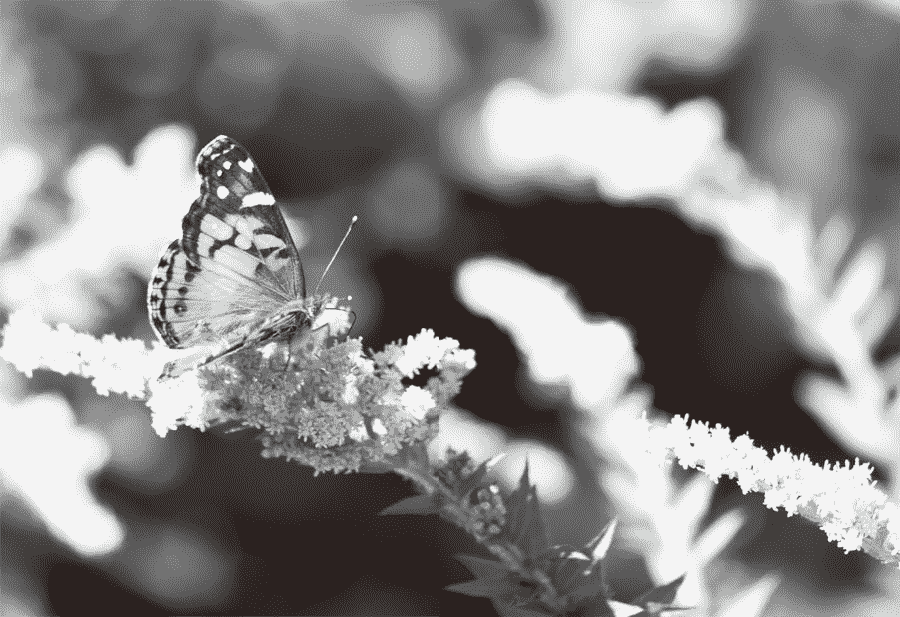

## 第三十三章　体内的宁静

肝脏会像英雄一样坚忍不拔地为生存而战，是因为它必须保护它挚爱的人，也就是你。从你在子宫里开始，肝脏就开始负起照顾你的责任。你就像妈妈怀中的新生儿一样，肝脏在乎你的程度超过一切。

你的肝脏在子宫内成长时，会透过化学沟通的方式，直接从母亲的肝脏接收到珍贵的指示与信息，了解如何处理数以千计的化学功能。但最高指导原则是“绝对不能弃你于不顾”。这种承袭自母亲肝脏的幸事就是生存的基础，也是肝脏超过两千种化学功能的基石，而正如其他许多的功能，至今医学与科学界尚未发现这点。

这种母亲的特质透过肝脏代代相传，传承了这种绝不放弃的观念，也是母子间深刻的无形链接。即使是最艰难的时刻，母亲的内心深处与孩子的灵魂深处都紧紧相系，那是外人无法察觉的。你的肝脏与你也存在着同样的链接，它清楚什么对你最好。请想像一下，你的肝脏就像爸妈一样，会说：“哪间学校最好？”“我要怎么在餐桌上摆盘？”“我孩子的玩伴是谁？”“我的孩子安全吗？快乐吗？温暖吗？”你能确切感受到肝脏照顾你的程度有多么无微不至，它想看到你过得好。这就是肝脏愿意坚持下去保护你的动力。肝脏在你出生之前就学会保护你，绝不低头示弱。肝脏也学会绝不逃避责任，或是在面临挑战时临阵脱逃。肝脏学会妥善照顾你，一辈子都把你当小孩照顾。

无论一路上面临哪些障碍，肝脏都会试图跨越，会为了你这个宝贝做任何该做的事。肝脏会努力让你维持年轻与安全，即便代价是让自己慢慢变老、变迟滞也在所不惜。肝脏甚至会愿意替你挡下子弹，希望有一天你能获得有用的信息来拯救它，就像它一直以来替你做的一样，为你赴汤蹈火，在所不惜。

肝脏不断加班，面对着永无止境的待办事项清单，却没有获得应有的支援，就是我们对肝脏最普遍的看法。肝脏可说是我们的表率，同时多工处理许多事项，具有强大的适应力，在面对挫折时还能奋力向前，就像我们一样。这也代表我们对肝脏有独特的洞见。我们可以感同身受，理解肝脏每天努力拉起快被流沙淹没的我们，多么需要片刻的喘息时间。我们也能了解肝脏同时面临一切压力有多么疲惫，能体会终其一生肝脏都在努力保护我们，因此也需要获得支持。还记得在本书开始之处，我把这些症状称为救命恩人吗？我们也应该化救援为行动。在肝脏拯救我们多年后，我们终于可以化身成为肝脏所需的英雄。

##### 拯救肝脏

我们将在第四部探讨你该如何成为那位英雄。在我们想到要照顾身体时，往往最先想到外表，想到追求体态苗条、皮肤柔软光滑，丝毫没有想到需要照顾肝脏。这点不难理解。我们无法不在乎外表，因为外表显而易见。在此同时，除非看了三十章与肝脏有关的内容，否则我们还是完全不会想到肝脏。我们的生活相当忙碌，必须面临许多挑战，我也差点忘了自己的肝脏。神灵提醒我：肝脏是我们看不见的器官，我们也没学过肝脏的入门课程，不知道肝脏有哪些看不见的力量。照顾孩童的肝脏也不是学校的责任。没有人告诉我们：“嘿，不要让肝脏变得迟滞、脱水、阻塞！”或“嘿！一年要清理肝脏几次，这就像定期洗车一样，请务必以安全且温和的方式清理它。你必须像照顾小狗一样照顾肝脏！”

正如我不断说的，我们活在“眼见为凭”的世界，这点可能不断伤害着我们。如果你看见车上有尘土，就会去洗车。如果你看不见肝脏上的尘土，那么代表上面没有尘土。如果我们看不见最早承袭自父母的毒素，如果我们看不见当中窝藏的病原体，看不见里头堆积的黏膜……任凭外在的俗事吞噬我们，我们会把重点放在穿着适当的洋装、裙子、衬衫、袜子、牛仔裤，希望既好看又舒服，却没有确认自己的肝脏舒不舒服。肝脏是不是穿着一层脂肪？是不是围着毒素及其他有毒物质的围巾，因此喘不过气来？重金属的帽子是不是太重，压得肝脏抬不起头来？

我们注重内在的同时，不必放弃外在对美的追求。相当讽刺的一件事是，转而将重点放在肝脏上时，我们就能让皮肤变年轻、甩掉体重，也可利用更多营养素，让我们拥有更结实的肌肉，穿上衣服时看起来更美，也能摆脱疾病与症状。只把重点放在外表上的人，很可能喝着马丁尼或香槟酒，同时去做 SPA，并在晚上吃牛排大餐配上一大份奶油，却不知道这么做会增加肝脏的负担，与他们希望达到的目标背道而驰。

无论你从哪个角度决定要照顾肝脏，是希望让自己更好看、想觉得更健康、想回报肝脏为你所做的一切，或是希望预防未来发生问题，都是能为你带来好处的角度。这么做都有助于净化血液与淋巴系统，让肝脏中的脂肪细胞松脱，肾上腺素也能因此休息一番。如果你采用最适当的饮食并持续运动，体重却不断增加或居高不下，只要给予肝脏适当的关怀与照顾，就能够大幅改善。如果肝脏因为喝酒及服用处方药物、娱乐用药而受损，或是出现莫名的疤痕组织，那么你都能努力让肝脏恢复。那不是你的错。不管怎么说，由于肝脏负责中和有害物质，以及将毒素与病原体冲出体外，帮助肝脏恢复健康与正常功能运作，都对维持健康影响甚钜。如果你一开始只能龟速前进，继续如此也无妨。你不是在孤军奋战。我们都和你在一起。

你也会拥有所需的工具，许许多多的工具，我们会在接下来的章节一一列出。在第三十四章，我们会破除有关肝脏的一些迷思。厘清这些流行、风潮、错误、误导观念之后，就能好好保护肝脏。有一种流行的高脂肪饮食法信息相当氾漤，因此在第三十五章，我们会进一步了解这种饮食法的真相，让你知道这种方式为何对肝脏没有帮助。接着在第三十六章，我们会探索肝脏的捣乱者，那些我在全书不断提及的东西，你也能进一步了解细节，知道该避免什么、为何要避免，以及不同类型的捣乱者在你着手清理之后，通常需要多久时间才会离开肝脏。在第三十七章，你会得知一些重要观念，了解如何透过有力的食物、药草、补充品来为肝脏加油和给予疗愈。

接下来则是会让你的生活完全改观的章节，第三十八章［救肝三：六：九］。在九天的清理过程中，能以前所未有的方式减轻肝脏的负担，同时每天早上进行固定的简单清理活动，让你能着手进行或是维持整个过程。之后的一章，也就是第三十九章［救肝食谱］中，你会了解如何制作美味的点心与餐点，这个章节搭配了全彩照片，激发你想进入厨房的欲望。紧接着的第四十章［救肝冥想］，有九种专为肝脏不同需求拟定的静心方式，例如清除脂肪、逆转疾病、强化器官免疫系统等。

在这本指南中，你可以透过清理肝脏、采取预防措施的方式，全面预防肝脏遭受威胁，帮助肝脏重十健康。在你阅读本书的尾声［暴风雨总会过去，宁静会与你同在］，翻到本书最后一页时，就具备所有的能力，可以改变你的肝脏及生活。

##### 宁静肝脏的世界

我们不断寻求各方面的平静，例如心灵、身体、灵魂的平静，与邻居、家人相处的平静，以及在工作场所的平静。我们也希望全世界都能平静无事，想知道如何让地球变得更好。大家甚至会旅行到天涯海角，只希望能寻求平静，却不知道最重要的答案存在于体内这个逆来顺受的器官里。

这不是真的吧，是吗？在读了那么多关于肝脏的内容后，你一定还是有所怀疑，认为那一团组织怎么可能改变世界。嗯，我们都知道大脑主宰了我们在社会上的成就，但你也可以说大脑是一团组织。虽然心脏只是一种中空的肌肉组织，我们却将之尊称为情绪与身体的中心。肺只不过是一对气球而已，但我们知道肺让我们能够呼吸、赐予我们生命。所以，我们何不提升肝脏的地位，视之为和平的使者？我们只是不知道肝脏做了什么、怎么做这些事罢了。到现在你才明白，知道肝脏会照顾你全身上下，就像母亲照顾新生儿一样，能够替你击退无数健康问题，会忍不住肩负起做为和平使者的责任，导致自己超载。

请想像一下，如果没有慢性愤怒，没有受苦的婴儿与孩童，没有疼痛与痛苦，没有失眠，没有体重增加与不受控的问题，没有难熬的饥饿，没有心律不整，没有热潮红与夜间盗汗，没有心情起伏不定，没有大片红疹，没有肠道绞痛，没有肠道塞车，没有血糖大起大落，没有中风，没有心脏病，没有癌症，会是怎么样的世界。那就是肝脏宁静的世界。

肝脏的宁静，就代表身心的平静。我们心灵的平静也得大幅仰赖肝脏的力量。想像我们如果没有觉得不舒服，或是时时担心感到不舒服，那么我们对人对己的态度就会好上许多。想像一下，如果大家的态度都和善许多，那么世界就会平静许多。有了这种平静的力量，有什么是我们做不到的呢？

只要努力维持肝脏的健康，你能做的事就会多很多。要是你能继续阅读接下来的章节，我会由衷替你感到高兴。其他人如果也能阅读本书，你就可以创造一种深层的疗愈力量，疗愈你的身体及全世界。

## 第三十四章　解开肝脏的迷思

很奇怪的事情是，肝脏最近都没获得人们应有的关注，因为在古代的观念中，肝脏相当重要。我们的祖先认为肝脏与强烈的情绪有关，正如你在第二十七章［心情起伏与季节性情绪失调］所见，其实相去不远。不断受损与重生的肝脏，就是普罗米修斯神话的基础。你将在本章看到肝脏的机制其实与这个故事大致相同。不过，我们经常将过去这种迷恋肝脏的想法视为蠢事。现在的我们比过去聪明吗？我们自己终究会知道答案。

肝脏确实获得了一些关注，只不过目前对肝脏的迷思较为古怪。有时那些不过是一时的流行、风潮、当月的健康偏好，达不到宣称的目的。有时那些多半只是理论及想法而已，我们必须特别留意，那对我们其实没有帮助。无论如何，重要的是我们必须检视这些说法，才不会在不知不觉中受限于现代的迷思。

##### 细胞每七年会完全新生一次

有许多理论围绕在人体所有细胞全部更新、替代、再造所需的时间。目前没有确切的科学证据能证实所需的时间，这是人体尚未被发掘的谜团，与食物进入人体后会发生什么事一样，远超过现代医学工具所能衡量的领域。

与细胞新生有关的因素相当多，情况因人而异：营养、压力、病原体、缺乏某些物质、承袭而来与新接触的毒素（例如重金属等）、居住环境所面临的挑战（甚至包含情绪层面），以及能够取得的资源。这些都会影响到细胞新生的速度，表示在不同器官、腺体、组织、骨胳（可再生的部分）更新所需的时间，不是医学与科学界能够估算的，只有肝细胞再生的时间例外。我们一同来看看肝脏不可思议的再生过程，这是尚未被发掘的过程。

肝脏是人体的基石，是草地上的巨岩，是蜻蜓歇脚之处。这块巨岩几乎不可能用我们的双手磙动、推动、移动，因为岩石立在那里必定有其目的。大自然的力量及时间之手在开天辟地之后，就把岩石放在那里。虽然经过几小时、几天、几年、几世纪的日晒雨淋，岩石可能会有所改变，但大多数时候，都会维持着完整的样貌。基本上，这种完整的状态正是你肝脏维持的样貌。虽然肝脏与岩石不同之处在于具有重生的能力，但它也有岩石固执的一面，和人体其他部位有所不同。岩石是个计时器，这点去问问地质学家就知道。只要研究岩石，就能解读过去的情形。岩石绝对不会摇摆不定，而肝脏也是。肝脏是人体的时钟，不可能会落后。肝脏就像赛跑时负责计时的人，或是在考试时负责计时的老师一样，必须相当可靠，必须负责让一切顺利运作。由于人体负责的工作相当多，包含消化、中枢神经系统的功能、肾上腺的功能等，再加上我们要求身体所做的事，有时肝脏就必须负责确认一切都能按计划进行。

肝脏要担任人体的计时器，就必须有特定的细胞再生时钟，无论人体内外及肝脏内发生了什么事，都必须负责告诉细胞明确的再生时间。在传统的指针时钟上，十二点是让长短针聚在一起的时刻，“时钟走到了午夜十二点”、“午餐时间在中午十二点”，是早上与中午的界线，以及一天结束与另一天开始的界限。十二点是一切聚在一起的时间。对肝脏而言，让一切聚在一起的数字是九。这个数字深藏在肝脏的核心。九这个数字也在肝脏的责任中：细胞再生（是数字三）、维生的能力（是数字六）、岩石的完成（也就是数字九本身）。人生开始、当中、结束的本质，都位于肝脏内。这就像钟面的数字十二一样，数字九让肝脏凝聚在一起。

肝脏储存过往信息的方式与人体其他器官大相迳庭，也与大脑截然不同。肝脏从过去至今代代相传，携带着智慧，也会将智慧传承给下一代；同样地，肝脏也会透过这种方式将毒素与病原体传下去。你孩子与孙子的肝脏中，也会储存着你父母、祖父母、曾祖父母，甚至是更古老祖先的信息。这表示我们不可能比肝脏聪明，就像我们不可能比自己的大脑或心脏聪明。由于肝脏拥有代代相传的的信息，了解错误的本质，因此不会犯人们常犯的错误，才能永远存活下去。

肝脏再生的功能比人体其他部位更为复杂，以弥补它无法像其他部位一样完全重生的缺陷。那是因为肝脏身为你忠诚的保护者，在经过一段时间，细胞遭病原体与其他捣乱者的摧残之后，会变得满目疮痍。正如你先前所见，没有任何人的肝脏处在百分百健康的状态下。因疏忽与误解对肝脏所造成的伤害，和对其他部位造成的伤害也不相同。虽然部分受损的肝脏组织依然能维持某种程度上的规律运作，有部分也可以再生，但如果没有积极处理，严重受损的肝脏再生能力其实相当有限，甚至无法再生。这也就是与数字九之间的关联，以及肝脏为何具有岩石般沉重的质地，能够历久不衰。

肝脏的奥秘之处在于它会按照特定时程再生，以延续生命。肝脏在这个领域的计时责任与人体其他部位迥异，你身体的状态、体内的资源与毒素量等，那些从本部分开始的要素清单，决定了人体其他部分再生的速度。至于肝脏本身的再生活动则不断持续进行着，就是如此。这种活动相当可靠，就像你能确定每年生日都会在同一天到来一样。肝脏每九年会完全更新肝细胞一次。

虽然有些细胞的更新会持续不断地进行，但这种更新活动并非一次性大规模更新，而是持续不断、每天都会发生。肝脏会在九年的期间，依照三的倍数进行。通常肝脏在进入三年的前三个月时，会加快更新速度，让细胞以更快的速度大幅更新。在短短几个月中，肝脏就会更新 1/3 的细胞。在迈入接下来的三年时，也会发生同样的情形，更新另外 1/3 的细胞。最后，在即将进入九年时，会更新最后的 1/3，并以同样的情形循环下去。每个人体内的时程表都一样。在我们三岁、六岁、九岁生日的时候，都会有同样的情形发生，一辈子周而复始地循环下去。这表示你在三的倍数生日时，如果可以特别照顾肝脏，就能帮助肝脏的更新（如果你是早产儿，这种情形会发生在三的倍数生日后几个月）。

很重要的一点是：那些细胞虽然是新细胞，但不表示完全干净、没有受到污染。如果你没有在这些生日之间清除肝脏的捣乱者，那么新细胞还是可能会受过去毒素的污染。这也就是毒素会停留在你体内多年的原因，同时也是你一辈子都必须持续清理病毒与重金属等捣乱者的原因。此外，正如我们之前所说，虽然有细胞更新的时间表，但在没有积极处理的情况下，肝脏的损伤、疾病、疤痕组织在九年后并不会消失无踪。反之，如果你为了肝脏的健康，维持良好的生活型态，并运用本书的资源，做该做的事，那么在经过一轮的更新周期之后，受伤的组织就有机会再生。

在这些特定的生日即将来临之际，请让这些日子提醒你多做一些事。在你即将满二十七岁、三十六岁、四十五岁、四十八岁、五十四岁、六十岁、七十五岁、八十一岁、九十九岁，或其他三的倍数生日即将来临之前、之中、之后，请考虑多喝一点蔬果汁，少摄取一点脂肪，多喝水，并多摄取富含抗氧化物的食物，例如水果。在这些时间点之间，你可以做第三十八章的“救肝三：六：九”计划，或是“救肝之晨”，这有助于肝细胞妥善地更新，帮助你的健康进入最佳状态。

##### 牛胆汁

最近流行的一股风潮是服用牛胆汁的胶囊做为补充品，认为这样有助于改善消化问题。这个理论看似完美无瑕。我们无法妥善分解脂肪，胆汁很可能分泌不足，因此神奇的补救措施就是服用一些优质的高浓度牛胆汁，对吧？其实不对。为何这是一种错误的迷思呢？因为人类的肝脏不会喜欢牛胆汁。如果肝脏可以大声说出人话，它一定会说：“请不要把另一种生物的胆汁放进来。住手！”

服用牛胆汁并不能改善消化功能偏弱的问题，也无法改善肝脏迟滞、缓慢、分泌胆汁不足的问题。我们肝脏与生俱来的权利就是分泌及控制胆汁的量。这种信息储存在肝脏中，让肝脏能拟定及改变计划，尽可能维持身体长寿。剥夺肝脏的这项任务，就像是剥夺你选择吃多少的权利。万一你已经饱到不行，却没有停止进食的权利，会是什么情形？如果你的胃已经满载，你都快要无法呼吸了，还得被迫继续嚼食吞嚥，那是什么感觉？这种情形就和我们的肝脏因为本书提到的各种原因而变得虚弱时，无法分泌足够的胆汁、迅速分解食物的脂肪酸时，你又强迫喂食外来的胆汁一样。

肝脏分泌胆汁过少的后果正如你先前所见，这样虽然不好，却不会像摄取外来的胆汁一样，造成问题或伤害。对肝脏来说，牛胆汁就像外来的生物，不具生物同质性，即使实验室检验的结果认为它与人体具有生物同质性，也无法改变这个事实。那个实验室并未研究及发现牛胆汁中的数百种化合物，那些对人体的胃、消化系统、整个人体来说都相当陌生。我们必须时时谨记：研究所做的，仅会涵盖经费挹注的部分，所有科学研究都是如此。任何科学主题如果可以获得比较多资金挹注，就会有比较多的发现。例如，太空旅行如果拥有无上限的资金，那么进步的程度可能会比现在多上好几倍。某项科学主题获得的资源越多，研究就会越加深入。

就这点而言，胆汁也不例外。实际上是：没有人愿意投入上亿资金，研究其他动物的胆汁到底还有哪些化合物会对人体造成伤害。其他动物的胆汁中，有哪种尚未被发现且人体不熟悉的动物酶，会干扰人类的内分泌系统、免疫系统、中枢神经系统，或是可能造成疾病，甚至是伤害人体的肝脏？之所以不会产生那种能保护你的研究，都是缺乏资金挹注的缘故。然而，科学家知道牛胆汁中有哪些与人类胆汁类似的物质，含有哪些类似的矿盐，只要知道这些就行了。反正对母鹅有好处的东西，一定对公鹅也有好处就是了。

实际上，牛胆汁的浓度与人类胆汁的浓度相去甚远，那是因为体型与重量大上我们许多的动物，必须分泌的胆汁当然比我们的浓，但没有人研究过胆汁的浓度。光是这一点，可能就必须花费好几百万美元来做研究。牛胆汁含有尚未被发现的化合物，那些与我们肝脏所分泌的有所不同，但是科学家不会发现这点，也不会将研究重点放在这里，因为医学与科学研究也还没厘清人类胆汁的成分。

来自可靠厂商生产的牛胆汁胶囊，虽然只有小小一颗，却会深深震撼整个肝脏。如果长达一星期，游泳池的泳客人数都过多，有太多人在池中小便，温度太高，过多雨水稀释池中的化学药剂，加上一开始就没有足够的氯化物，那么池水就会开始变色、发臭，绝对不宜使用，因此需要换水。在你将氯化物的震撼弹倒入池水时，就会发生爆炸。我们服用牛胆汁后对肝脏造成的震撼也相去不远。在肝脏变得缓慢、迟滞时，里头含有许多有毒重金属、药物、溶剂、芳香剂、发胶、染发剂、你开车时前方柴油车排放的废气等，那么你在那堆东西中投入牛胆汁胶囊时，就会引起大震撼。

那并不是因为牛胆汁像氯化物一样，会杀死所有东西，而是因为外来的胆汁会干扰肝脏努力维持的平衡。对长期中毒的肝脏来说，维持这种平衡可以避免发生紊乱。这种震撼就好比你在工作时，努力想把五个主题纳入一项计划里，之后有位新人强行加入团队，他想要帮你，却拿你的档案胡搞瞎搞。你知道自己在做什么，努力把所有东西融合在一起，不需要别人的“帮忙”，这样只会打乱你的平衡，打乱计划的平衡。对肝脏来说，有胆汁进入人体时也是同样的情形，这个入侵者扰乱了专家的工作，破坏了肝脏的平衡。

服用胆汁这个理论可以回溯到数百年前的旧理论，认为你若有肾脏问题，就能透过吃肾脏来治疗，吃脑可以补脑，吃肝补肝等。这也是黑暗时代传统医学的理论。即使牛胆汁可以取代人类胆汁的理论经证实为真，还有另一个障碍必须跨越：必须了解每个人应该服用多少牛胆汁。这个剂量无从得知，全都只是猜测而已，因为医学与科学就连我们人体需要多少胆汁才能发挥所需功能都不知道。再次重申，我们自己的胆汁及胆汁所扮演的角色，仍未透过研究获得厘清。

牛胆汁含有的化学物质，可以处理人体内没有运行的活动。牛胆汁含有尚未被发现的氨基酸，且未负责进行人体的某些功能。在你摄取了牛胆汁，当中含有许多这类身体无法利用的氨基酸时，这些多余的成分就会从胃进入十二指肠，经由小肠吸收，并直接透过血液的高速公路进入肝脏，也就意味着肝脏必须处理这些充满外来牛胆汁的血液。

这有什么不好？想像一下，这就像一位你非常在乎的挚友，你多年以来相当信任的人。你们了解彼此的故事与秘密，知道对方的一切。现在假设你们一起开车出去，你在一间咖啡店前停车，你的朋友负责跑进去买两杯咖啡，你则是在车子里面等。假设那个走出来开车门、跳进副驾驶座递给你咖啡的人，是假扮成你朋友的陌生人，他长得和你朋友很像，也说同样的话，好像可以当你的知心朋友一样，不过这时候你回过神来，才意识到对方是个陌生人，完全不了解你，不了解你的梦想与失落，你的渴望及生命的故事。

此外，这位冒牌货身上还有非常难闻的味道，让你退避三舍。那不是你朋友偶尔上完健身房后会有的体味，而是难闻许多、神秘的可怕味道，你因此受到严重的干扰，以至于无法做平常该做的事，因为你正忙于厘清那种味道会不会造成威胁。那种味道有毒吗？会造成伤害吗？需要处理吗？你决定把那杯咖啡丢进垃圾桶，请这个人离开你的车子，并加速离开这个地方。在你驶离现场时，那股味道仍挥之不去，你才开始思考刚刚发生了什么事。

在你弄清楚这是怎么一回事时，才想到要回去咖啡店。你真正的朋友正站在路边等你。“你去哪了啊？”他坐进车子里的时候这么问。

肝脏被迫吸收牛胆汁与人体感到陌生的化合物时，也面临了冒牌货走出咖啡店的状态。肝脏为了不让你受伤而吸收牛胆汁，不仅吸收完会感到相当困惑，在这之后还必须吸收自己原本的胆汁来保护你。牛胆汁很可能把肝脏逼到极限，使肝脏无法专心做原本该做的事：迎接在路边等自己的真正友人，也就是你的天然胆汁。

肝脏无法分泌自己的胆汁时，需要的不是牛胆汁，而是一杯西芹汁，帮助肝脏进行疗愈。肝脏可以辨认西芹汁中适当的矿盐，并储存起来，因此能分泌适当的胆汁。肝脏也需要你在饮食中减少乳制品的脂肪。在医师指出病人胆汁分泌过少时，通常会开立牛胆汁，同时要求患者摄取大量的乳制品。几乎所有人一辈子都摄取了大量的乳制品，无论是烤奶酪三明治或鸡肉凯萨沙拉，还是一片披萨等。透过摄取牛胆汁，你就不需要节制脂肪的摄取，实在是相当常见的错误观念。实际上，数百万名胆汁分泌不足的人们，应该要摄取低脂肪饮食，并遵守第三十八与三十九章的饮食法，才能减轻平常对肝脏造成的脂肪轰炸。那些脂肪通常都被称为蛋白质。在减少脂肪的摄取量时，肝脏就有机会排毒与修复胆汁分泌的功能。由于摄取大量蛋白质是时下流行的饮食方式，其实全世界都犯了一个错，认为高脂肪饮食是最健康的选择，大家在服用牛胆汁的同时，也摄取越来越多脂肪，不明白这样只会火上加油，把问题变得更糟糕。

##### 吃肝脏

吃肝脏这种习惯会流传下来其来有自。其一，许多人真的喜欢肝脏的味道；其二，自古以来相信吃肝脏会带来好处，尤其对保肝、强肝及造血有帮助。大家会把火鸡肝当成馅料，炸牛肝与鸡肝给家人吃，认为鹅肝、鸭肝是珍膳，有时会做成大家喜爱的鹅肝酱。

吃肝脏有益健康这件事一点也不正确。你想想自己肝脏所做的事，很容易就知道这是一种可悲且遭到误导的概念。

首先，在地球上要找到真正干净、健康的肝脏，几乎是不可能的任务，无论是人类或动物的肝脏都一样。如果我们真的能找到在原始环境中长大的动物，且拥有美丽健康的肝脏，那个肝脏依旧会充满那只动物体内的毒素。正常的身体功能运作时产生的毒素，都由肝脏负责处理与储存。你很可能会认为生长在偏远地区的熊或鹿，靠着吃野生动物、野草与植物维生，很可能拥有最干净的肝脏，但事实上并非如此。野生动物经常处在战或逃的状态下，也就表示它们经常分泌恐惧的肾上腺素。那些动物的肝脏就和我们的一样，必须做为海绵，吸收过多的压力荷尔蒙。

肝脏不仅是吸收毒素的海绵。大家认为吃肝脏带来的好处，其实是整个肝脏带来的好处。这个了不起且力量强大的腺体负责储存与处理重要的酶、微量矿物质、氨基酸、抗氧化物、植物化学成分，因此说摄取肝脏对你有帮助，确实是其来有自。在你阅读本书，并了解肝脏拥有的神奇化学与化合物之后，很可能比以前更容易认为：我吃肝脏会有帮助吗？另一个肝脏的力量会进到我体内吗？答案是肯定的，你很可能会因此获得意料中或意外的好处，不过你不该因此就认为大家需要吃肝脏，因为吃肝脏不是只有好的一面而已。肝脏储存的珍贵营养素就像一大堆金币、翡翠、钻石、其他埋藏在地底下的珍贵宝石，你必须要有适当的工具才能把这些挖出来，而其表面上却有放射性核废料。你往往还是能到达宝石的矿脉所在之处，可惜你满手宝石，却活得不久，无福消受，因为你必须先接触毒素才能获得那些宝藏。那就是肝脏的真相，肝脏中有宝藏，也有捣乱者。这就好像你喝下的补药，给予你长生不老之力的同时，也会减短你的寿命一样。

我们在此遇到的问题和摄取牛胆汁一样，就是动物肝脏所含的物质，很可能与人体不相容。储存在动物肝脏内的东西，很可能与人体肝脏的运作方式不容。每种动物肝脏分泌与储存动物酶及化合物的方式都独一无二，无法重新分门别类、贴上标签、重塑，乃至为人体利用。唯一例外的东西是脂肪。如果动物的肝脏里还有脂肪，我们可以利用，但问题是，脂肪往往含有大量毒素，因为肝脏中的脂肪主要负责储存毒素。在动物的肝脏里，我们可能利用的只有某些微量矿物质，运气好的话再加上一些抗氧化物，但这些仍不足以抵销那些毒素。最终你的肝脏必须处理与储存那些毒素，以及无法被利用的动物专属化合物，大大加重肝脏的负担。

如果你想获得肝脏带来的好处，就得吃人类的肝脏。当然，我不建议你这么做！此外，人体肝脏所储存的宝藏，也同样埋藏在废弃物之下，也就是大量的有毒重金属、溶剂、药物（处方药与娱乐用药）、塑胶、神秘化学物质、病毒、细菌、辐射、DDT 与衍生物（即所有的杀虫剂、除草剂、除霉剂）等，所带来的坏处远超过好处。请相信我说的话，即使是人类的肝脏，也不值得你冒险去吃。

虽然我们看到这里可能觉得吃人肝很好笑，但实际上这是一百五十年前的医疗方式。今日的另类医学反对这个理论，更不用说黑市人口贩运的问题了，这是过去科学界相当黑暗的一面。其中一种吃法是将人骨泡在水中，制成今日动物高汤般的补品；另一种方式是吃人皮来治疗皮肤问题，以及吃活人的器官来强化相同的器官。这种秘密的陋习源于我们在谈牛胆汁时看到的黑暗时代理论，认为摄取相对应的动物部位就能强化人体器官。这也就是为何我们相信吃肝能够补肝，也是今日的一些补充品含有少许动物器官与腺体的原因，认为这样对你的器官与腺体有益处。这个思潮距今有数百年之久，虽然未曾让任何人痊愈，却不断流传至今。

为了保护自己，请向大自然中的掠食者学习。它们抓到动物并进食时，都不会去吃肝脏。这是动物最不会去吃的器官，通常会留给食腐动物或挨饿已久的动物吃。那些不得不吞下肝脏的动物，在隔年春天都得多吃些嫩芽或植物的根，来清理中毒的肝脏。动物这么做是出自本能，是天生就有的行为。我们最好效法动物的这种本能。

##### 肝脏冲洗

肝脏冲洗总是听起来很迷人，像是个净化体内的好方法，既完美又简单。嗯，确实是很诱人，就是个诱捕人的陷阱啊。肝脏冲洗是有人提出来的理论，他们认为这么做对肝脏有好处。替肝脏着想，就像替别人着想一样。你喜欢某个人坚持说你说过一些话，但实际上并没有吗？应该不喜欢吧。尤其是说你说过特定的敏感话题，结果改变了你一部分的生活吗？在这种情况下，强迫肝脏排毒就必须付出相当多的代价。如果这么说惹恼了你，我可以理解。你很可能就是喜欢做肝脏冲洗的人，我尊重你的想法。在此同时，我要提供你一些指南，那是我该做的事，应该要替你留意一切。

如果你做过肝脏冲洗，并不代表你就完蛋了。你需要做的事就是了解肝脏本身的存在不归我们管辖，而是有它自己的时程表。如果你原本应该在五点去接团练结束的女儿，老板却要你一直忙到午夜，你一定不喜欢那种老板侵权的感受，对吧？如果你在原本应该正常休假的星期天早上，突然得将贝果丢回盘子，放下正在替孩子煎的松饼，必须穿上衣服冲去公司工作，眼睁睁看着其他人开车去处理平常周末会做的杂事，然后自己必须加班到很晚来完成手边的案子，也就是要到凌晨两点才能完成，那也不是你想要的生活，对吧？同时，假设你除了被迫处理这些计划外的事项，还必须在每个整点时产出大量的工作成果，产出比平日工作量更多的东西。这是不是让你联想到了什么？是不是就像肝脏冲洗一样，迫使肝脏在非自然的时刻排毒，你还每小时去厕所看一下是不是排出了所谓的肝结石？（稍后会进一步说明肝结石。）

现有的肝脏冲洗法有相当多种，有些仅针对肝脏，有些则同时针对肝脏与胆囊，有些则仅针对胆囊。这些都会对肝脏造成压力。如果你有小孩，在小孩开始长大的时候，你最担心什么事？孩子是不是会遇上毒贩？我们绝对不希望小孩遭到有害的力量控制。我们保护肝脏的心应该也是一样的。

摄取谷类时，清理肝脏与胆囊的效果就会相当好，因此你不该排斥谷类。如果不摄取谷类，而是采用无法维持平衡的冲洗与净化方式，那么肝脏每次都会比你还聪明。你以为自己比肝脏聪明？绝对不可能。你绝对不可能比自己的肝脏聪明，即使你再聪明也不可能。我不是想粉碎你的自信，只不过没有任何人能比自己的肝脏还聪明。肝脏不会让我们为所欲为，不会受我们的控制。肝脏是程序设计者，它本身就是智库。如果你逼迫肝脏，肝脏就会抵抗，所做的事就会变少。如果你更用力施压，肝脏做的事就更少。如果你持续施以高压，肝脏就会停工，转而透过备用电池运作，等你停止胡搞瞎搞时才会开始工作。肝脏会停止所有净化工作，以便恢复正常与平衡。只有在你完全住手时，肝脏才能喘息并回到正常运作。这让你想起生活当中的什么吗？你过度用力施压，就会遭到抵抗，因此你必须运用巧妙的方式处理当时的状况？这个概念可以应用在许多情况下。

肝脏储存了久远以前的信息，包含了你出生之前的种种。别忘了：肝脏也储存了连你都不记得的生命信息。肝脏能察觉你的所有诡计，因为它必须一而再、再而三地拯救你，例如你在大学派对里吞下一个油腻的乾酪堡，或是灌了一夸特啤酒时。肝脏会利用这样的记忆来保护你，知道你是好是坏，是调皮捣蛋还是乖巧听话。肝脏知道你是否试图一次冲掉一整船的毒素。在我们心中，会希望能一次把所有东西都清掉。我们以为透过这类冲洗的方式，可以把毒素透过肠道和肾脏全部冲掉，一切最终会跑到厕所里，我们就可以摆脱这些。

但是，肝脏比我们还清楚状况。在我们以错误的方式冲洗时，就会强迫肝脏违反它本身的意愿，因此毒素会全部进入血液中。肝脏也知道虽然我们并不清楚这些立刻进入血液的毒素，会对心脏与大脑造成威胁。造成大屠杀的毒素泥与残渣将会流向心脏瓣膜与心室，这并不是肝脏理想的度假方式，而是会造成心律不整、增加心脏的压力，出现发炎、肾上腺素增加、心电紊乱的情形，这时候的你却忙着在厕所看看有没有排出结石。

顺便一提，那些石头根本不是石头，是这些充满油脂的冲洗方式所产生的脂肪球。大肠中过多的橄榄油会凝结起来，形成果冻般的球，接着就会被排出体外。我必须很遗憾地说，许多人都把这些误认为上百颗的结石。我希望这么说不会让身为读者的你生气。你应该要知道真相才是，这些正是身体为了拯救你，不让你受到过多油脂伤害的证据。

我们也来谈一下胆囊冲洗。在第三十四章，你看到了以油为主的冲洗方式，也不是清除胆囊结石的最佳方法。多年来，我看到太多人因此让结石落入胆管里，而必须开刀急救的案例。要消除这些结石有更好的方式，就是让结石溶解，也就是我们之前提过的方式。

要净化肝脏也有更好的方式，就是和肝脏合作，而非与肝脏对抗，这样会比任何人为的肝脏清理法更有效。我们将会在第三十八章讨论这点。

##### 肝结石

你也许听过肝脏可能产生肝结石，但这其实是不可能的事。有时候，胆囊通向小肠的管道会被结石阻塞，那些其实是胆结石，和被误认为肝结石的东西不同。肝脏中的肝管不可能被结石塞住，也就是产生所谓的“肝结石”，因为肝脏不会把已形成的结石送入负责输送胆汁到胆囊的管道里。肝脏的温度太高，结石不可能在此形成；结石都是在胆囊形成的，过程如同第三十二章所言，毒素与有毒物质会从炎热的肝脏移动到凉爽的胆囊中。

肝脏的高热机制其实可以保护你，避免软硬结石在该处形成。如果真的有结石生成，肝脏也无法透过肝管将结石送出去。负责输送胆汁的肝管不像大家想像中的大。除非你是外科医师，解剖过人体肝脏中输送胆汁的管道，才会知道管子有多细小，根本不可能让结石通过，更不可能让大家以为的大型肝结石从这里排出去。肝脏也不可能透过肝静脉把结石送出去，因为这么做会立刻造成血块或心脏病发作。肝脏没办法将结石安全送入粪便里，借此排出体外。如果结石真的是在肝脏内生成，就会卡在肝管里，那么肝脏病恹恹又中毒的人必定会非常痛苦，医院也会充满数百万人等着接受清除肝结石的手术，这种手术必定会非常盛行，因为动手术正是现代医学最擅长的领域，这会和肾结石手术一样常见。

如果有人做肝脏冲洗，结果在马桶看见“结石”，实际上那是食物及肠道的残渣与油结合而成的物质，借由冲洗的过程排出体外。如果有人做肝脏冲洗时不使用橄榄油，甚至完全不使用脂肪，结果会如何呢？还是会有少量的食物废弃物残渣从肠道壁脱落，和为了冲洗摄取的药草物质混合，并与消化道的黏液一起排出体外，你以为自己看到的是肝结石，实际上并不是。

肝结石冲洗掀起一股风潮，甚至疗愈领域的许多专业人士也不了解肝脏运作的方式。没有任何人是完美无缺的，医师与治疗师也不是完人，我们都会犯错，但重要的是要站起来，拍掉身上的尘土，并让一切步上正轨。不要害怕摆脱自己曾经误认为正确的事。

##### 果糖不耐症

如果你相信果糖不耐症及吸收不良的迷思，你就上当受骗了，偏离了疗愈肝脏之路。果糖不耐症与肝脏息息相关，肝脏含有的毒素越多，越可能出现果糖不耐症，这实际上根本不是因为你无法耐受果糖。乳糖与果糖是完全不同的东西。例如，全身各处的病毒与细菌疯狂靠着乳制品中的乳糖维生，就像两者疯狂摄食麸质一样。在有人体内的细菌或病毒含量很高却未被诊断出来时，这些病原体会以麸质维生，造成这个人出现肠道问题，例如乳糜泻。实际上，乳糜泻并不是身体攻击自己，而是病原体攻击身体造成的问题。乳制品中的乳糖也会喂养病原体，使各种症状与问题加剧。

和因为体内细菌或病毒的活动很可能让你无法耐受麸质或乳糖一样，那并不代表你无法耐受果糖。你不该在摄取乳糖的同时摄取大量果糖，因为那是两种不同型式的糖。果糖不会喂养病原体，没有任何实验室或诊所的检验能将果糖分离出来，了解这种糖在人体内做什么，是有好处还是有坏处。针对果糖不耐症所做的理论检验绝对不精确，而且不太可能实行，因为这个理论背后的基础创建在对水果的偏见上。“果糖不耐症”的标签是反对摄取健康的碳水化合物、反对摄取水果的一部分，要大家不摄取有助于疗愈慢性问题的食物。

肝脏需要果糖才能进行修复，并抵御病原体。水果的净化能力相当强大，摄取水果的人，其体内的净化与排毒功能必定比摄取其他食物的人还要好，这点也会在评估果糖不耐症时造成误导。那些有慢性病且肝脏迟滞、缓慢、生病的人，在开始排毒时都会出现某些反应（无论症状轻微或严重）。一颗苹果带来的净化肝脏功效远超乎你的想像，那些离开体内的毒素可能会造成排毒的反应与症状，令患者及医师相当困惑，这在患者的饮食本身排毒效果不大时更是如此。

几乎所有落入果糖不耐症观念陷阱中的医师，也会相信高脂肪饮食法（无论他们相信的饮食法名称是哪一种）。即使是采用删去法的饮食，也就是对某些食物做实验，看看患者是否会出现反应，看起来好像是为患者量身订做的方式，但实际上仍是高脂肪饮食。饮食中的脂肪含量较高时，血液就会有许多毒素，肝脏也会有许多毒素，这时候如果吃了水果，就可以清理肝脏，帮助肝脏进行排毒作用，那些毒素就会无处可去，因为原本的血液已经充满脂肪与毒素，结果发现反应时，就免不了被认为是果糖不耐症或吸收不良，导致大家对可能有帮助的东西敬而远之。如此一来，患者的症状只会暂时得到缓解，不会有长期疗愈的效果。

经常被大家误认为果糖不耐症的另一种情形，则是胰岛素阻抗，也就是你在第二章、第十五章看到的问题。有人不了解胰岛素阻抗其实是血液中的脂肪过多，加上肝脏中毒迟滞的问题，而将之误认为果糖不耐症。

现在，果糖不耐症可分为两种，一种名为遗传性乳糖不耐症，另一种则为乳糖吸收不良。无论是哪种情形，疾病的概念与检验方式都不精确。遗传性乳糖不耐症其实并非基因造成的，ALDOB 基因及缺乏醛缩酶 B 同功酶，与吃下水果后可能会出现的症状无关。首先，没有任何人完全缺乏醛缩酶 B 同功酶。其次，这种酶的分泌量降低时，不过是肝功能降低时其中一种分泌量会减少的酶；在这种情况下，分泌量会减少的酶多达数十种，会减弱的化学功能则有数百种，这些都是医学与科学界尚未发现的事实。借由把焦点放在醛缩酶 B 同功酶上，并将果糖问题归咎于此，专家就落入了陷阱当中，不让你吃有助于改善肝脏迟滞问题的水果，但水果其实会让醛缩酶 B 同功酶及其他的酶与化学功能恢复正常。遗传性乳糖不耐症不过是个理论，这也就是为何我们会在破除迷思的这章讨论它。（顺便一提，有非常少数的人吃完水果后真的会产生反应，一般比较常见的是对砂糖等甘味剂有反应。）那些看似在摄取水果后发生的反应，其实与脂肪不耐有关，这也是肝功能不佳造成的问题。遗传性果糖不耐的标签只是个诱饵，让你误以为果糖会造成问题，实际上是业界在大肆保护脂肪。别忘了，一切未知的情形都会被怪罪在基因上，如果你往这个方向想就落入陷阱了，并会因而无法真正疗愈肝脏、终结症状。

专家认为果糖吸收不良可以透过检验得知果糖在体内过剩的情形，也就是测出你无法吸收的果糖量。但他们不清楚的是，根本的问题其实是你的肠道充满腐败的脂肪，加上肝脏迟滞、缓慢、功能不健全，甚至到了需要特别注意的脂肪肝前期，因此无法妥善分解脂肪。在一片水果进入肠道时，就会引发吸收不良的反应，部分原因是糖无处可去，毕竟消化道都是硬化、腐败的脂肪，另一方面也是由于水果试图清理肠道，帮助肝脏疗愈。医师会把检验结果视为你不适合吃水果，并建议你摄取大量动物性蛋白质，做为主要的热量来源，这也就成了胆汁储存量日渐降低的主因，而且会让脂肪腐败，黏在小肠与大肠内壁上。

如果大家减少脂肪的摄取量，血脂比也降到最低，吃水果时就不会再出现症状，做果糖检验时也不会发生问题，这是由于起初根本就没有所谓的果糖不耐或吸收不良的问题。他们的肝脏会开始疗愈、强化，功能也会增强，水果也就能替他们带来好处，无论原本是有遗传性果糖不耐症或果糖吸收不良，情况都会渐渐好转。那些设计高脂肪饮食的人会开始觉醒，了解饮食摄取更多植物可以改善大家的健康状况，那些名称诱人的新饮食法就会减少摄取脂肪。除非大家跨越对水果的恐惧，开始在饮食加入一颗青苹果，以及一把莓果之类的，否则就无法进入疗愈的下一个阶段。

##### 凝集素的疑虑

另一件越来越多人担心的事，就是有些食物含有大量的凝集素，对健康造成不良影响。你必须明白一件事，就是几十年来出现许多慢性病患者，在未来也同样会有慢性病患者。在明白自己的身体出了什么状况，知道造成症状与问题的原因，并知道如何治愈时，就可以治愈疾病。几十年来，我见过成千上万人透过这种方式恢复健康，即使状况相当严重也不例外。这些复原的情形与凝集素完全无关。

我们不能活在幻想的泡泡当中，以为在凝集素出现之前，没有人能从病痛中复原。推广凝集素文献与研究的人，完全不清楚有成千上万的人在不知道这些信息的情况下，依旧重十健康，仿佛那些人因为不符合他们的理念框架，就遭到忽视。他们假装没有人罹患慢性病后可以复原，便能建构起自己的凝集素帝国。

这就是刻意忽视的显著例子。担心凝集素造成的问题，使得大家排除实际上可以阻挡体内病毒与病原体的食物，那才是造成症状与疾病的真正原因。凝集素倡导人并不了解这些病原体，也不知道它们扮演的角色会造成问题与疾病，例如类风湿性关节炎的真正成因是 EB 病毒。他们宁可认为是马铃薯造成类风湿性关节炎，也不愿意去发掘背后的真相，而马铃薯当中的左旋离胺酸其实可以避免 EB 病毒引发类风湿性关节炎。他们宁可相信自体免疫疾病是免疫系统攻击人体细胞，造成自我毁灭的结果。由于他们不了解这种自体免疫理论并不正确，因此除了把一切怪罪在凝集素上，别无他法。他们认为凝集素是造成问题的部分原因，因为这种成分应该会让人体产生混淆，造成人体攻击自己。在此同时，他们也排除那些可以产生疗愈的食物，例如水果与部分蔬菜、根茎类食物，让你摄取更多的脂肪，因此对肝脏造成伤害。

蔬果当中的凝集素不会伤害我们，请千万不要被任何信息混淆，以为凝集素就像有毒的生物碱一样，是某些植物的防御机制，不适合人类食用。有些嫩芽、嫩枝与植物含有这种成分，如果鹿吃了一口，表面的生物碱就会让鹿与其他想伤害植物的动物退避三舍。我们知道那些对我们有毒，早就不吃那些了，而凝集素并不会造成问题。菜园中的各种蔬果，甚至是我们已知可食的各种植物，分别属于多种不同的类别，但这些却全被归为会造成问题的含生物碱植物。同样地，我们摄取的食物中，含有的凝集素并不会造成伤害。

有一些蛋白质不存在于蔬菜与水果里，只存在乳制品、蛋、小麦等特定谷类中，那些确实会喂养病原体，造成发炎的情形，但凝集素并非当中的一种。你阅读第三十六章［肝脏的捣乱者］时，就会了解乳制品、蛋、部分谷类确实该特别留意。乳制品、蛋、小麦中有数十种的蛋白质及化合物，是专家想要减轻慢性病问题时必须进一步探索的部分，但他们实际上却研究了不会造成问题的东西，也就是凝集素，真是讽刺。没错，请务必留意那些富含麸质的食物，不用担心吃马铃薯及新鲜成熟的番茄。我见证过这些东西帮助病入膏肓的人痊愈，最近甚至看到马铃薯救人一命的例子。

请留意反凝集素情结，不要听信这种说法。这种时下流行的错误会持续造成混淆，导致你未来无法迈向疗愈之路。这又是另一个反水果运动，另一个有偏见的机制，阻止你吃可以疗愈肝脏与身体的水果，也是医学与科学界不了解慢性病知识的另一个借口。请不要让这种说法剥夺了你与孩子迈向疗愈之路所需的一切。

##### 苹果醋

最近苹果醋受到的关注越来越多，据说对胃肠与消化道的其他部分都有好处，可以在肠道中创造碱性环境，消除胃食道逆流的问题，有助于改善胀气，甚至宣称能够清理胆囊与肝脏。

苹果本身才是带来神奇功效的关键，具有促进消化的惊人效果，可以蒐集与排除整个肠道内的细菌、杀虫剂、病毒、霉菌，并在需要时创造稳定的碱性环境。苹果也有助于疗愈憩室炎，减少肠胃道发炎的情形。苹果对胆囊与肝脏来说也具有不可思议的净化与疗愈功效，不仅能排毒，从这些器官中仔细移除沉积物，也有助于溶解胆结石。请特别注意，我们现在说的是苹果的功效，而非苹果醋的功效。是苹果本身能带来上述的功效，而不是苹果醋。苹果汁也能够发挥这些功效，苹果醋却无法。苹果泥也同样有效，苹果醋却没有。苹果醋无法创造碱性环境或净化消化道，苹果才可以。

你知道“好坏概括承受”这种说法吗？通常指的是我们知道生活中发生的好事里会有某些不好的地方。无论我们经历过什么坏事，那些好事都足以支持我们继续走下去。那是好坏掺半，有得有失，或是希望好事能多过坏事的情形。这就是为何这种观点偏向正面：无论好事掺杂着什么坏事，至少可以相互抵消。至于苹果醋呢，确实有一些好处，坏处却很多，而且完全无法抵消。苹果醋的好处是能带来氨基酸、矿物质、微量矿物质、植物化学物质，以及其他来自苹果醋原料的营养素，也就是苹果本身所含的营养素，前提是醋必须经过妥善酦酵及储存程序，里头含有“母亲”苹果的成分，也就是活着的微生物，这样至少能提供微量的营养素，只不过这些“母亲”在进入胃不久之后，就无法存活下来。即使是最温和的盐酸，也会让这些微生物丧失生命。

听着，如果你热爱喝醋，苹果醋可说是最健康的一种醋。如果你吃沙拉时无醋不欢，你就该选择苹果醋。但是，既然我知道这是最好的醋，也喜欢苹果为我们带来的好处，为什么不会大力推荐苹果醋呢？原因在于苹果醋和人们公认醋会产生的问题一样（不管大家清不清楚这点，都无法改变这个事实），就是：要说肝脏有什么讨厌的东西，那就是醋了。如果肝脏会说话，它可能会用震耳欲聋的声音喊出这句话。肝脏讨厌醋的程度不亚于讨厌酒精的程度。肝脏摄取酒精之后会慢慢变醉，并丧失功能；摄取了醋之后，肝脏功能受到的影响则有所不同。肝细胞会努力想维持平衡，尽力争取氧气，因为醋会从血液中偷走肝脏的氧气，就像是夜里来的小偷一样。

有些人似乎在喝了苹果醋后治好喉咙痛，但事实上有很多人因为喝苹果醋而喉咙痛。有些人相信喝苹果醋可以治疗胀气，但有更多人喝了苹果醋之后出现胀气的问题。有些人相信苹果醋可以减少胃酸逆流的情形，但有更多人因为喝了苹果醋，出现有史以来最严重的胃酸逆流问题。有些人相信苹果醋能够缓解胆囊疼痛，却有更多人在喝了之后胆囊痛到不行。事实上，苹果醋看似可以改善问题，但坏处大于好处。那是由于你看不到这一点：是肝脏付出了相当的代价。

基本上，我们喝醋的时候，肝脏必须努力奋战，才不会像小黄瓜一样变成腌黄瓜。要制作腌菜，必须有盐和醋。你的有机生苹果醋含有的“母亲”通常都不含钠，但在你喝下苹果醋，醋进入到血液与肝脏之后，就会让血液加了盐。为了存活下来，我们的血液必须要有少许的盐分，就像活的海洋是咸的一样。（有些钠是透过非正规方式进入体内，例如我们摄取芹菜等适当的食物，就会有微量的矿盐进入体内。）肝脏也会储存适量的钠。肝脏的其中一种化学功能，就是在血液非常需要钠时，释出钠到血液当中。所以，即使我们在喝醋的时候没有摄取盐分，器官、腺体、血液中仍会有足够的盐与醋混合，最终造成这种醋与钠的化学反应，腌菜的过程也就此发生。

有人可能会认为这和在玻璃罐里腌制蔬菜的过程不同。不过，这仍旧是体内发生的腌制过程之一。在沙拉上淋苹果醋对肝脏来说并非最糟糕的情形，但是各式各样的问题可能会慢慢累积起来。如果你用苹果醋进行冲洗，或是认为苹果醋对你有好处，每天都喝一汤匙的话，那么长期下来累积的量就会对肝脏造成影响，最终肝脏就会反击。

在苹果变成醋之前，处于中性到碱性的状态。你吃下苹果之后，能提高胃与肠道的碱性，却不会干扰到胃进行的中和作用；也就是说，让所有进入胃部的食物达到平衡，才会进入十二指肠及小肠的其他部分（你的胃可能维持碱性，并拥有高浓度的调和胃酸，你的胃不会只有一种环境）。苹果是应该吃进胃里的好食物。那是上天赐予人类的第一种食物，是对肝脏有强大好处的食物。你在生活中是否曾经努力工作，不管是为了做专案、执行某项任务，或是为了慷慨分享及慈善事业，又或是努力付出，只为了获得希望拥有的东西？或许是想要得到一天的休假，开车到海滩去，在公园散步等。苹果就是肝脏努力付出后最希望获得的回报。

苹果醋（和其他醋）与苹果不同之处在于：进入胃的时候，其酸性相当高。肝脏必须立刻停下原本处理的事，用尽它储存的营养素来让环境变成碱性，或至少把酸性中和掉。这时，苹果醋就会回击，它本身带有的酸性本质相当强烈，胃会因此打了多次败仗。苹果醋不但无法让肠道变成碱性，状况正好相反，它反而会让胃酸变弱，分解掉胃液，并维持原本的酸性继续向下迈进。这基本上就是对胃肠发动攻击。一开始，醋会努力在消化道迈进，肝脏就会变得有些歇斯底里。不久之后，肝脏就会因此出现酸中毒的情形。虽然这只是短暂的状态，但仍长到足以震惊肝脏，这就好像有朋友赏了你一耳光，目的是为了让你脱离他所谓的歇斯底里状态。

苹果醋只有坏处，没有好处吗？并不是。比苹果醋糟糕的东西还多着呢。重点是，苹果醋并没有净化肝脏或强化肠道的功效，不是神奇的食物。苹果泥对肝脏与胆囊有神奇疗愈效果，那苹果醋呢？和其他的醋一样，会对肝脏发动攻击。我知道现在倡导酦酵食物的风潮正热，大家也非常喜欢这点，但事实无关乎你我的喜好，而是关乎肝脏的需求。你每天都会写需求清单吗？“我需要做这件事”、“我需要买那个”、“我需要有那个”。没错，肝脏也有自己的需求清单，酦酵食物、苹果醋、其他醋，都不在清单里。正如肝脏是储物仓库，我们在日常生活中也会蒐集许多物品。为了不让柜子爆炸，我们会婉拒别人提供的东西，不把它们带回家。“我现在不需要熘冰鞋。”“我已经有很多大浴巾了，现在不需要新的。”“布拉，谢谢，我已经有电动牙刷了。”“我不需要那些香氛蜡烛，不过还是非常谢谢你。”如果肝脏能像这样婉拒苹果醋，它一定会这么做。肝脏并不需要苹果醋。

至少在苹果醋流行的时候，大家会想到苹果。如果肝脏会说话，每次你去天然食材店时，就好像在玩比手画脚的游戏。在你走向陈列苹果醋的走道时，肝脏会说：“很接近了，瓶子上写着‘苹果’。那部分是正确的。”在你拿起瓶子时，肝脏会大喊：“不对！很接近了，但还差一点点。再试试看。”接着你走过生鲜产品区时，因为时下流行的高脂肪饮食风潮说应该避免吃水果，你就跳过水果不看，肝脏就会对你大叫：“停下来！停下来！拿些苹果！”除了酦酵过的苹果，苹果真的对健康有莫大的帮助，能够带来神效。

话虽如此，如果你想要喝一点苹果醋，没什么问题，那是所有醋当中最好的一种。如果你真的想吃，这里加一点淋酱，那里加一点淋酱，不会有什么问题。许多人一开始不会加太多，只是用苹果醋调味，也比大部分调味料都健康。感谢老天，由于苹果的缘故，苹果醋含有那些营养素。至于使用大量苹果醋来净化肝脏，那不过是种错误的迷思而已。如果你希望达到疗愈肝脏的功效，请不要使用苹果醋，而是改吃未经酦酵的苹果。

##### 咖啡灌肠

咖啡灌肠是流传已久且相当受欢迎的肝脏疗愈方式，通常用于胰脏癌、大肠癌、直肠癌与其他癌症，也是另类疗法用来治疗多数疾病的方式。咖啡疗法甚至宣称能让身体很健康的人维持健康状态。这种方式已经不只是另类医学的一部分了，而是广受欢迎到甚至进入传统医学的范畴当中。咖啡灌肠的理论认为，这种方式可以净化肝脏的毒素，帮助身体产生疗愈。这种说法相确实相当有道理，帮助肝脏排毒确实能够带来疗愈。

但问题正是出在这里。首先，咖啡非常浓烈，酸性很强，会造成脱水，具有刺激性，带来的刺激也过大。咖啡是一种药品。切记，你或许对咖啡上瘾，这也就是许多人迷恋这种灌肠疗法的原因。上述这些问题对喜欢喝咖啡的人来说，可能不是什么问题，但咖啡进入胃里，和咖啡透过灌肠的方式进入肠道，是完全不同的两码子事。我们的胃有处理咖啡的能力，或许咖啡对胃来说不是最好的东西，确实会对胃部环境造成挑战，影响胃的酸硷值、盐酸的浓度，但对那些胃可以耐受咖啡的人来说，不会造成什么问题。对那些神经系统敏感或有神经系统症状与问题（例如焦虑、颤抖、刺痛、麻木、脑雾、疼痛、失眠、不宁腿症候群）的人来说，咖啡可能会对神经系统造成压力。许多处在这种状况中的人，以及那些胃不好、胃酸逆流、胰脏或胆囊有问题，以及消化道有问题或功能不佳（例如克隆氏症、肠躁症、肠炎）的人来说，都知道自己最好远离咖啡。没有这些问题的人，就可以好好享用咖啡，因为他们的胃能够做为第一道防线，抵挡咖啡带来的冲击。

进入胃部应该是咖啡唯一的路径。胃具有妥善控制的环境，也内建了保护措施，能够保护你。在各种物质进入胃时，警铃就会响起，通知胰脏、肝脏、肠道。无论那是一罐汽水、一杯牛奶、在餐厅用餐时不小心吞下一点杀虫剂成分，或是喝了一杯咖啡，都能妥善获得分解，所以在这些成分进入血液时，部分有害的成分已经消失了。这是胃的其中一种神奇能力，能让进入其中的物质达成平衡，或是进行中和。胃就好像你体内潜藏在海底的潜水艇，主要目标是要维持系统平衡。一切必须维持平静、冷静、专注、有条不紊，否则就会造成大灾难。但是，如果有任何食物、液体、药物、杀虫剂，好菌或坏菌，透过直肠进入小肠时，就没有胃的保护机制。如果是温和的东西进入这个环境，并不会造成威胁，但是像咖啡这种浓烈的东西进入肠道时，就是另外一回事了。咖啡的酸性本质及攻击神经系统的效果对大肠来说太过强烈，根本无法招架。

如果有任何刺激或有毒物质透过这种方式进入体内，也就是未经过胃提供的检查哨时，无论是什么物质，肝脏都很容易蒙受其害。对肝脏来说，胃就像是永远支持它的好朋友，胃知道肝脏也替自己的需求努力着，所以两者的关系就如同互惠的家人。肝脏本来的功能就不是负责直接处理或面对威胁。在面临威胁时，它会立刻要求肾上腺分泌肾上腺素，做为防御的机制。虽然肝脏讨厌过多的肾上腺素，因为它必须吸收过多的肾上腺素来保护你，但是在这种情况下，肝脏却必须运用肾上腺素做为士兵，配上刀枪负责战斗。

咖啡灌肠会导致肾上腺大量分泌。肝脏这个将军下令分泌的肾上腺素在于负责警告心脏即将发生问题。这听起来可能有些极端，因为咖啡灌肠看似不会造成什么伤害。按照常理判断，应该不会造成威胁，应该是安全的方式才对。相较于许多传统医学中真的十分危险与不安全的方式，咖啡灌肠看起来简直是小巫见大巫；然而，那只是我们自己下的判断而已。对肝脏来说，它会将咖啡灌肠视为问题。

此外，还会有第二波的肾上腺大量分泌，这是咖啡中的咖啡因所造成的。在咖啡没有通过正常的十二指肠与小肠路径时，无法妥善分解咖啡因，也没经过妥善且精细的方式分解后才进入血液里，借此保护心脏免受咖啡因攻击。在咖啡因进入直肠后到达小肠时，就会引发另一波肾上腺分泌。那是由于咖啡因本身就是个恶棍，会想办法立刻进入血液当中，而没有盐酸或其他胃液、胆汁能减缓咖啡因进入血液的速度。

这对神经系统敏感及有肾上腺问题的人来说就必须特别留意。这些就是遇到咖啡因会有问题的人。我很肯定那些高度焦虑的人并不知道咖啡会让问题变得更严重，所以他们经常在咖啡店排队，点他们最喜欢的咖啡，同时又透过抗焦虑药物控制自己的焦虑问题。也有许多人确实知道咖啡会使他们产生问题。对这些人来说，如果咖啡采用灌肠的方式进入体内，就会引发焦虑等症状，或是加重症状的程度。那些充满爱与关怀的专业人士，学到的可能是对你说那些是排毒的症状，这其实并不是他们的错。事实上，是肾上腺素和咖啡因会对身体造成过大的压力，因为消化系统基本上是我们的第二个中枢神经系统。

有些人可能还是想知道：姑且不论其他影响，咖啡灌肠确实能净化肝脏吗？答案是：咖啡灌肠很可能会稍微产生迫使肝脏清理的效果，但同时也会产生恢复原状的效应。那些离开肝脏的毒素没有被冲出体外，而是无可避免地重新回到肝脏当中，这是由于没有使用安全的清理方式所致。肝脏会分泌化合物到血液中，它想尽力围捕这些逃逸的毒素来保护大脑和心脏。肝脏为了这个目的及应付咖啡因所分泌的肾上腺素，就会引发快速循环，肾上腺素也会被肝脏吸收。因此，在经过咖啡灌肠之后，肝脏中累积的毒素很可能比原本更多。

肝脏不喜欢被迫排毒，所以在咖啡直接进入大肠时，肝脏很可能会近乎停止运作，暂时降低电量，准备在几秒钟或几分钟之内提高运作功效，因为这时候肝脏必须高速运转来应付肾上腺素及毒素的大屠杀。

如果不使用咖啡，改用蒸馏水或逆渗透水加一点点柠檬，则有非常好的排毒效果。蒸馏水用在饮用时，完全无法提供任何矿物质，但用来灌肠时，却能清除毒素，新鲜柠檬汁则让水有更好的效果。这种灌肠的效果会比咖啡灌肠更有效，因为这么做不会让肝脏大声要求要肾上腺素。当然，如果你不喜欢灌肠，那么根本不需要这么做。

##### 甜菜根

肝脏需要甜菜根的观念已经存在一段时间了，人们认为这种菜可以疗愈肝脏及促进造血。甜菜根真的对我们有好处吗？确实如此，它确实是能带来很多好处的食物，对清理与疗愈肝脏也有些许帮助。当然，那必须是有机栽种且非基因改造的品种才行，但由于异花授粉的技术盛行，现在已经很难找到了。基因改造污染造成玉米等农作物产生的问题，同样也发生在用来制糖、制作罐头与工业用染料的甜菜根上。异花授粉造成的问题，导致即使是许多供食用的有机甜菜根种子，可能也受到了污染。这么说并不是要你为了健康着想，不再吃甜菜根了。最主要的理由是你有更好的选择，例如红色火龙果。你可以在冷冻食物区的果昔组合里看到，在超商买到，或者可以买到纯粹的火龙果粉末，这对于疗愈肝脏与造血的效果远高于甜菜根。毕竟你若是为了特定目的而种植或食用某种食物，难道不想知道哪种食物才能带来最大的好处吗？野生蓝莓、芦笋、甘蓝牙的净化效果也比甜菜根好，即使是苹果也远胜过甜菜根。

但如果你喜欢吃甜菜根，也不用因此不吃，只不过你必须了解，吃甜菜根不是为了帮助肝脏。有机且非基因改造的甜菜可以提供各种微量矿物质、维生素、抗氧化物、其他植物化学成分，以及珍贵的果糖，有助于供应全身能量并疗愈全身。（请务必留意基因改造的甜菜根，那对身体会造成强大的破坏。）

同时，你还必须留意一件事。所有正常的车辆都有四颗轮子和一个发动机，至少还能开。不过，你会想要买旧车吗？或是你会想买里程数较少、煞车状况良好、安全气囊正常，以及具有现代化设备的车呢？放眼今日车辆的状况，你会去买没有空调和电动车窗的车吗？除非你只有这种选择，或是喜欢蒐集老车才会吧。甜菜根还算不上经典之作。那种最美的经典古董车是苹果，所以如果你追求的是疗愈肝脏，何不选择神奇的苹果，里头所含的果胶远胜过甜菜根带来的好处？如果你想要的是进阶版，是因为色彩而选择甜菜根的话，何不选择色彩鲜艳的红色火龙果或野生蓝莓呢？甜菜根是红色的，你的血液是红色的，肝脏也带有红色，但不表示甜菜根对肝脏也有好处。红色火龙果和野生蓝莓当中，那些人们尚未发现的抗氧化物更胜一筹。同样地，芦笋和甘蓝牙对于净化血液、淋巴、肝脏的效果也较为出色，在净化肝脏的功效方面，同样遥遥领先。如果你喜欢吃甜菜根，自己在菜园里种了一些，也不用因此不继续种下去。种植甜菜根，把甜菜根拔出来、清除泥土、去皮食用的过程，也可以带来疗愈的效果，甚至带着些许崇高伟大的特质。

在你进一步了解甜菜根在疗愈食物中所处的位置时，就了解完整的相关信息了。我相信你在停车场选车时，一定想要完全了解有关车辆的信息。最终的选择权还是在你手上，你未来的路还很长，而你有权选择要走多久。

##### 碱性水

近几年来，有人大肆宣称碱性水可以维持健康。有些专家宣称 pH9.5 的水最符合我们的需求，真是如此吗？符合什么需求？符合有人建构的消化理论吗？符合瓶装水厂商能够胜过其他竞争者的需求吗？或是符合我们需要替健康做点什么的需求？

至于肝脏的需求呢？它的需求总是遭到忽略。所以现在，我们来给予肝脏需要的东西吧。肝脏需要什么？酸硷值越来越高的离子水能够净化肝脏吗？很抱歉，我会说没办法。

我不反对少量饮用高碱性的水或离子水，因为有一件可以肯定的事，就是水具有最佳的净化与清洁效果。除非那是便宜的罐装自来水再加入天然香料（味精）、工业化生产的维生素与电解质（基本上是便宜的盐），并贴上花稍的标签，供大家在运动后恢复体力时饮用。不过，这并不是我个人反对碱性水的碎碎念而已。许多瓶装水没有灵魂，或至少缺乏某种精神。市面上有许多很棒的高品质滤水系统与离子化系统，以及高品质瓶装水，那才是你需要的。

这点与肝脏有关，我经常看到及听到大家饮用那些高碱性的水，目的是想疗愈肝脏，但真相是，那些酸硷值很高的水进入胃之后，发生了医学与科学界、碱性水业界所不知道的事，也就是最基本的事实──在液体被平衡、中和、分解、重组之前，不会离开胃部。液体在进入小肠并顺流而下、透过血液进入肝脏之前，会先经过拆解、重组、重构的过程。正如我常说的，即使在几百年后，我们的社会还是不清楚食物和液体进入胃之后发生的事。虽然我们会假装知道，实际上却连一半都不清楚。

我要很遗憾地说，你肝脏最好的朋友与第一道防线并不是你。虽然肝脏是我们最好的朋友，我们却不是肝脏最好的朋友。身为人类，我们告诉肝脏自己才是老大，我们想吃什么就吃什么，不管那对身体是好是坏。未来我们必须了解肝脏的需求，相信这个器官，并成为这个器官最好的朋友，即使这个器官还不相信我们；这是因为，人类的肝脏并不会自动相信人类的大脑。我们一直以来都在破坏肝脏对我们的信任，我们必须重新赢得肝脏的尊重。你肝脏相信的是胃，那才是它最好的朋友。

在酸硷值很高的碱性水进入胃中之后，胃就必须放下手边一切的事。你还记得自己必须停下一切的时候吗？不管是因为电话响起，或是突然想到某件事的截止日，抑或是想到自己有约却快迟到了，或是闹钟响没听到而睡过头？那就是酸硷值很高的水进入体内之后，胃必须先做的事，之后才能利用这种水。我们会把自认为是好的东西送进胃里，胃就会把这些调整成我们真正需要的东西。我们喝进酸性的水时，胃也必须做同样的事。自来水的酸性很高，有些来自水库过滤后装瓶的水也是这样。无论不平衡的程度高低，即使只是水，胃也必须耗费能量与储存的营养素，以及七种酸的调和液、胰脏的力量与酶来改变水的结构，让那种物质变成可以输送到全身各处、身体可以妥善利用的物质。

这和肝脏有什么关系？一方面来说，如果有人喝了大量高碱性离子水，胃往往必须先处理这些水。水停留在胃里的时间其实不够长，不足以让胃调整一切。同样地，一次喝下大量酸性水也不例外。胃必须让两种水排出闸门外，对那些有肠道问题的人来说更是如此，而肠道问题本身就与胃酸过低及肝脏问题有关，所以过多的水进入体内时，肝脏就必须采取行动。肝脏不会责怪胃怠忽职守，它知道真正该负责的人是谁。为了帮助消化系统，肝脏会释出剂量不等的普通胆汁，也就是主要功能是负责分解脂肪的胆汁来困住小肠中的水，等到特殊的胆汁提高水的酸性或降低碱性到可接受的程度再放行。这又是另一种肝脏尚未被发掘的功能。

这种特殊的胆汁由矿物质、酶、肝脏内常备的调和综合荷尔蒙，再加上另一种黏膜般的化合物组成。肝脏必须耗费储存的营养素才能分泌这种胆汁，这种减缓水流速度的过程要付出的代价相当高，对肝脏或胃都没有帮助，目的就只是要弥补你在不知情的状况下所犯的错。这种额外的工作意味着肝脏无法把能量用在净化上，同时必须将资源用在中和水上。

以上种种并不代表你从高碱性水中无法获得好处，也不代表这种水有毒或有害。如果你喜欢喝这种水，相信这种水带来的好处，那么我当然支持你。如果你能打开你的电解水机器来自制碱性水，并认为这种水能带来疗愈的力量，当然没问题。只不过你必须明白，这种水无法疗愈或净化肝脏，也不要大量饮用，或是将这种水当成日常饮用水。把这种水当成药物来少量摄取，这么做不会让胃在处理妥善之前就放行。你也必须了解，要喝下较大量肝脏喜欢且可以使用的水，才能帮助平衡，也就是酸硷值在 7.5 至 8 之间的水。这种酸硷值较接近中性的水非常适合人体，也不需要耗费器官额外储存的营养素来处理，不会增加额外的工作，迫使胃必须进行中和，或要肝脏使用特制胆汁来中和。这样就能让肝脏在当下继续进行维护健康的活动。在你一次喝下大量高碱性水时，就像在拍拍肝脏的背，不断干扰与打断正在处理重要专案的肝脏。请切记这一点，并选择你想打断肝脏的时候，否则请喝中性水就好了。如果你想做点什么，就挤一些新鲜的柠檬或莱姆汁，加入酸硷值在 7.5 到 8 之间的水里，这样就能自动进行离子化过程，稍微增加水的碱性，又不会额外增加胃或肝脏的负担，实际上也有助于妥善净化肝脏。

了解这点之后，你就更能获得肝脏的信任。若能避免在不知情的状况下增加肝脏的负担，你的疗愈力量就能大幅增长。另外，还有一项我们必须探讨且了解的肝脏迷思，也就是我在全书提过几次的概念：高脂肪饮食。由于这点自成主题，我们会在下一章做较完整的说明。

## 第三十五章　高脂肪饮食的风潮

这个世界十分热中于反糖、反碳水化合物，因此在健康领域中，几乎找不到任何不回避水果与淀粉类蔬菜的专家。这到底是怎么一回事？首先，许多专业的健康人士都是透过不断实验除错来寻找最佳的饮食法。只有不吃加工食品似乎还不足以让大部分患者从许多症状与问题中好转，那接下来怎么办？如何喂饱大家，让大家感到开心，同时也符合他们的热量需求，并帮助他们疗愈，或至少减轻他们身上的症状？专业人士无法减少蛋白质摄取量，因为蛋白质是整个地球上基本的医学模型。至少从一九三三年起，它对西方文化来说就是如此。蛋白质就是不容批评的主题，是饮食中不容评判的部分。大家都有种根深柢固的观念，认为没有蛋白质的话，我们就会衰弱、死亡、灭绝。

##### 我们如何走到这一步

一九三〇年代开始，食物产业与政府机关开始结合，在全美中学以上的学校推广蛋白质运动，也因而成为牢不可破的潜意识法则，就像大家都会穿袜子一样。虽然一些人穿某些服装时为了配合整体风格，可能会不穿袜子，或会有那么十年不流行穿袜子，但是到了最后，大家还是会把袜子穿回去。我们身而为人，就是会穿袜子。这种习惯已经在传统中落地生根，就像蛋白质在传统与现代的另类疗法扎根一样。

在旧有的另类医学当中，蛋白质并未成为法则之一。早期（好比一九二〇年代）的另类疗法治疗师不会把蛋白质奉为圭臬，他们相信蔬菜、水果、马铃薯、其他淀粉类蔬菜、坚果、种子。他们不会特别去注意蛋白质，因为他们知道上述食物就能提供足够的蛋白质。然而，传统医学在进入加工肉品的动物工业世纪后，就与蛋白质密不可分。肉类包装的工业与政府合作订立商业契约，并和制药界联手，最终成为整个传统医学界的教条，作了当时看似有道理的决定，把金钱利益放在大众身体健康之前。这些祖父级的合约仍保存在某处的保险柜里，不对外公开。这些可不是美味的饼干食谱，而是在没有听从我们意见的情况下就作出的决定，不准我们投票，没有开镇民会议，我们完全不知情，在秘密的商业交易中也不容我们置喙，却在往后几十年来阻碍我们好好过生活。

到了一九七〇年代，传统医学界的意识抬头，知道过多脂肪对身体有害。这种觉醒实际上是好事，是一道曙光，知道过多的脂肪对心脏不好，但这项发现后续却没有付诸实践，之后可能的发展也因此消声匿迹，接着就转变为毫无道理可言的“低脂肪”风潮。那是由于现代的“低脂肪”饮食实际上的脂肪含量相当高，这些饮食增加了包含各种肉类的动物性蛋白质，让人误以为是低脂肪饮食，只因为他们不吃酪梨、橄榄、椰子、油脂、坚果；他们基本上是禁止摄取这些食物，尤其是椰子与酪梨，被认定含有毒素。如果你是医疗领域的专业人士，推荐病人吃这些东西，会被认为相当不负责任。“低脂肪”和“无脂肪”的产品在市面上比比皆是。我要提醒你，那些都不是健康食品。大家误以为避免摄取巧克力蛋糕的猪油和糖就大获全胜，但取而代之的蛋白质，事实上则充满了脂肪。

饮食流行变成有史以来脂肪含量最高的饮食法，却没有人知道错误所在，这在过去遭到忽略，现在也仍然被大家忽略。他们并不清楚动物性蛋白质会自动转变为动物性脂肪。我们对动物性蛋白质含有脂肪这件事视而不见，最早始于一九三〇年代早期。那是相当伟大的算计：把重点放在蛋白质上，忽略当中含有的脂肪，结果这种方式大获成功。在你随着注重蛋白质的父母与祖父母一起成长时，那是你逃脱不了的规范。不知怎么说，“蛋白质”这个词宰制了我们，有如被僵尸咬到一样，现在的我们也都变成了僵尸。

所以到了一九七〇年代早期，大家都开始购买他们所谓低脂肪与不含脂肪的产品，却摄取了两倍或三倍的动物性蛋白质，里头含有相当多脂肪，虽然他们不再吃过去另类医学认为的健康脂肪，例如酪梨、椰子、坚果、种子、橄榄等，实际上的脂肪摄取量却是原本的两倍或三倍。在此同时，他们也不计一切代价降低碳水化合物的摄取量，却透过其他方式，也就是酒精来摄取到同样的东西。在一九七〇年代，民众的饮酒量达到有史以来的新高。大家经历过摄取少量碳水化合物并忍耐饥饿的阶段，出现了情绪化的反应，因此多少需要糖分。这和今日流行的高脂肪、高蛋白、低碳水化合物饮食法相当类似。大家会刻意记得喝酒或其他含酒精的饮品，或是由于饮食的不足，发现自己疯狂渴望吃糖。这种七〇年代的“低脂肪”饮食其实是早期正确概念中的错误部分。他们立意良善，了解高脂肪对我们不好，却做了错误的事，因为他们忘了修补其中一个部分，也就是三〇年代与业界结合时带给我们的观念，使人们深信蛋白质才是王道。所以，即使七〇年代的观察者在看到大家生病，发现高脂肪饮食会造成问题时，了解到正确的观念，在执行面却立刻失败，因为他们不了解背后的原因是蛋白质法则。今日的饮食不断造成那些出自于善意的错误，而现在的状况则有些不同，我们会在接下来的章节讨论这点。

##### 今日的混合饮食法

今日市面上有许多不同的饮食法与饮食观念体系，那些不断更名并重新包装的相同观念，就是高蛋白质与低脂肪的饮食。只要取一个新名字，例如称之为“自体免疫饮食法”，看起来就像是不同的东西，但事实上并非如此，而是另一种反对碳水化合物、糖，且脂肪摄取量极高的饮食法，即使当中纳入了“瘦”的蛋白质也不例外。最近，有些重新包装的饮食法很骄傲地说那是高脂肪的饮食法，仿佛高脂肪对你有好处一样。这些不过是原本七〇、八〇、九〇年代高蛋白质饮食法的稍微进阶版而已。今日的高蛋白质饮食法加入了较多的绿色蔬菜、较多绿色的蔬果汁，有许多饮食法也纳入了青苹果或一些健康的莓果。他们提倡摄取大量沙拉及其他蔬菜。大家因为没有摄取所需的疗愈食物，导致受苦的情形比之前采用低碳水化合物、高蛋白质“低脂”饮食法时还严重。

在医学界观察到患者脱离标准美式饮食时，许多症状就消失了。“这就对了！我们挖到金子了！”对食物感兴趣的医师都不断这么说。有时，长期的症状会消失，有时短时间的症状也消失了，即使有些患者可能根本没获得任何好处，有些人的健康状况则会随着时间恶化，感觉就像医学界的藩篱崩塌了，因为传统医学终于注意到了这件事。直到这个时候，传统医学界基本上仍不注重饮食与食物，对这些更是不了解。大多数时候，传统医学界都认为饮食与疾病或疗愈无关，唯一例外的是吃太多红肉对心脏有害。现在传统医学的分支开始出现，医师想要了解更多、学习更多、介入食物更多，想要排除更多食物，因为他们从自己的经验、观察所得的经验、听到其他另类疗法医师讨论的经验，得知疗愈食物的知识，而那些是他们在医学院没学到的。所以，他们冒险跨越寻常的医学架构，进入另类医学、全人医学的领域，那些是另类医学医师所不齿、嘲笑、不相信的内容，或是束之高阁、多年不提的内容。光是美国的另类医学医师，在二十世纪坐牢或职业生涯破灭的，就有高达数百位。今日他们轻松自在地发表另类医学的健康观点时，把这些视为理所当然，不清楚自己为何有这样的权力，或是过去发生了什么事，他们才能在今日大声表达意见。进入二十一世纪时，那些接受传统医学养成教育的医疗专业人员，最后终于发现另类医学能提供的东西，就是混合的医疗模型。另类医学不再是独行侠或特立独行者。现在传统医学的专业人士将绿色蔬菜与菜汁等另类医学的智慧，与少吃加工食品、吃瘦一点的肉等传统饮食法结合，摇身一变，就成了现代的功能医学、传统医学、另类医学医师。

一路发展下来，到了某个时间点，他们就会开始遇到瓶颈，发现那些破坏传统规则的方式无法解开生活中的谜团，或是消除慢性疾病。饮食中摄取过多的红肉、鸡肉、其他动物性蛋白质，无法达到他们期望的结果。所以，他们开始进一步混合更多家的主张，纳入了酪梨、椰子（原本被认为是极油的危险食物）、高品质的坚果与种子酱（他们过去认为像粪便一样，避之唯恐不及的东西）。今日流行的饮食法，是混合的高蛋白饮食法：高品质的“瘦”肉、植物性脂肪、绿色叶菜类、果菜汁、蔬菜，并加入少量水果。这些都是借由过去的错误不断实验而来，偷取另类健康界得来不易的成功果实。那些治疗师提供较为明智的饮食，却不断遭到嘲笑，他们是累积许多点滴的努力才得以跻身进入今日的主流中。没有人知道这段历史，但不管你的观点为何，都必须了解这些。

这比过去以加工食物为主的饮食好吗？当然如此。这么做能减轻大家的症状吗？对许多人来说确实如此。可以治愈慢性病吗？不行。每种新的混合饮食法都有各自的名称吗？是的。这些不同名称的饮食法都一样吗？相当类似。虽然这些饮食可能或多或少有些差异，但都来自相同的模型、相同的核心。它们无疑比过去那些零碳水化合物、高蛋白、高脂肪饮食好得多，如果患者努力执行的话，确实也能远离垃圾食物、炸物、蛋糕、饼干、大量加工处理的食物。患者很可能会在整体发炎的程度上看到一定的成果。但我们要记住：医学模型并不知道发炎如何发生，也不知道某种饮食法能如何减少发炎的情形。他们提出的理论是“发炎是自体免疫问题”，也就是身体攻击自身组织的结果，或者相信某些食物本身就会直接造成发炎，或是引发体内的自体免疫反应。

但是，事情没有他们想像中的美好。为了了解疗愈食物的信息，医师必须回溯过去草药学家、自然疗法医师、全人医师结合了高脂肪饮食法出现之前，为病人做的努力。那些人都是一九六〇、七〇、八〇年代的医师，甚至可以回溯到上百年前科技不发达的时代，那些人的饮食理念较佳，而医学界与政府却对那些避之唯恐不及，甚至感到不齿，不愿意建议患者多吃植物性食物。另类医学界在过去大多以摄取植物为主，只是必须格外谨慎，因为如果传出他们建议病人这么做的风声，他们的饭碗可能不保。早在十九世纪，当时的“肉吧”就好像速食店一样，你可以在那边喝麦芽啤酒，大啖许多肉。具有另类医学概念的医师观察到这些肉对胃肠和心脏不好，因而建议大家减少摄取动物来源的食品，多摄取植物类食品。在食品工业化之后，具有另类医学观念的医师也发现盒装与罐装食物不佳。他们已经握有减轻病痛的入场券（无论是否意识到这一点），就是这些都与肝脏有关。

##### 糖、碳水化合物、蛋白质、隐性脂肪

自原本应该流行低脂肪饮食法（实际上却是高脂肪饮食）的一九七〇年代开始，维持不变的一点就是如果流行高脂肪饮食（许多人称为高蛋白饮食，不清楚这会自动变成高脂肪饮食），那么这种饮食法同时也会讲求无碳水化合物，或是低碳水化合物。你可能会听到的说法是，专家认为糖类分解后出现的糖及糖本身都会造成问题，其中有部分会变成脂肪。如果饮食中品质不佳的碳水化合物比例增加，医师就会发现患者的健康状况变差。他们并不知道个中原因，却将这点归咎在碳水化合物上，同时，也没有人发现问题出在糖与脂肪的结合，两者在一起会产生冲突。

大家也意外发现，在晚餐吃完牛排后吃巧克力慕斯可能不太好，因此他们选择晚餐继续吃牛排，之后则不吃慕斯，却不知道这样做并不能解决问题。于是，他们继续攻击各种形式的碳水化合物与糖。由于医师认为糖是问题所在，便在饮食中排除糖，把脂肪留下来，这么做确实能够让糖化血色素下降，如果再加上运动，糖尿病前期就会因此消失，糖尿病问题也会有所改善。不过，没有人知道降低碳水化合物的摄取量为何可以带来改变，他们认为糖本身就会造成问题，或是在身体里搞鬼，因而导致他们责怪错误的嫌犯。排除健康的碳水化合物并非解决之道，减少脂肪酸才是能带来长期疗愈的关键；若希望慢性病画下句点，更是应该如此。

脂肪与糖结合的食物，这种形式无论是在美国或全球各地都能见到。油滋滋的猪肋排加上甜味烤肉酱，搭配奶油玉米。黄金薯饼加上番茄酱。披萨加上甜味番茄酱与小麦饼皮，富含脂肪与油脂的乾酪也充满了乳糖。猪肉配饭。炸鸡配薯泥。乾酪与饼干。烧烤后的牵丝乾酪加上奶油。面包抹上奶油。普通的三明治，也就是面包加上任何肉类，这是碳水化合物与面包的结合，会分解成糖，以及肉类的脂肪。接着你又吃了一餐，包括鲔鱼三明治（脂肪与糖）加美乃滋（脂肪）、一袋洋芋片（脂肪与糖）、一瓶汽水（糖）。我们一直以来都像这样吃东西，这对健康有不利的影响，原因有很多，有些是大家已知的原因，有些则是医学与科学界完全未知的因素。如果你跳过第十五章［糖尿病与血糖不平衡］没看，最好回去仔细阅读一下。

至于蛋白质呢？肉类中的蛋白质是否胜过一切，因为蛋白质就是王道？那些遵守时下流行饮食法的人往往摄取“瘦的”蛋白质，所以问题出在哪里呢？蛋白质的陷阱在此：里头含有许多脂肪。那些摄取高蛋白却没有碳水化合物的人之所以能活下来，是因为从脂肪获得热量，不论他们自己是否清楚这点，皆是如此。过去的医师知道肉类含有脂肪。因为某些原因，这点慢慢遭到淡忘，成了医学界隐而不显的真相，所以我们必须成为那些记住且了解这点的人。大家怕摄取坚果和椰子，是由于知道两者内含脂肪；现在大家比较能接受，是因为对脂肪的接受度提高了。大家选择吃鸡肉，却不知道鸡肉含有的脂肪比坚果或椰子多；我们假装鸡胸肉不含脂肪，只是蛋白质的来源而已。如果你要从蛋白质中除去脂肪，那么采用高蛋白与零碳水化合物饮食法的人一定会饿死，只是他们可能会死命认为自己摄取的蛋白质不够。第三十八章［救肝三：六：九］会进一步说明有关蛋白质的内容。

正如你在第二章［调节生理的肝脏］所见，我们从来不知道某种食物含有多少脂肪。即使是我们认为的瘦肉，隐藏的脂肪也相当多。我们看到的营养成分标示只是个概略的估计值。请想想：你和邻居的体脂比例一样吗？你家里每个人的体脂比都一样吗？当然都不一样。一群鸡、一群牛、一堆鱼、一些野外动物的体脂比当然也不一样。它们都是不同的个体，每座农场饲养家禽的配方也不一样，所以每份肉品含有的脂肪克数也不一样。坚果与其他植物性蛋白质也一样，每种树或植物也都有所不同。由于食品公司必须统一制作标签，无法进行个别检验、测量，秤出每只鸡的脂肪比例，以及每颗核桃所含的脂肪量再进行包装，因此无法确定我们实际上摄取的脂肪含量有多少，而数字通常都会比我们所知的多很多，所以我们摄取的脂肪也会超过自己所知的量。我们在标签上看到的信息并不精确，绝对不可能准确无误。有许多饮食法说是针对肝脏的低脂饮食，但其实当中仍有隐性脂肪，例如含有大量鸡胸肉，那并非肝脏真正想要的东西。

##### 背离长寿之道

如果摄取大量脂肪的同时还严格控制碳水化合物的摄取量，甚至完全不摄取碳水化合物，即使是最严守纪律的人，到头来仍免不了破戒或大吃大喝，才能符合他们在糖类方面的需求。什么是糖类的需求？嗯，你一定知道血糖吧，那就是我们赖以生存的东西：葡萄糖。除此之外，糖原的储存槽能避免大脑萎缩，让肝脏维持强壮，并帮助其他身体的重要部位继续存活下去。摄取高脂肪、低碳水化合物的饮食，心脏会逐渐变得虚弱。心脏会希望主人采用可摄取莓果的饮食法，因为它迫切需要及想要当中含有的糖。虽然这样的量可能还不够，不过已经可以维持心脏运作，这是由于心脏是需要葡萄糖才能生存的器官。在此同时，由于血液含有大量脂肪，所以心脏必须相当费力才能将血液输送到全身。大脑和肝脏也会监控糖原的储存量，在存量过低时，它们就会传出讯息，让摄取低碳水化合物的人在朋友家狂吃两片披萨，在午餐时狂吃一袋洋芋片，在饭店房间里吞下一条巧克力，或在天然食物店里吃一条有机巧克力。如果你改变饮食方式，开始从水果与淀粉类蔬菜获得高品质的葡萄糖，别忘了第十三章提到的“重要且干净的碳水化合物”，同时降低脂肪摄取量，让天然的糖发挥功效的话，大脑和肝脏也不会响起警报，要你随手抓取最靠近自己的乳制品，或是椰子甜筒冰淇淋。

在你摄取脂肪时，最好搭配蔬菜、绿色叶菜、柠檬、莱姆、柳橙、番茄、西洋芹、小黄瓜、红椒。摄取脂肪时，也可以摄取少量的甜水果，例如你想要在吃沙拉时加点芒果与酪梨，这么做无妨，不会发生严重的惨案。不过，喝酪梨香蕉果昔就不太理想了，除非那是给儿童喝的配方。分别摄取脂肪与水果的最佳方式，是在一天的不同时间点，把水果当点心吃（加上一些绿色叶菜、小黄瓜片、几根西洋芹等），并在摄取脂肪前二十分钟就先吃，葡萄糖才有足够的时间分解，产生饱足感，你也就不需要摄取大量的脂肪。如果你需要进一步的引导，请尽可能避免同时摄取脂肪与健康的碳水化合物，例如马铃薯、不含麸质的谷类、豆类，或是摄取白糖等不健康的碳水化合物。此外，也要避免在动物性蛋白质中加入更多脂肪，例如用油来烹饪动物脂肪、炸动物脂肪、在综合的脂肪产品上加奶油或蛋，这些都会增加肝脏的工作量。

如果你很长一段时间不碰碳水化合物，你的寿命很可能会缩短。我非常不想提到这件事，这一点都不有趣，而且会惹恼主张高脂肪与低碳水化合物饮食法的人。这就像是踩在蜂窝上或有响尾蛇的树干上，愤怒的蜜蜂会开始狂螫勐攻。高脂肪饮食体系的领袖，也就是那些相信这种饮食法能让你长寿的人，会变得格外愤怒。在把毕生精力与资源投入某个观念后，那个人最不希望发生的事就是有人告诉他那是错的。在他们投入一切之后，几乎不可能改变方向。他们感到愤怒的另一个原因，很可能是他们的肝脏充满毒素与脂肪，肝脏因此变得相当情绪化、迟滞、抓狂、愤怒。

低碳水化合物饮食法并非长寿的饮食法，而是短命的饮食法。这也就是为何这种流行的饮食法最近已经有所改变，在高脂肪与蛋白质之外，加入更多碳水化合物。例如，酪梨含有些许天然的糖，而非只有脂肪，里头的果糖也足以保护你的心脏不会受伤，或是因为碳水化合物过少而死亡。设计饮食法的专家确实知道酪梨含有糖分，是大家更容易将酪梨纳入饮食法的原因吗？我相当怀疑这点。不管怎么说，他们把酪梨纳入饮食法中，并放宽一些空间，纳入种子与坚果奶油，这些也含有天然的糖，以及虽然为数不多，却能维持生命的碳水化合物，例如莓果与苹果。那些专家内心深处清楚饮食法中若全是动物性蛋白质，而没有碳水化合物的话，长远下来不是件好事，所以会将动物性蛋白质的摄取量减少到某个程度，把空间留给其他脂肪，因此意外发现这样效果会更好。

过去透过实验除错方式研发的低碳水化合物、高蛋白、高脂肪饮食的结果，最终会带来疾病、悔恨，或是成效不彰。每过十年，就有越来越多的错误遭到遗忘，他们向来不会真正修正错误，也不会有人记录这些错误的教训。大家不会从过去的错误里学到教训，而是在黑暗中摸索的过程里，意外有少许进步，最终才得以开门。这种方式其实无法拥有扎实的基础，说明为何有人生病，有人却因此获得改善。

##### 对水果的恐惧感

现在我们拥有从古至今最棒的专家，耗费相当长一段时间设计饮食计划来帮助我们维持健康，这种计划采用的是综合饮食法。这些饮食法至今仍未持续获得大家的采用。虽然大家正努力去除饮食中的加工谷类与其他加工食品、垃圾食物、速食，也因此看到自己的健康状况开始有所改善，但这依旧会遇到瓶颈。健康问题并未获得全面改善，这些饮食法仍然无法解决所有问题。大多数的自体免疫疾病与病毒相关疾病，也就是今日数百种困扰大家的疾病，都没有办法透过这些饮食法完全治愈。

喝蛋白奶昔加上坚果奶油与椰子油当早餐，确实比吃培根蛋配薯饼好，但仍然不是最佳的选择。我知道这些时下流行的饮食法，主张能让自闭症儿童有所改善，或是帮助大家减重。确实有些孩子或成人在当下有所改善，但不代表这些饮食法能够治本。这些饮食法也许可以改善症状，带来一些改善，而有些帮助确实也很重要，任何改善都非常重要。不过，我们必须注意的是：为何他们可以有所改善，以及如何产生更多改善，因为你绝对不希望改善的情形莫名消失无踪。你需要有更深入的了解。我看过数百位采用高脂肪饮食法的人，原本的症状与问题维持不变，甚至有所恶化。那些一开始有所改善的人，最终却开始恶化。虽说如此，这些饮食法已经比现有饮食法好上许多，尤其是对那些问题不严重、只有少许症状的人来说更是如此。如果有人只需要减轻一点体重，需要些许的改善，那么今日流行的饮食法就能达到减重的功效，让你的思绪变得比较清楚，稍微改善注意力问题，也拥有比较好的体力，减少发炎问题。这些只是其中几个例子而已。

然而，虽然专家宣称没有比高脂肪更好的饮食法，我仍要告诉你：实际上，确实有更好的饮食法。时下流行的这些饮食法当中，最大的缺点就是不纳入水果。那是由于近十年左右，某些医疗领域的专业人士放出一些关于食物的错误讯息，并可能造成误导，而这些信息就像毒藤一样迅速蔓延。他们把水果视为“不良的碳水化合物”（请见《医疗灵媒》中的［水果恐惧症］）。简单来说，就是如果你听说过“糖就是糖”这种说法，请不要轻易相信。果糖本身自成一类，绝不该被当作捣乱者。）在今日流行的饮食法当中，如果你有任何肠道或消化道问题，按照这种大脑由脂肪组成的错误理论来看，就会禁止你吃水果。实际上，大脑是由糖原（葡萄糖转换的碳水化合物储存物）组成的固体，形成极为活跃且可耐电的软组织，内部与周遭都含有微量的 omega-3。大脑的主要成分就是碳水化合物。

这些饮食法排除了水果后，脂肪就成了主要的热量来源，会逐渐伤害甚至杀死肝细胞，伤害肝脏的程度或许没有像你只吃速食一样大，但仍会减缓肝脏的运作效率，功能变得较不完整，并出现本书叙述的所有疾病与症状。即使你是不断在做运动的教练，或是有定期健走并维持着苗条身材，体脂肪比相当低，你的肝脏也很可能因为高脂肪饮食而压力过大。这些流行的饮食法会无情地让你出现脂肪肝，但出现的时间很可能是三十年后。在你摄取了大量脂肪之后，肝脏就会慢慢充满脂肪。如果你饮食中的脂肪多半来自酪梨、椰子、坚果奶油，同时也摄取了一些天然脂肪，那么你至少会出现些许改善。

请不要害怕吃水果。现在有许多错误的信息，说摄取糖会导致脂肪肝、摄取水果会伤害肝脏。这种说法使大家远离水果，也造成了误导、欺骗，以及很大的伤害，也会让人们远离迈向长寿之路的可能性。

##### 伪峰

听着，如果你采用高脂肪、低碳水化合物的饮食法，请不要惊慌。这比每天晚上吃速食加一大块巧克力蛋糕要好得多。在此同时，你的肝脏会想要更多它需要的东西，也不想变得肥胖。那些创造流行生活模式饮食法的专家，并不知道肝脏必须仰赖葡萄糖及储存的糖原维生，才能让你维持健康、长寿，并保护你的肾上腺、心脏、大脑。我知道古人在丛林中采集食物，只吃少量的莓果，并会猎杀生物来吃，以维持生命。但是，现在时代变了，我们可以选择自己要吃的食物，可以选择自己健康的结果，因为我们拥有自由选择的权利。无论你的价值观为何、相信哪种饮食法，首先古人本来就吃得不多，许多时候很可能饿了好几周，只吃一点野菇和土来果腹。他们吃野生动物，只是在饥饿时为求生存的手段而已。古人吃最多的是淀粉类的根茎食物、植物嫩芽、坚果，因为这些是最容易取得的食物。他们在能选择的状况下，基本上吃的是高碳水化合物的饮食。

由于我们认为摄取脂肪是维持健康的方式，脂肪也唾手可得，不再是无时无刻都挨饿的古人，因此就可以大吃特吃脂肪，吃个不停。没有人告诉我们健康碳水化合物的重要性，因此我们就采用了剥夺葡萄糖、摄取更多脂肪的饮食法，认为脂肪更能够满足我们。这就是时下的流行。在传统与另类医学中，“科学”的标签可被用来操控一切。只要用了这个字，任何好东西都可以说成坏的，坏的则可以说成好的，请务必记住这点。如果你担心自己在这里看到的内容，请翻到本书开头，再读一次［致读者］的部分。

请听好，本章不是要攻击摄取动物性脂肪这件事，而是我们必须注意并评估以动物性脂肪为主的饮食，对我们是不是最好的。所有受欢迎的饮食法都含有过多的脂肪，包含纯素与素食在内。吃纯素的人摄取了过多的酪梨、坚果、种子、椰子、豆腐、油脂，素食者则摄取过多的奶油、乾酪、蛋、奶。（这也包含了你从自己养的牛身上取得的牛奶。）纯素与素食者喜欢摄取含有不良脂肪的不良碳水化合物，也就是油腻的食物，例如用廉价玉米油炸的鹰嘴豆饼，以及用菜籽油制作的薯条。素食者喜欢吃法国长棍面包加布里干酪，以及烤乾酪三明治。只要是采用高脂肪的饮食法，无论当中含有的碳水化合物是高是低，无论是否含有碳水化合物，无论是否含有动物产品，都会对健康造成伤害。我在这里不是要挑起食物战争，而是要告诉大家一些医疗信息，这些是医学与科学界尚未发现的信息，也是能保护你与家人的信息。我的工作是要厘清问题，并了解医学界的真相，不是要在食品界挑起战争，不是要比较纯素、原始人饮食法、新饮食法的差异，而是提供正确的信息给你，帮助你作出适当的选择，达到疗愈的效果。

今日较健康的全素与素食饮食法，和那些注重动物性蛋白质的较健康饮食法相去不远。以植物为主的饮食法往往会降低碳水化合物的摄取量，纳入无麸质谷类，并减少油炸食物，使用品质较好的油品、高品质的奶油、有更多绿色蔬菜与其他蔬菜，以及更多椰子、大麻籽、葵花籽、酪梨。以动物性蛋白质为主的饮食法，则往往会维持较低的碳水化合物量，并加入大量鸡肉、草饲肉类、蛋、鱼，以及一些酪梨、坚果奶油、椰子油、绿色蔬菜、其他蔬菜。两种版本都含有大量脂肪，也仅摄取含糖量低的水果。过去二十年来，另类医学与传统医学结合的结果，使得不同类型的饮食法结合共生。我们在本章开始之处，看见标准的传统高脂肪饮食，与过往宿敌提出的绿色蔬菜和果汁结合，最后变成了我们在健康节目、书籍、最新流传的文章中看到的饮食法。这种方式被认为是到目前为止最佳的饮食法，是所有问题与谜题的解决之道。呃，现在还不是我们跳胜利之舞的时候，这只是登上了伪峰而已。

##### 看清真相

在不知道我们如何走到这步时，很容易会陷入不断发生的错误而不自知。当下的饮食法可能对你有帮助，也可能对你毫无帮助；我们不知道自己是否对真相视而不见。这也就是为何在此我们必须回顾一下，了解高脂肪饮食法是如何出现的。你知道在日常生活中，你不会想去参加不知为何召集的会议，对吧？如果对某种饮食法一无所知，你怎么不会拒绝送到面前的食物呢？不管怎么说，流行让我们觉得自己好像已经了解相关信息。如果其他人都走进会议室，我们就跟着进去，如果有人大肆宣传某种饮食法，我们就吃下神秘的餐点；这就是为什么，今日大部分人几乎都采用高脂肪饮食法。有人吃的肉少一点，有人吃的肉少很多，有人一天摄取脂肪三次，有人偶尔吃酪梨和椰子，有人只吃少量的莓果做为碳水化合物的来源，有人吃了大量的培根蛋，有人喝比较多的果菜汁，有人每样东西都要加奶油。有人则说这取决于你的基因。每天都有新饮食法诞生，有人喜欢自行决定该吃什么，不要按照计划来，即使参照的饮食法有许多种，最后却都落入了高脂肪的陷阱中。无论我们是否明白这些饮食法的影响，它都会阻止医学界在慢性病领域的发展，或是减缓发展的速度。提到食物，那就是会大幅降低进步速度的真正原因。为何传统医学不愿正视与相信另类医学，就是因为那种医学做了正好相反的事，会减缓疾病的发展，阻挡了传统医学界的财路。

在今日流行的饮食法出现之前，无论大家摄取动物性蛋白质，吃纯素或素食，或是采取介于两者之间的饮食法，都能从他们所吃的疗愈食物中获益良多。无论饮食的迷思如何出现又消失，疗愈食物总是在清单上，总是包含水果、蔬菜、绿色叶菜、坚果、种子、药草、香料，这些就像摇滚乐的创始人一样。在此告诉你一件事：摇滚乐并非始于英国天团，而是非裔美国人与生俱来的丰富音乐传统，是当时各行各业的人都拥有的音乐传统。现在，传统医学从长久以来抬不起头的另类医学领域获益良多。在某些方面，另类医学至今仍抬不起头。传统医学界在远处默默观察大家摄取新鲜水果、果汁、绿色蔬菜、小麦草汁、大量的沙拉和羽衣甘蓝、芽菜、豆苗、香蕉之后，位居主流的综合专家就开始迈开脚步，决定挑选一些能够融入高脂肪饮食法的食物。

无论他们挑选哪种食物，都必须能够融入含有大量动物性蛋白质的饮食法里，因为这种始于一九三〇年代的生存法则已根深柢固、牢不可破了。碳水化合物则深受其害，像是那些不好的碳水化合物，例如面包、甜甜圈、饼干、蛋糕、甜派、面粉类食物与其他加工的谷类食物，也助长了这股风潮。排除这些食品，可说是医学界名副其实的成就，但愿他们能将水果纳入大受欢迎的饮食法当中。然而，水果却被归类为不好的碳水化合物，被排除在饮食法之外。

接着，专家必须决定在设计饮食法时，要纳入哪些动物性蛋白质。他们把重点放在草饲与放养的肉类上，并将乳制品摄取量降到最低。在各种不同的饮食法中，蛋类可有可无。他们开始宣传自己提倡的高脂肪饮食法里不含任何水果，并在过程中进行我们先前看到的修正，这同样也是借用了他们曾谴责的金科玉律。这时候，他们加入了蔬菜汁，那些是过去另类医学界努力向大众宣传的东西，但在当时被人们当成疯子看待。

视推崇高脂肪饮食的程度及是否含有蛋白质而定，我们很容易忘记有数百万人遭到遗忘，仍然在受苦当中；疾病发生率有增无减，甚至达到史上新高，且在短期内没有减少的迹象，因为这些饮食法无法满足这些人的需求。尤其是那些罹患免疫系统问题、一些慢性病、医学与科学界仍不了解的神秘疾病患者，我很遗憾地说，现在该是降低脂肪摄取量的时候了。想要改善病情及降低脂肪的摄取量，意味着必须降低蛋白质的摄取量。别忘了，无论动物性蛋白质的来源有多瘦，当中仍含有热量，那些都来自脂肪。（降低脂肪含量并不代表你的饮食中完全不含脂肪。脂肪具有自己的地位。适量健康的脂肪确实有其价值。）好转意味着要保留重要的绿色叶菜与蔬菜。要变健康及保护自己最重要的部分，就是要加入水果。三十年以来，我引导许多慢性病患者变得更健康、强壮，我也希望你更了解这些，能够越来越清楚这些。

如果我们完全相信现有的观念与饮食法，就无法看清事实。若要真正弄清楚一切，我们就要扪心自问：“我的肝脏需要什么？”因为快乐的肝脏就是健康的关键。

最近流行的风潮是：我们自己的幸福是健康与生活的关键。我认识许多快乐与满足的人，因为肝脏不满足与不开心而罹患疾病。我们自以为是，只为自己的幸福快乐着想，而不是说：“嘿，我体内的肝脏根本不快乐？或许我应该要开始注意这一点。”肝脏最不需要的就是过多脂肪。你不需要我再次说明饮食中过多的脂肪会对肝脏造成什么问题。你已经在本书看到高脂肪饮食造成疾病恶化的情形。你不需要再听我讲一次肝脏会因为过多脂肪而变得虚弱，造成胆汁分泌减少、大肠中的脂肪变得腐败。

你需要的是你自己的理性、理智、智慧、逻辑、直觉，以及记得有哪些事物可以保护自己。无论有什么新的东西、新的说法、新的恐惧或令人赞叹的新饮食法问世，你都必须了解高脂肪饮食的本质，也就是这些无法帮助肝脏，对你也没有帮助。这并不是要对任何饮食法产生敌意，或是我的观念与新饮食法的研发者针锋相对，而是怎么做才能帮助肝脏预防疾病，无论医学与科学研究是否已经了解这一点。我说得够清楚了吗？那与你的肝脏有关。

只要你没受限于旧有的与体制内的饮食概念，就能找到其中的漏洞，并跨越过去，进而做对自己有利的事。那是个好机会，你可以因此发现肝脏真正的需求，并带来无限的健康。

## 第三十六章　肝脏的捣乱者

我们每天都会接触到会对健康造成威胁的物质，但幸好我们有神奇的肝脏，能够中和与过滤。多数情况下，肝脏都能好好保护我们，即使有害物质进入人体中，我们也未能察觉；但对肝脏来说，这些物质会在体内恶作剧，这也是为何我将这些称为肝脏的捣乱者。这些物质会对肝脏造成负担，肝脏内的资源也因此受困，导致肝脏必须时时处在要困住这些物质的压力下，担心这些物质跑出去可能会损害健康，成为心脏、大脑、全身的捣乱者。你会看到如果捣乱者失控，将造成什么样的症状与问题。现在，我们要来检视肝脏通常充满哪些物质，这一长串清单包含哪些寄居肝脏内的霸王房客。

如果你曾告诉自己，说自己体内没有任何捣乱者，或是没有接触到这些物品，那么这种想法其实对肝脏来说很不公平。你很可能会失去你所能拥有的平和与快乐。本章稍后列出的清单会让你大开眼界，了解我们日常生活充满了多少捣乱者，这些实际上都在你身边，与我们呼吸的空气息息相关。只有去了解自己的肝脏这一生接触了哪些东西，甚至早在你出生之前就接触到了，你才能真正帮助自己的肝脏复原，最终保护自己及挚爱的人免于在未来罹病。

##### 肝脏的三层

肝脏的两片肝叶之中，基本上可分为三层：表层、皮下层及深处的核心。虽然这三个层次还可以进一步细分，但这样区分就足以让我们了解肝脏如何储存与释出捣乱者。

你可以把表层当成苹果皮，也就是负责把内容物聚在一起的部分。如果把这部分削掉，可能也会有部分的果肉被削除。肝脏的皮下层有许多空间，就像苹果的果肉一样，而肝脏深处的内核，当然就是苹果的果核。

正如你在接下来的清单所见，有些捣乱者只存在于肝脏其中一、两层里，有些则遍布在三层当中。通常捣乱者占据一层以上时，表示具有不同的浓度，例如不同浓度的戴奥辛会分布在肝脏的不同层当中。例外是化肥、DDT、其他杀虫剂、除草剂、除霉剂，最终都会以相当高的浓度遍布在三层中，每层当中的浓度都一样高。肝脏的每一层也会含有不同的捣乱者组合。肝脏“表皮”可能充满不会进入肝脏里的物质，肝脏的“果肉”部分则充满综合的捣乱者，最糟糕的捣乱者则会进入“核心”当中。

这种越危险的物质埋得越深的机制，才能好好保护你，让你健康地来去自如，因为这些捣乱者都被收起来了，肝脏还算可以维持良好的运作。会造成问题的情形是外部脂肪与肾上腺素等因子进入肝脏时，肝脏内部同时埋藏着有害物质，这样的组合就会让你感到不舒服。请你把这点想成一艘横越海洋的船，虽然肝脏有能力在甲板下方储存一些货物，同时又能应付凶险的海相，但仍有其限制。如果我们在上方堆了额外的货物，或是遇到暴风雨来袭，很可能就会沉船。这就是为求保险起见，必须尽可能清除捣乱者的原因，更不要说肝脏需要一些空间来储存好东西，例如每日所需的养分，以及应付紧急状况的必要养分，因此我们不要让废弃物占据了储存空间。

捣乱者进入肝脏的程度越深，在当下就越能保护我们，之后要去除这些东西也需要较久的时间。这也是为何大家的疗愈过程费时甚久，你很可能照着社群媒体上某个人的方式进行疗愈，或许你和采取同样疗愈方式的人成为朋友，却因这个人恢复得比你快而感到困惑。你知道自己需要更多时间才能获得疗愈，是因为体内的捣乱者比较多，埋在肝脏深处的有毒捣乱者也更多。

在接下来的清单中，你会看到各种可能留存在肝脏的捣乱者，你也可以据此了解需要花多久时间才能清除这些物质。如果捣乱者仅存在于肝脏的表层，那么排出体外的时间就比较短；如果它进入了肝脏的核心，就需要比较长的时间及毅力，才能将这些排出体外。根据毒素、有毒物质、病原体的强弱，排出体外所需的时间也有所不同，这意味着如果毒性较强的捣乱者进入皮下层，排出体外所需的时间就会比毒性较弱者长。

影响这些捣乱者排出体外的另一个重要因素，取决于你采用的净化方式及摄取的食物。在捣乱者清单中，你会看到各种物质离开肝脏大致所需的时间，当然，前提是你必须主动采取安全且有效的方式，来清理这些捣乱者。这个时间表是按照妥善清理者的时间所列，也就是说，你必须：

（1）远离含有捣乱者的食物（请见后续几页）。

（2）减少脂肪摄取量。

（3）加入第三十七章所见的补充品。

（4）尽可能遵守第三十八章的“救肝之晨”建议。

（5）定期采用第三十八章的“救肝三：六：九”计划。

如果你根据你在本书读到的内容，怀疑自己体内的捣乱者很多，那么最好每两、三个月做一次“救肝三：六：九”，这样就能帮助你以较快的速度清理日常无法触及的深层毒素。如果这对你来说频率过高，请在可以做的时候就做一次，例如每六个月做一次。

##### 捣乱者清单

清单上有些捣乱者恶名昭彰，众所皆知会对肝脏造成伤害，例如酒精与药物。但是，你可能会相当惊讶地发现，有更多有害物质其实未曾有人提及，也没有人告诉你那些会对肝脏造成伤害，例如香氛烘衣纸、插电的芳香剂等。你在这份清单中也会看到无情四因素（病毒爆发、DDT、辐射与有毒重金属）及更多物质。请准备好以全新的眼光来看待这个世界。

这不是要你生活在恐惧中，或是出门时就得穿上防护衣。听着，我们要生活在地球上，这些捣乱者就是我们生活中的一部分，许多在我们出生前就已经存在了，是我们无可避免的物质。所以，请好好掌握自己能控制的部分。如果你无法放弃喷雾发胶、传统化妆品、香水、古龙水，如果你每天必须用瓦斯煮好几次饭，或者你的工作就是负责除草，一天要吸进不少废气，也许你在饮食中可以减少脂肪摄取量，并且不用化学药剂清理地毯，不要喝健怡可乐，或许你的肝脏还有办法清理这些，并帮助你继续好好活下去。这么做不是要你自己钻探石油，或是不要在雨中骑脚踏车（你不久后会了解我要说的重点），而是要你尽可能照顾自己的肝脏，让自己过正常的生活。对于汞等极度危险的物质，请务必尽全力避免；至于其他捣乱者，如果能努力避开一些，就相当不错了。

虽然下列清单很可能让你大吃一惊、震惊不已，甚至感到有些不安，却也能带来新观念。你想一脚踩进洞里，还是想知道地上哪里有洞，才能避开洞来防止扭到脚？虽说如此，了解你周遭及体内有哪些捣乱者，并不表示你必须过度小心或担惊受怕地活着。你无法避开所有坑洞，但可以透过这份清单让路好走一些；遇到难走的路段时，也可以知道自己面临什么样的地形、身处何处，以及正在朝哪边走。

请把这份清单当作一扇窗，借此一窥自己接触了哪些会加重肝脏负担的物质，以及有哪些是你原本不知道的信息。如果你希望过得好，并保护自己的家人，就不该对它们视而不见，假装这些物质不存在，进而忽视你的肝脏；如果你这么做，就好像假装自己没有蛀牙而不去看牙医，等到出现无法忽视的严重问题时才大吃一惊。即使你没有直接接触到某些捣乱者，也可能间接接触到，例如吸入二手烟，接触到周遭环境的捣乱者等。在了解肝脏里可能有哪些东西之后，我们就能了解最佳的补救办法。

###### 石化类物质

这类捣乱者会严重毒害中枢神经系统。所有出现神经过敏与神经症状的人，也会对这些物质特别敏感。许多这类捣乱者都位于肝脏的核心深处，也就表示需要比较长的时间才能将这些东西排出体外。你不需要担心立即清光这类物质会造成的不良影响，只要采取“肝脏的三层”中提到的步骤，在开始进行的头两周里，这些物质的冰山一角就会浮现。在此之后，只要你继续照顾肝脏，清理工作就会在适当的时间持续进行。

‧塑胶：我们每天接触到相当多塑胶产品。你接触到的所有塑胶产品，都可能会残留在你手上。接触后很长一段时间才洗手（接触到身体其他部位则是洗澡），残留物质就有机会被皮肤吸收，进入体内。我们也可能会因为塑胶包装纸、食物容器、塑胶餐具与碗盘、塑胶水瓶、自来水、药品（里头充满塑胶）、生产线使用塑胶零件的包装食品，因此接触到塑胶。有些塑胶产品，例如高级食物调理机、搅拌器、果汁机，会使用塑胶配件减少渗漏的情形，确保安全无虞。有些塑胶的品质较差，会在你接触的当下立刻渗漏到皮肤上的油脂中。塑胶往往会停留在肝脏的皮下层。

‧汽油：过去因加油而接触到汽油的情形，仅会发生在加油站员工身上。现在美国大部分的加油站都采自助式，增加大家接触汽油的风险。你十多岁的女儿会因为加油而有机会碰到汽油。在过去，十多岁的孩子很少有机会接触到汽油，只有在割草等少数状况下才会碰到。现在一切都不一样了，有几百万名青少年会自己为汽车加油。大家在加油时大多都很随意，因此也未曾教育青少年在加油时要小心。加油时，稍微被汽油泼到一点，或是有些许汽油滴到皮肤上的情形屡见不鲜。加油管前端的橡胶嘴也无法避免这种情形发生，几乎所有人加完油，多少都会碰到一点汽油，再加上如果站得离油枪太近，也会闻到汽油味，或是从邻近的油枪闻到些许汽油味。像这样在加油站接触到汽油是相当常见的事，几乎所有人都发生过这种情形，更不用说因为其他因素必须处理汽油的人了，例如要替除草机、曳引机、割草机加油。那些存放在车库的汽油桶会排放出油气，也就是你可能会吸入更多汽油；此外，处理这些汽油桶的时候，也很可能不小心被泼到。汽油往往会进入肝脏的皮下层及内部核心。

‧柴油：接触到柴油的情形与汽油雷同。你会在替货车、汽车、曳引机等车辆加油时不慎接触到。柴油就像汽油一样，会进入肝脏的皮下层及内部核心。

‧机油与润滑油：你很可能在打开汽车发动机盖检查机油量时，接触到润滑油。有多少人的手指在擦拭油尺时会碰到油？即使你只检查过一次油尺，而且是十年前的事了，皮肤上的汽油最终都会来到肝脏中，这是汽油最可能落脚的地方。虽然你很可能已经忘记双手碰过汽油，但你的肝脏没有忘记过，还深深记得这件事。你在加油或替车子换机油时，手也很可能会碰到油。你购买新工具时，上头的螺丝与螺帽也很可能有机油和润滑油。道路的表面上也会有一层薄薄的油脂、润滑油、汽油、柴油；也就是说，你在雨天骑脚踏车或过马路时，人行道上泼溅到你身上的雨水中，也充满了这些油脂。机油和润滑油多半会停留在肝脏的核心当中。

‧废气：这是有目共睹的一项，因为废气无所不在。诸如当你走在大街上、跟没有把车子熄火的快递人员拿包裹、上班途中塞在车阵里、走过割草中的草皮或自己割草、走路去吃午餐时路上有人发动车辆等，在这些时候你都可能接触到废气。虽然在通风不良的状态下，废气中的一氧化碳足以致命，但这种气体不会毒害肝脏。废气中的石化粒子才是最终会进入肝脏的物质，上百种这一类的废气化学物质会停留在肝脏的核心深处。

‧煤油：虽然这不是每天都会发生的情形，而且今日接触到的机会也比过去少，但不表示因为电暖炉普及率大幅增加，你就不会接触到那些可携式的煤油暖炉。此外，我们周遭还有许多接触到煤油的机会，例如，煤油也经常用来清洗工具及画具。煤油会进入肝脏的皮下层与核心深处。

‧打火机油：你以为自己没有接触到打火机油？请再仔细想想。你是否吃过用营火烤的棉花糖，而当初是用打火机生火的？你是否吃过炭烤食物，那些化学物质会停留在用来点火的木头、煤炭、废料上，在燃烧过程中持续释出。也就是说，你吃下的棉花糖或汉堡肉，都带有少许打火机油成分；如果是你负责生火，那就更不用说了，你可能会吸入含有这种成分的烟雾，手上也可能会残留一些，因为你不知道要特别小心避免接触到这些东西。我不是要阻止你下次用营火烧烤或在户外烤热狗之类的，你当然还是可以用这种方式享用，只不过请做好保护措施，让自己享受的欢乐多过吸收进身体的毒素，也不要容许这些捣乱者进入肝脏。你的目标是好好照顾肝脏，才能好好活下去。打火机油最终会停留在肝脏的皮下层与核心深处。

‧瓦斯烤炉、炉具、烤箱：使用天然瓦斯的烤炉、炉具、烤箱时，在点火的那一刹那，你会吸进少许的瓦斯，瓦斯就会进入你体内。你在煮东西的时候，瓦斯还在继续燃烧着。虽然那不是纯天然气，但只要炉具开着，你仍然会持续吸入瓦斯。这不是要你停止煮东西，只是要你尽量不要用瓦斯煮食。天然气通常会进入肝脏的皮下层及核心深处。

‧化学溶剂、溶液、物质：包含去油剂、嘎嘎作响的门与抽屉上涂的润滑油、宝石清洁剂、汽车清洁产品、地毯清洁剂等，这些东西会立刻被皮肤吸收，进入血液，很快就会侵犯肝脏。我们闻到这些东西的味道时，就会接触到这些物质，它们会停留在肝脏的皮下层及核心深处。

‧戴奥辛：想像整个世界都裹着一层灰，这层灰烬细到你看不见，但这个星球上的所有生物都会吸入与吃到这层灰。我们的世界就像这样，戴奥辛就是这层“灰烬”。这些污染物质是百年来许多化工厂渎职的结果，让戴奥辛进入空气、水、食物当中。现代生活基本上就是接触戴奥辛的生活。这种物质在肝脏各层中都会停留。

‧亮光漆：当我们使用亮光漆、密封剂以及环氧树脂等黏着剂，或是我们在家里某处涂上亮光漆，又或者新购买的家具上有亮光漆时，就会接触到这种难缠的化学物质，这些在肝脏各层中都会停留。

‧油漆：粉刷新家具、室内与户外，或是在刚粉刷过的办公室工作，都可能会接触到这种物质。我看到许多人拿着沾满油漆的刷子或磙筒打闹时，总是皱起眉头，因为我知道这些致命游戏会对肝脏造成什么影响。油漆中的化学物质往往会停留在肝脏的皮下层与核心深处。

‧稀释油漆用的溶剂：油漆用的稀释剂及清理油漆的强烈溶剂，通常会进入肝脏的皮下层及核心深处。

‧地毯清洁剂：包含制造时用来处理新地毯的化学物质、旧地毯清洁时释出的化学物质，以及地毯清洁剂本身（最后一项应该出现在清单上两次，因为确实会造成相当大的影响）。我们坐在地毯上或赤脚踩在上面时，会吸入地毯的化学物质，这些物质也会沾染到我们的皮肤及衣服上。地毯清洁剂会进入肝脏的各层里。

###### 化学神经拮抗剂

这类捣乱者都会以同样高的浓度进入肝脏各层里。这些物质的遗传系数也很高，表示这些物质最终会进入我们的肝脏中，并代代相传下去。这些物质中有许多会直接对人类造成问题，这一点从它们的名称即可窥知一二。这些物质会与神经对抗，对神经系统敏感及出现神经问题与症状的人来说，更是不好受。这些物质和石化物质一样，肝脏知道不能立刻将它们全部排出体外，而是会以谨慎小心的方式慢慢释放出来，因此要清除这些物质所需的时间比其他化学物质来得久。然而，肝脏仍会慢慢增加排出这些物质的量。如果你认真做排毒，就能在短短一、两周内开始将这些物质排出体外，身体也会逐渐增加排出量，以免体内被这些物质淹没。

‧化学肥料：这些东西存在的普遍程度，远超过我们想像。我们很容易在草地、花园、公园、以惯行农法栽种的花朵与食物、高尔夫球场、乡村俱乐部、校园草皮、镇上的公园及自己的花园里接触到这种物质。

‧杀虫剂、其他除虫剂、除孑孓药、除草剂：包含室内与户外的用药在内，例如蟑螂药、蚂蚁药、白蚁杀虫剂、室内用杀蜂药。这些也很可能来自喷洒这些杀虫剂的食物与花朵，或是来自市内或户外使用这些杀虫剂的公寓、平房、办公室、饭店、宿舍或其他建筑物等。你也可能在草地、花园、公园、乡村俱乐部、校园草皮接触到这些物质。吃有机食物的人很可能会在自家院子里喷洒杀虫剂来去除蜱虫、蚊子、杂草，如此一来就会接触到杀虫剂与除草剂。请了解一下自己居住的环境何时会喷洒这些药剂，并在喷药时待在室内。全美各地的大城市会在六月左右（舞蛾毛毛虫出没时）喷洒除虫药剂，这种药物会对肝脏造成相当大的伤害。在天气较温暖的月份，全美各地及各城镇喷洒除蚊药物的情形也很普遍，通常是无预警透过直升机喷药，在白天或夜间都可能发生。如果你喜欢去当地的公园走走，请务必记下喷药的时间，避免在刚喷药的时候去，最好等下过一场雨再去。如果你打算坐在喷过化学药剂的草皮上，请务必先铺一条毯子。孕妇最好特别留意，因为接触到杀虫剂很可能造成怀孕的并发症。

‧DDT：虽然这种物质属于杀虫剂，实际上却是自成一国。这种物质在美国禁用几年之后，仍旧存在于我们的环境中，就像辐射与其他核废料一样，会影响许多个世代。DDT 的储存期相当长，是一种会源源不绝送出去的“礼物”，会不断留存在我们的海洋、湖泊、河流、农耕地等地方。过去留下来的 DDT 是最常被传给下一代的捣乱者，会从一个肝脏传到另一个，不断流传下去，除非有人清除这种物质，让这种物质无法传递下去，否则就绝对不会停止。这也是一个明显的例子，说明为何我们必须照顾好肝脏，才能阻止这种“礼物”传递给我们的孩子。目前有些国家仍会使用大量的 DDT，这些物质会随风飘扬，甚至飘到另一块大陆，因此我们就会透过空气接触到新的 DDT。所以，这种物质仍在我们左右，不会迅速离开我们的环境。

‧除霉剂：这种物质的运用层面越来越广，例如喷在新衣服上、新制造的物品上，牛仔裤、洋装、内衣、外衣、袜子、鞋子、家具、床埝、毯子上都有。最早发明这种物质的用途，是要修正农作物发霉的问题，还有因为医院是真菌的温床，因此必须抑制真菌，但现在除霉剂的应用范围相当广泛。除霉剂的销售与广告非常成功，说服了业界以新的方式使用这些产品。除霉剂经常用在新车及转售的二手车里面，也会定期喷洒在飞机内部、垃圾桶与垃圾袋里，最近还有一些瓶装水品牌同意在外瓶使用这类产品；有些食物甚至会加入除霉剂。这种物质带有香水般的味道，如果你特别留意的话，一定会发现这种味道曾钻进你的鼻子里。请尽可能在购物后擦拭或清洗新买的物品。

‧各类烟雾：吸烟会让成千上万种化学物质进入你的肺部、血液、肝脏中。吸入一些休闲娱乐时接触到的烟雾，例如火炉、壁炉中处理过的木头、焚烧过的木柴等，都可能让肝脏接触到化学物质，只是有抽烟习惯的人所接触到的化学物质，会比偶尔使用火盆的人多。全美各地的农地有一种常见的作法，就是焚烧塑胶布罩起来的农作物堆，里头充满了杀虫剂。不管我们是否喜欢，都曾吸入这种烟雾，这种烟雾就在我们身边。

‧氟化物：这是铝的副产品，对肝脏造成的毒性相当强，会伤害肝细胞。

‧氯化物：对肝脏造成的毒性相当强，会弱化肝脏的免疫系统。

###### 会造成问题的食品化学添加物

只要你能提供所需的条件，这些物质离开肝脏的速度通常相当快，肝脏要完全排除这些东西的时间也不会太长。若能妥善照顾肝脏，只要六个月到一年就可以完全排除这类物质，甚至在开始做排毒的时候，肝脏就会释出某些物质。

‧阿斯巴甜：健怡汽水、调味香料中都隐藏着这种物质。这些会进入肝脏的核心深处。肝脏储存这种物质的方式也相当独特，这会对肝脏的微小血管造成伤害，使血管萎缩。

‧其他人工甘味剂：这些东西对肝脏造成的毒性很强，会进入肝脏的核心深处。

‧味精：有时候，食物成分中会公开将它标示为麸胺酸钠盐，有时则会匿名标示为“天然调味料”，这种成分也会进入肝脏的核心深处。

‧甲醛：你可能在很多地方都会接触到这种捣乱者，例如化妆品、药品、地毯、食物等。这种物质对肝脏造成的影响和酒精一样，只不过程度较为严重，这也是助长病毒的燃料。甲醛会散布在肝脏各层之中。

‧防腐剂：如果你本来就特别留意防腐剂，刻意选购不含防腐剂的食物，也不代表这种东西不会偷渡到你的食物里。防腐剂的标示规定并不严谨，更不用说大家过了这么多年才开始注意防腐剂的问题，所以你的肝脏长时间以来蒐集了许多不同种类的化学防腐剂。肝脏中的防腐剂很可能来自几十年前你吃的热狗、园游会卖的棉花糖、某种仿水果口味的奶昔、紫色的甜筒冰淇淋等，多到不胜枚举。这些多半会停留在肝脏的表层。

###### 问题食物群

这群捣乱者是你开始照顾肝脏之后，可以去除的第一层面纱。这些东西离开肝脏的速度很快，只要你在清理肝脏的同时不去摄取这些东西，它们很快就会离开身体（请继续阅读下去，以了解每个人所需的时间）。

‧蛋：这种食物能让病原体大肆繁衍。病毒及细菌最爱的食物就是蛋，所以在饮食中含有蛋的时候，病原体就能获得食物，对肝脏造成伤害。只吃蛋白也不能避免这个问题。饮食中没有蛋的时候，病原体就会丧失它们最爱的食物，转而摄取肝脏中的其他食物。蛋里头的粒子在你不碰蛋后的九十天内就会完全离开肝脏。

‧乳制品：这也是病原体的食物来源。它很容易促使黏液生成，使血管与肝细胞产生黏液，削弱肝脏的个人化免疫系统。这种食物和蛋一样，只要不摄取，很快就能排出体外。

‧乾酪：这虽然也是乳制品的一部分，但在这里特别值得一提的原因是，最近有报导指称这是能促进长寿的食物，但实际上并非如此。这种食物没办法保护你，这是科学与某些利益团体结合的结果。乾酪也是病原体的食物，会妨碍肝脏的运作，对肝脏造成伤害。这也是很容易造成糖尿病的食物，却经常被误认为是对糖尿病有利的食物。这种误解会造成严重破坏的后果，让你怀疑其他的健康建议信息是不是也完全相反。乾酪会造成肝脏缓慢、迟滞、脂肪肝，同时也像其他乳制品一样，会在血管与肝细胞中形成黏液，削弱免疫系统。如果你热爱乾酪，请在特殊场合享用，平常则努力做对肝脏有好处的事，或是改吃坚果乾酪来替代。

‧食物中的荷尔蒙：这些荷尔蒙会严重干扰人体管理、制造、安排体内原有荷尔蒙的能力。肝脏能透过中和或储存部分来自食物的荷尔蒙，也就是毒性较高的荷尔蒙，之后用来困住与解决肾上腺素的伤害，进而扭转劣势，这些我们在本书前几章节已经看过了。话虽如此，我不是要支持你摄取更多荷尔蒙，因为肝脏已经利用体内旧有荷尔蒙做这些事了。在你好好照顾肝脏之后，食物中的荷尔蒙就会开始离开体内。九十天之后，除了留下来当作诱饵以中和肾上腺素的荷尔蒙外，其他的都可以排出体外。

‧高脂肪食物：含有大量脂肪的食物，无论是来自植物或动物，是健康或不健康的脂肪，都会造成肝脏的负担。你在第二部、第三部及第三十五章都看到了许多证据。在你开始照顾肝脏后，脂肪就会立刻开始分解，整个过程需要花一点时间，不过会自然而然地发生。在所有捣乱者慢慢离开肝脏时，脂肪肝的情形就会越来越少。

‧娱乐性饮酒：众所皆知，大量饮酒会造成宿醉，因此许多餐馆、餐酒馆、酒吧就流行提供可以“治愈”宿醉的餐点，包含松饼、法式吐司、培根、蛋、薯饼、莫札瑞拉奶酪棒、比司吉佐肉酱、炸乾酪条、薯条、烤乾酪、欧姆蛋等。这背后的观念是：喝醉后，最好吃大量重口味的油腻食物来“吸收”酒精，但这一点可说是大错特错。大家在宿醉时会想大吃特吃，是因为他们喝得太多，让肝脏感到饥饿。肝脏被酒精淹没的时候，不仅功能不佳，也会缺乏营养素，所以在饮酒作乐后，我们的肝脏就需要补充葡萄糖。问题是，标准的宿醉餐是脂肪加糖的组合，会不断限制肝脏补充葡萄糖的储存量，导致人过度进食，认为需要更多食物才能吸收酒精、感到饱足，但实际上要满足饥饿感并帮助肝脏恢复，需要做的是摄取适当的食物，避免脂肪造成干扰。若要进一步了解酒精与肝脏，请参考后面“药物类”的内容。

‧过多的醋：醋会遍布在肝脏各处，造成酒醉的效果，也就是会减缓肝脏的运作速度，使肝脏无法妥善运行。买醋的时候其实应该要附警语，说明喝醋下肚后不宜操作重型机械。虽然醋对肝脏的影响没有酒精来得严重，两者却相当类似。苹果醋是所有醋中最好的一种，里面含有一些好处，能够平衡掉酦酵的影响，但你还是不该食用过多醋。在你开始照顾肝脏时，就会开始清理醋。一个月之内，你就能排掉所有的醋。

‧咖啡因：咖啡因会使肝细胞的细胞壁变薄。细胞很快就能从这种状况当中复原，但如果经常摄取咖啡因，肝脏的防御能力就会变得低落。细胞壁长时间过薄，很容易会遭病毒等病原体入侵，导致细胞损伤。咖啡因的渗透率高过其他会造成问题的捣乱者，因此往往会遍布于肝脏各层当中，但排出体外的速度也很快。只要好好照顾肝脏，一周内就能排除体内所有储存的咖啡因。

‧过多的盐：盐到底是好是坏？每十年，健康界的流行就会逆转。实际上的答案是吃一点健康的盐无妨，到处加一点海盐或好的岩盐，不会对肝脏造成问题。在日常生活中，加一点这类盐也无伤大雅。但是，在加了过多的盐，尤其是不恰当的盐，并在高脂肪饮食中加盐时，我们就要小心了。脂肪细胞往往会将盐包覆起来，令脂肪细胞脱水。在脂肪细胞被迫脱水时，性质就会改变，变得不容易排出身体、血管、肝脏之外。脱水的脂肪细胞往往会附着在肝脏上，由肝脏蒐集起来，因此饮食中的盐巴越多，就有越多脂肪会变质、附着在体内。过多的盐分也会让器官、肌肉、腺体脱水，例如心脏与肝脏需要保留一定的水分，而过多原始的盐会与这一点产生矛盾，也会造成大脑脱水。虽然大脑会以钠做为神经递质的化学物质，但钠必须来自食物本身，而非添加在食物中的盐。现今自然健康界的常见错误是在水里加盐，并认为这么做很健康，但实际上并非如此。我们应该在餐点中加入西洋芹、西芹汁、椰子汁、菠菜、海菜、柠檬、莱姆，因为这些食物里天然生成的钠不会让我们的器官脱水。这些对肝脏其实非常有帮助，部分原因是由于天然的钠会抓住来自不良食物的有毒与危险盐类，并与之结合，进而排出体外，同时提供肝脏真正需要的特定钠子群。天然的纳有助于稳定血压，在血压过高时降低血压，在过低时使之提高，也不会让脂肪细胞变质。有毒的盐和其他有问题的食物一样，在你开始照顾肝脏后，残留在体内的这些物质会立刻离开肝脏，在九十天内完全离开体内。

‧麸质：会喂养肝脏的病原体。这也是你在九十天内可以完全从肝脏排除的捣乱者。

‧玉米：会喂养肝脏的病原体。它会在你开始照顾肝脏的九十天内离开体内。

‧菜籽油：含有尚未被发现的化合物，会伤害肝脏，削弱肝细胞。需要六个月的时间才能排除。

‧猪肉产品；其含有的大量脂肪及特定种类的脂肪，会拖累肝脏运作的速度，加速脂肪细胞的累积，并削弱肝脏的免疫系统。这种捣乱者完全离开体内所需的时间，取决于你从小到大吃了多少猪肉，以及肝脏中累积了多少脂肪。

###### 病原体类

这类捣乱者造成的问题往往会被误认为自体免疫疾病。病原体位于食物链的顶端，是肝脏的鲨鱼，会吃掉沿途上所有毒素，因此要排除这些病原体的关键，就是要消除燃料。在你消除病原体的食物后，病原体不是会被饿死，就是会离开肝脏，最终离开身体。清除病原体的燃料及废弃物，也能帮助肝脏的免疫系统有更多空间来追捕病原体，因为这些病原体会造成混淆。揭开肝脏免疫系统的神秘面纱，就能让肝脏确实辨识、标记、缉捕这些入侵的病与体。在你照顾好肝脏、做必要的事时，病毒的毒素就会立刻开始离开肝脏，并持续排出体外。肝脏消除病原体感染所需要的时间，取决于病原体本身的侵略性强弱、停留在肝脏的时间、你服用的补充品、你是否固定服用补充品（请见下一章的建议清单）。除了补充品，请务必留意排除病原体的燃料，慢慢饿死病原体。

‧病毒与病毒废弃物：闹事病毒的带头者就是 EB 病毒，它有超过六十种不同的病毒株。EB 病毒的废弃物（神经毒素、皮肤毒素、副产品、病毒尸体）也具有毒性，这些毒素会造成数百种症状与问题，包含疲劳、红疹、疼痛、飞蚊症、刺痛、麻木等。另外，会对肝脏造成问题的病毒还包括 HHV-6，以及未被发现的 HHV-9、HHV-10、HHV-11、HHV-12、HHV-13、HHV-14、HHV-15、HHV-16、巨细胞病毒，以及超过三十种的疱疹病毒。要驯化任何出现在肝脏中的病毒，就要避免你在《医疗灵媒》及《医疗灵媒─甲状腺揭密》中看到会诱发病毒的因素（当中有许多与你在这份清单看到的捣乱者相符），并留意下一章所说的抗病毒方式，来帮助你改善病毒与病毒废弃物造成的问题。这些物质会遍布在肝脏各层当中。

‧细菌：链球菌、大肠杆菌、艰难梭状芽孢杆菌、葡萄球菌、沙门氏菌等，都是造成肝脏问题的常见细菌。你在前面章节应该已经看到许多关于链球菌的介绍。你在这份清单中，不会看到与莱姆病有关的细菌，请参阅《医疗灵媒》一书的说明。细菌会遍布在肝脏各层当中。

‧食物产生的毒素：我们相当努力避免感染旋毛虫病及发生食物中毒的情形。在生鱼、鸡肉、红肉、蛋（通常在蛋壳外）里，有成千上百种微生物，其中有许多医学界未曾记载，并且具有相当高的毒性，但透过适当的烹饪方式就能杀死这些毒素。不过，大家不清楚的一点是，这些活的病原体被杀死之后，不会就此消失，而会变成毒素。例如，我们煮鸡肉时，会想到要杀死沙门氏菌，但我们不知道这些死掉的沙门氏菌仍会造成伤害。大多数时候，大家不会感受到毒素造成的影响，因为肝脏会处理这些毒素，但是这些毒素会慢慢累积，在一些状况下造成可怕的急性病症。这些捣乱者往往会停留在肝脏的皮下层中。

‧霉菌：如果接触到有毒的霉菌，无论是吸入或吃入体内，最终都会透过肺部或肠道进入肝脏。霉菌的毒素有许多种，某些种类的毒性会比较强。整体来说，霉菌是一种诱因，会减弱肝脏（及人体其他部位）的免疫系统，在一些情况下会诱发病毒大爆发的情形。虽然霉菌经常遭大家错怪，但它实际上不会造成疾病。正如《医疗灵媒─甲状腺揭密》一书所言，许多实际上是病毒造成的症状被怪罪在霉菌身上，但霉菌本身并不是罪魁祸首。这也就是为何有人接触到霉菌时不会出现症状，有些人则会。霉菌本身是很强的诱因，唯一的差别是那个人体内是否有伺机而动的病毒。霉菌主要会进入肝脏的皮下层。虽然有些霉菌在进行清理后就会立刻排出体外，但有些需要三到六个月才能排出体外。在此同时，你还在和身体出现的症状搏斗，因为它们实际上是由病毒引起的；在身体排除病毒的同时，症状还会持续一年左右，你才会开始复原。

###### 入侵居家环境的化学产业

你在日常生活中作选择的时候，一切都操之在己。但如果别人的选择在未经你同意的状况下影响到你，这就不对了。吸烟就是个人选择会影响到许多人的最佳例子。现在，许多公共场所都已经禁烟，情况改善许多，你不会像过去一样受到香烟的毒素影响；但是，你没有办法避开这份清单中的捣乱者。你可以要求朋友把烟熄掉，但你没办法要求火车邻座的乘客把香水洗掉，你没办法要求牙医诊所清除多年来累积的芳香剂化学物质，你也没办法在准备搭机前六小时要求班机净化里头的空气。我们生活在有这些室内入侵者的环境时，唯一能保护自己的措施，就是在生活中限制这些物品的用量，并努力清除这些物品。在你开始清理肝脏后，这些捣乱者会在一周内开始离开体内，经过三到六个月的时间，大部分都能排除出去。

‧插电的芳香剂与香氛蜡烛：即使你在家中不使用这些东西，也不表示在商店、诊所、公厕、朋友家不会接触到。即使你觉得这些味道很好闻，我敢保证你的肝脏有如芒刺在背。我们吸入这种香气时，这些表面上看似无害的加热油脂或香氛蜡烛中充满化学物质的蜡，最终会进入肝脏的表层及皮下层。

‧空气清新喷雾：接触来源与前一项相同，这些物质也会停留在我们肝脏的表面及皮下层。

‧香氛喷雾：经常会喷在家具表面来去除异味，这些物质会进入肝脏的表层及皮下层。

‧古龙水及胡后收敛水：即使你不使用这些产品，避免皮肤直接接触，仍有可能在靠近使用这类产品的人时吸入味道。这些物质最终会进入肝脏的表层及皮下层。

‧香水及传统香氛身体乳、乳霜、喷雾、沐浴乳、洗发精、润丝精、凝胶、其他头发产品：请特别留意在香氛区购买的产品。在你希望闻起来清爽舒适的同时，很可能会让自己沐浴在化学物质中，增加肝脏的负担。这些物质会停留在肝脏的表面及皮下层。

‧喷雾发胶：虽然发胶现在不如过去一样是大家每天必备的产品，但你以前可能每天使用，那些你吸入及透过皮肤吸收的化学产品，很可能依旧停留在你的肝脏里。正如你所见，你的细胞每七年会更新一次其实是一种迷思。虽然肝细胞会在经过一段时间后更新，但旧细胞会污染新细胞，因此肝脏中可能还有旧的喷雾发胶。这种物质往往会停留在肝脏的表面及皮下层。

‧染发剂：可分为传统与非传统染发剂。请尽可能选择较为天然的产品，虽然可能还是含有一些毒素，但多少好一点。如果你觉得颜色不太容易染上，可以染个两次。传统染发剂会对肝脏造成负担；光是染发剂本身，就可能引发更年期与停经后的症状。通常出现这些改变的时候，女性都会染发，使用传统有毒的染剂来遮盖白头发。最后她们去看医师时，会被告知出现荷尔蒙问题，实际上却是染剂进入肝脏所造成的，也就是染剂渗入皮肤与血管中，直接进入肝脏而导致的问题。那些将近四十岁的女性开始染发，因此引发的问题被诊断为更年期症状，却没有人知道真相实际上是染发剂的化学物质喂养肝脏内的 EB 病毒。传统染发剂会进入肝脏的各层当中。

‧滑石粉或爽身粉：大家可能认为这只是用在皮肤表面的东西，但这种细小的粉尘其实会进入肺部，并透过口腔进入肠道。你在身上擦上爽身粉时，就会吸入与吃入一些。滑石粉会进入肝脏中，产生毒性，停留在肝脏的皮下与表层。

‧传统化妆品：如果你平常没有阅读化妆品外包装小字的习惯，那么当中所含的成分很可能让你相当震惊。化妆品产业也有一些专利配方不会写在成分表上，也就是消费者看不到的特制溶液，因为一旦公开，就可能让对手了解当中的成分。这种情形百年来皆是如此。在粉底液等产品中的化学物质（甚至是重金属），会进入皮肤当中，你也会吃进一些唇膏、唇蜜或搽在脸上的粉。幸好现在化妆品公司知道加铅不安全，这是过去化妆品的主要成分。然而，今日的化妆品仍含有铝和铜，这些产品化合物会进入肝脏的表层及皮下层。

‧仿晒喷雾：这种产品覆盖全身肌肤后，就会让肝脏严重中毒，因为这么做会导致肝脏窒息，皮肤无法进行清理，肝脏也无法透过皮肤排毒来减轻负担。仿晒喷雾本身会进入肝脏的皮下层。而这么做会让肝脏无法透过皮肤排除毒素，导致肝脏的核心深处充满捣乱者，且无法借由皮肤排出体外。

‧指甲用品的化学物质：去光水、指甲油所产生的味道恶名昭彰，这正是让这些物质成为捣乱者的原因。指甲油含有稀释的溶剂，避免颜料干涸。这种溶剂经常会接触到皮肤，也就是指甲油接触到表皮或指甲边的皮肤。去光水最终会接触到手指各处，因此有机会进入皮肤及全身。这些化学物质最终会进入肝脏的皮下层，接着进入全身，并停留在肝脏的皮下层及核心深处。

‧传统清洁剂：这些传统清洁溶液，包含在家中、办公室、工业场所使用的清洁剂，都含有会对肝脏造成负担的成分，会透过鼻子吸入或皮肤进入体内。种类包括桌面清洁剂、万用清洁剂、亮光蜡、地板清洁剂、玻璃清洁剂等。即使你不是使用这些清洁剂的人，也不代表不会接触到。待在使用过这些清洁剂的空间，虽然接触到的剂量没有使用者多，仍旧会接触到一些。这些物质会停留在肝脏的表层及核心深处。

‧传统洗衣精、衣物柔软精、烘衣纸：这些产品很容易进入肺部及皮肤中，再进入血管，最终进入肝脏里。许多传统清洁产品都来自石化产品。虽然使用这些东西后，物品会看起来很干净，但你的肝脏会变得相当肮脏，并因此中毒。这些捣乱者往往会停留在肝脏的表面及皮下层；视使用的品牌及其含有的化学成分，这些捣乱者也可能会进入核心深处。

‧衣物干洗的化学成分：这些化学物质最终会进入肺部，在你去洗衣店拿衣服，以及把衣服穿在身上时尤其严重。这是非常昂贵的事情：只能干洗的衣物通常价格昂贵，你还得付费去干洗；同时，你的肝脏也会付出高昂的代价。这些化学物质最后通常会停留在肝脏的表面及核心深处。

###### 药品类

正如我在本书前面章节所言，某些治疗特定疾病的药物可以救你一命，有时你确实需要它们；但是，有些药物的状况正好相反，很可能反而对生命造成威胁。在我们无法从医学界获得答案、了解如何治愈慢性病时，我们的疾病可能会不断持续下去。由于缺乏信息或医学与科学研究，许多疾病因此遭到忽视，我们很可能会发现自己是在压抑症状。我们必须要留意：使用过多的药物会对肝脏造成负担。不同医师开立的处方药物（或不同的成药）共同服用时，可能会产生肝脏不喜欢的鸡尾酒效应；同时，也要注意即使你没有服用这些药物，身体内还是可能有这些药物。（服用药物者排出药物之后，那些药物会进入供水系统中。）在你开始照顾自己的肝脏后，这些可能会立刻开始排出肝脏。药物排出体外所需要的时间，取决于你服用了多少药物，以及服用了多久。大部分人在停药之后，需要长达两年的时间才能将药物排出体外。如果你主动服用某些药物，那么我尊重你的选择，但这并不代表你无法着手疗愈肝脏。肝脏需要排除的毒素相当多，请从这里开始着手，同时提供肝脏所需的营养素，这样就能够帮助你处理那些已经服用的药物。

‧抗生素：这种药物经常被开立来治疗感冒、流感、喉咙痛、咳嗽、泌尿道感染、痤疮，以及许多慢性疾病（例如莱姆病）。你很可能在年纪很小，小到自己完全没有印象时，就已经服用了抗生素。这些捣乱者中含有石油，往往会进入肝脏的皮下层及核心深处。

‧抗忧郁剂：如果你曾经服用一种或多种抗忧郁药物，就知道会有什么后果。这些药物会停留在肝脏的皮下层及核心深处。

‧消炎药：受伤或出现慢性疼痛的患者，通常会服用这种药物。这种药物会遍布在肝脏各层当中。

‧安眠药：治疗失眠的药物会停留在肝脏的皮下层。

‧生物制剂：这些免疫系统抑制剂通常会开立给罹患多发性硬化症等慢性病的患者，以及出现克隆氏症、乳糜泻等肠道问题的患者。这类药物会进入肝脏各层当中。

‧一般免疫抑制剂：通常会开立给多发性硬化症患者及其他慢性病患者，这类药物会进入肝脏各层当中。

‧处方安非他命：这种药物通常用来治疗注意力不足过动症与其他无法集中精神的问题，以及体力不足的问题。这种药物会停留在肝脏各层之中。

‧鸦片类药物：通常会开立给慢性疼痛患者，这类药物会进入肝脏的核心深处。

‧史塔丁：通常用来治疗胆固醇过高的情形。但讽刺的是，胆固醇问题源于肝脏，史塔丁类药物却会使肝脏问题恶化，导致胆固醇升高，然而药物会掩盖掉这个问题。史塔丁类药物很容易就会进入肝脏的核心深处，并对该部位产生相当高的毒性。

‧降血压药物：你服用了这些药物后，药物就会停留在肝脏的皮下层当中。

‧荷尔蒙类药物：包括传统及生物标记荷尔蒙、人类生长激素荷尔蒙疗法，以及人绒毛促性腺激素（HCG）饮食法。这些药物会进入肝脏的表层及皮下层。

‧甲状腺药物：你必定相当清楚自己是否服用过这些药物，但很可能不知道这些药物的目标并非治疗甲状腺，或是隐藏的甲状腺问题，而是另一种形式的荷尔蒙药物（详情请见《医疗灵媒─甲状腺揭密》）。这类之中最常被开立的药物，往往会进入肝脏的表面及皮下层。

‧类固醇：通常会用来治疗莫名的症状与疾病，以及在做完外科手术与牙齿手术后使用，这类物质会进入肝脏各层里。

‧避孕药：这类药物会造成肝脏的问题，导致女性越来越年轻就被诊断出更年期或其他荷尔蒙问题，因为这种药物很快就会使肝脏中毒。它造成的问题之一是会让肝脏的血管收缩及萎缩。这种药物会进入肝脏的核心深处。

‧酒精：不仅仅是指饮用一整瓶酒或娱乐性饮酒。几乎所有芳香剂都含有酒精，包含护发、护肤产品、化妆品，皆不例外。许多药厂在成药及处方药中也透过某种巧妙的方式加入酒精，而且不是只有液态药物含有酒精，许多固体药物也含有调整过的脱水酒精。酒精对肝脏来说是相当大的负担，会导致肝脏迟滞缓慢、对肝细胞造成伤害，降低肝脏处理两千多种人体化学功能的效率，让肝叶精灵醉醺醺的，也让圣诞老人的助手无法制造玩具。（你不用因此就拒绝使用含有酒精的手部清洁液。在公厕或其他细菌多的公共场所中，杀死流感病毒或链球菌的好处远胜过消毒液对肝脏造成的伤害。）酒精会进入肝脏各层当中。在照顾肝脏九十天后，就能将残余的所有酒精排出体外。

‧漤用娱乐用药：娱乐用药和强效且更具侵略性药物的差别在于：这些药物没有处方剂量。你不会听到药头说：“每隔一天服用半克，并持续服用一周。”虽然你可能认为药厂在实验室中制作药物的品质管理较良好，不像那些街头制作的有害化学药物一样，但实际上并没有那么简单。没有人知道药物制作的过程中出现过多少错误。药物对肝脏造成影响的最大差异在于剂量。没有标准或规范来控管这些药物的用量，而这些药物会进入肝脏的皮下层及核心深处。

###### 有毒重金属类

正如化学神经拮抗类物质，有毒重金属也会进入肝脏的各层之中，通常也会代代相传。此外，除了我们出生时就承袭的旧有毒素（如你在第二十八章读到的内容，也就是婴儿肝脏中已有的负担），我们在生活中也会接触到各种重金属。这里举出来的只是其中少数例子，有些本身就足以成为肝脏的捣乱者：药品、自来水、空中落下的喷射机燃料、水管、餐厅里用刮痕累累的金属锅具与设备制成的餐点、杀虫剂、除草剂、除霉剂，下方列出了更多的项目。要避免重金属，请质疑一切送到你面前的东西，连药品也不例外。在你开始照顾肝脏的第一周内，这些捣乱者就会开始离开你的身体。如果你定期采用第三十八章的重金属排毒法，就能在一、两年内将肝脏深处的有毒重金属清出体内。这种排毒法以身体可以承受的方式，将肝脏中的重金属排出体外，于是这些重金属就可以真正排出体外，而非重新被身体吸收。“救肝三：六：九”计划也提到将重金属排出体外的方式，让这些物质不会再度被人体吸收。此外，这样也会让人体在往后更容易排出重金属。这些是将重金属排出体外的妥善方式，敏感者也不会产生不良反应，和那些所谓的重金属补充法、清理法、清理技巧有所不同。

‧汞：我们很可能在许多状况下接触到汞，例如：触摸一些装置的电池；牙齿中填入合金的填充物（或移除填充物），接触到杀虫剂、除草剂、除霉剂、吃鱼、摄取鱼油补充品（甚至是宣称高品质、不含汞的那些产品）、在湖里或其他水域中玩耍。这种有毒重金属也是最容易代代相传的一种，所以你肝脏所含的汞，很可能是相当久之前流传下来的。

‧铅：小时候削铅笔；接触到含铅的油漆（无论是最近想要清除油漆，或是很久以前刚漆好的时候）；在旧建筑物使用流经铅管的水，或是新建筑物中的水流经有含铅接头的水管；接触杀虫剂、除草剂、除霉剂，以上行为都可能造成铅在你体内残留。也请留意，不要在接近房子外部使用含铅油漆的地方种植蔬菜，那附近的土壤也可能含有大量的铅，最后你可能会吃下充满铅的蔬菜。

‧铝：我们经常接触到铝，例如：罐头、铝箔、外带食物的餐盒、厨房用具、化妆品、自来水、防晒乳、杀虫剂、除草剂、除霉剂。

‧铜：肝脏对铜相当敏感。由于这种金属经常用在水管里，因此铜粒子很可能会进入饮用水与洗澡水中；此外，杀虫剂、除草剂、除霉剂也时常含有铜。最近厨房用品兴起了一股含铜风潮，请特别留意，锅具也请尽可能选择瓷器，这样肝脏就会感谢你。

‧镉：这种重金属是由天上落入空气中，我们会经由呼吸摄入体内。杀虫剂、除草剂、除霉剂也含有这种重金属。

‧钡：这也是一种从空中落下让我们吸入的捣乱者。这种物质也会落在我们的皮肤上，以及落在水中，因此我们会喝入体内。这种物质经常用于医学影像治疗。

‧镍：杀虫剂、除草剂、除霉剂的成分之一。

‧砷：杀虫剂、除草剂、除霉剂的成分之一。

###### 放射线

你在搭飞机、照 X 光、接受核磁共振及正子扫描、使用手机、摄取食物与水的时候接触到辐射，以及过去辐射灾难造成大气尘埃不断含有辐射落尘掉到你身上时，肝脏都会负责吸收。即使你这辈子都没有照过 X 光，也不代表你的父母亲在怀你的时候没有接受过 X 光照射。那种承袭自父母的辐射不会自动消失，除非你努力刻意消除辐射。你也可能因为靠近接受 X 光照射的人而接触到辐射。辐射会进入肝脏的各层里。在你开始照顾肝脏的三到四周内，辐射粒子会开始排出体外。至于那些穿透性较强的辐射，则需要透过《医疗灵媒─甲状腺揭密》中适当的补充品、紫菜、重金属蔬果昔来辅助，这些食物能将辐射排出体外。要完全清除辐射需要一段时间，大约需要一到三年的时间；视你接触到的辐射多寡，所需时间有可能更长。

###### 过多的肾上腺素

‧肾上腺长期承受过多压力：充斥过多的肾上腺荷尔蒙，很可能让肝脏不胜负荷、无法执行日常工作，还会提供额外的燃料给 EB 病毒与细菌。在肝脏能中和肾上腺素时，会将肾上腺素储存在皮下层；在肝脏超过负荷、无法中和过多危险的肾上腺素时，就会将之储存在各层之中，通常在你开始清理后，需要一到三周的时间才能排出。

‧需要肾上腺素的活动：蹦极跳、搭云霄飞车、做爱、跳伞、冲浪、玩滑雪板、骑自行越野车、赛车、攀爬峭壁等，都是会大量分泌肾上腺素的活动。这些活动比吸毒好多了，让肾上腺大量分泌的活动能带来相当大的成就感。如果你正在从事这些活动，请务必照顾好自己的肝脏，就像你准备要蹦极跳时，会先确认安全绳维持在良好的状态，降落伞背包也没有故障一样。但实际上，大家通常会在成功从飞机上跳伞或赛车获胜后好好喝一杯庆祝，加重肝脏的负担。这些高强度活动时分泌的具腐蚀性肾上腺素，没有多少能被中和，因为分泌得又快又多，通常会遍布在肝脏各层之中，就像你用海绵把泼出来的东西吸起来一样。在你开始照顾肝脏后的一到三周，肾上腺素才会开始离开体内。

###### 淋雨

现在的雨水不像过去一样干净了。雨水充满了空中与大气中的毒素，包含具有放射性的粒子、钡、喷射机燃料、本地与他国吹来的农地尘土，里头含有杀虫剂、除草剂、除霉剂的残留物。雨水也充满了大量蒸发的物质，包含全球各地化工厂喷出的化学物质，而且没有记录在任何机构中。这些危险的副产品大量弥漫在空气里，当中的毒素就会随着雨水一起落下，如果滴落到我们身上，就会立刻被皮肤吸收，而里面的化学物质也就会进入肝脏，停留在皮下层。

这正是我们可以把肝脏当作神的原因，因为肝脏会把所见的东西分门别类，了解成千上百种蒸发物质最符合顺势疗法的类别，也是最细微的形式。肝脏所见证的东西，远超过科学与研究所知、所能想像的程度。我在这里要说的不是酸雨，这个词汇甚至连说明雨水的成分都构不上边。世界上没有任何一间实验室能将一滴雨水所含的污染物质全部列出来。那些敏感的人，无论是有疲劳、关节疼痛等神经症状的人，或是有鼻窦问题等慢性问题的人，往往在淋雨后，症状会恶化好几天。

我也不是要吓唬你。幸好肝脏是清理雨水中毒素的行家，能够辨识与处理这些物质，它应该要得到诺贝尔和平奖才是。你可以好好享受雨中漫步，但必须要照顾好肝脏，才能享受这种乐趣。在你采取一切应有的护肝措施后，因为过去的雨水所接触到的化学物质，就会在两周内完全离开体内。接着，你下次接触到雨水时，当中含有的任何毒素就能在三天内离开肝脏。部分原因是由于雨水是活的，活水中含有疗愈的成分，肝脏可以立刻从中取用。活水能够替当中含有的所有化学物质编码并解除危害，便于肝脏着手处理。

## 第三十七章　肝脏的强效食物、药草、补充品

我们对食物的想法已经大有进步。今日，我们比过去更注意垃圾食物、添加物、农地耕作的方式。我们希望能让家人吃最好的，所以有些喜欢动物产品的父母只会给孩子吃草饲、牧草放养、自由放养的动物肉品，那些吃素的父母只会给孩子吃有机农产品。现在，我们应该把肝脏视为家人，它也需要吃东西，也应该获得最好的肝脏燃料。

我们的肝脏有机会从迟滞及生病的状态中恢复，它拥有强大的能力。在我们看见肝脏的真面目后，也就是活生生工作中的器官，就能了解如何喂养它，并且以适当的方式喂养。这才是帮助我们疗愈的关键。

肝脏怎么吃东西呢？那与肝脏的“精灵”，也就是肝叶有关。如果你还记得第一部的内容，就知道肝脏是人体最忙碌的器官，因为肝脏内有血液的高速公路流经其中。血液带有维生素、矿物质、其他营养素，以及食物中用来打造人体的成分、荷尔蒙、氧气，还有许多捣乱者（例如处方与娱乐药物、杀虫剂、除草剂、除霉剂、铝、铅、铜、汞、其他有毒重金属），也含有其他会致病的病原体（例如病毒与细菌）。肝脏必须相当擅长区分好与坏的物质、毒素及营养素。玩具工厂中的精灵，也就是肝叶，就是这些工作实际上的负责人。由于血液的高速公路接下来会通往心脏，因此解读哪些有用、哪些无用，甚至哪些有害，就显得非常重要，也才能确保只把礼物送给珍贵的心脏，而不会把煤炭送过去。

肝脏也储存了许多有益与有害的物质。在肝脏需要营养素、荷尔蒙、生化物质、化合物时，它具有智慧的系统就会聪明地稀释、测量、平衡、释出所需的量进入血液。在有害物质进入血液时，它就会采取权宜之计，使用我们在第五章及第三十六章所说的方式，把这些储存起来。肝脏为了保护你，会把最容易造成问题的物质储存在最深的地方。

做这些工作会让肝脏感到饥饿。为了要保护肝脏的门户（让血液流进与流出肝脏的血管），将所有东西分门别类，以及采取适当的策略储存好东西、埋藏坏东西，肝脏的细胞（包括肝叶精灵在内）都需要进食。它们需要吃早餐、午餐、晚餐，并在休息时间吃点心，像是吃点甜甜圈，喝杯咖啡，不过那些精灵不会想要甜甜圈和咖啡。正如我在第三章所言，肝脏最需要的就是氧气、水、糖、矿盐。葡萄糖，也就是糖，是肝脏的燃料，其他还包含了珍贵的维生素、矿物质、抗氧化物、其他蔬果随着糖送到肝脏的营养素。肝脏仅会使用有天然葡萄糖与果糖包围的营养素。如果有人采取了无糖饮食，当中不含碳水化合物，没有地瓜、南瓜、水果之类的，肝脏就会慢慢挨饿，那个人就会迅速老化。那是因为肝脏需要糖才能分辨营养素，并把修复肝脏所需的营养素留存下来；如果这些营养素不是附着在精灵的食物（糖）上面的话，肝脏就不会取用。如果肝脏看到没有和糖结合的营养素，也不会去吸收，只会让这些物质随着血液流过去，最后排出器官。天然的糖也有助于冷却肝脏的发动机，这点非常重要，因为肝脏是最容易发热的器官。

在高脂肪饮食当道的时代，大家都认为肝脏需要脂肪才能分解脂肪，这是相当大的错误，是把“肝脏负责分解脂肪”的这个事实和“肝脏喜欢脂肪”混为一谈。现在引领风潮的这些人好像都对身体内发生的事有认知障碍。这就仿佛你认识一位同事好几年了，曾听说他的生活情况、了解他感兴趣的事及梦想，却没有真正聆听他的话，或是真正认识他；如果你真心聆听，就会了解要他们帮你做某件事，就会碰触到他多年来最大的痛处。然而，你只听着他说话的声音，心里却想着自己的事，那就是今日饮食法对待肝脏的情形。你和自己的身体共处，假装了解，认为自己了解，以为自己了解，却从没学会如何聆听身体的需求，或是花时间厘清身体的需求。“如果肝脏负责分解脂肪，那么就尽量多给肝脏一些脂肪吧。”于是就出现了这样的推论。实际上，肝脏并不缺乏脂肪带来的热量，而是渴望获得适当的糖所带来的热量。肝脏会使用糖做为本身的燃料，才能分泌胆汁与分解脂肪。

人体的血液必须维持适当的平衡，才能供给肝脏所需的养分，让肝脏进行适应原胆汁的活动，并发挥分类与过滤的功能，包含储存物质或发挥中和作用。血液含有过多脂肪是破坏平衡的其中一项原因，很可能造成胰岛素阻抗（使细胞无法妥善吸收葡萄糖），降低血液的含氧量，导致血液脱水，以上种种就会致使肝脏失去最重要的三要素：葡萄糖、氧气、水。我不是想吓唬你、让你不敢摄取脂肪，有些脂肪相当健康，对你有好处，但正如我们在本书提过的，大部分人都在不知不觉间摄取了过多脂肪。

只要减少 25%的脂肪摄取量就好了。如果你一天吃两颗酪梨，请少吃一颗，并多吃一些菠菜、番茄、柳橙、芒果、马铃薯。如果你一天吃两份鸡肉，请少吃一份，并改吃烤地瓜。如果你一天吃两份橄榄油或椰子油，请试着把分量减半，并以柠檬汁取代其中一份油品。如果你用半杯腰果制作沙拉酱，请减少到 1/4 杯，并加入 1/4 杯的芹菜来补足分量。或者，你有随手抓一把坚果来吃的习惯，请用印度南瓜取代一半的量。无论摄取了什么脂肪，是来自植物或是肉类等动物性蛋白质，请用本章提到的疗愈食物来取代部分脂肪的分量。你在一整天中透过这种方式进食，大约就能减少 1/4 的脂肪摄取量，而且不需要严格执行就能做到。另一种选择是，如果你某一天要摄取大量脂肪，之后就可以吃点无脂肪餐来弥补一下。在“救肝三：六：九”与食谱章节提到的菜单，可供你做为参考，知道可以吃哪些点心与餐点来度过无脂肪的一天。采用两种方式的其中一种，也就是减少 25%的脂肪摄取量，或是让肝脏享有几天无脂肪的假期，就能大幅改善健康情形。

酒精也是一项造成不平衡的因子。在你感受到酒精造成的影响前，在酒进入肝门静脉前，早已让肝叶酩酊大醉，那些醉醺醺的精灵也因此无法顺利工作。喝酒之后，就会阻碍肝脏的认知、解毒、萃取与保留流经血液的维生素、矿物质、其他有益物质，导致这些物质虽然直接流经所需的部位，却没有获得吸收。酒精也会减缓肝脏处理超过两千种化学功能的能力，就好比飞机失去动力一样。

有助于维持平衡的好方法就是少量多餐。肝脏在储存葡萄糖的同时，也必须用葡萄糖喂养其他器官，并在需要时喂饱自己，因此需要有许多葡萄糖的支持，在肝脏复原过程更是如此。肝脏并非处在绝佳状态，无法在每次血糖降低时转换血糖的供应量，因此肾上腺素就会介入填补空缺。由于我们希望不要让肾上腺过劳，也不希望身体其他部位有过多的肾上腺素，因此每隔一个半到两小时吃一点东西，对肝脏及肾上腺都有很大的帮助。如果你希望一天照常吃三餐，没问题，只要在两餐之间补充一些点心即可。

至于维持血液平衡与疗愈肝脏的最佳食物、药草、补充品呢？嗯，这就是本章接下来要说的内容。你接下来会看到的食品，有助于净化血液，为血液带来氧气；能用活水来补充血液中的水分，并排除、溶解、驱散肝脏内的脂肪与毒素；可以输送葡萄糖、果糖等重要天然糖分到肝脏，也能提供高品质的矿盐给血液。此外，这些物质还有其他功效：它们充满抗氧化物，有助于修复肝细胞，也有许多维生素能喂养肝脏的免疫系统，杀死病毒与细菌，提供肝脏重要化学功能所需的矿物质，以及世人尚未发现的植物化学物质，可以将信息输送到肝脏中，进而强化肝脏，让肝脏在受污染的环境中存活下去。这些是喂养肝脏最有效的方式，可帮助肝脏达到你前所未知的健康程度。

###### 疗愈食物

‧苹果：能提供活水，促进肝脏的水合能力，将水储存起来，并在肝脏脱水或发生污血症候群时，将水分送回肝脏里。苹果中的果酸有助于清除肝脏储存槽累积的毒素黏膜，借此净化肝脏。苹果可以让细菌、酵母菌、霉菌、其他真菌、肠道与肝脏中的病毒挨饿，也是有助于融化胆结石的食物。

‧杏桃：提供易于吸收的维生素 A，不会让肝脏的负担过大，并且能够保护肝细胞，使其不会受到伤害，同时也可提供有益的铜，能与肝脏当中有毒的铜结合，透过这种方式排出体外，就像以毒攻毒的概念一样。当中也富含许多科学界尚未发现的抗氧化物，是肝细胞的良药，有助于预防老化。

‧朝鲜蓟：内含的植物化学成分，可以阻止肝脏内肿瘤与囊肿的生长。肝脏需要朝鲜蓟的另一种化学成分，才能进行许多生化功能，这两种物质可携手共同强化肝脏的中和、筛选、过滤能力。

‧芝麻菜：可以温和地净化肝脏，当中含有尚未被发现的植物化学成分，让肝脏能够决定要净化的程度，以及释出哪种毒素才安全（而非会伤害肝脏的净化方式）。

‧芦笋：能够提供大量类黄酮化合物，其中有许多是科学界尚未发现或深入研究的物质，具有高度抗发炎的能力。这种物质是天然的阿斯匹灵，可纾缓过热、过载、处于挣扎中的肝脏，借由它带来的镇定效果后，肝脏净化的能力就会大增。芦笋能为混乱、生病的肝脏带来秩序，肝脏的免疫系统会因为芦笋立刻得到强化。芦笋也能强化胆汁的分泌，同时不让肝脏因为分泌胆汁而负担过重。芦笋还可以松动脂肪细胞，将脂肪赶出肝脏，同时也有助于恢复肝脏的核心深处。芦笋是最重要的肝脏疗愈食物之一，请考虑每周将芦笋纳入菜单几次。

‧大西洋海菜（尤其是红藻与大型褐藻）：当中含有的矿盐可取悦肝脏，也是肝脏所需的物质。其中相当重要的成分是碘，这对肝脏来说是天然的抗菌剂，能抑制肝脏中有害的细菌、病毒、无益的微生物，避免造成细胞的伤害。碘进入肝脏适当的分层中，有助于预防肝脏与人体内的癌症与疾病。大西洋海菜也能强化胆盐，帮助肝脏分泌较浓的胆汁（而非大量分泌浓度不足的胆汁）。

‧香蕉：香蕉中的果糖是肝脏最爱的食物来源，能够迅速提供燃料给肝脏，唤醒沉睡的细胞，增加肝脏灵活度及工作成效，同时也能纾缓肠道内壁、与肠道连接的神经。香蕉也是最能抗菌、抗酵母、抗真菌的食物，这点与大家的认知正好相反。香蕉是很棒的食物，可搭配其他富含营养的食物或补充品，因为香蕉可以增进肝脏吸收营养素的能力。

‧莓果：可说是肝脏的药柜，含有大量抗氧化物，可保护各种肝细胞，包含肝细胞、库佛氏细胞、肝叶细胞、微血管等，避免受到毒素与病原体的感染与影响。莓果可以保护肝脏免于捣乱者的伤害。莓果含有许多尚未发现的抗氧化物，能保护肝细胞不受伤害。所有的莓果，包含覆盆莓、黑莓、蓝莓等，都能避免肝脏在充满有毒重金属与毒素时，轻易产生氧化作用。

‧青花菜：青花菜的“梗”含有大量硫化物，目前的研究尚未完全了解这种物质，其重要性远超过我们目前的认知。这些植物化学成分的硫化物可说是肠道里有害细菌与微生物的毒气瓦斯，并会直接通往肝脏，遍布在肝脏组织里，让肝脏的免疫系统有机会控制病原体。

‧抱子甘蓝：净化肝脏的终极食物，具有多种化合物与植物营养素。抱子甘蓝中特别的硫化物，与其他十字花科食物所含的硫化物不同，是从母株生长时产生的化学物质。这对肝脏来说可说是最强效、有益的硫化物，可以松开细胞构成的毒素监狱，以及承袭自父母的捣乱者毒素，对于自家族承袭而来、长达百年来的毒素可产生重大影响。在松动细胞构成的监狱后，就会释出旧有毒素，但不会造成灾害。抱子甘蓝中的硫化物具有特殊的能力，可以紧紧抓住每个毒素，并安全护送它们离开肝脏；不论是透过肾脏、胆管、肠道排出体外，这种物质都会全程护送捣乱者，这是食物界相当罕见的情形。

‧胡萝卜：可迅速为肝脏补充燃料，同时带有矿物质与维生素。生吃胡萝卜时，当中含有的抗菌植物化学物质能抑制有害微生物的生长。

‧西洋芹：含有尚未被发现的钠子群，我将之称为丛集盐类，能保护肝脏的细胞膜，抑制病毒、细菌、霉菌生长。西洋芹可以修复肝脏的胆汁制造能力与浓度，以及胆汁中复杂的结构；其实大部分人体内的这种结构都处在不平衡状态中。西洋芹里的丛集盐类会与肝脏内部自由流动的有毒物质及毒素结合，一同进入血液里，并在过程中维持着结合的状态，直到捣乱者安全离开肾脏或肠道为止。西洋芹在净化肝脏的同时，也会帮助肝脏的温度降到安全的程度，是终极的胆囊恢复剂，有助于慢慢溶解胆结石，让结石小到不会造成伤害，或是能通过胆管。西洋芹中的钠也能帮助胆管扩张而不会收缩，以免有大型胆结石出现时卡住。西洋芹能消除小肠与肝脏的黏液，增加胃的盐酸分泌量，这种酸是由尚未被发现的七种酸液调和而成。西洋芹也能驱散肝脏中的脂肪细胞。我们经常在未知的状况下，在同一间商店里买到来自不同区域、不同农场的西洋芹。这种情形对我们相当有利，因为种植西洋芹的土壤会影响里头所含的矿盐成分，我们就能获得不同的钠组合，进而强化我们的免疫系统。（如果你一辈子都吃到同一家农场种植的西洋芹，也不需要担心。种植西洋芹的土壤经过一段时间后也会产生改变，让你拥有不同的营养素。）西洋芹是我们不该遗忘的强效药草。

‧樱桃：含有大量花青素，能与储存在肝脏深处的石化类捣乱者结合。樱桃的红色色素是除油剂，可分解黏腻的毒素，使毒素排出肝脏，进入胆囊当中。花青素可预防毒素再度被肝脏吸收。樱桃也富含纤维素，有助于大肠与小肠排毒。

‧香菜：这种香草不仅能与有毒的重金属结合，里头也含有尚未被发现的植物化学物质，能与许多捣乱者结合，例如经常停留在肝脏的神经毒素及皮肤毒素，接着再以安全的方式将之排出体外。香菜同时是清理肝脏与强化肝脏的药草，有助于肝脏附近神经组织的再生，这些珍贵的神经组织负责从大脑传递讯息与肝脏沟通。

‧椰子：相当有助于降低肝脏与淋巴系统中的病毒与细菌量，不过只需要食用少量。摄取过多的椰子（包含椰子油在内）会减缓肝脏的运作速度，耽搁肝脏工作进度，并导致肝脏无法执行应有的任务，任何植物性脂肪皆是如此。虽然这些都能带来好处，但是摄取过多就会弊大于利。

‧蔓越莓：内含的花青素能带来许多好处，并在许多方面帮助肝脏。蔓越莓不仅能预防细胞氧化，也有助于预防整体的细胞因毒素过多而死亡。蔓越莓也能移除与分解许多捣乱者，包含那些从血亲承袭而来的毒素在内。蔓越莓含有的刺激果酸，会让你的嘴巴变皱，同时也能撕碎病原体（以细菌为主）的细胞膜。蔓越莓中的维生素 C 和番茄所含的罕见维生素 C 类似，可以强化肝脏的免疫系统。

‧十字花科蔬菜：十字花科的蔬菜对肝脏有许多好处，可提供大量维生素、矿物质、抗氧化物、丰富的植物硫化物，帮助肝脏恢复营养素的储存槽。十字花科的蔬菜也能帮助肝脏转换营养素，并在进入血液、输送到身体各器官时，有更高的生物利用度。包含羽衣甘蓝、樱桃萝卜、芝麻菜、抱子甘蓝、紫色高丽菜、青花菜、白花菜、西洋菜、大黄、芥兰菜叶、菜心、芥菜等十字花科食物，都建议加入日常饮食中。请往下阅读，就能进一步了解前六种蔬菜的介绍。

‧小黄瓜：能提供水分给肝脏，是肝脏的盟友。肝脏总是需要充满矿物质与营养素的活水，因为它必须负责提供水分给血液。肝脏需要小黄瓜等食物才能提供活水，如此一来，就可减少污血中的脂肪与毒素，将发生污血症候群的可能降到最低。小黄瓜中的植物化学成分能对小肠与大肠产生抗发炎作用。小黄瓜也具有温和稀释血液的能力，让排毒程序能毫无阻碍地自然发生。

‧蒲公英叶：肝脏基本上就是个海绵，如果有适当的植物化学成分（例如蒲公英茎与叶中带有苦味的成分）进入其中，将带来净化的功效，肝脏就能介入反应当中，进而松动充满有毒残渣的监狱。那种苦味也会触发健康的组织胺活动，包围被释出的毒素，使之排出体外，达到排毒的功效。如此一来，就能减少肝脏的痉挛，增加胆汁的分泌量与浓度。请不要小看蒲公英叶，这可是净化肝脏功效绝佳的食物。

‧椰枣：若盐酸浓度过低、胆汁分泌过少，小肠就会累积许多黏液，导致血液中营养素被吸收的速度变慢。椰枣能消除与排除黏液，尤其是结肠中细菌与霉菌分泌的黏液。椰枣里的糖可以喂养肝脏，是绝佳的葡萄糖来源，能帮助肝脏复原与修复，强化肝脏超过两千种的化学功能。

‧茄子：许多人会误以为茄子属于茄科食物，这种混淆的观念让他们对茄子敬谢不敏。茄子对我们的帮助远超过大家所知，大家不肯碰茄子的唯一原因是因为不了解茄子。实际上，茄子含有少量尚未被发现的刺激植物化学物质，可改善肝脏中的血液流动，帮助肝脏获得较多的氧气，有助于预防各种疾病的发生。茄子也含有能和维生素 C 结合的植物化学物质，让这种营养素更能获得肝脏及其个人化的免疫系统利用。茄子可稀释充满脂肪与毒素的污血，有助于预防静脉中的血块生成，也能减轻心脏的负担，让心脏担任帮浦的工作不会过重。

‧无花果：肝脏全方位的好友与盟友，不需要大量的盐酸或胆汁就能消化，进而让肝脏好好休息。在此同时，无花果在肠道时也会和沿途大多数病原体与毒素结合，有助于排出这些物质，也就是减少透过肝门静脉向上跑到肝脏的毒素。无花果对肝脏来说百利而无一害。

‧蒜头：由于肝脏面临病原体的大屠杀，因此需要有助于战斗的药草与食物，大蒜就是其中之一。大蒜带有的药性与刺激特质是病原体的梦魇。大蒜中的植物化学物质会渗透小肠壁，进入血管当中，再透过肝门静脉进入肝脏。肝脏的免疫系统非常欢迎这些化合物，因为大蒜就像援军到来，免疫系统可因此暂时休兵，重整兵力。这些植物化学物质就像朝敌人的眼睛丢沙一样，击中肝脏内部多种病原体，迫使病原体撤退，并能杀死某些病原体。如果你对大蒜敏感，请改吃洋葱，两者具有类似的性质。如果你不会对大蒜敏感，想吃的时候就吃一点吧。

‧葡萄：虽然许多人因为葡萄含有大量糖分，避之惟恐不及，但是我们应该重新审视这点。葡萄含有的糖分有助于活化肝脏，这是有助于长寿的食物，能帮助肝脏进行两千多种化学功能。葡萄中特殊的果酸也有助于融化胆结石，因此下次看到葡萄时，请思考一下这些优点，不要担心里头含有过多糖，会导致体重增加。增加体重是葡萄最不可能造成的结果。

‧辣椒（例如卡宴辣椒、勐辣红椒、哈瓦那辣椒、鸟眼辣椒、墨西哥辣椒、波布拉诺辣椒）：辣椒含有数十种植物化学物质，都对肝脏有益处。其中一种化合物为辣椒素，能让肝脏发热的同时不会造成负面影响。肝脏喜欢会发热的食物，因为热是使肝脏得以重新启动的元素。血液负责将氧气透过微血管送到整个肝脏，辣椒素带来的热立刻就能透过各种方式将新鲜、干净的血液送入肝脏，这就仿佛在你家打开一扇窗，让陈旧的空气流出去，新鲜的空气流进来。这种重新启动的方式，能够帮助肝脏对抗病原体或毒素造成的发炎情形。请不要在辣椒还呈绿色的时候吃，请等辣椒变红与成熟之后再吃。很多人喜欢吃绿色辣椒，但有些人会对这些绿色辣椒及其他未成熟的茄科植物产生敏感反应，因此替这些食物冠上恶名。想要让肝脏重新启动，请吃成熟的辣椒。

‧菊芋（又称洋姜）：当中含有的植物化学物质能抑制疾病不致迅速蔓延。有些病毒、病原体、伤害细胞的捣乱者，比其他的更为凶猛，因此菊芋当中的植物化学物质可以遏阻这种情形。同样的化合物也参与了朝鲜蓟在土地上的成长过程。这些根茎类植物在生长季时会迅速成长，生长范围相当广。这些化合物最后也会保护肝脏避免感染迅速蔓延的疾病。

‧羽衣甘蓝：对整个肠道相当有益。这种蔬菜对不怀好意的细菌与微生物有害，同时也能喂养有益的细菌与微生物，对于改善回肠环境相当有帮助，可增进维生素 B[12]的制造，让肝脏能透过肝门静脉收到这种重要营养素。

‧奇异果：奇异果的果酸有溶解胆结石的绝佳效果，能让结石内部呈片状剥落，形成凹洞，削弱结构，最后崩毁瓦解。奇异果也提供了许多肝脏需要的营养素。

‧绿色叶菜类（尤其是莴苣与莴苣茎）：清理肝脏的超级食物，你可以每天都摄取一些。莴苣外部的绿色叶子含有数十种微量营养素，可帮助肝脏维持健康与平衡。莴苣心一直到接近根部的地方，能提供乳状化合物，具有净化的功效。在你同时吃下莴苣叶与水果时，其具有的药性就会加倍。

‧柠檬与莱姆：可改善胃酸及胆汁的分泌量与浓度。某些微矿盐能分解病原体，包含有害的细菌、霉菌、酵母、真菌，来保护肝脏的免疫系统。柠檬与莱姆中丰富的钙，可与水果的维生素 C 结合，两者都会进入肝脏，唤醒缓慢、迟滞、充满脂肪的肝脏，促使脂肪细胞脱落并加以驱散。柠檬和莱姆能清除污血，改善血糖的吸收，甚至能保护胰脏。

‧芒果：能帮助充满毒素且过热的肝脏降温，同时纾缓与镇定肝脏，避免器官痉挛。芒果中黄到橘的色素可以滋养肝叶，强化肝细胞及库佛氏细胞，让这些细胞能各司其职。芒果也含有独特的植物化学物质，可帮助肝脏的免疫系统杀死囊袋中可能造成脓疡的细菌，也有助于预防肝脏老化及细胞死亡，同时改善胆汁分泌的情形。

‧枫糖浆：糖与大量矿物质的结合很快就会进入肝脏当中，立刻成为植物营养素组成的燃料。这就好像替肝脏打世界上最棒的点滴，里头含有各种维生素、矿物质、其他营养素（其中有许多尚未被发现），再加上高品质的糖，让肝脏充满活力。

‧香瓜：清理肝脏的强效食物。香瓜本身就具有让血液中充满水的能力，可以减缓肝脏负荷过重的状态。香瓜特有的活水及营养素，可以减轻心脏的工作量，也能稀释污秽且充满毒素与脂肪的血液，让心脏不会因为要汲出血液而负荷过重。如此一来就能减少肝脏保护心脏的部分责任，让肝脏有空把重心放在当下需要进行的其他重要功能上。香瓜也可以提供肝脏水分，以备不时之需，在你过着脱水的生活时派上用场。这些水分可以将毒素轻松地冲刷到小肠，并补充胃里的盐酸。由于分解与消化香瓜不需要胆汁，肝脏就能恢复胆汁的储存量。

‧蘑菇：含有数百种尚未被发现的植物化合物，当中有许多都能帮助肝脏排毒，且不会伤害到肝脏。蘑菇是肝脏的药品。许多人害怕吃蘑菇是因为他们认为蘑菇是一种真菌，而且会喂养体内的真菌，但事实上正好相反。蘑菇是一种会消灭真菌的真菌。肝脏把蘑菇视为盟友，如果它正在处理真菌等有害的微生物，蘑菇正好能将这些排出体外。蘑菇也可减少肠道中的真菌、细菌、病毒，允许较干净的营养素及血液进入肝脏。

‧洋葱与青葱：与大蒜相当类似，洋葱含有抗微生物的硫化物，能将有害的病原体赶出肝脏。洋葱具有让肝脏对抗感染的特质，减少肝脏发炎情形，同时也能改善肝脏控制温度的能力，也就是“恒温器”的能力，让肝脏本身可以妥善地发热与降温。

‧柳橙与橘子：具有钙与维生素 C，在两者与同一种食物结合时，肝脏利用的程度就比分别吸收两者时来得高。这也是肝脏相当容易吸收与转换营养素的食物。虽然柳橙与橘子具有些许溶解胆结石的能力，但在通过肝脏的肝管后，具有较强的驱散胆泥与沉积物的能力。

‧木瓜：因为捣乱者在肠道内壁造成肠道发炎，引发肠道神经敏感的情形时，木瓜可以纾缓神经，减缓发炎。这有助于改善血液中营养素被肝脏吸收的情形。木瓜当中的红色素植物化学物质，可以让肝细胞变得更为灵敏与多功，让肝脏发挥最佳的运作功效。

‧巴西利：当中所含的植物化学成分具有对抗捣乱者的功效，可以让毒素松脱，进而驱离肝脏。巴西利浓烈的绿色色素，含有可促进肝脏回春的碱性物质，肝脏中的组织接触到这些碱性化合物时，就会有所改善。巴西利具有清除胆泥的效果，但对胆结石没什么作用。巴西利含有的植物化学物质会停留在胆囊底部，也就是胆泥所在之处，在此发挥所长。

‧水蜜桃与桃子：水蜜桃和桃子的皮，具有可以黏住肠道毒素的特质。这些皮能够抓住囊袋深处的残渣、陈腐的旧食物，还有小肠与大肠中的黏液，让这些物质排出体外，空出更多空间给有益的细菌与微生物，促进营养吸收力。水蜜桃与桃子本身富含果汁，为独特的果酸、矿盐、糖的组合，接近果核处具有刺激的植物化学成分，能让肝脏的核心回春。

‧梨子：具有纾缓、镇定及温和的净化能力，对于焦躁、发炎、缓慢、迟滞、负担过重、充满脂肪的肝脏来说是绝佳的食物。梨子也具有镇定的效果，在肝脏需要休息冷却的忙碌部位，可产生镇定之效，让肝脏在经常处于危机紧急状况时，离开自动导航状态，使器官得以疗愈与再生。

‧凤梨：能够溶解胆结石。当中含有大量酸性果酸及化合物，能轻易进入肝脏，发挥清扫的功效。它也具有去油解腻的物质，能清除肝脏中许多捣乱者产生的副产品，它们往往相当黏稠且充满黏液。凤梨可能有点刺激，建议只摄取底部 2/3、最甜最平衡的部分就好。即使凤梨完全成熟了，底部还是最好的。如果口感刺激不会对你造成困扰，你可以整颗都吃无妨。

‧火龙果（又称红龙果）：火龙果红色果肉所含的色素能让肝脏恢复青春、细胞重十活力，也能帮助肝脏较迅速地制造细胞，帮助细胞回春。这对肝脏来说是青春之泉的水果，可减缓与阻止肝脏老化，照顾肝脏深处的核心，这个部分往往遭到忽视过久，之后就会产生疾病。你可以在超市的冷冻食品区或网络上买到冷冻的红色火龙果，或你居住的地区也许能买到新鲜的火龙果；如果两种都买不到，可以买纯火龙果粉。

‧石榴：含有花青素，可帮助肝脏细胞回春。这种具有刺激性的水果也具有溶解胆结石的功效，相当有助于清理血管信道，改善肝静脉的血流量。

‧马铃薯：富含能抑制病毒生长的氨基酸。马铃薯含有大量葡萄糖，可提供重要的营养素给肝脏，这正是肝脏赖以成长茁壮的物质。马铃薯也有助于肝脏恢复糖原的储存量，这种资源可以保护我们免于发生血糖问题，或是出现体重增加、脂肪肝、污血症候群。马铃薯能帮助肝脏维持稳定，让我们维持身体健康。许多人因为马铃薯是茄科食物而避之唯恐不及，但实际上，马铃薯具有逆转多种慢性疾病的能力。

‧樱桃萝卜：对肝脏来说具有相当强的药性，其刺激味来自复杂的化合物，许多都是目前尚未被发现的物质，是肝脏的抗感染药，可阻止病原体造成感染，并增加肝脏白血球对抗与摧毁入侵者的能力，增强肝脏个人化的免疫系统。

‧生蜂蜜：含有肝脏迫切需要的糖与维生素、矿物质、其他营养素，其中有数百种都是今日科学研究未曾记录的物质。蜂蜜可以对抗微生物，同时具有抗病毒、抗细菌、抗真菌的效果。在被分解吸收进肝脏时，能给予肝脏所需的一切，立刻就能强化肝脏的免疫系统，肝叶与肝脏细胞也马上就能获得所需的燃料。采收上百种花朵的花粉中所含的植物化学物质立刻遍布肝脏，让肝脏既快乐又健康。它赋予肝脏所需的营养素，帮助肝脏来日再度为我们战斗。

‧紫色甘蓝：对肝脏的帮助相当多元，最重要的功效与肠道有关，能让病原体的量降到最低，将体内的氨气排出体外，击溃真菌与细菌，并将老旧的残渣与腐败食物扫出肠道，改善回肠环境，以利维生素 B[12]的制造。紫色甘蓝是肝脏的秘密武器，能同时为肠道与肝脏带来好处。你以为紫色甘蓝的责任不过如此而已，其实里头含有的硫化物及紫红色色素进入肝脏时，可帮助肝脏活化与再生（包括核心深处受伤的组织）。紫色甘蓝也因此成为修复肝脏的有效工具。

‧菠菜：菠菜叶与茎当中的矿盐，可帮助肝脏进行超过两千种化学功能。菠菜充满许多维生素与营养素，也正是易为肝脏吸收的营养素。菠菜叶释出的营养素会迅速进入小肠，即使胃酸或胆汁分泌较少时也不例外。菠菜会传递讯息给回肠，促进维生素 B[12]的分泌，并帮助肝脏转换营养素，让身体其他部位在肝脏释出营养素时能立刻吸收。

‧芽菜与菜苗：肝脏非常感谢这些芽菜与菜苗，就像感谢其他来自农产市集或你家花园，甚至是厨房里种植的新鲜水果、蔬菜、叶菜一样，因为这些食物含有大量其他地方没有的微生物。你无法在商店里买到瓶装的高浓度微生物，在酦酵食物中也没有这些东西。在业界完全没这种东西，只有新鲜的芽菜或菜苗、从树上摘下的有机苹果、从后院盆子摘下的羽衣甘蓝有这种营养素。这些大量微生物能为肠道益菌创造最佳的环境，因此能为肝脏带来医学与科学界尚未发现的好处。这也帮助了肝脏与肠道里捣乱者过多而无法吸收营养素的人，让他们能够真正吸收维生素和矿物质。

‧地瓜：帮助肝脏储存葡萄糖与糖原的重要食物。所有地瓜与山药都好处多多，白甘薯也不例外。白甘薯与马铃薯类似，能协助肝脏在体内负责的工作。甘薯含有的植物化学成分具有解热与减少肝脏愤怒、缓慢、迟滞、中毒的情形，并可预防痉挛，同时提供各种平衡荷尔蒙的植物化学成分给肝脏。肝脏会利用甘薯和山药来调节与控制部分荷尔蒙功能。

‧番茄：具有重要的微营养素、植物化学成分、维生素、矿物质，可以协助肝脏进行许多功能。番茄红素是肝脏非常喜欢的营养素，肝脏能利用它来防止细胞受到伤害；此外，番茄红素也能协助红血球细胞安全、顺畅、有效率地排毒。番茄当中的果酸能维持胆囊健康，协助胆囊排除胆泥，并让胆结石缩小。即使是种植环境不良的番茄也含有大量矿物质，这些矿物质往往会进入肝脏的核心深处，并防止疾病在此萌芽。番茄会在夜晚的月光下成长，肝脏也会对月光产生反应。满月时，肝脏在清晨排毒、过滤的功效会特别强大。在饮食中加入有机或自家种植的番茄时，在成长期间蒐集到的满月能量会与肝脏合作，共同负责清理的工作。如果你因为时下的流行饮食法，对茄科食物产生反感，因而不碰番茄的话，就会错失让肝脏维持健康且预防疾病的机会。

‧新鲜姜黄：新鲜姜黄对肝脏主要有两项作用：帮助肝脏清理部分捣乱者，包含位于肝脏核心深处的捣乱者，同时也能保护肝细胞在移除这些物质并排出体外时，不会受到伤害。姜黄具有更新的效果，能挖掘肝脏深层黑暗的毒素，并将之排出体外，排除许多过去累积下来且肝脏不需要的物质。

‧野生蓝莓：含有数十种尚未被发现的抗氧化物，也包含一些十字花科的营养素。野生蓝莓含有的色素不只一种，有数十种尚未被发现与研究的色素。生蓝莓之于肝脏，正如母奶之于婴儿。野生蓝莓不仅有抓住许多捣乱者的能力，也能紧抓着这些物质将之带离肝脏，这是大部分疗愈食物所没有的能力。野生蓝莓的色素具有深入肝细胞、跨越细胞壁与细胞膜的能力，能将蓝色色素散播到各处。野生蓝莓有助于强化肠道，喂养当中的益菌，为肝脏带来许多好处。

‧印度南瓜（包含日本南瓜、橡果瓜、斑纹瓜、奶油南瓜）：含有许多肝脏易于储存的营养素。里头含有大量胡萝卜素，能让肝细胞免于受伤害。印度南瓜中的葡萄糖能让肝脏维持稳定，维持全身的血糖稳定。

‧栉瓜：在一些方面与小黄瓜非常类似，也是能帮助肝脏补充水分的水果，让肝脏在微小的囊袋中储存水分，在之后发生慢性缺水时释放出回体内。栉瓜拥有些许净化肝脏的功效，帮助肝脏安全地将有毒的捣乱者排出体外。栉瓜也能纾缓肠壁，将细菌与真菌等病原体排出体外，输送到肝脏的营养素也更容易被吸收。栉瓜对胆囊也相当有益，当中含有的植物化学物质实际上能减少胆囊发炎的情形。

##### 疗愈药草与补充品

你接下来将看到的是单一药草与补充品。清单中没有那种一瓶就含有数十种成分（例如数十种药草、维生素、氨基酸等）的补充品，这一点有其道理。如果你在一颗胶囊中装了二十、三十甚至四十种营养素，每种只有一点点，这样无法帮助你达到疗愈的功效。有些补充品公司习惯这么做，因为这样就不需要在胶囊中加入大量珍贵的营养素，最后你就上当受骗了。

此外，大部分罹患慢性病的人都相当敏感。如果你对某种含有许多成分的胶囊出现反应，必定无法得知是其中哪一种造成问题。此外，含有数十种成分的补充品是“营养业界专家”调配而成的成分，并非肝脏真正需要的成分。

这份清单中的每种单一成分，都具有上天赐予的力量，能帮助你疗愈肝脏。肝脏了解当中的每一种成分，知道如何加以运用，所以如果你在本章后面发现对付某种疾病需要十到十五种单一成分时，这些成分的疗愈效果远胜过服用十到十五瓶所谓的高品质补充品。这些补充品充满数十种专家推测对你有益的成分，最后造成肝脏的混淆，加重肝脏及其他部位免疫系统的负担。

本书中提到的慢性问题与症状，对医学界来说依然成谜。如果没有人知道造成问题或疾病的真正原因，那么专家又怎么能说某种综合补充品对你有好处？只有知道造成健康问题的真正原因之后，正如我在“医疗灵媒”系列书中所言，你才知道吃什么能对症下药。在了解本章所说的药草与补充品后，你就掌握了照顾自己及处理特定问题与症状的力量。

尝试这些补充品，应该是你在进行本书第四部推荐的种种方式之后，行有余力再去做的事。如果你偏好透过食物获得疗愈，非常欢迎你这么做；如果你不想尝试补充品，那就完全不需要考虑。只要降低脂肪的摄取量，并补充疗愈食物，就能帮助你改善所有问题。这份补充品指南是提供给那些对于自身状况感到困惑的人参考，如果你正是如此，请继续往下阅读这座宝库的内容。在本章最后，你甚至可以看到针对个别症状与问题的补充品清单。

至于草本酊剂，请尽量使用不含酒精的种类（也必须避免乙醇字样）。酊剂中的酒精成分往往是玉米酒精，因此可能受到基因改造的污染，即使是有机玉米也不例外。这样一来，不仅抵销了药草带来的好处，酒精进入药草中多少也会对药性造成改变，更不要说酒精对肝脏有害。如果找不到不含酒精的酊剂，那么葡萄酒精会是你的首选，白兰地则是次佳的防腐剂。

经常有人问我：服用补充品最有效的形式是什么，真的有所差别吗？是的，差别非常大。市售补充品有许多不同的形式，有些会造成些微差异，有些则差异很大，会影响你体内病毒与细菌死亡的时间；你的中枢神经系统是否能够修复，以及修复速度有多快；你发炎的情形能多快消失；你的症状与问题需要多少时间才能够疗愈。你选择的补充品形式，可能会成为你健康情形改善的助力或阻力。要加速疗愈，你必须选择适当形式的补充品。针对这个问题，我在 www.medicalmedium.com 上列出了指南，说明下列补充品的最佳形式。

在你阅读这些补充品的内容时（依照字母顺序排列），请记住：这些补充品对你身体与肝脏的帮助，都是医学与科学研究尚未发现的。虽然其中有些是医学与科学界已知的补充品，但还有许多其他补充品是他们不认识的，且其好处远超过任何人所能想像。

其中一种尚未被发现的小诀窍是：试试在摄取蔬果（例如香蕉、马铃薯、地瓜、印度南瓜、生蜂蜜、枫糖浆或椰子水）时，服用这些补充品。正如你在本书先前所见，糖是能透过血液携带维生素、矿物质、营养素的成分，把这些带到适当的地方去。如果没有糖的辅助，器官不会接受维生素、矿物质、其他营养素。在摄取天然糖分时服用补充品，可确保肝脏与身体其他部分能真正获得这些营养素。

‧5-MTHF（5-甲基四氢叶酸）：可与维生素 B[12]结合，提升回肠内微生物的作用，同时也会进入肝脏，活化肝脏的 B[12]储存槽，这些是用来应对紧急状况所需，也能帮助肝脏将之转化为具有生物利用度的形式，以利透过血液输送，并附上所属器官的讯息。肝脏制造的化合物，会自动附着在 5-MTHF 及维生素 B[12]上，让其他器官能轻易辨认与吸收。

‧ALA（硫辛酸）：很容易进入所有肝细胞中，让细胞具有额外的抗氧化能力，避免受到高毒性捣乱者的伤害。可以协助神经传导进入肝脏，改善葡萄糖储存的能力，增加肝脏深处糖原的储存量。硫辛酸能活化肝脏，同时也能协助肝脏排毒。

‧芦荟：芦荟叶中的果胶会与肠道中有毒的残骸结合，并在排毒时携出体外。芦荟可减少肠道中的毒素，防止毒素向上进入肝脏。芦荟也能让流经肝门静脉系统进入肝脏的血液变得更干净，同时带来芦荟中的化合物，具有抑制细菌与部分病毒的功效。芦荟能驱散与减少肠道中的氨气，避免因为胃酸与胆汁分泌过少，导致食物腐败产生的氨气进入肝脏之中。

‧馀甘子（醋栗果）：含有丰富的抗氧化物，可保护肝脏不受承袭而来的旧毒素以及日常接触到的新毒素。当中含有大量维生素 C，能喂养肝脏个人化的免疫系统，保护肝脏不受感染，并帮助免疫系统找出与消灭潜藏在肝脏之外的毒素。醋栗果也可改善肝脏的化学功能，协助恢复葡萄糖的储存量。

‧醉茄：可强化肾上腺，预防肾上腺过于活跃或不够活跃，也就是在肾上腺面临压力后变弱所发生的情形。醉茄可以保护肝脏，避免肝脏接触到过多的肾上腺素，并帮助肝脏制造与储存数十种荷尔蒙。

‧大麦草汁粉：其植物营养素能喂养营养不良的肝脏，帮助肝脏排除过去承袭而来与现在新接触的毒物及毒素。这是相当负责任的解毒剂，具有和肝脏共同完成任务的正直使命感，会用重要的营养成分取代移除掉的捣乱者。

‧维生素 B 群：肝脏相当擅于将维生素 B 转换为便于人体各种器官与组织利用的营养素，并将之储存起来。虽然在非常时刻，人体也可以用非常手段制造出维生素 B，但如果食物与高品质的补充品中含有维生素 B，那么肝脏会好过许多，也就能专心做其他更重要的工作。肝脏会用化学物质标记维生素 B，将之分配到需要的器官去。肝脏拥有高度智慧，能与维生素 B 携手合作。在肝脏较干净且毒素较少的时候，维生素 B 就会发挥神奇的功效。

‧黑胡桃：发生罕见的寄生虫或虫体感染时，黑胡桃就会进入肝脏中，伤害那些不速之客，只需要把它们熏出肝脏即可。切记，黑胡桃不会伤害病毒或细菌，只适合用来对付寄生虫。

‧牛蒡根：充满尚未被发现的抗发炎化合物。新鲜牛蒡根的汁液具有极高的药性，可根据肝脏的需求发挥多种功效，改善肝脏许多机能，包含葡萄糖、维生素与矿物质的储存，还有筛滤血液的功效，能净化肝脏深处承袭而来的毒素，排除阻塞肝脏的老旧红血球细胞，并改善胆汁的分泌。干燥的牛蒡也能用来泡茶，成为具有药性的茶饮。牛蒡基本上就是草本植物的根，可深入地底深处，因此当中所含的植物化合物具有扎根稳固的能力。肝脏会仰赖牛蒡根的作用，并借此时时想起它担任身体基石的责任。

‧小豆蔻：能增加胆汁的分泌，为缓慢、迟滞的肝脏（之前过热已久，现已冷却下来）注入活力及有益无毒的热能。小豆蔻的热能促进全身的平衡。

‧猫爪藤：并非负责替肝脏排毒，而是能消灭肝脏内外不怀好意的病毒、细菌、微生物。它能协助肝脏个人化的免疫系统，让肝脏有机会恢复力量、储备战力，为下一场战斗做准备，也能稳定肝脏的环境。

‧白桦茸：可强化肝脏，同时在肝脏因捣乱者而充满压力与负担时减少肝热。它能支持与强化肾上腺，让腺体也能强化肝脏、改变环境，让病毒与细菌等病原体变得较不容易存活。白桦茸中的植物化学成分可替肝脏解毒，帮助肝脏处在稳定平衡的状态当中。

‧菊苣根：能在胆汁添加植物化学成分的酸，抑制胆结石的生成，减少胆结石发生率。可以温和地为肝脏排毒，易于被身体与肾上腺接受，也能协助许多肝脏负责的化学功能。

‧辅酶 Q[10]（CoQ[10]）：温和的抗氧化剂，能支持肝脏所有功能，保护肝细胞不受氧化压力的伤害。肝脏的其中一种化学功能就是调整、转换、客制化特定的抗氧化物，以符合当下的需求。辅酶 Q[10]就是其中之一。肝脏会利用这种成分做为制造抗氧化物的原料。辅酶 Q[10]也有助于预防严重的细胞伤害。

‧姜黄素：它所含有的植物化学成分能够镇定肝脏，降低肝脏发生痉挛的机率，也能在血液进入肝脏前先帮忙净化，减少血液进入肝脏时所含的毒素。当中所含的疗愈成分可在迟滞缓慢的肝脏中燃起疗愈之热，降低疾病发生率。

‧蒲公英根：能够排除尚未被肝脏储存空间收纳的松脱与有害毒素，重新启动肝脏的过滤能力。可以净化肝脏，帮助肝脏排除这些游离的捣乱者，将精力集中在过滤的任务上，同时也能强化肝脏的适应力。服用蒲公英根可以修复肝脏转换营养素的能力，也能增加胆汁的浓度。

‧D-甘露糖：能与泌尿道中的细菌结合，对改善泌尿道感染相当有帮助。

‧二十碳五烯酸与二十二碳六烯酸（EPA 与 DHA）：这些 omega 脂肪酸有助于增强肝脏个人化的免疫系统，防止有毒斑块与残骸附着在肝静脉、肝动脉、肝门静脉壁上。这些血管因此能畅通无阻，血液也能更顺畅地流入与流出肝脏，也能保护心脏，让心脏不致过于费力。请务必购买植物来源补充品，而非来自鱼的动物来源补充品。

‧小米草：强大的抗细菌、抗病毒成分，能将肝脏的病原体连根拔起。它含有来自花与叶的植物化学成分，可改善肝脏数百种化学功能，特别是与胆汁分泌有关的功能。能利用驱赶病原体的植物化学成分保护肝脏的白血球细胞，让病原体被其他免疫系统的细胞歼灭。

‧姜：有助于纾缓肝脏痉挛情形，调节肝热，可为肝脏加热以脱离缓慢状态，或是帮助极热的肝脏冷却下来，视需要加以调整。对于改善迟滞、缓慢的肝脏及污血症候群相当有帮助。可改善胆汁的分泌与浓度，也能改善胃部盐酸的分泌情形。能用数十种植物化学成分喂养肝脏，肝脏能运用这些营养素进行许多化学功能。一些姜的植物化学成分能让氨气、腐败的食物、残渣排出小肠与大肠，并帮助较干净的营养素从小肠进入肝脏。姜也能使肝脏中的脂肪细胞松脱，进而轻松分解掉，再透过胆汁、消化道，甚至是胆囊排出体外。

‧榖胱甘肽：可以轻易且迅速地渗透肝脏，帮助每一个肝细胞发挥作用。它是肝脏的良药，就像专程上门解决你所有问题的救星一样。这种成分也会迅速离开肝脏，不过肝脏会非常感谢这种成分的短暂存在，因为它能协助肝脏进行超过两千种化学功能。

‧金印草：进入肝脏后会迅速让病原体窒息，消灭包含细菌与病毒在内的病原体，同时抑制肝脏附近淋巴系统中的病原体、病毒副产品、神经毒素及其他病原体的废弃物。

‧洛神花：含有独特的花青素，这使得扶桑拥有独特的大红色。这种成分可以帮助肝脏回春，并借由清除细胞壁的黏液活化肝脏，改善肝脏执行工作的能力。这种药草也能帮助胆囊回春，清理胆囊壁，改善肝脏个人化的免疫系统。

‧柠檬香蜂草：能杀死肝脏中的病毒、细菌、其他致病的微生物，并改善肠道环境，有助于肠道将更干净的营养素送到肝脏里。柠檬香蜂草可以镇定肝神经，减少肝脏痉挛、焦躁、易怒的情形，同时镇定肠道内壁的神经，减少肝脏内部的毒热。柠檬香蜂草也可以协助肾上腺，减少肝脏中的毒素。

‧甘草根：可减少肝脏中的病毒，并减少肝脏中毒时产生的过量肝热。它能镇定肝脏痉挛的情形，也有助于排除肝脏储存的有毒荷尔蒙。甘草也能够增加胃的盐酸分泌量，减轻肝脏负担，纾缓敏感、发炎的胆囊及肠道内壁。

‧左旋离胺酸：进入肝脏后会成为烟幕弹，遮蔽所有会造成肝脏疾病与自体免疫问题的病毒。病毒痛恨离胺酸，这就像是灭火器的干粉，可以延迟病毒的作用，并减缓病毒增生的速度。左旋离胺酸可强化肝脏的免疫系统，帮助肝脏进行部分相当重要的功能。

‧甘胺酸镁：协助肝脏中的血管不再那么紧缩，变得较柔软、有弹性，让血液更容易流遍肝脏各处。镁也能温和地将毒素排出肝脏，纾缓肝脏的痉挛与焦虑情形。镁负责肝脏中数十种化学功能，其中包含适应的能力。镁也有助于温和地清理肠道，让肝脏获得较干净且毒素较少的血液。

‧褪黑激素：有助于减少肝脏肿瘤与囊肿的发生，一开始就能抑制这些东西的生长，同时也是天然的抗发炎成分，不会让肝脏的免疫系统造成混淆，只会予以强化。如果肝脏变得迟滞缓慢，失去制造褪黑激素的能力，那么补充褪黑激素就能让肝脏重新启动，重十应有的能力。没错，虽然医学与科学界认为褪黑激素的制造与大脑有关，但实际上制造与分泌这种激素也是肝脏的荷尔蒙机能之一。一开始请先少量服用，之后再慢慢增加。

‧奶蓟：有助于将老旧红血球细胞排出肝脏，清除任何肝静脉中自由流动的毒素、黏稠物。可以改善胆汁分泌的功能，有助于清理肝脏中的胆汁信道，也能使肝脏回春，帮助肝脏振作、脱离缓慢的状态。

‧甲基硫酰基甲烷（MSM）：能使肝脂肪的细胞松脱，并排出肝脏。有助于强化肝脏中的每一个细胞，降低器官受到致病病毒与细菌攻击的情形。它会唤醒缓慢迟滞的肝脏，减少肝热，并大幅净化肝脏深处的毒素，同时也能温和清除胆囊中的残骸粒子。它能改善肝脏内部与周遭的免疫系统。

‧毛蕊花叶：绝佳的肝脏药草，能够抗病毒、抗细菌、减少发炎、镇静肝脏痉挛的情形，并减少有毒的肝热。有助于纾缓肝脏的恶化情形，减少与清除肝脏血管和细胞的黏液。

‧N-乙酰-L-半胱氨酸（NAC）：肝细胞回春的基础元素，可增加肝脏的适应能力，改善肝脏筛滤的能力，同时协助肝脏的数百种化学功能。它也能辅助肾上腺，进而让肾上腺协助肝脏。

‧初生碘：肝脏的抗菌剂，可预防病毒、细菌、有害微生物造成的疾病。能够进入肝细胞，协助肝脏负责的数百种化学功能。它可以保护胆囊，甚至改善胆汁分泌的功能。它也能帮助肝脏抵御癌细胞的增生。

‧荨麻叶：增加胃中盐酸的分泌量，有助于减轻肝脏负担，同时改善肝脏内部的胆汁分泌能力，镇定痛苦发炎的胆囊，抑制胆结石的生长，并支持肝脏各处的胆汁信道。荨麻叶可以提升所有肝细胞功能，减少毒素造成的肝热，甚至能温和清理各种承袭而来及新接触的毒素。它可以平衡肾上腺，让腺体不会过于活跃或不够活跃，同时改善肝脏的适应能力。

‧橄榄叶：肝脏良好的抗病毒及抗细菌药草，能温和清除肝脏内自由漂流的毒素，但不是深植或储存在肝脏深处的那些毒素。橄榄叶中的植物化学物质也能提供多种营养素，供肝脏进行某些化学功能。

‧奥勒冈葡萄根：有助于消灭肝脏中的病毒与细菌，并预防有害物质进入心脏，也能改善胆汁的制造，减少在肠道活动的病原体，让肝脏能更妥善地吸收营养素。

‧薄荷：可以改善胃部的胃酸量，镇定肠道神经与纾缓痉挛的情形。以上这些都能减少肠道毒素，让营养素在肝脏中获得更有效的吸收。薄荷可以镇定痉挛的肝脏，减少毒素累积造成的肝热，净化肝脏，帮助肝脏重新恢复葡萄糖与糖原的储存量与储存能力。

‧覆盆子叶：有助于排除肝脏中有毒且多余的荷尔蒙，改善肝脏制造与分泌全身所需荷尔蒙的能力。可以温和地清理肝脏，排除储存在肝脏中的捣乱者。它可以做为胆囊的补品，纾缓胆囊痉挛，并改善胃中的盐酸分泌。可以强化肝脏中的白血球细胞，有助于减少肝脏疾病。

‧红花苜蓿：可以在血液进入肝脏前净化充满毒素的血液，协助肝脏的筛滤功能。当中含有的植物化学物质可与数百种毒素结合，有助于将这些毒素透过肾脏与肠道排出体外，进而帮助肝脏做更深层的清理，毕竟这样一来，肝脏就不会因为经常接受各处流入的污血而有沉重的负担。此外，红花苜蓿也含有大量矿物质，能够喂养肝脏，让细胞（包括红血球细胞）变得更强壮，同时帮助肝脏将老旧红血球细胞排出去。

‧玫瑰果：另一种能为肝脏带来稳定力量的食物。玫瑰丛的根可以生长得又深又广，以寻求所需的矿物质与维生素。在花朵凋谢后，就会形成玫瑰果。玫瑰果中的维生素 C 对肝脏来说，是生物利用度相当高的来源，可以对抗病毒与细菌造成的疾病。比起单独服用的维生素 C 补充品，肝脏个人化的免疫系统会更积极且轻松地利用玫瑰果的维生素 C。所以，在你服用维生素 C 时，请考虑喝一些玫瑰果茶；玫瑰果的维生素 C 能活化补充品的维生素 C，强化其功效。

‧五味子：有助于增加肝脏的适应原能力。含有尚未被发现的抗氧化物，可以保护肝脏细胞免受过多的肾上腺素与毒素伤害。它能减少有毒的肝热，增加肝脏的氧气，纾缓痉挛的情形。当中也充满许多矿物质与营养素，能扩大肝脏的养分储存库。

‧硒：可改善肝脏处理维生素及其他营养素的能力。肝脏要利用与转换氨基酸，就需要硒这项要素。它能增强肝细胞的强度，强化整个肝脏的个人化免疫系统白血球细胞，也有助于维持肝脏中适当的白蛋白值。

‧螺旋藻：可提供大量维生素与矿物质来恢复肝脏的营养素储存槽，帮助这些营养素轻易转换为当下所需的成分，进而释出、运送到全身。它能抑制肝脏内病毒与细菌的生长，并与数百种毒素及有毒成分结合，将之携出肝脏的储存槽。它可活化器官，协助处理超过两千种化学功能，尤其是协助肝脏的葡萄糖储存与蛋白质转换。我在先前的章节中推荐过夏威夷螺旋藻，我后来发现了一种品质更精良的产品，有兴趣的读者请参考我的网站目录。

‧姜黄（补充品形式）：能在肝脏充满毒热时减少肿胀的情形。有助于排出胆汁信道与肝脏储存囊袋中残余的黏液，同时唤醒与刺激肝细胞，重新燃起与调节整个肝脏的能量。有助于肝脏内的荷尔蒙分泌，并移除与清理多余的有毒荷尔蒙。整体来说，它能提升肝脏的能力。

‧维生素 B[12]（腺苷钴胺素与甲基钴胺素）：可帮助肝细胞沟通，改善细胞内传送讯息的能力，让讯息能轻松传送而非阻力重重。它能保护进入肝脏内与肝脏各处的神经组织。维生素 B[12]对肝脏超过两千种化学功能来说都相当有用，它能活化肝脏利用、处理、分配所有肝内储存营养素的能力。传统医学最重要的发现之一是分离出维生素 B[12]，这种营养素有助于让肝脏脱离缓慢状态，强化肝细胞、所有肝脏细胞与肝叶，也能预防肝血管萎缩。

‧维生素 C：能够强化肝脏个人化免疫系统的各个面向。它能缩短白血球细胞与病毒或细菌战斗后恢复的时间，并削弱接触到的病原体。肝脏在超过两千种的化学功能中，都会使用维生素 C，这能帮助肝脏排毒，清理肝脏，让肝脏不再迟滞，松开与驱散储存在肝脏中的脂肪细胞，强化肾上腺，帮助肝脏在经历压力相关的肾上腺狂流后恢复过来，也有助于停止与修复肝脏核心深处的疤痕组织。

‧维生素 D[3]：储存在肝脏中的维生素 D 会在经过一段时间后变得越来越不活跃。在肝脏迟滞、缓慢或含有大量毒素时，补充维生素 D 能启动原本储存起来的维生素 D，医学与科学界尚未发现这一点。（在肝脏健康状况相对较佳时，可以启动已储存的维生素 D，不需要服用额外补充品。）在服用维生素 D 时，请勿服用过高的剂量。每个人的肝脏中都储存了维生素 D，甚至可能是十五年前晒太阳时获得的。如果你服用过多维生素 D，可能会导致不良作用，让肝脏考虑将之排出体外，因为这种维生素太多会导致肝脏中毒。肝脏不但无法启用原本储存的维生素 D，还可能在急于排除新进的过量维生素时，将原本的储存物也一并排出去。这就是为何我通常不会建议大家采用健康界推荐的作法，因为我知道肝脏真正的运作方式。如果你的肝功能正常，少量服用维生素 D[3]就对你有帮助了。请勿服用过高剂量，否则会产生反效果。

‧野生蓝莓粉：能够有效加速健康的肝细胞生成、净化、再生。

‧皱叶酸模：很棒的净化药草，能清除肝脏中自由流动的有害毒素。有助于清理胆汁信道，排除胆囊的沉积物。这种药草极为刺激的味道与苦味能迫使肝脏像海绵一样拧挤，主要能挤出旧血，同时透过肝门静脉与肝动脉汲入新鲜的血液。它有助于改善胆汁的分泌，并将不好的酸性物质排出体外。

‧锌（液态硫酸锌）：负责肝脏所有化学功能，包含肝脏当初在子宫形成的过程，以及你长大成人时的肝脏发育。肝脏会储存大量的锌，因为肝脏知道大家缺锌，部分因素是我们所吃的食物缺锌。没有锌，肝脏就无法发挥保护全身的功能，因此尽管肝脏中储存了一些锌，总是需要更多，因为要回应我们的身心需求，就需要大量的锌。病毒、细菌、病原体的大屠杀，特别容易耗尽锌。储存锌的目的之一是要排除肝脏中含量经常很高的有毒铜，这种物质很可能会伤害器官。如果有人严重缺锌，肝脏内锌的储存量少到濒临危险的程度，那个人可能会出现许多与病毒有关的自体免疫疾病与其他疾病，这些都是你在《医疗灵媒》中许多地方会读到的内容。锌能帮助肝脏的免疫系统抵御进入肝脏的恶意微生物。如果锌的味道对你来说太强烈，请减少到你能接受的剂量，甚至只有几滴都好。

##### 对症下药

如果你为本书提到的特定病症或状况所苦，或是你希望维持肝脏的日常健康，那么请参考一下这些能提供特定帮助的补充品清单，你一定会觉得相当受用。你大可从较低剂量开始服用。即使只服用少量补充品，所获得的好处也会胜过一颗含有二十种其他抗发炎成分、但仅含极少量特定补充品的胶囊。如果你常有敏感问题，请和医师讨论你身体能负荷的剂量；或者，如果你没有敏感的情形，希望针对自己的问题把剂量增加到超过补充品瓶身的建议剂量，你也应该跟医师讨论。除了儿童肝与熊猫症患者外，下列皆为成人服用的建议剂量。如果你考虑要让孩子服用补充品，请和孩子的医师讨论安全与适当的剂量。

如果你同时面临一种以上的问题或症状，请从对生活影响最大的问题开始处理。如果你有湿疹和干癣的问题，请把重点放在处理这些问题上，不要去担心胀气的问题。经过一段时间，你会发现，处理一项问题的同时会顺便解决另一项问题，或过了一阵子之后，再改把重点放在不同问题的补充品清单上。

如果你在清单中发现自己的问题或症状，并不需要服用清单上所有的补充品。如果你常有敏感问题，一天尝试一种就好；如果没有这种情形，就可以同时服用所有补充品，做为日常疗法的一部分。如果你的情形介于中间，刚开始可以先选几种服用，之后如果没有达到你预期的效果，再增加几种。你很可能已经服用一些自己认为可能有用的补充品了；若是如此，请和医师讨论如何保留这些补充品，同时加入这些新的补充品。

此外，任何完整肝脏补充品清单中的项目，即使它并未出现在你的特定症状或问题清单里，只要你认为自己的身体需要，或是医师建议你服用，那么仍然可以服用。这些补充品对你的肝脏及慢性疾病都相当有帮助。

你的医师会建议你服用补充品的时间。你采取的其他护肝措施，也就是加入疗愈食物、减少脂肪的摄取量、避免接触捣乱者，以及采用“救肝三：六：九”计划时，都能大幅改变肝脏疗愈所需的时间。你的肝脏问题有多严重，以及在你采取疗愈方式之前出现问题的时间有多长，都会有所影响。每个人的疗愈过程都有所不同，所需的时间也不同。

最后，要特别提醒你一些关于补充品清单的注意事项：

‧看到“一滴管”这个词汇时，表示剂量为挤压一次滴管橡胶头所吸取的量，这很可能只会有半支滴管的量，但仍视为“一滴管”。

‧有些补充品的剂量仍然以“滴”为单位。请留意上面写的是“滴”还是“滴管”。

‧下列大部分的液态与粉状补充品都需要配水服用。请阅读补充品瓶身的标示。

‧你在清单里看到多种草本酊剂时，请将这些加入一盎司以上的水中服用。

‧茶也一样。如果在针对你的症状或情况的清单中，列出了多种茶，那么也可以将这些混合为专属你的茶，或是同时泡几种不同的茶包。

‧有些剂量标示的单位为毫克。如果你找不到剂量完全相同的胶囊，请找剂量接近的。如果想知道该如何调整剂量，请和医师讨论。

‧别忘了，大部分列出来的都是成人的剂量。请和医师讨论适合儿童的剂量。

‧在你看到“每日一次”这个词时，表示应在一天中服用特定剂量，至于要怎么服用则取决于你。你可以一次服用全部剂量，但如果你比较敏感，也可以分成几次服用。好比说，建议剂量是每天服用两匙大麦草汁粉，你可以选择一次将两匙的量加入蔬果昔，或是早上加一匙到蔬果昔，晚上则配水服用另一匙。

‧在你厘清每天要服用哪些东西之后，请阅读本章开头关于药草与补充品的说明，以了解服用补充品会带来什么好处。

###### 日常维持肝脏健康

如果你没有任何下列症状或情形，那么以下清单与补充品就能够维持你整体的健康。

‧5-MTHF：每天一颗胶囊

‧芦荟：每天两英寸新鲜凝胶（去皮）

‧大麦草汁粉：每天两茶匙

‧白桦茸：每天两茶匙

‧姜黄素：每天两颗胶囊

‧柠檬香蜂草：每天三滴管

‧左旋离胺酸：每天三颗 500 毫克的胶囊

‧甘胺酸镁：每天两颗胶囊

‧荨麻叶：每天两杯茶，或三颗胶囊，或是三滴管

‧螺旋藻：每天两茶匙

‧姜黄：每天两颗胶囊，或新鲜现磨的姜黄

‧维生素 B[12]：每天一滴管

‧维生素 C：每天两次，每次四颗 500 毫克的酯化维生素 C，或一大匙液态微脂体

‧锌（液态硫酸锌）：每天最多一滴管

###### 痤疮

‧大麦草汁粉：每天两次，每次一茶匙

‧猫爪藤：每天两次，每次一滴管

‧白桦茸：每天两次，每次一茶匙

‧姜黄素：每天两次，每次两颗胶囊

‧金印草：每天两次，每次两滴管或三颗胶囊（服用两周，休息两周）

‧柠檬香蜂草：每天两次，每次两滴管

‧毛蕊花叶：每天两次，每次两滴管

‧初生碘：每天两次，每次三小滴

‧荨麻叶：每天两次，每次两颗胶囊或两滴管

‧红花苜蓿：每天两次，每次一杯茶或一滴管

‧螺旋藻：每天一茶匙

‧维生素 B[12]：每天一滴管

‧维生素 C：每天两次，每次 2,000 毫克的酯化维生素 C，或两茶匙液态微脂体

‧锌（液态硫酸锌）：每天两次，每次最多一滴管

###### 肾上腺问题

‧馀甘子：每天两次，每次一茶匙或两颗胶囊

‧醉茄：每天两次，每次一滴管或两颗胶囊

‧维生素 B 群：每天一颗胶囊

‧菊苣根：每天一杯茶

‧洛神花：每天一杯茶

‧柠檬香蜂草：每天两次，每次两滴管

‧甘草根：每天两次，每次十小滴（服用两周，休息两周）

‧甘胺酸镁：每天两次，每次两颗胶囊

‧荨麻叶：每天两次，每次一滴管或两颗胶囊

‧五味子：每天一杯茶

‧螺旋藻：每天两次，每次一茶匙

‧维生素 B[12]：每天两次，每次一滴管

‧维生素 C：每天两次，每次 2,000 毫克的酯化维生素 C，或两茶匙液态微脂体

‧锌（液态硫酸锌）：每天两次，每次最多一滴管

###### 自体免疫肝脏问题

‧5-MTHF：每天两次，每次一颗胶囊

‧ALA：每天一颗 500 毫克的胶囊

‧大麦草汁粉：每天两次，每次两茶匙

‧猫爪藤：每天两次，每次两滴管

‧白桦茸：每天两次，每次两茶匙

‧姜黄素：每天两次，每次两颗胶囊

‧谷胱甘肽：每天两次，每次一颗胶囊或一茶匙溶液

‧洛神花：每天一杯茶

‧柠檬香蜂草：每天两次，每次两滴管

‧甘草根：每天一滴管（服用两周，休息两周）

‧左旋离胺酸：每天两次，每次四颗 500 毫克的胶囊

‧MSM：每天两次，每次一颗胶囊

‧毛蕊花叶：每天两次，每次两滴管

‧初生碘：每天两次，每次三小滴

‧荨麻叶：每天两次，每次两滴管或两颗胶囊

‧奥勒冈葡萄根：每天两次，每次一滴管或一颗胶囊

‧硒：每天一滴管或一颗胶囊

‧螺旋藻：每天两次，每次一茶匙

‧姜黄：每天两次，每次一颗胶囊

‧维生素 B[12]：每天两次，每次一滴管

‧维生素 C：每天两次，每次 3,000 毫克的酯化维生素 C，或一大匙液态微脂体

‧锌（液态硫酸锌）：每天两次，每次最多两滴管

###### 胀气

‧5-MTHF：每天一颗胶囊

‧大麦草汁粉：每天一茶匙

‧牛蒡根：每天一杯茶，或一根新鲜牛蒡

‧猫爪藤：每天一滴管

‧白桦茸：每天一茶匙

‧姜：每天两次，每次一杯茶或两颗胶囊，或现磨姜汁

‧洛神花：每天一杯茶

‧柠檬香蜂草：每天一滴管

‧甘草根：每天一滴管（服用两周，休息两周）

‧甘胺酸镁：每天一颗胶囊

‧奶蓟：每天一颗胶囊

‧薄荷：每天一杯茶

‧覆盆子叶：每天一杯茶

‧维生素 B[12]：每天一滴管

###### 脑雾

‧5-MTHF：每天两次，每次一颗胶囊

‧醉茄：每天两次，每次一滴管或一颗胶囊

‧大麦草汁粉：每天两次，每次一茶匙

‧维生素 B 群：每天一颗胶囊

‧猫爪藤：每天两次，每次一滴管

‧白桦茸：每天两次，每次一茶匙

‧柠檬香蜂草：每天两次，每次一滴管

‧甘草根：每天一滴管（服用两周，休息两周）

‧左旋离胺酸：每天两次，每次两颗 500 毫克的胶囊

‧荨麻叶：每天两次，每次一滴管或一颗胶囊

‧螺旋藻：每天两次，每次一茶匙

‧维生素 B[12]：每天两次，每次一滴管

‧维生素 C：每天两次，每次两颗 500 毫克的酯化维生素 C，或一茶匙液态微脂体

‧锌（液态硫酸锌）：每天两次，每次最多一滴管

###### 对化学物质与食物敏感

每个人对化学物质与食物敏感的情况皆有不同。欢迎探索这里列出来的各种肝脏补充品，对敏感的人来说，这不过是开始而已。第一天先服用一种，隔天再一种，依此类推。在一星期内将清单里的补充品都试过一轮，而非一天服用所有补充品。如果你打算服用清单中所有补充品，就是八天一个循环。敏感问题也是你不该碰含有五十种补充品的食品的理由。

‧5-MTHF：一颗胶囊

‧大麦草汁粉：1/2 茶匙

‧柠檬香蜂草：一滴管

‧左旋离胺酸：500 毫克的胶囊

‧薄荷：一杯茶

‧维生素 B[12]：一滴管

‧维生素 C：两颗 500 毫克的酯化维生素 C 胶囊

‧维生素 D[3]：1,000IU

###### 儿童肝

‧馀甘子：每天 1/2 茶匙

‧大麦草汁粉：每天 1/2 茶匙

‧姜：每天两次，每次一杯茶，或每天一杯现磨姜汁

‧柠檬香蜂草：每天一滴管

‧甘胺酸镁：每天一颗胶囊，或 1/4 至 1/2 茶匙

‧奶蓟：每天六小滴

‧螺旋藻：每天 1/2 茶匙

‧维生素 B[12]：每天十滴

‧维生素 C：每天 500 毫克的酯化维生素 C，或一茶匙液态微脂体

‧锌（液态硫酸锌）：每天最多六小滴

###### 肝硬化或肝硬化前期

若要服用补充品来改善肝硬化，应视病情严重程度而定。如果你处在肝硬化末期，请务必在服用补充品前先谘询医师。

‧馀甘子：每天两次，每次两茶匙

‧大麦草汁粉：每天两次，每次两茶匙

‧牛蒡根：每天两次，每次一杯茶，或现榨牛蒡根汁（一根）

‧白桦茸：每天两次，每次一茶匙

‧菊苣根：每天两次，每次一杯茶

‧辅酶 Q[10]：每天两次，每次一颗胶囊

‧谷胱甘肽：每天一颗胶囊或 1/2 茶匙溶液

‧洛神花：每天两次，每次一杯茶

‧柠檬香蜂草：每天两次，每次一滴管

‧MSM：每天两次，每次一颗胶囊

‧NAC：每天一颗胶囊

‧维生素 B[12]：每天一滴管

‧维生素 C：每天两次，每次 2,500 毫克的酯化维生素 C，或一大匙液态微脂体

###### 便秘

‧馀甘子：每天两次，每次两茶匙

‧大麦草汁粉：每天两次，每次一茶匙

‧猫爪藤：每天两次，每次一滴管

‧蒲公英根茶：每天两次，每次一杯茶

‧EPA 与 DHA（不含鱼）：每天两次，每次一颗胶囊

‧甘草根：每天两次，每次一滴管或一杯茶（服用两周，休息两周）

‧甘胺酸镁：每天两次，每次一茶匙粉末

‧奶蓟：每天两次，每次一滴管

‧荨麻叶：每天两次，每次一滴管或一杯茶，或两颗胶囊

‧薄荷：每天两次，每次一杯茶

‧玫瑰果：每天两次，每次一杯茶

‧维生素 C：每天两次，每次四颗 500 毫克的酯化维生素 C，或两茶匙液态微脂体

###### 黑眼圈

‧ALA：每天一颗胶囊

‧维生素 B 群：每天两次，每次一茶匙

‧大麦草汁粉：每天两次，每次一茶匙

‧牛蒡根：每天两次，每次一杯茶，或每天一杯现榨牛蒡根汁（一根）

‧蒲公英根：每天两次，每次一杯茶

‧洛神花：每天两次，每次一杯茶

‧甘草根：每天两次，每次一滴管或一杯茶（服用两周，休息两周）

‧红花苜蓿：每天两次，每次一杯茶或一滴管

‧螺旋藻：每天两次，每次一茶匙

‧姜黄：每天两次，每次两颗胶囊

‧维生素 B[12]：每天两次，每次一滴管

‧维生素 C：每天两次，每次四颗 500 毫克的酯化维生素 C，或两茶匙液态微脂体

‧锌（液态硫酸锌）：每天两次，每次最多一滴管

###### 糖尿病（第 1 型、第 1.5 型、第 2 型）及血糖不平衡

‧5-MTHF：每天两次，每次一颗胶囊

‧馀甘子：每天两次，每次两茶匙

‧醉茄：每天两次，每次一滴管

‧大麦草汁粉：每天两次，每次两茶匙

‧白桦茸：每天两次，每次两茶匙

‧谷胱甘肽：每天一颗胶囊或一茶匙溶液

‧洛神花：每天两次，每次一杯茶

‧柠檬香蜂草：每天两次，每次两滴管或一杯茶

‧左旋离胺酸：每天两次，每次两颗 500 毫克胶囊

‧初生碘：每天六小滴

‧荨麻叶：每天两次，每次两滴管或一杯茶，或两颗胶囊

‧玫瑰果：每天两次，每次一杯茶

‧五味子：每天两次，每次一杯茶

‧姜黄：每天两次，每次两颗胶囊

‧螺旋藻：每天两次，每次两茶匙

‧维生素 C：每天两次，每次四颗 500 毫克的酯化维生素 C，或两茶匙液态微脂体

‧维生素 B[12]：每天两次，每次一滴管

‧锌（液态硫酸锌）：每天两次，每次最多一滴管

###### 污血症候群

‧馀甘子：每天两次，每次一茶匙

‧大麦草汁粉：每天两次，每次一茶匙

‧牛蒡根：每天两次，每次一杯茶或现榨牛蒡根汁（一根）

‧菊苣根：每天两次，每次一杯茶

‧蒲公英根：每天两次，每次一杯茶

‧奶蓟：每天两次，每次一滴管

‧荨麻叶：每天两次，每次一滴管，或两颗胶囊，或一杯茶

‧红花苜蓿：每天两次，每次一杯茶或一滴管

‧姜黄：每天两次，每次两颗胶囊

‧维生素 C：每天两次，每次四颗 500 毫克的酯化维生素 C，或两茶匙液态微脂体

‧皱叶酸模：每天两次，每次一杯茶

###### 湿疹与干癣（第二十二章说明的状况）

‧5-MTHF：每天一颗胶囊

‧大麦草汁粉：每天两次，每一茶匙

‧猫爪藤：每天两次，每次一滴管

‧白桦茸：每天两次，每次一茶匙

‧姜黄素：每天两次，每次一颗胶囊

‧EPA 与 DHA（不含鱼）：每天两次，每次一颗胶囊

‧柠檬香蜂草：每天两次，每次两滴管或一杯茶

‧甘草根：每天一滴管（服用两周，休息两周）

‧左旋离胺酸：每天两次，每次四颗 500 毫克的胶囊

‧毛蕊花：每天两次，每次一滴管

‧荨麻叶：每天两次，每次一滴管，一杯茶，或两颗胶囊

‧硒：每天六小滴或一颗胶囊

‧螺旋藻：每天两次，每次一茶匙

‧维生素 B[12]：每天两次，每次一滴管

‧维生素 C：每天两次，每次六颗 500 毫克的酯化维生素 C，或一大匙液态微脂体

‧锌（液态硫酸锌）：每天两次，每次最多一滴管

###### 肝脏情绪化及情绪起伏

‧洛神花：每天两次，每次一杯茶

‧柠檬香蜂草：每天两次，每次一杯茶或两滴管

‧甘胺酸镁：每天两次，每次两颗胶囊

‧荨麻叶：每天两次，每次一滴管，或两颗胶囊，或一杯茶

‧薄荷：每天两次，每次一杯茶

‧五味子：每天两次，每次一杯茶

‧维生素 B[12]：每天一滴管

‧维生素 C：每天两次，每次两颗胶囊或一茶匙

‧维生素 D[3]：每天 1,000IU

‧锌（液态硫酸锌）：每天最多一滴管

###### 体力问题与疲劳

‧5-MTHF：每天一颗胶囊

‧醉茄：每天一滴管

‧大麦草汁粉：每天两茶匙

‧白桦茸：每天两茶匙

‧姜：每天一杯茶，或两颗胶囊，或现磨姜汁

‧柠檬香蜂草：每天两滴管

‧甘草根：每天一滴管（服用两周，休息两周）

‧毛蕊花：每天两滴管

‧初生碘：每天六小滴

‧奥勒冈葡萄根：每天一滴管

‧螺旋藻：每天两茶匙

‧姜黄：每天两颗胶囊

‧维生素 B[12]：每天一滴管

‧维生素 C：每天两次，每次四颗 500 毫克的酯化维生素 C，或两茶匙液态微脂体

‧锌（液态硫酸锌）：每天最多一滴管

###### 脂肪肝与肝脏迟滞

‧芦荟：每天两英寸以上的新鲜芦荟胶（去皮）

‧馀甘子：每天两次，每次两茶匙

‧牛蒡根：每天一杯茶

‧小豆蔻：每天一滴管

‧菊苣根：每天一杯茶

‧蒲公英根：每天一杯茶

‧姜：每天一杯茶，或两颗胶囊，或现磨姜汁

‧奶蓟：每天一滴管

‧螺旋藻：每天三茶匙

‧皱叶酸模：每天一杯茶

###### 胆囊感染

‧猫爪藤：每天两次，每次两滴管

‧姜：每天两次，每次一杯茶或两颗胶囊，或是每天一杯现磨或现榨姜汁

‧金印草：每天两次，每次两滴管（服用两周，休息两周）

‧柠檬香蜂草：每天两次，每次三滴管，或一杯两份茶包泡成的茶

‧甘草根：每天两次，每次一滴管（服用两周，休息两周）

‧毛蕊花叶：每天两次，每次两滴管

‧奥勒冈葡萄根：每天两次，每次一滴管

‧薄荷：每天两次，每次一杯两份茶包泡成的茶

‧维生素 C：每天两次，每次五颗 500 毫克的酯化维生素 C，或一大匙液态微脂体

‧锌（液态硫酸锌）：每天两次，每次最多一滴管

###### 胆结石

‧小豆蔻：每天一滴管

‧菊苣根：每天一杯茶

‧蒲公英根：每天一杯茶

‧姜：每天一杯茶，或两颗胶囊，或是一杯现磨或现榨姜汁

‧洛神花：每天一杯茶

‧荨麻叶：每天一杯茶，或两颗胶囊，或是两滴管

‧薄荷：每天一杯茶

‧玫瑰果：每天一杯茶

‧螺旋藻：每天两茶匙

‧维生素 C：每天两次，每次两颗 500 毫克的酯化维生素 C，或是一茶匙液态微脂体

###### 痛风

‧馀甘子：每天两茶匙

‧大麦草汁粉：每天两茶匙

‧猫爪藤：每天两次，每次一滴管

‧白桦茸：每天两茶匙

‧姜黄素：每天两次，每次两颗胶囊

‧EPA 与 DHA（不含鱼）：每天一颗胶囊

‧柠檬香蜂草：每天两次，每次两滴管或一杯以两份茶包泡的茶

‧左旋离胺酸：每天两次，每次三颗 500 毫克的胶囊

‧MSM：每天两次，每次两颗胶囊

‧荨麻叶：每天两次，每次两滴管或两颗胶囊，或是一杯用两份茶包泡的茶

‧玫瑰果：每天一杯茶

‧姜黄：每天两次，每次两颗胶囊

‧维生素 B[12]：每天两次，每次一滴管

‧维生素 C：每天两次，每次四颗 500 毫克的酯化维生素 C，或一茶匙液态微脂体

‧锌（液态硫酸锌）：每天两次，每次最多一滴管

###### 心悸

‧5-MTHF：每天一颗胶囊

‧大麦草汁粉：每天两茶匙

‧白桦茸：每天两茶匙

‧辅酶 Q[10]：每天两颗胶囊

‧柠檬香蜂草：每天三滴管

‧甘胺酸镁：每天三颗胶囊

‧初生碘：每天四小滴

‧荨麻叶：每天两滴管或两颗胶囊

‧覆盆子叶：每天一杯茶

‧螺旋藻：每天两茶匙

‧维生素 B[12]：每天一滴管

‧维生素 C：每天四颗 500 毫克的酯化维生素 C，或一茶匙液态微脂体

‧锌（液态硫酸锌）：每天最多一滴管

###### 肝炎

‧猫爪藤：每天两次，每次一滴管

‧白桦茸：每天两次，每次一茶匙

‧小米草：每天两次，每次一滴管

‧金印草：每天两次，每次两滴管（服用两周，休息两周）

‧柠檬香蜂草：每天两次，每次两滴管或一杯用两份茶包泡的茶

‧甘草根：每天两次，每次一滴管（服用两周，休息两周）

‧毛蕊叶：每天两次，每次两滴管

‧维生素 C：每天两次，每次四颗 500 毫克的酯化维生素 C，或一茶匙液态微脂体

‧锌（液态硫酸锌）：每天两次，每次最多两滴管

###### 高血压

‧5-MTHF：每天一颗胶囊

‧醉茄：每天一滴管

‧维生素 B 群：每天一颗胶囊

‧大麦草汁粉：每天两茶匙

‧辅酶 Q[10]：每天两颗胶囊

‧EPA 与 DHA（不含鱼）：每天一颗胶囊

‧柠檬香蜂草：每天两滴管

‧奶蓟：每天一滴管

‧甘胺酸镁：每天四颗胶囊

‧螺旋藻：每天两茶匙

‧姜黄：每天两颗胶囊

‧维生素 B[12]：每天一滴管

‧维生素 C：每天六颗 500 毫克的酯化维生素 C，或一大匙液态微脂体

‧锌（液态硫酸锌）：每天最多一滴管

###### 高胆固醇

‧芦荟：每天两英寸以上的新鲜芦荟胶（去皮）

‧馀甘子：每天两茶匙

‧大麦草汁粉：每天两茶匙

‧辅酶 Q[10]：每天两颗胶囊

‧姜黄素：每天两颗胶囊

‧EPA 与 DHA（不含鱼）：每天一颗胶囊

‧姜：每天两颗胶囊，或一杯用两份茶包泡的茶，或是一杯现磨或现榨姜汁

‧奶蓟：每天一滴管

‧薄荷：每天一杯茶

‧螺旋藻：每天两茶匙

‧维生素 B[12]：每天一滴管

‧维生素 C：每天四颗 500 毫克的酯化维生素 C，或两茶匙液态微脂体

‧锌（液态硫酸锌）：每天最多一滴管

###### 荷尔蒙问题

‧醉茄：每天一滴管

‧大麦草汁粉：每天两茶匙

‧洛神花：每天一杯用两份茶包泡的茶

‧柠檬香蜂草：每天两滴管

‧奶蓟：每天一滴管

‧初生碘：每天六小滴

‧荨麻叶：每天四滴管或四颗胶囊

‧覆盆子叶：每天两次，每次一杯用三份茶包泡的茶

‧五味子：每天一杯茶

‧螺旋藻：每天两茶匙

‧维生素 B[12]：每天一滴管

‧维生素 C：每天两颗 500 毫克的酯化维生素 C，或一茶匙液态微脂体

###### 热潮红

‧馀甘子：每天两茶匙

‧醉茄：每天一滴管

‧白桦茸：每天两茶匙

‧辅酶 Q[10]：每天一颗胶囊

‧柠檬香蜂草：每天两滴管，或一杯用两份茶包泡的茶

‧初生碘：每天四小滴

‧荨麻叶：每天两滴管或两颗胶囊，或一杯用两份茶包泡的茶

‧覆盆子叶：每天两滴管，或一杯用两份茶包泡的茶

‧五味子：每天两滴管

‧螺旋藻：每天两茶匙

‧维生素 B[12]：每天一滴管

‧维生素 C：每天四颗 500 毫克的酯化维生素 C，或一茶匙液态微脂体

‧锌（液态硫酸锌）：每天最多一滴管

###### 大肠激躁症

‧芦荟：每天两英寸以上的新鲜芦荟胶（去皮）

‧牛蒡根：每天一杯茶

‧猫爪藤：每天一滴管

‧蒲公英根：每天一杯茶

‧姜：每天一杯茶，或两颗胶囊，或是一杯现磨或现榨姜汁

‧洛神花：每天一杯茶

‧柠檬香蜂草：每天一滴管或一杯茶

‧甘草根：每天一滴管或一杯用两份茶包泡的茶（服用两周，休息两周）

‧荨麻叶：每天一滴管或一杯茶

###### 发炎

‧5-MTHF：每天一颗胶囊

‧芦荟：每天两英寸以上的新鲜芦荟胶（去皮）

‧大麦草汁粉：每天两茶匙

‧猫爪藤：每天两滴管

‧白桦茸：每天两茶匙

‧姜黄素：每天两次，每次三颗胶囊

‧柠檬香蜂草：每天三滴管

‧甘草根：每天一滴管（服用两周，休息两周）

‧左旋离胺酸：每天两次，每次四颗 500 毫克的胶囊

‧甘胺酸镁：每天两颗胶囊

‧MSM：每天两颗胶囊

‧毛蕊叶：每天两滴管

‧初生碘：每天四小滴

‧荨麻叶：每天三颗胶囊或两滴管

‧橄榄叶：每天两颗胶囊或一滴管

‧螺旋藻：每天两茶匙

‧姜黄：每天两颗胶囊

‧维生素 B[12]：每天两次，每次一滴管

‧维生素 C：每天两次，每次六颗 500 毫克的酯化维生素 C，或一大匙液态微脂体

‧锌（液态硫酸锌）：每天两次，每次最多两滴管

###### 黄疸

这里请特别注意，虽然你在第二十八章读过婴儿黄疸的内容，但以下所列为大人使用的剂量。

‧馀甘子：每天两次，每次一茶匙

‧大麦草汁粉：每天两次，每次一茶匙

‧洛神花：每天两次，每次一杯茶

‧柠檬香蜂草：每天两次，每次一滴管

‧荨麻叶：每天两次，每次一滴管或一颗胶囊

‧薄荷：每天两次，每次一杯茶

‧红花苜蓿：每天两次，每次一杯茶或一滴管

‧维生素 C：每天两次，每次两颗 500 毫克的酯化维生素 C，或一茶匙液态微脂体

###### 肝脓疡

‧猫爪藤：每天两次，每次一滴管

‧金印草：每天两次，每次三滴管（服用两周，休息两周）

‧柠檬香蜂草：每天两次，每次四滴管

‧毛蕊花叶：每天两次，每次三滴管

‧橄榄叶：每天两次，每次两滴管或两颗胶囊

‧奥勒冈葡萄根：每天两次，每次两滴管

‧维生素 B[12]：每天一滴管

‧维生素 C：每天两次，每次六颗 500 毫克的酯化维生素 C，或一大匙液态微脂体

‧锌（液态硫酸锌）：每天两次，每次最多两滴管

###### 肝脏老化

本章所有的补充品都有助于预防肝脏老化。如果你特别担心这个问题，请考虑以下特别列出的补充品：

‧大麦草汁粉：每天两次，每次一茶匙

‧白桦茸：每天两次，每次一茶匙

‧姜黄素：每天两次，每次一颗胶囊

‧谷胱甘肽：每天一颗胶囊

‧荨麻叶：每天两次，每次一颗胶囊或一滴管

‧螺旋藻：每天两次，每次两茶匙

‧维生素 B[12]：每天两次，每次一滴管

‧维生素 C：每天两次，每次一颗 1,000 毫克的酯化维生素 C，或一茶匙液态微脂体

‧锌（液态硫酸锌）：每天两次，每次最多一滴管

###### 肝癌

‧ALA：每天一颗胶囊

‧芦荟：每天两英寸以上的新鲜芦荟胶（去皮）

‧馀甘子：每天两茶匙

‧大麦草汁粉：每天两次，每次两茶匙

‧猫爪藤：每天两次，每次三滴管

‧白桦茸：每天两次，每次两茶匙

‧辅酶 Q[10]：每天两次，每次一颗胶囊

‧姜黄素：每天两次，每次三颗胶囊

‧谷胱甘肽：每天一颗胶囊

‧柠檬香蜂草：每天两次，每次四滴管

‧褪黑激素：慢慢增加到每天两次，每次 20 毫克

‧奶蓟：每天两次，每次一滴管

‧初生碘：每天两次，每次六小滴

‧荨麻叶：每天两次，每次三滴管或四颗胶囊

‧奥勒冈葡萄根：每天两次，每次一滴管

‧玫瑰果：每天两次，每次一杯茶

‧硒：每天一滴管或一颗胶囊

‧螺旋藻：每天两次，每次两茶匙

‧姜黄：每天两次，每次三颗胶囊

‧维生素 B[12]：每天一滴管

‧维生素 C：每天两次，每次八颗 500 毫克的酯化维生素 C，或是 1 又 1/2 大匙液态微脂体

‧锌（液态硫酸锌）：每天两次，每次最多两滴管

###### 肝失眠

‧5-MTHF：每天一颗胶囊

‧醉茄：每天一滴管

‧辅酶 Q[10]：每天一颗胶囊

‧洛神花：每天一杯用两份茶包泡的茶

‧柠檬香蜂草：每天四滴管，或两杯以两份茶包泡成的茶

‧甘草根：每天一滴管（服用两周，休息两周）

‧甘胺酸镁：每天两颗胶囊

‧褪黑激素：慢慢增加到每天 20 毫克

‧维生素 B[12]：每天一滴管

###### 肝脏结痂组织

‧5-MTHF：每天一颗胶囊

‧ALA：每天一颗胶囊

‧芦荟：每天两英寸以上的新鲜芦荟胶（去皮）

‧维生素 B 群：每天一颗胶囊

‧大麦草汁粉：每天两茶匙

‧猫爪藤：每天两滴管

‧白桦茸：每天两茶匙

‧姜黄素：每天三颗胶囊

‧左旋离胺酸：每天四颗 500 毫克的胶囊

‧奶蓟：每天一滴管

‧MSM：每天两颗胶囊

‧NAC：每天一颗胶囊

‧荨麻叶：每天两滴管或两颗胶囊

‧螺旋藻：每天两茶匙

‧姜黄：每天两颗胶囊

‧维生素 B[12]：每天一滴管

‧维生素 C：每天两次，每次六颗 500 毫克的酯化维生素 C，或一大匙液态微脂体

‧锌（液态硫酸锌）：每天两次，每次最多一滴管

###### 肝肿瘤与囊肿

‧ALA：每天一颗胶囊

‧馀甘子：每天两茶匙

‧醉茄：每天两滴管

‧大麦草汁粉：每天三茶匙

‧牛蒡根：每天两次，每次一杯茶或现榨牛蒡根汁（一根）

‧猫爪藤：每天两次，每次两滴管

‧白桦茸：每天三茶匙

‧辅酶 Q[10]：每天两颗胶囊

‧姜黄素：每天两颗胶囊

‧EPA 与 DHA（不含鱼）：每天一颗胶囊

‧谷胱甘肽：每天一颗胶囊或一茶匙溶液

‧洛神花：每天一杯以两份茶包泡成的茶

‧柠檬香蜂草：每天两滴管或一杯以两份茶包泡成的茶

‧褪黑激素：慢慢增加到每天 20 毫克

‧初生碘：每天六小滴

‧覆盆子叶：每天两次，每次一杯以两份茶包泡成的茶

‧五味子：每天两次，每次一杯以两份茶包泡成的茶

‧螺旋藻：每天两茶匙

‧维生素 B[12]：每天一滴管

‧维生素 C：每天两次，每次六颗 500 毫克的酯化维生素 C，或一大匙液态微脂体

‧维生素 D[3]：每天 2,000IU

‧锌（液态硫酸锌）：每天两次，每次最多两滴管

###### 肝脏蠕虫与寄生虫

‧黑胡桃：每天两次，每次一滴管

‧牛蒡根：每天两次，每次一杯茶或现榨牛蒡根汁（一根）

‧猫爪藤：每天两次，每次三滴管

‧白桦茸：每天两次，每次两茶匙

‧蒲公英根：每天两次，每次一杯茶

‧小米草：每天两次，每次两滴管

‧柠檬香蜂草：每天两次，每次五滴管

‧橄榄叶：每天两次，每次四滴管或四颗胶囊

‧奥勒冈葡萄根：每天两次，每次三滴管

‧皱叶酸模：每天两次，每次一杯茶

###### 甲基化问题

‧5-MTHF：每天两次，每次一颗胶囊

‧维生素 B 群：每天两次，每次一颗胶囊

‧大麦草汁粉：每天两次，每次两茶匙

‧谷胱甘肽：每天两次，每次一颗胶囊或一茶匙溶液

‧NAC：每天一颗胶囊

‧硒：每天一颗胶囊或一滴管

‧螺旋藻：每天两茶匙

‧维生素 B[12]：每天两次，每次一滴管

‧维生素 C：每天两次，每次四颗 500 毫克的酯化维生素 C，或两茶匙液态微脂体

###### 莫名饥饿感

‧5-MTHF：每天一颗胶囊

‧大麦草汁粉：每天两茶匙

‧小豆蔻：每天一滴管

‧菊苣根：每天一杯茶

‧姜：每天一杯茶，或两颗胶囊，或是一杯现磨或现榨姜汁

‧甘草根：每天一滴管（服用两周，休息两周）

‧螺旋藻：每天一大匙

‧维生素 B[12]：每天一滴管

###### 熊猫症候群

‧猫爪藤：每天两次，每次四滴

‧小米草：每天两次，每次四滴

‧金印草：每天两次，每次十滴（服用两周，休息两周）

‧柠檬香蜂草：每天两次，每次十滴

‧甘草根：每天两次，每次十滴（服用两周，休息两周）

‧毛蕊叶：每天两次，每次十滴

‧橄榄叶：每天两次，每次十滴

‧螺旋藻：每天一茶匙

‧维生素 B[12]：每天十滴

‧维生素 C：每天两次，每次两颗 500 毫克的酯化维生素 C，或一茶匙液态微脂体

‧锌（液态硫酸锌）：每天两次，每次最多六小滴

###### 雷诺氏症

‧5-MTHF：每天一颗胶囊

‧馀甘子：每天两茶匙

‧醉茄：每天一滴管

‧大麦草汁粉：每天两茶匙

‧猫爪藤：每天一滴管

‧白桦茸：每天两茶匙

‧柠檬香蜂草：每天两滴管

‧甘草根：每天一滴管（服用两周，休息两周）

‧左旋离胺酸：每天六颗 500 毫克的胶囊

‧荨麻叶：每天两滴管或两颗胶囊

‧橄榄叶：每天两滴管或两颗胶囊

‧螺旋藻：每天两茶匙

‧维生素 B[12]：每天一滴管

‧维生素 C：每天六颗 500 毫克的酯化维生素 C，或一大匙液态微脂体

‧锌（液态硫酸锌）：每天最多两滴管

###### 季节性情绪失调

‧5-MTHF：每天一颗胶囊

‧醉茄：每天一滴管

‧维生素 B 群：每天一颗胶囊

‧大麦草汁粉：每天两茶匙

‧EPA 与 DHA（不含鱼）：每天一颗胶囊

‧柠檬香蜂草：每天两滴管

‧褪黑激素：每天 5 毫克

‧初生碘：每天六小滴

‧红花苜蓿：每天一杯茶

‧螺旋藻：每天一大匙

‧姜黄：每天两颗胶囊

‧维生素 B[12]：每天两滴管

‧维生素 C：每天六颗 500 毫克的酯化维生素 C，或两茶匙液态微脂体

‧维生素 D[3]：每天 2,000IU

‧锌（液态硫酸锌）：每天最多两滴管

###### 小肠菌丛过度增生

‧芦荟：每天两英寸以上的新鲜芦荟胶（去皮）

‧大麦草汁粉：每天两茶匙

‧牛蒡根：每天两次，每次一杯茶，或每天一杯现榨牛蒡根汁（一根）

‧猫爪藤：每天两次，每次两滴管

‧白桦茸：每天两茶匙

‧姜：每天两次，每次两颗胶囊或一杯茶，或是每天一杯现磨姜汁

‧金印草：每天两次，每次四滴管（服用两周，休息两周）

‧柠檬香蜂草：每天两次，每次四滴管

‧甘草根：每天两次，每次一滴管（服用两周，休息两周）

‧毛蕊叶：每天两次，每次四滴管

‧橄榄叶：每天两次，每次三滴管或三颗胶囊

‧奥勒冈葡萄根：每天两次，每次两滴管

‧螺旋藻：每天两茶匙

‧姜黄：每天两颗胶囊

‧维生素 B[12]：每天两次，每次一滴管

‧维生素 C：每天两次，每次四颗 500 毫克的酯化维生素 C，或两茶匙液态微脂体

‧锌（液态硫酸锌）：每天两次，每次最多一滴管

###### 鼻窦感染

‧馀甘子：每天两次，每次两茶匙

‧白桦茸：每天两茶匙

‧辅酶 Q[10]：每天一颗胶囊

‧姜：每天两次，每次两杯茶或四颗胶囊，或每天一杯现榨姜汁（一根）

‧金印草：每天两次，每次四滴管

‧洛神花：每天两杯茶

‧柠檬香蜂草：每天两次，每次四滴管

‧左旋离胺酸：每天两次，每次四颗 500 毫克的胶囊

‧毛蕊叶：每天两次，每次四滴管

‧NAC：每天两次，每次一颗胶囊

‧橄榄叶：每天两次，每次三滴管

‧奥勒冈葡萄根：每天两次，每次两滴管

‧薄荷：每天两次，每次一杯用两份茶包泡成的茶

‧玫瑰果：每天两杯茶

‧姜黄：每天两次，每次三颗胶囊

‧维生素 C：每天两次，每次六颗 500 毫克的酯化维生素 C，或一大匙液态微脂体

‧维生素 D[3]：每天 1,000IU

‧锌（液态硫酸锌）：每天两次，每次最多三滴管

###### 链球菌喉炎、病毒引发或莫名的喉咙痛

‧小米草：每天两次，每次两滴管

‧姜：每天两次，每次两杯茶或四颗胶囊，或是每天一杯现榨姜汁（一根）

‧金印草：每天两次，每次五滴管

‧柠檬香蜂草：每天两次，每次四滴管

‧甘草根：每天两次，每次一滴管（服用两周，休息两周）

‧左旋离胺酸：每天两次，每次四颗 500 毫克的胶囊

‧毛蕊叶：每天两次，每次三滴管

‧橄榄叶：每天两次，每次三滴管

‧玫瑰果：每天两次，每次两杯茶

‧维生素 C：每天两次，每次八颗 500 毫克的酯化维生素 C，或 1 又 1/2 大匙液态微脂体

‧锌（液态硫酸锌）：每天两次，每次最多三滴管

###### 泌尿道感染、酵母菌感染、细菌性阴道炎

‧芦荟：每天两英寸以上的新鲜芦荟胶（去皮）

‧馀甘子：每天两次，每次两茶匙

‧猫爪藤：每天两次，每次两滴管

‧白桦茸：每天两茶匙

‧D-甘露糖：每天四次，每次一茶匙粉末

‧金印草：每天两次，每次四滴管

‧洛神花：每天两杯茶

‧柠檬香蜂草：每天两次，每次四滴管

‧毛蕊叶：每天两次，每次三滴管

‧橄榄叶：每天两次，每次两滴管

‧奥勒冈葡萄根：每天两次，每次一滴管

‧玫瑰果：每天两杯茶

‧维生素 C：每天两次，每次六颗 500 毫克的酯化维生素 C，或一大匙液态微脂体

‧锌（液态硫酸锌）：每天两次，每次最多两滴管

###### 静脉曲张

‧ALA：每天一颗胶囊

‧大麦草汁粉：每天两茶匙

‧牛蒡根：每天一杯茶或现榨牛蒡根汁（一根）

‧蒲公英根：每天一杯茶

‧EPA 与 DHA（不含鱼）：每天一颗胶囊

‧柠檬香蜂草：每天两滴管

‧奶蓟：每天一滴管

‧MSM：每天两颗胶囊

‧荨麻叶：每天两滴管或两颗胶囊

‧红花苜蓿：每天一杯茶

‧五味子：每天一杯茶

‧螺旋藻：每天一茶匙

‧维生素 B[12]：每天一滴管

‧维生素 C：每天四颗 500 毫克的酯化维生素 C，或两茶匙液态微脂体

###### 体重增加

‧5-MTHF：每天一颗胶囊

‧芦荟：每天两英寸以上的新鲜芦荟胶（去皮）

‧醉茄：每天一滴管

‧大麦草汁粉：每天两茶匙

‧白桦茸：每天两茶匙

‧柠檬香蜂草：每天两滴管

‧初生碘：每天六小滴

‧荨麻叶：每天两滴管或两颗胶囊

‧覆盆子叶：每天一杯以两份茶包泡成的茶

‧五味子：每天一杯茶

‧螺旋藻：每天两茶匙

‧维生素 B[12]：每天一滴管

‧维生素 C：每天六颗 500 毫克的酯化维生素 C，或一大匙液态微脂体

‧锌（液态硫酸锌）：每天最多一滴管

## 第三十八章　救肝三：六：九

请想像有一个孩子生平首次站上跳板的样子。他的双脚紧抓着板子，双手张开维持平衡，双眼注视着脚下的水面；在一跃而下前，他需要先做好心理准备。虽然踌躇不前完全没帮助，但催促他同样没帮助。只有给他一点时间，准备好放手一搏、接受挑战，他才能准备好跃起，数到三秒，跳入下方的水中。

现在，如果有个好心的大人告诉那个孩子，说他会犹豫是因为内心有不健康的恐惧，然后去推他一把，会发生什么情形？那孩子很可能从跳板踉跄跌下去，没有办法鼓起勇气，甚至在坠入池中时没有屏住呼吸。他浮出水面时一定气急败坏，鼻子甚至气管都进水了。在努力把头抬出水面、游向池边时，他想知道到底发生了什么事，然后在池边狂咳一阵，甚至感到恐慌，完全没机会先让自己的身心灵做好准备来面对挑战。

不只孩子会有这样的反应，任何年龄的人，即使是经验老到的跳水者，都不会希望有人在自己准备好之前被推一把。爬出池子后，他内心一定会充满不信任感；自此之后，只要踏上跳水板，他一定会回头看看后面有没有人。

对肝脏来说，开始做清理就像站上跳水板一样。就像每次跳水都可能带给我们一次解放的机会，有机会除去负担，像是能飞起来一样；但是，方法不恰当的话，肝脏就仿佛是无预警被推入深水之中。

肝脏不喜欢被迫做任何事，不喜欢被迫吃口感浓郁的加工食物，不喜欢被迫处理过量毒素。不过，在日常生活中，肝脏还是勇往直前地处理这些事。肝脏对于人类凭空想像出来的净化方式，依然会设定底线。在肝脏有片刻能稍事歇息时，就像你在打扫家里一样，如果有人侵门踏户跑进你家，要你开始丢东西，并马不停蹄地持续一周的时间，让你连做好准备的机会都没有，你一定想要反抗。你会刻意把某些东西藏起来，省得要垃圾车载走五百磅的垃圾。或者，你很可能把垃圾都丢到公寓的垃圾投入口，结果在发现楼下的垃圾子车满到不像话、看起来很危险时，只好再把其中一大部分垃圾带回家。不管是哪种情形，最后都会让你筋疲力尽，相当不开心，并对这个星期清理的成果不甚满意。

正如我之前所言，许多清理方式让肝脏处在它不喜欢的状况之中，就像那个把跳水者推下去的教练，或是专业清理人员一样。他们操作的方式，并不是基于对肝脏真正的了解，也不符合肝脏的需求，结果造成肝脏万分震惊，或是挺身反抗。在某些情况下，如果以对你或肝脏而言不健康的方式，迫使肝脏排毒，肝脏就会关上门，刻意留住毒素来保护你，并在应该休息的时候比平常更努力工作。如果肝脏无力关闭某些闸门，让肝脏必须违反意愿、释出过多毒素，那么你的血液就会充斥许多肝脏必须努力再度吸收的毒素，这样才能保护你，因此这些毒素并没有机会离开体内。透过粗暴的手段进行排毒，往往会造成反效果，更不用说人们最后可能会感到闷闷不乐，因为他们的肝脏并没有真正清除有害物质；即使他们不知道这一点，仍会影响到他们的心情。

肝脏很想放手，想要排除每天接触到过多的脂肪，以及不断接触到的病原体与毒素活动。肝脏想要摆脱那些症状、问题及背后的肇因，让你的皮肤状况维持良好，心情稳定，体重降低，疲劳消除。肝脏希望有机会清除那些陈年废弃物，想要变得又新又亮，让你拥有更好的健康状态。不过，肝脏并不想透过任何不安全或不自然的方式做到这点。

如果你从头读到这里，慢慢了解肝脏运作的方式，以及肝脏遭遇到的问题，知道自己全身的健康多么倚重肝脏的健康，也想知道如何弥补多年来对肝脏不经意造成的伤害，那么你来对了地方。在这里，你能获得最终的解答。

问题的答案在于你如何与肝脏合作。要妥善且有效清理肝脏，就需要一些手段来照顾肝脏，需要深入了解肝脏运作的方式，知道肝脏不喜欢被当作机器一样对待。这也正是为何采用本章的“救肝之晨”（任何时候都可迅速简单进行的方式）及“救肝三：六：九”（无可匹敌的九天救肝计划），或是将它与你的日常生活行程结合，肝脏就会大声感谢你。如此一来，肝脏就获得了正常运作的机会，不会总是在赶进度，也就能帮助你维持健康。

透过“救肝三：六：九”，肝脏就有机会获得应有的回春机会，也有空间做好准备，并开始以定量的方式排毒；之后，进入深层清洁的模式，让你能在许多方面都感到更加轻松。肝脏就像那个在跳板上的孩子，需要获得同情与支持，那也正是“救肝三：六：九”所提供的东西。

“救肝之晨”、“救肝三：六：九”不同于一些清理方式在于它不会对肝脏不利。没有其他清理方式会更加符合肝脏的需求，暂停现代生活对肝脏造成的屠杀，让长期以来对肝脏造成压力的残渣松脱，并放手让肝脏根据自己的时程表重新启动。结合这两种方式后，你可以在肝脏需要的时候随时运用，肝脏就会万分感激你的善行，并用无与伦比的健康与活力回报你。

透过“救肝之晨”，你就能让肝脏获得每日所追求的稳定。请你尝试跟着计划做几天、几周，或是采用完整的“救肝三：六：九”计划，让这种方式融入你的日常生活，肝脏就会歌颂、赞美你。这会让肝脏拥有不可思议的机会，维持正常运作，而非每天都在忙着赶进度，也因此能帮助你维持健康。

##### 饮食法系统

你是否曾经有过这样的经验，在你想做某个工作时，本来应该帮你的人却不断干扰你？不管那是什么工作，不管是在学校、公司、家里、社区，不管要做的是什么工作，你就会遇到一个时常质疑你的人、背叛者，不仅不想帮忙，还老是和你起冲突？这个人干涉了你的尝试、工作、责任，对吧？即使你能完成部分的工作，是否仍觉得阻碍重重、绑手绑脚的？我们采用了肝脏不喜欢的方式时，就是这么一回事。

肝脏是直觉很强的器官。正如我们在本书所见，肝脏会了解你的习惯，并预先判断你的需求。同时，肝脏也会对你的所想所感立刻做出反应，可以感受到你是否有意和它起冲突。因此，如果你想逼迫肝脏，肝脏就会开始和你要肝脏做的事及你做事的方法起冲突。肝脏不仅需要实际上的机会，在排毒之前先做好准备，也需要你的想法与感受来全力支持它。

许多肝脏排毒的方式之所以受限，是因为它们创建在理论的饮食法上，导致我们没有和肝脏站在同一阵线。只要饮食计划是根据“哪些能为身体带来能量、治愈身体”所制定的，很可能就会见树不见林。这是因为那些是从人类的观点出发。我们都知道身而为人，有时候其实相当不容易。我们努力了解这个世界，根据我们的想法及事实来作决定，最后又有更多信息涌入。这时候，我们很可能会置之不理，或是改变看法，但只能在越来越多信息涌入时不断调整。在任何时刻，我们都不可能了解全盘信息。身而为人，我们不断处在发现新事物的状态，也就是永远处在无法百分之百肯定的状态，随时都有新东西浮现。

这也就是我必须透过神灵的力量，才能分享所有健康信息的原因。如果只凭我本人一己之力，想要拟定对肝脏最好的健康计划，那么可能会发现每种说法都很有说服力。我很可能就和邻座的人一样，相信流行的有益信息，后来却发现把自己限制在这个思考框架内，反而会产生坏处。我生活的目的，是要让你不用再瞎猜就能了解怎么做对自己的健康最有利，也不需要浪费多年时间在对健康无益的饮食法上。有了神灵的信息，你就不需要饮食法、观点、理论、流行、世俗价值观。神灵只会提供真相，也就是关于身体运作的真相、症状与疾病出现的真相，以及如何疗愈的真相，这些大多是医学与科学界尚未衡量或测量过的真相。神灵不会选择、颂扬与贬抑特定观念，而是会直指事情核心，就是说出什么对你最好。

如果你阅读这一章时，对食物、排毒、肝脏需要什么有特定的想法，请务必记住上一段的结尾。无论你是相信晚餐前进食，再吃高蛋白质的餐点，就能让身体重开机，或是果糖会造成脂肪肝，又或是排毒是假象，你都必须抛弃原本的观念，才能向前迈进。但是，如果你担心有关食物的规定，也担心“救肝之晨”及“救肝三：六：九”会增加你每日应做事项，那你大可以抛开疑虑。我在这里不是要宣传饮食法，也不是又一种想获得你青睐的概念，或是你之前听过几百次、回收又重新包装的概念。

或者，你也可能是刚接触到健康类书籍的人，还没搭上重新包装信息的旋转木马，因此不像那些人一样，不断想寻找更多信息。如果你正是如此，你就拥有独特的机会，能够敞开心胸，接纳正确的观念。

这是有关你与肝脏的内容，就是如此。肝脏所需要的，就是你和它携手合作，一起努力。肝脏必须了解你不会因为相信某个学派，就在跳板上突然勐推它一把。

做排毒时，你不该觉得自己被推入地狱的深渊。一方面来说，这么做会让你的肾上腺负担过大，接着是肝脏超载。在进行超高强度的排毒时，肾上腺素会大爆发，导致全身各处充满肾上腺素，才能够平息乱源，这样会造成肝脏不得不把所有东西都吸收起来，才能保护你，反而会让排毒计划弄巧成拙，因为那些过多且具有腐蚀性的肾上腺素，本来就会引发肝脏的问题。

虽然断食确实有其价值，但“救肝之晨”及“救肝三：六：九”不是断食法，因为你不需要断食就能让肝脏重新启动。（尤其不需要乾断食。如果你想从某种特定的问题或状况中复原，就不要摄取无法带来疗愈的食物。水和果汁断食在疗愈方面举足轻重。滴水不沾的断食则非如此。）断食不仅会引发迅速的排毒，让许多人难以承受，在许多时候也显得不切实际。你很可能必须一辈子都待在跑步机上，同时又进行肝脏冲洗与疗愈。不是所有人都能放下手边的一切来这么做。肝脏的排毒必须有效且符合你的需求才行。

这也就是为何你需要“救肝之晨”及“救肝三：六：九”。拯救肾上腺，让身体充满美味与滋养的成分，同时用前所未见的有效方式帮助肝脏排毒，并摆脱任何过去曾束缚你的饮食框架，最后你就能和肝脏共同合作，达到前所未有的一致性与和谐。

##### 救肝之晨

晚上，肝脏会和你同时就寝，休息几个小时，接着在凌晨三、四点时（每个人确切的时间不一样）醒过来继续工作。肝脏喜欢你还在睡觉的这段时间，这就像是在一切喧扰还没出现之前，全家第一个起床的人一样。肝脏知道这种平静的状态，在你不会吃重口味的食物、喝浓缩咖啡，或是由于情绪变化或令你心情剧烈起伏的事件，导致肾上腺素大爆发；只要出现以上事件，就会迫使肝脏放下手边的一切来处理这个状况。（虽然你的梦也可能诱发肾上腺大爆发的情形，同时也可能带来疗愈，但这种情形不会持续太久，因此不会伤害到肝脏。）清晨的睡眠时间反而能让肝脏有追赶的时间，有机会将紊乱的一切理出头绪，并收集当天产生的垃圾，把垃圾送到路边去。在你清醒之后，如果你能打开上天赋予给肝脏的排毒功能，就是对疗愈最有帮助的事了，那也是“救肝之晨”要做的事。

首先，肝脏希望在醒来时能获得水分。起床的时候，你的血液相当污浊，含有清晨时肝脏排除的许多毒素及其他废弃物。如果你没有补充水分，借此把废弃物冲掉，肝脏就会被迫重新吸收这些物质，也因此阻碍疗愈的进行。如果你很熟悉我的作品，你就会听到我推荐你早上空腹时喝柠檬汁或莱姆汁、西芹汁、小黄瓜汁，主要目的是冲洗血液。请不要低估这么做的力量，这比大家想像中的还要强大许多。

还不只如此，如果你知道如何捍卫排毒的过程，那么在你醒来时补充水分，也能让肝脏继续排毒。在身体需要疗愈的时候，肝脏会希望你能给它在晨间清理的机会，而不是被迫进入消化脂肪的模式。你是否曾对自己说：“但愿我一早起来就能直接进入工作模式，不要被打断，这样的生活该有多棒。”无论那是你的工作、家中的待办事项，或是你的疗愈计划，那正是我们肝脏的感受。肝脏希望在早上获得一段特别能够集中注意力的时间。在你摄取脂肪酸（例如坚果、坚果奶油、种子、油脂、酪梨、椰子、蛋、培根、牛奶、乾酪、奶油、优格、小麦蛋白粉、火鸡肉、鸡肉、香肠、火腿等）的时候，肝脏就会被打扰，排毒工作被迫中断，肝脏就会转而进入分泌胆汁消化脂肪的状态。从那时候开始，肝脏就必须把心力放在其他事物上，排毒之窗因此关闭，排毒的机会也随之消失无踪。

透过“救肝之晨”，你可以维持那扇窗持续敞开。你可以好好支持肝脏，让肝脏维持平衡，应付日常生活的需求。你随时都能把这种简便的程序纳入日常生活中，帮助细胞更新，让肝脏与你在未来都更加健康。

什么是“救肝之晨”呢？你应该怎么做？在生活变得忙碌且令人难以承受时，你所需要做的就是以下两点：

> ‧补充足够的水分，尤其是一早起床的时候
> 
> ‧不要在午餐之前摄取脂肪

就这样。你还是可以吃东西。早上想吃的话，绝对可以吃东西，只是不要吃含有脂肪的东西，并补充足够的水分。这么做，就能大幅提升早晨健康状态的影响，我们等等会讨论这一点。这就是“救肝之晨”的基础，非常简单，而且很容易就能实行。如果有一天早上，你有太多事情要忙，因而觉得头昏脑胀，那么请记得在早上做到这两点，补充水分且不要碰脂肪，你就能获得胜利，大获全胜！

大家不够注意自己的健康，我们从小到大学到的，都是把自己的幸福摆在第一位，这也代表在采取疗愈的步骤时，我们内心会有一股罪恶感，仿佛那不是真正该做的工作，很像是花时间去逛农产市集，或是在榨果汁、切水果、订购用品一样，不具有生产力，也不重要；那种感觉就像是在浪费时间写电子邮件、付帐、在待办事项清单上打勾。请不要落入陷阱，认为照顾自己的健康不重要。了解每个疗愈步骤的意义相当重大。在你努力改善肝脏健康的同时，即使是一早喝柠檬汁，到午餐前不碰脂肪这种小事，也不只是会改善健康状况而已，而是具有更大的影响力，可以疗愈肝脏，强化肝脏的免疫系统，帮助你摆脱会造成书中各种疾病与症状的毒素。这表示你可以活得更好，过得更充实；在别人看到你疗愈的同时，也会产生良好的连锁反应，影响相当深远，甚至会改变整个世界。所以，请把那些对肝脏做的事，那些看来微不足道的小事，当作生活中的重大成就。

如果你想把“救肝之晨”发挥到极致，该怎么做？嗯，我们来进一步说说补充水分这件事吧。在《医疗灵媒─改变生命的食物》中，我提到水果与蔬菜含有两种水，也就是“生物可利用的水”及“辅因子水”。第一种水具有赋予生命的营养素，能促进身体健康、为细胞补充水分，效果比白开水还好。在一杯水当中，加一点莱姆或柠檬片，可以唤醒与活化水分，让水带来更多好处。椰子汁、芦荟汁、蔬果昔、新鲜水果与蔬果汁，都是能补充水分的绝佳来源，因此有助于冲洗血液；此外，富含水分的蔬果也有同样的效果，例如哈密瓜、苹果、小黄瓜、西洋芹、葡萄、柳橙、橘子、莓果、梨子、樱桃、杏桃、水蜜桃、桃驳李、木瓜等。早上摄取这些水果与饮料，是帮助肝脏好好工作的绝佳方式。

这么做在情绪上也能带来帮助。第二种农作物中的活水，也就是辅因子水当中，含有可以滋养灵魂的营养素，所以早晨补充水对身心都有帮助，也能让身体更轻松。（请参考《医疗灵媒─改变生命的食物》，了解更多有关活水的信息。）

那么，蛋白质呢？你很可能会这么问。早上用这些蔬果填饱肚子的话，不会少了重要的营养素吗？如果你在早餐时没有喝点杏仁奶昔，吃碗优格、酪梨吐司、几条培根、蛋白欧姆蛋，要怎么撑过一整个早上？这些都是好问题，因为许多饮食指南都把蛋白质看得像圣杯一样崇高。

这时候，我们就要考虑肝脏真正的需求是什么，并抛开其他使我们无法护肝的饮食法。首先，蔬菜水果确实含有蛋白质与氨基酸，对健康相当有益；事实上，世界上生物利用度最高也最容易吸收的蛋白质来自绿色叶菜类。我们在“救肝之晨”必须特别留意的是那些高蛋白质食物，因为我们在第三十五章提过，那些高蛋白质食物往往含有大量脂肪。所以，如果你一早起床就吃蛋白、喝坚果奶昔，或是吃火鸡肉香肠，因为你认为蛋白质最重要，那么这么做也会阻碍肝脏排毒。没关系，选择权在你身上，只不过你必须知道，那是你自己的选择，所以如果遇到了麻烦，出现一些症状阻碍日常生活，你也会知道自己可以做点改变，帮助自己疗愈：把那份含有蛋白质的餐点留着，晚点再吃就好。坚果、种子、酪梨、椰子、小麦蛋白粉、优格、克菲尔、牛奶、奶油、蛋、乾酪、烟熏鲑鱼、培根、腊肠，这些早餐常见的食物无法在早上肝脏排毒的阶段发挥作用。即使是当地的草饲瘦肉蛋白，也因为含有脂肪，在早上吃就会阻碍疗愈的进展。切记，高蛋白食物含有热量，热量的来源就是脂肪。

我们认为自己在一天的开始应该要摄取蛋白质，这样才能感到饱足，有体力撑下去，但实际上，整个早上觉得饱足很可能只是个假象。无论你的胃有多饱，无论你是否有食欲，血糖在进食一个半到两个小时后就会开始下降。对那些肝脏衰弱或有神经症状的敏感者来说，血糖会在进食后的四十五分钟开始下降，那也就是为何少量多餐才有益健康。如果血糖下降时，肝脏中的葡萄糖储存量低到近乎没有，那么和大多数的人一样，肾上腺就会被迫产出额外的肾上腺素来补充，但具有腐蚀性的肾上腺素会让肾上腺感到疲劳，造成肝脏及神经系统疲于奔命。所以，在你觉得饥饿时，每隔几个小时吃点东西会很有帮助，因为那其实是通知你吃点小点心的讯号，目的是要补充血糖。

在早上摄取大量蛋白质，也无法保证能在整个早上维持饱足感。我曾经和许多人聊过，他们采用高蛋白饮食法，却经常感到饥饿。我们在第十三章曾经读过，在你摄取的血糖量不足时，无论是因为一开始摄取量就不足，或是你经常处在高脂肪的状态下，导致血糖无法妥善吸收与储存等。早上若是可以避免摄取脂肪，多摄取一些富含葡萄糖的新鲜水果，肝脏就有机会蒐集与储存珍贵的糖，并利用这些糖来维持身体的运作。对一些人而言，他们可能需要一些时间才能补满肝脏及大脑中的葡萄糖与糖原储存槽，因此很重要的一点是，在你摄取水果后，如果无法立刻拥有饱足感，请务必要有耐心点。

如果你习惯早上摄取口感浓郁或重口味的食物，请不要害怕“救肝之晨”。请记住：不吃脂肪，并不是要你不吃早餐！你还是可以吃，只要吃适当的东西就行了，如此一来，你的健康状况也会慢慢好转。许多人告诉我，早上注意多补充水分、矿物质、含有高品质葡萄糖的食物之后，他们觉得比过去还有饱足感。富含水分的蔬果输送到肝脏与神经系统的养分，具有强大的效果，因此你当然可以多吃一些。在你喝下蔬果汁、蔬果昔，吃下苹果、香瓜、柳橙、木瓜等水果，为自己补充能量时，你不需要像吃培根那样限制自己的摄取量，爱吃多少，就吃多少。几个小时之后，在你血糖需要上升的时候，可以再吃一次。接近中午的时候，你甚至可以吃一点蒸马铃薯、地瓜、印度南瓜，这些都能带给你真正的饱足感，它们富含葡萄糖，是能疗愈肝脏的点心。第三十九章［救肝食谱］将帮助你更加了解“救肝之晨”可以吃哪些早餐与点心。

最后，在“救肝之晨”中，最好避开咖啡因及经加工处理的食物。如果你在想给肝脏放个假的早晨这么做，就是帮自己的健康一个大忙。

“救肝之晨”不仅能帮助你踏出改善肝脏健康最佳的第一步，也是最佳的下一步及未来的每一步。你在以下部分会看到“救肝三：六：九”的每一天都包含了“救肝之晨”，表示这种方式举足轻重。如果你愿意的话，可以一辈子都进行这种小型净化活动，让肝脏每天早上都放个假，无论你是否因为生活忙碌，导致肝脏的负担过大，所以正在进行“救肝三：六：九”都一样。如果你愿意的话，可以把这种方式当作随身维修工具，每当你觉得肝脏需要调整的时候，就可以维修一下。无论你打算怎么使用这项工具，请尽管放心，这不是那种流行的观念，在一年后、十年后、百年后都不会退流行。这是由于“救肝之晨”并不是单纯的概念，不是个故事，也不是流行趋势，而是真正了解肝脏运作方式，并知道如何维持肝脏健康的观念。如果你需要帮忙，就可以使用这种方式，或是在最需要的时候采用这种方式。无论如何，在你接下来的有生之年中，随时都可以采用“救肝之晨”。

##### 单一饮食法

如果你真的无法吃多种不同的食物，而且有严重的敏感问题，那么我们接下来要说明的“救肝三：六：九”并不适合你。相反地，你或许可以试试我已提倡几十年的方式，名为“单一饮食法”，也就是每次吃点心与餐点时，只吃一种食物。（单一在此的意思是“一种”，不是指单核细胞。）例如，你可以在一天或超过一天的时间里，只吃香蕉、喝西芹汁，这对那些很容易对食物产生敏感反应的人来说相当有帮助。你也可以在某一天只吃木瓜、喝西芹汁。对肠道有许多坏菌，或是肠道因食物中毒或肠胃型流感而受伤的人来说，我曾经见证他们整天只吃蒸马铃薯（建议不要是地瓜）、喝西芹汁，对他们来说相当有帮助。你甚至可以把单一饮食法的时间延长到好几周、好几个月，直到肝脏及肠道恢复健康为止。

然而，不是每个人都适合单一饮食法。这种方式只适合处理肝脏中某些病毒产生的一些毒素，或是有其他消化道问题，造成肠道与神经系统特别敏感的人。与肠道相连的神经相当敏感，在食物通过消化道时会造成焦虑、胀气、抽筋等，也会带来极度不适。对这些人来说，单一饮食法非常有帮助。我童年时期发生食物中毒时，这种方式甚至救了我一命。你或许还记得收录在《医疗灵媒》的故事。神灵建议我只吃西洋梨，这种水果救了我一命。从那时候开始，身为几十年前开始采用单一饮食法的发明者，我已向数千人推荐这种方式，并见证他们透过这种技巧，从敏感的问题中复原。

多年来，其他人也已经了解这种观念，但不代表他们了解为何有些人会出现敏感问题。透过这本书，你会发现肝脏内的病毒问题会造成肠道内壁产生神经毒素，这是没有人清楚的一点，而过多的肾上腺素也会造成神经敏感；此外，你也已经在本书看到食物敏感的问题。在你明白这点之后，就不会永远困在单一饮食法里。虽然这种技巧在目前能带来很大的帮助，但你也会清楚了解疗愈的路径；你是如何走到这里的，又要如何迈步向前。

##### 救肝三：六：九

在你获得“救肝之晨”带来的好处，让你的健康达到绝无仅有的新境界时，接下来的阶段及最终的阶段中，你能够得到什么？你会得到为期九天的饮食计划，每三天慢慢增强，将肝脏调整到可以排毒的状态。虽然“救肝之晨”本身就足以让你维持日常生活的良好状态，但如果你有健康问题，为我们在第二与第三部探讨过的症状或状况所苦，那么请考虑采取预防措施，或是弥补之前你不知道如何照顾肝脏的那段时间。这就是帮助肝脏康复的关键。

“救肝三：六：九”从三天的准备阶段开始，也就是我所谓的“三”，这是融合为一体的。你没办法跳过这步、直接进入接下来的几天，因为肝脏需要一些准备时间，才能从你接下来所做的一切获得好处。

在接下来的三天，也就是进入“六”时，就会开始进行内部的清理。这时候肝脏就会清到那些累积多年的旧有毒素、脂肪、病毒废弃物“储存槽”，比日常的清理更为深入。

在最后三天，也就是“九”的阶段，这时候肝脏会开始排毒，把许多捣乱者送入血液里，准备把这些东西排出体外。在这个阶段，你就会完成“救肝三：六：九”，这个阶段也能帮助你进入健康最终的核心。

这个排毒的数字结构并非由我主观决定的。就解剖学与生理学而言，肝脏以三的倍数运作，许多肝脏中的细胞囊袋都是圆角三角形的结构。肝叶是六角形，这点已获得医学与科学研究证实。（六边形的肝叶提醒了我们生命的存在。由于肝脏是关键，是会呼吸、活着的人体重要的一部分。肝叶并非七边形，因为数字七代表人体之外的一切。）此外，肝脏也有着九下心跳的循环，这点尚未被发现；也就是说，心跳每跳九次，就会有足够的血液流遍心脏，带来一些新养分，冲走一些老旧废弃物。这一切都代表肝脏基本上与三、六、九沟通及呼应，和你在第三十四章读过的相同。这就像肝脏可以预期你会沉迷什么的模式（像是每周五晚上会喝鸡尾酒、吃炸物），因此就能保护你，拯救你的性命；同时，肝脏也会阅读你提供真正协助的讯号。例如，你放了肝脏三天假时，肝脏就会标记与记录那是三的模式，小心地准备好要排毒；再过三天，肝脏就会知道自己有机会开始做内部的排毒；在最后的三天，肝脏就会有规律地排出那些为了保护你而储存的毒素。肝脏每三年、六年、九年也会读取你提供肝脏的协助。

请让自己准备好，进行这种每三天渐进式的方式，直到九天为止，让肝脏进入深层排毒的状态，而不是七天、十二天、十四天、十七天、二十一天的排毒，或是其他人为一些概念订立的排毒计划。没有人知道排毒是为了奖励肝脏，肝脏需要三的倍数才能安全排除在现今世界中累积的毒素。如果你想知道为何《医疗灵媒》中拟定了二十八天疗愈计划，那其实只是轻度排毒，帮助肝脏以非常温和的方式排毒，并用非常弹性的时间同时解决许多健康问题。那个计划并非取决于天数，而“救肝三：六：九”却是如此，因为那与破解肝脏的密码有关，与肝脏的本质同步，并以安全无害的方式打开肝脏阀门，进行深层的肝脏排毒。这是完全不同的游戏规则。

如果你从周一工作到周五，那么最佳的进行方式是从星期六开始，做到下个星期天结束。透过这种方式，你就能在第一个周末缓缓进入饮食计划中，同时去采买接下来一周的食材、妥善备料。接着，你就会有时间与空间在第二个周末迎接排毒效果最强的时候。如果你一周的工作安排有所不同，或是因为某些原因想从其他天开始，那么就从你想要的那天开始进行。最重要的是，要让这个计划融入生活当中，并且能够帮助你。

说到帮助你，“救肝三：六：九”最棒的地方在于可以保护你的肾上腺。“救肝三：六：九”和许多排毒计划不同之处在于不会让你感到饥饿，迫使你的肾上腺分泌过多肾上腺素，加重你肝脏的负担，因为必须在排毒的过程中加以吸收；相反地，这个计划不会让你挨饿，因此不会摧残这种珍贵的腺体。如果你担心这个计划会让你痛苦难耐，大可以放心。你不需要限制自己的进食量，而且你不仅可以吃点心，点心更是计划的一部分。即使“救肝三：六：九”确实减轻了脂肪摄取量、减少肝脏的负担，却是以一次减少一点的方式在进行，而且要做到这点，你必须用其他美味的食物填饱肚子。采用“救肝三：六：九”饮食法时，你会摄取大量的食物。你必须在手边准备一些食物，才会随时都有新鲜的疗愈食物可吃，好好喂饱自己。这样才是对你的肾上腺、肝脏、自己最好的食物。

请注意，在进行“救肝三：六：九”时，不需要服用前一章提到的补充品。如果你已经服用某些补充品，也想要继续服用的话，那也无妨。否则，你要知道排毒本身对肝脏来说就是一种补充品，可以给予肝脏所需的支持，帮助肝脏全力排毒，所以在这九天当中，可以暂时不服用补充品。如果你继续服用，会发现最好不要在第九天服用补充品，因为在那一天当中，大部分摄取的都是液体。（如果你目前正在服用药物，请与医师讨论药物的服用方式。）

你的肝脏相当负责任，不会在一次的“救肝三：六：九”循环中，把一辈子累积的毒素与脂肪都排出来，因为身体会吃不消，最终导致肝脏过劳，整个过程变得徒劳无功。肝脏会在安全范围内排出最多毒素，并把其他毒素留下来，等待之后再排出。如果你觉得很不舒服，希望现在就能继续排毒，那么在完成一个循环的“救肝三：六：九”后，可以继续做下一个循环，从第一天开始，继续循环九天，想做几次循环就做几次，直到症状消失为止。如果你希望自己的健康状况能慢慢改善，那么你或许会想一周做一次“救肝三：六：九”，在两次中间做几次“救肝之晨”，以维持效果。正如我在第三十六章提过的内容，如果你觉得自己的肝脏里有相当多捣乱者，那么至少每两到三个月要做一次“救肝三：六：九”，或者你可能觉得在当下做一次，正是你在这个时间点想做的事；无论如何，一切都由你决定。

请把“救肝三：六：九”及“救肝之晨”纳入你的日常生活中，你立刻就能感受到好处。如果你持续做，在经过一段时间后，就能让细胞固定更新。在开始照顾肝脏九年后，你就会变得焕然一新，成为更有活力的自己。

|  | 第一天 | 第二天 | 第三天 |
| 起床时 | 十六盎司的柠檬水或莱姆水 |
| 早晨 | 早餐及早晨中间的自选点心（指南里的项目） |
|  | 一颗苹果 （或一份苹果泥） | 两颗苹果 （或两份苹果泥） |
| 午餐时间 | 自选午餐（指南里的项目） |
| 下午三、四点 | 两颗苹果（或两份苹果泥） 加上一至四颗椰枣（或下方的替代选项） |
| 晚餐时间 | 自选晚餐（指南里的项目） |
| 晚上 | 苹果（如果你想吃）加十六盎司的柠檬水或莱姆水 洛神花茶或柠檬香蜂草茶 |
| 指南 | ‧请遵守“救肝之晨”的规定 ‧请避免摄取：麸质、乳制品、蛋、羊肉、猪肉制品、菜籽油
‧请将脂肪摄取量（坚果、种子、油脂、椰子、动物性蛋白等）减少至平常的一半，且必须等到晚餐时间再摄取
‧如果你喜欢吃动物性产品，每天务必只摄取一份，且只有晚餐时食用
‧替代下午时间椰枣的点心：桑椹（新鲜或干燥）、葡萄干、葡萄、无花果（新鲜或干燥）
‧请把重点放在每天加入更多水果、蔬菜、绿色叶菜 |

###### 前三天

第一阶段就像是有人要跳下跳板前，你为他倒数计时一样。这并非代表突然一跃而下，而是循环之始。没有这样的调整阶段，整个排毒的循环就无法那么有效与成功。

跳过“前三天”的阶段，就好比没读书就去考试。许多人透过实验找答案的排毒方式经常会犯这个错误，在没有准备阶段的状况下，就让肝脏进入水深火热的状态，迫使肝脏承受莫大的压力。肝脏在这样的状态下，无法有自信地运作；到了缴卷时，肝脏就会开始迟疑，知道老师会把考卷翻来翻去，看那些写得不完整的答案。为了要能顺利排毒，也就是让毒素与病原体在之后排毒的过程中顺利排出体外，你的肝脏更是需要这个开始的准备阶段。我们无法立刻给予肝脏不堪负荷的工作量，或是迫使大脑与心脏处理过量的工作。

在这三天的开始，你只要这么做就行了：用十六盎司的柠檬水或莱姆水，将前一晚肝脏累积的废弃物冲出体外。（如果你是早上喝西芹汁的头号粉丝，也欢迎在喝下柠檬汁与莱姆汁三十分钟后，再喝西芹汁。）在每天接下来的时间当中，饮食大多由你决定，只要遵守下方的指南准则，让早上维持在“救肝之晨”的状态即可，并摄取可补充水分、净化肝脏、富含葡萄糖的苹果点心。

我们来谈谈苹果点心。在第一天，你会在下午补充两颗苹果与一到四颗椰枣。第二天，你会在早上多加一颗苹果，并继续维持下午吃两颗苹果与一到四颗椰枣。到了第三天，早上增加到两颗苹果，下午也是吃两颗苹果与一到四颗椰枣。你不一定要吃整颗苹果或椰枣，可以打成蔬果昔或吃苹果食谱的料理，例如《医疗灵媒─改变生命的食物》里的苹果配“焦糖”沾酱，或是《医疗灵媒─甲状腺揭密》的苹果粥佐肉桂与葡萄干，或是本书稍后提及的救肝脏苹果酱食谱。如果你对生苹果过敏，或是觉得难以下嚥，那么煮过的苹果泥会是很不错的替代方案。不过请务必确定一下，如果不是自制产品，请选择品质良好的有机苹果泥，不含任何可疑添加物，例如柠檬酸或天然香料。

因为苹果随处可见，我们往往低估了苹果的力量。如果在你小时候，爸妈在你的午餐餐盒里放一颗苹果，你会吃吗？还是会拿去跟别人交换，甚至丢掉呢？你上次吃整颗苹果是什么时候的事？你的回答可能与事实相去甚远。超市里有成堆闪亮的苹果，苹果图像也到处都是，我们非常习惯看到苹果，认为苹果是我们日常生活的一部分，实际上却没有这么做。就像倒杯水放在桌上结果忘记喝一样，我们以为离苹果很近就是在吃苹果。尽管大家都听过“一天一苹果”这种说法，但很少有人每天吃一颗苹果，更不要说两颗、三颗、四颗了；所以，我们就没机会亲眼见证这种水果的功效。在你完成了“救肝三：六：九”，在九天里吃了超过二十一颗苹果后，就会改变你的看法。把大量的苹果带进你的生活里，就能出现大幅的改变。

午间点心的椰枣在这个计划里扮演苹果盟友的角色，因为椰枣可以帮助肝脏活化发动机。肝热有两种，一种是无益的肝热，来自于中毒、迟滞、工作量过大的肝脏，以及不健康的食物；有益的肝热则会缓缓地让器官暖机，做好排毒的准备。椰枣就能产生第二种肝热，是你希望获得且具有疗效的肝热，这也就是为何在前三天与中间三天的饮食都会出现这种食物，这两个阶段都在努力给予肝脏支持，要让肝脏在最后三天发挥最大的效果。如果你在下午吃苹果的时候没办法同时吃椰枣，那也没关系。请务必确定在其他时间点补吃。如果你不喜欢椰枣，或是买不到椰枣，或是想要轮流吃不同的水果，那么依序吃桑椹（干燥或新鲜皆可）、葡萄干、葡萄、无花果（干燥或新鲜皆可），也能代替椰枣，成为帮肝脏暖机的食物。你也可以选择其中一种来代替椰枣。

如果你在晚餐过后感到饥饿，可以再吃一颗苹果或苹果泥。在你就寝前一个小时，记得再喝下十六盎司的柠檬汁或莱姆汁，以及一个马克杯的洛神花或柠檬香蜂草茶。这些晚间补充的液体很可能让你在半夜爬起来上厕所，不过这么做相当值得，可以为你补充额外的水分，净化全身。

现在，我要来谈谈前三天整体的准则。首先，你必须减少乳制品的摄取量。无论你一天平均摄取的脂肪有多少，至少要减半。只要你遵守“救肝之晨”的原则，那么就已经成功一半了。只要在早上不摄取平常吃的乳制品，例如优格、坚果口味的谷物燕麦片、酪梨吐司、奶油吐司、椰奶奶昔、小麦蛋白粉、培根、蛋、香肠、美式松饼、格子松饼、拿铁，你就已经大幅减少脂肪的摄取量。此外，你在白天都不摄取脂肪，留到晚餐才吃的这种作法，就已经更进一步减少摄取脂肪。如果减少早上及午间的摄取量，仍不足以把脂肪摄取量减少到平常的一半以下，那么请考虑把平常摄取的蛋白质量减半，同时增加蔬菜、水果、马铃薯、瓜类、绿色叶菜、小扁豆、藜麦、小米的分量来补足。如果你习惯在沙拉上淋橄榄油，那么请将分量减半，倒入一些鹰嘴豆与番茄丁来取代。如果你喜欢在晚餐吃烤鲑鱼，请吃得比平常小块一点，并在盘子上放入大量小扁豆墨西哥卷饼或普罗旺斯炖菜。也请你务必留意淋酱、酱汁、沾酱与油品，当中含有的脂肪往往超过我们的想像，因此也必须减少。如果你想知道有哪些能带来饱足感又不含乳制品脂肪的菜肴与点心，请参考“救肝食谱”。

在前三天减少脂肪摄取量的主要原因，是要让肝脏在不断分泌无情胆汁的状态中稍微喘息，使胆汁恢复应有的储存量。肝脏不需要处理这么多脂肪的时候，就有精力准备排毒。另一个原因也是让你能获得所需的葡萄糖。正如我们之前所见，减少脂肪摄取量时，肝脏就可以更妥善地吸收葡萄糖，累积葡萄糖及糖原的储存量，这点对于在最后三天时，也就是肝脏必须全力排毒的时候相当重要。和在“救肝之晨”当中一样，马铃薯、地瓜、印度南瓜都是很好的选项，是富含葡萄糖的食物，在“前三天”摄取就可累积肝脏的能量。

如果你喜欢摄取动物产品，请务必遵守只吃一份的原则，而且只在晚餐时间摄取。请务必确定那份肉品是有机放养或野生瘦肉，或是家禽肉、鱼肉，这样才能在这个转变期间维持身体健康。

如果你喜欢生食或以摄取植物为主，那么可以在排毒的这九天继续摄取生食。

最后，有一些食物是我希望你在九天内都不要碰的，包含麸质、乳制品、蛋、羊肉、菜籽油、猪肉制品。如果想知道这些为何会阻碍疗愈，请再重读第三十六章。

对一些人来说，遵守“前三天”的规定与平常的饮食习惯相去甚远，需要做些调整。如果吃和平常不一样的东西让你不开心，请记得那只是暂时的作法。你可以上网看看是否有人同时在做一样的事，邀请你的家人、朋友和你做一样的事，在你突然想吃油腻的披萨或大麦克乾酪堡时，请再读一次这个部分，了解你“为何”必须做这些事。这么做的原因能让你变得焕然一新。九天会在不知不觉中就过去了，届时回头看“救肝三：六：九”时，只会想到自己良好的感受而已。

|  | 第四天 | 第五天 | 第六天 |
| 起床时 | 十六盎司的柠檬水或莱姆水 |
| 早晨 | 十六盎司的西芹汁、救肝蔬果昔 |
| 午餐时间 | 蒸芦笋佐救肝沙拉 | 蒸芦笋佐救肝沙拉 | 蒸芦笋与抱子甘蓝佐救肝沙拉 |
| 下午三、四点 | 至少两颗苹果（或两份苹果泥） 一至四颗椰枣（或下方的替代选项）加西芹棒 |
| 晚餐时间 | 蒸芦笋佐救肝沙拉 | 蒸芦笋佐救肝沙拉 | 蒸芦笋佐救肝沙拉 |
| 晚上 | 苹果（如果你想吃）加上十六盎司的柠檬或莱姆水 洛神花茶或柠檬香蜂草茶 |
| 指南 | ‧完全避免摄取脂肪（坚果、种子、油脂、椰子、动物性蛋白等） ‧请遵守上方的食物规定
‧吃到有饱足感为止
‧如果你只吃生食，请参考完整的排毒说明以了解有哪些替代熟食的方案 |

###### 中间三天

现在，我们已经进行到中段，也就是肝脏排毒的黄金时段。每天一开始，你就像前三天一样，会喝一杯十六盎司的柠檬或莱姆水来冲掉体内毒素。半小时之后，请你再加入十六盎司的纯新鲜西芹汁。（除非你喝西芹汁会出现问题，这时请用纯小黄瓜汁取代。）你可以自己榨汁，或向果汁店购买现榨产品。

西芹汁是我赞不绝口的碱性补药，它能带来许多活力。空腹喝下这种没有任何添加成分的蔬菜汁，就能加强消化你当天接下来摄取的食物。经过一段时间，你胃部的盐酸值便可恢复水准，帮助你长期维持最佳的消化状态。这也有助于平衡血压与血糖，为身体带来宝贵的维生素、矿物质、电解质、消化酶，同时让病原体挨饿。其含有的矿盐也含有尚未被发现的抗菌成分，可抑制体内有害病毒与细菌的活动。对肝脏来说，西芹汁特别含有丛集的矿盐，属于钠的子群，能与神经毒素、皮肤毒素、其他病毒废弃物，以及与病原体有关的捣乱者结合，并将之排出体外。肝脏白血球细胞中个人化的免疫系统，也能够将丛集矿盐纳入细胞膜表面，始之更为强壮耐用，并对病毒产生毒性。基本上来说，芹菜的丛集矿盐能让细胞膜披上盔甲来抵抗病原体，这也是你为何要在“救肝三：六：九”计划接下来的几天内，在一天的开始喝下这种改变生命的补药。

西芹汁是一种药物，不是含有热量的饮料，请务必在喝了早餐（也就是“救肝蔬果昔”）之后饮用。你可以制作一份以上的蔬果昔，按照自己饥饿的程度，在早上的任何时间点喝下，不过要记得在喝下西芹汁二十分钟后再喝，才能让西芹汁发挥神奇的效果。这种红色火龙果与其他疗愈水果组成的果汁，可以滋养肝脏，带给你生物利用度很高的葡萄糖与重要抗氧化物。肝脏摄取红色火龙果的深红色色素（如果你采用 A 方案的话，还有蓝莓的深紫红与蓝色色素）之后，就会充满活力。那些颜色的深度代表当中富含尚未被发现的抗氧化物，可以帮助肝脏恢复健康。即食的火龙果和野生蓝莓在许多超市的冷冻食品区都能买到，你也可以在网络上订购冷冻火龙果、火龙果粉、野生蓝莓粉。

如果你不喜欢香蕉，可以用木瓜代替，或是连其他水果一同舍弃，在蔬果昔中只加入火龙果和你选择的食材。如果买不到火龙果，或是十分厌恶火龙果，也可以用野生蓝莓取代，或是一小撮黑莓、人工种植的蓝莓、冷冻樱桃等。为了达成中间三天的疗效，请务必让自己在早上摄取到其中一种花青素。

午餐时，你必须摄取蒸蔬菜组成的“救肝沙拉”，尤其是在第四、第五天摄取芦笋，以及在第六天摄取芦笋加上抱子甘蓝，如果想吃生的也无妨。要注意的是，无论你是生吃或蒸熟再吃，在做疗愈的这几天都不要加油。正如你在前一章所见，芦笋与抱子甘蓝都是不可思议的疗愈肝脏食物，大量摄取可以帮助你做深层的净化，因为抱子甘蓝中的硫化物是强效的肝脏净化物。吃下抱子甘蓝后，当中的硫会留在肠道内，直接进入肝脏发挥功效。芦笋则含有类似却不尽相同的化合物，也能直接进入肝脏，达到净化的效果。

如果买不到新鲜的芦笋与抱子甘蓝，也可以买冷冻的，并储存一些在家中备用。请不要担心自己只能买到传统农法的作物，这些食物为肝脏带来的好处远胜过摄取非有机种植产品的坏处。你可以选择在食用之前蒸熟，或是先蒸熟放凉后再放在沙拉上一同享用。同样地，你也可以生吃新鲜的，甚至可以把新鲜芦笋榨汁来喝。我们现在说的不是把蔬菜当成配菜来吃，而是要吃大量蔬菜。请你做一大份“救肝沙拉”，并在上面摆一大堆的芦笋及抱子甘蓝，挤上一些现榨柠檬、莱姆或柳橙汁，或是柳橙“油醋”淋酱，让自己吃到饱！

你会发现，透过这种排毒方式，自己比过去更能感到饱足。部分原因是芦笋和羽衣甘蓝能抑制食欲。在你摄取这两种食物的时候，肝脏知道你正在帮助它，因为这些食物会送出排毒的讯息。肝脏接收到这种讯息之后，就会释出未知的荷尔蒙化合物到血液里，接着进入到脑部当中，关闭食欲，同时也会镇定肾上腺，让它不会处在警觉状态，肝脏也因此能妥善地排毒。肝脏有超过两千种尚未被发现的化学作用，这也是其中之一。在净化的过程中，如果你觉得过饱，当然不用强迫自己进食，但如果你觉得很饿，请不要刻意抑制食欲。

在午餐与晚餐之间，请吃苹果（或苹果泥）及椰枣（或替代食物），这时候再加入西洋芹给予血糖额外的支持，并增强肝脏净化的能力。（如果你自己榨西芹汁，可以帮自己一个忙，在早上准备芹菜汁时，留几根芹菜起来。）如果你下午还觉得饿，可以再吃其他蔬菜或水果。你可以从本书提供的疗愈食物与点心清单寻找灵感。

晚餐之后，和“前三天”一样，如果你觉得饿，可以吃点苹果或苹果泥。接着在上床睡觉前一小时，再喝十六盎司的柠檬或莱姆水，以及一马克杯的洛神花茶或柠檬香蜂草茶。

在“中间三天”，你会和“前三天”一样，都遵守“救肝之晨”的规定，让肝脏在早上获得特别的支持。这时候，你整天与整晚都必须避免摄取脂肪，以持续给予肝脏支持。坚果、种子、油脂、橄榄、椰子、酪梨、动物产品等，都请你留到排毒完再吃。这时候，如果你摄取这些脂肪，就会破坏排毒的进展。这么做就好像在你洗盘子的时候，有人一边把油倒进水槽一样，你就必须重新开始，才能真正把盘子洗干净。为了让肝脏顺利度过“中间三天”与“最后三天”，过程中必须避免受到干扰，才不会被迫回到之前的阶段和处理脂肪。肝脏这时候仍会分泌胆汁，以维持身体功能的正常运作，只是不需要分泌那么强效的胆汁来分解脂肪。避免摄取脂肪就能让肝脏把精力用在排毒上，达到前所未有的境界。别忘了，如果摄取含有大量脂肪的食物，肝脏就相当不容易做深度的排毒。

在“中间三天”里，你不会像“前三天”一样吃平常喜欢的食物，而是必须只吃蔬果。这种疗愈燃料富含营养素，正是这时候你身体所需要的。请避免摄取比较不好消化的食物，这么做在排毒的这个阶段相当值得。

正如我一直强调的，为了弥补这一点，你必须要多吃。请你记住，你吃很少也不会变成大英雄，因此在“中间三天”不要只吃一点点。整个早上只喝一小杯的蔬果昔，对你或任何人都没有好处。证明自己只吃两颗抱子甘蓝和一片莴苣就能撑过一餐，也不能拯救世界。不要让自己饿着了！如果你这么做，就会让肝脏挨饿，但这个阶段肝脏迫切需要燃料，需要热量。在“前三天”，你增加了葡萄糖的摄取量，以增进肝脏的功能。现在，肝脏在“中间三天”需要食物，才能挖出毒素，进行清理，准备好在“最后三天”大放异彩。

###### 最后三天

我们终于到了这个阶段，你的肝脏期待了一辈子的时刻，代表这也是你期盼已久的时刻，因为肝脏感到快乐也会让你感到快乐。肝脏在这个阶段减轻了负担，你就会感受到这对你身心带来的正面影响，并对此感到相当惊喜。涟漪效应会自此展开，大家会看到你的改变，这些改变也会带给你的人生许多启发，以及深远的影响。谁会知道在你的健康状况改善后，你的肝脏又会接触到谁的肝脏？谁知道你又会变得如何呢？

在过去六天以来，你已经为肝脏的发动机暖好机，并储存好足够的燃料，准备进入“最后三天”，能带给你力量排出多年以来累积的垃圾、废弃物、毒素。这种方式处理日常废弃物的能力，远超过“救肝之晨”的能力。这三天以液体为主的饮食，是你之前未曾造访的新领域。

第七与第八天的早上，和之前第四、五、六天一样：柠檬或莱姆水，之后是西芹汁，接着再喝救肝蔬果昔。第七与第八天的午餐时间，则要喝美味营养的菠菜汤加小黄瓜面条。虽然栉瓜面条相当受欢迎，在其他天也是代替小麦面条的好方法，但是在这个阶段，小黄瓜面条才是你需要的，因为这种面条比较好消化。生的栉瓜对胃来说比较不好消化，而我们希望在“最后三天”摄取肠道容易吸收的食物，把体内的能量都留给排毒。在这三天，肝脏会将废弃物打包，准备排出体外，所以一切都必须为这件事做准备。菠菜汤加小黄瓜面条正好能做到这点，因为这道菜正好能帮助你的肾上腺。你可以在《医疗灵媒─甲状腺揭密》看到完整的菠菜汤菜单。如果你希望简单一点，只要把生菠菜、番茄、大蒜、西芹丁及现榨柳橙汁混合，加上一些香草来做调味，就能组成浓郁美味的一餐。

|  | 第七天 | 第八天 | 第九天 |
| 起床时 | 十六盎司的柠檬水或莱姆水 |
| 早晨 | 十六盎司的西芹汁 救肝蔬果昔 | 在一天中摄取： ‧两次十六至二十盎司的西芹汁（早上一次，傍晚一次）
‧两次十六至二十盎司的小黄瓜苹果汁（任何时间皆可）
‧综合香瓜、木瓜或现榨柳丁汁（想喝的时候喝多少皆可）
‧水（每三小时至少要喝八盎司） |
| 午餐时间 | 菠菜汤加小黄瓜面条 |
| 下午三、四点 | 十六盎司的西芹汁 至少两颗苹果（或两份苹果泥）
加上小黄瓜片与西芹棒 |
| 晚餐时间 | 蒸南瓜、地瓜或马铃薯，加上蒸芦笋或抱子甘蓝，外加救肝沙拉 | 蒸芦笋或抱子甘蓝，需要的话可加上救肝沙拉 |
| 晚上 | 苹果（如果你想吃） 加十六盎司的柠檬水或莱姆水
洛神花茶或柠檬香蜂草茶 | 十六盎司的柠檬或莱姆水 洛神花茶或柠檬香蜂草茶 |
| 指南 | ‧完全避免摄取脂肪（坚果、种子、油脂、椰子、动物性蛋白等） ‧请遵守上方的食物规定，要吃要喝多少皆可，直到自己感到饱足为止
‧如果你只吃生食，请参考完整的排毒说明，以了解有哪些替代熟食的方案 |

由于肝脏的发动机在这时候已经暖好机了，你下午时间的点心就不需要加入椰枣。在这个时候，你必须把重点放在补充水分及排出毒素上，因此要在吃下两颗以上的苹果（或两份苹果泥）的二十分钟后，再喝一杯十六盎司的西芹汁，以及切片的小黄瓜与西芹棒。如果你没空或是不想一天榨两次汁，可以在早上一次把所有西芹汁榨好，把第二份冰在冰箱。你也可以去果汁店购买西芹汁，一次买两份，然后把第二份留待下午喝。

第七天的晚餐很可能会让你感到惊讶：蒸马铃薯、地瓜或印度南瓜，加上蒸芦笋或抱子甘蓝，以及如果需要的话，再加上救肝沙拉。（如果你是只喜欢吃生食的人，可以吃救肝沙拉当晚餐，加上大量甜水果，例如木瓜、芒果，甚至是香蕉。如果你要把香蕉加入沙拉里，那么请不要加番茄；吃这些食物需要间隔一些时间，营养素才能充分获得吸收。）我们特别加入让你感到慰藉的马铃薯、地瓜或印度南瓜，帮助你调节净化的过程。在最后三天的开始，会陆续释出毒素，这些由煮熟食物组成的疗愈餐，能稍微减缓排毒的速度，那些排毒症状也就不会让你难以承受。切记，这并不是鲁莽的排毒。我们敬重肝脏长期以来帮我们背负大量毒素，因此不希望一次把毒素全部排出，让肝脏的负荷过大。第八天的晚餐会恢复成芦笋或抱子甘蓝，最好两种都有（蒸过或生的皆可）；另外，想要的话，可以再加上“救肝沙拉”，鼓励身体在准备好的状况下做更多排毒活动。

第七天与第八天傍晚的点心仍是更多的苹果或苹果泥，如果你这时候还没吃腻，可以继续吃。接着，你要在睡前一小时喝柠檬香蜂草或洛神花茶，再加上十六盎司的柠檬或莱姆水，或是白开水。

到了第九天，整天都要摄取液体，帮助身体排出在中间三天释出的毒素。在一天的开始，你要像之前一样，先喝十六盎司的柠檬或莱姆汁，接着在剩余时间喝两份十六至二十盎司的小黄瓜苹果汁。在你觉得饥饿时，尽可能多喝香瓜汁、木瓜汁、现榨柳橙汁；傍晚时再喝十六至二十盎司的西芹汁。你可以在早上制作或购买所有新鲜果汁，并把多余的量放在冰箱里。如果你比较娇小，喝不下那么多液体，可以减少果汁量，只要不减到过少即可。你必须补充足够的珍贵营养素，才能在身体努力排毒时提供支持。

在摄取这些液体中间的空档，记得要喝水，最好挤一点柠檬或莱姆汁进去，如果你只喝白开水也无妨。不过，水也别喝太多，因为你已经喝了这么多蔬果汁了；你所需要的，是每三个小时至少喝八盎司的水。（请不要喝碱性水。虽然这种碱性水标榜能治百病，却会让身体失去平衡。请重读第三十四章，了解更多相关内容。）

至于小黄瓜苹果汁，小黄瓜与苹果的比例各占一半，除非你不喜欢其中一种，这样的话，你可以增加喜欢的那种，把比例改成一比三或是三比一。你可以选择自己喜欢的品种，不用固定只吃澳洲青苹果，虽然这种苹果很棒。其他许多种苹果的红皮也带有疗愈效果，例如：新西兰布雷本苹果、加拉苹果、五爪苹果、富士苹果、蜜脆苹果、红粉佳人苹果等。你可以看看当地能买到哪种水果，并尝试不同类型的苹果。请不要害怕吃苹果皮。在你榨汁的时候，请把果皮留着，这能带给你最多好处。即使你没办法吃生苹果，也不会搞砸计划，你可以改喝纯小黄瓜汁，虽然这样会缺乏热量，但还是能从综合水果汁获得葡萄糖与热量。

完全摄取液态食物的第九天，和果汁断食或你之前试过的排毒法最大的不同处在于：这一整天，你会喝下西芹汁、小黄瓜汁、苹果汁，能够获得平衡的矿盐、钾及天然的糖，在身体排毒时也能够稳定血糖。在最后的这一天当中，你的身体努力让你变得更健康，因此很重要的一点是必须好好保护肾上腺，那正是在第九天饮用的这种特别补充品能做到的事。

如果可以的话，这天请尽可能轻松一点，把一些事留着之后再做。或许你可以把第九天安排为神圣的休息日，或至少是可以休息的一天。最少你得知道肝脏在这段期间为你做的事，花一点时间休息一下，想想你的肝脏，并尝试本章最后的肝脏冲洗方式。这是肝脏深入净化幅度最大的时候，它表现得很好，而你也是。

在一天结束的时候，你要做和前八天一样的事：喝柠檬或莱姆水，加上洛神花茶或柠檬香蜂草茶来滋养身体，补充水分以利排毒的进行。每次你因为这样必须半夜起来跑厕所时，请想想：你正在跟那些不该留在体内的东西道别。

就是这样了。只要花九天，也就是只比一周多一点的时间，你的生活就会变得截然不同。身体会有所改变，情绪上与精神上也一样。现在，你了解肝脏疗愈的秘密了，最后也会向前迈进。

###### 过渡期

由于“救肝三：六：九”可以保护肾上腺，因此在进行这种排毒疗程后，你就可以恢复到原本的生活，不会觉得自己的体力都被榨干。事实上，你很可能会觉得太舒服了，以至于忘记肝脏还需要温柔的关怀。

可能的话，请你再多做几个步骤，犒赏肝脏帮你做了那么多事。在排毒疗程完成后的隔天，请继续维持“救肝之晨”。你不会希望在排毒后吃下巧克力蛋糕、猪肉，甚至是蛋白欧姆蛋，让肝脏错愕不已，而液体和高品质的葡萄糖才比较符合肝脏这时候的需求。此外，看看你是否能避免摄取脂肪，例如椰子、酪梨、油、坚果、种子、动物制品，而是在疗程结束后的第一天，把重点改放在第三十七章及“救肝食谱”中的蔬菜水果。这时候也是用掉剩余马铃薯、地瓜、印度南瓜、抱子甘蓝、芦笋等的好机会。如果你能在这天喝一杯西芹汁，吃一颗以上的苹果就再好不过了。这些措施能帮助你维持身体的稳定，适应排毒结束后的状况。

在你排毒结束后的第二天，看看你是否可以做“救肝之晨”，在当天之后的时间再接触脂肪。请维持只吃一份脂肪的原则，无论是动物性蛋白质或植物性脂肪。如果你两种都喜欢，请两种都吃一点点就好。同样地，这天最好能摄取下一章［救肝食谱］里的餐点与点心。

正如我们之前提过的，你很可能想多做几次“救肝三：六：九”再结束疗程。例如，你目前有严重的症状或问题，或是你想减掉大量体重，那么你可以多做几次。在你结束疗程之后，请记得上述的小诀窍。

肝脏会因为你愿意释出善意，再度做排毒疗程，而能够好好放松，并为你长期的健康带来更多好处。在你继续按照自己的方式过生活时，也欢迎你保留“救肝三：六：九”中的任何习惯。喝“救肝蔬果昔”当早餐，下午吃苹果，睡前喝洛神花茶，或是过去九天中的任何习惯……如果你想要，可以不断重复利用。

现在，你可以奖励自己一下，好好恭喜自己。你现在是“救肝三：六：九”的一员了，这比任何事都还要有意义。

##### 重金属排毒

如果你担心重金属的问题，在你做完一轮“救肝三：六：九”之后，就要把重点放在排毒上。这时候，你的身体会比过去更努力排出重金属。“救肝三：六：九”本身着重在限制肝脏的整体捣乱者，因此肝脏会在排毒过程中排出部分重金属，这一点是其他排毒方式办不到的。最重要的是，这种排毒方式也会让其他毒素与有毒物质排出肝脏，我们之后要将重金属排出体外也就容易多了。在进行排毒后，肝脏和身体其他部位也会释出其他深层的捣乱者，那些都是藏在你之前未曾发掘的口袋之中。

在你做完排毒疗程后，确实需要适当的方式才能排出重金属：请每天补充野生蓝莓、香菜、大麦草汁粉、螺旋藻、大西洋褐藻，这种组合可以有效地将重金属排出体外；这些食物也能合作无间，达到前所未有的效果。《医疗灵媒─甲状腺揭密》中的“重金属排毒蔬果昔”也是美味又有效的配方，让你可以一次摄取五种食物。重金属不只会影响肝脏，还会影响大脑，导致大脑无法发挥活力。这种蔬果昔能有效清除这两处的重金属。你可以在做“救肝三：六：九”之后，长期采用这种方式来排除有害的捣乱者。

##### 手部肝脏排毒技巧

有一种方式能加强“救肝三：六：九”的效果。每九天，请你花五分钟的时间，平躺下来，把手放在肝脏上。在家中做这个活动，让自己获得片刻的宁静，是一件很棒的事。如果你可以在办公桌前或停车场里，花个十秒钟做这件事也很棒。

把你的手放在身体前方，右上腹之处，大约在肋骨下方的位置，你甚至可以缓缓地让手指沿着最下方的肋骨游移，横跨过腹部。这一带就是唤醒肝脏的按压点。现在，缓缓地用整个手掌按压（不要用戳的！）肝脏的区域。如果你想明确知道肝脏在腹部当中的位置，可以查询相关解剖图。如果你愿意，可以想像自己把一道白光吹进肝脏里。你透过自己的手与意志力，允许肝脏进行排毒。

如果你有较长的时间，请继续把肝脏想像成你最亲密、最要好的朋友，是你失散多年的好友，比任何人都了解你。你的手能给予肝脏同情与肯定。让自己与宁静的本质链接，接着把这种宁静的讯息传递给肝脏。透过这种手部排毒技巧，能串联起所有照顾肝脏的步骤，融为一体，带来显著的效果。

## 第三十九章　救肝食谱

###### #果汁∣茶∣高汤

##### 救肝蔬果汁

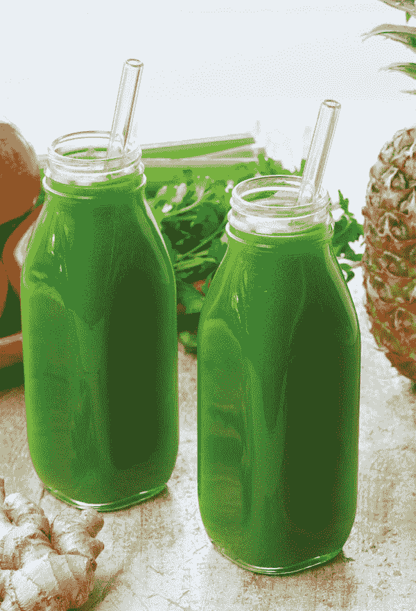

蔬果汁能让你一次获得多种强效的疗愈肝脏成分，既迅速又容易消化。最棒的一点是你可以自行调整食材，找出你最喜欢的口感与组合。或许你会意外发现自己喜欢某种从未想过的组合，例如加入蒲公英叶或樱桃萝卜！

> ###### 材料（制作 2 份）
> 
> ‧2 颗苹果
> 
> ‧2 杯切成粗丁的凤梨
> 
> ‧1 英寸姜
> 
> ‧1 把西洋芹
> 
> ‧1 杯巴西利叶
> 
> ###### 依喜好添加
> 
> ‧1 杯豆芽
> 
> ‧4 小颗樱桃萝卜
> 
> ‧1 杯蒲公英叶
> 
> ###### 作法
> 
> 1_ 将苹果、凤梨、姜、西洋芹、巴西利放进果汁机中搅拌。
> 
> 2_ 选择喜好的食材加入果汁机。打好之后立刻享用，就能获得最好的效果。将剩余的蔬果汁放入密封容器中冷藏。
> 
> ###### 小诀窍
> 
> 你也可以将所有食材放入高速果汁机中打到液化，接着用豆浆袋或纱布过滤。

###### #果汁∣茶∣高汤

##### 洛神花柠檬水

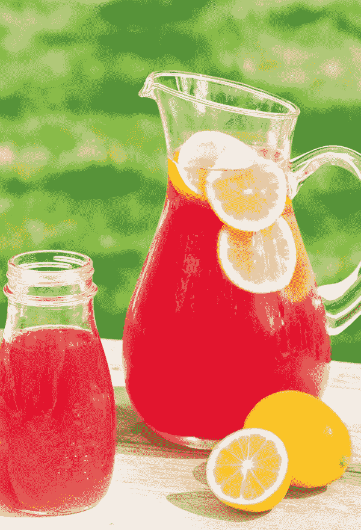

这种洛神花柠檬水不仅非常漂亮，也相当美味。聚会时，这种饮品绝对会成为大家注目的焦点，而且它非常容易制作，你随时都可以喝一些。你可以加冰块冷却，手边随时准备一些，就可以在需要的时候制作这种洛神花风味浓郁的饮品。

> ###### 材料（制作 2 份）
> 
> ‧4 杯水（分批使用）
> 
> ‧2 茶匙干燥洛神花（请见下方小诀窍说明）
> 
> ‧1/2 杯新鲜柠檬汁
> 
> ‧4 大匙生蜂蜜（请见下方小诀窍说明）
> 
> ###### 作法
> 
> 1_ 将 1 杯水用小锅煮沸。将沸水移开炉火，加入干燥的洛神花。洛神花茶至少要泡 10 分钟，接着将茶汁过滤到马克杯，放入冰箱冷藏。
> 
> 2_ 在中型的碗盆中，将剩下 3 杯水与柠檬汁、蜂蜜搅拌均匀，蜂蜜要完全溶解，形成滑顺的柠檬汁。
> 
> 3_ 洛神花茶冷却之后，拌入柠檬汁即可享用。
> 
> ###### 小诀窍
> 
> ‧买不到干燥洛神花时，也可以使用现成的洛神花茶包。使用 1 个茶包代替 1 茶匙的干燥洛神花。
> 
> ‧你也可以用枫糖浆取代蜂蜜。一开始先用 3 大匙的枫糖浆，接着调整到你想要的甜度即可。
> 
> ‧这个食谱是美丽又清爽的柠檬水，任何人都可以享用。如果你希望达到更好的疗效，最多可以加入 2 大匙的干燥洛神花，做成气味较浓郁的洛神花柠檬水。

###### #果汁∣茶∣高汤

##### 莱姆水

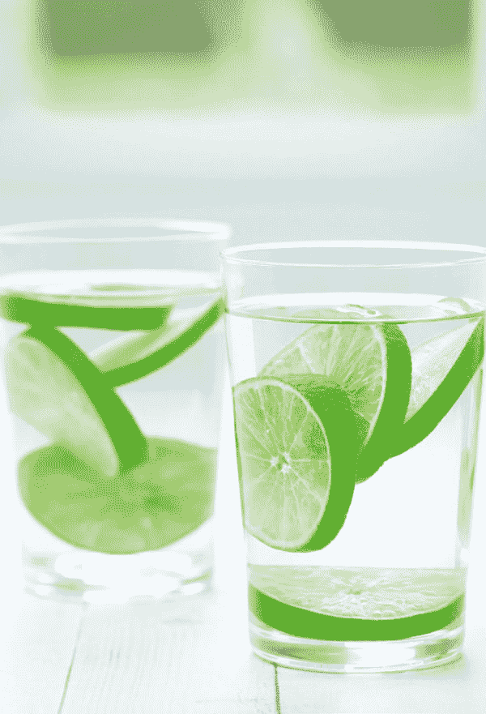

虽然这听起来很简单，但是请不要因此忽略每天都要喝莱姆水这件事。这种有效补水的饮品只需要花一点点时间制作，却可以带来许多好处，不仅能活化饮用水，它本身的风味也非常迷人！

> ###### 材料（制作 1 份）
> 
> ‧2 颗莱姆
> 
> ‧2 杯水
> 
> ###### 作法
> 
> 1_ 挤 2 颗新鲜莱姆汁到水中，即可享用。
> 
> ###### 小诀窍
> 
> 莱姆非常好携带。旅途中，你可以带上几颗莱姆，就可以随时享用这种补充水分的饮品。

###### #果汁∣茶∣高汤

##### 蔓越莓水

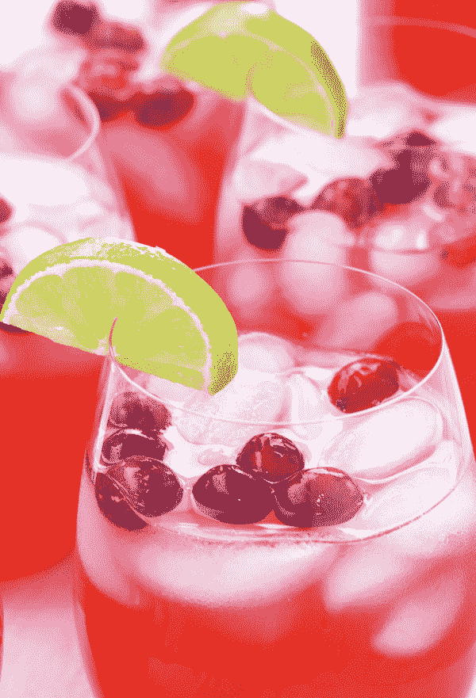

这种蔓越莓水很容易制作，风味与甜味也达到完美的平衡。这种饮料制作简便，赏心悦目，既美味又能将这些美妙的蔓越莓成分带入你的日常生活。

> ###### 材料（制作 2 份）
> 
> ‧4 杯水
> 
> ‧1 杯新鲜蔓越莓
> 
> ‧3 大匙莱姆汁
> 
> ‧2 大匙生蜂蜜
> 
> ###### 作法
> 
> 1_ 将水与蔓越莓打到充分混合为止。将打好的蔓越莓水用筛子或豆浆袋过滤到中型盆子里。
> 
> 2_ 倒入莱姆汁、生蜂蜜，搅拌均匀，待生蜂蜜完全溶解后即可享用。
> 
> ###### 小诀窍
> 
> 你也可以用冷冻蔓越莓代替新鲜蔓越莓。只要事先解冻，并使用 1/2 杯解冻过的冷冻蔓越莓即可。

###### #果汁∣茶∣高汤

##### 救肝茶

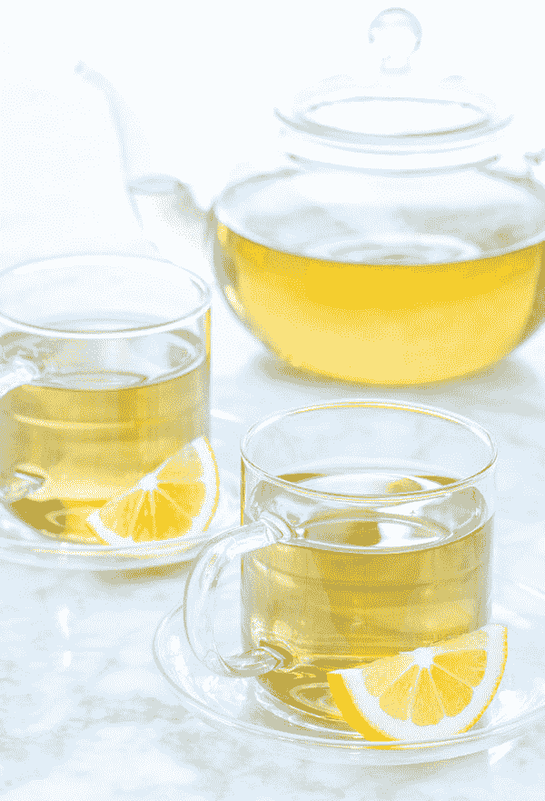

这种充满大地气息的茶味道相当浓烈，结合了牛蒡、苜蓿、蒲公英、荨麻叶的特性，质地相当温和，任何人皆可饮用。你可以调整蜂蜜的量，找出适当的甜度。早上泡完茶也可以将一些放入冰箱冷藏，在一天中随时享用热的或冰的茶。

> ###### 材料（制作 1 份）
> 
> ‧2 杯水
> 
> ‧1 茶匙干燥牛蒡根
> 
> ‧1 茶匙干燥红花苜蓿
> 
> ‧1 茶匙干燥蒲公英
> 
> ‧1 茶匙干燥荨麻叶
> 
> ‧2 茶匙生蜂蜜（依照喜好添加）
> 
> ###### 作法
> 
> 1_ 用小汤锅或水壶将水烧开。
> 
> 2_ 将水移开炉火，加入药草，并浸泡 15 分钟以上。
> 
> 3_ 过滤茶汁，倒入马克杯，再依喜好拌入生蜂蜜即可享用！
> 
> ###### 小诀窍
> 
> 买不到干燥的食材时，也可以购买现成的茶包。请使用 1 包牛蒡根、红花苜蓿、荨麻叶替代。

###### #果汁∣茶∣高汤

##### 救肝高汤

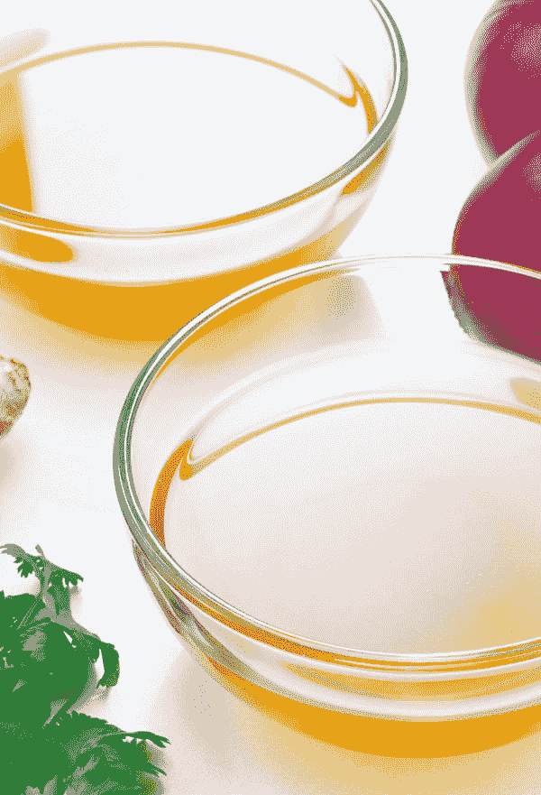

这种汤品是可以带来温暖的液态黄金，整天下来只要想喝就可以喝。有时候，你可能觉得煮高汤很费工，尤其还发现那些美丽的蔬菜最后都成了厨馀。而这道汤品结合了额外的椰子咖哩食谱，你可以再度利用煮完浓汤剩下的蔬菜，所以没有浪费任何一点食材。你可以参阅下方小诀窍的说明，或者也可以将这些食材打入汤中，制作成浓汤。

> ###### 材料（制作 2 至 4 份）
> 
> ‧1 把西洋芹，切丁
> 
> ‧6 根胡萝卜，切丁
> 
> ‧1 颗印度南瓜（例如奶油瓜），切丁
> 
> ‧2 颗黄洋葱，切丁
> 
> ‧1 英寸生姜，去皮后磨碎
> 
> ‧1 英寸姜黄，去皮后磨碎
> 
> ‧1 杯去皮切片的牛蒡根
> 
> ‧1 杯香菜
> 
> ‧6 瓣蒜头，去皮
> 
> ‧12 杯水
> 
> ###### 作法
> 
> 1_ 将所有食材放入大汤锅。
> 
> 2_ 盖上锅盖，开大火将食材煮磙，之后转为小火炖 1 至 4 小时。沥除食材后，即可在一天中随时享用这种温暖营养的汤品。
> 
> ###### 小诀窍
> 
> ‧也可以保留浓汤中的块状蔬菜，做成蔬菜浓汤享用。
> 
> ‧可以一次煮一大锅汤，之后放入冰箱冷冻，可在一周间享用。可以用冰块盘冷冻浓汤，之后即可轻易解冻。
> 
> ‧在沥除蔬菜之后，可用这些蔬菜来制作美味的咖哩汤与亲友同享。只要将锅子放回炉子上，倒入 2 杯椰奶、2 茶匙黄咖哩粉、1 大匙枫糖浆，以及 1 茶匙海盐。之后将汤煮到完全温热，食材也充分混合之后，使用手持搅拌器将部分的蔬菜打碎，变成浓稠的黄色咖哩汤即可享用。

###### #早餐

##### 救肝蔬果昔

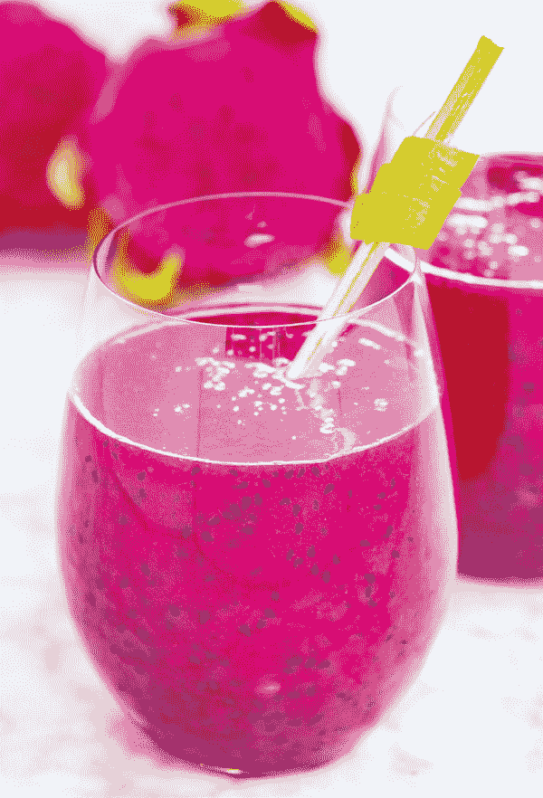

A 方案的蔬果昔做起来简单快速，是富含抗氧化物的营养品，能为肝脏带来深度疗愈的效果。B 方案的蔬果昔带有清爽的樱桃风味，同时包含蔬菜与水果。如果你之前没想过可以在蔬果昔中加入芽菜，现在正是尝试的好时机。芽菜的效果强大而温和，味道也能完全融入这种带有热带风味的滑顺饮品中。

> ###### 材料（制作 1 至 2 份）
> 
> ###### A 方案
> 
> ‧2 根香蕉或 1/2 颗黄木瓜，切丁
> 
> ‧1/2 杯新鲜或 1 小包冷冻或 2 大匙粉状的红色火龙果
> 
> ‧2 杯新鲜或冷冻的蓝莓或 2 大匙野生蓝莓粉
> 
> ‧1/2 杯水（依喜好添加）
> 
> ###### B 方案
> 
> ‧1 根香蕉或 1/4 颗黄木瓜，切丁
> 
> ‧1/2 杯新鲜或 1 小包冷冻或 2 大匙粉状的红色火龙果
> 
> ‧1 根西洋芹
> 
> ‧1/2 杯芽菜（任何种类皆可）
> 
> ‧1/2 颗莱姆
> 
> ‧1/2 杯水（依喜好添加）
> 
> ‧1 颗芒果
> 
> ###### 作法
> 
> 1_ 将所有食材倒入果汁机。
> 
> 2_ 搅拌至食材滑顺为止。你也可以缓缓倒入 1/2 杯水，以达到想要的口感。
> 
> ###### 小诀窍
> 
> ‧如果买不到火龙果及野生蓝莓，也可以改用黑莓、人工栽种的蓝莓、樱桃。
> 
> ‧可以试着在蔬果昔加入一种以上的冷冻食材，这样就能保证蔬果昔清凉爽口。

###### #早餐

##### 西瓜雪泥

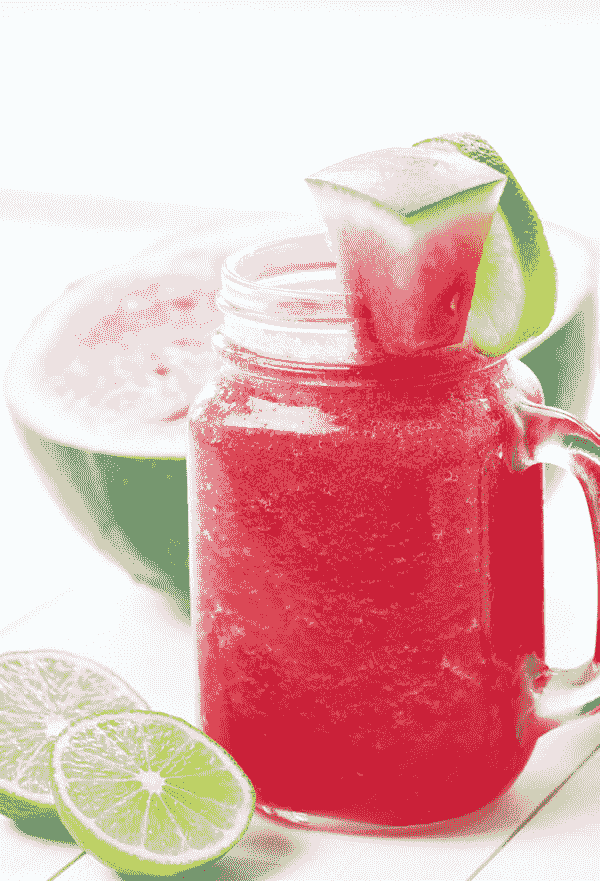

这种清凉美味的雪泥，是挥别夜晚、迎向早晨的绝佳方式。你的亲朋好友也一定会喜欢这种饮品。可以在晚上冷冻一些西瓜，起床后就能立即使用；也可以在制作前切一些西瓜放进冷冻库，冷冻两小时以上。

> ###### 材料（制作 2 份）
> 
> ‧2 杯新鲜西瓜丁
> 
> ‧2 杯冷冻西瓜丁
> 
> ‧1 颗莱姆，榨汁
> 
> ###### 作法
> 
> 1_ 将冷冻与新鲜的西瓜及莱姆汁一起放进果汁机里，打到滑顺，即可享用！
> 
> ###### 小诀窍
> 
> 如果不希望口感太冰，可以多放一点新鲜西瓜，少放一点冷冻西瓜。

###### #早餐

##### 焦糖苹果圈

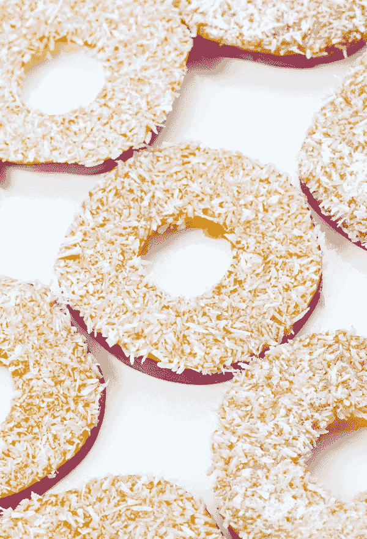

有时候，要变出简单又有趣的食物给家人吃，是相当不容易的事。这时候，可以考虑做这种焦糖苹果圈。这是老少咸宜的绝佳早餐，你可以准备不同的配料，鼓励大家自己“动手做”，用自己喜欢的食材装饰焦糖苹果圈！

> ###### 材料（制作 4 份）
> 
> ‧1 颗柠檬榨汁，分批使用
> 
> ‧3 颗红苹果
> 
> ‧1 杯帝王椰枣，去核
> 
> ‧1 英寸香草豆荚（依喜好添加）
> 
> ‧1/2 杯水
> 
> ###### 依喜好添加的配料
> 
> ‧1 杯覆盆子
> 
> ‧1/4 杯葡萄干
> 
> ‧1/4 杯桑椹干
> 
> ‧1/4 杯椰丝
> 
> ‧2 大匙生蜂蜜
> 
> ###### 作法
> 
> 1_ 在大盆子中装入冷水，并倒入一半的柠檬汁。
> 
> 2_ 把苹果转向侧边，小心地切成 1/4 英寸左右的薄片。使用饼干模或瓶盖，把中间的果核切掉。立刻把切好的苹果圈放入柠檬水中，避免苹果变成褐色。
> 
> 3_ 将椰枣、香草豆、1/2 杯水、剩下的柠檬汁混合，拌成浓稠滑顺的“焦糖”状。
> 
> 4_ 将苹果圈从水里取出，在每个苹果圈上抹上焦糖，并加上想要的配料便大功告成。
> 
> ###### 小诀窍
> 
> 如果你使用的是椰枣干，可先浸泡在温水几分钟后再使用。

###### #早餐

##### 野生蓝莓马芬小蛋糕

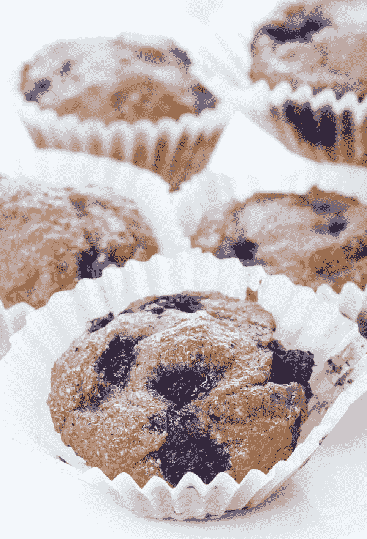

这种一口大小的蓝莓小蛋糕刚出炉时热腾腾的，相当松软，适合当早餐吃，也适合在一天的任何时刻享用，可以做为午餐的一部分，或是下午的点心。制作蛋糕的面糊用果汁机打好即可，想做的时候，就可以做起来又快又简单。

> ###### 材料（制作 16 个马芬蛋糕）
> 
> ‧1/4 杯白色奇亚籽
> 
> ‧1 杯压碎的香蕉
> 
> ‧1/2 杯无麸质燕麦粉
> 
> ‧1/2 茶匙泡打粉
> 
> ‧1/4 茶匙海盐
> 
> ‧1/4 杯枫糖浆
> 
> ‧1 大匙柠檬汁
> 
> ‧1/2 杯冷冻野生蓝莓
> 
> ###### 作法
> 
> 1_ 将烤箱预热至华氏 375 度（摄氏 190 度）。
> 
> 2_ 将白色奇亚籽放进果汁机里，高速打到呈细粉末状。
> 
> 3_ 将压碎的香蕉、燕麦粉、泡打粉、海盐、枫糖浆、柠檬汁倒入果汁机，打到完全混合成柔滑的面糊为止。
> 
> 4_ 将面糊倒入调理盆中，拌入冷冻的野生蓝莓。
> 
> 5_ 在迷你马芬烤盘的 16 个洞中，各放入 1 张烘焙纸，以及 1 大匙面糊。
> 
> 6_ 将迷你马芬烤盘放入烤箱烤 20 分钟，直到马芬蛋糕顶端呈金黄色为止。之后，插入 1 根牙签，确认拔出来时没有面糊黏着。把马芬蛋糕从烤盘中取出，放凉之后即可享用。在放凉的过程中，蛋糕内部会慢慢变硬。
> 
> ###### 小诀窍
> 
> 请注意，务必使用不含铝的泡打粉。你可以在超市、天然有机食品店的天然食品区买到，也可以上网订购。

###### #早餐

##### 鹰嘴豆咸派

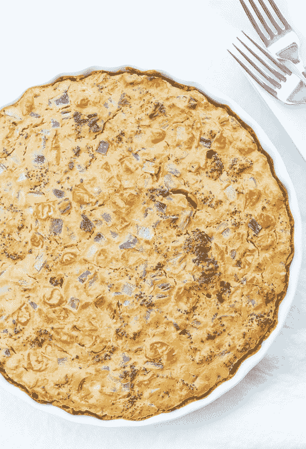

这种鹰嘴豆咸派携带方便，放在冰箱冷藏保存也相当容易。你可以在星期天的时候制作、保存，在周间就可以烤来当早餐或午餐吃。咸派本身就相当美味，上面如果再加上香料番茄酱，例如纸本书第 550 页的普罗旺斯炖菜番茄酱，就更美味了！

> ###### 材料（制作 6 至 8 份）
> 
> ‧4 杯切成小块的绿色花椰菜
> 
> ‧4 杯切对半的小番茄
> 
> ‧4 杯紫洋葱丁
> 
> ‧8 瓣带皮蒜头
> 
> ‧2 杯水
> 
> ‧3 杯鹰嘴豆粉
> 
> ‧4 大匙新鲜柠檬汁
> 
> ‧2 茶匙家禽调味香料粉
> 
> ‧2 茶匙海盐
> 
> ###### 作法
> 
> 1_ 将烤箱预热至华氏 400 度（摄氏 200 度）。
> 
> 2_ 在 2 个烤盘铺上烘焙纸，放上绿色花椰菜、番茄、红洋葱、蒜头，烤 15 至 20 分钟，直到食材变软为止。
> 
> 3_ 剥除蒜头的皮（请小心不要烫到手指！），并将这些食材与水、鹰嘴豆粉、柠檬汁、家禽调味香料粉、海盐放入果汁机，打成滑顺的面糊。
> 
> 4_ 将面糊倒入大型搅拌盆中，再加入烤好的蔬菜拌匀。
> 
> 5_ 搅拌均匀之后，倒入咸派烤盘或铺了烘焙纸的烤盘中。或者，你也可以在标准的 12 个马芬蛋糕烤盘上，分别放入杯状的烘焙纸，并倒入面糊，做成迷你咸派。
> 
> 6_ 烘烤 30 至 35 分钟，在烤到一半时打开烤箱让水蒸气散出来。在咸派表面呈金黄色时，用牙签戳入中央处，确认拔出后没有面糊残留。
> 
> 7_ 从烤箱当中取出咸派，冷却后即可享用。
> 
> ###### 小诀窍
> 
> 咸派相当容易冷冻保存，所以你可以一次做 2 个，1 个冰起来，随时都能拿出来吃。记得在冷冻前要先撕下烘焙纸。

###### #午餐

##### 救肝沙拉

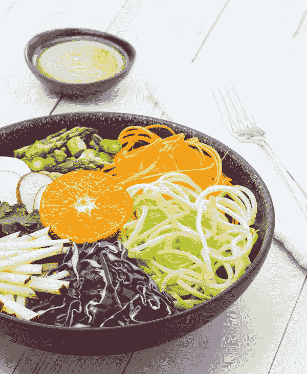

这两种沙拉充满为肝脏带来疗愈的成分，是你想要吃轻食时的绝佳选择。它也是搭配熟食的良伴，非常适合搭配“救肝三：六：九”里的蒸蔬菜。你可以自行选择前一章提过的肝脏疗愈食物，这样就不会吃腻。如果你尝试了不含脂肪的柳橙“油醋”淋酱，这绝对会成为你厨房里的必备品，充满浓郁的香味与甜味，可说是人见人爱。

> ###### 材料（制作 1 至 2 份）
> 
> ###### A 方案
> 
> ‧3 杯切碎的番茄
> 
> ‧1 根小黄瓜，切丝
> 
> ‧1 杯切碎的西洋芹
> 
> ‧1 杯切碎的香菜（依喜好添加）
> 
> ‧1/2 杯切碎的巴西利（依喜好添加）
> 
> ‧1/2 杯切碎的青葱（依喜好添加）
> 
> ‧8 杯各种绿色叶菜类（菠菜、芝麻菜、奶油莴苣等）
> 
> ‧1 颗柠檬、莱姆或柳橙榨汁
> 
> ###### B 方案
> 
> ‧2 杯紫色高丽菜丝
> 
> ‧1 杯胡萝卜丁
> 
> ‧1 杯芦笋，切小段
> 
> ‧1 杯樱桃萝卜丁
> 
> ‧2 杯苹果丁
> 
> ‧1/2 杯切碎的香菜
> 
> ‧8 杯各种绿色叶菜类（菠菜、芝麻菜、奶油莴苣等）
> 
> ‧1 颗柠檬、莱姆或柳橙榨汁
> 
> ###### 依喜好添加的柳橙“油醋”淋酱
> 
> ‧1 杯柳橙汁
> 
> ‧1 瓣大蒜
> 
> ‧1 大匙生蜂蜜
> 
> ‧1/4 杯水
> 
> ‧1/8 茶匙海盐（依喜好添加）
> 
> ‧1/8 茶匙卡宴辣椒（依喜好添加）
> 
> ###### 作法
> 
> 1_ 将你喜欢的沙拉蔬菜与绿色叶菜放入碗中拌匀，做为沙拉的基底。
> 
> 2_ 在沙拉上方洒些柠檬、莱姆或柳橙汁，以增添风味。或者，也可以使用柳橙汁“油醋”淋酱，也就是把上方淋酱的食材搅拌至光滑均匀即可。
> 
> 3_ 在沙拉上方直接淋下柑橘类果汁，或是柳橙“油醋”淋酱，并搅拌均匀。
> 
> 4_ 如果你要和其他人分享沙拉，或是想留一些之后再吃，可以把沙拉分成 2 碗再享用！

###### #午餐

##### 黄咖哩面两吃

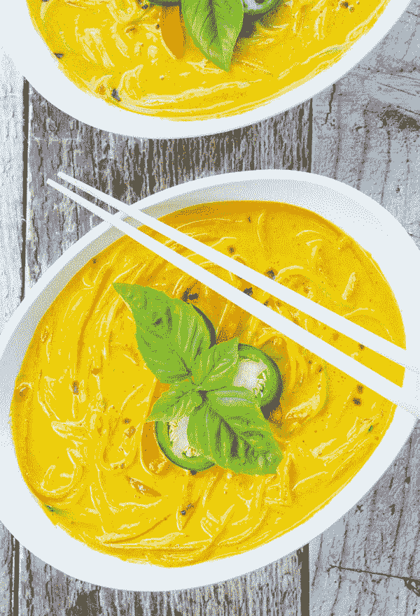

近年来，最棒的食谱都是那些可以客制化、符合每个人需求的食谱。这些咖哩面可以生吃，也能煮熟后再吃，不含脂肪或椰奶。无论你选择如何制作，这道菜都相当简单美味。这也是你在为别人备餐时，可以因应不同需求调整的绝佳餐点。

> ###### 材料（制作 2 份）
> 
> ‧2 条栉瓜，削皮后备用
> 
> ‧1 根胡萝卜
> 
> ‧1 颗红色甜椒，切成细丝
> 
> ‧1/4 颗洋葱，切成细丝
> 
> ‧3 杯海藻面
> 
> ‧1 又 1/2 杯椰奶（依照喜好添加）
> 
> ‧1/2 茶匙海盐（依照喜好添加）
> 
> ‧1 颗莱姆
> 
> ‧1/4 杯罗勒
> 
> ‧1/4 杯香菜
> 
> ###### 黄咖哩酱
> 
> ‧3 杯栉瓜丁
> 
> ‧4 颗帝王椰枣，去核
> 
> ‧1 瓣蒜头
> 
> ‧1/2 杯香菜叶
> 
> ‧2 大匙莱姆汁
> 
> ‧2 大匙椰子氨基酱油（依照喜好添加，请见小诀窍）
> 
> ‧1/2 大匙切碎的熟墨西哥辣椒
> 
> ‧1/2 茶匙咖哩粉
> 
> ###### 作法
> 
> 1_ 使用普通的刨丝器或螺旋刨丝器，将栉瓜与胡萝卜做成“面条”状。将这些面条放入大碗，加入红色甜椒、洋葱、海藻面。
> 
> 2_ 将黄咖哩酱的所有食材放入果汁机，打到质地滑顺且微温为止。
> 
> 3_ 如果想吃生的咖哩面，请将做好的黄咖哩酱倒在蔬菜及海藻面上，充分拌匀即可。
> 
> 4_ 如果想吃熟的咖哩面，请将黄咖哩酱、准备好的蔬菜与海藻面、椰奶、海盐放入大锅中，用中火加热 10 至 15 分钟，直到蔬菜面条变软，与酱汁充分混合即可。
> 
> 5_ 在黄咖哩面上放一些罗勒、香菜，并挤上新鲜莱姆汁，即可享用。
> 
> ###### 小诀窍
> 
> 许多天然食品店与网络商店都会贩售椰子氨基酱油，你也可以选择不加这种调味料，改加 1/3 杯切碎的红藻，或是 1/4 茶匙海盐。

###### #午餐

##### 地瓜黑豆沙拉佐辣味莱姆“油醋”

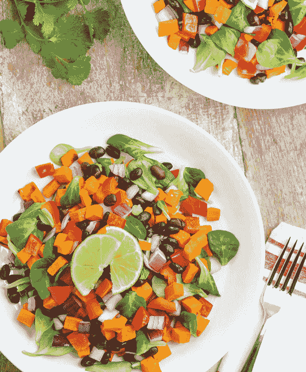

这种丰富的沙拉充满了香菜、莱姆、自行添加的墨西哥辣椒风味，且容易保存，冷藏即可。你可以一次制作两份，在一周中的任何时候都可享用。也可以把这种沙拉装进莴苣做成的杯子里，变成无麸质、无玉米的墨西哥卷饼。

> ###### 材料（制作 2 至 4 份）
> 
> ‧2 颗地瓜，切丁
> 
> ‧6 瓣蒜头，免剥皮
> 
> ‧1/2 颗红洋葱，切末
> 
> ‧1 颗红色甜椒，切丁
> 
> ‧2 杯煮熟的黑豆
> 
> ‧1/4 杯切碎的香菜
> 
> ‧8 杯绿色叶菜类（依喜好添加）
> 
> ‧盐少许
> 
> ###### 辣味莱姆“油醋”
> 
> ‧1/2 杯香菜叶
> 
> ‧2 大匙莱姆汁
> 
> ‧2 大匙生蜂蜜
> 
> ‧1/4 茶匙海盐
> 
> ‧2 瓣蒜头
> 
> ‧1/2 条熟墨西哥辣椒（依喜好添加）
> 
> ‧1/2 杯水
> 
> ###### 作法
> 
> 1_ 将烤箱预热至华氏 425 度（摄氏 220 度）。
> 
> 2_ 在烤盘上铺好烘焙纸，将地瓜、蒜头放到纸上铺平，送入烤箱烘烤。
> 
> 3_ 将地瓜与蒜头烤 20 至 30 分钟，直到地瓜可以用叉子刺穿为止。
> 
> 4_ 将烤好的蒜头剥皮切成细末（请注意不要烫到手指）。
> 
> 5_ 将烤好的地瓜、红洋葱、红色甜椒、烤好的蒜末、黑豆放入调理盆中拌匀。
> 
> 6_ 要制作辣味莱姆“油醋”，请将所有“油醋”材料放入果汁机中，打到呈滑顺的酱汁状即可。
> 
> 7_ 这种沙拉可以做成冷沙拉，也可以做成温沙拉。在享用前，淋一些辣味莱姆“油醋”在地瓜黑豆沙拉上，并放上碎香菜叶做为装饰即可完成。如果你想要，还可以加上少许海盐。
> 
> ###### 小诀窍
> 
> 你最好先尝一口墨西哥辣椒，看看辣度如何再使用。如果你要做辣一点的淋酱，可以加入较大块的墨西哥辣椒。如果希望油醋的味道偏清淡，那么请将墨西哥辣椒切小块一点，甚至先去除当中的籽，也就是辣味最浓厚的地方。如果你买不到成熟的红色墨西哥辣椒，可以改用其他种类的成熟红辣椒。

###### #午餐

##### 烤鹰嘴豆饼佐薄荷中东芝麻酱

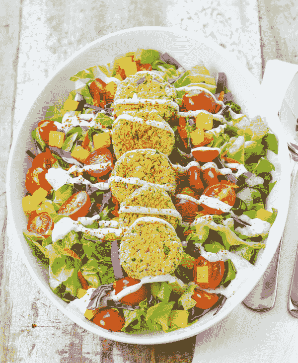

这道食谱能满足大胃王的胃口。柔软的烤鹰嘴豆饼包在莴苣叶里，加上各色蔬菜，接着淋上风味繁复的薄荷中东芝麻酱。如果你不喜欢薄荷，可以用其他香料植物代替，例如罗勒、香菜、巴西利、龙蒿等。

> ###### 材料（制作 2 至 4 份）
> 
> ‧3 杯煮熟的鹰嘴豆
> 
> ‧1 杯紫洋葱丝
> 
> ‧4 瓣蒜头
> 
> ‧1/2 杯巴西利叶
> 
> ‧1/2 杯香菜叶
> 
> ‧1/2 茶匙海盐
> 
> ‧2 茶匙小茴香
> 
> ‧2 颗奶油莴苣（依喜好添加，请见小诀窍）
> 
> ###### 依喜好添加的配料
> 
> ‧1/2 条小黄瓜，切丝
> 
> ‧1/2 杯对切的小番茄
> 
> ‧1/2 杯紫色高丽菜丝
> 
> ‧1/2 杯胡萝卜丝
> 
> ###### 薄荷中东芝麻酱
> 
> ‧1 杯栉瓜丁
> 
> ‧1/2 颗帝王椰枣，去核
> 
> ‧2 瓣蒜头
> 
> ‧2 大匙中东芝麻酱
> 
> ‧2 大匙柠檬汁
> 
> ‧2 大匙新鲜莳萝
> 
> ‧2 大匙新鲜薄荷
> 
> ‧1/4 茶匙海盐
> 
> ‧1/2 杯水
> 
> ###### 作法
> 
> 1_ 将烤箱预热至华氏 350 度（摄氏 180 度）。
> 
> 2_ 将一半的鹰嘴豆放入食物处理机的下层，接着加入切丁的洋葱、蒜头、巴西利、香菜、海盐。在上层放入剩余一半的鹰嘴豆。将所有食材放入调理机中，直到搅拌均匀为止。
> 
> 3_ 在两个烤盘上铺好烘焙纸。用 1 大匙的量匙挖出拌好的鹰嘴豆泥，捏成球状，放在烤盘上，两两之间相距 2 英寸，再缓缓地将球压平成为圆饼状。
> 
> 4_ 将鹰嘴豆饼放入烤箱中烤 35 至 40 分钟，直到表面呈金黄色且外皮变脆，内部仍然维持柔软的状态为止。取出时要小心！
> 
> 5_ 要制作薄荷中东芝麻酱，请将所有酱料的食材打到均匀混合且变滑顺为止。
> 
> 6_ 将鹰嘴豆饼放在奶油莴苣沙拉上，或是单独的奶油莴苣杯中，再加上沙拉配料及薄荷中东芝麻酱便大功告成。
> 
> ###### 小诀窍
> 
> ‧这些鹰嘴豆饼也可以放在无麸质、不含玉米的墨西哥卷饼中享用。
> 
> ‧如果你希望这道食谱完全不含脂肪，那么请不要加上薄荷中东芝麻酱，可以改在鹰嘴豆饼上方淋一些纸本书第 541 页的辣味莱姆“油醋”。

###### #午餐

##### 日本南瓜浓汤

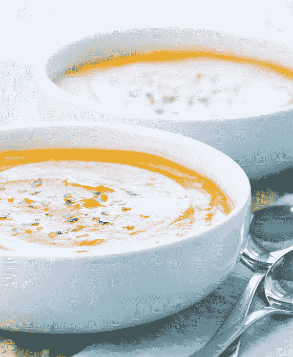

喝这种浓汤就像在碗里给你一个温暖的拥抱，它滑顺浓郁的口感会带来相当多慰藉。日本南瓜营养浓郁的风味，和蒜头、洋葱、咖哩完美结合。这种汤很适合事先做一些起来冷冻，想要喝的时候，立刻就可以加热来喝。

> ###### 材料（制作 2 至 4 份）
> 
> ‧1 颗中型日本南瓜（请见小诀窍）
> 
> ‧3 杯蔬菜高汤（请见小诀窍）
> 
> ‧1 杯洋葱丁
> 
> ‧4 瓣蒜头，切末
> 
> ‧1 茶匙咖哩粉
> 
> ‧1/2 茶匙海盐
> 
> ‧1/2 颗莱姆榨汁
> 
> ‧1/4 茶匙红椒片（依喜好添加）
> 
> ###### 作法
> 
> 1_ 在大汤锅里装水，煮到沸腾，并将整颗日本南瓜连蒂头一起放入水中，煮 10 分钟，中途必须翻面一次。小心地将南瓜取出后，放在一旁冷却备用。
> 
> 2_ 在南瓜冷却到不会烫手后，剥去南瓜皮，对半剖开来，去籽。将南瓜切成丁状，应该有 4 杯左右的量。
> 
> 3_ 将日本南瓜丁与蔬菜高汤、洋葱丁、蒜瓣、咖哩粉、海盐、莱姆汁一起放入汤锅，将高汤煮磙后，转小火继续煮，过程必须持续搅拌。
> 
> 4_ 持续以小火煮 15 至 20 分钟，直到南瓜变软熟透。
> 
> 5_ 将煮好的汤与料倒入果汁机，打到完全滑顺为止。一开始先用低速拌打，以利蒸气从果汁机顶端散出。
> 
> 6_ 请趁热享用，若有需要，还可以撒上一些红椒片。
> 
> ###### 小诀窍
> 
> ‧你可以使用纸本书第 524 页的“救肝高汤”食谱制作自己的高汤。或者，你也可以购买现成的低钠蔬菜高汤（请务必确认里面不含菜籽油、柠檬酸、天然香料或其他可疑成分），或是用 1 品脱的水来替代。
> 
> ‧如果你住的地方买不到日本南瓜，可以用印度南瓜、橡实瓜，甚至是地瓜取代。要用其他种类的瓜果取代时，总共需要 6 杯切丁的量。

###### #晚餐

##### 扁豆墨西哥塔可饼

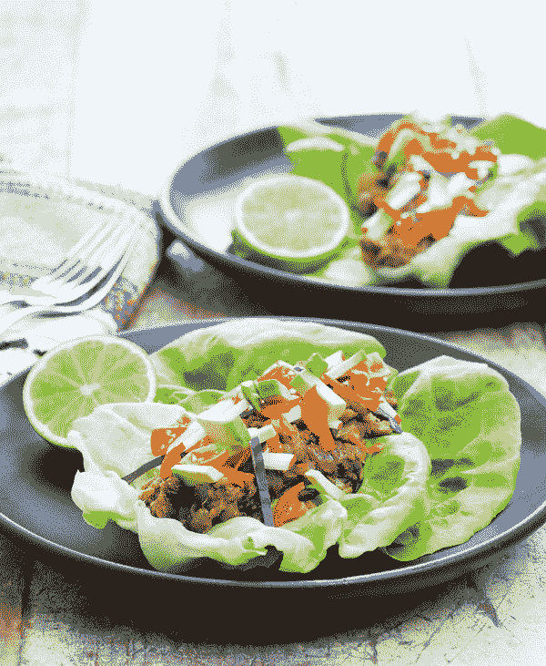

谁不喜欢墨西哥塔可饼？罗曼莴苣盛装着扁豆内馅的塔可饼，冷热皆宜，你可以依自己的偏好享用。如果你希望吃点比较健康的东西，可以使用无麸质且不含玉米的塔可饼来取代传统饼皮。此外，这道食谱也很适合搭配纸本书第 541 页的辣味莱姆“油醋”，或是纸本书第 543 页的薄荷中东芝麻酱。

> ###### 材料（制作 2 至 4 份）
> 
> ‧1 杯洋葱丁
> 
> ‧1/2 杯蔬菜高汤（请见小诀窍）
> 
> ‧1 杯蘑菇丁（依喜好添加）
> 
> ‧4 瓣蒜头，切末
> 
> ‧3 杯煮熟的扁豆（请见小诀窍）
> 
> ‧1 茶匙家禽调味香料粉
> 
> ‧1/2 茶匙辣椒粉
> 
> ‧1 茶匙小茴香
> 
> ‧1/2 茶匙红椒粉
> 
> ‧1/2 茶匙奇波雷烟熏辣椒粉
> 
> ‧1/4 茶匙蜂蜜或枫糖浆（依喜好添加）
> 
> ‧1/2 茶匙海盐
> 
> ‧1/4 茶匙卡宴辣椒（依喜好添加）
> 
> ‧2 颗罗曼莴苣或奶油莴苣
> 
> ###### 依喜好添加的配料
> 
> ‧1 杯小番茄，切成长条状
> 
> ‧1 颗酪梨，切丁
> 
> ‧1/2 杯切碎的香菜
> 
> ‧1/2 杯樱桃萝卜丝
> 
> ‧1/2 杯紫色高丽菜丝
> 
> ‧1/2 杯胡萝卜丝
> 
> ‧3 颗莱姆，切对半
> 
> ‧1 根熟的墨西哥辣椒，切细丝
> 
> ###### 作法
> 
> 1_ 开中大火，用 2 大匙的蔬菜高汤将洋葱炒到变软。需要的时候可持续加入高汤，避免沾锅。
> 
> 2_ 将蘑菇、蒜头、扁豆、家禽调味香料粉、小茴香、红椒粉、奇波雷烟熏辣椒粉、蜂蜜、海盐加入炒锅中。如果希望味道更辣，可以再加入卡宴辣椒。
> 
> 3_ 持续用中大火煮 5 分钟，或是煮到洋葱变软且熟透为止。
> 
> 4_ 接着，将炒好的扁豆馅料装入罗曼莴苣叶做的“塔可饼皮”里，再加上任何你想要的配料即可完成。
> 
> ###### 小诀窍
> 
> ‧这道食谱可使用纸本书第 524 页的“救肝高汤”，或是现成的高汤。和前面的食谱一样，购买时要确认高汤不含菜籽油、柠檬酸、天然香料或其他可疑的添加物。如果无法取得蔬菜高汤，也可以用水代替。
> 
> ‧这道食谱中，最适合使用褐色或绿色的扁豆。请根据包装上的说明，事先准备 1 杯干扁豆。

###### #晚餐

##### 白花椰寿司佐泰式辣酱

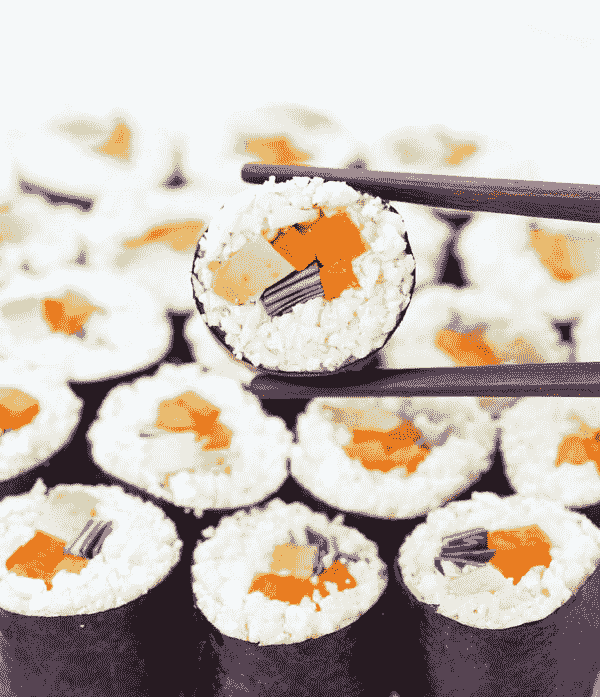

这道菜使用生或熟的白花椰米皆可。想到要自己做寿司卷，你可能会感到害怕，但实际上意外地简单。即使做得不漂亮，吃起来还是相当美味！可以包在寿司里的食材相当多，你可以试着加入新鲜的香草植物，像是薄荷、罗勒、香菜，增加清新的风味，或是加入其他有助于肝脏疗愈的食材，例如樱桃萝卜、芦笋、芽菜等。你甚至可以加入一些煮熟的蔬菜，如地瓜或其他瓜类。

> ###### 材料（制作 2 份）
> 
> ‧1/2 颗白花椰菜
> 
> ‧6 大张寿司海苔
> 
> ###### 依喜好添加的配料
> 
> ‧1 根小黄瓜，切成细长条
> 
> ‧1 根胡萝卜，切成细长条
> 
> ‧1 颗红色甜椒，切成细长条
> 
> ‧1 杯紫色高丽菜丝
> 
> ‧1 颗酪梨，切成细长条
> 
> ‧1/2 杯水
> 
> ###### 泰式辣酱
> 
> ‧1 杯小番茄
> 
> ‧1 杯冷水或现榨柳橙汁
> 
> ‧1/4 杯日晒番茄干
> 
> ‧1 瓣蒜头
> 
> ‧2 大匙柠檬汁
> 
> ‧2 大匙蜂蜜
> 
> ‧1/4 茶匙红椒片
> 
> ‧1 大匙切碎的泰式红辣椒或熟的墨西哥辣椒
> 
> ###### 作法
> 
> 1_ 将白花椰菜切成多朵小花（约有 6 杯的量）。将小花放入食物调理机，压成接近米粒的质地。将白花椰米装入中型调理盆中，搁置备用。
> 
> 2_ 如果你比较喜欢吃煮熟的白花椰米，请开中火将处理好的白花椰米放在平底锅，拌炒 5 至 7 分钟，直到软化为止。你不需要在锅中加水或加油，因为白花椰菜本身就会出水，不会沾锅。在白花椰米变软后，装入中型调理盆，置于一旁，冷却备用。
> 
> 3_ 将寿司海苔放在砧板上。舀起 3/4 杯的白花椰米放在靠近自己的一端，摊开来覆盖住海苔的下半部。
> 
> 4_ 在白花椰米中央，摆上你想要的蔬菜馅。小心地卷起靠近自己一端的海苔，开始向上卷紧。
> 
> 5_ 在卷完之前，用手指头沾水或柳橙汁，抹在海苔最上方的边缘处，这样卷好时海苔就会黏住。请用锋利的刀子分切海苔卷，切成厚度相同的圆片。
> 
> 6_ 要制作泰式辣酱，请加入新鲜番茄、水、日晒番茄干、蒜头、柠檬汁、蜂蜜、红椒片，以及视你需要的辣度，加入最多 1 大匙的泰式红辣椒末或墨西哥辣椒，拌匀即可完成。

###### #晚餐

##### 普罗旺斯炖菜

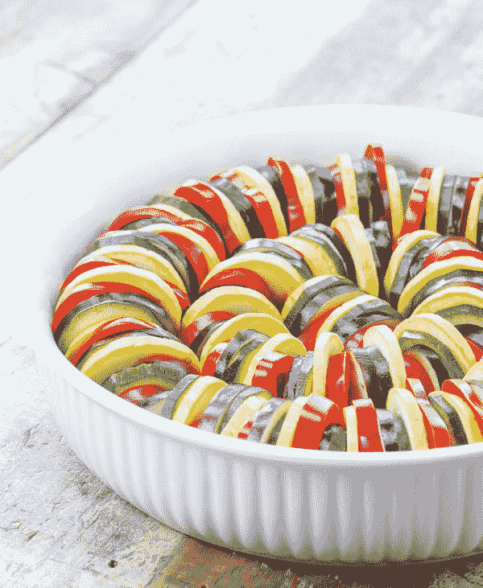

普罗旺斯炖菜可说是急中生智的菜色。在夏末时节，花园中的栉瓜、南瓜、茄子、番茄会大量结果，让人不知如何是好。这道食谱就运用了这些夏末蔬菜，做成了能带来慰藉的乡村风味菜肴，同时也方便冷冻保存，留待秋天享用。你可以运用当地盛产的蔬菜，发明属于自己的普罗旺斯炖菜。

> ###### 材料（制作 4 份）
> 
> ‧1 大条栉瓜
> 
> ‧1 大条黄色栉瓜
> 
> ‧1 条茄子
> 
> ‧1 颗红色甜椒
> 
> ‧4 杯煮熟的藜麦（依喜好添加）
> 
> ###### 番茄酱
> 
> ‧4 颗番茄，切成粗丁
> 
> ‧1 颗黄色洋葱，切成粗丁
> 
> ‧4 瓣蒜头，切末
> 
> ‧2 大匙番茄泥（请见小诀窍）
> 
> ‧1/2 茶匙海盐
> 
> ‧1/2 茶匙干燥巴西利
> 
> ‧1/2 茶匙家禽调味香料粉
> 
> ‧1/8 茶匙咖哩粉
> 
> ###### 作法
> 
> 1_ 将烤箱预热至华氏 375 度（摄氏 190 度）。
> 
> 2_ 将栉瓜、黄瓜、茄子、红椒切成薄圆片，放在一旁备用。
> 
> 3_ 制作番茄酱。用一口小锅，以高温混合酱料，过程需不时翻动，煮 2 至 3 分钟，直到番茄出汁为止。
> 
> 4_ 转为小火焖煮 15 至 20 分钟，并不时搅拌，直到番茄分解为止。使用手持搅拌器，将番茄打成仍有块状番茄的番茄煳。或者，你也可以用果汁机进行调理，打开上盖让蒸气散出。
> 
> 5_ 在烤盘底部倒入 1 杯番茄酱，并均匀抹在底部。接着，放上栉瓜、黄瓜、茄子、红椒薄片，可以用相同的间隔排列。在烤盆上覆盖 1 层烘焙纸，接着放入烤箱烤 45 至 60 分钟，直到蔬菜变软为止。
> 
> 6_ 最后，在炖菜表面淋上 1 匙酱即可享用。如果你想要的话，可以再撒上一些藜麦。
> 
> ###### 小诀窍
> 
> ‧这种番茄酱可以用冷冻的方式保存，便于在任何一餐迅速取用。
> 
> ‧如果你使用市售的现成番茄酱，请特别留意不要含有柠檬酸的成分。
> 
> ‧简易版作法如下：将栉瓜、黄瓜、茄子、彩椒大致切丁，用番茄酱拌匀后，放入烤盘烤 40 至 60 分钟，直到所有蔬菜都变软即可。

###### #晚餐

##### 马铃薯饼佐小黄瓜樱桃萝卜沙拉

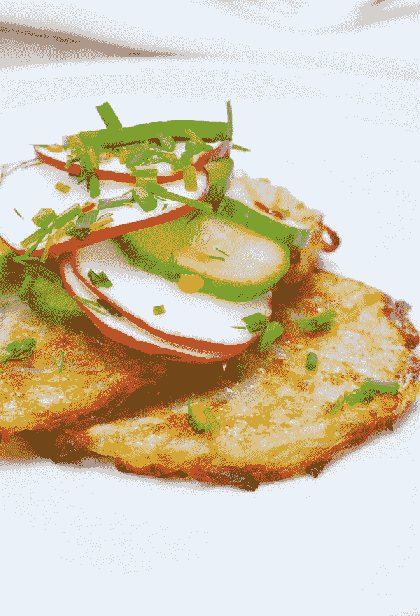

这些马铃薯煎饼刚从烤箱出炉时爽脆可口，能带给你饱足感，上头再加上爽口又清新的小黄瓜樱桃萝卜沙拉，让菜肴更加美味。你可以在煎饼加上不同的配料。如果你家里有孩子是大胃王，或许可以考虑在马铃薯煎饼上加一些酪梨或黑豆！

> ###### 材料（制作 2 份）
> 
> ‧2 大颗褐皮马铃薯，削皮刨丝
> 
> ‧1 大匙葛粉
> 
> ‧1/2 茶匙海盐，分批使用
> 
> ‧1 根小黄瓜，切薄片
> 
> ‧6 颗樱桃萝卜，切薄片
> 
> ‧2 茶匙生蜂蜜
> 
> ‧1 大匙柠檬汁
> 
> ‧1 大匙莳萝，切碎
> 
> ‧1/4 杯切碎的虾夷葱
> 
> ‧1/4 茶匙红椒（依喜好添加）
> 
> ###### 作法
> 
> 1_ 将烤箱预热至华氏 425 度（摄氏 220 度）。
> 
> 2_ 将马铃薯丝、葛粉、1/4 茶匙的海盐放入调理盆中拌匀。
> 
> 3_ 在 2 个烤盘上铺上烘焙纸。将 1/4 杯的马铃薯放在烤盘纸上，调整成直径约 3 英寸的圆饼，用手或蛋糕模塑型，再将它压成约 1/4 英寸厚。
> 
> 4_ 将马铃薯饼送入烤箱烤 20 分钟。从烤盘取出后，小心地抓住烘焙纸的边缘，连同薯饼一起翻面。需要的话，可以仔细地把黏在烤盘纸上的马铃薯剥下来，并且小心地放在没有铺纸的金属烤盘上，再烤 5 分钟。
> 
> 4_ 烤马铃薯饼的时候，即可制作小黄瓜樱桃萝卜沙拉。将切片的小黄瓜及樱桃萝卜、蜂蜜、柠檬汁、莳萝、虾夷葱、剩下的 1/4 茶匙海盐、红椒放在调理盆中抓匀。
> 
> 5_ 趁热食用马铃薯饼，并在薯饼上方铺上小黄瓜樱桃萝卜沙拉。

###### #晚餐

##### 烤蔬菜意大利面

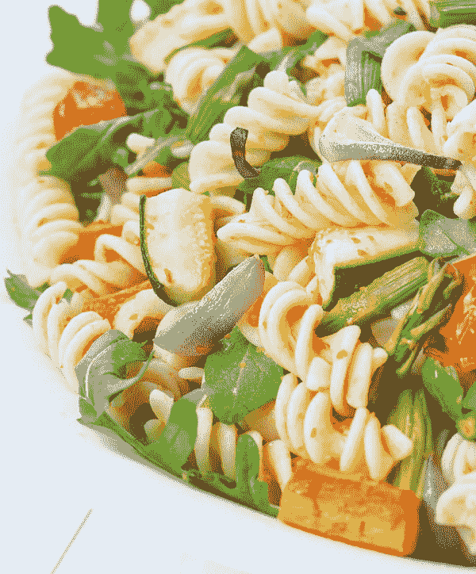

这道彩色的意大利面上有许多烤软的蔬菜，淋上番茄酱之后，整道菜肴显得更加顺口与美味。这是非常适合朋友家人聚会时制作的菜肴，也非常适合采用不同饮食法的人享用。如果你拿这道菜请客，可以在他们个人盘子内的部分淋上橄榄油，这样他们就不会觉得少一味了！

> ###### 材料（制作 4 份）
> 
> ‧3 杯小番茄
> 
> ‧1 杯紫洋葱丝
> 
> ‧1 杯栉瓜丁
> 
> ‧1 杯胡萝卜丁
> 
> ‧1 杯切小段的芦笋
> 
> ‧10 瓣蒜头，不需去皮
> 
> ‧1/2 茶匙柠檬汁
> 
> ‧1/4 茶匙海盐
> 
> ‧1/4 茶匙红椒片（依喜好添加）
> 
> ‧12 盎司无麸质意大利面（请见小诀窍）
> 
> ‧4 杯芝麻菜（依喜好添加）
> 
> ‧额外的海盐、红藻或黑胡椒少许
> 
> ###### 作法
> 
> 1_ 将烤箱预热至华氏 400 度（摄氏 200 度）。
> 
> 2_ 在烤盘上铺上烘焙纸，放上番茄、红洋葱、栉瓜、胡萝卜、芦笋、蒜头，烤 15 至 20 分钟，直到变软为止。
> 
> 3_ 将烤好的蒜头去皮（请小心不要烫伤），并将其中 4 瓣放入果汁机，再加入 1 杯烤好的小番茄、柠檬汁、海盐、额外的红椒片，打到呈滑顺的番茄酱即可。
> 
> 4_ 将 12 盎司的无麸质意大利面依包装指示煮熟沥干后，放入调理盆中。
> 
> 5_ 在意大利面上拌入番茄酱，份量应该足够让所有面条都裹上一层薄薄的酱汁。接着，加入烤好的番茄、红洋葱、栉瓜、芦笋、蒜头拌匀。
> 
> 6_ 如果你想要的话，可以先铺上一层芝麻菜，再放上意大利面，并加上少许的海盐、红藻及黑胡椒。
> 
> ###### 小诀窍
> 
> ‧请购买由米、藜麦、豆子、扁豆制成的无麸质意大利面。请不要购买含有玉米成分的意大利面。
> 
> ‧虽然这种意大利面已经裹上一层薄薄的番茄酱调味，如果你希望能加上更多番茄酱，可以参考纸本书第 550 页普罗旺斯炖菜食谱中的番茄酱配方。

###### #点心

##### 苹果凤梨脆片佐辣味芒果莎莎酱

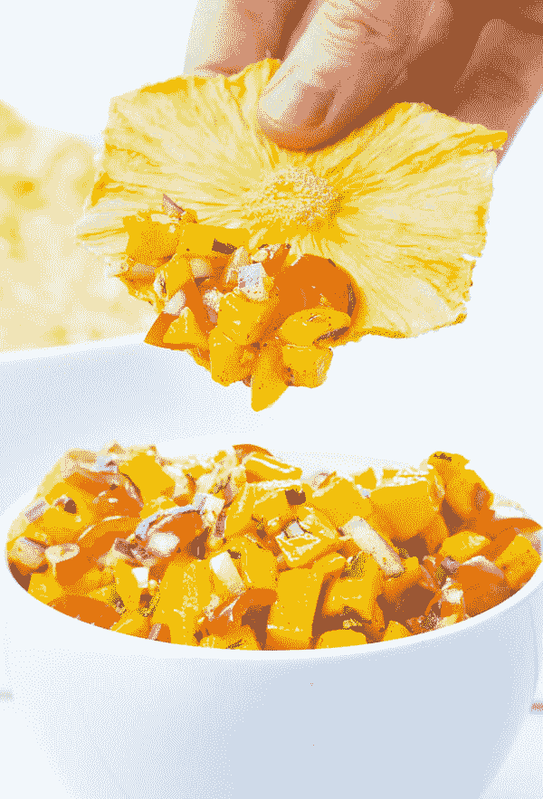

脆片搭配莎莎酱是再经典不过的点心了。不过，这个版本使用了水果脆片加风味浓郁的芒果莎莎酱，成了独一无二的组合。这份食谱会教你制作烤苹果脆片及烘干的生凤梨片，两种都相当美味。

> ###### 材料（制作 2 份）
> 
> ‧4 颗红苹果或 1 颗凤梨
> 
> ‧2 杯芒果丁
> 
> ‧1/2 杯红椒丁
> 
> ‧1/4 杯紫洋葱丁
> 
> ‧1/4 杯切细末的香菜
> 
> ‧1/4 杯切碎的巴西利
> 
> ‧2 大匙莱姆汁
> 
> ‧1 瓣蒜头，切末
> 
> ‧1/2 茶匙辣椒粉
> 
> ‧1/2 大匙红墨西哥辣椒，切末（依喜好添加）
> 
> ###### 作法
> 
> 1_ 制作苹果脆片：将烤箱预热至华氏 200 度（摄氏 95 度）。将苹果切成厚度不超过 1/4 英寸的薄片，并将苹果片排放在 2 个铺好烘焙纸的烤盘上。烤 2 小时之后，将苹果从烤箱中取出，冷却后依然会维持酥脆的口感。
> 
> 2_ 制作凤梨片：将凤梨切成厚度不超过 1/4 英寸的薄片，接着放在 2 个烘干盘上。（切记，如果你的胃比较敏感，请用凤梨中间与底部较甜的部分。）用华氏 105 度（摄氏 40 度）的温度烘干约 16 小时。烘干所需的时间取决于凤梨片的厚度及环境湿度。
> 
> 3_ 制作莎莎酱：将芒果、红色甜椒、红洋葱、香菜、巴西利、莱姆汁、蒜头、辣椒粉放入中型调理盆中，搅拌均匀。根据你想要的辣度拌入适量的墨西哥辣椒。
> 
> 4_ 在脆片上放一些莎莎酱即可享用。

###### #点心

##### 救肝苹果泥

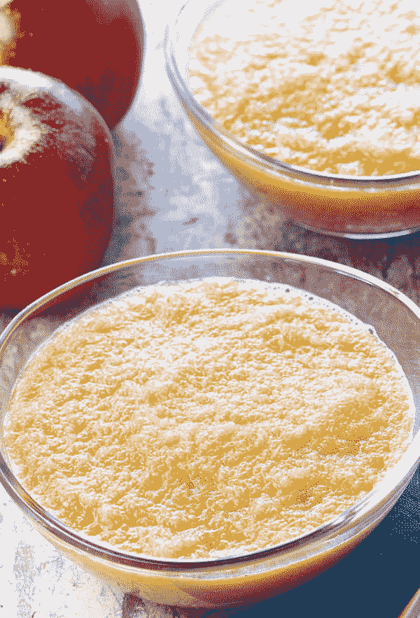

不要被这道食谱看似简单的内容给骗了。苹果泥具有强大的功效，能让肝细胞恢复青春活力，是真正的救肝食物。此外，这道美味的甜点随时都方便食用。

> ###### 材料（制作 1 份）
> 
> ‧1 至 2 颗红苹果，切丁
> 
> ‧1 至 4 颗帝王椰枣，去核（依喜好添加）
> 
> ‧1 根西洋芹，切碎（依喜好添加）
> 
> ‧1/4 茶匙肉桂（依喜好添加）
> 
> ###### 作法
> 
> 1_ 将切丁的红苹果及其他你想要加入的食材一起放入食物调理机，打到变成质地均匀的苹果泥。你可以立即享用，或是再挤一点柠檬汁，用密封罐装起来，留待稍后食用。

###### #点心

##### 枫糖浆烤抱子甘蓝

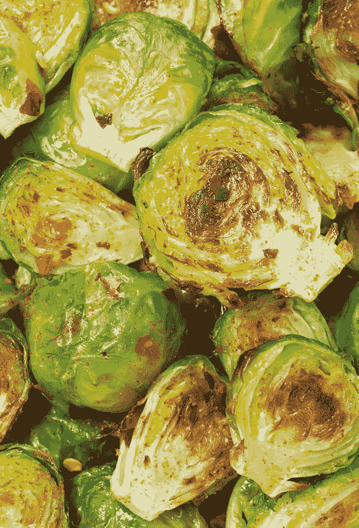

这些抱子甘蓝出乎意料地美味，它带有甜味与辣味，以及强烈的风味。如果你不喜欢吃辣，也可以不加那些香料，让这道又甜又咸的食谱成为大家吃了就停不下来的点心。

> ###### 材料（制作 4 份）
> 
> ‧2 磅抱子甘蓝
> 
> ‧2 大匙柠檬汁
> 
> ‧3 大匙枫糖浆
> 
> ‧1 瓣蒜头
> 
> ‧1/4 茶匙卡宴辣椒
> 
> ‧1/4 茶匙红椒粉
> 
> ‧1/4 茶匙红椒片
> 
> ‧1/2 茶匙海盐，分批使用
> 
> ###### 作法
> 
> 1_ 将烤箱预热至华氏 450 度（摄氏 230 度）。
> 
> 2_ 切掉抱子甘蓝的茎，并垂直切成两半，总共会有大约 6 杯的抱子甘蓝。
> 
> 3_ 将柠檬汁、枫糖浆、蒜头、卡宴辣椒、红椒粉、红椒片及 1/4 茶匙的海盐放入果汁机，搅拌成滑顺的酱汁。
> 
> 4_ 在大型调理盆中，将抱子甘蓝与酱汁拌匀。
> 
> 5_ 在两个烤盘上分别铺上烤盘纸，并把抱子甘蓝以切面朝下的方式排好。请把调理盆中多余的酱汁留下来备用。
> 
> 6_ 将抱子甘蓝放入烤箱烤 15 至 20 分钟，直到表面呈金黄色为止。如果喜欢酥脆的口感，可以在取出前高温炙烤 1 分钟。
> 
> 7_ 立刻将烤好的抱子甘蓝放回调理盆中，用剩下的酱汁拌匀。撒上剩下的 1/4 茶匙海盐，即可享用。立即享用的风味最佳。
> 
> ###### 小诀窍
> 
> 请不要忘了要留下酱汁的步骤。烤完后再次拌入酱汁，能让甘蓝增添风味，变得更美味。

###### #点心

##### 马铃薯普切塔

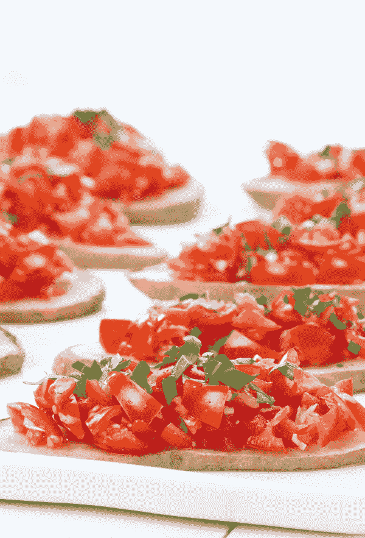

有了这道马铃薯普切塔，大家就不会想再吃圆面包薄片做的版本。番茄的风味越强烈，这道菜就越美味。切丁的番茄加上蒜头、罗勒、海盐，充满了夏天的气息，和松软的烤马铃薯片可说是绝配。

> ###### 材料（制作 4 份）
> 
> ‧2 大颗或 4 小颗褐色马铃薯
> 
> ‧2 杯小番茄丁
> 
> ‧2 瓣蒜头，切末
> 
> ‧5 片新鲜罗勒叶，切碎
> 
> ‧1/4 茶匙海盐
> 
> ‧1/2 颗柠檬，榨汁
> 
> ‧1 茶匙蜂蜜（依喜好添加）
> 
> ‧海盐、红藻及（或）黑胡椒少许
> 
> ###### 作法
> 
> 1_ 将烤箱预热至华氏 425 度（摄氏 220 度）。
> 
> 2_ 将马铃薯沿着长边切成长椭圆的薄片，约 1/4 英寸厚，并一一排在铺好烘焙纸的烤盘上。
> 
> 3_ 将马铃薯放入烤箱烤 25 至 30 分钟，直到表面呈金黄色为止。
> 
> 4_ 将柠檬汁、海盐、蒜头、蜂蜜（依喜好添加）放入小调理盆中打匀，再加入番茄丁搅拌均匀。
> 
> 5_ 将烤好的马铃薯片放在上菜用的餐盘上，放上番茄与罗勒丁。最后，在每个普切塔上撒少许海盐、红藻及（或）黑胡椒即可完成。

###### #甜点

##### 水蜜桃姜汁雪酪

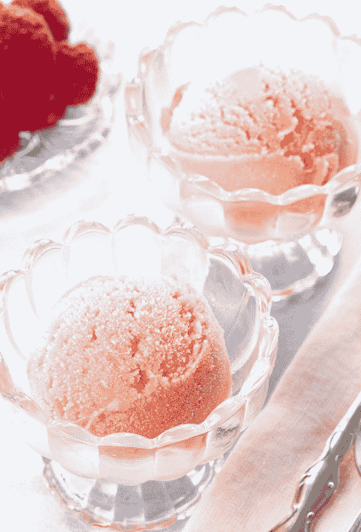

在一年之中的任何时候，你都可以用商店购买的冷冻水蜜桃，或是夏天冷冻起来的水蜜桃制作这道甜点。水蜜桃的甜味、姜的鲜味、梅尔柠檬汁，三者形成完美的绝配。如果买不到梅尔柠檬，也可以使用普通的柠檬，只要调整蜂蜜的量来达到你想要的甜度即可。

> ###### 材料（制作 4 份）
> 
> ‧1 截拇指大小的姜，去皮
> 
> ‧4 杯冷冻水蜜桃片
> 
> ‧1 大匙梅尔柠檬汁
> 
> ‧1 大匙生蜂蜜（请见小诀窍）
> 
> ‧1/2 杯水
> 
> ###### 作法
> 
> 1_ 把姜放入食物调理机中，磨成细末。
> 
> 2_ 在调理机加入冷冻水蜜桃、柠檬汁、蜂蜜，打 2 到 3 分钟，直到所有食材均匀混合好。缓缓倒入少量的水，只需要加入能搅动的量即可。必要时也可暂停一下，把调理机侧边的食材刮下、放入机器中。
> 
> 3_ 在所有食材呈光滑的质地时就完成了。这种雪酪的质地偏软，如果你希望口感硬一点，可以将雪酪倒入容器中，冷冻 3 至 4 小时后享用。
> 
> ###### 小诀窍
> 
> ‧如果从商店选购冷冻水蜜桃，务必确认里头不含柠檬酸。
> 
> ‧如果喜欢比较甜的口味，可以放入更多蜂蜜，增加到你想要的量即可。

###### #甜点

##### 火烧香蕉冰淇淋

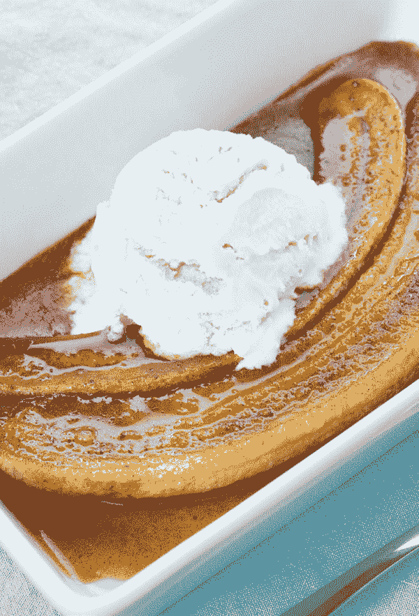

要找到不含脂肪又口感浓郁，让人吃了忍不住一口接一口的点心，实在相当不容易。嗯，你现在不用再找了，这道火烧香蕉冰淇淋食谱和传统做法一样邪恶，但里面只有对你身心都极好的食物。你可以单独吃，或是加上香蕉冰淇淋皆可；不管怎么吃，都会让你欲罢不能。

> ###### 材料（制作 4 份）
> 
> ‧3 根香蕉
> 
> ‧2 又 1/2 大匙枫糖浆，分批使用
> 
> ‧1/2 茶匙肉桂
> 
> ‧2 茶匙枫糖
> 
> ‧1/8 茶匙海盐（依喜好添加）
> 
> ###### 作法
> 
> 1_ 将烤箱预热至华氏 400 度（摄氏 200 度）。
> 
> 2_ 将香蕉沿着长边对剖成两半，放在铺好烘焙纸的烤盘上。
> 
> 3_ 在小调理盆中倒入 1/2 大匙的枫糖浆、肉桂、枫糖、海盐，拌匀。
> 
> 4_ 在香蕉刷上剩下的 2 大匙枫糖浆，两面都要刷到。
> 
> 5_ 将混合好的肉桂调味料均匀抹在两片香蕉上方，放入烤箱烤 15 至 18 分钟，直到表面变软、呈金黄色。
> 
> 6_ 将烤好的香蕉从烤盘中取出，亦可搭配香蕉奶油享用。
> 
> ##### 香蕉冰淇淋
> 
> ###### 材料（制作 3 份）
> 
> ‧3 根冷冻香蕉
> 
> ‧2 大匙温水
> 
> ###### 作法
> 
> 1_ 将香蕉粗略切成几段，以利放入食物调理机。在条理过程中，一次加入 1 大匙的水，避免香蕉黏住，直到香蕉变成滑顺柔软的质地，即可完成。
> 
> 2_ 可以立即享用，或是放入冷冻库 2 至 4 小时再享用。

###### #甜点

##### 烤苹果玫瑰花卷

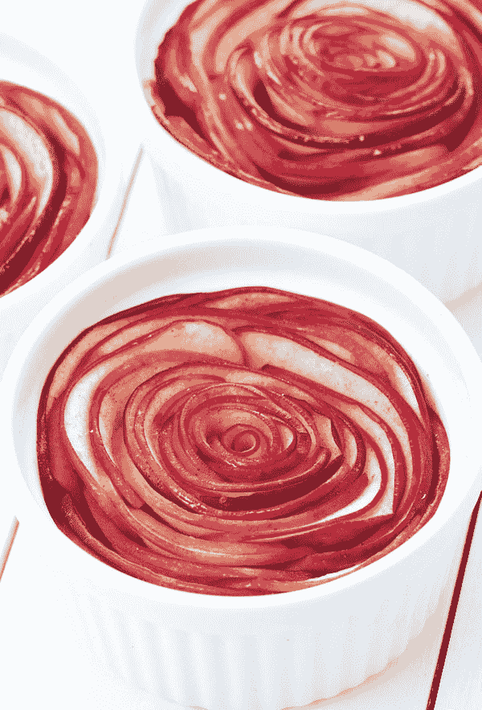

烤苹果玫瑰花卷就像苹果派一样，只不过没有派皮，在烤盅里赏心悦目，刚出炉就能享用它温暖的滋味。内馅永远是最棒的部分，对吧？

> ###### 材料（制作 2 份）
> 
> ‧4 颗红苹果
> 
> ‧4 大匙枫糖浆，分批使用
> 
> ‧1 大匙现榨柠檬汁
> 
> ‧3/4 茶匙肉桂，分批使用
> 
> ###### 作法
> 
> 1_ 将烤箱预热至华氏 400 度（摄氏 200 度）。
> 
> 2_ 在大调理盆中放入 3 大匙枫糖浆、柠檬汁、1/2 茶匙肉桂后，搅拌均匀。
> 
> 3_ 用刀子或切片机将苹果切成薄片，之后将切好的薄片放入搅拌好的枫糖浆里，让每一片都裹上糖浆。
> 
> 4_ 将苹果切片放入 4 个烤盅里。将剩下 1 大匙的枫糖浆淋在 4 朵苹果花上，再撒上肉桂粉。
> 
> 5_ 烤 20 至 25 分钟，直到苹果变软且呈金黄色，即可从烤箱中取出。建议趁热食用。
> 
> ###### 小诀窍
> 
> 这种疗愈系的甜点也可以搭配纸本书第 566 页的香蕉冰淇淋，让这道甜点的美味加倍。

## 第四十章　救肝冥想

说到与肝脏合作及帮助肝脏这两件事，只要付出一点点心力，你就能获得相当好的效果。你想要引起别人注意的时候，只要有人特别关爱你一下，无论是朋友、同事、老板、老师、心灵导师或其他你所爱的人，就能让你继续撑下去。只要你景仰的人能在人群中认出你，即使只有一秒钟，都会让你的世界完全改变。只要休息个五分钟，呼吸一下新鲜空气，让头脑变得清晰，并获得片刻的宁静，这也是能让你喘息一下的片刻。每次引起你注意的总是大脑。对于多数时候未曾受关注的器官来说，透过本章的冥想方式注意肝脏片刻，就能收到强大的效果。这并不是在开玩笑。知道肝脏需要什么、肩负什么责任、面临哪些痛苦、工作得多努力，就能够让一切改观。在你了解这些之后，冥想就能让疗愈迈入全新的境界。

你想要的话，可以在冥想过程中播放音乐，帮助自己放松下来。你觉得疗愈的东西都能让肝脏感到疗愈。肝脏的神经压力是从未有人关注的主题，但这件事其实相当重要。其中一个原因是：肝脏的状态会大幅影响消化。如果希望肝脏觉得更轻松，你可以在每天备餐的时候播一点音乐。只要是能让你感到轻松的音乐，都可以帮助你的消化道放松，减少肝脏的紧绷程度，以及肝脏与消化道产生的冲突，肝脏也能以更轻松的方式帮助消化，这样就可以进入良性循环。

为了不要让肝脏全年无休地忙于应付你的需求，透过以下技巧，你就能为肝脏做点有益的事。为肝脏冥想是相当不可思议的过程，肝脏会认为这些冥想相当宝贵。只要尝试几分钟，就能给予肝脏期待获得的注意、认可、认同、关怀与尊重。此外，这么做也能让肝脏维持稳定平衡，进而得到强化。了解肝脏正经历哪些事，可以给予肝脏疗愈时所需的宁静，让你最终放下心中的大石头。

##### 宁静的肝脏沐浴冥想

请在浴缸里放一点温度适中的水，不要过冷或过热。加入一至三大匙的海盐、两大匙的昆布粉，并放入一块天然的海绵。入浴时，闭上双眼，想像自己正在海洋的漩涡里，是一个宁静的小小海中漩涡。那是一片与世隔绝的海滩，你可以好好放松。如果你喜欢冒险，甚至可以想像自己正在肝脏里，不过你不一定要这么做。昆布粉会让你沐浴时沉浸在海洋般的环境当中，为水带来活力；这会让肝脏将水认为是海水，使沐浴产生滋养的效果。伸手拿起海绵，在你触及海绵的那一刻起，肝脏就知道那是真正来自海洋的东西。

肝脏无时无刻都在寻求体内的平衡，为我们打了许多仗来保护我们。那些打仗的方式你在前面的内容已经看过了，因此这种沐浴的方式正好能让肝脏休息一下。虽然冥想的目的是为肝脏服务，却也能让身心灵都进入宁静的状态，肝脏也能稍微卸下心防。这么做，你与肝脏都能从战争中稍微获得喘息。肝脏可以放松一下，说：“呼，工作暂时做完了。休息一下吧。”

沐浴的另一个重要层面是能将全身负面的东西排出体外，肝脏也不例外，因为它可以使你感觉更落实。你沐浴在海水般的水中时抓住海绵，看见你在宁静的海洋中平息肝脏的愤怒，将负面的一切排出体外。

这种小小的假期，最终能为肝脏带来宁静，让肝脏维持长寿，也能带给你所需的疗愈，让肝脏更能接受接下来要做的冥想。即使你一个月只能做这种沐浴冥想一次，甚至六个月才有空做一次，其他冥想方式也能为你带来很大的帮助，因为这种有如海洋般的沐浴可以启动冥想。你可以坐在浴缸里五到四十五分钟，不过最理想状态是二十至三十分钟。泡澡不是泡得越久，效果就越好的活动。

如果没办法全身泡澡，也可以透过同样时间长度的足浴进行迷你版冥想。你可以在大脸盆或大型容器中装入温水，加入一茶匙海盐及昆布粉，将脚浸泡其中，想像双脚浸泡在海水的样子。在足浴盆放入天然海绵，用海绵刷脚（如果自己触碰不到的话，可以请人帮忙），享受足部的触感。

如果你正好无法做全身沐浴或足浴，也不用担心，还是可以享受其他冥想带来的好处，让肝脏获得宁静。

##### 恢复肝脏活力的散步冥想

请以你觉得舒适的方式去散步。在散步的过程中，请注意自己的呼吸，想像自己直接将氧气灌入肝脏。通常我们认为呼吸与肺有关，在此则要将肝脏视为肺，能接收所有新鲜的氧气，让氧气充满其间。

透过这种冥想，我们可以改善肝脏循环，促进肝脏新细胞的生长，维持肝细胞健康，让肝细胞恢复活力。在每隔三年（三的倍数）生日之前的头三个月，这么做特别有用，因为这时候的肝脏处在特别的更新阶段。但即使你处在其他时候，也不要因此就不做。在别的时间点做，还是能为你带来好处。

进行冥想散步的时间并没有一定的限制。对那些只能走个三十秒、一分钟、五分钟的人来说，这么做还是相当宝贵。如果你根本没办法走，请你在进行本章稍后的“逆转疾病的夜间冥想”时，一并请求和你在一起的天使恢复你的肝细胞活力。如果你可以步行，那么想走多久，就走多久。散步的过程不一定得是特别创造出来的宁静环境。例如，你可以在和朋友吃完午餐一起散步时，和朋友分开后要走到自己车子前时做冥想。如果你抽烟，还没准备好要戒烟，那么请在冥想过程中暂时不要抽烟。

##### 肝脏冷却冥想

肝脏本来就会担心我们不知道它的存在，因为我们只顾着过自己的生活，完全脱离肝脏，意外伤到了它还不知道要加以照顾。为了向肝脏表示感谢，请你和肝脏说话，无论是大声说出来，或是默默在心里说皆可，就像在和朋友、挚爱，甚至是灵魂伴侣说话一样。请跟肝脏说，你想要照顾肝脏。即使你现在没有这么做，也请对肝脏说，你会在未来好好照顾它。请告诉肝脏说，自己在它背后全力支持它。请告诉肝脏，你爱它。

这么做的目的在于帮助肝脏冷却。肝脏每天在工作场所中产生的冲突、负责的任务，以及其他有毒的热，造成肝热大量累积，请不要把这种热与有助于排毒的热混为一谈。这种不好的肝热经常造成肝脏痉挛。排毒的热可以帮助肝脏释出毒素，有毒的热则会导致肝脏无法释出毒素，并带来更多有毒的热，因此没有人知道肝脏在运作的时候有多热。在路上开车，与其他车子交会时，我们经常差点与别人起冲突，这也会让肝脏濒临痉挛的状态。（同样的热也会导致胆结石的生成。）我们生活中面临的高度压力，让肝脏渴望能透过这种冥想获得肯定、镇定、冷却的机会。

你在任何时候都可以对肝脏说话。如果你希望的话，可以进入完全冥想的状态，或许可以利用午休时间这么做，或是趁着通勤告诉肝脏自己没有遗忘它。

##### 强化胆汁分泌的冥想

如果你正好到了大自然中有活水流动的地方，例如河边，做这种冥想非常有帮助，但没有的话也无妨，你依然可以做这种冥想。不管是哪种情况，都请仰卧下来，无论是躺在床上、沙发上，或是铺在地上的瑜伽埝或毯子，只要是能让你感到安全的地方就好。闭上双眼，想像自己走到河边或溪边，当中有温和舒适的水流，于是你向前跨了几步，走到河里面，不久之后发现水深及腰，水温清凉舒适，不会让你觉得冷。

你开始走向河的彼岸，双手浮在水面上，缓缓地走着。现在，水深开始固定不变，你感受到水流冲刷的砂石按摩着你赤裸的双脚。在你接近河中央时，水变深了，大约在你的腰部与胸部之间，正好高过肝脏。水深最多就这样了。你继续缓缓地走着，让自己从河岸这一侧走到对岸，需要花个二十分钟以上。如果你希望的话，也可以花更多时间冥想，想做多久，就做多久。请继续想像自己缓缓走向充满群树与草丛的对岸。

最后，水位开始缓缓降低到腰部左右。在你开始接近河岸时，水位变得越来越低，只有双脚在水中。最后你离开水中，走到草地上，躺在草地上听着流水声。在你准备好后，就可以结束冥想。刚刚做的这些，正好能给予肝脏支持，促进胆汁的分泌，因此可以促进脂肪的消化，并增加胆汁的储存量。

##### 杀死病毒及其他病原体的冥想

阳光具有神秘的力量。我们在日常生活中接触阳光时，阳光就会进入某些器官，留待未来取用。阳光的成分相当复杂，能带给人体无限的信息。医学与科学研究尚未发现阳光含有非常多疗愈与生命的力量。如果我们可以衡量或秤出阳光的重量，并予以分析，那么所发现的结果必定相当深奥且令人难以置信。

你一生中接收到的这些阳光，有些会直接进入肝脏当中，这点至今尚未有人发现。只要肝脏能妥善运作，就能把当下用不到的阳光储存起来。即使你的肝脏健康状态欠佳，无法储存新的阳光，也还是有过去储存起来的阳光可供使用。这种冥想方式就是要启动肝脏在过去储存起来的阳光，让那些未曾使用的阳光释放出原始的力量。

在一天中找一段可以宁静下来的片刻，在不会被阳光直射的地方或坐或卧皆可。虽然阳光能增强我们的免疫系统，但现在要你远离阳光是有原因的。其中一项原因是要你想像自己正在阳光下，想像自己睁大双眼注视着阳光。如果你真的处在阳光下，就必须采取保护措施，避免自己意外直视阳光，导致眼睛受伤。在冥想过程中，要让所有想像的阳光进入双眼，但实际上在阳光下不能这么做。另一项原因是你躺在阳光下冥想的时候，很容易因为睡着而受伤。透过这种方式，你可以运用想像力达到同样的功效，所以不用让温度升高到华氏 100 度（摄氏 38 度）或去做日光浴，就能拥有阳光的温暖。这么做可以打开开关，释出过去储存在肝脏中的阳光。

躺在舒适的地方后，想像自己躺在阳光下一处与世隔绝的地方。如果你想要的话，可以把那个地方想像成海滩，你也可能希望躺在原野上，只要让你感觉舒适的地方都可以。请让自己展现出最自然的一面，想像自己躺在安全隐密的地方，一丝不挂。请闭上你真正的双眼，想像自己睁开双眼看着阳光，将阳光送入肝脏深处，接着看见想像的阳光发出光芒，链接与活化过去储存在肝脏内的阳光。想像有一个开关能启动储存的阳光，让那些阳光成为杀死肝脏内部病原体的强大光线。在阳光穿透器官时，请把光线想像成武器，穿透那些与症状、疾病有关的病原体，例如造成痤疮、小肠菌丛过度增生、自体免疫疾病、肿瘤、囊肿、癌细胞等的病原体。想像有个微生物大小的虫子，然后有光线穿透、包围后杀死它。每次你深深吸气与吐气后，就能看到光线变得越来越强，穿过你的肝脏，将力量传送到肝脏角落的缝隙中，驱散那些占肝脏便宜的生物。在你吸气与吐气时，想像那道光亮起来的样子。

在理想的状态下，冥想的最佳时间应该在二十五至四十五分钟之间，再久一点就会晒伤。（开玩笑的啦，如果你用正确的方式冥想，就不会晒伤！）

##### 强化肝脏免疫系统的晨间冥想

请在早晨到正午之间做这种冥想。可以的话，请以俯卧的姿势开始。（如果不行，请侧卧。）在你吸气的时候，想像自己从背后吸入紫水晶或紫罗兰的光线，进入肝脏当中，并呼出同样颜色的光线。继续吸入与呼出光线。请不要强迫自己用不自然的方式呼吸，因为这么做是要强化肝脏的免疫系统，你必须以平常自然的节奏呼吸。大约五分钟之后，如果可以的话，请改成仰卧的姿势。继续吸入与呼出紫水晶或紫罗兰色的光线，只不过这次是从肝脏的前方出入。五分钟过后，再改为俯卧的姿势，让光线从背后进出肝脏，并持续做五分钟。最后，再转为仰卧，这次请吸入与呼出彩色的光线到肝脏当中，即使这道光线不是间距完美的五色光也无妨。到目前为止总时长应为二十分钟。

最后，请缓缓地站起来（如果做不到，可以坐起来），深深吸入紫水晶或紫罗兰的光线，看着这道光线同时从前方与后方进入你的肝脏。在你呼气的时候，同样也从这两个方向呼出光线。请维持站姿（或坐姿）一、两分钟，持续吸入与呼出光线，呼吸的深度比之前更深。在你完成后，就已经强化了肝脏的免疫系统，这一点非常重要，可以保护你免于病原体造成的疾病与毒素侵害，避免这些阻碍肝脏的免疫系统，肝脏才能发挥最佳的功能。

##### 帮助肝脏脂肪松脱的晨间冥想

这是在刚起床时做的冥想，早上越早做，效果就越好。请你仰卧，小心地屈起右腿，膝盖指向胸部。如果你有关节肿胀的问题、类风湿性关节炎、背痛，或是其他发炎问题，就不用让膝盖靠着胸口，只要弯到自己能力所及的程度即可。否则，请让膝盖弯曲到你觉得舒服的姿势，例如双手可以触及的位置。如果你完全没办法弯曲也无妨，尽力即可。维持这个姿势三十秒，之后放开腿，让腿回到平放的姿势三十秒。现在，改弯起左腿三十秒，接着让左腿恢复平放的姿势三十秒。这样就是一次的屈膝动作。请重复同样的动作四分钟。冥想一开始所做的这个动作，就是要排除肝脏周围滞留的液体，在汲出液体时释放淋巴管的压力。如果你没办法活动，请改成想像自己在活动。

做完腿部运动之后，请放轻松维持仰卧，将双手放在肝脏的位置，如果你想要的话，可以让双手的手指交错摆放。请不要用力，务必让手肘放松。想像自己的双手是磁铁或帮浦，能让肝脏的脂肪细胞松脱，并把这些东西吸出来。想像有一股能量向上进入你的手中，虽然很可能有向下的拉力或其他力量同时存在，但这么做能释放受困肝脏内的缓慢能量，进而汲出来。用你想要的方式想像这点，例如想像成沙粒向上浮起，或是你自己内心的其他想像。请持续做十分钟。

现在，请再回到腿部运动，再做四回（也就是总共八次，每一边四次，包含当中约三十秒间隔的休息时间。）之后请再仰卧十分钟，把手放在肝脏上，想像脂肪细胞被唤醒，在能量动起来的时候移动到四周。最后以四次的抬腿运动结束冥想。这种冥想方式非常适合脂肪肝前期、脂肪肝、肝脏缓慢或迟滞的患者，它能鼓励淋巴系统排放与释出肝脏的脂肪到血液，最终排出体外。

##### 逆转疾病的夜间冥想

这种夜间冥想需要一点天使的辅助。更明确地说，你必须要呼唤维护秩序的天使，让这些天使能为生病、发炎或是因其他原因变得虚弱的肝脏带来秩序。这种天使的力量适用于各种肝脏问题。呼唤天使的规则和之前一样，这些我在先前的著作都提过了，也就是你必须请求天使的协助。小声的耳语即可，如果你无法开口说话，用手语也行。上床就寝之前，或许是在你刷牙、把孩子送上床，或是穿睡衣的时候，请你说：“维护秩序的天使，请为我的肝脏进行疗愈的程序。”如果你上床后才发现自己忘了请求天使，也可以躺在床上说。

准备好之后，请你躺好，闭上双眼，想像有三位天使站在床边。每个人想像的天使都不一样。有些人看见光线和翅膀，有些人只看见光，有些人则看见光里有个人影，有些人看见有翅膀的完整女性影像，有些人则看见完整的女性影像，但没有翅膀。不管你看见什么，请在心中想像着三位天使。你只要知道逆转疾病的天使是女性，不是男性，这样就够了。想像三位天使在你的床边走动，三个人之间保持着相等距离，围成一个圆圈。如果床上有其他人和你一同就寝，例如你的伴侣或友人也无妨。请继续想像那些天使，你必须集中精神，想像天使绕着你的床走动。

请想像维护秩序的天使伸手在圆圈中创造一股光的压力，让这股压力落在你身上，压进你的肝脏当中，驱赶疾病，充盈在囊肿与肿瘤里，使这些组织萎缩，并修复受损的细胞。这是一道天使的光线，能处理任何与肝脏有关的问题。如果你有本书提及的任何症状与问题，无论是自体免疫疾病或痤疮，都对你相当有帮助。即使只是肝脏迟滞，这道光也能帮助你扭转问题。

请继续想像天使环绕在床边，传送光线到你的肝脏当中，想持续多久都行，无论是三分钟、五分钟、半小时，或是持续到睡着都可以。请务必在晚上保留一点时间冥想。

##### 排毒冥想

在你摄取适当的排毒食物，做“救肝之晨”、“救肝三：六：九”、品尝书中料理，或是服用书中提到的补充品时，就已经进行了每日的排毒活动。你可以运用这项技巧搭配已进行的活动，来提升排毒的程度。

这种冥想的目的是要减轻肝脏的紧绷程度或痉挛问题，同时也会让肝脏感到安全无虞，可以开始排毒，不用担心当下会被调去处理其他工作。你是否曾在工作或执行某项任务到一半时，必须去呼吸几口新鲜空气，才能回去继续工作；面对最忙乱的时刻，然后你又可能随时被调去支援其他人？你是否曾休息到一半，就被叫去做某件事。无论你是汽车展售中心的业务人员、动物医院的兽医助手、照护机构的护士、餐厅里繁忙的收银员，或是有小小孩的父母，你曾遇过这种事吗？肝脏必须知道自己不会承受任何压力，或是被临时调去做其他工作。这样的冥想能帮助肝脏在你生活最繁忙的时刻释出捣乱者。

在一天当中的任何时刻，无论是早上、下午、晚上，花一点时间想像周遭有一堵墙。请选择能让自己感到安全却不会被囚禁的墙，无论是一道光墙、树篱、灌木丛、玫瑰丛、你最爱的家，或是神圣的处所都好。这么做的时候，请想像自己处在隐密平静的状态，想像自己独处且不受干扰的状态，无论当时你是坐在餐厅里，周遭都是人，或是处在安静与平静的地方都无妨。你可以睁开眼睛坐着、躺着，甚至站着都可以。

在你想像整个世界与自己隔离后，或是至少与喧嚣混乱之处保持相当的安全距离后，告诉自己的肝脏说，可以开始排毒了。你的肝脏会接收到这个消息，也会了解血管中不会有过多的肾上腺素窜流。这时候，肝脏就会有效率地释出少量毒素及相对应的化学物质，指引毒素安全离开身体。这种冥想进行的时间可以持续五至二十分钟，由你决定时间的长度。即使在你停止冥想，回归忙碌的生活后，肝脏释出的特殊化学物质仍会在一天接下来的时刻继续指引毒素排出体外，让你获得自由，继续过你的生活。

> 若能充分吸收、
> 
> 运用本书这些活生生的话语
> 
> 并因此获得内在宁静，
> 
> 你就会成为一道光芒，照亮他人的路。

# 尾声　暴风雨会过去，宁静会与你同在

如果现在你正面临健康的挑战，我知道要寻得宁静这件事对你来说相当困难。虽然你已经知道肝脏是身体的节律器，也知道带给肝脏宁静就能改变你的生活，但如果你正处在水深火热之中，那么很可能觉得宁静离你相当遥远。只要你有一晚失眠、某个星期感冒，或是某个月受伤了，那种宁静的状态就会遭到破坏。在你面临持续两年、三年、五年，甚至是十年以上的慢性疾病时，宁静就更难寻得了。这样会让处境变得更为艰难，因为那正是你最需要宁静的时刻，这也是为何那么多长年疾病缠身的人，会渴望获得精神上的支持，因为他们的身体对他们来说是个无解之谜。

在你生病的时候，有两种方式能帮助你寻得宁静。其中一种方式是了解自己发生了什么问题，解开疾病之谜，了解身体并没有背叛你；另一种方式则是了解如何疗愈。此外，还有第三种方式，就是知道自己能够疗愈，尤其是现在已经了解真相的你更是如此。神灵提供讯息的目的，就是要提供你们这些讯息。发现肝脏有问题，背后其实有许多原因，如何用适当的方式照顾肝脏，以及我们可以拯救自己的肝脏等，这些知识立刻就能帮助你迈向宁静。

如果你正面临某种症状、疾病或伤害，请务必提醒自己，你的身体正在努力帮你寻得宁静。即使在你生病的时候，肝脏仍旧指挥着维持宁静的任务，与其他器官、细胞、免疫系统，甚至是大脑沟通，试图要和身体保持盟友关系，让你维持宁静的内在状态。你可以运用本书的信息，提供更多工具让肝脏维持宁静，我们的身体自然就会迈向宁静。我们需要做的事，就是支持身体而已。

##### 宁静的灵魂

组成宁静的另一部分，就是要以慈悲的心对待自己。慈悲是宁静的灵魂，宁静的力量，宁静的道路，宁静的生命，宁静的泉源，宁静的解答，以及宁静的创造者。我们认为宁静是无，也就是没有痛苦、折磨、疾病、愤怒、暴力、战争，但同时也是有，也就是慈悲的存在。

为何是对自己慈悲，而不是爱自己呢？爱自己很好，就是爱自己的本质、欣赏自己，甚至接受现在的自己与外在。在一切无事时，这似乎相当适用。但是，万一遇到困难了呢？在你遇到困难、遭受痛苦的时候，游戏规则就会有所改变。爱自己不代表能让你像对自己慈悲一样获得疗愈，爱自己也无法带来宁静。在你着重于爱自己的时候，很可能会变成爱你自己超过周遭的人。对自己慈悲则能唤醒我们，让我们面对更广大的世界。

爱也不是让两个人在一起的元素。在你处于热恋，口袋麦克麦克，生活相当美好的时候，可能拥有很多爱；但是，挑战来临时，爱可能就显得不足，因为人类的爱无法创造宁静。有多少段关系是两人口口声声说着我爱你，但是有朝一日遇到问题，双方却反目成仇？爱对方很可能在转眼间就变成恨对方，除非当中含有慈悲。慈悲是一段关系中的黏着剂，能让爱生生不息、可以喘息，并避免爱变调成仇恨。如果你把爱视为一颗苹果，那么慈悲就是当中的核心。

爱自己也是同样的情形。如果爱自己却不带着对自己慈悲的成分，那么你很可能会突然变得恨起自己来。如果你突然出现了慢性疾病或情绪方面的问题，对自己的爱很可能会消失无踪，取而代之的是对自己的恨意。恨自己是寻求宁静之路上最大的障碍。运动员受伤时，很可能在短时间内开始恨自己，因为他觉得与自己相当疏离，无法拥有过去的成就。可以把一切料理妥当的母亲，很可能在疾病出现后开始怀疑自己，觉得自己是个失败者。在工作上无所不知的员工，很可能会因为出现一些问题限制了他，导致他瞧不起自己，觉得不被需要，因此突然再也无法胜任自己的工作。无论是什么样的形式或是否明说，我们多半都听其他人说，生病是我们自己的错。这种误导人的免疫理论说身体攻击了自己，误导人的基因理论说有问题的基因造成了疾病，误导人的疾病解释方式说你自己招致了疾病，这些都可能让你对自己恨之入骨。这些都是大魔王，如果对自己的慈悲不够根深柢固，就会摧毁身心灵的宁静。

我们并不知道肝脏将我们视为它的宝贝，是必须悉心照顾与喂养的婴孩，而肝脏运用自身慈悲的本质为我们注意一切。我们误以为身体放弃了自己，未能与给予自己慈悲，似乎在痛苦与疼痛伴随身体存在过久时，慈悲就消失了。疼痛、疾病、症状存在得越久，我们离给予自己的慈悲就越遥远。我们会问自己：“我到底是怎么了？”事实上，慈悲从未离开我们，虽然表面看来慈悲不见了，但实际上，慈悲比过去离我们更近，等着我们伸手去找寻。

憎恨很可能拥有自己的生命，那是一头桀骜不驯的野兽，唯有慈悲能驯服它。那种给予自己的慈悲必须是有意义的，不是随口说出的空话。慈悲必定具有其重要本质，这正是你必须深入了解的。对自己慈悲是一种释放，释放批判，释放怀疑，是身而为人的你获得宽恕的许可证。

宽恕有两种形式：一般的宽恕及慈悲的宽恕。一般的宽恕不会带来宁静，慈悲的宽恕才是真正的宽恕。对自己慈悲，是获得宽恕的真谛，宽恕那个因为错不在己的原因而自责的自己。只有慈悲能解除我们对自己的批判。即使我们认为自己犯了错，自认为那是个大错，慈悲仍可以帮助我们不受恨自己的怪兽主宰。往往从全局看来，那个错误实在是微不足道。我们都会犯错。如果你觉得自己受困于这样的牢笼，这种错误困住了你，你无法摆脱自责的野兽，那么光是说“对自己慈悲”仍无法获得自由。只有为自己找到真正的慈悲，才能解开牢笼，真正重获自由，赶走那只野兽。

对自己慈悲也是强力的天启，那是你双膝跪地、听到上天传来“你被宽恕了”的那一刻。那是一种觉得做自己相当重要，而且不只如此：那是与神灵知识及上天给你的关怀合而为一的时刻，是你了解这种外在与内在善意同时存在的时刻。这种天启能赶走对自己的恨意，驱散你血脉与灵魂中的毒素。

所谓“神就是爱”，但神不只有爱。神拥有的是无条件的爱。人类的心无论在对待自己或他人时，总是给予有条件的爱。我们忍不住就会这么做。我们以为自己能感受到无条件的爱，实际上只能在爱加入慈悲。慈悲加上爱，才是人类版无条件的爱。神灵版无条件的爱更伟大，也更强大。想要真正体会内心对自己或他人的感觉，想要体验宁静，就需要寻求慈悲。

人往往会认为自己对他人充满慈悲，但那实际上是自信。我们现在的世界就是建构在自信上，而非慈悲上。只要有问题发生，自信就像爱一样，随时会消逝。你可以一辈子都把世界建构在自信上，因为自己拥有的成就而自信满满，最后如果无法拥有更大或更高的成就，或是你做不到某件事，那么你对自己的自信与信仰就会在弹指间灰飞烟灭。在灯光熄灭后，自我怀疑的黑暗就会来袭。自信相当重要，我们都要尽可能拥有自信，但自信不具有慈悲的力量。自信也不是痛恨自己的解答，不是宁静的落脚处。自信会随风来去，在你的自信消失之时，如果没有慈悲，伤害的程度就会同时扩及灵魂与身体。但是，如果你的内心拥有慈悲，即使丧失了自信，仍然不会感到胆怯。你做一件事可能会失败，你可能会生病，你相信的人可能会让你失望，但是慈悲仍然存在。无论你是否相信自己，慈悲仍会维持一切，维持宁静。慈悲可以让你痊愈，具有深层的疗愈力量，能带你离开疾病，再次找回自信，让你对自己拥有越来越多的自信。

不过，我们仍无法控制整个世界，世界上总会有不宁静的地方。我们无法控制地球上数十万个灵魂的自由意志。但是，我们能够控制内在的宁静。我们可以努力满足人体宁静维持者，也就是肝脏的需求。如果你疯狂想要控制其他人的自由意志，你就无法获得宁静，也无法带给周遭的人宁静。

假设有个人终其一生都在维护世界和平，却无法同时给予自己的孩子慈悲或宁静，那么这个只想获得认同与被接受的孩子，在父亲努力维持世界和平的同时，却持续不断受苦着。这个经典的例子告诉我们，往错误的方向努力是怎么一回事。水电工没空疏通自家的水管不是他的错，因为他必须靠着疏通其他人的水管才能赚钱。那个制鞋匠孩子没有鞋穿导致脚步不稳的故事，其实情有可原，他必须靠自己的手工挣钱，把手中所有皮革都卖出去，才能换得家人餐桌上的食物。然而，不可原谅的是制鞋匠孩子脚步不稳这件事。那个热爱维持和平的人，那个受到热情驱使的人，误以为自己能控制超过七十亿人的自由意志，这样好高骛远的目标让他自己无法对身边的人尽到责任，这点导致他背离了自己的梦想。

这正是热情与慈悲的差异所在。我们总是推崇热情，将热情看得很崇高。热情和爱一样具有相当的价值，不过我们却迷失了，将一切放入自己的热情，或是认为热情能让我们畅行无阻，事实上并非如此。如果你对一个人拥有热情，这和对他慈悲是不同的两回事，大家却认为两者相去不远。如果你对一项慈善工作具有热情，并不表示你对这项工作及服务的对象慈悲。或许你确实对那些人相当慈悲，但如果你只具备热情，它并不会自动变成慈悲。两者是不同的，虽然热情往往会被当成慈悲，实际上这是两种不同的力量。如果你对某种消遣娱乐或任务具备热情，并不代表你在追求的过程中会具备慈悲，或是会注意要在过程中照顾自己。你也很可能会执着于那种热情，结果反而无法提供慈悲给你爱的人，让他们穿着宁静的鞋子前进。我们不能把热情误认为慈悲，这样只会造成严重的灾难。请看看历史上的许多例子，那些热中于追求世界和平的人，却会忽略慈悲。爱、自信、宽恕、热情只有在同时与慈悲并存时，才能够带领我们迈向更美好的世界。

##### 等待解放的意志

现在，我们回到自由意志的概念上。虽然信仰相当重要，但信仰本身无法为我们创造和平。每个人的自由意志让灵魂能选择自己所想所欲，但如果那不是一种宁静的状态，他就不会处在宁静的状态中。我们无法控制其他人，无法要求他们照顾自己的肝脏，或是感受内在的宁静，甚至在人生中选择宁静的道路。不过，自由意志仍有其必要，我们可以因此不遭受身边其他人的设计，我们也因此可以犯错，再从错误中学习。自由意志对我们追求宁静来说也相当重要，虽然它会让有些人寻求与宁静正好相反的道路，但如果它不存在，我们就无法寻求内心的平静。在这个世界上，我们很可能没有机会过着无忧无虑的生活，不用担心任何问题发生，但我们确实拥有自己的意志，能够寻找属于自己的宁静及自由。

你不一定得是灵性追求者才能追求内心的宁静。你不必是那种受到启发，才找到寻求宁静的根源及正确方向的人。如果你认为自己不是灵性追求者，并不代表你没有分辨周遭与内心事物对错的能力。你很可能是个有小孩的职业妇女，没有时间看灵性书籍或参与灵性课程，没空固定去你最喜欢的圣堂或教堂虔诚祷告一番。但请你不要因为这样就觉得自己不够灵性。如果你看看四周，想到其他人，像是某个在追求灵性成长的邻居，内心拥有的宁静多过于你，请你不要担心。你不需要绕着地球跑，跑到某座山巅才能够寻得或维持宁静。灵性是一种许多人选择的观念，并不代表他们的心真的就在那里。那些耗费许多时间到修道院或踏上旅途寻求宁静的人，往往无法寻得宁静。我看过许多人在山上的修道院待了三十天或六个月，下山后仍然无法获得宁静。有些人运用自己的财富，让自己身处于美轮美奂的环境里，自己却像个旅客一样，或许能获得片刻的宁静，却无法维持下去。他们往往不知道自己正在追求错误的东西。

如果要获得那种宁静，他们必须寻求慈悲。你可以居住在茅屋里，躺在茅草铺成的床上，处在污秽的环境中，全身病痛又饥肠辘辘，但内心拥有的宁静远胜过那些身居琼楼玉宇、拥有足够财力与资源在世界各地修道院祷告的人。一切都取决于你是否对自己与他人慈悲。对你及那些身居修道院数月，或是爬上世界之巅的人来说，寻求宁静的道路都一样，就是慈悲。

我们往往会忘了自己的身体、体内的器官，只把注意力放在外在事物上。为了求生存，我们在这个时代不得不随时注意，必须跟上时代的脚步及各处发生的事；尤其是我们处在动荡的时代下，或是有人挑战我们时，我们不得不随时注意周遭发生的事。如果我们把时间都花在这些事物上，忙着担心其他人（无论是我们周遭的人，或是离我们很远的人），就会迷失自我。在我们试图扑灭无法控制的火势时，我们就失去了自己身心灵的宁静。这并不表示我们必须自恋，也不是要我们只在乎自己，或是只爱自己。这并不是说我们不该为了我们的信念或所爱的人奋斗，而是我们要清楚了解自己要追求的是什么。你越是认为自己能控制这个世界，就越容易迷失，越可能失去内心的平静。往往许多我们努力要避免的，都是无可避免的事。你必须利用自由意志给予自己慈悲，用那种对自己的慈悲来明智选择要扑灭哪一场火，选择希望身心维持健康与宁静时，有哪些是你真正能够掌控的。

##### 暴风雨会过去

如何寻求对自我的慈悲？在你面对批评、危机、苦难、失去挚爱、亲友罹病、财务危机、受伤、生病，或是其他风暴的时候，要如何对自己慈悲？首先，请你把这种情况视为风暴。在这些风暴来临时，带来的干扰有如飓风、暴风雪、暴风雨一样。在我们个人生活中，遇到“坏天气”干扰与剥夺内心宁静的时候，我们也会发现，无论是什么样的暴风雨，都能在暴风雨中拥有些许宁静。无论我们想什么、相信什么、害怕什么，无论我们喜不喜欢，所有暴风雨都会过去，一切都会改变，没有什么会维持不变。这是不变的定律。

我们觉得生命中的风暴对宁静带来的最大干扰，就是无法控制雷达上是否会出现风暴、带来黑暗。我们的自由意志无法支配天气，或生命风暴的天气。正是这种无法控制的情形，才让我们得以获得宁静。即使是长时间的风暴，你身处其中多年，仍有过去的一天，因为没有什么会维持不变。完全没有。这种法则并非我们能掌控的，平静也就在此处。

如果你身处暴风雨当中，认为一切会变得更糟，请你要知道一件事，就是风向会改变，一切会变得更好。如果还没变得更好，未来也会如此，因为你知道吗？一切都会改变。如果你生命中的暴风雨在当下变得更糟，而没有变好，请在这样的事实里寻求宁静，知道这一切不会更糟了，因为一切都会改变，一切不可能维持不变。即使你想要让一切变得更糟糕，你也办不到。即使你非常痛恨一个人，希望那个人持续处在很糟糕的状况里，那个状况也会改变。即使你的潜意识想要生病（虽然这种情况并不存在），那样的欲望也不可能持续让你觉得不舒服。即使你希望招致疾病（这是你做不到的事），你也不可能永远做到这一点。为何如此？因为所有暴风雨都会过去，一切都会改变，没有任何事物会维持不变。

我们想着有坏事要发生在自己身上，因此失去内心的宁静。在坏事确实发生时，我们失去了宁静。我们想到自己招致坏事的发生，因此失去了宁静，但我们得成为先知，必须看穿暴风雨，即使现在正是爆发与发生的时刻，也要知道暴风雨是由自然法则规范，因此最终都会过去。我们必须看穿这件事，看透暴风雨的黑暗。我们必须向前看。如果你害怕某件坏事发生在你身上或你身边，请你想着，即使事情发生了，也不会限制你，因为这种状况终将会离开。你并不是坏事。无论你怎么想或相信什么，坏事都不是你。

我们往往会认为自己或多或少会遇到坏事，因为我们多少都有坏的成分。如果我们了解坏就是暴风雨，就会了解我们并非暴风雨的一部分。即使暴风雨会用批判的方式羞辱你，指着你破口大骂，例如某种诊断告诉你身体正在攻击自己，或是当下流行的理论告诉病童的母亲，说她做错事了，导致孩子无法好转。无论如何，暴风雨都不会是你。请寻找给予自己的慈悲，接着运用这种慈悲提供的宁静，让自己与暴风雨分离。你要知道，即使你想要暴风雨留下来，暴风雨也不会停留，你无法控制暴风雨会过去这件事，因为暴风雨不是你，坏的不是你，坏的事情也不会限制你，当下发生那些让你感到挣扎的事，也不是你。如果疾病是你的暴风雨，请知道身体绝对不会攻击自己，而且会无条件地爱你，以寻得慈悲与宁静。即使疾病让肝脏的负担过大，问题仍不是出在你身上。你过去不知道肝脏需要什么，是这个世界没有对你伸出援手，让你帮助肝脏。

了解这些以后，你就能开着船，航行穿越暴风雨与黑暗。在大雨落下、波浪开始打得你左右摇晃的时候，你可以成为那个有远见的人，见证尚未浮现的奇迹，知道你将会再次找到安全的港湾。在此同时，你的船依然能为你提供庇护，带给你宁静，而那艘船就是知道暴风雨会过去这件事。有人找你麻烦？万事万物都会改变，没有任何事物会永远不变。遇到让你心碎的事？万事万物都会改变，没有任何事物会永远不变。你失去了灵魂伴侣，认为自己永远不会有灵魂伴侣？万事万物都会改变，没有任何事物会永远不变。所有暴风雨都会过去。在了解这点之后，你就会明白你不是让自己受苦的根源，那是生命的天气所致，你也必须保护自己，不要在天气变化里受伤。

##### 生生不息的文字

由于你在本书中看到的文字都来自最高的神灵，也就是慈悲的神灵，因此那些都是活的。没错，有些文字是死的，有些文字则是活的。任何人投入内心与灵魂书写时，写出来的就不会是死的文字。如果你用心与灵魂说话，那些话也不会是死的。另外，有些文字是旧瓶装新酒，或是十人牙慧，或是刻意操弄的文字，这些就可能是死的。

此外，还有些文字是生生不息的，这些就是真正活的文字。这是由于在书写时，我不仅投入了自己的内心与灵魂，更是由于这些文字来自于神灵。这些文字会代代流传下去，无论时代更迭，都会发出耀眼的光芒。这些文字不会变得陈旧无用，因为神灵给予我们的是健康的经书；神灵本身就是活生生的慈悲。即使有些时候，你觉得自己撑不下去了，这些文字也会帮助你撑下去，永远都会在那里让你伸手抓住。这些文字就是你即将坠崖之际拉你一把的手。

活生生的文字具有光芒，死的文字则具有黑暗。由于本书中这些活的文字来自神灵，因此具有光，能将人类的疾病（也就是黑暗）驱离体外。这些黑暗可能在我们知情或不知不觉间，带我们走入死胡同。有时候，疾病会用烟雾、镜像、海市蜃楼来欺骗我们。如果我们跟着走，最后就会发现那些是自己的错觉。这并不是说死的文字就不具有意义，我们还是能从中学到东西，这就像我们在学押花一样，必须小心不要碰触到或捏到花朵，才不会让花朵碎裂。活的文字就像仍然生长在田野中的花朵一样。

即使在旅途中，你的信任感已经破灭，内心与灵魂中的希望已经消逝，那些活生生的文字仍是你迷失时的希望。在你因为挣扎而感到盲目之际，活的文字能帮你看顾一切，直到你准备好透过自己的双眼看见光的存在。不过，死的文字，无论来自何处，无论是健康方面的文献或其他内容，只会成为你的负担，不断压垮你。活的文字则会拉你一把，具有自由解脱的力量。

##### 成为灯塔

在我们随口说出宁静这个词，却不知道真正的含义时，就会减损其真正的价值，把它当成用过即丢的抹布、揉皱的餐巾纸，或是用过的纸杯。这变成了一个流行词，却不具有真正的力量。大声说出来，并不会进入听者的灵魂或内心当中，而会从我们身上弹开，因为这个词不像久远以前一样深具意义。

在我们重新赋予宁静意义后，就会发现有一种感受让我们屏气凝神片刻，这种宁静仿佛裹着温暖的毯子，像阳光洒落在皮肤上，像是寒夜里家中烹煮好的餐点，一切都与美好的力量链接，透过某种方式告诉我们：无论发生了什么事，最终都会过去。真正的宁静具有力量，能带给你宽慰。它会打开一扇窗，使我们不受世界让我们经历的事摆布，或是被从我们身上夺走的事物宰制，而拥有自由，从而获得疗愈。

在你对自己慈悲的那一刻起，就已经让自己与星空背后的一切产生链接，让自己与上天产生链接，与上帝产生链接，因此就能获得宁静。

如果你经历过痛苦，即使现在仍在受苦当中，你拥有的宁静依旧多过那些你以为拥有绝对自由的人，也就是那些未曾受挫、不需要停下脚步来反省的人。你内心与身心灵拥有的一切，已经带领你到其他一切都变得遥远的处所，让你看到慈悲是我们最真实的部分。你会看到即使历经磨难与挫折，自己依然深具价值。

虽然你的慈悲并不能让你在弹指间就把世界恢复原状，你却能够改变别人的世界。这不代表要控制他们，而是只要存在就好。在你与本书活生生的文字产生链接后，你就会找到宁静，并成为照亮别人的灯塔。我要真心告诉你：你拥有的光能够驱走黑暗，黑暗与光明无法并存。

在你拥有慈悲之后，你就能将宁静注入挚爱者的心中，以及那些向你寻求协助的人心中。即使他们尚未克服情绪、身体、心灵的苦难，你慈悲的经验却能立刻带给他们片刻的宁静，这种宁静甚至能停驻下来，成为他们的一部分。那是一种慈悲神灵及宁静天使赋予你的内在力量，让你能在这个星球上完成神圣的使命。我要真心告诉你：你的内在具有强大的力量。

愿宁静与你同在。

# 致谢

感谢 Patty Gift、Anne Barthel、Reid Tracy、Louise Hay、Margarete Nielsen、Diane Hill 及贺屋电台所有工作人员，以及其他贺屋团队，谢谢你们相信并致力于将神灵的讯息传递给全世界，让这些讯息能够继续改变大家的生活。

海伦‧拉西沙与菲瑞‧威廉斯，你们是善良的先知。

葛妮斯‧派特洛、埃莉斯‧罗内，以及你们全心投入的 GOOP 公司员工，感谢你们的关怀与慷慨，带给我大量的灵感。

克莉丝汀‧诺瑟普医师，你不辞辛劳为女性健康的奉献，成为宇宙中最亮的明星。

普鲁登斯‧豪尔医师，感谢你为神灵的话祈福。你无私地启发那些想要找到答案的患者，赋予“医师”一词全新且带有英雄气概的意义。

克雷格‧考曼，感谢你在这条路上的支持与代言，以及温暖的友情。

雀儿喜‧菲尔德、斯科特、威尔与欧文‧巴库拉，我的生活中有你们是何等幸运？你们可说是《医疗灵媒》的真正改革斗士。

金佰利与詹姆士‧范德比克，你们与家人在我的心目中占据了特殊的地位。我很高兴在生命的这个时刻遇到你们。

南希‧钱柏斯、大卫‧詹姆斯‧艾略特、史黛芬妮及沃特‧艾略特，我怎么样都无法完全表达我对你们的感谢，谢谢你们珍贵的友情支持及一直以来的鼓励。

丽莎‧格雷戈里施科邓普斯，你的善举具有深远的意义。

葛丽丝‧海托‧狄尼洛、劳勃‧狄尼洛与狄尼洛一家人，你们都是宝贵且慷慨的朋友。

丽芙‧泰勒，我非常荣幸能够成为你的世界的一部分。

珍娜‧戴温，你的奋斗精神带给我很大的启示。

丽莎‧里纳，谢谢你不辞辛劳地运用自身的影响力来传递讯息。

玛塞拉‧巴拉多利，认识你可说是我生命中的礼物。

凯莉‧努南‧高尔斯，谢谢你总是替我留意，对我来说具有重大的意义。

我非常珍惜以下拥有善良灵魂的人不断给我的支持，感谢你们：Jennifer Aniston、Calvin Harns、Michael Bernard Beckwith、LeAnn Rimes Cibrian、Hana Hollinger、Sharon Levin、Nena Thurman、Robert Thurman、Uma Thurman、Jenny Mollen、Jessica Seinfeld、Jennifer Meyer、Kelly Osbourne、Demi Moore、Kyle Richards、Caroline Fleming、India.Arie、Kristen Bower、Taylor Schilling；Kerri Walsh Jennings、Rozonda Thomas、Peggy Rometo、Debbie Gibson、Carol Ritchie、Scott Ritchie、Christiana Ritchie、Peggy Lipton、Kidada Jones、Rashida Jones、Naomi Campbell、Jamie-Lynn Sigler、Amanda de Cadenet、Marianne Williamson、Gabrielle Bernstein、Sophia Bush、Maha Dakhil、Bhavani Lev and Bharat Mitra、Woody Fraser、Milena Monrroy、Midge Hussey 以及在 Hallmark's Home & Family 的所有人、Morgan Fairchild、Patti Stanger、Catherine Bach、SophiaBach、Laura Bach、Annabeth Gish、Robert Wisdom、Danielle LaPorte、Nick and Brenna Ortner、Jessica Ortner、Mike Dooley、Dhru Purohit、Kris Carr、Kate Northrup、Kristina Carrillo-Bucaram、Ann Louise Gittleman、Jan and Panache Desai、Ami Beach and Mark Shadle、Brian Wilson、Robert and Michelle Colt、John Holland、Martin Shafiroff、JeanShafiroff、Elizabeth Shafiroff and Jacqueline Shafiroff、Kim Lindsey、Jill Black Zalben、Alexandra Cohen、Christine Hill、Carol Donahue、Caroline Leavitt、Michael Sandler and Jessica Lee、Kaya Webb、Jenny Hutt、Adam Cushman、Sonia Choquette、Colette Baron-Reid、Denise Linn、Carmel Joy Baird。我非常珍惜你们。

致博爱的医师及世界上改变许多人生活的疗愈者，我非常尊敬你们。Alejandro Junger 医师、Habib Sadeghi 医师、Carol Lee 医师、Richard Sollazzo 医师、Jeff Feinman 医师、Deanna Minich 医师、Ron Steriti 医师、Nicole Galante 医师、Diana Lopusny 医师、Dick 与 Noel Shepard 医师、Aleksandra Phillips 医师、Chris Maloney 医师、Tosca 与 Gregory Hagg 医师、Dave Klein 医师、Deborah Kern 医师、Darren 与 Suzanne Boles 医师、Deirdre Williams、已故的 John McMahon 医师、Robin Karlin 医师。身为你们的朋友是我的荣幸，谢谢你们无止境地投入疗愈的领域。

感谢 David Schmerler、Kimberly S. Grimsley、Susan G. Etheridge 的照顾。

由衷感谢 Muneeza Ahmed、Gretchen Manzer、Kimberly Spair、Stephanie Tisone、Sepideh Kashanian and Ben、Megan Elizabeth McDonnell、Ally Ertel、Victoria and Michael Arnstein、Nina Leatherer、Michelle Sutton、Haily Cataldo、Kerry、Alexandra Laws、Ester Horn、Linda and Robert Coykendall、Tanya Akim、Heather Coleman、Glenn Klausner、Carolyn DeVito、Michael Monteleone、Bobbi and Leslie Hall、Katherine Belzowski、Matt and Vanessa Houston、David Whitney、Holly Whitney、Ginnie Whitney、Lauren Henry、Olivia Amitrano and Nick Vazquez、Melody Lee Pence、Terra Appelman、Kate Hall、Eileen Crispell、Bianca Carrillo-Bucaram、Jennifer Rose Rossano、Kristin Cassidy、Catherine Lawton、Taylor Call、Alana DiNardo、Min Lee、and Eden Epstein Hill。

我要感谢的人不胜枚举，包括“医疗灵媒”社群的人，让我有荣幸看见大家绽放、疗愈、转变。

感谢执业医师支持团（Practitioner Support Group），感谢你们分享自身宝贵的经验，并把你们的教诲传递给其他人。你们正在改变这个世界。

Sally Arnold，感谢你散发耀眼的光芒，发声支持这项运动。

Ruby Scattergood，你无比的耐心、所投注的无数个小时，形成了本书的骨干。“医疗灵媒”系列若没有你负责撰写与编辑，根本无法问世。感谢你在文字上提供的谘询。

Vibodha 与 Tila Clark，你们天才的创意成为了不起的助人工具，感谢你们在这些年来的支持。

Friar 与 Clare：“在当中的界道里，在河流的两侧，生命之树就在那里，树上有着十二颗态度之果，每个月都会产生果实；树上的叶子疗愈着各个民族。”

Sepideh Kashanian 与 Ben，感谢你们温暖与充满爱的关怀。

Ashleigh、Britton、McClain Foster 与 Sterling Phillips，感谢你们努力的付出。我们很幸运有你们在身边。

Jeff Skeirik，感谢你总是拍出最好看的照片，兄弟。

Jon Morelli 与 Noah，你们两位真是全心全意的付出。

Robby Barbaro，你积极进取的态度鼓舞了身边的所有人。

一如以往，我非常感谢我家人的爱与支持：我了不起的太太、我的父母亲、我的兄弟、侄子、侄女、外甥、外甥女、阿姨、叔叔；我最棒的 Indigo、Ruby and Great Blue、Hope、Marjorie and Robert、Laura、Rhia Cataldo and Byron、Alayne Serle and Scott、Perri、Lissy and Ari Cohn、David Somoroff、Joel、Liz、Kody、Jesse、Lauren、Joseph、Thomas、Brian、Joyce、Josh、Kelly 与 Evy、Danielle、Johnny 与 Declan，以及所有在另一个世界的挚爱。

最后，谢谢祢，最崇高的神灵。谢谢祢从天堂提供我们博爱的智慧，启发我们，让我们能抬头肩负祢赐予我们的神圣天赋。谢谢祢多年来容忍我，提醒我要放松，带着无比的耐心与意志，为寻求真理的我提供解答。

# 度量衡转换表

本书的食谱使用标准美制度量衡来测量液体、干燥或固体的食材（茶匙、大匙、杯）。以下表格能帮助非美国的烹饪者有效利用这些食谱。所有的转换数值都是约略值。

| 标准杯 | 细粉 （例：面粉） | 谷类 （例：米） | 颗粒 （例：糖） | 固态液体 （例：奶油） | 液体 （例：牛奶） |
| 1 | 140 | 150 | 190 | 200 | 240 毫升 |
| 3/4 | 105 | 113 | 143 | 150 | 180 毫升 |
| 2/3 | 93 | 100 | 125 | 133 | 160 毫升 |
| 1/2 | 70 | 75 | 95 | 100 | 120 毫升 |
| 1/3 | 47 | 50 | 63 | 67 | 80 毫升 |
| 1/4 | 35 | 38 | 48 | 50 | 60 毫升 |
| 1/8 | 18 | 19 | 24 | 25 | 30 毫升 |

| 常用液态成分体积对照表 |
| 1/4 茶匙 |  |  |  | 1 毫升 |  |
| 1/2 茶匙 |  |  |  | 2 毫升 |  |
| 1 茶匙 |  |  |  | 5 毫升 |  |
| 3 茶匙 | 1 大匙 |  | 1/2 液盎司 | 15 毫升 |  |
|  | 2 大匙 | 1/8 杯 | 1 液盎司 | 30 毫升 |  |
|  | 4 大匙 | 1/4 杯 | 2 液盎司 | 60 毫升 |  |
|  | 5 又 1/3 大匙 | 1/3 杯 | 3 液盎司 | 80 毫升 |  |
|  | 8 大匙 | 1/2 杯 | 4 液盎司 | 120 毫升 |  |
|  | 10 又 2/3 大匙 | 2/3 杯 | 5 液盎司 | 160 毫升 |  |
|  | 12 大匙 | 3/4 杯 | 6 液盎司 | 180 毫升 |  |
|  | 16 大匙 | 1 杯 | 8 液盎司 | 240 毫升 |  |
|  | 1 品脱 | 2 杯 | 16 液盎司 | 480 毫升 |  |
|  | 1 夸特 | 4 杯 | 32 液盎司 | 960 毫升 |  |
|  |  |  | 33 液盎司 | 1000 毫升 | 1 公升 |

| 常用固体成分重量对照表 |
| （要将盎司转换为公克，请将盎司数乘以 30） |
| 1 盎司 | 1/16 磅 | 30 克 |
| 4 盎司 | 1/4 磅 | 120 克 |
| 8 盎司 | 1/2 磅 | 240 克 |
| 12 盎司 | 3/4 磅 | 360 克 |
| 16 盎司 | 1 磅 | 480 克 |

| 烹饪／烤箱温度对照表 |
| 处理方式 | 华氏 | 摄氏 | 瓦斯标记 |
| 冰水 | 32℉ | 0℃ |  |
| 室温 | 68℉ | 20℃ |  |
| 沸水 | 212℉ | 100℃ |  |
| 烘烤 | 325℉ | 160℃ | 3 |
|  | 350℉ | 180℃ | 4 |
|  | 375℉ | 190℃ | 5 |
|  | 400℉ | 200℃ | 6 |
|  | 425℉ | 220℃ | 7 |
|  | 450℉ | 230℃ | 8 |
| 炙烧 |  |  | 烧烤 |

| 常用长度对照表 |
| （要将英寸转换为公分，请将英寸的数字乘以 2.5） |
| 1 英寸 |  |  | 2.5 公分 |  |
| 6 英寸 | 1/2 英尺 |  | 15 公分 |  |
| 12 英寸 | 1 英尺 |  | 30 公分 |  |
| 36 英寸 | 3 英尺 | 1 码 | 90 公分 |  |
| 40 英寸 |  |  | 100 公分 | 1 公尺 |

医疗灵媒─抢救肝脏：破除低糖高蛋白饮食的迷思，教你正确照护、喂养、疗愈肝脏的全方位指南

作者：安东尼‧威廉（Anthony William）

译者：游懿萱

出版者：一中心有限公司

电子书制作日期：2020年03 月

版权所有‧侵权必究