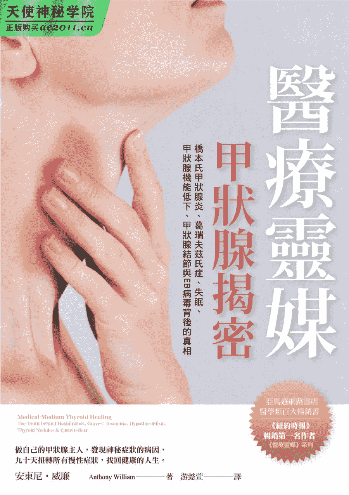

# 目录

1.  封面
2.  各界赞誉
3.  引言
4.  前言
5.  致读者
6.  第一部　甲状腺揭密
    1.  第一章　关于甲状腺的真相
    2.  第二章　甲状腺病毒的诱因
    3.  第三章　甲状腺病毒的运作方式
    4.  第四章　甲状腺的真正目的
    5.  第五章　甲状腺症状与病况说明
    6.  第六章　甲状腺癌症
    7.  第七章　甲状腺猜测检验
    8.  第八章　甲状腺药物
7.  第二部　阻碍你的重大错误
    1.  第九章　通往更佳健康状况的桥梁
    2.  第十章　重大错误一：与自体免疫混淆
    3.  第十一章　重大错误二：神秘疾病的错误观念
    4.  第十二章　重大错误三：以名称当作答案
    5.  第十三章　重大错误四：将发炎当作病因
    6.  第十四章　重大错误五：新陈代谢的迷思
    7.  第十五章　重大错误六：怪罪基因的游戏
    8.  第十六章　重大错误七：忽视无情四因素
    9.  第十七章　重大错误八：一切都是你的想像
    10.  第十八章　重大错误九：你创造了自己的疾病
8.  第三部　甲状腺重生
    1.  第十九章　重建身体的时刻
    2.  第二十章　没有甲状腺的生活
    3.  第二十一章　常见错误观念及应避免事项
    4.  第二十二章　强效疗愈食物、药草、补充品
    5.  第二十三章　九十天甲状腺复元计划
    6.  第二十四章　甲状腺疗愈食谱
    7.  第二十五章　甲状腺疗愈技巧
    8.  第二十六章　终于痊愈了：一位女士的故事
9.  第四部　睡眠的秘密
    1.  第二十七章　失眠与你的甲状腺
    2.  第二十八章　睡眠的泉源
    3.  第二十九章　找出睡眠问题
    4.  第三十章　治愈睡眠问题
    5.  第三十一章　为何噩梦对你有好处
10.  后记　灵魂的黄金
11.  致谢
12.  版权页

# 各界赞誉

“在见到我的三分钟内，安东尼就精准说出我的健康问题。身为医疗灵媒，他的能力独一无二且令人震撼，他的书把许多医生觉得棘手的疑难杂症解释得简单易懂，又提供了解决之道。”

──亚力山卓‧杨格（Alejandro Junger）医师，纽约时报畅销书《净化》（Clean）、《干净的饮食》（Clean Eats）、《干净的肠道》（Clean Gut）作者，以及“净化计划”（Clean Program）创始人

“安东尼值得我们全家信赖，他的书为全世界带来光明，引导许多人抵达平安之处。他对我们来说意义非凡。”

──劳勃‧狄尼洛（Robert De Niro）与葛莉丝‧狄尼洛（Grace Hightower De Niro）

“安东尼‧威廉的贡献中蕴含了超自然的神秘元素，而他发扬光大的观点，尤其是关于自体免疫疾病方面，带给人们真切又确实的感受。更棒的是，他建议的课程都很自然、简单又可行。”

──奥斯卡最佳女主角葛妮丝‧派特洛（Gwyneth Paltrow），纽约时报畅销书《一切都很简单》（It`s All Easy）作者，GOOP 公司内容长

“安东尼是我唱片公司旗下所有艺人的魔术师，如果将他比喻成录音专辑，必定能超越麦可‧杰克森的《战栗》。他的才能堪称深奥、卓越、非凡又令人惊艳，他是位杰出的作者，其书中充满预言，医学的未来就在这里。”

──克雷格‧考曼（Craig Kallman），大西洋唱片总裁兼执行长

“安东尼的书带来了革命却又相当务实。任何对目前西方医学限制感到失望的人来说，本书绝对值得你花时间阅读与思考。”

──詹姆士‧范德比克（James Van Der Beek）与金百利‧范德比克（Kimberly Van Der Beek），《音乐鬼才迪波洛》原创者、执行制作、演员，《恋爱时代》演员，公众演说者与社会运动者

“在阅读了《医疗灵媒》后，我就增加了甲状腺的治疗方式，并且见证了在患者身上卓越的效果。这结果相当值回票价，令人充满感激之情。”

──摘自豪尔中心创办人暨医学主任普鲁登斯‧豪尔（Prudence Hall）医师所撰前言

“安东尼不仅是位温暖、有同理心的疗愈者，带着神赋予的技能，他也非常可靠而精准。他一直是我生命中的美好祝福。”

──“黑珍珠”娜欧蜜‧坎贝尔（Naomi Campbell），模特儿、演员、社会运动者

“我的家人与朋友都是安东尼疗愈天赋的接受者，我们在恢复身体与心理健康上得到的益处，远胜于言语所能表达。”

──史考特‧巴库拉（Scott Bakula），《重返犯罪现场：纽奥良》制作人与演员，《香米小情歌》、《企业号》演员

“安东尼是个奇妙的人，他替我找出长久以来的健康问题，也知道我需要何种营养补充品，而我确实立即有所改善。”

──拉西达‧琼斯（Rashida Jones），《爆笑女警》演员暨制作人，《诚征辣妹》系列作者与执行制作，《公园与游憩》、《办公室》、《社交网战》演员

“安东尼‧威廉是少数能够运用天赋帮助他人发挥潜能、让他们成为自己健康代言者的人……我曾经参与了他令人喝采的现场活动，亲自见证了安东尼的伟大。他精准的诊断，就像歌手所有的高音都到位一样。但除了高音以外，安东尼充满慈悲的灵魂才是让听众着迷的主因。安东尼‧威廉是我引以为傲的朋友，我可以告诉大家，你们在播客听到的这个人，以及说的话成为畅销书内容的人，也正是伸出手拯救需要帮助者的人。这不是在演戏！安东尼‧威廉是玩真的，他透过神灵分享宝贵的信息，并且带来力量，正是这个时代需要的！”

──黛比‧吉布森（Debbie Gibson），百老汇演员、歌手暨歌曲创作人

“安东尼的天赋使他成为散播信息的渠道，而这些信息对现今科学而言遥不可及。”

──克莉丝汀‧诺瑟普（Cristiane Northrup）医师，纽约时报畅销书《让生活变得容易》（Make Life Easier）、《天使不老》（Goddesses Never Age）、《女性的身体》（Women`s Bodies）、《女性的智慧》（Women`s Wisdom）作者

“安东尼‧威廉拥有了不起的天赋！我非常感谢他，在许多疾病困扰我多年后，他终于替我找出了背后的原因。在他的支持下，我看到自己每天都有所改善。我认为他是相当了不起的信息来源！”

──摩根‧费尔钗（Morgan Fairchild），演员、作家、演说者

“本书作者在疗愈上的天赋异秉简直就是奇迹。”

──大卫‧詹姆斯‧艾略特（David James Elliott），电影《照相店》、《好莱坞的黑名单》、电视剧《天蝎》、《广告狂人》、《CSI 犯罪现场：纽约》演员，并于哥伦比亚广播公司《执法悍将》中连续演出十年

“安东尼的发现与慈悲的高灵使我们感动且获益良多。他的书确实堪称‘未来的智慧’，所以我们对佛教医疗文献中所预言，自作聪明的人类为了追求利益而干预生命元素，因而带来使万般折磨我们的难解疾病，已然奇迹般地拥有清晰且明确的解释。”

──罗伯特‧舒曼（Robert Thurman），哥伦比亚大学印度西藏佛教研究宗喀巴教授，美国西藏之家主席，畅销书《平静之人》（Man of Peace）、《爱你的敌人》（Love Your Enemies）、《内在革命》（Inner Revolution）作者，鲍伯‧舒曼播客主持人

“安东尼‧威廉是天赋异禀的医疗灵媒，对影响我们的难解疾病有真切又不极端的解决方法。我迫不及待想跟他交朋友，让他成为提供我与家人保健课程的珍贵资源。”

──安娜贝丝‧吉什，《电脑狂人》、《丑闻风暴》、《美少女的谎言》、《白宫风云》、《现代灰姑娘》演员

“安东尼将其一生奉献在运用高灵信息帮助人们，这些信息的确大幅改变了许多人的生活。”

──亚曼达‧卡德纳特（Amanda de Cadenet），YouTube 频道“对话”及“女性视角”计划创办人暨执行长，《一切很乱》（It`s Messy）与《女性视角》（#girlgaze）作者

“我爱安东尼！我女儿苏菲亚与萝拉把他的书当成生日礼物送给我，我一翻开就停不下来。他的书帮我链接了健康的所有要素。透过安东尼的著作，我才了解自己小时候生病残留的 EB 病毒，在日后破坏了我的健康。”

──凯瑟琳‧巴赫（Catherine Bach），《不安分的青春》、《飚风天王》演员

“在这个混乱的世界里，健康与幸福方面不断出现各种杂音，但我相信安东尼所说的话千真万确。他充满奇迹的真正天赋超越了一切，带领我到达清楚之处。”

──帕蒂‧斯丹格（Patti Stanger），《百万美元搭挡》（Million Dollar Matchmaker）节目主持人

“我几年前发生的嵴椎问题本来已经在稳定恢复中，后来却出现了肌肉萎缩、神经衰弱，以及体重增加的问题。某天傍晚，有位挚友打电话给我，建议我阅读安东尼‧威廉的《医疗灵媒》，里面的许多内容都引起我的共鸣，因此我开始采用书中提到的一些观念，接着很幸运能够前去求诊。他的诊断完全正确，让我的疗愈之路一片光明，拥有更深层与更丰富的健康。我的体重以健康的方式减轻了，也能够骑自行车、做瑜伽，回到健身房里，拥有充分的体力以及深度的睡眠。每天早上，我做完例行公事之后，就会微笑着说：‘哇，安东尼‧威廉！谢谢你的疗愈天赋……就是这样！’”

──罗勃‧威斯顿（Robert Wisdom），《别有隐情》、《私法家医》、《芝加哥警政署》、《音乐之乡》、《火线重案组》、《黑手遮天》演员

“我与家人的健康都仰赖安东尼。即使医生都被难倒，安东尼总是知道问题所在与疗愈方法。在这本清晰、友善且慈悲的书中，安东尼为这个时代许多令人深感困惑的健康挑战提供了解决之道。”

──雀儿喜‧菲尔德（Chelsea Field），《重返犯罪现场：纽奥良》、《秘密与谎言》、《失踪现场》、《终极尖兵》演员

“‘他的讯息确实可行。’这是说到安东尼‧威廉以及他对全世界的深入贡献时，我会有的反应。在到他对我多年老友的帮助之后，我清楚感受到这点。那位朋友多年来深受疾病、脑雾、疲劳所苦。她看了许多医师与疗愈专家，进行了许多治疗，都毫无起色，直到安东尼告诉她真相……从那时候开始，效果就非常显著。我非常推荐他的书籍、演讲、谘询。不要错失了疗愈的机会！”

──尼克‧欧尔纳（Nick Otner），纽约时报畅销书《释放更自在的自己》（The Tapping Solution for Manifesting Your Greatest Self）、《敲打解方》（Tapping Solution）作者

“接受安东尼施行的自信疗法十二小时后，去年以来就在我耳朵里嗡嗡作响的声音开始减弱，让我惊讶、感激又开心。”

──麦克‧杜利（Mike Dooley），纽约时报畅销书《来自太空深处的爱》（From Deep Space with Love）、《无限的可能》（Infinite Possibilities）、《来自宇宙的笔记》（Notes from the Universe）作者

“神秘的才能只有在搭配正直的道德与爱时，才能称为完整的天赋。安东尼‧威廉就是这样神圣的人，同时具备了疗愈、天赋、道德三者。他是货真价实的治疗者，他克尽职守，并且真正替全世界的人服务。”

──丹妮儿‧拉波特（Danielle LaPorte），畅销书《心灵真相》（White Hot Truth）、《欲望地图》（The Desire Map）作者

“安东尼是位先知与健康方面的智者。他的天赋非凡，在他的指引下，我已能明确找出并疗愈折磨我多年的健康问题。”

──克莉丝‧卡尔（Kris Carr），《纽约时报》畅销书《疯狂美味果汁》（Crazy Sexy Juice）、《疯狂美味厨房》（Crazy Sexy Kitchen）、《疯狂美味饮食》（Crazy Sexy Diet）作者

“安东尼是我们这个时代的爱德格‧凯西，能以显著的精准度与洞见解读人的身体。他能找出疾病的潜在原因，这些疾病经常令最精明的正统与另类医疗从业人员感到不解。安东尼实际又深刻的医疗建议，使他成为二十一世纪最具强大成效的疗愈者。”

──安‧路易丝‧吉图曼（Ann Louise Gittleman），三十多本健康疗愈类书籍的纽约时报畅销作家，以及广受好评的“脂肪冲刷排毒与饮食计划”发起人

“身为好莱坞的女商人，我知道何谓价值。在找到安东尼之前，他的一些委托人曾花超过一百万美元为自己的‘难解疾病’寻求帮助。”

──南希‧钱伯斯（Nancy Chambers），《执法悍将》演员，好莱坞制作人与企业家

“安东尼针对预防与战胜疾病的珍贵建议，比其他任何地方所能取得的信息都要先进许多年。”

──理查‧索拉佐（Richard Sollazzo），纽约肿瘤学家、血液学家、营养学家与抗老专家，《获得平衡的健康》（Balance Your Health）作者

“安东尼每推荐一种增进健康的自然疗法，都会有效。我已经在我女儿身上看到，且改善的效果令人印象深刻。他使用天然食材的方式，是更有效的疗愈之道。”

──马丁‧夏菲洛夫（Martin D.Shafiroff），财务顾问，曾荣登美国财富管理网站（WealthManagement.com）美国十大证券经纪人之首，以及 Barron`s 财务顾问之首

“我从安东尼的书中读到许多健康知识，他也准确道出只有我自己知道的身体状况。这位亲切、贴心、有趣、谦卑又慷慨的男士把我这个灵媒都吓了一跳！他真是现代的爱德格‧凯西，他能出现在我们身边，对我们而言是莫大的恩典。”

──柯蕾‧鲍隆瑞（Colette Baron-Reid），畅销书《未知》（Uncharted）作者，电视节目《神灵的讯息》（Messages from Spirit）主持人

“每位量子物理学家都会告诉你，宇宙中还有我们尚未了解的事正在发挥影响，我真的相信安东尼深深了解这一点。他拥有惊人的天赋，能直觉地知道最有效的疗愈方法。”

──凯洛琳‧李维特（Caroline Leavitt），纽约时报畅销书《孩子的家庭树》（The Kids`Family Tree Book）、《残酷美丽的世界》（Cruel Beautiful World）、《这就是明天吗》（Is This Tomorrow）、《你的照片》（Pictures of You）作者

# 引言

献给所有挣扎、受苦、感到失望、遭到遗忘、被排挤到边缘、受到忽视、遭到背叛的人。

献给那些持续奋战、坚毅不拔、已经疗愈或尚未疗愈的人。

我和你们站在同一条阵线上，我们可以共同使用知识、智慧、真相、爱，以及最重要的慈悲超越一切。

# 前言

在这本宝贵的书中，你会得到什么？你会得到治疗甲状腺疾病绝佳的创新方式。感谢安东尼‧威廉以及直接对他说话的声音，让你能够获得大量有关甲状腺疾病的全新信息，以及安全有效的疗愈方式。

身为在加州大学洛杉矶分校受训的妇产科医师，以及女性生物同质性荷尔蒙（bioidentical hormones）的先锋，我不断在寻找疾病以及退化的“根本原因”。我治疗过数千位甲状腺疾病的患者，也相信在美国只有半数的患者获得正确的诊断。就我的专业来看，这个国家很可能每十个人就有七个人罹患甲状腺疾病。透过阅读这本重要的书，你就能更深入了解自己的诊断结果及拥有所需的资源，以阻止这种疾病继续造成问题。在阅读了安东尼的《医疗灵媒—甲状腺揭密》后，我对那些难缠的病例拥有了全新的看法与解决方式。安东尼提到并不是所有患者都如同我们的期待，会对甲状腺荷尔蒙产生反应，这点完全没错。

身为医师，但愿能够有个具有智慧与精辟见解的声音，告诉我患者疾病的状况，就像安东尼‧威廉一样，我会认为那是百分之百的奇迹。如果能够有这种内在的帮助，我的许多同事也会感到相当感激，只不过我不认为整个医学界都会认为这样能够带来帮助。我并不清楚为何如此！美国人的主要死因之一，是处方药物以及目前的治疗方式。我们疯狂的给予患者抗生素，却看见了每年有数千起抗生素抗药性造成的死亡案例。我们使用药物让癌症患者的免疫力大幅下降，导致之后患者出现更多的癌症。每天，我都看到避孕药对年轻女性荷尔蒙造成的伤害。是的，我和你同样感到无助。

更糟糕的是，你知道医学界治疗的方式足足落后医学研究的知识多达二十五年吗？在信息科技领域中，这意味着即使现在市面上有许多新产品，别人还告诉你要去买四分之一世纪前笨重的 Apple II 电脑。谁会认为这是明智之举？我有位朋友是某间知名电脑公司德高望重的执行长，管理全球各地数千名员工与多座工厂。在生涯高峰时，罹患了恶性脑瘤。尽管他在美国接受最佳医疗机构的照顾，但是缺乏创新的医疗方式让他感到相当震惊。在信息业解决了许多极端复杂且看似无解问题的同时，他这种癌症的疗法十年来却都没什么进步。他是个很棒的好人，无助地感叹要是他经营公司的方式像执业医师一样，不用一个月公司就破产了。在我看着患者遭到“老派”传统医学的误诊以及不当处理时，也同样感到灰心。

这也就是为何我用欣赏与包容的心，看待安东尼的《医疗灵媒》以及《医疗灵媒—甲状腺揭密》这本新书。现今的患者需要解答，无法等到二十年之后才获得答案。此外，我很肯定知道这些答案不会只来自实验室或是临床实验。无论你将其称为意识、上帝、上天的声音、疗愈场或其他名称都好，安东尼确实能够利用这种十分宝贵的知识、智慧与疗愈资源。

研究人员、医师、其他科学家都对这种病毒以及疾病发展的链接相当感兴趣。多年来，我经常看到不同疾病都与病毒以及未来的癌症有关。例如，在一九六〇年代早期，EB 病毒被认为是某种罕见淋巴瘤的病因，现在医学证据显示这种病毒与霍奇金淋巴瘤、自体免疫疾病、多发性硬化症及每年出现的的数千种癌症有关。不过，我们对病毒如何造成这些问题，以及如何有效治疗这些病毒造成的症状，仍然一无所知。

在本书中，安东尼带来了有关甲状腺疾病的新观念，揭露 EB 病毒是重要的核心因素。他说明许多你听过的甲状腺神秘问题原因为何，并且提供绝佳且具有启发性的答案。营养补充品、饮食的智慧、药草、甲状腺疗愈技巧都相当独特，并且相当有价值。他让我们不用再因为甲状腺受苦，我完完全全同意他的说法。在阅读了《医疗灵媒—甲状腺揭密》后，我就增加了治疗甲状腺问题的方式，并且见证了在患者身上卓越的效果。结果相当值回票价，令人充满感激。

谢谢你，亲爱的安东尼，感谢你运用无与伦比的天赋帮助那些受苦的人。我非常感谢你具备这样的勇气，愿意奉献以及为全人类提供服务。但愿所有人，包含医学界在内，都能够听到你的声音，以及引导你的声音！

普鲁登斯‧豪尔（Prudence Hall）

豪尔中心创办人暨医疗主任医师

# 致读者

现在的慢性疾病达到史无前例的高峰。光是在美国，就有超过两亿五千万人罹病，或是出现神秘的症状。这些人过着莫名的生活、找不到解答，或是得到根本站不住脚，甚至是令患者更为难受的解答。若是如此，你就能够证明医学界仍然摸不清这种神秘症状的流行病到底是怎么一回事。

先让我澄清一点，我非常尊重对人有帮助的医学。有许多了不起且极具天赋的内外科医师、护理师、技师、研究人员、化学家等等，在传统与另类医学界进行着许多深入研究。我很幸运能够与这些人共事，也感谢上天创造这些充满慈悲的疗愈者。而学习以严谨、有系统的追寻方式来了解我们的世界，可说是他们最崇高的追求目标。

就像其他人类追求的目标一样，医学依旧是在发展中的领域，不断在进步中，所以某天看来仿佛是能够解决一切的理论，隔天看来可能就变得过时。这就代表着：科学仍无法提供所有的解答。

我们已经等了一百多年，希望医学界能够对甲状腺问题提出真正深入的洞见，却还没等到。你不该再等十年、二十年、三十年甚至更多年才能得知科学研究揭露的真相。如果你卧病在床、苟延残喘地过日子，或是觉得失去了健康，那么就不该再过一天这样的日子，更不用说再过十年了。你也不该看着孩子过这种日子，但数百万人却是如此。

这也就是为何高灵，也就是上天展现了慈悲，在我四岁的时候进入我的生命里，教导我如何看见人类痛苦的真正原因，并且把讯息传递到世界各处。如果你想要进一步了解我的背景，可以在《医疗灵媒》中看到更多有关我的故事。简而言之，就是高灵经常在我耳边清楚精确地私语，就像朋友站在我旁边一样，告诉我周遭每个人的症状。此外，年轻的时候，高灵也教我对人体进行扫描，就像核磁共振扫描一样，让我看见所有阻塞、疾病、感染、有问题的地方，以及过去曾发生过的问题。

我们能够看见你，知道你遭遇到什么问题，也不希望你继续受苦。我毕生的工作就是传递这样的信息给你，让你能够离开困惑之海，也就是今日各种健康流行与潮流的众多杂音与说法，让你重十健康，并且自行掌控生活的方向。

本书的资料完全正确、货真价实，完全为了你的好处着想。这本书和其他健康书籍截然不同。书中含有许多高密度的信息，你可能需要一读再读，才能确实了解所有的信息。有时这种信息很可能与你之前听说过的相反，有时也会和其他信息相当接近，却有着微妙且关键性的不同之处。但共通之处在于这是事实，并非旧瓶装新酒，或是回收后再利用的已知甲状腺健康理论。此处的信息并非来自利益团体、医学界的资助、有瑕疵的研究、游说人士、内部回扣、说服他人的信仰体系、有力人士的私人研究团队、医学界的贿赂，或是流行说法的陷阱。

以上种种包袱，阻碍了今日的医学以及科学研究，使其无法以大幅跃进的方式解开慢性疾病之谜。在外部来源拥有既得利益、刻意模煳某些事实的时候，就会让珍贵的研究时间与资源投入在毫无帮助的领域上。事实上，某些研究发现确实能够让遭到忽视或缺乏资金挹注的慢性疾病改善治疗方式。但我们认为绝对能够办到的科学资料，事实上却被扭曲、遭到污染与操弄，并且被其他甲状腺专家视为定律，甚至原本就带有瑕疵。

为了要符合事实，并且让你在接下来的内容厘清甲状腺疾病，你并不会看到我引用任何无益来源产出的科学研究结果。你不需要担心这些信息像其他健康书籍中的一样，会出错或是必须终止，因为我在此分享的所有健康信息，都是来自纯粹且未遭到操弄的高等纯净来源：高等慈悲的灵。没有什么比慈悲更能够带来疗愈。

如果你只相信科学界的说法，请你务必了解我也喜欢科学，也请你明白科学界以及甲状腺研究在今日的世界中相距甚遥。甲状腺仍是医学界的谜团，有关这个腺体的医学研究仍相当模煳，也缺乏有关甲状腺疾病肇因的明确答案，这和许多其他有确切测量工具的科学领域不同。目前科学界对甲状腺的认知只有理论，而今日的理论却与事实相去甚远，这也就是为何有许多人仍在与甲状腺问题奋斗。科学界的认知与甲状腺的交集仍不多，两者遥遥相隔。

过去我们相信权威的法则，我们曾经听说地球是平的，以及太阳绕着地球转，所以我们就相信了。那些理论并非事实，但大家却将之视为真理。过去的人并不会觉得生活落后，过去的生活方式就是如此。任何提出与现况相反的看法，就会被当成傻瓜。接着科学出现了典范转移（Paradigm Shift）。那些追求真理且全力投入的研究者与思想家，那些不满于接受表面“事实”的人，最终证明了分析能够打开一扇门，通往对世界更深入、更真实的理解之道。

现在，科学成了新的权威。在某些情况下，这点能够救命。例如，现在外科医师会使用消毒的工具，因为他们知道过去外科医师不知道的污染风险。但我们不能因为某些方面的进步，就停止追寻的脚步。现在是再次进行典范转移的时候了，因为“科学”不足以成为慢性疾病的解答。那是良好的科学吗？背后的资金来自何处？样本的大小与多样性足够吗？够大吗？对照组的处理方式符合伦理吗？是否将足够的变因纳入考量？测量工具是否够先进？结果中所列出的分析，是否和数字呈现的有所不同？是否有偏见存在？是否有有力人士介入研究其中？

我们老实说，即使是今日我们认为相当完整的科学领域，有时候还是会出现破绽。如果你听说过髋关节置换手术的零件，或是疝气修补用网膜，你就知道我要说的是什么了。这些是有形的物品，我们采用精确科学标准设计的物品，并且在使用之前经过了严格的科学方式检验，但即使是这种高度科学化的流程，仍然无法保证完美。有些产品会造成无法预期的问题，这个原本似乎是不容起疑的科学领域，却发生了错误。接着你想想，在科学界对甲状腺与其真正功能的认知上，有多少不确定的因素。这并不是你伸出手就能够触及、测量、分析的物品，而是人体中正在活动的器官。我们都知道人体是最伟大的奇迹，也是生命的谜团。同样的，科学也是人类追求的目标，也正在发展中，在解开人体之谜的领域方面更是如此。这需要经过长时间的警觉、接受、适应，才能够让这项工作拥有真正的进展。

如果你从来都没有出现过健康问题，那么如果有某个问题多年以来都无法得到答案，让你感到相当痛苦，或是你非常赞同某个医学、科学、营养学体系中与甲状腺有关的看法，那么我希望你能够带着好奇心以及开放的态度，看待接下来的章节。今日流行的甲状腺疾病，背后的意义远大于过去所有的发现。你接下来会看到的，与你之前曾看过的所有甲状腺信息截然不同。这项信息在过去数十年来已经帮助了好几千人。

从开始分享高灵提供的信息之后，我很幸运地能够看见这些人的转变。在《医疗灵媒》系列出版之后，我相当感动能够看到这项信息传播到世界各地，再让好几千人受惠。

我也发现其中有些讯息遭到扭曲，有些人为了要成名与获得认同而这么做。这种方式根本是在利用众人的苦难，踩着别人的尸体往上爬。

我所拥有的天赋不该遭到如此漤用。我们乐意见到大家熟知我分享的医疗信息，成为这方面的专家，为了真正帮助他人而传播这种慈悲的讯息。我非常感激这么做的人。但危险的是，这些讯息遭到操弄，夹杂着现今流行的错误信息且遭到扭曲，有时只改变了一部分，所以听来仿佛是全新的理论，或是遭到公然剽窃，或是援引自看来可以信赖，事实上却缺乏真实性的来源。我会这么说，是因为我要你明白如何保护自己与自己挚爱的人，远离各种误导的说法。

本书和你已知的现有观念不同，不是在说所有健康问题都源于甲状腺，或是采用时下流行的高蛋白饮食法让症状远离你。这里要提供全新的信息，以全新的角度看待限制许多人生活的症状，以全新的角度看到疗愈的方式。

我了解你可能会感到担心。人本来就会对某事产生反应，并且进行判断。我们在某些情况下，可能会出自本能想要保护自己。在某些情况下，这么做能够让我们度过生活的难关。但在这件事上，我希望你能够慎重考虑。你很可能让自己失去了解真相的机会。你很可能失去帮助自己或是其他人的机会。

所以，请你在此和我一起系上安全带。我们无时无刻都在一起，共同帮助大家变得更好，我也希望你能够成为甲状腺健康方面的新专家。感谢你和我一起踏上疗愈之路，花时间阅读这本书。了解真相，就能够改变你以及周遭的人的一切。

# 第一部　甲状腺揭密

## 第一章　关于甲状腺的真相

在重要的一天醒来之后，你精心打扮、努力吃早餐把胃塞满，留言给老板说自己晚点才会进办公室。而在开车去看医生时，你脑中闪过一个念头，认为下次再握方向盘时，就能让自己的生活更加受控。

你最后或许能够获得答案，得知为什么自己会失眠、无法控制体重、经常和脑雾问题奋斗、看着自己的头发越来越少，或是必须面对经常感到疲劳的问题。至少，你认为可以找到原因，知道为何自己出现以下症状：热潮红、手脚冒冷汗、指甲容易脆折、皮肤干燥、心悸、腿不宁、记忆力衰退、飞蚊症、肌肉无力、荷尔蒙不稳、头晕、刺痛发麻、耳鸣、酸痛疼痛、焦虑、忧郁等。在候诊室里，等着护理师呼唤自己时，你几乎无法专心阅读腿上放着的杂志。

那一刻终于到来，你被领进诊间、坐了下来，努力让呼吸缓和下来。几分钟之后，医生走了进来，在和你闲话家常一阵子之后，就做出判断：“你得了桥本氏甲状腺炎。”

在听到疾病的名称之后，确实让你松了一口气……不过光是听到病名，却没办法让你了解问题所在。“那是什么？”你问。

“我们刚刚拿到的验血报告，显示甲状腺的抗体偏高。此外，你的甲状腺激素也偏高，上次检查的结果也有甲状腺肿大的迹象，再加上出现的那些甲状腺症状，显示你体内的免疫系统有些混淆。这种情形称为自体免疫反应，表示你的身体正在攻击甲状腺，就好像甲状腺是外来物质一样。这样会造成甲状腺发炎，最终会摧毁甲状腺，让你的甲状腺功能慢慢降低。”

想到脖子上这个小小的无辜腺体，遭到自己的免疫系统攻击，那种松了一口气的心情瞬间烟消云散。刹那间，你多么希望这段对话是网购的鞋子，在你觉得穿来会让脚趾疼痛时，可以立刻退货。鞋子不合脚，你在退货单上这么写，接着你就可以摆脱鞋子，再去找双合脚的。但现在你却只能努力面对现实：“为什么会这样？”

“有可能是你的基因中，自体免疫系统就比较容易受到影响，细菌、饮食、压力等都会导致发病。”

“但是人体为什么会攻击自己？为什么会搞不清楚状况？”

“那个……”医师说：“造成自体免疫系统的确切原因至今仍然不明，”他同情地笑了一下。“但是现在的研究每天都突飞勐进。我们现在来谈谈要用什么药治疗吧。”

在开车离开诊所时，你并没有感到拥有更多的控制权，反而有种遭到背叛的感觉。你的身体怎么能够让你失望到这个地步？你到底是做错了什么，才会让免疫系统变得疯狂不受控？如果你连自己的身体都不能信任，那还有什么可以信任的？

或许上述的情形，和你的状况不尽相同。或许你被诊断出来的是葛瑞夫兹氏症。医生说，这种自体免疫疾病会让你的甲状腺太过认真。

或是你得知自己罹患原发性甲状腺机能低下，也就是你的甲状腺荷尔蒙分泌不足，诊断的依据可能是验血结果，或是由功能医学医师透过你的症状判定。抑或你得知罹患甲状腺结节，甚至是肿瘤。你询问医师为何会发生这些问题，医师会说你可能过早老化。如果你现在只有二十多岁或是三十多岁，这真是非常沉重的讯息。

或许医师不只诊断出甲状腺问题而已。除了桥本氏甲状腺炎、葛瑞夫兹氏症、甲状腺机能低下、甲状腺机能亢进、甲状腺炎、甲状腺增生以外，你很可能听到自己罹患了莱姆病、类风湿性关节炎、纤维肌痛，或是自己进入了近更年期、更年期。其他人可能开玩笑地说你“没希望了”，或说你是忧郁症患者。他们明知道你只希望能康复却这么说，这造成伤害的程度远超过他们所知，让你觉得没有人真的听见你的心声。

或许在你第一次看医师时，检查或体检的结果一切正常。接着，你希望找到答案，于是看过一个又一个医师，最后，你还是找不到答案。你开始对医师以及你自己失去信心。相信所有的症状都来自脑中一段时间之后，你会用所有最新的文献教育自己，做出对自己健康情形的结论。你试过改变饮食，觉得有些改善，不过每天还是过得有点辛苦；你还是不太喜欢自己。

或是你太紧张，不敢因为疲劳、焦虑、脑雾、晕眩问题去看医师。你读过几篇有关甲状腺问题的文章，猜测自己的病因是否正是如此。

又或许你挚爱的人长期深受难以说明的症状所苦，或是罹患了明确的甲状腺疾病。你在他身边，见证了这种慢性疾病有多痛苦，并且希望能让疾病消失，恢复健康，让你的挚友或家人回到原本的模样。

抑或者你是一位医师，看见一位又一位的患者遭到慢性疼痛或不适折磨。你随时了解最新的免疫理论与甲状腺健康新知，从患者的症状中找出端倪，而不会只从验血结果找出答案，还会利用最新的工具来控制患者的慢性疾病，并且在药物无法减轻病情时进行观察，一直等待着研究上有所突破，能够一次就解决甲状腺之谜。

如果你的经验和上面任何一种相符，那么你并不孤单，你是数百万对抗这种神秘症状的人之一，这些都和医界归类的甲状腺疾病有关。虽然你有自己的故事，有专属于自己的独特经验，但有一大群勇敢且不辞劳苦的大军，为了找寻关于甲状腺健康的伟大事实而奋战不懈。

仅管你遭遇了许多困难，却不得不继续迈步向前。不管你听过多少次“自体免疫疾病就是身体在攻击自己”、无论你听过多少人说“甲状腺问题都与基因有关”，无论别人多常怀疑你是否真的那么痛苦，或是你怀疑自己，担心自己有缺陷，或是想知道自己是否还不够努力，都有一种想法挥之不去，就是必定有什么事不太对劲。

你的身体为何会攻击自己？如果甲状腺问题是由基因引起的，为何在近年来才开始普及？你身体感受的所有痛苦，为什么有可能只是你的想像，或只是宇宙的报复而已？

你想，在一切背后必定有更深入的解释，必定有让一切更为合理的真相，你的内心深处非常清楚这一点。

你的想法完全正确。

##### 责怪的游戏

请放心，你出现的那些症状与疾病，并不是你的错。

懂了吗？我再说一次，因为假设与你想的完全相差十万八千里：你出现的那些症状与疾病，并不是你的错。

你并没有创造自己的疾病。你并没有主动招致疾病，或是让疾病现身。你没有在幻想。你不是因为自己疯了、太懒惰、意志力太薄弱、有缺陷，或是太无聊才生病的。你不是因为拥有错误的想法，或是过度恐惧才让自己出现这些症状。你并非来自有缺陷的家族，你并没有偷偷希望因为生病而获得关注，因此下意识地不让自己康复。你承受了这些痛苦，不是因为遭到上帝、宇宙的惩罚，也不是此生或前世业力的爆发。

同样的，你的身体也没有让你失望。甲状腺的症状与疾病并非身体在对抗你。身体不会背叛你。你的身体只会日以继夜地支持你，因为你的身体会无条件地爱你。

最新的甲状腺信息还是没提供这些关键的事实。为什么呢？因为我们活在充满了责怪的世界里。身为人类，我们习惯做有正确答案的填充题。宇宙之谜就是如此：如果我们没有关于时间或空间的正确答案，我们通常能够忍受，可以等待几代之后获得的清楚答案。但如果在日常生活中，遇到了未知的事项影响我们，例如疼痛的问题，如果无法找到答案，往往就会让我们相当沮丧。

所以我们就会做填充题；只要有什么地方出错，我们就希望能够尽快获得解答。如果工作上的某项任务出错了，每个人都希望立刻知道是谁犯的错。这点是根据神圣的原则而来：责任与承担。我们越快找到答案，推论出原因，就越能够确保未来不再犯下同样的错误。

但如果我们责怪的对象错了，又会如何呢？如果在急忙找出试算表的错误时，有位经理怀疑是你这位执行长一开始下达的指示不佳，又会如何？如果在未来的几年，你在分派工作时，大家都不信任你，让你连自己都不敢相信，又会如何？但奇怪的是，能够找到工作出错的点，反而能让大家觉得比较自在。

只不过，如果找到的答案不正确呢？如果每次别人指责你时，背后的真相其实是：你已经给出了完美的指示，员工早该花点时间，发现真正的问题出在电脑的程序错误之处，那又如何呢？

现在的甲状腺疾病就是如此。得不到解释说明为何大量的人长期遭受疼痛或不适，这实在有损医学权威的形象，因为他们应该无所不知。因此，在这种缺乏解答的状况之下，研究的结果就出现自体免疫理论，将责任推到你的身体上。这些医学上的错误观念，看待慢性疾病的方式可说是大错特错，本书会在第二部仔细讨论。这些原本的出发点都很好：医学这门科学想告诉你出现失眠、无法控制的体重增加、极度疲劳的原因，让你不再过着悲惨的生活。

但问题是，这些理论往往如雨后春笋般快速出现，某项理论如果太常被引用，很长一段时间都有人引用，就会被误认为事实。所以医学研究就会创建在自体免疫系统理论正确无误的基础上，并且进一部探讨各种原因，了解自体免疫系统为何会攻击甲状腺。这么做并不能找到答案，因为自体免疫疾病并非是身体攻击自己的情形，甲状腺疾病也并非源自老化、基因、观念错误、陷入某种情绪、摄取某种食物引起的发炎。

无论年龄为何，要确诊为甲状腺疾病并不容易。接受一大堆检查，觉得自己的重要功能出现错误，确实是种负担。同样的，面对神秘的症状，却无法得知造成身心问题的病名，也是沉重的负担。

到了老年时期，你会觉得这对你来说是个不公平的障碍赛。当你身上的义务可以慢慢卸下来之后，应该要有机会享受人生才是，现在却出现了这些症状挡路。

你在三十岁、四十岁、五十岁时，甲状腺问题会让你觉得未老先衰。你努力建构起来的生活、打造的家庭与事业，突然间仿佛随时都会分崩离析。你会担心自己无法照顾该照顾的人、无法继续做自己该做的事。

如果你刚成年，出现这些症状会有如遭到判处无期徒刑一样。在开始要结婚或发展事业的年纪，或是在你要开始组成家庭、打开专业生涯的时候，突然就被迫退出比赛，担心要如何养活自己，或是开始与维持一段关系。

无论处在生命的哪个阶段，你已经承受了许多。你最不需要的，就是觉得疾病是来自于自己的过错，这可是完全背离事实的事。所以，让我们现在就把责怪自己这件事排除在公式之外。让我们了解甲状腺疾病的真相，最终就能找到疗愈的方式。

##### 带有病毒的甲状腺

希望在二、三十年之内，医学界就能够研发出适当的检验方式，提供你可以真正放心的答案。如果你现在正遭受甲状腺疾病所苦，我很怀疑你觉得自己还可以等上二、三十年。你已经等得够久了，你已经受苦够久了，你已经够有耐心了。现在，该是时候了，该用真相保护自己，并且了解困扰自己的因素是什么。

如果你被诊断出桥本氏甲状腺炎、甲状腺机能低下，或是其他甲状腺问题，这往往是因为你没有获得最有效的治疗。由于医学界并未深入了解造成甲状腺疾病的原因，目前还无法提出治本的方式。

如果你因为甲状腺问题接受检验，检验报告的结果显示为正常，你依旧很可能有甲状腺机能低下或亢进的问题，只是没有被发现而已。这是因为甲状腺检验并非百分之百准确，有些具有远见的医师，已经开始留意到这一点。他们看见许多患者出现典型的甲状腺病征，不过检查报告的结果却显示一切正常，于是他们得到了正确的结论，也就是罹患了甲状腺疾病的人，很可能比透过传统方式诊断出来的人还更多。对这些受过高等医学训练的人来说，甲状腺疾病已经成为了一种流行病。

但很可惜即使是今日最新的甲状腺信息依旧有不足之处。不仅不足，还有许多错误之处。由于甲状腺疾病依旧遭到误解，即使是今日最新的甲状腺健康书籍，尚未上市就已显得过时。报导新知的新闻节目上找来专家分享的甲状腺理论，仍然跟不上时代。

我多么希望现在已经出现明显的答案，能让你觉得好受许多。但事实上并没有，你还是需要知道这点，才不用继续浪费宝贵的时间，爬梳现有的资料，因为那些以慢行疾病为基础的理论，现在早该被视为古董了。如果有书告诉你桥本氏甲状腺炎及葛瑞夫兹氏症发生的原因，是身体对自己发动攻击，并说这是根据最新研究而来，那么最好把这本书当作古董吧。这代表要读懂甲状腺理论，就好像在逛古董店一样。这些理论或许是可爱的收藏品，可以让你看见旧有思想的面貌，现在却帮不上你的忙。

虽然这些随手可得的信息，目的是要帮助你，但其实却会让人变得无所适从。如果这些资料最后都让大家聚焦在甲状腺上，为何说是无所适从呢？原因有两个：第一，这些资料的基础，还是创建在“自体免疫疾病是身体攻击自己”的前提上，这点背离了事实，我们不久之后会详细讨论这点；第二，内容越聚焦于甲状腺上，大家就越不愿意退一步思考全貌。

其实这背后有着更为完整的全貌。

今日的理论，只注意到了诱饵，就像猎人在池塘里放的木制水鸭一样，目的在于引来一大群鸭子，让猎人更容易瞄准猎物。这个诱饵，也就是甲状腺，是无数疾病的罪魁祸首，会让人分心。如果我们拿走望远镜、走到高地上，就会发现有个安全的地点是鸟类安栖的天堂。同样的，如果你找到甲状腺真相所在，就能够拯救自己与挚爱的人一命。

大家的甲状腺真的遭到攻击吗？是的。甲状腺是健康中重要的一环吗？重要性远超过大家的想像。甲状腺机能低下是造成数百万人罹病的原因吗？不是。

有个非常重要的事实，遭到了医学期刊、网络、最新文献一致忽略：甲状腺问题并非某人罹病的最终原因，出状况的甲状腺只不过是其中一种症状而已。

甲状腺疾病不只是脖子上一个小腺体的问题而已。甲状腺的问题无法说明一个人身上的各种的问题；甲状腺不是最终链接所有问题的关键。造成甲状腺疾病那一长串症状的罪魁祸首，比甲状腺本身分布更广、更具侵略性。这个元凶就是甲状腺病毒。

每个体内有这种病毒的人，不是已经罹患了甲状腺问题，就是即将出现这种疾病。这种病毒不会经过甲状腺。等病毒到了甲状腺，那已经是第三期了，早在这个时间点之前，病毒就已经对你的健康造成了影响，无论你是否有明显的感觉都一样。事实上，你所有的健康问题都可能来自这个根源。既然这种病毒到了甲状腺里，就不会善罢甘休。病毒的目标是要进一步征服你的神经系统，造成数十种神秘的症状，并且进一步对你的健康造成严重伤害。

不过你现在有机会了解本书里更多的真相，就拥有阻止这件事发生的力量。

在第一部“甲状腺揭密”中的章节里，我们会仔细探讨甲状腺病毒、了解病毒运作的方式、如何造成你身上的症状，以及如果你接受甲状腺检查，或尝试使用药物治疗时，应该注意哪些事项。在第二部“阻碍你的重大错误”中，我们会检视重大的错误观念，看看它们如何造成今日大家对慢性症状与疾病的误解，以及如何影响疾病的痊愈。在第三部“甲状腺的重生”中，你会看到疗愈的工具箱。我们会检视如果摘除了部分或全部的甲状腺，应该要知道哪些事，如何在病毒攻击时阻止病毒，以及让你的甲状腺与身体其他部分恢复健康活力的秘密。这些包括了特别的“九十天甲状腺复元计划”，以及帮助甲状腺疗愈的食谱。

最后，在第四部“睡眠的秘密”中，我们帮助你追根究柢探索你的睡眠问题，包括半夜醒来、早上起来觉得没有休息到，以及难以入眠等问题。睡眠问题往往被认为是甲状腺的问题之一，但失眠其实不只与甲状腺功能不佳有关。对医学界来说，睡眠问题依旧是个谜，这也是在感染甲状腺病毒之后复元的重要元素，也能够确保你未来的健康，所以我会在本书深入探讨，并自成一部分。我们都应该拥有大量能够获得休息的睡眠，如果我们知道如何破解密码，就能够获得优质的睡眠。

##### 你就是新的甲状腺专家

本书具有你期待已久的明确答案。这些答案来自更高等的源头，带你来到生活中的这个位置，并且让你能够扭转生活。你已经让自己迈上疗愈的道路，了解真相就是最重要的一大步。

在你达到这个最后阶段之后，就能拥有关于甲状腺的专业知识，这种知识远胜过现有的任何理论。你也会比任何研究甲状腺的人具备更多知识。毕竟，甲状腺专家是什么？是某个擅长说明某种假设的人吗？还是某个了解甲状腺真正全貌的人？不久之后，你就会了解你的甲状腺以及全身的实际情形，能够利用这些事实来帮助自己痊愈。你必定会成为甲状腺专家。

还不只如此。在你改变的同时，其他人会见证这一切，他们会问你转变的秘密。无论在杂货店里、在书店里、在网络上，或是在朋友与家人之间，你都能够带领大家了解甲状腺的真相。你将会走上真正的疗愈之路。你的专业将会帮助更多人，多到超乎你的想像。

我们现在就开始吧。

## 第二章　甲状腺病毒的诱因

如果你正在与甲状腺问题搏斗，很可能会问自己几个问题：那是怎么发生的？为什么我会罹病？为什么是现在发病？

我很肯定在你出现症状之前，应该面对了某些痛苦的问题。我们在生活中，要面对的苦痛相当多。分手、背叛、挚爱的人过世、照顾生病的家人、财务上的困难、受伤等等。我从小开始，就看见大家面对这些试炼、挣扎、失去的情形。我看过他们受苦的情形，知道那有多么难捱。

接着有那么一天，除了这些事以外，你开始觉得不舒服，开始觉得体力变差，牛仔裤很难拉得上，没来由地心跳狂飚，头发开始一撮撮落在肩膀上，觉得阵阵发冷或发热，肌肉开始疼痛，变得无法专心，或是记忆力开始衰退。

你可能必须辞掉工作、停修课程，没办法随心所欲地照顾孩子，必须和友谊与机会说再见，过着每天连让身体功能维持正常都要大费周章的日子，实在相当令人沮丧。

出现甲状腺疾病的时间点，让你觉得疾病极为残酷无情。在生活特别困难、特别难以平衡的时候，疾病就会坐到你的大腿上，让你不得不把平衡抛出窗外。

或许你的症状突然凭空出现。一切本来好好的，突然间没有任何预警，生活就跟以前不一样了。突然间，你就不是原本的你了。

在这两种情况下，也就是疾病变成压垮你的最后一根稻草，仿佛流沙一样，我们可以试着了解让你走到这一步的诱发因素。这些事件、情绪感受、环境因素与其他状况，会给予甲状腺病毒所需的燃料，让病毒进入活跃生长的状态。换句话说，会让你陷入健康的危机。

##### 诱发因素的机制

在感染了甲状腺病毒之后，病毒的目标就是要透过血液，进入淋巴结或肝脏、甲状腺等器官，最后进入中枢神经系统。在这个过程中，往往会有些缓解又复发的情形，说明了为何这种过程往往会横跨很长一段时间，最后病情每况越下。在过程中的不同时间点里，病毒会躲藏在身体，慢慢增加数量，等待适当的时机进行下一个步骤。何谓“正确的时机”？就是诱发因素。

你还记得最早感到失控，或是原本控制良好的症状突然恶化是什么时候吗？你发现这些症状都正好在经济状况窘迫、离婚、其他创伤、生产后出现吗？这些常见的因素，都会把甲状腺病毒从沉沉睡状态中唤醒，转换为攻击模式，造成甲状腺问题，有点像把冬眠中的棕熊吵醒一样。

在你觉得生活不顺时，甲状腺疾病会悄悄抬头、伺机而动，这绝非偶然。那并非代表你内心压力过大就会招致疾病，完全不是这样。你也没有在不知不觉中拥有负面想法、希望自己会病倒。事实上，是这些强烈的经验引发了生理反应，例如荷尔蒙大量分泌，分泌了过多的肾上腺素，给予病毒充足的燃料。在此同时，这些经验与事件传递讯号给病毒，告诉它们这时候免疫系统不若平时强壮，是病毒可利用的好机会。

另外也有些时候与情绪状态无关。有可能是你移除了牙齿的填充物，将水银释出到血液中（那是甲状腺病毒最爱的食物）。或是你暴露在其他甲状腺病毒的燃料下，例如杀虫剂，或是让免疫系统低下的霉菌里。

你可能听说过病毒就是会自行繁殖。如果你相信这种说法，那就是被误导了。无论目前的医学研究或是科学发现如何，事实上，不管燃料以什么形式存在，无论是荷尔蒙、毒素、你实际上吃的食物（请见第二十一章［常见的错误观念以及应避免的事项］）都好，病毒就是需要燃料才能繁殖。

虽然只要有一种诱因，就能让甲状腺病毒不再沉睡，但几种诱因积年累月下来一起造成影响的情形也相当常见。例如，你的问题始于童年时期，父母或照顾者给你很大的压力。慢慢长大之后，你可能遇到一两次情感上的挫折、发生车祸、饮食不当，或是失眠。以上种种都伤害着你的身体，到了某个时间点，在出生时、就学时、甚至是最近外出用餐时感染的病毒，这些在生命中任何时刻都可能感染的甲状腺病毒，就找到了现身的机会。

##### 诱因清单

在你阅读下列最常见的甲状腺病毒诱因清单时，看看是不是有哪一点让你灵光乍现。从这个新的观点看来，你身上出现症状的时间点是否事出有因？

别忘了，许多诱因很可能当时就已存在，但你却没有察觉。你很可能暴露在杀虫剂下，却完全不知情，或是缺乏营养，但验血却没查出来，也可能是经历了其他诱因，例如清洁地毯这种不算生命中的重大事件。

在你回想这些诱因之际，很可能就可以开始拼凑全貌。最终，你就会明白为何疾病会在某个时间点来袭。以下诱因以常见程度排序，最常见的最先列出，较少见的则列在最后。

1.霉菌：长时间处在有霉菌的建筑物中，例如家中或办公室里，很可能让免疫系统的功能受损，让甲状腺病毒伺机而起。

2.含汞的牙齿填料：如果你口中有金属填料（也称为银粉），在移除时请小心，因为当中含有的水银很可能原本维持在稳定的状态，却在移除的过程让有毒的汞进入血液中，提供食物给病毒。如果你想移除牙齿里的金属填料，请牙医师一次移除一颗的填料就好。

3.其他形式的汞：由于汞是甲状腺病毒最爱的食物之一，请避免接触任何形式的汞。例如，经常吃海鲜，像是鲔鱼、旗鱼等可能含有大量汞的鱼类，很可能会让你的免疫系统瓦解，受到甲状腺病毒的感染。汞很可能也会透过血液系统输送至全身各处，造成代代相传的问题，但往往被误以为是基因问题。此外，也请随时留意目前接触到汞的可能。即使处在今日的现代社会中，我们仍然有接触到水银的机会。请做些调查，检查一下别人给自己、孩子、其他家人使用的物品。

4.缺锌：缺乏锌很可能是遗传因素造成的，在数代之后，这种缺乏的情形可能变得越来越严重。如果你在一生中的某个时候锌值特别低，就很容易感染甲状腺病毒。

5.缺乏维生素 B[12]：即使你接受血液检验，结果显示维生素 B[12]的值正常，并不代表那些就是身体可利用的维生素 B[12]，并且已被身体需要的部位吸收。你的中枢神经系统、肝脏，或是其他器官仍然缺乏维生素 B[12]，让甲状腺病毒能够快速生长。

6.杀虫剂、除草剂（包含 DDT 在内）：暴露在草坪、花园、公园、高尔夫球场喷洒的这些有毒物质中，可能对你的身体造成伤害，同时也让甲状腺病毒能够伺机大量繁殖。杀虫剂与除草剂，特别是 DDT，也可能代代相传，这也是另一个常被误认为遗传疾病的原因。

7.室内杀虫剂：杀死苍蝇、蚂蚁、蟑螂或杀死其他昆虫的杀虫剂，也都会毒害你。这些毒素会累积在你的器官中，造成忧郁等问题，同时也会成为甲状腺病毒的燃料。

8.至亲过世：任何形式的情感创伤都可能削弱免疫系统，造成肾上腺释出“负面”情绪的荷尔蒙，让病毒伺机窜起。挚爱的人死亡，特别容易造成甲状腺病毒的窜起。

9.心碎或背叛：难受的离婚、分手、背叛也是另一个造成甲状腺系统低下以及大量荷尔蒙分泌的状况，是适合甲状腺病毒伺机而出的正确配方。

10.照顾罹病的挚爱者：看见挚爱的人罹病，以及照顾对方这两件事，让你的负担特别沉重，有时候甚至能够完全感受到对方的痛苦。这又是会同时让免疫系统低落及甲状腺病毒肆虐的情形。

11.“对病毒友善”的处方药：抗生素以及苯二氮平类药物会让免疫系统变弱，并且喂养甲状腺病毒。如果你怀疑自己体内有这种病毒，请和医师讨论，重新评估目前使用的药物。

12.过量的处方药：服用高剂量的药物，尤其是一次服用，很可能会成为免疫系统难以承受的混和物，打开病毒攻击之门。如果有不同的医师开立药物给你，请确认对方了解你接受的所有治疗，并再次确认最适合你的剂量。

13.荷尔蒙的变化：重大的荷尔蒙变化，例如青春期、怀孕、生产等，都可能替甲状腺病毒带来最爱的食物：荷尔蒙。大量的这类荷尔蒙在血液中流窜，能够提供甲状腺病毒赖以大量繁衍的燃料。在荷尔蒙变化的高峰期时，免疫系统也会变得较弱，甲状腺病毒也可能趁虚而起。这也就是为何许多青少年以及新手妈妈突然发现自己罹病的原因。

14.娱乐性药物漤用：非法药物所含的毒素，同时会破坏你的免疫系统，并提供燃料，造成甲状腺病毒的感染。

15.财务困难：若你活在担心失去房子或工作的恐惧里，担心付不出帐单，或是需要接额外的工作来支付意外开销时，负面的情绪可能会让你难以承受。担心失败、担心死亡、担心失去良好形象，以及羞愧都可能随着这些状况而来，而降低免疫系统抵抗病毒感染的能力。

16.身体受伤：扭到脚踝、摔断腿、车祸，或是其他身体的伤害或创伤，都可能会耗损你的身体，到了某个时间点甲状腺病毒就会从沉睡中苏醒，造成感染。如果你需要接受手术，病毒更是获得了难得的机会，因为外科手术通常都会需要使用抗生素。

17.专业地毯清洁：许多传统的地毯都含有毒素，加上地毯清洁溶液都含有合成的化学物质，对你来说毒性相当高。所以“清理”地毯的过程可说是毒上加毒。每天好几个小时吸到这些物质释放的气体，会让你的免疫系统低下，并且喂养甲状腺病毒。如果你非常敏感，请考虑移除家中的地毯。否则的话，请选择“绿色”地毯、有机的清洁液，以及现代的“绿色”清洁服务。

18.新油漆：大部分的新油漆都会让空气中充满有毒的气体。如果你待在刚粉刷的家中或办公室里，空气循环又不佳的话，最后毒素很可能会削弱你的免疫系统，引发甲状腺病毒。请选择不含有机挥发化合物或含量低的油漆，即使如此，在长时间待在室内之前，还是应该先让大量的新鲜空气流通。

19.在夏日游泳：在温暖的季节时，湖中或是海边大量生长的红藻会造成氧气降低，致使细菌滋生，削弱你的免疫系统，诱发休眠中的甲状腺病毒。如果你打算去游泳，请务必留意避开红潮区（red tide）。

20.迳流：旧垃圾掩埋场或是其他有毒来源的迳流可能含有重金属以及其他有害的物质，流入附近的湖中，在炎热的夏季时这种情形更是严重。你在这些受污染的湖中游泳，就会接触到毒素，降低身体免疫系统对抗甲状腺病毒的能力。

21.失眠：任何长期的睡眠问题都会干扰身体，长时间下来，就会让甲状腺病毒有机会活跃。（病毒的问题也可能成为睡眠干扰的肇因。若要了解失眠的肇因及如何抛开失眠，请见第四部“睡眠的秘密”。）

22.昆虫叮咬：蜘蛛咬、蜜蜂蜇、蜱虫叮，或是类似的情形，会在你的皮肤上留下毒液，或是昆虫身体的一部分。这种感染很可能会让你的免疫力降低，如果你体内潜伏着甲状腺病毒，时机凑巧的话，病毒就会伺机而起，把持全身。

##### 关于诱因的真相

我希望在阅读这些清单之后，你对自己的状况已经有了底。在了解为何自己会生病后，就能够让你迈向疗愈之路。在了解为何疾病在生命中的这段时间找上你之后，你就重新掌握了发球权。

如果你曾经看过一个又一个的医生，读了很多有关甲状腺健康的文章，那你可能已经知道专家怀疑某些因素与甲状腺疾病有关，你甚至可能听过上述所列的诱因中，有一些是造成甲状腺疾病的根源。请让我澄清一下，请不要把这些诱因和甲状腺病毒造成的症状混为一谈。无论你在其他地方听到什么，无论是哪个诱因，都不是让你生病的潜在原因。此外，这些诱因不会成为责怪自己的原因，不会让整件事变成生病是你的错，或是因为你在生活中犯错造成的。

诱因只不过是诱因而已，再重申一次：诱因不过只是诱因而已。诱因要成为甲状腺病毒的燃料，首先必须要有甲状腺病毒出现在身体里才行。（下一章会说明要感染病毒是有多么容易。）这么说吧，甲状腺病毒就像火一样。甲状腺病毒的诱因就像倒在火焰上的汽油一样，让火燃烧得更旺，火舌蔓延得更快。

这也就是为何夫妻两人每天都在同个屋檐下生活、呼吸、用餐，双方可能同时接触到霉菌，但很可能先生很健康、太太却罹病，这让霉菌以及健康专家感到相当困惑。在这个例子里，因为太太的体内有甲状腺病毒，霉菌诱发了病毒，但先生体内却没有病毒。或是一家五口每天都暴露在霉菌中，却只有三位成员染病。因为这三个人的体内有甲状腺病毒，霉菌让病毒变得活跃，造成了健康问题。换句话说，如果家里的每个成员都病了，表示每个人体内都有甲状腺病毒。有些种类的霉菌确实毒性很强，只要接触到一定会感到不适。如果有人（或是一些人）在家中、办公室里、车上，或是其他地方接触到这种有毒的霉菌，却病得比其他人严重，通常表示这个人具有甲状腺病毒，而霉菌让他的免疫系统变弱，因此病毒就能大肆作怪。

虽然我将这种病毒称之为“甲状腺病毒”，有时候在医学讨论里称为甲状腺问题，但医学界却未将这种再寻常不过的病原体称为甲状腺病毒。这种病毒仍被视为甲状腺疾病的次要因素，没有人发现这种病毒会进入甲状腺中，对人体造成各种干扰。研究人员则是发现有些出现甲状腺问题的人，对检验这种病毒的结果呈现阳性，因此提出两者之间有模煳的关联。有些理论家猜测这种病毒是引发免疫反应的诱因，但事实上完全不是这么回事。你现在才是真正诱因的专家。

虽然在许多方面来说，看着诱因清单可能让你觉得如释重负，但我可以了解这同时也可能让你难以承受。毕竟，你无法控制是否有人会让你伤心欲绝或背叛你、你无法让挚爱的人长生不老、你无法避免在生活中受伤或发生意外。这表示你注定要在这些事件发生时就生病吗？

当然不是。我并不希望你看着清单结果对生活产生恐惧。事实上：我们拥有与生俱来、上天赋予我们的权利，让我们能毫发无伤地度过这些难关。我们能够体验这些挑战我们的事件，这些挑战的目的不是要打倒我们，我们应该克服这些挑战。你拥有不害怕诱因的基本权利，你应该拥有过着健康无病生活的自由。

那么，你应该如何带着这样的新知识继续生活？你应该使用诱因清单中的信息提升自觉，你应该保护自己与家人，避开这些可以避免的诱因。接着，你可以采取书中接下来部分说明的措施，驯化甲状腺病毒、强化免疫系统，让你的甲状腺重生，用你应享有的方式照顾自己，让自己处在最佳的状态，面对生活中发生的一切。

## 第三章　甲状腺病毒的运作方式

要染上甲状腺病毒，有多么容易？非常容易。在和朋友共饮一瓶啤酒时、约会接吻时、在餐厅用餐时、受病毒感染的厨师手上有伤口时、接受输血时、共享公厕时、在小学里有人朝你打喷嚏时，都可能让你染上病毒，甚至早在你的父母精卵结合时就能让你染上这种病毒，因为病毒透过直系亲属传染的情形也不罕见。

虽然许多早期较为原始的甲状腺病毒并不容易传染，只有透过血液或偶尔透过唾液才会传染，但新变种的甲状腺病毒（目前为止有超过六十种）却像感冒或流感一样容易感染。不管有意或无意接触到传染期带原者的血液、唾液、眼泪、流鼻水等等，都是感染的途径。只要一个喷嚏，或是一起喝一杯水，都可能会感染。

你非常可能在不知不觉的状况下感染病毒，因为在感染的早期，往往只会有轻微的症状，让你觉得喉咙搔痒，有点疲劳而已。或许是在你童年、青少年或成年的某一、两周里，甚至早在你还是婴儿的时候，没有明显的原因而觉得身体不适，然后就度过了这个时期。很可能状况极为不明显，让你或家人完全没留意，因此你一点印象都没有。

或者病毒在潜伏期其中较为明显，让你有一个月左右的时间感到极度疲劳、发烧、喉咙痛、疼痛、扁桃腺发炎，甚至出现红疹，这种令人难忘的慢性罹病状况，似乎就这样发生了。

事实上，在初期症状消失之后，病毒在你的体内会越来越自在，并大量繁殖。直到某一天，或许是几周或是几十年之后，在适当的诱因与状况出现时，病毒就会大举进入甲状腺这个使其茁壮的最佳平台，然后让身体发炎或入侵中枢神经系统。

##### 何谓甲状腺病毒？

以上的这些信息听来似乎有些熟悉。这是种在大学和人共享饮料与宿舍时容易感染的病毒，与接吻有关，会让人感到疲劳、发烧、喉咙痛上好几个月……这听起来很像是单核白血球增生症（也就是“接吻病”）？因为就是这种病。

没错，我所谓的“甲状腺病毒”，就是造成单核白血球增生症的病毒：EB 病毒（Epstein-Barr virus）。医学界尚未发现单核白血球增生症只是这种病毒的“第二阶段”而已，事实上这种病毒总共可分为四阶段，而第三阶段的目标为甲状腺，可解释百分之九十五以上的甲状腺问题。（剩下百分之五的甲状腺问题，为接受胸部、牙科及其他不为 X 光检查辐射造成的问题；接受电脑断层扫描、食物与水源受到污染、搭机旅行、使用移动电话、父母与祖父母受到辐射照射造成的遗传、过去核灾持续释放至大气层中的辐射等）。

##### EB 病毒的类型

EB 病毒属于疱疹病毒的一种，出现的时间超过百年。在这段期间，病毒已在许多世代的人身上存活过且发生突变，逐渐产生许多越来越强大的杂交病毒株。这些病毒株正如我之前所言，种类超过六十种，根据严重程度可分为六大群，每群约有十种。医学与科学研究到目前为止仅发现了各群中的几种病毒株。安东尼‧艾伯斯坦（Anthony Epstein）、伊旺‧巴尔（Yvonne Barr）、伯特‧阿冲（Bert Achong）在一九六四年^(（注＊）)发现 EB 病毒时，大部分发现的都是我所谓的第二群中的第六型与第七型 EB 病毒。（请勿将之与医学上的人类疱疹病毒编号混淆，EB 病毒属于人类疱疹病毒第四型。那个词汇只是病毒整体的名称而已。）在发现了 EB 病毒这个重大的指标之后，他们后续的研究经费没有着落，因此就这样没了下文。几十年之后，医学界依旧不清楚这种病毒可分为许多群，并存在着许多突变的病株。

有些属于第一群的 EB 病毒，其病毒株相当温和，进展速度相当缓慢，很可能只会造成背痛，不会大举进犯甲状腺。有些种类的病毒株则较具有侵略性、繁殖速度较快，可能会造成现代许多严重的疾病，例如多发性硬化症以及各种癌症。如果你想了解 EB 病毒的族群，可参阅我的第一本著作《医疗灵媒》中的［EB 病毒、慢性疲劳症候群与纤维肌痛症］一章。

这些类型多元的 EB 病毒说明了：为何病毒出现在不同人身上的症状大为不同。例如，甲状腺肿就是第一群中的第一型病毒株造成的结果。甲状腺亢进以及葛瑞夫兹氏症，则是第四以及第五群中的病毒株造成的。这些都是侵略性较强的病毒株，会促使甲状腺产生额外的甲状腺组织以进行自卫，最后分泌了过多的甲状腺荷尔蒙。第四及第五群中的 EB 病毒株也会造成甲状腺癌（第六章［甲状腺癌症］有更详细的说明）。良性肿瘤、结节、囊肿等等的病因，都可能是因为感染了第二至第六群的 EB 病毒。桥本氏甲状腺炎以及甲状腺机能低下，很可能是由任何一群中的 EB 病毒造成的。

EB 病毒现在以这种流行病的状态传播，不出二十年就会有一百种不同的病毒株，而大部分的新病毒株都是以袭击年轻人为主。目前一百位大学生中，约有十七位因为罹患新变种的 EB 病毒造成的健康问题，在就学一、两年之后就无法再回到学校。他们必须待在家里，因为病毒造成失能的问题而感到失落且挣扎，许多人被诊断出莱姆病，本书之后会说明。这些学生的问题找不到确切的答案，他们努力想要找出维持生活的方式，或是过着梦想中的生活，结果却大失所望。现在，随着病毒变种的速度加快，在二十年间会有更多孩子与年轻人处在这种状况下。

这也就是为何这种病毒比以往更值得我们注意。这也就是为何你该开始阅读本书，并且成为专家。了解甲状腺病毒如何运作，是保护自己与挚爱者的唯一办法，以避免所有可能造成的问题。

##### 病毒的毒素

在你阅读接下来有关 EB 病毒的部分之前，先了解一些词汇会十分有帮助。这些是病毒在繁殖时会排出的毒素，通常会在“第三阶段”（病毒以甲状腺为目标时）以及“第四阶段”（进入中枢神经系统时）造成问题。这也正是为何 EB 病毒会造成问题的主要原因。

病毒副产品：EB 病毒摄取最爱的食物时，包含有毒重金属、过多的肾上腺素，甚至是蛋时，如果你的饮食含有这些食物，病毒就会排出这些有毒的废弃物。病毒细胞越多，排出的副产品就越多，造成的问题也越多，例如损害二尖瓣，造成心悸问题。

病毒尸体：病毒的生命周期约为六周，代表病毒细胞往往会逐渐死亡。这些病毒的尸体也含有毒素。随着 EB 病毒在体内繁殖，就会产生越来越多毒素。你可以把病毒的尸体想像成死螃蟹的尸体被冲刷到海岸上，蟹壳（病毒的空壳）可能是空的，或是其中仍有部分腐肉。由于 EB 病毒细胞会变形，这些尸体最后的形状也不尽相同。病毒的尸体会累积在肝脏及淋巴系统中，造成淤积，通常会引发疲劳、体重增加、体液潴留、便秘、胀气、热潮红、心悸、脑雾、近更年期或更年期的症状。若体内有大量的 EB 病毒在活动，那么病毒的尸体最后就会进入肠道中。若在这个时期接受粪便化验，往往就会验出大量的病毒尸体，让医检师与医师感到困惑，甚至误判为寄生虫活动。

神经毒素：在病毒之后的阶段，EB 病毒会产生神经毒素，干扰神经系统的运作。这些神经毒素借由病毒排出的泥状薄膜副产品释出，往往会让神经发炎，造成剧痛。（神经毒素也会残留在病毒的尸体里，如果躯体的空壳还有残留的“肉”，在尸体于人体内飘流时，就会渗出毒素。）这些 EB 病毒的毒素由病毒摄取的食物而来，例如水银以及其他有毒的重金属，在这些燃料由“病毒的另一端”排出时，就会成为更腐败的形式，更容易造成干扰与过敏，就像蜘蛛或蛇的毒液一样。EB 病毒会重制这些毒素，变成更毒的神经毒素，具有力量破坏或杀害器官与结缔组织中的健康细胞。如果病毒正好在半路上摄取了原本排放的神经毒素，有毒的物质就会再度被重制，毒性的强度又会再次增加，破坏细胞或是引发神经敏感、发炎的程度就更强烈。EB 病毒会在第三阶段中，使用这些毒素完成阶段性目标，并且在第四阶段中继续使用，以防止免疫系统锁定病毒细胞进行攻击。

皮肤毒素：和神经毒素类似，几代下来残留在肝脏的铜与 DDT 等杀虫剂提供给病毒特殊的燃料。（跟神经毒素一样，皮肤毒素也会残留在病毒的尸体中，随着时间释放出来。）由于 EB 病毒往往会让肝脏与淋巴系统效能不彰，也无法过滤这些毒素，所以毒素就会跑到皮肤上，造成过敏、疼痛、搔痒、及红疹。这些体内的皮肤毒素与已知的皮肤毒素不同，已知的那些都是从外部伤害皮肤的化学物质。EB 皮肤病毒则是来自体内，透过皮肤表面浮现，因而被诊断为湿疹、牛皮癣、干癣性关节炎。由于铜、DDT 和其他毒素一样，可能世代相传，即使是新生儿的肝脏中都可能含有这种成分，这也就是为何新生儿会出现湿疹、牛皮癣、黄疸等问题，让医学界感到不解。

##### EB 病毒阶段

正如我之前所言，甲状腺疾病是第三阶段所出现的情形。详细了解各阶段，能帮助你了解自己经历的问题，以及预防的方式。

###### 第一阶段：婴儿阶段

在刚感染 EB 病毒时，或出生时就感染这种病毒的话，病毒会潜藏在血液中，通常处于休眠的状态。如果你体内有 EB 病毒，那么在这个阶段时，往往不太会出现病征，最严重的情形就是轻微的疲劳，较容易得到感冒、流感、喉咙痛、耳朵痛等等情形。有些 EB 病毒症状较轻的人，或是免疫系统强大的人，终其一生病毒都会处在这种婴儿期中，潜伏在血液里，几乎不会造成任何不适的情形。

但对于那些感染较强 EB 病毒最终出现甲状腺等问题的人来说，这只是开始而已。在这种情况下，病毒会在血液中默默繁殖，几天、几个月、几年下来慢慢增加数量，等待适合的状况与诱因出现，就能发展到第二阶段：单核白血球增生症，之后感染肝脏、脾脏等器官。

幸运的是，这并非无可避免的情形。在感染病毒之后，EB 病毒一路大举进攻人体器官等情形其实可以避免。在这个第一阶段中，病毒依然相当脆弱。如果你知道自己接触了处在单核白血球增生症传染期的人，并了解本书第三部“甲状腺重生”的对抗病毒方式，这就是能消除病毒及抑制残余病毒最简单的方式。

###### 第二阶段：战争阶段

在罹病者特别疲劳的时候，EB 病毒就会变得相当活跃，进入第二阶段，以单核白血球增生症的形式出现。这也就是为何大学是学生发病的主要时期，因为学生经常熬夜开派对或读书，饮食也因为离开家中而变糟，结果就发现自己染上了单核白血球增生症。在所有横扫大学与学院的疾病中，没有什么比单核白血球增生症更流行与猖獗的了，这也正是早期的第二阶段 EB 病毒。目前大家仍不知道约有百分之七十的大学生，会在大学四年间感染单核白血球增生症。

在上大学之前或之后感染单核白血球增生症也是常见的事。如果你现在正在处理甲状腺问题，却想不起何时曾经感染单核白血球增生症，那么很可能是在自己年幼时感染的。传统上，无论血液检验的结果如何，医师只会认定年纪较大的孩童罹患单核白血球增生症，但现在被医师诊断出罹患单核白血球增生症的儿童甚至只有六岁、七岁、八岁。在大部分的情况下，无论血液检查报告结果如何，诊断六岁以下幼童罹患单核白血球增生症是违反“规则”的事，这是医学界典型规定抑制进步的情况。在婴儿与幼童身上，单核白血球增生症通常称为“风湿热”或是“淋巴腺热”，但其实这都是同一种疾病，活跃于 EB 病毒感染的第二阶段。

如果你是在成人之后才感染单核白血球增生症，而且是状况比较轻微的那种，很可能当时并不知道发生了什么事。有些人只有轻微的喉咙发痒，长达一星期左右的时间感到疲劳，接着就过了，完全没发现那是单核白血球增生症。

这个阶段正是病毒具有传染性的阶段。如果你身上有 EB 病毒，且不是透过遗传而来（表示你出生时就有了），那么你很可能是在日常生活中，被知情或不知情的单核白血球增生症患者感染。除非你最后发展到第二阶段，不然医师很难诊断出来。验血并非百分之百可靠，每个医师解读的结果都有所不同，你的血液中可能已有抗体，或是只有些微的差异，那些是在医学院不会教你的白血球计数知识。你甚至并未获得正确的诊断。

在感染单核白血球增生症后，你体内的免疫系统就开始和 EB 病毒打仗。这时候，EB 病毒不像在第一阶段中不知不觉地来到，不会造成任何麻烦，而是开始会释出化学物质，向你的免疫系统宣示入侵者已经出现了，就像吹响宣战的号角一样。这时候，EB 病毒的目标是要攻下你的淋巴系统，因为那是你体内的防御机制。你的免疫系统会送出辨识细胞，用荷尔蒙来“标记”病毒细胞，将这些细胞标记为血液与淋巴中的入侵者，接着就会派出战士追踪细胞，杀死被标记的病毒细胞。

在战况勐烈时，患者就会出现单核白血球增生症的症状，可能相当轻微，也可能十分严重，视感染的病毒株种类而定。这些症状包括喉咙痛、发烧、头痛、起红疹等等，这并非代表你的身体在背叛你，事实上这正展现了你免疫系统的防御力量。有时候，这些症状会反复出现又消失。那是因为在某种情况下，免疫系统能够控制病毒，病毒则必须累积足够的资源，才能够再次出击。

到了某个时间点，病毒会接受到不能持续维持活跃的讯息，因此开始寻找体内可以长久居住之处。最后，在出现单核白血球增生症一周或是几个月之后，病毒会找到一个或几个器官住下来，并退居血液中。于是与病毒之间的战争逐渐平息，EB 病毒也进入了第二阶段的第二期，典型的状况是病毒开始休眠撤退，只不过仍然活着也维持警醒，开始驻扎下来，等待诱因的到来。

但很可惜处在这种潜伏的状态下，病毒依旧会造成问题。所有处在 EB 病毒第二阶段的患者，除非进行本书之后提及的抗病毒措施，否则的话最终病毒就会在这个阶段进入肝脏。为何是肝脏？因为肝脏是身体的滤网，汞、戴奥辛、不健康的脂肪等等数代累积下来的毒素，以及其他废弃物都会累积在此，这些正好是某些 EB 病毒最爱吃的食物，它们借由这些食物就能够存活与再生。

如果你试着回想与了解病毒在这个阶段如何影响你，请询问自己是否在某个时期，即使自己的饮食正常并且规律运动，体重依旧会增加，或是有某段期间你觉得自己比平常觉得更疲劳、无精打采，可能还伴随着缺乏动力，有点脑雾的情形，这很可能就是 EB 病毒进入了第二阶段的第二期。EB 病毒及其有毒的废弃物阻塞了你的肝脏，让肝脏效率不佳，运作速度缓慢且负荷过大的肝脏，都与体重莫名增加及体力、头脑清醒程度改变有关（详情请见第五章）。

你的医师或教练无法告诉你肝脏中的 EB 病毒，就是造成体重计数字上升的原因，因为目前 EB 病毒的检验方式，是检验血液中的 EB 病毒，并非器官中的 EB 病毒。医师多半会说你体重增加是近更年期或是荷尔蒙造成的，或是也可能根据最新的理论说跟甲状腺有关。这时候，你的教练可能会把体重增加怪罪于你运动得不够，或是晚上吃消夜。两者的说法都不正确，这都不是你的错。

在 EB 病毒进入你的器官时，那些血液检验只会显示你过去曾经感染 EB 病毒，而非现在。医学的训练会说这表示病毒不会再造成问题了。没有人发现病毒在此时只是更深入人体，不处在全面宣战的状态，却在其他方面用自己的方式活得好好的。这种对 EB 病毒血液检验的误解，就是病毒趁虚而入的关键，让医学界无法全面了解 EB 病毒造成的伤害。在某方面来说，无论在过去或现在，这点都可说是医学界的重大疏失。

要改变这点，就需要有更多的资金挹注在淋巴细胞、嗜硷细胞、嗜中性细胞、单核白血球细胞，甚至是血小板以及 EB 病毒的抗体值研究上，以判别血液检验结果细微差异的意义。基本上，专业人士学习判读血液检验结果的方式应进行整体的检讨。“过去感染”的情形，表示这些白血球正在战争中，因此这些病毒很可能正在身体其他地方存在且活跃着。例如，某人有 EB 病毒抗体，显示“过去曾经感染”的迹象，是否表示他的淋巴细胞有异常情形？这是 EB 病毒在其他器官发挥作用，造成患者其他症状的良好指标。别忘了，由于血液检验结果未臻完善，很可能在体内明明有 EB 病毒，血液检验结果却什么都没有，你会在第六章［甲状腺猜测检验］读到这点。不过，有时候结果却会显现出来，等待专业医疗人士解谜。EB 病毒正要从肝脏前往甲状腺了吗？是已经在甲状腺中，产生了结节或是甲状腺机能低下的状况吗？是正要造成第五章所述的其他疾病吗？在许多情况下，那些标记确实存在。只有在医学界了解这点之后，才能对 EB 病毒这种流行病毒有更深入的研究。

其他可能由 EB 病毒蛰伏在肝脏中造成的问题，可能包含糖化血色素值升高、第二型糖尿病、胆固醇值升高、A、B、C、D 型肝炎、纤维化、肝炎、对过去没问题的食物产生敏感的问题，以及胃中的盐酸减少，造成胀气、便秘、消化困难、肠道充满毒素。这些往往被认为是肠漏症造成的问题，我在《医疗灵媒》一书曾说明这个遭到误解的健康理论。

对许多人而言，病毒在此时只会待在肝脏。但在有些人的体内，病毒会同时进入脾脏及生殖器官。EB 病毒进入脾脏（人体的另一个过滤器）之后，经过一段时间，就会使器官发炎。结果就是脾肿大以及脾脏异常的情形，会让你感到胀气，或是左侧肋骨下方有压痛感。

在 EB 病毒进入女性的生殖系统之后，会造成子宫肌瘤、多囊性卵巢症候群，以及怀孕的并发症。在男性体内，前列腺则是 EB 病毒最常见的目标，病毒细胞会藏身于此，一段时间之后，就会造成癌症。没错，EB 病毒就是前列腺癌的潜在肇因。

第二阶段的潜伏期大约可以持续一个月到二十年，这视你感染的病毒株、生活条件，以及是否接触到诱因而定。在大部分人的体内，EB 病毒会在肝脏蛰伏几十年，很可能在五十岁之前都不会进入下一个阶段，尤其是感染温和病毒株者更是如此。但在有些人体内，EB 病毒很可能会在短短的三个月内，从单核白血球增生症演进到肝脏发炎，进入到下个阶段也就是甲状腺感染。最常见的状态是：病毒会潜伏四到五年。

病毒无论蛰伏多久，都处于等待的状态。最终，适当的诱因出现时，例如在某人十分哀伤或受伤时，也可能在服用大量的新药时，或者其他诱因清单中的因素出现时，也就是病毒感受到免疫系统存在着过多压力荷尔蒙的时候，就会迅速抓住弱点趁机崛起，最后终于有所突破，进入到下一个阶段：甲状腺。

###### 第三阶段：甲状腺阶段

在这个阶段，有些人可能会觉得好像再次出现了单核白血球增生症。在验血时，不会出现单核白血球增生症的情形，因为你之前已经得过了这种病，所以医师很可能会注意到体内含有的抗体，显示之前已经感染过，因此判定病毒不可能同时维持活跃的状态。

在此同时，病毒会再次变得相当活跃，让肝脏充满了毒素，并让毒素进入淋巴系统以及血液中，使保护甲状腺的淋巴细胞产生混淆。这些是专属于甲状腺区域（若有必要的话，也会保护扁桃腺）的淋巴细胞。医学与科学研究的结果，尚未发现你的甲状腺拥有专属的免疫系统，这些专属于甲状腺的淋巴细胞就是这个系统中的要角。一段时间之后，病毒会分散免疫系统的注意力，让系统疲于奔命，因此甲状腺的免疫系统就必须到身体的其他地方帮忙，最终让专属于甲状腺区域的淋巴细胞离开。这就好像将军手下的军官被引出营区迎战，让将军独自留在营中一样。甲状腺的淋巴结专心在他处征战时，EB 细胞就能够趁虚而入，一举进入甲状腺中。

在病毒进入甲状腺之后，单核白血球增生症的症状就会消失，因为病毒在此时已经深入甲状腺组织中，造成甲状腺问题，这往往被误认为和老化、自体免疫系统、更年期有关。事实上，这些成熟的病毒细胞会在此时改变形状，让他们能够旋转钻入甲状腺、杀死甲状腺细胞，并在甲状腺留下疤痕。

这些有如钻子一般的病毒细胞死亡之后会被取代，原本病毒的尸体则会进入血液中。由于此时的形状使然，很容易在血液检验中被当作螺旋菌，例如伯氏疏螺旋体。因此，许多人被误诊为罹患莱姆病。

病毒越深入甲状腺后，你的免疫系统就越难将之标记出来，并且摧毁这些病毒。此外，EB 病毒的神经毒素、皮肤毒素、病毒副产品，以及有毒的尸体都会分散免疫系统的注意力，让免疫系统疲于奔命，无法将所有的资源用于阻止活体病毒细胞。尤其如果摄取的是标准的美式饮食，或是同时处在第二章提到的诱因里时，更是如此。（第三阶段也是患者可能出现狼疮的时候。这是由于神经毒素这种副产品过多，并同时释出皮肤毒素。我会在第五章进一步说明这种情形。）

在我们进一步说明甲状腺的细节时，别忘了有些病毒细胞总会潜伏着，驻扎在肝脏、脾脏以及生殖系统中，即使在大部分的病毒已经前去攻占甲状腺时亦是如此。残存的 EB 病毒继续以这些器官中的食物维生，这代表病毒在大肆破坏甲状腺之前，就已经不断造成器官组织的效率不彰、停滞不前，甚至造成脂肪肝、不孕、心悸、消化不良、脑雾等等。此外，病毒在甲状腺中繁殖，就会排出副产品毒素，以及其他废弃物，由于肝脏和脾脏是这些煳状废弃物的过滤器官，因此在第三阶段时，这两个器官的负担也会变得更为沉重。

在某些甲状腺疾病中，病毒攻击甲状腺的情形依旧相当轻微，这往往是因为患者感染的 EB 病毒株并不强，在生活中接触到的毒素不多，也没有遇到许多发病的诱因。如果你的情形正是如此，那么很可能只会出现轻微的甲状腺机能低下问题，因为病毒正在啃噬甲状腺组织，因此降低了甲状腺分泌的荷尔蒙量。由于这种情形的发生速度相当缓慢，时间可能长达好几年，因此甲状腺低下的诊断往往认为“你正在老化中”。

接下来两章，你会看到这种甲状腺机能低下的情形，这本身不会对你的健康造成严重影响，因为身体的功能相当健全，能够弥补分泌不足的甲状腺荷尔蒙。事实上，数百万名女性都有隐性的甲状腺机能低下问题，她们不知道自己的甲状腺机能不够活跃，因为光是这点还不足以让生活变糟。甲状腺机能低下只是感染 EB 病毒的另一个症状而已。几乎所有感染 EB 病毒的人，在某个时间点都会出现某种程度的甲状腺机能低下问题。这也就是为何这是最常见的问题，全球皆然，但医学与科学研究却仍对背后真正的原因毫无头绪。

在这些情况下，大家除了甲状腺机能低下之外，还会出现许多疲劳的症状，这是因为病毒在人体较为活跃的关系，而这与医学研究背道而驰。最新研究指出大部分与甲状腺机能低下相关的症状，都于甲状腺受损无关，而非 EB 病毒本身造成的状况。若你能将之与此事实链接，那么就会对你有很大的帮助。

一段时间之后，如果病毒株变得较具侵略性，那么 EB 病毒很可能会变强，充满活力，以前所未有的密度钻入甲状腺，会造成发炎（甲状腺炎），造成许多人出现甲状腺肿大问题。你在第二部的“阻碍你的重大错误”中，会读到发炎并非身体发狂的情形，也不是任何疾病的肇因或原因，发炎永远都是受伤及异物存在（入侵）的情形。

在甲状腺中，会发炎是因为以下两种因素：病毒细胞钻入造成的破坏（受伤）与病毒本身的存在（入侵）。因应这种情形，免疫系统就创造了抗体来对付 EB 病毒细胞，医学界误把这种抗体误以为是人体免疫系统用以对付甲状腺组织的抗体。这些抗体要摧毁的不是甲状腺组织，而是病毒细胞，也就是造成发炎的原因。这些抗体完全不是因为免疫系统发生问题，而创造出来摧毁身体的东西，这是证明身体正在为你卖命，要保护你不受病毒的侵扰。

那么，桥本氏甲状腺炎就是甲状腺机能低下的进阶版。虽然有些信息指出情形正好相反，桥本氏甲状腺炎造成甲状腺机能低下，但事实上并非如此。你生活中经历的一切，例如免疫系统造成的压力、饮食问题，或是第二章里的诱因，都会决定病毒多快会从甲状腺机能低下（对甲状腺造成轻微的损害，轻微的甲状腺机能不足）变成火力全开的桥本氏甲状腺炎（严重发炎，对甲状腺的破坏程度较大）。生产是引发桥本氏甲状腺炎常见的诱因，这也就是为何你会听见许多新手妈妈都会罹患这种疾病。

当然，你的甲状腺疾病很可能会有不同方向，朝甲状腺机能亢进及葛瑞夫兹氏症发展。正如我之前所言，这是特定的一种 EB 病毒，在第三阶段中促使甲状腺产生更多组织、分泌更多甲状腺荷尔蒙。这对健康会造成独特的影响，这点会在本书之后章节提及。现在，很重要的一点是：要记住你的身体永远和你处在同一阵线。造成这些问题的是 EB 病毒，也就是甲状腺病毒，不是身体功能或免疫系统发生问题。

不久之后，在 EB 病毒的第三阶段，病毒就会进入下一个目标，或是战争会在几年间断断续续发生于甲状腺中，视我们提过的诱因而定，例如缺乏的营养、毒素等等。正如处在单核白血球增生症的时期一样，在第三阶段中，你很可能在病毒与免疫系统想要扳倒对方之际，再度出现的症状包含（但不限于）疲劳、脑雾、心悸、胀气、混乱、潮红、焦虑、睡眠问题、疼痛、慢性喉咙痛、低烧、刺痛麻木、掉发、指甲易碎、皮肤干燥、晕眩等。（若要了解更完整的清单，以及各项的详细说明，请见第五章。）这些都是病毒的症状，当中有些病毒仍留在其他器官中生活，而非甲状腺造成的。

在这场持续的战役中，免疫系统的优先顺序是保护甲状腺。如果病毒已经存在你的甲状腺里一段时间，甲状腺就会经常出现结节（小突起）。这些身体创造的钙化监狱，就是为了要隔离病毒。经过一段时间后，如果受困的病毒仍然十分活跃，结节可能就会变成囊肿。有时候，小的结节组织可能会在甲状腺组织中形成瘢痕，变成良性肿瘤。若感染了第四群与第五群中侵略性较强的病毒，甲状腺就可能会出现肿瘤细胞，通常这也代表患者体内的毒素含量很高。

病毒以甲状腺为目标，也就表示会让你的内分泌系统变弱。功能不全的甲状腺会让肾上腺过度发挥作用，持续好一段时间，过多的肾上腺素就成了病毒的大餐。EB 病毒会利用肾上腺素与可体松变得越来越壮大，在这个平台中等待适当的诱因（例如心碎或离婚），或是燃料（例如过多的肾上腺素或是太多蛋与奶酪的三明治），以进犯最终的目标：中枢神经系统。这并非无可避免的事，这些都可以在进一步发展之前阻止、逆转与控制。

###### 第四阶段：神秘疾病阶段

正如在第二阶段转变为第三阶段的过渡期一样，即使前线的病毒大军在前方造成新的问题，仍有些病毒细胞会继续待在原处，同时造成问题。换句话说，在病毒开始影响神经系统之际，通常也会继续对甲状腺造成伤害，同时也会加重第二阶段目标器官的负担。EB 病毒可能在短短一天之内就从第三阶段转变为第四阶段，意味着病毒可能几乎在同时进入甲状腺以及中枢神经系统中。

幸运的是，许多人都不会来到这个阶段。你可以阻止第一、第二、第三阶段的 EB 病毒进入这个会造成严重失能的阶段。如果你已经到了这个阶段，也请不要害怕，你仍然有机会好转、仍然有机会打胜仗。

随着病毒出现越来越多的突变，如果他们的生活中没有人告知患者这些信息，那么越来越多人就会在年纪轻轻时进入这个第四阶段。许多人在青少年时期以及二十出头时，都曾经遭遇到神秘的症状，例如疲劳、困惑、焦虑、忧郁、意志消沉、胃痛、思绪翻腾等情形。有时候，这些问题会被忽略，有些则会被归入青少年期的不安，有时候甚至会被贴上注意力缺乏过动症、躁郁症、白色念珠球菌感染、人格解体等标签。医师通常会根据诊断结果开立相关的处方药物，但通常效果不彰，因为那些并未处理背后真正的病毒问题。某些年轻的患者会遭到误诊，许多他们遭到的许多折磨都是因为 EB 病毒正在进入第四阶段中。

例如，遭到误诊为注意力不足过动症的患者，实际上很可能是病毒造成脑雾与混乱，让患者无法集中注意力，经常因为 EB 病毒的神经毒素而出现思绪奔腾与不安的情形。这并非注意力不足过动症的“专属情形”，而是水银造成的。躁郁症的误诊情形也是一样：有些人可能正经历神经性疲劳的打击，以及神经毒素引发的忧郁，有时候病毒相当活跃、有时候活动量则较低，让人正好拥有足够的精力产生焦虑，并且忙个不停。至于白色念珠球菌，则是经常是因为 EB 病毒导致肝脏排毒功能不佳造成肠道出问题，而非这种有益的真菌或是任何寄生虫造成的，也不是大家误认的“肠道”问题。（若要了解何谓真正非由病毒引起的注意力不足过动症，以及白色念珠球菌与消化问题的真正原因，请见《医疗灵媒》中的相关章节。）

至于人格解离的问题，这些年轻人表面上看来消沉、疏离、轻率，但背后真正的问题是 EB 病毒的神经毒素让神经沟通回路短路，干扰了仍在发育中的大脑。由于大脑在二十多岁之前仍未发育完全，这种第四阶段的 EB 病毒变成了普遍的问题，造成许多年轻人感到疏离，让挚爱他们的人无能为力。这是发生在今日世界的悲剧，但只要大家了解有关 EB 病毒的信息，这点完全能够避免。

无论你几岁，如果你已经出现了上述的问题，或是正在与下列的问题奋斗，包含纤维肌痛、慢性疲劳症候群、类风湿性关节炎、耳鸣、晕眩、梅尼尔氏症、肺纤维化、囊肿性纤维化、间质性肺病、埃勒斯—当洛二氏症候群、其他结缔组织问题、类肉瘤、腿不宁症候群、多发性硬化症，那么你应该非常了解第四阶段 EB 病毒会对生活造成多大的干扰，无论在身体或情绪方面都是。

第四阶段的 EB 病毒，往往是让人严重受苦的来源，经常有人对患者说他们疯了、懒惰、说谎，以及经常产生幻想。血液检验、X 光、核磁共振、电脑断层扫描都无法诊断出来，让医师不清楚求诊患者神秘神经症状背后的肇因。因为提不出医学上解释，却又无法进行正常活动，因此也无法获得家人与朋友的支持。这时候往往是 EB 病毒患者觉得最孤单的时候，内心深处知道自己不可能捏造那种疼痛、脑雾、晕眩、极度疲劳等的情形，别人却猜想着，认为他们是庸人自扰，没事捏造那些疾病，甚至是自己主动招致那些问题。

不用再猜想了，这一切都有非常真实、具体的解释。在 EB 病毒的第四阶段，病毒的神经毒素在血液中氾漤，进犯到大脑，造成神经递质短路；加上病毒让神经发炎，或是随着神经到达全身，让人们对神经毒素变得敏感或过敏。因此，患者经常会感到严重的脑雾、记忆力丧失、困惑、忧郁、焦虑、偏头痛、关节疼痛、神经痛、心悸、飞蚊症、睡眠时双腿不宁、耳鸣、失眠、伤口难以愈合等等。在你阅读本书第五章之后，就会了解每种症状的情形与细节。

无论是发生意外，或是 EB 病毒造成神经受伤之后，神经都会发送出“警告”的荷尔蒙，告诉你的身体神经受伤了，需要修复。在第四阶段，EB 病毒会侦测到这些荷尔蒙，接着赶到受伤之处，与受损神经的根毛细胞结合。

病毒在中枢神经系统或附近自由活动时，就会让神经发炎。EB 病毒的计划就是要让你的身体运作速度变慢，于是你的血管系统就无法运送足够的氧气到器官中。氧气能够让神经系统强壮，也是对抗病毒达到疗愈的必要成分。在人体没有足够的氧气时，就会成为 EB 病毒的大本营，让病毒在这里生长繁殖，也会造成结缔组织的病变。这也就是为何今日流行的高脂肪饮食，会对有神经症状的人造成严重的伤害，因为血液中含有的大量脂肪会减少氧气，让病毒大量繁殖。

在第四阶段，正如在其他阶段一样，EB 病毒总是等着要在生活中充满肾上腺素的时候，等着最爱的压力荷尔蒙爆发。包含逃跑或战斗反应，以及恐惧因素类型的反应，例如发生车祸、听到坏消息、遭受情绪攻击或背叛、经历离婚或其他带来创伤的分手，或是生产等等，都会成为第四阶段进一步发展的燃料。

假设你和伴侣大吵一架之后，纤维肌痛突然发作，你很可能会以为是因为吵架带来的负面情绪造成病毒爆发。不要让这样的想法再折磨你了，现在你可以用全新且真实的方式理解疾病：在争吵之后造成的创伤，如果让你有一段时间摆脱不了失望、哀伤、忧郁等情绪，你还是可以振作起来，过着像“正常”人一样的生活。你不会凭空想像出肌肉疼痛和脑雾，甚至是创造这些情形。你的反应完全是人类面对创伤的直接生理反应，存在于血液与神经系统中的病毒并未掺上一脚。接着，让情形变得更糟的是，攻击你的病毒症状比平常更为严重，这本身就会造成创伤，更不要说对身体造成的负担了。（若要进一步了解隐形的日常创伤后压力症候群，请参阅《医疗灵媒》中的相关章节。）

你必须明白一件很重要的事，就是你的生活中无论出现了什么让你肾上腺大爆发的事，都可能让你的病情恶化，但你并不会因此陷入恶性循环中，不会因为持续的“负面”能量或是“错误”想法让自己生病。这点透过生理学就能够说明。

病情恶化的情形，也可能发生在你的免疫系统和病毒作战之时。在杀死体内深层的 EB 病毒时，有时候病毒会为了维持平衡而增生，让你再次或第三次出现那些恼人的症状。

医师经常将第四阶段的 EB 病毒误认为肾上腺疲劳。虽然肾上腺疲劳的情形确实存在，也可能相当棘手（我在第一本书中花了一章的篇幅说明这点），但医学界仍不明白其真正失落的一角。无论你在其他地方听到肾上腺疲劳的情形有多常见，那并非一体适用并能解决一切的洞见。用肾上腺疲劳（或是相关的甲状腺问题）来解释这个全世界的问题并不正确。

这种最悲惨且让人生活处处受限的疲劳问题，背后的主因其实是神经性疲劳，也就是 EB 病毒第四阶段的症状，我们会在书中的后续部分继续说明，同时也会提及其他 EB 病毒造成的症状与情况。目前的医学界才刚开始发现这种症状的皮毛而已。医学界仍不知道神经性疲劳的肇因、范围，以及与晚期 EB 病毒的链接，更不要说医学界仍然不知道 EB 病毒确实存在。这种神经性疲劳，就是让每一百位感染 EB 病毒的大学生中，有十七位无法回到学校的主因，许多患者甚至无法过正常的生活，因为他们连活下来都有困难。

第四阶段的 EB 病毒并非无期徒刑。在你了解让你生病的真正肇因，以及学会使用本书中的工具找回健康之后，就能够重建免疫系统，夺回健康的发球权。你不仅能够让肝脏、生殖系统、甲状腺、神经系统恢复健康，还能够找回自己的人生。

##### 自体免疫系统的链接

让我们来做个总结：造成甲状腺机能低下、甲状腺亢进、甲状腺炎、结节、肿瘤、囊肿、甲状腺组织受损的，并不是你的自体免疫系统，而是晚期的甲状腺病毒。同样的，桥本氏甲状腺炎或葛瑞夫兹氏症等被归类为自体免疫系统的疾病，背后的原因也不是你的免疫系统，这也是病毒造成的。你的免疫系统和你站在同一阵线。知道这点对你来说很重要，是让你能够康复的最重要因素。

用 EB 病毒能够说明的，不只是甲状腺的“自体免疫”疾病，EB 病毒也是其他一些免疫系统疾病的真正原因。如果你因为被诊断出桥本氏甲状腺炎或葛瑞夫兹氏症，就担心自己可能较容易罹患其他的自体免疫系统疾病，或是在罹患桥本氏甲状腺炎或葛瑞夫兹氏症之外，还罹患了其他自体免疫疾病，那么请你放心。你的其他问题很可能和甲状腺问题系出同源，都是病毒造成的。这意味着即使你出现了十种症状或不同的疾病，很可能不是罹患十种不同的疾病，而是只有一种疾病，就是 EB 病毒。解决病毒的问题，就可能解决所有的问题。这也是你要迈上疗愈之路的另一个重点。

EB 病毒是许多所谓自体免疫系统问题的肇因，包括慢性疲劳症候群、纤维肌痛、湿疹、牛皮癣、干癣性关节炎、A、B、C、D 型肝炎、多发性硬化症、类风湿性关节炎、狼疮等。这些症状跟身体的功能出错无关，都跟免疫系统与全力和入侵者作战有关。在第五章，我们会详细讨论这些疾病的情形。现在，只要知道了解 EB 病毒就是了解自体免疫问题。你在本书中看到的一切，都会让你明白一切。

你在本章所看到的内容，目的都在于让你更了解目前的处境，以及如何迈向更好更光明的未来。首先，请先向甲状腺真正的功能与不为人知的能力致谢。

> （注＊）M.A.Epstein,M.D.Cantab,B.G.Achong,and Y.M.Barr,“Virus Particles in Cultured Lymphoblasts from Burkitt’s Lymphoma,”The Lancet 283,no.7335(1964):702–703,doi:10.1016/S0140-6736(64)91524-7↑

## 第四章　甲状腺的真正目的

这个在你颈部前方的小小腺体，并非大家所认为的新陈代谢管理者。目前发现的甲状腺荷尔蒙，以及尚未发现的荷尔蒙，其实并没有直接控制你的体重、调节食欲、点燃性欲，或是让你增加体力。这个新陈代谢的观念其实过于简化，也落伍了。新陈代谢只是过时的发现，也就是发现人体处在持续进行内部交换与活动的状态。也就是发现我们活着。这其实是个概括词，目的在于模煳我们仍未知晓的事实。

你体内甲状腺的真正功能与目的，其实比现代医学发现的有趣许多。事实上，你的甲状腺是身体的资料中心、是你的第二个大脑。令人感到惊讶的结果是：即使甲状腺受到 EB 病毒伤害，或是遭到手术移除，你的甲状腺依然能够进行主要的工作。由于人体其他的内分泌系统也相当完善，因此能够弥补不足之处。

身为资料中心，你的甲状腺将人体的平衡标记分门别类记录下来。（平衡指的是体内各个系统达到的生理平衡状态，这对健康来说相当重要。）你的甲状腺会分别记录你身上平衡的样子、感觉、表现。每个器官与腺体的讯息都会传到甲状腺，在需要的时候也会进行申诉。你的甲状腺就像公司的人资部一样，会将这些报告归档，收集与记录体内如何能够正常运作、如何无法运作，什么有毒、什么无毒等等。

接着，日复一日之后，你的甲状腺会运用本身的记忆发送无线电一样的频率（医学或科学界尚未察觉或测得），指派任务与责任给全身，以维持平衡。你的甲状腺能够自行产生能量与自给自足，运用本身有关个人平衡的智慧持续在你体内进行创造，在人体其中一个系统过度负载或是功能不彰时，就会指派另一个系统前来协助。在甲状腺依照人体所需传送不同频率给身体的各部位的同时，也能够传送能量给这些部位。同样的，科学或医学研究至今仍未测得或量得这种能量。

例如，肝脏因为疾病而失去力量时，胰脏就得更努力地工作。甲状腺收到这个讯息，就会发出额外的类无线电频率给肝脏，重新进行校正并且给予协助，同时给予胰脏额外的能量当作支持。

即使甲状腺本身的功能不彰，依旧能够进行这些重要的工作。

##### 甲状腺荷尔蒙

在所有甲状腺进行的功能中，最不重要的任务是分泌四碘甲状腺激素（T4）以及三碘甲状腺激素（T3）。别忘了，科学与医学研究只列出了 T4 与 T3 对健康造成哪些影响的理论。这些荷尔蒙的功能仍未在实验室或研究中实际测得或量得。T4 与 T3 的具体作用仍是医学之谜，没有人可以承认或反驳这点。这又是另一个被视为真理与法则的理论，但探索之门却关闭着，也就是我所谓的闭门理论。虽然医学界到目前为止相信分泌这种荷尔蒙是甲状腺最重要的功能，理论假设这些荷尔蒙在每个细胞的新陈代谢中扮演重要的角色，但事实上并非如此。没错，甲状腺在调节所有细胞以达到全身平衡上，扮演了重要的角色，但那主要并非全仰赖 T4 与 T3 达成。

已知的甲状腺荷尔蒙并非当中的要角。请想想：如果甲状腺荷尔蒙分泌不足确实造成许多甲状腺疾病，那么为何采用荷尔蒙替代疗法之后，这些疾病并未消失？你可以问问上百万名服用甲状腺药物的女士，问她们在开始服用荷尔蒙之后，是否体重不再增加、不再掉头发、不再感到潮红及失眠等等。有些人可能觉得服药后有些许的改善，但这些人大部分会同时改变饮食与做运动。然而，这些人大多会说他们的症状并未消失，那是因为这些症状是病毒造成的，不是荷尔蒙造成的，所以荷尔蒙无法解决问题。

T4 与 T3 确实在你的健康占有一席之地。科学界尚未发现这两种荷尔蒙的目的，在于维持免疫系统的平衡，预防刺激过少或过多，以维持体温恒定，同时也能协助胰脏。但若甲状腺分泌的这两种荷尔蒙不足，很少会出现真正的症状。

事实上，T4 与 T3 是类固醇化合物，甲状腺的机能低下与不足时，你身体的内建机制就会补足缺失。你的甲状腺会打 119 给其他的内分泌系统与器官，请求支援。首先，健康且功能良好的肝脏会有 T4 的“储存槽”，T4 本身也能转换为 T3。因此，在甲状腺机能低下与受到抑制时，肝脏也会释出这些荷尔蒙。事实上，T4 转换为 T3 的功能，原本主要就是肝脏的工作，而非甲状腺的工作。如果你得知自己有转换的问题，就知道那与肝脏有关，很可能是 EB 病毒以及其他毒素在作怪，例如杀虫剂、重金属、处方药物等让肝脏负载过重。肝功能不佳才是造成甲状腺荷尔蒙转换问题的真正原因。

如果肝脏因为 EB 病毒或是其他因素而功能不佳，那么你的胰脏就会释出更多胰岛素荷尔蒙，以帮助 T4 转换为 T3，并分泌酶来帮助消化过程。此外，你的肾上腺素也会使用特制的调和类固醇介入，以取代与模拟减少的甲状腺荷尔蒙（这种肾上腺的混合物，尚未经由血液检验被发现并列为甲状腺荷尔蒙，因为其成分有些微的不同。由于没有人发现人体有自己的荷尔蒙替代系统，因此血液检验也未针对此点进行设计，这点也尚未为人所知）。结果就是你几乎不会因为甲状腺荷尔蒙分泌不足而受害。

这种有关甲状腺分泌的荷尔蒙为促甲状腺激素（TSH）以及促甲状腺释素（TRH）也各自扮演自己的角色，身体也有强而有力的方式在这两种激素不足时进行补充。促甲状腺激素是学校里的钟声，告诉大家上课的时间。这种脑下垂体分泌的激素，负责告诉甲状腺分泌 T4 与 T3。海马回分泌的甲状腺释素则是负责告诉脑下垂体先行分泌荷尔蒙。

在这种情况下，海马回是你身体的安全机制。如果有事情发生，伤害了脑下垂体的话，海马回也能够模仿促甲状腺激素，要求甲状腺分泌 T4 与 T3。这是身体的另一种备援、辅助、防错系统。在罕见的情况下，EB 病毒会攻击海马回、干扰这个机制，不过这种情形相当少见。

甲状腺功能中最重要的，是当作所有器官与腺体的共同记忆体和节律器，这点并不需要 T4、T3 或是负责传送讯号的促甲状腺激素或促甲状腺释素。其实，甲状腺分泌了另外两种科学与医学界尚未发现的荷尔蒙，我称为 R5 与 R6（医学界到时候很可能将这两种荷尔蒙命名为 R5 与 R6，不过如果改叫其他名字，依旧是同样的荷尔蒙）。这些荷尔蒙在甲状腺发出类似无线电的频率并且监控身体时，扮演了重要的角色。

但更安全的措施是这样：这些荷尔蒙其实不可能用完，此外肝脏也有一个储存槽当作备案。除了其他的荷尔蒙以外，肾上腺在需要的时候，也能够分泌特制的调和肾上腺素，模仿 R5 与 R6 的作用。

我们往往会坚守已知的事，并且将重点放在上面。就好像阳光能为我们的健康带来各种好处，却只有维生素 D 获得大家的注意。目前医学界关注的甲状腺药物，以及荷尔蒙 T4、T3、促甲状腺激素、促甲状腺释素，在未来有新研究发现其他甲状腺荷尔蒙以及甲状腺真正在身体中的功能时，就会被搁在一旁。现在，我们仍处于“拿去，拿了来自猪只的荷尔蒙或合成荷尔蒙，就快快离开走人吧。”的想法中。我们百年来的进展就是如此。有朝一日，医学界终究能够拼凑出甲状腺在人体中真正的目的。同时，你知道那对你的疗愈之路非常重要。

##### 肾上腺链接

现在回到甲状腺病毒上。以上这些和 EB 病毒有什么关系？你的恢复能力相当强大，尽管病毒造成了许多干扰，仍然不会让你倒下。你的甲状腺和支持的备援系统对 EB 病毒来说太过先进。即使你的甲状腺因为病毒的破坏，不得不接受手术摘除，或接受放射碘照射以“杀死组织”，但依旧能够进行相关工作，你会在第十九章［重建你的身体］中了解更多的相关情形。

现在，由于 EB 病毒进入甲状腺，造成身体必须采取补救措施，确实替身体其他部位带来某些问题。首先，EB 病毒的攻击会让免疫系统变得不稳，接着开始让免疫系统疲于奔命。这就是 EB 病毒的目标：试图扰乱全身平衡，颠覆免疫系统。

在甲状腺分泌的荷尔蒙不足时，肾上腺（内分泌系统中最重要的部分）就必须挤出我之前提过的替代类固醇。这真的是相当了不起的过程：请把甲状腺当作是地球上最了不起的厨师或化学家，能够调制出确切的配方，模拟缺少的食材。这真的很了不起，这些假的甲状腺荷尔蒙其实是会变形的化学物质，能够确实替代身体所需的物质。这也就是为何甲状腺机能低下的人还能四处走动，完全没感受到任何症状，甚至不受潜在的 EB 病毒影响。肾上腺同时能够补充缺少的甲状腺荷尔蒙，还能够在病毒想办法让你干枯时，给你额外的汁液。无论你的肾上腺有多劳累、多疲惫，总是能够补充甲状腺的不足之处。这是人体的内建机制，唯一可能的破坏方式，就是你的肾上腺发生了严重的问题，那么就会失去以上所有的好处。

这种肾上腺代偿的过程完全有其必要。没有这种机制，人体就无法发挥作用。但缺点是正如我之前所言，EB 病毒喜欢那些额外的肾上腺素，那是病毒最爱的食物之一。虽然你的身体能够神奇地维持平衡，让你能够度过每一天，但 EB 病毒并不会轻易善罢甘休。病毒依旧相当饥渴，仍会觊觎你的中枢神经系统，除非你了解让病毒罢手的方式。

深入了解 EB 病毒，并终结病毒的一个重要步骤，就是发现特定症状与病况的情形与原因。在你了解 EB 病毒的诱因、类型、阶段，以及你的甲状腺与全身系统有多么强大，同时甲状腺并非躲在疾病背后之后，就该是了解病毒如何躲在症状与病况背后的时候了。你将会发现最终痊愈的其中一种关键因素。

## 第五章　甲状腺症状与病况说明

在十九世纪末，EB 病毒依旧非常轻微。这种病原体的传染性与侵略性都不高，只有和体内有活跃 EB 病毒的患者交换体液才会感染，那些活跃感染的情形可说相当罕见。EB 病毒可能终其一生都潜伏在感染者体内，不会造成任何问题或症状。

一切都是因为 EB 病毒变成多产的病毒之后才发生问题的。医学界才刚开始记录可能对病毒存在有利的环境而已。在未来，研究人员会发现许多可能，也就是真相。没错，就像我们有“好的”细菌会保护健康，同时也存在着“好的”病毒。这些都是我们体内温和、有益的虫子，帮助我们增强免疫系统。EB 病毒过去就是这种好的病毒。最初的 EB 病毒是相当温和的虫子，原本和我们站在同一阵线，不会造成伤害。事实上，这种病毒甚至能够帮助身体排除有毒的废弃物。在十八世纪晚期之前，人体内的废弃物主要为人体天然功能的副产品，其他的都来自我们摄取的食物，以及早期尚未改变形式的重金属。EB 病毒是我们的朋友，以全身的废弃物维生，包含肝脏、脾脏、肠道、淋巴系统，甚至是血液中的废弃物，因此不会伤害我们。接着 EB 病毒就走向了黑暗的一方，但这其实不是病毒的错。

是两波的现代化风潮，让 EB 病毒转变成今日的样貌。第一波是工业革命。在十八世纪末，十九世纪初时，人类开始空前地大量使用化学物质，用新的方式使用重金属，产生强力的化学反应，接着燃烧并且抛弃化合物，各种污染物就进入了我们的空气与呼吸道中。这些毒素进入人体之后，EB 病毒开始有了新食物。这种病毒依然温和且对人有益，摄取有毒物质以帮助我们，只不过这些工业革命后新的有毒物质多少会毒害这些病毒。病毒为了保护自己，就会排出这些物质，但排出来的形式却具有更强的毒性，因为经过病毒的处理之后，会增加其浓度。EB 病毒的细胞就会进入一种再摄取这些毒素的循环，最后变成适者生存的局面。这些 EB 病毒变得能够耐受这些经过处理与再处理的毒素，存活下来并且进行繁殖，较弱的病毒则慢慢死亡殆尽。虽然这些病毒依旧试图帮助我们，但现在仍需要照顾自己，因此变得比之前强壮许多。

接着到了十九世纪晚期、二十世纪初期，人类创造了一波实验性的杀真菌剂、除草剂、抗生素（在青霉素被发现且普遍使用之前的那些）。这些药剂含有危险的成分，例如砷、铜、铅、石油；早期原始的化合物在实验室中以新的方式合成，以用于工业用途；此外，真菌与霉菌会生长于石油与瓦斯产业的废弃物上，这些就是让 EB 病毒生生不息的燃料。有些原始的抗生素成为了早期药房的成药。你在历史课上或医学院并不会学到这些，因为大家并不知道要经过几十年粗心、失败的有毒物质实验结果，才能发现青霉素。一桶又一桶的混合化学物质不用在商店中贩售或是在杂志广告，也能免费倾倒在全国各地的农地里。虽然没有正式记录，但这些毒物却深入田野中所有的食物里。（这发生在传统食物绿色革命出现的多年之前，这种未知化学物存在的年代，可能在绿色革命研究发展阶段的五十年前就已经出现了。）

人类在不知不觉中接触到这些化学物质，但这种情形却相当普遍。大家的食物、药物、饮用水都遭到污染，因此，在人体内的 EB 病毒就获得了所需的养分，大幅发展跃进。有了这些物质，其他细菌也大行其道，例如 EB 病毒的第一种辅因子链球菌也因此能够大肆繁衍。换句话说，这些危险的混合化学物质让病毒得以“壮大”，和免疫系统宣战，引发了腺热的首例。突然之间，由于工业化与实验室制造出的化学物质，出现了一系列的 EB 病毒，让原本无害的病毒变得问题重重；而壮大突变后的病毒，也加快脚步传染给更多人。EB 病毒就像背叛我们的朋友一样，成为了我们的敌人。

这样的情形，需要经过几十年的时间，才会成为大规模的显著情形。由于 EB 病毒采用停止又开始的策略，能够花好几年的时间潜伏着、默默繁殖，等待完美的时机再采取下一个行动，因此早期繁殖力不强的 EB 病毒株需要很长的时间才会出场。二十世纪初期，出现了一些还算轻微的 EB 病毒，造成了一些甲状腺肿大的情形，以及缺碘造成的桥本氏甲状腺炎（但医师并未发现 EB 病毒是病因）。接着，直到一九四〇年代时，出现了第一批患者，在潜伏病毒醒来时，经历热潮红、疼痛、脑雾神秘不孕、掉发、过度疲劳的情形。到了约一九五〇年时，EB 病毒的症状达到了流行病的程度，我将之称为大规模流行病，因为这对社会与大众健康造成了深远的影响。那些出生在十九世纪晚期，以及二十世纪初期的人，随着 EB 病毒的势力逐渐壮大而逐渐受苦。现在他们正深受其害，却不知道真正的肇因。

那是非常骇人的时刻，一大群女性就医寻求解答，但医学与科学研究也没有任何诊断工具或理论能够向患者说明罹病的原因。没有任何人能够了解为何那么多中年女性突然就觉得不适，因此出现了“疯女人症候群”，以及“一切来自你脑中”的说法，呼应了女性几千年来被贴上的“歇斯底里”标签。

随着女性神秘的症状持续增加与发展，越来越不容易摆脱懒惰或是过度反应的标签。碰巧当时药学研究也开始把重点放在荷尔蒙研究上，因此专家开始将两者链接起来。有些女性的 EB 病毒症状被误诊为更年期的荷尔蒙不平衡。有些同样症状的人则被误诊为荷尔蒙不平衡。有些女性则同时被诊断出两者。

不过，由于这些都不是正解，因此治疗无法让患者改善。几十年以来，这些人神秘的症状持续增加，因此增加了许多病名，试图将病况合理化：多发性硬化症、近更年期、莱姆病、慢性疲劳症候群、纤维肌痛，甚至还出现了“雅痞症候群”。现在，慢性病专家说甲状腺就是大家寻找的问题根源，以试图解谜。但事实上并不是，这些全都是 EB 病毒造成的。

在大部分的情况下，医师并不认为问题来自 EB 病毒，因为目前最先进的医学信息依旧认为：如果检验结果没有在血液验出活跃的 EB 病毒，那么病毒就不是致病的原因。即使验出了 EB 病毒，也很可能不会被认为是健康问题的根源，因为医学界还不清楚 EB 病毒会造成什么症状。目前他们最多得知单核白血球增生症会出现类似流感的症状，例如疲劳、发烧、腺体肿大。他们却不清楚在 EB 病毒的单核白血球增生症阶段之后，病毒还会造成哪些症状，因为他们不知道那些是在增生症之后会出现的症状。他们也不清楚你的健康问题与这种病毒有关。

你经常听到血液检验的结果出现抗体，显示过去曾经感染了 EB 病毒，因此病毒不再是个问题。请不要让这点误导你，因为 EB 病毒的检验方式还不够先进，无法验出单核白血球增生症阶段之后的病毒（要进一步了解这点，请见第七章［甲状腺猜测检验］）。在你看了第三章［甲状腺病毒的运作方式］后，就会了解在单核白血球增生症之后阶段的病毒，才是真正造成问题的原因。

没错，甲状腺疾病这种流行病千真万确，全国与全世界各地的人甲状腺都出现了状况。但这无法说明这些人为何受苦，以及各种让大家过着悲惨生活的症状。事实上，甲状腺问题是个大箭头，指向更大的问题来源：EB 病毒。甲状腺只不过是这种状况的受害者，却被错怪了。

你可以把这种状况想像为在生日派对上表演的小丑，他在小孩子面前弄破一个又一个气球。在连续的爆破声之后，小孩子开始哭了起来，就成了整个马戏团的错，因为你想要的是带着笑脸的小丑，折些有趣的气球而已。这是怎么一回事，是邪恶的小丑吗？小丑觉得弄哭小孩很有趣吗？我们的直觉是小丑有问题，因此不付钱给他，要他卷舖盖走路。我们很担心，不知道小丑背后的动机是什么，也忘了服装背后其实有真人的存在。这就像一直以来我们接受的知识一样，我们会注意自己的身体，尤其是甲状腺，认为腺体很可能会在任何时候背叛我们，却没注意背后真正的主使者。如果我们彻底研究小丑事件，很可能会发现他什么都没做错，只是想取悦小孩，有问题的是气球供应商。工厂买到了一批不良的乳胶，那不仅影响小丑做的动物而已。供应商受到污染的乳胶甚至影响了全球各地的各种产品，显示背后有着更大的问题。

EB 病毒就像那批遭到污然的乳胶一样，是鸡飞狗跳的甲状腺马戏团背后真正肇因。如果大家知道那不是甲状腺的错，就会对身体以及疗愈观念有不同的看法。他们也就不会痛恨自己的甲状腺，而会好好珍惜。

这也是你必须注意的重要信息，因为现代医学对荷尔蒙不平衡以及甲状腺疾病的解释，让无数人觉得自己的身体不可信。甲状腺疾病的患者也会出现许多健康问题，认为这必定是他们体内发生了什么错误，因为他们尚未发现一切的根源就是 EB 病毒。他们觉得遭到背叛、有缺陷、虚弱，但事实上却相反。你的身体正在为你奋战。你的身体和你站在同一阵线，无条件地爱你，只是正好遇到了难缠的 EB 病毒，不过你可以借由本书中的方式驯服病毒。

将这个事实与你到目前为止对甲状腺真面目所知的事实链接起来，也就是将疾病的成因和疾病发展的情形链接起来，就是迈向甲状腺及相关问题疗愈之路的一大步。你不是造成疾病的主因，你的身体不会让你失望，你不是罪魁祸首，也可以迈步向前。你会痊愈的。

##### 你的症状代表什么？

正如我之前说过的，甲状腺问题症状的种类不像专家想的那么多，事实上也不是造成问题的原因，那只是讯号与线索而已，是背后更大问题 EB 病毒中的一小片拼图而已。因此，在接下来的清单中，所有甲状腺疾病的名称，都包含在这种甲状腺病毒的症状中。

在这份清单中，你也会发现那些健康问题多半都被视为症状，例如记忆力丧失、体温起伏、发冷、盗汗、心悸等等。你会发现，这些几乎都是 EB 病毒的症状。虽然有些症状可能有其他解释（例如，肌肉痉挛也可能是营养缺乏造成的，或是因为严重缺水而轻微发烧），如果你是因为甲状腺问题来看这本书，或是本身出现书中多种问题的话，下列症状的说明很可能就可以解释你经历的一切。在继续看下去之前，请记得一件重要的事：你在这里看到的讯息，不是那些讯息错误的理论，或是充满无用讯息的标准解释。你却将进入各项疾病或病况的崭新领域。

###### 甲状腺机能低下

甲状腺机能低下是甲状腺炎较轻微的早期症状。EB 病毒钻入甲状腺组织时，腺体就会受损、结痂，因此阻碍了甲状腺的功能。在这种功能不彰，也就是甲状腺无法发挥功能或低下的状况下，分泌甲状腺荷尔蒙 T4 与 T3 的能力也会降低。甲状腺机能低下可能造成体温起伏、有些疲劳或是稍微不安、皮肤干燥，就这样而已。那有关甲状腺荷尔蒙值低下的其他症状又是怎么一回事？那些都是 EB 病毒在肝脏与人体其他地方搞破坏造成的症状，同时以会影响到甲状腺，并非因为甲状腺荷尔蒙值低下造成的。

即使是先天性的甲状腺机能低下，也就是婴儿出生时就有甲状腺功能不佳的问题，也是 EB 病毒造成的。婴儿在子宫里生长时，就像我们一样容易受到感染，变种的病毒株很可能进入婴儿的肝脏，最终进入甲状腺里，让婴儿在出生时就有甲状腺问题。

要不是有肾上腺的帮助，甲状腺机能低下会更为棘手。如同我们在之前章节看到的内容，医学与科学研究尚未发现你的肾上腺能够调制特别的荷尔蒙，以弥补 T4 与 T3 分泌的不足。这种调和的荷尔蒙就像甲状腺荷尔蒙一样，不同之处在于可能出现我之前提到的几种症状。如果肾上腺无法发挥这种团队合作的精神，致使甲状腺机能低下造成 T4 值过低的情形，可能会让你出现经期不规律、缺乏动力、极度焦虑，或是感到悲伤，这些仍不是（被误认为）与甲状腺机能低下相关的“典型”症状。再次重申，那些“经典”症状都是病毒造成的，或与病毒有关。

在你出现甲状腺机能低下的情形时，并不表示你的整个甲状腺都完蛋了。甲状腺大部分仍能够正常运作。除非甲状腺真的受伤，完全受到干扰，并且让内部构造完全解体，才会让让甲状腺倒下。你很可能认为这就是在说你。若是如此，别忘了，甲状腺本身会造成任何症状的情形相当罕见，你的身体必须真正受到伤害（例如扭断脖子或对喉咙重击），再加上最大的信心问题、生命中悲惨的损失，以及极为强大的压力才能瓦解甲状腺的精神（如果你是这种罕见的少数，请相信你依然能够痊愈）。对大部分的人来说，无论甲状腺受到的伤害有多大，都能够继续负责应有的工作、持续监控全身。此外，身体的其他部分也会介入，弥补荷尔蒙分泌不足的问题，结果就是：你感受到的症状都是病毒造成的。

###### 甲状腺亢进与葛瑞夫兹氏症

在某些情况下，EB 病毒不会造成甲状腺荷尔蒙分泌过少，反而会使甲状腺分泌过多荷尔蒙。这种情形就称为甲状腺机能亢进，许多甲状腺亢进的人，被诊断为葛瑞夫兹氏症，这种疾病被视为是自体免疫疾病，许多患者认为身体让自己失望。但事实并非如此。葛瑞夫兹氏症并非自体免疫系统混淆而攻击甲状腺造成的结果。

事实上，葛瑞夫兹氏症以及甲状腺机能亢进，都是特定 EB 病毒株造成的。相较于造成甲状腺机能低下的病毒，这种病毒较具侵略性，移动速度也较快，会对甲状腺造成攻击，促使腺体出现过度代偿，迅速制造许多新细胞与组织。这种额外的甲状腺组织，就会分泌额外的甲状腺荷尔蒙，造成眼球凸出、甲状腺肿大、喉咙肿、有些疲劳、体温起伏等问题。正如甲状腺机能低下一样，大部分与葛瑞夫兹氏症有关的症状（例如冒汗、高血压、紧张）都与病毒有关，并非甲状腺过度活跃造成的结果。

虽然不太常见，但仍有患者被诊断出同时罹患甲状腺机能亢进以及桥本氏甲状腺炎，而非葛瑞夫兹氏症。这是因为患者体内可能同时有两种不同的 EB 病毒株，其中一种会让细胞与组织的生长加速，另一种则会破坏甲状腺组织。这种情形可能会造成甲状腺荷尔蒙值起伏不定，因为在任何时间里，其中一种病毒株可能比另一种活跃，造成甲状腺荷尔蒙分泌过少或过多。

###### 发炎、甲状腺肿大、桥本氏甲状腺炎

在 EB 病毒以甲状腺为目标时，免疫系统就会全力反击，结果就会造成发炎。发炎是身体对抗入侵及受伤的自然反应。你是不是曾经被刺伤过，结果周围的皮肤立刻出现红肿热痛的情形？那就是身体对抗异物（入侵）造成细胞受损（受伤）的反应。同样的情形也适用在甲状腺上。如果 EB 病毒进入甲状腺组织，你的免疫系统立刻就会知道病毒的存在（入侵），并且造成细胞受损（受伤），所以腺体就会发炎。这很可能让你觉得喉咙痛、喉咙紧紧的，或是觉得脖子怪怪的。接着，你的甲状腺很可能会发炎，但你却没有感受到任何症状，因为每个人的情形都不同。这都要看发炎的是甲状腺的哪个部分，是前端、后端、上方、下方或是在侧边，以及发炎的程度而定。

如果你被诊断出甲状腺炎，请了解那是你的免疫系统正在为你奋战，尽全力要抵抗病毒，不是身体功能出错。发炎并不是你的免疫系统产生了“自体抗体”来对抗自己的细胞组织。甲状腺检验结果中出现抗体，是因为你的甲状腺发生了自体免疫系统与 EB 病毒的战争。也就是说，你的免疫系统正在产生抗体，想要摧毁造成甲状腺损伤或发炎的 EB 病毒。

让我们来思考一下“桥本氏甲状腺炎”这个词。这可能看起来是个令你感到害怕的陌生词汇，让你的生活蒙上阴影，但如果你把名词分解开来，就不会那么害怕了。首先，甲状腺炎就表示甲状腺在发炎，如此而已。桥本氏甲状腺炎指的就是发现患者甲状腺肿大的医师之名，虽然这在当时可说是重大发现，却不是揭露发炎原因的重大发现。事实上，就是医师替患者进行触诊时，发现甲状腺肿大，只知道缺碘无法完全解释病因，因此说：“这里有点问题。”只不过没有指出问题是什么。这个标签只不过是发炎症状的名称而已，并没有指出背后的病因。正如我在本章一开始所言，这些早期的桥本氏甲状腺炎病例，其实就是早期的 EB 病毒（之后病毒就变成了破坏力更强大的版本）借着缺碘以及免疫系统变弱的机会大肆作怪的结果。在“桥本氏甲状腺炎”变成了听来骇人的标签之后，请提醒自己那是一个世纪以前发现的东西。现在，该是进行下一步，也就是发现答案的时候了。

一直到我出版第一本书，说明甲状腺机能低下以及桥本氏甲状腺炎的内容之后，大众才开始了解 EB 病毒是背后潜在的真正原因。现在，该是你夺回健康掌控权的时候了，并且了解桥本氏甲状腺炎只是个标签，不是判决，更不是无期徒刑。你受苦的原因，并不是因为这个疾病。你的免疫系统没有发疯，也没有要打倒你。造成伤害，让你觉得悲惨、不能好好过生活的，是病毒这个入侵者。你的身体只需要适当的支持，就能够战胜这种病毒，这点我会在本书之后的部分说明。

###### 甲状腺结节、囊肿、肿瘤

如果你被诊断出甲状腺结节或囊肿，可能会对诊断结果感到有些不安。毕竟，没有人想听到身上长东西，更不想听到神秘无解不知如何消除的情形。这些肿块的真相就是：它们仍然是你的身体正在努力对抗 EB 病毒的另一个征兆。

在免疫系统无法一举消灭所有的病毒时，就会出现这样的情形：身体试图用钙化的方式围堵病毒。这就是甲状腺结节发生的情形：这是专为 EB 病毒设立的钙化监狱，但很可惜的是，这种方式无法摆脱病毒，因为（1）大部分的 EB 病毒都会越狱，以及（2）那些确实受困其中的 EB 病毒很能适应钙化的围墙，继续摄取甲状腺的养分、消耗甲状腺的能量。如果病毒细胞在结节中繁殖得太快，就会变成了活的生长组织，也就是囊肿，对甲状腺造成更大的压力。病毒也可能会在甲状腺上造成结痂，不过医师不会发现。这些 EB 病毒造成的痂，无论是外在的冲击或病毒本身造成的，都会在原处对甲状腺受伤处产生额外的组织。

如果你出现了癌化的甲状腺肿瘤，请了解那是罕见的特定 EB 病毒株造成的。出现肿瘤通常意味着患者体内具有毒素，例如器官中有许多重金属与杀虫剂。（若要进一步了解甲状腺肿瘤，请见第六章。）

在此同时，隔离病毒的钙化墙也必须来自某处。如果出现甲状腺结节或囊肿的患者并未摄取大量含钙的食物，导致血液中的含钙量不足，那么免疫系统就必须从骨胳中取出钙质，可能会造成骨质缺乏的问题，最后造成骨质疏松症。在你听说甲状腺问题会造成骨质疏松症时，请不要被误导。在甲状腺机能低下以及骨质密度问题同时发生时，两者背后的元凶都是病毒。（要对抗钙质流失的问题，你可以在第二十二章［带来疗愈的强效食物、药草、补充品］中发现让你感到惊讶的含钙食物。）

###### 新陈代谢问题

新陈代谢是体重增加、减少、神秘饥饿感来源的观念，这个概念其实相当笼统与过时，意图让人不去注意仍有许多现代医学界未知的事，不知大家为何在此受苦。如果有人跟你说过你的新陈代谢有问题，别让对方误导你。你的新陈代谢没问题，你也没问题，让你痛苦的情形背后另有原因，也是你透过本书就能解决的。为了帮助你找出问题背后真正的原因，请见下列症状的解释。

###### 莫名体重增加

莫名的体重增加是常见的症状，让许多人觉得很挫折。你很注意自己吃的东西，也规律运动，但体重计上的数字却不断上升。你可能听说过这是甲状腺机能低下的问题，也就是你的甲状腺无法分泌促进新陈代谢的激素，让你的体重维持不变。事实上并非如此。在你阅读第十四章［重大错误五：新陈代谢的迷思］后，会发现新陈代谢是其中一个概括词，掩盖了未知体重增加真正机转的事实。如果甲状腺荷尔蒙分泌不足是真正的原因，那又如何解释那些罹患甲状腺机能低下体重也未增加者的情形？

真相其实是这样的：在 EB 病毒还处在第二阶段，躲在你的肝脏中时，会削弱器官的功能，让器官的负荷量过大，造成肝功能迟缓。接着，在病毒进入甲状腺之后，有些 EB 病毒的细胞依旧留在肝脏中，以当中的抗生素、一些体内残留的药品、杀虫剂、除草剂、有毒重金属、溶剂等等当作食物，继续大肆繁衍。此外，人体内出现的 EB 病毒，会不断产生各种副产品、死去的病毒细胞、神经毒素、皮肤毒素，让肝脏以及淋巴系统得不断进行净化工作，使器官筋疲力尽。以上种种，以及因为甲状腺机能低下不断进行代偿作用的甲状腺，就会造成毒素的累积。基本上，因为有了这些毒素以及肾上腺素，肝脏再也无法妥善地完成工作，就会尽可能使用蒙混的方式，把这些东西丢到淋巴系统。（你不需要等到肾上腺疲劳的状态，才会让肝脏处在充满肾上腺素的状态。）

最后这会导致身体负荷过重，因此肝脏与淋巴系统都相当迟缓，造成甲状腺机能低下的患者无法减轻体重，或是在没有控制体重的状况下，体重很容易就会增加。因此，甲状腺机能低下以及体重增加，都是病毒造成的，并不是甲状腺机能低下造成体重增加。

所以甲状腺机能低下的患者，体重增加的情形并不罕见。事实上，甲状腺机能亢进的人，体重增加的情形比体重减少的情形更为常见。大部分甲状腺机能亢进的患者体重增加这件事，让医学界感到相当困惑，他们并未认真看待且忽略这件事，因为这与甲状腺机能亢进的“规则”背道而驰。然而，这确实有其道理。造成甲状腺机能亢进的 EB 病毒，和造成甲状腺机能低下的病毒一样，都会对肝脏造成干扰。最终，甲状腺亢进患者的肝脏也会被阻塞，负担过大，结果就是无法减轻体重。

许多体重莫名增加的情形，是体液潴留造成的。例如，如果你觉得自己超重六十磅，当中很可能只有四十磅是脂肪，剩下的二十磅是身体留下的液体，医学界仍不了解这点。为何会发生这种体液潴留的情形？由于肝脏到了无法去除血液中毒素的时候，你的淋巴系统就必须介入，负责原本肝脏应该进行的过滤工作，处理各种大小的毒素与残渣。然而，在肝脏进入脂肪肝前期，或是有了脂肪肝之后，运作变得相当迟缓。甚至连生个小病，肝脏都无法再进行原本的工作，此时淋巴系统就必须接手处理所有肝脏无法处理的大型废弃物，但医师很可能忽略这种状况。由于淋巴系统必须处理的泥泞残渣变得更浓，便会阻塞淋巴管与信道，淋巴液就无法正常流出。为了适应这点，淋巴系统会试着推动淋巴液，试图增加压力，以便将大量的残渣冲出去；然而通常淋巴无法顺利将这些东西冲出去，因此就会累积大量的液体。结果就是你产生体液潴留的情形，让你在慢慢出现未被诊断出的淋巴水肿之际，腰围与体重都慢慢增加。

值得注意的，是即使你没有被诊断出甲状腺的症状，遭到甲状腺病毒感染以及我上述说明的那些影响，仍可能让你的体重降不下来。正如我之前提到过的，以及在第七章中会再详述的，就是目前甲状腺的检验仍然不够进步，所以接受甲状腺检验不一定能得知自己的荷尔蒙值是否过低。

许多另类医学疗法的医师，包含功能或整合医学医师，现在对甲状腺进行的检验比以往更多，因为他们认为甲状腺是体重莫名增加的原因。他们会仔细检视血液检验的结果，即使检验结果没有显示出任何甲状腺问题，仍会根据其他健康问题给予患者甲状腺药物。这对患者来说，是向前迈进了一大步，让患者受到了前所未有的重视，而不是告诉他们体重增加是因为他们懒惰，或是叫他们去踩跑步机就能够解决问题。然而用甲状腺药物来解决体重增加的问题仍是无解，因为造成体重增加的，根本不是甲状腺功能不彰。

如果你正在服用甲状腺问题的药物，并且仍在和你的体重奋战中，很想知道背后的原因，那是因为药物无法治愈潜在的病毒感染问题，以及甲状腺与肝脏组织受损的问题。此外，甲状腺药物对肝脏与肾上腺来说负担很大，会让肾上腺的工作超载、让肝功能饱和，肝脏本身还必须努力代谢药物。这会让肝脏处理的速度变得更慢，表示在服用药物一段时间之后，体重更会慢慢增加，或是原本药物本身没造成什么问题，后来却造成体重增加。（请见第八章以进一步了解甲状腺药物。）

有人在开始服用甲状腺药物时，体重会减少的原因，是因为大幅调整饮食习惯，开始运动，并且同时服用补充品（这点相当有助于消除肝脏的疲劳），同时也减少摄取 EB 病毒喜欢的食物。（很少有人只服用甲状腺药物，不采取其他措施，就能让体重减轻。这是因为人体刚接受到外来类固醇化合物造成的效果。最后，这些人的体重会因为没有处理病毒的问题而再度增加。）如果你不采用本书提供的技巧，处理背后的病毒与肝脏问题，那么体重就会继续增加，女性最后通常会听别人说那是更年期的结果，但事实上并不是。（若要进一步完整了解更年期，请参见《医疗灵媒》中的［经前症候群与更年期］）。

###### 体重莫名减轻

有些有甲状腺问题的人，会出现体重莫名减轻的问题，这其实与甲状腺无关。数千名罹患甲状腺机能亢进的人体重会增加，或是处在过重的状态下。没错，虽然你的甲状腺分泌了过多的甲状腺荷尔蒙，但造成体重难以维持或不断增加的并非是那些荷尔蒙。再次说明，这是病毒造成的症状。某些 EB 病毒会释出引发身体过敏反应的毒素，促使身体不断分泌肾上腺素，在某些人身上就会造成体重减轻的效果，因为这种荷尔蒙基本上就像安非他命一样。（因为体内的肾上腺素过多，因此在体重减轻的同时，也经常伴随着难以入眠的问题）。无论是在一年或是十年之后，大部分有体重减轻问题的人，最终都会发生相反的情形，当肾上腺疲劳的情形出现后，就会造成症状大逆转，变成体重增加。

###### 经常感到饥饿

虽然这种症状通常与甲状腺亢进有关，但大部分甲状腺机能低下的人也可能会出现断断续续或持续感到无法饱足的饥饿感。这种症状并非与甲状腺有关，而是肝脏及大脑中缺乏糖原（glycogen，储存的葡萄糖）所致，其背后的元凶就是 EB 病毒。在 EB 病毒长期待在肝脏时，就需要从中获得许多能量，也代表示肝脏不断需要燃烧燃料，因此很容易就会缺乏糖原。病毒也可能造成中枢神经系统虚弱，由于中枢神经系统也需要糖才能运作，因此会迅速消耗糖原，也更快需要糖。大脑及肝脏缺乏糖原，就是身体感到饥饿，需要更多食物的原因。（请注意高脂肪及低碳水化合物的饮食只会让这种情形变得更糟糕，因为健康的碳水化合物含有你需要的糖，饮食中若含有太多的脂肪，会阻碍身体转换与吸收这些天然的糖，也会削弱肝功能。）

###### 头发变稀疏或掉发

头发变稀疏或掉发，也是 EB 病毒造成的症状之一。这并非因为甲状腺荷尔蒙分泌过少，造成手中一撮撮头发落下，而是肾上腺素与可体松过多造成的问题。肾上腺是内分泌系统中最重要的腺体，是身体的调节者。正如我们所见，甲状腺正在受苦时，肾上腺就会跳进来分泌更多的荷尔蒙。偶尔发生这种情况没什么关系，但如果甲状腺因为病毒的影响而经常有问题，肾上腺必须持续跳进来补足，那么持续出现的压力荷尔蒙就会伤害身体，造成发量稀疏及掉发的问题。

这些发量的改变，经常不会立刻发生。因为压力荷尔蒙造成头发毛囊的问题，往往需要经过一段时间，约是 EB 病毒抵达甲状腺六到九个月，甚是长达一年之后，你才会发现发量有明显的变化。

如果你没有其他症状的话，可能是根本没有甲状腺病毒，而发量莫名改变或掉发的原因，很可能是几个月前压力荷尔蒙增加造成的。分手、任何关系的结束、生产都是可能造成几个月后掉发的原因。你很可能在一切都结束之后，对当时的现况相当满意，结果突然发现淋浴间的排水管充满了头发。那也是因为造成头发毛囊变弱与事件发生之间有时间差的关系。

相反地，如果你经常压力过大，出现营养不良的问题，那么造成头发变疏或掉发的时间就会缩短（无论是病毒造成的、压力造成的，或是两者一起造成的）。那些经常出现湿疹的人，往往会因为头皮敏感的问题（在皮肤状况出现不久之后）而大量掉发。

另一个常见的掉发原因，是服用甲状腺药物、抗生素、其他药物。我看过成千上百位女性在开始服用甲状腺药物不久之后就开始掉发，即使她们之所以会服用这种药物，正是因为医生认为甲状腺是造成发量变疏的原因之一。

有时候，甲状腺药物看来似乎在初期能够阻止掉发。这只是因为时间上的巧合而已。正如我所言，女性在生命中，很可能会经历一段压力很大的时间，造成几个月之后出现了看似突然掉头发的情形。她的医师可能怀疑是甲状腺问题作祟，让她服用甲状腺荷尔蒙，结果她就不再掉发了。但事实上并不是那么回事。患者不再掉发，只是因为她的肾上腺在那时候已经从压力中复元了，让她的头发毛囊能够喘息，因此也得以恢复，掉发的问题也不药而愈。药物掩盖了身体自然疗愈的过程，如果患者继续服用处方药，很可能在几个月之后又会开始掉发，这让患者与医师都觉得很困惑，因为他们都觉得药物是解决问题的关键。

在某些情况下，接触到放射线也会让头发变稀疏。例如照一次牙齿的 X 光就会让头发变稀疏一两个月。

###### 发质改变

发质改变，让头发变得容易断裂或粗糙，通常是肝脏内的 EB 病毒正在释出的皮肤毒素到达了头皮，再加上多年来营养不良与肾上腺素过多共同造成的结果。另一个头发失去光泽的原因，是你的身体正在对抗 EB 病毒，把微量矿物质、维生素、抗氧化物等原本能让头发维持健康的资源，都用来支持身体对抗病毒。

###### 失眠

正如你在清单中看到的其他症状一样，失眠也不是甲状腺造成的问题。虽然你会看到最新医学文献提到甲状腺与失眠有关的问题，事实上甲状腺功能不佳并不会影响到睡眠。如果病毒同时干扰了这个内分泌腺及神经递质的话，失眠很可能伴随着甲状腺的问题同时出现，这是相当常见的情形。你的睡眠问题也可能有其他潜在原因，例如情感创伤、消化敏感、肝脏问题、强迫症、担心、味精造成的中毒等。本书后面章节，也就是第四部“睡眠的秘密”，目的在于帮你找出个人睡眠问题的原因，并了解睡眠不为人所知的法则，让你能够在睡眠时进行疗愈。

###### 疲劳

这种常见的症状可能出现在 EB 病毒的任何一个阶段中。在早期，也就是单核白血球增生症的时期，很可能是由于你的免疫系统消耗精力对抗当时蠢蠢欲动的病毒血液感染，而造成疲劳的情形。

在 EB 病毒进入器官后，就可能出现第二型疲劳，也就是神经性疲劳，这是病毒释出神经毒素的结果。神经性疲劳经常被误认为肾上腺疲劳，虽然两者完全不同。神经性疲劳及肾上腺疲劳很可能分别出现或同时出现，因为其中一种与神经系统有关，另一种则与内分泌系统有关。

肾上腺疲劳是真正存在的疾病，这也就是为何我在《医疗灵媒》中花了一章的篇幅说明。不过，我们必须小心，不要把每种疲劳的情形都视为肾上腺疲劳，这是今日医疗界常见的情形。医师、其他相关执业人员，以及最新的书籍都指出：这种病况的原因是肾上腺的负担过重。这看来似乎不像全新的发现。这是几十年前打算说明为何许多人过着悲惨的生活时的信息，经过重新包装回收来使用的。用甲状腺疲劳来当作一体适用的解答，实在是声东击西，意图让人不要去注意真相。事实上，其实是末期的 EB 病毒以中枢神经系统为目标，才造成无数人的困扰。神经毒素弥漫全身，造成了无法察觉的病毒脑炎，导致过敏、昏睡、全身神经敏感，让患者的生活苦不堪言。

这两种疲劳间最明显的差异是：罹患肾上腺疲劳时，患者依旧能够正常过生活。他们可以工作，处理各种事物，进行社交、运动、照顾家人，只不过在做这些事时，觉得没什么活力。然而，出现神经性疲劳时，就会让患者出现一切都低落的效应。疲劳感强烈到让患者丧失在正常社会中生活的能力。虽然肾上腺疲劳也会出现严重的病例，肾上腺疲劳以及神经性疲劳也可能同时出现（也就是让患者最痛苦的时候），但神经性疲劳却是最常伴随晚期 EB 病毒出现的情形。

如果出现轻微的神经疲劳，你可能觉得开车短短一段路就累到不行，好像腿上绑了好几吨的砖块一样，可能出现不同情况的手臂无力，觉得脑筋一片混沌，连泡个澡或煮顿饭的力气都没有。神经性疲劳更为严重的患者，在神经毒素弥漫大脑之际，可能会觉得连起床都有困难，觉得生活就困在床上。严重的神经性疲劳就是我之前提过让 100 位大学生中，有 17 位左右无法回到校园，过着悲惨生活的原因。

###### 劳累

那种无法用过量工作以及压力解释的劳累，即使睡饱了都摆脱不去，那就是 EB 病毒造成疲劳的轻微症状。在这种情况下，是较低阶的病毒感染造成免疫系统与器官的压力，同时让你体力减少的结果。

###### 体力改变

有时候觉得疲劳、筋疲力尽，有时候正常，有时候很累。如果经常如此，很可能是你处在低阶病毒感染的初期，病毒还没有时间在你体内定居下来，或是这代表你排毒的工作做得很好。状况差时，你的体内充满了 EB 病毒的神经毒素以及其他病毒的废弃物，让人体难以运作。而状况好的时候，你的身体清除了有毒物质，能够轻松地过生活。大部分的时候，这种情形会因为生活中的压力与诱因，让肾上腺不稳定，进而出现肾上腺机能低下或过度活跃。这点经常会让医师忽略其他问题，做出肾上腺疲劳或是可体松问题的诊断。如果你的情况恶化，肝功能迟滞，消化道中充满了毒素，就不会出现这种体力变化的情形，而是经常缺乏体力。

###### 脑雾以及无法专心

在 EB 病毒摄取最爱的食物，例如水银、乳制品、蛋、小麦、玉米、过多的肾上腺素、处方药时，会让你思绪浑沌无法清楚思考。随着 EB 病毒大肆进食与茁壮，会排出更多废弃物，这些神经毒素也会进入脑中，让神经递质短路。若你出现脑雾无法专心的情形，通常是因为体内有过多的重金属，再加上大脑的回路短路。这经常会被误诊为注意力缺乏过动症、肠漏症、寄生虫感染、莱姆病、甲状腺问题。

###### 记忆力丧失

造成记忆力丧失的原因和脑雾一样，都是 EB 病毒正在你的体内吃着最爱的食物，并排放出大量废弃物加重你身体的负担。在这种情况下，若体内的水银及其他有毒重金属含量较多的人，都会带给病毒较多的食物，也就会产生更多含有神经毒素的废弃物，让神经递质的活动产生短路。此外，那些重金属在大脑或肝脏中氧化时，大脑的组织会充满有毒的迳流，阻碍电脉冲的传送，妨碍正常的记忆功能。

###### 对冷相当敏感

容易“觉得冷”并且需要穿额外的衣服保暖，是因为你的体内充满了大量病毒带来的神经毒素，让你的神经对较冷的温度感到敏感。这往往被误认为是新陈代谢的问题，但其实是神经敏感的问题。

###### 手脚冰冷

如果你经常觉得四肢冰冷，就是病毒的神经毒素造成神经对低温敏感，外加肝脏迟滞造成循环系统的问题。

###### 打寒颤

经常在没有感冒、流感、过热、脱水时打寒颤或发抖，是你的免疫系统正在与 EB 病毒战斗的迹象，这时候的 EB 病毒感染已经深入人体的器官中，超过医师能够透过验血察觉的程度。

###### 热潮红与盗汗

突然觉得发热且莫名滴汗，这是肝中毒造成的，并非因为甲状腺或更年期造成的。热潮红和盗汗与荷尔蒙无关。真正的情形如下：在肝脏充满病毒造成的毒素、重金属、杀虫剂、除草剂、过去的处方药等毒素时，就会不堪负荷，开始会发热，因此身体会努力降温。在这个过程中，肝脏将热向外排出，流遍全身，让你有种不舒服的过热感受。这种情形在女性与男性身上都很常见，只不过大家的刻板印象中，男性不会被认为是热潮红。他们都会将之称为“工作造成的流汗”或是“紧张出汗”。

###### 发热

觉得过热也是肝脏与身体努力排热的结果。你可能会反复觉得冷与热，这并不罕见，与身体努力降温，并且从脾脏获得能量有关。

###### 多汗

低阶的 EB 病毒释出含有大量汞的神经毒素时，就会对中枢神经系统造成压力，让系统变得敏感。这些充满水银的神经毒素会让神经递质短路、阻碍电脉冲，在大脑中传送各种混合的讯息，会导致紧张的感觉。即使患者本身并未出现紧张的情绪，身体也会获得讯息、产生焦虑的反应，促使身体大量出汗。

###### 体温起伏

如果你的医师或医疗人员因为你的体温起伏，断定你有甲状腺问题，如果你也没有肾上腺问题、低血糖、胰岛素阻抗的问题，那么这种轻微的情形是少数与甲状腺确实有关的情形（这是因为甲状腺荷尔蒙过少或是过多造成的）。更明显的打寒颤或是热潮红，通常是由 EB 病毒造成的。

###### 水肿

除非医师诊断出你有真正的心脏或肾脏问题，否则这种水肿的问题多半来自 EB 病毒，以及病毒在血液与淋巴系统所产生的泥状废弃物。这种情形和体重莫名增加雷同，肝脏中充满了病毒的废弃物，会变得效率不彰与迟滞，而将过滤的功能交给淋巴系统，让系统在无法处理大量废弃物的情况下留存许多体液。

###### 脸部浮肿及眼皮浮肿

这种症状的常见原因是淋巴水肿造成的，也是体液潴留出现在脸部与眼部周围，原因与上述相同。你经常会发现浮肿的情形有时候出现，有时候又消失。那是因为体内的毒素增加之后减少，接着又有新的毒素进入体内，尿液以及其他排毒的途径又排出一些毒素。

浮肿也可能是病毒过敏反应造成的结果。如果你的饮食中，含有能够喂养 EB 病毒的食物（请见第二十一章［常见的错误观念以及应避免的事项］），你很可能因为病毒在摄取这些食物之后排出的毒素副产品而过敏。由于这种副产品更容易造成过敏，因此就会变成科学怪人版的食物，让原本不会对食物过敏的你也出现过敏反应。这种反应会让你体内的同半胱胺酸（homocysteine）值与发炎程度同时增加（你很可能接受任何过敏检验的结果都很可怕），造成你出现浮肿的情形。同样的，这也不是甲状腺造成的症状。

###### 手脚浮肿

可能造成手脚浮肿的原因有两个：（1）水肿的组织胺变化，身体针对 EB 病毒的神经毒素释出大量的组织胺到淋巴系统以及血液中，以及（2）肝脏与淋巴系统由于病毒的废弃物与其他毒素而负担过大。在这种情况下的人，很容易被诊断出原发性（原因未知）狼疮，甚至是莱姆病。

###### 心情起伏

在 EB 病毒摄取最爱的食物，例如小麦麸质、乳制品、蛋、体内的重金属之后，排出的神经毒素遍布在血液，干扰你的神经递质，让你感到精神不佳。因此，你的情绪很可能会变得低落，直到病毒的食物逐渐减少，你才会恢复活力。

这种心情的起伏很可能对肾上腺造成影响，对你的肝脏和胰脏造成压力。此外，血液中这种病毒的废弃物甚至会影响你的血糖值，造成低血压，进一步造成情绪起伏，让你陷入恶性循环中，直到你破解 EB 病毒的密码，发现阻止喂食病毒的方式为止。这种低血糖的情形很可能相当轻微，不会被诊断出来。这种情绪起伏问题也可能被误诊为躁郁症。

###### 易怒

这种症状出现在女性身上时，通常会被认为是荷尔蒙问题。实际上的情形却是：EB 病毒的神经毒素让脑中的神经递质短路，造成易怒、任性、莫名的怒意或哀伤等情形，大部分女性出现这种情形时，就会被医师诊断为忧郁症。这种神经毒素的活动，同时会造成肝脏中毒与迟缓，易怒的情形就会加剧。如果你的脑中含有大量汞等重金属，这种症状就会十分严重。

###### 焦虑

有太多人听过焦虑来自本身的健康问题，如果他们学会控制自己担心的情绪，健康状况就会变好。事实上情形正好相反：这种焦虑流行病背后的原因，来自身体的健康问题。如果焦虑并非单独出现，同时还出现了清单上的症状，至少部分的原因与迷走神经（负责脑部运作的神经）中充满了大量的 EB 病毒神经毒素，造成神经发炎，以及体内含有大量的重金属毒素有关。

情感创伤本身也可能造成焦虑，且经常挥之不去，甚至在度过创伤许久之后，焦虑仍然存在，而演变成长期的问题，这是因为 EB 病毒造成的恶性循环：焦虑期引发了造成与恐惧相关的肾上腺素大爆发，成为病毒的燃料，接着病毒释出大量的神经毒素，让焦虑继续存在。若要进一步了解与焦虑有关的内容，请见第二十九章［找出睡眠的问题］。

###### 忧郁

就像焦虑一样，忧郁通常也会被视为造成患者身体痛苦的来源，但实际却是身体问题造成了忧郁。忧郁并非心理或人格脆弱所致，而是能让你一窥身体健康的实际症状。如果除了忧郁以外，同时还出现其他这份清单上的状况，元凶很可能就是 EB 病毒。EB 病毒靠着你体内大量的有毒重金属维生时，就会让你的大脑充满含有神经毒素的废弃物，并改变与伤害多巴胺与血清素等神经递质，造成忧郁的情形。这表示忧郁不是某个人能够直接“拔除”或透过想法消除的事，不过可以透过消除病毒的食物（包含重金属）以及废弃物的方式做到。若要进一步了解有关忧郁的内容，请见《医疗灵媒》中的相关章节。

###### 不安

经常觉得不安或无法放松，同样也是 EB 病毒的神经毒素造成的。如果你的器官中含有这些毒素，就会造成敏感，变成实际上的不安情形，例如焦虑、焦躁不安、坐立难安的感受。

###### 腿不宁症候群

腿不宁症候群经常被诊断为原发性的焦躁情形，但事实上，这是由于在脑部或其他神经系统的部位中含有大量的重金属与病毒。在重金属及 EB 病毒的神经毒素干扰神经递质与神经元时，会造成电脉冲的途径异常，而发生短路时，就会出现这种神经症状干扰睡眠。这种讯号异常的情形就会让腿部出现异常不适的感受，也可能造成手不宁或躯干不宁的问题。

###### 疼痛

EB 病毒的神经毒素经常会造成全身各处疼痛的感觉。若再加上 EB 病毒的皮肤毒素，则会造成干癣性关节炎，造成关节因为神经毒素而疼痛，皮肤因为皮肤毒素而出现干癣。

###### 头痛与偏头痛

EB 病毒产生神经毒素时，往往会进入大脑、干扰电脉冲，造成头痛。如果你的身体含有大量的 EB 病毒以及有毒的重金属，那么在 EB 病毒进入横膈膜及迷走神经时，就会引发偏头痛。若你同时也有带状疱疹病毒（有可能同时拥有带状疱疹与甲状腺病毒），那么就会造成三叉神经发炎，可能会引发影响耳朵、下颚、颜面、头部一侧的偏头痛。（若要完整了解偏头痛，请见《医疗灵媒》的相关章节。）

###### 关节疼痛

晚期的 EB 病毒特别容易攻击关节、软骨及结缔组织，并在过程中让这些部位的神经发炎，造成关节僵硬、疼痛、肿胀甚至变形（例如类风湿性关节炎）。

###### 肌肉痉挛

EB 病毒造成肝脏迟滞与脂肪肝，加上其他因素，例如杀虫剂、抗生素、其他药品、有毒化学物质、垃圾食物，造成缺乏镁、钾、葡萄糖、糖原。由于肝脏是这些营养素的储存槽，在肝功能变弱时，就会失去留住这些营养素的能力。这些营养素也能够滋养肌肉，所以缺乏营养素就会造成肌肉痉挛的情形。

###### 肌肉无力

造成肌肉无力的部分原因，是我在本章稍早提到的神经性疲劳问题。在 EB 病毒的神经毒素进入大脑之后，就会造成轻微且未被察觉的脑炎（脑部发炎），影响神经系统、让肌肉变得无力。在许多情况下，这会被医师误诊为多发性硬化症或是莱姆病。若患者同时有肾上腺疲劳以及神经性疲劳的问题时，无力的状况就会更为严重。然而，若仅有神经性疲劳的问题，也可能会出现这种症状。

###### 刺痛与麻木

EB 病毒的神经毒素造成神经发炎之后，就会出现麻木与刺痛的情形。如果这种症状出现在舌头或是脸部，则是迷走神经发炎造成的。如果是手部或是手臂发炎，那么就是横跨胸腔的横膈膜神经发炎。如果手脚出现刺痛及麻木的情形，就是神经毒素造成阴部神经、胫神经及坐骨神经发炎。虽然这些状况经常被误认为神经病变，或是短暂性脑缺血发作（transient ischemic attack，小中风），但这些症状很少会造成永久性的神经伤害。

###### 抽动与抽筋

EB 病毒摄取水银之后，会释出含有大量甲基汞副产品的神经毒素，这些毒素很容易让脑中的神经递质短路，减少神经元的力量、干扰脑中的电脉冲。这些神经毒素也会减少镁、钠、血糖、糖原及维生素 B[12]的含量，让神经系统严重缺乏营养素，但透过血液检验却无法验出。

###### 手抖

EB 病毒的神经毒素被神经递质吸收与传递之后，会造成神经递质的贫乏，最终造成这些震颤的情形。如果体内含有大量的有毒重金属，再加上出现这种症状，有时候会被误诊为帕金森氏症。神经递质缺乏有可能源自 EB 病毒的神经毒素，主要为含汞的毒素，造成肾上腺过度活跃，因为过多的肾上腺素可能会让神经递质负荷过大。

###### 心悸、心跳异常、心律不整

莫名心悸、心跳漏拍、心律不整等情形，这常常并非心脏本身的问题，我们反而应该看看 EB 病毒以及病毒对肝脏造成的影响。事实就是：EB 病毒的副产品以及病毒的尸体会造成黏腻有如酱般的泥状物，累积在肝脏中，直到肝脏过度饱和，这种物质就会开始剥落，进入心脏中造成阻塞。结果导致心脏瓣膜，尤其是二尖瓣会被这些累积的物质阻塞，开始出现黏住的情形，而无法让血液自由通过。

心悸也可能是 EB 病毒第四期引发的情形，这时候病毒会产生大量的神经毒素，影响大脑与迷走神经，造成神经引起的心律不整问题。

在这两种情况下，心律不整问题都不会威胁生命，也与甲状腺无关。事实上，都是 EB 病毒造成的恼人问题。

###### 心律改变

中枢神经系统因为晚期 EB 病毒残害变得过度敏感时，大脑传送给肾上腺的讯息就会变得不规律。最后，肾上腺就会接收到许多讯息，可能会全力制造肾上腺素，或是缓慢地龟速分泌，你的心跳速度就会因此加快或变慢，这是由于肾上腺素与心跳速度有直接的关系。由于这并非压力或放松等外在因素造成肾上腺积极或减缓分泌，因此对心律的影响会让你觉得相当随机与莫名。这些心跳速率改变的情形，往往会伴随其他肾上腺相关的问题，包含库欣症候群（Cushing’s syndrome）、爱迪生氏症（Addison’s disease），以上两者以及创伤后压力症候群都是由 EB 病毒造成。

###### 胸闷

胸闷的感觉，很可能是 EB 病毒及病毒的神经毒素让迷走神经及横膈膜神经发炎，有时候会被误诊为莫名的焦虑或恐慌。

###### 高血压

如果你被诊断出高血压，医师却无法找出引发高血压的心血管问题，背后的原因很可能是肝功能迟滞或停滞。由于心脏会从肝脏汲取干净的血液，如果身体的过滤器肝脏状态良好的话，这种方式就会顺利运作。但若肝功能不佳，无论是因为疤痕组织（由于 EB 病毒对器官造成的伤害）让肝脏变硬或因高脂肪饮食而阻塞，再加上 EB 病毒的废弃物与其他毒素让肝脏的负荷量过大，或是以上综合的因素，让肝脏无法发挥过滤功能，会让有毒的残渣交给肾脏与肠道排除，这些泥状物就会累积并且回到血液与淋巴系统。这代表血液会变得“肮脏”且浓稠，让心脏必须更努力工作才能推动血液。

请想像一下，如果你有一杯水，要用吸管把水吸起来有多容易？相当容易。如果是一罐可乐呢？由于含有一点糖浆，你就必须花一点力气，才能够将液体吸起来。那如果是奶昔呢？这种液体浓稠多了，所以你必须要有相当大的吸力才能透过吸管吸起来。这就是心脏要汲取浓稠血液的情形，需要更大的压力才能维持运作。

###### 高胆固醇

迟滞且充满毒素的肝脏，因为高蛋白或高脂肪饮食而处在脂肪肝前期，或是已有脂肪肝的情形，再加上 EB 病毒，就是造成高胆固醇的原因。

###### 耳鸣（耳中出现声响）

在 EB 病毒的第四期时，病毒可能以内耳迷路的神经为目标，导致发炎与震动的情形，造成耳鸣的感觉，或是莫名的耳聋。这是耳鸣最常见的原因。

或者，EB 病毒的神经毒素也可能造成内耳的神经发炎，这些神经在接触到毒素后，就可能出现这种症状。

###### 晕眩、梅尼尔氏症、头晕、平衡问题

这种症状并非钙化结晶或结石干扰内耳造成的。事实上，EB 病毒离开甲状腺，进入第四阶段之后，通常移动速度都相当快，并且迅速繁殖，这常常会释出大量的神经毒素到血液中。迷走神经甚至是横膈膜神经就会因此变得敏感，对神经毒素过敏，造成神经发炎，导致“天旋地转”的情形，以及其他令人感到困扰的平衡问题。迷走神经因此肿胀时，就会造成胸闷、颈部紧绷，也由于神经通过头盖骨，甚至会导致颅底的轻微发炎。这种脑部本身肿胀的情形（轻微到核磁共振或电脑断层扫描都检验不出来），可能让平衡问题加剧，让你出现慢性平衡问题，觉得自己经常在船上，或是坐在降落时遇到乱流的飞机上。

###### 甲状腺肿

今日的甲状腺肿问题，都是甲状腺遭到 EB 病毒感染，致使液体潴留，让甲状腺肿胀的结果。很少有甲状腺肿的患者像过去一样，是由缺碘造成的。

###### 喉咙紧绷

这往往是 EB 病毒造成迷走神经发炎的另一种症状。由于迷走神经会经过喉咙，在 EB 病毒毒素造成神经发炎，或是病毒细胞抓住了露出的神经毛根时，就会产生不适的紧绷感。

在某些情况下，喉咙紧绷的原因，是由于 EB 病毒造成甲状腺严重发炎与肿大造成的。

###### 舌头肿大

迷走神经发炎可能会造成一连串的神经发炎，也就表示舌头的神经也会因为 EB 病毒发炎，导致器官肿大。

###### 味觉与嗅觉改变

同样的，EB 病毒的毒素或病毒细胞造成迷走神经发炎，会导致迷走神经的分支神经发炎。这种情况可能会影响舌头与味蕾及鼻腔。

###### 口中出现金属味

EB 病毒摄取了体内大量的汞等有毒重金属之后，释出到血液的神经毒素也经常含有大量的重金属，最后你的口中就会出现金属味。在你主动采取重金属排毒措施时，也会有口中出现金属味的情形，因为那些重金属是“成群结队的”，你必须同时移除病毒的食物和补充品才行。（若要进一步了解重金属排毒，请见第二十三章［九十天甲状腺复元计划］。）

###### 声音沙哑或改变

EB 病毒造成的轻微甲状腺发炎，就可能造成这种症状。另一个常见的原因，是与 EB 病毒相关的慢性胃食道逆流（之后会详述这个问题）。最后一点是，乳制品、蛋、小麦是相当容易形成黏液的食物，也是 EB 病毒的燃料。摄取这些食物会让病毒产生额外的废弃物，让淋巴系统不堪负荷，因此造成声音沙哑。

###### 指甲易断或不平

锌是对抗 EB 病毒最重要的资源之一。人体会迅速消耗及储存锌，这表示感染 EB 病毒之后，你非常容易缺锌，或是根本已经出现缺锌的情况。这种缺锌的情形与你的指甲问题有关。

###### 肌肤干燥龟裂

肝脏因为 EB 病毒无法妥善运作时，往往到了某个时候，就会出现无法处理脂肪的状况，也无法避免血液中含有过多的脂肪。血液中的脂肪过多时，会降低输送到皮肤的氧气含量。含氧量不足时，代表毒素无法适当地从皮肤排出。这表示皮肤会含有毒素，造成皮肤发炎、龟裂以释出这些毒素。

###### 便秘

慢性便秘最常见的原因，是由于高脂肪饮食造成肝脏迟滞、充满脂肪、停滞，以及 EB 病毒和重金属让肝脏的负荷过重。同时，辅助 EB 病毒的细菌链球菌也会在消化道大量繁殖，造成肠道各部位的发炎。

便秘也可能是 EB 病毒的神经毒素透过血液流到大脑，让中枢神经系统衰弱，造成神经性疲劳，延迟大脑发送给肠道进行蠕动的讯号。

###### 慢性腹泻

如果肝脏生病、迟滞、停滞、出现脂肪肝或结痂，再加上胰脏发炎，肠道内也有大量的 EB 病毒辅因子链球菌，长期或慢性处于这种状态下，就会引发身体的排毒反应。此外，肝脏释出大量的 EB 病毒副产品，以及其他泥状的废弃物进入肠道之后，肠道内壁就会受到刺激而发炎，然后透过腹泻的方式排除这些物质。此外，EB 病毒以及链球菌嗜吃牛奶、奶酪、奶油、蛋、玉米、芥花油，因此饮食中含有这些食物的话，较容易刺激肠道，引发肠躁症、克隆氏症、乳糜泻等问题。

###### 丧失性欲

同样的，这也不是甲状腺造成的问题。许多甲状腺机能低下以及桥本氏甲状腺炎的患者性欲依旧不低。事实上，女性的性欲强度取决于肾上腺的强度。这是身体的保护机制。如果肾上腺的强度不足以支持生产，就会引发性欲降低的问题。（不过男性肾上腺功能不佳时，仍可能有很强的性欲）。

###### 经期异常

可能引发经期流量不固定，经期循环不固定的原因有好几个，但都与甲状腺无关。首先，最常见的原因是子宫与卵巢遭到 EB 病毒感染。别忘了，在 EB 病毒感染的第二期就会进入生殖系统。无论是否会造成子宫肌瘤，或是卵巢囊肿，只要有病毒存在，就可能会干扰生殖系统的正常功能。

EB 病毒造成的肾上腺功能不全，是另一个可能造成经期不规则的原因。此外，含有过量蛋白质、脂肪、乳制品及蛋的饮食，也可能造成经期问题。

###### 视力模煳与其他视力问题

当你出现莫名视力模煳的问题，去找验光师、眼科医师，并且在配戴眼镜后仍然无法解决或矫正问题时，这很可能是血液中 EB 病毒的毒性造成（1）神经递质短路，减少了神经递质的数量，以及（2）让视神经衰弱。

EB 病毒的细胞也会进入眼部，并造成破坏，有时候甚至会造成视网膜剥离或是青光眼。疱疹病毒本身也可能让视神经变弱。

###### 飞蚊症

EB 病毒的神经毒性会让视神经发炎，造成眼前出现海市蜃楼般的黑点、白点、强光、白色闪光等。

###### 眼球凸出

这种症状通常与葛瑞夫兹氏症及甲状腺机能亢进有关，但值得一提的是，并非每位患者都会出现这种情形，也不是你的身体自己造成的问题。同样的，其背后的原因也是 EB 病毒：某些较具侵略性的病毒促使甲状腺产生较多组织时，额外的组织会产生额外的甲状腺荷尔蒙，这些过多的甲状腺化合物就会造成组织肿大，让眼球凸出。这是种类固醇的反应，持续服用大量人类生长激素的人，也会出现同样的情形。

###### 肤色不均

当你正在对抗低阶的 EB 病毒感染，造成肝功能不佳时，就会出现胆红素的问题，不过这并未严重到会在血液检验时出现黄疸的情形。如果你的皮肤上出现一些黄斑时，往往甲状腺会被视为元凶。请不要搞错对象：这种症状与甲状腺机能低下无关。这是肝脏的问题。

正如你在这份症状清单中持续看到的，肝脏对你的健康影响甚钜。如果肝脏中长期充斥着 EB 病毒，同时又服用大量的抗生素或是其他药物时，肝脏的负担就会过大，无法处理胆红素，而旧的红血球细胞分解之后，就会形成黄色的色素。胆红素无法排出体外，而是累积后又再次回到血液中时，就会在皮肤上形成黄色的斑块。

若要了解循环问题造成的肤色不均，请参阅第二部的“雷诺氏症”内容。

##### 你出现的其他健康问题代表什么

通常深受甲状腺问题所苦的人，也会出现其他健康问题，但这些多半被认为是不相干的问题。在你四处看诊、被诊断出多种疾病时，必定让你非常难过。不仅会让你觉得自己到底有什么问题，为何不能健康一点，也可能等着其他问题的到来，担心自己被诊断出自体免疫系统的甲状腺问题之后，以为接下来又会出现其他一大堆自体免疫问题。

别让这些担忧再继续成为你心头的负担。事实上，这些健康问题，种种的自体免疫疾病背后的元凶，就是 EB 病毒。很可能这些都不是独立不相干的症状，而都是来自同样的根源。所有由 EB 病毒造成的状况，包含慢性疲劳症候群、类风湿性关节炎、莱姆病、纤维肌痛、狼疮，往往都和甲状腺问题同时存在。因为造成这一切的原因，都是同样的病毒。在你看了这本书之后，你会发现自己能如何远离这些病毒，也就是拥有所需的工具来根除这些问题，继续过着属于自己的生活。

让我们来看看大家在出现甲状腺问题的同时，还会出现哪些常见的症状。别忘了，这些都不是你在其他地方会看到的标准答案。

###### 更年期前期与更年期

热潮红、体重增加、掉发、记忆力丧失、疲劳、脑雾，造成了人们莫大的困扰，让人不知这些是否属于甲状腺疾病，或是更年期造成的问题。出现这些症状时，女性很可能被诊断为进入“更年期”，并同时或单独被诊断出甲状腺问题。无论是哪种，都会让患者觉得身体正在反抗自己，且在迅速老化中。

事实上，这些症状既不是由于甲状腺功能失调，也不是因为荷尔蒙处在过渡期，更不是因为老化所造成。大部分的情况下，这都是 EB 病毒造成的。在本章前面的部分，你已经看到了病毒的症状如何欺瞒大家。这些传统上与更年期有关的症状，还可能是因为接触到辐射或是杀虫剂的结果。

我在自己的第一本著作《医疗灵媒》中，已经详述了有关更年期的部分。更年期不该是痛苦、不适的过程，反而应是老化速度减缓的开始。只不过，在过去 EB 病毒开始成形的时期，这种开始影响甲状腺并且出现症状的时间，正好和女性的更年期时间重叠，因此意外被误认为原因。现在，更具有侵略性且发展速度更快的 EB 病毒出现之后，女性出现甲状腺机能低下的时间变得更早。而二十五岁左右的人被诊断出甲状腺机能低下，甚至是大学生被诊断出近停经期并不罕见。这种错误让许多年轻女性陷入身分认同的危机，觉得自己提早变老，但事实上问题却出在病毒，而且也是完全能够解决的问题。

###### 不孕、流产、怀孕并发症

在甲状腺健康运动的意见领袖群中，流传着一个严重错误的观念，就是甲状腺机能低下会造成流产、不孕、子癫前症、婴儿出生体重过低等问题。甚至有个理论认为孕妇如果甲状腺机能低下，会让子宫里的孩子出现注意力不足过动症。这股潮流甚至使得后来任何与怀孕相关的功能不全问题，都怪罪在母亲的甲状腺上。传统的医师和另类医学医师都持有这种想法，这点虽然看来相当先进，却背离了真正造成这些痛苦的原因。由于医界还不了解甲状腺疾病真正的机转，又如何能够将之与怀孕的问题画上等号？

如果你听到甲状腺机能低下是造成流产、不易受孕、怀孕或生产困难的原因，那么我要说我并非刻意否定你的看法。你经历的这一切，背后其实有真正的原因，这也不是你的错。是的，在怀孕之前或是孕期中，出现甲状腺机能低下的情形相当常见。不过，那个时间点并不会让机能低下的甲状腺造成生育的问题。事实上，甲状腺问题应被视为背后真正原因的线索或指标，而非病因。

真正的原因，其实完全是另一回事，是尚未被深入了解、遭到忽略，也未受到深入研究的原因。这也是甲状腺疾病及许多生殖系统问题背后真正的病原体：EB 病毒。同样的，这也是造成在你受苦时，身体被怪罪的原因。事实上，甲状腺并非造成流产的原因。甲状腺像无线电一样发出频率，负责维持生殖系统及婴儿的生长，即使在腺体有问题时也一样。甲状腺进步到能够在荷尔蒙不足时，仍可预防怀孕的问题。此外，正如我们稍早所见，在分泌不足时，肾上腺也会分泌特制的调和荷尔蒙来模仿甲状腺荷尔蒙，进而弥补分泌量的不足（只不过今日的血液检验无法验出，因为独特的化学成分不会出现完全吻合的情形，目前仍无法透过检验验出）。

真正的问题出在 EB 病毒以生殖系统为目标时，也就是在病毒的第二阶段时，往往会进入生殖器官，造成后来的不孕及怀孕问题。在病毒到了第三阶段进入甲状腺时，往往也是甲状腺机能低下出现的时候，子宫及卵巢已经和病毒对抗了一段时间，于是随着甲状腺一起出现问题。只不过这种情形经常出现在女性的生育年龄，因此造成的影响也最大。

除了怀孕与生产之外，由于他们体内的荷尔蒙也充满了 EB 病毒，造成了原本低阶或潜伏的 EB 病毒感染变成了进阶的问题，在加乘之下变得更为严重。怀孕也会消耗免疫系统的能量，让女性更容易受到体内的 EB 病毒影响。这代表原本多年来未造成任何症状的病毒感染，很可能在怀孕时突然造成甲状腺问题，或是唤醒沉睡的病毒，成为全身的问题。

例如，原本在大学时出现单核白血球增生症初期的女性，很可能在毕业时，子宫已经有了进阶的 EB 病毒。由于病毒蛰居在子宫，很可能会造成一些子宫肌瘤，只不过她很可能不知道这与大一时感染的单核白血球增生症有关。病毒在她二十多岁时，不断出现活跃与休眠的循环，接着可能进入了甲状腺，或是更进一步的感染，其他的 EB 病毒症状也可能出现了又消失，例如体重增加、脑雾、关节疼痛、疲劳、落发、皮肤干燥龟裂。不过同样的，没有任何证据显示这点与她大学时期的病情或是子宫肌瘤有关，所以她并不知道这些都是同源的健康问题。接着，假设她在三十岁初期怀孕，之前出现过的症状现在火力全开，她也差点保不住胎儿。医师很可能替她验血，诊断出她有甲状腺机能低下的问题，并说明甲状腺荷尔蒙过低就是造成这些症状，让她差点流产的原因。但事实上，一切都是 EB 病毒造成的。

所以造成不孕问题的并不是甲状腺机能低下，而是在生殖系统中的病毒造成囊肿、肌瘤、经期不规则、输卵管阻塞、子癫前症及未被验出的子宫发炎，这些都可能使患者无法健康地受孕与怀孕。

最后一个问题，也就是子宫发炎，正是造成许多莫名流产的原因。EB 病毒以子宫为目标时，会让子宫发炎，造成未被察觉的痉挛、阻碍受孕。体内含有大量病毒及大量重金属喂养病毒的女性，最常因此流产。（子宫中有毒的重金属，以及精子带来的重金属也会对发育中的婴儿造成问题。其中一个问题就是注意力不足过动症。要详细了解这种问题，请见《医疗灵媒》中有关注意力不足过动症的章节。）

有时候，女性会在生产之后受到 EB 病毒攻击。正如我们在第二章［甲状腺病毒的诱因］中所见，那是因为在生产过后，大量的荷尔蒙进入血液中，成为 EB 病毒细胞的燃料。在生产过程中，分泌的大量肾上腺素约等于未生产女性一生分泌的总和，这样的数量足以让免疫系统变弱，让 EB 病毒壮大起来。女性很可能会因此感到极度疲劳、忧郁、焦虑、体重增加、脑雾，让医师误诊为产后忧郁症、甲状腺问题、莱姆病。如果新手妈妈未遭到 EB 病毒感染，在荷尔蒙值恢复正常之前，很可能会出现轻微的肾上腺疲劳、不安、有点忧郁及短暂的疲劳。如果感染了较活跃、具侵略性的病毒，就表示可能出现不孕，或是无法顺利让婴儿到怀孕期满才出生。以上种种，并非代表你必须避免怀孕生产。怀孕和生产是生命中相当神奇美妙的事。你只需要特别照顾自己的肾上腺与整体健康，就能够成为健康的母亲。

另一个导致许多女性不孕问题的主因，是生殖系统缺乏“电力”。这很可能是身体原发性的，体内并没有病毒的活动，或是由于 EB 病毒导致生殖系统的能量耗尽所致。在这种情况下，最佳的方式就是减少病毒量，同时让你的电池充电。要了解这点，请见《医疗灵媒—改变生命的食物》中的［生育力与我们的未来］。）

###### 多囊性卵巢症候群

正如我们先前所见，EB 病毒在我们体内移动时，很可能会选择卵巢当作栖身之处。免疫系统在这个地方试图阻止病毒生长时，就会造成囊肿，病毒也会在囊肿中继续存活与成长。随着囊肿持续增长，就会对免疫系统造成压力，让 EB 病毒能够更迅速地进入第三阶段，感染并且干扰甲状腺。这就是为何多囊性卵巢症候群经常和甲状腺问题同时出现。

体重增加经常与多囊性卵巢症候群有关。体重的增加，并非因为多囊性卵巢症候群，也非关荷尔蒙不平衡。将体重增加的问题怪罪到多囊性卵巢症候群上，是医学界有关单位忽视真正问题的便宜行事方式。正如我们在本章稍早之前看过的体重增加问题一样，这都与肝脏及淋巴系统有关。事实上，多囊性卵巢症候群患者中，有半数的女性没有体重增加的问题。那些只有卵巢囊肿而没有体重增加问题的女性，通常都较为年轻，相较之下肝脏与淋巴系统的负荷量较小，状况也较为良好。相较之下，如果女性身上已出现 EB 病毒多年，病毒的废弃物、其他有毒物质、垃圾食物让肝脏的负担过大，造成淋巴系统必须前去支援的状况，导致明显体重增加的情形，只不过在此同时，EB 病毒造成了多囊性卵巢症候群而已。

###### 乳癌

乳癌真正的病因就是 EB 病毒。EB 病毒从肝脏进入甲状腺时，淋巴系统试图在胸部抓住病毒，有某些类型的 EB 病毒被困在胸部时，就会形成肿瘤、囊肿、病变。这也就是为何乳癌经常不止出现在乳房而已，通常会影响腋下以及淋巴结。

###### MTHFR 基因突变

如果你被诊断出有 MTHFR 基因突变的问题，就必须记住无论你在其他地方听到什么，事实上这并非基因突变。事实上，这至少是感染 EB 病毒（视患者而定，有可能还感染了其他病毒）造成的结果。经过一段时间之后，病毒会对肝脏造成影响，最后干扰身体处理与制造、吸收维生素 B[12]以及其他重要营养素的过程。这种同半胱胺酸值升高的情形，造成了今日流行但不稳定的 MTHFR 基因突变检验结果呈阳性。基本上，这只是另一种（错误的）发炎检验结果，就像我们在第十三章［重大错误四：将发炎当作病因］中所见的情形一样。在你的病毒感染受到控制或是根除之后，基因突变检验的结果就会改变，显示你没有基因突变的情形，并证明了打从一开始这就不是基因突变的情形。在基因突变诊断兴起的现在，许多优秀的医师与医疗人员花了许多时间精力在这个令人困惑的理论上，使其成为了相当热门的主题。我之后会更详述这个问题。

###### 伤口不易愈合

如果你有个伤口经过相当长的一段时间，看来应该好转，却仍然让你感到疼痛不适，医师又说不出个所以然，身边关心你的人也不明白为何你不能复元时，这实在是让人很难过的事。处在这种状况中的人，经常会被认为疼痛是自己幻想出来的，他们刻意要保持受伤状态以获取关心，或是根本害怕康复，甚至是不够努力让自己复元。不要让这些想法击倒你。这些都不是让你持续受苦的原因。

在你受伤时，伤口边缘的神经会被髓鞘（myelin sheaths）包覆，就像缠上丝线一样，导致微小的根毛悬挂在神经上，或是露出神经之外。像这样受伤的神经就会引发“警告”的荷尔蒙，让你的身体启动疗愈机制前来救援。若你的体内正好有 EB 病毒，也会同时侦测到这种荷尔蒙，并且冲到该处利用这些神经。这些破裂的根毛让 EB 病毒有地方能够附着，导致神经长时间发炎，如果你没有好好处理 EB 病毒，这种情况可能会长达好几年。

如果你已经进入了 EB 病毒的第四阶段，病毒会大量释出神经毒素，造成前所未有的神经问题，即使没有发生车祸或是受伤都一样。正如你在之前看到的症状一样，例如焦虑、刺痛、麻木、晕眩等等，血液中出现大量的神经毒素也会造成附近的神经敏感、过敏发炎。结果就是 EB 病毒在你体内活跃时，伤口就越不容易愈合。而在你摆脱掉病毒之后，就能够向前迈进。

###### 纤维肌痛

这种疼痛、压痛、疲劳、僵硬的纤维肌痛，是第四阶段 EB 病毒神经毒素造成中枢神经系统以及身体各部位神经发炎的结果。这种情形可能造成神经些微的裂开、损伤，让根毛暴露在外，造成神经敏感。有些较具侵略性的 EB 病毒也会和这些受损处结合，造成更严重的发炎与疼痛情形。

###### 慢性疲劳症候群、慢性疲劳免疫功能紊乱综合症、肌痛性脑嵴髓炎、系统性运动不耐病

在医学界努力了解这种过去被认为是懒惰的症状之后，这种疾病就被赋予了新的名称。慢性疲劳症候群，不管你怎么称呼这种疾病，事实上这种疲劳就是第四阶段 EB 病毒感染造成的神经性疲劳。病毒的神经毒素会让中枢神经系统发炎，让中枢神经系统精疲力尽，造成疲劳的感觉，这往往被误认为是肾上腺疲劳（若要了解两者的区别，请见本章前面有关“疲劳”的部分）。若是感染较具侵略性的病毒，神经毒素则会造成轻微的脑嵴髓炎（encephalitis），但核磁共振或是电脑断层却无法察觉，因此造成更为疲劳的情形。

###### 湿疹与干癣

这些皮肤的状况，事实上与肝脏有关。这并非医师透过基本的血液检验就能够验出的肝脏性湿疹，这种检验根本无法察觉这个复杂的器官发生了什么事。

事实上，湿疹和干癣都是同一种病原体造成的，通常皆为 EB 病毒，在肝脏中摄取着有毒的铜，外加陈年累积的 DDT 及其他杀虫剂。在病毒摄取这些毒素时，会释出强烈的皮肤毒素，并且浮到皮肤表面上，造成严重的红疹、脱屑、龟裂、敏感、搔痒。

理想的情况下，肝脏应该会过滤这些皮肤毒素及其他残渣，肠道及肾脏也会将这些毒素排出体外。然而，在 EB 病毒让肝脏以及身体其他部位不堪负荷时，正常的排毒程序受到干扰，最后身体就会试图透过皮肤将其排出体外。肝脏的状况越差，湿疹及干癣的状况就越严重，因为肝功能受阻，代表着累积了更多毒素。罹患湿疹以及干癣的人，也较容易出现掉发的情形。

###### 狼疮

医学界仍无法找出造成这种发炎情形的原因，因此经常被误认为是自体免疫系统疾病。事实上，狼疮并非自体免疫系统失常而攻击身体的证据，造成狼疮的原因是 EB 病毒。基本上，狼疮是身体对病毒废弃物的过敏反应，包含皮肤毒素（因此狼疮经常与皮肤问题脱不了关系）、神经毒素、病毒副产品、病毒尸体。经过一段时间，太多这类泥状废弃物累积在体内时，等到 EB 病毒进入第三阶段，人体就会对这些变得极度敏感，出现各种发炎的症状。这种情形也会让体内的同半胱胺酸值升高，造成基因突变检验出现伪阳性反应。（在清除 EB 病毒之后，这些基因突变检验的结果就会恢复正常。）

由于狼疮始于病毒的第三阶段，也就是 EB 病毒开始大举进犯甲状腺之时，因此出现狼疮的患者，无论本身是否清楚其成因，同时也会有甲状腺功能的问题。

###### 多发性硬化症

EB 病毒是多发性硬化症的潜在病因。造成这种诊断结果的 EB 病毒有两种：（1）在这型的 EB 病毒中，患者会出现神经症状，例如双腿无力、双手无力、轻微颤抖、严重的刺痛与麻木。这些都是 EB 病毒神经毒素造成人体各处神经发炎的结果。这种情形通常会被诊断为多发性硬化症（或是莱姆病），不过医学扫描的结果却找不出病变的情形。（2）另一种的 EB 病毒会进入脑部、造成损伤，也就是轻微的脑嵴髓炎，症状与前一种非常类似。如果你被诊断出脑部损伤，请不要害怕。成千上万的人有脑部的损伤，程度从轻微到严重都有，他们依旧继续过着原本的生活。在许多情况下，这类 EB 病毒的症状并非损伤造成的，而同样是病毒神经毒素造成的结果。

由于多发性硬化症发生在 EB 病毒的第四阶段，因此罹患这种病症的患者，无论是否被诊断出来，同时也会有甲状腺的问题。处理这两种多发性硬化症及甲状腺问题的最佳方式，就是解决眼前的病毒问题，并且强化神经系统。（若要进一步了解多发性硬化症，请见《医疗灵媒》中的相关章节。）

###### 莱姆病

视你求诊的医师而定，某些症状可能会被诊断成多发性硬化症、纤维肌痛、慢性疲劳症候群、类风湿性关节炎、肌萎缩性嵴髓侧索硬化症、寄生虫感染、狼疮、莱姆病，由于这些都是病毒造成的症状，这些病症的界线往往相当模煳。没错，正如我在第一本书中所言，莱姆病是病毒造成的，而非细菌造成的。我这么说的目的，不是要否定医学界在莱姆病症状方面的发展，以及否定这些人的努力。医学界接下来将会在研究之后发现莱姆病的症状是病毒造成的，细菌只是碰巧存在而已。大部分人的莱姆病症状都是 EB 病毒造成的，虽然其他疱疹病毒也可能引发同样的症状，包含 HHV-6，以及尚未被发现的 HHV-9、HHV-10、HHV-11、HHV-12。很惊人对吧！如果看到这里让你非常震惊，请回去翻阅《医疗灵媒》中有关莱姆病的章节，以寻找相关问题的答案。

如果你已经阅读了那个章节，很可能会注意到诱发莱姆病的清单，相当接近本书第二章中诱发甲状腺病毒的清单。同样的，那是因为莱姆病和甲状腺问题都是病毒造成的，因此引发症状的诱因有所重叠。

###### 类风湿性关节炎

这种关节肿胀、疼痛、僵硬，甚至有时候还可能导致变形的问题，并非自体免疫疾病，这种有关类风湿性关节炎的说法实在与事实相去甚远。人体不会因为混淆而开始攻击自己的关节。事实上，那是一种特别的 EB 病毒，在第四阶段时进入结缔组织、关节、韧带中，并在你的身体努力要对抗入侵者时，造成发炎的情形。关节、颈椎等部位肿胀，表示免疫系统正在努力对抗病毒，避免病毒深入及对神经与组织造成永久性的伤害。状况比较轻微时，可能会出现莫名的疼痛。较晚期的状况则会让关节肿胀，而被诊断为类风湿性关节炎。

###### 结缔组织疾病（包含埃勒斯—当洛二氏症候群）

这些症状，是由其中一种第四阶段（有时候为第三阶段）的 EB 病毒造成的，这些病毒摄取肝脏中的各种毒素，包含 DDT 以及其他杀虫剂、汞，以及某些溶剂的结果。许多患者可能源于家族遗传，从过去几代祖先的身上获得这种疾病。由于病毒能够借由这种综合燃料而大肆繁衍，因此会释出神经毒素以及特定的结缔组织毒素，一同让结缔组织变弱，同时也会让神经发炎。由于这是晚期 EB 病毒造成的症状，无论你是否出现甲状腺的症状，都会有甲状腺组织的问题。

###### 类肉瘤病

某些种类的 EB 病毒，较不会针对中枢神经系统，而是会针对淋巴系统与器官。在这种情况下，病毒进入到晚期阶段时，许多病毒细胞仍会留在原处，攻击肺部、心脏、肝脏、颈部附近的淋巴结并且造成发炎，让器官附近淋巴系统周遭的组织肿胀结痂。这种病毒的第四阶段就会造成类肉瘤，表示类肉瘤的患者必定也会有甲状腺问题（第三阶段的 EB 病毒），不过同样不是甲状腺本身造成的。

###### 肺纤维化、囊状纤维化、间质性肺病

这些通常会影响肺部的疾病，都是由 EB 病毒造成的，而具有抗生素抗药性的 EB 病毒株链球菌则是辅因子，是许多常见疾病背后的元凶，例如慢性泌尿道感染及白喉。不吃蛋、乳制品、小麦、猪肉就能避免这些状况。

###### 低血糖与第二型糖尿病

第二型糖尿病患者经常也有甲状腺的问题，这是由于 EB 病毒以及其他毒素再加上高脂肪饮食，造成肝脏的负荷过大，让肝功能迟滞或停滞，无法将葡萄糖储存为糖原以保护胰脏、成为胰岛素的原料。在此同时，由于肾上腺过度代偿甲状腺，所有多余的肾上腺素会对胰脏造成影响，进一步损害胰脏制造所需胰岛素的功能，于是患者就会出现血糖不平衡的问题。（若要完整了解低血糖以及第二型糖尿病，请见《医疗灵媒》中的相关章节。）

###### 胃食道逆流

如果出现火烧心的症状，一半的问题在于胃、另一半的问题则是在于肝脏。胃食道逆流的原因，是因为胃部中的盐酸（有益的酸）过低，这种情形往往是肝功能受到 EB 病毒影响的结果，因为未经妥善处理的胆汁会进入消化道。因此，胃中就会出现不好的酸。这种酸进入食道之后，就会出现火烧心的感觉。

医学与科学研究仍不清楚 EB 病毒可能造成胃食道逆流；这种症状也会阻碍甲状腺的疗愈。如果胃里出现许多无益的酸，导致盐酸（好的酸）过少，这些坏的酸就会在人睡眠时向上逆流至食道，甚至到达喉咙、排出氨气，渗入甲状腺中，阻碍甲状腺的疗愈。

###### 链球菌

由于链球菌是 EB 病毒的辅因子，会在病毒强大时同时壮大。这也就是有甲状腺问题的人，对鼻窦问题、膀胱敏感、尿道感染、细菌性阴道炎、小肠细菌过度增生、肠躁症、痤疮、喉咙痛等问题都不陌生，因为这些都与链球菌有关。

###### 乳糜泻

乳糜泻并非自体免疫问题，也不只是对麸质敏感的问题而已。其实，小麦麸质只是引发这种肠道发炎反应的诱因之一，事实上这是由 EB 病毒的辅因子链球菌造成的。另一种链球菌在肠道中喜欢摄取的食物是蛋、乳制品、玉米，以及生物膜、神经毒素、病毒尸体、其他 EB 病毒废弃物，以及肝脏排入肠道的有毒重金属。这些物品会成为链球菌的燃料，让链球菌成长茁壮，造成敏感。

###### 雷诺氏症

这种皮肤肤色不均的问题，部分来自于肝脏，由于 EB 病毒及其废弃物阻塞了肝脏，导致废弃物回流至血液造成的结果。在大多数雷诺氏症的病例中，患者感染 EB 病毒的时间相当长，往往从童年时期开始，因此病毒已经进入了甲状腺及其他地方，有些病毒则仍留在肝脏，造成长期的问题。血液充满了这类毒素时，就会变得浓稠，造成血液中毒，结果就是肢端循环不良，造成肤色不均。许多雷诺氏症的患者也会感到有些刺痛或麻木，因为回流到血液的泥状废弃物含有神经毒素。

###### 库欣症候群

医学界认为库欣症候群是肾上腺功能不彰的问题，某种程度上确实如此。但医学界仍不了解背后完整的成因：如果你长期以来都有 EB 病毒造成的甲状腺问题，那么你的肾上腺多年来为了弥补甲状腺的不足，疲于制造荷尔蒙与维持内分泌平衡，那么就会出现过劳的问题。受到 EB 病毒所累的肝脏，同样也会为肾上腺带来更多压力。除了这种肾上腺疲劳的问题之外，库欣症候群的患者通常在生活中也会面临大量的压力以及其他因素，例如饮食不良，这也会使肾上腺更为虚弱。这种种原因，将肾上腺逼到极限，导致功能不全的问题，接着让身体某些部位的重量增加，手脚却维持纤细。虽然你可能听到其他的说法，不过没错，库欣氏症通常出现在四十五到六十五岁左右，因为肾上腺要到这么不平衡的地步，需要相当长的时间。

###### C 型肝炎

这是种 EB 病毒在肝脏产生结痂组织，造成肝脏慢性发炎的疾病，医学与科学研究很快就会发现这点。由于 EB 病毒需要好几年的时间，才会造成这种干扰肝脏的疤痕，之后变成 C 型肝炎，其他的 EB 病毒则已经进犯到甲状腺以及其他地方了。这代表 C 型肝炎的患者往往都有甲状腺功能不全的问题。尤须需要发展成肝炎的时间相当长，这也就是为何 C 型肝炎通常出现在较年长者的身上。

###### 足底筋膜炎

EB 病毒释出大量的神经毒素到全身，那些神经毒素就会扩散，并且停留在体内较为虚弱的神经上。如果有人过去脚部从事相当多的活动，或脚部、关节曾经受伤，无论是因为舞蹈、运动、扭到、意外而受伤，神经毒素就会找到这些敏感的神经，造成胫骨与坐骨神经疼痛发炎。对许多人来说，足底筋膜炎都在原本受伤之后许久才出现的，因为受伤的情形很可能在活跃的末期 EB 病毒感染前好几年就已经发生。

###### 副甲状腺疾病

虽然那四个小小的副甲状腺能够独立运作、不受甲状腺影响，但如果发生问题时，凶手却和甲状腺疾病如出一辙：同样是 EB 病毒。这些腺体每个约和南瓜籽一样大，共同负责维持人体的钙质平衡。基本上，这些腺体负责调节血液中的钙值。出现副甲状腺疾病，表示当中一个或多个腺体由于 EB 病毒的感染（科学与医学研究仍不知道这是病因）而发炎、肿大、钙化，出现囊肿或肿瘤，最终停止产生钙质与监控全身的系统。

甲状腺与副甲状腺之间的关联如下：人体创造甲状腺结节来隔离 EB 病毒时，副甲状腺也会加入这场战局。别忘了，结节是钙质打造的监狱，所以副甲状腺会透过分泌过量副甲状腺荷尔蒙的方式帮助身体形成结节，或是在某些情况下减少分泌（以维护钙的储存量），一切视个人需求而定。在这种情况下，副甲状腺过量分泌时，通常都不会显示在检验结果上，因为额外的钙质通常会立刻被消耗掉。

副甲状腺也会获得甲状腺实体上的保护，这些腺体必须受到保护，不受阳光的伤害，而甲状腺的翼状结构正好能够提供保护作用。

就像甲状腺问题一样，副甲状腺的问题也不一定会显示在检验结果上，所以很多人都有未被检验出的副甲状腺机能亢进问题。这种问题的常见原因是 EB 病毒在第三阶段末期离开了甲状腺，前往中枢神经系统。在这种情况下，大脑就需要较多的电解质来支持神经递质的运作及电脉冲，以诱发副甲状腺发出讯号，要求更多钙质来支援中枢神经系统所需的额外电功能，以对抗 EB 病毒。而病毒也可能以副甲状腺为目标，直接造成功能失调，引发副甲状腺疾病。这些都是科学与医学界尚未发现的情况。

##### 为何是女性？

为何许多你看到的症状与病况影响女性的人数多过男性？为何我们经常听到甲状腺问题以及神秘的慢性疾病都是女性的问题？

首先，有些观念遭到了扭曲。因为在过去，男性承认身体出问题是莫大的污点。一九四〇与一九五〇年代时，女性就医描述遭遇的健康问题，男性同样也遭遇了忧郁、焦虑、心情起伏、多汗、体温起伏、脑雾、心悸等等的问题。然而忍耐对男性来说非常重要。他们从小到大接受的教育，都告诉他们必须坚强、稳定，因此许多人不肯看医生，选择隐忍症状，造成大家认为只有女性患病的错觉。接着，女性的症状在医学界引起骚动，并被贴上更年期的标签之后，男性的这些症状进一步遭到污名化。现在男性不仅对承认这些“弱点”感到犹豫，这么做也可能让他觉得自己进入“更年期”而感到难堪。

即使没有那么明显，事实上 EB 病毒也大幅影响了男性，这没有什么好丢脸的。在你的生活中，应该不只一位男性出现肝脏问题、体重增加、腿不宁问题、高血压、高胆固醇、便秘等问题。前列腺癌也是 EB 病毒造成的问题。

不过，事实上，女性出现甲状腺问题等慢性病的比率确实高过男性。这与女性的生殖系统循环有很大的关系。每个月女性的体内都提供莫大的能量与资源让身体准备好受孕。女性月经来潮时，身体百分之八十的免疫系统与储存的能量都用来更新子宫的状态，让身体在此时抵御疾病的能力大幅降低。在排卵时，身体百分之四十的免疫系统必须投入这个过程，同样也大开后门、让疾病有机可乘。此外，这些时候身体分泌的可体松以及肾上腺素都上升了，并让 EB 病毒的燃料进入血液中。这代表女性每个月有两次较容易遭受 EB 病毒等的威胁。这也是为何女性在月经前或月经来潮时较容易得到感冒、流感，出现偏头痛或喉咙痛的问题，因为这时候女性的免疫系统强度会大幅降低。

更不要说现代女性的期待比过去来得多。女性有许多压力，必须经营事业、持家、取悦伴侣、对朋友展现同情与同理心、照顾家人，还必须维持良好的外貌，因此大部分的女性必须同时做十种、二十种甚至三十种工作。除了以上种种造成的身心压力之外，女性自觉、传统、与人比较等种种，如果没有机会好好恢复体力，都会让女性筋疲力尽。如此一来，就非常容易让女性疲于奔命，而免疫系统降低正是 EB 病毒趁机而入的好时候。

这表示女性不能不好好照顾自己。如果你身为女性，觉得自己需要经过他人同意才能将自己的健康放在第一位，那么就把这个视为同意书吧。尤其在月经来潮、排卵期、怀孕时、生产后，请努力让自己维持平衡。这是能替你照顾的对象所做最棒的事了，因为有太多事都必须靠着身心平衡的你才能达成。

无论你的性别为何，你都必须要有这样的观念，就是你面临的健康问题，并非自己反省得不够。如果你身为男性，请记住：你在本章看到的病征与状况并非专属于女性，EB 病毒是一种男女皆会感染的病原体。你也必须照顾自己。在揭露了 EB 病毒的真面目之后，你就能够以全新的角度看待自己的健康问题。

## 第六章　甲状腺癌症

我最早接触到癌症，是在四岁的时候，同时也了解上天给我的天赋。当时我和全家人一起坐在餐桌前吃晚餐，高灵出现在我面前，要我告诉奶奶说她有肺癌。虽然我不知道那是什么，我还是复述了那句话，吓坏了餐桌前的所有人。后来医师证实了我说的内容正确无误。

在此之后，我问老天这是怎么一回事。为何我的祖母会得癌症？高灵回答那是一种病毒，也就是 EB 病毒，再加上各种重金属、DDT、杀虫剂、溶剂、塑胶、石油等毒素共同造成的结果。那些词对当时年幼的我来说相当陌生，不过我知道那是相当严重的事。从那时开始，也就是拥有这种天赋的时候，我都会认真面对癌症。几十年来，我帮助了无数抗癌的人找到答案及安全疗愈的方式。

许多人问我为何我在之前的书中没提到癌症这件事。事实上，癌症这个主题并未出现在前两本书中，尤其是《医疗灵媒—改变生命的食物》，因为这本书提到的数十种食物都含有抗癌的成分，且提及针对特定癌症的食物，也包含了甲状腺癌在内。我可以理解为何大家想要多了解一些。癌症是个恐怖的大主题，对科学与医学研究者来说仍是个谜。目前仍没有相关解答或保护自已与家人的方式，大家所知仍一片空白。

在每本书中，我都想尽量纳入所知的疗愈信息，我想要立刻告诉你所有我知道的事，但又不得不面对事实，也就是我不可能在一本书里塞进所有东西。到目前为止，仍没有足够的空间让我来详细说明癌症。我想，我终于可以这么做了。

##### 不久的过去

你可能在其他地方听过癌症在人类历史中具有一席之地。若我们向前回溯五百、一千年甚至更久远之前，许多资料都曾提及癌症。你可能听过木乃伊中就曾发现癌症，未来某一天，你甚至可能听到保存在冰层中的数万年前穴居人类也曾感染癌症。

但事实上，恶性的癌症出现时间相较之下是较为晚近的事。虽然过去的癌症如果长大到阻碍器官的正常功能，仍有致命的可能，却不是癌细胞造成的，因为那些都是良性的肿瘤。希腊人使用的“癌症”一词，原本指的并非今日所谓的“癌症”。他们用这个词泛指所有让人罹病后无法康复且死亡的莫名疾病。非癌症的肿瘤只占这个词的一小部分而已。今日的肿瘤是从肉体伤口的旧疤痕组织，以及有毒重金属进入活体组织而来。事实上，恶性癌症的发生，只能回溯到工业革命时代。

为何我们听到的是另外一回事？为何我们听到的内容让我们相信癌症在史前时代即已出现？因为如果我们相信人类出现之初就有癌症，那我们就会相信癌症存在于我们的基因中，因此得到癌症时我们就该怪自己。如果我们相信癌症是自己创造出来的，或是我们是脆弱的人类、癌症是我们的错，那么我们就不会努力找出不该知道的答案。

其实，你有权知道答案。那么就让我们一起摆脱神秘的甲状腺癌症之谜吧。

##### 甲状腺癌病毒

癌症中，有高达百分之九十八的比例都是病毒，以及一种以上的毒素造成的。许多种病毒都与癌症有关；EB 病毒也是其中之一，若再加上毒素之后，就是甲状腺癌的元凶。（EB 病毒也是造成乳癌、肝癌、大部分肺癌、胰脏癌、大肠癌、前列腺癌、女性生殖系统癌、血癌等等的原因。）

如果外表相像、声音相像的母女，在一生中相近的年龄同样都得到甲状腺癌，那么会很容易让人误以为是基因导致的结果。假如我们这么想，就不会进一步研究外在的原因。

虽然五官的样貌与声带构造确实是基因造成的，但疾病却不是。真正导致疾病的公式如下：病毒＋毒素＝癌症

在特定的病毒具备特定毒素当作适当的燃料时，就会造成癌症。你有注意到基因并非致病的原因之一吗？医学界认为基因造成的癌症，事实上是病毒代代相传的结果，或在同一个家庭中，因为共同生活而暴露在同样的病毒及毒素下。上述的母亲和女儿可能同样透过上一代遗传到 EB 病毒，而在女儿的童年中，两人可能同样暴露在喂养病毒的毒素里。

要了解 EB 病毒如何成为癌症公式的一部分，就让我们来回顾一下 EB 病毒的发展史。首先，工业革命到来，接着产生了全新含有大量重金属的化合物，污染了我们的世界及婴儿。EB 病毒维持着原本忠诚好病毒的身分，努力摄取这些毒素当作食物，以保护我们不受这些物质伤害，接着在处理这些毒素的过程中，病毒会大幅重制这些毒素，使其成为更具毒性的形式，并且将毒素排出至附近的组织，以保护病毒本身，这些组织很可能是肝脏、肺脏、胰脏、乳房、甲状腺等等。这些重制过的毒素被 EB 病毒排出之后，就会再次成为病毒的食物。这种情形会不断发生，只有最强壮的病毒细胞，也就是能够容忍最毒有毒物质的细胞才能够存活下来，继续繁衍。

EB 病毒最早就是如此开始变化，尚未癌化。被 EB 病毒重制过的副产品毒素杀死的人体组织，可能会形成良性肿瘤，多数的情形就仅止于此（恶性的 EB 病毒肿瘤在当时仍然相当罕见。那些确实出现的恶性肿瘤，是早期接触到实验化合物之后突变的 EB 病毒株造成的）。在这段时间里，遇到适当的燃料后，其实已经替某些 EB 病毒株铺设了迈向癌化的道路。

过了几十年之后，我们进入了十九世纪后半叶，病毒变得越来越强大。接着又出现了更多的工业化学物质，这时候也出现了杀真菌剂、除草剂、十九世纪晚期的抗生素，将 EB 病毒带入新境界，强迫病毒必须突变，变得对我们人体毫无益处。有了这些新的化学物质当作燃料，EB 病毒的有毒废弃物比过去更毒。在人体某部分的活体组织中，充斥着这种病毒副产品时，例如让甲状腺充满了这种病毒时，因为组织受损、结痂，细胞死亡而出现瘢瘤、良性肿瘤的情形就越来越常见。同时，EB 病毒为了能够耐受自己重制的有毒废弃物，就会开始突变，从这时候开始，病毒就为了自己而活。

进入二十世纪之后，某些种类的 EB 病毒变成会致癌的病毒株。在一百多年来，这些 EB 病毒株摄取了更先进，更新的复合毒素之后，继续不断在突变中。

##### 甲状腺癌症如何形成

在感染了其中一种可能致癌的突变 EB 病毒株之后，如果体内有适当的毒素当作燃料，这种病毒株就会继续在体内突变。病毒在行经的路途上摄取毒素，经过重制的过程，释出比进入人体时更强的毒素，就仿佛化学公司在创造新的强效化合物时的反复试验的合成过程。这听起来和第三章的神经毒素与皮肤毒素产生过程听起来很像，确实如此。唯一的差别在于某些致癌的 EB 病毒株产生的神经毒素与皮肤毒素往往比其他 EB 病毒株来得少，他们主要的目标在于将毒素重制成更会伤害细胞的毒素。如果此时病毒在甲状腺中，重制的病毒就会遍布在病毒所在的甲状腺中，伤害甲状腺组织。病毒也会摄取充满重制毒素的死亡组织细胞，也有更多病毒会因为这种毒素而死亡。事实上，有些人在这个阶段时，甲状腺中的病毒量可能会降到百分之五十至七十。

接着就会开始另一个循环，存活的 EB 病毒细胞就成为了最能够处理毒素的细胞，病毒会靠着患者体内的新旧毒素维生。此外，他们产生的病毒副产品这时候会在一次次重制的过程里变得更强而有力，再次散布在甲状腺组织中，杀死某些健康的甲状腺细胞，病毒也会摄取这些充满毒素的组织细胞。无法耐受剧毒的细胞就会死亡，新一轮的存活者则会比之前更为强大。

之后是第三个循环的开始。这时候，病毒重新合成并且重制一些毒素，再次布满了附近的甲状腺组织，同样摄取毒素及因此死亡的甲状腺细胞。这些病毒不像六个月到两年前的病毒细胞一样会正常死亡，这些中毒的病毒细胞已经到了突变的极限。这些面临死亡的病毒无法再突变之后，为了求生存最后奋力一搏，会分泌一种酶化合物，将自己转变为癌细胞。现在，这些细胞不再处于死亡的边缘，而是再度获得重生。

这些细胞产生了新的结构，会摄取重制后充满病毒的甲状腺细胞进行繁殖，形成癌细胞。在这么做的同时，癌细胞会分泌新的生化酶到邻近的甲状腺细胞中，慢慢将人类细胞变成癌细胞。

原本的病毒癌细胞及人类癌细胞，给予这些细胞生命，结合在一起求生存。这些细胞丛需要食物，因此发生了血管新生的过程，形成微小的血管，形状有如叶脉，透过将癌细胞丛集结在一起的显微膜吸取养分。（医学与科学界已经发现了血管新生的概念，不过我们在本章讨论的重点却尚未被发现。）

在此同时，甲状腺中仍有些活跃的 EB 病毒尚未癌化。他们继续摄取重制的毒素进行循环，制造出来的废弃物也会继续杀死活的甲状腺细胞。这些癌细胞的血管会吸收重制的毒素以及死亡的人类细胞当作燃料，让恶性的甲状腺肿瘤或是囊肿成形，接着能够成长与扩大。

##### 一个巴掌拍不响

在这里要声明一件事，就是 EB 病毒不会自动变成甲状腺癌。首先，只有第四与第五群 EB 病毒中某些突变的病毒株才会形成癌细胞。其次，也必须要有特别强大的毒素才能让公式成立。正如你所见，在我们方才检视的过程中，EB 病毒在每个步骤里都需要有燃料，才能走到变成癌症这一步。

我们不该怀疑与癌症有关的毒素，不该认为这些来自遗传。事实上，正如我所言，我们原本应该认为癌症来自于基因遗传。如果确实也与基因有关，那么就是我们的错。如果是我们的错，那么其他人就不会付出惨痛的代价。请想想间皮瘤（mesothelioma）这种成因为接触石棉造成的癌症（这是少数与病毒无关的癌症）。在间皮瘤的成因公诸于世时，许多公司必须筹集成千上百亿的资金支付给受癌症影响的患者与家属，这只不过是工业产生的毒素之一。现在想像一下，如果工业造成的毒素能够喂养 EB 病毒的真相公诸于世，他们就会投入数亿的资金研究 EB 病毒与病毒的突变。这会是相当可怕的结果，之后就会出现集体诉讼，必须募集几兆的金额，业界必须为一百五十年来的癌症付出代价。

所以，我们不会听到各种癌症形成的真相，而是听到癌症来自 DNA，或是我们本身的说法。医学与科学研究把重点放在基因导致癌症上，以及罹癌后的治疗方式，但是对癌症的形成过程却仍然一无所知。

不过，现在你知道真相了，也知道真相与毒素有关。所以，影响 EB 病毒（或任何其他病毒）造成癌症形成与发展的变因相当多。某个人体内的戴奥辛含量较高吗？含有较多的重金属、杀虫剂、药物吗？是哪些种类呢？什么样的毒素会透过家族遗传？还有病毒，是属于哪种病毒株呢？怎么突变的？如果某人体内的毒素较少，感染的病毒株较不具侵略性，癌症就不会那么凶险。如果正好相反，癌症形成的速度可能就会较快。另外，还要考虑免疫系统的因素，免疫系统是否羸弱，或是依旧强健？如果要让整个社会都能更了解癌症，这就是医学与科学界必须注重的方向。

##### 疗愈的公式

病毒加上毒素的公式听起来可能很吓人，请不要因此感到担心。比起不知道癌症的成因及困扰我们的情形，这点其实没那么可怕。

假设你知道一位九十岁的老人，有抽烟七十年的历史，却没有发生肺癌。他很可能因为抽烟而对健康产生许多不良的影响，却没有出现肺癌。接着你可能得知某人一辈子没抽过烟，却出现肺癌，不过他确实接触了其他类型的毒素。造成两者间的差别是什么？直到现在，你很可能还是会说结果是个谜，最可能是基因造成的。看了这章之后，你可以说那位没有罹癌的人，其实是没有感染病毒的人。

这样的知识让你拥有对自己生活的掌控权，让你不用活在恐惧中，而是有更多更好的选择。无论你想要预防甲状腺癌，或是正在对抗已有的甲状腺癌，现在的你已经知道应该采取的步骤了：（1）降低你体内的病毒含量，以及（2）消除体内的毒素。这本书能够让你拥有做到两者的力量。

现在，为了让你更了解如何全面照顾自己的健康，就让我们来看看甲状腺血液检验的原理。

## 第七章　甲状腺猜测检验

几十年来，女性不断诉说着自己出现的症状，这真是件不容易的事。长久以来，大家都要她们相信我们在第五章看到的许多健康问题，都是她们凭空想像出来的。最后，医学界了解甲状腺问题的普遍程度，主流医学界也开始检验那些问题。这让许多得知检验结果的患者获得确认，证实她们的身体有些问题。

另一方面，如果你是那些得知检验结果“正常”的女性（或男性）又会如何呢？长久以来，医师都习惯以促甲状腺激素（TSH）当作判定患者甲状腺功能的标准，他们希望测出的值在正常的 0.5-5.0 范围内。若是如此，医师就会根据他们所学判定这位患者的甲状腺功能正常。在你确实感到不对劲时，却听到一切正常的结果，确实会让你觉得是莫大的打击。

现在，有些医师想要再进一步研究。他们发现有些患者虽然出现许多病征，促甲状腺激素值却落在正常范围内，因此想同时检验自由的 T4 与 T3 甲状腺激素，以获得更全面的信息。女性的问题现在获得了正视，就这点而言可说是比过去进步。

但即使有了这样的认知，我们对于甲状腺的检验仍处在逛古董店的阶段，因为各种现有的甲状腺检验，都创建在“患者的健康问题来自有问题的甲状腺”这种过时的假设上。你现在应该已经非常清楚，甲状腺问题的源头并非来自甲状腺本身，而是显示了背后更为庞大的问题：EB 病毒的数量。如果你听到的最新信息或收到的检验数据告诉你相反的事，那么信息来源可说是退步到了欧洲黑暗时代，甚至是恐龙时代，那种想法可说是过时的遗物。

在医学界觉醒、了解 EB 病毒是甲状腺问题背后真正的元凶，而非误认为甲状腺是引发了其他健康问题之前，甲状腺检验的帮助仍可说相当有限。即使有了突破性的全新甲状腺检验问世，依旧有不足之处。研究人员会找出最新的方式检验甲状腺的功能，但这根本不是重点。医师与研究人员需要的，是检验 EB 病毒的最新方式，能够追踪患者体内病毒的方式，找出病毒在人体内行进的路径，各个器官与腺体中含有的病毒量，以及病毒摄食与突变的状况。

所以，检验甲状腺荷尔蒙这个基础可说是错误的出发点。这些检验误导了医疗人员与患者，让大家都把焦点放在病毒的影响上（功能不全的甲状腺），而不是背后的全貌，也就是：这其实是病毒造成的损害，同时也破坏了人体的其他部位。因此，我就不在这里详述检验的内容。

##### 甲状腺荷尔蒙检验

虽说如此，目前我们拥有的检验方式，只能检验 T4、T3 及促甲状腺激素，这些都是拼图的其中一块。如果你和医师共同抱持着这是病毒影响甲状腺的概念，而非甲状腺变得虚弱、让你失望的话，那么当检验结果显示甲状腺功能异常时，就能够让你们朝正确的方向迈进。

正如我所言，许多有先见之明的医师及患者都开始注意到：即使患者出现了一些病征，检验结果仍在正常范围之内。原因如下：这些检验的结果很可惜并不一致，这也就是为何我将检验称为猜测检验。首先，甲状腺荷尔蒙的数据会因为检验的时间及患者的压力值而改变。这就好像所谓的“白袍症候群”一样，许多人走进诊间量血压时，只要坐在那里接受观察，就会掌心冒汗、血压飚高超过正常值，让获得的数据失去准确性。

同样的，坐在实验室或检验室中接受抽血，同样也可能让你的肾上腺素狂飚，完全改变你的血液成分。因为在突然之间，肾上腺素及可体松（肾上腺皮质醇）准备进行战斗或逃跑的反应，在过程中干扰了体内的平衡。这些飚高的肾上腺素与可体松值，会让你的血液检验结果看来仿佛分泌了过多的甲状腺相关类固醇 T4、T3、促甲状腺激素，无论实际上是否有过高的情形。或者你的大脑中可能充满了肾上腺素与可体松，让负责分泌肾上腺激素的脑垂体过度亢进。同样的，也会让血液检验的结果偏离正常值。

或许你不害怕针头，但体内平衡受到干扰，仍可能影响血液检验的结果。如果你长年承受压力，那么体内可能会持续分泌大量的肾上腺素与可体松。或者正如我们之前所见，这些激素可能为了弥补你甲状腺的不足，而长期大量分泌。或是你有肾上腺疲劳，有这种问题时，你的肾上腺分泌肾上腺素与可体松的情形就会出现异常，有时候会大量分泌进入血液中，有时候则分泌不足。在这种情况下，即使诊间是你在全世界中最爱的地方，在你接受抽血检验时，仍可能会验出肾上腺过度活跃的情形，同样导致结果不正确。

我曾看过有人某一周接受甲状腺检验，一周之后，为了其他目的再次接受检验，结果两次的检验结果大不相同。仅评估一次甲状腺检验的结果实在相当受限，这表示假如患者的甲状腺有状况，医师也很可能在不知情的状况下疏忽了。关于血压的问题，许多医护专业人士都知道要避免检验结果不正确的情形，就必须在每次看诊时都量血压，并且取其平均值。采用同样的方式也有助于让甲状腺检验更为正确，只不过可能需要每天接受甲状腺检验一次，并且连续检验三十天，并在一个月结束时计算平均，才能得到正确的结果。

这么做确实有些帮助，却仍无法解决所有的问题，因为这些检验本身可说相当过时。希望几十年后，医学界能够真正得知甲状腺疾病是由病毒造成的，发明的检验也更为精良。到了那时候，医疗保健的专业人士及患者就能够处理过于广泛的甲状腺检验，能够从细微荷尔蒙改变得知甲状腺的状况。荷尔蒙猜测检验实在太不稳定，还不如握拳十秒钟，松手后看看三秒钟后是否恢复血色，就能得知是否有甲状腺问题。

我们生活周遭，有数百万名女性不知道自己其实有甲状腺问题，因为这些问题目前的检验方式还验不出来。有时候，患者必须经过几个月或几年的甲状腺问题，才能够真正被实验室检验出来。在此同时，患者也必须忍受随着病毒进展，健康状况越来越糟的情形，却找不到任何答案。虽然你可以假装一切没事，但这样却不会让你的健康有所改善。

但以上种种并非意味着我们应该取消甲状腺检验。你需要以上的背景知识，就能够解读检验的结果。如果你即将接受甲状腺检验，请要求检验的项目包含促甲状腺激素、游离四碘甲状腺素（free T4）、游离三碘甲状腺素（free T3）、甲状腺抗体。

目前很流行的反转三碘甲状腺素检验（Reverse T3 testing），则不怎么值得做。虽然这项检验确实能够反映出真实的问题，却会同时找出过多问题，让你无从得知检验结果的意义。医师要求你接受这项检验无妨，只是检验的结果可能无法有效指出问题所在。

##### 甲状腺抗体检验

现在应该稍微多关注一下甲状腺抗体检验，因为在甲状腺检验中，这些是最能够找出病毒活动的检验。不过，这些同样都是观点的问题。目前，医学界认为检验结果中出现的抗体，都是自体免疫抗体（autoantibodies，又称为抗甲状抗体或抗微粒抗体），也就是你的免疫系统创造出来对抗你甲状腺组织的抗体。这种抗体被视为你身体攻击甲状腺的证据，诊断的结果就是你罹患了自体免疫疾病。事实上并非如此这种说法完全是根据推论而来。科学家最早发现这种抗体，不明白为何会出现这种抗体，就提出了这种便宜行事的理论，说这必定是人体功能出错所致。但问题是，传统与另类医学界都尚未从这个理论进化，依旧仍是不够进步的科学。

别忘了，你的身体不会攻击自己。检验结果出现的抗体，例如抗甲状腺过氧化脢抗体（TPO）事实上是为了救你一命。这些抗体的出现不是为了对抗你的甲状腺，它们并没有对甲状腺造成任何损害。这些抗体是免疫系统创造出来的抗体，目标在于对抗真正的罪魁祸首：EB 病毒。

让医学界感到困惑的原因，部分在于医学与科学研究尚未发现我们在第五章［你的甲状腺症状与病况说明］提到的内容，也就是甲状腺对免疫系统的帮助。我们提到的那种特殊淋巴细胞尚未列入分类中，它们会分布在甲状腺附近，就好像捍卫甲状腺的士兵一样。虽然这些细胞在病毒由第二阶段进入第三阶段的过渡期时，会被暂时引开甲状腺，但极度聪明的甲状腺在受到攻击时，仍会发出紧急讯号给这些专门的淋巴细胞，要他们回到原处。这些细胞一回到原处之后，就会以共生的方式和免疫系统产生的抗体合作，让这些抗体进入甲状腺中，攻击当中的 EB 病毒、将之赶出人体之外。而造成困惑的原因，是医学界看待这些抗体活动的方式，并将之视为问题来源。这点并不正确，你体内特殊的淋巴细胞及这些抗体其实正在共同努力，帮助你对抗外敌。

所以，在检视任何甲状腺抗体的检验结果时，请提醒自己如果出现了抗体，是因为你的甲状腺有病毒活动，请不要误认为是身体自己的反应。如果没有抗体，也不代表甲状腺当中没有 EB 病毒。就像其他检验一样，这种检验还有进步的空间。这种检验不像甲状腺荷尔蒙检验，不是能够推翻抗体检验的血液生化检验。事实上，抗体检验的弱点，在于不够广泛、也不够敏感，无法验出少量的抗体。在 EB 病毒进入甲状腺的早期阶段，你的免疫系统仍未发出全面的警报，所以抗体活动可能还不够活跃，无法透过检验发现。

此外，EB 病毒的种类相当多，并且持续在突变当中。这种多样性，表示抗体的反应也相当多元，引发身体制造的抗体也相当多，有些抗体可能是针对这些突变的病毒而制造的，无法透过现有的验血方式检验出来。目前的检验只能检查出特定反应，以及身体制造的抗体。换句话说：你的体内可能有抗体的存在，但是检验结果却无法呈现出来。这些变异的抗体实际上“不在清单上”，不是因为无法归类，就是尚未被发现，所以血液检验时并未寻找这些抗体。如果血液检验实验室不知道某种抗体的存在，就不会受委托寻找这种抗体。要找出目前已知之外的抗体，需要资金的挹注以及获得授权，当然你不需要听我说那些官样文章与法规之类的事。我相信你多少有耳闻了这些。

##### 做自己的甲状腺专家

既然这些科学诊断方式还在研发中，提到判定自己是否罹患甲状腺疾病时，你就是自己最棒的专家。如果你的检验结果无法提供任何新的看法，但你清楚自己经历了我们在第五章所见的末期甲状腺症状，那么这就是重大的指标，告诉你自己的甲状腺已经成为了 EB 病毒的目标，并且在 EB 病毒朝全身迈进的同时，依旧会影响甲状腺。

总而言之，别忘了你的甲状腺只显示了健康状况的一部分而已。虽然所有医学界对甲状腺检验的焦点看似相反，通过检验会让自己觉得已经补救了问题，或自己的甲状腺状况不佳，认为自己是罪魁祸首。请不要被检验结果打倒。今日的甲状腺猜测检验终究无法找出健康问题的根源，也无法提供你解答。这些检验的结果，只是判定谁该服用甲状腺药物，我们会在下一章讨论这点。

## 第八章　甲状腺药物

几世纪以来，有个大家广为接受的观念，就是如果你身体的某部分生病了，就吃动物的那个部位来治疗。也就是说，如果你的腿有问题，吃一只羊腿就能让腿恢复健康。如果你的脑或肾有问题，就分别吃脑或是吃肾。如果你的眼睛有问题，就会有人建议你吃与某种动物眼球有关的东西，像是形状或形式类似的东西。这不仅限于民俗疗法，而是非常普遍的医疗智慧，即使是知名医学院的医师，在受训时也会学到这点。

但问题是这种治疗方式根本无效。你的腿、脑、肾脏、眼球或是身体的其他部位还是同样有问题，在你找到其他的治疗方式之前，这些部位依旧能够正常运作，但并不是以这样的方式运作。这种理论表面上看似有道理，因此在中世纪的几百年来大家都深信不疑（不管你信不信，今日的营养补充品界也深信这一套，他们依旧相信如果你服用含有脑或是胆汁成分的胶囊，多少会对你的脑或是肝脏有好处）。甲状腺肿在工业革命期间开始成为普遍的问题时，医师还是抱持着同样的理论。所以有位医师决定开立干燥的猪甲状腺粉给患者，看看是否能够治疗甲状腺肿的问题，于是史上第一次用甲状腺治疗甲状腺的尝试成功了。十九世纪时，干燥甲状腺成为了你在药局可以买到的常见药物。没有人知道为何这能够解决甲状腺肿的问体，不过大家都乐意这么做。

这是神奇的疗法吗？当然不是。摄取甲状腺能够治疗这些早期甲状腺患者的原因，是因为当时甲状腺肿的成因，是严重缺碘所致（由于工业化的食物加工让食物缺乏养分），再加上环境污染造成毒素过多，猪的甲状腺正好能够提供丰富的碘，让患者的健康状况恢复均衡。

随着时间过去，普遍的缺碘情形导致早期原始的 EB 病毒开始以甲状腺为目标，不过当时的病毒仍然相当温和，只需要低剂量的抗菌剂碘就能杀死造成问题的 EB 病毒，而脱水的猪甲状腺正好能做到这点。

一段时间之后，EB 病毒经过突变，变得更为强壮，大家出现的问题变得更为严重，不只有缺碘造成的甲状腺肿，还有不那么具有侵犯性的低阶病毒造成的甲状腺肿，演变成我们在第二章提到过的 EB 病毒问题，就是那些被误以为甲状腺造成的问题。不过，干燥的猪甲状腺似乎仍旧让这些患者有所改善。为何如此？并非因为这些药物能够提供 T4 或 T3，这与补充甲状腺荷尔蒙无关。事实上，这是因为医学界惯用的猪甲状腺，在不知情的状况下让最早的类固醇化合物吃瘪。这种动物甲状腺中的浓缩荷尔蒙，在某些患者身上可当作免疫抑制剂、抗发炎药物，这代表甲状腺肿的问题会消失，其他的病毒症状则会减轻，看起来就像患者好转了一样。事实上，这种配方会阻止免疫系统对 EB 病毒产生反应。

##### 有关甲状腺荷尔蒙的真相

今日的甲状腺药物和过去相差无几，有些药物事实上仍由脱水的猪甲状腺制成，其他的则为人工化合物。无论是哪一种，目前的甲状腺药物正如过去的药物一样，当作类固醇使用。只不过许多医师不清楚这点，没有人知道那种类固醇的效果，是让某些人在刚开始服用甲状腺药物时，觉得稍微有活力、思绪较清晰、睡眠品质有所改善的原因。这种药物能够解决部分低阶病毒感染的问题，但也仅止于此。

另一个让许多人在服用甲状腺药物之后，觉得轻松许多，或是体重减轻的原因，与药物本身无关。正如我之前所言，那些服药之后觉得病况有所改善的人，在服药的同时也改变了饮食、服用补充品，以及增加运动量。这种去除病毒喜爱食物的作法，加上服用促进营养的补充品，同时又改善生活习惯的方式，就会让患者的健康情形有所改善。（长时间服用甲状腺药物会造成肝脏迟滞，由于药物是类固醇的化合物，会让肾上腺功能降低。这些因素通常会共同导致腹部及身体其他部位体重增加。）

医学界也有这种错误的印象，认为以上出现的改善情形，都是甲状腺荷尔蒙替代疗法的功劳。同样的，事实上这和补充身体未能分泌或转换的荷尔蒙无关。无论是动物荷尔蒙，或是成功合成的荷尔蒙，这些药物中的荷尔蒙都对人体的甲状腺荷尔蒙并不会有任何生化作用。这代表患者体内缺乏的关键化合物其实尚未被发现，这才是让人类甲状腺荷尔蒙出问题的原因。（此外，甲状腺药物中的甲状腺素基本上会欺骗脑下垂体，发出讯号说脑下垂体分泌的荷尔蒙量已足以供给身体所需。）

想想合成的甲状腺素、脱水的动物甲状腺素及人类甲状腺素，这三者就分别像是喂宝宝喝工厂制作的配方奶、牛奶及母乳。现在，已有足够的研究证实我们知道外来的配方或许与母奶相当类似，但母奶的好处仍是无可取代的。有朝一日，研究人员会发现人类甲状腺荷尔蒙方面也是一样的。（唯一能够替代这种荷尔蒙的来源来自体内，是肾上腺在甲状腺不足时，进行代偿作用分泌的特殊调合荷尔蒙。）患者之所以对甲状腺药物反应不佳，其实数以千计的病人都是如此，那是因为身体非常清楚这种细微的差异，无法忍受非源于人体的荷尔蒙。

我们必须记得，无论患者在服用甲状腺药物之后，觉得变好、变坏，或是一成不变，都与甲状腺本身无关，因为这些药物并没有治疗甲状腺的效果。许多患者并不了解这点。他们认为由于他们看了医师，收到治疗甲状腺问题的处方，处方就能够解决问题。在此同时，EB 病毒会持续伤害甲状腺（导致其他状况恶化），甲状腺疾病也可能持续恶化。如果你服用了甲状腺机能低下的药物，却仍有甲状腺机能低下的问题，那么你依旧会有 EB 病毒的问题，除非你采用了我们在第三部“甲状腺重生”提到的快速措施，才能摆脱病毒、照顾你的甲状腺。

这说明了为何你服用甲状腺药物之后，体重依旧持续增加、继续掉头发、觉得疲劳，基本上仍然受疾病所苦。这是数百万人共同的经验：他们每天按时服用甲状腺药物，即使药物让他们的甲状腺检验结果维持正常，在几年之间甲状腺的问题仍持续恶化，因为没有人知道如何找出背后的问题，以及解决真正的病因。

我曾经看过接受甲状腺摘除手术的患者，他们没有服用任何甲状腺药物，在摆脱 EB 病毒之后，觉得自己非常健康。我也看过有些服用甲状腺药物的人，无论他们是否仍保有甲状腺，都觉得自己的状况很糟糕。如果服用甲状腺荷尔蒙就能让病情好转，那么以上这些情形就不会存在。那些失去甲状腺的人，必须服用甲状腺药物才能维持正常功能，所有服用甲状腺药物的人也能够恢复健康。但实际上就是一切与甲状腺病毒，也就是 EB 病毒有关。若患者体内存在着 EB 病毒，并且相当活跃时，就会对健康造成损害，无论患者是否服用甲状腺药物都一样。

此外，还记得那些我们在第四章［甲状腺的真正的目的］里看过的肾上腺复制荷尔蒙吗？由于肾上腺分泌的肾上腺素会在甲状腺机能低下时，复制甲状腺荷尔蒙，基本上你的身体会制造药物给自己使用。这与你原本真正的甲状腺荷尔蒙相当接近，身体会以同样的方式利用，因此透过验血无法察觉这种合成的荷尔蒙。因此，医师在开立甲状腺药物的同时，很可能不知道你的内分泌系统正在分泌同样的剂量，以补足甲状腺的功能。但身体真正需要的帮助，是支援免疫系统、减少体内的病毒量。

在采取本书提供的步骤、摆脱体内的 EB 病毒之后，如果你同时也想要补充甲状腺荷尔蒙，可以根据第二十五章［甲状腺疗愈技巧］来调制自己的强化甲状腺饮品。

##### 甲状腺药物以及促甲状腺激素值

很重要的一点是，你必须了解促甲状腺激素值与甲状腺药物间的真正关系，因为这点经常遭到误解。

下列的情形相当常见：你的血液检验结果显示促甲状腺激素值为 10.0，你的医师将之视为甲状腺问题的起始值，因此开了药给你。在开始服药之后，你再次验血，这次的数值在 4.0 到 5.0 之间。可想而知，这代表你的甲状腺正在好转中。

但事实上，实际的情形是：你体内因为药物获得的甲状腺荷尔蒙，会欺骗脑下垂体，告诉身体已制造了足够的荷尔蒙，所以脑下垂体就会分泌较少的促甲状腺激素。促甲状腺激素值降低，会带来假的安全感：你的甲状腺本身并未因为药物本身而有所改善。你身体实际上运作的情形，应该还是让促甲状腺激素维持在 10.0，只不过药物掩盖了事实。

经过一段时间之后，由于没有处理 EB 病毒的问题，病毒也仍在你的甲状腺内相当活跃，部分原因是你生活中充满了许多诱因，因此甲状腺功能仍会持续恶化中。那表示你会在服用药物一段时间之后，又会回到诊间里，那些促甲状腺激素值又会再次升高。医师很可能开立给你的药物剂量会越来越高。（如果你生活中存在的病毒诱因相当多，甲状腺药物剂量很可能会维持稳定很长一段时间之后，才会增加。）几年下来，你的促甲状腺激素值很可能再次回到 10.0，这表示在没有药物的状况下，你的实际数值很可能是 20.0。甲状腺机能低下的情形并没有因为药物而获得改善，只是表面上看起来如此而已。

甲状腺药物对促甲状腺激素值的效果，就像你被剑戳了一个深深的伤口之后，用 OK 绷把可怕的伤口表面贴起来一样。如果没有妥善处理、如果一开始没有人问：“嘿，这个剑伤打哪来的？”伤口仍会持续恶化下去。

或者，你可以把甲状腺药物对促甲状腺激素值的影响，视为拔掉烟雾侦测器的电池。这么做很可能因为哔声停止，让你觉得比较自在，但你实际上做的事只是把警报系统关掉，而不是真正灭火。

##### 甲状腺萎缩

请特别留意一下长期服用甲状腺药物的一种副作用，科学与医学界尚未察觉这点。有些人在服用甲状腺药物之后，药物会训练甲状腺分泌较少的荷尔蒙，所以在经过一段时间之后，甲状腺就会慢慢萎缩与缩小。基本上，药物会让甲状腺渐渐变笨。

就像你的肌肉需要经常使用，才能够维持强壮一样，你的甲状腺也需要经常进行原本的工作，才能够维持健康。你知道如果暴风雨来袭，让你不得不窝在家里时，一开始会觉得很闷吧？如果暴风雨持续了一阵子，接着一段时间之后，你就会越来越习惯这种懒懒的感觉。待在家里、穿着睡衣，觉得越来越舒服自在，所以等到暴风雨过了之后，要你外出回到真实的世界里，感觉似乎太耗体力了。这就是长期使用甲状腺药物可能造成的结果。甲状腺会缺乏想要分泌荷尔蒙的动力，受到伤害最大的就是精神，由于药物告诉脑下垂体分泌的 T4 及 T3 已经足够了，因此甲状腺就不会收到促甲状腺激素的讯息，要甲状腺继续保持全力以赴的状态。

不过你不需要担心。这类的甲状腺部分萎缩情形，只会发生在好几年来都服用剂量过高者的身上，不会发生在所有服用甲状腺药物者的身上。即使甲状腺药物让甲状腺的功能变差，甲状腺还是会抵抗这点，无论如何都会分泌一些甲状腺荷尔蒙。此外，甲状腺即使萎缩了，像无线电一样的频率，监控并且提升全身平衡的作用也会持续下去（别忘了尚未被发现的甲状腺荷尔蒙 R5 和 R6 扮演了发出这种频率的工作，实际上是不可能耗尽的）。不过，这仍是你应该知道的一种副作用。

正如你在书中多次所见，你的甲状腺本身相当具有弹性。所以你也应该知道，在开始采取各种步骤驯服 EB 病毒、让甲状腺康复的时候，就能够让甲状腺恢复智慧。你的甲状腺中含有的大量资料库，能够覆盖萎缩的状态，让甲状腺恢复原本应有的运作状态。

##### 停用甲状腺药物须知

如果你和医师共同决定降低药物剂量或停药，那么你必须了解几个重要的事项。

首先，在服用甲状腺等处方药时，肝脏会自动吸收处理这些药物，因为肝脏就是负责防护外来物质进入体内的器官。你服用的剂量越高、时间越长，肝脏吸收且留下的药物就越多。这是医师不会在诊间帮你测量的部分，医学与科学研究目前还没注意到这个事实。如果你有机会取得服用甲状腺药物多年者的肝脏，摘下之后除去所有的药物成分，装入胶囊中，必定可以装满好几罐甲状腺药物的药瓶。

如果你现在正在服用甲状腺药物，你的血液检验结果中的荷尔蒙值可能一开始没什么不同，因为你的肝脏很快就会将其吸收掉。因此，你的医师可能会随着时间增加药的剂量，这些药也会持续被肝脏吸收。到了某个时间点，每个人可能有所不同，有可能会长达十年，甲状腺药物累积在肝脏中，变成对器官来说有毒的负担，因为负担过大，肝脏也会慢慢开始释出药物到血液中，以断断续续的方式释出。发生这种情况时，就会让血液检验的结果不同，在医师看来就是分泌了比过去更多的甲状腺荷尔蒙，这也就是另一个这种检验只是猜测检验的原因，也是医师发现经常必须调整许多病人药量的原因。

许多时候，医师会发现你的甲状腺检验值变好，就认为你的甲状腺问题有所改善，但事实上那是因为你的肝脏已经达到饱和，开始将药物释出到血液中。那些被释回血液中的药物，并不像你原先服用时那么具有活性。这对身体来说，只不过是百分之五左右的 OK 绷效应。

由于药物会像这样回到血液中，而非在胃中被消化、分解，因此你的身体可能会出现不良反应，身体也很可能无法耐受药物。这种情形很可能以过敏的形式反映出来，例如你觉得水肿，或是心跳加速、无法入眠，但你之前从未出现过这种情形。在发生这种反应时，往往需要将合成的甲状腺药物，换成天然来源的药物，或是反过来，甚至是完全停药，因为你的身体对药物过于敏感。即使没有这种溢流的反应，长时间服用的甲状腺药物，例如有些人可能服用超过二十年，经过一段时间，会对原本已经因为 EB 病毒变得迟滞的肝脏造成更多压力，造成体重增加更多，以及其他症状。

如果你长时间服用甲状腺药物，可以和医师讨论，请医师降低药物的量，让肝脏能够排毒。请特别留意，不要断然自行决定停药。有时候，有些人会自行决定立刻停止服用所有的甲状腺药物。这样造成的效果可能让你难以承受，疲倦感会立刻再次出现。许多人都下了这样的结论，因此认为他们需要药物，所以会继续服用药物，觉得自己一辈子都必须服药。

实际上，这些症状是这么回事：首先，要考虑停药的问题。如果已经服用了类固醇好几年，在突然停药时，身体会感到相当震惊，接着会出现许多不舒服的症状。医师知道这点，在让患者停止服用其他类固醇药物时，都会慢慢来，因此甲状腺药物也是一样。

其次，在你立刻完全停止服用甲状腺药物时，肝脏会立刻觉得解脱了，然后将长时间吸收的甲状腺药物释回血液中，速度也相当快。那些荷尔蒙迅速进入血液中时，身体可能会出现不良反应，造成患者必须依赖甲状腺药物的错觉，但实际上却是排毒的症状。对于那些仅服用甲状腺药物三个月到一年左右的人来说，排毒可能没那么可怕，你可能只有一、两天或一星期会觉得有点疲倦，视你服用的剂量而定。如果你服用甲状腺药物的时间超过一年，那么慢慢停药更是重要，才不会让身体负担过重。这种肝脏排毒的过程对你非常有帮助，能够解除肝脏阻塞的情形、避免体重增加。

在评估要让病患用多久的时间停药时，医师应该考虑患者服用甲状腺药物的期间有多长，这对患者降低剂量时的健康状况与舒适度有相当大的影响。如果某人服用甲状腺药物的时间只有二至五年，那么每次的剂量都可以减少四分之一，用两个月以上的时间来停药。如果某人服用甲状腺药物的时间长达五至十年，那么停药的时间就必须在四个月以上。如果某人服用甲状腺药物的时间长达十至二十年，那停药的时间至少需要六个月。如果某人服用甲状腺药物的时间超过二十年，那么停药的时间就必须在一年以上。很重要的一点是，无论患者服用甲状腺药物的时间有多长，都必须将患者的敏感度纳入考量。某些患者，可能正面临着 EB 病毒造成的神经性疲劳或是其他神经状况，在减药时可能会让这些反应变得更强烈。如果你是打算减低用药量的患者，请与医师讨论最适合你的方式。

在此同时，你的甲状腺或多或少仍会分泌一些甲状腺荷尔蒙，此外你的肾上腺也会分泌在检验时验不出来的荷尔蒙。为了给予这些部位支持，你应该主动采取行动，使用本书提供的工具、将 EB 病毒逐出体外，让你的甲状腺恢复健康、维持平衡，并且分泌应有的甲状腺素。这么做，能够在你的身体脱离药物之后帮助你，让你拥有最大的机会重十健康。

##### 不同程度的新发现

有些资深的医疗专业人士，了解甲状腺检验有其限制。他们注意到有些患者出现典型甲状腺机能低下的症状，但甲状腺检验的结果却在正常范围中。这些医师还是会让患者继续服药，有时候患者反而会觉得有所改善。最后，他们正视了这个问题，听起来就像这是甲状腺患者正在好转的过程中。

这比过去女性出现神秘的慢性症状，前往求诊时，听到没什么问题好多了。“你只是需要多运动，”就是她们获得的建议，或是：“找个嗜好吧。你只不过是时间太多了。”这种非诊断的内容，会让人怀疑自己的感受。

新的方式也带来更多新发现，不像过去女性求诊时，告诉医师全身疼痛、心悸、体重增加、掉发、记忆力丧失、思绪不清时，听到的答案只是荷尔蒙不平衡，正在经历更年期或近更年期。这种诊断让无数女性觉得自己提早老化，感觉受苦是老化自然的一部分（但事实上并不是）。

在医师评估患者慢性的健康问题时，将甲状腺的情形纳入考量，就是一种进步。医师了解如果透过检验无法找出问题，或是药局开立的处方比医师开立的合成药物好，那么都透露出一些新发现启示。

不过这些新发现仍未为人所知，只会出现在未来的教科书里。事实上，你刚才见证这一切，知道 EB 病毒是甲状腺问题的真正原因。此外，也了解你身上的症状实际上代表什么，甲状腺检验的运作方式，以及甲状腺药物完全忽略了导致疾病的真正成因，这些都出现在你现在的生活中。你的甲状腺是信差，不是问题来源，这点是能够带给你光明未来的专家级知识。

在你朝健康之路迈进时，很可能会因为许多因素而分心。会有新的理论出现，旧的理论重新兴起并且流传，你很可能想知道如果你在电视上听到或最新文献上看到的甲状腺理论，是不是真的可信。切记这点：只要甲状腺理论把病因归咎在你、你的身体，或是只有那些诱因上，那就不正确。只要不是针对致病的病毒治疗，就无法解决任何问题。

为了让你不受那么多相互竞争又造成混淆的错误信息误导，现在我们要来看看有关这种慢性疾病的“重大错误”。在了解阻碍医学进步的重大错误之后，你就能够再次拥有清楚、可信及自由的信息，最终就能获得疗愈。

# 第二部　阻碍你的重大错误

## 第九章　通往更佳健康状况的桥梁

你如何从目前所在的地方，前往你想去的地方？我们要如何跨越重重障碍，让自己从目前的地方抵达想去的地方？只要人类在地球上的一天，我们就会被问这些问题。请回答他们，搭桥就行了。

一切都是从我们的祖先在天然形成的桥上蹒跚走着时开始的，或许是一棵倒下的树，跨越了河流的两岸，于是就从中获得了灵感：鸿沟不一定是道路的终点。我们可以创造自己的支撑结构，让自己与他人能够抵达新的境界。

数千年来，建筑工人及工程师已经发展出各种技术与科技，改善造桥的方式，达到了今日的先进科技。现在我们所在的世界中，这种神奇的发明随处可见。我们往往都不假思索地走路、骑车、开车过桥，但如果你停下脚步想想，每一座桥，都代表了众人集思广益的结果。想想其中需要用到的数学、物理学、设计、计划，接着实际建造每个部分，都需要杰出的技巧了解与驾驭大自然，最后才能创造出安全与完整的桥梁，让数百人、数千人，甚至是数百万人通行。

造桥这件事就是只能成功不能失败。最终的成品完全容不得失败，因为失败就会造成生命危险。如果有人想出了设计桥的新点子，或是有改善现有惯例的作法，都需要先经过实验，要先制作出原型，接着再做出更进一步的模型。每条管线都必须相当精确、角度也必须十分精准，每个算式都要经过四次验算，每种材料也要经过试验与验证。所有的因素都必须纳入考量，地基也必须完全适合当地的地形。

在今日的医疗界提到治疗慢性疾病时，要替失去健康的患者搭起桥梁，让他们前往允诺的健康之地，却没有经过类似的精密计算。医师无法使用各种方式衡量、秤量、测量慢性疾病。他们无法和工程师一样，把各种规格丢入先进的软件系统中，就能看到疗愈之路的模拟图。而能够带领医学与科学界前往最正确与先进诊断及处方的资金尚未到位。事实上，医师只能自行摸索，部分原因是他们倚靠的是获得挹注的医学研究，并且努力将各种粗浅的相关研究应用在病人身上。

在大部分的情况下，提到甲状腺疾病这种慢性病时，医师都必须仰赖理论，就是那些我在本书之前章节提及的理论，例如自体免疫系统的理论、应该归咎于基因以及新陈代谢等等。听到他们将这些称为“理论”，或许有些奇怪，因为在现代医学中，这些被视为事实。不过，只要你稍微深究，就会了解背后有许多未知的事。这些就是用来造桥的理论，在正式应用之前，必定会经过严格的测试。在测试的过程中，桥一定会塌、会出现裂缝，弱点必定会显露无遗。专家也会了解这点，例如有关桥本氏甲状腺炎的理论，认为是免疫系统在攻击甲状腺，这点无法当作答案，说明患者受苦的原因，因为实际情形并非如此。听到你的身体在攻击自己，无法让你的健康好转，这并不正确。

此外，专家也会学到用一条胶带掩盖裂缝，就像将发炎视为原因，这么做并不能够避免裂缝加深，或是桥梁倒塌。

这就是慢性疾病耐人寻味之处。在这个领域中，“专家”一词相当独特。在其他学科中，即使是医学的其他领域如外科中，专家是了解问题潜在原因的人。外科手术专家知道如何正确使用手术刀，以及缝合心脏，修复未能闭合的瓣膜。法律专家了解法律的漏洞，知道如何让谋杀者全身而退。工程专家了解桥梁倒塌时，如何辨识、记录、研究并且找出背后的原因，例如可能是使用了强度错误的钢材，接着在未来的设计中会针对该问题进行改善。

但是顶着甲状腺疾病或是其他慢性疾病名义的专家，却不需要知道症状发生的原因，就能够接受“专家”的头衔。这是这行以及少数专业界的灰色地带。这些人虽然出于好意，但是他们却持续根据看起来在某些患者身上会造成改善的方式，根据祖父级的理论给予患者能接受的医疗建议。

这就是为何你应该成为自己生活中真正的甲状腺专家。到现在，你已经了解甲状腺病毒的运作方式、甲状腺的真正目的，造成甲状腺问题症状的秘密，以及甲状腺检验及药物的真相。现在我们要来看看慢性疾病的重大错误。了解如何避免这些错误，是打造一座完整、健康的桥梁，通往更佳健康之路的重要因素。

##### 严重错误

错误总是会发生，我们都犯过错，有时候我们甚至不知道自己犯了错，只是相信他人的话，根据他们的错误信息操作而已。那不是任何人的错，像这样的错误，往往让我们的状况一团糟。

假设你开车去超市，因为你儿子的朋友家里遭遇重大的打击，现在和你住在一起，在他目前难过的状况之下，只吃得下玉米片。现在是你在忙碌的一天中，唯一有空去超市补货的时间。在你走到玉米片那排货架时、看着货架时，发现摆玉米片的地方空空如也。你拦下一位店员问：“不好意思，请问你们还有库存吗？”你问。

“我帮你去看一下，”他说，并且迅速离开了。之后他双手空空地回来。“很抱歉，都卖光了。要等到下一批货送来才有。”

这似乎不太对劲。超市没有玉米片？你要求要跟经理说话。店员把经理长请来时，你和对方说了自己的情况。“你确定连一盒玉米片都没有吗？”

“强恩已经去仓库看过了，”经理说，接着看着你的双眼。“我们再去看一次吧，”她补充。于是经理和店员一起离开了。过了很久一段时间，他们终于回来了。最后，两人各抱着一大堆的盒装玉米片回来。

“很抱歉，”店员说。“我竟然告诉你已经卖光了。玉米片就放在应该放的位置对面，一个没有任何标示的栈板上。”

“是的，我们很抱歉，”经理说。“我们不知道为什么会发生这种事，不过我们不会找借口。我会陪你到结帐柜台，请结帐人员给你折扣以弥补我们的过错。”

所以，有些人会犯这种无心之过。你必须多花一点时间在超市里。或许真的不是任何人的错，或许是平常卸货的人生病了，代班的人不够熟悉工作所致。最后没什么大不了的。你找出了错误，没有空手而回。此外，那只是一盒玉米片而已，没有人会因此有生命危险。

我们在日常生活中所犯的错误，即使真的很严重，结果影响到别人，仍然算是普通错误而已。那是人类经验的一部分。即使当下很痛苦，我们也能从中获得教训，并且带着新的智慧继续往下走。

然而，重大错误就不是一盒玉米片那么简单了。那是你即使付出重大代价也无法弥补的过错。那不是任何人的错，但即便如此依旧同样危险。那是根本没被发现的错误。

是否曾经有人开过你的玩笑？你可能会觉得不舒服、生气，甚至觉得气馁。最后，你会发现那是个玩笑。你发现家人、同事、朋友在门上放了一桶水，你开门走过去的时候，水桶就会倒下，让你淋得一身湿。或许在你得知之后，会觉得很好笑，那就无妨，因为至少你知道那是恶作剧，并且已经结束了。

但如果你被耍了或遭到愚弄，却不知道是怎么一回事的话呢？如果你的整个人生中，一直有个玩笑在进行着，却没有人告诉你这是怎么一回事又会如何呢？如果同样的玩笑一直发生在你的父母身上，他们也不知道的话呢？那如果这个笑话同样也发生在你的祖父母、曾祖父母、高祖父母、高曾祖父母身上呢？这就不会是个有趣的玩笑，但至少对那些已经过世的祖先来说，玩笑已经结束了。

如果玩笑还在持续，继续发生在你的孩子与孙子身上呢？那就算不上是玩笑了。那就是令人难以想像的事，就是重大错误。

在今日的社会中，我们学到自己在生活中总是有自己的选择。无论如何，我们都会听到我们有权利选择自己的方向。但如果完全没有揭露这个玩笑，就等于剥夺了那份自由。这个不断持续的玩笑，默默限制了你的生活，现在限制了你的孩子，箝制了你拥有更好生活的权利，因为你根本不知道有那些限制。

在女性为疾病所苦之前的美国，当时女性没有投票权，许多圈子里都认为这是不对的。最后造成改变的，并不是秘密法则，而是公开禁止女性投票的法律。女性与支持者知道不应该如此，因此他们选择坚定立场，并且为女性投票权而战。

由于重大错误隐身起来，没有摊在众人眼前，因此你并未拥有相同的选择。除非你发现真相，否则你并不知道自己失去了什么机会。

##### 慢性疾病的重大错误

慢性疾病已经普遍到成为流行病的地步，因此我将之称为“经典疾病”（epic-demic）。由于慢性疾病的重大错误，造成女性严重受苦的风险。数百万人的生活受限，连基本的人权，也就是拥有良好健康的权利都没有。不过这仍是个秘密，没有人告诉我们这些是限制数百万人的重大秘密，所以没有人知道应该站起来反抗这点。这些情形根深柢固，仿佛是生活中的事实一样。我们相信这些，就像我们相信如果某条路通往桥梁的话，开车过去一定没问题。如果路上没有橘色三角锥或是绕道的告示牌，我们就会相信有关单位必定让一切都就绪，而应该跟着前面的人走。

但事实却是那些医学理论、潮流、错误观念组成了重大的错误。这些实际上就是不折不扣的错误，其中有些已经限制了好几代人的生活，如果没有人出手制止，还会继续限制未来世代的生活。许多观念一开始的出发点是真的为了要帮助人类，或是用高明的推理要让同事留下深刻印象，但后来就好像变成恶作剧，或是驶离车站的火车一样，动力越来越强。现在每个人都搭上了这些潮流的火车，车子也会越走越快，飞快的速度本身让人误以为列车朝着正确的方向行进。没有人发现火车的司机以及机师在很久之前就无法控制火车了，现在火车正在自行奔驰着。

其中有些错误，就像相信疾病是自己创造出来的，仍然可说是相当新的观念，我们还来得及拉起紧急煞车、让列车停下。否则的话，火车就像自体免疫理论一样，奔驰的速度飞快。唯一能够自救的方式，就是在列车出轨之前，从紧急窗口跳车逃离。在你发现有关重大错误的真相之后，就能够获得所需的安全机制，来保护自己及挚爱的人，并且重获你不知自己其实失去的自由。

我们会在第二部深入探讨有关慢性疾病的九个重大错误，如下：

●与自体免疫混淆

●神秘疾病的错误观念

●以名称当作答案

●将发炎当作原因

●新陈代谢的迷思

●怪罪基因的游戏

●忽视无情四因素

●一切都是你的想像

●你创造了自己的疾病

这些错误造成许多人受苦，不只剥夺了你的选择、自由、权利，也让你觉得该怪罪自己。这些不属于任何人也没人发现的错误，无法让你找来经理，要她替你再次检查。在重大错误加诸在你身上时，没有人会在事后回来找你，承认他们之前其实是在错误的地方找答案。也没有人会追溯重大错误，就像有些牛绞肉感染了大肠杆菌一样。不会有人出来公开说明：“我们非常抱歉，这些想法不安全、不该采用。你可以拿去退，我们就能够还给你心理健康。”

你是否曾经对别人说过甲状腺的问题，看着对方的眼神时，发现他们不太同意你的看法。无论是你第一次对他们说自己的故事，或是第 N 次说明自己的最新情形，看着在对抗疾病的好友、病人、挚爱，内心多少仍存有小小的怀疑，或是颇为明显的质疑。这种怀疑来自蒙蔽他们思想的重大错误。这个人明明就有许多现成的解决方式可用，怎么没有变好？他们这么想。而接下来的想法就会是：信息一定有什么问题吧，这个人一定有问题。这种想法，很可能在你对抗某些症状或病征时熘进你的心里，毁灭力却无比强大。

在某种程度上，你已经知道，无论这个想法埋在你心里有多深，你什么都没做错，你知道那些重大错误并非解答。你至少已经经历过部分了。如果那些是答案，你不会到现在仍在寻找健康之道。

在误导人的慢性疾病理论中，没有人伸手指出错误。正如我所言，我们都会犯错。我们都曾经在未知的状况下，犯了根本不应归咎于我们的错误。真正的进步不是犯的错误少之又少，而是我们在得知方向错误时，多么大胆地修正路径。

为了修正我们的路径，我们真的必须了解错误所在。我们必须能够指着地图说：“看到了吗？我们偏离预定要走的方向多远。这些是我们误读路标的地点。”否则的话，我们如何能找出正确的道路？

在大多数的情况下，重大错误都是医学界否认的结果。就像所有否认的情形一样，都会阻碍进步。这种错误支持了功能论的幻象，此时，一切同时崩解。实际面对慢性疾病的人觉得他们就好像被丢弃的破烂脏卫生纸一样。面对这样的事实，可能令人觉得很不舒服。没关系。觉得有些不舒服，总比在接下来的五十年重复这些错误来得好。除非这些事实浮出台面，否则这样的情形一定会发生。

如果你需要其他重大错误的参考点，请想想大湖区在一九六〇年代时的污染情形，那时候伊利湖被宣告“濒临死亡”，这也是人为错误造成的悲剧。最后，环保人士聚集起来对抗肇因，并且通过相关法律，以及采取相关措施限制肥料迳流与污染物排入，湖区也重燃生意。近年来，据说又出现了死区（dead zones），因此大家再度呼吁控制污染^(（注＊）)。

我们可以用这个故事当作接下来重大错误的标准。正如伊利湖居民之前曾经付出重大努力、让湖中恢复生机。如果有足够人聚集起来，要求找出原因的话，医学界也可以在看待甲状腺等慢性疾病时，改变观点。要修正人类途径的错误，必须要经常维持警醒。我们不可因为进步自满，而有所松懈。正如湖需要持续密切观察，有人说出真相，才能维护大众认为的最佳利益，我们都可以互相注意，以确保能够不断进步。

##### 脱离过时的一切

若要以全新的角度看待今日对慢性疾病的重大错误，就必须记住有朝一日，我们回过头来看时，现在不过是历史上的一刻而已。科学的特色，就是科学研究需要经历很长一段时间，才能让我们对世界有更深入、丰富、真实的了解。新的实验会根据旧有实验而改善，清楚的洞见取代了错误的假设，而因为错误原因，朝着错误方向前进的“进步”则会被拉回，朝正确方向迈进。所以许多在今日看来相当理性的思维，未来在新观念出现时，可能会被认为是过时的。我们必须用这个角度来分析现代的医学理论：有些禁得起时间的考验、有些则禁不起考验。

例如，在扁桃腺手术刚问世时，许多小孩出现了扁桃腺发炎的情形，当时最常见的看法是应该摘除扁桃腺。这种想法变成了当时的显学，没有人想到是否应该先处理让扁桃腺发炎的根本原因。医学界在扁桃腺手术方面的进步，完全掩盖了常见的扁桃腺发炎之谜。在扁桃腺手术变得普遍之后，医学院不会鼓励大家探讨这个问题，因为这已经成为了“出现哪种状况，就做哪件事”的常规。那个观念就是：摘除扁桃腺，问题就解决了。为什么还要花时间去思考那个问题？

现在医学界了解扁桃腺与免疫系统有关，所以移除扁桃腺不是扁桃腺发炎时的最佳作法。现在，抗生素成为了最受欢迎的第一道防线。这么做会造成许多问题，因为当作辅因子的细菌会让扁桃腺发炎得更严重，但细菌并非扁桃腺发炎的主因，EB 病毒才是。这完全是还在青少年期的 EB 病毒造成的扁桃腺发炎。要从孩童身上诊断出 EB 病毒相当不容易，因为这通常无法透过验血的方式得知。在此同时，扁桃腺所在的淋巴组织在对抗病毒时也会受到感染，造成神秘的扁桃腺感染。这又是隐藏的单核白血球增生症，是另一个医学与科学界在解决问题时犯错的历史。

或是想想那个不鼓励哺喂母乳的时代。几十年前，喂母乳被认为比不上当时刚上市的全新科学化的婴儿配方奶。当时女性接收到的信息是应该停止哺喂母乳，因为科学研究对人体的所知更为透彻。我们可以推测，这件事发生的时间约是在汽车尚未出现使用头枕以预防颈部扭伤，安全带只绕过大腿的年代，当时大家认为汽车是很进步的发明。那时许多家庭都将这种建议奉为圭臬，把配方奶视为神……直到多年之后，研究才发现母乳有大家未知的价值。在越来越多人了解人体可以信任，科学其实才是落后的时候，典范才开始转移，不过很可惜大家对这点的认知仅限於单一的领域。

所以你应该了解，倘若未来我们以全新的角度，回顾今日处理甲状腺疾病及其他慢性疾病的方法时，会认为这根本相当过时。在今日的传统医学中，有三种主要治疗慢性疾病的方式：类固醇（包含荷尔蒙疗法以及免疫抑制剂）、抗生素、手术移除已知的问题。你很可能三种方式都经历过。如果其中一种或三种方式都无法让你好转，那么你听到的答案很可能是：问题来自你自己。有朝一日，这点会完全改变。医学的发展与行医方式将会进化。

因为，事实是你并非问题的来源，你根本没做错什么。接下来有关重大错误的信息，将会告诉你过去到现在的错误，应该避免哪类的观念，以及应该避开哪种陷阱。这些内容会告诉你，你可以再次相信自己，以及你够使用这种信任，让自己脱离目前的健康状况，朝向理想的健康迈进。

> （注＊）“History of the Great Lakes Water Quality Agreement,”Environmental and Climate Change Canada,accessed Dec 18,2016,http://ec.gc.ca/Publications/85E14272-35DD-4DE7-82E2-44890DC7FABD%5CCOM-1555_OVERVIEW_WEB_e.pdf;“Lake Erie,”United States Environmental↑

## 第十章　重大错误一：与自体免疫混淆

自体免疫系统的理论，即使是最基础的部分，仍旧会误导大家。没错，自体免疫这个词本身就是个重大错误。“自体”（auto）一词来自希腊文的“自己”（self），所以这个字表示你的免疫系统是在对付你、对付你自己！那让自体免疫成为了用来怪罪你以及你身体的标签。这是个错误的名称，意味着如果我们无法先厘清这种误导的说法，就无法说明自体免疫系统的真相。较为适当的名词应该是病毒免疫（viral-immune），因为免疫系统是用来对付侵犯者的。自体免疫不仅是传统医学界错误的成见，连另类医学、功能医学、整合医学界也采用了这种错误的观念。

为何会有这个理论存在？因为在一九五〇年代左右，医学界因为无法解释令人生病，甚至一病不起的桥本氏甲状腺炎、葛瑞夫兹氏症、狼疮、类风湿性关节炎、克隆氏症、乳糜泻、溃疡性肠炎、多发性硬化症等疾病，感到相当灰心。他们仔细观察某些患者的血液之后，发现当中出现了一些抗体。因此，无止尽的猜测游戏，也是最能够维护医学传统的理论于是如此展开：“那必定是身体出现混淆，开始攻击自己。”突然之间，这种说法就传了开来、传遍全球。这种说法并未止于智者，反而被发扬光大，扩大到各个层面，掩盖尚未被发现的真相。

试图说明自体免疫问题，是努力给予大众解答的诚信之举，只不过和上一章中玉米片的故事不一样，没有经理会介入说：“我们再来检查一次，”接着说：“发现我们找错地方了。”自体免疫系统疾病是身体攻击自己的讯息，反而成了法则。

现在，自体免疫理论成为了超级海啸，或是让大家看不见真相的大风雪。那是以危险速度行驶的脱轨列车，完全失控了。

现在该是后退一步重新评估的时候了。现在我们应该团结起来，为真相发声：自体免疫疾病的理论，说身体攻击自己这件事，其实是不正确的。身体不会攻击自己。身体攻击的是病原体（目前的科学检验尚无法检验出造成问题的病原体）。若无法接受这个事实，自体免疫疾病的研究将无法朝正确的方向迈进。这个领域将会持续处在混乱的状态中，让那些深受失能疾病所苦者继续付出惨痛的代价。这可不是寻找玉米片浪费掉的半小时而已，不承认这个错误的后果相当严重，可能会毁掉许多人的生活，目前确实已是如此，而未来仍会继续如此。

你可能会从某些地方听到你的身体在对抗诱因（例如病原体或麸质）时，会在过程中出现混淆的情形，无法分辨外来或是身体内部的组织。正如我们在诱因的章节所见，诱因的运作机制并非如此。任何抗体活动的出现，都是由于这些抗体在对抗病毒，不是对抗你自己的身体。别忘了，你的身体会无条件地爱你。

另外还有很重要的一点你也必须记住，虽然科学正在进步中，越来越了解人体各方面的功能，但甲状腺仍然是个大谜题。今日医学界对甲状腺的看法，和一百年前相去不远，让医学界很容易就将甲状腺的状况贴上自体免疫疾病的标签，因为如果某个腺体或器官本身就是个谜，那么要评估对错就相当不容易，同时“自体免疫”是个相当方便的标签，说明“我们不知道你怎么了，所以那一定是你的错。”

那也不是医师的错，在这些例子中都不是。医师以及其他医疗人员是无私奉献生命帮助他人的英雄。只不过他们尚未拥有最佳的诊断工具或架构，因此无法判定那些罹患桥本氏甲状腺炎、葛瑞夫兹氏症、其他自体免疫系统疾病患者真正的病因。

医学界并不会因为对这种自体免疫疾病的误解而堕入无法自拔的深渊。研究人员仍然可以在这个领域有大幅的进步，发现我们于本书中提出的秘密，只要他们先抛开这些错误的免疫系统理论，从新的基础开始即可。只要医学界最终发现自体免疫背后的真相，甲状腺疾病以及其他慢性疾病的研究与治疗就能够突飞勐进。

只有到了那个时候，医学研究才会发现人体从来不会攻击自己，只会对付病原体而已。抗体是人体有病毒（或是其他抗原）时，免疫系统尽全力抵抗的象征。这种病原体入侵细胞的过程，就会造成发炎。你的身体会努力对抗病原体。有一天，医学界也会明白在病毒开始让患者出现慢性疾病之前，通常早已深入患者的器官中，却不会被传统的血液检验验出来，因此往往被解读为身体的功能问题。希望在不久的将来，虽然很可能还要颇长一段时间，能够研发出新的检验，找出病毒的藏身之处。

别忘了，医学已经在许多方面都相当进步了。在器官移植、显微手术等方面，都已经突飞勐进，不过那些都是没有受到否认阻碍的领域，可以进行诊断并且后续步骤都相当明确的领域。那就仿佛你开车进入维修厂中，技师可以透过观察或是电脑诊断，告诉你车子出了什么问题一样。如果煞车皮磨损了，他们就会换新。如果启动器松脱了，就可以把螺丝旋紧。如果车子的问题出在不容易察觉之处，要发现问题就必须先找出问题。这很可能会变成长时间的猜测游戏。除非你的修车师傅真的愿意努力找出问题，那么问题很可能会被修车厂忽略，你很可能开车回到路上时，还是听到那种怪声音。

自体免疫的标签是否让你觉得遭到医疗界忽视呢？你是不是看过一个又一个的专科，试过各种替代疗法，在医师试图解决问题，自己却无法告诉医师病况有所改善时，觉得失望至极？你是不是在某个时候觉得大家放弃了你？若是如此，你并不孤单。

所以许多桥本氏甲状腺炎以及葛瑞夫兹氏症的患者，都听到医师说免疫系统制造了神秘的抗体，把甲状腺当作外来的异物一般，会以甲状腺为目标，并且对甲状腺造成伤害。这种假设禁不起时间的考验，因为这并非真正的答案。

如果我去看医师时，因为极度疲劳、喉咙肿大、对温度敏感，已经觉得很不舒服了，医师又告诉我那是因为我身体产生混淆，把健康的细胞当作入侵的异物所致，我一定会忍不住想知道自己做错了什么，才会让身体发疯。我会觉得自己有缺陷、不完整、有毛病、不健全。“自体免疫”是有史以来最大的错误。诊断的架构将矛头指向错误的方向，让人认为自己的身体背叛了自己。大家不再信任自己的身体之后，就会失去能够痊愈的自信。

现在，如果你出现我所说的状况去看医生时，医师回答：“你的身体正在与病毒打一场了不起的仗，病毒已经潜伏在你体内多年没有被发现，现在占上风的是病毒。你喉咙发炎，表示你的身体正在想办法对抗造成甲状腺伤害的病毒。你感到疲劳、容易发冷，是因为病毒的神经毒素对你的神经造成伤害所致。我知道这些症状很难对付，但请记住，那些是你的身体正在帮助你的迹象，所以别忘了：我们的身体正在替我们工作、负责保护我们，身体会无条件地爱我们。”

“由于这是病毒的问题，因此我们要使用自然的方式来杀死病毒。让我们采用抗病毒的饮食计划，摄取大量能够疗愈的食物、药草、补充品，摧毁这些病原体，并且滋养你的神经以及甲状腺组织。在此同时，如果你的身体相当痛苦，我们可以暂时让你服用免疫抑制剂，或是类固醇，让你在疗愈之前能够舒服一些。”

这样听起来是不是会让你对疾病的看法以及对复元的希望大有不同呢？这么说，除了是神所说的事实以外，还能带来额外的好处，也是破解自体免疫混淆迷思的方式。

## 第十一章　重大错误二：神秘疾病的错误观念

神秘疾病的重大错误观念相当可怕，因此我的第一本书整本都在讲这件事。简单来说，慢性疾病是普遍的神秘疾病。不要被大家相信的“神秘疾病”骗了，以为这个词汇，指的是在偏远地区有人出现找不到原因的红疹或发烧的罕见案例。

神秘疾病是指所有会让人感到困惑的疾病，无论这种疾病有名称或是没有名称都一样。甲状腺机能低下、桥本氏甲状腺炎、葛瑞夫兹氏症、甲状腺机能亢进、甲状腺结节、囊肿、肿瘤，对现代医学来说都是无法无法说明的困境。如果你无法在去求医时，带着合理的解释及能帮助你的疗愈计划（而非只有处理症状）离开，那么这种疾病就是医疗上的谜。

在各种症状以及疾病中，就好像泰坦尼克号即将要撞上的冰山一角一样，至少有五千种以上的健康问题，至今仍是医学上的谜。例如偏头痛、忧郁、莱姆病、类风湿性关节炎、疲劳、白色念珠球菌、热潮红、心悸、糖尿病等等，以及其他许多专家不觉得困惑的问题。这也适用在重大错误上。假装这些错误不存在，并不会让错误的危险性降低。

大家都想知道为何有这么多人生病，为何还找不到治愈的方式。那并非医师做错了什么事。医师可说是最聪明、最诚实的人了，这也就是他们能够进入健康领域的原因。问题在于他们被困在不完整甚至可能不甚诚实的系统中，在有所怀疑、找不到答案，害怕不知道答案会摧毁自己可信度时，经常就不会承认自己的不足。大家都受到误导，认为自体免疫疾病之类的慢性疾病，基本上对世界上大部分的地方来说不是个谜。这么做，让患者不会再发问，研究人员不会再研究这些疾病，也无法获得资金挹注，医师也无法获得所需的信息，因此无法帮助更多人。

事实上，这个问题的解决方式就是：必须承认对科学界来说，依旧存在着许多人体之谜，这么做能够唤醒大家的认知，并且找到答案。只有承认事实，才能够重返正确的路上。

## 第十二章　重大错误三：以名称当作答案

别让我打开话匣子，讨论名称的问题。医学界给予许多慢性疾病的名称，让人偏离寻找真正答案的道路。正如我们所见，其中最主要的一个，就是“自体免疫”，这个名称本身就不正确。在你迈入下一步，替许多自体免疫疾病命名时，状况就变得更为失控。

这些疾病被命名为“桥本氏甲状腺炎”、“葛瑞夫兹氏症”、“狼疮”、“类风湿性关节炎”等有其好处。替你的症状命名，能够帮助你觉得受到认同，如果你的病情已经发展到晚期，需要列出失能种类以获得补助时，也相当有帮助。在你深受自体免疫疾病或是其他慢性疾病所苦时，获得的每一分认同都相当有帮助。

但问题在于我们错把名称当作答案，我们经常如此。名称会让我们变得温和。当医师告诉患者说他罹患了爱迪生氏症、类肉瘤病、牛皮癣、圆秃、巨大淋巴结增生、子宫内膜异位症、格林—巴利症候群、发炎性肠道疾病、修格兰氏症候群，或是其他类似的疾病，就仿佛对他们说“就是如此，一切都是已知的状况”。患者不会觉得自己应该追问：“为何如此？”、“背后的肇因是什么？”，以及“这个疾病的研究已经有明确的结论了吗？”以替自己的健康权利发声。

你知道在高中里，名称会让大家看到表面之后就不会继续探究下去了吗？如果某个人被视为脑筋烧坏的人、蠢蛋、假文青、野人、怪咖、乖乖牌、鲁蛇、做作的人、骗子、冒牌货、假仙的人、作弊者、忧郁的人、娘娘腔、爱抱怨的人、预科生、宅宅、体育迷、科技迷、婊子、情绪化的人、扒手、呼麻的、嬉皮等等，接下来的四年里他就会被名称所困吗？即使你打棒球是因为父亲逼你去打，才能拿到运动奖学金，但有空的时候，你却会写诗和协助他人进行考古挖掘一样。只要大家把你贴上头脑简单、四肢健全的标签之后，你就无法尽情探索自己的特质。你很容易就觉得自己或许真的像大家眼中的你那样，而非你内在所认为的自己。

不要让你自己被诊断的结果困住，就像上述的高中生一样。首先，慢性疾病的误诊相当常见。由于这些状况仍是个谜，往往都无法借由检验验出，因此都是借由医师的观察告诉你病名，而名称可能是错的。

其次，诊断背后的名称其实不太具有分量。毕竟，“桥本氏甲状腺炎”能够告诉我们什么？就是一个姓桥本的人观察到甲状腺发炎的情形（就这样，“炎”代表发炎）。他在二十世纪早期观察到这种现象，使用的方式是用手触诊，这是非常有效的诊断方式，但现在已经不流行了。一百年之后，说到减轻桥本氏甲状腺炎的方式，我们仍处在“黑暗时代”中，除非你能够仔细阅读本书的信息，或是《医疗灵媒》中有关［甲状腺机能低下与桥本氏甲状腺炎］的章节，才能了解真相。那是我第一次公开说明之处。

如果有人你说你身上慢性疾病的名称，那个名称却让你感到失望，请了解对方并未告诉你受苦的真正原因。但在得知自己无法处在最佳状态的原因，而不是只有一个限制你的名称之后，那种无助感就会消失，因为得知问题所在之处，就是疗愈的第一步。

## 第十三章　重大错误四：将发炎当作病因

“发炎”是个被过度援引使用的名称。你会看到，发炎被视为是各种疾病的原因，无论是癌症、肥胖、心脏病都一样，而在甲状腺疾病及自体免疫疾病中，更是个重要的主题。你四处都可以看到各种补充品与健康食品打着抗发炎的广告，那是因为发炎已成为了我们不再会质疑的词汇。

错误并非在于观察到发炎，或是努力减轻发炎的情形，而是认为“发炎”就是解答这件事。事实上并非如此，那是个懒人词汇，只是个简单的解决方式。发炎并不是自动发生的，也不是单独出现的情形。事实上，发炎是个需要我们注意的指标，提醒我们其背后的肇因，包含许多变因以及 EB 病毒、疱疹的病毒株，HHV-6，以及其他尚未被发现的病毒株，例如 HHV-10、HHV-12，以及能够抵抗抗生素的细菌，例如链球菌及幽门螺旋杆菌。正如我们在第五章［你的甲状腺症状与病况说明］所见，发炎是外在病原体入侵及造成伤害的结果，这些病原体可能同时造成这两种情形。

结果，被指责的是所谓的发炎食物，尤其是谷类。在另类健康社群中，谷类被认为是造成发炎、引发自体免疫疾病的罪魁祸首。霉菌毒素（可能污染谷类作物的微小真菌）成为了热门的词汇，也成为许多谷类作物会造成问题的解释。但问题是，许多人吃了谷类却没问题。你要如何说明吃了一辈子谷类与加工食品的九十岁老人家，却完全没有健康问题的状况？实际上的情形，是那些有免疫疾病问题的人，体内有病毒存在，那些病毒则是靠着谷类与霉菌维生，最终导致发炎的情形。所以完全没有感染病原体的人，并不会对谷类产生反应，因为谷类本身不会引发喂养病毒，导致病毒大量繁殖的问题。有些罹患桥本氏甲状腺炎、修格兰氏症、硬皮症、多发性硬化症、类风湿性关节炎等的人，如果吃了面包或贝果之类的食物，很可能会出现脑雾以及疲劳的症状。

发炎是得知罹患慢性疾病的良好指标。这是必经的过程，就像处理伊利湖污染问题之前，必须先有人指出藻类过多的问题。接下来清理伊利湖的步骤，就是要质疑这些藻类传达了什么讯息，以及表面这些现象背后的真正成因是什么。

结果，真正成为医疗焦点的却是发炎本身。过去每个医师观察到病人发炎之后，给出的名称都有所不同。现在，传统与另类医学研究都困在检验人体的发炎程度上，仍然在玩“猜测该叫什么名称”的游戏，例如狼疮和干癣性关节炎经常是如此。

你必须明白，红血球沉降速率、C 反应蛋白、血浆黏度、免疫球蛋白 A、免疫球蛋白 G、抗细胞核抗体等检验，完全无法提供你明确的答案，那些打着“进阶”发炎检验的检验中心却越来越赚钱。这些检验事实上无法判定你的问题所在，但检验中心却武断地列出对照表，将不同的发炎指数配上不同的疾病名称。这代表你的发炎指数在某个值，很可能就会被诊断为莱姆病，而非类风湿性关节炎。甲状腺检验也是一样，只不过是猜测的检验，并用你的发炎情形，把你放在某个框架中、给你一个标签，而非向你说明为何会发炎，以帮助你疗愈。

最近，检验中心用来分析血液检验结果的表格，开始在不同发炎程度旁加入了病原体的名称。即使他们宣称检验了那些病原体，但实际上并没有检验，也没有指出与不同慢性发炎疾病真正相关的病原体。血液检验中心并没有告诉你的医师他们没有检验病原体本身，医师则以为已经检验过了，这样会让病人以为已经做了全身检验且找到病原体了。医师以及血液检验中心间的联系其实有些断层。

这也就是为何你接受莱姆病的检验，结果听到你检验的结果在临界值，因为你血液中的发炎指数落在了边界，那个范围中列出许多现代医学误以为会造成莱姆病的流行细菌。（正如我在第一本书中所言，造成莱姆病的原因不是细菌，而是病毒造成的。如果这点让你跳脚，请快点阅读我在《医疗灵媒》中有关莱姆病的章节，以免火冒三丈。）即使把细菌与病毒的争议搁在一旁，如果你的体内有病原体，无论病原体是什么，也可能存在或不存在。是的，正如我们在第七章［甲状腺猜测检验］中所言，检验仍有许多不精确的空间，因此某人体内的病原体很可能没被验出来。不过，即使验得出来、没有灰色地带，你不可能处在临界值。要嘛有、要嘛没有，这表示莱姆病检验以及其他借由发炎指标判断的疾病根本不稳定。

我提莱姆病，是因为这种疾病让我们知道看发炎指数这股风潮，正蔓延到其他慢性疾病上。在未来的几年，发炎会逐渐受到大家瞩目，并且模煳了没有人告诉我们发炎原因的真相。莱姆病的诊断相当流行，如果患者出现了些许任何病原体造成的发炎情形，可能连检验报告还没出来，就被诊断为莱姆病。最终，大家会把莱姆病怪罪到基因上，无数的人会觉得他们的本质，他们的 DNA 就是导致痛苦的根源。

有一点相当值得注意，就是几乎所有莱姆病的患者，都有甲状腺问题，无论已经发现或尚未发现都一样。那是由于正如我所言，莱姆病是病毒造成的。通常莱姆病患者同时感染了好几种病毒，其中有一种必定是 EB 病毒，即便还不到会造成莱姆病，也已经影响了甲状腺功能。这代表诊断的结果可能同时包含许多疾病（例如：桥本氏甲状腺炎、甲状腺机能低下、莱姆病）。但事实上，只有一个问题：就是病毒感染，而非有不同的病因。只要采用抗病毒的程序，就能帮你减轻所有的症状。

在你了解出现神秘发炎的情形时，并不是你的身体在摧毁自己因此导致疾病。事实上，发炎是身体正在对抗外来入侵者的象征，你对健康因此也会有完全不同的看法。你不该指责自己的身体是问题所在，而应该相信造成慢性疾病病征的背后，有更庞大的真相存在。请留意这个重大错误，你就能够保护自己以及家人，免于将注意力放在错误的地方。

## 第十四章　重大错误五：新陈代谢的迷思

新陈代谢这个词其实相当过时。虽然这看似是现代科学中大家都相当了解的概念，有大量的数据支持这个论点，但事实上新陈代谢却只是许久之前发现人体是活的生命体，会吸收食物并且使用从食物中获得的能量的概念。在发现这点之后的几百年间，医学界仍未破解为何人类体重会增加的谜团。至今，这个词仍用来解释与说明这个问题，这又是一个名称，会让大家感到他们应把健康问题怪罪到自己身上。

“新陈代谢缓慢”造成不易减重是个迷思。这个观念就像老爷车在过去是当时最美最精致的车辆，能够让你在几年内畅行无阻的车辆。但随着时间过去，车子会变老、变得过时。有人将老爷车停在后院，车就开始生锈、车底版锈掉了、发动机无法发动。在车子开始漏油、锈蚀金属流到草地上时，就造成了健康问题。只不过大家太熟悉这车子了，对这辆车已经有深厚的感情，没有人舍得放手。

“新陈代谢”这个观念，从现代医学刚在医学院扎根，开始教授医学观念至今，已经变成了祖父级的观念了。（其他重大错误中，有许多也是因为同样的原因流传至今。）新陈代谢是个非常方便的概念，因为那似乎能够说明患者受苦的原因。像这样的理论既庞大又强势，自己能够独立生存，让质疑者看来像个笨蛋一样。但如果你花点时间思考这件事，会发现新陈代谢的理论不太科学，并且有个很明显的漏洞：你无法用明确的方式衡量新陈代谢。科学不都是应该有客观测量的标准吗？如果我们只有粗略的检验工具，无法正确评估每个人燃烧的热量（我们无法确实测量每个人燃烧的热量），又如何能够有权威地说新陈代谢是神秘体重增加问题背后的原因呢？

如果解决神秘的体重问题，只要让你摄取的热量少于燃烧的热量，或是计算每分钟的心跳数，那么大家的问题早该都解决了。这样的建议相当常见，大家都听过，有体重问题的人都应该会采用这种方式，那现在所有的问题都该迎刃而解才对。但事实上许多遵守减少热量摄取建议的人，却无法达到希望的成果，或是发现体重在不久之后立刻又恢复到原点，结果被贴上懒惰的标签，或是听到别人说他们的方式不正确。

所以如果体重问题并非仅透过平衡摄取与消耗卡路里就能做到的事，那又该怎么办？在某些情况下，这和脑下垂体、肾脏、肠道问题，甚至是心脏问题有关。在绝大多数的时候，体重问题与肝脏以及淋巴系统有关。如果某人体内充满了环境中的毒素，饮食中有太多的脂肪或是没有营养的食物，或是如我们在第五章所见，正面临 EB 病毒等问题，让他的肝脏以及淋巴系统负荷过重、无法达到应有的排毒状态。在你的身体无法排毒时，这些毒素就像不速之客一样挥之不去、阻塞器官的运作。此时身体的保护机制会启动，累积体液让毒素漂浮其上、导致水肿，让你的体重增加。如果没有深入研究，发现以上这些内容，那么最简单、没有帮助的解释，就是告诉某人那是新陈代谢缓慢造成的结果。

甲状腺问题往往都被认为是慢性体重增加的原因。或许你听过自己的体重在增加之后很难减掉，是因为甲状腺机能低下的问题，因为你的甲状腺功能不佳，无法分泌足够的荷尔蒙促进新陈代谢、让你维持体重。不要被这种错误的理论转移注意力，这又是另一个错误的概念，奠基于新陈代谢的速度决定控制体重的能力。基本上并没有新陈代谢缓慢这件事。这么说吧，甲状腺造成新陈代谢缓慢这个理论，错得更是离谱。这根本是没发现 EB 病毒等健康问题原因的代罪羔羊，我将之称为逃跑羔羊。

体重问题通常与甲状腺问题同时出现的原因，是因为 EB 病毒可能同时引发这两种问题，不过是分别造成的。这是埋伏游戏而非骨牌游戏，不是因为 EB 病毒进入甲状腺，才造成体重失衡，而是当中的 EB 病毒同时进犯身体多处，直接以许多不同的方式造成问题。

在服用甲状腺药物之后，许多人的体重问题仍不会消失，那是因为甲状腺荷尔蒙并不会调节体重。事实上，许多人在服用甲状腺药物之后，体重反而会增加，因为肝脏透过药物吸收过多的甲状腺素，使肝脏的负担更为沉重。正如我们在第八章［甲状腺药物］所言，绝大多数服用甲状腺药物后体重减轻的人，是因为他们改变了饮食习惯、增加运动，以及同时采用其他饮食疗法。体重之所以减轻，并不是因为甲状腺荷尔蒙让新陈代谢恢复的缘故。

虽然甲状腺在维持身体平衡上扮演了重要的角色，而平衡也是身体维持适当体重的关键，但甲状腺及其他内分泌系统在甲状腺功能受损时，依旧扮演了同样的角色。找到全身的平衡，让身体恢复原本的状态，与甲状腺本身无关，而是与排毒有关。如果你体内有 EB 病毒，就必须使用第三部“甲状腺重生”的技巧，让病毒以及病毒的废弃物排出体外，清除毒素及有助于毒素生长的食物。这些技巧也有助于清除毒素，即使你体内没有 EB 病毒，也会对你的肝脏以及淋巴系统更有利。这么说并不是要你躲起来一个月进行果汁排毒，而是要找到适当的方式，把排毒融入你的日常生活中、让自己更有活力。这和你看到的宣称能够增进新陈代谢的多元维他命天差地远，那些广告的台词应该改成：“这个药丸能够帮助你找到传说中的大脚怪”，因为他们基本上具备的理论基础就是如此。

很重要的一点是：在排毒之前与之后，你的新陈代谢都会维持一致。无论你的肝脏或是淋巴系统变得迟滞，或是处在最佳的运作状态中，无论你的甲状腺是否机能低下、过度亢进，或是运作的结果相当正常，你的新陈代谢都会维持在自动导航的状态。那是因为你提到新陈代谢时，我们实际上说的是我们当下是活着会呼吸的人类，拥有能够活动的身体系统。那些持不同说法的人，用新陈代谢解释某人感到饥饿或是体重增加的人，并不了解造成慢性病症状与疾病的真正原因。这没什么关系，不是任何人的错，只不过这就成为历史的旧地图一样。

我知道要承认新陈代谢是重大错误可能有些难度，因为这已经成为了我们日常语言的一部分了。不过正是这种寻常的状态，让这个观念的杀伤力如此强大，因为这个观念广为大家接受，没有人想到要去质疑。在“新陈代谢”成为所有人的语汇之后，大家把症状怪罪到患者身上的情形变得更普遍，因此要停下脚步研究真正的原因，就更没有什么不可以。在了解新陈代谢理论的真相后，一切就会大幅改观。你会抛开沉重的行李、让自己感到自由，能够帮助他人了解体重增加不是他们的错。

## 第十五章　重大错误六：怪罪基因的游戏

如果你正在对抗本书之前提过的慢性症状或问题，很可能深信自己的身体对不起你，也很可能让你觉得自己可能犯了滔天大错，才会受到这种惩罚。将慢性疾病怪罪到自己的基因上（目前的理论正是如此），这又是另一种强化罪恶感的方式。

将慢性疾病怪罪在基因上的进阶版，是使用科学验证的事实，例如我们都拥有 DNA，它在我们的生命中扮演了重要角色，然后进行说明。当然基因是真的，我们每天看到父子拥有相同的笑容，看到新生儿的鼻子跟祖母相同，以及你明明以为接电话的是你妹妹，结果却是你外甥女这点，在在验证了这个事实。

但我们不可能笨到认为基因就是一切。我们的身体拥有康复的能力，外在因素则是让许多人产生慢性问题的原因。毕竟，慢性疾病的人数在过去三十年来变成了四倍。如果我们按照这个基因逻辑来看，难道这表示基因在过去三十年内变差了吗？这根本说不过去。

在别人让你相信自己受苦的原因是基因突变、遭到摧毁、本身不良，或功能不全时，就会对你的内心产生重大冲击、让你无法痊愈。如果有人告诉你疾病是你根本的一部分，那你怎么会有疾病好转的信心？

无论你遭遇到的问题是甲状腺机能低下、甲状腺机能亢进、桥本氏甲状腺炎、葛瑞夫兹氏症、甲状腺结节、囊肿、肿瘤，或是其他慢性问题，请务必了解你的问题并非来自家族血缘，或是谁的为人处世，也不是像你被判了刑那样。基因有可能在疾病中扮演某些角色。不过，在自体免疫疾病以及其他慢性问题中，基因只不过是一块拼图中的一小部分而已。有太多让大家生病的原因，都与基因完全无关。

虽然任何有关基因的说法都会令人印象深刻，请你务必不要上当，不要让自己相信自己是基因疾病的元凶。如果几年以来你在找寻答案已经深陷其中，那么请立刻回头拥抱光明！许多症状看起来像遗传疾病，是因为病原体及污染物会由父母传给小孩。此外，家庭成员经常处在同样的环境因素中，因为他们都一起生活、一起旅行。

所以如果你和母亲都罹患了桥本氏甲状腺炎，并不表示甲状腺炎“在家族中流传”，和传统上对这种现象的看法不一样。比较接近事实的状况是：你的母亲在你出生前的某个时间点感染了 EB 病毒。在受孕时，她把这个甲状腺病毒株传给了你，同时你的父亲也从双亲那边承袭了累积多代的水银。接着在你小时候，你和母亲都暴露在家中的杀虫剂里，让你的免疫系统受到损害。由于你和母亲都承受了许多压力，或许是因为家中的财务状况，或是生活在充满许多有毒重金属的环境中，并且吃同样不具有营养的食物，例如火腿蛋卷、炸玉米天妇罗，让病毒有机会在你的肝脏中继续壮大，最后侵犯了你的甲状腺。你母亲的甲状腺问题及其他 EB 病毒症状可能较早出现，因为她体内有病毒存在的时间较久。你的健康问题很可能后来才出现，因为病毒以自己的速度在你体内移动，所以在接触到诱因时，你们两人不会同时出现明显的发病症状。基因根本不在这个致病的方程序中。除非医学界接受病原体以及环境因素与罹病有关，否则他们就无法协助大家真正从甲状腺以及其他慢性疾病中复元。

在未来几年内，随着基因的理论爆发，记住这点相当重要。到目前为止，我们未曾看到能够怪罪在某人体内这种小纤维束的疾病。在你十年后回过头来看这本书时，看起来就仿佛现在看到的一切都已经过时了，因为基因会成为解释各种慢性健康问题的显学。

虽然那听起来相当具有说服力，却不是真正的答案。你在本书看到的一切，仍旧先进许多。怪罪基因就像是鬼牌游戏一样，散场之后的大家都是输家。在此同时，你会听到在未来，基因能够说明一切，如果你看看四周，疾病与痛苦的情形有增无减，比起过去有过之而无不及。这种说法不仅有碍研究者继续追求真理，而基因游戏本身也是摧毁未来世代免疫系统的种子。也就是说，除非本书中的真相能够流传出去，才能够扭转一切。如果专家开始承认病原体以及污染物才是真正的病因，到了那个时候，才可能出现真正的进步。（若要进一步了解疾病背后的真正病因，请见第十六章［重大错误七：忽视无情四因素］。）

研究经费相当重要，能够左右医学发展的方向。你可以看看生活中某些领域因为研究经费而出现的改变。例如，我们的小孩能够玩着最刺激先进的电动游戏，是因为这些都是由资金充足的公司所研发，但在此同时，这些孩子可能罹患了神秘的气喘、痤疮、其他皮肤问题、鼻窦问题、失眠、乳糜泻、胃痛、焦虑、忧郁、疼痛、过敏，甚至是甲状腺问题或是慢性鼻塞，所有的问题都悬而未决，因为那些都不是研究经费挹注之处。

但基因方面的经费挹注相当多，因为基因这个主题相当诱人，所以我们经常看到这类的标题。你很可能阅读过这类新闻，说环境中接触的因素，很可能会打开或关上基因。这个理论并非完全不正确，只是无法说明慢性疾病而已。若环境因素在疾病中扮演了重要的角色时，并非因为接触到这些环境因素会影响基因、使某人出现病征，而是这些环境因素会破坏免疫系统，并且喂养 EB 病毒等病毒。正如我所言，人会生病，是因为外在因素让免疫系统的负担过大，无论这些因素来自家族亲属的遗传，不管是在子宫中接触到，或是在出生后不久接触到都一样。无论基因被打开、关上、转到任何一边，下一章的无情四因素才是这些慢性流行疾病背后真正的原因。基因的世界将会成为无法停止的怪兽机器，吞噬着大家的常识。

由于外在因素是大家怪罪的病因，这表示你可以避免这些因素，也就是我在《医疗灵媒—改变生命的食物》提到的主题。然而，怪罪基因的游戏让人们觉得个人的毁灭来自于自己。在某人罹病听到那是基因所致时，几乎会让人想要立刻放弃，坐等某天听到解药问世的消息。这让他们走上黑暗无助的道路，渴望着某天基因的神奇发现能够为他们带来解答，但其实永远不可能出现，因为实际上根本不是那么一回事。

想想那些接受基因检测，想知道自己是否带有乳癌基因的女性。理论指出，BRCA1 以及 BRCA2 基因是可能造成乳癌的指标，让某些人因此接受乳房切除这种极为痛苦的手术，但事实上罹患乳癌的女性中，没有 BRCA 基因突变的人比有基因突变的人更多。乳癌并非基因造成的，正如我们在第一部中所见，几乎都是由 EB 病毒造成的。资助 EB 病毒的研究而非基因方面的研究，才是最终能够阻止乳癌及甲状腺这种流行病的方式。

我们很容易受到慢性疾病的基因理论蒙蔽，因为 DNA 以及遗传学有许多真正迷人之处。但请不要用这种杰出的发现来对抗自己，如果这种理论被用来让你觉得逃不开某种健康的命运，必须仰赖着百分之一的机会才能够康复，或是觉得自己必须为这种不健康的情形负责，那么请注意这种怪罪在基因上的指控，就是会带你离开目的地的失速列车。

## 第十六章　重大错误七：忽视无情四因素

许多慢性及神秘疾病背后有四个真正的原因，也就是我称之为“无情四因素”的原因是：辐射、病毒大爆发、DDT、有毒重金属。忽视这些因素，就是使我们无法坐视不管的重大错误。（若要进一步了解这些，请见《医疗灵媒—改变生命的食物》。）

辐射来自世界上的核灾，例如福岛核灾、广岛核爆、车诺比电厂爆炸案等辐射的影响，都没有远离我们。那些辐射仍然会从天空中落到我们身上，未来仍会如此。此外，历史上的辐射错误，例如接触太多的 X 光，也会继续将辐射传递下去。

即使到了今日，新的辐射接触形式依旧会造成隐忧。例如，在照 X 光片时，应该要采取更多保护措施，我们在这方面依旧不够保守。此外，X 光片突然数码化之后，确实让我们相当惊讶，想问到底发现了什么有关旧有 X 光的事实，才研发数码化让一切变得更安全。在未来，应该研发出效率更优良的检验方式才是。

辐射不仅是照 X 光片时才会面临的问题。例如，搭飞机时可能接触到辐射的机会比过去更多。其中原因之一是福岛核灾之后，大气中的辐射变多了，辐射对健康的威胁却遭到隐藏，几乎遭到所有的人忽视。

正如我在先前章节提到的，约有不到百分之五的甲状腺疾病，是由辐射造成的。那是由于接触大量的辐射之后，会让甲状腺过热，烧灼着甲状腺，基本上就是让甲状腺因为辐射而烧伤。

无论是否严重到会让甲状腺受伤的地步，辐射本身也会抑制免疫系统，包含甲状腺本身的免疫系统以及全身的免疫系统，造成后门大开，让 EB 病毒能够大举进犯甲状腺，也让各种疾病进犯全身。

病毒大爆发，就是今日这么多慢性疾病的原因。你已经在本书中看到了 EB 病毒可能造成的破坏，疱疹病毒科中的其他病毒，例如带状疱疹病毒、巨细胞病毒、HHV-6、HHV-7，以及尚未被发现的 HHV-10、HHV-11、HHV-12 等都广为流传，让许多人因此受苦。

现代的许多神经症状，例如脑雾、记忆力丧失、耳鸣、五十肩、偏头痛、耳聋、刺痛、麻木、神经病变、神经痛、肌肉痉挛、抽动、抽筋、腿部宁症候群、焦虑、忧郁等等，更不要提一些对健康造成重大危害的疾病，例如桥本氏甲状腺炎、葛瑞夫兹氏症、慢性疲劳症候群、莱姆病、纤维肌痛、类风湿性关节炎、多发性硬化症、狼疮、埃勒斯—当洛二氏症候群、类肉瘤病、水肿、C 型肝炎等等，这些疾病追根究柢，就是病毒爆发所致。正如我们在第六章［甲状腺癌症］所见，百分之九十八的癌症的原因，通常都与一种病毒加上一种以上的毒素所致。

随着这些病毒的扩散，病毒本身会出现突变、变得更毒。也就是说，造成健康问题流行病的原因，并非研究人员推测的基因突变，而是数百种病毒突变造成的结果。

这些病毒的数量不会多到引起大家的注意，这是由于病毒本身相当不易被察觉，因而遭到误解。例如，莱姆病被认为是细菌造成的结果，研究本身就不会注意到病毒，和实际有帮助的方向正好背道而驰。忽略病毒的爆发，就牺牲了找到慢性疾病解答的机会。

DDT 也同样是受到大家忽略的问题，不过这是由于大家都误认为这是过去才有的危险物质。事实上，这种过去相当流行的杀虫剂，虽然世界上许多国家禁用已久，却仍未完全离开我们。这种毒素不仅会残留在环境中，也就是会进入食物链里，同时也会代代相传。随着我们对这些有害化学物质的了解，类似 DDT 的化学物质依旧使用在今日的许多杀虫剂、除草剂、除真菌剂中，我们在传统的农作物、院子里，甚至在家中都会用到，在这些用品的包装上，你都会看到骷颅头的标示。

DDT 相当危险，因为这种成分会伤害肝脏，并且喂养 EB 病毒等多种病毒，削弱免疫系统，大开后门让病原体以及其他污染物趁机而入。此外，这些物质也会代代相传，伪装成基因疾病，因此 DDT 已经不再受到大家的瞩目。

无情四因素这件事往往是大家眼不见为净的事。有毒重金属也不例外。我们没看到铜、砷、镉、铅、镍、汞、铝、钢、合金等毒素透过杀虫剂、除草剂、除真菌剂、DDT、抗生素等药品，以及父母的血液进入我们体内，因此这些应该不会对我们造成伤害等类似的推论。要是真的如此就好了。

倘若这些有毒重金属本身没有排出体外的话，就会对人造成伤害。这些是病原体最爱的食物，此外也会让免疫系统疲于奔命。经过一段时间，氧化的金属以及锈蚀的副产品及残留物，会随着这些有毒的迳流污染与伤害人体组织，这些形式的金属会比原始的状态更为精细，因此病原体更容易以这些重金属为食物。（你可以把重金属迳流想像成猪圈的粪水槽。）

在种种情况累加之下，重金属的危害变得更严重，会形成活性合金，让两者在结合的同时又会发生其他反应。就像禁用的药品一样，这些药品的反应会对身体造成不良影响，近一步削弱全身与甲状腺的免疫系统，让 EB 病毒之类的病毒创建起大军，造成甲状腺等疾病的出现。

这些信息虽然听来相当严重，但无情四因素并不会带来毁灭的命运，至少在可见的将来不会如此。在得知这些信息之后，我们需要的是觉醒，也就是为何忽略这些重大错误。只要你知道在日常生活中要小心这些因素后，知道如何使用我在《医疗灵媒》书中提供的技巧排毒的话，就不需要生活在恐惧中。

## 第十七章　重大错误八：一切都是你的想像

在罹病出现慢性的症状时，你可能觉得自己快疯了。在发现无情四因素之前，很可能会觉得为何自己不能像挚爱的亲友一样过着正常的生活。是什么原因让你在阳光普照的周六早上，不得不困在床上，必须由邻居带你的小孩去练足球，因为你身体不舒服到没办法开车载小孩？而慢性疾病隐而不显的病因，很可能让你觉得自己住在隐形的篱笆中。

这种隐而不显且不可见的本质，让你的状况对其他人来说也是个谜，对医师、同事及其他仰赖你的家人来说都是如此。这会让状况变得更糟糕。主流医学在检验中心及影像检验的结果无法让医师找出答案时，无法针对甲状腺机能低下、桥本氏甲状腺炎等这些疾病给出明确的答案，因此他人质疑你的情形，远超过他们质疑你的诊断结果。

你怎么还在生病？他们很可能会这样问。你什么时候会康复？接着，他们会进一步深入地追问：你确定那不是童年时期创伤重新浮现，引起你的注意？你是否曾经试着将重心放在自己之外，例如培养新的嗜好？你就不能高兴一点吗？你不能在自己的生活里上紧发条吗？他们真正想要说的是：一切都是你的想像。身心失调，一切都是你想像出来的，不要再想像了。

要是这些人能够了解你的痛苦有多深，你多么希望能够康复就好了。事实上是他们看到你生病其实吓坏了，让他们认为这种状况也可能发生在他们身上，或是他们会失去你，所以他们说这些是你捏造的，好让他们觉得好过些。实际上我们所能做的，就是替患者感到难过，因为告诉你这些疾病是你自己凭空想像出来的，就是有史以来最大的错误。

这种观念最初始于一九四〇年代，当时有一大群之前我们提过的女性开始因为感到疲劳、缺乏精力、忧郁、脑雾、疼痛、掉发、体重异常增加、热潮红、焦虑而到医院就诊。由于在医学教科书上，没有对这种流行病的说明，因此指称这些是“疯女人症候群”。那些诉说自己身体不适的贫穷女性被认为是懒人，那些诉说自己身体不适的富有女性则被认为是生活太过无聊。这是将女性贴上歇斯底里标签的新方式，我一点都不觉得这样很好笑。（此外，所有历史上歇斯底里的案例，都被怪罪到母亲的子宫，但事实上都是当时快银疗法造成汞中毒的结果。）在“疯狂女性症候群”成为显学十年之后，才出现了荷尔蒙不平衡以及更年期理论，有关荷尔蒙的列车在这个时候才开始发动。

我多么希望自己能够说“一切都是你的想像”这种推理是过时的想法。但你清楚知道，这个说法一直都存在。无论男女老少，都持续接收到这样的讯息，说他们的症状是自己想像出来的。有时候，并不需要透过言语，只要透过眼神或是语调就能够传达，而这是毋庸置疑的。

因此，这种情形让大家开始去看精神科医师，寻找自己在生活中受困的原因，想知道自己为何有人格失调的问题，让他们以为自己病了。这些人经常听到他们的焦虑及忧郁导致自己出现这些症状。但事实上，焦虑和忧郁本身都是慢性疾病常见的症状（而非病因），因为正如我们在第五章中所见，神经毒素以及重金属会干扰脑部的活动。

即使你现在找到一位充满同理心的医师，相信你的症状是真的由身体的问题所引起，那种过去被告知自己捏造病痛的旧伤仍可能挥之不去，这点不难明白。这样的讯息对你造成了重大的伤害，让你相当难过，服用精神疾病药物多年，让你丧失在人际关系中的尊严，甚至失去某些感情关系。这是会导致婚姻告终，会让子女绝望地寻求父母协助（或是角色互换），以及误会为何对方一直无法好转的原因。这种“一切都是你的想像”的污名，是压垮直觉的最后一根稻草，让大家丧失对自己判断力的信任。

只要这种观念继续流传下去，就会伤害所有相关的人。这会让那些受苦的人感到孤立，让这些人无法追求真正的答案。我希望上帝能够让这样的错误很快变成过去式。

## 第十八章　重大错误九：你创造了自己的疾病

我们来谈谈摧毁直觉的讯息。如果有人要你相信自己的疾病是自己创造或招致的，或是因为你的想法、业力、能量导致这些疾病，请务必立刻抛开这些束缚。你不会故意让自己生病，你不会招致疾病，你不应该生病，你的恐惧与执念不会让自己受苦，你的疾病不是你的错。在你相信自己是罪魁祸首时，就失去了对自己的信任，让你无法继续过日子，也无法真正痊愈。

“你创造了自己的疾病”其实来自“一切都是你的想像”，只不过是旧瓶装新酒，是一种较新较流行的说法。这种说法也更容易骗人，因为这种理论并不承认你身体出现的症状是真的。所以这种理论，将事实与肯定（你正在受苦）以及不正确的责怪（你自己引来的）结合在一起，让你想知道一切是怎么开始的。切记这点：你并非自己招致疾病！

听着，没有人想要生病，事情并非如此。任何告诉你相反情形的人，实际上要说的是：“我不知道你怎么了，我多么希望自己知道，我多么希望能够帮助你，我最多就只能告诉你这个理论而已。”

没有人会对疗愈感到恐惧。如果“你的恐惧会变成事实”这种推论为真，那么世界上就没有健康的人，因为大家都害怕生病。没有人的潜意识里会希望自己出现肌肉疼痛的问题、累到什么都不能做。没有人会偷偷希望自己体重增加、掉头发，而且要面对心悸、热潮红、忧郁、焦虑、伤口难以愈合、失眠、头晕、脑雾这些情形。

但有越来越多人，尤其是年轻人接收到的讯息是他们的想法以及感受创造了这些疾病，所以他们应该要为这些负面的情形负责。他们听到的说法是如果他们的生活不够美满，那是因为他们做错了事、精神上不够健全所致。甚至还有人听到他们前世做错了事，今生必须用受苦来偿还。我要怎么回应这种说法？这根本就是错的。

我现在要做的并不是要质疑想法、意念、赞美带来的神奇力量。正面思考是我们不可或缺的，我完全支持正面思考。我希望你能够保留那些愉快的回忆、不断重温这些回忆，让你现在的生活充满温暖与温馨。我希望你能够找到属于自己的声音、表达自己的想法、拥有对未来的梦想、憧憬着美好的生涯与关系，以及能够帮助你实现一切的财富。我希望你能够想像自己健康、快乐、痊愈的情形，我希望你能够在当下发现那些值得感恩的时刻，即使上述的一切在当下都飞快流逝，无论在过去以及在未来你都必须花许多时间度过困难，直到自己康复为止。这些种种愉快乐观的想法，都是在疗愈以及实践梦想路上极为重要的步骤。

自己招致疾病这种说法必须到此为止。我们不能使用这种观念来限制他人只能有好的想法，接着用这种想法来对抗其他人或是自己。我们不能说所有某人生活中的负面事物就是他们的错，因为事实上让人罹患慢性病的原因并非如此。如果你看到一位母亲因为缺乏体力或是喂养孩子而啜泣，认为那是上天给她的惩罚时，你要做的事就是告诉她这是错的。你只要看看新婚夫妻中，有一位被诊断出桥本氏甲状腺炎，另一半却不能谅解他为何不能开心健康一点时，就能够了解没有人会自愿想要有这种病痛。

那些年纪较长、看过许多慢性疾病理论的人，很容易出现这种观念。那些青少年以及二十多岁的人，太早接触到这种观念相当危险，也可能对他们造成毁灭性的伤害。假设有位精神导师带给你启发，他的想法让你觉得活着相当美好，但唯一的问题是你必须相信自己长期偏头痛的问题，是来自早该抛开的童年创伤。这种想法不会带来疗愈，而是正好相反：责怪自己招致疾病，是阻碍你疗愈的重大障碍。

听着，情感伤害、痛苦、受伤对身心灵确实有害，也可能让人崩溃。正如我们在第二章［甲状腺病毒诱因］所见，这类的事件及经验都可能引发潜在的健康问题，让 EB 病毒等趁虚而入。所以如果要达到最佳的健康状况，我们应该尽力让自己维持良好的心情，这点确实相当重要。积极的想法能够让我们拥有正面的感受、让身体感到自在，也能让免疫系统更强大，切记这点相当重要。但对健康没有帮助的事，则是误将诱因当作肇因。

过着艰困的生活并不会创造疾病，负面的想法与感受不会造成疾病，或是让你想像出疾病，这些都是很自然的事。你天生就有权利感到害怕、生气、沮丧。对生活产生“负面”的反应，就像指出伤口，或是大喊有危险，都是让我们人类能够安全存活的机制。真正让大家生病的，是人类身上具有的许多病原体以及毒素。

你是否曾经见过有人过得悲惨无聊，却仍然相当健康？那是因为如果人体没有病毒或是毒素存在，即使他存有各种负面的想法，也不会长出肿瘤来。这些情绪不会神奇到让你生病。你很可能也会想到有人总是对别人相当关怀、充满同理心、拥有温暖的灵魂，却因为疾病而倒下。那个敏感的人生病了，是他的错吗？是因为他心中有三个负面的想法，所以导致这样的状况吗？在“你创造了你的疾病”这个观念中，有许多漏洞，这一点都不好笑。过大的压力及困难，只会在先有病原体存在的状况下，才会成为引发疾病的诱因。

即使医学与科学研究不认同“你自行招致疾病”的想法也无妨，不管怎么说，这种重大错误相当强大，具有相当深远的影响。好处是这种观念的力量还不如其他重大错误强大。正如我所言，有些错误，例如自体免疫等，传播的速度飞快，唯一能够自救的方式是跳下这班失速列车。如果我们能让这个错误的观念不再流传下去，如果我们能够拉起紧急煞车，让车子不要失控，那么我们就能让今日年轻的父母不要再告诉孩子错误的观念。我们可以告诉彼此真相：无情四因素才是阻碍人生的绊脚石。如果我们能够留意这些，就能够保护自己，如果我们能够给予身体真正所需的事物，身体就会拥有神奇的疗愈能力。

# 第三部　甲状腺重生

## 第十九章　重建身体的时刻

现在，你面临了生命中应该向前走，摆脱甲状腺病毒的时候了：该是让你的甲状腺及身体其他部位痊愈，向 EB 病毒说再见的时候了。摆脱 EB 病毒，就能够让你的免疫系统恢复正常。只要根除 EB 病毒，就能够让你所有的症状消失。

确实如此吗？这是相当耐人寻味的部分：即使你的目的是要让体内的 EB 病毒值尽量降低，但你的目标不该是根除体内所有的 EB 病毒。没错，你只需要摆脱百分之九十的病毒。

在体内留下百分之十的 EB 病毒，是要随时提醒你的免疫系统保持警醒。正如我们在第三章［甲状腺病毒的运作方式］所言，病毒的种类共有六十多种。你克服了其中一种，并不代表你能够克服另一种，而且你一定不想全部集满。我很肯定跟病毒奋斗过一轮之后，你一定觉得已经够了。所以每次你进入新环境时，每次展开一段新的亲密关系时，你很可能会接触到许多 EB 病毒株，因此最好让你的身体维持健康，以便能够摧毁任何新的 EB 病毒细胞。要让你维持这种优势的作法，就是保留少数已被驯服且休眠中的病毒。

你可以把免疫系统当作消防队，可以随时准备好出动，能够处理任何你健康上面临的危险问题。现在想像一下，如果消防队一直没接到任何电话，经过了几年也没有任何需要处理的紧急事件，遇到这种情形，消防队员就会变得对现况感到满足并且怠惰起来。他们会开始期待不要接到任何电话，也会开始休假，训练时变得懒散，把时间花在研发新的辣酱食谱，以及炸鸡餐点上。

现在万一某天晚上，大家在酒吧里待到很晚、喝了不少，在吃了一堆辣味炸鸡翅吃后，突然听到警铃而惊醒之后该怎么办？首先，在还有点宿醉的情况下，大家被紧急状况唤醒时还有些惊讶，他们会努力回想原本应该是接近本能反应的程序清单，慢慢地把需要的装备与用品凑齐，这些东西原本应该要排列整齐以供迅速取用。接着他们到了消防车上，发现太久没开、电池没电了，最后换好衣服、冲到火灾现场后，他们发现水箱有裂缝，水管里却一滴水都没有。现在，火势已经非常勐烈了。如果他们当时早已准备就绪，早就已经抵达火场、扑灭了大火，并且安全地把那栋房子以及住在里面的人救出来。

你的免疫系统就是如此。你会希望系统能够维持健康，随时准备好应战。那些少数被打败的 EB 病毒能够锻鍊你的免疫系统，让免疫系统保持警醒，而不是每天晚上坐在电视前面吃披萨。

##### 找到你的立足点

你不需要特别做什么事让身体内保有少数的 EB 病毒。你主要必须把重点放在驯化病毒上，也就是本书中这部分要做的事。重要的是，要知道这一切背后运作的原理，让你不用担心在血液检验中看到那些过去感染过的 EB 病毒抗体。在你进行本书这部分中提到的抗病毒措施之后，你体内的 EB 病毒正在休眠中，被打到溃不成军。（如果你在血液检验中没看到抗体也不要担心，正如之前提过的，检验结果不够有代表性。）

如果你必须花好长一段时间才能恢复到原本的健康状态，请不要失去信心。疗愈所需的时间因人而异，如果你生病的时间不长，很可能只需要三周就能恢复健康。如果你和症状对抗的时间较长，很可能会需要花上三个月、六个月，甚至是几年的时间才能恢复到真正健康的状态。

在这段期间中，你会觉得健康状况越来越好，某些状况很快就会消失，有些症状则会持续久一点，让你能够感受到健康状况的进步。即使有时候前进两步后退一步，也别忘了这是疗愈过程的自然现象。在你攀岩时，你不会只有一直向上爬。有时候你必须向侧边爬，或是向下爬一点，才能找到适当的立足点，让你继续向上爬。请找一位有同理心的医师，告诉他你想做的事。

如果你已经病了三十年，请不要觉得气馁，相信你知道自己需要做的疗愈步骤很多。从发现本书中的信息开始，你就已经跨出脚步向上爬了。你在移动的过程中，请不时回顾，提醒自己已经走了多少路了。

在你以自然的方式改善健康，并使用正确的食物与健康方式强化免疫系统时，你的甲状腺就会在 EB 病毒消退时自动改善健康。更棒的是，你身体的其他部位也会改善。你的肝脏、淋巴系统、神经系统、循环系统等等，只要拥有适当的体贴与关怀，你就能够让身体恢复健康，找回原本应有的生活。

##### 你的疗愈时间

既然无法从检验的结果得到明确的答案，你很可能还无法确定体内是否还有甲状腺病毒。但好消息是，这点不会妨碍你保护甲状腺。无论结果是 EB 病毒以你的甲状腺为目标、使你出现症状，或是有其他原因让你受苦，接下来的信息都能够带给你神奇的疗愈，能够帮助你排出体内的重金属以及其他毒素，清除病原体以及其他废弃物，强化你的免疫系统，让你的甲状腺变得更强大。在你的身体爱你与保护你多年之后，现在该是你用爱回报身体的时候了。

接下来的一章，是为接受手术或放射碘治疗后失去甲状腺的人所撰。接下来让我们一起看看如何消除你的症状、征服你的疾病、驯化 EB 病毒，并且让你的甲状腺重生。只要做到这些，你就能够重十自己的健康。

## 第二十章　没有甲状腺的生活

如果你已经失去了甲状腺，该怎么办？失去甲状腺的人，往往觉得自己没有权利阅读与甲状腺有关的书，仿佛他们不需要学会甲状腺疗愈一样，因为这点不适用在他们身上。我在这里要说的正好完全相反。

几十年来，我认识了许多人，他们认为自己的甲状腺问题已经成为过去式了。他们因为其他健康问题来找我，不过我却会问他们：“我们何不来聊聊你的甲状腺？”

这些人多半会感到相当震惊。“有什么好说的？”他们会这么想，“那个腺体已经不见了，已经不能做什么了，就这样了。”他们请教的健康专家与医师从一开始就无法向他们说明甲状腺造成问题的原因，他们在无法获得解答的情况下，就失去了身体的一部分。这些人不相信他们竟然有机会再次讨论甲状腺，讨论的目的还是与改善健康有关。

在我们近一步讨论之后，他们会发现造成甲状腺结节、囊肿、癌症、甲状腺机能亢进，以至于最后医师要他们摘除或是“杀死”甲状腺的真正原因。他们发现即使没有了甲状腺，那些甲状腺病毒仍有可能相当活跃、造成一些症状，因为 EB 病毒也存在于他们体内的其他地方。不仅如此，他们也了解甲状腺仍然具有意义，甲状腺仍是他们体内的一部分，也仍然具有潜力。

如果你曾接受手术移除部分或是全部的甲状腺，或是接受放射碘治疗破坏甲状腺，请不要觉得自己是局外人，仿佛你就不需要迈向健康的旅程一样。

首先，请记住一个重要的细节：被标示为“甲状腺症状”的那些症状，几乎都是病毒造成的，与缺乏甲状腺荷尔蒙无关。所以在你让 EB 病毒撤退之后，那些症状也会消失，即使你没有甲状腺也一样。

第二个你需要知道的重要信息是：你的身体依旧相信你拥有完整的甲状腺。

是这样的：就算你家被抢了，你的房子依旧屹立不摇。墙壁还在，你依旧拥有这间房子。你的甲状腺也是同样一回事。在你部分的甲状腺被摘除之后，边缘仍留有剩余的组织；那些“墙壁”还在。你的身体依旧认为你还有甲状腺。

在你的房子被打垮之后，也就是接受更具侵略性的甲状腺手术之后，或是在放射碘杀死组织之后，你仍然保有房子的地基，可以在上面盖你想要的建筑物。

即使地基被挖出来了，家的精神也不会消失。你依旧拥有那个地址、仍然可以收发邮件，就像部分或全部的甲状腺遭到移除之后，你的身体依旧能够正常运作。

你必须刻意联想到这个事实，因为那是你的身体帮助你存活、适应、疗愈的方式。这表示你其他的内分泌系统仍然能够照常运作，达到了平衡的状态，继续支持着甲状腺。

为什么你在失去甲状腺之后，还继续要求你的身体支持这个腺体呢？因为即使你听说过在接受手术移除移除全部的甲状腺，或是接受放射碘治疗完全杀死甲状腺组织之后，很可能仍有部分的甲状腺组织能够发挥功能。许多被医师告知完全移除甲状腺组织的患者，实际上仍保留了百分之三十至四十的甲状腺组织。即使你的甲状腺组织少到剩下百分之一，依旧能够分泌少量的甲状腺荷尔蒙 T3 与 T4，这些也会对疗愈有帮助，同时还会分泌目前尚未发现的甲状腺荷尔蒙 R5 与 R6，这两种负责发出无线电频率般讯号的荷尔蒙，能够促进全身的平衡。除此之外，正如我们在第四章所见，你的肾上腺也会分泌自己特制的调和类固醇，以取代任何消失的甲状腺荷尔蒙。

无论你拥有的甲状腺组织有多少，依旧会在你身上发挥功用，甚至功能还会胜过那些“拥有完整甲状腺，却因为长期甲状腺病毒感染，让组织出现许多疤痕，只能发挥百分之四十功能”的人。在你失去甲状腺组织之后，其余存活的甲状腺组织就会发挥更大的功效。这些细胞由于数量有限，因此学会适应、变得更强壮，且能担负更多责任，保护自己在未来不受 EB 病毒的攻击。他们会和个人的甲状腺免疫系统沟通，发出特定的类无线电波频率给淋巴组织，指示这些组织强化防御措施。

如果你接受过放射碘治疗，可以努力透过疗愈食物螯合这些物质。在你的日常饮食中，加入少量甚至是微量的大西洋红皮藻以及夏威夷螺旋藻，有助于在一段时间之后移除甲状腺中的放射碘，让腺体恢复活力、达到平衡，这些食物不会让腺体过度活跃以至于出现甲状腺亢进的情形。红皮藻以及螺旋藻中有益且具有生物活性的碘，能够与残余的碘同位素结合，让这些放射碘离开甲状腺，同时也能够排除在日常生活中进入甲状腺或身体其他部位的其他辐射。这种微量的碘，也对甲状腺整体的健康有益（若要进一步了解碘，请见下一章）。最好能够同时补充这些食物及其他抗辐射食物，我们会在第二十二章［带来疗愈的强效食物、药草、补充品］中提到部分食物，其他请参考我的另一本书《医疗灵媒—改变生命的食物》。

只要透过适当的照顾，你的甲状腺组织仍然能够恢复活力，让你的甲状腺功能在一段时间之后有所改善。所以在你阅读本书的这部分时，请务必了解这些也全部适用在你身上。请务必接受以下的观念：你拥有甲状腺，它正在努力为你工作，你想要保护并且滋养你的甲状腺，你也正在迈向疗愈的道路上。

## 第二十一章　常见错误观念及应避免事项

正如你在第二部分“阻碍你的重大错误”中所见，有许多所谓保护健康的说法已知是不该听信的。在预防慢性疾病以及从疾病中康复的路上，许多健康专家列出了许多怎么做能够减轻病情的方式。但很可惜有许多观念却会造成误导，最糟糕的甚至会让你的病情变得更严重。

如果你遵守所有关于甲状腺健康的建议，那么就会过着迷宫般的生活，先朝这边转、再向那边转，遇到一个接着一个的死路，无法看见自己朝哪边走。这样不仅会让你筋疲力尽、感到相当气馁，还会浪费你能够用来疗愈的宝贵时间。

请把这章当作封锁死巷的橘色三角锥和封锁线一样。在你知道应该避免什么之后，就能帮助自己脱离迷宫。

##### 有关碘的疑虑

许多人会担心碘对甲状腺机能低下以及桥本氏甲状腺炎的影响。要了解碘对甲状腺机能低下及甲状腺发炎者有益或是有害，我们必须把这点放在造成甲状腺问题的潜在原因中，也就是 EB 病毒的脉络来看。

碘是一种杀菌剂，能够有效杀死病毒与细菌。你可能使用过或听说过用碘来清理伤口，以及预防感染的作法。一个人的体内如果出现了大量的碘，无论是透过饮食或补充品的方式取得，都会达到同样的杀菌效果。这也表示缺乏碘的人较容易受到细菌与病毒感染。所以如果你的甲状腺受到 EB 病毒感染，出现甲状腺机能低下及桥本氏甲状腺炎的问题，请不要让自己缺碘，因为这样你会更容易遭到 EB 病毒感染，也就是更容易出现甲状腺疾病。

为何有那么多关于碘与甲状腺的信息混淆视听？因为碘进入甲状腺之后，会加速杀害病毒细胞，会暂时使发炎的情况变得更严重。对那些 EB 病毒只造成了轻微甲状腺机能低下的患者来说，使用碘通常会有良好的效果，因为这么做能够在病毒进一步造成桥本氏甲状腺炎之前就驯化病毒。但另一方面，如果甲状腺炎相当严重的患者（甲状腺已受到 EB 病毒感染）一次使用太多碘，就会迅速杀死许多病毒细胞，造成严重的发炎反应，让患者相当不舒服。

这种发炎反应经常会被误认为是自体免疫反应。许多人都担心碘会造成甲状腺荷尔蒙过度分泌，让身体将之视为外来的入侵者，造成免疫系统攻击甲状腺。这个理论是不正确的，并没有考量到最重要的因素，就是桥本氏甲状腺炎是病毒感染的结果。

甲状腺机能低下患者的重要关键之一，就是不能缺碘。避免缺碘也有助于预防甲状腺癌、乳癌、脑癌、肺癌、肝癌、胃癌、胰脏癌、口腔癌等等。由于大部分的癌症都是病原体造成的，因此碘是你的好朋友，具有杀死病原体的功效。碘参与了人体五千多种的化学反应，大部分都是医学与科学界尚未发现的，对甲状腺以及免疫系统的健康相当有帮助。

如果你是医师或其他医疗人员，请不要因为我们活在现代，就假设前来寻求帮助的患者不缺碘。你是个注重健康的专业人士，很可能会设法吃富含营养的饮食，包含一些天然来源的碘，也很可能会设法避免让生活中充满过多压力，但那并不代表来找你的那个人每天不是喝汽水、能量饮，吃巧克力、甜甜圈、白面包，同时又面临着过大的压力。想想那些碳水化合物、咖啡因、玉米糖浆、白面粉以及过多的肾上腺素，平常都摄取这些没有营养的饮食，会让身体消耗宝贵的微量矿物质，碘也包含在内。你很可能一出生就有缺碘的问题。

碘盐的发明，仍无法让我们脱离缺碘的问题。加入食盐中的碘，只有部分能够被我们的甲状腺以及免疫系统利用，很可能根本到不了甲状腺。就像我们不会考虑吃添加维生素的白面包一样，我们也不该期待在品质不良的食物上，洒点便宜的加碘盐能够解决我们的问题。使用加碘盐当作你摄取碘的来源，就仿佛只买了一千美金的车险一样。如果发生了车祸，一千元根本不够支付赔偿金，同样的加碘盐根本也对你的健康危机帮助不大。

现在的世界对碘的需求和过去大为不同。许多人都有免疫系统低下的问题，我们再也无法抛开缺碘的问题。今日我们的生活中，有着过去没有的微生物，那些突变的病毒与细菌，例如链球菌以及 EB 病毒，还有一些如金黄葡萄球菌等超级细菌，再加上许多有毒物质的侵扰，还有不时出现的过度压力。此外，辐射这个因素也逐渐增加中。即使是照牙科的 X 光片，或是手机带来的辐射，都足以消耗我们体内储存的碘。我们的免疫系统承受了这么多，比过去面临更多挑战，因此必须更为强健才行，因此，我们的身体使用碘的速度比过去还快。这样还不够，我们在大部分的情况下，体内存有的碘比过去还多。由于需求增加，以及身体的影响，今日缺碘的情形所造成的健康问题，远比一九五〇、一九六〇及一九七〇年代时更为严重。

虽然血液检验有时候能够检验出微量的碘，却是相当难以捉摸，所以检验并非完全可靠，一个简单的判断方式就是指甲的颜色。如果你的指甲没有健康的颜色，往往就是缺碘的的象征。一些缺碘的真正病征，包括慢性泌尿道感染、慢性鼻窦感染、痤疮、幽门螺旋杆菌感染、溃疡、疖、容易感冒与流感、支气管炎、肺炎、扁桃腺炎、喉炎等等。其他还有一些缺碘免疫系统低下的微妙症状，例如嘴唇疱疹、口腔溃疡、针眼、眼睛痒、耳朵痒、过敏、鼻涕倒流、喉咙痛、慢性咳嗽、痔疮、甲沟炎、灰指甲、伤口感染等等。现在比过去更需要给予免疫系统所需的支援。

这并非表示你需要服用碘补充品。大西洋的藻类，例如红皮藻、昆布、墨角藻也非常有助于提升免疫系统，对抗甲状腺炎。你也可以摄取夏威夷螺旋藻、绿色蔬菜（包含羊齿菜、芝麻菜、菠菜、罗曼莴苣、红叶莴苣、奶油莴苣）、洋葱、抱子甘蓝、小菜苗、香芹叶、蒲公英等等。如果你想知道碘补充品是否适合你，哪一种对你来说最好，请和具有同理心的医师讨论服用哪一种高品质的初生碘（Nascent Iodine）最适合你。因为这是一种微量矿物质，你不需要非常大的量，所以你不需要大量服用碘。如果你的甲状腺炎较严重，在服用碘时请从少量开始慢慢增加，才不会因为甲状腺专家未知的消除病毒症状而感到难以消受。

也请你务必记住无论你怎么服用碘，锌才能够让碘发挥最大的效用。锌能“打开”碘的效果，让碘具有生物活性及生物利用度，让你的身体能够使用碘。此外由于碘很快就会离开身体，因此即使你摄取大量的碘，也可能很快就丧失疗效。但如果你摄取足量的锌，就能让身体吸收你摄取的碘，抓住这些碘，让碘在你身上发挥作用。

##### 有关锌的疑虑

有人担心服用锌的补充品，会耗尽体内的铜，请不要让这种错误的观念影响你。正如你在第二章［甲状腺病毒诱因］中所见，缺乏锌是造成桥本氏甲状腺炎等病毒问题的诱因。今日的世界中，大家相当缺锌，这让 EB 病毒有机可趁。如果你缺锌，就比较容易出现本书提到的症状与情况。

在你服用了适当形式的锌补充品，也就是液态的硫酸锌（zinc sulfate）后，就不需要担心铜流失的问题。这种锌不会让有益健康的重要微量矿物质铜排出体外，只会让有毒的铜排出体外，这两者之间有着天壤之别。事实上，即使你服用的锌补充品的品质较差，也不用担心铜流失的问题，因为微量矿物质铜是日常食物中最容易被人体吸收与利用的物质，所以我们体内都有大量的铜，并且能够迅速补充，不会有缺乏的风险。但大家体内含有毒铜的可能也相当高，所以如果品质较差的锌补充品能够让你排除这些，也能够帮你许多忙。当然，最好还是能够服用高品质且不含防腐剂的液态硫酸锌。

另一股锌的风潮最近也越来越流行了。这种说法提到：如果你能够在锌补充品中尝到锌的味道，那表示你不再需要锌。这种说法并不正确。如果你已经服用锌好几周或是好几个月后，突然尝到有锌的味道，这并不表示你不需要锌了。或是如果你现在喉咙痛，想要服用一点锌看看是否能够改善状况，但因为锌的味道相当强烈，因此你判断自己不需要锌，那么很可能就会失去快速解除状况的机会。在细菌或是病毒造成喉咙感染时，倒一点液态的硫酸锌补充品到喉咙中，很可能造成继续受苦及见到疗愈之光的差别。

许多因素都会影响你在当下尝到的锌味道，包含处方药物以及数十种食物、饮料、混合物，都会造成影响。例如，你喝了花草茶加上蜂蜜柠檬，就会在你服用锌后的四到六个小时有强化味道的效果。喝咖啡则会相反，咖啡的苦味会让味觉变得没那么灵敏，比较不容易尝到锌的味道。因此，用你是否能够尝到锌的味道当作是否缺锌的标准，其实相当不准确。较好的判断方式是你是否有甲状腺问题，或是其他会让你想要看医师的慢性症状与疾病。缺锌的情形相当常见，和碘一样，缺锌的情况也可能透过生产传给下一代。

现在光透过食物要摄取足够的锌相当不容易。即使是最好的有机农场，土壤中往往也缺乏这种矿物质，有部分原因是因为天空中落下的有毒重金属值升高，消耗了土壤中产生的微生物，导致土壤中锌等微量矿物质缺乏的负面结果。这意味着以富含锌著名的南瓜子，以及第二十二章的含锌食物可能对你有帮助，但如果你正在与一些症状或病症对抗，那么补充高品质的液态硫酸锌，则是提升免疫系统的最佳方式。请和医师讨论适合你服用的剂量，同时别忘了：对锌的恐惧只会阻碍你迈向疗愈之路。

##### “造成甲状腺肿”的恐惧

十字花科的食物，例如羽衣甘蓝、白花椰菜、绿花椰菜、包心菜、芥兰菜叶等等最近开始变得恶名昭彰。其他无辜的食物，例如水蜜桃、梨子、草莓、菠菜也莫名遭到波及。请不要相信“这些食物含有所谓的致甲状腺肿因子，会对甲状腺有害”的错误说法。

这种致甲状腺肿因子的观念，也就是当中含有的化合物可能造成囊肿，完全是种夸大的说法。首先，这些食物中含有可能导致囊肿的物质根本不可能多到造成健康问题；其次，这些食物中的致甲状腺肿因子已与植物化学成分以及氨基酸相结合，因此不会让致甲状腺肿因子对人体造成伤害。即使你一天中吃了一百磅的绿色花椰菜（这是不可能的事），那些致甲状腺肿因子也不会对你的健康造成伤害。

事实上，你的甲状腺非常仰赖这些食物。这些食物含有许多甲状腺最需要的营养素，也就是为何我们在下一章会特别提到十字花科蔬菜。所以请不要担心这种致甲状腺肿因子的流行说法！否则的话，你很可能丧失获得健康的大好机会。

##### 不该吃的食物

无论你相信哪种有关食物的理论，无论是高蛋白、素食之类的说法，在处理甲状腺问题时，最好不要吃蛋、乳制品、麸质、芥花油、大豆、玉米、猪肉。这并非因为这些食物会造成发炎，你很可能听过这样的说法，而是这些食物能够喂养 EB 病毒，也就是甲状腺病毒，而 EB 病毒会造成发炎。你的饮食中如果含有这些食物，病毒就会继续生长繁殖，这表示你的甲状腺以及病毒症状就会持续出现。（你可以在《医疗灵媒》系列的前两本书中，看到更多有关这些食物会对慢性病或症状患者造成问题的原因。）

###### 只差一颗蛋

你知道煎蛋有多好吃？EB 病毒也这么认为。在感染 EB 病毒时，首先要避免的食物就是蛋，因为这是病毒最主要的食物来源。如果你把一颗蛋放进培养皿中，接着放入活的 EB 病毒细胞，那么病毒就会迅速繁殖。无论那是否为有机或放养的蛋都一样，如果你身上有 EB 病毒，同样会造成问题。请不要看到蛋上面标示着“不含荷尔蒙”就被骗了。那只不过表示当中不含额外的荷尔蒙，这些蛋依旧充满了 EB 病毒喜爱的天然荷尔蒙。

如果某人身上的病毒原本处在第一阶段，只需要一份欧姆蛋或是炒蛋，就能够让 EB 病毒进入全面爆发的第二阶段，出现单核白血球增生症。无论处在病毒的哪一个阶段，这点都适用，在任何时间，只要吃了一颗蛋，就很可能遭受到 EB 病毒的攻击。

听着，我知道蛋有多好吃，有许多资料都会告诉你蛋是相当完美的食物。同样的，这与你相信哪种饮食法无关。我并不反对蛋，蛋确实含有许多营养，对某些人来说非常好。只不过你正在处理某种甲状腺问题或是其他病毒造成的问题，蛋可能带来的坏处远超过好处，也会让你采取的其他疗愈步骤事倍功半。在你感到动摇，想要吃蛋的时候，请提醒自己蛋是让 EB 病毒变得十分流行且强大的原因之一。在你努力找回健康之时，请先远离蛋吧。

###### 请不要吃起士

你饮食中的乳制品蛋白质，是 EB 病毒其次喜欢的食物。如果你正在处理本书提到的任何症状与问题，想要让自己康复时，最好不要碰乳制品。乳制品包含起士、牛奶、牛油、优格、奶油、克非尔奶酪、无水奶油等等，我想你应该能够了解。我多么希望能够说相反的话，因为乳制品是多么美味。我多么希望告诉你，吃起士比萨、加上一颗煎蛋，就是能够治疗甲状腺问题的最佳食物。我的工作是要让你找回健康，所以我必须告诉你真相，那就是：即使是来源最棒的乳制品，来自最快乐的草饲乳牛，也会在你想从甲状腺疾病与 EB 病毒问题康复时，造成相当的困扰。

###### 麸质造成神秘的痛苦问题

幸好，大家都知道麸质是会造成许多慢性问题的食物。所以现在市面上有越来越多的无麸质产品与食谱，比几年前多出许多。人们说自己不吃小麦时，也比较不会觉得自己被孤立。但是麸质应该从菜单上删除的原因，和大家所想的并不一样。事实上，那是大家用删去法得到的结果，也就是许多医师和患者发现饮食中没有小麦，会让健康状况大幅改善。

在你身上有本书中所列的慢性问题时，应该避免摄取小麦的原因并非像许多理论所说的，麸质中含有霉菌毒素，或是本身就是种发炎的食物。其实麸质就像这份清单中所列的许多食物一样，因为麸质会让病原体大肆繁殖，EB 病毒也是其中之一。（若是来自基因改造食品的麸质，状况会更糟糕。）在你出现 EB 病毒感染时，如果吃了一片面包，那么 EB 病毒就会大量繁殖，在过程中排出大量的神经毒素，造成刺痛、麻木、头痛、偏头痛、疲劳、脑雾、视力模煳、疼痛、情绪起伏等问题。不要摄取麸质，是饿死 EB 病毒的一个方式，这也是为何你看到许多人不碰麸质之后，健康状况就有所改善的原因。

###### 不要在麦片里加芥花油

这是另一个诱因，但最大的问题在于这往往被列在健康的食物清单中。你或许听过有人说芥花油（canola）对你有好处，不过你得知道，如果你身上有 EB 病毒，芥花油就会对你不利。你不仅应该让芥花油离开你的厨房，外食的时候也应该注意，不要让你的食物中含有芥花油，或是芥花调和油。在购买现成的食品时，请注意阅读成分标示，把那些有芥花油的产品放回架上。否则的话，就会对你的免疫系统、器官、内壁造成伤害，因为这种物质是 EB 病毒的燃料。

###### 玉米的游戏

早期玉米是我们的朋友。对我们来说，玉米是健康美好的营养来源。接着，到了一九三〇与一九四〇年代，在玉米田中使用除草剂、杀虫剂、除霉剂的比例大幅增加到令人意外。正如你在本书所见，这些化学溶液都是 EB 病毒的燃料，所以大家吃下了这些含 DDT 等有毒物质的玉米之后，就会开始喂养 EB 病毒。在农夫持续使用大量的这类化学物质种植作物之后，EB 病毒开始将玉米与有毒物质视为同类，因为玉米都和这些有毒物质同时出现。

这样的情形持续了好几十年，以传统方式种植的玉米持续喂养着 EB 病毒……接着出现了基因改造玉米。这是玉米游戏真正开始的时候，那些基因改造玉米正符合病毒的需求。但到了这个时候，不幸的是即使是有机的非基因改造种子也受到了污染，仍会引发健康问题。

你不需害怕玉米，只是必须特别留意吃玉米，或是在吃有玉米油、玉米片之类的菜肴时，自己的症状及病情如何。尽可能避免吃各种形式的玉米，绝对不要吃传统方式种植的玉米，也别吃含有下列可疑成分的食物，包含柠檬酸、高果糖浆、谷醇（植物酊中常见的防腐剂）。在你未与疾病对抗时，偶尔吃些整根的有机玉米不会有太大问题。你也可以在吃玉米时，搭配第二十二章的一些疗愈食物，以减轻玉米造成的影响。

###### 大豆和你想的不一样

在过去，相较之下大豆也是算是健康的食物，虽然没有玉米那么健康，但仍旧能够带给大家许多好处。同样的，杀虫剂、除草剂的漤用，加上基因改造的驯化之后，让大豆这种作物变得不稳定。今日的大豆已经不是过去的大豆了。现在已经有所改变，不是过去的大豆，而成为了喂养病毒的副产品。虽然大豆本身不是病毒与细菌的食物，玉米则是，但大豆却有着这种潜力。

大豆主要的问题，在于当中含有相当多的脂肪，蕴藏着基因改造的信息，以及高浓度的杀虫剂与除草剂。你应该摄取有机的非基因改造大豆，不过很难保证成分是否纯粹。如果你喜欢大豆，请设法不要让大豆成为你的主食，而是偶尔摄取就好。可能的话，请选择食用黄豆芽，当中含有的脂肪成分较少，因此有毒的化学物质也较少。

###### 猪肉并不完美

猪肉产品的问题在于所含的脂肪比其他动物制品多，即使是“瘦肉”或“白肉”部分也一样。另一个问题则是猪肉所含的脂肪。虽然猪油就像其他传统的动物脂肪一样，但事实上在我们用餐后，猪油离开血管的时间比其他动物脂肪要长上许多，通常都要十二至十六小时，其他动物脂肪则只需要三至六小时。

由于猪油离开血管所需的时间很长，所以如果你吃了香肠比萨当晚餐，接着隔天早上又吃培根，那么前一晚的猪油在早餐之前还没离开血管，早餐时又有新的猪油进来。这表示你的血液在两餐之间没有机会进行氧合（oxygenate）作用。至于其他的脂肪，例如动物蛋白，在晚餐及早餐之间则有足够的时间让身体休息。

氧合作用相当重要。在你面临甲状腺疾病或是其他健康问题时，不会希望血液中含有大量的脂肪，更不该长时间如此。你血液中含有大量脂肪的时间越长，氧合的血液就会越少，而氧气有助于杀死 EB 病毒之类的细菌与病毒。高脂肪以及低含氧量表示 EB 病毒以及病原体兄弟比较容易在你体内繁殖。低脂肪以及更多的氧气比较容易让你的身体击退 EB 病毒。

猪油也会对你的肝脏造成负担，让肝脏几乎无法将重金属、杀虫剂、EB 病毒细胞、病毒废弃物排出体外。这些有毒物质就会被身体重新吸收，进入你的器官中，阻碍许多身体机能，例如有碍肝脏转化甲状腺荷尔蒙。

如果你想要让身体拥有恢复的最佳机会，在疗愈的过程中，请远离培根、香肠、火腿、猪皮、烧肉、猪肋排、猪排、猪里嵴、手撕猪肉、猪肉加工产品、猪油等等，无论这些有多好吃都一样。

###### 一天一次

我知道在疗愈的路上要远离某些让你感到慰藉的食物，实在相当难受。请记住，你不需要立刻戒掉火腿和起士三明治（或是其他这里所列的食物）。请慢慢戒掉这些会造成问题的食物。请列出你想要避免的清单、贴在冰箱上，提醒自己以及生活在同一个屋檐下的人。你可以从第二十四章里找一、两道新食谱来做，看看没有这些食物的生活如何。

要脱离这些食物的最佳方式，就是让你的生活中充满了下一章中我们会看到的疗愈食物，让你的冰箱或是盘子上没有空间装你原本吃的食物。我看过许多人乐在享用这些食物，离开旧爱食物的失落感因此一扫而空。如果你确实感到失落，并且渴望吃那些食物，感觉非常强烈，那么你可以参考我《医疗灵媒—改变生命的食物》中［滋养灵魂的食物］一章的内容。

总之，在你经历生命的过渡期时，别忘了有我在你身边。我百分之百相信你、百分之百和你在一起，你可以办到的，你并不孤单。

## 第二十二章　强效疗愈食物、药草、补充品

你的器官及腺体需要滋养。在某些方面，我们深知这点。毕竟，我们经常听到提振脑力的食物这个词，这绝对有其道理。要应付这种日理万机的生活，我们的大脑需要各种燃料。

但甲状腺也需要这样的补给。尤其在和甲状腺病毒奋战数周、数个月、数年之后，有如身体第二个大脑的甲状腺，已经准备好接受营养疗法才能够完全恢复。此外，你的神经、免疫系统、肝脏、淋巴系统、肾上腺，还有更重要的大脑，在对抗甲状腺病毒 EB 病毒之后都需要补给，那就是我要写本章的原因。本章的目的在于给予身体所需的工具，才能杀死病毒、修复病毒已造成的伤害，以及让甲状腺重生，并让你拥有最美好的未来。

我必须在一夜之间完全改变我的生活吗？你很可能会这样问自己。当然不是。请把本章当作一本型录而非指导手册，当中包含了所有可供你选择的内容。请将这些疗愈的内容纳入生活中，创造能够让你能够持续的习惯。最重要的是，你要采用适合自己的方式向前迈进，不会让你在三天之后就放弃（或是根本还没开始），决定自己不要进行这项任务。你绝对很想做这件事，因此请务必撑下去，用愉快的心情面对一切。这不是要你相信另一种饮食法，而是要让你找到身而为人最棒的事。

从 EB 病毒中痊愈的最大挑战是：病毒在从身体某个部分消失时，会展开反击，引发第二波、第三波感染。这就是为何在你觉得好转一阵子之后，很可能又出现新的症状，或是出现新一波疲劳的情形。请注意，这是疗愈过程中的自然现象。你的生活中含有越多疗愈的食物，你中毒的时间就越容易缩短，也更容易预防病毒作祟的循环。

很重要的一点是：请不要把在饮食中加入这些食物当成是微不足道的琐事。食物、药草、营养补充品会是你最好的新朋友，它们是不会让你感到困乏或是折磨你的朋友，不是你为了健康必须避免的朋友。这些食物、药草、补充品是能够照顾你，无论如何永远会待在你身边的朋友。在你努力让自己摆脱 EB 病毒，想让你的甲状腺以及身体其他部分恢复健康时，这些能够抗细菌、抗病毒、修复细胞、强化免疫系统、稳定荷尔蒙、提振心情、清理废弃物、改变与修复健康状态的食物会对你永远忠诚，尽全力支持你。它们真的能够改变你的一生。

##### 疗愈食物

由于你现在是自己的健康专家，是最能够评估什么食物最适合自己症状与病况的人。如果你想要把所有的食物都加进去，那就尽量这么做吧！如果你想要采取较保守可行的办法，可以考虑在第一周中选出两、三种食物，当作主要的食物。把食物清单贴在冰箱门上，用来提醒自己每天的饮食中，都要吃足量的这些食物。在接下来的一周，再选三种加入你的清单里，并且也要纳入日常饮食中。这并不是要你东吃一片莴苣、西吃一小片苹果而已。如果要真正看到改变，你必须要大量摄取这些疗愈食物。

你会发现，在你的饮食充满这些疗愈食物时，我们能多快把上一章那些没帮助的食物从饮食中剔除。在下一章里，我们会看看如何利用这些食物为你带来最大的效益。之后的一章［甲状腺疗愈食谱］，提供了一些准备美味餐点的方式。如果你想要进一步了解这些食物的特性以及好处，可以参考我的《医疗灵媒—改变生命的食物》中对这些食物的特性有更详尽的介绍，以及更多食谱。如果吃水果有益健康和你听到的信息不同，请见《医疗灵媒》中的［水果恐惧症］一章，消除你担心的事。请记住：让自己不吃水果，就会阻碍自己迈向疗愈之路。

###### 用朝鲜蓟捍卫你的甲状腺

想要从甲状腺病毒的问题康复，朝鲜蓟（artichokes）永远是你最好的朋友。朝鲜蓟的心含有许多营养素，能够帮助及修复甲状腺，尤其是能够传送甲状腺频率的植物化学成分。这些植物化学成分是尚未被发现的异构硫氰酸丙烯酯（isothiocyanates），特别能够和人体的氨基酸共同进入免疫系统中，支援我们的免疫系统以及甲状腺。这些化合物有有助于身体分泌医学与科学界尚未发现的甲状腺荷尔蒙，也就是我们之前提到过的那些。这些异构硫氰酸丙烯酯子群有助于促进人体分泌人类甚至是许多结节、肿瘤、囊肿细胞中的抗肿瘤荷尔蒙，让结节、肿瘤、囊肿缩小，促使造成这些的 EB 病毒直接面对我们的免疫系统。这些子群也能够让甲状腺补充酪氨酸，也就是分泌甲状腺荷尔蒙所需的化学物质。此外，还能够进一步帮助肝脏排毒，代谢神经毒素、皮肤毒素，以及无情四因素。

朝鲜蓟的叶子，也就是你在朝鲜蓟片根部啃的那些“肉”，能够捍卫你的甲状腺。那是由于朝鲜蓟叶子可食用的部分（基本上就是苞片）含有的生物碱化合物能够传递讯息到你免疫系统的特定部位，保护你的甲状腺不受 EB 病毒侵扰。在你的甲状腺中已有 EB 病毒的存在时，朝鲜蓟的营养素能够抑制病毒繁殖、降低病毒生长的速度。让朝鲜蓟成为你生活中的一部分，就像送上一面特别的盾牌给予柔软珍贵的甲状腺一样。

若要进一步了解如何烹煮朝鲜蓟，以及将朝鲜蓟纳入你的饮食计划中，请参考第二十四章中的食谱。请注意，罐装、瓶装以及某些冷冻朝鲜蓟中往往含有柠檬酸这种玉米衍生物，可能造成过敏。所以在食用之前，请先泡水一晚，以去除这种腌料。

###### 其他食物好朋友

在你用朝鲜蓟搭配这份清单中的食物时，就能够带给身体神奇的疗愈工具箱。

●芦荟：新鲜芦荟叶里的凝胶，是神奇的抗菌剂，能够让毒素排出血液与身体之外，特别有助于肝脏排出杀虫剂的毒素。芦荟也对肾上腺有帮助，并且能够让甲状腺排出辐射。

●苹果：能够对抗甲状腺发炎，因为苹果能够让 EB 病毒挨饿。苹果中的果胶进入消化系统时，就能够释出能与 EB 病毒结合的植物化学成分，包围病毒细胞，让细胞无法获得养分与繁殖。

●芝麻菜（arugula）：减少甲状腺中的结节、肿瘤、囊肿（包含良性与恶性），尤其有助于预防与 EB 病毒有关的甲状腺癌。芝麻菜的植物化学成分进入甲状腺时，能够让细胞回春、减少甲状腺中的疤痕组织。这些化合物也能够让肝脏排出原本储存的甲状腺药物。

●芦笋：净化肝脏与脾脏、强化胰脏，成为不可思议的甲状腺支持者。芦笋不仅能够抑制 EB 病毒的生长，根本可说是完全禁止病毒生长。芦笋表皮与笋尖的植物化学成分能够驱赶病毒、让病毒停止繁殖。芦笋也含有减轻疼痛的植物硷，能够当作温和的全身性阿斯匹灵。你可以尝尝生芦笋汁或是吃蒸熟的芦笋。

●大西洋海藻（尤其是红皮藻与昆布）：就像我们会在伤口上擦碘酒一样，红皮藻等大西洋海藻中含有的碘，是甲状腺的杀菌剂。在这些碘进入腺体时，就成为了仅次于锌的强效抗菌机制。不过幸好红皮藻以及其他海藻中也含锌，这两种珍贵的矿物质能够一起阻止甲状腺中的病毒感染、减轻甲状腺炎（甲状腺发炎的情形）。海藻也能保护甲状腺免受辐射的伤害、清除甲状腺里的辐射，并预防甲状腺癌的发生。

●酪梨：所含有的植物化学成分能够保护消化道内壁，不受 EB 病毒的辅因子链球菌影响。此外，酪梨也含有一种人体容易吸收的铜，有助于平衡 T3 与 T4 甲状腺荷尔蒙的分泌。酪梨能够形成天然的葡萄糖，稳定受病毒神经毒素影响所刺激的全身神经。

●香蕉：能够提供氨基酸以及适当的钾，在神经递质受到 EB 病毒神经毒素破坏之后得以重建。此外香蕉也具有强力的抗病毒、抗发炎成分。是良好的钙质来源，而因为香蕉树种植在富含钙的土壤中，也是改善低血糖问题的良好工具，因为香蕉有助于平衡血糖。别担心时下流行香蕉糖分太多的说法，香蕉的果糖是重要的补脑食物，此外香蕉也与氨基酸与矿物质结合，让香蕉拥有改变生命的营养成分。

●罗勒：这种药草的抗菌能力，部分来自能够进入甲状腺中的植物化学成分，达到减缓 EB 病毒细胞钻挖的活动。罗勒有助于减少结节、囊肿、肿瘤，具有抗癌的化合物，有助于预防甲状腺癌。

●莓果：对甲状腺具有深远的影响，最著名的是当中含有大量的抗氧化物、能够减缓甲状腺组织受损的机制，特定的莓果也具有特定的疗效。例如，蓝莓有助于减少结节的发生，同时也能强化甲状腺组织。覆盆子是绝佳的全身排毒食物，富含抗氧化成分，特别能够清除血液中的 EB 病毒副产品，以及病毒的残骸，促进全身的净化。在肝脏因为病毒废弃物而不堪负荷时，覆盆子可以与释入肠道的杂质结合并将其移除。（野生蓝莓将会另外独立说明。）

●白花椰菜：甲状腺疾病患者经常刻意避免摄取白花椰菜，因为这种菜被认为会导致囊肿，但事实上却是你甲状腺最好的朋友，有助于甲状腺对抗 EB 病毒，并且含有微量矿物质硼，能够强化整个内分泌系统。白花椰菜当中含有的植物化学物质，也能够阻止因长期服用甲状腺荷尔蒙处方药造成的甲状腺萎缩问题。

●西洋芹：加强肠道中的盐酸，有助于肝脏分泌胆汁以分解食物。提供矿物质盐类以对抗 EB 病毒，并有助于中枢神经系统的维持电解质的健全，同时也能够稳定肾上腺。西洋芹能够清除甲状腺里的 EB 病毒毒素，同时也能够加强甲状腺荷尔蒙 T3 的分泌。

●香菜：清除 EB 病毒的神奇工作者。有助于和汞、铅等喂养病毒的有毒重金属结合，也会和 EB 病毒的神经毒素结合。这些毒素如果分布在全身各处，可能导致刺痛、麻木、疼痛、发炎、忧郁、焦虑等问题。

●椰子：椰子能够抗病毒与抗发炎、杀死 EB 病毒细胞、减少结节的生长，有助于支持中枢神经系统、免于接触 EB 病毒的毒素。你可以摄取椰子油、椰浆、干燥椰子（无糖、不经硫化物烟熏的形式）、椰奶、椰子汁来补充。

●十字花科蔬菜：这些食物富含硫化物，能够预防感染、遏阻甲状腺中的 EB 病毒。硫有一种鬼魅般的特质，能够渗入甲状腺中、创造烟雾屏障的效果，让病毒无法发挥良好的功能。在此同时，硫有助于活化甲状腺，这和大家认为“这些十字花科蔬菜会对甲状腺造成问题”的看法正好相反。以下按照重要性列出让你恢复活力的十字花科植物（请参阅前五种的个别说明）：白花椰菜、羽衣甘蓝、樱桃萝卜、芝麻菜、西洋菜、抱子甘蓝、甘蓝、青花菜、大头菜、芥菜、球花甘蓝、芥菜。

●小黄瓜：强化肾上腺及肾脏，能将 EB 病毒的神经毒素从血液中排出，能替淋巴系统补充水分，尤其是颈部附近的区域（也就是甲状腺与其免疫系统所属的淋巴细胞，负责消除 EB 病毒），能让甲状腺达到更好的净化效果。小黄瓜的水合作用能够减缓甚至阻止单核白血球细胞增生症产生的新感染。

●椰枣：含有钾、镁、葡萄糖，能够强化内分泌系统。椰枣有助于净化肝脏中的 EB 病毒废弃物残骸，此外也能够刺激蠕动，有助于肠道挤压排出各种在疗愈时可能对人体造成负担的废弃物。

●茴香：含有大量的维生素 C 及其他强效抗病毒成分，能够击退 EB 病毒。茴香籽含有类似阿斯匹灵的成分，带有镇定的功效，有助于对抗 EB 病毒引发的甲状腺发炎情形。这种镇定甲状腺的功效，能够改善甲状腺荷尔蒙的分泌。

●无花果：能抓住肠道的毒素、将毒素排出体外，让你达到疗愈的目标。此外也能清除肝脏的杀虫剂，过去累积的甲状腺药物等，以及其他废弃物，让肝脏不会成为 EB 病毒能开心住下来的地方。

●大蒜：抗菌、抗病毒，能够杀死病毒细胞、抵挡 EB 病毒的侵犯，同时也能够杀死 EB 病毒的辅因子链球菌，减少泌尿道感染、鼻窦感染以及小肠细菌过度生长问题。有助于将有毒的病毒及细菌废弃物透过淋巴系统排出体外。

●姜：有助于营养素的吸收，舒缓 EB 病毒以及过多压力造成的痉挛。当中富含知名的各种高生物利用度的维生素 C，也是对抗 EB 病毒的强效抗菌剂。姜的其中一个特质，就是能够舒缓神经与肌肉，让身体脱离痉挛的状态，也就是 EB 病毒存在体内经常造成的情形。姜有助于为甲状腺带来平衡，提升机能低下者的机能，舒缓亢进者的机能。

●大麻籽：为你的甲状腺提供微量营养素以及重要的氨基酸。有助于保护心脏，免于遭到 EB 病毒的生物膜附着在瓣膜上、造成心悸。也能够强化心血管系统。有助于保护身体其他部分免于遭受 EB 病毒侵扰，包括眼部，例如减少飞蚊症的问题。

●羽衣甘蓝：含有大量独特的生物碱，能够对抗 EB 病毒等多种病毒。当中的植物化学成分能够进入甲状腺，在病毒早期开始占据甲状腺时，杀死病毒的温床。

●柠檬与莱姆：增加肠道中盐酸（好酸）的分泌量，促进消化。也能够强化肠道内壁，清理肝脏、补充钙质，避免体内 EB 病毒引发结节时耗尽体内储存的钙质，导致骨质疏松症发生。柠檬和莱姆也能够平衡血液内的钠值，让电解质能够维持活跃，改善神经递质的活动，避免受到 EB 病毒的毒素引发脑雾以及其他神经症状。

●莴苣：（尤其是奶油莴苣以及罗曼莴苣）：刺激肠道蠕动，有助于肝脏以及淋巴系统排除 EB 病毒，能够净化血液与造血。因为含有微量矿物质盐，对一直支持着甲状腺的肾上腺相当有帮助。

●芒果：含有大量的胡萝卜素，能够修复脾脏与肝脏、滋补大脑，消除淋巴系统的 EB 病毒废弃物毒素。也能够提供具有生物利用度的镁以及果糖，镇定神经、改善 EB 病毒引发的睡眠问题。

●枫糖浆：含有数十种微量矿物质，能够强化大脑以及体内的其他神经系统，保护这些部分不受重金属以及 EB 病毒毒素造成的氧化伤害。有助于肝脏与大脑中糖原的储存，维持血糖稳定，以及肾上腺功能的健全与稳定，以利协助甲状腺。

●坚果（尤其是胡桃、巴西坚果、杏仁、腰果）：含有锌、硒、锰等微量矿物质，有助于支持甲状腺。例如，胡桃有抗病毒以及抗菌的植物成分，能够抑制 EB 病毒在肝脏、脾脏、甲状腺中繁殖。

●洋葱与青葱：是另一种很棒的食物，当中所含的硫化物成分能够让 EB 病毒产生混淆，并且击倒病毒，同时又能滋养甲状腺。和十字花科蔬菜一样，那种刺鼻的气味正是价值所在。洋葱是对抗 EB 病毒的大将，基本上来说，就是强效的抗病毒剂。

●柳橙与橘子：就像柠檬与莱姆一样，同样富含钙质，在你的身体需要封锁 EB 病毒，避免对甲状腺造成伤害时，这就是相当重要的成分。要摄取大量生物利用度高的钙质，最佳的来源就是柑橘类水果，这种成分有助于预防身体从骨胳中释出储存的钙质。柳橙与橘子中也含有大量的维生素 C，也是对抗 EB 病毒的工具，能够活化遭到 EB 病毒伤害的肝脏、清除肝中的脂肪以及 EB 病毒残骸，同时让你减轻体重。

●木瓜：修复遭到 EB 病毒伤害的中枢神经系统。强化并促使肠道分泌足够的盐酸。水果含有的维生素 C，就像是对抗 EB 病毒的秘密武器，也有助于清理与重建肝脏。木瓜浓郁橘红果肉中的植物化学成分，能够让人在晴天的户外环境里，有更多阳光进入甲状腺里。这些额外吸收的阳光，能够减缓 EB 病毒的生长，以及病毒变形钻入甲状腺的能力。木瓜也有助于防止甲状腺萎缩。

●香芹（parsley）：能够排出大量的铜与铝，也就是喂养 EB 病毒，造成皮肤问题的成分。能够滋养并且修复甲状腺，强化甲状腺荷尔蒙 T3 的分泌。

●西洋梨：能够让肝脏恢复活力、滋养肝脏，同时清理与净化器官中残留的杀虫剂及 EB 病毒废弃物。这种过程有助于修正肝脏迟滞的问题，让体重能够减轻。对减少胰岛素阻抗相当有帮助，能够平衡血糖，并且对肾上腺有益。

●番石榴：有助于排毒以及净化血液及淋巴系统，抑制 EB 病毒以及其他病毒。能够分解全身各处包含甲状腺在的结节、肿瘤、囊肿。让甲状腺组织回春、恢复活力。对肾上腺很有帮助，也有助于保护以及净化副甲状腺。

●马铃薯：经常被标示为缺乏营养的“白”食物，但事实上却是对抗 EB 病毒的强效食物之一，当中富含离胺酸，也含有分泌甲状腺荷尔蒙所需的酪胺酸。

●樱桃萝卜（radishes）：是含有神奇硫化物的抗氧化食物，能够造成烟幕的效果、让 EB 病毒变得行动迟缓。在甲状腺遭到 EB 病毒耗尽而疲乏时，就会非常需要微量矿物质。即使土地看起来修当贫嵴，樱桃萝卜依旧能够从土地上吸收超过三十种的微量矿物质，对于强化甲状腺与恢复甲状腺活力特别有帮助。樱桃萝卜也有助于预防甲状腺萎缩。

●生蜜：滋养甲状腺，使其恢复活力的最佳燃料。生蜜含有的葡萄糖以及其他营养素基本上能够直接进入甲状腺中、滋养甲状腺。医学界尚未着手研究蜂蜜与甲状腺的共生关系。生蜜也是抗菌剂，当中含有的锌也有助于对抗 EB 病毒。

●芝麻：强化中枢神经系统，同时能够提供氨基酸，例如酪胺酸以及离胺酸，这些都以生物利用度相当高的微量形式存在，相当容易进入甲状腺中并且被吸收，能够改善甲状腺功能，抑制 EB 病毒。

●菠菜：能够在人体创造碱性的环境，并且提供大量神经系统可吸收的微量营养素。会与肝脏中果酱状的病毒废弃物结合，而后排出肝脏之外，避免发生莫名体重增加以及心悸的问题。特别有助于让肌肤恢复活力，感善湿疹以及牛皮癣等问题。

●芽类与蔬菜苗：含有大量的锌与硒，能够强化对抗 EB 病毒的免疫系统，同时也含有重要的微量营养素，能够减少甲状腺结节的生成。

●瓜类（尤其是栉瓜及鱼翅瓜）：有助于稳定你的甲状腺，增加甲状腺荷尔蒙 T3 以及 T4 的分泌。有助于修复肝脏，协助甲状腺荷尔蒙转化的能力。能提供容易吸收的葡萄糖给大脑以及其他部位的神经系统，有助于让身体从 EB 病毒造成的神经发炎中恢复。

●地瓜：能够清理肝脏，让肝脏排出 EB 病毒的副产品以及毒素。有助于滋养皮肤以及支持肾上腺。有助于减少 EB 病毒在全身各处造成的纤维瘤以及囊肿，包含导致多囊性卵巢症候群的卵巢囊肿。

●百里香：不可思议的抗病毒植物，能够消除所有的甲状腺疾病。内含的营养化合物能够进入甲状腺中、杀死体内的 EB 病毒，让甲状腺再次恢复控制权，此外这种宝贵的食物也能够击倒全身的病毒，有助于减轻各种症状。

●番茄：含有各种维生素 C，能够被淋巴系统以及肝脏利用，有助于强化免疫系统、对抗 EB 病毒，并阻止病毒轻易流窜到身体他处，而多种维生素 C 也对颈部的甲状腺免疫系统有帮助。番茄在成长过程中会在夜晚吸收、收集夜晚月光的频率，正如甲状腺会在白天收集阳光的频率一样（你在第二十五章［甲状腺疗愈技巧］会读到这点）。这表示在吃下番茄之后，番茄能够强化甲状腺有如无线电的频率，有助于创造体内各器官与腺体的平衡。

●姜黄：有助于修复甲状腺组织，让甲状腺能够修复与回春，并处理全身的病毒问题。而当作抗发炎物，也能够击溃 EB 病毒、减少你体内的病毒量。

●西洋菜：有助于阻止 EB 病毒在肝脏以及甲状腺中造成的疤痕组织。能够让肝脏排出储存的旧有药物，例如甲状腺药物，减轻肝脏中的负担，帮助你减轻体重。

●野生蓝莓：有助于中枢神经系统的修复，并且能够将 EB 病毒的神经毒素排出肝脏之外。含有抗氧化的强大能力，有助于修复你的甲状腺组织，并且减少结节的生长。有助于脑部以及肝脏排出有毒的重金属。最后，以上种种意味着野生蓝莓能够阻止脑部及甲状腺萎缩。请不要把野生蓝莓以及较大颗的人工栽培蓝莓弄混了，你可以在许多超市的冷冻区找到野生蓝莓。

##### 疗愈药草与营养补充品

正如你在本清单中所见，我不希望你觉得多到受不了，我知道要在一天里吃那么多补充品实在有困难。药草以及补充品很可能相当昂贵，你的预算也相当有限。如果你只能买其中一些，请考虑在你的生活中加入前五种补充品。如果你手头较为宽裕，请将符合你健康需求的补充品都纳入其中。如果你对补充品敏感，或是你想要跟着自己的直觉走，请在看过这份清单之后，看看要怎么使用让你觉得恰当的项目。

经常有人问我某种补充品最有效的形式是哪一种，这真的很重要吗？是的，非常重要。现有的营养补充品中，不同的形式可能会有些微的差异，乃至是巨大的差异，这足以影响 EB 病毒死亡的速度，甚至是中枢神经系统修复的速度，以及甲状腺恢复健康的速度。你选择的不同补充品可能对你改善健康之路有帮助，也可能有所阻碍。为了加速痊愈，你必须选择适当的补充品形式。由于这点相当重要，因此我在自己的网站（www.medicalmedium.com）上提供了一个字典，列出下列各种营养补充品的最佳形式。

●维生素 B[12]（线嘌呤胺素及甲基钴胺素）：摄取足够的维生素 B[12]相当重要，因为几乎所有人都缺乏这种维生素，但这种维生素能够保护你的全身，免于遭受到 EB 病毒的神经毒素伤害。B[12]尤其能够支持与修复中枢神经系统以及内分泌系统，有助于强化大脑的递质化学物质，让大脑能够对抗 EB 病毒。这种维生素也能够强化你的免疫系统、强化你的身心，也对甲基化组织有帮助，能够降低同半胱胺酸的值。经过一段时间之后，适当种类的维生素 B[12]甚至能够扭转 MTHFR 基因突变的诊断结果，因为这种维生素能够修复人体中造成突变检验伪阳性的受损基因。

●锌（液态的硫酸锌）：这种补充品能够强化淋巴细胞、嗜碱性粒细胞、嗜中性细胞、嗜酸性细胞、巨噬细胞、单核细胞等白血球细胞，借此提升免疫系统，让系统能够找出并且消灭 EB 病毒。锌本身也是能够对抗 EB 病毒的抗菌剂，所以服用锌之后，能够抑制人体中的病毒生长，并且减少发炎情形及结节、肿瘤、囊肿（包含良性与恶性）的生长。锌能够强化甲状腺，也能让肾上腺维持稳定。正如我们在前一章所见，请不要害怕服用锌会让你的铜值大幅降低。在对抗 EB 病毒时，缺锌是最严重的问题，请避免让锌成为疗愈之路上的绊脚石。

●维生素 C：维生素 C 能够强化整个免疫系统，尤其是能够追踪 EB 病毒等病原体的杀手细胞。EB 病毒的其中一个目标，尤其是在第四阶段时，就是要耗尽身体储存的维生素 C，所以摄取足够的这种维生素才能对抗病毒的活动。维生素 C 能够摧毁肝脏中的 EB 病毒，将累积在肝脏中的病毒冲刷出去，平衡血小板的生长，并且有助于修复受到神经毒素伤害的中枢神经系统。除此之外，还有助于减少甲状腺结节、肿瘤、囊肿（包含良性与恶性）的生成，也能够支持与修复肾上腺。

●螺旋藻（最好来自夏威夷）：你能够买到粉状或是胶囊型式的这种藻类，是你最好的盟军，能够重建中枢神经系统，排除肝脏、生殖系统、肠道、甲状腺、大脑中的汞与有毒的铜等重金属。排出这些重金属，就能够去除 EB 病毒最爱的燃料。由于下列两点，螺旋藻有助于重建甲状腺：（1）其中含有的微量营养成分能够喂养健康的甲状腺组织，并且具有修复腺体的作用，同时（2）其中含有的碘是有效的抗菌剂，能够对抗甲状腺中的 EB 病毒细胞，减少当中所含的病毒量，让甲状腺能够疗愈。螺旋藻也能够减少结节、肿瘤、囊肿（包含良性与恶性）的生成。

●猫爪藤：其中含有的植物化学物质，特别能够摧毁造成发炎的所有病毒与细菌，尤其是 EB 病毒以及辅因子链球菌，这种药草具有良好的抗发炎效果。除了减少 EB 病毒细胞之外，也有助于减轻脾脏、肝脏、甲状腺肿大的问题，也能够消除 EB 病毒造成甲状腺与肝脏中的结节、肿瘤、囊肿（包含良性与恶性）。

●甘草根：要摧毁甲状腺、肝脏、脾脏、生殖系统的 EB 病毒细胞，请摄取甘草根。这种植物不仅具有神奇的效果，能够驯化单核白血球增生症阶段的 EB 病毒，也是在你开始杀死旧有巢穴中的病毒时，能够抑制病毒、避免病毒钻入新地方，发起第二轮以及第三轮的攻击。这也是能够修复肾上腺且支持肾脏的药草，同时也能够减少 EB 病毒的辅因子链球菌，这种细菌会减少肠道出现链球菌引发的问题，例如肠躁症。

●柠檬香蜂草：这种气味宜人温和的药草，能够对抗 EB 病毒与其辅因子链球菌。这种药草含有的生物碱与其他重要的植物化学成分能够杀死并且排除甲状腺、肝脏、脾脏中的细菌以及病毒，同时有助于强化淋巴细胞，让免疫系统能够对抗病毒。柠檬香蜂草在 EB 病毒於单核白血球增生症阶段的开始具有神奇的效果，也能够在你处于 EB 病毒的任何阶段时支持你，能够抑制结节的生长。

●左旋离胺酸（L-lysine）：这种氨基酸能够抑制与减少 EB 病毒的数量，当作整个神经系统的抗发炎剂，对中枢神经系统、迷走神经、横膈膜神经的帮助尤其大，因为这些神经都是 EB 病毒神经毒素的目标。

●白桦茸（chaga mushroom）：能够杀死 EB 病毒，将病毒赶出肝脏以及甲状腺之外，同时除了能刺激肝脏、提振肝功能，免于发生停滞与迟滞的问题，也能够唤醒甲状腺、改善腺体的功能。有助于强化肾上腺，以及溶解造成许多神秘心悸问题的 EB 病毒生物膜副产品。

●活性叶酸（5-MTHF）：对支持受到 EB 病毒威胁的生殖系统相当有帮助，这种补充品是你的盟友，有助于恢复 EB 病毒造成的不孕症、多囊性卵巢症候群、子宫内膜异位问题。这种补充品也有助于强化内分泌与中枢神经系统、促进甲基化作用，也能够减少体内的同半胱胺酸值。

●大麦草汁萃取粉：对协助人体排出汞以及其他重金属具有神奇的效果。具有特殊的生物碱，有助于预防甲状腺萎缩，同时能够阻止 EB 病毒在甲状腺中摄取最爱的食物，例如有毒重金属等。

●单月桂酸甘油脂（monolaurin）：这种抗病毒成分能够减少 EB 病毒的数量，以病毒辅因子链球菌等的数量。

●胶质银：为另一种强效的抗菌剂，也能够减少 EB 病毒的数量，尤其病毒在血液中活跃，形成慢性单核白血球增生症的阶段更是如此。

●左旋酪胺酸（L-tyrosine）：这种氨基酸能够滋养健康的甲状腺组织，即使组织受到 EB 病毒攻击时也不例外，让腺体能够持续分泌甲状腺荷尔蒙。

●印度人参：虽然这种草本植物不会强化甲状腺，但在这里要你加入这种药草的原因，在于能够减少喂养 EB 病毒的肾上腺素。印度人参能够稳定肾上腺，有助于预防肾上腺分泌过多恐惧荷尔蒙，以免成为 EB 病毒的燃料。（若要进一步了解肾上腺，请见《医疗灵媒》）

●红藻：这种强效的抗病毒成分有助于排除体内的汞等重金属，也能够减少 EB 病毒的含量。

●荨麻叶：含有对血管以及中枢神经系统（尤其是大脑）有益的重要微量营养素，这种绝佳的适应原药草也可当作受 EB 病毒感染器官的抗发炎剂。这种药草具有神奇的功效，能够让你恢复全身平衡的状态，让你的身体再度达到平衡，各部位都能发挥更佳的功能，包括淋巴系统、肝脏、血液等等。

●维生素 B 群：这些综合维生素对内分泌系统来说非常重要，不过其真正最重要的功能，则是支持遭到 EB 病毒神经毒素不断攻击的中枢神经系统。

●镁：这种有助于全身平衡的矿物质，目的在于让甲状腺荷尔蒙能够平衡地分泌，让甲状腺不会分泌过多或是过少的荷尔蒙。这种成分也有助于减少我们在第五章中看到的神经症状。

●二十碳五烯酸以及二十二碳六烯酸（EPA 及 DHA）：这些 Omega-3 脂肪酸能够强化内分泌系统，也有助于让中枢神经系统更为强健，较不容易因为甲状腺问题、过多压力或是共同造成肾上腺素过度分泌，导致神经受到伤害。别忘了，EPA 及 DHA 对脑部健康的帮助并不大。尽管时下流行 omega 脂肪酸相当了不起，但事实却是大脑健康的基础是本章提及的健康碳水化合物。此外，请务必购买植物来源（而非鱼类）的补充品。

●墨角草（bladderwrack）：是另外一种来自海中的植物，提供甲状腺容易吸收的微量矿物质，以及当作 EB 病毒抗菌剂的碘，能让病毒细胞逐渐死亡，最终能够强化甲状腺的功能。也能够移除肠道中的有毒重金属，有助于让 EB 病毒挨饿。

●硒：这种成分不会杀死 EB 病毒，却能够强化甲状腺组织，免于受到病毒的伤害而出现疤痕。硒也有助于强化全身的免疫系统，强化与支持中枢神经系统，也能够透过支持甲状腺，促进甲状腺荷尔蒙 T3 与 T4 的分泌。

●姜黄素：强化身体的中枢与横膈膜神经系统，姜黄中的成分具有抗发炎的效果，能够减少 EB 病毒神经毒素造成的神经肿胀。

●铬：能够支持肾上腺、甲状腺及其他内分泌系统，这种补充品也对胰脏及肝功能有帮助，有利于让你的全身在对抗 EB 病毒时维持稳定。

●维生素 D[3]：补充这种维生素有助于稳定免疫系统，避免系统因为 EB 病毒等入侵者而过度活跃。不过请不要服用过量。我曾在《医疗灵媒—改变生命的食物》中提到，大量服用维生素 D 对身体并没有好处。

●锰：对分泌甲状腺荷尔蒙 T3，以及支持内分泌系统的脑下垂体来说，是相当重要的补充品。

●接骨木：是强化免疫系统的绝佳补充品。

●红花苜蓿：这种随处可得的药草具有神奇的功效，能够净化与清除肝脏、淋巴系统、脾脏中 EB 病毒的神经毒素。

●刺五加（西伯利亚人参）：无论你现在的肾上腺功能如何，这种药草都能够支持肾上腺，有助于减少腺体过度分泌，以免成为 EB 病毒的食物，以及让神经递质负担过大，也就是有助于预防对神经递质造成的伤害，以免造成脑雾的情形。

●八角：这种抗病毒的香料有助于摧毁肝脏中的 EB 病毒。

●铜：我不常推荐这种元素，因为大家体内的含铜量通常已经很高了，包含微量矿物质的铜，以及有毒重金属的铜。如果你认为自己体内的有毒重金属铜相当少，并且同时进行下一章的重金属排毒程序，或许就能够摄取少量的铜离子来将 EB 病毒排出体外。摄取相当少量的高品质矿物质铜离子，有助于让体内可能喂养病毒的有毒重金属铜松脱并且排出体外。

●铷（Rubidium）：补充铷有助于稳定甲状腺荷尔蒙的分泌，并且能够支持肾上腺。

●假马齿苋（Bacopa monnieri）：这种药草能够支持甲状腺荷尔蒙的分泌，以及将 T4 转换为 T3。

## 第二十三章　九十天甲状腺复元计划

在你想要恢复健康时，一开始可能会觉得在生活中加入上一章所说的健康食物以及补充品，有很多需要注意的地方。不过在你准备好要进入下一个阶段时，这里已经准备好净化的计划供你使用。

九十天甲状腺复元计划都是以你为中心。无论你采用高蛋白质、无麸质的饮食、素食、纯素饮食，或是其他时下你相信的饮食法。若能将这种清理方式纳入日常生活中，就能杀死 EB 病毒、让身体恢复，并且修复甲状腺。

本计划实际的进行方式如下：连续九十天，请根据本章的准则执行。每个月请根据你的个人需求、资源、时间规划，选择想要遵守的三十天计划。基本上，这三种都可以混搭。

许多人可能光使用 A 方案（肝脏、淋巴、肠道排毒月）就能够达到疗愈的效果，有些人可能只需要采用三十天，不需要完整的九十天就能达到效果。也有许多人只需要重复进行 B 方案（重金属排毒月）九十天，就能够消除自己的症状，觉得身体状况改善许多。也有那些可能罹病已久，或是感染较具侵略性的 EB 病毒患者得采用 C 方案，才能达到最佳的疗愈效果。每个人的情况都有所不同。

你希望能慢慢改变吗？那么你可能会想要采用自然渐进的方式，先采用 A 方案，接着用 B 方案，最后再以 C 方案当作结束。

你迫不及待地想要开始吗？那么你很可能先采用 C 方案，接着改采 B 方案，最后以 A 方案当作收尾。

你非常希望能够看到健康情形有大幅改善吗？那么你可以重复采用 C 方案，并且持续九十天。

在开始采用之后，请接招吧！在食物选择过多时，你可以写下“增加”的清单及“避免”清单，以免发生混淆。如果你的生活非常忙碌，在过程中都无法按照每日的时程表执行，就尽力去做吧。如果你到处奔波，可以考虑在早上准备好精力汤，放在保温杯中。一杯尽量在工作之前喝，另一杯则在晚上回到家时喝。在旅行时，你可以考虑携带随行杯果汁机，并且在行李中带几颗柠檬。如果你能够在就寝前摄取足量的每种食物，那是最棒的。不过如果你偶尔办不到，也不会损害疗愈的过程。如果你有一天无法按照计划进行，请不要慌张。请重新拟定适合自己的策略，就能够充满热情地让自己回到原有的道路上。

每个新的月份开始时，请自己进行检视一下。你是不是打算一鼓作气选择 C 方案，但自己觉得还没准备好？你是不是打算回到 A 方案，结果觉得非常棒而无法停下来？如果发生这两种情形，请改采用觉得最适合自己的方式。在你进入下个月时，请看看自己当下的状况并且重新进行调整。

在九十天结束之后，你很可能会发现自己大受激励，想要继续下去。我听许多人进行了《医疗灵媒》中的“二十八天疗愈净化法”，在第四周结束时觉得很棒，所有的症状都消失了，因此他们希望能够继续下去。你也可以选择这么做，把这种方式变成“一百二十天甲状腺疗愈法”或“三百六十五天甲状腺疗愈法”。

如果你需要花上一年或一年半才能真正痊愈，请不要气馁，也不要失去信心。疗愈之路会立刻开始，只不过你的症状很可能会持续一段时间。如果甲状腺病毒在你的体内已经活跃多年，或是那种病毒造成特别严重的症状，那么恢复健康就需要一段时间。请记住我知道你在努力，请务必坚持下去。最终的奖赏，也就是恢复正常的生活，会让你觉得所有的辛苦都值得了。

如果你采用快速净化的方式，却难以承受排毒的症状，那么不需要一开始就那么投入。你可以将 A 方案中的其中一点纳入生活中，并且遵守该避免的清单，进行一阵子看看这两个步骤的结果如何。在你准备好了之后，就能够继续将其他点纳入生活中。

正如我之前所说，一切都与你的生活需要什么有关，与某种武断的饮食法系统或流行无关。

甲状腺疗愈法绝对不是要剥夺你饮食的乐趣，或是让你挨饿。我经常发现大家在尝试某种净化的方式时，往往会进入节食的状态，且吃得太少。请你不要这么做！这样不仅很难让改变维持下去，你也会因为让自己挨饿，造成肾上腺疲于奔命。要让肾上腺维持最佳状态，支持你进行疗愈，请每一个半到两个小时就要吃一点东西，吃点小东西就是这种方式的关键。

请务必记住：你的目的是要让病毒挨饿，不是让自己挨饿。你要让自己摄取许多美味营养的食物，强化甲状腺及全身其他部位，让自己摆脱症状，重新找回应有的生活。尤其在进行 C 方案时，你的改变会最大，很可能与平常的习惯大为不同。所以请务必吃到让自己有饱足感，并在正餐之外还要吃点心，事先计划好要吃什么，才不会在出外旅行或社交聚会场合中不知道该吃什么好。

在净化的过程中，你排除了一些没帮助的食物，若要让自己觉得好受一些，可以参考《医疗灵媒—改变生命的食物》中［滋养灵魂的食物］。如果你需要一些协助，才能做出秀色可餐又美味的疗愈餐点，那么请阅读下一章［甲状腺疗愈食谱］，当中提供你数十种选择，此外你也可以参考《医疗灵媒—改变生命的食物》中的五十道食谱。

正如你即将在接下来几页中阅读到的方案一样，这几个月的计划都十分简单，让你感到相当不可思议，但不要误以为效果看起来和表面上一样简单。人们总觉得太简单明了不会有什么效果，有时候也正因为这些方法过于简单而遭到忽略，但事实上完全相反。例如西洋芹汁是各种方案中的基础，不掺水的西洋芹汁，不需要加上任何超级食物或是粉末。那是因为西洋芹汁本身就是尚未被发现的超级食物，拥有复杂的营养成分。西洋芹汁本身就能够达到神奇的效果。那是碱性的食物，富含各种酶，能够提振电解质、修复 DNA、平衡血糖、杀菌等等，这种精力汤正是迈向疗愈之路上不容小觑的“简单”步骤。

其他步骤也是一样。大部分出现症状已有相当长一段时间的人，很可能尝试过许多疗愈方式，并且出现敏感的问题。他们的消化系统非常敏感，中枢神经系统也很敏感，全身都很敏感。本章的技巧，是同时能够照顾敏感者与强健者的最佳方式。若能认真看待且妥善运用这些技巧，就能够产生强大的力量。

现在就准备进入生命的新阶段吧：疗愈、蜕变、重生。祝福你在接下来的九十天中能够充满喜悦与转变。

##### A 方案：肝脏、淋巴、肠道清理月

###### 应增加的食物

你应该在日常生活中加入下列的精力汤，在用餐以及摄取点心之间喝。你不应该每天光喝这些而已。请务必让自己摄取足够的食物，以免感到饥饿。同时请记住无论你相信哪种饮食法，都一定要摄取上一章列出的疗愈食物以及营养补充品，让这点成为你每日的习惯，以迅速获得最佳的疗愈机会。

●每天早上，空腹喝大约 16 盎司（约 480 毫升）的西洋芹汁。（请务必喝新鲜的纯西洋芹汁，不添加任何其他成分。若要了解制作的步骤，请参见下一章。如果你相当敏感，16 盎司对你来说太多了，那么可以先从少量开始喝起，再慢慢增加摄取的量。西洋芹汁具有药性，不是能量饮品，所以你在喝完后还是需要吃早餐，才能让你具有足够的体力度过整个早上。请你在喝下西洋芹汁后十五分钟以上，才开始吃其他东西。）

●在中午或是下午刚开始时，喝下大约 16 盎司的柠檬或莱姆水。（在 16 盎司的水中，挤进半颗柠檬或是莱姆的汁。）

●在下午接近傍晚时喝下大约 16 盎司的柠檬或莱姆水。

●每天晚上，喝下 16 盎司的芦荟或小黄瓜水。（若要了解如何制作新鲜芦荟水，请参考下一章。如果你选择喝小黄瓜水，可以单喝，也可以加点香芹或香菜叶。如果你出外旅行，无法制作芦荟水或小黄瓜汁，可以选择在晚上时多喝些柠檬水。）

###### 该避免的食物

●请从饮食中剔除第二十一章［常见的错误观念以及应避免的事项］中没有帮助的食物：蛋、乳制品（包含牛奶、鲜奶油、优格、起士、克非尔奶酪、无水奶油）、麸质、芥花油、玉米、大豆、猪肉。

###### 疗愈的方式

这个月能够让你在处理 EB 病毒问题的同时，让肝脏、淋巴系统、消化系统获得支持，同时也使甲状腺有休息的机会。

虽然你不一定会认为肠道健康对你的甲状腺有影响，这实际上相当重要：胃中的盐酸（好酸）值过低时，无益的酸就会趁你睡眠时在食道中增加、影响甲状腺，同时造成腺体无法疗愈。西洋芹汁是增加盐酸的利器，避免坏菌分泌没有益处的酸。

西洋芹汁中的矿物质盐类含有尚未被发现的抗菌成分，让这种蔬菜汁能够抗菌，杀死全身的 EB 病毒，也能够杀死 EB 病毒的辅因子链球菌，因此能够减少你体内的病毒量。

盐酸也是此处的关键。你很可能有慢性脱水的情形，所以你的身体无法妥善冲出残余的废弃物、大脑也无法全速运转。清单中的新鲜蔬菜汁及水分，是地球上最富含水分的营养补充品，能够提供活水及微量矿物质盐、活化你的细胞，有助于清除你的肝脏以及淋巴系统中的 EB 病毒与病毒的废弃物。柠檬及莱姆水也能够增强功效，有助于分解胆囊中的沉积物以及结石，让肝脏中的胆汁分泌增加，肠道中的益酸增加，减少造成胃酸逆流的坏酸。如果你很容易忘记喝水，会发现在日常生活中增加这些营养补充品，就具有强大的修复效果。如果你平常就定时喝水，可以用这些营养补充液取代平常所喝的白开水。

别忘了，如果你排毒的速度相当迅速，造成你难以承受，那么请一次采用这些改变的一个步骤即可。如果你很不容易排毒，或是有人说过你无法排毒（通常也会同时被诊断出狼疮或是雷诺氏症），请记住这通常是肝脏以及淋巴系统中病毒废弃物过多，造成郁积的现象。无论医师的诊断如何，消除这种郁积最佳的方式，都可以采用本月的措施。这些步骤相当温和，能够补充你体内的水分，活化你体内的过滤系统，也不必付出系统排毒的惨重代价。

##### B 方案：重金属排毒月

###### 应增加的食物

同样的，接下来这些也是你应该在各餐以及点心之间增加的食物。虽然果昔能够代替一餐或是点心，但)你不该每天都只喝这些过日子。请务必让自己摄取足够的食物，让自己不要挨饿。同时请记住无论你相信哪种饮食法，都一定要摄取上一章列出的疗愈食物以及营养补充品，让这点成为你每日的习惯，以迅速获得最佳的疗愈机会。

●每天早上，空腹喝大约 16 盎司的西洋芹汁。（请务必喝新鲜的纯西洋芹汁，不添加任何其他成分。若要了解制作的步骤，请参见下一章。如果你相当敏感，16 盎司对你来说太多了，那么可以先从少量开始喝起，再慢慢增加摄取的量。西洋芹汁具有药性，不是能量饮品，所以你在喝完后还是需要吃早餐，才能让你具有足够的体力度过整个早上。请你在喝下西洋芹汁之后十五分钟以上，才开始吃其他东西。）

●每天喝重金属排毒蔬果昔。（请参见下一章以暸解详细作法。这是非常棒的早餐选择。如果你不喜欢把所有的重金属排毒食物都放进同一种饮料中，可以把个别的成分纳入一天中的其他餐点里。如果你不喜欢螺旋藻的味道，也可以买螺旋藻锭。）

●在中午或是下午刚开始时，喝下大约 16 盎司的柠檬或莱姆水。（在 16 盎司的水中，挤进半颗柠檬或是莱姆的汁。）

●在下午接近傍晚时喝下大约 16 盎司的生姜水。（请参见下一章以了解生姜水的作法。如果你出外旅行，无法做新鲜的生姜水，可以带个茶包，改泡姜茶。）

●每天傍晚，喝下 16 盎司的芦荟或小黄瓜水。（若要了解如何制作新鲜芦荟水，请参考下一章。如果你选择喝小黄瓜水，可以单喝，也可以加点香芹或香菜叶。如果你出外旅行，无法制作芦荟水或是小黄瓜汁，可以选择在晚上时多喝些柠檬水。）

###### 该避免的食物

●请剔除第二十一章［常见的错误观念与应避免的事项］中那些没有帮助的食物：蛋、乳制品（包含牛奶、鲜奶油、优格、起士、克非尔奶酪、无水奶油）、麸质、芥花油、玉米、大豆、猪肉。

●此外在本月也请避免摄取鲔鱼、旗鱼、海鲡。

###### 疗愈的方式

这个月能让你获得肝脏、淋巴系统、肠道清理月的疗愈效果，还加上了姜的抗痉挛效果，同时强化抗病毒的能力，此外你也能够排出 EB 病毒最爱的燃料，也就是有毒重金属。

在二十四小时之内摄取大麦草汁浓缩粉、螺旋藻、香菜、野生蓝莓、大西洋红皮藻，是世界上最佳的排除重金属方式。（若要强化这项能力，还可以加入牛蒡。）这些食物分别都有不同的优点，在排毒的过程中扮演着有些不同的角色。在排毒的过程中，重金属可能被“排出体外”，也可能再度回到各器官中，此时另一个角色就会迅速介入，抓住重金属，让重金属的旅程抵达终点线，我把这种过程称为“传橄榄球”。每位球员本身的效率无法达到百分之百，但是共同组成团队之后，就是你的抗重金属秘密武器！

如果你曾经尝试过其他的重金属排毒方式，却对过程不甚满意，请记住这种“传橄榄球”的方式相当不一样。在你采用其他的排毒方式时，重金属会沿路被抛弃在体内，或是重新流到其他部位，这很可能会让你出现恼人的症状。这个月的这种重金属排毒方式真正与众不同，适合最敏感的人，完全没有副作用，因为食物的组合会抓住重金属，让重金属完全排出体外。

此外，这些食物也会带给你其他的好处。除了帮助你将重金属排出体外，这些强效食物还能够留下重要的营养素，修复重金属造成的伤害。有毒重金属在你的器官以及其他身体部位带了很长一段时间之后，会造成小小的腐蚀坑洞，这些食物的养分会补充、强化这些位置，修复这些坑洞。

如果你每天的饮食中都加入这些食物，喝重金属排毒蔬果昔是迅速、容易且美味的作法，能够让身体获得深入的帮助，击退 EB 病毒，让你的甲状腺能够恢复。失去了这些重金属之后，EB 病毒就无法大量繁殖，神经毒素就会大幅减少。别忘了，EB 病毒会摄取这些重金属，例如有毒的铜、砷、镉、铅、镍、汞、铜、钢、合金等等，病毒排出的神经毒素也会充满这些重金属，并且变得更毒，造成了许多我们在第五章［甲状腺症状与病况］中说明的症状。将重金属从方程序中剔除，是阻止这些毁灭性神经症状发展的最佳方式。

别忘了许多人体内都埋藏着重金属，有时候这些都潜藏在器官以及腺体（包含甲状腺）、结缔组织、甚至是骨胳的深处。要把这些都挖出来，需要一些时间，所以请务必有耐心，试着尽可能长时间服用本月的排毒配方，汲出深埋体内的层层重金属。

##### C 方案：甲状腺排毒月

###### 应增加的食物

和前两个月一样，接下来这些也是你应该在各餐以及点心之间增加的食物。虽然果昔能够代替一餐或是点心，一整碗的抗病毒浓汤与蔬菜也能带来足够的饱足感当作一餐的基础，但你不该每天都只靠这些过日子。请务必让自己摄取足够的食物，不要挨饿。同时请记住无论你相信哪种饮食法，都一定要摄取上一章列出的疗愈食物以及营养补充品，让这点成为你每日的习惯，以迅速获得最佳的疗愈机会。

●每天早上，空腹喝大约 16 盎司的西洋芹汁。（请务必喝新鲜的纯西洋芹汁，不添加任何其他成分。若要了解制作的步骤，请参见下一章。如果你相当敏感、16 盎司对你来说太多了，那么可以先从少量开始喝起，再慢慢增加摄取的量。西洋芹汁具有药性，不是能量饮品，所以你在喝完后还是需要吃早餐，才能让你拥有足够的体力度过整个早上。请你在喝下西洋芹汁后十五分钟以上，才开始吃其他东西。）

●每天喝甲状腺疗愈蔬果昔。（请参见下一章以暸解详细作法。这是非常棒的早餐选择。如果你不喜欢把所有的重金属排毒食物都放进同一种饮料中，可以把个别的成分纳入一天中的其他餐点里。）

●在中午或是下午刚开始时，喝下大约 16 盎司的柠檬或莱姆水。（在 16 盎司的水中，挤进半颗柠檬或是莱姆的汁。）

●在下午接近傍晚时喝下大约 16 盎司的生姜水。（请参见下一章以了解生姜水的作法。如果你出外旅行，无法制作新鲜的生姜水，可以带个茶包，改泡姜茶。）

●在一天中的任何时间里，喝一杯甲状腺疗愈茶。（请见下一章的食谱）

●在一天中的任何时间里，至少喝一杯甲状腺疗愈浓汤。（请见下一章的食谱。如果你想要的话，可以喝浓汤外加其中的块状蔬菜，或是打在一起成为浓汤。）

●每天傍晚，喝下至少 16 盎司的甲状腺疗愈果汁。（请见下一章的食谱。需要的话，也可以在一天中的其他时间喝这杯果汁。）

###### 该避免的食物

●请从饮食中剔除第二十一章［常见的错误观念与应避免的事项］中那些没有帮助的食物：蛋、乳制品（包含牛奶、鲜奶油、优格、起士、克非尔奶酪、无水奶油）、麸质、芥花油、玉米、大豆、猪肉。

●此外在本月也请避免摄取鲔鱼、旗鱼、海鲡。

●请至少减少百分之二十五的脂肪摄取量。如果你平常会摄取动物来源的蛋白质，那么这表示你很可能必须减少牛排、汉堡、鸡胸肉等的摄取量。在摆脱这些甲状腺病毒的过程中，甚至可能必须考虑一天只吃一份动物蛋白（这并非表示要排除所有的动物蛋白质）。如果你平常只摄取植物来源的蛋白质，或是吃纯素，那么请减少油脂、种子、坚果的摄取量。你很可能发现椰子、种子、坚果都在前一章中被纳入健康食物的清单里，因为这些食物确实能为身体带来好处。只不过在疗愈的过程中，务必确定别让这些成为你主要的食物。我看过有些素食者及纯素者每餐以及每次点心都吃这些。即使这些是健康的脂肪，也务必挪出一些空间给其他疗愈食物。

###### 疗愈的方式

如果说 A 方案是甲状腺疗愈法的初阶版，B 方案是进阶版，那么 C 方案就是豪华版，目标在于驯化小规模疗程无法驯化的甲状腺病毒。在你喝了甲状腺疗愈茶、富含矿物质的甲状腺疗愈浓汤、甲状腺疗愈果汁、低脂餐饮之后，就能更上一层楼。

由于在这个月，你的重点是要净化甲状腺病毒，因此在重金属排毒的部分会稍微降低一些，但在此同时加入大西洋红皮藻、香芹、昆布、香菜等螯合食物。如果你想要的话，在这个月，还是可以喝排毒奶昔，或是把当中的食材加入每天的餐点。无论你要朝哪个方向走，都请务必记得继续摄取野生蓝莓。

在前一章了解百里香、茴香籽、柠檬香蜂草的效益之后，你知道这些在对抗甲状腺病毒时有多么重要，也就是为何你要在日常生活中加入甲状腺疗愈茶。在你每天的生活中，加入甲状腺疗愈浓汤，也同样能够为你的身体提供易于消化吸收的营养素以对抗病毒。喝了甲状腺疗愈果汁，你整天就能够拥有充足的水分，同时也含有重要的抗发炎营养素，让你的身体具备所需的资源追踪甲状腺病毒，修复病毒造成的伤害。

那么为何要摄取低脂肪的食物呢？因为你想要让身体达到最佳的排毒状态。正如我们在第二十一章［常见的错误观念以及应避免的事项］所见，血液中如果含有大量的脂肪，氧气量就会降低，氧气可说在对抗病毒时相当重要。你体内如果含有大量的脂肪，那么能够保护你免受甲状腺伤害的氧气就会变少。（氧合作用对你有帮助，请不要和氧化作用混淆，那是病毒在第四阶段大量产生的作用。氧化作用是人体器官组织对抗病毒等入侵者产生的化学反应，作用会让氧气变得迟钝。氧化作用会造成老化，也就是为何我们要摄取抗氧化食物对抗氧化作用。氧合作用则不同，那是你的血液中具有所需的氧气，以利对抗病毒等病原体。）

脂肪会让血液变得浓稠，减缓排毒的作用，阻碍重金属的毒素离开身体的速度。这点听来有些惊人，由于这种方式有违应该摄取大量蛋白质与脂肪的趋势。在过去，这种流行方式相当有用，我知道你们许多人都曾经采用高脂肪的食物，排除加工食品，结果看到显著的效果。我为你感到相当骄傲，因为你找回全食物的基础，为你的身体带来好处。

现在，如果你还在为体重问题、甲状腺问题、肝脏问题，或是其他甲状腺病毒的症状奋斗，该是让你的血液变得稀薄些，以得到疗愈好处的时候了。在你仍在处理甲状腺病毒症状时，又增加脂肪的摄取量，那么病毒就有更多的藏身之处，变得较不容易离开你的身体。无论你摄取高蛋白、植物蛋白、纯素或是采用其他饮食法，如果你打算摆脱甲状腺病毒，只要摄取高脂肪的饮食，无论食物本身有多健康，都会为你的肝脏带来额外负担，这是在你做了这么多事，将病毒与其他毒素排出体外时所不乐见的。

为了将病毒的废弃物排出体外、活化甲状腺、排出重金属、杀死甲状腺病毒，降低脂肪的摄取量就是相当重要的事。这么做能够让你的血液变稀薄，让病毒的废弃物产品、病毒本身、细菌、有毒重金属离开血液中，顺利到达肾脏以及肠道，接着被排出体外。但这并不代表你应该完全不摄取脂肪，只不过应该减少脂肪的摄取量，以达到最佳的结果。

C 方案能够达到修复全身的效果，让你的免疫系统获得大力支持，在摆脱甲状腺病毒的同时，也能够让甲状腺有恢复的最佳机会。如果你想要在这个月火力全开，也可以选择晚餐之前只吃生机食物（生的水果以及蔬菜），或是结合《医疗灵媒》中［二十八天疗愈净化法］中的甲状腺病毒净化法。

在你摄取的脂肪量降低，并且排除小麦和大豆时，想要填饱肚子，就会发现水果是最佳的食物来源。摄取这种健康的碳水化合物，水果含有能够给予大脑及肝脏燃料的葡萄糖，还具有重要的植物化学成分，是大自然给你的天然抗病礼物。市面上流行的错误信息，很可能让你好几年都没碰过水果。现在是你抛下那个包袱的时候了。

大部分害怕吃水果的人，都是认为水果含有大量的糖，但大家都无视一个事实，就是水果中的糖，和白糖或是高果糖浆完全不一样。水果相当容易被人体消化吸收，因此在你吃下水果的几分钟之内，糖就会离开你的胃部，但不会进入小肠，和现在流行的说法相反，不会造成白色念珠球菌等问题。水果中含有许多不同的成分：果肉、纤维、水分、维生素、矿物质……这些都对你的疗愈过程有着莫大的好处。如果你想要进一步破解水果之谜，我在《医疗灵媒》的［水果恐惧症］里有更清楚的说明。现在，你只要知道水果再加上绿色叶菜，就是你身边最强大的盟友。

在下一章，你会看到钜细靡遗的说明，告诉你如何将水果及其他疗愈食物制作成美味营养的餐点，在你进行个人化甲状腺疗愈过程时，给你最大的支持。

## 第二十四章　甲状腺疗愈食谱

##### 果汁、茶、水、浓汤

###### 西洋芹汁

制作 1 份

新鲜的纯西洋芹汁对我们来说，是疗愈效果最强大的蔬菜汁。喝下这种清澈的绿色饮品，是用来打开一天的最佳方式。请让喝这种蔬菜汁成为你每天的习惯，不久之后，你就会忍不住每天都想喝 1 杯！

> 1 把西洋芹
> 
> 将西洋芹洗净之后，用榨汁机榨出汁即可。
> 
> 榨好后立刻饮用。
> 
> 你也可以选择将西洋芹切块，用果汁机以高速打成蔬果昔之后，将汁液沥出饮用。
> 
> 小诀窍
> 
> ●可能的话，请使用有机西洋芹。如果使用传统的西洋芹，请务必在榨汁之前洗净。
> 
> ●如果你觉得纯西洋芹汁的味道太强烈，可以加入 1 条小黄瓜或 1 颗苹果一起榨汁。在你适应这种味道时，这是很不错的作法，不过单独喝西洋芹汁的益处较多。
> 
> ●如果你觉得一开始就喝 16 盎司实在太多的话，可以先从少量开始喝起，再慢慢增加分量。

###### 小黄瓜汁

制作 1 份

只要小杯小黄瓜汁就能够带给你大量的水分。事实上，这是世界上最佳的逆龄保养品。这种蔬菜汁的味道相当清甜，你很可能会疯狂爱上这种味道。

> 2 大条小黄瓜
> 
> 将小黄瓜洗净之后，用榨汁机榨出汁即可。
> 
> 榨好后立刻饮用。
> 
> 你也可以选择将小黄瓜切块，用果汁机以高速打成滑顺的蔬果昔之后，将汁液沥出饮用。
> 
> 小诀窍
> 
> ●可能的话，请使用有机小黄瓜。如果使用传统栽种的小黄瓜，请务必在榨汁之前洗净。
> 
> ●如果你觉得纯小黄瓜汁的味道太强烈，可以加入 1 颗苹果一起榨汁。这么做会让效果稍微降低。但不久之后，你会发现自己非常喜欢纯小黄瓜汁的味道。
> 
> ●如果你觉得一开始就喝 16 盎司实在太多的话，可以先从少量开始喝起，再慢慢增加分量。

###### 甲状腺疗愈果汁

制作 1 份

这种果汁完全由支持甲状腺健康的成分组成。最棒的是，这种果汁可以根据你的口味调整。你可以用小黄瓜取代西洋芹，或是用香芹取代香菜。无论你采用何种方式，都能够获得 1 大份支持甲状腺的果汁！

> 1 把西洋芹
> 
> 2 颗苹果，切片
> 
> 1 把香菜
> 
> 2-4 片生姜
> 
> 将所有的食材用榨汁机榨出汁即可。榨好后立刻空腹饮用，以达最佳的效果。
> 
> 你也可以选择将食材切块，用果汁机以高速打成滑顺的蔬果昔之后，将汁液沥出后立刻饮用。
> 
> 小诀窍
> 
> ●正如上述所言，你可以根据自己的口味偏好调整，用条小黄瓜取代西洋芹，或 1 把香芹取代香菜。
> 
> ●你使用的榨汁机可能需要较多或较少的姜，请根据你的口味调整姜的用量。

###### 甲状腺疗愈茶

制作 1 份

在忙碌的日子里，喝点茶是带来片刻静谧的绝佳方式。这种疗愈的茶能够为你的心灵、甲状腺以及全身其他部位带来疗愈的效果。在你喝茶的时候，请享受沉淀身心的片刻。这种世界上最疗愈的食物，能够为我们带来极为神奇的效果！

> 2 杯水
> 
> 1 小匙百里香
> 
> 1 小匙茴香籽
> 
> 1 小匙柠檬香蜂草
> 
> 2 小匙生蜜（依喜好添加）
> 
> 将 2 杯水用小锅煮磙，加入百里香、茴香籽、柠檬香蜂草后，熄火浸泡 15 分钟以上。将茶汤沥出至马克杯中。如果你想要的话，可加入蜂蜜搅拌均匀后即可享用。
> 
> 小诀窍
> 
> ●在不方便煮茶时，你可以使用现成的茶叶袋。在每袋中放入百里香、茴香籽、柠檬香蜂草。
> 
> ●使用新鲜或干燥的百里香及柠檬香蜂草皆可。

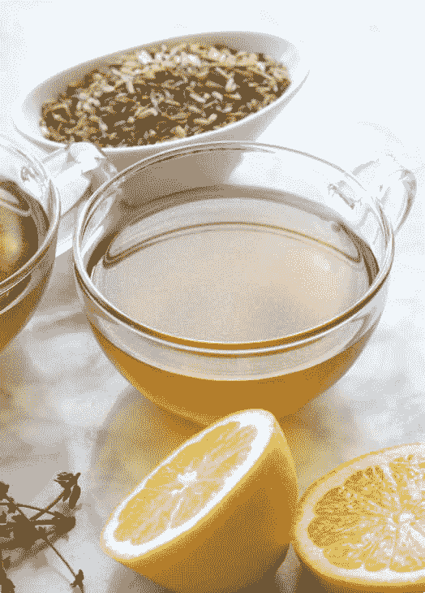

###### 柠檬或莱姆水

制作 1 份

1 大杯柠檬或莱姆水是补充水分与排毒的最佳利器。除了你在第二十二章看到的疗愈效果之外，柠檬和莱姆也能够活化饮用水，让水更能够附着在体内的毒素上，并将之冲刷到体外。喝下这种万灵丹，就仿佛为体内的每个细胞注入疗愈的蜜糖一样！

> 1/2 颗柠檬或莱姆
> 
> 2 杯水
> 
> 将 1/2 颗新鲜柠檬或莱姆的汁液挤入水中，即可享用。
> 
> 小诀窍
> 
> ●柠檬与莱姆非常容易携带。在旅途中无法使用厨房时，带上几颗柠檬或莱姆，就可以在离家时享用这种清新的营养品。

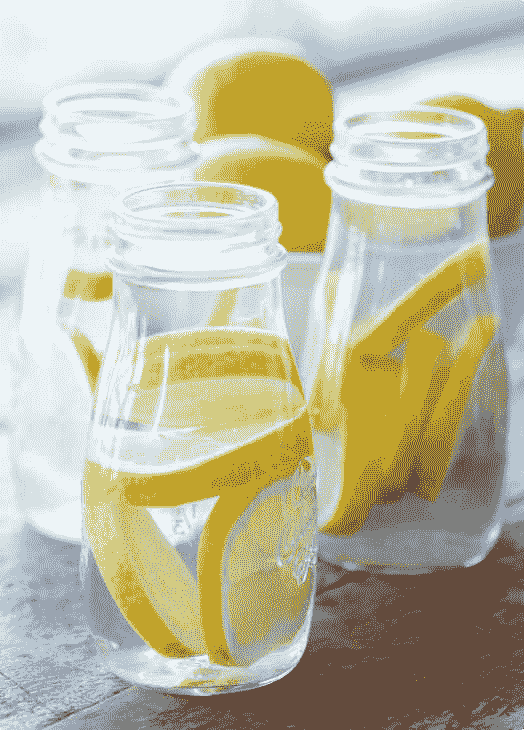

###### 生姜水

制作 1-2 份

无论是在早餐之前享用热姜茶，或是在午餐之后喝杯冷姜水，你都可以轻易用适合自己的方式喝这种饮料。

> 1-2 吋生姜
> 
> 2 杯水
> 
> 1/2 颗柠檬（依喜好添加）
> 
> 2 小匙生蜜（依喜好添加）
> 
> 将生姜磨碎加入 2 杯水中，并且加入 1/2 颗柠檬挤出的汁。最好浸泡 15 分钟以上，或是放在冰箱浸泡过夜，将食材沥除后即可饮用。可依照个人喜好添加柠檬与蜂蜜后，可在一天内直接饮用，或是加热后饮用。
> 
> 小诀窍
> 
> ●如果不把生姜磨碎的话，也可以切成小片，用压姜泥器压碎即可，这种工具就像小型的榨汁机一样。请在之后将压泥器中的渣滓取出，切成细末，并且加入水中。
> 
> ●你可以事先准备一些姜水，在需要时即可取用。若要达到最佳的效果，请在要喝时再加入蜂蜜与柠檬。

###### 芦荟水

制作 1 份

虽然你可能需要一些时间才能习惯芦荟的味道，但这么做相当值得。在喝芦荟水的时候，请想着这种神奇疗愈食物能够为你肝脏、肾上腺、身体其他部位带来的惊人好处。

> 1 片 2 吋新鲜芦荟叶
> 
> 2 杯水
> 
> 将新鲜芦荟叶中的胶状物质用汤匙挖出之后，放入果汁机和水一起打 10-20 秒，直到均匀混合为止。在空腹时立刻饮用，以达到最好的效果。
> 
> 小诀窍
> 
> ●在许多超市的农产品区都能买到新鲜的芦荟叶。
> 
> ●可在剩余的芦荟叶根部包上湿毛巾或保鲜膜，放在冰箱中即可保存 2 周。
> 
> ●如果你想要的话，也可以试着把芦荟加入其他蔬果昔中，例如加入第 288 页的甲状腺疗愈蔬果昔里。

###### 甲状腺疗愈浓汤

制作 1-4 份

有时候，你会发现周遭的人都沉浸在无益食物的世界里时，要遵守健康的饮食方式相当不容易。喝下这碗抗病毒且富含矿物质的浓汤，也就是前一章甲状腺病毒清理月的基础，就能够随时给自己营养又能带来慰藉的食物。如果你想要的话，可以在手边准备 1 马克杯的浓汤随时享用，需要的时候可以再装 1 杯。

> 2 颗地瓜切丁
> 
> 2 根西洋芹切丁
> 
> 2 颗洋葱切丁
> 
> 6 瓣大蒜
> 
> 1 吋姜黄，去皮后磨碎
> 
> 1 吋生姜，去皮后磨碎
> 
> 1 杯切成末的香芹
> 
> 4 撮百里香
> 
> 2 大匙大西洋红皮藻片
> 
> 1 大匙昆布粉
> 
> 8 杯水
> 
> 将所有食材放入大锅中。将食材煮磙，之后转为小火炖 1 小时。沥除食材之后，享受这种具有疗愈修复效果的浓汤，在一天中的任何时候皆可享用。
> 
> 小诀窍
> 
> ●你也可以保留浓汤中的块状蔬菜，作为蔬菜浓汤享用。
> 
> ●你也可以用这份食谱制作食物泥浓汤。使用手持式搅拌棒将蔬菜打到呈现光滑泥状为止，或是分批将食材放入果汁机中打成泥状。若使用传统果汁机，请务必在上方留个小缝通风。
> 
> ●你可以一次制作大量的汤，之后放入冰箱冷冻，即可在 1 周间享用。你可以将浓汤倒入制冰盒中制成冰块，之后即可轻易解冻。
> 
> ●如果你想要让汤更美味，与朋友分享，可在上桌前，在每碗加入一点盐和椰子油。

##### 早餐

###### 苹果粥佐肉桂与葡萄干

制作 1 份

用这碗简单美味又能够帮助你疗愈的食物当成一天的开始，是多么愉快的事。在这份食谱中，用水果作为基底取代谷物，让你吃下这碗粥就能拥有饱足感。

> 3 颗苹果，切片
> 
> 1/4 小匙肉桂
> 
> 1 撮香菜籽
> 
> 2 颗椰枣，去核
> 
> 1 小匙生蜜（依喜好添加）
> 
> 1/2 颗柠檬
> 
> 1/4 杯葡萄干
> 
> 2 大匙胡桃（依喜好添加）
> 
> 2 大匙椰丝（依喜好添加）
> 
> 在食物调理机中，倒入苹果、肉桂、药草籽、椰枣、蜂蜜、柠檬汁，打到所有的食材都混合为止。把苹果混合物倒入碗中，并拌入葡萄干、胡桃，想要的话也可以加入椰丝，即可端上桌享用！
> 
> 小诀窍
> 
> ●你可以发挥自己的创意，找出最喜欢的配料，也可以在不同的日子添加不同的配料，让食物拥有不同的营养与口味。

###### 木瓜莓果船

制作 2 份

美味的早餐不一定要很复杂！这些木瓜船只要几分钟就能做好，具有明亮丰富的色彩与风味。这道料理能够帮你补充水分，是具有饱足感的早餐，相当容易消化，让你的身体以最佳的方式展开新的一天。

> 1 大颗木瓜
> 
> 2 根香蕉，切片
> 
> 3 杯综合莓果
> 
> 1 颗莱姆（依照喜好添加）
> 
> 将木瓜沿着长边切对半，挖除木瓜籽。将两半木瓜摆在盘子上，切面朝上。把香蕉片及莓果分别摆放在木瓜中。如果想要的话，可在木抓船上挤些莱姆汁，即可享用。
> 
> 小诀窍
> 
> ●在许多超市都可以买到木瓜。如果木瓜还有些绿、没有全熟，请选择表皮呈现黄橘色的木瓜。把木瓜放在桌上，就会慢慢变熟，直到压起来的触感像酪梨时即可食用。
> 
> ●如果木瓜这种热带水果的风味让你感到很陌生，加些莱姆汁是最棒的做法，这也就是为何我会将其列入上方依喜好添加的食材中。只要在木瓜上面挤点莱姆汁，就可以带给你完全不同的感受。

###### 野生蓝莓松饼

制作 4 份

谁不喜欢松饼呢，尤其是那种由最佳食材所做的松饼？这些美味的松饼，会成为你与家人和朋友最爱一起享用的食物。这些面糊和传统面糊不太一样，所以请你仔细按照下方的步骤制作后，即可享用成品！

> 2 根熟香蕉
> 
> 4 大匙生蜜
> 
> 1 小匙泡打粉
> 
> 1/2 小匙海盐
> 
> 1/2 杯水
> 
> 2 杯杏仁粉
> 
> 1/4 杯马铃薯淀粉
> 
> 1 大匙椰子油
> 
> 1 杯野生蓝莓
> 
> 1/2 杯枫糖浆
> 
> 制作面糊：将香蕉、蜂蜜、泡打粉、海盐混合均匀，加入杏仁粉与马铃薯淀粉，继续打到变浓形成面糊状。
> 
> 用锅子煎：在大型的陶瓷不沾煎锅中倒入一点椰子油，用中小火融化。将一大匙面糊倒入煎锅，并在上方放上几颗野生蓝莓。用汤匙的背面将面糊摊开成光滑的圆形。煎 2.5-3 分钟之后，翻面再煎 4 分钟。
> 
> 用烤箱烤：将烤箱预热至华氏 325 度（摄氏约 160 度），在两个烤盘上放烘焙纸，接着轻轻刷点油。
> 
> 用汤匙将面糊舀入烤盘中，摊开成 3 吋左右的圆形，并把表面弄光滑。在表面撒上几颗野生蓝莓。
> 
> 放入烤箱烤 8-10 分钟，直到边缘呈金黄色为止，接着翻面再烤 2 分钟。
> 
> 用中火混合枫糖浆及剩余的野生蓝莓，不时搅拌至温热并均匀混合为止。淋在松饼上即可享用！
> 
> 小诀窍
> 
> ●如果你不太会使用平底锅，可以用烤箱烤，就能顺利做出松饼。

###### 重金属排毒蔬果昔

制作 1 份

这种完美的强效蔬果昔，结合了五种关键的重金属排毒成分。不只如此，喝起来也相当美味！

> 2 根香蕉
> 
> 2 杯野生蓝莓
> 
> 1 杯香菜
> 
> 1 小匙大麦草汁粉
> 
> 1 小匙夏威夷螺旋藻
> 
> 1 大匙大西洋红皮藻
> 
> 1 颗柳橙
> 
> 1 杯水
> 
> 将香蕉、蓝莓、香菜、大麦草汁粉、螺旋藻、红皮藻、1 颗柳橙的汁放入高速果汁机，打到呈现光滑为止。如果你喜欢稀一点的口感，可以再加入 1 杯水，即可享用！
> 
> 小诀窍
> 
> ●如果大麦草汁粉及螺旋藻的味道对你来说太过强烈，一开始可以先加少量，之后再慢慢增加。
> 
> ●请在你的厨房里随时准备一些熟香蕉。你可以联络当地的水果商，买下一整箱的香蕉（通常也会有些折扣），接着在香蕉熟时冷冻起来。使用这种方式，就可以在新鲜香蕉用完时，随时取用冷冻的香蕉。

###### 甲状腺疗愈蔬果昔

制作 1 份

蔬果昔是同时能够享用多种疗愈食材的绝佳方式。你可以加入自己喜欢的疗愈食物，制作属于自己的蔬果昔，在 1 周或 1 个月中轮流加入不同的食材，就能够获得许多不同的营养成分，享用不同的风味。

> 2 杯芒果（新鲜或冷冻皆可）
> 
> 1 根香蕉
> 
> 1 杯水
> 
> 建议额外添加：
> 
> 2 杯菠菜
> 
> 1/2 杯芝麻菜
> 
> 1 小匙昆布粉
> 
> 1/2 吋生姜，去皮
> 
> 1 颗柳丁，榨汁
> 
> 1/2 杯香菜
> 
> 1/2 杯芦荟
> 
> 1/2 杯覆盆子
> 
> 将芒果及香蕉倒入果汁机，加入 1 杯水，再加上其他你想加入的食材。如果你很有实验精神，可以把所有的东西都加进去，打到均匀为止，即可享用。
> 
> 小诀窍
> 
> ●如果你希望有点变化，可以把打好的蔬果昔倒入浅色的漂亮碗中，放上切片的香蕉或水蜜桃、芒果或木瓜丁、西洋梨块、红石榴子、新鲜或是冷冻莓果、葡萄干，切碎的椰枣、无花果，或是杏桃干。

##### 午餐

###### 青酱栉瓜面

制作 2 份

这些栉瓜面条色彩相当鲜艳，同时吃下这么多美丽的食材真是一大享受。这种味道熟悉的青酱，包含了美味的小番茄，佐以爽口的面条，这道料理相当清爽，却又能令人感到饱足。简单来说，就是棒极了！

> 3 条中型的栉瓜，削皮
> 
> 2 杯蓬松的罗勒叶
> 
> 1/4 杯大麻籽
> 
> 1/4 杯胡桃
> 
> 1 小匙橄榄油（依喜好添加）
> 
> 1/2 颗椰枣
> 
> 2 瓣大蒜
> 
> 1/4 小匙海盐
> 
> 1 颗柠檬
> 
> 1/4 杯水
> 
> 2 杯小番茄
> 
> 使用螺旋刨丝器、削皮刀等工具将栉瓜刨成面条状。将这些面条放入大型调理盆中，放在一旁备用。将罗勒叶、大麻籽、胡桃、橄榄油、椰枣、蒜瓣、海盐、柠檬汁与水打成青酱。将青酱倒在栉瓜面上之后拌匀，让所有的面条都裹上青酱。将面条分成 2 碗，之后放上切片的小番茄，即可享用！
> 
> 小诀窍
> 
> ●可使用昆布或小黄瓜面条取代栉瓜面条。
> 
> ●这道菜非常适合带去公园野餐。可以把分量加倍，做成一大盘供大家享用。

###### 梅森罐沙拉两吃

制作 2 份

将大量疗愈食物纳入一餐的最佳方式，就是事先准备食物。这两种沙拉可以事先做好放在冰箱中，冷藏可保存 3 天，随时都可以取用！

> 综合蔬菜沙拉佐“农场”沙拉酱
> 
> 2 杯红色高丽菜切丝
> 
> 2 杯胡萝卜切丝
> 
> 2 杯芦笋切段
> 
> 1 杯樱桃萝卜切片
> 
> 1 杯茴香切丁
> 
> 1 杯西洋芹切丁
> 
> 1 杯香菜切末
> 
> 1/2 杯香芹切末
> 
> 1/2 杯青葱切成葱花
> 
> 1 颗柠檬切对半
> 
> 1 颗酪梨切丁（依喜好添加）
> 
> 8 杯菠菜或芝麻菜
> 
> 农场沙拉酱：
> 
> 1/4 杯巴西坚果
> 
> 1/4 杯腰果
> 
> 6 吋长西洋芹一段
> 
> 1 瓣大蒜
> 
> 1 大匙干燥香芹
> 
> 1 大匙新鲜莳萝
> 
> 1/2 大匙大蒜粉
> 
> 1/4 小匙芹菜籽
> 
> 1/4 小匙海盐
> 
> 1 颗柠檬
> 
> 1/2 杯水
> 
> 将菠菜或芝麻菜等所有的食材装入两个大型（32 盎司）的梅森罐中，冷藏可保存 3 天。将综合生菜倒在绿色叶菜上，淋上“农场”沙拉酱即可享用。
> 
> 将巴西坚果、腰果、西洋芹、蒜瓣、干燥香芹、新鲜莳萝、大蒜粉、芹菜籽、海盐柠檬汁打到混合均匀为止。慢慢倒入 1/4-1/2 杯水，打到想要的浓稠度即可。倒入小梅森罐中，冷藏可保存 3 天。

###### 水果沙拉佐绿色叶菜

> 2 杯柳橙片
> 
> 2 杯覆盆子
> 
> 2 杯芒果切丁
> 
> 2 杯小黄瓜切丁
> 
> 1 杯红石榴子
> 
> 1 杯香菜切末
> 
> 1/2 杯罗勒切末
> 
> 1 颗莱姆
> 
> 8 杯绿色叶菜
> 
> 将菠菜或芝麻菜等所有的食材装入 2 个大型（32 盎司）的梅森罐中，冷藏可保存 3 天。将综合生菜倒在绿色叶菜上，淋上莱姆汁即可享用。
> 
> 小诀窍
> 
> ●如果你手边没有梅森罐，也可以将这些沙拉存放在家里现有的容器中。
> 
> ●如果你要出门，可以拿个袋子或盒子，装入准备好的沙拉绿色叶菜，并且把梅森罐带着，就可以出门了。请不要让任何事阻止你迈向疗愈之路。你有这道菜！

###### 菠菜汤

制作 1 份

在饮食中加入这么多蔬菜水果的好处之一，就是能让我们的味蕾改变，并在一段时间之后，会开始渴望吃这些新鲜的食材。当你发现自己渴望吃绿色叶菜类食物，并且获得蔬菜带来的好处时，饮用这种方式简单、味道浓郁的汤，就是将这些食物纳入日常饮食的好方法，也相当容易消化吸收。由于菠菜富含各种矿物质，也能够让你不会渴望吃那些你明知现在对你健康没有好处的食物。

> 1 又 1/2 杯小番茄
> 
> 1 根西洋芹
> 
> 1 瓣大蒜
> 
> 1 颗柳橙
> 
> 4 杯嫩菠菜
> 
> 2 片罗勒叶
> 
> 1/2 颗酪梨（依喜好添加）
> 
> 将番茄、西洋芹、大蒜放入果汁机，加入一颗柳橙的汁，打到呈光滑的质地为止。一次加入一些菠菜，直到完全打匀为止。之后再加入罗勒及酪梨（如果你想要的话），打到变成滑顺的鲜奶油状，即可立刻享用。
> 
> 小诀窍
> 
> ●可使用香菜代替罗勒，但请使用 1/4 杯香菜叶取代就好。
> 
> ●在你刚开始采用这个方案时，如果这道汤无法让你觉得很美味，想唱“哈利路亚！”赞美的话，那么请隔几周再试试看。在你的味蕾开始改变时，会发现自己逐渐喜欢这道汤，甚至想让这道汤成为饮食中的固定台柱。

###### 风干番茄朝鲜蓟沾酱佐蔬菜冷盘

制作 2 份

这种滑顺的沾酱只需要几分钟就能够准备好，它带有浓郁的气味以及抚慰人心的温暖。风干番茄、大蒜、香芹叶共同组成的沾酱，加上柔软的朝鲜蓟叶片，共同组合成让你一口接一口的美味！

> 2 杯蒸朝鲜蓟（请见下方小诀窍的说明）
> 
> 3/4 杯无油风干番茄，先用热水浸泡 5 分钟
> 
> 2 大匙有机中东芝麻酱
> 
> 1 杯蓬松的香芹叶片
> 
> 2 瓣大蒜
> 
> 1 颗柠檬
> 
> 1/4 小匙盐
> 
> 你喜欢用来沾酱吃的蔬菜（例如甜椒、小黄瓜、白花椰菜、樱桃萝卜、芦笋）等等
> 
> 将朝鲜蓟叶片、风干番茄、中东芝麻酱、香芹、大蒜、柠檬汁、海盐放入食物调理机，打到所有的食材均匀混合为止。把沾酱摆在你喜欢的蔬菜旁，即可一起享用！
> 
> 小诀窍
> 
> ●朝鲜蓟叶片的处理方式，请件见纸本书第 308 页中蒸整颗朝鲜蓟的方式。把朝鲜蓟放凉之后，去除所有坚硬的绿色叶片，仅留下柔软的黄色叶片。将朝鲜蓟切对半，用汤匙挖除内部的心（紫白色花瓣及里面的绒毛部分）。这样就可以开始料理了。
> 
> ●如果买不到有机中东芝麻酱，也可以使用普通的中东芝麻酱。有机中东芝麻酱的味道比较清淡，烤过的中东芝麻酱味道较为浓郁，使用任何一种皆可。
> 
> ●你可以按照上述方式用任何生菜沾取食用。如果你想发挥创意的话，可以把酱料塞进烤马铃薯中。

##### 晚餐

###### “玉米片塔风”烤马铃薯

制作 2-3 份

虽然传统的玉米片塔一定有玉米片，但这些柔软的金黄色烤马铃薯片却也相当完美。在烤箱中烤到外酥内软，接着放上风味熟悉的酪梨、番茄、洋葱、香菜，这些马铃薯片很快就会被一扫而光，让你必须做两份才够。你可以在马铃薯片上加一些 308 页中的大蒜腰果蛋黄酱，就会让人忍不住一口接一口！

> 6 颗中型马铃薯
> 
> 2 小匙椰子油
> 
> 1/2 小匙海盐，分批使用
> 
> 1 颗酪梨，切丁
> 
> 1 杯番茄，切丁
> 
> 1 杯洋葱，切丁
> 
> 1/2 杯香菜，切末
> 
> 1/2 根墨西哥辣椒，切片（依喜好添加）
> 
> 2 颗莱姆
> 
> 1/4 杯大蒜腰果蛋黄酱（依喜好添加，请见纸本书第 308 页）
> 
> 将烤箱预热至华氏 375 度（摄氏 190 度）。马铃薯削皮后切成 1/4-1/2 吋的圆片。倒入椰子油及 1/4 小匙海盐搅拌。
> 
> 把马铃薯排在铺上烘焙纸的烤盘上。在每片之间留下一点空隙，不要互相接触或是重叠。放入烤箱烤 20 分钟后，翻面再烤 10 分钟。
> 
> 在烤马铃薯的同时，将酪梨、番茄、洋葱、香菜、墨西哥辣椒、莱姆汁放入小碗中混合。将烤好的马铃薯片在盘子上排成塔状，倒上酪梨莎莎酱，想要的话还可以加上大蒜腰果蛋黄酱。最后，把剩下的海盐撒在玉米塔上即可享用。
> 
> 小诀窍
> 
> ●你可以使用不同种类的马铃薯制作这道餐点，就能拥有不同的营养素、风味、口感。
> 
> ●如果你要事先准备，可以先将马铃薯削皮切片后，泡在一碗冰水里冷藏。使用这种方式，只要每天换水，就可以保存 3 天左右，让你随时想用马铃薯就能取用。

###### 白花椰“炒饭”

制作 2-3 份

在疗愈的旅程上，同时必须符合忙碌的行程，以及挚爱家人的口味，实在是令人疲于奔命。这种白花椰“炒饭”能够让你的生活变得容易许多，能够迅速备餐，同时兼具餐厅的水准。这道菜可以做成生食或是熟食，也很容易根据家人喜好的蔬菜以及香料进行调整。

> 1 颗中型的白花椰菜（约 6 杯小花）
> 
> 1 小匙椰子油
> 
> 1/2 颗红洋葱，切丁
> 
> 1 吋姜，切末
> 
> 3 瓣蒜头，切末
> 
> 1 大根红萝卜，切丁
> 
> 1 颗红椒，切丁
> 
> 2 根西洋芹，切丁
> 
> 1 杯豌豆
> 
> 1 小匙烤芝麻油
> 
> 2 大匙椰子酱油
> 
> 1/2 小匙生蜜（依喜好添加）
> 
> 1 小匙海盐
> 
> 1/2 根墨西哥辣椒（依喜好添加）
> 
> 1 杯香菜
> 
> 1/4 杯杏仁，切碎（依喜好添加）
> 
> 2 小匙芝麻
> 
> 1 颗莱姆
> 
> 将白花椰菜切成几朵小花后，放入食物调理机，打到变成碎米粒状。使用豆浆过滤袋或是纱布把磨好的“米”包起来，扭干额外的水分，放在一旁备用。
> 
> 将 1 小匙的椰子油放入大锅中加热，用中大火将洋葱炒到熟透，呈透明状。用大匙加入一些水，避免黏锅。把嫩姜、蒜、胡萝卜、彩椒、西洋芹、豆子倒入洋葱中一起继续炒 5-7 分钟，直到蔬菜软化为止。加入白花椰米、烤芝麻油、椰子酱油、蜂蜜、海盐炒到完全混合为止。继续煮 5-7 分钟，直到白花椰米软化为止。
> 
> 在白花椰“炒饭”上加些墨西哥辣椒（如果你想要的话）以及香菜、核桃丁、芝麻，以及大量的莱姆汁之后即可享用！
> 
> 如果要制作生的“炒饭”：请按照上方的第一个步骤制作白花椰菜米，之后将米放入大碗中，加入红洋葱、姜、一瓣磨碎的蒜头、胡萝卜、甜椒、西洋芹。在白花椰菜米中拌入烤芝麻油、椰子酱油、海盐、墨西哥辣椒，静置 15 分钟以上，之后放上香菜、杏仁末、芝麻、莱姆汁之后即可享用。

###### 蒸朝鲜蓟佐大蒜腰果蛋黄酱

制作 2 份

蒸朝鲜蓟只要加点海盐及柠檬汁就很好吃了，在你知道这种蔬菜能够为你的甲状腺带来哪些疗效后更是如此。这道食谱将朝鲜蓟带到一个全新的境界，配上了让人迷恋的大蒜腰果蛋黄酱。这道食谱极为简单，会在下次聚会时，让到你家作客的人大为赞叹。

> 4 颗朝鲜蓟
> 
> 1 杯腰果
> 
> 2 大匙橄榄油
> 
> 3 瓣大蒜
> 
> 2 颗柠檬
> 
> 1/4 小匙海盐
> 
> 1/2-1 杯水
> 
> 将朝鲜蓟顶端的 1/2 吋切除，底部的梗也切除，只留下 1/2 吋。将蒸锅的水烧磙之后，把朝鲜蓟放入蒸笼上，视大小蒸 30-40 分钟。蒸到能够轻松拔下叶片、叶片本身也相当柔软即可。
> 
> 将腰果、橄榄油、大蒜、两颗柠檬汁、海盐放入果汁机，加入 1/2 杯的水，打到质地光滑，即为浓稠的蛋黄酱。若希望口感稀一点，可再倒入 1/2 杯的水打匀。
> 
> 在朝鲜蓟旁放上腰果蛋黄沾酱，并放上一些新鲜药草即可享用。
> 
> 小诀窍
> 
> ●你可以把多的沾酱用来沾蒸马铃薯或是青花菜，或当成“玉米片塔风”烤马铃薯（请见纸本书第 304 页的食谱）的淋酱，也可以拌入羽衣甘蓝中做成好吃的沙拉。

###### “肉酱”金丝瓜

制作 2 份

金丝瓜确实名副其实，当中条状的黄色瓜肉看起来就好像一条条的意大利面一样，如果再加上浓郁美味的番茄酱，以及一些巴西坚果当成“帕玛森起士”就更像了。这道菜立刻会成为你亲友最爱的菜肴，需要的话你可以把分量加倍。你也可以冷冻一些酱汁，在突然想吃一大碗意大利面时就能享用。

> 1 大颗金丝瓜
> 
> 2 杯红洋葱，切丁
> 
> 4 瓣大蒜，切末
> 
> 2 杯小番茄
> 
> 1 杯蘑菇，切丁（依喜好添加）
> 
> 1 小匙辣椒粉
> 
> 1 小匙鸡精粉
> 
> 1 小匙大蒜粉
> 
> 1/4 小匙咖哩粉
> 
> 1/4 小匙海盐
> 
> 1/2 杯风干番茄，先浸泡热水 5 分钟
> 
> 1/4 杯巴西坚果罗勒“帕玛森起士”（请见下方做法）
> 
> 巴西坚果“帕玛森起士”：
> 
> 1/4 杯巴西坚果
> 
> 1/4 小匙海盐
> 
> 1/4 小匙干燥罗勒
> 
> 1 瓣大蒜
> 
> 将烤箱预热至华氏 400 度（摄氏 200 度）。小心将鱼翅瓜切对半，去除种子。在烤盘中装入 1/2 吋的水，烤 30-40 分钟，直到手指轻压外皮时会凹陷为止。将烤好的瓜从烤箱取出放凉后，使用叉子刮下内部的果肉，做成“意大利面”。将面条平均分成 2 碗。
> 
> 制作“肉酱”的方式则是：将切丁的洋葱放入中型的汤锅中，加入 2 大匙水，用中大火翻炒到洋葱变软，呈透明状即可。需要的话，一次加入 1 大匙的水以免黏锅。加入大蒜、小番茄、蘑菇、辣椒粉、鸡精粉、大蒜粉、咖哩粉、海盐、风干番茄后继续煮 5-7 分钟，过程中必须不时搅拌，煮到番茄软化为止。使用手持式搅拌器将食材搅拌均匀，但仍须保留小块的状态。你也可以将煮好的食材倒入果汁机，打几下混合即可，不过记得在顶端留个小缝让热气散出去。
> 
> 将肉酱倒在金丝瓜面条上，撒些巴西坚果罗勒“帕玛森起士”，即可享用！
> 
> 将巴西坚果、海盐、罗勒、大蒜放入果汁机或食物调理机，打成小粒状即可。

##### 点心

###### 地瓜薯片佐酪梨酱

制作 1-2 份

薯片可说是恶名昭彰，因为许多市面上的产品都添加了许多防腐剂及你不想吃到的成分。但其实要在家做出美味健康的薯片并非不可能的事！下方的食谱，加入了很多香料，可以做出浓郁美味的薯片，不过你也可以都不加。这些薯片只要加一点海盐，或是直接沾令人垂涎三尺的酪梨酱吃，就相当美味了。

> 2 大颗地瓜
> 
> 1/4 小匙海盐
> 
> 1/4 小匙大蒜粉
> 
> 1/4 小匙孜然粉
> 
> 1/4 小匙红椒粉
> 
> 1/4 小匙辣椒粉
> 
> 1/4 小匙卡宴辣椒粉（依喜好添加）
> 
> 2 小匙椰子油（依喜好添加）
> 
> 酪梨酱：
> 
> 2 颗酪梨
> 
> 1/2 颗柠檬
> 
> 1 颗莱姆
> 
> 1 颗小番茄，切丁
> 
> 1/4 颗红洋葱，切末
> 
> 1/2 杯香菜，切末
> 
> 1 瓣蒜头，切末
> 
> 1/4 根墨西哥辣椒，切末（依喜好添加）
> 
> 1/4 小匙海盐（依喜好添加）
> 
> 在将烤箱预热至华氏 250 度（摄氏 120 度）。使用削皮器或是刀子将地瓜切成非常薄的圆片，最好为 1/16 吋厚，最厚不要超过 1/8 吋。请务必切成均匀的薄片，但不要薄到变透明。在锅子中将水煮沸后，放入薄片并转为中火炖煮 5 分钟，之后取出地瓜片，并将水倒掉。
> 
> 在小碗中混合海盐、大蒜粉、孜然粉、红椒粉、辣椒粉、卡宴辣椒粉。在两个烤盘上均抹上薄薄的一层椰子油。将地瓜薄片排在烤盘上，但不要重叠。在地瓜片上轻轻刷上一层椰子油，并撒上大量的综合香料。
> 
> 放入烤箱烤 25 分钟。将已经酥脆的薯片取出放在一旁。将烤盘放回烤箱再烤 5 分钟，之后取出检查，移除已经酥脆的薯片。如果需要的话，再烤 3-5 分钟。请注意，薯片刚出炉时可能不太脆，但是放凉之后应该会变脆。
> 
> 将地瓜薯片和酪梨沾酱放在一起享用，或是单吃也可以！为了拥有最佳的口感，建议做好后稍微放凉一下再享用！
> 
> 将酪梨压碎后，和柠檬以及莱姆汁一起放入小碗中。将蕃茄、洋葱、香菜、大蒜、墨西哥辣椒、海盐拌入酪梨泥中。可搭配地瓜薯片一起享用，或是搭配你喜爱的生菜，也可以当成沙拉淋酱，甚至放在任何你喜欢的熟蔬菜上享用也可以。

###### 野生蓝莓香蕉冰淇淋

制作 2 份

这种冰淇淋可说是只应天上有，口感滑顺、香甜、沁人心脾。最棒的一点，就是你想什么时候吃都可以，不用担心这会影响你的疗愈。吃冰淇淋当早餐？没问题！吃冰淇淋当晚餐？有何不可？这也是绝佳的点心。无论你在什么时候享用这道香蕉冰淇淋，你的甲状腺和身体其他部位都会感谢这道美味点心带来的疗愈效果。

> 3 大根冷冻香蕉
> 
> 2 杯解冻野生蓝莓，分批使用
> 
> 2 大匙野生蜜（依喜好添加）
> 
> 将 1 杯解冻的野生蓝莓与汁液放入食物调理机，如果你想要的话，可再加入 2 大匙的生蜜。请搅拌 5 下，使其完全混合。许多蓝莓可能依旧维持完整。请先将酱汁放在一旁备用。
> 
> 将香蕉切成几段，放入食物调理机，并加入剩下的蓝莓，打到呈现光滑有如冰淇淋的质感。如果你想要的话，可以将冰淇淋放入冷冻库冷冻 2 小时，再挖出来食用。
> 
> 将冰淇淋分别装在碗中，淋上野生蓝莓酱即可享用！
> 
> 小诀窍
> 
> ●你可以加上自己喜欢的健康配料，做成冰淇淋圣代。你可以在上面撒上一些椰枣或无花果、新鲜莓果、切片香蕉、椰丝、大麻籽、碎胡桃等等。

###### 覆盆子拇指饼干

制作 4-6 份

疗愈并非代表在你想要的时候，不能够吃甜点！这些覆盆子拇指饼干非常美味，完全不含市面上饼干内可能有的有害物质。充满坚果的面团中，包覆着鲜艳的覆盆子果酱，让这些可口的饼干成为属于你的真正礼物。

> 1 杯又 2 大匙的杏仁粉
> 
> 1/2 小匙泡打粉
> 
> 1/2 小匙海盐
> 
> 1/2 杯中东芝麻酱
> 
> 1/2 杯椰糖或是枫糖浆
> 
> 1/2 小匙无酒精的药草精
> 
> 1/2 杯白芝麻
> 
> 1/2 杯覆盆子果酱（请参考下方的小诀窍）
> 
> 将烤箱预热至华氏 350 度（摄氏 180 度）。将杏仁粉、泡打粉、海盐在调理盆中打匀后放在一旁备用。将中东芝麻酱、椰糖、药草精一起放入食物调理机打到完全混合并呈现光滑的质地为止。将拌好的杏仁粉倒入食物调理机，打到均匀混合为止。如果面团还有许多碎屑，请依照需要加入 1 大匙的水，直到面团变光滑为止。
> 
> 将面团捏成多个 1 吋大小的球状，在装有芝麻的碗中磙过后，放在铺上烘焙纸的烤盘上。每个面球之间至少要间隔 2 吋。用拇指从中间压出凹洞，并放入烤箱烤 8-10 分钟。
> 
> 将饼干取出后，在中央的凹洞里装入 1 小匙的覆盆子果酱。将饼干放在冷却架上放凉之后即可享用。
> 
> 小诀窍
> 
> ●如果你要用现成的果酱当馅料，请务必使用不含害成分或防腐剂的果酱。
> 
> ●如果要自制覆盆子果酱，请将新鲜成熟的覆盆子（或是已解冻的冷冻覆盆子）压碎之后，和生蜜或枫糖浆混合，搅拌到你想要的浓度即可。

##### 方便携带的甲状腺疗愈食物组合

有时候你会希望越简单越好，或是有时间吃就好。在你要出门，或是太忙没空按照食谱备餐时，不必为了方便就牺牲营养或是美味。你可以采用下列简单迅速的食物组合，就能够支持你的甲状腺。更棒的是，事先准备一些下列的食物，在你没时间时，可以拿了就走。

●白花椰菜的小花＋切片苹果：这个组合能够降低甲状腺发炎的情形，同时也会让甲状腺细胞产生新的记忆，让这些细胞在依赖甲状腺药物变得迟缓之后，能够学会怎么独立。

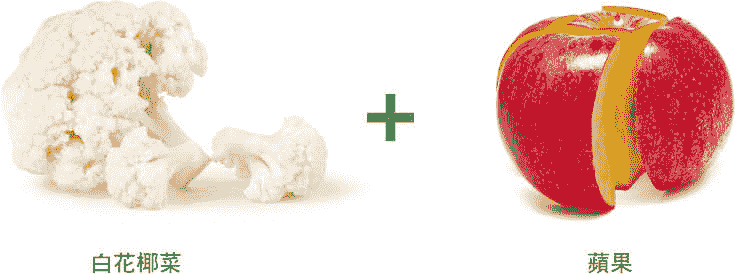

●小番茄＋菠菜：这两种食物能够一起强化肝脏，也能够让淋巴系统排毒，并且可以强化免疫系统，抵抗以甲状腺为目标的病毒。

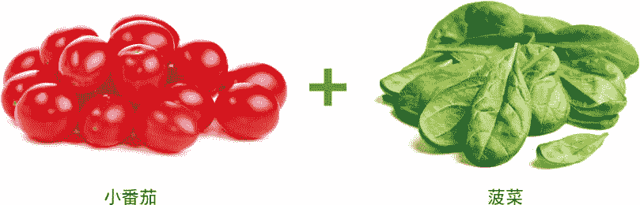

●西洋芹＋椰枣：含有重要的矿物质盐类，以及高品质且具有生物利用度的葡萄糖，是强效的肾上腺修复配方，能够让甲状腺恢复应有的强大力量。

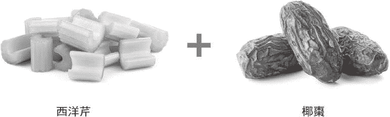

●香蕉＋红皮藻片：这种点心含有碘、钾、钠，能够强化整个内分泌系统与中枢神经系统，对抗神经毒素及毒素造成的疾病。

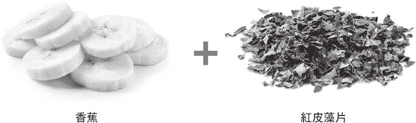

●羽衣甘蓝＋芒果：这种碱性且富含胡萝卜素的组合，能够轻易进入甲状腺中，有助于预防腺体的结节与囊肿生成。

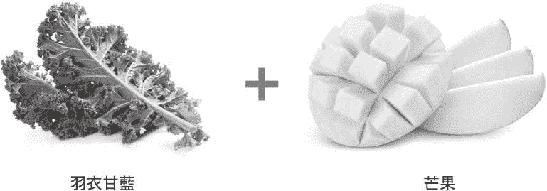

●西洋梨＋芝麻菜：是预防甲状腺萎缩的绝佳食物。两者能够共同提升甲状腺发送频率的能力。

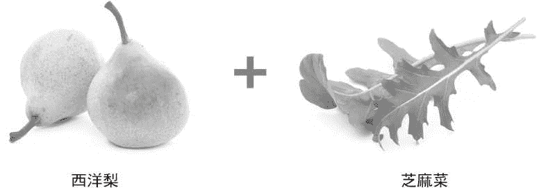

●野生蓝莓＋木瓜：提供对抗的能力，能够阻止、减少、预防甲状腺肿瘤（包含良性与恶性）的生成。在甲状腺部分组织遭到手术摘除或是被放射碘治疗杀死之后，能够修复组织。

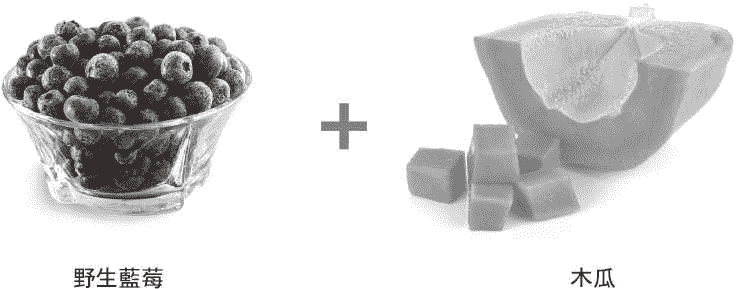

●橘子＋覆盆子：两者互相配合之下，在身体使用钙质筑墙，在甲状腺以及全身各处形成结节或囊肿阻隔病毒时，有助于预防钙质的流失，以及骨质疏松症的发生。

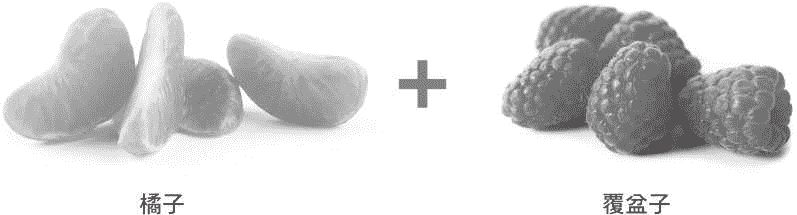

## 第二十五章　甲状腺疗愈技巧

如果你在看这本书之前，认为甲状腺让你感到失望，或是你的身体背叛你，在走向疗愈的过程中，很重要的一点是每天都要提醒自己你的身体和你站在同一阵线。

请你想办法让这个讯息内化。你可以在浴室的镜子上贴个纸条，每天晚上在日记里写这件事，或是每天对自己信心喊话。你并没有做错什么，你的身体没有做错什么。你的身、心、灵都合而为一，共同希望自己能够康复。在你真正相信这件事，了解你的想法和感觉绝对不会阻碍你、你的身体不会攻击你之时，就启动了各个层面的疗愈过程。

在第三部“甲状腺重生”中，你已经看到从甲状腺病毒问题中痊愈的各种知识与技巧。在接下来的章节里，你会发现自己可以运用这些技巧、启动疗愈的过程，尤其是甲状腺的疗愈。这些不仅对实体的甲状腺有帮助，也对精神层面相当有帮助、在你的精神层面获得滋养之后，甲状腺也会开花结果，在你滋养与关怀更伟大的精神层面之后，对你整体的健康也会有所提升。

##### 注入光的营养补充品

有种方式能够让你在对抗甲状腺问题时增加信心与支持，就是在你喝的水中，注入疗愈的光。做法就是在玻璃杯中倒入水，放在你面前，接着握拳举到自己的额头前，想像手中充满了白光。现在朝着玻璃杯张开你的手，大声说“光啊”，同时想像着有光注入水中。重复同样的动作，握拳收集光线，接着再次朝着玻璃杯张开手说“光啊”，最好能够重复同样的动作七次。你身边的天使知道你在做什么，会帮助你掌握神圣的光。

每次重复这个动作时，光就会替水带来更多健康的能量，改变水的结构，让水变成神圣可变形的营养补充品。若要特别强化甲状腺，请在吞下水之前，先用水漱口。在你喝下水的时候，想像着水中的光流入你的甲状腺，杀死以甲状腺为目标的 EB 病毒细胞，同时也能够修复组织受到的伤害。

如果你挚爱的人有甲状腺问题，在水中注入光线也是种关爱的手势。请你照着上述注入光线的过程进行，接着再把水送给你的伙伴、朋友、家庭成员喝。

在水中注入光线，请让这个动作成为甲状腺疗愈之路上的例行公事，无论是你自己为水注入光线，或是由他人注入光线，都能让甲状腺获得爱的支持。在此同时，光线也能够刺激甲状腺本身的免疫系统，也就是当成腺体电池充电器的特殊淋巴细胞。

如果要制作其他促进甲状腺荷尔蒙分泌的温和补充品，可以自制全身平衡的营养补充品。首先，将氨基酸补充品酪胺酸以及少量的碘混合。将左旋酪胺酸瓶身上建议剂量的四分之一加入 8 盎司（237 毫升）的水中，并且加入一滴优质的初生碘，搅拌均匀之后，再按照上述的方式注入光线。

##### 蝴蝶日光浴

你或许听说过甲状腺的形状就像蝴蝶一样。在腺体的两侧，分别有一个翼状的叶片，形状很像蝴蝶，但很少人知道不只是形状像而已。

事实上，甲状腺像蝴蝶一样，会透过这些“翅膀”收集阳光。（此外，蝴蝶在飞着的时候，会产生像无线电一样的频率，跟甲状腺一样。）当你沐浴在阳光中，尤其是颈部接受阳光照射时，即使只有几秒，甲状腺就会立刻收集阳光，仿佛上面有太阳能板一样。这种阳光有助于带给甲状腺能量、平衡荷尔蒙的生产、避免 EB 病毒在甲状腺中繁殖，同时也能够刺激与强化甲状腺本身的免疫系统，以及全身的免疫系统，让病毒不会对甲状腺造成伤害。

除此之外，你的甲状腺也能够扮演阳光的储存槽。如果你有几天、几周甚至几个月的时间无法获得足够的阳光照射，免疫系统就能够从甲状腺中取得库存的阳光与能量，保护甲状腺与身体其他部位免受 EB 病毒等的入侵。

若要帮助甲状腺处理收集到的阳光、提升疗效，那么请用下列的方式冥想：

坐在阳光下时，想像你的甲状腺是栖息在岩石上的蝴蝶。请感受每一叶也就是“翅膀”在温暖的阳光下鼓动。现在请想像并且感受阳光的光线被翅膀吸收，将疗愈的力量传入细胞深处。

在你做这些事时，请规律地深呼吸。感受你自己将阳光吸入喉咙中，就像吸入空气一样。在我们四处走动时，获得足够的氧气是击退 EB 病毒的重要因素。这种深呼吸有助于让你的血液产生氧合作用，保护你免受 EB 病毒的伤害。

如果你失去了全部或是部分的甲状腺，请务必记住折翼的蝴蝶依旧能够飞翔，能够透过地球频率提供的单一能量，让蝴蝶继续飞翔。正如我们之前所见，你的甲状腺功能受损或消失时，身体依旧能够正常运作，就像甲状腺完好无缺时一样，所以这个技巧依旧能够发挥功效。

在你甲状腺完全健康时，也会进行这种运动，在挥别 EB 病毒以及其他健康问题，让甲状腺重生之后，你依旧能够继续进行这种冥想，以感谢这一切。花些时间感谢甲状腺为你做的一切，支持甲状腺为你做的一切，也有机会回顾一下到目前为止的进步。

##### 两个甲状腺比一个好

正如我们在第四章［甲状腺的真正目的］所见，甲状腺会发出类似无线电的频率，无时无刻都在跟身体的其他部位沟通。这些频率也会传到其他人的甲状腺中，表示健康者的甲状腺能够帮助附近罹患甲状腺疾病的人。

实际上的运作原理是这样：如果有个甲状腺受到病毒感染而受损的人，站在甲状腺功能较佳者的身边，那么两个人的甲状腺就会透过类似无线电的频率进行沟通，罹病的甲状腺会传送出求救的讯号。健康的甲状腺接收到这个讯号时，就会送出初步的讯息，让功能不佳的甲状腺准备好接受帮助。在需要帮助的甲状腺准备好之后，帮助他人的甲状腺就会传出改善对方甲状腺免疫系统（该区域的淋巴细胞）的讯息，以保护罹病的甲状腺，并协助罹病的甲状腺接收淋巴系统的帮助，同时也强化罹病的甲状腺。即使你失去了甲状腺，也能够透过这种方式受到帮助，正如我们在第二十章［没有甲状腺的生活］提到的内容一样，你的甲状腺无论如何依旧会存在你的体内。

甲状腺发射出来的频率相当强，就如同鲸鱼与海豚在海中用来沟通的频率一样。甲状腺的频率强到即使罹患甲状腺癌，其他人的甲状腺也能够传送频率给患者的甲状腺，设法减缓与阻止癌细胞的生长。

两个人必须相当接近，甲状腺才会互相沟通，距离约为一个手臂的长度。拥抱是甲状腺给予或是接受帮助的最佳方式，但这不是唯一的方式。只要另外一个人和你的距离你不超过一个手臂时，两人就能够互相传递甲状腺的频率。即使你不爱甚至根本不喜欢对方，这种甲状腺支持的现象也会发生。下次开会时，你可以坐在骂你的次数多到记不得的老板身边，如果他的甲状腺需要帮助，你的甲状腺健康状况较好，那你的甲状腺就会伸出援手，当然相反的情形也会成立。

你很可能在不知情的状况下，就经历了这种甲状腺沟通的现象。这也就是为何你在另一个人面前时，有一种说不出的感受。很可能某人的个性虽然让你觉得反感，但是你们一起站在办公室的休息区时，全身却有一种舒适自在的感觉流过，让你想要待在他身边。大家不会发现这种感受来自于你的甲状腺正在提供帮助，或是接受帮助。

现在请你想像一下，如果你知道这种甲状腺沟通的情形正在发生，那又会是如何呢？光是知道你的工具箱里具有这种工具，就能够强化与支持你的甲状腺。在你知道自己的甲状腺并不孤单，能够接受来自周遭他人的甲状腺帮助，就是消除“疾病让你觉得孤独绝望”的最佳技巧。即使你的生活中，没有最支持你的人，他们的甲状腺也能够帮助你痊愈。我们的甲状腺相当慈悲，能够无条件地帮助其他人。要知道这种无条件的慈悲能够提升我们对自己与他人的了解、给予我们希望，并且能够真正欣赏自己内在运作的一切。

如果你是有甲状腺疾病者的朋友、家人、照护者，那么这点会让你明白：其实你对对方相当有帮助。看见挚爱的人受苦时，很容易就会感到相当无助。在你知道只要接近甲状腺功能不佳的人，就能够真正帮助对方，内心可能会觉得平静许多。

你不需要拥有完全健康或甚至是功能极为健全的甲状腺，才能够对其他甲状腺提供帮助。事实上，假设你自己很可能有轻微的甲状腺机能低下问题，你的甲状腺也能够送出讯息给晚期桥本氏甲状腺炎的患者，只要你的甲状腺比对方健康一些即可。唯一无法传递讯息的状况，是两人的甲状腺问题同样严重，这种情形相当罕见。在绝大多数的情况下，即使是类似的甲状腺功能问题，程度上都有轻微的差异。这表示无论你罹病的情形有多严重，很可能还是能帮助病况更糟糕的人，让你在厌倦了总是被帮助时，也有帮助他人的机会。这种一个人的甲状腺帮助另一个人甲状腺的情形，很可能持续好几天，甚至是好几周。

在发生这种情况时，并不会让较健康的甲状腺疲于奔命。这些讯息不会消耗甲状腺本身的力量，较健康的甲状腺不会感染需要帮助者的问题。正如你在第三章［甲状腺病毒运作的方式］中所见，在 EB 病毒对甲状腺造成伤害时，已经不具有传染性，因此接近甲状腺有问题的患者，并不会对甲状腺健康者造成伤害。

医学与科学研究在未来的几百年、甚至更多年都不会发现甲状腺间的沟通，因为他们不清楚甲状腺会在身体发出无线电般的讯号，更不要说是散发到身体之外了。科学界若要了解这种过程，就必须检验并且监测甲状腺的频率，但这种检验至今尚未问世。

现在请你相信自己，拿出信心吧。在此时此刻，在你具备了这些新的专业知识之后，已经迈向疗愈之路了。你比过去都更接近健康一步。那个你已经记不得什么时候开始觉得不舒服的日子，已经离你很远了。请维持愉快的心情，给予自己一些同情。请记住：你可以痊愈。

## 第二十六章　终于痊愈了：一位女士的故事

在莎莉‧阿诺德（Sally Arnold）还是个小女孩的时候，就立志要帮助大家改善健康。所以在她成为合格的护理师之后，对这位年轻的女士来说，成为护理师不仅是她的毕生职志，还可说是她的天命。她在这个领域的经验越来越丰富之际，从来没质疑过自己与同事接受过的训练。她和充满爱心与智慧的同事共事，让患者的生活变得更好。

但渐渐地，莎莉也出现了一些健康问题，首先是在二十多岁时接受子宫摘除手术，并且接受荷尔蒙替代疗法。在接下来的二十多年间，那些“自体免疫类”的症状都和她如影随形。这些症状包含了失眠、极度疲劳、脑雾（她觉得自己的脑袋就像是半夜三点一样浑沌）、体重增加（不过她持续规律运动并且控制摄取的热量）、长期易怒、手脚冰冷、皮肤出现一些增生组织、关节有如关节炎般疼痛、长期鼻塞、性欲低下、觉得迟缓、长期便秘，变成一周只上两次大号，灰指甲让她的大拇趾变成灰白色，健忘、觉得自己眼前不断有乌云、莫名焦躁、突然心跳加速，可以飚到每分钟 120 下以上，有时候她会突然感到恐慌，在半夜突然醒来。她生性乐观开朗的认为：如果这些神秘的症状要是发生在别人身上，很可能会让他们感到忧郁。

此外，她也在和落发问题奋斗，她的头皮出现一块有如橡皮擦大小的秃发，她在发廊学会如何隐藏落发的区域。她的眉毛也在脱落中，她相当担心自己全身的毛发都会脱落。在短短六周之内，她就经历了两次晕眩的症状，也出现中耳发炎，导致强烈晕眩到必须去医院，天旋地转到坐在轮椅上呕吐着被推进急诊室里。她的皮肤也出现红疹，范围大到背部的四分之三都有，没有人知道该怎么处理好。她相当担心病情会继续恶化。一切都让她觉得很严重，自己却相当脆弱而无助。

有长达二十年的时间，莎莉觉得自己的健康状况相当糟糕。她每周运动五次，相当注重自己的饮食，因此她一直找不出无法康复的原因。这根本没道理，“身为一位护理师，”她说，“我觉得自己的健康不及格，我内心觉得相当孤单。”

不过，她依旧没有理由相信医学界找不出答案。“你怎么知道自己不知道什么？”现在的她这么说。有位医师听了她的症状之后，在她的病历表上写了“病态肥胖、中年、女性”，说她罹患了桥本氏甲状腺炎，莎莉觉得受到歧视与忽略。她依照医师开立的处方补充人工荷尔蒙，希望能够让她的健康状况有所改善。不过，服用药物之后，她的甲状腺激素指数只来到了 0.24。她没有感到任何改善，甲状腺反而还出现了七颗结节。

接着，她决定改走整体医学路线。这位医师不采用生化检验，而是根据症状检验表确认她的问题必定与甲状腺有关，让她服用猪甲状腺制作的药物。

莎莉依旧觉得健康状况没有好转。她又去看了另一位医师，那位医师让她恢复服用人工荷尔蒙。但不久之后，她又改服猪荷尔蒙。几年之间，她来回服用不同的药品，担心如果停药不知道会发生什么事，在此同时，她的症状也越来越糟糕，头发继续掉落，体重不断增加。在不同的时间点，分别有人告诉她罹患了甲状腺机能亢进、甲状腺机能低下、桥本氏甲状腺炎，没有人能给她明确的答案。莎莉唯一确定的是：医生根本不知道答案。

到了她五十二岁的时候，莎莉受够了“又病又累”的感觉。她试过传统的医学方式，但完全没有起色。她了解医学界无法解答她变得这么可怜的原因，于是就和我联络。尽管她觉得来找我有些“格格不入”，因为她身为护理师的身分，这么做实在是对她原本信念的一大挑战。不过她非常迫切希望知道答案，因此她很好奇想知道我是否能够告诉她问题所在。

在我们通电话之前，莎莉列出了一串问题要问我。她相当怀疑，因此没有提供任何信息，都由我来说。在我听到上天的声音，以及扫视她的身体之后，我发现 EB 病毒就是她问题的根源。病毒说明了一切，从疼痛、焦虑到甲状腺问题、中耳发炎、红疹、易怒、失眠等问题都是。

在我说明了她的健康状况之后，莎莉表示我说的和她手写列出的症状顺序一模一样，仿佛我事先看过一样。在我扫视之后，我还提到了她胸部有个小小的钙化之处，大概已经有十五年了。它曾出现在乳房 X 光摄影里，没有造成任何问题，也没有其他医师与家庭医师知道这件事。在我提到这件事时，她就知道能够相信我提供的信息。

为了治愈她的 EB 病毒，我建议她一段时间不要吃我在第二十一章［常见的错误观念以及应避免的事项］提及的可能造成问题的食物，并且建议她增加蔬果的摄取，同时把重点放在野生蓝莓、羽衣甘蓝、香菜上。我也告诉她哪些补充品可以对抗病毒，例如左旋酪胺酸，以及我知道她可以耐受的少量碘。

在莎莉开始好转之后，她决定慢慢停掉五种正在服用的药物，包含甲状腺处方药。在接下来的一年，她决定慢慢减少剂量，因为她希望用适当的方式停药。在停药几个月之后，她接受了甲状腺检验。那时候她的甲状腺激素指数变成了 1.52，完全在正常范围内，其他的检验数据也都恢复正常，也没有高胆固醇，这个是在她还很年轻爱运动时就有的问题。在驯化 EB 病毒之后，她的甲状腺完全恢复了健康。

现在距离在莎莉初次打电话给我之后已经过了两年，她说她的生活品质变得“和谐许多”。一开始，她不知道该如何适应饮食上的改变，不过现在这一切都变得简单、寻常、没什么大不了的。她的先生一路全力支持她，虽然在过去会嘲笑她清晨排毒果昔的颜色，他现在自己也每天喝。她很高兴自己在害怕多年之后能够再吃水果，也喜欢在备餐时询问：“我今天可以吃哪些色彩鲜艳缤纷的食物？”而不是问：“我该吃几份蔬果？”

虽然她的改善都是渐进式的，但有项改善却是立即出现的：便秘问题。每天早上醒来，她的肠道就开始蠕动，她说这与过去痛苦的状况大有不同。其他像是灰趾甲等状况渐渐消失了，直到后来终于完全离她而去。两年内，也没再出现突然感到恐慌的问题了。

在莎莉减少体内的 EB 病毒量之前，她下背疼痛的问题经常发作，严重到有时候根本无法行走。她的先生是整嵴师，经常跟她说那不是肌肉骨胳的问题，只不过他们不知道这与其他症状之间的关联。现在，这些问题都可以追溯到病毒肆虐的源头，她的背痛在她开始采用疗愈法之后，就没再发作过了。到现在唯一还没出现的改变，是减去多余的体重。为了要减去那些她不想要的体重，莎莉进入疗愈的下一个阶段，开始饮用果汁，借此冲洗体内、让全身变成碱性。（好处是至少莎莉的体重在开始对抗 EB 病毒之后，就稳定下来了。如果她没有把 EB 病毒控制下来，过去两年间体重应该会增加才是。）

让莎莉觉得最开心的改变之一，就是她的头脑状态。“在你非常疲劳的时候，很难表现出最棒的自己，”她说，现在由于她的疲劳问题消失了，能够好好入睡，那种脑筋短路的问题也就不见了。她现在开始变得主动，不再那么被动，恢复到能够开心就寝、开心起床的状态。她也拥有精力与热忱、找到平衡点，同时照顾家庭，经营两间咖啡馆，经常旅行追求心灵的充实，发挥自己的医学背景来传授有神经科学基础的心灵课程。

这种幸福宁静的感觉，取代了莎莉原本焦虑与乌云密布的感受。她觉得非常开心，甚至很容易就忘记自己过去悲惨与经常断线的情形。她在刚过不久的这个夏天，甚至背着二十公斤的背包，去加州的移民莽原区（Emigrant Wilderness）健行五天。莎莉十八岁之后，就再也没有当过背包客了。她觉得自己已经找回了原有的生活。她的改变让她相信希望、直觉、一小步、跟着内心罗盘走的力量。“改变一定会发生，”她说，“我们的身体拥有智慧，知道该怎么走。”

# 第四部　睡眠的秘密

## 第二十七章　失眠与你的甲状腺

如果你正在努力和睡眠问题奋斗，那么甲状腺问题并非罪魁祸首。你或许听过相反的说法，因为现在流行的说法，认为甲状腺问题解释了一切，但事实上并非如此。如果你发现自己辗转难眠，那么该怪罪的并不是甲状腺。

对医学界来说，睡眠仍然是个谜，所以为何许多人会有睡眠问题，对他们来说更是难解之谜。这也就是为何会冒出某些理论，例如甲状腺功能不全这种理论，也就是另一个健康方面的谜，会造成睡眠中止。我们怪罪甲状腺，仿佛在火灾现场没做火场鉴定，就直指问题出在烟囱一样。鉴识人员如果采用正确的方式，会发现火炉里根本没有火，连锅炉都没开，烟囱根本不是起火点。但由于现场有烟囱，因此被当成起火的肇因。

把甲状腺当成问题来源的风潮，并没有任何证据或理由，这点相当神秘。虽然正如我之前所言，谜团在不断重复之后，就会变成法则。没有任何事实能够将睡眠与甲状腺问题绑在一起，只是碰巧许多有睡眠问题的人也有甲状腺问题，所以医学理论就误认为两者之间有关系。在许多情况下，甲状腺问题以及睡眠干扰问题都是 EB 病毒造成的，这就是为何两者经常会同时出现。

没错，EB 病毒又多了一条罪名，是造成这种健康问题的元凶。不过造成睡眠问题的罪魁祸首不只一种。许多不同的因素都可能会影响睡眠，你身上可能同时出现多种因素。例如，EB 病毒的神经毒素很可能让神经递质减少，因此无法传递适当的睡眠讯号。在此同时你的肝脏可能因为阻塞，因此出现略为痉挛的情形，在你好不容易睡着后，大清早就把你吵起来。除此之外，多年来味精可能悄悄进入你的餐点里，累积在大脑里，消耗脑中的神经元，让你在就寝时间无法维持心情平静。

或者由于 EB 病毒的神经毒素造成疼痛，让你难以入眠，加上你的肾上腺为了分泌传送睡眠讯号的特制综合荷尔蒙而过度操劳，加上多年来一些有毒重金属进入你的身体，干扰了大脑中有关睡眠的神经活动。

之后不久我还会提到更多相关的肇因。请务必了解：以上种种原因里，没有任何一种与甲状腺本身的问题有关。睡眠并非由甲状腺荷尔蒙所支配，你的甲状腺也不会让大脑过劳，或是阻塞你的肝脏，让你疼痛，或是让肾上腺过劳，更不会让全身充满毒素。这些都是不正确的。和以上说法不同的都是遭到他人误导的说法。现在流行甲状腺造成睡眠问题的说法，其实是将两种医学上的谜团结合再一起。仿佛两件未知的事，合起来就变成已知的事一样。这种状况，其实是好心的医师将理论变成了信念，阐述了这种说法，于是理论很快就这样传了出去。

实际上是这么一回事：睡眠对摆脱 EB 病毒及恢复甲状腺健康来说相当重要。只要你跟着错误的理论走，就无法摆脱睡眠的基本问题。不了解造成睡眠问题的原因，就很难解决问题。

即使你不认为失眠或是睡眠中断是自己的慢性健康问题，但你仍应该了解如何驾驭睡眠，让睡眠成为复元最重要的一部分。到目前为止，你已经在本书中发现了病毒是大部分甲状腺问题背后的罪魁祸首，了解健康方面应该避免的错误与错误观念，以及能够杀死病毒让甲状腺恢复健康的食物及营养补充品，并且学会进一步达到疗愈的一些技巧。现在我们要来讨论这一切的基础，也就是睡眠。

没有良好的睡眠，就无法完全达到疗愈。在你能够拥有良好的睡眠后，躺在床上时知道如何让心情放轻松，就拥有对抗 EB 病毒及恢复甲状腺健康的最强大武器。

那是因为睡眠对免疫系统的机能来说相当重要，对你整体的免疫系统、甲状腺、肝脏个别的免疫系统来说都很重要。睡眠的修复作用相当强大，有助于（1）强化甲状腺的力量，让身体维持平衡，抵御并清除当中的病毒细胞，（2）强化肝功能，让肝脏清除当中的 EB 病毒与病毒废弃物，以及（3）让神经递质的化学物质在受到病毒神经毒素破坏之后能够修复。

睡眠也是最佳的预防措施。例如，如果在 EB 病毒还处在第二阶段，同时也补充第三部“甲状腺重生”中的适当营养素，并且排除喂养病毒的食物的话，你的肝脏就能够获得所需的支持，能够对抗病毒感染，让甲状腺病毒不会进犯甲状腺。

如果你有睡眠问题，这些可能让你听起来备感压力。你可能心里会想：好了，我知道了。如果我能睡，我就会睡啊。但相当讽刺的是，睡眠有助于修复那些造成的睡眠问题组织，你可能相当担心自己不容易入睡，就失去了这种宝贵的资源，觉得这根本是恶性循环。

请先把你担心的事放在一旁。首先，在你找出造成睡眠问题的原因之后，失眠就不会像未知的厄运一样对你虎视眈眈。在你能够找出剥夺你所需睡眠的原因之后，就能获得强大的帮助，睡眠也就没那么遥不可及了。其次，有些小技巧能够帮助睡眠，让睡眠带来的好处不再那么遥不可及。

在你了解睡眠之谜后，恶性循环就会变成良性循环。你的睡眠品质越好，就越能够排除造成睡眠问题的因素。渐渐的，你就会变健康。最后睡眠就会变成任你取用的资源，能够照顾你、替你充电、让你充满所需的活力面对新的一天，追求你的理想，让世界变得更美好。

## 第二十八章　睡眠的泉源

我们都需要能够好好休息的睡眠，也应该获得这样的睡眠。在你离开母亲子宫，第一次自己呼吸开始，就应该拥有睡眠。在你醒着时每呼吸一次，就应该拥有更多睡眠。

在我最初知道自己的天赋时，不太能够好好睡。当时的我还是个小孩子，后来成为了青少年，半夜经常醒来，听到老天告诉我很多人痛苦的状况时，感到十分担忧。我无论走到哪里，都会看到大家的健康问题。我在晚上就寝时，那些画面还是挥之不去。看到大家在那边受苦，我觉得自己不该睡觉。

过着几乎没睡的日子，本身就是种地狱的生活。如果你有失眠的问题，一定知道我在说什么。为了帮助我度过那段时间，老天教我睡眠的法则，以及尽可能获得睡眠的方式。这些重要的信息，帮助我适应天赋带给我的挑战。在我和其他人分享时，也带给他们许多宽慰。这也是你需要的信息。

我们经常听到有关睡眠的负面讯息，我们会听到：“你死了就能睡了，”以及“没有人光靠睡觉就能功成名就。”另一方面，我们也会听到如果我们晚上没睡满八小时，就无法发挥潜能。这些相互矛盾的观念让我们无所适从，不知道该睡少一点或多一点才好，不管是睡太多或睡不到八小时，都充满愧疚感。我们不相信自己的睡眠是“适当”的睡眠。

睡眠不只是种身体机能而已，更具有神圣、形而上的功效。睡满自己需要的时间，你不需要觉得愧疚，即使牺牲了别的事才达到睡眠，也不该感到愧疚，因为这对身心的疗愈来说很重要。这并不表示有睡眠问题是不对的，你不仅是个“睡不好的人”，生活也受困于此。如果你有失眠的问题，或是睡了无法恢复体力，请继续看下去。我会在本章和你分享秘密，让你尽可能获得休息的时间。

医学界还不清楚睡眠的运作原理。这并非伟大的宇宙之谜，或是食物进入你体内会怎样的问题。这和腿断掉或是肾脏生病了不一样，是无形而无法触及的东西。有时候，我们会因为科学无法提供这些解答而被左右。我们会听到快速眼动期、生理时钟这些词汇，看到许多有关睡眠与脑波的研究，让我们觉得现在的研究比过去进步许多。

睡眠在医学上仍是猜测游戏，依旧遭到各方误解，也就是说，医学界也仍对睡眠摸不着头绪。今日的睡眠治疗，不外乎要你睡前喝杯温牛奶，以及服用危险的安眠药让自己昏睡。研究的方向与用科学化的方式了解睡眠相距十万八千里。这就像是早期的电脑一样：一九五九年，电脑的尺寸还是一间房子那么大，而且只能执行几项核心工作时，我们就高兴得飞上天了，而今我们可以把赖以为生的电脑放在口袋里。现在回顾起来，当时我们以为自己很先进，实际上却还有很远的一段路要走。

拥有完整的睡眠非常重要，因为每个人出现睡眠问题的原因有成千上百种，每种都相当真实。有人感到担忧、悲伤。有人因为看荧幕的时间太长，受到过度的刺激，这点在许多有关健康的新闻报导里经常提及。睡眠呼吸中止症的问题，最近受到越来越多关注，不过大家还不清楚造成这种问题的原因。焦虑也会干扰睡眠，不过目前也不清楚为何会出现焦虑的情形，以及如何让焦虑停止。接着还有一些潜在的问题，没有人想到这些也是会干扰睡眠的原因，我指的是肝脏迟缓、肠道内壁敏感、肾上腺疲劳这些问题。另外，也不要低估了过多有毒重金属以及味精干扰大脑与神经讯号的问题。最后，我们当然还有病毒问题，例如 EB 病毒的活动。正如我所言，这是干扰睡眠最常见的原因。我们会在接下来的页面里，一起来探讨这些原因，包括如何度过失眠的夜晚，以及噩梦真正的含义。

如果我们在这个生活步调比过去快上许多的时代里，想要跟上上天要求我们加快脚步的呼唤，很重要的一点是我们必须与睡眠的秘诀产生链接。毕竟，睡眠是我们与神圣力量沟通的时间，能够帮助我们疗愈，并且适应这个疯狂的世界。在你能够解决睡眠问题时，必须在心灵的层面了解自己拥有多少睡眠。所以，首先请让我们看看睡眠的基本法则。请忘掉睡眠的地狱。我们会让睡眠变得和天堂一样。

##### 睡眠的法则

良好睡眠的基础在于了解这是你拥有的权利。不知怎么地，我们竟然忽略了这点。我们以为睡眠是专属于幸运、拥有特权、值得拥有的人。然而，睡眠其实没有任何限制。只要身而为人，你就拥有睡眠的权利。睡眠的法则不容修正、睡眠的权利不容侵犯，也不是专属于某个阶级。研究下方的睡眠法则之后，你就能够开始行使与生俱来的权利。经过一段时间后，这些知识会进入你的中心思想里，睡眠是专属于你的。

##### 你的睡眠泉源

我们经常听到睡眠债这个词。只要提到这个词，就会让我们相当不开心。只要每次失去闭上眼的几个小时之后，就会心情低落，觉得我们又落后了一些。对那些有睡眠问题，或是没有足够时间睡觉的人来说，这个观念又是一项压力因素。

事实上，我们每个人都有睡眠泉源。这个神圣的法则，就是你醒着每呼吸一次，就能够拥有两秒钟的睡眠时间，让你在任何时候都可以运用。请你想像这种睡眠的供应源头流入一座井中，让你在生命中任何想要的时间都能取用。那不是钱，所以你累积的永远不会遗失。在你的生命被创造出来时，神圣之源与大地之母，就会看守着这个上帝为你创造的泉源，这是你生命力量的一部分，永远不会干涸、不会被毒害。可能发生的情形，就只有在你想要睡着而浸入其中时。由于在你醒着的时候，每呼吸一次就拥有更多睡眠，就会持续补给睡眠。在你失去睡眠时，睡眠就会待在井里，等着你在未来的某一天取用，甚至是十年之后。

你不可能成为这个普世法则的例外，没有任何人有权利剥夺你的睡眠。在你和朋友、家人、同事起了冲突，让你辗转反侧整夜时，你拥有的睡眠不会永远消失。没有人会偷走你的睡眠，担心也无法夺走你的睡眠。甚至 EB 病毒也在干扰神经递质，让你整晚无法从井中取用睡眠时，也没有偷走你睡眠的力量。任何失去的睡眠都完全属于你，只有你能够在其他时候取回。那不是镇上遭到污染或充满了氯和氟的水，或是像涵管破裂、你没缴水费时一样能够关闭的水。在发生冲突、疾病、压力时，很可能让你在特定的晚上无法取用睡眠的井水，但睡眠还是会流入你的井中，累积这种清洁、纯粹、天然的精神来源，让你在未来取用。

现在我们不该再认为自己是个不会睡觉的人。你在大学时，是个一夜好眠的人，在你的小孩还是婴儿时，度过几个月无眠的夜晚，在你生病时辗转难眠，每次失去一夜好眠的机会时，你不会让自己越陷越深，因此而无法自拔。你随时都可以回头，找到机会取得之前无法使用的睡眠。我们在睡眠方面相当富有。

##### 你的睡眠零用钱

知道有这口井是一回事，让自己拥有许可权去使用则是另一回事。有时候，大家会不允许自己就寝，原因可能有许多：不相信自己能够拥有睡眠；相信自己工作不够努力，不一定能够入睡；担心作噩梦、无法对周遭不保持警戒，或是害怕错过醒着的世界中发生的事。大家经常觉得睡眠是奢侈品，必须努力去争取。也有一些充满创意的人躺在床上时，会因为热情而保持清醒。他们害怕失去灵感，所以让心中的火焰持续熊熊燃烧着。

享有睡眠是不变的定律。如果你无法让自己入睡，那么很重要的一件事是给自己一笔睡眠的零用钱。这不像是小朋友的零用钱，小孩应该要从限制中学会负责任。这比较像是你发明了极度畅销、疯狂受欢迎的小东西，让你每天赚的钱越来越多，你觉得非常自在，自己也不会因此乱花钱，你会允许自己每天都取用一些那般。要知道你每天都拥有这些收入，所以可以尽管放心，你的财富不会凭空消失。

从你的睡眠泉源中取用一些绝对是应该的，那是你应该享有的权利。每天晚上，在你准备好要就寝时，请主动进行冥想，替自己倒杯水，同时想像自己正在汲取睡眠之水。就像从水龙头流出的水一样，睡眠也是应该流动的。正如你不喝水无法存活下去一样，如果不允许自己从泉源中获得好处，你也撑不下去。睡眠任凭你使用，不要担心会用完。只要你活着的每一天，泉水就会源源不断地补满。

## 第二十九章　找出睡眠问题

有时候，一夜无眠背后其实没有什么神秘之处。假设你处在青春期的孩子很晚了还在外面参加派对，那么你很清楚为何在平常就寝时间关灯之后，内心仍有事挂着。如果你最近才跟人分手，或是和伴侣起冲突，或是担心即将到来的大考或隔天早上的会议。如果你因为失去而感到难过，或是经历了背叛，也或是你因为隔天即将到来的事感到相当兴奋，那么你已经相当清楚背后失眠的成因。

甚至也有些晚上没有发生上述任何情形，或是你已经将其抛诸脑后，在关灯之后就能够让那些想法停下来。于是这就让你进入了神秘睡眠问题的领域。有时候，最有压力的是这个谜，因为你不知道问题背后原因。在夜色暗下来后，就有些许的焦虑开始偷偷潜入心中，因为你无法预测接下来的夜晚会发生什么事。今晚会是那种安然进入平静的睡眠中，一觉到天亮的夜晚吗？或者会是个折磨人的夜晚，担心每过一小时，发现自己还醒着，自己隔天变得浑身无力、精神不济吗？如果你没有焦虑症的问题，那么无法预期的睡眠问题就是让你焦虑的原因。

医学界经常使用睡眠检查的方式，来判断造成睡眠问题的原因。你必须前往实验室，在身上贴了许多感应器，并且设法睡上一觉，隔壁房则有技师负责监测你全身的活动。在此之后，医师会评估你是否有睡眠障碍的问题。

但可惜睡眠的研究很少能够提供答案，告诉你发生什么问题，以及如何解决问题。例如发生睡眠中止症的情形，这种在睡眠期间呼吸会暂停或是过浅的问题，睡眠检查就是诊断并且判定严重程度的有力工具。接下来医师就会开立连续正压呼吸器给患者，说明如何设定与操作，但就到此为止了。连续正压呼吸器或许能够带来某些改变，或许能够带来许多帮助。让患者在睡了一觉之后，会觉得“嗯，日夜分明，有着天壤之别。”

但至于睡眠呼吸中止症的原因是什么？如果患者想要减少造成睡眠时呼吸中止的背后原因，又可以怎么做？医学界能够给你的最佳建议，往往就是想办法减重。（之后会再讨论睡眠呼吸中止症的问题。）所以，睡眠检查确实有其限制。

如果你想要处理睡眠问题，第一步就是找出问题的特性。提到睡眠问题时，种类相当多，所以说明与处理的方式也不尽相同。以下是大家经常遇到的睡眠问题：

●一开始睡不着，在几个小时之后终于睡着了。但是在你醒来时，觉得没有休息到。

●你很容易就睡着，却会在凌晨醒来，但接着就睡不着，一直翻来覆去直到该起床的时间。觉得无法再度入睡的挫折感，让原本脑袋就快速运转的你状况变得更严重。在太阳升起时，为你带来更多的焦虑。

●如上所述，你很容易就能入睡，接着在半夜醒来，不过这次你终于能够再度入睡，却在一大早又醒来。

●你整夜反复睡睡醒醒，没有一次进入真正能够获得休息的沉睡状态，有时还会伴随着多次尿急的情形。

●你整夜都醒着，但并非你想要这么做。你并没有外出参加派对、谈恋爱、准备考试，而是躺在床上，整晚深受失眠所苦。在早晨来临时，你浑然不觉。在一天里的不同时候，你昏睡着，但又没有真正休息到。到了晚上，同样的情形又再度上演。

●一整天你都累到不行。你勉强完成工作，但心里只想找机会躺下来闭上双眼。夜晚降临时，你却突然“醒来”，很难让自己放松并且准时上床睡觉。

●你睡得着，并且一觉到天亮，只不过醒来时，觉得自己还需要再睡个八小时。这可以分为两种情形：（1）你挚爱的人说你大声打呼，同时在夜间会停止呼吸，或是呼吸相当短促。他们甚至会说你被自己的打鼾声吵醒，但是你立刻又睡着了，完全不记得有这回事。（2）你已经排除了呼吸问题，但是疲劳感依旧挥之不去。无论你多早上床睡觉，或是多晚起床，起床之后就是无法觉得神清气爽。

●在你即将入睡时，手臂或腿会不自主地抽动，让你醒了过来。这种情形会连续发生好几次。

●你觉得很累、准备好要睡了，但各种感觉却让你一直维持清醒。例如神经的感觉（耳鸣、腿不宁症候群）或是皮肤的问题，或是全身各处疼痛等等。

在你能够指出自己的睡眠问题是哪种时，就能够进入下一步，判断造成这些问题的原因。

##### 造成睡眠问题的原因

有时候，许多因素会让患者无法获得能够充分休息的良好睡眠。我们听过许多装置让我们无法好好入睡的情形，例如不自然的灯光，或是让大脑受到过度刺激的内容。这当然是必须纳入考虑的因素，也是你有睡眠问题时可能必须处理的问题。你知道要让电脑、电话、平板电脑、闹钟远离自己的床边，让你的寝室维持阴暗与安静，并且在睡眠时间之前许久就要开始减少活动。

但如果这些你都做到了，但是睡眠问题还是难解之谜怎么办？其实这一点也不令人意外，辐射、有毒重金属、病毒、DDT 等无情四因素以及其他附加、衍生因素在其中扮演了相当重要的角色。

##### 病毒活动

病毒问题，是造成睡眠困扰的主要原因。EB 病毒、疱疹病毒、巨细胞病毒、HHV-6，甚至是一些细菌，都会毒害我们的全身，让我们彻夜无法入眠。这是由于 EB 病毒等病毒会排放出神经毒素，用下列三种方式干扰睡眠：（1）病毒会让掌管睡眠的中枢神经系统过度敏感；（2）病毒会造成身体疼痛，让你无法放松到进入睡眠状态；（3）由于神经递质能够促成脑细胞间的沟通，病毒会减少神经递质活动，阻碍大脑把睡眠的讯息传送到全身。因此，病毒的毒素可能会让身体组织好几个小时无法入睡，或是在半夜里醒来，无法再度入睡。

病毒造成的失眠，往往被误认为是甲状腺问题，因为正如我之前所言，同时出现失眠与甲状腺问题的情形相当常见。实际上这并非因为甲状腺机能低下或亢进造成睡眠问题，你很可能在其他地方听过这些说法。事实上，甲状腺机能不全以及睡眠问题都是 EB 病毒造成的症状，这也就是为何两者会同时存在。这往往是甲状腺病毒进入第四阶段，才会造成失眠，表示甲状腺问题在很久之前就已经发生了，无论医师是否检验出来都一样。

##### 有毒重金属

影响睡眠问题的其中一项主要原因，就是体内存在着有毒重金属。这些重金属在脑中特别容易造成问题，不会固定留在一处，而会氧化、造成一波波有毒的迳流，沿路散播重金属、损害大脑组织。重金属也会让电脉冲短路，造成电解质及神经递质化学物质的问题，使原本应该妥善传递睡眠讯息给大脑的神经递质关闭。这种功能不全的问题，可能带来许多睡眠问题，包含睡眠时间不规律、浅眠、无法入睡等。青少年特别容易受到有毒重金属的影响而干扰睡眠。

##### 味精毒素

许多人会因为味精的毒素而无法入眠。这种常见的物质会直接进入大脑内，因为毒素与辅助毒素让大脑过劳，造成电活动异常。味精进入大脑后，就会停留在脑中（除非你透过排毒的技巧分解并将之排出），造成许多长期的问题，包含睡眠问题在内。那是由于味精是神经元拮抗剂，会附着在神经元上，使得电传导活动过度敏感，所以只要有神经脉冲传到神经元，就会使其过热、导致异常，出现不成比例的反应。这就仿佛味精让神经元变成火花一样，神经元在裹上燃料般的味精之后，最终就会被燃烧殆尽。

味精的神经拮抗作用，会让你的脑筋快转、身体搔痒、内心不容易平静下来，到了就寝时间还是摆脱不掉脑中想的事。许多人在就寝之前，需要进行许多冥想以及静心的活动，才能真正入睡，或是有些人脑中充满了味精，就会经常在半夜醒来。

味精无所不在，所以请你要特别当心。正如在我的前两本书中所见，最常见的就是隐藏在天然香料中，这很可能会出现在看起来最健康的有机食物中，以及许多天然食品店的补充品里。（若要了解味精可能藏在哪些食物列表里的完整清单，请见我第一本书中的［你该向哪些食物说 NO？］）。

##### 肝脏问题

你的肝脏整天都在为你努力工作，负责抵抗病原体与毒素的侵害、净化你的血液、分泌胆汁来分解饮食中过多的脂肪。肝脏就像你一样，也需要休息，所以你晚上就寝时，肝脏也会进入睡眠状态，停止运作一阵子、进入自动导航模式。约到了清晨三、四点的时候（每个人的状况不同），你的肝脏会再度醒来。在经过恢复元气的睡眠之后，肝脏再次继续处理毒素、病毒、细菌、残骸（例如死亡的细胞，包含死亡的红血球细胞），把这些集结起来，就像把垃圾扫到路边一样。在你早上起来补充水分时，就会把这些冲刷出体外。这种疗愈净化的过程，也能够预防胆红素累积。

如果饮食中含有过多的脂肪以及加工食品，肝脏就会在清晨时设法继续工作，同时引发轻微的痉挛、造成些微挤压与扭曲。在大部分的时候，你完全不会有感觉。然而，肝脏的舞动会在身体中产身足够的干扰、让你清醒。这就说明了为何有些晚上你能够正常入睡，接着突然在清晨就醒来，而一段时间过后，你又能够睡着了。这也说明为何有些晚上你会不断地睡睡醒醒。

##### 消化问题

同样的，消化问题也会干扰睡眠。神经系统非常敏感，会和消化道同时运作。你体内的南北（肠道与大脑）链接，被称之为“迷走与横膈膜神经”，代表无论你的消化道发生什么事，都会立刻传递讯号到大脑里。所以如果你有消化道疼痛、胀气、痉挛、胃部敏感等问题，那些症状都会引发神经系统的反应，让你在打算睡觉时维持清醒。

即使消化活动不会让你觉得不舒服，但是也可能会把你吵起来。患者往往不清楚回肠（小肠连接大肠的部分）会因为过多的肾上腺素而发炎，所以在食物通过这个区域时，就会送出讯号给链接大脑的神经。你在黑暗中眨眼、惺忪醒来时，腹部不会有异样的感受，仿佛你无缘无故醒来一样。但事实上，你的晚餐会在睡眠时消化，肠道的蠕动使得消化道的食物通过了敏感的部位。

##### 情感创伤

在我们的生活里，有人会让我们失望。最好的朋友背叛了你、灵魂伴侣和你渐行渐远、你的父母离了婚，让你的身体无缘无故生病，身边的人暗示问题来自你自己。在这些经验中，我们失去了信任。如果失去信任的状况很严重，或是太多失去信任的状况经过一段时间慢慢累积、没有消除，我们就会产生情感创伤。这些不仅会对感情造成伤害，还会对身体造成伤害。正如我在《医疗灵媒》的［创伤后压力症候群］中所言，大大小小的创伤会让神经烧坏、让脑组织结痂。种种结果加在一起，就会变成了“无法入睡”这种礼物。许多人在一生中都会有这种经验，但这一点都不有趣。对某些人来说，这很可能破坏他们的自我认同及对周遭人的认知。虽然相当困难，但我们依然能够逐渐在这些经验中获得力量、替灵魂充电，从情感创伤以及创伤症候群中浴火重生。

##### 睡眠呼吸中止症

正如我先前所述，睡眠呼吸中止症是医学界拼凑出来的睡眠相关问题。过去十年来，有越来越多人被诊断出罹患睡眠呼吸中止症。即使是现在的电视节目，也会对中年人以及他们的连续正压力呼吸器开玩笑。科学家发现慢性打呼并非无害，这往往是呼吸问题的指标，让人无法进入真正能够获得休息的睡眠循环，所以医师开始开立配戴连续正压呼吸器的处方，让患者在睡眠时，能有空气灌入患者的气管中。

这个症状很可能来自实体上的阻塞，这对睡眠呼吸中止症的患者来说是个很棒的方法。阻塞性睡眠呼吸中止症的常见原因，包含了过多的痰，例如鼻涕倒流、喉咙发炎、出现过多黏液；支气管、扁桃腺发炎，或是腺状肿；横膈膜问题；慢性鼻窦炎；淋巴细胞阻塞；全身性肿胀；水肿；体重过重，对喉咙与胸腔造成压力。正如上述所有呼吸问题一样，阻塞性的睡眠呼吸中止症并非无期徒刑，只要透过抗病毒、抗黏液、抗发炎的食物，就能减轻你的问题。

另外还有非阻塞性的睡眠呼吸中止症，我将之称为神经性的睡眠呼吸中止症。这种形式的症状，在配戴连续正压呼吸器之后改善相当有限，因为需要的不只是把空气推进去而已，那与中枢神经系统及支持的神经系统有关。整体上来说，这在医学界依旧是个谜，医学界将神经性的睡眠呼吸中止症称之为“中枢睡眠呼吸中止症”。虽然已有研究指出中枢睡眠呼吸中止症这种明确的情形，但离了解背后真正的原因，还相差十万八千里。

在睡眠时，没有阻塞问题却造成呼吸中止的真正原因如下：一方面来说，是脑中出现边界癫痫般的活动（污染物造成的），但这些并非真正的癫痫。事实上，这种电力暴增的情形，在脑中出现时幅度其实相当小，却足以造成呼吸中止。这类的神经性睡眠呼吸中止症，很可能是味精毒性，以及大量有毒重金属如汞与铝共同造成的，或是接触到 DDT 及除草剂等杀虫剂。这些种种因素都会造成脑中的化学物质不平衡，造成电流暴增。常见的情形是：有人在搬家过后，就突然出现睡眠呼吸中止症，因为他并不清楚这是前屋主在室内喷洒了杀虫剂所致。病毒活动也可能造成神经性的睡眠呼吸中止症，因为病毒的毒素很可能让迷走神经发炎，这条神经横跨胸腔，会影响呼吸运动。

##### 肾上腺疲劳

从未面对过肾上腺疲劳问题的人，很可能听过疲劳这个词，认为有这种症状的人，根本不用担心睡觉这档事。毕竟，疲劳不就意味着你超级累，任何时候都能入睡吗？任何有长期疲劳问题的人，都可以告诉你根本不是这么一回事。实际上，肾上腺疲劳会让你有睡眠问题，这种症状的特色就是：肾上腺会在分泌太多肾上腺素与太少肾上腺素间摆荡。

常见的状况是肾上腺在白天分泌过少，因为要为危机发生时做准备，这让你觉得迟缓，或是在白天昏昏欲睡。而在夜晚来临、没有紧急状况发生时，肾上腺就会释出原本抑制的的肾上腺素，造成太阳下山后你“突然感到清醒”的情形发生。这也可能是你的肾上腺过度活跃，送出阵阵过多的肾上腺素，让神经递质烧坏、数量减少，因此阻碍了睡眠。

即使在夜间，活动力不足的肾上腺也会造成睡眠问题，因为那代表肾上腺无法分泌出你入睡所需的特定混合荷尔蒙。（没错，你需要某些肾上腺素才能够入睡，进入快速眼动期，并且作梦。）

##### 焦虑

你以前是不是个拖拖拉拉就是不肯上床睡觉的小孩，因为你害怕独自待在黑暗中？或是你曾经因为觉得不喜欢隔天的待办事项，不希望明天太快到来，所以辗转难眠？我们都曾出现过与睡眠相关的焦虑，虽然只是偶而发生。但对某些人来说，那样的焦虑是经常出现的事，是担心与不安造成失眠，所以这对他们来说并非是个谜团。

但问题是，那种无法解释的睡眠焦虑感又是来自哪里？某些人可能害怕噩梦，某些人可能有创伤压力症候群或是强迫症：只要其中一项因素，就会对你造成莫大的睡眠问题，让你觉得床不是安全的地方，你就无法完全放松。遇到这种状况时，首先必须先处理其背后的健康问题，排除持续的创伤与诱因。

但在其他状况下，那种焦虑十分莫名且难以捉摸，也没有特定的诱因。这类的焦虑，我们在第五章［你的甲状腺病况与症状说明］中提过，这必定是因为无情四因素引发生理（通常为神经）的干扰。其中有一种焦虑的形式，是神经对病毒产生的神经毒素“过敏”，造成神经敏感的状况加剧，最后出现极度焦虑的异常感受。另外，也可能是大脑中的有毒重金属氧化、干扰电脉冲、造成跳动，让你感到恐慌，出现非理性的想法、焦躁、无法直线思考的感受，因为你脑中的讯息无法抵达原本的目的地。

焦虑也可能是大脑中的 DDT 所造成的。这种我们以为消失已久的杀虫剂相当顽强，至今我们依旧在对付这种杀虫剂。这种物质是神经元的拮抗剂，会造成神经细胞自我毁灭、使人忽然觉得焦虑。辐射也可能造成焦虑干扰睡眠，因为辐射会提升体内的组织胺与发炎反应，传统的血液发炎反应检验如 C 反应蛋白与抗核抗体等检验其实无法验出。辐射引发的发炎可能让患者感到红肿，或是皮肤有灼伤的感觉，这些都会引发焦虑，以及各种无法轻易入眠的情绪。

有时候焦虑则是肠道问题造成的。正如我们在上述“消化问题”所见，神经的链接指的是消化系统的敏感会传递讯息给大脑，这是半夜莫名醒来且感到焦虑的常见原因。依照肠道敏感的程度不同，患者很可能在不久之后又能恢复睡眠，或是持续一段时间，让他们这段时间一直醒着。

##### 其他神经性问题

有些人整晚完全无法入眠的原因，往往是严重的神经递质与神经元功能不全，再加上肾上腺过度活跃或活动力不足。这可能会造成非自愿的熬夜，虽然你在适当的时间就寝，依旧整晚醒着到看日出。严重缺镁往往是背后的主因。这种睡眠困扰往往是创伤后压力症候群造成的，那并非我在前几页提到会引发失眠的创伤压力症候群，而是生活中某个部分造成的创伤，无论是在最近或是很久以前发生的事，导致神经出现问题。在这种情况下，和味精毒素造成的电脉冲过热情形正好相反，会造成电脉冲过冷、机能低下。神经元之间没有足够的电脉冲活动，原本已经消耗殆尽的神经递质化学物质就无法获得足够的“推力”，将睡眠的讯息传到脑细胞中。

另外一种神经问题就是重复不自主的抽动。这种问题通常意味着大脑组织里充满了有毒重金属、阿斯巴甜、味精、DDT 与其他杀虫剂、除草剂、有毒奈米材料，以及其他合成化学物质。原本讯号应该要缓缓顺畅地持续传送到脑中，然而大脑组织饱和意味着无法迅速接收这些神经递质的讯息，因此神经递质的化学物质就此中断、慢慢堆积，导致许多讯息的累积，再突然意外爆发，让身体抽动而醒来（有这种症状的人，白天也会出现同样的情形，不过很可能当时不够平静，身上的肾上腺素正在流窜，因此并没有察觉。如果他们睡个午觉，也可能出现突然抽动的情形）。

如果发生以上任何情形，你都不该感到担心。所有我刚刚列出的问题都能够痊愈。最可怕也最令人绝望的是：你不知道发生了什么事、觉得自己不受控、遭到某种神秘的力量控制。现在你已经得知答案了，正如我所说的，这是迈向疗愈之路的第一步。就让我们来探索如何能在疗愈之路上继续走下去吧。

## 第三十章　治愈睡眠问题

我们应该要怎么解决前一章所讨论的问题呢？我们要如何把缺乏睡眠的问题，转化为让睡眠之泉源源不断的答案？食物当然是最基本的。改变生命的食物能够让你的睡眠完全改观，这也就是为何不久之后，你必须把最佳的选择纳入生活中（以及能够提升效果的补充品）。首先，让我们来看看解决睡眠问题的详细内容。

如果你正在解决病毒感染、体内有毒重金属、味精毒素，或是其他累积的毒素时，那么你的首要之务就是必须先排毒。请在你的日常饮食里，增加水果、蔬菜、药草、香料、野生食物的摄取，这样就能够让你的身体自动迈向排毒之路。如果你的睡眠问题相当严重，想要让净化的过程进入下一个阶段，那么你就可以采用“九十天甲状腺疗愈法”。如果你正在对抗 EB 病毒，那么到现在你已经学会许多驯化病毒的方式，这样就能让你拥有更佳的睡眠品质。

针对特定问题，例如肝脏迟缓、肾上腺疲劳、消化问题等，最佳的方式就是在第二十二章及我的第二本书中，找出解决问题的那些食物。例如，针对肝脏迟缓的问题，一大早喝杯柠檬水，就是帮助器官排出累积物质的最佳方式。只要你固定这么做，肝脏在夜间要做的事就会变少，表示痉挛并且把你吵醒的机率就会变低。此外，肝脏也会因为过多的病毒、饮食含有过多脂肪、体内的重金属过多而变得迟缓，以上种种都会使得人体无法吸收与转换营养素。因此减少饮食中的脂肪摄取量，早上用柠檬水让身体排出毒素，并且用蔬果、药草、香料、野生食物来呵护你的肝脏，就能够让肝脏恢复活力。

至于肾上腺疲劳，少量多餐（也就是一个半到两小时吃点东西）就是关键。你不要限制自己一天只吃两三餐，因为你的肾上腺在你血糖降低时，就必须释出肾上腺素到体内。如果肾上腺因此而疲于奔命，就很容易出现机能亢进或是机能低下的噩梦。你也必须限制会让肾上腺素分泌增加的食物（请参考我第二本书中［生育力与我们的未来］一章），并了解如何让肾上腺维持稳定，以及让你维持一夜好眠的方式。如果你需要更多解决肾上腺疲劳的方式，请见《医疗灵媒》中有关这个问题的章节。

至于消化问题，除了翻阅《医疗灵媒—改变生命的食物》，了解有哪些选择之外，你也应该将高浓度的活性微生物视为首要处理之物。那些未经清洗（或稍微清洗过）的有机农作物表面（叶片和外皮）都覆盖着各种不可或缺的微小活性微生物。高浓度微生物的益生膜会对消化造成极大的影响，改善我们在第二十一章［有关锌的隐忧］中土壤贫乏的问题。高浓度的活性微生物能够在消化过程中存活下来，进入回肠中，也就是小肠的最后一段，负责产生对全身功能都相当重要的维生素 B[12]。这并不是说你得全部吃生食。你需要做的事，就是在目前的饮食之外，补充新鲜的生食与有机农产品。请务必使用你的直觉，挑选可以不经清洗就食用的食物。如果你要吃超市买到、表面有层蜡的传统农法苹果，那么在吃之前绝对必须削皮。那不会是高浓度活性微生物的良好来源，因为在种植过程中，使用的蜡和杀虫剂会干扰天然的有益微生物膜。但如果你买的是不含农药、无污染的农产品，上面还有明显可见的泥土，那么只要用清水稍微冲洗一下即可，高浓度的活性微生物依旧能够完整的保存下来（毕竟微生物在下雨时不会被冲走）。在厨房台面种豆芽，是简单的高浓度活性微生物来源，你可以在自己吃的沙拉或是卷饼中加上一些，或是丢入蔬果昔中。此外，你也可以从自己种植的有机花园，或是当地你信任的有机农场取得蔬果。在《医疗灵媒》有关“消化道健康”的章节里，有更多可供参考的消化道疗愈资源。

如果你正在处理阻塞性睡眠呼吸中止症的问题，在下一页的所有食物都有助于减少黏液、发炎、组织胺的生成。至于对付神经性呼吸中止症，这些食物都有助于支持神经递质，因为当中含有大量容易吸收与消化的氨基酸。

至于焦虑的问题，你可以优先采取的最佳步骤，就是在生活中加入真正的疗愈食物。花草茶加上生蜜、烤地瓜加上酪梨，这些改变生命的食物都能够舒缓你的情绪，对抗造成焦虑的问题。如果你因为噩梦而厌恶睡眠，那么请参考下一章，了解为何噩梦其实是良好的征兆。

如果你很难找出焦虑的来源，请务必知道那不是你的错。有太多焦虑的人被告知自己是麻烦的来源，应该要鼓起勇气乐观面对生命。但事实上，焦虑是非常真实的感受，背后的原因相当多元，包含了病毒感染、创伤、缺乏电解质等等。除了本章清单中的食物以外，也请参考我在第二本书中列出的有助于疗愈的食物。

对所有的神经性睡眠问题来说，这里的食物也同样适用，原因正如我上述所言，这些食物除了能够净化毒素、解决营养缺乏的问题、让大脑与全身维持镇定，也含有抗氧化物，以及重要的葡萄糖与矿物质盐类，以利有效产生神经传导化学物质，并以最佳的方式滋养你的大脑，让你最终能够好好睡一觉。

##### 帮助睡眠的食物

下列食物能够解决我在本章提到的睡眠问题，同时还能够提升辅助睡眠补充品的效果。除了下列食物外，请务必在你的日常生活中加入莓果、椰枣、柠檬、莱姆、马铃薯、樱桃萝卜、姜黄、姜、椰子汁、豆芽、柠檬香蜂草、猫爪藤、生蜜、朝鲜蓟、酪梨、葡萄等食物。

你会发现这里有许多食物和第二十二章里的食物相同，因为这些改变生命的神奇食物功能相当多元，能在任何时候适应你的各种需求。这也代表你不需要因为担心食物会让你昏昏欲睡，就不敢在白天吃这些食物。无论你在每天的任何时候吃这些食物，都能够因应你当时的需求。

●芒果：含有大量具有高生物利用度的镁。在睡前吃一颗，很容易就能让你进入睡眠状态。在你服用营养补充品左旋麸酰胺酸（L-glutamine）时，芒果能够增加吸收率，减少令人不适的味精毒性。

●香蕉：含有大量的色胺酸（tryptophan）与果糖，能够舒缓神经递质。在搭配 5-羟色胺酸（5-HTP）时，香蕉能够活化补充品、提高生物利用度、促进吸收的速度。

●樱桃：绝佳的褪黑激素来源，是富含营养的荷尔蒙，对你的神经递质与胶质细胞都有帮助。在你吃樱桃的同时，补充褪黑激素的话，樱桃就会增强这种补充品的效果，让大脑与身体更容易吸收、提升帮助睡眠的疗效。

●芦笋：除了有助于减少黏膜的分泌，以及舒缓发炎的情形以外，芦笋也具有镇静的效果，因为芦笋能够清除自由基等拮抗剂，以及体内干扰全身平衡的带正电化学物质。在服用γ-氨基丁酸（GABA）与羟丁胺酸镁时摄取芦笋，就能够增强补充品的效果。

●菠菜：含有大量的钙质，这种碱性食物有助于减少酸中毒。菠菜也含有矿物质盐类，能够滋养神经递质、提升营养补充品甘胺酸的吸收度、有助于强化神经递质的表现。

●西洋芹：含有大量的矿物质盐类，能够（1）在大脑中传送电脉冲，以及（2）产生神经递质的基础。西洋芹也能够促进大脑吸收营养补充品γ-氨基丁酸、甘胺酸、羟丁胺酸镁的效果，有助于神经递质发挥支持睡眠的功能。

●莴苣：莴苣叶中的“汁液”有助于让神经镇定，达到全身舒缓、镇定的效果。若再加上西番莲（passionflower）这种补充的药草，就能够提升安定神经的效果。

●番石榴：这些小小宝石会和人体中有害的酸性物质结合，例如堆积的乳酸，会在睡眠时造成腿部以及其他部位痉挛。番石榴具有抗黏液与抗发炎的特别功效。在搭配甘胺酸镁时，番石榴能够让补充品帮助肌肉放松的功效更上一层楼。

●甘草根：这种药草能够支持肾上腺，帮助步调快速的肾上腺恢复元气。甘草根能够引发化学反应，增强甘胺酸镁的功效，能够让肾上腺镇定，因此甘草根能够让你迅速恢复元气。

●野生蓝莓：这是移除脑中味精以及重金属毒素的绝佳食物，能够让这些毒素排出体外。这种食物是最佳的适应原，能够抗黏液、抗发炎，还富含抗氧化物，此外也能够增进各种营养品、补充品、氨基酸等的功效，让身体能够充分利用。

●大蒜：对防止黏膜细胞以及支气管发炎具有强大的功效。长期摄取的话，能够舒缓呼吸、帮助睡眠不受干扰。此外，在你服用甘胺酸镁时，大蒜也含有微量生物可吸收的镁，能够强化补充品，让你在睡眠时呼吸更顺畅，较能够充分休息。

●香菜：能够与有毒重金属以及味精结合，并将之冲刷出体内。在你摄取香菜的同时，补充左旋麸酰胺酸能够强化清除味精的作用，成为重金属排毒的辅因子。

●地瓜：提供重要的葡萄糖形式，能够刺激神经递质、多巴胺、γ-氨基丁酸、血清素的生成，帮助睡眠。在你摄取地瓜的同时，服用褪黑激素补充品能够让其中的营养成分与之结合，有助于让褪黑激素顺利进入脑中。地瓜及褪黑激素补充品也具有强效的抗氧化成分，有助于阻止有毒重金属在脑中氧化。

##### 睡眠的黄金时间

你很可能无法一夜之间就改善睡眠问题。你的身体需要先排出毒素、疗愈、重建才行，所以请同时提醒你自己睡眠的法则：你的睡眠泉源无论如何都会等着你，你也应该给自己睡眠的零用钱。除此之外，你可以透过掌握睡眠运作的奥秘，帮助自己度过颠簸崎岖的夜晚。即使你可以顺利入睡，知道这点也很重要，因为这是拥有最佳睡眠的秘密。

首先，很重要的一点是要了解即使你无法入睡，依旧能够处在疗愈的状况下。你可能听过有人说身体只有在进入深度睡眠时，才能发挥疗愈的功能。请不要感到失望。如果你在晚上十点到凌晨两点间，能够躺在床上闭上双眼，即使你仍保持清醒，你的身体依旧能够进行疗愈的过程。事实上，即使你还醒着，部分的大脑依旧沉睡着。大脑醒着的部分很可能传送恼人的讯息给你，告诉你由于缺乏睡眠、在疗愈之路上大幅落后，你很可能在起床时依旧觉得很累。不过请你放心，睡着的那部分大脑让你的身体能够重新开机。在你得知自己还是能够获得睡眠的益处时，就能放松将所有的焦虑逐出门外。

晚上十点到清晨两点是睡眠的黄金时间。此时是身体进行最多疗愈活动的时间，如果你能在这段时间睡着，那么你的身体就可以加速疗愈。即使你在这段时间只睡了十分钟，这十分钟的效果也相当强大。你的身体会在这段短暂的时间里进行修复，帮助你迈向疗愈之路。

至于每晚的理想睡眠时间长度则因人而异。有些人只要睡五、六个小时就行，有人则要睡八、九个小时才能保持最佳状态。没有所谓适合所有人的黄金睡眠时数，但是至少应该要睡四个小时半，才能让你维持在较好的状态。实际上，重要的是入睡时间。如果你在晚上十点睡着，清晨五点醒来，往往会比清晨一点入睡，睡八、九个小时的效果还好。这都与睡眠黄金期有关。

别忘了，小睡一下是相当有效的工具，不该被认为是幼稚的行为。总是会有那么几天，我们需要在白天时眯一下，很可能是因为上夜班、熬夜赶着交件，或者前一晚就是睡不够。为了达到最佳的疗愈效果，请试着在早上十点到下午两点之间躺在床上、闭上双眼休息。白天的这段时间，与夜晚的黄金睡眠期相同。如果你能够好好利用这段时间，就能让一切变得截然不同。

##### 精神睡眠的支持

如果你需要睡眠天使，天使永远在你身边。无论你要寻求引导或是安慰，请大声喊出祂的名字，并请求协助。祂会在你迈向一夜好眠的道路上帮助你，无论当下的你有健康问题或是情绪问题都一样。在无解问题让你彻夜未眠时，请告诉睡眠天使。告诉天使那些困扰你，让你在当下无法解决的问题，因为这些问题会阻碍你的睡眠。天使会帮助你扑灭情绪之火、让你拥有平静，并且帮助你取用睡眠的泉源。睡眠天使比任何安眠药都有效，在你进入潜意识之境时，能够一路看顾你。

## 第三十一章　为何噩梦对你有好处

梦境是终极的谜团，无法被衡量或是测量。梦告诉我们什么？我们从小就会问自己这个问题。这些梦意味着什么？

我们尤其会对噩梦产生质疑。梦靥、愤怒的梦、挫折的梦、压力很大的梦、浑身冒汗的梦、大叫醒来的梦，背后到底有什么含义？那些是惩罚吗？我们难道不能拥有幸福一点的梦，像是去热带岛屿度假那样？

在你了解这些噩梦的意义之后，就不会希望噩梦离你而去。“噩”梦是灵魂疗愈的方式。我们醒着时，不会拆解因为情感受伤而筑起的墙。在我们受伤的时候，身体会在大脑中筑起一道墙，避免我们经常处理或是再度碰触伤痛的部分，让我们在清醒时能够较具有生产力、继续向前迈进。这些并不是否认之墙，而是神圣的保护之墙。虽然刻意处理是有必要且健康的方式，却不应该对我们造成困扰。

在我们沉睡的时候，用来处理这些伤痛的时间。在我们睡着时，情感的墙就会瓦解，让灵魂进行清理与修复的工作。这代表各种难受的情绪将会升起，并且透过梦境将这些排除。如果没有进行这种工作，那么挫折、愤怒、恐惧、背叛、罪恶感、羞辱等感受就会不断在体内累积，直到压倒围起这些情绪的墙面，并且占据你清醒的生活，而我们的梦境能够释放这些伤痛。这些夜间的清理工作，在睡眠天使、梦境天使、不知名天使帮助下进行，能够帮助我们面对生活中发生的事，而不会受伤结痂。

有时候，梦具有持续停留的力量。梦可能让你记得一整天，甚至长达好几年，这些梦可能会让你感到混淆。例如，我们往往会梦到家人以及其他挚爱的人，同时伴随着某种强烈的情绪，即使在现实中，彼此间的关系相当良好，梦中却会出现受伤或是不安的感受。也可能你和对方的关系面临着挑战，或是维持远距的关系，梦很可能唤起旧伤，让我们思索着几年前发生了什么问题才造成伤痛。可能在梦醒后，我们会觉得自己做错了什么，或是我们没有听清楚、听错了什么。在我们痛苦地解读这一切的代表意义时，就会觉得相当空虚。

这一切都是健康的事。我听过有人因为作噩梦，而打电话给几年没说过话的亲友，展开了很棒的疗愈过程。出现任何空虚的感受，是因为有毒的伤口与情绪在睡眠中离开了我们（或开始离开我们）、减少我们体内累积的伤痛。即使这与我们的感受背道而驰，但实际上这些梦却能够让我们恢复年轻，提醒我们生活中的许多人、事、物都需要我们的关注、才能继续走下去。噩梦并不会关上门，反而会打开门，创造新的开始。即使你没注意，新的事情仍在发生中。一路走下去，你就会发现噩梦带给你的机会。

我们都会祝对方拥有“好梦”，但事实上我们应该祝福对方拥有“疗愈的梦”。若要让灵魂提升、修补内心、清空有害的情绪，你不会希望每个梦都很完美、宁静、梦幻。你不会希望自己的梦全部都是美妙的乐土。你会希望梦中有些痛苦的事，因为你希望醒来时有好事发生。如果我们梦中的生活都相当美妙，那么我们可能整天只想睡觉。

现在世界上有些坏人，从过去到现在都是如此。这些冷血的人可能在生活中都不会作噩梦。这代表他们从未处理过负面经验。由于在睡眠时不会处理痛苦，于是他们就把痛苦带到了现实世界，让其他人受苦。

反过来说，你可能会遇到每晚都会作噩梦的人，但实际上这个人却充满了同情、慷慨、关怀。信不信由你，这就是种疗愈的过程。由于这个人相当投入、见证了其他人的疾苦，她感受到的是全人类的疾苦，因此她晚上休息时，大脑就必须保护她，让她在醒着的时候不会受到那些感受烦扰。她很可能会梦到校园霸凌、天灾、战争现场，但都对她有好处，这样她才不会因为醒来时必须离开美好的梦境、面对严酷的世界而感到痛苦。她可以轻松地醒来，将那些噩梦抛诸脑后，然后继续进行她博爱的神圣使命。

但我要澄清一点，作了好梦并不会让你变成坏人，当然不是如此，一切只要达到平衡就好。除了那些令人难忘的“噩”梦以外，我们也应该作美梦，天使有时候赐给我们超然且充满希望的梦。有时候，我们的梦会带来预警、讯息，或是充满创造力的灵感。有些时候，我们会作个小噩梦，在当中化解情绪，不过醒来却完全记不得。有时候，我们在梦中会见到已经过世的挚爱。

请记得要拥抱那些带给你挑战的梦，那是在你沉睡时，替身体进行疗愈的伟大服务。这不是惩罚或批判，而是要帮助你成为更好的自己。

# 后记　灵魂的黄金

自从黄金被发现之后，就对我们充满了吸引力，远超过任何的金钱价值。

小时候，你在学校是否曾经希望考卷上能够有个金色的星星？那并不是因为你可以去当铺把金星兑现。会渴望获得那种廉价的贴纸，是因为背后代表的意义：成就、价值、认可。

如果你拥有祖母最爱的纪念品盒或是戒指，同样的，并不是黄金背后的价格让这样物品在你心中拥有特殊地位，而是因为所蕴含的精神价值：感恩、怀旧、忠诚、爱。

奥运选手追求金牌是因为奖牌的市场价值吗？当然不是，他们全部的生活都在接受训练，赢得奖牌代表的价值是：血、汗、泪、精神、意志力、企图心、牺牲，而这一切成就了人类最伟大的时刻。

在精神与情感意义结合为黄金或是其他宝藏之后，背后的价值就超越了标价牌。圣殿骑士团迈向追寻圣杯之路，并非为了金杯的金钱价值，而是由于其象征的神秘意义，据说耶稣在最后的晚餐时，使用那个杯子喝水。虽然骑士找到了数以百计的金杯，却被认为没有价值而被弃置一旁，因为那些都不具有神圣的力量。重要的是背后的精神含义。

我在这里要告诉你的是，你不需要迈上千里长征的路途，获得任何人的允许、继承传家宝、学习跳高，或是有着资金源源不断的银行帐户，让你能够获取全世界最珍贵的宝藏。黄金、白金、钻石、蓝宝石、圣杯、法柜、诺亚方舟，甚至是披头四遗失的专辑，以上种种，没有任何一种能够比得上你内在灵魂中拥有的黄金、宝石、珠宝。

是的，就是你。我知道处理那些健康问题、重大损失或是困难。我了解如果你提早老化，如果你的甲状腺罢工，如果你的身体放弃了你，甚至背叛你，你会有多么难受。我可以想像你为了寻找答案，经历了多少困难。有时候，可能让你觉得挫折、孤单、绝望，甚至怀疑自己的价值。请你务必相信：这不是你的错，你并不是受到惩罚。你并没有创造自己的疾病或捏造出疾病。你不是坏人、你可以疗愈，并且向前迈进。

一直以来，虽然这些疾病症状限制你，也能够带给你一些东西。你从脆弱中发展出同情，透过远望人生学到智慧，你相信绝对有解答存在，再一步步迈向前时展现出超凡的耐心，这些都是你在往后生活中能够使用的武器。失去、痛苦挣扎、伤口、苦难、疼痛、哀伤、恐惧、艰辛、折磨、失望，以及任何人都不愿选择投身的战争。但在这些状况来到我们面前时，我们就拥有最强大的工具及宝藏。

这些工具及宝藏可能相当沉重，但要与世界各地受苦的人接触并不容易。就像一袋钻石与黄金一样，很可能重到让你扛不起来。这也就是为何现在的你，应该了解这些挑战含有哪些精神意义，因为你赋予这些宝藏精神层面的意义之后，就能够让这些挑战轻如鸿毛。

你是在人群中被选定的那一位，能够挑战全世界。由于你拥有力量，疾病试图让你停滞不前。你或许一路走来经历了许多症状，听到许多疾病的名称，但你被选定的这件事却对你反扑而来。你不应该受到限制，而是应该迈步向前，强迫自己的灵魂以及精神成长。你会获得许多知识与洞见，让你离神更近一步。

现在，你应该要摆脱自己的疾病，以及所有跟着你的疾病标签。你能够疗愈与提升，并能取回自己的权利，那些权利远超过你的想像。

你的甲状腺，那个让你曾经被误导，以为那是你敌人的部位，实际上赋予你最强大的力量，并且能够保护你。这种腺体运作的层面不只在于身体层面而已，在心灵层面也是你的盾牌、你的守护神，看顾着你获得的珍宝，成为你过生活时的部分盔甲。即使是全副武装捍卫美国诺克斯堡中黄金的守卫，也无法对你的甲状腺造成威胁。

经历了在甲状腺上发生的各种事后，甚至经历过手术或放射碘治疗后，你甲状腺的精神依旧存在。甲状腺一直存在着、守护着你，不断看守着那些宝藏，等待未来有一天你能够发现。在你让甲状腺及身体的其他部位恢复健康之后，你就能够透过照顾灵魂的财富来进一步支持甲状腺，你能够使用这种财富来发出神圣的光辉、照耀你周遭的人。

无论你是谁、来自哪里、做过什么，或是认为自己没做什么，请明白一件事，就是透过本书真正活着的文字，神灵和我永远都在你身边。

切记：你是能改变世界的人。神灵和我都会看着你，聆听你的声音。我们相信你、我们永远支持你，我们等不及要看你体验接下来发生的事。

# 致谢

感谢 Patty Gift、Anne Barthel、Reid Tracy、Louise Hay、Margarete Nielsen、Diane Hill 以及贺屋出版电台的所有工作人员，以及其他贺屋出版团队，谢谢你们相信并且致力于将神灵的讯息传递给全世界，让这些讯息能够继续改变大家的生活。

葛妮斯‧派特洛、埃莉斯‧罗内，以及你们全力投入的 GOOP 公司员工，感谢你们的关怀与慷慨，带给我大量的灵感。

亚力山卓‧扬格医师，光用言语无法形容我对你的感激之意。

普鲁登斯‧豪尔医师，感谢你为神灵的话祈福。你无私地启发需要找到答案的患者，赋予“医师”一词全新且带有英雄气概的意义。

克莉丝汀‧诺瑟普医师，你不辞辛劳地为女性健康的奉献，成为了宇宙中最亮的明星。

Habib Sadeghi 医师，你带给了这个世界传奇的光芒。

Richard Sollazzo 医师，你全心致力于让受苦患者康复的雄心壮志相当坚毅且无法撼动。

Craig Kallman，感谢你在这条路上的支持与代言，以及温暖的友情。

雀儿喜‧菲尔德，以及 Scott、Wil 与 Owen Bakula，我的生活中有你们是何等幸运？你们可说是《医疗灵媒》的真正改革斗士。

Nanci Chamber 与、David James、Stephanie，以及 Wyatt Elliott，我再怎样都无法完全表达我对你们的感谢，谢谢你们珍贵的友情支持以及不断鼓励。

葛莉丝‧海托‧狄尼洛、劳勃‧狄尼洛与家人，你们都是宝贵且慷慨的朋友。

我非常珍惜下列拥有善良灵魂的人不断支持我，感谢你们：Kimberly 与 James Van Der Beek、Nena,Robert 与 Uma Thurman、Jessica Seinfeld、Demi Moore、Peggy Rometo、Debbie Gibson、Jenna Dewan Tatum、Carol,Scott 与 Christiana Ritchie、Peggy Lipton,Kidada Jones 与 Rashida Jones、Naomi Campbell、Jamie-Lynn Sigler、Caroline Fleming、Amanda de Cadenet、Sophia Bush、Maha Dakhil、Bhavani Lev 与 Bharat Mitra、Woody Fraser,Milena Monrroy,Midge Hussey 以及 Hallmark’s Home&Family 的所有人、Morgan Fairchild、Patti Stanger、Catherine,Sophia 与 Laura Bach、Annabeth Gish、Robert Wisdom、Kelly Noonan、Danielle LaPorte、Nick 与 Brenna Ortner、Jessica Ortner、Mike Dooley、Dhru Purohit、Kris Carr、Kate Northrup、Kristina Carrillo-Bucaram、Ann Louise Gittleman、Jan 与 Panache Desai、Ami Beach 与 Mark Shadle、Brian Wilson、Robert and Michelle Colt、John Holland、Martin,Jean,Elizabeth 与 Jacqueline Shafiroff、Kim Lindsey、Jill Black Zalben、Alexandra Cohen、Christine Hill、Carol Donahue、Caroline Leavitt、Michael Sandler 与 Jessica Lee、Koya Webb、Jenny Hutt、Adam Cushman、Sonia Choquette、Colette Baron-Reid、Denise Linn 以及 Carmel Joy Baird。我非常珍惜你们。

致慈悲的医师及世界上其他改变许多人生活的疗愈者，我非常尊敬你们。Deanna Minich 医师、Ron Steriti 医师、Nicole Galante 医师、Diana Lopusny 医师、Dick 与 Noel Shepard 医师、Aleksandra Phillips 医师、Chris Maloney 医师、Tosca 与 Gregory Haag 医师、Dave Klein 医师、Deborah Kern 医师、Darren 与 Suzanne Boles 医师、Deirdre Williams 以及已故的 John McMahon 医师、Jeff Feinman 医师、Robin Karlin。很荣幸能身为你们的朋友，谢谢你们无止境地投入疗愈的领域。

感谢 David Schmerler、Kimberly S.Grimsley、Susan G.Etheridge 的照顾。

由衷感谢 Muneeza Ahmed、Gretchen Manzer、Kimberly Spair、Stephanie Tisone、Sepideh Kashanian and Ben、Megan Elizabeth McDonnell、Ally Ertel、Victoria and Michael Arnstein、Nina Leatherer、Michelle Sutton、Haily Cataldo、Kerry、Alexandra Laws、Ester Horn、Linda 与 Robert Coykendall、Tanya Akim、Heather Coleman、Glenn Klausner、Carolyn DeVito、Michael Monteleone、Bobbi and Leslie Hall、Katherine Belzowski、Matt and Vanessa Houston、David,Holly 与 Ginnie Whitney、Lauren Henry、Olivia Amitrano 与 Nick Vazquez、Melody Lee Pence、Terra Appelman、Kate Hall、Eileen Crispell、Bianca Carrillo-Bucaram、Jennifer Rose Rossano、Kristin Cassidy、Catherine Lawton、Taylor Call、Alana DiNardo、Min Lee 以及 Eden Epstein Hill。

我要感谢的人不胜枚举，包括《医疗灵媒》社群中的人，让我能有荣幸看见大家绽放、疗愈、转变。

感谢执业医师支持团（Practitioner Support Group）。感谢你们分享自身宝贵的经验，并且把你们的教诲传递给其他人。你们正在改变这个世界。

Sally Arnold，感谢你散发耀眼的光芒，发声支持这个运动。

Ruby Scattergood，你具有无比的耐心，以及所投入的无数个小时，形成了本书的骨干。《医疗灵媒》系列若没有你负责撰写与编辑，根本无法诞生。感谢你在文字上提供的谘询。

Vibodha 与 Tila Clark，你们天才的创意成为了了不起的助人工具。感谢你们在这些年来的支持。

Philip 与 Casey McCluskey：谈到你看见在我右手中的七星‧和七个金灯台的奥秘‧那七星就是七个教会的使者‧七灯台就是七个教会。（引用和合本圣经翻译）

Ashleigh,Britton 与 McClain Foster，十分感谢你们的照顾、关怀并且适时提供的远见。

Sterling Phillips，感谢你的努力与奉献。我们真的很幸运有你在身边。

Jon Morelli 与 Noah，你们两位真是全心奉献。

Robby Barbaro，你积极进取的态度鼓舞了身边的所有人。

一如以往，我非常感谢家人的爱与支持：我了不起的太太；父亲与母亲；我的兄弟；侄子、侄女、外甥、外甥女、阿姨、叔叔；我最棒的 Indigo,Ruby 与 Great Blue、Hope、Marjorie 与 Robert、Laura、Rhia Cataldo 与 Byron、Alayne Serle 与 Scott,Perri,Lissy 与 Ari Cohn、David Somoroff、Joel,Liz,Kody,Jesse,Lauren,Joseph 与 Thomas、Brian,Joyce 与 Josh、Kelly 与 Evy、Danielle,Johnny 与 Declan 以及所有在另一个世界的挚爱。

最后，谢谢祢，最崇高的神灵，谢谢祢从天堂提供我们博爱的智慧，启发我们，让我们能够抬头肩负你赐予我们的神圣天赋。谢谢祢多年来容忍我，提醒我要放松，带着无比的耐心与意志，为寻求真理的我提供解答。

医疗灵媒 甲状腺揭密：桥本氏甲状腺炎、葛瑞夫兹氏症、失眠、甲状腺机能低下、甲状腺结节与 EB 病毒背后的真相

作者：安东尼‧威廉（Anthony William）

出版者：一中心有限公司

电子书制作日期：2019 年 11 月

版权所有‧侵权必究