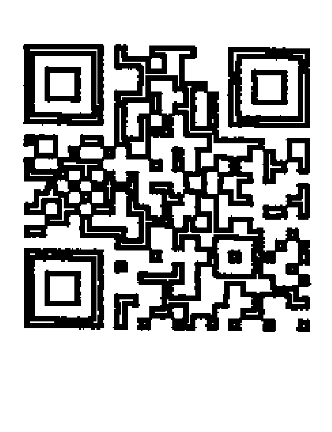
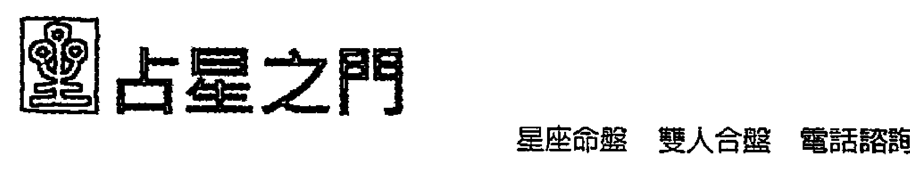
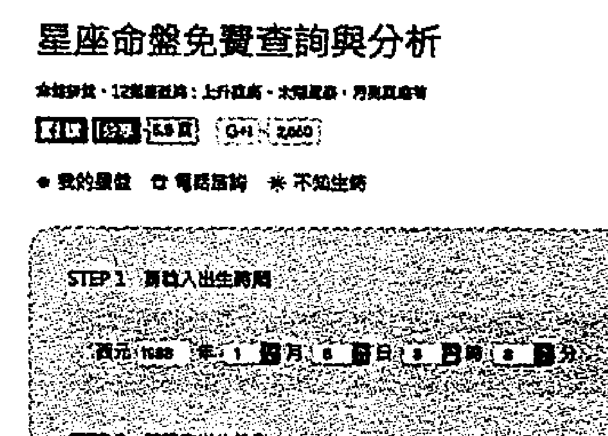
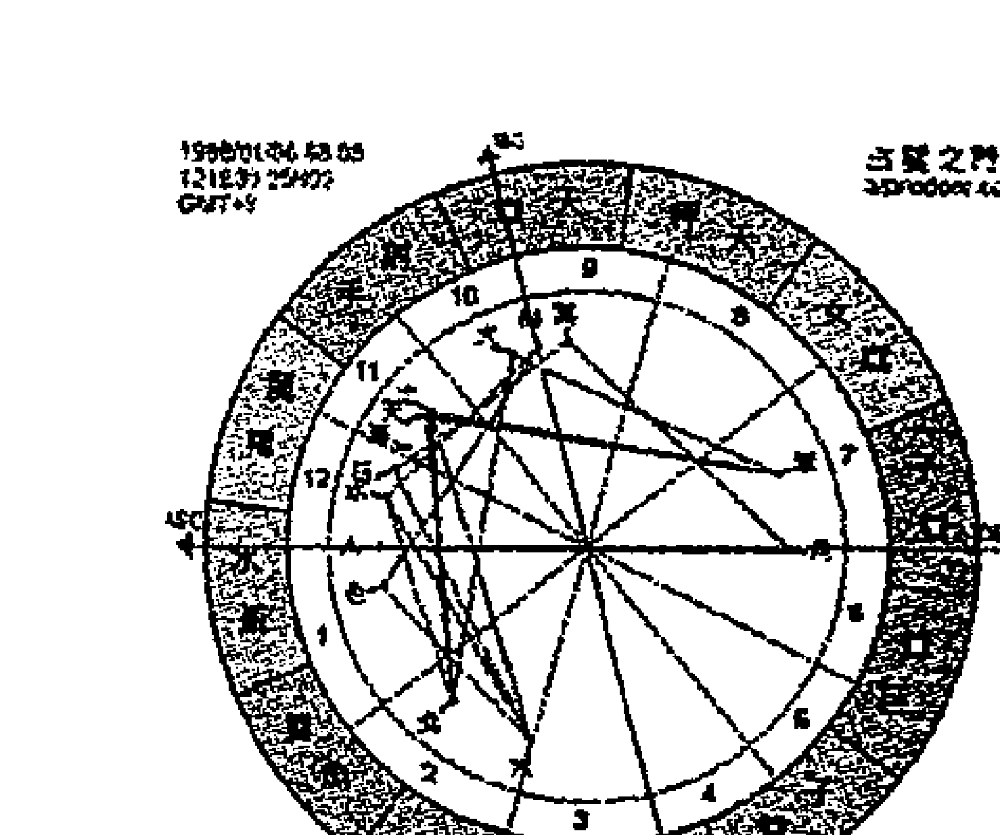
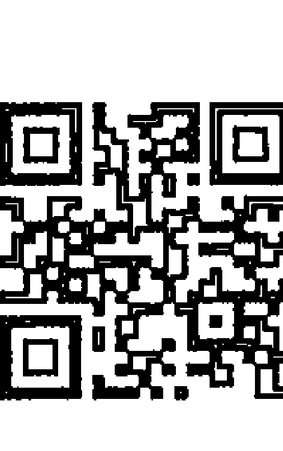

## 生命格局的十二個舞台

韓良露 著

看見真實的生命風景，站上對的舞台，活出精采人生。

## 南瓜之車

啊南瓜  
南瓜種在星子與星子  
之間的雲泥上  
開花，完熟，化成了  
黃金的車輛  

南瓜的籽是我們的夢  
星圖是我們身世的臉譜  
占星之學是我們的靈魂所  
隨身攜帶的天平  
在偌大的宇宙中  
我們不會迷航  
憑著地圖  
靈魂有他最好的旅行方向  

親愛的你  
坐上黃金的馬車了嗎？

## 二宮｜賺取財富的生命舞台 067

好動粗魯的自我形象／木星在一宮：樂觀自信的自我形象／土星在一宮：拘謹不安的自我形象／天王星在一宮：古怪疏離的自我形象／海王星在一宮：朦朧敏感的自我形象／冥王星在一宮：大起大落的自我形象  

## 太陽在二宮：財富帶來的自我肯定／月亮在二宮：財富帶來的安全感／水星在二宮：不斷鑽研的金錢意識／金星在二宮：與美有關的獲利模式／火星在二宮：衝勁十足的賺錢動力／木星在二宮：資源豐富的金錢緣分／土星在二宮：資源缺乏的財富困境／天王星在二宮：大起大落的金錢緣分／海王星在二宮：過度大膽的金錢夢想／冥王星在二宮：精於算計的金錢態度  

## 三宮｜日常溝通的生命舞台 087

太陽在三宮：用意識跟人打交道／月亮在三宮：用情緒跟人打交道／水星在三宮：用心智跟人打交道／金星在三宮：用美感跟人打交道／火星在三宮：用行動跟人打交道／木星在三宮：用智慧跟人打交道／土星在三宮：盡量避免跟人打交道／天王星在三宮：用邏輯跟人打交道／海王星在三宮：用靈魂跟人打交道／冥王星在三宮：影響大眾的理念溝通  

## 四宮｜｜內心之家的生命舞台  

太陽在四宮：籠罩自我的內心之家／月亮在四宮：滋養情緒的內心之家／水星在四宮：資訊交流的內心之家／金星在四宮：美麗愉悅的內心之家／火星在四宮：充滿鬥爭的內心之家／海王星在四宮：充滿謎團的內心之家／冥王星在四宮：突破傳統的內心之家／木星在四宮：資源豐沛的內心之家／土星在四宮：資源匱乏的內心之家  

## 五宮｜｜遊戲與創造的生命舞台 211  

太陽在五宮：自我意識的創造力／月亮在五宮：被動隱性的吸引力／水星在五宮：心智靈活的創造力／金星在五宮：隨時放電的吸引力／火星在五宮：動力十足的創造力／木星在五宮：自在迷人的吸引力／土星在五宮：受到綑綁的創造力／天王星在五宮：疏離奇特的吸引力／海王星在五宮：為愛犧牲的創造力／冥王星在五宮：充滿控制的創造力  

## 六宮｜｜工作與健康的生命舞台  

太陽在六宮：自律嚴謹的工作狂／月亮在六宮：情緒緊繃的工作狂／水星在六宮：心智焦慮的工作狂／金星在六宮：工作如戀愛的工作狂／火星在六宮：火爆  

## 七宮｜｜合夥關係的生命舞台　167  

勞累的工作狂／木星在六宮：追求價值的工作狂／土星在六宮：被實務綑綁的工作狂／天王星在六宮：獨立前衛的工作狂／海王星在六宮：力不從心的工作狂／冥王星在六宮：求勝心強的工作狂  

## 八宮｜｜原欲糾葛的生命舞台　187  

太陽在八宮：用意識窺探他人／月亮在八宮：用情緒偵測他人／水星在八宮：用心智刺探他人／金星在八宮：用感情擄獲他人／火星在八宮：用行動探索他人／木星在八宮：集體資源的受益者／土星在八宮：集體資源的受害者／天王星在八宮：集體資源的革新者／海王星在八宮：集體資源的夢想者／冥王星在八宮：集體資源的控制者  

太陽在七宮：以對方為重的伴侶關係／月亮在七宮：渴求安全感的伴侶關係／水星在七宮：講求溝通的伴侶關係／金星在七宮：講求美感的伴侶關係／火星在七宮：負重責的伴侶關係／天王星在七宮：異於傳統的伴侶關係／海王星在七宮：不切實際的伴侶關係／冥王星在七宮：帶來巨變的伴侶關係  

## 九宮｜擴大經驗的生命舞台 211  

太陽在九宮：異國的價值追求／月亮在九宮：異國的前世鄉愁／水星在九宮：異國文化的學習者／金星在九宮：異國情緣的追尋者／火星在九宮：異國文化的探險者／木星在九宮：異國文化的受益者／土星在九宮：傳統理念的擁護者／天王星在九宮：前衛哲學的追求者／海王星在九宮：異國緣分的夢想者／冥王星在九宮：異國價值的轉化者  

## 十宮｜社會地位的生命舞台 231  

太陽在十宮：受人重視的社會形象／月亮在十宮：受人關注的社會形象／水星在十宮：口齒伶俐的社會形象／金星在十宮：討人喜歡的社會形象／火星在十宮：強悍好鬥的社會形象／木星在十宮：名利雙收的社會形象／土星在十宮：冷酷權威的社會形象／天王星在十宮：特立獨行的社會形象／海王星在十宮：理想夢幻的社會形象／冥王星在十宮：野心十足的社會形象  

## 十一宮｜志同道合的生命舞台 259  

同好團體的領導者／同好團體的認同者／同好團體的發言人／同好團體的享樂者／同好團體的行動者／同好團體的分享者／同好團體的逃避者／同好團體的革新者  

## 十二宮  

## 靈魂意識的生命舞台  

275  

命者／同好團體的夢想者／同好團體的轉化者  

太陽在十二宮：退居幕後的自我意識／月亮在十二宮：過度敏銳的內在情緒／水星在十二宮：退居幕後的心智能力／金星在十二宮：前世情緣的靈魂之愛／火星在十二宮：退居幕後的肉體行動／木星在十二宮：前世智慧的靈性追求／土星在十二宮：前世權勢的責任壓力／天王星在十二宮：前世文明的靈性頓悟／海王星在十二宮：悲智雙修的現世修行／冥王星在十二宮：靈魂意識的轉化提昇  

## 生命的細緻與恢宏就在此。

註：本文內容依據二〇〇五年、二〇〇七年，『宮位』相關課程錄音彙整編寫而成。

## PART 1  
走進占星學的世界  

## 查詢本命星圖  

占星絕對不是將所有的人分成十二種這麼簡單，每個人的本命星圖都會因為出生的時間跟地點而不同，如果要出現兩張完全一樣的星圖，需要經過兩萬五千八百多年的時間。每個人的本命星圖都是獨一無二的，每個人的命運也是獨一無二的。每一張星圖都是命運的密碼，懂得閱讀星圖，才有能力將密碼還原成日常生活會遇到的各種人事物。

## 個人星圖查詢網站：

- 1. Astrodienst: Horoscope and Astrology  
  網址：http://www.astro.com/  
  點選首頁右上角的「My Astro」免費註冊，輸入出生資料後就可以排出本命星圖。若須中文，還可以點選首頁右上角「中文」按鈕。

- 2. astrotheme.com  
  網址： http://www.astrotheme.com/ 在首頁左側的「Free Astrology」點選「Horoscope, Sign, and Ascendant」進入填寫出生資料頁面，輸入資料後點選「next」，確定無誤後再次點選「next」，就可以排出一張包含小行星的本命星圖。如果不需要顯示小行星，可以將下方「Display Parameters」欄位中「Display asteroids」前面的打勾取消。

- 3. 占星之門  
  全中文占星網站，進入首頁後，直接點選右上「選單」或「星座命盤」，就可以輸入資料排出中文化星圖。  
  http://astrodoor.cc/  

  
  

註 第十七頁之網頁畫面由「占星之門」網站提供。

## Step 1  

以「占星之門」網站為例，輸入網址或刷 QR Code 進入首頁，點選右方「星座命盤」。

## Step 2  

填入出生資訊後，點選「辛苦了！請按我送出查詢」。

## Step 3  

即可排出本命星圖。

17 查詢本命星圖  

## 解開本命星圖的密碼：星座、相位、宮位  

人生中有很多已經發生的事、現在正在發生的事，以及未來會發生的事，但我們往往不能理解這些事情背後的意義，透過占星學中各式各樣的內容，我們得以對生命有更多的理解。

占星學最重要的基本架構，就是行星落入的星座、宮位，以及行星與行星之間的相位。學會這三個最重要的基本功之後，就具備一定的解讀星圖能力。

就像剛開始學鋼琴的人，可能得要右手、左手分開練，初學者在實際解析星圖時，面對星圖中同時出現的星座、宮位與相位時難免手忙腳亂，但隨著經驗的累積，就會熟能生巧，不但兩隻手可以一起合奏，還能用腳打拍子，演奏出占星學的美妙樂曲。

每一張星圖就是一個人這輩子要演出的人生大戲，行星就像是戲劇中的不同角色，十二個宮位代表了每個人生命中的不同情境，它是十二個不同的生命舞台。當行星的演員在不同的宮位舞台上出場，就會演出不同的戲，如果落入五宮，就會演出跟五宮有關的愛情戲，如果落入四宮，會演出跟四宮有關的家庭戲。

星座則像角色的性格，一個角色可能會有強悍的性格、溫柔的性格、怕事的性格，也可能是欲望很強的性格。這些都會隨著行星落入不同的星座而有所不同。

行星跟行星之間角度的差距，就是相位。占星學中最常用到的相位有四種：合相（零度）的力量最強，它可能是大好，也可能是大壞；和諧相（一百二十度）代表彼此能量和諧；衝突相（九十度）與對相（一百八十度）能量不協調，因此也被稱為「剋相」。

星座就像食材，它是一種個性，具有不同的性質。宮位則屬於情境，它就像不同的烹調方法，同樣的一塊豆腐可以做成台式煎豆腐，也可以做成湯豆腐。當行星的星座落在不同的宮位，就會明確的呈現星座的能量在怎樣的情境或領域中，會變成怎樣的事情。

行星會隨著落入的星座展現出這個星座的性格原型，而這些原型會受到相位的影響而有不同。同樣是太陽天蠍，太陽跟木星合相的人會用一種誇大的方式來表達天蠍能量，太陽跟土星合相的人會用一種壓抑的方式來表達天蠍能量，但不管是誇大或壓抑，表達的依然是天蠍的特質，太陽天蠍不會因為跟土星合相就表達出金牛的特質。

註  
占星學是一種地球觀點創造出來的知識體系，占星學中的「行星」為相對於「恆星」的名詞，包含太陽、月亮、水星等天體，與天文學中的一「行星」定義不盡相同。

## 主要行星  

- • 太陽：個人意志與人生目標，以及生命中的重要男性。  
- • 月亮：情緒、感覺，以及生命中的重要女性。  
- • 水星：溝通、思考與表達能力。  
- • 金星：情感與喜好。  
- • 火星：行動力與欲望。  
- • 木星：社會價值帶來的利益。  
- • 土星：社會環境帶來的限制。  
- • 天王星：集體意識的重大改革力量。  
- • 海王星：集體意識沒有邊界的融合力量。  
- • 冥王星：集體意識中潛藏的毀滅與新生力量。  

## 不管是星座、宮位或相位，學習時一定要留意不可彼此混淆。

以太陽為例，當太陽落入不同的宮位，代表太陽的自我意識會展現在落入的宮位，當事人會因為那個宮位的特質而感覺自己很重要。簡單來說，這個宮位的事情，會讓當事人覺得「有面子」。

舉例來說，當一個人的太陽落在一宮，一宮是自我形象的領域，當事人會特別覺得「自己」很重要，太陽落在一宮跟落在其他宮位的差別在於：太陽落在四宮家庭宮，當事人會因為父親是個重要人物而顯得重要，他們從小到大出現的時候，往往會因為他們是某某人的兒子或女兒而受到重視；太陽落在十宮事業宮或二宮財富宮的話，當事人會因為社會地位高或擁有大量財富而覺得自己很重要。這些人的重要性來自於他們的家世、工作或財富。但太陽一宮的人，他們的自我價值來自於自我肯定，他們自己本身就有其重要性。

本命星圖中行星落入的宮位，代表這顆行星會在這個宮位的生命舞台上發揮它的能量。至於行星在宮位舞台上發揮的是什麼性質的能量，則要看這個行星位在什麼星座。

一個人如果太陽落在一宮，一宮太陽隨著太陽落在火象、土象、風象、水象的不同星座，也會有不同的影響。如果太陽在一宮又在強悍的牡羊，或在愛表現的獅子就不得了了，如果太陽在一宮落在雙魚，當事人當然也會受到注意，但他們的重要性就會以一種比較柔軟、比較隱藏的方式呈現出來。也就是說，同樣都是太陽一宮，太陽位在的星座，都有可能會加強或削弱一宮太陽的特質，但是太陽一宮的人受人矚目的本質不變。

由此可見，太陽在第一宮（也被稱為一牡羊宮）與太陽在牡羊座是不同的。學習時不妨常常互相比較兩者之間的差異，對於星座能量與宮位情境兩者的不同，就能夠有更深入的理解。這種判斷能力不只有助於解讀個人本命星圖，更有助於理解更加複雜的生命歷程行運星圖或人際緣份合盤的意義。

以太陽在牡羊座與太陽在一宮（也被稱為一牡羊宮）為例，兩者的不同在於：太陽牡羊的人很好強、很好勝，可是別人不見得第一眼就看得出來這個人很好強，通常要跟他相處一陣子之後，才會從他工作態度及對待別人的方式，感覺到他的好勝，因為他有可能外表看起來很溫和，尤其如果他們的上昇落在相對溫和的巨蟹、雙魚等星座，但是他們有著很強的意志力；太陽一宮的人會顯得很重要，但他們不如太陽牡羊的人來得好勝。太陽一宮的人通常被人注意就滿足了，他們不會一定得要跟別人一決勝負，他們不像太陽牡羊的人具有很強的領導力、競爭心與戰士性格。太陽一宮的人可能只是因為是家中的長男，或出生時是家中的重要成員，而習慣被人注意，

25 解開本命星圖的密碼：星座、相位、宮位

於英格麗褒曼的太陽金星的合相落在處女，所以她會以處女座精緻嚴謹的能量，來展現太陽金星合相的魅力。由這個例子，我們可以看出宮位、星座與相位，這三者影響力的不同。

# 註

關於本命星圖中行星落入之星座、宮位，以及行星與行星之間的相位，可掃本頁 QR code，即可上網參考影片講解。

# 宮位的連動：財富、工作與事業

在本命星圖中，二宮代表自己賺來的財富。有的人靠著努力工作，有的人靠著才華或技能，也有人靠著理財的能力，二宮的財富有很不同的可能性，但它們都是靠自己賺取的金錢。

六宮的本質是一種有目的的活動，每個人日常生活中最有目的的活動就是工作，因此六宮也被視為工作宮，六宮有行星的人，通常會是被大家認為是很賣命的蜜蜂型或螞蟻型的勤奮工作者。

十宮代表社會舞台，本命星圖如果十宮中有行星，當事人會很希望自己被社會看到。如果六宮跟十宮之間相位好，當事人會是勤於工作而身居高位的人，如果只有六宮卻缺乏十宮相位，他們就可能會是經常哀嘆自己工作努力，但每次升官都輪不到他們的人。

二宮、六宮或二宮、十宮中如果有行星，彼此就容易形成一百二十度和諧相，代表當事人能夠經由勤奮工作（六宮）或知名度（十宮）獲得收入（二宮），而這些收入會成為鼓勵工作或爭取地位的誘因，讓當事人在工作或事業上更為投入。如果一個人同時擁有二、六、十宮形成的大三角，代表當事人對於財富、工作、地位都很有野心與緣分，這三者不但不會互相妨礙，更是彼此的助力。

每個人出生時天上的星辰跟本命星圖中的行星形成相位，行星的能量就會被啟動，本命星圖也因為行運不斷的啟動而活了起來。

二、六、十宮大三角最大的意義在於，只要行運的行星跟二、六、十宮其中之一合相，就必然跟另外兩宮的行星形成一百二十度的和諧相。也就是說，當行運的吉星跟本命星圖二宮中行星合相的同時，也會跟六宮、十宮的行星形成了和諧相，行運行星啟動的不只是二宮的財運，同時也啟動了六宮的工作運與十宮的事業運，當然會比單純啟動二宮更有影響力。此外，即使行運的吉星離開二宮，當它走到六宮，跟六宮內的行星合相，等於同時又跟二宮、十宮和諧相，二、六、十宮的能量又再度被啟動。

即使一個人本命星圖的格局再好，每個人一生中還是有著許多大運、中運、小運的起伏。所謂大運必須長達五年以上，甚至十年的好運才能稱得上大運，這需要靠著移動速度慢的天王星、海王星、冥王星行運，才有可能出現這樣的機會。如果一個人只有二宮而缺乏六宮、十宮相位，當他遇到天王星、海王星、冥王星的好相位時財運極佳，一旦行運結束，財運也隨之結束。但如果當事人的本命星圖中具有二、六、十宮的和諧相，只要行運的重要外行星跟這三個宮位任何一個合相，二、六、十宮就會同時被啟動，即使天王星、海王星、冥王星的大運結束，其他行運吉星雖然來得快去得也快，但是可以持續不斷在二、六、十宮發揮影響力，當事人的好運就會比單獨只有二宮更為持久。

行運海王星、冥王星由於移動速度慢，一個人一生中可能只移動了三四個宮位，有些人未必會遇得到海王星與冥王星真正嚴重的剋相。如果一個人本命星圖二宮的相位很好，例如木星落在二宮，而且木星沒有跟其他行星形成九十度或一百八十度剋相，一輩子剛好又沒有遇到行運海王星、冥王星跟本命二宮木星的嚴重剋相，即使遇到行運土星的剋相，也不過兩年多就會結束，嚴格來說都不算嚴重。而遇到行運帶來好相位的話，更是好運無法擋。因此我們有時候會看到某些人一輩子都在亂花錢，可是卻一直都不窮；有些人一輩子都很小氣，但是一輩子都在賠錢。也就是說，勤儉與浪費不見得跟一個人的貧富有必然的關係。

很多人常常會把二宮的財富窄化成金錢，其實想要賺大錢，未必一定要做跟金錢直接相關的工作。如果一個人星圖中二宮相位很好，就算當藝術家都能夠賺大錢——賺不到錢是因為星圖格局本來就賺不到錢，不是因為他是藝術家。做生意也不見得就一定能賺錢，賠錢的生意人比比皆是，如果一個人的星圖屬於賠錢的格局，即使他去做生意，也會是個賠錢的生意人。

所以我常說，假如一個人的星圖是賺不到錢的格局，去做藝術家、科學家，或者從事宗教、慈善工作，都比做生意好，因為即使賺不了錢，還是留下了藝術、科學、宗教或慈善的成績。

話說回來，如果星圖是可以賺大錢的格局，那更應該放膽去當藝術家、科學家，去做一切你愛做的工作，因為會賺錢的格局，就算當藝術家、科學家也會賺大錢，而且不但能賺到錢，還可以留下藝術作品或科學成就。才藝或知識也是一種資源，它們既是個人資源，更是人類文化資源的一部分。

如果星圖中沒有賺大錢的格局，根本別考慮做生意，因為做生意完全是以能不能賺到錢為準，賺不到錢的生意人就是失敗的生意人，而藝術、宗教、科學這些領域，即使賺不到錢，世人還是會為你的理想而鼓掌。

唯有了解自己跟金錢的緣分，才不容易讓自己陷入一般人對於金錢普世看法的框架，否則用普世看法來對應個人的時候，往往不見得行得通。

# 星圖的剋相：正財與偏財的金錢陷阱

在本命星圖中，當行星與行星之間形成了九十度或一百八十度的相位，這就是我們常說的「剋相」或「受剋」，行星如果受剋，就會顯現出行星的負面能量。同樣的剋相，落在不同的宮位，就會有不同的情境，其中最常惹出大麻煩的是二、五、八、十一宮的剋相。

舉例來說，假設一個人的太陽跟海王星形成剋相，海王星的不切實際會影響到太陽的自我完成，當太陽與海王星的剋相落在不同宮位，當事人就會出現不同的問題，例如不重視健康、對戀愛有不切實際的幻想、沒辦法專心工作等等，這些問題都不如落入二宮、八宮來得麻煩，因為金錢是很實際的東西，如果是別的麻煩，不去面對有時候也沒什麼大不了，但金錢糾紛往往逼得當事人不能不面對。一個人或許對愛情不切實際，頂多暗戀多年而毫無進展；一個人或許不愛工作，可能成天鬼混。但如果一個人很愛錢卻賠了很多錢，因此欠了別人很多錢，這樣還不如那些對金錢沒有野心，每天鬼混過日子的人。因為在家鬼混其實不會出什麼大問題，但是欠別人錢卻不能不還。

二、五、八、十一宮之間會形成九十度或一百八十度的剋相。如果一個人本命星圖中有這樣的相位，他們這輩子在財富之路就會走得特別顛簸，起落特別大。二宮、八宮與五宮都尤其與財富有關。五宮相位很好的人可以因為投機而賺到大錢，而八宮很強的人，他們可能會因為繼承或贈與而得到財富。但他們的財富都不像二宮是透過工作而取得。簡單來說，二宮就像大家常說的正財，八宮類似大家常說的偏財，相較之下，五宮的財運就有一點像是橫財了。

本命星圖二宮、五宮、八宮中有行星的人都特別重視金錢，但重視金錢不代表一定能夠帶來金錢，往往反而會因為重視金錢而造成衝突。如果一個人星圖中二宮跟五宮都有行星，呈現九十度剋相的話，代表當事人對賺錢很有興趣，對投機也很有興趣，但是剋相會帶出負面能量，因此這個人就會一邊努力賺錢，一邊努力賠錢。二宮跟五宮有剋相的人，如果想要左手賺薪水，右手賺投資，往往到頭來會兩手空。

如果一個人的星圖中八宮跟五宮都有行星，彼此呈現九十度剋相的話，這個人也會常常因為想要投機或賭博而賠錢，不過賠的是別人的錢，他們可能賠掉了遺產或賠掉先生的錢。

以星圖的財富格局來說，最嚴重的衝突是二宮跟八宮的一百八十度剋相，二宮跟八宮如果形成剋相，往往代表當事人的財富會被他人分走。不管是他們的太太、先生、小孩，或是合夥人，他們容易因為金錢而跟他人起糾紛。所有的糾紛都起於重視。如果沒有這樣的相位，就不會有這麼強的欲望，重視金錢的人才會容易與人產生金錢糾紛。

不管本命星圖二、八宮本身的相位好壞，當重要行星的行運走到二、五、八、十一宮時，都會因為行運造成的剋相而出現問題。我們一定看過有人遇到幾年好運，賺了很多錢之後，因為做了某些投資而把之前賺的錢全部賠光。

對於一個本命星圖中具有二、六、十宮好相位的人來說，五、八、十一宮的行運雖然會造成損失，加加減減之後，賺的錢扣掉賠掉的錢，還是綽綽有餘，但就算是這麼好的格局，都不可能一生只賺不賠。對於本命星圖中有二、五、八宮剋相的人來說，他們會比二宮完全沒有任何行星的人更喜歡理財與投資，但理財不當的話反而越理越糟。

每個人一生當中總是幾年好運幾年壞運，遇到二、五、八、十一宮行運帶來的壞運時，就像賭桌一樣，其實小輸就是贏。小輸時能忍痛離場的人才能全身而退。否則就算在二、六、十宮行運賺了大錢都不夠賠。

人總是在最容易賠錢的時候做出最大投資，因為這也是行運力量最大的時候，當事人往往在這個時候特別無法抗拒行運帶來的誘惑，不由自主的捲入了生命的風暴。

星圖中的負面能量不可能完全消除，但如果能夠避免主動介入會出現問題的相關事物，或許傷害的程度可以降低。當一個人二、五、八、十一宮出現剋相，尤其是行運帶來的負面相位，金錢相關的重大決定就要慎重面對或盡量避免。就算所有人都告訴你現在股市很好，或者可以去投資獲利，這些都不可以相信。即使收入減少也得接受，行運帶來的壓力往往不過一兩年，就算是天王星、冥王星的行運，相位能量最強的時間也不超過三年，而很多人就是在這一兩年克制不住而後患無窮。

學占星的意義在於讓我們能夠跟欲望形成一種客觀化的關係。就像佛法常講的「去除我執」，我執就是一種主觀意識，而真理永遠是客觀的。每個人都有自己的病根，當我們客觀的知道哪些事情可以做，哪些事情不可以做，能夠知道自己的病根所在，我們就能夠有所選擇。

之所以要特別提醒大家這些關於財富格局的概念，原因在於我們學習宮位的時候都是依照每一顆行星落入的宮位片段片段的學，但如果對於占星學的整體架構缺乏概念，既不管宮位之間可能會有的相互影響，又不考慮行運帶來的問題，單獨只是否有行星落入二宮或八宮，永遠只看這顆行星在這些宮位會帶來什麼好處，這樣其實是很危險的。

所有的占星邏輯都是人生智慧，不管是財富、愛情、工作或健康，除了本命星圖的基本格局之外，更重要的是，面對行運帶來的不同生命歷程時，是否能夠以足夠的人生智慧來平衡不同時期的好運與壞運，這樣才能夠安然度過人生的風暴。

# 星圖的剋相：正財與偏財的金錢陷阱

# 宮位的選擇：戀愛、伴侶、朋友的擇偶面向

一個人在選擇婚姻對象時常有三種可能性：讓你心動的五宮戀愛對象、以結婚為前提的七宮婚姻對象，或者從好友變成伴侶的十一宮友伴對象。

五宮的本質是遊戲，它是每個人內在小孩的延伸。所有跟五宮相關的事情，包括戀愛、創作、表演、娛樂、賭博，都源自於兒童從各種遊戲中得到的快樂有關。每個人在年紀很小的時候，生活中充滿了親吻與擁抱，大人看到很小的小孩，常會上前親一親、抱一抱，很多父母也常叫小孩見到祖父母、外祖父母時要親一下，這種簡單的快樂，長大以後就會變成戀愛的需求。

選擇五宮對象結婚的人不多，因為五宮的本質是戀愛遊戲而不是婚姻，除非當事人五宮本身和七宮之間有著和諧相位，否則這種選擇其實是很危險的，因為它是一種基於本能做出來的選擇。

戀愛追求的羅曼蒂克在於喜歡自己被人喜歡，所謂的談戀愛，基本上是兩個人湊在一起各人戀各人，各自玩得很開心，但婚姻不同，婚姻之所以是戀愛的墳墓，原因在於戀愛是為了好玩，一旦要結婚，就不能只為了好玩了。婚姻是自我妥協之後的合作，而戀愛跟合作無關，戀愛是一種自我的延伸，當兩個延伸的自我互相碰撞，如果成功純屬運氣好，不成功才是理所當然。

從這裡我們也可以看到一個有趣的文化現象──戀愛與婚姻其實是到了近代才被混為一談，這兩者在以前根本不是同一件事，從占星學的角度來看也是如此。一個人第一眼看到另一個人是否覺得很來電、很有興趣，其實並不是婚姻關係中最重要的本質，這些都是人類到了近代才有的概念，或許這也是現代離婚率居高不下的原因。

當一個人經歷了十五六歲青春期的騷動，到了適婚年齡之後，通常選擇的對象多半是七宮的關係，七宮屬於經過思考，在有意識的狀態下做出來的選擇。也就是說，七宮是一種「以結婚為前提」的交往。

在十二個宮位中，從一宮到六宮都是很清楚的生命情境，它們牽涉的範圍往往只跟當事人相關，因此比較容易掌控，從七宮開始，當事人要面對的是比較大的生命情境的變化，由於牽涉的範圍不只是自己，當然也就複雜許多。

本命星圖中七宮的起點就是下降點，下降點位於上昇點正對面，上昇代表的是一個人的出生狀況與童年環境，上昇與下降的一百八十度，反映出一宮與七宮的異性相吸。舉例來說，上昇牡羊的人會出生在資源不足的環境，除非上昇點度數位於牡羊末端，大多數上昇牡羊從小都必須靠自己努力求生，因此他們長大以後都會很有主見、很強勢，喜歡自己拿主意，他們遇到了跟什麼都想聽別人意見的天秤當然一拍即合。

從更深入的角度來說，上昇牡羊的人從小就必須為了生存而奮鬥，他們童年環境中最缺乏的就是天秤客客氣氣、彬彬有禮的對待，這是他們小時候最羨慕卻得不到的生活，這種深層的內在渴望，才是上昇、下降異性相吸的最大動力。對於本命星圖中七宮有行星的人來說，這種吸引力更有如命運的牽引般難以抗拒。七宮中沒有行星的人或許未必會選擇七宮的對象，但如果七宮中有行星落入，代表伴侶一定在當事人的生命中扮演很重要的角色，當事人通常不太可能躲過本命七宮的行星影響力，尤其是第一次婚姻，即使七宮本身受剋嚴重、困難重重。

五宮、七宮、十一宮的擇偶考量，有時候也會跟人生歷練有關。許多人在年輕的時候會尋找五宮的對象，因為這種對象能夠帶給他們戀愛的感覺；大部分人成年以後會尋找七宮的對象，因為這種關係最像雙方合開一間公司，一起經營一個事業，也最符合大家對於婚姻的想像；但隨著生命經驗的豐富，很多人會選擇有共同興趣與理想，像是朋友關係的十一宮對象。

十一宮的婚姻伴侶的模式，特點在於當事人跟他們的伴侶會先是志同道合的朋友，有時候會維持很多年的朋友關係才在一起，十一宮的吸引力儘管不像五宮或七宮這麼強，但是對於七宮本身相位不好的人來說，十一宮跟七宮之間的一百二十度和諧相，可以緩和七宮的壓力，這對於擇偶來說，是很值得重視的選項。

## 月亮在一宮：細膩感性的自我形象

很重要，有時候是因為我們已經知道這個人是個重要人物的關係，就像一個董事長或總經理，在公司裡面當然大家知道他是老闆，但別人不見得。假設太陽一宮與太陽十宮一起相約吃飯，他們進了一間餐廳，服務生可能會把帳單拿給太陽一宮的人，這是因為太陽一宮的人往往會顯得自己很重要，而這跟他們是否具有社會地位無關。

太陽一宮的人需要一些出口去展現自己，比如從他們的工作、事業或嗜好去展現的話，比較不會過度發展而讓人難以忍受，否則他們常常會將所有的能量都聚集在展現自我上，就容易會有過度自大的問題。

太陽一宮的人不論男女，他們都帶有比較強的陽性氣質，月亮一宮則相反，當事人無論男女的陰性能量都會比較明顯。陽性能量在男性身上顯得理所當然，太陽一宮的男性通常不見得會意識到這一點，但太陽一宮的女性就會令人覺得特別陽性；月亮一宮的女性不見得會感覺到自己有什麼特別，但月亮一宮的男性，就會特別不像傳統定義雄赳赳氣昂昂的男性特質，而顯得比較柔軟、細膩，比較感性。

月亮一宮的人從小跟母親會比較親近，而太陽一宮的人從小跟父親比較親近。太陽一宮的人從小到大，父親對他們的影響力較大，月亮一宮的人母親對他們的影響力較大。月亮一宮的人對女性的情緒與跟母親之間的互動比較多，因此他們比較容易跟其他女性發展出良好關係。他們對女性的情緒與感性事物的敏感度很高。

他們也具有吸收周遭環境情緒的能力，不管男性或女性，月亮一宮的人從小就彷彿用一種嬰兒的方式跟母親互動，他們從小就很關心母親會怎麼對待他們，他們對母親喜歡或想要的東西很敏感，長大之後，他們與世界的關係，就如同小時候跟母親的關係一樣，他們對於別人的目光很敏感，月亮一宮的人很介意別人怎麼看待他們，但用的是一種隱藏的方式。

月亮一宮的人對於食物特別有興趣，也比較不能捱餓，這種特殊的狀況來自於童年的需求，他們童年時期對於餵養他們的母奶有著比較強的依賴，當他們沒有被好好餵奶時，就會認為母親不理他們了。月亮一宮的人餓了的時候，如果不能馬上吃到東西會很沮喪，對於一般人來說，稍微餓一下沒有太大影響，但對月亮一宮的人來說，飢餓很容易會讓他們失去安全感。他們不能也不願意忍耐飢餓，因為這不只是身體反應，更與情緒有關。

從他們面對飢餓的態度，我們也看得出來月亮一宮的人很難客觀的看待外界環境。但月亮一宮的人不會很直接的表達自己的情緒，即使他們對外界感到不安，他們也不會像太陽一宮的人那樣表現出來。

## 水星在一宮：互動快速的自我形象

月亮一宮的人跟母親都有很強的連結與依賴，長大以後也會找一個人做為象徵性的母親來讓他們依附。

最簡單的說法，太陽在一宮的人有一種天生的自主性，他們即使才五六歲就很自主，而月亮一宮的人很多到了四五十歲，即使他們在社會上是一個重要的人。他們或許在工作上很理性，但在情緒上面無法自主。他們都需要去找一個帶來情緒牽連的人，不管月亮一宮的當事人自己是男性或女性，他們都會去尋找一個女性為他們帶來情緒的牽連。月亮一宮男性通常會跟他們的媽媽、女兒，或者姊妹淘有很深的關係；月亮一宮的女性則通常會很依賴她們的媽媽、女兒，或者姊妹淘。

月亮一宮的人產生情緒牽連及依賴的對象，一定會是女性。

如果水星並沒有其他剋相的話，水星一宮都會是愛講話的人，而且常常會讓人覺得他們很聰明，不過水星一宮的聰明不如水星跟太陽合相，也不如水星跟外行星有好相位的人來得聰明。

水星一宮又有好相位的人，會是真的很聰明，看起來也很聰明的人。但即使水星一宮而且跟外行星有很好的相位，他們還是不如水星落在三宮、五宮、九宮、八宮、十二宮的人來得聰明，原因在於他們水星的心智都還是表現在我們自我領域，而非聚焦於在某一個主題上。

水星在一宮的人對周遭環境很敏銳，很勇於對身邊的人事物做出反應。乍看之下，大家往往會覺得水星一宮的人看起來會比水星落在其他宮位的人聰明，原因在於，他們特別長於人際互動，他們跟別人互動的時候會顯得很敏銳，所以特別擅長人際互動，尤其如果水星一宮的相位好，他們會特別適合從事較多人際互動的工作。

## 金星在一宮：美麗浪漫的自我形象

金星一宮的人通常長得不錯，而且他們會持續的讓自己的外表看起來很不錯。也就是說，他們往往天生麗質又勤於打扮，不管先天或後天都會讓自己好看。金星一宮的人喜歡美好的環境，長相的美好，也屬於美好環境的一部分。

金星一宮本身屬於陰性能量，所以不管當事人是男性或女性，都會讓人覺得有一種陰性的感覺──如果一個男人長得很漂亮，依照傳統的標準來看，當然就不太會讓人感覺到雄赳赳氣昂昂。他們喜歡跟人打交道，喜歡社交生活，也喜歡在比較羅曼蒂克的環境與人相處。他們喜歡生活在舒服的環境中，尤其對於外在感官的美很敏感，所以如果想要邀請金星一宮的人吃飯或從事各類活動，環境是否優美對他們來說很要緊，他們絕不會喜歡很粗糙、很混亂的環境，他們很在乎環境是否舒服。

金星一宮的人喜歡運動，他們的身體很需要大量活動。金星一宮如果受剋，也就是金星跟別的行星形成了九十度或一百八十度相位，當事人會有比較嚴重的自戀問題，也會有過分虛榮的傾向，他們會過度追求外表的虛榮。

## 火星在一宮：好動粗魯的自我形象

火星落在一宮等於是雙倍的陽性能量，等於火星到了本位宮，力量非常強。當事人都會很霸道，比太陽一宮的人更嚴重。比較起來，太陽一宮的人希望別人看待他們的時候覺得他們很重要，他們會顯出自己強勢的一面，很有主導性，如果火星相位不好的話，當事人會有一點輕微的野蠻傾向，一定會有一點粗魯。

火星一宮的男性一定會顯現出硬漢型的形象，就算火星落在雙魚，比起火星雙魚落在別的宮位的人，他們也會顯現出個性的強度。火星一宮的女性外表一定會顯得有一些大女人的樣子，她們看起來一定不會是柔弱女性的形象。火星一宮的人在生活中喜歡依據本能採取主動，他們都會喜歡在生活上的享受，喜歡身處於舒服的環境中，尤其對於外在感官的美很敏感，所以如果想要邀請火星一宮的人吃飯或從事各類活動，環境是否優美對他們來說很要緊，他們絕不會喜歡很粗糙、很混亂的環境，他們很在乎環境是否舒服。

火星一宮的人行動大膽，但個性未必大膽。他們很容易出現突發的情緒與脾氣，尤其火星如果受剋，他們常常會有突然爆發而無法克制的怒氣。

我認識一個火星一宮的女性，多年前她跟先生出國，搭機時前座有人放屁，這種事情對一般人來說根本是不值得一提的小事，但她竟然就因此跟前座的乘客起了衝突，雙方一言不合大吵起來，連雙方的配偶也加入戰局，甚至演出甩巴掌、咬人的情節，空中小姐及工作人員連忙勸架，還幫雙方調了座位。其實這個朋友平常的工作是個老師，也算是個高級知識份子，並不是毫無見識的人。

火星一宮的人永遠會讓別人覺得他們帶著一點找麻煩的形象，跟金星一宮不同，火星一宮的人永遠不會顯得很友善。

火星一宮的人不分男女都喜歡鍛鍊身體，喜歡從事許多健身運動，喜歡讓自己的身體看起來比較強壯、飽滿、肌肉發達，他們喜歡讓自己的身體顯得一直維持在使用的狀態，他們喜歡這種感覺。

火星一宮不分男女，當事人都比較喜歡跟男性做朋友，女性的當事人外表也會比較不女性化，剛剛提到在飛機上打架的那個朋友，她平常就很愛打撞球──火星一宮的人喜歡的運動通常也會是帶有陽性形象的運動。

## 木星在一宮：樂觀自信的自我形象

火星一宮如果受剋，當事人會比一般人容易受傷，他們很容易吸引到混亂的場面。火星一宮的受傷跟開刀把身體內的器官拿掉之類病痛不同，身體內部受損屬於六宮領域，而火星一宮的人遇到的意外或身體傷害都與外觀有關，多半是臉上或身上掛彩，不會是別人看不到的身體內部開刀這類五臟六腑的傷害。

一般的女性通常不太會有掉頭髮的問題，但我認識一個火星一宮的女性，她就有雄性禿的困擾。火星一宮如果火星又落在火象星座，不分男女，當事人都比較容易掉頭髮，尤其男性當事人情況會更為明顯，因為火星一宮當事人的毛髮很容易會被火星給燃燒掉。

一宮跟童年家境富裕或貧困不見得完全相關，它主要呈現出來的是周遭的人跟當事人之間的對應態度。木星一宮的人不管小時候家裡是否有錢，家庭都會把比較多的資源放在當事人身上。他們一誕生就會享有比較多資源，但這並不意謂著當事人一定會誕生在有錢人家。相對來說，如果一個人的土星在一宮，即使誕生在很有錢的家庭，當事人還是會感到資源匱乏。

我認識一個木星一宮的人，他在家排行老大，從小在南部長大，他們家共有四個小孩，只有他受到很好的教育。小的時候爸媽對他特別好，甚至在求學階段，家中弟妹也都放棄學業去工廠賺錢供他繼續讀書。

木星一宮的人一定一出生就會擁有比較多的資源，家人也比較寵愛當事人，也比較會容許他們做自己想做的事情。所以木星一宮的人終其一生都會保持樂觀的態度，而且很能夠保持自信。

木星一宮的自信與太陽一宮的自我不同，太陽一宮的自我在於需要被人看到，但木星一宮的自信在我行我素，他們並不需要藉由別人來肯定，木星一宮的人自己已經就是完整的天地。

木星一宮如果相位不好，當事人會有過度喜歡冒險的問題，有膽大妄為的傾向。他們也常有體重問題，因為他們不會想要很積極的去控制自己的體型──如果可以的話，他們當然希望自己體型是往上發展而非橫向發展，可惜這一點違反地心引力。

木星一宮如果相位好，當事人一生會有比較多的機會，他們在生命中會比較幸運，也比較有機會擴展、延伸自己的人生。別人看他們都會覺得他們運氣很好，他們也總是顯得很好運，因為他們很樂觀，但是如果拿木星一宮跟土星與木星合相的人相比，土星與木星合相的人才是真正好運，木星一宮的人則是因為他們的個性讓他們顯得很好運。

木星一宮的人很友善，很喜歡交朋友，很喜歡社交生活。如果一個人木星在一宮，他們即使不胖，看起來也一定都不會太瘦，除非一宮中除了木星之外還有土星，但即使如此，他們還是會比單純土星一宮的人看起來豐潤。木星一宮的人身形一定偏圓，因為哪怕天塌下來，他們也總是能夠維持一種愉悅的態度，他們不是心寬體小胖，就是心寬體大胖。

木星一宮的人如果受剋，他們就要克服自命不凡且過度放縱的那一面，儘管他們的動機良善，但常會過度自信而不自覺說了很多大話而無法做到。

不過儘管如此，在一般社交場合上，大家都還是很喜歡看到木星一宮的人，木星一宮不像太陽一宮會要身邊的人配合他們演一齣以他們為主角的戲，太陽一宮的人往往太喜歡當主角，太積極想表現自己有照顧別人的能力，即使太陽一宮扮演的是照顧別人的角色，但卻讓周圍的人壓力很大。而木星一宮的人在這方面就不會讓別人感到壓力，他們並不像太陽一宮的人這麼熱衷於主導。

## 土星在一宮：拘謹不安的自我形象

土星在一宮，尤其如果受剋，代表當事人童年經常感覺到很匱乏，即使他們童年家境並不窮，但在童年時期也經常會有人提醒他們必須隨時節儉，以免坐吃山空，他們在童年生活環境中會受到很多限制。

土星一宮的人在生命的早期，一定會有一個重要的人在身邊經常對他們說「不可以做這個，不可以做那個，這個世界對人並不友善」，他們的童年環境不會鼓勵他們對生命多作嘗試。即使土星一宮不受剋，當事人也總是覺得自己的長相不夠好看，而木星一宮的人就算五官長相跟土星一宮的人差不多，但是木星一宮的人總是會配上一種愉悅的神情因此被人覺得好看。我認識一個木星一宮的朋友，老實說他其實長相十分普通，但所有認識他的人都說他很好看──有的人儘管五官普通，但永遠能夠展現出瀟灑的神態，這就是一個人的「氛圍」。土星一宮的人或許長得很端正，可是總是因為過度小心翼翼而顯得很拘謹、不安，以致於顯得沒有木星一宮的人來得好看，但這完全是一種別人感覺的主觀印象。

雖然客觀來說，一個人的美醜可以從五官來分析，可是每個人給別人美醜的感覺，都還是受到整體的主觀認定進而形成的一種印象。木星一宮的人就是會讓人覺得瀟灑，土星一宮的人就是會讓人覺得拘謹，一個人如果顯得拘謹就好看不起來，就算五官再端正，也缺乏好看的神情。一宮跟外表的關係，往往取決於當事人神情帶給別人的印象，更勝於五官美醜的影響。

土星一宮如果受剋，尤其是土星跟火星、天王星的剋相，如果情況嚴重的話，有可能會帶來身體外觀的殘缺，而且當事人可能會有脊椎的問題，如果剋相不嚴重，問題可能只是禿頭或者身高太矮，或者臉上青春痘很多。

土星一宮的人對環境缺乏信任感，因此他們多半很拘謹，他們經常會帶著一副冷漠的面具，但他們本身不見得是一個冷漠的人，他們往往會表現得比較冷漠、保守、遲疑，總是不太能夠透過外表表達出自我。

土星一宮的人不太可能會很胖，他們可能骨架大，但是都不會真的很胖。他們都屬於懂得自我限制的人，不會讓自己看起來圓滾滾，不會亂吃，不會自我膨脹。

一宮也跟肉體活力有關，但肉體活力跟身體好壞倒不見得絕對相關。木星一宮的人永遠會讓身體保持在很有活力的狀態，而土星一宮的人則總是讓別人覺得他們一副沒什麼活力的樣子。土星一宮的人往往在十歲以前有生過大病的經驗，如果土星跟上昇點很靠近，當事人很可能出生不久就生過大病，他們一定會因為一些與身體有關的事件，限制了童年的活動。

由於土星一宮的人小時候環境的限制以及缺乏安全感，使得他們很難對生命採取具有創造性的態度，而且常常活力不足，常常會覺得疲倦。土星一宮也跟骨骼、皮膚有關，很多土星一宮的人皮膚會有問題，即使土星一宮沒有受剋，當事人的骨骼、皮膚也容易有問題，只是症狀比較輕微。在健康與活力方面，基本上來說，土星一宮受剋，問題往往會比較嚴重，即使不受剋，情況也不會好到哪裡。

一宮跟外在有關，一宮的範圍屬於平常外人看得到的部分，看不到的地方不歸一宮管。我認識一個土星一宮的朋友，跟她一起去洗溫泉的話就會知道，她凡是露在外面讓人看得到的皮膚狀況都很差，但凡是被衣服遮住、平常別人看不到的皮膚都很好，這就是土星一宮令人感嘆之處──他們可能全身皮膚都光滑細緻，但所有的青春痘都長到了臉上。相較之下，可能很多金星一宮、木星一宮的人臉部皮膚狀況非常好，但是脫了衣服搞不好身上皮膚坑坑疤疤。

土星一宮的人優點在於他們比較有責任感，比較認真工作，也比較值得託付重任，他們雖然不屬於討人喜歡的人，但他們會是比較忠誠的朋友，尤其土星一宮相位好的話，他們答應的事情，會比木星一宮的人可靠。

土星一宮如果相位不好的話，當事人往往會有防禦心過重的問題，以及過分孤獨或者過度物質主義傾向，常常過度追求能讓他們能夠感到安全的處境。

土星一宮的人要學習放鬆與自在，類似卡內基之類的自信訓練不見得對所有的人都有用──如果木星一宮的人跑去上這種課，搞不好會自我膨脹到無法收拾的地步，但這類課程顯然對土星一宮的人格外有幫助。土星一宮的人需要去建立自信與學習自在，當土星一宮過度發展，就會建立起一言不苟的嚴肅外表，他們往往會將這個外表戴得太久，於是造成他們的自我過度退縮。

## 天王星在一宮：古怪疏離的自我形象

天王星一宮的人不分男女都會有一點古怪，他們都會具有一種陽性特質，天王星一宮的女性也不會顯得很女性化。但他們的陽性特質並不像雄赳赳氣昂昂的火星一宮，他們都會讓別人感到有一點像是機器人的冰冷、疏離感，他們對生命、對自我的看法往往也不同於常人，如果天王星受剋的話，他們往往會有點不近人情。

天王星一宮的古怪常常會顯現在外表上，他們可能看起來太高、太矮，或者長相有一點奇怪。我有個天王星一宮的朋友，她大約只有一百四十幾公分，最令她困擾的事情是大家認識她之後總是問她爸媽是不是也很矮，但她媽媽的身高有一百六十五公分，爸爸有一百七十八公分，在那個年代都算高的了，她的父母身高遺傳基因都不矮，家中兄弟的身高也都大約一百八十左右，都比一般人的平均身高要高。又如天王星一宮的前總統李登輝身高一百八十幾公分，在他的年代，算是非常高的人了。

天王星在一宮也會影響當事人的自我形象，不管是對自己的家庭或身處的環境，他們都會有一種格格不入的感覺。但這與土星一宮的退縮、閉塞不同，土星一宮的人通常會覺得環境對他們不友善，或者因為自卑、缺乏自信而想要躲起來。土星一宮的人會覺得自己達不到環境的要求，天王星一宮的人則會排斥環境，他們認為自己的想法領先時代，當他們跟環境格格不入時，問題出在環境。所以天王星一宮的小孩不好帶，他們在父母眼中都有一點輕微的怪胎傾向，他們不是會受父母壓制的人。

天王星一宮的人也特別會被人認為難相處，因為他們需要大量的個人自由，他們不喜歡別人管束到很嚴重的程度，比如我認識一個天王星一宮的老先生，他太太從來不知道先生什麼時候離開家門──事實上，他先生也從來沒有做什麼需要瞞著太太的事，而且一兩小時後就會回來，對一般人來說，如果家中還有別人，通常出門前都會喊一聲「我要出門了」，但這對夫妻往往太太在後頭洗衣服，洗完回到客廳，先生就已經不在了，一小時後才看到先生買了報紙或日用品回來。

太太一輩子都對此抱怨不已，但先生認為太太愛擔心是太太的問題，先生認為看到他不在家，不就代表出門，何必告知別人多此一舉？

這就是典型的天王星一宮特質：他們不喜歡世俗人際交往的遊戲規則。我問過老先生為何總是不願意在出門前跟太太說一下？老先生說，這樣他會覺得被人管束，人生很不自由──不管結婚或工作，他們不願意像一般人一樣跟別人產生連結。如果生了天王星一宮的小孩，恐怕不能期待這個小孩天天晨昏定省，也不能期待他會禮數周到的跟親戚朋友打招呼，他們特別不喜歡這些世俗社交的規則。

天王星一宮的人不喜歡被管，他們也不喜歡去管別人。他們既不像火星一宮的人這麼兇悍強勢，也不像太陽一宮的人這麼需要得到注意，他們就是我行我素，就算別人看不順眼，他們也不會去管別人的想法。

由於宮位跟地域有關，天王星一宮的人如果離開了出生地，往往就不會顯得這麼奇怪了。

我認識很多天王星一宮的男女老少，搬到美國去住之後都顯得不那麼古怪了──或許是因為他們的古怪比起美國的怪人來說，都顯得還算挺近人情。天王星一宮的人特別會跟母體文化之間有隔閡，當他們離開了母體文化，就顯得好多了。

如果天王星一宮相位不錯，就算平常沒有什麼特別的養生習慣，當事人通常可以非常長壽，我認識一個天王星一宮的老先生就高齡九十幾才過世。

長壽的人的共同特色之一，在於他們一輩子都不受別人情緒的干擾。每個人都有自己的運作系統，任何別人情緒的干擾都會造成我們身體、情緒或精神系統的負擔，如果在乎別人的想法，就會像是睡覺時不斷被人打擾，比如我認識的那個老先生，我平常幾乎從來沒看到他有什麼情緒波動──多半都是他不近人情的行為造成別人的情緒波動。就算太太給他臭臉，他也視而不見毫不在意，事實上給別人臭臉的人，反而自己會情緒不好而影響健康。

但如果天王星一宮相位不好，尤其是跟火星或土星形成剋相的話，當事人就容易會有奇怪的疾病，尤其要小心與脊椎、腦神經或精神異常有關的問題。由於一宮與外表有關，天王星一宮的人如果有精神或神經方面的問題，也往往會影響外表，例如癲癇、腦性麻痺、亨丁頓舞蹈症、顔面神經抽搐的問題。

天王星一宮對於健康的影響可說是大好或大壞，如果相位好，當事人可以很長壽，但如果相位不好，它對健康的影響會比土星還嚴重──土星一宮相位不好的人或許永遠看起來病懨懨，一輩子骨頭都不好，老了拄個拐杖，可能繼續過個十幾二十年也沒大問題，土星帶來的疾病都不會是突然產生的，它們都是當事人心裡有數長期累積的慢性病，而天王星一宮造成身體改變往往在一夜之間。

天王星跟電力有關，天王星一宮的人有時候會有一種接觸到靜電的感覺。很多天王星一宮的人適合從事比較前衛的工作，比如我認識一個天王星一宮老先生的工作是研究變態心理學，也有很多人從事電腦相關工作。

天王星一宮如果受剋，當事人的行為可能會非常異於常人，他們的觀念可能會跟一般人很不同。我認識一個天王星一宮的小孩，從小就跟媽媽說自己是外星人，媽媽一度還有點擔心小孩是不是腦袋不正常。此外，天王星一宮的人常看起來有點不同，就算他們是父母的親生小孩，但他們往往長相跟家人不太一樣。他們也希望跟周遭保持一種疏離的狀態，比如我身邊有一些天王星一宮的人，他們的長相與家人有明顯差異，他們總是希望與周遭保持距離。

## 海王星在一宮：朦朧敏感的自我形象

海王星一宮的人往往在困惑的狀態下出生。我認識一個海王星一宮的人，由於家中前面都是男孩，以前也缺乏超音波產檢技術，當事人的母親就一廂情願的認定這次一定生的是女孩，買的嬰兒服也都是女生穿的。以前的人沒什麼性別意識，都把這些當笑話講，他媽媽說，當時小孩一出生，護士說是個男生，媽媽還因為失望而哭了出來，而且因為買的都是女嬰用品，所以一直到一兩歲，當事人都穿著女童的衣服。我還認識一個老先生是二伯家過繼的小孩，由於大伯沒有小孩，因此他同時必須成為大伯跟二伯這兩家的傳人，海王星一宮的人往往會遇到這種很複雜的身分問題。

海王星一宮代表當事人的出生狀態是個謎。海王星一宮的人經常會出現這種狀態：他們出生前別人對他們的認知與出生後的真實狀態是不同的。不過占星學得看整體星圖的互相搭配，不見得每個海王星一宮的人都是這樣，比如我認識一個海王星一宮而且太陽與月亮一百八十度剋相的人，無意間得知他其實是被領養來的小孩，而且當事人不知道自己是被抱來的。不過從占星學的角度來看，就算當事人自己不知道，但他們的靈魂知道，不管是性別困惑或是身分困惑，海王星一宮的人都會有一種來自靈魂的不安。

海王星一宮的人常會有這幾種狀況：他們的靈魂都不太想要誕生在這個世界上，但不同於土星在十二宮接近上昇點的人容易難產，海王星一宮的人可能會在非自願性的方式誕生，比如剖腹生產──剖腹生產除了海王星一宮，也有可能是冥王星一宮，這代表當事人是藉由外在力量而降臨這個世界──由於海王星一宮不太主動的出生狀況，因此很多海王星一宮的人都會有一點被動，他們面對生活通常會顯得有點懶，對生命的介入不是那麼狂熱，不是那麼的有興趣。他們也會有酗酒、毒癮與戀愛上癮的問題，這些事情都會讓人脫離現實。

海王星一宮的人童年時期身體通常比較虛弱，很多當事人小時候都是氣喘兒或過敏兒，海王星一宮的人身體非常敏感，海王星是沒有邊界的，海王星落在一宮也可能對當事人造成他們跟環境之間沒有邊界，不管是身體與周圍的環境，或者是自我與周遭的人際關係皆然。海王星一宮的人由於身體跟環境沒有邊際，所以對他們的皮膚與五臟六腑都會造成影響，他們必須特別留意皮膚過敏以及肝、肺的健康問題。他們就像是沒有防火牆或邊界，因而特別容易受到周遭環境中比較不好因素的影響。這與海王星十二宮造成的狀況不同，海王星十二宮跟周遭環境之間也沒有邊界，但主要呈現在精神狀態。

海王星一宮不管男性或女性，他們都會顯得比較陰性，即使當事人是男性，他們也一定會顯得比較溫柔，都不會是很堅強的人。

海王星一宮的人要學習的是對生命說「yes」，海王星一宮的人會有一種迷失的人生態度，他們經常會遇到必須為他人犧牲的情境，一宮代表當事人童年的生活環境，海王星一宮的人除了出生狀態是個謎，往往童年時期也無法獲得充分的照顧，他們往往終其一生都會有著失落的母愛問題，他們之所以常會有酗酒、毒癮或情感問題，在本質上都與自我狀態的失落有關。

儘管海王星一宮的人生命比較艱辛，但是他們往往都有音樂、藝術的天份，他們對環境中各種的美很敏銳，而且對於人具有直覺的理性，如果經過良好的訓練，他們很適合朝藝術相關的領域發展。他們對於周遭環境具有一種直覺的接收能力，也有能力將它們融入生活中。

## 冥王星在一宮：大起大落的自我形象

冥王星一宮的人一生中一定會有大起大落的現象，他們一生中一定會有巨大的改變，有可能是創造性的改變，也有可能是破壞性的改變。他們都有很強烈的權力情結，比火星一宮或太陽一宮的人更嚴重，他們會有一種很強而有力想要控制周遭環境的欲望，但是與冥王星二宮、十宮不同，他們不是在錢財上或事業上獨裁，冥王星一宮的人往往是在自我形象上顯得很像獨裁者。

冥王星一宮的人小的時候不好管，他們可能很安靜，但父母完全管不動，相較之下，太陽一宮的人需要被注意，但他們可能只要被大人稱讚幾句，立即就被收服了；火星一宮的人小時候顯得很奇怪、管不動，但他們純粹是不聽話，而不是喜歡反抗。但有一些冥王星一宮的人小時候對父母或老師有著很強烈的反抗心，這種反抗心很容易會造成他們與周遭環境的衝突。

冥王星一宮的人如果跟他們做朋友問題還不大，但對於要跟他們朝夕相處的家人尤其是伴侶來說，壓力就會很大。冥王星一宮跟冥王星七宮不同的地方在於，冥王星七宮的掌控欲在於希望配偶永遠都跟他們在一起，是一種對配偶的獨占性，但冥王星一宮要的是配偶配合他們，他們並不在乎配偶是不是一定要在他們的身邊，他們在乎的不是配偶這個人，他們在乎的是當配偶在他們身邊時，配偶是否配合。

我認識一個冥王星一宮的人，他很有才氣，我們也是很好的朋友，但我們最不喜歡遇到他跟他太太一起出現的場合，因為他在這種場合總像是把太太當傭人，就算平時跟這個人感情再好，這個時候都會覺得他很討人厭。

天王星一宮的人儘管我行我素，但他們不會干預別人，冥王星一宮的人則常常有喜歡指揮別人，要別人配合他們的問題。冥王星一宮的人，尤其冥王星相位不好的話，當事人生命中要小心陷入巨大的負面情境。冥王星一宮比較麻煩的狀況在於，尤其如果冥王星相位非常不好的話，他們有可能會對周遭環境造成很不好的影響力。

冥王星一宮的人容許生命中的巨大改變，這種改變往往出人意料。他們很勇於改變自我形象，很多冥王星一宮的人能夠透過強大的意志力來有效減肥。我認識一個冥王星一宮的人有辦法在很短的時間內瘦身三十公斤，他們對於身體外表有很強的掌控能力。

由於他們有權力情結，又有極端傾向，他們也容易因此造成生命的大起大落。冥王星一宮的人通常性欲都比較強，但冥王星的性欲與火星不同，他們的性欲中有著比較強的控制欲成分。他們會用一種具有強烈的控制性的方式，來達成他們想要的人際關係。思想家卡爾·馬克思及英國的查理王子，他們就是冥王星一宮。他們一生周遭的人際關係都很複雜，比如馬克思除了妻子之外，還跟妻子的妹妹發生親密關係，也有傳聞家中女僕也為他生下私生子。儘管如此，他的太太依然沒有跟他離婚，這也顯示出冥王星一宮對於身邊周遭的強大控制力。

冥王星本身帶有一種神祕的陰性力量，冥王星一宮的人也因此對他人具有一種神祕的魅力。

如果冥王星一宮本身相位不差，當事人的身體會有很強的自我康復力。他們通常會對玄學有興趣，但他們喜歡的不會是理論性的玄學，他們都是行動主義者。

冥王星一宮的人具有強大的肉體活力，他們可以很有能量的長期運動，對於他們來說，這也屬於自我修行的一部分，他們也可能因此而很有異性緣。

冥王星一宮如果進化程度很高，有一些人可以成為很好的靈療者，他們可以發揮冥王星的最高能量，他們將冥王星的重生發揮在靈性的轉化上，這需要冥王星跟天王星或海王星等行星之間形成非常好的相位，當事人才有可能達到這種境界。

## 二宮——賺取財富的生命舞台

## 太陽在二宮：財富帶來的自我肯定

太陽二宮的人有個特色：他們都會是想要靠自己的能力與努力好好賺錢的人。他們對賺錢都有很強的動機，賺錢會是他們重要的人生目標。

雖然絕大部分的人都希望自己能夠有點錢，但是很多人不見得真正非常愛錢。很多很愛錢的人未必也很愛賺錢，比如有的人會因為愛錢而跟有錢人結婚，但如果要他們去上班，他們未必樂意——這類為了錢而結婚的人，一定屬於八宮強的人，他們可能一個人從另一半那邊拿到的零用錢比上班族的月薪還高，他們從來不會對賺錢感興趣。

想要擁有錢跟想賺錢是兩回事。對於喜歡賺錢的太陽二宮來說，即使家裡很有錢，可以拿到很多遺產，他們還是覺得不如自己賺錢來得有面子。

太陽在二宮的人會很在乎金錢帶來自我的肯定。他們喜歡金錢帶來的地位，也喜歡從事跟金錢有關的工作。如果要他們當義工，或從事只花錢而不能賺到錢的慈善工作，他們就會不感興趣。

其實有些人即使從事的工作沒辦法賺到錢，照樣做得興致勃勃。這不是太陽二宮的人會做的事。因為他們覺得就算追求的是理想，還是得要賺得到錢才算數，不能賺到錢的理想根本就沒有價值。

太陽跟面子有關，太陽二宮的人喜歡買能夠讓他們有面子的東西，比如他們可能會去買很好的車子或名錶，但不會想買藝術品，他們喜歡買可以帶出門讓別人看得到的東西，因為這些東西才能營造形象。

太陽二宮的人會不斷的以賺錢來滿足自我，他們很重視擁有財富獨立的能力，也很重視擁有金錢的權力。但如果太陽二宮受剋，他們就可能常常忙著賺錢，又常常忙著賠錢。

如果太陽二宮的人可以將追求資源的興趣，投注於地球資源或文化資源之類的領域，就不會每天上班想賺錢，下班後還是只想賺錢。太陽二宮的人需要理解二宮代表的並不僅僅是金錢或者奢侈品而已，它還有更高層次的可能。太陽二宮追求自我的價值感，價值感不能只用物質來衡量。二宮跟所有的資源有關，包括地球資源與人類文化財產。所以二宮很強的人不妨多多關注環境資源或文化保存，他們可以發展出很強的環保意識或保存文化的 ability，因此做出很大的貢獻。

## 月亮在二宮：財富帶來的安全感

太陽二宮的人重視金錢帶來的面子，金錢為他們帶來尊貴。而月亮二宮的人重視的是金錢帶來的安全感。

太陽屬於顯性的能量，月亮屬於隱性能量，所以月亮二宮的人不會像太陽二宮的人看起來這麼努力工作，他們對於金錢的需求與野心，也不像太陽二宮的人那麼大。月亮本身具有陰晴圓缺的不穩定特質，月亮二宮的人收入也不會像太陽二宮這麼穩定。對於月亮二宮的人來說，只要賺到的錢能夠滿足他們的安全感就可以了。

一般來說，滿足安全感會比滿足面子來得容易。因此月亮二宮的人不會像太陽二宮這麼汲汲營營於賺錢。他們想要擁有的東西，也都會是一些能滿足安全感的東西，而非太陽二宮買東西是為了讓自己有面子。他們如果有能力的話會很喜歡置產，並且會把錢花在家飾之類的地方。食物也能帶來安全感，因此他們也很願意在食物上花錢。

月亮跟情緒有關，月亮二宮的人喜歡買一些能夠喚起情緒共鳴的東西。月亮二宮的人有能力了解大眾對於安全感的想法，他們特別適合從事大眾媒體與廣告業，以及能夠帶給別人安全感的工作，例如保險、房子、旅館、托育與餐飲業。

## 水星在二宮：不斷鑽研的金錢意識

如果月亮二宮的相位不錯，他們一生當中的收入來源往往跟母親或女性有關，月亮二宮如果受剋，代表當事人很容易因為金錢的損失或衝突，導致情緒的不穩與傷害，而且當事人發生財務困擾時問題會比太陽二宮受剋來得嚴重。因為月亮本身與金錢非常有關，月亮帶來的情緒困擾也更不容易克服。如果一個人月亮二宮受剋，當他們遇到金錢損失，可能會耿耿於懷很多年，不像太陽二宮的人容易將這些困擾拋在腦後。

水星二宮的人會在日常生活中，花很多時間思考、溝通跟金錢有關的事情。他們很有金錢意識，也很有商業頭腦，很適合做金錢的管理、分析、研究工作，也就是近年來大家常說的「知識經濟產業」的工作。我認識不少畢業於哈佛、史丹佛管理學院，或任職於麥肯錫顧問公司之類的管理顧問、商業顧問，以及不少經濟學家、會計師的水星都在二宮。

他們雖然很有商業頭腦，或許月入數十萬，但是光是水星二宮並不表示他們就能當老闆。他們可以是高薪上班族，但是未必有能力去管理一整間公司。

水星二宮如果有剋相，尤其是二、八宮的嚴重剋相，即使同時有二、六、十宮的好相位，一個人還是可能把錢都花在買奢侈品上，因為那些東西跟金錢一樣，對他們來說，都是有意義的資源。

## 金星在二宮：與美有關的獲利模式

金星二宮的人特別有能力在跟美有關的領域賺到錢，例如化妝、服飾、精品業。

如果一個人金星二宮有剋相，代表他們會用金錢來滿足自己對於虛榮的需求。二宮代表的是資源，它不光是指錢，它也可能代表了可以用金錢換取到的資源。一個人如果金星二宮受剋，當事人就有可能會把錢都花在買奢侈品上，因為那些東西跟金錢一樣，對他們來說，都是有意義的資源。

金星二宮如果有好相位的話，例如二宮與六宮、十宮的一百二十度和諧相，他們很適合從事跟美有關的行業，不但會很有名，並且賺到很多錢。如果只有二、六宮的和諧相，他們通常會有很好的工作，也能因為工作帶來可觀的收入，但是他們不會享有十宮帶來的社會知名度。金星二宮跟六宮的好相位，當事人可能會在公關公司做得很好，或者是業績很好的精品業務，也可能自己開了一間服飾店，但是他們不會是那些赫赫有名的連鎖美容中心的老闆，一般大眾並沒有機會知道他們是誰。

金星二宮能量會隨金星落入的星座而有所不同，有的人會對精品感興趣，有的人對藝術品感興趣，金星會使當事人對於物質世界中的美麗事物感興趣，但是美的定義會隨落入的星座而有所不同。他們也對社交等跟人緣有關的事物感興趣，不管是服裝、美容、精品等行業，人緣都非常重要。從事這些工作的人，一定都對人客客氣氣，他們都用一種優雅、漂亮的方式來賺錢，這個特質在其他行業中並不見得需要。

金星二宮賺錢的動機不如太陽或水星二宮來得強，但如果金星的相位很好，當事人賺的錢不見得比太陽、水星二宮的人少。因為金星本身就跟財富有關。這也意謂著跟美相關的行業，不管是不是藝術、精品等等，這些行業本身的利潤就很高，所以他們不用像太陽、水星二宮這麼汲汲營營。一個很厲害的精品店店員，他可能只要賣出一支名錶，賺到的錢就抵得過別人從早到晚忙個不停的工作。藝術品也是一樣，一件藝術品或許不見得賣得出去，但只要賣得掉，獲取的利潤絕對是一般商品無法比擬的。

## 火星在二宮：衝勁十足的賺錢動力

相較於太陽、水星二宮，火星二宮的人會比他們更愛賺錢。在所有二宮行星當中，火星二宮與冥王星二宮的人對賺錢的興趣最高，他們也是對當老闆最有興趣的人。冥王星二宮的人是真的對公司經營有興趣，火星二宮的人則是因為討厭被別人管，索性自己出來當老闆。

火星二宮的人賺錢賺得快，但是錢流出去的速度也快。他們賺的錢常跟軍隊、娛樂業、運動領域有關。一般來說，火星二宮賺的錢都比較辛苦，其中最不辛苦的是娛樂業與運動業，他們賺錢都得付出勞力，不是動動嘴巴或動動腦筋就可以賺到錢。

火星二宮的人同樣具有商業頭腦，但是比起前面提到的二宮行星，火星二宮的人在花錢上最不謹慎。他們在金錢方面都會比較主動，如果火星二宮受剋，他們就容易因為跟別人產生衝突而造成金錢的損失。

## 木星在二宮：資源豐厚的金錢緣分

木星本身是吉星，一般來說，木星二宮的人都比較有財運。他們家裡未必有錢，但他們從小就比別人能夠獲得更多的資源，從小就不會感受到金錢方面的困難。

對於沒有金錢自主能力的小孩子來說，他們的正財，其實就是他們能夠擁有的資源。木星二宮代表當事人小時候從社會及家庭得到的資源比較多。他們通常有機會受比較好的教育，也不會感受到缺錢的痛苦。因此他們對金錢的態度比較積極正面，不太會擔心自己會沒錢。也因為他們受到比較好的教育，因而有機會從事專業領域的工作，包括法律、文化、教育、銀行、貿易、宗教或成為政府官員。木星是一顆社會星，不同於金星帶來的美貌、水星帶來的聰明與口才，木星二宮意謂著當事人可以將社會的正財，變成個人的正財。

如果木星二宮跟六宮或十宮有好相位，當事人就會容易得到社會資源的獎勵，簡單來說，他們比較容易得獎。這裡所說的得獎，指的並不是中樂透，而是類似奧斯卡金像獎或是諾貝爾獎之類的獎項。如果用財運來比喻，木星二宮得到的獎就像是正財，都跟榮譽有關，而中樂透這類的獎，比較屬於偏財。木星二宮得獎儘管不見得都有獎金，但是即使沒有實質的獎金，得獎都代表當事人得到了一種社會提供的資源。

木星二宮受剋的人會特別喜歡不當投資與賭博，他們從小就因為不缺錢而不太有金錢概念，因此在金錢方面常會過度自信而不小心。他們的自信往往就是最大的危機。對於木星受剋的人來說，不管再怎麼樂觀，最要注意的是千萬不要借貸與擴張信用，這些事情會帶給他們很大的損失。

木星二宮平常也屬於很敢使用資源的人，由於他們對於金錢的態度很樂觀，而且木星具有擴張的特質，他們對自己不會小氣，對別人也不會小氣。他們相信財去之後還會再回來。也的確如此。即使他們有五、八宮剋相，他們會有幾年在金錢上受到很大的損失，但木星的力量很大，只要熬得過去，過了幾年錢又會再回來。

木星二宮的最大特色在於遇到金錢損失時特別想得開，他們絕對不會像火星二宮的人因為金錢而跟人吵架。就算他們遇到金錢的損失，或許會受點小苦，但程度也不會太嚴重。即使賠的錢比火星二宮的人更多，但他們就是不會像火星二宮的人那樣生氣。一個人可能賠了一千萬，但想想就算了，一個人也可能賠了一百萬就槌心肝。這不能用金錢損失的多寡來衡量，它跟數量無關，跟情緒有關。

## 土星在二宮：資源缺乏的財富困境

土星二宮的人金錢運很差，即使土星二宮的相位再好，他們都會因為金錢而受苦。

如果土星二宮受剋，當事人通常小時候家境非常貧困，就算土星二宮不受剋甚至相位很好，當事人誕生在有錢人家，父母也會很小氣──我就認識不少有錢的父母，他們相信最好的教育方式就是不讓小孩手邊有錢，這些小孩小時候經常羨慕別人有零用錢可花，都會以為別人家很有錢，而不知道自己的家境遠比別人富裕得多。

木星二宮賺的錢一定是 easy money，他們賺錢的方式一定不會太難。土星二宮則相反，當事人一定經常感到錢很難賺。就算相位很好，他們賺的都是必須按部就班才能拿到的辛苦錢。而且由於他們從小就感到家裡很窮，長大之後在金錢方面就會有強烈的匱乏感，永遠擔心金錢會消失，所以他們就算再有錢，也會是個守財奴。即使土星二宮的相位很好，長大之後知道其實家裡有錢，但是他們從小養成了沒錢的心態，永遠覺得金錢得來不易，因而不肯隨便花錢。

我舉個實例，大家就會了解其中的複雜。英國查理王子的土星就在二宮。雖然他貴為王子，有一定的日常支出預算，但錢都掌握在英國女王手上。而且皇室成員，不可能外出上班工作賺錢，他出席所有的活動都屬於公益性質，也無法索取酬勞。尤其在他與戴安娜王妃婚姻觸礁之後，戴安娜要求的鉅額贍養費超出他所有的可動用財產，因而不得不向英國女王借錢才讓整件事情落幕。因此他雖然貴為王子，但財產可能比許多人還少。這可說是土星二宮最特殊的例子。

土星二宮如果相位不好的話有點慘。當事人賺錢不易，一輩子小氣吝嗇，省吃儉用捨不得花錢。土星二宮的特色就在於，他們一旦擁有一件東西就會永遠抓在手上，絕對不會拿它去換現金。土星二宮相位好的人跟金錢的緣分很奇怪，他們一輩子都沒有享受到金錢與資源帶來的樂趣，但到最後他們還是成為了有錢人。他們可說是有錢的苦命人，儘管當事人自己未必覺得苦——而這種人往往最後會有一個木星八宮的兒子接收了全部財產。土星二宮的好相位，即使能夠成為有錢人，也一定要等到他們老了以後才辦得到。因為土地永遠越放越值錢，土星是時間的魔法師，時間越久作用越大。

天王星在二宮：大起大落的金錢緣分

天王星二宮的人跟金錢的關係很特別，由於天王星代表的是與眾不同的不尋常能量，如果相位好，例如天王星二宮跟木星或金星成一百二十度和諧相位，當事人的金錢運會很驚人。

天王星二宮的人賺錢的方式也跟一般人很不同，他們通常不太依賴固定收入，賺的不會是每天上班，一步一腳印賺來的錢，而是忽然發明了一個東西之類的因素一次拿到一筆大錢。即使他們去公司上班，做的也都會是比較屬於專案性質的工作。

天王星二宮的人最適合從事科學、發明，以及比較另類的工作，他們都會喜歡獨立作業，即

錢，可是卻因為遇到一些天災人禍，例如戰爭之類的災難，導致一輩子的積蓄或者買來的土地化為烏有，也可能生了一個敗家子，將家產全部敗光。

雖然土星二宮的人如果相位好，他們可能最後可以成為大富翁，不過以我這種喜歡享樂的人來看，還是覺得人生一場何苦來哉，他們犧牲所有的樂趣，存下來的財產將來還不是被太太或者小孩花掉？不過對於土星二宮的人來說，雖然他們犧牲掉生活中所有的享受，但是他們從中換來了無可取代的安全感，對土星二宮的人來說，沒有什麼其他的事情會比安全感更重要。

天王星二宮的人不論相位好壞，對於金錢的大膽程度，更勝木星二宮。因為他們是一種完全不經計算的大膽，加上自欺欺人、理想主義的幻想。天王星二宮的人對金錢抱持理想主義，但他們不會把錢花在享受上，很多天王星二宮的人會花很多錢去做慈善。有的人會把價值好幾億的土地捐給宗教團體，這就是天王星二宮的人會做的事。

天王星二宮如果相位好，他們會從別人那邊得到很多錢，他們也會給別人很多錢，可以說別人是他們的貴人，他們也是別人的貴人。

他們在付出金錢的時候都會心存幻想，捐很多錢給宗教團體的天王星二宮幻想的是救人濟世，為藝術品花很多錢的天王星二宮幻想的是藝術品的價值永恆。天王星二宮如果有剋相要特別小心，因為一旦出問題，一定會是天大的麻煩。

天王星二宮不論相位好壞，他們一定是所有二宮有行星的人當中最不愛工作的人，即使他們因為現實因素得要上班，他們也一定會感到非常痛苦。他們常常覺得自己胸懷大志，卻被一份爛工作綁住，而且賺的錢太少。

天王星二宮如果相位不好，由於他們本身就討厭工作，對金錢又沒概念，好不容易存了一點錢，這個時候只要有任何人遊說他們投資，他們就一定立刻被說動，錢就因此有去無回。我認識一個天王星二宮受剋的朋友就是這樣，他每次工作存了兩三年的錢，都是因為同樣的狀況而血本無歸，不管是開咖啡店或者其他投資，至今已經失敗四次。但天王星二宮的人永遠不會記取教訓，他們永遠相信下一次投資會讓他們賺大錢。

天王星二宮的人由於不愛工作，他們選擇的工作多半也不會太辛苦。而且天王星跟慈善、藝術有關，所以許多天王星二宮的人會在育幼院之類的地方工作，或從事跟藝術相關的工作──這些工作通常不太能賺到大錢。這些工作頂多是耗時間，但是跟大部分的行業比起來，實在稱不上辛苦。

天王星二宮的剋相當中，最要提防的是二宮跟八宮的一百八十度剋相，因為當事人可能會動用到他人的資產，他們可能會把他人的錢當作自己的錢來用，這個時候會出很大的紕漏。他們不但可能會賠掉自己的錢，連別人的錢也一起賠光。他們往往愛心有餘，但完全缺乏金錢意識，我認識一個天王星二、八宮剋相的人，她因為幫家裡還債而不斷開先生的支票，結果開到先生破產了她都不知道。

天王星二宮如果相位不好，當事人一定要小心詐騙集團之類的問題。儘管提款機畫面充滿了

各種警語，但即使是高級知識份子，也未必不會被騙。現在提款卡轉帳都有每日上限，顯然是因

為有太多天王星受剋的人受騙的緣故。

海王星在二宮：過度大膽的金錢夢想

海王星二宮的人適合繪畫、演藝、舞蹈、攝影、醫療、服裝、酒、藥物等相關行業。別小看這些行業，比如法國的酒商，靠著賣酒賺大錢的人，還真是不少。

海王星二宮的人如果相位很好，當事人很有可能可以靠藝術而賺錢。但不管相位好壞，海王

星二宮的人都不會有金錢觀念｜別以為一個人有能力賺很多錢，他們就一定會有金錢觀念。一個藝術家賣掉一張畫可能會為他賺來幾百萬台幣，但是他可能還是缺乏金錢觀念。

海王星二宮的人不論相位好壞，對於金錢的大膽程度，更勝木星二宮。因為他們是一種完全不經計算的大膽，加上自欺欺人、理想主義的幻想。海王星二宮的人對金錢抱持理想主義，但他們不會把錢花在享受上，很多海王星二宮的人會花很多錢去做慈善。有的人會把價值好幾億的土地捐給宗教團體，這就是海王星二宮的人會做的事。

海王星的能量沒有邊界，所以海王星二宮的人金錢的流動率會比水星二宮更大。海王星二宮如果相位好，他們會從別人那邊得到很多錢，他們也會給別人很多錢，可以說別人是他們的貴人，他們也是別人的貴人。

他們在付出金錢的時候都會心存幻想，捐很多錢給宗教團體的海王星二宮幻想的是救人濟世，為藝術品花很多錢的海王星二宮幻想的是藝術品的價值永恆。海王星二宮如果有剋相要特別小心，因為一旦出問題，一定會是天大的麻煩。

海王星二宮不論相位好壞，他們一定是所有二宮有行星的人當中最不愛工作的人，即使他們因為現實因素得要上班，他們也一定會感到非常痛苦。他們常常覺得自己胸懷大志，卻被一份爛工作綁住，而且賺的錢太少。

冥王星在二宮：精於算計的金錢態度

冥王星二宮的人在金錢方面出手大，因為他們希望回收更大，他們對金錢的欲望最強又非常愛計較，因此很容易跟人起很大的糾紛。

冥王星二宮如果相位好，尤其是二宮跟十宮的和諧相位，他們一定會比火星二宮的人更想當老闆。如果冥王星二宮的人開了公司，他們會讓公司越開越大。但是二宮強的人都有一個特色，就是

算公司再大、再賺錢，他們都不會考慮讓公司上市──因為二宮喜歡靠自己的本業賺錢，不像八宮喜歡靠操縱財務槓桿來獲利。

冥王星二宮的人認為金錢等於權力，他們都曾經受過金錢匱乏之苦。這跟土星二宮的情況不同，土星二宮的童年充滿了貧窮感，而冥王星二宮充滿了匱乏感。貧窮感代表什麼都沒有，匱乏感則不是沒有，但是不夠多。為了補償這種匱乏感，冥王星二宮的人會更努力的賺錢。

不管有錢沒錢，冥王星二宮的人都會經常對金錢產生焦慮。他們金錢進出的金額都很大，也難怪他們會這麼焦慮。

巨額金錢未必一定會帶來焦慮，一個海王星二宮的藝術家可能賣出一幅畫的金額也很高，但根本不需要算計與管理——關鍵只在於對方要不要買而已。木星或天王星二宮的人如果相位好，更可能因為中獎或餽贈而輕鬆獲得大筆財富。但冥王星二宮的錢一定都是靠著努力算計才能夠辛苦得來，因此才會讓他們壓力很大。

冥王星二宮如果受剋，他們常會因為金錢而鬧出很大的醜聞，並且造成巨大的金錢損失，有可能是非法交易、稅務問題，或者為錢犯法。他們如果觸犯法律，通常會比較類似白領犯罪，而不會只是闖空門偷點小錢。

冥王星的本質比較貪婪，冥王星二宮的人格外需要淨化自己的貪念，否則一旦出問題，往往會因而觸法惹出很大的紛爭。但冥王星也與轉化有關，如果一個人冥王星二宮的相位很好，當事人本身的進化程度很高的話，他們可以將冥王星二宮跟金錢的緣分，轉化為對於人類資源的面向。

三宮

日常溝通的生命舞台

三宮代表的是我們與周遭環境的互動。它與一個人十八歲以前的學習環境有關，它會反映出當事人早年的學習狀況，它也跟鄰居、兄弟姊妹，以及大眾傳播媒體有關。

雖然我們跟手足之間有血緣關係，但是一般來說，各自長大成人之後的關係都不深。三宮的溝通是一種日常生活泛泛之交的人際關係，它既非辦公室裡面的同事關係，也不是志同道合的朋友關係。三宮是一種近距離的溝通，例如我在台上演講，一定會跟聽眾有一些面對面的互動，這就是一種三宮的活動。

除非是獨生子，否則一般人都會有兄弟姊妹，可是未必都跟手足有重要關係，也因此，不是每個人三宮中都有行星。不管是兄弟姊妹有身心問題，或者很有名、很成功，一個人對於生命的理解，如果兄弟姊妹扮演了重要角色，當事人就很可能有重要的行星落在三宮。

太陽在三宮：用意識跟人打交道

太陽是一種陽性能量，因此對男性的影響會比女性大。太陽三宮代表當事人一定會有一個出名的兄弟。如果一個人的太陽落在三宮，只要提起當事人，大家多半會知道他有個哥哥或者有個弟弟。

對於太陽三宮的男性來說，他們從小就會跟兄弟之間有競爭意識，當事人小時候一定會覺得他的哥哥或弟弟得到的注意力比較多。即使太陽的相位好，當事人也一定會有一點不高興。原因在於太陽代表一個人的自我，當一個人的自我落在三宮兄弟宮，等於當事人的自我從小就被兄弟給掠奪了，就算當事人長大以後比他們的兄弟更有名，但小時候一定會因此感到不愉快。

太陽三宮的女性同樣也會有一個受人矚目的兄弟，可是不但不會互相競爭，反而關係會更為親密。原因在於，對很多女性來說，太陽是一種向外投射的陽性形象，因此她們不介意由他人主導。太陽落在三宮的女性都很重視自己的兄弟，她們長大以後尋找男朋友或丈夫時，也喜歡找跟自己的兄弟同類型的對象。

從小學到十八歲前的學齡階段，太陽三宮都會是用功讀書的人。由於太陽的陽性特質，太陽三宮的人對於具有邏輯性質的科目，也就是知識性的學科比較有興趣。基於手足之間的競爭意

識，不管相位好壞，太陽三宮的人在學校裡都會努力爭取好表現。

求學時期總是免不了競爭，太陽三宮的人總是很在乎自己在學校的表現，因此求學時期都會

一直處於壓力很大的狀態。如果相位不錯，他們就容易因為表現好而得到注意；如果相位不好，

他們還是會努力表現，但往往會受到挫折，求學過程都不會很愉快。有的人就算讀放牛班功課很

差也沒關係，但對於太陽三宮受剋的人來說，別說是功課不好，只要在學校裡表現得不夠好，他

們就會感到難過。

太陽三宮的人很喜歡以大眾傳播媒體當成表達自我的工具，他們具有這方面的興趣與能力，

因此經常會在電視、廣播、雜誌、報紙上出現。

太陽三宮的人如果從事寫作的工作，他們寫出來的文章都會比較知性與理性。他們都不會是

感性型的寫作者，他們的文章都會比較具有邏輯，而且多半跟知識有關。太陽三宮的人也很適合

教書，如果當老師，他們也會以教導知識見長，而不會在教書時表達出太多個人的情緒。

月亮在三宮：用情緒跟人打交道

太陽是一種意識層面的自覺能量，而月亮是一種潛意識層面的情緒力量。太陽三宮跟月亮

三宮一樣，他們都適合教書或公開演講這類的工作。不同之處在於，太陽三宮的人演講影響的是現場觀眾的態度，是一種知性層面的溝通；月亮三宮的人會創造出一個

氛圍，因而更能影響觀眾的情緒。

月亮三宮的人常常都會扮演起長姊（或小妹）若母的角色。月亮代表母親，三宮代表手足，由於月亮跟靈魂有關，月亮落在三宮有時候也意謂著由於過去世的緣分，當事人這一世必須在手足之間要肩負起母親的工作。當事人跟母親的關係則比較像姊妹。我的母親由於早婚，我跟她之間只差了十八歲，她本身又是不擅長日常瑣事的太陽雙魚，因此從小我都覺得她比較像是我的大姊姊，而不太像是我的母親。

月亮三宮的人跟太陽三宮一樣，他們也適合教書或公開演講這類的工作。不同之處在於，太陽三宮的人演講影響的是現場觀眾的態度，是一種知性層面的溝通；月亮三宮的人會創造出一個

氛圍，因而更能影響觀眾的情緒。

月亮三宮的人通常很愛幻想，很有想像力，他們很會編故事，也有能力付諸文字。因此月亮

三宮的人比太陽三宮更有寫作天分，在占星學上是一個很重要的跟寫作有關的位置。像我早年寫

的小說，以及寫出一百多個劇本，都是月亮二宮帶來的能力。

不過，月亮三宮早年的求學過程並不是那麼順利。他們的困擾跟太陽三宮的困擾不太一樣。

太陽三宮的人在求學期間，通常會因為強烈的競爭心而備感壓力；月亮三宮的問題在於上課時不

專心，常常沒在聽老師在講什麼話。

月亮本身具有若隱若現的特質，像我以前上課時幾乎都在發呆、做白日夢，十八歲以前的

學習，靠的都是閱讀大量課外讀物，而不是在課堂上聽老師講課學會的。一個班上五十幾個人，

我的成績排名多半都在四五十名，表現得最好的時候也不過二十幾名，從來沒考過前幾名。這也

產生了後遺症──我一直到現在都不太能熟練的使用注音符號，因為小時候學注音的時候太不認

真，如果要用注音輸入，每一個字我都得想很久，沒辦法直覺反應。

又如我會英文，但是不會音標。音標是一種需要循序漸進，一步一步學的東西，而我到現在

對於這類需要一步一步跟著老師耐心學的東西都學不會。越基礎的東西越學不會。這跟早年教育

時沒有養成良好學習習慣有關。

水星在三宮：用心智跟人打交道

水星三宮不管相位好壞，當事人都會是很喜歡跟別人打交道的人，即使相位不好，他們可能很神經質，可能想法很古怪，也可能常常跟別人吵架，但他們都不會是不愛講話的人。

水星三宮如果相位好，當事人在十八歲以前的求學過程會很順利，因為水星的好相位特別適合基礎教育；如果相位不好，當事人小時候就容易因為上課愛講話不專心而功課不好。

但如果只有水星三宮好相位，往往小時了了大未必佳。因為高中以前的基礎教育，本質在於資訊交換，不見得具備追求高等知識的獨立思考能力。因此我們常常可以看到許多小時候總是拿班上前幾名的人，如果缺乏九宮的好相位，上了大學之後就會十分吃力。

月亮跟潛意識及古老的知識系統與學問有關。月亮三宮的人一定會特別對於古老的學問感興趣。像我從小就很喜歡歷史，後來也考上歷史系。不管是古文明或占星學，這些也都屬於古老的學問。

在日常生活中，月亮三宮的人喜歡經常跑來跑去。像我平常沒事喜歡在城市裡面跑來跑去，尤其喜歡在老區漫步，比如迪化街。出國的時候也特別喜歡歷史悠久的老國家。

水星三宮如果相位好，當事人學習時會具有邏輯性，他們喜歡語言，也喜歡分析與調查。他們有可能喜歡寫作，但水星三宮的人更適合從事媒體工作，例如播報員、記者或編輯之類的工作。

水星三宮的人通常很愛講電話、上網。他們平常喜歡跟外界保持很頻繁的互動。我有個水星三宮的朋友幾乎每天都會跑到咖啡店跟人聊天，即使約了朋友聊天，他也一定同時在打電話、發簡訊、查看電子信箱。

水星三宮如果受剋，尤其是跟天王星、海王星、冥王星的剋相，代表他們溝通時會只考慮到自己的想法，因而顯得很不可理喻。

水星三宮不論相位好壞，當事人通常言詞都很犀利，例如英國知名作家奧斯卡王爾德（Oscar Wilde）的水星就在三宮，如果相位好，別人通常會覺得他們語帶機鋒，如果相位不好，別人就會覺得他們總是語帶諷刺，講話的時候喜歡找人麻煩。

水星三宮受剋的人要小心日常生活中跟文件或合約有關的問題。比如我認識一個水星三宮跟冥王星有嚴重剋相的人，他就因為遺產問題跟家中手足起了嚴重的爭執，甚至對簿公堂。

金星在三宮：用美感跟人打交道

金星三宮的人不管相位好壞，他們一定會覺得自己有一個手足長得非常好看，一定會有一個兄弟姊妹是他們非常喜歡的人。

金星三宮的人跟月亮三宮一樣，他們都對手足有很深的情感。不過月亮三宮的人雖然跟手足之間情感很親密，但他們並不會覺得自己的手足長得很漂亮。如果金星三宮相位受剋嚴重，尤其是金星跟天王星或冥王星的剋相，特別會有這樣的問題。

是跟天王星、冥王星產生剋相的話，要特別小心當事人跟手足之間可能會有一些亂倫困擾。雖然不見得一定會發展出實質上的亂倫行為，但是它會帶來很大的隱藏性精神壓力，尤其是金星跟天王星或冥王星的剋相，特別會有這樣的問題。

以前我有個高中同學就是這樣，整個高中時期我都聽她一直在講她的哥哥多帥、多厲害、將來要嫁給她哥哥這種人之類的話。我們去她家裡作客時也見到了她哥哥，的確長得非常好看。當然她並沒有真的發展出亂倫的行為，但她真的把自己的哥哥當成理想對象的範本，後來嫁的人跟她的哥哥也的確有幾分相似。

金星三宮的人也適合從事大眾媒體，尤其是需要露臉的主播或主持人這類的工作。新聞節目編輯台之類的幕後工作與長相無關，但如果想要當主播，就不能不顧長相，這剛好也就是金星三宮。

# 火星在三宮：用行動跟人打交道

在所有三宮行星當中，最常跟手足起衝突的就是火星三宮。比起經常充滿熱度大吼大叫的火星三宮，水星三宮的意見不合只能算拌嘴。火星三宮的人很容易跟人吵架，不管是對自己的兄弟姊妹或鄰居，火星三宮的人很敢直言，也不怕跟人起衝突，所以他們其實很適合當民意代表。

我有個火星三宮的朋友就是這樣，她當過市議員，後來也當上立法委員。她從小跟自己的兄弟姊妹吵架簡直是吵瘋了，她當民意代表的時候，也以會吵架而出名。

如果家中有金星三宮的小孩，千萬別埋沒他們在音樂美術方面的天分。一般來說，他們的學科成績都不會太好，因為一般的學科對他們來說壓力太大，但是他們對音樂、美術真的很有天分，很適合念音樂班或美術班。

我有個遠房親戚就是這樣，他從小學校成績就不理想，可是很有音樂天分，於是父母讓他進了音樂學校，後來成了很不錯的演奏家，發展得很好。

三宮最能發揮的地方──當然如果金水合相三宮的話就更為理想，當事人不但有長相、聲音好聽（金星與水星合相代表聲音好聽），而且頭腦清晰、反應快，而不只是徒有臉蛋。

# 木星在三宮：用智慧跟人打交道

木星三宮代表當事人會有一個對他們來說非常重要的手足。木星代表的有可能是名，也可能是利，比如我認識一個木星三宮的人，只要提到他，大家都會說他就是某某人的弟弟，他的哥哥等於就是他的保證，雖然他這輩子都活在哥哥的名氣下，但哥哥的名氣也為他的工作帶來很大的助力。

三宮跟基礎教育有關，木星三宮的人小時候求學都很順利，在校成績通常很不錯。如果一個太陽三宮的人考試考得好，一定是因為付出了很大的努力，木星三宮的人不是那種每天捧著書苦讀的人，但他們就是考運好。

木星三宮的人也適合從事寫作、教書、演講等三宮領域的工作。木星三宮的人非常愛講話，他們跟水星三宮一樣都有喋喋不休的傾向。由於木星具有擴張的性質，所以木星三宮的人說出來的話不可盡信。

木星三宮的人對於各種大眾知識都有廣泛的興趣，有資訊狂傾向。他們可能一天會看好幾份報紙，而且每天都會花很多時間看電視、上網。他們就像是世界通，對世界上發生的大小事很感興趣。

# 三宮——日常溝通的生命舞台

三宮的溝通不只跟人的溝通，也包含跟環境的溝通。火星三宮的人言語跟行動都很粗魯，因此容易跟人吵架，也很容易切菜切到手、不小心被熱水燙到，經常受一些日常生活的小小傷，開車的時候也常會跟別人有些小擦撞。

不過火星三宮的人雖然常跟人吵架，常常在媒體上跟人大聲辯論，但是他們並不會造成社會意識型態的巨大改變。他們或許是電視節目上成天罵人的名嘴，雖然吵得很熱鬧，但對於社會整體意識形態的影響，完全比不上冥王星三宮。

# 土星在三宮：盡量避免跟人打交道

土星三宮是一個很特別的位置。火星三宮的人常跟手足吵架；天王星三宮的人對待手足客觀而疏離；海王星三宮的人或許想要手足卻沒有手足；冥王星三宮的人常跟手足鬥爭；但土星三宮代表的是他們跟手足無緣。

也就是說，他們不是沒有手足，但或許是兄弟姊妹因為某些原因從小被送走，或者是他們自己從小被送走，土星三宮的人通常無緣跟兄弟姊妹一起生活。

三宮代表一個人十八歲以前的基礎教育，尤其是六歲到十二歲的國小階段，土星三宮代表當事人這段時間的求學生涯非常痛苦。即使土星相位好，他們在求學期間還是會感到格格不入，但他們會靠著不斷的努力來克服求學時遇到的困難。

土星三宮跟大部分三宮行星最大的不同在於，他們不愛不停的講閒話，他們只喜歡跟別人談論重要的話題。由於他們童年時經常感覺自己無法被身邊的人所理解，因此留下了一種多說無益的心理印記。他們特別不喜歡接受媒體採訪，寧可跟媒體保持距離。就算從事跟媒體有關的工作，他們也不喜歡在媒體上侃侃而談或參加座談。對於某些剋相特別嚴重的人來說，如果遇到需要公開演講的場合，他們可能會緊張到說不出話。

導演王家衛的土星就在三宮。前陣子我訪問王家衛時，發現他小時候也有相同的狀況。王家衛是上海人，他們家在他五歲時從上海搬到了香港，搬到香港之後上幼稚園，大家講的當然是他聽不懂也不會說的廣東話，儘管不久以後他也學會了廣東話，但回到家裡家人講的是上海話，出門上學要講廣東話，這兩種語言的邏輯並不相同，這些在他們的童年都留下了一個印記，讓他們覺得除非迫不得已，否則能不講話就不要講話。

很多人很愛講話，一天到晚喋喋不休，但是講出來的話未必很有內容，而土星三宮的人都沒有語言障礙的問題，他們如果願意講，講出來的話都很有內容，但是他們都不喜歡侃侃而談。

土星三宮受剋嚴重的話，當事人可能會有口吃的問題，如果沒有剋相，當事人則不會有口吃問題，雖然他們仍然不愛講話。由於他們很不愛講話，因此他們在求學時期往往會被視為腦袋不夠聰明、反應遲緩的笨學生。

# 天王星在三宮：用邏輯跟人打交道

天王星三宮的人通常心智上很快速，而且很具原創性。因此他們很適合往科學領域發展，尤其是需要原創思考的數學、物理、化學之類的領域，會比應用科學更適合他們。愛因斯坦的天王星就在三宮。

天王星三宮適合一切純粹的自然科學與生命科學有關的領域，包括占星。很多人以為占星學是種屬於天王星的學問，而非海王星的學問。

占星學當成通靈，以為占星師看著星圖忽然就有一些訊息傳進大腦，其實完全錯誤。因此，占星學是一種屬於天王星的學問，而非海王星的學問。

常常有人把占星學跟科學一樣，都需要推理與組織能力，並且必須能夠經由實例印證，絕對不能夠光靠想像。占星學靠的不是想像，它需要嚴謹的邏輯思考能力。依賴的是想像力，其實不是，占星學靠的不是想像，它需要嚴謹的邏輯思考能力。

我弟弟的天王星就在三宮，他從小數學、物理成績一向很好，經常拿滿分，對這些學科很有天分，後來從事的也是這個領域的工作。

天王星三宮的剋相代表當事人會有一個古怪的手足，我的妹妹良雯一出生就有智障的問題，對我弟弟來說，的確是一個古怪的手足。

雖然天王星三宮的人有科學天分，但往往小時候求學過程很困難，因為他們不喜歡制式的教育方式。

# 海王星在三宮：用靈魂跟人打交道

海王星三宮的人可能會是被領養的小孩，也可能手足當中會有同父異母或同母異父的私生子。這跟天王星三宮的狀況不同。如果是家中住在一起的兄弟姊妹當中同父異母或同母異父的狀況，這是天王星三宮的狀態，如果有流落在外不住在一起的手足，這就是海王星三宮會出現的狀況。海王星三宮有時候也可能當事人是獨生子，但是他們可能覺得沒有兄弟姊妹很寂寞，對於沒有手足這件事特別在意。

三宮特別跟心智邏輯有關。前面提到的太陽及水星三宮都屬於意識層面的發展，月亮三宮屬於潛意識層面，即使對方沒有說出口，月亮三宮的人往往可以感覺到別人在想什麼，但海王星是一種比月亮深的無意識，他們甚至連對方沒有在想的東西都感覺得到，也就是說，海王星三宮是一種靈魂的溝通。

如果一個人海王星三宮嚴重受剋，它意謂著當事人的心智意識與靈魂意識之間是斷裂的。他們的靈魂有感應，但是心智抓不住，也無法表達，因此他們的心智有可能完全無法發展。

像我的妹妹良雯的海王星就在三宮，而且有嚴重的剋相，因此一出生就是智障。在她特殊教育學校裡面的同學中，一些人也同樣有海王星三宮受剋的問題。我妹妹的問題並非腦性麻痺，她沒辦法學東西，比如一加一等於二，我教了三十年，她都學不會。但是她對於每一件事，不管隔了多久，她都記得。只要來過我們家的人，就算隔了三十年，對方的相貌都已經改變，她還是能夠叫得出對方的名字。

她對別人的情緒很敏感，她感覺得到對方的喜惡。我們可以說她很了解人性，但是學不會一加一等於二，因為她沒有辦法邏輯思考。

海王星如果受剋嚴重，當事人小時候可能只是講一些別人聽不太懂的話、寫一些別人看不懂的文章，但如果又在年紀較大的時候遇到行運的嚴重剋相，這個時候可能當事人就會因為中風之類的問題而喪失邏輯表達的能力，以致於他們跟現實世界的溝通更為困難。

有的時候海王星三宮代表當事人會因為手足這件事而受苦，但這和土星三宮的狀況不太一樣，土星三宮的痛苦來自原先有手足，但是因為某些原因而離開的剝奪感。海王星三宮的痛苦則是不曾擁有，或者知道外面還有其他的兄弟姊妹，但是不能一起成長的孤寂。

# 冥王星在三宮：影響大眾的理念溝通

火星三宮的人愛吵架，但他們只是聲音大，其實對他人的影響力不大，但冥王星三宮的人不一樣。他們不愛吵，也不常批評，但他們說的話很銳利，很能抓到事情的重點與人性幽微之處，可以一舉打動人心中最深切的欲望。

對冥王星三宮的人來說，知識就是權力。尤其對於禁忌的知識有興趣。冥王星三宮如果剋相嚴重，有可能當事人會有一個犯法或牽涉到黑社會的手足。三宮跟社會大眾有關，冥王星跟巨大隱藏力量有關，冥王星三宮的人也可能會牽涉到一些跟大財或大權有關的衝突。如果他們往寫作發展，他們會寫能夠呈現社會黑暗面的作品。

他們跟別人溝通時具有一種佈道的傾向，而且他們都會有一點基本教義派的特質。從某種程度來看，其實他們的思想都有一點專制，因為他們希望想法能夠被大家接受。

生平被拍成電影《神鬼玩家》的富商霍華休斯（Howard Hughes）的冥王星就在三宮，他的一生其實也可以說是一直在說服社會大眾相信他的理念。

# 四宮  
內心之家的生命舞台

四宮代表的是內心之家，十宮代表的是社會舞台，這兩個宮位跟父母有關，但是何者代表父親或母親，在占星學上有兩派說法。

一派認為由於四宮也被稱為巨蟹宮，而巨蟹座的主管星為月亮，因此認為四宮代表母親，對面的十宮則代表父親；另外一派看法相反，認為四宮代表家庭的基礎，簡單來說就是「你是什麼人的小孩」，由於我們是父系社會，所以四宮代表的是當事人的父親與父系祖先，至於四宮對面的十宮社會舞台，每個人剛出生的時候，母親就是全世界，所以十宮代表母親。

依照我的實際經驗，大多數人都屬於後者，也就是四宮代表父親，十宮代表母親，因此通常我會先以四宮來推算父親的狀況，如果不符，通常一定另有值得深究的議題，才會形成這種特例。

四宮代表的是我們的內心之家，包含當事人的原生家庭與成年後的家庭狀況，更代表了一個人的老年生活。原因在於一個人到了老年，往往必須從工作、事業、愛情等領域退出，回歸內心狀態，因此想了解一個人的老年生活，就必須從四宮著手。

# 太陽在四宮：籠罩自我的內心之家

在本命星圖中，四宮位於星圖的下方，十宮位於星圖的上方，也就是說，太陽十宮的人出生時日正當中，而太陽四宮的人出生在午夜前後，這意謂著當事人的太陽躲在不被人看到的地方，以致於當事人小時候甚至終生，個人的特質與原創性都會受到壓抑，經常感到自卑、渺小。太陽是一個人的自我意識，四宮代表家庭與祖先，當一個人的太陽落在四宮，當事人往往從小就很認同自己的父親、家族與家世，因此覺得自己沒有那麼重要。

由於太陽四宮的人出生時太陽被黑暗掩沒，所以他們常常會找他人來扮演自己的太陽，代替自己發光發熱。當一個人的太陽落在代表父親的四宮，當事人自己的太陽就會被父親的身影遮蔽，這使得當事人在成長時會要去模仿父親，或者繼承父親的傳統。如果相位好，他們會有一個成功值得尊重的父親，如果相位不好，則代表父親會讓他們失望，甚至早逝──但即使如此，沒有父親並不表示當事人就不會意識到父親的存在，因為媽媽可能從小不斷跟他提起父親，常說『你爸爸在世的時候如何如何』，或者『如果你爸爸在世你就不會如何如何』這類的話，所以當事人儘管實質上身邊沒有父親，可是反而更需要表現出符合身為他父親小孩應有的舉止，以符合旁人的期待。如果當事人是女性，則有可能因為過於重視父親，因而產生戀父情結。

太陽四宮的人通常要到了四五十歲以後，也就是要等到父親過世或者影響力消逝之後，才會慢慢走出父親的陰影，進而開始呈現出自我的面貌。但是他們常常會延後尋找自我面貌的過程，即使父親不在了，他們也常用別的權威來取替父親，成為另一個權威的跟隨者。對於太陽四宮的人來說，越早擺脫父親影響愈好，否則他們永遠會是父親的替代品，自己的太陽永遠無法發光發熱，無法發揮真正的自我意識與自我特質。

# 月亮在四宮：滋養情緒的內心之家

月亮四宮意謂著當事人的父親扮演了母親的角色，因此他們都會跟父親比較親近。他們的父親一定不會是那種在外拚事業的傳統父親，而是一個常在家照顧小孩，可以父代母職，比較陰性的父親形象。如果月亮受剋，往往意謂者母親缺席，因此母親的角色被父親取代。例如英國的安德魯王子的月亮就落在四宮，對他來說，父親菲利普親王取代了伊莉莎白女王，擔任了母親的角色。如果剋相嚴重，當事人就可能會因為父母的角色混淆而產生性別認同的困惑。

# 水星在四宮：資訊交流的內心之家

水星四宮代表當事人的父親很重視小孩的教育，從小家庭生活中一定充滿鼓勵追求知識的氣氛，甚至可能當事人的整個家族，包括祖父輩都有這樣的傳統。非常多水星四宮的人出身於書香門第，例如我有個朋友，她家從祖父那一代開始，大概出了四十個老師，但她生平最恨老師，因為每一個親戚都好為人師，都很重視讀書，讓從小不愛念書的她痛苦不已。

也有不少水星四宮的人從小家中就有很多跟教育有關的活動，例如有個朋友小時候媽媽在家開補習班，從小家中充滿來補習的學生；或者當事人的父親從事教育工作，家裡常常有人在開講座；也有的人從小就在家自學。因此當事人長大後，也很喜歡把家當做終身學習的地方。很多水星四宮的人客廳即書房，朋友去他們家也都是在聊知識，家裡就像講堂，家中經常有各種藝文活動。

水星如果跟別的行星有九十度或一百八十度剋相，代表當事人容易在家中有口角爭執。例如我有個水星四宮的朋友，他是個在家接案（跟四宮有關）的室內設計師，常常在家跟業主討論室內設計的案子（也跟四宮有關），但因為他的水星受剋，所以常跟業主意見不合起衝突。

此外，水星也跟手足有關，很多人長大以後就跟手足不常往來，但水星四宮的人長大之後都不會跟手足無緣，因為水星四宮代表他們的手足會常常在他們家出入。如果水星四宮的人長大之後都跟手足無緣，代表他們的手足雖然常來作客，但也常常跟他們意見不合而爭辯不休。

由於水星具有雙重性的特質，水星四宮如果受剋，也可能意謂著當事人會有兩個父親的狀況，我認識一些水星四宮受剋的人，父親去世之後母親改嫁，因此除了親生父親之外，還有一個繼父──而他們的繼父恰巧也都是把家庭當學堂的知識份子，同樣也反映出水星四宮的特質。

## 金星在四宮：美麗愉悅的內心之家

相對於把家庭當學堂，過著知性家庭生活的水星四宮，金星四宮的人會用一種感性的態度來面對家庭生活。他們對家庭、家族與祖先，會有很深的情感。

金星四宮的人喜歡讓家裡很愉悅舒適，他們很願意把錢花在家飾及園藝上，他們會把家裡裝潢得很漂亮，讓家庭生活充滿感官的享受。

金星四宮的人小時候一定不會住在很醜的地方，他們的父親都會比一般人更注重居家美感，例如我有幾個金星四宮的朋友，在幾十年前台灣普遍還沒有裝潢概念的年代，他們的父親就很願意把錢花在居家環境上。

金星四宮也意謂著當事人從小家中經常宴客，喜歡跟別人分享他們的居家生活。不同於水星四宮經常請親戚來家裡吃飯，金星四宮喜歡的是請朋友來家裡社交，不管是炫耀美感或者藝文交流，家中常常會有許多跟金星有關的活動。

金星四宮如果受剋的話，當事人的家庭可能會過度重視享受，家庭生活也可能會有太多虛榮功利的社交活動，因此必須小心物質欲望太強、過度浪費的問題。

## 火星在四宮：不得安寧的內心之家

當一個人的火星落在四宮，代表當事人從小家中會有很多衝突，而衝突的來源往往來自於侵略性強、脾氣火爆的父親。如果火星跟一些行星形成九十度或一百八十度剋相，他們有小時候可能會是家暴的受害者，也可能他們自己就會是家中的那一頭鬥牛。

火星四宮的人往往內心不太平靜，他們在家往往坐不住，喜歡動來動去。如果火星的相位不錯，他們會是很能夠在家做DIY的人，很有能力在家做一些木工與居家修繕，他們也很可能會是喜歡在家擺一張球桌，在家運動、打球的人。火星四宮意謂著當事人會在家裡從事很多體能活動，如果當事人在家做木工、修繕、DIY，或者在家打球，反而不會在家裡每天跟人吵架。

如果火星四宮的相位不好，當事人就不容易享受到安寧的家庭生活，容易遇到各種家庭中的意外事件。小則常常在家跌跤或撞到東西受點小傷，如果剋相嚴重的話，則必須要小心家中可能會失火或遭竊之類的問題。

## 木星在四宮：資源豐沛的內心之家

木星四宮的人通常出身名門世家，當事人的家庭，尤其當事人的父親，通常都會有一定的社會地位，在地方上有一些影響力。

木星四宮跟太陽四宮的不同之處在於，太陽四宮的父親會對當事人帶來壓力，而木星四宮的父親不會。木星四宮當事人的父親對小孩很寬大、很寵愛，如果木星受剋則代表當事人的父親可能對小孩過度寵愛，變成了溺愛。

木星是一種擴張的能量，木星四宮的人小時候家中絕對不會住得很擁擠，也絕對不會覺得家裡很窮。木星四宮代表家庭會讓當事人受到充足的教育資源，而且很支持小孩發展自我、追求自己的生活，在這種環境下長大的小孩，自然會比較樂觀，比較有自信。

由於木星代表了社會規範，木星四宮意謂著當事人會出生在注重道德的家庭，尤其他們的父親會很重視小孩是否循規蹈矩、符合社會標準。但社會的價值觀是會改變的，許多普遍認定的社會價值，過了十幾年就變得不合時宜，甚至很落伍，木星四宮當事人的父親都會教導小孩很多做人做事的道理，但這些都是屬於父親年代的社會價值，當它們因為時代變遷而過時，這些道理反而可能會害了這個小孩一輩子。

木星的好運有時候會是不勞而獲的資源，當一個人的木星落在四宮，代表他們會有一些跟房產有關的好運，這並不是說他們適合從事房地產工作，而是說他們常有繼承房產的機會，他們容易獲得家庭資助，尤其是來自於父親的資源。

木星四宮跟木星八宮都有可能因為繼承遺產而受惠，兩者的差別在於木星八宮繼承到的多半跟現金、股票、債券有關，而木星四宮的人繼承到的通常是房產之類的家庭資源，跟金錢無關。

木星四宮的人從小家中也是人來人往，家裡非常熱鬧，他們長大以後，家庭生活中也會充滿各種活動。由於四宮也代表老年生活狀況，木星落入四宮，代表當事人的老年生活也十分熱鬧。

木星或金星落在四宮，當事人的家庭生活中都會有很多活動，兩者的差別在於，金星的活動跟娛樂有關，金星四宮在家宴客請的是好朋友，大家一起吃喝玩樂；木星的活動跟社會有關，木星四宮的家庭活動是社會關係的延伸，等於是一種在家裡結交的社會關係。畢竟木星四宮代表當事人的家庭具有或大或小的社會影響力，如果一個家庭的一家之主是社會上的有力人士，家裡自然常常會有很多人登門拜訪。像美國前第一夫人賈桂琳甘迺迪（Jacqueline Kennedy Onassis）就出身於名門世家，當年約翰甘迺迪跟她結婚，原因之一就在於藉由賈桂琳的家世為從政鋪路。

## 土星在四宮：資源匱乏的內心之家

土星四宮的人童年都不會很好過，他們跟家庭的關係絕對不會很親密，當事人也因此都會有一些情緒方面的問題。

土星四宮意謂著當事人小時候會有一個比較冷酷、嚴格，甚至可能有一點問題的父親。有的人是父親經常不在家，或者跟小孩不親近，也可能因為生病而跟小孩保持距離，總之當事人的父親都是不輕易流露情感的嚴父，從小他們就感覺父親很遙遠、很陌生，而且對父親懷有恐懼。

土星四宮的人內在都會有著強烈的孤寂，他們從童年起就會跟人有相處上的困難，年紀大了之後情況更加嚴重，因為他們不太能面對自己的情緒，也不容易輕信別人，所以也不會表現照顧、感性、同情的情感。由於不信任親密關係，他們晚年也常常會選擇過孤獨的生活。

土星是業力星，土星四宮的人不可能像木星四宮一樣有緣繼承房產，即使土星四宮的相位很好，四宮領域的家庭、房屋相關的事情也還是會對當事人帶來壓力。例如我有個土星四宮的朋友，他做的是營造業工作，但這份工作壓力很大，讓他過得很辛苦。

土星四宮如果剋相很嚴重的話，當事人就必須小心跟住家有關的問題或意外，例如我認識一個土星四宮又跟火星有嚴重剋相的人，他就遇到火災意外，房子付之一炬。對於土星四宮相位不好的人來說，別把房子登記在自己的名下，或許對他們比較好。

## 天王星在四宮：突破傳統的內心之家

天王星四宮的人小時候家庭生活一定很不尋常，因為他們一定有一個不傳統保守，甚至有點奇怪的父親。天王星四宮代表當事人的父親比較開放，因此家庭生活一定會有一些很特別、很不尋常的狀況。像我有個天王星四宮的同志朋友，他高中的時候，父親就讓他帶小男友回家。

很多天王星四宮的人小時候父親經常不在家，但情況跟土星四宮不同。土星四宮的人童年父親也可能經常不在家，但土星四宮的人父親都會很傳統保守，父親如果不在家，也一定是因為忙於工作這類傳統保守的理由。但天王星四宮的父親如果不在家，理由通常很奇怪，在我認識的天王星四宮的人當中，有的人父親是反對黨，因為一些政治因素而住在小老婆家；有的父親對做生意懷有奇想，不斷的有創業新點子，卻又不斷失敗。也有的父親雖然在家，但宛如地雷般非常不穩定。

對於天王星四宮的人來說，他們的父親絕對不會令人感到沈悶，父親的經歷就像馬戲團一樣，永遠令人驚奇。

天王星落在四宮，意謂著當事人家庭中常常會有很多戲劇化的事情，他們不會有一個正常普通的家庭，小時候也不會過保守傳統的生活，例如我有個天王星四宮朋友的父母原先各自有婚姻跟小孩，為了要在一起而各自離婚，並且帶著前一段婚姻的小孩成立新家庭，家中子女有的同父異母，有的同母異父。

天王星四宮的人從小家庭生活就很奇特，所以他們的家庭觀念也不會很保守，像我認識一對夫妻離婚後又各自娶嫁，有段時間兩對夫妻因為某些原因同住一個屋簷下，雙方各過各的倒也相安無事。

天王星四宮也意謂著當事人家庭生活會有各種不穩定的狀態，常常會有很多變遷。例如我有個天王星四宮的朋友，小時候父親有錢的時候就過著很好的生活，沒有錢的時候就過得很不好，生活經常大起大落，曾經在四年內搬過十三次家，每次搬家都跟父親的一些離奇事情有關。也因為他們從小就常常搬家，長大以後也不覺得搬家是什麼大事，他們就連買房子也很衝動，不像天王星四宮的人那麼安土重遷。

天王星基本上對於老的東西、家庭、傳統最沒有興趣，天王星四宮的人最不喜歡的就是跟家人住在一起，他們不喜歡傳統的家庭生活、傳統的儀式，或者跟親戚往來。他們常常把朋友當成家人，把家人當外人。除非他們太陽落在特別保守的星座，否則他們從小家庭生活就比較混亂、不尋常，晚年生活當然也會很奇特，不過他們對於奇特的老年生活也算早有準備。

天王星四宮的人對居家環境往往有奇想，不少當事人的家裡會變成靈修、玄學，或各種奇特集會的活動中心。他們很敢把家裡弄得跟別人家不一樣，而且很衝動。我有一個朋友把家裡裝潢得跟小酒館一樣，即使白天，屋子裡也黑漆漆的，晚上點上蠟燭，去他家的朋友各自找個角落喝酒，各自聊天，一點都不像到別人的家裡作客。

天王星四宮如果受剋，例如天王星跟太陽或土星的九十度或一百八十度相位，當事人就要特別小心家庭生活的變故。像我有個朋友就是這樣，她小時候父親中風，結婚以後又遇到了先生中風的問題。

天王星四宮的人通常不可能會有太穩定的家庭生活，所以他們最好不要太保守，因為他們不太可能過老派傳統的家庭生活，一夫一妻的傳統家庭也不是天王星四宮的人這輩子該有的狀況。他們最好把家裡當烏托邦，最好家庭生活當中有很多新鮮事發生，這樣會比較愉快。

## 海王星在四宮：充滿謎團的內心之家

海王星四宮意謂著當事人的家庭中一定有一些謎團，會發生一些混亂的事。海王星四宮的人父親性格一定比較柔軟，而且不太實際，他們的父親跟現實會有一點格格不入。

海王星四宮的人很受父親的影響，他們往往會將自己的父親理想化。如果海王星四宮的相位很好，當事人的父親會是一個理想父親，但如果相位不好，他們的父親就會是一個有問題的角色，進而成為當事人憐憫、同情或失望的對象。在我認識的海王星四宮的人當中，有人的父親有精神疾病；有人的父親過著藝術家般的生活，整天從很年輕就一直臥病在床；有人的父親靠撿破爛為生，日子雖然過得很辛苦，但父親人很好。

海王星落在四宮，代表當事人家中可能會有人長期生病之類的特殊狀況，即使外表看起來家庭很正常，家裡也一定有一些不足對外人道的祕密。例如我有個朋友長大以後才發現自己原來是被領養的，完全不知道自己的親生父母是誰，也有人的姊姊是母親前一次婚姻生的小孩。

這些家庭生活中沒有講清楚的事情，都會對當事人的內在世界造成影響。他們的童年就像海綿一樣浸泡在迷霧般的複雜環境中，一直受到家中看不見的隱藏事物刺激，他們長大以後都會特別敏感，而且會有一種本能的藝術才華。

## 冥王星在四宮：充滿鬥爭的內心之家

雖然每個人狀況會隨整體星圖配置而有所不同，但很多海王星四宮的人長大成家之後，依然不太適應一般傳統的家庭生活，他們成家以後的家庭也容易有些不尋常的事，如果海王星四宮剋相嚴重，則要特別小心家族遺傳疾病。

對海王星四宮的人來說，從小到大家庭就是一個會讓他們產生情緒困擾的地方，因此他們不喜歡待在家裡，對家庭會有逃避傾向。如果當事人十宮相位不錯，他們往往會藉由工作來逃避家庭，變成工作狂；有些人在晚年會寄情於宗教或靈性生活；也有很多人為了遠離家庭與傳統而離鄉背井，甚至脫離故土。他們喜歡隔著遙遠距離去歌頌自己的祖國、歌頌父親，他們永遠會在外面表達自己對於家園的情感，但就是不想待在接近家人的地方。

四宮代表的是父親與家庭，而冥王星則代表三代以上的祖先與部族，所以冥王星四宮的人跟家族的關係特別深。如果剋相嚴重，就必須留意各種相關的家族遺傳疾病。

很多冥王星四宮的人從小跟祖父母關係很密切，甚至跟祖父母或整個家族住在一起，他們的童年生活當中會有很多家族活動。在他們的生命經驗中，家絕對不只是核心家庭，而是一個家族，甚至一個部族。

一般的核心家庭會遇到的問題大不了就是父母吵架，但大家族的情況可就沒這麼單純了，如果一個小孩從小就見識到許多家族中的黑暗面，長大以後即使不復記憶，但也不會真正遺忘，這些事情會被埋藏到潛意識深處，導致他們長大後，面對人際關係時很容易緊張。

冥王星四宮代表當事人會有一個強勢的父親，最有名的例子就是莫扎特。當事人的父親在家中擁有絕對的主導地位，對小孩很嚴格，因此冥王星四宮的人童年都會有種被虐的感覺——如果剋相嚴重，他們小時候很可能會是家庭暴力的受害者。

不同於土星四宮的嚴厲父親，冥王星四宮代表的是家庭與父親的強力控制，土星四宮的人父親可能只要小孩聽話，但冥王星四宮的父母會操縱小孩，他們要的絕對不只是小孩聽話，還必須要愛他們、敬重他們。

土星四宮的人長大以後可能會對父親很冷淡，沒有強烈的情感，但冥王星四宮的人往往對父親愛恨交加。像我有個冥王星四宮的朋友對父親非常孝順，每個禮拜都會約父親見面、吃飯，但其實小時候父親對他很不好，從小父子關係就很差，但是他長大以後反而更加努力對父親好，藉此修補自己內在的傷疤。

冥王星跟死亡與新生有關，冥王星四宮的家庭往往有嚴重的權力衝突，例如父母的激烈爭吵或爭奪財產，也可能面臨各種生存威脅，例如家人甚至當事人自己瀕臨死亡，或者家裡破產之類的經驗。這些事情會讓當事人從小就覺得自己必須努力求生，成為倖存者。也因為冥王星四宮的人到了晚年以後，他們會對靈異、神祕的事物有興趣，追求內心之家更深層的經驗。

## 五宮

遊戲與創造的生命舞台

很多人對五宮感到困惑，因為一般占星書裡面提到五宮時，往往包含了子女、戀愛、賭博等領域，這些事情表面看起來毫無關聯，如果不了解五宮的核心意義，就容易錯過五宮寬廣的可能性。

在宮位的生命舞台中，五宮的關鍵字就是「玩」。如果本命星圖中五宮有行星，就代表當事人的生命過程中，兒童到青少年時期對當事人有特殊的意義，也意謂著他們童年被對待的方式，會在他們的人格上銘刻出特殊的印記。除了土星五宮與一部分冥王星五宮的人之外，其他所有五宮中有行星的人，終其一生內在都會保有赤子之心，就算活到七八十歲，他們還是會有一個部分保持著內在小孩的狀態。

五宮代表的是各種兒童感興趣的事物，這些事物會隨著長大而演變出許多面貌。小孩跟世界溝通的方式就是「玩」，只有小孩才會被容許，甚至被鼓勵一天到晚可以去玩各種遊戲，小孩可以花很多的時間在下棋、玩撲克牌，連划拳都可以跟人划上大半個小時。小孩子划拳就是要比輸贏，這種想要贏的本能，長大以後就會變成賭博的欲望，進而轉化為買股票或是打麻將等等更為複雜的行為。

所有的文明都是由遊戲創造出來的。繪畫源自於沙地上、牆上的塗鴉；文學則源自於光是講話還不夠，必須用紙筆寫下來的欲望。所有的文明都是從遊戲，變成複雜的遊戲，再變成更複雜的遊戲。五宮很強的人內心都有一個不肯被制約的小孩，所以五宮很強的人都對創造有興趣，因為創造就是不斷的遊戲。

五宮的特點在於有意識的想要以創造來表達完整的自我。所以五宮最核心的意義在於創造，我創造，所以我存在。

五宮的創造不只是作品，生小孩也是一種創造。在所有自我表達中，子女最能夠代表一個人延伸的自我，對很多人來說，生兒育女是人生中最大的創造，所以有些人會藉由小孩來完成自己未完成的夢想。從一個人的五宮可以看出當事人的童年狀況，但不同於一宮的出生環境與四宮的童年家庭，五宮特別指的是一個人童年時是怎麼被當作是一個小孩來對待，怎麼被鼓勵，以及身邊的人如何看待他的創造力。

一個人小時候如果成長於創造力被人看重的環境，就會去發展自己的創造能力，成為一個有創造力的人。

## 太陽在五宮：自我意識的創造力

一個人因為五宮很強而成為有名的藝術家或表演者，例如畢卡索，當事人一定同時有九宮或十宮之類的相位，才會被世人所知，否則五宮的創作終究只能自娛。

五宮也是戀愛宮，戀愛也是一種好玩的遊戲。戀愛本質上是創作，戀愛的人會買花、送禮物、寫情詩，人在戀愛時往往最有創造力。

人的創造力某種程度來說，都跟童年是否受到鼓勵有關，一個人如果小時候不被鼓勵創作，長大以後就比較不會有創造力。

一個人如果太陽落在五宮，代表他們小時候是很被父母看重的小孩，因此長大以後會是很有創造力的人，例如莫扎特的太陽就在五宮。由於從小受到父母很多的關注，所以太陽五宮的人長大就會很主動的想要表達自我，如果相位不好的話，他們往往會是那種唱卡拉OK霸著麥克風不放的人，他們會因為自我意識太強，太喜歡博取別人注目，而讓人受不了。

## 月亮在五宮：被動隱性的吸引力

太陽是外顯的主動能量，月亮是隱藏的被動能量。太陽五宮喜歡的是動態玩樂帶來的興奮，月亮五宮喜歡的是靜態享樂帶來的放鬆。

五宮代表的是當事人小時候被父母對待的方式，也代表當事人長大當了父母之後，對待自己的小孩的方式。太陽五宮的人如果自己本身創造力很強，就不太會投射到小孩身上，不太會去勉強小孩發揮創造力；太陽五宮的人如果沒有發展自己的創造力，創造力以後就會投射到自己小孩的身上。所以我們常聽到有些舞蹈家會說自己的媽媽想當舞蹈家但沒做成，所以把期望放在自己身上，這種說法非常符合占星邏輯。

太陽五宮跟月亮五宮當事人都喜歡小孩，對於太陽五宮的人來說，小孩是自我意識的延伸，月亮五宮的人喜歡的則是小孩帶來的安全感。

太陽五宮的人談起戀愛時，喜歡扮演主動追求的角色，月亮五宮則不同，他們本身在情感上是被動的，雖然他們也喜歡在戀愛的氛圍當中，但是以隱性的方式在放電。

月亮五宮的人通常會讓別人覺得有一種魅力，月亮五宮的魅力是一種比較隱性的被動吸引力。他們絕對不是很活躍的主動求愛的人，他們就像是捕蠅草一樣，處於一種被動的求愛狀態，但他們吸引到的愛人會比太陽五宮的人更多。在各個落入五宮的行星當中，不分男女，月亮跟金星五宮的吸引力最強，簡單來說，就是桃花重，即使受剋也一樣，只不過如果相位不好，他們容易吸引到的是比較麻煩的桃花。

## 金星在五宮：隨時放電的吸引力

金星在五宮的人通常很有魅力，很迷人，這也跟他們小時候被對待的方式有關。

金星跟美有關，金星五宮的人從小一定常被大人稱讚他們很可愛、很漂亮。如果當事人的金星相位或上昇位置不錯，他們不但很迷人，而且會真的長得很好看。也因此，有很多大明星的金星落在五宮。

這種從小被人稱讚，也喜歡被人稱讚的人長大以後，一生就會像電影《花樣年華》的英文片名 Five for Love，隨時處於戀愛狀態。

一個桃花很重的人絕對不會是木頭人，沒有人會愛上一個根本不想談戀愛的木頭人，因為戀愛跟人與人之間的磁場有關。金星五宮的人因為從小一直處於喜歡被人愛的狀態，因此很容易吸引桃花找上門。

金星五宮的人會用情感在愛情、藝術、創作或小孩的領域上表達自我。他們通常都很有個人風格，喜歡打扮得美美的。可是金星五宮跟金星一宮的愛打扮不同，金星一宮的人打扮是要取悅自己，是要讓自己覺得自己美美的，因此就只是漂亮。可是金星五宮的人一定是一種會放電的撩人的美，是讓別人有感覺的美。

## 火星在五宮：動力十足的創造力

火星五宮的人小時候一定很愛玩，他們的童年一定不會受到父母太多限制，所以可以愛怎麼玩就怎麼玩。

我的火星就在五宮，我的父母從來沒有因為我是女生而限制我去玩任何事物，我國小的時候就參加了學校的棒球隊、籃球隊，還參加十項全能比賽。班上女同學為此大感吃驚，因為我從來沒想過這些運動會讓腿變粗。

火星五宮的人比較主動，他們有一種天生的活力與熱情，因此比金星五宮更容易被人覺得性感。火星五宮在年輕的時候被追的情形會比金星五宮的人多，因為火星比金星容易顯現出來。火星五宮的桃花是那種熱桃花，會被追也會去追人。金星五宮是比較安定的桃花，金星五宮的人可能會被很多人看上，可是不見得會馬上被電到。金星五宮談戀愛可以花前月下就好，而火星五宮會主動去追求愛，也比較喜歡戀愛中跟性有關的部分。

火星五宮的人都會很喜歡跟青少年往來，所以很多火星五宮的人喜歡當體育老師。他們喜歡小孩，也喜歡領導小孩，唯一的問題是他們不太有耐心。

火星五宮的人都很喜歡小孩，但喜歡小孩跟喜歡生小孩是兩回事，像我很喜歡小孩，常常跟親戚的小孩一起玩，可是我對生小孩、養小孩沒耐心，所以選擇不生小孩。

火星五宮如果受剋就要特別小心子女容易出意外。火星五宮的人從小就什麼都玩，完全不受限制，當他們長大以後，不但不會限制小孩，甚至還會過度鼓勵。火星五宮的人在教育小孩的時候除了耐心不夠之外，最大的問題在於給小孩的制約不夠，而且太過大膽，如果火星相位不好，很可能小孩就會因此而發生意外。另外火星五宮的人比較容易懷孕，所以要小心避孕。也由於他們比較衝動，所以容易遇到流產墮胎的問題。

火星在五宮也特別代表當事人可以運用器具去從事創作工作。上火星五宮的人比較適合當雕刻家或廚師，或是用工具去創作的人。所以火星五宮在藝術上就會屬於用到比較多器具的藝術家，像羅丹就是雕刻家而不是畫家。他們在創作上的表現會跟金星水星五宮的人不同。

火星五宮強調的是爆發力，所以火星在五宮的人會喜歡比較刺激、有點危險性競爭性的運動，例如賽車。火星五宮的人從小就有機會去戀愛或冒險，他們絕對不會被管，而且一定會有很冒險的機會。他們的桃花當然比金星五宮明顯，因為火星是主動的能量。可是對於火星五宮的女性來說，她們會比較容易在戀愛關係當中出問題，因為被她們的火星吸引過來的會是陰性能量，也就是說，在戀愛關係中，她們容易展現出火星的陽性能量，她們的男友展現的卻是陰性能量，這樣就容易因為社會角色的衝突而出現困難。

## 木星在五宮：自在迷人的吸引力

木星五宮的人不太容易讓人一眼看出他們非常有桃花，因為他們不像金星五宮、火星五宮這麼直接讓別人感覺到他們的魅力，他們也不像金星五宮、火星五宮這麼清楚自己喜歡談戀愛。這是因為木星是社會星，所以木星五宮的桃花並不是來自於當事人自己對於戀愛的渴望，而是基於木星社會緣的帶動，擴大了別人的欲望或想像。

跟木星五宮的人相處時，你會覺得好像跟著他們進入一個比較愉快的氛圍，因此喜歡跟他們一起玩，而不是一開始就察覺到彼此之間互相吸引的戀愛感覺。

木星五宮代表當事人在青少年時是很受到看重的。他們通常都有一種很容易跟別人相處的特質，跟他們相處起來很舒服。木星五宮的人小時候成長在人際互動比較多的環境，很多木星五宮的人從很年輕的時候，就經常跟很多大家庭的親戚朋友互動，因此在人際互動上有一種天生的自在感，這種自在感容易讓他們與別人玩在一起。

木星五宮的人在早年成長環境中，都是很受到鼓勵的，如果有剋相的話，可能就會比較放縱。他們一生中會有各種類型的嗜好，也容易因為多才多藝而受人歡迎。木星五宮也代表他們成長的環境比較寬裕，所以喜歡好生活、好食物，喜歡各種生命中美好的事物。他們膽子也特別大，喜歡冒險與賭博，如果木星受剋，就要小心因為過度大膽而造成危險與金錢損失。

木星五宮的人不像月亮、金星、火星五宮這麼需要戀愛，不過他們對於戀愛機會也不會拒絕，他們對於生命中各種開拓新經驗的事物都有興趣。木星五宮是喜歡自由的人，所以木星五宮的人本身不容易定下來，自然也喜歡找不想定下來的人談戀愛，因為這些人比較符合他們的需求。

木星五宮的人喜歡跟小孩互動。他們從子女小的時候就一直對子女很好，這就像是一點一滴存在銀行裡面的無形資源，等到子女長大了以後，自然也會用同樣的方式回饋父母。如果小孩小時候你給他們很多資源，小孩在被鼓勵的環境下成長，長大以後也會比較容易有所表現。所以有人說木星五宮的子女是貴人，邏輯就在此。

## 土星在五宮：受到綑綁的創造力

土星五宮代表當事人作為一個獨立個體是受到很多限制的。也通常意謂著當事人是沒有桃花運的。土星五宮代表當事人與生命中比較好玩的事情無緣。他們年輕時不被鼓勵去表達生命當中比較狂野獨立的一面，也很早就會去接受戀愛關係當中比較實際的面向。他們一直沒有情感的緣分，所有五宮的衝動與樂趣都特別不容易得到。他們的生命當中會遇到很多重責大任，也容易對事人提供幫助。一個四十多歲的人對二十多歲少女的期待，跟二十多歲的人對她們的期待是不同的，絕對不是花前月下的，也絕對不是狂野的。

## 天王星在五宮：疏離奇特的吸引力

天王星並不是金星、火星這類的個人行星，但是力量很大。天王星五宮最特別的地方在於，天王星五宮的人看起來通常很不吸引人，他們絕對不像花花公子，而且多半有點冷淡，有點疏離，但是他們的桃花多得不得了。例如貓王艾維斯普里斯萊（Elvis Presley），他的傳記中寫到他早年很不受歡迎，高中時還曾經被霸凌，但天王星五宮就是有一種特別的能量，特別容易喚起生命中不被允許的情感。很多天王星五宮的人容易發生婚外情，或是發生一些不尋常的感情經驗。他們就是會發生一些不合情理的、浪漫的、古怪的戀愛，而且容易突然開始戀愛又突然結束，時間非常短暫。天王星五宮的人也會特別相信非婚姻制度，以及烏托邦式的情感。他們勇於嘗試。

天王星五宮的人，一生當中要非常小心容易拋棄愛人或被愛人拋棄，他們也很容易被父母拋棄或拋棄自己的小孩。他們基本上不想做父母，如果他們有小孩，他們會看重小孩，但是會讓小孩獨立發展，不會想要控制小孩。不過也因為這樣，他們也常常會跟小孩無緣，如果天王星受剋，他們有可能會遇到流產問題，或者離婚後爭取不到撫養權的困擾。

## 海王星在五宮：為愛犧牲的創造力

海王星五宮的人小時候是一個很被珍惜的小孩，可是這種珍惜是有壓力的，因為海王星代表了犧牲，海王星五宮一定是一些痛苦的理由才使得他被珍惜，所以海王星五宮的人從小就很敏感，很了解受苦是什麼。

不同的情欲可能，如果天王星五宮又跟火星或金星九十度的話，他們可能會有興趣嘗試同性或雙性的情欲經驗。

天王星五宮的人擁有的創作才藝跟一般的創作不太一樣，他們跟新科技或集體創作比較有緣分，類似電影、電視、錄音、電玩等等都很適合天王星五宮的人。天王星五宮的人不適合自己在家畫畫或寫東西，而是要透過一個媒介，用一些比較新穎的方式來創作，尤其適合高科技業。

天王星五宮的人，一生當中要非常小心容易拋棄愛人或被愛人拋棄，他們也很容易被父母拋棄或拋棄自己的小孩。他們基本上不想做父母，如果他們有小孩，他們會看重小孩，但是會讓小孩獨立發展，不會想要控制小孩。不過也因為這樣，他們也常常會跟小孩無緣，如果天王星受剋，他們有可能會遇到流產問題，或者離婚後爭取不到撫養權的困擾。

海王星落在五宮往往意謂著當事人跟父母、小孩間都有前世業力，以及犧牲的關係，這種犧牲可能很崇高，但也可能未必。對於海王星五宮的人來說，小孩往往是他們人生的夢想，海王星五宮如果相位不錯，當事人可能會有一個很有藝術天分的小孩，雖然一般人會認為小孩很有藝術天分，父母也會因此很有面子，但是當小孩代替父母完成人生夢想的時候，也意謂著為了完成小孩的夢想，父母犧牲了自己的人生。

## 冥王星在五宮：充滿控制的創造力

冥王星在五宮，代表當事人小時候一定會經歷一些重大的事情。不管是當事人自己或當事人的小孩，在童年經歷的生死之類的大事，這些都是很不容易度過的難關。例如冥王星五宮的影星芭芭拉史翠珊與賴聲川都在青少年的時候喪父，他們在很年輕的時候就失去了生命中的重要支柱，他們很早就必須要學習獨立，因為沒有人可以讓他們依靠。雖然並不是說冥王星五宮一定代表父親早逝，但是冥王星必定帶來生命的重大轉變，五宮是玩樂，但是冥王星五宮的人基本上玩樂是為了要贏、要生存、要活下去。

冥王星特別跟產業有關，很多冥王星五宮的人會把玩樂玩成很大的規模，像我有一個冥王星五宮的朋友，他就把電玩做成上市公司。這些本來都是很好玩的東西，可是冥王星五宮的人會很有競爭心，很認真的把玩當事業，把嗜好變成產業。冥王星五宮的人很不能放鬆，他們不管玩什麼東西，都會想把它變成人生當中很重要的工作，希望透過五宮來建立自己的權威。他們年輕的時候一定有過很沒有安全感的階段，所以喜歡透過別人對他們的肯定來贏得權力、名聲、權威。

他們要藉由五宮的好玩遊戲來肯定自我，所以他們都不是為了好玩而玩樂，而是為了控制、為了成功而玩樂。

冥王星五宮的人談戀愛時不會是很好相處的對象，他們在戀愛關係中也要控制全局，他們會把戀愛談得要死要活，讓雙方都很不輕鬆。談戀愛對冥王星五宮的人來說不會只是遊戲，他們不會只是為了好玩才做這些事，談戀愛也一定要贏，不能輸。

冥王星五宮的人是最肯花很多時間與精力的玩家，對他們來說，所有的遊戲都是增強自我權威、自我安全感的一種方式，即使只是遊戲，也一定要比對方傑出。任何五宮的事情對冥王星五宮的人來說都是生死遊戲，都是叢林戰。

冥王星五宮的人很怕失控，他們在成長的過程中很受父母的控制，父母對他們的要求很高，他們長大以後，也會很想控制自己的小孩，對小孩的要求很高。他們通常很在乎小孩的教育，要小孩必須很有才能。他們往往會給小孩太大的壓力，所以要小心跟小孩發生很大的衝突。

## 六宮

### 工作與健康的生命舞台

相較於五宮純粹為了讓自己開心的活動，六宮代表的是各種有目的的活動，這些活動的目的都在於讓事物運作良好。包括生活的運作與身體的運作，因此六宮既是工作宮，也是健康宮。

對現代人來說，不生病似乎等於健康，這種說法會讓人誤認為六宮相位好，當事人就很健康，但這是一種迷思。因為六宮指的是身體各部位能夠有目的的運作，身體能夠有目的的運作，不等同於健康，但六宮狀態不好，則等同於生病。

本命星圖當中行星落入六宮都會加強六宮的能量，因此他們就屬於六宮強的人。而六宮很強的人，無論相位好壞，當事人都會很關心自己的身體運作是否有效率──雖然關心效率跟真的有效率是兩回事，但他們一定會很關心身體的功能是否良好。

五宮代表沒有目的的活動，所以五宮強的人常常太貪玩，過度缺乏目的；六宮強的人則相反，他們的問題往往出在過度於注重效率，太過於功利。

六宮中有行星可分為幾種狀況：如果六宮行星受剋，他們往往會是最重視健康，看起來似乎也很健康，但他們是最不健康的人；如果六宮中有行星但六宮行星沒有相位，當六宮裡面的行星遇到行運帶來的問題時，當事人身體的效率還是會受到影響，當他們遇到這種事情時壓力非常大，此時容易因為情緒的壓力而使他們生病；第三種可能是六宮行星有好相位，代表當事人重視健康，而他們也會使用比較好的方式來讓自己健康，但即使如此，由於他們注重的還是只限於身體健康而非整個人全面性的健康，當他們努力維持某一種身體運作系統，往往會造成其他方面的欠缺，因此他們還是不可能真的很健康。所以六宮中的行星即使相位好，都還不如六宮裡面沒有行星。

所有六宮的剋相都代表著一種警訊：人的存在並不是只在於身體運作。想要改善六宮帶來的健康問題，當事人都應該要去改變他們所有生活上例行工作，改變他們固定的日常習慣、飲食習慣、生活作息，健康才能夠得到改善。如果他們不改變日常生活習慣，而只想要從藥物或者醫療方面下手，問題就會越來越嚴重。

六宮強的人特別注重效率，其中包括跟自己有關所有事物的效率：他們重視自己身體的效率，以及跟自己跟外界互動有關的事物，也就是生活上的效率；繼續擴大，當工作效率的範圍不僅限於個人，他們就會關心社會的效率。因此如果六宮相位好，當事人很可能會是對於維持整個社會運作有重要貢獻的人。不過，社會可以分割成許多單位分層管理，但人的身體卻不可能這麼做，這就是六宮強的人的盲點──他們常會將兩者一視同仁。以社會而論，不管是安全或是清潔，靠著不同領域的專家，的確可以讓社會的運作更有效率，但是對於健康來說，絕對不可能靠著每個單位各自管好自己，整個身體就能夠非常健康。

所有六宮強的人都有一個特色：他們在家中一定會有一個能夠讓他們辦公的地方。因為他們六宮是一個以工作為主、責任為主、系統為主、組織為主的思考邏輯，所以六宮都會對這些領域有著很強的自我認同。除了身體健康以外，在日常生活的活動當中，六宮強的人不會喜歡太多休閒與無所事事，對於做家事、讓家裡維持整齊清潔這類生活有意義的活動，他們都會很在乎。六宮很強的人一定都會有一技之長，而且不會是畫個畫、彈彈琴、唱唱歌這類技能，一定都會是可以實際提供服務，被大眾普遍認可的實用技能。所以跟六宮有關的行業是服務業，而非娛樂業。

## 太陽在六宮：自律嚴謹的工作狂

太陽在六宮的人很重視自己的身體與工作狀態，因此他們都會發展出一套讓自己很有效率的方法。他們也對所有能夠促進公司運作、社會運作或身體運作效率的工作感興趣，因此常常會從事醫療、保健、社會安全，或者祕書之類的工作。

太陽六宮的人生活的目的性非常強，他們不喜歡坐著發呆，不管做什麼事情，一定要看得到實際的結果，如果要他們做一些沒有明確結果，純粹只是做做看的事，他們就會感到很大的挫折。生活中最具目的性的活動就是工作，因此他們都會是工作狂。很多太陽六宮的人如果週末沒事做的話，他們會感到憂鬱。

他們是少數能從工作本身，而不是從工作的收入與回饋中得到樂趣的人。他們喜歡日常生活當中的各種規範，他們既不會遲到早退，也不會偷雞摸狗，這些規範對他們來說是生活的儀式，當他們遵守了這些儀式時，就會從中得到樂趣。

太陽六宮的人最要注意的事情在於，他們長期維持高度目的性的活動量，因此容易有過勞與慢性疲勞的問題。但也因為他們的意志力非常堅強，總是用意志力去克服這方面的問題，這些問題很難被發現。他們從小到大的整個生命過程都處於一種壓力很大的狀態，身體裡面一定會累積很多被過度壓抑的能量。他們的生命主題都跟紀律有關。紀律使他們很有效率，但也是困住他們的枷鎖。

太陽六宮的人對於各種醫療知識都很感興趣，他們關心健康，卻不關心食物，如果要他們待在餐廳裡面，慢慢地花一兩個小時或兩三個小時好好吃頓飯，他們會受不了，寧可每天吃各種營養補給品跟健康食品。但問題是健康食品並不等於健康，除非他們願意花時間讓身體從食物當中獲取營養，否則身體反而會更不健康。

對於太陽六宮的人來說，工作是他們展現自我最重要的舞台，對他們來說，世界上最大的問題莫過於失業，但他們卻特別容易因為行運而遇到工作上的打擊，連帶影響到健康。太陽六宮如果受剋，當事人也很容易會有來自父系的遺傳疾病。

太陽六宮的人身體健康受到工作狀態的影響比較大，而月亮六宮的人則容易因為情緒而影響。

到身體健康。月亮本身並不是一個很穩定的能量，不管相位好壞，月亮六宮的人健康狀態都會比太陽六宮更不穩定。

月亮六宮的情緒問題通常都會跟他們的母親有關，月亮六宮的人通常會有一個很嚴格的母親，即使月亮的相位好，母親也不會對他們很放縱。如果月亮受剋，他們跟母親的關係通常很不好，從小就無法從母親那邊得到足夠的情感滋潤，因此經常會有情緒困擾，進而影響到身體健康。月亮跟母系遺傳有關，月亮受剋的人必須特別留意母系遺傳疾病，尤其對於女性來說，情緒對荷爾蒙的影響很大，所以必須特別小心跟子宮、卵巢有關的問題。

月亮六宮的情緒困擾常常會展現在飲食狀況上。六宮本身跟紀律有關，因此月亮六宮的飲食問題絕對不會是暴食，而是食量減少。所以當月亮六宮的人厭食或吃得很少的時候，就要留心健康即將會出現問題。當他們感到沮喪，就會因為厭倦食物而營養不良，健康就會因此亮起紅燈。

月亮六宮的人很需要工作帶來的安全感，不同於太陽六宮喜歡的職場工作，月亮六宮喜歡的是各種日常生活中的勞務。月亮六宮的人特別喜歡洗碗、打掃之類的家事，這些固定要做又有具體成果的家事能夠帶來安全感，因此他們在做家事的時候特別放鬆。

這種固定的生活勞務還包括養寵物。六宮也跟寵物有關，月亮六宮的人往往會把寵物當家人。養寵物其實比養小孩還累，一天都不能不照顧，但是寵物比小孩聽話得多，辛苦做了飯菜，小孩未必領情，但寵物絕對不會拒絕。所以很多月亮六宮的人可能對寵物比對家人還好。

月亮六宮的人很重視工作夥伴，無論月亮六宮的男性或女性，他們特別會在工作夥伴中扮演母親的角色，他們喜歡在同事面前表達他們的母愛。對他們來說，工作不只是工作，因此願意提供同事許多與工作無關的生活上的幫助。他們喜歡把同事當成家人。

但六宮擅長處理的是一事一而非一人，如果月亮六宮受剋，當事人也很容易因為同事而產生情緒困擾。比如我認識一個月亮六宮的人，她工作很認真，脾氣也很好，而且很照顧一起工作的夥伴，但是她對人付出很多，卻完全不了解人。她曾經多次跟合夥人翻臉而拆夥，每次都是因為公司開始有利潤的時候，她都把利潤留在公司，不肯分給合夥人——這是月亮六宮的邏輯，她認為將利潤留在公司才能讓大家保持合夥狀態，可是對合夥人來說，明明公司賺了錢，卻一直無法分到利潤，這是難以接受的事情。月亮六宮的人往往自以為可以將工作夥伴當家人，但畢竟同事就是同事，而非真正的家人。

水星在六宮：心智焦慮的工作狂

水星六宮的人對各種健康、飲食、醫療類的知識特別感興趣，他們很喜歡看各式各樣的健康類雜誌，也很喜歡跟別人討論這類事情。很多人聽廣播的時候，只要討論保健話題就轉台，但水星六宮的人一定聽得津津有味。因為他們相信身體是一種機器，如果想讓機器運作得好，就得了解所有跟機器運作有關的訊息。

水星六宮的人喜歡保持心智的忙碌，他們在工作上特別重視細節，比如我認識一個作家，一份稿子她可以校對十九次。由於水星六宮太注重細節，反而有可能會因小失大或錯失良機。他們常會以為把細節處理好就等於把工作做好，但其實這是兩回事。

水星六宮的人常常會生一些小病，尤其常常會因為過度焦慮、過度疲倦而精神衰弱。他們會花很多時間去關心、分析所有跟身體健康有關的訊息，總是想要藉由健康知識來解決身體的問題，卻忽略了這些問題都跟他們給自己太大的精神壓力有關。

還好這些毛病只要休息就會好，不像月亮六宮的情緒問題這麼麻煩。雖然水星六宮的人通常不會願意休息，但只要被逼著休息，比如被醫生規定得要住院治療，他們的健康狀況就會好轉。

對於水星六宮的過度焦慮與心智壓抑，有一種被稱為「原始療法」（Primal Therapy）的心理治療方法特別有效。這種治療法的創始人亞瑟亞諾夫（Arthur Janov）的水星就在六宮。

亞瑟亞諾夫是一個美國的心理學家，他本身就有一些工作狂傾向，一直都因為心智緊張而有許多健康問題，後來他發現一個治療的方法，對壓力過重、工作過勞的人，也就是六宮很強的人特別有效。簡單來說，這個治療法就是讓當事人在房間裡面躺在地上，像小孩一樣大哭大叫、翻滾踢蹬，藉由這種方式發洩因為工作而累積的壓力。有趣的是，從占星學角度來看，這種治療方式讓人從六宮的壓抑狀態回到五宮兒童時期，利用五宮的不負責任狀態，使當事人從六宮強調自我約束的壓力中掙脫。因此，這種治療方法對於六宮很強的人特別有效，對五宮強的人，比如像我這種平常都在玩的人就沒有什麼用了。

金星在六宮：工作如戀愛的工作狂

金星在六宮的人特別容易跟一起工作的夥伴談戀愛。辦公室戀情這種事情並不稀奇，很多發生辦公室戀情的人只是剛好在工作場合中遇到了合適的對象，因此發展出戀情，之後他們並不見得一定會一起工作，甚至很多人會互相避開合作機會，以免戀愛跟工作之間互相干擾。但金星六宮的人則會一直保持工作上的合作。

由於他們太喜歡戀愛跟工作合而為一，因此他們甚至會不自覺的陷入一種奇怪的處境：他們可能會對於一個工作環境或一個戀愛對象失去興趣，但是卻沒辦法離開，因為如果離開，就無法繼續享受兩者兼得的感覺。

金星六宮的人沒辦法在壓力太大的環境下工作，工作環境太醜對他們也會造成影響，他們特別在乎居家環境與工作環境的美感，對於乾淨有很大的要求，很希望環境能夠維持得乾乾淨淨。

不過，金星六宮的人雖然喜歡乾淨的環境，但並不意謂著他們很勤勞，他們很能維持環境的整潔，但是不太喜歡自己動手打掃，因此他們喜歡請外勞或者鐘點清潔工來幫他們打掃。

六宮強的人都會很在乎健康，而金星六宮的人特別會在乎體態的好看，因此特別注意維持身材。所以他們很適合從事醫療美容或塑身中心之類的工作，他們真心相信這些事情帶來的好處，因此做這類工作時特別具有說服力。

跟月亮六宮的人一樣，金星六宮的人也非常喜歡養寵物，但金星六宮的人不會像月亮六宮的人把寵物當家人，因此通常不會讓貓狗上床，不會連睡覺都跟貓狗黏在一起。

金星六宮是所有行星落入六宮中比較願意社交的人，他們不像太陽六宮這麼工作狂，但是他們不會從事完全跟工作無關的社交活動。他們願意跟工作有關的人一起吃飯、喝酒應酬，一邊社交一邊順便談工作，但如果要他們毫無工作目的的跑去跟一群人玩，這是不可能的事。

由於金星也跟性有關，金星六宮的人必須小心子宮、卵巢或攝護腺等跟生殖器官有關的疾病。

金星六宮如果相位不錯，由於他們花很多時間去維持自己的外表體態，也花很多時間關注自己的健康，一般來說，他們的健康狀況也都還不錯。但如果金星六宮受剋，他們也可能會因為太關心健康反而造成壓力。比如我有個金星六宮的朋友，他除了工作的時間之外，幾乎都在跑醫院。不管身體上有任何的小毛病，他都會找醫生問清楚，往往同樣的問題得尋求好幾個不同醫生的意見。每天都因為對於健康的焦慮而無法放鬆。

六宮強的人都有同樣的問題，他們從小就像背後有個警鈴，隨時警告他們要好好工作，要注重健康，不可以偷懶。他們內在都有一個強而有力的警鈴，永遠無法鬆懈。

火星在六宮：火爆勞累的工作狂

火星六宮的人經常會從事大量跟健康有關的運動，他們往往會是那種勤於健身，但反而因此傷身的人。比如我認識一個火星六宮的人，他為了保持身體健康，風雨無阻每天一定去慢跑，跑了十幾年才發現他是扁平足，根本就不適合跑步，但等他發現自己原來有這個問題的時候，已經受傷得很嚴重了。

六宮有行星的人都很難放鬆，火星六宮的人情況尤其嚴重，僅次於冥王星六宮。兩者差別在於，冥王星六宮的人不見得會喜歡運動，但火星六宮的人卻會喜歡運動。但火星六宮的人身體無法放鬆的原因都在於工作與運動。火星六宮的人除了工作之外，他們都會把其他所有時間，拿去從事讓身體更健康的各類運動。

而且目的都是為了健康，而不是為了好玩。在所有六宮有行星的人當中，金星六宮的人通常希望自己的身體看起來很優美，而火星六宮的人則往往希望自己的身體能夠看起來很強壯。

火星六宮的人自己就像是自己的健身教練，他們通常會是那種寧可睡眠不足，也一定要去運動的人。運動屬於六宮，而睡眠屬於十二宮。運動有助於預防淺層疾病，但足夠的睡眠則對深層的健康有益。對於健康來說，運動跟睡眠同樣重要。火星六宮的人常認為不運動就一定會不健康，但不睡覺則沒什麼關係，這種習慣或許短時間內不見得會出問題，但硬撐好幾年下來，身體絕對吃不消。比如我認識一個火星六宮的人，他每天早上五點一定起床先去晨泳，再去健身房扎實的運動一兩個小時才去上班。即使工作再累，加班到三更半夜才回家，隔天照樣五點起床運動。他相信這樣的運動習慣能帶來健康，結果後來健康出了大問題。

火星六宮的人重視工作，也重視一起工作的夥伴，但也因為他們喜歡在工作上掌控全局，因此他們是最容易跟同事產生衝突的人。

我們不妨比較一下，火星十宮的人喜歡在事業上出人頭地，但未必常跟同事吵架，因為他們的競爭對象只限於要跟他們爭奪大位的對手，因此可以跟其他的同事或下屬相處得很融洽。但火星六宮的人往往會跟工作中所有身邊的人吵架，他們工作時很容易發脾氣，對同事很缺乏耐心，而且太過於喜歡競爭，所以他們最好去做自己一個人就能完成的工作，否則很容易跟同事處不來。

火星六宮的人不喜歡懶惰的人，他們工作時很性急，既要有效率，動作又要快，如果火星六宮的人當老闆的話，必須特別小心勞資糾紛的問題，這些糾紛未必都與金錢有關，主要都還是因為他們太容易跟工作夥伴產生衝突，才會因而產生糾紛。

火星六宮的人喜歡的運動常跟競爭有關。相對於游泳、慢跑，他們通常更喜歡打籃球、打網球之類具有競爭性，又能大量出汗的激烈運動。火星六宮如果相位不錯，當事人能夠承受很大工作壓力，也有能力擔任需要大量體力付出的工作。此外，火星六宮很擅長需要使用工具的工作。

木星在六宮：追求價值的工作狂

木星的能量在於擴張，六宮則希望一切都能鎖在既定的範圍內，因此木星六宮的人經常會有一種受困的感覺。儘管木星的能量並不太符合六宮的性質，但這些基本元素的意義並不會因此消失，如果木星落在六宮，當事人還是很注重工作與健康，但他們會更關心六宮的深層意義。他們關心各種心靈成長的議題，不管是工作或健康，他們喜歡從每天的生活找出日常例行工作中的意義，而不會讓自己埋沒在這些事物中。

他們也特別喜歡在六宮領域中從事跟木星有關的教育、文化性質的工作。由於木星六宮的人很關心身體健康的價值，很多木星六宮的人會從事相關工作，即使不見得把它當職業，也常會是業餘愛好者。

木星六宮如果相位不錯，他們在工作領域上通常都會很順利，跟同事也都相處得很好；如果木星六宮受剋，當事人可能就會有工作過度的問題。

木星也與新奇的事物有關，木星六宮的人對於對健康知識的興趣比水星六宮更強。他們對於各種健康新知充滿好奇，由於木星與異國有關，諸如斷食療法、皮拉提斯之類的知識，木星六宮的人一定比一般人更早知道這類從國外傳來的健康新趨勢。

木星六宮的人不只喜歡探索健康新知，更喜歡跟別人推廣健康理念。他們不但勇於嘗試各種健康理論，也很喜歡學習各種相關技巧。他們對健康充滿狂熱，可說是「健康教」的傳道者。

很多人可能會認為木星代表幸運，六宮與健康有關，所以木星六宮的人一定很健康，實際上並非如此。由於木星是一種擴張的能量，六宮代表的是身體的運作狀態，身體運作有其應有的系統，緊繃固然不好，擴張也同樣會有問題。很多疾病都跟擴張有關，例如脂肪肝或者血糖、血脂過高、糖尿病等等。此外，身體運作如果擴張，腫瘤的發生機率也會隨之提高。

木星六宮即使相位不錯，代表當事人的健康問題容易早期發現、早期治療，但不代表當事人就不會生這些病，相反的，他們生這些病的機會反而比一般人更高。這是木星六宮必須特別留心的地方。

土星在六宮：被實務綑綁的工作狂

土星六宮是一個對健康比較不利的位置，尤其土星相位不佳的話，當事人健康狀態通常不太好。六宮代表有目的性的身體運作，土星六宮如果受剋，代表當事人會因為某些因素導致身體無法有目的的活動。土星六宮常常代表骨頭、膝蓋、關節等跟身體活動有關的健康問題，例如風濕性關節炎，以及身體出現部分麻痺的現象，這些問題都會使當事人身體運作受阻。此外，土星代表了限制，土星六宮的人常常會因為健康因素而很多東西都不能吃，在飲食方面受到了限制，或者因為開刀或生病等因素而無法自由行動，導致行動方面受到了限制。

土星是業力星，如果土星六宮受剋嚴重，代表當事人的健康會受到家族業力的影響，往往會有嚴重的家族性遺傳疾病，例如紅斑性狼瘡或帕金森氏症等等。前面提到，太陽六宮及月亮六宮如果受剋，當事人也容易得到父系或母系的遺傳疾病，而土星六宮的家族遺傳疾病則不限於父系或母系，而且一定是嚴重的遺傳疾病。

土星六宮即使相位不錯，當事人也會被生活中的細節綑綁，他們往往都會是自己被困住的人。他們特別在乎行程表，對於幾點要進辦公室、幾點要離開辦公室這些例行事務非常執著。他們對於健康以及日常生活的安全也很看重，他們有可能會是一定要鎖三道鎖才能放心出門的人，他們的生活當中充滿了恐懼，尤其恐懼日常生活沒有效率，對他們來說，所有行程的更動都會造成效率的影響，因此他們很不願意更動日常生活的行程。

土星六宮的相關疾病，例如骨骼、關節的問題，往往跟當事人長期壓力過大有關。不管是精神壓力、悲觀、恐懼、不信任感或陰鬱，這些問題都與土星有關，如果一個人長期處於這樣的狀態，就容易由內而外對健康造成影響。

土星六宮的人常會在工作上感到受限，常常會感覺遭到不公平的待遇，或遭到別人排擠。土星六宮也是特別喜歡養寵物的人，這是因為他們在工作上都會很認真負責，卻得不到應有的回報，所以他們常常藉由寵物得到安慰。

他們工作的時候會給自己很大的壓力，下班之後的日常生活也給自己很大的壓力，因此他們會比其他行星落入六宮的人有更嚴重的慢性疲勞問題。他們其實最需要給自己放一個長假，尤其應該要離開台灣好好讓自己休息一段時間。如果他們能夠離開台灣三個月或半年，離開平常讓他們產生壓力的環境，對健康會很有幫助。

土星六宮如果受剋，當事人的健康問題往往來自於不平衡，而且當事人或許會認為問題來自健康上的不平衡。土星六宮帶來的健康問題往往讓當事人感覺很痛苦，而且會因為身體不健康帶來心理危機。這些事情其實都是為了要逼迫他們改變，所以土星六宮的人如果生病，最好的方法就是改變生活方式，所有之前他們做的事情都是導致生病的原因，只有停止繼續去做那些事情，他們的健康才能真正好轉。

天王星在六宮：獨立前衛的工作狂

天王星六宮的人相信外在改變，內在才會改變。

雖然不是說天王星六宮的人一定跟變性欲有關，但我看過好幾個有變性欲的人，天王星都在六宮。變性欲跟同性戀不同，甚至跟扮裝欲也不一樣。從占星學理論來看，六宮代表身體的機能，天王星代表巨大的改變，因此天王星六宮與變性欲的關連在於，當事者並不是喜歡同性別的對象，而是對自己的性別徹底不滿，他們想要透過外力讓自己的性別改變。也就是說，他們希望自己身體男性的功能能變成女性，或者女性的功能變成男性。

這跟天王星一宮常常喜歡在外表（一宮）上標新立異（天王星）不同，天王星一宮的人可能扮個裝嚇嚇你就可以了，但天王星六宮會真的想要藉由手術來徹底改變身體的性別功能。

我也看過一個例子，當事人以前一直非常胖，大學時期曾經胖到一百二十公斤，因此不必服兵役就直接出國繼續念研究所，但等他拿到學位回到台灣的時候，已經瘦到只剩六十幾公斤。

已經不只是由胖到瘦的體重改變而已，當一個人瘦到只剩下一半時，身體的機能其實也完全不一樣了。這跟整容不同，不管是割雙眼皮或者墊鼻子，它雖然改變了一個人的外表，但是並不會造成例如新陳代謝之類身體功能的改變。

天王星六宮的人基本上對於自己身體原來的狀態都不會很滿意，因此他們經常會透過各種非傳統的方式來改變身體狀況，他們可能是特殊食療或者另類醫療的信仰者，他們希望藉由這些特殊方式來改變身體的狀態。

天王星具有特立獨行的性質，他們適合從事新科技相關的工作。天王星六宮的人在工作上面最不喜歡從事固定、傳統的工作，他們希望在工作中能夠擁有較大的獨立性。六宮也跟養寵物有關，天王星六宮的人如果養寵物，他們喜歡的寵物也會很另類，他們可能會喜歡養一些奇怪的寵物，比如蜘蛛、甲蟲、蜥蜴或豬，這類一般人不會喜歡的寵物。

天王星六宮的人必須要小心突如其來的疾病，例如中風。不過如果當事人天王星的相位不錯，這些問題可能來得很突然，還好來得快去得也快。

海王星在六宮：力不從心的工作狂

海王星六宮的人有點慘。海王星六宮相較於其他行星落入六宮的人來說，他們是最不努力工作、最沒辦法一板一眼遵守工作紀律的人，但他們並不是因為偷懶愛玩。他們並不喜歡玩，只是不像其他行星落入六宮的人這麼喜歡工作──甚至連這麼說也不太正確，因為他們不是不喜歡工作，可是由於海王星本身具有消融的特質，因此他們沒辦法維持固定的工作，工作時也會顯得很散漫。

六宮是一個需要一切井井有條的宮位，不管任何行星落在六宮，當事人都會希望工作或生活都能夠很有秩序的運作，但海王星沒有疆界，不能被約束，這對當事人來說是一件很麻煩的事。海王星六宮的人也同樣希望工作時很有效率，希望家裡每天整理得乾乾淨淨，希望上班不要遲到……他們不是不喜歡或不在乎這些事情，但是他們就是沒有辦法做到。雖然他們看起來很散漫，但當他們在乎這些事情卻做不到，他們其實根本就無法放鬆。跟其他行星落入六宮的人相反，別人常因做得太多而焦慮，他們是因為做不到而焦慮。

海王星落在六宮對健康也不太有利，由於海王星沒有邊界的特質，當事人常常很容易過敏，而且容易被別人傳染而生病，他們對安全性行為這類的事情，絕對不能心存僥倖。

如果海王星六宮相位不好，當事人還可能會有藥物過敏的問題，此外，他們也必須特別留心容易被誤診、誤用藥物而損害健康。

由於他們的身體非常脆弱，任何一點點對別人來說毫無影響的刺激，或不良外界因素，都會讓身體受不了。因此不管是酒精或毒品，對他們來說，都是絕對碰不得的東西。

海王星六宮很相信信仰療法，他們是那種相信不斷的禱告可以讓身體變好的人。如果海王星的相位不錯，他們也的確可以因此而受益。他們特別相信各種跟天體、神蹟有關的事情，如果有個人告訴他們說，這些藥因為拜過神所以特別有效，他們就會相信這種事。

海王星六宮的人對於工作都會有一定程度的期待，但他們不適合固定的工作，他們比較適合創意或藝術類型的工作。我認識一個海王星六宮的人，他從事的是藝術工作，基本上藝術工作並不像上班族這麼嚴謹，但是我發現，他在工作的時候非常注重細節。也就是說，儘管他從事的是一個不需要嚴謹的工作領域，但是他仍然對於細節非常講究。這是因為只要六宮有行星，當事人都會很看重工作這件事。

海王星六宮的人比較懶散，但嚴格來說，這只是相對於其他行星六宮而言的說法，他們面對工作的態度，可能比許多照章行事的上班族，更為認真許多。

凡是六宮中有行星的人多半喜歡寵物，但隨著六宮中的行星而有所不同。例如天王星代表跟

# 冥王星在六宮：大起大落的工作狂

世俗不同的價值觀，因此天王星六宮的人常會喜歡奇特的寵物，比如他們可能會養蛇、蜘蛛這類一般人比較不碰的寵物；海王星六宮的人也很喜歡養寵物，他們跟小動物之間彷彿具有一種靈性的關係，因此特別喜歡被認為有靈性的小動物。很多海王星六宮的人喜歡養貓，我認識一個海王星六宮的人則養的是導盲犬，因為她覺得導盲犬非常具有靈性。月亮六宮的人常把寵物當成家人來對待，而海王星六宮的人則將寵物當成靈性夥伴來相處。

冥王星六宮的人雖然不像火星這麼疲累，但他們身體受到的壓力並不輸給火星六宮，因為在所有六宮有行星的人當中，冥王星六宮是最努力工作、最意志力集中，也最不能放鬆的人。

在六宮所有的行星當中，冥王星六宮的人求勝心最強。很多事業心強的人也不過將一兩個同事當作競爭對手，就算跟大多數同事都感情不好，至少全公司總找得到一兩個談得來的朋友。但冥王星六宮的人辛苦的地方在於，他們不但愛與老闆鬥，還會把每一個同事都當成潛在的競爭者，生怕任何同事比他們強，所以他們在公司裡面連一個可以談心事的人都找不到，壓力之大可想而知。

冥王星六宮的人總是以為只要生活有效率，工作有結果，就代表一切沒問題，但他們累積了很多壓力而不自知。蘇珊桑塔格的著作《疾病的隱喻》可說是冥王星六宮的寫照，冥王星本來就屬於隱藏的能量，而疾病其實是一種隱喻，當冥王星六宮的人生病，病的其實不只是身體，他們的心理、工作與生活也全都生了病。

# 七宮  
合夥關係的生命舞台

七宮是重要的人際關係之宮，代表生命中的重要合夥關係，這裡所謂的合夥關係指的並不是同事、朋友或長輩之類的人際交往，同事或朋友之間感情再好也不算是七宮的關係，七宮的合夥關係一定是重要性不下於婚姻的一種平等的人際關係。七宮的伴侶關係絕對不只是把兩個人湊在一起這麼單純，婚姻表面上看來雖然是兩個人走入禮堂，但這兩個人背後，各自都有著家庭的影響，所以其實是兩個大社會的結合，它絕對沒有那麼簡單。

# 太陽在七宮：以對方為重的伴侶關係

如果一個人的太陽在七宮，當事人會希望自己的先生、太太或其他重要的合夥關係中，對方是一個像太陽一樣閃耀、很容易被眾人認知、自我意識很清楚、能夠讓他們感到很有面子的對象。

太陽七宮的人通常會藉由伴侶來增強自己的自我意識，不管太陽在七宮的相位好壞，當事人都會認為自己的伴侶很重要，他們不會挑選沒沒無聞的人、缺乏自我意識的人當伴侶，如果相位好，當事人通常會嫁或娶到具有權威感、在社會上被認可甚至矚目的伴侶。

太陽七宮不分男女及年紀大小，他們的伴侶對他們來說，都會帶有一點父親或指導者的形象，太陽七宮即使是男性，他們娶的太太也會在婚姻中扮演比較權威的指導者角色，他們絕對不會娶一個小鳥依人的女人為妻。

如果一對伴侶中有一個人的太陽在七宮，通常都會看到太陽七宮的人是在為他們的伴侶服務，當事人就像繞著太陽而轉的行星，一般人提到太陽七宮的人時，也常會冠以他是某某人的太太或先生，太陽七宮的人即使自己也有能力發光發熱，但他們自己的光芒很容易被七宮的太陽給掩蓋，而他們也總是忍不住會將自己生命中大部分的精力，投注於另一半的身上。

例如英國前王妃黛安娜的太陽就在七宮，她可說是嫁得最有名的太陽七宮範例，她這一輩子也永遠跟查理脫不了關係。知名創作者賴聲川的太太丁乃竺也是這樣的例子，如果丁乃竺不是嫁給賴聲川，她憑著自己的才氣與能力也能讓自己的名號受到社會大眾的認可，但因為她嫁給了賴聲川，大家提到她的時候總是等同於一賴聲川的太太──儘管她也有自己的事業，也在自己的專業領域中獨當一面。

太陽在七宮如果受剋，當事人會很看重自己的伴侶，但是伴侶會讓他們失望。對於太陽不落在七宮的人來說，伴侶在社會上就算並不成功，他們也不會因此感到失望，但太陽七宮的人格外看重伴侶在社會上的表現，所以伴侶如果無法獲得成功，對他們而言是很嚴重的事情。因為他們特別會認為成功的伴侶能夠讓他們依靠，因此伴侶的成功是他們的生命目標，也給予了他們生命的意義。太陽七宮的人無論男女都會把自己伴侶的人生看得很重要，他們總是忍不住縮小自己的自我來完成伴侶的自我，所以太陽七宮的人通常一開始的時候會因為娶或嫁到社會上認可的好先生或好太太而感到高興，可是長時間下來，他們的自我都容易產生問題，因為他們的自我一定有一部分是在幫另一半實現對方的自我，尤其當事人如果本身一宮也有行星，或者行運的行星進入當事人一宮而跟本命七宮太陽形成對立時，當事人就會在看重伴侶與自我需求之間，面臨很大的矛盾。

# 月亮在七宮：渴求安全感的伴侶關係

月亮七宮的人不分男女都一定會尋找一個很有愛心，很能對他們付出關懷的伴侶，他們的伴侶都會具有月亮的氣質。如果一個女人的月亮落在七宮，她們會喜歡比較溫柔，能夠呵護照顧她們的男人，而非雄赳赳氣昂昂型的大男人。相較之下，太陽在七宮的女性雖然也喜歡被男人照顧，但她們喜歡對方以一種陽性的、有點大男人的方式來照顧她們。

月亮七宮的人尋找伴侶時不會先考慮這個人有沒有錢、在社會上重不重要、是否有才氣，他們優先考量的是這個人是否能夠給予他們情緒的滿足與安全感。月亮七宮喜歡的伴侶一定會是比較敏感、比較會表達情緒的人，他們一定會是一個能夠分享彼此情緒的伴侶。月亮七宮對伴侶最大的要求在於，他們會希望伴侶能夠讓他們有一種家人的感覺，伴侶是否能夠提供安全感，對他們來說是最重要的事情。

由於月亮本身具有不穩定的性質，月亮七宮如果受剋，當事人與伴侶之間相處時情緒的變化會很大，以占星學的理論來說，當行星受剋時性質並不會改變，但功能會受到影響。不管是太陽或月亮在七宮受剋，他們找到的對象並不會違反這些特質，可是卻沒有辦法展現功能。

月亮在七宮的人不分男女，都會希望自己的另一半是用一種陰性的，有點像是媽媽的方式來照顧他們。

# 水星在七宮：講求溝通的伴侶關係

如果月亮在七宮受剋，當事人還是會找到具有這些特質的對象，可是他們的伴侶卻無法實際滿足他們的需求，比如月亮七宮如果跟海王星有剋相，當事人找到的伴侶一定會是一個溫柔的人，但往往有心呵護卻做不到。

伴侶之間的心智溝通對水星七宮的人來說很重要。水星在七宮的人尋找婚姻伴侶或合夥伴侶時，對方一定得要是跟他們談得來、被他們認為聰明的人，他們喜歡伴侶帶有一點敏捷、機靈、輕快的特質，即使年紀比他們大，也必須要有一種跟年齡無關的年輕感覺。他們喜歡自己的伴侶帶有一點孩子氣，不喜歡成熟穩健、老氣橫秋的對象。

水星七宮不喜歡太過緊密的伴侶關係，他們都不喜歡伴侶很黏人，從另一方面來說，水星七宮的伴侶總是很忙碌，總是同時在做很多事情、有很多活動，對很多事情都很有興趣。當然也就沒有那麼多時間來黏人了。相較之下，月亮七宮的人容易找到一個很黏人的伴侶──在落入七宮的所有行星當中，月亮七宮的伴侶可能是所有七宮有行星的伴侶中最黏人的人，因為月亮七宮的伴侶最像是一種母親與小孩的關係。

# 金星在七宮：講求美感的伴侶關係

水星七宮代表當事人的伴侶往往興趣過於廣泛、有點忙碌、有點不成熟，也意謂著他們的伴侶並不會是一個很穩定的人，因此如果一個人的水星落在七宮，他們看待伴侶關係時就不能太保守，否則他們很容易會因為伴侶總是有許多活動而起爭執。水星七宮如果受剋，代表當事人與伴侶之間常常會有爭執、口角，經常會有一些心智上的糾紛，但一般來說並不嚴重。除非水星是跟冥王星之類的嚴重剋相，可能代表當事人跟他們的伴侶有可能從意見不合，演變為長期的權力衝突，或七宮水星跟海王星的嚴重剋相，當事人與伴侶之間會長期處於雞同鴨講的狀態，這也會帶給當事人很大的壓力。

金星七宮的人尋找伴侶時，最重視的是伴侶是否好看，是否能合乎一般人認定美人的標準。他們喜歡自己的另一半看起來很優雅、很羅曼蒂克，是一個很迷人的人，他們也因此會跟這樣的伴侶成為伴侶。如果金星七宮的相位不錯，他們的伴侶往往不只長相好看，還能為當事人帶來實際的利益。

金星七宮的人期待他們跟伴侶之間的關係充滿柔情而穩定，但不會像月亮七宮那麼黏，因為他們並不會把伴侶當成親人。金星七宮的人跟伴侶如果有什麼不愉快，通常會放在心底，他們不太會跟伴侶爭執，他們也不喜歡愛爭執的伴侶。金星七宮的人會希望能夠跟伴侶之間長期保持一種情人關係，他們會是那種即使結婚多年，還會送花給伴侶或跟伴侶約會的人。

金星七宮的人如果伴侶金星能量的層次很高，他們的伴侶有可能會是一個很有藝術修養，或者是一個對愛體會很深的人，但如果伴侶金星能量的層次很低，由於金星本身有點懶惰，伴侶就有可能會很虛榮、很愛享受，而且相當懶散。

金星的能量有可能表達在情感方面，也有可能會表達在物質層面，因此金星七宮的人找到的對象有可能長相好看，但同時對於物質的需求也很強，比如他們的伴侶可能會很喜歡買珠寶、買衣服，很喜歡擁有很多物質上的感官享受，因此金星七宮的人也必須滿足伴侶在這方面的需要。

當然金星對於美的喜好也可能表現在對於藝術上，但是一個喜歡藝術之美的人，也很可能同時很喜歡珠寶。

想要跟漂亮的人在一起，往往得要付出代價。如果一個人金星七宮的相位很好，比如金星跟天王星一百二十度，他們會有能力養得起這樣的伴侶，但如果金星七宮的人相位不好，他們就可能為了要滿足另一半入不敷出，產生很多問題。金星七宮如果受剋，當事人很可能還是會找到很漂亮的對象，但是漂亮的人大家都喜歡，這樣的對象由於追求者眾，比較容易不忠實，當事人反而會因此產生壓力。

# 火星在七宮：衝突火爆的伴侶關係

而壓力很大。

火星七宮喜歡運動型的對象，當事人不分男女都容易遇到陽性能量比較強，比較具有侵略性的伴侶。他們的伴侶通常性能量很強、很有活力，性格也具有侵略性、比較以自我為中心，尤其如果火星七宮相位不好，當事人會很容易遇到脾氣火爆的對象。火星七宮不管相位好壞，當事人都容易與伴侶之間產生衝突，如果火星受剋，衝突的情況就會更為嚴重，尤其如果七宮火星跟冥王星有九十度剋相，當事人更是容易成為家暴的受害人。

火星七宮的人跟伴侶之間，『性』在一開始的時候一定佔有重要地位──雖然『性』本來就是婚姻生活的一環，但對於火星七宮的人來說，『性』一定會是婚姻生活的主調。

如果一個人的火星在七宮，代表當事人在尋找婚姻對象時是用一種本能需要當標準，本來七宮應該是要去找一個可以相互配合、相處的對象，火星在七宮卻就像是把性愛的對象拿來當作七宮婚姻的對象，但性的需求與婚姻的需求，兩者的差距很大，前者是本能的需要，後者卻是一種要跟對方配合的合作關係，兩者完全不同。

火星七宮的人如果剋相嚴重會很容易離婚，而且不可能好聚好散，除非火星在七宮的相位非常好，他們才有可能會是極少數在婚姻中既能維持性的熱情，同時還能保持良好關係的人。但即使如此，當事人遇到行運的行星與本命七宮火星形成相位時，還是會階段性的產生衝突，而且可能會出現火星七宮常見與肉體有關的強迫、衝突或暴力問題，至於衝突的程度與情境，則與火星落入的星座有關，也因此，火星七宮在占星學中通常被視為不利的位置。

七宮的價值在於合作，談戀愛找火星型的情人無所謂，雙方如果不合還可以逃走，但火星七宮總是會找一個很自我中心、只考慮自己欲望的人做婚配對象，這樣的婚姻實在很難有成功的機會。

# 木星在七宮：資源豐富的伴侶關係

木星七宮如果相位好，在占星學上是被認為可以嫁給貴夫或娶到貴妻的位置。尤其如果木星七宮相位好，當事人常是那種被人認為因為結婚而省了二十年努力的人。

我認識一個木星七宮的女孩，她從小就跟著媽媽在單親家庭成長，從小資源就不算充裕，她長大後開了一間咖啡館，在店裡認識了一個有錢的小開，進而相戀、結婚，先生對她很好，兩人也一起去英國念書，充分展現了木星七宮不管是金錢、地位、知識與異國文化的特質。

木星代表金錢，也代表社會資源，它代表智慧，也代表社會利益及拓展的能量。木星七宮的人一定會遇到一個在金錢上大方，可以實際在經濟上幫助當事人的對象。對方不見得一定非常有錢，可是一定會是一個願意跟當事人分享金錢及社會資源的伴侶。尤其在結婚初期，對當事人的幫助尤其明顯。

木星七宮如果相位好，伴侶對當事人終生都會很有幫助，當事人一定會因為婚姻而讓自己的環境提升，對方不但擁有資源、願意大方提供資源，而且願意讓當事人去開拓自己生命中新的可能，不會限制當事人去結交朋友、學習新事物及旅行。即使相位不好，對方還是會很有意願提供資源，只是當事人得到的幫助不如原先預期中的多。

木星的能量也會因當事人發展的程度而有所不同，木星七宮的伴侶有可能會是一個很有人生智慧、很有靈性的人，但也有可能完全只集中展現在金錢方面。如果木星七宮的人自己靈性發展的程度不高，當事人也可能只會使用伴侶提供的物質資源，而忽略了其他的可能性。

木星代表所有的社會資源，金錢是一種資產，但知識更是一種珍貴的資產。很多跟貴夫或貴妻結婚因而成為有錢人的人，他們其實可以透過伴侶的金錢，在各個層面去拓展自己的人生，可以運用這樣的資源與自由的時間去學習很多新事物，這些對於一般人來說都是很難得的機會，但很多享有木星七宮資源的人眼界很狹隘，往往只看到木星在金錢上的利益，他們雖然因為木星七宮而遇到了一個能夠提供很多資源的伴侶，但卻沒有將資源拿來追求智慧，或追求更大的人類資源，木星七宮對當事人的幫助也就會停留在金錢的利益上了。

心理學家榮格的木星就在七宮，他的太太是蘇黎世金融家的女兒，榮格三十歲的時候辭掉了教職，開始研究深層心理學，剛開始只有一兩個客戶，因此有很長的時間，家中開銷都靠太太負擔。木星代表物欲的享受，但也代表知識、智慧與文明，關鍵就在於當事人是怎麼去看待與表現這種能量。從榮格的例子我們可以看到，榮格將太太提供的物質財富轉變成心理學的財富，所以可以說榮格在使用七宮木星的利益時，用得比一般人更有意義，相較之下，很多因為木星七宮而嫁入豪門的有錢太太，她們只將木星的財富用在買名牌或者炒股票賺更多錢，這就很可惜。

木星代表一個人這一生中最主要的好運，每個人也只會擁有一顆木星，對於木星九宮、十宮、十二宮的人來說，他們可以利用木星的能量來追求知識、社會地位或靈性成長，而木星七宮的人如果將生命成長的可能性侷限在伴侶提供的資源上，當事人的好運就這樣被用完了。這一點必須有賴當事人的高度自覺。如果當事人很明確的知道伴侶所提供的種種利益能對自己有什麼幫助，也明白自己人生追求的目標，當事人就比較能夠真正善用木星七宮的能量。

# 土星在七宮：背負重責的伴侶關係

相對於木星七宮在婚姻上的幸運，在傳統占星學中，土星七宮十分不利。土星跟宿命有關，對土星七宮的人來說，沒有結婚是一種運氣而非損失，因為當事人遇到的婚姻對象往往可能是過去世的敵人。土星七宮的人容易遇到把當事人當傭人的對象，他們的伴侶總是將土星七宮的服務視為理所當然，就像上輩子欠了他們一樣。

土星代表生命中的結構，以及隨之而來的限制，當土星落在七宮，代表當事人的伴侶會在婚姻生活中訂定很多規範。土星七宮如果剋相嚴重，當事人很可能會遇到一個嚴肅的對象，這個對象由於過於嚴肅冷酷，因而無法提供婚姻生活中應該要有的親密感，婚姻對他們而言是一個重責。

土星七宮的人通常會遇到幾個情況：如果當事人很年輕就結婚的話，他們的對象一定年紀比他們大很多，即使實際年紀相差不大，也會具有少年老成的樣子，以致於外人看來會明顯覺得對方年紀比當事人大很多；當事人遇到的對象一定會是比較嚴肅、不苟言笑、在情感上比較冷漠、比較權威的人，他們會限制配偶的發展，會像管小孩一樣的管配偶，比如他們會規定另一半晚上幾點前要回到家，可以跟哪些人往來。

儘管土星七宮帶來婚姻生活中的沉重壓力，但很多老一輩的人一輩子也就這麼過了。土星七宮的人往往過度看重伴侶，他們認為沒有伴侶是一件很嚴重的事，對於將婚姻的穩定視為前提的人來說，土星七宮遇到的伴侶雖然很嚴肅，但相對來說也會比較忠實──這麼嚴肅無趣的對象，外人投懷送抱的機率不高，而他們也比較不會冒著婚姻破裂的危險在外拈花惹草。

如果不論婚姻生活的品質，土星七宮的優點在於它提供了婚姻可以維持下去的保障。對於保守的人來說，即使婚姻生活非常不快樂，只要沒離婚，他們還是會認為自己的婚姻狀態勝過那些離了婚的人。他們需要土星帶來的安全感，因此可以承受土星帶來的束縛，能夠長期忍受婚姻生活的壓力以及伴侶給他們的限制。

土星七宮的人或許會羨慕太陽、月亮、金星、木星在七宮的人，但是他們絕對不會羨慕天王星七宮的人，因為天王星七宮或許自由，但抵觸了土星七宮「不能離婚」的最大前提。

土星七宮往往會呈現在老夫少妻或少夫老妻的伴侶關係中，因為土星顯現出當事人在婚姻關係中對於父親形象的渴望。雖然實際的婚姻狀況會隨著土星跟其他行星形成的相位而有所不同，但土星七宮即使在最好的相位條件下，當事人也一定會遇到一個權威的、會限制當事人的對象。

土星七宮如果受剋，代表當事人的伴侶會為他們帶來很大的壓力與束縛，如果剋相嚴重，他們的伴侶常常會是很憂鬱、悲觀、沈重的人，而且會將自己的負面情緒帶到當事人身上，伴侶給的壓力往往超過當事人能夠承受的程度，這也是土星七宮的人要格外小心的地方。

# 七宮——合夥關係的生命舞台

土星七宮的人在挑選對象時格外不能掉以輕心，因為一不小心就會選到反映出土星剋相的對象，如果想要結婚的話，應該要避免選擇具有當事人本命星圖中土星特質的人──包括不能選擇跟土星落入相同星座的對象，對方的行星跟當事人的土星也不能有太多牽連，尤其不能跟當事人七宮土星合相。

雖然純就理論來說，如果想要一個比較良好的婚姻關係，土星七宮的人不應該尋找具有土星七宮特質的對象，應該選擇十一宮的朋友型伴侶，但當事人往往還是會跟土星型的人在一起，這是因為其實當事人對於土星型伴侶有著強烈需求，專制的伴侶能夠帶給土星七宮的人極強的安全感，就像是對於極度保守的人來說，身處於極權專制的政府雖然讓人不自由，但在某種角度來看，極權政府也可說永遠能夠提供照顧。

土星代表著一種強而有力的結構，土星七宮的人之所以會受到專制型伴侶的吸引，是因為他們在內心當中雖然覺得另一半很嚴厲，但是這種伴侶也不太可能會背叛、遺棄他們。儘管這樣的婚姻關係有如牢獄，但對當事人來說，這種關係也像城堡般安全。

## 天王星在七宮：異於傳統的伴侶關係

對土星七宮的人而言，愛管人的伴侶為他們帶來安全感，但與土星七宮相反，天王星七宮的伴侶絕對不可以管他們。

根據占星學理論，天王星七宮如果有剋相的話，他們屬於容易離婚的人。保守的土星七宮固然很不自由，但他們因為在乎婚姻，因此不會輕言離婚，天王星七宮的人之所以容易離婚，原因就在於他們一開始尋找的伴侶就不那麼在乎婚姻。天王星七宮的人很受特立獨行、很自由、思想開放的人吸引，他們希望對方能夠給他們很大的空間，給他們很多自由，而且絕不能保守。但有一利必有一弊，這樣的伴侶相較之下對婚姻的忠實程度也就比較低了。這種人雖然有必要的話也可能會毫不猶豫的離婚。

對於天王星七宮又不想離婚的人來說，同居或分偶的伴侶關係也很值得考慮。畢竟對於雙方來說，同居的壓力遠比結婚要來得輕，而且可以藉由同居測試關係是否走得下去，即使還是不成功而分手，至少比起離婚甚至因而對簿公堂，還是簡單許多。

---

## 海王星在七宮：不切實際的伴侶關係

天王星七宮如果相位很好，當事人比較不會有離婚問題，但他們的婚姻也不會是一般認定的標準婚姻，他們可能一個人在國外一個人在台灣，雖然跟一般的婚姻不同，但反而不見得會離婚，如果雙方星圖中除了天王星之外還有許多緊密連結，不住在一起反而可以讓他們維持更長久的伴侶關係。

不過這種古怪的關係，儘管有可能讓天王星七宮的婚姻維持得比較久，但對於天王星的能量來說不見得有利，因為這種關係多半是受到外在因素而被迫形成的，一個天王星七宮的人如果在整個星圖與個人的靈性發展到當事人能夠主動接受、信仰並選擇這種伴侶關係，這種開放性婚姻對當事人才會真正有利。

海王星七宮的狀況比較複雜。海王星如果不受剋，落在探索虛幻世界的十二宮會很適合海王星發展，但是當海王星落在其他宮位，當事人往往會對於那個宮位追求的事物產生抱持不切實際的幻想。相較之下，天王星七宮雖然對很多人來說是個困難的位置，但至少當事人知道自己要什麼——他們要的是一個自由、不管他們的對象。海王星七宮當事人往往連自己要什麼都不知道。他們對配偶的期望比太陽、金星、木星落在七宮的人都要高，但這些期望往往高到不切實際，因此他們的配偶總是令他們失望。

海王星最大的問題在於自欺，他們總是蒙著眼睛理想化自己的配偶，如果海王星七宮受剋，他們往往會跟最不適合的人在一起，但即使旁觀的人都覺得有問題，當事人還是當局者迷、視而不見。海王星七宮的人容易被配偶騙，原因就在於他們先欺騙了自己。

海王星七宮對於配偶的幻想通常不只是自欺，海王星七宮的配偶也一定會帶來一種幻象，他們或許具有藝術家的特質，但未必有藝術家的能力，他們也可能特別會甜言蜜語，如果海王星剋相嚴重，當事人也容易遇到沉迷於酒精或毒品的配偶，或者精神狀態不好、情緒容易波動，或者有可能長期臥病。

海王星七宮的人常有不顧現實的傾向，有時候他們會希望被配偶救贖，有的時候會希望自己是配偶的救贖者，他們總是不以理性來面對這些情境，他們在乎自己跟配偶的關係是不是一種無條件的付出。

他們經常會遇到讓他們失望的配偶，也經常必須要為配偶犧牲，但這種犧牲都不是原先的期望，他們一開始總是相信對方能夠有所成就，即使知道對方有這些缺點，他們一開始也總是認為對方會改、會變好。

---

## 冥王星在七宮：帶來巨變的伴侶關係

海王星七宮在傳統占星學中是一個不利的位置，如果相位不好，當事人必然得要為伴侶犧牲，即使相位好，當事人也必須接受另一半在伴侶關係中無法全心付出的問題。

海王星七宮如果相位很好，當事人有可能遇到真正的靈魂伴侶，或很有才氣的對象，如果當事人本命星圖中，海王星跟土星有一百二十度的和諧相位，當事人有可能會遇到一個既有藝術天分，又有實際世俗成就的配偶。

但即使如此，當事人與配偶之間的關係還是難以用世俗標準來衡量，因為即使配偶並不會讓當事人失望，但也不能被人全然掌握。這種人或許會是很好的靈性導師或藝術家，但他們也總是會以靈性或藝術為優先，而不會以配偶為優先，他們對於很多配偶應盡的責任沒興趣，他們絕對不會乖乖的擔負起配偶的角色。如果當事人對於世俗的夫妻生活抱持期待，即使在最理想的狀況下，當事人還是會感到輕微的失望。

冥王星七宮也是跟伴侶具有宿命緣分的位置。冥王星七宮的人容易遇到對當事人的生命有很大影響力的伴侶，當事人的生活狀態往往會因為另一半而有巨大改變。比如有的人可能原來是職場女強人，結婚之後成為全職家庭主婦。對於冥王星七宮的人來說，絕對不會結婚後跟結婚前沒什麼差別。

---

## 什麼差別

冥王星代表的是生死巨變，冥王星七宮如果嚴重受剋，當事人有可能得要面臨伴侶早逝的問題。他們的伴侶通常在在世時就對當事人的生活有著巨大的影響，而伴侶的死亡更會因此徹底改變當事人的人生。這種生死議題往往出乎意料突如其來，因而徹底改變了當事人的生活。

冥王星七宮不管是否受剋，跟土星七宮一樣，伴侶對當事人都會有很強的控制性，唯一的不同在於，土星七宮的伴侶的嚴管中不包含激情的成分，但冥王星七宮伴侶對當事人的約束充滿了嫉妒的特質──一般來說，嫉妒通常都是基於生活中某些具體事件所引發的情緒，如果一個人的伴侶隨時隨地都感到嫉妒，這種嫉妒已經超出正常婚姻的範圍。

冥王星七宮的配偶喜歡控制另一半，當事人很難掙脫配偶的掌控，即使有外遇，配偶也不會輕易放手離婚。冥王星七宮就像是西洋婚禮誓詞常說的「一至死不渝」，除非死亡，否則對方絕不放手。如果冥王星剋相嚴重，既然無法生離，就唯有死別了。

冥王星七宮容易遇到一個意志力非常堅強的配偶，而且很精明，想要欺騙他們是很困難的事。冥王星七宮如果相位不錯，當事人會有一個很有權力又充滿激情的伴侶，但如果當事人本身一宮有行星──通常這會形成一七宮的剋相，當事人就要小心避開七宮冥王星型的人做為結婚對象。

---

185 七宮——合夥關係的生命舞台

---

## 八宮

## 原欲糾葛的生命舞台

八宮是我們跟他人之間原欲糾葛的宮位，如果藉佛教的說法，八宮可說是跟「貪嗔癡慢疑」最有關的領域，它的課題對大家來說也格外嚴重。八宮是潛意識之宮，十二宮是無意識之宮，在十二個宮位當中，八宮與十二宮帶來的生命課題最為困難──甚至我們可以說，八宮的課題可能比十二宮更為困難，原因在於十二宮的無意識就像是佛學裡說的「阿賴耶識」，十二宮的困難課題必須透過靈性之路才能理解，其中有一些與前世有關，我們難以追溯它們與現實世界之間的關聯，而且不見得會全部展現在現實生活中。八宮的潛意識則與前世無關，八宮是埋藏在潛意識中的記憶，儘管顯意識不記得，但它們會影響到我們對於某些事情的反應與選擇。

我們記得的事情就是顯意識，這些事情被儲存於大腦的海馬迴，但我們一生中不是所有事情都會被記得，許多曾經發生但我們不記得的事情留存在杏仁核中，除非透過一些特殊的狀況，否則在日常生活中，儲存在杏仁核中的記憶通常不會被觸動。如果一個人一兩歲的時候經歷危及生命的水災，或者被嚴重體罰，這類事情長大之後如果父母不告訴他，當事人通常不會記得當時的狀況與情緒。但這些不復記憶的事件，其實也是記憶的一部分，這些在顯意識中不復記憶的部分，就稱之為潛意識。我們其實也擁有這些記憶，只是它們被隱藏得很深。八宮在占星學中被稱為潛意識之宮，就是因為它代表了這些被隱藏了的記憶。

因此我們常說「精神分析」是屬於八宮的學問，精神分析研究的是潛意識中曾經經歷卻已經遺忘的事情，比如佛洛伊德的理論中提到，一個小男孩在童年時期與父親一起洗澡，看到父親裸體，日後可能會形成陽具崇拜或恐懼，進而影響到當事人長大之後的行為或決定，這個部分與占星學中八宮探討的議題很接近。

八宮代表的是別人的欲望與價值，涉及人類隱藏在潛意識中的欲望，而人類藏在潛意識深層的欲望，都是精神分析中探討的原欲課題。最常見的欲望就是性、權力與金錢，這三者同屬八宮領域，因為不管是金錢、權力的獲得，或者性的征服，都是當事人擁有價值感的途徑，而且三者不是各自獨立的不同領域，它們往往彼此互相關聯──取得別人的性，會令人感覺得到了一種別人的資產，因此會讓當事人獲得權力意識；從別人那邊獲得金錢，就是資產從別人那邊轉移到自己身上，這同時也是一種權力的展現。當一個人可以對別人施展這些權力，就會感覺到別人被自己擁有。所以如果一個人星圖八宮中有行星，當事人都會有比較複雜的生命原欲課題，儘管星體力量強弱不同，但是都會有類似的邏輯。

二宮與八宮的本質都與價值有關，都是一種我們想要擁有、追求某些事物的欲望，兩者的差別在於，二宮是一個人跟自己之間的價值關係，而八宮是一個人的原欲跟他人之間的關聯；二宮是自己欲望的展現，而八宮則代表跟別人有關的欲望。由於八宮的欲望是隱藏的，是潛意識的，而且八宮欲望的對象不是自己，而是別人，這代表一個人本命星圖中如果有行星落在八宮，當事人一定會有一些星體的能量是一「折射」的自我，他們會將自我建立在別人的欲望與價值上，這個自我會希望能夠得到跟別人有關的價值或事物，如果八宮行星受剋，當事人則可能會有一個扭曲的自我。

八宮是隱藏之宮，也是死亡之門，八宮很強的人對於所有隱藏的事物都具有強烈的興趣，其中包含性、金錢與權力，也包括死亡。

八宮很強的人都特別會意識到死亡這件事，原因在於八宮是原欲之宮，死亡代表了不管是金錢、性或權力，所有的原欲都因為死亡而結束，因此八宮很強的人對於死亡會帶來的改變很敏感，從小到大，他們一直是常常在思考死亡的人。如果有剋相，尤其是與土星相關的剋相，當事人都會特別害怕死亡帶來一切的結束，因而特別怕死──八宮不強的人不見得不怕死，但是他們可能活到五六十歲都很少會去想到死亡這件事，因此死亡並不會是一種壓力。

---

## 189 八宮——原欲糾葛的生命舞台

---

## 太陽在八宮：用意識窺探他人

如果一個人太陽在八宮，他們都會很希望自己的資源能夠由別人提供，他們想要完成的目標，也都會需要透過別人來完成。由於太陽與男性有關，太陽八宮的人不論男性或女性，他們一生中，一定會透過一個重要男性取得資源。

太陽八宮的女性往往會特別希望自己遇到的男性，能夠提供她們金錢或性方面的滿足，而太陽八宮的男性，則會希望自己能夠透過擁有許多別人資源的方式，來展現他們的自我意識，而且多半會表現在別人有關的性、金錢、權力等原欲領域。

太陽八宮的人都對別人隱藏的祕密很感興趣，雖然他們不見得從事相關行業，但他們都一定會很喜歡心理學、精神分析等領域。太陽八宮代表當事人生命中，一定會跟一個男性有很強的金錢、權力、性的糾葛，八宮又與死亡有關，因此太陽八宮往往也跟遺產有關。由於太陽八宮的人對於別人的祕密有很大的興趣，他們會花很多心力去研究這個重要男性潛意識中對於金錢、權力、性的想法，這也是太陽八宮特別之處，以繼承遺產為例，從父親那邊得到遺產的人很多，如果太陽不落在八宮，他們未必會關心父親是個怎樣的人。

太陽八宮的女性當事人在選擇另一半時，常會特別受到對方的金錢或性上面的吸引。與太陽七宮不同之處在於，太陽七宮的女性常會選擇讓她們有面子的對象，因而嫁給社會重要人士，但是這些重要人士未必有潛藏的性或金錢吸引力。

太陽本身屬於顯性的能量，表達的是明亮的能量，當太陽落在八宮，等於是落在別人的陰影或祕密下，因此太陽八宮的人往往會令人覺得他們有一點狡猾。太陽七宮跟太陽八宮都有過度重視別人的問題，太陽七宮的人有時會讓人覺得有一點滑溜，但至少他們是很明顯的顯示出願意配合別人的這一面，而太陽八宮的人會把自己的太陽隱藏在別人的黑暗世界裡，他們有一種本能的窺伺身邊重要的人的習慣，這種人當然不可能讓人覺得光明磊落。即使太陽八宮的相位好，當事人都不會讓人覺得他們很坦然。

他們很關心原欲，但是不表達出來，他們的能量是隱藏的，但這些被他們隱藏起來的東西就像火山一樣能量很強，他們就像是黑色電影中的男女，這種人對於某些人來說，格外具有性魅力。他們有窺伺別人的欲望，也因此會成為某些人欲望的對象。如果太陽在八宮受剋，當事人要特別小心這些因為欲望而產生的糾葛。

---

## 月亮在八宮：用情緒偵測他人

月亮八宮是一個比太陽八宮更困難的位置，原因在於八宮本身已經是隱藏的潛意識領域，加上月亮隱藏的特質，因此月亮八宮比太陽八宮的人更容易因祕密而產生問題。

月亮落在八宮的人，不管當事人是男性或女性，他們一生中一定會與一個女性之間，有八宮領域的關聯。月亮八宮的人從小就很能感知自己母親的潛意識，當事人本命星圖中月亮相位的好壞，對於當事人的影響很大。八宮月亮的相位會顯示當事人母親潛意識狀態，如果月亮相位不好，代表當事人母親潛意識的狀態很不穩定、很不安，當事人的潛意識就會受到強烈的干擾；如果月亮相位好，當事人母親潛意識中的困擾比較少，當事人的精神困擾也就比較少。

月亮在八宮如果受剋，當事人就會經常處於焦慮的情緒狀態，常會有過度神經質的問題。月亮在八宮的人往往對於八宮代表的性、金錢、權力缺乏安全感，但是被壓抑得很深，很可能會使當事人社會適應不良，因此月亮八宮相位不好的人可說是心理醫生的主要客群，他們有很多值得跟心理醫師討論的問題。

月亮八宮的人很在乎母親提供的安全感，而且由於落在八宮，當事人會特別看重與母親有關的資源。月亮八宮的人不分男女，他們都會與母親在潛意識中有很深的情緒關聯，他們都很關心母親，尤其對母親的金錢與資源、母親跟男人之間隱藏的性等狀態很敏感。

八宮很強代表當事人會跟別人的資源發生關係，從落入八宮的是太陽或月亮，可以看出當事人會從男性或女性身上得到資源。太陽八宮的人如果得到遺產或贍養費之類的資源，通常會從男性（太陽）身上得到，因此對於女性來說，如果當事人太陽落在八宮，往往意謂著可能先生會比她早走，如果當事人拿到自己家中的遺產，也往往是透過自己的父親拿到。月亮八宮的人則是透過女性而取得資產。如果月亮八宮的相位很好，當事人有可能會從母親或妻子那邊繼承土地或財產。如果太陽八宮受剋，以離婚為例，也可能會是因為離婚而得到或無法獲得贍養費，但不管是否拿到贍養費，都代表當事人會因為贍養費之類的問題，與一個男性起衝突。

月亮八宮受剋代表當事人會跟女性因為金錢起糾紛，對方可能是當事人的母親，或者另一半，也有可能是女性的事業合作夥伴。八宮受剋可能代表當事人會因為遺產分配而跟別人產生金錢衝突，也可能代表他們會與別人產生衝突因而拿不到遺產，總而言之，他們容易在爭取遺產的過程中產生糾紛。

如果一個人七宮受剋，代表當事人容易與另一半或者事業上的合作夥伴起衝突，但是七宮受剋，主要在於雙方在自我實現與自我表達方面產生的衝突，與對方是否跟當事人產生金錢衝突無關。但八宮是一個保障自己能夠獲得他人資源的宮位，八宮很強代表當事人一定本身就比較計較，有許多傳統家庭分配遺產時會跳過女兒，只分給兒子，或者分配不公，很多女性多半自認倒楣，不會太計較，但是如果太陽或冥王星在八宮的女性往往不肯接受，甚至可能會因此跟家人對簿公堂。

月亮在八宮的人也很關心別人在想什麼。與太陽八宮的人不同之處在於，太陽八宮的人會用一種理性的途徑，例如精神分析之類的方式去學習、了解別人；月亮八宮的人則是透過一種類似情緒感應的方式，他們往往具有在潛意識中偵測別人的能力。

如果說太陽八宮的人特色在於「隱藏」，那麼月亮在八宮的人特色就在於「壓抑」。太陽八宮的人如果跟別人產生情緒或金錢衝突的時候，他們會用比較直接的方式去表達他們的不愉快；月亮八宮的人遇到這樣的情況時，他們不會直接表達出來，他們會掩飾自己的不愉快，即使如此，他們還是會想辦法表達自己的不愉快，只是不會直接表達出來。也由於月亮八宮的人經常壓抑自己的情緒，他們很容易變得很焦慮。

---

## 水星在八宮：用心智刺探他人

水星八宮代表當事人在心智上比太陽或月亮八宮的人更關心八宮課題。他們對於財團、金融等別人或社會上的共同資源特別感興趣，因此很多水星八宮的人會從事財務分析、理財報告相關的工作。

很多水星八宮的人喜歡窺伺、調查與研究隱密的事物，他們喜歡去調查事物背後隱藏的祕密，儘管不見得會真的以偵探為職業，但很多水星八宮的人會有一種自封業餘偵探的傾向，如果一個記者的水星在八宮，他就很適合去做大財團的內幕報導。

由於水星與近親有關，水星在八宮的人如果跟別人產生金錢糾紛或性上面的困擾，產生衝突的對象有可能會是他們的親戚。雖然小孩子們有時候喜歡玩一些身體接觸的性遊戲，這並不表示所有的小孩都對別人的身體有興趣。但如果一個人的水星在八宮如果受剋，尤其是跟火星或冥王星的剋相，就要特別小心這個問題，因為他們會從很小的時候就對這類的事情很感興趣，如果當事人十二歲，又常跟六七歲的堂弟妹在一起，就可能會因此引起一些麻煩。

水星在八宮的人也會對於玄學等跟宇宙中隱藏的力量有關的學問感興趣。由於八宮是欲望、控制之宮，當事人關心的隱藏知識，多半跟如何控制這個世界有關，例如精神分析這類與現實世界的需求有關的學問。太陽或水星在八宮的人喜歡隱藏的祕密與玄學，但這裡的玄學指的不是靈魂的提升或輪迴議題，而是類似利用求神問卜的方式來預知哪一家公司會不會賺錢，或者猜樂透、報明牌之類的事。他們喜歡知道一些隱藏的資訊，但必須是要能幫助他們控制現實世界世俗層面的資訊。

---

## 金星在八宮：用感情擄獲他人

金星代表的是一個人喜歡的東西，它是一種價值觀，它是一個人的愛。

金星在八宮意謂著當事人愛的東西會跟別人的欲望、資源、金錢、權力有關。所以金星八宮的人會有一個現象：他們的價值世界要由別人來提供，要從別人那邊取得。從占星學傳統理論來看，金星八宮是一個不錯的位置，因為金星八宮代表當事人通常可以透過情感得到好處，也就是說，他們可以從配偶那邊拿到錢。每一個行星的能量都有從低到高的不同可能性，金星八宮的人不論男女，他們有可能會是追逐金錢的交際花，也有可能會是為了金錢而結婚的人。

金星代表了一個人的價值觀，當金星落在八宮時，當事人要面對的狀況就比較複雜，因為這個人的價值既非落在自己的自我意識、自我價值、智慧或靈性，也不是落在家庭或配偶，甚至不落在自己的配偶身上，他們的價值落在別人的資源上，講得直接一點，當事人跟他人的關係中，一定會有一點貪財的性質。當然這不是說金星八宮的人一定會去從事性工作，但是他們一定會選擇能夠提供他們感官享樂、能夠提供金錢讓他們生活舒適的對象，不管金星的相位好壞皆然。如果金星八宮相位好，他們會比較容易從別人那邊得到金錢上的安全感，如果相位不好，他們就不太容易達到這個目的。但不管相位好壞，他們想要從別人那邊獲取資源的出發點都是相同的。

金星落在八宮會產生的最大問題在於，如果一個人把愛放在別人的資源上，當屬於金星的愛的能量陷入了貪嗔癡慢疑的原欲當中，而且是必須藉由他人來滿足的原欲，他們或許得到了別人的資源，卻很可能因此無法得到金星本身想要的愛。

金星八宮的困難，在於當一個人自我的價值投射在別人身上，別人就成為了他們的價值，他們原先金星應有的價值就喪失了、被他人取代了；當一個人為了奢侈品、金錢或感官享受放棄自我，就可能失去了真正的愛。

## 火星在八宮：用行動探索他人

自己的愛，他們就會為了原欲而失去了自我。

火星八宮代表當事人從小就對別人的金錢、性有著狂熱的興趣與侵略性。我認識一個火星八宮的人，大概才不過四五歲，不管是到別人家或平常跟大人相處，他都會很關心誰家比較有錢，

尤其讓他媽媽困擾的是，這個小孩從七八歲開始就很關心跟性有關的事──有的小孩可能到十幾歲對性都還懵懵懂懂，但凡是八宮很強的人都有性意識早熟的問題，由於火星是一種很有行動力的能量，火星在八宮的人不只是性意識早熟，他們可能會從很小就開始嘗試性的探索。

由於火星八宮的人在性上面過度早熟、過於有行動力，一般人年輕時身邊多半都是同性別的環境，如果火星八宮又跟天王星或海王星有相位的話，雖然不見得都會是同性戀，但當事人很可能在年輕的時候，會跟同性發生性行為。

照占星學的傳統說法，火星八宮受剋的人容易有犯罪的傾向，尤其是性犯罪與暴力犯罪，其實暴力犯罪的背後都有性的問題，火星八宮的人會有很野蠻的欲望，火星八宮受剋，如果是跟水星或天王星的剋相倒也還好，可能只是對性過度好奇，但如果是跟冥王星的剋相就比較麻煩，因為

## 木星在八宮：集體資源的受益者

木星代表當事人這一輩子的社會性能量，木星在八宮的人如果相位好，他們容易因為社會集體的財富而獲利，他們容易因為投資股票而賺錢，也容易中獎。如同所有八宮很強的人一樣，木星八宮的人也會很關心世界的繁榮，但它比太陽、月亮、水星、金星、火星落在八宮更有利，因為木星八宮運用的是社會集體的資源，而非私人的能量來拓展人生的資源。

木星八宮是一個很容易因為他人的金錢而受益的位置，所以木星八宮在傳統占星學中被認為是一個很好的位置。不同於透過配偶而受益的木星七宮，很多木星八宮的人是透過家庭受益。

前面提到八宮與遺產有關，從太陽或月亮落入八宮，可以看得出當事人是透過父親或母親拿到遺產，比較起來，木星八宮如果從家庭中受益，不但不限於父親或母親，甚至很可能在父母都還健在時，就可以拿到家庭的財產。除此之外，很多木星在八宮的人也能從社會取得集體的資源，因而公司越開越大。

他們也比較願意跟別人分享資源，當事人如果做生意的話，常常能夠得到社會資源，因此公司越開越大。

木星在八宮基本上是個很好的位置，即使遇到問題也不算太嚴重，如果當事人靈性發展程度高，他們會比其他行星落在八宮的人，更有能力追求八宮領域中比較深度的價值。如果木星八宮相位好，當事人會比其他行星落在八宮的人更能面對死亡，他們死亡的狀態往往也會比較平順，他們容易發展屬於木星比較深度、程度較高的價值，而不會只陷在八宮貪嗔癡慢疑的困境中，即使木星在八宮受剋。唯一要小心的是當事人會有物質欲望太強的傾向，過度想要擁有太多資源，

## 土星在八宮：集體資源的受害者

土星落在八宮是一個不太好的位置，尤其土星受剋的話情況會更嚴重。土星在八宮的人通常都會有性的困擾，他們在性方面常常會有一種身不由己的感覺，不容易在性上面得到快樂，也常有性冷感的問題。

土星比太陽、月亮等內行星現實性更強，因此土星八宮的人會在金錢上有過度功利主義的傾向，他們會比其他行星落在八宮的人更希望擁有控制金錢的能力，他們比其他人更喜歡算計，也更不願意放手，但他們往往也很容易跟別人甚至跟整個社會產生金錢方面的問題。土星八宮的人常因為稅法、內線交易或者秘密交易而遭受損失，如果土星八宮的人從商，必須要特別小心避免捲入內線交易與法律糾紛之類的事情。

土星在八宮受剋的話，代表他們會有拿不到應得的遺產或資源的問題，比如原先協議離婚時講好的贍養費，後來卻無法拿到。我認識一個土星八宮受剋的人，她因為二十年前承辦人員的疏失，將她錯植為聘雇人員，因而退休時領不到退休金。

土星八宮的人都有無法面對死亡的課題，他們比其他行星落在八宮的人更怕死，因為死亡意謂著必須放棄所有他們在乎的東西。壽命其實不見得完全取決於醫學，不怕死的人遇到死亡時會走得比較快，不願面對死亡的人則相反，有的人可以在植物人的狀態下存活三十年，在占星學理論中，這代表當事人在潛意識中，靈魂並不想離開這個世界。像我認識一個高齡九十幾歲的長輩，他罹患攝護腺癌二十幾年，到後來身體已經明顯的開始衰竭，但一直到過世前兩個月，他還是積極詢問是否可以開刀，求生意志很強。

相對於透過家庭資源受益的木星八宮，土星八宮也意謂著當事人可能會因為長期生病而把家裡的資源全部耗盡。我認識一個癱瘓了三十年的長輩，由於重病多年，狀況越來越差，後來幾乎接近植物人的狀態，把家裡的錢都花光了，由於實在無力負擔，有一次老先生的太太問他可不可以放棄昂貴的醫療，儘管老先生當時幾乎已經是植物人狀態，但還是用了某種表情表達自己的憤怒，於是全家只好繼續苦撐好幾年，直到老先生過世。

## 天王星在八宮：集體資源的革新者

在各個行星落在八宮之中，木星與天王星是最能超脫八宮執著的兩個行星，兩者相較，天王星的力量又比木星更大。

天王星是最能改變及學習八宮狀態的一顆行星，八宮是執著之宮，而天王星是最不執著的行星。天王星在八宮的人很容易體悟到生命中欲望的無常，即使是負面相位帶來的無常情境，碰多了當事人也會體會到所有現象界的事物本來就是這麼無常，因而能主動的接受無常的價值。

土星八宮的人不管給他們什麼東西，他們都會緊緊抓住，不肯放手，他們最大的問題就是執著，他們執著於所有世俗的欲望。以精神分析的理論來說，這種人通常是因為早年成長的環境中受到過度的性壓抑，他們之所以要控制世界，與早年的性壓抑有關。八宮是潛意識之宮，當一個人連潛意識都在執著的話，力量遠比顯意識更大。

天王星落在八宮如果相位好，當事人也容易能夠透過別人或社會變遷而得到大錢，由於天王星與經營無關，所以他們得到的大錢與經營無關，例如八宮天王星如果跟木星成一百二十度和諧相位的話，當事人有機會中樂透發財，而非做了大生意而賺大錢。因為生意需要經營，而天王星沒有經營的能力，他們如果發大財，往往純屬意外。不管是科學上的意外發現，或者意外中獎、意外獲得資源，這些天王星的成功都與經營無關。相對來說，八宮冥王星與木星的和諧相就跟做生意有關，與意外中獎或意外發現無關。

天王星八宮如果受剋，尤其是跟火星或冥王星的嚴重剋相，當事人必須格外小心意外事件。

天王星八宮的人離開這個世界的方式往往很迅速，但這與壽命長短不見得有關，他們可能四十歲過世，也可能八十歲過世，但他們都不會纏綿病榻，拖很久才走。他們對生死之事看得都比較淡。在這件事情上，天王星八宮與土星八宮的人完全相反，其實長壽的人在某個程度上都比較不願意離開人間，他們都是比較不想死的人，一個在潛意識中真的不想死的人通常比較不容易死。

## 海王星在八宮：集體資源的夢想者

土星八宮的人對於死後世界沒興趣，對他們來說，死亡就代表一無所有，因此求生意志很強；天王星八宮的人則相反，他們相信死亡是一種最大的發現。像我就是這樣，我相信人有靈魂，卻無法證明，而這個問題可以透過死亡得到答案。死亡可以帶來最大的發現，是一件值得期待的事情。

海王星是一顆沒有邊界的行星，它永遠希望脫離八宮的限制。海王星在八宮的情況比較特殊，在我研究很多的星圖當中，海王星八宮也是一個跟同志有關的位置。有一些海王星在八宮的男同志會格外顯得陰柔──男同志未必會顯得陰柔，但海王星模糊了性別認同，如果是這類型的男同志，會顯得格外陰柔。有的海王星八宮的男生會有變性的傾向。但也因為海王星是一個陰性的行星，因此在我的經驗中，這個狀況並不適用於女同志。如果是性別認同造成的女同性戀，通常是天王星八宮才會有這樣的情況。

海王星八宮的人在性或金錢上容易受引誘，如果有剋相的話，必須格外小心當事人會在性或金錢上被騙或欺騙別人。但他們即使欺騙別人，多半也是因為糊塗，而非存心要騙人。

海王星帶來性的混淆，也常帶來失望。海王星八宮的人在性上不太能拒絕別人，表面上他們可能跟很多人發生性關係，但是其實他們有點倒楣，他們跟火星或其他行星落在八宮不同，他們的目的並不是為了要跟人上床，他們跟人上床其實是想要透過性而得到愛，進而得到靈魂的融合，太陽或火星在八宮的人跟別人上床，頂多產生糾紛，但不會失望。可是對海王星八宮的人來說，海王星本身是一種抗拒一切世俗現象界的能量，它具有虛幻特質，海王星八宮即使跟很多人上床，卻總是無法得到靈魂的滿足。他們最適合做藝術家，他們適合將這些能量拿去寫詩、寫小說，在想像世界中追求幻想的愛，而非在現實中追求愛人、金錢等世俗事物。

海王星在八宮的人也要小心對玄學的誤用，他們會想要將玄學運用在世俗面，像希特勒就很相信玄學，他的海王星就在八宮。當時他請了很多神祕學家來幫他宣傳，用各式各樣的玄學來控制政治，但海王星的控制是虛幻的，終究會導致失望。

## 冥王星在八宮：集體資源的控制者

冥王星比土星更執著，也更糾纏。黛安娜王妃的冥王星就在八宮，她跟查理離婚時，索取的贍養費之高，使得查理因此破產，不但自己所有的錢全部給了黛安娜還不夠，還得跟英國女王借錢，當時有些小報為此刻薄的說，看了她跟查理要錢的方式，會令人相信查理確實有謀殺她的理由。

火星與冥王星在八宮時要小心性侵問題，當事人有可能是性侵受害者或加害者，男性當事人會特別有性方面的問題。女性當事人則特別會有對金錢過度執著的問題，她們對別人的資源非常敏感，相較於金星八宮愛別人的錢，冥王星八宮的人顯得更貪心。

冥王星八宮如果相位很好，當事人有能力可以控制大錢。做小生意控制小錢，跟做一個大企業，每天控制大錢，兩者有很大的不同。對於像我這種不看帳的人來說，光是想到每天從手中進出幾千萬幾億的金額，如果底下有人搞鬼，就感到頭皮發麻。

冥王星八宮的人不會感到害怕，也有能力掌握好這些錢。我問過冥王星八宮做大生意的朋友是否每天看帳，答案是的確天天都看，但進出的金額太大，不可能每一筆都細看，所以是大致上看一個總數。他們有一種特殊的「精神力」，這種特殊的能量可以使他們掌控進出的帳務。

## 九宮

## 擴大經驗的生命舞台

每一個宮位的能量都有可能有高有低，九宮可以是運動、異國、旅行、高等教育與哲學，它們代表靈魂學習時可以到達的不同程度。運動、旅行、異國、哲學、高等教育之間的關聯就在於：它們都是一種擴大的、不尋常、放大的生命經驗。

九宮的運動跟五宮的遊玩或嗜好不同，追來追去的兒童遊戲並不會成為一種運動。以身體方面來說，運動是一種不尋常的身體動作，人平常不會反覆丟球或跳高，不管是打球或跑步，這些都不是在日常生活中經常用到的身體動作，這些都是一種放大的身體動作。

九宮也跟旅行有關，旅行是一種放大的活動，一般人日常生活中的活動屬於三宮範圍，但一個人要搭飛機或者古人要騎馬或坐船去遙遠的地方，這就是一種放大的活動。

九宮代表異國。外國人也是我們平常不會接觸的人，也是一種不尋常的人際關係。

相對於三宮之於初級教育，九宮則代表高等教育，兩者的區隔也很清楚：在心智的發展上，三宮的教育是生活中每天都需要用到的知識，九宮的高等教育則代表心智要放大到一個比較高、比較遠的地方，所以它跟比較深入的學習與研究有關。因此我們常說九宮是大學、研究所教育，而三宮屬於高中以前的教育。但現在大學越來越像高中，因而九宮的定義也越來越模糊。以現況來看，九宮越來越像研究所，甚至博士班程度。以往大學的定義跟現在不太相同，二十世紀中葉以前，念大學的人在人口比例絕對不到百分之一，以前的大學做的是高等學識的研究，現在的大學已經跟高中差別不大，而且現在的大學教育不做研究。以占星學以往的學理來看，一個人如果三宮很強是沒有辦法念到大學的。但現在三宮強的人念大學並沒有問題。

九宮很強代表當事人比較有緣分念到比較高的學問，有趣的地方在於，九宮代表高深的學問，從古至今，高深的學問往往要離開家鄉行萬里路才能夠取得，例如玄奘得要長途跋涉到印度才能取經，以前很多要得到碩士、博士學位的人往往也必須離開台灣，因此高等學問本質上跟異國、異文化有關，只不過這個現象現在比較不明顯。

九宮也跟哲學有關。三宮代表的是日常生活中的意見，也就是我們常說的「常識」，當一個學問從常識發展到信仰，從信仰發展成體系，這就是一種不斷擴大、深入的過程。當它不斷被擴大、深入成一種知識體系之後，就不再只是一般的常識，而成為了一種高等學問，成為了一種哲學。

## 太陽在九宮：異國的價值追求

由此我們可以發現，這些同屬九宮範疇的事物，不管是身體、心智、精神狀態，彼此之間有著共同的關鍵字，只要這些事物進入擴張、放大的狀態，就符合九宮的特質。

通常一個人的發展狀態是由小圓而擴展到大圓，太陽在九宮的人，發展狀態像是一組俄羅斯娃娃，從最裡面的小圓，再擴大的中間的中圓，再擴展到外層的大圓。有的人是大、中、小圓皆有，都同時發展，當事人可能同時對運動、哲學、異國都有興趣，有的人則只對其中一些有興趣，而對其他的事物沒興趣。

這些因人而異的發展狀態的原因在於，有的人在生命旅程中，還不到需要去架構某些九宮領域的事物，比如有的人的靈魂比較年輕，如果他還沒有架構哲學信仰的需求，就算他的太陽在九宮，他也不見得會去發展屬於九宮的哲學信仰。

此外，也有可能因為當事人將能量過度使用在其中的一項活動中，所以只發展這個活動，比如我認識一個天天打籃球，但是很不愛看書的人，他對各種國外的運動比賽也有興趣，也喜歡旅行，但他的能量發展狀態不到追求哲學信仰的程度。

## 月亮在九宮：異國的前世鄉愁

月亮九宮的人跟太陽九宮不同之處在於，太陽九宮的人對異國文化有興趣，喜歡跟外國人接觸，如果相位好，當事人也容易在異國得到肯定，他們適合去異國，但不代表他們一定很想在異國生活。在占星學中，月亮與前世有關，而太陽與前世無關。月亮在九宮的人前世跟某一個特定的外國有很深的關聯，因此他們特別會想要去那個國家重尋舊夢。

月亮九宮的男性特別容易在異國遇到婚姻的對象。對象不見得是外國人，有的時候可能也是同為台灣過去的留學生或華僑，但他們碰到另一半的地方，一定是在外國。

比如我有一個月亮在九宮的朋友，他在大學時已經有一個論及婚嫁的女友了，他畢業之後先去美國留學，等女友畢業後到美國一起生活，一切看來都規劃妥當，但他在美國認識了另外一個女人，於是拋棄了台灣女友，很快的就跟美國女友結婚了，從此定居國外。這顯示出月亮九宮的異國緣的力量很大。

月亮九宮的人去異國的時候，心理上及情緒上都特別容易適應國外的生活。他們跟異國有一種特殊的情感關係。月亮九宮的人在異國特別會找到歸屬感，異國對他們彷彿有一種像家庭一樣的召喚。如果月亮在九宮但是受剋的話，代表當事人還是非常想去異國生活，但是他們到國外時生活會出很多問題。

月亮在九宮常常也跟女性姻親有關，對於月亮在九宮的女性來說，如果她沒有去異國生活的話，月亮九宮往往會反映在婆媳問題上，如果月亮九宮受剋的話，就要格外留心這個問題。

## 水星在九宮：異國文化的學習者

月亮九宮的人也會對宗教、哲學很感興趣，其中最特別的地方在於，當事人的宗教、信仰，會特別受到家庭影響。如果一個月亮九宮的人是基督徒，通常他們全家也都會是基督徒，他們不會是在宗教信仰上跟家庭唱反調的人，他們的宗教信仰往往來自於家庭的傳承。

水星九宮的人特別適合發展九宮中跟求學有關的領域。如果水星九宮相位好，通常我會建議當事人一定要出國念書，否則有點可惜，他們通常有學外國語言的天分，尤其出國念碩士、博士學位特別有利。

大家留心一下就會發現，有很多在台灣從小到大書念得很普通的人，出了國之後成績忽然表現突出；但也有很多在台灣一路第一志願成績優秀的人，出了國之後卻表現不佳。前者往往水星在九宮。

水星在九宮的人適合出國拿高等學位，拿到學位之後，也適合在高等學府中工作。但不適合在中學或小學教書，因為他們的緣分只跟高等教育有關。

水星在九宮的人適合發展、教導高深的學問，而不適合去發展、教導一般的知識。他們也適

## 金星在九宮：異國情緣的追尋者

金星在九宮的人喜歡異國文化，但他們未必會像水星九宮的人去異國求學，他們喜歡的是去異國旅行、遊玩，頂多去遊學。他們跟外國人特別有緣，如果金星九宮的人在台灣一直沒桃花，只要一出國，就一定有機會談戀愛。我見過許多實例，當事人不分男女可能在台灣已經三十好幾

由於九宮也跟姻親有關，水星九宮的人如果相位不錯，他們會跟姻親的關係很不錯，彼此很談得來。

但就算在台灣泳技很好，出國時還是不要跑去游泳比較好。

如果水星九宮受剋的話，代表當事人的水星可能會為他們帶來麻煩，尤其水星與天王星有剋相，當事人在異國要特別小心交通問題，而水星與海王星有剋相的人，在異國則很可能會有水難。比如我有一個朋友水星跟海王星有剋相，加上其他相位的影響，他就在出國旅遊時溺水死亡。所以如果一個人水星九宮而又有水星、海王星剋相的話，他在台灣游泳不會有什麼大問題，

合從事出版工作，尤其做國外翻譯書時特別有利。如果他們做雜誌，也比較適合做國外雜誌中文版，而非本土自製的雜誌。

## 火星在九宮：異國文化的探險者

不管是太陽、月亮、水星、金星九宮，當事人都會很有出國的動力，但都比不上火星落在九宮。火星是一顆活動力很強的行星，因此火星九宮也是其中最喜歡運動的人。火星在九宮的人都很喜歡旅行，而且特別喜歡具有冒險性質的旅行。會出國爬高山，或者去外國騎自行車跑來跑去的，多半是火星九宮的人。如果九宮火星受剋的話，就要小心因為太喜歡去外國從事各種活動，因而受傷。尤其九宮火星如果跟土星或天王星有剋相的話，當事人特別容易在國外遇到意外事故，比如我認識一個火星九宮與天王星有剋相的人，他就在加拿大發生嚴重的車禍。

火星也跟性有關，很多到國外打仗的人常會因此跟外國人發生性關係。火星九宮比金星九宮的人更容易在國外有性關係。因為金星九宮的人雖然喜歡外國人，可是他們出國時可能只是跟外國人談談戀愛；火星九宮的人不見得喜歡外國人，但是如果火星跟天王星或海王星有相位的話，他們出國的時候，可能會因為想嚐新或受引誘，因而很容易在國外有豔遇而跟人上床。

火星跟衝突有關，因此在占星學中，火星九宮可能代表當事人會到國外打仗，尤其火星跟冥王星的剋相代表暴力，如果九宮火星跟冥王星有剋相，代表當事人的暴力行為會發生在異國，比如以前十字軍東征，或從美國去越南、伊拉克打仗的軍人，這些人跟外國的緣分往往都跟火星九宮有關。

## 木星在九宮：異國文化的受益者

但火星九宮的剋相不見得一定是殺人或打架，他們也可能成為哲學或信仰的鬥士，很多從事社會運動的人也有這種相位，他們願意為他們的價值或信仰挺身而出，他們會是積極為信仰作戰的人。我們也可以說，不管是十字軍東征或各種宗教戰爭，理論上這些人也都是為了自己的信仰而跑到異國打仗。

由於木星也代表學問，木星九宮的人在異國求學會比水星九宮更幸運。比如前總統李登輝的木星就在九宮，代表異國對他特別有利。木星九宮的人很容易在異國遇到貴人，也容易在國外有很好的發展，如果當事人心智發展程度較高，他們會對哲學、宗教、高等教育很有興趣，也很適合從事與高等教育有關的工作，如果他們在大學或研究所教書，會很容易獲得升遷的機會，很容易在這些領域坐上重要的位子。木星帶來的好處有一點像是獎勵，因此多半是別人主動請他們去擔任這些職位，而不是他們自己努力爭取來的。

木星九宮的人如果從政，也可以做到很高的位子。以李登輝為例，不同於陳水扁、馬英九的

## 土星在九宮：傳統理念的擁護者

從政之路，兩千年的總統大選除外，他的總統之路並不是靠競選而來，當年他是因為蔣經國總統過世而繼位，這種天下掉下來的意外擢升，從某一種程度來講，跟幸運中獎頗為類似。

木星九宮也跟宗教或對於價值觀的信仰有關，木星在九宮如果受剋，當事人就有可能會成為過於自大的傳道者，他們雖然可能有一點不切實際，但還是具有理想主義的本質。九宮行星即使受剋，九宮本身還是會發揮它的影響力，因此木星九宮即使受剋，當事人還是很適合去異鄉求學或去國外發展。

木星九宮代表當事人對於外國語言的掌握度比母語更強。異國語文的掌控能力，代表一個人對這種語言是否熟悉，木星、水星在九宮的人之所以有善用外國語言的能力，這都是因為他們對異國文化有著很強的親密感。

行星落在九宮通常對當事人有利，只有土星例外，土星跟輪迴中前世帶來的恐懼、禁忌、責任與債有關。九宮中有行星的人通常都很喜歡出國，但土星九宮的人隱約在心中對出國有點抗拒，假設他們因為工作要去國外出差，雖然他們不會因此就不出國，但是這對他們是不得不去做

的責任，如果九宮土星受剋的話，當事人可能還會很怕搭飛機。他們也不喜歡異國文化與新事物，也常對外國人有一種恐懼。他們可能在過去世中曾經在異鄉有過不好的經驗，這種前世記憶變成了一種恐懼，因而特別不喜歡旅行。

土星九宮的人對知識、信仰也很有興趣，但他們不會喜歡異國的知識與信仰，他們喜歡熟悉 的知識體系，特別反對不熟悉的事物。如果土星九宮的相位好，他們可能會成為很重要的知識份 子或學者，可能會在高等教育學府當教授，但是他們都會是反對新知的死硬派，他們很不開明， 而且注重權威。大家在念大學時，可能都曾遇到過這樣的老師，他們的共同特色在於他們很喜歡 批評外國，而且都不喜歡旅行。

不喜歡出國旅行跟沒有能力出國旅行是不同的。很多人可能是因為沒有錢或沒有時間，因而 沒辦法出國旅行，但如果一個人一點都不喜歡出國旅行，那麼這個人的思想一定也很保守。這種 人一定很不好惹，如果當他的學生的話，一定不能挑戰他的權威。

土星九宮如果受剋的話，當事人可能小時候書念得很好，但是如果想要取得研究所以上學 位，過程會很艱難。如果土星九宮的相位很好，當事人有可能成為很用功的學者，但是他們通常 適合在小範圍內深入鑽研，難以發展出廣博的視野，這跟土星九宮本身的能量不夠開放有關。

## 天王星在九宮：前衛哲學的追求者

天王星九宮的人對於異國有一種奇特的高度嚮往，他們不像金星九宮的人是因為對外國人有好感或喜歡異國文化才出國，他們純粹是喜歡異國的不同，他們在追求異國文化時也不會去追求異國的主流文化，他們的價值觀都比較獨特、比較另類，因此跟外國也很有緣。

像是印度靈性導師克里希那穆提就是上昇寶瓶（上昇寶瓶也與國外有緣）、天王星九宮的人，他從小就被英國通神協會的人發掘，並將他帶到英國求學，進而成為影響西方世界的重要思想家。

印度聖雄甘地的天王星也在九宮，甘地的政治思想來自於英國的訓練，後來回到印度，以不合作運動，迫使英國結束在印度的殖民統治。很多天王星九宮的人具有革命性的信仰，甘地的太陽在天平，因此他採取了前所未有的非暴力方式促成了印度獨立。英國是一個很特別的國家，英國知識界的影響力很大，而甘地等於是先收服了英國知識界，進而取得成功，如果甘地不是採用非暴力手段進行革命的話，英國可能不會輕易讓步，比如北愛爾蘭的獨立問題就一直無法解決，甘地雖然採用的是非暴力手段，但是他追求印度獨立的思想，不見得比暴力份子溫和。

如果天王星九宮的相位好，當事人的信仰可能比一般人先進，但不致於離經叛道；天王星在九宮如果受剋，有些當事人會有一些古怪的信念、信仰，而且容易對邪教有興趣，甚至連信仰中

鼓勵的異端行為，他們也會認為都是對的。

天王星九宮如果受剋，當事人也要特別小心跟姻親的關係，他們跟姻親特別難相處，他們根本不喜欢跟姻親維持關係，因此姻親也不會喜歡他們；即使相位好，他們也不會喜歡跟姻親互動，他們不覺得姻親是他們的延伸家人。我認識一個天王星九宮受剋的人，他就跟岳父、岳母的關係非常差，所以對於很注重家人之間關係的人來說，如果想跟天王星九宮的人結婚，可能要多加考慮了。

天王星九宮的人於一般大眾既定的親屬關係沒興趣，也不認為自己應該遵從。他們喜歡非正統的親屬關係、非正統的政治關係、非正統的教育體系。他們適合研究不一樣的哲學體系，例如克里希那穆提的靈性哲學，就跟正統宗教有很大的不同。

天王星九宮的人也很喜歡旅行，他們喜歡到世界各地跑來跑去，對異國文化好奇心很強。天王星一種很主動的能量，因此天王星九宮的人一定會想辦法常常出國，並且很有計畫的去做這些事，比起金星或水星九宮的人，天王星九宮的人對於出國的動力更強。

由於天王星是比水星更高階的心智能量，天王星九宮的人都會很喜歡知識，尤其對宇宙性的學問格外感興趣。如果他們在國外求學，他們有興趣的絕對不會只是學校裡面教的課程，他們會對比較深入的、跟宇宙與人生意義有關的學問有興趣。所以如果天王星九宮的相位好，當事人會

## 海王星在九宮：異國緣分的夢想者

比水星九宮、木星九宮的人更適合念哲學及神學，因為他們會有很原創的思想。水星、木星九宮的人，可能在異國念一些歷史或傳播的課程就可以被滿足，但如果不是像天王星九宮這種心智能力較高的人，是沒有能力可以念哲學或神學的。

海王星在九宮是一個很特別的位置，它比月亮九宮或金星九宮的人更有異國的宿命緣分。海王星的能量比月亮、金星更強，他們這一輩子跟某一個國家的某些人有很深的關係。海王星並不是一個很主動的力量，但當它出現的時候，不管當事人當時是十五歲或五十歲，它就是會很自然顯現出它的力量。

我認識一個海王星九宮的長輩，她原本就很喜歡美國，而且在一個跟美國有關的機構工作，是一個英文很好的老太太。有一次她因為工作關係接待了一個美國來訪的人，兩人就這樣墜入情網，由於她的先生過世多年，不久後她就嫁到美國了。這件事情有一點不可思議，因為她的年紀實在不小了，除了愛情的吸引力之外，還得克服文化差異與生活習慣的差異。

很多海王星九宮的人都有這樣的特色：他們常會對特定的異國文化有興趣，異國對他們來說

都代表著一種夢想，就算要因此犧牲很多，他們也願意為了這個夢而不斷付出。即使他們在國外的生活不見得比在台灣好，但是都會感覺到滿足了他們的夢想，異國對他們來說，有著不可抗拒的吸引力，這種吸引力跟他們前世的記憶有關。海王星九宮跟金星九宮不同，金星九宮的人容易在出國的時候談戀愛，原因在於他們特別喜歡某一類型外國人長相，比如有的人對於金髮藍眼毫無抵抗力，當他們出國的時候，如果那個國家的人的長相都符合他們喜歡的標準，就容易有異國戀情；而海王星九宮的人容易在出國的時候忽然被某一個外國人吸引，但這個外國人可能完全不是他們原先會喜歡的類型。

也就是說，如果遇到的對象原本就符合喜歡的標準，這只不過是剛好找到了一個喜歡的人，但如果不是這樣，這樣才真的是宿命的致命吸引力。

海王星九宮的戀愛往往難以用常理推斷，但這種緣分往往難以抗拒，金星九宮的戀愛是當事人會在國外碰到一個他會喜歡的對象而墜入情網；海王星九宮的戀愛往往當事人也說不出原因，他們就像被一個無形的力量牢牢抓住，想要去完成一個過去世的夢想。

海王星在九宮的人很喜歡旅行，旅行對他們而言是一個夢想，是一種遠離現實的方式。如果

## 冥王星在九宮：異國價值的轉化者

冥王星九宮的人也同樣跟異國很有緣，當事人會對異國的文化、宗教、信仰、哲學都有著一種激情。

冥王星九宮的人常常會是非常專制、非常激情的宗教狂，我認識一個冥王星九宮的人，他就是很極端的基督徒，比如他去別人家做客，如果對方家中有供佛或牌位，他就坐不住；如果別人看佛書，他就會不再跟對方來往；如果搭車時看到車上掛了平安符，他就會拒搭。

這種人比火星九宮的人還麻煩，因為如果他們掌權，他們很可能會做宗教審判者，他們對某一種宗教、哲學有很強烈的激情，甚至付出生命也在所不惜。

也有的冥王星九宮的人會有異國宗教緣。我認識一個長輩，他在台灣原本不信教，但到了美國之後，就忽然變成了一個很激進的基督徒。又如我認識一個義大利人，但他是個虔誠的佛教徒。以《巴黎的最後探戈》、《末代皇帝》而聞名的義大利籍導演貝托魯齊（Bernardo Bertolucci）則篤信密宗。

海王星九宮受剋，當事人要小心在外國發生一些奇怪的事情，尤其要小心在外國受騙。

冥王星九宮的人會在異國有很大的轉變或轉化，我的冥王星就在九宮，像我就是因為在倫敦念了占星，人生有了很大的轉變。

低層次的冥王星能量一定與現實的權力有關，如果冥王星九宮當事人信仰的是政治或組織龐大的宗教，大家就得多加提防，而如果當事人信仰的是類似宇宙神學這一類跟組織無關的事物，這代表當事人轉化的層次較高，已經脫離了冥王星對於現實權力的掌控，因而能夠與現實無關，比較高階。

冥王星九宮的人對於別人的信仰有很大的影響力，因而也容易到達很高的社會地位，比如教宗保祿與西班牙政壇強人佛朗哥，關鍵在於當事人是用專制、權力的手段，或是轉化的方式造成影響。九宮冥王星的能量很強，當事人往往有能力扭轉他人的信仰，比如保祿二世在位期間，不只影響了天主教世界的宗教，也因為宗教牽動了很多人的生活，而梵蒂岡也是一個位階分明的宗教組織，他們對於別人的信仰有著很大的影響力。

另外，畫家高更的冥王星也在九宮。他到了大溪地之後，他的人生也因此完全改變。不過也因為他的九宮冥王星有剋相，後人多半只記得他在大溪地畫了很多知名作品，卻忘了高更後來因為性病而死在異國。

冥王星在九宮的人需要轉化，但轉化的程度要看當事人靈性程度高低，轉化可能是信仰的轉

## 十宮

社會地位的生命舞台

十宮代表的是社會大舞台，因此也代表了一個人的事業，但它與六宮的工作不同，六宮代表的是一個人每天賴以為生的工作（♀），而十宮並不是單指一個人的職業，它代表了當事人與人生事業（Cheet）之間的關聯，它屬於一個人生命中大到可以被世界關注的領域。

由於四宮也被稱為巨蟹宮，十宮也被稱為摩羯宮，很多人因此會直覺的將四宮（巨蟹宮）與母親劃上等號，而將十宮（摩羯宮）與父親劃上等號，但並不盡然。在我的研究中，除非少數極特殊的狀況，否則十宮代表母親、四宮代表父親是比較正確的。因為十宮代表的是一個人與社會的關係，當一個人出生之後，當事人與照顧他的人之間的關係，就成為他與社會關係的原型。對於小孩子來說，照顧他的人就是他的世界，隨著年齡增長，當事人開始有了自己周遭的小社會，比如學校的世界、交友的世界，最後發展成為完整的社會舞台，但這一切的出發點，都跟一出生擔任照顧者的人有關，而一般來說，扮演這個角色的都是當事人的母親。

## 太陽在十宮：受人重視的社會形象

如果一個人的十宮有許多重要行星，代表當事人與母親的關係中，充滿了母親對他的期待，所以當事人會有一種很強的驅動力量，讓他們想要與社會連結。比如說太陽如果落在十宮，當事人就會有一個很強的意志力，希望被社會大舞台看到，起初他會希望成為母親目光的焦點，成為母親注意力的中心，但隨著年齡增長，「母親」會慢慢的轉移成「社會舞台」，因此太陽在十宮的人會希望能夠被整個社會大舞台重視，因而特別會去從事容易被大眾看到的行業。

太陽在十宮代表當事人生命早期與母親的關係當中，他們是母親眼中的太陽，他們小時候會得到母親很大的注意力，所以從小會強烈的希望自己能不斷的被母親以及母親代表的社會，把他們當成一個重要的人來看待，當事人會想要成為社會大舞台的中心，因而他們常會選擇一些特別適合被社會大眾看到的工作，並且成為社會舞台上的明星。

太陽在十宮的人最怕自己在社會上是個沒沒無聞的小人物，他們在社會舞台上的自我意識非常強，但是他們的自我意識特別只會放在跟社會舞台有關的領域當中，對於他們的朋友或家人來說，如果平常跟他們沒有工作上的接觸的話，往往未必感覺得到他們的這一面。

由於他們的母親從小就期望他們能夠出人頭地，成為人中龍鳳，所以太陽十宮的人對於他們在社會上面的頭銜、職稱、地位特別在乎。他們在社會上與人相處時有很強的自尊心，對於自尊心不強的人來說，他們根本不在乎是否遲到早退，甚至不在乎工作是否盡責，也不在乎自己是不是達到社會要求的標準，因此太陽十宮對於社會責任的自尊心，真的會讓他們表現得更好。

太陽在十宮的人有緣分在社會上被人看重，這個緣分來自於他們星圖中的太陽把能量發揮在十宮領域。他們在社會舞臺上，會把自己打點得像個太陽，他們絕對不會在工作上面很懶散，平常與人接觸時，也絕對不會打扮得邋裡邋遢。他們受人看重是因為他們絕對有足夠的光與熱，他們不會一天到晚隱藏自我，別人要他們站上舞台他們就會站上去。

太陽在十宮的人平常也許是一個不愛講話的人，但是如果叫他們上台，他們絕對不會扭扭捏捏，關鍵就在這裡：他們永遠準備好了，他們不怕別人叫他們上台，只怕別人沒找他們上台；不管他們太陽的能量是牡羊、獅子或是巨蟹，他們都會做好身為太陽的這個明星應該要有的表現。

他們絕對不會隱藏自己，對於社會舞臺上對工作應該付出的熱度，他們也絕對不會熱度不夠，他們很願意付出。他們之所以在社會舞臺上面容易成功，是因為他們付出了讓自己能夠發光發熱的努力。

如果當事人太陽的相位不錯，他們會比較容易得到這些他們在乎的職稱與地位；如果太陽在

## 月亮在十宮：受人關注的社會形象

十宮但是相位不好，當事人不會不努力，但是他們在成功之路上要付出很多代價，這條成功之路會讓他們很痛苦。他們往往過度在乎自己的地位，因此日子很不好過。

太陽十宮的人非常看重別人對自己的看法，但是不管任何人，永遠都會有人比他們地位更高，比如經理上面會有總經理，總經理上面又有董事長。對於太陽不在十宮的人來說，如果被上面的人說個兩句，他們並不會感到痛苦萬分，但是太陽十宮的人會因此感到非常痛苦。

落入十宮的十顆行星當中，最容易成為公眾人物、最容易享有大眾名聲的，就是月亮在十宮的人。太陽在十宮的人是在意志上希望自己能夠受人注目，月亮在十宮的人用的不是意志的力量，而是用所有的情緒力量來使自己受人注目，他們生命中所有的安全感，都來自於自己是不是被社會舞台所接納。

月亮在十宮是一個落陷的位置，代表當事人的早年生活中，他們的母親並沒有給予足夠的照顧。因此當事人長大以後，會希望得到社會母體的關注，以此彌補童年沒有從母親那邊得到足夠安全感的問題。社會母體代表的是大眾，月亮十宮的人對於得到社會母體的安全感，有一種很強的需求，他們都會希望社會大眾像母親一樣無條件的愛他們。

月亮在十宮的人不管年紀多大，他們在內心當中都是需要母愛的小男孩、小女孩，即使他們已經被整個社會認識，知名度帶來的安全感讓他們感到似乎已經被社會母體接納，但是還是無法取代童年不足的母愛。

由於他們在童年缺乏母親的關注，因此他們對母親的反應非常敏感。月亮在十宮的人之所以容易成為有名的公眾人物，是因為他們在潛意識裡面完全知道大眾想要的東西，並且下意識的予以回應，因此他們對於大眾特別具有情緒感染力。

月亮在十宮的人不管從事什麼行業，他們都彷彿是用一種潛意識的方式在挑逗社會。比如柯林頓，就是用一種小男孩的方式在挑逗社會大眾對他的喜愛，他表現出來的社會形象完全不是一個理性的總統。他們經常會不由自主的用整個身體與情緒，就像跟自己的媽媽撒嬌一樣的跟社會母體撒嬌，並藉此得到社會大眾的撫慰，這種特殊的情緒連結，使得月亮在十宮的人特別容易受到大眾的注意力。

月亮在十宮如果相位不好，代表社會會對他們私生活的窺伺會引起當事人情緒的不安，當事人的公眾形象也會比較複雜；如果月亮十宮的相位比較好，當事人的名聲就不會那麼複雜，當事人會比較容易得到社會的接納。

## 水星在十宮：口齒伶俐的社會形象

水星在十宮的人被大眾窺伺的程度就比較不嚴重，大眾對於當事人的看法也比較不會造成他們的困擾。但月亮在十宮的人不論相位好壞，他們的私生活都很容易被暴露在大眾面前，他們雖然會因此情緒受傷，但其實他們並不是真的非常在意。

月亮在十宮的人為了讓社會大眾關注，因而付出了失去私生活的代價，但從另外一個角度來說，這個代價恰好也是他們的渴求。

很多母親生了小孩以後，儘管每天也都盡責的餵奶、照顧，但是她們不見得會經常跟小孩互動。但是水星十宮相位不錯的人，他們小時候母親很明顯的喜歡跟他們互動，而且很關心他們的教育。

被這麼注重心智發展的母親從小培養，他們習慣了跟社會的互動當中要有很多心智的表達，這些人長大之後就會顯得特別的伶牙俐齒，也特別會喜歡從事跟心智、語言溝通有關的工作。

如果水星十宮有剋相，而且剋相嚴重的話，代表了當事人會有一個完全無法跟他心智溝通的母親，我看過一個十宮水星跟海王星嚴重剋相的例子，當事人的母親心智有問題。如果十宮水星跟別的行星有剋相，則往往代表當事人小時候常常跟母親吵架，他們長大以後也同樣會跟社會大眾有很多言語、心智上的溝通，但是他們也常因此產生很多言語上的衝突，很容易在他們從事的行業中，因為言語的互動而惹出很多麻煩。

水星在十宮的剋相，有的時候也代表當事人童年時期不只有一個母親。可能他們小時候母親很忙，所以照顧他們的不是母親，而是姊姊，比如我認識一個水星十宮受剋的人，他小時候母親因為從事貿易工作而非常忙碌，經常在台灣與日本之間往來，也就是所謂的「跑單幫」，他的姊姊比他大十二歲，所以他從小是姊姊帶大的。另外一個例子則是父親再婚，所以他除了母親之外，還有一個繼母，這也呈現了他跟母親之間關係的複雜，由於水星有著雙重性，所以他不但要跟自己的親生母親互動，還要跟繼母互動。

水星十宮受剋也代表了當事人在社會上很喜歡換職業。即使不受剋，當事人也會很喜歡兼差。我們看到有些人會在社會舞臺上同時做兩個以上的重要工作，他們很可能水星在十宮。這種雙重職業並不是說白天在教書，晚上兼差開計程車，而是他們在社會上的兩個身分都是重要工作──這其實也並不少見，比如很多立委名片一拿出來，可能身兼幾間公司的董事長或基金會負責人，因為他們在社會舞臺上喜歡跟很多行業溝通。他們可能早上在一間公司，下午又去另一間公司，晚上可能又有別的工作，他們喜歡多元溝通，而這些多元的溝通都要符合一個特色：它們都必須是重要的工作。

## 金星在十宮：討人喜歡的社會形象

金星在十宮代表當事人小時候母親非常關心這個小孩的外表，而這個母親本身也是一個很在乎打扮的人，她會很注重居家環境的舒適，會讓小孩穿得漂漂亮亮，也會提供小孩很充足的物質生活。如果金星有剋相，則代表母親可能特別的虛榮，但是她還是會提供大量物質上的享受，以及誇張的溺愛。

金星在十宮的人特別喜歡因為漂亮而得到社會舞台的注目，不只是長相的漂亮，他們都喜歡讓社會大眾覺得他們吸引人、具有風格，以及討人喜歡。因此金星在十宮的人會被社會大眾認為他們是漂亮的，但是如果純粹用審美的標準來看，他們未必是最美的。

金星也代表金錢，因此金星十宮的人透過他們的美，不但會受到社會大眾的歡迎，而且可以得到金錢。金星十宮的人受到社會大眾喜愛，是社會集體的戀愛對象。但很多在社會上被大眾當成社會集體的戀愛對象，私底下你恐怕未必會想要跟他們談戀愛。

金星在十宮的男性通常會有一些戀母情結，他們終身都會喜歡母親那一種形象的女性；金星在十宮的女性小時候會很想要模仿母親，因為她們會覺得自己的母親很有魅力，對於母親會有競爭心，因此造成她們的壓力。

金星十宮的人在社會舞臺上得到的地位通常與權力無關，因此他們適合從事時尚、外交、娛樂業、藝術，這些都是與權力無關的行業，他們容易因為從事這類的工作而得到大眾喜愛。只要在人前出現，他們都會對自己的外表特別在乎。他們是金星在十二個宮位當中最注重自己外表裝扮的人，他們跟社會大眾相處時，也都會用一種討人喜歡的方式，比如布魯克雪德絲受訪結束後跟大家一起吃飯時，她對每一個工作人員都非常客氣。金星十宮的人面對大眾都會展現出和善的一面，絕對不會因為身為大明星而顯得很難搞。

## 火星在十宮：強悍好鬥的社會形象

不管相位好壞，火星在十宮的人是最有事業競爭心的人，由於他們常會不自覺的展現大量的競爭心，因此要特別小心在工作上樹敵的問題。火星十宮如果相位不好，代表他們的競爭心常常會引起不快，常常引起跟別人的衝突；如果相位好，他們還是會很有競爭心，但不會那麼容易引起衝突。

火星在十宮的人喜歡被大眾認為他們是很強壯、很有能力、很有主見，而且很能夠做主的人，他們在社會舞臺上最不喜歡被人認為他們軟弱及需要聽命於別人，他們喜歡被人認為他們大權在握、很有能力。在傳統的占星學當中，火星在十宮被認為是一個非常適合運動員的位置。很多人都可以運動，但是想要成為職業運動員，火星十宮是一個重要的位置。像足球明星馬拉杜納就是火星在十宮的人。

火星在十宮代表當事人會被大眾認為他們在社會舞臺上是一個運動員，這跟是不是天天去健身房運動或者愛不愛運動無關，火星十宮意謂著他們能夠以運動成為社會上注目的焦點。

## 木星在十宮：名利雙收的社會形象

火星在十宮相位不好的人如果當老闆，他們一定會是一個很衝動的老闆，他們容易過度的有野心，他們經營企業時一定要格外留心做決定時不可過度衝動。

火星十宮的人也很適合當軍人，他們很有競爭心，也有能力展現火星的能量，但由於十宮代表的是社會舞台，所以他們不會是親上火線打仗的那種軍人，他們會是那種地位較高的指揮作戰的高階軍官。

木星十宮是十宮中所有行星當中最幸運的位置。之前提到，太陽在十宮的人希望得到社會的注意，為了這個目的，他們會很有意識的、很辛苦的去達成這個目標，但是木星十宮的人得來全不費功夫，他們很容易就能得到社會的注意。

十宮裡面有行星的人，他們都希望自己能在社會上得到一定的成就——火星十宮的人希望得到權力，金星十宮的人希望得到大眾的喜愛，月亮十宮的人被社會注意，太陽十宮的人希望在社會上被看重……而木星十宮的人往往很容易同時在社會上得到名與利，因為一個人有木星十宮的好相位，代表社會會承認他們的成就，並且同時承認他們的名望。有很多人企業做得很大，但他們不見得會有名望，有名氣跟有名望是兩回事，不管是很有名、很被注意、很受大家歡迎、很有權力，這些都不見得會讓當事人有名望。但木星十宮的人不管從事什麼行業都很容易獲獎，並且成為那個行業當中有名望的人。如果他們當導演容易得國際大獎，寫作容易得普立茲獎、諾貝爾獎等等，他們不僅僅是受歡迎或者暢銷而已，他們很容易名利雙收。尤其木星跟天王星、海王星、冥王星有很好的相位時，當事人會很成功。

他們適合從事跟藝術、表演、法律、文化、教育、宗教、哲學有關的工作，從另一個角度來看，從事這一類工作的人社會形象比較正面，因此比較容易得到名望。

木星在十宮的人母親在他們小時候通常都對他們很鼓勵、很支持。有的母親懂得照顧小孩，但不懂得指導小孩，而木星十宮當事人的母親不但懂得鼓舞小孩，也很會指導小孩。

木星在十宮常常意謂著當事人的母親來自家世比較好的家庭，她們會比較重視教育、文化，也比較重視道德，因此當事人從小就被母親灌輸許多倫理道德與社會價值的觀念。當然社會價值可能有高有低，當事人也因此會反映出高於社會價值或符合一般社會價值的表現。

親對當事人有良好的影響力，他們長大以後會希望自己被社會接納的方式是符合道德的，他們不會為了名利去做一些不符合他們心中道德標準的事情；但如果木星相位不好，當事人可能過度重視道德。

## 土星在十宮：冷酷權威的社會形象

土星在十宮不管相位好壞，都會是一個比較累的位置。當事人的母親通常從小就對他們要求很嚴格，並且希望小孩能夠藉由這些要求而達到實際的目標。我認識一個土星十宮的人，從小他母親就會在冰箱旁邊張貼成績表，上面列出了日常作息、整潔習慣、品行表現、是否好好練琴等各種生活上的指標，如果當天的成績不及格就會處罰，如果達到標準就會獎賞。從小由於母親管教得十分嚴格，讓他感覺像在軍營長大。

土星十宮即使相位好，當事人的母親也會給小孩很多紀律規範，由於母親太重視小孩是否能達到她訂下的標準，因此母子之間有一點缺乏溫情；如果土星受剋的話，母親訂下的標準會更嚴格，當事人的母親也可能會有過分冷淡、過度冷漠的問題，因而造成當事人跟母親之間的關係困難。此外，土星受剋代表當事人從母親那邊得不到愛，因此他們在潛意識中對母親會有一點點憎恨，這樣的人也會在潛意識中憎恨世界。

土星在十宮的人都會希望自己有一天能在世界上擁有權威，但這與太陽十宮希望被社會看重不同，土星十宮的人希望自己將來大權在握，是基於處罰童年讓他們受苦的人的心態，他們想要藉此扭轉童年跟母親之間不對等的權力關係。

他們的自我要求很嚴，對待別人也很嚴格，他們是用小時候母親對待他們的方式去對付社會，因此容易很冷酷、很功利，他們跟社會之間最大的問題在於，他們只看重自己得到了什麼，並且只追求實際的權力、實際的權威，因此他們跟社會之間無法產生一種溫暖的關係。他們小則容易成為公司裡的暴君，大則可能成為冷酷的獨裁者，比如希特勒的土星就在十宮。

土星在十宮的人非常重視別人看待他們的眼光，他們的自我意識很強，不管相位好壞，在自己與社會的關係中，他們希望得到的都是傳統的價值，他們如果有能力的話，都會特別進名校就讀，因為不管從什麼學校畢業、交往哪些朋友、做什麼工作，都要符合他們心目中拿得出去的標準。我認識一個土星十宮的人就是哈佛畢業，出社會後永遠都進的是大企業，他們可能最終會成為一個符合母親心中標準的模範學生，但他們已經不再是小孩了。他們追求傳統定義下的成功以及傳統定義下的地位，對大錢、大權特別有興趣，因此土星在十宮的人會對政治以及大企業特別感興趣。他們希望社會認同他們，他們希望得到的也是社會上最容易承認的一些標準，但問題在於，不管他們在社會上達到多高的地位，他們跟社會之間的關係都是冷漠的，他們與他人之間的關係也都是冷漠的。

## 天王星在十宮：特立獨行的社會形象

天王星十宮的人小時候跟母親很沒有緣分，他們的母親也都會是比較特立獨行的人。如果天王星有剋相的話，當事人的母親往往在當事人年紀很小的時候就消失了，不管是常常被送到外婆家而見不到母親，或者母親出國，或者母親忙於工作經常不在家，天王星十宮的人小時候都不會得到母親足夠的保護與指導，如果有剋相的話，他們甚至會覺得母親不可信賴，很多當事人長大以後都會變得對社會不適應，因此很多天王星在十宮的人無法擔任一般社會角色，他們都不喜歡朝九晚五的工作，都不喜歡穩定的生活方式。如果天王星有剋相，當事人常常會不由自主的不斷改變，他們可能常常換工作，或者很容易被資遣，生活當中很容易出現很多意外。

他們生活很不安定，最喜歡從事的工作是自由業，但即使他們做自由業的時候，他們也不太能夠做很穩定的自由業。由於童年生活的不穩定，他們跟世界的所有關係，不管是工作關係或者婚姻關係，都不容易穩定。我認識一個天王星十宮的人就是這樣，她小的時候一直搬家，母親經常不在身邊，長大以後她也是一直換工作、一直換男朋友，生活中經常會出現很多問題。

當事人的母親不太願意被家庭及家庭責任綁住，所以當事人長大以後也不會喜歡被任何事物綁住。天王星在十宮的人看待這個世界的方式都是比較開放的，他們若不是屬於特立獨行，就是特別有原創性的人。他們絕對不會墨守成規。比如米開朗基羅是天王星與土星一百二十度和諧相，天王星在十宮，所以當時他是一個原創型的畫家。

天王星在十宮的人在保守的社會中處境很慘，但生在現代其實還不錯，尤其在一九九○年之後，他們跟社會的關係就比較沒問題，他們非常適合從事自由業及高科技相關產業，而且很適合從事網路工作，像他們這種不喜歡朝九晚五、不喜歡被人管理、不喜歡固定關係的人，進入網路產業會比較順利。

## 海王星在十宮：理想夢幻的社會形象

海王星是一個沒有邊界的行星，海王星在十宮代表當事人的母親對他們來說都會有一點神祕、遙遠、不可捉摸，當事人會覺得他們的母親對他們有愛，但是這種愛並不是一種實體的愛。

天王星在十宮的人經常轉換事業跑道，這種生活形態在一九八○年代之前日子不太好過，在一九八○年代以前，日本很多企業都採取終生雇用制，在終生雇用制盛行的年代，滾石不生苔的天王星十宮會生活得很痛苦。但在一九八○年代以後，由於天王星、海王星陸續進入寶瓶座，終生雇用制逐漸消失，常常轉換跑道、喜歡求新求變的天王星十宮很能適合變遷快速的社會，他們不會因為世界變動太快而感到沮喪，甚至感到如魚得水。

天王星與土星不同，天王星只要一變，就不會被它束縛，如果不變，意外就會找上門。但如果自己主動創造出意外事件的話，就不容易碰到意料之外的事情。

對於天王星十宮的人來說，網路就是他們的事業與人生，網路世界可以解決實體世界的所有需求，他們可以在網路世界中建立起自己的烏托邦，而不需要受到實體世界給他們帶來的挫折。

世代之後，不管是工作、戀愛，都可以在網路上面解決，因此都不再是問題了。

## 冥王星在十宮：野心十足的社會形象

冥王星十宮代表當事人跟母親的關係當中有許多隱藏的訊息，不管相位好壞，當事人都會覺得與母親之間有一種受難者的情感。

由於海王星會使他們跟世界無法保持一種很緊密的關係，如果受剋的話，他們跟這個世界的关系就會變得很短暫，他們跟世界的關係很容易就會消失了，不管是甘迺迪、李小龍或者戴安娜，他們都很早過世，但是他們的名字長留人心，即使再過五十年都不會被世人遺忘。他們跟社會舞台的關係就如同他們跟母親的關係，其中帶有渴望，但是不真實。

如果海王星十宮有剋相的話，在他們沒有找到真正可以讓他們的靈魂可以滿足的工作之前，他們會經歷非常多年的迷失，即使別人覺得他們已經把工作做得很不錯，但他們都不會覺得滿意，只要他們的工作不能滿足他們的靈魂需求，他們的內心就會感到匱乏。如果當事人的靈性發展程度較高，他們會選擇與靈性服務相關的行業，因為這樣的工作可以滿足他們靈魂的需求，但如果他們選擇的是現世的工作，不管成就多高，即使像甘迺迪一樣做到了美國總統，他們都不會感到滿足。

冥王星十宮的人會覺得母親的權力很大，他們會覺得母親就像偵探或者神一樣無所不在，永遠知道他們在想什麼，永遠知道他們想要做什麼，他們的母親都可以控制、操縱他們的情緒，所以不管冥王星十宮的相位好壞，當事人一生跟會與他們的母親有著一種很奇怪的連結，他們基本上都很怕母親。但這種情緒與與土星十宮的人怕母親不同，土星十宮的人對於母親的情感當中沒有愛，而冥王星十宮的人對於母親的情感當中沒有愛，而冥王星十宮的人對於母親的情感當中沒有愛，而冥王星十宮的人對於母親的情感當中沒有愛，而冥王星十宮的人對於母親的情感當中沒有愛，而冥王星十宮的人對於母親的情感當中沒有愛，而冥王星十宮的人對於母親的情感當中沒有愛，而冥王星十宮的人對於母親的情感當中沒有愛，而冥王星十宮的人對於母親的情感當中沒有愛，而冥王星十宮的人對於母親的情感當中沒有愛，而冥王星十宮的人對於母親的情感當中沒有愛，而冥王星十宮的人對於母親的情感當中沒有愛，而冥王星十宮的人對於母親的情感當中沒有愛，而冥王星十宮的人對於母親的情感當中沒有愛，而冥王星十宮的人對於母親的情感當中沒有愛，而冥王星十宮的人對於母親的情感當中沒有愛，而冥王星十宮的人對於母親的情感當中沒有愛，而冥王星十宮的人對於母親的情感當中沒有愛，而冥王星十宮的人對於母親的情感當中沒有愛，而冥王星十宮的人對於母親的情感當中沒有愛，而冥王星十宮的人對於母親的情感當中沒有愛，而冥王星十宮的人對於母親的情感當中沒有愛，而冥王星十宮的人對於母親的情感當中沒有愛，而冥王星十宮的人對於母親的情感當中沒有愛，而冥王星十宮的人對於母親的情感當中沒有愛，而冥王星十宮的人對於母親的情感當中沒有愛，而冥王星十宮的人對於母親的情感當中沒有愛，而冥王星十宮的人對於母親的情感當中沒有愛，而冥王星十宮的人對於母親的情感當中沒有愛，而冥王星十宮的人對於母親的情感當中沒有愛，而冥王星十宮的人對於母親的情感當中沒有愛，而冥王星十宮的人對於母親的情感當中沒有愛，而冥王星十宮的人對於母親的情感當中沒有愛，而冥王星十宮的人對於母親的情感當中沒有愛，而冥王星十宮的人對於母親的情感當中沒有愛，而冥王星十宮的人對於母親的情感當中沒有愛，而冥王星十宮的人對於母親的情感當中沒有愛，而冥王星十宮的人對於母親的情感當中沒有愛，而冥王星十宮的人對於母親的情感當中沒有愛，而冥王星十宮的人對於母親的情感當中沒有愛，而冥王星十宮的人對於母親的情感當中沒有愛，而冥王星十宮的人對於母親的情感當中沒有愛，而冥王星十宮的人對於母親的情感當中沒有愛，而冥王星十宮的人對於母親的情感當中沒有愛，而冥王星十宮的人對於母親的情感當中沒有愛，而冥王星十宮的人對於母親的情感當中沒有愛，而冥王星十宮的人對於母親的情感當中沒有愛，而冥王星十宮的人對於母親的情感當中沒有愛，而冥王星十宮的人對於母親的情感當中沒有愛，而冥王星十宮的人對於母親的情感當中沒有愛，而冥王星十宮的人對於母親的情感當中沒有愛，而冥王星十宮的人對於母親的情感當中沒有愛，而冥王星十宮的人對於母親的情感當中沒有愛，而冥王星十宮的人對於母親的情感當中沒有愛，而冥王星十宮的人對於母親的情感當中沒有愛，而冥王星十宮的人對於母親的情感當中沒有愛，而冥王星十宮的人對於母親的情感當中沒有愛，而冥王星十宮的人對於母親的情感當中沒有愛，而冥王星十宮的人對於母親的情感當中沒有愛，而冥王星十宮的人對於母親的情感當中沒有愛，而冥王星十宮的人對於母親的情感當中沒有愛，而冥王星十宮的人對於母親的情感當中沒有愛，而冥王星十宮的人對於母親的情感當中沒有愛，而冥王星十宮的人對於母親的情感當中沒有愛，而冥王星十宮的人對於母親的情感當中沒有愛，而冥王星十宮的人對於母親的情感當中沒有愛，而冥王星十宮的人對於母親的情感當中沒有愛，而冥王星十宮的人對於母親的情感當中沒有愛，而冥王星十宮的人對於母親的情感當中沒有愛，而冥王星十宮的人對於母親的情感當中沒有愛，而冥王星十宮的人對於母親的情感當中沒有愛，而冥王星十宮的人對於母親的情感當中沒有愛，而冥王星十宮的人對於母親的情感當中沒有愛，而冥王星十宮的人對於母親的情感當中沒有愛，而冥王星十宮的人對於母親的情感當中沒有愛，而冥王星十宮的人對於母親的情感當中沒有愛，而冥王星十宮的人對於母親的情感當中沒有愛，而冥王星十宮的人對於母親的情感當中沒有愛，而冥王星十宮的人對於母親的情感當中沒有愛，而冥王星十宮的人對於母親的情感當中沒有愛，而冥王星十宮的人對於母親的情感當中沒有愛，而冥王星十宮的人對於母親的情感當中沒有愛，而冥王星十宮的人對於母親的情感當中沒有愛，而冥王星十宮的人對於母親的情感當中沒有愛，而冥王星十宮的人對於母親的情感當中沒有愛，而冥王星十宮的人對於母親的情感當中沒有愛，而冥王星十宮的人對於母親的情感當中沒有愛，而冥王星十宮的人對於母親的情感當中沒有愛，而冥王星十宮的人對於母親的情感當中沒有愛，而冥王星十宮的人對於母親的情感當中沒有愛，而冥王星十宮的人對於母親的情感當中沒有愛，而冥王星十宮的人對於母親的情感當中沒有愛，而冥王星十宮的人對於母親的情感當中沒有愛，而冥王星十宮的人對於母親的情感當中沒有愛，而冥王星十宮的人對於母親的情感當中沒有愛，而冥王星十宮的人對於母親的情感當中沒有愛，而冥王星十宮的人對於母親的情感當中沒有愛，而冥王星十宮的人對於母親的情感當中沒有愛，而冥王星十宮的人對於母親的情感當中沒有愛，而冥王星十宮的人對於母親的情感當中沒有愛，而冥王星十宮的人對於母親的情感當中沒有愛，而冥王星十宮的人對於母親的情感當中沒有愛，而冥王星十宮的人對於母親的情感當中沒有愛，而冥王星十宮的人對於母親的情感當中沒有愛，而冥王星十宮的人對於母親的情感當中沒有愛，而冥王星十宮的人對於母親的情感當中沒有愛，而冥王星十宮的人對於母親的情感當中沒有愛，而冥王星十宮的人對於母親的情感當中沒有愛，而冥王星十宮的人對於母親的情感當中沒有愛，而冥王星十宮的人對於母親的情感當中沒有愛，而冥王星十宮的人對於母親的情感當中沒有愛，而冥王星十宮的人對於母親的情感當中沒有愛，而冥王星十宮的人對於母親的情感當中沒有愛，而冥王星十宮的人對於母親的情感當中沒有愛，而冥王星十宮的人對於母親的情感當中沒有愛，而冥王星十宮的人對於母親的情感當中沒有愛，而冥王星十宮的人對於母親的情感當中沒有愛，而冥王星十宮的人對於母親的情感當中沒有愛，而冥王星十宮的人對於母親的情感當中沒有愛，而冥王星十宮的人對於母親的情感當中沒有愛，而冥王星十宮的人對於母親的情感當中沒有愛，而冥王星十宮的人對於母親的情感當中沒有愛，而冥王星十宮的人對於母親的情感當中沒有愛，而冥王星十宮的人對於母親的情感當中沒有愛，而冥王星十宮的人對於母親的情感當中沒有愛，而冥王星十宮的人對於母親的情感當中沒有愛，而冥王星十宮的人對於母親的情感當中沒有愛，而冥王星十宮的人對於母親的情感當中沒有愛，而冥王星十宮的人對於母親的情感當中沒有愛，而冥王星十宮的人對於母親的情感當中沒有愛，而冥王星十宮的人對於母親的情感當中沒有愛，而冥王星十宮的人對於母親的情感當中沒有愛，而冥王星十宮的人對於母親的情感當中沒有愛，而冥王星十宮的人對於母親的情感當中沒有愛，而冥王星十宮的人對於母親的情感當中沒有愛，而冥王星十宮的人對於母親的情感當中沒有愛，而冥王星十宮的人對於母親的情感當中沒有愛，而冥王星十宮的人對於母親的情感當中沒有愛，而冥王星十宮的人對於母親的情感當中沒有愛，而冥王星十宮的人對於母親的情感當中沒有愛，而冥王星十宮的人對於母親的情感當中沒有愛，而冥王星十宮的人對於母親的情感當中沒有愛，而冥王星十宮的人對於母親的情感當中沒有愛，而冥王星十宮的人對於母親的情感當中沒有愛，而冥王星十宮的人對於母親的情感當中沒有愛，而冥王星十宮的人對於母親的情感當中沒有愛，而冥王星十宮的人對於母親的情感當中沒有愛，而冥王星十宮的人對於母親的情感當中沒有愛，而冥王星十宮的人對於母親的情感當中沒有愛，而冥王星十宮的人對於母親的情感當中沒有愛，而冥王星十宮的人對於母親的情感當中沒有愛，而冥王星十宮的人對於母親的情感當中沒有愛，而冥王星十宮的人對於母親的情感當中沒有愛，而冥王星十宮的人對於母親的情感當中沒有愛，而冥王星十宮的人對於母親的情感當中沒有愛，而冥王星十宮的人對於母親的情感當中沒有愛，而冥王星十宮的人對於母親的情感當中沒有愛，而冥王星十宮的人對於母親的情感當中沒有愛，而冥王星十宮的人對於母親的情感當中沒有愛，而冥王星十宮的人對於母親的情感當中沒有愛，而冥王星十宮的人對於母親的情感當中沒有愛，而冥王星十宮的人對於母親的情感當中沒有愛，而冥王星十宮的人對於母親的情感當中沒有愛，而冥王星十宮的人對於母親的情感當中沒有愛，而冥王星十宮的人對於母親的情感當中沒有愛，而冥王星十宮的人對於母親的情感當中沒有愛，而冥王星十宮的人對於母親的情感當中沒有愛，而冥王星十宮的人對於母親的情感當中沒有愛，而冥王星十宮的人對於母親的情感當中沒有愛，而冥王星十宮的人對於母親的情感當中沒有愛，而冥王星十宮的人對於母親的情感當中沒有愛，而冥王星十宮的人對於母親的情感當中沒有愛，而冥王星十宮的人對於母親的情感當中沒有愛，而冥王星十宮的人對於母親的情感當中沒有愛，而冥王星十宮的人對於母親的情感當中沒有愛，而冥王星十宮的人對於母親的情感當中沒有愛，而冥王星十宮的人對於母親的情感當中沒有愛，而冥王星十宮的人對於母親的情感當中沒有愛，而冥王星十宮的人對於母親的情感當中沒有愛，而冥王星十宮的人對於母親的情感當中沒有愛，而冥王星十宮的人對於母親的情感當中沒有愛，而冥王星十宮的人對於母親的情感當中沒有愛，而冥王星十宮的人對於母親的情感當中沒有愛，而冥王星十宮的人對於母親的情感當中沒有愛，而冥王星十宮的人對於母親的情感當中沒有愛，而冥王星十宮的人對於母親的情感當中沒有愛，而冥王星十宮的人對於母親的情感當中沒有愛，而冥王星十宮的人對於母親的情感當中沒有愛，而冥王星十宮的人對於母親的情感當中沒有愛，而冥王星十宮的人對於母親的情感當中沒有愛，而冥王星十宮的人對於母親的情感當中沒有愛，而冥王星十宮的人對於母親的情感當中沒有愛，而冥王星十宮的人對於母親的情感當中沒有愛，而冥王星十宮的人對於母親的情感當中沒有愛，而冥王星十宮的人對於母親的情感當中沒有愛，而冥王星十宮的人對於母親的情感當中沒有愛，而冥王星十宮的人對於母親的情感當中沒有愛，而冥王星十宮的人對於母親的情感當中沒有愛，而冥王星十宮的人對於母親的情感當中沒有愛，而冥王星十宮的人對於母親的情感當中沒有愛，而冥王星十宮的人對於母親的情感當中沒有愛，而冥王星十宮的人對於母親的情感當中沒有愛，而冥王星十宮的人對於母親的情感當中沒有愛，而冥王星十宮的人對於母親的情感當中沒有愛，而冥王星十宮的人對於母親的情感當中沒有愛，而冥王星十宮的人對於母親的情感當中沒有愛，而冥王星十宮的人對於母親的情感當中沒有愛，而冥王星十宮的人對於母親的情感當中沒有愛，而冥王星十宮的人對於母親的情感當中沒有愛，而冥王星十宮的人對於母親的情感當中沒有愛，而冥王星十宮的人對於母親的情感當中沒有愛，而冥王星十宮的人對於母親的情感當中沒有愛，而冥王星十宮的人對於母親的情感當中沒有愛，而冥王星十宮的人對於母親的情感當中沒有愛，而冥王星十宮的人對於母親的情感當中沒有愛，而冥王星十宮的人對於母親的情感當中沒有愛，而冥王星十宮的人對於母親的情感當中沒有愛，而冥王星十宮的人對於母親的情感當中沒有愛，而冥王星十宮的人對於母親的情感當中沒有愛，而冥王星十宮的人對於母親的情感當中沒有愛，而冥王星十宮的人對於母親的情感當中沒有愛，而冥王星十宮的人對於母親的情感當中沒有愛，而冥王星十宮的人對於母親的情感當中沒有愛，而冥王星十宮的人對於母親的情感當中沒有愛，而冥王星十宮的人對於母親的情感當中沒有愛，而冥王星十宮的人對於母親的情感當中沒有愛，而冥王星十宮的人對於母親的情感當中沒有愛，而冥王星十宮的人對於母親的情感當中沒有愛，而冥王星十宮的人對於母親的情感當中沒有愛，而冥王星十宮的人對於母親的情感當中沒有愛，而冥王星十宮的人對於母親的情感當中沒有愛，而冥王星十宮的人對於母親的情感當中沒有愛，而冥王星十宮的人對於母親的情感當中沒有愛，而冥王星十宮的人對於母親的情感當中沒有愛，而冥王星十宮的人對於母親的情感當中沒有愛，而冥王星十宮的人對於母親的情感當中沒有愛，而冥王星十宮的人對於母親的情感當中沒有愛，而冥王星十宮的人對於母親的情感當中沒有愛，而冥王星十宮的人對於母親的情感當中沒有愛，而冥王星十宮的人對於母親的情感當中沒有愛，而冥王星十宮的人對於母親的情感當中沒有愛，而冥王星十宮的人對於母親的情感當中沒有愛，而冥王星十宮的人對於母親的情感當中沒有愛，而冥王星十宮的人對於母親的情感當中沒有愛，而冥王星十宮的人對於母親的情感當中沒有愛，而冥王星十宮的人對於母親的情感當中沒有愛，而冥王星十宮的人對於母親的情感當中沒有愛，而冥王星十宮的人對於母親的情感當中沒有愛，而冥王星十宮的人對於母親的情感當中沒有愛，而冥王星十宮的人對於母親的情感當中沒有愛，而冥王星十宮的人對於母親的情感當中沒有愛，而冥王星十宮的人對於母親的情感當中沒有愛，而冥王星十宮的人對於母親的情感當中沒有愛，而冥王星十宮的人對於母親的情感當中沒有愛，而冥王星十宮的人對於母親的情感當中沒有愛，而冥王星十宮的人對於母親的情感當中沒有愛，而冥王星十宮的人對於母親的情感當中沒有愛，而冥王星十宮的人對於母親的情感當中沒有愛，而冥王星十宮的人對於母親的情感當中沒有愛，而冥王星十宮的人對於母親的情感當中沒有愛，而冥王星十宮的人對於母親的情感當中沒有愛，而冥王星十宮的人對於母親的情感當中沒有愛，而冥王星十宮的人對於母親的情感當中沒有愛，而冥王星十宮的人對於母親的情感當中沒有愛，而冥王星十宮的人對於母親的情感當中沒有愛，而冥王星十宮的人對於母親的情感當中沒有愛，而冥王星十宮的人對於母親的情感當中沒有愛，而冥王星十宮的人對於母親的情感當中沒有愛，而冥王星十宮的人對於母親的情感當中沒有愛，而冥王星十宮的人對於母親的情感當中沒有愛，而冥王星十宮的人對於母親的情感當中沒有愛，而冥王星十宮的人對於母親的情感當中沒有愛，而冥王星十宮的人對於母親的情感當中沒有愛，而冥王星十宮的人對於母親的情感當中沒有愛，而冥王星十宮的人對於母親的情感當中沒有愛，而冥王星十宮的人對於母親的情感當中沒有愛，而冥王星十宮的人對於母親的情感當中沒有愛，而冥王星十宮的人對於母親的情感當中沒有愛，而冥王星十宮的人對於母親的情感當中沒有愛，而冥王星十宮的人對於母親的情感當中沒有愛，而冥王星十宮的人對於母親的情感當中沒有愛，而冥王星十宮的人對於母親的情感當中沒有愛，而冥王星十宮的人對於母親的情感當中沒有愛，而冥王星十宮的人對於母親的情感當中沒有愛，而冥王星十宮的人對於母親的情感當中沒有愛，而冥王星十宮的人對於母親的情感當中沒有愛，而冥王星十宮的人對於母親的情感當中沒有愛，而冥王星十宮的人對於母親的情感當中沒有愛，而冥王星十宮的人對於母親的情感當中沒有愛，而冥王星十宮的人對於母親的情感當中沒有愛，而冥王星十宮的人對於母親的情感當中沒有愛，而冥王星十宮的人對於母親的情感當中沒有愛，而冥王星十宮的人對於母親的情感當中沒有愛，而冥王星十宮的人對於母親的情感當中沒有愛，而冥王星十宮的人對於母親的情感當中沒有愛，而冥王星十宮的人對於母親的情感當中沒有愛，而冥王星十宮的人對於母親的情感當中沒有愛，而冥王星十宮的人對於母親的情感當中沒有愛，而冥王星十宮的人對於母親的情感當中沒有愛，而冥王星十宮的人對於母親的情感當中沒有愛，而冥王星十宮的人對於母親的情感當中沒有愛，而冥王星十宮的人對於母親的情感當中沒有愛，而冥王星十宮的人對於母親的情感當中沒有愛，而冥王星十宮的人對於母親的情感當中沒有愛，而冥王星十宮的人對於母親的情感當中沒有愛，而冥王星十宮的人對於母親的情感當中沒有愛，而冥王星十宮的人對於母親的情感當中沒有愛，而冥王星十宮的人對於母親的情感當中沒有愛，而冥王星十宮的人對於母親的情感當中沒有愛，而冥王星十宮的人對於母親的情感當中沒有愛，而冥王星十宮的人對於母親的情感當中沒有愛，而冥王星十宮的人對於母親的情感當中沒有愛，而冥王星十宮的人對於母親的情感當中沒有愛，而冥王星十宮的人對於母親的情感當中沒有愛，而冥王星十宮的人對於母親的情感當中沒有愛，而冥王星十宮的人對於母親的情感當中沒有愛，而冥王星十宮的人對於母親的情感當中沒有愛，而冥王星十宮的人對於母親的情感當中沒有愛，而冥王星十宮的人對於母親的情感當中沒有愛，而冥王星十宮的人對於母親的情感當中沒有愛，而冥王星十宮的人對於母親的情感當中沒有愛，而冥王星十宮的人對於母親的情感當中沒有愛，而冥王星十宮的人對於母親的情感當中沒有愛，而冥王星十宮的人對於母親的情感當中沒有愛，而冥王星十宮的人對於母親的情感當中沒有愛，而冥王星十宮的人對於母親的情感當中沒有愛，而冥王星十宮的人對於母親的情感當中沒有愛，而冥王星十宮的人對於母親的情感當中沒有愛，而冥王星十宮的人對於母親的情感當中沒有愛，而冥王星十宮的人對於母親的情感當中沒有愛，而冥王星十宮的人對於母親的情感當中沒有愛，而冥王星十宮的人對於母親的情感當中沒有愛，而冥王星十宮的人對於母親的情感當中沒有愛，而冥王星十宮的人對於母親的情感當中沒有愛，而冥王星十宮的人對於母親的情感當中沒有愛，而冥王星十宮的人對於母親的情感當中沒有愛，而冥王星十宮的人對於母親的情感當中沒有愛，而冥王星十宮的人對於母親的情感當中沒有愛，而冥王星十宮的人對於母親的情感當中沒有愛，而冥王星十宮的人對於母親的情感當中沒有愛，而冥王星十宮的人對於母親的情感當中沒有愛，而冥王星十宮的人對於母親的情感當中沒有愛，而冥王星十宮的人對於母親的情感當中沒有愛，而冥王星十宮的人對於母親的情感當中沒有愛，而冥王星十宮的人對於母親的情感當中沒有愛，而冥王星十宮的人對於母親的情感當中沒有愛，而冥王星十宮的人對於母親的情感當中沒有愛，而冥王星十宮的人對於母親的情感當中沒有愛，而冥王星十宮的人對於母親的情感當中沒有愛，而冥王星十宮的人對於母親的情感當中沒有愛，而冥王星十宮的人對於母親的情感當中沒有愛，而冥王星十宮的人對於母親的情感當中沒有愛，而冥王星十宮的人對於母親的情感當中沒有愛，而冥王星十宮的人對於母親的情感當中沒有愛，而冥王星十宮的人對於母親的情感當中沒有愛，而冥王星十宮的人對於母親的情感當中沒有愛，而冥王星十宮的人對於母親的情感當中沒有愛，而冥王星十宮的人對於母親的情感當中沒有愛，而冥王星十宮的人對於母親的情感當中沒有愛，而冥王星十宮的人對於母親的情感當中沒有愛，而冥王星十宮的人對於母親的情感當中沒有愛，而冥王星十宮的人對於母親的情感當中沒有愛，而冥王星十宮的人對於母親的情感當中沒有愛，而冥王星十宮的人對於母親的情感當中沒有愛，而冥王星十宮的人對於母親的情感當中沒有愛，而冥王星十宮的人對於母親的情感當中沒有愛，而冥王星十宮的人對於母親的情感當中沒有愛，而冥王星十宮的人對於母親的情感當中沒有愛，而冥王星十宮的人對於母親的情感當中沒有愛，而冥王星十宮的人對於母親的情感當中沒有愛，而冥王星十宮的人對於母親的情感當中沒有愛，而冥王星十宮的人對於母親的情感當中沒有愛，而冥王星十宮的人對於母親的情感當中沒有愛，而冥王星十宮的人對於母親的情感當中沒有愛，而冥王星十宮的人對於母親的情感當中沒有愛，而冥王星十宮的人對於母親的情感當中沒有愛，而冥王星十宮的人對於母親的情感當中沒有愛，而冥王星十宮的人對於母親的情感當中沒有愛，而冥王星十宮的人對於母親的情感當中沒有愛，而冥王星十宮的人對於母親的情感當中沒有愛，而冥王星十宮的人對於母親的情感當中沒有愛，而冥王星十宮的人對於母親的情感當中沒有愛，而冥王星十宮的人對於母親的情感當中沒有愛，而冥王星十宮的人對於母親的情感當中沒有愛，而冥王星十宮的人對於母親的情感當中沒有愛，而冥王星十宮的人對於母親的情感當中沒有愛，而冥王星十宮的人對於母親的情感當中沒有愛，而冥王星十宮的人對於母親的情感當中沒有愛，而冥王星十宮的人對於母親的情感當中沒有愛，而冥王星十宮的人對於母親的情感當中沒有愛，而冥王星十宮的人對於母親的情感當中沒有愛，而冥王星十宮的人對於母親的情感當中沒有愛，而冥王星十宮的人對於母親的情感當中沒有愛，而冥王星十宮的人對於母親的情感當中沒有愛，而冥王星十宮的人對於母親的情感當中沒有愛，而冥王星十宮的人對於母親的情感當中沒有愛，而冥王星十宮的人對於母親的情感當中沒有愛，而冥王星十宮的人對於母親的情感當中沒有愛，而冥王星十宮的人對於母親的情感當中沒有愛，而冥王星十宮的人對於母親的情感當中沒有愛，而冥王星十宮的人對於母親的情感當中沒有愛，而冥王星十宮的人對於母親的情感當中沒有愛，而冥王星十宮的人對於母親的情感當中沒有愛，而冥王星十宮的人對於母親的情感當中沒有愛，而冥王星十宮的人對於母親的情感當中沒有愛，而冥王星十宮的人對於母親的情感當中沒有愛，而冥王星十宮的人對於母親的情感當中沒有愛，而冥王星十宮的人對於母親的情感當中沒有愛，而冥王星十宮的人對於母親的情感當中沒有愛，而冥王星十宮的人對於母親的情感當中沒有愛，而冥王星十宮的人對於母親的情感當中沒有愛，而冥王星十宮的人對於母親的情感當中沒有愛，而冥王星十宮的人對於母親的情感當中沒有愛，而冥王星十宮的人對於母親的情感當中沒有愛，而冥王星十宮的人對於母親的情感當中沒有愛，而冥王星十宮的人對於母親的情感當中沒有愛，而冥王星十宮的人對於母親的情感當中沒有愛，而冥王星十宮的人對於母親的情感當中沒有愛，而冥王星十宮的人對於母親的情感當中沒有愛，而冥王星十宮的人對於母親的情感當中沒有愛，而冥王星十宮的人對於母親的情感當中沒有愛，而冥王星十宮的人對於母親的情感當中沒有愛，而冥王星十宮的人對於母親的情感當中沒有愛，而冥王星十宮的人對於母親的情感當中沒有愛，而冥王星十宮的人對於母親的情感當中沒有愛，而冥王星十宮的人對於母親的情感當中沒有愛，而冥王星十宮的人對於母親的情感當中沒有愛，而冥王星十宮的人對於母親的情感當中沒有愛，而冥王星十宮的人對於母親的情感當中沒有愛，而冥王星十宮的人對於母親的情感當中沒有愛，而冥王星十宮的人對於母親的情感當中沒有愛，而冥王星十宮的人對於母親的情感當中沒有愛，而冥王星十宮的人對於母親的情感當中沒有愛，而冥王星十宮的人對於母親的情感當中沒有愛，而冥王星十宮的人對於母親的情感當中沒有愛，而冥王星十宮的人對於母親的情感當中沒有愛，而冥王星十宮的人對於母親的情感當中沒有愛，而冥王星十宮的人對於母親的情感當中沒有愛，而冥王星十宮的人對於母親的情感當中沒有愛，而冥王星十宮的人對於母親的情感當中沒有愛，而冥王星十宮的人對於母親的情感當中沒有愛，而冥王星十宮的人對於母親的情感當中沒有愛，而冥王星十宮的人對於母親的情感當中沒有愛，而冥王星十宮的人對於母親的情感當中沒有愛，而冥王星十宮的人對於母親的情感當中沒有愛，而冥王星十宮的人對於母親的情感當中沒有愛，而冥王星十宮的人對於母親的情感當中沒有愛，而冥王星十宮的人對於母親的情感當中沒有愛，而冥王星十宮的人對於母親的情感當中沒有愛，而冥王星十宮的人對於母親的情感當中沒有愛，而冥王星十宮的人對於母親的情感當中沒有愛，而冥王星十宮的人對於母親的情感當中沒有愛，而冥王星十宮的人對於母親的情感當中沒有愛，而冥王星十宮的人對於母親的情感當中沒有愛，而冥王星十宮的人對於母親的情感當中沒有愛，而冥王星十宮的人對於母親的情感當中沒有愛，而冥王星十宮的人對於母親的情感當中沒有愛，而冥王星十宮的人對於母親的情感當中沒有愛，而冥王星十宮的人對於母親的情感當中沒有愛，而冥王星十宮的人對於母親的情感當中沒有愛，而冥王星十宮的人對於母親的情感當中沒有愛，而冥王星十宮的人對於母親的情感當中沒有愛，而冥王星十宮的人對於母親的情感當中沒有愛，而冥王星十宮的人對於母親的情感當中沒有愛，而冥王星十宮的人對於母親的情感當中沒有愛，而冥王星十宮的人對於母親的情感當中沒有愛，而冥王星十宮的人對於母親的情感當中沒有愛，而冥王星十宮的人對於母親的情感當中沒有愛，而冥王星十宮的人對於母親的情感當中沒有愛，而冥王星十宮的人對於母親的情感當中沒有愛，而冥王星十宮的人對於母親的情感當中沒有愛，而冥王星十宮的人對於母親的情感當中沒有愛，而冥王星十宮的人對於母親的情感當中沒有愛，而冥王星十宮的人對於母親的情感當中沒有愛，而冥王星十宮的人對於母親的情感當中沒有愛，而冥王星十宮的人對於母親的情感當中沒有愛，而冥王星十宮的人對於母親的情感當中沒有愛，而冥王星十宮的人對於母親的情感當中沒有愛，而冥王星十宮的人對於母親的情感當中沒有愛，而冥王星十宮的人對於母親的情感當中沒有愛，而冥王星十宮的人對於母親的情感當中沒有愛，而冥王星十宮的人對於母親的情感當中沒有愛，而冥王星十宮的人對於母親的情感當中沒有愛，而冥王星十宮的人對於母親的情感當中沒有愛，而冥王星十宮的人對於母親的情感當中沒有愛，而冥王星十宮的人對於母親的情感當中沒有愛，而冥王星十宮的人對於母親的情感當中沒有愛，而冥王星十宮的人對於母親的情感當中沒有愛，而冥王星十宮的人對於母親的情感當中沒有愛，而冥王星十宮的人對於母親的情感當中沒有愛，而冥王星十宮的人對於母親的情感當中沒有愛，而冥王星十宮的人對於母親的情感當中沒有愛，而冥王星十宮的人對於母親的情感當中沒有愛，而冥王星十宮的人對於母親的情感當中沒有愛，而冥王星十宮的人對於母親的情感當中沒有愛，而冥王星十宮的人對於母親的情感當中沒有愛，而冥王星十宮的人對於母親的情感當中

## 257 十宮——社會地位的生命舞台

會階段性的換工作，而且每次換工作的時候會連整個生活形態也一併改變，改變幅度大到彷彿原來的我已經死亡，此後社會母體看到的是一個全新的我。冥王星十宮的人有自我毀滅的傾向，他們容易從事自我毀滅的工作，但他們也希望能夠自我轉化，有的當事人能夠在自我毀滅的過程中追求自我重建與自我重生。

他們都覺得自己的母親很有權力，因此他們都希望自己能夠像母親一樣的擁有權力，與火星十宮不同的地方在於，熱愛競爭的火星十宮要的權力比較明顯，但冥王星十宮追求的是一種隱藏的權力。火星十宮當事人的母親會用命令、用很兇的方式對待小孩；土星十宮當事人的母親會用很多規範來管束小孩；但冥王星十宮當事人的母親不會用兇小孩的方式對待小孩，她們是透過類似催眠或潛意識的方式慢慢贏得控制力。就像真正的黑道大哥絕對不會是親自殺人放火的那些人，他們一定是躲在幕後，看起來非常和善客氣，這種人才是真正大權在握的人。

由於他們跟母親之間都會有一種權力衝突，冥王星在十宮的人也適合做政治，如果冥王星在十宮有嚴重的剋相，當事人可能會從事黑道的工作，但他們即使是黑道，也會是有權力的黑道大哥──其實白道做政治與黑道當大哥，兩者本質上並沒有太大的差別。

如果冥王星十宮當事人靈性發展的程度較低，他們就會追求世俗的權力，包括性的權力與政治權力；如果當事人靈性發展的程度較高，他們就會轉化為追求靈性的權力。但即使是靈性發展程度較高的冥王星十宮，他們都會先經歷追求性與政治權力的過程，之後才會浴火重生轉向追求靈性的權力。

## 十一宮
志同道合的生命舞台

十一宮是一個比十宮更廣大的舞台。如果說十宮是社會舞台，那麼十一宮則更接近世界舞台。十宮的領域大多跟權力、組織、營利等世俗價值有關，它的概念比較類似「公司」或「政府」機關；相對之下，十一宮就屬於非營利組織或非官方的學會，它還是組織，但是它跟世俗權力比較無關。例如紅十字會就不屬於十宮而屬於十一宮。又如大醫院、大律師事務所，這些都屬於十宮；但如果是國際醫師聯盟，或是國際律師聯盟這類更大的組織，這些就屬於十一宮。

十一宮跟十宮都是舞台，十一宮的舞台雖然比十宮舞台更大，但是它並不像十宮這麼接近世俗目標，這麼與權力或金錢有關，十一宮的舞台比較具有理想性，它代表了不同於世俗價值的人類視野或活動。

十一宮一定是基於一個共同的理想或信仰，所組成的可大可小的交誼圈。大至跨國協會，小至三五個同好。十一宮可以大到某些社會趨勢、潮流或運動，它可能呈現在某些非世俗價值的組織，比如獅子會或者各種協會、學會；但在日常生活的 小範圍當中，十一宮也可以代表有共同目的、理想與看法的朋友圈。十一宮的朋友圈與三宮、五宮的朋友圈不同：三宮是手足之宮，它代表的是兄弟姊妹，包含鄰居與交情不深的朋友；五宮的朋友圈屬於一起玩樂的朋友，比如打麻將的牌友，或者一起吃吃喝喝的朋友。而如果是一群對藝術電影有興趣，經常一起去從事相關活動的朋友，這群人是基於一個共同理想而形成的團體，這就屬於十一宮。

十一宮的朋友可以稱之為「同道」，也就是志同道合的人。太陽在十一宮的人天生就對基於共同理想而組成的組織有很大的興趣，平常活動的生活圈會很自然的跟這一類的活動有關。太陽十一宮的人適合在朋友圈中擔任領導者，他們很容易就會成為那個圈子裡面發號施令的人。

太陽在十一宮與太陽十宮，當事人都容易成為有名的人，差別在於，太陽十宮的名氣屬於社會認可的主流領域，他們可能會是大公司的老闆，或各行各業的明星。而太陽在十一宮會是更大圈子領域的名人，他們往往會跟某些特定的理念或議題有關。

十宮代表的是權力，而十一宮代表的是影響力。太陽十一宮的名人，如果能在生活中因為成就而享受到現實利益，他們往往同時也有著很強的十宮。如果一個人只有十宮的好相位而十一宮很弱的話，當事人儘管也可能在事業舞台上很成功，但他們不會成為未來的趨勢。因為太陽十一宮的名人，一定具有指標性的形象，例如達利、瑪麗蓮夢露、喬治華盛頓。美國的政治史上絕對有人會是比華盛頓更有權力的政治家，但太陽十一宮的華盛頓在這麼多美國總統中具有特別指標性的地位；達利之所以有名，絕對不只是因為很會賣畫；瑪麗琳夢露不只是一個成功的女演員，她也是一個令世人難忘的偶像。

太陽十一宮的人跟朋友之間的來往純屬理性關係，而月亮十一宮的人則對朋友很有感情，當他們認同一群朋友、一個交友圈時，他們會基於情感因素，對這個交友圈有很強烈的認同，他們會把這群人當作自己的家人，當成自己生命的一部分。也因為月亮十一宮的人會把他們認同的朋友圈或志同道合的領域，都視為自己的家人，因此他們建立的關係會比太陽十一宮更為長久。

月亮在十一宮的人支持同一個理念時，都包含了家人般的情感因素，因此如果這個團體當中有成員離開，月亮在十一宮的人都比較會感到受挫。對於太陽十一宮的人來說，圈子裡的成員來去對他們來說比較不嚴重，但月亮十一宮的人如果有人要離開他們的家庭一樣。由此可見，月亮十一宮產生的連結比較強。因為他們不光是靠心智連結，他們還依靠情感的認同在連結彼此之間的關係。

月亮十一宮的人比太陽十一宮更容易在共同信念上受影響，因為月亮十一宮的人藉由信念溝通的方式來獲得親密感。如果月亮十一宮受剋，他們容易因為這類的事情帶來困擾，這些困擾會隨著不同行星的剋相而有所不同，比如水星與海王星的剋相會使當事人過度幻想；如果水星與冥王星的剋相，當事人則容易因意見不合而造成權力的傾軋。

水星十一宮的人通常很早就對知性的活動很有興趣，他們一生中也會參與這類的具有特定信念的知性組織。他們不但很有興趣，而且樂於推廣。不過水星十一宮也常代表當事人容易在團體中產生意見上的不合。水星十一宮如果受剋，當事人就容易因為這類的事情帶來困擾，這些困擾會隨著不同行星的剋相而有所不同，比如水星與海王星的剋相會使當事人過度幻想；如果水星與冥王星的剋相，當事人則容易因意見不合而造成權力的傾軋。

水星在十一宮，代表找到跟他們說同樣的話的人，對當事人來說很重要。這也意謂著，在十一宮的理想當中，水星十一宮的人會特別相信經由思想的改造與觀念的改造，可以促使社會的改變。

## 金星在十一宮：同好團體的享樂者

金星十一宮代表在世界大舞台中，當事人特別對跟藝術有關的領域感興趣。由於金星是愛神，因此金星十一宮的人在團體當中很容易受到別人的歡迎與喜愛。他們常在這類的團體中扮演比較有趣的角色，讓這個團體變得比較好玩。

由於金星本身的特質，金星十一宮的人在團體中扮演的角色通常比較被動，他們不會像火星十一宮的人在團體中這麼具有侵略性，他們比較愛享受，也比較懶惰。金星跟感官的享受有關，金星十一宮的人喜歡在他們認可的朋友圈中辦一些派對，或帶有享樂性質的活動。他們特別喜歡跟朋友一起討論與藝術有關的事情，比如巴爾札克、李斯特、海明威、馬丁路德金恩等人的金星都在十一宮。

金星十一宮的人也特別容易跟朋友產生情感關係。海明威、馬丁路德金恩等人就經常跟相同團體之間的朋友傳出情史。金星十一宮的人如果選擇十一宮的對象來交往，一定具有這樣的特色：他們一定是在一群人當中，透過朋友關係才認識進而交往。他們第一次認識的時候一定不會是一對一的場合，一定都是一群朋友的場合，之後才會成為男女朋友。

金星十一宮的人對藝術很有興趣，例如亞歷山大沙皇不只是一個沙皇，他也以喜愛藝術聞名；馬丁路德金恩也不只是一個民權份子，他對爵士樂也很有研究。巴爾札克、海明威等人對於藝術的喜好更不在話下。

## 火星在十一宮：同好團體的行動者

相對於金星十一宮略帶懶惰、被動，基本上純粹是愛玩；火星十一宮的人就對於執行共同理念的動力很強。

他們喜歡以行動來達成他們共同想要完成的目標。他們喜歡跟志同道合的人互相鼓勵，以行動來達成理念。他們也常常會主動的成立相關協會或社團組織，讓這群人能夠真正去推動他們的共同目標。『成立團體』是他們生命的一個重要的出口。

如果火星在十一宮受剋，代表他們很喜歡跟朋友競爭，他們喜歡跟朋友一起做事，但同時也在跟朋友互相競爭。他們的競爭心很強，就像打橄欖球賽一樣，他們在跟朋友一起做事的同時，也容易跟朋友產生衝突：有時候衝突會很嚴重，甚至因此攻擊朋友。他們的社群關係一定比較火爆，一生當中也可能會跟重要朋友有很大衝突而分裂。

比如畫家塞尚跟小說家左拉從學生時期就是好友，但後來兩個人彼此不再說話。塞尚的家境比左拉好，因此年輕時塞尚幫了左拉不少忙，左拉也十分感激塞尚，兩人一起去巴黎發展，但塞尚終其一生都不得志——塞尚跟梵谷一樣，都是過世之後才成名，左拉在巴黎名氣越來越大，而塞尚則回到家鄉。當時左拉寫了一本小說，主角就是以塞尚為本，塞尚看了之後氣得不得了，從此不跟左拉往來。

火星十一宮有一個特色，後來成為他們死敵的對象，一開始一定跟他們關係很好。榮格跟佛洛伊德這兩個人都是火星十一宮，這兩個在精神醫學界最重要的大師，兩人從情同父子走向決裂，終生處於敵對狀態。

火星也跟性有關，有的時候火星十一宮的人也會跟朋友之間有著複雜的性方面的關係，十一宮火星不見得一定是實質上的上床，很多時候也跟朋友之間的一種扭曲的性意識有關。不管是思想上的親密，或是意見上的親密，只有當人與人之間太過於親密的時候，才有可能因此產生這麼嚴重的衝突。達利也是火星十一宮，後來他也跟當初志同道合的朋友全部鬧翻，不再往來。馬克

## 木星在十一宮：同好團體的分享者

木星在十一宮有幾個可能性：就木星低層次的發展而言，當事人可能會在社交舞臺上結識很多具有木星特質的朋友——簡單來說，就是比較容易跟有錢人、有身分的名流交朋友；但如果當事人對於十一宮價值有比較深的認知，他們容易成為博愛、平等精神的推廣者，他們也比較容易會成為不同於主流價值的追求者與傳道者。當他們在這樣的團體當中，他們也容易成為受歡迎的人。金星十一宮當事人會在團體當中受喜愛，而木星十一宮的人容易在團體中受歡迎。

不過，能夠發揮木星十一宮高等價值的人畢竟比較少，通常木星十一宮會反映在當事人的社交生活上，例如溫莎公爵夫人的木星也在十一宮，溫莎公爵長年住在法國，後來也在法國過世。

木星十一宮是一個滿好的位置，他們會在社會團體當中，會被視為木星象徵的天神宙斯來看待，別人遇到困難時，會很容易想要去找他們幫忙，而只要他們參與了某一個團體，那個團體會變得比較熱鬧，他們也會為這個團體帶來比較樂觀的能量。很多朋友在受難或者沮喪時都喜歡去找他們，因為跟他們講完話之後，往往會變得比較開朗。他們能夠提供朋友們許多不管是人道方面或者智慧方面的影響。如果單就木星十一宮的社交功能來說，很多人也會希望能夠從他們身上得到支持與利益。

但木星的膨脹性質也會讓木星十一宮的人朋友圈過度膨脹，因此他們要小心自己被社交活動──而且都是看起來很重要的社交活動──給綁住。木星十一宮的人必須有意識的去避免木星世俗化的活動，這樣才能夠讓自己有時間去做木星非世俗化知識的追求。

木星十一宮的人一生都喜歡跟別人分享他們的理念與價值觀，也樂於鼓勵別人，他們希望用自己的價值觀對他人帶來良性影響。木星十一宮的人一生不缺乏目標與理想，重點在於這些目標與理想要怎麼落實，要怎樣才不會變得眼高手低。

## 土星在十一宮：同好團體的逃避者

跟木星十一宮正好相反，土星在十一宮的人有社交障礙。對當事人來說，在日常生活上其實一切正常，但只有在碰到社交場合時，會有一種「雞尾酒會的害羞」，他們碰到一群人在一起的場合，就會不知道應該如何是好。

他們對於這種場合非常害怕，也不喜歡去開拓自己的生活。他們很不愛社交，經常把自己的生活限制在非常狹窄的範圍內，他們也不喜歡跟人分享自己的信念——但他們不見得不喜歡藉由寫作來跟大家分享自己的理念，他們只是在人面前會顯得手足無措。

土星十一宮的人或許能夠自己獨自做研究，但他們不喜歡跟別人形成一個團體，不喜歡跟別人溝通知識或理念，這跟木星十一宮的人喜歡跟朋友分享理念完全相反。土星十一宮的人朋友圈很窄，通常只跟很少數的朋友往來。他們跟朋友相處的時候也不會很友善，他們往往會顯得過於正式與刻板。他們在社交圈中會顯得有點笨拙，顯得有一點壓力。

他們跟同年齡的人不太能相處，但是他們常常很能跟老人相處，因為在同年齡的社交圈裡面他們沒辦法像同年齡的人這麼放鬆，可是跟老人相處時，本來大家就不會太期待這種場合很放鬆，刻板的舉止反而讓他們表現得恰如其分。

## 天王星在十一宮：同好團體的革命者

如果土星在十一宮的人加入某些團體，他們通常會擔任團體中的行政工作。我們常會見到，有人在團體當中神采飛揚十分活躍，但其實只是出一張嘴；另外也常見到一種人在團體當中總是悶著一張臉，可是擔負了很多團體中的行政工作。土星十一宮的人也可能會加入某些團體，但他們在團體當中一定默默的、安靜的，負擔起比較多的責任，可是跟其他人的互動卻不多。

天王星十一宮跟木星十一宮的人都會認識很多人，但天王星十一宮的人朋友圈中怪人很多。我舉幾個天王星十一宮的例子，大家就很容易了解，例如列寧、馬丁路德金恩、雨果的天王星都在十一宮，列寧身邊必然有很多搞革命的朋友，馬丁路德金恩身邊推動黑人民權的朋友也不少，而雨果當時也是推動法國大革命的一份子。

以撰寫巫士唐望系列而聞名的作家卡斯塔尼達，也是天王星十一宮的人──他長年在墨西哥跟巫士唐望在一起，當然也是結交怪朋友的代表。梵谷、馬蒂斯、米開朗基羅，他們自己是怪人，結交的朋友當然也很不主流。

天王星在十一宮的人特色在於：他們對世界的視野比其他十一宮的人更為激進。不管是政治、美學或信仰方面，他們對十一宮代表的廣義人類之家，有著更強烈的希望能夠做到天翻地覆、石破天驚的改變。他們傳的是一個更為激進的教。因而，他們對於信仰相同的人會更認同，對於話不投機的人也更排斥。

## 海王星在十一宮：同好團體的夢想者

海王星十一宮的人非常認同自己的族群，並且會對這個族群產生很深的感情，有的時候這種感情會讓他們一生中都會因為對於特定族群的期望而感到很深的失望。他們常會把這個特定族群的感情視為自己的救贖，但之後也常會因為失望而離開。

海王星十一宮的人跟天王星十一宮一樣，對於十一宮的社會之家抱持很大的烏托邦理想。天王星十一宮的人會透過行動，甚至革命來改變世界，而海王星十一宮的人則通常是透過藝術來傳達他們對世界的烏托邦理念。他們對於這種烏托邦理念有著強烈的情感，這種情感對他們來說像是一種救贖。

海王星十一宮有個有趣的例子：發現盤尼西林的生物學家弗萊明（Alexander Fleming），他的海王星也在十一宮。海王星本身跟藥物有關，而盤尼西林的發現則改變了整個世界，他等於是透過了十一宮的海王星而救贖了世界。

海王星十一宮還有一個特色，當事人身邊一定會有很多與神祕學或宗教有關的朋友。大家可能不知道愛因斯坦的海王星也在十一宮，他一輩子跟很多神祕學有關的人來往，他跟牛頓一樣，都是對神祕學很有興趣的科學家，他也留下了這樣的名言：「人類可以體驗的最美事物是神秘；而它正是科學與藝術的源頭。」他們對於這個世界，都帶有一種如夢一般的想像與期待。

## 冥王星在十一宮：同好團體的轉化者

冥王星十一宮的人希望他們相信的理念，能夠對別人造成很大的影響。冥王星十一宮意謂著朋友圈會帶來重要的生命議題。他們往往會跟朋友建立起持續很久的深厚友誼，而這種友誼不管是對他們的朋友，或對他們自己，都會造成很強烈的生命轉變。

冥王星在十一宮的人如果相位不好的話，他們很容易跟朋友之間發生權力鬥爭或背叛的問題。由於冥王星代表了隱藏的地下世界，所以冥王星十一宮如果相位不好，他們也很容易加入幫派，進入黑社會。如果相位不錯，他們也有可能會加入像是共濟會之類的祕密會社。冥王星十一宮的人如果跟黑社會產生關係，他們也就會特別經歷這個族群內的金錢、權力與性的糾葛與背叛。

冥王星十一宮與冥王星八宮不同，冥王星八宮經歷的糾葛與背叛屬於一對一之間的關係，但冥王星十一宮則與這一群人有關，比如像是黑手黨之間彼此的權力鬥爭的問題。

冥王星十一宮如果相位好，當事人容易在朋友圈中有人跟他們有著很深的情感關係，這些情感關係對他們非常重要。冥王星十一宮有時候也代表當事人能夠在十一宮的朋友圈當中得到很大的轉化，比如托爾斯泰，他就是在貴族朋友圈當中推動解放農奴運動。梵谷也是冥王星十一宮，他在朋友圈中有著強烈的鬥爭，也有著劇烈的轉化。

## 十二宮

## 靈魂意識的生命舞台

宮位是每個人演出人生戲劇的舞台，十二個不同的宮位代表了十二種不同的生命情境，而決定宮位最重要的因素就是上昇點，也就是大家常聽到的「上昇星座」，上昇點是每個人一生的起點，它也是一宮的起點，代表呱呱墜地的那一刻，而位於上昇點前面的十二宮，就意謂著每個人出生之前的狀態，因此十二宮跟一個人出生前，在母親的子宮中的狀態有關。透過星圖中的十二宮特質，可以追溯當事人母親懷胎這九個月期間發生過的事情。

一般人常說人在出生前都得喝忘川水，但有些人顯然喝得不夠，因此他們在大腦的邊緣，保留了不少前世記憶。通常十二宮裡面有比較多行星的人會有這種狀況。每個人都有前世，但為何十二宮有行星的人，他們的前世特別會造成這一世的影響？這代表了他們的前世對他們有很特殊的意義，跟前世的糾葛也比較多，因此他們的靈魂會選擇誕生在十二宮有行星的位置。這些行星在十二宮裡面的行星都代表當事人在母親子宮裡跟可能相位好，也可能相位不好，不管相位好壞，十二宮裡面的行星都代表當事人在母親子宮裡跟

太陽在十二宮：退居幕後的自我意識

宇宙行星之間有著特殊的關係，這些跟行星有關的印記，在這個時候留下了下來，因此對當事人這輩子帶來了干擾。

太陽十二宮的人不會坦然在人前出現，他們一定會有一部分自我必須藏在幕後，他們可能因為某些情況而不太能夠拋頭露面，也可能他們選擇逃避拋頭露面，因此別人總覺得他們有一種躲躲藏藏的感覺。

十二宮的行星都代表了靈魂課題，有可能是正面的靈魂功課，也有可能是很難的負面功課，而這些功課都是當事人這輩子必須面對的課題。太陽是一個人最重要的陽性能量，當一個人的太陽落在十二宮，意謂著太陽的個人意志會因為位在十二宮而必須消滅。當事人必須要去發展的是靈魂意識而非自我意識，他們必須要將自我的欲望交還給靈魂，讓靈魂來決定這輩子要做什麼工作。太陽十二宮代表當事人在過去世做過太陽的領導工作，如果相位不錯，當事人可能過去世功課學得不錯，因此這輩子選擇將屬於太陽的自我能量讓步給靈魂作主，讓靈魂功課成為這輩子的主題。如果太陽十二宮有剋相，代表當事人過去世在使用太陽的陽性能量時有過虧欠，他們過去

月亮在十二宮：過度敏銳的內在情緒

月亮十二宮意謂著當事人跟生命中一個重要女性，通常是當事人的母親，前世有著很重要的關聯，因此月亮十二宮的人在母親子宮的時候，他們對於母親的想法與情緒有很深的知覺。而且這種知覺即使在出生之後，他們一生當中都很容易查覺到母親的情緒。

月亮十二宮如果受剋，代表當事人在母親子宮內的胎兒狀態時，母親當時的情緒不穩，母親

太陽十二宮有隱藏自我的習慣，他們的太陽不會喜歡拋頭露面。他們會花大量的時間獨處，因為他們需要藉由獨處使自己太陽的能量平靜下來，否則他們常常會有身體健康上的問題。

所有十二宮很強的人都必須小心環境當中的負面因素，比如磁場混亂的環境或能量不好的人。十二宮很強的人都具有很強的直覺能力，他們如果在某些環境感覺不舒服，或跟某些人相處時不舒服，對一般人來說可能是神經過敏，但對十二宮強的人來說，這些感受都是真實的。太陽十二宮如果相位好，當事人比較有能力去面對環境當中的負面能量。但對於太陽十二宮受剋的人來說，當他們獨處時，就必須避免待在能量不好的環境中。

對於月亮十二宮的人來說，如果當事人太陽的自我不肯讓步，生命中就會出現很多問題，而這些考驗與障礙，就是為了讓當事人學習如何使自我讓步給靈魂的功課。一般人不太有機會遇到這樣的問題，但對太陽十二宮的人來說，這個功課特別重要。

很多太陽十二宮的人，照世俗標準來看，他們可能明明條件很好，可是他們卻不會有強烈爭強鬥勝的意識，也可能他們雖然有爭強鬥勝的意識，但是他們的情境卻不容許他們這麼做，因此他們自然會減少拋頭露面的機會，也不太參與大家習以為常的世俗活動。太陽十二宮的人如果從事的是不須拋頭露面的服務工作，例如在醫院、監獄、學校這些十二宮相關的領域中擔任服務別人的角色，對於太陽在十二宮的人來說，工作起來會感到比較自在。

十二宮如果受剋，當事人常常會遇到一些莫名其妙的麻煩。太陽十二宮的剋相，有些人可能會反映在身體殘障或因疾病而行動不便，有些人會跟自己的父親有很大的衝突，有些人會對外在的社會適應不良。

太陽十二宮的人最重要的事情在於，他們這輩子必須發展出一個無私的自我，當事人必須要

水星在十二宮：退居幕後的心智能力

太陽十二宮的好相位代表的是當事人可以擔任靈性方面的指導工作，例如上師之類的角色；月亮十二宮的好相位代表當事人要擔任靈性滋潤的角色，無條件的給他人情感與情緒上的照顧；水星十二宮的好相位，代表當事人這一世要透過語言或文字來從事靈性教導的工作。

水星十二宮不管相位好壞，都代表當事人跟他們的某一個兄弟姊妹之間，有著重要的前世關係。

所有十二宮的好相位都代表當事人過去世對於某一個身分已經很熟悉，這一世要透過過去世熟悉的知識來繼續完成過去世的工作。如果水星十二宮的相位很好，代表當事人過去世在心智方面達到了相當程度，在前世就已經學會了許多靈魂與輪迴的知識，於是這一世投胎前發願來到人世從事靈性教導的工作。

如果水星在十二宮受剋，代表當事人在過去世曾經誤用心智的力量傷害了別人，因此這輩子他們會面臨到誤用心智帶來的傷害。有的當事人可能這輩子會有心智上的困擾，尤其可能是精神方面的疾病，例如精神分裂或自閉症之類的問題。我看過一個案例，當事人是一個三宮土星與十二宮水星成九十度剋相的自閉症患者，三宮代表日常生活中的溝通，這樣的相位代表當事人與

外界溝通的能力完全受到了壓抑，完全無法跟別人溝通。

十二宮相位不好的人特別要避免身處於能量複雜的環境，比如月亮十二宮受剋的人要避免接觸讓他們情緒困擾的環境，水星十二宮受剋的人要避免讓他們心智會受到刺激的環境，但這些都不意謂著他們可以因為逃避這些環境，而自己一個人待在沒人的地方胡思亂想。因為十二宮有剋相的人一個人胡思亂想的時候，前世不好的因緣反而特別容易找上他們。水星十二宮受剋有精神困擾的人，他們就不適合去花太多時機獨處，不管是去深山裡面閉關，或參加打坐之類的活動都不適合他們。他們應該要去能量很強的地方付出服務，比如他們可以去能量很好的廟裡或教堂裡面服務，但不是去這些地方打坐或讀經，而是去這些地方掃地或做飯，去做一些服務工作，他們應該要去這些地方「做工」而非「修行」，因為透過做工才能夠使他們的情緒或心智得到淨化，他們做的這些工都不是世俗之工，因此不會使他們陷入世俗生活中的欲望交戰，可是又不致於完全赤手空拳面對無明的世界。

水星十二宮如果相位不錯，當事人可以透過獨處來從事靈魂探索的工作。他們很適合做類似夢的分析或前世追溯，這些事情都能讓他們接近靈魂意識，有助於他們的靈性工作。

如果水星十二宮受剋，當事人在心智上常會有自欺的習慣，他們有很多隱藏的想法，是連他們自己都不願意去面對的。水星十二宮如果相位不好，當事人必須特別小心自己非正念的思想為

金星在十二宮：前世情緣的靈魂之愛

自己帶來的傷害或困擾。

無論當事人是男性或女性，金星如果落在十二宮，都代表他們在前一世是女性，男性當事人會感受特別明顯。他們這輩子常會感到自己具有一種女性的情感慣性，他們都會比較習慣於付出情感、照顧別人，他們在情感上也都會比較溫柔，常在情感上扮演比較依賴的角色。

金星十二宮不管相位好壞，他們都很適合將金星的情愛發展成大愛。人與人之間的相處，大部分人都不見得會願意為他人付出無私的情感，但金星十二宮的人很適合成為無條件為他人奉獻情感的人。對於十二宮很強的人來說，這輩子投胎，不是有重擔要還（相位不好），要不就是有責任需要完成（相位好）。當金星十二宮的人喜歡一個人的時候，他們會特別會感覺到自己跟這個人有前世的關係，他們這輩子也特別容易跟前世有很深關聯的人建立情感關係。金星是一顆跟情感的滿足自我有關的行星，金星十二宮的人，他們的情感關係就世俗標準來說，雖然不能夠滿足肉體或心智上對於愛情的需求，但是卻滿足了靈魂的一部分。

金星十二宮意謂著當事人特別會跟前世之愛有牽連。如果相位好，當事人會比較有機會跟

前世有緣的人在一起，這輩子的情感關係對他們來說很重要，他們也有可能得到靈魂伴侶，並完成前世的情緣。但如果金星十二宮受剋，當事人會從痛苦的情感關係中感受到雙方強烈的業力。儘管他們可能遇到外人眼中不好的對象，他們自己在理智上也知道對方不好，卻又有一點心甘情願，因而一直陷在痛苦的情感關係而無法掙脫。

金星十二宮是一個以暗戀而出名的位置，而且比一般暗戀更為痛苦。本質上喜歡暗戀的人通常也常換暗戀的對象，很多人之所以會暗戀，原因可能只是因為生性害羞，例如金星處女，但一般人的暗戀時間通常不會太久，也許他們會暗戀某個人幾個月，過了一段時間之後，又換別的對象來暗戀。但金星十二宮如果受剋，往往意謂著當事人這輩子的感情無法完成，他們或許跟某個人前世有著情愛糾葛，但是對方不見得這一世跟他們還有糾葛，他們對對方有感應，對方不見得對他們也有感應。可是即使對方對他們毫無感覺，就算從頭到尾都知道自己不可能跟對方在一起，但是金星十二宮的人依然終其一生暗戀對方三四十年。就一般的邏輯來看，暗戀的時間這麼久是不正常的。

其實如果他們能夠了解金星十二宮是靈魂之愛，就有能力掙脫這段關係。因為靈魂之愛不見得非要與現實生活有關，靈魂之愛是一種靈魂的瓜葛，它不見得一定要成為現實生活的瓜葛。金星十二宮的人對於前世之愛的記憶很深，他們前世可能曾經在情感上帶給別人很大的痛

火星在十二宮：退居幕後的肉體行動

苦，因此他們這輩子在情感上必須要有很大的犧牲。但他們越執著於私人的情愛，就越容易感到困擾。既然無論如何都無法完成私人的情愛，他們就更應該因此去完成無私的大愛。

不管當事人是男性或女性，火星十二宮都代表當事人在前一世是男性。當事人也會強烈的感受到自己前世是男性，尤其在表達欲望時常會有男性化的傾向。

如果火星十二宮受剋，代表當事人在過去世曾經做過跟殺業有關的事情，例如軍人、武士，或者曾經犯下殺業，因此他們這輩子需要學習自願放下火星的侵略性能量。這對於女性當事人來說比較容易，因為女性本來就不見得會向外發展侵略性的能量，可是火星十二宮受剋的女性常會在生活中感覺到一種莫名的憤怒，這是因為她們的侵略性能量受到過度壓抑，因而轉變成憤怒。

火星十二宮的男性則常會感覺到自己在性上面有一點無能，因為性也是一種侵略性的能量，所以當事人會有一點難以施展。

不管是男性或女性，如果火星在十二宮受剋，當事人生命中都會遇到因為壓抑而發展出扭曲性欲的問題。他們一生當中都會有一種隱藏的欲望，但由於欲望被隱藏得很深，所以他們容易得

奇怪的病。

對於火星十二宮的人來說，最好將肉體欲望昇華，將火星的能量用來從事跟性無關的服務工作。性能量不見得一定得要跟性行為有關，在大自然中，花有花的性能量，海有海的性能量，火星十二宮特別要學習的是昇華的性能量，他們的性能量特別不能夠停留在世俗的關係當中。

火星十二宮：前世智慧的靈性追求

火星十二宮代表當事人過去世可能有過殺業，因此火星十二宮的人這輩子在飲食上要特別小心──不是每個人在飲食上都需要小心，很多人一輩子大魚大肉都沒事，但對於火星十二宮的人來說，在飲食上面應該盡量吃素，藉此平衡過去世的殺業，而且不只是不吃肉，還特別需要盡量減少蛋白質的攝取，特別需要藉由飲食讓他們能夠更為清心寡欲。

他們跟人不能有太多的糾葛，不能有太多人與人之間的問題，他們的靈體比較脆弱，不能承受人與人之間的仇恨。就有點像是如果得要跟別人比一「邪惡之眼」，他們會比不過別人。他們越能夠讓自己過淨化的生活，他們現實生活中的狀況才會越好。

木星十二宮代表當事人在過去世有修行的根柢。這裡所說的修行，未必與宗教有關，主要指

土星在十二宮：前世權勢的責任壓力

的是當事人是過去世在靈性的發展上有很高智慧的人，當事人在過去世發展智慧時累積了許多靈性能量，因此這輩子很適合從事跟靈性開發有關的工作，例如瑜伽、打坐，甚至可能只是安靜下來沈思冥想，當事人就可以跟靈性比較高的頻道連結。

木星十二宮的好相位，可以說是一種天上的好運。當事人是蒙受天上來的好運祝福的人，他們都會有來自無形界很高的能量，這種能量往往來自於他們過去世就已經跟無形界中某些好能量產生了連結，所以他們這輩子只要願意進入冥想狀態，就會很容易開拓靈性的能量。他們從很年輕的時候就會發現，只要一開始靈性的開拓，生活當中很多的困難就會迎刃而解。

不過，木星十二宮不代表當事人一定會打開靈性之門，雖然最終他們一定會打開。機緣到來的時間或許是十歲、二十歲，也可能要到三十、四十歲，但只要他們打開靈性的大門，人生就會變得很順遂，生活當中就會出現貴人，生活就像是被守護天使照顧。

木星十二宮如果有剋相，代表當事人在過去世可能在靈性工作上面職位很高，他們在過去世或許擔任過祭司、法師或者靈性上師，但他們過去世有著過於驕傲的問題，因此他們這輩子比較不容易因為靈性智慧而獲得世俗上的利益。

不過，即使木星十二宮有剋相，當事人還是對於靈性教導的相關事物很熟悉，只不過他們如果不能放下自己在過去世中靈性教導的驕傲心態的話，他們就會經歷不被世人接納的困境，雖然

天王星在十二宮：前世文明的靈性頓悟

自覺有很多靈性智慧，但這些智慧卻無法幫助自己的人生過得比較順利，甚至無法讓他們的心靈獲得平靜。如果當事人能夠有這樣的體認，就會知道靈性智慧必須要用來服務他人，而不能用來追求個人的利益。

木星十二宮如果有剋相，也意謂著當事人容易遇到一些法律上的麻煩。這些法律麻煩其實也是在提醒他們過去世曾經在靈性律法上有所誤用，因此這輩子他們要從世俗法律上的麻煩中，重新學習誤用律法會造成的問題。

十二宮木星如果相位好，當事人內在經常會有一個智慧的聲音，他們應該要經常讓自己安靜下來，讓自己傾聽內在的聲音，當他們越安靜，內在的智慧聲音越容易出現。由於十二宮代表非世俗的靈性價值，因此木星十二宮即使相位好，當事人也不見得會適合從事木星在世俗方面代表的法律或學術領域的工作，但他們會非常適合從事靈性諮商、靈性治療之類的工作。

所有十二宮的好相位一生中都會面臨這種狀況：他們都會發現自己擁有的靈性的知識或者靈性的情感，都是一種重新發現的過程，而非從頭開始。他們對這個領域的事物都會有一種熟悉感，在這個過程中，都會有一種將靈性知識撿回來，而不是從頭開始學的感覺，這些知識就像是過去世掉在路上的寶藏，這輩子將它們撿回來。

天王星在十二宮：前世文明的靈性頓悟

天王星、海王星、冥王星如果落在十二宮，能量都會比之前提到的從太陽一直到土星要來得強。如果這三顆星落在十二宮，當事人一定從小都會強烈的受到十二宮靈性世界的影响，躲都躲不了。

天王星十二宮如果相位不錯，當事人從小就會有一種很強的靈性上的領悟，很容易就能夠對靈性有很高深的理解──我常在懷疑，許多宗教在挑選達賴喇嘛或者宗教領袖時，其實都是在挑選有這種格局的人。天王星十二宮如果相位很好，當事人可能從小就有通靈的能力。甚至有的人小時候，尤其在四歲以前，對於靈性功課就會有一種很清楚的似曾相識的感覺。

天王星十二宮不管相位好壞，他們一輩子都容易做一種反覆出現的夢。對於一般人來說，今天的夢與昨天的夢多半不太相關，但是天王星十二宮很多人從小一直到三五十歲，他們的夢境常常可能是連續的劇情，他們的夢境彷彿是另外一個世界，那個世界在他們睡著的時候也在持續的運轉。不管天王星十二宮相位好壞，他們都常會有這種情形，差別在於，如果相位不好，他們可能一生都在做著持續而連貫的惡夢，受到惡夢騷擾；但如果相位好，他們就有可能持續在夢境中經歷到美好的事情。比如我有一個天王星十二宮相位好的朋友，他這一生常常夢見自己回到同一

## 天王星在十二宫：高度开发的古文明渊源

很多天王星十二宫的好相位过去世会跟高度开发的古文明有关，从占星学奥义角度来看，很多天王星十二宫相位极好的人，可能是从失落的古文明亚特兰提斯投胎。这些人在古文明中也担任过比较高的重要角色，因此他们这一辈子很容易跟占星学或灵性科学，或者灵性教导特别有缘分，对古文明特别有兴趣，也特别有感应。他们都会喜欢跟轮回有关的古老宗教，也通常会对地球磁场、神秘学等等很有兴趣。

由于天王星本身的力量很大，天王星十二宫如果有克相，情形也会比前面讲的十二宫太阳到土星的克相更为严重。天王星十二宫如果受克，代表当事人的灵魂根本关不了门。这一辈子的生活等于是门户大开，非常受到过去世影响。

天王星十二宫的克相意谓着当事人在过去世的大变动中受害，天王星与革命有关，很多天王星十二宫受克的人在过去世都是革命的受害者。前面说过，天王星十二宫很多当事人过去世跟亚特兰提斯有关，如果天王星受克，代表他们过去世可能经历了亚特兰提斯的毁灭。

## 海王星在十二宫：悲智双修的现世修行

海王星在十二宫的人如果不能意识到自己的灵魂骚动源自于前世记忆的话，他们就容易把这种灵魂骚动变成现实生活的混乱。

海王星如果有克相，落在十二宫会是一个满麻烦的位置，因为这是一个跟过去世轮回渊源最深的位置。比如我有一个海王星十二宫受克的朋友，她在打坐的时候很容易会看到恶灵。

海王星十二宫的人最大的问题在于，如果完美境界是「悲智双修」，海王星在十二宫的人多半「悲」很强，「智」很弱。海王星十二宫在日常生活当中，他们特别容易吸引到骗子──天底下最懂得分辨人的人，就是骗子。海王星十二宫的人总是在生命很早期的时候，就常遇到骗子。而海王星十二宫的人也的确特别好骗。他们容易被骗，所以容易遇到骗子。骗子其实都很精明，他们通常绝对不会去碰那些不会受骗的人。

海王星十二宫不管相位好坏，他们都很善良。海王星落在十二宫的人都会特别敏感，差别在于，如果相位好，他们虽然很善良，但不容易招惹到骗子，他们比较容易顺利发展自己灵性能量，也比较容易悲智双修。如果相位不好，当事人还是很善良，但是很容易对人毫无分别心，因为而无法判断能力，只有一悲而没有智。他们从小就会觉得很多人很可怜，别人不管讲什么，他们都很轻易的就会相信。

海王星十二宫的人，尤其如果受克，他们看到可怜的人，就像蝴蝶看到了蜜。而且越可怜，他们就越无法抵抗──但到底可怜是真是假，根本无从得知。不管是小时候怎么被虐待，或者是生活过得多么辛苦，只要跟海王星十二宫的人讲这些可怜的事情，他们就会感觉跟别人产生了一种亲密的連結，对海王星十二宫的人来说，他们就是无法抗拒这种诱惑。

海王星十二宫如果受克，当事人一定很容易被骗，而他们之所以被骗，都跟他们想要付出有关，他们都是因为过于善良而被骗。一个人要被骗上当，其实原因很多，大多数人都是为了贪图不该得的利益，也有可能是心术不正想害人反而自己先上当。只有海王星十二宫被骗是自己愿意为别人付出、为别人牺牲，愿意为别人做点好事有关。他们老是行这种自以为是的菩萨道，其实是有造业的，真正的菩萨道必须悲智双进，如果只有悲而没有智，老是让自己被骗子骗，对双方都不好，也会造成额外的业力因果。

海王星十二宫如果受克，他们不但有时候会上大当，连日常生活中的小当也时常发生，比如他们特别容易被人偷东西或者掉东西，很容易成为受害者。海王星十二宫受克也要特别小心遭受药害。他们不但生活上容易被骗，也容易被药物伤害健康，甚至他们也特别容易因为医生开错药而受害。

## 冥王星在十二宫：灵魂意识的转化提昇

冥王星十二宫是一个比较辛苦的位置。

如果相位好，当事人会有比较强的精神能量，可以用来从事转化他人的工作。由于冥王星的好相位具有转化能力，冥王星十二宫相位好的人可以学习灵疗，或者去做一些手疗之类的工作。因为他们能量比较纯净，可以藉由这个能量去转化、治疗他人。但如果相位不好，当事人过去世可能会因为冥王星的权力而产生杀业，而且比火星的杀业更为严重。由于过去世可能有很严重的业障，这一辈子他们因而必须处理这样的问题。

很多冥王星十二宫当事人母亲在怀孕期间遇到了严重的权力纠葛，冥王星代表毁灭，也代表新生。我知道一些例子，当事人的母亲在怀孕期间曾经想要堕胎，由于他们在子宫里面曾经受过这样的生命威胁，他们都会有强烈的不安全感，他们对于未知有着很大的恐惧，容易感到不自在。

冥王星十二宫如果相位不好，当事人最好不要随便被人按摩，也必须避免打坐、冥想这类的事情，因为他们是十二宫有行星的人当中，最容易被环境影响的人。

冥王星十二宫的人也容易受到恶灵的干扰，这些都是来自过去世的影响，他们都会受到来自无明界很强的压力，每天精神压力都很大，因此活得非常累。他们是特别需要接受諮商的人，否则他们很容易因为压力而影响到健康。由于他们过去世的杀业很重，因此这一辈子身体、精神与灵魂的净化很重要。

冥王星十二宫的人通常会有自我意识过强的问题，由于自我的权威感很强，想要他们随便拜个上师、信个宗教，或读几本书来净化，对他们来说是不可能的事。他们不愿意随随便便做这些事，这些地方也常让他们感到恐惧。这得要看他们是否有缘分遇到真的很好的灵疗者，才有能力帮助他们净化业力的心魔。冥王星十二宫的人特别需要放下自我中心的能量，如果冥王星十二宫受克，当事人过去世的杀业比火星十二宫受克更严重，因此有些冥王星十二宫受克的人会有过去世大屠杀的记忆。

冥王星十二宫相位很好的人能度化他人，如果冥王星十二宫受克的人能遇到这样的人，对他们会很有帮助。冥王星十二宫受克是所有十二宫受克的人当中最需要被净化的人，海王星十二宫受克的人虽然容易被骗，但毕竟多半是被别人欺骗，但冥王星十二宫受克的话，当事人魔由心生，他们的偏执会是自己最大的问题。

冥王星十二宫如果克相很严重，他们心中会有强烈的愤怒，他们的控制欲很强，但完全无法在日常生活中施展，因此特别会感到非常痛苦，为他们带来很大的挫折感。

这些无法对外界施展的控制欲，全部都会转而投向他们的身体，因此冥王星十二宫受克的人通常免疫系统不好，特别容易出现免疫系统的問題。他们都特别需要净化自己，需要去发展灵性。

如果冥王星十二宫跟土星有严重的克相，由于土星会限制当事人发展灵性的能力，当事人可能就很难健康长寿。冥王星代表的是毁灭与新生，假如当事人没有能力自己转化自己的话，就会藉由死亡的毁灭，让生命重新来过。

## 十二宫位：生命格局的十二个舞台

作　者／韩良露  
撰述委员／宋伟祥、李幸宜、曾睦美、缪沛伦、韩沁林、罗美华  
特约主编／缪沛伦  
美术设计／蔡怡欣、Bear 工作室  
创办人／朱全斌  
董事長／施俊宇  
社　長／许悔之  
营 运 长／李长轩  
编辑出版／南瓜国际有限公司  

地址：110 台北市信义区东兴路 45 号 8 楼  
客服电话：（02）2795-3656  
传真：（02）2795-4100  
总 经 销／红蚂蚁图书有限公司  
地址：114 台北市内湖区旧宗路二段 121 巷 19 号  
电话：（02）2795-3656  
传真：（02）2795-4100  
网址：www.redant.com  
ISBN 978-986-92916-5-1  

初版一刷 2017 年 1 月 16 日  
定价／350 元  
版权所有・翻印必究 Printed in Taiwan  
（如有缺页或破损，请寄回更换）  

韩良露生命占星学院 https://www.facebook.com/LuluAstrology  
国家图书馆出版品预行编目 (CIP) 资料  

> 十二宫位：生命格局的十二个舞台 / 韩良露著。  
-- 初版.-- 台北市：南瓜国际，2017.01  
面； 公分.--（韩良露生命占星学院；6）  
ISBN 978-986-92916-5-1（平装）  
1. 占星术  
292.22 105025431