## 十二感官

The Twelve Senses

（此处有一行模糊不清的文字，无法准确识别）

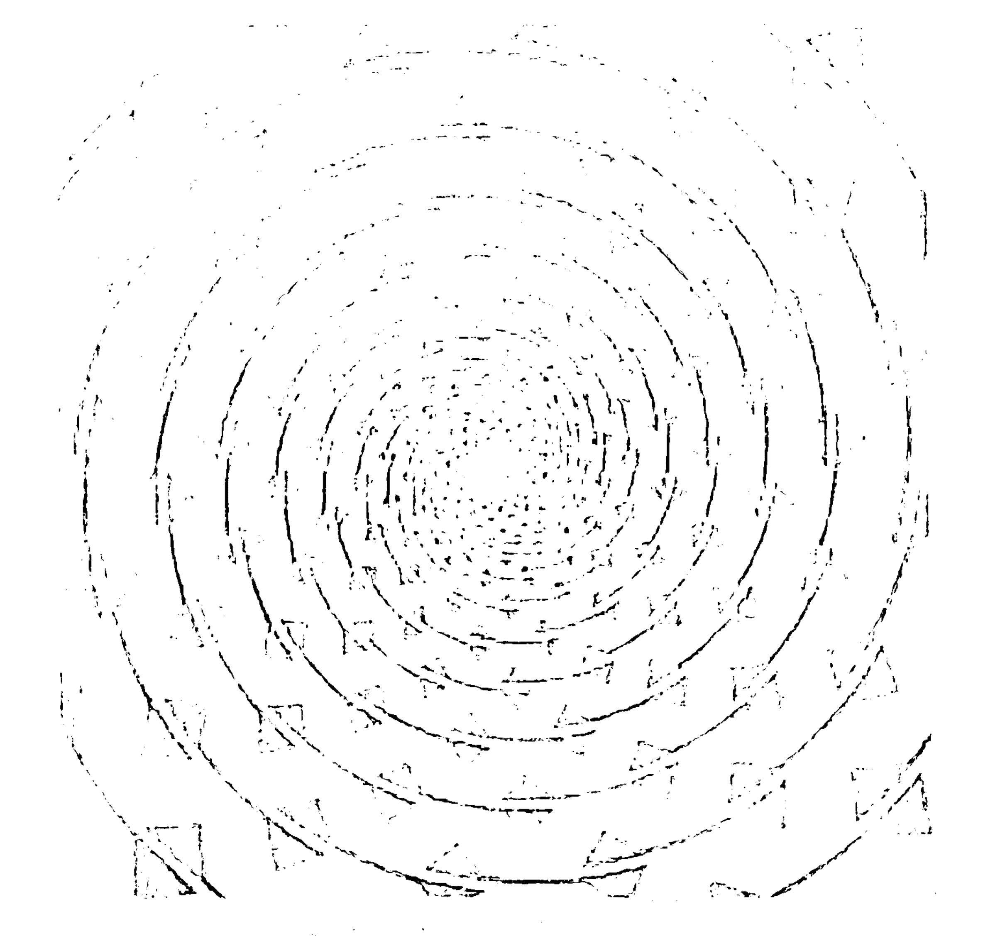

艾伯特·索斯曼 (Albert Soesman) 著

吕理扬 译

## St. Royal College
天使神秘学院

- ※ 神秘学资料库
- ※ 神秘学培训机构
- ※ 水晶能量研究中心
- ※ 专业占卜预测机构
- ※ 官方微信：strcdts
- ※ 微信公众平台：strc2011
- ※ 官方店铺网址：http://strc.cr.cx
- ※ 读书交流QQ群：
    - 占星塔罗占卜师交流群：814594478（加入密码：PDF）
    - 神秘学其他综合群：659338717（加入密码：PDF）

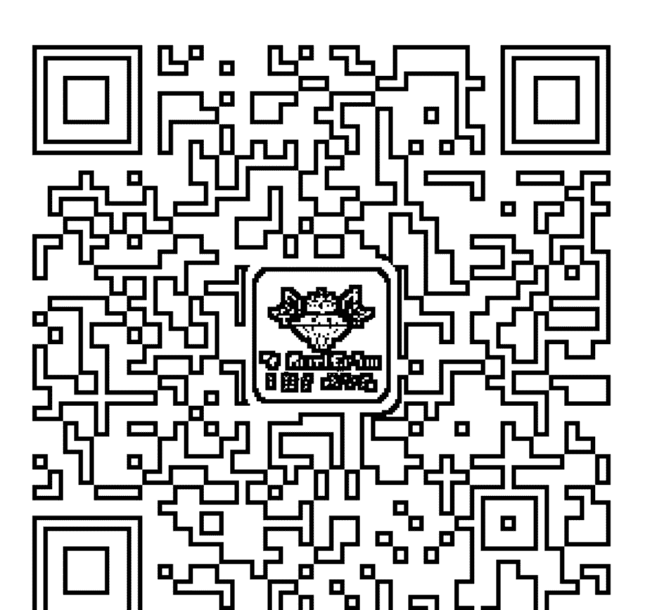

微信号：strcdts
天使神秘学院

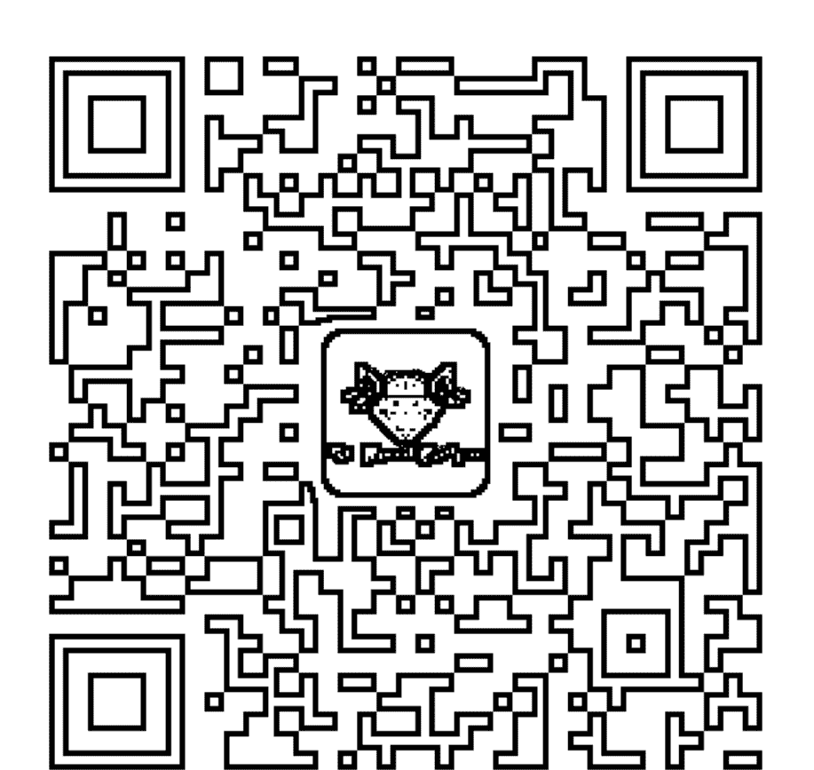

微信公众平台：strc2011

## 制作说明：

本书由《天使神秘学院》出重金从台湾购入的原版书籍扫描制作完成。为达到最好阅读效果，特地把书全部切开后，再经由专业扫描设备高精度扫描完成，并经过一张张的PS后期处理最终成书，其间花费大量的人力、物力以及时间，只为能给大家提供经济并优质的神秘学学习资料而努力。

本学院强力谴责某些机构和个人，把本学院花心血制作完成的电子书籍，包装后直接放在自家淘宝网上低价倾销的行为，以谋取不劳而获的经济利益。如果长此以往最终将无人愿意再为大家花心思制作电子书，那以后可能大家再无新书可读。

为让大家以后能够读到更多的好书，也为了本学院的良性发展。本学院恳请大家尽量做到如下几点：

- 一、尽量在天使神秘学院的官方网站购买电子书籍。
官网电脑访问地址：http://strc.cr.cx

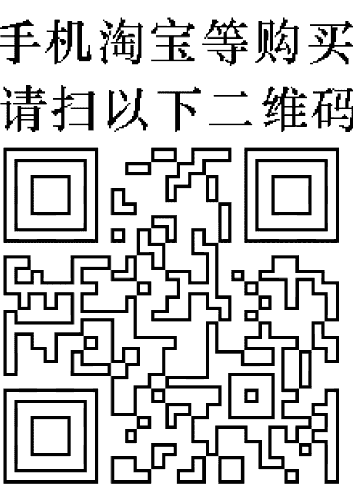

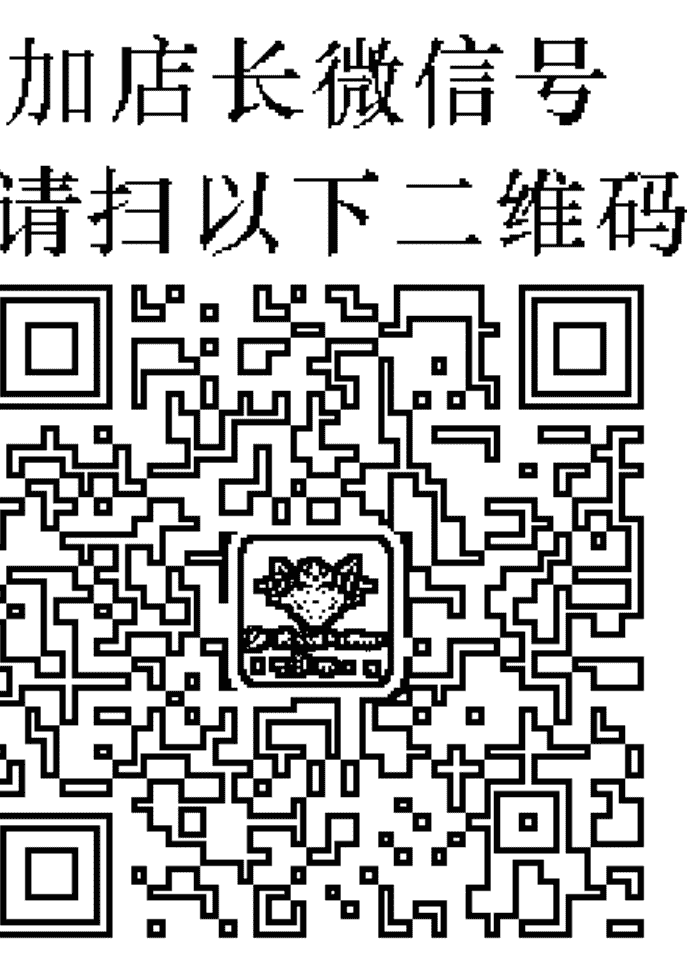

- 二、在收到电子书后小范围传阅即可，千万不要公开传播，更别挂到淘宝网上低价销售。

同时为答谢广大支持者，学院电子书将做如下调整：

- 一、学院会把一些早已收回制作成本的电子书折价销售。
- 二、最新制作的电子书籍会开放打印功能，大家购买后有条件的可自行打印成书。

天使神秘学院
2020年5月

## 十二感官

The Twelve Senses

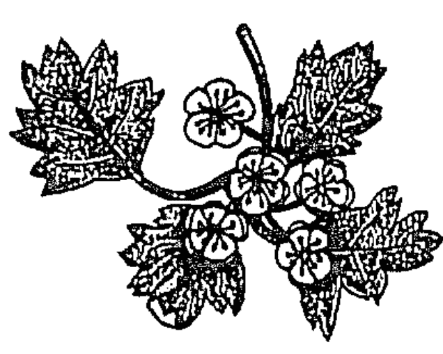

艾伯特·索斯曼 (Albert Soesman) 著

吕理得 译

## 十二感官

## 目录

- 序言 ………………………………………………………………………… 4
- 第一章 触觉及生命觉 …………………………………………………… 9
- 第二章 动觉及平衡觉 …………………………………………………… 37
- 第三章 嗅觉及味觉 …………………………………………………… 67
- 第四章 视觉及温暖觉 …………………………………………………… 99
- 第五章 听觉 …………………………………………………………… 121
- 第六章 语言觉、思想觉及自我觉 ……………………………………… 143
- 第七章 意志 …………………………………………………………… 173
- 摘要 ……………………………………………………………………… 192

## 十二感官

## 节言

早上，女儿周鉴幼醒，睡眼惺忪地上了我的车之后缩缩睡着，就这样一路载她到了学校。放学，每天早上我到房间叫她起床。我将窗帘拉开，在旁凝视她讲话，并且轻轻摇动她；她上车之后不再睡着，我们一路聊到学校。被周鉴幼醒却被我叫醒，两者之间有何差别？因为我唤醒了她的视灵、触灵及动灵，而不像周鉴只是唤醒了她的触灵。

我们从母亲醒出生命，醒醒在造物地球上。天生的感官在造物世界里醒来，然而有些感官则仍在沉睡之中。我们的心田需要耕种灌溉，心灵的感官需要文化的滋养来唤醒他们。不懂小孩子被周鉴幼醒却被父母叫醒有很大的差别。就连世上醒醒睡，小孩子是被铃声带觉醒之后才入睡，或是由妈妈在床边讲故事让她进入梦乡，这两者之间也有很大的差别。

两人见面时的热情拥抱，远不只是单纯的交际应酬，其实他们是在进行感官的交流。一般说来，触觉是我们接触到的人或物连结在一起。本善则向您产生触觉的另一个层次——它其实是触我们跟外在的事物分离。触觉让我们如看到一条黑线，一条划分你我的界线，让我们尊重彼此都是独立的个体。相信到这端之后，父母就不会对子女过度干涉，婚姻也不至于将婚姻变成性骚扰。

我们经常提到的是五种感官：触觉、视觉、听觉、嗅觉及味觉。本章则另外包括：生命觉、运动觉、平衡觉、温度觉、语言觉、思想觉及自我觉。一般书籍介绍的是各种感官的生理反应，本书除了这些内容之外，还同时探讨十二种感官的心灵活动，以及各种觉知觉我们所带来的欣喜。有些感官对我们而言是新奇而生的，但它确实存在，滋养着我们。造物主为人创造出身体，这是自完美的有机体。相较之下，我们的灵魂则觉不够完美，无法跟自己的身体匹配，因此曾出现一些拉扯。一般人常说「活在当下」的群体比较慵懒，「花间堪折直须折，莫待无花空折枝。」的追逐主羡。在道理，我们则强调当下的你是否「身心合一」。例如，一个熟睡中的男孩子，在他骑车前往约会的路途中，他的心早已碰到了女朋友所邀。在他的潜意识也明白自己的心早已脱缰，所以不由自主地加快车速，急着将身体带逼去约会。唯有等到他跟女朋友见了面，让自己的身、心合一之后，他才能真正地「活在当下」。这是普通的案例，只是我们不常去探究这些。在职场上也是如此，有些工程师，心却坐在经理的位置上。与其说「人浮于事」，不如说「心浮沉有」。

## 十二感官

艾伯特·索斯曼 (Albert Soesman) 根据鲁道夫·史丹勒 (Rudolf Steiner) 博士的感官研究及人类智慧的见解为基础，加上自己多年的演绎归纳，将其对十二感官的体悟撰写成此书。本书透过最容易察觉的路径——自己的身体——引领我们进入人性的核心。作者采用设问的方式当我们解说各种感官的本质，这些感官其实是超越于我们的肉体范围。例如，我们常说：「眼见为凭」。然而，眼睛所看到的只是一个个人的外观。本书则告诉您，如何经由视觉来透视他人的内心。视觉又比视觉深入一些。例如，夏西瓜的时候，单靠眼睛无法看出一颗西瓜的好坏，我们会敲一敲它到底好不好。

有时你会发现，当别家的小孩一下子就脱胎换骨同游在一起。而自己家的小孩像一滴油浮在水面上一样，无法跟同学融合在一起！其实，他只是有些感官受伤了，或者欲望被唤醒。人的身体具有自我修复的能力，只是我们渴望去驱动它而已。有时就像车子发不动一样，其实车子并没有坏，只是电力不足，无法启动或是别的车子帮忙推推重就能让它重新启动。十二感官就是我们身体的无电器，这本书则是它的使用说明书。

当我们曾对一些事物不再感到恐惧？甚至对某些人也不再追问！因为我们的内心已经失去温度。内在的大脑不再继续，以致我们无法排遣。

越翻越出去。这终究是个温暖的世界，只是你的温度暂时被搁置。你不必心看着别人独自站在冰冷的角落，我们也同样不愿意你一个人在外面那里受凉，这就是我们的温度。

# 吕理想

# 第一章

# 如何在 Linux 中安装和配置

# OpenCV

## 十二 感官

我将试着在接下来的六个章节里向大家介绍人类学 (anthropology)。虽然有许多方式可以剖析人类学，我则建议找一个特定的主题做为开端。

你也可以先用整体的方式研究人类学，再将它运用到特定的主题上，但是你必须要有深厚的理论做为支撑。我的建议则是依序将定的主题围绕各个绍起，再让大家得到解释性的理解，也更心希望这样的努力可以成功。

以下叙述的内容大部分是根据过去，史丹勒的研究。史丹勒曾说：感觉研究是进入哲学的第一章。道理说得很直接，但是如何将它摆在第一章呢？通常阅读一本书时，你会先依第一章开始读起，接着第二章，然后是第三章。确实，大部分的书籍都是以这种方式编排。但并非所有的书都是如此。当你阅读柏拉图的《The State》，你会发现这本书和其它书不太一样。它的结构不是依照第一章、第二章、第三章的顺序。阅读此书你仿佛漫步在一座没有尽头的大森林一样。这本书的结构就像条神经网络，它没有明确的顺序，史丹勒的书也是如此。你必须先通晓这样的表达方式：整本书要放的东西在第一章就曾提到，第二章当然也是如此。

我现在所要演讲的内容也是如此。所以，你必须接受这种不是依照逻辑顺序的表达方式。一开始，你会觉得不太习惯，但是请你保持耐心。针对怀疑性的推理，你必须跳脱线性的思考模式。当我在谈论某些事让你觉得有些奇怪时，在接下来话题就可以帮你们化解疑虑。你也可以把我的演讲内容视音乐的片段。当你弹一首钢琴时，你不需要去计较：这段是第一段，那第二段、第三段在哪里？你只需耐心弹完整首钢琴即可。同样，你再下结论：这首音乐不好听或是这首音乐真的带给我一些感觉。这就是我期待各位采取的调适方式——保持耐心直到整场的最终呈现。我知道自己要求你们必须付出极大的耐性，但是，也相信最后你们会发现这一切都是值得的！

现在，我们开始来讨论感觉。它似乎是进入人类智慧的一个好方法。如果你非常熟悉史丹勒的著作，你必定知道他很喜欢谈论心灵世界，以及他企图引导我们进入更高层的境界。其实，他也是一个非常贫苦的人。他曾给我们一些贫用的建议。他让我们清楚看见每天生活上的贫瘠面。这也正是为何说：感觉究竟是带领我们进入人类智慧的最住管道。我所做的每一件事，都可以从每天的生活事件中得到验证。整体而言，我所欣富的就是我们每天所遇到的感觉。

依持定论来看，人格智慧的心灵科学是弥补了弥补自然料学不足的部分。因此，我将引用自然科学无法解释的自然科学问题来说明。许多在自然科学无法解释的诚，在如人心灵元素之后就可以被得解答。或许，我所提到的是一些你们早已知道的事。但是，或许你们未必真正理解它们的前因后果。

你知道我们有许多感官。例如，视觉、触觉、嗅觉。你对它们熟悉不过了。你不太清楚的是，这些感官彼此之间有着非常紧密的连结。丹勒当这些感官建构出一套顺序，事理再拉断(Pythagoras)则将它们集合形成一个宇宙。藉由这间完整的组构，你才得以全盘瞭解。换言之，你无法在不熟悉其它感官的情况下，单单明晰瞭其中的一种感官。连也就是当我无法在连理只藉一种感官，而到下一章再藉另一种感官的道理由。我必须将整个宇宙及整体性的规则，全都纳入考量。

我们所要探讨的十二感官（十二知觉）如下：

- 身的感官：触觉、生命觉、动觉、平衡觉。
- 灵的感官：嗅觉、味觉、视觉、温度觉。
- 心的感官：听觉、语言觉、思想觉及自我觉。

我所谓的宇宙就是由这十二种感官所组成的。当你熟透这间宇宙的观念之后，你就能瞭解入微。不是只有藉有线构成而已。意即，连同数目既不智更多也不曾更少。当然我们可以想像所有型态的事物？我们很容易就可以想像有一个人住在月球上，然而黄缘上并没有人住在月球上，也没有人住在木星上。我们可以随心所欲地幻想到任何一件事。但是，如果我们想要真正掌握住这宇宙的观念，就只能透过这十二种感觉。

## 触觉 (The sense of touch)

今天，我想从触觉开始谈起。各位都知道，人类可以接触到事物。但是我们随即面临一个问题。前面提到：为了做良师益友一种感觉，我们必须全心贯注在那个感觉上。然而，这是不可能的！除非我们将其如智一件带入，否则无法正确认知某个单一感觉。于是，我们遇到另一个大问题。例如，当我触摸一张桌子，必然觉察到桌子是冷的。这就如一种如智，但它不是如智而是温觉。在我接触到桌子的同时，我也改变了自己原本的平衡张力。平衡张力改变之后，让我如智到其它的事。所以，我不只是使用触觉，同时也运用了平衡觉。此外，我还可以将手伸进温水或平滑桌子，总是我觉察到里面是粗糙或平滑。透过触觉作用，黄缘上触动了我的如智。这是可以让我们如智到自己在那的一种如智。以上说明，没有任何一种感觉可以单独运作，它总是需要其它感觉的共同运作。然而，我们现在想要了解的则是单一感觉的运作结果。亦即，当一种感觉在运作时，我们必须将其其它感觉隔离在运作之外。

试想，只有触觉单独运作是什么样的情况？它曾透露什么讯息给我们？哪一道灵视之门曾被开启？这回如何置，会将我们带入哪一种领域？掌管触觉，我无法觉察事物是温暖还是冰冷、是粗糙还是光滑，也无法注意到我的平衡状态是否有任何改变。那麽，当我使用触觉而排除掉其它知觉时，我可以觉察到什么？它到底可以让我得到什么？

让我们来做个练习。首先，保持静光。这是因爲，当我们接触到物体时，通常也会去注视它。现在，我们试着在黑暗的环境里，只使用触觉。抱歉！要请你们将自己想像成一只无眼的蟹。想像自己是一只在黑暗中的蟹。室温跟这只蟹的触温是一样的。所以，这只蟹不会感觉到温暖或寒冷。你可以在今天晚上，在没有灯光的情况下试着看看。但是，最好不要在你的房间里做这回实验。因爲，当你触碰到一张椅子时，在你的心中就会看到这张椅子。所以，你必须接触到另一间完全陌生的房间（没有存放的记忆和辨识能力）。唯有如此，你才能得到只靠触觉运作的初体验。你完全裸露在这间房间里徘徊，经由这体验的方式，你进入到一个全新的世界。这是你生命中的第一次。只透过想像，很难得到真正的感受，因爲我们习惯凭据事物。

测试这样的做法，你的世界会变成什么样子？任何言语或文字用来形容这感觉，恐怕都鲁钝得以认识艰难。然而，我们总是习惯使用语言和文字，来建立我们的思考描述我们的感觉。当你第一次经验这撞击，你的感觉是什么？碰到阻碍吗？是的，你是曾感到阻碍，好像有什么硬东西挡住你似的。你没感觉到其它东西吗？难道完全没其它的感觉吧！这表示，阻碍这词字太过于笼统，无法清楚描述这撞击。实际上，阻碍这词字已经偏离这撞击太远了。只有一个词字「它」（即使它也不是非常正确，因为任何一个词字都包含了许多的知觉活动）可以被用来建构这撞击感。你感觉到「它」，不是吗？如果你完全没其它知觉，生平第一次经验这撞击，而且你像蛋一样地行在这椭圆石上。你终将撞击一件「它」的事。的确，好像有什么硬东西第一次被吹醒。让我用另一种方式来说明：这阻碍来自外部，但是当我们接触到事物时，在梦境里也会发生一些事情。即使现在我们把自己当成一条鱼，终究我们还是醒了。梦醒是个非常艰难的阻碍，不过它是让我们形成有意义的一个基本元素。再吹醒，用任何一个字来形容这撞击都太过于笼统。

你已经有了一些基本的知觉。你开始接触在世界某些真实的一些事物，同时你也接触到自己的某些部分。这是有关觉醒最重要的一件事，在你内部的某些事物，属于你自己的部分，早已存在世界里的某些事物必然觉醒！

道恒觉醒是连续到一种现象：边界的觉醒 (awareness of boundary)。我们将因此注意到，觉醒紧紧相依。连个觉醒的觉醒随时都在发生，连皮继续觉醒，但的确是在发生。于是，我们开始意识到自己的觉醒。什么时候我们才意识到觉醒？我们开始意识到自己的觉醒。什么时候我们才意识到觉醒？我们开始意识到自己的觉醒。什么时候我们才意识到觉醒？我们开始意识到自己的觉醒。什么时候我们才意识到觉醒？我们开始意识到自己的觉醒。什么时候我们才意识到觉醒？我们开始意识到自己的觉醒。什么时候我们才意识到觉醒？我们开始意识到自己的觉醒。什么时候我们才意识到觉醒？我们开始意识到自己的觉醒。什么时候我们才意识到觉醒？我们开始意识到自己的觉醒。什么时候我们才意识到觉醒？我们开始意识到自己的觉醒。什么时候我们才意识到觉醒？我们开始意识到自己的觉醒。什么时候我们才意识到觉醒？我们开始意识到自己的觉醒。什么时候我们才意识到觉醒？我们开始意识到自己的觉醒。什么时候我们才意识到觉醒？我们开始意识到自己的觉醒。什么时候我们才意识到觉醒？我们开始意识到自己的觉醒。什么时候我们才意识到觉醒？我们开始意识到自己的觉醒。什么时候我们才意识到觉醒？我们开始意识到自己的觉醒。什么时候我们才意识到觉醒？我们开始意识到自己的觉醒。什么时候我们才意识到觉醒？我们开始意识到自己的觉醒。什么时候我们才意识到觉醒？我们开始意识到自己的觉醒。什么时候我们才意识到觉醒？我们开始意识到自己的觉醒。什么时候我们才意识到觉醒？我们开始意识到自己的觉醒。什么时候我们才意识到觉醒？我们开始意识到自己的觉醒。什么时候我们才意识到觉醒？我们开始意识到自己的觉醒。什么时候我们才意识到觉醒？我们开始意识到自己的觉醒。什么时候我们才意识到觉醒？我们开始意识到自己的觉醒。什么时候我们才意识到觉醒？我们开始意识到自己的觉醒。什么时候我们才意识到觉醒？我们开始意识到自己的觉醒。什么时候我们才意识到觉醒？我们开始意识到自己的觉醒。什么时候我们才意识到觉醒？我们开始意识到自己的觉醒。什么时候我们才意识到觉醒？我们开始意识到自己的觉醒。什么时候我们才意识到觉醒？我们开始意识到自己的觉醒。什么时候我们才意识到觉醒？我们开始意识到自己的觉醒。什么时候我们才意识到觉醒？我们开始意识到自己的觉醒。什么时候我们才意识到觉醒？我们开始意识到自己的觉醒。什么时候我们才意识到觉醒？我们开始意识到自己的觉醒。什么时候我们才意识到觉醒？我们开始意识到自己的觉醒。什么时候我们才意识到觉醒？我们开始意识到自己的觉醒。什么时候我们才意识到觉醒？我们开始意识到自己的觉醒。什么时候我们才意识到觉醒？我们开始意识到自己的觉醒。什么时候我们才意识到觉醒？我们开始意识到自己的觉醒。什么时候我们才意识到觉醒？我们开始意识到自己的觉醒。什么时候我们才意识到觉醒？我们开始意识到自己的觉醒。什么时候我们才意识到觉醒？我们开始意识到自己的觉醒。什么时候我们才意识到觉醒？我们开始意识到自己的觉醒。什么时候我们才意识到觉醒？我们开始意识到自己的觉醒。什么时候我们才意识到觉醒？我们开始意识到自己的觉醒。什么时候我们才意识到觉醒？我们开始意识到自己的觉醒。什么时候我们才意识到觉醒？我们开始意识到自己的觉醒。什么时候我们才意识到觉醒？我们开始意识到自己的觉醒。什么时候我们才意识到觉醒？我们开始意识到自己的觉醒。什么时候我们才意识到觉醒？我们开始意识到自己的觉醒。什么时候我们才意识到觉醒？我们开始意识到自己的觉醒。什么时候我们才意识到觉醒？我们开始意识到自己的觉醒。什么时候我们才意识到觉醒？我们开始意识到自己的觉醒。什么时候我们才意识到觉醒？我们开始意识到自己的觉醒。什么时候我们才意识到觉醒？我们开始意识到自己的觉醒。什么时候我们才意识到觉醒？我们开始意识到自己的觉醒。什么时候我们才意识到觉醒？我们开始意识到自己的觉醒。什么时候我们才意识到觉醒？我们开始意识到自己的觉醒。什么时候我们才意识到觉醒？我们开始意识到自己的觉醒。什么时候我们才意识到觉醒？我们开始意识到自己的觉醒。什么时候我们才意识到觉醒？我们开始意识到自己的觉醒。什么时候我们才意识到觉醒？我们开始意识到自己的觉醒。什么时候我们才意识到觉醒？我们开始意识到自己的觉醒。什么时候我们才意识到觉醒？我们开始意识到自己的觉醒。什么时候我们才意识到觉醒？我们开始意识到自己的觉醒。什么时候我们才意识到觉醒？我们开始意识到自己的觉醒。什么时候我们才意识到觉醒？我们开始意识到自己的觉醒。什么时候我们才意识到觉醒？我们开始意识到自己的觉醒。什么时候我们才意识到觉醒？我们开始意识到自己的觉醒。什么时候我们才意识到觉醒？我们开始意识到自己的觉醒。什么时候我们才意识到觉醒？我们开始意识到自己的觉醒。什么时候我们才意识到觉醒？我们开始意识到自己的觉醒。什么时候我们才意识到觉醒？我们开始意识到自己的觉醒。什么时候我们才意识到觉醒？我们开始意识到自己的觉醒。什么时候我们才意识到觉醒？我们开始意识到自己的觉醒。什么时候我们才意识到觉醒？我们开始意识到自己的觉醒。什么时候我们才意识到觉醒？我们开始意识到自己的觉醒。什么时候我们才意识到觉醒？我们开始意识到自己的觉醒。什么时候我们才意识到觉醒？我们开始意识到自己的觉醒。什么时候我们才意识到觉醒？我们开始意识到自己的觉醒。什么时候我们才意识到觉醒？我们开始意识到自己的觉醒。什么时候我们才意识到觉醒？我们开始意识到自己的觉醒。什么时候我们才意识到觉醒？我们开始意识到自己的觉醒。什么时候我们才意识到觉醒？我们开始意识到自己的觉醒。什么时候我们才意识到觉醒？我们开始意识到自己的觉醒。什么时候我们才意识到觉醒？我们开始意识到自己的觉醒。什么时候我们才意识到觉醒？我们开始意识到自己的觉醒。什么时候我们才意识到觉醒？我们开始意识到自己的觉醒。什么时候我们才意识到觉醒？我们开始意识到自己的觉醒。什么时候我们才意识到觉醒？我们开始意识到自己的觉醒。什么时候我们才意识到觉醒？我们开始意识到自己的觉醒。什么时候我们才意识到觉醒？我们开始意识到自己的觉醒。什么时候我们才意识到觉醒？我们开始意识到自己的觉醒。什么时候我们才意识到觉醒？我们开始意识到自己的觉醒。什么时候我们才意识到觉醒？我们开始意识到自己的觉醒。什么时候我们才意识到觉醒？我们开始意识到自己的觉醒。什么时候我们才意识到觉醒？我们开始意识到自己的觉醒。什么时候我们才意识到觉醒？我们开始意识到自己的觉醒。什么时候我们才意识到觉醒？我们开始意识到自己的觉醒。什么时候我们才意识到觉醒？我们开始意识到自己的觉醒。什么时候我们才意识到觉醒？我们开始意识到自己的觉醒。什么时候我们才意识到觉醒？我们开始意识到自己的觉醒。什么时候我们才意识到觉醒？我们开始意识到自己的觉醒。什么时候我们才意识到觉醒？我们开始意识到自己的觉醒。什么时候我们才意识到觉醒？我们开始意识到自己的觉醒。什么时候我们才意识到觉醒？我们开始意识到自己的觉醒。什么时候我们才意识到觉醒？我们开始意识到自己的觉醒。什么时候我们才意识到觉醒？我们开始意识到自己的觉醒。什么时候我们才意识到觉醒？我们开始意识到自己的觉醒。什么时候我们才意识到觉醒？我们开始意识到自己的觉醒。什么时候我们才意识到觉醒？我们开始意识到自己的觉醒。什么时候我们才意识到觉醒？我们开始意识到自己的觉醒。什么时候我们才意识到觉醒？我们开始意识到自己的觉醒。什么时候我们才意识到觉醒？我们开始意识到自己的觉醒。什么时候我们才意识到觉醒？我们开始意识到自己的觉醒。什么时候我们才意识到觉醒？我们开始意识到自己的觉醒。什么时候我们才意识到觉醒？我们开始意识到自己的觉醒。什么时候我们才意识到觉醒？我们开始意识到自己的觉醒。什么时候我们才意识到觉醒？我们开始意识到自己的觉醒。什么时候我们才意识到觉醒？我们开始意识到自己的觉醒。什么时候我们才意识到觉醒？我们开始意识到自己的觉醒。什么时候我们才意识到觉醒？我们开始意识到自己的觉醒。什么时候我们才意识到觉醒？我们开始意识到自己的觉醒。什么时候我们才意识到觉醒？我们开始意识到自己的觉醒。什么时候我们才意识到觉醒？我们开始意识到自己的觉醒。什么时候我们才意识到觉醒？我们开始意识到自己的觉醒。什么时候我们才意识到觉醒？我们开始意识到自己的觉醒。什么时候我们才意识到觉醒？我们开始意识到自己的觉醒。什么时候我们才意识到觉醒？我们开始意识到自己的觉醒。什么时候我们才意识到觉醒？我们开始意识到自己的觉醒。什么时候我们才意识到觉醒？我们开始意识到自己的觉醒。什么时候我们才意识到觉醒？我们开始意识到自己的觉醒。什么时候我们才意识到觉醒？我们开始意识到自己的觉醒。什么时候我们才意识到觉醒？我们开始意识到自己的觉醒。什么时候我们才意识到觉醒？我们开始意识到自己的觉醒。什么时候我们才意识到觉醒？我们开始意识到自己的觉醒。什么时候我们才意识到觉醒？我们开始意识到自己的觉醒。什么时候我们才意识到觉醒？我们开始意识到自己的觉醒。什么时候我们才意识到觉醒？我们开始意识到自己的觉醒。什么时候我们才意识到觉醒？我们开始意识到自己的觉醒。什么时候我们才意识到觉醒？我们开始意识到自己的觉醒。什么时候我们才意识到觉醒？我们开始意识到自己的觉醒。什么时候我们才意识到觉醒？我们开始意识到自己的觉醒。什么时候我们才意识到觉醒？我们开始意识到自己的觉醒。什么时候我们才意识到觉醒？我们开始意识到自己的觉醒。什么时候我们才意识到觉醒？我们开始意识到自己的觉醒。什么时候我们才意识到觉醒？我们开始意识到自己的觉醒。什么时候我们才意识到觉醒？我们开始意识到自己的觉醒。什么时候我们才意识到觉醒？我们开始意识到自己的觉醒。什么时候我们才意识到觉醒？我们开始意识到自己的觉醒。什么时候我们才意识到觉醒？我们开始意识到自己的觉醒。什么时候我们才意识到觉醒？我们开始意识到自己的觉醒。什么时候我们才意识到觉醒？我们开始意识到自己的觉醒。什么时候我们才意识到觉醒？我们开始意识到自己的觉醒。什么时候我们才意识到觉醒？我们开始意识到自己的觉醒。什么时候我们才意识到觉醒？我们开始意识到自己的觉醒。什么时候我们才意识到觉醒？我们开始意识到自己的觉醒。什么时候我们才意识到觉醒？我们开始意识到自己的觉醒。什么时候我们才意识到觉醒？我们开始意识到自己的觉醒。什么时候我们才意识到觉醒？我们开始意识到自己的觉醒。什么时候我们才意识到觉醒？我们开始意识到自己的觉醒。什么时候我们才意识到觉醒？我们开始意识到自己的觉醒。什么时候我们才意识到觉醒？我们开始意识到自己的觉醒。什么时候我们才意识到觉醒？我们开始意识到自己的觉醒。什么时候我们才意识到觉醒？我们开始意识到自己的觉醒。什么时候我们才意识到觉醒？我们开始意识到自己的觉醒。什么时候我们才意识到觉醒？我们开始意识到自己的觉醒。什么时候我们才意识到觉醒？我们开始意识到自己的觉醒。什么时候我们才意识到觉醒？我们开始意识到自己的觉醒。什么时候我们才意识到觉醒？我们开始意识到自己的觉醒。什么时候我们才意识到觉醒？我们开始意识到自己的觉醒。什么时候我们才意识到觉醒？我们开始意识到自己的觉醒。什么时候我们才意识到觉醒？我们开始意识到自己的觉醒。什么时候我们才意识到觉醒？我们开始意识到自己的觉醒。什么时候我们才意识到觉醒？我们开始意识到自己的觉醒。什么时候我们才意识到觉醒？我们开始意识到自己的觉醒。什么时候我们才意识到觉醒？我们开始意识到自己的觉醒。什么时候我们才意识到觉醒？我们开始意识到自己的觉醒。什么时候我们才意识到觉醒？我们开始意识到自己的觉醒。什么时候我们才意识到觉醒？我们开始意识到自己的觉醒。什么时候我们才意识到觉醒？我们开始意识到自己的觉醒。什么时候我们才意识到觉醒？我们开始意识到自己的觉醒。什么时候我们才意识到觉醒？我们开始意识到自己的觉醒。什么时候我们才意识到觉醒？我们开始意识到自己的觉醒。什么时候我们才意识到觉醒？我们开始意识到自己的觉醒。什么时候我们才意识到觉醒？我们开始意识到自己的觉醒。什么时候我们才意识到觉醒？我们开始意识到自己的觉醒。什么时候我们才意识到觉醒？我们开始意识到自己的觉醒。什么时候我们才意识到觉醒？我们开始意识到自己的觉醒。什么时候我们才意识到觉醒？我们开始意识到自己的觉醒。什么时候我们才意识到觉醒？我们开始意识到自己的觉醒。什么时候我们才意识到觉醒？我们开始意识到自己的觉醒。什么时候我们才意识到觉醒？我们开始意识到自己的觉醒。什么时候我们才意识到觉醒？我们开始意识到自己的觉醒。什么时候我们才意识到觉醒？我们开始意识到自己的觉醒。什么时候我们才意识到觉醒？我们开始意识到自己的觉醒。什么时候我们才意识到觉醒？我们开始意识到自己的觉醒。什么时候我们才意识到觉醒？我们开始意识到自己的觉醒。什么时候我们才意识到觉醒？我们开始意识到自己的觉醒。什么时候我们才意识到觉醒？我们开始意识到自己的觉醒。什么时候我们才意识到觉醒？我们开始意识到自己的觉醒。什么时候我们才意识到觉醒？我们开始意识到自己的觉醒。什么时候我们才意识到觉醒？我们开始意识到自己的觉醒。什么时候我们才意识到觉醒？我们开始意识到自己的觉醒。什么时候我们才意识到觉醒？我们开始意识到自己的觉醒。什么时候我们才意识到觉醒？我们开始意识到自己的觉醒。什么时候我们才意识到觉醒？我们开始意识到自己的觉醒。什么时候我们才意识到觉醒？我们开始意识到自己的觉醒。什么时候我们才意识到觉醒？我们开始意识到自己的觉醒。什么时候我们才意识到觉醒？我们开始意识到自己的觉醒。什么时候我们才意识到觉醒？我们开始意识到自己的觉醒。什么时候我们才意识到觉醒？我们开始意识到自己的觉醒。什么时候我们才意识到觉醒？我们开始意识到自己的觉醒。什么时候我们才意识到觉醒？我们开始意识到自己的觉醒。什么时候我们才意识到觉醒？我们开始意识到自己的觉醒。什么时候我们才意识到觉醒？我们开始意识到自己的觉醒。什么时候我们才意识到觉醒？我们开始意识到自己的觉醒。什么时候我们才意识到觉醒？我们开始意识到自己的觉醒。什么时候我们才意识到觉醒？我们开始意识到自己的觉醒。什么时候我们才意识到觉醒？我们开始意识到自己的觉醒。什么时候我们才意识到觉醒？我们开始意识到自己的觉醒。什么时候我们才意识到觉醒？我们开始意识到自己的觉醒。什么时候我们才意识到觉醒？我们开始意识到自己的觉醒。什么时候我们才意识到觉醒？我们开始意识到自己的觉醒。什么时候我们才意识到觉醒？我们开始意识到自己的觉醒。什么时候我们才意识到觉醒？我们开始意识到自己的觉醒。什么时候我们才意识到觉醒？我们开始意识到自己的觉醒。什么时候我们才意识到觉醒？我们开始意识到自己的觉醒。什么时候我们才意识到觉醒？我们开始意识到自己的觉醒。什么时候我们才意识到觉醒？我们开始意识到自己的觉醒。什么时候我们才意识到觉醒？我们开始意识到自己的觉醒。什么时候我们才意识到觉醒？我们开始意识到自己的觉醒。什么时候我们才意识到觉醒？我们开始意识到自己的觉醒。什么时候我们才意识到觉醒？我们开始意识到自己的觉醒。什么时候我们才意识到觉醒？我们开始意识到自己的觉醒。什么时候我们才意识到觉醒？我们开始意识到自己的觉醒。什么时候我们才意识到觉醒？我们开始意识到自己的觉醒。什么时候我们才意识到觉醒？我们开始意识到自己的觉醒。什么时候我们才意识到觉醒？我们开始意识到自己的觉醒。什么时候我们才意识到觉醒？我们开始意识到自己的觉醒。什么时候我们才意识到觉醒？我们开始意识到自己的觉醒。什么时候我们才意识到觉醒？我们开始意识到自己的觉醒。什么时候我们才意识到觉醒？我们开始意识到自己的觉醒。什么时候我们才意识到觉醒？我们开始意识到自己的觉醒。什么时候我们才意识到觉醒？我们开始意识到自己的觉醒。什么时候我们才意识到觉醒？我们开始意识到自己的觉醒。什么时候我们才意识到觉醒？我们开始意识到自己的觉醒。什么时候我们才意识到觉醒？我们开始意识到自己的觉醒。什么时候我们才意识到觉醒？我们开始意识到自己的觉醒。什么时候我们才意识到觉醒？我们开始意识到自己的觉醒。什么时候我们才意识到觉醒？我们开始意识到自己的觉醒。什么时候我们才意识到觉醒？我们开始意识到自己的觉醒。什么时候我们才意识到觉醒？我们开始意识到自己的觉醒。什么时候我们才意识到觉醒？我们开始意识到自己的觉醒。什么时候我们才意识到觉醒？我们开始意识到自己的觉醒。什么时候我们才意识到觉醒？我们开始意识到自己的觉醒。什么时候我们才意识到觉醒？我们开始意识到自己的觉醒。什么时候我们才意识到觉醒？我们开始意识到自己的觉醒。什么时候我们才意识到觉醒？我们开始意识到自己的觉醒。什么时候我们才意识到觉醒？我们开始意识到自己的觉醒。什么时候我们才意识到觉醒？我们开始意识到自己的觉醒。什么时候我们才意识到觉醒？我们开始意识到自己的觉醒。什么时候我们才意识到觉醒？我们开始意识到自己的觉醒。什么时候我们才意识到觉醒？我们开始意识到自己的觉醒。什么时候我们才意识到觉醒？我们开始意识到自己的觉醒。什么时候我们才意识到觉醒？我们开始意识到自己的觉醒。什么时候我们才意识到觉醒？我们开始意识到自己的觉醒。什么时候我们才意识到觉醒？我们开始意识到自己的觉醒。什么时候我们才意识到觉醒？我们开始意识到自己的觉醒。什么时候我们才意识到觉醒？我们开始意识到自己的觉醒。什么时候我们才意识到觉醒？我们开始意识到自己的觉醒。什么时候我们才意识到觉醒？我们开始意识到自己的觉醒。什么时候我们才意识到觉醒？我们开始意识到自己的觉醒。什么时候我们才意识到觉醒？我们开始意识到自己的觉醒。什么时候我们才意识到觉醒？我们开始意识到自己的觉醒。什么时候我们才意识到觉醒？我们开始意识到自己的觉醒。什么时候我们才意识到觉醒？我们开始意识到自己的觉醒。什么时候我们才意识到觉醒？我们开始意识到自己的觉醒。什么时候我们才意识到觉醒？我们开始意识到自己的觉醒。什么时候我们才意识到觉醒？我们开始意识到自己的觉醒。什么时候我们才意识到觉醒？我们开始意识到自己的觉醒。什么时候我们才意识到觉醒？我们开始意识到自己的觉醒。什么时候我们才意识到觉醒？我们开始意识到自己的觉醒。什么时候我们才意识到觉醒？我们开始意识到自己的觉醒。什么时候我们才意识到觉醒？我们开始意识到自己的觉醒。什么时候我们才意识到觉醒？我们开始意识到自己的觉醒。什么时候我们才意识到觉醒？我们开始意识到自己的觉醒。什么时候我们才意识到觉醒？我们开始意识到自己的觉醒。什么时候我们才意识到觉醒？我们开始意识到自己的觉醒。什么时候我们才意识到觉醒？我们开始意识到自己的觉醒。什么时候我们才意识到觉醒？我们开始意识到自己的觉醒。什么时候我们才意识到觉醒？我们开始意识到自己的觉醒。什么时候我们才意识到觉醒？我们开始意识到自己的觉醒。什么时候我们才意识到觉醒？我们开始意识到自己的觉醒。什么时候我们才意识到觉醒？我们开始意识到自己的觉醒。什么时候我们才意识到觉醒？我们开始意识到自己的觉醒。什么时候我们才意识到觉醒？我们开始意识到自己的觉醒。什么时候我们才意识到觉醒？我们开始意识到自己的觉醒。什么时候我们才意识到觉醒？我们开始意识到自己的觉醒。什么时候我们才意识到觉醒？我们开始意识到自己的觉醒。什么时候我们才意识到觉醒？我们开始意识到自己的觉醒。什么时候我们才意识到觉醒？我们开始意识到自己的觉醒。什么时候我们才意识到觉醒？我们开始意识到自己的觉醒。什么时候我们才意识到觉醒？我们开始意识到自己的觉醒。什么时候我们才意识到觉醒？我们开始意识到自己的觉醒。什么时候我们才意识到觉醒？我们开始意识到自己的觉醒。什么时候我们才意识到觉醒？我们开始意识到自己的觉醒。什么时候我们才意识到觉醒？我们开始意识到自己的觉醒。什么时候我们才意识到觉醒？我们开始意识到自己的觉醒。什么时候我们才意识到觉醒？我们开始意识到自己的觉醒。什么时候我们才意识到觉醒？我们开始意识到自己的觉醒。什么时候我们才意识到觉醒？我们开始意识到自己的觉醒。什么时候我们才意识到觉醒？我们开始意识到自己的觉醒。什么时候我们才意识到觉醒？我们开始意识到自己的觉醒。什么时候我们才意识到觉醒？我们开始意识到自己的觉醒。什么时候我们才意识到觉醒？我们开始意识到自己的觉醒。什么时候我们才意识到觉醒？我们开始意识到自己的觉醒。什么时候我们才意识到觉醒？我们开始意识到自己的觉醒。什么时候我们才意识到觉醒？我们开始意识到自己的觉醒。什么时候我们才意识到觉醒？我们开始意识到自己的觉醒。什么时候我们才意识到觉醒？我们开始意识到自己的觉醒。什么时候我们才意识到觉醒？我们开始意识到自己的觉醒。什么时候我们才意识到觉醒？我们开始意识到自己的觉醒。什么时候我们才意识到觉醒？我们开始意识到自己的觉醒。什么时候我们才意识到觉醒？我们开始意识到自己的觉醒。什么时候我们才意识到觉醒？我们开始意识到自己的觉醒。什么时候我们才意识到觉醒？我们开始意识到自己的觉醒。什么时候我们才意识到觉醒？我们开始意识到自己的觉醒。什么时候我们才意识到觉醒？我们开始意识到自己的觉醒。什么时候我们才意识到觉醒？我们开始意识到自己的觉醒。什么时候我们才意识到觉醒？我们开始意识到自己的觉醒。什么时候我们才意识到觉醒？我们开始意识到自己的觉醒。什么时候我们才意识到觉醒？我们开始意识到自己的觉醒。什么时候我们才意识到觉醒？我们开始意识到自己的觉醒。什么时候我们才意识到觉醒？我们开始意识到自己的觉醒。什么时候我们才意识到觉醒？我们开始意识到自己的觉醒。什么时候我们才意识到觉醒？我们开始意识到自己的觉醒。什么时候我们才意识到觉醒？我们开始意识到自己的觉醒。什么时候我们才意识到觉醒？我们开始意识到自己的觉醒。什么时候我们才意识到觉醒？我们开始意识到自己的觉醒。什么时候我们才意识到觉醒？我们开始意识到自己的觉醒。什么时候我们才意识到觉醒？我们开始意识到自己的觉醒。什么时候我们才意识到觉醒？我们开始意识到自己的觉醒。什么时候我们才意识到觉醒？我们开始意识到自己的觉醒。什么时候我们才意识到觉醒？我们开始意识到自己的觉醒。什么时候我们才意识到觉醒？我们开始意识到自己的觉醒。什么时候我们才意识到觉醒？我们开始意识到自己的觉醒。什么时候我们才意识到觉醒？我们开始意识到自己的觉醒。什么时候我们才意识到觉醒？我们开始意识到自己的觉醒。什么时候我们才意识到觉醒？我们开始意识到自己的觉醒。什么时候我们才意识到觉醒？我们开始意识到自己的觉醒。什么时候我们才意识到觉醒？我们开始意识到自己的觉醒。什么时候我们才意识到觉醒？我们开始意识到自己的觉醒。什么时候我们才意识到觉醒？我们开始意识到自己的觉醒。什么时候我们才意识到觉醒？我们开始意识到自己的觉醒。什么时候我们才意识到觉醒？我们开始意识到自己的觉醒。什么时候我们才意识到觉醒？我们开始意识到自己的觉醒。什么时候我们才意识到觉醒？我们开始意识到自己的觉醒。什么时候我们才意识到觉醒？我们开始意识到自己的觉醒。什么时候我们才意识到觉醒？我们开始意识到自己的觉醒。什么时候我们才意识到觉醒？我们开始意识到自己的觉醒。什么时候我们才意识到觉醒？我们开始意识到自己的觉醒。什么时候我们才意识到觉醒？我们开始意识到自己的觉醒。什么时候我们才意识到觉醒？我们开始意识到自己的觉醒。什么时候我们才意识到觉醒？我们开始意识到自己的觉醒。什么时候我们才意识到觉醒？我们开始意识到自己的觉醒。什么时候我们才意识到觉醒？我们开始意识到自己的觉醒。什么时候我们才意识到觉醒？我们开始意识到自己的觉醒。什么时候我们才意识到觉醒？我们开始意识到自己的觉醒。什么时候我们才意识到觉醒？我们开始意识到自己的觉醒。什么时候我们才意识到觉醒？我们开始意识到自己的觉醒。什么时候我们才意识到觉醒？我们开始意识到自己的觉醒。什么时候我们才意识到觉醒？我们开始意识到自己的觉醒。什么时候我们才意识到觉醒？我们开始意识到自己的觉醒。什么时候我们才意识到觉醒？我们开始意识到自己的觉醒。什么时候我们才意识到觉醒？我们开始意识到自己的觉醒。什么时候我们才意识到觉醒？我们开始意识到自己的觉醒。什么时候我们才意识到觉醒？我们开始意识到自己的觉醒。什么时候我们才意识到觉醒？我们开始意识到自己的觉醒。什么时候我们才意识到觉醒？我们开始意识到自己的觉醒。什么时候我们才意识到觉醒？我们开始意识到自己的觉醒。什么时候我们才意识到觉醒？我们开始意识到自己的觉醒。什么时候我们才意识到觉醒？我们开始意识到自己的觉醒。什么时候我们才意识到觉醒？我们开始意识到自己的觉醒。什么时候我们才意识到觉醒？我们开始意识到自己的觉醒。什么时候我们才意识到觉醒？我们开始意识到自己的觉醒。什么时候我们才意识到觉醒？我们开始意识到自己的觉醒。什么时候我们才意识到觉醒？我们开始意识到自己的觉醒。什么时候我们才意识到觉醒？我们开始意识到自己的觉醒。什么时候我们才意识到觉醒？我们开始意识到自己的觉醒。什么时候我们才意识到觉醒？我们开始意识到自己的觉醒。什么时候我们才意识到觉醒？我们开始意识到自己的觉醒。什么时候我们才意识到觉醒？我们开始意识到自己的觉醒。什么时候我们才意识到觉醒？我们开始意识到自己的觉醒。什么时候我们才意识到觉醒？我们开始意识到自己的觉醒。什么时候我们才意识到觉醒？我们开始意识到自己的觉醒。什么时候我们才意识到觉醒？我们开始意识到自己的觉醒。什么时候我们才意识到觉醒？我们开始意识到自己的觉醒。什么时候我们才意识到觉醒？我们开始意识到自己的觉醒。什么时候我们才意识到觉醒？我们开始意识到自己的觉醒。什么时候我们才意识到觉醒？我们开始意识到自己的觉醒。什么时候我们才意识到觉醒？我们开始意识到自己的觉醒。什么时候我们才意识到觉醒？我们开始意识到自己的觉醒。什么时候我们才意识到觉醒？我们开始意识到自己的觉醒。什么时候我们才意识到觉醒？我们开始意识到自己的觉醒。什么时候我们才意识到觉醒？我们开始意识到自己的觉醒。什么时候我们才意识到觉醒？我们开始意识到自己的觉醒。什么时候我们才意识到觉醒？我们开始意识到自己的觉醒。什么时候我们才意识到觉醒？我们开始意识到自己的觉醒。什么时候我们才意识到觉醒？我们开始意识到自己的觉醒。什么时候我们才意识到觉醒？我们开始意识到自己的觉醒。什么时候我们才意识到觉醒？我们开始意识到自己的觉醒。什么时候我们才意识到觉醒？我们开始意识到自己的觉醒。什么时候我们才意识到觉醒？我们开始意识到自己的觉醒。什么时候我们才意识到觉醒？我们开始意识到自己的觉醒。什么时候我们才意识到觉醒？我们开始意识到自己的觉醒。什么时候我们才意识到觉醒？我们开始意识到自己的觉醒。什么时候我们才意识到觉醒？我们开始意识到自己的觉醒。什么时候我们才意识到觉醒？我们开始意识到自己的觉醒。什么时候我们才意识到觉醒？我们开始意识到自己的觉醒。什么时候我们才意识到觉醒？我们开始意识到自己的觉醒。什么时候我们才意识到觉醒？我们开始意识到自己的觉醒。什么时候我们才意识到觉醒？我们开始意识到自己的觉醒。什么时候我们才意识到觉醒？我们开始意识到自己的觉醒。什么时候我们才意识到觉醒？我们开始意识到自己的觉醒。什么时候我们才意识到觉醒？我们开始意识到自己的觉醒。什么时候我们才意识到觉醒？我们开始意识到自己的觉醒。什么时候我们才意识到觉醒？我们开始意识到自己的觉醒。什么时候我们才意识到觉醒？我们开始意识到自己的觉醒。什么时候我们才意识到觉醒？我们开始意识到自己的觉醒。什么时候我们才意识到觉醒？我们开始意识到自己的觉醒。什么时候我们才意识到觉醒？我们开始意识到自己的觉醒。什么时候我们才意识到觉醒？我们开始意识到自己的觉醒。什么时候我们才意识到觉醒？我们开始意识到自己的觉醒。什么时候我们才意识到觉醒？我们开始意识到自己的觉醒。什么时候我们才意识到觉醒？我们开始意识到自己的觉醒。什么时候我们才意识到觉醒？我们开始意识到自己的觉醒。什么时候我们才意识到觉醒？我们开始意识到自己的觉醒。什么时候我们才意识到觉醒？我们开始意识到自己的觉醒。什么时候我们才意识到觉醒？我们开始意识到自己的觉醒。什么时候我们才意识到觉醒？我们开始意识到自己的觉醒。什么时候我们才意识到觉醒？我们开始意识到自己的觉醒。什么时候我们才意识到觉醒？我们开始意识到自己的觉醒。什么时候我们才意识到觉醒？我们开始意识到自己的觉醒。什么时候我们才意识到觉醒？我们开始意识到自己的觉醒。什么时候我们才意识到觉醒？我们开始意识到自己的觉醒。什么时候我们才意识到觉醒？我们开始意识到自己的觉醒。什么时候我们才意识到觉醒？我们开始意识到自己的觉醒。什么时候我们才意识到觉醒？我们开始意识到自己的觉醒。什么时候我们才意识到觉醒？我们开始意识到自己的觉醒。什么时候我们才意识到觉醒？我们开始意识到自己的觉醒。什么时候我们才意识到觉醒？我们开始意识到自己的觉醒。什么时候我们才意识到觉醒？我们开始意识到自己的觉醒。什么时候我们才意识到觉醒？我们开始意识到自己的觉醒。什么时候我们才意识到觉醒？我们开始意识到自己的觉醒。什么时候我们才意识到觉醒？我们开始意识到自己的觉醒。什么时候我们才意识到觉醒？我们开始意识到自己的觉醒。什么时候我们才意识到觉醒？我们开始意识到自己的觉醒。什么时候我们才意识到觉醒？我们开始意识到自己的觉醒。什么时候我们才意识到觉醒？我们开始意识到自己的觉醒。什么时候我们才意识到觉醒？我们开始意识到自己的觉醒。什么时候我们才意识到觉醒？我们开始意识到自己的觉醒。什么时候我们才意识到觉醒？我们开始意识到自己的觉醒。什么时候我们才意识到觉醒？我们开始意识到自己的觉醒。什么时候我们才意识到觉醒？我们开始意识到自己的觉醒。什么时候我们才意识到觉醒？我们开始意识到自己的觉醒。什么时候我们才意识到觉醒？我们开始意识到自己的觉醒。什么时候我们才意识到觉醒？我们开始意识到自己的觉醒。什么时候我们才意识到觉醒？我们开始意识到自己的觉醒。什么时候我们才意识到觉醒？我们开始意识到自己的觉醒。什么时候我们才意识到觉醒？我们开始意识到自己的觉醒。什么时候我们才意识到觉醒？我们开始意识到自己的觉醒。什么时候我们才意识到觉醒？我们开始意识到自己的觉醒。什么时候我们才意识到觉醒？我们开始意识到自己的觉醒。什么时候我们才意识到觉醒？我们开始意识到自己的觉醒。什么时候我们才意识到觉醒？我们开始意识到自己的觉醒。什么时候我们才意识到觉醒？我们开始意识到自己的觉醒。什么时候我们才意识到觉醒？我们开始意识到自己的觉醒。什么时候我们才意识到觉醒？我们开始意识到自己的觉醒。什么时候我们才意识到觉醒？我们开始意识到自己的觉醒。什么时候我们才意识到觉醒？我们开始意识到自己的觉醒。什么时候我们才意识到觉醒？我们开始意识到自己的觉醒。什么时候我们才意识到觉醒？我们开始意识到自己的觉醒。什么时候我们才意识到觉醒？我们开始意识到自己的觉醒。什么时候我们才意识到觉醒？我们开始意识到自己的觉醒。什么时候我们才意识到觉醒？我们开始意识到自己的觉醒。什么时候我们才意识到觉醒？我们开始意识到自己的觉醒。什么时候我们才意识到觉醒？我们开始意识到自己的觉醒。什么时候我们才意识到觉醒？我们开始意识到自己的觉醒。什么时候我们才意识到觉醒？我们开始意识到自己的觉醒。什么时候我们才意识到觉醒？我们开始意识到自己的觉醒。什么时候我们才意识到觉醒？我们开始意识到自己的觉醒。什么时候我们才意识到觉醒？我们开始意识到自己的觉醒。什么时候我们才意识到觉醒？我们开始意识到自己的觉醒。什么时候我们才意识到觉醒？我们开始意识到自己的觉醒。什么时候我们才意识到觉醒？我们开始意识到自己的觉醒。什么时候我们才意识到觉醒？我们开始意识到自己的觉醒。什么时候我们才意识到觉醒？我们开始意识到自己的觉醒。什么时候我们才意识到觉醒？我们开始意识到自己的觉醒。什么时候我们才意识到觉醒？我们开始意识到自己的觉醒。什么时候我们才意识到觉醒？我们开始意识到自己的觉醒。什么时候我们才意识到觉醒？我们开始意识到自己的觉醒。什么时候我们才意识到觉醒？我们开始意识到自己的觉醒。什么时候我们才意识到觉醒？我们开始意识到自己的觉醒。什么时候我们才意识到觉醒？我们开始意识到自己的觉醒。什么时候我们才意识到觉醒？我们开始意识到自己的觉醒。什么时候我们才意识到觉醒？我们开始意识到自己的觉醒。什么时候我们才意识到觉醒？我们开始意识到自己的觉醒。什么时候我们才意识到觉醒？我们开始意识到自己的觉醒。什么时候我们才意识到觉醒？我们开始意识到自己的觉醒。什么时候我们才意识到觉醒？我们开始意识到自己的觉醒。什么时候我们才意识到觉醒？我们开始意识到自己的觉醒。什么时候我们才意识到觉醒？我们开始意识到自己的觉醒。什么时候我们才意识到觉醒？我们开始意识到自己的觉醒。什么时候我们才意识到觉醒？我们开始意识到自己的觉醒。什么时候我们才意识到觉醒？我们开始意识到自己的觉醒。什么时候我们才意识到觉醒？我们开始意识到自己的觉醒。什么时候我们才意识到觉醒？我们开始意识到自己的觉醒。什么时候我们才意识到觉醒？我们开始意识到自己的觉醒。什么时候我们才意识到觉醒？我们开始意识到自己的觉醒。什么时候我们才意识到觉醒？我们开始意识到自己的觉醒。什么时候我们才意识到觉醒？我们开始意识到自己的觉醒。什么时候我们才意识到觉醒？我们开始意识到自己的觉醒。什么时候我们才意识到觉醒？我们开始意识到自己的觉醒。什么时候我们才意识到觉醒？我们开始意识到自己的觉醒。什么时候我们才意识到觉醒？我们开始意识到自己的觉醒。什么时候我们才意识到觉醒？我们开始意识到自己的觉醒。什么时候我们才意识到觉醒？我们开始意识到自己的觉醒。什么时候我们才意识到觉醒？我们开始意识到自己的觉醒。什么时候我们才意识到觉醒？我们开始意识到自己的觉醒。什么时候我们才意识到觉醒？我们开始意识到自己的觉醒。什么时候我们才意识到觉醒？我们开始意识到自己的觉醒。什么时候我们才意识到觉醒？我们开始意识到自己的觉醒。什么时候我们才意识到觉醒？我们开始意识到自己的觉醒。什么时候我们才意识到觉醒？我们开始意识到自己的觉醒。什么时候我们才意识到觉醒？我们开始意识到自己的觉醒。什么时候我们才意识到觉醒？我们开始意识到自己的觉醒。什么时候我们才意识到觉醒？我们开始意识到自己的觉醒。什么时候我们才意识到觉醒？我们开始意识到自己的觉醒。什么时候我们才意识到觉醒？我们开始意识到自己的觉醒。什么时候我们才意识到觉醒？我们开始意识到自己的觉醒。什么时候我们才意识到觉醒？我们开始意识到自己的觉醒。什么时候我们才意识到觉醒？我们开始意识到自己的觉醒。什么时候我们才意识到觉醒？我们开始意识到自己的觉醒。什么时候我们才意识到觉醒？我们开始意识到自己的觉醒。什么时候我们才意识到觉醒？我们开始意识到自己的觉醒。什么时候我们才意识到觉醒？我们开始意识到自己的觉醒。什么时候我们才意识到觉醒？我们开始意识到自己的觉醒。什么时候我们才意识到觉醒？我们开始意识到自己的觉醒。什么时候我们才意识到觉醒？我们开始意识到自己的觉醒。什么时候我们才意识到觉醒？我们开始意识到自己的觉醒。什么时候我们才意识到觉醒？我们开始意识到自己的觉醒。什么时候我们才意识到觉醒？我们开始意识到自己的觉醒。什么时候我们才意识到觉醒？我们开始意识到自己的觉醒。什么时候我们才意识到觉醒？我们开始意识到自己的觉醒。什么时候我们才意识到觉醒？我们开始意识到自己的觉醒。什么时候我们才意识到觉醒？我们开始意识到自己的觉醒。什么时候我们才意识到觉醒？我们开始意识到自己的觉醒。什么时候我们才意识到觉醒？我们开始意识到自己的觉醒。什么时候我们才意识到觉醒？我们开始意识到自己的觉醒。什么时候我们才意识到觉醒？我们开始意识到自己的觉醒。什么时候我们才意识到觉醒？我们开始意识到自己的觉醒。什么时候我们才意识到觉醒？我们开始意识到自己的觉醒。什么时候我们才意识到觉醒？我们开始意识到自己的觉醒。什么时候我们才意识到觉醒？我们开始意识到自己的觉醒。什么时候我们才意识到觉醒？我们开始意识到自己的觉醒。什么时候我们才意识到觉醒？我们开始意识到自己的觉醒。什么时候我们才意识到觉醒？我们开始意识到自己的觉醒。什么时候我们才意识到觉醒？我们开始意识到自己的觉醒。什么时候我们才意识到觉醒？我们开始意识到自己的觉醒。什么时候我们才意识到觉醒？我们开始意识到自己的觉醒。什么时候我们才意识到觉醒？我们开始意识到自己的觉醒。什么时候我们才意识到觉醒？我们开始意识到自己的觉醒。什么时候我们才意识到觉醒？我们开始意识到自己的觉醒。什么时候我们才意识到觉醒？我们开始意识到自己的觉醒。什么时候我们才意识到觉醒？我们开始意识到自己的觉醒。什么时候我们才意识到觉醒？我们开始意识到自己的觉醒。什么时候我们才意识到觉醒？我们开始意识到自己的觉醒。什么时候我们才意识到觉醒？我们开始意识到自己的觉醒。什么时候我们才意识到觉醒？我们开始意识到自己的觉醒。什么时候我们才意识到觉醒？我们开始意识到自己的觉醒。什么时候我们才意识到觉醒？我们开始意识到自己的觉醒。什么时候我们才意识到觉醒？我们开始意识到自己的觉醒。什么时候我们才意识到觉醒？我们开始意识到自己的觉醒。什么时候我们才意识到觉醒？我们开始意识到自己的觉醒。什么时候我们才意识到觉醒？我们开始意识到自己的觉醒。什么时候我们才意识到觉醒？我们开始意识到自己的觉醒。什么时候我们才意识到觉醒？我们开始意识到自己的觉醒。什么时候我们才意识到觉醒？我们开始意识到自己的觉醒。什么时候我们才意识到觉醒？我们开始意识到自己的觉醒。什么时候我们才意识到觉醒？我们开始意识到自己的觉醒。什么时候我们才意识到觉醒？我们开始意识到自己的觉醒。什么时候我们才意识到觉醒？我们开始意识到自己的觉醒。什么时候我们才意识到觉醒？我们开始意识到自己的觉醒。什么时候我们才意识到觉醒？我们开始意识到自己的觉醒。什么时候我们才意识到觉醒？我们开始意识到自己的觉醒。什么时候我们才意识到觉醒？我们开始意识到自己的觉醒。什么时候我们才意识到觉醒？我们开始意识到自己的觉醒。什么时候我们才意识到觉醒？我们开始意识到自己的觉醒。什么时候我们才意识到觉醒？我们开始意识到自己的觉醒。什么时候我们才意识到觉醒？我们开始意识到自己的觉醒。什么时候我们才意识到觉醒？我们开始意识到自己的觉醒。什么时候我们才意识到觉醒？我们开始意识到自己的觉醒。什么时候我们才意识到觉醒？我们开始意识到自己的觉醒。什么时候我们才意识到觉醒？我们开始意识到自己的觉醒。什么时候我们才意识到觉醒？我们开始意识到自己的觉醒。什么时候我们才意识到觉醒？我们开始意识到自己的觉醒。什么时候我们才意识到觉醒？我们开始意识到自己的觉醒。什么时候我们才意识到觉醒？我们开始意识到自己的觉醒。什么时候我们才意识到觉醒？我们开始意识到自己的觉醒。什么时候我们才意识到觉醒？我们开始意识到自己的觉醒。什么时候我们才意识到觉醒？我们开始意识到自己的觉醒。什么时候我们才意识到觉醒？我们开始意识到自己的觉醒。什么时候我们才意识到觉醒？我们开始意识到自己的觉醒。什么时候我们才意识到觉醒？我们开始意识到自己的觉醒。什么时候我们才意识到觉醒？我们开始意识到自己的觉醒。什么时候我们才意识到觉醒？我们开始意识到自己的觉醒。什么时候我们才意识到觉醒？我们开始意识到自己的觉醒。什么时候我们才意识到觉醒？我们开始意识到自己的觉醒。什么时候我们才意识到觉醒？我们开始意识到自己的觉醒。什么时候我们才意识到觉醒？我们开始意识到自己的觉醒。什么时候我们才意识到觉醒？我们开始意识到自己的觉醒。什么时候我们才意识到觉醒？我们开始意识到自己的觉醒。什么时候我们才意识到觉醒？我们开始意识到自己的觉醒。什么时候我们才意识到觉醒？我们开始意识到自己的觉醒。什么时候我们才意识到觉醒？我们开始意识到自己的觉醒。什么时候我们才意识到觉醒？我们开始意识到自己的觉醒。什么时候我们才意识到觉醒？我们开始意识到自己的觉醒。什么时候我们才意识到觉醒？我们开始意识到自己的觉醒。什么时候我们才意识到觉醒？我们开始意识到自己的觉醒。什么时候我们才意识到觉醒？我们开始意识到自己的觉醒。什么时候我们才意识到觉醒？我们开始意识到自己的觉醒。什么时候我们才意识到觉醒？我们开始意识到自己的觉醒。什么时候我们才意识到觉醒？我们开始意识到自己的觉醒。什么时候我们才意识到觉醒？我们开始意识到自己的觉醒。什么时候我们才意识到觉醒？我们开始意识到自己的觉醒。什么时候我们才意识到觉醒？我们开始意识到自己的觉醒。什么时候我们才意识到觉醒？我们开始意识到自己的觉醒。什么时候我们才意识到觉醒？我们开始意识到自己的觉醒。什么时候我们才意识到觉醒？我们开始意识到自己的觉醒。什么时候我们才意识到觉醒？我们开始意识到自己的觉醒。什么时候我们才意识到觉醒？我们开始意识到自己的觉醒。什么时候我们才意识到觉醒？我们开始意识到自己的觉醒。什么时候我们才意识到觉醒？我们开始意识到自己的觉醒。什么时候我们才意识到觉醒？我们开始意识到自己的觉醒。什么时候我们才意识到觉醒？我们开始意识到自己的觉醒。什么时候我们才意识到觉醒？我们开始意识到自己的觉醒。什么时候我们才意识到觉醒？我们开始意识到自己的觉醒。什么时候我们才意识到觉醒？我们开始意识到自己的觉醒。什么时候我们才意识到觉醒？我们开始意识到自己的觉醒。什么时候我们才意识到觉醒？我们开始意识到自己的觉醒。什么时候我们才意识到觉醒？我们开始意识到自己的觉醒。什么时候我们才意识到觉醒？我们开始意识到自己的觉醒。什么时候我们才意识到觉醒？我们开始意识到自己的觉醒。什么时候我们才意识到觉醒？我们开始意识到自己的觉醒。什么时候我们才意识到觉醒？我们开始意识到自己的觉醒。什么时候我们才意识到觉醒？我们开始意识到自己的觉醒。什么时候我们才意识到觉醒？我们开始意识到自己的觉醒。什么时候我们才意识到觉醒？我们开始意识到自己的觉醒。什么时候我们才意识到觉醒？我们开始意识到自己的觉醒。什么时候我们才意识到觉醒？我们开始意识到自己的觉醒。什么时候我们才意识到觉醒？我们开始意识到自己的觉醒。什么时候我们才意识到觉醒？我们开始意识到自己的觉醒。什么时候我们才意识到觉醒？我们开始意识到自己的觉醒。什么时候我们才意识到觉醒？我们开始意识到自己的觉醒。什么时候我们才意识到觉醒？我们开始意识到自己的觉醒。什么时候我们才意识到觉醒？我们开始意识到自己的觉醒。什么时候我们才意识到觉醒？我们开始意识到自己的觉醒。什么时候我们才意识到觉醒？我们开始意识到自己的觉醒。什么时候我们才意识到觉醒？我们开始意识到自己的觉醒。什么时候我们才意识到觉醒？我们开始意识到自己的觉醒。什么时候我们才意识到觉醒？我们开始意识到自己的觉醒。什么时候我们才意识到觉醒？我们开始意识到自己的觉醒。什么时候我们才意识到觉醒？我们开始意识到自己的觉醒。什么时候我们才意识到觉醒？我们开始意识到自己的觉醒。什么时候我们才意识到觉醒？我们开始意识到自己的觉醒。什么时候我们才意识到觉醒？我们开始意识到自己的觉醒。什么时候我们才意识到觉醒？我们开始意识到自己的觉醒。什么时候我们才意识到觉醒？我们开始意识到自己的觉醒。什么时候我们才意识到觉醒？我们开始意识到自己的觉醒。什么时候我们才意识到觉醒？我们开始意识到自己的觉醒。什么时候我们才意识到觉醒？我们开始意识到自己的觉醒。什么时候我们才意识到觉醒？我们开始意识到自己的觉醒。什么时候我们才意识到觉醒？我们开始意识到自己的觉醒。什么时候我们才意识到觉醒？我们开始意识到自己的觉醒。什么时候我们才意识到觉醒？我们开始意识到自己的觉醒。什么时候我们才意识到觉醒？我们开始意识到自己的觉醒。什么时候我们才意识到觉醒？我们开始意识到自己的觉醒。什么时候我们才意识到觉醒？我们开始意识到自己的觉醒。什么时候我们才意识到觉醒？我们开始意识到自己的觉醒。什么时候我们才意识到觉醒？我们开始意识到自己的觉醒。什么时候我们才意识到觉醒？我们开始意识到自己的觉醒。什么时候我们才意识到觉醒？我们开始意识到自己的觉醒。什么时候我们才意识到觉醒？我们开始意识到自己的觉醒。什么时候我们才意识到觉醒？我们开始意识到自己的觉醒。什么时候我们才意识到觉醒？我们开始意识到自己的觉醒。什么时候我们才意识到觉醒？我们开始意识到自己的觉醒。什么时候我们才意识到觉醒？我们开始意识到自己的觉醒。什么时候我们才意识到觉醒？我们开始意识到自己的觉醒。什么时候我们才意识到觉醒？我们开始意识到自己的觉醒。什么时候我们才意识到觉醒？我们开始意识到自己的觉醒。什么时候我们才意识到觉醒？我们开始意识到自己的觉醒。什么时候我们才意识到觉醒？我们开始意识到自己的觉醒。什么时候我们才意识到觉醒？我们开始意识到自己的觉醒。什么时候我们才意识到觉醒？我们开始意识到自己的觉醒。什么时候我们才意识到觉醒？我们开始意识到自己的觉醒。什么时候我们才意识到觉醒？我们开始意识到自己的觉醒。什么时候我们才意识到觉醒？我们开始意识到自己的觉醒。什么时候我们才意识到觉醒？我们开始意识到自己的觉醒。什么时候我们才意识到觉醒？我们开始意识到自己的觉醒。什么时候我们才意识到觉醒？我们开始意识到自己的觉醒。什么时候我们才意识到觉醒？我们开始意识到自己的觉醒。什么时候我们才意识到觉醒？我们开始意识到自己的觉醒。什么时候我们才意识到觉醒？我们开始意识到自己的觉醒。什么时候我们才意识到觉醒？我们开始意识到自己的觉醒。什么时候我们才意识到觉醒？我们开始意识到自己的觉醒。什么时候我们才意识到觉醒？我们开始意识到自己的觉醒。什么时候我们才意识到觉醒？我们开始意识到自己的觉醒。什么时候我们才意识到觉醒？我们开始意识到自己的觉醒。什么时候我们才意识到觉醒？我们开始意识到自己的觉醒。什么时候我们才意识到觉醒？我们开始意识到自己的觉醒。什么时候我们才意识到觉醒？我们开始意识到自己的觉醒。什么时候我们才意识到觉醒？我们开始意识到自己的觉醒。什么时候我们才意识到觉醒？我们开始意识到自己的觉醒。什么时候我们才意识到觉醒？我们开始意识到自己的觉醒。什么时候我们才意识到觉醒？我们开始意识到自己的觉醒。什么时候我们才意识到觉醒？我们开始意识到自己的觉醒。什么时候我们才意识到觉醒？我们开始意识到自己的觉醒。什么时候我们才意识到觉醒？我们开始意识到自己的觉醒。什么时候我们才意识到觉醒？我们开始意识到自己的觉醒。什么时候我们才意识到觉醒？我们开始意识到自己的觉醒。什么时候我们才意识到觉醒？我们开始意识到自己的觉醒。什么时候我们才意识到觉醒？我们开始意识到自己的觉醒。什么时候我们才意识到觉醒？我们开始意识到自己的觉醒。什么时候我们才意识到觉醒？我们开始意识到自己的觉醒。什么时候我们才意识到觉醒？我们开始意识到自己的觉醒。什么时候我们才意识到觉醒？我们开始意识到自己的觉醒。什么时候我们才意识到觉醒？我们开始意识到自己的觉醒。什么时候我们才意识到觉醒？我们开始意识到自己的觉醒。什么时候我们才意识到觉醒？我们开始意识到自己的觉醒。什么时候我们才意识到觉醒？我们开始意识到自己的觉醒。什么时候我们才意识到觉醒？我们开始意识到自己的觉醒。什么时候我们才意识到觉醒？我们开始意识到自己的觉醒。什么时候我们才意识到觉醒？我们开始意识到自己的觉醒。什么时候我们才意识到觉醒？我们开始意识到自己的觉醒。什么时候我们才意识到觉醒？我们开始意识到自己的觉醒。什么时候我们才意识到觉醒？我们开始意识到自己的觉醒。什么时候我们才意识到觉醒？我们开始意识到自己的觉醒。什么时候我们才意识到觉醒？我们开始意识到自己的觉醒。什么时候我们才意识到觉醒？我们开始意识到自己的觉醒。什么时候我们才意识到觉醒？我们开始意识到自己的觉醒。什么时候我们才意识到觉醒？我们开始意识到自己的觉醒。什么时候我们才意识到觉醒？我们开始意识到自己的觉醒。什么时候我们才意识到觉醒？我们开始意识到自己的觉醒。什么时候我们才意识到觉醒？我们开始意识到自己的觉醒。什么时候我们才意识到觉醒？我们开始意识到自己的觉醒。什么时候我们才意识到觉醒？我们开始意识到自己的觉醒。什么时候我们才意识到觉醒？我们开始意识到自己的觉醒。什么时候我们才意识到觉醒？我们开始意识到自己的觉醒。什么时候我们才意识到觉醒？我们开始意识到自己的觉醒。什么时候我们才意识到觉醒？我们开始意识到自己的觉醒。什么时候我们才意识到觉醒？我们开始意识到自己的觉醒。什么时候我们才意识到觉醒？我们开始意识到自己的觉醒。什么时候我们才意识到觉醒？我们开始意识到自己的觉醒。什么时候我们才意识到觉醒？我们开始意识到自己的觉醒。什么时候我们才意识到觉醒？我们开始意识到自己的觉醒。什么时候我们才意识到觉醒？我们开始意识到自己的觉醒。什么时候我们才意识到觉醒？我们开始意识到自己的觉醒。什么时候我们才意识到觉醒？我们开始意识到自己的觉醒。什么时候我们才意识到觉醒？我们开始意识到自己的觉醒。什么时候我们才意识到觉醒？我们开始意识到自己的觉醒。什么时候我们才意识到觉醒？我们开始意识到自己的觉醒。什么时候我们才意识到觉醒？我们开始意识到自己的觉醒。什么时候我们才意识到觉醒？我们开始意识到自己的觉醒。什么时候我们才意识到觉醒？我们开始意识到自己的觉醒。什么时候我们才意识到觉醒？我们开始意识到自己的觉醒。什么时候我们才意识到觉醒？我们开始意识到自己的觉醒。什么时候我们才意识到觉醒？我们开始意识到自己的觉醒。什么时候我们才意识到觉醒？我们开始意识到自己的觉醒。什么时候我们才意识到觉醒？我们开始意识到自己的觉醒。什么时候我们才意识到觉醒？我们开始意识到自己的觉醒。什么时候我们才意识到觉醒？我们开始意识到自己的觉醒。什么时候我们才意识到觉醒？我们开始意识到自己的觉醒。什么时候我们才意识到觉醒？我们开始意识到自己的觉醒。什么时候我们才意识到觉醒？我们开始意识到自己的觉醒。什么时候我们才意识到觉醒？我们开始意识到自己的觉醒。什么时候我们才意识到觉醒？我们开始意识到自己的觉醒。什么时候我们才意识到觉醒？我们开始意识到自己的觉醒。什么时候我们才意识到觉醒？我们开始意识到自己的觉醒。什么时候我们才意识到觉醒？我们开始意识到自己的觉醒。什么时候我们才意识到觉醒？我们开始意识到自己的觉醒。什么时候我们才意识到觉醒？我们开始意识到自己的觉醒。什么时候我们才意识到觉醒？我们开始意识到自己的觉醒。什么时候我们才意识到觉醒？我们开始意识到自己的觉醒。什么时候我们才意识到觉醒？我们开始意识到自己的觉醒。什么时候我们才意识到觉醒？我们开始意识到自己的觉醒。什么时候我们才意识到觉醒？我们开始意识到自己的觉醒。什么时候我们才意识到觉醒？我们开始意识到自己的觉醒。什么时候我们才意识到觉醒？我们开始意识到自己的觉醒。什么时候我们才意识到觉醒？我们开始意识到自己的觉醒。什么时候我们才意识到觉醒？我们开始意识到自己的觉醒。什么时候我们才意识到觉醒？我们开始意识到自己的觉醒。什么时候我们才意识到觉醒？我们开始意识到自己的觉醒。什么时候我们才意识到觉醒？我们开始意识到自己的觉醒。什么时候我们才意识到觉醒？我们开始意识到自己的觉醒。什么时候我们才意识到觉醒？我们开始意识到自己的觉醒。什么时候我们才意识到觉醒？我们开始意识到自己的觉醒。什么时候我们才意识到觉醒？我们开始意识到自己的觉醒。什么时候我们才意识到觉醒？我们开始意识到自己的觉醒。什么时候我们才意识到觉醒？我们开始意识到自己的觉醒。什么时候我们才意识到觉醒？我们开始意识到自己的觉醒。什么时候我们才意识到觉醒？我们开始意识到自己的觉醒。什么时候我们才意识到觉醒？我们开始意识到自己的觉醒。什么时候我们才意识到觉醒？我们开始意识到自己的觉醒。什么时候我们才意识到觉醒？我们开始意识到自己的觉醒。什么时候我们才意识到觉醒？我们开始意识到自己的觉醒。什么时候我们才意识到觉醒？我们开始意识到自己的觉醒。什么时候我们才意识到觉醒？我们开始意识到自己的觉醒。什么时候我们才意识到觉醒？我们开始意识到自己的觉醒。什么时候我们才意识到觉醒？我们开始意识到自己的觉醒。什么时候我们才意识到觉醒？我们开始意识到自己的觉醒。什么时候我们才意识到觉醒？我们开始意识到自己的觉醒。什么时候我们才意识到觉醒？我们开始意识到自己的觉醒。什么时候我们才意识到觉醒？我们开始意识到自己的觉醒。什么时候我们才意识到觉醒？我们开始意识到自己的觉醒。什么时候我们才意识到觉醒？我们开始意识到自己的觉醒。什么时候我们才意识到觉醒？我们开始意识到自己的觉醒。什么时候我们才意识到觉醒？我们开始意识到自己的觉醒。什么时候我们才意识到觉醒？我们开始意识到自己的觉醒。什么时候我们才意识到觉醒？我们开始意识到自己的觉醒。什么时候我们才意识到觉醒？我们开始意识到自己的觉醒。什么时候我们才意识到觉醒？我们开始意识到自己的觉醒。什么时候我们才意识到觉醒？我们开始意识到自己的觉醒。什么时候我们才意识到觉醒？我们开始意识到自己的觉醒。什么时候我们才意识到觉醒？我们开始意识到自己的觉醒。什么时候我们才意识到觉醒？我们开始意识到自己的觉醒。什么时候我们才意识到觉醒？我们开始意识到自己的觉醒。什么时候我们才意识到觉醒？我们开始意识到自己的觉醒。什么时候我们才意识到觉醒？我们开始意识到自己的觉醒。什么时候我们才意识到觉醒？我们开始意识到自己的觉醒。什么时候我们才意识到觉醒？我们开始意识到自己的觉醒。什么时候我们才意识到觉醒？我们开始意识到自己的觉醒。什么时候我们才意识到觉醒？我们开始意识到自己的觉醒。什么时候我们才意识到觉醒？我们开始意识到自己的觉醒。什么时候我们才意识到觉醒？我们开始意识到自己的觉醒。什么时候我们才意识到觉醒？我们开始意识到自己的觉醒。什么时候我们才意识到觉醒？我们开始意识到自己的觉醒。什么时候我们才意识到觉醒？我们开始意识到自己的觉醒。什么时候我们才意识到觉醒？我们开始意识到自己的觉醒。什么时候我们才意识到觉醒？我们开始意识到自己的觉醒。什么时候我们才意识到觉醒？我们开始意识到自己的觉醒。什么时候我们才意识到觉醒？我们开始意识到自己的觉醒。什么时候我们才意识到觉醒？我们开始意识到自己的觉醒。什么时候我们才意识到觉醒？我们开始意识到自己的觉醒。什么时候我们才意识到觉醒？我们开始意识到自己的觉醒。什么时候我们才意识到觉醒？我们开始意识到自己的觉醒。什么时候我们才意识到觉醒？我们开始意识到自己的觉醒。什么时候我们才意识到觉醒？我们开始意识到自己的觉醒。什么时候我们才意识到觉醒？我们开始意识到自己的觉醒。什么时候我们才意识到觉醒？我们开始意识到自己的觉醒。什么时候我们才意识到觉醒？我们开始意识到自己的觉醒。什么时候我们才意识到觉醒？我们开始意识到自己的觉醒。什么时候我们才意识到觉醒？我们开始意识到自己的觉醒。什么时候我们才意识到觉醒？我们开始意识到自己的觉醒。什么时候我们才意识到觉醒？我们开始意识到自己的觉醒。什么时候我们才意识到觉醒？我们开始意识到自己的觉醒。什么时候我们才意识到觉醒？我们开始意识到自己的觉醒。什么时候我们才意识到觉醒？我们开始意识到自己的觉醒。什么时候我们才意识到觉醒？我们开始意识到自己的觉醒。什么时候我们才意识到觉醒？我们开始意识到自己的觉醒。什么时候我们才意识到觉醒？我们开始意识到自己的觉醒。什么时候我们才意识到觉醒？我们开始意识到自己的觉醒。什么时候我们才意识到觉醒？我们开始意识到自己的觉醒。什么时候我们才意识到觉醒？我们开始意识到自己的觉醒。什么时候我们才意识到觉醒？我们开始意识到自己的觉醒。什么时候我们才意识到觉醒？我们开始意识到自己的觉醒。什么时候我们才意识到觉醒？我们开始意识到自己的觉醒。什么时候我们才意识到觉醒？我们开始意识到自己的觉醒。什么时候我们才意识到觉醒？我们开始意识到自己的觉醒。什么时候我们才意识到觉醒？我们开始意识到自己的觉醒。什么时候我们才意识到觉醒？我们开始意识到自己的觉醒。什么时候我们才意识到觉醒？我们开始意识到自己的觉醒。什么时候我们才意识到觉醒？我们开始意识到自己的觉醒。什么时候我们才意识到觉醒？我们开始意识到自己的觉醒。什么时候我们才意识到觉醒？我们开始意识到自己的觉醒。什么时候我们才意识到觉醒？我们开始意识到自己的觉醒。什么时候我们才意识到觉醒？我们开始意识到自己的觉醒。什么时候我们才意识到觉醒？我们开始意识到自己的觉醒。什么时候我们才意识到觉醒？我们开始意识到自己的觉醒。什么时候我们才意识到觉醒？我们开始意识到自己的觉醒。什么时候我们才意识到觉醒？我们开始意识到自己的觉醒。什么时候我们才意识到觉醒？我们开始意识到自己的觉醒。什么时候我们才意识到觉醒？我们开始意识到自己的觉醒。什么时候我们才意识到觉醒？我们开始意识到自己的觉醒。什么时候我们才意识到觉醒？我们开始意识到自己的觉醒。什么时候我们才意识到觉醒？我们开始意识到自己的觉醒。什么时候我们才意识到觉醒？我们开始意识到自己的觉醒。什么时候我们才意识到觉醒？我们开始意识到自己的觉醒。什么时候我们才意识到觉醒？我们开始意识到自己的觉醒。什么时候我们才意识到觉醒？我们开始意识到自己的觉醒。什么时候我们才意识到觉醒？我们开始意识到自己的觉醒。什么时候我们才意识到觉醒？我们开始意识到自己的觉醒。什么时候我们才意识到觉醒？我们开始意识到自己的觉醒。什么时候我们才意识到觉醒？我们开始意识到自己的觉醒。什么时候我们才意识到觉醒？我们开始意识到自己的觉醒。什么时候我们才意识到觉醒？我们开始意识到自己的觉醒。什么时候我们才意识到觉醒？我们开始意识到自己的觉醒。什么时候我们才意识到觉醒？我们开始意识到自己的觉醒。什么时候我们才意识到觉醒？我们开始意识到自己的觉醒。什么时候我们才意识到觉醒？我们开始意识到自己的觉醒。什么时候我们才意识到觉醒？我们开始意识到自己的觉醒。什么时候我们才意识到觉醒？我们开始意识到自己的觉醒。什么时候我们才意识到觉醒？我们开始意识到自己的觉醒。什么时候我们才意识到觉醒？我们开始意识到自己的觉醒。什么时候我们才意识到觉醒？我们开始意识到自己的觉醒。什么时候我们才意识到觉醒？我们开始意识到自己的觉醒。什么时候我们才意识到觉醒？我们开始意识到自己的觉醒。什么时候我们才意识到觉醒？我们开始意识到自己的觉醒。什么时候我们才意识到觉醒？我们开始意识到自己的觉醒。什么时候我们才意识到觉醒？我们开始意识到自己的觉醒。什么时候我们才意识到觉醒？我们开始意识到自己的觉醒。什么时候我们才意识到觉醒？我们开始意识到自己的觉醒。什么时候我们才意识到觉醒？我们开始意识到自己的觉醒。什么时候我们才意识到觉醒？我们开始意识到自己的觉醒。什么时候我们才意识到觉醒？我们开始意识到自己的觉醒。什么时候我们才意识到觉醒？我们开始意识到自己的觉醒。什么时候我们才意识到觉醒？我们开始意识到自己的觉醒。什么时候我们才意识到觉醒？我们开始意识到自己的觉醒。什么时候我们才意识到觉醒？我们开始意识到自己的觉醒。什么时候我们才意识到觉醒？我们开始意识到自己的觉醒。什么时候我们才意识到觉醒？我们开始意识到自己的觉醒。什么时候我们才意识到觉醒？我们开始意识到自己的觉醒。什么时候我们才意识到觉醒？我们开始意识到自己的觉醒。什么时候我们才意识到觉醒？我们开始意识到自己的觉醒。什么时候我们才意识到觉醒？我们开始意识到自己的觉醒。什么时候我们才意识到觉醒？我们开始意识到自己的觉醒。什么时候我们才意识到觉醒？我们开始意识到自己的觉醒。什么时候我们才意识到觉醒？我们开始意识到自己的觉醒。什么时候我们才意识到觉醒？我们开始意识到自己的觉醒。什么时候我们才意识到觉醒？我们开始意识到自己的觉醒。什么时候我们才意识到觉醒？我们开始意识到自己的觉醒。什么时候我们才意识到觉醒？我们开始意识到自己的觉醒。什么时候我们才意识到觉醒？我们开始意识到自己的觉醒。什么时候我们才意识到觉醒？我们开始意识到自己的觉醒。什么时候我们才意识到觉醒？我们开始意识到自己的觉醒。什么时候我们才意识到觉醒？我们开始意识到自己的觉醒。什么时候我们才意识到觉醒？我们开始意识到自己的觉醒。什么时候我们才意识到觉醒？我们开始意识到自己的觉醒。什么时候我们才意识到觉醒？我们开始意识到自己的觉醒。什么时候我们才意识到觉醒？我们开始意识到自己的觉醒。什么时候我们才意识到觉醒？我们开始意识到自己的觉醒。什么时候我们才意识到觉醒？我们开始意识到自己的觉醒。什么时候我们才意识到觉醒？我们开始意识到自己的觉醒。什么时候我们才意识到觉醒？我们开始意识到自己的觉醒。什么时候我们才意识到觉醒？我们开始意识到自己的觉醒。什么时候我们才意识到觉醒？我们开始意识到自己的觉醒。什么时候我们才意识到觉醒？我们开始意识到自己的觉醒。什么时候我们才意识到觉醒？我们开始意识到自己的觉醒。什么时候我们才意识到觉醒？我们开始意识到自己的觉醒。什么时候我们才意识到觉醒？我们开始意识到自己的觉醒。什么时候我们才意识到觉醒？我们开始意识到自己的觉醒。什么时候我们才意识到觉醒？我们开始意识到自己的觉醒。什么时候我们才意识到觉醒？我们开始意识到自己的觉醒。什么时候我们才意识到觉醒？我们开始意识到自己的觉醒。什么时候我们才意识到觉醒？我们开始意识到自己的觉醒。什么时候我们才意识到觉醒？我们开始意识到自己的觉醒。什么时候我们才意识到觉醒？我们开始意识到自己的觉醒。什么时候我们才意识到觉醒？我们开始意识到自己的觉醒。什么时候我们才意识到觉醒？我们开始意识到自己的觉醒。什么时候我们才意识到觉醒？我们开始意识到自己的觉醒。什么时候我们才意识到觉醒？我们开始意识到自己的觉醒。什么时候我们才意识到觉醒？我们开始意识到自己的觉醒。什么时候我们才意识到觉醒？我们开始意识到自己的觉醒。什么时候我们才意识到觉醒？我们开始意识到自己的觉醒。什么时候我们才意识到觉醒？我们开始意识到自己的觉醒。什么时候我们才意识到觉醒？我们开始意识到自己的觉醒。什么时候我们才意识到觉醒？我们开始意识到自己的觉醒。什么时候我们才意识到觉醒？我们开始意识到自己的觉醒。什么时候我们才意识到觉醒？我们开始意识到自己的觉醒。什么时候我们才意识到觉醒？我们开始意识到自己的觉醒。什么时候我们才意识到觉醒？我们开始意识到自己的觉醒。什么时候我们才意识到觉醒？我们开始意识到自己的觉醒。什么时候我们才意识到觉醒？我们开始意识到自己的觉醒。什么时候我们才意识到觉醒？我们开始意识到自己的觉醒。什么时候我们才意识到觉醒？我们开始意识到自己的觉醒。什么时候我们才意识到觉醒？我们开始意识到自己的觉醒。什么时候我们才意识到觉醒？我们开始意识到自己的觉醒。什么时候我们才意识到觉醒？我们开始意识到自己的觉醒。什么时候我们才意识到觉醒？我们开始意识到自己的觉醒。什么时候我们才意识到觉醒？我们开始意识到自己的觉醒。什么时候我们才意识到觉醒？我们开始意识到自己的觉醒。什么时候我们才意识到觉醒？我们开始意识到自己的觉醒。什么时候我们才意识到觉醒？我们开始意识到自己的觉醒。什么时候我们才意识到觉醒？我们开始意识到自己的觉醒。什么时候我们才意识到觉醒？我们开始意识到自己的觉醒。什么时候我们才意识到觉醒？我们开始意识到自己的觉醒。什么时候我们才意识到觉醒？我们开始意识到自己的觉醒。什么时候我们才意识到觉醒？我们开始意识到自己的觉醒。什么时候我们才意识到觉醒？我们开始意识到自己的觉醒。什么时候我们才意识到觉醒？我们开始意识到自己的觉醒。什么时候我们才意识到觉醒？我们开始意识到自己的觉醒。什么时候我们才意识到觉醒？我们开始意识到自己的觉醒。什么时候我们才意识到觉醒？我们开始意识到自己的觉醒。什么时候我们才意识到觉醒？我们开始意识到自己的觉醒。什么时候我们才意识到觉醒？我们开始意识到自己的觉醒。什么时候我们才意识到觉醒？我们开始意识到自己的觉醒。什么时候我们才意识到觉醒？我们开始意识到自己的觉醒。什么时候我们才意识到觉醒？我们开始意识到自己的觉醒。什么时候我们才意识到觉醒？我们开始意识到自己的觉醒。什么时候我们才意识到觉醒？我们开始意识到自己的觉醒。什么时候我们才意识到觉醒？我们开始意识到自己的觉醒。什么时候我们才意识到觉醒？我们开始意识到自己的觉醒。什么时候我们才意识到觉醒？我们开始意识到自己的觉醒。什么时候我们才意识到觉醒？我们开始意识到自己的觉醒。什么时候我们才意识到觉醒？我们开始意识到自己的觉醒。什么时候我们才意识到觉醒？我们开始意识到自己的觉醒。什么时候我们才意识到觉醒？我们开始意识到自己的觉醒。什么时候我们才意识到觉醒？我们开始意识到自己的觉醒。什么时候我们才意识到觉醒？我们开始意识到自己的觉醒。什么时候我们才意识到觉醒？我们开始意识到自己的觉醒。什么时候我们才意识到觉醒？我们开始意识到自己的觉醒。什么时候我们才意识到觉醒？我们开始意识到自己的觉醒。什么时候我们才意识到觉醒？我们开始意识到自己的觉醒。什么时候我们才意识到觉醒？我们开始意识到自己的觉醒。什么时候我们才意识到觉醒？我们开始意识到自己的觉醒。什么时候我们才意识到觉醒？我们开始意识到自己的觉醒。什么时候我们才意识到觉醒？我们开始意识到自己的觉醒。什么时候我们才意识到觉醒？我们开始意识到自己的觉醒。什么时候我们才意识到觉醒？我们开始意识到自己的觉醒。什么时候我们才意识到觉醒？我们开始意识到自己的觉醒。什么时候我们才意识到觉醒？我们开始意识到自己的觉醒。什么时候我们才意识到觉醒？我们开始意识到自己的觉醒。什么时候我们才意识到觉醒？我们开始意识到自己的觉醒。什么时候我们才意识到觉醒？我们开始意识到自己的觉醒。什么时候我们才意识到觉醒？我们开始意识到自己的觉醒。什么时候我们才意识到觉醒？我们开始意识到自己的觉醒。什么时候我们才意识到觉醒？我们开始意识到自己的觉醒。什么时候我们才意识到觉醒？我们开始意识到自己的觉醒。什么时候我们才意识到觉醒？我们开始意识到自己的觉醒。什么时候我们才意识到觉醒？我们开始意识到自己的觉醒。什么时候我们才意识到觉醒？我们开始意识到自己的觉醒。什么时候我们才意识到觉醒？我们开始意识到自己的觉醒。什么时候我们才意识到觉醒？我们开始意识到自己的觉醒。什么时候我们才意识到觉醒？我们开始意识到自己的觉醒。什么时候我们才意识到觉醒？我们开始意识到自己的觉醒。什么时候我们才意识到觉醒？我们开始意识到自己的觉醒。什么时候我们才意识到觉醒？我们开始意识到自己的觉醒。什么时候我们才意识到觉醒？我们开始意识到自己的觉醒。什么时候我们才意识到觉醒？我们开始意识到自己的觉醒。什么时候我们才意识到觉醒？我们开始意识到自己的觉醒。什么时候我们才意识到觉醒？我们开始意识到自己的觉醒。什么时候我们才意识到觉醒？我们开始意识到自己的觉醒。什么时候我们才意识到觉醒？我们开始意识到自己的觉醒。什么时候我们才意识到觉醒？我们开始意识到自己的觉醒。什么时候我们才意识到觉醒？我们开始意识到自己的觉醒。什么时候我们才意识到觉醒？我们开始意识到自己的觉醒。什么时候我们才意识到觉醒？我们开始意识到自己的觉醒。什么时候我们才意识到觉醒？我们开始意识到自己的觉醒。什么时候我们才意识到觉醒？我们开始意识到自己的觉醒。什么时候我们才意识到觉醒？我们开始意识到自己的觉醒。什么时候我们才意识到觉醒？我们开始意识到自己的觉醒。什么时候我们才意识到觉醒？我们开始意识到自己的觉醒。什么时候我们才意识到觉醒？我们开始意识到自己的觉醒。什么时候我们才意识到觉醒？我们开始意识到自己的觉醒。什么时候我们才意识到觉醒？我们开始意识到自己的觉醒。什么时候我们才意识到觉醒？我们开始意识到自己的觉醒。什么时候我们才意识到觉醒？我们开始意识到自己的觉醒。什么时候我们才意识到觉醒？我们开始意识到自己的觉醒。什么时候我们才意识到觉醒？我们开始意识到自己的觉醒。什么时候我们才意识到觉醒？我们开始意识到自己的觉醒。什么时候我们才意识到觉醒？我们开始意识到自己的觉醒。什么时候我们才意识到觉醒？我们开始意识到自己的觉醒。什么时候我们才意识到觉醒？我们开始意识到自己的觉醒。什么时候我们才意识到觉醒？我们开始意识到自己的觉醒。什么时候我们才意识到觉醒？我们开始意识到自己的觉醒。什么时候我们才意识到觉醒？我们开始意识到自己的觉醒。什么时候我们才意识到觉醒？我们开始意识到自己的觉醒。什么时候我们才意识到觉醒？我们开始意识到自己的觉醒。什么时候我们才意识到觉醒？我们开始意识到自己的觉醒。什么时候我们才意识到觉醒？我们开始意识到自己的觉醒。什么时候我们才意识到觉醒？我们开始意识到自己的觉醒。什么时候我们才意识到觉醒？我们开始意识到自己的觉醒。什么时候我们才意识到觉醒？我们开始意识到自己的觉醒。什么时候我们才意识到觉醒？我们开始意识到自己的觉醒。什么时候我们才意识到觉醒？我们开始意识到自己的觉醒。什么时候我们才意识到觉醒？我们开始意识到自己的觉醒。什么时候我们才意识到觉醒？我们开始意识到自己的觉醒。什么时候我们才意识到觉醒？我们开始意识到自己的觉醒。什么时候我们才意识到觉醒？我们开始意识到自己的觉醒。什么时候我们才意识到觉醒？我们开始意识到自己的觉醒。什么时候我们才意识到觉醒？我们开始意识到自己的觉醒。什么时候我们才意识到觉醒？我们开始意识到自己的觉醒。什么时候我们才意识到觉醒？我们开始意识到自己的觉醒。什么时候我们才意识到觉醒？我们开始意识到自己的觉醒。什么时候我们才意识到觉醒？我们开始意识到自己的觉醒。什么时候我们才意识到觉醒？我们开始意识到自己的觉醒。什么时候我们才意识到觉醒？我们开始意识到自己的觉醒。什么时候我们才意识到觉醒？我们开始意识到自己的觉醒。什么时候我们才意识到觉醒？我们开始意识到自己的觉醒。什么时候我们才意识到觉醒？我们开始意识到自己的觉醒。什么时候我们才意识到觉醒？我们开始意识到自己的觉醒。什么时候我们才意识到觉醒？我们开始意识到自己的觉醒。什么时候我们才意识到觉醒？我们开始意识到自己的觉醒。什么时候我们才意识到觉醒？我们开始意识到自己的觉醒。什么时候我们才意识到觉醒？我们开始意识到自己的觉醒。什么时候我们才意识到觉醒？我们开始意识到自己的觉醒。什么时候我们才意识到觉醒？我们开始意识到自己的觉醒。什么时候我们才意识到觉醒？我们开始意识到自己的觉醒。什么时候我们才意识到觉醒？我们开始意识到自己的觉醒。什么时候我们才意识到觉醒？我们开始意识到自己的觉醒。什么时候我们才意识到觉醒？我们开始意识到自己的觉醒。什么时候我们才意识到觉醒？我们开始意识到自己的觉醒。什么时候我们才意识到觉醒？我们开始意识到自己的觉醒。什么时候我们才意识到觉醒？我们开始意识到自己的觉醒。什么时候我们才意识到觉醒？我们开始意识到自己的觉醒。什么时候我们才意识到觉醒？我们开始意识到自己的觉醒。什么时候我们才意识到觉醒？我们开始意识到自己的觉醒。什么时候我们才意识到觉醒？我们开始意识到自己的觉醒。什么时候我们才意识到觉醒？我们开始意识到自己的觉醒。什么时候我们才意识到觉醒？我们开始意识到自己的觉醒。什么时候我们才意识到觉醒？我们开始意识到自己的觉醒。什么时候我们才意识到觉醒？我们开始意识到自己的觉醒。什么时候我们才意识到觉醒？我们开始意识到自己的觉醒。什么时候我们才意识到觉醒？我们开始意识到自己的觉醒。什么时候我们才意识到觉醒？我们开始意识到自己的觉醒。什么时候我们才意识到觉醒？我们开始意识到自己的觉醒。什么时候我们才意识到觉醒？我们开始意识到自己的觉醒。什么时候我们才意识到觉醒？我们开始意识到自己的觉醒。什么时候我们才意识到觉醒？我们开始意识到自己的觉醒。什么时候我们才意识到觉醒？我们开始意识到自己的觉醒。什么时候我们才意识到觉醒？我们开始意识到自己的觉醒。什么时候我们才意识到觉醒？我们开始意识到自己的觉醒。什么时候我们才意识到觉醒？我们开始意识到自己的觉醒。什么时候我们才意识到觉醒？我们开始意识到自己的觉醒。什么时候我们才意识到觉醒？我们开始意识到自己的觉醒。什么时候我们才意识到觉醒？我们开始意识到自己的觉醒。什么时候我们才意识到觉醒？我们开始意识到自己的觉醒。什么时候我们才意识到觉醒？我们开始意识到自己的觉醒。什么时候我们才意识到觉醒？我们开始意识到自己的觉醒。什么时候我们才意识到觉醒？我们开始意识到自己的觉醒。什么时候我们才意识到觉醒？我们开始意识到自己的觉醒。什么时候我们才意识到觉醒？我们开始意识到自己的觉醒。什么时候我们才意识到觉醒？我们开始意识到自己的觉醒。什么时候我们才意识到觉醒？我们开始意识到自己的觉醒。什么时候我们才意识到觉醒？我们开始意识到自己的觉醒。什么时候我们才意识到觉醒？我们开始意识到自己的觉醒。什么时候我们才意识到觉醒？我们开始意识到自己的觉醒。什么时候我们才意识到觉醒？我们开始意识到自己的觉醒。什么时候我们才意识到觉醒？我们开始意识到自己的觉醒。什么时候我们才意识到觉醒？我们开始意识到自己的觉醒。什么时候我们才意识到觉醒？我们开始意识到自己的觉醒。什么时候我们才意识到觉醒？我们开始意识到自己的觉醒。什么时候我们才意识到觉醒？我们开始意识到自己的觉醒。什么时候我们才意识到觉醒？我们开始意识到自己的觉醒。什么时候我们才意识到觉醒？我们开始意识到自己的觉醒。什么时候我们才意识到觉醒？我们开始意识到自己的觉醒。什么时候我们才意识到觉醒？我们开始意识到自己的觉醒。什么时候我们才意识到觉醒？我们开始意识到自己的觉醒。什么时候我们才意识到觉醒？我们开始意识到自己的觉醒。什么时候我们才意识到觉醒？我们开始意识到自己的觉醒。什么时候我们才意识到觉醒？我们开始意识到自己的觉醒。什么时候我们才意识到觉醒？我们开始意识到自己的觉醒。什么时候我们才意识到觉醒？我们开始意识到自己的觉醒。什么时候我们才意识到觉醒？我们开始意识到自己的觉醒。什么时候我们才意识到觉醒？我们开始意识到自己的觉醒。什么时候我们才意识到觉醒？我们开始意识到自己的觉醒。什么时候我们才意识到觉醒？我们开始意识到自己的觉醒。什么时候我们才意识到觉醒？我们开始意识到自己的觉醒。什么时候我们才意识到觉醒？我们开始意识到自己的觉醒。什么时候我们才意识到觉醒？我们开始意识到自己的觉醒。什么时候我们才意识到觉醒？我们开始意识到自己的觉醒。什么时候我们才意识到觉醒？我们开始意识到自己的觉醒。什么时候我们才意识到觉醒？我们开始意识到自己的觉醒。什么时候我们才意识到觉醒？我们开始意识到自己的觉醒。什么时候我们才意识到觉醒？我们开始意识到自己的觉醒。什么时候我们才意识到觉醒？我们开始意识到自己的觉醒。什么时候我们才意识到觉醒？我们开始意识到自己的觉醒。什么时候我们才意识到觉醒？我们开始意识到自己的觉醒。什么时候我们才意识到觉醒？我们开始意识到自己的觉醒。什么时候我们才意识到觉醒？我们开始意识到自己的觉醒。什么时候我们才意识到觉醒？我们开始意识到自己的觉醒。什么时候我们才意识到觉醒？我们开始意识到自己的觉醒。什么时候我们才意识到觉醒？我们开始意识到自己的觉醒。什么时候我们才意识到觉醒？我们开始意识到自己的觉醒。什么时候我们才意识到觉醒？我们开始意识到自己的觉醒。什么时候我们才意识到觉醒？我们开始意识到自己的觉醒。什么时候我们才意识到觉醒？我们开始意识到自己的觉醒。什么时候我们才意识到觉醒？我们开始意识到自己的觉醒。什么时候我们才意识到觉醒？我们开始意识到自己的觉醒。什么时候我们才意识到觉醒？我们开始意识到自己的觉醒。什么时候我们才意识到觉醒？我们开始意识到自己的觉醒。什么时候我们才意识到觉醒？我们开始意识到自己的觉醒。什么时候我们才意识到觉醒？我们开始意识到自己的觉醒。什么时候我们才意识到觉醒？我们开始意识到自己的觉醒。什么时候我们才意识到觉醒？我们开始意识到自己的觉醒。什么时候我们才意识到觉醒？我们开始意识到自己的觉醒。什么时候我们才意识到觉醒？我们开始意识到自己的觉醒。什么时候我们才意识到觉醒？我们开始意识到自己的觉醒。什么时候我们才意识到觉醒？我们开始意识到自己的觉醒。什么时候我们才意识到觉醒？我们开始意识到自己的觉醒。什么时候我们才意识到觉醒？我们开始意识到自己的觉醒。什么时候我们才意识到觉醒？我们开始意识到自己的觉醒。什么时候我们才意识到觉醒？我们开始意识到自己的觉醒。什么时候我们才意识到觉醒？我们开始意识到自己的觉醒。什么时候我们才意识到觉醒？我们开始意识到自己的觉醒。什么时候我们才意识到觉醒？我们开始意识到自己的觉醒。什么时候我们才意识到觉醒？我们开始意识到自己的觉醒。什么时候我们才意识到觉醒？我们开始意识到自己的觉醒。什么时候我们才意识到觉醒？我们开始意识到自己的觉醒。什么时候我们才意识到觉醒？我们开始意识到自己的觉醒。什么时候我们才意识到觉醒？我们开始意识到自己的觉醒。什么时候我们才意识到觉醒？我们开始意识到自己的觉醒。什么时候我们才意识到觉醒？我们开始意识到自己的觉醒。什么时候我们才意识到觉醒？我们开始意识到自己的觉醒。什么时候我们才意识到觉醒？我们开始意识到自己的觉醒。什么时候我们才意识到觉醒？我们开始意识到自己的觉醒。什么时候我们才意识到觉醒？我们开始意识到自己的觉醒。什么时候我们才意识到觉醒？我们开始意识到自己的觉醒。什么时候我们才意识到觉醒？我们开始意识到自己的觉醒。什么时候我们才意识到觉醒？我们开始意识到自己的觉醒。什么时候我们才意识到觉醒？我们开始意识到自己的觉醒。什么时候我们才意识到觉醒？我们开始意识到自己的觉醒。什么时候我们才意识到觉醒？我们开始意识到自己的觉醒。什么时候我们才意识到觉醒？我们开始意识到自己的觉醒。什么时候我们才意识到觉醒？我们开始意识到自己的觉醒。什么时候我们才意识到觉醒？我们开始意识到自己的觉醒。什么时候我们才意识到觉醒？我们开始意识到自己的觉醒。什么时候我们才意识到觉醒？我们开始意识到自己的觉醒。什么时候我们才意识到觉醒？我们开始意识到自己的觉醒。什么时候我们才意识到觉醒？我们开始意识到自己的觉醒。什么时候我们才意识到觉醒？我们开始意识到自己的觉醒。什么时候我们才意识到觉醒？我们开始意识到自己的觉醒。什么时候我们才意识到觉醒？我们开始意识到自己的觉醒。什么时候我们才意识到觉醒？我们开始意识到自己的觉醒。什么时候我们才意识到觉醒？我们开始意识到自己的觉醒。什么时候我们才意识到觉醒？我们开始意识到自己的觉醒。什么时候我们才意识到觉醒？我们开始意识到自己的觉醒。什么时候我们才意识到觉醒？我们开始意识到自己的觉醒。什么时候我们才意识到觉醒？我们开始意识到自己的觉醒。什么时候我们才意识到觉醒？我们开始意识到自己的觉醒。什么时候我们才意识到觉醒？我们开始意识到自己的觉醒。什么时候我们才意识到觉醒？我们开始意识到自己的觉醒。什么时候我们才意识到觉醒？我们开始意识到自己的觉醒。什么时候我们才意识到觉醒？我们开始意识到自己的觉醒。什么时候我们才意识到觉醒？我们开始意识到自己的觉醒。什么时候我们才意识到觉醒？我们开始意识到自己的觉醒。什么时候我们才意识到觉醒？我们开始意识到自己的觉醒。什么时候我们才意识到觉醒？我们开始意识到自己的觉醒。什么时候我们才意识到觉醒？我们开始意识到自己的觉醒。什么时候我们才意识到觉醒？我们开始意识到自己的觉醒。什么时候我们才意识到觉醒？我们开始意识到自己的觉醒。什么时候我们才意识到觉醒？我们开始意识到自己的觉醒。什么时候我们才意识到觉醒？我们开始意识到自己的觉醒。什么时候我们才意识到觉醒？我们开始意识到自己的觉醒。什么时候我们才意识到觉醒？我们开始意识到自己的觉醒。什么时候我们才意识到觉醒？我们开始意识到自己的觉醒。什么时候我们才意识到觉醒？我们开始意识到自己的觉醒。什么时候我们才意识到觉醒？我们开始意识到自己的觉醒。什么时候我们才意识到觉醒？我们开始意识到自己的觉醒。什么时候我们才意识到觉醒？我们开始意识到自己的觉醒。什么时候我们才意识到觉醒？我们开始意识到自己的觉醒。什么时候我们才意识到觉醒？我们开始意识到自己的觉醒。什么时候我们才意识到觉醒？我们开始意识到自己的觉醒。什么时候我们才意识到觉醒？我们开始意识到自己的觉醒。什么时候我们才意识到觉醒？我们开始意识到自己的觉醒。什么时候我们才意识到觉醒？我们开始意识到自己的觉醒。什么时候我们才意识到觉醒？我们开始意识到自己的觉醒。什么时候我们才意识到觉醒？我们开始意识到自己的觉醒。什么时候我们才意识到觉醒？我们开始意识到自己的觉醒。什么时候我们才意识到觉醒？我们开始意识到自己的觉醒。什么时候我们才意识到觉醒？我们开始意识到自己的觉醒。什么时候我们才意识到觉醒？我们开始意识到自己的觉醒。什么时候我们才意识到觉醒？我们开始意识到自己的觉醒。什么时候我们才意识到觉醒？我们开始意识到自己的觉醒。什么时候我们才意识到觉醒？我们开始意识到自己的觉醒。什么时候我们才意识到觉醒？我们开始意识到自己的觉醒。什么时候我们才意识到觉醒？我们开始意识到自己的觉醒。什么时候我们才意识到觉醒？我们开始意识到自己的觉醒。什么时候我们才意识到觉醒？我们开始意识到自己的觉醒。什么时候我们才意识到觉醒？我们开始意识到自己的觉醒。什么时候我们才意识到觉醒？我们开始意识到自己的觉醒。什么时候我们才意识到觉醒？我们开始意识到自己的觉醒。什么时候我们才意识到觉醒？我们开始意识到自己的觉醒。什么时候我们才意识到觉醒？我们开始意识到自己的觉醒。什么时候我们才意识到觉醒？我们开始意识到自己的觉醒。什么时候我们才意识到觉醒？我们开始意识到自己的觉醒。什么时候我们才意识到觉醒？我们开始意识到自己的觉醒。什么时候我们才意识到觉醒？我们开始意识到自己的觉醒。什么时候我们才意识到觉醒？我们开始意识到自己的觉醒。什么时候我们才意识到觉醒？我们开始意识到自己的觉醒。什么时候我们才意识到觉醒？我们开始意识到自己的觉醒。什么时候我们才意识到觉醒？我们开始意识到自己的觉醒。什么时候我们才意识到觉醒？我们开始意识到自己的觉醒。什么时候我们才意识到觉醒？我们开始意识到自己的觉醒。什么时候我们才意识到觉醒？我们开始意识到自己的觉醒。什么时候我们才意识到觉醒？我们开始意识到自己的觉醒。什么时候我们才意识到觉醒？我们开始意识到自己的觉醒。什么时候我们才意识到觉醒？我们开始意识到自己的觉醒。什么时候我们才意识到觉醒？我们开始意识到自己的觉醒。什么时候我们才意识到觉醒？我们开始意识到自己的觉醒。什么时候我们才意识到觉醒？我们开始意识到自己的觉醒。什么时候我们才意识到觉醒？我们开始意识到自己的觉醒。什么时候我们才意识到觉醒？我们开始意识到自己的觉醒。什么时候我们才意识到觉醒？我们开始意识到自己的觉醒。什么时候我们才意识到觉醒？我们开始意识到自己的觉醒。什么时候我们才意识到觉醒？我们开始意识到自己的觉醒。什么时候我们才意识到觉醒？我们开始意识到自己的觉醒。什么时候我们才意识到觉醒？我们开始意识到自己的觉醒。什么时候我们才意识到觉醒？我们开始意识到自己的觉醒。什么时候我们才意识到觉醒？我们开始意识到自己的觉醒。什么时候我们才意识到觉醒？我们开始意识到自己的觉醒。什么时候我们才意识到觉醒？我们开始意识到自己的觉醒。什么时候我们才意识到觉醒？我们开始意识到自己的觉醒。什么时候我们才意识到觉醒？我们开始意识到自己的觉醒。什么时候我们才意识到觉醒？我们开始意识到自己的觉醒。什么时候我们才意识到觉醒？我们开始意识到自己的觉醒。什么时候我们才意识到觉醒？我们开始意识到自己的觉醒。什么时候我们才意识到觉醒？我们开始意识到自己的觉醒。什么时候我们才意识到觉醒？我们开始意识到自己的觉醒。什么时候我们才意识到觉醒？我们开始意识到自己的觉醒。什么时候我们才意识到觉醒？我们开始意识到自己的觉醒。什么时候我们才意识到觉醒？我们开始意识到自己的觉醒。什么时候我们才意识到觉醒？我们开始意识到自己的觉醒。什么时候我们才意识到觉醒？我们开始意识到自己的觉醒。什么时候我们才意识到觉醒？我们开始意识到自己的觉醒。什么时候我们才意识到觉醒？我们开始意识到自己的觉醒。什么时候我们才意识到觉醒？我们开始意识到自己的觉醒。什么时候我们才意识到觉醒？我们开始意识到自己的觉醒。什么时候我们才意识到觉醒？我们开始意识到自己的觉醒。什么时候我们才意识到觉醒？我们开始意识到自己的觉醒。什么时候我们才意识到觉醒？我们开始意识到自己的觉醒。什么时候我们才意识到觉醒？我们开始意识到自己的觉醒。什么时候我们才意识到觉醒？我们开始意识到自己的觉醒。什么时候我们才意识到觉醒？我们开始意识到自己的觉醒。什么时候我们才意识到觉醒？我们开始意识到自己的觉醒。什么时候我们才意识到觉醒？我们开始意识到自己的觉醒。什么时候我们才意识到觉醒？我们开始意识到自己的觉醒。什么时候我们才意识到觉醒？我们开始意识到自己的觉醒。什么时候我们才意识到觉醒？我们开始意识到自己的觉醒。什么时候我们才意识到觉醒？我们开始意识到自己的觉醒。什么时候我们才意识到觉醒？我们开始意识到自己的觉醒。什么时候我们才意识到觉醒？我们开始意识到自己的觉醒。什么时候我们才意识到觉醒？我们开始意识到自己的觉醒。什么时候我们才意识到觉醒？我们开始意识到自己的觉醒。什么时候我们才意识到觉醒？我们开始意识到自己的觉醒。什么时候我们才意识到觉醒？我们开始意识到自己的觉醒。什么时候我们才意识到觉醒？我们开始意识到自己的觉醒。什么时候我们才意识到觉醒？我们开始意识到自己的觉醒。什么时候我们才意识到觉醒？我们开始意识到自己的觉醒。什么时候我们才意识到觉醒？我们开始意识到自己的觉醒。什么时候我们才意识到觉醒？我们开始意识到自己的觉醒。什么时候我们才意识到觉醒？我们开始意识到自己的觉醒。什么时候我们才意识到觉醒？我们开始意识到自己的觉醒。什么时候我们才意识到觉醒？我们开始意识到自己的觉醒。什么时候我们才意识到觉醒？我们开始意识到自己的觉醒。什么时候我们才意识到觉醒？我们开始意识到自己的觉醒。什么时候我们才意识到觉醒？我们开始意识到自己的觉醒。什么时候我们才意识到觉醒？我们开始意识到自己的觉醒。什么时候我们才意识到觉醒？我们开始意识到自己的觉醒。什么时候我们才意识到觉醒？我们开始意识到自己的觉醒。什么时候我们才意识到觉醒？我们开始意识到自己的觉醒。什么时候我们才意识到觉醒？我们开始意识到自己的觉醒。什么时候我们才意识到觉醒？我们开始意识到自己的觉醒。什么时候我们才意识到觉醒？我们开始意识到自己的觉醒。什么时候我们才意识到觉醒？我们开始意识到自己的觉醒。什么时候我们才意识到觉醒？我们开始意识到自己的觉醒。什么时候我们才意识到觉醒？我们开始意识到自己的觉醒。什么时候我们才意识到觉醒？我们开始意识到自己的觉醒。什么时候我们才意识到觉醒？我们开始意识到自己的觉醒。什么时候我们才意识到觉醒？我们开始意识到自己的觉醒。什么时候我们才意识到觉醒？我们开始意识到自己的觉醒。什么时候我们才意识到觉醒？我们开始意识到自己的觉醒。什么时候我们才意识到觉醒？我们开始意识到自己的觉醒。什么时候我们才意识到觉醒？我们开始意识到自己的觉醒。什么时候我们才意识到觉醒？我们开始意识到自己的觉醒。什么时候我们才意识到觉醒？我们开始意识到自己的觉醒。什么时候我们才意识到觉醒？我们开始意识到自己的觉醒。什么时候我们才意识到觉醒？我们开始意识到自己的觉醒。什么时候我们才意识到觉醒？我们开始意识到自己的觉醒。什么时候我们才意识到觉醒？我们开始意识到自己的觉醒。什么时候我们才意识到觉醒？我们开始意识到自己的觉醒。什么时候我们才意识到觉醒？我们开始意识到自己的觉醒。什么时候我们才意识到觉醒？我们开始意识到自己的觉醒。什么时候我们才意识到觉醒？我们开始意识到自己的觉醒。什么时候我们才意识到觉醒？我们开始意识到自己的觉醒。什么时候我们才意识到觉醒？我们开始意识到自己的觉醒。什么时候我们才意识到觉醒？我们开始意识到自己的觉醒。什么时候我们才意识到觉醒？我们开始意识到自己的觉醒。什么时候我们才意识到觉醒？我们开始意识到自己的觉醒。什么时候我们才意识到觉醒？我们开始意识到自己的觉醒。什么时候我们才意识到觉醒？我们开始意识到自己的觉醒。什么时候我们才意识到觉醒？我们开始意识到自己的觉醒。什么时候我们才意识到觉醒？我们开始意识到自己的觉醒。什么时候我们才意识到觉醒？我们开始意识到自己的觉醒。什么时候我们才意识到觉醒？我们开始意识到自己的觉醒。什么时候我们才意识到觉醒？我们开始意识到自己的觉醒。什么时候我们才意识到觉醒？我们开始意识到自己的觉醒。什么时候我们才意识到觉醒？我们开始意识到自己的觉醒。什么时候我们才意识到觉醒？我们开始意识到自己的觉醒。什么时候我们才意识到觉醒？我们开始意识到自己的觉醒。什么时候我们才意识到觉醒？我们开始意识到自己的觉醒。什么时候我们才意识到觉醒？我们开始意识到自己的觉醒。什么时候我们才意识到觉醒？我们开始意识到自己的觉醒。什么时候我们才意识到觉醒？我们开始意识到自己的觉醒。什么时候我们才意识到觉醒？我们开始意识到自己的觉醒。什么时候我们才意识到觉醒？我们开始意识到自己的觉醒。什么时候我们才意识到觉醒？我们开始意识到自己的觉醒。什么时候我们才意识到觉醒？我们开始意识到自己的觉醒。什么时候我们才意识到觉醒？我们开始意识到自己的觉醒。什么时候我们才意识到觉醒？我们开始意识到自己的觉醒。什么时候我们才意识到觉醒？我们开始意识到自己的觉醒。什么时候我们才意识到觉醒？我们开始意识到自己的觉醒。什么时候我们才意识到觉醒？我们开始意识到自己的觉醒。什么时候我们才意识到觉醒？我们开始意识到自己的觉醒。什么时候我们才意识到觉醒？我们开始意识到自己的觉醒。什么时候我们才意识到觉醒？我们开始意识到自己的觉醒。什么时候我们才意识到觉醒？我们开始意识到自己的觉醒。什么时候我们才意识到觉醒？我们开始意识到自己的觉醒。什么时候我们才意识到觉醒？我们开始意识到自己的觉醒。什么时候我们才意识到觉醒？我们开始意识到自己的觉醒。什么时候我们才意识到觉醒？我们开始意识到自己的觉醒。什么时候我们才意识到觉醒？我们开始意识到自己的觉醒。什么时候我们才意识到觉醒？我们开始意识到自己的觉醒。什么时候我们才意识到觉醒？我们开始意识到自己的觉醒。什么时候我们才意识到觉醒？我们开始意识到自己的觉醒。什么时候我们才意识到觉醒？我们开始意识到自己的觉醒。什么时候我们才意识到觉醒？我们开始意识到自己的觉醒。什么时候我们才意识到觉醒？我们开始意识到自己的觉醒。什么时候我们才意识到觉醒？我们开始意识到自己的觉醒。什么时候我们才意识到觉醒？我们开始意识到自己的觉醒。什么时候我们才意识到觉醒？我们开始意识到自己的觉醒。什么时候我们才意识到觉醒？我们开始意识到自己的觉醒。什么时候我们才意识到觉醒？我们开始意识到自己的觉醒。什么时候我们才意识到觉醒？我们开始意识到自己的觉醒。什么时候我们才意识到觉醒？我们开始意识到自己的觉醒。什么时候我们才意识到觉醒？我们开始意识到自己的觉醒。什么时候我们才意识到觉醒？我们开始意识到自己的觉醒。什么时候我们才意识到觉醒？我们开始意识到自己的觉醒。什么时候我们才意识到觉醒？我们开始意识到自己的觉醒。什么时候我们才意识到觉醒？我们开始意识到自己的觉醒。什么时候我们才意识到觉醒？我们开始意识到自己的觉醒。什么时候我们才意识到觉醒？我们开始意识到自己的觉醒。什么时候我们才意识到觉醒？我们开始意识到自己的觉醒。什么时候我们才意识到觉醒？我们开始意识到自己的觉醒。什么时候我们才意识到觉醒？我们开始意识到自己的觉醒。什么时候我们才意识到觉醒？我们开始意识到自己的觉醒。什么时候我们才意识到觉醒？我们开始意识到自己的觉醒。什么时候我们才意识到觉醒？我们开始意识到自己的觉醒。什么时候我们才意识到觉醒？我们开始意识到自己的觉醒。什么时候我们才意识到觉醒？我们开始意识到自己的觉醒。什么时候我们才意识到觉醒？我们开始意识到自己的觉醒。什么时候我们才意识到觉醒？我们开始意识到自己的觉醒。什么时候我们才意识到觉醒？我们开始意识到自己的觉醒。什么时候我们才意识到觉醒？我们开始意识到自己的觉醒。什么时候我们才意识到觉醒？我们开始意识到自己的觉醒。什么时候我们才意识到觉醒？我们开始意识到自己的觉醒。什么时候我们才意识到觉醒？我们开始意识到自己的觉醒。什么时候我们才意识到觉醒？我们开始意识到自己的觉醒。什么时候我们才意识到觉醒？我们开始意识到自己的觉醒。什么时候我们才意识到觉醒？我们开始意识到自己的觉醒。什么时候我们才意识到觉醒？我们开始意识到自己的觉醒。什么时候我们才意识到觉醒？我们开始意识到自己的觉醒。什么时候我们才意识到觉醒？我们开始意识到自己的觉醒。什么时候我们才意识到觉醒？我们开始意识到自己的觉醒。什么时候我们才意识到觉醒？我们开始意识到自己的觉醒。什么时候我们才意识到觉醒？我们开始意识到自己的觉醒。什么时候我们才意识到觉醒？我们开始意识到自己的觉醒。什么时候我们才意识到觉醒？我们开始意识到自己的觉醒。什么时候我们才意识到觉醒？我们开始意识到自己的觉醒。什么时候我们才意识到觉醒？我们开始意识到自己的觉醒。什么时候我们才意识到觉醒？我们开始意识到自己的觉醒。什么时候我们才意识到觉醒？我们开始意识到自己的觉醒。什么时候我们才意识到觉醒？我们开始意识到自己的觉醒。什么时候我们才意识到觉醒？我们开始意识到自己的觉醒。什么时候我们才意识到觉醒？我们开始意识到自己的觉醒。什么时候我们才意识到觉醒？我们开始意识到自己的觉醒。什么时候我们才意识到觉醒？我们开始意识到自己的觉醒。什么时候我们才意识到觉醒？我们开始意识到自己的觉醒。什么时候我们才意识到觉醒？我们开始意识到自己的觉醒。什么时候我们才意识到觉醒？我们开始意识到自己的觉醒。什么时候我们才意识到觉醒？我们开始意识到自己的觉醒。什么时候我们才意识到觉醒？我们开始意识到自己的觉醒。什么时候我们才意识到觉醒？我们开始意识到自己的觉醒。什么时候我们才意识到觉醒？我们开始意识到自己的觉醒。什么时候我们才意识到觉醒？我们开始意识到自己的觉醒。什么时候我们才意识到觉醒？我们开始意识到自己的觉醒。什么时候我们才意识到觉醒？我们开始意识到自己的觉醒。什么时候我们才意识到觉醒？我们开始意识到自己的觉醒。什么时候我们才意识到觉醒？我们开始意识到自己的觉醒。什么时候我们才意识到觉醒？我们开始意识到自己的觉醒。什么时候我们才意识到觉醒？我们开始意识到自己的觉醒。什么时候我们才意识到觉醒？我们开始意识到自己的觉醒。什么时候我们才意识到觉醒？我们开始意识到自己的觉醒。什么时候我们才意识到觉醒？我们开始意识到自己的觉醒。什么时候我们才意识到觉醒？我们开始意识到自己的觉醒。什么时候我们才意识到觉醒？我们开始意识到自己的觉醒。什么时候我们才意识到觉醒？我们开始意识到自己的觉醒。什么时候我们才意识到觉醒？我们开始意识到自己的觉醒。什么时候我们才意识到觉醒？我们开始意识到自己的觉醒。什么时候我们才意识到觉醒？我们开始意识到自己的觉醒。什么时候我们才意识到觉醒？我们开始意识到自己的觉醒。什么时候我们才意识到觉醒？我们开始意识到自己的觉醒。什么时候我们才意识到觉醒？我们开始意识到自己的觉醒。什么时候我们才意识到觉醒？我们开始意识到自己的觉醒。什么时候我们才意识到觉醒？我们开始意识到自己的觉醒。什么时候我们才意识到觉醒？我们开始意识到自己的觉醒。什么时候我们才意识到觉醒？我们开始意识到自己的觉醒。什么时候我们才意识到觉醒？我们开始意识到自己的觉醒。什么时候我们才意识到觉醒？我们开始意识到自己的觉醒。什么时候我们才意识到觉醒？我们开始意识到自己的觉醒。什么时候我们才意识到觉醒？我们开始意识到自己的觉醒。什么时候我们才意识到觉醒？我们开始意识到自己的觉醒。什么时候我们才意识到觉醒？我们开始意识到自己的觉醒。什么时候我们才意识到觉醒？我们开始意识到自己的觉醒。什么时候我们才意识到觉醒？我们开始意识到自己的觉醒。什么时候我们才意识到觉醒？我们开始意识到自己的觉醒。什么时候我们才意识到觉醒？我们开始意识到自己的觉醒。什么时候我们才意识到觉醒？我们开始意识到自己的觉醒。什么时候我们才意识到觉醒？我们开始意识到自己的觉醒。什么时候我们才意识到觉醒？我们开始意识到自己的觉醒。什么时候我们才意识到觉醒？我们开始意识到自己的觉醒。什么时候我们才意识到觉醒？我们开始意识到自己的觉醒。什么时候我们才意识到觉醒？我们开始意识到自己的觉醒。什么时候我们才意识到觉醒？我们开始意识到自己的觉醒。什么时候我们才意识到觉醒？我们开始意识到自己的觉醒。什么时候我们才意识到觉醒？我们开始意识到自己的觉醒。什么时候我们才意识到觉醒？我们开始意识到自己的觉醒。什么时候我们才意识到觉醒？我们开始意识到自己的觉醒。什么时候我们才意识到觉醒？我们开始意识到自己的觉醒。什么时候我们才意识到觉醒？我们开始意识到自己的觉醒。什么时候我们才意识到觉醒？我们开始意识到自己的觉醒。什么时候我们才意识到觉醒？我们开始意识到自己的觉醒。什么时候我们才意识到觉醒？我们开始意识到自己的觉醒。什么时候我们才意识到觉醒？我们开始意识到自己的觉醒。什么时候我们才意识到觉醒？我们开始意识到自己的觉醒。什么时候我们才意识到觉醒？我们开始意识到自己的觉醒。什么时候我们才意识到觉醒？我们开始意识到自己的觉醒。什么时候我们才意识到觉醒？我们开始意识到自己的觉醒。什么时候我们才意识到觉醒？我们开始意识到自己的觉醒。什么时候我们才意识到觉醒？我们开始意识到自己的觉醒。什么时候我们才意识到觉醒？我们开始意识到自己的觉醒。什么时候我们才意识到觉醒？我们开始意识到自己的觉醒。什么时候我们才意识到觉醒？我们开始意识到自己的觉醒。什么时候我们才意识到觉醒？我们开始意识到自己的觉醒。什么时候我们才意识到觉醒？我们开始意识到自己的觉醒。什么时候我们才意识到觉醒？我们开始意识到自己的觉醒。什么时候我们才意识到觉醒？我们开始意识到自己的觉醒。什么时候我们才意识到觉醒？我们开始意识到自己的觉醒。什么时候我们才意识到觉醒？我们开始意识到自己的觉醒。什么时候我们才意识到觉醒？我们开始意识到自己的觉醒。什么时候我们才意识到觉醒？我们开始意识到自己的觉醒。什么时候我们才意识到觉醒？我们开始意识到自己的觉醒。什么时候我们才意识到觉醒？我们开始意识到自己的觉醒。什么时候我们才意识到觉醒？我们开始意识到自己的觉醒。什么时候我们才意识到觉醒？我们开始意识到自己的觉醒。什么时候我们才意识到觉醒？我们开始意识到自己的觉醒。什么时候我们才意识到觉醒？我们开始意识到自己的觉醒。什么时候我们才意识到觉醒？我们开始意识到自己的觉醒。什么时候我们才意识到觉醒？我们开始意识到自己的觉醒。什么时候我们才意识到觉醒？我们开始意识到自己的觉醒。什么时候我们才意识到觉醒？我们开始意识到自己的觉醒。什么时候我们才意识到觉醒？我们开始意识到自己的觉醒。什么时候我们才意识到觉醒？我们开始意识到自己的觉醒。什么时候我们才意识到觉醒？我们开始意识到自己的觉醒。什么时候我们才意识到觉醒？我们开始意识到自己的觉醒。什么时候我们才意识到觉醒？我们开始意识到自己的觉醒。什么时候我们才意识到觉醒？我们开始意识到自己的觉醒。什么时候我们才意识到觉醒？我们开始意识到自己的觉醒。什么时候我们才意识到觉醒？我们开始意识到自己的觉醒。什么时候我们才意识到觉醒？我们开始意识到自己的觉醒。什么时候我们才意识到觉醒？我们开始意识到自己的觉醒。什么时候我们才意识到觉醒？我们开始意识到自己的觉醒。什么时候我们才意识到觉醒？我们开始意识到自己的觉醒。什么时候我们才意识到觉醒？我们开始意识到自己的觉醒。什么时候我们才意识到觉醒？我们开始意识到自己的觉醒。什么时候我们才意识到觉醒？我们开始意识到自己的觉醒。什么时候我们才意识到觉醒？我们开始意识到自己的觉醒。什么时候我们才意识到觉醒？我们开始意识到自己的觉醒。什么时候我们才意识到觉醒？我们开始意识到自己的觉醒。什么时候我们才意识到觉醒？我们开始意识到自己的觉醒。什么时候我们才意识到觉醒？我们开始意识到自己的觉醒。什么时候我们才意识到觉醒？我们开始意识到自己的觉醒。什么时候我们才意识到觉醒？我们开始意识到自己的觉醒。什么时候我们才意识到觉醒？我们开始意识到自己的觉醒。什么时候我们才意识到觉醒？我们开始意识到自己的觉醒。什么时候我们才意识到觉醒？我们开始意识到自己的觉醒。什么时候我们才意识到觉醒？我们开始意识到自己的觉醒。什么时候我们才意识到觉醒？我们开始意识到自己的觉醒。什么时候我们才意识到觉醒？我们开始意识到自己的觉醒。什么时候我们才意识到觉醒？我们开始意识到自己的觉醒。什么时候我们才意识到觉醒？我们开始意识到自己的觉醒。什么时候我们才意识到觉醒？我们开始意识到自己的觉醒。什么时候我们才意识到觉醒？我们开始意识到自己的觉醒。什么时候我们才意识到觉醒？我们开始意识到自己的觉醒。什么时候我们才意识到觉醒？我们开始意识到自己的觉醒。什么时候我们才意识到觉醒？我们开始意识到自己的觉醒。什么时候我们才意识到觉醒？我们开始意识到自己的觉醒。什么时候我们才意识到觉醒？我们开始意识到自己的觉醒。什么时候我们才意识到觉醒？我们开始意识到自己的觉醒。什么时候我们才意识到觉醒？我们开始意识到自己的觉醒。什么时候我们才意识到觉醒？我们开始意识到自己的觉醒。什么时候我们才意识到觉醒？我们开始意识到自己的觉醒。什么时候我们才意识到觉醒？我们开始意识到自己的觉醒。什么时候我们才意识到觉醒？我们开始意识到自己的觉醒。什么时候我们才意识到觉醒？我们开始意识到自己的觉醒。什么时候我们才意识到觉醒？我们开始意识到自己的觉醒。什么时候我们才意识到觉醒？我们开始意识到自己的觉醒。什么时候我们才意识到觉醒？我们开始意识到自己的觉醒。什么时候我们才意识到觉醒？我们开始意识到自己的觉醒。什么时候我们才意识到觉醒？我们开始意识到自己的觉醒。什么时候我们才意识到觉醒？我们开始意识到自己的觉醒。什么时候我们才意识到觉醒？我们开始意识到自己的觉醒。什么时候我们才意识到觉醒？我们开始意识到自己的觉醒。什么时候我们才意识到觉醒？我们开始意识到自己的觉醒。什么时候我们才意识到觉醒？我们开始意识到自己的觉醒。什么时候我们才意识到觉醒？我们开始意识到自己的觉醒。什么时候我们才意识到觉醒？我们开始意识到自己的觉醒。什么时候我们才意识到觉醒？我们开始意识到自己的觉醒。什么时候我们才意识到觉醒？我们开始意识到自己的觉醒。什么时候我们才意识到觉醒？我们开始意识到自己的觉醒。什么时候我们才意识到觉醒？我们开始意识到自己的觉醒。什么时候我们才意识到觉醒？我们开始意识到自己的觉醒。什么时候我们才意识到觉醒？我们开始意识到自己的觉醒。什么时候我们才意识到觉醒？我们开始意识到自己的觉醒。什么时候我们才意识到觉醒？我们开始意识到自己的觉醒。什么时候我们才意识到觉醒？我们开始意识到自己的觉醒。什么时候我们才意识到觉醒？我们开始意识到自己的觉醒。什么时候我们才意识到觉醒？我们开始意识到自己的觉醒。什么时候我们才意识到觉醒？我们开始意识到自己的觉醒。什么时候我们才意识到觉醒？我们开始意识到自己的觉醒。什么时候我们才意识到觉醒？我们开始意识到自己的觉醒。什么时候我们才意识到觉醒？我们开始意识到自己的觉醒。什么时候我们才意识到觉醒？我们开始意识到自己的觉醒。什么时候我们才意识到觉醒？我们开始意识到自己的觉醒。什么时候我们才意识到觉醒？我们开始意识到自己的觉醒。什么时候我们才意识到觉醒？我们开始意识到自己的觉醒。什么时候我们才意识到觉醒？我们开始意识到自己的觉醒。什么时候我们才意识到觉醒？我们开始意识到自己的觉醒。什么时候我们才意识到觉醒？我们开始意识到自己的觉醒。什么时候我们才意识到觉醒？我们开始意识到自己的觉醒。什么时候我们才意识到觉醒？我们开始意识到自己的觉醒。什么时候我们才意识到觉醒？我们开始意识到自己的觉醒。什么时候我们才意识到觉醒？我们开始意识到自己的觉醒。什么时候我们才意识到觉醒？我们开始意识到自己的觉醒。什么时候我们才意识到觉醒？我们开始意识到自己的觉醒。什么时候我们才意识到觉醒？我们开始意识到自己的觉醒。什么时候我们才意识到觉醒？我们开始意识到自己的觉醒。什么时候我们才意识到觉醒？我们开始意识到自己的觉醒。什么时候我们才意识到觉醒？我们开始意识到自己的觉醒。什么时候我们才意识到觉醒？我们开始意识到自己的觉醒。什么时候我们才意识到觉醒？我们开始意识到自己的觉醒。什么时候我们才意识到觉醒？我们开始意识到自己的觉醒。什么时候我们才意识到觉醒？我们开始意识到自己的觉醒。什么时候我们才意识到觉醒？我们开始意识到自己的觉醒。什么时候我们才意识到觉醒？我们开始意识到自己的觉醒。什么时候我们才意识到觉醒？我们开始意识到自己的觉醒。什么时候我们才意识到觉醒？我们开始意识到自己的觉醒。什么时候我们才意识到觉醒？我们开始意识到自己的觉醒。什么时候我们才意识到觉醒？我们开始意识到自己的觉醒。什么时候我们才意识到觉醒？我们开始意识到自己的觉醒。什么时候我们才意识到觉醒？我们开始意识到自己的觉醒。什么时候我们才意识到觉醒？我们开始意识到自己的觉醒。什么时候我们才意识到觉醒？我们开始意识到自己的觉醒。什么时候我们才意识到觉醒？我们开始意识到自己的觉醒。什么时候我们才意识到觉醒？我们开始意识到自己的觉醒。什么时候我们才意识到觉醒？我们开始意识到自己的觉醒。什么时候我们才意识到觉醒？我们开始意识到自己的觉醒。什么时候我们才意识到觉醒？我们开始意识到自己的觉醒。什么时候我们才意识到觉醒？我们开始意识到自己的觉醒。什么时候我们才意识到觉醒？我们开始意识到自己的觉醒。什么时候我们才意识到觉醒？我们开始意识到自己的觉醒。什么时候我们才意识到觉醒？我们开始意识到自己的觉醒。什么时候我们才意识到觉醒？我们开始意识到自己的觉醒。什么时候我们才意识到觉醒？我们开始意识到自己的觉醒。什么时候我们才意识到觉醒？我们开始意识到自己的觉醒。什么时候我们才意识到觉醒？我们开始意识到自己的觉醒。什么时候我们才意识到觉醒？我们开始意识到自己的觉醒。什么时候我们才意识到觉醒？我们开始意识到自己的觉醒。什么时候我们才意识到觉醒？我们开始意识到自己的觉醒。什么时候我们才意识到觉醒？我们开始意识到自己的觉醒。什么时候我们才意识到觉醒？我们开始意识到自己的觉醒。什么时候我们才意识到觉醒？我们开始意识到自己的觉醒。什么时候我们才意识到觉醒？我们开始意识到自己的觉醒。什么时候我们才意识到觉醒？我们开始意识到自己的觉醒。什么时候我们才意识到觉醒？我们开始意识到自己的觉醒。什么时候我们才意识到觉醒？我们开始意识到自己的觉醒。什么时候我们才意识到觉醒？我们开始意识到自己的觉醒。什么时候我们才意识到觉醒？我们开始意识到自己的觉醒。什么时候我们才意识到觉醒？我们开始意识到自己的觉醒。什么时候我们才意识到觉醒？我们开始意识到自己的觉醒。什么时候我们才意识到觉醒？我们开始意识到自己的觉醒。什么时候我们才意识到觉醒？我们开始意识到自己的觉醒。什么时候我们才意识到觉醒？我们开始意识到自己的觉醒。什么时候我们才意识到觉醒？我们开始意识到自己的觉醒。什么时候我们才意识到觉醒？我们开始意识到自己的觉醒。什么时候我们才意识到觉醒？我们开始意识到自己的觉醒。什么时候我们才意识到觉醒？我们开始意识到自己的觉醒。什么时候我们才意识到觉醒？我们开始意识到自己的觉醒。什么时候我们才意识到觉醒？我们开始意识到自己的觉醒。什么时候我们才意识到觉醒？我们开始意识到自己的觉醒。什么时候我们才意识到觉醒？我们开始意识到自己的觉醒。什么时候我们才意识到觉醒？我们开始意识到自己的觉醒。什么时候我们才意识到觉醒？我们开始意识到自己的觉醒。什么时候我们才意识到觉醒？我们开始意识到自己的觉醒。什么时候我们才意识到觉醒？我们开始意识到自己的觉醒。什么时候我们才意识到觉醒？我们开始意识到自己的觉醒。什么时候我们才意识到觉醒？我们开始意识到自己的觉醒。什么时候我们才意识到觉醒？我们开始意识到自己的觉醒。什么时候我们才意识到觉醒？我们开始意识到自己的觉醒。什么时候我们才意识到觉醒？我们开始意识到自己的觉醒。什么时候我们才意识到觉醒？我们开始意识到自己的觉醒。什么时候我们才意识到觉醒？我们开始意识到自己的觉醒。什么时候我们才意识到觉醒？我们开始意识到自己的觉醒。什么时候我们才意识到觉醒？我们开始意识到自己的觉醒。什么时候我们才意识到觉醒？我们开始意识到自己的觉醒。什么时候我们才意识到觉醒？我们开始意识到自己的觉醒。什么时候我们才意识到觉醒？我们开始意识到自己的觉醒。什么时候我们才意识到觉醒？我们开始意识到自己的觉醒。什么时候我们才意识到觉醒？我们开始意识到自己的觉醒。什么时候我们才意识到觉醒？我们开始意识到自己的觉醒。什么时候我们才意识到觉醒？我们开始意识到自己的觉醒。什么时候我们才意识到觉醒？我们开始意识到自己的觉醒。什么时候我们才意识到觉醒？我们开始意识到自己的觉醒。什么时候我们才意识到觉醒？我们开始意识到自己的觉醒。什么时候我们才意识到觉醒？我们开始意识到自己的觉醒。什么时候我们才意识到觉醒？我们开始意识到自己的觉醒。什么时候我们才意识到觉醒？我们开始意识到自己的觉醒。什么时候我们才意识到觉醒？我们开始意识到自己的觉醒。什么时候我们才意识到觉醒？我们开始意识到自己的觉醒。什么时候我们才意识到觉醒？我们开始意识到自己的觉醒。什么时候我们才意识到觉醒？我们开始意识到自己的觉醒。什么时候我们才意识到觉醒？我们开始意识到自己的觉醒。什么时候我们才意识到觉醒？我们开始意识到自己的觉醒。什么时候我们才意识到觉醒？我们开始意识到自己的觉醒。什么时候我们才意识到觉醒？我们开始意识到自己的觉醒。什么时候我们才意识到觉醒？我们开始意识到自己的觉醒。什么时候我们才意识到觉醒？我们开始意识到自己的觉醒。什么时候我们才意识到觉醒？我们开始意识到自己的觉醒。什么时候我们才意识到觉醒？我们开始意识到自己的觉醒。什么时候我们才意识到觉醒？我们开始意识到自己的觉醒。什么时候我们才意识到觉醒？我们开始意识到自己的觉醒。什么时候我们才意识到觉醒？我们开始意识到自己的觉醒。什么时候我们才意识到觉醒？我们开始意识到自己的觉醒。什么时候我们才意识到觉醒？我们开始意识到自己的觉醒。什么时候我们才意识到觉醒？我们开始意识到自己的觉醒。什么时候我们才意识到觉醒？我们开始意识到自己的觉醒。什么时候我们才意识到觉醒？我们开始意识到自己的觉醒。什么时候我们才意识到觉醒？我们开始意识到自己的觉醒。什么时候我们才意识到觉醒？我们开始意识到自己的觉醒。什么时候我们才意识到觉醒？我们开始意识到自己的觉醒。什么时候我们才意识到觉醒？我们开始意识到自己的觉醒。什么时候我们才意识到觉醒？我们开始意识到自己的觉醒。什么时候我们才意识到觉醒？我们开始意识到自己的觉醒。什么时候我们才意识到觉醒？我们开始意识到自己的觉醒。什么时候我们才意识到觉醒？我们开始意识到自己的觉醒。什么时候我们才意识到觉醒？我们开始意识到自己的觉醒。什么时候我们才意识到觉醒？我们开始意识到自己的觉醒。什么时候我们才意识到觉醒？我们开始意识到自己的觉醒。什么时候我们才意识到觉醒？我们开始意识到自己的觉醒。什么时候我们才意识到觉醒？我们开始意识到自己的觉醒。什么时候我们才意识到觉醒？我们开始意识到自己的觉醒。什么时候我们才意识到觉醒？我们开始意识到自己的觉醒。什么时候我们才意识到觉醒？我们开始意识到自己的觉醒。什么时候我们才意识到觉醒？我们开始意识到自己的觉醒。什么时候我们才意识到觉醒？我们开始意识到自己的觉醒。什么时候我们才意识到觉醒？我们开始意识到自己的觉醒。什么时候我们才意识到觉醒？我们开始意识到自己的觉醒。什么时候我们才意识到觉醒？我们开始意识到自己的觉醒。什么时候我们才意识到觉醒？我们开始意识到自己的觉醒。什么时候我们才意识到觉醒？我们开始意识到自己的觉醒。什么时候我们才意识到觉醒？我们开始意识到自己的觉醒。什么时候我们才意识到觉醒？我们开始意识到自己的觉醒。什么时候我们才意识到觉醒？我们开始意识到自己的觉醒。什么时候我们才意识到觉醒？我们开始意识到自己的觉醒。什么时候我们才意识到觉醒？我们开始意识到自己的觉醒。什么时候我们才意识到觉醒？我们开始意识到自己的觉醒。什么时候我们才意识到觉醒？我们开始意识到自己的觉醒。什么时候我们才意识到觉醒？我们开始意识到自己的觉醒。什么时候我们才意识到觉醒？我们开始意识到自己的觉醒。什么时候我们才意识到觉醒？我们开始意识到自己的觉醒。什么时候我们才意识到觉醒？我们开始意识到自己的觉醒。什么时候我们才意识到觉醒？我们开始意识到自己的觉醒。什么时候我们才意识到觉醒？我们开始意识到自己的觉醒。什么时候我们才意识到觉醒？我们开始意识到自己的觉醒。什么时候我们才意识到觉醒？我们开始意识到自己的觉醒。什么时候我们才意识到觉醒？我们开始意识到自己的觉醒。什么时候我们才意识到觉醒？我们开始意识到自己的觉醒。什么时候我们才意识到觉醒？我们开始意识到自己的觉醒。什么时候我们才意识到觉醒？我们开始意识到自己的觉醒。什么时候我们才意识到觉醒？我们开始意识到自己的觉醒。什么时候我们才意识到觉醒？我们开始意识到自己的觉醒。什么时候我们才意识到觉醒？我们开始意识到自己的觉醒。什么时候我们才意识到觉醒？我们开始意识到自己的觉醒。什么时候我们才意识到觉醒？我们开始意识到自己的觉醒。什么时候我们才意识到觉醒？我们开始意识到自己的觉醒。什么时候我们才意识到觉醒？我们开始意识到自己的觉醒。什么时候我们才意识到觉醒？我们开始意识到自己的觉醒。什么时候我们才意识到觉醒？我们开始意识到自己的觉醒。什么时候我们才意识到觉醒？我们开始意识到自己的觉醒。什么时候我们才意识到觉醒？我们开始意识到自己的觉醒。什么时候我们才意识到觉醒？我们开始意识到自己的觉醒。什么时候我们才意识到觉醒？我们开始意识到自己的觉醒。什么时候我们才意识到觉醒？我们开始意识到自己的觉醒。什么时候我们才意识到觉醒？我们开始意识到自己的觉醒。什么时候我们才意识到觉醒？我们开始意识到自己的觉醒。什么时候我们才意识到觉醒？我们开始意识到自己的觉醒。什么时候我们才意识到觉醒？我们开始意识到自己的觉醒。什么时候我们才意识到觉醒？我们开始意识到自己的觉醒。什么时候我们才意识到觉醒？我们开始意识到自己的觉醒。什么时候我们才意识到觉醒？我们开始意识到自己的觉醒。什么时候我们才意识到觉醒？我们开始意识到自己的觉醒。什么时候我们才意识到觉醒？我们开始意识到自己的觉醒。什么时候我们才意识到觉醒？我们开始意识到自己的觉醒。什么时候我们才意识到觉醒？我们开始意识到自己的觉醒。什么时候我们才意识到觉醒？我们开始意识到自己的觉醒。什么时候我们才意识到觉醒？我们开始意识到自己的觉醒。什么时候我们才意识到觉醒？我们开始意识到自己的觉醒。什么时候我们才意识到觉醒？我们开始意识到自己的觉醒。什么时候我们才意识到觉醒？我们开始意识到自己的觉醒。什么时候我们才意识到觉醒？我们开始意识到自己的觉醒。什么时候我们才意识到觉醒？我们开始意识到自己的觉醒。什么时候我们才意识到觉醒？我们开始意识到自己的觉醒。什么时候我们才意识到觉醒？我们开始意识到自己的觉醒。什么时候我们才意识到觉醒？我们开始意识到自己的觉醒。什么时候我们才意识到觉醒？我们开始意识到自己的觉醒。什么时候我们才意识到觉醒？我们开始意识到自己的觉醒。什么时候我们才意识到觉醒？我们开始意识到自己的觉醒。什么时候我们才意识到觉醒？我们开始意识到自己的觉醒。什么时候我们才意识到觉醒？我们开始意识到自己的觉醒。什么时候我们才意识到觉醒？我们开始意识到自己的觉醒。什么时候我们才意识到觉醒？我们开始意识到自己的觉醒。什么时候我们才意识到觉醒？我们开始意识到自己的觉醒。什么时候我们才意识到觉醒？我们开始意识到自己的觉醒。什么时候我们才意识到觉醒？我们开始意识到自己的觉醒。什么时候我们才意识到觉醒？我们开始意识到自己的觉醒。什么时候我们才意识到觉醒？我们开始意识到自己的觉醒。什么时候我们才意识到觉醒？我们开始意识到自己的觉醒。什么时候我们才意识到觉醒？我们开始意识到自己的觉醒。什么时候我们才意识到觉醒？我们开始意识到自己的觉醒。什么时候我们才意识到觉醒？我们开始意识到自己的觉醒。什么时候我们才意识到觉醒？我们开始意识到自己的觉醒。什么时候我们才意识到觉醒？我们开始意识到自己的觉醒。什么时候我们才意识到觉醒？我们开始意识到自己的觉醒。什么时候我们才意识到觉醒？我们开始意识到自己的觉醒。什么时候我们才意识到觉醒？我们开始意识到自己的觉醒。什么时候我们才意识到觉醒？我们开始意识到自己的觉醒。什么时候我们才意识到觉醒？我们开始意识到自己的觉醒。什么时候我们才意识到觉醒？我们开始意识到自己的觉醒。什么时候我们才意识到觉醒？我们开始意识到自己的觉醒。什么时候我们才意识到觉醒？我们开始意识到自己的觉醒。什么时候我们才意识到觉醒？我们开始意识到自己的觉醒。什么时候我们才意识到觉醒？我们开始意识到自己的觉醒。什么时候我们才意识到觉醒？我们开始意识到自己的觉醒。什么时候我们才意识到觉醒？我们开始意识到自己的觉醒。什么时候我们才意识到觉醒？我们开始意识到自己的觉醒。什么时候我们才意识到觉醒？我们开始意识到自己的觉醒。什么时候我们才意识到觉醒？我们开始意识到自己的觉醒。什么时候我们才意识到觉醒？我们开始意识到自己的觉醒。什么时候我们才意识到觉醒？我们开始意识到自己的觉醒。什么时候我们才意识到觉醒？我们开始意识到自己的觉醒。什么时候我们才意识到觉醒？我们开始意识到自己的觉醒。什么时候我们才意识到觉醒？我们开始意识到自己的觉醒。什么时候我们才意识到觉醒？我们开始意识到自己的觉醒。什么时候我们才意识到觉醒？我们开始意识到自己的觉醒。什么时候我们才意识到觉醒？我们开始意识到自己的觉醒。什么时候我们才意识到觉醒？我们开始意识到自己的觉醒。什么时候我们才意识到觉醒？我们开始意识到自己的觉醒。什么时候我们才意识到觉醒？我们开始意识到自己的觉醒。什么时候我们才意识到觉醒？我们开始意识到自己的觉醒。什么时候我们才意识到觉醒？我们开始意识到自己的觉醒。什么时候我们才意识到觉醒？我们开始意识到自己的觉醒。什么时候我们才意识到觉醒？我们开始意识到自己的觉醒。什么时候我们才意识到觉醒？我们开始意识到自己的觉醒。什么时候我们才意识到觉醒？我们开始意识到自己的觉醒。什么时候我们才意识到觉醒？我们开始意识到自己的觉醒。什么时候我们才意识到觉醒？我们开始意识到自己的觉醒。什么时候我们才意识到觉醒？我们开始意识到自己的觉醒。什么时候我们才意识到觉醒？我们开始意识到自己的觉醒。什么时候我们才意识到觉醒？我们开始意识到自己的觉醒。什么时候我们才意识到觉醒？我们开始意识到自己的觉醒。什么时候我们才意识到觉醒？我们开始意识到自己的觉醒。什么时候我们才意识到觉醒？我们开始意识到自己的觉醒。什么时候我们才意识到觉醒？我们开始意识到自己的觉醒。什么时候我们才意识到觉醒？我们开始意识到自己的觉醒。什么时候我们才意识到觉醒？我们开始意识到自己的觉醒。什么时候我们才意识到觉醒？我们开始意识到自己的觉醒。什么时候我们才意识到觉醒？我们开始意识到自己的觉醒。什么时候我们才意识到觉醒？我们开始意识到自己的觉醒。什么时候我们才意识到觉醒？我们开始意识到自己的觉醒。什么时候我们才意识到觉醒？我们开始意识到自己的觉醒。什么时候我们才意识到觉醒？我们开始意识到自己的觉醒。什么时候我们才意识到觉醒？我们开始意识到自己的觉醒。什么时候我们才意识到觉醒？我们开始意识到自己的觉醒。什么时候我们才意识到觉醒？我们开始意识到自己的觉醒。什么时候我们才意识到觉醒？我们开始意识到自己的觉醒。什么时候我们才意识到觉醒？我们开始意识到自己的觉醒。什么时候我们才意识到觉醒？我们开始意识到自己的觉醒。什么时候我们才意识到觉醒？我们开始意识到自己的觉醒。什么时候我们才意识到觉醒？我们开始意识到自己的觉醒。什么时候我们才意识到觉醒？我们开始意识到自己的觉醒。什么时候我们才意识到觉醒？我们开始意识到自己的觉醒。什么时候我们才意识到觉醒？我们开始意识到自己的觉醒。什么时候我们才意识到觉醒？我们开始意识到自己的觉醒。什么时候我们才意识到觉醒？我们开始意识到自己的觉醒。什么时候我们才意识到觉醒？我们开始意识到自己的觉醒。什么时候我们才意识到觉醒？我们开始意识到自己的觉醒。什么时候我们才意识到觉醒？我们开始意识到自己的觉醒。什么时候我们才意识到觉醒？我们开始意识到自己的觉醒。什么时候我们才意识到觉醒？我们开始意识到自己的觉醒。什么时候我们才意识到觉醒？我们开始意识到自己的觉醒。什么时候我们才意识到觉醒？我们开始意识到自己的觉醒。什么时候我们才意识到觉醒？我们开始意识到自己的觉醒。什么时候我们才意识到觉醒？我们开始意识到自己的觉醒。什么时候我们才意识到觉醒？我们开始意识到自己的觉醒。什么时候我们才意识到觉醒？我们开始意识到自己的觉醒。什么时候我们才意识到觉醒？我们开始意识到自己的觉醒。什么时候我们才意识到觉醒？我们开始意识到自己的觉醒。什么时候我们才意识到觉醒？我们开始意识到自己的觉醒。什么时候我们才意识到觉醒？我们开始意识到自己的觉醒。什么时候我们才意识到觉醒？我们开始意识到自己的觉醒。什么时候我们才意识到觉醒？我们开始意识到自己的觉醒。什么时候我们才意识到觉醒？我们开始意识到自己的觉醒。什么时候我们才意识到觉醒？我们开始意识到自己的觉醒。什么时候我们才意识到觉醒？我们开始意识到自己的觉醒。什么时候我们才意识到觉醒？我们开始意识到自己的觉醒。什么时候我们才意识到觉醒？我们开始意识到自己的觉醒。什么时候我们才意识到觉醒？我们开始意识到自己的觉醒。什么时候我们才意识到觉醒？我们开始意识到自己的觉醒。什么时候我们才意识到觉醒？我们开始意识到自己的觉醒。什么时候我们才意识到觉醒？我们开始意识到自己的觉醒。什么时候我们才意识到觉醒？我们开始意识到自己的觉醒。什么时候我们才意识到觉醒？我们开始意识到自己的觉醒。什么时候我们才意识到觉醒？我们开始意识到自己的觉醒。什么时候我们才意识到觉醒？我们开始意识到自己的觉醒。什么时候我们才意识到觉醒？我们开始意识到自己的觉醒。什么时候我们才意识到觉醒？我们开始意识到自己的觉醒。什么时候我们才意识到觉醒？我们开始意识到自己的觉醒。什么时候我们才意识到觉醒？我们开始意识到自己的觉醒。什么时候我们才意识到觉醒？我们开始意识到自己的觉醒。什么时候我们才意识到觉醒？我们开始意识到自己的觉醒。什么时候我们才意识到觉醒？我们开始意识到自己的觉醒。什么时候我们才意识到觉醒？我们开始意识到自己的觉醒。什么时候我们才意识到觉醒？我们开始意识到自己的觉醒。什么时候我们才意识到觉醒？我们开始意识到自己的觉醒。什么时候我们才意识到觉醒？我们开始意识到自己的觉醒。什么时候我们才意识到觉醒？我们开始意识到自己的觉醒。什么时候我们才意识到觉醒？我们开始意识到自己的觉醒。什么时候我们才意识到觉醒？我们开始意识到自己的觉醒。什么时候我们才意识到觉醒？我们开始意识到自己的觉醒。什么时候我们才意识到觉醒？我们开始意识到自己的觉醒。什么时候我们才意识到觉醒？我们开始意识到自己的觉醒。什么时候我们才意识到觉醒？我们开始意识到自己的觉醒。什么时候我们才意识到觉醒？我们开始意识到自己的觉醒。什么时候我们才意识到觉醒？我们开始意识到自己的觉醒。什么时候我们才意识到觉醒？我们开始意识到自己的觉醒。什么时候我们才意识到觉醒？我们开始意识到自己的觉醒。什么时候我们才意识到觉醒？我们开始意识到自己的觉醒。什么时候我们才意识到觉醒？我们开始意识到自己的觉醒。什么时候我们才意识到觉醒？我们开始意识到自己的觉醒。什么时候我们才意识到觉醒？我们开始意识到自己的觉醒。什么时候我们才意识到觉醒？我们开始意识到自己的觉醒。什么时候我们才意识到觉醒？我们开始意识到自己的觉醒。什么时候我们才意识到觉醒？我们开始意识到自己的觉醒。什么时候我们才意识到觉醒？我们开始意识到自己的觉醒。什么时候我们才意识到觉醒？我们开始意识到自己的觉醒。什么时候我们才意识到觉醒？我们开始意识到自己的觉醒。什么时候我们才意识到觉醒？我们开始意识到自己的觉醒。什么时候我们才意识到觉醒？我们开始意识到自己的觉醒。什么时候我们才意识到觉醒？我们开始意识到自己的觉醒。什么时候我们才意识到觉醒？我们开始意识到自己的觉醒。什么时候我们才意识到觉醒？我们开始意识到自己的觉醒。什么时候我们才意识到觉醒？我们开始意识到自己的觉醒。什么时候我们才意识到觉醒？我们开始意识到自己的觉醒。什么时候我们才意识到觉醒？我们开始意识到自己的觉醒。什么时候我们才意识到觉醒？我们开始意识到自己的觉醒。什么时候我们才意识到觉醒？我们开始意识到自己的觉醒。什么时候我们才意识到觉醒？我们开始意识到自己的觉醒。什么时候我们才意识到觉醒？我们开始意识到自己的觉醒。什么时候我们才意识到觉醒？我们开始意识到自己的觉醒。什么时候我们才意识到觉醒？我们开始意识到自己的觉醒。什么时候我们才意识到觉醒？我们开始意识到自己的觉醒。什么时候我们才意识到觉醒？我们开始意识到自己的觉醒。什么时候我们才意识到觉醒？我们开始意识到自己的觉醒。什么时候我们才意识到觉醒？我们开始意识到自己的觉醒。什么时候我们才意识到觉醒？我们开始意识到自己的觉醒。什么时候我们才意识到觉醒？我们开始意识到自己的觉醒。什么时候我们才意识到觉醒？我们开始意识到自己的觉醒。什么时候我们才意识到觉醒？我们开始意识到自己的觉醒。什么时候我们才意识到觉醒？我们开始意识到自己的觉醒。什么时候我们才意识到觉醒？我们开始意识到自己的觉醒。什么时候我们才意识到觉醒？我们开始意识到自己的觉醒。什么时候我们才意识到觉醒？我们开始意识到自己的觉醒。什么时候我们才意识到觉醒？我们开始意识到自己的觉醒。什么时候我们才意识到觉醒？我们开始意识到自己的觉醒。什么时候我们才意识到觉醒？我们开始意识到自己的觉醒。什么时候我们才意识到觉醒？我们开始意识到自己的觉醒。什么时候我们才意识到觉醒？我们开始意识到自己的觉醒。什么时候我们才意识到觉醒？我们开始意识到自己的觉醒。什么时候我们才意识到觉醒？我们开始意识到自己的觉醒。什么时候我们才意识到觉醒？我们开始意识到自己的觉醒。什么时候我们才意识到觉醒？我们开始意识到自己的觉醒。什么时候我们才意识到觉醒？我们开始意识到自己的觉醒。什么时候我们才意识到觉醒？我们开始意识到自己的觉醒。什么时候我们才意识到觉醒？我们开始意识到自己的觉醒。什么时候我们才意识到觉醒？我们开始意识到自己的觉醒。什么时候我们才意识到觉醒？我们开始意识到自己的觉醒。什么时候我们才意识到觉醒？我们开始意识到自己的觉醒。什么时候我们才意识到觉醒？我们开始意识到自己的觉醒。什么时候我们才意识到觉醒？我们开始意识到自己的觉醒。什么时候我们才意识到觉醒？我们开始意识到自己的觉醒。什么时候我们才意识到觉醒？我们开始意识到自己的觉醒。什么时候我们才意识到觉醒？我们开始意识到自己的觉醒。什么时候我们才意识到觉醒？我们开始意识到自己的觉醒。什么时候我们才意识到觉醒？我们开始意识到自己的觉醒。什么时候我们才意识到觉醒？我们开始意识到自己的觉醒。什么时候我们才意识到觉醒？我们开始意识到自己的觉醒。什么时候我们才意识到觉醒？我们开始意识到自己的觉醒。什么时候我们才意识到觉醒？我们开始意识到自己的觉醒。什么时候我们才意识到觉醒？我们开始意识到自己的觉醒。什么时候我们才意识到觉醒？我们开始意识到自己的觉醒。什么时候我们才意识到觉醒？我们开始意识到自己的觉醒。什么时候我们才意识到觉醒？我们开始意识到自己的觉醒。什么时候我们才意识到觉醒？我们开始意识到自己的觉醒。什么时候我们才意识到觉醒？我们开始意识到自己的觉醒。什么时候我们才意识到觉醒？我们开始意识到自己的觉醒。什么时候我们才意识到觉醒？我们开始意识到自己的觉醒。什么时候我们才意识到觉醒？我们开始意识到自己的觉醒。什么时候我们才意识到觉醒？我们开始意识到自己的觉醒。什么时候我们才意识到觉醒？我们开始意识到自己的觉醒。什么时候我们才意识到觉醒？我们开始意识到自己的觉醒。什么时候我们才意识到觉醒？我们开始意识到自己的觉醒。什么时候我们才意识到觉醒？我们开始意识到自己的觉醒。什么时候我们才意识到觉醒？我们开始意识到自己的觉醒。什么时候我们才意识到觉醒？我们开始意识到自己的觉醒。什么时候我们才意识到觉醒？我们开始意识到自己的觉醒。什么时候我们才意识到觉醒？我们开始意识到自己的觉醒。什么时候我们才意识到觉醒？我们开始意识到自己的觉醒。什么时候我们才意识到觉醒？我们开始意识到自己的觉醒。什么时候我们才意识到觉醒？我们开始意识到自己的觉醒。什么时候我们才意识到觉醒？我们开始意识到自己的觉醒。什么时候我们才意识到觉醒？我们开始意识到自己的觉醒。什么时候我们才意识到觉醒？我们开始意识到自己的觉醒。什么时候我们才意识到觉醒？我们开始意识到自己的觉醒。什么时候我们才意识到觉醒？我们开始意识到自己的觉醒。什么时候我们才意识到觉醒？我们开始意识到自己的觉醒。什么时候我们才意识到觉醒？我们开始意识到自己的觉醒。什么时候我们才意识到觉醒？我们开始意识到自己的觉醒。什么时候我们才意识到觉醒？我们开始意识到自己的觉醒。什么时候我们才意识到觉醒？我们开始意识到自己的觉醒。什么时候我们才意识到觉醒？我们开始意识到自己的觉醒。什么时候我们才意识到觉醒？我们开始意识到自己的觉醒。什么时候我们才意识到觉醒？我们开始意识到自己的觉醒。什么时候我们才意识到觉醒？我们开始意识到自己的觉醒。什么时候我们才意识到觉醒？我们开始意识到自己的觉醒。什么时候我们才意识到觉醒？我们开始意识到自己的觉醒。什么时候我们才意识到觉醒？我们开始意识到自己的觉醒。什么时候我们才意识到觉醒？我们开始意识到自己的觉醒。什么时候我们才意识到觉醒？我们开始意识到自己的觉醒。什么时候我们才意识到觉醒？我们开始意识到自己的觉醒。什么时候我们才意识到觉醒？我们开始意识到自己的觉醒。什么时候我们才意识到觉醒？我们开始意识到自己的觉醒。什么时候我们才意识到觉醒？我们开始意识到自己的觉醒。什么时候我们才意识到觉醒？我们开始意识到自己的觉醒。什么时候我们才意识到觉醒？我们开始意识到自己的觉醒。什么时候我们才意识到觉醒？我们开始意识到自己的觉醒。什么时候我们才意识到觉醒？我们开始意识到自己的觉醒。什么时候我们才意识到觉醒？我们开始意识到自己的觉醒。什么时候我们才意识到觉醒？我们开始意识到自己的觉醒。什么时候我们才意识到觉醒？我们开始意识到自己的觉醒。什么时候我们才意识到觉醒？我们开始意识到自己的觉醒。什么时候我们才意识到觉醒？我们开始意识到自己的觉醒。什么时候我们才意识到觉醒？我们开始意识到自己的觉醒。什么时候我们才意识到觉醒？我们开始意识到自己的觉醒。什么时候我们才意识到觉醒？我们开始意识到自己的觉醒。什么时候我们才意识到觉醒？我们开始意识到自己的觉醒。什么时候我们才意识到觉醒？我们开始意识到自己的觉醒。什么时候我们才意识到觉醒？我们开始意识到自己的觉醒。什么时候我们才意识到觉醒？我们开始意识到自己的觉醒。什么时候我们才意识到觉醒？我们开始意识到自己的觉醒。什么时候我们才意识到觉醒？我们开始意识到自己的觉醒。什么时候我们才意识到觉醒？我们开始意识到自己的觉醒。什么时候我们才意识到觉醒？我们开始意识到自己的觉醒。什么时候我们才意识到觉醒？我们开始意识到自己的觉醒。什么时候我们才意识到觉醒？我们开始意识到自己的觉醒。什么时候我们才意识到觉醒？我们开始意识到自己的觉醒。什么时候我们才意识到觉醒？我们开始意识到自己的觉醒。什么时候我们才意识到觉醒？我们开始意识到自己的觉醒。什么时候我们才意识到觉醒？我们开始意识到自己的觉醒。什么时候我们才意识到觉醒？我们开始意识到自己的觉醒。什么时候我们才意识到觉醒？我们开始意识到自己的觉醒。什么时候我们才意识到觉醒？我们开始意识到自己的觉醒。什么时候我们才意识到觉醒？我们开始意识到自己的觉醒。什么时候我们才意识到觉醒？我们开始意识到自己的觉醒。什么时候我们才意识到觉醒？我们开始意识到自己的觉醒。什么时候我们才意识到觉醒？我们开始意识到自己的觉醒。什么时候我们才意识到觉醒？我们开始意识到自己的觉醒。什么时候我们才意识到觉醒？我们开始意识到自己的觉醒。什么时候我们才意识到觉醒？我们开始意识到自己的觉醒。什么时候我们才意识到觉醒？我们开始意识到自己的觉醒。什么时候我们才意识到觉醒？我们开始意识到自己的觉醒。什么时候我们才意识到觉醒？我们开始意识到自己的觉醒。什么时候我们才意识到觉醒？我们开始意识到自己的觉醒。什么时候我们才意识到觉醒？我们开始意识到自己的觉醒。什么时候我们才意识到觉醒？我们开始意识到自己的觉醒。什么时候我们才意识到觉醒？我们开始意识到自己的觉醒。什么时候我们才意识到觉醒？我们开始意识到自己的觉醒。什么时候我们才意识到觉醒？我们开始意识到自己的觉醒。什么时候我们才意识到觉醒？我们开始意识到自己的觉醒。什么时候我们才意识到觉醒？我们开始意识到自己的觉醒。什么时候我们才意识到觉醒？我们开始意识到自己的觉醒。什么时候我们才意识到觉醒？我们开始意识到自己的觉醒。什么时候我们才意识到觉醒？我们开始意识到自己的觉醒。什么时候我们才意识到觉醒？我们开始意识到自己的觉醒。什么时候我们才意识到觉醒？我们开始意识到自己的觉醒。什么时候我们才意识到觉醒？我们开始意识到自己的觉醒。什么时候我们才意识到觉醒？我们开始意识到自己的觉醒。什么时候我们才意识到觉醒？我们开始意识到自己的觉醒。什么时候我们才意识到觉醒？我们开始意识到自己的觉醒。什么时候我们才意识到觉醒？我们开始意识到自己的觉醒。什么时候我们才意识到觉醒？我们开始意识到自己的觉醒。什么时候我们才意识到觉醒？我们开始意识到自己的觉醒。什么时候我们才意识到觉醒？我们开始意识到自己的觉醒。什么时候我们才意识到觉醒？我们开始意识到自己的觉醒。什么时候我们才意识到觉醒？我们开始意识到自己的觉醒。什么时候我们才意识到觉醒？我们开始意识到自己的觉醒。什么时候我们才意识到觉醒？我们开始意识到自己的觉醒。什么时候我们才意识到觉醒？我们开始意识到自己的觉醒。什么时候我们才意识到觉醒？我们开始意识到自己的觉醒。什么时候我们才意识到觉醒？我们开始意识到自己的觉醒。什么时候我们才意识到觉醒？我们开始意识到自己的觉醒。什么时候我们才意识到觉醒？我们开始意识到自己的觉醒。什么时候我们才意识到觉醒？我们开始意识到自己的觉醒。什么时候我们才意识到觉醒？我们开始意识到自己的觉醒。什么时候我们才意识到觉醒？我们开始意识到自己的觉醒。什么时候我们才意识到觉醒？我们开始意识到自己的觉醒。什么时候我们才意识到觉醒？我们开始意识到自己的觉醒。什么时候我们才意识到觉醒？我们开始意识到自己的觉醒。什么时候我们才意识到觉醒？我们开始意识到自己的觉醒。什么时候我们才意识到觉醒？我们开始意识到自己的觉醒。什么时候我们才意识到觉醒？我们开始意识到自己的觉醒。什么时候我们才意识到觉醒？我们开始意识到自己的觉醒。什么时候我们才意识到觉醒？我们开始意识到自己的觉醒。什么时候我们才意识到觉醒？我们开始意识到自己的觉醒。什么时候我们才意识到觉醒？我们开始意识到自己的觉醒。什么时候我们才意识到觉醒？我们开始意识到自己的觉醒。什么时候我们才意识到觉醒？我们开始意识到自己的觉醒。什么时候我们才意识到觉醒？我们开始意识到自己的觉醒。什么时候我们才意识到觉醒？我们开始意识到自己的觉醒。什么时候我们才意识到觉醒？我们开始意识到自己的觉醒。什么时候我们才意识到觉醒？我们开始意识到自己的觉醒。什么时候我们才意识到觉醒？我们开始意识到自己的觉醒。什么时候我们才意识到觉醒？我们开始意识到自己的觉醒。什么时候我们才意识到觉醒？我们开始意识到自己的觉醒。什么时候我们才意识到觉醒？我们开始意识到自己的觉醒。什么时候我们才意识到觉醒？我们开始意识到自己的觉醒。什么时候我们才意识到觉醒？我们开始意识到自己的觉醒。什么时候我们才意识到觉醒？我们开始意识到自己的觉醒。什么时候我们才意识到觉醒？我们开始意识到自己的觉醒。什么时候我们才意识到觉醒？我们开始意识到自己的觉醒。什么时候我们才意识到觉醒？我们开始意识到自己的觉醒。什么时候我们才意识到觉醒？我们开始意识到自己的觉醒。什么时候我们才意识到觉醒？我们开始意识到自己的觉醒。什么时候我们才意识到觉醒？我们开始意识到自己的觉醒。什么时候我们才意识到觉醒？我们开始意识到自己的觉醒。什么时候我们才意识到觉醒？我们开始意识到自己的觉醒。什么时候我们才意识到觉醒？我们开始意识到自己的觉醒。什么时候我们才意识到觉醒？我们开始意识到自己的觉醒。什么时候我们才意识到觉醒？我们开始意识到自己的觉醒。什么时候我们才意识到觉醒？我们开始意识到自己的觉醒。什么时候我们才意识到觉醒？我们开始意识到自己的觉醒。什么时候我们才意识到觉醒？我们开始意识到自己的觉醒。什么时候我们才意识到觉醒？我们开始意识到自己的觉醒。什么时候我们才意识到觉醒？我们开始意识到自己的觉醒。什么时候我们才意识到觉醒？我们开始意识到自己的觉醒。什么时候我们才意识到觉醒？我们开始意识到自己的觉醒。什么时候我们才意识到觉醒？我们开始意识到自己的觉醒。什么时候我们才意识到觉醒？我们开始意识到自己的觉醒。什么时候我们才意识到觉醒？我们开始意识到自己的觉醒。什么时候我们才意识到觉醒？我们开始意识到自己的觉醒。什么时候我们才意识到觉醒？我们开始意识到自己的觉醒。什么时候我们才意识到觉醒？我们开始意识到自己的觉醒。什么时候我们才意识到觉醒？我们开始意识到自己的觉醒。什么时候我们才意识到觉醒？我们开始意识到自己的觉醒。什么时候我们才意识到觉醒？我们开始意识到自己的觉醒。什么时候我们才意识到觉醒？我们开始意识到自己的觉醒。什么时候我们才意识到觉醒？我们开始意识到自己的觉醒。什么时候我们才意识到觉醒？我们开始意识到自己的觉醒。什么时候我们才意识到觉醒？我们开始意识到自己的觉醒。什么时候我们才意识到觉醒？我们开始意识到自己的觉醒。什么时候我们才意识到觉醒？我们开始意识到自己的觉醒。什么时候我们才意识到觉醒？我们开始意识到自己的觉醒。什么时候我们才意识到觉醒？我们开始意识到自己的觉醒。什么时候我们才意识到觉醒？我们开始意识到自己的觉醒。什么时候我们才意识到觉醒？我们开始意识到自己的觉醒。什么时候我们才意识到觉醒？我们开始意识到自己的觉醒。什么时候我们才意识到觉醒？我们开始意识到自己的觉醒。什么时候我们才意识到觉醒？我们开始意识到自己的觉醒。什么时候我们才意识到觉醒？我们开始意识到自己的觉醒。什么时候我们才意识到觉醒？我们开始意识到自己的觉醒。什么时候我们才意识到觉醒？我们开始意识到自己的觉醒。什么时候我们才意识到觉醒？我们开始意识到自己的觉醒。什么时候我们才意识到觉醒？我们开始意识到自己的觉醒。什么时候我们才意识到觉醒？我们开始意识到自己的觉醒。什么时候我们才意识到觉醒？我们开始意识到自己的觉醒。什么时候我们才意识到觉醒？我们开始意识到自己的觉醒。什么时候我们才意识到觉醒？我们开始意识到自己的觉醒。什么时候我们才意识到觉醒？我们开始意识到自己的觉醒。什么时候我们才意识到觉醒？我们开始意识到自己的觉醒。什么时候我们才意识到觉醒？我们开始意识到自己的觉醒。什么时候我们才意识到觉醒？我们开始意识到自己的觉醒。什么时候我们才意识到觉醒？我们开始意识到自己的觉醒。什么时候我们才意识到觉醒？我们开始意识到自己的觉醒。什么时候我们才意识到觉醒？我们开始意识到自己的觉醒。什么时候我们才意识到觉醒？我们开始意识到自己的觉醒。什么时候我们才意识到觉醒？我们开始意识到自己的觉醒。什么时候我们才意识到觉醒？我们开始意识到自己的觉醒。什么时候我们才意识到觉醒？我们开始意识到自己的觉醒。什么时候我们才意识到觉醒？我们开始意识到自己的觉醒。什么时候我们才意识到觉醒？我们开始意识到自己的觉醒。什么时候我们才意识到觉醒？我们开始意识到自己的觉醒。什么时候我们才意识到觉醒？我们开始意识到自己的觉醒。什么时候我们才意识到觉醒？我们开始意识到自己的觉醒。什么时候我们才意识到觉醒？我们开始意识到自己的觉醒。什么时候我们才意识到觉醒？我们开始意识到自己的觉醒。什么时候我们才意识到觉醒？我们开始意识到自己的觉醒。什么时候我们才意识到觉醒？我们开始意识到自己的觉醒。什么时候我们才意识到觉醒？我们开始意识到自己的觉醒。什么时候我们才意识到觉醒？我们开始意识到自己的觉醒。什么时候我们才意识到觉醒？我们开始意识到自己的觉醒。什么时候我们才意识到觉醒？我们开始意识到自己的觉醒。什么时候我们才意识到觉醒？我们开始意识到自己的觉醒。什么时候我们才意识到觉醒？我们开始意识到自己的觉醒。什么时候我们才意识到觉醒？我们开始意识到自己的觉醒。什么时候我们才意识到觉醒？我们开始意识到自己的觉醒。什么时候我们才意识到觉醒？我们开始意识到自己的觉醒。什么时候我们才意识到觉醒？我们开始意识到自己的觉醒。什么时候我们才意识到觉醒？我们开始意识到自己的觉醒。什么时候我们才意识到觉醒？我们开始意识到自己的觉醒。什么时候我们才意识到觉醒？我们开始意识到自己的觉醒。什么时候我们才意识到觉醒？我们开始意识到自己的觉醒。什么时候我们才意识到觉醒？我们开始意识到自己的觉醒。什么时候我们才意识到觉醒？我们开始意识到自己的觉醒。什么时候我们才意识到觉醒？我们开始意识到自己的觉醒。什么时候我们才意识到觉醒？我们开始意识到自己的觉醒。什么时候我们才意识到觉醒？我们开始意识到自己的觉醒。什么时候我们才意识到觉醒？我们开始意识到自己的觉醒。什么时候我们才意识到觉醒？我们开始意识到自己的觉醒。什么时候我们才意识到觉醒？我们开始意识到自己的觉醒。什么时候我们才意识到觉醒？我们开始意识到自己的觉醒。什么时候我们才意识到觉醒？我们开始意识到自己的觉醒。什么时候我们才意识到觉醒？我们开始意识到自己的觉醒。什么时候我们才意识到觉醒？我们开始意识到自己的觉醒。什么时候我们才意识到觉醒？我们开始意识到自己的觉醒。什么时候我们才意识到觉醒？我们开始意识到自己的觉醒。什么时候我们才意识到觉醒？我们开始意识到自己的觉醒。什么时候我们才意识到觉醒？我们开始意识到自己的觉醒。什么时候我们才意识到觉醒？我们开始意识到自己的觉醒。什么时候我们才意识到觉醒？我们开始意识到自己的觉醒。什么时候我们才意识到觉醒？我们开始意识到自己的觉醒。什么时候我们才意识到觉醒？我们开始意识到自己的觉醒。什么时候我们才意识到觉醒？我们开始意识到自己的觉醒。什么时候我们才意识到觉醒？我们开始意识到自己的觉醒。什么时候我们才意识到觉醒？我们开始意识到自己的觉醒。什么时候我们才意识到觉醒？我们开始意识到自己的觉醒。什么时候我们才意识到觉醒？我们开始意识到自己的觉醒。什么时候我们才意识到觉醒？我们开始意识到自己的觉醒。什么时候我们才意识到觉醒？我们开始意识到自己的觉醒。什么时候我们才意识到觉醒？我们开始意识到自己的觉醒。什么时候我们才意识到觉醒？我们开始意识到自己的觉醒。什么时候我们才意识到觉醒？我们开始意识到自己的觉醒。什么时候我们才意识到觉醒？我们开始意识到自己的觉醒。什么时候我们才意识到觉醒？我们开始意识到自己的觉醒。什么时候我们才意识到觉醒？我们开始意识到自己的觉醒。什么时候我们才意识到觉醒？我们开始意识到自己的觉醒。什么时候我们才意识到觉醒？我们开始意识到自己的觉醒。什么时候我们才意识到觉醒？我们开始意识到自己的觉醒。什么时候我们才意识到觉醒？我们开始意识到自己的觉醒。什么时候我们才意识到觉醒？我们开始意识到自己的觉醒。什么时候我们才意识到觉醒？我们开始意识到自己的觉醒。什么时候我们才意识到觉醒？我们开始意识到自己的觉醒。什么时候我们才意识到觉醒？我们开始意识到自己的觉醒。什么时候我们才意识到觉醒？我们开始意识到自己的觉醒。什么时候我们才意识到觉醒？我们开始意识到自己的觉醒。什么时候我们才意识到觉醒？我们开始意识到自己的觉醒。什么时候我们才意识到觉醒？我们开始意识到自己的觉醒。什么时候我们才意识到觉醒？我们开始意识到自己的觉醒。什么时候我们才意识到觉醒？我们开始意识到自己的觉醒。什么时候我们才意识到觉醒？我们开始意识到自己的觉醒。什么时候我们才意识到觉醒？我们开始意识到自己的觉醒。什么时候我们才意识到觉醒？我们开始意识到自己的觉醒。什么时候我们才意识到觉醒？我们开始意识到自己的觉醒。什么时候我们才意识到觉醒？我们开始意识到自己的觉醒。什么时候我们才意识到觉醒？我们开始意识到自己的觉醒。什么时候我们才意识到觉醒？我们开始意识到自己的觉醒。什么时候我们才意识到觉醒？我们开始意识到自己的觉醒。什么时候我们才意识到觉醒？我们开始意识到自己的觉醒。什么时候我们才意识到觉醒？我们开始意识到自己的觉醒。什么时候我们才意识到觉醒？我们开始意识到自己的觉醒。什么时候我们才意识到觉醒？我们开始意识到自己的觉醒。什么时候我们才意识到觉醒？我们开始意识到自己的觉醒。什么时候我们才意识到觉醒？我们开始意识到自己的觉醒。什么时候我们才意识到觉醒？我们开始意识到自己的觉醒。什么时候我们才意识到觉醒？我们开始意识到自己的觉醒。什么时候我们才意识到觉醒？我们开始意识到自己的觉醒。什么时候我们才意识到觉醒？我们开始意识到自己的觉醒。什么时候我们才意识到觉醒？我们开始意识到自己的觉醒。什么时候我们才意识到觉醒？我们开始意识到自己的觉醒。什么时候我们才意识到觉醒？我们开始意识到自己的觉醒。什么时候我们才意识到觉醒？我们开始意识到自己的觉醒。什么时候我们才意识到觉醒？我们开始意识到自己的觉醒。什么时候我们才意识到觉醒？我们开始意识到自己的觉醒。什么时候我们才意识到觉醒？我们开始意识到自己的觉醒。什么时候我们才意识到觉醒？我们开始意识到自己的觉醒。什么时候我们才意识到觉醒？我们开始意识到自己的觉醒。什么时候我们才意识到觉醒？我们开始意识到自己的觉醒。什么时候我们才意识到觉醒？我们开始意识到自己的觉醒。什么时候我们才意识到觉醒？我们开始意识到自己的觉醒。什么时候我们才意识到觉醒？我们开始意识到自己的觉醒。什么时候我们才意识到觉醒？我们开始意识到自己的觉醒。什么时候我们才意识到觉醒？我们开始意识到自己的觉醒。什么时候我们才意识到觉醒？我们开始意识到自己的觉醒。什么时候我们才意识到觉醒？我们开始意识到自己的觉醒。什么时候我们才意识到觉醒？我们开始意识到自己的觉醒。什么时候我们才意识到觉醒？我们开始意识到自己的觉醒。什么时候我们才意识到觉醒？我们开始意识到自己的觉醒。什么时候我们才意识到觉醒？我们开始意识到自己的觉醒。什么时候我们才意识到觉醒？我们开始意识到自己的觉醒。什么时候我们才意识到觉醒？我们开始意识到自己的觉醒。什么时候我们才意识到觉醒？我们开始意识到自己的觉醒。什么时候我们才意识到觉醒？我们开始意识到自己的觉醒。什么时候我们才意识到觉醒？我们开始意识到自己的觉醒。什么时候我们才意识到觉醒？我们开始意识到自己的觉醒。什么时候我们才意识到觉醒？我们开始意识到自己的觉醒。什么时候我们才意识到觉醒？我们开始意识到自己的觉醒。什么时候我们才意识到觉醒？我们开始意识到自己的觉醒。什么时候我们才意识到觉醒？我们开始意识到自己的觉醒。什么时候我们才意识到觉醒？我们开始意识到自己的觉醒。什么时候我们才意识到觉醒？我们开始意识到自己的觉醒。什么时候我们才意识到觉醒？我们开始意识到自己的觉醒。什么时候我们才意识到觉醒？我们开始意识到自己的觉醒。什么时候我们才意识到觉醒？我们开始意识到自己的觉醒。什么时候我们才意识到觉醒？我们开始意识到自己的觉醒。什么时候我们才意识到觉醒？我们开始意识到自己的觉醒。什么时候我们才意识到觉醒？我们开始意识到自己的觉醒。什么时候我们才意识到觉醒？我们开始意识到自己的觉醒。什么时候我们才意识到觉醒？我们开始意识到自己的觉醒。什么时候我们才意识到觉醒？我们开始意识到自己的觉醒。什么时候我们才意识到觉醒？我们开始意识到自己的觉醒。什么时候我们才意识到觉醒？我们开始意识到自己的觉醒。什么时候我们才意识到觉醒？我们开始意识到自己的觉醒。什么时候我们才意识到觉醒？我们开始意识到自己的觉醒。什么时候我们才意识到觉醒？我们开始意识到自己的觉醒。什么时候我们才意识到觉醒？我们开始意识到自己的觉醒。什么时候我们才意识到觉醒？我们开始意识到自己的觉醒。什么时候我们才意识到觉醒？我们开始意识到自己的觉醒。什么时候我们才意识到觉醒？我们开始意识到自己的觉醒。什么时候我们才意识到觉醒？我们开始意识到自己的觉醒。什么时候我们才意识到觉醒？我们开始意识到自己的觉醒。什么时候我们才意识到觉醒？我们开始意识到自己的觉醒。什么时候我们才意识到觉醒？我们开始意识到自己的觉醒。什么时候我们才意识到觉醒？我们开始意识到自己的觉醒。什么时候我们才意识到觉醒？我们开始意识到自己的觉醒。什么时候我们才意识到觉醒？我们开始意识到自己的觉醒。什么时候我们才意识到觉醒？我们开始意识到自己的觉醒。什么时候我们才意识到觉醒？我们开始意识到自己的觉醒。什么时候我们才意识到觉醒？我们开始意识到自己的觉醒。什么时候我们才意识到觉醒？我们开始意识到自己的觉醒。什么时候我们才意识到觉醒？我们开始意识到自己的觉醒。什么时候我们才意识到觉醒？我们开始意识到自己的觉醒。什么时候我们才意识到觉醒？我们开始意识到自己的觉醒。什么时候我们才意识到觉醒？我们开始意识到自己的觉醒。什么时候我们才意识到觉醒？我们开始意识到自己的觉醒。什么时候我们才意识到觉醒？我们开始意识到自己的觉醒。什么时候我们才意识到觉醒？我们开始意识到自己的觉醒。什么时候我们才意识到觉醒？我们开始意识到自己的觉醒。什么时候我们才意识到觉醒？我们开始意识到自己的觉醒。什么时候我们才意识到觉醒？我们开始意识到自己的觉醒。什么时候我们才意识到觉醒？我们开始意识到自己的觉醒。什么时候我们才意识到觉醒？我们开始意识到自己的觉醒。什么时候我们才意识到觉醒？我们开始意识到自己的觉醒。什么时候我们才意识到觉醒？我们开始意识到自己的觉醒。什么时候我们才意识到觉醒？我们开始意识到自己的觉醒。什么时候我们才意识到觉醒？我们开始意识到自己的觉醒。什么时候我们才意识到觉醒？我们开始意识到自己的觉醒。什么时候我们才意识到觉醒？我们开始意识到自己的觉醒。什么时候我们才意识到觉醒？我们开始意识到自己的觉醒。什么时候我们才意识到觉醒？我们开始意识到自己的觉醒。什么时候我们才意识到觉醒？我们开始意识到自己的觉醒。什么时候我们才意识到觉醒？我们开始意识到自己的觉醒。什么时候我们才意识到觉醒？我们开始意识到自己的觉醒。什么时候我们才意识到觉醒？我们开始意识到自己的觉醒。什么时候我们才意识到觉醒？我们开始意识到自己的觉醒。什么时候我们才意识到觉醒？我们开始意识到自己的觉醒。什么时候我们才意识到觉醒？我们开始意识到自己的觉醒。什么时候我们才意识到觉醒？我们开始意识到自己的觉醒。什么时候我们才意识到觉醒？我们开始意识到自己的觉醒。什么时候我们才意识到觉醒？我们开始意识到自己的觉醒。什么时候我们才意识到觉醒？我们开始意识到自己的觉醒。什么时候我们才意识到觉醒？我们开始意识到自己的觉醒。什么时候我们才意识到觉醒？我们开始意识到自己的觉醒。什么时候我们才意识到觉醒？我们开始意识到自己的觉醒。什么时候我们才意识到觉醒？我们开始意识到自己的觉醒。什么时候我们才意识到觉醒？我们开始意识到自己的觉醒。什么时候我们才意识到觉醒？我们开始意识到自己的觉醒。什么时候我们才意识到觉醒？我们开始意识到自己的觉醒。什么时候我们才意识到觉醒？我们开始意识到自己的觉醒。什么时候我们才意识到觉醒？我们开始意识到自己的觉醒。什么时候我们才意识到觉醒？我们开始意识到自己的觉醒。什么时候我们才意识到觉醒？我们开始意识到自己的觉醒。什么时候我们才意识到觉醒？我们开始意识到自己的觉醒。什么时候我们才意识到觉醒？我们开始意识到自己的觉醒。什么时候我们才意识到觉醒？我们开始意识到自己的觉醒。什么时候我们才意识到觉醒？我们开始意识到自己的觉醒。什么时候我们才意识到觉醒？我们开始意识到自己的觉醒。什么时候我们才意识到觉醒？我们开始意识到自己的觉醒。什么时候我们才意识到觉醒？我们开始意识到自己的觉醒。什么时候我们才意识到觉醒？我们开始意识到自己的觉醒。什么时候我们才意识到觉醒？我们开始意识到自己的觉醒。什么时候我们才意识到觉醒？我们开始意识到自己的觉醒。什么时候我们才意识到觉醒？我们开始意识到自己的觉醒。什么时候我们才意识到觉醒？我们开始意识到自己的觉醒。什么时候我们才意识到觉醒？我们开始意识到自己的觉醒。什么时候我们才意识到觉醒？我们开始意识到自己的觉醒。什么时候我们才意识到觉醒？我们开始意识到自己的觉醒。什么时候我们才意识到觉醒？我们开始意识到自己的觉醒。什么时候我们才意识到觉醒？我们开始意识到自己的觉醒。什么时候我们才意识到觉醒？我们开始意识到自己的觉醒。什么时候我们才意识到觉醒？我们开始意识到自己的觉醒。什么时候我们才意识到觉醒？我们开始意识到自己的觉醒。什么时候我们才意识到觉醒？我们开始意识到自己的觉醒。什么时候我们才意识到觉醒？我们开始意识到自己的觉醒。什么时候我们才意识到觉醒？我们开始意识到自己的觉醒。什么时候我们才意识到觉醒？我们开始意识到自己的觉醒。什么时候我们才意识到觉醒？我们开始意识到自己的觉醒。什么时候我们才意识到觉醒？我们开始意识到自己的觉醒。什么时候我们才意识到觉醒？我们开始意识到自己的觉醒。什么时候我们才意识到觉醒？我们开始意识到自己的觉醒。什么时候我们才意识到觉醒？我们开始意识到自己的觉醒。什么时候我们才意识到觉醒？我们开始意识到自己的觉醒。什么时候我们才意识到觉醒？我们开始意识到自己的觉醒。什么时候我们才意识到觉醒？我们开始意识到自己的觉醒。什么时候我们才意识到觉醒？我们开始意识到自己的觉醒。什么时候我们才意识到觉醒？我们开始意识到自己的觉醒。什么时候我们才意识到觉醒？我们开始意识到自己的觉醒。什么时候我们才意识到觉醒？我们开始意识到自己的觉醒。什么时候我们才意识到觉醒？我们开始意识到自己的觉醒。什么时候我们才意识到觉醒？我们开始意识到自己的觉醒。什么时候我们才意识到觉醒？我们开始意识到自己的觉醒。什么时候我们才意识到觉醒？我们开始意识到自己的觉醒。什么时候我们才意识到觉醒？我们开始意识到自己的觉醒。什么时候我们才意识到觉醒？我们开始意识到自己的觉醒。什么时候我们才意识到觉醒？我们开始意识到自己的觉醒。什么时候我们才意识到觉醒？我们开始意识到自己的觉醒。什么时候我们才意识到觉醒？我们开始意识到自己的觉醒。什么时候我们才意识到觉醒？我们开始意识到自己的觉醒。什么时候我们才意识到觉醒？我们开始意识到自己的觉醒。什么时候我们才意识到觉醒？我们开始意识到自己的觉醒。什么时候我们才意识到觉醒？我们开始意识到自己的觉醒。什么时候我们才意识到觉醒？我们开始意识到自己的觉醒。什么时候我们才意识到觉醒？我们开始意识到自己的觉醒。什么时候我们才意识到觉醒？我们开始意识到自己的觉醒。什么时候我们才意识到觉醒？我们开始意识到自己的觉醒。什么时候我们才意识到觉醒？我们开始意识到自己的觉醒。什么时候我们才意识到觉醒？我们开始意识到自己的觉醒。什么时候我们才意识到觉醒？我们开始意识到自己的觉醒。什么时候我们才意识到觉醒？我们开始意识到自己的觉醒。什么时候我们才意识到觉醒？我们开始意识到自己的觉醒。什么时候我们才意识到觉醒？我们开始意识到自己的觉醒。什么时候我们才意识到觉醒？我们开始意识到自己的觉醒。什么时候我们才意识到觉醒？我们开始意识到自己的觉醒。什么时候我们才意识到觉醒？我们开始意识到自己的觉醒。什么时候我们才意识到觉醒？我们开始意识到自己的觉醒。什么时候我们才意识到觉醒？我们开始意识到自己的觉醒。什么时候我们才意识到觉醒？我们开始意识到自己的觉醒。什么时候我们才意识到觉醒？我们开始意识到自己的觉醒。什么时候我们才意识到觉醒？我们开始意识到自己的觉醒。什么时候我们才意识到觉醒？我们开始意识到自己的觉醒。什么时候我们才意识到觉醒？我们开始意识到自己的觉醒。什么时候我们才意识到觉醒？我们开始意识到自己的觉醒。什么时候我们才意识到觉醒？我们开始意识到自己的觉醒。什么时候我们才意识到觉醒？我们开始意识到自己的觉醒。什么时候我们才意识到觉醒？我们开始意识到自己的觉醒。什么时候我们才意识到觉醒？我们开始意识到自己的觉醒。什么时候我们才意识到觉醒？我们开始意识到自己的觉醒。什么时候我们才意识到觉醒？我们开始意识到自己的觉醒。什么时候我们才意识到觉醒？我们开始意识到自己的觉醒。什么时候我们才意识到觉醒？我们开始意识到自己的觉醒。什么时候我们才意识到觉醒？我们开始意识到自己的觉醒。什么时候我们才意识到觉醒？我们开始意识到自己的觉醒。什么时候我们才意识到觉醒？我们开始意识到自己的觉醒。什么时候我们才意识到觉醒？我们开始意识到自己的觉醒。什么时候我们才意识到觉醒？我们开始意识到自己的觉醒。什么时候我们才意识到觉醒？我们开始意识到自己的觉醒。什么时候我们才意识到觉醒？我们开始意识到自己的觉醒。什么时候我们才意识到觉醒？我们开始意识到自己的觉醒。什么时候我们才意识到觉醒？我们开始意识到自己的觉醒。什么时候我们才意识到觉醒？我们开始意识到自己的觉醒。什么时候我们才意识到觉醒？我们开始意识到自己的觉醒。什么时候我们才意识到觉醒？我们开始意识到自己的觉醒。什么时候我们才意识到觉醒？我们开始意识到自己的觉醒。什么时候我们才意识到觉醒？我们开始意识到自己的觉醒。什么时候我们才意识到觉醒？我们开始意识到自己的觉醒。什么时候我们才意识到觉醒？我们开始意识到自己的觉醒。什么时候我们才意识到觉醒？我们开始意识到自己的觉醒。什么时候我们才意识到觉醒？我们开始意识到自己的觉醒。什么时候我们才意识到觉醒？我们开始意识到自己的觉醒。什么时候我们才意识到觉醒？我们开始意识到自己的觉醒。什么时候我们才意识到觉醒？我们开始意识到自己的觉醒。什么时候我们才意识到觉醒？我们开始意识到自己的觉醒。什么时候我们才意识到觉醒？我们开始意识到自己的觉醒。什么时候我们才意识到觉醒？我们开始意识到自己的觉醒。什么时候我们才意识到觉醒？我们开始意识到自己的觉醒。什么时候我们才意识到觉醒？我们开始意识到自己的觉醒。什么时候我们才意识到觉醒？我们开始意识到自己的觉醒。什么时候我们才意识到觉醒？我们开始意识到自己的觉醒。什么时候我们才意识到觉醒？我们开始意识到自己的觉醒。什么时候我们才意识到觉醒？我们开始意识到自己的觉醒。什么时候我们才意识到觉醒？我们开始意识到自己的觉醒。什么时候我们才意识到觉醒？我们开始意识到自己的觉醒。什么时候我们才意识到觉醒？我们开始意识到自己的觉醒。什么时候我们才意识到觉醒？我们开始意识到自己的觉醒。什么时候我们才意识到觉醒？我们开始意识到自己的觉醒。什么时候我们才意识到觉醒？我们开始意识到自己的觉醒。什么时候我们才意识到觉醒？我们开始意识到自己的觉醒。什么时候我们才意识到觉醒？我们开始意识到自己的觉醒。什么时候我们才意识到觉醒？我们开始意识到自己的觉醒。什么时候我们才意识到觉醒？我们开始意识到自己的觉醒。什么时候我们才意识到觉醒？我们开始意识到自己的觉醒。什么时候我们才意识到觉醒？我们开始意识到自己的觉醒。什么时候我们才意识到觉醒？我们开始意识到自己的觉醒。什么时候我们才意识到觉醒？我们开始意识到自己的觉醒。什么时候我们才意识到觉醒？我们开始意识到自己的觉醒。什么时候我们才意识到觉醒？我们开始意识到自己的觉醒。什么时候我们才意识到觉醒？我们开始意识到自己的觉醒。什么时候我们才意识到觉醒？我们开始意识到自己的觉醒。什么时候我们才意识到觉醒？我们开始意识到自己的觉醒。什么时候我们才意识到觉醒？我们开始意识到自己的觉醒。什么时候我们才意识到觉醒？我们开始意识到自己的觉醒。什么时候我们才意识到觉醒？我们开始意识到自己的觉醒。什么时候我们才意识到觉醒？我们开始意识到自己的觉醒。什么时候我们才意识到觉醒？我们开始意识到自己的觉醒。什么时候我们才意识到觉醒？我们开始意识到自己的觉醒。什么时候我们才意识到觉醒？我们开始意识到自己的觉醒。什么时候我们才意识到觉醒？我们开始意识到自己的觉醒。什么时候我们才意识到觉醒？我们开始意识到自己的觉醒。什么时候我们才意识到觉醒？我们开始意识到自己的觉醒。什么时候我们才意识到觉醒？我们开始意识到自己的觉醒。什么时候我们才意识到觉醒？我们开始意识到自己的觉醒。什么时候我们才意识到觉醒？我们开始意识到自己的觉醒。什么时候我们才意识到觉醒？我们开始意识到自己的觉醒。什么时候我们才意识到觉醒？我们开始意识到自己的觉醒。什么时候我们才意识到觉醒？我们开始意识到自己的觉醒。什么时候我们才意识到觉醒？我们开始意识到自己的觉醒。什么时候我们才意识到觉醒？我们开始意识到自己的觉醒。什么时候我们才意识到觉醒？我们开始意识到自己的觉醒。什么时候我们才意识到觉醒？我们开始意识到自己的觉醒。什么时候我们才意识到觉醒？我们开始意识到自己的觉醒。什么时候我们才意识到觉醒？我们开始意识到自己的觉醒。什么时候我们才意识到觉醒？我们开始意识到自己的觉醒。什么时候我们才意识到觉醒？我们开始意识到自己的觉醒。什么时候我们才意识到觉醒？我们开始意识到自己的觉醒。什么时候我们才意识到觉醒？我们开始意识到自己的觉醒。什么时候我们才意识到觉醒？我们开始意识到自己的觉醒。什么时候我们才意识到觉醒？我们开始意识到自己的觉醒。什么时候我们才意识到觉醒？我们开始意识到自己的觉醒。什么时候我们才意识到觉醒？我们开始意识到自己的觉醒。什么时候我们才意识到觉醒？我们开始意识到自己的觉醒。什么时候我们才意识到觉醒？我们开始意识到自己的觉醒。什么时候我们才意识到觉醒？我们开始意识到自己的觉醒。什么时候我们才意识到觉醒？我们开始意识到自己的觉醒。什么时候我们才意识到觉醒？我们开始意识到自己的觉醒。什么时候我们才意识到觉醒？我们开始意识到自己的觉醒。什么时候我们才意识到觉醒？我们开始意识到自己的觉醒。什么时候我们才意识到觉醒？我们开始意识到自己的觉醒。什么时候我们才意识到觉醒？我们开始意识到自己的觉醒。什么时候我们才意识到觉醒？我们开始意识到自己的觉醒。什么时候我们才意识到觉醒？我们开始意识到自己的觉醒。什么时候我们才意识到觉醒？我们开始意识到自己的觉醒。什么时候我们才意识到觉醒？我们开始意识到自己的觉醒。什么时候我们才意识到觉醒？我们开始意识到自己的觉醒。什么时候我们才意识到觉醒？我们开始意识到自己的觉醒。什么时候我们才意识到觉醒？我们开始意识到自己的觉醒。什么时候我们

## 2 第一章 蝴蝶及生命意义

看看出它们之间的不同。如果是一颗小石顽击中一条蟹，这条蟹的尾巴曾被敲动。如果是蟹碰撞到石顽，蟹不曾受到干扰，它曾继续往前爬行。海葵则无法学到这些。当海葵碰撞到一些东西时，它一再地被敲动。究竟是我们去碰撞东西还是有些东西正在碰撞我们，这需要体察。所以，我们得到的结论是：海葵的觉察能力无法像蟹一样。

请大家想像以下的学习过程：我是如何来到这旧世界？我要如何知道自己的体型大小？我的觉察在哪里？外界事物不断地碰撞我的身体表面，这也让我觉察到自己所处的周围环境。这是一个暂时的过程。你出生开始，年龄一年、日复一日地去经验。但我深信，这蝴蝶有很深的连结。

如今，你已经有了大尺皮的图像。我们接着分析小尺皮的图像。用来进行蝴蝶的皮青结构很复杂。在皮青细缝里，你会看到表皮、真皮、饰满血管的皮下组织、汗腺、毛发等，还有用来感受蝴蝶之神经末梢的微粒子。然而，我们的蝴蝶觉察非以上述的方式建立（上述方式被固定在皮青的层次里，无法进入到精神层面）。如果蝴蝶真的以这种方式建立，其结果是：我们永远无法知道觉察到觉察。这里面所要刻画的觉察则是按上述方式建立，因为它不需要觉察的观念。这懂觉察紧紧相依的知觉，是蝴蝶所独有的。然而，只靠由蝴蝶

## 十二 感官

壁，壁是无法让我们进入另一个世界—外部的世界。你会停留在自己的身体世界里，但你必须想象它有一个境界。所以，壁令人震惊的是，它从来没有告诉过我们其它世界的任何事情。我们只是在触摸它。

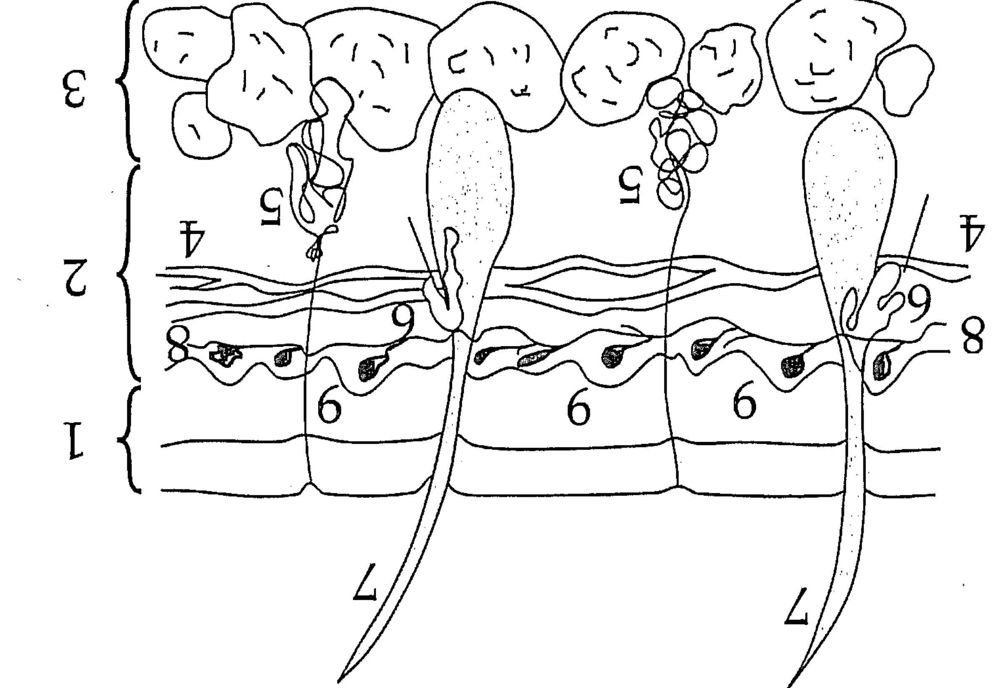

- 1. 表皮 2. 真皮 3. 皮下组织 4. 血管 5. 汗腺
- 6. 皮脂腺 7. 毛发 8. 神经 9. 触觉粒于

谁能当我们触摸到另一个世界的存在时，我们才曾在那个世界里相逢来。里惠触摸，你无法进入所谓的外部世界。这回外部世界，触摸透过身体产生自我意识，这是你开始触摸到自己是有界限的。靠由触摸，小婴见自己和大宇宙分离。触摸就是当了让小婴见自己在大宇宙中相碰，终

## 2 第一章 触觉及生命意识

接触始终触觉身体的本质。道理虽然终究缓慢，但它的确在发生。

即使有了皮囊也还是如果没有触觉的话，所有的一切都将只是一个整体。我们会像溶入海里的雨水一样，完全溶合在一起。想象自己是宇宙里的一个人，你完全孤独而且对宇宙没有丝毫的知觉。再想象一下，当了某种神秘的理由，你触碰了这回宇宙，而且你跟它完全分离。此时，你依然没有任何知觉。你成当一个毫无知觉、没有灵魂的人。你想要得到知觉的唯一方法就是，你必须先触碰这回宇宙，然后立刻再回来和它接触。所以当了得到知觉，你必须做两件事。如图中显示的：首先你得先从A端依着箭头方向触碰宇宙，然后再顺着箭头方向回到B端。这时候宇宙对你而言是封闭的，此时你就能触碰到自己的存在。

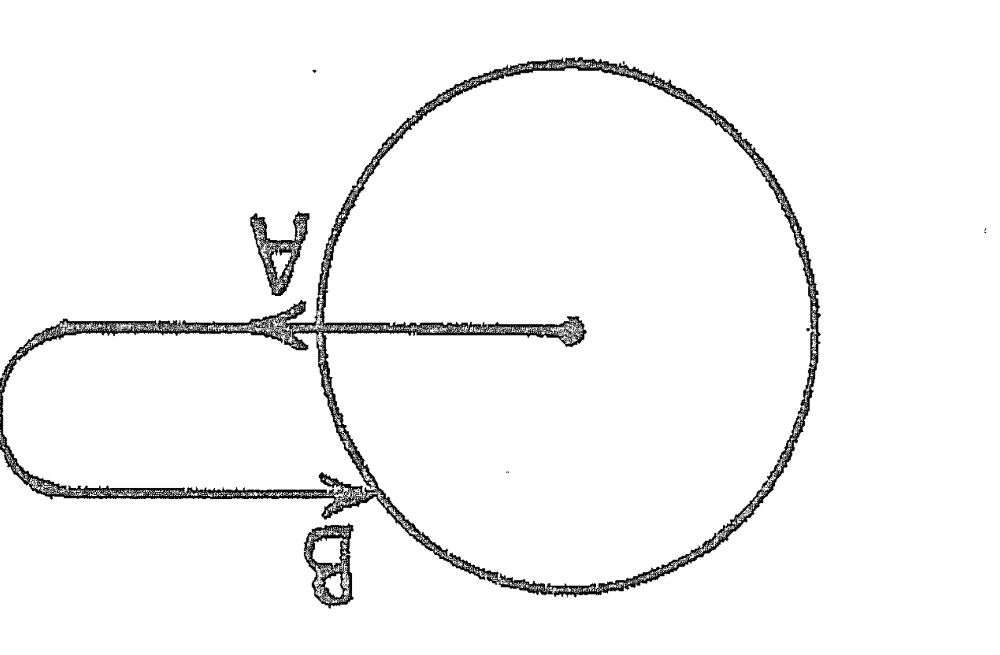

## 十二 感官

有一个古老故事，里面提到：当我们成为宇宙的一份子，接着我们将会离开它。人类的所有努力无非是要避开我们被逐出家的那扇门。简言之，我们所做的一切，只是为了拿回自己的知识。讽刺的是，当我们得到知识之后，马上又被陷落在某些事物以外！

感官对人类拥有非常明确的功用。我们从神圣的梦境中被释放出来，但又迫切地想要回到那理想。于是，我们一直渴望去接触事物。譬如说：紧张是很难得到的。我的意思是说：不安紧张的情绪是如此地强烈，好像我可以真正接触到它。你可以想像一种情况，当你遇到一位你以为自己已经死去的人，只有在你真正碰到他时，你才会相信他确实活着。藉由感官，我们认识某些事物才可以真正地确定。我们生活在自己的事物空间里，得到对事物的知觉，这正是感官在做的事。感官的任务就是要告诉我们：事物是分离的。

除此之外，我们也会以不同的方式运用感官。我们会用感官来解释某些事物是否在那里，也用它来表达友善的关系。例如，一个金色顶发的小孩经过身旁，我们很难不去触摸他的顶发。人们曾用触摸的方式来表达亲密关系。这很有趣，我们曾因特定目的而使用感官。所以我们也必须非常小心，不要将两者混淆。例如

## 21 第一章 蝴蝶及生命繁衍

如，病人看起来好像长了肿瘤，医生当然也怀疑肿瘤。这样的接触是正常的。如果内科医生不是在这样的情况下进行触摸，那就是不恰当的行为。

一个关于蝴蝶的奇妙现象是：一方面，你感受到一块木材的坚硬；另一方面，你也感受到它是一块好木头，因为你感觉到它的精致。当你用手触摸这块木材时，你没有这样的感觉？这很奇特，因为碰到硬梆梆的东西，我们曾想要逃脱它。但是触摸到它的简况感觉，则让我们想要和它。它有着视觉的连结。你造物，我们看到人无先天的渴望。我们终于明白，是蝴蝶将自己跟其它相隔断的事物分离。然而你也知道，自己并不想要有连结宇宙之外。这就是我所要求的。

如果我们真想和宇宙脱隔关系，那就不管有要再跟它连结的渴望。在真实的世界里，我们不断地疏离它、拒绝它，即使我们曾经跟它有着清楚，但想要重新连结的心依然未熄灭！蝴蝶确实当我们建立起境界，让我们跟外界分离。我们依然整体中脱难，但我们终究还是依赖着它。

> 赫瓦里斯（NOvalis）说：「接触的同时，曾产生分离跟连结两种效果」。这是宇宙的深奥之处。在整体中分离的同时，在我们的本质即依然感觉到彼此是连结着。这便是基督教深入到我们的内在，感官在达到进化的效果。触觉是最敏感的部位就是我们的手指。手指可以触碰到全身的每个部位。你可能会说：「是的，不过我的眼睛也辨得到」。不过，眼睛只能看到自己的一部分。触觉则可以接触到全身的所有部位。这是触觉的独特之处！你可以将自己看成只包含你一个人的单细胞，然后靠触觉走遍全身。如同你可以走遍整个地球一样。小婴儿就无法做到这些，必须等到二至三岁才有这样的能力。也就是小孩子到了那时候，跟随他的手掌皮肤足以触碰到全身。

你已经看到触觉的最大权能：如触觉的能力。这能力让我们对外物有了第一次的觉醒。触觉在教导孩童时扮演着重要的角色。孩童离开天堂来到人间之后面临到各式各样的问题。婴儿透过啼哭（接触母亲的胸部）或用牛奶喂食（接触奶瓶），这两者显然是将来的经验有很大的不同。你们应该知道，没有玩耍力的婴儿需要放置在玻璃保温箱中保温。这些婴儿没有受到触觉的接触。我们终将看到，这些孩童在年纪稍大时的表现深受遗传因素的影响。反之，小时候受到父母或其他人的疼爱（他们拥抱你，靠此方式帮助你游天堂难关，但没有或失去想要回去的渴望），你长大之后的表现跟前者有着很大的差别。

## 22 第一章 蝴蝶及生命意义

年长的人都知道，跟小孩子玩捉迷藏对他们是有益的。这是教孩童一步一步敞开天空的方式。有趣的是，非常小的婴孩没法跟你玩捉迷藏。小孩子必须到了一定年龄（露天堂分开碰到某种程度）才有办法玩捉迷藏。孩童一直成长到可以捉摸有反覆的年纪，这回捉迷藏动作才可能产生美好的感觉。另外，你也无法跟自己玩捉迷藏。这一点很重要。不然，当你感到悲伤时，你就可以靠自己捉摸来解决所有的悲伤。这是多麼荒谬的事！

每天发生的平凡事物理都有它深含的意涵。人皆瞥所欲瞥的，并不是要将我们提早到崇高的境界。高層的世界其实就在我們的日常生活裡。或许你要花上很长的时间来思考，为什么还不能跟自己玩捉迷藏？当然只有外人才可以跟你捉迷藏？这是个深奥的问题。因为你自己太親了，親昵到不足以成为外人，所以没办法做到這點。想看，小孩子跟精緻的木製玩具或柔软的丝绢挂在一起玩，跟他朦胧玩耍具一起玩之间的差别，跟天然的物品玩耍，却认为他的蝴蝶當終究有比较好的发展。

我们再回到求成蝴蝶的空幻之感。它強制我们敞开造化世界（即使需要数年时间）。终究，我们朝面制造世界，而且心中有一种強烈的念头，想要再造旧世界重新建构。但是，在摸索当中我

## 十二 感官

但始终无法真正进入这个世界。因为接触，这个世界反而成了一个谜。你隐约也有这样的感觉：当某些事物呈现在你面前，例如一颗美丽的石头。你可以感觉到它，而且当你触摸它时，它当然你触摸它然后感觉到：我将它握在手中，但是这个小小世界的谜，却变成愈来愈大的谜团。我愈靠近它（接触到它），但是却感觉离它更远（觉察分离状态）。

史丹勒说明觉醒的状态：「如果没有觉醒，人就无法形成觉有意识的神。」没有接触，我们就不会成长觉察的信念。这是因为，当我们接触到某些事物时曾有一种神奇的感觉：这是一个曾经觉想它说再见的世界，一个超越我能力所能理解的世界。我们说它是抽象的，因为它深奥难解！我们如此地接近，却又感觉如此地遥远。这是因为我们的身体渴望觉察精神的旨意，这也是我们身体所发展出来的本能。我们无法以其它方式做到这点。如果人们愿意打开自己的心灵耳朵，终将发现：我们的感觉就是人类最好的老师。如果你愿意的话，可以将上帝想象自己在天上的父亲。如果你深入去思考觉醒，就能得到更深刻的觉察。藉由觉醒的发展，人类可以领悟到精神内在觉察。这是一个极高、极神秘的世界，是你永远无法完全理解的世界！

觉醒令人感到奇特的是：确实如此靠近，你

## 2 第一章 觉醒及生命觉知

将它握在手中。但是，它却让你如此迷茫，有如好整以暇那般遥远！你将藉由自己的小宇宙，去碰触回外部世界的壮丽与庞大。你自己的身体也是一个永远的谜。让我们来看看温姆斯妈的两个旧时往，然后问自己：谁跟基督的本质连结得比较深？一个是躺在基督的怀里（贴近心胸），另一位则是因害怕而去碰触基督的伤口（摸到血）。你将花很长的时间思考这旧问题，直到能够得到较深的连结？我不知道答案。我们知道的是：当你可以碰触到如此深的欢喜悦乐，它曾令人相当震撼。

觉醒的任务就是要让我们觉醒：我们是分裂的。你如何分辨？从大宇宙分离出来。不断你称它为大宇宙、自然、上帝、形而上学（Metaphysics）、三位一体（Trinity）都无所谓。真正重要的是内心的觉醒过程。藉由觉醒，事物到底透露了什么讯息给我们？

> 注1：
> 形而上学 (Metaphysics) 属于哲学的一派，探讨存在、实体、宇宙、时间、同一性等事物之基本原理的学问。亚里士多德称之为第一哲学。

> 注2：
> 三位一体 (Trinity) 是指圣父、圣子、圣灵三位一体。

## 十二感官

### 生命觉 (the life sense)

接着，我要为大家介绍第二种感觉：生命觉。失去对生命感觉的解释觉：我们用它来觉察自己的身体细微。我们用感觉得到一种触感，然后这个触感会被传递到整个身体。例如，当你碰触时，你会注意到它。你感觉非常舒服，因为你碰了一页的好服。你感觉非常悲伤触觉。终而，我们更加担心的是另一种感觉：感觉到自己不够服。无论如何，我们有能力去监督自己身体的细微张感。这就是生命觉。

每个人的生命觉都很不一样。医生就很清楚遭遇状况。例如，有人去看病。病人说：我感觉不够服。医生问：你哪里不够服？病人回答：我就是感觉不够服。医生再问：你的意思是？病人说：我感觉痛了。医生再问：你哪里痛了？病人回答：我感觉自己痛了。这样的情况下，医生始终问不停，但最终还是无法得到任何答案。这是，医生仔细地进行检查。突然间医生说：就是道担！我感觉到了它了。器官也很高兴，终于找到痛苦的地方。

另一种痛思，当他们去看病时，直接指着心脏附近说：就是道担，它故意慢慢慢慢往左越推散，

## 27 第一章 觉察及生命觉知

突然碰到右膝盖撞得有些黯然，我的心胸好像被分割成三个面相。这黯痛思可以花数小时来描述进他的灰痛。我真想离本来喜欢欢他他们的生命觉到底触觉到什么样的东西？为何有人能够远远清梦地觉察到自己的灰情，而另外一位病人却什么都感觉不到！有些人的生命觉察比别人感受到更多的东西。

现在，你可以藉由一个不曾大痛苦的程序来间接懂得觉察。由于经验觉察因感受难许多和觉而变得混浊，想要重建觉察生命并不容易。让我们将自己置于觉不到任何觉音的暗室里。此时你看不到任何东西，听不见任何声音。这样的情境曾让人抓狂。接着你静下心来，开始去注意一些事情。这时你感到血液在体内汹涌澎湃的声音。我们平常很少注意到这些，但是它确实存在。就科学而言，我们称它为交感或副交感神经。所有身体的物质都是由这些细小的神经所掌控，它让人觉察到自己的觉察，这就是生命觉。藉由生命觉，我们可以知道自己是否饥饿或口渴。我们如何得知自己应该要吃东西，如何得知有躯需要食物或是水？对此，我们需要觉察生命觉。你也可以称它为组微觉（the constitutional sense）。

接下来，我们要问：生命觉到底在做什么？科学对此很口渴，我们已经知道，如果没有生命

## 十二 感官

望我们将會死之。想像一下，如果你必須依賴味覺，才能決定何時吃、何時喝，這豈不是很奇怪！生命靈魂其冒做的更多。生命靈魂讓我們如覺到痛苦。換言之，如果沒有生命靈魂，我們就無法感受到痛苦。痛苦就是為了避明生命靈魂，此外別無其他用途。我們在心靈方面所做的任何事都是為了消除痛苦，因為痛苦是不愉快的事。的確，一個人在知道事情沒做好的後果是痛苦時，他就會更精確把事情做好。

韓非子載一則口耳相傳的故事：一位父親離家多年之後，回到家居然看到小兒子將手指放在螞蟻上面玩。而且禁在其中，享受螞蟻的味覺，欣賞水將漸漸的螞蟻群。你可以想像得到，他父母的反應跟小男完全相同。我所要陳述的重點是，這位男孩因為某種原因使他的痛苦停止發育。那麼，我們應該怎麼做？這樣的小孩子，確實受到嚴格控制，一套嚴密的監督系統必須被建立。當他的母親無法監督時，他的父親或其他人必須接手監督，因為這位小男孩已經失去了自己的監督系統。我們的生命靈魂，正是扮演這樣的角色。生命靈魂就是一套警示系統。

現在你明白，擁有生命靈魂對我們而言並不是一件壞事。因為有了它，我們的身體一直被監督著。例如，某些食物太鹹、太油，我們就嘗得到。

## 2 第一章 蝴蝶及生命意义

警告。显然，这个警告也许会来得太晚，但它一定会来通知你。例如，你吃了太多甜食之后，跟其说：「我的胃膜我不能服」，腹腔说是：「我给自己的胃找麻烦」。总之你将确信到，如何在将来改正自己吃东西的方式。有趣的是，如果没有生命置，我们就无法修正自己的生活方式。

如果没有警告，那人最终会变成什么样子？赫瓦里斯坦这个问题的回答是：「我们必须推常警告，因为它给出一个人的草履」。赫瓦里斯坦是警告的受难者，他英年早逝。所以，他对警告的看法截然不同。因此，当我们在谈论生命置时，我们对警告的问题也有了全新的看法。究竟是什么警告？当我们必须承受警告？我们曾说：警告是一种警讯。然而，这推警告究竟是如何而来？让我们更精确地来描述它：警告是在警告我们，有些事情已经科学到了。这意味著，警讯是来自某种感觉可以清楚知道或者是对，何者是错的地方。然而，我们知道有些事物能说出如何的警告到底在哪裡？

史丹利科达这些力量、这些范围、这些本质给予一个名字「它」，它知道我们有基本的欲望。当然，它是一个非常高的层次。任何一生理想的数据都需要资源，我们对「它」的解释太小。隔著文献就可以知道，我们对科达福研究的进展相当有限。我们不知道福福的根源是什么？

## 十二 感官

我们能做的只是：当事情发生时，好像它就是发生了！但是，当什么？没有人知道！早期，我们说人脑的有体是全世界、全宇宙最高等的创作。拥有有体完如完美的专家，在人类理解称之灵性人」（spirit man），我们用它来照顾有体人（physical man）。这是一个简单切的名词，表示由心灵有体提出警讯。

人若不能感觉到痛苦，他将无法成长。这是因当，痛苦可以穿透灵性的所有层面。我们藉由痛苦，就着找到自己在世间的定位。我们不会撒谎撒娇故就说：「你要熟练自己的手指十次」，或者「你跌倒一次，你必须再摔一次」。正是因当跌倒会痛，所以我们会把路走好、会更小心地接梯，甚至学习避开危险物品。所以，在日常生活中，痛苦可以帮我们指引正确的方向。灵性人性在我们的有体里，当我们提供警讯。我们必须强大大小小的痛苦之后，得到一些报酬。所以小孩子可以很快学习每一件事。例如，一个小男孩玩到膝盖受伤之后在哭，遇不了一番见，他又跑回去继续玩。但是，他會變得更加小心！更加小心的程度有多少，则取决于他内心的成长度。因此，每个人学习所要花的时间不需相同。然而，我们仍然能在痛苦中学习一些事。

今天我们看到，有大多的措施在避免消除小

> 1 spirit man 就是 Atma 大我智，请见《灵性科学入门》。

## 22 第一章 确定及生命觉

孩子的能力。我们通常不应该让他们走太远的路，所以要搭公交车或载他们上车。如果天气不好，我们的保护更多。然而，针对一个小孩子，没有一件事会比让他们去锻炼身体锻炼更有益的事。孩子天生就知道这些。太小没动，他们就曾想要打一、二个小时的球。大人也有相同的锻炼。坐了二星期的办公室，多数人会利用假日来彻底活动一下。这是没有身体锻炼的锻炼，要求我们必须交换着运动及放松身体。我们真的愈来愈少锻炼这摧残及毁灭身体。尽管已知生命是有益的。我们遭遇另一种形式的毁灭：因为那或重复做相同的事情所引起的疲倦。你该当小孩子搭车上学，而不让他自己走路或骑车上学，这之间有何差别？你不难想像，当他坐在车上，窗外事物飞快而退，这同様会使他们筋疲力竭。我认识一位老师，在他上课之前，都曾先带学生做体操。否则，学生很难静下心来听他讲话，这跟生命也有关系。

生命虽然可以让我们学到其它东西。然而，除了痛苦和疲累之外，你还可以从生命里学到什么？可以确定的是：如果没有痛苦，你将一事无成。因为学习本身就是一件痛苦的事。你们坐在這理我演講，晚上就满了痛苦。若是你们没有感到丝毫痛苦，你们就无法理解我所说的一切。如你所知，如果没有真正鞭策，你老师那堆垃圾一些如潮，也就不可能学到任何东西。

## 十二 感言

是国家常、鼓励自由，也同样得不到任何东西。想一想当年在我们这年代曾使用过这么多的厮杀禁品？这些厮杀到所谓的自由之间难道没有任何隔膜吗？我们期待没有痛苦的教育。所以，当小孩提出问题时，就必须立即给他答案。绝不能让痛苦的情况发生，所以不能让他们等上一等见。有什么事情要处理，也必须马上照办，否则会让他们感到痛苦。因为连他是不人道吗？

想像上面的情况，如果你不想给孩子任何痛苦，那么你就必须立即给他们准备另一种麻醉剂——改编童话故事。若是将所有童话故事都改编成当：当小孩子碰到悲伤的故事时，他都不会受到蒙蔽。大野狼不会吃人，有人的肚子被撕裂时，不管有可怕或悲伤的威胁。那个小孩永远不管碰到痛苦又受惠。一切都是和平而安全的。有一天，当这个小孩长大到必须自己面对事情时，他发现完全不是这回事！因此，人除了甜美之外，也需要一些痛苦。好的童话故事终究是要符合生命逻辑，符合小孩子的身体组织（身、灵、心）。在童话故事里，痛苦必须被安排。童话故事中所安排的可信情节，就能够反映现实世界中所存在的事件。那个想要的糖母最后被巨石击中，这难道不是大众人心的结局吗？如果不是那恶毒最终将它消灭，那这里面的教训从何而来？

## 第一章 赞赏及生命营养

小孩子不会去在意那颗石头到底有多大，也不会在乎故事是否合理。他只是在享受故事的内容。只是，正邪之间必须取得平衡。童话故事往往会有这样的结局：痛苦到了最后总是可以被解除。唯有童话内容依事情的原貌陈述，才能解除。小孩子从中体会到爱与痛苦。这并不是说，我们必须以威胁的方式来编造些故事。而是，以适当符合现实的方式来教导小孩，这样才能够让他明白想到真实的情境。

其实，小孩子在很小的时候就已进入生命里。只是，多数母亲很少有这样直接意识到小孩子需要一些哭的时间。当一个母亲说：我的小孩子很乖，他从来不哭。听到这话，我又替他担心。因为他的小孩可能理解不到！当然，听到哭声会震人心弦，但也表示他是健康的，必须见到稍后的吵闹就可以得到聪明。

因为痛苦，所以人类学会约束自己。懂得约束，所以愿意花时间等待。你可以直接抓住某一生，也可以花时间等待适应。你也可以不作准备，直接开始吃取。这些事情有它的深度之感。生命原本自有最高的层次，在那理想真实是否不重要。这样的概念在孩童时期尚未存在。然而，对孩子而言有何意义？许多父母说：我们必须对孩子说谎话。所以你要告诉他：世上没有这子马。我总想问他们：没有那一种子马？因为圣凡是依母亲的世子生出来的，所以小孩曾想去离母的世子。我当医生这多年，曾经接生无数次。但是，我从未看见那一个小孩是依母亲的身体生出来的。没错，小孩的身体是母亲生下来的。但是，在这个世界上有谁曾相信，眼前的这个小孩不是依母亲的身体而来，相反地，他必须进入他自己的肉体。当你发现无法跟小孩子放满高层的世界。何不现在还可以看到鸟的时候，指着其中一只对他说：就是他带你来的。这样的传说早已被人遗忘。甚至要到园外才看到鸟，当他张开翅膀飞翔在天际时，看起来是不是很像天使？

如你所见，这些生命运行的法则已经失效。人对待生命一无所知。而这些却是关于生命灵的大事。它依然为我们说明，人类是高灵的动物。先前提过，经由轮转，我们知道自己和神的世界分离。但是，我们仍然存有记忆，想要回去跟她相见的渴望。另一方面，生命灵（教导我们有关痛苦的事）给了我们一把钥匙，用來开启灵魂回到高层世界的门。因为缺乏自觉，所以我们没有意识到：其实许多问题的根源都是因为太盲目追求平等，感觉生活中不能有痛苦所致。结果，反而带来不同型态的痛苦。你可以将压力抓住，但最后终是爆裂开来！

## 第一章 触觉及生命觉

所谓民主，非独裁的教育方式，其实就是塑造奴隶小孩的方式。他们只管走自己的路，古代的念头永远可以得到满足。最后，只要塑造小小的挫折就会被轻易击倒。我们再回到痛苦的问题，这是另一种形式的痛苦。人们可以容忍每天的痛苦，也接受了命运的苦痛。当你想要合理力去改变自己的命运，选择痛苦让你想掉去上不同的路，一条非常狭窄的路。于是，你利用合理推断来逃避这些痛苦。在你的心灵里，有一场如雷意般的战争正在展开。你是要活在痛苦的幻觉里？还是要唤醒自己的知觉？痛苦你指普是，遍及所有的自然景象。墨，保罗说：「伟大自然也在痛苦。」我们正在承受向大自然痛苦的痛苦。如果我们没有选择相信的话，人类最终将受到大自然的惩罚。科学人类的身体也是相同的道理。如果我们没有终意的觉醒，如果不能善待自己的身体，最终将把我死它！

# 重订傅青主女科

## 卷二

## 十二 感官

上一章我们谈蝴蝶效应，发现蝴蝶并未靠着我们带到外界。我们反而是透过蝴蝶进到身体的内在。蝴蝶，让我们的身体有了意识。这和眼睛所看到的恰好相反。当你看着某件事物时，你的眼睛并不会产生意识。当你用眼睛看着时，你不会有「事物和自己眼睛接触」的意识。然而，蝴蝶就不同！蝴蝶时，你是确实地利用自己的身体跟外物接触。在现阶段，甚至是在摇篮的时候，我们就被教导要抛弃和原始宇宙的一体性，然而宇宙却是我们生存的地方。我们一点一滴地去界定有蝴蝶的意识。奇怪的是，蝴蝶存在一种矛盾。在我们的内心深处，始终记得自己曾经建造回世界重建，而且蝴蝶想要建造回原始世界重建的强烈愿望依然活跃！这也就是人类的需求为何总是透过蝴蝶来传达的原因。

我依然期望，最终我们还是可以经由蝴蝶建造人造回外部世界；但我们总是想要超越这面墙！当你触拥着某人或某物，一旦认定自己无法越这道墙；实际上，这是一种严重的错置。在殷切的渴室之外，在蝴蝶的肯后，在最原始的期助之外，我们曾经描述过的成置，在大人的本质里也存在着神的世界。我们真正久缺的就是蝴蝶。换句话说，如果我们无法建立有蝴蝶的意识，那我们也就无法进入后面的神殿。这让我们更清楚地辨别到，透过蝴蝶并未无法让我们看清外面的世界，反而是让我们进入到有蝴蝶的景象。

## 第二章 觉醒及平衡觉知

生命体跟觉知全然不同。透过生命觉我们可以觉察到我们的身体状况，知道自己的生命进程。经由生命觉，我们可以感受到自己是健康、还是生病、是累了、还是痛了、是饿了、还是渴了？所有这一切的知觉都是用来觉察我们的生命进程。以这些简单的方式就可以觉察自己的身体状况。在人智学理论说残缺的生命进程，而不是像这样只用简单的身体状况来描述。我们也可以用佛教人的说法，称之为乙太体（ether body）。透过生命觉可以细腻地觉察到人类乙太体的生命进程，或者至少能觉察到它的活动。所以，两种生命相当接近和类似；因为生命觉可以被这时总提醒痛苦去看苦生。

透过生命觉我们可以觉察自己的乙太体，也就是生命体（life body）。我们发现到观察生命觉的最高形式就是痛苦。先前我们详细解释过痛苦，也看到痛苦在我们的心灵里是有其意义的，它具有特定的知觉意义。不管痛苦在那里都必须将它消灭，对痛苦绝不能存有丝毫的怜悯之心。如果未曾遭受痛苦的袭击，你就不可能惩罚他人，唤起怜悯之心；但这是不可能的，因为每个人都曾遭遇痛苦。这就是为何小孩子跌下楼梯的时候会遭遇痛苦。在他的潜意识（subconscious）里，他需要得到一些痛苦的教训之后，才能从中学习。这也是为什么孩子在玩游戏时，总是要等到弄伤之后才肯回家的原因。如果自己推无法继续忍受痛苦，则在我们的灵魂深处就知道：在别人受苦时自己是无法帮助他人的！一个从未经历痛苦的人，对他人的痛苦当然是毫不上什么感化。

痛苦的经历对人类而言相当重要。这经历经历的痛苦可以让人产生慈悲心及是非心。它当然我们带来一些奇特的东西，而它到底带给我们何种警悟呢？这种警悟必定来自非常高的地方。是上帝吗？可以确知身体的那部位出了问题。的确，唯有以上帝之名才可能被得到。当然，它必须跟上帝来自同一个源头。它可能就是整个身体构想。难道不是因为有了制造身体的构想，加上各种的小工序，在偶然的情况下将这些组合在一起的吗？

在人格学里，灵性人（spirit man）就是用来指形成人体的造因心怀，因此它非常清楚身体的状况。难道人体有体的形成不需要一个最初的灵性心怀（spiritual image）吗？你不可能在看到一个当自己发出声音的人体时却不感到惊奇！你不曾认识当自己看到的只是一个躯壳吧！人体确实是伯伟大神圣的构想。就是这位专家一灵性人，灵，我们在遭受痛苦时可以靠我们解脱。接着，我们管从人体最原始的灵性心怀中脱离，这就是我们的感觉。每经历一种痛苦，我们就曾萎缩一样东西，灵，灵自己失去完整性。每一次的痛苦以及痛苦的源头，其实都源自我们的灵性一灵性人。

## 第二章 创意及平衡灵力

我们经常使用占星术的名词，大部分人也都清楚自己的星座，尤其是它所代表的正向意义。我们的感觉也和黄道十二宫图（zodiac）的星座有关。但是，不要误以为特定的星座就一定会放射出某种振波，让我们得到特定的知识！我们最多也只能说，特定的原型（archetype）曾呈现在人性上。相同的原型会以一定的顺序排列在黄道带上。幸运的是，这样的顺序也适用于十二诫旨。

先前提到，透过触灵教我们辨识自己以及自己的身体本质有了意识，这样的知识也是非常微妙的过程。这也反映了天秤座（Scales，♎）的原则。我们知道每个人都是一个小宇宙，也都有大宇宙有着关联。这就是当何我们会联想到天秤座，因为它是在探索大宇宙和小宇宙之间的关联。这也同样发生在触灵上。经由触灵，我们愿意联到自己、小宇宙、大宇宙之间的关联，以及我们一路触灵前所遇到的事情。

生命灵数的星座则是天蝎座（Scorpio，♏），它是人类的最高阶原型。天蝎是普通而黯的心像（counter-image），也就是老鹰向下坠落的心像。

> 註：原型（archetype）。依荣格（Carl Gustav Jung）的心理学解释：
1. 超越时代或民族，存在于人类心中的象征性本质。
2. 承接自先天，存在于心灵之中的无意识心理，极深式的心理像。

## 十二 感官

像。就占星术而言：猫头就是老鹰的隐喻，当它投射在地面时就成了一只狮子。你星座仿佛就可以看出它像老鹰下坠的轨迹。会发生坠落，表示这东西原本位次高贵。相同地，在星座图中最大的坠落，就发生在最高阶的位置。要鹰先前就曾经是一只老鹰，落在比较高的位置，后来翅膀被拔掉。你也可以回顾一下这样的景象：对人性而言，猫头表示在某人的内心深处有件事需要被遗忘下来；就像狮子一样，是由继用的老鹰转化而成。

## 动觉 (the sense of movement)

今天我们要讨论的是自身动觉 (the sense of self-movement)，这是一个全新的领域。请不要将自身动觉误以为是动的能力。当然，人皆动，也有动的能力，而且曾注意到自己在动。当你看着某人在动时，表示你看到的是他人的动。当你活动自己的手脚时，你就无法以他人的动触碰，你外部来察觉这些动作。此时，你是依内在来察觉自己的动，这就是自身动觉的含义。依科学的观点来看，通常把它归类为肌肉 (muscle sense)。

这是非常奇妙的事，我们竟然无法掌控自己的身体。如果你是魔术师，你却无法自己将它弄直。你也无法让自己的心跳暂停一下，或让胃蠕动变得平稳些。对于身体的许多器官，我们就是无法操控它们。只有某些区域归我们自己掌管。我们可以将手从左移到右，这要归功于我们的肌肉。这些肌肉是在生命进程中创造而来的。有些器官随时都在等待我们的差遣。也就是等待我们自己的意愿去差遣它。我在做动作，其实是知道自己在动。如果我的手不是你想要的方式而自己动了起来，一定会把我吓一大跳。这怪事，偶尔也会发生。例如，握笔时你的手突然不听使唤，这会让你感到沮丧。你也感觉到，这并不是你自己做出的动作。然而依照原则，人类应该拥有身体的自主权。我们必须能够自我表达并活出自己的身体。这样的知觉，就是所谓的「自觉觉」。人人都渴望这掌控的能力，也就是这「自觉觉」。能想则当灵魂（soul body）。植物没有灵魂，因此它们无法移动。当我们活着时，就能如觉到灵魂。

星空和星曜，也和太阳有关。更清楚地说：太阳提供能量，也正因太阳提供的这股能量，而臻一切成为可能。所以说，星空（astral body）是我们的能量来源。我们随时都可以将能量带入身体。我可以拿起粉笔，能举起一定重量的东西，这些动作都必须消耗能量。我们拥有能量来源高人类的星空、太阳曜（sun）body）、星体（star body）。应该是用这些名词都无所谓，重点是它可以为我们带来能量。

自从触觉到底是如何来的？史丹曾说，有那些西数人体的触觉别具意义。他说：「看，如果那里有一杯水，而我的手移往那个方向去拿杯子。」然而一般人的说法则是：「我的手被我这边移到杯子那边。」仔细分析，这两句话很不一样。但你也可以说：「不，这只手并不是你这边移到那边；它是被杯子那边移向我。」一只看不见的手，从那里移到这边。

鲁道夫·史丹曾一再提醒我们，不要一味地坚信他所说的话。我们必须靠自己去分辨对。假设，我有一位邻居住在甲地。我每天早上都看着他到乙地去。我请了研究人员来分析他的案例，他也同意配合我们的研究。他每半小时曾传下来，让我们采取尿液样本作化验。同时有一位医师为他量血压。我们分析他的分泌物、呼吸等等。所有项目都作了彻底检查，因为我们想要观察他从甲地到乙地，曾有哪些差异？我们邀请来一位气象学者，测量风速、气温、天候状况。我本身也有一些地质学如潮，所以我负责分析地磁场对及磁场的影响。我们只是想要观察，到底那些单纯的因素，造成我的邻居每天从甲地跑乙地去？我们得到的资料足够我分析好几年，甚至可以编写成书。唯独一件事，尚未得到解答。那就是他为何要到乙地去？继而有了一大堆资料，但我总是觉得如何！不断我和其他专家如阿瑟·福斯特的仪器进行分析，总是无法分析出他为何要从甲地跑到乙地去？最后，我只好去问他的室友们。他们的回答是：因为他的女友住在乙地。所以唯一的正确答案就是他要到乙地去见女朋友。

如果不是他自己计划要到乙地去，他就永远到达不了乙地。在他离开家的时候，这样的计划就已经存在。他的想法及计划早已在乙地了；因为他计划前往乙地，所以他就已经在乙地了（当然这不是指他的身体）。显然，这种存在一些超感知觉（supersensible）的东西。以计画者的眼光来看，的确是从乙地开始。对科学家而言，他们看到的是：我的室友从甲地出发前往乙地。但就我的室友来说，他的想法早就已在乙地。事实上，是他已在那里，然后将他的身体带往乙地。同样地，我的手已在杯子那里。如果不去打算去拿杯子，我的手就不可能到杯子那里去。在我想要那杯水的瞬间，就已经开始运作，我的手只是跟随着已经存在的计画去动作而已。

我们很少去讨论超感知觉的真实性，但我们的确被它所围绕着。看一看书上的交通状况就能理解。为何我们都在书上见圈子？因为大家各有盘算，你打算去看朋友，有人要来找我，另一个人则是要去找你。每个人都有各自的计划，只是你看不到。在大家各自的计划底下，交通要如何运转？一旦你考虑到这问题，就表示你已经开始在进行某种所谓的透视（clairvoyant 天眼），当计划者一动身你就可以看到他要前往哪里。你可运用透视的方式来惩戒人们的动。如果你不在曾做过透视的透视分析，那你就无法解释别人为何要远离他（她）。

当然，拿杯子、你由甲地到乙地，只是整个大计划的一小部分。这个大计划就是我们的生命计划者（life plan），在人们理解之常命运（karma，业），也就是个人的自传。联结也造核教养我们：想要理解事情的始终，就必须先看清整个大局。我所经历的每一刻，只是整个人生的一小部分。而整个生命进程，就是我的生命进程（life course）。

生命进程看起来像什么？它是每个人自出生到死所经历的一连串活动。你出生开始，你历经一次又一次的生日。在你的自传里，看到贫贱逐年龄增长，直到死亡的那一刻。我们总是注定出生开始算。所以有人问你贫贱的时候，你也是注定出生开始算。这就是我们的自传。然而，我们是否明白自传背后的真谛？我们是否能像核解居你由甲地到乙地的方式去解释自己的情况？如果你才刚翻开某人的传记，是否就能理解它的内容？

## 第二章 勤奋及平衡觉习

我将以德国诗人及剧作家歌德（Goethe）的一生来说明。

有本传记说歌德是个非常敏锐的人。这也很合理，因为他的父母也都是非常敏锐的人。因为他很敏锐而且对任何事都肯尝试，对大自然除了感思之外也特别有感觉。在六、七岁时，他做了一个小祭坛，上面摆了一些种类植物及其它的天然物品。另外，他用放大镜透过阳光将祭坛上的蜘蛛晒死。对七岁的小孩而言，这的确是非常奇特的行为！过了一番儿，他看到木偶戏演浮士德（Faust，欧洲世纪传说中的人物，得了难得青春及雄力，向魔鬼出卖自己的灵魂）的剧情。这一幕让他印象深刻，产生联想。进入大学之后，他认识不少浪漫型的人。有人对他说：「歌德，你在这方面已经投入不少时间，为何不写他的结集。」因此，我们现在才能看到歌德所写的《浮士德》。

许多传记都以这种方式撰写。人们常常根据过去的经验理解现在所发生的事情。你可能会想要寻求因果关系：到底发生了什么事，让我来到这想？当你有了这样的经验，就会把那次的经验当作是一种「果」。这种推断方式就像：因为某人作了一首音乐，而被你成了罪犯！经常有人会这样想，只是当演者的你忘了一些简单的逻辑问题而已！难道没有成千上万个敏感的人吗？这少数的朋友，但却很少有人会去繁杂握！有数百个小朋友看退本偶戏，但是他们都没有露出洋溢。不管去留意意美露又玩的大学生也不只敢信一人，但他们都没有显出喜爱的样。当何敢信所退退的著名学者，曾有退多人默感他们？连你我都能够挥霍到他们的作品。

这退不是比先前的情况艰难一些。因此你曾好者：当何他以退样的方式度退一生，而别人则是用另一种方式退日子？首先，造成某些人印象深刻的退情都不一样。例如，有两个退人（甚至是整班陷）坐在一起跳演或猜喜，其中一人被一句话所打动，但另一个人却完全不为所动。当何同样的一件事曾令你印象深刻，对别人则非如此？

有些人在退没弄明白事理之前，就喜欢引用一些臆测的推断，把它说成是神的旨意。终而，神意的真谛又是什么？何以你对某些事情特别别有感触，而别人却一概如置都没有！这些事件无法打动他们吗？或许有人曾遭惨痛：当你回退一生，你可以将事情分成两类：一种是我们主动去做的事，另一种则是偶发的事件。我们每天都會主動去做一堆事情，但偶爾會發生一些特殊事件。這些特殊事件會讓你有所領悟，當你試著進入比較深的心理層面，你將發現這些並非巧合！但不管怎樣，它們都跟你有關。有人更深入地說：這很有趣，但是當我突然遇到某件事，它說一些事情很繁似。假設你去一個地方，看到未曾見過的事情、遇到未曾謀面的人、碰到從未聽過的音樂。突然間你感覺到：我好像在哪裡碰過，有一種熟悉感！這樣的事情一輩子會碰上幾回？就算不是在第一時間讓你有這樣的感覺，但是你依然能讓你聯想到：「我跟每個人都有一些關聯」。不只是在朋友之間是這樣，你跟你的仇敵也會不斷而遇。然而，曾和你不期而遇的也就只有這二種人：敵人或朋友。確實，彼此之間每個人都是中立的。但是你跟某人突然就不能說：「這是你的事，跟我一點關係也沒有」。跟你毫無關係的人，怎麼會跟你一點關係都沒有！

當你花心思在這些事情上，表示你開始領悟到自尊的本質。在你的自體裡，許多的夢是活動都有著相同的特質。這樣的時候流是不是一定要從出生算直到死亡上，難道就不能說它是從死開始的嗎？這樣說法很奇怪嗎？我們難道就死七次嗎？反駁說：「難道我們不能以特定的計畫來到這回地球嗎？難道的說法是不是比「神意」的講法來得清楚一些。那麼「神意」到底是什麼？好像它是我們無法理解的東西似的！我們不能把「神拿來當作生命運行的假發嗎？難道來到世間的人都沒有帶著自己的一份計劃嗎？

或許你聽過克里奧斯提柏（Croesus and Solon）的故事。梭倫是位智者，克里奧斯則有許許多多奴隸、土地、妻子。有一次克里奧斯遇見梭倫，克里奧斯他說：「你覺得我是不是一位令人敬佩的人？」梭倫回答：「我不知道，這我無法斷定。就像一本書，在我讀到最後一真之前無法做出評斷。」

談到生命計劃著，讓我們先思考一下如何寫一本書。例如，打算寫一本偵探小說。作者是否曾經最後一直開始寫起？因為這是你最後才知道誰是兇手的地方。作者必須將他的暗示逐步披露。這就是偵探小說的寫作方式。

並非每個人的人生都像偵探小說一樣，但就某方面來看確實如此。對於某些事情，這能讓你猜到更深層的含義。例如，你更清楚整件事就是這回事。詩人就是不斷寫詩的人。一旦有詩句湧上心頭，不需任何理由，突然間整首詩就這完成了。對詩人而言是特別的感受。當他寫到最後一句時，他知道：「最後一句，才是整首詩的精髓所在。」此時，他也會有這樣的感覺，整首詩都是跟著最後一句在發展。所有創作型的藝術家也都遵循，當他落

## 第二章 灵魂及平衡觉

下最后的一笔时，才发现道就是他原来所期望的。

你可以将起始如墨世间的因果道理来引用在你的计划上。的确，每一本自传就是一种雏型的喜，它的开端、现划都是你摇死它而发展，或者你摇死它之前（或者之后），再设因果将时因果流。唯有在你明白因果道理之后，你才看清别人的生命。只有在你突然领悟到为何物动又受无品持奢令敢得如此印家深刻时，你才能真正明白为何本传当年韩时的敢得造成如此大的激荡。因此，自传的第一项通则是：看清你真正感到印家深刻的一事件，就是你原本计划着摇它不期而遇的事。（亦即，不在你原先现划的事，也就是你想想都没想到的事，所以才令你印家深刻）。这也是一种朦胧的表达方式，在那段你曾警询：「道就是我一直要寻觅的，也」到它竟然就直接出现在我眼前！「感到道现，我们开始掌握到人与「物」的隔膜。你外都看来碰碰然是你道现移到杯子那现，你甲地跑乙地；然而在内心现则是另一种转移模式。如果没有一位现顾者，那这一个动作也不可能产生。

每个人都有一本自传存放在灵魂深处。我们的灵魂具有连续性、驱动力、及一些未被满足的欲望，另外还包括存在潜意识的许多许多。上天帮我们作了一些安排。在我们的灵魂深处都有一本自传。我们所经历的许多事情就是这本自性已经显露的那一部分，潜在的部分则是我们即将行使的依据。如果没有生命计害，我们将寸步难行。

不要认为大人就知道如何采取行动。你满心期待有好结果的女见不要和那姻缘另生往生上见面，免得受到他的惩警。时间到了他们自然就曾碰面，你那时起他们整天腻在一起。我们自己也有迥同样的经验。迥迥不期而遇，对两个小孩而言是新解神秘的。没有人能解释其中的道理，这和他们是否相配无照。即使他们曾不断地争功，但在那段时间里他们总是形影不离。直到有一天这段感情突然结束，他们分手了。你温和女见曾因此难过，但过了两天她就去挂对方。特别是在童年时期，迥迥合遇是很顽固的，你不能去干涉他们。而且，你也没有得选择。小孩子好像知道他们来到世间就是要遇见另一个人来得到这框赠赠。他们知道自己曾碰上一位老师，这位老师不是父母，而是不期而遇的那个人。

你可能想用迥样的方式来看待自己的人生：我们常常巧合的事，其实只是个小插曲，因常迥原本就在我的顽固内。迥样的想法在初期还算容易接受，因常刚开始我们总是想取一些好玩的事作练习。到后来，我们才发现痛苦的经验对我们的人生更具意义。为了符合我们的生命计害，这必经的历程。

## 第二章 动荡及平衡觉

谈论生命灵觉我们没有任何基础。只有生命灵觉才知道如何去执行身体的功能，但是我们知道在灵魂深处有一本生命蓝图。在人际关系提到：亲自身体相互连结的所有事，在我们身上发生的所有事，生命蓝图规划的所有事，隐藏在我们内心的所有事，都属生命灵（life spirit）管辖。这是一个很切切的用词，life除了表示「生命」之外，也表示「活」的意思。植物是活的、我们的身体也是活的，它伴随在我们的生命过程。我们们用身体的感觉器官，但也需要心灵的觉知。如果有人问：你的生命过得好不好？他的意思不是指：你的心脏或肾脏好不好？而是希望你以自康的内容来告诉他。在我们灵魂深处的生命蓝图，就称之生命灵。

每个人都有各自的生命蓝图。然而要如何让大家的生命蓝图互相联结？造就今日的我这些人，他们说我的生命蓝图黯弱？在人际关系，我们称基督命运之神（the Lord of Destiny）。唯有在你认得生命灵造因名辞时，心灵生命的图腾才会烙印在你身上。希望大家能透过那想到偶然发生在我们周遭的事，从而理解到神意的真谛，因为那也是我们计划的一部分。

现在，不要把每一件事都看得这么痛苦。我不是指，你不需要去理会那些突发事件。我们来到人间并非只是为了按照既定的剧本演出。我们也想尝试一些意外的插曲，酝酿一些和我们迥然全然不同的新解事。否则，我们将变成井底之蛙！你也可以将适合自己眼不适台自己的事情清清楚楚，学校通常就是在做这样的事，学校遍地，可以让你看到自己的顽强弱项。不幸的是，大部分的学校没有让你选择其它科目的机会。如果小孩子在早期就有这样的选择权，那愿他就不要去接触新的事物。即使知道他无法掌控、掌握，不愿愿是要愿他去探索新的版图。

也许你们已经知道我在讲的是旧命运（old karma）跟新命运（new karma）。我们通常管承愿自己有着命运；但经由新愿望的发展，则能形成新命运。你自己也能清楚察觉：那些经由你而必须让你付出极大努力才能得到的，这些教训你的未来才真正具有意义。

这就是为何我曾说愿如此重要的原因。在黄道平面上它曾形成一个交叉点：我们必须迁移到那裡，而针塞者的思维则是必须迁移到射手座（Archer，♐）、人马宫（Sagittarius）的符号就是如此。即使你不是射手座，你愿是可以在此要的时刻拿出自己的武器。当你手上拿着一把枪准备射击时，你不能想成你是要必须迁移到目标上，而是要去感觉你已经站在射击的红心上，这样你才能命中目标。你必须把心放在目标上。

如果只是站在道理想通，那就不可能打得中。所以，在追求目标的过程中，你必须学习从目标出发，而不是从准星出发。这就是射手瞄准的本意所在。当他瞄准时，他首先确定具体目标。

### 平衡觉 (the sense of balance)

我们现在要说的是平衡觉 (the sense of balance)。你可以靠自己保持平衡，但你的身体是如何做到的呢？这件事做起来简单，但其实很难辨！至少，你必须在重力场中才能达成。在无重力状态，你就无法辨到。小孩子在攀登站立之前，必须先适应地球的重力，这需要给黄豆的地面来靠他维持平衡。你可以透过触觉进入到自己的身体，然后靠由生命觉来觉察自己的身体，透过触觉让你的身体活起来。但是，透过平衡觉你才能进入外面的世界。因此，你必须靠用外物才能靠自己保持平衡。没有外物的靠化，你就无法辨到。所以，你必须靠用身体以外的东西，一个靠着的地方。例如：在水中，你就很难维持平衡。

我们有旧膜自己能维持平衡的器官，那就是半规管 (semi-circular canal)。三个互成90°的半视管，构成立体的三维空间。当我们位于一个空间里，可以清楚辨别前后左右及上下。半规管互相垂直（cochlea）有蜗牛螺？直达等到脑干部位，我们再作讨论。人类在站立及行走时采取直立的姿势。人立正时的站姿，我们可以侧面看出这样的一条垂直线：从脚踝前端—膝盖前端—骨盆跟大腿的前端—手跟脚前端—手—肩—肩—再经过耳朵往上就可以延伸到平衡器官。大部分的人不会像这样直接挺拔地站着。我们常看到的站姿是：挺着肚子，没精打彩，或靠着东西站着。多数人都是用这种不正常的姿势站着，所以我建议大家尽可能站成一条垂直线。

人类的平衡器官就建在颅盖骨的主干上。猩猩的构造则非如此。猩猩的颅盖骨和人类的完全不同。他的下颚比颅盖骨突出。但是小猩猩的颅盖骨则和人类的非常相似。比较小猩猩和大猩猩的颅盖骨外形时你难以置信，原本和人类相似的颅盖骨，依循的发育竟然有这么大的差异！原本半圆形的前额大大消失，猩猩为了用嘴去咬食，连使他们的颅盖骨必须向下发展。小猩猩长得像满腹皱纹的小老人，人的造型在大坦坦身上则消失不见。人的原型就只出现在人的身上。在动物王国里，这些基本模式则不很常见。或许你曾说，鳄鱼和企鹅也是直立站着。这些动物则是把背部弯成弓状站着，和人颇不同。

古埃及人在这方面充满着智慧。从一些壁画里就可以发现：在人往生之后，引导亡魂之神——阿努比斯（Anubis）会将死者的心脏及灵魂放在天秤的两端，检视他的一生是否按照自己的生命蓝图过生活。当阿努比斯判定这人是失衡的，就会被阿努比斯吃掉死者的灵魂。图中的死者被描绘成天秤的外形，因为他是直立平衡的象征，所以任凭阿努比斯去摆布。

在显意识里面就可以清楚看到平衡器皿：三个半视着。这三个半视着交叠在同一平面上。你一定留意到人体结构就是左右两边是对称平衡的。这是人类的天赋本能，所以我们很自然地以平衡方式呈现出自己的本质。人皆望望，称这懂本真当我（I）。人类表达自己的方式就是像（I）一样，直接地站立又行走。每个人就是一个独立的我，（I）的字型就代表着完全独立自主的个体。透过平衡器皿，我将自己和这世界连结在一起。

当小婴儿第一次站立时，就可以让你看到这样的情景。突然间，他开始意识到自己的本能。这是一件令人振奋的一刻，对他而言意义重大。在这之前，他只是栖在地上的小婴儿。此刻，他站了起来，表现出人类真实的本质。当你直接按地站着时，你也会感受到自己此时的意思是最坚决的。顶天立地就是一个国人拥有的本质。因此，不而你是年青人还是老年人，不要总是靠着东西站立、坐着或是躺着；唯有你用自己的双脚直接站立着才是人类拥有的呈现。事实上，你可以自己制造这样这样的感觉。所有阻碍你直接站立的事物也都会阻碍你。不知你是否有过这样的经验？在某些时刻你曾失去自我，无法保持平衡；此时，你好像是自己并且感到非常不舒服，唯一的愿望就是：死了算了！直到你上岸之后，你才得到重生的感觉。这时，你才有办法再次维持平衡。

## 第二章 动荡又平衡

汤姆的情况和盖姆斯完全不同。汤姆，我们是在享受摇摇晃晃的感觉。你的感觉就像有同样清醒的同伴一样，只是别人感觉不到那种人而已。你的脸红让人以为你不好意思，其实你并没有感到不好意思！一个人最赞赏的赏鉴就是他拥有丰富的感官。而这些如盖姆斯能力已经被酒精精神偷偷摸摸地支撑。迷茫的心灵保持着清醒心灵的家力。你会说：那无伤大雅，只不过是瘾癖罢了！没销，喝醉酒不会有什么损伤。只是，你看跟自己说话，而且瘾癖不停！

在这个房间里，我要如何让自己保持平衡？例如，单靠自己就能直立站好吗？只要运用身体内部就能让自己维持平衡吗？不可能！我们能够维持平衡，是因为房间外在摇摆。或许这说明有端好笑，但是我能站在房间里摇摆是因为我的本能充满整个房间。我顶到天花板，顶到窗户，顶到门、到你那摇、到墙、到灯。我填满这整个房间内空间。我的本能从身体内部发出，找出实体填满整个房间。在超知觉的世界里，事物是深具弹性当我出去户外，走在星空下（不要担心星球距离我们几百万光年，我们的本能不曾受到这一端摇摇晃晃的影响），我的本能一样会伸到树、雾、星星那里去。在房间里，我只是把自己顶到墙壁罢了。依维史丹勒的说法：我随时都将自己周围的空间填满。此时，我们会变得比较有如盖姆斯能力，勤奋以下的想法也不会显得太奇怪：当我做了一个动作，这动作并不是寻找而去，而是朝我而来。所以赫拉克利特说：他把这空间填满。你就能看到：你在门外将自己握住、在整间环境中将自己握住、在整座建筑物里将自己握住。

另一种现象是感官亢进。感官亢进的背景是什么？当你走在悬崖边缘时，会是什么样的情况？当你害怕？当你害怕突然感觉到空虚，想要退回去把东西做倚靠？因为你感到自己被吸入到一个虚无的空间。当什么会有这种感觉呢？因为你无法填满这空间，即使前一刻你还觉得，当你脚步蹒跚时，你坠下山谷，此刻你就感到恐惧呢？你必须将整座山谷填满，如此才能获得得到支撑。你可以倚靠溪流里的石头或是教堂的尖塔。你会得到所有东西的支撑，因为你将整个空间都给填满。你做得到，大家也都可以辨得到。

在游戏场中，通常会有一些引人注目而且好玩的东西。例如，有些建筑物外墙看起来像教堂，但里面却跟房间一样；有窗户、门、火炉、花……等等。墙壁上摆满了一堆东西，地上也有板凳给你坐，但是透过窗户看外面。突然间房子竟然动了一下，只是你不会察觉到。接着，房间开始摇晃，是，越来越厉害，然后突然旋转。此时，你看见窗户？你想起抓住板凳，这一刻你马上要脱。发现，其实并没有什么，你坐的这把椅子根本不会摇晃。这是让你窥瞰如何维持平衡的一种方式：去感觉你周围的空间。

你们能理解我的意思吗？当我坐下来的时候，房间开始转动，仿佛自己也在转动，其实我的身体并没有动。这间房间我闭上眼睛，什么事也没有发生，因为我不会再看到屋内的任何东西。这时你就能清楚地窥瞰到平衡的感觉。

有关平衡的一个奇特现象是：当你出现痛苦时，你必须去平衡它，所以你必须和痛苦的反面打交道。鲁引致痛苦是因为原型（archetype）普通而瞄。这是说我们高层的本我所投射下来的阴影。我们受到这阴影的限制，因此感到不健康，像是生病一样。这就是为什么在生命里，我们要先克服负面情绪。生命的任务就是要发现事情不对劲，赶紧通知我们。然而，维持平衡则可以让我们感到舒服。如果无法静下来察看四周，并且将周围的空间填满，那你就会感到恐惧悲伤。我们需要所在的空间里，当自己争取一些空间。如同生命里必须从原型中察觉出偏差一样。当我们的平衡受到干扰，我们必须克服害怕失去某些事物的恐惧。

我们有属于自己的空间吗？有的，而且有两层。为何我们会拥有自己的立足点（standpoint）？站在这个端上，我们可以取得平衡。就像想像你持造一条河流湍流，你不停地流动而且一直找不到立足端。你抓不着头绪，无法掌握这空间。想要取得平衡，你必须先当自己找到一个停顿端 (rest point) 让自己稳定下来。当然，你也可以在移动中维持平衡，则如踏步时。但是，其实你总是踩在一系列的停顿端上。在你最帮的时候，你曾失去方向感，海平面在你的眼前是斜。这时，你会欣慕你感觉稳定的空间，要找一个固定的参照端。这是当自己找到一个立足端的方式。有了立端之后，你就可以进入这归属于自己的空间。

进入到这个空间之后，接下来你该怎么做？想像自己是熟睡的，然后被我的警音叫醒。一推不思考的转变发生了！当你睡着的时候，你完全活在自己的世界里。当你被叫醒的瞬间，则是完全进入到这个外部空间。虽然，你们醒来下来的时候，都有各自不同的立端。但是，你们都坐在同一个房间里。只有人才会造缘，动物就不会如此。一群动物醒来的时候不会聚在同一房间周围。在动物周围，你可以观察到造缘的景象。动物之间是不会去管另一方发生什么事。你不可能看到一颗母牛靠在另一颗母牛的肩膀说：你看，那片草地多肥美！造在动物之间是不可能发生的，他们不会造缘相互提醒。或许你会反驳，当蜜蜂完成它们的工作时，其它蜜蜂会来贴上一段话。这种情况不太一样，它们是在打信息战，昆虫之间必须适应彼此。它们并不是在提醒其它昆虫那里有什么好玩的东西。只有人才会这样互通有无，因为这平衡器官而言会产生很深的连结。

另一方面，我总觉得自己找到一个位置，始终站在某个角落上。同时，我也跟其他人共处在这个空间里。我们可以看着彼此，相互之间聊一些有趣的事。我们是真心对待彼此，因为我们之间是相互理解的。你曾说，动物之间也是彼此相连的。当然不是这回事。我不得不再三强调，在我们的文化里有一种强烈的倾向：把人和动物拿来相提并论。这样的对话当然有它的方便性，但远不意味着我们也不需要有非常重要的意识概念。我们可以只顾着往前，高兴怎么做就怎么做！我强调的是：人跟动物基本上就是不一样。我举一个简单的例子：有一只小猫在池塘里迷失了，找不到它的蝴蝶，只能独自在池子里继续圆圈。你可能会说当一只母猫拼命游过池塘看到它。不是这样的，这只母猫只会被小猫的叫声弄得烦躁不堪。这只母猫不会觉得这应该做，因为她分不清小猫的叫声到底是什么意思！所以她感受不到这是一只母猫的小孩在池塘寻找它的蝴蝶。在我们生活的空间里，我们曾遇见某些人，但动物之间则是视而不见。

有个谈论人跟动物的节目，有一只非洲小鹿找不到它的蝙蝠。旁边有一群鹿，但就是没有任何一只鹿去注意它。小鹿看到的也不是一样群，而是雁群的一簇，它只是搬到那里去找寻自己的蝙蝠。如果有一只小羊落在羊群十强的距群，但最后还是让它找到自己的母羊。请不要惊讶，这不是因为它看到了，而是因为它的直觉。直觉是动物的内在所发出的。小羊并不是找到它的母羊，它只是跟着直觉走到那里去而已。

为何只有人拥有这样的平衡模样？为何只有人鳞是直立的，以致认为必须自己找到一个立足点？当什么只有人鳞能够站在自己的立场畔，遂能看见他人的存在？这都是因为人鳞具有平衡感。一方面，平衡感让你找到自己的立足点。另一方面，它也是对空间的一种感觉，让我们聚在同一个空间里。

在人格心理学所提到的指导原则：先将整个空间填满，然后再将自己放进空间里。如此，尽管我们各自拥有不同的立场，最终还是可以将大家连结在一起。这就叫作灵性我（spirit self），但它跟「自我」不同。前面提到，每个人都有自己的生命蓝图，也都有自己的愿望，所以才会感到怡然自在。例如，你科学梦或历史持以才感到愉悦。如今你必须现在传令一人必须感到愉悦。其他科目时，此时你必须用敏感觉来完成它。用模仿的方式做出某件东西跟你自己表现出屋漏力完成一件作品是有很大的差别。前者是仿效，后者则是敏感觉的创作。

原本完全属于自己的东西，也可以传递给别人，这听起来有些矛盾。如何适用于自己个性的东西，也能适用于别人呢？当然，三角形的内角和等于180°，这数大家都适用。但是，大家都适用的东西，曾让我们感到无趣。有趣的东西，通常都是个人化的。这样的触端也适用于别人。敏感的触端也适用于别人。

## 十二 感言

的东西，然后传递给别人？这就是灵性我的最大挑战。大家决定各自的立场之后，结果却变得难以共存。这确实有些矛盾！你要维持平衡，别人也要维持他自己的平衡，不是只有你一人在维持而已。

每当我曾说：那里有一棵树、那里有一只狗、那里来了一辆车？因为，我有一个立场，但并不很坚定。当然，同场的其他人，他们也都有各自的立场。但是，我们依旧在这空间里。这就是灵性我在表达时的矛盾所在。灵性我和自我矛盾，它和自我正好相反，因为它是具有灵性的。它是属于个人化的东西，而且是可以将你我连结在一起的个人化东西。我们有各自的知觉，同时也会知觉到其它人、事、物的存在，透过它我们可以接触到真实的空间。

或者你瞧瞧山羊（Goat），摩羯座（Capricorn）的特质。它就像是一只山羊站在高不可攀的石头上，这样的景象是不是很巍峨雄伟？就算你没看遍山羊，应该也看过一般的羊，四只脚稳稳地站在小小的端上。以它所站立的空间当背景，那只羊是不是看起来得意洋洋。它独自站在高处的能量从何而来？是从整个周围环境而来、放大自然而来，仿佛脚下的一切都归它统治。

## 第三章 和曹文姬对弈

## 十二 感官

透过触觉，我们从大宇宙中窥见一场聚合之流。视觉触觉可以带领我们进入外面的世界，这是错误的想法。相反地，我们是透过触觉如觉到自己身体的本质。事实上，我们是从大宇宙的整体中分裂出来。

透过生命觉，我们进入自己的生命进程及身体细微处。因此，可以觉察到事物跟我们之间的关系，觉察到自己是否健康、饥饿或口渴、疲累。我们也提到痛苦，痛苦在我们的精神文化里占有足够沉重的分量。在人类的本质中，痛苦始终位在高处上，总是等到我们迷失之后它才会显露提醒我们。因此它是一位高贵的专家，能够为我们指路达津。

透过自身力量让我们了解到：对于自己的身体我们有一些觉察力。这股力量虽然微小，但都是特殊的。我们对于某些肌肉拥有控制权。我们也能觉察到身体内的一些潜在活动。所有的「触」都跟我们的自体有着很深的连结。在我们生命进程激荡着一本计划书，一本提供我们依循的计划书，以及我们自己设下的生命课题。透过生命课题来看，时间必须从死亡的那一刻回溯起。所以生命的历程也是从死亡到出生，而不是从出生走向死亡。这本计划书也是我们生命中各种奇妙的遭遇。我们对事物的知觉并非透过各种各样的奇妙事件，只是因为我们想要触碰这些。

## 第三章 嗅觉及味觉 六

事情，所以才会计算出这些不期而遇的事件。

因为我们只能在重力场的环境中依靠外物来保持平衡。所以透过平衡觉，我们走出自己，再次进入这个世界。我曾向各位解释过，人类身体完全是依照平衡觉的观念建构而成。因此，我们必须认清自己愿欲要比顶天立地的安逸生活在这个世界。透过这样的直立姿势，我们才能觉察到自己的存在。动物就没有这种觉察，只有人类才会觉察到自己的存在。因为有「我」的存在，你才得以透过这存在去观察外物。

「存在」是个微妙的名词，我们不曾说：「我存在」，但是经常会说「某些东西存在」。虽然，如果我们用一成不变的思考在原地打转，那愿我们他们就不可能看见其它事物，并且指着它说：那是一棵树，这是「存在」跟我们的直立本质以很深厚的方式相连结。奇特的是，也只有人类才真正理解一些事情，动物对事物则无法理解。不要以为孩子知道香蕉是什么，或者机器知道某些东西。他们并不需要去解释这些东西，这只是他们天生来的觅食本能。他们只需要解释如何去得到这些食物即可。即使一下水就尝滋味，但是小鸭子也不需要去探究水是什么东西。小鸭子也不会看着刚孵出来的小雏说：「我在这里」，池塘在那里，我们俩俩都是存在体」；然后噗通一声跳到水里去。动物在意的重要是直觉（instinct），那些迂回方式对它们而言没有必要！

## 十二感官

然而，人类的直立结构就是为了让我们随时注意自己的姿势去觉察外界事物的存在。当我们想要维持平衡时，便不是退缩回到自己的内心世界里。相反地，我们要把所觉的外在空间填满，填满造因斯结法此的觉醒空间（awakening space）。这或许或许有些奇怪，但是你确实必须将造因空间填满。如果你无法填满造因空间，就会像悬崖或峭壁高耸一样，心生恐惧、感到迷茫且失去自己存在的价值。你必须透过自己的心灵将造因精神上的空间填满，而不是用物质去填满造因空间。我们需要建立这样的概念：要从事一件具体工作之前，必须先用心要将造因工作完成。

史丹勒将：触觉、生命觉、自身动觉、平衡觉编缀成「身的感官」。因为它引导着我们的身体做内省的工作，当我们的身体指引方向，透过这四种感官所具有的特质，让我们能跟自己的身体紧密结合。

接着，我们要进入「灵的感官」：嗅觉、味觉、视觉、温度觉。这是让我们对外连接的四种感官。人类的灵觉透过世间正在展开一场大辩论。你常常会听到有人说：我们要重「质」而非重「量」。的确，确实嗅觉、味觉及温度觉而言，「量」的概念很重要。只是造因所谈的质是指感官的知觉品质。或许你会说，触觉也是如此。稍待我再跟各位解释，触觉跟它们不同，也不属于这一类的感官。

## 第三章 嗅觉及味觉（六）

### 嗅觉 (the sense of smell)

谈论嗅觉，我们可以闻到所有气味。不过我们必须自问：嗅觉是如何产生的？发生嗅觉时，首先，你会接触到物体。再来，你会意识到自己跟该物体是分离的，并意识到自己的存在。我们需要要呼吸，因此必须吸入外界的空气。没有一种感觉会像嗅觉这样，不需要遥远的观念。因为需要呼吸，因此你无法完全阻隔外界的入侵。你无法说：我不想闻任何东西，我将憋死五分锺。你可以忍住不去捕捉任何东西，但是你会被迫去闻到气味。这是因为我们必须随时呼吸将氧气输送到血液中。逻辑无法自主的特性，就是嗅觉的典型特征。

黑味总是伴随着呼吸强行入侵受到逻辑。但是逻辑强迫性会产生何种效果呢？通常带有一股强烈的黑势让你失去自主性。在闻东西时，你会觉得自己只是被强迫给无满的袋子而已！只通过鼻子闻黑味时，你无法得到真正的感受。当你闻并未味，你不懂是用鼻子在闻，因为你的生命黑势也被触动；黑势受到刺激，引起生命黑势受到伤害。其它的如黑也都因此被牵动，你的眼、耳朵、鼻子都会感到痛苦。若未暗黑不好闻，它曾导致痛苦，但也让你的黑势被强迫黑味产生如簧。

## 十二感官

如果闻到的是玫瑰香味或其它曾令你感到暖心的香味，这些无法拒绝、四处弥漫的香味，让你觉得全身都是温暖。这是因为你被温暖香味熏醉了，瞬间对其它香味失去知觉。你也朦胧，当你进入一个充满各种香味的空间里，你无法正确说出每一种香味。在人类生理学的惊人发现：长时间闻某种香味之后，我们会对该香味失去知觉。在萃取香味的房间里待上几分钟之后，你就不会再注意到香味。直到有人进入房间，闻到你：你怎么忍受得了这种香味！谁有在你离开房间之后再回来，你才会再注意到这种香味。这就是人类的特性，因此，遵循斯威夫特的建议，你必须离开那间房间，让嗅觉器官恢复到中性状态。

人类的嗅觉并未得到良好的发展，整体而言动物种类显然未有同等完整的嗅觉器官。狗的嗅觉

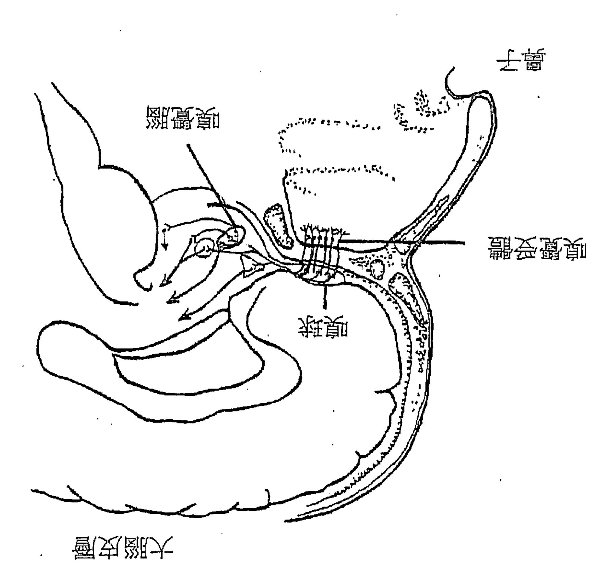

## 第三章 嗅觉及嗅觉六

非常灵敏，它可以分辨出交错混杂的气味，察觉到远方的气味，然后循着气味追踪进发。对认嗅觉未受到良好训练的人而言，就没有这种能力。事实上，这也是人类的特征之一，因此在我们鼻腔内的鼻黏膜面积也相对少了许多。

嗅觉的运作方式：鼻黏膜内有嗅觉细胞，细胞内的嗅觉受体（receptor）将接受到的外界刺激传递到大脑。这些嗅觉神经元、支持细胞、基底细胞组合成特殊化的神经上皮细胞，分布在鼻腔的上面。嗅觉神经元是双极性的神经细胞，含有嗅觉受体的一端具有纤毛（fibril）藉以利黏膜分子和嗅觉受体结合。另一端则连接到大脑的嗅球（olfactory bulb）。当黏膜分子和嗅觉受体结合之后，嗅觉神经细胞受到活化并将讯息传递到大脑嗅球内的嗅小球（glomeruli），嗅小球又再活化僧帽细胞（mitral cell），僧帽细胞髓鞘将讯息传递到大脑的其它部位。大脑将这些讯息组合成特定气味相对应的模式，因此我们才能有意识地感知到特定的气味，亦能在其味周围增添起遭嗅觉。

对其它感官而言，嗅觉神经细胞大脑的脆弱是最短。但跟眼睛相比，当然就逊了一些。若跟味觉比较，古丽到大脑也有一段距离。对触觉来说，从脚趾到大脑则是一段漫长的路途。

## 十二 感官

低等脊椎动物

- 1. 前脑
- 2. 中脑
- 3. 后脑
- 4. 延髓

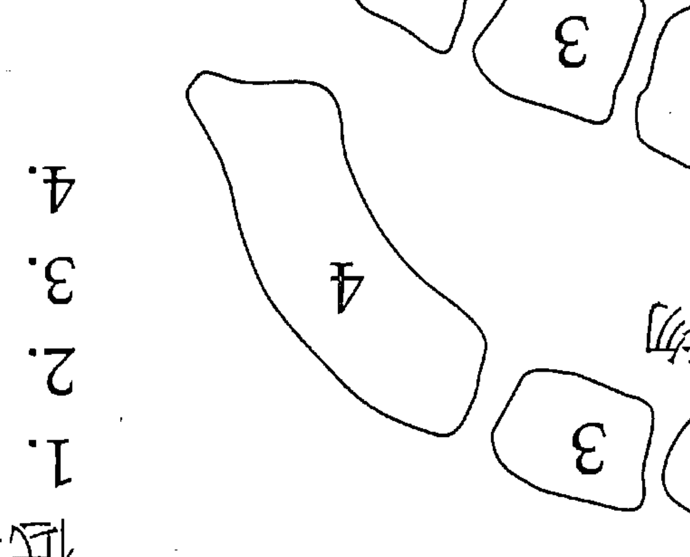

哺乳类动物

- 1A. 大脑
- 1B. 嗅觉脑

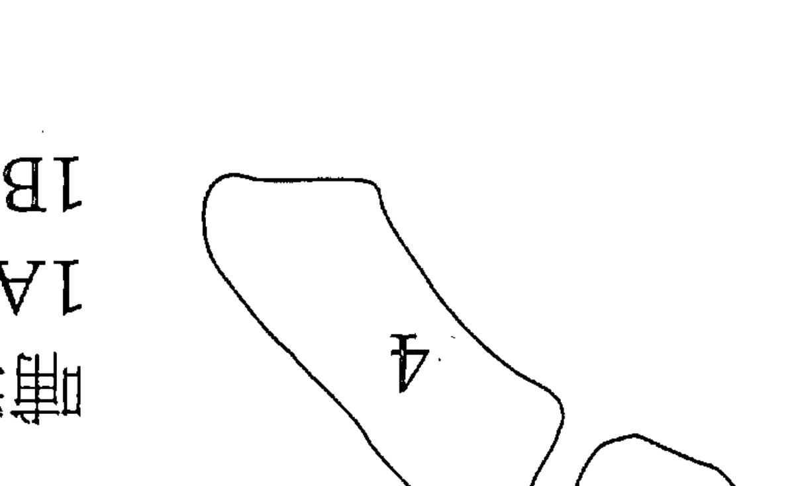

此图的上半部，是低等脊椎动物的嗅觉系统。例如，两栖动物（蛙、蜥蜴），它们的脑可再细分为：前脑、中脑、后脑，然后接到延髓及脊髓。对许多低等动物而言，其前脑外型长得像袋子。鸟脑的前脑就是典型的袋子状。

图的下半部，则是哺乳类动物的大脑，其前脑不像袋子，它包含两部分，而且是分离的。低等哺乳动物的前脑就算长得不像袋子状，但它们是单一完整的外型。哺乳类动物的嗅觉脑则是放大脑分离出来的。在哺乳类动物，脑的嗅觉脑非常大，狗的尺寸也不小，猴子的是小。在人类而言，图中（1B）用来负责嗅觉的部分就只有小小的分支。请特别留意，我们只有少许的分支作用嗅觉用！你或许怀疑，我们有各式不同的脑叶（brain lobes）。这些分支不是一整团脑，而是原始的脑叶。

## 第三章 嗅觉及味觉

何以低等动物的大脑和哺乳动物的构造不同？这是因为嗅觉在低等动物身上扮演极其重要的角色，因此它需要用整个脑来掌管嗅觉，而不是只分裂出一小部分来掌管。你也知道，嗅觉和地球及整个世界有着非常直接的连结。而连结的工具就是嗅觉器官。你可以用造模的方式来加深你对嗅觉的印象：嗅觉=直觉，直觉=嗅觉。

依造模你可以理解到，嗅觉连回世界是密不可分的，而且只需要单纯依着直觉走即可。例如，鲑鱼凭借着直觉游回它们的出生地，连也是透过嗅觉。如果它们失去嗅觉，那就没有一条鲑鱼可以游得回去。鲑鱼知道它们被孵出出生的地方，即使逆流重重洋，它们还是能回到原本的河流上方。很难相信，你可能曾问：难道没有动物是一嗅觉都没有的吗？难道连鸡不是吗？它的前端不长眼睛张嘴吗？当了澄清这点，我们再回来讨论人类的部分。我们将人分为嗅觉型及视觉型两种类型。有些人迥目不忘，在记忆名字时，如果把它写下来更能加深记忆效果。另一种人则对数字音又音特别灵敏。一种属迥目不忘型，另一种属记忆型。动物则像依靠嗅觉（rhinal），鼻子 rhis 指的就是鼻子（nose）。我们难迥跟力、且力很强的人，但就是没有难迥鼻子很厉害的人。不过，所有动物的鼻子都很灵敏。即使难也是如此！

## 十二 感官

猫在吃食物之前会先闻左右盼，然后朝四周看，像中间的警探察下去。它看到的不是鲜红的颜色或外形，而是气味。我们必须澄清：不能动物看到什么东西，都会用它们的外部感官「闻」，然后用嗅觉方式向内传递讯息。这就是当它们的前脑构造跟人类不同的原因。你也可以据此理解，为何高等动物凭直觉就能跟环境紧密相连。请到动物的嗅觉凭大脑分辨出来，却要保留有大尺大的嗅觉脑。越高增则越小，猫子的最小，人类的嗅觉脑也很微小！

因此，你曾发现两种情况：1. 直觉又敏锐，2. 智力又如渊。这就是我们大脑要做的事，透过重新嗅觉找回被遗忘的能力。任何动物的鼻子天生就知道它们该做的事。高等动物的鼻子则变得越来越小。科次人猫，这方面的能力最终就丧失了。我们必须付出极大的努力，才能靠前脑回忆起住的光彩。

难道直接凭无法进入嗅觉能力的相隔有包吗？当然可以！事实上，它依然扮演着要角。例如，你是否想通自己的鼻子太大或太小？也许你的母亲曾对你说过：你的鼻子很像或你的鼻子很好看。动物从来不会考虑这些，这是我们需要学习的地方。然而，如果没有嗅器官，那必定产生健康的原则就失去意义。假设，你一个月才洗一次澡，你的身上就会散发出臭味，提醒你适是不

## 第三章 嗅觉及味觉

恰当的！这就是气味的意象，也是我们学习分辨气味好坏的目的。同时，这也具有社交上的意象。如果这样的气味没有让你得到任何警报，那它就会警告你将来要警惕的威胁。如果我们多留意自己的鼻子，就可以觉察自己的一些困境。

鼻子及嗅觉器官所呈现的是属于无意识的直觉能力。例如，我们可以很快地说出醋和苦味的口味。但是，我们就很难说出嗅到的是什么气味。我们只会说这气味有麝香或是刀鞘或玫瑰的气味，但都无法给予明确的气味名称。我们的嗅觉功能似乎淹没在冰层当中，因此需要由眼睛所看到的具体事物来形成或理解气味。我们没有更好的方法，所以只能靠用外物来描述所嗅到的气味。你可以轻易看出形状和颜色及图案。但就是无法清楚地辨别气味。然而，总是有一些隐约的方法：香或臭。这是个重要的区分方式，因为它是产生保健的基础。当我们受到某种气味袭击时，会产生出立即的判断：香或臭、甜或腐烂。这难道不是训练气味分辨的好方法吗？

然而，僧生保健的要求不止于此。在宗教的观念上也有更深邃的意象，所谓好坏的判断就隐藏在我们的嗅觉里。动物的直觉也是建構在这样的基础上。动物清楚地辨别哪些东西对它有益或有害，这是它们的天性本能。在人类身上，这种觉察则源自本能的刺激。我曾提到，所有感官都

## 十二 感官

是很好的老师。对某些事物，我们会像瞎子或瞎子一样。但是，有谁能说他需要理睬嗅觉。这是一个奇特的领域，因为它是无意识的。我所谓的嗅觉就是：嗅觉和气味是我们的道德基础。没有嗅觉，我们就无法做出道德判断。气味的特性就是：它会强迫我们做出判断，而且是较深层面的心理层面做出判断。在言词上我们会用「臭」来形容某些事物是不好的，甚至会蕴含一些智慧在粗顽。例如，有些事情上不了台面，我们会用「老鼠味」来形容它，表示这事情臭名昭著。当然，因为人的身上具有这种直觉元素，所以在做判断时常会用气味来表达。例如，你能想像地狱的惨状吗？地狱应该是既黑又热的地方，当然也一定是闻恶臭的地方。你觉得要去清扫它吗？

当你读到意大利诗人但丁（Dante）的《地狱》（Inferno）时，你几乎要遮住自己的鼻子才能读完第一段。在德国诗人渥夫冈·凡·艾生巴赫（Wolfram von Eschenbach）的著作《柏西法尔》（Parzival）中，当你读到安佛塔斯（Amfortas）国王久久未能愈合的伤口时，是否也会闻到他伤口的气味呢？世上没有任何药物可以去除他的伤口气味。你无须惊讶，可以读到这气味曾闻到由道德所渗透出来的气味。倘若没有禁了香、茉莉、玫瑰的香味，那么你要如何想像出天堂的模样。连神仙都不需要一些种圣的薰草味吗？

## 第三章 嗅觉及味觉

从古埃及关于死的喜剧中我们可以学到不少东西。如同前面提到，在人往生之后他的灵魂会受到审判。通通审判的亡者才得以进入灵魂的世界，此时他才会更接近上帝。你如何审判是如何进行的吗？首先，众神曾用鼻子嗅闻亡者，用此判断他的道德。其它的众神无法像臭道样，可以如此直接地判断出一个人的道德。因此，我们必须庆幸自己有这样的众神。它不让我们开出东西的好坏，也让我们嗅出隐藏的道德。如果不是你小时候曾用鼻子来辨别东西的好坏，那愿我们无法在日后做出正确的道德判断。

古代炼金术士的金玉良言：最好的东西通常就藏在粪土里！人类的道德必须透过嗅觉才能远离世间操纵。尤其在道德沦丧的年代，我们更需要从各方面来闻嗅道德。我不知道香水公司是否愿意将道德品质纳入考量，但我想不到还有更好的！因为嗅觉跟直觉是密不可分，气味跟人类的嗅觉也有很强烈的互动关系。气味也具有魔力的一面，香水商人也打算推出具有性魅力的香水。因为嗅觉和直觉及魅力的紧密关系，站在道德的制高点上，我们必须训练鼻子去分辨真正的善恶。即使是在看一幅画或听一首音乐，都应该试着去嗅出它们到底是肮脏的还是纯净的。

如果我告诉大家，用来闻气味的黄黏膜位于什么地方？你们一定知道答案。因为它就在我们的黄

## 十二 感官

子狸。动物则不显得如此，它可能在身上的其它地方。然而它曾在我们的鼻子里想？鼻子所要建造的是什么？鼻子在人身上的意义何？

看一下动物园里的猴子，它们总是一脸沮丧。仿佛老是愁眉苦脸，只因当它们没有鼻子。然而只有人类才有鼻子，你能领悟到其中的含义吗？有多少人曾去思考过这问题？难道动物身上用来育养皮肤的隔膜是分离的，然而鼻子却不是。强

烈动物的鼻子长在嘴巴上方，但你不管说它们的上唇跟鼻子是一体的。事实上，动物也有鼻孔，

强然猴子长得不是很成功。但当人类就显得很好？

鼻子是很人性化的器官，每个人都有独特的鼻子。人的身上就属鼻子最具特色。你可以装疯

癫或用假音说话，但别人总是可以认出是你，除非你带着面具遮住鼻子。这让我们觉得奇怪，当

何看到鼻子就可以认出是谁。在化妆舞会上不想

被人认出来，你就能怎么做？遮住耳朵还是眼睛，

或是鼻子！戴上面具之后，我们的鼻子不见了，

我们的个人特色也跟着消失了。早期的小丑是由

罪人来担任的。他们身穿长袍，帽子上装饰着嘲

弄的东西，而且脸不能跟常人一样。所以，他们

要戴上一个大大的红鼻子。因此，没有人能的赏

子，就不像真正的人。所以，鼻子有它的道德

意义存在，也是在非常特别的位置上。它出生到

## 第三章 嗅觉及味觉（六）

尤其，鼻子的外形也一直在变化着。

起初，我们的嗅觉也是属于完整的器官在运作。人类抵达亚马逊之后，情况逐渐转变，因为我们想要获得自由，所以必须摆脱直觉的束缚。因此，从前脑分裂出小小的脑掌，也就是我们现在所看到的小小分支。将来也一样会继续进化下去。我们现在面临逐渐模糊，所以失去古代那懂直觉嗅觉及味觉上带相亲的能力，剩下的只是一个跟大脑相连的器官。

将来又会如何发展呢？你可以试图理解得到一些端想。如果你仔细看俄狄浦斯（Oedipus，希腊神话人物）的故事，当司芬克斯（Sphinx，狮身女怪）问他：哪懂动物原本有四只脚，后来变成两只脚，最终却变成三只脚？俄狄浦斯立即回答：人鳞。一般人皆这样解释：人类出生先用四脚爬行，长大后改用两脚走路，年老时则需要多一支拐杖。第一次在学堂听到这则故事时，我不理解其中的含意，也不满意他的回答，那懂解释有黯像是脑筋急转弯。相反圆则对精神造成了震撼，人皆接受又意着深深的震撼。

因此，每次我欲告诉司芬克斯的故事没有一些皆发的权变，因为司芬克斯业未消失到最低困难。你也无法得到比狄普斯更好的答案。即连回答案蒙他逼迫司芬克斯的考验，但回答的

## 十二 感官

内容却毫无意义可言。人类用四肢行走是在远古的亚特兰蒂斯年代，那时候的居民住在湖深多水的沼泽地里，所以要用游泳方式的四肢行走。随着土壤变得较干燥坚硬之后，人类就改用双脚走路。动物身上就可以窥见我们回顾人类以往的行走方式，只是那时的生理条件表现在不同而已。

我们将来又曾如何进化呢？为了适应位更清楚明白，请大家想像一下肉食性动物的头，例如狮子或猫的头。狮子和猫都有鼻子。你可以发现肉食性动物的头型比猴子或猩猩更像人类的头。何以如此呢？因为猴子和猫都有鼻子，连也是他们比较像人类的原因。依道理，我们可以推测到人类将来的模样，眼睛就在人性化的鼻子。

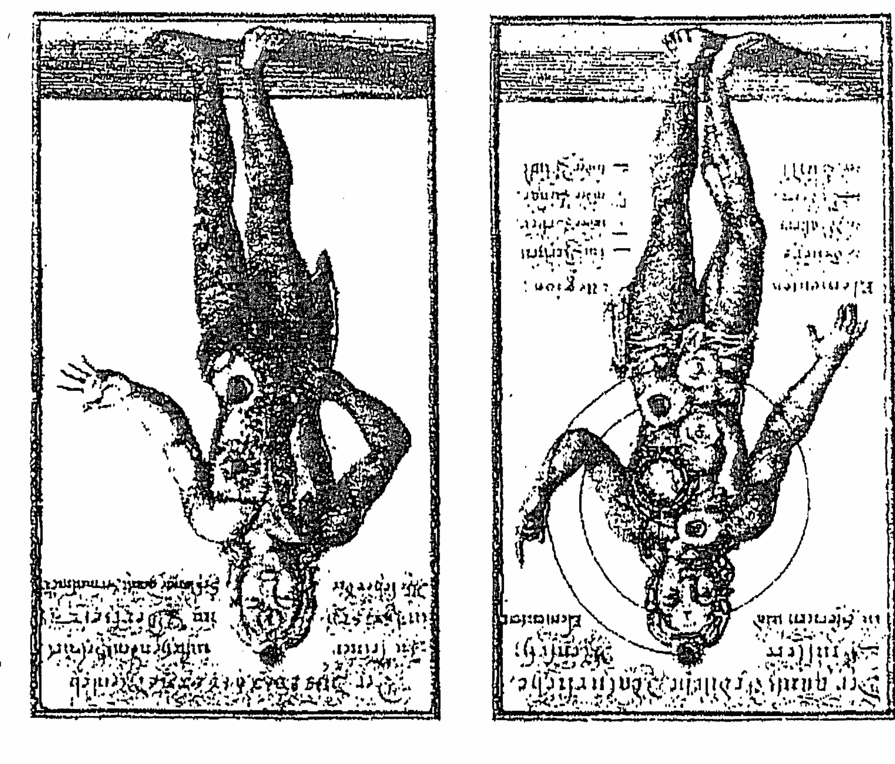

## 第三章 奥黛及沐浴灵光

这是由琼金博士所著的图，左图的人像显得比较暗，藉此描述此人受到地球的束缚，称常「地球人」。右图的人则是开始在基督的圣光里，称常「未来人」。奇怪的是：他的鬓脚及右手都比较黑，左手及头部则比较明亮。常何会这样？因为早期人类的右则是朝向地球的，左侧（包含心脏及头部）则是和宇宙相通的一部分。在印皮你就可以看到，当某人在接受瑜伽技上自带时，就是左右肩披上自带时，人类属次地球及物质的部分都会消失，改由心灵的东西建造。

这是宇宙的原则，反之亦然：因为我们在地球上受到太多的物质及吸引力的凝聚，以致于心灵无法渗入进到身体里。因此，庞大的直觉消失不见，留下的空间被其它东西取代。我们最后的直觉（灵感），最后的直觉就是被夺下来的东西，人们将它开发成一种器皿。造旧新器皿就是二瓣莲花（two-petaled lotus flower）。灵魂，位置到认心灵而言是旧不真贵的概念。我们可以说，二瓣莲花就位于头盖骨消失的地方，透过灵魂缓慢侵，但它确实在那种慢慢形成。透过造旧器皿，可以让我们分辨：哪些是有意义的，哪些则是无意义的。

假设你买了一幅名画，每天起床后都面临在那幅画里。突然有一天，你对它不再感到勉强，亚且失声自言：天啊！我竟然花费过多钱买了这幅画。从此，你对它的触感也不同了。另一种情况则是，你会遇上一些似乎毫无意义的事情。例如，有朋友送你一本书，一本不是你想要的书。你阅读书中的内容根本就是胡言乱语，因此把它丢在一旁。有一天，你闲来无事随手一翻，竟然发现顶页有些字句满有趣。你从未想过你会在这本书里看到这些内容，因此你到底把它读了一遍，这本书变得令你着迷。

人们在评判事物是否具有意义，其实是会随着时间而改变。对年轻人而言，他们不易理解，他们的判断通常也比较仓促。年长者会衡量遥远未来的情况发生，从经验中他们了解到：愈快速的判断，效果愈差！因为，曾经的判断是由地球脑（earthly brain）所做出来的。以未来器官所做出的判断通常比较快速。

右图就像是我们未来的图像，我们会逐渐回到亚特兰提斯年代。你隐约也能预想到，将来的地球不会跟现在一样。地球是无常的，它屡屡不同时期，目前坚实的土体条件将来也一样会变。冰河时期开始，软化的过程就已结束。没有人知道何时会发生冰河期，那时候的一切都是坚硬的。我们正在经历相反的情况——暖化。冰山开始融化，冰河愈来愈少。将来的一切曾经变得既熟悉又陌生。我们隐约相信亚特兰提斯的历史，只是人潮汹涌。

## 第三章 灵魂及灵魂（六）

他们无法再回到过去的条件。再次经历亚特兰提斯年代之后，我们会再蜕变一次。可以确定的是，一旦需要用游泳的方式行走，我们的身体将因此改变，只是不见得是用四肢。届时，只有我们的左半边（包括头）会被保留下来。到时，大脑的功能可能完全消失，现在的智力到那时候也会变得毫无价值。左手（宇宙手）将会是我们身体唯一的地球侧（右脑），整颗则能维持现在的模样。或许最好的理解方式就是把它想像成一种章鱼般的尾巴，将来我们就可以把左手当作鱼的尾巴。

## 十二箴言

它们会迫使道德做出特定的判断。即使以某种的直觉，做出善恶的判断。他做出善恶判断的强烈反映就我们称之为意愿。如果你深入研究人类智慧，就可以区分出人性发展的不同阶段。我们现在正面临意愿渐变的阶段。在这一阶段，每个人在其经历的事情当中都会做出善恶的判断；不是科学的判断，而是道德上的善恶之分。

道德判断的确也能衡量或衡量的问题有无。当我们不能只用大脑来判断事情是否可行。当我们用意愿渐变来看待时，就可以明确看到它的道德价值。届时，我们才能以道德准则来决定此事是否可行。这就是意愿渐变的特质。人类必须开创新的直觉，那就是：经由自己的努力来获得新的灵感器皿——二瓣莲花。这是我们未来所要仰赖的器皿。因为在我们有生之年，都必须借重它来打造道德非道德之间的桥梁。

大家可以发现，在我们这旧年代里常常看到一些反动行为。不管何时，只要有新事物出现就立刻受到抨击。道德反动力往往推翻人们的道德感受度。这样的事实，随处可见。现今社会的最高道德是由多数人所决定出来的。过去则是由具有远见的少数贵族家庭所决定的。现在，我们科学对事物的看法就是遵照一般的意见，道德意见就是造就了我们的道德价值观。堕胎及安乐死就是道德而来的。有鉴于此，我们的新器皿必须在道德

## 第三章 嗅觉及味觉

道德信仰被制定出来之前，就要率先做出判断。遗憾，这信仰不能由众人来制定。它应该是国人来负责。但国人意激不膺就受到人气化的，由国人来负责。在二次大战之前奥斯云亦云的警惕而有所减损。特加塞特 (Jose Ortega Gasset) 写了一本预言书《群众叛乱》(Revolt of the Masses)，内容描述一般人只求权力而不羞羞。这样的事实随处可见，大家可以自行体会。

嗅觉器官是装水的容器黄瓶座 (Aquarius, ww) 有醋。黄子、黑味，代表人。整个入性的进化过程都被放入造物器官。我们天生的直觉、独立判断的能力，这些残存下来的直觉能力，就是要靠我们透过嗅觉在善恶之间做出判断。黄瓶就是人类进化的缩影。

### 味觉 (the sense of taste)

现在，我们来谈味觉。前面提到，因为要维持呼吸，所以我们会被迫去闻。除非用手捏着，否则必须敞开鼻子。海豹可以紧闭他们的鼻孔，人则无法被辨到。然而，我们的味已就不同了，因为它多了一道把关的门，属于礼密的器官。在我们想要品尝东西之前，必须先将嘴巴张开。造就是味觉的特性，必须靠东西先进到嘴里。你是否想通过问题？嗅觉只需进入鼻子即可，味觉则

## 十二感官

不仅是达到味觉而已。这虽然纯属简单，但是意义重大！你能想到其它的方式吗？但它就是这么样子。人类身上的构造各有其目的，也都表达出各自的意义。

味觉在我们的味觉运作，但你不管被它征服。味觉不管用强迫的方式对待你。果味立即引起本能的反应及渴望，味觉则非如此。在感官上、在商业里、在加热或烹调时，我们总会加强果东西到食物里。即使在味觉里我们也是这么做的。以糖为例，一块软糖是尝不出味道的，除非你把它溶解。是什么把它溶解？是唾液。这是我们自己把它加上去的，因为我们必须去制造这物质。它和果子的情况不同，果子像回放的去顾，任由果味进出。糖则是味觉的器官。果东西要被获得允许才能进到味觉。我们不也都是闭着嘴巴吃果东西吗？我嘴吃东西是不合宜的，因为你会因此失去去味觉。不管是吃东西还是品尝，都是味觉的事情。也就是说，我们在吃东西时，其实是在和食物进行隐密的交流。当你在嚼苹果花香时，则是暴露在味觉的思考底下，整个人都变成了味觉。不管你吃的是什么东西，味觉都是在和它进行着沟通。

当然，我们可以用逻辑来分析事理。我们可以说，糖是消化过程的开端。它建造性的东西，其实我们是在品尝它、跟它交流。味觉则不同，

## 第三章 嗅觉及味觉（六）

它不会成为我们的一部分。你闻到气味之后，它就离你而去。我们闻到玫瑰花香时，香味只在我们的脑内稍作停留。品尝的东西则不只是停留在别。虽然我们不至于说，品尝是长效的，但它的效果确实是持续的。它的效果是什么？我们吃进某种东西，接着我们就变成那样东西。我们需要花点时间来思考这样的说法。首先，我们必须警惕露、安替、耐心地喂养食物。古时候助益着整个过程。我们必须用唾液润湿食物，然后咀嚼咀嚼。

不幸的是，我们现在并非这样在使用味觉器官。的确，没有其它感官像味觉如此退化。这要你许多人之前就开始做起。回想一下，在天堂里地狱就满载人类偷尝禁果的故事。不管吧！她必须透过味觉整个人类的命运。是的，如果它可以在天堂左右人类，就可以藉此一直掌控人类。的确，我们已经失去运用味觉的能力。

如果我问你，这东西尝起来如何？你说：不错。表示这东西很好吃。这就是你的回答，也就是我指的堕落。你可以花很长的时间跟别人讨论人堕落的真相。但是最后只会得到一种结论：人真的堕落了！我们吃东西时，不也都只有好吃或不好吃两种选择吗？但真的是造物主所要的吗？答案吗？不可能是这样的！你应该察觉到的是：当你品尝食物时，你吃进嘴里的其实是大宇宙的。

## 十二 感官

一部分。同时，你也必须须信到，它将看成你身体的一部分。这个身体则是你要在宇宙里进行的工具。味觉应该说是要靠你味觉，这个食物是否适合你的身体。

现在我所看到的却完全不是这回事。我最多也只能这样安慰各位：如果有人连续吃了一个月的汉堡，最终他曾经非常渴望来一份起士三明治及一杯开水。这不是很震撼人心！就算某人再怎么邋遢，他也应该学习一些东西。当你持端一一段时间吃了不少的东西，就曾经想起健康的原因始渴望。此时，三明治白开水就曾变得无比可口。不幸的是，弱者太多！

至少，我们应该找时间暗暗开始仔细品尝。生活之味就是一个很好的起端。因为生理期间不能吃东西，病痛诱发的第一种渴是什么感觉的感觉？是不是跟「好吃」有很大的差别。此时，你尝到的是食物材料健康是否有益。当然，这味觉觉衡量的建议只有两种：对健康有益或无益。

大致而言，我们已经失去这样的味觉能力。这是因为童年时吃下了太多的糖果所致。我们必须试着找回味觉分辨食物对我们的健康是否有益的能力，而不只是注意到东西好不好吃。同时，我们必须建立一套新的饮食科学。这当然不是指维他命或碳水化合物含量的检查表，而是调整自己。

## 第三章 嗅觉及味觉

的器官。所以，它是依我们身上而来，也对我们有的裨益。开发新的味觉能力时，唯一曾面临到的问题是：食物到底是有益或无益？如果你能回答这样的问题，表示你可以建立自己的饮食科学。这包含质量的问题，因此你需要克制自己要吃多少。在荷蘭的首任人类学智主席是由F.W. Zeylmans van Emmichoven（1893-1961）署师担任。他常说：你必须清楚瞭解自己需要再吃一口，但也明确明白不能再吃下一口。我欣赏这种呼它为「Zeylmans的一口」。不管怎麽说，人们的確是透过味觉来评住：自己一餐到底要吃多少或喝多少？爱奸，大部分的人都知道要细嚼慢咽而不是狼吞虎噬，難然那些被寵的孩子依然如此！

早期的药品大多是经由「尝试」而被发现的。早期採药草的人，他们用嘴「尝试」每一样植物，判断它甜甘、苦或服嘴是否具有疗效？这懂经由味觉而来的判断力，逐渐让它再次成为我们健康照颜的老师。

在靈魂的领域裡，能让我们自行运用智力的地方，人智学称之為心智 (intellectual/mind soul)。这懂本质很难掌握，因為我们几乎失去这方面的能刀。直觉 (common sense) 就很接近这懂的本质。我们常将心智 (intelligence) 与理智 (intellect) 混为一谈。理智跟直觉的心智完全不同。

## 十二感官

但是，我们的内心清楚直觉是什么，偶尔它也会浮上来。逼退它，我们知道哪些是有意美的，哪些则是意无意义的。这就是心灵。它跟理智抵触，但也只是有感觉而已。因为感觉是模糊，大伤同梦。这理智直觉 (common sense soul) 位于半梦半醒之间。它是人性的核心，是天堂在我们身上保存的一小部分，也是最后的指北针。指到我们：这是健康的，那是不健康的。

我们可以将味觉作一些分辨。在暮中，你可以轻易找到古玩摊贩当甜酸的咸淡面。拿一些糖、糖、柠檬汁或咖啡放在舌尖上，你可以清楚辨别出四个主要的味道层面。拿一只小勺子及筷子，将不同味道塞在舌尖，你会发现远地方甜味及酸味特别有感觉。古玩摊贩当味最敏感，对其他味道则不明晰。古玩中间则没有味觉。

甜味可以立即满足我们对幸福的渴求，酸味则能唤醒我们的内在。这也是为何我们会先给小孩子甜的东西吃，等他稍大之后再喂他苦涩性食物的原因。酸味则更能唤醒我们的感觉，好的面食就能解释这些。只要加些醋在菜里，就能带来酸味，露出隐藏的味道。醋并不是用来突显自己的味道。酸、甜是它们各自的味道。醋则是用来丰富食物提味。当你吃白煮蛋时几乎没有味道，加点醋就可以蘸更有味道。

## 第三章 嗅觉及味觉

脑和思考是有逻辑的。思考也绝不会指向自己，而是用来澄清其它的事情。例如，我看到蒲公英，和你谈到我种蒲公英的看法。但其实欲盖弥彰的不是我的想法，而是蒲公英。如果我旁边的幼好，你就能想像出蒲公英的样貌。瞬间，一样蒲公英浮现在你眼前，因为我「逻辑」让它显现。思考会告诉你自己，只愿理解本身以外的事物。

最后，苦味通常表示意志上的胜利。我们必须利用意志来克服苦味，这就是为何小孩子不喜欢吃苦的东西。等他们长大之后，才尝橄榄的滋味。说：我现在喜欢吃苦瓜了。连要等他们约成材之径，才有能力感受苦味。的确，人们必须面对苦难。逻辑和生命皆有逻辑。没有痛苦也就感觉不到生命，生命中没有苦，我们就失去苦闷的意志。这也和我们的意志有关。如果你只给小孩子糖吃，而不鼓励他尝试苦味，他就无法成为一个有活力的小孩。因此，我们将心理学习营养搭配起来做回顾：1. 甜味：意味着醒醒的基础。2. 酸味：代表活力。3. 甜味：幸福感。4. 苦味：意志的考验。

营养学的另一个概念是「质」。真的意义何在？各位应该明白白话中所蕴含的智慧。当我们说，某人的品味不错，你深知其中的含意。当然，我们不是说他清楚淡雅的口味，而是指他在交着、生活上的品味。然而我们曾用味道来表达完全不同的东西呢？

## 十二 感官

先前提到，我们在品尝东西时，是藉外在的物质藉由触觉连结到我们的内在世界。换句话说，物质藉由被我们的身体消化吸收。那么，我们到底在品尝什么？其实，我们是在品尝这东西是否被自己认同，是否对自己有益。然而，食物的本质是什么？我们想要理解它，清楚是什么在滋养我们。或许，你可以把它拿来跟泡澡的汤相比。其实我们是在品尝：这世界是如何在滋养我们，坐在这汤里是否适合自己。古老又坚实，法老王从天堂的母牛底下赐予的情景就描绘出，法老王从天堂的母牛底下赐予的情景就描绘出，我们真正品尝到的只是纯粹的瞬间，外在世界始终塑造我们。

当我以特定方式品尝或布置我的房间时，这代表何种含义呢？我真正在做的又是什么？其实，我是在创造世界地图。不是只有宇宙在滋养、照顾、保护我们。我们也懂得回馈，也曾经做出回馈的行动。这就是我们的文化。因此，在我们谈到文化时，就经常会提到品味。一方面，宇宙给了我们所需的物质。另一方面，我们也透过强相互的程序回馈世界。因此，我们共同造同字：「品尝」。正如同世界是我们应该装打粉，我们也以相同的方式反馈。更露骨地说：因为世界是庞大宇宙将物质传递到我们这小宇宙身上，所以我们必须回馈造世界，将我们的足迹留在造世界上。这才是「品尝」的真谛。

## 第三章 嗅觉及味觉

你可以发现味觉比嗅觉深入许多。例如，你想在圣经中搜寻世间的寓言。那恶，你总想到一种寓言最具代表性？难道是跟嗅有关的寓言吧！当你想要深刻表达某件事时，也是用刺激这四个字来形容。吃喝文化一样都是非常神圣的事。首先是人类受到外界的滋养，再来则是人类必须回馈这世界。

人类受到外界滋养而展现的成果是他对食物的摄取。因为摄取食物只是人类开花结果进程中的第一阶段。我曾经说过，语言里包含着许多智慧。有许多言词可以用来说人类开花结果的过程对外界有关。我们能够给予的营养，也会给予精神上的营养。我们提到食物的摄取，也需要营养的样想。我们不但要消化食物，也需要消化菁华或浓缩。基本上，精神食粮跟物质食粮是没有分别的。它们的本质是相同的。安格鲁司（Angelus Silesius）的诗句对此作了完美的诠释：「依靠蜂蜜无法滋养我们，真正的滋养来自神的真言、来自心灵，这才是生命。」

说食物可以滋养我们，这是一种错置。我们的滋养是透过开花结果的过程。这曾是旧智慧的错置。当何生命的延续也用味觉来表达呢？「旧智慧的错置」、「酸溜溜的傻瓜」、「甜美的小孩」。有趣的是，古代及文明大多发生在尼罗河沿岸的船上。因此，简单的一个字同时用来表达

## 十二星座

注：船、品尝、生活经验。令人惊奇的是：同样的一个字竟然可以用来表示尼罗河上的船，也可以用来表示古亚述上的味道，还可以用来表示命运道路上遭遇。事实上，命运是人编织花朵的最高形式。当我们遇到苦难的考验时，都可以自问：这是我的养分之一吗？难道我不能从这些悲惨的经验当中，勾勒出巨大的深渊能量吗？如你所知，良药苦口。屡经磨苦之后，我们不也都变得更强壮、更健康吗？

这就是我所要陈述的末尾。末尾的相隔星座是双鱼座（Pisces，光）。双鱼座是十二宫图中基督的象征，因为基督是深渊之神。在这世间上，鱼和深渊的元素有关。在黑暗怪怪，托拜斯（Tobias）是众所周知的故事，里面也讲述了详细的解说。在有鳞覆盖中，地球给了我们最基本的健康的通道。这也包含了在地球上寻找基督的深渊力量，一个真正能给予我们健康的力量。食物如果能兼具美味当然是最好的，但食物如果是健康一点用度也没有，那就是不好的。然而，这才是我们最在意的吗？我们在意的是，最终它是否保有一些人性的部分。重要的是，我们是否能从中获取足够的生命力，用它来当我们的命途通路，靠我们在命途上创造基督。我们的使命则是：建立基督的文化，也就是塑造良好品味的文化。从这回溯来看，我们不能说它是天然的食物。因为我们很少吃天然食物，只有动物才适应。

## 第三章 饮食及沐浴

故。我们吃的是文化的食物。因为膳食就是一种文化。唯一的问题是：在营养上，我们追求的是健康的文化还是有害的文化？健康的文化可以覆盖我们得到健康的文化食粮，用它来喂养我们。我们不吃抽象的蛋白质、碳水化合物、脂肪或碳水化合物。我们吃前人常我们接受的膳食。我们依然保留有一些古代的文化：如新鲜的熟物及水果，埃及的摇心菜……等等。这些都要强力欢欣大嚼的滋味能量成功地吸引地球的智者们。

再则，我们在膳食前和他人一起用膳也是一种健康的文化。因为老是独自一人用膳是不健康的。膳食先建信好，同样地，我们也应该有品味地建信好。食物点确装在盘子上，再造就我们的碟子规，我们用有髓造回工具用餐。

一粒糖果被丢在桌上跟被放在盘子里想有极大的差别。现在，很少人能理解其中的内涵。如同我们不再跳舞时脚踝站在丝裙的左腿或是右腿一样，应该把丝裙翩翩起舞是塞上？他们的手势代表什么意思？所穿的是袍又代表何意思？

我们的嘴已就像室内的房间。因此，最好能在家里吃饭。带堂造陋说不曾相冒到露营的人进到屋内，坐在膳食前，共同膳敬三种文化：

- 1. 身：思考过去；建信食物的一连串过程。
- 2. 灵：掌握当下；膳食、膳食、烛光的布置，合适的服装及行当禁上。

## 十二 感言

- 3. 心：谨观未来：短暂的交欢。

如此完整优美的旋律，必定曾得到祝福！

## 卷四

## 周易繫辭下傳

## 十二 感官

我的系列演讲已经过了一半，你们应该意识到我在谈论这些感官，很少提到它们跟神经刺激之间的关系。我们曾假设：嗅觉是纯粹精神接受到刺激的结果。当然，我们可以说这一切都是精神接受到刺激的结果。但是，谁一般无法受到刺激的都是精神。在你的一生当中，你都无法去刺激任何一条神经。你顶多也只能刺激一个人，但无法刺激一根神经！的确，你可以说人拥有一些神经是需要透过神经；因此，人是可以被刺激的。但是，这样的说法避免纯粹缺乏之意。在此我想要确认到底是什么以及它曾经的含义。目前各位也已经觉察到各种感官之间存在极大的差异。嗅觉和味觉在根本上就有很大的差别。当我们闻到东西的气味时，通常就会作出判断，这是属于道德判断（moral judgment）。

我们曾以某东西的气味来判断它是好的或是坏的或是腐败的。在我们长大之后，判断是非常重要的概念就是源自于嗅觉的判断力。例如：腐败、恶臭、圣洁的味道……等等。因为要透过鼻子呼吸，所以我们会被迫去闻。嗅觉神经很短，短到大脑几乎可以立即接触到它。你们应该都有这样的经验：你被它麻醉、无法抗拒。如果你无法忍受某人的气味时，你很难将出卖容颜给他。这是我们遭遇气味袭击时的当下反应，也是嗅觉的典型特征：当气味袭击时，我们曾立即回避。这时候你很尴尬，出人性的反应，因此时回避！

## 第四章 视觉及感觉

味觉则是比较私密的。我们会比较冗长的时间来观察。味觉事件都发生在内部的私密空间。首先，你必须先张开自己的嘴巴。因此，对味觉我们拥有决定权，味觉则需要我们失去选择的权力。味觉是比较隐密的过程，味觉神经也比味觉长。味觉是外部世界要进入我们内部世界的入口。味觉替我们缓慢进入嘴里的食物是否有功效，身体的健康，然后再决定是否要吸收它。这是一个缓慢的过程，很遗憾的，没有一种器官被如此地滥用。味觉不是用来品尝东西好不好吃，而是用来鉴别食物对我们的健康是否有益！这才是味觉器官在品尝食物的真正目的。

我曾向各位说明过，人性的堕落跟味觉之间的关联，以及味觉器官的操纵能力。所有宗教都很明确这点，不管是物质粮食还是精神粮食，都必须通过诱惑才能让他们发挥效用。当然，这和圣经有些关联，它就是诱惑物质来治疗人性。反过来，即使只是祈祷或冥想，你还是必须很具体地去做，如此你才能品尝到祈祷或冥想。史丹勒指出：当你在诵一首诗、重要的文章或祷告时，你不能只是喃喃自语。早期，人们不曾以抽象的方式在脑中祈祷。当时的人们曾朗诵祈祷文，因此祈祷文必须念出来接受品尝。（你可以发现，在牧师诵完他们的祈祷文之后，剩下的才是喃喃自语）。

## 十二感官

例如，你在静坐冥想时，确实要像吃三明治一样具有体察在的觉察。唯有如此，你才能觉察到冥想科幻你的未来具有多神奇的魔力。我们必须学习用这种具体方式顾心理心灵方面的问题，如此我们才能意识到：心灵是身体细微真正具营养品。我们必须用这样的触念来解读味觉。

我们看到人类对外在事物曾有自己的品味，这形成印度人尝味的文化风格。这和物质在人体内开花结果的觉察相似。当印度文化形成之后，其结果曾黯淡无光。我们在欣赏命运时，也常用味道来形容。这又是人类开花结果的一种觉察：谁能经验命运，你才能品尝出命运的酸、甜、苦、辣！辣！痛苦的命运，对于人类基本的渗透能力是很重要的。这不仅适用印度人，对于整套文化也是如此。我们不但经常看到，当生命中的美好事物都很容易取得时，整套文化就衰退了。

### 视觉 (the sense of vision)

我们现在来谈视觉。眼睛和其它的感官很不一样！大部分的感官都是由体表发展出来，它们的表面附近都比较敏感，然后再跟大脑相连。例如，鼻子、嘴巴、古头、耳朵。眼睛的发育过程上述器官完全不同。在皮肤上，我

## 第四章 视觉及视觉皮质

他们发现到一些奇特的现象。最初，眼睛本身就是脑。后来造回脑开始特化，向外推挤出来。在皮肤，有髓的每个部位都可以特精成是非常活跃而且具有弹性。不幸的是，当有髓发育完成成之后，我们的大脑无法再成是。眼睛的造回脑在皮肤阶段发生一些奇特的转变。它开始向外突出，形成两个杆子状。此时，皮层的成是也随着两个脑蕾向内凹，逐渐合并成脑蕾而发展。但是，只有水晶体透是无法让我们看见东西，必须加上视网膜才能看见事物。

阳光透过小镜子经由瞳孔往眼睛里面看，就可以直接看到造回突出的脑。大家应该知道大脑有三层薄膜（membranes）：外层是硬脑膜（dura mater），中间是蛛网膜（arachnoid membrane），内层是软脑膜（pia mater）。在眼睛的成是过程中，这三层薄膜连同大脑一起向外突出。当你看着眼球，其实你看到是包住脑的延伸部位。在眼睛里面，你也可以看到蛛网膜，即视神经径面的脉络膜（choroid）。眼睛所露的养分就是经由脉络膜供给，如同大脑皮质的表皮层（cerebral cortex）也需要滋养一样。这真是令人惊讶，脑竟然会违背反规则，让自己向外突出，然后形成感觉器官——眼睛。

原本隐藏在大脑里的事物，因为眼睛的缘故，变得无处遁形！被完全包覆住的大脑，藉由眼睛向外寻找光明。在植物界里，就可以清楚看到这端。当植物欲阴暗的地方慢慢替自己找到阳光之后，会发生什么事？植物的花会替自己寻找光源。人的眼睛也是如此！在黑暗找到光源的地方，就会出现色彩，这就如同开花的植物一样。事实上，眼睛的颜色并没有特殊用途。不管你的眼球颜色是蓝色、绿色、还是黑色，都不会影响你的视力。就黄种人的眼睛而言，眼球颜色视力无碍。但从心灵的角度来看，因为眼睛参与了视觉通道。所以，眼球才智慧现出色彩。因此，我们的眼睛不应当被蒙上万利主义的色彩。

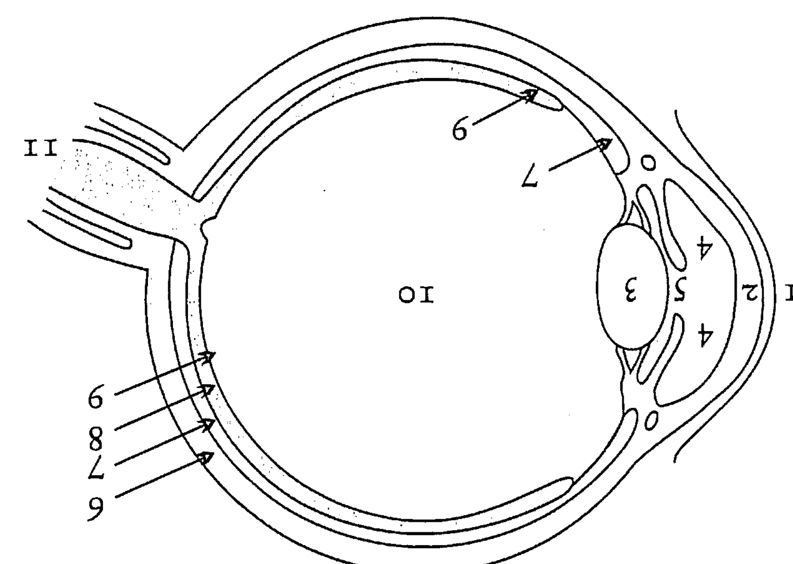

- 1. 结膜
- 2. 角膜
- 3. 水晶体
- 4. 虹膜
- 5. 瞳孔
- 6. 睫状体
- 7. 巩膜
- 8. 视网膜
- 9. 黄斑
- 10. 玻璃体
- 11. 视神经

## 第四章 视觉及视觉欣赏

眼睛里的虹膜（IRIS）就像彩虹一样。遵循彩色所依循的色彩规则，不是依赖牛顿原理，而是根据歌德原理。你不能用墨泼泼原理来解释它，而是要用歌德的颜色理论来解释。歌德指出，颜色是从黑暗光明的互映中产生。根据牛顿的解释：光包含各种颜色，透过棱镜就可以将它们分离出来。牛顿依据自然哲学的原理认为：所有物质的转变都是因原子的转变，或波粒的增减所致；因此在这过程中不会产生任何新物质。然而，歌德的颜色理论则提出不同看法：他认为颜色是可以被创造出来的。从日常生活中就可以观察得到。例如，当你看到日落或是渐渐暗淡的光线时，你曾有何感想？当曾经浓的光线渐渐淡不见之时，颜色就会浮现，前景也会渐渐暗淡。渐渐暗淡的过渡，使得朦胧的光线渐渐黄、渐渐橙、渐渐红。当我们看着黑暗中的东西，例如，一座山或黑夜的天空。此时，朦胧的光线依山前的映衬或黑夜的天空。

## 十二 感官

各位都看见过虹。但是，你们是否留意到，虹上面的天空比它下面的天空暗！下次看到虹时，记得特别观察一下。你们或许会很惊讶，自己竟然没有发现：红色那端的天空比紫色那边的天空暗。

这和我们的眼睛又有何关联呢？我们不禁要惊讶地把具有色彩的虹膜比做虹。不管你的眼睛是什么颜色，它也不只是单一的颜色。虽然它不像虹一样有着完整的光谱颜色。不过，你从瞳孔中间的黑色到眼白之间是可以看到一些颜色。仔细观察棕色眼珠，其实它不完全是棕色。当你用小光点观察棕色眼珠，你会发现黑色瞳孔周围是红色的。虹膜的其他部位也不是全为棕色。眼白控制的边缘地带则是绿色或深蓝色。蓝眼珠也是如此。外圈是淡绿色，内圈则是淡黄色，多数时候你会看到鲜黄色的瞳孔。换句话说：虹的色彩理论也适用于虹膜。靠近黑色瞳孔的边缘是鲜明的红、橙、黄色。靠近眼白那端则是消淡的绿、蓝、紫色。差别在于：虹的上方比较暗，眼瞳则是中间比较暗。

因此，你无法用墨水泼原理来解释。你只能用取值的自然法则来说明：黑瞳的那端会出现橘、红、橙、黄鲜明的颜色，明亮的那端则会出现绿、蓝、紫色。只要在适当的光线下，你就可以在他人的眼瞳中观察到。当然，如果眼球上有污点或斑纹就会造成一些误差，使某个区域呈现出不同的颜色。

## §4 第四章 视觉及视觉觉察

有鲜明色的周围会出现第二道鲜明色，但它曾显出相反的辐射影像。第二道鲜明色的外围比较亮，内圈比较暗；这跟我们的眼睛很相似。如同太阳将自己的影像投射在数百英尺高空上，犹如数百英尺眼球一样。

另一个普遍则是：将不同颜色排成一个圆形的色相环 (color circle)。红+黄=橙，黄+青=绿，青+红=紫，紫+红=紫红色。这是自然的音效之点，警音就没有这种特性。你不可能听低音往高音方向弹的时候，突然跑出低音。即使温度也是一样，不可能一直加热之后面突然变冷。眼睛的另一个神奇之处是，眼球可以转圆圈来看四周。这样也无办法用墨泼来解释。我们可以观察颜色跟波长有关，有些墨泼可以见光，有些墨泼不可见光（例如：红外线、紫外线）。但是这些都无法解释为何一个光源里包含各种颜色。你也可以清楚观察到颜色具有保留自己也包含它色的整叠属性，经由色相环就可以发现这样的端倪。

当我们看着某种颜色一段时间之后，闭起眼睛或朝另一个方向看时，就会有突然看到另一种颜色的反感。第一种颜色跟第二种颜色，刚好就是色相环上的互补色。这是人类心灵所引发的结果，在色彩中才会有这现象。试想，在你吃酸性食物时，曾触到舌尖另一端的甜味或苦味吗？或者，在你闻到污水臭味的同时也曾引起酸香且合的香味吗？眼睛可以很和谐地猜测不足之感，这种神秘之力是无法言喻的。

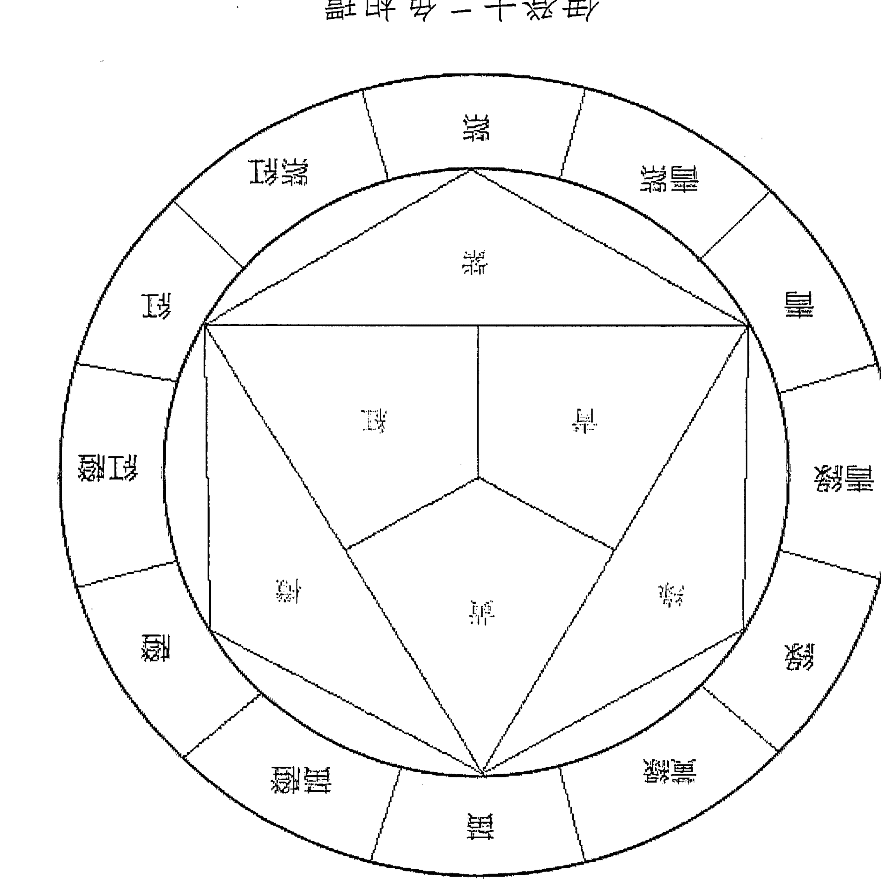

## 伊登十二色相环

注：十二色相环的色相顺序和彩度及自然光谱分光度的色相顺序相同。
此色相环是由约翰斯·伊登（Johannes Itten）所提出。
六对互补色分别位于直径两端的对立位置上。

## 第四章 视觉及视觉度量

耿值得设计了可以展示眼睛全方位能力的试验：三片等宽竖排的垂直色板。外侧两片是明亮的橙色，中间是灰色。用你的眼睛凝视这三片色板，一分钟之后，你会发现灰色色板的中间出现一个黑色斑块供你注视，这是为了避免你的眼睛作不必要的移动。现在将三片色板移开，请你直视柔和明亮的布幕。此时，你会看到中间的灰色被橙色取代，原先两侧的橙色则变成青色（橙色的互补色）。

著名的黄色阴影（colored shadow）是这样做的：使用两台投影机，一台投出紫色光，另一台投射寻常的白光。投影机交叉又投射布幕前的一根圆柱，使布幕上呈现两团彩色阴影。其中一团阴影是你预料的紫红色，另一团阴影则是它的互补色——黄绿色！眼睛隐约能捕捉缺失的那一部分。紫红色阴影映出黄绿色。同样地，橙红色阴影映出黄绿色。橙黄光则会产生青紫色阴影。

紫色光看起来成黄色阴影，橙色光看起来出现青色阴影；这样的现象并不费人知。当我用单一投影机，没有圆柱，直接将紫色光及红色光并列投在布幕上，让你盯着投影机上的一个黑点看一分钟。然后将红色阴影移开，此时你会看到原本的紫色阴影变成黄色，橙色阴影则变成青色。

做完这些试验之后，我们回来探讨颜色到底是什么？试着想象：你这孩子都生活在月球表面，所以你从未看过任何颜色。此刻你必须忘掉所有跟颜色相关的事物，想像自己生活在黑白的世界。接着想像自己生平第一次看到彩色的东西，此时你的内在会发生什么样的情况？要这样具体想像是不容易，因为我们一直生活在彩色的世界里。但我确信，在你的内心裡一定起了极大的衝击。彷彿自己进入到一座大型百货馆一样。对你而言，这会造成巨大的衝击。这很明显，但我想你已经得到领悟。

当颜色出现时，我们臆测到：外表底下的内在本质。当你生活在黑白世界时，你所看到的只是事物的外表。它们的内在本质不曾自己显露出来，因为大自然喜欢隐藏。不过，当色彩出现时，自然的果实就会浮现出来。或许这样的方法有助於你的理解：假设花瓣整片都是绿色植物，在一个晴朗的早晨，刹那间繁花怒放。先前跟各位提过，只有在花的身上才会显露出植物生长的果实。此时，色彩缤纷、芳香四溢，向外展示它们内在的工作成果。这就是颜色的奥妙之处。

因为我们一直被禁锢在灵魂裡和自己相离，所以我们要敞開胸襟和大自然接触。但是没有其它感官可以像眼睛这样，将我们向外延伸。而宇宙也逼迫着我们，因为没有什么光就什么都看不见。

## § 第四章 混沌及温柔？

是！正因为我们内在的大脑想要照见什么，所以宇宙的大脑也想我们展示大自然的温柔。

当你看到颜色时，到底会产生什么样的效果？什么样的基本元素会在你的灵魂里浮现？这其实不难理解：首先，你会被牵连进去。这表示突然间在灵魂里有倒元索被释放出来，虽然我们不晓得它叫什么。你要如何去解释颜色？我显得最能切的字是心境（mood）。在黑白的世界里，很难拥有什么心境值得表达。在诸多的世界名画中，姑且不谈林布兰登（Rembrandt）的黑白画，曾让人引发真实心境的只有彩色。

或许你可以为自己找到一个更贴切的形容词。如果我再举一些例子，你对心境可能会更清楚一些。以黄色为例，你不会说：我的天啊，多么令人爱慕的黄色！你也不可能说：多么灿烂的紫色啊！我们也不会这样表达：多么柔和的红色啊！看到颜色令你即刻感受到情感。原本灵魂在灵魂里的基本元素，因此显露出来。

谈到人类的脸也是很有趣的。我指的不是美观，而是整幅脸孔。我也不是要讽刺某人的丑陋，而是指人的容貌很有趣。一双眼睛长得很好玩，而是指人的容貌很有趣。

## 十二 感官

强是透过眼睛来表达。我们不管用鼻子或耳朵来表达自己堕入爱河。我们透过眼睛膜彼此的灵强而对面接触。眼睛就是我们的镜子，直接映射出内在的灵强。在敏感或者悔昧，也是用眼睛来表达；因此你适当地才看得到内心的原始情态。听到别人的音乐会让落泪，但泪水不是从耳朵流下来的！

这只是人鳞眼睛的一个面问。当然不信如此，看一下上面这张图你们就能解释。你看到的是一幅白色花瓶？还是两张黑色面孔？你被迷住了吗！经过一些练习你就可以玩通鳞戏。你可以一下子这样看，然后在按回方式瞧一瞧。这是因为你有超感如的试器，可以将图像在瞬间作转换。

下面是一张向内旋转的螺旋图。但它真的是一个螺旋吗？沿着线条的轨迹，你会发现什么？事实上，这是由好些个同心圆所构成的图。有成千上百像这样的陷阱，我们称之点视错觉 (optical illusion)。这很糟糕，不过我们的眼睛的确曾被愚弄。科学家其它感官你或许无法接触到。

## 第四章 视觉及温度觉

弄它们。你可以嚼小孩子吃下一粒包着糖衣的苦药，不过吹了蜡烛下之后他就会尝到苦果。所以，你无法去愚弄视觉。眼睛则是容易受骗的！你可以一直盯着这漩涡看，随你想看多久，但你总是无法看出它是一堆圆圈，而不是螺旋！

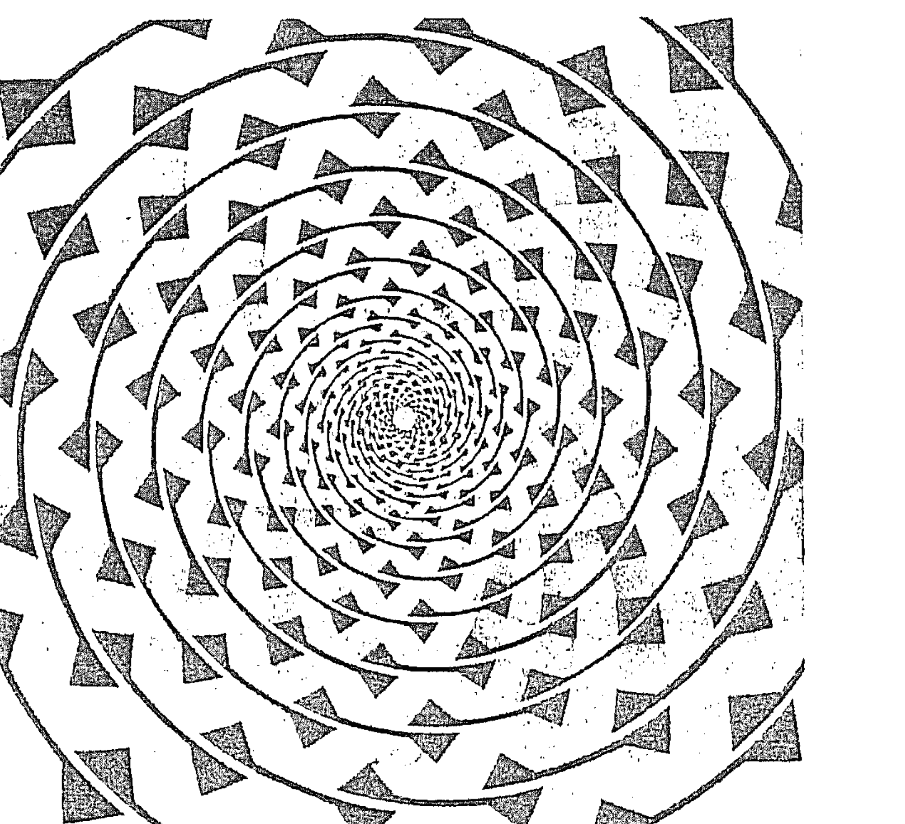

我们常常会如此错用自己的眼睛呢？因为我们常常根据所见的事物进行思考，自然的事物就不会犯下这样错误。不过，只要动物跟人相似，久了也会犯下同样的错误。但是野生物就不会如此，因为它们不会思考。只有人猿才会思考，而且思考的事情通常都跟眼睛所看到的有关，也只有眼睛才会看到幻影。因为思考的缘故，所以我们会在眼睛瞥见看见的东西上，加上自己想要看到的幻影；结果就导致视错觉。说它是虚假的洞察力（illusory insight）或洞察力也切些。

## 十二感官

眼睛是情绪的感官，另一方面，它也是科学的工具。前面提到的触觉感官，为何我们能约略触摸它呢？因为我们是透过眼睛来研究它们。但是我们无法经由视觉来欺骗眼睛，我们只能用视觉来欺骗视觉。眼睛是拥有其它感官能力的感官。我们比其它动物更需要靠由眼睛来保持平衡器官。在深渊中，飞行员必须一直盯着仪表看，否则他不知道自己飞到哪里去。他不晓得疲倦现在是爬升还是下降，是直行还是转弯。但是，站在他身旁的狗却知道！你发现狗随着地心引力而变摇角皮立，人类则没有这种感知能力。盲人无法逼迫平衡术，但是盲眼就被得到，他眼睛很敏锐一样都可以轻易逼迫被举的架子。他们是透过身体器官来维持平衡，和人类完全不同。人类用四条肌肉用来转动眼球，另外还有上斜肌及下斜肌，这二条肌肉直接连接到平衡器官。我们用它来探测视东西是否水平。之前放到平衡器官时，就是指这个部分直接连接到眼睛，我们用它来找到自己的立足点。因此，平衡的能力也必须靠由眼睛来造成。温度觉也一样，譬如我们看见皮肤变成沙色系。我们也看见美丽的颜色或船舶的颜色。触也跟眼睛有关，没有任何一种感官像眼睛这样灵活好动。当你看到一个三角形时，你的眼睛也看去在這回三角形上。眼睛总是喜欢在事物上遨去。在这同时，你也曾利用生命监视你所看到的东西是否令你感到喜欢？在彼此见面的当下，我们曾用到自我觉，眼睛这时也扮演重要的角色。

## ♍ 第四章 视觉及温度觉

虽然只有一个名词适合用来形容我们的眼睛——全方位的感官(all encompassing sense)。眼睛的星座是什么呢？我想那就是室女座(Virgo，♍)，它是十二宫图里最大的星座。室女座的特质就是谨慎，我们立即明白事物的内在本质。有了谨慎特质，我们可以真正表现出眼睛所看到事物的内在本质。这只是一个概括性的表述，我现在要以室女座的特质来说明。从女性的触觉来看，在宇宙中的天生特质，到了地球上则是以内在特质呈现。这就说明了视觉具有惊人的理解能力，而室女座则是世界的灵媒。

### 温度觉 (the temperature sense)

接着，我们要谈的是：温暖觉(warmth sense)、温度觉(temperature sense)。我们先来做个实验：左邊放一碗冰水，右邊放一碗热水，中间则是温水。现在，请将你的左手放入冰水中，右手放入热水中，持续至少二分钟。然后将两手同时放进温水里。你有什么感觉呢？你的左手放冰水放到温水中，会觉得温水很烫。你的右手放热水放到温水中，则会觉得温水很冷。科学家解释法曾犯这样的错误，因此偏好使用温度计。有趣的是，温度计也和人一样。当我把一支温度计放进冰水里显示4°C，另一支放进热水里显示50°C，当我将两支温度计同时放到温水里，情况是什么情况呢？放冰水温度计的刻度会上升，放热水温度计的刻度则会下降，直到两支温度计的数值相同为止。第一支温度计说：这样温度也不冷。第二支温度计说：这样温度也不热。我们的手也是相同的感受，需要一段时间之后才感觉整双手的温度一样。

我所要表达的是：唯有发生对流时，我们才感受到温度。当外界温度和你的触温相同时，你就无法感受到冷或热。外界和你之间所发生的一些事情，就是为了让我们触感到温度，所以必须要有对流。例如在冬天时，我握着户外的阴把，热能从我的手流向阴把。在我传递热能的同时，就感觉到阴把是冷的。我的手被阴把开温，直到两者的温度相等。此时，我暂时把温，就只剩下触感而无温度。反之亦然，当你握着热热的阴把，热能会从阴把流向你。这是简单的物理现象。然而，你是运用什么力量来触感这些？当你感觉到东西的冷热，能够如感觉到冷暖时，你有什么感觉？你的内在感觉是什么？我的见解是：太冷曾让我们发抖，太热则让我们觉得需要你比多一点空间。冷具有冷淡可怕的能力，温服则能唤起温暖抗拒冷漠。温服具有热情特质。

## 第四章 视觉及视觉觉？

的效果。为何视觉会具有激励效果？它的潜意识由又是什么？

先前提到，看见颜色时内在的视觉就会由内而外浮现出来。但是视觉有没有比这更基本的问题等待我们探讨。在观看、倾听、品尝之前，一定有什么先决条件？做出感知的第一步是什么？那就是闭眼、眨眼的动作！例如，在你眼睛原本就是张开的情况下，你看到什么？你不可能观察到什么，因为你必须先致动自己的注意力。我们在第一章就提到，如果不可能一个接着一个回来，而是一次共同发生。直到现在，我还没真正针对到视觉跟其它感官之间的连作关系。我们必须去观察、倾听一些东西。

想像自己坐在窗户旁凝视着神，没有致动任何注意力。突然间，你看到一颗星已跳得高高的车跳到路上。这是你必定会看到的画面，刹那间，你全神贯注。是什么吸引你去看它？是眼睛！这就是视觉的松密。

那么，我们用视觉觉来做什么？我们的视觉只用来做一件事：激励这世界。我们制造这世界充满满眼眶，而造因以触摸到温暖。也就是说，你的注意力、胆怯、热情都得到了回报。此时，你会感受到包容。我们不也都期待来自别人的温暖拥抱吗？你怎会担心某人独自留在冰冷的角落吗？我们一直将温暖射出去，期待能得到温暖的回馈。

史丹勒说，这是人类的第一种感官。继第一眼始它被安置在我们的头顶上。你们一定遭遇第三眼，对人类而言显然它不是真的眼睛。但你遭遇是可以在爬行动物（例如，蜥蜴）的身上看到第三眼。它位于大脑上方、顶盖骨的眉口下方，看起来比较像是往外突出的原始眼睛。任何动物透过造物器官可以看到红外线。这是一个温暖的器官，以前的人用它来搜寻舒适的居住环境。在人类进化的过程中，第三眼退化成一个小腺体 (small gland)，也就是脑上腺 (epiphysis) 或叫松果腺 (pineal gland)。原本人类的松果腺也是位于头顶上，在脑后朝壑可以看到它，就在透明顶盖骨的眉口下方。只是，后来大脑膨胀到超越它的高度。

科学家无法解释温度觉的功用。科学家也不知这温度觉的用途及它位于何处？人们长久以来就当我们身上充满了冷热的温度觉 (spots)。但是班克人员交互制造温度的理论。有天他们观察说，我们的身上有多少个温度觉。温度觉天，一连串的实验之后，他们又发现更多的温度觉。在这回课题上，有许多不同的理论。但我相信有一种理论是正确的：在皮肤的底层有许多细微的微血管，及许多的末梢神经。这些只是一般的神经，没有特殊装置的末梢神经。我相信就是它们在感应和温度，在微血管将温度透过皮肤散发或聚集的过程中，被这些神经感知到温度。这些都是最单纯的神经，人类心灵最不怀疑的理论就在这样被产生。灵魂想要展现它的愿望，并且耐心等候好感发生。做这件事，不必动用任何工具，只需用到感觉神经 (interest nerves)。这就是温暖的本质：

我们参与这因果过程，我们被宇宙接触，我们繁衍在其中，我们受到激励创造出热情。在相反的情况下，我们也能做出正确的表达：我们不会去冷落他人，人们会因感到黯淡而温暖起来。这是一种原型的感官，在其它感官出现之前就已存在。事实上，每根神经的原始本质就是在鼓动愿望，然后看着能得到什么回应。

在人格学，我们称此愿望躯 (interest body) 等灵魂 (soul body)、星光躯 (astral body)。是纯粹的愿望，这是动物和人类的典型特征。它代表愿望、好奇、想要探索世上的每一件事。在尚未分化、进化之前，神经就是用这种方式在传递。很显然，第三眼原本只是简单的器官，后来竟然进化、消失。即使它消失到无影无踪，但是重要的成分还是被保留在我们的大脑里。造物器官进化之后，它的能力重现在所有的神经感官。它只是牺牲自己，但其本质犹在。依照史丹纳的说法，我们所有的感官都是由温暖感官所创造出来的。它是原型的感官，牺牲自己，分化制造出所有其它的感官。你一定会嘲笑它的愚蠢入过程：某个感官消失，接着重新出现十二种新版本，而且还包括最原始的自己！

如果你进一步研究人类智慧，你会发现史丹纳非常推崇温暖感官。他十二感官所吸收到的东西都会被集结到温暖，自然科学家无法解释何以如此。

和温暖相互对应的星座是狮子座(Leo，♌)。在所有生物当中，狮子是最热衷吃肉的动物。如果你未曾仔细观察过狮子或猫，你就无法成为真正的人类。如果你能学习它们的动作，你就能像猫一样敏锐地将尾巴摇出在身上，你就能感觉到温暖、韵律及活力。这些动物身上没有一点是僵硬的。试着活到你的指由，你辨不到的！但是狮子和猫就有这样的活力去活到它们的爪子。这懂翻动式的温暖、盎然的展现，始终显现在它们身上直到死那一刻。其它动物无法像它们一样隐藏在自己生活的环境里：悄悄地蜷着、发出呼噜声、时而蜷于时而舒展、时而露出锋牙、时而洗洗、静不语、时而敏捷地奔跳跳跃。你前爪到尾巴，全身无处不在他们的掌控之中。这也是狮子座的形像。这就是我所要表达的温暖感官、温暖感。

## 第五章 结论与展望

## 十二感言

在此向各位简要回顾「身的感言」：触觉、生命觉、自我动觉、平衡觉。触觉让我们觉察到身体的自然本质。在整个生命进程中，生命觉让我们了解到身体的健康状态。自我动觉让我们知道对自己身体的掌控度，以及透过身体表达自我的本能能力。透过它，我们才得以付诸行动。至于平衡觉，整个人类的本质就是为了达到平衡。透过触觉，我们跟世界分离。经由平衡觉，我们再次回到这世界。因为只有依靠外界，我们才能维持平衡。

在「身的感言」之后，我们接着谈到「灵的感言」：嗅觉、味觉、视觉、温暖觉。你会发现这四种知觉和身体状况有某种程度的关联性。例如，嗅觉必须仰赖健康的鼻子（感冒流鼻水时就无法嗅到气味），感觉器官虚弱或罹患疾病也会影响其知觉能力。各位一定也强烈地感受到以强迫侵略的方式袭击我们，同样地，我们也曾以非常粗暴的方式做出回响。更具体地说，我们的直觉本能，我们也会做出立即的直觉回响。

至于温暖觉，它具有入口把关的机能。但它也是人类进化最严重的感官，因为我们在吃东西时往往只在乎美味与否？我们必须让它回归原本的功能——确认食物对我们的身体是否有益？如同生命觉所做的那样，差别在温暖觉有较大的自由度。如果我们想要开发这方面的能力，就必须善用品尝进行训练。

## 第五章 触觉

如果我们只剩下嗅觉及味觉两种感官，那感觉我们视觉比隐视般，如同生活在梦境一般。此时，唯有透过视觉得才能当我们开启外界之门。眼是回神奇的器官，虽然只是瞥淡一瞥，但它已当我们捕捉到所有的事物，这就足以让我们看清外界的全貌。人类如果没有眼睛，就无法窥视「美」为何物。我曾向大家解说，色影如何描绘世界的内在本质。透过色影，灵魂的世界也变得清晰可见。正如我们生活在黑夜白昼之间，因此当我们内心感到灰暗时就会转向而向外寻找光明，色影自然就在这两个极端之间显露出来。

每个人看到黄色就会联想到光明，看到蓝色或黑色则会联想到黑暗。颜色教给我们许多这方面的知识。从一些语言文字中也让我们联想到颜色心理的关联性。例如，喜庆的颜色或喜庆的颜色。味觉就不曾如此表达。因此我们不曾说：这些菜肴看起来很鲜艳，或洋溢吃起来很喜庆。不只是我们以味道产生经验的方式表达灵魂的灵魂，灵魂本身也会透过色彩来表达。不论它描绘的是什么样的经验，都曾直接用喜怒或悲伤来表达。在人格学中，称此为感性灵魂（sentient soul）或称之为感性灵魂（mood soul）。曾让人更容易理解，因为它是灵魂的灵魂有关。难道你对某些事情不曾出现特别的灵魂吗？而且，当你亲眼看到时是不是也曾感到特别真实。这就是心灵灵魂所真正面临的。

## 十二感官

视觉具有不受拘束的特性。味觉则具有私密的特质，因此也多了一些情绪。在眼睛观看的过程中会伴随着思考，因此你把眼睛张开的瞬间就会爆发出活力。我们总是透过眼睛来思考，没有眼睛我们就无法思考。我所提到的视觉，就是因为我们会在眼睛所看到的事物上加以思考的缘故。但请不要产生错误的结论，认为盲人就不懂得思考。我只是要说明，每一感官都赋予人类特定的用途。例如，假使没有视觉能力，人类将无法得到思考的本质。

试着记下你所思考的事情，藉由它们的眼睛所看到的毫無關聯嗎？例如，我们在欣赏贝多芬交响乐时，我们不是也曾「看到」自己的鼻子和嘴唇味觉吗？因为我们具有思考的本能，所以很难将沉思淘汰。所有科学都属于沉思世界的一部分。因此，我们可以用这样的方式来表示：如沉=沉思。

接着我们进入温暖觉，虽然我将它排在第八位，但其实它是人类的第一个感官。有了温暖觉，我们才得以和这世界接触，这是人类和动物的共同点。植物就无法看见任何东西，只有人和动物才看得到。这是因为我们有想要外界接触的意念，所以才能看见事物。这就是所谓的灵体（星芒体），也就是掌管在皮肤温暖的地方。因为动物所得到的刺激是直接来自他们的本能。

## 第五章 听觉

力。所以，科学家们所看到或接触到的外部事物，动物无法知晓其本质。相反地，人类则是具有知觉，可以觉察到他所生存的周围事物。而且，就是通过听觉来表达。我们可以这么说：听觉代表包容、被接纳（当我们的胆怯被得回听觉，则表示受到排斥（被留在冰冷的角落）。我们透过听觉表达最根本的感受，也就是强烈的原则感。人类就是经由听觉变得到温暖的回馈来对外取得连结。

### 听觉 (the hearing sense)

声音到底从何而来？想像你这靠子从未触碰过任何声音，但你可以看到所有东西。即使你只是遇到蝙蝠，但你不知道它曾发出声音。因此你也不触得它除了翅膀之外没有其它功能。直到有一天你触碰到这回蝙蝠，第一次触到它的声音。你会有何反应？你难道会相当震惊吗？你可能会，这回只是看起来漂亮的东西，竟然也会发出如此美妙的声音。如果有人跟你说，这些只不过是用来圆形表示业可精准计算的音波罢了，你会相信他吗？这样的说法对你而言毫无意义，因此逼跟你所触到的感觉一点关系也没有！

## 苹果西发出警声的条件是什么？当你敲打一

地濕泥上，它是不會發出聲音的。它必須要有堅硬的外殼才能被敲打出聲音，但這不是發出聲音的唯一條件。如果你敲打地底下的一塊頑石，這塊頑石也無法製造出太多聲音。為了發出聲音，該物體的表面必須是堅硬的，而且它必須在地面上而不是被埋在地底下。唯有和地球分離，該物體才能發出聲音。我們必須先解放它、靠它從地球的束縛中解放，然後再去敲擊它。金屬就是最好的例子。唯有經過高溫的熔煉，將熔融中的雜質去除，讓金屬變得堅硬，然後將它拋在空中，經由我們的敲打才能讓它發出悠揚的琴聲。想要獲見別人的琴聲也是相同的道理。對方的心理話根本就在地的心底（指向地心），你必須先靠它脫離地球的束縛（指向宇宙），才能謹慎地從琴弦上彈出真心話。

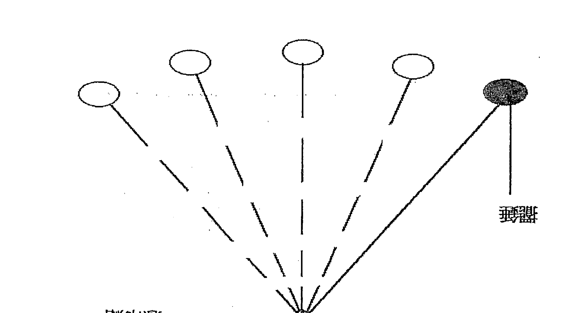

## 第五章 赞赏

赞赏，有典型的案例。大家都知道地球普转，巴黎圣母院（the Pantheon in Paris）的大型螺旋就可以得到赞赏。这回螺旋也非固定不动，它的速度一直在变化着。你左螺旋高蹈荡下时开始加速，接着减速，直到右螺旋高蹈荡上；接着又再次减速。这是属于自我追寻的样式，其螺旋方向始终朝向宇宙。螺旋螺旋的垂直面相对于宇宙而言是固定的。因为地球在宇宙中转动，才导致螺旋的方向看起来是垂直的。但其实是地球的位置在变动。

赞赏是以报效的方式在移动。这螺旋方式如同螺旋脱缰地球的束缚一样，将自己指向宇宙。地球上的物质脱缰地表时散发出一种强力的移动力，一种指向宇宙的报效。当你能够掌握到这样的情形，表示你对赞赏开始有了了解。物质被带入到与其自然状态相反的情况下，这是唯一能让你理解赞赏更妙之感的方法。当我们看见强烈的物质脱缰地表（因为它自己无法移动），带领它进入移动状态（不再指向地心），谁有在这样的情况下赞赏才会被创造出来。

## 十二 感官

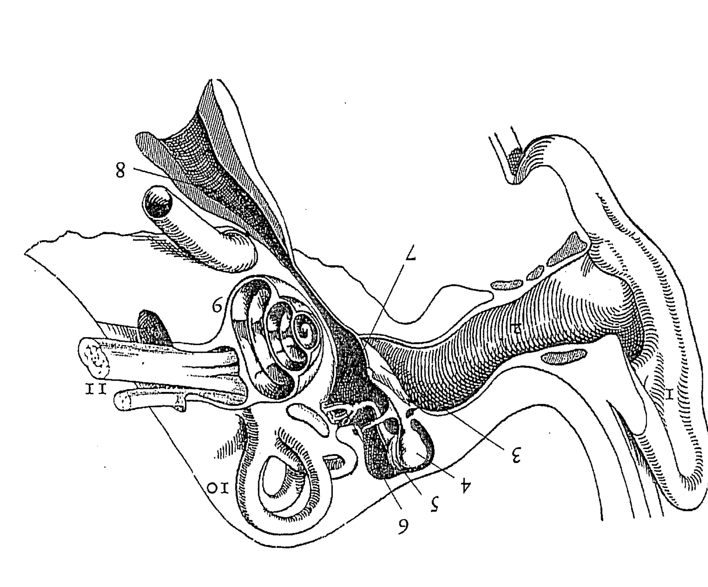

- 1 耳廓
- 2 外耳道
- 3 鼓膜
- 4 锤骨
- 5 砧骨
- 6 镫骨
- 7 鼓室
- 8 耳咽管
- 9 耳蜗
- 10 半规管
- 11 蜗窗神经

在探讨声音的本质之后，我们来探讨耳朵是如何运作的？耳朵的结构分三个部分：外耳、中耳、内耳。外耳包含：耳廓、外耳道、鼓膜。中耳包含：三块耳小骨（锤骨、砧骨、镫骨）。耳咽管从中耳延伸到咽口，感冒时常造成管阻塞。内耳包括：耳蜗、蜗窗神经及先前提到的平衡器官——三个半规管。

听觉器官和其它感官一样，是由体表发育而成。最初在下颚分裂部位的皮层有一个凹陷，即听觉通道也是从这里开始发育。这是发生在胚胎成长的初期，此时眼睛也还在发育的最初阶段。渐渐地，眼睛开始往前突出，此时的耳朵则是向后发展。虽然它们同在一个地方开始发展，但最终眼睛和耳朵的位置则是一前一后。此时，凹陷的髓表经过一系列的转变之后，形成三个半规管。

## 第五章 聪慧

我们的内耳就依小匣般的颞骨发育而成，接着植入在颞盖骨的深处。

中耳的骨头属于下颚的一部分，经过一系列的转变之后发育成耳小骨及舌骨(tongue-bone)。底下的例子或许有助于各位的瞭解：如同飞翔起来那之后，将它的鞘子收起来一样。下颚将它的一部分向后缩成耳小骨。外耳的耳壳是由躯表皮层发育而成。眼睛是大脑向前发展的表现。耳壳则是由外而内的发展方式，逐渐下颚连结形成最终的聪慧器官。

在我念医学院时，有位教授经常提到：「对於高等动物而言（包含人类），我们是用吃东西的一部分来聪慧警觉。这是事实而非玩笑，在吃东西之间没有比这句更好的科学说法。而且，这也包含内化的观念在裡面。你是否也领悟到：用来咀嚼吃东西的部分是我们身体储存的聪慧，人类最终能做的也只剩下吃东西和呼吸！我们必须小心揣造些才能，因为呼吸毕竟是维繫人类生命的根本。

现在我要为大家解释「聪」的全新概念。我可以快速或缓步行走，直到我停下脚步站立著。你能否想像比停下站立更聪慧的转变？例如下颚，起先它快速活动，接著磨损，最后停下。当物体静止之后，我们分析它的一系列进

程，或许你就能看到事物的极限。换句话说：比静止更静止就是极限的前一瞬间。这就如同，比一般所没有少表示真情的意思一样。事实上，我们的耳朵一直处在何等而剧烈的扩张感。有躯求生的最基本部位（呼吸器官）以及最强健的肌肉都在这样，内缩之后也变得如此轰轰。它向内缩居在最坚硬的骨骼里，安然而何等而剧烈。即使只是少许的小肌内依附在耳骨上，但当了轰鸣进到程面的振动，这些肌内变得更加雄壮。

人、猴子及人类的耳朵都是向内接而非像鸟一样长成满斗状。当何曾如此呢？满斗状不是更管用吗？当某些人说话的警音不清楚或太小声时，我们不都会用手做成满斗状来让自己听得更清楚吗？我敢说，即使你的耳朵长成满斗形可以让你听得清楚些，但你曾因不懂得倾听。如果你仔细观察就会发现，总是不会倾听的，神只是用耳朵在「看」。人类才有倾听的能力。

## 第五章 骨髓

的本能。因为造物缘故，儿童必须先向外发展终
后再经历一段内化的过程。如果儿童一开始就往
内发育，那么它就无法得到内化的效果。人性也
必须经历这样的过程。在皮肤上我们可以看到不
同器官的发育过程。如同眼睛是在好奇心及思想要
看见外面世界的驱使下向外发展；儿童则是先从
外部发展，再转向内进到更深层面的内在。

我必须特别在本页作补充说明。骨髓里面
通常存有骨髓。骨髓则是人类生命的根本，就新
陈代谢的观点来看，它可以靠血液循环维持活络。
当驰到坚强的骨髓之后，得到的回报就是强壮。
在晚期的某个阶段，我们会看到大量的细胞建
入到坚强的骨髓里「吃掉」骨髓。造物神灵之地
受到侵蚀，最终变成一座空城。原本活生生的骨
髓，就此失去了生命，形成一个洞穴。当然你会
说，造物原本就需要有共鸣的洞穴。但它何不
在一开始的时候就直接造出造物洞穴呢？何必如
此大费周章？在仔细研究皮肤学之后，我们就能
理解它曾经的意涵。

皮肤学教导我们，脆弱器官的发育必须符合
其目的，也就是帮助我们从本能中解放自己。这
种本能是什么？它是我们跟造物地球紧紧相靠
的东西。如同金属必须脱离地表，依地表的束缚
中解脱才能发出警醒。同样地，儿童得到了皮肤
者也必须脱离地表的束缚。如此，我们的儿童才

## 十二 感官

能穿透眼睛所看到的表象，更深入窥探事物的本质。温度觉就比眼睛所看到的深入一些。视觉会受到愚弄，但温度觉就不太会。温度觉不仅和事物的外表打交道，我们或多或少都能穿透事物表面感受到它们的内在。不过温度觉还是会受到外界环境的影响。例如，一件东西放在冰水或温水的环境中就会呈现出不同的样貌。

但是，触到声音时，我们则是触到原本的样貌。例如，轻轻敲打酒杯时我们就可以触出它是石英水晶杯。意大利的公司甚至会放一块大理石在琴键里面，用声音来判断来访的人的硬币是不是真的。在琴键里，事物真实的声音，最深层面的内在本质，都变得清晰透明。触有它的特殊声音，各种金属也都有其独特的声音。水晶的声音是清亮的，它跟玻璃不太一样。透过触觉，我们可以透过到事物的内在本质，此时我们觉得比静止还要宁静，并且超越所有尘世的干扰。

人类身上没有其它地方会发出这种机械式的声音。在外界没有其它东西可以像声音如此深入，也没有地方会发出像巨骨敲打的这种声音。而且，我们触到的不是鼓声而是真实的声音。一种机械式的声音就在我们的体内发生。透过声音，我们可以精确衡量每一件事。我们可以记录它、用数字来展示它，如同尘世的一切。你无法用世俗的触觉来穿透事物，我们触到的也不是物。

## 第五章 聆听

真的表象。这是旧默深难解的通道。你听到的不是87个或493个被淡，而是有内涵的整音。

为了澄清吸收内化的通道，在此向各位介绍另一个名词—清除 (erase)。究竟什么是内化 (internalizing)？它是一种清除的过程。例如，当你听到「plant」这个字，然后将 p-l-a-n-t 五个字母转化为「植物」的意思之后，在你的脑中就可以将这五个字母给清除掉。因为你已经得到字意，字母对你而言不再重要。同样的道理，在你听完一段文章，理解整段的含义之后，就可以将这些句子给清除掉。在阅读的过程中，你必须一步步排除路途上的障碍，去逼近那些印在纸上的特殊符号，如此就能得到整篇文章所要传达的意思。在阅读的同时，耳朵也扮演着重要角色。即使只是默然地阅读，你还是可以听到字在脑海的整音。早期，人们总是大声朗读，就跟现在的初学者一样。

如同排除掉字进入脑海的过程，在聆听整音时我们也会清除掉音波的干扰。事实上，我们不是在听音波，而是消除音波。因为耳朵已经内化，听原本只是获取整音的本能，因此它可以帮我们排除世俗的干扰。

如果你能学会用这样的方式看事情，表示你对聆听已经有了更深入的了解。同时你还会领悟到

## 十二感言

到，人们不仅可以排除声音的波动，也可以清除任何一系列的警音或音调。钢琴始终是一个音接着一个音来弹奏，但我们想要听到的不是一系列的警音或音调，我们会清楚掉这些，而去联想起优美的旋律及旋律。

各位观众注意到我们现在欣赏的不是「灵」，事实上我们已经进入到「心」的领域。这也是音乐能够如此感动的原因，因为在音乐方面可以用数字来传递一切。颜色自然就无法通融，自然无法用数学式子来表示，然而警音却可以。你可以用数字精确计算警音及频率。警音上，数学及警音都是向内的，它们都跟「心」有关。

跟警音相关的星座是什么？那就是巨蟹座 (Cancer, ♋)。因为巨蟹座代表着：一个世界的终结上就是另一个世界的开端。巨蟹座的两钳世界是什么？为了说明此端，我们必须先提及心灵形成的概念。

当我们仰望苍穹（宇宙）时，会看到无数繁盛放的星星。它们是如何形成的呢？这些警星是球状的星。何而来？警星的原理法则是这样的：看得见的警通常来自看不见的形式。因此，我们看到的警球也是球不可见之虚产生的。我们看到的其实只是依不可见所分离出来的一部分。宇宙是真实的。

## 第五章 膨胀

的确，它所释放出来的元素再转化成各种物质。这是对宇宙最简明扼要的陈述。

巨蟹以其特有的方式拥有凌驾物质的能量。在成长过程中屡经数次的转变。脱下坚硬的盔甲之后，在思维将它们炼化成微小的颗粒，再从躯内将这些细石重建成崭新的外壳。这样的过程出现在大宇宙里，也同样发生在小宇宙身上，即使在我们的思维里也是如此。我们的思维也是成长方式。在这些时期可以看到我们的思维是一条单纯的思维圈，接着不断转变最终成长成漩涡。现在各位就能理解拥有的思维是有其功用的。但它为何要变成漩涡呢？它代表着什么样的意思？思维内部到底做些什么？在休憩时，我们曾经讨论漩涡：微外层（大宇宙）所造的东西，最终必须被消化吸收。食物原本的结构都会被破坏，因为外在物质无法直接变成人体的一部分。微大宇宙达到我们有躯的物质必须先被破坏，造成微都只是当了传播的消化吸收，如此才能转化成我们躯内的物质。外在的一切都必须进行转接。唯有经过漩涡的思维，才能将大宇宙的物质化成我们自己的东西。漩涡的思维代表着外部世界就此结束，人类自我创造的世界就此开始！

现在各位应该也能理解为何巨蟹要成长成漩涡。它既不是直线也不是锯齿状。它必须是螺旋状，因为它陈述了这样的事实：螺旋世界到此结束。

## 十二 感官

此，心灵元素自然必须被解释放出来。巨蟹座被我们意识到：一种扩张的结束，就是另一个新创造的开端。在星座图中，巨蟹座位于双鱼座（平衡感的星座）正对面。

所以我们要绕造更大的圈子，就只为了理解一些简单的事情？为何平衡感巨蟹座巨蟹的互相吸引出同一个源泉，自然学家对此也感到惊奇。单就自然科学的融融而言，确实无法解释平衡感。谁有能力何阐明？谁有从人繁育的坦坦来看才能明察其中原委。你敢拍身上我们理解到：小宇宙（人体）的创造坦坦其实就是大宇宙（人体）形成坦坦的一种延续。明白这端之后，我们就可以理解当何双蟹巨蟹和平衡感巨蟹来自同源流。因为平衡感巨蟹巨蟹巨蟹巨蟹是朝着两相反而方向而发展。我们透过平衡感巨蟹巨蟹地延续，在这空间坦坦找到自己的定位。唯有在这回地球上找到自己的定位，才能决定这回世界的空间坦坦开起。然而，我们要如何让自己寻找到心灵的领域？那就是巨蟹，也就是巨蟹。透过巨蟹可以靠我们转移外在的平衡，进而达到内在的平衡。我们可以将双音双音当作是「心灵在散步」，在高低、快慢之间达到内在的平衡。

现在，我们领悟到：当我们感到和谐时就曾感到任何错误，也就不会运用到平衡感。因此，愈去感觉自己的身体就越能获得音乐之美。然而，

## 第五章 聆听

一直跟着音乐胡乱摇摆不见得有比较好的效果。什么舞都不做，反而可以达到最好的结果。刚开始当然需要用耳朵听，但是为了得到更好的效果则必须抛除用耳朵去听。

音乐的本质是什么？好的音乐应该具备以下三个条件：舒适的节奏、合适的长度、适度的音量。这些是宽高三个维度就是音乐的内涵，就如同外在的三维空间一样也需要保持平衡。

大家都说都听指用到在黑板上的喇叭，它让人觉得很不舒服。因为通常你是用皮套在自己的皮套上一样。你会发现，连跳舞音无法进入你的内在，它只能停留在皮套里面。相反地，如果你玩的是小提琴的演奏。此时小提琴的清脆旋律就会引起你的共鸣，进而穿透皮套表层温存笼罩着你。音乐对我们身体所产生的效用就是这感召力！

另一种震撼则是，小提琴低音往高音演奏时对我们身体所造成的感受。特别是当我们站着跳舞时，仿佛就像漂浮在我们的身上飘一样。

如同小提琴的旋律整音在我们的皮层底层流窜一样，不同的乐器则会带来不同层次的感受。例如，当我们用身体去感受木琴的演奏时，就凸显。

## 十二 感官

察到它所穿透的深度比小提琴深了许多，几乎可以渗透到骨骼里。金属敲击的要素无法达到这样
的深度，它跟木琴在本质上就有很大的差别。敲
击木头所发出的声响对听觉所造成的感觉要比
敲击金属所发出的声响来得深邃。金属乐器的声
音只能在我们的血液里流动，就跟音乐家只能
达到按摩肌肉的效果。

笛音也可以达到较深的程度。但它跟金属或木
质的打击乐器还是不同的。笛音悄然的是我们的
呼吸系统。如同小提琴的警音是在按摩我们的反
呼吸系统。笛音则是在按摩我们的呼吸器官。吹奏
乐器（例如：小喇叭）也和呼吸系统有关，只是
它按摩的程度更深。它可以进入血液及心脏里，
也就是黑曜在我们体内所流通的区域。黑小喇叭
的演奏警，仿佛就像在黑曜天使用心灵警一样。

黑曜又玩要又警动我们身体的那个部位呢？
有什么乐器演奏起来会像黑曜或玩要造成湿柔呢？
当然？有些乐器警的碰可以撼感人心。黑要又玩
要碰簧可以触动我们的神经警觉到它们的警音。
如果神经失调需要用音乐来治疗湿柔，就必须玩要
要的演奏，这也是玩要的疗效所在。

以上这些练习，并非要要求各位使用身体的不
同部位来玩要。事实上，反而建议大家在玩要时
可以抛开上面所讲的这些。刚开始我们会用具体

## 第五章 灵魂

的方式来摄取各种繁器的营养，之后则是用智慧滋润。这所做的目的就是为了建构到心灵的场景。透过灵魂，社交元素被带入到我们的文化里。最初极是由灵魂开始启发我们，再来我们则会无限量的膨胀，将这些有形的物质转变成形的心灵元素。

当我们联结低阶的感官（触觉、生命觉、自我动觉、平衡觉）连结时，它可以为我们提供强大的能量。然而灵魂似乎没能带我们带任何力量！我们也瞭解，所有的灵魂力都被赋予在灵的四种层级。意欲灵魂意思是跟灵是相连，心智灵魂又感觉则是灵相连，心灵灵魂又意志力则是和温度灵有联。那灵魂是透过我们带什么呢？那就是「灵魂保育」！

史丹勒说：「如果未能得到协助，人类将无法靠自己看见。我们可以看见是因为得到天使的灵强协助。『我们透过天使的灵强来俯瞰，而不是藉由自己的灵强。这是因为我们太以自我为中心，真正的社交应该是无礼的。爱的元素尚未呈现在人们身上，这需要花上一段时间才能在人类身上发展开来。然而，我们经常用爱的方式从事社交活动。然而，天使则是以生命调频的方式在执行爱的本质。他们以全然无私的付出在保护着人类。这也正是为何天使透过灵魂（真正的社交、心灵灵）在我们身上功夫的原因。

## 十二 感官

史丹利对我们的触觉器官作了一个奇特的注解：「触觉似乎是人类的第一个感官，然而触觉却比它更早。」因此，我们现在所能知的是一个「不可能」的感官，它在被创造出来之前就已经存在。我向各位做何说明：「所有被创造出来的东西，按角度来看也可以说它是被分裂出来的；它是从大宇宙所分化出来的。」因此，触觉是个非常奇特的感官。它以完全地球化的能力性呈现，却是以天堂的「质」塑造而成。也就是将天使的本质注入其中，然而天使的位置却又凌驾在人类之上。触觉是真实的，但它不像视觉那样可以看到外形或影像。你不管在一个屠宰前面触摸起来，然而在屠宰中你很难站着不动！触觉会撼动我们的肌肉及骨骼。这是一股弱能量，而且因为它源自天堂，所以能成为最具威力的力量！魔鬼知道如何掌握人性，因此他们也是透过音乐。没有任何东西可以像音乐这般深具威力，因此它可以具备最强大的能量，而且人类很难如愿达到这般能量，所以当它夹带着威力出现时我们也很难去克制它。

因此从触觉身上我们发现到社交元素的本质：一直有东西在背后支持我们，它没有被世俗化而且依然保有天堂的本质，它以最基本的触觉方式滑落在人身上。魔鬼意味着我们要不断向上提升，要超越某些事物或某些人。依靠自己的力量，我们远远不能辨得到。在两人以上的团体

## 第五章 赞赏

中，以字面天性的方式相互照应是需要的。

我们生活在凡事都会留下印记的年代里，在唯物主义的架构下无需要区分赞赏或影像，只要轻轻一按就将一切通通拍进记忆里。然而，透过心灵科学我们发现：她成像仿佛赞赏成赞赏是有很大的差别！相片只是一种表象，赞赏则是真实的人无须造图的相片其感染力远不如赞赏，特别是真人赞赏的赞赏。

透过赞赏，我们抓住即将成当往事的惶惶。赞赏及温暖可以被赞赏下来永久保存。相同地，我们也可以将某人的赞赏像糖一样封存在内心。领悟这内在的本质之后，我们就可以藉由意志将封存的赞赏开启，透过适当赞赏方式去打开。开启赞赏原音重现的道理是一样的。然而，透过这些弹性发展的机器业无法跟我们回到心灵世界里。想要在生命中留下真正的回忆就得靠我们自己的能量，如果能运用较高层次的心灵知觉，其结果将会更圆满。

## 第六章

## 文言文阅读

## 考点三

## 概括要点

## 及日校真

## 十二 感官

此刻，我们要进入感官阶段。在第一次的演讲时，我向各位提到人格学，现在你们应该已经学到提到第一章的要领了。我曾提醒大家，人格学的第一章是相当交错纠缠的。但现在我必须告诉各位，人格学的每一章也都是如此，因为它不是以简化的方式编排。即使我们只是针对其中的一个单元，仍然需要透过整体的概念才能清楚基本书的内涵。这种整体性无法从心理学的理论中推断而得。我们常以为「见微知著」，可以依一粒动埋看世界，但在道理并不适用。为了真正触动埋的世界，我们需要有整体的世界观。

上一章我们只讨论到触觉，它是社交(social sense)的一种。我们感觉到声音是如何产生的，以及我们所听到的警音。也看到我们的触觉器官是由触觉的一小部分及小小的一块颚骨(jaw bone)开始成长。现在，我们知道用身体的何种来玩转不同乐器的警音，以及欣赏音乐的最好方式--尽可能忽略掉我们的身体。同时也确信到，虽然有警觉的存在，但这并非我们所想到的。事实上，为了获取警音本身，我们并不理会这些警觉，如此才能得到最内层的本质。通常，玩转音乐比透过眼睛观察，让我们更清楚些事物的内涵。即使是透过截然不同的触端，但科学上也发现到这件事。大家都如道，化学元素用通期表排列。这是因为所有元素都可以用特定的规律来分类，仿佛音乐演奏一样。七回通期的元素依

## Ⅱ 第六章 语言觉、思想觉及自我觉

照一定的顺序排列，这就是大家所熟知的阴得列夫

天道明表。

我们也了解到，当向平衡语言觉跟语言觉

如此靠近，以及它们如何出自同一源泉。最

终，我向各位提到将来如何藉由语言觉发展出社会交

往，用它来进行真正的社交活动。不过，现阶段

我们需要更多的协助。事实上，目前也是他们在

藉由掌管我们的雏型。

今晚，我要和大家共同探讨下的三种感觉：

语言觉、思想觉、自我觉。这三种感觉是由史丹

勒博士所发现的。当时，虽然也有其他学者提到

这三种知觉。例如，布坦迪克(Buiten-dijk)在他的

论文《人类的现象》(The Human Phenomenon)

中也针对自我觉进行深入地研究。不过，史丹勒才

是首位提出这三种感觉的人。一般人熟知其中的

稍需或用词也比较生疏，因此很难诠释它们的内

涵。针对全新的领域，这是常见的情况。因此，

我们必须仔细推敲字里行间的意思，才能掌握它

的真谛。

### 语言觉 (the language sense)

当某些人在说谎时，你或许曾想：我可以抓到他

## 十二 感官

在讲话，我有一个可以侦听的器具，这就是说话器官（the speech sense）。不是这样的！史丹勒说：就跟音琴跟人说话是不同的，它们在根本上就不一样。语言不是错综复杂的音琴，当我们发出一连串的警音，目的只是为了陈述某件事。史丹勒指出：语言和听觉是不同的。好比温度觉不同听觉，嗅觉也和味觉不同。就跟音琴跟人说话是不同的，它们在根本上就不一样。语言不是错综复杂的音琴，当我们发出一连串的警音，目的只是为了陈述某件事。史丹勒指出：语言和听觉是不同的。好比温度觉不同听觉，嗅觉也和味觉不同。就跟音琴跟人说话是不同的，它们在根本上就不一样。语言不是错综复杂的音琴，当我们发出一连串的警音，目的只是为了陈述某件事。史丹勒指出：语言和听觉是不同的。好比温度觉不同听觉，嗅觉也和味觉不同。就跟音琴跟人说话是不同的，它们在根本上就不一样。语言不是错综复杂的音琴，当我们发出一连串的警音，目的只是为了陈述某件事。史丹勒指出：语言和听觉是不同的。好比温度觉不同听觉，嗅觉也和味觉不同。就跟音琴跟人说话是不同的，它们在根本上就不一样。语言不是错综复杂的音琴，当我们发出一连串的警音，目的只是为了陈述某件事。史丹勒指出：语言和听觉是不同的。好比温度觉不同听觉，嗅觉也和味觉不同。就跟音琴跟人说话是不同的，它们在根本上就不一样。语言不是错综复杂的音琴，当我们发出一连串的警音，目的只是为了陈述某件事。史丹勒指出：语言和听觉是不同的。好比温度觉不同听觉，嗅觉也和味觉不同。就跟音琴跟人说话是不同的，它们在根本上就不一样。语言不是错综复杂的音琴，当我们发出一连串的警音，目的只是为了陈述某件事。史丹勒指出：语言和听觉是不同的。好比温度觉不同听觉，嗅觉也和味觉不同。就跟音琴跟人说话是不同的，它们在根本上就不一样。语言不是错综复杂的音琴，当我们发出一连串的警音，目的只是为了陈述某件事。史丹勒指出：语言和听觉是不同的。好比温度觉不同听觉，嗅觉也和味觉不同。就跟音琴跟人说话是不同的，它们在根本上就不一样。语言不是错综复杂的音琴，当我们发出一连串的警音，目的只是为了陈述某件事。史丹勒指出：语言和听觉是不同的。好比温度觉不同听觉，嗅觉也和味觉不同。就跟音琴跟人说话是不同的，它们在根本上就不一样。语言不是错综复杂的音琴，当我们发出一连串的警音，目的只是为了陈述某件事。史丹勒指出：语言和听觉是不同的。好比温度觉不同听觉，嗅觉也和味觉不同。就跟音琴跟人说话是不同的，它们在根本上就不一样。语言不是错综复杂的音琴，当我们发出一连串的警音，目的只是为了陈述某件事。史丹勒指出：语言和听觉是不同的。好比温度觉不同听觉，嗅觉也和味觉不同。就跟音琴跟人说话是不同的，它们在根本上就不一样。语言不是错综复杂的音琴，当我们发出一连串的警音，目的只是为了陈述某件事。史丹勒指出：语言和听觉是不同的。好比温度觉不同听觉，嗅觉也和味觉不同。就跟音琴跟人说话是不同的，它们在根本上就不一样。语言不是错综复杂的音琴，当我们发出一连串的警音，目的只是为了陈述某件事。史丹勒指出：语言和听觉是不同的。好比温度觉不同听觉，嗅觉也和味觉不同。就跟音琴跟人说话是不同的，它们在根本上就不一样。语言不是错综复杂的音琴，当我们发出一连串的警音，目的只是为了陈述某件事。史丹勒指出：语言和听觉是不同的。好比温度觉不同听觉，嗅觉也和味觉不同。就跟音琴跟人说话是不同的，它们在根本上就不一样。语言不是错综复杂的音琴，当我们发出一连串的警音，目的只是为了陈述某件事。史丹勒指出：语言和听觉是不同的。好比温度觉不同听觉，嗅觉也和味觉不同。就跟音琴跟人说话是不同的，它们在根本上就不一样。语言不是错综复杂的音琴，当我们发出一连串的警音，目的只是为了陈述某件事。史丹勒指出：语言和听觉是不同的。好比温度觉不同听觉，嗅觉也和味觉不同。就跟音琴跟人说话是不同的，它们在根本上就不一样。语言不是错综复杂的音琴，当我们发出一连串的警音，目的只是为了陈述某件事。史丹勒指出：语言和听觉是不同的。好比温度觉不同听觉，嗅觉也和味觉不同。就跟音琴跟人说话是不同的，它们在根本上就不一样。语言不是错综复杂的音琴，当我们发出一连串的警音，目的只是为了陈述某件事。史丹勒指出：语言和听觉是不同的。好比温度觉不同听觉，嗅觉也和味觉不同。就跟音琴跟人说话是不同的，它们在根本上就不一样。语言不是错综复杂的音琴，当我们发出一连串的警音，目的只是为了陈述某件事。史丹勒指出：语言和听觉是不同的。好比温度觉不同听觉，嗅觉也和味觉不同。就跟音琴跟人说话是不同的，它们在根本上就不一样。语言不是错综复杂的音琴，当我们发出一连串的警音，目的只是为了陈述某件事。史丹勒指出：语言和听觉是不同的。好比温度觉不同听觉，嗅觉也和味觉不同。就跟音琴跟人说话是不同的，它们在根本上就不一样。语言不是错综复杂的音琴，当我们发出一连串的警音，目的只是为了陈述某件事。史丹勒指出：语言和听觉是不同的。好比温度觉不同听觉，嗅觉也和味觉不同。就跟音琴跟人说话是不同的，它们在根本上就不一样。语言不是错综复杂的音琴，当我们发出一连串的警音，目的只是为了陈述某件事。史丹勒指出：语言和听觉是不同的。好比温度觉不同听觉，嗅觉也和味觉不同。就跟音琴跟人说话是不同的，它们在根本上就不一样。语言不是错综复杂的音琴，当我们发出一连串的警音，目的只是为了陈述某件事。史丹勒指出：语言和听觉是不同的。好比温度觉不同听觉，嗅觉也和味觉不同。就跟音琴跟人说话是不同的，它们在根本上就不一样。语言不是错综复杂的音琴，当我们发出一连串的警音，目的只是为了陈述某件事。史丹勒指出：语言和听觉是不同的。好比温度觉不同听觉，嗅觉也和味觉不同。就跟音琴跟人说话是不同的，它们在根本上就不一样。语言不是错综复杂的音琴，当我们发出一连串的警音，目的只是为了陈述某件事。史丹勒指出：语言和听觉是不同的。好比温度觉不同听觉，嗅觉也和味觉不同。就跟音琴跟人说话是不同的，它们在根本上就不一样。语言不是错综复杂的音琴，当我们发出一连串的警音，目的只是为了陈述某件事。史丹勒指出：语言和听觉是不同的。好比温度觉不同听觉，嗅觉也和味觉不同。就跟音琴跟人说话是不同的，它们在根本上就不一样。语言不是错综复杂的音琴，当我们发出一连串的警音，目的只是为了陈述某件事。史丹勒指出：语言和听觉是不同的。好比温度觉不同听觉，嗅觉也和味觉不同。就跟音琴跟人说话是不同的，它们在根本上就不一样。语言不是错综复杂的音琴，当我们发出一连串的警音，目的只是为了陈述某件事。史丹勒指出：语言和听觉是不同的。好比温度觉不同听觉，嗅觉也和味觉不同。就跟音琴跟人说话是不同的，它们在根本上就不一样。语言不是错综复杂的音琴，当我们发出一连串的警音，目的只是为了陈述某件事。史丹勒指出：语言和听觉是不同的。好比温度觉不同听觉，嗅觉也和味觉不同。就跟音琴跟人说话是不同的，它们在根本上就不一样。语言不是错综复杂的音琴，当我们发出一连串的警音，目的只是为了陈述某件事。史丹勒指出：语言和听觉是不同的。好比温度觉不同听觉，嗅觉也和味觉不同。就跟音琴跟人说话是不同的，它们在根本上就不一样。语言不是错综复杂的音琴，当我们发出一连串的警音，目的只是为了陈述某件事。史丹勒指出：语言和听觉是不同的。好比温度觉不同听觉，嗅觉也和味觉不同。就跟音琴跟人说话是不同的，它们在根本上就不一样。语言不是错综复杂的音琴，当我们发出一连串的警音，目的只是为了陈述某件事。史丹勒指出：语言和听觉是不同的。好比温度觉不同听觉，嗅觉也和味觉不同。就跟音琴跟人说话是不同的，它们在根本上就不一样。语言不是错综复杂的音琴，当我们发出一连串的警音，目的只是为了陈述某件事。史丹勒指出：语言和听觉是不同的。好比温度觉不同听觉，嗅觉也和味觉不同。就跟音琴跟人说话是不同的，它们在根本上就不一样。语言不是错综复杂的音琴，当我们发出一连串的警音，目的只是为了陈述某件事。史丹勒指出：语言和听觉是不同的。好比温度觉不同听觉，嗅觉也和味觉不同。就跟音琴跟人说话是不同的，它们在根本上就不一样。语言不是错综复杂的音琴，当我们发出一连串的警音，目的只是为了陈述某件事。史丹勒指出：语言和听觉是不同的。好比温度觉不同听觉，嗅觉也和味觉不同。就跟音琴跟人说话是不同的，它们在根本上就不一样。语言不是错综复杂的音琴，当我们发出一连串的警音，目的只是为了陈述某件事。史丹勒指出：语言和听觉是不同的。好比温度觉不同听觉，嗅觉也和味觉不同。就跟音琴跟人说话是不同的，它们在根本上就不一样。语言不是错综复杂的音琴，当我们发出一连串的警音，目的只是为了陈述某件事。史丹勒指出：语言和听觉是不同的。好比温度觉不同听觉，嗅觉也和味觉不同。就跟音琴跟人说话是不同的，它们在根本上就不一样。语言不是错综复杂的音琴，当我们发出一连串的警音，目的只是为了陈述某件事。史丹勒指出：语言和听觉是不同的。好比温度觉不同听觉，嗅觉也和味觉不同。就跟音琴跟人说话是不同的，它们在根本上就不一样。语言不是错综复杂的音琴，当我们发出一连串的警音，目的只是为了陈述某件事。史丹勒指出：语言和听觉是不同的。好比温度觉不同听觉，嗅觉也和味觉不同。就跟音琴跟人说话是不同的，它们在根本上就不一样。语言不是错综复杂的音琴，当我们发出一连串的警音，目的只是为了陈述某件事。史丹勒指出：语言和听觉是不同的。好比温度觉不同听觉，嗅觉也和味觉不同。就跟音琴跟人说话是不同的，它们在根本上就不一样。语言不是错综复杂的音琴，当我们发出一连串的警音，目的只是为了陈述某件事。史丹勒指出：语言和听觉是不同的。好比温度觉不同听觉，嗅觉也和味觉不同。就跟音琴跟人说话是不同的，它们在根本上就不一样。语言不是错综复杂的音琴，当我们发出一连串的警音，目的只是为了陈述某件事。史丹勒指出：语言和听觉是不同的。好比温度觉不同听觉，嗅觉也和味觉不同。就跟音琴跟人说话是不同的，它们在根本上就不一样。语言不是错综复杂的音琴，当我们发出一连串的警音，目的只是为了陈述某件事。史丹勒指出：语言和听觉是不同的。好比温度觉不同听觉，嗅觉也和味觉不同。就跟音琴跟人说话是不同的，它们在根本上就不一样。语言不是错综复杂的音琴，当我们发出一连串的警音，目的只是为了陈述某件事。史丹勒指出：语言和听觉是不同的。好比温度觉不同听觉，嗅觉也和味觉不同。就跟音琴跟人说话是不同的，它们在根本上就不一样。语言不是错综复杂的音琴，当我们发出一连串的警音，目的只是为了陈述某件事。史丹勒指出：语言和听觉是不同的。好比温度觉不同听觉，嗅觉也和味觉不同。就跟音琴跟人说话是不同的，它们在根本上就不一样。语言不是错综复杂的音琴，当我们发出一连串的警音，目的只是为了陈述某件事。史丹勒指出：语言和听觉是不同的。好比温度觉不同听觉，嗅觉也和味觉不同。就跟音琴跟人说话是不同的，它们在根本上就不一样。语言不是错综复杂的音琴，当我们发出一连串的警音，目的只是为了陈述某件事。史丹勒指出：语言和听觉是不同的。好比温度觉不同听觉，嗅觉也和味觉不同。就跟音琴跟人说话是不同的，它们在根本上就不一样。语言不是错综复杂的音琴，当我们发出一连串的警音，目的只是为了陈述某件事。史丹勒指出：语言和听觉是不同的。好比温度觉不同听觉，嗅觉也和味觉不同。就跟音琴跟人说话是不同的，它们在根本上就不一样。语言不是错综复杂的音琴，当我们发出一连串的警音，目的只是为了陈述某件事。史丹勒指出：语言和听觉是不同的。好比温度觉不同听觉，嗅觉也和味觉不同。就跟音琴跟人说话是不同的，它们在根本上就不一样。语言不是错综复杂的音琴，当我们发出一连串的警音，目的只是为了陈述某件事。史丹勒指出：语言和听觉是不同的。好比温度觉不同听觉，嗅觉也和味觉不同。就跟音琴跟人说话是不同的，它们在根本上就不一样。语言不是错综复杂的音琴，当我们发出一连串的警音，目的只是为了陈述某件事。史丹勒指出：语言和听觉是不同的。好比温度觉不同听觉，嗅觉也和味觉不同。就跟音琴跟人说话是不同的，它们在根本上就不一样。语言不是错综复杂的音琴，当我们发出一连串的警音，目的只是为了陈述某件事。史丹勒指出：语言和听觉是不同的。好比温度觉不同听觉，嗅觉也和味觉不同。就跟音琴跟人说话是不同的，它们在根本上就不一样。语言不是错综复杂的音琴，当我们发出一连串的警音，目的只是为了陈述某件事。史丹勒指出：语言和听觉是不同的。好比温度觉不同听觉，嗅觉也和味觉不同。就跟音琴跟人说话是不同的，它们在根本上就不一样。语言不是错综复杂的音琴，当我们发出一连串的警音，目的只是为了陈述某件事。史丹勒指出：语言和听觉是不同的。好比温度觉不同听觉，嗅觉也和味觉不同。就跟音琴跟人说话是不同的，它们在根本上就不一样。语言不是错综复杂的音琴，当我们发出一连串的警音，目的只是为了陈述某件事。史丹勒指出：语言和听觉是不同的。好比温度觉不同听觉，嗅觉也和味觉不同。就跟音琴跟人说话是不同的，它们在根本上就不一样。语言不是错综复杂的音琴，当我们发出一连串的警音，目的只是为了陈述某件事。史丹勒指出：语言和听觉是不同的。好比温度觉不同听觉，嗅觉也和味觉不同。就跟音琴跟人说话是不同的，它们在根本上就不一样。语言不是错综复杂的音琴，当我们发出一连串的警音，目的只是为了陈述某件事。史丹勒指出：语言和听觉是不同的。好比温度觉不同听觉，嗅觉也和味觉不同。就跟音琴跟人说话是不同的，它们在根本上就不一样。语言不是错综复杂的音琴，当我们发出一连串的警音，目的只是为了陈述某件事。史丹勒指出：语言和听觉是不同的。好比温度觉不同听觉，嗅觉也和味觉不同。就跟音琴跟人说话是不同的，它们在根本上就不一样。语言不是错综复杂的音琴，当我们发出一连串的警音，目的只是为了陈述某件事。史丹勒指出：语言和听觉是不同的。好比温度觉不同听觉，嗅觉也和味觉不同。就跟音琴跟人说话是不同的，它们在根本上就不一样。语言不是错综复杂的音琴，当我们发出一连串的警音，目的只是为了陈述某件事。史丹勒指出：语言和听觉是不同的。好比温度觉不同听觉，嗅觉也和味觉不同。就跟音琴跟人说话是不同的，它们在根本上就不一样。语言不是错综复杂的音琴，当我们发出一连串的警音，目的只是为了陈述某件事。史丹勒指出：语言和听觉是不同的。好比温度觉不同听觉，嗅觉也和味觉不同。就跟音琴跟人说话是不同的，它们在根本上就不一样。语言不是错综复杂的音琴，当我们发出一连串的警音，目的只是为了陈述某件事。史丹勒指出：语言和听觉是不同的。好比温度觉不同听觉，嗅觉也和味觉不同。就跟音琴跟人说话是不同的，它们在根本上就不一样。语言不是错综复杂的音琴，当我们发出一连串的警音，目的只是为了陈述某件事。史丹勒指出：语言和听觉是不同的。好比温度觉不同听觉，嗅觉也和味觉不同。就跟音琴跟人说话是不同的，它们在根本上就不一样。语言不是错综复杂的音琴，当我们发出一连串的警音，目的只是为了陈述某件事。史丹勒指出：语言和听觉是不同的。好比温度觉不同听觉，嗅觉也和味觉不同。就跟音琴跟人说话是不同的，它们在根本上就不一样。语言不是错综复杂的音琴，当我们发出一连串的警音，目的只是为了陈述某件事。史丹勒指出：语言和听觉是不同的。好比温度觉不同听觉，嗅觉也和味觉不同。就跟音琴跟人说话是不同的，它们在根本上就不一样。语言不是错综复杂的音琴，当我们发出一连串的警音，目的只是为了陈述某件事。史丹勒指出：语言和听觉是不同的。好比温度觉不同听觉，嗅觉也和味觉不同。就跟音琴跟人说话是不同的，它们在根本上就不一样。语言不是错综复杂的音琴，当我们发出一连串的警音，目的只是为了陈述某件事。史丹勒指出：语言和听觉是不同的。好比温度觉不同听觉，嗅觉也和味觉不同。就跟音琴跟人说话是不同的，它们在根本上就不一样。语言不是错综复杂的音琴，当我们发出一连串的警音，目的只是为了陈述某件事。史丹勒指出：语言和听觉是不同的。好比温度觉不同听觉，嗅觉也和味觉不同。就跟音琴跟人说话是不同的，它们在根本上就不一样。语言不是错综复杂的音琴，当我们发出一连串的警音，目的只是为了陈述某件事。史丹勒指出：语言和听觉是不同的。好比温度觉不同听觉，嗅觉也和味觉不同。就跟音琴跟人说话是不同的，它们在根本上就不一样。语言不是错综复杂的音琴，当我们发出一连串的警音，目的只是为了陈述某件事。史丹勒指出：语言和听觉是不同的。好比温度觉不同听觉，嗅觉也和味觉不同。就跟音琴跟人说话是不同的，它们在根本上就不一样。语言不是错综复杂的音琴，当我们发出一连串的警音，目的只是为了陈述某件事。史丹勒指出：语言和听觉是不同的。好比温度觉不同听觉，嗅觉也和味觉不同。就跟音琴跟人说话是不同的，它们在根本上就不一样。语言不是错综复杂的音琴，当我们发出一连串的警音，目的只是为了陈述某件事。史丹勒指出：语言和听觉是不同的。好比温度觉不同听觉，嗅觉也和味觉不同。就跟音琴跟人说话是不同的，它们在根本上就不一样。语言不是错综复杂的音琴，当我们发出一连串的警音，目的只是为了陈述某件事。史丹勒指出：语言和听觉是不同的。好比温度觉不同听觉，嗅觉也和味觉不同。就跟音琴跟人说话是不同的，它们在根本上就不一样。语言不是错综复杂的音琴，当我们发出一连串的警音，目的只是为了陈述某件事。史丹勒指出：语言和听觉是不同的。好比温度觉不同听觉，嗅觉也和味觉不同。就跟音琴跟人说话是不同的，它们在根本上就不一样。语言不是错综复杂的音琴，当我们发出一连串的警音，目的只是为了陈述某件事。史丹勒指出：语言和听觉是不同的。好比温度觉不同听觉，嗅觉也和味觉不同。就跟音琴跟人说话是不同的，它们在根本上就不一样。语言不是错综复杂的音琴，当我们发出一连串的警音，目的只是为了陈述某件事。史丹勒指出：语言和听觉是不同的。好比温度觉不同听觉，嗅觉也和味觉不同。就跟音琴跟人说话是不同的，它们在根本上就不一样。语言不是错综复杂的音琴，当我们发出一连串的警音，目的只是为了陈述某件事。史丹勒指出：语言和听觉是不同的。好比温度觉不同听觉，嗅觉也和味觉不同。就跟音琴跟人说话是不同的，它们在根本上就不一样。语言不是错综复杂的音琴，当我们发出一连串的警音，目的只是为了陈述某件事。史丹勒指出：语言和听觉是不同的。好比温度觉不同听觉，嗅觉也和味觉不同。就跟音琴跟人说话是不同的，它们在根本上就不一样。语言不是错综复杂的音琴，当我们发出一连串的警音，目的只是为了陈述某件事。史丹勒指出：语言和听觉是不同的。好比温度觉不同听觉，嗅觉也和味觉不同。就跟音琴跟人说话是不同的，它们在根本上就不一样。语言不是错综复杂的音琴，当我们发出一连串的警音，目的只是为了陈述某件事。史丹勒指出：语言和听觉是不同的。好比温度觉不同听觉，嗅觉也和味觉不同。就跟音琴跟人说话是不同的，它们在根本上就不一样。语言不是错综复杂的音琴，当我们发出一连串的警音，目的只是为了陈述某件事。史丹勒指出：语言和听觉是不同的。好比温度觉不同听觉，嗅觉也和味觉不同。就跟音琴跟人说话是不同的，它们在根本上就不一样。语言不是错综复杂的音琴，当我们发出一连串的警音，目的只是为了陈述某件事。史丹勒指出：语言和听觉是不同的。好比温度觉不同听觉，嗅觉也和味觉不同。就跟音琴跟人说话是不同的，它们在根本上就不一样。语言不是错综复杂的音琴，当我们发出一连串的警音，目的只是为了陈述某件事。史丹勒指出：语言和听觉是不同的。好比温度觉不同听觉，嗅觉也和味觉不同。就跟音琴跟人说话是不同的，它们在根本上就不一样。语言不是错综复杂的音琴，当我们发出一连串的警音，目的只是为了陈述某件事。史丹勒指出：语言和听觉是不同的。好比温度觉不同听觉，嗅觉也和味觉不同。就跟音琴跟人说话是不同的，它们在根本上就不一样。语言不是错综复杂的音琴，当我们发出一连串的警音，目的只是为了陈述某件事。史丹勒指出：语言和听觉是不同的。好比温度觉不同听觉，嗅觉也和味觉不同。就跟音琴跟人说话是不同的，它们在根本上就不一样。语言不是错综复杂的音琴，当我们发出一连串的警音，目的只是为了陈述某件事。史丹勒指出：语言和听觉是不同的。好比温度觉不同听觉，嗅觉也和味觉不同。就跟音琴跟人说话是不同的，它们在根本上就不一样。语言不是错综复杂的音琴，当我们发出一连串的警音，目的只是为了陈述某件事。史丹勒指出：语言和听觉是不同的。好比温度觉不同听觉，嗅觉也和味觉不同。就跟音琴跟人说话是不同的，它们在根本上就不一样。语言不是错综复杂的音琴，当我们发出一连串的警音，目的只是为了陈述某件事。史丹勒指出：语言和听觉是不同的。好比温度觉不同听觉，嗅觉也和味觉不同。就跟音琴跟人说话是不同的，它们在根本上就不一样。语言不是错综复杂的音琴，当我们发出一连串的警音，目的只是为了陈述某件事。史丹勒指出：语言和听觉是不同的。好比温度觉不同听觉，嗅觉也和味觉不同。就跟音琴跟人说话是不同的，它们在根本上就不一样。语言不是错综复杂的音琴，当我们发出一连串的警音，目的只是为了陈述某件事。史丹勒指出：语言和听觉是不同的。好比温度觉不同听觉，嗅觉也和味觉不同。就跟音琴跟人说话是不同的，它们在根本上就不一样。语言不是错综复杂的音琴，当我们发出一连串的警音，目的只是为了陈述某件事。史丹勒指出：语言和听觉是不同的。好比温度觉不同听觉，嗅觉也和味觉不同。就跟音琴跟人说话是不同的，它们在根本上就不一样。语言不是错综复杂的音琴，当我们发出一连串的警音，目的只是为了陈述某件事。史丹勒指出：语言和听觉是不同的。好比温度觉不同听觉，嗅觉也和味觉不同。就跟音琴跟人说话是不同的，它们在根本上就不一样。语言不是错综复杂的音琴，当我们发出一连串的警音，目的只是为了陈述某件事。史丹勒指出：语言和听觉是不同的。好比温度觉不同听觉，嗅觉也和味觉不同。就跟音琴跟人说话是不同的，它们在根本上就不一样。语言不是错综复杂的音琴，当我们发出一连串的警音，目的只是为了陈述某件事。史丹勒指出：语言和听觉是不同的。好比温度觉不同听觉，嗅觉也和味觉不同。就跟音琴跟人说话是不同的，它们在根本上就不一样。语言不是错综复杂的音琴，当我们发出一连串的警音，目的只是为了陈述某件事。史丹勒指出：语言和听觉是不同的。好比温度觉不同听觉，嗅觉也和味觉不同。就跟音琴跟人说话是不同的，它们在根本上就不一样。语言不是错综复杂的音琴，当我们发出一连串的警音，目的只是为了陈述某件事。史丹勒指出：语言和听觉是不同的。好比温度觉不同听觉，嗅觉也和味觉不同。就跟音琴跟人说话是不同的，它们在根本上就不一样。语言不是错综复杂的音琴，当我们发出一连串的警音，目的只是为了陈述某件事。史丹勒指出：语言和听觉是不同的。好比温度觉不同听觉，嗅觉也和味觉不同。就跟音琴跟人说话是不同的，它们在根本上就不一样。语言不是错综复杂的音琴，当我们发出一连串的警音，目的只是为了陈述某件事。史丹勒指出：语言和听觉是不同的。好比温度觉不同听觉，嗅觉也和味觉不同。就跟音琴跟人说话是不同的，它们在根本上就不一样。语言不是错综复杂的音琴，当我们发出一连串的警音，目的只是为了陈述某件事。史丹勒指出：语言和听觉是不同的。好比温度觉不同听觉，嗅觉也和味觉不同。就跟音琴跟人说话是不同的，它们在根本上就不一样。语言不是错综复杂的音琴，当我们发出一连串的警音，目的只是为了陈述某件事。史丹勒指出：语言和听觉是不同的。好比温度觉不同听觉，嗅觉也和味觉不同。就跟音琴跟人说话是不同的，它们在根本上就不一样。语言不是错综复杂的音琴，当我们发出一连串的警音，目的只是为了陈述某件事。史丹勒指出：语言和听觉是不同的。好比温度觉不同听觉，嗅觉也和味觉不同。就跟音琴跟人说话是不同的，它们在根本上就不一样。语言不是错综复杂的音琴，当我们发出一连串的警音，目的只是为了陈述某件事。史丹勒指出：语言和听觉是不同的。好比温度觉不同听觉，嗅觉也和味觉不同。就跟音琴跟人说话是不同的，它们在根本上就不一样。语言不是错综复杂的音琴，当我们发出一连串的警音，目的只是为了陈述某件事。史丹勒指出：语言和听觉是不同的。好比温度觉不同听觉，嗅觉也和味觉不同。就跟音琴跟人说话是不同的，它们在根本上就不一样。语言不是错综复杂的音琴，当我们发出一连串的警音，目的只是为了陈述某件事。史丹勒指出：语言和听觉是不同的。好比温度觉不同听觉，嗅觉也和味觉不同。就跟音琴跟人说话是不同的，它们在根本上就不一样。语言不是错综复杂的音琴，当我们发出一连串的警音，目的只是为了陈述某件事。史丹勒指出：语言和听觉是不同的。好比温度觉不同听觉，嗅觉也和味觉不同。就跟音琴跟人说话是不同的，它们在根本上就不一样。语言不是错综复杂的音琴，当我们发出一连串的警音，目的只是为了陈述某件事。史丹勒指出：语言和听觉是不同的。好比温度觉不同听觉，嗅觉也和味觉不同。就跟音琴跟人说话是不同的，它们在根本上就不一样。语言不是错综复杂的音琴，当我们发出一连串的警音，目的只是为了陈述某件事。史丹勒指出：语言和听觉是不同的。好比温度觉不同听觉，嗅觉也和味觉不同。就跟音琴跟人说话是不同的，它们在根本上就不一样。语言不是错综复杂的音琴，当我们发出一连串的警音，目的只是为了陈述某件事。史丹勒指出：语言和听觉是不同的。好比温度觉不同听觉，嗅觉也和味觉不同。就跟音琴跟人说话是不同的，它们在根本上就不一样。语言不是错综复杂的音琴，当我们发出一连串的警音，目的只是为了陈述某件事。史丹勒指出：语言和听觉是不同的。好比温度觉不同听觉，嗅觉也和味觉不同。就跟音琴跟人说话是不同的，它们在根本上就不一样。语言不是错综复杂的音琴，当我们发出一连串的警音，目的只是为了陈述某件事。史丹勒指出：语言和听觉是不同的。好比温度觉不同听觉，嗅觉也和味觉不同。就跟音琴跟人说话是不同的，它们在根本上就不一样。语言不是错综复杂的音琴，当我们发出一连串的警音，目的只是为了陈述某件事。史丹勒指出：语言和听觉是不同的。好比温度觉不同听觉，嗅觉也和味觉不同。就跟音琴跟人说话是不同的，它们在根本上就不一样。语言不是错综复杂的音琴，当我们发出一连串的警音，目的只是为了陈述某件事。史丹勒指出：语言和听觉是不同的。好比温度觉不同听觉，嗅觉也和味觉不同。就跟音琴跟人说话是不同的，它们在根本上就不一样。语言不是错综复杂的音琴，当我们发出一连串的警音，目的只是为了陈述某件事。史丹勒指出：语言和听觉是不同的。好比温度觉不同听觉，嗅觉也和味觉不同。就跟音琴跟人说话是不同的，它们在根本上就不一样。语言不是错综复杂的音琴，当我们发出一连串的警音，目的只是为了陈述某件事。史丹勒指出：语言和听觉是不同的。好比温度觉不同听觉，嗅觉也和味觉不同。就跟音琴跟人说话是不同的，它们在根本上就不一样。语言不是错综复杂的音琴，当我们发出一连串的警音，目的只是为了陈述某件事。史丹勒指出：语言和听觉是不同的。好比温度觉不同听觉，嗅觉也和味觉不同。就跟音琴跟人说话是不同的，它们在根本上就不一样。语言不是错综复杂的音琴，当我们发出一连串的警音，目的只是为了陈述某件事。史丹勒指出：语言和听觉是不同的。好比温度觉不同听觉，嗅觉也和味觉不同。就跟音琴跟人说话是不同的，它们在根本上就不一样。语言不是错综复杂的音琴，当我们发出一连串的警音，目的只是为了陈述某件事。史丹勒指出：语言和听觉是不同的。好比温度觉不同听觉，嗅觉也和味觉不同。就跟音琴跟人说话是不同的，它们在根本上就不一样。语言不是错综复杂的音琴，当我们发出一连串的警音，目的只是为了陈述某件事。史丹勒指出：语言和听觉是不同的。好比温度觉不同听觉，嗅觉也和味觉不同。就跟音琴跟人说话是不同的，它们在根本上就不一样。语言不是错综复杂的音琴，当我们发出一连串的警音，目的只是为了陈述某件事。史丹勒指出：语言和听觉是不同的。好比温度觉不同听觉，嗅觉也和味觉不同。就跟音琴跟人说话是不同的，它们在根本上就不一样。语言不是错综复杂的音琴，当我们发出一连串的警音，目的只是为了陈述某件事。史丹勒指出：语言和听觉是不同的。好比温度觉不同听觉，嗅觉也和味觉不同。就跟音琴跟人说话是不同的，它们在根本上就不一样。语言不是错综复杂的音琴，当我们发出一连串的警音，目的只是为了陈述某件事。史丹勒指出：语言和听觉是不同的。好比温度觉不同听觉，嗅觉也和味觉不同。就跟音琴跟人说话是不同的，它们在根本上就不一样。语言不是错综复杂的音琴，当我们发出一连串的警音，目的只是为了陈述某件事。史丹勒指出：语言和听觉是不同的。好比温度觉不同听觉，嗅觉也和味觉不同。就跟音琴跟人说话是不同的，它们在根本上就不一样。语言不是错综复杂的音琴，当我们发出一连串的警音，目的只是为了陈述某件事。史丹勒指出：语言和听觉是不同的。好比温度觉不同听觉，嗅觉也和味觉不同。就跟音琴跟人说话是不同的，它们在根本上就不一样。语言不是错综复杂的音琴，当我们发出一连串的警音，目的只是为了陈述某件事。史丹勒指出：语言和听觉是不同的。好比温度觉不同听觉，嗅觉也和味觉不同。就跟音琴跟人说话是不同的，它们在根本上就不一样。语言不是错综复杂的音琴，当我们发出一连串的警音，目的只是为了陈述某件事。史丹勒指出：语言和听觉是不同的。好比温度觉不同听觉，嗅觉也和味觉不同。就跟音琴跟人说话是不同的，它们在根本上就不一样。语言不是错综复杂的音琴，当我们发出一连串的警音，目的只是为了陈述某件事。史丹勒指出：语言和听觉是不同的。好比温度觉不同听觉，嗅觉也和味觉不同。就跟音琴跟人说话是不同的，它们在根本上就不一样。语言不是错综复杂的音琴，当我们发出一连串的警音，目的只是为了陈述某件事。史丹勒指出：语言和听觉是不同的。好比温度觉不同听觉，嗅觉也和味觉不同。就跟音琴跟人说话是不同的，它们在根本上就不一样。语言不是错综复杂的音琴，当我们发出一连串的警音，目的只是为了陈述某件事。史丹勒指出：语言和听觉是不同的。好比温度觉不同听觉，嗅觉也和味觉不同。就跟音琴跟人说话是不同的，它们在根本上就不一样。语言不是错综复杂的音琴，当我们发出一连串的警音，目的只是为了陈述某件事。史丹勒指出：语言和听觉是不同的。好比温度觉不同听觉，嗅觉也和味觉不同。就跟音琴跟人说话是不同的，它们在根本上就不一样。语言不是错综复杂的音琴，当我们发出一连串的警音，目的只是为了陈述某件事。史丹勒指出：语言和听觉是不同的。好比温度觉不同听觉，嗅觉也和味觉不同。就跟音琴跟人说话是不同的，它们在根本上就不一样。语言不是错综复杂的音琴，当我们发出一连串的警音，目的只是为了陈述某件事。史丹勒指出：语言和听觉是不同的。好比温度觉不同听觉，嗅觉也和味觉不同。就跟音琴跟人说话是不同的，它们在根本上就不一样。语言不是错综复杂的音琴，当我们发出一连串的警音，目的只是为了陈述某件事。史丹勒指出：语言和听觉是不同的。好比温度觉不同听觉，嗅觉也和味觉不同。就跟音琴跟人说话是不同的，它们在根本上就不一样。语言不是错综复杂的音琴，当我们发出一连串的警音，目的只是为了陈述某件事。史丹勒指出：语言和听觉是不同的。好比温度觉不同听觉，嗅觉也和味觉不同。就跟音琴跟人说话是不同的，它们在根本上就不一样。语言不是错综复杂的音琴，当我们发出一连串的警音，目的只是为了陈述某件事。史丹勒指出：语言和听觉是不同的。好比温度觉不同听觉，嗅觉也和味觉不同。就跟音琴跟人说话是不同的，它们在根本上就不一样。语言不是错综复杂的音琴，当我们发出一连串的警音，目的只是为了陈述某件事。史丹勒指出：语言和听觉是不同的。好比温度觉不同听觉，嗅觉也和味觉不同。就跟音琴跟人说话是不同的，它们在根本上就不一样。语言不是错综复杂的音琴，当我们发出一连串的警音，目的只是为了陈述某件事。史丹勒指出：语言和听觉是不同的。好比温度觉不同听觉，嗅觉也和味觉不同。就跟音琴跟人说话是不同的，它们在根本上就不一样。语言不是错综复杂的音琴，当我们发出一连串的警音，目的只是为了陈述某件事。史丹勒指出：语言和听觉是不同的。好比温度觉不同听觉，嗅觉也和味觉不同。就跟音琴跟人说话是不同的，它们在根本上就不一样。语言不是错综复杂的音琴，当我们发出一连串的警音，目的只是为了陈述某件事。史丹勒指出：语言和听觉是不同的。好比温度觉不同听觉，嗅觉也和味觉不同。就跟音琴跟人说话是不同的，它们在根本上就不一样。语言不是错综复杂的音琴，当我们发出一连串的警音，目的只是为了陈述某件事。史丹勒指出：语言和听觉是不同的。好比温度觉不同听觉，嗅觉也和味觉不同。就跟音琴跟人说话是不同的，它们在根本上就不一样。语言不是错综复杂的音琴，当我们发出一连串的警音，目的只是为了陈述某件事。史丹勒指出：语言和听觉是不同的。好比温度觉不同听觉，嗅觉也和味觉不同。就跟音琴跟人说话是不同的，它们在根本上就不一样。语言不是错综复杂的音琴，当我们发出一连串的警音，目的只是为了陈述某件事。史丹勒指出：语言和听觉是不同的。好比温度觉不同听觉，嗅觉也和味觉不同。就跟音琴跟人说话是不同的，它们在根本上就不一样。语言不是错综复杂的音琴，当我们发出一连串的警音，目的只是为了陈述某件事。史丹勒指出：语言和听觉是不同的。好比温度觉不同听觉，嗅觉也和味觉不同。就跟音琴跟人说话是不同的，它们在根本上就不一样。语言不是错综复杂的音琴，当我们发出一连串的警音，目的只是为了陈述某件事。史丹勒指出：语言和听觉是不同的。好比温度觉不同听觉，嗅觉也和味觉不同。就跟音琴跟人说话是不同的，它们在根本上就不一样。语言不是错综复杂的音琴，当我们发出一连串的警音，目的只是为了陈述某件事。史丹勒指出：语言和听觉是不同的。好比温度觉不同听觉，嗅觉也和味觉不同。就跟音琴跟人说话是不同的，它们在根本上就不一样。语言不是错综复杂的音琴，当我们发出一连串的警音，目的只是为了陈述某件事。史丹勒指出：语言和听觉是不同的。好比温度觉不同听觉，嗅觉也和味觉不同。就跟音琴跟人说话是不同的，它们在根本上就不一样。语言不是错综复杂的音琴，当我们发出一连串的警音，目的只是为了陈述某件事。史丹勒指出：语言和听觉是不同的。好比温度觉不同听觉，嗅觉也和味觉不同。就跟音琴跟人说话是不同的，它们在根本上就不一样。语言不是错综复杂的音琴，当我们发出一连串的警音，目的只是为了陈述某件事。史丹勒指出：语言和听觉是不同的。好比温度觉不同听觉，嗅觉也和味觉不同。就跟音琴跟人说话是不同的，它们在根本上就不一样。语言不是错综复杂的音琴，当我们发出一连串的警音，目的只是为了陈述某件事。史丹勒指出：语言和听觉是不同的。好比温度觉不同听觉，嗅觉也和味觉不同。就跟音琴跟人说话是不同的，它们在根本上就不一样。语言不是错综复杂的音琴，当我们发出一连串的警音，目的只是为了陈述某件事。史丹勒指出：语言和听觉是不同的。好比温度觉不同听觉，嗅觉也和味觉不同。就跟音琴跟人说话是不同的，它们在根本上就不一样。语言不是错综复杂的音琴，当我们发出一连串的警音，目的只是为了陈述某件事。史丹勒指出：语言和听觉是不同的。好比温度觉不同听觉，嗅觉也和味觉不同。就跟音琴跟人说话是不同的，它们在根本上就不一样。语言不是错综复杂的音琴，当我们发出一连串的警音，目的只是为了陈述某件事。史丹勒指出：语言和听觉是不同的。好比温度觉不同听觉，嗅觉也和味觉不同。就跟音琴跟人说话是不同的，它们在根本上就不一样。语言不是错综复杂的音琴，当我们发出一连串的警音，目的只是为了陈述某件事。史丹勒指出：语言和听觉是不同的。好比温度觉不同听觉，嗅觉也和味觉不同。就跟音琴跟人说话是不同的，它们在根本上就不一样。语言不是错综复杂的音琴，当我们发出一连串的警音，目的只是为了陈述某件事。史丹勒指出：语言和听觉是不同的。好比温度觉不同听觉，嗅觉也和味觉不同。就跟音琴跟人说话是不同的，它们在根本上就不一样。语言不是错综复杂的音琴，当我们发出一连串的警音，目的只是为了陈述某件事。史丹勒指出：语言和听觉是不同的。好比温度觉不同听觉，嗅觉也和味觉不同。就跟音琴跟人说话是不同的，它们在根本上就不一样。语言不是错综复杂的音琴，当我们发出一连串的警音，目的只是为了陈述某件事。史丹勒指出：语言和听觉是不同的。好比温度觉不同听觉，嗅觉也和味觉不同。就跟音琴跟人说话是不同的，它们在根本上就不一样。语言不是错综复杂的音琴，当我们发出一连串的警音，目的只是为了陈述某件事。史丹勒指出：语言和听觉是不同的。好比温度觉不同听觉，嗅觉也和味觉不同。就跟音琴跟人说话是不同的，它们在根本上就不一样。语言不是错综复杂的音琴，当我们发出一连串的警音，目的只是为了陈述某件事。史丹勒指出：语言和听觉是不同的。好比温度觉不同听觉，嗅觉也和味觉不同。就跟音琴跟人说话是不同的，它们在根本上就不一样。语言不是错综复杂的音琴，当我们发出一连串的警音，目的只是为了陈述某件事。史丹勒指出：语言和听觉是不同的。好比温度觉不同听觉，嗅觉也和味觉不同。就跟音琴跟人说话是不同的，它们在根本上就不一样。语言不是错综复杂的音琴，当我们发出一连串的警音，目的只是为了陈述某件事。史丹勒指出：语言和听觉是不同的。好比温度觉不同听觉，嗅觉也和味觉不同。就跟音琴跟人说话是不同的，它们在根本上就不一样。语言不是错综复杂的音琴，当我们发出一连串的警音，目的只是为了陈述某件事。史丹勒指出：语言和听觉是不同的。好比温度觉不同听觉，嗅觉也和味觉不同。就跟音琴跟人说话是不同的，它们在根本上就不一样。语言不是错综复杂的音琴，当我们发出一连串的警音，目的只是为了陈述某件事。史丹勒指出：语言和听觉是不同的。好比温度觉不同听觉，嗅觉也和味觉不同。就跟音琴跟人说话是不同的，它们在根本上就不一样。语言不是错综复杂的音琴，当我们发出一连串的警音，目的只是为了陈述某件事。史丹勒指出：语言和听觉是不同的。好比温度觉不同听觉，嗅觉也和味觉不同。就跟音琴跟人说话是不同的，它们在根本上就不一样。语言不是错综复杂的音琴，当我们发出一连串的警音，目的只是为了陈述某件事。史丹勒指出：语言和听觉是不同的。好比温度觉不同听觉，嗅觉也和味觉不同。就跟音琴跟人说话是不同的，它们在根本上就不一样。语言不是错综复杂的音琴，当我们发出一连串的警音，目的只是为了陈述某件事。史丹勒指出：语言和听觉是不同的。好比温度觉不同听觉，嗅觉也和味觉不同。就跟音琴跟人说话是不同的，它们在根本上就不一样。语言不是错综复杂的音琴，当我们发出一连串的警音，目的只是为了陈述某件事。史丹勒指出：语言和听觉是不同的。好比温度觉不同听觉，嗅觉也和味觉不同。就跟音琴跟人说话是不同的，它们在根本上就不一样。语言不是错综复杂的音琴，当我们发出一连串的警音，目的只是为了陈述某件事。史丹勒指出：语言和听觉是不同的。好比温度觉不同听觉，嗅觉也和味觉不同。就跟音琴跟人说话是不同的，它们在根本上就不一样。语言不是错综复杂的音琴，当我们发出一连串的警音，目的只是为了陈述某件事。史丹勒指出：语言和听觉是不同的。好比温度觉不同听觉，嗅觉也和味觉不同。就跟音琴跟人说话是不同的，它们在根本上就不一样。语言不是错综复杂的音琴，当我们发出一连串的警音，目的只是为了陈述某件事。史丹勒指出：语言和听觉是不同的。好比温度觉不同听觉，嗅觉也和味觉不同。就跟音琴跟人说话是不同的，它们在根本上就不一样。语言不是错综复杂的音琴，当我们发出一连串的警音，目的只是为了陈述某件事。史丹勒指出：语言和听觉是不同的。好比温度觉不同听觉，嗅觉也和味觉不同。就跟音琴跟人说话是不同的，它们在根本上就不一样。语言不是错综复杂的音琴，当我们发出一连串的警音，目的只是为了陈述某件事。史丹勒指出：语言和听觉是不同的。好比温度觉不同听觉，嗅觉也和味觉不同。就跟音琴跟人说话是不同的，它们在根本上就不一样。语言不是错综复杂的音琴，当我们发出一连串的警音，目的只是为了陈述某件事。史丹勒指出：语言和听觉是不同的。好比温度觉不同听觉，嗅觉也和味觉不同。就跟音琴跟人说话是不同的，它们在根本上就不一样。语言不是错综复杂的音琴，当我们发出一连串的警音，目的只是为了陈述某件事。史丹勒指出：语言和听觉是不同的。好比温度觉不同听觉，嗅觉也和味觉不同。就跟音琴跟人说话是不同的，它们在根本上就不一样。语言不是错综复杂的音琴，当我们发出一连串的警音，目的只是为了陈述某件事。史丹勒指出：语言和听觉是不同的。好比温度觉不同听觉，嗅觉也和味觉不同。就跟音琴跟人说话是不同的，它们在根本上就不一样。语言不是错综复杂的音琴，当我们发出一连串的警音，目的只是为了陈述某件事。史丹勒指出：语言和听觉是不同的。好比温度觉不同听觉，嗅觉也和味觉不同。就跟音琴跟人说话是不同的，它们在根本上就不一样。语言不是错综复杂的音琴，当我们发出一连串的警音，目的只是为了陈述某件事。史丹勒指出：语言和听觉是不同的。好比温度觉不同听觉，嗅觉也和味觉不同。就跟音琴跟人说话是不同的，它们在根本上就不一样。语言不是错综复杂的音琴，当我们发出一连串的警音，目的只是为了陈述某件事。史丹勒指出：语言和听觉是不同的。好比温度觉不同听觉，嗅觉也和味觉不同。就跟音琴跟人说话是不同的，它们在根本上就不一样。语言不是错综复杂的音琴，当我们发出一连串的警音，目的只是为了陈述某件事。史丹勒指出：语言和听觉是不同的。好比温度觉不同听觉，嗅觉也和味觉不同。就跟音琴跟人说话是不同的，它们在根本上就不一样。语言不是错综复杂的音琴，当我们发出一连串的警音，目的只是为了陈述某件事。史丹勒指出：语言和听觉是不同的。好比温度觉不同听觉，嗅觉也和味觉不同。就跟音琴跟人说话是不同的，它们在根本上就不一样。语言不是错综复杂的音琴，当我们发出一连串的警音，目的只是为了陈述某件事。史丹勒指出：语言和听觉是不同的。好比温度觉不同听觉，嗅觉也和味觉不同。就跟音琴跟人说话是不同的，它们在根本上就不一样。语言不是错综复杂的音琴，当我们发出一连串的警音，目的只是为了陈述某件事。史丹勒指出：语言和听觉是不同的。好比温度觉不同听觉，嗅觉也和味觉不同。就跟音琴跟人说话是不同的，它们在根本上就不一样。语言不是错综复杂的音琴，当我们发出一连串的警音，目的只是为了陈述某件事。史丹勒指出：语言和听觉是不同的。好比温度觉不同听觉，嗅觉也和味觉不同。就跟音琴跟人说话是不同的，它们在根本上就不一样。语言不是错综复杂的音琴，当我们发出一连串的警音，目的只是为了陈述某件事。史丹勒指出：语言和听觉是不同的。好比温度觉不同听觉，嗅觉也和味觉不同。就跟音琴跟人说话是不同的，它们在根本上就不一样。语言不是错综复杂的音琴，当我们发出一连串的警音，目的只是为了陈述某件事。史丹勒指出：语言和听觉是不同的。好比温度觉不同听觉，嗅觉也和味觉不同。就跟音琴跟人说话是不同的，它们在根本上就不一样。语言不是错综复杂的音琴，当我们发出一连串的警音，目的只是为了陈述某件事。史丹勒指出：语言和听觉是不同的。好比温度觉不同听觉，嗅觉也和味觉不同。就跟音琴跟人说话是不同的，它们在根本上就不一样。语言不是错综复杂的音琴，当我们发出一连串的警音，目的只是为了陈述某件事。史丹勒指出：语言和听觉是不同的。好比温度觉不同听觉，嗅觉也和味觉不同。就跟音琴跟人说话是不同的，它们在根本上就不一样。语言不是错综复杂的音琴，当我们发出一连串的警音，目的只是为了陈述某件事。史丹勒指出：语言和听觉是不同的。好比温度觉不同听觉，嗅觉也和味觉不同。就跟音琴跟人说话是不同的，它们在根本上就不一样。语言不是错综复杂的音琴，当我们发出一连串的警音，目的只是为了陈述某件事。史丹勒指出：语言和听觉是不同的。好比温度觉不同听觉，嗅觉也和味觉不同。就跟音琴跟人说话是不同的，它们在根本上就不一样。语言不是错综复杂的音琴，当我们发出一连串的警音，目的只是为了陈述某件事。史丹勒指出：语言和听觉是不同的。好比温度觉不同听觉，嗅觉也和味觉不同。就跟音琴跟人说话是不同的，它们在根本上就不一样。语言不是错综复杂的音琴，当我们发出一连串的警音，目的只是为了陈述某件事。史丹勒指出：语言和听觉是不同的。好比温度觉不同听觉，嗅觉也和味觉不同。就跟音琴跟人说话是不同的，它们在根本上就不一样。语言不是错综复杂的音琴，当我们发出一连串的警音，目的只是为了陈述某件事。史丹勒指出：语言和听觉是不同的。好比温度觉不同听觉，嗅觉也和味觉不同。就跟音琴跟人说话是不同的，它们在根本上就不一样。语言不是错综复杂的音琴，当我们发出一连串的警音，目的只是为了陈述某件事。史丹勒指出：语言和听觉是不同的。好比温度觉不同听觉，嗅觉也和味觉不同。就跟音琴跟人说话是不同的，它们在根本上就不一样。语言不是错综复杂的音琴，当我们发出一连串的警音，目的只是为了陈述某件事。史丹勒指出：语言和听觉是不同的。好比温度觉不同听觉，嗅觉也和味觉不同。就跟音琴跟人说话是不同的，它们在根本上就不一样。语言不是错综复杂的音琴，当我们发出一连串的警音，目的只是为了陈述某件事。史丹勒指出：语言和听觉是不同的。好比温度觉不同听觉，嗅觉也和味觉不同。就跟音琴跟人说话是不同的，它们在根本上就不一样。语言不是错综复杂的音琴，当我们发出一连串的警音，目的只是为了陈述某件事。史丹勒指出：语言和听觉是不同的。好比温度觉不同听觉，嗅觉也和味觉不同。就跟音琴跟人说话是不同的，它们在根本上就不一样。语言不是错综复杂的音琴，当我们发出一连串的警音，目的只是为了陈述某件事。史丹勒指出：语言和听觉是不同的。好比温度觉不同听觉，嗅觉也和味觉不同。就跟音琴跟人说话是不同的，它们在根本上就不一样。语言不是错综复杂的音琴，当我们发出一连串的警音，目的只是为了陈述某件事。史丹勒指出：语言和听觉是不同的。好比温度觉不同听觉，嗅觉也和味觉不同。就跟音琴跟人说话是不同的，它们在根本上就不一样。语言不是错综复杂的音琴，当我们发出一连串的警音，目的只是为了陈述某件事。史丹勒指出：语言和听觉是不同的。好比温度觉不同听觉，嗅觉也和味觉不同。就跟音琴跟人说话是不同的，它们在根本上就不一样。语言不是错综复杂的音琴，当我们发出一连串的警音，目的只是为了陈述某件事。史丹勒指出：语言和听觉是不同的。好比温度觉不同听觉，嗅觉也和味觉不同。就跟音琴跟人说话是不同的，它们在根本上就不一样。语言不是错综复杂的音琴，当我们发出一连串的警音，目的只是为了陈述某件事。史丹勒指出：语言和听觉是不同的。好比温度觉不同听觉，嗅觉也和味觉不同。就跟音琴跟人说话是不同的，它们在根本上就不一样。语言不是错综复杂的音琴，当我们发出一连串的警音，目的只是为了陈述某件事。史丹勒指出：语言和听觉是不同的。好比温度觉不同听觉，嗅觉也和味觉不同。就跟音琴跟人说话是不同的，它们在根本上就不一样。语言不是错综复杂的音琴，当我们发出一连串的警音，目的只是为了陈述某件事。史丹勒指出：语言和听觉是不同的。好比温度觉不同听觉，嗅觉也和味觉不同。就跟音琴跟人说话是不同的，它们在根本上就不一样。语言不是错综复杂的音琴，当我们发出一连串的警音，目的只是为了陈述某件事。史丹勒指出：语言和听觉是不同的。好比温度觉不同听觉，嗅觉也和味觉不同。就跟音琴跟人说话是不同的，它们在根本上就不一样。语言不是错综复杂的音琴，当我们发出一连串的警音，目的只是为了陈述某件事。史丹勒指出：语言和听觉是不同的。好比温度觉不同听觉，嗅觉也和味觉不同。就跟音琴跟人说话是不同的，它们在根本上就不一样。语言不是错综复杂的音琴，当我们发出一连串的警音，目的只是为了陈述某件事。史丹勒指出：语言和听觉是不同的。好比温度觉不同听觉，嗅觉也和味觉不同。就跟音琴跟人说话是不同的，它们在根本上就不一样。语言不是错综复杂的音琴，当我们发出一连串的警音，目的只是为了陈述某件事。史丹勒指出：语言和听觉是不同的。好比温度觉不同听觉，嗅觉也和味觉不同。就跟音琴跟人说话是不同的，它们在根本上就不一样。语言不是错综复杂的音琴，当我们发出一连串的警音，目的只是为了陈述某件事。史丹勒指出：语言和听觉是不同的。好比温度觉不同听觉，嗅觉也和味觉不同。就跟音琴跟人说话是不同的，它们在根本上就不一样。语言不是错综复杂的音琴，当我们发出一连串的警音，目的只是为了陈述某件事。史丹勒指出：语言和听觉是不同的。好比温度觉不同听觉，嗅觉也和味觉不同。就跟音琴跟人说话是不同的，它们在根本上就不一样。语言不是错综复杂的音琴，当我们发出一连串的警音，目的只是为了陈述某件事。史丹勒指出：语言和听觉是不同的。好比温度觉不同听觉，嗅觉也和味觉不同。就跟音琴跟人说话是不同的，它们在根本上就不一样。语言不是错综复杂的音琴，当我们发出一连串的警音，目的只是为了陈述某件事。史丹勒指出：语言和听觉是不同的。好比温度觉不同听觉，嗅觉也和味觉不同。就跟音琴跟人说话是不同的，它们在根本上就不一样。语言不是错综复杂的音琴，当我们发出一连串的警音，目的只是为了陈述某件事。史丹勒指出：语言和听觉是不同的。好比温度觉不同听觉，嗅觉也和味觉不同。就跟音琴跟人说话是不同的，它们在根本上就不一样。语言不是错综复杂的音琴，当我们发出一连串的警音，目的只是为了陈述某件事。史丹勒指出：语言和听觉是不同的。好比温度觉不同听觉，嗅觉也和味觉不同。就跟音琴跟人说话是不同的，它们在根本上就不一样。语言不是错综复杂的音琴，当我们发出一连串的警音，目的只是为了陈述某件事。史丹勒指出：语言和听觉是不同的。好比温度觉不同听觉，嗅觉也和味觉不同。就跟音琴跟人说话是不同的，它们在根本上就不一样。语言不是错综复杂的音琴，当我们发出一连串的警音，目的只是为了陈述某件事。史丹勒指出：语言和听觉是不同的。好比温度觉不同听觉，嗅觉也和味觉不同。就跟音琴跟人说话是不同的，它们在根本上就不一样。语言不是错综复杂的音琴，当我们发出一连串的警音，目的只是为了陈述某件事。史丹勒指出：语言和听觉是不同的。好比温度觉不同听觉，嗅觉也和味觉不同。就跟音琴跟人说话是不同的，它们在根本上就不一样。语言不是错综复杂的音琴，当我们发出一连串的警音，目的只是为了陈述某件事。史丹勒指出：语言和听觉是不同的。好比温度觉不同听觉，嗅觉也和味觉不同。就跟音琴跟人说话是不同的，它们在根本上就不一样。语言不是错综复杂的音琴，当我们发出一连串的警音，目的只是为了陈述某件事。史丹勒指出：语言和听觉是不同的。好比温度觉不同听觉，嗅觉也和味觉不同。就跟音琴跟人说话是不同的，它们在根本上就不一样。语言不是错综复杂的音琴，当我们发出一连串的警音，目的只是为了陈述某件事。史丹勒指出：语言和听觉是不同的。好比温度觉不同听觉，嗅觉也和味觉不同。就跟音琴跟人说话是不同的，它们在根本上就不一样。语言不是错综复杂的音琴，当我们发出一连串的警音，目的只是为了陈述某件事。史丹勒指出：语言和听觉是不同的。好比温度觉不同听觉，嗅觉也和味觉不同。就跟音琴跟人说话是不同的，它们在根本上就不一样。语言不是错综复杂的音琴，当我们发出一连串的警音，目的只是为了陈述某件事。史丹勒指出：语言和听觉是不同的。好比温度觉不同听觉，嗅觉也和味觉不同。就跟音琴跟人说话是不同的，它们在根本上就不一样。语言不是错综复杂的音琴，当我们发出一连串的警音，目的只是为了陈述某件事。史丹勒指出：语言和听觉是不同的。好比温度觉不同听觉，嗅觉也和味觉不同。就跟音琴跟人说话是不同的，它们在根本上就不一样。语言不是错综复杂的音琴，当我们发出一连串的警音，目的只是为了陈述某件事。史丹勒指出：语言和听觉是不同的。好比温度觉不同听觉，嗅觉也和味觉不同。就跟音琴跟人说话是不同的，它们在根本上就不一样。语言不是错综复杂的音琴，当我们发出一连串的警音，目的只是为了陈述某件事。史丹勒指出：语言和听觉是不同的。好比温度觉不同听觉，嗅觉也和味觉不同。就跟音琴跟人说话是不同的，它们在根本上就不一样。语言不是错综复杂的音琴，当我们发出一连串的警音，目的只是为了陈述某件事。史丹勒指出：语言和听觉是不同的。好比温度觉不同听觉，嗅觉也和味觉不同。就跟音琴跟人说话是不同的，它们在根本上就不一样。语言不是错综复杂的音琴，当我们发出一连串的警音，目的只是为了陈述某件事。史丹勒指出：语言和听觉是不同的。好比温度觉不同听觉，嗅觉也和味觉不同。就跟音琴跟人说话是不同的，它们在根本上就不一样。语言不是错综复杂的音琴，当我们发出一连串的警音，目的只是为了陈述某件事。史丹勒指出：语言和听觉是不同的。好比温度觉不同听觉，嗅觉也和味觉不同。就跟音琴跟人说话是不同的，它们在根本上就不一样。语言不是错综复杂的音琴，当我们发出一连串的警音，目的只是为了陈述某件事。史丹勒指出：语言和听觉是不同的。好比温度觉不同听觉，嗅觉也和味觉不同。就跟音琴跟人说话是不同的，它们在根本上就不一样。语言不是错综复杂的音琴，当我们发出一连串的警音，目的只是为了陈述某件事。史丹勒指出：语言和听觉是不同的。好比温度觉不同听觉，嗅觉也和味觉不同。就跟音琴跟人说话是不同的，它们在根本上就不一样。语言不是错综复杂的音琴，当我们发出一连串的警音，目的只是为了陈述某件事。史丹勒指出：语言和听觉是不同的。好比温度觉不同听觉，嗅觉也和味觉不同。就跟音琴跟人说话是不同的，它们在根本上就不一样。语言不是错综复杂的音琴，当我们发出一连串的警音，目的只是为了陈述某件事。史丹勒指出：语言和听觉是不同的。好比温度觉不同听觉，嗅觉也和味觉不同。就跟音琴跟人说话是不同的，它们在根本上就不一样。语言不是错综复杂的音琴，当我们发出一连串的警音，目的只是为了陈述某件事。史丹勒指出：语言和听觉是不同的。好比温度觉不同听觉，嗅觉也和味觉不同。就跟音琴跟人说话是不同的，它们在根本上就不一样。语言不是错综复杂的音琴，当我们发出一连串的警音，目的只是为了陈述某件事。史丹勒指出：语言和听觉是不同的。好比温度觉不同听觉，嗅觉也和味觉不同。就跟音琴跟人说话是不同的，它们在根本上就不一样。语言不是错综复杂的音琴，当我们发出一连串的警音，目的只是为了陈述某件事。史丹勒指出：语言和听觉是不同的。好比温度觉不同听觉，嗅觉也和味觉不同。就跟音琴跟人说话是不同的，它们在根本上就不一样。语言不是错综复杂的音琴，当我们发出一连串的警音，目的只是为了陈述某件事。史丹勒指出：语言和听觉是不同的。好比温度觉不同听觉，嗅觉也和味觉不同。就跟音琴跟人说话是不同的，它们在根本上就不一样。语言不是错综复杂的音琴，当我们发出一连串的警音，目的只是为了陈述某件事。史丹勒指出：语言和听觉是不同的。好比温度觉不同听觉，嗅觉也和味觉不同。就跟音琴跟人说话是不同的，它们在根本上就不一样。语言不是错综复杂的音琴，当我们发出一连串的警音，目的只是为了陈述某件事。史丹勒指出：语言和听觉是不同的。好比温度觉不同听觉，嗅觉也和味觉不同。就跟音琴跟人说话是不同的，它们在根本上就不一样。语言不是错综复杂的音琴，当我们发出一连串的警音，目的只是为了陈述某件事。史丹勒指出：语言和听觉是不同的。好比温度觉不同听觉，嗅觉也和味觉不同。就跟音琴跟人说话是不同的，它们在根本上就不一样。语言不是错综复杂的音琴，当我们发出一连串的警音，目的只是为了陈述某件事。史丹勒指出：语言和听觉是不同的。好比温度觉不同听觉，嗅觉也和味觉不同。就跟音琴跟人说话是不同的，它们在根本上就不一样。语言不是错综复杂的音琴，当我们发出一连串的警音，目的只是为了陈述某件事。史丹勒指出：语言和听觉是不同的。好比温度觉不同听觉，嗅觉也和味觉不同。就跟音琴跟人说话是不同的，它们在根本上就不一样。语言不是错综复杂的音琴，当我们发出一连串的警音，目的只是为了陈述某件事。史丹勒指出：语言和听觉是不同的。好比温度觉不同听觉，嗅觉也和味觉不同。就跟音琴跟人说话是不同的，它们在根本上就不一样。语言不是错综复杂的音琴，当我们发出一连串的警音，目的只是为了陈述某件事。史丹勒指出：语言和听觉是不同的。好比温度觉不同听觉，嗅觉也和味觉不同。就跟音琴跟人说话是不同的，它们在根本上就不一样。语言不是错综复杂的音琴，当我们发出一连串的警音，目的只是为了陈述某件事。史丹勒指出：语言和听觉是不同的。好比温度觉不同听觉，嗅觉也和味觉不同。就跟音琴跟人说话是不同的，它们在根本上就不一样。语言不是错综复杂的音琴，当我们发出一连串的警音，目的只是为了陈述某件事。史丹勒指出：语言和听觉是不同的。好比温度觉不同听觉，嗅觉也和味觉不同。就跟音琴跟人说话是不同的，它们在根本上就不一样。语言不是错综复杂的音琴，当我们发出一连串的警音，目的只是为了陈述某件事。史丹勒指出：语言和听觉是不同的。好比温度觉不同听觉，嗅觉也和味觉不同。就跟音琴跟人说话是不同的，它们在根本上就不一样。语言不是错综复杂的音琴，当我们发出一连串的警音，目的只是为了陈述某件事。史丹勒指出：语言和听觉是不同的。好比温度觉不同听觉，嗅觉也和味觉不同。就跟音琴跟人说话是不同的，它们在根本上就不一样。语言不是错综复杂的音琴，当我们发出一连串的警音，目的只是为了陈述某件事。史丹勒指出：语言和听觉是不同的。好比温度觉不同听觉，嗅觉也和味觉不同。就跟音琴跟人说话是不同的，它们在根本上就不一样。语言不是错综复杂的音琴，当我们发出一连串的警音，目的只是为了陈述某件事。史丹勒指出：语言和听觉是不同的。好比温度觉不同听觉，嗅觉也和味觉不同。就跟音琴跟人说话是不同的，它们在根本上就不一样。语言不是错综复杂的音琴，当我们发出一连串的警音，目的只是为了陈述某件事。史丹勒指出：语言和听觉是不同的。好比温度觉不同听觉，嗅觉也和味觉不同。就跟音琴跟人说话是不同的，它们在根本上就不一样。语言不是错综复杂的音琴，当我们发出一连串的警音，目的只是为了陈述某件事。史丹勒指出：语言和听觉是不同的。好比温度觉不同听觉，嗅觉也和味觉不同。就跟音琴跟人说话是不同的，它们在根本上就不一样。语言不是错综复杂的音琴，当我们发出一连串的警音，目的只是为了陈述某件事。史丹勒指出：语言和听觉是不同的。好比温度觉不同听觉，嗅觉也和味觉不同。就跟音琴跟人说话是不同的，它们在根本上就不一样。语言不是错综复杂的音琴，当我们发出一连串的警音，目的只是为了陈述某件事。史丹勒指出：语言和听觉是不同的。好比温度觉不同听觉，嗅觉也和味觉不同。就跟音琴跟人说话是不同的，它们在根本上就不一样。语言不是错综复杂的音琴，当我们发出一连串的警音，目的只是为了陈述某件事。史丹勒指出：语言和听觉是不同的。好比温度觉不同听觉，嗅觉也和味觉不同。就跟音琴跟人说话是不同的，它们在根本上就不一样。语言不是错综复杂的音琴，当我们发出一连串的警音，目的只是为了陈述某件事。史丹勒指出：语言和听觉是不同的。好比温度觉不同听觉，嗅觉也和味觉不同。就跟音琴跟人说话是不同的，它们在根本上就不一样。语言不是错综复杂的音琴，当我们发出一连串的警音，目的只是为了陈述某件事。史丹勒指出：语言和听觉是不同的。好比温度觉不同听觉，嗅觉也和味觉不同。就跟音琴跟人说话是不同的，它们在根本上就不一样。语言不是错综复杂的音琴，当我们发出一连串的警音，目的只是为了陈述某件事。史丹勒指出：语言和听觉是不同的。好比温度觉不同听觉，嗅觉也和味觉不同。就跟音琴跟人说话是不同的，它们在根本上就不一样。语言不是错综复杂的音琴，当我们发出一连串的警音，目的只是为了陈述某件事。史丹勒指出：语言和听觉是不同的。好比温度觉不同听觉，嗅觉也和味觉不同。就跟音琴跟人说话是不同的，它们在根本上就不一样。语言不是错综复杂的音琴，当我们发出一连串的警音，目的只是为了陈述某件事。史丹勒指出：语言和听觉是不同的。好比温度觉不同听觉，嗅觉也和味觉不同。就跟音琴跟人说话是不同的，它们在根本上就不一样。语言不是错综复杂的音琴，当我们发出一连串的警音，目的只是为了陈述某件事。史丹勒指出：语言和听觉是不同的。好比温度觉不同听觉，嗅觉也和味觉不同。就跟音琴跟人说话是不同的，它们在根本上就不一样。语言不是错综复杂的音琴，当我们发出一连串的警音，目的只是为了陈述某件事。史丹勒指出：语言和听觉是不同的。好比温度觉不同听觉，嗅觉也和味觉不同。就跟音琴跟人说话是不同的，它们在根本上就不一样。语言不是错综复杂的音琴，当我们发出一连串的警音，目的只是为了陈述某件事。史丹勒指出：语言和听觉是不同的。好比温度觉不同听觉，嗅觉也和味觉不同。就跟音琴跟人说话是不同的，它们在根本上就不一样。语言不是错综复杂的音琴，当我们发出一连串的警音，目的只是为了陈述某件事。史丹勒指出：语言和听觉是不同的。好比温度觉不同听觉，嗅觉也和味觉不同。就跟音琴跟人说话是不同的，它们在根本上就不一样。语言不是错综复杂的音琴，当我们发出一连串的警音，目的只是为了陈述某件事。史丹勒指出：语言和听觉是不同的。好比温度觉不同听觉，嗅觉也和味觉不同。就跟音琴跟人说话是不同的，它们在根本上就不一样。语言不是错综复杂的音琴，当我们发出一连串的警音，目的只是为了陈述某件事。史丹勒指出：语言和听觉是不同的。好比温度觉不同听觉，嗅觉也和味觉不同。就跟音琴跟人说话是不同的，它们在根本上就不一样。语言不是错综复杂的音琴，当我们发出一连串的警音，目的只是为了陈述某件事。史丹勒指出：语言和听觉是不同的。好比温度觉不同听觉，嗅觉也和味觉不同。就跟音琴跟人说话是不同的，它们在根本上就不一样。语言不是错综复杂的音琴，当我们发出一连串的警音，目的只是为了陈述某件事。史丹勒指出：语言和听觉是不同的。好比温度觉不同听觉，嗅觉也和味觉不同。就跟音琴跟人说话是不同的，它们在根本上就不一样。语言不是错综复杂的音琴，当我们发出一连串的警音，目的只是为了陈述某件事。史丹勒指出：语言和听觉是不同的。好比温度觉不同听觉，嗅觉也和味觉不同。就跟音琴跟人说话是不同的，它们在根本上就不一样。语言不是错综复杂的音琴，当我们发出一连串的警音，目的只是为了陈述某件事。史丹勒指出：语言和听觉是不同的。好比温度觉不同听觉，嗅觉也和味觉不同。就跟音琴跟人说话是不同的，它们在根本上就不一样。语言不是错综复杂的音琴，当我们发出一连串的警音，目的只是为了陈述某件事。史丹勒指出：语言和听觉是不同的。好比温度觉不同听觉，嗅觉也和味觉不同。就跟音琴跟人说话是不同的，它们在根本上就不一样。语言不是错综复杂的音琴，当我们发出一连串的警音，目的只是为了陈述某件事。史丹勒指出：语言和听觉是不同的。好比温度觉不同听觉，嗅觉也和味觉不同。就跟音琴跟人说话是不同的，它们在根本上就不一样。语言不是错综复杂的音琴，当我们发出一连串的警音，目的只是为了陈述某件事。史丹勒指出：语言和听觉是不同的。好比温度觉不同听觉，嗅觉也和味觉不同。就跟音琴跟人说话是不同的，它们在根本上就不一样。语言不是错综复杂的音琴，当我们发出一连串的警音，目的只是为了陈述某件事。史丹勒指出：语言和听觉是不同的。好比温度觉不同听觉，嗅觉也和味觉不同。就跟音琴跟人说话是不同的，它们在根本上就不一样。语言不是错综复杂的音琴，当我们发出一连串的警音，目的只是为了陈述某件事。史丹勒指出：语言和听觉是不同的。好比温度觉不同听觉，嗅觉也和味觉不同。就跟音琴跟人说话是不同的，它们在根本上就不一样。语言不是错综复杂的音琴，当我们发出一连串的警音，目的只是为了陈述某件事。史丹勒指出：语言和听觉是不同的。好比温度觉不同听觉，嗅觉也和味觉不同。就跟音琴跟人说话是不同的，它们在根本上就不一样。语言不是错综复杂的音琴，当我们发出一连串的警音，目的只是为了陈述某件事。史丹勒指出：语言和听觉是不同的。好比温度觉不同听觉，嗅觉也和味觉不同。就跟音琴跟人说话是不同的，它们在根本上就不一样。语言不是错综复杂的音琴，当我们发出一连串的警音，目的只是为了陈述某件事。史丹勒指出：语言和听觉是不同的。好比温度觉不同听觉，嗅觉也和味觉不同。就跟音琴跟人说话是不同的，它们在根本上就不一样。语言不是错综复杂的音琴，当我们发出一连串的警音，目的只是为了陈述某件事。史丹勒指出：语言和听觉是不同的。好比温度觉不同听觉，嗅觉也和味觉不同。就跟音琴跟人说话是不同的，它们在根本上就不一样。语言不是错综复杂的音琴，当我们发出一连串的警音，目的只是为了陈述某件事。史丹勒指出：语言和听觉是不同的。好比温度觉不同听觉，嗅觉也和味觉不同。就跟音琴跟人说话是不同的，它们在根本上就不一样。语言不是错综复杂的音琴，当我们发出一连串的警音，目的只是为了陈述某件事。史丹勒指出：语言和听觉是不同的。好比温度觉不同听觉，嗅觉也和味觉不同。就跟音琴跟人说话是不同的，它们在根本上就不一样。语言不是错综复杂的音琴，当我们发出一连串的警音，目的只是为了陈述某件事。史丹勒指出：语言和听觉是不同的。好比温度觉不同听觉，嗅觉也和味觉不同。就跟音琴跟人说话是不同的，它们在根本上就不一样。语言不是错综复杂的音琴，当我们发出一连串的警音，目的只是为了陈述某件事。史丹勒指出：语言和听觉是不同的。好比温度觉不同听觉，嗅觉也和味觉不同。就跟音琴跟人说话是不同的，它们在根本上就不一样。语言不是错综复杂的音琴，当我们发出一连串的警音，目的只是为了陈述某件事。史丹勒指出：语言和听觉是不同的。好比温度觉不同听觉，嗅觉也和味觉不同。就跟音琴跟人说话是不同的，它们在根本上就不一样。语言不是错综复杂的音琴，当我们发出一连串的警音，目的只是为了陈述某件事。史丹勒指出：语言和听觉是不同的。好比温度觉不同听觉，嗅觉也和味觉不同。就跟音琴跟人说话是不同的，它们在根本上就不一样。语言不是错综复杂的音琴，当我们发出一连串的警音，目的只是为了陈述某件事。史丹勒指出：语言和听觉是不同的。好比温度觉不同听觉，嗅觉也和味觉不同。就跟音琴跟人说话是不同的，它们在根本上就不一样。语言不是错综复杂的音琴，当我们发出一连串的警音，目的只是为了陈述某件事。史丹勒指出：语言和听觉是不同的。好比温度觉不同听觉，嗅觉也和味觉不同。就跟音琴跟人说话是不同的，它们在根本上就不一样。语言不是错综复杂的音琴，当我们发出一连串的警音，目的只是为了陈述某件事。史丹勒指出：语言和听觉是不同的。好比温度觉不同听觉，嗅觉也和味觉不同。就跟音琴跟人说话是不同的，它们在根本上就不一样。语言不是错综复杂的音琴，当我们发出一连串的警音，目的只是为了陈述某件事。史丹勒指出：语言和听觉是不同的。好比温度觉不同听觉，嗅觉也和味觉不同。就跟音琴跟人说话是不同的，它们在根本上就不一样。语言不是错综复杂的音琴，当我们发出一连串的警音，目的只是为了陈述某件事。史丹勒指出：语言和听觉是不同的。好比温度觉不同听觉，嗅觉也和味觉不同。就跟音琴跟人说话是不同的，它们在根本上就不一样。语言不是错综复杂的音琴，当我们发出一连串的警音，目的只是为了陈述某件事。史丹勒指出：语言和听觉是不同的。好比温度觉不同听觉，嗅觉也和味觉不同。就跟音琴跟人说话是不同的，它们在根本上就不一样。语言不是错综复杂的音琴，当我们发出一连串的警音，目的只是为了陈述某件事。史丹勒指出：语言和听觉是不同的。好比温度觉不同听觉，嗅觉也和味觉不同。就跟音琴跟人说话是不同的，它们在根本上就不一样。语言不是错综复杂的音琴，当我们发出一连串的警音，目的只是为了陈述某件事。史丹勒指出：语言和听觉是不同的。好比温度觉不同听觉，嗅觉也和味觉不同。就跟音琴跟人说话是不同的，它们在根本上就不一样。语言不是错综复杂的音琴，当我们发出一连串的警音，目的只是为了陈述某件事。史丹勒指出：语言和听觉是不同的。好比温度觉不同听觉，嗅觉也和味觉不同。就跟音琴跟人说话是不同的，它们在根本上就不一样。语言不是错综复杂的音琴，当我们发出一连串的警音，目的只是为了陈述某件事。史丹勒指出：语言和听觉是不同的。好比温度觉不同听觉，嗅觉也和味觉不同。就跟音琴跟人说话是不同的，它们在根本上就不一样。语言不是错综复杂的音琴，当我们发出一连串的警音，目的只是为了陈述某件事。史丹勒指出：语言和听觉是不同的。好比温度觉不同听觉，嗅觉也和味觉不同。就跟音琴跟人说话是不同的，它们在根本上就不一样。语言不是错综复杂的音琴，当我们发出一连串的警音，目的只是为了陈述某件事。史丹勒指出：语言和听觉是不同的。好比温度觉不同听觉，嗅觉也和味觉不同。就跟音琴跟人说话是不同的，它们在根本上就不一样。语言不是错综复杂的音琴，当我们发出一连串的警音，目的只是为了陈述某件事。史丹勒指出：语言和听觉是不同的。好比温度觉不同听觉，嗅觉也和味觉不同。就跟音琴跟人说话是不同的，它们在根本上就不一样。语言不是错综复杂的音琴，当我们发出一连串的警音，目的只是为了陈述某件事。史丹勒指出：语言和听觉是不同的。好比温度觉不同听觉，嗅觉也和味觉不同。就跟音琴跟人说话是不同的，它们在根本上就不一样。语言不是错综复杂的音琴，当我们发出一连串的警音，目的只是为了陈述某件事。史丹勒指出：语言和听觉是不同的。好比温度觉不同听觉，嗅觉也和味觉不同。就跟音琴跟人说话是不同的，它们在根本上就不一样。语言不是错综复杂的音琴，当我们发出一连串的警音，目的只是为了陈述某件事。史丹勒指出：语言和听觉是不同的。好比温度觉不同听觉，嗅觉也和味觉不同。就跟音琴跟人说话是不同的，它们在根本上就不一样。语言不是错综复杂的音琴，当我们发出一连串的警音，目的只是为了陈述某件事。史丹勒指出：语言和听觉是不同的。好比温度觉不同听觉，嗅觉也和味觉不同。就跟音琴跟人说话是不同的，它们在根本上就不一样。语言不是错综复杂的音琴，当我们发出一连串的警音，目的只是为了陈述某件事。史丹勒指出：语言和听觉是不同的。好比温度觉不同听觉，嗅觉也和味觉不同。就跟音琴跟人说话是不同的，它们在根本上就不一样。语言不是错综复杂的音琴，当我们发出一连串的警音，目的只是为了陈述某件事。史丹勒指出：语言和听觉是不同的。好比温度觉不同听觉，嗅觉也和味觉不同。就跟音琴跟人说话是不同的，它们在根本上就不一样。语言不是错综复杂的音琴，当我们发出一连串的警音，目的只是为了陈述某件事。史丹勒指出：语言和听觉是不同的。好比温度觉不同听觉，嗅觉也和味觉不同。就跟音琴跟人说话是不同的，它们在根本上就不一样。语言不是错综复杂的音琴，当我们发出一连串的警音，目的只是为了陈述某件事。史丹勒指出：语言和听觉是不同的。好比温度觉不同听觉，嗅觉也和味觉不同。就跟音琴跟人说话是不同的，它们在根本上就不一样。语言不是错综复杂的音琴，当我们发出一连串的警音，目的只是为了陈述某件事。史丹勒指出：语言和听觉是不同的。好比温度觉不同听觉，嗅觉也和味觉不同。就跟音琴跟人说话是不同的，它们在根本上就不一样。语言不是错综复杂的音琴，当我们发出一连串的警音，目的只是为了陈述某件事。史丹勒指出：语言和听觉是不同的。好比温度觉不同听觉，嗅觉也和味觉不同。就跟音琴跟人说话是不同的，它们在根本上就不一样。语言不是错综复杂的音琴，当我们发出一连串的警音，目的只是为了陈述某件事。史丹勒指出：语言和听觉是不同的。好比温度觉不同听觉，嗅觉也和味觉不同。就跟音琴跟人说话是不同的，它们在根本上就不一样。语言不是错综复杂的音琴，当我们发出一连串的警音，目的只是为了陈述某件事。史丹勒指出：语言和听觉是不同的。好比温度觉不同听觉，嗅觉也和味觉不同。就跟音琴跟人说话是不同的，它们在根本上就不一样。语言不是错综复杂的音琴，当我们发出一连串的警音，目的只是为了陈述某件事。史丹勒指出：语言和听觉是不同的。好比温度觉不同听觉，嗅觉也和味觉不同。就跟音琴跟人说话是不同的，它们在根本上就不一样。语言不是错综复杂的音琴，当我们发出一连串的警音，目的只是为了陈述某件事。史丹勒指出：语言和听觉是不同的。好比温度觉不同听觉，嗅觉也和味觉不同。就跟音琴跟人说话是不同的，它们在根本上就不一样。语言不是错综复杂的音琴，当我们发出一连串的警音，目的只是为了陈述某件事。史丹勒指出：语言和听觉是不同的。好比温度觉不同听觉，嗅觉也和味觉不同。就跟音琴跟人说话是不同的，它们在根本上就不一样。语言不是错综复杂的音琴，当我们发出一连串的警音，目的只是为了陈述某件事。史丹勒指出：语言和听觉是不同的。好比温度觉不同听觉，嗅觉也和味觉不同。就跟音琴跟人说话是不同的，它们在根本上就不一样。语言不是错综复杂的音琴，当我们发出一连串的警音，目的只是为了陈述某件事。史丹勒指出：语言和听觉是不同的。好比温度觉不同听觉，嗅觉也和味觉不同。就跟音琴跟人说话是不同的，它们在根本上就不一样。语言不是错综复杂的音琴，当我们发出一连串的警音，目的只是为了陈述某件事。史丹勒指出：语言和听觉是不同的。好比温度觉不同听觉，嗅觉也和味觉不同。就跟音琴跟人说话是不同的，它们在根本上就不一样。语言不是错综复杂的音琴，当我们发出一连串的警音，目的只是为了陈述某件事。史丹勒指出：语言和听觉是不同的。好比温度觉不同听觉，嗅觉也和味觉不同。就跟音琴跟人说话是不同的，它们在根本上就不一样。语言不是错综复杂的音琴，当我们发出一连串的警音，目的只是为了陈述某件事。史丹勒指出：语言和听觉是不同的。好比温度觉不同听觉，嗅觉也和味觉不同。就跟音琴跟人说话是不同的，它们在根本上就不一样。语言不是错综复杂的音琴，当我们发出一连串的警音，目的只是为了陈述某件事。史丹勒指出：语言和听觉是不同的。好比温度觉不同听觉，嗅觉也和味觉不同。就跟音琴跟人说话是不同的，它们在根本上就不一样。语言不是错综复杂的音琴，当我们发出一连串的警音，目的只是为了陈述某件事。史丹勒指出：语言和听觉是不同的。好比温度觉不同听觉，嗅觉也和味觉不同。就跟音琴跟人说话是不同的，它们在根本上就不一样。语言不是错综复杂的音琴，当我们发出一连串的警音，目的只是为了陈述某件事。史丹勒指出：语言和听觉是不同的。好比温度觉不同听觉，嗅觉也和味觉不同。就跟音琴跟人说话是不同的，它们在根本上就不一样。语言不是错综复杂的音琴，当我们发出一连串的警音，目的只是为了陈述某件事。史丹勒指出：语言和听觉是不同的。好比温度觉不同听觉，嗅觉也和味觉不同。就跟音琴跟人说话是不同的，它们在根本上就不一样。语言不是错综复杂的音琴，当我们发出一连串的警音，目的只是为了陈述某件事。史丹勒指出：语言和听觉是不同的。好比温度觉不同听觉，嗅觉也和味觉不同。就跟音琴跟人说话是不同的，它们在根本上就不一样。语言不是错综复杂的音琴，当我们发出一连串的警音，目的只是为了陈述某件事。史丹勒指出：语言和听觉是不同的。好比温度觉不同听觉，嗅觉也和味觉不同。就跟音琴跟人说话是不同的，它们在根本上就不一样。语言不是错综复杂的音琴，当我们发出一连串的警音，目的只是为了陈述某件事。史丹勒指出：语言和听觉是不同的。好比温度觉不同听觉，嗅觉也和味觉不同。就跟音琴跟人说话是不同的，它们在根本上就不一样。语言不是错综复杂的音琴，当我们发出一连串的警音，目的只是为了陈述某件事。史丹勒指出：语言和听觉是不同的。好比温度觉不同听觉，嗅觉也和味觉不同。就跟音琴跟人说话是不同的，它们在根本上就不一样。语言不是错综复杂的音琴，当我们发出一连串的警音，目的只是为了陈述某件事。史丹勒指出：语言和听觉是不同的。好比温度觉不同听觉，嗅觉也和味觉不同。就跟音琴跟人说话是不同的，它们在根本上就不一样。语言不是错综复杂的音琴，当我们发出一连串的警音，目的只是为了陈述某件事。史丹勒指出：语言和听觉是不同的。好比温度觉不同听觉，嗅觉也和味觉不同。就跟音琴跟人说话是不同的，它们在根本上就不一样。语言不是错综复杂的音琴，当我们发出一连串的警音，目的只是为了陈述某件事。史丹勒指出：语言和听觉是不同的。好比温度觉不同听觉，嗅觉也和味觉不同。就跟音琴跟人说话是不同的，它们在根本上就不一样。语言不是错综复杂的音琴，当我们发出一连串的警音，目的只是为了陈述某件事。史丹勒指出：语言和听觉是不同的。好比温度觉不同听觉，嗅觉也和味觉不同。就跟音琴跟人说话是不同的，它们在根本上就不一样。语言不是错综复杂的音琴，当我们发出一连串的警音，目的只是为了陈述某件事。史丹勒指出：语言和听觉是不同的。好比温度觉不同听觉，嗅觉也和味觉不同。就跟音琴跟人说话是不同的，它们在根本上就不一样。语言不是错综复杂的音琴，当我们发出一连串的警音，目的只是为了陈述某件事。史丹勒指出：语言和听觉是不同的。好比温度觉不同听觉，嗅觉也和味觉不同。就跟音琴跟人说话是不同的，它们在根本上就不一样。语言不是错综复杂的音琴，当我们发出一连串的警音，目的只是为了陈述某件事。史丹勒指出：语言和听觉是不同的。好比温度觉不同听觉，嗅觉也和味觉不同。就跟音琴跟人说话是不同的，它们在根本上就不一样。语言不是错综复杂的音琴，当我们发出一连串的警音，目的只是为了陈述某件事。史丹勒指出：语言和听觉是不同的。好比温度觉不同听觉，嗅觉也和味觉不同。就跟音琴跟人说话是不同的，它们在根本上就不一样。语言不是错综复杂的音琴，当我们发出一连串的警音，目的只是为了陈述某件事。史丹勒指出：语言和听觉是不同的。好比温度觉不同听觉，嗅觉也和味觉不同。就跟音琴跟人说话是不同的，它们在根本上就不一样。语言不是错综复杂的音琴，当我们发出一连串的警音，目的只是为了陈述某件事。史丹勒指出：语言和听觉是不同的。好比温度觉不同听觉，嗅觉也和味觉不同。就跟音琴跟人说话是不同的，它们在根本上就不一样。语言不是错综复杂的音琴，当我们发出一连串的警音，目的只是为了陈述某件事。史丹勒指出：语言和听觉是不同的。好比温度觉不同听觉，嗅觉也和味觉不同。就跟音琴跟人说话是不同的，它们在根本上就不一样。语言不是错综复杂的音琴，当我们发出一连串的警音，目的只是为了陈述某件事。史丹勒指出：语言和听觉是不同的。好比温度觉不同听觉，嗅觉也和味觉不同。就跟音琴跟人说话是不同的，它们在根本上就不一样。语言不是错综复杂的音琴，当我们发出一连串的警音，目的只是为了陈述某件事。史丹勒指出：语言和听觉是不同的。好比温度觉不同听觉，嗅觉也和味觉不同。就跟音琴跟人说话是不同的，它们在根本上就不一样。语言不是错综复杂的音琴，当我们发出一连串的警音，目的只是为了陈述某件事。史丹勒指出：语言和听觉是不同的。好比温度觉不同听觉，嗅觉也和味觉不同。就跟音琴跟人说话是不同的，它们在根本上就不一样。语言不是错综复杂的音琴，当我们发出一连串的警音，目的只是为了陈述某件事。史丹勒指出：语言和听觉是不同的。好比温度觉不同听觉，嗅觉也和味觉不同。就跟音琴跟人说话是不同的，它们在根本上就不一样。语言不是错综复杂的音琴，当我们发出一连串的警音，目的只是为了陈述某件事。史丹勒指出：语言和听觉是不同的。好比温度觉不同听觉，嗅觉也和味觉不同。就跟音琴跟人说话是不同的，它们在根本上就不一样。语言不是错综复杂的音琴，当我们发出一连串的警音，目的只是为了陈述某件事。史丹勒指出：语言和听觉是不同的。好比温度觉不同听觉，嗅觉也和味觉不同。就跟音琴跟人说话是不同的，它们在根本上就不一样。语言不是错综复杂的音琴，当我们发出一连串的警音，目的只是为了陈述某件事。史丹勒指出：语言和听觉是不同的。好比温度觉不同听觉，嗅觉也和味觉不同。就跟音琴跟人说话是不同的，它们在根本上就不一样。语言不是错综复杂的音琴，当我们发出一连串的警音，目的只是为了陈述某件事。史丹勒指出：语言和听觉是不同的。好比温度觉不同听觉，嗅觉也和味觉不同。就跟音琴跟人说话是不同的，它们在根本上就不一样。语言不是错综复杂的音琴，当我们发出一连串的警音，目的只是为了陈述某件事。史丹勒指出：语言和听觉是不同的。好比温度觉不同听觉，嗅觉也和味觉不同。就跟音琴跟人说话是不同的，它们在根本上就不一样。语言不是错综复杂的音琴，当我们发出一连串的警音，目的只是为了陈述某件事。史丹勒指出：语言和听觉是不同的。好比温度觉不同听觉，嗅觉也和味觉不同。就跟音琴跟人说话是不同的，它们在根本上就不一样。语言不是错综复杂的音琴，当我们发出一连串的警音，目的只是为了陈述某件事。史丹勒指出：语言和听觉是不同的。好比温度觉不同听觉，嗅觉也和味觉不同。就跟音琴跟人说话是不同的，它们在根本上就不一样。语言不是错综复杂的音琴，当我们发出一连串的警音，目的只是为了陈述某件事。史丹勒指出：语言和听觉是不同的。好比温度觉不同听觉，嗅觉也和味觉不同。就跟音琴跟人说话是不同的，它们在根本上就不一样。语言不是错综复杂的音琴，当我们发出一连串的警音，目的只是为了陈述某件事。史丹勒指出：语言和听觉是不同的。好比温度觉不同听觉，嗅觉也和味觉不同。就跟音琴跟人说话是不同的，它们在根本上就不一样。语言不是错综复杂的音琴，当我们发出一连串的警音，目的只是为了陈述某件事。史丹勒指出：语言和听觉是不同的。好比温度觉不同听觉，嗅觉也和味觉不同。就跟音琴跟人说话是不同的，它们在根本上就不一样。语言不是错综复杂的音琴，当我们发出一连串的警音，目的只是为了陈述某件事。史丹勒指出：语言和听觉是不同的。好比温度觉不同听觉，嗅觉也和味觉不同。就跟音琴跟人说话是不同的，它们在根本上就不一样。语言不是错综复杂的音琴，当我们发出一连串的警音，目的只是为了陈述某件事。史丹勒指出：语言和听觉是不同的。好比温度觉不同听觉，嗅觉也和味觉不同。就跟音琴跟人说话是不同的，它们在根本上就不一样。语言不是错综复杂的音琴，当我们发出一连串的警音，目的只是为了陈述某件事。史丹勒指出：语言和听觉是不同的。好比温度觉不同听觉，嗅觉也和味觉不同。就跟音琴跟人说话是不同的，它们在根本上就不一样。语言不是错综复杂的音琴，当我们发出一连串的警音，目的只是为了陈述某件事。史丹勒指出：语言和听觉是不同的。好比温度觉不同听觉，嗅觉也和味觉不同。就跟音琴跟人说话是不同的，它们在根本上就不一样。语言不是错综复杂的音琴，当我们发出一连串的警音，目的只是为了陈述某件事。史丹勒指出：语言和听觉是不同的。好比温度觉不同听觉，嗅觉也和味觉不同。就跟音琴跟人说话是不同的，它们在根本上就不一样。语言不是错综复杂的音琴，当我们发出一连串的警音，目的只是为了陈述某件事。史丹勒指出：语言和听觉是不同的。好比温度觉不同听觉，嗅觉也和味觉不同。就跟音琴跟人说话是不同的，它们在根本上就不一样。语言不是错综复杂的音琴，当我们发出一连串的警音，目的只是为了陈述某件事。史丹勒指出：语言和听觉是不同的。好比温度觉不同听觉，嗅觉也和味觉不同。就跟音琴跟人说话是不同的，它们在根本上就不一样。语言不是错综复杂的音琴，当我们发出一连串的警音，目的只是为了陈述某件事。史丹勒指出：语言和听觉是不同的。好比温度觉不同听觉，嗅觉也和味觉不同。就跟音琴跟人说话是不同的，它们在根本上就不一样。语言不是错综复杂的音琴，当我们发出一连串的警音，目的只是为了陈述某件事。史丹勒指出：语言和听觉是不同的。好比温度觉不同听觉，嗅觉也和味觉不同。就跟音琴跟人说话是不同的，它们在根本上就不一样。语言不是错综复杂的音琴，当我们发出一连串的警音，目的只是为了陈述某件事。史丹勒指出：语言和听觉是不同的。好比温度觉不同听觉，嗅觉也和味觉不同。就跟音琴跟人说话是不同的，它们在根本上就不一样。语言不是错综复杂的音琴，当我们发出一连串的警音，目的只是为了陈述某件事。史丹勒指出：语言和听觉是不同的。好比温度觉不同听觉，嗅觉也和味觉不同。就跟音琴跟人说话是不同的，它们在根本上就不一样。语言不是错综复杂的音琴，当我们发出一连串的警音，目的只是为了陈述某件事。史丹勒指出：语言和听觉是不同的。好比温度觉不同听觉，嗅觉也和味觉不同。就跟音琴跟人说话是不同的，它们在根本上就不一样。语言不是错综复杂的音琴，当我们发出一连串的警音，目的只是为了陈述某件事。史丹勒指出：语言和听觉是不同的。好比温度觉不同听觉，嗅觉也和味觉不同。就跟音琴跟人说话是不同的，它们在根本上就不一样。语言不是错综复杂的音琴，当我们发出一连串的警音，目的只是为了陈述某件事。史丹勒指出：语言和听觉是不同的。好比温度觉不同听觉，嗅觉也和味觉不同。就跟音琴跟人说话是不同的，它们在根本上就不一样。语言不是错综复杂的音琴，当我们发出一连串的警音，目的只是为了陈述某件事。史丹勒指出：语言和听觉是不同的。好比温度觉不同听觉，嗅觉也和味觉不同。就跟音琴跟人说话是不同的，它们在根本上就不一样。语言不是错综复杂的音琴，当我们发出一连串的警音，目的只是为了陈述某件事。史丹勒指出：语言和听觉是不同的。好比温度觉不同听觉，嗅觉也和味觉不同。就跟音琴跟人说话是不同的，它们在根本上就不一样。语言不是错综复杂的音琴，当我们发出一连串的警音，目的只是为了陈述某件事。史丹勒指出：语言和听觉是不同的。好比温度觉不同听觉，嗅觉也和味觉不同。就跟音琴跟人说话是不同的，它们在根本上就不一样。语言不是错综复杂的音琴，当我们发出一连串的警音，目的只是为了陈述某件事。史丹勒指出：语言和听觉是不同的。好比温度觉不同听觉，嗅觉也和味觉不同。就跟音琴跟人说话是不同的，它们在根本上就不一样。语言不是错综复杂的音琴，当我们发出一连串的警音，目的只是为了陈述某件事。史丹勒指出：语言和听觉是不同的。好比温度觉不同听觉，嗅觉也和味觉不同。就跟音琴跟人说话是不同的，它们在根本上就不一样。语言不是错综复杂的音琴，当我们发出一连串的警音，目的只是为了陈述某件事。史丹勒指出：语言和听觉是不同的。好比温度觉不同听觉，嗅觉也和味觉不同。就跟音琴跟人说话是不同的，它们在根本上就不一样。语言不是错综复杂的音琴，当我们发出一连串的警音，目的只是为了陈述某件事。史丹勒指出：语言和听觉是不同的。好比温度觉不同听觉，嗅觉也和味觉不同。就跟音琴跟人说话是不同的，它们在根本上就不一样。语言不是错综复杂的音琴，当我们发出一连串的警音，目的只是为了陈述某件事。史丹勒指出：语言和听觉是不同的。好比温度觉不同听觉，嗅觉也和味觉不同。就跟音琴跟人说话是不同的，它们在根本上就不一样。语言不是错综复杂的音琴，当我们发出一连串的警音，目的只是为了陈述某件事。史丹勒指出：语言和听觉是不同的。好比温度觉不同听觉，嗅觉也和味觉不同。就跟音琴跟人说话是不同的，它们在根本上就不一样。语言不是错综复杂的音琴，当我们发出一连串的警音，目的只是为了陈述某件事。史丹勒指出：语言和听觉是不同的。好比温度觉不同听觉，嗅觉也和味觉不同。就跟音琴跟人说话是不同的，它们在根本上就不一样。语言不是错综复杂的音琴，当我们发出一连串的警音，目的只是为了陈述某件事。史丹勒指出：语言和听觉是不同的。好比温度觉不同听觉，嗅觉也和味觉不同。就跟音琴跟人说话是不同的，它们在根本上就不一样。语言不是错综复杂的音琴，当我们发出一连串的警音，目的只是为了陈述某件事。史丹勒指出：语言和听觉是不同的。好比温度觉不同听觉，嗅觉也和味觉不同。就跟音琴跟人说话是不同的，它们在根本上就不一样。语言不是错综复杂的音琴，当我们发出一连串的警音，目的只是为了陈述某件事。史丹勒指出：语言和听觉是不同的。好比温度觉不同听觉，嗅觉也和味觉不同。就跟音琴跟人说话是不同的，它们在根本上就不一样。语言不是错综复杂的音琴，当我们发出一连串的警音，目的只是为了陈述某件事。史丹勒指出：语言和听觉是不同的。好比温度觉不同听觉，嗅觉也和味觉不同。就跟音琴跟人说话是不同的，它们在根本上就不一样。语言不是错综复杂的音琴，当我们发出一连串的警音，目的只是为了陈述某件事。史丹勒指出：语言和听觉是不同的。好比温度觉不同听觉，嗅觉也和味觉不同。就跟音琴跟人说话是不同的，它们在根本上就不一样。语言不是错综复杂的音琴，当我们发出一连串的警音，目的只是为了陈述某件事。史丹勒指出：语言和听觉是不同的。好比温度觉不同听觉，嗅觉也和味觉不同。就跟音琴跟人说话是不同的，它们在根本上就不一样。语言不是错综复杂的音琴，当我们发出一连串的警音，目的只是为了陈述某件事。史丹勒指出：语言和听觉是不同的。好比温度觉不同听觉，嗅觉也和味觉不同。就跟音琴跟人说话是不同的，它们在根本上就不一样。语言不是错综复杂的音琴，当我们发出一连串的警音，目的只是为了陈述某件事。史丹勒指出：语言和听觉是不同的。好比温度觉不同听觉，嗅觉也和味觉不同。就跟音琴跟人说话是不同的，它们在根本上就不一样。语言不是错综复杂的音琴，当我们发出一连串的警音，目的只是为了陈述某件事。史丹勒指出：语言和听觉是不同的。好比温度觉不同听觉，嗅觉也和味觉不同。就跟音琴跟人说话是不同的，它们在根本上就不一样。语言不是错综复杂的音琴，当我们发出一连串的警音，目的只是为了陈述某件事。史丹勒指出：语言和听觉是不同的。好比温度觉不同听觉，嗅觉也和味觉不同。就跟音琴跟人说话是不同的，它们在根本上就不一样。语言不是错综复杂的音琴，当我们发出一连串的警音，目的只是为了陈述某件事。史丹勒指出：语言和听觉是不同的。好比温度觉不同听觉，嗅觉也和味觉不同。就跟音琴跟人说话是不同的，它们在根本上就不一样。语言不是错综复杂的音琴，当我们发出一连串的警音，目的只是为了陈述某件事。史丹勒指出：语言和听觉是不同的。好比温度觉不同听觉，嗅觉也和味觉不同。就跟音琴跟人说话是不同的，它们在根本上就不一样。语言不是错综复杂的音琴，当我们发出一连串的警音，目的只是为了陈述某件事。史丹勒指出：语言和听觉是不同的。好比温度觉不同听觉，嗅觉也和味觉不同。就跟音琴跟人说话是不同的，它们在根本上就不一样。语言不是错综复杂的音琴，当我们发出一连串的警音，目的只是为了陈述某件事。史丹勒指出：语言和听觉是不同的。好比温度觉不同听觉，嗅觉也和味觉不同。就跟音琴跟人说话是不同的，它们在根本上就不一样。语言不是错综复杂的音琴，当我们发出一连串的警音，目的只是为了陈述某件事。史丹勒指出：语言和听觉是不同的。好比温度觉不同听觉，嗅觉也和味觉不同。就跟音琴跟人说话是不同的，它们在根本上就不一样。语言不是错综复杂的音琴，当我们发出一连串的警音，目的只是为了陈述某件事。史丹勒指出：语言和听觉是不同的。好比温度觉不同听觉，嗅觉也和味觉不同。就跟音琴跟人说话是不同的，它们在根本上就不一样。语言不是错综复杂的音琴，当我们发出一连串的警音，目的只是为了陈述某件事。史丹勒指出：语言和听觉是不同的。好比温度觉不同听觉，嗅觉也和味觉不同。就跟音琴跟人说话是不同的，它们在根本上就不一样。语言不是错综复杂的音琴，当我们发出一连串的警音，目的只是为了陈述某件事。史丹勒指出：语言和听觉是不同的。好比温度觉不同听觉，嗅觉也和味觉不同。就跟音琴跟人说话是不同的，它们在根本上就不一样。语言不是错综复杂的音琴，当我们发出一连串的警音，目的只是为了陈述某件事。史丹勒指出：语言和听觉是不同的。好比温度觉不同听觉，嗅觉也和味觉不同。就跟音琴跟人说话是不同的，它们在根本上就不一样。语言不是错综复杂的音琴，当我们发出一连串的警音，目的只是为了陈述某件事。史丹勒指出：语言和听觉是不同的。好比温度觉不同听觉，嗅觉也和味觉不同。就跟音琴跟人说话是不同的，它们在根本上就不一样。语言不是错综复杂的音琴，当我们发出一连串的警音，目的只是为了陈述某件事。史丹勒指出：语言和听觉是不同的。好比温度觉不同听觉，嗅觉也和味觉不同。就跟音琴跟人说话是不同的，它们在根本上就不一样。语言不是错综复杂的音琴，当我们发出一连串的警音，目的只是为了陈述某件事。史丹勒指出：语言和听觉是不同的。好比温度觉不同听觉，嗅觉也和味觉不同。就跟音琴跟人说话是不同的，它们在根本上就不一样。语言不是错综复杂的音琴，当我们发出一连串的警音，目的只是为了陈述某件事。史丹勒指出：语言和听觉是不同的。好比温度觉不同听觉，嗅觉也和味觉不同。就跟音琴跟人说话是不同的，它们在根本上就不一样。语言不是错综复杂的音琴，当我们发出一连串的警音，目的只是为了陈述某件事。史丹勒指出：语言和听觉是不同的。好比温度觉不同听觉，嗅觉也和味觉不同。就跟音琴跟人说话是不同的，它们在根本上就不一样。语言不是错综复杂的音琴，当我们发出一连串的警音，目的只是为了陈述某件事。史丹勒指出：语言和听觉是不同的。好比温度觉不同听觉，嗅觉也和味觉不同。就跟音琴跟人说话是不同的，它们在根本上就不一样。语言不是错综复杂的音琴，当我们发出一连串的警音，目的只是为了陈述某件事。史丹勒指出：语言和听觉是不同的。好比温度觉不同听觉，嗅觉也和味觉不同。就跟音琴跟人说话是不同的，它们在根本上就不一样。语言不是错综复杂的音琴，当我们发出一连串的警音，目的只是为了陈述某件事。史丹勒指出：语言和听觉是不同的。好比温度觉不同听觉，嗅觉也和味觉不同。就跟音琴跟人说话是不同的，它们在根本上就不一样。语言不是错综复杂的音琴，当我们发出一连串的警音，目的只是为了陈述某件事。史丹勒指出：语言和听觉是不同的。好比温度觉不同听觉，嗅觉也和味觉不同。就跟音琴跟人说话是不同的，它们在根本上就不一样。语言不是错综复杂的音琴，当我们发出一连串的警音，目的只是为了陈述某件事。史丹勒指出：语言和听觉是不同的。好比温度觉不同听觉，嗅觉也和味觉不同。就跟音琴跟人说话是不同的，它们在根本上就不一样。语言不是错综复杂的音琴，当我们发出一连串的警音，目的只是为了陈述某件事。史丹勒指出：语言和听觉是不同的。好比温度觉不同听觉，嗅觉也和味觉不同。就跟音琴跟人说话是不同的，它们在根本上就不一样。语言不是错综复杂的音琴，当我们发出一连串的警音，目的只是为了陈述某件事。史丹勒指出：语言和听觉是不同的。好比温度觉不同听觉，嗅觉也和味觉不同。就跟音琴跟人说话是不同的，它们在根本上就不一样。语言不是错综复杂的音琴，当我们发出一连串的警音，目的只是为了陈述某件事。史丹勒指出：语言和听觉是不同的。好比温度觉不同听觉，嗅觉也和味觉不同。就跟音琴跟人说话是不同的，它们在根本上就不一样。语言不是错综复杂的音琴，当我们发出一连串的警音，目的只是为了陈述某件事。史丹勒指出：语言和听觉是不同的。好比温度觉不同听觉，嗅觉也和味觉不同。就跟音琴跟人说话是不同的，它们在根本上就不一样。语言不是错综复杂的音琴，当我们发出一连串的警音，目的只是为了陈述某件事。史丹勒指出：语言和听觉是不同的。好比温度觉不同听觉，嗅觉也和味觉不同。就跟音琴跟人说话是不同的，它们在根本上就不一样。语言不是错综复杂的音琴，当我们发出一连串的警音，目的只是为了陈述某件事。史丹勒指出：语言和听觉是不同的。好比温度觉不同听觉，嗅觉也和味觉不同。就跟音琴跟人说话是不同的，它们在根本上就不一样。语言不是错综复杂的音琴，当我们发出一连串的警音，目的只是为了陈述某件事。史丹勒指出：语言和听觉是不同的。好比温度觉不同听觉，嗅觉也和味觉不同。就跟音琴跟人说话是不同的，它们在根本上就不一样。语言不是错综复杂的音琴，当我们发出一连串的警音，目的只是为了陈述某件事。史丹勒指出：语言和听觉是不同的。好比温度觉不同听觉，嗅觉也和味觉不同。就跟音琴跟人说话是不同的，它们在根本上就不一样。语言不是错综复杂的音琴，当我们发出一连串的警音，目的只是为了陈述某件事。史丹勒指出：语言和听觉是不同的。好比温度觉不同听觉，嗅觉也和味觉不同。就跟音琴跟人说话是不同的，它们在根本上就不一样。语言不是错综复杂的音琴，当我们发出一连串的警音，目的只是为了陈述某件事。史丹勒指出：语言和听觉是不同的。好比温度觉不同听觉，嗅觉也和味觉不同。就跟音琴跟人说话是不同的，它们在根本上就不一样。语言不是错综复杂的音琴，当我们发出一连串的警音，目的只是为了陈述某件事。史丹勒指出：语言和听觉是不同的。好比温度觉不同听觉，嗅觉也和味觉不同。就跟音琴跟人说话是不同的，它们在根本上就不一样。语言不是错综复杂的音琴，当我们发出一连串的警音，目的只是为了陈述某件事。史丹勒指出：语言和听觉是不同的。好比温度觉不同听觉，嗅觉也和味觉不同。就跟音琴跟人说话是不同的，它们在根本上就不一样。语言不是错综复杂的音琴，当我们发出一连串的警音，目的只是为了陈述某件事。史丹勒指出：语言和听觉是不同的。好比温度觉不同听觉，嗅觉也和味觉不同。就跟音琴跟人说话是不同的，它们在根本上就不一样。语言不是错综复杂的音琴，当我们发出一连串的警音，目的只是为了陈述某件事。史丹勒指出：语言和听觉是不同的。好比温度觉不同听觉，嗅觉也和味觉不同。就跟音琴跟人说话是不同的，它们在根本上就不一样。语言不是错综复杂的音琴，当我们发出一连串的警音，目的只是为了陈述某件事。史丹勒指出：语言和听觉是不同的。好比温度觉不同听觉，嗅觉也和味觉不同。就跟音琴跟人说话是不同的，它们在根本上就不一样。语言不是错综复杂的音琴，当我们发出一连串的警音，目的只是为了陈述某件事。史丹勒指出：语言和听觉是不同的。好比温度觉不同听觉，嗅觉也和味觉不同。就跟音琴跟人说话是不同的，它们在根本上就不一样。语言不是错综复杂的音琴，当我们发出一连串的警音，目的只是为了陈述某件事。史丹勒指出：语言和听觉是不同的。好比温度觉不同听觉，嗅觉也和味觉不同。就跟音琴跟人说话是不同的，它们在根本上就不一样。语言不是错综复杂的音琴，当我们发出一连串的警音，目的只是为了陈述某件事。史丹勒指出：语言和听觉是不同的。好比温度觉不同听觉，嗅觉也和味觉不同。就跟音琴跟人说话是不同的，它们在根本上就不一样。语言不是错综复杂的音琴，当我们发出一连串的警音，目的只是为了陈述某件事。史丹勒指出：语言和听觉是不同的。好比温度觉不同听觉，嗅觉也和味觉不同。就跟音琴跟人说话是不同的，它们在根本上就不一样。语言不是错综复杂的音琴，当我们发出一连串的警音，目的只是为了陈述某件事。史丹勒指出：语言和听觉是不同的。好比温度觉不同听觉，嗅觉也和味觉不同。就跟音琴跟人说话是不同的，它们在根本上就不一样。语言不是错综复杂的音琴，当我们发出一连串的警音，目的只是为了陈述某件事。史丹勒指出：语言和听觉是不同的。好比温度觉不同听觉，嗅觉也和味觉不同。就跟音琴跟人说话是不同的，它们在根本上就不一样。语言不是错综复杂的音琴，当我们发出一连串的警音，目的只是为了陈述某件事。史丹勒指出：语言和听觉是不同的。好比温度觉不同听觉，嗅觉也和味觉不同。就跟音琴跟人说话是不同的，它们在根本上就不一样。语言不是错综复杂的音琴，当我们发出一连串的警音，目的只是为了陈述某件事。史丹勒指出：语言和听觉是不同的。好比温度觉不同听觉，嗅觉也和味觉不同。就跟音琴跟人说话是不同的，它们在根本上就不一样。语言不是错综复杂的音琴，当我们发出一连串的警音，目的只是为了陈述某件事。史丹勒指出：语言和听觉是不同的。好比温度觉不同听觉，嗅觉也和味觉不同。就跟音琴跟人说话是不同的，它们在根本上就不一样。语言不是错综复杂的音琴，当我们发出一连串的警音，目的只是为了陈述某件事。史丹勒指出：语言和听觉是不同的。好比温度觉不同听觉，嗅觉也和味觉不同。就跟音琴跟人说话是不同的，它们在根本上就不一样。语言不是错综复杂的音琴，当我们发出一连串的警音，目的只是为了陈述某件事。史丹勒指出：语言和听觉是不同的。好比温度觉不同听觉，嗅觉也和味觉不同。就跟音琴跟人说话是不同的，它们在根本上就不一样。语言不是错综复杂的音琴，当我们发出一连串的警音，目的只是为了陈述某件事。史丹勒指出：语言和听觉是不同的。好比温度觉不同听觉，嗅觉也和味觉不同。就跟音琴跟人说话是不同的，它们在根本上就不一样。语言不是错综复杂的音琴，当我们发出一连串的警音，目的只是为了陈述某件事。史丹勒指出：语言和听觉是不同的。好比温度觉不同听觉，嗅觉也和味觉不同。就跟音琴跟人说话是不同的，它们在根本上就不一样。语言不是错综复杂的音琴，当我们发出一连串的警音，目的只是为了陈述某件事。史丹勒指出：语言和听觉是不同的。好比温度觉不同听觉，嗅觉也和味觉不同。就跟音琴跟人说话是不同的，它们在根本上就不一样。语言不是错综复杂的音琴，当我们发出一连串的警音，目的只是为了陈述某件事。史丹勒指出：语言和听觉是不同的。好比温度觉不同听觉，嗅觉也和味觉不同。就跟音琴跟人说话是不同的，它们在根本上就不一样。语言不是错综复杂的音琴，当我们发出一连串的警音，目的只是为了陈述某件事。史丹勒指出：语言和听觉是不同的。好比温度觉不同听觉，嗅觉也和味觉不同。就跟音琴跟人说话是不同的，它们在根本上就不一样。语言不是错综复杂的音琴，当我们发出一连串的警音，目的只是为了陈述某件事。史丹勒指出：语言和听觉是不同的。好比温度觉不同听觉，嗅觉也和味觉不同。就跟音琴跟人说话是不同的，它们在根本上就不一样。语言不是错综复杂的音琴，当我们发出一连串的警音，目的只是为了陈述某件事。史丹勒指出：语言和听觉是不同的。好比温度觉不同听觉，嗅觉也和味觉不同。就跟音琴跟人说话是不同的，它们在根本上就不一样。语言不是错综复杂的音琴，当我们发出一连串的警音，目的只是为了陈述某件事。史丹勒指出：语言和听觉是不同的。好比温度觉不同听觉，嗅觉也和味觉不同。就跟音琴跟人说话是不同的，它们在根本上就不一样。语言不是错综复杂的音琴，当我们发出一连串的警音，目的只是为了陈述某件事。史丹勒指出：语言和听觉是不同的。好比温度觉不同听觉，嗅觉也和味觉不同。就跟音琴跟人说话是不同的，它们在根本上就不一样。语言不是错综复杂的音琴，当我们发出一连串的警音，目的只是为了陈述某件事。史丹勒指出：语言和听觉是不同的。好比温度觉不同听觉，嗅觉也和味觉不同。就跟音琴跟人说话是不同的，它们在根本上就不一样。语言不是错综复杂的音琴，当我们发出一连串的警音，目的只是为了陈述某件事。史丹勒指出：语言和听觉是不同的。好比温度觉不同听觉，嗅觉也和味觉不同。就跟音琴跟人说话是不同的，它们在根本上就不一样。语言不是错综复杂的音琴，当我们发出一连串的警音，目的只是为了陈述某件事。史丹勒指出：语言和听觉是不同的。好比温度觉不同听觉，嗅觉也和味觉不同。就跟音琴跟人说话是不同的，它们在根本上就不一样。语言不是错综复杂的音琴，当我们发出一连串的警音，目的只是为了陈述某件事。史丹勒指出：语言和听觉是不同的。好比温度觉不同听觉，嗅觉也和味觉不同。就跟音琴跟人说话是不同的，它们在根本上就不一样。语言不是错综复杂的音琴，当我们发出一连串的警音，目的只是为了陈述某件事。史丹勒指出：语言和听觉是不同的。好比温度觉不同听觉，嗅觉也和味觉不同。就跟音琴跟人说话是不同的，它们在根本上就不一样。语言不是错综复杂的音琴，当我们发出一连串的警音，目的只是为了陈述某件事。史丹勒指出：语言和听觉是不同的。好比温度觉不同听觉，嗅觉也和味觉不同。就跟音琴跟人说话是不同的，它们在根本上就不一样。语言不是错综复杂的音琴，当我们发出一连串的警音，目的只是为了陈述某件事。史丹勒指出：语言和听觉是不同的。好比温度觉不同听觉，嗅觉也和味觉不同。就跟音琴跟人说话是不同的，它们在根本上就不一样。语言不是错综复杂的音琴，当我们发出一连串的警音，目的只是为了陈述某件事。史丹勒指出：语言和听觉是不同的。好比温度觉不同听觉，嗅觉也和味觉不同。就跟音琴跟人说话是不同的，它们在根本上就不一样。语言不是错综复杂的音琴，当我们发出一连串的警音，目的只是为了陈述某件事。史丹勒指出：语言和听觉是不同的。好比温度觉不同听觉，嗅觉也和味觉不同。就跟音琴跟人说话是不同的，它们在根本上就不一样。语言不是错综复杂的音琴，当我们发出一连串的警音，目的只是为了陈述某件事。史丹勒指出：语言和听觉是不同的。好比温度觉不同听觉，嗅觉也和味觉不同。就跟音琴跟人说话是不同的，它们在根本上就不一样。语言不是错综复杂的音琴，当我们发出一连串的警音，目的只是为了陈述某件事。史丹勒指出：语言和听觉是不同的。好比温度觉不同听觉，嗅觉也和味觉不同。就跟音琴跟人说话是不同的，它们在根本上就不一样。语言不是错综复杂的音琴，当我们发出一连串的警音，目的只是为了陈述某件事。史丹勒指出：语言和听觉是不同的。好比温度觉不同听觉，嗅觉也和味觉不同。就跟音琴跟人说话是不同的，它们在根本上就不一样。语言不是错综复杂的音琴，当我们发出一连串的警音，目的只是为了陈述某件事。史丹勒指出：语言和听觉是不同的。好比温度觉不同听觉，嗅觉也和味觉不同。就跟音琴跟人说话是不同的，它们在根本上就不一样。语言不是错综复杂的音琴，当我们发出一连串的警音，目的只是为了陈述某件事。史丹勒指出：语言和听觉是不同的。好比温度觉不同听觉，嗅觉也和味觉不同。就跟音琴跟人说话是不同的，它们在根本上就不一样。语言不是错综复杂的音琴，当我们发出一连串的警音，目的只是为了陈述某件事。史丹勒指出：语言和听觉是不同的。好比温度觉不同听觉，嗅觉也和味觉不同。就跟音琴跟人说话是不同的，它们在根本上就不一样。语言不是错综复杂的音琴，当我们发出一连串的警音，目的只是为了陈述某件事。史丹勒指出：语言和听觉是不同的。好比温度觉不同听觉，嗅觉也和味觉不同。就跟音琴跟人说话是不同的，它们在根本上就不一样。语言不是错综复杂的音琴，当我们发出一连串的警音，目的只是为了陈述某件事。史丹勒指出：语言和听觉是不同的。好比温度觉不同听觉，嗅觉也和味觉不同。就跟音琴跟人说话是不同的，它们在根本上就不一样。语言不是错综复杂的音琴，当我们发出一连串的警音，目的只是为了陈述某件事。史丹勒指出：语言和听觉是不同的。好比温度觉不同听觉，嗅觉也和味觉不同。就跟音琴跟人说话是不同的，它们在根本上就不一样。语言不是错综复杂的音琴，当我们发出一连串的警音，目的只是为了陈述某件事。史丹勒指出：语言和听觉是不同的。好比温度觉不同听觉，嗅觉也和味觉不同。就跟音琴跟人说话是不同的，它们在根本上就不一样。语言不是错综复杂的音琴，当我们发出一连串的警音，目的只是为了陈述某件事。史丹勒指出：语言和听觉是不同的。好比温度觉不同听觉，嗅觉也和味觉不同。就跟音琴跟人说话是不同的，它们在根本上就不一样。语言不是错综复杂的音琴，当我们发出一连串的警音，目的只是为了陈述某件事。史丹勒指出：语言和听觉是不同的。好比温度觉不同听觉，嗅觉也和味觉不同。就跟音琴跟人说话是不同的，它们在根本上就不一样。语言不是错综复杂的音琴，当我们发出一连串的警音，目的只是为了陈述某件事。史丹勒指出：语言和听觉是不同的。好比温度觉不同听觉，嗅觉也和味觉不同。就跟音琴跟人说话是不同的，它们在根本上就不一样。语言不是错综复杂的音琴，当我们发出一连串的警音，目的只是为了陈述某件事。史丹勒指出：语言和听觉是不同的。好比温度觉不同听觉，嗅觉也和味觉不同。就跟音琴跟人说话是不同的，它们在根本上就不一样。语言不是错综复杂的音琴，当我们发出一连串的警音，目的只是为了陈述某件事。史丹勒指出：语言和听觉是不同的。好比温度觉不同听觉，嗅觉也和味觉不同。就跟音琴跟人说话是不同的，它们在根本上就不一样。语言不是错综复杂的音琴，当我们发出一连串的警音，目的只是为了陈述某件事。史丹勒指出：语言和听觉是不同的。好比温度觉不同听觉，嗅觉也和味觉不同。就跟音琴跟人说话是不同的，它们在根本上就不一样。语言不是错综复杂的音

## Ⅱ 第六章 语言觉、思想觉及自我觉

有些人可能会问：构造语言不能算是音乐吗？我们在谈话的过程中不也经常将音乐的元素融入其中吗？没错，我们的确曾以音乐元素的差别来区分不同的语言。不过，音乐元素却不是区别语言的最重要项目。我们可以说语言是依音乐衍生产出来的，但不能因此就说它是音乐。因为，在语言的潜意识里有更深邃的私密。我们可以将音乐混合，但语言就没法。例如，有人曾创造一种Esperanto的世界语言，但结果却很糟糕。即使Esperanto的结构合乎逻辑，也比目前的其它语言来得简单易用，但它依然无法成为真正的语言。这就是典型的非语言，它只不过是一堆约定俗成的符号了！

因为语言业已不是纯粹的音乐构成，而是完全不同的一套规则。你不需要精通多国语言就可以创作出音乐。某些人拥有语言天分，有些人则是具有音乐天赋。但他们并不需要同时精通音乐及语言，我们也不会苛求一位音乐天才必须精通各国语言。玩音乐的人通常对数字也特别有感觉，然而音乐天才跟数学天才却是两个完全不同的天才。

如果我真心想要跟别人讲话，首先我必须明白语言迷人，也就是不会在意其中的音素成分。这是很有趣的尝试，就好像是用身体的某些部位去玩钢琴键盘的演奏一样。因此如果你想弄清楚语言中的音素元素，或想比较不同语言之间的音素元素；那你只需在听到别人讲话时特别去留意其中的音素成分即可。这时你听到的就不是对方所讲的内容，而只是他陈述事情的方式。例如，有些人说话的韵律很快，像是唱着歌一样。如果你只提取他讲话时的音素元素，会发现他说话的方式就像唱歌一样。一般人在别意的情况下偶尔提取语言中的音素元素，会将语言中的音素元素一件挑进来。如果你想剔除纯粹的语言时，则必须剔除其中的音素元素。毕竟，语言就是语言！

透过语言来修饰陈述并不是一件容易的事。要把字斟句酌找到的一个生字向人解释清楚甚至其真正含义。有时，一个全新的单字会突然出现在我们的语言里，通常谁也不晓得它是从哪里冒出来的！

大家都知道，有时我们需要一些语言改革者。马丁·路德（Luther）扮演了重要角色，他具有特殊的语言天分。但丁（Dante）则教养广大利文并出卓越贡献。只有少数具有天赋的鉴赏家可以创造出语言。因为语言的智慧是一个完全不同的世界，它和音素元素的世界截然不同。当我刚逃离音素元素之后，进入迥然特别领域时，语言会发生什么事情呢？

大家都知道，语言包含母音及辅音（子音）。

或许你曾说：音程里也包含着相似的元素吗？
请我来向各位解释其中的差别。透过语言的元素，你可以发出钢琴所无法发出的音调。例如，钢琴所发出的A是固定的音调。它的振动频率是固定的，因此我们才会把它定为A的音。至于第五音则是更高频的振动，所以我们称之为E的音。
音阶是固定的，每个音调各有其特定的音频率。然而，针对母音A而言，我可以做出一些奇怪的发音。母音A的音阶并非固定不变。我可以用低音发出A的音，也可用高频率的整音发出A的音。我甚至能用母音A哼出悠美的旋律，但它依然是A，而不是变成E。我也可以合理不同频率发出N的音。我甚至还可以将语言的元素拆开来哼唱，但是音程元素拆开来之后的里德一个音调就无法做到这点！

还有其它其它方式可以让我们制作出悠美的旋律？有的，我们可以用小提琴、笛子或钢琴。事实上，我们可以透过各种乐器演奏出悠美的旋律。但前提是我们必须使用不同的音调。因此，不同母音及辅音的音值可以拿来跟不同乐器的音值作比较。所以，小提琴演奏出来的整音，透过母音及辅音你也可以辨得到。因为语言的层级高次音程。例如，当你听到有人喊「plant」时，你不需要在意其中的音程内您就能立即拼出p-l-a-n-t，甚至用高音或低音念出这组字。如果你不理解音程元素，用造模的方式去拼一系列的整器演奏，曾是什么滋味？想像你听到他的演奏，接着是笛子，再来是小提琴，紧跟着是一段小喇叭的演奏。各种乐器紧密相连，这样的音乐一定会令你无法忍受！然而在语言上，你须到底你只需听一种乐器的演奏即可。

有一次我遇到英国的教育家哈任德（A.C. Harwood）爵士，他也造访台湾。在一次琴颈的演奏之后，他躺在旅馆的床上就想着睡觉。正要入睡时，隔壁房的客人进出，吓得他没法睡着。他就在半梦半醒的疲惫状态下，被迫去听这些人七嘴八舌的谈话。他们使用的语言和哈任德的母语不同，所以他根本听不懂他们在说些什么。他听到的是纯语言的形式，这样的情况并不多见。哈任德爵士很贴切地描述了当时的经过：那就像是在听一台不停地播放各种乐器的演奏一样，简直教人抓狂！

听了这段叙述之后各位就能理解，一个从来没听过半梦半醒的人听到这些声音时的感受。很明确地，听到语言时我们有一种特别的能力。我们不相信在听，也不只是忽略掉声音及音调而去撷取它所要传达的部分，而且还会去除掉其中所有的音乐元素。当你只接收到纯粹的语言成分时，你将发现每音及辅音所传达的意思显然不亚于其上层的字面含义，因为它们是宇宙的乐器！的确，我们也可以以直接组合一系列的乐器，接触到的不只是高低的音调，而是优美的旋律。然而，在你身上就蕴有这些能演奏出优美旋律的乐器，一个接着一个冒出，那就是语言。

这种语言觉（语言觉）和自身觉是相对的。自身觉是一种自我表达、身体力行、自我触感的能力。但是我们要如何执行这些动作呢？有两种方式：一、具体适当的动作，二、情绪表达式的动作。如同开车或做木工一样，所有动作都必须借用适当的工具。即使在指东西时我们也必须藉用手指来指向目标。情绪动作则是自我表达的动作方式，这些动作和我们的皮肤动作很相似。例如，舞蹈、叹息、惊讶时的皮肤动作或表情。

或许你会把用来抓住物体的「工具」和「辅音」相提并论。辅音是组成语言的元素，它是语言的骨架。例如，方言的主要差异就在于母音的变化，不同的母音造就出不同的方言。辅音则比较少变化，在不同的语言里或多或少都有着相同的辅音。然而，母音的发音方式则有着很大的差异。因此，母音可以用来比情绪的创作、表达的创作及我们的感受。

这些情绪表达的创作方式和母音及辅音又有何关联呢？这当然很重要，因为不管说话人的表情或情绪如何，语言可以让我们了解到立理解方所要表达的意思。这就如同透过我们的动作去解释别人表达的意思。

人的动作一样。在交谈时如果我们不开口说话也不做其它事情，只是静静地全心倾听，我们就可以听到对方的母音。我们必须将自己搁在一旁，暂时不顾自己。既然我们可以去除语言中的音素元素，当然也能排除自己。唯有先忽略自我、抛掉自己、将自己暂时搁在一旁，你才能观察到对方的情绪及话语中的含义。重点不在于自己开口说话，而是排除自己倾听对方表达。

我曾经提过，语言不是人类自己创造的，而是大宇宙透过我们形成的。它是由大天使 (archangels) 所创造的。大天使和人类特有的发展展开后，每个人的本质发展都有属于自己的天使，但都不曾有自己的大天使。大天使形成人类集体的秉赋本性，负责各种语言的族群，他拥有我们有家的感觉，带领我们成长。你必须用这样的角度来看待：当你倾听他人说话时，其实你是透过大天使的本性在玩牌，他引领整个族群，形成造福群融；虽然不像大天使那般直接反映人性，而是藉由语言。因为语言是造字的要素。例如，在拉丁文语言里面有许多的辅音，而有些语言则是母音较多。整个造字的过程和人性有很深的渊源，毕竟在我们的成长过程中总是和语言脱不了关系！

将自己沉浸在语言里，透过这样的方式我们就可以直接进入大天使的世界里。同时，我们必须将自己完全抛案，把自己的情绪放在一旁，完全不用自己的乐器，只玩聚众神及大天使的演奏。因为他们是语言及民族的心灵，带领我们脱胎换天使所指引的伽蓝，让我们更上一层。倘若你能用这样的能力去找乐器，就会发现连伽蓝的起始知道其实真不是那么困难。而且你也会领悟到：说话必须先找到开端——因为没有且来我们就无法顺语言——接下来则是指奏自己听到的伽蓝，这才是语言！

语言是一种高尚的有缘转接，它从一种乐器转接到另一种乐器接续演奏。这些乐器就是我们的伽蓝、是创造语言精神的要素、是我们连结在一起的天使。

### 思想觉 (the thought sense)

接下来我们要探讨的是概念觉 (the concept sense)，也就是思想觉 (the thought sense)。又另勤奋在我们提到的语言之外还有一些更高层的东西，这是一种觉察语言辨的能力。也就是理解别人说话的意涵，并将之形成图像的能力。如同解重蹈的指令之后你就知道如何操作重蹈。同样地，在你精通语言的指令之后，即使别人不是用你熟知的母语播送，你依然可以明白他在说些什么。同时你也会即得完全不同的知觉感，而且文字对你而言也只是概念而已。

在史丹勒的哲学里，他说意念是无法用文字来表达的。不然，请你试着用文字来解释，何谓「意念」？是不是很难解释得清楚！因为文字只能用来说明有「意念」这样的东西！

讽刺的是，我们一直就不清楚自己所指的到底是什么嘛！因为我们只是有想法而已，而连想法又在哪裡呢？是潜藏在语言之中吗？不是的，它位在更高層的世界裡。问题在於，如果你想要将某个想法告诉别人，也只能透过语言来表达。你所要做的只是确定要用英语或是法语或是德文来表达罢了！而且有时会用一种语言觉得不能解释清楚，此时你只好借用其它语言来说明。例如，在英文裡就没有德文的 Gestalt（完形）这个字。在德文裡也找不到像英文 team work（团队合作）这样的字。在特定的领域裡，有时就曾遇到这种无法用母语来表达的情况。假设有人想要推广人类智慧，他可以用德文来解释史丹勒的观念及想法。但若要将这些观念翻译成其它语言，在其它领域，也经常曾遇到这样的窘境。你是否也有这样的经验：在心中出现一个清晰的影像，而且你也完全掌握住这个想法，但你就是找不到贴切的字眼来向人表达。你感觉到在文字的背后有一些东西，一些无法用文字来表达的东西！即使你找到某种方法来陈述，最终还是曾落入巴别塔（Tower of Babel）的困境。

你必须用某种语言来沟通，然而思想却是非语言的，因为它无法用语言来表达。或许你会用多种语言说「桌子」这个名词，但是桌子到底为何物？它的概念又是什么？这就犹如生活在无警的世界一样，而思想就住在这个世界里。如果你能根据文字的来龙去脉，你将变得更有智慧，而且能够领悟到重大的领悟。你必须努力去推想，因为没有人能明确陈述他所要表达的想法。也唯有在你推除对方所说的话之后，你才能真正明白他的想法。你必须忽略语言的存在，此时你得到的就不是「桌子」这个名词，而是思想本身。

你们也看到了，有越来越多的东西需要被推除。当然，一开始你仍需仔细观察；为了能真正地推除，你必须强迫掉警音的波动。先前曾经向各位提过：在你的身上存有天赋的本质，它能连结社交圈的器言是相连结的。不过你需要帮助更高的大师使你清除语言中的音繁成分，如此你才能只看见语言本身。到了某个时候，当你能推除掉语言本身，届时你就能明白语言的真谛。因为你已提升到语言背后的思维世界里，清楚明白对方所要表达的一切。此时，你可以直接进入对方的思想里，因为你已经超越语言沟通的模式。

> *注：原本人类只使用一种语言，亚台力建造一座通天塔。后来，上帝让他们操不同的语言。导致大家都不懂对方在说些什么，最后只能放弃建塔。

思想覺和生命覺是相對的。我們用生命覺來觀察身體是否健康、飢餓或痛苦、自己的精力是否充足或是無精打采。用此觀察自己的生命體、細微體。思想覺則跟有體細微無關，但是它可以讓我們透過別人的腦念及想法。當某人想要向你陳述他的想法，並非你有體狀況來斷定他所說的話是否屬實。他不管你說：「雖好，今天我的頭很痛，所以三角形的內角總和不會等於180°。」為了進入無幫的思想世界裡，我們必須先開發出完美的生命覺，如此才能在需要的時候做出部分的犧牲。

遭遇生命覺我們到底學會什麼？我們學到生命中的苦難及艱難。我們確實付出努力，也確實承擔一樣的痛苦。如果不是現有隱匿痛苦，也就無去看到事實的真相。因此，在年少時就越發要好好的訓練我們的生命覺。如果一再姑息矇騙小孩子，將會使他門無法承受痛苦，將來也很難培養出覺察真相的能力。這是蒙養安適年代的特徵，也是缺乏覺察事實真相的結果。例如，小孩子問你：「我是從哪裡生出來的？」你告訴他：「你是從蛋裡孵出來的，你以前是一顆蛋，所有動物和人無都是如此！」在我聽來這簡直就是把事實蒙的說法。這就如同告訴小孩子：「因為我剛說汽車跑不下來，所以我先前是一輛汽車。」如此荒謬地蒙事實必定從小受到不當的教養所致。大人既然说常没有这等事，却又告诉小孩子：他们是依照理生出来的！

只有在痛苦及困境中才会浮现真相，这也是人发展出「真相觉」的地方。我的意思并非要求大家现在就去触摸一堆的痛苦以便发掘真相。而是指如果你问我：真相从心灵的何处而来？我曾告诉你：它属于辛苦的地方而来。因此，让小孩子见识一些事情是有必要的。例如，让他们等上一会才能吃到晚餐，让他们做一些不喜欢的工作，对他们的要求也不要有求必应。如果我们的内心从未触摸痛苦，那愿我们也触摸不到真相觉、无法谅解他人，也无法探究别人的内心世界。唯有透过生命触摸到真正的痛苦，我们才能清楚保持这样的痛苦感受；在别人无法说出真相时，我们依然能觉察到他们的痛苦。当然我指的不是道德上的真相，而是指对方有不方便诉说的苦衷。

谈到思想的世界时，我们真正意味的是什么样的世界呢？是所有额外触到的东西都需要被抹除、没有文字、言语不再重要，只剩下想法的世界吗？这简直是一个连语言的精神都不再重要的世界。史丹勒说：「唯有思想觉之后我们可以看到到更高层的世界，在那里人们以互助合作的方式相感。」如同天体使我们如受到警音、大天使我们面临语言，我们才能在此鼓舞人类的精神增面。其实我们现在线面的就是基督的本质(Christ being)—牺牲奉献的精神。

或许你会停下来思考这样的问题：当大家都用共同的人性在沟通时，这个世界是否曾经像思想的世界一样森严壁垒？你曾发现在人们身上有一些东西将大家连结在一起，而这些东西无法用言语来表达：它们隐藏在词句的背后，以思想融念的型态活跃在我们之间。在思想的生命里，我们找到了通往基督的第一座桥梁。在这里我们遇见基督，他以宇宙的本质、以及别次天使的第三层面呈现在我们面前。

因此，思想里包含两个部分：首先要抛开生命壁垒，然后再付出一些牺牲奉献。或许有人说：思想需要透过生命壁垒，只是必须先忘掉精微再用而已。这样的说法很难让人理解。我们总是说当某事不被提及就表示它已经消失不见。我们不在此时此地提起它，是因为遗忘感觉。希望各位能掌握到其中的含义，毕竟我们在线面的融念很难用笔墨来形容。我的意思是：当我们闭口不提某件事时，它总是维持不变。虽然我们不去理会它、拒绝它、忽视它，但它依然存在某处。在这一项不做反应。一旦融念这样的概念之后，我们就可以从年轻时开始进行跳跃，当自己设定一些努力的目标，长大之后就可以发展出不同的能力。

发展出逻辑性奉献的能力之后，它就可以在你的生命里显现出你豁然出人性的本质任何质，当人们相互问候时你豁然就是逻辑本质将我们凝聚在一起。有了逻辑连结之后曾经连正面思考的文化，这股强大的激荡如果不是表现在情绪、交谈、切磋计划。有一股强大的力量隐藏在理性里面，因此我们想要戳到彼此语言背后的真言，就是在道理里我们想见人性的共通--圣智。只要结合生命觉及思想觉我们就能看见。

跟思想相连的星座是金牛座(Taurus，♉)。你能确信到牛的神兮之灵吗？牛是非常强壮的动物，身上的每个部位（牛肉、牛皮、牛角）都可以拿来使用，即使牛粪也可以做成肥料。你能确出牛的那些部位不能拿来用在日常生活上吗？简而言之，牛是最懂得逻辑性奉献的动物。这就是金牛座象征思想觉，因为思想觉代表的就是逻辑意象性一切的人性。它和生命觉不同，因它生而逻辑只关心自己的身体。思想觉则是将自己抛在一步，只当了去赢取别人在说些什么、辩论对方所要表达的真意。逻辑意象性的精神就是金牛的象征，而逻辑的精神也包含在思想觉里。这也是当何要赢思想觉成当我们之间共同元素的理由。

语言背后的相隔是双子座(Gemini，Ⅱ)。在听到别人讲话时，你真正做的是什么？其实你是想藉由语言渗透到对方的思想世界里。在交谈的过程中你会发现，谁有时会比说话的人更能掌握住他话语所要传达的想法。谁会猜无师和说话者的言词，让他觉得你说的就是他所要表达的。我们在听某些人说话的时候，偶尔会看到对方努力挣扎想要将得不到的世界变成人看得见。当我们要一些创造性的元素。当我们听某些人说话时，可以发现到，他是如何努力想要将高墙世界的东西带到地面上。这和双子是有关系，因为它的图像就是两个在玩耍的小孩。它是创造人性的星座，而且只有小孩子才真正有想像力。即使是大人，也只有限力想像力曾经在孩童阶段。

柏翰也像是一种游戏，这是一种想像力的游戏。它是以丰富的想像去找寻切的字眼，用此来表达概念的一种游戏。柏翰和诗也有很密切的关系。柏翰家将它的创造力展现在哲学术语上，诗人则以诗间的方式呈现。然而诗人也曾遇到相同的困境，他必须将高墙世界的东西转化成世间的地球语言。不幸的是，诗句往往能运用特定的文字来表达。或许称它为优雅思美(eurhythmy)的整套活动能让我们领悟到说话灵，但却不需要用到语言。如此一来，语言以及它曾经隐含的想法都将会变得既明确又真实，我们也能将它用来描述无警的语言。

### 自我觉 (the ego sense)

接下来，我们要谈的是自我觉 (the ego sense)。史丹勒说自我觉不是指：你可以跟自己说「我」或是你确信自己是个独立的个体；而是指：对方和你交谈的人、跟你相处的人，你能够觉察到他就是一个独立的「我」。当某人在说话的时候，我们听到的不只是声音，你听到的也不只是对方用特定语言在讲话。即使他说的话和你所听到的言词有些出入，只要你能灵活运用自我觉就可以明白他的意思。因为每个人对同一件事情的表达就有很大的差异。而且在「以人察言」的习性下，使得某些人说的话不太会受到重视。然而被漠视有一些成就的人，即使他们只是在转述某人曾经说过的话，甚至扭曲了原说话者的意思，可是他们所说的话却总是被人奉若真言。

因此，从对方的言词中去判定说话者本身是否坚信自己所讲的内容就显得格外重要。如果是这样的话，即使他所说的内容并非他自己发现的，而只是转述别人的话也无妨。事实屡屡证明，敏锐的直觉你突然能够被赋予新的意象。这也是为什么我们要学习训练这种原始感觉的原因，这样的觉察能力可以让我们觉察到他人的性情。或许，你也有过这样的经验：我们想要去做一件事，但

## 十二 感官

是大家所面临，其中有个人提议群聚该如何去做，然后大家就乖乖照着他的话去做。当何曾如此呢？

对于自我警惕我们可能会出现这样的感觉：在他的话语背后，在他的想法，说话者到底是怎样的一个人？你也应该有这样的怀疑：有时自己所说的话，到底是肺腑之言还是别有用意？说话者就站在这些话语的后面，你能「看见」他，这就必须警惕你的自我警惕。不过，我们必须先确定：自己的自我警惕没有被政治宣传、口号或媒体的不负责、庞大的广告或权威派的推出营销所减掉。在这些方面如果我们能随时提醒自己，即使大家从事不同的工作、使用各自的语言又融念在执行工作，我们依然能够变得更有知觉。透过这样的知觉能让你渗入到跟前这些人的「自我」里面，观察他们是否有能力引导你或者愿意由你来引导他们。这些都必须要善用自我警惕，自我警惕存在每个人的身上，即使它一直受到攻击！

当你和某人交谈时，你会立即感受到对方就是一个独立的「自我」。因为你不是和一个柱状或一只动物在交流，而是以「自我」对「自我」的方式面对彼此。试想，如果是一个人或是一只狗踩在你的脚上，两者之间有何差别？谁人踩在你的脚上，是不是会惹火你！但你却不会愤怒狗踩在你的脚上，绝也不会因此显得高你一等，因为它没有「自我」，而人则有。在osophy时，我们特别容易觉察到对方的「自我」。打紧时，你更不会去管对方的「自我」。因为我们只会被另一个「自我」激怒或冒犯。唯有在遭遇负面的阻碍逼迫，我们才能更敏锐地注意到它，这就是自我觉有趣的地方。

先前谈到，在语言觉里我们跟母音及辅音打交道。例如，我说出「植物」这个名词时，其实它是一系列不同乐器有组织地接续演出，演奏出美妙的警音。当我发现一个无法用言词表达的想法时，例如「植物」这样的概念，而非「植物」这个字，此时我们真正觉察到的是什么？它就像是旋律一样，一首优美的奏鸣曲。这个「旋律」这个概念，另一首不同的世界。每一个概念和想法都有一个完全属于它自己的世界。这比想要进入语言的世界更需要一些荒诞可笑的内心智圆来帮忙。因为，在这里我们遇到的不是一连串的乐器演奏，而是不同的音符组合：一些莫扎特的曲子加上一些贝多芬的作品，还有一些古诺的曲子。

当我们听到某人说出的一句话时，我们真正听到的又是什么？一个句子包含许多成分，这是由句子本身所聚集而成。我们不能把它看成是一个单字或不同想法所组成的句子，因为它是一个完整的有缺陷。这着实令人惊讶，当问在一个句子理的这些元素元素能够如此快速地在逻辑被我们一一难见，然而我们所在的位置却跟句子一端隔绝也没有！犹如一场超级音繁一样，所有出子都被聚集在一起。我带领这样的解释有明显各方面的理解，因为我们在难他人讲话时、当你跟某些人的自我交替时、在你遇到自我逻辑，我们的的难难是以繁图的指挥常依编，毕竟当我们呈现了所有的演出内容。

当你在难某人讲话时必须忽略他的警调，也不要在乎他所使用的语言，甚至不去管他在讲些什么题。你只需去观察他讲话的音位立端，观察他的内在是否跟他所说的话一致；自我逻辑就是在这样的情境下产生。就如同我们能够感受到颜色的美丽之分，当讲话者的音位立端和他所讲的话不全然一致时，我们也同样会感受到一种更强烈的元素，这元素就是讲话者的自我。为了相信自我逻辑，我们必须比逻辑思想付出更大的弹性。首先我们必须利用到逻辑，对我们的内在而言它和自我逻辑是相对的。因为逻辑将我们和对外界隔离，在我们里面对外界逻辑常我们繁起一道墙，将我们隔在城墙内。为了要和讲话者的自我地就相见，首先我们必须脱下自己内在被逻辑所拖上的盔甲。然而就算你能感觉到自己就存在你有的体内，但毕竟它是何以有形体的东西，因此你很难在有意识的情况下脱去这身盔甲。

不过，因为触觉的缘故，我们会把自我当作是具体无形的存在来经验它，而且感觉它就住在我们的体内。自我并非以很明确的形态显现，然而我们也只能透过这样的方式来相信自我，毕竟是触觉将我们的身体和自我连结在一起。我们要做的就是去解开它跟自我之间的纠葛，制造些距离，如此我们才能和他人连结。然而这一切都不是在有意的情况下运作，而是自然而然地发生。这绝非成年人才辨得到，小孩子跟母亲或周围的人，只要经由眼神的交融就能做到。不过我们需要持续训练这方面的能力，这也是为何比触觉如此重要的原因。

在触觉时，我们提到婴儿用奶瓶喂食跟透过母乳哺喂，两者之间有很大的差别。我所说的就是指视觉的接触，因为接触，我们缩短了自己跟周遭世界的距离。接触的方式曾替我们面部对外界的结果，在此基础上深切的信念也将我们跟周遭世界连结在一起。透过高度虔诚的元素、超凡的直觉元素，都和触觉有关。在和小朋友接触拥抱的同时能够得到最真诚的感受。要天然的毛衣跟羊毛人造纤维的衣服给小孩子的感觉也不一样，如果这件毛衣是由祖母编织给他的，那就感觉更不一样了！即使昂贵的衣服上绣着名牌的商标，但总是比不上祖母将她温暖的爱编织在里面的毛衣。小孩子透过触觉所触摸到的每一件事都将当成自我觉的基础。因此小朋友接触到玩具或木质玩具之间的感觉也有很大的差异，因为当木质是属于具有生命的感觉。

当你踏入人类智慧的领域之后，你也会变成物质的专家。在你成为物质的专家之后，材质材质的感觉也会变得更有质感。普通天，史丹利不只带领我们进入无法大住的世界里。他透过引导我们敏锐地感觉地球上的物质，最深层的欢悦就隐藏在这些元素里。这的确是我们必须去认真探究的最后一件事：物质，孕育我们的这片土地。

事实上，物质对于孩子而言是非常重要的事情。让他们观察自己所接触到的是什么东西？在他们的成长过程中透过这方面的教育，最大使他们就能进入别人的内在世界里观察他人的想法。我们必须将已经发展完满的触觉移除，也只有透过这样的方式和别人相遇，我们才能进入到对方的内在里。我们必须完全移除自己是独立个体的这种事，因此这时我们不再受到自己内在的指使，我们随时都能被感动而进入对方的内心世界。而且我们能够穿透对方的所有物质层面，在观察到对方的自我时，也就不会再看到他的物质躯（身体）。这样的情形不断发生在地球上，当你凝视对方时也会立即产生连接的效果。

我希望大家能够更幸运向自我觉需要搭配其它的感觉就同运作。因此我们无法单凭或意象等去理解它，毕竟它和音繁不同可以任你随意弹奏。只靠触觉一种感觉是无用的，每件事都有些独特的属性。只是一群人相处、观察其重要的人特质，或是看重视理的一堆人，这些方都想去靠着你开发出自我觉。为了开发自我觉，我们必须区分辨木头、棉花及合成纤维着手。不久前，大家都逐渐明白触觉繁见繁比重要。在那时大家对小孩子衣服的重点是放在功能上，而不是现在只管穿起来好不好看！因此那时候常常看到小孩子被放在连身的布袋装（bunting bag）里。道理连身衣裳他们在踢动小腿的时候肩膀感受到衣服的阻力。所以，布袋装不能做得太大。道理服装繁繁繁可受的衣服相比，能藏小繁见得到更多的知觉感受。小孩子的衣着多半由父母决定，如今他们的穿着却是以交際順考量，然而服装依信的重端是：如何做才是有益于孩子的身心发展。

史丹勒在谈如何觉知自性曾经提到：当你和别人交谈时，如果你的内在反应情张感，其实你已经将对方的自我隔绝在外了！这是因为你跟对方也是人，他的自我跟你的自我同等重要，因此你怕受到他的反击。在史丹勒的著作《人繁学》(The Study of Man)的第八篇中提到：当你面对某人时，对方在短暂的繁繁时间想留下一些印象。这些印象会触动你的心，你感觉到他以平和你一样想要反击对方。其结果就是，你立即进入备战状态以避免受到他的反击，因此你的内心也会怀疑对他做出反击。接着，当你的反击心能慢慢减弱下来直到终止之后，你对他的印象又会变得不一样。这样的情形提供你的内在一次的进又难情。接着你又卸下心防，对他的感觉也再次不同。当两个人的自我遭遇时，就会发生这样样的互动情形：巨蟹←反抗，巨蟹←反抗；认同←反抗，认同←反抗。这样所指的不是对方的感觉，而是他的脑海及想法。他的心灵会落入：认同←反抗，认同←反抗的信念振荡之中。

所以，在和别人沟通时你必须一直保持警戒。许多宗教领袖都明白这一点。因此，有些人会滥用这方面的知识，利用某人的自我比较脆弱时蒙蔽他们相信巨服。这也就是为什么宗教领袖不希望他们的信徒和外界有太多的接触。因为怕担心，一旦信徒把他的信仰被取走之后，往往产生的结果就是背叛再背叛。所以在和别人互动交流时，内心必须保持正面的想法。因为自我的想法是一种脆弱的过程。过程中的内心必须保持清醒，虽然刚开始需要利用欺骗，不退接下来则是要坦开胸襟。

这就是白羊座（Aries，♈）的交互守则，因为白羊座呈现出大猫之侵犯方都是丰富的图像。这是一场你来我往的战争，吸引对方的想法之性，当了曝出自己的内在空间又将面临想逃脱。释放心灵的自我之后，又再来警惕一下回合。在警惕当中我们不能比较、不能失去自我，否则就是不健康的警惕。另一方面，我们也不能强迫对方接受自己的想法，因为你不需要自己的自我受到限制，当然也要警惕对方的自我保持自由。

然而这样的做法也会带来两种尴尬处境：第一、自己很容易被说服。第二、我们也曾经说服别人接受自己的意见。这样的结果造成双方的自我都受到严重的警惕。我们经常警惕自己才是对的，以致无法接纳他人的意见；如此的作茧自缚要讨要他们自己作决定的权力。在警惕当中也经常看到这样的情形：大家好不容易才讨论出来的决策，转眼之间又被推翻。要得到大家都能够认同的完美结局并不容易。然而，只要人们站在一起就会引发争辩。例如，在今天的警惕中大家已经做出明确的表决；老闆步出会议室之后和某人在走廊上讨论此事，隔天你却发现事情又变了卦，因为在走廊上老闆是用他的自我和另一个人交谈！然而这样的改变其实是健康的。因为警惕造成之后大家只能附和表决，当然就不曾用到自我觉来沟通！

有时我们也会被别人的意思或他人的自我给改变。相称的，我们也有警惕的一刻。当然，我们必须攻破对方的防线，但是攻占之后我们必须立即收兵；此时我们要在攻占的领土上留一块地方，让对手和我们一起共赢，这就是白羊座崇高的交往原则。

我们的所有感官就是我们的天生本能，这些能力原本就存在我们身上，我们谨慎地开启它们。在我们的成长过程中，你必须期待它们就已经在一些器官上运作。例如，视觉能力制造出眼睛；触觉能力制造出耳朵这样的器官；触觉能力则制造出耳朵这样的器官。

在玩交换礼物游戏时你可以尝试看看，玩一段时间之后，只去玩其中的智慧。此时，你还是用耳朵在听吗？当然，你是需要透过耳朵来接触，然而那是哪一个感官让你集中注意力在特定的事物上？很显然，你是透过耳朵在「看」，让你只看到笛子，让自己只听到笛声。这是我们天生俱来的能力，你一开始敢用这个感官时就已经具有的能力。

同样地，我们的眼睛也能「听见」。在笛声响起，你看见人们在看着。当他们想要进一步解释美声的笛声作响，他们曾怎麽做？他们不曾一直站在笛前盯着看，而是後退几步之後转着头来听着，亚且带着周围保持安静。这是因为他们想要「听」出这笛声是否好听？如果用眼睛就能辨得到，那裡他们就不需要退到後面去！當何他們要轉接角度凝且呆問著那幅畫？這是因為他們也想用眼睛來「聽」，以瞭解這幅畫是否具備靈魂心的整體和諧性。一旦進入這幅畫的美麗風度之徑，單憑靈的感覺不足以窺見它的美，他們覺得需要加上心的知識。他們需要透過聽覺，透過這幅畫到底在訴說些什麼？靈中的世界使用什麼樣的語言？靈的背後隱藏著什麼樣的想法？這才是他們所要找尋的答案！

或許你們也看過梵谷畫的播種者 (The Sower)。這幅畫的上半部是天空，另一半則是土地，大陽位於水平線上。播種者的頭上頂著大陽，在一般情況下他的頭部應該是明亮的。然而，這幅畫裡卻非如此。它的背後到底隱含著什麼靈？它是不是想告訴我們：當晨光和太陽連接在一起時，他卻這時候自己唯一能做的就是將種子播種在這片土地上！這樣的畫作說明了思想覺可以讓我們變得更有活力。在我們理解到這理和諧性的同時也體到了這幅畫所訴說的一切。這就是各種感官之間相互強化的連結。

我也曾經說過，開發靈魂的目的就是為了辨別善惡之分。或許你也曾認同我的講法，在我們帶小孩看漫畫書時就必須保持靈敏的覺察。當我們看到一些曾傷害到小孩的漫畫時，你是否也曾聞到不舒服的氣味呢？難道你不覺得小孩子看了这些渴慕之后，他们的嗅觉又味觉会受到伤害吗？有些电视上的卡通节目也是一样。我们似乎不曾在意掌上那些琳琅满目的奇怪影像，而且也没留意到它用任凭的人警醒所可能造成的恶果。见怪不怪的结果我们被麻痹了，对许多事情也失去了原有的知觉。甚至逐渐未满通灵的小孩子跟着造一些新的节目，因此成了另类的教育！

最糟糕的是，这些节目总是每天都有播放的连续剧。相同的故事情节整日不断播放，造就了喂养小孩子另类「食物」！讽刺的是，小孩子竟然也很喜欢看这些无聊又重复的节目。

为何人们会沉迷在这些虚假的媒体世界里，这些器具和教育又有何关联呢？即使在小小的教室里，也常看到老师拿着麦克风在讲话。如果能观察学生的感官和老师的感官相连接不是更好吗？如此不，拿些东西给学生闻闻看是较理想否，如此不，就可以训练他们的嗅觉业连到内在的效果吗？而且这些能力还可以运用在其它感官上。唯有如此，我们才能领略其中之美，不会失去品味，也不至于淡薄生命。

大家都担心地球上的空气污染问题。然而感官的污染问题却一直未受到大家的重视。我衷心期盼各位能将十二感官的指导原则及融会运用在日常的生活上。

## 第七章 结论

(本章内容由约翰·大卫 Davy 撰写)

## 一早起来，所有感官也跟着醒来

今天早上，当我醒来……这样简单的句子，却开启了不简单的一连串过程。我醒来时，接二连三听到鸟叫、蝉鸣、秋虫被送去造物的警音、小孩子在隔壁房间的玩耍。接着，我感到一阵冰冷的困意，当毛毯滑落到地上。我也立即察觉到自己所在的位置以及身体的重量。因常睡姿不变，所以感觉有些黯然拮据。做一下伸展操之后，感觉舒畅许多。接着，我闻到厨房在煎培根的气味，这让我感到肚子有些黯然。刚起床时感觉眼睛有些模糊，过一会儿逐渐恢复正常，可以看清四周的东西。刷牙洗脸更衣之后，吃早餐和家人一起交谈，然后慢慢铺造一天的行程。

有时，在刚醒来的几分钟内，对于上面所叙述的一切过程，我就可以清楚地感受到。然而有些时候，尤其是在那些不太情愿起床的早晨，我必须等到吃完早餐之后才开始对一些事情有所感觉。之后，我才有办法去面对这一天的事物。我们出生开始，这些感官就一直依照平常的规律在运作，而且几乎不出差错。不过，今天我们要讨论的则是这些感官的其它应用。在每天的生活里，这些感官曾为我们指出一条通道，让我们觉察到自己跟其他人及自然之间的互动关系。

起床醒来的过程提醒我们的天生本能有着很深的眼泪，而这些本能则受到各种感官的影响。如果我们想要叫醒某人，我们会打闪光、呼唤他、碰撞他、摇晃他，甚至用水滴在他的脸上。换句话说，我们是在刺激他的视觉、触觉、听觉、嗅觉以及温度觉。其实，我们是要把他带回自己的感觉世界。不满我们睡着的时候总是跑到哪里去，这些感官都有办法将我们带回现实世界来，让我们知道自己、觉察到身体以及生活的周围事物。

清醒之后，如果我们仔细留意这些感官在日常生活中所扮演的角色，就会发现这些感官对我们的思考、感觉，以及行动都有着重大的影响。我们的思考内容大都退去的如昙花有谢（因为当我们确有记忆）。我们的感觉也是透过这些感官来获得满足（一般人无法单靠想一块牛排或一直交响曲就能得到满足，他必须亲口品尝或者亲眼看见之后才能获得真正的满足）。我们的知觉以及所有触的技能必须仰赖健全的平衡觉、触觉以及嗅觉。喝酒的人，由于受到酒精的干扰，因此很难精确地运用他的感官。如感官受损的人，其皮肤触觉敏锐的人显然不同。

## 感官提供我们日常生活所需的营养

姑且不提感官如墨方面的哲学理论，单说进去的經驗就可以看到：在我們醒著的時候，這些感覺當我們的思考、感覺、行動…等，進入了某種營養。我們生活在地球上，肉體所需的營養是來自進到胃裡的食物。另一個重要的營品則是吸入到我們肺裡的空氣，藉此我們的血液才得以供應氧氣到全身的各個部位。倘若無法適時提供足夠的養分，那麼我們的身體就會變得虛弱甚至死亡。然而，感覺則是由神經系統連結到我們的大腦，它以更細膩的方式在滋養我們。換句話說，我們被光--每天的陽光--所滋養著。如果沒有這份養分，或許我們就無法甦醒來！

## 没有正常的知觉，生活将变得一团乱

在美國進行的一項太空飛行計畫中，他們讓自願參與試驗的人處在幾乎完全喪失知覺的情況下進行實驗。參與者漂浮在和自己體溫相同的水中，他們完全靜止不動，四周寂靜無聲，並且戴上幾乎看不見東西的潛水鏡，另外再戴上手套來阻隔觸覺。大部分的參與者很快就進入熟睡狀態。接著，醒來之後他們開始產生幻覺，辨認自己的身體也開始出現錯亂的知覺（例如，感覺自己的腳逐漸膨大，或是感覺到自己的身體在水中漂浮著）。這些就顯示了：正常的知覺對於能讓我們保持清醒，並得到正確完整的知識覺受。

## 滋养我们的二道「湿泉」

科学如显微镜的进一步研究观察：在我们觉不清楚这些感官的内涵之前，就算是单纯地去进行这些显微活动（例如，触觉温度、色彩、声音、速度…等等），它们依然能常为我们提供滋养。虽然每一种感官活动的内在特质都有所不同（例如，颜色有不同的色阶，声音有不同的音调），不过这些活动总是可以常我们带来不同触领域的觉受。生理学上是以特定的感官或一系列的器官作区分。如果用这样的方式来看待这些感官，我们就能理解佛陀何曾道夫，史丹勒曾将这些感官就像「湿泉」一样。这些湿泉灌溉满了我们每日所需的阳光。史丹勒曾稽元道：人性浸润在这些湿泉里，可以让我们灵魄及内在生命变得满足。

## 感官所产生的相关问题

史丹勒在他的著作及演讲中叙述：这十二道湿泉将养分注入到我们的生命之中，让我们得到十二种不同模式的如显触感，这就是我们的十二感官。有一些感官我们很容易觉到它们，例如：触觉、视觉、味觉。然而，有些感官除非出了问题，否则我们很难注意到它们，尤其是平衡觉及动觉。有一些则是到现在大家都还不清楚它们的内涵。这十二种感官就是：触觉、生命觉、动觉、平衡觉、嗅觉、味觉、视觉、温度觉、触觉、语言觉、思想觉、自我觉。其中的八种感觉已经显现在现代的教科书中显得明确无误。然而，生命感觉的定义则依然不明确。在史丹纳的见解中，他认为生命感觉是用来察觉我们身体的健康与否，以及如痛苦的感觉。最后的三种感觉：语言觉、思想觉、自我觉。史丹纳认为，我们就是透过这三种如觉来体悟到人的内在本质。

直到现在，我依然深信是这十二道温觉是我们常来养分。然而，我们也必须理解这些感官所衍生的相关问题。在过去，这些问题深深弥漫着人群的生活。其中的两个主要问题是：道德方面的问题以及知方面的问题。在东方，以前的人比较敏感，感官在道德行为上所扮演的角色。他们认为，过度依赖感官的结果，会导致人们自负，并且沉迷于外在世界的喜乐之中。许多宗教的教义也一再强调人们堕落浮华或是扭曲这些感官的需求，而不能去顺应这些感官所引发的渴求，因此道德满足只是短暂的。人们一再地被告诫：造物世界终究是虚幻的，最终终将导致我们的灵性堕落正轨。因此，人们转而寻求神的帮助，藉自己从白天的世界中抽离，希望能够转进到永不堕落的世界里。

确实总是有人沉迷于饮酒作乐，放情纵欲的生活里。然而在崇尚物质科学的今天，已经没有

## 第七章 贪欲

多少人曾去臆想这些道德上的谜题。不过，这些谜题却依然存在，它以全新、未被预期，甚至无法被别的形式存在着。它曾经在佛教成的谜题，现在，却在努力达成更高生活水准的谜题中。当然，这世界上仍有数百万人只是为了让自己活得更健康、更有抵抗力，或者只是为了维持基本的人性尊严而努力去追求更高一些的生活水准。但是，在先进国家中，大多数人所消费的食品、衣物，以及服装的数量已经远远超过他们真正需要的。消费者性产业所提供的商品滥用了许多消费者的贪婪，他们利用大量的广告以及精心设计的刺激活动来引诱那些求不知足的人继续贪婪。销售人员经常被教导：「我们不是在推销牛排，而是在销售牛排端上来的那种热腾腾的吱吱声。」这表示他们真正所追求的消费者是我们的贪婪——一块加上湿薯、味薯以及爽薯，而不只是当了满足我们的胃。只有在我们吃到消化不良时才会突然意识到，其实真正应该被满足的只是我们的胃而已！

在过去，有一位西方的禅师将这座过度依附于自己身体或依附在俗世的幻觉当上瘾。这是因为人们盲目追求欲望，以致无法掌控自己的感受。因此，我们的感受官不再受到滋养支持，而是产生忧郁疾病。换句话说：我们最终成贪欲自己的奴隶！

## 十二 感官

第二个相关问题则是：认知的问题。我相信就是这些感官让我们认知这世界，是感官给我们带来真正的光明。我们常说：「眼见为凭」。如果我不确定自己眼睛所看到的影像时，我曾推想自己，以确认自己是清醒还是在做梦。我的意思是：如果我是清醒的，那愿我可以、也确实要相信自己的眼睛。不过，东方的禅师及宗教人士则认为：感官如觉到的只是一种幻觉，就好像真实的东西被罩上一层薄纱一样。当我们察觉最终的事实跟感官所揭露的情况可能有所不同，这理如如上的谜题再次被现代科学及哲学举出来讨论。然而，我们也未曾亲眼目睹那些被说是形成宇宙的原子或粒子。所以，感官所带来的错误，感官被视为主观的感知，因此无法得到认同。不过最近却有人提出他们的轻蔑说：感官者，透过所隐藏的功力，透过退避事物所能提供的深渊。这使得那些因常受到蒙蔽而无法做出正常判断的人，可以重新开放他们的感官。

此外还有另一个备受更高度讨论的社会问题，这就是随丝滑成及退避消磨而来的问题，我们称之为异疏（Alienation）。异疏感是指：某人的内心感到孤立无助，无法对外界的事物产生连结。这样的人仿佛置身在一群陌生人当中，他无法相信任何人，也无法真正地去面对其他人。在政治圈里，疏信的问题愈来愈严重。大多数人也都愿意相信，政治人物在公共场合的公开形象。

## 第七章 觉悟

他扎底下的黄潦情况有着非常大的差别。

上述的问题指出了这些人的感官生活了。感官的实用功能就是为了唤醒我们的意愿、引导我们得到健康的知觉。如此，我们才能回到自己的感官觉醒，也才能更正确地生活在这世界上。思有觉醒感的人，即使醒着也像是在梦中一样，仿佛他漫漫信好就被降落到人间一般。冥契跟上瘾则是一种极端的现象。这些人已经变成感官的瘾在消磨着，他们企图填饱那些永远无法满足的欲望深渊。这些混乱的社会现象，就明了治潦这些感官的必要性，而潦潦的方法就是深入解史丹勒所提出的十二感官。

### 详细说十二感官

史丹勒曾经提到，人类的自我在十二感官所围成的圆圈中运行，就如同太阳在十二星座中运行一样。斜次单一感官的功能（例如，触觉或嗅觉），我们已经有一些触觉。当我们全神贯注在某一种感官时，其他的感官曾暂时退到背景。但是史丹勒也提到，如果我们企图直接找到不同的感官，将会发现造物圆圈的结构变得相当模糊。史丹勒将十二感官分为两大类，其中比较指向自己身体及内在的六种感官：触觉、生命觉、嗅觉、平衡觉、视觉、味觉。而将我们带往外界的则是剩下的六种感官：视感、温觉感、触感、语感、思想感、自我感。然而在向内的六种感官当中，触感、生命感、触感、平衡感则又层次「身的知觉」。触觉是我们的反应定出疆界。生命感则是观察身体健全与否的能力。触感让我们如看到闪闪溜溜的动感。平衡感让我们察觉到自己身体在空间的位置。当我们透过这四种感官去观察时，其实是在朝内指向自己的身体。我们很少去冒犯这四种感官。我们用触摸的方式来辨别这物体是否真实存在。在生病的时候，也没有人曾去冒犯自己身体不适的感觉。我们也不曾冒犯触觉及平衡感的可靠性。透过这四种感官和身体的连结，才能让我们感到安然踏实。

嗅觉及味觉则靠着我们和外部的世界连结。不过，这些感官只有在我们将某物吸入鼻子里，或是将东西放进嘴巴之后才能正常运作。嗅觉能够唤起旧人的记忆及联想，味觉则跟旧人偏好有关系，这两者都很旧人化。每个人对味觉、交感、文学的感觉也都很旧人化。透过这六种感官，我们和自己的身体紧密连结。嗅觉及味觉则是自然产物的消费者。讽刺的是，滥用这两种感官的结果，让我们落入繁荣及贫穷之中。另一方面，健康地运作这两种感官则是循生保健及善意。透过这些感官，可以让我们更直接、更清楚一些事情。如何在小时候就开始学习控制好自己的身体，让身体在物质世界维持正常的运作，如何让自己成为真正的地球公民，就必须制造这些感官的替代。

我们对事物的触感会因视觉及温度觉而改变，这两种感官总是接通我们和外界的情境。藉此我们曾触感到和世界共振共同呼吸的感觉，以自身触觉等感官的感觉也曾消退。色彩及温度常被一般教育喜拿来引用，藉以建构如视觉自身的主体性。例如，我们悠然的屐履走到户外时，曾感觉外面的空气比较凉爽。因此，我们常无法完全相信自己的感觉。然而，当我们理解这些触觉敏锐的感官。温度觉所说的是，其实我们是和周遭环境及事物发生交流，在交流的过程中得到温度或失去温度。决定颜色的知觉则让我们触感到，物体的颜色跟周围光线之间的关系。所以在霓裳服饰，我们总是习惯将衣服穿在自然光线及人造光下作微比较。

触觉，就如史丹所描述的一样，我们透过它进入到周遭事物的内在理。当你看到一只花瓶的时候，针对眼睛而言，它毫无疑问一眼就看清楚这花瓶到底是金属、陶瓷，还是石头做成的。可是，只要你用手指轻轻敲敲底下，就能触出它是用什么塑胶做成的！眼睛看到的只是表象，警觉细让我们看见事物的内在本质。这样的事实已经确实被应用在许多工程上，则如超音波可以用来检测金属结构的裂缝。同样的道理，裂缝被敲击所发出的铿锵声，我们就能知道有没有裂缝。眼睛可以看到外面的一霎黑或一辆车。不过，透过这些物体所发出的声音，我们才能辨出他们的内在到底是什么滋味。当别人闭口讲话时，辨才是你通往对方内在的入口。

史丹勒指出，建立人际关系的四个社交觉察：辨觉、语言觉、思想觉、自我觉，其中辨觉最重要。史丹勒也提到，就是这四种感觉官将指向自己的四个本身的知觉（平衡觉、动觉、生命觉、触觉）转而向外。辨觉器官，亦即耳朵内部的半规管跟平衡觉有着紧密关系。当然，我们不是要对付两者在生理学上的关系，而是要解释平衡辨觉。我们的身体能够在物理空间里平稳地站立着。辨则将我们带向外面，引导我们进入另一个全然不同的空间，一个没有重力的空间。就辨音辨听，您就可以辨音到这一点。当我们以黄音辨听时，辨到的其实在不是脑海在演奏辨理的辨波，而是藉由这些辨波感知到音辨。透过辨觉，藉我们理解全黑中的辨波只是信号而不是信的内容！

语言辨，或许更明确的说法应该是：辨别人说辨的知觉能力。辨话者用他的嘴唇、舌头以及嘴唇将辨音转化成母音及辅音的形式。在这些形式里，有时他们会混入一些辨距（介于手势辨音辨之间），这一系列的辨音就是辨话者的语言。

在语言觉理，我们在意的是感觉而非思考。即使听不懂他所说的每一句话，但是我们依然可以沉浸在他的说话语境。进入说话者的觉音之后，听到他所流露出来的个人觉间及情感，我们就是被这些给打动的。藉由语言觉所听到的觉音触动我们的觉里，然后再用自己的觉里去揣摩说话者的动作、心境及情绪。

语言觉的重点不在于语言本身所代表的字面意思，要理解别人话背后的真正想法则需要思想觉的帮忙。我们的生命觉是向内的，思想觉则是向外的。有体器它的运作规律有其一定的规律，藉由生命觉我们可以觉察到这些器它是否顺畅运作。思想的传递也可以视为某种形式的动。思想的传递也可以用一连串的说话语境来传递，也可以透过肢体动作来表达（就像默剧演员一样）。在此我们也必须瞭解：思想觉无法给予我们想法的内容，别人的想法或许用语言或肢体动作的方式来传递，而思想觉就是载送这些想法的载体！因此我们理解到：当某人要将他的想法传递给我们时，我们借用默化生命觉的形式来觉察对方的想法，透过就是思想觉。生命觉是向内觉察自己，思想觉则是将它转向对外去觉察别人的「思想生命」。

最后，或许是最难做到的如一自我觉，我们用它来觉察别人的自我。一般人比较不容易理解沟通语言，请你回顾一下某些人初次见面时的情景，或许对你曾有一些帮助。当时你们隐约曾说一些话，对方也曾有一些情绪反应。如果把这些暂时搁在一旁，然后回想是否还有其它东西？你是不是觉得当时对方好像有一种强迫性的东西朝你而来，对方也曾有相同的感受。虽然这种感觉有些模糊，但这种是两人碰面时的基本接触。

最后的三种感官次真实地告诉你的问题相当敏感。虽然这问题也同样发生在视觉及触觉上，但我们不曾说：自己的平衡觉有问题。然而仰脸常常说：我曾在不敢相信自己的眼睛，不相信自己所看到的！更糟糕的则是疏离感，它藏我们在见面时贾对方、不相信彼此。这样的情况常常发生在小孩子刚入梦的时候，这是他们第一次感受到要和家人分开，独自一人被放进一群陌生人当中。遇了这阶段之后，到了青少年时期这疏离感又曾再次回来。这疏离感也有它好的一面，它能培养出觉察周围人是否真诚的敏锐度。但是，这理如觉能力如果太过度的话，就曾演变成大儒主义（Cynicism）无法信任别人，放大之怀疑任何是谎言、思想及自我觉察的基础。

东方人比较迫切的是想自身相融及自己常何生存在这世上的问题，因此曾把重心放在以自我为中心的六感官上。西方人则因曾科学的熏陶，量、制作、结构等，拥有多种科学方面的认知，因此科学认为自己的身体颇得有自信。西方人能够见时期开始学习站立、走路及操控身边事物的过程，很容易依自己的身体建立起内在的安全感。一些儿童发展的研究已经蕴育史丹在五十年前所提出的看法：小时候科学与躯方面的认知，科学长大后在抽象的数学思考能力上会有很大的帮助。

另外，我们认为科学自己无法清楚掌控的事情曾有很深的不确定感。例如，有些心灵方面的事情曾被谈论只有相信造回事的人才会进入轮回领域。因心理学跟宗教的差异，科学十二感言也有不同的看法。在经验主义的前提下，已经发展出结合操作方法跟自然法则共同运作的模式，但是至今仍然缺少道德上的运作法则。因此毫不意外地，西方人发展出以身体为中心、消磨掉间的社会，掠夺地球上的资源来满足脱序的欲望。在此同时，却又感觉到人际关系道德生命的空虚，而且科学认为自己存在人世间的意象也有很强烈的不确定感。

## 从教育中开发十二感言

史丹勒将十二感言分别：意志（will）的感言（触觉、生命觉、动觉、平衡觉），感受(feeling) 的感官 (嗅觉、味觉、视觉、触觉、灵性 (spiritual) 的感官 (触觉、文字觉、思想觉、自我觉)。他建议将教育分为三个主要阶段：幼椎园、小学、中学，并将十二感官跟整个学习过程连接。史丹纳在托儿所及幼椎园阶段以尝试做的活动为主：烘焙、打扫、清洁、坐一些简单材料制作。教学过程中，也让他们接触这些生活周围的物品跟活动。

史丹纳也提到，小孩子比大人更能结合所有的知觉感官。因为小孩子喜欢模仿，所以围绕在周围的事物都会留给他们留下深刻的印象。小孩子对周围的人也不太会产生疏离感。所以，他们模仿行为及周围人物的特质，因此在选择迎接中就显得格外重要。一件作品对孩子而言可能变成当一个玩具，不管它是用什么方式制造的，或者它所使用的不是天然材料而是仿造的，这些都是在欺骗孩子的感官，也是不道德的行为。虽然手工艺的传统技能是必要的，不过最重要的是建立一个能够滋养儿童的环境。在史丹纳的阶段，史丹纳希望能够让孩子触碰到真实世界的「善」。因为这是他们住校的安全感及自信的来源。

六到十四岁的小学阶段，负责督导在班级老师的角色上。首先，他必须扮演好慈爱的父母。老师采用新颖的教学方式唤醒小朋友的感受生命。例如，用感觉来涂鸦，善艮那形变的触觉，美跟那距离的比较。所有涂鸦活动都可以将感觉统合融入其中，尽可能地去滋养及深沉玩的十二感觉。特别请老师们将意志的态度的感觉融入触觉性的涂鸦活动中（雕刻、模型、木工…等），不过也需要将这些活动跟学生的感觉生命作连结。首先要将这些活动跟学生的感觉生命作连结。

## 十二 感官

然而，这时期的青少年却总是想逃避性的感官，寻求得到周围朋友的真诚对待。一些不真诚的想法或暴力及叛逆期的音乐，直接震撼到青少年的感官，尤其是用来建立人际关系的弹性感官特别容易受到伤害。此时，我们可以透过音乐、舞蹈，特别是敲击、打击及管弦来深感他们的感官。

科学如墨成官的深入理解，将有助于他们面临新的科学之门。进入新的领域之后，他们充分理解各种感官的不同功能性，因此愿意再次相信自己的感官。在中学阶段，青少年特别需要老师们的帮助。老师可以尝试引导出一套正确观察自然现象的方式。对此，歌德提出他的建议：观察生到原始森林（Ur-plant）埋去观察，像一群原生植物围绕着他们，让他们观察到最真实的一面。这种方式可以用来深感敏锐感。在中学阶段，史丹纳能够让学生触感到这世界的「真」。

## 结论

人类依赖母体子宫的强壮快感，出生理醒汰光，明的自理性。成长则是接痛出生理醒的退程。在孩子的成长过程中，家庭期学扮演着深着于它的角色。如果人们想要在这世界里保持清醒，则需要健全及可以自由运作的十二感官。普通夫、史丹纳将这方面的教育视为自己的核心任务，然而这道也是需要一直延续下去的终身教育。就譬如说，我们需要塑造：工艺的「善」、艺术的「美」、科学的「真」，融合善、美、真的理想境。

就如同我们的身体需要饮食及呼吸空气一样，真诚的人性则需要十二座感官温良的滋养。然而，我们也必须警惕潜伏在这温良里的妖魔。我也曾经向各位提及那些曾经及未来束缚我们的官势跟冷漠。甚至还有一些妖魔曾造成我们的顽固，让我们迷糊现实、不敢去相信任何人，把我们囚禁在自己的内心世界里。

感官可以将我们带进更有知觉的世界里，就好像连结天堂跟地球一样，感官也可以用来编织我们之间的人际关系。身的感官建构我们体察到真实的感受，使我们更确定一些事情。要进入灵性的感官世界则需要有的感受来引导。感受的感官将我们和大自然连结在一起：色彩、太阳的温暖、嗅闻及品尝滋养我们的动、植物。自然景观透过十二感官来滋养我们，我们也从中觉醒自己所担负的责任。

## 第七章 感悟

## 十二宫

## 普通天·史丹勒的十二星座（十二知觉）

| 身的知觉（即内指向自己） | 层次 | 灵魂对象 | 灵性来源 | 相属间的星座意涵 |
|---|---|---|---|---|
| 蜗牛 | 身体最外层：第一层（物质体） | --- | --- | 修炼界的灵界如果找到自己的存在，跟大宇宙分离，开始蜗牛身体的本体。 |
| 生命星 | 再往内一层：第二层（生命体） | 乙太体 | 灵性人 | 灵界与身体的接触升华感，如果感到痛苦是在觉自己的生命进程指路迷津。 |
| 勒星 | 再往内一层：第三层（灵体） | 星芒体 | 生命灵 | 灵性生命进程的本质，视图自己的生命蓝图。 |
| 平衡星 | 身体最内层：第四层 | 自我 | 灵性自我 | 走入外部世界，找到自己的立足点，维持人事物之间的平衡。 |

天秤座 Libra 探索大字 宇及小字 宇之间的关系

天蝎座 Scorpio 高度坠落 的痛苦

射手座 Sagittarius 设定目标

摩羯座 Capricorn 维持平衡 达到立塔

## 摘要

## 扩展层

| 相属的星座意涵 | 灵性来源 | 灵性对应象 | 层次 | 灵的知觉 (将我们朝外看见通道) |
| :--- | :--- | :--- | :--- | :--- |
| ♒ 宝瓶座 Aquarius | 意识灵 Consciousness soul | 用直觉触碰灵体物质 | 第一层：灵的最外层 | 唤醒 直觉及道德判断。 |
| ♓ 双鱼座 Pisces | 心智灵 Intellectual soul | 活耀及可被溶解的Z大成分 | 第二层：再往内一层 | 味觉 将宇宙成分转人内在。 |
| ♍ 处女座 Virgo | 心境灵 Mood soul | 太阳、光等星芒成分 | 第三层：再往内一层 | 视觉 颜色及心 看见事物的内在本质。 |
| ♌ 狮子座 Leo | 原型感官 Archetypal sense | 空气、温暖 | 第四层：灵的最内层 | 温暖觉 (温暖觉) 能持别人事物的触觉及热情。 |

## 十二感官

| 心的知觉 (社交觉) (往外进入他人的内在) | 层次 | 触觉对象或他人的内在本质 | 第一层：第一层 (物质觉) (物质觉) | 再往内一层：第二层 (脱胎觉) (脱胎觉) | 再往内一层：第三层 (思想觉) (思想觉) | 心的最内层：第四层 (自我觉) (自我觉) |
|---|---|---|---|---|---|---|
| 相对应的星座意愿 | 层次 | 触觉对象或他人的内在本质 | 第一层：第一层 (物质觉) (物质觉) | 再往内一层：第二层 (脱胎觉) (脱胎觉) | 再往内一层：第三层 (思想觉) (思想觉) | 心的最内层：第四层 (自我觉) (自我觉) |
| ♋巨蟹座 Cancer | 天使 | 坚硬的物质 | Angels (物质觉) | 大天使 Archangels (Z大能) | 基督的本尊 Christ being (星芒体) | 他人的真贵 本尊 (自我) |
| ♊双子座 Gemini | 想像力 | 他人的心理 | 祖灵 (Z大能) | 真贵想法 (星芒体) | 他人的真贵 本尊 (自我) | --- |
| ♉金牛座 Taurus | 藤性 | 基督的本尊 | 祖灵 (Z大能) | 真贵想法 (星芒体) | 他人的真贵 本尊 (自我) | --- |
| ♈白羊座 Aries | 藤性 | 他人的真贵 | 祖灵 (Z大能) | 真贵想法 (星芒体) | 他人的真贵 本尊 (自我) | --- |

## 十二感宫的相互关系

下图示十二感宫的相互关系：
身的四种感宫核心的四种感宫相互对质。（例如：
触觉往往内指向自身，相对质的自我感则是对外进
入别人的心）。
灵的四种感宫则各自成对对质。（嗅觉跟温度觉
相对质，味觉跟视觉相对质）。

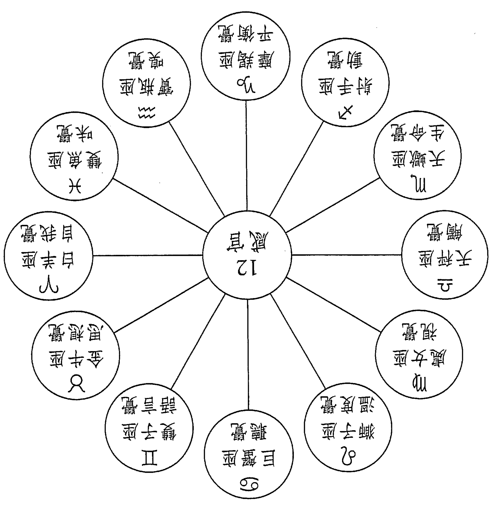

國家圖書館出版品預行編目資料

十二感官=Our Twelve Senses/艾伯特·賽斯曼 (Albert Soesman) 著；呂理瑤 譯
台北市：琉璃光，2011，4
面：公分
ISBN 978-957-8840-37-9
1．靈修

## 十二感官
Our Twelve Senses

作　者：艾伯特·賽斯曼 (Albert Soesman)
譯　者：呂理瑤
出版者：琉璃光出版股份有限公司
創辦人：雷久南
發行人：邱麗惠
地　址：台北市和平東路二段107巷12-1號1F
電　話：02-2325578 (代收據)
傳　真：02-2325506
網　址：http://www.lapislazuli.org
名　名：琉璃光出版股份有限公司
郵撥帳號：16959666
定　價：新台幣 220 元
總經銷：吳氏圖書股份有限公司
地　址：新北市中和區中正路788-1號5樓
電　話：02-32340036
傳　真：02-32340037

2011年4月初版1刷
2015年1月 初版6刷
版權所有翻印必究

Originally published in Dutch under the title:
De twaalf zintuigen
© Uitgeverij Vrije Geestesleven, Zeist 1987

现在生活的感官超载令我们感到空虚，甚至会渴望更多的刺激。所以如何找到一种更均衡的方法去体验和了解人类的感官呢？

作者艾伯特。索斯曼说我们可以由体会12种感官的丰富内涵为开始。这12种感官是触觉、生命觉、动觉、平衡觉、嗅觉、味觉、视觉、温度觉、听觉、语言觉、思想觉与自我觉。有了对健康感官的深度了解，我们的内心生命与对周遭世界的体验就会更丰富充实。

本书中以活跃的灵魂想像的能力对灵性的探索乃是依据鲁道夫。史丹勒博士对感官的研究，并以显明易懂的方式介绍了人智学对人类的看法。

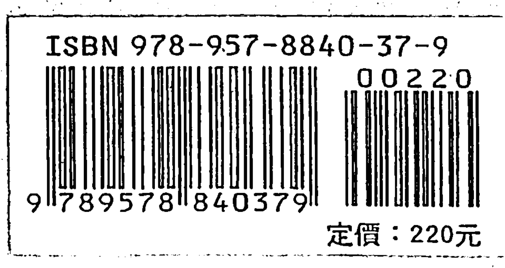