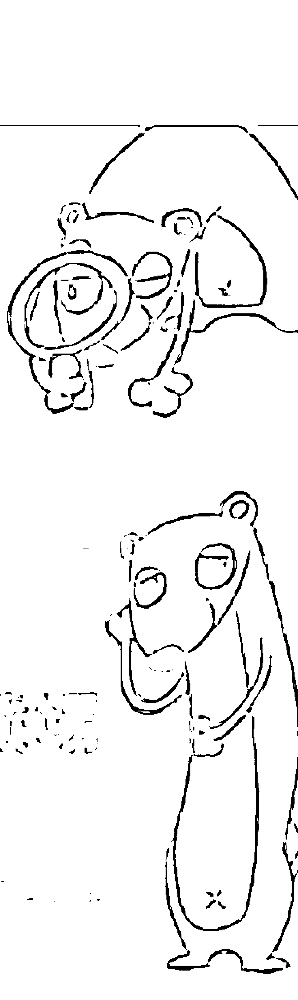
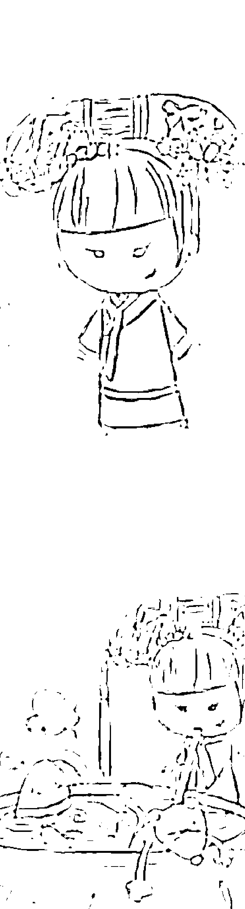
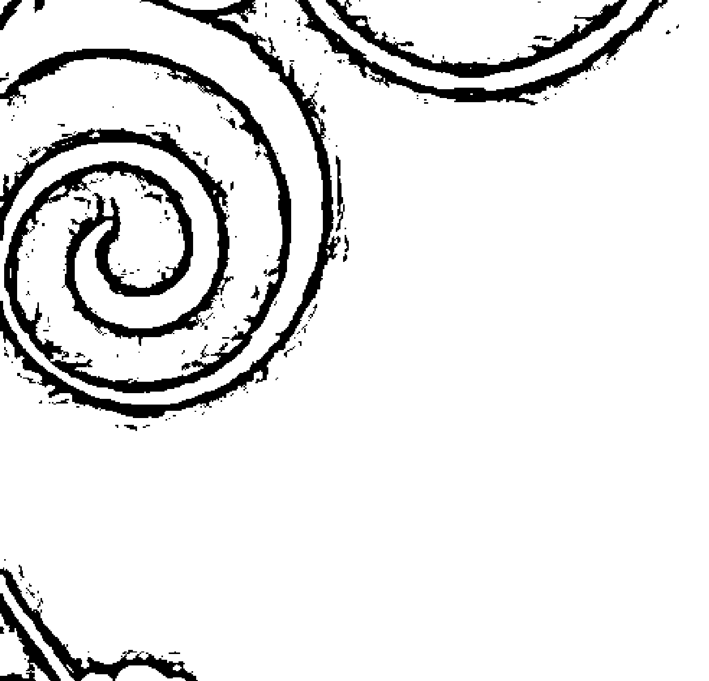
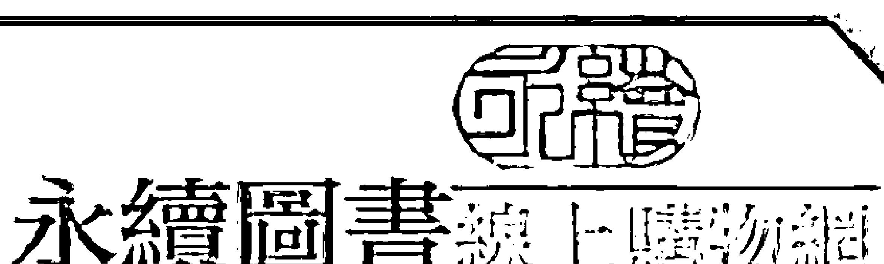

## 十二星座首席愛情大師
布莱儿/编著

双鱼在爱情方面很敏感，沉溺于浪漫的幻想，显得不切实际。

白羊精力充沛，很冲动，他们的爱情往往开始于性的吸引。

金牛的爱情观则是——除非遇到可以托付终身的另一半，否则很难动情。

## 只要有这一本
你就能成为爱情大师！

# 十二星座首席爱情大师
编著 布莱儿
出版者 读品文化事业有限公司
执行编辑 林于婷
美术编辑 刘逸芹

本书经由北京华夏墨香文化传媒有限公司正式授权，同意由读品文化事业有限公司在港、澳、台地区出版中文繁体字版本。

非经书面同意，不得以任何形式任意重制、转载

总经销 永续图书有限公司
TEL/(02)86473663
FAX/(02)86473660
划拨账号 18669219
地址 22103 新北市汐止区大同路三段194号9楼之1
TEL/(02)86473663
FAX/(02)86473660

出版日 2013年06月
国家图书馆出版品预行编目资料
十二星座首席爱情大师 / 布莱儿编著. -- 初版. -- 新北市 : 读品文化, 民102.06 面 ; 公分. -- (幻想家 ; 6) ISBN 978-986-6070-90-7(平装) 1.占星术 292.22 102006388

## 目錄
- 白羊座 005
- 金牛座 027
- 雙子座 045
- 巨蟹座 067
- 獅子座 089
- 處女座 113
- 天秤座 135
- 天蠍座 153
- 射手座 175
- 摩羯座 195
- 水瓶座 215
- 雙魚座 235

## 白羊座 × 職場特質
白羊一直推崇自我且思想充滿叛逆，他們並不是不熱愛生活、不喜歡工作，他們只是想用自己那顆敏感、永不滿足，自由和不虛偽的心，真實的詮釋生活的意義與工作的價值。

即使上班，也不會心甘情願套著對自己有嚴重束縛感的制服，因此制度嚴格、風氣死板的公司，基本上都不是他們會考慮的工作型態。

他們最不喜歡的就是因循守舊、按部就班的生活與工作方式，習慣在工作中盡善盡美、無拘無束地表現自己。作為職場上的先鋒，白羊經常在工作中表現出急躁、好勝、沒耐心等性格缺陷，但是這些絲毫不會影響到他們積極的行動力。如果工作的環境足夠自由、放鬆，那麼白羊的自我才能更出色地表現出來。

這就是白羊的風格，這種特別之處或許多數是因為他們位居十二星座之首，全身上下都有創新冒險的氣息，當然偶爾也會表現出很強的領導慾。白羊在工作中，往往精力充沛，不管做任何事情都會全力以赴，力爭上游。他們的坦誠、直率、正義、熱情，儘管也會帶些自我主義的風氣，但是對身邊的人很有影響力。由於總是坦誠地表達自己的想法，因而很容易獲得同事的信任和尊重。

## 白羊座 × 面試指點
白羊由於生性好動、善於表現自己，往往會給面試官一種積極進取的印象。但是，任何事情的優勢都需要拿捏適度，否則優勢反而會成為致命傷。因此，白羊在面試中表現太積極、太過火，例如對自己的優點侃侃而談，看不到自己的缺點等，會讓面試官感覺你是個自大的人，而自大往往是團隊發展的絆腳石，面試的結果可想而知。想要獲得面試官的青睞，白羊應該揚長避短。在面試中，適度表現出對自己的工作的積極熱情，在保證對自己有充分自信的同時，切忌自誇。無論是回答問題還是向面試官提問，要傳達給面試官一種理性成熟的感覺，可以表現自己耐磨、耐心、耐苦的一面。

## 白羊座 × 表現指點
剛進職場不久的白羊，由於不懂職場流言的「潛規則」，對於自己心直口快、大剌剌的個性往往不知收斂。每每和同事聊天，還是保持著熱情的狀態侃侃而談，儘管自己沒有害人之心，但是缺乏防人之心，難免會搞得流言四飛，人氣大跌。

因此，聰明的白羊應該隨時提醒自己管好嘴巴，該說的說，不該說的打死也不說。既要少參與辦公室的無聊議論，也不要散佈謠言，當一個保持沉默的白羊，才能遠離是非的漩渦。

在工作中，白羊是個拼命三郎，什麼事都不願意落後於別人。儘管能幹，但是他們的失業指數是六顆星，在十二星座中僅次於天秤和雙魚。追根究柢是因為白羊在工作中總是難以確實地做到公私分明，總喜歡把對其他人的不良情緒表現出來，讓人避而遠之。因此，如果喜歡你現在的工作，就學著控制一下自己的情緒吧！

## 白羊老闆 × 雷厲風行
職場中，如何與老闆和諧相處是永遠值得關注的話題。在做好一件事情之前，應該先要瞭解自己的處事對象，同樣的道理，與老闆和諧相處、瞭解他的行事作風是重點，只有瞭解才會理解，只有理解才會認真執行。

白羊老闆最大特點就是急性子，他們喜歡反應敏捷、行動迅速的員工。白羊老闆最注重下屬的工作成果，而不會關注他們的工作細節，因此作為白羊老闆的下屬，在向老闆呈報的時候，切忌囉唆，應該簡明扼要；如果有任何異議，最好直接向老闆提出來，因為白羊老闆無法理解下屬的暗示與提醒。

儘管白羊老闆不善於以情感去關懷下屬，但是他欣賞工作勤奮的下屬，往往對他們實行慷慨解囊的獎賞。

白羊不是很摳門的老闆，卻是典型的英雄主義者，他們為了能夠創造出奇蹟，甚至可以冒著破產的風險。

## 白羊座 × 相處指點
白羊是很懂得融入團體的上班族。他們積極活躍，常參加各種集體活動，在公司露面的機會比較多，受人關注的程度也比較高，再加上他們喜歡侃侃而談的直爽，比較吸引同事們靠近。即使是剛進公司不久的白羊，也能很快就和同事打成一片。

但是，白羊生性好強，比較喜歡盡情地展現自我，在團隊中難免有點刺眼，但是有他們在的地方都會充滿刺激與快樂，大家往往是在習慣中慢慢適應他們的活躍，尤其是在團隊遇到困難的時候，白羊會毫不猶豫地迎接挑戰，讓同事們在佩服之餘，也會受之鼓動，士氣大振。

## 白羊座 × 月光族
月光族是上班族耳熟能詳的名詞，它與儲蓄族的消費觀完全不同，主張「能花才更能賺，花光用光自得其樂。」

以星座來衡量白羊的收入與支出或許不太準確，畢竟每個人的收支情況受多種因素影響。這裡只是相對而言，因為只要白羊一衝動，就會狂刷卡或血拼，由於他們在日常生活中揮霍無度，成為月光族的可能性相對變大。

白羊很豪爽，一個月那麼一次一擲千金的機會就能讓他們成為月光族；他們很講義氣，又很衝動，常會花錢在朋友身上，買些不必要的東西，根本不懂得節儉。白羊應該對自己的花錢消費加以節制，儘管消費是在刺激社會經濟的成長，但是未雨綢繆為自己存下一點保障，並不是壞事。

## 白羊座 × 魅力指點
每位上班族都希望能夠在氣質上打動別人，都想要成為路上、辦公室，甚至世界上每一個角落中關注的焦點。而關注的焦點並非缺乏內涵的空虛感覺，而是一個人無論是由內而外，還是由外而內，都能夠散發出迷人的個性、氣質與魅力。

白羊具有俐落、精力充沛的個性，對他們來說，時尚的裝扮需要突出對比中的鮮豔，外加簡約的穿衣風格，襯托出白羊的時尚中性風格。白羊會跟著自己的感覺和衝動來穿搭，時尚也就不約而至。

他們在穿搭上喜歡穿出屬於自己的特色，也就是找到符合自己形象的時尚。一般能夠討他們歡心的色調多為溫暖、青春等比較鮮豔的色調，例如紅色。

簡單而又直接的服飾風格非常適合白羊的率直。因此，時尚的白羊女性適合選擇略顯男性或中性的裝扮；時尚的白羊男性適合選擇線條簡單、顏色比較素淨的服裝。

## 白羊座 × 詩情畫意的純淨生活
就像女人不能只有美麗一項，身為一個上班族更不能一味投入於工作。

一個出色的上班族往往會在上班時間發揮充分的工作效率。扣除待在辦公室的八小時，明智的上班族會選擇享受下班後的生活，例如：和朋友臨時約去墾丁享受日光浴；到瑜伽教室放鬆一下緊繃的身心等。

給自己一個良性的規劃，勞逸均衡，才能讓自己每天都神采奕奕地進辦公室，坦然迎接工作中的挑戰。

過膩了快速得讓人頭疼的生活，現在的上班族已經漸漸開始接受「慢活」的生活態度，因為享受慢活，才不至於在忙碌中迷失自己，因而錯失很多有意義的事物。

由於白羊女性最愛美，每天不照鏡子絕對不出門。所以，選擇一個SPA會館來放鬆是最佳選擇。另外，白羊也不是只顧外表而不顧內涵，書店對白羊來說並不陌生，他們會在閒暇時候，選擇一個書店安靜的角落，閱讀著自己喜歡的書籍，此時的白羊女性顯得知性唯美，白羊男性則一副文靜的書生氣息，樣子甚是吸引異性的目光。當然，這時候再搭配一些輕音樂就更完美了。

## 白羊座 × 職場指南

### 白羊座面試時最好不要穿紅色
面試是求職者全面展現自身素質、能力、品質的最好時機。面試發揮出色，可以彌補筆試成績或是其他條件，例如學歷、專業的不足。在整個應徵過程中，面試無疑是最具有決定性意義的一環，事關成敗。

白羊行動起來，果決、迅速，不用擔心給面試官留下拖拖拉拉的感覺。但需要注意的是，要學會傾聽面試官的問題，想好之後再回答。

在穿著上，白羊千萬不要穿色彩鮮豔的衣服，尤其不要穿紅色，穿上紅色會讓他們本身開放的氣質更加顯得招搖，會給面試官留下不夠穩定的印象。

### 白羊座細心一點，加薪機會大
俗話說：「一分耕耘，一分收穫。」但事實往往並非如此，白羊則可以不用很費勁，只需要細心一點就能夠得到老闆的讚賞。

白羊很有衝勁，但是有時候很莽撞。如果在老闆特別關注的事情上，突然表現出細心的一面，這樣就會讓老闆有把他們培養起來的成就感，以後自然會對他們委以重任。在老闆對白羊刮目相看的時候，再提加薪的要求比較合適；如果老闆不答應，千萬不要和他爭辯，要留有餘地，反正要求已經傳達給老闆，就會引起他的關注，他也會繼續在的考察中對白羊有所認可。

### 白羊座喜歡跳槽
「人往高處走，水往低處流」固然沒錯，但是白羊列出的跳槽理由讓人大開眼界。

白羊想趁年輕，換個環境再闖一闖。他們總是喜歡開始而不喜歡結尾，他們喜歡多改變、多嘗試。

### 白羊座具備打拚精神
講起打拚之心，白羊首屈一指。白羊行動果敢，一旦訂下目標就會馬上實施，絕不會拖泥帶水。

挑戰越大，他們的鬥志就會越高，這是他們的本性使然。不過，白羊有時候會陶醉於自己的勝利，有時候還喜歡逞強，做些力所不及的事情。

### 與白羊客戶洽談，最好先不提細節
與客戶談判，一次錯誤行為會使以往一百次的努力前功盡棄。若要巧妙應對客戶順利完成工作，最好根據星座，採取應對措施。

白羊是火象星座，他們急躁、沒有耐心，因此一些細節性的東西先不要和他們提起，應該先把主要的東西敲定，下次再談細節也不遲。另外，對於白羊客戶，需要多接觸，每次開會的時間不要太長，一次解決一點問題。開會的環境也非常重要，千萬不要到吵雜的地方和白羊談生意。你給白羊客戶留下的第一印象非常重要，如果不合他的心意，可能就再也沒有機會了。

### 與白羊座溝通，最順暢的方式是少説話
不可否認，與人溝通是一項非常有技巧的事。與白羊談話，最重要的是四個字——言簡意賅，因為他們沒有耐心聽你講事情的細碎過程，如果想要與白羊在溝通上及早達到和諧，那就儘快切入主題，講重點。若是講話拖泥帶水，會讓白羊厭倦你。

### 白羊座能獲得好人緣
一個人的人際關係狀況是否良好，是否有好人緣，直接影響到工作、學習、生活順暢與否。那麼為什麼白羊常常得罪人卻能獲得好人緣呢？不妨向他們學習一下！

白羊的好朋友非常多，因為白羊內心非常單純，雖然性格上有點急躁，但是對人可是一片至誠。

很多人有了白羊朋友後就會不自覺地和他們深交。你不用擔心白羊會和你耍心機，不用怕他們會出賣你，也不用和他拐彎抹角的講話，有什麼話可以坦白直説。白羊非常講義氣，對朋友真的能做到兩肋插刀，更可貴的是，他們行事風格十足，如果答應你的事，絕不會拖延。

#### 白羊座容易得罪同事
白羊比較粗心大意，得罪人還不知道。他們不知道反省，不懂得收斂，加上急躁的脾氣，很容易得罪人，因此同事經常在背地暗罵他們。

白羊可以說是處女座的另一個極端，他們評判事物的尺度比大眾認可的尺度只是低了那麼一點點。

### 白羊座最好不要與天秤同事成為好朋友
真正的友誼是一種不計成本，人與人之間的坦誠相待，它經得起任何考驗。但是白羊與天秤的搭配組合，卻因各種原因，很難有天長地久的友誼。

白羊衝勁十足，而天秤非常鎮靜，沉得住氣。在初期兩個人的配合會讓雙方都耳目一新，也比較依賴對方。

但是時間一長，白羊就會先對天秤產生不滿，因為天秤會讓白羊有被控制、指使的感覺，如果有什麼起因讓白羊感覺天秤虛偽、矯情的話，兩個人的友誼就會結束了，天秤也會對白羊的粗魯、暴躁感到頭痛，漸漸地對白羊冷淡起來。

### 白羊座適合開體育用品商店
網路上開店成本比較低一點，所以可以多做嘗試，即使不以此為主業，也可以給自己增加一點人生體驗。

雖然白羊的運動成績不怎麼樣，但是他們對體育器材是相當的敏感，競技類也好、健身類也好，都是白羊所熱衷的體育運動，因此他們對體育相關常識瞭解甚多，能給予顧客們合適的運動建議。

## 白羊座 × 健康祕訣

#### 白羊座最需要瘦腰
現在是一個以瘦為美的時代，尤其是女性，骨感比肉感更能得到異性的青睞。

減肥迫切性：☆☆☆☆☆
關鍵部位：腰部、腿部

原因分析：
白羊精力充沛、天生體質健壯，加上比較熱情衝動，行事風格十足，喜歡到處跑來跑去，所以腿部比較粗壯，尤其是小腿，可能是全身最難瘦下來的部位。

而白羊的人比較貪吃零食，很喜歡在閒談、看電視的時候拿零食往嘴裡塞，久而久之，不胖才怪。另外，白羊對減肥沒什麼毅力，即使開始減肥，也會很快就放棄。如果白羊實在胖得很厲害，可以採用一些手術的方法，如果情況不那麼嚴重，就只有在平時多注意一些了。

小祕訣：
- (1) 少吃容易讓人發胖的食物。
- (2) 不要買零食放在家裡，更不要帶到辦公室。
- (3) 多按摩腿部。

### 白羊座應該多補充維生素H
白羊要多補充維生素H，所以白羊平時要多吃牛奶、蛋黃、動物腎臟、水果、糙米等富含維生素H的食物，預防用腦過度。

### 白羊座適合睡深色的床
人的一生有三分之一的時間是在床上度過，床是人恢復元氣，吸收日月星辰精華的地方。

白羊精力充沛，具有戰鬥力，煩躁的情緒讓他在床上不翻騰半天無法安然入眠。一旦醒來，白羊就會露出柔弱的一面，這時候的白羊喜歡賴床，所以白羊適合選擇黑色、咖啡色等深色的臥床，床的線條簡單大方，色調柔和高貴。

## 能輕易向白羊座借到錢
魯迅先生曾說：「越有錢越小氣。」這話是有道理的，也是沒辦法的事情。白羊沒有什麼理財計畫，最好的情況就是把錢交給另一半管理，他們重情義，性情豪爽，一旦有人向他們開口借錢，絕大多數情況下，他們都會慷慨解囊。

## 為什麼職場白羊適合短線投資？
職場白羊投資短線最適合，因為個性衝動，坐不住的白羊對於股市裡的風起雲湧無法完全接受。他們會在最初投資股票時取得一定的成績，但一旦長期投資開始，白羊就會因為衝動的性格而吃虧遭受損失。

## 白羊座 × 情感喜好

### 為什麼職場白羊與網戀無緣？
生活節奏如此之快，我們每個人心底都有一份很深的情感不願向朋友、親人傾訴，而網路為我們提供了傾訴的物件。網戀也就應運而生了。為何白羊星座容易發生網戀，卻又與網戀無緣呢？

因為，白羊很快就會和別人談起隱私內容，小時候的相片在第二次聊天時就會拿出來給別人看，第三次聊天就要約人見面，結果總是見光死。

### 為什麼性感可以俘獲白羊男？
新時代的女性為了自己的幸福要大膽一點，喜歡他，就要表現出來。

火象星座的白羊精力充沛，很衝動，他們的愛情往往開始於性的吸引，所以面對白羊男時，要打扮得性感一點。白羊對女人身上的香味尤其沒有抵抗力，三不五時用妳的體香去誘惑他，他很快就會拜倒在你的石榴裙下。

| No. | Category | Name | Description |
| :--- | :--- | :--- | :--- |
| 1 | Primary Care | General Practitioner, Nurse Practitioner | First point of contact; diagnosis and management of common illnesses; health promotion and disease prevention; referral to specialists. |
| 2 | Specialist Care | Cardiologist, Dermatologist, Endocrinologist, Gastroenterologist, Gynecologist, Hematologist, Infectious Disease Specialist, Neurologist, Nephrologist, Oncologist, Ophthalmologist, Orthopedic Surgeon, Pulmonologist, Rheumatologist | Advanced diagnosis and treatment of specific conditions; complex case management; specialized procedures. |
| 3 | Emergency Services | Emergency Medicine Physician, Emergency Medical Technician (EMT), Paramedic | Immediate and urgent care for acute illnesses and injuries; stabilization and transport. |
| 4 | Diagnostic Services | Radiologist, Pathologist, Laboratory Technician | Imaging studies (X-rays, CT scans, MRIs); laboratory tests (blood work, biopsies); interpretation of diagnostic results. |
| 5 | Mental Health | Psychiatrist, Psychologist, Licensed Clinical Social Worker, Marriage and Family Therapist, Substance Abuse Counselor | Evaluation and treatment of mental health disorders; psychotherapy; counseling; medication management. |
| 6 | Surgical Services | Surgeon (various specialties), Operating Room Nurse, Anesthesiologist | Performance of surgical procedures; anesthesia management; post-operative care. |
| 7 | Allied Health Professionals | Physical Therapist, Occupational Therapist, Speech-Language Pathologist, Dietitian, Pharmacist | Rehabilitation services; nutritional counseling; medication management; support for daily living activities. |
| 8 | Long-Term Care | Geriatrician, Hospice Care Provider, Home Health Aide | Care for chronic conditions; end-of-life care; assistance with daily living in residential settings. |
| 9 | Public Health | Epidemiologist, Public Health Nurse, Health Educator | Disease surveillance; health policy development; community health education; prevention programs. |

## 金牛座 X 趕婚風尚

金牛趕婚族，迫於嚴峻的就業壓力，主張結婚要趁早，不然好物件會被別人先搶到，所謂「幹得好不如嫁得好」。在他們看來，婚姻是就業的捷徑。

只要嫁個完全養得起自己的人，就能夠安心做自己的全職太太，沒事打掃打掃屋子，無聊就跑跑健身俱樂部，輕鬆享受物質生活遠比在職場上摸爬滾打要強多得多。

## 金牛座 X 職場特質

金牛座為十二宮的第二個星座，代表成長。給人沉靜、勤奮、誠實、作風消極的印象，人情味很濃厚。

金牛的感官很強，他們對物質的要求比較強烈，一旦物質出現不充裕的時候，空虛就會像沙塵暴一般呼嘯而來。因此，在金牛勤勤懇懇的背後，常常暗藏著一顆為金錢而悸動的內心。那麼在當今工作壓力極大、競爭極具激烈的形勢下，金牛更傾向於早點結婚，當然結婚的前提是，結婚對象必須很有錢。

於是，一旦金牛遇到一位有錢有地位的人士，就會盡全力去爭搶，因為在他們心底中，找一個有一定經濟基礎的伴侶或許比找一份穩定的工作容易些。

趕婚族，似乎與我們所要講的職場上班族沒有什麼太大關係，但就是潛伏在職場中踏實苦幹的他們，心中一直覬覦著情感的好運氣，能夠將自己帶離壓力的苦海。這也與金牛的性格弱點不謀而合，即頑固、自私、懶惰、喜好奢侈浮華，容易自我放縱等。

於是，在透過現象不一定看到本質的情況下，職場金牛在低調的背後、在趕婚傾向的潛意識中，會給金牛的就業、職場表現帶來與其他星座不同的「反響」。

## 金牛座 X 面試指點

對於金牛來說，克服面試是進入職場的關鍵課題。金牛個性謹慎、反應較慢、口才表達不佳，很難在面試的時候將自己的優點表達出來，給面試官一種怯生生的、不夠自信的感覺。

既然金牛在面試過程中的臨場反應不佳，那麼最直接的應對方法就是事前做夠充分的準備，將公司的狀況、企業文化、價值理念等熟記於心，將面試經常遇到的問題答案事先陳述幾遍。面試過程中，說話應該簡潔有力，語氣堅定、有自信，避免思考太久。

## 金牛座 X 表現指點

金牛新人在進入職場後，往往表現出悲觀、不自信的一面，他們在面對挑戰時總是缺乏應對困難的勇氣。工作中，經常想得太多，工作的方法常常落入俗套，不懂得創新與變通。金牛在職場前期應加強心理素質的鍛煉，凡是多往樂觀的方向去想。

職場中，金牛工作比較穩重，且很具原則，再加上情緒、工作態度沒有白羊那麼風雲善變，因此更容易得到公司的器重。

職場金牛的失業指數是三顆星，雖然星不多，但不能够大意。職場金牛想要讓失業指數降到更低的話，那就丟掉固執的包袱，圓融一點、積極一點、主動一點，多與別人溝通，才會讓自己事業亨通。

## 金牛老闆 X 講求實際

與白羊老闆的雷厲風行截然不同，金牛老闆最大的特色是實事求是。他們做事趨向於耐心、穩定以及緩慢的特色，對下屬習慣進行長久的考驗，最青睞能夠用業績說話的員工。

金牛老闆習慣按照自己的思維出牌，不會輕易被人說服，他們善於事必躬親，是不折不扣的實幹型老闆。雖說金牛的反應一般比較緩慢，可是他們仍然屬於精明至極的老闆。金牛老闆不會過度放手授權不說，還會對財會帳目無師自通。凡是在金錢或者態度、行為上發現有不忠於公司的人，金牛老闆會非常刻薄地對待他們，甚至讓他們走人。金牛老闆最不願意忍受的就是被欺騙。

儘管金牛老闆對待員工不會很大方，但是他們公私分明、賞罰嚴格，員工有多少付出，就會給予相應的多少薪酬。

## 金牛座 X 相處指點

和金牛同事在一個辦公室中和睦相處，並不是什麼難事。如果能夠抓住金牛同事的處事作風與原則，就可以順應其意、避免不必要的衝突。

與金牛同事相處，首先應該清楚他們是一群需要將理性與尊重作為前提的「倔牛」。在工作的溝通中，只要有充分的道理與證據說明，他們會認可；但如果是不分青紅皂白，對於他們的工作說三道四的話，這會嚴重激起他們的牛脾氣，與你較勁到底。職場金牛最討厭散播流言的人，在他們面前最好不要搬弄任何是非。

金牛同事一般具有明智、清晰的頭腦，在工作中考慮問題往往周詳、全面。當與他們在觀點上存在分歧的時候，切忌劈頭蓋臉的對他們批評一通，應先等他們陳述完觀點後，再行提出有力又有理的論據，這樣職場金牛還是會讓步的，因為他們看重以理服人，同時也希望別人能夠以理讓他們服氣。

十二星座中，務實堅毅的摩羯是職場金牛最默契的工作搭檔，而處女應該是最能夠了解金牛心情的人。即使不小心得罪了職場金牛也不用太擔心，只要誠懇、坦白的道歉，一般還是會得到金牛的原諒的。

## 金牛座 X 魅力指點

金牛在職場中最適合的氣質類型是溫婉含蓄，金牛注重服飾的品質與格調。對於他們來說，時尚不只是流行，而是用來展現美的工具。職場金牛認為，時尚是可以隨著季節的改變而變化的。在夏季，嬌豔是一種時尚；在冬季，保暖與溫馨也是一種時尚。

金牛更加注重衣服的質感、顏色、品味等，因為它們最能夠襯托出金牛的氣質與性感。

金牛在追求時尚品味的同時，喜歡各種可以裝飾自己的飾品。比如，高雅的香水味、誘人魅惑的蕾絲等。披肩，是最適合點綴金牛氣質的配件。至於鞋子，嬌豔的夾腳鞋或者優質皮質的涼鞋都比較適合襯托金牛女的氣質。

對於金牛男來說，標準的西裝最能展現金牛務實及節省的性格，如果想要展現一下風格的變化，穿一件立領的素色襯衫搭上一條領帶，會顯得簡單而又幹練。

職場金牛，雖然會帶有一些功利性的選擇趁早結婚，但是不可否認，金牛座的女生註定是個好妻子，因為他們具有超高的烹飪技術，並且樂於下廚房，並且樂於研究美食，並享樂其中，這與金牛座女生穩重的性格有關。金牛座女生愛下廚房並不影響她的小資情調，雞尾酒也許是金牛女飯桌上必不可少的一道浪漫風景。

晚飯過後，小調曲子響起，金牛座女生伴著音樂閉上眼睛，靠在沙發上回憶著往事，思著明天，也別具一番風味。畢竟工作不能是生活的全部，偶爾愜意一下，給自己一個享受生活的機會。

對金牛座的男生來說，小資調調沒有什麼太值得關注，因為他們是非常實際的人，只要能夠安安靜靜地過著自己的小生活，就是無與倫比的幸福浪漫。

## 金牛座 X 職場指南

### 厚重的鞋子會影響金牛面試

面試需要講究的技巧雖然很多，但是清新、明快的氣質感覺總會在面試中為自己增色不少。

金牛喜歡穩穩當當，做事慢條斯理，需要注意的是時間觀念要強，別遲到了。穿著上要特別注意不要穿那種很厚重的鞋子，會給人笨重的感覺，鞋子一定要輕盈，給人飄逸的感覺來彌補自己略顯木訥的神態。

### 默默耕耘還是加不了薪？

職場金牛其實很在乎錢，但是又不願意流露出來，總覺得開口要加薪，有點難以啟齒。他們認為，只要自己拼命工作，總有一天能引起老闆的關注，得到老闆的認可。其實，這種做法行不通，老闆認可是回事，給你加薪又是另一回事。有的老闆很會假裝睜一隻眼閉一隻眼，若想加薪，應大膽地提出自己的要求。

### 為什麼金牛要跳槽？

職場金牛對金錢的概念比較敏感，因此對於工資的計較往往也非常認真。儘管對於每一次的跳槽，職場金牛都會大聲藉口說「這份工作與我的職業規劃掛不上鉤」，其實他們就是對薪水不滿，什麼人生價值、理想，統統都是藉口。

### 為什麼金牛同事會比較陰險？

金牛的問題在於嫉妒心，他們最看不慣別人高調的樣子，如果誰洋洋得意，金牛就會把他記在心裡，伺機給予打擊。他們很懂得辦公室政治，拍起馬屁來也很有技巧，可以說完全不著痕跡，讓上司很受用。金牛座有時候會說謊話騙人，雖然謊話數量不多，但是品質很高，往往用在關鍵點上。在同事之間的競爭中，金牛座是個非常厲害的角色，千萬不要被他們的外表欺騙了。

### 為什麼殷勤會讓金牛客戶反感？

金牛比較好說話，需要注意的是不要對金牛過於殷勤，否則會引起他們的疑心。另外，金牛對錢財比較敏感，在他們面前一定要表現得財大氣粗，這樣他們的戒備心才會直線下降。

### 為什麼流行語會造成與金牛的溝通困難？

與職場金牛在工作中打交道的時候，要用平實形象的語言來描繪事物，千萬不要用些時髦或生僻的詞彙，更不要時不時夾點外語，因為金牛是不喜歡捕風捉影、跟隨潮流的人，這種人嘴裡新潮的詞兒會弄得金牛轉不過彎來，產生誤會，那樣溝通可就慘了，不但達不成最後的協議，反而會弄得不歡而散。

### 為什麼金牛極待工作壓力的緩解？

金牛在職場中，往往承擔著比較大的工作壓力，而這壓力的來源不僅僅在於工作，也在於自己內心的糾結，即外在的沉穩會與內在的心緒經常出現衝突，但是金牛還是不願意把內心的想法表現出來。因此，繁重的工作量再加上擰巴的心理，壓力不大才怪。

當然，金牛沒有射手那麼灑脫，不過，務實的金牛也有獨特的面對壓力的方法。金牛對付壓力的方法說起來很簡單，就是硬扛。穩重踏實的金牛對壓力的負重能力遠遠超過其他星座，有點泰山壓頂不彎腰的意思。退縮、失敗的後果是金牛座絕不能接受的，所以死扛，「挺一挺就過去了」是金牛的座右銘。

### 為什麼金牛適合開保健營養品的網店？

保健營養品，想擁有牛一樣強壯結實的身體嗎？怎麼選擇種類繁多的營養品？金牛座中肯、慢條斯理的回答一定會帶來很多的買家。

這是因為，金牛座天生對吃的東西比較有天賦，敏銳的味覺使他們從來不會放棄任何美味佳餚，由此對保健營養品也很有研究。

## 金牛座 X 健康祕訣

### 為什麼金牛全身都需要減肥？

減肥，一直是上班族比較關心的話題，尤其是上班族整天坐在辦公室中，戶外活動很少。這對於脂肪的堆積、健康的保障都有著很不好的影響。職場金牛如何根據自身的特色達到最好的瘦身效果呢？

- 減肥迫切性：☆☆☆☆☆
- 關鍵部位：全身上下

原因分析：金牛座是十二星座中最容易得天生肥胖症的星座，即使金牛座中少有的瘦子，也大多是因為生活狀態比較糟糕導致的，這樣也容易得上別的疾病。如果生活條件比較優越，尤其是長期從事運動量低的工作，金牛座要想不胖很難。不過，金牛座的胖是那種很壯實的胖，很少出現一身贅肉的情況。即便如此，金牛座的人也應該比別的星座的人更注意控制體重，如果家裡有人燒得一手好菜的話，對金牛座來說可不是件什麼好事。

小祕訣：
- (1) 少吃多動是金牛座很有效的減肥手段。
- (2) 不要吃高熱量的食物。
- (3) 不要去附近的小餐館。

### 為什麼金牛需要多補充維生素D？

金牛是十二星座中最穩重的星座，他們需要結實的骨骼和富有彈性的肌肉，因此需要多補充維生素D。建議金牛座除了多吃富含維生素D的食物外，還要多在戶外曬曬太陽。

### 為什麼金牛睡結實的床最舒適？

職場金牛，沉穩但是脾氣比較倔強，所以對床的要求大而結實。金牛不適宜過於柔軟的床鋪，顏色也要求冷色，床架不宜過高。

整體來說，就是要讓金牛有睡在大地上一樣穩當的感覺的床，就是最好的床。

## 金牛座 X 理財情報

### 為什麼不容易從金牛同事那裡借到錢？

金牛即使有錢，但並不是那麼好借，他會仔細考慮對方的償還能力和人品，只有合格後他才能出手相助，不然他能找到一堆冠冕堂皇的理由來加以拒絕。

另外，要向金牛座借錢，最好主動提到加利息，那樣成功率會高不少。

### 為什麼金牛適合投資股票？

個性沉穩的金牛是土星星系裡沉穩和耐性的代表星座。金牛具有的這兩個優點令其十分適合投資股票，格雷厄姆便是成功的代表人物，守護星金星代表財富，能為金牛帶來財運，所以，對於金牛來說，長線短線都可以賺錢。

天生就是理財專家的金牛具有這方面的潛質。沉穩的性格令其不會被股市的起伏而影響心情。

### 為什麼金牛可能一生富貴？

綜合十二星座的性格特色與運勢來講，金牛在金錢運上是比較積聚財氣的，難道這與他們生來就對金錢計較有關？

金牛早期的奮鬥可能會有一點艱苦，可是只要小有積蓄，金牛就能玩起他們那最拿手的把戲——以錢滾錢。他們簡直就是天生的金融學家，投資理財手段一流。如此一來，想不富貴的可能性當然不會很大。

## 金牛座 X 情感喜好

### 為什麼金牛不會受到網戀的迷惑？

職場金牛是最不可能網戀的星座，即使是同在一座城市很容易就見面的網友，也最多成為生活中的朋友，當戀人的機率非常低。這與金牛的愛情觀有很大的影響。除非遇到可以託付終身的另一半，否則很難動情。尤其對網戀這種新潮又捉摸不定的戀情，金牛往往是避而遠之。

### 為什麼成熟可以打動金牛男？

金牛座的男人，喜歡知性的女人，所以要表現出你的書卷氣來。但是不要弄成女學生的模樣，太嫩了會讓穩重的金牛座猶豫是不是該下手，還是打扮得成熟一點為好。

## 雙子座 X 跳蚤風尚

在一項調查顯示中，56.1%的職場人士第一工作年限不滿一年，而能在第一個工作崗位待三年的，還不到10%。如此高的跳槽比重，跳蚤族的「功勞」可謂不小。

雙子跳蚤族總喜歡在各種公司之間游移，通常都是他們把老闆開除，而原因其實微小得可憐，比如跟某一個同事相處不開心，比如工作量太大，再比如挨了老闆幾句批評。他們敢於頻繁地跳槽，在於他們相信自己的運氣是不錯的，在於他們一直堅信下一家公司才是最好的，也在於他們想要完全按照自己的心意來過活。

## 雙子座 X 職場特質

在將雙子與職場跳蚤族聯繫在一起之前，先來看一下雙子具備的個性表現。其中，興趣廣泛、多才多藝、思維敏捷是雙子典型的性格特徵概括。

雙子想像力豐富，適應能力強，兼備活力和聰慧。對任何事物具有極敏銳的觀察力、強烈的好奇心和不斷汲取新知識的欲望。這使他們在職場中經常保持年輕、精力充沛且富有魅力的特徵，很多同事喜歡和他們交往，經常圍繞在他們的周圍。

雙子性格的優點是善解人意、樂於助人、寬容大度，能適應任何環境，並能盡力保持獨立的個性。然而，即使雙子的外表很熱誠，心中卻很冷，他們深受理智控制，不容易動真感情。在雙重性格的外衣下，一個是個性乖戾的藝術家態度，另一個是樂觀明朗的社交家，這種雙重性格使其生活常常發生矛盾，沉溺於幻想，易滿足於沉思和白日夢，有時甚至悲觀厭世。

在雙子的脾性中，職場表現最為明顯的是強有力的適應性，即無論走到哪裡，都能夠很快地將自己融入環境的需要當中去。正因如此，雙子與「跳蚤」變得越來越有默契。

職場中，雙子總是徘徊在各種公司之間，不停地蹦來蹦去，可謂瀟灑了得。通常跳槽的原因是他們炒掉老闆，即使老闆對他們的才華比較青睞，只要自己感覺工作得不開心，或者工作壓力太大，拍拍屁股就走人。

這與雙子的職場價值觀、人生觀有著重要關聯，即人生只有一次，最重要的是做自己喜歡的事情，而不是做工作的奴隸。

當然，或許有部分雙子善於跳槽是因為想要尋求更好的工作機會，殊不知「下一家公司並不一定是好的」。無論是出於自己的興趣喜好，還是想要謀求更高的發展，雙子應該謹記一點：即使自己有著才華橫溢、表現出色的天賦，但是如果掌握不了哪怕一項專業的硬功夫，反覆跳槽只會讓自己得不償失。

換工作畢竟不能像換牛仔褲一樣簡單或者頻繁。小心頻繁開除老闆的後果，反而是被老闆開除，因而，對於雙子來說，機靈固然好，但是機靈過火反而會物極必反——「跳蚤族」升級為「跳早族」：跳得越快收穫越少。

## 雙子座 X 面試指點

雙子總愛像跳蚤一樣地忙著換工作，那麼針對自身特色的面試技巧，值得擁有並加以掌握。

雙子在求職的面試中，說起話來總是頭頭是道，在讓人佩服他們的良好口才的同時，卻也讓人深覺其思考的淺顯而不夠周延。因為雙子在流利地說出一句話之前，並沒有認真地經過大腦程式的篩選。

因此，雙子在面試的時候，應充分展現自己個性主動、活潑又健談、機靈過人的優點，首先給面試官留下一個好的印象。此外，輪到自己提問的時候，可以提問面試官比較有深度的問題，比如公司文化、公司的長遠規劃，等等。與面試官進行一次較有深度的互動討論，會讓自己的深度與機敏完美呈現，從而會深得面試官的青睞。

同時，由於雙子擅長溝通，懂得隨機應變的技巧，從事業務或公關方面的工作，會更有利於促進事業成功。

## 雙子座 X 表現指點

雙子初入職場，最應該警惕的是自己的勢利眼。不能夠只注重與上司搞好關係，遇到上司就點頭哈腰；而對一般的同事卻冷漠視之，一副愛理不理的樣子。殊不知，上司看重的不是員工的奴才相，而是工作能力。

因此，工作中，雙子對上司的「巴結」懂得適可而止，關鍵是能夠提供給上司滿意的工作成果。對待同事，不能像對待敵人一樣冷漠。否則，對老闆「太熱」，對同事「太冷」，反而讓同事們嗤之為「馬屁精」，讓同事們孤立，也難讓自己的工作平心靜氣地進行。

另外，職場雙子也應該注意一下局勢的變化，當今是一個競爭如此激烈的時代，儘管自身的工作能力超強，並很受老闆的喜歡，但是如果沒有一個安定的進取之心，小心英雄無用武之地。

## 雙子老闆 X 朝令夕改

雙子座是很有意思的老闆。在他們下面工作，往往會有無所適從的感覺，比如說，他們這一刻承諾讓你做這種風格的策劃案，而當你已經有了整體框架的時候，老闆又會突然把你叫到辦公室，告訴你策劃方案又有了全新的改變。

千萬不要太過相信雙子老闆給予的承諾，因為他們總是會被新的想法所吸引。雙子老闆每天都在產生新主意不說，還特別欣賞職員精采的創意想法。單有想法還不夠完善，他們還是願意將這種新想法讓員工在工作中付諸實施。由此，雙子領導的機智隨和、變化多端也就不足為怪。

變化歸變化，雙子老闆卻一直不乏民主、公正的風範。只要與員工共事一段時間，他們就會洞察瞭解每一位員工的才智狀況，並總能夠充分利用員工的能力，安排與能力相應的任務。他們是善於發現千里馬的伯樂，一般不會埋沒員工的才能，只要你有才，他們就會給你足夠展現的自由和權力。

雙子老闆喜歡像他們一樣機智、靈巧的員工，能夠時刻用腦工作，在新思維的挖掘中，不斷創造出高質、高產的工作業績。

## 雙子座 X 相處指點

與雙子同事和睦相處的關鍵是淡定看待雙子的善變。雙子在這一刻正與大家在辦公室說笑話、聊娛樂八卦，下一秒或許一張笑顏逐開的臉就已經變成了一副死魚臉。

不過不必為此過度擔心，雙子並不總是這樣，雙子在職場中的表現理智多於情緒。他們做事情講求的是邏輯推理，而非總是「變臉」式的無聊與無奈。

與雙子同事在一起，往往會被他們的那種創意的活力而打動。他們面對工作運用的是一顆遊戲般的心，但卻無不表現出了對工作的強大適應力，以及在創意與溝通方面存在的天賦。更可貴的是，他們在自由的工作環境下，常常快樂的面對工作。

工作對他們來說並不是什麼負擔，而是可以展現自己創意天分的舞臺。

與雙子一起工作應該注意，正因爲他們崇尚自由、創意，所以他們在需要耐心的煩瑣工作中，嚴重缺乏責任感，從而也會讓自己心情煩躁。這時候，作為同事莫不可給予批評、埋怨，如果不能給予指導，那就保持沉默最好。

因此，雙子在工作中，往往對討厭的事完全沒有行動力，而對有興趣的工作，卻表現出驚人的專注。另外他們很容易在同事面前說錯話，雖然不是有意，卻會讓自己在同事心目中的信任度逐漸減少。

## 雙子座 X 魅力指點

雙子的機智、靈活，讓雙子在工作、生活中充溢著鮮亮的時代感。

雙子在職場上，總是喜歡呈現給大家不同的面貌，盡情地展現自己的聰慧以及靈活的創意。因此，對於時尚的理解，雙子總會因時因地改變穿衣的風格。在他們看來，與時俱進的裝扮，就是一種時尚。

青春是雙子的星座氣質，在時尚的潮流中，任何一各種潮流風格，他們都要嘗試一下。昨天還是豪華軍裝，今天就是一身辣妹裝。即使工作的日程很緊，雙子們也總會擠出時間去逛一下精品小店，最新的流行資訊是他們非常關注的內容。

因此，雙子的職場氣質，便在這般百般變換中凸顯著時尚與潮流的氣息。讓人們在讚歎他們的百變活力的同時，更為他們的時尚裝扮的恰到好處而驚歎不已。

## 雙子座 X 在細瑣中尋找甜蜜

工作上的雙子，如此具有多變的魔力，那麼下班之後，又是怎樣一副生活情境？

雙子最怕寂寞，友情與愛情是生活中重要的調味劑。雙子愛朋友，喜歡熱鬧，常常瘋狂地作出一些舉動。雖然逛夜市、唱KTV、和朋友去吃路邊攤與「小資」情調似乎不搭邊，但是雙子的小資生活展現在他們能夠在這些熱鬧的環境中找到屬於自己的甜蜜細節，比如與朋友在夜市中邊逛邊擺弄一些小掛飾，或者在KTV邊唱歌邊和自己的知心朋友來次交心的聊天。

最具青春與活力的雙子座，永遠都是神采奕奕。

## 雙子座 X 職場指南

### 為什麼穿著穩重會為面試加分？

雙子很會對付面試官，甚至能化被動為主動，所以談吐方面不會出現什麼問題。但是穿著上要講究穩重，否則會給面試官留下輕浮的感覺，再加上雙子對答如流，就會給人很不牢靠的印象。

因此，作為時尚風向標的雙子在面試的時候，不妨先放下自己的百變裝束，穿上穩重、幹練的衣服，回答問題語速慢一些，面試成功的機率會更大。

### 為什麼雙子的「蜻蜓點水」能夠加薪？

職場雙子外交能力比較強，喜歡在撈外快上動腦筋，即使要求加薪，也是嘻嘻哈哈，讓老闆感覺不給加也沒什麼。不過，雙子往往是老闆的智囊團成員，如果老闆問起你的一些管理意見的時候，不妨談一下薪水上的事情，這樣「蜻蜓點水」式的提示會顯示出自己對能力的自信，從而會漸漸引起老闆對你平時表現的關注。因此，雙子在出色的職場表現之後，對老闆多些暗示性的加薪意願，會有大大的加薪可能。

### 為什麼雙子愛跳槽？

雙子看起來很有抱負，好像在透過跳槽來調整自己的位置，學習新的知識。其實，他們喜歡東一榔頭、西一棒子。這就是他們的天性。

### 為什麼雙子老闆給人的壓力比較大？

雙子老闆給人的壓力，僅次於十二星座中的天蠍與獅子。

其實，雙子根本不適合做老闆，如果造化弄人，讓他坐上了那個位置，你可要小心了。雙子的下屬大多有點活得暈頭轉向，摸不到方向。一會要這樣做，一會要那樣做，這個問題沒解決，又去搞那個問題，這是雙子的指揮下的常態。一旦失敗，雙子有一大堆藉口推卸責任，你就等著當替罪羊吧！這樣的老闆真是讓下屬感覺到有些無奈與抓狂啊。

### 為什麼雙子會招同事罵？

表面上雙子在哪裡都很受歡迎，很討人喜歡，但是他們一轉身，背後就有人開始說他們的壞話。高調、熱情的雙子確實比較招人嫉恨，所謂言多必失，雙子就是因為平時說話太多，進而總是很不經意給別人留下打擊自己的把柄。

### 為什麼最好不要得罪雙子同事？

不要得罪雙子同事，因為他們的報復心很強。

雙子口才很好，如果你得罪了他，他就會添油加醋，到處說你的壞話，而且會讓大家都相信他，將你搞得眾叛親離，孤獨無援。而且雙子的性格非常多變，他們這會兒原諒了你，不定什麼時候又記起恨來，給已沒有防備的你以報復。所以，雙子實在得罪不起。

### 為什麼應對雙子客戶需要抓住關鍵點？

雙子非常難纏，他們總是閃爍其詞，顧左右而言他，讓你很難對他形成影響，而且他們自己發揮起來，又會滔滔不絕，連你插嘴的機會都沒有。談判時，你不妨順著他一點，抓住一個關鍵點來扭轉局勢。

同時，談判時不要試圖和雙子比口才，那樣會沒有好結果，也不要被雙子牽引著你的思維走，那也沒有好果子吃。和雙子講話一定要保持高度冷靜，不要被他們誇夸其談的架勢將談話的主動權搶走了。否則，連講話的機會都失去了，又怎麼會談得了合作？

### 為什麼雙子最好不要與射手同事成為好朋友？

雙子和射手，兩個活潑的人在一起，彼此性格上吸引，足以讓雙方成為好朋友。但是時間長了，雙子就受不了射手的直截了當；另外，雙子既嫌射手座有點傻裡傻氣，又有點嫉妒射手的好人緣。而射手，最受不了雙子的善變和拐彎抹角了。

所以他們倆要是成為朋友的話，在很大程度上會影響他們的工作心情，畢竟在同一個辦公室，低頭不見抬頭見。雙子與射手之間，有距離才會「唯美」。

### 為什麼雙子利用朋友的機率較高？

雙子很懂得煽動別人，他們不僅口才出眾，而且善於察言觀色，輕易就能找到別人的弱點。他們拖朋友一起幹壞事的時候，特別的亢奮，全身每個毛孔都發出誘惑的光彩。

他們的心眼並不見得就是多麼的壞，其實是在幹壞事的時候心虛，需要找人壯膽。而且他們幹的壞事，並不見得有多罪惡，往往是出於好奇心，要嘗試一下。

### 為什麼雙子適合開通訊網店？

手機，沒有誰比雙子更適合賣這人與人溝通的工具了。雙子就是這樣一種以溝通為樂的通訊專家。所以說，開通訊網店既能夠讓雙子在娛樂的同時，換取工作的價值。

### 為什麼雙子在職場中控制不住自己的壞脾氣？

雙子的脾氣用火暴來形容不太貼切，確切地來說，雙子的脾氣是急躁。他們總是希望用最高的效率來得到最好的結果，慢吞吞的辦事風格很容易激怒雙子。有時候，雙子發脾氣又會純粹是孩子氣的表現，心底有一點點不高興就會亂發一頓脾氣。不過，他們發完脾氣就什麼事都沒有了，不會持續很長時間。

### 為什麼雙子需要不停變換環境？

思維多變是雙子在性格上的主要特徵。他是個心神不定、總想到「別處」去的人。其思維敏捷，但有時也會缺乏冷靜的權衡。雙子需要不斷地變換環境，例如，外出旅行、與別人交流思想，或者在各個方面表現自己，否則他們會感到煩躁不安。

雙子聰明伶俐，有些輕率和神經質。他們常常沉湎於令人難以理解的意念之中，只喜歡做他感興趣和使他開心的事。

## 雙子座 X 健康祕訣

### **雙子座的瘦身重在腰部**

減肥迫切性：☆☆☆☆☆

關鍵部位：腰部、手部

原因分析：雙子肥胖的機率非常低，但是如果胖起來的話，會顯得特別魁梧。一般來說，多才多藝的雙子手臂比較發達，肩膀比較寬闊，一旦胖起來，上圍會比較驚人，如果個子較高帶一點駝背的話，就會非常難看。所以，對雙子來說，減肥的過程，更多的是一個塑身的過程，是一個保持線條的過程。

### 小祕訣：
- 多活動筋骨，可以在休息的時候稍微做幾下擴胸運動。
- 吃高纖維的食物有利於保持身材。
- 多喝茶、嚼口香糖，不要吃零食。

### 為什麼雙子需要多補充維生素B12？

雙子座是十二星座中最敏捷的星座，有強烈的好奇心和求知欲，因此對維生素B12的營養需求量比較大，因為維生素B12能幫助他們更好地集中注意力，所以建議雙子座的人們平時在飲食上要多吃些肝、瘦肉、魚、牛奶、雞蛋等。

### 為什麼雙子睡暖色調的床最舒服？

雙子對別人的依賴比較強，很在乎溫馨的感覺。所以，冷色調對雙子就不那麼合適了，應該多用豔麗的顏色，讓臥室變得比較緊密，千萬不要給雙子空曠的感覺，他們非常害怕寂寞。另外，對雙子來說，一部床頭電話也是必不可少的。

## 雙子座 X 理財情報

### 為什麼從雙子那裡不容易借到錢？

雙子很會找別人借錢，花言巧語很快打消對方的顧慮。如果別人找他借錢，最好要給點高利息，不然除非是很特別的朋友，一般人找他是借不到錢的。因為他們會常常擔憂別人借了錢萬一不還怎麼辦。

### 為什麼雙子適合短期投資？

風向星座的雙子頭腦聰明、靈活，但是，聰明不代表適合投資，俗話說，聰明反被聰明誤，雙子便是如此，他們精明的頭腦令他們可以短期獲得投資市場裡的利潤，但搖擺不定和過於精明是他們的大忌，也是投資股票的大忌。雙子缺少金牛的沉穩和白羊的大氣，因而還是少碰股票為妙。

## 雙子座 X 情感喜好

### 為什麼雙子不願意發生辦公室戀情？

別看雙子甜言蜜語，在辦公室裡到處灌迷魂湯，好像和這個有點意思，和那個有點曖昧。其實，他的算盤打得叮噹響，早就把辦公室戀情的種種弊端考慮得清清楚楚，要和他發展辦公室戀情，除非你是他工作上的墊腳石。

### 為什麼雙子是不怕做「剩女」的星女郎？

還沒玩夠是雙子女成為剩女的理由，相夫教子的生活令雙子的女性感到恐懼，一想到廚房，她們就會皺起眉頭。

所以，對雙子女來說，能玩就先玩著，得拖延時且拖延。何況，不同的男人總是帶來不同的感覺，每個男人都是一本書，她要多讀幾本才肯畢業呢。

## 巨蟹座 X 普普風尚

崇尚勤勞致富的巨蟹，是十二星座中最能吃苦耐勞的「奔奔一族」，他們常常承受著很大的生活、工作的巨大壓力，依舊最熱愛玩樂卻最玩命工作，討厭面具化生活，穿著打扮以追求休閒、舒適為主，摒棄什麼名牌與虛榮的偽裝，他們年輕快樂，率真赤裸，創意無窮，充實忙碌，偏執的追逐屬於自己的生活以及工作的風格。巨蟹奔奔族經常這樣對自己說：「相信付出終有回報！」

## 巨蟹座 X 職場特質

職場中的巨蟹，是當之無愧的「奔奔一族」。他們不怕忙碌，因為他們有夢想，始終相信著付出終有回報，相信承諾，也相信奇蹟會在堅持中突然蒞臨。這也許與巨蟹憨實和偏執的本質擁有著巨大的關聯。

職場巨蟹喜歡在溫柔中沉澱憨實的脾性與偏執的特性，他們具有很好的領悟力和觀察力；喜歡靜靜地沉思，勤於分析自己的思想和衝動，想像力異常活躍，比較懷舊；喜歡默想過去發生的事，有敏銳的直覺，有一顆敏感親愛但是保守的心，不常直接表露真情。對外親和謙恭，頗有公眾意識，對內自我保護傾向很強烈，具有傳統及情緒化的特點。偶爾，也會為自己想要得到的東西而不惜一切代價去爭取。

對於職場巨蟹來說，奔奔風尚表面上被定義為一種流行，即向世界宣告自己的與眾不同：「我活著、忙著、並且樂著！」殊不知，並不是所有的巨蟹「奔奔」懷有這樣的樂觀心態，在忙碌達到難以繼續承受的時候，焦躁、不安、埋怨就會如排山倒海一般的洶湧而來，進而導致職場巨蟹的目標定位不夠清晰，促使巨蟹在百忙中慌亂了自己、失落了工作。

職場巨蟹可以做有個性、積極樂觀的「奔奔族」，而不要只在表面上奔波勞碌，工作效率卻低得可憐，那麼所謂的奔奔，實則在做原地踏步運動。職場巨蟹奔奔們，請堅定自己的目標，為了明確的目標定位勇往直前，讓忙碌變得更具備價值。

## 巨蟹座 X 面試指點

面試這一關對於巨蟹來說，著實是一場大考驗。巨蟹生性害羞，不善於表現自己，尤其在面試的時候，加上緊張的神經反射，使巨蟹更加一副不知所措的樣子，這將會給面試官留下不夠積極的印象。

面試的時候，巨蟹不妨硬著頭皮讓自己大膽一次，把拘謹、害羞，統統都放在腦後，只要能夠順利進軍職場，亮一下膽量並沒有什麼，很多時候人的潛能會在逼迫中被激發。巨蟹如果試著逼迫自己在面試時開懷暢談、並保持一副積極向上的良好情緒，職場大門將為你打開。

## 巨蟹座 X 表現指點

巨蟹在工作和生活中一樣，極須一種安全感的護佑。巨蟹每每進入一個新的工作環境的時候，他們總在企盼著自己的保護神的出現，比如當他們感覺到對自己親和、友善的上司或者同事的時候，他們在心存感激的同時，會迫切抓住這個可以給自己帶來安全感的機會，與他們接近，以便成為朋友。有了朋友，他們在新環境中也就不會有空虛與被冷落的感覺了。

職場巨蟹由於做事細心、工作態度嚴謹，比較容易得到老闆的賞識，再加上職場巨蟹把失業看得很嚴重，失去了工作也就意味著沒有了安全感。因此在工作中，他們喜歡踏踏實實、勤勤懇懇地幹，保住工作就如保護自己的蟹殼一樣重要。職場巨蟹的失業指數是四顆星。

工作中，職場巨蟹很善於察言觀色，這不是因為他們想要透過觀察來服務於職場人際，而是藉由觀察讓自己發發敏感的牢騷。可能別人不經意的一句話、一個表情都會讓他們浮想聯翩：是不是他對我有意見？是不是他以後不會再理我了？

因此，職場巨蟹，雖然你對工作也算是恪盡職守，可是整天胡思亂想畢竟會影響到工作的效率以及品質。不妨把精力專注於工作，不要指望身邊的每一個人時刻都對你微笑。只要自己做到問心無愧，何必太在乎外人的眼光。不要忘記，老闆真正看重的是你的工作業績而非察言觀色的無聊。

### 巨蟹老闆×追求認同

巨蟹老闆同樣是一個追求安全感的人，習慣追尋下屬對於自己決斷的認同感。儘管巨蟹老闆表面為人親和，但是內心卻擁有著矛盾、敏感的糾結。對他們來說，能夠得到支持、理解與尊重，是最值得欣慰的事情。因此，巨蟹老闆很欣賞那些親近自己的下屬。

巨蟹老闆，天生具有博愛的胸懷，對於下屬的關懷也是體貼入微，他們經常與下屬進行情感溝通，對於有難處的下屬，一般會盡心幫助解決。在巨蟹老闆手下做事情，常常會被他們那温情化的管理而感動，進而將感動轉化為工作的小祕訣。

不要因為巨蟹老闆的和藹，就放鬆了警惕。巨蟹老闆對於每一個員工的努力程度、工作狀態乃至工作目標差不多都能夠做到心中有數。他們最看重的是那些除了認同自己之外，還能夠埋頭苦幹的下屬。對於這樣的下屬，他們會公正地給予相應的關懷與獎勵。

另外，巨蟹老闆憑藉其強大的情商以及敏銳的觀察力，絕對有實力看穿那些態度、行為不軌的下屬。因此，作為下屬踏踏實實工作才是硬道理，整天想著怎麼偷懶、鑽空子，勢必有一天會被揪出原形。

## 巨蟹座 X 相處指點

整個巨蟹家族屬於溫和系列，巨蟹同事也包括其中。與巨蟹同事一起工作或者成為朋友，簡直就是一種精神的享受，如果不去計較他們敏感的神經。

巨蟹同事生性比較內斂、羞澀，喜歡在辦公室裡營造家的氣氛，渴望得到其他同事的關心與叮囑，同時也會對其投桃報李。如此良性循環，巨蟹與同事之間基本保有定的情誼。如果巨蟹所在的是一種凝滯、沒有人氣的工作環境，那麼巨蟹會不假思索的選擇辭職。

巨蟹在職場中做事的時候，最不喜歡受到別人的壓制與催促，他們喜歡自由，討厭那種不是承受工作壓力而是承受時間壓力的工作。因此，如果安排他們開展很具時效性的工作，不僅給巨蟹帶來令其抓狂的無奈，也會讓上司在反反覆覆的催促中承受巨蟹的不良情緒映射。不過不用擔心，儘管巨蟹偶爾會因為鬧情緒而影響工作，但是巨蟹從骨子裡對工作很負責，最終會以不錯的品質完成工作任務。

如果有機會與巨蟹合作，最好在合作過程中提前將任務分配好，約定最終完成時間，期間除了溝通任務進程之外，最好不要反覆敦促，尤其是不要用比較強勢的態度，那會讓巨蟹感到憤怒而分散工作精力。

## 巨蟹座 X 魅力指點

在巨蟹眼裡，時尚是一種復古，即對過去的依戀。他們最在意衣服的質料以及花色，因為那最能表現自己想要的懷舊風格。

巨蟹對時尚的直覺非常敏銳，對衣服的顏色、質料、款式等時尚元素能夠把握得很好。他們的時尚裝扮往往是按照自己的心意自主搭配，給自己帶來時尚隨意風的同時，也會給周圍人帶來開懷一笑的樂趣。

適合巨蟹女風格的經典款式為，上衣舒適貼身、腰部緊束、下身裙子如花朵般蓬鬆開來的古典風格。如果能偶爾淘到古式的經典衣服，巨蟹也會一個勁兒地高興好幾天。

巨蟹男則喜歡隱藏自己，因此不受人關注的衣服對他們來説是最合適的，保持衣服的乾淨與整潔會讓他們精神很多。另外，銀白色調的服飾容易給巨蟹男帶來好運氣。

### 巨蟹座習慣自我陶醉

用一句話形容巨蟹，那就是「生活在他自己的小世界裡」。巨蟹為人處世比較低調，有心事的時候常常自己消化而不會輕易對別人傾訴。所以，巨蟹能耐得住寂寞，比較享受一個人的生活。

坐在咖啡廳或者茶樓，看著窗外的景色，遙望天際的星雲或許是對巨蟹小資生活的最好詮釋。但是也不要忘了，巨蟹的情感非常細膩，他們的情感世界容不得一點瑕疵。

## 巨蟹座 X 職場指南

### 為什麼首飾會助力於巨蟹的面試？

巨蟹從容的神態，祥和的面貌，平穩的步伐，給面試官的感覺非常好，建議戴點首飾，給自己加一點靈動之氣，那樣會更妙。但不要選擇金屬感很重的首飾，最好帶玉製品或者珍珠瑪瑙之類的。

### 為什麼巨蟹的「愛家特長」能讓自己加薪？

巨蟹很容易把公司當成一個大家庭，對公司的每一個人都很和善，是老闆比較放心的員工，但放心就意味著給你額外加薪的可能性很小。這樣的話，巨蟹可以多發揮愛家的特長，如果能和老闆的家屬多多接觸，一定會得到老闆的歡心，加薪也就是遲早的事。

### 為什麼巨蟹要跳槽？

職場巨蟹是不喜歡頻繁跳槽的類型，因為他們向來是把公司當成自己的依託，由此長時間「寄居」在公司就會形成一定的歸屬感與安全感。

如果巨蟹選擇辭職，一定是公司裡有人得罪了他，不然巨蟹不會輕易跳槽。

### 為什麼巨蟹同事很陰險？

巨蟹和天蠍有點相似，但是巨蟹的程度比天蠍要輕，可以看做小一型人的天蠍。他們也很沉得住氣，等到時機後就會反攻，雖然手段沒有天蠍那麼毒辣，但是他們更加不依不饒，沒完沒了。

巨蟹的攻擊性來源於自我保護，他們觀察力很敏銳，有一點風吹草動就會警惕起來，然後尋找對策。他們感情細膩，很樂意為別人奉獻，但是一旦付出得不到回報，也就會產生報復。所以，巨蟹的同事最好不要得罪。

### 為什麼輕鬆式談話能夠應對巨蟹客戶？

巨蟹外表總是冷冰冰的，如果你也用很正式、很商業化的方式來和他會談，很難談得攏。巨蟹其實內心很溫和，也很講道理，如果用輕鬆點的方式來接待巨蟹，例如，從家庭方面來入手，打動巨蟹的難度就會很低。

### 為什麼巨蟹會招同事罵？

巨蟹在和人交往的時候，很容易心不在焉，甚至有點魂不守舍，給別人留下的印象很不好。造成不願意理睬別人的錯覺，這對巨蟹來說比較冤。

### 巨蟹最好不要與摩羯同事成為好朋友

起初巨蟹的關懷能讓摩羯非常感動，摩羯的冷靜也很容易成為巨蟹依賴的對象。但是巨蟹對朋友無微不至的關懷會給摩羯造成很大的心理負擔，不願意欠別人太多的摩羯就會主動退避，巨蟹受到傷害就會把這段感情冷淡下來。

### 為什麼巨蟹很值得結交？

結交哪些星座的朋友為好？其實這個問題很難說，既要考慮到實際情況，也要考慮同一個星座也有很大的差異性，更要考慮相互之間的契合度。綜合來看，工作中與巨蟹結為好朋友是不錯的享受。

如果你渴望得到朋友的關心、照顧，巨蟹一定不會讓你失望。他們非常具有母性，很懂得照顧別人，本性善良，富有同情心，温柔体贴，很多你自己没考虑到的问题，他们都会为你安排好。有巨蟹做朋友，是一件很有福气的事。巨蟹就是那个让你感觉很温馨，有家的感觉的那个人。

### 為什麼巨蟹適合開家居網店？

巨蟹，天生具有母性、生性恋家，对于家居布置很是讲究，不知不觉也就成为了家居知识的「研究者」。于是，关于床上等家居用品，例如，蚕丝被、安神枕等，巨蟹都会很具体地告诉买家这些东西的好处，以及指导买家如何用家居搭配出一个温馨的家。

### 為什麼巨蟹控制不住自己的壞脾氣？

如果说十二星座对应七宗罪的话，那么巨蟹对应的就是愤怒。巨蟹的人，不论男女，情绪都很不稳定，一会儿哭，一会儿笑。

巨蟹的男人疑心都比較重，對誰都不放心，一旦發起脾氣來，千萬不要和他們槓上，否則就會遭到他瘋狂的攻擊。而巨蟹的女人比較愛嘮叨，雖然她們心底比較善良，但是嘴上很厲害，所以不要和巨蟹的女人爭口舌上的上風。

### 為什麼巨蟹總是很憂鬱？

與摩羯的憂鬱不同，巨蟹的憂鬱大多來自愛情或家庭。折磨自己，可以說是巨蟹的憂鬱的寫照。

他們的憂鬱一大半是自己瞎想出來的，一點點小事，就會放在心裡反覆琢磨，直到琢磨出嚴重的後果。即使暫時擺脫了憂鬱，過不了幾天，哪怕有一點點起因，他們又會把很久以前的那件小事重新拿來琢磨，再次琢磨出讓自己痛心的結果後，再次重度憂鬱。

其實沒有什麼大不了，不要忘記心情是自己給的，生活的味道也是自己說了算的，不要給本來甜甜的生活硬是加入苦味。想要甩掉憂鬱，可以選擇讓自己全身心投入忙碌的工作中去。

## 巨蟹座 X 健康祕訣
巨蟹的瘦身計畫是全身減肥
減肥迫切性：☆☆☆☆☆
關鍵部位：全身
原因分析：巨蟹簡直就是肥胖製造機。巨蟹的體質是天生粗壯的那種，骨架比較大，又有肉，所以會顯得很富態，甚至連眼瞼也總是微微水腫，加上他們很有愛心，也容易得到別人的回報，會有人時常送來好吃的，這也導致心情總比較愉快，正所謂心寬體胖。何況巨蟹往往廚藝還相當不錯，胃口比較好。另外，巨蟹的人有點懶惰，這就更是雪上加霜了。整體來說，巨蟹具備了一切肥胖的要素，不僅自己胖，還會影響周圍的人發胖呢！

### 小祕訣：
- (1)高強度的鍛煉對巨蟹最為重要，把肌肉練出來就會有很大改觀。
- (2)勤快一點，讓自己忙起來。
- (3)少下廚，吃簡單一點。

### 為什麼巨蟹需要多補充維生素B2？
巨蟹是十二星座中最有母性的星座，也是個非常愛吃的星座，因此要時刻注意保護自己的胃，防止飲食過量。
既然愛吃，那就需要多吸收些維生素B2來幫助脂肪燃燒，促進身體的新陳代謝。富含維生素B2的食物有穀物、蔬菜、牛乳和魚等。

### 為什麼巨蟹睡什麼樣的床都舒服？
巨蟹的人母性很強，很在意家的感覺，也比較戀床。但是他們可沒有失眠的毛病，所以對床的要求比較低，適應性很強，差不多都行，只要不把臥室佈置得和賓館一樣就行了。

## 巨蟹座 X 理財情報
### 為什麼巨蟹愛向同事哭窮？
巨蟹的錢總是不夠用，家裡的老人、小孩，還有另一半，巨蟹恨不得在每人身上都砸下一大筆錢，才能表達自己的愛心。即使已經存下來一大筆錢，他們還是會堅定不移地認為自己是窮人，未來不可預知的事情太多，巨蟹只有用哭窮的方式才能緩解自己對這種不可預知的恐懼。

### 為什麼向巨蟹同事借錢不易？
雖然巨蟹把錢看得不是那麼重，但也不會輕易把錢借給別人。他們要看的是關係親不親密，如果是超好朋友，即使沒償還能力，他們也會毫不猶豫地借錢給他。而關係一般的話，你就是給他再高的利息也向他借不到錢。

### 為什麼巨蟹只願意存錢不願意投資？
巨蟹，土象星座，敏感度為百分之百，因為過分的敏感，巨蟹缺乏安全感。無法信任旁人的巨蟹自然也不會信任市場，他們寧願把錢放入銀行吃利息，也不肯輕易嘗試投資，這樣高風險的活動，是巨蟹們避而遠之的。

## 巨蟹座 X 情感喜好
### 為什麼巨蟹排斥網戀卻還要嘗試？
巨蟹對網戀有一點排斥心理，因為網路的不真實性讓他們總是缺乏安全感。但是，喜歡窩在家裡上網的巨蟹不知不覺談起了網戀也沒有什麼好奇怪的。

### 為什麼巨蟹男是女人眼裡的極品？
巨蟹男憑著顧家的特性，成為女人口中最受歡迎的人物。在以前的年代，顧家會是沒有出息的代名詞，但是現在顧家好男人，卻是女人眼裡的最佳人選。也許是生活條件優厚了，也許是女性越來越獨立了，沒人說得清。
不過，話說回來，巨蟹的男士溫柔、慈祥，確實給了女人更多的發揮空間，給了女性更多的自主權。在這個強調個性的年代，女士們紛紛選擇顧家的男人，也是為了更多的自由。

### 為什麼嘮叨會讓巨蟹動情？
想要爭取到巨蟹的好感並不是什麼難事。如果能燒一手好菜，先征服巨蟹的胃就好了，實在廚藝不精的話，也沒關係，讚美他的廚藝也能起到同種效果。巨蟹比較耐煩，可以對他們多嘮叨幾句，他們不僅不會嫌你囉唆，還會非常感動呢。

## 獅子座 X Latte風尚
獅子迷戀Latte族的瀟灑，他們宣導在合適的時間做合適的事；他們尊崇一切生活的賜予，無論是幸運還是苦難；他們並不特別在意流行元素，他們的時尚就是跟著自己的心意走；他們在工作時間迸發高度的熱情，但是工作之餘，可以盡情享受自己的適意生活，比如喜歡一個人生活的簡單與愜意，拋開繁雜的爭吵，不想做飯的話，寧願餓著，衣服塞到洗衣機就OK，突然冒出個奇怪的想法，就會立刻對其實行。
他們就喜歡這樣，在沒有負擔、嘮叨與管束的前提下，完全一個人獨立的操縱自己的一切大小事。

## 獅子座 X 職場特質
什麼是時尚？時尚就是隨時可以被取代的新鮮事物，創意總是如雨後春筍一波接著一波。小資的流行眨眼就過時了，「Latte」一族（拿鐵）正在用實力的語言向大家傾訴著它的魅力。
Latte，源自義大利文，是一種義大利牛奶，拿鐵咖啡的配料。正因為拿鐵咖啡的深度哲學，即牛奶不但沒有對咖啡的苦味給予褻瀆，反而使咖啡變得更香滑，引發了人們對「Latte」一族的迷戀。
Latte族是一群集時尚、內斂、實用主義和創新於一身的都市中堅。他們坦然接受現實的曲折與生活的苦味，他們擁有的是不抱怨的世界，而且一直用積極行動的熱情為生活、工作添加成就的奶香味。他們表面傳統、內心極其前衛，極致的享樂、寵愛自己、無邊的自由是他們的標籤。
大家還用得著奇怪嗎？這裡說的Latte族不就是我們那享受自戀與自由的職場獅子嗎？

## 十二星座
獅子座精力旺盛，個性就像獅子一樣，充滿仲夏般的熱情，自由獨立，是典型的行動派。他們個性衝動，熱情，誠實而忠心，理想很高，莊嚴又偉大，有幽默感，天性快樂，會吸引很多人，對人很有禮貌而體貼。職場獅子還比較任性，衝動而且做事誇張，也有自私、自大、喜怒無常、虛榮、浪費等缺點，容易被自己的情緒左右。其實他們喜歡以自己的魅力和才能開創出一片天地，很熱衷於權力地位。獅子在處事時厭惡卑劣的小人行徑，總是採用光明磊落全力以赴的做法。他們有演戲的才華，對自己充滿自信，近乎自戀。
獅子的人性情高傲，充滿貴族氣質，心地純潔高尚，厭惡卑鄙的勾當。本性富於冒險精神，能夠面對任何追求理想時所遭遇的危險。但非常自負，以為自己本身的一切是世界上最優秀的。
屬於Latte一族的獅子，一直試圖打破現實世界的種種規則，成家立業已經不再是他們人生的主旋律，注重生活品味、自我塑造、工作的價值才是他們真正的嚮往。這就是獅子職場的王者風範——隨意的時尚。

## 獅子座 X 面試指點
優勢在一定的條件下，就會轉化成最大的劣勢，比如獅子的自信與抱負。憑藉獅子對自己的充分認可，對面試官的提問總能夠胸有成竹的對答如流。
- 但是當面試官問道：「你都能夠做些什麼？」獅子座霸氣十足地說：「我什麼都能做！」
- 面試官又問：「那你認為你最大的缺點是什麼？」獅子來一句：「至今沒有發現什麼太大的缺點。」
面試的結果可想而知，公司不需要一個什麼都不需要學習的人。
因此，建議獅子在面試的時候，在享有充分的積極、自信的前提下，莫不可讓自信過分膨脹為自負。當被面試官表揚的時候，切記不要得意過早；當被面試官提意見的時候，應該用謙虛的姿態接納。適當的謙虛、謹慎，是獅子面試過關的籌碼。

## 獅子座 X 表現指點
獅子受到「太陽神」的庇護，天生一副心高氣傲、無所不能的自信。當他們剛到一個新工作環境的時候，對於打雜等的基礎工作，總是抱怨聲不迭，他們認為自己的能力足夠強大，怎麼能夠做這些沒有任何技術含量的小事情呢。
獅子新人應該拋棄好高騖遠的心態，凡事從小事做起，即使不願意做的事情，也要積極做出好成績，用一顆謙遜的心去適應工作環境。當把根基打牢了，加上天生的領導力、影響力與號召力，想不晉升都難。
工作中，獅子往往更具有上進心，尤其是當他們在從事自己喜歡的工作的時候，因此工作成績一般都很出色。他們常常帶有暴躁的脾氣，忍受不了的事情就會讓他們在一氣之下自動離職。獅子的失業指數是六顆星，但失業之後很快就能夠找到新的工作，因為有工作能力的證明吶。

## 獅子老闆 X 唯我獨尊
獅子老闆在十二星座中是最集霸道、專制於一身的領導。
獅子老闆喜歡支配下屬，對於吩咐給下屬要辦的事情，希望下屬能以最好、最快的速度完成。獅子領導打心底裡就認准：「我說了算，我的話就是權威。」對於他們的命令，最好少提反對意見，並且時常誇讚一下老闆英明的決策，會讓獅子老闆竊喜不已。
雖然獅子老闆好大喜功，但是他們對於虛心求教的 attributed 下屬，總會耐心給予指導。對於有能力、有眼光、有奉獻的下屬，總會給予慷慨的薪酬回報。獅子老闆自信、熱情、慷慨的人格魅力，讓下屬尊重他們的權威的同時，能夠更加賣力地工作。但是，獅子老闆很難容忍失敗的打擊，失敗會嚴重刺痛他們的自尊心與自信心。
不過，由於獅子老闆喜歡聽好話，應提防會被有心計的下屬操縱。

## 獅子座 X 相處指點
雖然獅子同事有自己的小個性與小脾氣，但他們是最不愁交際的一類人。獅子同事個性爽朗，在光鮮亮麗的修飾下，喜歡與同事開玩笑、活躍辦公室氣氛。即使是剛入公司不久的新人，也能很快與大家打成一片。他們不愁說話、不愁沒熱鬧、不愁沒朋友，他們無時無刻不在給自己尋找說話的機會、熱鬧的餘地、交友的圈子。
別看獅子同事愛鬧騰，他們的工作表現卻還是一流的。他們追求工作的「沒有最好，只有更好」，於是他們寧肯沒日沒夜的加班、勞碌。他們的工作熱情會讓每一位身邊的人為之感歎。
與獅子同事相處，你絕對不會覺得悶，也不會覺得擰巴。在獅子同事的身上你每時每刻都能夠發掘出新的樂趣，同時他們對待朋友從來不會斤斤計較。朋友中，無論是誰有難，一般都會慷慨解囊。
另外，與獅子同事在一起，你完全可以放心的說話、做事，因為獅子同事從來都是痛恨背後說壞話、耍計謀的小人行徑。儘管他們有時候說話太不懂得繞彎子，但是他們做事情絕對光明正大。

## 獅子座 X 魅力指點
獅子天生具備愛出風頭的性格，他們喜歡吸引別人的注意，穿著打扮也不例外。時尚給了他們一個很好的展示自己的機會，他們也給時尚一個很炫的張揚。
獅子比較看重衣服的品牌，對他們來說，誇張而絢麗的華服能夠在吸引他人目光的同時，更能夠滿足他們的自尊與虛榮。他們喜歡嘗試各種衣服，並樂意到處炫耀自己的時尚。
因此，想要讓別人忽視，都不太可能，因為在時尚流行的世界裡，獅子永遠都不會忘記讓自己最搶眼。在獅子的眼睛裡，最氣質源於最閃耀。

## 獅子座 X 熱衷逛街與美食
獅子有著天生的領導氣場，會使自己不知不覺便成為人群中的焦點人物。走在大街上的一排人中邊走路邊誇張地敘述，或者張牙舞爪地比劃動作的多數都是獅子。
獅子雖然天生具有一種霸氣，但是他們內心世界十分豐富，經常會為電影裡的某些情節所打動。外表堅強的獅子有著內心最脆弱的一面，他們非常依戀朋友與親人，重視人與人之間的情誼。
但是無論如何，大大咧咧還是獅子的總體特徵。他們似乎永遠不知疲倦，永遠喜歡追求時尚前沿，並喜歡玩起「隱約性感」的服飾。所以，和朋友逛街、去品嘗各種新開的小店美食是獅子不得不有的小資情調。

## 獅子座 X 職場指南
### 為什麼謙虛是獅子面試成功的必備？
初次見面，獅子還是比較收斂的，也會弄出比較謙虛的樣子。但要注意不要露出馬腳，打扮上注意不要把頭髮弄得太蓬鬆，尤其是女士不要卷髮，也不要把毛髮染成醒目的顏色，還是烏黑筆直的頭髮比較好。

### 為什麼獅子「功不高」才有望加薪？
獅子需要注意的問題是：不要功高震主。要收斂你的榮譽感，不要把什麼功勞都往自己身上攬，那樣做的結果就會適得其反，很可能被掃地出門。記得你的英明神武都是老闆領導有方，是老闆的洪福齊天，遵循這個規則，有領導力的獅子離加薪的日子就不遠了。

### 為什麼獅子要跳槽？
尋求更好的發展機會。如果獅子發現在公司很難得到提升的機會，那麼他們就會萌生去意。

### 為什麼獅子不願迎合他人？
相對於水瓶對自己的才華的自信，獅子更多的是對自己性格的自信。好發號施令的獅子容不得別人來干涉自己的行動，他們勇於反抗，行動最激烈。
不過也有例外的時候，因為獅子有愛慕虛榮、追求名利的一面，所以有的獅子的人會把迎合當成一種手段，其實，心裡是很不服氣的，一旦自己的目的達到，獅子就會恢復自己的本性。

### 為什麼獅子很有打拚精神？
獅子表面上看起來沒有白羊那麼瘋狂，但相比於白羊，獅子一般有遠大的抱負，是屬於為理想而奮鬥的一類人。當然，他們的表現欲望很強烈，不會錯過任何展示自己才華的機會。獅子最大的問題是遇到挫折就很容易放棄，所以對於獅子的人要多鼓勵。

### 為什麼「務實」是拿下獅子客戶的關鍵？
獅子很樂意接受吹捧，但是往往收效甚微，有點軟硬不吃。對獅子客戶要從具體的事情，以務實的態度入手。當然，適當、得體的讚美必不可少，更不能傷獅子的面子，那樣必定會把事情搞砸。

### 為什麼口才並非說服獅子的溝通要訣？
獅子很固執，要想打動獅子，僅用嘴恐怕是不行的，要多拿出點實在的東西來，至少要多站在他們的立場上為他們考慮。

### 為什麼獅子老闆給人的壓力很大？
獅子老闆給職員的壓力僅次於天蠍，獅子發起火來，有點不分青紅皂白，就和他們的獅子吼絕技一樣，很容易殃及無辜，所以看勢頭不對，還是躲著點好。如果你還看不慣他們那頤指氣使、高高在上的姿態，還是趕快跳槽吧。

### 為什麼獅子需要適當緩解工作壓力？
獅子是最好面子的星座，要他們認輸簡直不可能。他們會把征服壓力當成顯示自己能力的一種方式。說到底，不服氣就是獅子面對壓力時的心態。要知道，在別人面前抬不起頭是獅子最不能接受的事情。
因此，獅子需要做的是放低心態，在職場中逞強好勝固然具有很大的進取心，但是如果為了面子，讓自己的身心俱疲，實質上是得不償失。

### 為什麼獅子最好不要與水瓶同事成為朋友？
獅子的領導力是水瓶很仰慕的，而水瓶的才華是獅子想佔有的，兩人自然會一拍即合。但時間一長，高傲的雙方就都會為對方所傷害，造成關係疏遠。

### 為什麼獅子很怕沒朋友？
獅子希望成為眾人關注的焦點，需要有人來傾聽他的吹噓，如果能時不時得到一兩聲讚歎那就更好了。
總之，他們喜歡自己表現給別人看，特別需要別人的關注，很怕沒有朋友。不過，他們需要的朋友，不一定要有那麼深厚的友誼，只要是和他認識的人就行。

### 為什麼獅子適合開首飾網店？
珠寶首飾，獅子本就很關注這些東西，對奢侈品行業瞭解得非常透徹。所以，他們既有進貨管道，又能找到這些東西的賣點。

### 為什麼獅子會是時尚風向標？
喜歡炫耀自己，愛慕虛榮的獅子當然不會落在時尚的後邊。對於他們來說，時尚是一種實現自己優越感的重要手段，再加上他們熱情和咄咄逼人的氣勢，想不成為別人關注的焦點都很難。
支配欲強的獅子很容易變成購物狂，如果經濟條件許可的話，獅子的人就會把自己喜歡的東西買回家，他們除了會買很多漂亮的衣服，任何新潮的玩意兒都不會放過。另外，獅子需要注意的是，衣物的顏色不要過度豔麗。

### 為什麼獅子是十二星座裡的自戀狂？
與雙子的自戀不同，獅子的自戀則更多地表現在工作、事業上，孤芳自賞、高高在上、好發號施令等形式上。獅子的自戀是建立在自信的基礎上的，雖然有時候這種自信很盲目。
獅子的自戀有時候給自己很強的進取心，有時候又會引起周圍人的反感。要知道，獅子的自戀會使他排斥別人的意見，而如果別人都對他言聽計從的話，他又會瞧不起別人，越發自戀。

### 為什麼獅子控制不住自己的壞脾氣？
俗話說氣大傷身，不利健康，但是職場獅子依舊常常控制不住自己的脾氣。
和獅子的名稱一樣，獅子發起火來就是「獅子吼」，可見其驚人程度。火暴脾氣的獅子最不能容忍工作上的失誤，如果有人在工作上麻痹大意，支配欲強的獅子就會對這種失去控制的局面極為不滿。另一個令獅子發火的事情就是讓他丟面子，如果不給足他面子，他就會發作起來。
獅子發火的時候，其他人最好保持沉默，不論是辯解還是認錯，都會引來他的新一輪轟炸。不聽勸解，是獅子脾氣裡的另一個重要特質。

### 為什麼職場中獅子容易出口傷人？
「良言一句三冬暖，惡語一句六月寒。」但獅子座的人總會無意間說出令人心寒的話。
高高在上的獅子姿態已經很討厭了，但是他們依舊對人呼來喚去，或者對人大聲斥責，青筋暴起，氣焰囂張，根本不管會對別人造成什麼樣的傷害。出口傷人，對他們來說，並不是什麼可以放在心上的大事，但是，長此以往下去，小心自己的威望指數會大幅降低，沒有人再願意聽你的指令了。
因而，如果獅子座在職場中能夠稍微懂得謙遜一點、包容一點，那麼影響力將會有增無減。

## 獅子座 X 健康祕訣
### 獅子的瘦身計畫重在於腹部
- 減肥迫切性：☆☆☆☆☆
- 關鍵部位：腹部
原因分析：天生注重外表、身材高挑的獅子肥胖的機率並不高，即使肥胖，也不會十分嚴重。不過，養尊處優的生活倒是容易給腹部帶來贅肉。如果獅子的你確實胖了，千萬不要聽信別人的話，如果別人恭維你的身材的話，不過是在敷衍你罷了。要知道，你平時的所作所為不會讓人樂意對你來個當頭棒喝，「哎呀，你胖了，要減肥了」這種話，即使你最好的朋友恐怕也不會輕易對你講出來。

### 小祕訣：
- (1)這是一絕招：告訴你周圍的人你要減肥，特別要讓那個討厭你的人知道。
- (2)找到那張你最滿意的照片，放在經常可以看到的地方。

### 為什麼獅子需要多補充維生素A？
獅子座對應於人體的眼睛，因此，獅子座的人應多膳食維生素A，有助眼內感光色素的形成。富含維生素A的食物包括動物肝、胡蘿蔔、奶油和雞蛋等。

### 為什麼獅子睡大床最舒服？
獅子工作一天下來，如果能夠在家好好睡一覺，對獅子來說是個不小的滿足。獅子對床的要求也比較簡單：大床即可。
豪華、氣派的大床一定可以讓獅子睡個好覺，如果臥室裡能擺上一些名貴的奢侈品那就更好了，滿足了虛榮心的獅子一定會睡得十分香甜。

## 獅子座 X 理財情報
### 為什麼獅子是十二星座裡的「月光族」？
獅子講面子、講排場，容易做些超出能力範圍的事。一個月5000元的薪水，他卻要拿出5萬元的排場，自然是入不敷出。到月末那幾天，獅子一定是囊中羞澀，連說話的聲音都小了不少。
說到這裡，大家可能已經發現了，怎麼說的都是火象星座啊。沒錯，火象星座的人花錢大手大腳，而土相星座的人就是另一個極端，金牛、處女、摩羯成為「月光族」的可能性幾乎為零。

### 為什麼借了獅子的錢必須還？
獅子的錢比較好借，基本上只要不是讓他太為難，他都會想盡辦法滿足你。不過，借錢不還是不行的，他會追著你要，而且會大發脾氣，從此不會再願意借錢給你。

### 為什麼獅子適合投資人脈？
獅子的性子急，是十二星座裡焦躁的星座之一，固執的獅子不適合研究股票，更何況他們認為錢財乃身外之物，不必費心。所以獅子的人更喜歡去投資政壇上的人脈關係也不想將時間浪費在投資市場中。

## 獅子座 X 情感喜好
### 為什麼獅子絕不談辦公室戀情？
就地取材固然方便，但是給人很節儉的感覺。找一個辦公室戀人，會不會給別人無能的感覺呢，是不是生活圈子太小了，小得只有在熟人裡下手呢？這可太沒有面子了。獅子可不幹這樣的事，要找還是找一個外面的，特別是和自己的行業差很遠的，那樣同事聚會的時候帶出來才有面子，至少又多出很多話題。

### 為什麼獅子不容易受網戀誘惑？
獅子不容易網戀，甚至根本不喜歡上網，即使和人交往，也是心不在焉的樣子，有時候話說到一半就跑得無影無蹤了。

### 為什麼獅子女不怕當剩女？
獅子女性，總是渴望成為感情和家庭生活的主宰，但是，理想和現實總是有那麼大的差距，女性要在現實生活中佔據主動，談何容易？久而久之，這事就拖下來了。
驕傲的獅子可不那麼在乎，有大把的男人等著我去挑呢，這是獅子女性常說的話，至於幾分真幾分假就只有她們自己知道了。

慕 愛情大師 111

## 處女座X啃椅風尚

處女啃椅族，常常在下班或者假期時候，獨自一個人在麥當勞或者肯德基買點喝的，不緊不慢的過一會兒呷一口飲料，或閉目傾聽店裡輕緩的音樂，或四目悠閒地凝視著窗外急匆匆的人群，抑或是有備而來，邊喝飲料邊讀著自己帶過來的書。

不經意間，一個下午或者半個晚上的時間已經悄然過去了。這個時候，處女會靜靜的起身，走出店門，心滿意足地消失在茫茫的人海中。

## 處女座X職場特質

處女座處處追求完美，是有名的工作狂人。他們對事業有著明確的定位，犧牲什麼也不能夠犧牲事業。

性格上，處女喜愛乾淨整潔，天性喜歡純潔，有多愁善感，憂鬱的傾向。性格特點是富於靈感及活潑的直覺，能瞭解別人的個性和動機，給人的感覺比較謙虛，不喜歡和他人競爭，表面好似消極，其實他們的作風十分堅定且腳踏實地。

處女很討厭不合理的事，神經也非常敏感，有吹毛求疵的傾向，但這並不是在故意找麻煩，只是天性使然。處女喜歡沉思，很勤勉，非常熱愛看書，大家都稱讚處女是智慧和學問的心智貯藏者。處女的性情是善領會和容易感動，有一顆仁慈而悲憫的心，感情比較保守，專注於細節而易忽略整體。在處女受到攻擊時處女會以強烈的姿態進行反擊。

處女作為名副其實的完美主義者，喜歡把事情做得一絲不苟，喜歡把家收拾得井井有條，也習慣把工作做到盡善盡美。儘管也喜歡在同事中結交新的朋友，但真心的朋友只有幾個而已。

或許是職場處女的太過於追求完美而讓自己總會身心疲憊，畢竟世界上並不會存在真正完美的事情，追求完美勢必要斤斤計較、處處挑剔，難免讓自己心累。所以，忙碌了一天的處女，愛好上了「啃椅」風尚。對於他們來說，啃椅的時刻，是享受只有自己的時刻，是給自己內心的一份沉靜與淡定。

是的，職場處女，在工作的時候太過較真、太過拼命，啃椅可以給他們帶來無與倫比的恬靜樂趣，這是一種寧靜與焦躁之間的互相補充。他們喜歡在忙碌的工作之餘，再舒舒服服地做點完全屬於自己的小事情，啃椅讓他們樂此不疲。

## 處女座X面試指點

處女因為完美情懷，會對面試的細節儘量多地提前考慮到，結果往往會因為想得太多，造成面試壓力更大，進而造成自信心不足。因此在面試過程中，通常會因為過度緊張而造成反應遲鈍。

因此，處女應該在認識到自己的細緻、謹慎的優勢的同時，注重把握自身長處的分寸即做事情不要不太任性，面試準備固然是越詳細、越全面愈好，但是切忌把細節強調過頭，而忽略了問題的大方向。面對面試官的提問的時候，不妨先從細節分析，然後推出大的方向，這將會讓面試官佩服你的分析力度。

## 處女座X表現指點

處女初到公司的時候，總是喜歡打破砂鍋問到底。他們對工作認真負責、虛心學習，生怕自己會落在別人的後頭。

工作中，儘管處女理智的頭腦、清晰的思維分析，會讓老闆比較賞識。但是，職場處女過分的吹毛求疵，經常讓同事在心裡記恨。於是，職場處女是讓同事們敬而遠之的類型。

儘管處女在職場中對別人比較苛刻，但是他們是很少失業的一群。失業指數有四顆星。因為他們通常從事煩瑣但並不會有太大變化的工作，並且總是能夠細緻、謹慎地完成工作，因而他們的工作一般不太容易被別人替代，進而一般不會被列進裁員的行列。只是，處女在處理事情上偶爾會缺乏一點耐心。

因此，職場處女應該在工作中學著變通，對於煩瑣的小事情只要不會影響大局，就不要非要追究到底了。有時候，裝糊塗才是處事的大智慧。

## 處女老闆X吹毛求疵

處女老闆通常的都讓手下的人深覺壓力的無奈，因為處女老闆的挑剔，以及對細微小節的把控，已經嚴重超出了下屬所能夠想像的範疇。

雖説他們沒有獅子老闆那樣霸道與專制，雖説處女老闆的外在表現看起來比較謙遜、温良，但是在他們的內心，卻對工作的事情一直耿耿於懷。對自己，不容許出現半點的工作差錯，對下屬的分工、合作都能夠按能力分配；對下屬，不容許他們有應付工作的痕跡，既然是工作就應該高效高質的完成，而且作為公司一員，必須要注重著裝整潔、舉止端正。

當處女老闆吩咐下屬任務的時候，下屬應該完全按照老闆的意思進行，無論自己有多聰明、有多創意，只要沒有按照處女老闆的指令行事，勢必會遭到強烈的批評，處女老闆一直想當然的認為，只有自己的想法才是最完美的。

但是，在處女老闆手下有一件益處，那就是處女老闆一定會讓你準時下班。

## 處女座X相處指點

處女同事的最大優點是謹慎冷靜，凡事追求完美；處女同事的最大缺點也是謹慎冷靜，凡事追求完美。

處女同事對於上下班的區分非常明顯，他們在上班時間裡總是埋頭苦幹、不知疲倦，很少理會辦公室的閒聊話題，他們雖然擁有挑剔的脾性、深刻的理念，但是他們的個性温和、思想保守，不喜歡讓自己摻雜到複雜的人事糾紛中去，上班時間除了問一些關於工作的事情，其他的問題很少問津。然而到了下班時間，他們則會不由分說的關掉電腦，享受下班時間的生活時間。

處女同事往往擁有睿智的大腦與高度的責任心，與他們合作著實是一件需要小心把握的事情。儘管處女同事樂於助人，但是他們對工作追求完美，會時不時地給合作者提這提那的意見，多少會讓合作者心裡存點怨氣。

## 處女座X魅力指點

對處女而言，時尚應該是實際的，簡潔大方的，適合大眾場合的衣服。職場處女追求的是服飾在經典中演繹的完美。

雖然處女座的女性懂得如何用衣服去引誘別人，當然只是引誘個別令自己心儀的人，但是她們在大眾場合更多表現出的是自己的保守、羞怯、謙遜的性格。於是，只有特定長度的裙子，處女才會穿。

看似保守的穿著裝扮，與處女的顧忌心理有關。其實，如果她們敢於打破顧忌的猶豫，有勇氣面對別人的眼光的話，她們會更加貼近時尚。實際上，並不是處女的裝扮不足夠奢華，而是她們的奢華不能夠一下子被外人看出來。

處女看似樸素的裝扮其實已經融入了完全時尚的元素。比如，她們會在穿著白色襯衫的時候，多解開一個或者兩個口子，讓黑色的文胸在白色襯衫裡面若隱若現。此時，古典、優雅的氣質白領，會讓人垂涎不只三尺。

處女座的男性，在穿衣上面最注重的是整潔，白襯衫搭上一條簡單的領帶是讓處女男看起來最自然的服飾，若想要顯示一下自己的新潮的話，可以嘗試一下不同風格的白襯衫，如圓領、寬角領等。

## 處女座X優雅的調調

追求完美與小小的潔癖是經常被用來形容處女的詞語，但是你不知，處女還有另外一個明顯的特質，就是對生活品質的挑剔，這種挑剔有點寧缺毋濫的氣勢。

處女凡事都喜歡追求完美，無論是對愛情還是對事業，「要做就做到最好，否則就不做」是經常被處女掛在嘴邊的口頭禪。小小的潔癖是處女對生活環境的要求，同時這也是對生活品質挑剔的展現之一。所以，對於處女來說，或逛夜市看電影都不是最佳的小資生活方式，而優雅的舞蹈課或者攝影會或者太極拳，是處女的可選小資情調。

## 處女座X職場指南

### 為什麼「乾脆」是處女面試成功的祕訣？

面試的時候，處女會比較緊張，回答問題也有點猶猶豫豫，喜歡用些模棱兩可的詞彙，音量也比較小。對處女來說，面試時注意要乾脆一點，行或者不行，是什麼而不是什麼。否則，會給面試官帶來太不夠自信的感覺，以致於不能引起面試官的好感。個人形象上切記挎個鼓鼓囊囊的大包，那樣會非常糟糕。

### 為什麼「減少工作」是處女加薪的條件？

處女很細心、很努力地為公司做牛做馬，但是並不討老闆的喜歡，雖然老闆也知道他們是最用心工作的員工，但就是對他們不冷不熱，這是為什麼呢？當然是人緣不好啦，會有人在老闆面前講處女的壞話，老闆起先還為他們抱不平幾次，後來就會越來越討厭他們，誰叫他們太挑剔、太折磨人了呢？所以，處女要加薪，反倒是要少做一點工作，少管一些閒事。

### 為什麼處女要跳槽？

和上司關係不佳，基本是處女離開的唯一原因。一旦處女的熱心付出遭到上司的冷遇的時候，處女就會傷透心。

### 為什麼處女適合做秘書？

處女十分看重細枝末節，常為了細節的完美而忽略了大局。他們工作勤奮、重實際。優秀處女不僅慎重，且具有樂於助人的天性，充分享受施予的樂趣。

處女具有潔癖的傾向，因而在情感生活上較難和別人建立起親密的關係。當處女的人陷入情網時，很少直截了當地表達，而是以含蓄的方式去表達。

由於天生欠缺領導能力，處女很難成為出色的主管，但他們善謀略，最適合擔任幕僚工作，給予領導者合宜而穩當的幫助。

處女座的女性最適合從事秘書工作——永遠是一身整潔高雅的服飾，辦公桌也收拾得有條不紊，給人清爽俐落的感覺，對老闆交代的事情，更能夠處理得條理分明。他們喜歡一成不變的例行公事，因為井然有序是他們所追求的目標。此外，凡是對任何有關分析方面的工作都能愉快地勝任。

### 為什麼處女容易被人當墊腳石？

處女的人比較溫柔，說話的聲音不大，即使有什麼不滿的地方也只是自己發發牢騷，不會大動干戈。這就給人好欺負的感覺，容易被小人盯上。

工作中，處女要拿出一點霸氣出來，多一點兇悍，不要一味地退避，自己偷偷發牢騷，有什麼事情要大聲講出來，實在做不到的話，可以找一兩個靠山，讓別人來保護自己。

### 為什麼細節是與處女客戶溝通的要點？

與處女溝通的時候，處女往往會答應得比較爽快，但是實施起來，小狀況不斷，有時候甚至會讓你有受騙的感覺，因為他們太摳細節了，要怪也只能怪你自己想得太少了，沒跟上處女的節奏。

如果在工作洽談中遇到的物件是處女的話，往往開始和處女的接觸也會比較順利，但是越往後越發現處女難纏，他們心思周密，對細節的要求很高，而且比較固執，認定了的絕不更改。若想要處女客戶滿意，自己還得把工作做得細緻一點。

因此，與處女的溝通要點就是把握細節處的完美。

### 為什麼處女老闆給人的壓力很大？

都說處女型的老闆愛挑刺，因此給下屬帶來很大的壓力。於是經常會聽到下屬抱怨，給有完美主義傾向的處女老闆打工很累人。這裡還差一點，那裡還沒做好，是處女常說的話。

而且，他們囉唆起來沒完沒了，影響你的進展不說，還影響你的心情。如果處女老闆在別的地方有煩惱，也會帶到工作中來，那時候就不只是挑剔了，而是在骨頭裡挑刺，讓你覺得很無奈。

### 為什麼處女會招同事罵？

處女招到同事們的罵，有點在所難免的意味，因為處女挑剔完自己後，難免會去挑剔別人，常常搞得怨聲載道，背後被人議論。其實，處女倒是沒什麼壞心眼，就是評判事物的尺度比大家公認的尺度高了那麼一點點。

### 為什麼處女適合小飾品的網店？

各類小玩意，例如，錢包、電話卡、手機飾品、顯示器保護膜等。東西雖多，但是處女都能整理得井井有條，而且說起這些東西的好處來，也一定頭頭是道。他們的細心會帶來很多客戶，他們的精打細算會讓這些小玩意兒也有不錯的利潤。

### 為什麼說處女是十二星座裡的自戀狂？

處女是很細膩的星座，他們最不能忍受馬馬虎虎，他們的細心會本能地產生對別的星座的隨意的排斥。久而久之，他們就只會越來越相信自己，讓別人辦什麼事都不會放心，總要自己親自做才覺得可靠。所以，處女一旦看到別人犯錯，就會說：「看，如果按我說的辦該多好啊。」

### 為什麼處女總愛憂鬱？

所謂「杞人憂天」說的就是處女。對於未來，處女持有一種恐懼的心態。所以，他們總是高瞻遠矚，對未來作出種種設想，規劃出種種應對之策。而一旦事情的發展超出預計，哪怕只是一點點不夠完美，也會讓處女感到不安，會越來越擔心。

而且，處女不會排解這種擔心，只是悶在心裡，如此，他們就會莫名其妙地發脾氣，給人很毛躁的感覺。

### 為什麼處女是時尚指標？

與金牛座相反，處女座的人追求的是細節。所以，處女往往對一些小物件比較感興趣，各種小商品或者首飾市場是他們最愛逛的地方，如何在哪裡點綴一下，讓自己變得更加光彩奪目，是處女的拿手好戲。

不過，他們普遍缺乏自信，所以買東西的時候會遲遲拿不定主意，需要別人的意見。

## 處女座X健康祕訣

### 為什麼處女容易亞健康？

職場處女對工作幾乎是一種本能，什麼金錢、榮譽都是其次的，只要看到一件事情，處女就本能地去做。除了這種本能外，處女會過度勞累的一個重要原因在於，處女相信一鼓作氣是最好的辦事方法。所以，要他們把事情留到明天再做很難，這樣處女就經常工作到很晚，影響休息。

### 處女的瘦身並無太大針對性

減肥迫切性：☆☆☆☆☆
關鍵部位：無
原因分析：處女基本上不會出現幾個月或者一兩年內胖了很多的情況。如果胖的話，大多是長期持續胖起來的，不過話説回來，處女肥胖的機率很低。但是，如果真的發胖了，處女的減肥往往以失敗而告終，究其原因，無非是毅力不夠。有點神經質的處女總是突然意識到自己要減肥了，就拼命的想盡辦法減肥，過不了兩天，就又把減肥的事拋到九霄雲外了。而且，他們的減肥方法也往往不從根本下手，喜歡「頭痛醫頭，腳痛醫腳」。

小祕訣：
- 做一個詳盡的減肥計畫表，不要計畫效果，而是計畫過程。
- 照食譜飲食。
- 不要有太重的精神壓力。

### 為什麼處女需要多補充維生素B6？

處女座，由於自己徹底的完美主義傾向，對任何事情都過於較真，於是會讓自己一輩子處於操勞之中。而長久的操勞勢必會引發一些身體疾病，最明顯的就是會導致焦慮、心神不寧、神經過敏等症狀的出現。

因此，建議處女要多吃豆類、肝、瘦肉及穀物、捲心菜等食物。這些食物富含維生素B6，可以有效減緩完美主義的處女座的焦慮、心神不寧等精神問題。

### 為什麼處女睡多功能的床最舒服？

職場處女比較挑剔，對床的選擇大到尺寸、線條，小到床頭的花紋，都會十分在意。色調方面，白色或紫色會比較令處女滿意，一盞床頭燈也是必不可少的。如果有新的科技產品，處女也是非常樂意嘗試的，所以一些新式樣、多功能的床也是不錯的選擇。

## 處女座X理財情報

### 為什麼從處女同事那裡很難借到錢？

處女非常小氣，一毛不拔的鐵公雞大多出自這個星座。所以，千萬不要向這個星座的人借錢，他們不僅會裝得比你還窮，等你走後，他們心裡還會鄙視你。

### 為什麼處女最適合股票投資？

十二個星座裡，最適合投資股票的星座之一，投資大師巴菲特便是這個星座。屬於土象星座，和金牛座一樣低調踏實，雖然沒有金牛的天分，但也不是太差，再加上有智慧的水星守護，他們更傾向於長期與股市鬥爭，就好像巴菲特那樣，「長線持有」。他們的頭腦靈活穩定，耐性極佳。

## 處女座X情感喜好

### 如何能夠看出處女男已經喜歡自己？

由於處女的自我保護意識很強，如果他對你沒有什麼防備之心的話，那麼他們可能對你動心了。這一點可以從平時一些細小的動作看出來，例如，和你談話時的距離，一起散步時的小動作。有點潔癖的處女要是不排斥你進入他的隱私空間，那就肯定是對你認可了。

### 為什麼處女是不怕做「剩女」的星女郎？

誰說「剩女」就意味著感情暗淡，生活枯燥無味？看看處女座，作為「剩女」的她們，生活依舊精采且美麗。處女成為剩女，歸根結底在於他們太挑剔了。每個男人，在處女的眼裡，都是缺點的集合。不論你的優點有多少，一個小毛病就會被處女剔除在外。你有再多的優點，處女也不會放在心上，你有多少缺點，他們可是記錄得清清楚楚。如果社會、家庭的壓力不夠，處女就會自然當了剩女。

## 天秤座X月光風尚

天秤「月光族」崇尚「賺錢要用來享受」的新潮觀念，即他們有頭腦、有知識、有能力、能賺錢、能花錢。在他們看來，花錢不僅僅是對物質生活的追求、對經濟發展的刺激，更是他們繼續賺錢的小祕訣。

於是，每每工資拿到手的時候，他們就會盡情地花錢享受：扮潮人、穿靚衣，逛街逛累了的話，再去美美地撮上一頓。反正「富，富不過30天；窮，也窮不了一個月」。

## 天秤座X職場特質

天秤座在職場中的確才氣了得，他們善於交際，喜歡融合於集體之中，對於善惡兩極的想法總是保持著很平衡的狀態。在與人共處時，懂得在不同場合説話的分寸，能夠掌握現場的和諧氣氛。天秤的個性穩健而理智，會永遠保持八面玲瓏、圓滑態度，能遊刃有餘地處理好各方面的關係，但是很少表現出內心的真實想法。

他們不喜歡以暴力解決爭端，而總會以巧妙的手腕，在對等的權利和利害中找出平衡點。工作的方法則喜歡講求邏輯和策略，然後總能夠高品質地完成。如此多才多藝、聰明能幹的下屬，怎會得不到老闆的賞識？怎會不升遷？

另外，天秤座的人有強烈的求知欲，領悟力，想像力，和直覺力，也有平衡的心智和迷人的身材，天生喜歡表現，更喜歡受人欽佩和讚揚。他們珍惜和諧愉快的生活環境，平易近人，羅曼蒂克的理想主義，擅長交際，不喜爭執，有避重就輕的傾向以及優柔寡斷，猶疑不定的缺點。

雖然天秤才華横溢，能夠在晉升中實現薪資的不斷提高，但是職場天秤還是比較欣賞月光一族的瀟灑與自在。

只不過有些天秤「月光族」花錢很恐怖，工資每月花光光不說，信用卡也會被刷爆。這樣的話，彷彿就已經「月光」的太過頭了。雖然感覺月月光是一種灑脱，是在做金錢的主人，但是畢竟「月光」不能夠作為一生的追求，畢竟人總有賺不動錢的時候，可是那個時候還需要花錢該怎麼辦呢？

## 天秤座X面試指點

天秤做人做事都很小心，也很中庸，他們不願意得罪任何人，以至於在面試的時候，想考慮太多，即使有什麼意見也不夠膽量勇敢地說出來，會讓面試官覺得天秤太過唯唯諾諾。

因此，天秤在面試的時候，不僅要全面展現自己的亲和力，而且更要勇敢地提出自己的意见和想法，對於面試官的意見樂於汲取。回答問題的時候，要懂得正視面試官的眼睛，多表達出帶有自己獨特見解的思想。這樣，不僅能夠給面試官帶來良好的印象，同時也會讓面試官欽佩你的睿智與果敢。

## 天秤座X表現指點

天秤新人很容易鬱悶，因為他們總是感覺到付出與得到不一定成正比。作為公司新人，他們需要做很多日常、繁雜的工作，但是一到月底結算工資的時候，居然發現比自己工作量少很多的同事卻拿著比自己高很多的工資。「不公平，簡直就是不公平！」天秤憤憤不平地抱怨道。

殊不知，初入公司，就被老闆安排很多工作，是老闆對他的一種信任與器重。又殊不知，對於新人來說，最重要的是經驗的學習、能力的提升，而非完全可以數得清的票子。因為經驗的豐富，在一定程度上會成為無法數得清的財富。

職場天秤的失業指數是七顆星，較高的失業風險源於天秤難以區分現實與理想之間的差距。儘管職場天秤擁有非凡的創造力以及豐富的想像力，但是他們總是將現實期待成公平的樣子，總是喜歡等待機會而不會爭取機會，因而導致就業的好機會一次又一次流失。

## 天秤老闆X客觀公正

天秤老闆就如他所代表的形象——秤子，天生具有平衡、公正的能力。天秤老闆的公正並不會是絕對的公正，畢竟絕對的事情並不存在。天秤老闆追尋的是在相對環境中的絕對公正、公平。

天秤老闆喜歡具有獨特見解並能夠運用超常規方式分析問題、解決問題的員工，他希望自己手下的每一位下屬都能夠擁有著不一樣的創造靈感，從而為企業的發展插上創意的翅膀。

天秤老闆懂得給自己的部下放權，儘管主張自己的決策是最佳的，但是在做決策之前，還是會召集下屬開會討論，聽取一下大家的意見。同時，天秤老闆相當重視下屬之間的關係是否和諧，因為他們堅信只有團結才能實現「1+1>2」，才能夠讓公司長久地發展下去。

天秤老闆做事情不急於求成，穩中求妥，妥中求全。他們總是對任何一件事情，都能夠用淡定、全面、理性的態度來權衡其中的利害。他們非常專注於工作，也希望自己的下屬能夠像自己一樣拼命工作。對於工作突出的下屬，天秤老闆會給予公正、合理的薪酬獎勵。

## 天秤座 X 相處指點

天秤同事很風趣，也很友善。他們做事認真、謹慎，講求穩紮穩打；講話直率，討厭誇大事實，更加鄙視嘩眾取寵之為。天秤同事喜歡在和睦的環境中工作，因為他們只有在和諧的工作環境中，才能做出更多的業績。

天秤同事有一個很好玩的特色，就是無論大事小事都喜歡爭辯一番。如果你說他買的衣服太耀眼，他會喋喋不休的給你講上半天關於時尚的認知；如果你說工作不能有壓力，他會一板一眼地告訴你「壓力是小祕訣的來源」等大道理。總之，別人反對的事情，他會支持，別人支持的事情，他又總會提出反駁的言論。不過，天秤同事一直不會忘記公平合理的原則，他講出的道理一般具有比較有力的說服性。

實現與天秤同事的和諧相處，首先應對天秤同事的敏感做出一定的心理準備，天秤同事超級討厭無理取鬧、爭吵之類的事情發生，儘管表面一副和事佬的模樣，但內心卻在暗罵著：「真是無聊透頂的人！」

其次，與天秤同事最有效的溝通方法是保持冷靜。

再者，雖然天秤同事一直否認自己存在優柔寡斷的毛病，但他們著實存在著嚴重的「猶豫不決」。買飯時候輪到他了，他也會猶豫半天才說出自己最想買的，然而後面的排隊人龍已經在心裡暗自埋怨了。因此，如果你與天秤同事關係不錯，時常提醒一下他這項小缺點，他不但不會反感，反而會感激你的。

## 天秤座 X 魅力指點

天秤往往是美貌與魅力並存的化身，獨特的吸引力就是天秤與生俱來的天賦。天秤所中意的服飾搭配往往精緻而不會突兀。他們擅長在款式搭配中不斷變換著衣服的風格，而這些變換的風格，也無不與時尚的潮流齊頭並進。天秤嫺雅溫柔的裝扮，在時尚的世界中屢試不爽。

天秤對於服飾擁有很好的眼光，因此他們懂得什麼樣子的衣服才是真正適合自己的，什麼顏色可以讓自己出眾，什麼樣的配飾可以襯托出自己的優點。

天秤對於衣服的要求很是嚴格，他們只重視純天然的質料，鍾情於淡柔的混合色調，不能夠允許自己的衣服具有剪裁不合理的缺陷。天秤的女性有一點與其他人不同的是，她們穿著男人的服裝反而會在時尚中流露出十足的女人味。

## 天秤座 X 酷愛酒吧小調

天秤在處理人際關係上總展現出與生俱來的能力，他們的親和力會讓身邊聚滿朋友。或許這與天秤本身愛熱鬧怕寂寞有關係。天秤在對待朋友和家人方面顯得十分寬容與體諒，所以做天秤的朋友是件十分幸福的事。

對於天秤的小資方式，熱鬧的夜店與酒吧更適合。在舞池中瘋狂地舞動，與朋友們 Happy Hours、大聊私密話語將會成為天秤非常愜意的放鬆方式。

## 天秤座 X 職場指南

### 為什麼闊氣的裝扮是天秤面試成功的祕訣？

天秤很有親和力，面試官提問會比較隨意。但天秤要注意培養應變能力，不要被面試官突然的一個怪問題弄得愣住。在外型上，天秤很容易給人留下平庸的印象，最好打扮得闊氣一點，穿得華貴一點，不要穿廉價的衣服，還要特別注意不要穿那種寬鬆的褲子。

### 為什麼專注能夠讓天秤實現加薪？

天秤是公司裡的和事佬，但是也給老闆留下不幹正事的印象，疑心重的老闆還會懷疑他們是不是在拉幫結派，專搞政治鬥爭。如果天秤把精力專注在工作上，做出幾件出色的事情來改變老闆對你的看法，那時候加薪就是水到渠成的事情了。

### 為什麼天秤要跳槽？

已經通過朋友找到了更好的位置，雖然和這個公司的老闆、同事還是有感情的，奈何心已動搖，還是去別處試一下才好。

### 為什麼江湖義氣能夠應對天秤客戶？

天秤天生親和力高，很好接觸。他們很講義氣，與他們進行生意往來，最好帶一點江湖義氣來解決。需要注意的是，不要和天秤耍花招，一旦被察覺，就沒有任何商量的餘地了。

### 為什麼天秤會獲得好人緣？

天秤會把交朋友當成一項重要的事業來經營，因此人緣非常好。他們往往是朋友中看起來不起眼的角色，但真的有什麼事，大家就會不自覺地把目光投到他的臉上。

他們大多性格溫和，親和力十足，而且三教九流認識的人很多，辦起事來門路很多。他們不會一心巴結權貴，對處境不好的人也能給人幫助。天秤有兩個發展方向：要麼是單純的和事佬，要麼發展成帶頭大哥。

### 為什麼天秤害怕沒朋友？

生活中，有些人怕沒錢花，有些人怕沒工作，還有些人怕沒房子，而有些人，他們最怕孤單、寂寞，最怕沒有朋友。比如說天秤。

一般的人，事業和家庭比較重要，朋友不會是生活的第一要素。但是對於天秤來說，很喜歡把交朋友當成一項事業來苦心經營，吹噓自己認識誰，和誰關係很好，是天秤常幹的事情。這樣的人要是沒有朋友，絕對不可想像。獨處對天秤是一件很困難的事，沒事就要到處跑跑，哪裡熱鬧往哪裡去。

### 為什麼天秤適合開服裝網店？

天秤很有品味，也懂得搭配，所以網店時間開得越長，忠誠的買家會越多，甚至有的會成為朋友。

### 為什麼職場天秤是十二星座裡的自戀狂？

天秤的自戀最容易表現為吹牛。因為他們總是沉溺於過去的小成就當中，然後用自己潛意識進行加工整理，最後誇大地講出來，而且往往連自己都搞不清真假。所以，與其說他們愛自己，不如說他們愛自己的幻想。

## 天秤座 X 健康祕訣

### 天秤瘦身的關鍵是下巴

- 減肥迫切性：☆☆☆☆☆
- 關鍵部位：下巴、脖子

原因分析：天秤其實是俊男美女最多的星座，但是胖子的比例並不低，有時候會給人很惋惜的感覺，「某某某其實挺漂亮的，就是胖了一點」這樣的話多半是形容天秤。天秤的胖不同於巨蟹的那種結實，大多數是虛胖，像水腫似的。不過，天秤胖都胖得比較勻稱，甚至可以只是算肉感、豐滿。但是減肥的話，天秤很難堅持下來，自己想辦法減肥不會有什麼成效，真要下定決心減肥，就去專業的減肥機構吧！

小祕訣：
- (1) 若要減肥的話，找個伴一起互相鼓勵比較好。
- (2) 儘量不要去餐廳聚會。
- (3) 不要吃甜食。

### 為什麼天秤需要多補充維生素C？

天秤是處事最具中庸之道的組合，他們往往舉止優雅、善於交際。對於天秤座的人來說，多吃維生素C是非常有必要的，因為維生素C可以幫助他們保持光彩亮麗的個人形象，使與人交際更富活力與魅力。富含維生素C的食物有新鮮的蔬菜、水果或生拌菜等。

### 為什麼天秤睡簡約的床最舒服？

天秤一方面會要求床的線條本身簡約大方，另一方面會非常在意床和臥室空間的搭配。他們很講究設計的美感，也要求整個臥室的和諧。所以，天秤選擇睡床的話，要依照臥室裡的具體情況來進行選擇。

## 天秤座 X 理財情報

### 為什麼找天秤同事借錢要靠運氣？

若他剛發了一筆小財，你去找他借錢肯定能成功。若他手頭有點緊，那就不要指望他能幫你了。整體來說，天秤在錢上面比較理性，量力而行是他們的財務信條。

### 為什麼天秤不懂投資?

慵懶、優雅的氣質便是天秤的簽名，自我意識令天秤不屑於鑽研資料和圖表，他們更多的時候是幻想賺大錢。慵懶令他們常錯失良機，雖然天秤有金星守護，但卻無法獲得更多的財富。理財心得不多。

29、 33. 38. 55.

## 天蠍座 X 干物族

干物族——顧名思義就是像香菇、干貝等乾巴巴的人，但是不要小看乾巴巴的外觀，其實內在有著非常豐富的營養。天蠍座不再追求時髦的裝扮、應付他人的矯情、甚至曖昧的感覺。

他們總是會說「這樣最輕鬆」、「這樣最充實」，於是假日中，他們穿著最寬鬆的衣服，睡的飽足了，吃上一包泡面後，再上網流覽幾個帖子，上網累了，就歪在沙發上看看肥皂劇的浪漫。讓自己完全懶散在屬於自己的世界中，這不是一種墮落，而是一種生活態度，一種懂得自我減壓的生活觀念。

## 天蠍座 X 職場特質

大家眼中的天蠍，懂得愛恨分明，擁有非常複雜的個性，外表十分平靜淡泊，但卻擁有驚人的忍耐力和意志力，一旦鎖定了獵物目標，就會主動出擊，絕對不會輕易放手，可謂不達目的誓不甘休。天蠍的觀察力敏銳，經常能夠洞悉事情的真相，對事物有獨到的見解。工作時，採用完全的破壞和創新方式，充滿神秘的色彩。天蠍雖然彬彬有禮，慷慨，忠心，有憐憫之心，一旦被激怒，天蠍的憤怒程度是無人能比的，甚至會失去理智，報復心很強。對於天蠍座的同事，最好不要得罪。

天蠍有神秘的傾向，偶爾有超強的「第六感」，能憑藉直覺感受到他人所不能感受到的事情。他們比較敏感，有強烈感情，有好的記憶力，有自我表白能力，有活躍非凡的靈感。天蠍座的人愛恨分明，會儘量保護自己的朋友和所愛的人，與人相處時有危險的嫉妒心理。

在這樣一群天蠍中，隱居著「干物」上班族群，其中又以女性居多。他們有良好的工作計畫，有獨立的經濟來源，生活表面雖然單調，但在生活內部，充實的卻讓人羨慕。

天蠍每天下班回家的第一件事情，就是將高跟鞋甩掉，將工作制服脫掉，如果心情不爽，就抱起枕頭捶一通，如果感覺悶了，就把自己釘在電腦上，海量地流覽娛樂八卦，讓自己從頭髮到腳指頭都能享受到八卦的樂趣。

但是不要誤解天蠍座的另類表現，他們這不是在發瘋，而是為了更好的工作而積蓄心理能量。他們在自己的家裡將自我完全還原，將壓力盡情釋放，雖然沒有修身養性說的高雅，卻比修身養性的效果來的更早一些，不信你瞧，等到假日一結束，他們一個個又在激情澎湃地忙碌著自己的工作。

## 天蠍座 X 面試指點

天蠍在面試中總是很給力，無論是言談還是舉止。因為就在面試官還沉浸在他們穩重與神秘的氣氛下的時候，突然會提出一個太過尖銳直接的問題，讓面試官當場就會愣在那裡，因為他們提出的問題往往連面試官都難以做出很合理的解答。

因此，天蠍的冷靜深沉、觀察力敏銳固然是值得學習的優點，但是在面試的過程中如果穩重過火的話，勢必讓閱人無數的面試官覺得你很有心機。另外，面試的時候給面試官一個面子，也是在給自己一個臺階下。

## 天蠍座 X 表現指點

天蠍其實無論是作為新人還是公司的老員工，給人的感覺相差都不會很大。職場天蠍在工作中堅決遵循「快、狠、準」的處事原則，對於上司吩咐的事情從來都會以最快的速度優質完成。這一點深得上司的喜歡。

職場天蠍太注重自己在工作中的權威性，不容得別人的冒犯。如果別人與他在工作中發生衝突，他往往只是冷冷的去回應，也不會做太大的爭吵，這讓人感覺到很頭大。其實這個時候，天蠍已經把恨記在心裡了。

職場天蠍，最不願意和人講客套話，說話總是面無表情，直來直去，就算是他們有什麼情緒波動，也不會表現在臉上，總給人冷冰冰的感覺，讓人捉摸不透。

因此，職場天蠍應該明白職場如戰場，建議天蠍多學習一些職場禮儀，學會與他人套近乎，學會圓融、變通的處理事情，將會給自己的職業生涯帶來意想不到的幫助，比如可以讓職場天蠍的失業指數由五顆星降到兩顆星。

## 天蠍老闆 X 深藏不露

在天蠍老闆的手下做事，非常具有挑戰性。即使你有足夠的聰明才智，也不要試圖在天蠍老闆掌管的範圍下耍什麼心機，否則最終受傷的只會是自己。當然更不要去找藉口欺騙他們，否則被開除也說不定，因為天蠍老闆最講究誠實。天蠍老闆雖有霸權、專制的傾向，卻經常不表現出脾氣。總之，天蠍老闆是一個深藏不露，卻能看透他人的心思。

## 天蠍座 X 相處指點

剛開始與天蠍同事接觸，會感覺天蠍同事是個木頭人，他們不經常說話，表情總是沒有太大的變化，只會一心沉浸在自己做的事情當中。

跟這樣的人一起共事，起先覺得他們怎麼這麼不合群，實際上相處久了，尤其是得到天蠍同事的信任的時候，你就能夠感受到天蠍的熱情與仗義。天蠍對朋友，從來不會太過計較，而會完全忠誠於自己的朋友。如果朋友有什麼難處，天蠍只要有足夠的能力，大多數時候會義無反顧地伸出援助之手。

職場天蠍非常忠心於自己的工作，每天總能看到他在辦公室專注於工作的背影，一整個早上甚至都不會給自己上廁所的時間，因為這個時候他的腦海中突然冒出了一個令他興奮的新策劃方案，他們需要儘快完善下去。天蠍對工作的熱忱，無疑是值得大家學習的標榜。

除此之外，天蠍同事一般心事重、心機也重，最好不要與他們有任何過節，他們可是十二星座中出了名的報復心最重的一類人。你如果有意弄壞了他的手機，他會想方設法地把你電腦弄壞掉。

因此，與天蠍同事相處，和睦最重要，和睦的前提是能夠互相尊重彼此的性格。

## 天蠍座 X 魅力指點

天蠍的時尚，重在對性感的凸顯。對天蠍來說，時尚是一種可以讓自己沉醉的迷藥。於是，時尚的表現，也會在自身的衣服上一試深淺。

天蠍女，生性熱情、活潑，容易衝動，很多時候天蠍會因為沒有克制住自己的購買欲而感覺到慚愧。但是慚愧歸慚愧，如果再次遇到一下子令自己喜歡的衣服，還是會一如既往地衝動地買下。衣服的重要性已經不僅僅在於衣服了，衣服對於天蠍來說已經意味著第二種皮膚了。

天蝎女的性感、迷人，決定了越能夠凸顯身材的衣服就越適合她們的時尚品味。而她們的時尚女人味，在大街上總能夠招致幾乎100%的回頭率。

天蝎男，喜歡在表面上顯現出不願意出風頭的樣子，但內心熱情澎湃。對他們而言，大方而又整齊的衣服足夠滿足他們的這種心理。

## 天蠍座 X 品味安靜的自己

天蝎是典型的選擇恐懼症攜帶者，雖然他們具有十足的個性，時不時地便會冒出怪異的想法，但外人看起來他們可是十分低調的。

外表的淡定與內心小宇宙的爆發經常發生衝突，這個時候也許新穎而別致的小格調餐廳更加適合天蠍。安靜的角落是告別浮躁城市的最好方式，而天蠍便會選擇這樣一種方式去品味著自己的生活。

## 天蠍座 X 職場指南

### 為什麼天蠍能輕鬆面試成功？

與天秤相反，天蠍一般都是帥哥美女，外形上會給自己帶來不少的分數。但需要注意的是，不要穿過於前衛的衣服，色調最好深一點，特別不能搞得花花綠綠，且不能過於嚴肅，衣服上點綴一下最為適宜。至於談吐方面天蠍早就計畫好了。

### 為什麼天蠍能否加薪完全取決於老闆？

天蠍工作起來殺氣騰騰的，樣子比較嚇人，老闆都有點怕，加上老闆和天蠍日常溝通的時候不會很多，所以，天蠍能不能得到加薪，就完全看老闆的識人能力了。

有的老闆會非常欣賞天蠍的工作方式，有的老闆卻會忽略天蠍的努力。

### 為什麼天蠍要跳槽？

對於心機較重的天蠍來說，階段性的目標已經達到，該學到的知識已學到了，該累積的經驗也累積得差不多了，是該到別處去尋找更好的發展空間了。天蠍要跳槽的時候，多半把新生活的一切都已經安排妥當。

### 為什麼天蠍不願迎合他人？

天蠍是個可怕的星座，他們很有主見，外表不露聲色，讓人捉摸不透。不論他們表現出樂不樂意迎合，他們的內心都是孤傲不屈的。而且，在天蠍的心裡，委屈很容易轉化為仇恨。天蠍要麼不反抗，一反抗就是毀滅性的。

### 為什麼天蠍同事最陰險？

職場如戰場，有些同事寬容大度，有些同事卻一絲一毫不容侵犯，更別說被人欺負，比如說天蠍。

天蠍的事業心很強，對工作是全心全意地投入，對於任何困難和挑戰都不畏懼，非常適應激烈的競爭。他們自尊心強烈，不能容忍自己落在別人的後面，有時候會表現出很強的嫉妒心。當然，天蠍的厲害之處還是在於他那政治鬥爭的本事，他們不動聲色，讓人沒有防備心，而且心狠手辣，可以為目的不惜一切代價，一擊而中就會全身而退，不留任何痕跡。

### 為什麼天蠍很有打拚精神？

天蠍打拚精神很強，但不會特別顯著。如果說白羊的打拚是在享受過程，那麼天蠍的打拚則完全是為了結果，他們為了目標可以不顧一切，不擇手段，或者規劃很久後才去猛然行動。所以，總是在積聚力量的天蠍是一個可怕的對手。

### 為什麼實力是應對天蠍客戶的終極方法？

應對天蠍的客戶難度係數最大，他們城府很深，而且非常細緻嚴謹。你有什麼動作他都瞧在眼裡，放在心裡，洞察著一切可能的變化。如果你的客戶是天蠍，還是不要做那些表面功夫了，以實力說才是最終極的解決方法。

### 為什麼很難與天蠍溝通順暢？

天蠍是難以溝通的一個星座。任你說上半天，他們就簡單而斬釘截鐵的一句話就能把你打發掉。不過，他們至少能聽你把話說完，即使打動了他們，他們也要很長時間才能接受轉變。

### 為什麼天蠍老闆給人的壓力最大？

天蠍的老闆平時話語不多，看起來也還比較和氣，雖然有點神秘，但是並不是十分可怕。其實，他對你們的行動掌握得一清二楚，哪裡有點風吹草動都瞞不過他的眼睛。如果有所鬆懈，就會被他教訓，等他教訓起人來，你就會驚訝地發現，他怎麼這麼能說，道理一套一套的，特別囉唆。

### 為什麼天蠍控制不住自己的壞脾氣？

如果說別的星座發脾氣是被動的，是被別人冒犯的話，那麼天蠍就是典型的沒事找事型。天蠍天生帶有攻擊性，會主動挑釁別人，總希望別人按自己的想法來。

他們自以為是，又死不認錯，即使意識到自己不對，也要和人爭得面紅耳赤，往往爭得最後，事情的起因變得不重要，就是為了勝負。所以，天蠍發起脾氣來很難纏。

### 為什麼天蠍最容易出口傷人？

天蠍平時的話語不多，但是教訓起人來，沒完沒了，囉唆至極，而且喜歡講大道理，一套道理接著一套道理，這是天蠍對自己人的手段。如果是天蠍仇恨或討厭的對象，天蠍就沒那麼多話，而是用一兩句最傷人的話，一下子就命中對方最脆弱的地方。

### 為什麼天蠍利用朋友的機率高？

天蠍比雙魚更陰險，他們不僅能矇騙你一時，甚至能矇騙你一世。當然，那是比較極端的情況。一般，天蠍就是膽小怕事，做什麼事都不敢自己出頭，需要有人擔著點。

低調的天蠍不僅做正事怕出名，就連做起壞事來，也絕不會自己帶頭，常常是慫恿別人打頭陣，跟隨在後。

### 為什麼天蠍的報復心最強？

說起哪樣的人得罪不起，在這個星座排行榜上天蠍高高在上，遙遙領先。敏感、小心謹慎的天蠍很神秘，很難猜透他的心理。一件看起來不怎麼要緊的事情，就可能深深刺痛天蠍的心。他們喜怒不形於色，把仇恨深深埋在心中，如果累積到一定程度，就會給予毀滅性的報復。

天蠍的報復非常可怕，往往是透過周密的計畫，長時間的準備，最後給對手致命一擊。陰險、謹慎、殘酷是天蠍在復仇中展現出來的特徵。

### 為什麼天蠍適合開網路情趣用品店？

很多人選擇在網路上購買情趣用品，而天蠍座對產品有比較深入的瞭解，他們也懂得保護買家的隱私，知道什麼該問，什麼不該問。

## 天蠍座 X 健康祕訣

### 為什麼天蠍容易亞健康？

天蠍一般身體很瘦，但是耐心驚人。他們體力極佳，抗擊壓力的能力超強，而且他們好勝心強，有主動性和侵略性，一旦制訂計畫，就會咬緊牙關堅持下來。他們仗著自己超強的韌性，總是做一些難度很高的工作，久而久之，身體就會遭受傷害，積勞成疾。

## 為什麼天蠍的瘦身重點在背部？

- 減肥迫切性：☆ ☆ ☆ ☆ ☆
- 關鍵部位：背部、屁股
- 原因分析：天蠍總是給人很粗獷的感覺，即使有點小肥胖也看不出來，而且即使肥胖，也不會肥胖在關鍵部位，最多就是背部、屁股、大腿上多長一點肉。所以，減肥的迫切性不高，就算不得不減肥，以天蠍的毅力，減肥也不是什麼難事。

### 小祕訣：

- (1) 喜歡生悶氣的天蠍最怕「不經意」地提到他的肥胖。
- (2) 多運動，把肥胖轉化為力量。

## 為什麼天蠍需要多補充維生素E？

天蠍座是十二星座中，耐力和性慾望比較強的一個。因此，他們需要多吃一些富含維生素E的食物，以便可以透過維生素E來保持荷爾蒙正常的分泌。富含維生素E的食物包括花生、麥胚油、南瓜、豆類等。

## 為什麼天蠍睡黑白色的床最舒服？

天蠍比較低調，所以不會對床有什麼特別挑剔的，不過，如果床的形狀比較怪異或者比較張揚的話，也會引起天蠍的排斥，或者花紋比較豔麗的話，也會讓天蠍不安。至於床上用品，最好以黑白兩色為佳。

## 天蠍座×理財情報

### 為什麼天蠍能一生富貴？

天蠍在金錢方面顯出了一個字的厲害：「準！」其實，他們在金錢上的動作並不多，但是一兩次關鍵性的投機就能讓他們一輩子衣食無憂。看起來非常簡單，但是只有天蠍自己才知道自己背地裡付出了多少努力。

### 為什麼跟天蠍同事借錢並不容易？

天蠍非常不願意借錢給別人，但有時候礙於情面也會借錢出手。他們最怕的是死纏爛打，如果長時間找他說好話，而他也有一點餘錢，他借錢的可能性會很高。而如果你很靦腆地找他借錢，多半不會成功。

### 為什麼天蠍適合投資股票？

天蠍代表重生，這個星座的自救能力極強，就算投資失敗了，也不會輕易放棄，他們會努力站起來，直到下一次勝利。敏銳的天蠍內心極其敏感，焦躁的性格令天蠍在投資股票時總會有不利的因素存在，只要放寬心，在投資股票中，也可以算是一位好手。

## 天蝎座×情感喜好

### 為什麼天蠍容易發生網戀？

天蠍往往是網戀的主導者，誘惑著對方，控制著感情的冷暖。生活中比較壓抑的天蠍在網上可是活躍份子，甚至會非常風趣幽默。他們很喜歡網戀，不過都是玩玩而已的心態，可以説是網路魔鬼。

### 為什麼美是吸引天蠍的法寶？

基本上只有美女能吸引天蠍，所以一定要打扮得漂漂亮亮的，為他們整容也在所不惜，而且最好不要告訴他們。保持身材、學會化妝、對他忽冷忽熱，很快就可以征服他了。

## 射手座×SOHO風尚

所謂SOHO，是Small Office and Home Office的英文縮寫，翻譯過來就是家庭辦公室的意思，SOHO上班族具有靈活辦公的特色，可以在家，可以在其他只屬於自己的地方辦公。

如今的射手SOHO族，已經延伸了更多的實質內容，他們不僅僅只是在家辦公的自由職業者，他們更成為了自由、開放、彈性的工作方式的典型代表。即不管你是在家工作還是在辦公室工作，只要你遵循的是自由的工作理念，那麼都可以稱之為SOHO一族。

於是，SOHO的含義可以更深刻的被理解為人性化的辦公室，即Super Office and Human Office的英文縮寫。

### 射手座×職場特質

射手座勇猛而有膽識，樂觀、忠誠、正直，具有充沛的活力和積極向上的個性。射手的自尊心很強，討厭一切不文雅的舉動，厭惡粗劣的東西。大家都承認射手心智反應很快，對任何事物都學得很快，能把靈活的想像力用於實際事物之上。射手比較理性，可以自主調節情緒，人們都喜歡向射手傾訴自己的苦惱，以尋求幫助和安慰。

射手的個性既有平靜的一面，又有熱烈的一面。他們生來好奇，想認識所有的人和事，思維天馬行空，令人無法捉摸，也具有叛逆性，但會很快平靜下來，恢復常態。他們有很好的幽默感，但生氣的時候可能會變得很頑固。射手座的人喜歡通過旅行接近大自然，有高尚的理想和高度的夢想，有一部分人會有點工作狂的傾向。

職場中，射手是個不折不扣的全能王子，不僅工作熱情高漲，而且做事效率快如閃電，對人豪爽、友善，跟同事、客戶之間都能夠維持很不錯的交情，是公司的得力幹將。

只不過，崇尚自由的射手多數時候難以忍受看人臉色工作的上班族生活，他們中意於在家辦公，希望能在輕鬆的環境中完成自己的創意作品。他們對工作價值的追求、對自我能力的提升，也一直沒有停止過。

### 射手座×面試指點

反應敏捷與積極熱情是射手面試的主打招牌。再加上射手渾身上下透漏出的創意靈氣，很容易引起面試官的好感。

不過，射手在面試的過程中有一個明顯的缺點就是説話太直。他們説話彷彿完全不經過大腦，即使不該説的也會脱口而出，而且絲毫也不會感覺到自己已經説錯話了。這樣容易給面試官帶來一種自誇、膚淺的感覺。因此，說話應該注意語言的藝術，凡話三思而後說。

### 射手座×表現指點

射手新人，在職場中的表現不夠沉著。憑藉較高的綜合能力，他們總是太過自以為是的高估自己，自認為所在的公司不是能夠提供廣闊空間、美好前途的地方。可是，當再換到另一家公司的時候，又會有同樣的感受。職場射手太過好高騖遠，看不清工作在當下才是最重要的。

職場射手的失業指數是四顆星，對於他們來說，失業很難，可是想要達到理想的就業卻更難。根本在於他們那顆永遠不懂珍惜工作機會的焦躁之心。

工作中，射手是個太過堅持自我的固執派。如果與老闆或者同事發生爭執的話，他們會毫不含糊的責怪老闆或者同事的不講理，卻幾乎看不到自己的固執才是爭執的導火線。殊不知，知錯就改才有可能進步。殊不知，愈是有內涵、有能力的人愈能夠以謙遜的姿態面對工作、面對生活。

射手在職場中應該學會踏踏實實做好自己分內的工作，然後逐步提升自己的職業含金量，才是立足於職場的生存之道。凡事多檢討自己，才有機會鍛造出一個獨一無二、無人能替代的自己。

### 射手老闆×大包大攬

射手最大的性格特點是樂觀開朗、積極熱情、性情多變，射手的樂觀造就了射手老闆大包大攬的領導風格。

他們對於自己的承諾，好像從來不會認真地踐行，不僅是因為在做承諾之前沒有經過深度的思考，也因為他們不會考慮承諾的後果。在整個承諾的過程中，不是隨意地改變了承諾的內容，就是早就已經忘記了還有一個承諾的存在。對於射手老闆給予的承諾，不可不信，也不能全信。

射手老闆做事情獨具戰略眼光，他們能夠看到別人不看到的前景，他們能發現別人發現不了的商機，是個天才老闆。同時，射手老闆是個愛才之人，他們善於發現人才並利用人才，喜歡幹練且富有創意的活躍分子，不太看好離群的下屬。

射手老闆是個大行不顧細謹之人，做事不拘小節，喜歡直來直去。無論是向射手老闆做彙報還是提建議，需要注意直接表述勝過含蓄的表達。如果你足夠出色，射手老闆也是不會吝嗇獎賞的。

### 射手座×相處指點

射手同事的真誠直率、熱情開朗總給人一種如沐春風的感覺，尤其是他們那股樂觀進取的勁兒。與射手同事相處，沒有什麼太大的壓力，反而是個值得傾訴心事的好夥伴。

射手同事對於自己喜歡的工作，絕對算得上是個工作狂。他們全神貫注地忙碌，工作出產量也很高，他們對自己的付出要求得到相應的報酬，否則辛苦的白費是一種精神的打擊，會讓他們逐漸失去對工作的澎湃熱情。

與射手同事合作，應該適度跟進他們的工作進展情況，射手在工作上偶爾還是比較隨興的。別看他們在認真的時候兢兢業業，可是一旦打起馬虎眼來，才不管什麼工作進度的問題，會讓人很無奈。

總之，與射手同事和諧相處的關鍵在於以誠相待，平時多注意溝通，偶爾可以在一起撮上一頓，那麼射手同事也將以百分百的熱情與真誠回饋給你。

### 射手座×魅力指點

射手，不是喜歡追求時尚的人，卻是喜歡引領時尚、超越時尚的雷人。所以，別人認為的性感，射手會覺得庸俗；別人追求的品牌，射手會覺得太過俗氣的招搖。射手欣賞的是專屬於自己的野性時尚。

由於受到眾神之王朱彼特的掌控，射手比較青睞與充滿野性、運動與休閒風格的服飾。他們的穿衣準則即是：最新款式+高格調+出人意料。他們喜歡打破常規來穿出自己的個性，於是他們會在直筒褲的腰際上圍上印度的沙麗，也會在一種款式重回生活舞臺之前，就已經再次將它穿出門去了。

### 射手座×奔放中詮釋自由

射手熱愛自由，討厭束縛，他們忍受不了一切牽制自由與思想的事務。精神飽滿的射手喜歡藍藍的天空與碧綠的青草，喜歡奔跑在遼闊的海邊或是坐上一個快艇直追落日。

雖然射手不安於平靜的生活，但如果某些時候你發現他們安安靜靜地坐在書桌前看上一本言情小說，寫上一段雜記散文，請你不要吃驚他們竟然還有這麼才情的一面。

### 射手座×職場指南

#### 為什麼反應遲鈍是射手面試成功的祕訣？

射手面試前的準備工作最好長一點，要記得把需要帶的東西準備好，最好帶一公事包。但是由於射手才思敏捷，因此回答問題總會脫口而出，這樣會給人講話不經過大腦的印象。所以，即使對面試官的提問早就已經成竹在胸，也要做出思考的片刻，方會讓面試官佩服自己的睿智。另外，射手要注意坐姿，不要鬆鬆垮垮的，站如松，坐如鐘，是射手要記住的姿勢。

#### 為什麼嚴肅是射手實現加薪的訣竅？

射手表面看起來和老闆的關係很親密，老闆也很喜歡和射手在一起工作、娛樂，但是射手身上愛玩的特徵太明顯了，很容易遭到老闆的誤解，以為他們在工作中也在耍寶，沒有認真負責，這點讓射手感到委屈。如果什麼時候能嚴肅點，讓老闆知道你對工作其實也是很認真就會有很大的加薪可能。不過，依射手的個性，大多不會這麼做，他們也不怎麼在乎加不加薪。

#### 為什麼射手要跳槽？

射手沒有什麼計劃性，一個很小的由頭就能促使他跳槽，什麼公司管理的太嚴，那邊挖牆腳的人很有誠意，那邊的環境很不錯，這些小因素就能讓射手遠走高飛。至於到新地方會不會後悔就難說了，不過即使後悔，也持續不了幾天。

#### 為什麼射手不願迎合他人？

射手的不願迎合，性質上來看，就是「無組織，無紀律」。不願受到束縛，喜歡自由自在是射手的本性，迎合別人是他們非常討厭的事。不過，他們的反抗精神不強，有時候也能勉強屈服一兩次。大多數時候，他們是採取逃避的態度。

#### 為什麼射手最容易被人當墊腳石？

常言道：「馬善被人騎，人善被人欺。」有些人因個性柔和、不善於與他人爭論，且淡泊名利，因此，職場中總被他人利用，成為別人加薪升職的墊腳石。

射手有點大大咧咧的樣子，往往成為別人利用的對象，但並不是因為他們傻，而是他們無心和人爭鬥。雖然他們在工作上很有戰鬥力，但是在利益分配上，他們就完全沒有了戰鬥力，任人擺佈，發覺被佔便宜也無所謂，所以說射手是老好人。但是，如果做得太過分，射手也會奮起反擊，他們可不是怕事膽小，也不是容易被矇騙，不過是大方慣了。

#### 為什麼應對射手客戶需要趁熱打鐵？

射手風趣幽默，也很大方，和他們的相處很愉快，但是在正事上，他們並不是那麼容易對付，有著很狡猾的地方。雖然枝兒葉兒的事情他們不放在心上，但是對關鍵性的問題，他們是非常敏感的。而且，射手門路比較廣，心思比較活，與他們打交道很多事情要趁熱打鐵，千萬不要拖拖拉拉。

#### 為什麼「笑場」是與射手溝通順暢的祕訣？

一件很嚴肅的事情，如果你能把射手説得笑起來，那麼事情就成了一大半。這時，射手就很露出他們熱情開朗的一面，自然什麼事都好辦了。

#### 為什麼射手需要緩解工作壓力？

樂觀的射手對於壓力的處理比較有意思，那就是直接藐視壓力。「沒什麼大不了的」是射手經常掛在嘴邊的話。射手生性開朗活潑，總是能通過休息、娛樂來緩解壓力，他們不會在心裡埋怨什麼，有什麼想法就會坦率地講出來。如此一來，他們不僅容易得到別人的諒解，也容易得到別人的幫助，所以，壓力也就會真的變成像射手說的那樣，沒什麼大不了的了。

#### 為什麼射手最能獲得好人緣？

職場射手的個性開朗大方、活潑好動、愛玩會玩、風趣幽默、率真耿直、不拘小節、樂觀陽光、可愛、熱情、沒有花花腸子、講義氣、出手闊綽、交遊廣闊、消息靈通……很有人緣。

#### 為什麼跟射手做朋友很好？

「益者三友，友直、友諒、友多聞。」意思是説：值得交往的朋友有三種：個性率真的朋友、個性寬厚的朋友、知識淵博的朋友。對照來看，射手的朋友這三項條件都滿足。射手開朗大方、熱情隨和的性格配得上「友真、友諒」四個字，雖不一定知識淵博，但交遊廣闊、消息靈通的射手離「多聞」二字也不遠已。

#### 為什麼射手容易出口傷人？

射手很喜歡亂開玩笑，並會以為別人都能和自己一樣經得起開玩笑，尤其是當他們情緒很高的時候，完全沒有分寸。而且射手不太會察言觀色，往往會因為沒有分寸的玩笑弄得場面尷尬。

#### 為什麼射手適合開戶外運動用品的網店？

由於射手天生樂觀、崇尚自由，並鍾情於戶外運動與旅遊，因此適合開戶外運動用品的網店，他們可以將自己的實踐心得傳授給自己的買家，贏得買家的青睞。再加上射手比較愛玩，在網上賣一些玩具也會有不錯的成就。

## 射手座×健康祕訣

### 射手瘦身重點在大腿

- 減肥迫切性：☆☆☆
- 關鍵部位：屁股、大腿
- 原因分析：射手發胖的機率比較高，不過大多是微胖，這些快樂的小胖子在生活中比較多見。不過，以射手開朗活潑、精力充沛的特點，減肥的迫切性並不見高。如果減肥，一定不要用枯燥、痛苦的方法，那對射手不適用。射手男性可以多選擇球類運動，射手女性可以跳健美操，做瑜伽。
- 小祕訣：
  - (1) 不要往有好吃的地方去。
  - (2) 游泳、打球這類運動對射手有效。

### 為什麼射手需要多補充維生素B1？

射手座，是十二星座中最隨意的星座，他們討厭束縛，喜歡自由、放蕩，即使是吃飯也主張馬馬虎虎、應付了事。因此，射手座的人可以多食用些富含維生素B1的芝麻、玉米、黃豆、瘦肉、白菜、芹菜等食物，因為維生素B1是經常吃速食的人所需要的。

### 為什麼射手睡什麼樣的床都不會不舒服？

射手對床沒有什麼要求，床上沒釘子紮屁股就行。至於床是大一點小一點、高一點低一點、軟一點硬一點，他們統統不在乎，隨意、樂觀的射手總能快速入睡，起床就跑得沒蹤沒影了。

## 射手座×理財情報

### 為什麼射手是「月光一族」？

受性格影響，射手不會在公司中占到有利的位置，肥差常被別人搶走了，且分起錢來他們也懶得為自己爭取利益，可以說在金錢上會比較匱乏。他們好旅遊、運動、交朋友，每一樣的開銷都不小。所以，他們經常會有經濟上的難題。

### 為什麼射手同事的錢比較好借？

射手的錢很好借，因為他們一般比你還窮。

### 為什麼射手不適合做投資？

投資股票不適合射手，太過粗心大意是射手的特點，對待需要精密的投資市場，射手耐心不足，粗心有餘，很容易出事。而且屬於火象星座的射手脾氣暴躁，很容易因為起伏漲跌氣壞自己的身體，所以，還不如去當安安穩穩的公務員好。

## 射手座×情感喜好

### 為什麼射手不願意和同事發生辦公室戀情？

射手是最在意自己的隱私的星座，要他突然把自己的私事讓一個「同事」深入瞭解，實在會讓他們不自在。想起被同事們開玩笑、被同事們在背後議論，射手簡直不寒而慄，所以還是放棄吧！

### 為什麼射手不容易發生網戀？

一向喜歡追求新穎的感覺的射手對網戀卻沒什麼興趣，他們更喜歡打遊戲，而不是談人生談理想談戀愛。

### 為什麼不能在喜歡的射手面前哭？

千萬不要在射手的面前涕淚縱橫，雖然他們會很有風度的勸解你，但是下次他就會避開你了。

1. 已知函数 $f(x)=x^{3}+a x^{2}+b x+c$ 在 $x=\frac{2}{3}$ 处取得极值,则 $a=$
2. 已知函数 $f(x)=\mathrm{e}^{x}-a x$ 在 $(0, \ln 2)$ 内有极值,则实数 $a$ 的取值范围是
3. 函数 $f(x)=\ln x-x^{2}+2 x$ 的极值点的个数为
4. 已知函数 $f(x)=a x^{3}-3 a x^{2}+b(a \neq 0)$, 若 $f(x)$ 在 $x=1$ 处取得极大值 3 , 则 $b=$
5. 函数 $f(x)=x^{3}-3 x^{2}+1$ 在区间 $[0,3]$ 上的最小值为
6. 已知函数 $f(x)=\mathrm{e}^{x}+a x^{2}$ 有且只有一个极值点,则实数 $a$ 的取值范围是
7. 函数 $f(x)=x^{3}-6 x^{2}+9 x+1$ 的单调递增区间是
8. 已知函数 $f(x)=x^{3}-3 a x^{2}+3 x+1$.
   (1) 当 $a=2$ 时,求 $f(x)$ 的单调区间;
   (2) 设 $x_{1}, x_{2}$ 为 $f(x)$ 的两个极值点, 记 $f(x)$ 的导函数为 $f^{\prime}(x)$, 若 $f^{\prime}\left(x_{1}+x_{2}\right)=-12$, 求 $f(x)$ 的极大值.
9. 已知函数 $f(x)=\mathrm{e}^{x}+a x^{2}+b x$ 在 $x=-1$ 处取得极值 $\frac{1}{\mathrm{e}}+a-\frac{b}{\mathrm{e}}$.
   (1) 求 $a, b$ 的值;
   (2) 讨论 $f(x)$ 的单调性, 并求 $f(x)$ 的极值.

## 摩羯座×校漂風尚

校漂族是指大學畢業後因各種原因仍然滯留在學校周圍的人群。他們大多數是為尋求一種安全感，而不敢從真正意義上完全接近社會，走進社會。因此，從嚴格意義上來說，校漂族不是真正的上班族。只是在校漂族中也隱藏著這樣一種寄居在學校的上班族，他們大多數是為了高校的資源而來。

摩羯具有校漂族的傾向，他們一般在畢業後仍留守校園，他們對未來沒有長遠的打算，又對未來充滿了畏懼和無奈，或許唯一與其他校漂族不同的就是在從事著一份並不夠正式的工作。他們選擇留校，或者因為校園旁邊的住宿比較實惠、或者校園的圖書館可以用來充實思維電量，抑或是自己的（男）女朋友就在這個學校裡，等等。

但無論是出於哪一種原因，校漂族的終極目標應該是儘快靠岸。不要在自己年輕的時候就虛度了寶貴時間，不要在自己的人生選擇、職業規劃上就浪費如此多的模糊定位。到底是想要繼續讀書，還是儘快正式就業，這些都需要明確的規劃。

### 摩羯座×職場特質

摩羯善良而堅強。他們的性格特點是謹慎、務實、節儉，凡事小心翼翼，有高度的耐力，在嚴苛的現實環境下仍然能夠耐心等待，且為了使計畫順利實現，可以熬過漫長艱辛的準備時期，絕不鬆懈，韌勁十足。著實是一顆壓不扁、砸不動的響噹噹的銅豌豆。如果把摩羯在職場中的升遷過程比作爬山的話，那麼誰的腳印都沒有摩羯走得踏實。

摩羯穩健而忠誠，謹慎而敏感，對於權威非常敬重，把人生看得比較嚴肅，有一種強烈的責任感。摩羯辦事光明正大，從不掩飾利己之心，有時會引起別人的反感。可能是由於潔癖或不願意妥協等原因，使摩羯的人際關係並不太理想，經常會有孤獨的感覺。

一般來說，摩羯在職場中比較討人喜歡，出眾而迷人的外貌，不俗的風度，不容易受刺激以及隨機應變的處事能力。此星座的人善良和感情豐富的一面往往會被羞澀所掩蓋，很會抑制自己，討厭做事隨便，會一步步踏踏实實地朝向目標邁進。其實他們本質上不夠自信，經常與機遇擦肩而過，也很容易被別人左右，改變自己的初衷。

其實，摩羯既然有如此剛直的性格，摩羯校漂族就應該堅守住自己的目標，將目標緊緊咬住不鬆口的話，早晚有一天目標會向你們臣服。

摩羯校漂族每一天都像在校生一樣生活，什麼時候去做兼職，什麼時候去圖書館，什麼時候去打球等，都會做出詳細的計畫。他們之中，有的是考研落榜的學子，有的是在職人員專門為考研而來。

只是，他們對未來彷彿充滿了說不出的茫然，卻又希望能夠用自己的堅持迎接到未來的美好。他們就這樣搖擺在理想與現實之間，飄忽不定，就連自己天生的毅力都不知道該跑向哪一邊。但請摩羯校漂族記住，無論是自己擺到了哪一邊，最重要的是不要放棄。真誠付出，比任何華麗的結果都要重要。

## 摩羯座 X 面試指點

當摩羯坐在面試房間的時候，他周圍的空氣突然變得嚴肅、凝滯，他是一個穩健、偏執的現實主義者。這個時候，摩羯應該先向面試官呈現出自己優勢的一面，既然擁有積極務實的態度、無人能及的苦幹精神、強大的自制力和嚴謹的思考方式，就應該積極主動地表達出來。

所謂該出招時就出招，如果在面試的時候毅然固執於自己沉悶的一面，那麼還不如放棄這個面試機會。另外，摩羯應該不要想太多，讓焦慮絆住了成功步入職場的步伐。面對面試官的提問，表現積極一些，會為自己增分不少。

## 摩羯座 X 表現指點

摩羯是個工作狂，不管他們對一個環境熟悉與否。對他們來說，在工作時間裡，除了工作之外，其他外在的環境只是個擺設。他們專注地投入，很少分散半點精力去注意其他的事情，絕對的兩耳不聞窗外事的類型。

摩羯在職場的兢兢業業、耐磨耐練的品質，讓他們能夠在一個職位待得很久。職場摩羯的失業指數為二，是十二星座中失業率最低的一個星座。

摩羯如果能在職場中功成名就的話，也就意味著他們是在踩著自己的痛苦一路披荊斬棘走過來的。愈挫愈勇，愈勇愈強，是他們中大多數人的真實寫照。如果他們發現工作中存在著危機，比如在經濟不景氣，公司要裁員，競爭對手突然做出了好業績的時候，他們就容易懷疑自己的能力。實際上，摩羯只要肯相信自己，就可以做出漂亮的業績！

摩羯既然需要成長在職場，就應該學會融入團體，不妨在工作的休息時間多與同事聊聊天，工作上也多與他人溝通，不要忘記人脈是每一位成功人士的專業課，也是每一位想要成功之人的必修課。

## 摩羯老闆 X 固執專制

摩羯老闆看起來有點溫和、穩重、成熟，具有崇尚專制的傾向，看重自己的權威，這與獅子老闆有得拚。

身為摩羯老闆的下屬，最好能夠尊重與支持老闆的決定，並能夠做出力所能及的回應。摩羯老闆心目中的好員工是能夠擔當起工作責任、能夠勤奮刻苦，對於老闆吩咐的任務總能說一聲「一定按時完成」的人。

由於摩羯老闆本身就是工作狂，他們希望自己的下屬能夠跟自己一樣享受工作為生活的一部分。對於工作懶散、沒有時間觀念與紀律約束的下屬，摩羯老闆會毫不客氣地將他們開除。

此外，摩羯老闆還是一個善於規劃職業目標的人，更可貴的是他們總能夠有方法將這些目標由理想轉化為現實的可能。他們注重一諾千金，答應的事情一定會做到，是個責任心極強的、值得信賴的老闆。

## 摩羯座 X 相處指點

用「悶騷」形容摩羯同事非常貼切。摩羯同事在辦公室裡從來不會嬉皮笑臉，他們做事情總是能夠一板一眼，一副不疾不徐的樣子，喜歡躲在角落、喜歡默默的觀察周圍發生的紛擾與和睦，所以他們一般不會引起人們的關注，但卻是最後能取得成功的人。因為他們善於把狂熱的野心，潛藏在一顆冷靜的外表下。

摩羯同事是比較誠實、温和卻又略帶固執的人，對自己的工作責任心很強，對其他同事在工作中的求助，一般也會熱心幫忙。

當同事A試探性地問：「摩羯，你能幫我的企劃案出個點子嗎？總覺得不夠出色。」這時候摩羯一般會放下手中的工作，而無論你的企劃案有多長，他都會耐心看完，並給予比較中肯的意見。這樣，摩羯便會深得同事的感激，因此大家都會比較願意和摩羯交朋友，但是摩羯同事有一個缺點，就是太悶了。

## 摩羯座 X 魅力指點

摩羯生性嚴肅，適合中性的裝扮。對摩羯來說，時尚沒有什麼可以值得追求。畢竟社會可以創造流行，同樣也會淘汰流行。摩羯喜歡在裝扮中穿出實實在在的東西。對於時尚的元素、流行的裝飾，他們不會特意把它們放在衣服上。在他們的眼睛裡，簡簡單單的衣服才能還原最真實的自己。

摩羯的裝扮時尚觀念是簡潔，他們強調的衣服風格是六〇年代的直線設計風格的衣服。衣服的穿著簡潔、含蓄、不求修飾，對他們來說，才是永不過時的潮流。

## 摩羯座 X 詩意於復古咖啡館

摩羯心思細膩，以至於經常會在一個問題上思索很久，他們總會有自己獨特的想法，是個天生的評論家。多愁善感是摩羯的性格特質之一，比起喜歡熱鬧的天秤，他們更喜歡獨處的靜謐。

除此之外，他們對時尚有著自己的見解，喜歡古典的情懷一直不變，對於新鮮事物也有很強的適應能力。對摩羯來說，或許陳舊的復古咖啡館更適合自己。

## 摩羯座 X 職場指南

### 為什麼微笑是摩羯面試成功的祕訣？
摩羯的職場新人第一件事就是要學會正視別人的目光，不要閃閃躲躲。另外，不要太嚴肅了，避免給面試官留下「苦大仇深」的印象，所以在敲門進去前，要深吸一口氣，微帶笑意。

### 為什麼摩羯加薪的機會很渺茫？
摩羯可能是和老闆相處，距離最遠的員工。摩羯很害怕別人說你自己拍馬屁、巴結老闆，總是離老闆遠遠的。即使需要溝通，都往往是老闆找摩羯，他們很少有主動去找老闆的時候。摩羯嚴肅、威嚴、不可親近，即使老闆心裡對他們有所敬重，但是也不好過於表現出來。整體來說，摩羯很難得到加薪的機會。

### 為什麼摩羯要跳槽？
摩羯要跳槽，一定經過再三考慮，所以沒有挽留的餘地，說不定，他們自己的公司執照都已經拿到了。因此，摩羯跳槽是在理性的基礎上謀求更廣闊的發展。

### 為什麼摩羯不願迎合他人？
摩羯表面上沒有獅子那麼激烈，也沒有水瓶那麼顯眼，但是他們內心的高傲可不比水瓶低。摩羯對自己瞭解得比較透徹，能根據自己的實力制訂出計畫，然後嚴格執行。他們對別人的意見，只是作為參考，他們相信的只有自己。要想讓他們迎合別人那是一件很難的事。

### 為什麼摩羯容易被人當墊腳石？
說得難聽一點，摩羯有點好高騖遠，對眼前的一時得失不怎麼在乎，所以摩羯也常常成為別人的墊腳石。摩羯總是覺得為一點小利益爭來爭去很沒有意思，再加上他們具有寬容心，懂得顧大體，且有點怕出頭，所以很多時候，摩羯的態度是，忍忍算了。整體來說，摩羯容易成為小人下手的對象，應對朋友多做防範。

### 為什麼摩羯很有打拚精神？
摩羯是個悲觀主義者，他們總是做好了最壞的打算，然後用自己最理想的狀態來應對壓力。他們思慮周密，很注重細節的完美，他們總是毫不氣餒，對要實現的目標死纏爛打。

### 為什麼直率是應對摩羯客戶的訣竅？
摩羯比較講究直來直去，轉彎抹角會讓他們反感。無論事情的大小，都要攤到桌面上講得明明白白，這樣既能表示你的誠意，也能讓摩羯放心。如果打馬虎眼，摩羯就會開始打退堂鼓。

### 為什麼耐心是與摩羯溝通的要點？
摩羯是一個有點難度的星座。不過，他們只是樣子比較嚴肅認真，其實很通情達理。與他們溝通時，不要被他們的表情給嚇住了，多一點耐心就行。

### 為什麼摩羯是十二星座中最憂鬱的？
平時看起來就非常嚴肅而深沉的摩羯，總是在為一些難以實現的事情而煩惱。缺乏物質層面的安全感，基本上是摩羯憂鬱的主要原因。他們看起來很平靜，但是內心的欲望總是得不到滿足，他們的內心總是在接受煎熬，而且很容易變成惡性循環，越憂鬱越難以自拔。到後來，一點小的麻煩，也會在摩羯的內心被放大，使他們非常沮喪。

所以，對於摩羯來說，一定要多和家人談心，多和朋友一起散心，摩羯的親友也一定要多關心他們，尤其是他們遇到別人不以為意的小麻煩的時候。

### 為什麼摩羯適合開古董網店？
摩羯的人喜歡有文化底蘊的東西，他們對每件古老的東西的歷史、故事、特點都非常有興趣，而且他們謹慎小心，非常喜歡賣古董。正所謂有興趣才會有小祕訣，有小祕訣方能做到更好。由於摩羯對古董行業瞭解得很多，因此做起古董的買賣來，會顯得遊刃有餘。

## 摩羯座 健康祕訣

### 為什麼摩羯最容易亞健康？
摩羯對工作很拼命，但大多數摩羯是為了尋求一點安全感。工作確實是摩羯的生活重心，憂心忡忡的摩羯總是渴望在工作上做出成績來，讓自己能安心地生活。如果錢財得到了滿足，摩羯就會馬上轉向對權力的追逐。總之，只有不停地追逐，摩羯才能找到平衡。

## 摩羯不用在乎瘦身問題
減肥迫切性：☆☆☆☆☆
關鍵部位：無
原因分析：嚴肅、深沉、憂鬱的摩羯要胖起來實在太難了，恐怕需要增肥的摩羯比需要減肥的摩羯還要多。當然，大多數的摩羯是清秀、挺拔的好身材。如果摩羯不幸肥胖了的話，大多數是內分泌失調導致的，只要調整好心情，肥胖便會消失。即使有極個別例外，因生活條件比較安逸發了胖，以摩羯的毅力，要瘦下來也不是什麼難事。

小祕訣：
- (1) 運動不僅能減肥，也能保持身材的勻稱。
- (2) 不要喝酒。

### 為什麼摩羯需要多補充維生素B5?
憂鬱嚴肅的性格是摩羯座的特質，因此，摩羯座的人非常容易患得中樞神經系統和腎上腺的疾病。這就需要多吃一些富含維生素B5的食物來加以預防和保持中樞神經系統和腎上腺的正常機能。富含維生素B5的食物包括綠葉蔬菜、牛奶、玉米、豆類和蛋類等。

### 為什麼摩羯睡多功能床最舒服?
摩羯對氣氛的要求不是那麼嚴格，但是很講究實用，所以床的功能要比較多，床頭櫃一定要多功能化，放書的地方一定要有，放音樂的設備也一定要齊全。如果有孩子一起睡的話，多功能兒童床組一定也是必不可少的，坐臥兩用的沙發、休閒床都是很好的選擇。

## 摩羯座 X 理財情報

### 為什麼從摩羯同事那裡不容易借到錢？
摩羯的錢不太好借，即使他們有了閒錢，也一定很快就被做了新的規劃，你去找他借錢就是打亂他們的這個規劃。不過，摩羯的人很講感情，如果是有恩於他的人找他借錢，他砸鍋賣鐵都會借給你，並不急著催你還錢。

### 為什麼摩羯是星座哭窮高手？
摩羯的情況和巨蟹類似，強烈的責任感讓他們感到不安。但和巨蟹不同的是，他們哭起窮來，並不以哀怨或數量取勝，而是斬釘截鐵的幾句話，就能讓你對他的窮苦深信不疑。而話語出唇的摩羯也像甩出了一個沉重的負擔一樣，心裡舒坦了很多。

### 為什麼摩羯適合進軍投資市場？
與金牛、處女同屬土象星座，摩羯的耐力和心理素質是很棒的，是投資市場裡不可多得的優勢者。不過因為守護星座是代表困難挫折的土星，財運便不是很旺盛，常在市場中棋差一招。不過堅忍的性格是摩羯的救命稻草，他們總能堅持到最後，他們不會輕易被挫折打敗，但因為久經挫折，也令他們佔有欲極強。

## 摩羯座 X 情感喜好

### 為什麼摩羯不願意發生辦公室戀情？
顧慮重重就是摩羯座生活的狀態。兔子不吃窩邊草的古訓深深地刻在他們的腦海裡，要他在辦公室裡展開戀情，把工作搞得複雜，他們可不願意。上司的眼光、同事的議論對他們來說，實在太可怕了。不過，摩羯座的人很重感情，雖然會把這份情感埋藏在心裡，但是摩羯座還會在工作上照顧對方。

## 水瓶座 X 御宅族

對於他們來說，生活不需要有什麼規律可遵循，他們可以突然迷戀上某一部動漫、某一個明星或者某一個火熱的網路遊戲，然後顧頭不顧尾地在網上海搜關於它們的一切資訊。

對於他們來說，出門是一種負擔，需要無聊地應付著各種各樣的陌生人，簡直是在浪費時間、浪費自己那純潔的感情。

對於他們來說，喜歡獨自為自己打理自己的心情，並精心收藏。他們常把自己一點點內心的小感悟，隨時記錄在日記本中，並時常用自己的真實感受去篡改自己的QQ個性簽名，剛剛還是「嗯，今天心情不錯」，一眨眼就成了「鬱悶，誰誰又傳緋聞了」。

對於他們來說，悶騷是他們常聽到評論。毋庸置疑，宅人就是世界上最悶騷的人之一。

不要再疑惑了，他們就是敏感細膩的水瓶御宅族。

## 水瓶座 X 職場特質

水瓶座兼具知性以及幽默感的瓶子。性格温文爾雅、體貼細膩，富於冒險的開拓和研究精神，喜愛所有新鮮的東西，能接受新的發現，具有銳利的觀察力、推測能力及建立理論的能力，但水瓶的社交能力不強，喜歡宅在自己的小天地裡。水瓶的優點是性格均衡而健康，有天生的理性去瞭解人的本性，同時也擁有高度的容忍力。水瓶的缺點是當受感情和偏見影響的時候，原本敏銳的判斷力會變得很差。

水瓶個性獨立而執著，有人道主義的精神，有豐富的同胞愛和民主意識，能夠打破社會階級和人種的差異，培育出真正的友情。感情上比較敏感，容易受到傷害，但很快就平息下來，不會耿耿於懷。他們喜歡聽恭維的話，誠摯懇切，心如止水，比較善變，擁有迷人的風度。

職場水瓶有個別名叫做「創造力」，無論是在生活、工作還是藝術方面，他們的創意靈感總像源源不斷的山泉水一般湧現著。他們一直在為求新求變而隨時轉動著自己的大腦，聰明絕頂，卻又讓人捉摸不定。因為水瓶的想法變化太快了，一般人根本就跟不上他們的思考腳步伐。

職場水瓶的頭腦是才智做成的，所以水瓶的每一根神經都敏感得很。當水瓶的喜新厭舊與一般人的傳統發生衝撞的時候，水瓶脆弱得可憐。久而久之，水瓶更願意把自己封閉在自己的世界裡，舒展一下自由的筋骨，輕鬆地轉動一下靈活的大腦，將完美的創意文案一氣呵成，然後深呼一口氣，再盡情地享受自己的飆網時光。

這就是職場水瓶，在自我與自由與創意中暢快地滿足著自己的心意。但是，適當地接觸一下外面的世界，歷水瓶是一種崇尚自由，極討厭被束縛的人，他們最害怕的事情就是一成不變，比如說一年到頭來都是一種髮型、很久以來都在循環著一種工作模式。他們在傳統的刻板中無時無刻不在尋求著全新的突破。所以，水瓶的創意天賦讓他們能在時尚尖端或創新的行業中大展身手。因此，面試的時候，注意對相關職業的選擇，面試成功的機會以及職場成功的機會都會很大。

但是，水瓶有一點需要注意。由於個人主義很強、無論是在莊重的場合還是在娛樂場所，他們都會身穿奇裝異服以實現自己的與眾不同，並對公眾的輿論眼光置若罔聞。面試作為成就自己的關鍵環節，建議不妨穿著、談吐莊重一些。

## 水瓶座×表現指點

不得不說，職場水瓶的交際是個極待突破的弱點。職場水瓶有個性、易敏感、情感細膩，且不懂得控制自己的情緒，為人處世不夠雅量。

作為職場新人，不要急於慰藉自己的安全感，而尋找自己在公司比較合得來的「朋友」，因為水瓶很容易親了這個疏遠了那個，對待同事不應該太過挑剔他們的性格喜好、處事風格，要懂得包容，懂得搞好辦公室大團結。

職場水瓶的失業指數是五顆星，儘管他們在工作上很賣力，但是他們的工作狀態很容易就被外界的事情擾亂到，抑或是自己情緒不穩定的時候，工作也完全慌亂了方向。這樣，其他同事也會對職場水瓶的工作賣力印象大打折扣。

所以，凡事放寬心，不要想太多，更不要將私事拿到工作的時間上來浪費，保持平衡的心態，是職場水瓶遠離失業、步入成功的要訣。

## 水瓶老闆 X 民主公正

水瓶老闆有一個很大的用人優點，即通常運用客觀、民主、公正的態度去對待自己的下屬，對於任何充滿創意的甚至是古怪離奇的思想，他們都能夠欣然接受。缺點則是，他們容易發火，情緒難以控制，哪怕只是針對一件雞毛蒜皮的事情，如有下屬在上班時間談私事被抓到，他們一般會對下屬給予嚴厲的批評，同時，堅決不允許下屬會給自己找藉口開脱。在這種情況下，下屬最好保持沉默。

水瓶老闆性格堅定且頑固，非常堅持自我原則，不容易被人打動。他們喜歡機敏聰慧、創意新穎的下屬，對於按時上下班、工作思路呆板的下屬會有一定的反感。水瓶老闆最不可以忍受的是不忠實於公司的員工。如果有員工出賣了公司的利益，將很難得到他們的原諒。更有甚，水瓶老闆恨不得把出賣公司的小人揪過來，踩在腳底下，讓他永不翻身。

總體來說，水瓶老闆的公正、平等，是很讓員工欣賞的。

## 水瓶座 X 相處指點

水瓶同事，對死板、老套的工作存在著嚴重偏見，如果讓他們在這樣的工作環境中忙上一兩天，他們的抱怨聲會一浪接著一浪，他們還會成心出錯，期待被炒掉，或者乾脆辭掉。前提是他們還沒有走到沒有這份工作就活不下去的境地。如果是被生活所迫，那水瓶同事只能在極慘痛的忍耐中繼續自己枯燥的工作了。

水瓶同事在辦公室中同樣堅持自己的特立獨行，語不驚人死不休是他們的個性宣言。他們堅持異於常人的打扮和作風，無視辦公室規則，凡事按照自己的心願進行。他們討厭太大的工作壓力，每每遭受壓力的同時就會出現直覺的反抗。壓力的大小因他們的興趣而定，只要是自己喜歡的創意工作，當靈感迸發，擋也擋不住的時候，即使工作到半夜兩點也不會覺得有什麼勞累與壓力。

與水瓶同事合作是蠻愉快的一件事，他們從來不會試圖控制別人，當然也不喜歡被別人控制，他們重視合作的自由和平等，希望每雙方都能自由發揮自己的特長。只是水瓶同事做事情有點拖延，與他們在合作中進行溝通的時候，他們一般不會給出非常肯定的承諾，因為任何事情都需要經過仔細思考之後，才可以做出決定。

## 水瓶座×職場指南

### 為什麼水瓶在面試的時候總吃虧？
水瓶常有驚人之語，但是千萬不要在面試的時候拿出來，這容易給面試官不良印象。衣著方面，水瓶特別要注意，他們明知道穿職業裝會比較好一點，但是實際選擇的時候偏偏要選擇比較怪一點的衣服，他們就是有點不信邪，結果呢，總是吃虧。

### 為什麼水瓶加薪的難度較大？
水瓶對老闆來說是一個最難對付的人，可以說是又愛又恨。一方面，水瓶實力超群，另一方面，水瓶不守規矩，不服管理。即使老闆很欣賞水瓶的才華，也不大願意給水瓶更高的報酬。如果水瓶不是掌握著公司的核心技術，直接能決定公司的前景的話，加薪的要求一般會以失敗告終。

### 為什麼水瓶要跳槽？
水瓶跳槽的原因很簡單，不是這裡沒有了挑戰性，就是這裡的老闆太死板，跟不上水瓶的節奏，所以水瓶需要另謀出路。

### 為什麼水瓶最不願迎合他人？
每個星座都有自己的性格，有的星座能夠委曲求全，有的星座則性情剛烈，絕不會去迎合別人。

水瓶是最聰明的星座，也是最高傲的星座。「走自己的路，讓別人去說吧」是他們的座右銘。「要讓我迎合你，但是你哪點比我強？」這是水瓶的心理寫照。要讓水瓶心服口服，是不可能的事。

### 為什麼水瓶客戶很容易搞定？
水瓶看起來比較酷，有時候還有點裝模作樣，試圖在氣勢上壓倒你。此時，你千萬不要被他唬住了。其實，他們很好溝通，也很講道理，只要沒有大的分歧，水瓶客户戶很容易搞定。

## 為什麼與水瓶溝通很糾結？

水瓶的話很多，能和你講得口沫橫飛，但是結果可能不會很理想，對剛剛說好了的事，他們一會兒就可能有了新的解釋，讓人很頭痛。

## 為什麼水瓶會招同事罵？

水瓶的被罵處在於恃才傲物。他們特立獨行，完全不在乎別人的眼光。他們很高調，喜歡搞一些稀奇古怪的名堂，和他們相熟的人一般還能理解他們，那麼對他們很陌生的人就會在背後議論他，一些保守而暴躁的人自然會忍不住罵他們幾句。

## 為什麼和水瓶做朋友較好？

在陌生人的眼裡，水瓶可能有一點怪異，也有一點難以接近。但是，只要走進他們的內心，就會發現他們非常善良、非常和氣。而且，足智多謀的水瓶還會在你的生活中扮演一個非常重要的角色——軍師，如果你有什麼煩惱，你有什麼猶豫未決的事，找水瓶一起來商量總沒錯。

## 為什麼水瓶利用朋友的機率較高？

和雙子的情況類似，也不是要故意拿朋友當炮灰，也不是真的要幹多大的壞事，犯法一般談不上，亂紀是一定的。如果説雙子是巧言令色、從言語上煽動人的話，那水瓶就是從在行動上影響人。他們總是一副沒什麼大不了的心態，在幹壞事的時候特別鎮定，是一個違紀團隊的鎮靜劑。

## 為什麼水瓶容易被人當墊腳石？

水瓶的人有一副不食人間煙火的樣子，他們對精神層面的追求很在意，而忽略了利益上的爭鬥，雖然他們很聰明，但是很容易被人算計。而且他們不怎麼記仇，也沒有什麼報復心，小人們要拿他當墊腳石，可是一點後顧之憂都沒有。

## 為什麼水瓶適合開3C網路商店？

現在發展最快的就是電腦相關軟硬體，出現很多創新、新名詞，對此水瓶富有興趣，並且水瓶座有很多電腦高手，絕對能夠提供買家豐富的電腦知識與指導。

## 為什麼水瓶是十二星座裡的最佳自戀狂？

透過愛自己來愛世界，這是水瓶的人生信條。如果一個人連自己都不愛，那怎能愛別人呢？水瓶就是這樣暗示自己的。他們總是在審視自己的內心，並且越來越愛自己，包括自己的外貌、自己的世界觀、自己的家，進一步愛上自己愛的人，自己愛的人的想法，自己周邊的事物。總之，一切是以自己為起點。水瓶給人的迷惑之處在於，他們有時也表現出愛自己以外的事物。

## 為什麼水瓶總是很憂鬱？

如果以憂鬱的頻率來說，水瓶排名第一。不過，水瓶的人憂鬱來得快，去得也快，因為他們往往是為了一點點小事就突然憂鬱了，等那點小事過去了，他也就恢復了，不過，下一件小事一來，他又憂鬱了，如此反覆。相對於其他星座，水瓶的憂鬱倒是很好化解，多轉移他的注意力就對了。不過，他們的頻率太高也比較難辦，所以對水瓶而言需要的是耐心。

## 水瓶座 X 健康祕訣

### 為什麼水瓶容易成為亞健康一族？

水瓶對有挑戰性的工作特別來勁，如果同事遭受了失敗，他們會衝上前來大喊：「讓我來！」他們非常倔強，與難題作鬥爭是他們的一種樂趣，不攻克下來誓不甘休，廢寢忘食的情況頻頻出現。但是，水瓶並不是真正的工作狂，也不是刻意為了虛榮心，他們勞累往往是在高難度、高強度的工作出現的時候。

（註：亞健康指的是人體介於健康和疾病間的臨界點，可往好的方向恢復健康，也可往壞的方向發展疾病，若長期忽視便可能衍生疾病，引發健康危機。）

### 水瓶的瘦身重點在腿部

減肥迫切性：☆☆☆☆☆

關鍵部位：腿部

原因分析：水瓶是屬於偷偷長肉的那種，他們暴飲暴食的生活方式很容易發胖。他們神經比較緊張，就常常在吃的上面來調節情緒，不知不覺就胖了。而且，水瓶比較喜歡穿寬鬆的衣服，所以胖了也不容易察覺。

小祕訣：
- 多穿緊身點的衣服監督自己。
- 不要邊看電視邊吃零食。
- 別再騙自己自然就是美了，看看那些模特兒，難道那樣不是更好嗎？

### 為什麼水瓶需要多補充維生素B9？

水瓶座仿似模擬人體的血液循環，因而保持水瓶座的血液充足、循環通暢極其關鍵。所以水瓶座的人平時要多吃些富含維生素B9的食物，因為維生素B9能有效治療貧血、食欲不振等病症。富含維生素B9的食物包括高麗菜、扁豆、甘藍菜等。

### 為什麼水瓶睡簡樸的床最舒服？

水瓶的床一定不能太花俏，注意力本來就不集中的水瓶要是被分了心就很難入睡了。所以，喜歡追求新潮、喜歡變化的水瓶反正最好選用簡樸的睡床，色調也最好不要過於豔麗，畢竟床是用來休息養神的地方。

## 水瓶座 X 理財情報

### 為什麼從水瓶同事那裡不好借到錢？

絕大多數情況下找水瓶借不到錢，除非他們那會心情特好，而且剛巧手上非常寬裕。他們會一本正經地要你寫下借據，然後才會借給你。其實，他們倒不是特別的小氣，只是對要找別人借錢的行為感到難以理解，懷疑找他借錢的人是不是有什麼問題。

### 為什麼水瓶能一生富貴？

無心插柳柳成蔭，這就是水瓶的人生。瀟灑的水瓶從來不會把賺錢當成第一位的，他們追求精神層面的享樂。但是他們很容易依靠知識的力量，站到有利的位置，一旦他們發現金錢的重要性，偶爾花點心思，就能賺上一大筆。不過，這時候他們不會繼續追逐財富，「夠用就好」是他們的原則。

### 為什麼水瓶適合做投機？

水瓶是風象星座，擅長交際的水瓶社交活躍，他們愛好投機更甚於投資。因為聰明，還因為能投機成功主要因為水瓶有代表變革和創新的天王星守護。他們能透過現象看本質，發現別人看不到的潛力股。當然，他們需要的還是要多一些功夫，而不是一味的耍小聰明。

## 水瓶座×情感喜好

### 為什麼獨立是吸引心儀水瓶的魅力？

水瓶很在乎精神上的共鳴，要俘獲他的心，還是多瞭解一點他的專業為好。另外，水瓶的男子，很害怕失去自由，所以你也要表現出很強的獨立性，千萬不要黏人。

| 序号 | 姓名 | 性别 | 出生日期 | 学历 | 专业 | 工作经历 | 特长及荣誉 | 现任职务、职称 |
|---|---|---|---|---|---|---|---|---|
| 1 | 高小云 | 女 | 1985.10 | 本科 | 社会工作 | 社工师 | 社会工作师 | 社工部项目主管 |
| 2 | 刘小英 | 女 | 1983.04 | 本科 | 社会工作 | 社工师 | 社会工作师 | 社工部项目副主管 |
| 3 | 杨玉梅 | 女 | 1985.01 | 大专 | 社会工作 | 社工师 | 社会工作师 | 社工部项目助理 |
| 4 | 赵小霞 | 女 | 1988.03 | 本科 | 社会工作 | 社工师 | 社会工作师 | 社工部项目助理 |
| 5 | 杨小敏 | 女 | 1991.12 | 本科 | 社会工作 | 社工师 | 社会工作师 | 社工部项目助理 |
| 6 | 陈小平 | 女 | 1990.07 | 本科 | 社会工作 | 社工师 | 社会工作师 | 社工部项目助理 |
| 7 | 王小平 | 女 | 1992.08 | 本科 | 社会工作 | 社工师 | 社会工作师 | 社工部项目助理 |
| 8 | 李小明 | 女 | 1994.02 | 大专 | 社会工作 | 社工师 | 社会工作师 | 社工部项目助理 |
| 9 | 张小花 | 女 | 1990.04 | 本科 | 社会工作 | 社工师 | 社会工作师 | 社工部项目助理 |
| 10 | 赵小芳 | 女 | 1990.04 | 本科 | 社会工作 | 社工师 | 社会工作师 | 社工部项目助理 |

## 雙魚座 X BoBo風尚

BoBo族，源於Bourgeois（布爾喬亞）及Bohemian（波西米亞）兩詞的合併，即實現了完全兩種不同性質元素的混合，重在標榜生活方式、工作方式的自由不羈和浪漫主義風度。

如今的BoBo一族，是一類擁有較高學歷、不菲的收入，崇尚自由奔放、享受格調生活、主宰工作的現代驕子。他們主張脫離平庸的現實，不相信永恆而推崇改變，他們善於在創新中享受生活與工作的賜予，不僅能夠出色的依靠自己的頭腦創造出豐厚的物質，還能夠保持精神與意念的自由和獨立。他們的性格依舊天馬行空、自我放縱，儘管工作努力，卻不會做工作的奴隸，因為在他們看來，工作不能夠代替多姿多彩的生命形式，除了工作他們還需要研究自己的藝術、運動、音樂等等。

BoBo族，追求生活的奢華享受，享受工作的無限創意與靈活，對於色彩與時尚的運用總能夠大膽獨特，他們寧可自己吃不好飯，也要在穿衣打扮上多花些銀子，這就是典型的雙魚。這就是雙魚與BoBo族能夠連結在一起的根本。

## 雙魚座 × 職場特質

浪漫多情的雙魚作為十二星座的最後一個，是古老輪回的結束。擁有獨立而神祕的個性，敏感而仁愛，當別人需要幫助時，不僅會伸出援助之手，還會付出大量的愛心。雙魚的記憶力很好，有靈活而豐富的想像力，喜歡做白日夢，經常享受奇思妙想之境界。感情豐富，喜愛羅曼蒂克的氣氛，天性需要別人的注意和親愛，若得不到則會受到深深的傷害。在愛情方面尤其敏感，沉溺於浪漫的幻想，顯得不切實際。

雙魚渴望遠離世俗的隱士般的生活，有豐富的藝術才華，沉溺於詩般的情節和夢想，認為真正意義上的幸福是身心合一的境界，因而在物質上不會有太大的計較，卻擁有能夠一生富貴的幸運。他們忠於朋友，有自我犧牲精神，也因過於敏感而易於陷入悲觀失望的境地，有神經質和憂鬱症的傾向。雙魚是真正的理想主義者，喜歡依賴和信任別人，性情整體上趨向於保守。

職場中，雙魚常常會觀看別人的臉色而改變自己的態度，本質上沒有自信。個性脆弱，優柔寡斷，可能由於性格的關係，會被捲入無聊的人事爭端當中，很容易受到別人的牽連。但是，雙魚同時又是個適應力很強的人，並善於從痛苦的教訓中汲取處事的經驗。所以，如果雙魚吃過一次人事紛爭的苦之後，就會引以為戒，在職場中做事更加謹慎。

雙魚浪漫的性情、豐富的想像力，再加上感性的柔和，總能夠在充滿幻想的工作中衍生出唯美甚至唯美到不可思議的創意。於是，雙魚更適合在藝術創作、寫作、電影、戲劇、舞蹈等領域，淋漓盡致地發揮出自己的特長。

## 雙魚座 X 面試指點

與巨蟹類似，雙魚面試的優勢在於溫文爾雅的態度、無與倫比的親和力，尤其是他們嘴角上純美的微笑，非常容易打動面試官。

只不過，雙魚在面試的時候特別容易緊張過度，儘管雙魚擁有察言觀色的能力，可一旦太過重視面試機會，就會考慮過多，給自己施加比較大的心理壓力。或者在面試過程中，太過在乎面試官的情緒反應，造成自己無端的緊張，進而不能夠充分展現自己的才能與實力。

因此，雙魚應該在面試中保持一顆平常心，放輕鬆，比施壓更能把握面試成功的機會。另外，浪漫多情的雙魚切忌在面試過程中過多暴露自己的感性，適時表現出理性的魅力，會讓面試官更加中意於你。

## 雙魚座 X 表現指點

雙魚初入職場的時候，往往將複雜的事情看得太過理想化與簡單化，他們雖對未來沒有完全明確的概念，卻在工作的煩瑣與工作環境的壓抑下，顯出一副對自己的前途很茫然的樣子。因為，沒有經歷之前，雙魚想當然地認為一切都是美好的，只要工作努力，就不會遇到什麼難題。由此，雙魚會產生一種失落感，從而懷疑自身的工作能力。

工作中，雙魚往往是想得很積極、做得很緩慢的類型。他們的靈感總是在幻想中冷不防地爆發了出來，甚至會把自己嚇一跳，如果從事創作型的工作，必然很有潛能。否則，從事其他往往會讓手足難以跟上思維的節奏。

職場雙魚的失業指數是七顆星，如此高的失業風險主要是因為雙魚對工作原則的動搖，對工作信心的缺失。

因此，職場雙魚不妨多向身邊的同事請教一下經驗，多找好朋友談談心，排解一下工作上的苦悶，多與自己的心靈做做溝通，確定一下什麼樣的工作才是自己真正想要的、真正能做好的。如此一來，工作的熱情又會重燃。

## 雙魚老闆×溫和精明

雙魚老闆的性情溫和，不傾向於霸權、專制，不善於向下屬炫耀自己權力的不可侵犯。雙魚老闆樂於明確指導下屬的工作進程，並樂意時常與下屬進行心靈上的溝通。主張以理服人，而非以權制人。

但是不要被雙魚老闆親和的外表所蒙蔽，不要認為他們很平易近人，就去利用他們，他們的內心遠遠要比外在的樣子精明，他們天生就具備靈性與直覺的準確度。

雙魚老闆在管理中容易情緒化，難免陷入混亂的糾結心理矛盾中，他們對於事物的判斷主要依靠感覺，缺乏一定的理性與邏輯思維的輔助。雙魚老闆比較欣賞邏輯思維能力強而又能夠腳踏實地地工作的下屬。

雙魚老闆在決策的制定中總是能夠憑藉其發散式的創造性思維，走上不同尋常的路，由於他們靈性超然，與眾不同的決策並不會走上錯誤的方向。這是其他星座老闆所不能比擬的。不過，從另一個方面考慮的話，正是因為雙魚老闆太過感情化，因此也常常會做出一些不夠長遠、缺乏理性的決策，畢竟感性的東西再準也不比理性來得可靠。

## 雙魚座 X 相處指點

雙魚同事有很多優點：柔情似水、溫和善良、幽默詼諧、玲瓏可愛、創意多發、為人大方、能夠包容別人的缺點、善解人意、直覺力強、浪漫、天真、適應力強、多才多藝等。

雙魚同事也有很多缺點：多愁善感、敏感多疑、愛幻想、危機意識不強、情緒化嚴重、粗心大意、浮躁、意志薄弱、優柔寡斷、散漫、不切實際等。

如果能夠瞭解到雙魚同事的性格優、缺點，對他們的優點多一點支援，對缺點多一些包容與理解，相處和諧不會是難事。雙魚同事每天都會在臉上掛著一個天真的笑臉，不去攻擊別人，也不會在背後耍什麼陰謀詭計，卻總是很受傷。他們對任何人、任何事情都想得太過簡單，對於別人的詭計也不會有什麼提防心。沒有防護的內心，註定會很脆弱。

與雙魚同事合作，最好讓他們負責創意性質的部分，那是他們的長項，也是他們最樂於從事的內容。溝通的時候，注意用委婉溫和的態度，雙魚一般就會接受對方的意見。如果語言粗暴，會引起雙魚強烈的反感，因為雙魚最忍受不了的就是不文明的語言、不紳士的態度。

另外，雙魚同事沒有太大的野心，也不願意承受太大的工作壓力，因此他們的工作進度需要合作者經常提示一下，適當的催促能讓他們儘快按時完成。但是不要因為他們偶爾有點散漫，就否定他們的工作能力，事實證明，他們完成的工作品質一般都還不錯。

## 雙魚座 X 魅力指點

雙魚生性浪漫、多變，相應的，雙魚具有可以隨意搭配服飾的天賦。感性的雙魚，對於流行風的感覺非常敏銳，他們對與服裝的顏色、風格，一年四季都會把握得恰到好處。

雙魚的時尚，來自對時尚元素的隨意撥弄。雙魚喜歡根據自己的心情去打扮出吸引別人的時尚，當他們心情愉快的時候，他們會精心穿出亮色的衣服，凸顯自己的活力；當他們心情不好的時候，他們又可以選擇看起來讓人倍感受鬱的淺藍色服飾，給人擺弄出一副憂鬱而又高雅的氣質。

## 雙魚座×迷戀城外的高山

雙魚男是浪漫的使者，而雙魚女是溫柔的女神，他們將愛情奉為生活中的第一位，甚至超越了事業與友情。這麼說可能有點殘酷，但是敢愛敢恨的雙魚女心中總是有著白雪公主或者Beauty and Beast的浪漫憧憬，她們喜歡與愛人牽手旅行、一起下廚、共進晚餐。這些浪漫的點點滴滴都是雙魚女生夢想的小資生活。

而對於如此看重愛情的雙魚來說，城市中小小的咖啡館已經不能滿足他們了，或許城外的高山與白雲、日出與日落將是他們嚮往的美麗夢境。

## 雙魚座 職場指南

### 為什麼眼鏡是雙魚面試成功的祕訣？

雙魚的眼神總是水汪汪的，在生活中，這是一對可愛的好眼睛，但是在職場上，這樣的眼神卻會給面試官留下不好的影響，建議戴一副眼鏡比較好。服飾上，最好選穿尖頭皮鞋，男士最好穿西裝。

### 為什麼雙魚的加薪取決於老闆？

雙魚懂得察言觀色，比較善良可愛，一般能得到老闆的喜愛。但是老闆喜歡歸喜歡，會不會多給你薪水又是另一回事了。這個主要由老闆的個性所決定，大方的老闆就會對雙魚大方，吝嗇的老闆就會對雙魚吝嗇。

### 為什麼雙魚要跳槽？

雙魚跳槽的原因有很多，但最重要的可能是為了愛情，也可能是這裡的工作給了他太大的壓力，再者就是工作環境太過死板與嚴格。

### 為什麼雙魚客戶在十二星座中最好搞定？

雙魚的客戶是十二星座中最好搞定的。他們早就把事情想得清清楚楚了，給你一拍即合的感覺。如果你能站在他的角度多為他考慮，就能完全打消他的顧慮。需要注意的是，雙魚對於你的競爭對手來說，也是非常的好說話。所以，一定要記得抓緊時間把事情談妥。

### 為什麼感情話題是與雙魚溝通的訣竅？

雙魚能把你的話聽進去，整體來說，比較好溝通。但是不要跟他講太多利益上的事，最好多把話題往感情上引，這招對雙魚很有效。因為雙魚是重感情、偏感性的人。

### 為什麼雙魚利用朋友的機率較高？

雙魚比較陰險，他們是真正需要別人擋子彈，自己躲在後面，進可攻，退可守。若事後找他們算帳的話，他們的藉口比誰都多，特別會為自己開脱，而且振振有詞，絕不會有半點慚愧的樣子。

### 為什麼雙魚同事最好不要得罪？

得罪了天蠍，你自己可能還不以為意，直到得到可怕的報復才恍然大悟，而得罪了雙魚，那就要飽受糾纏了。雙魚的報復手段就是：煩死你。一旦得罪了雙魚，他們就會和你作長時間的鬥爭，在所有可能的時間和空間上讓你遭受打擊。例如，打騷擾電話、向你的親友投訴等，都是雙魚常幹的事。

### 為什麼雙魚適合開禮品網店？

由於雙魚生性善良、又總能猜對他人的愛好與需求，因此比較適合在網上開禮品店，雙魚能根據一個人的性格推出給什麼人該送什麼禮物，這讓買家感覺到很貼心，也由此會贏得很多的回頭客，所以他們賣的不只是禮品，更是一份愛心。

### 為什麼雙魚會很憂鬱？

雙魚的憂鬱往往來自自己強烈的責任感。有社會責任感的雙魚總是把自己的思維往世態炎涼、唯利是圖、禍國殃民等這些方面引導，所以會顯得憤世嫉俗、憂心忡忡。即使不是憂國憂民，雙魚也容易落入自責的深淵，覺得別人的痛苦都由自己造成，這給雙魚很大的心理負擔。而且，雙魚有時候會把憂鬱作為一種手段，半強迫性的傷感，以希望得到別人的勸解，讓別人認同自己。

## 雙魚座 X 健康祕訣

### 雙魚瘦身重點在大腿

減肥迫切性：☆☆☆☆☆

關鍵部位：屁股、大腿

原因分析：與有些喜歡在外面大吃大喝的星座不同，雙魚喜歡一個人窩在家裡，一會兒往嘴裡塞一點東西，加上不喜歡戶外運動，不胖實在很難。對於雙魚來說，最好的減肥方法就是去談一場戀愛，既可以改變不喜歡和人打交道的毛病，也可以借助愛情的力量來完成減肥大計。

小祕訣：
- 瑜伽是最適合雙魚的運動。
- 節食要有度。
- 多交性格開朗、好運動的朋友。

### 為什麼雙魚需要多補充菸鹼酸？

雙魚座的人極易糾結於各種矛盾之中，因此常會精神緊張、心情壓抑，進而導致不想吃飯的狀況。所以，雙魚座的你平時要多吃些攝取菸鹼酸來減少疲倦厭食的情況。富含菸鹼酸的食物有肝、瘦肉、蛋、魚類、豆類、綠葉蔬菜等。

### 為什麼雙魚睡柔軟的床最舒服？

雙魚相當的戀床，有睡懶覺的習慣，所以床上用品的色調也一定要淡雅，不能早上太陽一照就有刺疼人的感覺。雙魚喜歡早早上床，然後開始幻想，加上雙魚比較害怕寂寞。所以，床鋪一定要柔軟，讓雙魚有被人擁抱的感覺。

## 雙魚座 × 理財情報

### 為什麼雙魚能一生富貴？

雙魚是有福氣的星座，他們沒有什麼大的理想，更不會為了錢拼命。但是他們通常會有良好的家世背景，從小就能過著養尊處優的生活。即使不是這樣，也總是能找到為自己遮風擋雨的靠山，不會為了錢而發愁。

## 為什麼雙魚也適合市場投資？
敏銳是他們的優點，但心理素質不佳是他們的缺點，在市場裡只要適當練習，也會取得不菲成績。

## 雙魚座 X 情感喜好

## 為什麼善良是讓雙魚男士動心的祕訣？
雙魚座的男士，非常浪漫，每次注意調節好和他相處時的氣氛，或者拿些可愛的小禮物送他。同時，要表現出你善良的一面，久而久之，他一定會愛上你的。

## 黃鼠狼-職場上最需遠離的小人

## 後宮職場生存術

## 永續圖書
www.foreverbooks.com.tw
專業圖書發行、書局經銷、圖書出版
永續圖書經代理：
互誠藝術出版社、培力文化、棋藝出版社、遠見出版社、
可道書坊、白象文化、大拓文化、誠品文化、雅典文化、
知音人文文化、手藝家出版社、瑞琳文化、智學堂文化、語香島文化

## 十二星座首席愛情大師
## （讀品讀者回函卡）
□ 謝謝您購買本書，請詳細填寫本卡各欄後寄回，我們每月將抽選一百名回函讀者寄出精美禮物，並享有生日當月購書優惠！
想知道更多更即时的消息，請搜尋“永續圖書粉絲團”
□ 您也可以使用傳真或是掃描圖檔寄回公司信箱，謝謝。

剪下後傳真、掃描或寄回至『22103新北市汐止區大同路三段194號9樓之1 讀品文化收』

✦ 姓名： □男 □女 □單身 □已婚
✦ 生日： □非會員 □已是會員
✦ E-Mail： 電話：（ ）
✦ 地址：
✦ 學歷：□高中及以下 □專科或大學 □研究所以上 □其他
✦ 職業：□學生 □資訊 □製造 □行銷 □服務 □金融 □傳播 □公教 □軍警 □自由 □家管 □其他
✦ 閱讀嗜好：□兩性 □心理 □勵志 □傳記 □文學 □健康 □財經 □企管 □行銷 □休閒 □小說 □其他
✦ 您平均一年購書：□ 5本以下 □ 6~10本 □ 11~20本 □ 21~30本以下 □ 30本以上
✦ 購買此書的金額：
✦ 購自： 市（縣）
□連鎖書店 □一般書局 □量販店 □超商 □書展 □郵購 □網路訂購 □其他
✦ 您購買此書的原因：□書名 □作者 □內容 □封面 □版面設計 □其他
✦ 建議改進：□內容 □封面 □版面設計 □其他
您的建議：

## 廣告回信
## 基隆郵局登記證
## 基隆廣字第 55 號
22103 新北市汐止區大同路三段 194 號 9 樓之 1 讀品文化事業有限公司 收
劃撥帳號：18669219 永續圖書有限公司
電話/(02)8647-3663 傳真/(02)8647-3660
> 請沿此虛線對折免貼郵票或以傳真、掃描方式寄回本公司，謝謝!
讀好書品嘗人生的美味
## 十二星座首席愛情大師

廣告回信
基隆郵局登記證
基隆廣字第 55 號
22103 新北市汐止區大同路三段 194 號 9 樓之 1 讀品文化事業有限公司 收
電話/(02)8647-3663 傳真/(02)8647-3660
劃撥帳號：18669219 永續圖書有限公司
請沿此虛線對折免貼郵票或以傳真、掃描方式寄回本公司，謝謝！
## 十二星座首席愛情大師

雙子最怕寂寞，友情與愛情是生活中重要的調味劑。
巨蟹的憂鬱大多來自愛情或家庭。
處女凡事都喜歡追求完美，無論是對愛情還是對事業——
要做就做到最好，否則就不做！

※建議上架類別：休閒娛樂
9789866070907
00188

讀品文化 定價 188元