# 千载揭密推背图

## 自序 千载禁书《推背图》

《推背图》相传是唐朝初年两位精于天文地理卜卦算命的高人：袁天纲和李淳风彼此谈论天下大势、剖析未来世局的预言，用四言古风写成了六十组“谶诗”，对未来一千多年的中国人命运，作了六十个大预言，大胆而准确地预测了唐、五代、两宋、元、明、清以迄民国百年以后中国历史发展的轨迹。

北宋初年的“睡仙”陈抟（希夷）见了这六十则预言拊掌称善，他怕后人看不懂这六十首文字简炼晦涩的“谶诗”，便一一在后作了六十首七言绝句的“颂论”加以解释，这就是我们今日所看到的《推背图》。

《推背图》的预测从西元六○八年初唐开国起，一直预测到西元二○四八年以后，这一千四百多年里中国将要发生的重大事件。撇开第一引言〈盘古开天〉、和第六十预言〈欲说还休〉不算，五十八个预言中的五十六个预言，在二○○九年时全部都神奇地一一应验了，只剩下第五十八预言〈经济衰退〉和第五十九预言〈天下太平〉有待验证。

怎么可能？怎么可能在唐朝时就预测到中国的历史会出现五代、两宋、元、明、清？会预测出国父孙中山将推翻满清帝制、创立中华民国？还能预测袁世凯要称帝、张勋要复辟，还有世界大战、日本侵华、国共内战和国民党偏安宝岛？甚至预测中共有文化大革命、世界有经济大萧条……

怎么可能在唐朝初年就把中国千年以后的重大事件全都看得清清楚楚，像The request was rejected because it was considered high risk

## 卷上 第三預言 名將安邦

肆殺掠並押漢族男女萬餘人而還漠北，因此而有「四海痛哭」之句。袁天綱、李淳風《推背圖》第三預言說唐高宗、武后朝兵禍頻仍，外患不斷；陳希夷的「頌論」則強調幸虧有李勣、蘇定方、薛仁貴等名將，才終能救平禍亂、安邦定國。

## 第四預言 武曌稱帝

> 讖詩
日月當空，照臨下土；撲朔迷離，不文亦武。

> 頌論
參遍空色色相空，一朝重入帝王宮；遺枝摘盡根猶在，喔喔晨雞孰是雄。

> 詳譯
太陽和月亮一同出現在天空，照耀著神州大地，看得人眼花撩亂；皇帝是男性還是女人，這麼簡單的問題，怎麼答案卻撲朔迷離呢？奇怪奇怪真奇怪，文弱嬌柔的女性居然也陽剛、威武起來了。那個女人（武才人）遁入空門參透了空即是色、色即是空的道理，有朝一日竟然又重回到帝王深宮，由寵妃而皇后而皇帝，大權獨攬後把李家宗室屠殺殆盡；幸好還留下廬陵王李顯和相王李旦，後來繼位為唐中宗和唐睿宗，才知道早晨喔喔叫的雞哪裡全都是公的呢？

武媚娘十四歲入宮充當唐太宗的才人，李淳風在貞觀二十年（西元六四六年），已向太宗說明這個小女子將來要誅殺唐室，篡位當女皇帝了。因此唐太宗想殺了武氏，又擔心她轉世投胎下手更狠，使李唐子孫一個不剩；一直到貞觀二十三年（西元六四九年）五月病危時，才下定決心先好好處理此事，便把武媚娘召來榻前說：

> 「朕自患病以來，醫藥無效，病情一天天加重，自知不久於世；妳侍朕有年，朕卻不忍心丟下妳，妳想一想該怎麼辦？」

武媚娘真是機敏過人，知道當下就是自己的生死關頭，立刻跪稟說：

> 「妾蒙聖上隆恩，萬死不足以報德，但是聖躬未必不痊，妾情願削髮披緇，長齋拜佛，為聖上乞求長生，以報恩寵。」

在帝制時代，皇帝要一個人死，簡直是青蔥拌豆腐（小菜一碟），不需要有任何理由；何況承蒙皇帝召幸過的女人，在帝王駕崩時殉葬更是一種慣例。武媚娘先開口乞求出家為尼，唐太宗倒沒法子再下殺手了，他說：

> 「好！好！妳既有此意，今日即可出宮，省得朕為妳操心。」

隨即詔令武才人剃髮披緇，入長安感業寺為尼。

唐太宗不知道武才人在太子李治入宮探病、表示關心之際，已經找機會勾引二十二歲的太子，發生了肌膚之親，為日後的重返唐宮留下伏筆。後來李治即位為唐高宗，還一再抽空去感業寺上香禮佛，順便與老情人敘敘舊，讓吃齋的武氏只吃到肚臍為界。一個剃了光頭的女人，還能迷惑住擁有後宮三千佳麗的唐高宗，真是孽緣天註定。而後在高宗永徽四年（西元六五三年），武氏蓄髮還俗，重回唐宮；兩年後，王皇后被廢，武氏被冊封為后；到了上元元年（西元六七四年），高宗稱「天皇」、武后稱「天后」，日月當空、二聖並治。

上元二年，不滿母后干政的太子李弘被賜鴆毒而死，武后次子李賢被立為太子；五年後，李賢又被廢，改立武后三子李顯，又五年，李賢又被母親武則天賜死。武氏在弘道元年（西元六八三年）高宗駕崩後，立三子李顯為帝，史稱唐中宗。次年，擅作主張、想升老丈人韋玄貞為侍中的李顯，被廢為廬陵王，老四李旦被武太后立為唐睿宗。睿宗李旦被武太后軟禁了五年，一切政事均由她決定。到了永昌元年（西元六八九年），六十七歲的武則天乾脆把唐睿宗李旦也廢了，自己當皇帝，改國號為周，自稱聖神皇帝，並改名為武曌，年號天授，成為中國歷史上獨一無二、空前絕後的女皇帝。

武氏稱帝後，李唐宗室不服，紛紛起兵討伐，結果引來永昌元年與天授元年（西元六九〇年）兩年間的大屠殺，被殺害的李唐宗室多達三十餘人，諸王親黨有好幾百家遭滅門之禍。武曌作了十五年皇帝，才因年老病重，被朝臣推翻，擁中宗李顯復位；不久武曌病死於上陽宮，享年八十二歲。

武則天一路走來，全在袁天綱、李淳風的預言當中，令人嘖嘖稱奇。

## 第五預言 韋后亂政

> 讖詩
老雌伏雄，木落門空；一雌又起，玄王興宗。

> 頌論
二女長居帝王宮，奸謀詭計先後同；幸逢杰王干大政，賊子亂臣影無蹤。

> 詳譯
有個老女人（武則天）稱霸中國，天下所有的男人都不是她的對手；她幾乎把姓李的全殺光了；後來又冒出了一個女人（韋后），也統治著中國；還好最後出現了唐玄宗李隆基，中興李唐宗室。武后與韋后這兩個女人長年居住在皇帝的後宮，卻同樣靠著奸謀詭計先後奪得政權，幸虧有傑出的臨淄王李隆基英武有為，終於消滅了亂臣賊子，終止五十餘年的女主干政歪風。

「老雌」指武則天，她掌權稱帝時已六十七歲；「木門」指皇室李家；「一雌又起」指唐中宗李顯的老婆韋后，「玄王興宗」指臨淄王李隆基平定韋后之亂，迎父親唐睿宗李旦復位，中興李唐政權，李隆基後來也繼任為唐玄宗。

前面一個預言說過，武則天在弘道元年（西元六八三年）十二月唐高宗駕崩後，先讓三子李顯繼位為帝，史稱唐中宗，但李顯只做了一年皇帝，就因為擅作主張想升老丈人韋玄貞的官，引起武則天的不滿，被廢為廬陵王，改立四子豫王李旦為唐睿宗。李顯與妻子韋氏被趕出京城長安，到封地房州（今湖北房縣）吃盡苦頭。每次聽說長安派使者來了，李顯就猜是母親來頒賜死之令，就想先自盡；老婆韋氏總勸阻說：「等使者宣讀了聖旨，再死不遲。」夫妻倆就這樣擔心受怕在房州熬了十五年，直到武曌病重，才又被朝臣迎回長安復位為帝。

因為是真正的患難夫妻，所以李顯曾對韋氏說：「如果將來我有重見天日、揚眉吐氣的一天，隨便妳想做什麼，我都不干涉。」

因為有老公李顯的這句話，後來韋后才膽大包天地偷人（情夫是女兒安樂公主丈夫武崇訓的爸爸武三思），而中宗也睜一眼、閉一眼，假裝不知道；後來韋后想效法武則天也當女皇帝，乾脆與女兒安樂公主合謀，把戴綠帽的唐中宗毒死了，這是唐中宗景龍四年（西元七一○年）六月間的事。

中宗駕崩後，韋氏立唐中宗四子（後宮所生）溫王李重茂為太子，不久李重茂即位為唐少帝，韋太后臨朝，內外軍政要職皆以韋家子弟充任，還有人拍馬屁上書請她稱帝。

這時武則天幼子、相王李旦的三子：臨淄王李隆基看不下去了，密結宮廷禁衛軍將校陳玄禮、葛福順等人發動政變，捕殺韋后、安樂公主及韋氏親黨，逼少帝退位，讓父王李旦復位為唐睿宗，這時離唐中宗駕崩還不超過一個月。

又過了一個月，在睿宗太極元年（西元七一二年）七月間，天垂異象，彗星出西方，術士解釋是除舊佈新的徵兆，於是睿宗傳位給太子李隆基，史稱唐玄宗，次年改年號為開元。

韋后亂政不到一個月，政權就被李隆基推翻了，不但自己身首異處，還賠上女兒安樂公主、韋氏親黨和武氏宗屬的性命，諸韋死難者甚多，武氏宗族也被誅死、流竄殆盡，唐朝政權又重回李氏之手。韋后想效法武曌，卻沒有武曌的政治手腕與才能，真是自不量力、自取滅亡，徒讓世人笑嘆而已。

## 第六預言 開元之治

> 讖詩
隆盛開基，恢宏元氣，左輔右弼，四五之世。

> 頌論
一代英皇耀祖宗，樞極翊贊兩賢同；共傳十五分天下，代史征安運遂終。

> 詳譯
唐玄宗李隆基重開李唐皇室主宰政權的局面，恢復了李家的聲威元氣，在姚崇、宋璟兩位賢臣的輔助下，造就了開元之治，玄宗也享有帝位長達四十五年之久。

這位英明的皇帝耀祖光宗，把武后、韋后以來女主亂政的局面完全廓清；有了姚崇、宋璟兩位賢相的輔佐，大唐帝國共分天下為十五道，一直到安祿山、史思明出來作亂，玄宗的氣運才宣告結束。

唐玄宗李隆基在位時有三個年號：先天（用了半年）、開元（二十九年）、天寶（十五年，實際只有十四年半），天寶十五年七月時，太子李亨在寧夏靈武即位為唐肅宗，逃難到四川的玄宗便成了太上皇；玄宗在位的時間是西元七一二年七月至七五六年七月，算年份是四十五個年頭，算時間頭尾兩年各半年，實際上只有四十四年。袁天綱讖詩說「四五之世」是以其年份而言，後世史家通常認為天寶只有十四年，因為天寶十五年（西元七五六年）唐肅宗已即位為帝，也就是至德元年。

唐玄宗先後任用姚崇、宋璟為宰相，兩人守法持正、公忠體國，勤於政事、直言敢諫，是造就開元之治的主要原因。唐玄宗把大唐帝國分為十五道：關內道、京畿道、河東道、河北道、山南東道、山南西道、隴右道、淮南道、江南東道、江南西道、黔中道、劍南道、嶺南道，這是一種地理上的區劃，一如元朝以後的行省。

開元盛世維持了二十九年，到了天寶年間，因為天下太平日久，加上玄宗已年近花甲，不復年輕時的英明有為，政事漸漸鬆弛，加上沉迷於年輕貌美的楊貴妃這個溫柔鄉，忙著泡溫泉、洗鴛鴦浴，沒空上早朝處理政事。他把軍國大事先後交給了李林甫、楊國忠，這兩位奸佞的宰相只顧為自己謀福利，引起邊鎮軍閥安祿山、史思明等節度使不滿，因而起兵造反，把唐玄宗趕下了皇帝寶座。

## 第七預言 楊妃殞命

> 讖詩
楊花飄飛，蜀道艱難，
斷簫見日，無史乃安。

> 頌論
漁陽鼙鼓過潼關，此日君王幸劍山；
木易若逢山下鬼，定於此處葬金環。

> 詳譯
楊貴妃像一朵花飄零落地，唐玄宗奔蜀避難後才知路途艱難，要等唐肅宗即位登基，唐朝才能重見曙光旭日，要等史思明、史朝義都被消滅了，唐朝才能夠轉危為安。

平盧、范陽、河東三鎮的節度使安祿山，率十五萬叛軍從漁陽郡（今河北薊縣），往西一直殺進潼關，京師震動；唐玄宗嚇得倉促經過劍閣往四川逃難，最後到了成都。楊貴妃則逃到馬嵬坡（今陝西興平縣西北，在長安城西邊約五十公里）時，就成了眾人出氣的對象，被鼓譟的將士逼著用白帛上吊而死，馬嵬坡成了她的葬身之地。

「楊花」是指楊貴妃，花離枝而飛則死。「斷簫」指「簫」字去「竹」為「肅」，指即位於寧夏靈武的唐肅宗李亨。「史」指史思明，安史之亂次年（西元七五七年）正月，安祿山即為養子安慶緒殺害，史思明在同年十二月降唐，至西元七五八年又叛，直到西元七六一年三月被其子史朝義刺殺。史朝義率叛軍繼續造反，直到唐肅宗駕崩、唐代宗李豫登基，廣德元年（西元七六三年）正月因走投無路而上吊自殺。安史之亂前後持續八年，由安祿山、安慶緒而史思明，一直到史朝義死亡才算結束，所以說「更無一史乃平安」，讖詩簡化為「無史乃安」。

其實就史實來看，楊貴妃並沒有干預政事，是唐玄宗迷戀美色，而甘願任用她的哥哥楊國忠當宰相，又放任其胡作非為，才引發安史之亂。史家批評作了四十五年太平天子的唐玄宗，竟連一個愛妃都沒辦法保護，還讓她成為自己的替罪羔羊，實在可嘆。而楊玉環因豐腴美麗而得寵，卻平白冤死，不能說「紅顏禍水」，實在是「紅顏薄命」！袁天綱這一首「讖詩」預言安史之亂導致楊妃橫死、玄宗奔蜀、肅宗登基等一連串大事，還說安史之亂要等到史思明、史朝義都死了才算結束，真是絲毫不爽、靈驗到家。

## 第八預言 肅宗中興

> 讖詩
非都是都，非皇是皇；陰霾既去，日月復光。

> 頌論
大幟巍巍樹兩京，輦輿今日又東行；乾坤再造人民樂，一二年來見太平。

> 詳譯
寧夏靈武明明不是國都，卻成了唐肅宗即位之處；太子李亨明明不是皇帝，卻在群臣五度上表勸進下稱孤道寡。必須等到誅除禍國殃民的楊國忠、楊貴妃兄妹，才能漸漸回復到安樂太平歲月。大唐的旗幟重新飄揚在西京長安和東京洛陽的城頭上，皇帝的輿轎又往東行，由靈武再回到長安城；不過一、兩年的光景就驅逐了叛軍，扭轉了局勢，就好像乾坤再造一樣，人民歡樂、天下太平。

玄宗天寶十四年（西元七五五年）十一月，安祿山節度使自范陽發兵作亂，十二月陷東京洛陽，次年六月陷西京長安，玄宗倉皇奔蜀，一行來到長安城西百里的馬嵬驛時，軍士怒殺宰相楊國忠、逼死楊貴妃。大隊人馬再繼續西行，但父老遮道請留，說：「長安宮闕是陛下的家，原上陵寢是陛下祖先的墳墓，陛下拋棄了這些，要往哪兒逃呢？皇上還是留下，率領我們保衛家鄉、抵抗叛軍吧！」

七十一歲滿頭白髮的唐玄宗早已失去鬥志，一心只想逃命，便把太子李亨留下來主持軍國大事，分了兩千名軍士給他，還宣旨要傳帝位給太子，可是太子不肯接受。接著，太子向北跑，去了寧夏靈武，玄宗往南逃，來到了四川成都。

在靈武的太子李亨因群臣一再勸進，就在天寶十五年七月於靈武稱帝，史稱唐肅宗，同年改元至德；玄宗在成都聽到消息也只能接受現實，成為太上皇。安祿山在至德二年（西元七五七年）正月，為義子安慶緒所殺，叛軍聲勢受挫。唐朝名將郭子儀向回紇借兵，於同年九月收復西京長安，十月又收復東京洛陽；於是唐肅宗由靈武東行，回到了長安。百姓出都城奉迎，在西郊列隊二十里不絕，場面壯觀感人，史稱「肅宗中興」。

飽受戰亂之苦、寓居梓州（今四川三台縣）的詩人杜甫，就在此時寫下那首傳誦千古的《聞官軍收河南河北》七言律詩：「劍外忽傳收薊北，初聞涕淚滿衣裳；卻看妻子愁何在？漫卷詩書喜欲狂。白日放歌須縱酒，青春作伴好還鄉。即從巴峽穿巫峽，便下襄陽向洛陽。」

不過，兩京雖然收復了，安史之亂卻始終餘波蕩漾，一直要到唐代宗李豫登基，廣德元年（西元七六三年）正月史朝義敗死，才真正宣告結束，天下太平。可惜唐玄宗、唐肅宗都在前一年（西元七六二年）四月便過世了，沒來得及看到這一幕。北宋陳希夷「頌論」詩末句「一二年來見太平」，只是泛指唐朝官兵收復兩京而已。更重要的是，安史之亂雖在歷經八年動亂後平定，藩鎮軍閥的勢力卻趁機坐大，官府為求太平而召降叛軍，安史餘孽的實力因此得以保全，終成大唐帝國內部的大患，在百餘年後更直接導致唐朝覆亡。

## 第九預言 德宗蒙塵

> 讖詩
珠履三千，其中孔穿；木頭一擊，光日成全。

> 頌論
天子蒙塵正建中，三梟造反逞奸雄；將軍一木支宏廈，此乃中興第一功。

> 詳譯
用三千粒珍珠，每粒都穿孔綴縫成的珍珠鞋，看起來珠光耀眼，用木榔頭一敲，就全都破碎敝爛啦！同樣地，姓朱姓李的藩鎮節度使們，率領三千叛軍來攻打長安，看起來聲勢浩大，可是唐朝大將李晟率師勤王，叛軍就被擊潰、四散逃命了。唐德宗在建中四年（西元七八三年）因為藩鎮的叛軍造反、攻打長安，匆匆向西奔逃至奉天（今乾縣，在長安西邊七十里），李希烈、朱泚、李懷光三個藩鎮軍閥，和朝廷叛將先後造反稱雄；幸虧李晟將軍就像一根木柱般支撐著傾斜、將倒的大廈，趕走佔據西京長安的叛軍；蒙塵在外的唐德宗才能重返京師。所以說李將軍是唐室中興第一功臣！

「珠履」諧音「朱李」，指藩鎮節度使朱泚、李希烈，還有唐朝叛將李懷光三人；「木頭」為「李」、「光日成全」為「晟」，指中興唐朝的大將李晟。

李希烈原是安史降將李忠臣（原名董秦）的養子，而李忠臣在唐代宗時是淮西節度使，轄區在今河南省東南部；代宗大曆末年，李希烈趕跑李忠臣，繼任淮西節度使。大曆十四年（西元七七九年）五月，代宗李豫死，太子李适即位為德宗，次年改元建中。建中二年（西元七八一年）六月，名臣郭子儀死，十月賢相楊炎為奸人盧杞陷害而死，換盧杞當宰相，政治大壞；藩鎮也開始輕視朝廷。建中三年十二月，李希烈向朝廷要求廣增地盤被拒絕，就聯合盧龍節度使朱滔、淄青節度使李納等人一起造反，河北、河東一帶遍地烽火。建中四年正月，叛軍陷汝州、圍鄭州，東都洛陽告急。

德宗下令調甘肅涇州的涇原節度使姚令言，率五千軍士去洛陽討伐。建中四年十月，奉命東征的涇原軍經過長安時，因為沒得到朝廷賞賜，再往東走時，愈想愈不甘心，覺得為朝廷賣命犧牲不值；走到長安東邊的滻水時，就決定不去洛陽討伐李希烈，反而回師長安要攻打唐德宗，德宗嚇得倉皇出奔奉天。姚令言大軍進入長安後，推舉當時駐留長安的前任盧龍節度使朱泚為首領，朱泚便自稱秦帝，改國號為漢。

當時唐朝中央軍正在魏博（山東省西北部與河北省西南部）與藩鎮軍作戰，聽說長安淪陷，李晟、李懷光趕緊率軍回救。而長安為叛軍佔據，官軍久攻不下，李懷光因倒戈與朱泚互通聲息；叛軍還一度出兵圍攻奉天，要擒拿德宗，嚇得德宗又急忙逃到梁州（今陝西省南鄭縣東）。最後叛軍在興元元年（西元七八四年）五月時，因李晟與前來相助的兩萬名吐蕃兵夾擊，大破朱泚，才收復了長安。兩度蒙塵的唐德宗終於在七月間，由梁州回到被吐蕃兵飽掠而去的長安城。

三名叛將的下場是：德宗興元元年五月，朱泚自長安敗走，在投奔吐蕃途中被部下所殺；李懷光在亂平後遣使向朝廷請罪，不久又叛，最後在貞元元年（西元七八五年）八月間為官軍打敗，自縊而死；李希烈則在貞元二年四月被部將毒殺。

## 第一〇預言 黃巢造反

> 讖詩
非白非黑，草頭人出；借得一枝，滿天飛血。

> 頌論
萬人頭上起英雄，血染河山白色紅；一樹李花都慘淡，可憐巢覆亦成空。

> 詳譯
不是白、不是黑，是黃啊，草字頭姓黃名巢的人要出來造反了；他借得別人的軍隊壯大聲勢，殺進了京城長安，殺得百姓血流成河。姓黃的草莽英雄殺人如麻，把白色的河水都染紅了；李唐宗室幾乎被黃巢殺得精光，可是最後，黃巢的叛軍還是被消滅了，當皇帝的美夢成空。

唐朝末年時，關東地區連年水旱為災，加上政治敗壞，到處都有飢民為盜。唐僖宗乾符元年（西元八七四年）時，山東濮縣人王仙芝聚眾造反，從河北長垣縣起兵，連陷山東曹縣、濮縣，接著流竄於河南淮南一帶，聲勢頗盛。

而山東曹縣有個讀書人姓黃名巢，祖先世代賣鹽，家裡很有錢；黃巢一心想經由科舉考試成為政府官員，可以為國家效命。但他一連考了幾次都名落孫山，就放棄科舉仕進的路子，用家裡的錢招納亡命之徒，準備伺機而起，圖謀不軌。當王仙芝聚眾攻陷曹縣時，黃巢就帶著自己的班底響應，而後與仙芝分道竄擾。

乾符五年（西元八七八年）二月，王仙芝戰死於湖北黃梅縣；王之餘眾紛紛投奔正在攻打安徽亳縣的黃巢，使得黃巢勢力大增。廣明元年（西元八八○年）十一月，黃巢攻克東都洛陽，十二月破潼關。

潼關失守，長安大震，僖宗忙逃往陝西鄭縣，接著又南避四川成都。黃巢入京師。後，大肆屠殺搶掠，把留在長安的李唐宗室殺得幾乎一個不留，以洩其屢次科舉落榜之恨。不僅如此，他還在十二月十三日（西元八八一年一月十六日）即帝位，國號大齊。但位子還未坐熱，唐室各地的勤王之師已經紛紛趕到，於中和元年（西元八八一年）收復長安。黃巢不久後再陷長安，但曾經叛唐的振武節度使、「獨眼將軍」李克用，率一萬七千名沙陀兵趕來，與黃巢大戰，終於在中和三年（西元八八三年）再度收復長安。黃巢部將朱溫降唐，朝廷賜名全忠，並命其為宣武節度使，治所就在河南開封。黃巢敗走後，難忍過去的部將背叛，因此回頭攻打朱全忠（朱溫）的轄地陳州（今河南淮陽縣），不料仍為李克用的援兵所敗，最後逃入泰山，被其甥林言斬殺，所部多數降唐。黃巢因為胸中積滿怨恨而嗜殺，相傳光在長安就殺了八百萬人；如果不是因此失去民心，以當時唐朝國勢之弱，或許大齊王朝有可能坐穩江山，傳之子孫。後來黃巢雖死，他的降唐部將朱溫（全忠）仍先後殺了唐昭宗、唐哀帝，直接滅亡唐朝，下開五代之局，也算是完成「前僱主」黃巢的未竟之志吧。

## 第一一預言 朱溫篡唐

> 讖詩
蕩蕩中原，莫禦八牛；泗水不滌，有血無頭。

> 頌論
一后二主盡升遐，四海茫茫總一家；不但我生還殺我，回頭還有李兒花。

> 詳譯
中原大地遼闊無邊，但唐朝末年局勢混亂不穩，各方的節度使都打不過姓朱的；而朱溫只圖實利不顧名聲，趁機渾水摸魚，弄得天下刀光血影，多少李唐宗室、善良百姓都成了無頭之鬼。
何皇后、唐昭宗、唐哀帝全被宣武節度使朱溫一刀送上天堂，本來四海之內不都是李家天下嗎？為什麼被姓朱的攪得一團混亂？他既然從宦官黨羽、左軍中尉劉季述手中，救出被囚禁兩個月的唐昭宗、何皇后，為什麼又殺了他們？莫非一心只想篡唐、自立為帝？然而唐朝李家氣數未盡，後來李樹又開出了一朵花（李存勖），創立了後唐，也算是延續一點李家血脈吧！

「八牛」合為「朱」字，指的是唐僖宗中和二年（西元八八二年）九月降唐的黃巢部將朱溫；當時他發覺黃巢氣勢已弱，就「西瓜偎大邊」早一步「棄暗投明」，果然再過兩年黃巢即敗亡。「滌」是洗淨、掃除之意，「泗水不滌」指朱溫雖改邪歸正（歸降），卻無意澄清渾水一般的政局，使天下太平、人民安樂。雖然唐僖宗賜名「全忠」，希望他效忠到底；可是狼子野心，結果還是把李唐王朝弄得血光滿天，多人身首異處，成了無頭之鬼。

安史之亂後，各藩鎮節度使的勢力逐漸擴大，成為盤據各方的軍閥，唐朝王室幾乎只能在京城長安關起門來作皇帝，出城一步都困難重重。皇帝所能依靠的只有朝臣與宦官，但這些人又各自結黨，聯合不同的藩鎮節度使，彼此勾心鬥角。唐昭宗時的宰相崔胤就以宣武節度使朱溫為外援，在光化三年（西元九○○年）六月，在皇帝授意之下殺掉專橫的宦官樞密使宋道弼、景務修，其他宦官擔心下場相同，就勾結同黨、左軍中尉劉季述率禁軍入宮，把唐昭宗和皇后何氏囚禁起來，假傳聖旨說「昭宗要退位為太上皇，傳位給太子李裕」，同時派使者去疏通朱溫，答應將來擁戴他當皇帝。朱溫不但不為所動，還囚禁來使。就在這時接到宰相崔胤的求救信，朱溫便盤算著要勤王還是篡位，一時舉棋不定。崔胤等不及了，就聯絡神策將軍孫德昭，在天復元年（西元九○一年）正月殺了劉季述和其黨羽二十多人，迎回已被囚禁在少陽院長達兩個月的唐昭宗及皇后。崔胤還是建議唐昭宗昭令朱溫勤王，以消滅宦官。宦官們偵知後，為了自保，便聯合鳳翔節度使李茂貞，在朱溫軍隊將至時，先一步於天復元年十一月劫持昭宗到鳳翔，投靠大軍閥李茂貞。次年正月，朱溫率軍攻打鳳翔，李茂貞不敵，只好殺了宦官韓全誨等七十二人示好，讓昭宗安返京師長安。朱溫雖解了唐昭宗之危，狼子野心終於在天佑元年（西元九○四）畢露。這年正月，朱溫殺宰相崔胤，強迫昭宗遷都到洛陽，那是朱溫的地盤；八月時，朱溫弒昭宗，廢太子李裕，改立十三歲的李柷為唐哀帝。次年二月，朱溫又殺廢太子李裕及昭宗其他八個兒子；十二月時，又殺何太后；唐哀帝李柷在天祐四年（西元九〇七年）三月禪位給朱溫，次年遇害，唐朝終於滅亡。

## 第二預言 五代更迭

讖詩
李有根芽，石難變瓜，豬視鵲噪，榴亦開花。

頌論
水火木金土互通，十三童子五王公；二榴雙鵲三占，四李二豬命盡終。

詳譯
李樹（李存勖）有根有芽（建立後唐），石頭（石敬瑭）難變成瓜（建立後晉，向契丹稱臣，只算「兒皇帝」），豬公（朱溫，建立後梁）抬頭看到雀鳥（郭威綽號「雀兒」，建立後周）叫，榴樹（劉知遠，建立後漢）也會開紅花。
一二三四五，金木水火土，五個朝代互相連貫遞接；十三個皇帝、五個開國君王一共五十三年；兩個姓劉的、兩個姓石的，雀兒家有三個，四個姓李的、兩個姓朱的，五代的運勢也就宣告終了。

唐玄宗開元二十九年太平盛世，在天寶十五年間由盛轉衰，安史之亂導致全國十幾個藩鎮節度使各自獨霸一方，朝廷疲於平亂，終於被大軍閥朱溫篡滅，下開五代十國各軍閥割據一方的分裂局面。在中原黃河下游及渭水下游一帶，以河南洛陽或開封為首都的，先後出現了五個政權：後梁、後唐、後晉、後漢和後周，史稱五代，五代彼此更迭，共歷五十三年；其他同時盤踞四周的軍閥有吳、吳越、前蜀、楚、閩、南漢、荊南、後蜀、南唐、北漢，史稱十國，共四十二主，由起至滅共七十八年，史稱十國；五代十國最後由趙匡胤所創建的北宋所統一。五代政權更迭如下：後梁太祖朱溫、後梁末帝朱瑱，二主在位共十六年（西元九○七至九二三年）即亡，改由後唐稱霸。後唐莊宗李存勖、明宗李嗣源、閔帝李從厚、廢帝李從珂，四主在位共十三年（西元九二三至九三六年），後為後晉篡滅。後晉高祖石敬瑭、後晉出帝石重貴，僅傳二主共十一年（西元九三六至九四七年）。接替的是後漢高祖劉知遠、後漢隱帝劉承祐，二主共在位四年（西元九四七至九五〇年），即被後周篡滅。後周傳三主：太祖郭威、世宗柴榮、恭帝柴宗訓（西元九五一至九六〇年），也只有享國九年。

袁天綱、李淳風〈五代更迭〉「讖詩」用李樹、石頭、豬公、榴花，來諧音李存勖、石敬瑭、朱溫、劉知遠四位開國之君，可說十分巧妙。但後周太祖郭威，就沒法用同音字的動物或植物來譬喻了，兩位神算子於是想到郭威的綽號叫「雀兒」，安上之後果然天衣無縫。後來的史書記載，郭威少年時是個無賴，以捕雀維生；為了追求時髦、逞英雄，就在脖子上刺了九隻雀鳥，所以鄉里中人都叫他「雀兒」；後來即使做了皇帝，其政敵還是輕蔑地以「郭雀兒」稱呼。

其實唐朝與清朝有許多相似之處，例如唐朝有太宗、玄宗兩個盛世，清朝則有康熙、乾隆；唐在開元盛世之後發生安史之亂，成為衰亡的開端，而清在乾隆盛世之後出現太平天國之亂，從此國勢即每下愈況。唐亡後藩鎮割據，演變成五代十國，到趙匡胤才獲得統一；而滿清被推翻以後一樣是軍閥混戰，一直到執筆的此刻還是分治局面。歷史的盛衰變化似乎有其必然性，才會出現那麼多的重演劇本。

## 第二三預言 莊宗遇弒

讖詩
五人同卜，非祿非福；兼而言之，喜怒哀樂。

頌論
龍蛇相鬥三十年，一日同光直上天；上得天堂好遊戲，東兵百萬入秦川。

詳譯
後唐莊宗李存勖有五個兒子，卻沒有一個有福氣、有官祿可以繼承老爸的帝業，到後來政治就好像舞臺上充滿喜怒哀樂的一場戲罷了。
從唐朝滅亡的那一年開始（西元九○七年），各地藩鎮節度使就你死我活地爭鬥不休，一直打到同光四年（西元九二六年），後唐莊宗遇弒駕崩為止，龍蛇相鬥了剛好三十年。後唐莊宗喜歡粉墨登場，在舞臺上演戲，甚至拔擢戲子郭從謙當從馬指揮使；不料最後被戲子所殺，只好到天上演戲、遊玩去了。大好江山拱手讓人，由奉命往東討平鄴都（今河北大名縣）之亂的大將軍李嗣源接手，他才回師京都洛陽，就憑軍權當上了後唐明宗。

同光元年（西元九二三年），李存勖即位為後唐開國之君，年號莊宗。莊宗的父親李克用原為沙陀部酋長，世居新疆一帶，後來因助唐室討平黃巢有功而進入中原。但莊宗只當了四年皇帝，就由匈奴人李嗣源繼位，是為後唐明宗，種族上略有不同。莊宗遇弒後，他的五個兒子李繼岌、李繼潼、李繼嵩、李繼蟾、李繼堯都只有十幾歲、二十不到的小夥子，爭不過兵權在握的悍將李嗣源，只好讓出帝位。

後唐莊宗倉促死難，來不及安排自己的兒子接班當皇帝，可以說全部都是自找的；誰叫他這麼愛演戲、扮伶人，誰叫他讓演戲的伶人郭從謙掌握兵權。結果戲子假戲真做，想在現實世界演皇帝只好叛變，莊宗最後死於叛軍流矢，雖然不確定是否郭從謙親手所殺，但死於叛軍之手則可以確定，真是自作自受。

史書上有一段關於莊宗粉墨登場、扮戲子的精彩描述。據《新五代史・伶官傳》說：「莊宗李存勖的皇后劉氏，小時候家裡很窮，她父親劉老頭兒在街旁擺攤子賣草藥兼替人算命，外號『劉山人』。劉氏個性兇悍，李存勖當了皇帝以後，後宮姬妾很多，劉皇后常和她們爭風吃醋，因此特別在意別人提起她娘家過去很貧窮的往事。無奈老公皇帝特別愛演戲，尤其喜歡穿起江湖賣藥人的衣服，背著算命箱和草藥囊篋，叫兒子李繼岌提著破帽子跟在後頭，走向劉皇后的後宮，還一邊大聲吆喝：『劉山人來看女兒啦！』」簡直讓皇后娘娘氣得七竅生煙。

李存勖不但經常粉墨登臺，還給自己起了個藝名叫「李天下」，又拔擢伶人郭從謙為從馬指揮使，掌握兵權。同光四年二月，河北的屯軍部將趙在禮據鄴都作亂，李存勖派匈奴番將李嗣源率軍東征；不料平亂後，將士擁立李嗣源，希望他取李存勖而代之。

該年四月，郭從謙見有機可乘，就搶先一步在國都河南洛陽叛變，殺了後唐莊宗。李嗣源則藉機從鄴都率東征軍趕回洛陽平亂，然後順理成章地在百官「勸進」一下，當了後唐第二任皇帝。

史家說李存勖咎由自取並不為過，用現代的話說，他不管是在管理他人或自我管理方面都不及格。因為既是皇帝，就不該沉迷於扮戲子、粉墨登場；而戲子更不該脫下戲袍掌兵權；李存勖一錯再錯，以致才四十二歲就上天堂續演「劉山人看女兒」的滑稽戲，平白給匈奴大將軍李嗣源揀到便宜、當了皇帝，即後唐明宗。

## 第一四預言 後晉辱國

> 讖詩
頑然一石，認他人父；送一八州，莫非唐土。

> 頌論
可憐頑石不點頭，守土封王幽州留；低首丹臣兒多禮，喪心辱盡恩主仇。

詳譯
像一塊冥頑不靈的石頭，石敬瑭居然隨便認契丹人當他父親，還割讓自己的國土十六個州，普天之下不都是唐人的土地嗎，怎麼自甘如此呢？
河東節度使石敬瑭像頑石一樣不明事理，朝廷命他駐守河北、山西以防禦契丹，他卻向敵人俯首稱臣，甚至認賊作父，簡直喪心病狂，不但忘記了朝廷的恩寵，還恩將仇報。

後唐明宗李嗣源在六十歲時，因莊宗遇弒意外登基，為免重蹈莊宗把江山拱手讓給外人的錯誤，他從即位之後即很慎重地安排接班人，除了積極栽培長子秦王李從榮、次子宋王李從厚、三子許王李從益之外，還讓最寵信的養子潞王李從珂擔任鳳翔節度使，鎮守陝西鳳翔；女婿石敬瑭則擔任河東節度使，鎮守山西太原。而且讓他們都擁有重兵，以便到時候可以輔助自己的兒子順利繼承帝位。

然而天不從人願，長興四年（西元九三三年）十一月，才在位八年的後唐明宗就生重病，長子秦王李從榮擔心不能接班作皇帝，就率軍匆匆趕赴京城洛陽，要看望病榻上奄奄一息、已六十七歲的老爸，結果因為硬闖而被皇宮禁衛軍殺死；於是明宗下詔要次子宋王李從厚入宮侍疾。不久明宗駕崩，二十一歲的李從厚繼承皇位，史稱閔帝，次年改元應順，取其「應該順利」之意。

然而實際上並不順利，閔帝只在位一年，宰相朱弘昭、馮贊忌憚鳳翔節度使李從珂、河東節度使石敬瑭擁有重兵會造反，就要閔帝下詔命他們換防，讓李從珂鎮守河東、石敬瑭鎮守成德（今河北省石家莊市）。結果李從珂拒絕受命，而在應順元年（西元九三四年）二月間，以「清君側」（掃除君王身邊奸臣）為名，揮師向東，殺到京師洛陽。閔帝亡命衛州（在洛陽東北約兩百里，即當今的河南汲縣），宰相馮道等竟率百官恭迎李從珂，且上表勸進。太后無奈，只好下令廢閔帝為鄂王，李從珂順利即位，史稱後唐廢帝，改元清泰。廢帝隨即派人去衛州殺了二十二歲的李從厚。

此時石敬瑭仍是河東節度使，駐守山西北邊的太原。他以防禦契丹為名，屢屢向後唐廢帝要求增兵運糧。清泰三年（西元九三六年）五月間，朝廷將他調往山東，任天平節度使，但他拒絕奉詔。為了迎戰前來討伐的朝廷兵馬，只好向北邊的契丹人求救。契丹王耶律德光率五萬騎前來支援，於太原城外大敗唐軍，朝廷派出的步兵死亡近萬人。同年十一月，契丹擁立四十五歲的石敬瑭為大晉皇帝，史稱後晉，為高祖，年號天福。在位三年的後唐廢帝，在石敬瑭與契丹主的聯軍攻擊下，兵敗自焚於洛陽城宣武樓，享年五十二歲。

後晉高祖石敬瑭因為契丹主耶律德光相助而取得天下，便對契丹自稱「兒皇帝」，不但每年捐輸三十萬匹絹，還割讓山西、河北、察哈爾三省大半之地，共計十六州，即：幽州（河北大興）、薊州（河北薊縣）、瀛洲（河北河間）、莫州（河北任邱）、涿州（河北涿縣）、檀州（河北密雲）、順州（河北順義）、新州（察省涿鹿）、媯州（察省懷來）、儒州（察省延慶）、武州（察省宣化）、蔚州（察省蔚縣）、雲州（山西大同）、應州（山西應縣）、寰州（山西朔縣東）、朔州（山西朔縣），此即「燕雲十六州」。這些地區都居於北方重要的戰略地帶，一旦割讓給契丹，則北邊屏障盡失；後來雖然北宋統一中原，但屢屢遭受東北外族侵逼之苦，不得不先後與遼、金苦戰，最後還亡於金人之手，可說都是「兒皇帝」石敬瑭種下的惡果。

## 第一五預言 郭威登基

讖詩
漢水枯竭，雀鳥高飛，飛去高山，不及城郭。

頌論
百個雀兒水上飛，九十九個過山西；惟有一個踏破足，高樓獨自理毛衣。

詳譯
漢水（象徵後漢）枯竭（滅亡）了，雀兒（指後周開國之君郭威）就高飛（建國）了；飛來飛去飛到哪兒呢？飛到高山上還不如飛到國都開封城（當國君）。
一百隻雀鳥（指奉命守邊的許多武將）從漢水上飛過，九十九隻都飛往山西不見了（下場悲慘），只剩下一隻專門喜歡踏破足者（破足指結過婚的女人，俗稱「破鞋」），獨自站在高枝上梳理羽毛、顧盼自雄（指在金鑾殿上唯我獨尊）。

前面第一二預言說過，後周太祖郭威少年時以彈雀維生，頸子上又刺了九隻雀鳥的圖案，人家都叫他「郭雀兒」。到十八歲時（後梁末帝龍德元年，西元九二一年），因為在家鄉邢州堯山（今河北隆堯縣）犯法，待不下去了，就逃到山西上黨（今長治縣）從軍。因為膽子大、不怕死而屢立戰功，到後漢高祖時已經一路升到樞密副使（國防部副部長）、檢校太保（榮譽性質的虛銜，為三公之一）。

後漢高祖劉知遠在西元九四七年二月稱帝，次年正月即駕崩，得年五十四歲，遺詔文武大臣郭威、史弘肇、楊邠、王章等人，擁立他十八歲的兒子劉承祐當皇帝，史稱後漢隱帝，年號乾祐。

乾祐三年（西元九五〇年），二十歲的後漢隱帝劉承祐因為年歲漸長、翅膀變硬，事事喜歡自己作主，於是在左右嬖倖的鼓動下，殺了史弘肇、楊邠、王章等重臣，還全部抄家滅族。當時郭威在河北大名縣的鄴都守邊，逃過一劫，但其妻子、兒女因為留在京師（河南開封），而全數遇害。郭威得知後氣憤莫名，決心反擊；於是命養子柴榮（妻子柴氏的侄兒）留守鄴城，自己率軍南下，與隱帝所帶領的軍隊大戰，結果大敗帝軍，殺了劉承祐，後漢亡。次年（西元九五一年）郭威稱帝，史稱後周太祖。

郭威綽號「雀兒」的另一原因，是他的性器官特別粗大；當時俗話中的「雀」乃「屌」之意，「郭雀兒」就是「郭屌」。據說年輕時就有算命師特別叮囑他，一生都不可以親近處女，否則可能死人；只有結過婚的寡婦才受得了，而且能旺夫，對他的官運有幫助。而再醮之婦俗稱「破鞋」，郭威緊記斯言，一生四娶寡婦，從年輕時娶洛陽柴氏（原是後唐莊宗寵幸過的妃子，莊宗駕崩後，繼位的後唐明宗將大部分的宮妃都遣放出宮，包括柴氏在內）；過了幾年，柴氏病故，郭威非常傷心，故終生不立皇后，也算有情有義了。
「頌論」說「惟有一個踏破足」，即指惟一個只娶寡婦的雀兒能高棲於金鑾殿上。用「足」字而不用「鞋」，可能是為了避免鄙俗、貶抑之意，當然也可能是文字輾轉傳抄之誤。

## 第一六預言 十國紛亡

讖詩
天有日月，地有山川；海內紛紛，父後子前。

頌論
戰事中原迄未休，幾人高枕臥金戈；寰中自有真天子，掃盡群妖見日頭。

詳譯
天上有日月運行，地下有山川浩蕩，中國四海之內紛紛建國，父親走了，兒子繼續向前行，鞏固著自家的政權。
在中原大地上，連年烽火、戰爭不止，許多人都枕戈待旦、馳命沙場；五代十國那塵多割據一方的國家都不算數，天地間自有一位真命天子（北宋太祖趙匡胤），將掃平各地的割據勢力，一統天下，讓人民安享太平。

在中原地區的黃河、渭水下游一帶，就是「五代」的地盤，他們通常以河南開封或洛陽為國都，但政權都無法持續太久，也不是五國鼎立，而係此起彼落、一棒接著一棒。與五代同時的還有偏據四方的另外十個政權，史稱「十國」，即：吳、吳越、前蜀、楚、閩、南漢、荊南、後蜀、南唐、北漢，共四十二位君主，始於西元九○二年，終於九七九年，總共才過了七十八年即全數被消滅。但全國真正統一時已是北宋建國二十年之後，即北宋太宗太平興國四年。

十國都是由藩鎮演變而成。在後梁太祖朱溫篡唐前後，各地藩鎮節度使即相繼獨立，且紛紛建號稱王，逐漸形成十國；但其興起的時間並不一致，例如吳、前蜀、吳越、楚、閩、南漢和荊南七國興起於唐末後梁初期，後蜀則到後唐才出現；到了後晉，吳國被篡而成立南唐；最後一個國家是後周時才建立的北漢。這些國家的成立年代不

## 千載揭密 推背圖

同，滅亡時間當然也不一樣；像前蜀王建傳位給他的兒子王衍，但到後唐明宗時（西元九二六年）即被滅。最後淡出歷史的則是北漢（西元九七九年）。
在這十國的滅亡過程中，最引人注目的是後蜀和南唐。後蜀在西元九六五年亡於後主孟昶之手，其嬌妻花蕊夫人為宋太祖趙匡胤佔；南唐則在西元九七八年亡於後主李煜，其嬌妻小周后被宋太宗趙匡義姦佔。趙匡胤與趙匡義為兄弟，兩人都好色無情，任意強佔亡國之后，難怪一百多年後有靖康之難，趙宋皇室后妃公主三千人被金人擄到漠北，任人姦淫，或許也算是一種報應。當然也有人認為「紅顏禍水」，娶太漂亮、嫵媚的女人為妻，以致終日沉迷其中、不顧正事，最後連那麽高貴的正當職業（皇位）都不保；不僅如此，皇后還美到連敵人也垂涎三尺，不嘗嘗滋味不甘罷休，真是情何以堪。

北宋的佚名畫家有一幅「熙陵幸小周后」圖，熙陵就是宋太宗趙匡義，因他死後葬於河南鞏縣的永熙陵，故以此為名。在這幅春宮畫中，男主角宋太宗戴幞頭，臉孔、皮膚黝黑，身軀肥胖，而女主角小周后身體纖弱，被幾個宮女抱住手腳、不許她掙扎，臉上露出痛苦不堪的神情，因此嚴格說起來不能用「臨幸」，而是「強暴」。後來元朝的馮海粟還在圖上題了一首詩：

> 江南剩得李花開，也被君王強折來；
怪底金風衝地起，御園紅紫滿龍堆。

## 卷上 第一六預言 十國紛亡

說江南的君主李煜有個嬌豔的妻子，國被你滅了，皇后也被你宋太宗強姦了；難怪後來金人要殺入汴京、滅了宋朝趙家，還將後宮三千嬪妃與公主都擄去北地，如法炮製、肆意姦淫。詩的末句「龍」當作「隴」，為土堆、高地之意，說皇宮御苑的紅紫鮮花（指趙宋妃嬪公主）落了一地，堆成小土堆。

由於「頌論」為北宋時陳希夷所寫，當時不得不把趙匡胤說成真命天子，而其他五代十國的君王都是「妖孽」；事實當然不是如此，而係「成王敗寇」之論罷了。

## 第一七預言 宋朝運勢

讖詩
天水陳橋，眾星拱朝；南北七九，瓦解冰消。

頌論
納土姓錢並姓李，其餘相次朝天子；天將一統付真人，不殺人民更全嗣。

詳譯
甘肅天水郡姓趙的（趙匡胤），來到開封北邊的陳橋驛時，將士們就拱他出來當皇帝了；南宋七個皇帝，北宋九個皇帝，最後還是瓦解冰消走上滅亡之途。

姓錢的（錢俶）和姓李的（李煜）紛紛把吳越和南唐的國土交給宋朝，其餘的國家也一個接一個向北宋皇帝朝拜稱臣；上天將統一中國的重責大任託付給了趙匡胤，他不濫殺平民百姓、更保全了前朝皇帝的子嗣，真是仁慈的開國之君。

天水郡在甘肅省東部，趙姓子孫曾繁衍聚族於此，唐朝大文豪韓愈曾聘「天水先生」趙德為士子師，因此後世常以「天水」代表「趙」氏。

陳橋驛在今開封縣東北四十里，是趙匡胤黃袍加身、篡後周帝位之所。

「南北七九」指南宋七個皇帝、北宋九個皇帝，實際上南、北宋各有九個皇帝，「七」不知是否為「九」字傳抄之誤。北宋九君為：太祖趙匡胤、太宗趙匡義、真宗趙恆、仁宗趙禎、英宗趙曙、神宗趙頊、哲宗趙煦、徽宗趙佶、欽宗趙桓；南宋九君為高宗趙構、孝宗趙昚、光宗趙惇、寧宗趙擴、理宗趙昀、度宗趙禥、恭帝趙顯、端宗趙昰、衛王趙昺。也可能是元軍於西元一二七六年攻陷臨安，謝太后和恭帝趙顯投降，袁天綱、李淳風就認為宋祚已亡，因此後來南逃敗死、掙扎三年的端宗趙昰（死時十歲）、魏王趙昺（死時八歲）並不算數。

## 千載揭密

五代末年，後周太祖郭威享國三年即駕崩，死時五十一歲；養子柴榮繼位為後周世宗，時年三十四歲，英武有為，可惜三十九歲就突然病死，不然統一中國的大業可能由他完成。後來收拾五代十國殘局的趙匡胤，當時只是後周世宗手下的將軍而已。

西元九五九年四月，後周世宗柴榮因北邊契丹人不時南侵，乃親率大軍北伐，四十二天裡連下瀛、莫二州，駐軍瓦橋關（河北雄縣南，易水上）。正議取幽州之際，柴榮忽染重病，只好下令班師，返回開封後立即死去，由年僅七歲的兒子柴宗訓嗣立為後周恭帝。

後周恭帝於西元九五九年六月即位，同年十一月，邊際傳來警報，說北漢勾結契丹，將從山西渡黃河南侵，於是禁軍領袖趙匡胤奉命率軍北上禦敵。

趙匡胤率大軍於西元九六〇年正月三日一早由京師出發，當晚來到開封東北四十里的陳橋驛。次晨將士鼓譟，取出預備的黃袍，就披到趙匡胤身上，讓北周變成了北宋。

從唐朝以來，每逢改朝換代之日，士兵照例可以搶掠一天，不受軍法處罰，稱為「頌論」。宋太祖趙匡胤即位之日，就與將士誓約不許搶掠、驚動都人，所以「頌論」說他「不殺人民」。歷來開國之君都把前朝皇室子孫殺光，以免後患；趙匡胤卻只把後周恭帝廢為鄭王，徙居房州（今湖北竹山縣），把恭帝的弟弟送給大臣潘美、收作侄兒撫養，都沒有加以殺害。
後周世宗柴榮過繼潘美的骨肉改名潘惟吉，後來官至刺史；他的孫子潘夙在北宋仁宗時也頗有政聲，所以「頌論」說趙匡胤「全嗣」（保全柴榮後嗣）。
從孤兒寡婦之手奪得天下、黃袍加身的北宋太祖趙匡胤，真是贏得太輕鬆了，若非「天將一統付真人」，說他是上天偏愛、命中注定要當皇帝，又該如何解釋趙匡胤如此幸運呢？
「讖詩」是唐人所寫，對宋朝運勢就直言不諱；「頌論」是宋人所寫，就專挑好話說，兩者受時代背景影響而筆調不同，在本則預言中格外明顯。

## 第一八預言 澶淵之盟

讖詩
丹寇赫奕，干戈不息；佳人十三，功在邦邑。

頌論
天子親征已渡河，歡聲百里起謳歌；寇來寇止若前定，保守江山繫議和。

詳譯
契丹入侵聲勢浩大，中國北境戰火不熄；幸虧宰相寇準（「佳人十三」合為「準」字，指寇準）力主御駕親征，穩定了局勢，他的功勞最大。

## 卷上 第一八預言 澶淵之盟

宋真宗御駕親征渡過了黃河，在北境澶淵防守的宋軍士氣大振，歡聲高歌；敵寇來犯，由寇準防範，彷彿早已註定，最後的結局是宋朝和遼國簽訂和平協定。

北宋時契丹一再南侵，宋室處於挨打的局面，屢吃敗仗；原因有三：一是中原邊防險要的燕雲十六州，被後晉高祖石敬瑭送給契丹，遼軍居高臨下、入侵甚便；二是北宋太祖趙匡胤擔心部將也「黃袍加身」、篡奪趙家天下，因而「杯酒釋兵權」，把能征慣戰的將軍都解除兵權，讓他們回家去打牌喝酒玩女人，國家沒有軍事專才；三是長期採行重文輕武政策，一切都由文人當家，國勢自然趨文弱。

北宋太宗曾於太平興國四年（西元九七九年）正月，親征北漢而將其消滅，繼而乘勝伐遼，要收復燕雲十六州，結果卻大敗於高梁河（今北平西直門外）；七年之後，宋師再度北伐，又敗於岐溝關（今河北易縣），自此宋朝無力再北伐，只能防守挨打。

宋真宗景德元年（西元一○○四年），遼聖宗、蕭太后率大軍南侵，一直打到距北宋國都開封僅三百里的澶淵（今河北濮陽縣西南），相當於台北至台中的距離；一時朝野振動，紛紛主張舉國南遷逃命，只有宰相寇準、畢士安極力主張御駕親征。宋真宗採納寇準的建議，渡河北上來到澶州，宋軍士氣大振，終於打了一個小勝仗。隨即與遼人議和，簽定了「澶淵之盟」，答應每年給遼國絹二十萬匹、銀十萬兩，遼主稱宋真宗為兄；從此宋遼邊境維持了一百一十七年的和平（由西元一○○五至一一二一年）。

## 第一九預言 良相佐國

讖詩
母儀天下，淹雅文章，六七有餘，邦家盛昌。

頌論
炎天大熱忽生寒，幸遇雙弓百口歡；金玉多添火更鍊，四三宇宙見熙安。

詳譯
宋仁宗趙禎十二歲做了皇帝，一切都靠公正嚴明的劉太后垂簾聽政，引用賢人；宰相如范仲淹、文彥博，都受到重用，誠心輔政，仁宗在位四十二年又一個多月，是北宋一百六十八年裡最昌盛太平的一段歲月。
當時雖有西夏來寇，但韓琦立即出兵抵禦，沒有損失；朝中又有富弼當宰相，政治清明；文臣有王欽若、韓琦，武將有狄青，難怪宋仁宗能維持四十三年平安和樂的太平歲月。

「母儀天下」指劉太后垂簾聽政；「淹雅文章」指范仲淹文采過人、品德高尚，能「先天下之憂而憂，後天下之樂而樂」，是文武兼備的良臣。「六七有餘」指宋仁宗在位四十二年零一個月，「炎天大熱」指西夏，「寒」指韓琦、「金」指王欽若、「玉」指韓琦、「火」指狄青。

仁宗是宋真宗與宮女李氏所生，由劉皇后抱養長大，因此一直到劉后死前，仁宗都不知道他的生母為李氏。他即位時才十二歲，由劉太后垂簾聽政，由於十分用心治理國家，沒有偏失，稱得上是「母儀天下」。據宋人王銍《默記》說：「劉太后智聰過人，在垂簾聽政時，有一天哭著對大臣說：『國家多難，這些日子如果不是宰相們同心協力，哪裡能安然度過危機呢？如今先帝安葬之事已經順利完成，你們可以把子孫和內外親族的姓名列個清單呈上來，我打算破例一一加以任用。』大臣們信以為真，就盡量把自己三族（父族、母族、妻族）親戚的姓名全開列上呈。劉太后把這些名單的親屬關係畫成圖表，貼在寢宮牆壁上，每當有臣子推薦某人適合出任某官時，她一定先去牆上對一對名冊，確定不在圖表名單中，也不是兩府宰相的親戚，才同意那個人出任。』由此可見劉太后的大公無私，對於官職的任免慎重其事，務期選賢舉能，沒有私相授受、做人情。舉例而言，名將韓琦抵禦西夏著有功勞，但慶曆元年（西元一○四一年）在好水川（甘肅隆德縣東）中伏，宋軍死傷萬人；太后即決定換成老成持重的范仲淹，以營田屯兵作持久戰。

此外，她用福星高照的王欽若當宰相。據宋人魏泰《東軒筆錄》說：當初宋真宗御駕親征，在澶淵打了一場小勝仗後，就心虛膽怯地想要回家，因此對宰相寇準說：『我們班師回朝，派天雄軍殿後禦虜，誰來統率天雄軍呢？』寇準說：『古人有言，智將不如福將，我看參知政事王欽若還有後福，不會在此戰役中陣亡，派他領天雄軍殿後最好了。』宋真宗就下令王欽若率天雄軍殿後。王欽若接旨，嚇得臉色發白，寇準舉杯對他說：『主上親征，非臣子避難之日，參政勉之，你回朝時就跟我一樣同列宰相了。』王欽若不敢拒命，喝下酒後進入天雄軍駐守的營帳中，只見滿山遍野的遼軍，旗幟鮮明，嚇得緊閉屯堡大門，終日危坐。過了七天，遼人退走，王欽若果然被召回開封府，升任宰相。

據宋人司馬光《涑水紀聞》說：「唐朝以來，宰相多倨傲無禮，百僚來見無分長幼都必須拜見，宰相只垂手而立；客人坐稍久，小吏就在旁唱『宰相尊重』，嚇得客人匆忙起身告辭；宰相送客也從不下台階。等到富弼拜相，作風就不一樣了，就算再低微的小官或布衣平民拜見，他都禮遇有加，指引客人入座；客人告辭時，他也從容送到門邊，看到來人上馬而去之後才回身，自此之後，其他宰相才漸漸有樣學樣。」這個禮賢下士的良臣（富弼）也是此一時期所任命。

不管是在正史或鄉野傳奇中，狄青都被譽為智勇兼備的武將。他每次與敵對陣，攻擊時都披頭散髮、臉帶青銅面具，如兇神惡煞般殺入敵陣中，所向披靡。廣西蠻夷酋長儂智高屢屢圍攻廣州、進陷昭州（廣西平樂縣），狄青在仁宗皇祐五年（西元一○五三年）正月奉命出征，憑機智大敗儂智高，逼其逃入大理國（今雲南），亂事因而平定。

仁宗就是在太后輔助下用了眾多賢臣良將佐國，才能安享太平四十餘年。奇的是整個歷史的發展軌跡已在唐人袁天綱、李淳風的預料之中。

## 第二〇預言 安石變法

讖詩
始動干戈，如蒼生何？憑江一戰，敵也求和。

頌論
夷酋入寇本非遲，且看雄師奏凱歸；法令難行心不轉，只為東山一盤棋。

詳譯
北宋神宗時，南方的交趾國（今越南）經常出兵侵擾廣西邊境，人民死傷慘重，幸虧靠著趙公才將軍在富良江打敗交趾兵，攻陷其都城廣源州（今越南高平省廣淵），擒其太子洪真，才逼使交趾郡王李德乾派遣使者求和。

南蠻入寇中國已經很多年了，宋朝大軍南征終於高奏凱歌；只可惜推行新法是失敗之舉，王安石比起東晉的謝安，還是棋遜一著啊！

北宋神宗時經常有外敵入寇，包括北邊的遼、西北的西夏、南邊的交趾，而宋軍屢戰屢敗，只能靠納絹納幣維持和平。除了每年送給敵人「歲幣」外，軍費和官俸的支出也相當龐大，造成財政上的嚴重危機。仁宗慶曆三年（西元一○四三年）八月，范仲淹出任參知政事（宰相），提出「十事疏」的改革計畫，但遭到既得利益的皇室權貴、大官僚、士大夫群起反對；因此只當了十個月就在怨謗叢集中被迫去職。

之後接任的王安石也想改革弊政，陸續提出青苗法、保馬法、保甲法、均輸法、免役法、市易法等一連串改革措施，結果還是在特權階級與既得利益者的杯葛下，以失敗告終。

以前中國的外患多來自北方，直到宋神宗時才注意到南境的「蕞爾小國」交趾。

交趾國位在越南廣源州，從神宗熙寧八年（西元一○七五年）就一再北上侵擾邕州（今廣西南寧）、歸化州（今廣西靖西），也曾攻陷欽州（今廣西靈山）、廣州（今廣西合浦）。熙寧九年正月圍攻邕州，盡屠居民五萬八千餘口，引起朝廷的重視。當年十二月，宋將趙公才率三十萬大軍征討，將其打敗，交趾王李乾德遣使求和。但宋軍苦於瘴癘（瘧疾），死者過半，也付出了慘重的代價。

「頌論」末句的「東山」指東晉人謝安（字安石），當時五胡亂華，情勢危殆，他卻隱居東山（今浙江上虞縣南），朝廷屢次徵召都不肯出仕。中丞高崧遊說道：「卿累違聖旨，高臥東山，諸人每相與言：安石不肯出，將如蒼生何？」謝安不好意思，才出任尚書僕射，兼征討大都督。東晉孝武帝太原八年（西元三八三年），北方氐族前秦苻堅率八十七萬大軍南侵，靠謝安調兵遣將，並派侄兒謝玄為前鋒，才大敗敵軍於淝水。而宋神宗時的王安石，情況很像謝安。神宗剛即位，還沒見群臣，就先問東宮舊臣僚韓持國說：「安石現在何處？」回稟「在金陵（南京）鍾山（紫金山）隱居」。神宗又問：「朕召之肯來乎？」韓持國說：「安石蓋有志經世，非甘老山林者，陛下以禮致之，安得不來？」果然不久之後宋神宗即禮聘他出山，開始推行富國強兵的新政。

所不同的是，東晉的淝水之戰捷報傳來時，謝安正與客人下圍棋；客人問前線軍情如何，謝安若無其事地說：「小兒輩大破賊。」在棋局間談笑用兵，過門檻時腳卻抬得不夠高，將屐齒都踢斷了，大家才知道他心裡其實高興得不得了，並不像外表那麼鎮靜、若無其事。而宋人范正敏在《遯齋閒覽》中提到：王安石也很喜歡下圍棋，他落子如飛，但下完就悔；每當快「中押敗」時，就跟對手說：「下棋本是為了適性忘憂，若為它苦思勞神太不值得，這盤棋我看就甭再下了吧！」本性如此，推行新法也一如如下棋，由於考慮欠周，所用非人，所以最後還是「中押敗」，功敗垂成，十分可惜。

## 第二一預言 蔡京弄權

讖詩
朝曦無光，日月同盲，莫與京攸，終當傍徨。

頌論
父子同心並同道，中天日月手中物，奇雲翻過北海頭，鳳闕龍廷生怛惻。

詳譯
早上看不見陽光，太陽和月亮都不見了，國家的政權不能交給蔡京父子啊，奸臣當道的最終下場，就是趙家三千宗室像牛馬畜生一樣在大路上傍徨，還被金人驅趕到漠北任意奴役姦殺。

蔡京、蔡攸父子同心協力把北宋政權搞垮，宋徽宗成了手中玩物；看北邊奇雲翻湧，天垂異象，汴京的龍廷鳳闕不久就要哀聲動天了。

蔡京是個勢利的政客，沒有固定的政治主張，誰當權就附和誰。他剛踏入政界時，正值新、舊兩黨鬥爭激烈，他以附和變法的新黨進身政壇；後來新法失敗，王安石罷相，宋哲宗元祐年間（西元一○八六至一○九四年）換司馬光主政，謀復舊制，廢除新法；蔡京又搖身一變，以擁護舊制的姿態投靠司馬光；這就是標準的小人作風，沒有是非、只有利益。

哲宗紹聖二年（西元一○九五年），丞相章惇薦舉蔡京為翰林學士兼侍讀，修國史，並做了正式的戶部尚書，從此逐漸爬向權力的頂峰。蔡京掌權後，極力打擊異己，將司馬光、文彥博等一百二十人列為「奸黨」，讓宋徽宗用瘦金體書法將奸黨的名字一一寫下，刻石立於端禮門，並貶官遠謫。與此同時，又忙著安插親信、廣布黨羽，以壯大自己的聲勢。他善於搜刮民財、修建園林，徵收民間的奇石珍木、全部運往汴京，以結皇帝歡心；又鼓勵宋徽宗沉溺於聲色之娛，勸他：「人主當以四海為家、太平為娛，歲月幾何？何必自苦！」蔡京之子蔡攸則與另一名奸佞王黼，在皇帝面前導演宮中秘戲，讓優伶「多道市井淫媒謔浪語，以獻笑取悅」。在蔡家父子的教導下，宋徽宗雖已擁有後宮佳麗三千人，還便服出宮去嫖名妓李師師。

總計蔡京自宋徽宗崇寧元年（西元一一○二年）入相，至宣和七年（西元一一二五年）退休，二十幾年間權勢始終不衰；但在他搜刮與縱容之下，北宋國力大衰，蔡京退休還不到兩年，北宋就亡國了。

唐朝神算子袁天綱、李淳風早就提出警告，要皇帝「莫與攸京，終當徬徨」，可是宋徽宗並沒有心生警惕，也許《推背圖》在北宋末年已經失傳，或錯亂不可卒讀之故吧。

明人朗瑛《七修類稿。卷十五》中有一則〈推背圖〉說：「《推背圖》相傳是唐人李淳風的作品，我曾經在都憲萬五溪家中見過此書，文字隱晦難懂，不知所云，萬五溪告訴我：『宋朝初年嚴禁讖書流傳，可是很多人都愛看《推背圖》，宋太祖就把《推背圖》的次序故意弄亂，把錯亂的《推背圖》抄寫幾百本流傳民間，所以以後人都看不懂，對此書也就不感興趣了。』」宋太祖把《推背圖》的次序紊亂了，連最迷信讖諱的宋徽宗也看不懂，《推背圖》失去了預警的功能，難怪無法防範「靖康之難」。

## 第二二預言 靖康之難

讖詩
突厥宮中，雪深三尺；吁嗟元首，南轅北轍。

頌論
邪氣瀰漫暗神京，金面蛇形不可親；靖難無人危社稷，汴梁戶戶少康寧。

詳譯
在胡虜異族的宮廷上，大雪積了三尺深；可悲可嘆啊大漢天子，車駕應當南行的，卻千里迢迢地來到了荒寒的漠北。

## 卷上 第二二預言 靖康之難

邪惡的氣氛瀰漫著莊嚴神聖的汴京，金人像毒蛇一樣陰狠而難以親近；在國家危急存亡之秋，卻沒有忠臣良將來平定危難，即連京城也家家都不得安樂康寧。

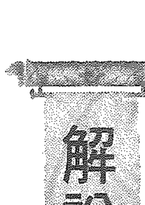

> 「突厥」泛指北方的游牧民族，唐朝李淳風寫《推背圖》時指的是突厥人，到了北宋則是契丹、女真人。漠北天寒地凍，積雪三尺（約一百公分，大半個人高）；堂堂宋朝的皇帝，原本應該在氣候暖和的江南享樂，卻作了亡國俘虜，被金人押囚到荒寒的塞外。

宋徽宗宣和七年（西元一一二五年）十月，五十一歲的金太宗完顏晟下詔侵宋，兵分兩路：西路軍以宗翰（粘罕）為主將，自大同進攻太原；東路軍以宗望（斡離不）為主將，自平州（今河北盧龍）攻燕京（今北平），兩路軍約定在宋都開封會合。

四十三歲的宋徽宗聞訊，嚇得趕緊下詔退位，讓二十五歲的兒子趙桓即位為宋欽宗，收拾爛攤子，次年改元靖康。在兵部侍郎李綱的帶領下，宋軍英勇抗敵，二十餘萬的勤王軍士紛由各路相繼抵達汴京，但是大宋皇帝一向以納幣輸絹的方式應付外寇，所以主和派佔上風，派使者與金人割地賠款議和。金人見宋朝援軍紛至，又獲割地賠款之利，便在靖康元年（西元一一二六年）正月退兵。到了十月，金人食髓知味，再度南侵，閏十一月城破。靖康二年四月，金將粘罕俘虜了徽、欽二帝及趙宋宗室、后妃、公主共三千人北去，並掠走大批珍寶圖書，北宋名存實亡。

徽、欽二帝被擄北上時，穿的是庶民的青衣，夾雜在隊伍中踉蹌行走。途經一個驛站夜宿時，喜愛藝術的徽宗感慨萬千，就在驛壁上以著名的瘦金體書法題了一首詩：

徹夜西風撼破扉，蕭條孤館一燈微；家山回首三千里，目斷山南無雁飛。

亦即在這個荒涼的漠北，連大雁都飛不到；入夜後氣溫低至攝氏零下五、六十度，又沒有暖氣，只能像當地原住民一樣，掘地六尺以為穴，在穴中鋪上乾草勉強入睡。徽宗有時走不動，欽宗就揹著爸爸，兩人形貌枯黑，再也不見貴人之氣；才過了幾個月，徽宗的頭髮就全白了。兩個皇帝在東北、漠北總共渡過了九個寒暑，流放六、七千里，最後徽宗在五國城（今黑龍江依蘭）活活凍死。據《南渡錄．卷三》（又名《徽欽北徙錄》）記載：「或曰（有一天），少帝（欽宗）自土炕中顧視上皇（徽宗），則僵踞死矣，少帝大慟。…上皇崩年五十四歲。」這是南宋高宗紹興五年（西元一一三五年）四月間的事。

囚徙漠北的欽宗聽說九弟康王趙構僥倖逃到江南，在臨安（杭州）當了南宋高宗皇帝，心中燃起了一絲希望，日日盼望九弟救他回去，還設法派人傳話：「要是我能回去，我只要作個太乙宮主就心滿意足了，對你沒有其他要求。」

其實欽宗的想法太過天真，趙構既已即位為南宋高宗，怎麼可能救哥哥回來搶佔他好不容易獲得的帝位。果然高宗對哥哥的要求不予回應，宋欽宗只好繼父親之後，又痛苦地被折磨了二十一年，終於在紹興二十六年（西元一一五六年）六月駕崩，享年五十六歲。總計他從即位到被流放，只當了短短一年零兩個月的皇帝，什麼福都沒享受到；卻在漠北熬了將近三十年，最後還死於非命，他可以說是歷史上最倒楣的皇帝了。

> （據當時人的記述，欽宗應該是被金人殺害，而不是自然死亡。）

## 第二二二預言 岳飛枉死

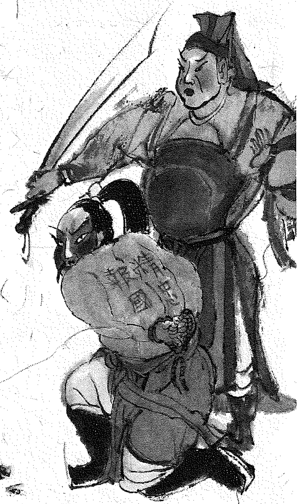

> 讖詩
二口吞金，只聞捷音；一心三字，污木相侵。

> 頌論
王氣臨安事有為，中興紹聖欲何之？北歸終恐成虛願，賢隱奸進不勝悲。

詳譯
吳玠、吳璘兄弟英勇抗敵，打敗金兀朮，並將捷報佳音傳到後方去；韓世忠、岳飛兩員猛將，一再以寡擊眾、戰勝金人，可惜岳飛遭到奸相秦檜所害。

## 卷上 第二三預言 岳飛枉死

浙江臨安（杭州）有王者之氣，南宋高宗在此建都，「還我兩宮，復我疆土」之事大有可為，宋室中興的目標如果放棄了，要往哪裡去呢？不是只有亡國的死路一條嗎？王師北伐、還都汴京漸漸成了一個虛偽的口號，甚至是不切實際的願望；這是奸臣當道、屠盡忠良的結果，說起來真是讓人悲憤。

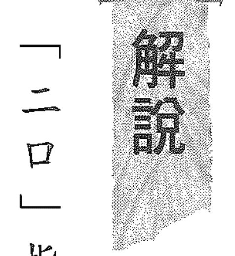

「二口」指吳玠、吳璘兄弟（拆字都將「吳」說成口天吳，二口就是兩位姓吳的）。吳玠為忠州防禦使、秦鳳經略使，駐防在陝西寶雞南邊的和尚原多年，他積粟、練兵不輟，鳳翔民眾也爭相輸粟助軍。宋高宗紹興元年（西元一一三一年）五月、十月，金兵兩度來犯，欲取和尚原以攻蜀，再順長江而下取江南。吳玠、吳璘兄弟以強弓勁弩分番輪射，大敗金兵並俘獲近萬人；金兵的指揮兀朮也中了流矢，只好趕快逃歸。

「一心」指韓世忠。高宗建炎三年（西元一一二九年）三月，扈從統制（相當於今日之總統侍衛長）苗傅、劉正彥率同黨，殺了樞密院簽事王淵及內侍康履等人，挾持二十三歲的宋高宗趙構，逼他傳位給年幼的太子魏國公趙旉，而由隆祐太后聽政，以便操控政權。四月間，因韓世忠率軍勤王，才殺死苗傅、劉正彥與亂黨，護駕有功。此外，建炎四年（西元一一三〇年）三月，金兵連破明州（今浙江寧波）、臨安（今浙江杭州）、秀州（今浙江嘉興），大掠屠城北返時，韓世忠在長江北岸列陣阻擊，以八千人與十萬金兵於黃天蕩（今南京東北邊長江中）相持四十八日，後雖敗陣、讓金人北遁，但從此金兵不再敢輕易渡江南侵。

「污木」指秦檜，「三字」指秦檜構陷岳飛造反的罪名「莫須有」。秦檜原在靖康之難時隨徽、欽二帝一同被擄至漠北，卻在三年後的建炎四年（西元一一三〇年）十月被金人放歸，成為金人控制宋朝政府的一枚活棋。秦檜專掌相權十五年，忠臣良將被他誅殺殆盡，致使南宋再也無力北伐。

岳飛是抗金名將，屢屢以寡擊眾、大敗金人，收復華北失土。高宗紹興十年（西元一一四〇年）七月，岳飛大破金兵於郾城（今河南郾城），兀朮敗逃，岳飛追擊十五里，中原大震。奸相秦檜與高宗密謀，說岳飛戰勝，二帝得還，必然會有皇位之爭，於是一日連下十二道金牌，召岳飛回京師臨安，次年（西元一一四一年）就將岳飛下獄，於十二月以「莫須有」之罪名殺害。「莫須有」是「一定有」的意思，說岳飛謀反的證據雖然不明確，但這件事「一定有」。

南宋高宗一心只想偏安江左，只想他爸爸和哥哥死在漠北，當然不能讓一心想「還我兩宮，復我疆土」的岳飛「美夢成真」，說岳飛是宋高宗害死的也不為過。高宗偏安江左的心態，南宋人林升所寫的《西湖》詩說得最直接赤裸：

山外青山樓外樓，西湖歌舞幾時休。暖風薰得遊人醉，直把杭州作汴州。

## 第二四預言 賈相誤國

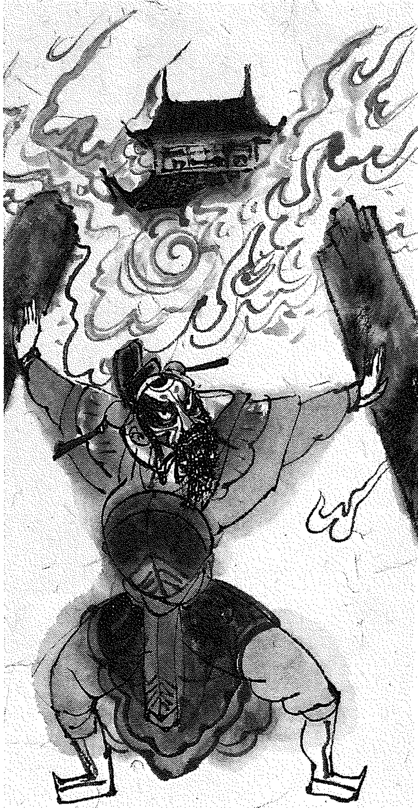

> 讖詩
似道非道，乾沉坤黯；祥光宇內，一江斷楫。

> 頌論
胡兒大張撻伐威，兩柱擎天力不支；如何兵火連天夜，猶自張燈作水嬉。

詳譯
奸臣賈似道的作法不合正道，使得南宋王朝天昏地暗、山河變色；美好的大宋江山，在蒙古大軍攻陷鄂州、順流東下時，舟楫遮斷長江的宋軍竟不戰自潰，走向了敗亡。

## 卷上 第二四預言 賈相誤國

亡。

蒙古人四出攻略，屠城逞威，南宋雖有孟珙、余玠兩員大將英勇抗敵，終究抵擋不住，為何元軍已經大舉壓境，賈丞相卻還張燈結綵、坐著華麗的大船遊西湖呢？

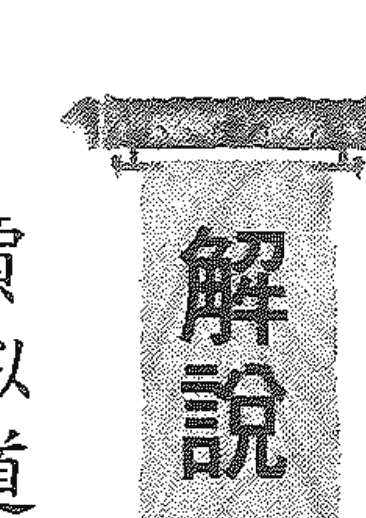

賈似道原是杭州西湖邊一個吃喝嫖賭、遊手好閒的痞子，這種人古時候稱為「惰民」，宋時叫「無賴」，元代稱「流氓」，明朝為「光棍」；到了清朝，各地的說法又有不同，北平人通常直呼為「混混」，上海人叫「地棍」，杭州人名「癩皮」，廣東人叫「泥腿」，香港人呼「濫仔」，台灣人叫「卒仔」。但他運氣好，就因姊姊貴為南宋理宗的寵妃，就青雲直上作了朝中宰相；從理宗寶祐四年（西元一二五六年）四月擔任參知政事，一直到恭帝德祐元年（西元一二七五年）二月兵敗罷相，歷任理宗、度宗、恭帝三朝，共擔任二十年的宰相之職。斯人也而有斯職，宋祚不問可知，難怪唐人李淳風說「似道非道」。

宋理宗繼位之後也力圖振作，希望有所作為。端平元年（西元一二三四年）與蒙古人南北夾擊，聯合起來滅了金人，一報金滅北宋之仇。接著趁機收復汴京、洛陽等故土，當時南宋東恃江淮之險，西以荊、襄四川為屏，總算保住半壁江山。加上宋軍的水師優於以騎兵為主的蒙古大軍，而江南多河川，有利防守。因此宋室收復失土後，以孟珙鎮守湖北江陵，余玠駐兵於四川，兩人都有軍事修養，加上忠義奮發，成為安邦定國的兩根擎天之柱。余玠曾與蒙古軍打過大小三十六戰，皆有斬獲；理宗開慶元年（西元一二五九年）二月，元憲宗蒙哥領兵十萬南侵，包圍四川合川縣東南的釣魚城；余玠主張將都城遷到山頂，命王堅與副將張珏率軍民合力死守；由於策略奏效，苦戰數月後不但未被攻陷，蒙哥還中箭而死。可惜不久後兩員大將先後病死：孟珙死於理宗淳祐六年（西元一二四六年），余玠死於理宗寶祐元年（西元一二五三年），所以陳希夷的「頌論」說「兩柱擎天力不支」。此後宋朝的國勢即逐漸衰微，加上賈似道荒淫誤國，政事日非，終於走向敗亡之途。

宋理宗開慶元年九月，忽必烈率軍圍攻鄂州（湖北武昌），賈似道乞和；此時正好蒙哥汗戰死四川合州釣魚城，消息秘傳至元軍，忽必烈匆匆罷兵北返，只與宋使約定他日再議和談之事。賈似道見元人退兵，就以「鄂州大捷」向朝廷邀功。次年七月，蒙古派使者郝經南下議和，賈似道怕謊言被拆穿，就將來使扣留、拘押在江蘇儀徵的忠勇軍營裡，一押四年；在這期間，蒙古軍屢屢派人詰問，但每來必被扣押，所以真象一直未揭露。賈似道也愈加驕傲自大，另一方面又忌諸將搶功，因此用各種方式進行整肅；例如以侵用官款罪名，將大將趙葵、史巖之、杜庶罷職，再逼死一向看不起他的大將曹世雄，也要求不配合的高達去職。結果潼川安撫副使劉整擔心未來的下場更慘，乾脆帶著瀘州（今四川西昌）十五郡、三十萬戶軍民投降蒙古。

就蒙古人而言，既然謀和不果，探問的使節又屢被扣押，生死未卜，因而再啟戰端。咸淳十年（西元一二七四年）以伯顏總率諸軍大舉南下，先攻陷鄂州，再順流東下，沿江城邑望風而降。德祐元年（西元一二七五年）二月，賈似道率十三萬大軍自杭州出發，溯長江迎敵，至魯港（今安徽蕪湖縣西南）即交由心腹孫虎臣率領，並將兩千五百艘戰船橫亙於長江中，希望阻絕蒙古軍前進。不料元軍夾岸而進，並以巨炮轟擊船艦，宋軍害怕、不戰自潰，賈、孫兩人棄眾將士於不顧，獨自乘船逃回揚州。主帥先逃，敗兵更加如喪家之犬般失魂落魄，爭相逃命。次年三月，元兵攻入京師臨安（杭州），南宋從此滅亡。

「頌論」末句說賈似道大敵當前「猶自張燈作水嬉」。遍查《宋史》、《續資治通鑑》、《宋人軼事彙編》等書卻都無此記載，或許此事為北宋陳希夷之誤測，要不然就是「水嬉」為「虫嬉」之誤抄。因為當時流行鬥蟋蟀，賈似道尤愛此道。他除了偷淫宋理宗年輕美麗的宮妃張淑芳，將她藏在金屋中作為寵妾；還看上賤娼潘稱心，終日與之相狎；甚至搜羅貌美的尼姑帶回家中淫樂；痞子口味果然與眾不同。《宋史》上說：「時襄陽圍已急，似道日坐葛嶺，起樓閣亭榭，取宮人、娼、尼有美色者為妾，日淫樂其中。」—前線軍情危殆時，賈似道卻忙著蹲趴在地上與群妾鬥蟋蟀、賭輸贏為樂，有宰相如此，南宋不亡才怪。

## 第二五預言 帝昺蹈海

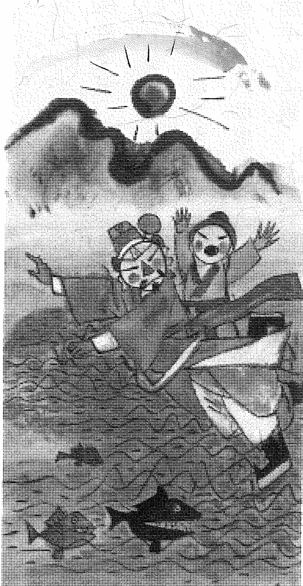

> 讖詩
天降其祥，邪侵正氣，遠山巨浪，舉國皆蔽。

> 頌論
半壁河山迹已殘，巨奸貪死半堂間；白濤大夫寒忠膽，正氣歌聲和淚彈。

> 詳譯
老天給了南宋一個正義凜然的狀元宰相文天祥，可是邪惡勢力還是壓倒了正氣，在遙遠的廣東省新會縣崖山上，南海的濤濤巨浪正向八歲的小皇帝招手，整個大宋王朝已經天昏地暗、大雨欲來風滿樓而無所遮蔽了！

南宋的半壁江山已殘破不堪、所剩無幾了，而奸邪荒淫的宰相賈似道還在他的半間堂裡享受著榮華富貴、錦衣玉食；南海白浪滔滔，陸秀夫即使滿腔忠肝義膽，也不免心顫膽寒，不得不含淚背著小皇帝跳海殉國；另一位忠臣文天祥則在獄中忍辱高唱《正氣歌》。

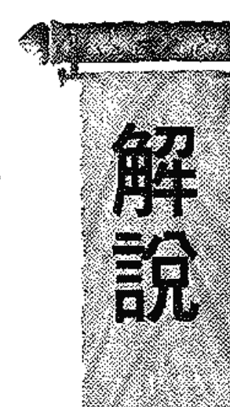

這則預言表彰了南宋的陸秀夫、文天祥兩位忠臣，同時譴責奸臣賈似道。

宋理宗曾賜給宰相賈似道一座花園別墅，位在西湖邊的葛嶺間；他就在別墅中批公文、決定國家大事。當時人們常說：「朝中無宰相，湖上有平章。」「平章」為「同中書門下平章事」的簡稱，就是實際的宰相。別墅中有座半閒亭，賈似道批完公文後，就入亭中打坐，自號「停雲水道人」。當時有個無恥文人作《唐多令》詞，形容賈相為「天謫星下凡，乃道家始祖老子轉世，在半閒亭中享受神仙一般的悠閒之福。詞云：「天上謫星班，群真（仙人）時往還；駕青牛，早度函關。幻出蓬萊新院宇，花外竹、竹邊山。軒冕倘來，人生間最難，算真閒不到人寰。一半神仙先占取，留一半，與公閒。」

## 卷上 第二五預言 帝昺蹈海

賈似道在南宋恭帝德祐元年（西元一二七五年）二月兵敗罷相，七月被貶謫循州（今廣東省惠陽縣東北），家產全數充公。《南宋雜事詩注》說他南貶時，還帶了兩位天下絕色美女同行，一姓王、一姓沈。後來走到漳州（今福建龍溪）木棉庵時，被氣不過的監押官鄭虎臣殺死；他的一生真可說是「敗也虎臣，亡也虎臣」。（賈似道在安徽蕪湖魯港將指揮水軍大權交給心腹孫虎臣，結果被元軍打敗，後來又死於鄭虎臣之手。）

文天祥是恭帝初年繼賈似道之後的丞相，可惜為時已晚，恭帝德祐二年（西元一二七六年）三月，元軍便攻破臨安城，把恭帝、全太后、福王等人俘擄北去。文天祥督師頑抗，宋帝昺祥興元年（西元一二七八年）閏十一月在廣東五坡嶺兵敗被俘。

大臣張世傑、陸秀夫奉帝昺逃至崖山。祥興二年正月元軍攻崖山，張世傑以舟師迎戰，兵敗投水而死；陸秀夫見大勢已去，背著八歲的小皇帝從崖山跳海殉國。

文天祥在獄中不屈，至元世祖至元十九年（西元一二八二年）冬十二月，忽必烈召文天祥至殿中說：「汝以事宋者事我，即以汝為中書宰相。」文天祥回答說：「天祥為宋狀元宰相，宋亡，惟可死，不可生。」元朝為逼他出仕，當面將其父母拖去問斬，女兒則逼為娼，文天祥亦不為所動；十二月初九日終於在柴市（北京菜市口）從容就義，得年四十七歲。臨終前高唱寫於至元十八年六月間的《正氣歌》，末云：「顧此耿耿在，仰視浮雲白；悠悠我心悲，蒼天曷有極」，對於君死國亡之痛，始終不能忘懷，浩然正氣磅礴於字裡行間；這就是陳希夷「頌論」所說「正氣歌聲和淚彈」的緣故。

## 第二六預言 元朝運勢

讖詩
忽然而天，鐵木占先；廣士兵盛，百九之年。

頌論
東西南北任何之，肥馬精兵壓四夷；風雨濛濛連八代，興亡未離木雙支。

詳譯
忽然間從天而降了一位曠世英主，他的名字叫做鐵木真，他率領的遊牧騎兵要建立遼闊的大帝國，他的子孫要昌盛一百零九年。

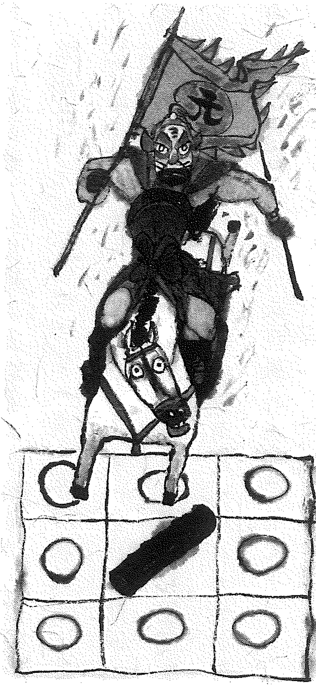

## 千載揭密 推背圖

蒙古鐵騎往東往西、南征北討所向無敵，靠著肥壯的馬匹、精悍的士兵把四邊國家全都征服了；建立了元朝後會連續出現八位皇帝，最後在風雨飄搖中結束政權。這個朝代興起靠成吉思汗鐵木真、亡國之君則是元順帝妥歡帖睦爾（《元史》作妥歡貼睦爾），興亡都離不開兩個「木」字。

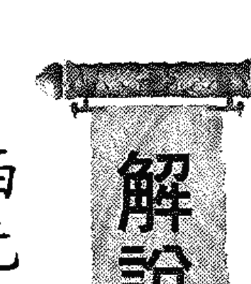

西元十三世紀時，蒙古人崛起於漠北，初期並不強盛，各部之間經常爭鬥、襲殺。後來蒙古族尼倫部的首領也速該，被仇家塔塔兒人毒害，他的妻子訶額侖只好帶著十三歲的鐵木真和幾個孩子四處流亡，躲避仇家追殺；之後鐵木真憑著天生的能力、智慧和奮鬥，逐漸在蒙古諸部中嶄露頭角，最後於西元一二○六年統一漠北各游牧民族，接著開始四處爭戰、擴大版圖。他們不但揮軍南下中原，滅了金朝與南宋，更西征歐洲，火燒莫斯科，飲馬奧得河，大掠德境之西里西亞與義大利之威尼斯等地，幾乎把整個歐亞大陸全劃入版圖之中，建立了蒙古大帝國。奇怪的是，蒙古鐵騎兩度（均在元世祖時期）跨海東征日本均告失敗，亞洲國家似乎只有日本始終未臣服於元朝鐵騎之下。

成吉思汗鐵木真雖然已經統一漠北、建立蒙古大帝國，他也稱帝，是為元太祖，但國度並未真正統一，總計歷經三世五朝（元太祖鐵木真、元太宗窩闊台、元定宗貴由、元憲宗蒙哥與元世祖忽必烈），直到七十四年之後的元世祖忽必烈至元十六年（西元一二七九年），逼得南宋帝昺自崖山跳海而亡，才算真正獲得統一，建立了元朝。所以讖詩說「廣士兵盛，百九之年」，即預示元朝從忽必烈即位、國土真正統一的中統元年（西元一二六〇年）算起，至元順帝敗亡、逃回漠北的至正二十八年（西元一三六八年）為止，國祚總共一百零九年。而「風雨濛濛連八代」指的是滅宋建元的八位皇帝：元世祖忽必烈、元成宗鐵木耳、元武宗海山、元仁宗愛育黎拔力八達、元英宗碩迪巴剌、元泰定帝也先鐵木耳、元文宗圖帖睦爾、元順帝妥懽帖睦兒。

為何蒙古人能夠「廣士兵盛」、「肥馬精兵壓四夷」？南宋人彭大雅撰、余霆疏證的《黑韃事略》一書中提到：蒙古兒童從小就生長在馬背上的小車裡，於顛簸中長大；小孩長到三歲就改坐馬鞍、在草原上馳騁練習騎術，直到可以不用手扶鞍，再空出雙手練習騎射。通常小孩才四、五歲時，就每天挾帶小弓短箭練習射箭。也就是說，蒙古兒童是以騎射為遊戲長大的，因此每個人的射箭姿勢都是腰低步闊，兩腳呈八字分開，重心低而穩，準頭勁道大，能力貫皮革。他們騎馬射箭時大都跂立在馬鐙之上，全身重量的十之八九在雙足，十之一二在臀部，所以重心低穩，左右開弓、命中目標，不受馬匹奔馳的影響。

蒙古人訓練馬匹也有一套。蒙古馬只吃野草，公馬生四齒後即去勢，以減除暴躁習性，還能使其長得體軀壯闊，能耐風寒而壽命長久；如果不去勢，公馬易驚駭嘶鳴而無法埋伏攻襲，也不耐風寒馳騁。一旦出戰，每個騎兵旁都跟著好幾匹馬，目的在隨時替換以保持速度和戰力。

戰馬之外，其他裝備也十分講究。蒙古騎兵的馬鞍以白木磨成，堅平輕便，騎坐時可任意轉身；馬鐙則以羊皮製成，外塗羊脂，即使風吹雨淋也不容易斷爛；鐙身保持圓闊，這樣即容易納足而不滑，騎踏極為便捷。在兵器方面，起初使用木箭，箭鏃以駱駝骨磨成；滅了西域回人之後，才由技藝精巧的回回工匠生產、供應鐵箭鏃和各種甲兵，如柳葉刀、羅圈甲、長短槍和攻城砲等等。至於餵養馬匹則責成俘擄而來的漢人和回人充任。

蒙古大軍出行時，必先派遣精騎四出打探，並登高遠眺，巡邏面積廣達一、二百里；必要時還不惜俘擄當地的行人或居民，以打聽環境、虛實等，包括某路可行、某城可攻、某處可營、某地可戰、某方有敵兵、某所有糧草等等。大軍駐宿時必擇高地，但營帳四散而不集中，以便馬匹有足夠的草料可吃。紮好營帳以後，即在帳前點燃營火，

## 卷上 第二六預言 元朝運勢

徹夜不熄，用以誘敵或嚇阻敵人；營兵則適至附近人跡罕至之處睡覺，以防敵方摸營偷襲。比較奇特的是，宿營時每營必留兩匹馬夜不解鞍，以便隨時遁逃；萬一受到攻擊，一營有警，鄰近之營均應備馬以便追擊，其他營則按兵不動。一旦對陣廝殺、攻城掠地，甚至追擊逃兵等等，都有特別的戰術和技法，例如攻擊之前往往先放出風聲，以「頑抗屠城」相威脅（如果頑強抵抗而不投降，一旦攻下就大開殺戒，全城百姓不留一個活口）。因此鐵騎所到之處皆望風披靡，令人為之喪膽。

由以上種種分析可知，蒙古大軍雖崛起於草原，卻有極佳的戰略、戰術與後勤補給，所以戰無不勝、攻無不克，絕非僥倖或受到天助而已。

## 第二七預言 順帝荒淫

讖詩
時無晝夜，年無粒米；花兒不花，賊人四起。

頌論
鼎沸中原木木來，四方警報起邊垓；房中自有長生術，莫怪都城徹夜開。

詳譯
宮廷裡晝夜不分地狂歡淫樂，民間卻連年荒旱顆粒無收；棉花也不開花結籽，沒吃沒穿逼得老百姓群起為寇，天下大亂。

元順帝末年，白蓮教徒奉韓林兒為帝，起兵造反，中原鼎沸不安，黃河南北及陝西、寧夏、四川等地的漢人紛紛起義，還一度攻陷元朝上都開平（今察哈爾多倫縣），焚毀元朝宮闕。但元順帝還是沉迷房中術，以為藉採陰補陽即可長生不老，並未積極處理民怨與兵災，以致京城大都（今北平）被朱元璋的大軍攻陷，城門徹夜洞開，這是必然結果，怨不得別人。

元順帝妥懽帖木兒於西元一三三三年即位，因為年僅十三歲，所以由權相伯顏秉政，皇帝則自居深宮中，不親政事。此時水旱疫疾和地震山崩等災害相繼發生，民不聊生。至元三年（西元一三三七年），廣東、河南、四川等地發生民變，朝廷與官府更加猜忌漢人，除了禁止漢人、南人攜帶軍器之外，伯顏更主張殺盡張、王、劉、李、趙等五個大姓的漢人，幸而並未落實。至元六年（西元一三四〇年），伯顏因罪去職，最後被貶而死，順帝改以伯顏之侄脫脫為右丞相，政治略有改革，但各地天災頻仍、叛亂不絕，所以「讖詩」說「年無粒米，花兒不花，賊人四起」。

政治腐敗加上天災不斷，使無以維生的百姓紛紛起兵造反，想死裡逃生。其中一支叛軍以白蓮教為名，吸引信眾作亂，首領為韓山童；韓山童被官府捕殺後，其子韓林兒在信徒劉福通等人的擁戴下，自稱宋朝皇帝，在安徽亳縣建都，年號龍鳳。一時四方豪傑紛起，大家都尊奉韓林兒為帝，聚眾造反。頌論所謂「鼎沸中原木木來」，雙木為林，指的就是韓林兒。

除了白蓮教之外，其他勢力也紛紛自立為王。例如長江下游及皖西、豫東一帶有張士誠，自稱吳王，國號大周；浙東為方國珍；長江中游的江西、湖廣之地有徐壽輝，他在至元十一年（西元一三五一年）於蘄水（今湖北浠水縣）稱帝。到了至元二十年（西元一三六〇年），徐壽輝為部將陳友諒所殺，友諒稱帝，國號漢，定都湖北武昌。此外，長江上游的湖北、四川、陝西一帶還有明玉珍，也在至元二十二年（西元一三六二年）於重慶稱帝，國號夏。

雖然一時之間群雄並起，各據一方，但最後推翻元朝、把順帝趕出大都的，卻是安徽濠州起兵的朱元璋，我們在下一個預言〈洪武開國〉會詳細說明。

綜上所述，整個長江流域都已經沸沸揚揚了，正當盛年的元順帝還是終日獨坐於大都皇宮中，沉迷女色，以房中術為重，希望因此長生不老。《元史・順帝本紀》記載：「至正十三年（西元一三五三年），（大臣）哈麻及（親王）禿魯帖木兒等陰進西天僧於帝，行房中運氣之術，號「演揲兒法」；又進西番僧善秘密法，帝皆習之。——這一年元順帝三十四歲，佞臣以西藏的房中術士進獻，皇帝每種都學，樂在其中。

明人《僧尼孽海》一書中說得更為詳細：「西番僧伽璘真⋯⋯善秘密法，謂帝曰：「陛下雖尊居九重，富有四海，其不過保有現世而已；人生能幾何？當受此秘密大喜樂禪定。」帝又習之，其法亦名「雙修法」、曰「演揲兒」、「秘密法」，皆房中術也。

帝日從事於其法，乃廣取民間十五歲以上、二十歲以下婦女，恣肆淫戲，號為「採補抽添」，其勢（性交姿勢）甚多⋯⋯」

除了廣搜民間少女入宮淫樂外，當時朝廷還從高麗進貢許多美女，入宮供元順帝採補抽添，玩膩了就賞賜給權貴大臣。韓國自古出美女，今人艷羨李英愛、沈銀河、金喜善、金素妍⋯⋯之嬌豔明媚、國色傾城，不知元朝時這樣的韓國美女就已紛紛來到北平，與元順帝共習「演揲兒法」，為滅亡元朝盡一分心力了。

## 第二八預言 洪武開國

讖詩
卯午之間，厥象維離；
八牛牽動，雍雍熙熙。

頌論
水火相濟民生苦，
金戈The request was rejected because it was considered high risk

## 卷上 第三一預言 土木之變

任似乎理所當然；可是二十二歲的弟弟也已坐上皇帝寶座，成了明代宗，皇位之授受豈能當兒戲；兄弟倆推讓了一番還是沒有兩全其美之策，最後英宗還是到南宮當太上皇去了。景泰八年（西元一四五七年），代宗病重，諸臣欲擁代宗之子朱見濟繼位，但武清侯石亨與都督張軾、左都御史楊善、太監曹吉祥商量，覺得立一個不到十歲的小孩子當皇帝，不如擁立太上皇復位，既名正言順，還可以邀功受賞；於是悄悄安排英宗復位，改元天順，史稱「奪門之變」。

英宗復位後，首先殺了當初主張放棄他、擁立代宗的兵部尚書于謙；而石亨擁立有功，封為忠國公。石亨從此恣橫專權，屢興大獄，殘害忠良，府邸規制有如皇家，暗中蓄養材官猛士不下數萬人，中外將帥大半都是他所提拔，權力幾乎要超越皇帝，這是大忌；因此到了天順四年（西元一四六〇年）正月，英宗即先下手為強，將石亨處斬，並抄家滅族。

從明代開國到土木之變，前後八十餘年為大明帝國的鼎盛時期，自從宦官王振弄權之後即每況愈下；從此以後，幾乎每一任皇帝都不可避免地受到宦官的禍害，一直到明朝滅亡。當年明太祖朱元璋有先見之明，在宮門口立鐵碑嚴禁宦官干政，結果反受更大禍害，真是造化弄人，實在讓人想不透。

## 第三二預言 豹房淫樂

> 讖詩
> 朝士三百，不如妖女；花花公子，江上賊起。

> 頌論
> 殿宇經營費疑猜，四方聚斂百萬財；可憐服藥春不老，忍使豹房爐餘灰。

> 詳譯
> 朝廷上三百位忠心正直的官員，不如妖嬈美麗的婦女更受到皇帝的重視；花花公子（明武宗朱厚照）只顧在豹房淫樂，卻不管長江中游（江西南昌）已有賊人虎視眈眈（指寧王朱宸濠想造反、當皇帝）。

朝廷花了九十萬兩白銀建造富麗堂皇的豹房，目的何在？真讓人費盡心力也猜不透，這個荒淫的皇帝從全國各地搜刮了上百萬兩的銀子，以供內庫（皇宮）使用；可憐的朱厚照，年紀輕輕就服用壯陽藥，以為可以長生不老，結果在豹房一命嗚呼。這幢一再擴建的淫屋最後也難逃化為灰燼的命運。

明朝中葉出現了一位荒淫的皇帝，朝廷上敢言勸諫的正直之士都被宦官都被宦官罷黜、貶死，最後引發有心人叛亂。宋人陳希夷的「頌論」預言，這個花了人民血汗錢建造的豹房，最後必然化成灰燼。而實情正是如此。

明孝宗弘治十八年（西元一五○五年）五月，皇帝年僅三十六歲就駕崩，臨終前召大臣劉健、李東陽、謝遷至乾清宮面諭：「太子年紀才十五歲，喜歡逸樂，要好好輔導教育他。」

不久太子朱厚照即位，為明武宗。身邊的太監劉瑾與馬永成、谷大用、魏彬、張永、邱聚、高鳳、羅祥八人，專門誘導皇帝荒怠遊樂，人稱「八虎」。次年（西元一五○六年）改元正德，正德二年八月起即陸續在北京西華門外別築宮院，建造幾百棟華麗的秘室，稱為「豹房」，裡面擺滿各式淫樂設備。正德三年，明孝宗臨終受命輔導幼主的大學士劉健、謝遷等人，因抗疏論諫，與其他正直之士五十三人一起被列為「奸黨」，全數貶逐。正德七年再度擴建豹房，加蓋了兩百餘間淫屋。

豹房有何奇特之處呢？清初人毛奇齡在《明武宗外紀》中記載：錦衣衛都督同知于永為西域回人，擅長房中術，因此大受明武宗寵信。他引介了許多中東伊斯蘭教會跳肚皮舞、皮膚白皙、身材妖嬈的美女到皇宮，讓二十幾歲的皇帝快活到不行。正德十年（西元一五一五年），馬屁軍官江彬透露，後軍都督府右都督馬昂的妹妹極為美豔，雖然已婚（嫁給一個叫畢春的軍官）而且懷有身孕，明武宗一樣降旨宣召。馬昂之妹一到豹房，武宗就被她的嬌弱與楚楚可憐所迷，加上會說胡語、唱胡人歌曲，還能騎馬射箭，簡直十項全能，因而大加寵幸。從此之後，馬氏一門無論大小都賜蟒衣，更將位在北京太平倉東邊的豪宅賞賜給馬昂，內廷太監均尊稱其為國舅，勢焰轟動整個北京城。

江彬因為引介美女有功，也大受武宗寵信。他是山西宣府（今山西大同）人，為了富貴還鄉、誇耀鄰里，乃鼓動明武宗出居庸關、巡幸大同。他說大同出美女，可挑選出來送進豹房、增加美女陣容，還可以趁機慰問邊關將士，何必困居北京城受廷臣管制？

正德十二年（西元一五一七年）九月，武宗果然出居庸關、駐節宣府（今河北宣化）。江彬特別為皇帝蓋了鎮國府第，還把北京豹房裡的珍玩、美女都搬到宣府來。夜晚則帶武宗四出搜獵美女，見高宅大屋即闖入，見美女就搶回。次年九月又御駕山西大同，民間戲曲《遊龍戲鳳》中，有一段皇帝調戲大同市梅龍鎮酒家女李鳳姐的故事，說的就是明武宗的真實情況。同年十二月，一行人又南下山西太原，總共蒐羅了幾十車美女隨御駕而行。從前的艷書說大同婦女有三絕：膚白、腳小、會叫床，明武宗顯然深得其中三昧，才會樂此不疲。

正德十四年（西元一五一九年）六月，襲封江西南昌的寧王朱宸濠，見武宗四出遊幸、荒淫無度，而且膝下無子，就起兵造反，想出鄱陽湖、順長江而下，取南京後稱帝。不料準備不足，才四十三天就被巡撫、南贛都御史王守仁平定了，這就是「讖詩」所說的「花花公子，江上賊起」。又兩年，武宗死於豹房，年僅三十一歲；豹房也被憤怒的老百姓一把火燒掉，結束了明武宗十六年的荒唐歲月。

其實從「保存古蹟、保留歷史」的角度來看，一把火燒掉豹房實在有點過份，起碼燒掉前應該留下一些圖畫，才能讓後人知道其中有何奇技淫巧，同時作為後世的警惕。相較之下，法國人就識貨多了；十七世紀時，法王路易十四為了滿足個人享樂，而在巴黎建造奢華壯麗、金碧輝煌的凡爾賽宮，至今仍為觀光勝地；而豹房卻不能保存下來，供後人憑弔，實在有些可惜。

## 第三三預言 外患頻仍

> 讖詩
> 東風逆送，為國之悃，父子同謀，請君入甕。

> 頌論
> 一枝向北一枝東，又有南枝禍亦同；倭寇蕩平光四耀，更有獨木樹良風。

> 詳譯
> 東邊吹來一陣歪風（指倭寇），給國家帶來了恐懼悲痛，朝廷中則有父子兩個奸臣（指嚴嵩、嚴世蕃），給國君（指明世宗）帶來困擾與麻煩。

北邊有麻煩（指韃靼人），東邊有禍害（指倭寇），南邊為外敵（葡萄牙人），真是內憂外患頻仍。幸虧武將戚繼光、文臣楊繼盛聯手將其平定，並因而樹立了忠臣風範。

西元一五二一年明武宗朱厚照死於豹房，年僅三十一，無子，由十五歲的堂弟朱厚熜即帝位，史稱世宗，年號嘉靖。但嘉靖並不平靜，因為世宗在位的四十五年當中，始終無法排除來自北方韃靼人和東邊海上的倭寇侵擾。

其實倭患不是嘉靖朝才出現，早在明太祖洪武二年（西元一三六九年），張士誠的餘黨亡命入海之後，就與倭寇勾結，侵擾山東沿海州縣。當時日本正處於南北朝分裂時期（西元一三三六至一三九六年），失意武士常武裝、駕舟到中國沿海掠奪騷擾；到了戰國時代（西元一四六七至一五七三年），因戰爭嚴重破壞社會生產，日本武士、浪人、商人更形成海盜集團，不但騷擾沿海地區、搶劫商船，還掠殺居民。他們一次行動往往數千人，甚至上萬人，一度還從江蘇攻打到安徽，直到嘉靖末年才為俞大猷、戚繼光所討平。「頌論」第三句「倭寇蕩平光四耀」中的「光」，指的就是戚繼光。

嘉靖年間的另一個威脅來自北方，韃靼別部酋長俺答屢屢入寇，數十年間幾度剽掠京畿，山西大同、應縣、朔縣、太原，甘肅甘州（今張掖）、遼東長勝堡等地，也一再受到攻擊，而明廷莫可奈何。直到世宗駕崩，繼位的穆宗與韃靼議和，封俺答為順義王，漠北邊患始告解除；這是隆慶五年（西元一五七一年）的事。

明嘉靖朝積弱不振，無法迅速平定外患的原因很多，主要是明世宗朱厚熜在位過久（從西元一五二二年至一五六六年，共四十五年），而且他從嘉靖十三年（西元一五三四年）起就託疾不朝、不見百官群臣，把政事交給權臣嚴嵩處理，自己只忙著齋醮祈祀、大興土木；而且寵信方士陶仲文等人，講求房術、煉製丹藥，希求長生不老。

嘉靖二十一年（西元一五四二年）八月，嚴嵩以禮部尚書入閣為武英殿大學士，參預政務。在嚴嵩專領國政的二十餘年之間，他吞沒軍餉、鬆弛戰備，不論文武官員，只要與他不合的，多數加以貶官或殺害。嘉靖三十二年（西元一五五三年）正月，兵部員外郎楊繼盛上書彈劾嚴嵩五奸十大罪，結果被捕下獄，備受刑毒，三年後遇害。

「頌論」末句「更有獨木樹良風」，其中的「木」指楊繼盛（姓中有木）。嚴嵩漸老之後，朝事盡歸其子、工部左侍郎嚴世蕃，從此賣官鬻爵、日縱淫樂。當時他們父子吐痰時只要「咳」一聲，旁邊的美婢立刻趨前張口承接，號稱「肉唾壺」；小便用的夜壺則以黃金鑄造，且雕成裸女蹲跪、張口承接之型，稱為「金溺器」。還有黃金製成的假陽具，稱為「金觸器」，其奢淫可知。一直到嘉靖四十四年（西元一五六五年）三月，嚴世蕃伏誅，嚴嵩遭罷黜，嚴家被抄沒，其財產清單名「天水冰山錄」，厚一大卷，約有六萬餘字，足可出版一冊書。抄出的財產共有黃金三十萬兩、白銀兩百萬兩、古銅鎏金器一千一百二十七件、書籍八十八部二千六百一十三本，墨刻法帖三百五十八軸冊，古今名畫手卷三千兩百零一軸卷冊，絹綾羅紗紬絨錦布等項共一萬四千三百三十一匹零一段，真是令人嘆為觀止。嚴嵩則到被抄家兩年之後才抑鬱而死。

明世宗三十餘年不上朝，只求煉丹長生，結果吃了太多方士的金石丹藥而死，時年六十歲。皇位傳給其三子朱載垕，史稱穆宗，年號隆慶，此時國事已不堪聞問矣。

「頌論」第二句「又有南枝禍亦同」，指的是葡萄牙人在嘉靖元年（西元一五二二年）入寇廣東新會縣西草灣，此後即騷擾不斷，例如從嘉靖五年至二十七年（西元一五二六至一五四八年），屢屢侵擾浙東雙嶼；嘉靖二十三年至二十八年（西元一五四四年至一五四九年）侵擾福建；嘉靖三十六年（西元一五五七年）佔據廣東珠江口之澳門。但比較起來，明世宗時西方人的禍害規模遠不及倭寇，大概要到清中葉以後，西方的船堅砲利、巧取豪奪的大禍患才日益嚴重。

## 第三四預言 居正輔政

> 讖詩
> 寸圭雙林，合則可戰：女鬼難逃，土也生變。

> 頌論
> 有木能支大廈陰，正心居位長弓擒；讀書種子幸無恙，八口關門聽捷音。

> 詳譯
> 「寸圭」合起來就是一個「封」字，也就是對外用封王的手段以籠絡異族，對內則重用李成梁、李如松父子來對付外寇，明朝政權才能確保。後來雖然解了內憂，禍國殃民的閹官魏忠賢畏罪自殺；可是外患又接踵而來：韃靼土默特部（即土蠻）從內蒙察哈爾屢侵遼東，帶來不少麻煩。

幸好有武將李成梁可以抵禦外侮，文臣張居正則輔佐朝政，就像兩根木頭支撐大廈一樣。後來雖然發生一些意外，如張差（長弓為張）持梃（棗木棍）攻擊皇太子（朱常洛），結果被擒；張居正一度有意盡毀天下書院，後來還是保留了讀書種子，晚明時才能出現東林黨那些有氣節的書生。雖然西南邊的緬甸不時擾邊，幸好守備陳用賓在雲南騰衝建立了八個防禦關口，又有大將劉綎、鄧子龍收復失土，並與暹羅夾攻緬甸，才化解了邊境之危。

蒙古人被明太祖朱元璋的大將徐達、常遇春逐回漠北後，仍不時南侵；一直到穆宗隆慶五年（西元一五七一年）三月，封韃靼別部酋長俺答為順義王，山西、陝西北邊河套一帶的邊患才告暫息。「寸圭」為封，指的就是封外族酋長為王。

雖然俺答已與明廷議和，但是盤據在內蒙察哈爾一帶的韃靼土默特部（指「土蠻」），卻不時入侵遼東，成為禍患。西元一五七二年五月，年僅三十六歲的穆宗駕崩，由太子朱翊鈞即位為明神宗，次年改元萬曆。此後土蠻即不斷侵擾東北地區，比較大的戰事有：萬曆三年（西元一五七五年）正月，土蠻乘機進攻遼寧瀋陽西南的長勇堡，總兵官李成梁將其擊退。萬曆七年（西元一五七九年）十月，土蠻又齊集了四萬騎兵進犯遼東，李成梁採堅壁清野之策死守，直到薊鎮總督戚繼光馳援才將其打敗。萬曆九年（西元一五八一年）正月，土酋再犯錦州、掠松山，遼東總兵官李成梁再度出塞破敵。萬曆十年（西元一五八二年）三月，土蠻泰寧部長速把亥與其弟炒花等犯遼寧義縣，李成梁設伏，速把亥中箭落馬被斬。萬曆十三年（西元一五八五年）三月，速把亥之子把都兒欲報殺父之仇，於是偕叔父炒花等，率泰寧部數萬騎侵略瀋陽，在回師遼寧開原、鐵嶺時，遭遇李成梁的大軍伏擊，被打得落花流水。

李成梁有子李如松、李如柏、李如梅、李如樟，皆驍勇善戰，每隨其父累立戰功。後來李如松任陝西提督時，還討平了退休的寧夏副總兵哱拜之叛，又率軍援朝鮮以抗日，屢立戰功，所以說「雙林可戰」，雖然「土（土默特部）也生變」，依舊「有木（李氏父子）能支大廈陰」。「雙林」指李成梁、李如松，因兩人的名字中都有兩個「木」（李成梁的李與梁，李如松的李與松），「雙木」為「林」。

「頌論」中的「政心居位」指張居正位居首輔。西元一五七二年穆宗皇帝死後，神宗繼位，改元萬曆，但神宗當時年僅十歲，政務均由張居正議決。張居正主張加強中央集權，立章奏考成法，內外官滿任始遷法，同時汰減冗官以節流；又下詔切責丈量天下田畝，行「一條鞭法」，以利稅收。萬曆七年（西元一五七九年）正月，張居正惡士大夫競相講學，打算盡毀天下書院共六十四處，將書院改為官吏辦公室。萬曆十年（西元一五八二年）六月張居正卒，享年六十八歲；神宗惡張居正專擅權柄長達十年，次年詔令奪其官爵，又次年抄沒其家，張氏子孫慘死狼藉。其實就事論事，張居正算是忠臣。

忠臣去，奸豎來。到了明熹宗天啟年間，太監魏忠賢亂政，國事日非；「八千女鬼」合為「魏」字，「女鬼難逃」，指魏忠賢在明熹宗天啟七年（西元一六二七年）八月，即皇帝駕崩後的三個月，因畏罪而上吊自殺，但為時已晚，十六年之後明朝也滅亡了。

「長弓擒」指萬曆四十三年（西元一六一五年）五月，蘇州男子張差持木棍闖皇太子朱常洛所居住的慈慶宮，傷了守門太監李鑒後被執，最後以狂徒欲行刺太子罪處死。此案疑點重重，牽涉到宮廷內的王位繼承與派系鬥爭，史稱「梃擊案」。當時明神宗已匿居深宮不見群臣二十五年，神宗與皇太子均不願深究此事，遂草草了事、大案小結。

「頌論」末句「八口關門聽捷音」，指萬曆十一年（西元一五八三年）正月，緬甸酋長莽應里在漢奸岳鳳誘導下，出兵進犯雲南，攻陷順寧（今雲南鳳慶），守備陳用賓設八關於騰衝以禦之。次年四月，遊擊劉綎、參將鄧子龍率軍收復順寧，岳鳳投降。劉、鄧乘勝追擊，與暹羅約定夾攻緬甸，至九月已直抵緬甸阿瓦，緬將猛勺降，亂悉平。

史書記載，岳鳳不但渾身刺青，陽具上還「入珠」，嵌有「遇熱則自顫動不止」的閨中淫具「緬鈴」，據說行房時可以媚御婦人。明人沈德符《萬曆野獲編．卷三十》記載：「甲申年（萬曆十二年），雲南隴川叛酋岳鳳擒至京獻俘。……比就西市（處斬），猶懵不知當誅也。鳳本華人入緬，性淫侈，裝飾詭異，肌膚刻畫異錦，如宋人所謂『雕青』者，陽道亦嵌數（好幾粒）緬鈴於首（龜頭），尋為行刑者割去，以重價售於勳臣家。（緬）鈴本振撼之物，即握之手臂猶搖蕩不自制，不知此酋何以寧居也？」——沈德符很好奇岳鳳那話兒嵌了緬鈴，一天到晚「遇熱則振」，怎麼受得了？真是個好問題。可惜劊子手行刑太快，已經來不及問岳鳳本人了。

## 第三五預言 魏閹亂國

> 讖詩
> 當途遺孽，穢亂宮闈；一男一女，斷送人國。

> 頌論
> 忠臣賢士盡沉淪，天啟其喪亂更紛；縱有胸懷能坦白，乾坤不屬舊明君。

> 詳譯
> 前朝遺留下來的壞人，竟然和皇帝的奶媽勾搭成姦；這一男（奸豎魏忠賢）一女（奶媽客氏），最後把大明江山都斷送掉了。

因為有前朝遺孽掌權當道，明熹宗朝中的忠臣賢士全都被誣陷害死，以致天啟年間紛亂不堪。熹宗皇帝不過是個十六歲的少年，純潔得像一張白紙，非常信任別人，那個前朝餘孽就更可以膽大妄為，直到把明朝的國祚斷送掉。

「遺孽」指前朝（明光宗）遺留下來的奸孽。萬曆四十八年（西元一六二〇年）七月，五十八歲的明神宗病死，由三十九歲的太子朱常洛即位，是為明光宗。同年九月光宗朱常洛也生病，吃了兩顆鴻臚寺丞李可灼進的紅丸仙藥也一命嗚呼，史稱「紅丸案」。有人懷疑是神宗的鄭貴妃下毒（第三四預言中的「梃擊案」凶手張差，亦供稱是受鄭貴妃宮內的太監指使），最後依舊不了了之，連被遣戍的李可灼，後來在魏忠賢專政時也翻案沒事。輿論以為是魏忠賢與鄭貴妃一再合謀，殺害年長的神宗之子朱常洛，好讓年少的神宗之孫朱由校（為朱常洛之子）當皇帝，目的在便於竊奪權柄，後來果真如願以償。魏忠賢因為曾在光宗朝任官，所以「讖詩」用「當途遺孽」來形容。

魏忠賢為太監，已割掉那話兒，居然也和明熹宗的奶媽客氏打得火熱，而且和皇帝爭風吃醋、搶同一個女人的奶吃，此即「讖詩」所說「穢亂宮闈」的原因。不僅如此，魏忠賢還封她為奉聖夫人並提拔她的兒子做官，讓許多正人君子看不下去。明熹宗天啟四年（西元一六二四年）六月時The request was rejected because it was considered high risk

## 卷上 第三五預言 魏閹亂國

二十出頭的明熹宗忙著當木匠時，東北的後金（滿清）勢力已悄悄興起；不久後，滿清八旗的鐵騎就要攻入山海關，大好江山再也不屬於明朝君主了。
魏閹亂政以上吊自盡收場。民間傳說吊死鬼要找到另一個人上吊自殺作替身，才能轉世投胎、重新作人；魏忠賢作了吊死鬼後，也必定會找替身，那個替身就是十六年後在紫禁城北邊神武門外景山公園裡的煤山上吊的明思宗朱由檢。

## 第三六預言 思宗自縊

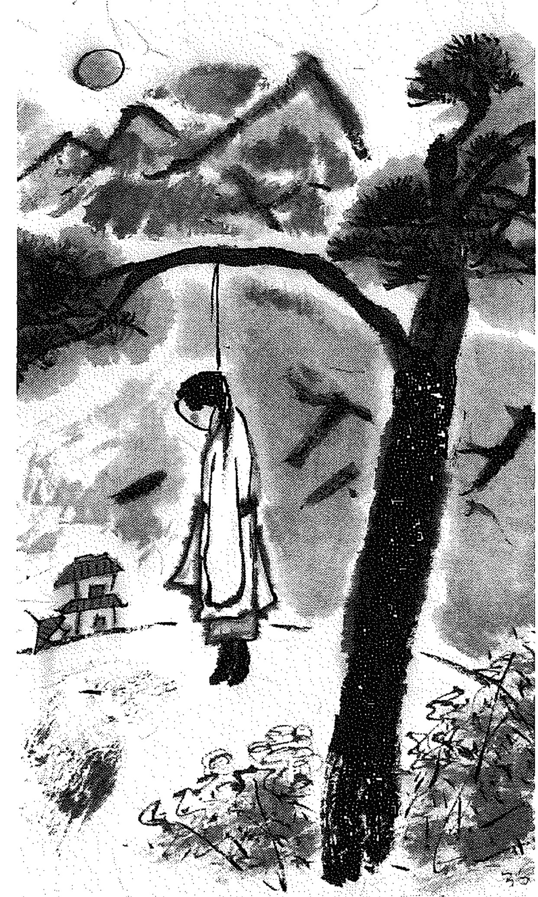

> 讖詩
> 黯黯陰霾，滿城鋼刀；萬民避死，一人難逃。

> 頌論
> 雖然平寇誘二龍，犬吠馬奔勢洶洶；洪水方來失羊虎，可憐八牛腹已空。

詳譯
天色黑暗陰霾四起，北京城裡到處都是闖賊盜匪的鋼刀；萬千百姓爭相避難逃命，只有明思宗一個人在劫難逃。

雖然明思宗苦思有所做為，在海上誘降了賊寇鄭芝龍，在陸上誅殺了悍將毛文龍，兩條孽龍不再為患，可是西邊又有張獻忠、李自成兩個殺人魔王，率領了幾十萬流寇來勢洶洶、四出劫掠，搞得犬吠馬奔。明朝大將洪承疇戰敗降清，他率領的十三萬大軍也瓦解了，朱明帝國再也無兵可戰，崇禎十七年（西元一六四四年）三月，李自成攻陷北京後，明思宗只有走上自盡的末路。

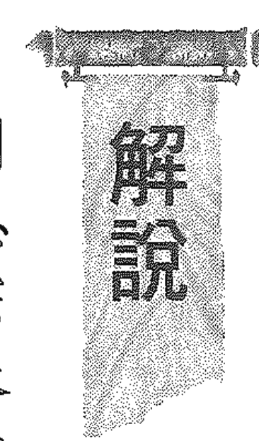

明思宗朱由檢是熹宗朱由校的弟弟，比熹宗小五歲，同為光宗朱常洛之子。思宗即位時十九歲，面臨一個內政積弊很深、東北外患頻仍的困境；但是邊關有大將袁崇煥坐鎮，朝中奸閹魏忠賢已死，局勢仍有一絲希望。他有心好好治理國家，不像高祖明世宗迷信道教、只想煉丹長生，也不像哥哥明熹宗酷愛斧斤刀鋸、刷子油漆，一心只想當個好木匠。可是明思宗太年輕、缺乏歷練，雖想振興朱明王朝，重開洪武、永樂盛世，可是分不清好人壞人，依舊相信、重用太監，加上個性剛愎多疑，頑固而少智慧，甚至派太監出宮去邊鎮監軍，結果仍不免「可憐八牛（朱）腹已空」，而亡於太監之手。影響最大的有兩件：一是誤信太監之言，以為東北邊關守將袁崇煥與清人有密約，而將袁崇煥寸磔於市；另一件則是太監曹化淳私自打開北京的彰義門，放闖賊李自成入京。

袁崇煥是繼孫承宗、熊廷弼之後的邊關名將，明熹宗時因為受魏忠賢排擠而乞休，明思宗即位後才又被起用為兵部尚書，督師薊遼。當時薊遼總兵毛文龍坐鎮渤海灣北部的皮島（一名海洋島），手下有兩萬多名勁卒，但軍費大半用於賄賂朝中太監，而且暗與滿清往來，驕縱而不聽節制。袁崇煥於崇禎二年（西元一六二九年）六月假閱兵之名，召毛文龍至遼陽，以「十二當斬」之罪殺之，這是「頌論」所謂「雖然平寇誘二龍」的「二龍」之一；毛文龍部將孔有德、尚可喜等人不服，後來紛紛降清，袁崇煥因擋人財路、得罪朝中太監，而種下日後被寸磔於市的禍根。

另一龍為福建泉州人鄭芝龍，其父鄭紹祖為泉州庫吏。他還未滿二十歲，就與弟鄭芝虎一起幫海盜顏振泉掠劫商船；後因長相俊俏，一度成為顏的男寵。顏振泉死後，眾盜欲推一人為首，便共禱於天，貯米一斛，以劍插於米中，人人輪流對劍而拜；大家約定：拜時劍會躍動者，就是上天授意之主。輪到鄭芝龍時，他才下拜，劍就躍出於地，眾盜驚服，共推他為盜魁；以後果然縱橫海上，屢敗官兵。到了崇禎元年（西元一六二八年）七月，鄭芝龍受召撫而降，官銜為明朝的福建遊擊，後又升福建參將；不再當海上遊龍。至此「二龍」全數被誘伏，但鄭芝龍在明崇禎十七年又降清。

二龍之患雖在崇禎二年時已告解決，但朝廷因邊患屢增田賦，農民負荷不了，只好淪為盜匪。另一方面，軍事重心多放在遼東，關中（陝西）的士兵已三年未領得薪餉，衣食無著也紛紛逃離、落草為寇。朝廷為了節省開支而大裁驛站，失業的驛卒沒有飯吃，多半淪為流寇。因此當張獻忠、李自成登高一呼，只要參加就可以求得溫飽的情況下，一大群失業者即蜂擁依附，流寇一下子爆增達數十萬人，自西北向東，四處劫掠；而且兵員如滾雪球般愈滾愈大。

崇禎十七年春正月朔，大風霾，天官占曰：「風從乾起，主暴兵城破。」此時李自成已於西安稱帝，國號順，揮兵東向，一路勢如破竹，守將紛紛投降。加上明朝大將洪承疇也在崇禎十五年（西元一六四二年）二月降清，山海關外只剩下洪的部將吳三桂苦守寧遠。三月，李自成逼京師，思宗問戰守之策，群臣默然；思宗嘆道：「朕非亡國之君，諸臣盡亡國之臣爾。」遂拂袖而起，急徵吳三桂棄守寧遠、入關勤王。
吳三桂自寧遠入關，行至河北豐潤縣時，太監曹化淳已偷偷打開北京彰義門獻城降賊，明思宗等不及吳三桂的救兵，只有匆匆上吊一途。他那句「朕非亡國之君，諸臣盡亡國之臣」也成為名言，後世有些經營不善的企業家也常以此調侃屬下。

## 第三七預言 滿清運勢

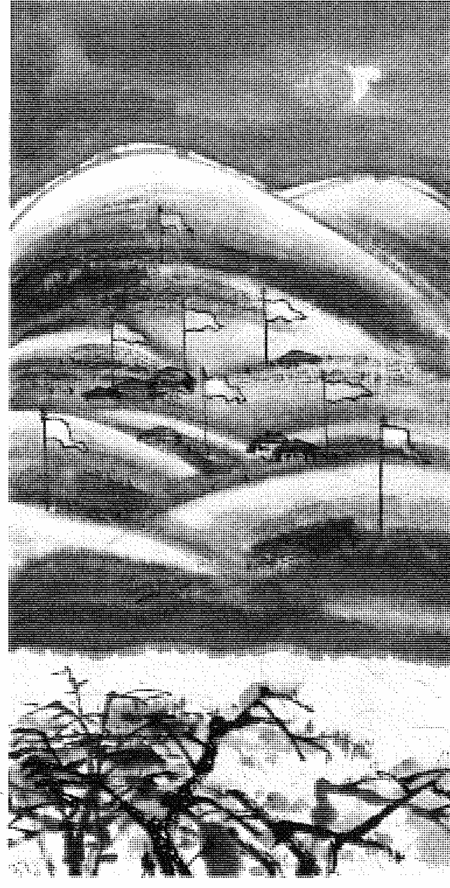

讖詩
長山白雪，滿樹風月；八面旗開，留頭蓄髮。

頌論
洪始洪亂又洪終，一后兩王運盡同；二六八分十殿主，遼遼九鼎還山中。

詳譯
東北的長白山是個好風水的龍脈，滿清人由此發跡；八旗軍旗開得勝、一統中原，漢人為了活命，只有蓄清人的髮辮。

因為洪承疇叛明降清，滿清才得以入關稱帝；因為洪秀全的太平軍起義，清朝歷經十五年動亂才恢復平靜。武昌起義成功，黎元洪就任湖北軍政府都督，廢「宣統」年號，用黃帝紀元，改國號為「中華民國」，清朝便宣告結束了，清興、清亂與清亡皆與「洪」有關。清興靠的是攝政王多爾袞，清亡時也由攝政王載灃擔綱，但清朝興亡的關鍵則在慈禧太后，這「兩王一后」都關係到清朝的興亡。總計清代十任皇帝、兩百六十八年，最後還是把國之重鼎還給了漢人孫中山。

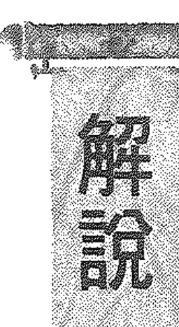

「長山白雪」指滿洲人發源於東北的長白山脈；「滿樹風月」指滿族所居為興龍之地，風水極佳；「八面旗開」指滿洲人的戶口編制，以正黃、正白、正紅、正藍、鑲黃、鑲白、鑲紅、鑲藍八種不同顏色的旗幟來區分；「留頭蓄髮」指滿清強制漢人剃髮留辮（前額剃淨，後腦留辮）。滿清入關次年（西元一六四五年）六月，多爾袞首頒薙髮令：「各處文武軍民，盡令，盡令薙髮，儻有不從，以軍法從事。」因此當時流行一句順口溜：「留頭不留髮，留髮不留頭。」

「頌論」首句「洪始洪亂又洪終」中的「洪始」指明末大將洪承疇，他率領的十三萬大軍本來是明朝末年僅剩的兵力，一旦降清，明朝也就實質滅亡了；所以說「洪」承疇是清朝開「始」的推手。到了清代中葉，鴉片禍國、民生凋敝，洪秀全領導的太平天國軍到處殺人放火，蹂躪了十六省、延續了十五年，史稱「洪楊之亂」；後來亂雖平，而清朝已經元氣大傷，所以說這是「洪亂」。到了滿清末葉的宣統三年（西元一九一一年），十月十日湖北武昌新軍起義，攻佔湖廣總督衙門，革命黨人強推清陸軍第二十一混成協統黎元洪，就任湖北軍政府都督，廢「宣統」年號，用黃帝紀元，改國號為「中華民國」；由姓「洪」的「終」了滿清政權，故名「洪終」。實在巧妙、精確到匪夷所思的程度。

「二六八分十殿主」指的是清朝歷經十個皇帝，合計在位兩百六十八年；十帝是順治福臨、康熙玄燁、雍正胤禛、乾隆弘曆、嘉慶顒琰、道光旻寧、咸豐奕詝、同治載淳、光緒載湉、宣統溥儀。十帝之首「順治帝」福臨，即位時只有六歲，由睿親王多爾袞和鄭親王濟爾哈朗共同輔政；十帝之末「宣統帝」溥儀即位時更只有三歲，以父親載澧為攝政王監國，一頭一尾皆有攝政王，可謂巧合。同治和光緒皇帝時，皇太后慈禧專權，扼殺變法維新，是清朝滅亡的主要原因；慈禧太后去世三年，清朝就被孫中山所領導的國民革命軍所推翻，所以「頌論」末句預言「遽遷九鼎還山中」，「九鼎」象徵九州，代表中國，「山中」即指孫中山。

唐人李淳風的「讖詩」準確地預言明亡清興，宋人陳希夷的「頌論」更清楚道出清代共享有兩百六十八年的國祚，其中經過十主，可謂靈驗無比，纖毫不差。

## 第三八預言 康熙平亂

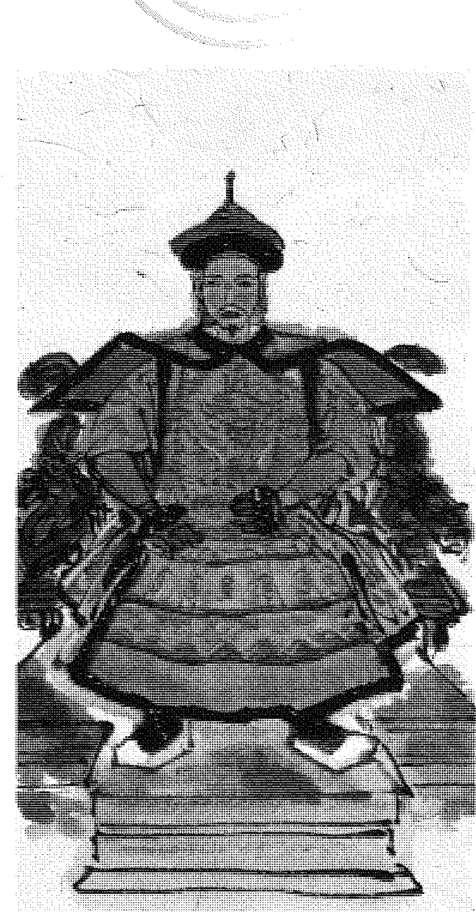

> 讖詩
> 日月麗天，群雄懾服；百靈來朝，雙羽四足。

> 頌論
> 華夏而今有聖人，信為豪傑能親民；四夷齊拜呼天子，眉壽泰來上國春。

> 詳譯
> 太陽和月亮在天上光明燦爛，因為真主誕世，天下群雄都俯首臣伏；連西方的俄國也遣使來朝，清廷用華貴的雙馬四輪車迎接貴賓。

中原華夏如今出了一位聖主康熙皇帝，他是真正能勤政愛民的英明之君；蒙古、察哈爾、新疆、西藏的叛亂都先後平定了，連遠方的俄國也遣使來朝，這位古稀天子在位六十一年，不但自己福壽雙全，國家也安享太平。

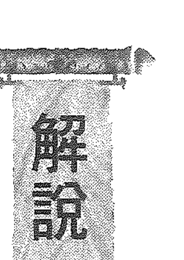

這個預言完全在歌頌清聖祖康熙皇帝玄燁個人的文治武功、英明蓋世。西元一六六一年正月初七日，順治福臨死於養心殿，在位十八年，得年二十四。順治遺命由其子玄燁嗣位，因年僅八歲，由內大臣索尼、蘇克薩哈、遏必隆、鰲拜輔政。隔年改元康熙。

清兵入關後，剿滅流賊、征服江南，多賴明朝降將之力，因此清廷最初不惜以高爵厚祿來籠絡他們。例如初入關便封吳三桂為平西王，聯同阿濟格率軍追討流寇李自成；又命大學士洪承疇督率明朝降將孔有德、尚可喜、耿仲明等人經略南方，而後在順治六年（西元一六四九年）封孔有德為定南王、尚可喜為平南王、耿仲明為靖南王。後來尚可喜率兵駐鎮廣州，耿仲明老死、子繼茂襲封鎮福州，吳三桂鎮雲南，吳、耿、尚三人號稱「三藩」。到了康熙十二年（西元一六七三年）三月，天下略定，清廷有撤藩以解除三人兵權之意，引起三藩不安，吳三桂遂於同年十一月舉兵反清，次年耿精忠也反，到康熙十五年尚之信亦叛，一時聲勢頗盛，南方半壁江山幾為漢人所有。可惜吳三桂年紀已老，過於持重，只想在湖南衡陽稱帝，國號周，與清廷劃江分立，不肯全力北進攻入北京；也不肯順江東下攻取南京，遂予清廷從容調度的寶貴機會。加上康熙皇帝年輕氣盛，指揮若定，三藩遂先後遭到擊破。至康熙二十年（西元一六八一年）九月清兵攻占昆明，吳世璠（吳三桂之孫）兵敗自殺（吳三桂已於康熙十七年八月病死），延續八年之久的「三藩之亂」總算平定。所以「讖詩」首句「日月麗天」，指的就是康熙帝年方二十八歲，像朝陽旭日般光明燦爛，次句「群雄懾服」則指他平定了三藩之亂。

康熙帝八歲即位，不滿顧命大臣鰲拜跋扈驕縱，有心處置，就與宮中小太監勤練角力（稱「布庫戲」）；鰲拜以為小皇帝貪玩，不以為意。康熙八年（西元一六六九年）五月，鰲拜上朝時為康熙身邊隨侍太監所擒，十六歲的康熙帝歷數鰲拜結黨擅權、勢焰囂張，恣意妄為；貪聚賄賂，紊政亂國等十大罪，因而予以革職、籍沒、拘禁，處斬。鰲拜之子那摩佛免死拘禁，弟都統穆里瑪、侄塞本得，及其黨大學士班布爾善、吏部尚書阿思哈、兵部尚書噶褚哈等均立斬。顧命大臣遏必隆雖未結黨，卻瞻顧附詔，削去太師及公爵之位，降爵革職。於是滿朝文武都對這個十六歲的小皇帝刮目相看，敬畏有加。

明末清初時，蒙古族的勢力蔓延成四大部：一為漠南蒙古，又稱內蒙古，分佈於今熱河、察哈爾、綏遠、遼北四省境內。二為漠北蒙古，又稱喀爾喀蒙古，分佈於今外蒙古及興安省境內。三為漠西蒙古，又稱厄魯特蒙古，分佈在新疆天山北路。四即青海蒙古，分佈於青海境內。其中，漠南蒙古早在明末已為滿清併吞，漠北蒙古則於清初臣服；漠西蒙古的準噶爾部酋長噶爾丹則於康熙二十七年（西元一六八八年）向東擴展，侵併漠北之地，康熙二十九年又率軍南侵漠南；康熙皇帝親征後將其打敗；接著又於康熙三十五及三十六年（西元一六九六至九七年）兩度親征漠北，噶爾丹終於兵敗自殺。不過準噶爾部在新疆伊犁根據地的勢力仍在，康熙五十四年時再度東侵新疆哈密，次年又遣兵入西藏。康熙五十九年清軍由青海、四川兩路進兵，將準噶爾部逐出西藏，並擁立達賴六世，西藏遂平。

台灣在明朝末年時為荷蘭人佔據，清初鄭芝龍降清（參見第三六預言），其子鄭成功不從，據廈門、金門以抗清，後率兩萬五千人自荷蘭人手中取回台灣，作為抗清基地。惜康熙元年（西元一六六二年）鄭成功死，得年三十九歲；康熙二十二年（西元一六八三年）鄭氏降將施琅帶領清軍攻台，鄭成功之孫克塽不敵投降，結束了反清復明大業。

康熙雖然在位六十一年，但幾乎一刻都不得閒，並沒有太多時間享福；他的大半心力都用來平定天下、為安定清代的江山努力，其中尤以平定漢人及蒙古人的叛亂耗費最多精神。所幸由於天縱英才加上辛勤操勞，最後都能克服各種困難，通過無數考驗，使清朝的疆域大致確定，而且比明朝大了許多，這都是他的卓越貢獻。

「讖詩」末兩句「百靈來朝，雙羽四足」，指康熙三十二年（西元一六九三年）十月，俄國沙皇彼得大帝一世遣使入貢，所以「頌論」第三句才說「四夷齊拜呼天子」。

而「頌論」末句「眉壽泰來上國春」略有阿諛之意，那是因為康熙帝壽僅六十九歲，雖達「眉壽」之境，卻不是歷代皇帝最高壽者。歷史上有正式年齡記載的皇帝，由漢高祖至清光緒共有兩百零八位皇帝，其中最高壽的是康熙之孫乾隆皇帝的八十九歲，次為南北朝梁武帝八十六歲、南宋高宗八十一歲、元世祖八十歲。活過七十歲的皇帝也有七人：漢武帝七十歲、三國吳大帝七十一歲、唐高祖七十一歲、唐玄宗七十七歲、遼道宗七十歲、西夏仁宗七十歲、明太祖七十歲。可見康熙帝的享壽僅排名第十三而已，但他的勤政愛民歷史上無人能比，康熙的盛世也冠絕古今，所以頌論形容「泰來上國春」也算是恰如其份。

## 第三九預言 雍乾盛世

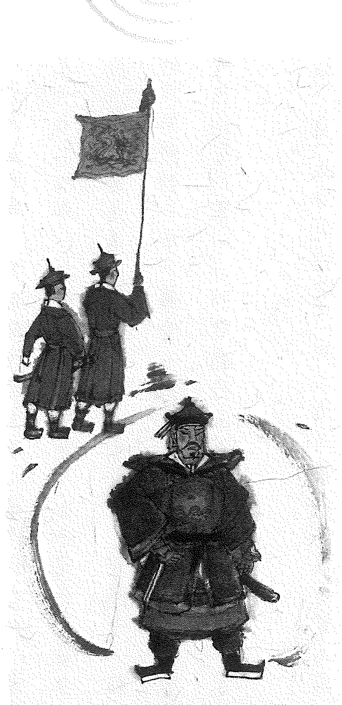

讖詩
三士功賁，同懷似仇；四方安泰，共七三秋。

頌論
鐵馬金戈美玉奇，參商骨肉連三枝；子長父短前生定，禪位須過周甲期。

詳譯
大將軍年羹堯功高震主、恃寵驕縱，結果被雍正帝賜死。但雍正為了鞏固權力，對同胞兄弟痛下殺手；清朝開國至今已四境安寧，雍正、乾隆共享有七十三年的太平歲月。

奮威將軍岳鍾琪驍勇善戰，平定了青海、蒙古的叛亂；美中不足的是雍正帝不念骨肉情，對三個弟弟胤禩、胤禟、胤禵分別予以革爵囚禁。雍正、乾隆父子的在位時期長短不同（父親短、兒子長），這些都是上天註定的，乾隆帝的太子顒琰想接皇位要等父親作滿六十年。

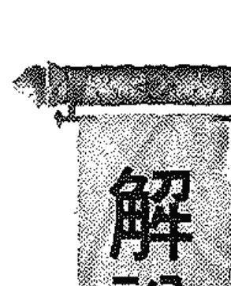

「三土」為「垚」，即「堯」字，指年羹堯。年羹堯字亮工，漢軍鑲黃旗人，康熙三十九年進士，後擢四川巡撫，以平西藏有功，升川陝總督。雍正帝即位之初，年羹堯以戰功任大將軍，雍正二年（西元一七二四年）初督師岳鍾琪等人，平定青海蒙古，因此累晉爵至一等公。「頌論」首句「鐵馬金戈美玉奇」中的「金戈」，即隱含「鍾」字；「美玉」則隱「琪」字，指岳鍾琪率鐵騎一千，蓐食（把生牛肉塞在馬鞍下，當作行軍時的糧食）銜枚（士兵口含木片，悄聲行軍），一日夜行三百里，出奇致勝，大破青海蒙酋羅卜藏丹津之事。

年羹堯才氣凌厲，女兒又是貴妃，因此恃寵驕縱。加上他為雍正心腹，曾為雍正謀畫奪取帝位，所以為雍正所忌嫌，迭次降黜；直到雍正三年（西元一七二五年）十二月，終於痛下殺手，條列九十二大罪而將他賜死。年羹堯以勳功始，以獲罪終，功虧一簣，故「讖詩」首句云：「三士功簣」。

康熙帝勤於播種，有子三十五人、女二十人，因為長子胤禔非嫡出，次子胤礽被立為皇太子，但胤礽暴戾不法，在康熙四十七年（西元一七○八年）被廢，此後諸子為營求為太子，多結黨暗鬥；康熙六十一年（西元一七二二年）十一月十三日，聖祖駕崩，四子胤禎繼位為雍正帝，開始對爭奪帝位的胞弟胤禩（聖祖八子）、胤糖（聖祖九子）、胤禵（聖祖十四子）展開報復。雍正四年（西元一七二六年）正月，將胤禩革去貝子爵位，囚於獄中，賜名「阿其那」，滿族話為「豬」；同年五月又革去胤糖的貝子爵位，禁錮於壽皇殿附近；最後再革去胤禵的貝子爵位，改名「塞思黑」，即滿族話的「狗」，同時拘禁於河北保定。雍正不念手足之情，妄加報復，所以「讖詩」次句有「同懷似仇」，「頌論」次句也說「參商骨肉連三枝」，參商是老死不相見的意思。

雍正帝心胸狹窄、有仇必報，這種個性的人很難長壽，所以他在位十三年即死，得壽五十八歲；不像他的兒子乾隆帝在位六十年，得壽八十九歲；因此「頌論」第三句說「子長父短前生定」。而雍正十三年加乾隆六十年，一共七十三年，此即「讖詩」末句所云「共七三秋」之意。

乾隆是中國封建王朝兩千年、兩百零八個皇帝中最有福氣的。所謂「福氣」，包括：（一）享壽八十九歲，在歷代皇帝中壽命最長，享盡了人間榮華富貴、後宮艷福。（二）在位時間最長，雖然「禪位須過周甲期」，也就是說作滿六十年皇帝後，才禪位給嘉慶皇帝，以示不敢超越祖父康熙帝的在位六十一年；但乾隆帝又以太上皇之尊，遙控朝政四年才駕鶴西歸，實際上做了六十四年的皇帝。（三）乾隆在位時天下太平，雖然仍有兩平新疆準噶爾、一定天山南麓回部、兩掃四川大小金川之吐蕃、一靖台灣、一入緬甸、一復安南（越南）、兩勝廓爾喀（尼泊爾）的「十全武功」，看起來好像長年奔波沙場、忙得不可開交；其實這些戰役全都是「以石擊卵」，好像今天美軍攻打阿富汗或伊拉克一樣，不必花太多心力，與當年他祖父康熙帝的平三藩、克蒙古比起來，康熙為生死存亡之爭，而乾隆好像逛花園、打蟲子那麼簡單。說起來他的命比爺爺康熙帝好太多了。

我國有五千年以上的悠久歷史，但其中常飽受水旱饑荒盜匪戰亂之苦，甚至被迫逃荒逃難，以致命如草芥螻蟻。歷史上的太平盛世，如唐太宗「貞觀之治」不過二十三年，唐玄宗「開元盛世」不過四十三年，「乾隆盛世」卻長達六十年，如果命中注定要生為中國人，而且可以挑選生辰八字的話，幾千年裡大概只有生在乾隆盛世才能無憂無慮，受到「十全老人」的福蔭。因為「一代」平均約三十年，如果「盛世」不能超過六十年，在一生中還是會受到災難折磨，這是不爭的事實。奇的是唐人袁天綱、李淳風早已在《推背圖》清楚預告：只有雍乾兩朝才能「四方安泰，共七三秋」，真是何其難得。

## 第四〇預言 太平天國

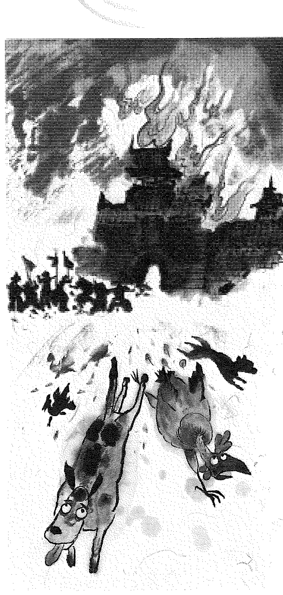

> 讖詩
> 有號太平，犬雞皆驚；逢三生滅，遇鼠始傾。

> 頌論
> 萬人頭上起英雄，血染河山流水紅；一樹楊花全不見，十三年後總成空。

詳譯
這一群反抗清朝政府的漢人建號「太平天國」，可是所到之處胡亂殺人，搞得雞犬不寧；他們在道光三十年起事造反，到咸豐三年時定都南京，同治三年清軍又攻陷南京。

## 卷上 第四〇預言 太平天國

城，興起滅亡的關鍵年都與「三」有關，直到鼠年（同治三年甲子）才銷聲匿跡。
廣東花縣出了一個英雄人物，名叫洪秀全，他創立的太平天國到處殺人放火、血流成河，可惜自家諸王爭權內鬥，東王楊秀清被天王洪秀全與北王韋昌輝合謀襲殺，此後局勢即由盛轉衰，鬧了十三年的「太平天國」，最後還是一場空。

清咸豐時，漢人洪秀全在南方建立了「太平天國」，反清政權前後共持續十五年，戰禍遍及十八省，是清朝兩百六十八年政權中規模最大、時間最長的一次內亂，百姓並未因此得福。洪秀全是廣東花縣人，「萬人頭上」即「草」頭，隱喻花縣，「萬人頭上起英雄」，預言廣東花縣有位洪秀全將成為造反英雄。
洪秀全原本家中務農，一心想要經由科舉取仕。無奈道光年間屢次應廣州府科考，均名落孫山，因此心中憤恨不平，後來便學唐朝末年屢試不中的黃巢一樣造反（參見第十預言）。

然而要造反、吸引眾多人加入，必須有一些動人的口號和迷人的遠景。洪秀全正苦思不得其解時，有一次在廣州聽到西洋教士講道，讓他獲得靈感，回到家鄉後便創立上帝會，藉宗教迷信吸收信眾，伺機而動。道光末年時廣西大饑，盜賊群起，貧困的百姓紛紛前去依附，而且愈聚愈多，原本僅在廣東一帶活動的上帝會，勢力一下子就擴展到廣西。道光三十年（西元一八五〇年）七月，洪秀全見時機成熟，即於廣西桂平縣金田村起事，當時部眾約兩萬人，皆蓄長髮，穿明朝衣冠，以「反清復明」為口號，向滿清宣戰。

清廷急調陝西提督向榮為廣西提督率軍進剿，但屢為洪秀全所敗。同年道光帝死，子奕訢立，史稱文宗。清文宗咸豐元年（西元一八五一年）十月一日，洪秀全陷廣西永安，建號太平天國，自稱天王；同時封楊秀清為東王，蕭朝貴為西王，馮雲山為南王，韋昌輝為北王，石達開為翼王。清軍前去圍攻永安，但歷久不下。咸豐二年，洪秀全潰圍北走，突入湖南，一路殺人如麻，血流成河，人皆稱為「長毛賊」，這就是「讖詩」所云「有號太平，犬雞皆驚」；「頌諭」也預言「血染河山流水紅」。

到該年九月，洪秀全圍攻長沙，十一月三十日四度炸毀長沙城牆，但仍無法攻陷。由於軍中缺乏油鹽，遂撤圍、渡湘江，於十二月攻陷岳州（今湖南岳陽），接著連取漢陽、武昌（不久又為清軍收復）。太平天國軍在湖南殺人無數，以致里巷成墟、田畝荒廢，大量江西人趁機西移，入湖南而成為湖南人，這就是「江西老表」一詞的由來；意思是說江西人為湖南人的表親。

咸豐三年（西元一八五三年）二月，太平天國軍沿長江東下，克江西九江、安徽安慶，在三月十九日攻陷南京，改稱天京，定為國都。一面派遣林鳳祥、李開芳等大將分道北伐，一面開始定立官制，並以基督教義教育人民。在經濟和土地政策上，以公有為原則，按人口分配，剩餘的財物充公，頗合日後的共產主義。其他如提倡男女平等，女子可參加考試、出任官吏，禁販奴、蓄妾、賣淫、纏足等陋習，也禁吸鴉片，違者處死；鰥寡孤獨及幼弱者由國家供養，社會福利政策也頗為先進。按理說這樣一個開明、先進的政權應該受到老百姓歡迎，而且能夠長治久安才是。為什麼《推背圖》卻說「一樹楊花全不見，十三年後總成空」呢？

太平天國之所以失敗，原因之一是曾國藩督練湘軍，湘軍的成員多係驍勇善戰、視死如歸的苗族人，故能戰無不克、常勝疆場，至今仍有「無湘不成軍」之諺。由於曾國藩訓練湘軍、替滿清消滅了太平天國，因而成為「中興名臣」，但也有歷史學者抨擊他是民族罪人；要不是他消滅太平天國，也許清朝會提早五十年結束，那麼就不會發生日後的慈禧亂政、八國聯軍、軍閥混戰、日寇侵華、國共內戰等一連串悲劇了。

另外一個原因則是太平天國諸王內鬥。洪秀全定都南京後，生活日漸淫奢，大權旁落東王楊秀清之手；咸豐六年（西元一八五六年），洪秀全不滿東王跋扈，便與北王韋昌輝合謀，襲殺楊秀清，其家屬、同黨死者兩萬餘人，楊家人死傷慘重，所以「頌論」說「一樹楊花全不見」。《太平天國野史．卷十二．東王楊秀清》中記載：「秀清年四十餘，貌中人，黃瘦微髭，以姬眾多，服溫藥，損一目而機警有權略，善將將，才在北韋上，既被殺，諸王水火，群下解體，太平朝遂不復振矣。」

## 第四一預言 湘軍勤王

> 讖詩
龍蛇鬥智，五虎同器，一順揚外，三端內洽。

> 頌論
三湘子弟半從戎，又見六朝五代風；將士江淮亦好漢，咸欣亂後慶年豐。

> 詳譯
真龍天子咸豐帝和相傳是巨蟒轉世的曾國藩，君臣之間關係敏感而微妙。所幸清廷對內有駱秉章、胡林翼、左宗棠、彭玉麟、李鴻章五虎將，平定了洪楊之亂，還有祁叔穎、翁心存、倭仁三位諡號「文端」的軍機大臣齊心輔政；對外則由禮部尚書肅順兼掌理藩院（外交部），諸事均處置得宜，咸豐朝才得以平安度過太平天國之亂。

雖然咸豐時社會紛亂，就像魏晉南北朝、五代十國時一樣戰亂連年；幸虧有曾國藩做榜樣，半數以上的湖南子弟都從軍報國、上陣殺敵；還有湘軍、淮軍等英雄好漢鼎力相助，終於平定了綿延十五年的太平天國之亂，維持一段時間的平靜、安居歲月。

「龍」指咸豐皇帝，「蛇」指曾國藩；「龍蛇鬥智」指滿人皇帝對漢人領袖的猜忌，因為民間盛傳曾國藩是蛇精轉世投胎。民初人柴小梵在《梵天廬叢錄·卷四》中描述：曾國藩母親在臨盆前夕，夢見一條巨蟒蟠曲樑間，嚇醒後不久即生產。曾國藩長大以後，全身都是癬斑，就好像蟒蛇的鱗甲一樣；每天睡覺起來，床上都掉滿癬屑，好像巨蛇蛻皮。奇怪的是，曾國藩喜歡吃雞肉，卻怕雞毛；因此每次收到插著雞羽（標示傳遞速度為最急件）的公文時，都不敢親手拆封；有一次到上海閱兵，看到司令台的座椅背後插了根雞毛撢子，也立刻叫人拿走。傳說這是因為蟒蛇只要聞到燃燒的雞毛氣味，就會氣悶暈死過去；種種現象似乎都在暗示曾國藩確實是大蟒蛇轉世，更增加了傳奇色彩。

曾國藩並非軍職出身，卻自練湘軍有成，咸豐四年（西元一八五四年）不但將太平軍逐出湘南，進而收復湖北武漢諸郡，戰績比清廷八旗、綠營正規軍還顯赫。咸豐帝聞訊，喜形於色地對軍機大臣說：「不意曾國藩一書生，乃能建此奇功！」滿族大學士祁叔穎提醒皇帝說：「匹夫居閭里，一呼，蹶起從之者萬餘人，恐非國家福也！」咸豐帝默然變色者久之，從此之後曾國藩即被刻意打壓，不能大行其報國之志長達七、八年。

後來宗室肅順（鄭親王烏爾恭阿第六子，鄭王端華同母弟）在咸豐八年升禮部尚書、兼理藩院事，得以參預軍機；他對漢人比較敬重，有一次酒後率直地對同僚說：「咱們旗人渾蛋多，懂什麼？漢人是得罪不得的，他們那隻筆利害得很。」

當諸王猜忌曾國藩功高震主、恐有異圖時，肅順力斥其謬，並且拍胸脯對咸豐帝保證說：「漢人可大用，曾胡諸帥，皆可保其無二志。儻不信之堅（如果對他們沒有堅定的信心）而厚爵之（給他們高官），天下解鈕矣（國家可能分崩離析）。」咸豐帝聽了肅順的話後，才放心地讓湘軍、淮軍繼續訓練、殺敵。

同治三年（西元一八六四年）七月十九日，湘軍攻下南京城，受傷的太平軍驍將李秀成率死士數百人，擁著洪秀全的長子洪天貴衝出城逃亡，不料半途迷路、藏在民家，三天後就被抓到。曾國藩勸李秀成投降，同時號召太平軍放下武器。想不到李秀成既不為所動，還反勸曾國藩反滿獨立，共創驅逐韃虜、恢復中華之大業。五十四歲的曾國藩既沒這個膽、也沒有異志，一心只想中興清朝，只好在八月七日將李秀成處死。正因為肅順始終對曾胡李左等漢人有信心，湘軍、淮軍才能無後顧之憂，勇往直前，最後打敗長毛賊。

當然，論平定太平天國的有功人士，就不能不提「咸豐五虎將」：駱秉章、胡林翼、左宗棠、李鴻章與彭玉麟。

駱秉章為廣東花縣人，與太平軍的天王洪秀全是小同鄉，卻幫著曾國藩練湘軍、籌軍餉，內守外戰，最後把太平軍趕出湖南，立了許多大功。

胡林翼是湖南益陽人，道光年間進士，道光三十年（西元一八五〇年）在貴州鎮壓苗民叛變，咸豐四年（西元一八五四年）率黔勇會同湘軍攻打太平軍所佔領的武昌，咸豐五年又與羅澤南率湘軍反攻武昌，咸豐六年升任湖北巡撫。

左宗棠是湖南湘陰人，道光舉人，咸豐初年太平軍起，左宗棠以四品京堂統軍，轉戰浙江福建等省，後又平陝甘捻匪、天山南北路回民叛亂，累官總督，封恪靖侯。

李鴻章是安徽合肥人，道光進士，咸豐三年（西元一八五三年）隨侍郎呂賢基回籍辦團練、抵抗太平軍，咸豐八年（西元一八五八年）入曾國藩幕襄辦營務，咸豐十一年編練淮軍，在江蘇省的上海、蘇州、常州等地屢克太平軍，戰績甚著。

彭玉麟為湖南衡陽人，咸豐年間曾國藩在衡陽訓練水師，召請彭玉麟、楊岳斌襄助練兵；後來彭玉麟即率軍轉戰長江各省，捷湘潭、復武漢、拔湖口、破田家鎮、奪小姑山，且連克九江、安慶、蕪湖、江寧等地，功績甚偉。

彭玉麟個性剛介絕俗、善畫梅，能作詩，而且下筆立就。平了太平天國之亂後，清廷給他河運總督之職，這是個天下第一大肥缺，他卻堅決辭官，還慎重地上奏朝廷說：

> 「臣本寒儒，傭書養母，咸豐三年母物故，曾國藩謬用虛名，強之入營。初次臣見曾國藩，誓必不受朝廷之官職。…臣嘗聞士大夫之出處進退，關於風俗之盛衰；臣既從軍，志在滅賊，賊既滅而不歸，近於貪位。夫天下之亂，不在盜賊之未平，而在士大夫之進無禮、退無義。中興大業宜扶植名教、振起人心。臣以寒士來，願以寒士歸也。」這番話真是發人深省。

清廷有彭玉麟這樣耿介的虎將，太平天國卻充斥著洪秀全、楊秀清、韋昌輝一班自私自利、貪圖享樂的將領，雙方的勝負早已不卜可知了，難怪陳希夷「頌論」要說：

> 「將士江淮亦好漢，咸欣亂後慶年豐。」

## 第四二預言 英法聯軍

> 讖詩
西方有人，腳踏神足；帝出不還，三台扶鎮。

> 頌論
黑雲黯黯自西來，帝子臨河築金台；南有兵戎北有火，中興曾見有奇才。

> 詳譯
有一批燒殺擄掠、唯利是圖的強盜從西方來，乘坐著飛快的戰艦，像腳貼神符行走如飛的神行太保；皇帝被迫離開北京，從此一去不還，靠著大臣們輔佐，政局才安定下來。

不吉祥的黑雲從西方飄來，中國籠罩在西方列強船堅砲利的壓迫中，可是清朝的皇帝們卻在昆明湖邊，建築了精緻壯麗的圓明園以供享樂；南邊的太平天國到處殺人，以致血流漂杵、山河變色，北方的英法聯軍攻陷北京城、火燒圓明園，清朝好在有御前大臣肅順拿主意，才能夠穩住政局、度過難關。

西元一八五〇年二月二十五日，農曆元宵節的前一天，六十九歲的道光皇帝來不及吃湯圓，才看過花燈就一命嗚呼了，把一個即將掀爆的爛攤子丟給年方二十歲的兒子奕詝，也就是歷史上的咸豐皇帝。

道光皇帝才死半年，廣西就爆出太平天國之亂；一直到咸豐皇帝駕崩，太平天國還沒有任何會被救平的跡象。與此同時，道光二十年（西元一八四〇年）爆發的中英鴉片戰爭，到咸豐帝即位了還無緩和的趨勢，不僅如此，還從單獨對付一個如餓狗的英國侵略，演變成如豺狼般的英法聯軍。咸豐七年（西元一八五七年）十二月，英法聯軍挾其船堅砲利攻陷廣州，抓了兩廣總督葉名琛，關到印度監獄中，一年後死亡。咸豐八年五月二十日，英法聯軍的艦隊更北上河北的渤海灣，攻陷大沽砲台，逼清廷簽訂中英、中法「天津條約」，要求開放南京、漢口等十個城市為通商口岸，還要賠款給英國四百萬兩白銀、給法國二百萬兩。

國勢已經如此內憂外患、岌岌可危，可是位在北京城外西北邊的圓明園中，還是一派歌舞昇平景象。這個庭園建築佔地廣袤、園景宏麗，從雍正、乾隆、嘉慶到今已有將近百年的歷史，硬體結構綜合了中外建築藝術的精華，既有輝煌宮殿，又有壯麗園林；裡面陳設了清廷最珍貴的稀世文物，包括三代青銅、六朝佛雕、唐宋書畫、元明青瓷等。傳到咸豐朝時，國力已經大不如前，照理說皇帝應該焦頭爛額地忙於處理政事，無暇享樂，不過一向受到寵信的總管圓明園事務大臣文豐，還是奉承皇旨，從江南找來許多能歌善舞的絕世美女，在圓明園中侍候皇帝。

咸豐九年三月裡的某一個傍晚，圓明園中牡丹堂前的牡丹盛開；月亮升起了，咸豐帝敕令諸美人侍夜宴，置酒賞花於鏤月開雲之臺。當時春寒未解，內侍們以紫貂薦地，寶炬千百，珠翠瑟瑟，靚妝如雲，咸豐帝召演唐明皇沉香亭故事數折；花月之下，春光如醉，歌聲遏雲，皇帝醉眼凝睇著諸美人，嗟賞不已。罷宴回宮，當然不免盡情縱慾，上演另一場好戲，令憂國憂民的大臣們無言以對。

咸豐九年六月，英、法公使到北京換約，堅持不走陸路，要開兵艦經大沽、沿白河去天津，還開砲突襲大沽砲台。清軍奮勇還擊，經一晝夜激戰，擊沉、擊傷英法軍艦十餘艘，打死英法聯軍四百多人，還重傷英艦隊司令賀布（Admiral Sir James Hope）；英法侵略軍只好在美艦掩護下狼狽撤退。

咸豐十年春天，英軍再率一萬八千餘人，聯合法軍七千餘人乘兵艦來報仇。七月進犯大沽口，八月二十一日大沽失守；八月二十四日英法聯軍入天津，九月八日清廷與英法代表在北京東邊三十里的通州談判，九月十七日談判破裂，英法聯軍繼續西進，通州失陷。九月二十一日北京東郊的八里橋失守，清軍大敗。當時秋暑方盛，咸豐帝正與諸江南美女避暑於圓明園福海，蕩木蘭之舟，歌涼風之曲，沉醉於溫柔鄉中。三十而立的咸豐帝突然聽到英法聯軍已逼近北京東郊數里之外，才驚覺堂堂天子在天京已無立足之地，便倉猝率后妃、皇長子等人，自圓明園向東北邊一百五十公里外的熱河承德避暑山莊逃命，並下詔六弟恭親王奕訢為欽差大臣，留守京師與西人議和。沒想到他這匆匆一走，就再也沒有機會活著回來圓明園享樂了。

九月下旬，英法聯軍利用與奕訢談判之機補充彈藥與給養，十月六日即在奸民李某引導下，攻入北京城外的圓明園大肆劫掠，從六日搶到九日，凡是園中的珠玉珍寶、字畫古董均搶奪一空，搬不動的就全部砸毀；可以說盛清三朝蒐藏的稀世文物損失殆盡。十月十三日聯軍入侵北京，為了掩飾搶劫的罪行，還在十月十八、十九兩日縱火焚毀圓明園，大火三日不熄，諸江南佳麗不知所終，總管文豐北向再拜後投福海而死。亂平後，有人於暮春重返園中，見昔日之山高水長、朗吟閣、環碧亭、無邊風月閣、聽鸝館、無盡意軒、影湖樓、美人館...，都只剩下燒紅、燒焦的斷垣殘壁，不可辨認，唯有福海潺潺，鳥啼花落而已。

這樣的文化浩劫，就像今日用一顆原子彈炸毀英國倫敦的大英博物館，或法國巴黎的羅浮宮一樣，乃不可饒恕的粗暴罪行，也是可恥、可惡的貪婪劫掠，為人類文明的千古罪人。令人詫異的是一百五十多年後，這些強盜們的後世子孫，竟可以公然把贓物送到富士比古董市場拍賣，如價值連城的圓明園大水閥十二生肖銅獸首、「乾隆閱兵圖」長卷等等。這是個什麼沒有是非、顛倒黑白的世界啊！

這麼慘痛的遭遇，「頌論」僅以「南有兵戎北有火」一語帶過，「北有火」三字的預言又多麼令人痛心長嘆啊！

咸豐皇帝二十歲即位，正當精力旺盛之年，那麼多的後宮佳麗和江南美女，正是他大展長才的好機會，可以好好扮演「一夜七次郎」；那曉得「耕不壞地累死牛」，在滿族貴婦與漢族佳麗輪番夾攻下，即使年輕力壯也招架不住，只好趕緊找御醫幫忙。御醫建議皇帝常喝鹿血，說鹿血可以滋補陽虛腎虧，二十多歲的咸豐從此非鹿血不能盡興；以致英法聯軍已經打到北京，皇帝即使倉惶逃命，大臣、家眷可以不要，卻想把豢養的鹿群一起帶走。大臣們苦勸道：「逃命都來不及了，帶著這些鹿群一起跑，一定會受到拖累；等過些日子、亂事平定了，再喝鹿血也不晚啊！」

不料到了熱河避暑山莊，咸豐帝嫌山莊太小、住著氣悶，大臣肅慎等人就帶皇帝「微服出遊」，實際上就是去尋歡。咸豐十一年八月皇帝因縱慾過度而咯血，急需鹿血進補；可是鹿群未帶，倉促中無鹿可殺，才三十一歲的咸豐皇帝就心有不甘地駕崩了。

這就是「讖詩」所預言的「帝出不還」。

咸豐帝在八月二十一日臨終前，詔立載淳為皇太子（後來的同治皇帝），由怡親王載垣、鄭親王端華、協辦大學士戶部尚書肅順、御前大臣景壽、軍機大臣穆蔭、匡源、杜翰、焦祐瀛等八人共同輔政，這就是「讖詩」所預言的「三台扶鎮」，其中以肅順在政壇的歷練最久、經驗最豐，而且足智多謀，是八位輔臣中的首領。

肅順為滿洲鑲藍旗人，鄭親王端華之弟，歷官至戶部尚書、御前大臣。他主張重用漢族官員曾國藩、胡林翼、左宗棠等人，以鎮壓太平天國之亂；建議鑄大錢以解決財政困難，深受咸豐皇帝信任。咸豐九年（西元一八五九年），兼掌理藩院的肅順與俄使談判，拒絕俄方提出「俄國擁有烏蘇里江以東地區」的領土要求，所以「頌論」末句誇讚他是「中興奇才」。

## 第四三預言 庚子拳亂

> 讖詩
天昏日月，地震山川，四面楚歌，鹿猿爭先。

> 頌論
浮海乘桴馬不前，損金割地羊居先，齊東鬼魅雞肥噬，西去長安鼠浴泉。

> 詳譯
清朝已經面臨天災人禍、焦頭爛額的困境，內有太后亂政、外有強敵侵略，老百姓都快要活不下去了。在這個強敵壓境、四面楚歌的危急存亡之秋，滿籍的直隸總督裕祿，和漢籍的山東巡撫袁世凱，卻是一人一把號，各吹各的調，大清帝國的命運不問可知。

清朝的海軍艦隊在援助朝鮮、與日軍交戰中全軍覆沒，這是馬年（光緒二十年甲午，西元一八九四年）發生的事。清朝吃了敗仗，只好對日本割地賠款，簽定馬關條約，這是羊年（光緒二十一年乙未，西元一八九五年）發生的事。山東來了西方的強盜德國人，把軍艦開進了膠州灣，占地為王，有如一口鯨吞了山東省，這是雞年（光緒二十三年丁酉，西元一八九七年）發生的事。老百姓恨死那些千里迢迢跑來欺負我們的洋鬼子，就高唱「扶清滅洋」，暴發了義和團事件，引起八國聯軍攻打北京，慈禧太后與光緒帝只好倉皇西奔，逃到長安、去華清池泡溫泉，這是鼠年（光緒二十六年庚子，西元一九〇〇年）發生的事。

「讖詩」用「天昏日月，地震山川」八字形容晚清的國勢，時間約從光緒二十年至二十六年間。「頌論」則依序預言了甲午戰爭、馬關條約、德軍攪佔膠州灣和庚子拳亂等，一連串影響清朝政權走向崩盤的大事件。

俗話說「紅顏禍水」，有時候真是一點也不錯。這一連串的災難都與一個女人有關，那就是咸豐皇帝的寵妃葉赫那拉翠蘭，也就是後來的慈禧太后。慈禧初入宮時只是懿貴人，咸豐六年（西元一八五六年）三月二十三日生下皇太子載淳，才晉封為懿妃，不久再升為懿貴妃。咸豐十年九月二十二日，英法聯軍攻北京，咸豐帝帶著皇后鈕祜祿氏、懿貴妃、皇太子載淳逃到熱河避暑山莊，一年後病死。六歲的載淳當了同治皇帝，鈕祜祿皇后升格為慈安太后，懿貴妃升格為慈禧太后，肅順等八大臣奉遺詔共同輔政。沒想到慈禧先安排心腹太監安得海化裝溜回北京，密召在北京與洋人議和的恭親王奕訢到熱河奔喪。被皇兄摒棄在輔政八大臣之外的奕訢心中一肚子氣，便與慈禧密商大計後，先趕回北京佈置，而後慈禧讓肅順護送皇柩由大路慢慢回京，另再命令御林軍護軍（首領）榮祿，護駕兩位皇太后與小皇帝兼程由小路趕回，開始垂簾聽政。她首先下詔將輔政八大臣革職查辦，而且以迅雷不及掩耳之勢，在半路上就攔住護棺的肅順，押回北京處斬。可惜這位「中興奇才」死在慈禧太后手中，扼殺了清廷的中興機會。同治皇帝年紀小，一切由慈禧太后垂簾聽政；他只作了十三年皇帝，就因嫖妓染上梅毒而死，得年十九歲。接下來即由慈禧太后作主，讓四歲的載湉（載淳堂弟）即位為光緒皇帝，再度垂簾聽政。她見洋人把圓明園、清漪園燒了，京畿缺少避暑遊樂的場所，便挪用海軍軍費，大興土木修建頤和園。

## 千載揭密 推背圖

所，就想重修清漪園，可是經費沒著落。會拍馬屁的總管太監李蓮英就出主意，要太后挪用擴建北洋海軍的經費，共花了三千萬兩白銀才將清漪園修建完成，改名頤和園，真是美侖美奐。可是北洋艦隊完了，沒有經費，只好隨便弄弄，以致在援助朝鮮的中日甲午戰爭中，艦隊全軍覆沒，北洋海軍提督丁汝昌羞憤自殺。這就是「頌論」首句所預言的「浮海乘桴馬不前」。

光緒二十一年乙未，生肖屬羊；二月間，日軍乘勝西進，從威海衛登陸，盡陷遼河以東之地。海軍則南陷澎湖，威脅台灣；清廷不得已，只好派李鴻章為全權大臣，赴日議和，簽訂了屈辱的「馬關條約」。主要條款如下：一、中國承認朝鮮為獨立自主國。二、賠償日本軍費二萬萬兩（約修建頤和園經費的七倍）。三、割讓遼東半島、台灣及澎湖列島給日本。四、開蘇州、杭州、沙市、重慶為通商口岸。五、日本得於各通商口岸設工廠，製造貨物。這就是「頌論」第二句所預言的「損金割地羊爭先」。

光緒二十三年，山東省曹州府鉅野縣一個士兵殺了一名德國傳教士，德國就派軍艦佔據膠州灣，次年三月與清廷簽訂了「膠澳租界條約」，內容包括德國租膠州灣，包括沿岸百里內均可自由通行；德國獲得修築膠濟鐵路權，還有鐵路沿線三十里內的開礦權，及山東省各項工程製造的優先權；可以說山東已經成為德國的勢力範圍。這就是「頌論」第三句所預言的「齊東（山東）鬼魅（德國）雞（丁酉年，光緒二十三年）肥噬（大口一吞）」。因為連年受到外國人欺侮，以機器大量生產的廉價洋貨、日貨充斥市場，搶走了中國的白銀、擊垮了農村社會傳統的手工藝產品，人們賺不到錢，生活愈加貧困，仇外之心激盪匯聚，終於釀成了「庚子拳亂」。

## 卷上 第四三預言 庚子拳亂

光緒二十六年（西元一九〇〇年）歲次庚子，生肖屬鼠；由於慈禧太后包庇、縱容拳匪仇殺傳教士與教民（信基督教之中國人），引來八國聯軍圍攻北京，慈禧只好帶著光緒帝逃往西安。這就是「頌論」末句所預言的「西去長安鼠浴泉」。

當初拳匪猖獗於山東，受山東巡撫毓賢的獎勵，時常仇殺教士；光緒二十六年，毓賢被調往山西任巡撫，改由袁世凱繼任山東巡撫。袁世凱很清楚這些拳匪的欺騙伎倆，肉身根本不足以擋子彈，就嚴加剿辦。拳匪在山東待不下去，只好逃往直隸（河北省），直隸總督裕祿（滿人）信其邪說，向慈禧太后推薦，說拳民可以把洋人盡逐出中國。仇恨洋人的慈禧太后信以為真，因而縱容拳匪焚教堂、殺洋人，終於釀成「八國聯軍」之禍。最後與各國簽訂「辛丑條約」，又是割地、賠款、開商埠。因此「讖詩」末句「鹿猿爭先」，「鹿」即影射裕祿，「猿」則影射袁世凱，不幸「鹿」贏了「猿」，濫殺洋人的大禍便把清廷推向了滅亡之途。

## 第四四預言 慈禧亡清

> 讖詩
> 皇非所生，母專父政；南北西東，從斯不振。

> 頌論
> 大權獨攬四七載，能偷野漢能敗家；一朝無奈升遐去，黃泉羞見雍乾嘉。

> 詳譯
> 新皇帝不是老皇帝的親生兒子，小皇帝坐上了龍椅，卻讓父母負責管理國家大事，幅員遼闊的大清帝國，從此一蹶不振、走向滅亡。

## 卷上 第四四預言 慈禧亡清

慈禧太后大權獨攬了四十七年，她作威作福，膽大妄為，不但公然偷人，讓死去的咸豐皇帝戴綠帽子，還把大清王朝搞到滅亡的地步；當慈禧太后去世的時候，她有何面目去見地下的列祖列宗呢？

道光皇帝旻寧傳位給咸豐皇帝奕詝是父傳子，咸豐皇帝傳位給同治皇帝載淳也是父傳子，可是同治皇帝十九歲就得梅毒爛瘡而死，沒有兒子可傳帝位，只好讓堂兄弟載湉作光緒皇帝。載湉的父親是咸豐皇帝的弟弟醇親王奕譞，因為光緒皇帝不是同治皇帝的兒子，所以「讖詩」說「皇非所生」，也就是「新皇帝不是前任皇帝所生」的意思。同樣的，光緒皇帝駕崩時膝下也無子女，只好推弟弟醇親王載灃所生的兒子溥儀當宣統皇帝，光緒帝不是宣統帝的父親，也是「皇非所生」。

光緒皇帝在位三十四年，全由「母親」慈禧太后獨攬大權，所以稱為「母專」；溥儀三歲登基，六歲遜位，當皇帝時由父親醇親王載灃掌政，所以稱「父政」。

慈禧太后從兒子同治皇帝登基開始垂簾聽政，過了十三年，換「侄兒」光緒皇帝登基，再度垂簾聽政；光緒在位三十四年，總計慈禧太后一共操控清朝政權長達四十七年之久。她工於陰謀計算，誅殺政敵絕不手軟，卻沒有治理國家的英明睿智；加上寵信小人（太監李蓮英）、窮奢極慾，結果將大清帝國敗到一蹶不振。

咸豐皇帝駕崩於熱河承德避暑山莊時，慈禧才二十七歲，正當年輕慾熾之年；等到兒子載淳當同治皇帝時，政權已完全掌握在她手中，生殺大權全在彈指之間。年輕又大權在握，「出軌」乃必然之舉。她先跟老情人御林軍護軍榮祿重敘舊情，後來又因為愛看京劇，愛上了京劇著名武旦楊月樓，就將他召入宮中充當面首。楊月樓不愧為北京第一武旦，床第間的本事也和戲台上的功夫一樣了得，三兩下就把三十六歲的慈禧太后肚子搞大了，因而悄悄地在同治十年（西元一八七一年）生下一子。慈禧雖然貴為掌權太后，寡婦生子還是不光彩之事，只好偷偷塞給妹妹葉赫那拉蓉兒（她嫁給咸豐皇帝的弟弟醇親王奕譞），取名載湉，也就是後來的光緒皇帝。正史上說慈禧是光緒的阿姨，其實慈禧是光緒的母親；「讖詩」說「母專」而不說「姨專」，表明慈禧太后是以母親的身份掌控光緒帝，唐人李淳風真是明察秋毫，連慈禧太后偷漢子，生下光緒帝都早已料到。

## 第四五預言 創建民國

> 讖詩
> 漢水茫茫，不統繼統，南北不分，和衷與共。

> 頌論
> 無王無帝定乾坤，來自田間第一人；好把史書勤讀記，良言傾吐見英明。

> 詳譯
> 有一個驚天動地的曠世巨變發生在茫茫的漢水間，天下將以分裂來取代先前大清帝國的統一，中國不分南北各省，全都同心協力地擁戴民主共和的新政體。

## 千載揭密

也沒有國王、也不是皇帝，就把腐敗帝制推翻，建立了嶄新的中華民國，這個扭轉乾坤的偉人只是一位來自民間的老百姓，他熟讀史書，知道專制帝國的缺失，為了統一中華、創建民國，他連總統的大位都願意推讓，不計個人利益得失。

清廷對外戰事連連失利，割地賠款，民不聊生，眼看國家將被列強瓜分，面臨亡國滅種之浩劫，廣東省香山縣的孫文決心組黨號召革命、推翻滿清。經過十次革命失敗，死難烈士甚多，但革命黨人依舊前仆後繼，終於在宣統三年（西元一九一一年）十月十日於湖北武昌起義成功，攻占了湖廣總督衙門，推舉清陸軍第二十一混成協協統黎元洪，就任湖北軍政府都督，廢「宣統」年號，建立「中華民國」。同日漢陽光復，又兩天漢口光復，武漢三鎮位在漢水匯流至長江處，是全國最早光復獨立的地區，所以「讖詩」的前兩句說「漢水茫茫，不統（獨立）繼統（統一的滿清帝國）」。

武昌起義爆發後，湖南、陝西、江西、山西、雲南、貴州、江蘇、浙江、廣西、安徽、福建、廣東、四川等各省紛紛響應獨立，這就是「讖詩」後兩句說的「南北不分，和衷與共」。

## 卷上 第四五預言 創建民國

同年十一月十五日，獨立各省派代表在上海開會，十二月三日頒布「中華民國臨時政府組織大綱」二十一條，最後議決黎元洪為大元帥，黃興為副元帥，以南京為臨時政府所在地，孫文為臨時大總統，袁世凱為總理大臣，負責組成內閣。

同年十二月六日，滿清監國攝政王載灃引咎辭職。西元一九一二年元旦，中華民國成立，二月十二日，清宣統帝下詔退位。

袁世凱是見風轉舵的政客，光緒帝「百日維新」時，他賣主求榮，倒向慈禧太后，鎮壓革新派，使戊戌六君子譚嗣同、楊銳、林旭、劉光第、楊深秀、康廣仁壯烈犧牲；革命志士用鮮血頭顱奮勇革命、推翻滿清後，他又搖身一變，成了擁護革新的革命志士。但是袁世凱內心深處不以擔任總理大臣為滿足，想當臨時大總統、正式大總統，最後改制當皇帝，可以說權慾薰心。但他又不願離開北京老巢，到南京就任總理大臣，於是在二月二十九日晚，唆使第三鎮曹錕部在北京製造兵變，焚燒搶劫。三月初，通州、保定、天津等地亦相繼發生兵變，袁世凱便藉口北方不靖，要坐鎮北京，無法南下，請將中華民國首都移至北京。

孫文知道袁世凱的野心，但以革命不易，既建民國，不能南北分裂，就面告清室使者唐紹儀、楊士琦說：「革命軍既建立民國，統一南北刻不容緩，予不但願讓他日正式元首於袁世凱氏，今並臨時總統而亦讓之，只謀于大局有益，不計個人權位得失也。」這就是「頌論」末句所說的「良言傾吐見英明」。

四十七歲的孫文對權位的淡泊令人欽佩，但他此時已擁有美麗絕倫、氣質出眾的女秘書宋慶齡，決心拋棄廣東香山老家的糟糠妻盧慕貞女士，以及相伴十多年的革命伴侶陳粹芬女士；不管多少革命同志反對，都堅持要與年方二十的宋慶齡結婚。他對反對者說：「我不是神，我是人（我有七情六慾）。」人家說「魚與熊掌不可得兼」，西方也有「不愛江山愛美人」的政治人物，孫文既有年輕美麗的佳人，就大方捨棄你爭我奪的江山，心思可以理解。讀者諸君看後來袁世凱在政壇打滾成小丑的下場，就會佩服孫文「英明」的抉擇。

## 第四六預言 洪憲帝制

> 讖詩
> 依然故壘，雷雨滇南，千里一鶚，為時八三。

> 頌論
> 敗隋唐吏滿朝中，舊日百官太宰崇；王莽稱尊有古式，火龍飛去運遂終。

> 詳譯
> 依然是前朝的江山，依然是前朝的體制，雲南總督唐繼堯看不下去了，要起兵討袁，蔡鍔也堅決反對袁世凱稱帝，從千里之外趕赴雲南，與唐繼堯共同推翻了袁世凱，建立八十三天的洪憲帝制。

推翻了滿清帝制的功臣們，紛紛在新建立的民主國家擔任要職；前清太保大學士徐世昌也當了總統府政事堂國務卿；袁世凱則像王莽篡漢稱帝一樣，想要改民國、回復洪憲帝制。可是一到民國五年（西元一九一六年），袁世凱就要結束他作皇帝的美夢，乘龍飛天了。

讖詩一開始就引北宋蘇東坡詞《念奴嬌》中的「故壘」，原文是「大江東去，浪淘盡，千古風流人物。故壘西邊，人道是：『三國周郎赤壁』」。「故壘」指舊時江山，這裡說的是袁世凱還想恢復舊時帝制，令盼望民主憲政體制的革命黨人無法容忍，因此從雲南省開始爆發聲勢浩大、如迅雷暴雨般的討袁護國軍，而且兵分三路，向四川、貴州、廣西進攻。「讖詩」第三句的「鶚」指蔡鍔（松坡），他是湖南邵陽人，曾在梁啟超所辦的長沙時務學堂讀書，具世界大勢的新觀念；後來又東渡日本留學，結識了許多革命志士；回國後，擔任雲南新軍協統，響應辛亥革命，被舉為雲南都督。袁世凱想稱帝，怕蔡鍔反對，就先延請他入京，授以昭威將軍之職，任參政院參政，又委予全國經濟局督辦，以資籠絡。但又派人暗中監視，以防有異。蔡鍔看出袁世凱的稱帝野心，假裝流連歡場、沉迷聲色，在俠妓小鳳仙的幫助、掩護下，民國四年（一九一五年）十一月由北京乘火車潛逃至天津，轉赴日本，會合同志共商對策。旋即繞道越南，在十二月十九日進入雲南，與總督唐繼堯等合謀，於十二月底宣佈獨立，同時發兵起義，率三千餘人進攻四川。不久浙江、陝西、四川、湖南等省也先後獨立。「讖詩」中所謂「雷雨滇南；千里一鶚」，指的就是蔡鍔在雲南掀起反袁的漫天雷雨。

至於末句「為時八三」更是奇妙。因為袁世凱於民國五年元旦宣告恢復帝制，改國號為「中華帝國」，年號「洪憲」。但因反對者眾，他發覺大事不妙，只得於三月二十三日下令廢止洪憲年號，為期八十三天（一月三十一日，二月二十九天，三月二十三天，共八十三天）的洪憲帝制就這樣無疾而終了。連袁世凱稱帝幾天都能準確預測，我們不得不稱讚唐人袁天綱、李淳風真是「神機妙算」。

再就「頌論」的說法來分析。袁世凱在民國元年三月十日，從國父孫文手中搶來臨時大總統之位後，民國二年三月二十日即派人赴上海，先一步刺殺了將以多數黨資格組閣的國民黨領袖宋教仁。同年四月二十六日，袁世凱擅自向英、法、德、俄、日五國銀行團大舉借款，以籌軍費、鎮壓反對帝制的革命勢力。他當時只借到七百六十萬磅，過了四十九年後本息卻需償還六千七百多萬磅。同年七月，袁世凱大力鎮壓江西討袁軍的「二次革命」，孫文、黃興被迫再度逃亡日本。十月六日，袁世凱以武力脅迫國會連續投票三次，終於當選正式大總統。民國三年五月一日，袁總統廢除國務院，在總統府設政事堂，同時任命前清的太保大學士徐世昌為國務卿，以佐理政務；另設參政院，以代行立法權。參政員七十人均由袁世凱任命，形成獨裁政治；同年六月三十日，袁總統裁撤各省都督，改回前清的將軍職稱，並於北京置將軍府，由陸軍總長段祺瑞兼理將軍府事務。民國四年五月九日，袁世凱為爭取日本支持，同意簽訂由日本提出的「二十一條」要求，讓中國成為日本獨占的殖民地。民國四年十二月十二日，袁世凱宣佈將於元旦推行帝制，改國號為「中華帝國」；十三日即在北京居仁堂接受百官朝賀，十五日更冊封副總統黎元洪為武義親王；十八日改總統府為新華宮，二十一日冊封張勳、馮國璋等四十九人，分別給予公、侯、伯、子、男等爵位；三十一日申令明年為洪憲元年，積極布置登基大典。

袁世凱一連串圖謀私利、出賣國家的獨裁舉動，引起全國憤慨，雲南將軍唐繼堯首先反對，並組護國軍，分三路向廣西、貴州、四川出兵討袁。袁世凱派兵攻擊失敗，廣東、廣西、貴州諸省相繼獨立，接著是浙江、四川、湖南、陝西等省；他眼見大勢已去，只好在民國五年三月二十三日下令廢止洪憲年號，同年六月六日憤恚病死。而民國五年歲次丙辰，丙為火、辰為龍，因此「頌論」末句「火龍飛去運遂終」中的「火龍」，指的是民國五年。此外，袁世凱曾稱帝八十三天，勉強也算是龍；整句的意思是：袁世凱會在民國五年駕鶴西歸，皇帝夢也因此告終。不過他的「改帝制」作為，還是對民主政治及國運的發展造成不利影響，包括：

-   一、袁氏雖死，但爪牙未除，形成以後北洋軍閥割據、長期混戰的局面，結果死傷枕藉、民生塗炭。北洋政府與南方各省南北對立長達十一年，至民國十六年國民革命軍北伐成功，全國才宣告統一。
-   二、袁氏為謀帝制成功，甘心向日本投降，燃起日寇侵華野心；加上軍閥互鬥、削弱國力，無暇抵禦外侮，在「攘外必先安內」的政策下，大片江山遭日寇蹂躪長達三十餘年，人民死難達千萬以上。
-   三、袁氏玩弄權術，以利祿羅致小人，分居政壇要津，致使中國官場風氣大壞，官吏人格破產，貪污橫行，政治腐敗，一直到今天仍未能廓清。國民黨之丟失大陸由此，民進黨之狼狽下台亦由此，袁世凱可謂陰魂不散也。

## 第四七預言 世界大戰

> 讖詩
> 中原一鹿，群起角逐；殃及池魚，太平可卜。

> 頌論
> 火德星行禍蔓延，萬人後死萬人先；海波驟使五洋濁，境內無端失一椽。

> 詳譯
> 自從拿破崙稱霸歐洲的美夢破滅後，德國、奧匈帝國、義大利、法國、英國、俄國群雄並起，都想逐鹿歐洲，完成統一歐陸的霸業。歐洲列強火拼，災禍竟延伸到亞洲的中國來，幸好沒多久，就天下太平了。

## 卷上 第四七預言 世界大戰

德皇威廉二世野心勃勃，引發了第一次世界大戰的戰火，形成同盟國：德國、保加利亞、奧匈帝國、土耳其，與協約國：英國、法國、義大利、俄國、美國、日本，兩大陣營大戰的局面，數以百萬計的士兵因此死亡。不僅如此，戰火還從波羅的海蔓延到世界五大洲，置身事外的中國也莫名其妙地失去了山東省膠州灣。

十九世紀初，法國皇帝拿破崙稱霸歐洲，但一八一五年六月十八日在滑鐵盧戰敗，被放逐到聖赫勒拿島，結果憂憤而死。此後歐洲即群龍無首，德國、奧匈帝國、義大利、俄國、法國、英國處於敵對狀態達數十年之久，直到十九世紀末才逐漸因利害關係而形成德國、奧匈帝國、保加利亞、土耳其聯合的同盟國，以及英國、法國、義大利、俄國聯合的協約國，彼此對抗。

西元一九一四年七月二十八日，奧國王儲斐迪南大公在巴爾幹半島的波士尼亞首府塞拉耶夫，被塞爾維亞人刺殺，奧匈帝國因此對塞爾維亞宣戰，結果同盟國與協約國紛紛被捲入戰爭。到一九一八年十一月十一日同盟國戰敗投降為止，協約國總共動員了四千兩百萬人，死亡五百萬人，耗費一千四百五十多億美元；同盟國動員兩千三百萬人，死亡三百四十萬人，耗費六百三十億美元。雙方的受傷人數更高達兩千一百萬人。

按理說這場戰爭在歐洲，與東方毫不相干，但狼子野心的日本卻藉口對德宣戰，於西元一九一四年九月出兵佔領德國在山東的租借地膠州和膠濟鐵路。此時袁世凱竟下令駐軍撤出鐵路沿線，使日本的野心得逞，這就是「讖詩」所說的「殃及池魚」，以及「頌論」預言的「境內無端失一椽」。

一九一八年底第一次世界大戰結束，次年一月十八日舉行「巴黎和會」善後，結果大會議決：德國在中國山東省的一切權益轉交給日本，積弱不振的中國只不過換一個更兇殘的敵國來欺侮而已。

天上不會平白掉下禮物來，中國也不可能不費一兵一卒就從德國收回山東主權，自己的權益一定要靠自己流血流汗去爭取，因此「讖詩」末句「太平可卜」，只是一句安慰人的空話；因為這時軍閥割據，內鬥方酣，自己人殺得血流成河、屍積成山，還在大聲疾呼「攘外必先安內」，天下太平還很遙遠呢！

## 第四八預言 張勳復辟

> 讖詩
> 民有一主，天無二王，萬方肇瑞，黎庶之光。

> 頌論
> 夕用奇謀旦喪師，家家戶戶免流離；龍蛇未遇佳年月，他日蒙塵悔已遲。

> 詳譯
> 中華民國已有一個總統黎元洪了，怎能容許再出現一個清朝皇帝溥儀呢？國務總理段祺瑞的討逆軍帶來了好消息，黎元洪總統則是苦難百姓的希望之光。

## 千載揭密

遜位的滿清宣統皇帝溥儀，高高興興地採納了張勳、康有為的主意，重新坐上龍椅。但沒多久保皇黨的辮子軍就被段祺瑞的討逆軍打敗了，溥儀只好狼狽退位；北京的百姓也因此免去一場家破人亡的災難。蛇年（民國六年歲次丁巳）不吉利，溥儀想要復辟、掛龍旗不可能成功，等到最後被趕出紫禁城，再後悔已經來不及了。

辛亥年（西元一九一一年）十月十日的武昌起義，推翻了清王朝，結束了兩千年的封建帝制。但溥儀根據「清室優待條例」，仍舊住在紫禁城裡；他沿用宣統的年號，還有成千的遺老、大臣、太監、侍衛成天侍奉生活起居，盼望有一天宣統帝能重登寶座，再享榮華富貴。果然到了宣統九年五月十三日（西元一九一七年七月一日），安徽督軍張勳率領數千名辮子軍，由徐州殺進北京，把溥儀扶上金鑾殿；北京家家戶戶又插上了清朝的龍旗，史稱「張勳復辟」。按「辟」為國君，「復辟」即回復被廢國君的帝位；意指張勳助溥儀重登帝位。

張勳生於清文宗咸豐四年（西元一八五四年），江西奉新縣人，幼年貧困，三十歲時在長沙從軍，三十七歲升參將，四十二歲時參加袁世凱小站練兵，四十六歲隨袁

## 卷上 第四八預言 張勳復辟

世凱至山東鎮壓義和團，升至總兵；五十五歲升雲南提督，不久改為甘肅提督。西元一九一一年，五十八歲的張勳任江南提督；武昌起義時，鎮守南京的張勳效忠滿清，與革命軍激戰於雨花臺，頑抗江浙聯軍，後來敗退至徐州，清廷改派他為江蘇巡撫兼兩江總督。民國成立後，張勳不剪辮子，手下士兵也留長辮，號稱「辮子軍」以示效忠清廷。袁世凱當總統後，六十歲的張勳再助其鎮壓國民黨討袁軍有功，被封為定武上將軍、長江巡閱使，坐鎮徐州，掌握長江流域七省軍政大權。

袁世凱死後，黎元洪繼任總統，馮國璋為副總統；張勳連開三次徐州會議，聯絡山東、奉天（遼寧）、吉林、黑龍江、河南、直隸（河北）、浙江、江蘇、湖北、江西、綏遠、察哈爾、熱河等十三省的督軍和代表，組成聯盟，自任「盟主」，以鞏固北洋勢力、對抗南方國民黨軍，並積極謀畫溥儀復辟事宜。

民國六年七月一日，六十三歲的張勳率數千名辮子軍自徐州北上進京，與保皇黨康有為等人，入宮擁宣統帝溥儀復辟，恢復清朝舊制。北京家家懸掛龍旗，改民國六年七月一日（陽曆）為宣統九年五月十三日（陰曆），封遜位總統黎元洪為一等公，授張勳等人為內閣議政大臣，並封馮國璋為南洋大臣兼兩江總督，陸榮廷為兩廣總督，曹錕為直隸巡撫。

## 千載揭密 溥儀

不過這只是復辟者一廂情願的作法，事實上，辮子軍入京後，總統黎元洪已避居日本公使館，隨即命國務總理（今行政院長）段祺瑞組織討逆軍，擔任總司令，在天津附近馬廠誓師，以曹錕為西路司令，段芝貴為東路司令，分兩路向北京進攻。張勳的辮子軍不敵，七月十二日討逆軍進入北京，張勳逃入荷蘭公使館，歷時十二天的復辟鬧劇宣告落幕，中華民國改由馮國璋擔任總統。

復辟失敗後，溥儀寫了二次遜位詔，又安居紫禁城如昔；一直到民國十三年，直系軍閥馮玉祥控制北京後，派北京警備總司令鹿鐘麟和警察總監張璧率兵入宮，才把溥儀掃地出門，逐出清宮，理由是「清室優待條例之效用已被清室的種種陰謀復辟的非法行為為摧毀無餘」；這就是「頌論」末句所說的「他日蒙塵悔已遲」。

十六歲的溥儀離開北京紫禁城，來到天津日本租界，被日本視為「奇貨可居」，後來利用他當傀儡皇帝，在東北建立了「滿洲國」，使東北九省淪為日本的殖民地，此是後話，見第五一預言。

## 第四九預言 軍閥混戰

> 讖詩
五世其昌，堂堂乎張，同槽二馬，一段旁皇。

> 頌論
同儕共謀事漸非，火星遽殞掩光輝，十年已覺長安夢，往日殊榮嘆式微。

詳譯
一連五世都做大官的徐世昌，居然當上了中華民國第四任總統，相貌堂堂的張作霖是東北王，作到了安國軍總司令，馮國璋他由副總統升到了總統，段祺瑞卻始終在國務總理、參謀總長、內閣總長、陸軍總長等職位間徘徊，未能坐上總統寶座。

當初抱著同樣的熱情與信念，要推翻專制腐敗的滿清政府，等到革命成功，大家便為一己之利而反目成仇。民國十四年三月十二日，偉大的國父孫文就像巨星隕落一般與世長辭，他創立了中華民國，奮鬥了十二、三年，結果依舊是軍閥割據、連年之戰局，距離建立一個和平強盛的新中國還很遙遠，而往日大總統的殊榮早已不存在了。

天下大勢分久必合、合久必分，一個強盛的帝國滅亡後，往往出現軍閥割據的局面；東漢如此，唐朝如此，清朝亦復如此。

中國人雖然廢除帝制、成立民主國家，但是民主素養還不夠成熟，無法經由公正客觀的國會議員選出理想的領袖。因此軍閥依舊互相火拼較勁，誰的力量大就可以當總統，而軍閥的勢力互有消長，就一個個軍閥輪流當總統，形成民國初年的怪現象。

最早是北洋軍閥袁世凱逼國父孫文讓出總統寶座，由他擔任中華民國第一任總統。

民國五年六月袁氏病死，改由副總統黎元洪繼任。不料黎元洪才當了一年，張勳就率辮子軍打進北京，擁護前清宣統帝復辟，黎元洪倉皇躲入日本公使館。復辟鬧劇只上演了十二天，皖系軍閥段祺瑞就打敗了「辮帥」張勳，於民國六年七月十四日迎副總統馮國璋成為第三任總統，而段出任國務總理，大權在握。段祺瑞籍貫安徽合肥，人稱「段合肥」或「皖系軍閥」；而馮國璋為直隸人，故名「直系軍閥」。馮總統與段總理之間，也常因派系不同而一直在暗中互鬥。

民國七年十月，馮國璋總統任滿，改由北洋軍閥徐世昌出任第四任總統，直皖之間的矛盾更加深化；到了民國九年七月間，三萬名直系軍與七萬名皖系軍在北京郊東至保定、天津一帶混戰，結果直系的吳佩孚與曹錕得東北奉系軍閥張作霖兩萬兵相助，大敗日人扶持的皖系，段祺瑞因而下台。

皖系軍閥敗北後，直系與奉系之間又面臨兩雄相鬥之局。民國十一年四月二十六日，直奉雙方在北京西南近郊正式開戰，史稱「一次直奉戰爭」；直系約八萬人，奉軍約十萬人，結果直系的吳佩孚出奇制勝，張作霖退回東北，宣佈東三省自治，與北京政府脫離關係。

直系戰勝皖系之後，又勝奉系，而徐世昌為皖系得勢時新國會選出的總統，此時便失去了合法性，只好在民國十一年五月十五日通電辭職，改由黎元洪復職，暫行大總統職權。此舉導致獲勝的直系不滿，曹錕因而在民國十二年六月十三日率兵包圍總統府，逼黎元洪辭職；又花了一千三百多萬元鉅款行賄國會議員，終於當選第五任大總統，於同年十月十日就職。但此舉頗為世人所不齒。

直系強勢當上了總統後，奉系對曹錕賄選不服而舉兵討伐，史稱「二次直奉戰爭」。曹錕命吳佩孚為總司令，二十萬大軍分三路對抗十五萬奉軍，哪知直系第三路司令馮玉祥陣前倒戈，在民國十三年十一月二十一日回師北京，囚禁曹錕總統，改立皖系軍閥段祺瑞為臨時執政。

總之，在民國初立的十二、三年裡，歷任總統的在位時間都不長，風波始終不斷，與派系軍閥糾葛不清，成為軍閥混戰的犧牲品，與理想的民主國家還有一段非常遙遠的距離。這讓出生入死、發動十次革命推翻滿清，苦心創建中華民國的國父心情沉重，抱憾而終；臨死前還在遺囑中特別強調「革命尚未成功，同志仍需努力」，呼籲黨員「和平奮鬥救中國」。

## 第五〇預言 北伐統一

> 讖詩
一二三四，無王有主；林間巨石，連治廣土。

> 頌論
列土封疆各稱王，戰亂連年世局艱，血流漂杵成紅禍，百姓無語問蒼天。

詳譯
一、二、三、四，共有四個集團革命軍要分頭北伐，主要在收服眾多佔地為王的軍閥。最後南北統一，只有一個國民政府，只有一個全國服膺的主席，這個主席就是蔣介石，他要長期統治著幅員廣大的國家。
滿清覆亡後，各地軍閥紛紛佔地稱王，國土分裂，連年爭戰不休；加上內憂外患，使得國家的處境更加艱困，前途堪憂。戰場上固然死傷慘重，無辜的百姓一樣被波及、受害；結果共產黨趁機坐大、釀成紅禍，善良的人民只能逆來順受，無語問蒼天。

率領國民革命軍北伐，勢如破竹，順利打敗直系的孫傳芳和吳佩孚；馮玉祥和閻錫山見大勢不妙，這才見風轉舵地宣佈與蔣介石站在同一陣線，在民國十七年初分兵前進、會師北京，進攻奉系軍閥張宗昌和張作霖。「讖詩」首句「一二三四」就是蔣介石、馮玉祥、閻錫山、李宗仁分別擔任第一、二、三、四集團軍總司令，分別向北京進攻。結果四個集團軍還未開到，原本在北京自組軍政府、自任大元帥的張作霖，眼見大勢已去，就先在民國十七年六月二日離開北京、返回東北老家。不料車行至瀋陽附近的皇姑屯，被日人炸死，稍後其子張學良即通電東北軍，服從國民政府領導，國家總算獲得大致統一。接著國民政府遷都南京，由蔣介石出任主席。「讖詩」所謂「無王有主」，就是說此時已沒有軍閥稱王，只剩下一個國民政府主席。「林間巨石」的「林」，隱喻草頭蔣，「巨」即介（介有大的意思），明指蔣介石。

的兵力大約六十萬，死傷十五萬以上；以蔣介石為首的國民政府軍號稱百萬，死傷也將近十萬，二十五萬人的血確實足以讓沉重的木棍浮起、漂動；所以「頌論」預言「血流漂杵」。這一場戰爭造成兩大影響：一是國人自相殘殺、消耗國力，讓日寇的侵華野心更加熾烈，後來果然得逞。二是共產黨利用農村破產、民不聊生的機會，自江西竄擾湖北、湖南，趁機坐大，又形成國民黨、共產黨兩大勢力火拼之局，結果受害最大的還是無辜的老百姓。

國共由民國十六年的「寧漢分裂」，打到民國二十六年日寇侵華的「蘆溝橋事變」才暫停；八年抗日戰爭結束後又繼續打，由民國三十四年再打到三十八年，終於分出勝負，由毛澤東佔領大陸、蔣介石退守台灣。至此，民國初年一直延續近四十年的軍閥互鬥才算告一段落。但毛澤東與蔣介石的互鬥並未因而停止，即使兩岸分治，爭鬥一樣無時或已；以下將在第五二預言、第五五預言中詳述。

## 第五一預言 偽滿洲國

> 讖詩
二郎東北，一子西北，去去來來，國非其國。

> 頌論
彗星一點現西方，東北依然有帝王；門外客來居不久，乾坤再造屬中央。

詳譯
日本人扶植前清宣統帝溥儀作「二郎」（傀儡），在東北建立了滿洲國；東北軍閥張學良只好避居西北，日夜思念故鄉；日本人在東北去去來來，製造「九一八事變」掌控一切，滿洲國根本不是溥儀的國家。
天垂異象，彗星現於西方，兆示著東北將會出現一個新的皇帝；這個皇帝是靠外國人（日本）扶植才能存在，其政權不可能長久；一場大動亂（中日戰爭）之後，東北就可以再回歸中華民國政府。

日本自明治維新後，國力日漸強大，一心想侵略鄰國，擴張國土。首先進軍朝鮮，朝鮮向中國求援，因而發生西元一八九四年的中日甲午戰爭；結果中國戰敗，除了承認朝鮮納為日本殖民地之外，還割讓遼東半島和台灣、澎湖，歸日本人管轄。嘗到甜頭後，日本軍閥又自遼東半島北上，企圖佔領整個東北；結果與南下的俄國遭遇，由於利益嚴重衝突，因而於西元一九○四年二月六日爆發日俄戰爭。奇怪的是，名為「日俄」戰爭，戰場卻在我國東北的旅順；俄國戰敗了，卻將我國三省（東北九省）南部地區的權益讓給日本；因為成為戰場而流離失所的百姓只能無語問蒼天，毀壞的田園房舍只好自認倒楣，世界上哪有這種道理？

民國十三年，清廢帝溥儀被馮玉祥趕出北京，逃到天津的日本租界。日本人一看肥肉自動送上門來，便想好好利用。首先是以他滿清王室的身份，在東北成立滿洲國，以吸納迷戀帝制的舊社會人心，希望以後慢慢地將東北變成日本的領土。這就是「頌論」第二句所言「東北依然有帝王」之意。
然而東北原是張作霖軍閥的地盤，他一向不肯跟日本合作，不願意作東北的「二郎」（老二），因此日本人恨之入骨，認為他是阻擋日人侵華的大石頭，一直等待機會報復。正好民國十七年張作霖被北伐軍打敗，打算自北京坐火車回東北；此事被日本人偵知，便預先埋設火藥而將其炸死；之後更脅迫張作霖的兒子張學良，希望他反抗中央北伐軍，以破壞中華民國統一大業。張學良不甘為日人走狗，乃通電服從國民政府。日人的奸計、陰謀無法得逞，憤而硬著來。民國二十年九月十八日直接攻擊瀋陽城外的北大營，次年一月國民政府主席蔣介石不知何故，忽然下令放棄抵抗，結果除了黑龍江省守軍馬占山繼續困守克山之外，東北各地悉數被日軍佔領，史稱「九一八事變」。張學良匆匆逃離東北，成為「西北剿匪總司令部」的副司令，這就是「讖詩」次句所預言的「一子西北」。
其實「九一八事變」發生時，東北的駐軍還是侵華日軍的七倍，可是蔣介石自中原大戰後即忙著剿匪，不願意兩面作戰；因此主張「攘外必先安內」，也就是先把國內安頓好了，再來對付日本人，所以才下令東北軍不許抵抗，把一百三十八萬平方公里的土地，和三千五百萬人民奉送給日本人。
日本人既然兵不血刃就佔領了東北，為了安撫人心、順利統治，避免東北人起而反抗，就在民國二十一年三月扶持溥儀出任滿洲國執政，定都長春，年號大同。民國二十三年又改元康德，一直到康德十二年（西元一九四五年）日本戰敗投降為止，滿洲國一共存在十四年。但因所有軍政大權都操控在日本人手中，溥儀不過是個傀儡老二，所以「讖詩」末句說「國非其國」，亦即滿洲國不是個溥儀的國家。
「頌論」第三句「門外客」指的是日本，他肆虐東北十四年後終於投降，東北又回到祖國懷抱，一如「頌論」末兩句所言「門外客來居不久，乾坤再造屬中央」。
民國二十年的「九一八事變」對中國歷史的影響極為深遠。由於日本陸軍兵不血刃就佔領了東北，誘使日本海軍也如法炮製，於次年一月二十八日派軍艦入侵上海，發動「一二八事變」，之後更加食髓知味；民國二十六年七月七日又製造「蘆溝橋事變」，引發八年中日抗戰，以致民不聊生，中國的國力久久無法復原。「九一八事變」還破壞了中國國民黨的統一計劃，在「剿匪」將近成功時，張學良又發動了「西安事變」，迫使蔣介石全面抗日；結果讓共產黨有死裡逃生、重新壯大的機會，最後席捲整個大陸，蔣介石只好退來台灣。若非發生這一連串事故，後來的韓戰、越戰應該都不可能爆發，但這一切似乎早就命中註定了。

## 第五二預言 剿共長征

> 讖詩
山谷人夥，欲尋失巢；稱兄道弟，四散荒郊。

> 頌論
水火既濟人民吉，手執金戈不殺賊；五十年中一將臣，青青草自田間出。

> 詳譯
陝西延安的山谷窯洞中躲藏了很多共產黨人，他們輾轉逃亡了兩萬五千里，想覓得一個安身之處；國民黨和共產黨昔日稱兄道弟，如今卻兵戎相見，非要鬥到你死我活才干休，幾次剿匪迫得共產黨四處亡命逃竄。
國家要和平統一才是人民的福祉，可是在爭戰的過程中，卻有人手中拿著武器不殺敵，五十歲的蔣介石躊躇滿志，一心想消滅共產黨，成為唯一的軍閥。

中國共產黨成立於民國十年七月的上海，主要是受到五四運動的催化。
民國八年五月四日，三千名學生代表北京十三所大學和學院，集結於天安門前示威，抗議巴黎和會將德國在山東所享的特權轉移給日本，而中國政府居然簽字同意。學生與學者們開始反思「應如何救亡圖存」？他們認為成立一個新的政黨、走新的路線或許是一個機會，因此陳獨秀、魯迅、李大釗等人乃於民國十年創立共產黨。
民國十三年國父還在世，政府為了團結力量、促進統一，採取「聯俄容共」政策，允許共產黨員以個人身份加入國民黨，此時雙方都表現最大的誠意，好像兄弟一樣；這就是「讖詩」第三句所說「稱兄道弟」。

然而「合夥買賣不好做」，國共短暫合作了一陣子；到了民國十六年四月，由於雙方對北伐的看法不同，不但出現派系，而且嚴重對立，國民黨認為這都是共產黨搞鬼、阻撓所致，因此決將共產黨員全部剔除或消滅，稱為「清黨」，逼使共產黨員只好逃至武漢，另組政府，與南京分庭抗禮；由於南京古稱「江寧」，所以稱為「寧漢分裂」。從此之後，國共兩黨即互鬥不停，國民黨政府大約從北伐完成後即開始全力剿共，從民國十九年十二月十六日一直剿到二十三年十一月十日止，期間一共對盤踞在江西一帶的中共紅軍進行了五次圍剿，最後一次甚至擊斃紅軍三萬人，受傷者更高達七萬四千餘人，另外俘虜兩萬八千餘人。毛澤東只好率領二十九萬餘眾狼狽逃離江西，展開二萬五千里逃亡（共產黨稱為長征）。經過國民黨軍沿途堵剿，民國二十四年六月到達陝北延安窯洞時，已經只剩下七千多名紅軍而已，損失不可不謂慘重。

然而蔣介石為了徹底根絕共產黨，民國二十四年十月又在西安成立西北剿匪總司令部，自兼總司令，命張學良為副總司令，代行指揮山西、陝西、寧夏、甘肅各省進剿事宜，全力追擊陝北延安的殘餘紅軍。至民國二十五年十月底，紅軍傷亡慘重，眼看即將全部就殲。民國二十五年十月三十一日為蔣總司令介石五十大壽，依例避壽至洛陽，只由中央軍校洛陽分校主任祝紹周，主持在分校大禮堂舉行的祝壽活動。此時東北、熱河均已被日本侵佔，蒙古、新疆則被俄國控制，西藏也成了自治區，國土只剩下清朝時的一半；但剿共即將大功告成，這是蔣氏一生最得意的時光。祝壽的「節目」很多，其中以各方「獻機（飛機）」最特別；當日，全國軍民捐獻的飛機在天際列成「中正」兩字，從首都南京上空數度掠過，還凌空表演特技，好不熱鬧。「頌論」說「五十年中一將臣，青青草自田間出」，正是形容蔣介石在五十歲時志得意滿。至於「手執金戈不殺賊」，句中的賊指日寇。

可惜天不從人願，在蔣介石才過完五十大壽不到兩個禮拜，張學良與楊虎城受到紅軍蠱惑，發動「西安事變」，劫持了蔣介石，逼他停止剿共，先禦外寇，以期能收復東北老家，讓東北子弟不再流離異鄉，含淚苦吟「我的家，在東北松花江上」。結果讓困居陝北山谷、四散逃命的紅軍，有了休養生息的一線生機。

## 第五三預言 日寇侵華

> 讖詩
旭日初升，百姓皆苦；轟然一響，大火焚木。

> 頌論
金陵王氣黯消散，猿啼蜀道住山窩；一朝聽得金雞叫，大海沉沉日已過。

詳譯
日本大肆侵略中國，氣焰高張，國人因而面臨家破人亡的苦難；等到轟然巨響，大火燒燬整座城市時，戰爭才結束。
國都南京的王氣逐漸衰微，還將面臨空前的劫難；連政府都要遷到四川，住在山城重慶。等到有一天友邦看不下去、跳出來聲援時，太陽旗就會像落日般沉入海中。

「旭日」指日本，「旭日初升」指日本侵略中國的行動才剛開始，會像朝陽般愈來愈熾烈。

民國二十六年七月七日，日本故意在北京近郊的蘆溝橋製造事端，引爆了八年抗戰。當時日本的武器比中國優良，裝備與技術起碼領先幾十年，所以認為攻打中國就像十五世紀西班牙人打中美洲原始落後的馬雅人一樣輕鬆。初期戰事確實如日方的事前評估一樣勢如破竹，到八月初已攻陷天津和北平，日軍已準備接受中國的投降談判了。沒想到國人堅決不屈服。日軍誇口「三月亡華」，八月十三日分兵突襲上海，受到我軍奮勇抵抗而受挫；日軍一再增兵由杭州灣北上側攻上海至十月下旬，國軍終於後撤；國民政府也自南京移駐四川重慶，作長期抗戰準備。這就是「頌論」次句所言「猿啼蜀道住山窩」。

十二月十三日首都南京淪陷，日軍展開瘋狂大屠殺，估計約三十萬人遇害，此即

The request was rejected because it was considered high risk

## 第五九預言 天下太平

> 讖詩
九州分域，合以為國，癬疥之患，未能齊一。

> 頌論
而今萬國漸康平，尚有生民逞私情；九十九年非一日，胡人相望俟河清。

> 詳譯
中國古稱九州，分域而治，要團結合作，才能成為一個強而有力的完整國家；現在雖然還有一些小問題，就像健康人身上的癬或疥瘡一樣，讓人感覺不太舒服，也因此沒有齊一步調，但那畢竟是小毛病，總有一天能獲得圓滿解決。
現在世界各國都保持友善的態度，國家也和平安定；雖然還是有人逞英雄、表達個人不同的意見，那是民主國家的常態，不必太過在意。現在離九十九年還有一段時間，天下太平的日子已經指日可待。

基本上這則預言是從大中國的立場而言，所謂「癬疥之患」是指影響團結的枝枝節節問題，例如西藏、新疆與台灣都有人主張獨立的問題，這類皮膚病雖然讓人很不舒服，但不會致命，通常過一段時間就可以好轉，所以不必太在意。「讖詩」的「癬疥之患」，陳希夷的「頌論」解釋為「尚有生民逞私情」，可說十分貼切。
比較費疑猜的是「九十九年非一日」，這九十九年究竟是指中華民國九十九年、西元二〇九九年，還是中華人民共和國建政九十九年？各有不同解釋。很多預言書都出現「九十九」這個數字，作者的解釋偏向最後一個答案，也就是說西元二〇四八年兩岸的問題可以獲得和平解決。此一說法也與後人解讀劉伯溫「燒餅歌」的結論相近。（詳情請參考【神機妙算劉伯溫傳奇之一：燒餅歌與靈棋經】，元神館出版）。

至於「胡人相望俟河清」，其中的「胡人」應指外國人，也就是全世界的人；此句說全世界的人都期待世界和平早日到來。相信這個日子應該為期不遠。

## 第六〇預言 欲說還休

> 讖詩
一陰一陽，無本無根；千百億載，返初還元。

> 頌論
茫茫宇宙包九州，世事存亡難妄求；萬物紛爭數不盡，莫如推背去歸休。

> 詳譯
天地間日月運行，其根本由來無從追究、探索；地球在歷經千百億年的運轉之後，一定會回歸到最早起源時的狀態。
遼闊無邊的宇宙包覆著地球上的神州大陸，世間一切事物的興衰都難以私心妄求；萬事萬物為了生存總是進行著無休無止的競爭，而歷史的發展如長河，源遠流長、無休無止、說也說不完，還不如回去做推拿、休息休息吧。

這一則和開頭的「引言」一樣，不算預言，只是結語，因為人世間的紛擾從未曾停止，說也說不完；宇宙又是如此奧妙、無窮，地球當初是怎麼誕生的，千百億年之後必然會回到最初本無的狀態，說了也沒用，還不如就此打住。

據說這六十則「讖詩」是唐人李淳風口述大要，由袁天綱把內容簡約成四句四言詩，在寫完六十首「讖詩」之後，李淳風還意猶未盡，袁天綱卻推著他的背說：「走吧，走吧，不用再說了，說也說不完，多說也無益，不如歸隱去吧！」因此「頌論」末兩句說：「萬物紛爭數不盡，莫如推背去歸休。」也就是本書取名《推背圖》的由來。

# 卷下

## 《推背圖》背後的故事
### ——素描袁天罡、李淳風

文及圖片提供 殷登國

看完以上的預言之後，幾乎沒有人不佩服原作者李淳風與袁天綱（也有人寫作袁天罡）的才情。但這兩位天才長得什麼樣子呢？可惜當時都沒有任何圖片留下來，我們只能從歷史掌故中找尋資料，並以故事的形式展現，預留給讀者一些想像空間。

### 一、神算世家

先說一個故事。

距今一千三百多年前的唐朝太宗貞觀年間，長安城裡西門街上，有個擺攤子賣卦的老先生，名叫袁守誠，人稱「神算子」。不管是批流年、問吉凶、合八字、尋失物，還是看面相手相、祈夢解夢、擇吉日良辰……，白髮蒼蒼的袁守誠都有一套，都是靈驗無比，說了就算。若不靈驗可以回頭來砸他的攤子。

袁守誠慣將六枚開皇通寶銅錢，放入一個青銅雕花、徑約兩寸的圓筒中，倒扣在一個銅盞上，舉起搖晃幾下，撒在面前鋪了一方白布的地上，銅錢正反不一的排列著，裡面就昭示了只有他才懂的玄機。

算命是個古老行業，但真正神機妙算者不多。
（晚清周慕橋《大雅樓畫寶》石印版畫）

袁守誠目睹毫無野心的李淵當上了唐高祖。
（明弘治十一年刊本《歷代古人像贊》木刻版畫）

年輕時袁守誠就迫於生計，在西門街上擺攤卜卦，四十多年過去，白布都泛黃破爛了，他的攤子依然沒有被人砸過。他冷眼看怕老婆的楊堅，趁北周宣帝駕崩，從孤兒寡婦之手篡奪了江山，建立隋朝；又冷眼看楊堅之子楊廣，坐龍舟東遊揚州，迷戀美景美色，最後被人砍下頭顱；而無野心的李淵，卻命中注定似地開創了唐朝。他還看到皇宮內兄弟鬩牆的玄武門之變，李世民殺兄奪嫂、成為唐太宗。。。這一切都在他的預料之中，只是不說罷了。

神算子的賣卦攤生意時好時壞，景氣好時算命的人少，景氣壞的時候，他一整天忙得連喝口茶的功夫都挪不出來。現在是唐太宗貞觀年間，天下太平，百姓安居，袁守誠的生意清閒多了。可是不管景氣好壞，有個顧客每天都會來找袁守誠卜上一卦，他叫張稍，是個在涇河灣打魚的漁夫。

張稍一次的卜金只有二十個銅錢，他要算的是今天應該在涇河灣裡何處撒網捕魚，才不會空手而歸。袁守誠是神算子，因此每天都讓張稍有不錯的收穫。
涇河裡的魚蝦鱉蚌大感恐慌，便聯名上稟涇河龍王，請祂想想辦法把袁守誠趕出長安城，不要再讓水族們整天生活在恐慌中。涇河龍王想了一個法子，他搖身一變，變成了一個穿白衣的書生，來到神算子卜卦攤前。
「您就是袁守誠嗎？」
「是的，有什麼事嗎？」
「我想卜算一下，明天的天氣如何？」
「可以的，卜金是五十文。」
「卜金不成問題，問題是算得準不準。」
袁守誠笑了笑，閉起雙眼掐指一算，對白衣書生說：「雲迷山頂，霧罩林梢，若占雨澤，准在明朝。」
白衣書生說：「可不可以再說得詳細一點？」
袁守誠毫不含糊地說：「明日辰時（早上七至九點）布雲，巳時（早上九至十一點）發雷，午時（早上十一點至下午一點）降雨，未時（下午一至三點）雨止，共得水三尺三寸零四十八點。」

白衣書生哈哈一笑說：「好好好，好個神算子，如果明天的天氣真如袁先生所說的話，我送上五十兩銀子，如果不準，我明天來砸你的招牌，你給我滾出長安城，永遠不許再待在長安妖言惑眾。」說完即轉身離去。

袁守誠望著白衣書生的背影，搖了搖頭，苦笑著。

龍王邊走邊想：長安城有雨無雨，該下多少，幾時下雨，幾時收止是我在管，只有我心裡有數，算命的竟敢滿口胡言，這個賭我是贏定了。

沒想到龍王回到水晶宮後，即接到玉皇大帝派金衣力士送來的聖旨，要涇河龍王在明日辰時布雲，巳時發雷，午時降雨、未時止雨，共普降甘霖三尺三寸零四十八點，不得有誤。

涇河龍王嚇出了一身冷汗，把身上的龍袍都汗溼了。

「好個賊算卦的，這下可怎生是好？」

龍王立即傳喚鯉鰻黿鼉，召開御前緊急會議，商討對策。

「就依旨按時降雨好了，不過損失五十兩銀子，我們再想別的辦法對付袁守誠。」

鯉精建議說。

「一天違旨也不算什麼大過，我看先解決了神算子再說。」鼉精說。

「不行，違抗聖旨後果嚴重，要殺頭的呢！」老鼉精提醒龍王。
滑頭的鰻精開口了：「依愚臣之見，只要把降雨的時辰稍稍移前或挪後些，把降雨的數量稍稍增加或減少些，玉帝那兒交代過去了，袁守誠的攤子也就砸得了。」
「妙哉！妙哉！不愧是我水族第一滑的滑頭精啊！」
到了第二天，涇河龍王就把布雲、發雷、降雨、止雨統統往後挪了一個時辰，又把雨量減了三寸八點。
遙望著天邊烏雲，袁守誠早早收攤了。
第三天一早，涇河龍王又化身為白衣書生，要來砸袁守誠的算命攤，把他趕出長安城。袁守誠笑道：「我不怕，我不怕，我無死罪，頂多挪一挪窩，去東都洛陽擺攤子罷了，倒是你這個膽大妄為的涇河龍王，居然敢違反天條，胡亂降雨，你等著明天「副龍臺」上的斬首之刑吧！」涇河龍王一聽，兩腿一軟跪了下來，哭道：「袁先生救我一命！袁先生救我一命啊！」袁守誠說：「天庭副龍臺的斬首官是朝中名臣魏徵，你夜晚託夢給當今皇上唐太宗，要他在明日午時三刻纏住魏徵，不放他走，便可逃過一死。」涇河龍王叩謝而去，夜裡託夢給唐太宗，把事情經過說了一遍，要唐太宗念在同族之情（天子也是龍的化身），千萬在明日午時纏住魏徵，不放他脫身。唐太宗爽快地答應了。次日早晨奏罷，太宗獨留魏徵

唐太宗答應救涇河龍王一命。這張「唐太宗立像」流傳最廣，現藏國立故宮博物院。

在宮中賜宴，吃喝完畢又拉他陪著下棋。不料君臣下棋下到午時三刻時，魏徵一手棋陷入長考，竟在棋桌旁打起瞌睡來。唐太宗看魏徵睡著，心中暗喜，不但不叫醒他，還用扇子替他搧風，希望他睡得更熟。

不料才搧了三下，但聽魏徵大喊一聲「殺！」隨即醒來，同時拜謝唐太宗助他一臂之力。

唐太宗感覺一頭霧水，魏徵才稟告道：「臣受天帝之命，赴天庭斬殺違令、不按規定下雨的涇河龍王。睡夢中元神出竅，正在追趕不及，幸好陛下幫我搧風助威，因此一個箭步上前，正好砍下涇河龍王首，幸不辱命！」

唐太宗一聽不禁暗暗叫苦，原本以為已經成功救了涇河龍王一命，豈料搧風反而幫了倒忙。果然一到夜晚就夢見無頭的龍王前來哭訴，責怪他未遵守承諾，說爾後每晚都

要來糾纏，不讓皇帝有好日子過。自此之後，唐太宗夜夜夢見厲鬼來纏，夜不安枕。大臣魏徵建議，派兩員猛將秦叔寶、尉遲恭披甲執戈，守在太宗寢宮門外即可阻擋，果然奏效。可是兩員猛將夜夜站崗，時間久了也吃不消。因此魏徵又建議，請大畫家閻立本在皇帝寢宮大門上畫秦叔寶、尉遲恭的披甲執兵像，以代真人守衛，

這就是後世民間貼門神、神禍驅邪辟凶習俗的由來。這個故事告訴我們，袁守誠確實有預測未來的本事；而《推背圖》一書的作者袁天綱，正是神算子袁守誠的侄兒。

### 二、叔侄出山

袁天綱父親死得早，從小就跟著年紀大他不多的叔叔，學習天文地理、易經卜卦之術，對算命看相尤有獨到之處。袁家世居天府之國四川成都，與南北割據的中原比起
來，四川是相對偏安的一塊樂土，但是袁守誠常對侄兒說：

> 「天下分久必合，江北是北齊、北周並立，與江南之陳朝三分天下，兵禍連年，人心思安，只要天下統一太平，可以安居樂業，誰來當皇帝，大家是沒有什麼特別意見的，不就是完糧納稅嗎！北齊淨出些暴亂淫虐之君主，南邊的陳朝也老出些荒淫昏庸的皇帝，我看未來統一天下的還是北周。只不過北周高祖武皇帝用法嚴峻，多所誅殺，不是個有福氣一統天下的帝王。雖然如此，長安還是個興龍之都，我總想到長安去闖一闖，不要一輩子待在成都，像個井底之蛙似的。」

袁天綱也覺得叔叔的話有理，心想：「天下豪傑盡在中原，我飽讀典籍，胸懷六韜，窩在偏僻的成都與草木同朽，未免可惜。頭顱賣給識貨的，我應當到中原去會一會天下的豪傑之士，貢獻所學，為帝王師，才不枉此生啊。」

袁守誠決定先去打頭陣。於是在北周高祖建德年間（西元五七五年左右）離開成都，翻山越嶺，往東來到嘉陵江上游、四川北境的廣元市；再逆江而上，翻過秦嶺、到陝西渭河上游的寶雞，最後坐船順渭河而下，終於抵達北周的京城長安，立刻租一間客棧，就在長安城裡擺算命攤，希望一展抱負。

長安是帝王之都，龍蛇雜處，物阜民豐，袁守誠憑本事很快就在那兒站穩了腳跟，闖出一片天地。

叔叔一走，袁天綱也想離開故鄉出去闖天下，可是他母親捨不得，懇切地說：「你才十四歲，一個毛頭小伙子，出去闖什麼天下？多多讀書，先充實自己再說吧。」

又過了六年，袁天綱對母親說：「叔叔二十歲離家赴長安闖天下，在長安城名聲遠播，我今年也二十歲了，也想出去闖一闖。」

「你爹早死，你娘身體不好，你走得遠了，娘不放心。」

事母至孝的袁天綱因為娘的健康時好時壞，離不開成都，只好待在成都家鄉潛心讀書，韜光養晦。因為博覽群書，下的功夫深，因此後來的名聲和成就都比叔叔更大。

成都是四川的省會，位於成都平原的西北端，介於岷江、沱江之間，沃野千里，農產富饒，在歷史上曾六度成為帝王之都，包括：春秋、後漢蜀國、三國時蜀漢（劉備）、東晉的成都國、五代前蜀、後蜀等，都曾在此建都；又因為南邊有錦江流過，城內遍植木芙蓉，一到深秋十月，四十里花開如錦，因此又名「錦城」或「芙蓉城」。成都城西南邊的錦官門外，環繞錦江一帶有百花潭、浣花溪、古桃花潭、武侯祠廟等等名勝古蹟，遊人眾多，袁天綱也常來這裡遊蕩。

沿錦江步行五里來到南門外，跨錦江之上有座萬里橋，據傳三國時代蜀漢的名臣費禕出使東吳，諸葛亮在此橋為他送別。費禕感到責任重大，說：「萬里之行，始於此橋」，萬里橋因此得名。後來袁天綱離家鄉闖天下，也是從萬里橋出發的。

成都人喜歡喝茶，所謂「天下茶館數中國，中國茶館數成都」；袁天綱也喜歡喝茶。在百花潭、武侯祠廟等名勝處，生意人開了許多茶館，一張張矮矮的四方型竹桌子，每張桌子搭配四把有靠背的竹椅子，客人點一碗茶，可盤桓一整天，肚子餓了，自有流動叫賣的各式滷味、包子麵點。不管認識不認識，同坐一桌就是有緣，可以天南地北地擺起龍門陣。袁天綱就愛到公園的茶館裡小坐，吃盞蓋碗茶，一坐就是一天。

袁天綱和他叔叔袁守誠不同，袁守誠精於天文地理、詳夢卜卦，而袁天綱更擅長看相。他喜歡觀察形形色色的人，從一個人的容貌長相、言行舉止來判定他的運勢流年、吉凶成就。他坐在茶館裡看來去的遊人，日子久了，就慢慢歸納出許多通則、領悟出許多道理。

原來一個人的命運，全都烙印在他的相貌身軀、言談舉止中，只是人們自己不知道罷了，而心細如髮、觀察入微的袁天綱知道。他把自己的心得編成了容易記誦的歌謠。

比如說：「天庭高聳少年富貴可期，地閣方圓晚歲榮枯定取。」
又說：「視瞻平正為人剛介平心，冷笑無情做事機深內重。」
又說：「眼光如水，男女多淫；眉卓如刀，陣亡兵死。」
又說：「手軟如棉，閒且有錢；掌若血紅，富而多祿。」

他不說則已，一說必中，漸漸聲名遠播，許多人都願意花重金請他算命解惑。相傳有一次四川廣元市市長武士彟慕名重金禮聘，請他到廣元家中，替他和他的家人看相。

李淳風早就預言年輕時長相清秀的武則天將來會作皇帝。（清初《芥子園畫傳》木刻版畫）

袁天綱看武士彟的相貌說：「君將可升至尚書。」
看了武某的大老婆，僅微笑著點了點頭，不置可否；
但是看到他的二老婆楊氏就說：「夫人骨法非常，必生貴子。」
武士彟很高興，立刻把兒子女兒全叫出來，給袁天綱看看。
袁天綱看了武元慶、武元爽兄弟二人，說：「他們可以作官到三品刺史，但晚運不佳。」
看武士彟的大女兒，說：「這個女孩將來會大富大貴，但是她丈夫會因她而受拖累。」

武士彟還有個小女兒，穿著男嬰的襁褓，讓奶媽抱在懷裡。袁天綱以為是個男孩，一看相貌就說：「這個小孩神色爽徹，容貌非凡，可不可以放下地，讓他走幾步看？」
奶媽把小孩放下地，扶著走了幾步，袁天綱說：「這個小孩龍睛鳳頸，舉止大度，貴不可及也。」再仔細看了看說：「是個女娃兒呀？那就更尊貴了，將來要當一國之君呢！」

武士彟的兩個兒子後來都官拜刺史，大女兒後來被封為韓國夫人，小女兒就是建立周朝的女皇帝武則天，他們的命運都被袁天綱神準地預言中了。

袁天綱在成都待到他四十歲時母親過世，又廬墓守孝三年，才算了無牽掛地離開故鄉，出城南萬里橋買舟東下，沿岷江入長江，過三峽至江陵，捨舟登陸北上，一直來到東都洛陽。

這年是隋煬帝大業元年，西元六○五年的春天，煬帝坐在金鑾殿上，屁股都還沒有坐熱呢。

### 三、譽滿東都

袁天綱泛舟順長江東下，在大業元年春來到了洛陽。

為什麼他沒有去千年帝都長安呢？
第一、他的叔叔袁守誠在長安，一山不容二虎。
第二、隋煬帝即位不久後，就聽了術士的建言，遷居洛陽作為東都，洛陽是九朝古都，發展的潛力在煬帝時遠超過長安。長安要再過二十年，等唐高宗李淵登基，才會成為國際級的大都會，萬邦來朝。袁天綱認為到那時候再去長安不遲。

隋煬帝在漢魏舊洛陽城西邊十八里之處，建立了周圍七十餘里的新洛陽作為東都，每月徵調兩百萬名役夫日夜趕工，不到半年時間就建造完成，巍巍洛陽新城，一片繁華氣象。

袁天綱在洛陽東城宣仁門外立德坊大街上，擺攤子替人看相。一日，有杜淹、王珪、韋挺三個人來找他。

袁天綱對杜淹說：「先生蘭台成就，學堂寬博，將來會以文章知名天下。」蘭台指左鼻翼，學堂指耳孔，說杜淹鼻翼飽滿、耳孔寬大，為聰明博學之徵，將來必成爲文壇名人。

又對王珪說：「先生三停成就，天地相臨，從今十年之後，必得五品要職。」髮際到眉心為上停，眉心到鼻尖為中停，鼻尖到下巴為下停，一個人三停勻稱，彼此呼應，

是富貴榮顯之徵。
對韋挺說：「公面似大獸，交友極誠，必得士友提攜，由武職開始踏入仕途。」說韋挺長得一付猛獸面孔，正直忠心，一路上有朋友提拔照應。
這三個好像路人甲乙丙的年輕人，聽了半信半疑，面露喜色，袁天綱又補充說：
「大約二十年後，三位賢士恐怕會遭到一些挫折，被責難罷黜，但是不久後就可以雨過天青，重回政壇。」
後來路人甲杜淹果真被擢拔為侍御史，相當於今日的監察院長，專門負責調查糾彈中央官員，並參與大理寺（最高法院）審理重大案件。過了十二年，煬帝被弒，李淵建唐，杜淹被重用，擔任文學館學士，到了唐高祖武德六年（西元六二三年），杜淹被流放到四川成都，三年後

## 千載揭密

才重返京城長安。路人乙王珪出任元德太子楊昭府中的太子中允一職。但次年楊昭暴卒，王珪因與楊昭之子楊侑過從甚密，隋亡後，唐高祖武德六年，王珪被流放到四川西昌，三年後重返長安。韋挺後來與隱太子楊侑交往，步入仕途，同樣在隋亡後的武德六年，被流放到四川西昌。

三人在武德九年秋天被召還京都長安後，杜淹官拜御史大夫（監察院院長）、檢校吏部尚書（人事行政局局長，為加給職虛銜），是三品大官。王珪官拜侍中（相當於宰相地位的虛銜），出任陝西馮翊郡太守；韋挺歷任御史大夫（監察院院長）、太常卿（掌國家祭祀典禮），也是三品高官。

隋文帝定都長安，煬帝卻考量實際需要而東移至洛陽。因長安為政治軍事中心，但糧食需靠江南供應，運糧入長安需經三門峽，比較困難；若以洛陽為都，離經濟中心的江淮很近，就便捷多了。也因為運糧所需，煬帝鑿開運河，由洛陽直通揚州，以後才有機會坐龍舟三下江南，遊賞江南美景兼挑美女。

煬帝是好色之君，後宮嬪妃超過六萬人，如果予以軍事編組，足可成立六個粉紅步兵師，外加一個裝甲機動旅；領軍的蕭皇后就是個顛倒眾生的大美人。煬帝雖力敵群雌、神勇過人，有時也不免左支右絀、窮於應付，在缱綣過後頓覺色即是空、人生乏味，精力日衰之後，甚至對自己的前途也起了疑惑，不知下場如何。凡此種種，都希望請一位能洞燭人性、預知未來的高人為他解惑。於是在朝為官的王珪推薦工於相術的袁天綱。

袁天綱與隋煬帝在洛陽城北的陶光園裡見面，就坐在一座臨池的水榭中，展開了一場精彩的對話：

「朕是怎樣的國君？」

「陛下聰明絕世，洪福齊天，可比昔之秦皇漢武。」

「此話怎講？」

「秦皇築長城，修馳道，北拒匈奴、南取百越；漢武北逐匈奴，西通西域，東平朝鮮，南置九郡，陛下修馳道、開運河，東征高麗、北定突厥，安邦定國，功在社稷，與秦皇漢武同偉。」

「朕可享國多久？」

「陛下富有四海，君臨天下，如果能夠節愛惜福，與民同甘共苦，則福祚綿長，不可限量。」

「如果朕縱情聲色，恣意享受呢？」

「至少也可享一紀之國祚。」

「才十二年嗎？」

「福祚之久暫，取決於陛下之自擇。」

煬帝聽了哈哈大笑，又問道：「朕後宮佳麗甚多，看得人眼花撩亂，不知如何選取？」

「相女之法，需滑肉弱骨，言語聲細，髮如漆黑，面目悅美，舉止從容，性情溫和，方是好女；如臉形圓長、上下相配，眉弓高、目細秀、項圓長、肩背平，就是天生尊貴之相。」

「怎樣的女人不可接近呢？」

「女人有七十二賤，不可接近。細說如下：兩眼浮光、桃花之面，皮白如粉、血不華色，肉軟如綿、皮滑如油、面多斑點、眼角低垂，未語先笑、搖手擺頭，面帶兩削、面全兩陷，面肉堆浮、眼露白光，嘴唇自動、口角生紋，鵝行鴨步、側目垂頭，斜視偷覷、自言自語，臀翹胸高、腰細肩寒，臍凸近下、乳頭向下，皮皺如紗、面大鼻小、額尖腳搖，齒列不齊、唇白不厚、唇青如靛，一步三搖、一言三斷，笑如馬嘶、語言泛雜，頭大髮稀、鶴腿蠻腰，行如雀步、談笑頻阻，顴骨高聳、見人掩面，身如風柳、陰戶無毛，獐頭鼠耳、縮頭伸舌、托腮咬指，陰毛如草、長面圓睛，剔齒弄衣、歎氣The request was rejected because it was considered high risk

### 六、洩露天機

李淳風是唐朝初年時集大成的天文星象家，擅長從星象的變化推論人事滄桑與政局更替，所以也是偉大的預言家。以今人的觀點，把星象附會為政局變化徵兆，實在是一種迷信或無稽之談，但古人對此深信不疑。

唐太宗立刻看上了這個小女人，當天且先不試騎獅子驄，倒先騎上了武媚娘。這一騎果然滋味非比尋常，此後就經常召武才人侍寢。

唐太宗召李淳風入宮詢問「女主代唐」的秘讖，大約是在貞觀二十年（西元六四六年）前後，此後他開始對武才人懷持戒心，一方面不升她的官位，一方面在貞觀二十三年臨終前，把她安排到感業寺剃髮披縰，出家為尼，希望能夠扭轉天命。不料後來一切還是按照李淳風的預言，由唐高宗下令武氏蓄髮還俗，廢王皇后改立武氏為后，在高宗上元元年（西元六七四年），武則天與高宗並稱「二聖」（皇帝稱「天皇」，皇后稱「天后」）一同治理天下。實際上高宗只是傀儡，一切政策都出於武后的意志，這時距唐太宗與李淳風的對話（西元六四六年）正好二十八年，應驗了李淳風「從今不踰三十年，當有天下」的預言。

江山代有才人出，在袁天綱的眼裡，具神通智慧、預言奇準的李淳風真是後生可畏啊！

我們知道，太空中恆星的運行比較規律，很容易預知，行星則相對神秘難測。五大行星中的火星，古時稱為「熒惑」，紅色又代表兵刀；因此當紅色的熒惑星突然出現在天空時，即預示有什麼戰亂將要發生；甚至傳說熒惑星會化成一個小孩，混在街頭的兒童當中，傳授預言未來的童謠。因此坊間常流傳一些奇怪難懂的童謠，直到後來一一應驗時，人們才恍然大悟。

> 《晉書·天文中》說：「凡五星（金木水火土）盈縮失位，其精降于地為人，歲星（木星）降為貴臣；熒惑降為童兒，歌謠嬉戲；填星（土星）降為老人婦女；太白（金星）降為壯夫，處於林麓；辰星（水星）降為婦人；吉凶之應，隨其象告。」

歷史記載，熒惑星化為小兒降臨世間、以童謠預告吉凶大變之事，在唐朝以前就已一再發生。例如商朝紂王末年，汴都一帶忽然流傳著一首四言歌謠：

> 孰為我已？孰釐我載？茫茫九有，莫知其界。

從字面上解釋：誰為我解除憂患呢（「已」是消除、結束之意）？誰替我載運祭神的胙肉呢（「釐」為祭神之胙肉）？這麼大的九州（「茫茫」是無邊無際之意，「九有一即九州，不知哪裡才是我的國土（「界」音改，與載協韻）。可是當時誰也不知道這首歌謠預言著什麼。後來周武王滅商朝，紂王自焚於朝歌，其子武庚也被周公旦所殺，只剩下紂王的庶兄微子（名啟）率殷遺民，就周公旦所許之封地宋（今汴京一帶），建立宋國，微子在流亡去封地的途中，又聽到有人在唱這首歌謠，才恍然大悟歌謠所兆示的意義。

西漢末年時，江淮間流傳著一首歌謠說：
太岳如市，人死如林。持金易粟，貴如黃金。
太岳指霍山，在山西霍縣東南，說霍山熱鬧得像市場，餓死的人橫七豎八像砍倒的樹林；荒年拿錢買糧食，糧食貴得像黃金一般。這首歌謠比較好解釋，卻也準確地預言了漢朝末年兵亂加上災荒，人們往霍山山裡逃難，沒東西吃、活活餓死的慘狀。

南北朝末年時，北齊也流傳著一首歌謠：
千金買果園，中有芙蓉樹；破家不分明，蓮子隨他去。

大致是指北齊後主高緯在隆化二年（西元五七七年），讓位給不滿八歲的兒子高恆（稱幼主），自居為太上皇，以千金興建園林，淫奢無度，結果同年就國破家亡，可憐的兒子（蓮與憐同音假借）只有隨他去，死活也不知了。

這類的預兆歌謠在兵荒馬亂的年代尤其多，往往靈驗，更加深了人們對它的敬畏。歌謠從何而來？什麼人能預知天下大事而用歌謠唱出來？從古到今始終是個謎。唯一的例外是袁天綱與李淳風合作的《推背圖》。

袁天綱在唐太宗貞觀八年四月去世，享年七十四歲，貞觀八年時，申國公高士廉問袁天綱說：「你算別人作什麼官都靈驗無比，你自己呢？」袁天綱笑著說：「我知道自己的命，我今年四月就要走完一生了。」

因為自知死期，所以袁天綱臨終前忙著找李淳風，要和他一同探究撰寫預言未來的《推背圖》，三十二歲的李淳風一口答應了。他從星象推論出未來天下大勢的發展，由飽學多才的袁天綱用四言古詩體將每一段重大事件記錄下來。先以盤古開天作引子，而後從唐朝一直推論到西元兩千年後，將這漫長的一千四百多年裡重大的六十個事件，用六十組讖詩一一加以預言，加以解釋，以待後日之驗。

在寫完第六十組預言詩時，李淳風本來還打算說下去的，袁天綱卻推了推他的背說：「好了好了，不能再往下說了，天機洩露太多，是要遭天譴的。」這才打住，不再繼續說下去。因為袁天綱推了推李淳風的背，所以這六十組預言詩就以「推背圖」為名。

袁天綱和李淳風在預言唐朝以後一千四百年的天下大勢時，內心是相當矛盾的。一方面，他們知道天機不可洩露，違犯者必遭天譴，所以袁天綱寫完《推背圖》不久後即去世，李淳風也只活了六十九歲（卒於唐高宗咸亨元年，西元六七〇年）。可是他們又忍不住想把自己預知的天下大勢昭告世人，讓天下蒼生知所警惕、趨吉避凶，滿腹菩薩心腸，就好像明明看到一個瞎子來到懸崖或深淵前，再往前走一步就要粉身碎骨，一命嗚呼了，忍不住要大喊一聲去制止悲劇發生一樣。由於左右為難，袁天綱只好把每一首預言詩都寫得晦澀難解，讓後人自己去猜想，解得開算你有本事，解不開也不要責怪，只能說讀書不多或讀得不透徹，才無法解讀其微言大意；這樣或許就不算洩露天機了。

## 附錄：清宮舊藏原本與民間版推背圖比較

從古到今只流傳「清宮舊藏原本」與「民間版」推背圖兩種，不論圖或圖說都相當粗糙，可說難以卒讀，為了讓讀者知道原貌，僅比較如下。

### 民间版

#### 第一象

甲子 三三 乾乾上下 乾

宇宙架構的暗示

> 【讖曰】
茫茫天地。不知所止。
日月循環。周而復始。

> 【頌曰】
自從盤古迄希夷。虎鬥龍爭事正奇。
悟得循環真諦在。試於唐後論元機。

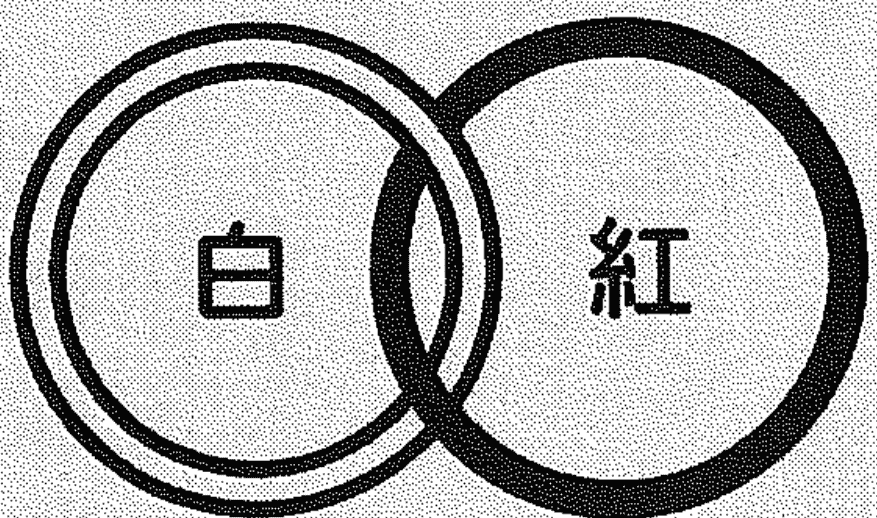

### 清宮舊藏版

#### 第一解

> 茫茫天地 不知所止
日月循環 周而復始

> 【斷曰】
自從盤古迄希夷
虎鬥龍爭事事奇
悟透循環真諦在
試由唐代論元機

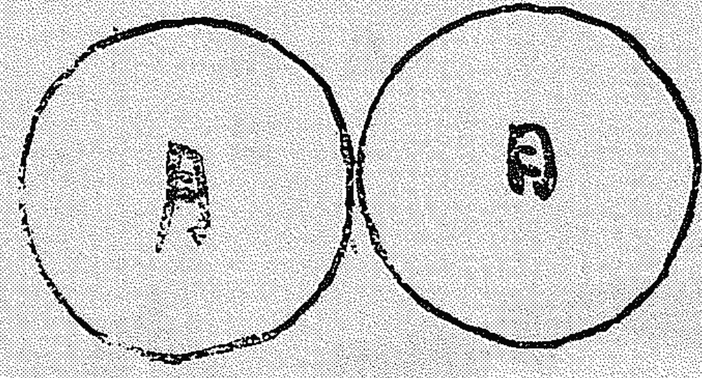

## 附錄 清宮舊藏原本與民間版推背圖比較

### 第二象

乙丑 三三 乾上 巽下 姤

唐朝氣數的預言

【讖曰】

累累碩果。莫明其數。
一果一仁。即新即故。

【頌曰】

萬物土中生。二九先成實。
一統定中原。陰盛陽先竭。

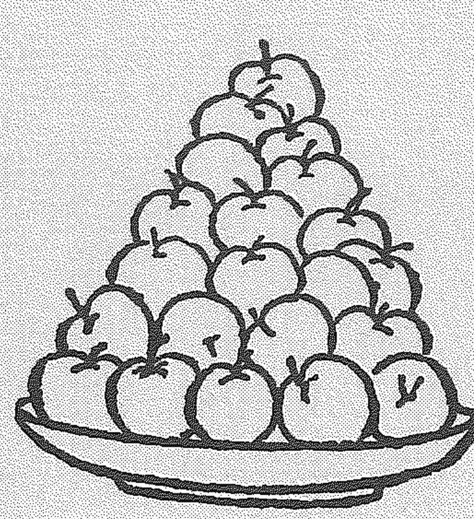

### 第二解

一筐碩果 廿一之數
果果萬方 更新去故

【斷曰】

萬物都從土中植
連綿二九長結實
貞元之理皆數定
迨及木衰已精竭

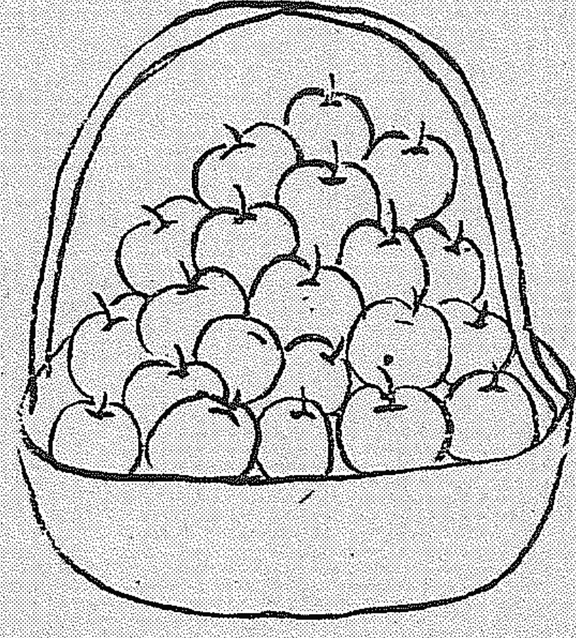

### 第二象

丙寅 三三 乾艮上下 遯

武則天稱帝的預言

【讖曰】

日月當空。照臨下土。

撲朔迷離。不文亦武。

【頌曰】

參遍空王色相空。一朝重入帝王宮。

遺枝撥盡根猶在。喔喔晨雞孰是雄。

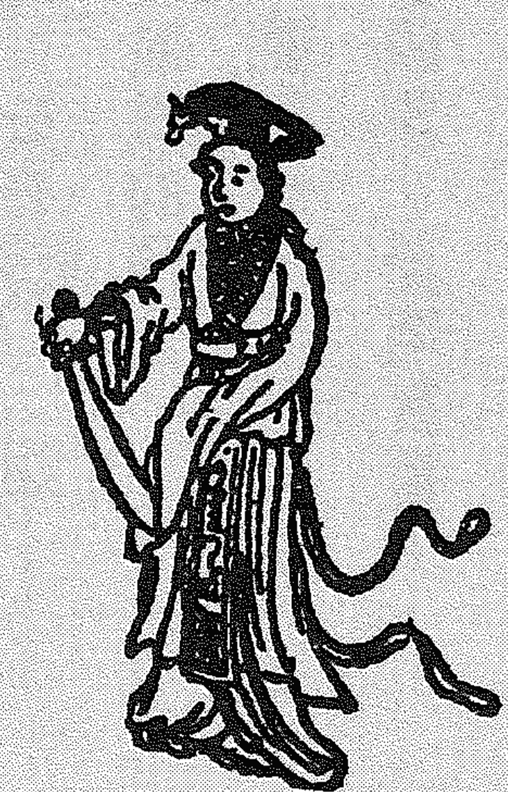

### 第三解

旌節滿目 山川蹣跚

破關客來 四海痛哭

【斷曰】

一木將軍一草肥

中原好景未全非

沈沙破土安天下

銷骨平高社稷輝

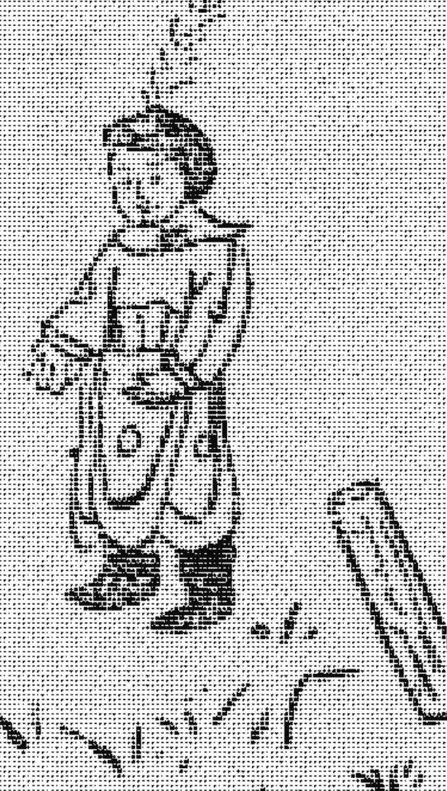

## 附錄 清宮舊藏原本與民間版推背圖比較

### 第四象

丁卯 三三 乾坤上下 否——存疑

【讖曰】
飛者不飛。走者自走。
振羽高岡。乃克有後。

【頌曰】
威行青女實權奇。極目蕭條十八枝。
賴有猴兒齊著力。已傾大樹仗扶持。

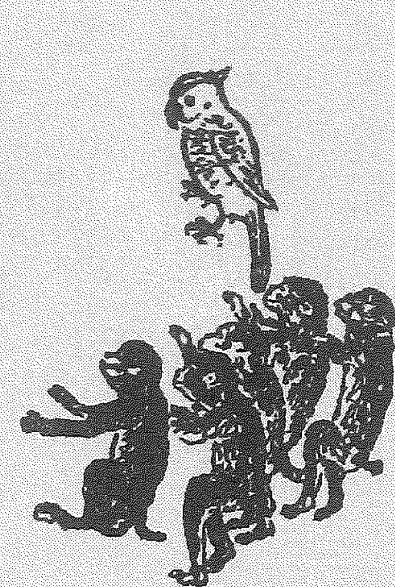

### 第四解

老雌伏雄 木落門空
一雌又起 玄王興宗

【斷曰】
二女長居帝王宮
奸謀詭計先後同
幸逢傑王干大政
賊子亂臣影無縱

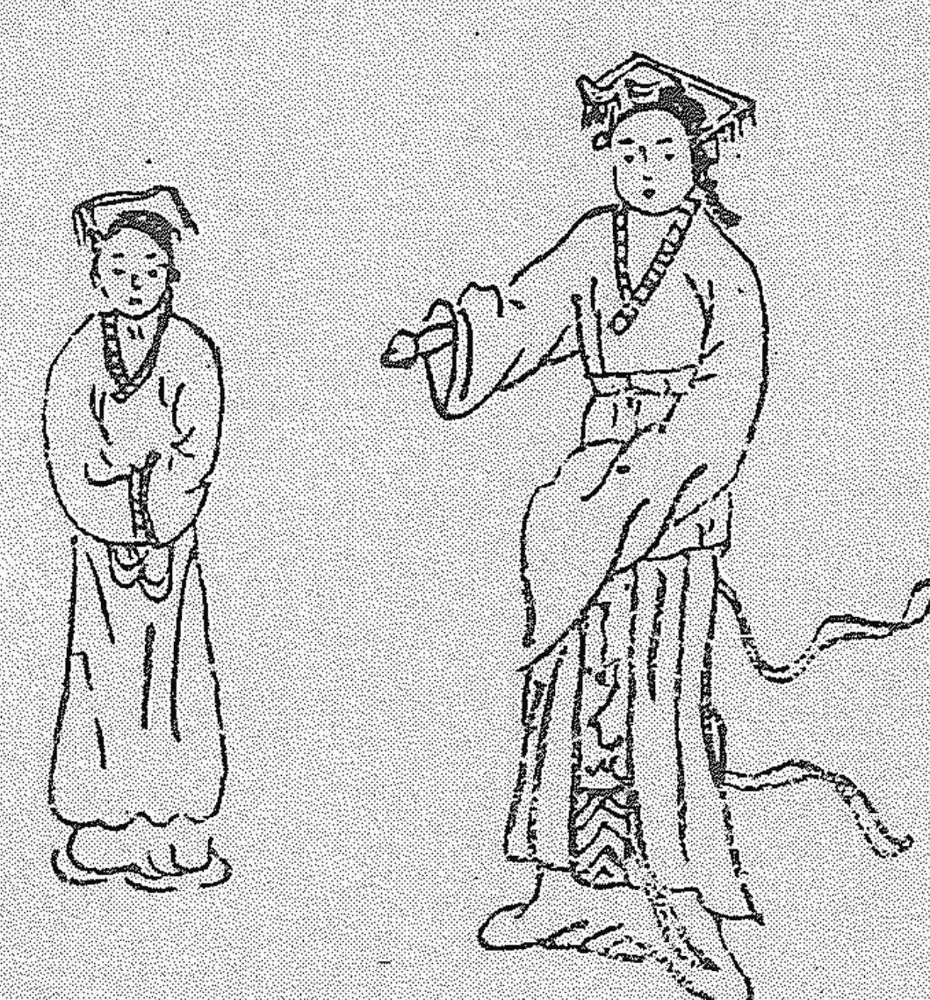

### 第五象

戊辰 三三 坤下 巽上 觀

有關楊貴妃的預言

> 【讖曰】
楊花飛。蜀道難。
截斷竹簫方見日。更無一吏乃平安。

> 【頌曰】
漁陽鼙鼓過潼關。此日君王幸劍山。
木易若逢山下鬼。定於此處葬金環。

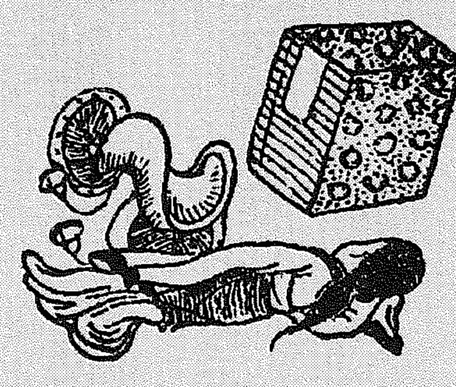

### 第五解

隆盛開基 恢宏元氣
左輔右弼 四五之世

> 【斷曰】
一代英皇耀祖宗
樞機翊贊兩賢同
共傳十五分天下
代史征安運遂終

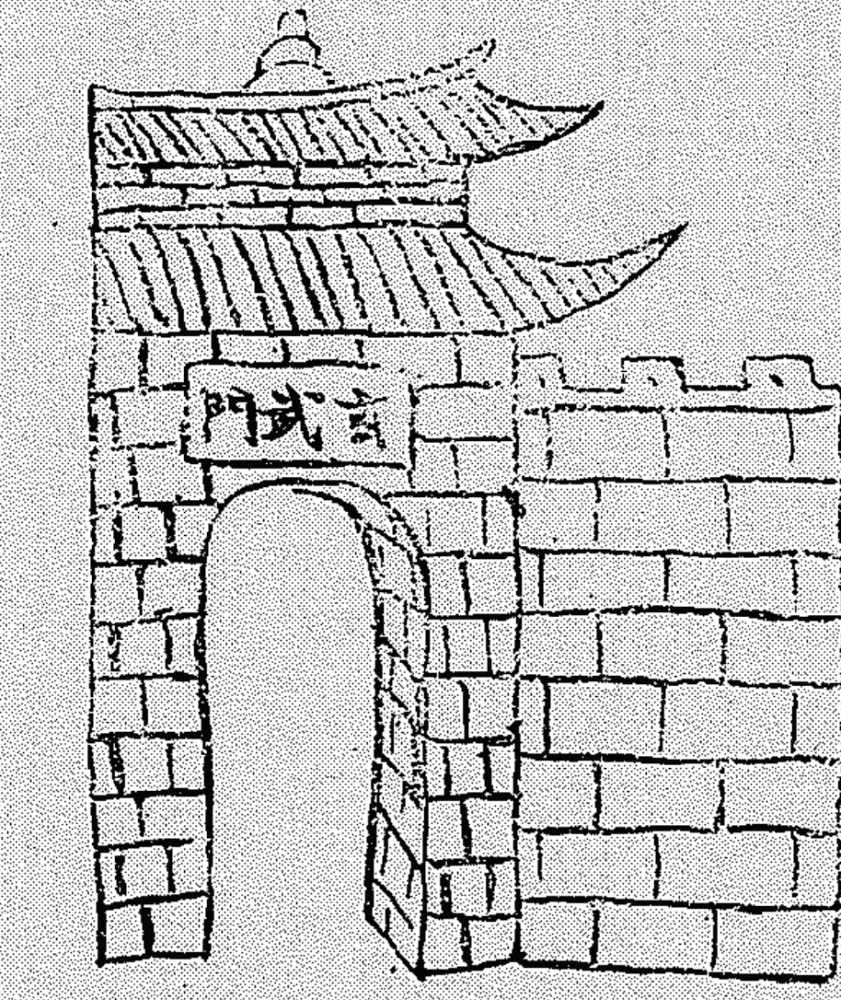

## 附錄 清宮舊藏原本與民間版推背圖比較

### 第六象

己巳 三三 坤下艮上 剝

肅宗即位的預言

【讖曰】

非都是都。非皇是皇。

陰霾既去。日月復光。

【頌曰】

大幟巍巍樹兩京。輦輿今日又東行。

乾坤再造人民樂。一二年來見太平。

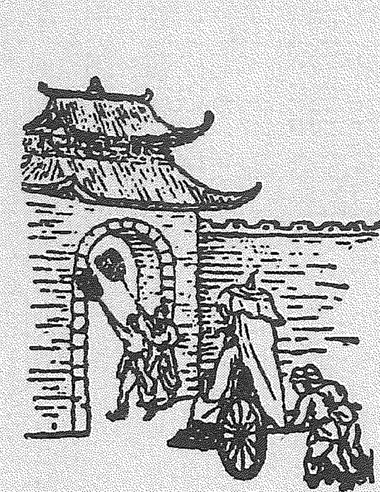

### 第六解

珠履三千 其中孔穿

木頭一擊 光日成全

【斷曰】

天子蒙塵正建中

三梟造反逞奸雄

將軍一木支宏廈

此乃中興第一功

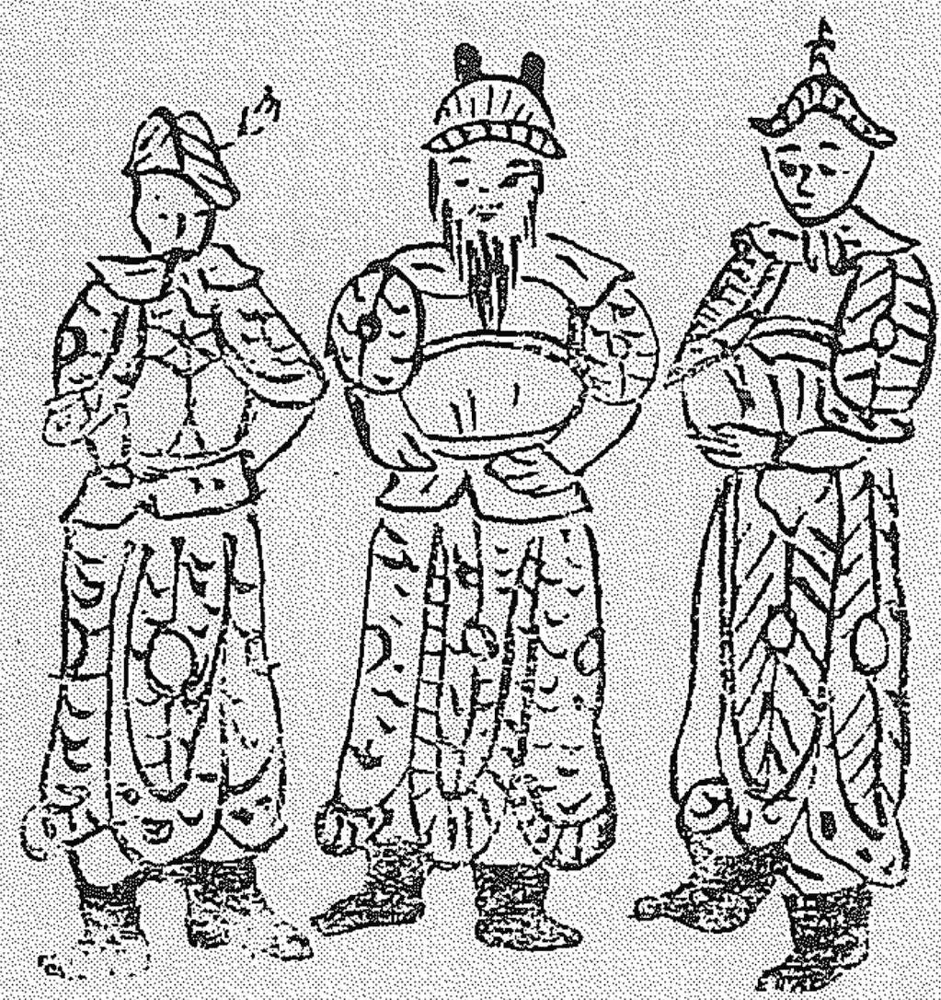

### 第七象

庚午 三三 震下 艮上 无妄

唐末吐蕃入寇的预言

> 【讖曰】
旌節滿我目。山川跼我足。
破關客乍來。陡令中原哭。

> 【頌曰】
螻蟻從來足潰堤。六宮深鎖夢全非。
重門金鼓含兵氣。小草滋生土口啼。

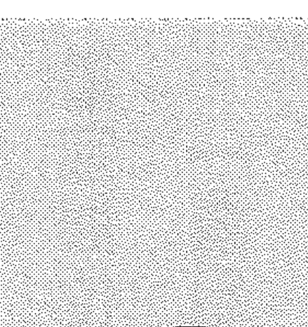

### 第七解

山林巢穴 黃鼠滿谷

一目有用 可憐無福

> 【斷曰】
將軍隻眼自稱雄
徒負收京第一功
帝子難歸位已易
賊來賊去兩俱空

## 附錄 清宮舊藏原本與民間版推背圖比較

### 第八象

辛未 三三 離上 坤上 晉——

建中之亂的預言

【讖曰】

欖槍血中土。破賊還為賊。

朵朵李花飛。帝曰遷大吉。

【頌曰】

天子蒙塵馬首東。居然二傑踞關中。

孤軍一駐安社稷。內外能收手臂功。

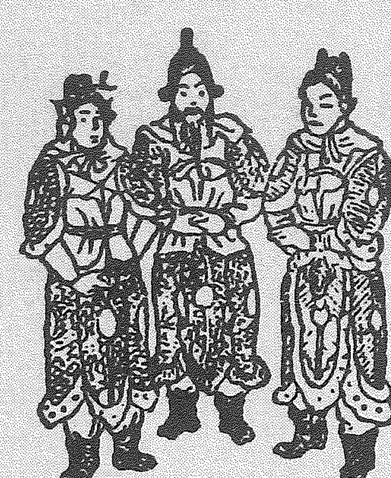

### 第八解

頑然一石 認他人父

送二八州 莫非唐土

【斷曰】

可憐頑石不點頭

守土封王幽州留

低首丹臣兒多禮

喪心辱盡恩主仇

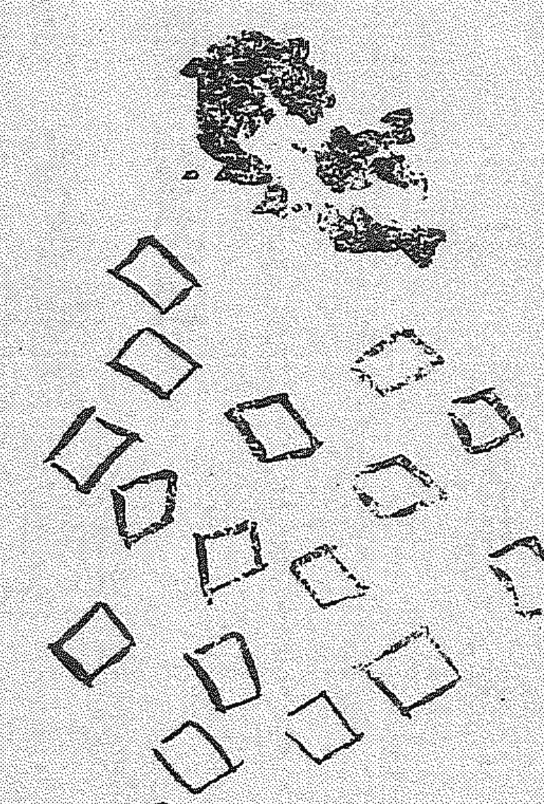

### 第九象

壬申 三三 離乾上下 大有——

黃巢作亂的預言

> 【讖曰】
非白非黑。草頭人出。
借得一枝。滿天飛血。

> 【頌曰】
萬人頭上起英雄。血染河山白色紅。
一樹李花都慘淡。可憐巢覆亦成空。

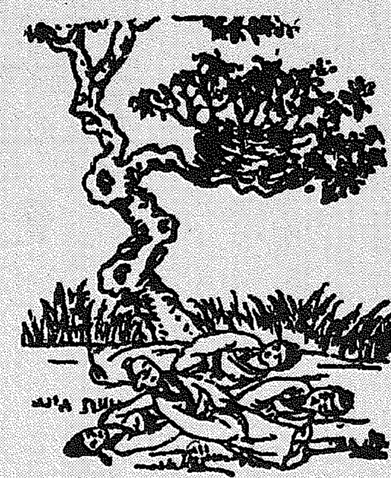

### 第九解

李有根芽 石難變瓜
豬視鵲噪 榴亦開花

> 【斷曰】
水火木金土互通
十三童子五王公
二榴雙石鵲三占
四李二豬命盡終

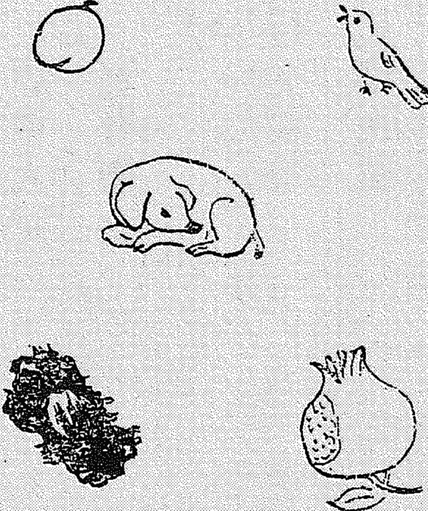

## 附錄 清宮舊藏原本與民間版推背圖比較

### 第十象

癸酉 三三 坎上 坎下 坎

朱溫篡唐，唐朝滅亡以及後唐的預言

【讖曰】

蕩蕩中原。莫禦八牛。

泗水不滌。有血無頭。

【頌曰】

一后二主盡升遐。四海茫茫總一家。

不但我生還殺我。回頭還有李兒花。

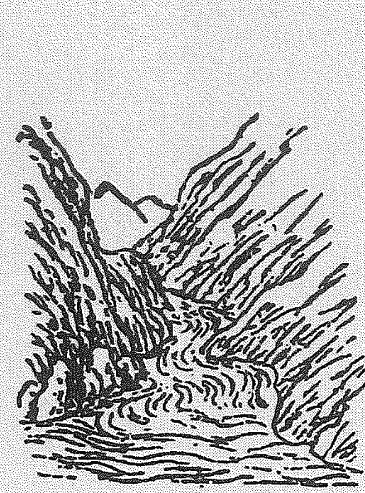

### 第十解

天水陳橋 眾星拱朝

南北七九 瓦解水消

【斷曰】

自從隆德劉嘉平

一二光陰添四丁

石上神仙不食果

三三加二悉分明

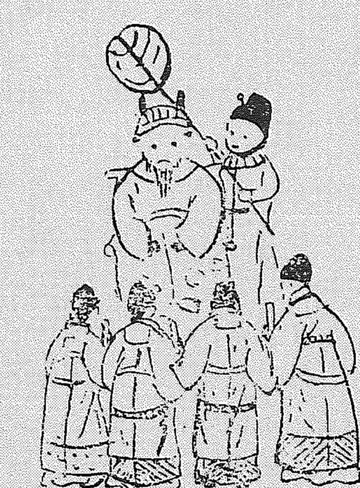

### 第十一象

甲戌 三三 坎上兑下 節

李存勛死於郭從謙之手的預言

> 【讖曰】
五人同卜。非祿非福。
兼而言之。喜怒哀樂。

> 【頌曰】
龍蛇相鬥三十年。一日同光直上天。
上得天堂好遊戲。東兵百萬入秦川。

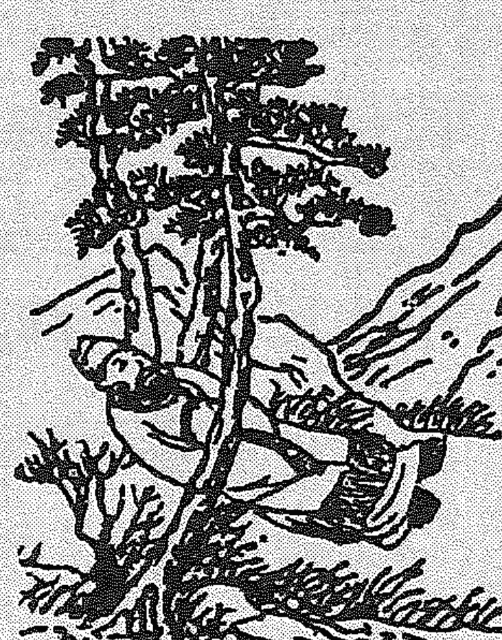

### 第十一解

丹寇赫奕 干戈不息
佳人十三 功在邦國

> 【斷曰】
天子親征已渡河
歡聲百里起謳歌
寇來寇止若前定
保守江山繫議和

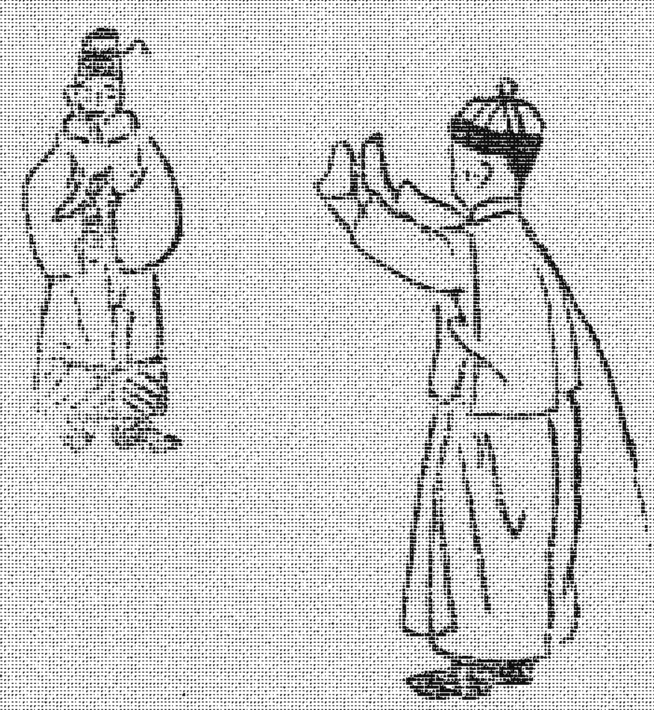

## 附錄 清宮舊藏原本與民間版推背圖比較

### 第十二象

乙亥 三三 坎上 震下 屯

石敬瑭割十六州以契丹為父的預言

【讖曰】

塊然一石。謂他人父。
統二八州。已非唐土。

【頌曰】

反兆先多口。出入皆無主。
繫鈴自解鈴。父亡子亦死。

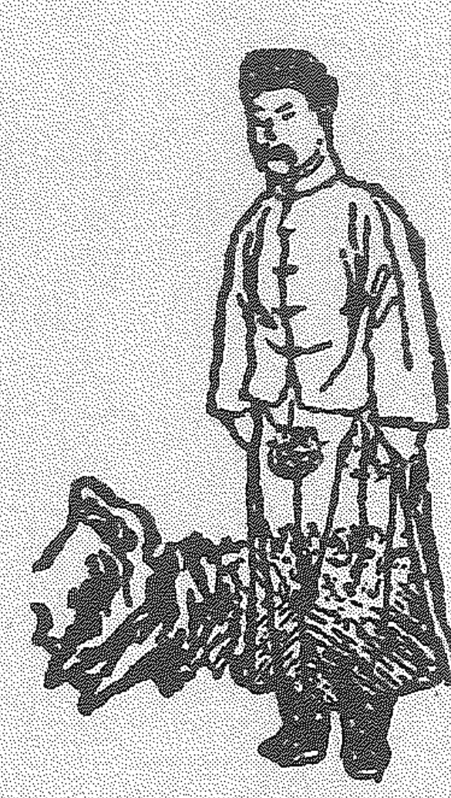

### 第十二解

母儀天下 淹雅文章
六七有餘 邦家盛昌

【斷曰】

炎天大熱忽生寒
幸遇雙弓百口歡
金玉多添火更鍊
四三宇宙見熙安

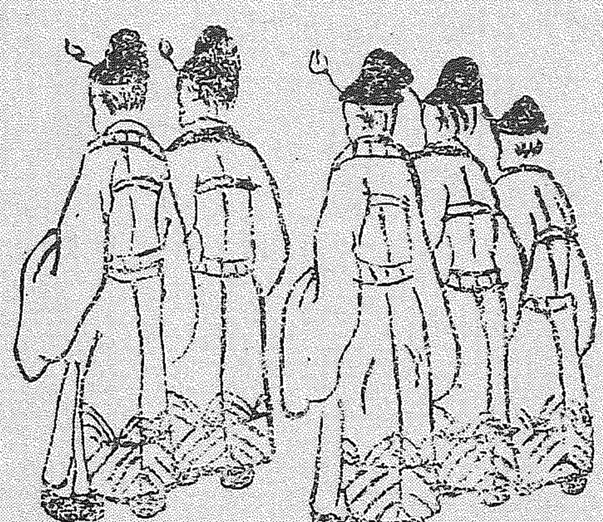

### 第十二象

丙子 三三 離坎 上下 既濟

後周郭威的預言

【讖曰】

漢水竭。雀高飛。

飛來飛去何所止。高山不及城郭低。

【頌曰】

百個雀兒水上飛。九十九個過山西。

惟有一個踏破足。高樓獨自理毛衣。

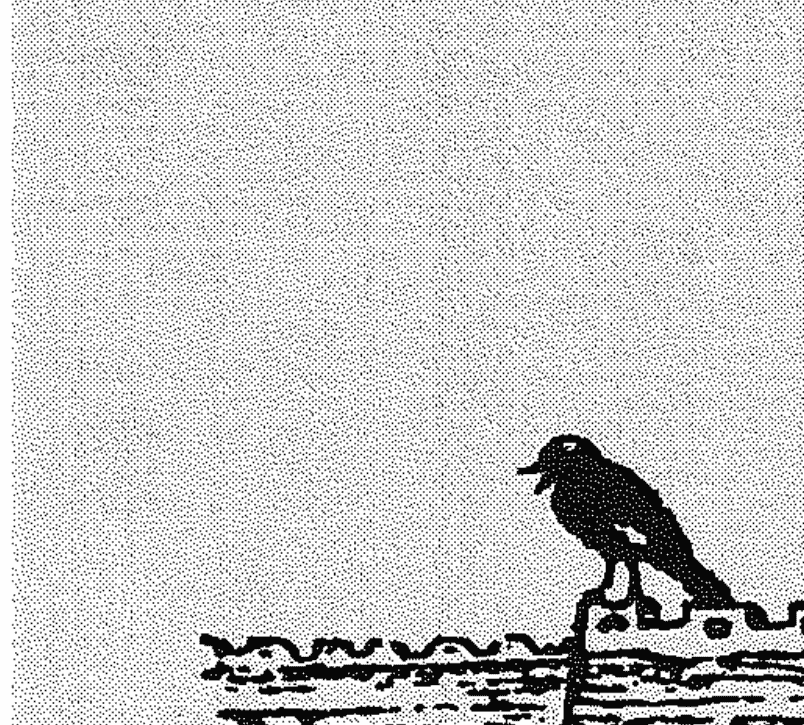

### 第十二解

始動干戈 如蒼生何

憑江一戰 敵也求和

【斷曰】

夷酋入寇本非遲

且看雄師奏凱歸

法令難行心不轉

祇為東山一盤棋

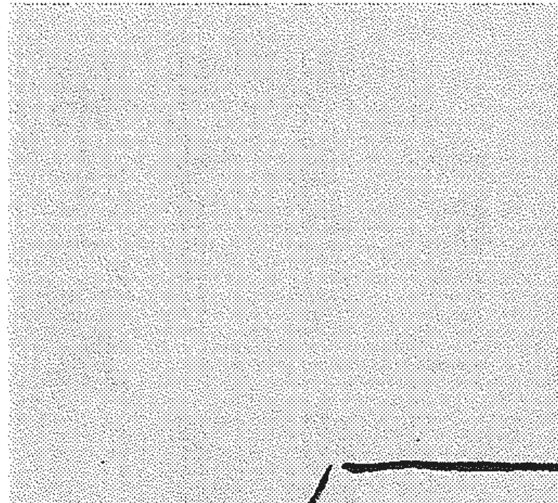

## 附錄 清宮舊藏原本與民間版推背圖比較

### 第十四象

丁丑 三三 離上下 兌 革——

五代氣數的預言

【讖曰】

李樹得根芽。石榴漫放花。

枯木逢春只一瞬。讓他天下競榮華。

【頌曰】

金木水火土已終。十三童子五王公。

英明重見太平日。五十三參運不通。

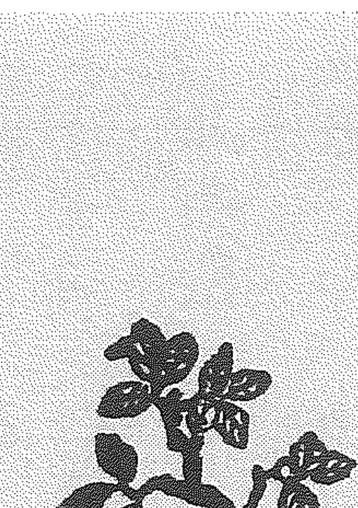

### 第十四解

時未靖康 萬端周章

凶神惡煞 何以克當

【斷曰】

祁氣彌漫暗神京

金面蛇形不可親

靖難無人危社稷

汴梁戶戶少康寧

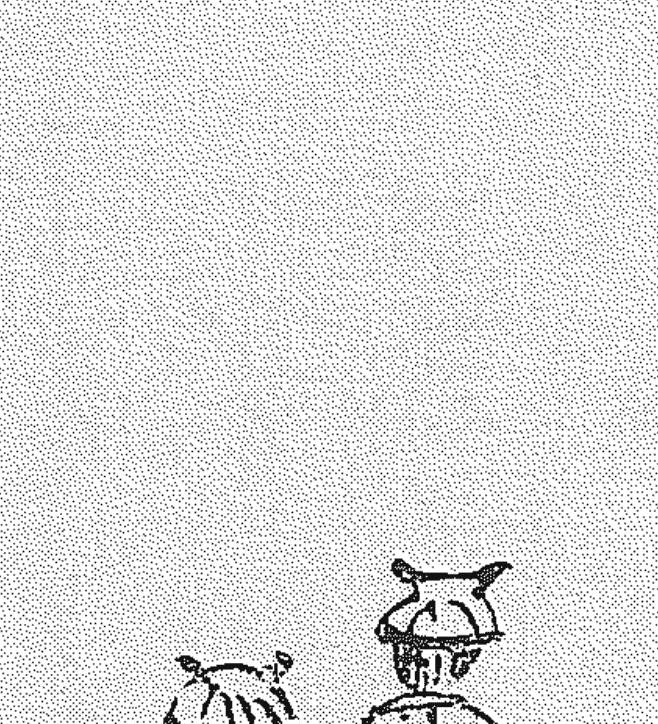

### 第十五象

戊寅 三三 震離 上下 豐

五代十國滅亡的預言

> 【讖曰】
天有日月。地有山川。
海內紛紛。父後子前。

> 【頌曰】
戰事中原迄未休。幾人高枕臥金戈。
寰中自有真天子。掃盡羣妖見日頭。

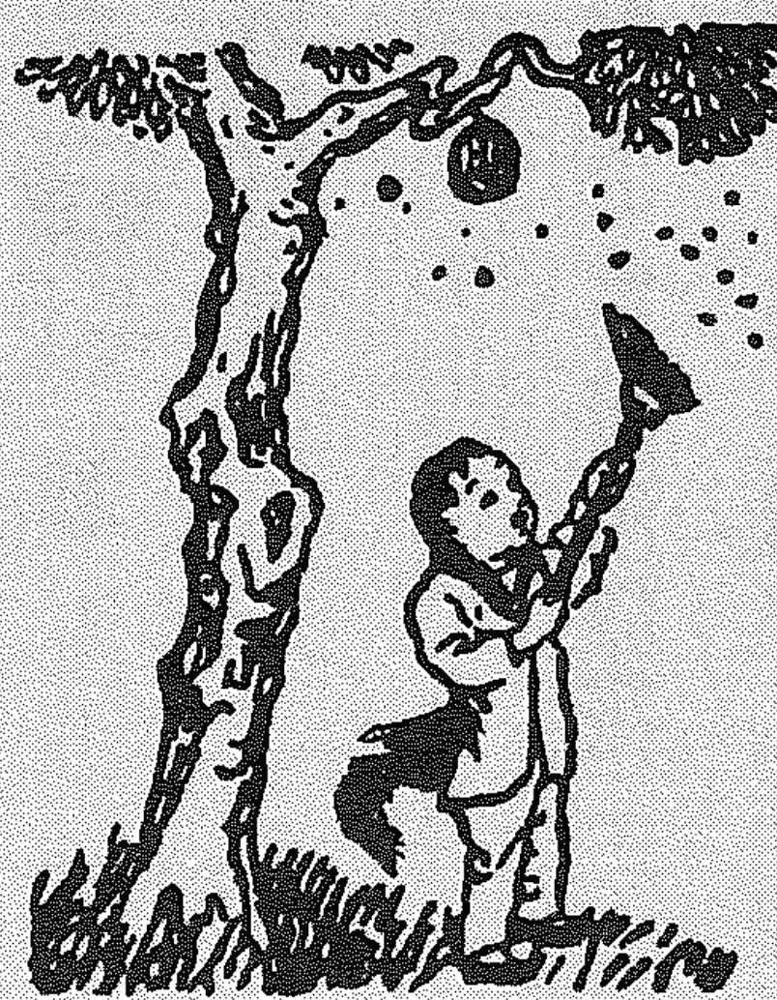

### 第十五解

二口吞金 只聞捷音
一心三字 污木相侵

> 【斷曰】
王氣臨安事有為
中興紹聖欲何之
北歸終恐成虛願
堅隱奸進不勝悲

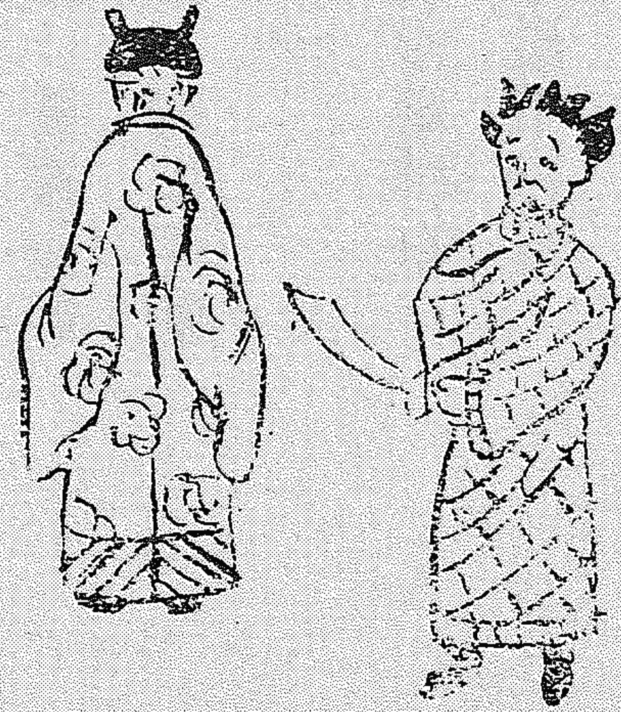

## 附錄 清宮舊藏原本與民間版推背圖比較

### 第十六象

己卯 三三離下坤上 明夷

宋朝開國的預言

【讖曰】

天一生水。姿稟聖武。

順天應人。無今無古。

【頌曰】

納土姓錢並姓李。其餘相次朝天子。

天將一統付真人。不殺人民更全嗣。

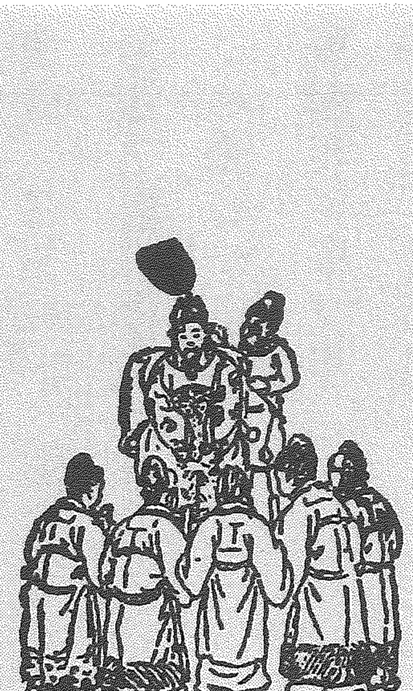

### 第十八解

天降厥祥 邪侵正氣

遠山巨浪 舉國皆蔽

【斷曰】

半壁河山迹已殘

巨奸貪死半堂間

白濤大夫寒忠膽

正氣歌聲和淚彈

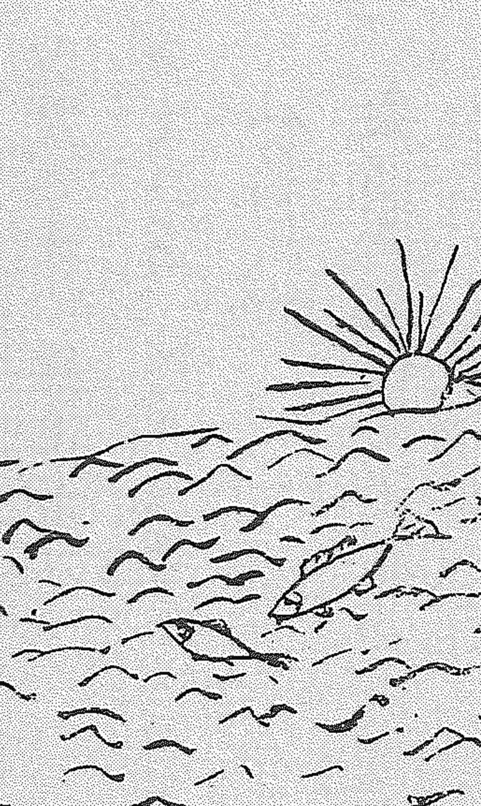

### 第十七象

庚辰 ䷇ 坎下坤上 師

澶淵之盟的預言

> 【讖曰】
聲赫赫。干戈息。
掃邊氣。奠邦邑。

> 【頌曰】
天子親征乍渡河。歡聲百里起謳歌。
運籌幸有完全女。奏得奇功在議和。

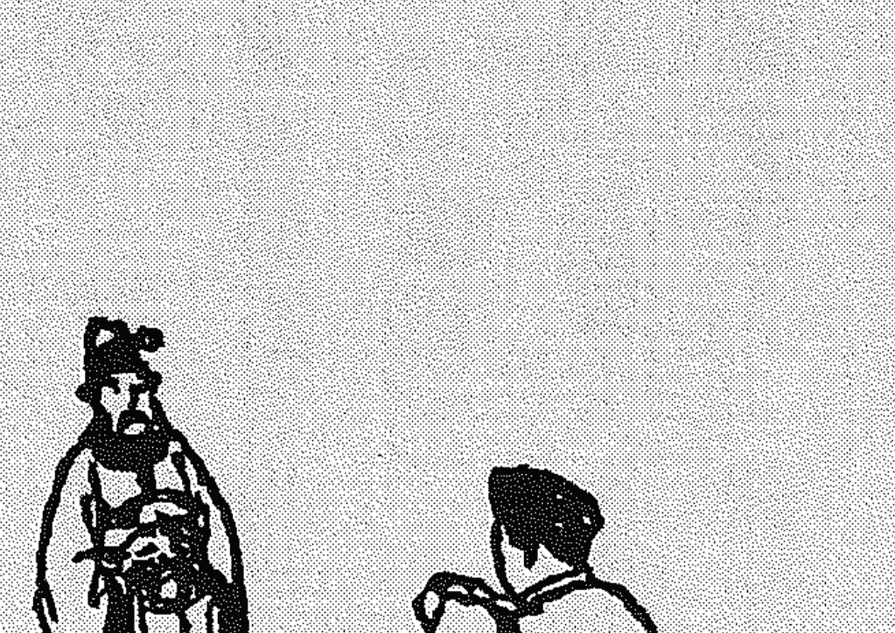

### 第十七解

忽然而天 鐵木占先
廣士兵盛 百九之年

> 【斷曰】
東西南北任何之
肥馬精兵壓四夷
風雨濛濛連八代
興亡未離木雙支

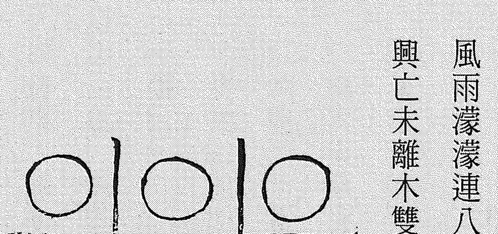

## 附錄 清宮舊藏原本與民間版推背圖比較

### 第十八象

辛巳 三三 艮下 艮上 艮——

劉太后垂簾聽政佐仁宗之預言

【讖曰】

天下之母。金刀伏兔。

三八之年。始安鞏固。

【頌曰】

水旱頻仍不是災。力扶幼主鎮埏垓。

朝中又見釵光照。宇內承平氣象開。

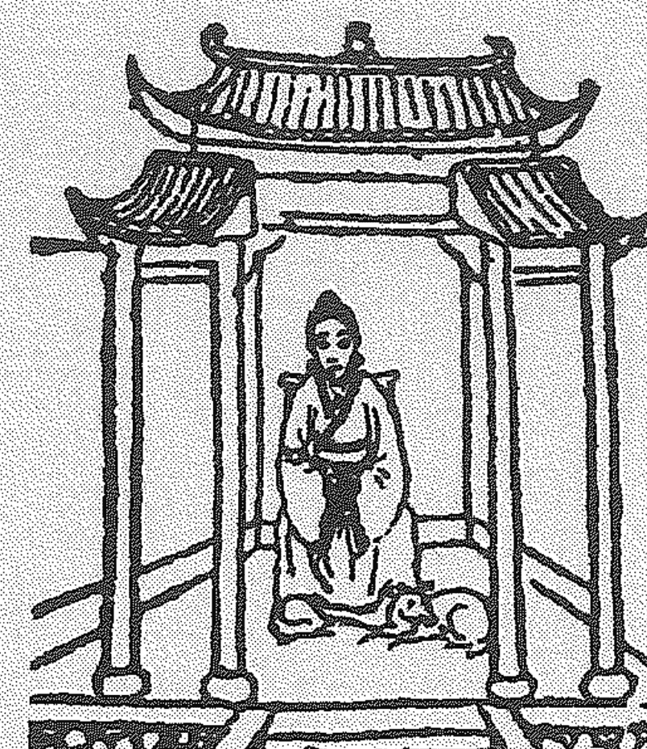

### 第十八解

作者七人 惟邪相親

帝崩后死 遠竄其身

【斷曰】

老而不死負深恩

弑后尊王種禍根

天意難逃脫脫手

四方兵勸一元吞

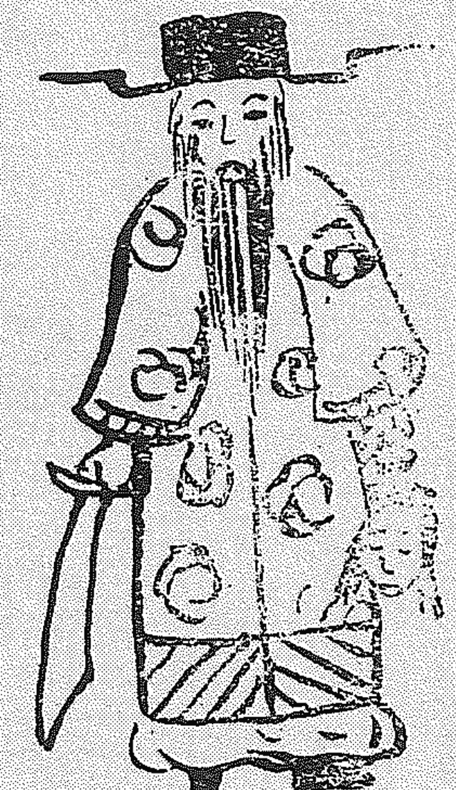

### 第十九象

壬午 三三 離下 艮上 賁

王安石為相的預言

> 【讖曰】
眾人羣羣。盡入其室。
百萬雄師。頭上一石。

> 【頌曰】
朝用奇謀夕喪師。人民西北盡流離。
韻華雖好春光老。悔不深居坐殿墀。

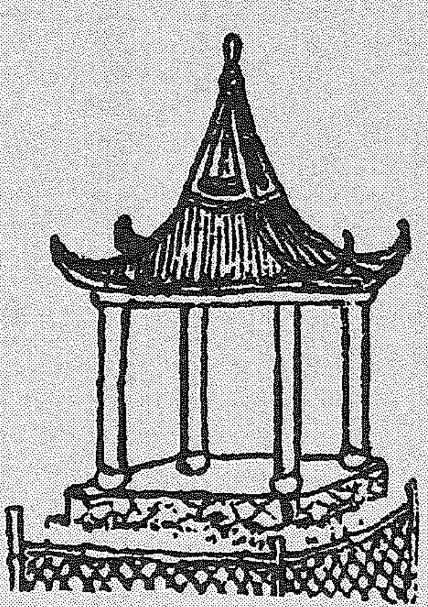

### 第十九解

卯午之間 厥象維難
八牛牽動 雍雍熙熙

> 【斷曰】
水火相濟生民苦
金戈殺傷當世賊
十餘年中一聖人
青青草自田間出

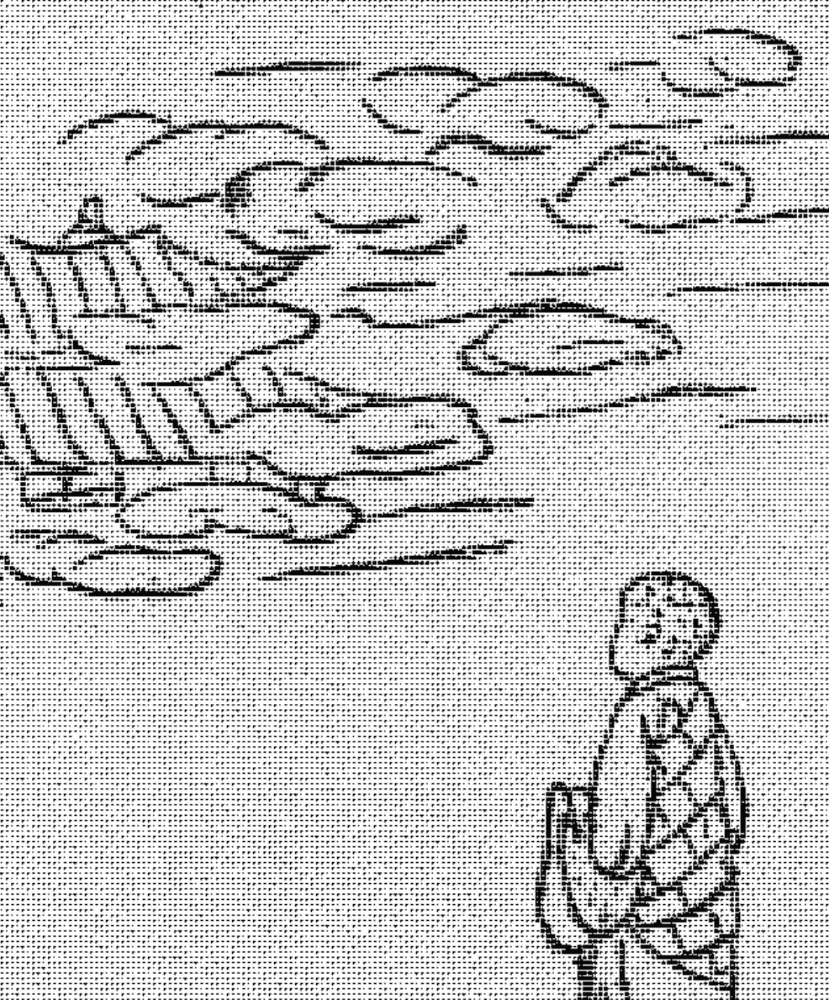

## 附錄 清宮舊藏原本與民間版推背圖比較

### 第二十象

癸未 三三 離下乾上 同人

司馬光與蔡京的預言

【讖曰】
朝無光。日月盲。
莫與京。終傍徨。

【頌曰】
父子同心並同道。中天日月手中物。
奇雲翻過北海頭。鳳闕龍廷生怛惻。

### 第二十解

毀二廢六 還歸天竺
去來僧也 變起皇族

【斷曰】
只因懷怨四公亡
左右開弓胡共汪
霸業江東從北嚮
談空說偈遇文皇

### 第二十一象

甲申 三三 艮兑上下 損

徽欽二帝被擒宋室南遷的預言

【讖曰】
突厥宮中。雪深三尺。
吁嗟元首。南轅北轍。

【頌曰】
妖氣未靖不康寧。北掃烽烟望帝京。
異姓立朝終國位。卜世三六又南行。

### 第二十二解

三羊開泰 一馬當關
賢母正統 瓦多破蠻

【斷曰】
君臣上下慶相逢
重見三皇之古風
母后識賢任國相
乾坤康樂眾心同

## 附錄 清宮舊藏原本與民間版推背圖比較

### 第二十二象

乙酉 三三 離兌上下 象——

宋高宗與秦檜的預言

【讖曰】
天影當空。否極見泰。
鳳凰淼淼。木萵大賴。

【頌曰】
神京王氣滿東南。禍水汪洋把策干。
一木會支二八月。臨行馬色半平安。

### 第二十二解

朝士三百 不如妖女
花花公子 江上賊起

【斷曰】
殿宇經營費疑猜
四方聚斂百萬財
可憐服藥春不老
忍使豹房爐餘灰

### 第二十二象

丙戌 三三 乾上下 履

賈似道與文天祥的預言

【讖曰】
似道非道 乾沉坤驗
祥光宇內 一江斷楫

【頌曰】
胡兒大張撻伐威 兩柱擎天力不支
如何兵火連天夜 猶自張燈作水嬉

### 第二十三解

東風逆送 為國之禍
父子同謀 請君入甕

【斷曰】
一枝向北一枝東
又有南枝諧亦同
寇蕩平光四耀
更有雙木樹良風

## 附錄 清宮舊藏原本與民間版推背圖比較

### 第二十四象

丁亥 三三 巽上兌下 中孚

宋朝滅亡的預言

【讖曰】
山崖海邊。不帝亦仙。
二九四八。於萬斯年。

【頌曰】
十一卜人小月終。回天無力道俱窮。
干戈四起疑無路。指點洪濤巨浪中。

### 第二十四解

寸圭雙林 合則可戰
女鬼難逃 土也生變

【斷曰】
有木能支廈陰
正心居位長弓擒
讀書種子幸無恙
八口關門聽捷音

### 第二十五象

戊子 ䷴ 艮下巽上 漸

元朝開國預言

【讖曰】
北帝南臣。一元自立。
斡難河水。燕巢補麥。

【頌曰】
鼎足爭雄事本奇。一狼二鼠判須臾。
北關鎖鑰雖牢固。子子孫孫五五宜。

### 第二十五解

黯黯陰霾 滿城鋼刀
萬民避死 一人難逃

【斷曰】
雖然平寇誘二龍
犬吠馬奔勢兇兇
洪水方來失羊虎
可憐八牛腹已空

## 附錄 清宮舊藏原本與民間版推背圖比較

### 第二十六象

己丑 三三 震下震上 震——

順帝荒淫、韓林兒稱帝的預言

【讖曰】
時無夜。年無米。
花不花。賊四起。

【頌曰】
鼎濁中原木木來。四方警報起邊垓。
房中自有長生術。莫怪都城澈夜開。

### 第二十六解

長山白雪 滿樹風月
八面旗開 留頭蓄髮

【斷曰】
洪始洪亂又洪終
一后兩王運盡同
二六八分十殿主
遼遷九鼎還山中

### 第二十七象

庚寅 三三 震上下 豫

明朝建國的預言

【讖曰】
惟日與月。下民之極。
應運而興。其色曰赤。

【頌曰】
枝枝葉葉現金光。晃晃朗朗照四方。
江東岸上光明起。談空說偈有真主。

### 第二十七解

日月麗天 群雄僵服
百靈來朝 雙羽四足

【斷曰】
華夏而今有聖人
僧為豪傑能親民
四夷齊拜呼天子
眉壽泰來上國春

## 附錄 清宮舊藏原本與民間版推背圖比較

### 第二十八象

辛卯 三三 震上坎下 解

明成祖篡位的預言

【讖曰】
草頭火腳。宮闕灰飛。
家中有鳥。郊外有尼。

【頌曰】
羽滿高飛日。爭妍有李花。
真龍游四海。方外是吾家。

### 第二十八解

三土功簣 同懷似仇
四方安泰 共七三秋

【斷曰】
鐵馬金戈美玉奇
參商骨肉連三枝
子長父短前生定
禪位須過周甲期

### 第二十九象

壬辰 三三 震巽上下 恒

宣宗三楊之預言

【讖曰】
枝發厥榮。為國之棟。
皞皞熙熙。康樂利眾。

【頌曰】
一枝向北一枝東。又有南枝種亦同。
宇內同歌賢母德。真有三代之遺風。

### 第二十九解

有號太平 犬雞皆驚
逢三生滅 遇鼠始橫

【斷曰】
萬人頭上起英雄
血染河山流水紅
一樹楊花全不見
十三年後總成空

## 附錄 清宮舊藏原本與民間版推背圖比較

### 第三十象

癸巳 ䷭ 巽下坤上

【讖曰】
半圭半林。合則生變。
石亦有靈。生榮死賤。

【頌曰】
缺一不成也占先。六龍親御到胡邊。
天心復見人心順。相剋相生馬不前。

### 第三十解

龍蛇鬥智 五虎同器
一順揚外 三端內治

【斷曰】
三湘子弟半從戎
又見六朝五代風
將士江淮亦好漢
咸欣亂後慶年豐

### 第三十一象

甲午 三三 離下 巽上 家人

魏忠賢亂國的預言

【讖曰】
當塗遺孽。穢亂宮闕。
一男一女。斷送人國。

【頌曰】
忠臣賢士盡沉淪。天啟其衷亂更紛。
縱有胸懷能坦白。乾坤不屬舊明君。

### 第三十一解

天昏日月 地震山川
四面楚歌 鹿猿爭先

【斷曰】
浮海乘桴馬不前
損金割地羊居先
齊東鬼魅雞肥噬
西去長安鼠浴泉

## 附錄 清宮舊藏原本與民間版推背圖比較

### 第三十二象

乙未 三三 坎上巽下 井

明朝滅亡的預言

【讖曰】
馬跡北闕。犬敖西方。
八九數盡。日月無光。

【頌曰】
楊花落盡李花殘。五色旗分自北來。
太息金陵王氣盡。一枝春色占長安。

### 第三十二解

皇非所生 母專父政
南北西東 從斯不振

【斷曰】
二皇一后盡升遐
四海茫茫未一家
不是生吾還殺我
宮中血染李兒花

### 第三十三象

丙申 ䷯ 巽下坎上 大過

清朝入主中原的預言

【讖曰】
黃河水清。氣順則治。
主客不分。地支無子。

【頌曰】
天長白瀑來。胡人氣不衰。
藩籬多撤去。稚子半可哀。

### 第三十三解

修文偃武 紫微星明
匹夫有責 一言為評

【斷曰】
無王無帝定乾坤
來自田間第一人
好把史書勤讀記
良言傾吐見英明

## 附錄 清宮舊藏原本與民間版推背圖比較

### 第二十四象

丁酉 三三 巽下 巽上 巽

太平天國的預言

【讖曰】
頭有髮。衣怕白。
太平時。王殺王。

【頌曰】
太平又見血花飛。五色章成裹外衣。
洪水滔天苗不秀。中原曾見夢全非。

### 第二十四解

依然古壘 雷雨滇南
千里一鶚 為時八二

【斷曰】
敗隋唐吏滿朝中
舊日百官太宰崇
王莽稱尊有古式
火龍飛去運遂終

### 第三十五象

戊戌 三三 震下兑上 随

英法联军直逼北京火烧圆明园的预言

【谶曰】
西方有人。足踏神足。
帝出不还。三台扶倾。

【颂曰】
黑云黯黯自西来。帝子临河筑金台。
南有兵戎北有火。中兴曾见有奇才。

### 第三十五解

中原一鹿 竟起角逐
殃及池鱼 太平可卜

【断曰】
火德星行祸蔓延
万人后死万人先
海波蓦使五洋阖
境内无端失一轓

## 附錄 清宮舊藏原本與民間版推背圖比較

### 第二十六象

己亥 三三 乾下 巽上 小畜

慈禧太后和拳亂之預言

【讖曰】
纖纖女子 赤手禦敵
不分禍福 燈火蔽日

【頌曰】
雙拳旋轉乾坤 海內無端不靖
母子不分先後 西望長安入覲

### 第二十六解

民有一主 天無二主
萬方肇端 黎庶之光

【斷曰】
夕用奇謀且喪師
家家戶戶免流離
龍蛇未遇佳年月
他日蒙塵悔已遲

### 第二十七象

三三 震下 巽上 益

中華民國誕生的預言

【讖曰】
漢水茫茫。不統統統。
南北不分。和衷與共。

【頌曰】
水清終有竭。倒戈逢八月。
海內竟無王。半凶還半吉。

### 第二十七解

五世其昌 堂堂平張
同槽二馬 一段旁皇

【斷曰】
同儕共謀事奮非
火星遠殞荒光輝
十年已覺長安夢
在日殊榮嘆式微

## 附錄 清宮舊藏原本與民間版推背圖比較

### 第二十八象

辛丑 三三 離震上下 噬嗑

第一次世界大戰爆發的預言

【讖曰】
門外一鹿。羣雄爭逐。
劫及鳶魚。水深火熱。

【頌曰】
火運開時禍蔓延。萬人後死萬人生。
海波能使江河濁。境外何殊在目前。

### 第二十八解

一二三四 無王有主
林間巨石 連治廣土

【斷曰】
王氣金陵偶失和
猿啼蜀道住山窩
一朝甫聽金雞叫
大海沈沈日已過

### 第三十九象

壬寅 三三 兑上下 頭

八年對日抗戰日本投降的預言

【讖曰】
鳥無足。山有月。
旭初升。人都哭。

【頌曰】
十二月中氣不和。南山有雀北山羅。
一朝聽得金雞叫。大海沉沉日已過。

### 第三十九解

二郎東北 一子西北
去去來來 國非其國

【斷曰】
慧星一點現西方
東北依然有帝王
門外客來居不久
乾坤再造屬中央

## 附錄 清宮舊藏原本與民間版推背圖比較

### 第四十象

癸卯 三三 艮上下 蟲

【讖曰】
一二三四。無土有主。
小小天罷。垂拱而治。

【頌曰】
一口東來氣太驕。腳上無覆首無毛。
若逢木子冰霜渙。生我者猴死我雕。

### 第四十解

飛鳥無足 美人如玉
轟然一響 旭日焚木

【斷曰】
一口東來氣太驕
腳中無履首無毛
若逢甲乙星霜換
生我者猴死我雕

### 第四十一象

甲辰 三三 離上下 離

【讖曰】
天地晦盲 草木蕃殖
陰陽反背 上土下日

【頌曰】
帽兒須戴血無頭 手弄乾坤何日休
九十九年成大錯 稱王只合在秦州

### 第四十一解

山谷人稀 欲尋失巢
稱兄道弟 四散荒郊

【斷曰】
一個或人口內啼
分南分北分東西
六爻占盡文明現
棋布星羅事事齊

## 附錄 清宮舊藏原本與民間版推背圖比較

### 第四十二象

乙巳 三三 離艮上下 旅

【讖曰】
美人自西來。朝中日漸安。
長弓在地。危而不危。

【頌曰】
西方女子琵琶仙。皎皎衣裳色更鮮。
此時渾跡居朝市。鬧亂君臣百萬般。

### 第四十二解

飛者非鳥
潛焉非魚
戰非在兵
祥復其初

【斷曰】
海疆萬里起烽煙
上自雲霄下逮泉
金母木公能幻景
干戈未觸禍連天

### 第四十三象

丙午 三三 離上下 鼎

【讖曰】
君非君。臣非臣。
始艱危。終克定。

【頌曰】
黑兔走入青龍穴。欲盡不盡不可說。
惟有外邊根樹上。三十年中子孫結。

### 第四十二解

美人西來 履東而止
木火金水 雪斯奇恥

【斷曰】
火簾流行內外同
金烏隱伏大洋中
從茲未敢稱雄長
兵氣全銷技已窮

## 附錄 清宮舊藏原本與民間版推背圖比較

### 第四十四象

丁未 三三 離坎上下 未濟

【讖曰】
日月麗天。羣陰懾服。
百靈來朝。雙羽四足。

【頌曰】
中國而今有聖人。雖非豪傑也周成。
四夷重譯稱天子。否極泰來九國春。

### 第四十四解

陰陽中道 教化以正
大地龍蛇 卓然興盛

【斷曰】
好人獨占世間福
手執干戈如破竹
黃藍黑白悉顯明
東北西南穀全熟

### 第四十五象

戊申 三三 坎上下 象

【谶曰】
有客西来。至东而止。
木火金水。洗此大耻。

【颂曰】
炎运宏开世界同。金乌隐匿白洋中。
从今不敢称雄长。兵气全销运已终。

### 第四十五解

九州分域 合以为国
塞外之患 未能齐一

【断曰】
而今万国渐康平
尚有生民还私情
九十九年非一日
胡人相望侯河清

## 附錄 清宮舊藏原本與民間版推背圖比較

### 第四十六象

己酉 三三 巽上坎下 渙

【讖曰】
黯黯陰霾。殺不用力。
萬人不死。一人難逃。

【頌曰】
有一軍人身帶弓。只言我是白頭翁。
東邊門裏伏金剛。勇士後門入帝宮。

### 第四十六解

物極必返 以毒攻毒
八尺髯翁 四夷悅服

【斷曰】
坎離相剋見天倪
天使斯人弭殺機
不信奇才產吳越
重洋從此戢兵師

### 第四十七象

庚戌 三三 乾坎上下 訟

【讖曰】

偃武修文。紫薇星明。

匹夫有責。一言為評。

【頌曰】

無王無帝定乾坤。來自田間第一人。

好把舊書多讀到。義言一出見英明。

### 第四十七解

此際古初 生民安居

萬邦協和 讀太平書

【斷曰】

人間從此又帝王

萬國衣冠姓名芳

宰輔多臻耄耋壽

周年八百長而康

## 附錄 清宮舊藏原本與民間版推背圖比較

### 第四十八象

辛亥 三三 坤離上下 同人

【讖曰】

卯午之間。厥象維離。

八牛牽動。雍雍熙熙。

【頌曰】

水火既濟人民吉。手執金戈不殺賊。

五十年中一將臣。青青草自田間出。

### 第四十八解

一陰一陽 無本無根

千百億載 返初還元

【斷曰】

茫茫宇宙包九州 世事存亡難妄求

萬物紛爭數不盡 莫如推背去歸休

清宮舊版至此結束，以下為民間版

以下均為民間版

### 第四十九象

壬子 ䷁ 坤下坤上 坤

【讖曰】

山谷少人口。欲剿失其巢。

帝王稱弟兄。紛紛是英豪。

【頌曰】

一個或人口內啼。分南分北分東西。

六爻占盡文明見。棋布星羅日月齊。

### 第五十象

癸丑 ䷗ 震下坤上 復

【讖曰】

水火相戰。時窮則變。

貞下起元。獸貴人賤。

【頌曰】

虎頭人遇虎頭年。白米盈倉不值錢。

豺狼結隊街中走。撥盡風雲始見天。

## 附錄 清宮舊藏原本與民間版推背圖比較

### 第五十一象

甲寅 三三 坤上下 臨

【讖曰】

陰陽和。化以正。

坤順而感。後見堯舜。

【頌曰】

誰云女子尚剛強，坤德居然感四方。

重見中天新氣象。卜年一六壽而康。

### 第五十二象

乙卯 三三 坤上下 泰

【讖曰】

彗星乍見。不利東北。

踽踽何之。瞻彼樂國。

【頌曰】

檜槍一點現東方。吳楚依然有帝王。

門外客來終不久。乾坤再造在角亢。

### 第五十三象

丙辰 三三 震乾上下 大壯

【讖曰】

關中天子。禮賢下士。

順天休命。半老有子。

【頌曰】

一個孝子自西來。手握乾綱天下安。

城中兩見旌旗美。前人不及後人才。

### 第五十四象

丁巳 三三 兌乾上下 夬

【讖曰】

磊磊落落。殘棋一局。

啄（或係嘴字）息苟安。雖笑亦哭。

【頌曰】

不分牛鼠與牛羊。去毛存革尚稱強。

寰中自有真龍出。九曲黃河水不黃。

## 附錄 清宮舊藏原本與民間版推背圖比較

### 第五十五象

戊午 三三 坎乾上下 需

【讖曰】

懼則生戒。無遠勿屆。

水邊有女。對日自拜。

【頌曰】

覷覷神器終無用。翼翼小心有臣眾。

轉危為安見節義。未必河山是我送。

### 第五十六象

己未 三三 坎坤上下 比

【讖曰】

飛者非鳥。潛者非魚。

戰不在兵。造化遊戲。

【頌曰】

海疆萬里盡雲煙。上迄雲霄下及泉。

金母木公工幻弄。干戈未接禍連天。

### 第五十七象

庚申 ䷹ 兑上兑下 兑

【讖曰】

物極必反。以毒制毒。

三尺童子。四夷嚳服。

【頌曰】

款离相剋見天倪。天使斯人弭杀机。

不信奇才産吴越。重洋从此戢兵师。

### 第五十八象

辛酉 ䷮ 坎上兑下 困

【讖曰】

大乱平。四夷服。

称弟兄。六七国。

【頌曰】

烽烟净尽海无波。称帝称王又统和。

犹有煞星隐西北。未能遍唱太平歌。

## 附錄 清宮舊藏原本與民間版推背圖比較

### 第五十九象

壬戌 三三 艮下兌上 咸

【讖曰】

無城無府。無爾無我。

天下一家。治臻大化。

【頌曰】

一人為大世界福。手執籤筒拔去竹。

紅黃黑白不分明。東西南北盡和睦。

### 第六十象

癸亥 三三 坤下兌上 萃

【讖曰】

一陰一陽。無終無始。

終者自終。始者自始。

【頌曰】

茫茫天數此中求。世道興衰不自由。

萬萬千千說不盡。不如推背去歸休。

## 美木合众国

【传奇系列 03】

解读◎殷登国
绘图◎陈朝宝

二〇二〇年促请两岸变局的关键人物是谁？
二〇四八年某人士借某中某党一党专政
走向民主宪政；
大中国首位民选总统诞生……
举不举棋举棋晚。

## 元神館出版社暢銷書目

| 傳奇系列 | 風雲系列 |
| --- | --- |
| 1. 祈夢解夢奇書 張偉傑編著 250 | 1. 釣魚台戰雲密佈非打不可 楊麟書編著 250 |
| 2. 神機妙算劉伯溫傳奇之一：燒餅歌與靈棋經 劉厚祿編著 200 | |
| 3. 劉伯溫傳奇之二：郁離子 劉厚祿編著 300 | |
| 4. 劉伯溫傳奇之三：百戰奇略 劉厚祿編著 300 | |
| 5. 劉伯溫傳奇之四：應酬文章真性情 劉厚祿編著 200 | |
| 6. 千載揭密推背圖 殷登國、陳朝寶 400 | |
| 7. 梅樹上的櫻花 楊怡祥、楊鴻儒編著 400 | |
| 8. 姜太公乾坤萬年歌 殷登國、陳朝寶 400 | |
| 9. 為義捐命—拯救台灣の日本影武者根本博 門田隆將 320 | |
| 10. 神機妙算燒餅歌 殷登國、陳朝寶 300 | |
| 11. 缺餅歌與鐵冠數 雷正祺解讀 300 | |

| 美食系列 |
| --- |
| 1. 世界第一美食非吃不可 楊怡祥著 300 |
| 2. 人生不要無聊就好 楊怡祥著 220 |

| 人際命相系列 |
| --- |
| 1. 小心對衝星座（附子書） 元辰星君著 200 |
| 2. 366天星座論命 元辰星君著 200 |
| 3. 人際手相密碼（附子書） 元辰星君著 200 |
| 4. 不一樣的醫學手相（套色） 吳錦煌博士 300 |
| 5. 陽宅點金術 高易居士 200 |

| 投資理財系列 |
| --- |
| 1. 名畫投資與品味 楊怡祥著 299 |

## 元氣齋出版社保健暢銷書目

### 元氣系列

| 1. 不吃藥健康法 | 江漢聲醫師 160 | 50. 聽身體說心事 | 陳國華醫師 200 |
| 2. 不吃藥飲食法 | 李政育醫師 160 | 51. 向古人學養生 | 張岫峰著 200 |
| 4. 經穴按摩保健康 | 張永賢醫師 160 | 52. 怎樣防治腸病毒 | 謝明道編 99 |
| 5. 小病不求人 | 張步桃醫師 160 | 53. 懷孕決定一生 | 郭純育醫師 200 |
| 7. 戰勝過敏氣喘 | 蕭偉傑醫師 160 | 54. 把握坐月子良機 | 郭純育醫師 200 |
| 8. 怎樣寶貝你的肝 | 譚健民醫師 160 | 55. 解毒為健康之鑰 | 王桂良譯 200 |
| 9. 從生活中防癌抗癌 | 林昭庚醫師 250 | 56. 神奇的沙棘與刺五加 | 陳三榮著 200 |
| 10. 健康掃描200招 | 元氣齋編著 160 | 57. 一百個不生病方法 | 成和平醫師 200 |
| 11. 性愛是萬靈藥 | 高添富醫師 160 | 58. 脂肪為聰明之本 | 王桂良醫師 250 |
| 13. 女性vs婦產科① | 高添富醫師 160 | 59. 自然荷爾蒙療法 | 王桂良醫師 200 |
| 14. 女性vs婦產科② | 高添富醫師 160 | 60. 養生道與養生功 | 蘭繼光著 200 |
| 15. 聽身體說話 | 何權峰醫師 180 | 62. 避開遺傳陰影 | 元氣齋編著 250 |
| 17. 秘傳養生氣功 | 吳長新編著 160 | 63. 拋開憂鬱——防治憂鬱症 | 吳潮聰醫師 200 |
| 18. 現代香功 | 吳長新編著 160 | 64. 健康快樂逍遙遊 | 譚健民醫師 200 |
| 19. 催眠秘笈 | 徐鼎銘教授 180 | 65. 從乳牙到假牙 | 張閏臣醫師 200 |
| 20. 微量元素好養生 | 薛永福編著 160 | 66. 微量元素激活生命 | 阮忠清博士 200 |
| 22. 贏在機先 | 許勝雄博士 160 | 67. 怎樣寶貝孩子 | 徐慧茵醫師 200 |
| 23. 有病自己醫 | 李政育醫師 160 | 68. 過敏氣喘四彎風 | 陳潮宗醫師 200 |
| 25. 骨頭毛病多 | 陳博光醫師 220 | 69. 懷孕養身新法 | 蔡鋒博醫師 200 |
| 26. 越活越健康 | 李世代醫師 200 | 70. 環境荷爾蒙療法 | 林天宋教授 200 |
| 27. 不吃藥養生法 | 李政育醫師 160 | 71. 四季保健小偏方 | 陳潮宗醫師 200 |
| 28. 奇特療法 | 陳旺全醫師 160 | 72. 健康性愛寶典 | 李政育醫師 200 |
| 30. 性林廣記 | 殷登國編著 160 | 73. 不醉才上道 | 吳潮聰醫師 180 |
| 31. 一分鐘保健法 | 孫達明編著 160 | 74. 肺腑之言 | 彭瑞鵬醫師 200 |
| 32. 感冒自療法 | 張步桃醫師 160 | 75. 男性更年期轉機 | 郭純育醫師 220 |
| 33. 完全尿療二十年 | 陳清泉編著 160 | 76. 十二經脈養生法 | 林滄源編著 200 |
| 34. 向120歲挑戰 | 李煥明編著 180 | 77. HGH實現青春夢想 | 郭建廷醫師 200 |
| 35. 創造性優生法 | 鄭博仁醫師 200 | 78. 頭暈目眩再見 | 楊怡祥醫師 200 |
| 36. 養生有道不癡呆 | 楊向實醫師 180 | 79. 打通十二經脈氣功 | 吳建勳醫師 160 |
| 37. 酸麻痛勤復健 | 楊百嘉醫師 200 | 80. 黃帝陰符經養生 | 張岫峰編著 200 |
| 39. 醫師愛說笑 | 楊怡祥醫師 250 | 81. 負離子活化生命 | 山野井昇編著 200 |
| 40. 全腦革命 | 蔡清標醫師 200 | 82. 考前極速提神抗病錦囊 | 林昭庚醫師 200 |
| 41. 解讀生命密碼自性光 | 張世禎 160 | 83. 放血保命療法 | 張成國醫師 200 |
| 42. 養生保健DIY | 陳旺全醫師 180 | 84. 健康一把抓氣功 | 吳建勳醫師 160 |
| 43. 圖解養生治病功(上) | 李經緯編著 180 | 85. 搶救視力大作戰 | 張保身編著 250 |
| 44. 圖解養生治病功(下) | 李經緯編著 180 | 86. 催眠放鬆止痛 | 陳水春編著 200 |
| 45. 順時保養有元氣 | 陳旺全醫師 200 | 87. 把握女性健美三關 | 徐慧茵醫師 200 |
| 46. 人體真奇妙 | 余鶴清編著 160 | 88. 老康健的秘密 | 彭作富編著 200 |
| 47. 常見眼病防治大全 | 蔡武甫醫師 300 | 89. 這樣運動一定健康 | 趙榮瑞教授 200 |
| 48. 完全避孕錦囊 | 蔡鋒博醫師 200 | 90. 把負離子穿在身上 | 葉政秀編著 160 |
| 49. 我們超過兩千歲 | 李煥明等著 160 | 91. 睡個好覺解千愁 | 成和平編著 200 |

## 元氣齋出版社保健暢銷書目

| 元氣系列 | 家醫系列 |
|---|---|
| 92. 長生操 林舜達編著 160 | 1. 類風濕性關節炎高效療法 陳峙仰醫師 220 |
| 93. 道家養生精華 張岫峰編著 160 | 2. 痛風高效療法 陳清朗醫師 200 |
| 94. 催眠秘笈實用版 陳水春編著 160 | 3. 遠離疼痛 疼痛醫學會 200 |
| 95. 揉腹防病養生 陳劍聲醫師 250 | 4. 輕鬆克服甲狀腺困擾 張榮二醫師 160 |
| 96. 瑜珈就是這麼簡單 鄭鴻英編著 220 | 5. 怎樣成功「做人」 蔡鋒博醫師 200 |
| 97. 老康健百寶箱 彭作富編著 160 | 6. 肺結核大反撲的自保之道 蘇維鈞醫師 200 |
| 98. 超強記憶力秘訣 劉軍堂編著 200 | 7. 顧好你的脊椎 陳俊成 220 |
| 99. 負離子自然最好 郭乃文編著 200 | 8. 自閉症生物療法 威廉。蕭等著 320 |
| 100. 藏密睡夢瑜珈 張偉傑編著 200 | 9. 寶貝你的胃腸 譚健民醫師 180 |
| 101. 奇妙的嗅覺與費洛蒙 王子豪醫師 200 | 12. 給小女生的悄悄話 高添富醫師 200 |
| 102. 藏密聲音瑜珈 張偉傑編著 200 | 13. 耳部疾病最惱人 張榮二醫師 200 |
| 103. 本能排石法 徐金龍編著 200 | 15. 胰臟令人又愛又怕 譚健民醫師 160 |
| 104. 吃的好不如穿得妙 葉政秀編著 200 | 16. 老而彌健——銀髮族保健 孟憲傑、鄭悦承 250 |
| ——負離子使你更健康 | 17. 健美新寵玻尿酸 陳柏宏醫師 200 |
| 105. 神闕養生法 徐金龍編著 180 | 18. 排尿順暢就健康 江漢聲醫師 200 |
| 106. 男性健康快樂丸 吳建勳醫師 200 | 20. 把握生理轉機 郭純育醫師 200 |
| 107. 腸道造血說 江晃榮博士 200 | 21. 攝護腺肥大Case 王炯珵醫師 200 |
| 108. 筋絡損傷自療法 吳志忠編著 200 | 22. 多囊性卵巢症候群中西觀 陳彥霖等著 250 |
| 109. 不吃藥運動法增訂版 元氣齋編著 220 | 23. 大量維他命C如特效藥 羅正武藥師 200 |
| 110. 意象催眠新境界 陳慕純、徐大智編著 200 | 24. 醫生不願公開的療法2 羅正武藥師 200 |
| 111. 仙宗醫學靜坐 黃文龍編著 200 | 25. 手麻腳麻、全身無力 蔡清標醫師 200 |
| 112. 老中醫養生真言 張謨瑞醫師 200 | 26. 揮別頭暈目眩 楊怡祥醫師 250 |
| 113. 靈掌揉壓讓細胞微笑 王大鵬編著 250 | 27. 癌不必積極治療 楊怡祥醫師 200 |
| 114. 催眠實境體驗治療法 連峻編著 200 | 28. 深入淺出談肺腺癌 洪存正編著 200 |
| 115. 超簡易強氧呼吸抗癌 張多德編著 160 | 29. 標靶飲食也能抗癌 羅正武藥師 200 |
| 116. 生物轉融開啟中草藥新紀元 李順來博士 300 | 30. 便秘、痔瘡與腸癌 林愷碩醫師 200 |
| 117. 耗腿拉筋拍打功 吳建勳醫師 200 | 31. 乾癬與乾癬性關節炎 蔡呈芳醫師 300 |
| 118. 向超級人瑞學養生 成和平醫師 200 | 32. 向焦慮、恐慌說Bye Bye 吳潮聰醫師 250 |
| 119. 性愛趣談 鄭丞傑醫師 180 | 33. 護髮生髮有一套 蔡呈芳醫師 300 |
| 120. 九死一生話養生 張岫峰編著 250 | 34. 扁桃腺如健康魔術師 李平醫師 250 |
| | 35. 膽息肉、結石與膽癌 譚健民醫師 200 |
| | 36. 你又胃食道逆流了嗎？ 譚健民醫師 200 |

### 想一想系列

- 1. 經營一個家 謝鵬雄著 160
- 2. 海闊天空 梁丹丰著 160
- 3. 小故事見禪機 釋法雲編著 160
- 4. 每分鐘都有收穫 賴明佶編著 160
- 5. 千言萬語 石永貴等著 160
- 6. 向不可能的任務挑戰 徐秀珍採訪 160
- 7. 千言萬語第二集 殷登國編著 160
- 8. 千言萬語第三集 傅佩榮等著 160
- 9. 知福惜福 吳東權著 160

### 健腦明目系列

- 1. 益智安神一百分 林昭庚博士 220
- 2. 健腦明目湯譜 黨毅編著 220
- 3. 愈吃愈聰明 彭銘泉編著 220
- 4. 聰明是訓練出來的 劉軍堂編著 160
