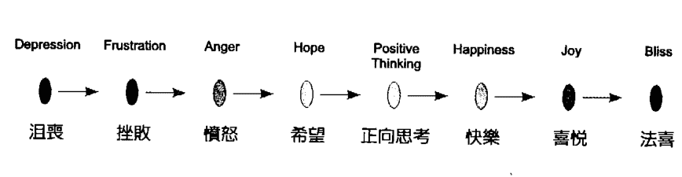
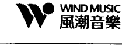
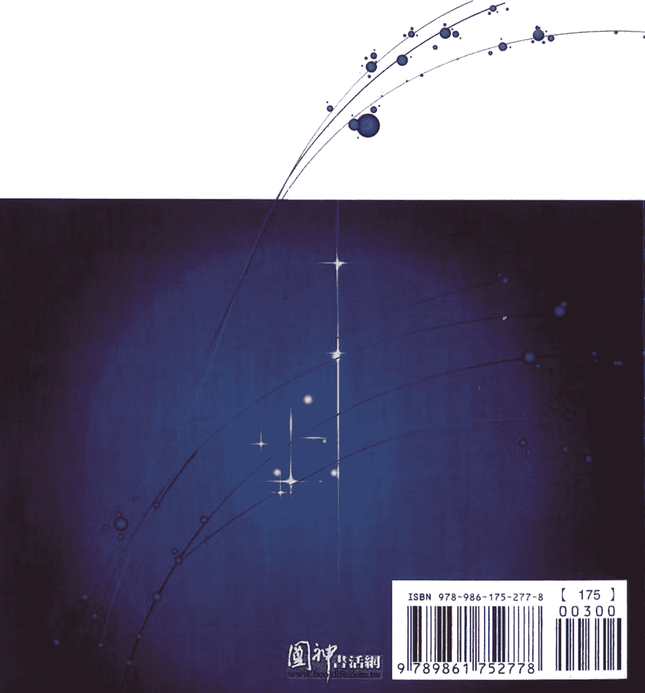

# 升起你的灵性天线

## 下載榮耀版的自己

李欣頻 × YANTARA JIRO 合著 葉高呈譯

每個人的生命都有一首主題曲，你聽見了嗎？只要升起你的靈性天線，那麼在這個世界的大遊樂場中，你就可以熱情大膽地創造，自由華麗地探險！

## 推薦序

連結你的內在潛能，活出全面豐盛的人生

葉高呈（Theo）

四年前，我離開了在上海近十年的工廠管理工作，也離開了父親的保護傘，進入了未知！現在回想起來，不知是什麼樣的勇氣，讓步入中年的我放下了所有的一切，重新開始，而且是完全不知該從哪裡再出發！

在上海的十年裡，當外在世界越來越豐盛，我的內在世界卻朝著相反的方向前進：工作出了問題、身體出了問題、心理出了問題，情緒也出了問題，簡單說就是「我」出了問題。我對工作、金錢、健康、生活的安全感，都與外在的物質豐盛完全逆向發展。

就在回國後的一週內，我參加了一個工作坊，在結束返家的捷運車上，腦中想起了當時的處境、過去的人生、工作坊中的教導，心中有了非常觸動的對話……於是我雙手合十，在心中對著上蒼祈禱：「過去四十年我計畫了這樣的人生，接下來的四十年我不再計畫了，你知我此生是來做什麼的，祢知道我可以做什麼，祢來說我來做，我就把後面的人生交給祢了！」沒想到這一段看似簡單、平凡的祈禱，卻打開了我接下來意想不到的道路。

從那天至今，神祕、奇幻和某些意想不到的事不斷發生，全新的門也一一打開。當我一步步放下，祂就一步步帶我走向未知，途中有太多的神奇與恩典。就在我不斷靜心療癒的一年後，藉由一次夢中訊息及之後的靜心感應，我和Yantara Jiro連結上了。我們合作至今已進入第四年，與其說我幫他籌辦課程，倒不如說藉由主辦課程與他互動，我不斷從他那裡憶起了很多內在的智慧，他的能量、他的智慧、他的聲音、他的光語、他的泛音、他的行為、他的態度、他的看法……他整個「存在」喚醒了我的潛能、記憶，以及與本源重新連結的能量。

欣頻，與她連結也是一件特別的經歷。她的率真、她的真誠、她的體貼、她的照顧，每每讓我感動，讓我心中時常感到非常溫暖。這次的合作是宇宙所安排的，也感謝我們三人能敞開心胸，成就了這本書。

相信這本順著宇宙之流所誕生的書，必能在每個人的心中點燃那份屬於個人獨特的光與智慧。書中處處充滿了讓我們的人生回到豐盛的智慧與方法：藉由赫爾密斯的宇宙七大法則，讓我們了解宇宙中萬事萬物運作的法則，所以一切都沒有例外；「光語」更是這本書中一個非常特別的部分，相信這是第一本如此大篇幅介紹所謂「光語」的書。在Jiro來台灣的四年中，越來越多原本只能在私底下說著、寫著、唱著光語的人來到工作坊中，發現自己不是孤獨的，並了解到他們會說的「光語」其實是一份禮物，一份可以與自己的心溝通的禮物。尤其透過光語所傳達出來的訊息往往充滿了智慧，並讓我們感動不已。

我的生命在四年前轉了個大彎，一切的改變都超出我的想像。原來只要我們能夠臣服、連結本源、順著流，並有紀律地向內在探索，豐盛就會一步步展現在人生的各個面向：關係、健康、財務、喜悅、愛……邀請你敞開心胸，進入探索自我、經驗未知與奧祕的世界。翻開本書的你，就已經踏出了這一大步……

## 推薦序

正規教育裡找不到的生命答案

央金拉姆（心靈音樂家）

我和Jiro的連接，是透過本書的譯者葉高呈（以下稱Theo）。那時我正在北京攝影棚，拍一個覺醒紀錄片的靈性舞蹈。拍完後，正當我準備要走的時候，碰到了Theo。聊了幾句之後，他就說本來他這次不想來北京，但是他的最高智慧說：「要去，你會碰到你該碰到的人。」他說見到我，就有這個感覺——碰到了該碰的人。

之後他把Jiro的音樂Demo給了我，當晚他又用skype讓我和Jiro連結。我們之間是用音樂來連結的：我為他唱了一段，他也為我唱了一段。當時的音樂對話是非常合一的。我當時對Jiro的印象是，他是一個自在、沒有捆綁的導體。

後來又收到Jiro的書稿，希望我為這本《升起你的靈性天線：下載榮耀版的自己》寫序，我欣然接受了。讀他的書稿，感覺就好像和他音樂對話時那般的輕鬆愉快。他用的語言和觀點都是我非常熟悉的，我一口氣就看完了。

［推薦序］
正規教育裡找不到的生命答案

## 自序

年輕的靈性覺者、創意玩家
Yantara Jiro

先說一下我是怎麼認識Yantara Jiro的吧！其實在台灣的心靈圈，他已經算是相當知名的心靈老師，這幾年在台灣也陸陸續續開過課、帶過心靈之旅，只是我一直還沒有機緣認識他。

在二〇一一年下半年剛認識Jiro時，我跟他說覺得自己快活膩了；但他告訴我，其實妳還沒有真正去活，所以才會膩。真正的活應該是越活越帶勁，所以來玩吧，一起來玩二〇一二！於是我們就開始計畫二〇一二年全年來個環球心靈之旅，有他在的地方，地球果然變好玩了。

二〇一二年四月，我參加了Jiro舉辦的靈性之旅。他像是嚴格的靈性管家，因為我膝傷未癒，他不准我喝可樂，也禁止我吃貝類，卻鼓勵我不要害怕登山；他耐心教導並無微不至地照顧全團的團員，該嚴格的時候也都是真話伺候。他是全團最年輕的成員，不把厚重的大道理或經典掛在嘴邊，但他的沉穩與睿智卻讓人忍不住對他禮敬三分。與他對談總能瞬間頓悟自己的盲點，我經常把他當成年輕的活佛以平衡我的認知失調。

我們需要的是「活出真理」的人，而不是「背誦真理」的人。對我來說，Jiro是個非常年輕的靈性覺者、創意玩家，他以年輕靈性歌手的身分，帶領八〇、九〇後的孩子與他一起同步揚升。上過Jiro二〇一一年的課程後，對我的創意思維可說是宇宙大躍進，所以不藏私地把他的重要教導集結成七堂宇宙課程，分享給大家；加上他在未見到我之前，就已經決定出書，於是就有了你們眼前的這本《升起你的靈性天線：下載榮耀版的自己》！

## 自序

心就是最真實的指南針、就是我在地球的嚮導！

有好幾年的時間，我反覆思考人類的語言，以及人們在表達自己時所遇到的困難，特別是「言不由衷」這樣的奇怪情形。在成長期間，我花了很多時間觀察人們對日常生活經驗的反應、傾聽風呼嘯的聲音、落葉的聲音、敲打東西的聲音和抖唇發聲等等。我透過觀察和感覺，注意到了為什麼人們會產生溝通失誤的現象：原來人們總是無法用言語表達自己內心的真正感覺，且因為社會的制約，不能自由真實地說出感受，甚至連想哭、想笑都要自我克制，只允許自己在「適當」的時候才可以表達。

我終於明瞭，如果人們願意敞開真心，如實表達自己的情緒並接受彼此，這個世界將會更加和諧。當我更留意身邊的聲音與音樂，我對周遭就變得更加敏感，我可以知道人們是否心口如一、內心是否恐懼或他們是否在說謊。我發現有人對其他人吼叫或將憤怒投射到別人身上時，會造成不小的心理傷害，甚至會對神經系統形成嚴重的損傷。無論在家裡或者工作場所，當一個人持續曝露在言語暴力的環境中，他的自尊、自信及健康將會逐漸惡化。

每個人都是由愛而生的，我們之所以活在這個星球上，是為了要藉由給予自己與他人「愛」，來體驗更廣大的「愛」。透過旅行與生命體驗，我更加了解這個世界和我自己，原來我的心就是最真實的指南針、就是我在地球的嚮導，鼓舞我不帶任何恐懼和限制，學會更加敞開並經驗愛、和平與和諧。

在這趟地球之旅的途中，我收到無限的力量與祝福，於是我持續分享我的洞見，並與許多志同道合的朋友們共創舞台，讓大家能夠經驗到情緒的自由與更大的幸福，帶著快樂與豐盛過著他們想要的生活！

#### 升起你的靈性天線：下載榮耀版的自己

获取更多好书，请加微信：13641926204 或 QQ:715104687

## 推薦序 /

連結你的內在潛能，活出全面豐盛的人生！ ◎葉高呈 002

正規教育裡找不到的生命答案 ◎央金拉姆 005

## 自序 /

年輕的靈性覺者、創意玩家Yantara Jiro ◎李欣頻 008

心就是最真實的指南針、就是我在地球的嚮導！ ◎Yantara Jiro 010

# 第一堂 如何跟自己的本源連結？

+   • 什麼是本源？ 019
• 本源的意義 021
• 如何找到本源：「我即是本源」呼吸靜心法 022

> 升起你的靈性天線
以本源之眼，探索「榮耀版」的自己

# 第二堂 情緒與振動頻率的調整

+   • 用情緒溫度計微調你的振動頻率 035
• 心的振動頻率與願望的振動頻率一致時，
  就能心想事成！ 037
• 中性法則凌駕在二元法則之上：回到不動點，
  就能自主地一路擺盪到目的地 038

> 升起你的靈性天線
關於情緒的三個黃金提醒

# 第三堂 共同創造美好的愛情關係

+   • 如何建立美好的愛的關係？
• 愛情的吸引力法則：
  停留在喜歡的振動頻率上，別讓沮喪喧賓奪主
• 該怎麼處理關係中的衝突？
• 允許真正的愛
• 你看到的一切就是你自身整體中的本質
• 接受、消融並整合罪咎感
• 練習欽佩和讚賞對方

升起你的靈性天線
各自校準，共創新版人生

# 第四堂 關於金錢、工作與財富

+   • 如何從頻頻抱怨，轉換到豐足的人生？
• 利用二元法則找出正面本質，才能改變負面情緒
• 你對金錢的看法，決定你與金錢的關係
• 別閒置百分之九十的潛能！

升起你的靈性天線
No gain in pain !

# 第五堂 健康從傾聽身體細胞的聲音開始

+   • 運用生命循環力讓身體恢復平衡、遠離疾病
• 傾聽身體的需求，才能擺脫疾病的振動頻率
• 天天與細胞溝通、校準，就能引動自我療癒
• 睡前對身體、情緒體、心智體說話
• 讓身體彈奏健康的旋律
• 泛音唱誦
• 水晶鉢的聲音療癒：瞬間調整身體的振動頻率

# 升起你的靈性天線
跟隨身體的指引

# 第六堂 宇宙的創造法則

+   • 「創造」的核心原理
• 誰是赫爾密斯？
• 赫爾密斯的宇宙七大法則
• 法則一：唯心唯識法則
• 法則二：對應比喻法則
• 法則三：振動頻率法則
• 法則四：二元法則
• 法則五：韻律週期法則
• 法則六：因果始終法則

# 第七堂 與星際的創造本源連線

+   • 我們與宇宙的關係
• 星際之門大開時的連結
• 什麼是光語？
• 光語的功能
• 光語的原理
• 如何開始說光語
• 在說光語前，請先與動機校準調和

## 附錄1

李欣頻×Jiro以光語對談世界九大議題

## 附錄2

2012-2013行星主要能量轉換表 ©Yantara Jiro

## 附錄3

本源擴展靜心CD功能與內容說明 ©Yantara Jiro

### 法則七：陰陽法則

升起你的靈性天線
Jiro傳導的赫爾密斯結語

# 升起你的靈性天線
Jiro傳導的赫爾密斯結語

天使神秘学院官方淘宝：http://strc.taobao.com

获取更多好书，请加微信：13641926204 或 QQ:715104687

## 第一堂
如何跟自己的本源連結？

天使神秘学院官方淘宝 : http://strc.taobao.com

获取更多好书，请加微信 : 13641926204 或 QQ:715104687

> 當你成功連結到本源，你會知道你就是本源能量的延伸，
> 你的存在、話語、情緒、念頭都會影響你自己及其他人的本源。
> 你會感覺快樂，感到自己的能量正在擴張，
> 你會認知到自己就是強而有力的存在，
> 你想要得到的答案都會無條件地湧向你，
> 你將會無所不知。

## 什麼是本源？

在心靈圈中，自從《與神對話》風行之後，開始掀起了與「神」「高我」與「指導靈」溝通或對話的潮流，但同時也出現了一些問題，很多人在問：我該怎麼跟神說話？我怎麼知道跟我對話的是神而不是鬼？我如何知道我的指導靈是誰？我該怎麼跟高我連線？

這些疑惑多多少少造成了心靈圈內茶壺裡的風暴，能與神對話者、與不能與神對話者分成了兩邊，前者有些淪為傲慢或藉機放大我執，後者有些淪為懷疑批判論者。我綜覽諸家各派之後，比較喜歡Yantara Jiro（以下簡稱Jiro）溫和且中肯的說法：「跟自己的本源連結就足夠了！」而這個「本源」，就是自己的靈魂源頭，因為我們每個人身上都載有宇宙大爆炸後的元素；也就是說，我們每一個人的身心靈裡，都有宇宙創始的本源，只要跟自己的本源連結就綽綽有餘了。至於能否與神對話一點都不重要，這點讓所有人瞬間不再比較、歸於平等，並回歸自己的中心。

Jiro對於「本源」的定義是：在漫漫的宇宙時光之旅中，我們都來自相同的本源、相同的光點、相同的初始。從這個相同的起點開始，我們成爲光的不同面向，如同光透過美麗的鑽石折射出不同顏色，這些無比絢麗的色彩，進入無限浩瀚的世界，優雅地穿越時空，進行著美麗無限的旅行。

在我們的心中有個無限純淨正向的能量之流，是超越所有限制與原則的「無限心智」，我們可以稱之為「愛」「神性的集體意識」「光之存有」或「宇宙的母體」。我們生來就有與「本源」連結溝通的能力，但因為教育的限制與社會文化的約束，這能力不是被壓抑，就是被切斷，久了我們就忘了自己能與本源連結，甚至還否定「本源」的存在。當我們放下恐懼，拿回自己無限強大的力量，透過意圖有意識、聚焦地連結有限心智與「本源」的無限心智，我們將能觸及光與愛的豐盛。這樣的過程將會開啓我們的心智、擴展我們的意識，讓我們達到一個廣大而覺醒的層次並將之顯化，於是我們便能自由無限地創造出自己想要的實相，也可以與他人一起共同創造。這種與「本源」連結的方法，在埃及、希臘、凱爾特、馬雅等古文明的教導中都出現過。

## 如何找到本源  
「我即是本源」呼吸靜心法  

至於怎麼找到自己的起源，與「本源」連結？Jiro說，你必須先要有強烈與本源連結的意圖，允許自己順流地被本源帶進去。只要是出自想要經驗生命的偉大與喜悅、想要共同創造豐盛、想要自由呼吸、想要看見與感覺、想要完全沉浸於生活等的欲望，純粹的本源振動能量就會升起並與你連結調和，這就是產生創造力的源頭，這股力量會自然而然帶領我們奔向幸福之流。  

你可以用聲音表達，無論是說話或唱歌，甚至只是純粹無目的地發聲都無所謂。信任是很重要的，唯有信任，你的能量才會是在welcome的狀態，更多未知的一切才會接踵而來。這是一趟沒有終點的旅程，一路生成無止境的  

升起你的靈性天線：下載榮耀版的自己  

获取更多好书，请加微信：13641926204 或 QQ:715104687  

## 〔第一堂〕  
如何跟自己的本源連結？  

## 連結本源之後，便升起了靈性天線，不斷擴展  

以上就是「我即是本源」的呼吸靜心法，可以每天找時間做，特別是當你有不愉快的情緒、感覺自己脫離本源時，就可以用這個方法把身心靈的組件一一拉回來校準調和。當你連結到本源時，你會放掉恐懼、疑慮、擔憂，瞬間感到被愛、被滋養、被無條件支持、被賦予振奮的力量，而且「本源」會耐心教導你「愛」「善」「慈悲」「智慧」「喜悅」與「和諧平衡」，不會強迫你、更不會跟你談條件，因為本源是無私的，永遠給你選擇的自由意志，提醒你是靈性的存在體，並清晰引導你遵循自己內心的真理，走在靈性之路上。  

Jiro還提醒：要隨時特別留意自己的「感覺」，因為感覺就是振動頻率。當你想要與「本源」連結，就像是一台收音機，要先發出意圖（欲望＝能量，無欲則無能量），調到你鎖定的頻道，你必須專注在愉快的感覺上、允許一切  

升起你的靈性天線：下載榮耀版的自己  

获取更多好书，请加微信：13641926204 或 QQ:715104687  

## 升起你的靈性天線  

## 以本源之眼，探索「榮耀版」的自己  

以本源之眼看眼前所有的人事物，你就能處在本源無限活躍的心智中，沒有事物是錯的，一切都是對的，一切都正好如其所是。人生是光明及黑暗的一切總和，在本源的準則之下，沒有事物會被忽視，一切的存在，都是為了共同創造——本源不會缺席，不會減損，也不會增加，凡未被看見的，都在另一處被看見了。當你身處本源，你會感到什麼都好，什麼都能接受，什麼都能與你和平共處一室。要勇敢、有探險心，探索你的潛力，以及知曉你所擁有的壯碩力量。一切欲望都是為了促成正在擴展的你，要好好地活，好好地玩，在極大的喜悅中，你就是「榮耀版」的你！  

## ［第一堂］  
如何跟自己的本源連結？  

天使神秘学院官方淘宝：http://strc.taobao.com  

获取更多好书，请加微信：13641926204 或 QQ:715104687  

## 第三堂  
情緒與振動頻率的調整  

天使神秘学院官方淘宝：http://strc.taobao.com  

获取更多好书，请加微信：13641926204 或 QQ:715104687  

> 你情緒就是你的振動頻率，而這個振動頻率會絲毫不差地創造出你的實相。所以感到沮喪時，不要以表面行動來慣性逃避情緒，而忘了務實地去調整自己的振動頻率。唯有與本源校準調和，活在當下並與萬事萬物合一，我們所呼求的美麗實相才能快速顯現。  

## 用情緒溫度計微調你的振動頻率  

當我開始研究吸引力法則與情緒之間的關係時，發現許多在實際生活中運用的迷思，包括：  

是不是一直得停留在美好的感覺，才能啟動吸引力法則？  

然而，如果情緒突然低落，硬是切到正面思考又非常不實際，到底該怎麼釐清「情緒」與「吸引力法則」的關係？  

Jiro提出以下這張情緒表，要我們先就這張表檢視一下自己目前的位置，或者遇到引起你情緒反應的人事物時，看一下自己在哪一個情緒點上，然後做一下情緒微調，再決定接下來要怎麼反應、怎麼做。  

  

〔第二堂〕  
情緒與振動頻率的調整  

获取更多好书，请加微信：13641926204 或 QQ:715104687  

「feel good」是啟動吸引力法則的重要關鍵，但「feel good」很籠統，如果你不清楚自己現在正處在怎樣的情緒點上，你就不知道怎麼調整，或者該往哪個方向微調。有了這張「情緒量表」，就像是有了一支方便觀測的情緒溫度計，越左邊表示振動頻率越低，越右邊表示振動頻率越高，於是你就可隨時拿來「覺察並調整」自己的情緒溫度，而不是像過去一樣深陷情緒深淵，不知如何自拔。關於這個部分，會在第六堂課的「二元法則」中繼續探究。  

當你的振動頻率越高，你會越快樂，進行每件事都感覺時間過得真快；反之亦然，你的振動頻率越低，身體越沉重，會感覺時間怎麼過得這麼久、這樣慢，就像在摩天大樓中，位於頂樓的人感覺時間過得比較快，在一樓的人覺得時間過得比較慢是一樣的道理。  

「覺察並調整」自己的情緒溫度，就是一種與實相細微互動的過程，每一次細微的互動與調整都會留下軌跡，就像樹的年輪，這些細微的軌跡就組成了現在的你；你越調整，你的可變彈性就越大。當你覺察自己在生活中的一思一行、一舉一動，有意識地隨時欣賞、感謝來到眼前的每一樣人事物，讓自己享受每分每秒舒服愉快的當下，而不是以過去的舊反應抱怨或抗拒，那麼你就是自己情緒的主人，也  

## 心的振動頻率與願望的振動頻率一致時，就能心想事成！  

至於「當下情緒」與「願望成真」的關係，Jiro解釋得很清楚，他說：只要將你目前的振動頻率，與你的目標之振動頻率調成一致，你的願望就能很快成真。也就是說，你需要花多少時間調整你的振動頻率，那就是你完成夢想所需要的時間。例如從疾病到康復所花的時間，其實就是你在生病狀態的振動頻率，調整到健康的振動頻率所需的時間；所以你可以專注並鎖定在健康狀態的振動頻率上，當振動頻率一掉下來，有覺知地再往上調回去。  

如果你依照正負兩極原則（盛極必衰，否極泰來），你盪到最低點之後也會反彈回高點，就像有人在罹癌之後，瞬間變成全然的有機健康生活者——但我們其實可以不必這麼極端戲劇性，只須隨時隨地微調情緒的振動頻率，就能讓自己長駐在健康的身心靈狀態。  

只要將內在感覺與願望校準調和，你便會感覺到平和，如此可以讓你加速進入喜悅狀態，並想要以聲音表達  

## 【第二堂】  
情緒與振動頻率的調整  

## 中性法則凌駕在二元法則之上，回到不動點，就能自主地一路展露到目的地。  

當我向Jiro問道：「因為地球是二元性的，有正就有負，當情緒處在正面狀態時，總會有一天自然而然擺盪到負面，那該怎麼辦？」  

他說回答：「中性法則凌駕在二元性法則之上：你可以不必在正負二元性中擺盪，回到寂靜不動點（也就是  

升起你的靈性天線：下載榮耀版的自己  

获取更多好书，请加微信：13641926204 或 QQ:715104687  

## ［第二堂］  
情緒與振動頻率的調整  

## 升起你的靈性天線  

## 關於情緒的三個黃金提醒  

總結以上幾點，Jiro給大家關於情緒的三個黃金提醒：  

一、沒有什麼比我感覺很好更重要：  

當我將自己放在生命的第一順位時，我就會專注並覺知在自己身上。我的目的就是要與我的本源一致，就是我的本源而非其他。由我的本源投射出純粹正向的能量，將會吸引等同的事物進入我的實相之中。好的感覺會讓未來的可能性擴張、成長、流動，讓新的開始與新的啟發有了新的廣大空間。當我感覺很好的時候，接下來的所有行動都會是毫不費力的。  

二、我只對自己的情緒負責：  

當我對自己的情緒負責時，我就會繼續向前進。在這個過程中，如果我對自己的感覺保持覺知，會幫助我感覺良好。只要我專注在我想要的事物上，我就  

升起你的靈性天線：下載榮耀版的自己  

获取更多好书，请加微信：13641926204 或 QQ:715104687  

## 三、行動無法代替我要的情緒  

當我與本源的能量校準調和時，我的行動是「毫不費力」而且「壯麗」的。情緒就是我的振動頻率，而這個振動頻率會絲毫不差地創造出我的實相。  

我完全不需要外在刺激來使我感覺良好。在採取行動前，我有足夠的力量，引導我的情緒到一個安心的空間，而且我的行動總是根源於充滿力量和啟發的源頭。  

行動無法代替情緒，例如當一個人覺得沮喪時，就去買冰淇淋、或是去血拼來代替快樂的情緒，但這樣的刺激（冰淇淋、血拼）將只有暫時性的效果而已，  

【第二堂】  
情緒與振動頻率的調整  

获取更多好书，请加微信：13641926204 或 QQ:715104687  

## 第 三 堂  
共同創造美好的  
愛情關係  

天使神秘学院官方淘宝 : http://strc.taobao.com  

获取更多好书，请加微信 : 13641926204 或 QQ:715104687  

> “當關係中的兩個人不再玩權力控制的遊戲時，雙方很自然就會回到他們自己與本源校準調和的生物韻律之中，接下來他們就會開始共同創造。”  

## 如何建立美好的愛的關係？  

Jiro對於人類如何建立美好的愛的關係，提出以下的觀點供我們參考：  

我們都是個別獨立的存在體，但卻以集體的方式與本源連結。當我們連結並感覺到內在的本源時，那樣不可動搖的確定感，將會讓我們充滿力量。我們居住在「透過共同創造」來運作的世界之中，無論現在是自己一個人，還是和他人住在一起，我們都持續地在共同創造，而這創造的氛圍會進入我們的呼吸、我們居住的環境、我們享用的食物中，甚至進入我們和其他人的談話與合作之中。  

與你連結的人，當他 / 她和自己的本源校準調和時，你們雙方將會一起共同創造，並一起擴展，雖然彼此只要付出一些努力，卻會有極大的喜悅。  

當伴侶其中一方未與自己內在的力量校準調和時，就會開始依賴對方。在所有的關係中，情緒依賴是很常見的，但你要知道，在所有看似不平等的關係中，一定有個潛在的擴展點，一旦認出「藉由這段關係，你可以獲得怎樣的學習與體悟」時，你就可以再度回到自己內在的本源力量中，如此你就能輕鬆自然地提升自己與身邊的人。  

## 〔第三堂〕  
共同創造美好的愛情關係

所以你需要随时间自己：「我的伴侣、朋友、家人，在协助我扩展自己的这部分，对我提供了什么样的帮助？」如此你才能从「情绪依赖」的泥沼中跳脱出来，宏观地看到双方更大的成长蓝图！

### 愛情的吸引力法則：停留在喜歡的振動頻率帶上，別讓沮喪喧賓奪主

关于爱情，很多人会利用所谓的「爱情吸引力法则」来召唤自己的真命天子或天女，但失败的人居多。有个很可爱的女孩，在日本与那国岛的海底金字塔向上天祈求一个男友，结果当晚就有一位船长对她展开热烈追求，但她不认为他是真命天子。于是她问Jiro，为何上天给了不对的对象？

Jiro对她说道：「当你向宇宙要求伴侣时，宇宙会给你很多位候选人，你要从眼前的候选人里辨认出：哪些是你『要』或『不要』的特质，然后欣喜接受眼前这一个人身上你喜欢的特质，并重新发出新的请求，而不是一味抗拒，或是抱怨眼前的对象不对。因为当你抱怨或不开心时，你的振动频率就离你所想要的更远了。例如，这个船长身上一定有你喜欢的特质，比如说热情、自由……你可以享受，并感谢有这样特质的人来到你面前；但这个人也有你不喜欢的部分，比如说年纪略大，那么你可以跟宇宙明说你希望是多大年纪的，然后持续专注在眼前对象身上那些你喜欢的特质，继续停留并享受在这样的振动频率带上，千万不要被沮丧的情绪降低你的振动频率。」

### 允許真正的愛

Jiro进一步谈到爱的意义：

我们生来就有能力给出爱，并接受爱。当我们的身体、细胞、分子的深处振动时，本源能量便展现了。试想，当我们的内在感到空虚，我们要如何真正地爱他人呢？只有当你不再感到渴求爱，你才能够真正而无条件地爱其他人。

当你愿意将注意力转向内在，并允许你的心智和身体放松和呼吸，你将会受到宇宙之爱的滋养，这样的爱是来自内在，而不是外在的刺激。如此你将不会再向外渴求，因为你会在身体、情绪、心智和灵性上受到来自这股源源不绝的无限能量之流所滋养，你会感到完全的拓展、提升和启发，你会明白真正的爱是一种完整、满足、平和与稳定于中心的表达方式。

当你停止从事物、地方、植物、动物和其他人那里寻求爱，便代表你是被来自内在的爱所完全充满，如此爱将如喷泉般不断涌出遍及接触到的任何事物。

你可以问自己：「我做了什么来填满我的心？」
「当我在外在的刺激来填满我的需求时，我会得到什么益处？」

当你选择与内在的心校准调和时，你生活的各个面向都会朝正向去成长与拓展。发自内在存有，运用自然的呼吸节奏，你可以投射出所有正向的能量。运用每一个念头，我一步一步朝向更光明、更开阔的人生走去。

### 你看到的一切就是你自身整体中的本质

每个人、动物、植物、矿物或物体都是你本质的一部分。任何时候，当你感觉与某些人事物有比较强的共振时，代表着该人事物与你的投射达到了能量上的吻合，并因此显化出来。

当你带着纯粹正向的态度、兴奋感和允许来回应这样的共振时，你将会打开新潜能与可能性的大门，如此会带给你极大的喜悦、扩展和机会，并与宇宙所提供的资源共同创造。简单来说，你此刻就在共同创造的状态中，你已经调整并准备好了，放手一搏吧！

### 接受、消融并整合罪咎感

当你处在罪咎感的空间时，你会否定自己，否定宇宙提供的礼物，你与自己内在力量处于失联的状态，这样的状态与你选择要做什么无关，而是与你在做某件事时的心智与情绪状态有关。当内在的罪咎感被接受、消融并整合后，你就会想做很多的改变。这是因为，在罪咎感被整合之前，任何你想采取的行动都是根植于罪咎感的投射。只有当这样的根完全得到解决之后，完全由罪咎感所投射出的行动或活动就会很自然的消失，如此你将会经验到解脱、解放和情绪自由。

## 练习钦佩和赞赏对方

当你能在关系中的另一半身上找到令你钦佩和赞赏的特质时，你是扩张的；同样的，当你在另一半身上找到令你憎恶的特质时，如果你能够问自己：「如果我可以如实地接受他的特质时，我会有什么收获呢？」你同样也在扩张。

这样的练习不仅仅可以帮助你对自己的议题有更清晰的看法，同时也会停止负面的投射，并增进你与伴侣的关系。

## 升起你的灵性天线

## 各自校準，共創新版人生

当你有负面悲观的伴侣或家人时，请协助他们专注在可以改变的潜能上，但如果他们执意耽溺在痛苦之中，你可以不必再继续回应他、说服他，甚至想要改变他。请抽离他的悲剧圈，回来专心与自己的本源校準連結，等到对方与他自己的本源連結时，你们彼此将可以重新再调频，一起创造新版的人生命运。

## 你对金钱的看法，决定你与金钱的关系

听完Jiro对于「丰盛」的概念后，我也跟他分享我对金钱的新体悟与理解：如果我们宏观地看「金钱」，它就只是扮演「交换资源」的功能，如果金钱不具有交换资源的功能，那就只是一堆印了数字的纸张与铜板罢了。我们可以把「金钱」理解为连接两岸的桥，它只是管道，让你有权力交换你想要的东西；如果你专注在金钱上，就像你专注在桥本身，却不知道自己要往哪里去，你就会卡在桥上，甚至收集了很多桥，却哪里也去不了，因为你把焦点放错了，于是金钱就无法在你身上展现流动的自由。

我还跟他分享了近来我发现的金钱现象（引自《为何心想事不成：《秘密》里还有十个你不知道的秘密》）：过去二十年来，我赚十元就存九元的习惯从没改过（INPUT:OUTPUT = 10:1），直到最近两个月，因为想体验「二〇一二无限年」的感觉，所以刷卡请客或旅行都没看价格，结果奇迹发生了：二〇一二年三月十七日对帐时，我才发现，前两个月花出去的每一笔大笔开销，各在一周内都有刚刚好十倍其价格的案子（演讲、版税、广告案等）进来，也就是说：花一千就进来一万元，花一万就进来十万元，花十万元就进来一百万元……

这大大颠覆我过去对于金钱的概念，原来我已不必专注在赚钱这件事上（焦虑的振动频率），我只要尽情享受「不设限」花钱的快乐（愉快的振动频率），因为长达二十年我的INPUT:OUTPUT比例已经定型为10:1，所以我每花一单位的钱，自然就会进来十单位的案源，精准无比，我取名为「等比例花钱自动入帐法」。然而，前提是：

+ 1. 你要确信宇宙资源真的是无限的，很多人在这部分就被设限了。
2. 你正在做你喜欢且擅长的事。
3. 你没有因为「担忧不安定的未来」而在固定的公司朝九晚五地上班，如果你是因为担忧而去上班，你的时间全都被固定薪水绑住了，这就是对金钱流很大的设限。

因此，你不必吸引金钱，源源不绝的创造之流，就能让相应的人事物全都自动不费力地汇流进来。也就是说，并不是「需要钱」就可以吸引到钱，反而是你肯把钱或资源花出去，才是让钱或资源再进来的动能，就像是捐血后身体才有空间制造新血一样。你对金钱的看法，决定你与金钱的关系。在你抱怨自己入不敷出时，请优先检验自己对金钱的看法是什么，然后重新调整你情绪的新聚焦点，才是治本之道。

## 别闲置百分之九十的潜能

当每个人对自己的情绪振动频率负全责，这个世界会变得非常不同。换个例子来说，非洲是全世界公认的最贫穷的地方，大家都投射同情的眼光与能量到那里，假设有它仅拥有全世界百分之十的资源，但基于两极平衡原则，非洲也一定有百分之九十的潜力，可以赢得全世界百分之九十的资源，就看非洲自己要把焦点放在哪里？是贫穷的现状，还是富裕的潜能？

你所专注的会扩展——当你了解了这个道理，你会突然顿悟，原来自己过去所做的许多决定，大部分都是源自于匮乏感。当你深究自己究竟想要什么的背后，你会发现其实你要的不见得是某一様人事物，而是一种情绪的满足感；于是你就可以改变振动频率，将你现在的感觉，与你想要达到的目标校准调和。

当你专注在已有的，并感激自己过去的欲望显化成功时，你将会感觉到更多的希望、自我肯定与可能性，于是你可以向宇宙说：「我很清楚我要什么，而且我已经看见了我显化的成果。我所有的要求，能持续得到本源的回应，真是一件很棒的事。透过和自己的本源校準调和，我感觉很好、很兴奋、很有成就感，最重要的是，我感到很安心。当我觉得安心时，我的要求都会完整地应验，我要的都已经在这里了！我来地球的目的，就只是来玩、来享受我所祈求的愉悦！」

人生或许有百分之十的命运是被生命蓝图决定的，但有百分之九十的未定潜能可以好好地发挥与创造。当你与广大的本源链接，在自己的力量中待久一点，你就可以有很多机会决定自己想经验什么、创造什么；若你把专注点放在那百分之十受限的人生蓝图上，那么你等于把这百分之十扩大成了百分之九十，而闲置了你百分之九十的潜能！

# 升起你的靈性天線

No gain in pain !

人總是想要輕鬆、愜意，沒有人天生想挑辛苦的路走。人之所以選擇受苦、過著艱辛的生活，那是因為他們不知道還有別條路；加上長期抱著悲觀的想法，而且不知道該如何輕易地創造豐盛，所以才會一直坐困愁城走不出來。或許剛開始不容易轉變自己負面的思維慣性，但只要你能做到，你就真的擁有你所想要的一切——有什麼比讓你感覺很棒更重要的事呢？以前我們總是聽到：「No pain, no gain」，但其實應該是「No gain in pain」，因為你只須調好振動頻率，到達目的地是可以毫不費力的！

關於金錢、工作與財富

天使神秘学院官方淘宝：http://strc.taobao.com

获取更多好书，请加微信：13641926204 或 QQ:715104687

## 第五堂  
健康從傾聽身體細胞的聲音開始

天使神秘学院官方淘宝 : http://strc.taobao.com

获取更多好书，请加微信 : 13641926204 或 QQ:715104687

> 只要你每天抽點時間，與自體的健康細胞溝通、觸摸、連結、互動、校準調和，你的身體會告訴你它的需求，也會自動引導你如何自我療癒；它亦會根據你的聚焦力，全面提升振動頻率。逐日逐月，你就離健康之端更近了。

## 運用生命循環力讓身體恢復平衡、遠離疾病

Jiro指出，我們的身體是以振動頻率為基礎，體內的DNA即是無限潛能的振動銘印，裡面包含了大量的符碼，就如同電腦內設定運作的程式一樣。DNA在各個層次上支持著我們身體的運作，很多東西都可以刺激DNA，但最能影響DNA的是光、聲音與頻率；一旦DNA序列的力量和影響力被觸發，通常會有體力強化、細胞智化、減緩老化和細胞再生的結果產生。

所有生命形式都在幸福安康的自然法則下運行。幸福安康與我們的情緒息息相關，雖然我們的身體看起來、感覺起來是固體，但是事實上，我們都是由純粹能量的振動分子所組成，只是因為我們想要活著，這股想存活的欲望延展出去，與生命互動產生變化，於是有了現在可見的形式。

心智和情緒是我們內在的指引之光，也是我們的羅盤，正因為每個細胞都有著個別的記憶、態度和欲望，總和起來就形成了我們的健康狀態。所有身體上不舒服的根源，都是來自於心智與情緒的不舒服。

我們的肌肉、骨骼、血液……其所運行的動力，都受到生命循環力的主宰，生與死就如同海洋中的潮汐，有時漲潮、有時退潮，有時充滿活力、有時疲憊不堪……就這樣來回擺盪、波動。當我們的意志力夠堅強，再加上情緒的導引與合作，就可以逐漸讓身體恢復平衡、和諧、幸福與安康。

## 傾聽身體的需求，才能擺脫疾病的振動頻率

疾病是怎麼形成的？Jiro指出，疾病就是一種能量振動頻率的狀態，雖然它已經被顯化出來了，但還是可以透過心智力與意志力，來改變、調整、轉化這個「疾病」的振動頻率。

身體就是一個振動頻率的存在，它很有彈性，也具有高度的接受性，當你想要讓自己更健康的意圖產生，改變的潛力就會浮現出來，於是你就有機會脫離「疾病」的振動頻率。當你突然發現自己生病時，你要覺察的是：此時此刻的你，情緒反應是什麼？你會不會太過於聚焦在「生病」的事實（例如處心積慮想要「解決」疾病的問題），而忽略了其他健康細胞可以改變現況的潛能？這些健康的細胞會因為你的聚焦而能量擴張、興奮，並放大它們的修復潛能，它們就會刺激那些生病的細胞立即改變現況，但這一切都需要你的信心、決心、激勵、專注、意志力，特別是要專注在「寂靜不動點」上才能快速顯化……當然最重要的是，還包括你的情緒要與本源完全地校準調和。

當我們靜下來將注意力轉向內在時，我們將會開始聽見自己的神經系統、心跳、呼吸、骨骼及其他更多更多的聲音，唯有傾聽自己身體的需求，真正的自我療癒才能開始。

## 天天與細胞溝通、校準，就能引動自我療癒

如何讓自己的身體保持健康？Jiro建議你可以做的是：

每天去讚賞身上那些有著健康潛能的細胞，因為當你持續聚焦在健康的細胞上，它們就會因為你的關注而擴大能量，甚至這些細胞的興奮會感染其他細胞，於是你就可逆轉細胞逐漸敗毀的現實趨勢。

只要你願意每天抽點時間（如果能有一到兩小時最好），與自體的健康細胞溝通、觸摸、連結、互動、校準調和，你的身體會告訴你它的需求，亦會自動引導你如何自我療癒；它亦會根據你的聚焦力，全面提升它的振動頻率。你毋須斤斤計較自己到底進步多少，只需要觀察自己是否越來越快樂，因為當你今天比昨天快樂，逐日逐月地，你就離健康之端更近了。

如果你學會傾聽身體裡的韻律和內在的聲音，你將會經驗到身體上極大的滿足，同時健康並充滿活力地支持著你每天日常的活動。

## 睡前對身體、情緒體、心智體說話

Jiro也建議，在你每日睡前，舒服地躺在床上，花些時間平和地與當下的你在一起。呼吸進入自己的空間，並開始在心中和自己的身體、情緒體和心智體說說話。

每天晚上固定問你的身體感覺如何、一天過得如何，如此會大幅加強你與身體的關係。

首先，問你的身體：「嗨，身體，你好嗎？今天過得如何？」花些時間有意識地呼吸，並允許任何自然的想法或感覺由你的身體自然浮現。你可能會得到這樣的訊息：「還可以」，或者「好累喔，為什麼你要這麼做呢？」

無論你的身體說什麼，或者你從它那裡收到什麼感覺，在內在告訴你的身體：「今天非常感謝你，謝謝你支持我。我感謝你的愛，你做得很好。你現在什麼都不用做了，你可以睡覺並好好休息。」接著，呼吸並想像一道美麗滋養的金光，帶著愛與珍賞，沖刷你的全身。重複下面的話：「我如實地接受你，我如實地愛你」，如此可以強化、並增強你與自身肉體的關係。

持續這麼做，直到你感覺完成，然後進入你的情緒體、心智體，運用相同的問題和過程，一直到三個體都感到滿足、放鬆和自在。你將會感到完整和集中。

當三個體都能夠「睡覺」，你在醒來時將會感覺非常清新，並精神飽滿。當頭腦提醒你若不馬上起床，將會遲到時，你的身體不會有任何抗拒，也不會抱怨而想繼續睡覺。

接著一整天身體、情緒、心智上都會支持著你。與你的身體建立起良好的關係是非常重要的，因為身體從我們出生的那一天開始就持續不斷支持著我們。當一個人拒絕去認知和傾聽身體所要帶給我們的訊息時，在它最終成為疾病或更嚴重的情況之前，通常會先給我們痠痛和疼痛感；到最後，我們會聽到人們這麼說：「我應該早點注意我的身體！」

## 【第五堂】  
健康從傾聽身體細胞的聲音開始

获取更多好书，请加微信：13641926204 或 QQ:715104687

## 讓身體彈奏健康的旋律

每一個振動頻率都有聲音，每個聲音都有個形狀，藉由聲音圖像學（Cymatics）的研究，可以讓我們看到每個聲音都呈現出類似曼陀羅的圖形（完美的幾何圖形）。

事實上，我們的身體就如同一個管弦樂團，各細胞一起彈奏生命的交響樂章，只要幾個細胞「走調」了，就會影響到身體中所有樂手，器官也會一個接一個變得越來越疲憊，並開始脫離生命源頭的滋養與支持。此時如同整個樂團總指揮的「心智」，就必須透過說故事和一些啟發性的话语，來引導這些細胞的注意力，並運用情緒羅盤重新校準方向，如此就可以鼓舞、並提升整個樂團再度彈奏幸福悅耳的音樂。

身體真的就如同一曲交響樂，所有細胞一起彈奏著和諧的聲音。當一個人的身體真正快樂的時候，他很自然地就能唱起歌來！至於如何精細地調整細胞的振動頻率，將會在第六堂課的第三法則中詳述。

### 泛音唱誦

什麼是泛音（overtone）唱誦？維基網站的描述是：

泛音唱誦，又稱為泛音吟唱或是和諧唱誦，它是一種演唱形式，透過唱誦讓唱者與聽者一起共振。這樣的共振是由氣通過肺部、喉部，最後由雙唇出來而產生的旋律，唱者可以同時創造出不止一個的音調，這樣的共鳴唱腔會影響聽者的感官與意識狀態。

自古以來，「唱誦」就是日常生活中，讓自己活在和諧音場的方法與藝術，雖然泛音唱誦被大多數人忽略、甚至遺忘，但在表達個人意識上，卻是最強而有力的方式之一！這獨特唱誦的方法主要源自於西藏、蒙古、圖瓦和日本北海道。在Jiro的經驗裡，泛音唱誦能不斷超越更高的音階，就如同在多重次元間架起了橋梁，如此就可以唱頌者與聆聽者快速地轉換到極高的意識天堂。

好的泛音唱誦具備五項功能：

1. 刺激松果體。  
2. 大腦皮質充電（讓身體更有能量）。  
3. 減緩呼吸（調節心跳節奏）。  
4. 強化並增進夢境的清晰度。  
5. 促進快速的細胞療癒。

如果你想要體驗一段「泛音唱誦」，可以徹底放鬆後，聆聽隨書附贈的CD第六首「和諧泛音唱誦」，看看自己的身心靈起了怎樣的變化。

## 水晶缽的聲音療癒：  
瞬間調整身體的振動頻率

為什麼人們會受到水晶、鑽石、星星的閃耀光芒所吸引呢？因為我們其實就是水晶結構，身體中每個細胞、每個原子會合在一起，就形成了美麗的幾何圖形，而這些圖形與石英中的水晶結構是相似的，即使是植物（特別是花朵）也會透過花瓣的形狀和數目，來展現幾何之美。

我們自己本身就是水晶體，因此自然就會被水晶之音深度撼動感官，自然而然地與之共鳴。值得一提的是，煉金水晶缽是非常特殊的缽，加入了99.99%的純石英水晶、寶石、貴金屬、礦物質等物質，並在四千度高溫下製作出來。當這些原料被融匯在一起、成爲缽的形狀時，因為高度、寬度和它發出的音頻不同，就會產生出不同的振動頻率，這些頻率波會和我們身體中的原子強力共振，每一個音波都可以產生和諧泛音。當你演奏或是聆聽煉金水晶缽時，會將我們的身心重新調回和諧的能量場——每個第一次聽到水晶缽聲音的人，都會感到無比的驚訝與驚奇，並瞬間在身心靈各個層面上享受極樂喜悅之境。

居住在現代擁擠城市裡的人們，每天被高分貝的噪音包圍，不得安寧，這些不和諧共振會讓我們身體不舒服。所以如果我們帶著正向意念去演奏音樂、唱誦泛音、敲擊水晶缽時，我們的身體就會像鋼琴調音般，瞬間被這些水晶調整好振動頻率；所有的顏色與聲音訊息，將深深進入我們的身體組織和細胞層次中，持續在我們的體內停留最少兩天。

當我們常常對著身體演奏水晶缽，身體會自然而然習慣在廣大浩瀚的和諧狀態，而這和諧的振動頻率，會以很自然的方式反映到我們生活的實相世界之中！

如果你想聽聽看什麼是「煉金水晶缽」的聲音，可以播放隨書附贈的CD第一首「古老之歌~本源擴展」，最好每天抽空定時聆聽，作為每日身心靈的沐浴大洗滌！

## 【第五堂】  
健康從傾聽身體細胞的聲音開始

获取更多好书，请加微信：13641926204 或 QQ:715104687

# 升起你的靈性天線

## 跟隨身體的指引

每天早上起床時，在你吃早餐前，要先問問你的身體是否想吃飯，這是很重要的。如果是的話，問問它想要吃什麼，然後就吃什麼；如果它不想要吃的話，問它是否要喝點什麼。

在你進食之前，問問你的身體是否準備好了。你可能會直覺地收到身體的回饋想要多吃一點這個、少吃一點那個。

如果你能夠允許自己跟隨身體內在的引導，你的消化和吸收過程會更好，能量也會更好地運送到全身系統之中。你很快就會了解到，其實你的身體是一個能量振動頻率場域，與這個星球上的任何事物的智慧連結著。

升起你的靈性天線：下載榮耀版的自己

获取更多好书，请加微信：13641926204 或 QQ:715104687

## 第六堂  
宇宙的創造法則

天使神秘学院官方淘宝：http://strc.taobao.com

获取更多好书，请加微信：13641926204 或 QQ:715104687

> 宇宙的七大創造法則，能夠讓我們重新拿回自己的命運決定權，也讓我們看清楚自己扭轉命運的施力點在哪裡，從高低起伏的韻律中跳脫，將自己極化於另一端，然後中和能量，並決定方向，成為自己情緒的主人！這就是心智煉金術！

## 「創造」的核心原理

在Jiro所有的課程中，最讓我驚豔的是他講解「赫爾密斯的宇宙七大法則」（Seven Hermetic Principles），因為他把「宇宙創造的根本大法」講得非常清楚，而且條理分明，最重要的是，這些法則非常實用，讓我們更能掌握「創造」的核心原理。

## 誰是赫爾密斯？

赫爾密斯是祂在希臘時的名字，祂是宇宙意識，來過地球幾次，是分享宇宙如何創造的宇宙建造師。祂在不同文明中有不同的名字，例如在埃及被稱為「圖特」（Thoth）、「偉大中的偉大」（THE GREAT GREAT）、「大師中的大師」（MASTER OF MASTERS）；在英國中古世紀被稱為梅林（Merlin），在西藏被稱為蓮花生大師，在舊約聖經上是以諾（Enoch），或者是「Zep Tepi」。

赫爾密斯的年代遠比亞特蘭提斯更為久遠，在時間的初始之時，祂就允諾在這個紀元循環結束時，會透過DNA與意識煉金術再度回來。

傳說中，赫爾密斯會帶來開啓黃金紀元的神聖鑰匙，並提高振動頻率、提升意識到達光意識的較高振動頻率。祂亦以神聖符號、光的語言來編碼訊息。這些訊息被說出來時，會在腦中創造出能量旋渦和火的圖案，這些都是神聖幾何與優美語言，它會影響我們的DNA，打開我們的心智，進入更高意識狀態的覺醒通道。

## 赫爾密斯的宇宙七大法則

Jiro說，如果能理解赫爾密斯宇宙七大法則，就像是握有真理的神奇鑰匙，它能讓你的光體、意識、脈輪……所有聖殿通道敞開暢通，無所不知，也無所求，因為你能任意連結或下載一切訊息源頭，頓悟所有宇宙的真理，包括內在的感應力、情緒力、心智力都可以任你自由運用，毫無限制。

當「赫爾密斯的宇宙七大法則」內化成你的一部分時，你所要做的只是「百分之百專注在自己真正想要的」，接下來就只是「體驗」「了解」「運用」而已，你的生活將因你巨大的創造力，而變得更加自由與驚奇！

### 法則一：唯心唯識法則

「唯心唯識法則——萬有唯心，宇宙為其心像。」所謂「萬有」，指的就是無可界定、無限的心智，就是超越所有你可以理解的一切，超越所有的「是」與「不是」，超越所有概念性的表達。「萬有本源」超越所有外在，是創造與顯化之前的源頭。

這法則所要解釋的就是：你要透過所有層次的感知來明瞭，你所經驗到的一切，全都在萬有的心智之內，無一例外。宇宙就是個念頭，包括是與不是，每一個念頭都標示出了一個「外在顯化」的開始。

能量、力量、物體都歸屬於心智力量，如果能完全掌握心智力量，就可以完全運用所有的能量、力量與物質，這就是創造的根本大法。當你的無限心智，與萬有的無限心智校準調和時，對於送出念頭的你來說，任何事都有著無限的可能性與潛力，所有的力量會將所有合作的資源匯聚在一起，以達到「毫不費力」地創造出想要的一切。

關於完成夢想所需要的不動點、意志力及顯化的鑰匙，全都在這個唯心唯識法則之中。當心智受到適當的訓練與引導，並常加以練習運用，就很容易得到你想要的結果。你可以運用合宜的心智態度，成爲影響他人的人，而不是成爲被影響的人。這個法則是所有一切法則當中最重要的。

### 法則二：對應比喻法則

對應比喻法則「如下亦如上，如上亦如下。」你所看到的一切，全都是你的投射，你所有的心智狀態，也是外在環境的反射。「如下亦如上」法則的真正含意是：如果你想要知道你的外在有什麼，你就必須先清楚知道自己的內在是什麼；如果你想要更洞悉自己的內在是什麼，你也必須看清楚外在世界出現了什麼。這就是「如外亦如內」「如內亦如外」的道理。

這個法則可運用在許多事情上面，例如目前整個地球意識，都在趨近於「合而為一」的狀態，這就是可見的外在，這樣的外在對應到內在能量，就代表了我們的能量也開始整合，所有的脈輪都在合而為一；就是因為這樣的內在現象，反映到外在，就形成了大家不約而同地想要合一。

也就是說，如果我們不知道內在發生了什麼事情，當然就會對外在的世界現象感到疑惑：為什麼鯨魚、海豚會死亡？為什麼環境會被污染？為什麼樹被砍掉？為什麼冰山冰川開始融化……外在所發生的一切事情，對於我們內在來說，究竟有什麼意義和提醒呢？

心智可以投射出對應的物質，物質也可以反映出心智的實況。這條法則讓我們可以由已知百分之百地推論未知——如果你想知道外在那些令你狐疑的事件的原因，你完全不必外求，只需往內在看；就像你若想知道為何鏡中的自己如此邋遢，你也得好好梳理真實世界中的自己。你可以仔細去感覺，這些外在的人事物，究竟是因為自己內在怎樣的能量振動，而對應並吸引到了這樣的外在現象到你面前？然後你該如何做出回應？

當你學會如何將彼此對立的「這個」與「那個」連結合一時，你就可以超越未知的帷幕，一切了悟於心。在你知道這條法則後，你將會以更高次元的視野看清現況，因為你知道你就是「能量振動發源器」，你也是書寫自己命運程式的導演工程師！你可以一直往上拿回自己的主宰權，就好像音樂可以從一個音程到另外一個更高的音程，這就是所謂的對應比喻法則：從這個Do，到再上一層的Do，它們都是Do，但因為振動頻率不一樣，所以同樣的Do就有不同的音高。

### 法則三：振動頻率法則

沒有什麼是靜止的，所有都在移動，一切都在振動。所有的一切，在宇宙、星雲、星際、行星、大自然、動物、地球中的礦物與元素、原子及次原子，甚至是一具已宣告死亡的屍體……全都在振動。即使是固體中很微小的部分，若你微觀，就可以看到它們振動得非常快速，以至於看起來像是不動的樣子；就像是正在轉動的輪胎或正在高速旋轉的風扇，遠遠看以爲它們連成一片、看似不動，但其實動得快速到你以爲它們不動。

在這個宇宙中，振動是隨時隨地都在運作的。這個振動頻率法則告訴我們：任何事物都是持續在動的狀態，任何事物都是可塑、可被改變、有彈性、非恆久，以及具有高度適應性的。每一個振動在其形式中，就是一種頻率、一個脈動、一個位元、一個循環。它可以根據受到什麼影響而改變，讓它的振動具體變成另一種型態——如果你懂得這個法則，懂得如何運用「振動頻率」這個概念，你就可以看穿幻影，直擊真相。

如何把這個法則運用在健康上？簡單來說，身體的衰老、衰敗現象，其實就是細胞的振動頻率正在減緩。當一個人不舒服、甚至發高燒時，他會感覺自己好像已經受苦了好久；但他在興奮地玩樂時，他會感覺時間怎麼過得這麼快——為什麼時間會變快變慢呢？因為振動頻率的高低，決定了你感覺時間的快慢：歡樂的時候振動頻率高，所以時間過得快，痛苦的時候振動頻率低，時間就變漫長了。也就是說，時間感是長是短，取決於你振動頻率的高低。

舉例來說，如果你感到身體不舒服，你先問自己：「我覺得這個病大概需要幾天才能恢復？」你的這個答案是根據你此時的振動頻率、甚至是依據過去生病時所花的康復時間（振動頻率）來推測的。當你了解「唯心唯識」法則及「振動頻率」法則時，就可以將目前較低的振動頻率轉化為更高的頻率，進而改變你的健康狀態。

## 【第六堂】  
宇宙的創造法則

### 法則四：二元法則

所有事物都是二元的，所有事物都有兩極，一切都有其正面與反面，正或反的立論都是正確的。換句話說：正與負、冷與熱、銳與鈍、硬與軟、吵與靜、高與低、此地與彼岸、光明與黑暗、喜歡與不喜歡、愛與恨……兩個互為相反的事物，在本質上其實是相同的，只是在振動頻率及程度上有所不同。兩個極端會相遇，一切真理皆為一半的真理，每一個矛盾悖論都可以調解。當你了解這個法則，你就可以利用它來改變你的振動頻率，將不喜歡變成喜歡，將恨變成愛，將負面變成正面，這就是「心智煉金術」！

二元法則教會我們：所有狀態都是由一個極端架接到另一個極端，不論是念頭、情緒或振動狀態都是一樣的。所有內在與外在的顯化，都是由不同比例的元素所組成的，每個元素都包含著它的二元極性，並彼此串聯成無限層次的振動頻率。也就是說，只要你選擇一個元素，改變它的極性狀態到另外一極的振動頻率，你就能夠改變事物。這個法則等於給了我們進入更深層次振動組合的萬能鑰匙。

就像是每位男性都有女性溫柔的一面，同樣的，每一位女性也有陽性剛強的一面，這就是太極圖裡陰中有陽、陽中有陰的道理。兩個極端會彼此相遇，如同《向左走，向右走》，兩個反向而行的人會在圓圈裡的一點中會合，這邊的結束就是另一邊的開始，於是有了新的循環，這也是「樂極生悲」「否極泰來」的道理。

當我們了解了「二元法則」，我們就可以利用它來改變我們的情緒與命運：想像一下，在你眼前有一條線，左邊之極是沮喪，右邊之極是狂喜，在這兩極之間是許多情緒點，一般人會像鐘擺一樣，從這極盪到那極，例如有人沮喪到底，會突然醒悟法喜（像是《當下的力量》與《祕密》的作者），或是有人喝酒喝到狂喜，然後酒後駕車樂極生悲……同理還包括由愛到恨、由恐懼到勇氣等等。

舉個實例。比方你在一間擠滿很多人、很吵雜的房間裡，你感到有很大的壓迫感，覺得非常不舒服，當你快受不了時，表示你已經到了極點，於是你有潛力可以瞬間跳到另一極，例如馬上離開這個房間，到陽台呼吸新鮮空氣，於是你立即就到了舒服的這一極；或者你也可以不再抵抗、徹底臣服，與這些人一起狂歡喧鬧，甚至比他們還大聲，你跟他們一起開心，瞬間也抵達了喜樂之極。

至於這法則該怎麼運用在日常生活中呢？你每天所做的每一件事，包括你走路的方式、說話的方式、思考的方式、吃東西的方式、所在的環境、與什麼人在一起、看的電視節目是什麼、聽的音樂是什麼……所有這些微小的思與行，組合起來就是現在的你，如果你不喜歡現在的自己，你可以在每一個微細點上去微調，每個點都可以變漂亮一點、快樂一點、享受一點、舒服一點……這樣你就會有個稱心如意的實相在眼前；如果你不喜歡自己的現況，卻不停抱怨外在環境的人事物，那麼你就只會往更差的極端移動！

當你越來越覺知，你接著就可以完全知道你現在在哪個點上，這是一種很細微、很美、與你的實相精細互動的過程。

如果你不想再被兩極的反作用力控制方向，你唯一可以做的就是：先看一下自己因爲眼前這個人事物產生的情緒反應，究竟是在這條線上的哪一點？然後決定自己要往哪一極的方向微調振動頻率，持續移動到你想抵達的那個情緒點上，並且在那裡待久一點，然後直接跳進本源的不動點，如此你就不會被「二元」的慣性擺盪回去，這部分將會在下一個法則中詳述。

總而言之，所有的有形與無形，都會有與它的成對相反面，在本質上，光明與黑暗是一樣的，只是有著不同程度的振動頻率。每一個念頭、情緒和外在的顯化，不論是主觀或是客觀都一定會有兩極，這法則可以用在任何人事物上。當你以超越線性的觀點來看待這個原則時，就可以由超越因果關係的更高層計畫，來掌握、運用並引導你的人生走向！

### 法則五：韻律週期法則

所有事物都正在流動著，出與入，前與後，韻律互補。所有事物都有其潮汐，高與低，升與落。鐘擺兩極之間的擺動能量即可顯化一切。當從左端擺動到右端的距離是一樣，韻律亦是正反互補的狀態。

事物所有的狀態都有其速度、韻律和動作，每一個念頭、情緒和行動都帶有自己的節奏。鐘擺顯示給我們的是：每一次擺動都表達出振動的動作、速度、等級、強度，也都導因於它初始的心智狀態，例如痛苦／舒適、恨／愛、抑鬱／法喜、累癱／活力……等感覺的轉換，每一次擺盪就是一個看法。

一個人能在兩極之間擺盪得多快，取決於他在運用「法則五」時有多大、多久的意志力。儘管我們無法停止能量的鐘擺運動，但可以藉由將我們提升到因果計畫之上，以避免受到兩極擺動的影響。例如，我們的情緒就像海裡的浪，有時快有時慢，有時高有時低，這就是剛才法則四的二元法則；但如果你懂得法則五「韻律週期法則」，知道在兩極擺盪中有「中性法則」可以跳脫慣性，就可以從被影響的層級拉到不動點。

舉個例子，有個人拿了一本書到你面前說：「這是一本很好看的書，你要不要看一下？」你拿起封面看了看：「咦？這是什麼書啊？」，因為你沒聽過、也沒看過這本書，所以你一開始是沒有情緒反應的；等到你把書打開，開始逐字逐行地閱讀裡面的章節，你就有了情緒，有時喜悅、有時沮喪，就看哪一極的情緒比例比較多，然後你就可以依照這些情緒總方向，跳出來在更高的點上，決定是否還要繼續看下去。

再舉個實例：一開始你對一件事感到興奮，躍躍欲試，後來卻被瑣碎的事弄得很煩心。你在情緒從極樂快要盪到極悲之前，先馬上中斷這件事的進行，去喝杯咖啡，散個步，聽個音樂，心情好了之後再回到這件事上，於是你就又可以重新決定情緒的新走向。這法則讓我們看清楚自己扭轉命運的施力點在哪裡，我們就能從高低起伏的韻律中跳脫出來，成為自己情緒的主人。

所有黑暗與光明原本都是一，是世界將它們分門別類的；當世界接受了兩者，世界就合一了——總結來說，漲與退、前與後、出與入、高與低、創造與破壞、國家崛起與滅亡、生命成長與衰敗……一切都在兩極間擺動，不論是太陽、月亮、人的心智、情緒、能量、物質皆有其韻律週期。我們無法阻止它擺動，但可以用一定的方法去中和它的影響，進而逆轉它的結果。這個法則讓我們更為清楚所有關於心智、情緒、行動的振動韻律與宇宙法則。

聰明的人活用這條法則，而不會受制於此，他們將自己極化於另一端，然後中和其能量，並決定其方向，這是心智煉金術最重要的部分！

### 法則六：因果始終法則

有因必有果，有果必有因。每個原因都有其結果，每一個結果也一定有其來源，所有的事物都受制於這因果法則之下，若有看似不符合因果律的事物，那只是因為你沒看到其他層面（更高層面）的原因，但絕對沒有人事物能脫離這個法則之外。

所有事都有導因，所有的經驗都有起源，沒有偶發隨機或出乎意外的事件，其實一切都是振動頻率相吻合才會發生。你所見到的，全都是你的投射。你所感知的，就是由你所振動出來的。所造的因，一定會收到果，你現在所經驗到、所看到的，都是以前種下的果。一般人受制於因果律的循環，只有智者會在最高層面的初始端，就控制好自己的情緒、反應、思維及行動，他們成為自己果報的決定者而非被決定者，是推動者而非被動者，是遊戲玩家而不是被人左右的棋子，這就是「菩薩畏因、眾生畏果」的道理。

當你面對眼前的人事物時，要先問自己：喜不喜歡？感覺如何？有沒有幫助自己的成長？或是這樣的成長過程有沒有比較和諧、和平的方式呢？當我們能俯瞰因果律，就有機會成爲一個「主動製造因的人」，而不是「被動接受果」的人，想要怎樣的成果就怎樣栽！

如果你正在抱怨社會不公、有人欺騙、占你便宜，你其實就正被這個「果」所影響。而你此時此地的振動頻率，也正與這現象相呼應，雖然你並不喜歡這現況，但頻率遙控器確實就在你手上，只有你自己能轉台。智者懂得引導自己的情緒，轉移自己的視覺焦點，甚至可以運用自己的力量改變環境實相，這就是爲什麼在世界的舞台上，能呼風喚雨、影響千萬人命運的就那麼幾位，特別是那些能運用演說的聲音、歌舞的聲音所產生巨大振動頻率的領袖或偶像，他們懂得怎麼創造影響力，而不是被影響。

你目前所看到的一切，都是來自於內在，你對自己所做的一切，就是對世界所做的一切。「因果始終法則」讓我們重新拿回自己的命運決定權，當我們能對自己負全責，我們才能全然地享受自己所創造的成果，這就是在更高層次的因果關係上展演最高段的創造之鑰！

### 法則七：陰陽法則

性別存在於萬物之中，一切都有其陰陽。陰與陽一直在作用著，不只是在物質層面，而在星光層面、心智層面、精神層面……每一個層面上一一顯化。在物質層面上，陽與陰會被顯化為男與女；在其他現象則以正負極方式表現出來；在更高層面上它會採取更高的形式，但根本原則是不變的。

「陰陽法則」（PRINCIPLE OF GENDER）運用的是陰陽兩性，任何在這宇宙的一切，都有陰或陽的振動頻率。陽性有外向的屬性，陰性則是較為被動，但卻具有生育與創造的特質。兩者交融於一，會將你徹底融合成一個大我、可以永續再生、並恢復全然的本性。在現實面上，每一樣人事物都有陰陽兩部分，陰中有陽，陽中有陰，太極生萬物，進而衍生、創造與再生……如此生生不息地循環著。例如在你出生前後，你的身體器官因成長而開始發育完全，透過不同的時間點，就會開始衍生、再生地創造循環。如果你運用陰陽兩極的振動頻率，就像在脊椎裡陰陽兩股能量交會，成爲「亢達里尼」；一旦你重新啟動這兩股能量的流動，你就會開始進入「再生」的程式裡，會越來越年輕，當然前提必須是：你想要回春、重返年輕。

就如同印度巴巴吉大師（Babaji）已經六百歲了，但卻能保持二十一到二十三歲的樣貌，這就取決於自己想要怎樣的振動頻率，在年輕與年老的兩極中想要立足在哪裡？如果我們不掉頭回轉到「再生」這一極的話，最後只有繼續老去，因為我們大部分人的心理腦中都被設定成：十八歲成年、三十八歲中年、五十八歲老年……開始往老化、死亡之極這樣的振動頻率上前進，而巴巴吉大師卻主動選擇停留在二十歲出頭。或者有些人老化的速度比別人慢，是因爲他們的心是年輕不老的，自由選擇並專注在自己想要青春永駐的點上，這就是回春的祕密。

Jiro分享了他自己使用這法則的經驗：「過去七年，我做了很多的靜心，我運用『寂靜不動點』來創造很多事情，這個不動點就在我們的腦部中心（不是第三眼），只要待在那一點上，它就能平衡左右兩邊（左腦右腦、左眼右眼、左手右手……），並讓陰陽能量在這個交會點上互動，進而啓動再生力量；也就是說，只要我在這個『寂靜不動點』上，我就能減緩我的老化速度，於是我現在的身體可以一直維持在十八、九歲，雖然我的實際年齡已經二十八、九歲了。」

Jiro除了自己實驗成功之外，也分享了協助他人運用這法則的實例：「我也經常在想，該如何讓身邊的人也能運用這法則來再生、重生？我的一位好友，因爲生病，於是切除了脾臟，沒有脾臟的身體其實無法完全正常運作，於是我就大膽建議他：何不就自己創造出一個『能量上的脾臟』，想像一個『以太體版本』的脾臟在身體裡——奇妙的是，他的身體真的就開始正常運作起來，像是一個有健康脾臟的人。我才恍然大悟，原來不需要真的肉質脾臟，一個『振動頻率上的脾臟』也可以發揮作用。」

當我們明瞭所有一切就是振動頻率，一旦你知道怎麼樣使用它，就可以運用在轉化物質身體上，將來說不定會大大影響到生物科技的發展。

「陰陽法則」是中性的、平衡兩極能量的方法，教我們如何專注在創造與生產上。當我們能有效地應用這法則時，它所創造的過程都將令人愉悅、喜樂，並且充滿活力。這個法則給了我們瞥見更高自我統合的狀態，每一次事物的展演，都帶有這個法則；每一個狀態、思想、情緒或行動，都展現出這兩種極性，在每個「一」之中，都可以發現這兩性的組合，缺一不可。

## 【第六堂】
宇宙的創造法則

升起你的靈性天線：下載榮耀版的自己

获取更多好书，请加微信：13641926204 或 QQ:715104687

## 與星際的創造本源連線

### 我們與宇宙的關係

現在科學已經證明，地球絕非是整個宇宙中唯一有生命的星球，如果你將人類已探知的宇宙瀏覽一遍（可上網觀看〈六分鐘帶您看全人類已觀測到的宇宙〉），會驚覺整個宇宙有數不盡如銀河系、甚至比銀河系更大的星系存在，地球連其中一小點都不到。

我們都是星際人，宇宙之中還有其他有生命的星球絕不是幻想。在地球上每個人多多少少都曾經想過、或閃過關於其他星系是否有生命的疑問，這也就是外星題材的電影始終佔據好萊塢的原因。我們除了對這個宇宙浩瀚之美充滿了驚奇、愛與激賞，在內心深處我們也常常好奇：我們究竟是從哪裡來的？

宇宙中是否真的有外星人？「他們」在哪裡？我們跟「他們」有什麼不同？當我們了解：自己與宇宙萬事萬物都來自一個共同的本源時，只要每個人往內在本源問這些問題，答案就能清晰浮現。在與我們的「星際本源」連結之前，必須先接受並擁抱我們都是星際人的事實，雖然我們有著人類的肉體、不同的臉、不同的聲音，但是真實的我們是擁有不同個性、獨特欲望與特殊的靈魂，在細胞DNA深處攜帶著超過我們可以理解的記憶銘印，這些記憶銘印可以回溯至宇宙初始的那一刻。身體是宇宙的一部分，當初組成宇宙的基本元素，現在仍存在我們的體內，形成了我們的肉身，這些元素也同樣形成了星球與銀河。

### 星際之門大開時的連結

星際大門就是曼陀羅的能量，它是由宇宙中眾多繁星間振動頻率位置所形成的巨大幾何形狀，代表的是宇宙的和諧。每當有星際大門打開時，來自本源之流的新光芒就會流過穿越我們，並啟發所有的意識。星際大門也代表著一個轉化、內在了悟與發現的時期，代表著一種宇宙流動的能量，鼓勵我們有著正向的思考與行為。

我們可以參見本書末的「2012-2013行星主要能量轉換表」，在平日的靜心中加入當天的宇宙課題，隨時與星際的本源校準調和，讓自己回歸生命核心的主軸。

### 什麼是光語？

星際語言光語（light language，也有人稱之為「天語」），是一連串模擬光波的和諧聲音，由能量與元素間無窮盡的互動所組成；它是超越任何結構性語言，用來表達我們存在的一種純粹聲音。任何形式的顏色、形狀、喉嚨發出的聲音及符號都可以被視為光語，它在宇宙中被廣泛用來作為穿越時空與跨越種族文化語言鴻溝的工具，甚至還可以幫助你與植物、動物、元素、水晶對話，以及快速獲得對任何議題的深度與廣度的了解。

我們和萬事萬物一樣，振動著光的和諧結構，每個人身上都有光碼或光鑰。透過這些光碼或光鑰，我們的心智可以延伸至銀河、宇宙和大宇宙的光柵。和諧的聲音頻率是以振動形式來表達，這個振動是由心輪核心放射出的兩種力量（擴張和收縮）創造而成。基於個人的藍圖，音調會經由聲帶發出；當我們設定意圖要「說出」某些議題或開始一個療癒的過程，我們會與自己內在的本源連結，我們的意識會和被療癒者合而為一。當我們由內心之核說出光語，光波就會如聲音瀑布般透過身體的管道，影響我們的神經系統，並將信號送到我們所有的細胞與DNA中，通知我們的腦部並點燃光體的光網，讓我們進入覺醒狀態。

### 光語的功能

在心中有個無限純淨正向的能量之流，我們稱之為本源，那就是創造的力量，我們所專注的一切都會擴展。當我們進入心中的本源時，我們就會再次開始說出本源的純粹正向能量，這就是光的聲音、愛的聲音、本源的聲音——純粹的喜悅、好玩，並且是強烈互動的。

說光語會使你的實相產生振波式的轉變，當你與聲音共振，你將達到脈輪整合、啓動和療癒。這是一趟駕馭擴展光波、進入宇宙的旅程，當你與內在純粹正向的能量校準調和，以聲音的形式將光語說出來，就成爲一種振動療癒的能量形式，這是一種跨越時間空間的宇宙語言，甚至兩個地球人的互動，也都能以光語的方式進行。它將協助你以感知的振動、邏輯性的句子，在任何議題上接收廣大的宇宙知識資料。

當你用心中無條件的愛說出光語，和諧聲調就會如聲波般振動，如此就可以影響我們的神經系統，產生很深的療癒效果，並進入較高的意識狀態；你會在其中找到聲波的智慧，並與宇宙的創造本源產生連結。

音的力量，經驗到內心的本源，並同時擁有以振動能量療癒、求知、擴展、改變、轉化、與內在純粹正向能量本源校準調和，以及顯化欲望的能力。

光語就就像是提高意識的催化劑，會照亮心智，使之到達高八度的振動，如此人們就能夠擴展並超越局限的心智與意識。當心打開並接納一切，世界就會為你敞開，讓你去經驗欲望的浩大——所有的人都是壯麗的存在，你可以持續顯化自己的欲望，因為就是這些強烈的渴望將我們帶到地球來，經驗生命中所有的對比反差；經驗完這些反差後，我們就會產生新的欲望。

### 光語的原理

我們的基因在光譜上振動，構成精細的聲調，那聲調創造了精細的幾何圖形。我們是振動的存在，並非純粹只有個肉體而已，說出「光」就是一種運用聲音來連結你內在本源及他人本源的過程。

在寂靜的臨在中，真相會被聽見、看見及感覺到。宇宙就在「空無」的心智中，在空無的狀態下，擴張也會被感覺到。寂靜的心智可以聽見宇宙的聲音、原子的振動及

〔第七堂〕
與星際的創造本源連線

### 如何開始說光語

請將你的注意力帶到腦部的中心，以和緩深沉的呼吸進入你存在的核心。放鬆你的身體，並對於自己存在的擴展與整合有所覺察。當你感覺到平和、放鬆，並處於沒有抗拒的空間中，請你準備好要進入內在的本源。

一個沒有抗拒的空間是很重要的，它能讓你更容易順著宇宙之流，這也是純粹正向能量的永恆之流。請與希望、喜悅、理解、釋放校準調和，允許並有意識地創造你未知的一切，完全不費力。接著莫名的興奮感會升起。記得在整個過程中都要享受，開心地玩，臣服並超越這趟旅程所有的限制和障礙，好好體驗它的無限，讓聲音由你的內在升起，並以喉嚨振動的方式，將光說出來。

你可以由和你想互動的人開始連結，將專注力放在覺察那個人與你同在當下的這個空間。我們周圍總是有很多層的能量，這些能量層就是我們的振動印記。請記得：我們是由許多不同質地和頻率能量的振動混合體，當你帶著尊重與溫柔，允許自己的振動小心進入他人的振動場域時，他們就會放鬆，並對你感到舒服，那會建立起能量層次上的信任和準備就緒。

發出聲音的方法也是一樣的。當你開始調音，要與一個人建立連結時，必須要輕柔、沒有侵略性，並且帶著完全包容的愛與純粹正向的念頭，和那個人的能量充分溝通，並邀請對方一起著手接下來要做的事：隨著你內在自然升起

## 〔第七堂〕
與星際的創造本源連線

## 在說光語前，請先與動機校準調和

當你發出聲音時，它背後的動機不同，所產生的振動頻率也會有所不同。聲音的振動是中性的，聲音的意圖，將會引起接收者自發性的反應。

所有的動機都來自你究竟想要讓什麼發生——所有的想要，都是一個欲望，當我們和欲望校準調和了之後，我們就會創造一種完全與內在本源校準調和的振動。當與本源校準調和了之後，興奮的情緒就會升起。當你利用這個機會，立下意圖要發出聲音來代表這樣的內在情緒時，你將會感受到一股想要發聲的衝動，可能只是一個單音，或者是一連串的聲音。不論是重複或不連貫，它都真實地來自你心中，你就是具創造性的本源，你就是那無限的光。

#### 升起你的靈性天線：下載榮耀版的自己

## 如何以光語與他人溝通

請先選擇一個主題或對象，透過想法與它連結。無論這些想法的內容是什麼，先將它轉譯成聲音。你可以用聲調或一連串的聲音把念頭投射出來，只用你的意圖透過聲帶來發聲，將意念轉譯成聲波。當你發聲時，感覺聲音的質地，並記下任何感覺和領悟。

當你和其他活生生的意識體溝通時，你發出的振動甚至會比你對他們說的話更為真實。你由心中說出的話將會超越所有的語言，只有當你說出與內在吻合的話語時，你的聲音才會碰觸到他們內心深處。

有時候他們可能不懂，但是他們的存在體在振動頻率上，完全明白你所表達的情緒。美就是彼此分享的愛與感恩的光芒——當你由內在很誠摯並珍貴地說出實話，並表達一些事情時，宇宙就會聽見，並且回送給你對等的事物；此時，兩個存有會共享一個感恩的振動頻率。由此，他們認出了對方的本源。

# 〔第七堂〕
與星際的創造本源連線

## Issue 1
親情、家族之愛

### 欣頻：在家人身上，你會看見禮物

與我們共同生活及帶給我們生命的人，都是我們愛的純然管道。他們連結著天與地，將我們的靈魂架接進入肉身，來經驗這個地球。

非常重要的是，在我們人生藍圖的道路上，請盡可能與父母和家人連結，因為在他們身上可以反映出我們內在擁有的禮物。

當你深深與你的心連結，並感覺它的脈動時，很自然在某一刻，你也可以感覺在這時間的旅程中，所有的心將會結合在一起，並在你面前將家族之愛的力量展演出來。

請珍惜你與他們連結時的每分每秒，在很自然的情況下，所有的一切都會自行揭示與展演出來。

大道將會顯現、心結將會解開、和平將會出現，你將會經驗到和諧。家族之愛的力量將會感動宇宙之心。

#### • 李欣頻的「親情、家族之愛」光語

# Jiro：家族之愛，能喚醒你對自己無條件的愛

人類的關係，對個人成長與反映個人真實內在而言，是個強力的催化劑，為我們突破個人的局限與限制，提供了一個難得的機會。我們對「一個人」的愛，代表著我們對生命的愛。

從在母親的子宮起，我們就已開始經驗宇宙的廣闊無垠。這個星球上美麗的靈魂們，當你傾聽海的波濤，喚起愛的波浪，那是在你所有細胞深處的振動頻率。你與家庭成員的關係，會喚醒你內在對自己那份深深的愛。

他們所說的話會是強而有力的觸發，他們的愛讓你肆意言行。不要恐懼家庭的愛，這些愛都來自內在，並很自然地流向你最親近的家人。

# 〔第七堂〕
與星際的創造本源連線

## Issue 2
愛情

### 欣頻：經驗內在愛的極大釋放

不論你的生命中有一位或多位伴侶，他們代表的是解開你生命中許多謎團的鑰匙。他們是關鍵點，能夠指引並提供你擴展的提示、你所需要的平衡，以及振動頻率的支持。

這種愛就像水的質地一般，有彈性、滋養、具紀念性並充滿生命力。愛在整體上提供我們每一個層次的富足安康。

探索、放下並發現新版本的自己，透過與你的伴侶連結，你將可以看見那個無限的自己。這樣的整合，可以是你與自己的關係，或是你與其他人的關係。

不要恐懼未知，踏出去並接觸你所投射的一切。愛是靈魂的食物，它幫助我們了解愛自己所產生的力量與重要性。

當你開始欣賞，並讚美生命中每一次與他人的會面連結時，你的內在將會經驗到極大的愛釋放。如此，你將會開始享受到生命中的極致之愛。

#### • 李欣頻的「愛情」光語

# Jiro：愛滋養了生命

愛可以將宇宙振動頻率翻譯成無限的表達方式。每個人心中都有幾把愛的鑰匙，這鑰匙置放於每個生命靈魂的核心深處。想要經驗愛的欲望增強了我們的生命力，也滋養了人類身體中的生命之流。

現今人類正在發展成熟的情緒體。愛是宇宙性的，愛就是！

# 〔第七堂〕
與星際的創造本源連線

## Issue 3
金錢

### 欣頻：允許豐盛進入你的生命

財富是一種振動頻率，它代表你是如何看待自己的價值，它是無限制的。它有兩面，每個人都會經歷這兩面。財富不需要去取得，而是要允許它流入。當你在豐盛的生命中看見財富，你就會在豐盛的生命中與財富經驗到合一。

豐盛是多次元、多面向與多層次的。它有著深度、兩極、動力及顏色。不要恐懼你可以擁有的，敞開並允許所有你想擁有的。

#### • 李欣頻的「金錢」光語

# Jiro：沒有所謂「太大」的欲望

豐盛就在你之內，如果你能深入並觸及內在深處，豐盛將會顯現於你所在的世界。喜悅與你所祈求的實相顯化，有著相吻合的振動頻率。但是它並不是唯一可以將你帶入內在豐盛的情緒，要達到這樣的振動頻率，你必須與宇宙之流協同合作。

太陽代表著豐盛的光與能量。感覺你內在的太陽。宇宙之中沒有所謂「太大」的欲望。

# 〔第七堂〕
與星際的創造本源連線

## Issue 4
健康

### 欣頻：大自然能給你解答

如同宇宙的循環，行星運行的循環也揭示了生與死的速度與節奏。當你將過去、探究到底是什麼、以及想要達成什麼……都放下時，新生命和事物將開始湧現，人生將會富足豐饒。

過去你所運用、攝取、納入的所有一切，都會反映在你的外相，以及生命重生和再生上。

看著大自然，它可以帶給你長生的解答；看著樹、看著水，生命可以如它們一般的永恆；仰望繁星，它們數百億年來不斷啟發著萬有一切；甚至去感覺一下這星球上的土地與生命，它們都可以帶給你青春。

#### • 李欣頻的「健康」光語

# Jiro：和諧即健康

當你經驗到和諧時，你就可以感覺、看見並體驗和諧！

# 〔第七堂〕
與星際的創造本源連線

## Issue 5
教育

### 欣頻：孩子促使人的意識擴展

孩子是這個世界的寶石，他們放射出無限的色彩，展現令人驚喜的擴展可能性，來啟發周圍的環境與成人。這個星球急速的演化，是來自於孩子們集體順流的貢獻。

他們將會開展、允許、順流，並成為能與這個星球整體福祉共振的新道路及新生活方式，他們就是為此來到這個星球的。

#### • 李欣頻的「教育」光語

# Jiro：孩子是大人的老師

所有孩子都是大人的老師，他們只是反照出大人內在的那個學習者。教育是個不斷提問、不斷給予引導的過程。當孩子對事物表達出興趣時，他們必須受到支持。這樣的教育循環，可以提升這個星球上所有存在意識的福祉，同時也對未來所有世代的擴展與成長做出貢獻。

#### • Jiro的「教育」光語

## Issue 6
經濟

### 欣頻：物質的自由來自情緒的自由

整個世界的集體意識模式，正在由「我」轉變到「我們」，這樣的轉化可以帶領我們超越物質限制，進入物質自由。這樣的自由解放是來自於情緒層面的。在物質層面上，這個世界還是會繼續繁榮興盛，但是對於物質的態度將會是不同的。

我們的內在力量將會提升，並了解到每一個人的能力都可以產生作用，進而影響到整個世界，個人的貢獻將會強化集體意識的福祉。人類成為一個整體的心智，就是這個轉化的關鍵要素。

轉化個人所有層次的恐懼，並朝向物質豐盛和經濟穩定，如此就可以泯除人與人、國與國之間分裂的所有議題。

#### • 李欣頻的「經濟」光語

天使神秘学院官方淘宝：http://strc.taobao.com

获取更多好书，请加微信：13641926204 或 QQ:715104687

## Jiro：金錢交換的形式會持續演進

世界受到個人欲望的強力驅使，朝向全球化的方向擴展。能量在不同層次上以不同形式進行交換。例如在蔬菜王國中，能量交換依不同的植物而異，藉由相互之間的同意，植物在太陽能感應圈內相互協作。

未來人類世界金錢交換的形式，將會以心、信任和深度的誠信為基礎。情緒和心智成熟的層次代表著人類意識的改變，代表著人類了解到：當內心豐盛，外在世界也會富足。當這世界的能量變得越來越細微，同樣的，金錢能量形式也會變得更為精緻，於是就會有新的形式來替代現有的形式。

金錢的形式是由古代的金屬貨幣，演進到紙幣形式，再到信用卡、虛擬貨幣等等，未來的金錢交換形式還會持續演進！

142 升起你的靈性天線：下載榮耀版的自己

获取更多好书，请加微信：13641926204 或 QQ:715104687

## 欣頻：全球政治新浪潮

未來的政府將不會像現在這樣，因為新浪潮已經開始了。

全世界都在關注著，意識也正在覺醒。透過擁抱多元性，我們開始展開合作，金字塔的尖頂就是「合一」，它來自於理解：尖頂的達成，是由尖頂之下所有層次的相互合作所展現的。

政府之間的連結，與溝通的透明化，會促成人類彼此的和平與和諧。

## Jiro：接受，並擁抱分歧

我們都互為對方的反射，反射出每一個情緒、念頭和行動。這樣的理解會幫助住在這個星球上的所有人經驗到更大的整合與合一。

當一個人透過本源之眼來體驗與看這個世界時，他的心會打開，當他接受並擁抱分歧時，這世界上將不再有任何形式的歧視。

天使神秘学院官方淘宝：http://strc.taobao.com

146 升起你的靈性天線：下載榮耀版的自己

## 欣頻：期待一個未曾經驗的世界

地球能否和諧共生，決定於所有生命共同創造的意願及覺知。未來是不斷改變、成長及演進的，充滿了無限的潛能與可能性。人必須跨越水平線、突破框架、轉變信念並擁抱多元。

世界正在探求、進化，以通往全球整合與和諧的道路上。地球上的所有生物很快地將會看見，並且生活在一個未曾經驗的世界中。

太陽將會是引導、道路與養分，讓自己見證每一天。這個旅程將會延續億萬年、一代又一代，不斷地綠化、不斷地啟發。

我們是值得以歡慶來榮耀這一切，願喜悅滋養所有的大地生命！

152 升起你的靈性天線：下載榮耀版的自己

## 李欣頻的「環保與地球現況未來」光語

天使神秘学院官方淘宝：http://strc.taobao.com

## Jiro：每個人都在參與、創造未來

在宇宙中，地球的未來是光明的，就如同其他的星球和星系，沒有結束與終止。此刻只有「當下」，下一刻就是新的。隨著我們的腳步向前邁進，邊際線將永無終點。

進入未來的唯一道路就是透過心、脈搏和那個「寂靜不動點」。有些人稱之為「零點」或「頂點」，從那裡可以進入下個世代、下個宇宙意識層次，在那裡人類可以超越，進入一個更大的全球合一意識覺醒。

流經宇宙脈動的力量與生命力，是透過和諧、協同、聯合與共同創造的法則來運作的。當越來越多人的心智可以擁抱合一與愛，沒有局限、限制，沒有操弄匱乏的恐懼，只有接受、支持、潛能、擴展、成長、共同創造，人們將會深深明瞭宇宙的無限廣闊與豐盛，個人真的沒有必要再為了占有而奮戰，或是感到任何形式的匱乏。

這個了悟將進一步深化、並強化每位活在地球上的有機生命。受益於這樣的了悟，就算是空氣中每一個光的分子，也會將大地和大氣層連結起來，進而連結進外太空。

世界將有更大的合一，超越過去並進入未來，這是由每一個人的貢獻所共同創造出的未來！

## 冥王星能量反轉時，與各行星之間的重要課題

2012年6月6日 - 2012年7月10日

### 冥王星－天王星

充分展現集體共同創造的振動頻率。特別注意下列幾項事物：個人舒適與否、環境的覺察及身體的一般狀況。

2012年7月14日 - 2012年7月19日

### 冥王星－木星

必須敏感並且覺知到自我及外在領域的氛圍。少說話，多觀察。

2012年7月12日 - 2012年7月15日

### 冥王星－火星

多花一點時間在內觀與靜心，並享受與本源的連結！

162 升起你的靈性天線：下載榮耀版的自己

## 冥王星－金星

在金錢與關係上要運用智慧且透明。真誠中帶著親切、尊重與自我價值，同時讓他人擁有真實做自己的權利。

## 冥王星－水星

說些能表達自己的喜樂、和諧、靈感與力量的話語，以這種和順的方式讓他人自然地受到啟發。

## 金星能量反轉

+   • 主題：與心相關的事物  
• 建議：對自己與他人的愛、褒揚你的心，並信任  
內在的引導。階段性的關係、深層的情緒  
召喚朝向合一  
• 專注目標：你唯一需要負責的是自己的情緒、振  
動頻率  

這段期間最主要的是將注意力放在自己身上，帶著恩典與  
輕鬆的心來褒揚自己的順流與合一。慶祝內在的自由，放  
下並打破舊有的枷鎖／習性，迎向嶄新的開始。對於不再  
受用的方式會有格外明顯的察覺，但是仍建議大家在金星  
能量正轉後再採取行動。學習在頻率上隨時與本源校準調  
和，鼓勵採取清晰、有彈性、愉悅和平順的方式來圓滿與  
他人互動的經驗。

## 日環食＋新月

日環食，是月球遮住太陽的陰影、投射在地球時造成的現象（此時月球距離地球較遠，所以無法完全遮住太陽）。在日環食最完全的階段，太陽因月球的關係，而以非常光亮的光環出現。

如此一來，北太平洋的亞特蘭提斯光欄、海底金字塔及地球聲音網陣會被啓動。這次日環食讓我們更想要將我們的內心與高我連結在一起。當我們允許這樣的連結，它會強化我們對愛的信心，並揭開層層的懷疑和混亂。

新月會帶給我們新的畫布、新的空間，讓我們能夠發展新的想法，同時鼓勵我們暫時停歇，看看內在並清理一些對我們來說不再有用的舊能量、信念系統或恐懼。

## 海王星能量反转

+   • 主题：幻象、翻搅出的欺骗、自我怀疑  
• 专注目标：进行一趟旅行、按摩、放下、进入内在的神圣空间  

寻找与本源的灵性连结，并知道本源透过我们如何做出最良好的运作。整合灵性与物质世界，让我们可以更昌盛富。

［附錄2］  
2012～2013行星主要能量轉換表

获取更多好书，请加微信：13641926204 或 QQ:715104687

## 月偏食＋滿月

月偏食是由於月球的運行進入了地球的陰影部分，無法完全反射太陽光。當月球處在這樣的位置，有些部位是在地球的陰影和反陰影的位置。

這樣一來，地球上有些地方看見月球是部分被遮住的。月球被遮住的部位，就是地球陰影造成的最陰暗的部分。

這樣的月食在陰影之中，會帶給我們許多禮物，它可以幫助我們向內看，我們會更確定和肯定我們想要和想經驗的是什麼。它同時藉由將為我們帶來挑戰和關心的議題放到檯面上，來幫助我們微調我們所面對的實相。

滿月會放大人的情緒並提高心智的所有活動。滿月時，有些人的情緒起伏會比較大。

這時將心情放鬆，加上一杯茶或咖啡可以平靜心智，很自然的我們的身體就會放鬆所有的抗拒，對於所有的改變也會更加的放鬆與允許。

## 金星凌日

來自金星與心有關的強力能量將會影響所有層面的關係，不論是與自己或他人的關係都將會被放大。在男性和女性中的陰性能量也會被放大，這兩股相對的能量在內在融合的奇特經歷，或者感覺到內在這兩股二元分裂的能量等等，都會被放大。

花些時間呼吸，進入你的心中，放下任何與舊有情緒相關的議題。到大自然中散散步，藉由允許自己移轉注意力到正向事物上，來達到毫不費力的靈性提升。

## 凱龍小行星能量反轉

+   • 主題：舊有的情緒傷口、細胞層面清理、關係療癒  
• 專注目標：透過所有的練習、經驗及領悟而達到自我讚賞  

認知並敞開接受靈魂失散的部分。它們渴求獲得認同、被接納而後獲得自由。  
這段期間是活出勇氣、改變舊習與嗜好，以及活出自己力量的時期！認知到你之所以會成為現在的你，完全是來自於過去所歷經過、體驗過以及學到的一切。

## 夏至－太陽進入巨蟹座

深層的個人療癒，心智的擴展。向內走，就如春季掃除、裝修及美化一般。

## 牧夫座流星雨

來自牧夫星座～大角星

這段期間你可能會感覺到有股力量支持你超越，進入人生的另一階段。不論是你現有的計畫項目或關係，你可能會經驗到較大的支持，也有可能會受到新的想法和創造力的啟發。敞開自己，接受新的訊息，這些訊息可能是將你帶往下一步的橋梁。

## 天王星能量反轉

主題：蘊藏無可預知性的行星，突然轉變及自在地放下。

開始獨自一人的假期、到新的地方旅行、嘗試新髮型和新衣服、交新朋友、換新的工作。開始嘗試任何新的事物，放鬆、放下、當下！  
帶著覺知輕鬆地玩。改變是這宇宙中持續發生的事！

## 水星能量反轉

+   • 主題：清楚明瞭各個層次的溝通  
• 建議：排毒、強化身體、運動、伸展  
• 專注目標：觀察、敞開、警覺、覺知  

回到完成計畫項目的議題。對事物有新的洞見，這段期間可能無法很詳細並精確，但是只要順著流、對選擇保持開放的態度以及彈性，對一切都會有所助益。  
由於這段期間人們容易改變主意，所以不鼓勵簽訂合約。  
放下對他人的期待，因為他們也可能會改變主意的。

## 英仙座流星雨

來自英仙座星團及塔特爾彗星的碎片

+   * 主題：戰士、勝利  
* 專注目標：強化你的專注力和注意力，讓心智更敏銳  

天使神秘学院官方淘宝：http://strc.taobao.com

获取更多好书，请加微信：13641926204 或 QQ:715104687

## 木星能量反轉

+   • 主題：機會、財政、自我價值管理  
• 專注目標：個人力量與安全，允許，接受  

微調你的財務狀況，改進並重新調整你對能量交換的看法，例如在金錢、事物、個人自我價值感和利益等。找出平衡點並設定優先順序。

## 水星能量反轉

+   • 主題：清楚明瞭各個層次的溝通  
• 建議：排毒、強化身體、運動、伸展  
• 專注目標：觀察、敞開、警覺、覺知  

回到完成計畫項目的議題。對事物有新的洞見，這段期間可能無法很詳細並精確，但是只要順著流、對選擇保持開放的態度以及彈性，對一切都會有所助益。  
由於這段期間人們容易改變主意，所以不鼓勵簽訂合約。  
放下對他人的期待，因為他們也可能會改變主意的。

## 日全食＋新月

水星能量反轉與新月一同發生

◎主題：很強的想像力、新的想法、與人們接觸、本地事物

日食的發生，是當月球受太陽照射的陰影投射在地球所產生的（當月球離地球足夠近時，就可以完全將太陽遮住）。在日食的最高點，太陽會被月球完全遮住，這時候會出現日冕。

在這段期間不要下任何重大決定，尤其是情緒特別不穩定或有懷疑時。

注意情緒上的過分敏感，將會蒙蔽一般常識。

## 獅子座流星雨

主題：勇氣、表達、內在太陽光芒照射

建立個人的力量，但是不要過分自我導向。擁抱內在的美麗，並撫慰、滋養身體和照護肌膚。享受舒適和個人的空間。

## 月半食＋滿月

月半食的發生，是月球運行進入太陽照射地球產生的陰影區所形成的。在這個陰影部位是完全沒有太陽光線照射的；另一半的陰影比較不那麼黑暗，因為太陽相對比地球大了很多。

月食最盛的時段，細胞內在的深層情緒會特別浮出表面。心智通常是處於較為活躍的狀態，只有在夢中才會旅行到更深層次。與心智和心相關的各種議題，例如擔心、匱乏、恐懼、單獨和失去等將會浮出表面，等待被釋放。

滿月會放大人的情緒並提高心智的所有活動，滿月時，有些人的情緒起伏會比較大。

在這段時間靜心，可以強化與本源的校準調和。仁慈並輕柔地對待你的身體，好好地享受睡眠。

## 冬至＋太陽進入摩羯座

從這一週開始，巨大的能量波浪將會進入地球的大氣層，放大的意志力能量將沖刷著所有生存的意識體，重要的是，要有專注的能力，而且行動力要強。這是一個繁忙的時期，興奮、歡慶、期待、喜悅與愛都在更高的次元上發生。

放下所有的限制、罪咎、恐懼和限制，呼吸進入你的心中，對新的光、新的浪潮敞開，你是受到邀請來此經驗並享受所有美好事物的。

天使神秘学院官方淘宝 : http://strc.taobao.com

获取更多好书，请加微信 : 13641926204 或 QQ:715104687

## 附錄2

2012～2013行星主要能量轉換表

## 木星能量轉正

+   • 主題：正向、輕盈及清新的能量會流入你的人生
• 專注目標：擴張、向前進展、提升、輕鬆

當你在能量交換上做過了微調振動頻率的工作時，你將會開始收到成果。計畫項目將會有更多來自同事、朋友和家人較大的光與支持。
你的潛力與機會取決於你允許與專注的程度，將會成倍增加並放大。
這是一個感恩生命的美好與流動的時期！

#### 升起你的靈性天線：下載榮耀版的自己

获取更多好书，请加微信：13641926204 或 QQ:715104687

## 土星能量反轉

+   • 主題：重新平衡規則與結構
• 專注目標：學習認知正向的領域範疇

掌管我們對「責任」與「限制」的感知力，支配我們身體與心智方面的支持與結構。在這期間，回顧過往造成內在衝突與沮喪的起因，實施並強化之前許下的承諾（約定）、計畫項目及擔負責任。是修整舊模式，使之成為新模式的最佳時期！

## 水星能量反轉

+   • 主題：清楚明瞭各個層次的溝通
• 建議：排毒、強化身體、運動、伸展
• 專注目標：觀察、敞開、警覺、覺知

回到完成計畫項目的議題。對事物有新的洞見，這段期間可能無法很詳細並精確，但是只要順著流、對選擇保持開放的態度以及彈性，對一切都會有所助益。
由於這段期間人們容易改變主意，所以不鼓勵簽訂合約。
放下對他人的期待，因為他們也可能會改變主意的。

## 冥王星能量反轉

主題：擁抱我們內在的黑暗面
專注目標：看透這些事物的真相……

面對自我陰暗、不為人知的一面……過去所有與羞恥、受傷及身為受害者相關的議題。與自己內在力量、寧靜建立更深切的關係，並鼓勵發展個體的自由。
強力的再生與自我療癒的階段。釋放舊習與陳腐的議題、態度、思維模式及頑固的情緒態度。在內在探索和搜尋過程中，褒獎所有不同面向的自己。這段期間是人們尋求療癒的階段。

## 月偏食

月偏食是由於月球的運行進入了地球的陰影部分，無法完全反射太陽光。當月球處在這樣的位置，有些部位是在地球的陰影和反陰影的位置。

這樣的月食所造成的影響，就是地球上有些地方會看見月球有部分是被遮住的。月球被遮住的部位，就是地球陰影造成的最陰暗的部分。

這樣的月食在陰影之中，會帶給我們許多禮物，它可以幫助我們向內看，我們會更確定和肯定我們想要和想經驗的是什麼。它同時藉由將為我們帶來挑戰和關心的議題放到檯面上，來幫助我們微調我們所面對的實相。

我們將不會那麼敏感，而夢中旅行將會更有感覺。月食是個強而有力的期間，可以點出我們生命中有哪些區塊已經準備好前進到下一個層次。保持內在的太陽光芒四射，如此陰影將會沉靜，恐懼將被馴服，內在平和將更加穩固。

## 日環食

日環食，是月球遮住太陽的陰影、投射在地球時造成的現象（此時月球距離地球較遠，所以無法完全遮住太陽）。在日環食最完全的階段，太陽因月球的關係而以非常光亮的光環出現。啓動內在之光、安全感並強化自己的信念。有些人在此期間會經驗到更多睡眠需求或身體的排毒淨化。

來自較高次元的太陽天使的太陽精華，跨過介於太陽與月球間輕薄帷幕的星際之橋，將黃金太陽光碟撒向世界，讓世界充滿力量。這些光碟中包含著光之圖書館的訊息。所謂的「光之圖書館」是振動頻率的訊息矩陣母體，類似我們的世界網際網路中儲存的訊息。裡頭包含了我們DNA的重要編碼及能量組成。這些訊息透過純量的波和銀河脈動而散播出去，在原子結構間的量子場域做能量交流、溝通。所有活著的意識體在他們精微的能量場中，都會由這次的日環食中獲得益處。

## 月半食

月半食的發生，是當月球運行進入太陽照射地球產生的陰影區所形成的。在這個陰影部位是完全沒有太陽光線照射的；另一半的陰影比較不那麼黑暗，是因為太陽相對比地球大了很多。

月食最盛的時段，細胞內在的深層情緒會特別浮出表面。心智通常是處於較為活躍的狀態，只有在夢中才會旅行到更深層次。與心智和心相關的各種議題，例如擔心、匱乏、恐懼、單獨和失去等將會浮出表面，等待被釋放。

這次的月半食剛好在月偏食後的一個月發生。這次的月食是仁慈、平和，對很多人來說就如輕風吹拂。

在這段時間靜心，可以強化與本源的校準調和。仁慈並輕柔地對待你的身體，好好地享受睡眠。

## 海王星能量反轉

主題：幻象、翻攪出的欺瞞、自我懷疑
專注目標：進行一趟旅行、按摩、放下、進入內在的神聖空間

尋找與本源的靈性連結，並知道本源透過我們如何做出最良好的運作。整合靈性與物質世界，讓我們可以更昌盛豐富。

## 天王星能量反轉

主題：蘊藏不可預知性的行星，突然轉變及自在地放下。

開始獨自一人的假期、到新的地方旅行、嘗試新髮型和新衣服、交新朋友、換新的職業。開始嘗試任何新的事物，放鬆、放下、當下！
帶著覺知輕鬆地玩。改變是這宇宙中持續發生的事！

## 月半食

月半食的發生，是當月球運行進入太陽照射地球產生的陰影區所形成的。在這個陰影部位是完全沒有太陽光線照射的；另一半的陰影比較不那麼黑暗，是因為太陽相對比地球大了很多。

月食最盛的時段，細胞內在的深層情緒會特別浮出表面。心智通常是處於較為活躍的狀態，只有在夢中才會旅行到更深層次。與心智和心相關的各種議題，例如擔心、匱乏、恐懼、單獨和失去等將會浮出表面，等待被釋放。

這次的月半食非常的輕柔與平和，對很多人來說有如輕風吹拂。擁抱改變、擁抱支持。學習情緒管理的技巧，更深地信任你內在的引導。

在這段時間靜心，可以強化與本源的校準調和。仁慈並輕柔地對待你的身體，好好地享受睡眠。

## 日全環食

日全環食的發生，是當月球的本影與偽本影通過地球所造成的（在行徑的不同區段會出現環食或全食的景象）。在大部分的全環食發生時，會先出現環食，然後在轉換出現全食，接著在日食結束前再轉回到環食。日全環食較少出現環食開始、全食結束，或全食開始、環食結束的情形。

跨越次元維度，打破藩籬與文化的差異。在這一週來自鯨類的互動和訊息是較為強烈與重要的。建議與身體內的水分找到內在的平和。與地球上任何的能量點連結，例如英國巨石陣、埃及大基沙金字塔、加州雪仕達山、祕魯的的喀喀湖、墨西哥奇琴伊察金字塔，以及其他的神殿與聖堂。

靜心與你內在的智慧與慈悲連結，呼吸進入你的寂靜不動點。

## 木星能量反轉

主題：機會、財政、自我價值管理
專注目標：個人力量與安全，允許，接受

微調你的財務狀況，改進並重新調整你對能量交換的看法，例如在金錢、事物、個人自我價值感和利益等。找出平衡點並設定優先順序。

## 金星能量反轉

+   • 主題：與心相關的事物
• 建議：對自己與他人的愛、褒揚你的心，並信任內在的引導。階段性的關係、深層的情緒召喚朝向合一
• 專注目標：你唯一需要負責的是自己的情緒、振動頻率

這段期間最主要的是將注意力放在自己身上，帶著恩典與輕鬆的心來褒揚自己的順流與合一。慶祝內在的自由，放下並打破舊有的枷鎖／習性，迎向嶄新的開始。對於不再受用的方式會有格外明顯的察覺，但是仍建議大家在金星能量正轉後再採取行動。學習在頻率上隨時與本源校準調和，鼓勵採取清晰、有彈性、愉悅和平順的方式來圓滿與他人互動的經驗。

## 【附錄2】

2012～2013行星主要能量轉換表

## 附録 3

## 本源擴展靜心 CD

### 功能與內容說明

天使神秘学院官方淘宝：http://strc.taobao.com

获取更多好书，请加微信：13641926204 或 QQ:715104687

#### 曲目 1

##### 古老之歌～本源擴展

##### Ancient Song ~ Source Expansion

##### 功能說明

這個音軌載有大量的啓動碼，可以提高並啓動你的DNA、光體、脈輪，並釋放出最高的潛能。你聽到的快速聲音是宇宙頻率的翻譯；說出來的快速脈動的光碼則是用來刺激你的能量體，並微調你能量曼陀羅圖騰中那些精細的設計。透過與本源的校準調和可以加速擴展。

建議你每天聽。在聽這段音軌時，很重要的是要在放鬆且不受打擾的狀態下。多補充水分，水分是你身體中很重要的能量導體。

##### Jiro 英文導引中譯

我們現在呼請古老的智者、初始、起源，請求下載古老的光碼，讓我們可以喚醒十二對DNA、星際起源。我們請求啓動所有的光體、太陽體。願這下載開始。

願我們連結地球上不論是在地表可見的或是埋在地底的所有神聖地點和金字塔。請求連結這個星球上古代的能量漩渦點……請求啓動我們所有的腦部中心，願它們能照亮並與宇宙的所有座標陣列連結。

願所有不再有用的振動頻率能消散。

接下來是與細胞重生有關的光碼……

#### 升起你的靈性天線：下載榮耀版的自己

#### 曲目2

太陽天使與黃金光碟
Solar Angels and Golden Disk

##### 功能說明

太陽天使擁有50000對黃金DNA振動著。他們是非常高振動頻率的存有，在地球許多的光之城中和太陽的多扇通道大門都可以找到他們。他們是黃金的生命之花與生命的神聖幾何曼陀羅的守護者。

這個音軌能協助你的意識與宇宙中眾多的太陽、星際脈動和內在地球架起連結的橋梁。呼吸進入太陽天使的黃金之光，並擁抱流經你的生命力。

這個音軌還可以幫助你了解到你就是你創造的中心～開始與結束～那個點～中性～本源。

##### Jiro 英文導引中譯

專注在你的呼吸，當你呼吸時感覺肺部的收縮與擴張！

觀想在你的頭頂上方有個非常美麗的光球。

這個光球代表純粹的能量，純粹本源的能量。

觀想由這個光球射下一道黃金液態光，一路由頂輪進入你的體內，到達腦部中心，再到你的臉部。接下來就如同液體般滋潤了你的喉嚨、胸腺，然後進入心輪。

運用呼吸，你吸氣時與心中的中心太陽同步。每呼吸一次，便允許

#### 升起你的靈性天線：下載榮耀版的自己

## 曲目 3

覺醒於內在之光
Awakening to your inner light

功能說明
這個音軌可以柔化你的抗拒、放鬆你的身體，並輕柔地喚醒你的
細胞和能量場，讓你內在更大的光能散發出來。呼吸並找出你平衡
的中心點。待在這個中心點並簡簡單單地允許。

> 「當你做的越少，更如實的呈現，就會成爲更大的你。」
——赫爾密斯

##### Jiro 英文導引中譯

（全光語吟唱）
隨著你的呼吸，寧靜不動

#### 升起你的靈性天線：下載榮耀版的自己

## 曲目 4

飛行【短版】
Fight

功能說明

願人心得自由
自由地愛、自由地被愛……

##### 歌詞

Na Hiya Hiyo E Ya Hiya E Laiya

E Ya Hiya E Yo

Laiya E Heyo E Laiya Ho Hey
E Heya Hiya Laiya E Heyo

Laiya E Heyo E Heya Laiya Ho Hey
E Heya Laiya E Heyo Na Laiya E Ya Heyo

Laiya Laiya Laiya

#### 升起你的靈性天線：下載榮耀版的自己

## 曲目 5

和諧靜心【短版】
Harmony meditation

功能說明

你的身體代表著宇宙，廣闊而無垠。
聽聽這和諧之聲，
願它能深深地引你進入你的「存在」、你的「寂靜」。

##### 歌詞

（全光語吟唱）

◆此曲選自風潮音樂出版Yantara Jiro《光語》專輯

#### 升起你的靈性天線：下載榮耀版的自己

## 曲目 6

和諧泛音唱誦——充電、校準及和諧

以 C、E、G 和 C 音層唱出（分別是 256 赫茲、324 赫茲及 512 赫茲）

功能說明

泛音唱頌被認爲是能讓演唱者和聽者快速將意識轉換到較高層次的方法之一，能帶來以下好處：

+   1. 刺激大腦皮質。
2. 啓動中腦。
3. 減緩呼吸。
4. 讓細胞充滿活力。
5. 和諧並平衡身體的能量主體。

剛開始請輕柔地播放，而後依自己的感覺慢慢提高音量。

◆注意：開車時請勿播放本段音樂。

## 你本來就應該得到生命所必須給你的一切美好！
秘密，就是過去、現在和未來的一切解答。
——《The Secret 秘密》

想擁有圓神、方智、先覺、究竟、如何、寂寞的閱讀魔力：

- 請至鄰近各大書店洽詢選購。
- 圓神書活網，24小時訂購服務
  免費加入會員・享有優惠折扣：www.booklife.com.tw
- 郵政劃撥訂購：
  服務專線：02-25798800 讀者服務部
  郵撥帳號及戶名：13633081 方智出版社股份有限公司

## 國家圖書館出版品預行編目資料

| 升起你的靈性天線：下載榮耀版的自己 / Yantara Jiro，李欣頻 合著；葉高呈 譯 – 初版.– 臺北市：方智，2012.08 |
| --- | --- |
| 224面；14.8×20.8公分.–（新時代系列；158） |
| ISBN 978-986-175-277-8（平裝附光碟片） |
| 1.心靈學 2.靈修 3.自我實現 |
| 175.9 101012095 |

獲取更多好書，請加微信：13641926204 或 QQ:715104687

## 星際之旅
Yantara Jiro音樂導航

音樂×舞蹈×影像
藝術與靜心的結合 一趟超越侷限的心靈飛行

時間：2012/09/01 (六) 7:00~9:30PM 活動費用：2000元/人
地點：集思交通部國際會議中心五樓集會堂
(台北市中正區杭州南路一段24號)
報名專線：(02)2218-5881*161 或上風潮官網查詢 www.windmusic.com.tw

## 星際之旅 Yantara Jiro音樂導航
九折活動優惠券

事項：
- 報名此場活動，填寫報名表後，請同時將此優惠券影印傳真至(02)2218-9485。
- 此優惠不得與其他優惠合併使用。
- 優惠期限即日起至2012/08/31。

## 星際飛行之旅 Star Journey
九折專輯優惠券

事項：
- 此優惠券限風潮通路兌換使用。
- 此優惠不得與其他優惠合併使用。
- 此優惠限購買《星際飛行之旅》2CD使用，購買單張專輯無法兌換。
- 此優惠券使用期限：2012/07/23~2012/12/31
客服專線：(02)2218-5881轉351。

## Yantara Jiro台灣工作坊
500元折價券

事項
- 此折價券僅限使用一次。個案諮詢不可使用此折價券。
- 此折價券需與書籍一同出示，不可撕下，撕下無效。
- 此優惠券使用期限：2012/08/01~2013/06/30
細工作坊日期和報名辦法請查閱 www.serpentinespace.com, www.yantara.com.tw

獲取更多好書，請加微信：13641926204 或 QQ:715104687

## 星際飛行之旅

星人類的心靈歌手Yantara Jiro全球首套專輯
唱出充滿宇宙感的多次元歌聲
來自宇宙本源的純淨之音
讓生命開啟無限可能、加速轉化與成長

> 「這是一趟能引你飛翔的聲音，宇宙有多大，你就能飛多遠，心所觸之地都是家！」
---創意人、作家 李欣頻開心推薦

新時代之母 王季慶老師 感動推薦

- CD1 星際飛行 Kuleshtana
  本輯中，Yantara Jiro將用他的歌聲帶領你體驗一種純然的喜悅。
  感受宇宙的繽紛多彩，感受全新的愛的心跳。
  勇敢的飛行、自信的超越、自由的創造並允許自己去體驗，活出內在的渴望與生命之美。
  【曲目】1.飛行 2.美 3.我們在這裡 4.甦醒 5.星際小孩 6.力量 7.誕生 8.愛的心跳

- CD2 光語 Sounds of Infinity
  本輯中的每個音，都是Yantara Jiro與宇宙本源校準、連結後所唱出的。
  Yantara Jiro的光語再加上祖母水晶鉢、海洋之金水晶鉢、玫瑰鉑金水晶鉢……8種珍貴的水晶鉢
  共振而出的和諧振波，將成為你身心頻率調整與轉化的鑰匙，為你開啟無限可能。
  【曲目】1.愛、和諧、靄穎、色彩、彩虹 2.和諧靜心 3.喚醒光之聲 4.和諧水晶 5.本源啟動 6.和諧曼陀羅 7.黃金空間
  8.海洋之旅

風潮音樂2012年7月底出版發行・2CD定價1000元
最新活動訊息請上facebook：風潮/音樂心靈課程 www.windmusic.com.tw

