## 占星其實很简单！
ASTROLOGY
入門篇1

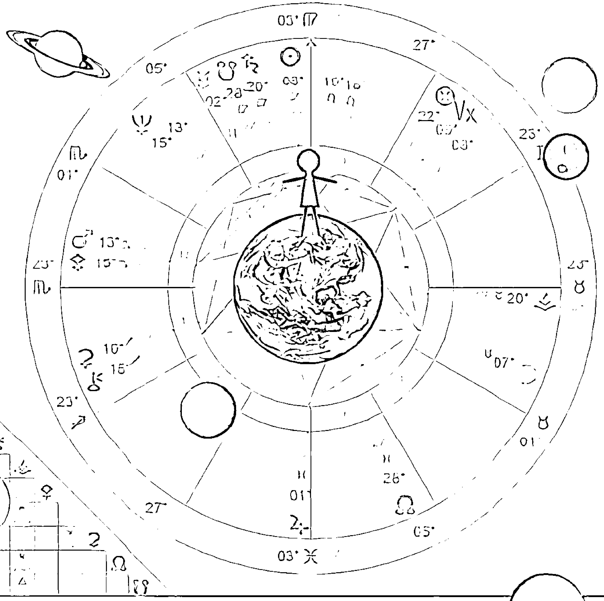

| 行星/点 | ♈ | ♉ | ♊ | ♋ | ♌ | ♍ | ♎ | ♏ | ♐ | ♑ | ♒ | ♓ |
|---|---|---|---|---|---|---|---|---|---|---|---|---|
| ☉ |   |   |   |   |   |   |   |   |   |   |   |   |
| ☽ |   |   |   |   |   |   |   |   |   |   |   |   |
| ☿ |   |   |   |   |   |   |   |   |   |   |   |   |
| ♀ |   |   |   |   |   |   |   |   |   |   |   |   |
| ♂ |   |   |   |   |   |   |   |   |   |   |   |   |
| ♃ |   |   |   |   |   |   |   |   |   |   |   |   |
| ♄ |   |   |   |   |   |   |   |   |   |   |   |   |
| ♅ |   |   |   |   |   |   |   |   |   |   |   |   |
| ♆ |   |   |   |   |   |   |   |   |   |   |   |   |
| ♇ |   |   |   |   |   |   |   |   |   |   |   |   |
| ⚸ |   |   |   |   |   |   |   |   |   |   |   |   |
| ☋ |   |   |   |   |   |   |   |   |   |   |   |   |
| ⚙ |   |   |   |   |   |   |   |   |   |   |   |   |

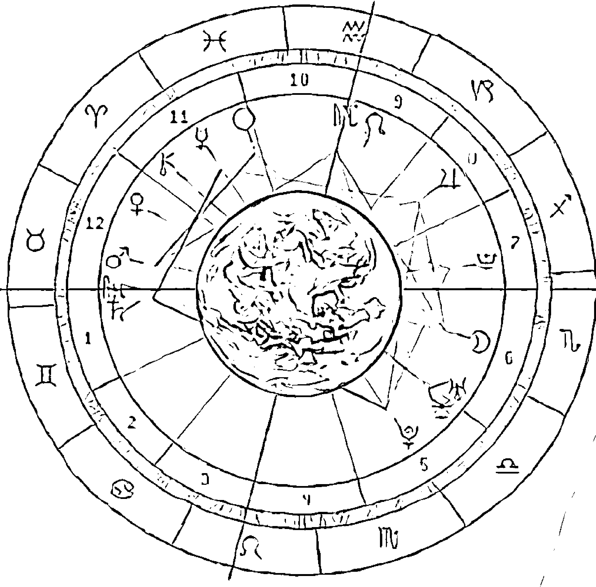

## 占星學其實很簡單！
### ASTROLOGY

在現在命理充斥的環境中，12星座幾乎成為共同流行文化。每個人第一次認識的話題，也多半是你是什麼星座？彷彿12個星座就可以包含一切，這造成了很多反對者的基本論述，難道全世界只有這12種分類嗎？真是如此嗎？

為什麼他明明是處女座卻這麼活潑？為什麼書上明明說雙魚跟巨蟹最配，但是我們卻爭吵不斷？電視上說今年金牛走財運，怎麼我反而股票被套牢？為什麼？因為星座只是一種唬人的遊戲嗎？？？

當然不是！因為他們只是不了解占星學罷了！

其實12星座只不過是占星學中的一小部份，現在人人談論的星座也不過是占星學中的太陽星座而已。除了太陽星座，每個人還有看內在情緒的月亮星座、看你思考模式的水星星座、看你愛情的金星星座…等等不同層面的行星特質，還有縱貫整體命運的上升星座、還有事業運、財運、婚姻運、家庭運…，還有什麼時候會走好運？什麼時候會走壞運？兩個人配起來合不合？這些都是占星學的領域範圍。

筆者學習占星有一段時間，發現到市面上要不就是充斥著膚淺成份居多的12星座學；要不就是整本文字密密麻麻，看起來艱深困難的正統占星學，讓很多初學者望而卻步，以為占星學是多麼難的東西。

其實占星學一點也不難，它非常的淵深，但是也非常的容易理解。因此基於這一點，筆者決定以自身所學，搭配自己10年的職涯專業，嘗試將占星學用最容易理解的說明方式，配合大量的圖示，一步步的介紹給讀者。這一系列的占星學書籍分為入門篇、進階篇、本命分析篇、流年大運篇、合盤篇等等。本書為此系列第一本，占星入門篇期待讓讀者完整的了解占星學的基礎架構、法則，學會簡單的運用占星學來算命的方法。

占星學的好處是非常多的，它可以讓你了解自己、分析情勢、也可以運用它來了解別人，甚至運用占星學預測股市、國家大事。出版這一系列書籍的目的主要在拋磚引玉，讓這一門有趣的學問能得以推廣。期待能有更多的人能夠學會這個好用的工具。筆者並不是算命師，只是試著讓大家也能夠輕鬆的進入這個神秘又有趣的空間，透過這一系列的書，能夠讓更多的人懂得如何了解自己的命運、進而掌握自己的命運！

人人都應該學會算命，只要你願意，算命根本不須依賴別人，因為天底下最了解自己的不會是別人，就是你自己。而透過本書的學習，你將可以輕鬆的掌握住占星的訣竅。了解自己的命運軌跡，了解自己的潛在能力，甚至了解你的對手、你的愛人，輕鬆掌控自己的命運！

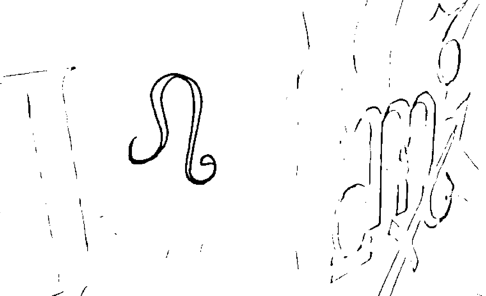

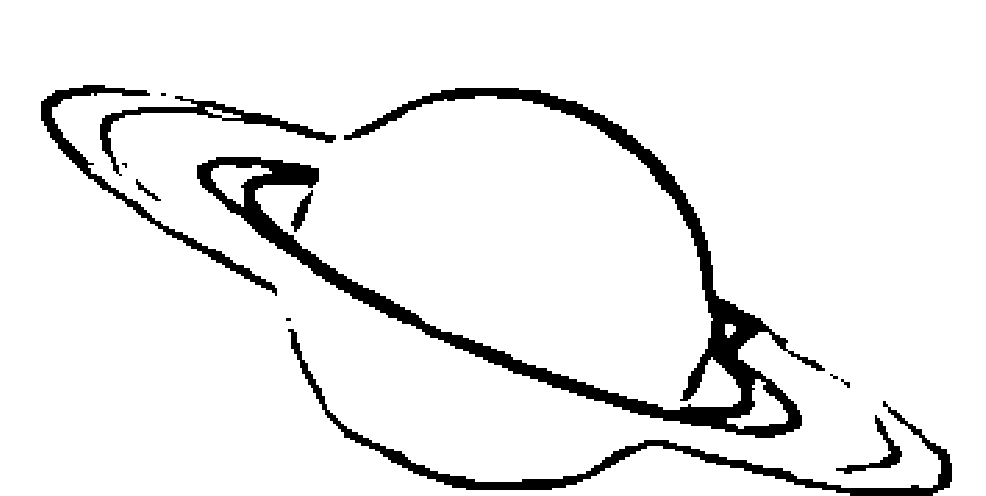

## [占星學]
ASTROLOGY

- 1-1 占星學是什麼？
- 1-2 占星學的歷史
- 1-3 占星學與天文學

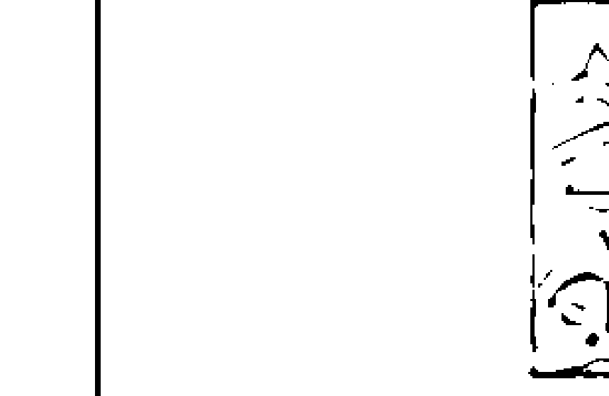

## [出生圖]
BIRTH-CHART

- 2-1 出生圖的內涵
- 2-2 占星學的符號
- 2-3 占星學的分類法
- 2-4 十二星座
- 2-5 十二宮位
- 2-6 行星系統
- 2-7 相位分析
- 2-8 解盤法則

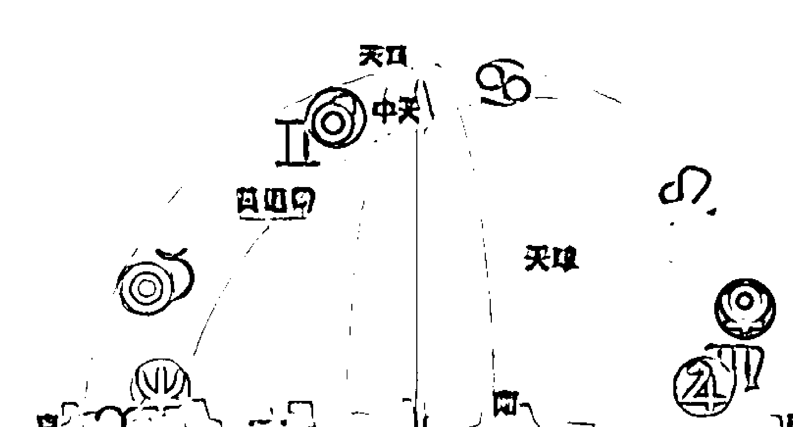

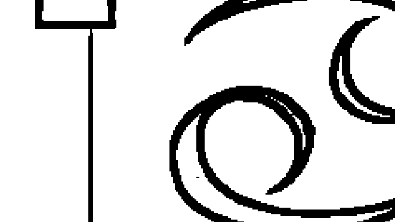

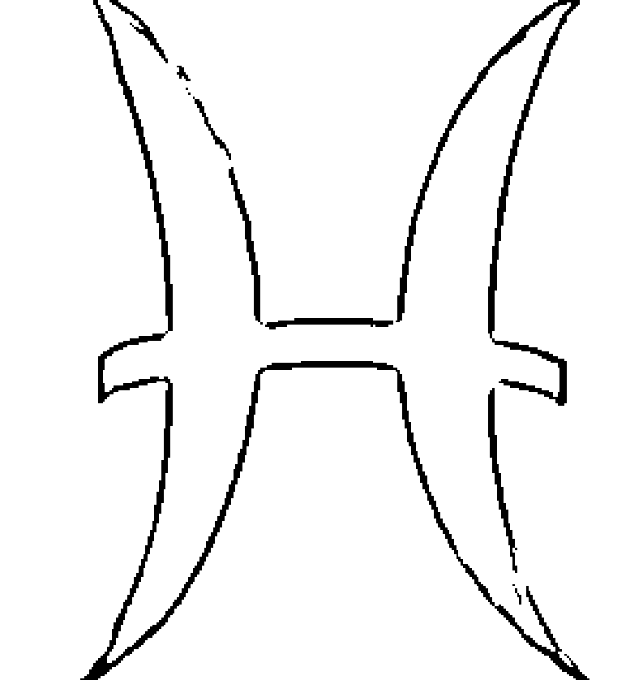

- 關鍵詞表
- 中英對照表

## [軟體使用]
SOFT

- 3 如何弄出你的命盤

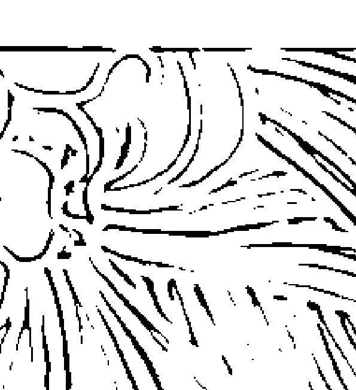

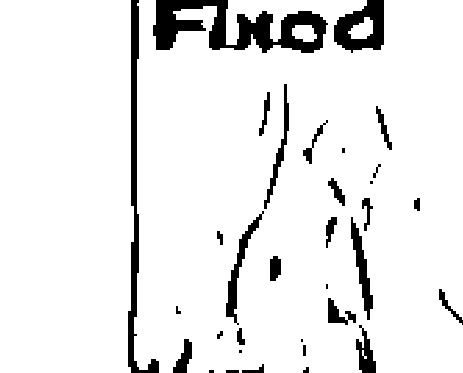

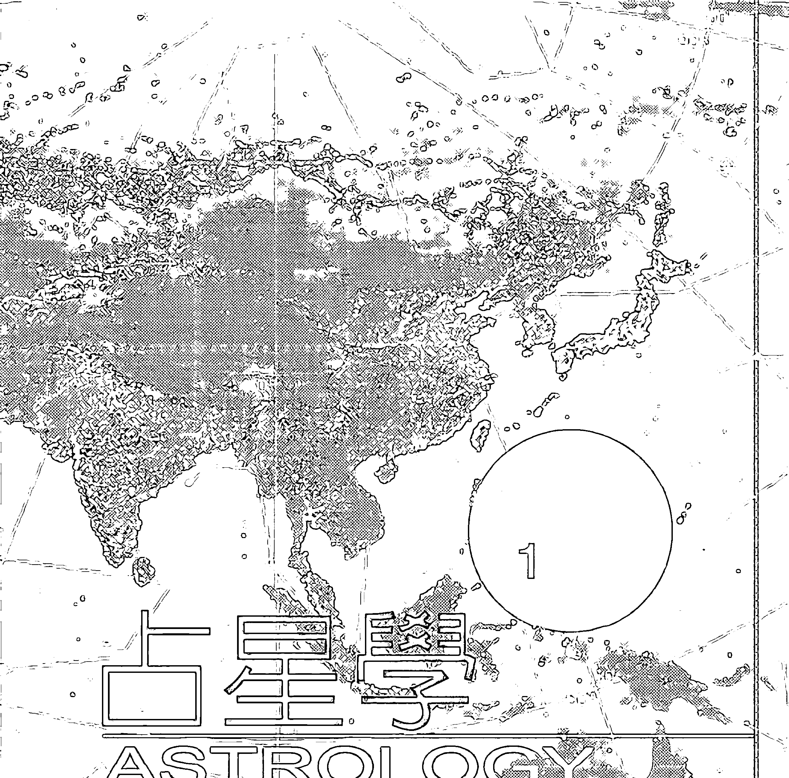

## 占星術
ASTROLOGY

自古以來，天上星星就引人無限遐想。人類也發現天上的星星和地球的生命之間似乎有某種關聯。在農業社會中，人們全是依天而活，然而自然中的風雲變化、水、火、冰、土全是無法抗拒的。人們漸漸的發覺到日月星辰的運轉、萬物興衰，甚至和人的人格命運，都有著若干微妙的互動關係。

# PART 1-1

## 占星學是什麼？ WHAT IS ASTROLOGY?

占星學是什麼呢？這是一個不容易回答的問題，它包含了神話、天文學、數學、哲學、預言與宗教。自古以來，人們就發現到地上的生活事物與天上的日、月、星辰間似乎有著某種特殊的關連。在點點繁星中，他們發現到有幾顆星星是特別的，它們沿著一條特殊的軌道（黃道）前進，有時會後退，有時彼此會合。漸漸的，從歸納與想像中，發展出來了一套學問，這就是占星學。

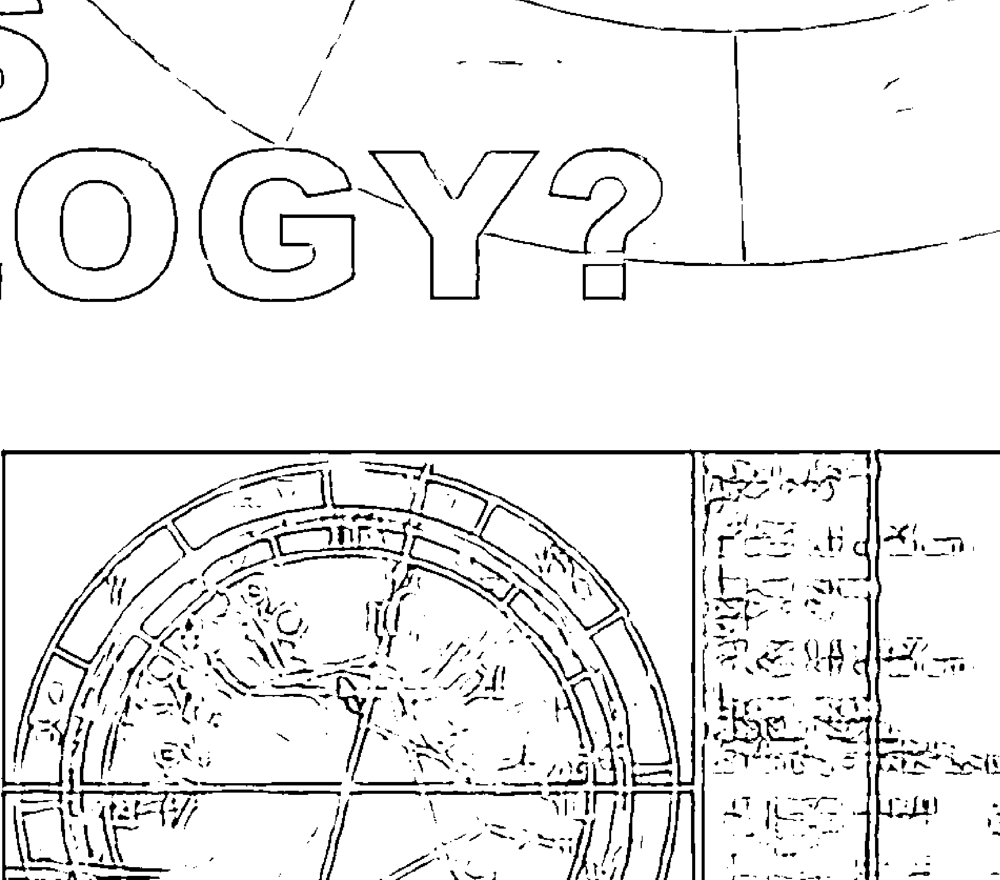

這幾顆特別的星星就是我們所熟悉的太陽、月亮、水星、金星、火星、木星、土星。它們在不同的文明中都同樣被賦予重要的神話角色。占星師利用這些行星的位置關係來預測人事，從星盤中行星的分布來看出一個人一生的際遇。

從Astrology這個字來說，Astra是星星的意思，而Logos是邏輯，因此簡單的說，占星學就是星星的邏輯法則。進一步來說占星學是：

- 1. 占星學是一套符號語言：用最基本的方法來看，可以將占星學視為一套符號語言，這套符號系統主

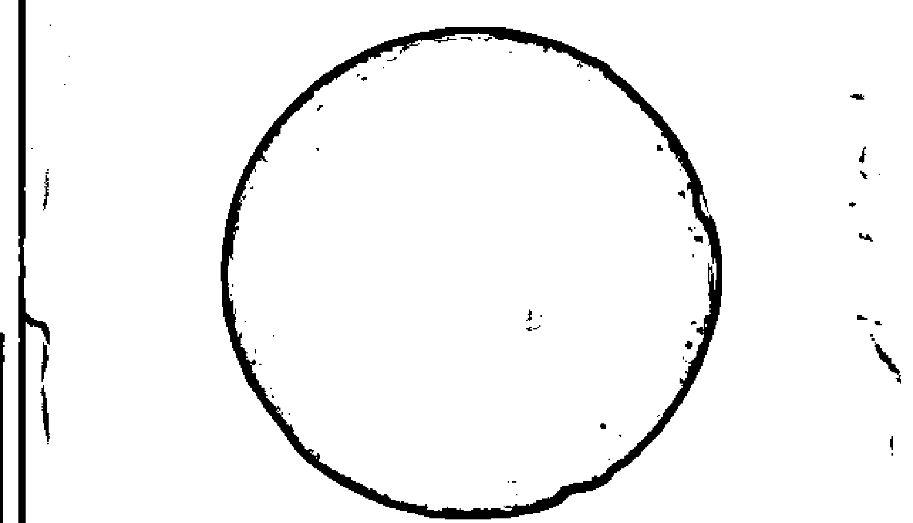

上天如此，地下如是

在古時候，每當彗星出現或當日、月蝕出現時，通常都代表某種災難的出現。易經上說：「在天成象，在地成形」，天有此象，地就有此形。

主要在描述地球与其他宇宙星体間的關係，而最主要的部分则在希望了解，宇宙的其他星体对地球的影响，进而如何影响到地球上的万物。

- 2. 占星学是一种分析工具：占星学可以當作一種工具來使用，運用行星與地球的感應關連性，在各種事物層面上，都可以以占星學的角度來進行分析。
- 3. 占星学是一种思考方式：占星學除了實用的部分之外，也有一套自己的邏輯，而這一套邏輯就是一種思考方式，一種哲學態度。

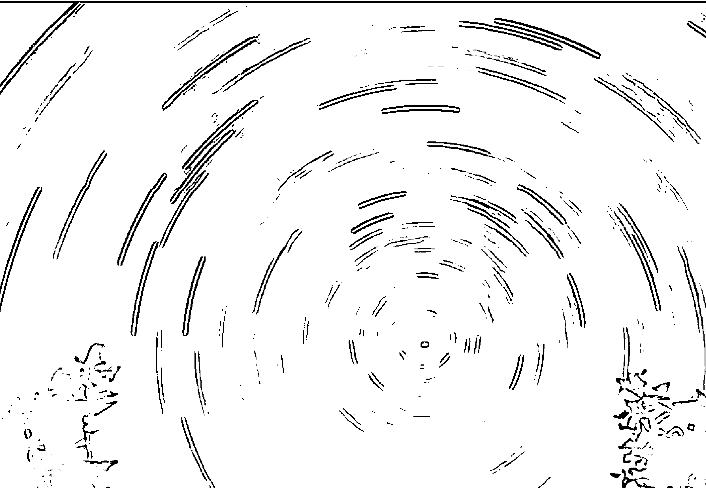

行星和地球的生命互相連通

在農業社會中，人們依天而食。自然中的風雲變化、水、火、冰、雷全是無法抗拒的。人們漸漸的發現到，日月星辰的運轉、萬物興衰，甚至於人的人格命運，都有若干微妙的互動關係。

# （行）星（才）是（主）角

每個人出生時，太陽系中的九大行星、太陽、月亮及介於火星與木星中間的小行星帶，它們當時所處的位置與彼此間的相對關係，會引發特別的反應，這樣的象徵會對應於人生的一切現象，對人產生特別的影響，同時賦予當下時刻特別的意義。

二十世紀心理學大師榮格（1875～1961），他提出的同時性理論，說明同一時間點上看似不相關的兩件事物，卻有著相同的意義。同一時間點星盤間的對應往往與人的現實對應擁有相同的含意，因而並非行星影響了人，而是彼此具有相同的關連。

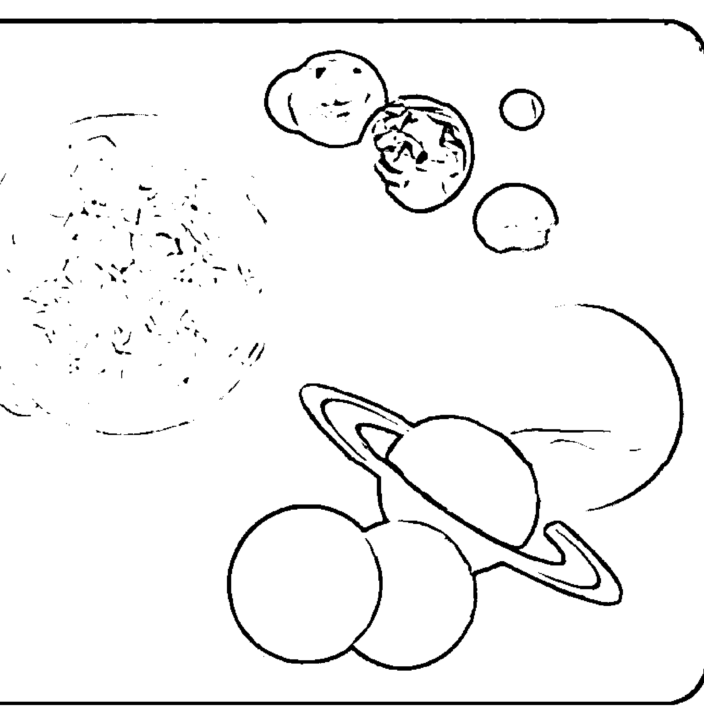

沒有一個時間的行星位置是一樣的，也就是說每一個時間都是獨一無二的，因此，每一個人的出生圖也都是獨一無二的，都有它特別的意義。

從地球上來看，所有的行星跟隨著太陽在一條特別的環帶中運行，這條環帶我們將它稱為黃道，在這條環帶古人將它分成同樣大小的12個區域，將這12個區域內的恆星連結，賦予各自的名稱（即12星座），代表著十二種不同的基本原型。這是上帝留給人類的自然密碼，每顆行星所影響人的主要特質部份也不相同，而當這些星球運轉產生各式各樣的變化組合時，我們也就可以看到個人的行為及命運的變化軌跡了。

因此，在占星學中，行星才是一切變化的依據，而非一般人討論熱烈的星座，我們研究占星學，就是要看行星間的互動變化，因此，行星才是主角，是學習占星觀察的依據。

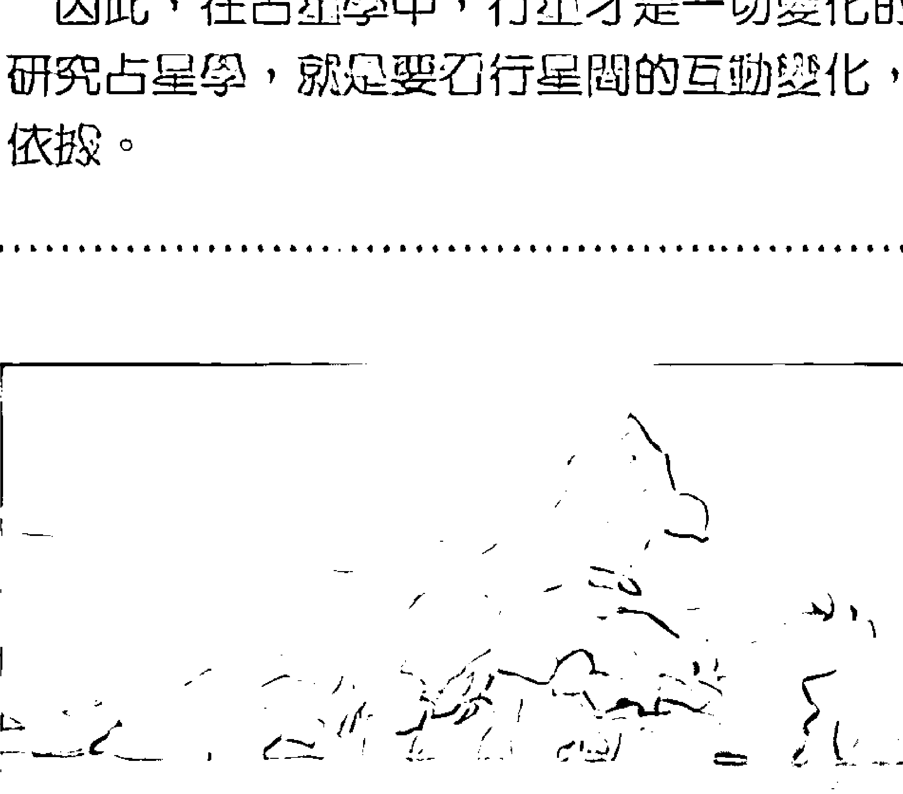

# 人類的潛能

科學家研究，人類使用大腦的功能可能不到十分之一，就像冰山一樣，真正浮出水面的部份其實只有整體的一小部份。人的意識即受到廣大潛意識的影響，而運用占星術，我們可以更加了解自己的潛能，了解自己潛在意識的傾向。

簡單的說，占星術到底是什麼呢？

太陽從日昇到日落對應到一個人的一生，月亮的陰晴圓缺就像人生的起伏變化，從美麗的金星聯想到美好的事物，跑的快的水星象徵了思想的快速變化…，這一切的巧合似乎有著冥冥中的道理存在。

占星術就是研究行星與人之間如何相關連的學問。行星在什麼宮位、什麼星座，會對小至個人、大到世界有什麼樣的對應。行星與行星產生了相位的交互作用時，對每個人會產生什麼對應的影響，什麼行星對應人的什麼部份？我的行星與你的行星有了反應時又產生什麼影響？當天上的行星和我們的行星產生了相位反應，又將造成什麼樣的影響？
這就是占星學關心的東西！

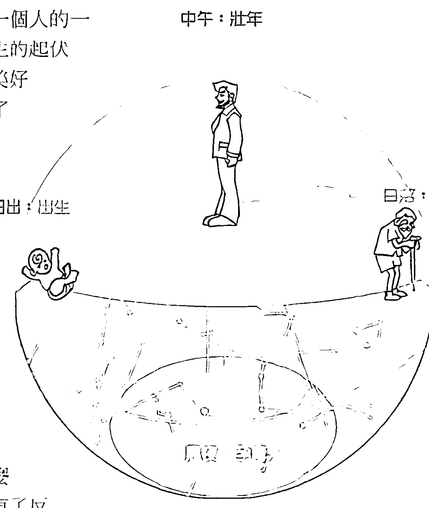

人生循環

人的一生從孕育到呱呱墜地，經過青春期成長茁壯，到中年時功成名就，然後開始衰敗，步向老年、死亡的過程，就似是太陽一天的經歷一般。從日出迎出曙光，正午光芒萬丈，直到日落西下，然後再到黑夜，準備醞釀第二天的開始，就似是生命的整個過程。

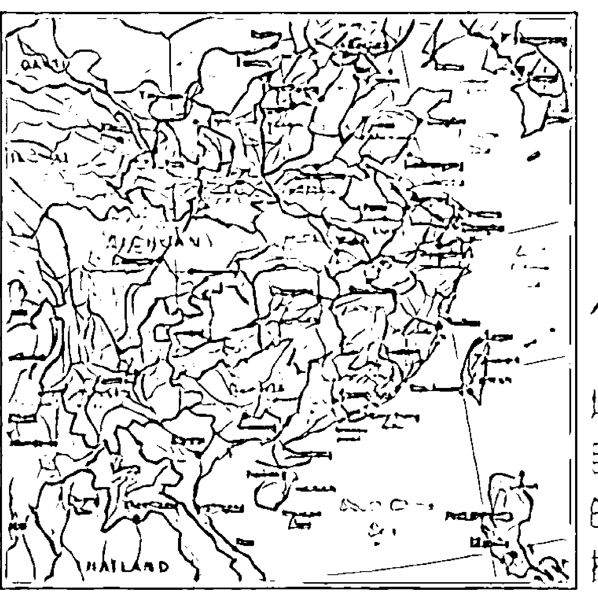

人生地圖

個人的星盤就好比是一張人生地圖，地圖越詳盡，越能找到我們希望達到的目的地。因此，越是能解開星圖中隱含的密碼，就越能了解自己的人生方向，找到人生的目標。

原始時代的神話
埃及天空女神。她伸展四肢，俯臥於丈夫大地之神的地平線，口上口接太陽神乘坐的船。從日出前向日落。每天早上太陽神誕生為嬰兒，中午成長為偉大的神，到黄昏衰老死去。因此，所有的占星術，都將太陽一天中的自出到自落的過程，比作人生從生、成年到老年的過程。

# PART 1-1 占星學的歷史 HISTORY

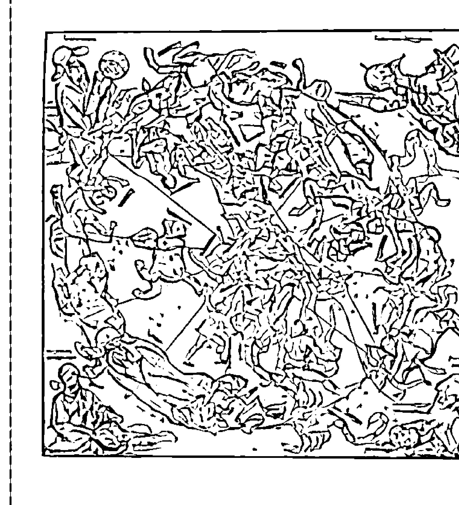

# 占星術起源

占星學的起源為何？因年代久遠已不可考，但從古老的傳說及流傳下來的文獻，可追溯至上古時代。

早在紀元前三千多年前，在幼發拉底河與底格里斯河所沖積出來的美索不達米亞大平原上。當時的古代遊牧民族，把對天體的觀察，從日昇日落、海的潮汐以及四季變化等等自然觀察中，首先發現到太陽、月亮及五大行星的特殊性。結合了對天體的崇拜，以及人類原始的信仰，漸漸發展出一種占卜的形式，形成為今日占星學的基礎。

當時利用觀察天體來預卜天氣、農作物的收成，慢慢的擴及大自然和人類的一切變化。

一直到了紀元前六百多年前，迦勒底人建立的新巴比倫王朝時，對占星學作有系統的歸納及整理。迦勒底人對於數學及曆法有其獨到的成就，我們現在所使用的曆法就是當時迦勒底人的占星師所創製的。現代西方文化中，結婚典禮之後的蜜月旅行，也是他們首先採行的，這是一種占星學的儀式，意義是共同開創幸福之門。

到了紀元前五世紀左右，黃道分成十二個30度的宮位已經確立，目前已知最早的占星圖出現於紀元前409年。後來隨著亞歷山大的東征，

> ○屈雅
馬雅人在星象上的發展極為出色，他們有一套特別的計算方式，以一個13×20的循環，產生的一個52年的週期。他們依據這個神聖的週期來預言未來，確定重大事件的時間。這不禁令人聯想到中國的天干地支，一個12×10，60年的循環。

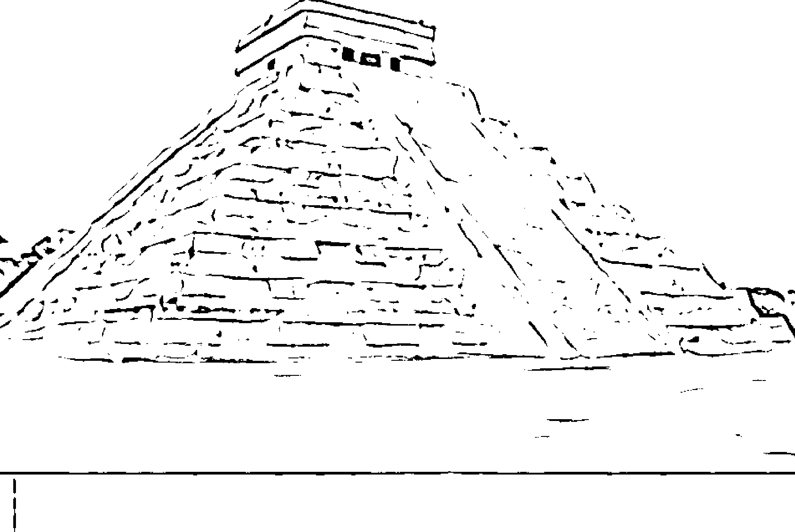

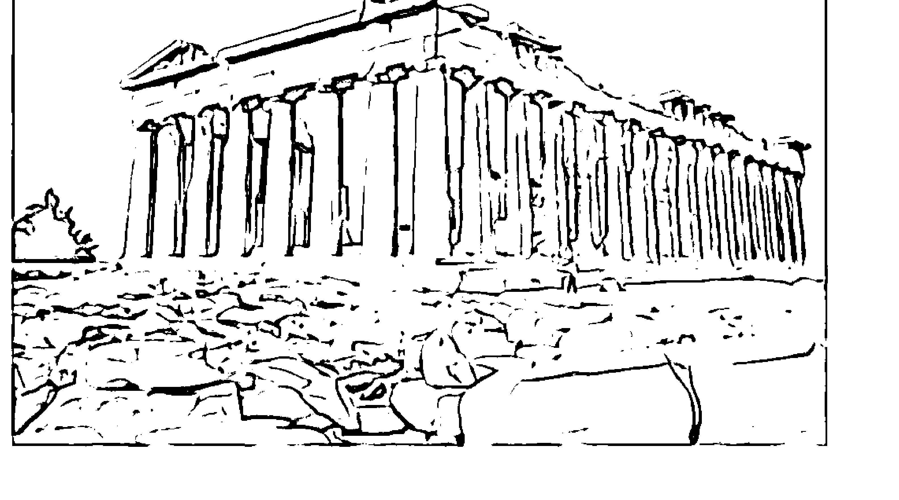

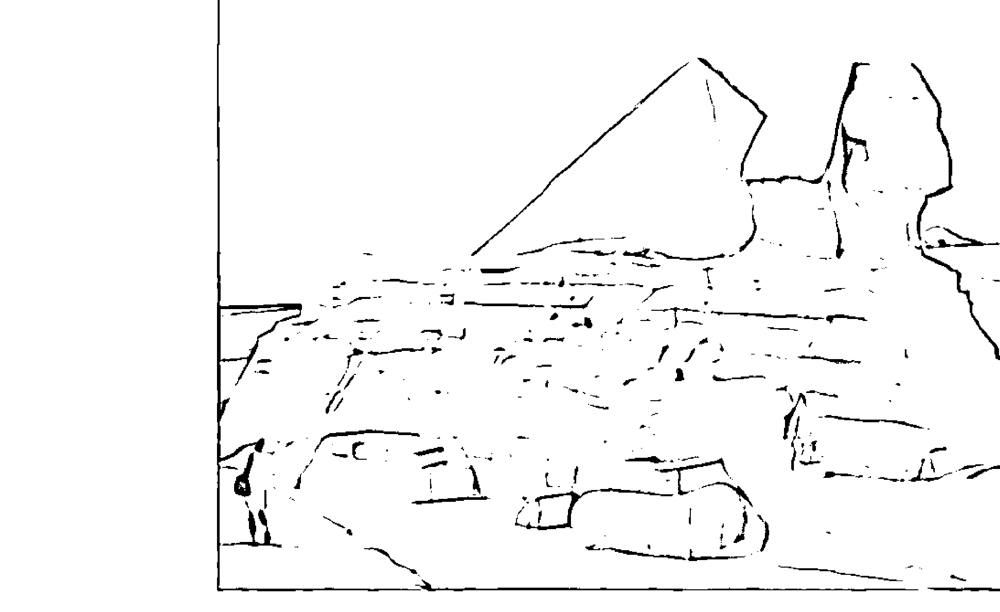

# 有趣的新發現

星座的發源似乎更為久遠，它也許是上古文明的遺留物。從人面獅身所代表的獅子座與春分點的移動配合，星座告訴了我們時間。一萬多年前，某些人建造了人面獅身像，有趣吧！

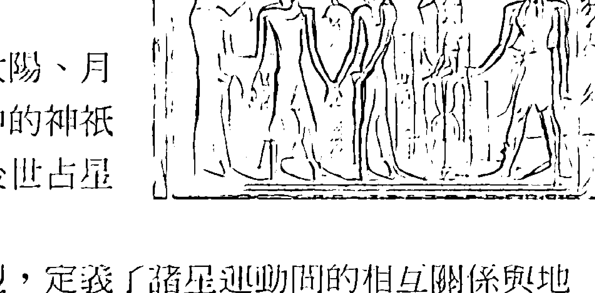

占星學也融入了希臘文明，希臘人將太陽、月亮及太陽系諸行星對應於古希臘神話中的神祇。這些希臘天神的拉丁文名字遂成為後世占星學所共通採用。

占星師根據天文學家提出的宇宙模型，定義了諸星體間的相互關係與地球的假想距離。他們將行星、黃道、十二星座與世間諸物建立一個完整的對應關係，於是占星學的應用就愈來愈廣了。柏拉圖提出上帝如何以四大元素一火地風水來創造世界，托勒密（西元100～170）可說是占星歷史中最重要的人物，在其著作《四書》中占星學的架構與原理已經奠定了基礎，他假定星象的效應具有週期性與獨特性；人世間的收割、災荒、地震、洪水，以致戰爭均有一定的週期循環，而這些「成果」早就受孕在一顆特定時間的種子中。

# 阿拉伯占星

阿拉伯延續了西方占星術的發展，是由於基督教對占星術的打壓。一談起「阿拉伯占星學」，自然不能不提「阿拉伯點」(Arabic Parts)。現在的占星學上，也常用到幸運點、婚姻點和死亡點等三個很重要的參考點。由於阿拉伯的地理

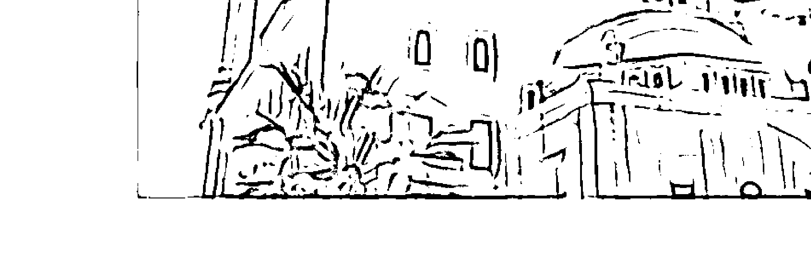

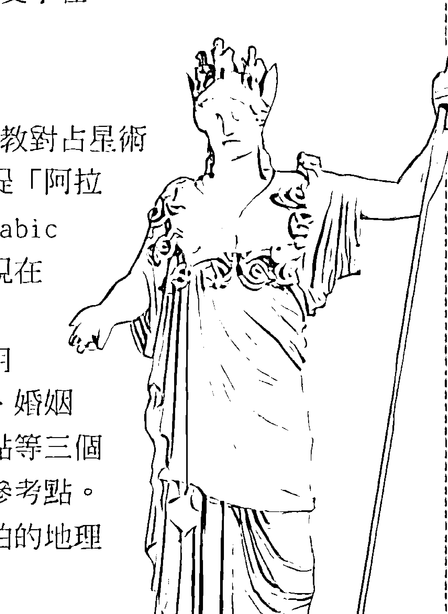

# 星座的由來

古代人為了方便在航海時辨別方位與預測天象，於是將散佈在天上的星星運用想像力把它們連結起來，由於占星學的發達區域多半在北半球，因此北半球容易觀測到的48個星座在希臘大天文學家托勒密的時期就已命名了，命名的方式多依照古文明的神話與形狀的附會（包含了美索不達米亞、巴比倫、埃及、希臘的神話與史詩）、另一半（大部是在南半球的夜空中）是近代海洋探索時命名的，因此多半使用航海的儀器。因為地域的不同，所以“連連看”的方式也就不一樣！像中國的北斗七星就是包含在現今的大熊星座中，目前世界已統一星座圖，將天空劃分為八十八區八十八個星座。

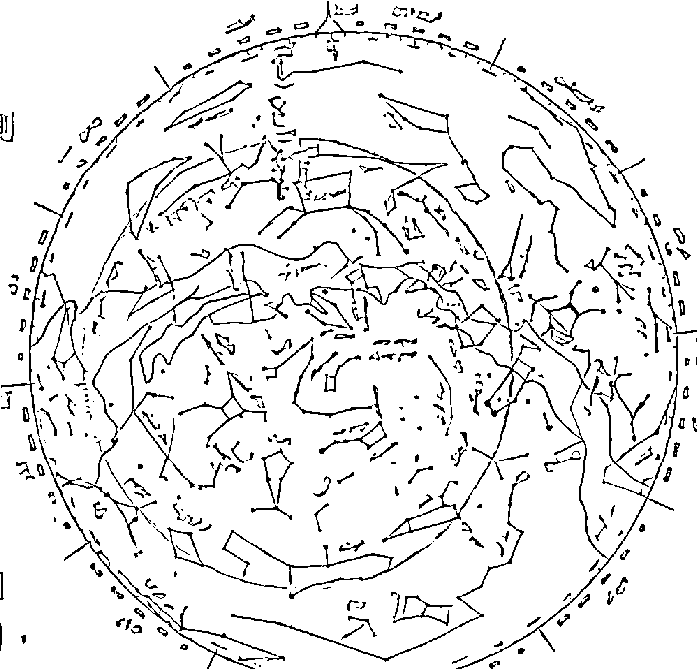

二千多年前希臘的天文學家希巴克斯（Hipparchus，西元前190～120）為標示太陽在黃道上行進的位置，就將黃道帶分成十二個區段，以春分點為0度，自春分點算起，每隔30度為一宮，並以當時各宮內所包含的主要星座來命名，依次為牡羊、金牛、雙子、巨蟹、獅子、處女、天秤、天蠍、人馬、摩羯、水瓶、雙魚等座宮，稱之為黃道十二宮。總計為十二個星群。在地球運轉到每個座宮時所出生的嬰兒，長大後總有若干相似的特徵，包括行為特質、個性等。將這些聯想運用豐富的想像和創造力串聯起來，便使這些星群具象化了；再加入神話的色彩，成為文化的重要部份。這套命理演進、流傳至今至少五千年的歷史，它們以這十二個星座為代表，這些星座就成為十二種基本原型的代表象徵。

現今一般大眾所談論的「12星座」其實只是占星學中所指的太陽星座而已，是以地球上的人為中心，同時問到太陽運行到黃道十二座宮上哪一個星座的位置，就說那個人是什麼星座。但是由於春分點的逆行，實際上已經對應不起來了，12星座成了一種概念東西，而非指對應到的天上星群。

位置容易與歐亞非各地展開交流，也因此在古阿拉伯的文化體系中，大量地吸收了埃及、波斯、印度、古基督教、迦勒底、中國、希臘、古代鍊金術等文化內容，然後融鎔成獨自一格的阿拉伯占星文化。而後經由阿拉伯的占星學家將各古老文明的占星學研究心得作了整理，直到近代又重新傳回歐洲。

# 印度占星學

印度占星學雖與歐洲同源，卻發展出不同的體系，它是以論斷事件為主。印度占星學是跟數字息息相關的，它熱衷於神祕數字的探討，特別是4與9這兩個

數字。自古口耳相傳的《吠陀》勾勒出諸神的故事與占星知識。它採用恆星黃道系統，重視月亮的交點，以及一種二十七宮的分類系統。由於印度保有了許多古老的占星理論，現代西方占星學家因此受到印度占星學的論法啟示，而開闊了新的論法和見解。近廿幾年來，西方的神秘主義研究者，一直熱衷於神秘數字的探討，特別是在廿世紀以後，印度占星學家與西方占星學家不斷地進行交流、切磋，同時也修改了某些古印度占星學的看法。

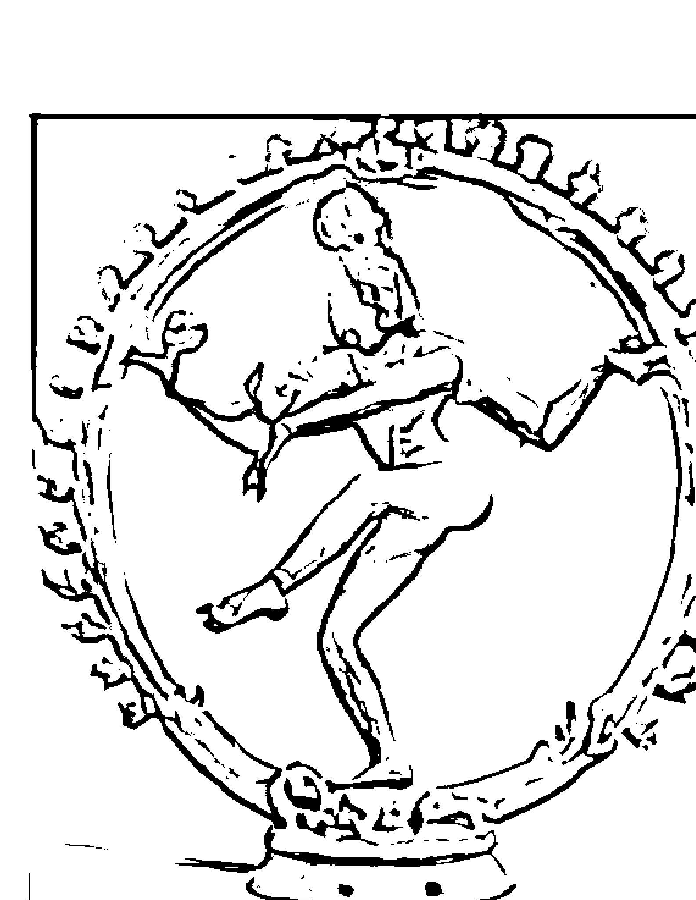

# 中國占星學

中國的占星系統跟西方有所不同，自古以來，易經是所有學說的基礎來源，進而推演出陰陽、五行、八卦、天干、地支所形成一種以60為輪迴單位的體系。中國占星學在春秋戰國時就已經很發達，中國占星術將黃道帶的星區分為28宿，用來觀察日月五星的運行變化，並且重視恆星的象徵，對於北斗七星及北極星至為推崇。魏晉南北朝時，印度占星術傳入中土，結合了中國陰陽五行、28宿而衍生出的七政四餘占星學。而另外又由此推演，發展出以虛星為論斷體系的紫微斗數。但由於當政者的害怕與禁止，使得占星成為少數人的特權，進而造成中國占星學的沒落。

# 現代占星學

占星術曾一度因為科學的發展而沒落，但發展到現代又因為結合科學的概念而有了新的技術發展與進步。中點理論、泛音盤、合盤，以及結合心理分析都為占星學賦予新的生命。中點理論是由德國占星學家Alfred Witte和Friedrich Sieggrun創立的漢堡學派所提出。它的論斷技巧中認為兩個行星或敏感點的中點具有重要性，特別強調中點的概念。同時他們認為行星的凶相比吉相位來得更為重要，更足以呈現出事件的徵象。隨著往後的陸續發展，漢堡學派中的行星中點概念，而到現在占星學的研究趨勢，中點的論斷概念除了合盤的論斷受到重視以外，在職業、健康和發財，甚至死亡的預測上，也有許多的占星學家應用中點來作論斷。甚至有關股市的預測，更是相當廣泛地應用了中點來作推測。

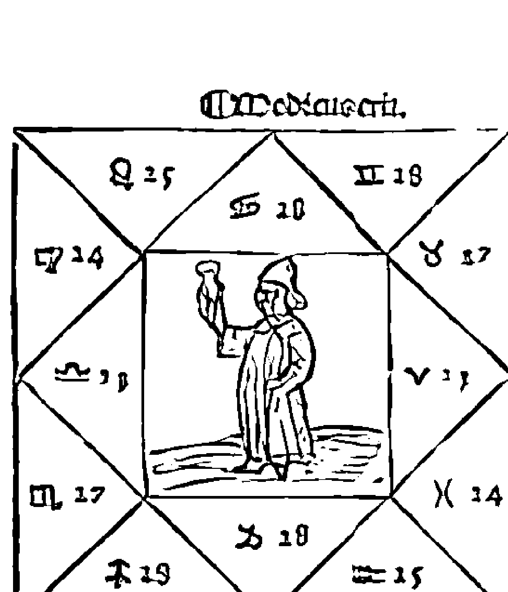

○古代的方形星盤

# 占星學 1-2 HISTORY

泛音盤為英國約翰·愛迪所提出，他從印度占星學的分盤技巧得到啟發，開創出一種新技術，用來更加精細的分析命盤的內在含意。運用數學的分割，將星盤一層層的刻開，來看出星盤內藏的訊息。

容格可以說是現代占星最重要的一個人，他重視符號與圖騰的象徵，並試圖將占星與心理學做關連，而他所提出的許多心理學概念，如陰影、原型意象、集體潛意識…等，以及同時性發生的非因果關連理論，為占星學重新注入活水，也指明出一條現代占星的新發展方向。

法國高誨林博士在他著名的「火星效應」實驗中將570位優異的運動選手的火星分布放入星盤中，如果是同等機率，那分佈應該趨向圓形，但是結果不然，而是呈十字形，尖端集中在4角附近，有趣的是，他原先是要破除占星學的，卻反而為占星學打了一劑強心針。

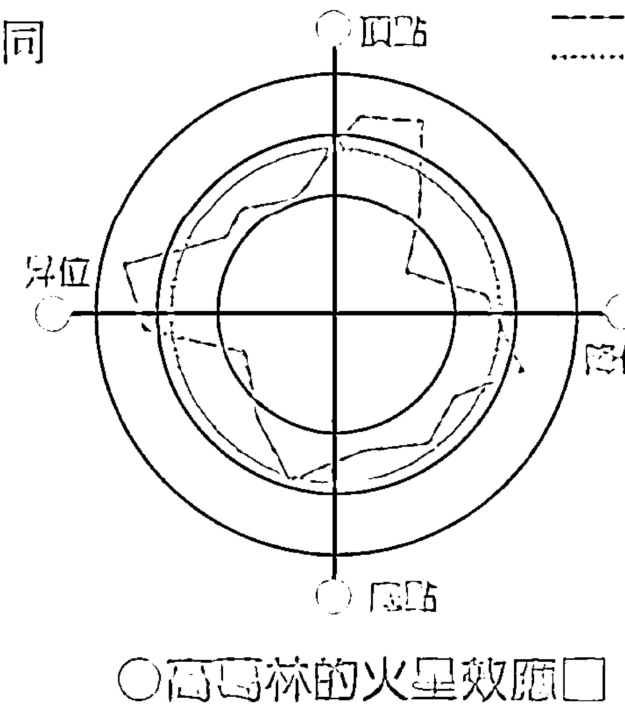

## 學習占星學的好處在哪裡？

二十一世紀的今天，占星學更是蓬勃發展，各種門派與新的理論相繼提出，但是我們為什麼要了解占星學呢？他對我們有什麼好處呢？

- 1. 了解自我：
  在占星心理學已十分發達的今天，利用占星學來了解自己，從星盤中看出自己的本質與問題，了解自己的天賦和潛力，可以讓自己更誠實的面對自己，改正自己的缺點。

- 2. 人際關係：
  運用雙人星盤的配對來看出彼此間的問題點，緣份與適合度，運用占星學幫助你了解自己，也幫你了解別人，讓人際關係更圓滿。

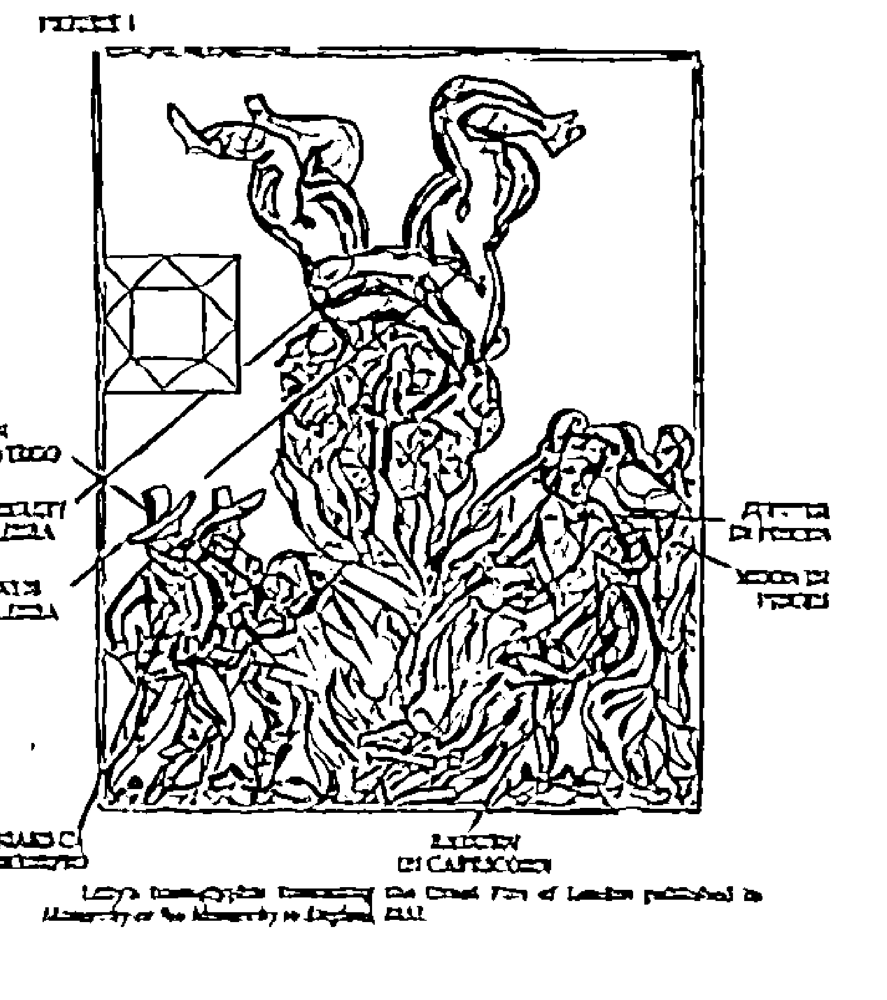

- 3. 生涯規劃：
  利用運行星與本命星的配合，了解未來的運勢發展，知道何時進、何時退，讓自己對自己的未來更有計畫。

## 占星學的應用主流

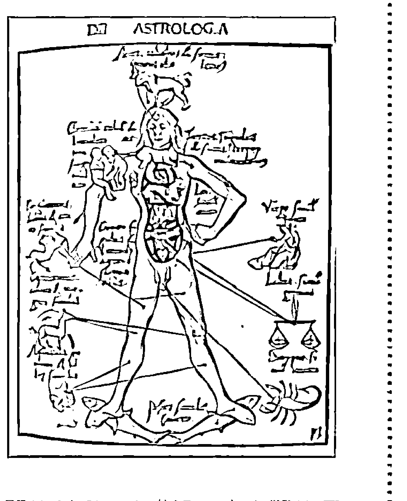

### Natal Horoscope (本命占星學) :

這是最常見的個人命盤推斷，運用個人的星盤來解一個人的個性、潛能、適合的工作、六親關係、婚姻、愛情等等特質狀態。所以個性決定命運，從命盤中可以分析出一個人的優缺、心理層面的偏向，進而順應其天生的屬性，發展完整的自我。再利用運行星與本命星的互動來作一生趨勢，或者是大運流年方面的論斷，針對個人一生的整體狀況來作論斷，推断自己最適當的時候，何時結婚、何時高升、何時考運佳、何時愛情運會到、何時是發財良機等等，一生中順境與逆境的時期。

### Synastry Horoscope (配對占星學) :

配對占星學是20世紀發展的重要技巧，運用兩張命盤彼此行星間的對應，來準確兩人之間的互動關係，透過這樣的分析，可以瞭解到情侶、六親、朋友、上司下屬彼此間的問題點，優缺點，進而調整彼此的應對方式，達到雙贏的局面。

### Mundane Horoscope (時事占星學) :

利用占星學來推測當前時勢狀況，如政治占星學、股市財經占星學、氣候占星學、國際局勢占星學等，主要分為自然災害和世界情勢兩大類，所有與人類生活有所關連的占星學預測都屬之。利用占星學來研究大自然的變化，如星體運行與潮汐變化的關連等，預測地球可能發生的自然現象的變化及世界整體情勢、預測整個人類可能發生的大事。

### Horary Horoscope (卜卦占星學) :

這是將占星當作卜卦來應用，就像一般所做的卜卦一樣，運用星盤內所現的資訊來決定吉凶。它的判斷是依據天體的星象，同時包含某些事件之前因後果的解析。他的原理是認為特定時間具有特定意義，任何重要的時刻或是一個意念閃現決定的時刻都可以拿作起盤的時間，基本上跟卜卦的原理沒有兩樣。同樣的，一件事只能占問一次。

### Election Horoscope (擇日占星學) :

跟中國傳統的八字擇日相同，其原理是選擇行星位置相皆吉利的時間，來作為某一事件開始的時間，如此選擇最吉兆的時間作為開始的時間，以利事件可利的開展。有時要配合所要進行事項之性質加以考量，例如結婚的時刻，要配合主管婚姻的行星與宮位形成良好角度的時間。

### Relocation Horoscope (換國占星學) :

結合中國的風水概念，當同一個人處於不同位置時，星盤的命度分布就會有所不同，因此，藉由換國占星學可以為個人找尋最適合自己的地點與方位。

### Other (其他應用) :

除了以上的占星主流，在應用上還有：

- 心理占星學：用星盤作為心理治療或分析的工具，星盤就像是心的地圖，從星盤中可以顯示出原型、次人格、陰影、潛在傾向等等。
- 人格占星學：利用占星學來了解一個人的性格並預測行為的傾向。
- 醫療占星學：利用占星學來處理人的健康，何時下藥、選擇開刀時間並有助了解病因。

# 占星學與天文學 ASTRONOMY

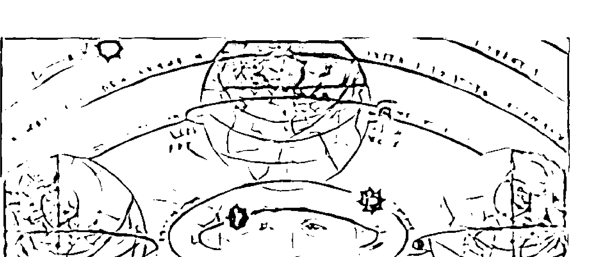

## 占星學的天文學基礎

自古占星學和天文學就是密不可分的，我們可以這樣說，五百年前彼此是同一家的，占星學與天文學就是同一件事。古時候觀測天象的人，就是因為占星的需要才去做的，沒有人專門觀測天象而不占星的。占星學和天文學可說是在同一片天空下、以不同的觀點來作研究。

科學革命之後，開始有一些科學家視占星學為古代落後的迷信，慢慢的天文學與占星學開始分道揚鑣，有趣的是哥白尼、伽利略、牛頓等有名的科學家都是占星高手。到了現在，占星學家為了更精確的知道星體的位置，大多需要有一點天文的知識作為基礎，所用的資料也都經過精確的天文運算，只可惜現代大多天文學家已失去了占星的能力。

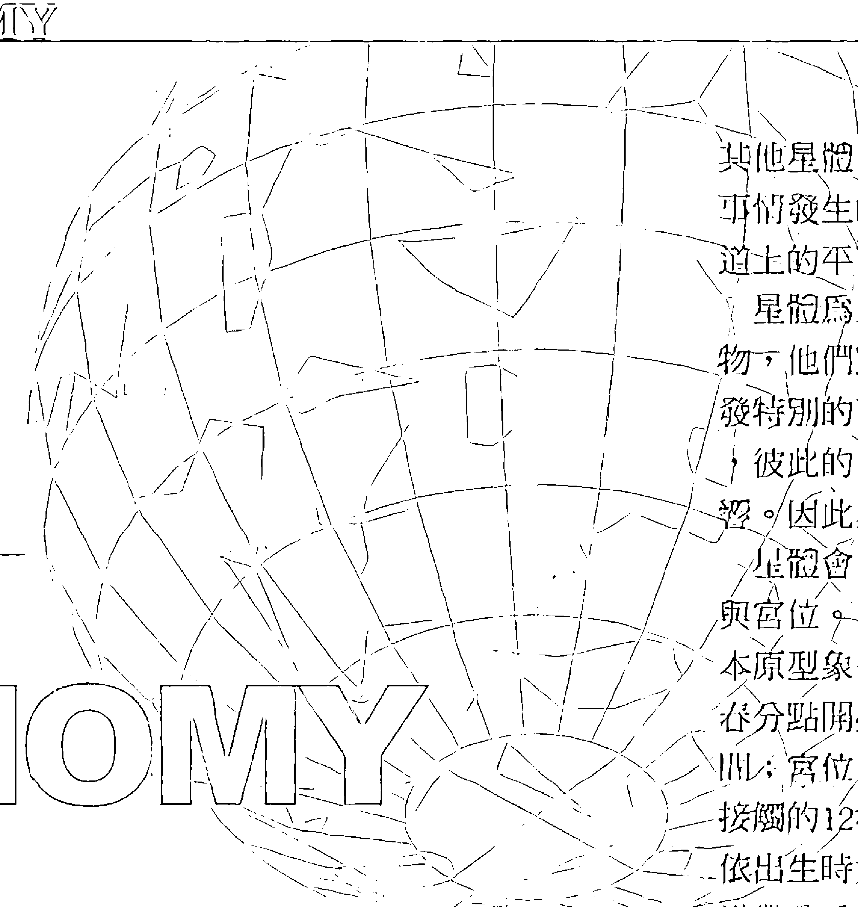

其他星體與地球的關係，所以占星學的推算都是以地球為中心的，也就是以事件發生的地點為計算的基準點。星盤圖就是將出生時行星的位置投影在黃道上的平面上，由行星間的位置與相對關係解讀一個人或全世界。

星體為影響力的來源：占星學家假設，天上的星體會影響地球上發生的事物，他們對地球具有特別的關連作用，當他們處於某種特殊位置時，就會引發特別的事件，而行星與行星間亦會發生交互作用，當彼此處於特殊角度時，彼此的作用便會出現好或壞的變化，進而對個人或世界產生潛移默化的影響。因此星體是影響力的主要來源。

星體會因為處在不同的位置（場）而發生本質的變化，這些位置就是星座與宮位。

星座代表12種基本原型象徵，是黃道帶以春分點開始十二等分的區間；

宮位則表現人與世間接觸的12種基本場景，是依出生時太陽東昇點將黃道帶分為十二等分的區間。

行星在黃道帶上運行，因此每一個行星都會落入某一個星座和某一個宮位中。

星體與星體間由地球上望去，之間會夾一個角度，當彼此出現特別的角度時，會出現某些感應，這就是占星學上所謂的相位。於是我們就依星體所處的星座與宮位以及星體彼此間的相位關係為依據推算命運。

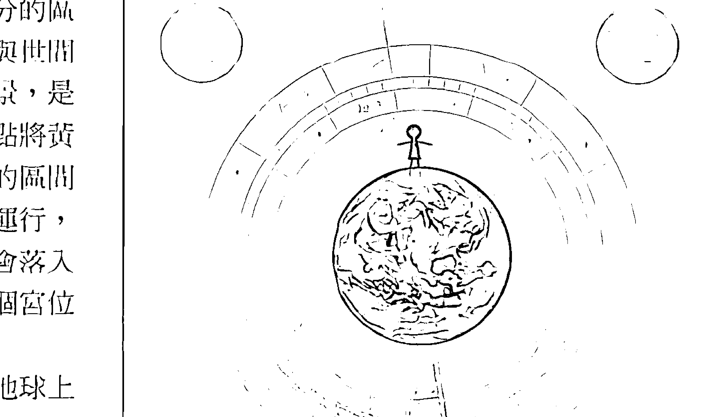

## 星盤要素

出生的季節決定了太陽所處的星座（牡羊座一定是春天天生的），而從出生的時刻決定了太陽所在的宮位（正午出生的人太陽一定在10宮），因此，太陽可以說是星盤中最重要的一顆星，代表著生命力，幾乎佔整個星盤的三分之一。

從出生時農曆的日子，就可以知道太陽與月亮的角度（農曆15日出生的人日月必呈180度角），月亮也是星盤中重要的一顆星，代表著內在的情緒。再加上東昇點與中天點，這四個重點是解讀星盤最須重視的部份。

## 行星與行星關連在星座、宮位上

雖然現在大家都已經知道，地球是繞太陽而公轉，但是占星學家所關心的是其他星體與地球的關係，所以占星學的推算都是以地球為中心的，也就是以事件發生的地點為計算的基準點。星盤圖就是將出生時行星的位置投影在黃道上的平面上，由行星間的位置與相對關係解讀一個人或全世界。

# 占星學的四大要點

## 星座 [基本原型]

在占星學中，星座所代表的意義是宇宙方位的代名詞，代表12種基本的原型及表現的形式。行星進入每一個原型的地盤後，就會受到影響，發生本質的變化。而事實上星座只是借用來表現這12種原型的替代品，而非真的指天上的星群構成的星座。這一點必須先澄清，因此，最近有人提出13星座的說法，其實只是不了解占星學的本質罷了！

## 宮位 [人生場域]

在占星學中，宮位所代表的是個人與後天環境的互動、發生動作的場所以及投入的環境。12個宮位代表著不同的人生場域，像自我、家庭、婚姻…等不同的個人與世界的互動情境。

## 行星 [作用力]

占星學中，所謂的行星是指太陽系中與我們較相關的星球，包括日、月、水、金、火、木、土、天、海、冥，以及一些較特別的小行星。它們因為離地球比較近、引力大，影響也較為直接。例如：太陽形成日夜與四季的變化，月亮的運行和潮汐及女子生理週期有關，大地震大多跟木星、冥王星及天王星發生週期，都證明了星球對地球的影響。因此在占星學中，星球是推動的力量、各種能力的展現。

## 相位 [吉凶]

相位是兩行星之間相對於地球的角度，當產生特別角度時（如：0度、180度、120度、90度是其中最重要的幾個）即成為相位，相位有吉有凶，跟神秘數字具有關連。舉例來說：180度是將星盤對切，即2等分，只有對立與互相的意識；120度是星盤的3分之一，只有和諧與穩定的意念。

# 地球 & 太陽系 SOLAR SYSTEM

## 太陽系

我們所居住的地球是位於太陽系的一顆美麗行星。太陽系是由太陽及其他環繞太陽的星體所組成，這些星體包括對地球潮汐影響深厚的衛星月球、兩個內行星-水星與金星，三個可見的外行星-火星、木星與土星，以及三個近代發現的外行星—天王星、海王星與冥王星，再加上行星本身的衛星及無可計數的小行星及彗星。太陽系在太空中就像是一個大圓盤一樣，行星的軌道是橢圓形的，行星繞著太陽以相同的方向，不同的速率繞著太陽運行。因此當我們從地球上觀察時，就會看到行星會時而前進、時而後退。而月亮是地球的衛星，它繞著地球運轉，我們稱它的軌道為白道。

# 天球、黃道、春分點

## 天球

以地球為球心，向太空無限延伸成一個假想球，稱為天球。行星沿著黃道運行，經過黃道12星座，作為行星位置的觀測與記錄。

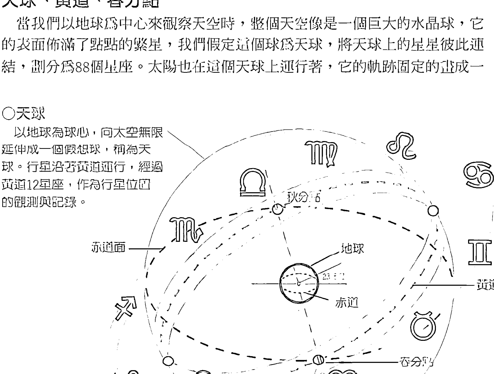

## 黃道

黃道就是指太陽在天球上運行的軌道，地球自轉軸傾斜黃道面約23.5度（亦即黃道與赤道交角約23.5度），因此造成一年當中不同的四時寒暑變化。在占星學中，所有星體的位置均是以黃道的投影面為基準，因為站在觀測者的角度來看，地球是不動的觀測點。

## 春分點

將赤道向外無限延伸的圓盤。稱為赤道面，同樣的，將黃道延伸的圓盤，稱為黃道面。赤道面與黃道面交會於兩個點，當太陽運行到這兩點時，正好是日夜等長的時候，我們將它定義為春分點與秋分點。

## 星座系統

黃道面與赤道面相交於春分點與秋分點。占星學上便以春分點來定義為黃道起點，將黃道圈分為12個30度的等分，如此定義了12個星座，當作宇宙空間方位的代名詞。春分點即是牡羊座的開始，然後依次是金牛、雙子…雙魚等12個星座。同樣的秋分點就是牡羊的對宮天秤座的開始。

因此當太陽運行到牡羊座時，也就是春分時節的開始。同理當太陽到巨蟹座時正好是夏至的開始，秋分時到天秤座，冬至時到摩羯座。舉例來說，每年7月13日太陽運行到巨蟹座，因此出生在這天的人，他的太陽星座就是巨蟹座了。有很多情況是出生在兩星座交接日的人怎麼認定呢？兩個星座一起算嗎？其實不是的。舉例，以春分點為黃道0度，金牛座的起始點是黃道30度，某一年4月20日下午3點26分18秒，太陽運行入黃道30度，所以4月20日下午3點26分17秒出生的人是牡羊座，4月20日下午3點26分19秒出生的人是金牛座。

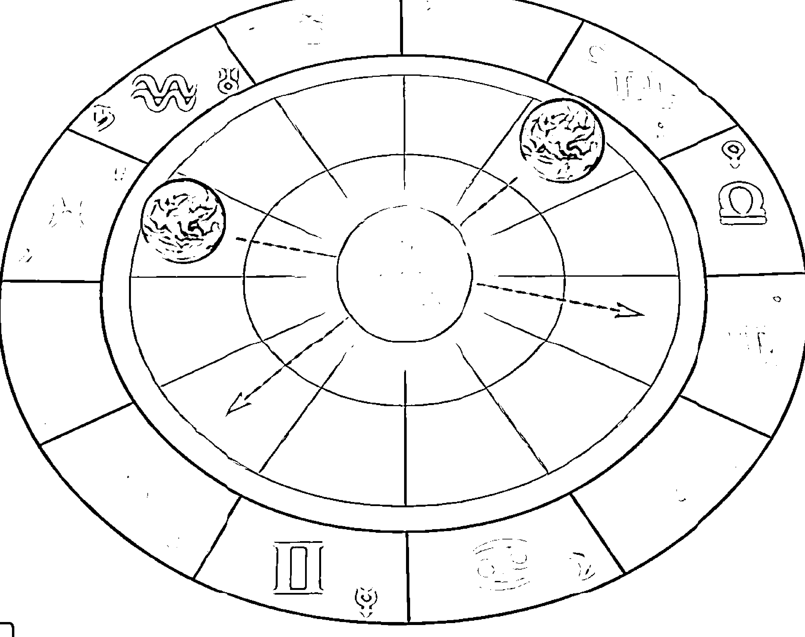

地球與太陽的關係
實際上，地球是繞著太陽轉的，因此當地球繞到某個星座時，由地球的觀點來看，太陽就在其相對的星座了，如圖中當地球在天蠍時，這時看到的太陽是在金牛。而當地球在雙魚時，太陽看起來就在處女座了！

從地球來看，月亮與行星們跟著太陽在黃道上運行著，因此同樣的，它們也會跟太陽一樣停留在不同的位置。假設某人出生時，月亮正好運行到雙魚座，金星運行到水瓶座，那我們就稱這個人的月亮星座為雙魚座，金星星座為水瓶座。其他水星、火星、木星…等星座也是依此類推。

## 將黃道帶的狀態關連到地上的事物

任何一個時間點，行星在黃道上的位置對全世界的每個人都是相同的。這個位置反映出共通性的符號語言。但是同一個時間點對不同地區的人來說他們所看到的行星方位卻不一樣。舉例來說，某一個時間點太陽位於巨蟹座25度，對每一個人來說都是一樣的，但是在台灣看到的太陽可能在南方天頂，但是在澳洲看到的太陽是在北方接近落日的位置，而在美國這時還是半夜，根本看不到太陽。雖然太陽在天球的位置相同，但是不同地區的人看到的感受卻不同。

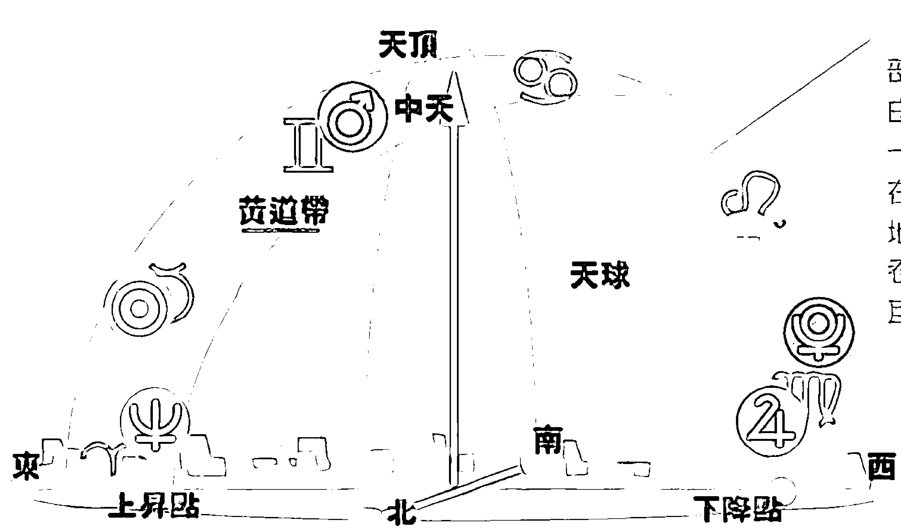

對北半球的人來說，大部分時候看到的黃道帶是由東到西，穿越天頂南面一些。所有的行星都依序在黃道帶上運行，因為地球每日自轉一圈，所以看起來像是每天黃道帶像巨型天球般轉了一圈。

## 宮位系統

星座是由春分點所定義的，那麼宮位又是如何呢？
宮位是以觀測者為主，觀察天體間的相對位置，所產生的相對方位關係。當我們將個人出生時所在地的地平面無限延伸後，這個平面會與黃道圈交會於兩個點，占星學上，定義這兩點為東昇點與西降點。
以出生地為中心，將地平面畫出東西南北四個方位以及地平面上與地平面下，將出生地正上方與正下方延伸會與天球交會於兩個點，這兩點與地平面南北點形成一個大圈，我們定義為子午圈。子午圈與黃道圈交會於兩點，我們稱這兩點為天頂點與天底點。
因此當一個嬰兒誕生時地平線圈及子午圈會切黃道圈於這四個點。這四個點象徵星盤圖上四個宇宙符號的角（Angles），我們通稱為四角，代表了我們個人與這個世界接觸的四個重點，是人生的最重要點。象徵若我跟我們，向內與向外。

### 東昇點〈ASC，上升星座〉

東方地平線與黃道的交點，也就是命宮的起點，表示自己與世界的接觸，這是實際上存在的個體的身體特徵及命運。

### 出生時決定四個重點

如圖，個人出生時刻、當地的地平面東與黃道相交於雙子座，西與黃道相交於射手座。子午圈上與黃道相交於水瓶座，下與黃道相交於獅子座。

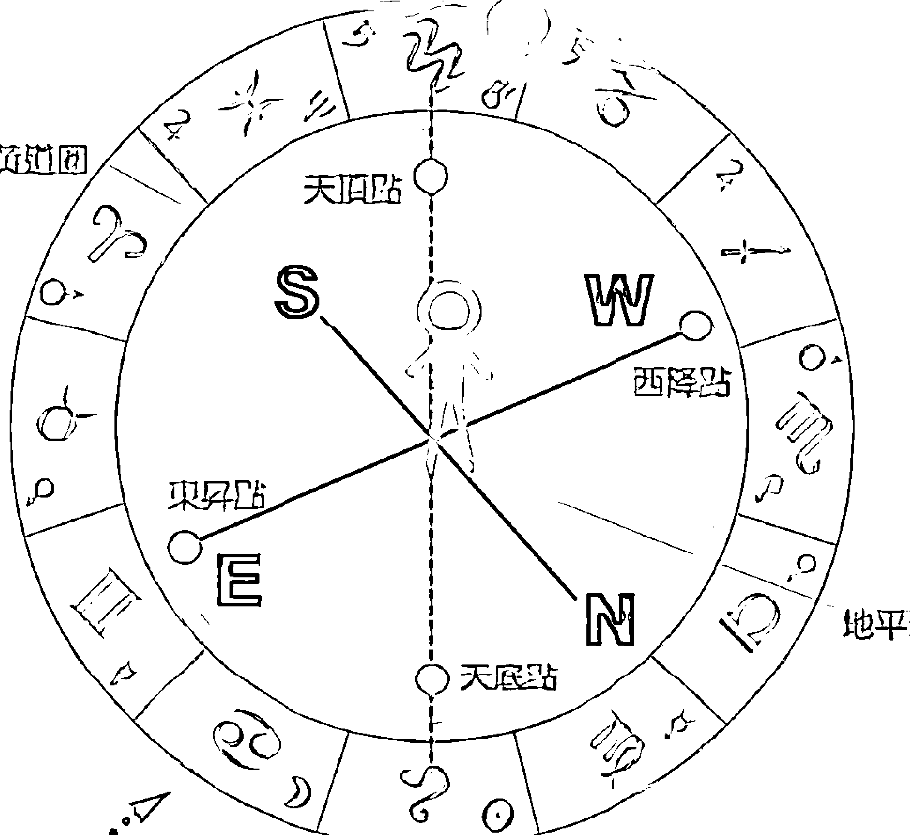

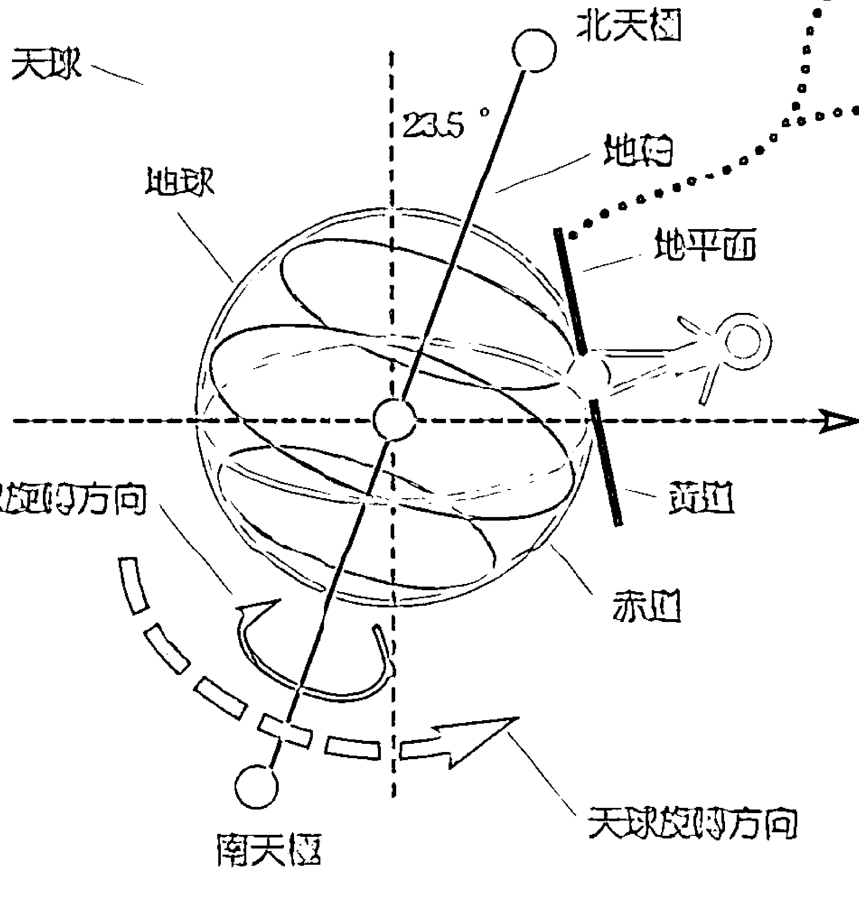

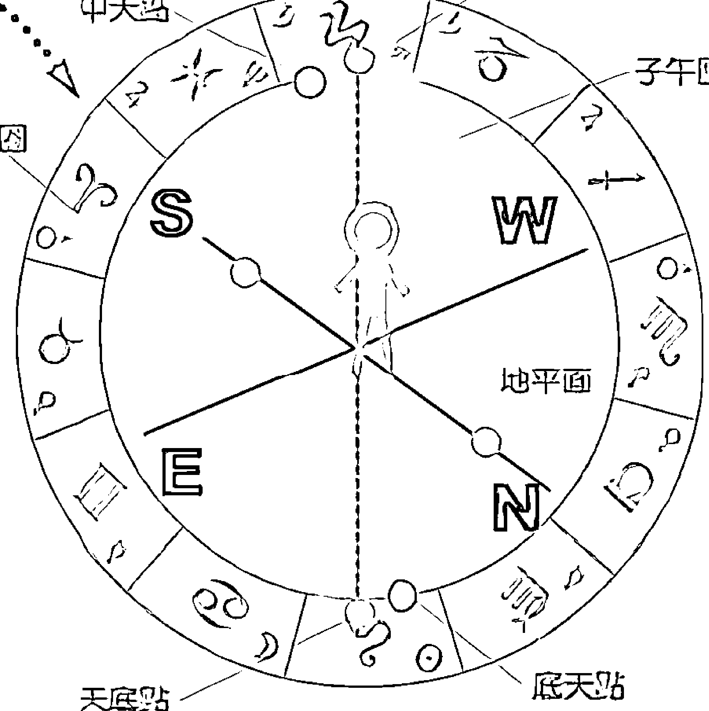

### 西降點〈DES，下降星座〉

西方地平線與黃道的交點，與升位相反，也就是夫妻宮的起點，它表示與他人的關係，因此是伴侶與夥伴的結合。

### 中天點〈MC，中天星座〉

黃道最接近天頂的地方，也就是黃道與子午線在空中的交點。象徵人生最高點，也是事業宮的起點，代表成就、職業及權力。

### 底天點〈IC，底天星座〉

黃道與子午線在地下的交點，它位於最低點，象徵根源，也就是家庭宮的起點，表示家、祖先和一個人的根。

這四點將星圖切為四個象限，將每一個象限再分為三份就成了星圖中表示生命中各個層面的十二宮（House）。象限在黃道上的大小不等，雖然占星學者對論斷星座的看法很接近，但是區分宮位的方法卻有很多不同的方式。這意味著不同的宮位系統會產生不同的宮位位置，這也是占星學上一個頭痛的問題！

雖然宮位的分法分類繁多，各有各的立論基礎，但是還是有比較受人重視的幾種。現今比較常用的有利用上升點來分割成十二個30度的等宮分法（equal-house system），而最為流行的系統是十七世紀時一位義大利僧侶普拉西度斯（Placidus）創立的分宮法，另外Koch分宮制也很受重視。

### 占星學的宮位制

宮位的分法很多，約有下列幾種：

- 1. 等分宮位制 (Equal Houses)
以東昇點為起點，將黃道圈等分為12份的分法
- 2. 太陽宮位制 (Solar House System)
以太陽為起點，將黃道圈等分為12份
- 3. 時四分宮制 (Placidus House System)
目前使用最廣的分宮制
- 4. 地點分宮制 (Koch House System)
在美國使用最多的分宮制
- 5. (Porphyry House System)
將四角形成的象限再分成三份
- 6. (Campanus House System)
等分主垂圈的分宮制
- 7. (Regiomontanus House System)
等分天球赤道以地平為第一宮
- 8. (Morinus House System)
等分天球赤道以子午線為第十宮

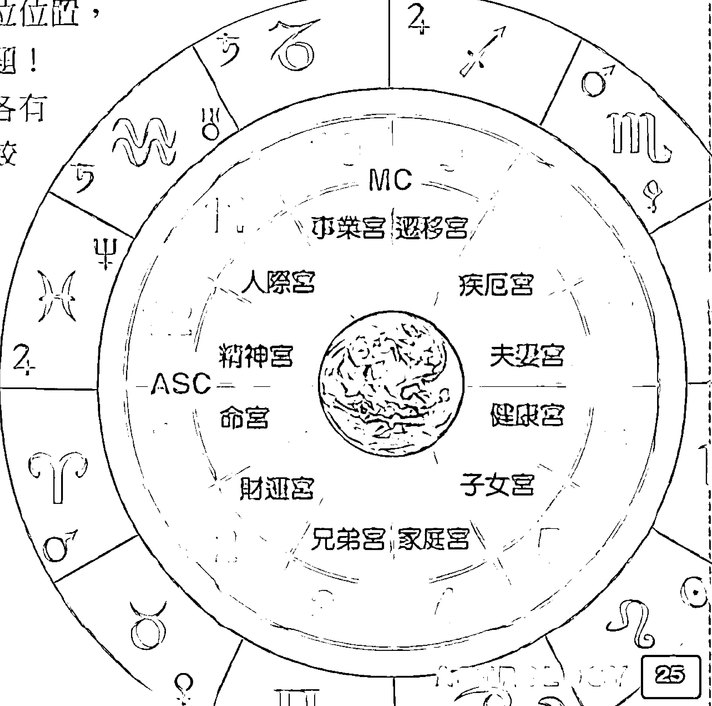

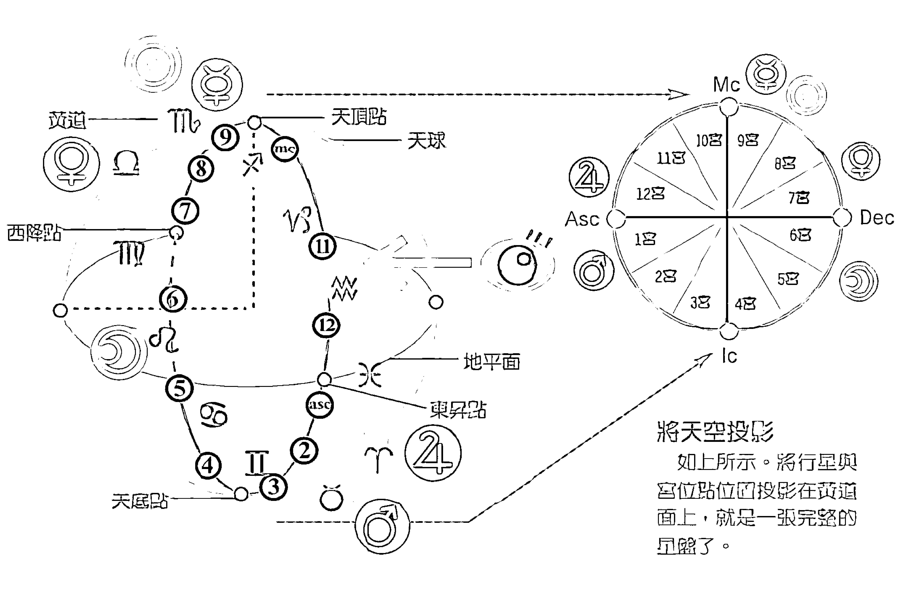

## 符號構成的語言

占星學是一種用符號構成的語言，一個人由於存在而讓發生在我們周圍的種種生活變化展現在意識的地平線之內。如果將天空劃分為現實意識中可見的天，以及地面下無意識的不可見天。「宇宙」像是環繞著我們每天從東到西旋轉著，整個天空的變化聯繫到地面，也就象徵著人世的種種轉變。

星星、月亮、太陽及黃道帶經過我們的天際，代表著我們經驗的變遷與改變。我們正上方是天頂，它代表著我們將前進的地方及未來，是希望之所在。我們腳下的延伸是天底，這代表著我們的過去，我們所來之處，也是我們最後回歸的地方，是我們的根源。水平線的一方是我，代表這裡，另一邊是你，代表那裡。從這裡到那裡，聯繫了我與我們的關係。

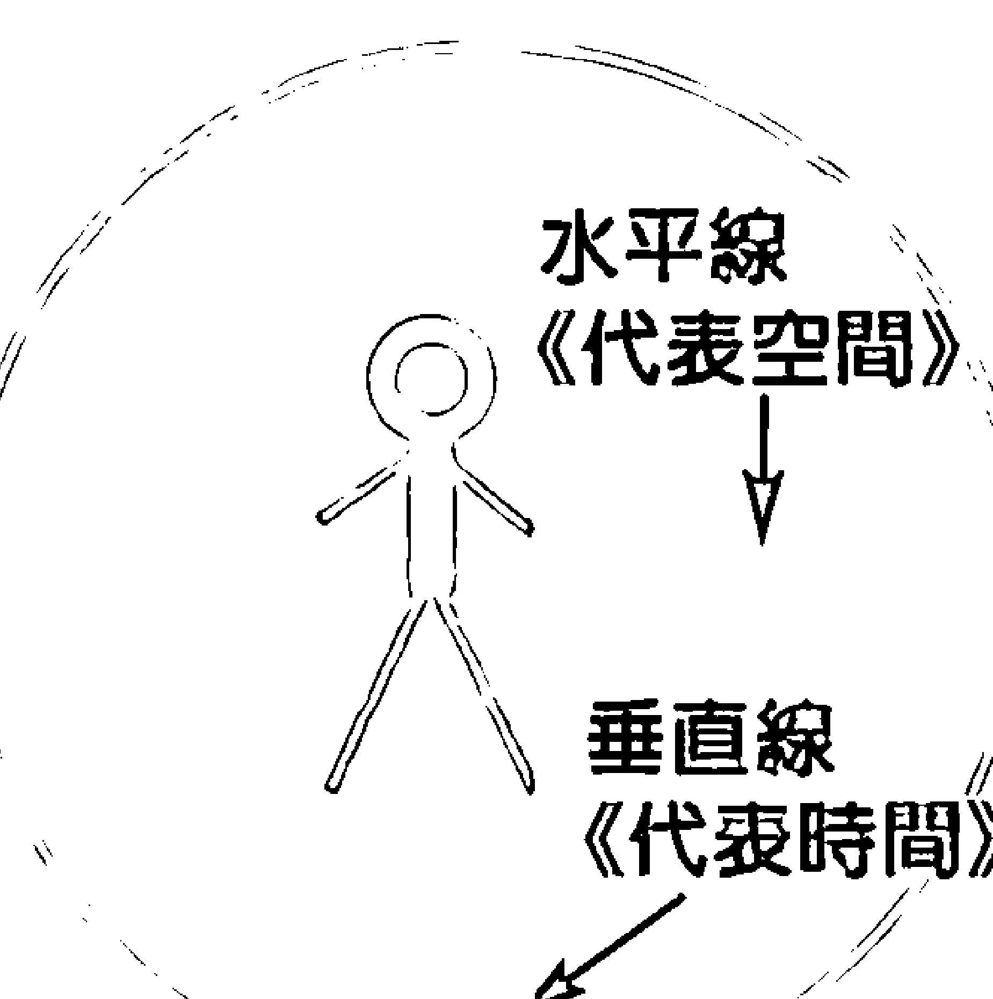

這兩條線彼此垂直成十字，代表著我們降生於世上所背負的責任與命運，結合了天空的圓構成了地球的符號，代表著人類最終的目標-新天堂樂園的實現。

## 12星座回归系统-岁差现象

### PRECESSION

相对于其他恒星，太阳每次交会到春分点时，位置是不同的。每年春分点平均向西逆行50.2弧秒，这就是所谓的「岁差现象」。如此约经过两万六千年春分点会绕完一周。从二千多年前开始制定春分点为牡羊座到今天，现在的春分点已退行将近30度，现在的春分点已移动到双鱼座，正接近双鱼和水瓶的交界处。这也就是所谓的水瓶世纪将到的原因。

但是占星学是以春分点开始称为牡羊座，但由于岁差的原因造成星座方位的变动，所以你会发现到现在春分点是指向双鱼座。因此，现在大家口中的星座早已不是指今天上的星座了，随着时间的变化，现在占星术所用十二星座的命盘变成是一种虚拟的意象，如果你是牡羊座，其实应该说是牡羊宫还比较恰当，他代表的是太阳一年的12个变化，真正的星座只是一种借用来做原型分类的符号。

## 不同的系统

其实用另一种观点来看，你可以说在大系统（天体12星座）下另一个属于地球的中系统（太阳12星宫），在这系统下又依个人出生时产生小系统（12宫位）。大系统是整体性的，中系统是属于地球全体的（如果一个住在金星上的人，他的中系统就该以金星的春分点来订吧！），小系统则是个人的。因此如果说你是双鱼座，代表的是中系统的分类模式，它跟地球与太阳之间的关系（四季）息息相关。

- **星座小知识**

- 恒星年：地球公转360度所需时间
  - 365.256354平均太阳日
- 回归年：地球两次经过春分点所需时间
  - 365.24219平均太阳日
- (365.256354-365.24219) × 24 × 60 = 20.396分
- (365.256354-365.24219) : 365.256354 × 360 × 60 × 60 = 50.25弧秒每年
- 从刚定式起十二星座距今已移动：50.25秒 × 2120年 / 60分 / 60度 = 29.59度

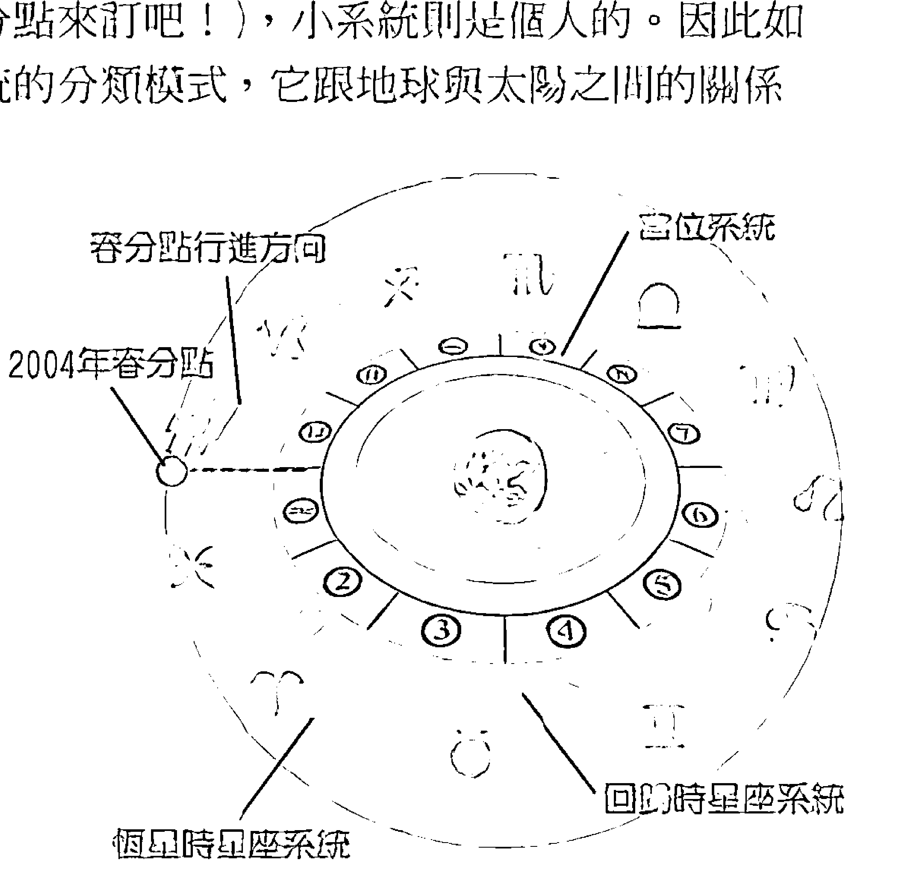

## 占星學兩大門派

因為歲差現象，造成了現代占星學的兩大門派，一派是以回歸時系統為依據，另一派則堅持以恆星時系統為依歸。

- 回歸時星座系統（回歸時系統）：
所謂回歸時系統的十二星座，是西方占星學將傳統占星學的星座象徵運用於回歸時系統。回歸時系統是以地球和太陽的相對關係來決定十二星宮，也就是以春分點和秋分點為主，來分類的系統。這種分類的特點是跟四季節氣符合，星座是借用的符號，而非指天文學上真實的星座。

- 恆星時星座系統（恆星時系統）：
顧名思義，就是沿用古制以真正的星座為劃分依據，這一派以印度占星學為主，清代以前的中國占星學也是使用恆星時系統十二星座，並且除了12分法外，還有一種28星宿的分類法，這種分類是以恆星為主的分類，是依據天上恆星來定位的。

## 二十八星宿

西方將黃道帶分出十二星座，中國則劃成二十八個星域，中國的恆星時系統按戰國時代齊國的甘德，魏國的石申所著的“甘石星經”來推斷，二十八星宿可追溯至西元前四百年戰國時代。所謂二十八星宿，每一宿都是天空中比較明亮的恆星群，正因為是恆星群，所以可以作為天文觀測的指標。這只是分法的不同，西方人看了十二個星座，中國人則看到了二十八星宿，其實都只是將天上的星星們做位置上的分類罷了！而我們熟悉的12生肖也是從二十八宿配屬於十二地支後演變而來。

中國古人先將星空劃分為四大塊，所謂四象：東方青龍、西方白虎、南方朱雀、北方玄武，再將星空區依照恆星分為二十八個小星域即組成二十八個星宿：

- 東方青龍七宿：（角、亢、氐、房、心、尾、箕）
- 西方白虎七宿：（奎、婁、胃、昴、畢、觜、參）
- 南方朱雀七宿：（井、鬼、柳、星、張、翼、軫）
- 北方玄武七宿：（斗、牛、女、虛、危、室、壁）

跟西方同樣，根據行星落入的星宿位置變化來推斷人間的吉凶。

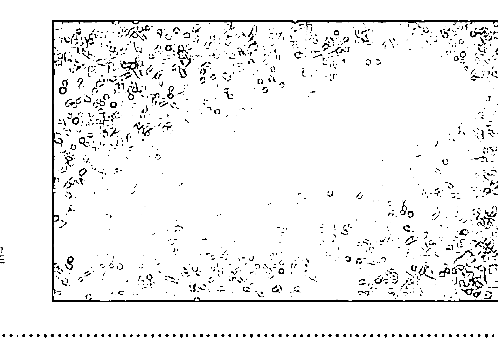

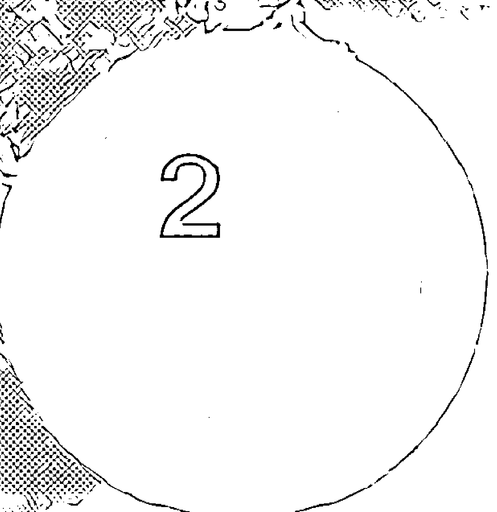

# 出生圖

### BIRTH-CHART

占星術是一種符號語言系統，12星座、12宮位、行星、相位都有其基本意義，占星家在世界上找尋理想的反應與原則，每個符號都有其關鍵的形容字訣，要解說這些符號並不是輕鬆的，文字往往很難表達，所以很多時候，你必須運用豐富的想像力。所以，解讀星圖往往像對一張無字天書的自由聯想。

## 出生圖的內涵
BIRTH-CHART

## 出生圖的意涵

要學會占星術，首先就要學會解說出生圖，英文中稱為 Birth Chart，也就是占星命盤，是占星論命時不可缺少的一項工具。拜現代科技，只要有正確的出生時間，我們可以很容易的從網路上一些算命網站或者免費的占星軟體，只要輸入資料，就可以得到一張出生圖。

出生圖是一種天體投影的圖解，我們利用它來看出太陽、月亮、行星在某一時間、某一地點觀測到的位置。我們所存在的世界是屬於三度空間，由於行星都是在一條扁平的黃道帶上運行，因此占星學家們就以投影的方式，擷取出重要的元素，將行星在三度空間的狀態投影在二度空間的黃道圓圈平面上，這就是我們所看到的出生圖了。

要解說出生圖首先就要有始點的概念。占星術是以天上運行的星體，作為衡量事物的工具，但是到底要選擇哪一個時刻呢？要如何在不斷運行的天體中，找到一個狀態和個人發生關係呢？大天文學家托勒密認為人在受孕的那一刻才足以代表一個人的一生，但是這是困難的，即使是現代，也很難知道你受孕的那一刻是什麼時間。那麼當一個人與世界第一次接觸的時刻呢？這似乎更符合個人的象徵意義，雙胞胎是受孕在同一時刻，分毫不差，但是他們的命運卻略有不同。因此在現代的占星學中，我們是以一個人生命開始一瞬間的星體位置，來和個人產生關聯，簡單的來說，就是以一個人出生當時的天體狀態來代表一個人。

占星圖上有一大堆的符號與線條，各有其意義與象徵，所以首先我們必須弄清楚這些符號與線條代表的含意，了解出生圖中重點在哪裡？

從前面的介紹，我們大致上了解到占星學的三大構成要素，行星、星座與宮位，以及行星彼此間的特殊關係—相位。將出生圖繪出後，便要開始解說，你可以在一張占星圖中看到這些基本內容：

### 1. 星座：

星座是星體進行的背景，每一個星座都帶有不同的性質，當星體落入某一個星座，就會帶有那個星座的特質。也就是出生圖中最外面那一圈。

### 2. 宮位：

從圖中你可以看到兩條切割線，他們跟星座圈形成星盤中的四個基本點，就是指上升、下降、天頂和天底。以基本點為基礎，將黃道帶分為十二份，代表了世俗的不同部分，劃分出十二個生活領域。是星盤中由外向內數第二圈，也就是標著1～12數字的部分。這12個部分的起始點就稱為宮頭，代表宮的起點，由宮頭所座落的星座圈位置，我們可以知道這個宮屬於哪一個星座。以下圖來說，我們看到第3宮落在巨蟹座的範圍內，所以便知道他的第三宮（兄弟宮）是巨蟹座，可以知道這個人對兄弟、近親這個領域會有巨蟹座的傾向。

### 3. 星體：

在占星學上所用的星體，主要有太陽、月亮和九大行星，有時也加入一些小行星或恆星及一些特殊點（月交點、福點…），每顆行星都有各自不同的內涵意義。如圖中最內圈的符號。以下圖為例，他的太陽在雙魚座，而且在第11宮內。所以他的太陽星座就是雙魚座，這代表了他的個性會有雙魚的傾向，而且容易展現在11宮（人際、理想性）的領域上。

### 4. 相位：

星體或基本點之間的相對位置，就以相位來表示，所謂的相位，就是相對位置的意思，也就是圖中間的線條，同樣如下圖，我們可以看到他的土星與冥王星產生一條綠線，這代表著120度三分相，象徵土星與冥王星會產生創造性的利益關係。

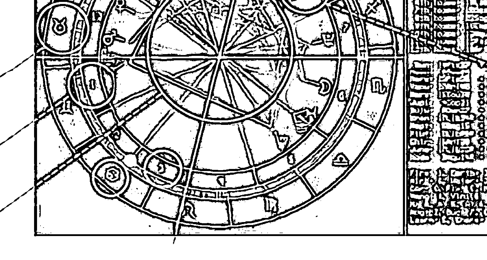

# 出生圖 2-1 上升星、合軸星、守護星

了解了幾個出生圖中主要的構成要素後，我們就可以從盤中知道自己的12個宮位落在什麼星座（第一宮就是一般俗稱的上升星座），我們的太陽星座、月亮星座、水星星座…等等，也可以看到我們的太陽、月亮、水星…等落在什麼樣的宮位，同時也可以看到行星與行星之間形成了哪些相位，從形成的相位好壞，了解到行星彼此的關連性，同時由行星座落的星座與宮位，了解到兩星座或兩個宮位之間的相關性。

了解了這些基本資料後，再由這些基本資料之間的相互關係，又可以引申出下列的資訊：

- 上升星：
上升星是指最接近上升點附近的星體，通常是在上升點上、下八度以內的行星，被稱作上升星。上升星會影響上升點的特質，它具有舉足輕重的影響，往往是整個命盤的重心所在。而上升星是哪一顆星往往比在哪一個星座重要，因為上升星通常和上升點同星座，但也有可能落在不同星座。

- 合軸星：
所謂合軸星是指最接近四角基本點附近的星，通稱作合軸星，因此上升星也是合軸星的一種，但因其特別重要，所以分開來看。在特定基本點附近的星越多，代表其對於這個基本點所象徵的東西需求越大。

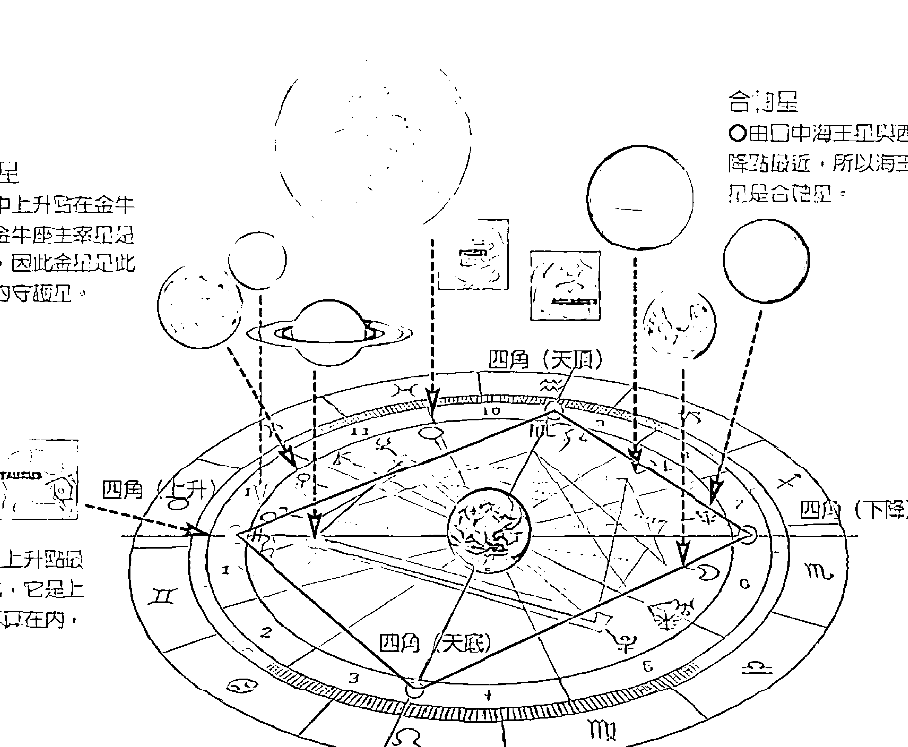

## 3. 主宰星：

什麼是主宰星呢？占星師認為黃道12星座中每個星宮都有屬於它們的主宰行星，也就是將每個星座搭配屬於他們的行星主人。

將星圖分為屬於太陽的半邊（從獅子座到摩羯座）以及月亮的半邊（從巨蟹座到水瓶座）。它們的主宰關係如下圖所示。右半由獅子座（太陽主宰）開始、經處女座（水星主宰）、天秤座（金星主宰）、天蠍座（冥王星主宰，火星副主宰）、射手座（木星主宰）、到摩羯座（土星主宰）結束。左半邊從巨蟹座（月亮主宰）開始、經雙子座（水星主宰）、金牛座（金星主宰）、牡羊座（火星主宰）、雙魚座（海王星主宰、木星副主宰）、到水瓶座（天王星主宰、土星副主宰）結束。其中天王星、海王星、冥王星在未發現前，天蠍、水瓶、雙魚各由火星、土星、木星主宰，後來依照三王星的特性，將天王配給水瓶，海王配給雙魚，冥王配給天蠍，因此這三個星座由兩顆星共管。直到現在，由於一些小行星的性質，也有人將處女座跟小行星帶做關連，將天秤座交給凱龍星掌管，但不是很普遍。一般來說，還是以古法的七星系統為主，偶而搭配三王星使用。

## 4. 宮主星與出生圖的守護星：

宮主星是從主宰星延伸而來的。我們依照每一個宮位的起點來決定宮位屬於哪一個星座，舉例來說，某人出生圖中第二宮的起點在天秤座25度，那麼此人的第二宮（財運宮）就是天秤座。而由於天秤座的主宰星是金星，因此金星就是第二宮的宮主星，宮主星在推運與解盤時是非常重要的依據。

而一張出生圖中，命宮是非常重要的，因為命宮點的確定才決定了整個12宮的位置，因此命宮點是一張命盤的樞紐，所以，命宮的宮主星就特別重要，因此我們特別將命宮的宮主星稱為出生圖的守護星。舉例：某人的出生圖中上升點在牡羊座18度，因為牡羊座的主宰星是火星，因此這個人的守護星就是火星。出生圖的守護星是那一個，或其所在的星座、宮位，對一個人都是十分重要的。

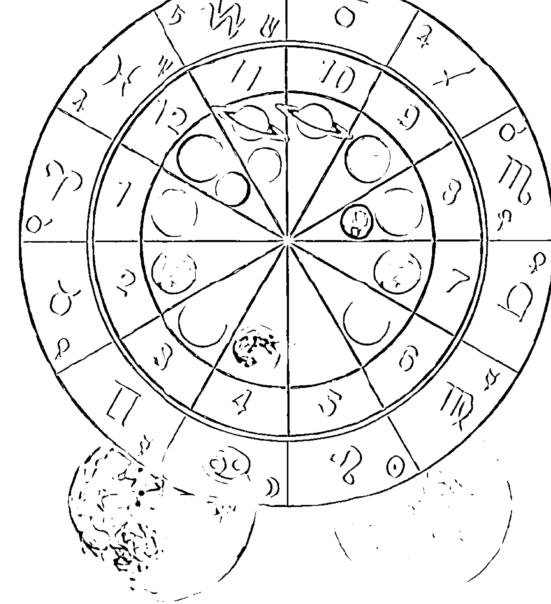

# 出生圖 2-1 行星所在宮位

## 5. 守護星所在的宮位：

守護星所在的宮位，通常指出一個人生活的重心，或是其最重要的生活領域，代表他這一生最在意的層面。延續上例，某人的上升點在牡羊座，其守護星是火星，如果他的火星在天秤座，又落在第七宮，那麼如何與他人協調合作或是婚姻配偶就會成為這個人的生活重心，一生中最在意的事。

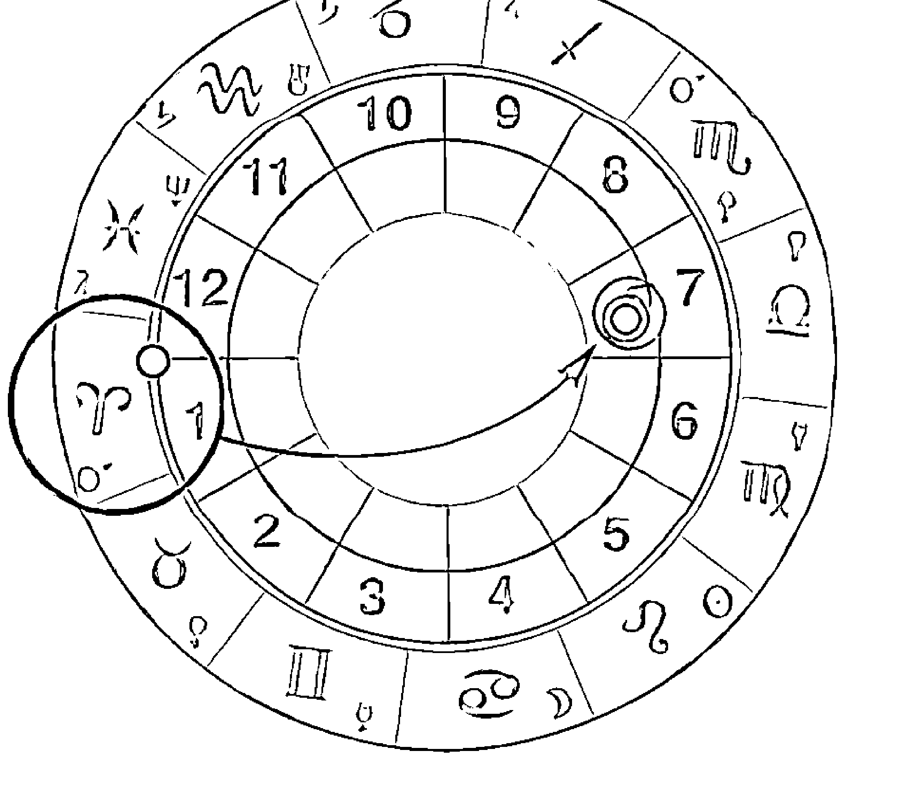

## 6. 陰陽：

在出生圖的星座中，牡羊、雙子、獅子、天秤、射手、水瓶是屬於陽性星座，而金牛、巨蟹、處女、天蠍、摩羯、雙魚是屬於陰性星座，當行星進入陽性星座時，會增加行星陽性的一面，反之，則會增加陰性的一面，若落在陽性星座的行星多些，通常較為陽剛、男性化，反之則通常較為陰柔、女性化多些。

## 7. 三特質：

星座還可以分成三種特質，牡羊、巨蟹、天秤、摩羯屬於主動特質，金牛、獅子、天蠍、水瓶屬於固定特質，而雙子、處女、射手、雙魚則屬於變動特質。把各行星落在星座的特質分別標明出來，可以幫助我們了解一個人的內在動機，主動星座強的人傾向於影響他人，固定星座強的人易於固執己見與堅定，而變動星座強的人則較能適應變局。

## 8. 四大元素：

除了陰陽與特質外，星座還可以分為四象，牡羊、獅子、射手是火象；金牛、處女、摩羯是土象；雙子、天秤、水瓶是風象；而巨蟹、天蠍、雙魚則是水象。將各行星落在星座的元素分別標明出來，可以幫助我們了解一個人主要是偏向哪一個元素，這在性格的分析上十分有用，如果大部分行星落在火象，容易衝動、直接，同樣的土象則保守穩重，風象靈活，水象感性。有時我們也把上升和天頂所落入的星座也一起標示，增加準確性。除了星座可以這樣分成陰陽、特質、元素外，宮位也有這樣的分類方式。

## 9. 相位表：

星盤上一堆線條對一個初學者而言，可能會覺得眼花撩亂，不易掌握，所以將各行星間的相位羅列出來的相位表，就變得不可或缺了。就算是一個有經驗的占星學生，也要借重相位表的特性，來幫助分析。

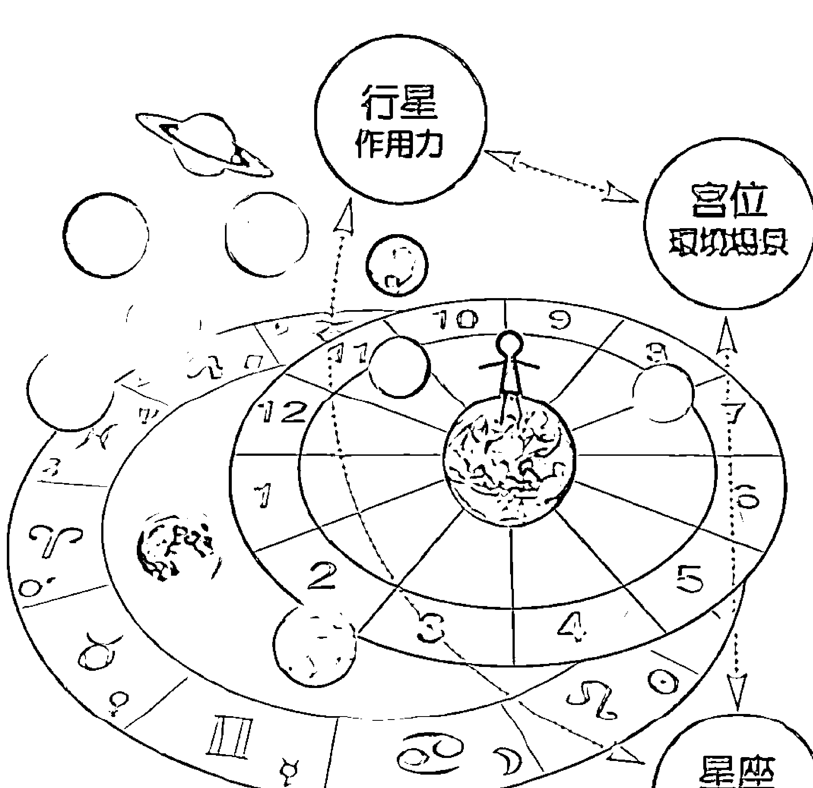

## 出生圖的基本解讀

了解了星盤上的基本要素後，我們要開始對出生圖做解釋了。首先，我們必須了解到星座，宮位與行星之間的關係。占星盤就像是我們人生的一部腳本，行星就是演員，宮位是這部戲的場景，而星座則是表現的方式。當行星與行星之間產生相位，就好像演員與演員之間產生了互動，而有了劇情的高低起伏。從他們（行星）落入的宮位表示了發生的場景，而從所處的星座了解到表現的方式。

大家小時候都玩過一個遊戲：王小明（誰）在公園（哪裡）裡盪鞦韆（做什麼），占星學就有點像這樣，因此，要能夠準確的解釋星盤，必須要清楚的了解12個星座、12個宮位、每一顆行星它們的主要含意，從它們的形成所依據的天文原理，對應於人生的各個層面，配合相位的好與壞，架構出一個人的基本風貌。

占星術是一種符號語言系統，12星座、12宮位、行星、相位都有其基本意義，占星家在世界上找尋最合適的反應與原則，每個符號都有其關鍵的形容字彙，要解釋這些符號並不是輕鬆的，文字往往很難表達，所以很多時候，你必須運用極為豐富的想像力才行。

## 個人星盤

最基礎的解說便是從個人星盤開始，個人的星座盤是一個嬰兒呱呱墜地那一瞬間的行星分布狀態的凍結，因此從中顯現了一個獨立個體的個性與傾向，他的能量如何反應，對各種事物的偏好，他是一個什麼樣的人，他如何思考，如何表現他的喜好…等，甚至於他是一個好命的人還是一個壞命的人都可以從個人星盤中解讀出來。個人星盤代表的是一個人的因果宿命，就像一顆種子，種子本身是好或壞是早已決定的，不會變的，西瓜的種子結出來的一定是西瓜不會是木瓜。但是同一顆種子種在南部或種在北部、種在台灣或種在美國、種在濕地或種在沙漠卻會有不同結果，是否每天澆水施肥還是任憑它自生自滅也一樣會有不同的結果。所以說，先天命雖然是固定的，但是發展卻會因為後天的選擇而有不同的結果。

## 行星的分別

行星可以分成本命星、他人星與運行星。本命星是屬於個人出生當時那個時間點的星象。他人星則是另一個人出生當時時間點的星象。而運行星就是推命時當時的星象。因此，每一個人都會有一張獨一無二的星象命盤，而對全世界的每個人來說，大家都會在同一時刻分享同一個運行天象。

基本上，個人星盤記錄著一個人在人間這個角色扮演遊戲中，角色的基本設定。至於你要怎麼詮釋這個角色，就看你自己的投入了！這裡牽涉到一個基本的問題—自由意志的選擇。原則上，命並非全然確定的，但它又是已決定的，很尷尬？以演戲來形容，同樣是張無忌，梁朝偉跟馬景濤演出來的就不一樣，如果你大牌一點，你還可以修改劇本，懂我意思嗎？命的設定是決定的，你無法選擇你的父母、兄弟，甚至你的個性，我為什麼會喜歡她，你根本不知道，但是並非一切又完全不能控制，懂嗎？就像一首歌，旋律是確定的，歌詞是確定的，但是蘇慧倫唱的感覺跟徐懷鈺唱的就不會一樣。因為蘇慧倫表現了蘇慧倫的自由意志，徐懷鈺表現了徐懷鈺的自由意志。但是你知道，這是同一首歌。

## 個人星盤與運行星

個人星盤詮釋了屬於獨一無二的個體的基本設定，它是不動的，是出生那一瞬間的凝結。可是天上的星星是不斷變動的，它就像一個龐大的命運鐘，不斷的運行，每一個個人的星盤都必須跟著這個大鐘產生反應。這也就是一般所說的運的概念。在不同的時間天上的某顆星引動了個人的某顆星，當天上的星星與個人的星星產生了關係，我們的人生便開始了一個個的段落事件。每一個個人星盤是一個特定時間的點，就像卡通是由一張張靜止的畫面組成一般，將每一個個人星盤集合後，便構成了一個完整連續而不斷迴轉的龐大命運鐘。這就是推運的基本概念，利用天上的行星在每一天、每一秒的運行中，與個人星盤產生的關連，而構成了不同好或壞的影響，依據行星的運動，預測出可能發生的好壞運勢。

## 雙人星盤與運行星

同樣的，當一個人遇到另一個人，彼此的星星便會產生反應，出現彼此行星間的相位，相位當然有好有壞。所以，這就是為什麼我一看到他就不爽；一遇到她，我就好喜歡她，好想跟她在一起。為什麼呢？因為你們的行星之間發生了關連，產生了好的或是壞的頻率。

但是，在共同的命運鐘的影響下，兩個相愛的人各分東西，那個討厭的傢伙卻老是在身旁出現。這就是合盤的觀念，兩個獨一無二的星盤放在一起後，從彼此的星與星間所產生的引動，來看出彼此之間的關連與問題。彼此的相位就像是雙人間的緣分密碼，而當運行星啟動後，就會發生一個個屬於彼此的共同事件。

## 占星學的符號
GLYPH

### 占星學的符號與特性

占星學是人類數千年來共通的一套想像語言，自然有其特殊的符號，而自成一個系統。對於占星學符號的起源，現在已不可考了，但是可以知道的是，至少在八千年前，就已經有一套占星所使用的語言和文字，雖然現在我們所用的占星符號已和八千年前的人們不同，但是有很大一部分，我們可以看到原始創作的痕跡。

解讀星盤像是一種聯想的藝術，在占星學上，我們可以透過這些現成的符號，去了解占星學的內涵。符號包含二大系統：其中的一個系統，就是星座的符號；另一個系統，就是行星的符號。我們可以經由這些符號，去了解星座與行星的特質，當然其中也包含了許多傳統的神話和文化的價值觀。符號本身具有象徵的力量，占星家運用符號的組合來反應某特定事件的聯想。

除了星座符號與行星符號兩大系統外，星盤上還有相位符號以及一些特殊點的符號，都必須先了解它們的含意，才不會霧煞煞，什麼也看不懂！

### 星座的符號學

占星學所用的各種符號，都有其一定的意義。黃道12星座分別由各自古老的象徵圖形及代表符號來表示，每一個星座都與人類的性格相關，各代表了12種不同的原型象徵。星座的符號是由星座的形象演化而來，以牡羊座的符號來說，象徵牡羊的羊角，也像植物的嫩芽，代表著新生。

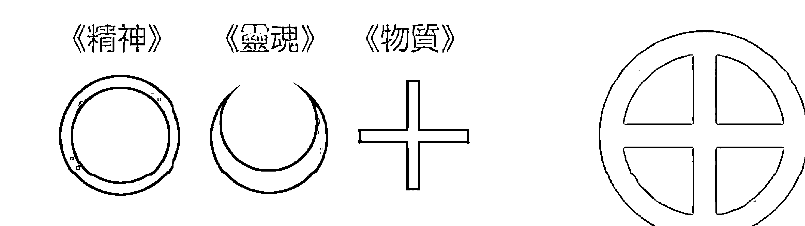

### 行星的符號

行星和星座的特質密不可分，我們也可藉此更了解星座的特質。占星術中，將每一個行星用來象徵每一個人的能量與行為模式，以符號語言來解說各行星的運動，解釋它們如何反映地球上的生命。行星的符號是由三種基本圖形組合而成，○新月形、＋十字與◯圓形，這些圖形分別代表著靈魂、物質以及精神。而行星的符號則主要由這三大要素彼此組合來表現各行星的意義。而這三要素的完整組合，就成為地球的符號了！代表終極的完美，這個符號同時也是幸運點的符號，代表一個人的幸運與福報的所在。

### 其他符號－相位符號與特殊點

除了星座與行星符號外，還有相位的符號以及一些特殊點。相位有主要相位與次要相位之分，主要相位有五個，合相（0度）、對相（180度）、三分相（120度）、四分相（90度）、六分相（60度）。

由月亮對地球的關係，還有月交點、月孛等符號，以及像福點等特殊點的符號，另外還有超行星系統的符號，小行星的符號，還有四角的簡稱（ASC、MC、DSC、IC）等等，都必須先搞清楚它們的含意喔！

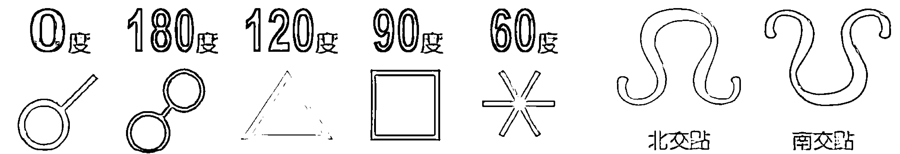## 出生圖 2-2 象徵

### 1. 牡羊座 Aries

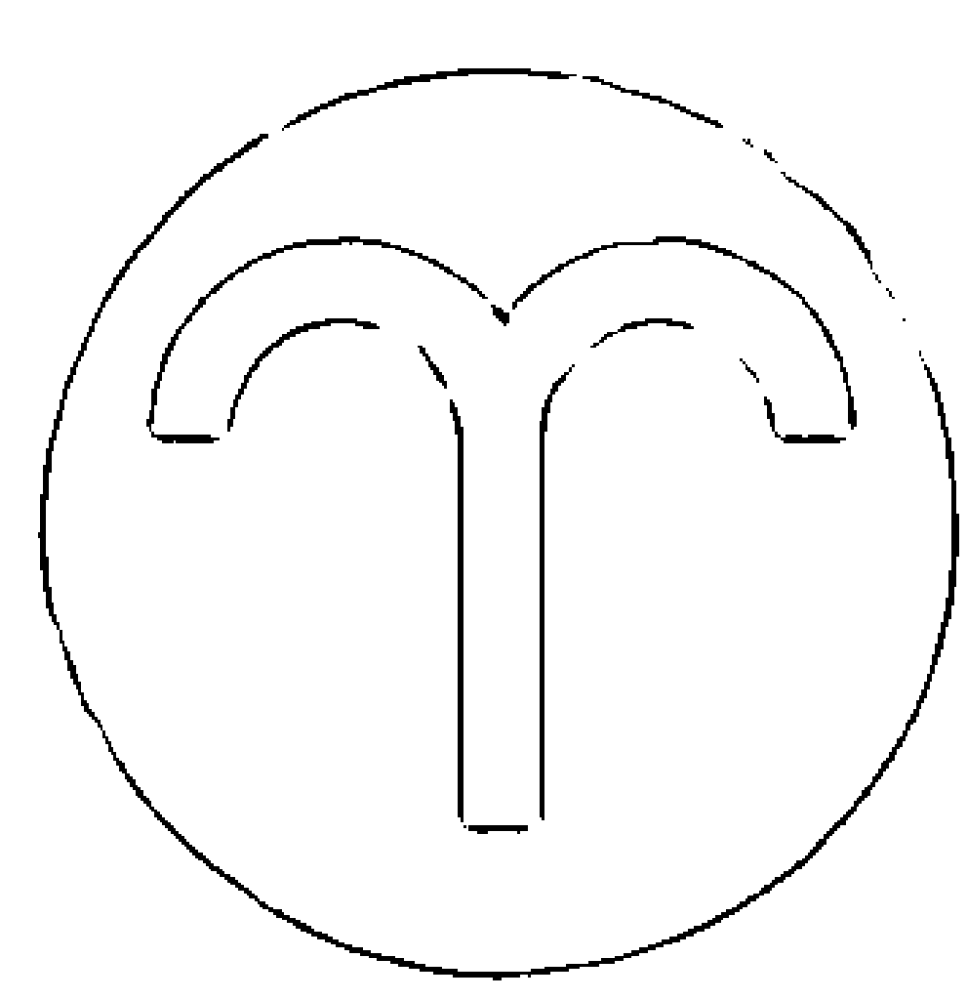

牡羊座的符號是象徵羊的頭，是一種象形的方法，取羊最明顯的羊角和鼻樑部份；由白羊座的神話可以聯想到一些特質，例如衝動、勇往直前、而由另一方面，也有人指牡羊座的符號是象徵新生的綠芽，表現出大地新生和欣欣向榮的景象。

### 2. 金牛座 Taurus

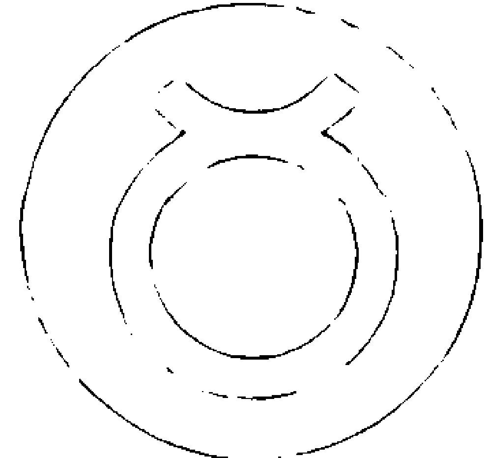

金牛座的符號是象徵了牛的頭，也是以簡單的線條描繪出牛的形象：由金牛座的神話可以發現，金牛座的外表溫馴，但內心充滿慾望。由另一方面看，圓圓的牛臉表現出安逸和享樂，但上面的牛角則提示我們牛也有爆發的時候。

### 3. 雙子座 Gemini

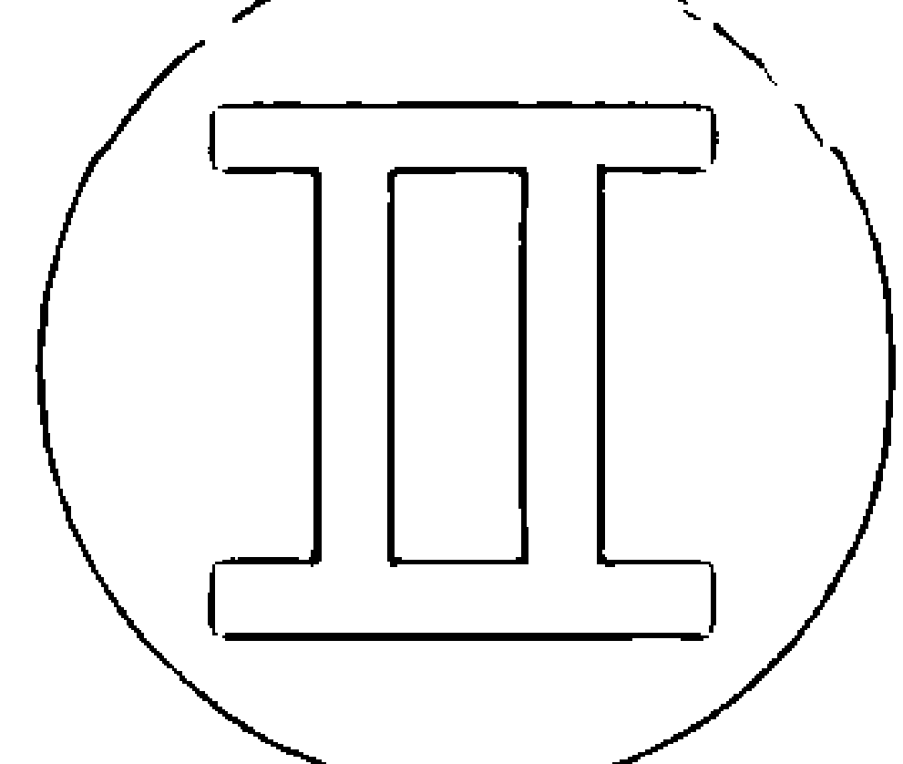

雙子座的符號是Ⅱ，象徵雙胞胎，相較於前兩個符號，就比較抽象了一點；由雙子座的神話可以知道雙子座的二元性和內在的矛盾。其實雙子座所代表的不只是二元性，而是所謂的多元，一方面可以看出其廣，但另一方面也暗示了可能的膚淺。

### 4. 巨蟹座 Cancer

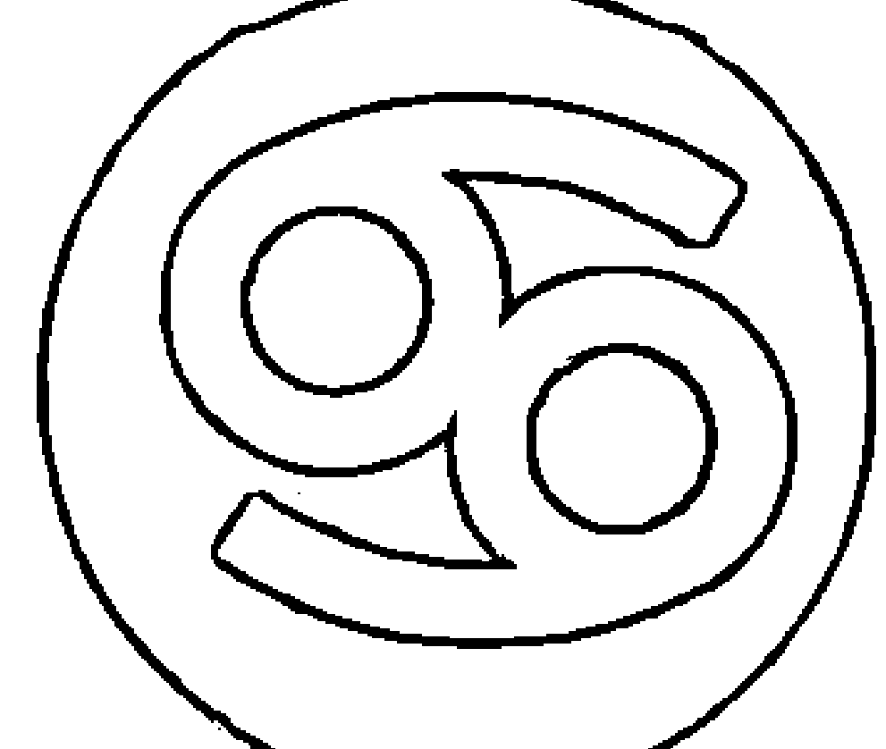

巨蟹座的符號象徵胸，也就是說明了巨蟹和胸有關，象徵一種家的感覺，同時也和忌妒有關。另一方面，由巨蟹座的神話可以想像，其實巨蟹座的符號是象徵巨蟹的甲殼，由此也可看出巨蟹座所具有的保護特質，和隱藏的習慣，以及不穩定的情緒。

### 5. 獅子座 Leo

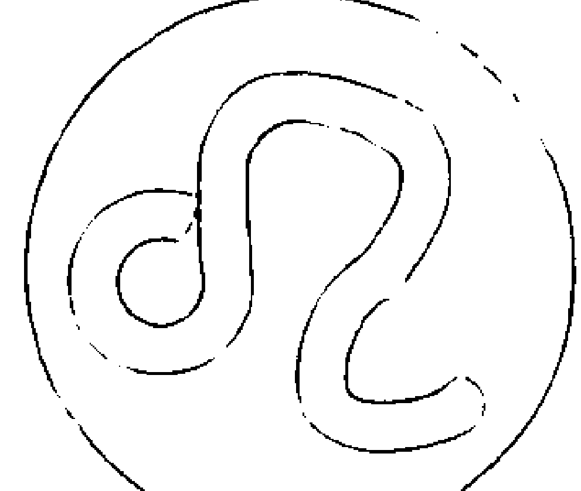

獅子座的符號是象徵獅子的尾巴，高高揚起的尾巴，充分顯示了獅子的個性；由獅子座的神話可以聯想到，獅子的勇猛和善戰。由獅子去聯想獅子座的特性，很容易就可以想到很多，高貴、同情心、王者之風，但是別忘了，母獅子才是出外狩獵的。

### 6. 處女座 Virgo

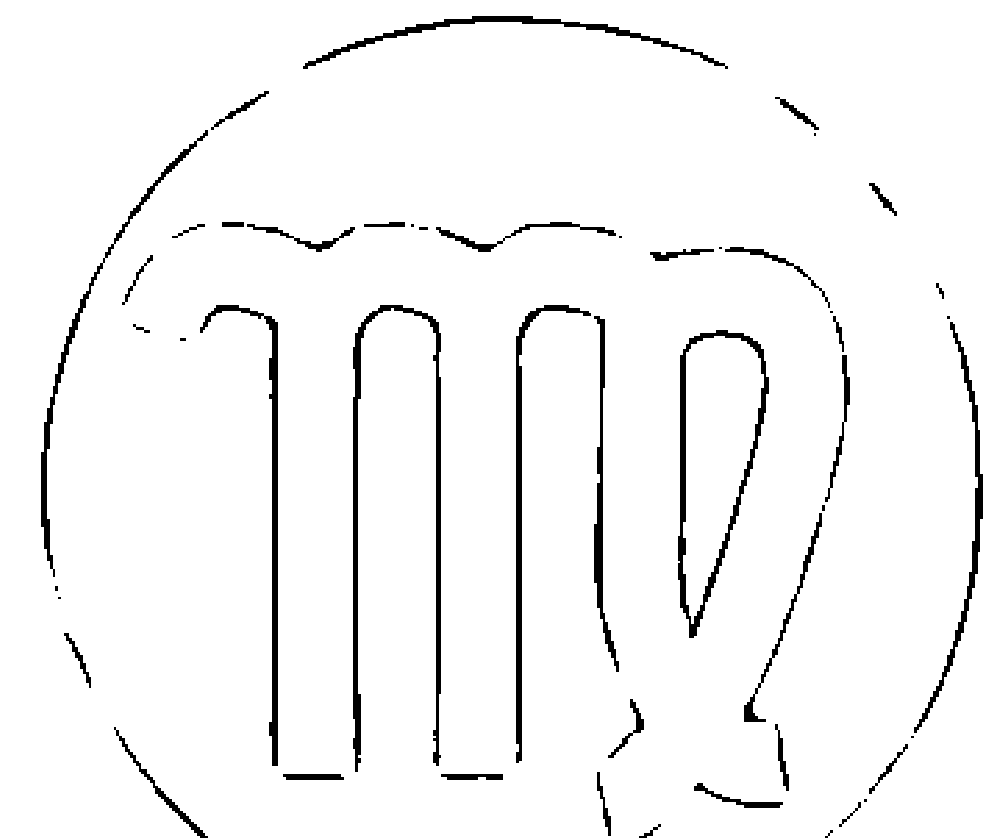

處女座的符號是象徵女性的生殖器，或許不容易看出，但如果你注意看右半邊，就可以發現；從處女座的神話中，可看出收成的意涵。由處女去聯想處女座的特質，也可以發現一些，如小心、踐慎、沈靜和怯懦。由另一方面，處女也代表了聰穎和敏銳。

### 7. 天秤座 Libra

天秤座的符號是象徵一桿秤子，希臘字母Ω代表了衡量，而下面的一則代表了衡量的基礎。在天秤座的神話中可以看出天秤座公平的特質。但由那一桿秤子，可以看出天秤座追求平衡的基本念頭，同時，搖擺不定的秤子也表現出天秤座的猶豫不決。

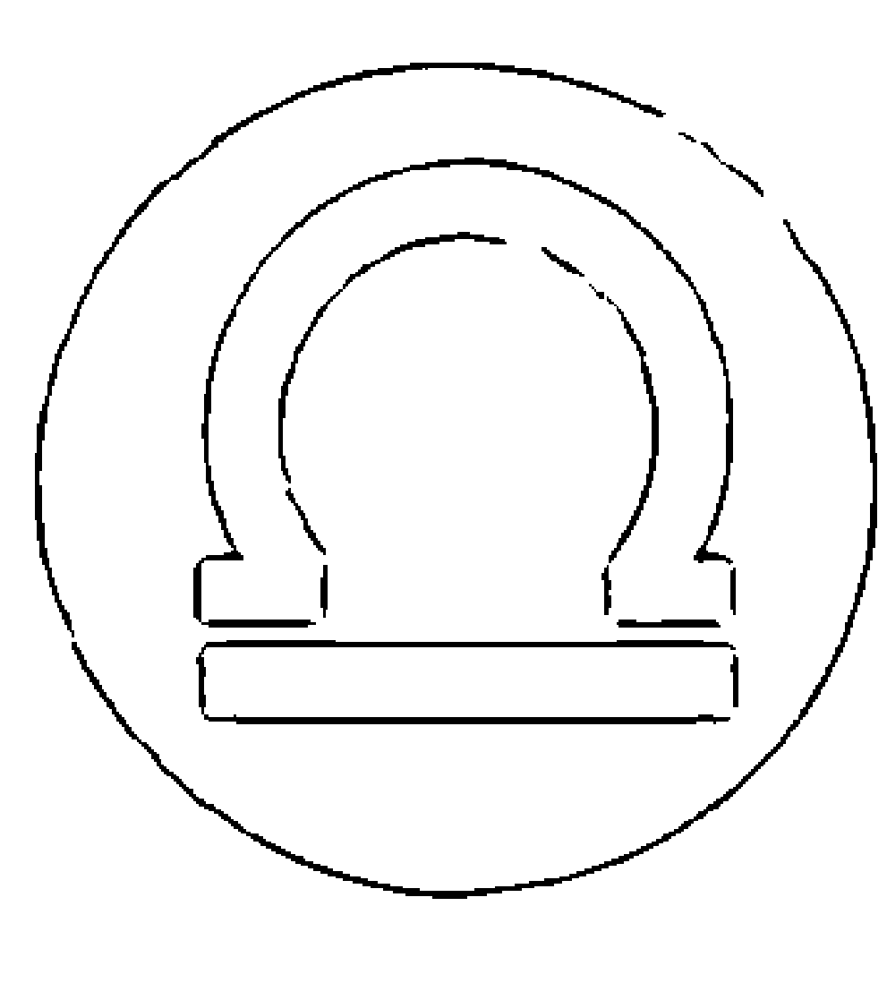

### 8. 天蠍座 Scorpio

天蠍座的符號是象徵男性的生殖器，和處女座有點像，也要由右半邊去想像：由天蠍座的神話中，可以知道天蠍座忌妒的來源。由男性生殖器可以知道天蠍座的慾望，另一方面，也有人認為天蠍座的符號是象徵蠍子的甲殼和毒針，表現出復仇的特質。

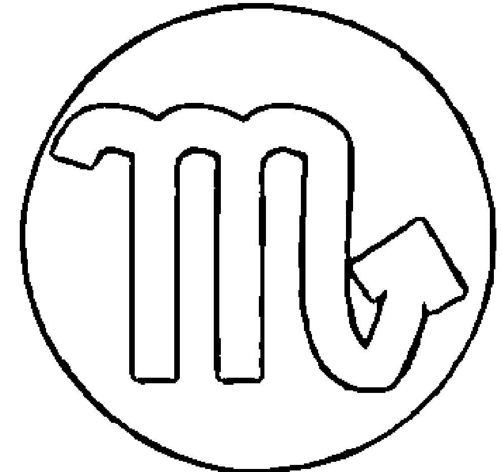

### 9. 射手座 Sagittarius

射手座的符號是象徵射手的箭，回到象形的簡單形式：由射手座的神話可以看出射手座的智慧和愛好自由。射手的原型是拿弓箭的人馬，下半身的馬象徵追求絕對自由，上半身的人象徵知識和智慧，而手中的箭，則表現出射手的攻擊性和傷人的一面。

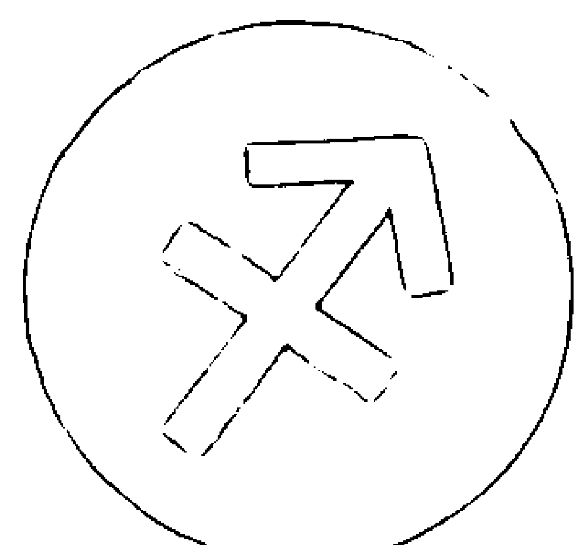

### 10. 摩羯座 Capricorn

摩羯座的符號是象徵羊的頭和魚的尾，抽象但基本上是象形的：由摩羯座的神話我們可以知道摩羯的擔心和恐懼。摩羯座又稱山羊座，這是由於其上半身的山羊形象所致，有一種向上登峰的慾求，但別忘了，在水面之下摩羯座也有象徵感性的魚尾。

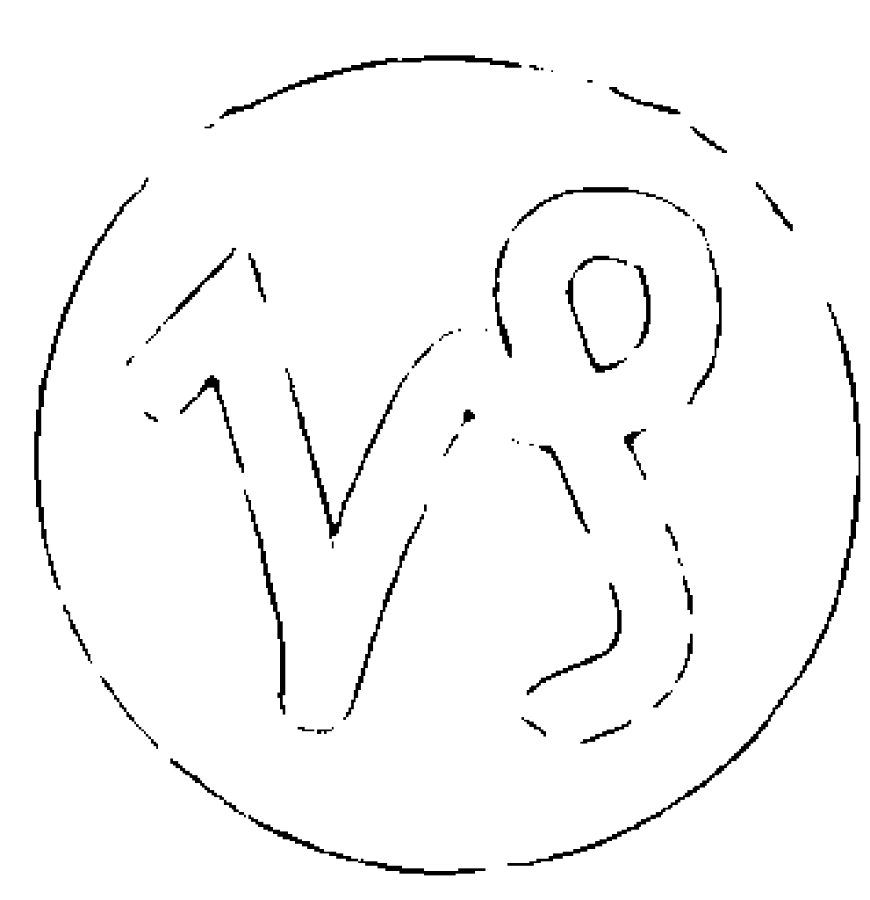

### 11. 水瓶座 Aquarius

水瓶座的符號是象徵水和空氣的波，是具象但又抽象的：由水瓶座的神話中，可以看出水瓶座的愛好自由和個人主義。象徵水瓶座的波，是高度知性的代表，由波的特徵去思考水瓶座的特質，看似有規律，但又沒有具體的形象，是一個不可預測的星座。

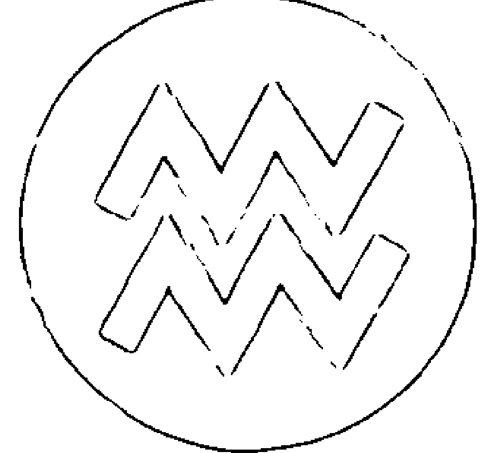

### 12. 雙魚座 Pisces

雙魚座的符號是象徵兩條魚，而其中有一條絲帶將牠們繫連在一起：由雙魚座的神話中可以聯想到雙魚座逃避的特質。雙魚座的兩條魚是分別游向兩個方向，除了表現出雙魚座的二元性之外，也象徵了雙魚座內在的矛盾和複雜。

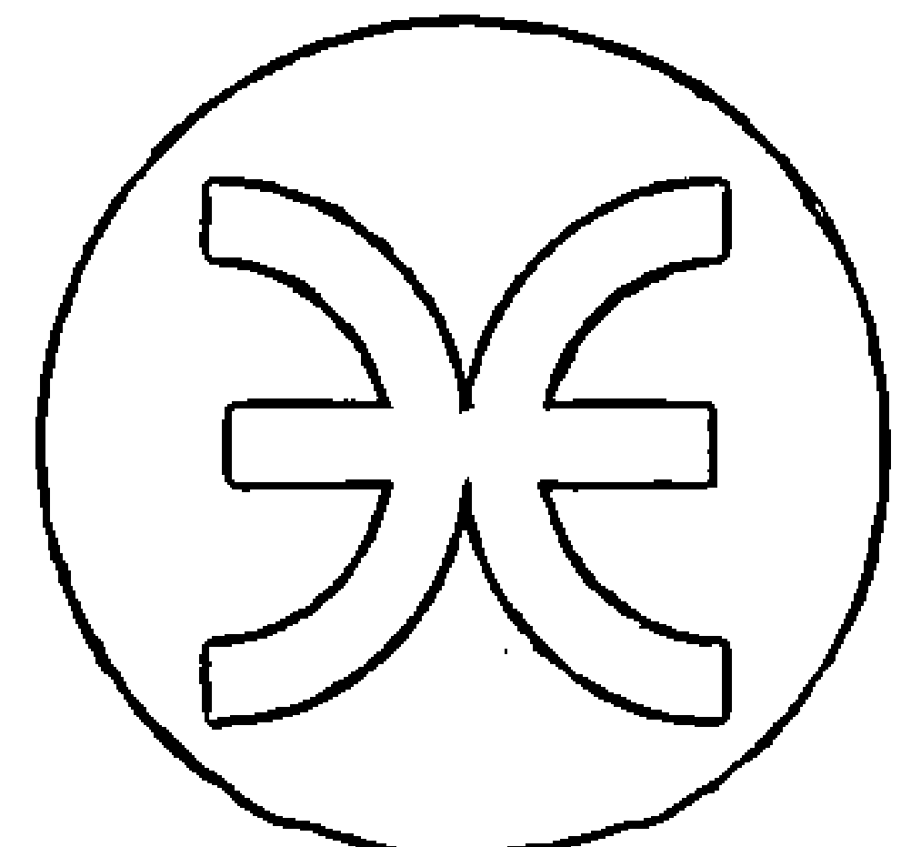

# 出生圖 2-2 行星介紹

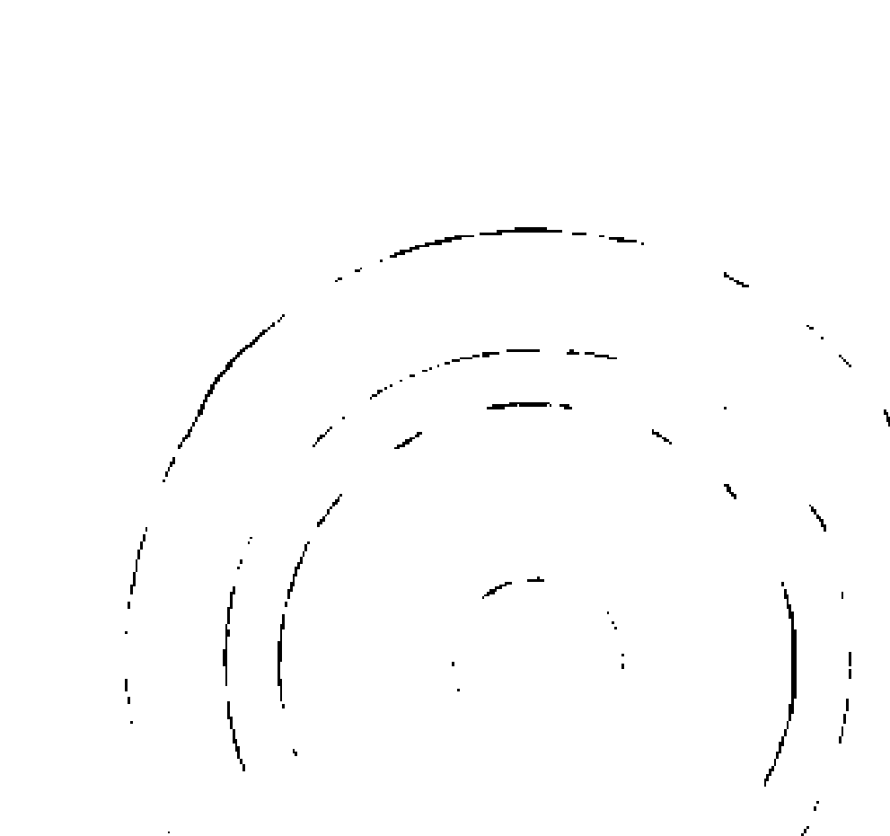

## 1. 太陽 Sun

○象徵著精神的圓，圓中有一小點，意味著混沌中生命的萌芽。太陽守護獅子座：在個人出生圖上的意義是自我表現。為一切行星光之來源，故影響性格。由太陽來看獅子座，可以發現其受現和發光份的特質；另外，太陽常常被比喻為帝王，這和獅子座的愛面子和王者之風也有關係。

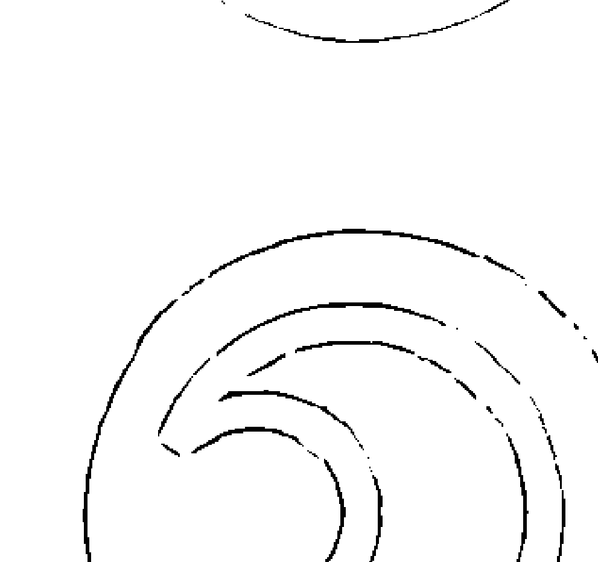

## 2. 月亮 Moon

○象徵靈魂的新月，代表著與過去或前世的關連。月亮守護巨蟹座：在個人出生圖上的意義是情緒。主宰人的反應，由月亮聯想巨蟹座的特質，立刻想到如月亮圓缺般的情緒起伏，和如月光一般的浪漫；另外，和月亮有關的母親也和巨蟹照顧的特質有關。

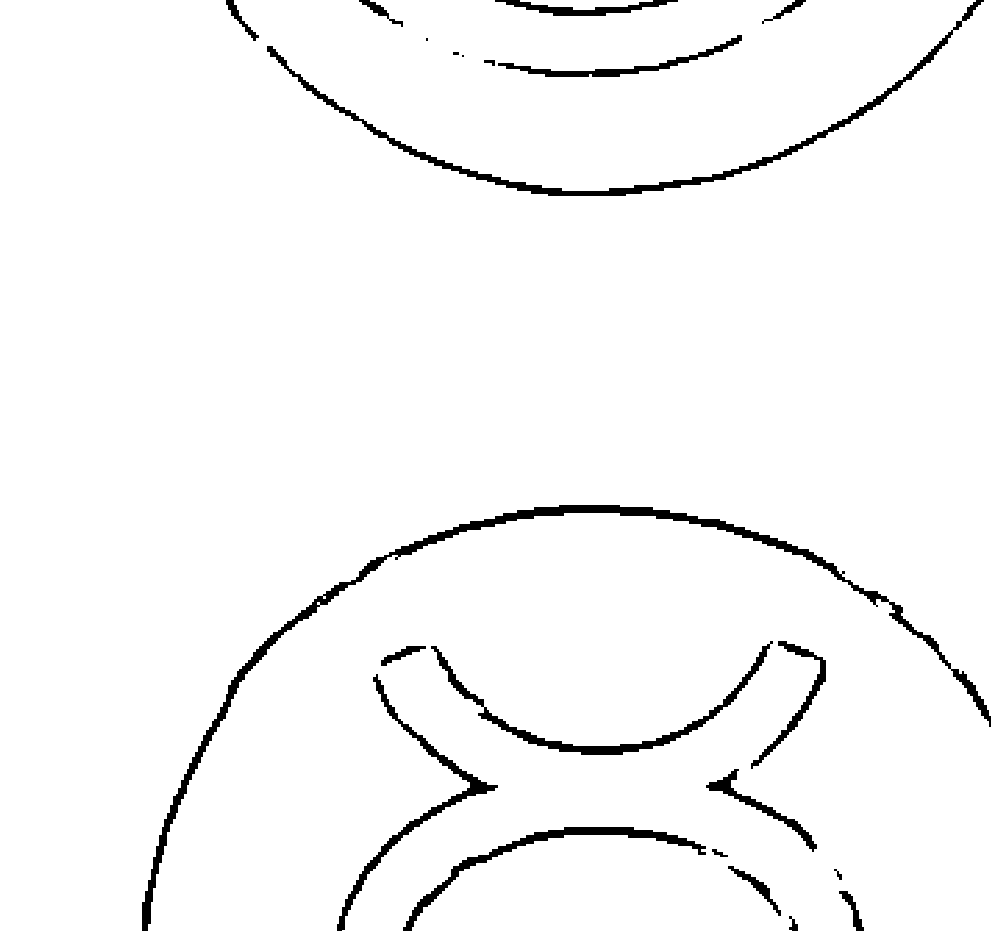

## 3. 水星 Mercury

○神祕的水星符號，精神連結了物質與靈魂，產生三者的結合。水星守護雙子座和處女座：在個人出生圖上的意義是理性。表現人的思考傾向及表達能力。由水星想像雙子座的特質，可以聯想到快速的思考和一大堆的小聰明；當然，雙子的廣播電訊特質也可以由此聯想。由水星聯想處女座的特質，大部分人都可以想到挑剔和分析的特性；但是處女座的細密心思也與水星的守護有關。

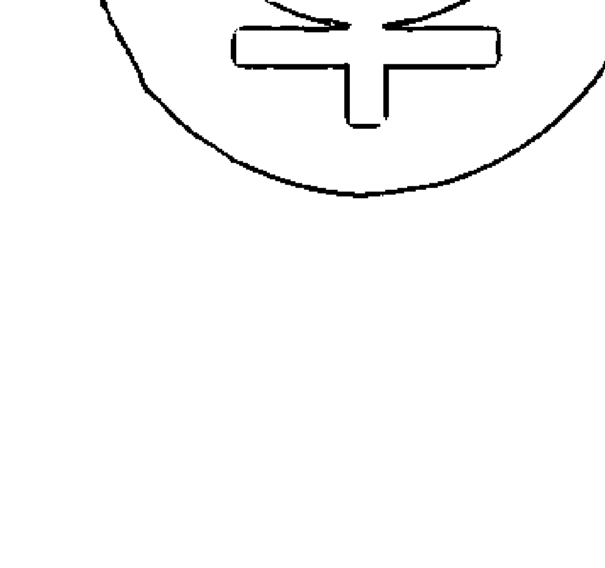

## 4. 金星 Venus

○代表精神的象徵凌駕了物質，愛與美的追尋。金星守護金牛座和天秤座：在個人出生圖上的意義是喜好。主宰人的感們，由金星去想金牛座的特性，常會想到佔有欲和存錢的習慣；從另一方面來說，金星也和金牛座和平的特質有關。由金星聯想天秤座的特質，一定不會忽視天秤座的愛美天性；但是同時也因為金星守護的關係，天秤座也可能有享樂主義的傾向。

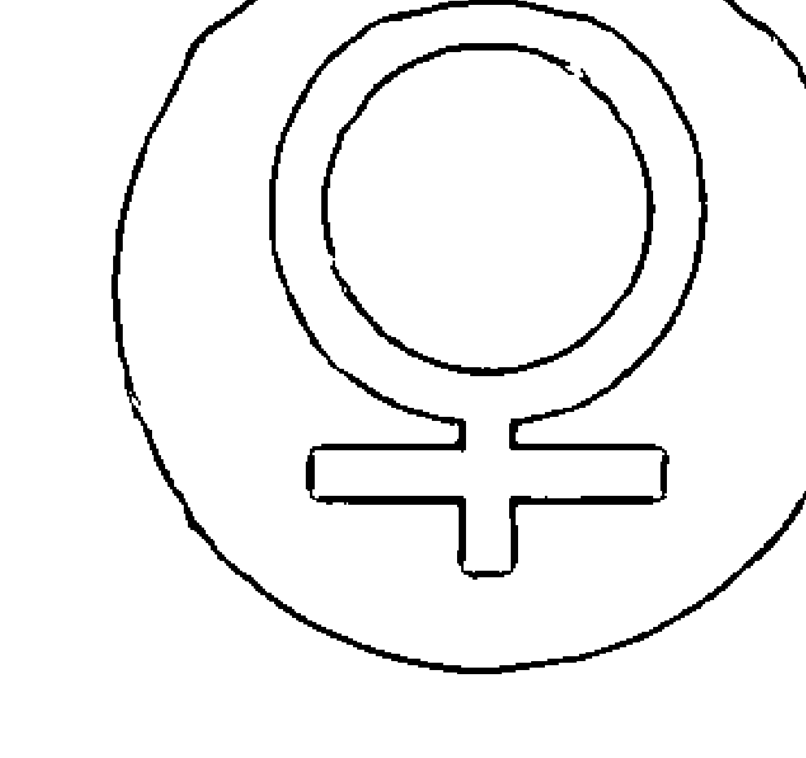

## 5. 火星 Mars

○與金星相反，物質的慾望超越了精神，強烈的佔有。火星守護牡羊座與天蠍座：在個人出生圖上的意義是衝動，代表人的佔有欲表現方式。由火星去聯想牡羊座與天蠍座的特質，很快就可以想到衝動和精力充沛；同時和火星有關的特質還有其不畏一切的勇氣。

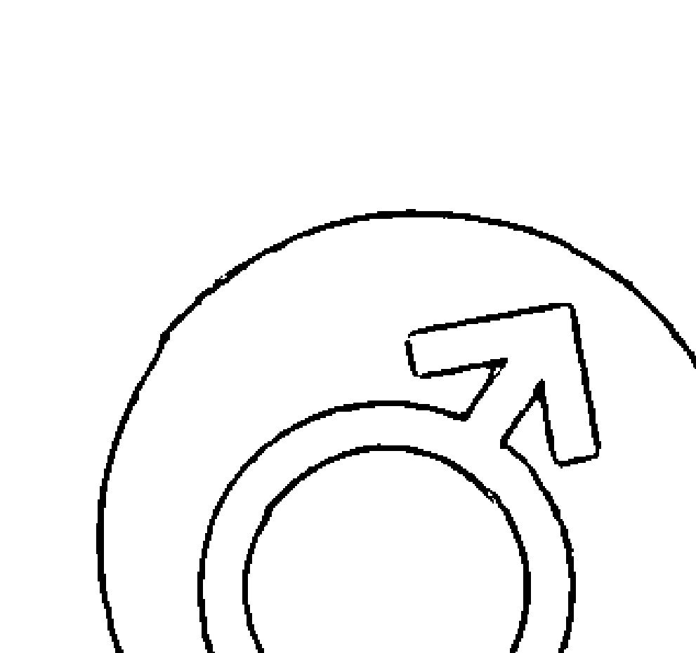

## 6. 木星 Jupiter

○靈魂在物質之上，代表靈魂支配了物質而提升。木星守護射手座與雙魚座：在個人出生圖上的意義是擴展。人的”福氣“，精神生活狀況！由木星去看射手座的特質，可以發現誇張的表現和不斷追求新經驗的特質；另一方面來看，射手座的哲學性也和木星有關。

## 7. 土星 Saturn

○物質在靈魂之上，靈魂受物質的禁閉而異質化，充滿困難。土星守護摩羯座與水瓶座：在個人出生圖上的意義是限制，以及人的受挫方式。由土星去聯想摩羯座的特質，大概都可以想到保守和冷淡：但別忘了，摩羯座重視經驗與踏實的特質也和土星有關。

## 8. 天王星 Uranus

○精神上的物質，將靈魂分開，象徵解開過去，邁向未來。天王星守護水瓶座：在個人出生圖上的意義是改變，以及與眾不同的能力。由天王星去想水瓶座的特質，其中最明顯的就是水瓶座的標新立異和與眾不同；可是其實水瓶座的發明天分也和天王星有關。

## 9. 海王星 Neptune

○被物質打入的靈魂，代表自我犧牲。海王星守護雙魚座：在個人出生圖上的意義是幻想。與個人的想像力相關。由海王星去聯想雙魚座的特質，可以發現其包容力和浪漫的特質：另一方面，雙魚座狡猾的特質也和海王星有關。

## 10. 冥王星 Pluto

○靈魂在物質與精神之間，象徵潛能的巨大轉變。冥王星守護天蠍座：在個人出生圖上的意義是重生。形成個人神祕的部分。由冥王星去想天蠍座的特質，不難想到其深沉又不為人知的特色：此外，天蠍座堅強的意志力也和冥王星有關。

### 四小行星

四小行星代表春夏秋冬的過程，婚神星象徵春天，代表婚姻：灶神星象徵夏天，代表努力；穀神星象徵秋天，代表收穫：智神星象徵冬天，代表溫熱的智慧。

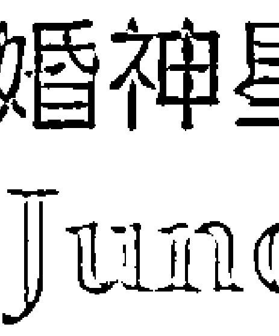

婚神星 Juno

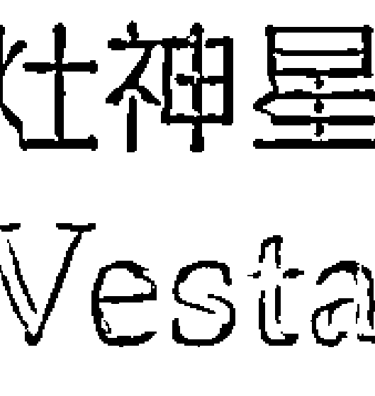

灶神星 Vesta

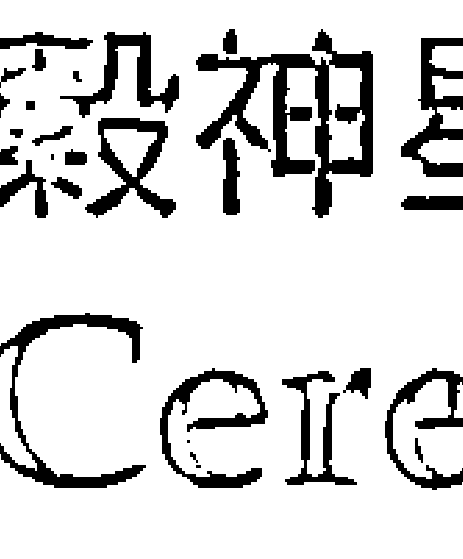

穀神星 Ceres

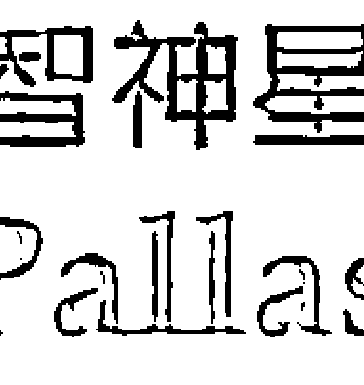

智神星 Pallas

### 凱龍星 Chiron

凱龍星的代表是半人半馬怪凱龍，象徵療傷與不尋常的智慧。

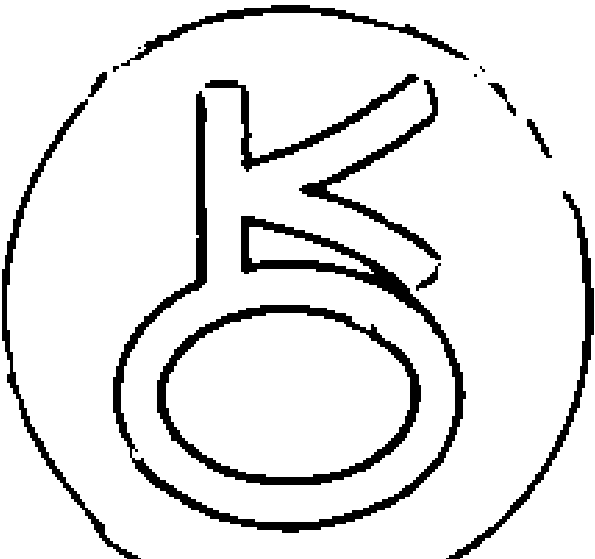

### 月交點 Moon's node

月交點代表潮流的演變，北交點象徵潮流將往的方向，南交點則象徵潮流的過去。

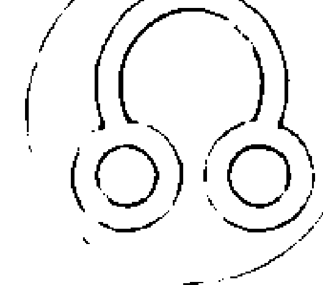

北交點

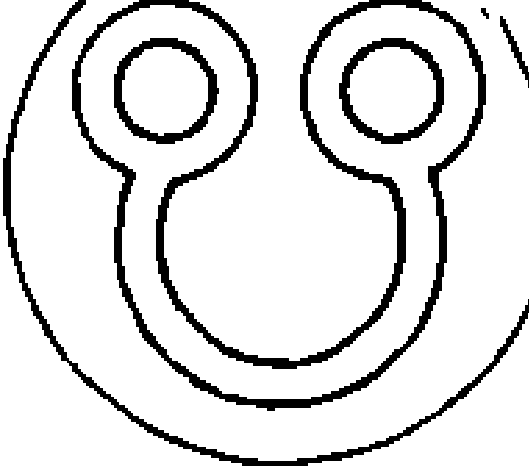

南交點

# 占星學的分類法

星座分類法的起源很早，依彼此的特性將同一屬性的星座加以歸納。占星學自有一套邏輯，而星座的分類法正是這種邏輯的一種展現，在下面所介紹的幾種分類法，都是由牡羊座開始，將黃道十二星座均等地分入各類別中，而每一種分類法又代表了各自的一種看法，形成各自完整的體系。對一個占星的初學者而言，星座的分類法是記憶與了解星座特質的一個好方法；不但可以將星座的特質作一種邏輯性的記憶，更可以對星座的理論有更進一步的了解，也可以對星座之間的關係有更深一層的認識。

十二星座的分類中，包含了陰陽、三特質與四元素。四元素包括火、風、水、土四種特質，三特質則是三種內在行動方式，為主動、不動、易動。陽性積極，陰性消極。當行星進到主動星座時，他會變得比較主動去改變環境，創造環境，影響環境！而不動星座則行星的特質會傾向不易受環境改變！易動星座則會容易隨周圍改變原有的特質！而四元素也就是四象中火象有熱情；水象重感情；風象有智慧；土象重感官！

因此如果你的行星（太陽、月亮、金星、水星…

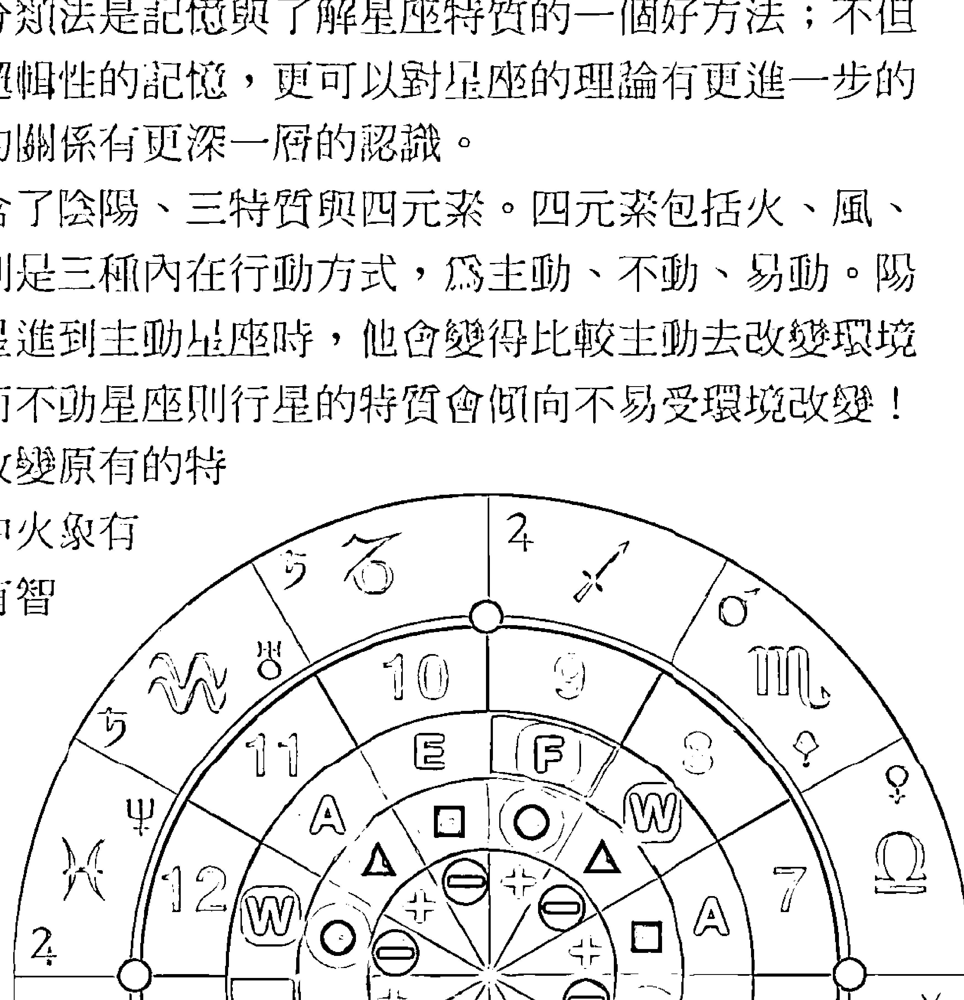

等) 大部分都落在主動星座的話，那你會傾向於是一個主動改變周遭的人。如果你的行星多落在水象的話，則你會是個感情豐富的人！這說明了為何一個處女座的人可能很活潑，如果他的其他行星都是很活躍的像是牡羊或獅子，那他的行為就可能會有火象的樣子！星座的分類也延伸到了宮位，宮位也一樣可以分為陰陽、三特質與四元素，分類法可以讓我們更容易對一個星座或宮位的特性得到了解，因此如果想了解占星學，哪些星座是屬於哪個元素，是什麼特質，是陽性或陰性是必須清楚的！

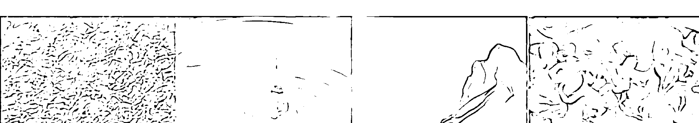

## 二分類法-陰與陽

陰、陽二分法是最直接而自然的分法，將星座由白羊座起，單數為陽，雙數為陰。依逆時針方向排列陽、陰，陽、陰，…，這就是就是二分類法。陽性象徵剛強、男性、動態；陰性象徵柔順、女性、靜態。

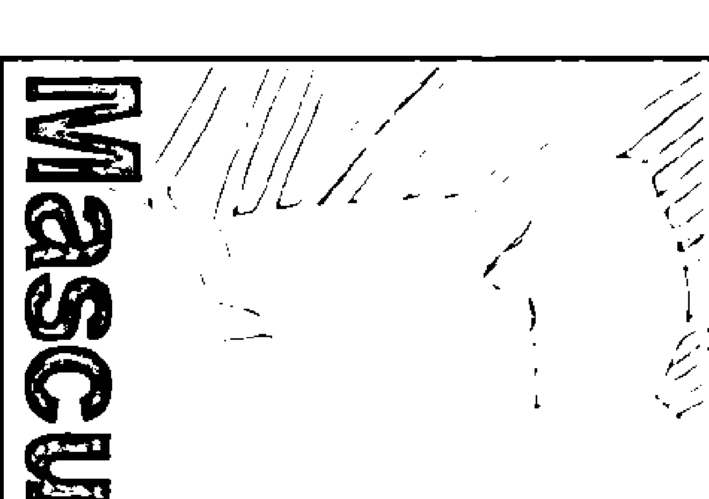

### 1. 陽性星座 MASCULINE SIGN

陽性星座有：牡羊座、雙子座、獅子座、天秤座、射手座和水瓶座。與陰性星座相較之下，陽性星座較為外向、主動而帶有侵略性，這類星座的人個性較積極、主動、樂觀、開創性強，成功的機會較大和較快。

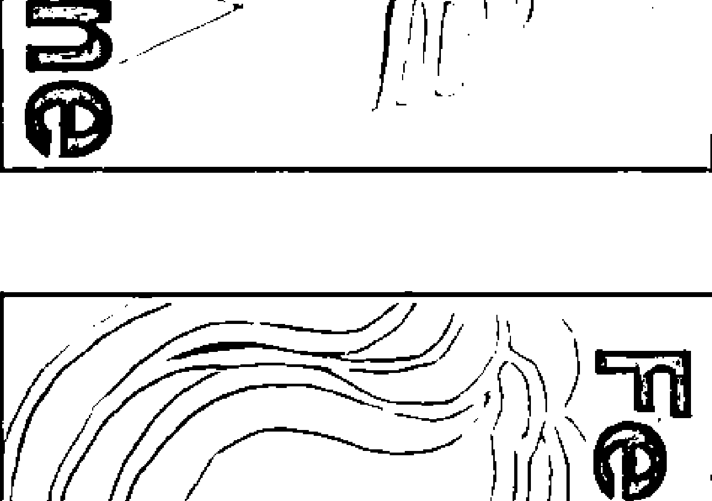

### 2. 陰性星座 FEMININE SIGN

陰性星座有：金牛座、巨蟹座、處女座、天蠍座、摩羯座和雙魚座。相對於陽性星座而言，陰性星座較為內向、被動而有包容力。這類星座的人個性較悲觀、被動、消極，雖然開創性較弱和較慢，但成就具有永恆性。

## 三分類法—特質 QUALITY

三分類法是由牡羊座開始，依逆時針方向排列為主動、固定、變動，因此同一特質的星座會是彼此的四角，形成十字形。主動象徵自主的改變，固定象徵穩定與不為所動的特質，變動則象徵適應與隨着環境而變化。

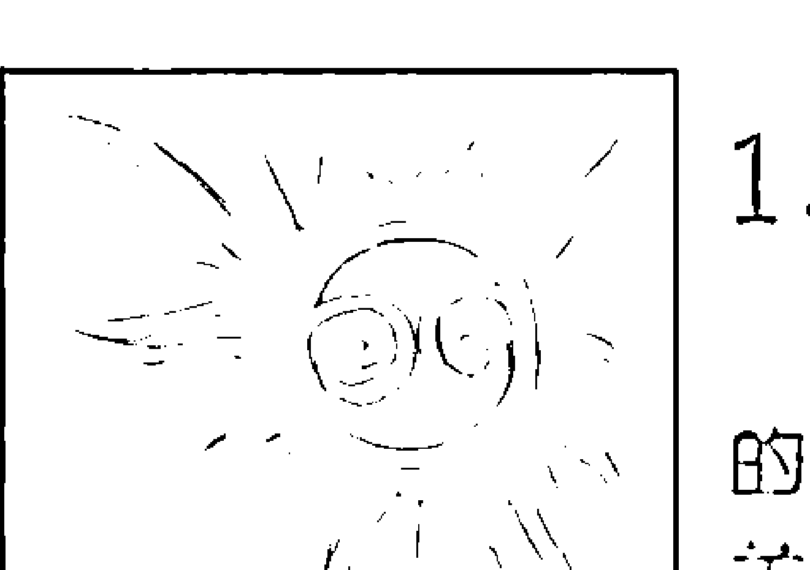

### 1. 主動星座 CARDINAL SIGN

主動星座包括：牡羊座、巨蟹座、天秤座和摩羯座。帶有一個開創的特質。這四個星座分別掌握四季的強旺之時，代表開創和主導：牡羊(東)主春季；巨蟹(南)主夏季；天秤(西)主秋季；摩羯(北)主冬季。這類星座的人熱切而野心勃勃，熱忱且獨立，心思敏捷；但不易滿足，做事倉促草率，枉顧他人感受，批判自我。

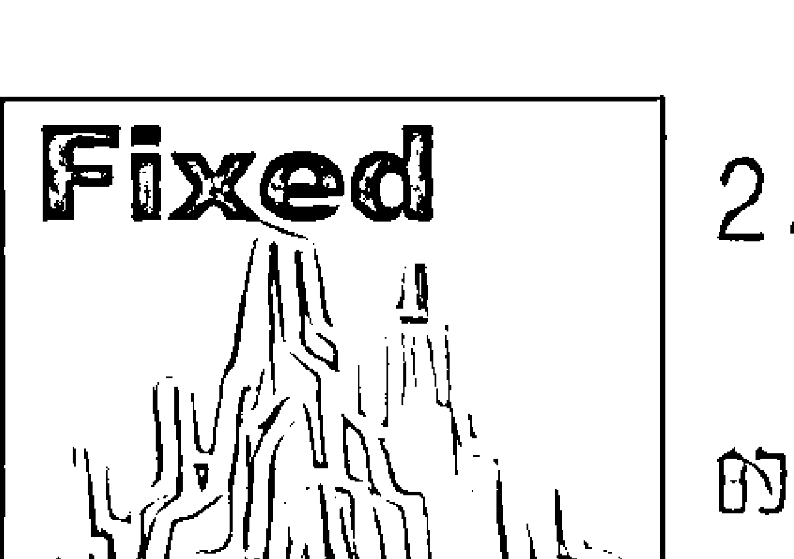

### 2. 固定星座 FIXED SIGN

固定星座包括：金牛座、獅子座、天蠍座和水瓶座。帶有一個守成的特質。這四個星座皆固定於每個季節的末段，代表守成、忍耐和穩定。這類星座的人專注、意志力強、穩定、眼光遠大、記憶力強、洞察及分析力俱佳，成功並遜然根基扎實；但頑固、自我中心且一成不變。

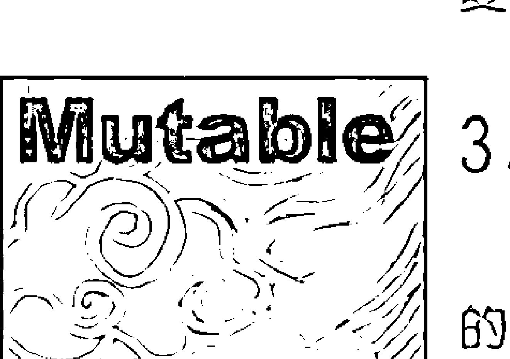

### 3. 變動星座 MUTABLE SIGN

變動星座包括：雙子座、處女座、射手座和雙魚座。帶有一個適應的特質。這四個星座處於每個季節的轉換，正是準備換季的時候。因此這四個星座代表變動、適應和轉換。這類星座的人多才多藝、善於變通、心思細膩、適應力強；但狡猾、詭詐、短視、不可靠而且缺乏恆心。

## 四分類法—元素 ELEMENT

西方將世界分為四大元素，占星學也以此將星座分為四類，由牡羊座起，依逆時針方向排列為火、土、風、水…，稱為四分類法。將十二星座分類為火、土、風、水等四大元素，這四大元素在黃道十二宮的排行上對應，相生相剋。其中，火象與風象屬於陽性星座。土象與水象則是陰性星座。火象代表直覺，是屬於易怒的氣質；土象代表感官，是憂鬱的氣質；風象代表智性，屬於快活的氣質；水象則是感覺，是冷靜的氣質。

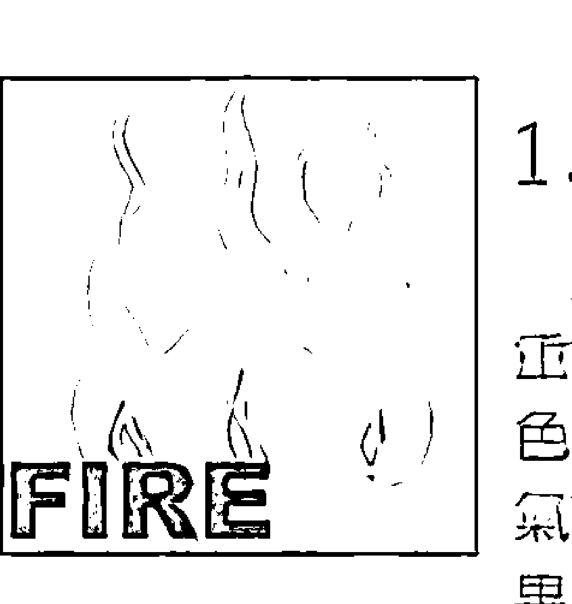

### 1. 火象星座 FIRE SIGN

火象星座包括：牡羊，獅子，射手。一般來說，火象星座較為衝動，正視直覺，很有自我但卻沒什麼耐性。溫暖、狂熱都算是火象的基本特色，而他們最擅長的拿手絕活是「煽風點火」、「鼓動人心」，他們的脾氣有點火爆，是想到說到就要做到的行動派。這類星座的人性格熱情、果斷、自信、率性而天真；但是也自負、率性、獨斷、衝動和激烈。大多充滿熱情，性格激烈。是非常有個性的一群。因為火需風的助力方能燃燒，所以和風象星座比起來是處於弱勢地位。

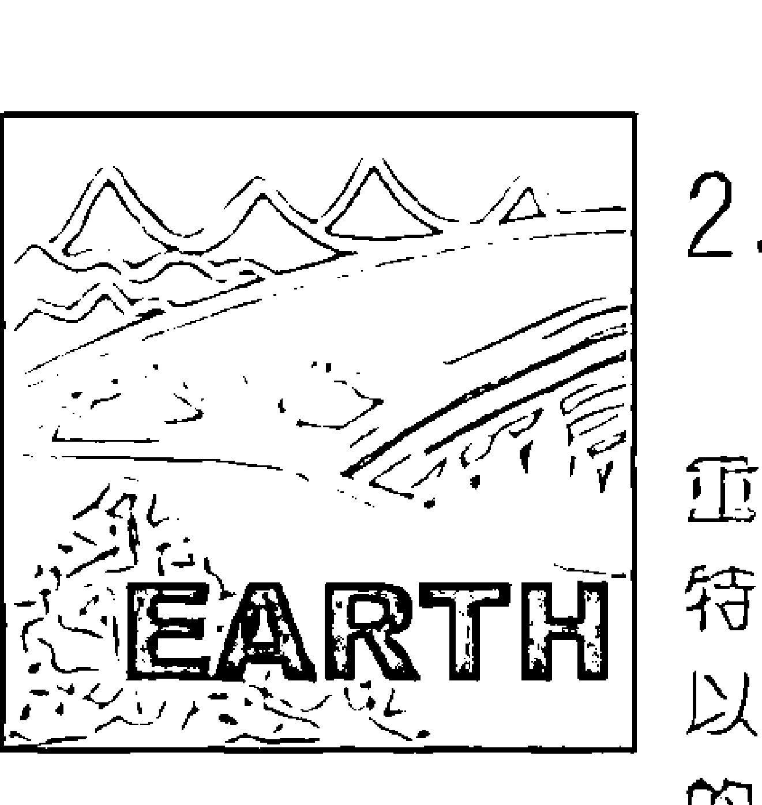

### 2. 土象星座 EARTH SIGN

土象星座包括：摩羯，金牛，處女。一般來說，土象星座較為實際，重視感官，有豐富的常識但是固執己見。穩定、現實主義是土象的基本特色，他們重視物質條件及感官享受。因為是跟隨在火象星座之後，所以他們肩負達成任務的使命。它們是黃道十二宮的構成者。這類星座的人性格實際、獨立、保守及官能主義；但是笨拙不靈巧，流於物質主義。做事小心謹慎，踏實穩健。是非常實際的族群。大地需要水的滋潤滋潤，否則就會乾涸龜裂，所以容易受水象星座引導。

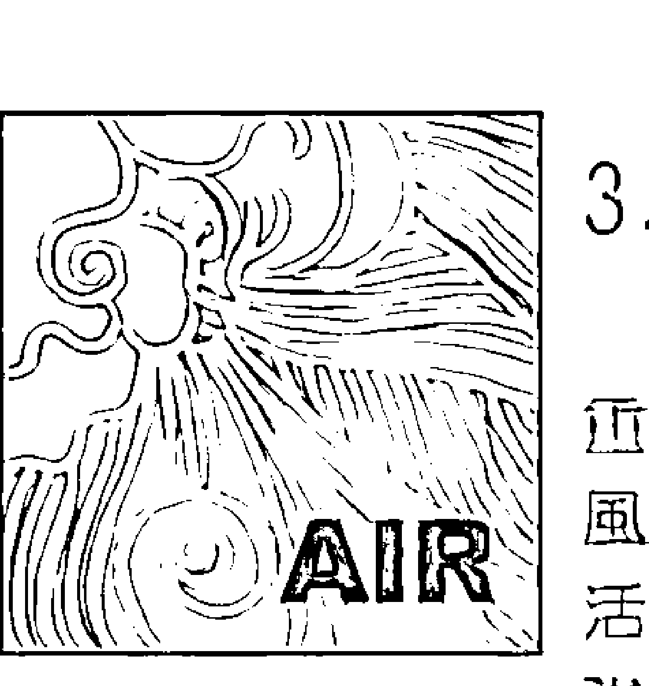

### 3. 風象星座 AIR SIGN

風象星座包括：水瓶，雙子，天秤。一般來說，風象星座較為理性，重視思考，能客觀看待人、事，但是較為冷漠。富有智慧、善於交際是風象的基本特色，他們尤其擅長演講及說服的差事，憑藉巧言令色的絕活，他們能接納土象星座打下的基礎而發揚光大。這類星座的人表達力強、重思考、有邏輯頭腦、心胸廣闊而且客觀；但趨於理想主義、冷漠和不切實際。處理感情問題時格外冷靜。是十分理性的族群。但思緒浮動的他們，能很快的被土象星座的穩重吸引。

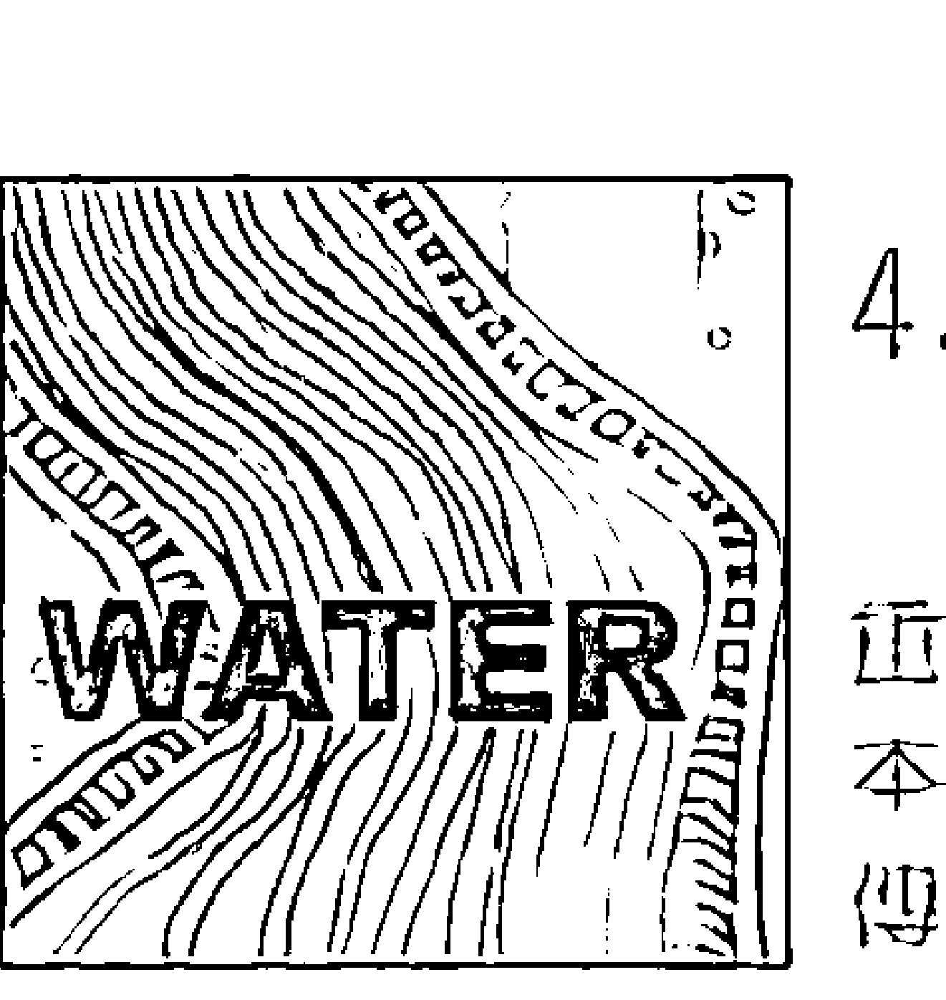

### 4. 水象星座 WATER SIGN

水象星座包括：雙魚，巨蟹，天蠍。一般來說，水象星座較為感性，重視感情，想法浪漫但不切實際。情緒、感覺、想像力是水象星座的基本特色，他們雖然不如風象星座的現已普遍，但他們藉由情感的表達來傳遞他們對這世界的感受卻是無人可及的。這類星座的人直覺強、敏感、多愁善感、深沈而且持久；但易受外界影響，放縱、自憐、經常猶豫不決、心思細膩而敏感，十分情緒化，是感性的一群，過於感受性而缺乏魄力，因此需要火象星座的衝勁。

# 十二星座

在占星學上，黃道12星座是宇宙方位的代名詞。黃道12星座代表了12種基本性格原型，一個人出生時，各星體落入黃道上的位置，說明著一個人的先天性格及天賦。黃道12星座象徵心理層面，反映出一個人行為的表現方式。簡單的說，12星座是12種基本的分類，象徵宇宙的12種型態。因此，12星座也跟顏色、金屬、寶石、動植物等等有所對應，至於人體那更是不用說了。所謂天人合一，天上的變化會引發種種地上的對應，天、地、人彼此是相互感應，息息相關的。

## ♈ 牡羊座：頭部
- **優點：** 心思純潔、有正義感、勇敢不怕困難。
- **缺點：** 重自我、不顧他人、急躁、粗心。

## ♐ 射手座：大腿、臀部
- **優點：** 聰明、愛好自由、坦率率真、活潑大方、和平友善。
- **缺點：** 太過粗心、粗心大意、做事衝動、喜怒形於色、沒耐心。

## ♎ 天秤座：腎臟
- **優點：** 追求公正、已受人際事物、文雅、浪漫、口才佳、有藝術路。
- **缺點：** 猶豫不決、好辩、愛找藉口、好逸惡勞。

## ♏ 天蠍座：生殖器
- **優點：** 欲行能力強、意志堅定、性感魅力、沈穩內斂。
- **缺點：** 城府心機、愛恨分明、佔有慾強、有報復心。

## ♉ 金牛座：喉嚨
- **優點：** 有耐心、脾氣溫和、腳踏實地、堅持到底、有藝術氣息。
- **缺點：** 固執、不知變通、佔有慾強。

## ♑ 摩羯座：膝部、骨骼
- **優點：** 重視傳統、不畏艱難、堅忍有毅力、重紀律。
- **缺點：** 只重自己、不知變通、不夠活潑、太現實。

## ♋ 巨蟹座：胸部、胃
- **優點：** 感情真摯、念舊、體貼溫貼、善解人意。
- **缺點：** 情緒起伏不定、多愁善感、過度保護自己。

## ♊ 雙子座：手、肺
- **優點：** 反應快、機智、足智多謀、口才好、多才多藝。
- **缺點：** 不專心、容易矛盾、見異思遷。

## ♌ 獅子座：心臟
- **優點：** 熱情、大方慷慨、同情弱小、有領導力。
- **缺點：** 自尊心強、好面子、虛榮、巴結奉承。

## ♍ 處女座：腸、消化系統
- **優點：** 守秩序、勤勞、追求完美、腳踏實地、口才伶俐。
- **缺點：** 吹毛求疵、挑剔、人際關係不好、杞人憂天、神經質。

## ♒ 水瓶座：小腿、循環系統
- **優點：** 樂於助人、有創意頭腦、有前瞻性。
- **缺點：** 特立獨行、怪異行徑、對人冷淡、不切實際。

## ♓ 雙魚座：腳、體液
- **優點：** 慈悲、口說好話、想像力好、溫柔、善解人意、重視內心。
- **缺點：** 太情緒化、逃避現實、不善理財、受騙上當、有時依賴性強。

# Aries〔牡羊座〕

⊕阳性 □ 主动 Ⓕ火象

主宰星：火星♂

守护星为热和干燥的火星：积极、斗志高昂，颇有开拓者的精神，由于正义感强，所以有路见不平拔刀相助之风，善恶分明、嫉恶如仇

牡羊座是黄道12星座中的第一个星座，太阳通过此星座约在3/21日至4/20日左右，这段期间就是夜间要变得比昼间短的「春分」时节，各种花卉开始绽放开花，万物开始复甦。星座图像是代表冲动莽撞的一头公羊，象征着直接与向前开拓的特性。他的基本含意是自我主张，新生与开始，斗争性与开拓性，凡事不退让、争取第一的倾向。

受到火星的影响，具有战斗性与竞争性。性急、暴躁、好斗，生命力强，企图心旺盛，独断、自以为是、不听他人意见，勇敢大胆、不怕困难。

## 特性

牡羊座强势的人善于开创，凡事争先的性格，常能成为开路先锋，是充满活力而干劲十足的活跃者。他们做事很有衝劲，勇往直前不怕困难，以争取天下第一为其职志。不过他们往往过于急躁，而且只有三分钟热度，容易令人感到有勇无谋，加上未经世事磨练，缺乏思考而贸然行事，经常功亏一簣而感到后悔。他们好胜、喜爱竞争，容易跟别人产生冲突，由於过於自我，他们经常不顾他人感受、让人不舒服。牡羊座的人对新鲜的事物都很投入，对新的事物容易兴奋且好奇，勇于尝试，追求速度，像羊一般做事冲动莽撞。他们容易给人精力旺盛和办事能力很强的印象，性格刚烈、易怒，是个天生的斗士，身手矫健，但在意中人面前会流露出孩子气。

## 相关对应

| 项目 | 内容 |
|------|------|
| 颜色 | 红色 |
| 人物 | 战士、军人、拓荒者、铁匠、屠夫、救火队、好打斗的人 |
| 事件 | 打架、战鬥、竞赛、救火、生气 |
| 物件 | 刀剑、枪炮、火、羊、尖锐物、烤箱 |
| 场所 | 战场、竞技场、干燥地、五金行、消防局 |

# Taurus（金牛座）

- 阴性
- 固定
- 土象

主宰星：金星
守护星為象徵美和愛的金星 和平主羲者，内向而害羞，喜歡美好有價值的事物。慎而不小心，一旦下了決定就絕不輕易更改

金牛座是黄道12星座中第二個星座，太阳通過此星座在4/21日至5/20日期間，正是春花盛開的美麗季節。星座圖像是安靜又溫和的公牛，象徵著務實安定與溫順。他的基本含意是圓滿與自然而然，保守穩固、物質主羲、實際的擁有與感官的物然。

## 特性

金牛座强的人具有美好與調和的精神，更是溫順可親的人，實際、忠誠、有耐心。因為務實的性格，使得他們很懂得分析投資報酬率。他們不做沒意義的事，在意事物的價值。他們雖重視工作，如牛一般勤奮努力，但卻不會忽略休息的重要性，因此他們也喜歡享樂，在沒人打擾的狀況下，容易懶惰怠慢、放縱自己。他們也具有牛一般的固執脾氣，固執己見，鑽牛角尖且頑固古板。金牛座與偶爾狂野、偶爾安靜的自然力量有關，他是跟地球最相關的星座。雖然他們平常總是一副溫和的模樣，其實卻很倔強，而且占有欲強，一旦使他們發怒，就會非常強烈，一發不可收拾。他們世故但性格穩重持久、有耐性、實際，但也缺乏應變能力，因為過於實際，也有贪婪的一面，對金錢比較執著。

## 相关对应

| 项目 | 内容 |
|------|------|
| 颜色 | 黄橙色 |
| 人物 | 畜牧者、資本家、管樂家、園藝家、溫和的人、銀行家 |
| 事件 | 藝術、管樂、商業、理財、資本主羲、園藝 |
| 物件 | 美的東西、美食、金錢、牛、飾品、有價值的東西 |
| 场所 | 大自然、田園、銀行、音樂廳、美術館 |

# Gemini (雙子座)

⊕ 陽性 ○ 變動 Ⓐ 風象

主宰星體：水星。守護神為司掌智慧和辯才的水星 頭腦反應快、理解力好，能舉一反三，收集情報的能力好，適合有變化的環境性質。

雙子座是黃道12星座中第三個星座，太陽通過這星座在5/21日至6/21日期間，是春天轉為夏天的時刻。星座圖像是一對雙胞胎為代表圖案，暗示出他的雙重個性。他的基本含意是雙重與矛盾、多元性的變化，多才多藝與一心多用，反應靈敏、具有變通性。受到水星的主宰，因此它和學習及溝通有關。他們非常聰明，有敏捷靈巧的機智反應，喜歡追求不同的知識與訊息。他們學東西很快，並且能把學到的新東西，很快地傳達出去。善於溝通表達，也很會與人談判及交易。

## 特性

雙子座強的人大都多才多藝，求新求變的性格趨使下，使他們欠缺耐心，學東西不夠深入，容易多而不精。當他們覺得所學不夠時，會使他們常有神精緊張的現象。由於對事物缺乏恆心，經常讓人感覺到他們喜新厭舊而善變。他們就像花蝴蝶般穿梭於每個人之間，由於口才很好，因此很受說話。不但頭腦靈敏多變，而且推理能力優於他人甚多，他們是天生的傳遞者，是人與人間的溝通媒介。他們反應很快，能夠舉一反三，喜歡耍耍小聰明，但容易浮誇不實，狡猾、光說不練。他們看起來機靈而且令人覺得活潑生動，一雙靈動好奇的眼晴、加上多才多藝，因而容易受異性喜愛，但生性輕浮善變，並有雙重性格，給人非常花心的印象。

## 相关对应

| 项目 | 内容 |
|------|------|
| 颜色 | 黃色 |
| 人物 | 兄弟姊妹、同僚、鄰居、報馬仔、媒體人、記者、機靈的人 |
| 事件 | 新聞、資訊、廣播、交通、八卦流言、交談 |
| 物件 | 信件、電話、交通工具、雜誌、海報 |
| 场所 | 學校、馬路、郵局、電台、便利商店 |

# Cancer (巨蟹座)

☽ 阴性 □ 主动 ⓦ 水象

主宰星：月亮
月亮为其守护神，因此感性而细腻，情绪的起伏很大，好恶感重，重视家庭的和谐，讨厌与人起冲突，创造力、感受力特别强。

巨蟹座是黄道12星座中第四个星座，太阳通过此星座的6/22至7/22的期间正是夏天来临的时刻，也是日照从最长开始转短的时期。代表图像是一只螃蟹，意味着这个星座的人在受到伤害时会躲进壳中以保护自己。他的基本含意是保证与防卫，安全感与满足感，敏感的心情感受与情绪波动。

受到月亮的影响，巨蟹座的人具有天生的母性，很会关心照顾别人，他们很重视亲情并且喜欢家庭的温暖，因为在家中会让他们有安全感，善于打理家事，能把家事做得不错，具有丰富的生活能力。

## 特性

巨蟹座强的人让人感觉亲切、温馨，情感非常丰富，很容易情绪起伏，他们情绪变化丰富而感性，渴望温情的抚慰，容易缺乏安全感。他们记性特别好，因此非常念旧，喜欢收集过去的回忆，也容易翻旧账。因性格敏感害羞而容易有焦虑不安的情绪反应，过于情绪化、自怜、难以取悦。他们的本位主义十分强烈，对于陌生的人、事、物想要进入他们的情感中，不是一件容易的事，对外来的排拒性很强，所以家园观念非常强烈。爱家的天性，眼神充满感情，给人善解人意的感受。不论男女，巨蟹座的人都具有一种母性特质，会本能的去关怀无助而依赖心重的人。他们遇到问题时总是迂迂回回的，不会正面解决，往往使问题更加严重。

## 相关对应

| 项目 | 内容 |
|------|------|
| 颜色 | 灰蓝色 |
| 人物 | 母亲、奶妈、皇后、厨师、照顾者、情绪化的人 |
| 事件 | 历史、家庭、关心、心病、家族、回忆、烹饪 |
| 物件 | 土地、房子、烹饪用具、家用品、古董、甲壳动物 |
| 场所 | 家里、厨房、餐厅、水边、古董店 |

# Leo【獅子座】

⊕ 陽性 △ 固定 Ⓢ 火象

主宰星曜：太陽
太陽為其守護神 陰朗、心胸宽阔、獨立心強，喜歡領導者、大姊姊、老大去照應他人 所以而在人群中总是出類拔萃而可一展雄风

獅子座是黃道12星座中第五個星座，太陽在7/23日至8/22日通過獅子座，正是盛夏時節。以萬獸之王的獅子為星座的象徵圖形。表現出獅子的驕傲與高高在上，驕傲、忠貞和凶猛。他的基本含意是中心與重心，代表所有事物的焦點，因而期待成为佼佼者，受人注目、如王者般君临天下。

受到太陽的照耀，他們重視榮譽，具有高貴的氣質，光明而熱情。喜好華麗耀眼明亮的事物。他們天生具有父性，像太陽一般照耀四周的人，慷慨大方的付出自己。也喜歡受到注目，爱现、虚荣。

## 特性

獅子座強的人有領導者的風範，他們天生貴氣，莊重而高貴的態度，具有堅定不移的個性。為人光明磊落，對耍小手段的行徑嗤之以鼻。他們重視名聲，不願意一個人默默無聞，因此常用誇張的舉止表現來引起大家的注意。但是過度的自負心容易讓他們顯得自大，同時過度地玩樂也要當心不要樂極生悲。出生於陽光閃耀中的獅子座，個性格外的熱情開朗而且活得十分快樂，喜歡熱鬧及耀眼的光芒，深受戲劇或創造性的形式所吸引。因為受到重視可以使他們得到快樂，因此他們會盡力去成為眾人的焦點或是領導者。他們像個愛玩的小孩，有強烈的創造天賦、不錯的舞蹈及演戲天分。因為天生熱情開朗，因此戀愛對他們的人生格外的重要，他們會對所愛的人有信任感，並且忠貞不贰。

## 相关对应

| 项目 | 内容 |
|------|------|
| 颜色 | 金黄色 |
| 人物 | 父親、國王、領導人、英雄、明星、貴族、舞者 |
| 事件 | 表演、登基、創作、娛樂、英雄主義、權勢 |
| 物件 | 名牌、寶物、黃金、向日葵、權杖皇冠、貓科動物 |
| 场所 | 宴會、舞廳、公園、總統府、娛樂場所、表演場地 |

# Virgo (處女座) ♍

⚢ 陰性 ○ 變動 ♃ 土象

主宰星 ☿ : 水星
守護星為支配智能的水星 觀察力入微，分析能力強，任何事情都能從各種角度切入，在團體中最适合合作個智多星人物

處女座是黃道12星座中第六個星座，太陽將通過處女座的8/23至9/22日，是夏天轉換成秋天的時節，其象徵圖形是一名手持麥穗，像天使似的少女模樣，這意味著處女座的純真與潔淨。其基本含意是極致的完美，條理分明與整齊的秩序，不斷的分析與消化。

受到水星的影響，使他們擁有聰明靈巧的心智反應，為人實際，善於分析與批判，溝通表達能力不錯，但與雙子座的口才不同，他們較偏重於文字的表現。拘泥於細節，而且小心翼翼，挑剔而且嘮叨。

## 特性

處女座強的人非常要求完美且重視細節，往往能注意到枝微末節，在別人眼中常會覺得他們很細心，如果有充裕的時間，他們會把事情做到盡善盡美。行事條理及做事踏實的態度，使他們有條不紊。但過度挑剔的性格使他們容易忽略大處，往往會有見樹不見林之憾，在時間緊迫的狀況下，工作壓力容易令他們精神緊張。他們一般都非常實際，熱愛工作，喜歡服務他人。處女座的人極度愛乾淨，具有纖細的感受性，身體的健康對他們是非常重要的，因而偏愛健康的飲食與生活方式。他們善於分析、批判，因此容易批評他人，總給人吹毛求疵的感覺。愛好工作，尤其是具有服務性質的，同時關注細節的特性，使得他們往往是專業技術的人才。

## 相关对应

| 项目 | 内容 |
|------|------|
| 颜色 | 绿色、暗棕色 |
| 人物 | 護士、勞動者、完美主義者、評論家、處女、秘書、服務生、部門 |
| 事件 | 工作、健康、衛生、密書、專業技能 |
| 物件 | 健康食品、藥物、清潔用品、作文、顯微鏡 |
| 场所 | 衛生所、工作場所、乾淨的地方、服務機構 |

# Libra 〔天秤座〕

⊕ 陽性 □ 主動 Ⓐ 風象

主宰星：金星 ♀
代表美和調和的的金星為其守護星，應對得體、舉止優雅，公正而不偏不倚，注重和諧，因此團體中常擔任和事佬

天秤座是黃道12星座中第七個星座，太陽將通過這星座的9/23～10/23日期間，是空氣十分清爽的秋分季節。出生於晝夜均等時期的天秤座的人，是具有冷靜、公平批判力與富於理性者。星座圖像為正義女神所提的天平，象徵著公正平衡與正義。基本含意是和諧與調節，客觀的衡量，強調彼此合作關係的平等，具配合與妥協性。
受到金星主宰的天秤人，具有天生的美感，喜歡一切優美的事物，儀態優雅而高尚，深具魅力。善於社交活動，渴望獲得他人的認同。

## 特性

天秤座強勢的人重視公平，注重人際關係，喜歡和諧的氣氛。他們很理性，看事情的角度為多方面，往往會提出正面及反面意見，他們有時會為了追求公平，站在弱勢的一方，但那不代表是他心中真正的想法。他們喜歡藝術及美的事物，有很好的審美觀，很有文化氣息。因為強烈的正義感，會設身處地為別人著想，具有很高的妥協性。因此多半有不錯的人緣。但是因為重視公平的特質，常會造成欠缺決斷力，使別人覺得他們優柔寡斷，同時因為不願破壞和諧的氣氛，而不將心中的想法表述出來，容易有虛假的事情發生，使別人覺得他們偽善及鄉愿。他們非常擅於與他人交際，注重跟他人之間的關係是否和諧，因此他們非常注重婚姻關係，也努力於合夥關係的穩定。

## 相关对应

| 项目 | 内容 |
|------|------|
| 颜色 | 淡綠色 |
| 人物 | 協調者、斡旋的人、外交官、配偶、設計師、合夥人 |
| 事件 | 社交、婚姻、契約、藝術鑑賞、合夥、公關、和平 |
| 物件 | 藝術品、時尚、化妝品、天平、釣子 |
| 场所 | 仲裁所、美術館、禮堂、交際場所 |

# Scorpio [天蠍座]

陰性 固定 水象

主宰星：冥王星 火星
守護星為具有爆發力、洞察力的冥王星 個性陰沈、讓人捉摸不定，內心深處蘊涵強烈的猜疑心、鬥爭心，談感情很容易走極端

天蠍座是黃道12星座中第八個星座，太陽是在10/24~11/22日期間通過這星座，季節為已近秋末。星座圖像為蠍子，具有毒性的尾針，象徵這個星座的人就像蠍子一般，當受到威脅時，會給人致命的一擊，極具危險性。基本含意是強烈的慾望，毀滅與重生的力量。以牙還牙、以眼還眼。

受到火星與冥王星的影響，使得天蠍具有強烈的爆發力與破壞力，深不可測的內在與強旺的主宰慾，充滿了神秘感。冥王星的黑暗特質，對人性黑暗面的透測，增加他們對環境的洞悉能力。

## 特性

天蠍座強勢的人有很強的心靈直覺能力，能夠觀察周遭的變化而有所因應，感應到玄秘的黑暗世界並且看穿別人心中的想法。他們善於謀略且攻於心計，能長時間策畫一件事。他們有向困難挑戰的決心及勇氣，就算他們已經無路可走時，也會有逆轉性的變化發生。極端的個性，往往使他們喜歡絕對地掌控一切，重情重義的性格使他們有很強的佔有慾。但是因為報復心的趨使下，使他們容易作出毀滅性的行為，同時因為在意完全的佔有，而造成他們的得失心太強。天蠍座的人常走投無路時，會有自我毀滅及同歸於盡的傾向。他們性格頑固而且不易妥協，愛恨分明，外表冷漠但內心狂放熱情，容不得背叛、猜忌心重、嫉妒心強。曾將情緒隱藏起來，因此給人抑鬱而神秘的印象。

## 相关对应

| 项目 | 内容 |
|------|------|
| 颜色 | 深紅色 |
| 人物 | 間諜、偵察員、犯罪者、心理學家、喪葬業者、陰謀者 |
| 事件 | 生死、保險、遺產、心理學、性、陰謀、火山爆發 |
| 物件 | 寶藏、毒蟲、石油、核能、爬蟲類、秘密檔案 |
| 场所 | 地底深處、火山、色情場所、廢墟、淤塞的池塘、下水道 |

# Sagittarius【射手座】

⊕ 陽性 ○ 變動 Ⓕ 火象
主宰星：木星
司掌自由的木星為守護星，樂觀、冒險心旺盛，喜愛交朋友、旅行，討厭受束縛，追求一種自由奔放的人生

射手座是黃道12星座中第九個星座，太陽通過射手座在11/23到12/21日，秋天轉入冬天時。星座意象是代表神話中的半人半馬怪，象徵同時具備人性與獸性的雙重特質。神話中的人馬是一個精通各種學術的智慧生物，表現出射手座的高層次特質，他的基本含意是追尋與探索，追求自由而隨性，像那支箭不斷朝著目標前進，不會轉向與後退。
受到木星眷顧的馬兒，是天生的幸運兒，天性樂觀，坦率而直接，不會拐彎抹角。自信充滿活力，總是靜不下來。同時具有強烈的理想主義與冒險精神，勇於向未知的領域探索。

## 特性

射手座強的人熱愛自由，喜歡探險、追求知識新挑戰與文化探索。他們喜歡到處去遊歷，「行萬里路，讀萬卷書。」正是他們的最好寫照。喜歡從前人的經驗中體會出智慧，因此他們富有哲理性。狂放不羈的性格使他們酷愛大自然，不喜歡受拘束，而幸運之神也常降臨他們身上，使得他們很有自信。但是放縱的個性使他們不願安定，常用行為逃避而遠走他方，使別人覺得他們不負責任，而他們過度的自信心常會有喜歡渲染誇大、輕忽的行為表現，常常是他們失敗的根源。他們往往給人粗枝大葉的印象、熱情而且愛好運動，性格像是狂風般的快速，又像飛箭似的突飛猛進。常常因不夠圓滑、過於直接的性格而無意中傷人而不自知。

## 相关对应

| 项目 | 内容 |
|------|------|
| 颜色 | 紫色 |
| 人物 | 運動員、冒險家、教育家、哲學家、外國人、旅人 |
| 事件 | 旅行、探險、國外、教育、道德 |
| 物件 | 箭、馬、地球、運動器具、舶來品、飛機 |
| 场所 | 運動場、異地、法院、大學、天空 |

# Capricorn（摩羯座）

⊙ 阴性 □ 主动 ⊞ 土象

主宰星：土星

忍耐、抑制的土星为其守护星 努力而踏实，一步一步地把基础打牢固，任何事都讲求公平合理，所以待己也严以待人

摩羯座是黄道12星座中第十个星座，太阳通过这星座在12/22到1/20日期间，即是冬至季节，是夜间最长之时。星座象征图形被描绘成羊身鱼尾的图像，象征摩羯座的人像山羊攀登高峰一般，追求着人生的高峰。另一半鱼尾落于水中，表示摩羯不为人知感性的一面。他的基本含意是保守与节制、严肃谨慎，为了爬到顶点而刻苦努力。

受到土星的主宰的摩羯，是先天下之忧而忧的一群，一生充满着不断的挑战，稳健踏实而内敛、善于自律，具有强烈的耐力和长期的执着。重视法律与传统，遵守规则与命令。

## 特性

摩羯座强的人个性沉稳，重视纪律，在他们心目中，没有一步登天的想法，总是务实的努力工作。就算他们总是遇到困难和挫折，或是别人的冷嘲热讽，也不以为意。将失败的痛苦转换成未来成功的经验，同时也将这种经验和别人分享。他们的组织架构能力很好，层次分明、井然有序，他们也遵守秩序，注重公权力及权威，他们自律甚严，有坚强的忍耐性。不过踏实的性格，使他们很喜欢向别人说教，让人觉得严肃。坚忍的个性，经常过分压抑自己，造成自己极大的痛苦，产生悲观的生活态度。他们看来略显阴沉，总是在自己周围建立一道高墙，令人有难以亲近的印象。他们会不断的往上爬，绝不允许任何人阻碍其达到顶端，为求得名利与权位，可以不计代价的辛劳来证明自我的价值。

## 相关对应

| 项目 | 内容 |
|------|------|
| 颜色 | 暗褐色、灰黑色 |
| 人物 | 老人、实业家、政治家、建筑师、律师、警察 |
| 事件 | 建筑、挑战、野心、法令、传统 |
| 物件 | 地基、石頭、城堡、國物、山羊 |
| 场所 | 高山、监狱、警察局、地下室、高塔 |## Aquarius (水瓶座) ⊕ 陽性 △ 固定 🜀 風象

主宰星是天王星、土星。司掌改革的天王星為其守護星。具有創造力及博愛精神，十足的理想主義者，所以會有脫離現實、一味追求理想的傾向。

水瓶座是黃道12星座中第十一個星座，太陽在1月21日到2月18日期間通過這星座，就是正值冬末的時節。星座象徵圖形是一名拿著水瓶倒水的童子，水流代表波動，象徵著資訊的傳遞。他基本的含義是創新與改變、獨立性與個人自由、古怪、不合常理。

受到土星與天王星雙重影響的水瓶座，具有土星的冷漠與頑固性，但卻急於跳脫，以天王星的反叛、改革來破壞舊有制度，標新立異、與眾不同。但也過於執著自我，流於意識形態。同時聰明、具有科學發明、創造新科技的能力。

## 特性

水瓶座強的人天性喜歡結交朋友但是又重視個人的獨特性。他們像是外星人一樣，想法與一般常人不同。他們喜歡突破傳統束縛，追求特立獨行，是個思想前衛及性格叛逆的人。喜歡創新的性格，使他們的邏輯思考能力很好，能從事科技的發明並且不斷改良及求新求變，同時逾越傳統的思考格局。他們厭惡權威與特權，並且勇於挑戰權威，具有人道主義的精神與社會意識，認為每個人是獨立的個體，不破壞人際之間的分際。然而過度要求與眾不同而標新立異，常令人有突兀的感覺。對人冷漠加上固執的性格，為追求自我空間而獨來獨往，容易成為別人排擠的對象而變得與世隔絕。他們對新科技能很快的接受，富有改革精神及高尚的節操，但有缺乏熱情的缺點。

## 相關對應

- 顏色：天空藍、金屬灰
- 人物：占星家、發明家、革命分子、特異分子、朋友、社團同好
- 事件：發明、新科技、社團、人道主義、世界大同
- 物件：雷電、波、電腦、網路
- 場所：公共空間、協會、實驗室、研發處

# Pisces (雙魚座)

陰性 ○ 變動 Ⓦ 水象
主宰星：海王星 ⚸ ：木星 ♃
守護星為支配第六感、同情心的海王星。與生俱來良好的第六感，頗有藝術家氣息。由於同情心，因此很容易犧牲自己去成全別人。

雙魚座是黃道12星座中最後一個星座，太陽在2月19日到3月20日期間通過雙魚座，正是冬天結束，轉入風和日麗的初春時節。星座符號象徵二條連在一起朝不同方向游動的魚，這代表著雙魚座天生的雙重性格。他的基本含意是模糊與包容，虛幻而浪漫、不切實際。缺乏意志力，容易隨著環境而變化。

同時受到木星與海王星關照的魚兒，他們天生仁慈寬大、不愛與人爭、得過且過，對世俗功名不在意，容易活在自我營造的虛幻世界中。想像力豐富，具有特別的靈動力，能夠輕易感受到他人的情緒。

## 特性

雙魚座強的人十分純真而充滿浪漫情懷，性格迷人又有同情心。浪漫的他們大都富有想像力，喜歡做夢、喜歡幻想，常藉著藝術來宣洩自己的情感。他們像魚一樣滑溜而難以捉摸，個性模糊，容易隨波逐流，情感變化快速、莫名其妙。性格隨緣，情感異常豐富，有很強的直覺能力。他們像大海一樣，有著無窮的包容力，能為別人無怨無悔地付出犧牲而不求回報。因為過於虛幻的性格，常使自己沉醉在夢幻中，逃避現實。不夠現實，缺乏人生目標，常把別人對自己的期望，錯認成自己的目標。而過於同情別人，使自己身陷在悲哀的情感糾葛中，加上不善拒絕別人，讓人覺得過於濫情，也容易有欺騙情事發生，沈淪在自我犧牲的痛苦情結下。

### 相關對應

- 顏色：柔和偏暗的海洋綠
- 人物：漁夫、藝術家、墮落的人、暗中的敵人、出家人、靈媒、陌生人
- 事件：隱藏的秘密、隱居、不倫、囚禁、白日夢、夢境
- 物件：影像、假造物、麻醉物、海、酒藥、魚
- 場所：醫院、海邊、精神病院、公益機構

# 十二宮位 (HOUSE)

## 占星學上的宮位

在占星學中，主要的分析是以星體所落入的星座和宮位來判斷，再加上星體間相對位置的分析，就可以大致地分析一個人天生的性格，如果說行星對應星座是人與天的關係，行星對應宮位就是人與地球的關係。

現在我們就占星學上的宮位作概括性的介紹。因為地球自轉的變化，出生時，東方地平線與黃道的交點決定了第一宮，然後依序分出後天12宮位。黃道12星座是指宇宙的絕對方位，是不變的；而後天12宮位是以觀測者座標所觀測的相對方位，同樣地也是分為12個區域，它們是會隨著地球經緯度的不同而有所變化，同時也因為觀測者的所處緯度不同而造成各宮位範圍不一定一樣大，不像黃道12星座的每一個星座都是30度。後天12宮位代表了後天環境的影響，象徵一個人與世界的接觸與互動，在個人的出生圖中，不同的宮位代表個人不同的生活領域，也同時反映出各個不同的心理面向。

在現代的心理占星學中，不但把傳統占星學的說法重新解釋，更利用了不少新的心理學知識來作為論述。宮位落在黃道12星座的起始位置，說明著一個人某方面人生舞台的表現態度，而在宮內的星體，更說明一個人在該舞台的行為能力。同樣的宮位，也會因為落入的行星的強調，而會有不同的解釋。占星學中以後天12宮位說明著12種人生的舞台，而你會發現這12種人生舞台是和黃道12星座（先天宮）非常類似與相關連的。

## [十二宮的意義]

行星是演員；星座是演員的表現；而宮位則是該角色所投入的情景。
十二宮代表人生不同的活動領域，而於個別「後天宮」出現的行星則強調了某些意義。由於行星只有十個，所以某些「後天宮」會沒有行星出現。但這不代表那個「後天宮」空洞無用，因其他因素如感應點和月球南北交點等也可能會影響到「後天宮」的顯性意義。同時，宮位所落星座的主宰星，也影響了宮位的表現。

## 宮位的特別關聯

地平線決定了宮位的1宮與7宮，代表了我與我們的關係。天頂與天底定義了4宮與10宮，代表了內與外的分別。這四個點形成了4個重要的象限，由這4象限的延伸，進一步區分出12個宮位。因此，這4個宮位也就特別重要，如果有行星在這4個交點附近，他便具有特別的含義。

- 第一宮 (Asc)：稱為命宮或上升星座。上升點位於地平線的東端，是太陽升起之處。
- 第七宮 (Des)：稱為下降星座。位於地平線的西端，是太陽下沉處。
- 第十宮 (MC)：稱為中天或天頂。位於星圖的頂端或南端。
- 第四宮 (IC)：與第十宮相反，稱為天底。位於星圖的下端或北端。

四個主要的宮位定出後，再分別區分出其他宮位，每個宮位之間因彼此的象限分布與對應的關係，可以了解到其宮位的屬性。而每兩個宮與宮之間也有其共通性，如下圖：從a-n各代表各自兩個宮位之間的分別與含義關係。

- [a]：自我與他人；主觀與客觀：我與我們
- [b]：內與外；物質與精神
- [c]：付出；努力服務對內的付出
- [d]：創造；玩樂對同伴
- [e]：知識；溝通對學問
- [f]：擁有：我的對我們的
- [g]：契約；物質對精神
- [h]：同伴；兄弟與朋友
- [i]：追尋；快樂與冒險
- [j]：應用；身體應用與精神應用
- [k]：計劃；所有與運用
- [l]：友人關係；兄弟與子女
- [m]：內在意識；意識與意念
- [n]：未知領域；空間與時間；新境界與未來

# 出生圖

# 命運宮

- 對應星座：牡羊座
- 宮位主星：火星
- 後天特質：本位宮
- 後天元素：火象宮

命運、身體狀況、外貌、生命力、自我。第一宮，顯出你的人格型態、外貌氣質、自我認同、外在形象及個人的獨特性及表現自己的方法。它還表示他人如何看待你，以及你希望他人怎麼看待你。也表示出你的體形，健康及早年的歲月。它顯示了你跟世界的關係。顯現出你的容貌，言行舉止及你給別人的印象。

第一宮就是所謂的上升星座，是代表觀測者出生時東方地平線第一個升起的星座，因此它和一切的開始有關，上升星座是占星學中出生圖上的起始點，因此地位也相對的格外重要。第一宮的主要影響就是人格與整體命運，和一個人心理人格的形成有關，他可以說是一個人到世間所選擇的扮演角色，代表了和個體生命有關的事物。他代表一個人的天性、長相及體形，來到世間的命運基本設定。

第一宮象徵一個人面對世間的表現態度，也就是心理學中所說的「自我」，和「我」有關的事情都是看第一宮，從第一宮可以看出一個人天生命運是否強旺，是一個什麼樣特質的人，生命力強不強，外貌特徵、心理狀態，以及自我認知的部份，代表個人早期的生活環境。如果許多行星在第一宮，這個人會傾向以追求自我的特質為人生的重心。

# 財運宮

- 對應星座：金牛座
- 宮位主星：金星
- 後天特質：固定宮
- 後天元素：土象宮

擁有的資源、理財能力、價值觀、感官、追求物質的能力。第二宮，代表你的經濟狀況，這一世有沒有錢以及投資、賺錢及處理錢財的能力。它表示你的現實需要，以及你的價值觀。從財運宮也可以看出你能不能順利取得你所需的資源，達成你的目標。

第二宮從第一宮的自我延伸而來，他代表「我的」的含意，也就是所謂的財運宮，和金錢價值及財運有關，代表著一個人的個人價值觀。所以一個人對金錢、喜愛的事物……等等都和第二宮有關，第二宮象徵著一個人看待金錢的態度和物質的享受，在社會上生存，金錢滿足我們最基本的生存需求與實質感，是個人活下去的依靠。

第二宮所代表錢財多半是指透過努力而獲取的收入，是我們經由努力工作後所得到的報酬。從第二宮可以了解個人獲得物質資源與支配金錢的能力與意向，天生的財運如何。如果有許多行星在第二宮的話，這個人容易將重心放在物質享受與金錢的追逐，如果行星相位良好的話，也暗示此人在金錢上將有特別的好運道。

# 兄弟宮

- 對應星座：雙子座
- 宮位主星：水星
- 後天特質：變動宮
- 後天元素：風象宮

兄弟姐妹、左鄰右舍、智慧、學習能力、短程旅行、早期學習環境、語言與運用文字能力。第三宮，表示你如何與世界接觸，你的兄弟姊妹、鄰居，與同儕間的溝通能力。也代表了短期旅行。同時亦顯示出你的心智，語言能力，吸收資訊的能力及早期所受的教育。

有了我的基礎，便開始了對外的接觸。第三宮也就是所謂的兄弟宮，與溝通和學習有關，代表著一個人的思考方式、與人的溝通方式、運用語言和文字的能力。第三宮象徵著與外界互通有無，也就是我們開始和別人接觸時所表現的特質，因此第三宮說明著我們小時候與周遭親近人物互動的關係，例如兄弟姊妹、小學同學及小時候的玩伴。

此外，第三宮代表吸收外界的訊息並且與別人交流，代表常識性知識的學習，同時也是口耳相傳的傳播方式。另外，一個人早年（大學之前）的學習也是本宮的範圍；也代表了交通，但第三宮是指近距離的交通。如果本宮有不好的行星關係落入，則可能會有與人溝通不良的情況發生，也可能暗示一個讓你困擾的兄弟姊妹。

# 家庭宮

- 對應星座：巨蟹座
- 宮位主星：月亮
- 後天特質：本位宮
- 後天元素：水象宮

家庭、生活環境、童年及晚年的生活、不動產、父母遺產、家世、前世、根。第四宮是你的勢力範圍，代表你的家庭，雙親及你的根源。你的遺傳、心理根源及潛意識。它還表示不動產，房屋。也代表根源與結束，是你的早年與老年生活。同時顯示早年時父母對你的影響。

接觸了外在，因此必須為自我劃定範圍，與別人有所區別，保護自我的安全。第四宮象徵著一個人的領域，也就是所謂的家庭宮，代表受保護的場所，與家息息相關，是個人的居家生活、生活習慣以及家世背景。孩提時的家庭生活對一個人來說，是個避蔽風雨休憩的場所，它保護我們，滿足我們的安全需求，代表從小父母給我們的呵護，所以一個人的家庭觀，和父、母的關係和在家中的表現都是和本宮有關，第四宮代表男生的父親、女生的母親。

此外，第四宮代表基礎及根本，同時也和家族有關，象徵我們的根源以及家族遺傳，延伸後代表一個人的家國觀念。同時第四宮也可以看出一個人的土地、不動產運勢以及晚年運。如果第四宮有許多的行星落入，這個人的家庭將會對他影響深遠。

# 子女宮

- 對應星座：獅子座
- 宮位主星：太陽
- 後天特質：固定宮
- 後天元素：火象宮

子女、創造能力、表現力、娛樂、戀愛運、禮物、偏財運、賭博、休閒活動。第五宮代表你的快樂與創造能力，因此子女，戀愛，歡笑史，娛樂，假期，遊戲，賭注，愛好和藝術的才華都是五宮所管。它也代表你情感的表現方式、你的偏財運、懷孕、子女的教育及與子女的關係。

有了領域，便可以開始尋求自我的快樂。第五宮也就是所謂的子女宮，與創造和表現自我有關，代表個人純粹的快樂，所以戀愛、賭博、浪漫、玩樂……等等都和本宮有關，從第五宮可以看出一個人的創造力及如何遊戲人間。在人生舞台中，在我們從不斷地嘗試錯誤的過程中追求樂趣、表現自己。因此第五宮也滿足了我們的被尊重的需求。

第五宮代表個人的創造力，而小孩是一個人生命的創生與延續，所以從第五宮可以推測一個人的子女運、他跟子女的關係以及他對待小孩的態度，進而延伸也可以看出他對戀愛的態度。如果本宮有許多行星，代表此人一生容易沈溺在追逐享樂中度過，如果有不好的星星落入本宮，可能暗示會在戀愛方面有比較大的困難。

# 健康宮

- 對應星座：處女座
- 宮位主星：水星
- 後天特質：變動宮
- 後天元素：土象宮

健康運、部屬關係、飲食、工具、寵物、勞動服務、工作運、生病。第六宮代表你如何運用你的資源，工作與健康關係到你如何用你的身體。部屬關係到你如何運用人力資源。同時顯示了你為他人提供的服務。此宮亦代表了衣著及飲食健康。當然還有你的寵物。

創造出的資源要開始運用。第六宮也就是所謂的奴僕宮，他與個人支配自我的資源有關，包含身體的運用與工作人力上的運用。從第六宮可以看出一個人的工作運與健康運。一個人的工作態度，個人如何以努力及心智完成使命，我們使用資源完成任務的模式。反過來第六宮也代表了我們的下屬對我們的服從態度，我們跟部屬的關係。從此推演，我們跟寵物的關係也是屬於第六宮的範圍。

另一方面，身體的運用關係到自我的健康情形，因此本宮也和一個人對健康的態度有關，同時也影響一個人的飲食習慣、對身體的保養與維護。如果本宮有許多行星落入，象徵此人對工作的過分投入。如果有不好的行星關係落入本宮的話，這暗示著可能會有某些特定的疾病。

# 夫妻宮

- 對應星座：天秤座
- 宮位主星：金星
- 後天特質：本位宮
- 後天元素：風象宮

婚姻、合夥人、股東、人與人之間的關係、密友、公開的敵人、合約、法律、訴訟。第七宮代表我跟你的關係，因此跟配偶、你對婚姻的態度及婚姻的狀況有關。因為是兩人間的互動，因此牽涉合約，法律訴訟，協議，與合夥人的關係。同時代表你的敵人及最缺乏的部分。

一個人不可能獨居於世，他必須與人合作。第七宮也就是所謂的夫妻宮，和一個人對「一對一關係」的態度也就是人際關係有關，代表一個人的婚姻生活。可以看出個人的婚姻運、配偶的特徵、喜歡什麼樣的婚姻對象。

第七宮象徵著一個人與別人相處的態度，代表合作對象或是我們的對手。在我們自己努力的過程中，慢慢地我們會藉由他人的力量來幫我們完成某件事，因此我們會與他人合作，而合作關係通常具有法律的效力，例如會與他人簽訂合同或契約，而這些就是第七宮所代表的事情。婚姻生活亦是被看待成與配偶建立合作關係來共度人生的過程，所以第七宮是代表了婚姻關係的宮位。

如果本宮有許多行星落入，象徵此人對婚姻的重視。如果有不好的行星關係落入本宮的話，這暗示著婚姻關係的不幸。

# 疾厄宮

- 對應星座：天蠍座
- 宮位主星：冥王星、火星
- 後天特質：固定宮
- 後天元素：水象宮

黑暗面、共有的資源、他人或配偶的錢、性、死亡、意外、保險、遺產、潛能。第八宮代表與他人的結合，代表與他人共有的資源。因此引發權力慾望的鬥爭，同時象徵內心深處的黑暗面。秘密、性慾、意外、死亡。以及事物的神祕深層，它同時跟遺產、保險及密謀有關。

內在的潛能必須透過合作的結合啟發，但也引發佔有與轉變。第八宮也就是所謂的疾厄宮，代表著靈魂深處，跟個人黑暗面相關，也象徵死生之事及一個人內心不願被觸及的深處。

第八宮象徵著一個人結合外界資源的過程，代表自己無法掌控之他人錢財及外界的資源，例如投資及負債及稅務問題。透過結合產生蛻變，第八宮代表著佔有與結合他人，因此也是性愛的宮位，同時代表了財務，遺產、保險以及社會黑暗面。

第八宮掌控了死生之事，和一個人對死亡的態度有關，所以代表了一個人致命的關鍵點。第八宮和非正道的事物有關，因此代表黑道、邪惡。

如果本宮有許多行星落入，象徵此人容易陷入引發內在黑暗面的情境當中。但如果本宮有好的行星影響，暗示著對人性慾望的解脫，或者從他人處得到極大的利益。

# 遷移宮

- 對應星座：射手座
- 宮位主星：木星
- 後天特質：變動宮
- 後天元素：火象宮

長途旅行、國外、高等教育、大智慧、出版、哲學、社會福利、宗教道德。

第九宮代表視野的拓展，因此跟長途旅行，國外、貿易，冒險探索以及大學有關，它象徵高等智慧的追尋，出版、科學，哲學，高深學說。同時象徵道德理想，因此宗教理想、法律正義也是九宮的範圍。

能力必須向外發展更加提升。第九宮也就是所謂的遷移宮，代表一個人向外探索生命的過程，與遠地旅遊及進修、環境的變遷以及國外相關。當我們在社會中生活，發現「自我」有所限制與缺乏時，我們便會開始進修深造，所謂「行萬里路，讀萬卷書」，吸收別人的智慧及經驗使自己更加成熟，因此，第九宮和大學或高深的學術研究有關，代表了心理學中所謂的「超我」，反映出一個人的宗教、哲學觀點及法律相關的事物。

另一方面，本宮也和增廣見聞的長途旅行，未知的環境和文化有關，代表陌生的風土民情。從第九宮可以看出個人的外出運與讀書運好壞。如果本宮有許多行星落入，象徵此人對外拓展自我的天性。如果本宮有好的行星影響，暗示出可能會有較好的出國運或是留學深造的機會。

# 事業宮

- 對應星座：摩羯座
- 宮位主星：土星
- 後天特質：本位宮
- 後天元素：土象宮

社會地位、名譽、榮譽、職業、外在形象、人生的頂點、政治野心、父母、老闆。

第十宮象徵你人生追求的目標與往上爬的高點，代表事業，名譽，社會地位，你的野心，終生職志。它代表你的成就，對社會的影響力。它亦表示了父母的期望，以及你希望達成的外在形象。

向著目標發展，建立個人的地位。第十宮也就是所謂的事業宮，與事業及名望有關，代表一個人的人生志業及社會地位。第十宮象徵著建立自我城堡的過程，是個人精神層面的領域。一個人在經社會歷練而變得成熟穩重時，開始懂得朝向自己的人生目標邁進，因此開始創造出個人在社會的價值及地位，所以第十宮是滿足我們社會認同的需求和一個人的自我實現。第十宮是代表一個人突破困難並堅持努力的結果，象徵一個人的成就，同時第十宮也代表官祿，代表了官運及受老闆賞識程度。如果本宮有許多行星落入，象徵此人對權力與地位的渴望以及追求人生頂點的野心。如果一個人有不好的星在本宮或是宮中的星嚴重受克，可能會在事業上遇到較多困難。另一方面來說，暗示此人的野心不容易得到滿足的感覺。

## 人际宫

对应星座：水瓶座
宫位主星：天王、土星
后天特质：固定宫
后天元素：风象宫

朋友、志同道合、社团、群体愿望与理想、社会意识、未来、俱乐部、共同嗜好。第十一宫象征你如何与群体分工，因此代表朋友与同好的互动，以及你的人际关系；也代表群体的理想，及共同的社会意识。因此象征未来的变化发展。同时它也代表群体组织，社团、政党、团体活动。

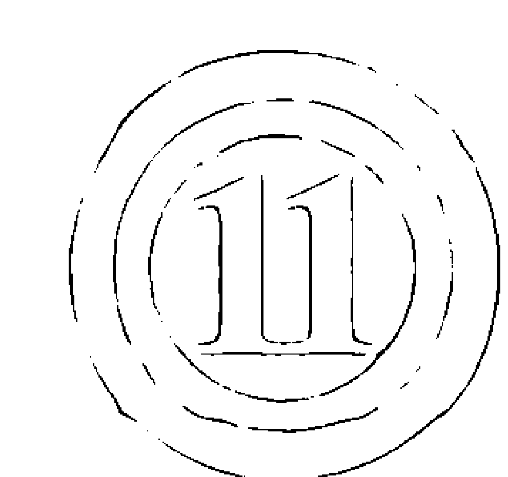

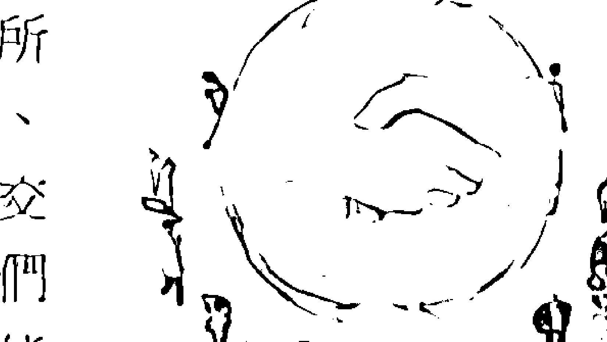

达成事业便可以创造理想，改变世界。第十一宫也就是所谓的交友宫，和一个人对团体的态度有关，所以举凡朋友、社团与人群...等都和本宫有关，代表一个人的社团活动及交友状况，同好及朋友关系，是非地缘及血缘性的。是和我们不熟的朋友或同学、社交场合当中所认识的朋友，虽然可能只是泛泛之交，但却可能成为我们的重要资源。
第十一宫也象征着一个人的理想，透过集体来实现的目标、改变既有环境、创造新世界。也象征外太空，代表未来的改变。十一宫也代表分工，每个人在大机器下如何发挥属于他个人的能力，网络也跟第十一宫有关。如果本宫有太多行星，可能会太重视朋友而忽视身旁的人，如果本宫有不好的星落入或是宫中的星受克严重，则暗示容易对团体不满或跟社会有疏离感。

## 精神宫

对应星座：双鱼座
宫位主星：海王、木星
后天特质：变动宫
后天元素：水象宫

精神面、梦想、隐藏的敌人、幕后工作、自我限制、人生的总结、隐密面、牺牲、秘密。第十二宫是你的精神层面与不为人知的部分，因此跟潜在的弱点、自我的限制、秘密，想逃避的隐藏面有关。它也代表精神力与想像力、以及心灵的寄托，梦想、宗教慈善服务、福利，同时也象征隐藏的敌人。

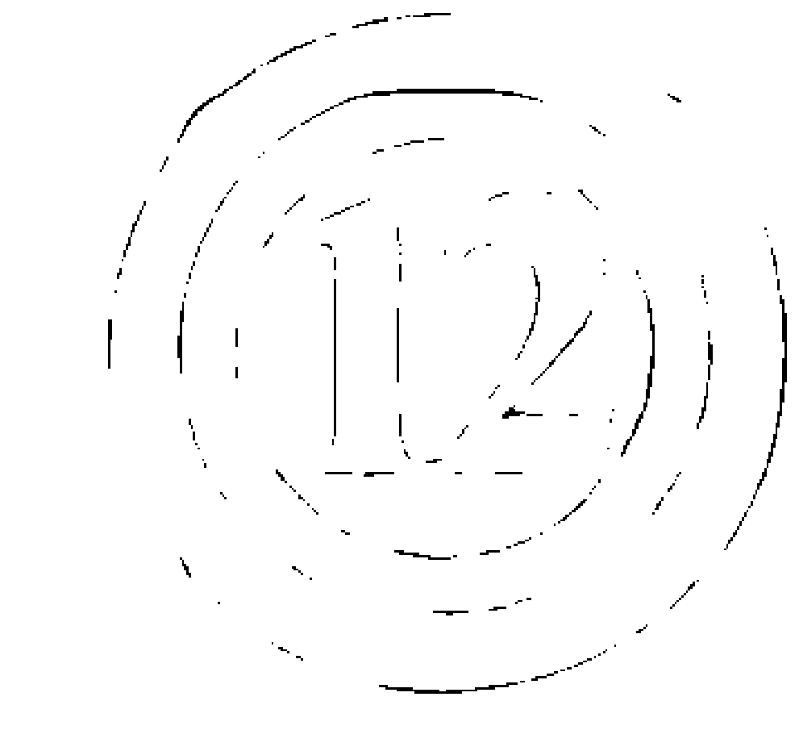

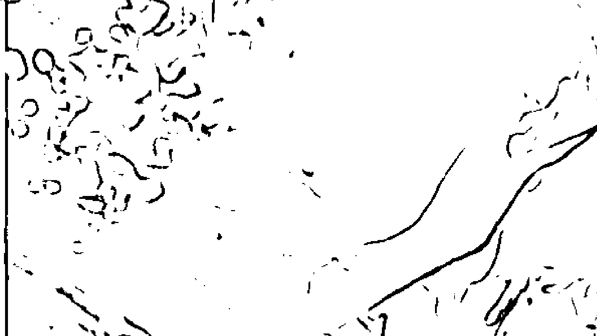

最后个人超越意识，进入内在的层次。十二宫也就是所谓的精神宫，他代表大海，象征着梦的世界，与内心及潜意识有关，代表一个人潜在的烦恼及最担心的事物。第十二宫象征着一个人退休及休息，当我们离开社会舞台后，开始面对自我的内心深处，这时我们重视的是心理的层面，很容易投身于宗教中，希望从中渗透超现实的意识，因此十二宫是个人引发同理心以感受力的宫位和无私的爱及牺牲有关，十二宫可看出一个人是否有爱心，也代表慈善事业。
从另一个角度来看，第十二宫所呈现的是一种逃避现实的心态，也代表一个人潜在的敌人及隐藏看不到的问题。如果有太多星在本宫，一个人可能过度的隐藏或逃避，还可能太容易同情别人而吃亏。如果有不好的星落入，则暗示某种精神上的问题，或是一件无法公开的秘密。

# 行星系统 PLANETS

## 行星是干什么的？

占星的三部分，星座、宫位与行星中最重要的部分，就是行星。在无垠的太空中，我们居住的地球是在太阳系当中的一颗行星，因此当我们仰望天空，我们可以看到太阳、月亮及水星、金星、火星、木星、土星等星体，即使更远的天王星、海王星及冥王星，也透过近代天文科技进步，由天文学家陆续发现。这些星体距离地球近，引力拉力影响大。因此，代表着一个人不同层面的能量，诸如情绪、思想、爱…等。所以在占星学上，星体是主角、演员，星体所在的位置代表着一个人某方面的特质及力量的展现。我们可从各星体的特征、特性及神话故事的传说来了解，到底这些星体在占星学中，代表着什么意义，对我们有何影响，要了解占星学，就必须要深入认识星体不可。

行星是占星最主要的部分，每一颗行星赋予我们不同的特质，从行星星座落的宫位与星座，了解某种能力的特质与发挥的情境。当星体与星体产生相位上的反应，于是便产生某种特别的定义与能量，他可能是好的，也可能是坏的，但这都代表个人生命中的原始记号。天上的行星不断的运行，当他与这些记号产生了作用，生命中的事件便启动了。人生就在这样的启动中产生了一段又一段的高潮迭起。而在芸芸众生中，我们彼此接触，当我的行星与你的行星产生了关系，于是我和你之间便产生属于你我的记号。同样的，当天上的星体启动时，我和你之间便出现了一段段的故事。

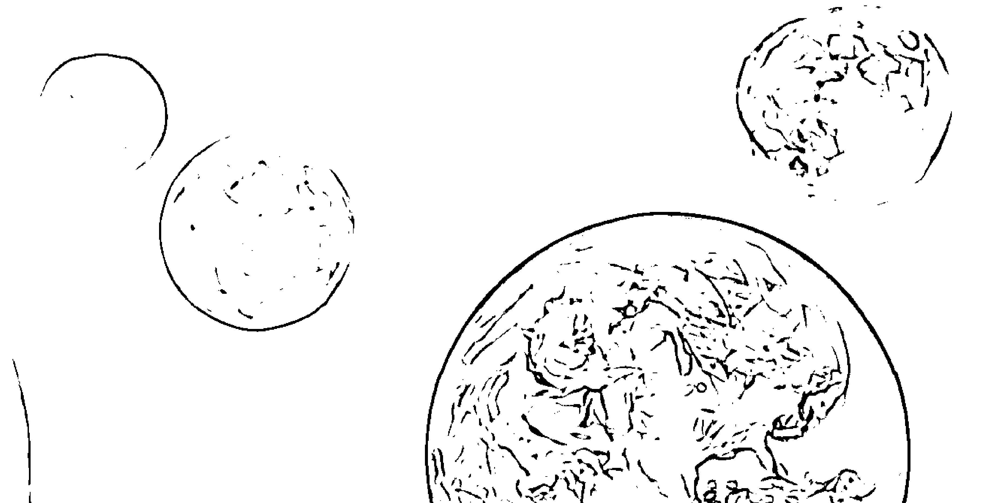

## 行星与宫位的区别

行星是能量的不同型态，而宫位则为人生的各种层面，代表不同的心理层次，以一种比喻，行星就像一段所说的三魂七魄，各自主宰特别的个人能力。他们所处的宫位代表强调此种能量的层面，所有的能量交互作用于不同的宫位中，上升星座则是作用后显性的表现。这十颗行星的能量中，日、月、水、金、火的能量是自主的能量，其中日、月是发光体，是能量的来源，金星与水星是内行星，附随于太阳，表现太阳的心志，火星是第一个外行星，代表跟他人接触的首次结合。而木、土、天、海、冥则是属于团体的能量，这样的能量是环境性的，是时代的能力，个人较无法控制。其中木、土代表同代的能力，个人还有能力掌握，而天、海、冥则代表世代的能力，他们各自代表了不同的集体潜意识的层面。天王星是群体的改变，海王星是群体的梦，而冥王星则是群体的深度改造。

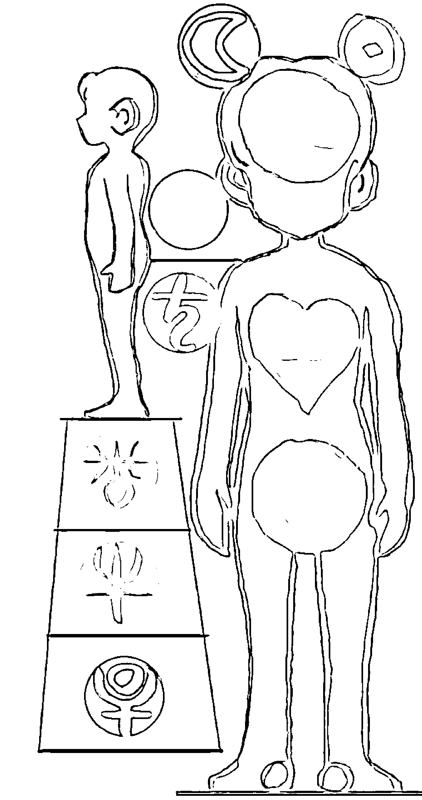

## 每个星星的意义

真正要分析星座的话，不能光用太阳星座以偏概全，还必须用各行星所在的星座位置来判断，这样才是一个完整的命盘。您出生当时各行星的位置将会影响到您每种不同的能力状态。

每个人出生的那一刻，便产生了属于自我独一无二的星星位置，也因此在不同的行星能量上有属于自我的特殊能量的反应，从而产生个人的特质。同样的，不同的人，因为出生时间与地点的不同就产生不同的行星分布。天上的行星依旧不断的运行着，它们的能量也不断的影响着我们。所以，研究行星时，除了对行星的基本特质必须认识外，还必须了解自我的行星代表的特质以及天上的运行星所代表的特质在意义上的界定上的不同。

行星的运转速度差异很大，有一个月运行一圈经历完整12个星座的（月亮），也有二百四十多年才运行完整一圈的（冥王星），因此，在影响的意义上，便有着极大的差别。周期越短的行星对个人产生的影响越大，而周期越长的行星所影响的范围，便倾向于集体的影响，想想冥王星约三年运行四度，因此，要说这三年的人都会产生某个生命事件（如受重伤）是不合理的。再举一例，如果某甲金星与另一人某乙的冥王合相，如果将他解释为彼此会产生强烈的吸引力，这一条是不合理的，因为这样子某甲将与某乙年纪相差三年范围内的人都产生吸引力，这可能吗？但，换另一个状况，当**天**上的冥王星运行到与某甲的金星合相时，就可以解释为在这三年的期间，某甲容易有情感上的变化，他代表著一件感情（金星）的重生（冥王星）过程。相反的，如果是金星运行到与某甲的冥王星合相，他代表的影响就完全不同，金星的影响只有短短几天，而同样的跟某甲年纪相差三年范围的人都受到影响，所以，这样的事件对个人的影响并不明显，是一种整体的表现，也许是某红星办了一场演唱会，而同样世代的人都感受到这件事。

因此，我们将行星大分为内行星系统与外行星系统与三王星系统，内行星代表偏向个人的特质，外行星介于中间，而三王星则偏向时代的影响。如果是本命盘或看二个人的关系深厚与否，则内行星是最重要的，外行星为辅，三王星为参考。但是看运行星的影响时，则是越慢的行星影响力越大，影响的时间也越久。外行星与三王星代表一个事件（如一段恋情）的发展过程，内行星则代表一个事件的引动征象（如跟女朋友吵架）。所以在分析星盘时，必须了解到行星的周期长短，以及本命星、他人星、运行星之间的个别差异与代表意义。

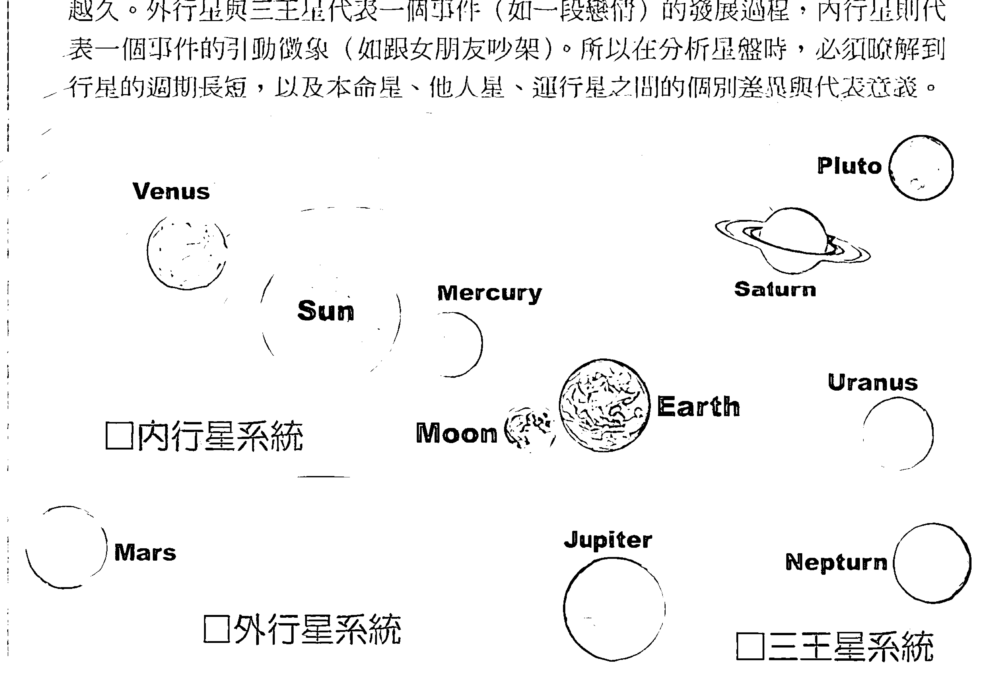

# 内行星系统

# 外行星系统

## 三王星系统

# 内行星系统

## Sun [太阳：个性]

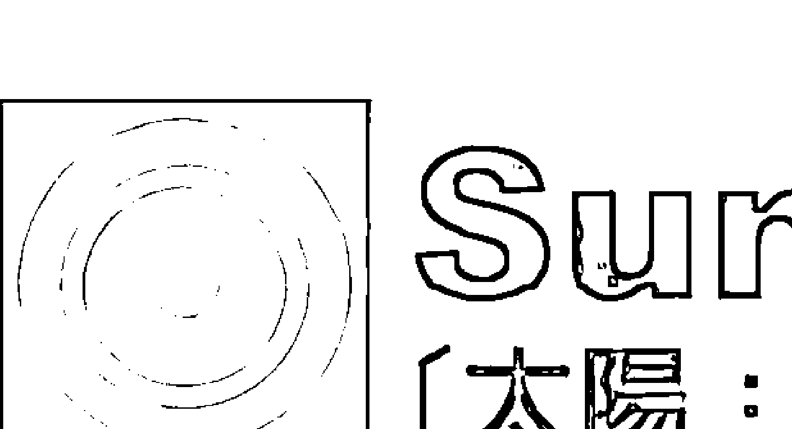

活力、能量、光、意志、外在形象、创造力表现、阳性功能、爸爸的影响
太阳主宰狮子座，是神话中的太阳神阿波罗，是一切之中心，代表一个人的形象，或是给别人的印象，太阳影响个人意识与表现方式。主导先天的个性、给了旁人的印象，高贵、明亮与忠诚。太阳也代表一切阳性的象征，父亲、英雄、国王与权威。
○太阳运行星：活力的周期、能量与活力，影响个人表现意志与自我的人事物。受重视的机会、受注目成为焦点、阳性的能量、某个男性。
○公转周期一年，相位影响约一星期。
太阳是星盘中最重要的星曜。太阳是太阳系的中心，是光和热的泉源，是地球上所有生物不可或缺的元素。因此在占星学中，太阳代表着生命力及创造力、活力及积极。本命盘中太阳所在的位置，代表一个人的外在表现及重视的地方。太阳的光照显出一切的形象，因此太阳代表着外在表象，从太阳星座可以看出一个人的个性与给人的第一印象。这是一般人最常挂在嘴边讨论的星座话题。的确，在占星学上太阳的配置，最具权威性与重要性。
太阳星座也影响个人的意识与意志，动态活动或自我表达的方式。在神话故事中，它是太阳神，代表着创造、热情、光明、慷慨。基本上若太阳在命盘上凸显时，你会显得特别地有活力、积极、拥有自信能力，不畏艰难，往往能在同侪中成为领导者。

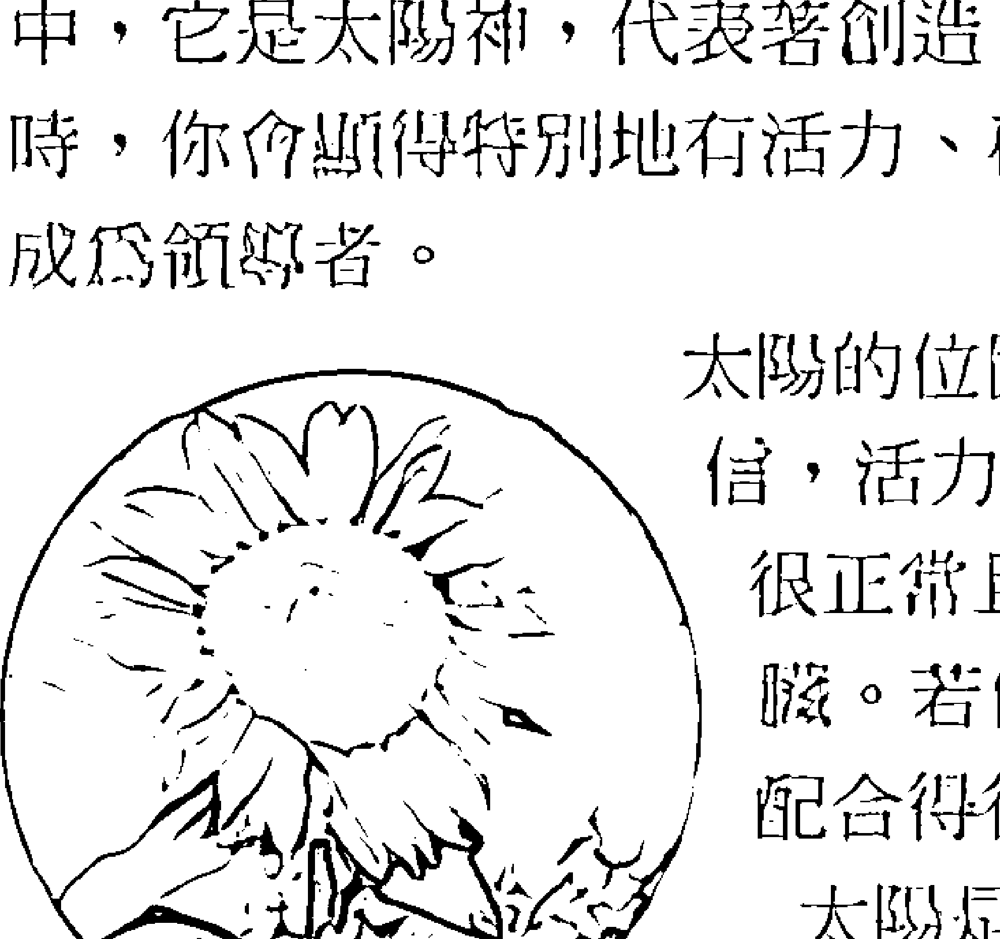

太阳的星座在个人出生图的位置好的话，其正面特征为：自信、活力、活泼的气质就会表达出来，通常这样的人身体都很正常且健康。太阳掌管人类的视力、背部、动脉、和心脏。若你的右眼视力特别好，通常是太阳位置配合得很好。

太阳是阳性的代表，所以女性的星座图中太阳的位置告诉我们她一生中重要男性的资料；代表父亲、男朋友及丈夫等。对男性而言则是父亲或自己的象征，若相位配合良好则表示他容易获得权威性的地位，四周的男性对他是产生助益的，且通常受人注目；在他的一生中极有希望成功，拥有良好的形象。

## Moon (月亮：情绪)

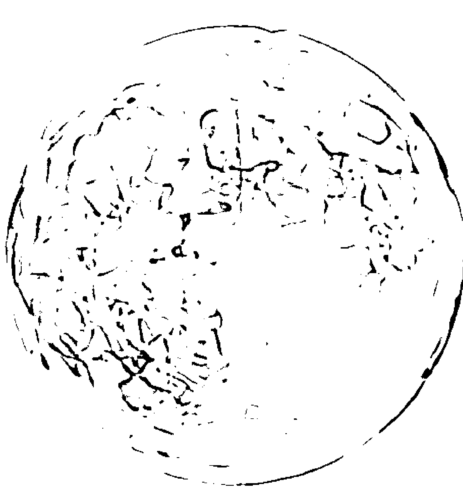

心情感觉、习惯反应、记忆力、阴性功能、妈妈的影响、感受力
月亮主宰巨蟹座，是神话中的月神阿耳提密丝，在占星术上代表母性，她的阴晴圆缺象征害羞、善感、易变。主导你潜在的特质及情绪、遇到突发状况的立即反应及记忆力、代表母亲、妻子或与你关系密切的女性。

- ○月亮运行星：情绪的周期。生活的阴晴圆缺与悲欢离合、引发心情反应的人事物、阴性的能量、某个女性、西药。
- ○每隔27天运行一圈，相位影响约一天。

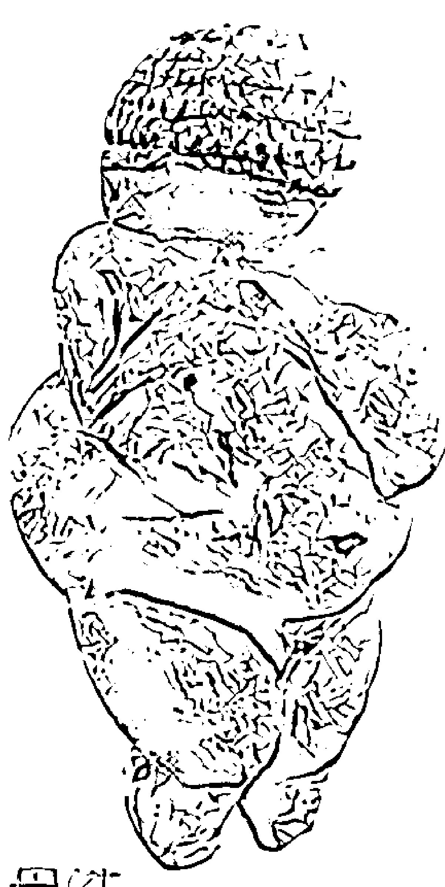

月亮是除了太阳以外第二重要的星体。月亮是地球的卫星，离地球最近，对地球的引力最大，运行的速度也最快。所以月亮对我们的影响也最直接。在占星学中，月亮代表情绪反应及生活习惯也代表一个人对习惯的反应及本能行为模式的表现。本命盘月亮的位置代表一个人的内心情感和关心的事物。

月亮运行得很快，只需二十八天即可经过整个黄道面的十二个星座，相对于太阳的火热，月亮较属阴柔面，它影响到一个人的潜在特质，属于潜意识的层面。月亮反射太阳的光芒，所以代表了反应的能力。它是运转速度最快的星体，具有阴晴圆缺的变化，所以也象征变化波动，代表着多变的情绪反应。在神话故事中，她是月之女神，象征着母爱、深俏及女性本能。

月亮的位置对男性而言，显示出他人生中，母亲的影响、心目中理想太太的模样。对女性而言，月亮是当她成为妻子时所将扮演的角色，母亲对她一生的影响，决定她们的性格倾向。月亮象征母性，主宰个人与母亲的关系。母亲是最初照顾我们的人，婴儿与母亲间的关系，直接会影响到日后个人与情人交往的模式。月亮也影响所接触的女性关系，同时也掌管胃，乳房和消化系统。

母性
自古以来月亮就是母性的象征。

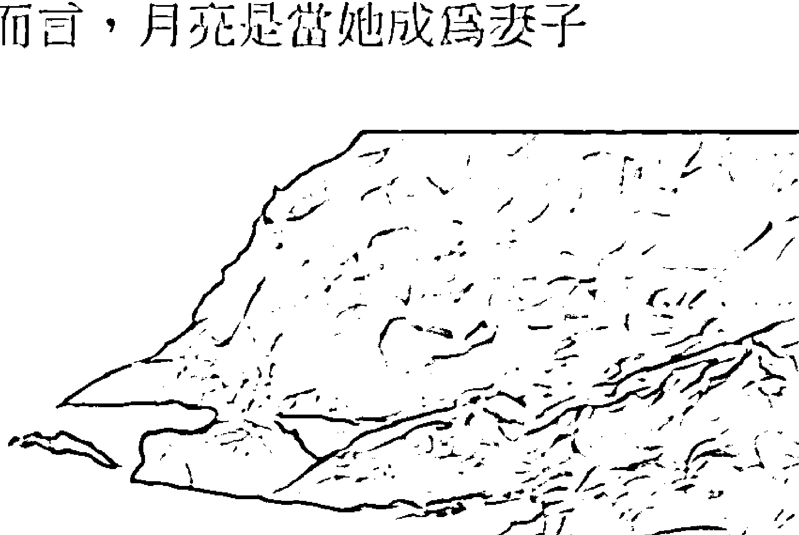

月亮星座与过去的记忆有关，因此他也与一个人的前世相关，它有一段时期会表现在外，那就是幼年，像是阙角的作用，幼年及少年阶段伸展出来，成为人生初期的反应基础。月亮星座位置的好坏会影响一般人的情绪反应，位置好的话，有耐心，包容力强，EQ高。若处在不利的位置容易不可靠，排外，心胸狭窄。拥有良好月亮位置的人，左眼视力一定很好，在占星学上，月亮掌管一切感官，若月亮相位良好，在这方面的感觉是锐利而正确的。从月亮星座，也可以了解一个人的家庭生活方式，与感情模式，了解了月亮星座，也就掌握了个人的内心世界。

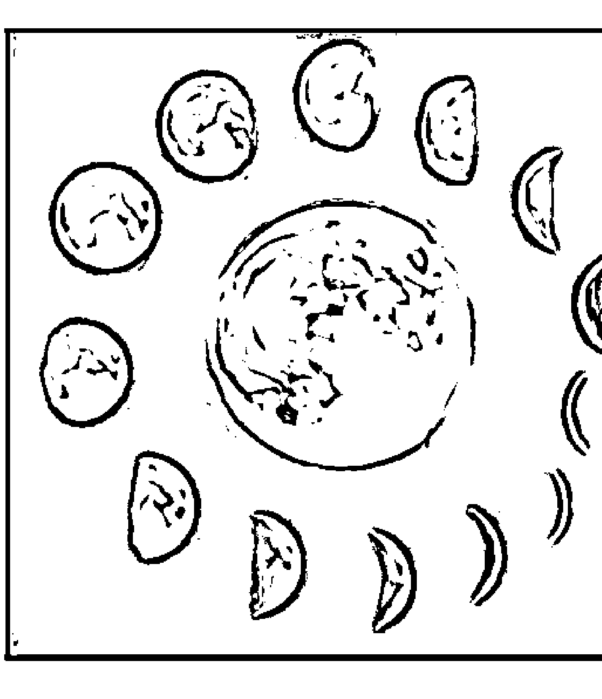

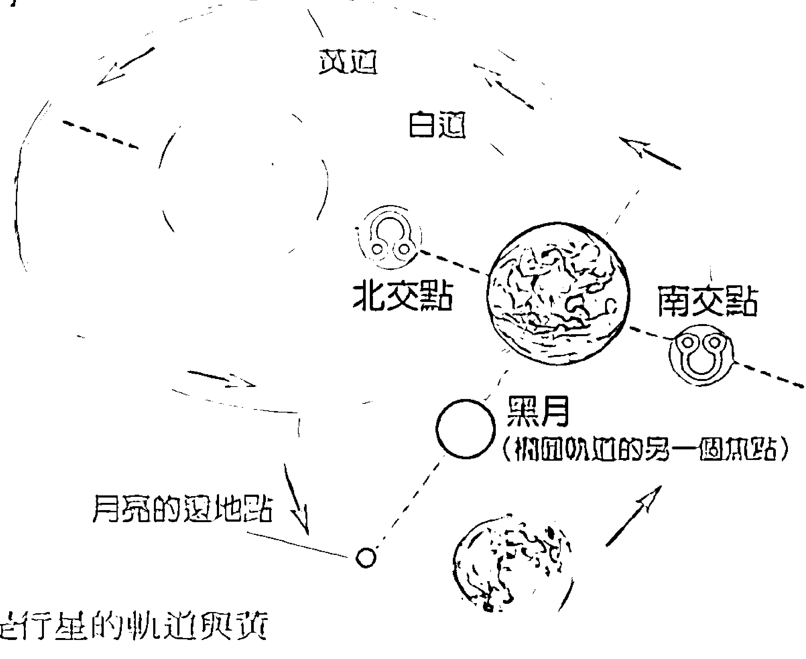

### 月交点

每一个行星都有交点，交点是行星的轨道与黄道相交的两个点，其中由于月亮对地球的影响巨大，因此月亮的交点也特别重要。交点分北交点与南交点，又称为龙头与龙尾，它们以逆行的方向做约19年的周期，它们象征新与旧的潮流变迁，跟前世相关，在灵魂占星中应用很广。南交点是过去的变迁代表旧潮流，象征业，北交点是未来的趋向是新流行，象征报。

当新月或满月发生在交点附近时，通常是日蚀或月蚀诞生的时候。自古以来，日、月蚀一直是受到重视与恐惧的天文现象，而这些现象就跟月交点相关。每当**日月运行**到与南北交点成一直线时，就会发**生日月蚀**，太阳象征的意识层面与月亮象征的潜意识层面在此交会，因此在心理层面上，北交点代表过去的灵魂进入新的意识层面，而南交点则是由意识层面进入过去的灵魂记忆的过程。

# 黑月

跟月亮相关的点除了南北交点外，还有黑月。黑月是月球椭圆轨道除地球外的另一个焦点，因此跟远地点重合，它的公转周期是九年，象征我们无意识中被压抑的情绪与感情。以及偶尔消失的能力和性格上的缺陷，是我们隐蔽的一面，象征心理学上的阴影。黑月也就是七正四余中的月孛。

## Mercury [水星：思想]

想法、沟通能力、学习能力、吸收资讯、联络、说话表达、中性的、智慧、知的欲望。

水星主宰双子座与处女座，是神话中的信差神赫密斯，他是中性的，代表男与女、意识与无意识、生与死之间的媒介，象征思考及表达能力。主导个人思考模式。聪明、博学、淘气。代表你的聪明才智与沟通能力。

- ○水星运行星：思绪的周期。吸收资讯与沟通的机会、使自己对外接触的人事物、朋友、资讯的赢得、动脑筋的运。
- 公转周期88天，相位影响约二天。

水星是太阳系中最靠近太阳的星体，它是除了月亮外运行最快的星体。因此在占星学中，水星象征心智的快速及思维的运作。受太阳的日光作用，使水星有不规则的振动，所以代表紧张及神经反应的灵敏度，也代表了多变思想。

太阳是自我实现的目的，而水星星座表示精神活动或思考型态，代表为完成目标的手段。水星在十二星座的位置，关系着个人心智的活动，无论是理性或抽象的观念、分析事物的能力、对日常事务的处理，都属于水星掌管的领域。它代表一个人的表达方式和思考方向，同时也支配一个人的理解能力。因此在出生图上水星被加强的话，则是代表理解力强，属于智慧型的人物。水星主控个人思考的模式、导向及沟通能力；并能引导出每个人的创造力，揭露出影响一个人的决断力及表达能力。获知知识和资讯所需要的沟通能力，也在水星的管辖范围内。

在古希腊时代神话故事中，水星是天上神祇的传信者，一切思想来源的守护神，也是人类心智的守护神，因此代表着沟通表达与智慧。水星也是商人之神，代表了交流、交易、雄辩。同时也是窃贼的守护神，且被认定是一切口齿伶俐、敏捷机智的代表，擅长商业买卖，手脚灵活。

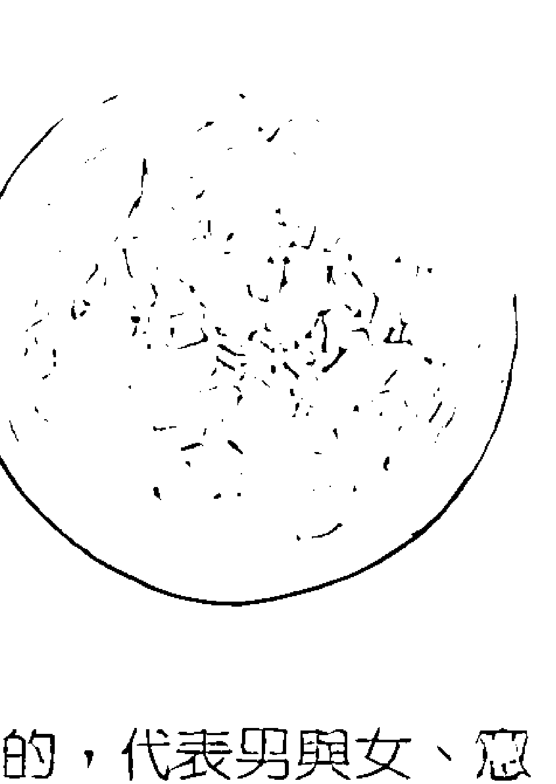

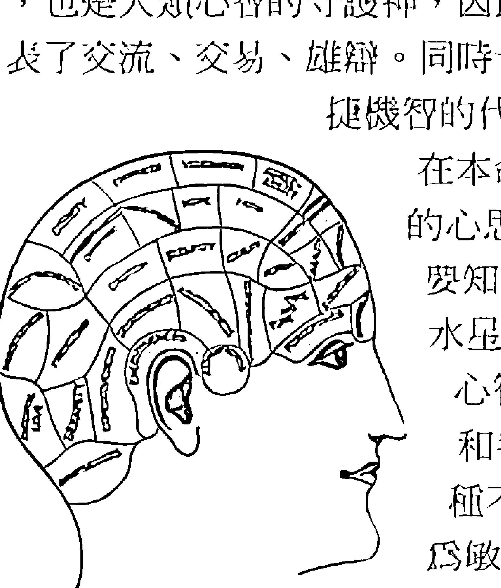

在本命盘中，水星代表一个人思维运作及沟通表达。你的心思运转得如何？你的智能是否高于一般人的标准？要知道这些，必须参考你的水星位置，必须去了解自己水星的位置在个人的星位图中的配置。水星掌管人类的心智及语言表达能力，人体的神经系统，手部、背部和手指。当水星在个人星图显得突出时，它暗示着一种不稳定、神经紧张和高度兴奋的倾向，以及一种极为敏捷活泼的心理状态。

## Venus [金星：爱情]

喜好、喜好、吸引力、爱的能力、女朋友、美的事物、享乐、爱的欲望。

- ○金星主宰天秤与金牛座，是神话中的爱神阿佛洛狄特，也就是维纳斯，她是爱之星，象征和睦、美感、艺术和恋爱。主导你的爱情观以及爱情运，代表应得美好的能力，享受与快乐，美丽、浪漫而纵欲。对男性来说代表女朋友。
- ○金星逆行：美好的周期。桃花运、跟自己喜爱的人事物、异性（偏女性）。享乐的机会、美的享受、人缘变佳受欢迎。
- ○公转周期225天，相位影响约五天。

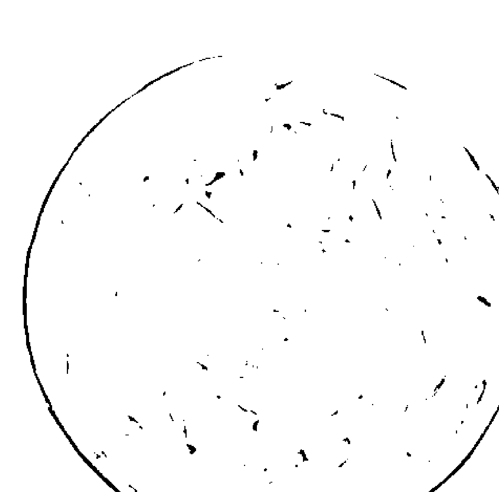

在太阳系中，金星是最靠近地球的星球，在黄道上运转比地球要快。金星是太阳系当中运行轨道最稳定持久，最美的一颗星体。因此在占星学中，金星象征爱与美，即令人喜爱的力量，代表着人际关系、带来与他人和解及调和的力量。

在古希腊的神话故事里，维纳斯是爱之女神，代表了美丽、性感、和谐及艺术。在负面的状态下，金星象征着永恒持久的爱情，支配爱情与美丽的事物，它就像月亮那么的显示出女性化，也能像木星一样的代表利益。婚姻也是金星掌管的一种状况。

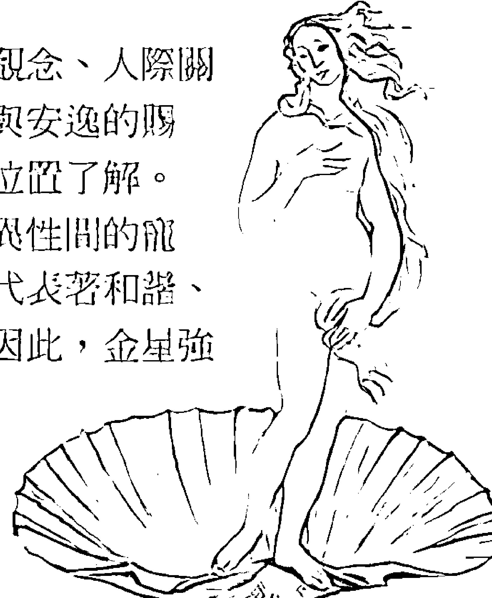

本命盘的金星代表一个人的喜好、个人价值观、审美人际关系，同时有时也代表金钱，物质欲望。金星也代表喜悦与安逸的赐予，人生中快乐与感官享受的部分可以从金星在星盘的位置了解。在个人星盘中的金星，意味着社交生活是否受人欢迎，异性间的问题，也意味着人生表面的欢乐态度，暗示着好运，金星代表着和谐、美感与爱情，影响一个人的吸引力及人际适应力强弱。因此，金星强的人会使人有美貌和魅力，但负面可能使人懒惰、沉溺享乐、贪婪、犹豫不决、意志薄弱。

金星是颗女性的、阴性的星，代表我们的爱情观、爱情运。在男性的星盘图中，金星表示其心目中理想女性或情人的形象。要知道男性爱恋哪种女性、追求哪种女性，即可从金星星座来推算。对女性而言，金星代表着她在情人或异性面前，所展现出的感情特质。对于他本身的爱情生活感到兴趣的成年人，金星是极为重要的一环。爱与被爱的力量来源、经历与邂逅，亦可藉由金星所在位置得到大概的了解。所以，所有爱与美的形式都是由金星星座来展现。

# 外行星系统

## Mars [火星：欲望]

行动力、占有欲、精力、竞争力、性冲动、男朋友、生理的欲望、斗争

火星主宰牡羊与天蝎座，是神话中战神阿瑞斯，代表你实现欲望的能力，他是战斗之星。主宰你的斗争与对欲望的占有以及你的勇气。好斗、冲动、易怒，具野性且富侵略性。象征体格及体能、性能力，对女子来说，代表男朋友。

- ○火星逆行：行动的周期。性冲动、使自己想征服占有的人事物、冲突、竞争者（某个男性）出现、意外伤害、暴力。
- ○每隔2年运行一圈，相位影响约二星期。

火星是太阳系中第一颗外行星，是一颗红色的星体，代表战斗力及竞争力。火星是最靠近地球外围的行星。在占星学中，它代表了热与干燥的极端特质，包含能源、热情等意义，是积极与激烈的本性。代表个人行动方式、体格与体能，也代表战斗、竞争、热情、前进及流血。表示出个人的活动力和勇气。

在神话故事中，火星是战神。代表强烈的精力，象征着一个人努力及积极从事的地方，也代表一个人的脾气以及是否具备完成任务的勇气。火星的位置对男性尤为重要，它是支持每个人行动的主要力量，主动、被动或是否具侵略性。

火星是一颗支配肉体力量，使事情完成的行星，同时也是各种欲望和冲动的根源。其星座位置有助于了解个人受欲望影响时所表现的特殊行为模式及表达方式；情感的冲动、个人的野心，都可从火星的位置得到了解。在占星学上是支配人体的头部和脸部，以及一般肌肉组织，而且特别强调了性器官，尤其是支配男性，因为火星也象征了男性肉欲的情爱，表示其对于性爱的态度。在女性星盘图中火星表示喜爱的男性类型。若彼此的火星关系能配合，通常表示，即使对事物的想法和价值观不同，男女之间仍可能经由肉体，得到超过精神上的契合。

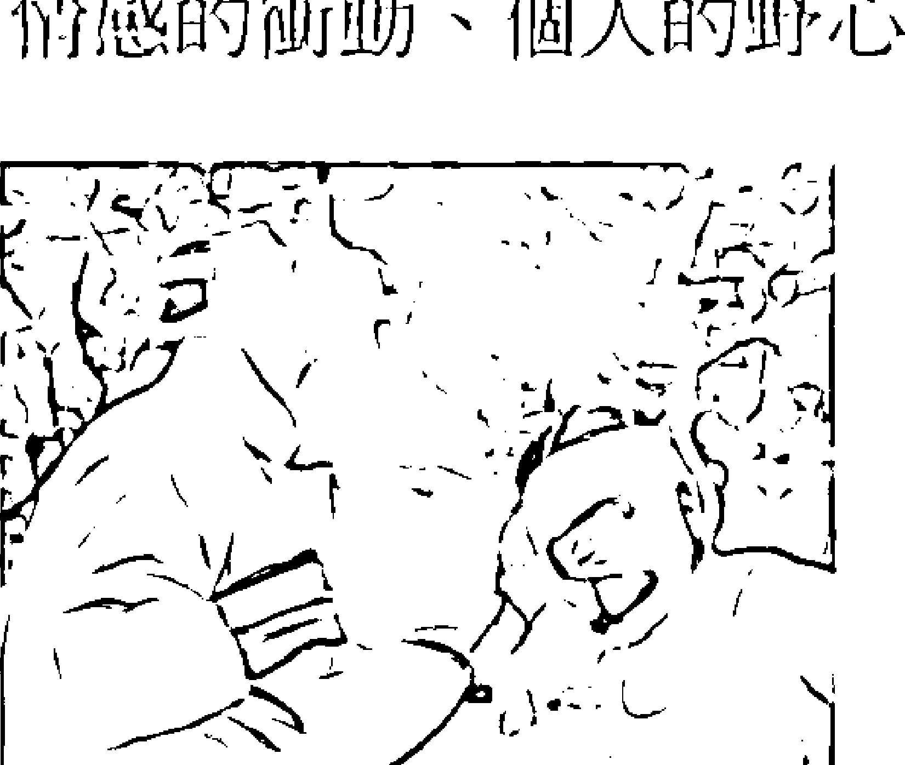

本命盘中的火星代表了一个人的行动力及脾气好坏。由于火星的行动力很强，如果角度关系不好，会产生无耐性、轻率、好斗、易怒不端等负面影响，使人有暴躁，残酷，自私，急躁，猛烈的负面特质。角度位置好的人，则因其明辨是非的意志力，处事知所进退及分寸；具有积极、勇敢、果断、和不需让人操心的热情，只有建设性的力量。当火星在个人星位图有不利的相位时，它也暗示着导致发烧的疾病、伤害、火伤或是割伤。

## 木星

积极面、自信、拓展、扩张、机会、乐观、向外性、好运

木星主宰射手与双鱼座，是神话中天神宙斯，代表你的幸运与福气，你容不容易遇到贵人与机会。主导一生的幸运来源、代表向外的扩张，创造机会与增加自信，仁慈、宽大、乐观而热爱自由，象征自我的发展与成功的所在。

- 木星运行星：向外扩张的周期。得到机会、贵人、使自己更能向外发展的人事物、新发展、幸运的事、快乐。
- 每隔12年运行一圈，相位影响约二个月。

木星是太阳系中除了太阳之外，最大的星体。木星有着稳定和明亮的光芒，因此被视为象征幸运的吉星。大约十二年绕行黄道宫一周，每一年行一宫；因此，同年龄的人几乎都有同样的木星星座。它象征「扩展」，代表一个人向外发展的能力。本命盘中的木星代表了一个人的幸运处与感到自信的地方，以及将之转化为智慧的能力。

在占星学中，它代表着巨大、扩张、有包容力的、大方、仁厚及厚实有力。木星是「幸运之星」，想知道何时何处有最佳的运道以及生涯机会，去了解木星在自己星位图中的位置是很重要的。在神话故事中，它是天神宙斯，因此象征真理、仁慈、多情及自由。木星是被认为律法的守护神，是真理、节操、公理的保护者，木星和知识、深造、哲学观、个人的直觉、宗教有关，在基本上是有关于个人的快乐来源与哲学思想。显示出个人的高层次追求，思想意识与道德的发展。

人体受到木星支配的器官有肝脏、静脉。木星有乐于助人的性格与乐观的气质。其在各星座的位置，指出个人会以何种方式与他人分享既得的利益，是否能以宽容的态度去对待他人，并如何得到他人精神上所给予的回馈及帮助。在你遭遇困难时，带给你力量渡过难关，同时赐予你智慧去明了你在尝试过程的经验中所获得的真正智慧，是极具保护性的。

木星在占星上是属于幸运的影响。木星特征强的人所表现的是：乐观、忠诚、善良、眼光远大。负面方面却是使人：浪费、盲目乐观与自大。木星代表着机会，假如木星的影响很强烈，可使人在遭遇困难时得到帮助度过难关；要不然，就是会在最不能成功的情况下，给您一种突破性的助力。而往往成功与否就在于是否能以最佳的方式去利用它所带来的机会。

## 土星：责任

压力、忍耐力、限制、悲观、收缩、消极面、孤独、时间

- 土星运行周：向内压缩的周期。压力、责任、使自我产生限制的人事物。离开，必须努力克服的事、苦恼与压抑。
- 每隔29年运行一回，相位影响约四个月。

土星是太阳系中，人们看得到最远、运行最慢的星体，在土星四周围，我们常可以看到土星光环。在天王星未被发现以前，天文学家都以为土星是最外面的一颗行星。在占星学中，土星代表着时间、限制及不可逾越的秩序感，也象征着挑战与挫折，是个人最大困难及压力所在，却也代表个人突破困难后的成就。

土星是一颗代表束缚限制，困难与延迟的行星，影响到所有人们的限制面，要知道他会遇到多少困境，只要明白他的土星在他的星位图中位于何种位置。土星会影响人们倾向于一种忧郁的、沮丧的心情，这种人经常表现出一种孤独畏缩的感觉。在古希腊的神话里，土星是死神，在占星学上，土星代表着老年人，所有一切的阻碍与困难，以及一切已经被岁月所毁坏衰微的东西。

土星使人有踏实、节俭、可靠的特点。但也有使人有冷漠、责任感过重、严肃不知变通的性格。克服阻碍后往往能建立真正的个性，有些受土星强烈影响下的人，会发展出一种极佳的个性；假如土星是上升星座的守护星，会倾向于勤劳努力而且光明正大，但总是以吃力不讨好的方法去行事。土星掌管骨骼与牙齿，所带来的健康问题多半是累积性的长期病痛。

土星在占星学上暗示着命运中的困难或试炼等不幸，命运中潜藏的困扰。也代表着个人性格上的弱点，造成命运中危机的主因与个性上的缺失。土星的位置也表示出一个人是否能够好好发展自己的事业。经由土星的位置的表现，可使个人了解应如何担负起责任，发展其成熟度，并找出化解危机和改善缺点的方法。通常土星在星盘中的宫位，也表示个人最缺乏，并试图极力补偿的领域。土星是太阳系中卫星最多的星体，因此也代表着多产。

## 天王星：改变

创新、除旧、革命、新奇、与众不同、怪异、独特性。

天王星主宰水瓶座，是神话中天空之神乌拉诺斯，代表突破传统、创新改变的能力及创造力，他属于时代的力量，是整个改变的力量，新奇古怪、叛逆、标新立异。同时象征科技、革命、未来感与戏剧化的变革。

- 天王星逆行星：自我改变的周期。新盘局、使自我产生改变的人事物。突发事故、新奇有趣的际遇、新发现。
- 每隔84年运行一圈，相位影响约一年。

天王星绕行黄道一周约八十四年，停留在各星座的时间约七年，天王星是位于土星以外第一颗被发现的星体。于1781年时被发现。在太阳系中，天王星的自转轴心倾斜超过90度（98度），是侧着绕着黄道运行，因此天王星是一颗奇特的行星。在占星学中，天王星代表改变与特别，逾越传统及改革思想。本命盘的天王星，代表个人的改革力量，象征一个人寻求与众不同的地方。代表特立独行、标新立异及人道主义精神。显示出一个人对自己的突破，想要改变自我的渴望。

天王星的思想前卫，常常不顾四周异样眼光而有惊人之举。天王星也象征着改革思想，是一个人最大的改革点，代表发明与创造。在神话故事中，它是天空之神，代表科技、未来、进步、改革及天文。也代表突发状况，任何新奇、特殊、有趣的事物。天王星对个人的影响是突发性的改变，突破传统限制的创造力。在好的方面使人较独立自主有创造力、具有特别的智慧、与众不同的天赋，厌恶受到限制且爱好自由，意志坚定。若相位不良则会让人觉得叛逆性强，古怪，一心只想与众不同。

天王星在个人星盘中的宫位比星座位置来的重要，从天王星的宫位可看出个人如何表达其独特的创新天赋，及偏好何种不寻常事物的倾向。天王星在星座中的位置明确指出了世代的差异，也就是同一时期人类的共同改变。不同的时代，均对个人产生一定的影响。它的星座位置，有历史性的时代意义，大于对个人性格与思想的影响。天王星象征迎接新时代的革命意识，其关键字则是「改变」，即表示对抗陈旧意识的新希望。

## 海王星：渴望

梦想、非现实性、幻想、想象力、迷惑、自欺、升华、堕落。

海王星主宰双鱼座，是神话中的海神波塞冬，代表想象力与梦想，也是你容易迷惑与痴心的部分，他是整体的梦想，也是时代的力量。跟个人升华及潜意识有关。理想性、包容、模糊暧昧与逃避现实。象征精神冥想、梦境、幻想与超现实主义。

- 海王星逆行时：精神转化的周期。迷惑与梦幻、消融的力量、引发自己精神升华的人事物、期间、梦想成真、受到蛊惑。
- 每隔165年运行一圈，相位影响约二年。

海王星于1846年时被发现，绕行黄道一周约需时一百六十五年，在每个星座约停留十四年左右，为天王星的两倍，在太阳系中，海王星是一颗模糊难辨的行星。在占星学中，海王星代表了梦幻及想象。象征不切实际及暧昧不明的事物，由于其虚幻的特质，常造成一种混乱的局面。本命盘中的海王星，代表一个人沉溺的地方，象征无悔的癖好。

海王星为了幻象及假象，常会自我欺骗及自我牺牲，所以海王星代表一个人沉迷的地方。海王星的感受力很好，因此代表了超脱的艺术及完美的事物，也代表着同情心、随缘及与心灵宗教有关的事物。在神话故事中，它是海神，代表了无边、模糊、理想化，包容力，空想及混乱，掌管着浩瀚的海洋与无边的梦境。

海王星是梦的主导者。因此海王星特征明显的人多半充满想象力。具有超凡的直觉与精神状态，常涉足和虚幻与超现实有关的东西，像是影像艺术和电影。不良的海王星影响力是经常自欺、迷惑、不问世事与堕落沉沦，也容易接触迷幻药或酒精。过于大意、因相信别人而受骗，或太过于多愁善感。

海王星象征觉醒或幻想，是影响世代的三颗行星中的其中一颗。因此，海王星落在各星座时，会对某一时代、某一人群造成特殊的影响，对个人的影响较不显著。海王星所在的星座位置，显示出不同年代出生的人，分享同一种精神性的心灵生活，也是影响潜意识最深的精神力量，产生出不自觉且根深蒂固的观念及思想。海王星在个人的宫位，显示出个人追寻梦想的领域，但也是个人倾向于自欺或欺人的地方。

## 冥王星：潜能

破坏力、重生、潜在的能量、黑暗面、转型、控制欲、危机。

冥王星主宰天蝎座，是神话中的冥神黑帝斯，代表你的黑暗面与人的神秘部份，潜能与未知的力量。他是整个时代蜕变的力量，就像从毁灭中重生。阴沈、孤独、神秘、极深、强迫性。象征危险、死亡、隐藏的财富资源、与核能。

- 冥王星运行星：重生蜕变的周期。大破坏、大转变、引发自己内在黑暗面与潜能的人事物。脱胎换骨、受到强迫、危机。
- 每隔248年运行一圈，相位影响约二年半。

冥王星发现于1930年，是所有星体中移动最缓慢的一个，大约需要二百四十八年才能在黄道上绕行一周。在太阳系当中，冥王星是距离太阳最远的行星，是一对小及结实的双星系统。由于其轨道较异常，停留在每个星座的时间从十二年到三十年不等。在占星学当中，冥王星代表黑暗及神秘，象征毁灭与再造的力量。也代表一个人绝对在意的地方及狂热的所在。冥王星与死生之事很有关系，也代表性与暴力。冥王星亦代表一个人洞悉环境的能力，一个人的觉察能力。本命盘中的冥王星代表个人深层的欲望与潜在的能力，也代表个人最狂热的事情。

冥王星具有破坏与重生的强大能量，能够使一般人觉得绝望的事却东山再起，另创新局。在神话故事中，它是掌管地狱的冥王，代表神秘、死亡、黑暗及再生。象征人类将受到压抑的潜意识予以实体化的力量，一般认为那是与太阳相反的力量。他象征一个人的黑暗面、同时也是未知潜能的根源，能够对事物彻底颠覆的能力。负面也代表绝对的掌控欲望，有残忍，阴险，虐待性的一面。还有如命理玄学等玄秘的事物以及巨大的财富资源、脉脉都与它有关。

冥王星停留的星座意义对某一时代所产生的影响大于对个人的影响。从冥王星所据的星座位置，通常在历史上具有强烈的重要性，它们带来的是根源性的大变动，并为人类的生活及文明带来剧烈的转变，甚至会影响到个人的传统观念。它被压抑的力量，一旦被释放，就会彻底改变过去，这些改变也许创造新生，也可能造成毁灭。而冥王星在星盘中的宫位则代表一个人的深层欲望面以及个人的恐惧所在，但也往往像浴火凤凰一般，是其引发潜能的场所。

# 小行星

除了行星之外，太阳系中还存在著数以万计的小行星，他们同样绕著太阳运行。在占星学中，占星家发现他们对命运也有不同层面的影响。占星学上使用的小行星主要有四小行星以及凯龙星，四小行星是在火星与木星一带的小行星群中较大的几个，四小行星都是用古希腊神话中的女神命名，其中谷神星是最大的一颗，智神星第二，婚神星第三，而灶神星则是最亮的一颗。凯龙星又称206号小行星，是轨道介于土星到天王星之间，目前已知最远的一颗小行星。

## 婚神星：婚姻
婚神星象征春天的追求，是神话中宙斯的老婆赫拉。被认为是婚姻的守护者，因此代表了婚姻，配偶。此外此星也与不贞、两性关系中的权力斗争有关。同时也代表风流的事与吸引力。

## 灶神星：努力
灶神星象征夏天的劳动奉献，神话中的维斯塔为了守护圣火而拒绝了追求者的求婚。因此象征了单身。也代表了承诺，专注，服务，独居与寂寞，是工作狂的指标，他们努力在自己的岗位上，劳动奉献。

## 谷神星：收获
谷神星象征秋天谷物成长收获，是神话中的大地女神，是除了月亮之外，第二个关于母亲(性)的行星。此外还代表了怀孕，食物，家庭，劳动收获及养育。

## 智神星：蕴藏
智神星象徵冬天的隐藏，是神话中女战神雅典娜的别名。她也是智慧女神。代表了知识，也代表了竞争，对抗，为公理正义而奋斗与对等。又是女权主义的象徵。

## 凯龙星：复原

凯龙星是直到1977年才发现的。它的轨道颇为奇特，以地球为中心，将土星跟天王星的轨道量出来，凯龙星的轨道有一部分跨进土星轨道之内，距地最远处则接近天王星的轨道。在神话中凯龙是个半人半马怪，拥有良好的医学能力。因此被认为与心灵的伤痛与治疗有关。因为轨道在土星与天王之间，因此也意味着知识的整合与不平常的智慧。他的功用介于水星与木星之间，是一颗吉星，表示腐坏后的复原，也象徵隐藏的精神伤痕。

# 其他特别的点

除了行星之外，占星学中还有一些特殊的点具有重要的影响，除了ASC、MC、DSC、IC这几个重要的敏感点外，还有许多根据行星与敏感点计算出的点，例如阿拉伯点、中点、至点、映点等。

## 阿拉伯点

阿拉伯点是由阿拉伯人所流传下来的，是黄道上的一些特殊点，它发基于宇宙的一种神秘波率，透过数字的方程式所计算出的特殊感应点，比较著名的有福点、婚姻点、死亡点等。流传至今，基本的阿拉伯点有97个，另外还有73个附加点。这些点可以归纳成简单的数学公式A+B=C+D。举例来说，福点的位置是将上升点的位置加上月亮的位置，再减去太阳的位置。而其他的点，也都是以这样的计算方式得出来。

## 中点

中点是近代德国汉堡学派发展出来的。认为任何两颗星或出生图上的重要点之间在黄道上的中点代表这两要素组成因子的能量，中点是两星的关连所在，当有运行星合相中点时，便会引动这两要素间的作用。除了本命盘外，中点也应用在合盘上，将两人的太阳取出中点、两人月亮取出中点…依此类推，形成另一张盘，代表两人的共同命盘。

# 行星的影响力

## 跃升与失利

行星在不同的宫位时，力量会有所不同。我们知道每个行星有各自主宰的星座，当行星落入自己主宰的星座时，行星最能表现其特质，称为得势。相反的当行星落入主宰星座对宫时称为失势，这时行星本身的特性会受到最大的限制。

但是行星在跃升星座时力量才会最强，比主宰星座时力量还强，而在跃升星座对宫时称为失利，是行星力量最弱的时候，在失利星座时比在失势星座时还弱。这是判断吉凶时很重要的参考依据。

| 行星 | 跃升星座 | 失利星座 |
| :--- | :------- | :------- |
| 太阳 | 牡羊座   | 天秤座   |
| 月亮 | 金牛座   | 天蝎座   |
| 水星 | 处女座   | 双鱼座   |
| 金星 | 双鱼座   | 处女座   |
| 火星 | 摩羯座   | 巨蟹座   |
| 木星 | 巨蟹座   | 摩羯座   |
| 土星 | 天秤座   | 牡羊座   |
| 天王星 | 天蝎座 | 金牛座 |
| 海王星 | 巨蟹座 | 摩羯座 |
| 冥王星 | 狮子座 | 水瓶座 |

## 定位星

行星各自掌管所属的星座，如图。而当行星进入非主宰的星座中时，便会受到主宰该星座的行星定位，举例来说，火星是牡羊座的主宰星，假如有行星进入牡羊座，则受到火星定位，火星就是这个行星的定位星。定位星会对被定位星产生影响，彼此会有微妙的连带关系，如果行星进入自己主宰的星座，那该行星就没有定位星或称为最终定位星。举例：假设水星在天秤座受金星定位，金星在牡羊座受火星定位，而火星也在牡羊座受火星自己定位，那么火星就是这一组行星的最终定位星，代表这一连串力量的最终主宰，这个行星就具有特别的重要性。

如果两个行星各自在彼此主宰的宫位上，则称这两个行星 “互容”，代表这两星的完美融合。举例来说，火星在天秤受金星定位，金星在牡羊受火星定位，因此金星跟火星互容，即使它们是对相，但是因为互容，反而使两星都能完美的合作与发挥力量。

## 行星逆行

除了太阳跟月亮外，由于地球与行星间的速度不同，因此相对来说在某些时候会觉得看起来行星在后退，称为 “行星逆行”。行星逆行时会使行星的能力产生改变与阻碍，功能变弱。尤其是在改变方向一从顺到逆时（SR）及从逆转顺时（SD）影响特别明显。由于逆行的关系，行星在运行时有时会在同一个点来来回回经过3次或5次之多。

## 周期、大运法与推运法

行星在黄道上运行，以不同的时间绕行黄道一圈，称为行星的周期。月亮的周期是一个月，太阳一年，金星与水星因为在地球内侧，因此他们的平均周期也是一年，金星每年约逆行一次，水星则有三次之多。火星周期2年，木星约12年，土星29年，天王星84年，海王星165年，冥王星则长达248年。每一个周期都代表一种能量循环的过程。

大运法是以运行星过度到出生图中重要点时，发生相对应事件的方法，运行星会触发它所碰的点上的潜能，以他们的特性来影响出生行星，造成事件。举例来说，当运行土星（压力）对相（冲突）本命金星（爱情）时，可能会发生跟爱人翻脸或结束一段恋情。

推运法则是以天上一天，地上一年的原理来运作，以出生后一天的行星移位来显示出生后一年的命运，因此，月亮与内行星等这些跑得快的行星的移位就显得特别重要了。尤其是月亮的移位，每29年运行一周，与七正四余中的紫气周期类似。这些部份比较复杂，我们留待以后再详谈！

相位分析 SPECT

## 什麼是相位？

以地球爲中心，行星與行星間會有角度產生，當他們彼此產生某些特定的相對位置時，就會發生特別的互動，就像是音樂上的共鳴一樣，這些特殊的角度，便稱之爲相位，每個相位有其特別的意義，代表兩行星作用後的吉或凶，象徵人生劇情的各種高低起伏。相位有好壞的分別，同時也有強弱的不同。相位經過細分之下，主要有以下三種形式：

- 主要相位：包括 0 度合相，二分相 180 度，三分相 120 度，四分相 90 度，六分相 60 度。是最常使用的5种相位。
- 次要相位：包括八分相 45 度、135 度，十二分相 30 度、150 度。
- 其他相位：包括五分相 72 度、144 度，七分相，九分相等等。

## 容許度

相位有所謂容許範圍。例如：合相是 0 度，當二星在相差 8 度內都稱之爲合相。有關容許度的範圍，越重要的相位容許度越大，越重要的行星也是。但二星越接近特殊角度，產生的力量便越大。在現代占星學中，一般皆有濃縮容許範圍的趨勢。

如□，相位A=60度，容許度B=3度，打壓在A+B=63度到A-B=57度的3度內都屬於60度相位。以合相來說，太陽的容許度6度，水星容許度3度，所以日水的合相容許度為9度。不過容許度並沒有一定，當然是越少相位力量越強。

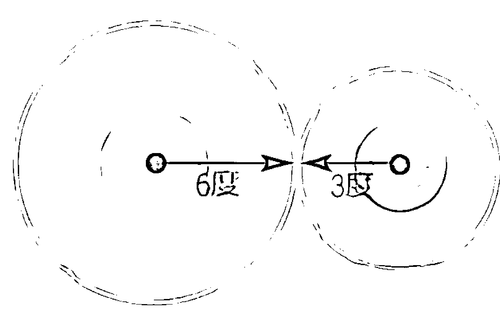

## 主要相位

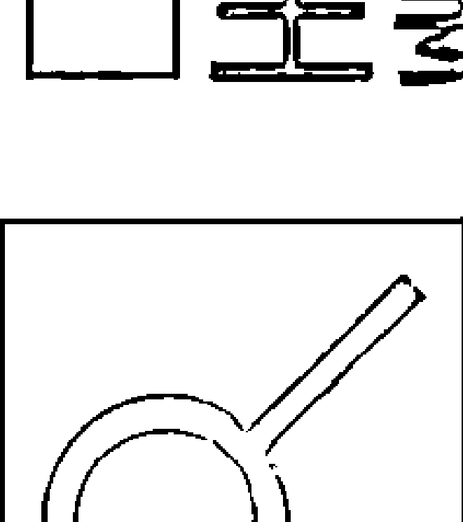

### 0度（合相：结合、集中：吉凶参半）

合相容许度8度，是行星會合時的狀態。代表不同能力的結合或直接的影響，由此可知行星力量被集中後，能否好好被發揮效用或相互牽絆。一般來說，吉星（木星、金星太陽、月亮、水星）合相時為吉，凶星（土星、火星、天王星、海王星、冥王星）發生關係時為凶。但是還必須看影響層面，例如：水星和天王星的合相，在科學技術文學方面皆屬吉的。金星和海王星的合相，在藝術靈感方面屬吉的。金星和天王星的0度，在設計方面屬吉的。

### 180度（对相：对立、冲突：凶）

对相容许度6度，代表对立但是互補，由於兩個行星形成對抗姿態，所以是個招致緊張和對立的凶相位。也表示眼前的問題，對方的挑釁，衝突與紛爭。也象徵高度關心、互補與相互的吸引力。

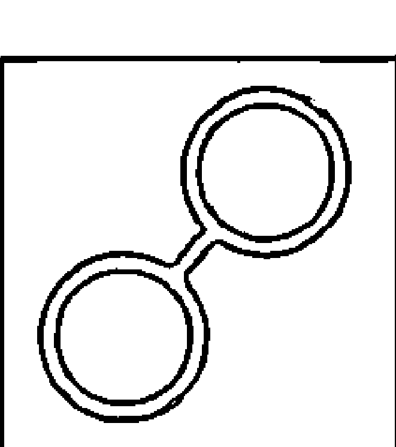

### 120度（三分相：协调、幸运：吉）

三分相容许度4度，代表順利與協調，為可順利進行事物的吉相位。意味著好運的到來與不勞而獲，象徵發展以及合作順利。

### 90度（四分相：困难、障碍：凶）

四分相容许度4度，代表為了完成某事而引起的障礙與困難。它象徵格格不入左右為難，以及處處受限，是表示不順利的凶相位。

### 60度（六分相：机会、创造：吉）

六分相容许度3度，代表如果有努力的話，可以抓住機會的吉相位。它意味著機會的創造，以及源源不斷的支援，同時也象徵創造力。

# 次要相位

### 30度（十二分相：帮助、成长：吉）

十二分相容许度2度，這是個只擁有60度一半力量的調和相位。表示獲得金錢利益。而且還意味著改變想法，馬上可朝下一個目標前進。

### 150度（补十二分相：不均衡：凶）

補十二分相容许度2度，代表須調節與失去均衡，尤其是跟健康有關時是極為重要的相位。也意味著慾望不滿。

### 45度（八分相：緊張、摩擦：凶）

八分相容許度2度，這是個擁有90度一半力量的不調和相位。意味著金錢上會有困擾和破財，以及朋友間和團體內會有摩擦。

### 135度（補八分相：焦急、煽動：凶）

補八分相容許度2度，是個類似45度的不調和相位。意味著暗中折騰與焦急的心態，或受到他人的煽動。

# 其他相位

除上述所說的相位之外，也有人考慮將五分相72度（顯示精神支柱與加強）、補五分相144度（表示精神安慰與強調）當作第三類相位。其他還有七分、九分、十分…等相位，但多不常用。因為光五個主要相位就夠複雜了。

## 星曜格局

行星之間因為相位的組合而出現一些特別的格局，具有特別的能量反應，其中比較著名的格局有以下幾個。

### T型 (T-SQUARE)

這是由兩顆對相的行星，同時與另一顆星形成90度四分相，如圖中的木星，這顆受最大壓力的行星稱為把星，是這個對相的壓力出口。如果這個 T 型中的任何一星跟其他行星出現三分相或六分相，那這顆行星將成為這固壓力局面的減壓或解決的方法。

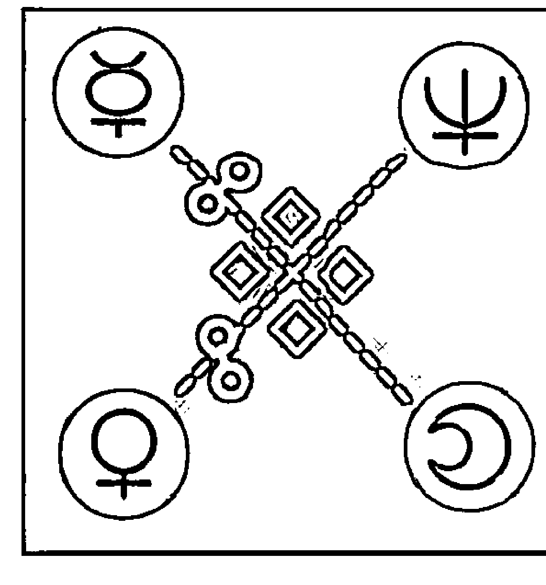

### 大十字 (GRAND CROSS)

大十字格局是由兩組對相彼此又形成90度，如此對任何一顆星來說，都成了對星與把星，因此任一顆星都承受巨大的壓力。而且找不到宣洩壓力的出口。這個格局象徵成功之前的巨大障礙與艱困。如果有行星跟此格局形成三分相或六分相，這行星將對此障礙提供紓解的方向。

### 大三角 [GRAND-TRINE]

大三角格局是由三顆行星彼此形成120度三分相所組成。由於彼此都是對方的順利因子，因而形成一種良性循環，這個格局具有很強的創造力，但是容易過分順利而過度強調所主的事物，而深陷在三角漩渦中，跳不出來。

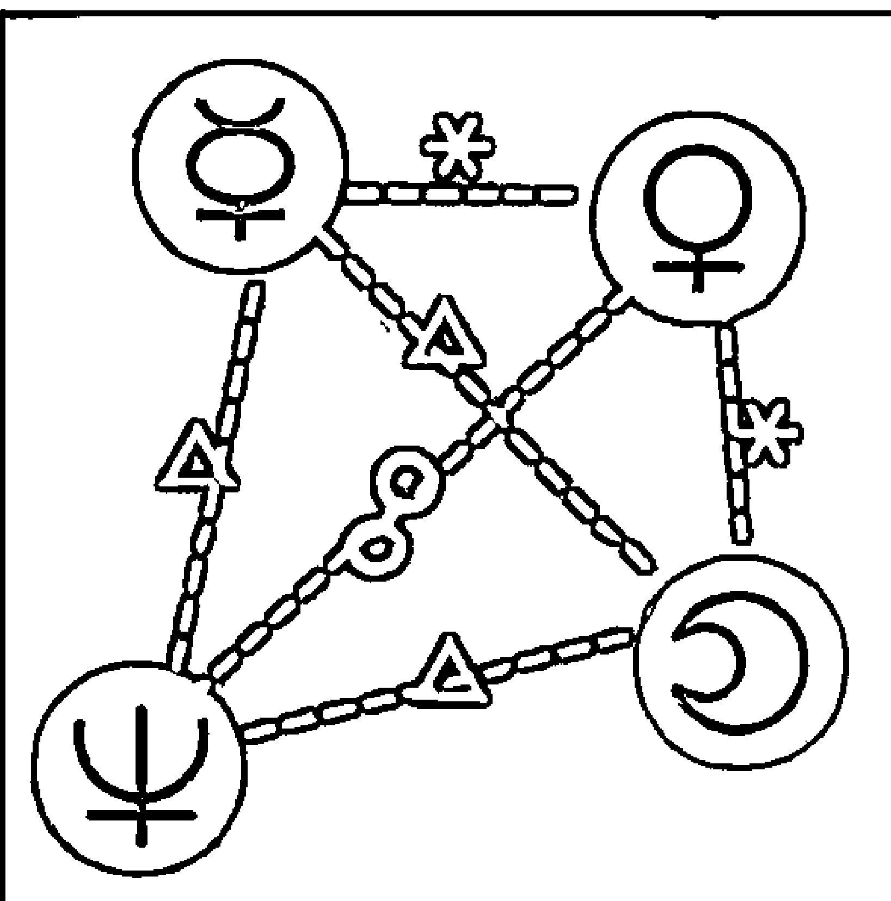

### 風箏型 [KITE]

風箏型是由一組大三角行星中一顆星與另一顆行星形成對相，同時這顆星跟大三角的另外兩顆星形成60度六分相所組成的格局。這時另外的這顆行星就形成了風箏的把手。它適合用來主導這個大三角，能將這股創造的能量找到發揮的窗口，而不至於陷入漩渦。

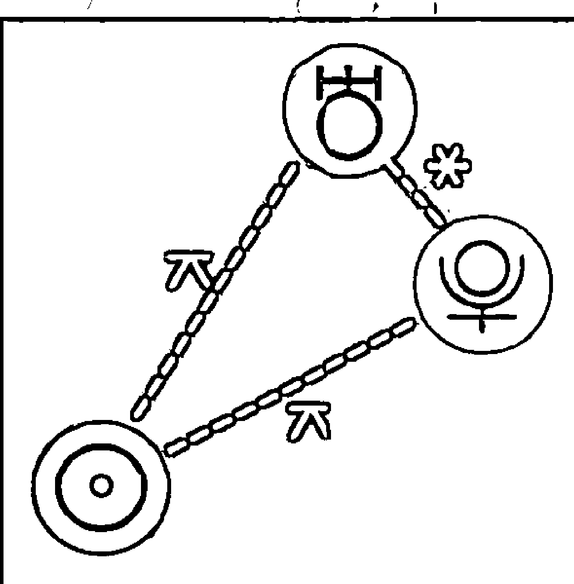

### 上帝之指 [YOD]

這是由一組六分相的兩顆星同時與另一顆星形成 150 度的補十二分相。這第三顆星具有特別的意義，象徵注定的巧合，這個格局代表業力，而這第三星就是業力的出口，也就是束縛的地方。如果有某人跟此星發生關連，那代表此人跟你具有前世的因果關係。

### 星群 [STELLIUM]

星群是由四個或更多的行星彼此極為靠近，一個連著一個而形成像鏈節般。通常會是連結在同一星座或宮位中，如此強調了這個星座或宮位的傾向與特質，這樣的星群象徵一種專家的傾向，這些行星的能量融合而投注在所強調的星座或宮位，並且由領頭的那顆星來主導。

## 解盤法則

### ANALYSE

命盤分析時主要分三大類型，第一種是運用本命盤來分析個人的基本特質、基本潛能、個人的個性、屬性、命運的好壞…等，是屬於先天的部分。第二種則是配對法，將兩個人的星盤套在一起，藉以看出兩個人之間的配合度，雙方的緣分、個性、想法…等的合適度。第三種則是運勢盤，將運行星套入命盤後，看運行星與本命盤行星之間的關係好壞，藉以推算出某段時間運氣的好壞，或可能發生的未來預測。

除了大運盤法外，推算運勢還有許多特別的方法，如次限位法、太陽反照法…等，都有其特別的預測意義。在此我們先僅以本命盤的分析來說明，而配對盤與大運盤由於較複雜，在下一本進階篇中再行介紹。

## 本命盤分析法

本命盤是個人最基本的命運密碼，從本命盤中我們可以了解到一個人是什麼樣的屬性，什麼樣的個性，在這一生中，我們扮演什麼樣的角色。在一張星盤中，有行星、宮位、星座與行星之間的相位。在這麼多的元素中，我們要如何著手解析呢？

# 第一：基本傾向

首先，要怎麼來開始第一步呢？命盤中行星是力量的主導，因此第一步就是看行星與重要點的分布狀態。依星座與宮位來區分，從行星座落的分布，可以先看出一個人的基本偏向。

## 從行星座落的星座分布

### 星座的陰陽性

- a. 牡羊座、雙子座、獅子座、天秤座、射手座和水瓶座等，是星座的陽性區域。如果大部分的行星是落在這個區域內，個性上會比較容易有陽剛、主動和積極的傾向。

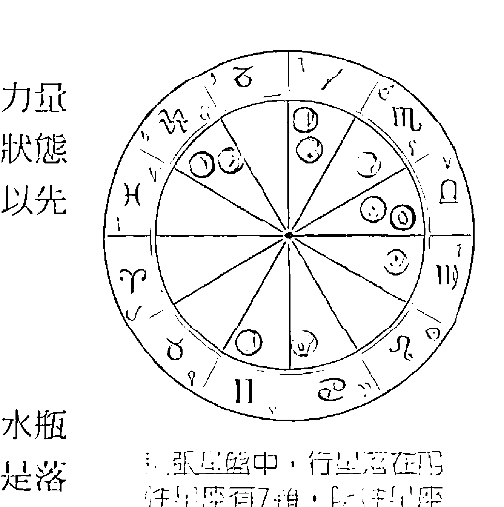

- b. 金牛座、巨蟹座、處女座、天蠍座、摩羯座和雙魚座等，是星座的陰性區域。如果大部分的行星是落在這個區域內，個性上會比較容易有陰柔、被動和消極的傾向。

### 星座的三特質

- a. 牡羊座、巨蟹座、天秤座和摩羯座，是屬於主動的星座特質。如果大部份的行星是落在這個區域內，個性上會比較容易有主動、開創性和引領先驅的傾向，個性會較有主導性。

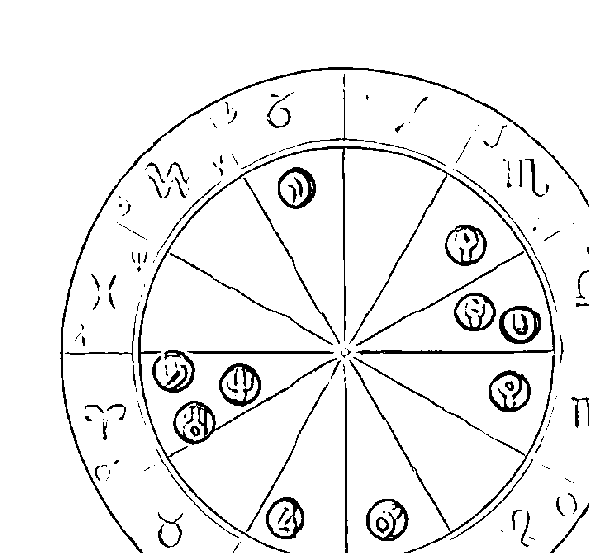

這張星盤中，大部分行星落在主動星座中，此人個性主動積極，企圖心強，具有開創的精神。

- b. 金牛座、獅子座、天蠍座、水瓶座，是屬於固定的星座特質。如果大部分的行星是落在這個區域內，個性上會比較容易有持續、穩固和頑固的傾向，個性會較有堅定性。
- c. 雙子座、處女座、射手座、雙魚座，是屬於變動的星座特質。如果大部分的行星是落在這個區域內，個性上會比較容易有變通、不定和喜新厭舊的傾向，個性會較有適應性。

### 星座的四象

- a. 牡羊座、獅子座和射手座，是屬於火象的星座。如果大部份的行星是落在這個區域內，個性上會比較熱情、直接和衝動，性急、不服輸而好動。

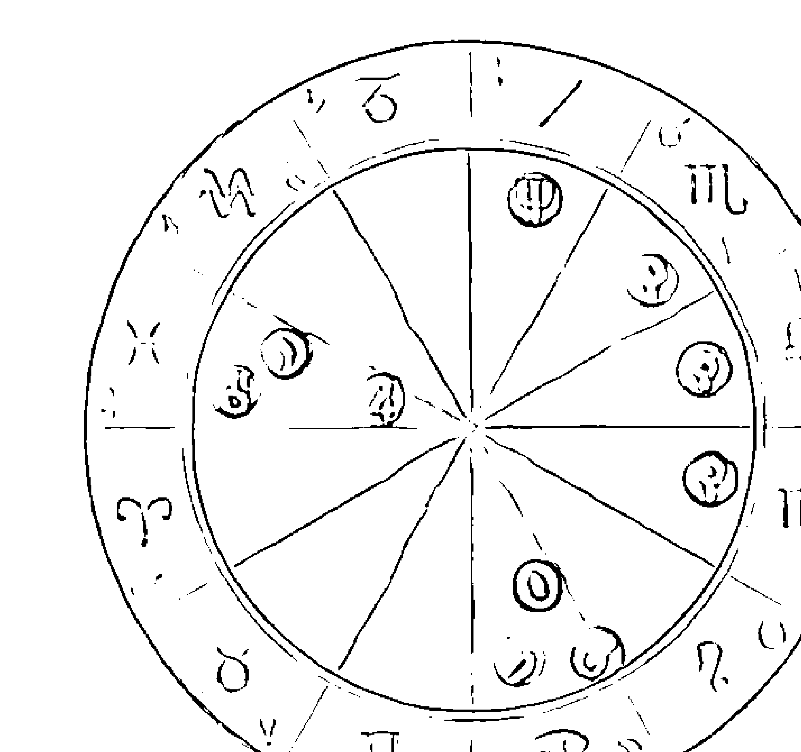

這張星盤中，大部分行星落在水象星座中，此人欲念強烈、直覺強，感情豐富，但有時情緒化。

- b. 金牛座、處女座、摩羯座，是屬於土象的星座。 如果大部份的行星是落在這個區域內，個性上會比較容易有踏實、保守和沈穩的傾向，但也頑強、頑固而不知變通。
- c. 雙子座、天秤座、水瓶座，是屬於風象的星座。如果大部份的行星是落在這個區域內，個性上會比較理性、善於思考、反應快，但也浮誇、善變、缺乏人情味。
- d. 巨蟹座、天蠍座、雙魚座，是屬於水象的星座。如果大部分的行星是落在這個區域內，個性上會比較容易情緒化、容易感動、直覺強，但卻容易過於感性、逃避、自怨自艾。

## 從行星星座落的宮位分布

### 宮位的陰陽性

- a. 第一宮、第三宮、第五宮、第七宮、第九宮和第十一宮等，是宮位的陽性區域。如果大部分的行星是落在這個區域內，個性上會比較容易有開創、冒險和爭取的傾向。
- b. 第二宮、第四宮、第六宮、第八宮、第十宮和第十二宮等，是宮位的陰性區域。如果大部分的行星是落在這個區域內，個性上會比較容易有守成、多慮和謹慎的傾向。

### 宮位的三分類

- a. 第一宮、第四宮、第七宮、第十宮稱為始宮。行星落在始宮會較有表現，能夠發揮力量。如果大部分的行星是落在這個區域內，個人能力較有發揮的機會，較有自主性，像是一齣戲中的主角。

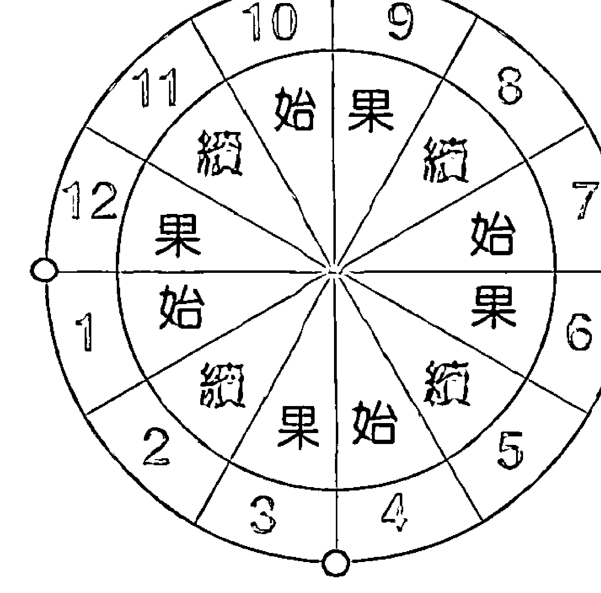

- b. 第二宮、第五宮、第八宮、第十一宮稱為終宮。行星落在終宮時無法充分掌握力量，必須透過與他人合作才能掌握。如果大部分的行星是落在這個區域內，個人能力適合以合作方式來發揮，具有承接性，像是戲中的配角。
- c. 第三宮、第六宮、第九宮、第十二宮稱為果宮。行星落在果宮時最為無力，無法表現自己。如果大部分的行星是落在這個區域內，個人能力不容易充分展現，容易為人作嫁，具有利他性，像是戲中的邊緣人。

### 以軸線來劃分半球

- a. 第一宮、第二宮、第三宮、第四宮、第五宮和第六宮，是宮位的下半球區域。如果大部分的行星是落在這個半球區域內，個性上會比較容易有自私、掌控和內省的傾向。
- b. 第七宮、第八宮、第九宮、第十宮、第十一宮和第十二宮，是宮位的上半球區域。如果大部分的行星是落在這個半球區域內，個性上會比較容易有野心、自信和超越的傾向。

這個出生圖中，行星大部分落在星盤上方，這個人比較外向，較在乎社會地位與認可。

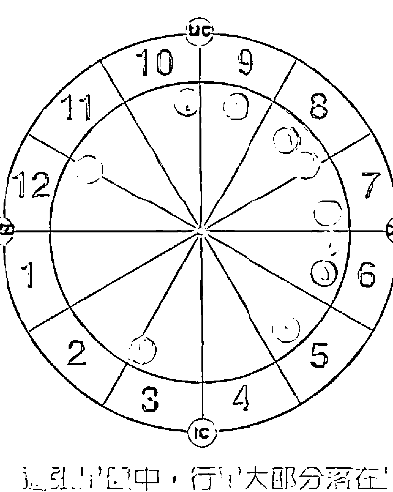

- c. 第四宮、第五宮、第六宮、第七宮、第八宮和第九宮等，是宮位的右半球區域。如果大部分的行星是落在這個半球區域內，個性上會比較容易有依賴、彷徨和猶豫的傾向。
- d. 第十宮、第十一宮、第十二宮、第一宮、第二宮和第三宮等，是宮位的左半球區域。如果大部分的行星是落在這個半球區域內，個性上會比較容易有自立、開拓和決斷的傾向。

這張星圖中，行星大部分落在星盤的右半區。此人比較被動，容易依賴他人，也較無主見。

### 四個象限的分布形態

第一象限：宮位的第一象限包括了第一宮、第二宮和第三宮等。如果大部分的行星是落在這個區域內，個性上會比較容易有追尋自我成長的動機。

第二象限：宮位的第二象限包括了第四宮、第五宮和第六宮等。如果大部分的行星是落在這個區域內，個性上會比較容易有追求掌握事物的動機。

第三象限：宮位的第三象限包括了第七宮、第八宮和第九宮等。如果大部分的行星是落在這個區域內，個性上會比較容易有擴展生活經驗的動機。

第四象限：宮位的第四象限包括了第十宮、第十一宮和第十二宮等。如果大部分的行星是落在這個區域內，個性上會比較容易有擴展理想範圍的動機。

這張星盤中，行星落在第一象限比較多。此人相當自我與主觀，內斂而且較為自私。

# 第二：重點分析

然後我們要來看命盤中的重要點，命宮點與中天點及日、月、水、金、火、木、土、天、海、冥等行星點。這12個點是整個命盤的根本，我們將這12個重點分成：

- (A) 命宮、中天、日、月。
- (B) 水、金、火
- (C) 木、土
- (D) 天、海、冥。等4個部分來討論。

在個人命盤中，首先最重要觀察的部分就是（A）的部分，命宮點、中天點及日、月的關係，命宮點決定了一個人這一生所要扮演的角色，中天點則是一生中追求的成就象徵，以一部戲來說，命宮點決定了你的角色，中天點則是這個角色要發展成什麼樣的人物，假設你演的是張無忌，但是結局是成爲武林盟主或淪爲小配角，就看中天點的好壞。

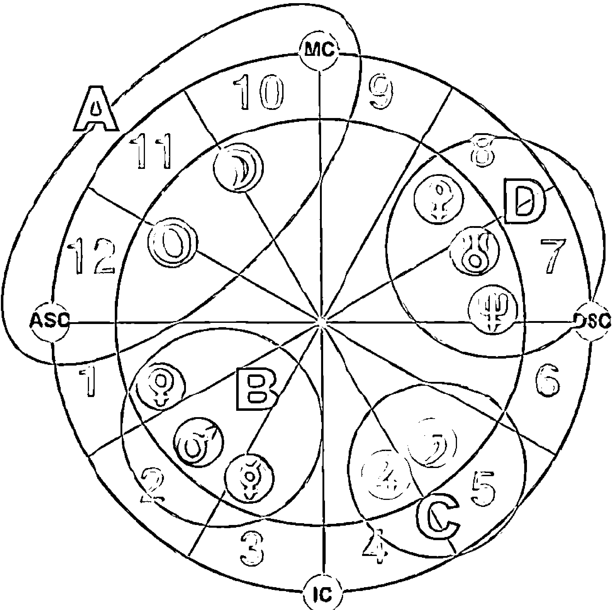

至於日與月則是一個人的基本特性，太陽是你外在的個性，月亮則是你內在的特質，由一個人的日月關係可以瞭解一個人對自己的個性與情緒之間的表達是否調和。

那麼，命宮、中天與日月間又該如何分別呢？剛剛說過，命宮、中天就像是一個人來到世上扮演的角色發展，日月呢則是扮演這個角色的演員的真實個性，怎麼說呢？就以上面的例子，同樣是張無忌這樣有點懦弱的角色，叫成龍來演就一定跟梁朝偉演的感覺不同，但是他們都是張無忌，如果是周星馳來演的話，你一定會覺得怪怪的，但是他一樣是張無忌，因此，如果命宮、中天與日月關係是合適的，就會像梁朝偉演的張無忌，感覺很搭。相反的，如果命宮、中天與日月關係不佳，就會像周星馳來演張無忌，不管你怎麼演，就是很難融入角色當中。你會過得很辛苦，因爲你一直在扮演一個不適合自己特質的角色。

## 1.命宮及命主星

命宮點預告了你這一生要演的角色，也決定了你的命運走向。因此，命宮所在的星座及命宮點附近的行星便特別的重要，他賦予了你這一生的某種特徵，命宮與其他行星間的相位便代表了你這一生能否順利的運用你的能力，也就是你這一生順不順利的關鍵。

## 2.中天及中天星

同樣的，中天點可以看出你這一生的最高點會成為什麼樣的發展，因此中天所在的星座及附近的行星便暗示了你一生的成就，你會從事什麼事業，而中天與其他行星的相位好壞便可以看出一個人是否能夠順利爬到人生的高點。

### 中天：一生的頂點

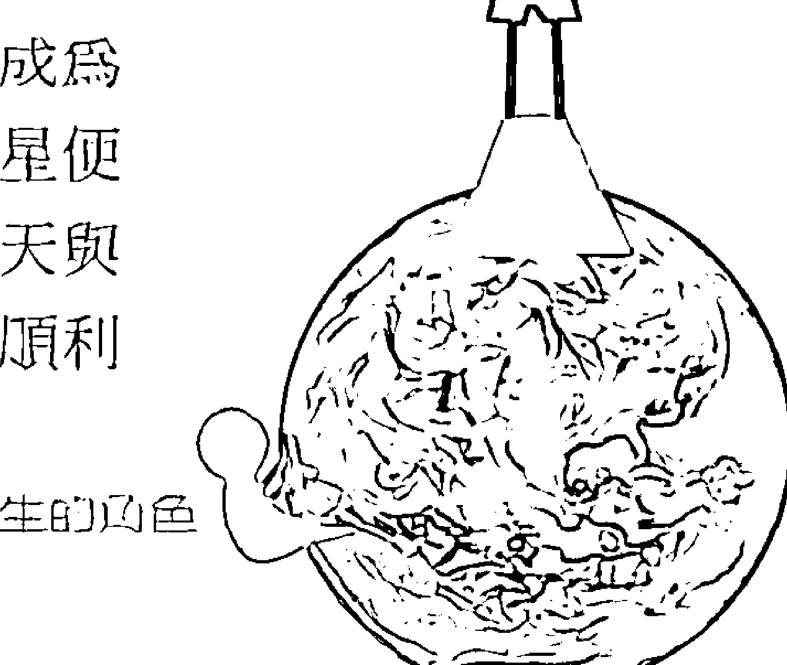

### 命宮：出生的角色

假設某人命宮金牛，中天在水瓶，太陽在雙魚四宮，月亮在雙子七宮，我們就可以基本的認知到他是一個溫和而實際的角色（命宮金牛），給人個性模糊、夢幻、不切實際的印象（太陽雙魚），內心則變化多端（月亮雙子），容易在個人特質強或者特殊的領域得到成就（中天水瓶），他重視家人（太陽四宮），容易受另一半影響內在情緒（月亮七宮）。

## 3.日與月

太陽與月亮是星盤中最重要的兩顆星，他們是一個人的基本特質展現，一個人太陽的好壞關係到他這一生是否有足夠的能量活著，能不能在一生中發光發亮都跟太陽有密切的關係，從太陽的星座可以看出一個人是什麼個性的人，而太陽所在的宮位則可以看出一個人適合展現自己的領域。太陽的相位好壞則可以看出個人的外緣好不好，個人是否能充分展現自己，成為焦點。

相對於太陽，月亮則掌管了一個人對所有能量的反應，一個人的情緒是否能調整得很好，因此，個人月亮所在的星座可以看出一個人的情緒反應方式，而月亮所在的宮位則是最容易挑起個人情緒的領域。太陽與月亮同時也代表一個人接收到父愛與母愛的方式，因此，如果一個人的太陽不好，通常表示他無法順利得到或學習到如何表現父愛的陽性能量，同樣的，如果月亮不佳，則是他無法順利得到或學習表現母愛的陰性力量。如果個人的日月關係不佳，則他的父母關係可能出問題，或者當他結婚後，他的夫妻關係也容易出問題。

另外，對地球來說，太陽與月亮是最重要的兩個星體，一外一內、一陰一陽，因此他們也分別代表我們的父母，同時也是我們長大成婚後，代表丈夫與妻子。所以對男生來說，太陽是命盤中最重要的星體。相反的，對女孩子來說，月亮的重要性也就顯得特別。

## 4. 水星、金星、火星

再來就是看水、金、火三顆星了，水星代表一個人的思想與溝通，金星則是個人的喜好展現，而火星就是你的基本慾望。這三顆星都跟個人的慾望實現有關，水星是知的慾望，金星是愛的慾望，火星則是生理的慾望。

先從水星與金星來說，水星與金星跟太陽是聯連在一起的，由於水、金的軌道在地球內側，因此從地球來看，這兩顆星跟太陽永遠在一定的角度內，水星與太陽不會超過28度，金星與太陽不會超過48度，所以水星與金星最多也不會超過76度，所以呢在占星上，我們可以將這三顆星看成一個星組，以太陽為主體，因此太陽的能量經由水星以思想跟語言來表現，同時經由金星以喜好來表現一個人的個性。

由水星的星座可以看出一個人思考的模式，所處的宮位則可看出他思考專注的領域，再從水星相位的好壞，就可以看出你的思考順不順利，進而推斷你的學習溝通能力好不好。

從金星所屬的星座則可以看出你對喜歡事物的表達方式，進而看出一個人表現愛的能力，而其所在的宮位則可以知道你的喜愛在何種領域中，再看金星相位的好壞，就可以知道你容不容易得到喜愛的事物，愛情方面順不順利。

火星座落的星座則可以知道一個人達成慾望的方式，也可以推出一個人對性的表現態度，從火星的宮位可以知道什麼樣的領域會激起個人的慾望，從火星的相位好壞可以知道一個人的生理慾望是否容易實現，進而可看出一個人的性能力好不好。

另外以地球來看，金星與火星分別在地球兩側，因此，這兩顆星也有特別的含意，金星對男性來說代表女朋友，而火星對女孩子來說則代表男朋友。水星位於最內側，代表我們的兄弟姊妹。

## 5. 木星、土星

前面五顆星（日月水金火）是跟個人息息相關，是屬於個人的能力，因此是分析個人命盤中最重視的部分，接下來的行星由於運行的速度較慢，因此他們所代表的含意就有些不同了！其實從火星開始，行星的能量就已不再個人化了，火星是地球外側第一個行星，但它仍是屬於個人星的範圍，它代表的是個人能力與他人能力的第一次接觸，結合他人的能量成爲自我的能量，因此他也跟性的結合扯上關係。

接下來到了外行星系統，首先我們見到的就是木星與土星。木星與土星它們代表的力量是就比較社會化的了，它們代表的是一個年次代整體的力量，是屬於同類的能力，因此對個人來說，木星與土星所在的星座，多半帶有同年次代的成分，通常同一年次代的人，他們的木星與土星多半是同一個星座，因此他展現的能力是整體性的，是同一年次代的人他們一起展現出他們那個年次代的特質，而這個整體的特質則會因落入每個人的宮位不同及與個人行星產生相位的不同而對每個個體產生不同領域的影響。

木星代表的是個人擴張的部分，因此同樣年次代的人因爲木星落入同樣的星座而他們會有較雷同的擴張方式，而依木星所在的宮位則可看出一個人受這群體力量的影響在何種領域上表現出積極樂觀的一面。而木星相位的好壞則可看出這股力量是否會使一個人容易得到機會而積極樂觀。

同樣的土星代表的是個人自制的部分，因爲土星走一宮要2年半，因此同樣在這2年多內出生的人，他們會有同樣的土星星座，因此他更是屬於一種整體表現出的力量，他表現出的是一個小年代的集體壓抑的模式，而這股力量會對個人產生限制在土星所座落的宮位領域中。同樣的一個人土星相位的好壞可以看出這股內縮的力量是否會造成一個人處處受限而消極悲觀。

另外，木星與土星代表著個人脫離自我後與社會的接觸，因此，這兩顆星分別代表了使我們積極與消極的力量。因此木星象徵我們的貴人，而土星象徵我們的導師或是帶給我們考驗的人。

## 6. 天王星、海王星、冥王星

一直到土星為止，都是屬於傳統的行星範圍，到了三王星，我們知道這三顆星都是在近代才發現的行星，是屬於現代行星的領域。這三個行星的運行又更慢，因此它們的力量更是不屬於個人的範疇，它們的能力影響比木星、土星範圍更廣，是一種整體世代的力量，天王星影響的是約7年的世代，海王則將近14年，冥王星又更廣了，將近20年。所以同樣的，它們座落的星座代表的是一個世代整體的力量展現，而他們所座落的個人宮位，則表示這整個時代能量對個人產生影響的領域。

天王星代表的是個人創新的部分，它所座落於星盤中的星座代表的是一個約7年的整體世代的顛覆力量，這股力量會對個人產生自我顛覆的影響在所座落的宮位領域中。從一個人的天王星相位的好壞可以看出這股整體改變的力量使一個人產生變化或顛覆的方向是好或壞，是有創意或容易偏激。

海王星代表的是一個人夢幻的部分，他座落的星座代表了一個約14年的世代的整體夢想與內在渴望的形式，是一個世代的潛意識變化傾向，這股世代的力量會因座落於每個人宮位的不同而影響個人不同的領域。由一個人海王星相位的好壞可以知道這整體夢想的力量影響對個人產生的影響是好或壞，是充滿想像力或過於夢幻而不切實際。

冥王星代表的則是人類最黑暗最原始的欲望，也就是人類的原慾與潛能，因此他所座落的星座代表一個約20年的整體原慾潛能大變化的傾向模式，這是一股非常強大的能量，而這股力量多半以一種完全由根源破壞再重生的方式進行，由他座落於個人的宮位可以知道這股大破壞的力量對個人產生影響在何種領域中。由一個人冥王星相位的好壞可以知道一個受原慾影響的結果是好或壞，一個人能否超越自我的黑暗面，是容易殘暴墮落或激發出自我的潛能。

## 7. 行星的相位關係

分析完每個行星所在的星座與宮位後，再來就要看行星與行星間產生什麼樣的相位。由吉相與凶相來看出一個人的優異點與問題點。每兩顆行星產生了相位關係，就是一種特別的能力或心理特質，或者暗示某個事件。由不同的組合可以看出一個人所擁有的不同能力特質。

我們從（A）、（B）、（C）、（D）這4組關係之間的關係來分析，（A）與（B）中日月水金火五星是屬於個人的能力，因此他們彼此間若產生相位關係，代表的是個人能力的特別性，舉例來說，如果一個人的金星與水星產生了相位，便代表了他的思考能力與愛的能力是有關連的，他的思考與喜好相互影響。

如果（A）（B）中的行星與（C）中的行星產生相位，那就代表這個人的個人能力與同次代能力產生了關連。舉例，假設一個人他的月亮與木星成合相，那麼這就暗示了他的情緒反應能力與他同次代的擴張能力結合，他的能力便產生了延伸，他很容易經由個人的情緒反應接收到同次代的這股樂觀的擴張力量。也就是他因為自己的月亮關連了木星而擁有了木星的力量，他會容易有貴人相助，因為他的情緒修養帶給他這樣的特質。

同樣的，如果一個人的日月水金火五星與（D）中的行星產生相位，那麼他就可能具有某種特別的能力，因為他能夠運用整個世代的力量。舉例來說，如果一個人的金星與天王星產生相位，那麼他可能便具有特別的魅力，能夠顛倒眾生，因為他的愛情能量中結合了一個世代的能力。他的愛情傾向契合了一個世代的變化傾向，很多偉大的人物，他們便具有這樣的特質，他們容易影響眾人，因為他們的個人能力中結合了整個世代的力量，但是反過來說，他們反而是最受命運控制的一群人，表面上看來，他們影響了世界，實際上，他們也是跟著世界不由自主的走著。因為他們的個人能力同樣的也受到整體力量的牽引，彼此是互動的。

## 8. 相位所在的宮位與星座組合

然後，看形成相位的行星所座落的宮位，來了解到彼此關連到的生活層面，舉例來說，某人日月對相於命宮與夫妻宮，日月對相象徵陰陽的對立與衝突，發生

## 9. 定位星與守護星

當完成前面的步驟後，我們可以說對星盤做了第一層的了解，然後呢，由行星定位我們還可以看見星盤的不同層面，一層一層，彼此相關連，從行星的定位關係來瞭解行星能量之間的相互關連性與因果關係，由此了解一個個生命密碼的前因後果，行星力量間的作用。

舉例來說，如果命宮點在金牛座，因為金牛座由金星主宰，因此命宮守護星便是金星，如果金星是位於第二宮，便可以知道這個人對金錢（2宮）的態度影響他的一生，而且金星本身也主金錢，進入第二宮更是適合，如果金星相位良好，他的金錢運會是不錯的。金星位於巨蟹，容易感情用事，對金錢的關注可能不理性，同時金星因為受月亮定位，他的進錢形式是小錢累積成大錢的模式。如此，一層一層的推斷出宮與宮間，星與星間的相互關連性。

再舉一個例，假設一個人的火星在金牛座，那麼火星的定位星就是金星，如果火星在第2宮，金星在第4宮，那麼就可以知道這個人的慾望（火）會受到愛情（金）影響，他的金錢（2宮）會受家庭（4宮）影響。總的來說，金錢會激起這個人的慾望（火2宮），但是他對金錢的慾望是來自於對家庭的愛（金4宮）。

## 軟體應用

工欲善其事，必先利其器，所以要學會占星術，你必須要有一套占星軟體工具，學會如何用軟體來繪製星盤。因此，在這個單元中，要教你怎麼使用占星軟體，除了學習最基礎的星盤繪製外，還要告訴你如何將兩個人的星盤合起來看，如何看運勢盤以及其它重要的功能

Astrology 是一套非常棒的免費占星軟體，是由德國的Walter先生所寫，並且大方的免費提供給大家使用，目前出到5.40版，它的功能非常多，也非常實用，是學習占星的人必備也必學的一套軟體，所以，接下來我們就要告訴你如何使用這個軟體來建立自己的星盤、配對盤與運勢盤

# PART 3

如何弄出你的命盤

要製作一張星盤很簡單！首先，你要有一個占星軟體，在現今網路上你可以找到很多種不同的占星軟體，其中比較功能最完善的免費軟體就是Astrology，你可以在以下網站下載：

- Astrolog的主頁：http://www.magitech.com/~cruiser1/astrolog.htm
- 飛星網：http://www.taconet.com.tw/fly370
- 日月網：http://sunmoon.pair.com/

打開 Astrology 占星軟體後，你可以看到如圖的星盤，你會看到的是打開當時時間的行星分布。

Astrology 軟體主要有九大功能，而首先我們要學會的就是為自己製作一張自己的星盤，然後將它儲存起來，隨時準備開啟。

## 本命盘

### 1. 出生图设定

〔资讯/设定出生资讯〕

要开始占星首先需要得到一张命盘，因此第一步便是设定出生图。按下资讯功能表下的设定出生资讯后，即会出现左图的输入资讯表单。这个表单中：

-   ○ (1) 的部分要你输入出生年月日及时辰等资讯。
- ○ (2) 的部分中经度与纬度要输入出生地点的经纬度。E代表东经，W代表西经；N是北纬，S则为南纬。时区是以格林威治时间为0，而我们台湾的时区比格林威治8小时，因此以-8表示，另外有些人出生时因为节约需求而全国统一调整时间提早1小时，因此，出生在日光节约时间内的人必须选择YES，其他人则选NO。
- ○ (3) 的部分中在NAME的空格中填入名字（PS：必须用英文），Location空格中填入出生地，这个部分可填可不填。
- ○若想要得到的是输入当时的时间则可以按 (4) 的钮，即会自动将电脑中对应的时间输入，因此，若你的电脑时间与实际时间不同，则结果就会有错。
- ○按下 (5) 的钮，便会出现原先预设的出生图的设定资讯。

设定完出生时间与地点的资讯后，按下OK钮，则会出现如右的一张星座盘了。然后，我们要将它储存起来，方便以后叫出读取。

## 軟體篇

### 3 如何弄出你的命盤

### 2.儲存出生圖

首先我們先在電腦中開一個檔案夾來存放一張張的星座盤，以我個人為例，我開了一個「自己人」的檔案夾來放我所收集的各親朋好友的星盤。在上面的步驟中，我們得到了一張星座盤後，按下檔案功能表中的儲存出生圖資訊選項後，會出現儲存資訊功能表。

如圖：在檔案名稱中填入此星座盤的名稱「飛」，資料夾選項中找到預先建立的「自己人」資料夾，按下確定鈕。如此即完成儲存設定，現在，在「自己人」資料夾中就有了一張新的星座盤了。依照這樣的步驟，陸續建立好一張張的星盤。

### 3.開啟出生圖

設定與儲存好出生圖，以後便可以隨時開啟，選擇檔案功能表中的開啟出生圖後即會出現開啟出生圖功能表：在資料夾選項中找到「自己人」後，打開後即會看到先前儲存的出生圖「飛」，按下確定鈕，即會出現「飛」的星盤了。

### (資訊/現在的出生圖)

按下資訊功能表中的現在的出生圖選項，畫面馬上會變成現在即時時刻的出生圖。

### (資訊/預設出生圖資訊)

按下資訊功能表中的預設出生圖資訊選項後會出現如下圖的表單。 這個選項用來預設你現在所處的地點的設定值，只要一開軟體便會以此設定地點為準。例如：我現在住在台北，因此我以台北為準作設定，如此，電腦軟體便以台北為基準點來設定出生星盤。（預設完後，必須選取檔案功能表中的儲存設定，如此才會成為永久的設定值）

### A. 台灣地區經緯度表

| 城市 | 中文名 | 經度 (E) | 緯度 (N) |
|------|--------|----------|----------|
| Taipei City | 台北市 | (E) 121度30分 | (N) 25度03分 |
| Kaohsiung City | 高雄市 | (E) 120度17分 | (N) 22度38分 |
| Keelung | 基隆市 | (E) 121度44分 | (N) 25度08分 |
| Hsinchu City | 新竹市 | (E) 120度58分 | (N) 24度48分 |
| Taichung City | 台中市 | (E) 120度40分 | (N) 24度09分 |
| Tainan City | 台南市 | (E) 120度12分 | (N) 23度00分 |
| Taipei | 台北縣 | (E) 121度29分 | (N) 25度00分 |
| Ilan | 宜蘭縣市 | (E) 121度45分 | (N) 24度46分 |
| Taoyuan | 桃園縣市 | (E) 121度18分 | (N) 24度59分 |
| Hsinchu | 新竹縣 | (E) 120度59分 | (N) 24度46分 |
| Miaoli | 苗栗縣市 | (E) 120度49分 | (N) 24度33分 |
| Taichung | 台中縣 | (E) 120度43分 | (N) 24度15分 |
| Changhwa | 彰化縣市 | (E) 120度32分 | (N) 24度04分 |
| Nantou | 南投縣市 | (E) 120度41分 | (N) 23度54分 |
| Yunlin | 雲林縣 | (E) 120度32分 | (N) 23度42分 |
| Chiayi | 嘉義縣市 | (E) 120度27分 | (N) 23度29分 |
| Tainan | 台南縣 | (E) 120度17分 | (N) 23度08分 |
| Kaohsiung | 高雄縣 | (E) 120度25分 | (N) 22度42分 |
| Pingtung | 屏東縣市 | (E) 120度29分 | (N) 22度39分 |
| Hualien | 花蓮縣市 | (E) 121度36分 | (N) 23度59分 |
| Taitung | 台東縣市 | (E) 121度09分 | (N) 22度15分 |
| Lutao | 綠島 | (E) 121度28分 | (N) 22度35分 |
| Lanyu | 蘭嶼 | (E) 121度33分 | (N) 22度25分 |
| Penghu | 澎湖縣 | (E) 119度33分 | (N) 23度34分 |
| Tungyin | 東引島 | (E) 120度32分 | (N) 26度19分 |
| Matsu | 馬祖 | (E) 119度53分 | (N) 26度12分 |
| Kinmen | 金門 | (E) 118度25分 | (N) 24度30分 |

## 附錄~參考表

### B. 台灣日光節約時間表

| 年份 | 時間 |
|------|------|
| 民國 34-40年 | 5/1 ~ 9/30 |
| 民國 41年 | 3/1 ~ 10/31 |
| 民國 42-43年 | 4/1 ~ 10/31 |
| 民國 44-45年 | 4/1 ~ 9/30 |
| 民國 46-48年 | 4/1 ~ 9/30 |
| 民國 49-50年 | 6/1 ~ 9/30 |
| 民國 63-64年 | 4/1 ~ 9/30 |
| 民國 68年 | 7/1 ~ 9/30 |

## 4. 出生图解析

打开一张出生图后，上面会有各项的资讯：一张星盘中主要有两个部分，左边的星图及右边的文字资料。

文字资讯表格，包含行星位置、宫位数据和其他占星参数，例如：

| 行星 | 星座 | 宫位 | 度数 |
|------|------|------|------|
| Sun  | ...  | ...  | ...  |
| Moon | ...  | ...  | ...  |

再来看右边的文字资讯，此张星盘的时间、地点等数据，例如12宫宫头所处星座和度数。
由上图中，我们先从左边看起，「A」、「B」、「C」三圈分别代表星座、宫位与行星。「A」星座在最外圈，第二圈「B」是宫位，第三圈中我们可以看到日、月、金…等行星符号，由它们坐落的位置对应到外圈即可知道各行星星座落的宫位与星座。
然后来看「D」的部分，图中这一条条的斜线就是代表此星盘中行星之间形成的相位，以软件本身的设定，图中绿色线代表三分相，红色则为四分相…等，不同的颜色代表不同的相位。
星盘中是以宫位为定位，图中「E」即是个人出生时所在地东方地平线为起点，以逆时针的方式画分出12宫来，以此星盘为例，ASC（即命宫的起点）在金牛座，也就是说此人的上升星座是金牛座。
星盘中除了上升点外另外有三个重要的点，图中「F」的三个蓝色点，也就是上升点的对面下降点（7宫起始），出生时天顶与黄道的交点（10宫起始）及天底与黄道的交点（4宫起始）。

再来看右边的文字资讯，「G」的部分主要指出此张星盘的时间与经纬度。「H」的部分则指出12宫宫头所处的星座位置，例如：图中第二宫是22Gem52，Gem是双子座的缩写，因此这就是说第二宫从双子座22度52分开始，第二宫在双子座。同样的「I」的部分是指出各行星所在的位置，R 的符号代表此行星正处于逆行中。

最后我们来看「J」的部分：

(a) 中写着FIRE：3，EARTH：4，AIR：6，WATER：3，这代表着这张命盘中的行星与交点中有3个属于火象星座，4个土象星座，6个风象星座及3个水象星座。
(b) 中写着CAR：7，FIX：5，NUT：4，这代表着这张命盘中的行星与重要点中有7个位于本位星座，5个固定星座，4个变动星座。
(c) 中写着YANG：9，YIN：7，这代表着有9个属于阳性星座，7个阴性星座。
(d) 中写着M：9，N：5，A：6，D：8，这代表行星与重要点（不包含ASC与MC）中有9个在星盘的上半圆中，5个在星盘的下半圆中，6个在星盘的左半圆中及8个在星盘的右半圆中。
(e) 中写着ANG：2，SAC：7，CAD：5，这代表着有2个位于始宫中（1、4、7、10），7个位于续宫中（2、5、8、11），5个位于果宫中（3、6、9、12）。
(f) 中写着LEARN：5，SHARE：11，这代表着这张命盘中的行星与重要点中有5个位于牡羊座到处女座中，11个位于天秤座到双鱼座中。

## 雙人配對圖

占星上有一种配对的方式，可以将二个人的星盘合起来比较，如此可以了解二个人之间具有何种的关係，并可以从彼此行星之间的相位关係，了解彼此的适合性与彼此的问题症结所在，同时若以其中一人为基准，可以看出另一人的行星位于基准人星盘中的宫位，如此可看出彼此的能量交互作用于何种场景中。

## 软件篇：如何算出你的命盘

一般我们多半利用配对图来推测男女双方的缘分，但是实际上，任意两个人间都可以藉由配对盘来了解彼此的关係。双人配对的方法有很多种，而最主要及常用的就是对照出生图。

## 对照出生图

**1. [档案/开启出生图]**
要使用配对图，首先必须决定以谁为主，以谁为对照。选取档案功能表中的开启出生图选项，打开第一出生图。延续前面的例子，我们以飞这张星盘为主，打开这张星盘。

**2. [档案/开启第二出生图]**
然后选取档案功能表中的开启第二出生图选项，打开欲比较的第二张出生图。

**3. [资讯/对照出生图]**
接着在资讯功能表中选取对照出生图选项，即会出现如左图的配对图。比较上下两图可以看到下图多了一圈行星，星座与宫位则仍是以第一出生图为主。

## 本命盘

## 雙人配對盤

### 雙人配對圖的解析

双人配对图与个人出生图的不同在于以本命盘为主的星座、宫位分布，双人配对盘多了一圈行星。如下页图我们可以看到「A」与「B」两圈行星系统，其中外圈「B」是他人的行星系统，而内圈「A」则是自我的行星系统。而最内圈的相位则为内圈行星与外圈行星之间所形成的相位。

文字资讯的部分也与个人出生图略有不同，「C」的部分是自我的出生时/地等资讯。底下「D」的12宫位是自我的宫位资讯，而最底下「E」的行星则为他人的行星资讯。

| 功能 | 快捷键 |
|------|--------|
| Set Chart Info... | Alt+z |
| Chart For Now | n |
| Default Chart Info... | Alt+D |
| Set Chart #2 Info... | Alt+Z |
| Charts #3 And #4... | Ctrl+Z |
| No Relationship Chart | c |
| Comparison Chart | c |
| Synastry Chart | Alt+y |
| Composite Chart | Alt+Y |
| Time / Space Midpoint Chart | Alt+M |

### a: 合图

#### [资讯/合图]

双人配盘除了配对法外，还有合图法、组合中点法与时空中点法。延续上面，如果改选资讯功能表中的合图选项，则会出现如图的合图盘。与前面的图比较，可以看到合图中的行星就是第二出生图的行星，星座与宫位配置则是第一出生图的配置。由合图可以让我们看出他人的行星座落于自己的宫位位置，他人的行星相位如何作用在自己命盘上。

### b: 组合中点图（资讯/组合中点图）

选取资讯功能表中的组合中点图选项，电脑即会计算出自己与他人行星、宫位等的中点，形成另一张图。如下二图：双人配对图中自己与他人的金星分别在牡羊27度与双子16度，组合后彼此太阳的中点就变成中间值金牛22度了，其他则依此类推。

组合中点图是将两个人的星图合为一张，也就是说，将两个个体当作成一个主体时，可以运用组合中点图来推论，由组合中点图可以看出两个人的共同命运。

### c: 时空中点图（资讯/时间、空间中点图）

如果选取资讯功能表中的时间/空间中点图选项，电脑即会以两个人出生时间的中点及出生地点的中点计算出另一张星盘来，由这张星盘来推断两人共同的命运发展。虽然同样是推算两人共同的命运关係，但组合中点图与时间/空间中点图的基础原理不同，因此作用也有所不同。

| 功能 | 快捷键 |
|------|--------|
| Set Chart Info... | Alt+I |
| Chart For Now | n |
| Default Chart Info... | Alt+D |
| Set Chart #2 Info... | Alt+Z |
| Charts #3 And #4... | Ctrl+Z |
| No Relationship Chart | c |
| Comparison Chart | c |
| Synastry Chart | Alt+Y |
| Composite Chart | Alt+Y |
| Time / Space Midpoint Chart | Alt+M |

## [资讯/没有关系中点图]

当你想恢复到本命盘的状态时，可以点选资讯功能表的没有关系中点图功能，就会恢复到只有本命盘的状态。

## 运势星盘

运势图是占星学中极为重要的一环，推算命运的方法很多，但最主要有两种方法，各有其立论基础。其一为运行星法，另一种则为推进星位法。运行星法是以运行星与本命星之间的互动相位来推算一个人的运势发展。推进星位法则是类似天上一天、人间一年的概念，以个人出生后一天后的行星分布作为一岁的推运，依此类推，27岁的运势便是以出生后第27天的行星分布来推运。

| 功能 | 快捷键 |
|------|--------|
| Set Chart #2 Info... | Alt+Z |
| Charts #3 And #4... | Ctrl+Z |
| No Relationship Chart | c |
| Comparison Chart | c |
| Synastry Chart | Alt+Y |
| Composite Chart | Alt+Y |
| Time / Space Midpoint Chart | Alt+M |
| Date Difference Chart | Alt+D |
| BiWheel Chart | Y |
| Transits And Natal | Alt+T |
| Progressed And Natal | Alt+N |

## [资讯/运行星与命盘]

打开出生图后，选取资讯功能表的「运行星与命盘」选项，即会出现如上的运行星盘图。上图中有两圈行星系统，内圈「B」是本命盘行星，外圈「A」则为运行星，由右边的文字资讯「D」可以知道这是2004年6月2日的运势盘，由最内圈「C」的相位可以知道2004/6/2的运行星与本命行星之间的相位互动。「E」是个人12宫位所在的星座位置资讯，而「F」则为运行星所在的星座位置资讯。

## 软件篇 3：如何画出你的星盘

## 推运星盘

### [资讯／推运星位与命盘]

打开出生图后，选取资讯功能表的「推运星位与命盘」选项，即会出现上图，与前面的运行星盘来比较，同样是推算2004/6/2日运势的星盘，但是比较两张图外围的行星可以发现差别很大，运行星图的行星是2004/6/2日当日的行星状况，而推运星图的行星则是推算出生图（如图为1972/3/5到2004/6/2的时间）以一年为一天的方式，计算出的星盘，以此图为例，从1972/3/5到2004/6/2经过了约32年，因此电脑便算出出生后32天的命盘。外围的行星便是出生32天后的行星分佈状况。

## 相位表

### [出生图／相位中心点网格]

星盘的相位很多也很乱，因此如果可以列成表格，就可以很清楚的查看，选取相位中心点网格功能即会出现相位表。相位表主要有两种，一种是个人星盘自我行星间的相位。另一种则为双人星盘彼此行星间的相位（运行星盘也属于这种相位）。

### 个人星盘相位表

左图是个人星盘的相位表，「A」的部分是星盘的行星与重要的点。「B」的部分是两颗星间彼此中点座落的星座。「C」中则为行星间产生的相位，举例：图中黄圈中的三角是代表三分相，由垂直与水平对应到「A」中的行星，可以知道水星与海王星成三分相，其他以此类推。

个人星盘相位表，标注：A为行星及重要点，B为两星中点星座，C为行星间相位

### 雙人星盤相位表

当处在双人盘或运行星盘状态时，选择此功能时就会出现如左图双人星盘的相位表，其中「1」中是本命盘的行星与交点，而「2」中则为他人的行星与交点，如果是运行星盘则「2」的部分就是属于运行星。简单来讲，「1」是星盘内圈的行星，「2」是外圈的部分。由图中「3」的部分我们知道本命（第一出生图）的木星（四分相）他人（第二出生图）的火星。

双人星盘相位表，标注：1为本命盘行星/交点，2为他人行星/运行星盘行星，3为相位示例

## 关键词-1

# KEY WORD

占星术可以说是一种符号系统，因此，每个符号都有其基本含意。这些符号系统可大分为星座、宫位、行星、相位四部份。另外，更进一步，行星与行星的组合，也有另外的特别含意，再加上相位的组合，也会有其他的意义，这是属于进阶的部分，容后再说。

## 1. 星座系统：表现模式

星座是将宇宙大分出12种基本的型态，再依不同的方式可以分出阴阳、三特质、四元素。

- **Masculine (阳性)**
  - 积极、上升、外向。
- **Feminine (阴性)**
  - 消极、下沉、内向。

- **Cardinal (开创)**
  - 开创、自主。
  - 这四座是每个季节的旺时。
- **Fixed (固定)**
  - 守成、稳定。
  - 这四座是每个季节的末段。
- **Mutable (变动)**
  - 适应、改变。
  - 这四座是每个季节的转换时。

- **FIRE (火象)**
  - 直觉、易怒的气质。
  - 热、温暖、果断、自信。
- **AIR (风象)**
  - 智慧、快活的气质。
  - 空气、思想、沟通、智慧。
- **EARTH (土象)**
  - 感官、坚固的气质。
  - 大地、物质主义、沉稳。
- **WATER (水象)**
  - 感觉、冷静的气质。
  - 流动、感情、想象。

- **♈ (白羊座符号)**
  - 我优先。
  - 新生、创始、竞争、喜新厌旧、冲动。
- **♉ (金牛座符号)**
  - 我拥有。
  - 实质、占有欲、感官、美感、温和。

我沟通。二元性、聪明、传递、连结、快速、多而不精。
我保护。母性、保护、防卫、敏感、安全感。

我创造。父性、创造力、表现、自我中心、自尊心。
我服务。完美、细致、批判性、分析性、服务。

我平衡。平衡、社交性、调和性、客观、公正。
我再生。黑暗面、深沉、极端、性、报复、穿透、隐藏。

我寻找。探索、自由、向外、冒险旅行、直接、乐观。
我征服。稳固、责任感、保守性、审慎、权威。

我知道。独立、个人、特别、革新、分工、疏离。
我牺牲。暧昧、同情心、包容力、梦幻、牺牲。

## 2. 宫位系统：人生场景

宫位代表12种不同的人生状况，也是个人成长的不同阶段与心理层面。

命宫：命运 外表、我、面具、生命历程、角色扮演。
财帛宫：物质 金钱、资源、经济、价值观、拥有物。

兄弟宫：沟通 兄弟、邻居、小学、沟通、仲介。
家庭宫：领域 根、家、母、前世、童年、晚年、不动产。

子女宫：创造 小孩、恋爱、游戏、玩乐、投机、赌博。
健康宫：运用 工作、劳动、健康、部属、服务、宠物。

# 關鍵詞-2

-   夫妻宫：合作 ◎婚姻、伴侶、伙伴、契約、聯姻、對手。
-   疾厄宫：涵能 ◎性、死亡、共享資源、黑暗面、遺產。
-   遷移宫：發展 ◎對外發展、旅行、新領域、國外、大學。
-   事業宫：成就 ◎職業、功名、社會地位、上司、父、志願。
-   人際宫：分工 ◎朋友、群體、社團組織、未來、興趣、同好。
-   精神宫：精神 ◎夢想、因果、逃避、隱密、潛意識、暗敵。

## 3.行星系統：能量類型

◎行星是不同的能量，而本命星與運行星在本質上是相同的，但代表的意義則有所不同。行星符號主要由三部分組成，分別是：

-   ◎活力、意志、外在形象、創造力、表現、陽性功能、爸爸的影響。
-   ◎反應、心情感覺、習慣、記憶力、陰性功能、媽媽的影響。
-   ◎想法、溝通、學習、吸收資訊、聯絡、表達、說話、中性。
-   ◎喜好、慾、吸引力、愛的能力、女朋友、美。
-   ◎行動力、占有慾、精力、競爭性、性衝動、男朋友。
-   ◎積極面、自信、拓展、擴張、機會、樂觀、向外性。
-   ◎壓力、忍耐力、限制、悲觀、收縮、消極面。
-   ◎創新、除舊、革命、新奇、與眾不同、獨特性。
-   ◎夢想、非現實性、幻想、想像力、迷惑的部分、朦朧、昇華。
-   ◎破壞力、重生、潛在的能量、黑暗面、變型。

-   婚神星: ○婚姻
-   智神星: ○智慧
-   灶神星: ○努力
-   凱龍星: ○恢復力、心靈創傷、治療。
-   穀神星: ○收穫
-   ○新流行、報
-   ○旧潮流、業

-   運行太陽: 活力的週期 能量、受重視的機會、使自己表現的人事物、陽性的能量、某個男性。
-   運行月亮: 情緒的週期 引發心內反應的人事物、陰性的能量、某個女性。
-   運行水星: 思緒的週期 吸收資訊、溝通的機會、使自己對外接觸的人事物。
-   運行金星: 愛好的週期 桃花、使自己產生喜愛的人事物、異性（偏女性）。
-   運行火星: 行動的週期 衝動、使自己想征服占有的人事物、衝突、競爭者（偏男性）。
-   運行木星: 向外擴張的週期 機會、貴人、使自己更能向外發展的人事物。
-   運行土星: 向內壓縮的週期 壓力、責任、使自我產生限制的人事物。
-   運行天王星: 自我改變的週期 改革、反叛者、創新、使自我產生改變的人事物。
-   運行海王星: 精神變化的週期 迷惑、夢幻想像、消極的力量、引發自己精神異常的人事物。
-   運行冥王星: 重生蛻變的週期 大破壞、大轉變、引發自己內在黑暗面與潛能的人事物。

## 4. 相位系統：角色的互動與關聯（吉凶好壞）

○相位是行星與行星間能量的相互關連與反應，代表人生中的悲歡離合、高低起伏的各種情節。

-   ○結合、相容。
-   ○對立、互補、衝突。
-   ○協調、幸運、穩定。
-   ○阻礙、退開、困難。
-   ○機會、合作。

# 中英對照表-1

## 〔A〕字部

affliction 受剋
→星體處於不利的位置，通常指與其他星體或基本點成對相或四分相。

air signs 風象星座
→包括雙子座、天秤座、水瓶座，風象在占星中代表思想、溝通與傳播。

angles 四角
→指上升、下降、天頂和天底四個主要基本點。

angular houses 本位宮
→包括第一、四、七、十宮

angular planets 合軸星
→與四主要基本點合相的行星。

Aquarius 水瓶座
→〔星座〕在黃經300度起到330度前的區間。

Arabic Points 阿拉伯點
→通常是以某一行星的黃經加上上升的黃經，再減掉另一行星的黃經，所得之度數即為一阿拉伯點，每個阿拉伯點都有不同的意義。

Archetype 原型
→代表人類通用的徵象，星座與行星就代表人類行為的原型

Aries 牡羊座
→〔星座〕黃經0度起到30度前的區間。

Ascendant(Asc) 上升點
→〔基本點〕東方地平線和黃道帶的交點。也就是所謂的上升星座，主宰個性與命運。

Ascendant Sign 上升星座
→上升點所在的星座。

aspect 相位
→兩星或星與基本點之間的相對位置所形成的特殊角度，以角度作為記星標準。

aspect grid 相位表
→表示星體或基本點之間的相位匯成的圖表。

aspect patterns 相位星組
→由兩個以上行星相互間的相位所形成特別的組合，如大三角、大十字、T 型三角等……。

asteroids 小行星
→占星學上常用的有穀神星、智神星、婚神星和灶神星以及凱龍星。

Astrology 占星學
→研究天體運行與其週期和地球上發生事件的關連性的一種學問。

Astronomy 天文學
→研究天體、太空和宇宙的學問。

Autumnal Equinox 秋分點
→太陽由北向南時通過天球赤道的點，同時也是天秤座0度。

## 〔B〕字部

benefics 吉星
→通常指木星和金星，有時也包括太陽。

birth chart 出生圖
→表示出生時當地天體運行位置狀況所繪製的圖表。通常包含行星所在星座，宮位及相互之間的相位關係。

Bowl Shape 碗型
→〔出生圖型態〕行星皆分布於出生圖中180度內的型態。

Bucket Shape 提桶型
→〔出生圖型態〕九顆行星位於出生圖中一百八十度的範圍，只有一顆行星個落在外面，這顆行星具有特別的象徵意義。

Bundle Shape 集團型
→〔出生圖型態〕行星皆位於出生圖中120度內的型態，代表偏向某方面的能力。

## 〔C〕字部

cadent houses 變動宮
→包括第三、第六、第九、第十二宮。

Cancer 巨蟹座
→〔星座〕黃經90度起到120度前的區間。

Capricorn 摩羯座
→〔星座〕黃經270度起到300度前的區間。

cardinal signs 本位星座
→包括牡羊座、巨蟹座、天秤座、摩羯座。

celestial equitor 天球赤道
→天球上與天極等距的大圓。

celestial latitude 黃緯
→星體與黃道面的夾角。

celestial longitude 黃經
→黃道上由春分點算起，從0度到360度。

Celestial Poles 天極
→天球旋轉軸的兩端。

### Celestial Sphere 天球

→以地球為中心，半徑為無限大的一個假想球，由地球看去，所有的星體都分佈在這個假想的球體上。

### Ceres 穀神星

→〔小行星〕位於火星與木星軌道間的小行星帶中最大的一顆。

### Chart Ruler 出生圖的守護星

→出生圖中上升點所在星座的主宰星。

### chart shaping 出生圖型態

→把出生圖中行星分佈的型態所做的分類方式。

### Chinese astrology 中國占星術

→發展於夏商周，以生辰八字、陰陽五行及天干地支等為基礎衍生的一種推命方式。

### Chiron 凱龍星

→〔小行星〕是已知小行星中距離太陽最遠的一顆。

### Circle 圓形

→行星符號的組成由圓形、新月形與十字形所組成，圓形象徵精神。

### composite charts 組合中點圖

→用兩張或兩張以上的星位圖，找出對應行星和基本點的中點，所畫新畫出的另一張星位圖。

### Conjunction 合相

→〔相位〕兩星或星與基本點間形成零度的視角，代表兩星體的融合。

### constellation 星座

→古人將天空中較亮的恆星勾畫成星星的組織，天文學上將天空分為八十八個星座。

### Crescent 新月形

→行星符號三要素之一，代表靈魂。

### Cross 十字形

→行星符號三要素之一，代表物質。

### Cycle 週期

→行星繞行黃道一圈的時間。

### cusp 界線

→星座或宮位的分界

## 〔D〕字部

### Daylight Savings Time 日光節約時間

→由國家統一規定將時間播快一小時，以節約能源。

### decanate 星座區間

→一個星座可分為三個區間，每個區間皆為10度。

### declination 赤緯

→星體與赤道面的夾角。

### Decile 十分相

→〔相位〕兩星或基本點彼此間形成36度的視角。

### Descendant(Dsc) 下降點

→〔基本點〕西方地平線與黃道帶的交點，也是第七宮的起點。

### Detriment 失勢

→行星處在其主宰星座對面的星座時不易發揮其特性，稱為失勢。

### Direct Motion(D) 順行

→從地球上看行星在星空背景中由東向西行。

### dispositor 定位星

→星體所在星座的主宰星稱為該星的定位星。

### Dragon's Head 龍頭

→黃道和月亮軌道的北交點，也叫月的北交點。

### Dragon's Tail 龍尾

→黃道和月亮軌道的南交點，也叫月的南交點。

## 〔E〕字部

### earth signs 土象星座

→包括金牛座、處女座和摩羯座，土象象徵著實際、可靠與物質性。

### Ecliptic 黃道

→由地球上看太陽在天球上運行一年的軌道。

### Elements 元素

→占星學上將所有事物分為火、土、風、水四元素，四元素源於中世紀的四種體液說，分別是膽汁（屬火），腎汁（屬土），血液（屬風）和黏液（屬水）。

### Ephemeris 星曆表

→記載星體每日位置等運行狀況的圖表。

### Equal House System 等宮制

→〔分宮制〕以上升為基準點，依逆時針方向將黃道等分為每宮30度的一種宮位制。

### Exaltation 耀升

→當行星處在最能發揮其正面特質的星座時，稱為耀升或得地。

# 中英對照表-2

## 〔F〕字部

Fall 失利 → 行星處在易於發揮其負面特質的星座，稱為失利，是行星最不利的位置。

Feminine signs 陰性星座 → 包括金牛座、巨蟹座、處女座、天蠍座、摩羯座和雙魚座。陰性象徵柔弱與包容。

fire signs 火象星座 → 星座四象之一，包括牡羊座、獅子座和射手座，火象象徵活力、熱情與精神充沛。

fixed signs 固定星座 → 星座三特質之一，包括金牛座、獅子座、天蠍座和水瓶座。代表穩定不變的特質。

fixed stars 恆星 → 在占星學上泛指太陽以外的恆星，但大多只使用接近黃道附近的恆星。

## 〔G〕字部

Gemini 雙子座 → 〔星座〕黃經60度起到90度前的區間。

Glyphs 符號 → 占星學上所用的速記符號，代表物件的一種基本特質或象徵。

Grand Cross 大十字 → 〔相位組〕有兩組行星之間成對相，且兩兩成四分相所形成的星組，代表一種緊張的關係狀態。

Grand Trine 大三角 → 〔相位組〕三顆行星之間互相成120度三分相，代表一種良性的循環。

Great Year 大年 → 天文學上的春分點每年緩緩順時推進稱為歲差，歲差繞行黃道一周約為一個大年，約兩萬六千年。

Greenwich Mean Time(GMT) 格林威治標準時 → 以格林威治當地為0度將全球劃分時區的世界統一標準時間。

## 〔H〕字部

harmonics 數律圖 → 將出生星位圖上各星體及基本點的角度，乘以某一整數，再除以360度，所得的餘數所代表的新角度，再繪製的一張星位圖，稱之。

hemisphere 半球 → 星圖中依四角的兩對角線可分為上半球、下半球，或左半球、右半球。

Horary Astrology 卜卦占星學 → 以問事當時的星位圖的象徵來判斷事情的占星學。

horoscope 星位圖 → 表示天體某一特定時間所在位置的圖表。

houses 宮位 → 從上升點將黃道分為十二個部分用來代表世俗的不同局面。

House systems 宮位系統 → 星圖劃分宮位的方法有數種。包括等宮法、普拉西德分宮法…等。

## 〔I〕字部

Immum Coeli(IC) 天底 → 〔基本點〕所在地子午線和黃道在地下的交點，同時也是第四宮的起點。

Inconjunct 補十二分相 → 〔相位〕兩星或基本點彼此間成150度的視角。

Inferior planets 內行星 → 指水星和金星，有時也包括火星。

## 〔J〕字部

Juno 婚神星 → 〔小行星〕四大小行星之一，象徵婚姻。

Jupiter 木星 → 〔行星〕九大行星中最大的一顆，象徵擴張與幸運，是最吉的一顆星。

## 〔K〕字部

keywords 關鍵字 → 將占星學上星體、星座、宮位或其他分析工具的基本意義，用幾個簡單的詞代表，方便了解各物件的意義，容易解釋星盤。

Kite 風爭 → 〔相位組〕有一星與形成大三角的其中一星成對相，且和其他二星成六分相，風爭頭的行星具有主導的象徵意義。

## 〔L〕字部

Leo 獅子座 → 〔星座〕黃經120度起至150度前的區間。

Libra 天秤座 → 〔星座〕黃經180度起至210度前的區間。

Locomotive Shape 火車頭型 → 〔出生圖型態〕行星分布在出生圖中留下120度空白的型態，帶頭的那顆星特別重要。

## 〔M〕字部

Major Aspects 主要相位 → 通常指合相、對相、三分相、四分相、六分相，有時也包括十二分相與補十二分相。

Mars 火星 → 〔行星〕地球外圍第一顆星，象徵衝動與勇氣。

masculine signs 陽性星座 → 包括白羊座、雙子座、獅子座、天秤座、射手座和水瓶座，象徵積極與開創性。

Medical Astrology 醫藥占星學 → 研究天體運行和人體健康之間關聯的學問。

Medium Coeli/Midheaven(MC) 天頂 → 〔基本點〕所在地子午線和黃道在空中的交點，也是第10宮的起點。

Mercury 水星 → 〔行星〕九大行星中離太陽最近的一顆星，象徵溝通與思考。

midpoint 中點 → 指兩星或基本點之間角度相加除以二的位置。

modern planets 現代行星 → 指近代發現的天王星、海王星和冥王星。

Moon 月亮 → 〔行星〕地球的衛星，代表母性與情緒。

Moon’s Node 月之交點 → 月亮軌道與黃道面的交點，也就是北交點與南交點。

Mundane Astrology 世界占星學 → 運用天體運行的狀態來預測世界局勢變化的學問。

mutable signs 變動星座 → 星座三特質之一，包括雙子座、處女座、射手座和雙魚座，代表適應力與善變的特質。

mutual reception 互容 → 兩行星互相位於對方所主宰的星座，稱為互容，代表兩行星能量的溶合。

## 〔N〕字部

nadir 天底 → 天球上的最底點。

Natal astrology 誕生占星術 → 解讀出生圖的的占星術分支。

Neptune 海王星 → 〔行星〕現代行星之一，象徵夢想與模糊。

Novile 九分相 → 〔相位〕兩星或星與基本點間成40度的視角。

## 〔O〕字部

Opposition 對相 → 〔相位〕兩星或基本點彼此間形成180度的視角，象徵對立與互補。

orb 容許度 → 計算相位時可容許與標準值間的誤差值。

## 〔P〕字部

Pallas 智神星 → 〔小行星〕四大小行星之一，是小行星中第二大的一顆，象徵隱藏的智慧。

Parallel 同度相位 → 〔相位〕兩星間位於相同的赤道緯度上。

Part of Fortune 福點(幸運點) → 〔阿拉伯點〕將上升的角度加上月亮的角度，再減掉太陽的角度，代表一生福氣的所在。

personal planets 個人星 → 在出生圖中的太陽、月亮、上升星座的主宰星、太陽所在星座的主宰星和月亮所在星座的主宰星；也泛指太陽、月亮、水星、金星和火星。

Pisces 雙魚座 → 〔星座〕黃經330度起到0度前的區間。

planets 行星 → 占星學上通常是指在黃道帶上運行的星體，包括太陽、月亮、水星、金星、火星、木星、土星、天王星、海王星和冥王星。

Pluto 冥王星 → 〔行星〕九大行星離太陽最遠的一顆，也是最晚發現的一顆行星，象徵潛能與重生。

polarity 對宮 → 黃道上對相的星座或宮位。

# 中英對照表-3

Precession of the Equinoxes 二分點歲差 → 天文學上的春分點以每年約五十點二秒的速度在黃道帶上逆行。稱為歲差。

Prime Vertical 主垂圈 → 天地球上通過正東方、正西方和天空中最高點與最低點的想像大圓。

Progressed Horoscope 推運星圖 → 計算推運之後畫出之星圖。

progressions 推運 → 將出生圖上的星體及基本點位置，以某種特別的方式計算其移動來作預測的方法，有時也指次級推運法。

## 〔Q〕字部

Quadrant Method 四分儀制 → 〔分宮制〕以上升為第一宮始點，天頂為第十宮始點，在劃分為十二宮的宮位制。

quadruplicity 三特質分類法 → 將星座分為本位星座、固定星座和變動星座等三種基本特質的分類法。

Quartile 四分相 → 〔相位〕同 Square

Quincunx 補十二分相 → 〔相位〕同 Inconjunct

Quintile 五分相 → 〔相位〕兩星或星與基本點間成72度的視角

## 〔R〕字部

rectification 生時校正 → 利用生命中重要事件來推算精確出生時間的方法。

relationship chart 時空關係中點圖 → 將兩人出生時間和地點的中點，在以此畫出另一張星位圖。

Retrograde Motion(R) 行星逆行 → 由於行星與地球運行速度不同而發生從地球上看行星在星空背景中由西向東行的現象。

right asceasion(RA) 赤經 → 由春分點起算天球赤道上的刻度。

Rising Planet 上升星 → 和上升點合相的行星。

Ruler(Ruling Planet) 主宰星 → 行星各有主宰的星座，稱為該星座的主宰星，也稱為守護星。

Ruler's House 主宰宮 → 主宰星所在的宮位。

rulership 主宰關係 → 每一星座都有行星主宰的關係，主宰關係如下：牡羊座～火星、金牛座～金星、雙子座～水星、巨蟹座～月亮、獅子座～太陽、處女座～水星(小行星)，天秤座～金星(凱龍星)，天蠍座～冥王星(火星)、射手座～木星、摩羯座～土星、水瓶座～天王星(土星)、雙魚座～海王星(木星)。

## 〔S〕字部

Sagittarius 射手座 → 〔星座〕黃經240度起至270度前的區間。

Saturn 土星 → 〔行星〕九大行星中第二大的一顆星，具有明顯而漂亮的環，象徵限制與壓力。

Scorpio 天蠍座 → 〔星座〕黃經210度起至240度前的區間。

Secondary Direction 次級推運 → 將出生圖上的星體或基本點，以一日代表一年的方式計算其移動來作某種預測，也稱 progressions。

See-Saw Shape 跷板型 → 〔出生圖型態〕行星位於出生圖中相對兩群的型態，代表兩方面的搖擺不定。

Semi-sextile 十二分相(半六分相) → 〔相位〕兩星或星與基本點間成30度的視角。

Semi-square 八分相(半四分相) → 〔相位〕兩星或基本點間成45度的視角。

Sesquiquadrate 補八分相 → 〔相位〕兩星或星與基本點間成135度的視角。

sextile 六分相 → 〔相位〕兩星或星與基本點間成60度的視角。象徵機會與合作。

Sidereal Time(ST) 恆星時 → 利用恆星為基準計算出之時間。

Sidereal Zodiac 恆星黃道 → 以天文學上的星座為基準畫出的黃道

signs 星座 → 黃道上由春分點開始，每30度劃分為一個星座的區間。

### Splash Shape 散落型
→〔出生图型态〕在出生图中每一行星皆位在不同星座的型态，代表精力分散与多样特质。

### Splay Shape 敞展型
→〔出生图型态〕行星在出生图中不规则的散布，而且有些成群的型态。

### Square 四分相
→〔相位〕两星或星与基本点间成90度的视角，象征困难与阻碍。

### Standard Time Zone 标准时区
→每十五度经度为一个标准时区，全球共有二十四个标准时区，台湾为-8 (CCT)。

### Stellium (Satellitium) 象星云集
→〔相位组〕有三颗星以上位于同一个星座或宫位，代表强调该星座或宫位的特质。

### succedent houses 变动宫
→包括第三、六、九、十二宫。

### Sun 太阳
→〔行星〕占星术中在黄道移动的星体通称为行星，太阳是最重要的一颗星，象征父性与生命。

### superior planets 外行星
→星体指火星、木星、土星、天王星、海王星和冥王星，有时将火星列为内行星系统。

### synastry 合图
→将对方的行星分布放在自己的星盘中来分析彼此的对应关系。

## (T) 字部

### Taurus 金牛座
→〔星座〕黄经30度起至60度前的区间。

### Transits 运行星
→在天空中实际运行的行星。

### Trine 三分相
→〔相位〕两星或基本点间成120度的角度，象征和谐与顺利。

### triplicity 四元素分类法
→〔分类法〕将星座分成火象星座、土象星座、风象星座和水象星座等四大元素的分类法。

### Tropical Zodiac 回归黄道
→以春分点为准定出的星座分布的黄道带。

### T-Square T型三角
→〔相位组〕两行星成对相且有另一行星与此二行星皆成四分相。

## (U) 字部

### Uranus 天王星
→〔行星〕第一颗发现的近代行星，象征突变与改革。

### unaspected planet 无相位星
→〔相位组〕一行星与其他行星或基本点之间无任何主要相位。

## (V) 字部

### Venus 金星
→〔行星〕跟地球最相似的一颗星，自转方向跟其他行星相反，象征美好与爱情。

### Vernal Equinox 春分点
→太阳由南向北时通过天球赤道的点，同时也是牡羊座的起始点。

### Vertex 宿命点
→主垂圈与黄道在西方的交点。

### Vesta 灶神星
→〔小行星〕四大小行星之一，是最亮的一颗。

### Virgo 处女座
→〔星座〕黄经150度起至180度前的区间。

## (W) 字部

### water signs 水象星座
→包括巨蟹座、天蝎座和双鱼座，象征情绪与感觉。

## (Y) 字部

### Yod 上帝之指 (Y型三角)
→〔相位组〕有两行星成六分相且有另一行星与此二行星皆成补十二分相，这另一颗行星称为祭星。

## (Z) 字部

### zenith 天顶
→天空中的最高点。

### Zodiac 黄道带
→由地球上看太阳运行的轨道，向两侧延伸约8度的区域，代表生命的循环。

## 占星學系列叢書

# 占星
## 其實很簡單
### 2
### 進階篇
### ASTROLOGY
戴鵬飛 編著

# □ A S T R O L O G Y

## 占星學其實很龐大！
占星學是一個非常龐大的體系，在入門篇中，我嘗試著將這個龐大的體系濃縮，把占星學中最基本的入門訊息帶入，介紹關於占星這門有趣科學最根本的常識。而在追本溯源中，我要就占星的整個龐大系統嘗試做完整的描述。

占星學畢竟是一個發展了幾千年的學問，可以說目前所有的現代科學體系，都跟占星學脫不了關係。甚至有些神秘論者認為，占星其實是一個高度發展的古文明所留下來的斷簡殘篇，正等著我們將缺漏的部份填補起來。

# [天地人] SKY-EARTH-HUMAN
## 1-1 星星的密码
- 10 本命盤
- 12 運勢盤
- 16 配對盤
- 18 時事占星學
- 20 財經占星學
- 20 置換占星學
- 22 擇日占星學
- 22 卜卦占星學

在這本書中延續了上一冊的架構，共分為四個單元。在第一單元《天、地、人》中，要讓大家了解的是整個占星體系的架構與運作原理，首先闡明占星與命運的關連性，占星四大要素～星座、宮位、行星、相位等對應關係，接著開始就整個占星體系做介紹，從本命盤開始、接著是四種運勢盤（大運法、推運法、返照法、向運法）系統的介紹，然後是三種配對法（比較盤、組合盤、時空盤），接著陸續介紹時事占星學、財經占星學、置換占星學、擇日占星學、最後是卜卦占星學。

## 1-2 象徵與週期
- 26 象徵
- 29 容格與心理占星學
- 32 週期

緊接著我們開始探討占星的運作原理中非常重要的兩個主題概念～象徵與週期，試圖詮釋與解釋行星與宇宙萬物的對應關連性，同時介紹了現代占星學中最重要的人物～心理大師容格，同時介紹了心理占星學與春分點移動所構成的大時代意涵，並且從萬物的週期性變化推論到行星的不同週期及行星間的組合週期與命運的關連，整理出人生中重要階段與外行星固定回歸循環的強烈關連性。

# [星座與宮] SIGNS & HOUSES
## 2-1 12星座論
- 38 星座的分類
- 42 各星座基本要點

接著的第二單元《座與宮》中，我們要了解的是星座與宮位的關聯性以及其彼此的組合，在12星座論中介紹星座的分類，除了陰陽、三特質、四元素外，並就兩兩對應的六組星座原型，試著以科學的角度定義，讓讀者能夠很快的抓住12個星座所代表的12種基本宇宙原型意義。同時也介紹了星座的四種純質料組成，以及其他以天文、形象的不同分類。然後就各個星座整理其最基本的要點，包含星座分類、主宰星、星座的廟旺弱陷行星、基本原型的原理、星座的分類象徵意義與星座的神話由來。

## 2-2 12宮位論
- 12宮位的分類與吉凶
- 衍伸宮
- 宮位制的爭議與截奪宮
- 宮位主星
- 飛星理論：宮與座的組合
- 上升在牡羊座
- 上升在金牛座
- 上升在雙子座
- 上升在巨蟹座
- 上升在獅子座
- 上升在處女座
- 上升在天秤座
- 上升在天蠍座
- 上升在射手座
- 上升在摩羯座
- 上升在水瓶座
- 上升在雙魚座

在12宮位論中，我試著以動物學的觀點來做12宮位的推論，接著進一步了解宮位的分類以及宮位的吉凶，然後介紹衍伸宮的方法及截奪宮的概念，接著講解宮主星的原理與意義，並說明宮位與星座的組合所延伸的飛星理論。最後依照12種上升所在的星座位置，詳細解釋這12種狀況中，各宮在不同星座的基本意義。

# [行星論] PLANETS
## 3 行星進階
- 行星的屬性
- 行星的對應
- 定位星
- 行星的強弱
- 行星逆行
- 其他影響

在第三單元《行星論》中，我們就行星做非常詳細的分析與說明，首先在行星的屬性中說明行星的組成與分類、行星的陰陽性質以及行星的吉凶。接著在行星的對應中介紹行星與人事萬物的對應，包括了時間與行星的關係：一週七天與行星的對應及每個行星所掌管的時辰。行星與人的對應：包括人體七個脈輪以及行星掌管的人體部位。還有音樂與行星的對應。

然後我們深入分析定位星的方法與意義，並就各行星成為最終定位星時加以說明。接著介紹各行星在不同的星座與星區位置時所產生的力量變化，從最強到最弱的不同模式做說明，這包括了行星的廟與弱、旺與陷、行星的三分性、界及外觀。然後深入分析行星逆行的狀況，並說明各行星在逆行時代表的意義與可能發生的狀況。最後介紹各種會影響行星力量的狀況：行星的互容與容納、月相的變化、行星與太陽接近時的影響（是否被太陽燒傷了）、行星的東出與西入，以及行星與重要恆星的會合，並介紹了古典占星大師威廉・里利所列的幾顆重要恆星。

## 十大行星的基本要點
# 小行星
# 重要的恆星
## 星盤上的特別點

然後就十大行星整理其最基本的要點，包含行星的基本資料、行星所處的星座與宮位代表含意、行星的能量模式、行星的象徵意義與行星在各個星座的強弱變化。這當中，就太陽與月亮的重要性，我們特別補充了太陽的不同週期，如11年黑子週期等的變化影響。太陽與月亮的關係、日月蝕的形成以及與月亮相關的幾個特別點，南北交點與黑月。說明完十大行星後，我們進一步的介紹幾顆重要的小行星，凱龍星、穀神星、灶神星、智神星與婚神星。然後列出了29顆重要的恆星，介紹其象徵意義。最後介紹星盤中的重要特殊點的原理與意義，包括中點、映點與阿拉伯點。

# [相位論] ASPECTS
## 4 相位進階
- 星盤分割法
- 主要相位
- 次要相位
- 其他相位
- 出相位與入相位
- 行星空相位
- 出生圖的型態
- 相位組成的格局

最後一個單元為《相位論》，首先讓讀者了解相位的定義與解讀相位時的步驟與必須注意的重點。然後深入了解相位的構成方法以及相位與數字的關連，介紹二分、三分與五分法所構成的相位及其代表的象徵意義。接著進一步說明五種傳統相位（托勒密相位），四個次要相位以及兩個其他相位。然後說明出入相位與空相位的意義。最後我們從整體來著手，從行星群體的分布與彼此構成的相位所產生的特殊形態與格局，介紹了7種（碗型、提桶型、集群型、扇型、火車頭型、蹺蹺板型、散落型）行星在星盤上的分布形態，以及6種（T型三角、大十字、大三角、風箏、信封、上帝之指）重要的星盤格局。

# 天地人
### ASTROLOGY
我們總是認為是星星決定我們的命運，但是也許剛好相反，是嬰兒自己決定他要的星星分布，也就是說是嬰兒自己決定他要的出生時間，是他自己決定他的命運。每一個小孩、每一個新生命堅持在特定的時刻出生。他要在某個特定的片刻被生出來。

# PART1-1
## 星星的密码
## THE KEY OF STAR
自古以来，天上的星星就像是无数个神秘的眼睛注视着我们，想要传达特别的讯息给我们！

经过几千几万年的体验，先人渐渐累积了这些眼睛想要表现什么，他们最先认识的就是白天与夜晚出现的两颗大眼睛～太阳与月亮。发现到四季的变化与海水的潮汐跟这两个大眼睛息息相关。

接着他们发现有五颗特别亮的星星会沿着太阳的轨道运行着，他们时进时逆，有固定的时间与周期，当他们出现在天空中特定的位置时，总会出现类似事件的发生。

除了这五颗特别的眼睛外，天空中还有无数颗明亮的眼睛，他们不像这五颗星星会变动位置，像是定位系统般固定的每日在天空中旋转一圈。在东方的中国，先人们最重视的是在北方的尽头有一颗特别的星星，他永远不动，所有的星星以他为中心旋转着，像君王般受万民朝拜，这就是北极星。在古代埃及，他们特别重视的是天狼星的出现时刻，每年当天狼星在黎明前出现在东方地平线时，就是尼罗河水要泛滥的时候！

除了这些规律的星星以外，偶而还会出现一些不乖的顽皮份子，当这些彗星、流星出現時，往往會引起世間的騷動。有時天空會突然出現的一顆星星，過一陣子又漸漸消失，以現代眼光來看，這是所謂的超新星爆炸的現象。另外當日蝕與月蝕發生時，往往會造成全球性的集體心理恐慌。

一直到近代望遠鏡出現後，透過望遠鏡，人們發現到更多的眼睛，並且了解到原來我們是住在太陽系裡的一個不算大的行星上，那五顆特別的星星是跟地球一樣，屬於太陽系裡的兄弟姊妹，除了這五個兄弟姊妹外，原來還有三個兄弟姊妹被遺漏了，另外還有數以萬計的小兄弟（小行星）也一直在我們身邊影響著我們！

這些大大小小、看得到與看不到的眼睛都像是帶著特別的密碼般，時時刻刻想告訴我們這個宇宙的訊息！

## 一個豐富而龐大的體系
占星學到底有多龐大呢？很多對占星叱之以鼻的人往往以坊間12星座將人分為12等分來反駁占星學，說明人只有12種模式的分類太過膚淺，認為占星毫無科學根據，然而實際上，你知道占星學的體系有多龐大嗎？你知不知道其實許多科學大師都是因為研究占星學而發現了偉大的科學定理！

我們可以這樣說，幾乎現今的科學領域都跟占星學有關，我們知道刻卜勒的行星定律，哥白尼發現的日心系統，還有牛頓的萬有引力。但是大家卻不知道，這些科學大師其實都是占星師。

天文學原本就是占星學，數學是為了計算星星的時間與位置而發展的，化學根本就是煉金術演變而來，而煉金術與占星有著極為密切的關係！儘管近代科學發展後，占星學成為迷信的象徵，但是不能否定的，占星可以說是最古老的一門科學！他並非是一門發展不完整的學問，相反的，他可能是某個先進古文明中高度發展的科學，但是由於文明的失落，現今我們手中所殘留的只是占星學不完整的斷簡殘篇。

畢達哥拉斯相信每一顆恆星、行星、衛星都會在宇宙行進中發射出獨特的頻率，每一顆星星都會發出屬於自己獨一無二的振動。整體群星的振動共同創造出音樂般的宇宙和諧旋律。當你與出生當時的原始音樂振動和諧時，就會是健康的。而當你與這個基本音樂和諧關係中斷時，就會生病。

## 牛頓與占星學
牛頓是一位化學家、物理學家、天文學家，也是一位占星師。對占星有狂熱的熱忱。他在一份手稿中，記錄個人神秘冥想的經驗、占星學及煉金術的研究心得。他曾預言在他死後二十三年，在西元一七五〇年的頭三月內，會發生北極光風暴與強烈大地震。結果一七五〇年的二月，正如他所說的發生北極光風暴，接著強烈大地震，加上強烈風暴，造成數千人死亡。而事實上，牛頓是為了占星的研究，為了計算星際關係而發現了萬有引力。

占星學的理論基礎為何？有些科學家試圖尋找一個合理化的科學解釋，他們相信宇宙中每一個天體都有它獨特的放射能量。會釋放出一種不同的射線來影響我們，在空間中形成特別的「能量場」影響人類的生活。每一個星體都由不同的氣層組織圍繞著，所以就有不同的放射線組合射向地球，各個星體形成了不同磁場傳遞到地球上，從而形成複雜的磁場影響力。

一個人出生前，接收母體的先天之氣，在母體中隔離了大部分磁場的影響力。當剪斷臍帶之瞬間，人們的身體開始接收到強烈宇宙磁場的影響，從而形成人們體質的基調。《黃帝內經》記載，人身體內有14條經脈，上面分佈著354個穴位，貫穿整個身體。這354個穴位，就是我們每個人身上的敏感點。在我們出生的時候，宇宙磁場的力量，通過這些穴位貫穿我們整個身體，建立了自身的小宇宙。人體小宇宙的磁場在整體大宇宙磁場的影響下，發出共振的火花，造成不同層面的影響。受到的影響力有強有弱，從而使得人們形成不同

## 人體的小宇宙
科學家試圖為占星找到科學根據，他們認為行星的力量以壓波的方式直接影響人體的小宇宙，彼此對應。

的性格、體質與命運。我們每個人對於不同行星磁場的敏感度各自不同。一個出生在木星磁場顯著時候的人，自然會對木星磁場特別的敏感。
這似乎有些合理性，可以解釋一部份現象。但是占星學顯然不止於此。因為占星除了具有因果法則的物理關係外，還隱藏著特別的神秘性，這不是單純的物理定律可以解釋的。

## 天、地、人
從占星學的整體框架來說明，占星是探討人與星星關係的一個學問。當行星在不同的位置與宇宙方位時，和人世間的萬物產生對應，這牽涉了三個方面，宇宙、地球、人這三個因素的關連。也就是天、地、人的交互感應。

12星座就是天空中宇宙方位的代名詞，象徵天與人的關係，表現出12種基本原型特質。

12宮位也就是地球方位的代名詞，象徵地與人的關係，代表人生活在世上面對的12種基本環境場景。

而行星位置就是人與天地關聯的地方，代表著每個人的基本能力特質，由出生當下瞬間的行星位置來代表一個人的天、地、人的關係。而行星間的相位則表現出個人能力特質間的互動關係，代表行星能量的流通是否順利。

為什麼是以出生時作為一個人的命盤依據呢？這向來存在著爭議，即使是出生過程，也不是一個固定的時間點，到底是頭出現的一刻、開始呼吸時、剪斷臍帶的那一刻，還是呱呱大哭時呢？

占星大師托勒密認為人受精之瞬間才算代表一個人的時刻，可是即使現今科學如此發達，還是很難知道一個人受精的時間。同時如此會出現一個問題，同卵雙胞胎的受精時間完全相同，但是命運卻還是有所不同！因此，這樣來看，是否還是以出生一刻才算呢？

回到原來的問題，到底應該以哪一個時間為準呢？也許都可以吧！

我們總是認為是星星決定我們的命運，但是也許剛好相反，是嬰兒自己決定他要的星星分布，也就是說是嬰兒自己決定他要的出生時間，是他自己決定他的命運。每一個小孩、每一個新生命堅持在特定的時刻出生，他要在某個特定的片刻被生下來的。

所以相同來源的雙胞胎各自決定了自己的出生時間，從受精那個點開始，我們就開始在人生中做不同的決定，而每一次的決定都影響著未來的變化！

大家小時候應該都玩過一種走線條的遊戲，在紙上畫著連結線由一個起點漸漸分支出去，分支再分支出去，在最尾端寫上不同的結果，將紙捲起來，只露出起點，然後由玩遊戲的人沿著起點開始走，遇到分支就必須選擇，然後一直到終點，看得到糖果或是懲罰。而人的命運似乎也是如此，出生時刻是第一個選擇，一旦選了一個分支的一端，就不可能到達另一個分支的終點，如此不斷的選擇下去，因此，每一次重要的抉擇點都決定你最後可能的結果，而這些重要的時間點就隱藏在重要的行星回歸或相位上。

所以有人說婚姻是你的第二人生，如果你選擇好的時間點結婚，你的下半輩子的命運將會改變！

## 本命盤
當個人出生時，行星間構成了形成當刻的特別位置關係，這賦予了一個新生命與天地及天空星體間的相互對應關連，這個瞬間凝結的、獨一無二的位置組合，就是一個人的本命盤。它代表你這一生的基本藍圖。

透過本命盤的行星分布狀況與位置，我們可以了解到一個生命個體的基本特質與命運密碼。由他行星所座落的星座位置來了解他的個性、內在、思思想、喜好…等能力的特性模式。由其行星所落的宮位位置來知道他天賦傾向於哪個人生領域。再透過行星間的相位關係了解到此人各種天賦能力間具有什麼樣的關連問題。本命盤就像一顆種子般，透露個人的種種基本訊息。

## 個人運勢分析

### 1. 個性命運
個人運氣好壞看命宮與太陽、月亮、命宮主星及命宮內行星的相位關係。

### 2. 財運
財運看二宮及金星、月亮及二宮主星及二宮內行星的相位關係。

### 3. 交友運
交友運看三宮、十一宮及水星和三、十一宮主星及宮內行星的相位關係。

○一張命盤中透露出的人生密碼與訊息是非常龐大的，單單要分析一張最基本的本命盤（不包含特殊點、小行星）就必須學習了解如下所列的基本組合的意義：
1. 12宮宮頭位置座落於12星座組合成的12種基本佈局。
2. （日、月、水、金、火、木、土、天、海、冥）十顆星體座落於12星座的120種基本模式。
3. （日、月、水、金、火、木、土、天、海、冥）十顆星體座落於12宮位的120種基本人生傾向。
4. （日、月、水、金、火、木、土、天、海、冥）十顆星體彼此間形成的相位所產生的45種關連組合。
5. 行星彼此間45種關連組合產生的214種基本相位模式。

## 12星座
表現12種人性特質與行為模式，進入後所產生能量的變化與作用力的強弱。

## 12宮位
12個生活領域，當行星進入後即強化該領域的特徵。

## 行星
基本能量的形式，透過12星座與12宮位，表現出其特質與作用領域。

## 相位
表現行星能量之間的互動性與互助關係，產生吉凶的變化。

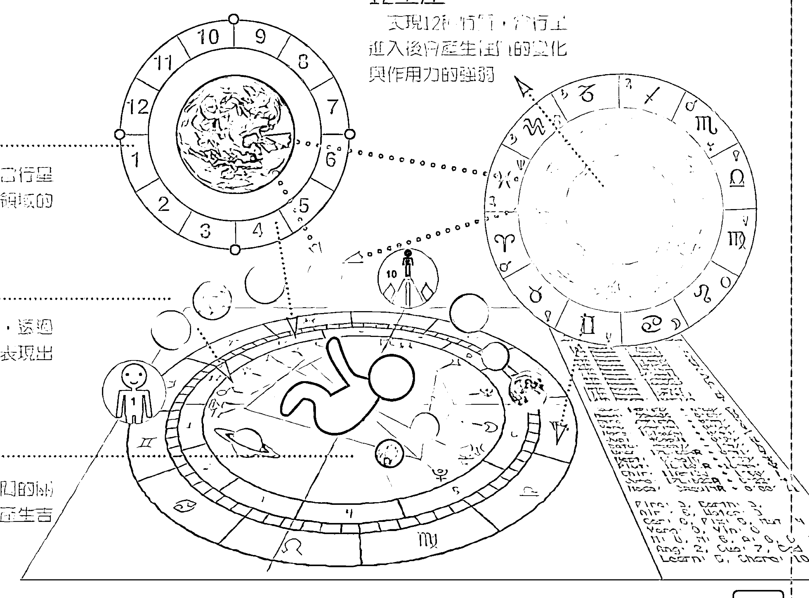

# 天地人 1-1 THE KEY OF STAR

## 4. 家庭運
家庭運看四宮及月亮、太陽、四宮主星及四宮內行星的相位關係，其中太陽象徵父親，月亮象徵母親。另外，兄弟姊妹看三宮，子女看五宮。

## 5. 戀愛運
戀愛運看五宮、金星、火星、五宮主星及五宮內行星的相位關係，其中對男生來說金星代表女朋友，對女生來說火星代表男朋友。

## 6. 工作運
工作運看六宮與十宮，六、十宮主星及六、十宮內行星的相位關係，六宮看與部屬的關係，十宮看與老闆的關係。

## 7. 結婚運
結婚運看七宮、金星、火星、太陽、月亮及七宮主星、七宮內行星的相位關係，其中太陽看丈夫，月亮看老婆。

## 8. 合夥運
合夥看七宮、八宮，宮主星及宮內行星的相位關係。

## 9. 性愛運
性愛看八宮、火星、八宮主星及八宮內行星的相位關係。

## 10. 外出運
外出運看九宮、木星及九宮主星及九宮內行星的相位關係。

## 11. 讀書運
讀書運看三宮、九宮、水星及三、九宮主星及三、九宮內行星的相位關係，其中三宮看基礎教育，九宮看高等教育。

## 12. 事業運
事業運看十宮、太陽、土星、木星及十宮主星及十宮內行星的相位關係，其中木星看貴人、土星看難關，太陽看名聲。

## 13. 人際運
人際運看十一宮、九宮、七宮、三宮，各宮宮主星及宮內行星的相位關係。

## 14. 健康運
健康運看六、十二宮，六、十二宮主星及宮內行星的相位關係，其中六宮看身體，十二宮看精神。

## 15. 精神運
福氣看十二宮，生死看八宮。各宮宮主星及宮內行星的相位關係。

# 運勢盤
本命盤可以知道一個人的種種生命密碼。但是，光知道你的基本藍圖透露出的訊息，那是沒有意義的！天上的星星不會因為你的誕生就凝結停止，當你一出生的下一瞬間，行星就已經不在原來的位置了。一顆種子種入土中，沒有時間的縱橫，它永遠還是原來的那粒種子。從本命盤只是知道你的命而已，而時間是不斷縱橫前進的，你的本命盤密碼必須經由時間精靈來啟動才會活起來，而時間精靈就是這些不停運轉的行星，當他們在某個時間點運行到某個位置引動你的本命盤密碼，你的一生才會產生大大小小的事件，而這就是運的概念了。所以好命如果沒有遇到運行星來啟動，也是徒勞無功的！

太陽每年會回歸一次，也就是你生日那天，太陽代表受重視，因此那天你往往是主角。而月亮每27天就回歸一次，其他行星也都有特定的回歸時間，這些週期有長有短，有些幾百年、有些只有幾十天。他們會在一定的時間跟你本命盤上的生命密碼發生感應，產生特別的人生事件。

例如木星是傳統認爲的幸運星，當它跟你的自然愛俏星金星發生感應時，你的愛情關係往往會有新的進展！而當土星（第一凶星）跑到你的命宮時，則往往是你人生挑戰的開始！所以，透過了解行星的迴轉週期，我們可以掌握住一個人人生重要時刻的徵兆，預知未來可能的發展！

運勢盤的概念就是以行星的時間移動來推算運勢的變化，經過數千年先人智慧的結晶，占星學上也發展出好幾種推算運勢的方法：

## 1. 大運法：Transit
這是最直接的推斷運勢方法，也就是直接對應當下的行星狀態，看當下行星與你的本命盤行星是否產生感應。

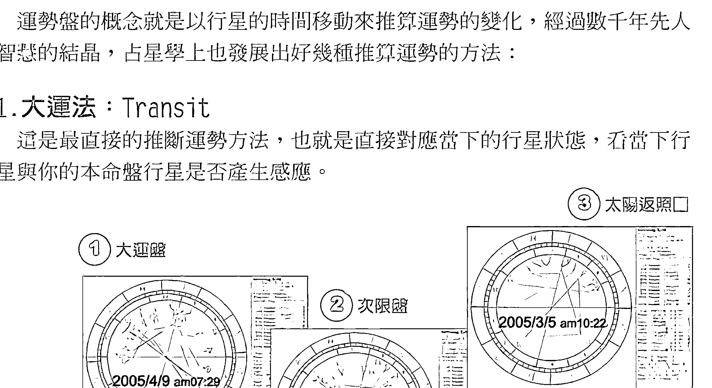

| 1 | 2 | 3 | 4 |
|---|---|---|---|
| 內圈：本命行星 外圈：2005/4/9 am07:29 運行星 | 內圈：本命行星 外圈：準運行星 | 2005年流年的太陽返照（某甲在2005/3/5 am10:22 進行太陽回到出生時太陽的位置，以此時所形成的盤就是某甲2005/3/5日到下一年2006/3/5日太陽回到出生點這段期間的太陽返照盤） | 內圈：本命行星 外圈：向運行星 |

## 2. 推運法：Progression
推運法與大運法的原理類似，但作用不同。大運法是實際當刻的運行星與本命行星的對應，而推運法則是以濃縮的時間作為運行星來對應本命行星。大運法是真實環境的變化，而推運法則是一種內在心境的變化。這個概念其實很簡單，也就是一段小週期的變化可以對應、擴張成一段大週期的變化，類似天上一天，地上一年的概念，由這樣的概念發展出了好幾種不同的推運方法。主要有以下：

- a. 主限法：約四分鐘代表一年。太陽每天運行約一度，以地球替代跟太陽每天運行相同度數的時間，運行一度（約4分鐘）代表一年。以此推論，我們以東升點為基準，出生後東升點每經過太陽運行一天的度數（約一度）就代表一年的變化。
- b. 次限法：一天代表一年。以出生後太陽走一度的時間對應太陽走黃道一圈的時間，太陽約每一天走一度，也就是以一天代表一年的變化。
- c. 三限法：一天代表一月。同理，以太陽走一度的時間來對應月亮走黃道一圈的時間，太陽約每一天走一度，也就是以一天代表一個月的變化。

**次限法的時間對應**
如右下，可以看出以次限法來推運時，出生後第一天的運行星分布就是出生後第一年的推運星分布，也就是一年的時間狀況濃縮在一天中。所以說，出生後三個月（代表推運約90年）是人生很重要的時期，因為這三個月決定了一生的基本走向。

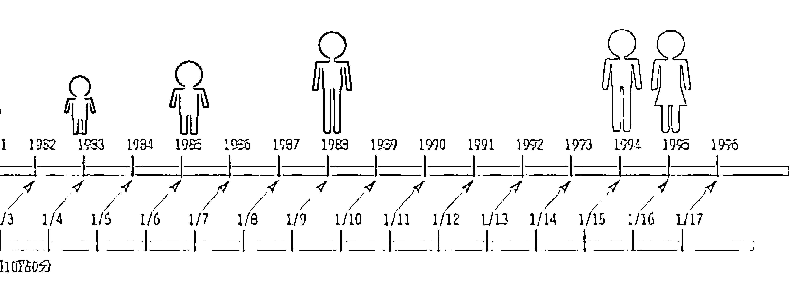

## 3. 返照法：Return
類似中國的小限，以行星回歸到原點的時間作爲當次回歸到下次回歸的整體運勢，一般常用的有太陽和月亮返照。太陽返照看當年一整年的運勢，而月亮返照則看當月一整月的運勢。除了太陽與月亮外，任何行星的回歸當刻，皆可作爲這一個回歸週期的週期運勢盤。返照法可以看作是以一個特殊時間起點當作一個週期的出生圖，來看出一個週期的整體運。如果再配合運行星，就可以看出這個週期中的運勢變化。

**太陽返照**
下圖為某甲的太陽返照圖，太陽每經過一年會回到原點，以太陽回到原點的時間形成的盤就是當年的太陽返照盤，可以從這個盤看出從上次回歸到下次回歸這一年中的運勢狀況。

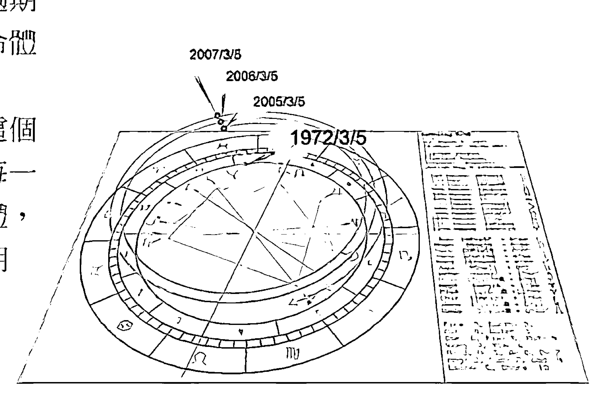

同樣的方法可以運用在任何一個週期中。例如日蝕盤，從這一次的日蝕到下一次的日蝕週期，就可以開始的日蝕時間當作這一個日蝕週期的命盤，配合運行星與這個日蝕週期盤行星的互動感應，可以知道這個日蝕週期中即將發生影響的時間。同樣的方式，除了行星回歸週期外，還可以推及到每一次的行星逆行週期，行星會合週期…等，將每一個週期當作一個生命體一般推算運勢。

所以人的一生是一個大週期，這個大週期中包含著無數的小週期，每一個小週期都可以看成一個新的個體，有其個別的命運，然而這些大週期與小週期間卻又是息息相關的。

- 1. 運行（日、月、水、金、火、木、土、天、海、冥）進入本命盤12宮的120種基本象徵事件。
- 2. 運行（日、月、水、金、火、木、土、天、海、冥）與本命（日、月、水、金、火、木、土、天、海、冥）產生對應的100種反應組合。
- 3. 運行星與本命星間100種反應組合所產生的500種基本相位模式。

## 4. 向運法：Direction
向運法與推運法類似但方法有些不同，它依據的是四度空間的時間概念，同樣以某重要星體運行一小段時間來替代一段大時間，但是卻是以整體星盤來做位置的移動，而非時間的移動。

舉例：以太陽弧向運法及次限推運法來比較，同樣用太陽運行一度來代表太陽運行一圈的時間，但是不同的是，推運法中的星體運行是純粹的時間壓縮，運行速度仍是各自不同的，但是向運法卻是將整個命盤依據太陽的移動速率來進行移位，例如出生後五天，太陽移動五度代表五年後的命運，在推運法中月亮因為運行的比較快運行了六十幾度，但在向運法中月亮一樣跟著太陽做相對移動，只運行五度。

所以向運法是以一個星體的運行速度為基準，將整個命盤上的所有物件（包括行星與重要點）做相對性的移動，進而論斷行星依據此移動後的新位置與本命行星產生的互動反應。

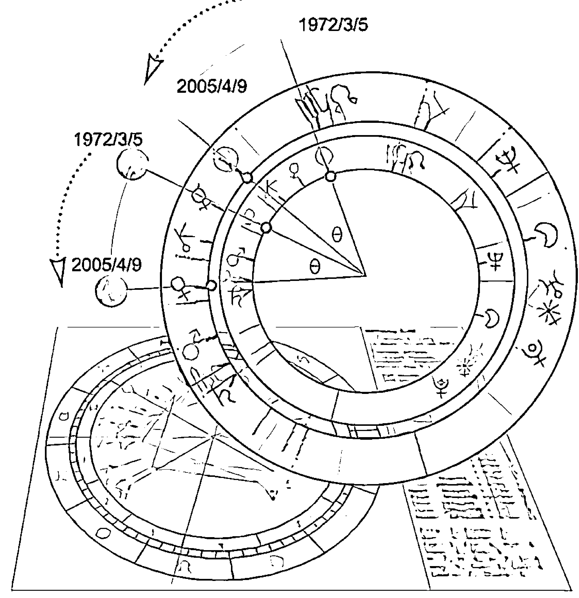

**太陽弧向運法：Solar Arc Direction**
上圖中紅圈與橘圈中的行星分布是一樣的，只是隨著太陽的移動，整個星盤跟著移動。當從1972/3/5到2005/4/9這段時間太陽移動了33度，所以金星也跟著移動了33度，同樣的，所有的行星也都移動了一樣的距離。

# 配對盤
占星學從本命盤透析你的命、探究個人的基本密碼。以各種推斷運勢的方式，找尋啟動密碼的時間，讓你了解自己人生中大大小小、鉅細靡遺的每個重要抉擇點的發生時刻。這些都是屬於自我的分析，但是人生在世，並不是光靠自己，還必須與許許多多的人接觸，那麼透過占星來了解二個人、三個人、甚至一群人、一個國家、整個世界也是重要的課題。

我們先從最基本的雙人關係來著手，每個人都有屬於自己獨一無二的行星組合，因此，很自然的占星上便利用兩個人個別命盤的對應，來分析個人與他人的各種關連，這就是基本的配對盤概念！

隨著近代占星發展，配對盤也發展出不同的方法，各有其立論基礎與印證準確度，主要有以下幾種：

## 1. 比較盤：Synastry
這是最基本的配對法，就是將其中一人當主盤，將另一人的行星分布套進來，就像是以另一人的行星當作運行星般，看對方行星落入主盤的什麼宮位，同時與主盤行星產生什麼相位！

## 2. 組合盤：Composite
是由漢堡學派的中點理論推演而來，將兩個人的所有行星、重要點的位置取其中點，重新構成一張星盤！

○如果單單從最基本的比較盤，我們可以看到：
- 1. 甲方（日、月、水、金、火、木、土、天、海、冥）進入乙方12宮的120種基本象徵事件。
- 2. 甲方（日、月、水、金、火、木、土、天、海、冥）與乙方（日、月、水、金、火、木、土、天、海、冥）產生對應的50種反應組合。
- 3. 彼此間50種反應組合所產生的250種基本相位模式。

## 3. 時空盤：Time/Space Midpoint
時空盤則是將兩個人的出生時間與出生地點經緯度加起來除以二，重新產生的一張星盤！

比較盤主要看出兩人間的關係、利害、彼此相處的合適點、問題點，而組合盤與時空盤除了可以分析兩人關係外，也可以將多人取出共同平均點，起出共同關係盤。在應用上更為廣闊。

**時空中點盤**
如圖中A與B的出生時間分別為1972年3月5日及1980年7月10日，其中間日期為1976年5月7日，將兩人出生地取其中間位置為二中的新地點，以這個新地點與新時間起盤形成C，這就是A與B的時空中點盤。

## 時事占星學
實際上，占星學最初的發展並不是為了服務個人的。在古代，占星的預測主要是為了知道國家君王的盛衰，從天象中對應世事的變化。透過行星的位置、順逆、交會，日月蝕、恆星與行星的會合，彗星、流星的出現來推斷可能發生什麼世界大事，這就是時事占星學。

例如由木土20年的交會週期來對應各種關於社會、政治、經濟的變遷等等，看行星構成的天象象徵如何影響整個世界的發展。這些影響通常是普及性的、共通性的，像是從春分點的移動位置，我們正由雙魚時代進入寶瓶時代，而這個新時代就表現出科技、個性化、電子發展、人道主義等水瓶座的象徵。

這樣的共同天象意義通常是全球性與整體性的，而對於個別國家的運勢來說，占星學就將國家當作個人一樣，根據一個國家誕生的時辰繪製星盤，來推斷一個國家的命運。例如英國就是以威廉王在1066年12月25日西敏寺加冕的那個時間來立盤的。利用這樣的方法推演，更可擴及到一個機構、一家公司、一個政黨、甚至一個家族命運的推斷。

除了以一個國家誕生時間立星盤來推算的方式外，占星上還會以每年太陽在春分點回歸的時間，依個別區域的經緯度立星盤的方法，來推斷一個地區一年間的運勢狀況。

透過這些行星關連的方法，占星學除了運用在國家、世界的預測上，也應用在許許多多不同的領域中，古代占星師除了預知國運，也經常充當氣象員，預測天氣變化，除此之外，在各種社會層面中也都有占星的介入！

現今電視、網站上預測12星座運勢的方法也是一種簡化的時事占星法，以太陽所在星座當作第一宮，接著順著星座分布第2宮、第3宮…，然後看天上行星進入哪一宮，推算某星座全部人的運勢，不過，這當然是非常不準的，因為將全部的人分成只有12等分，很顯然是過於粗糙！

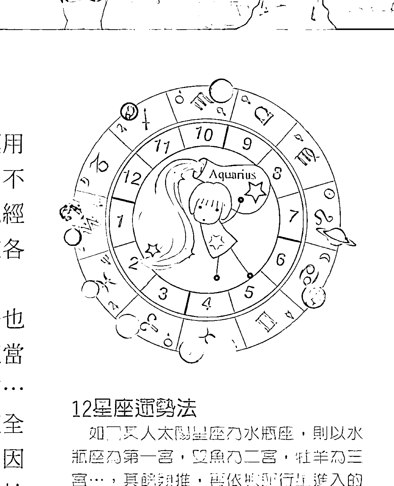

**12星座運勢法**
如「某人太陽星座為水瓶座，則以水瓶座為第一宮，雙魚為二宮，牡羊為三宮…，其餘類推，再依此行星進入的宮位推算命運，如「中土星在獅子座也就是此人的第七宮，因此可以推斷此人可能有婚姻或與人合作方面的壓力」。

## 財經占星學
財經占星學是屬於時事占星的一種，雖然發展時間很短，卻很快的成為一門重要的占星門別。運用行星週期的循環，占星師將經濟的循環、股市的波動與行星週期對應，不論是股匯市、黃金、石油、農產品的價格都有個別的波動週期，許多經濟學者都知道這些起起浮浮的波動，都具有一定的規律可循，而這些規律的週期變化，很顯然的可以與行星週期做某種關連，藉由現代電腦科技的分析，將這些相關因素繪製成量化圖表，可以明顯地看出行星之間錯綜複雜的波動關係，再配上流年、流月或流日的波動，形成一種頗為符合科學分析的量化技巧。

由於股市的波動是變化萬千的，需要考量到的因素極為複雜。把這些錯綜複雜的波動關係，配合上行星的波動，與波浪理論相結合，找出彼此之間的相關性，進而用來預測股市的變動趨勢，如果你可以找到這樣的規則，你就可能預測股市未來的走向，而這就是財經占星師想找尋的！在美國，有關股市預測這一方面的研究是相當發達的，財經占星可說是占星學研究中最難和最複雜的論斷技巧，也是占星學家最不願意公開的密技。

利用占星來預測股市，首先就要確認以何時當作股市的出生時間，台灣股市第一次交易時間是1962年2月9日上午9時，有興趣的讀者不妨研究看看，也許你可以因此成為股神喔！

要研究財經占星要注意到幾個重點：
- 1. 以何時為命盤的基準，例如股市命盤、國家命盤、中央銀行命盤、所選的股票公司命盤等。
- 2. 週期循環與股市起伏的對應，主要的重要長期週期有太陽黑子11年週期、木土合相的20年週期、月交點的18.6年週期等，短期的影響有太陽、水星、金星的週期、太陽與火星的合相週期等，另外要考慮月亮的影響。
- 3. 行星、星座象徵的行業與整體經濟循環的關聯性。
- 4. 行星相位的影響，會對整體波動具有修正效果。

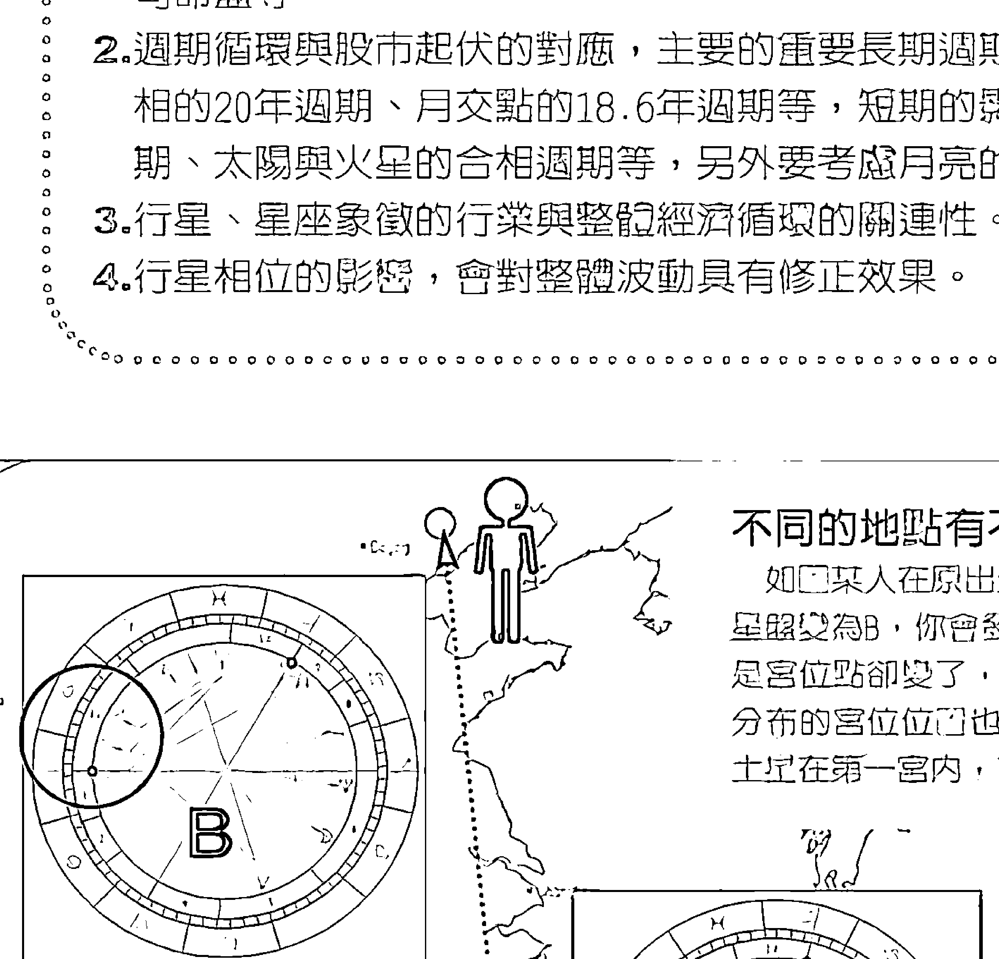

## 不同的地點有不同的命運
如圖某人在原出生地時的星盤為A，當他到遷居地時，星盤變為B，你會發現到，黃色區中的行星分布不變，但是宮位點卻變了，命宮從金牛變成雙子，因此原來行星分布的宮位位置也跟著產生了些微的轉變，如圖中原本土星在第一宮內，在新的地點中，土星變成在12宮了。

## 置換占星學
天、地、人是構成命運的基本元素，占星命盤是由出生時間與地點構成的，出生時間雖然不會改變，但是人卻可以改變自己所處的位置。所以換置占星的意義，是指個人離開出生地A到另一地B，若以該地B的經度、緯度重新起盤，則因為各宮宮始點位置的改變而產生命運的變化。因此，如果本命盤位置不佳，透過更換地點的方式，也許可以使行星位置改變分布的宮位，藉以趨吉避兇，這就是置換占星的概念！

置換占星學經過不斷發展，同時加入了東方風水的概念而展現不同的風貌，將陽宅風水的概念與占星學結合成一種新的技巧，這發展爲地平空間占星學，以地平座標來衍伸，除可用於擇日學中的太陽到山外，亦可求算個人的地平空間圖，從其中顯現的行星線來安排個人陽宅住居的各種功能使用，提供就職、戀愛、賺錢…的適當方向。

現代換置占星學之父Jim Lewis，發明Astro*Carto*Graphy法，簡稱A*C*G。這是種結合行星路線和世界地圖的方法，利用出生當刻地球上行星能量分布位置的不同，而讓當事人可以選擇對自己有利的位置，接收有利的能量。

A*C*G圖可供個人作爲出國發展、移民、留學、生意往來的極佳工具，可以充分掌握全球那一地區是個人最佳幸運區。因不同空間的選擇來增強或改變命運，是一種相當創新的方法，而且驗證性很高。1982年Jim Lewis再接再厲地完成A*C*G的推運和過運，這種技巧他稱爲Cyclo*Carto*Graphy，簡稱C*C*G。

另外還有一種測定圖，它的概念是將全世界地圖分割，以英國格林威治天文臺之經線爲起點作爲牡羊0°，然後以每30°之地理經度劃分，對應天空黃道的星座。經過這樣的人爲分割，可得知全球各地區或國家歸屬那一星座，看行星過運或重大行星會合之重要占星學徵象出現在那一星座，就可判斷對應國家或地區的運勢發展。

## 擇日占星學

中國人一向重視挑選良辰吉日，我們平日所使用的農民曆就是一種擇吉的觀念。擇日顧名思義就是選擇好的時間點以求帶來好運，它只有一個目的：當我們決定要做一件事時，找到正確採取行動的時間，看此時間的行星分布是否吉利。這包括各種日常生活中的大小事務，例如：新居落成、成立公司、挑選結婚時刻，甚至於總統就職時刻都可以運用占星學來挑選好的時機。

從占星學的角度來說，一旦確立了目標，就可以有效的找出最適合這一行動的星盤。雷根在就任加州州長時，也是聽從占星家的建議，選了一個很奇怪的就任時間。在他就任美國總統期間，很多重要決策的決定也都有占星家的影子。

星盤的構成往往是吉凶相間的，因此要進行擇日占星，在一段時間中挑選一個適合各種因素配合完善的時間，並不是一件簡單的事。你必須能夠清楚的掌握整個全局，針對事務的特性來挑選。還必須要對整個占星學有通盤的了解，必須涉獵各種推運法，次限法、太陽弧法等多個領域。

## 卜卦占星學

卜卦占星學和擇日占星學，通常被歸屬為同一領域，因為這兩種占星技巧都同樣是以「當下」時間作為依據。只是卜卦占星學的時間是隨機的，而擇日占星學則是具有選擇性。

卜卦占星學是西洋占星體系中很重要的一部分，主要用於解決生活中實際的一些問題與困惑，卜卦的形式很多，有使用錢幣的易經系統，有運用塔羅牌的象徵意義的，而占星卜卦則是利用占星命盤，以占星象徵作為占卜的意象工具，來占問吉凶的方法。以某個特定時間，為求問事件起盤，針對命盤的行星狀況顯示的吉凶，來預測問卜事物的發展，從而了解應該如何應對。它的基本原則是：

-   一、決定問題後，選擇特定時間作為起盤的依據，通常是問卜的時間。
-   二、起盤後，首先要判斷這張星盤是否有效用。占星卜卦學有一套特別的判斷依據，在某些條件下，這張星盤對詢問事件將不會有太大意義，例如當命宮落在一個星座前三度與末三度時，通常代表事情還太早或已經來不及了。
-   三、找出問占者的象徵星：通常為上升星座的主宰星（主宰星以傳統的七顆行星為主，不包括三王星）、月亮（月亮永遠代表問卜者）、第一宮內的行星、上一個與月亮有交角的行星。行星的最大作用，乃是作為問卜者與詢問事件的宮主星，並做為論斷占卜的主角。比如說，所卜問的事項與第二宮有關（屬於錢財事項），而第二宮宮頭落在射手座（宮主星為木星）上，那麼木星就具有最主要的論斷作用，並依照木星的強弱與發生的相位來論斷相關的錢財事務。
-   四、定出問占事件的宮位及象徵星：主要為主宰問卜事件宮位的宮主星、主宰問占事宮位內的行星、下一個與月亮有交角的行星。
-   五、自然主宰星具有原始的意義，必須參考：例如金星是愛情的自然主宰，當卜問的事與愛情相關時，金星的強弱與相位就具有參考價值。
-   六、判斷問占者象徵星與事件象徵星所落的位置，象徵星的好壞強弱以及象徵星彼此之間的相位關連。同時必須注意與象徵星形成相位的行星，他們通常是影響事件結果的重要關鍵。
-   七、評估即將形成的重要相位，這象徵所問事件的未來變化。
-   八、注意月亮離開原星座時，所形成的最後一個主要相位。

## 同樣的時間，不同的事件

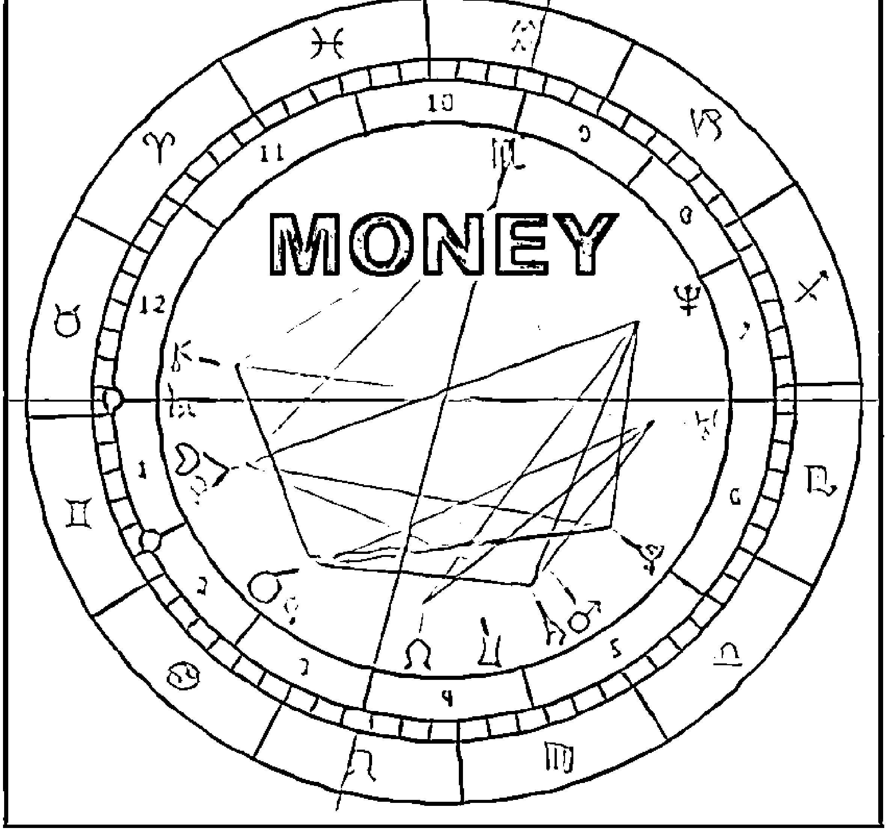

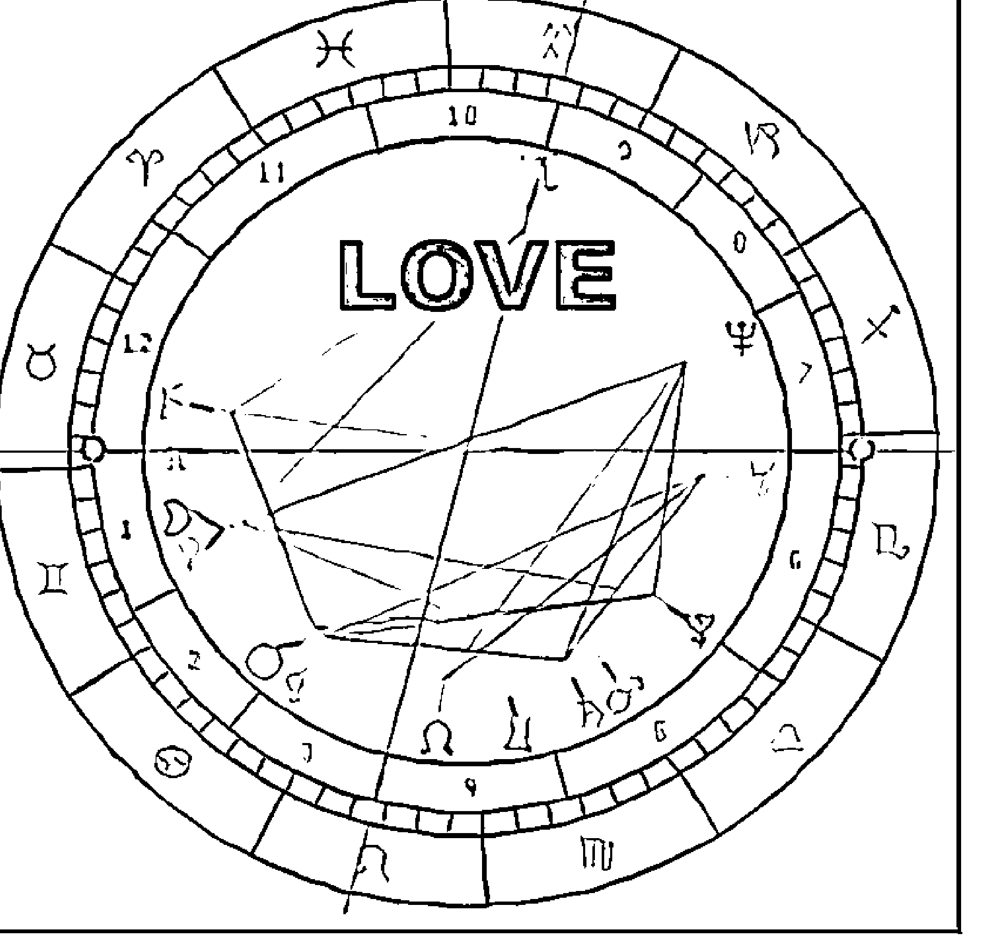

如以同一張時間點來卜問金錢與婚姻兩個不同的事件時，命宮位於金牛（金星主宰）尾巴，表示占問的事已經快來不及改變了，金星與月亮代表詢問者。問卜金錢跟第二宮有關，二宮在雙子（水星主宰），所以事件象徵星為水星，而當問卜的是婚姻時，則要看七宮，七宮在天蠍（火星主宰），所以事件星為火星。由此可以看出，同一個時間盤，當問卜事件不同時將會完全出現不同的解釋結果。

## 卜卦占星学的行星与宫位象征意义

| 符号 | 星体/宫位 | 象征意义 |
| :--- | :--- | :--- |
| ☉ | 太 阳 | 在卜卦盘上象征着生命力，是一种强势的象征。如果太阳落入所问之事宫位内，表示问题的凸显，代表问卜者对该事件所展现出来的意志力。 |
| ☽ | 月 亮 | 是卜占星学中最重要的一颗星，通常用来决定事件的结果。同时月亮也是询问者的共同象征星，与命主星共同代表询问者。另外，月亮也代表就该卜问事件来说，询问者所展现出来的环境适应能力，亦即月亮可用來透视询问者对该卜问事件所准备作出的心理反应。 |
| ☿ | 水 星 | 主宰沟通与思考，凡是跟学习、考试或资讯、文件相关的卜问事件，水星是观察的重点。 |
| ♀ | 金 星 | 主宰价值和爱情，于是有关爱情和钱财事务的卜问，金星是观察的重点。因为金星乃是一颗吉星，所以当金星落入所卜问事件的宫位内时，通常代表吉兆的加强。 |
| ♂ | 火 星 | 主宰行动和竞争，是一颗具有伤害与攻击性的行星，具有行动的象征，通常有助于事件的明朗化。 |
| ♃ | 木 星 | 主宰迁移、国外、旅行、法律等相关事物，凡是有关此类事件的卜问，木星是观察的重点。由于木星是一颗大吉星，所以当木星落入所卜问事件的宫位内时，通常特别加强幸运。 |
| ♄ | 土 星 | 主宰事业、挑战、困难，所以当土星落入所卜问事件的宫位内时，通常是象征着事件的达成有其难度与障碍。 |
| ♅ | 天王星 | 主宰革新、改变、科技，所以当天王星落入所卜问事件的宫位内时，通常是象征着事件的突发变化。 |
| ♆ | 海王星 | 主宰幻想、觉醒、化学，所以当海王星落入所卜问事件的宫位内时，通常是象征着事件的不可预测。 |
| ♇ | 冥王星 | 主宰转换、重建、神秘，所以当冥王星落入所卜问事件的宫位内时，通常是象征着事件的结束或重新开始的契机。 |
| ① | 第一宫 | 代表询问者，当有行星落入时，可呈现询问者的某些状况。 |
| ② | 第二宫 | 有关钱财、资产、价值事物的宫位。 |
| ③ | 第三宫 | 有关兄弟姐妹、邻居、同学的宫位。 |
| ④ | 第四宫 | 代表卜问的结果，同时也是跟家庭相关事物的宫位，也主宰母亲。 |
| ⑤ | 第五宫 | 有关表现、游戏、赌博、孩子和恋爱事物的宫位。 |
| ⑥ | 第六宫 | 有关工作、疾病和健康事务的宫位。 |
| ⑦ | 第七宫 | 代表相对的一方，如问签约或买卖能否达成时，第七宫就代表对方。也代表被询问者（占星家本身），也代表无关系的第三人。同时也是婚姻、合伙、对手、配偶的宫位。 |
| ⑧ | 第八宫 | 有关性、死亡和他人钱财事物的宫位。 |
| ⑨ | 第九宫 | 有关旅行、迁徙、法律、宗教和国外事物的宫位。 |
| ⑩ | 第十宫 | 有关事业发展、职业、地位的宫位，也主宰父亲。 |
| ⑪ | 第十一宫 | 有关朋友、团体、社团的宫位。 |
| ⑫ | 第十二宫 | 有关损失、遗失、精神、秘密的宫位。 |

## 結語

西方占星學在近代蓬勃發展，因而誕生了許多的學派，例如德國占星學家Alfred Witte和Friedrich Sieggrun所創立的漢堡學派，其論斷技巧主要為行星中點的概念。他們認為行星的凶相位比吉相位來得更為重要，更足以呈現出事件的徵象。同時，凶相位幾乎都是與圓周以二來切割有關，這些角度的切割呈現出中點的特性。因此Alfred Witte創造了90度的占星命盤，這種90度的占星命盤可以比較明顯地看出行星之間的中點關係。

漢堡學派最大的貢獻就是行星中點概念，中點的論斷概念也滲透到各種論斷範圍之內，這也成為雙人組合盤的基礎。除了合盤的論斷外，許多的占星學家習慣應用中點來作論斷的參考要素，Reinhold Ebertin簡化和精煉了中點的論斷。將改良後的漢堡學派占星學稱之為宇宙生物學(Cosmobiology)。

而古典占星學中，與西方分流的印度占星與中國占星更是各自有豐富的發展與深厚的內容。因此真要能夠完全了解占星學，基本上是不可能的，就算花一輩子都研究不完，而這其中的原理是如此的豐富，甚至可以包容現今所有的科學領域。

哈雷對牛頓研究占星極為不苟同，且對占星多所批評，深信占星學的牛頓對於不信占星學的哈雷只說了一句話：「我研究過占星學，而你呢？」所以呢？如果你真的研究過、了解過占星學，再批評也不遲！

# PART1-2

## 象徵與週期 SYMBOL & CYCLE

## 象徵

什麼是象徵呢？每當情人節時，大部分人會送玫瑰花給對方，為什麼要送玫瑰，因為玫瑰象徵愛情。在東方，如果遇到黑貓或烏鴉，就暗示可能會有不幸的事物將發生；如果摘到四葉幸運草就象徵好運的事。另外，顏色是最基本的象徵，紅色熱情、藍色憂鬱、黑色神秘…等等。

許多人擁有屬於自己特別的寶貝，可能是一顆石頭、一個器物或是一個布偶，對這個人來說，這些東西可能是他某段時期的記憶象徵，也有可能代表某種特別意義。曾有一個女孩送給她心儀的男孩一株植物，起初他們關係非常好，這株植物也異常茂盛，後來這株植物枯死後，他們也因為感情轉淡而分手，這株植物的成長過程成了他們感情的象徵。常常某些時刻，某些特定類型的事件總是接二連三的同時發生，總是有許許多多的巧合與關連。

量子學大師波姆認為宇宙是一個不可分割的整體，就像人體一樣，當腳受傷時不只腳會痛，而是全身都會感受到。整個宇宙是一個有機的統合體，如果宇宙的某部份改變了，整個宇宙都會受到影響。這意味著沒有肢體是分開的，每一個部分都相接在一起，如果我的肚子痛，那麼我的大腿同樣會感受到那個痛，這個訊息會傳達到心，使全身都會受到影響。身體也是一個有機的統合體，當碰觸一個單點，整個身體都會感受到這個振動，每一個部位都會受到影響，彼此息息相關連，是不可分割的一個整體。所以天的變化人會感受到，人的變化也會讓天有所感覺。

而占星的基本根源就是象徵，透過象徵性的對應，構成天、地、人間的感應。所有的事物都有象徵性的關連，上天如是、地下如此，一一对應，天有陰晴風雷，人有喜怒哀樂。古人認爲天是大宇宙，而人是小宇宙，大宇宙的變化會直接對應到小宇宙。宇宙的規律一層一層的包含著，上一層規律綻放在下一層規律中，下一層規律則捲藏在上一層規律裡，整個整體是隱藏的規律，顯現在我們的世界中，包含時間、空間與物質。占星圖是個人命運的捲藏，包含著所有的原型徵象。這些占星圖的內藏含義綻放後就是我們的命運。

## 一層一層的對應

一切萬物的結構都具有相同類似性，從最大的宇宙到最小的基本粒子，一層一層，彼此對應，而這些相似性的對應都可以歸納於12個基本原型中。

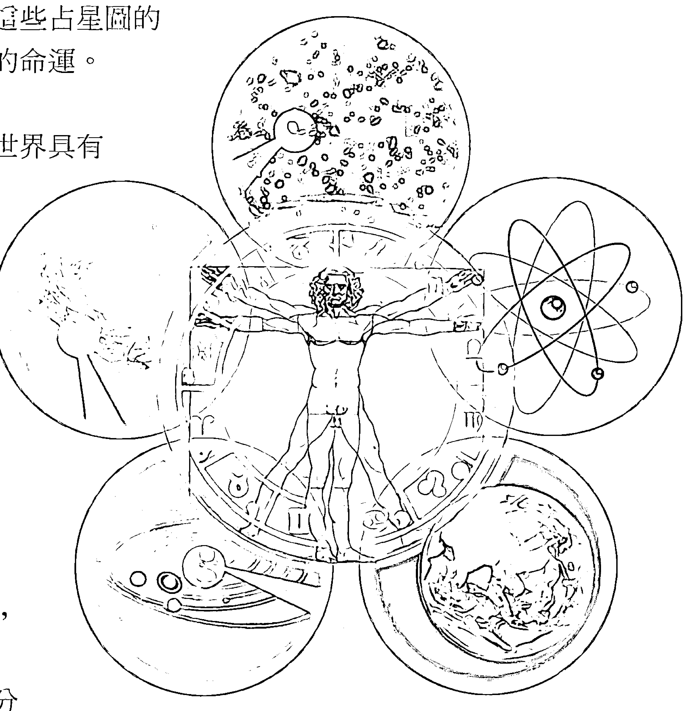

我們很容易發現到整個世界具有層次的相同性。因此，從長久的累積中，人們慢慢的將身邊的龐雜諸多事物歸類，而在歸類的過程中，找尋基本的分類依據，而這些分類的依據具有最最基本的特質，是最基本的原型，不論是科學家、社會學家大家都在找尋的就是一種可以將萬物包容進來的原理，而同樣的占星學也是。

如果把我這個人不斷的分析下去，你會先看到我的身體由器官組成，再放大則發現器官由組織組成，組織由細胞構成，細胞由細胞核、細胞質等細胞內組織構成，再分解下去，這些細胞內組織又由更小的組織構成，然後你會看到構成物質的分子，分子又由電子、中子、質子構成，而這些東西又可以分解更小的夸克粒子。相反的，不斷離遠離我，你會看到我家附近，然後看到我住的鄉鎮、我所在的城市、臺灣島、整個東南亞到整顆地球，如果再加快遠離的速度，你會看到整個太陽系，太陽由九大行星環繞著，而行星也有他們自己的衛星環繞著，衛星還有設星環繞著，一層一層的類似結構，而太陽也同樣環繞著銀河系中某個地方。同時銀河系中所有物體都沿著銀河系中心環繞著，銀河系又環繞著宇宙中的某個地方，最後所有物體都沿著宇宙中心環繞著。

碎形圖案是一種特別的結構，不論你怎麼放大或怎麼縮小，都會出現同樣的圖案，而這種特性也與我們的宇宙結構類似。

我們會發現到，所有的事物都具有這樣一層一層的構成特徵，即使是人世間的組織也是一樣，人構成家、家構成村、村構成鄉，如此一層一層到國家、世界。這些層次間都具有類似性的共同特徵，就像自然界無處不在的碎形圖案一樣，無論你怎麼放大，或是怎麼縮小，都會出現一樣的圖案。都能經由同樣的原型特徵來分類，而同樣的原型也都能在不同層次的組成中發生連結對應，所以頭在人身體的地位可以類比於一家之主、一村之長、一國之君、整個太陽系的中心～太陽。

經由這樣類比式的推演歸納出的一些基本原型，就是占星中的12星座與行星的象徵，將宇宙分出12種基本原型透過12星座位置來對應，而地球的各種層面經由12宮位來類比，最後經由行星來感應傳達象徵性的能量。

每一個小宇宙都包藏著大宇宙的整體象徵，所以手掌上的手紋、臉上的相貌、身體內的痣也都象徵性的對應到整體，帶著特別的徵象。在中國，老祖先將一切萬物歸納到五種基本特質，也就是五行，以金木水火土五星推演對應到身體的五臟、五種基本情緒、五種味道…等等，占星上則將12星座對應到人體、人事、個性、組織…最後歸結到行星。

究竟是天上的星辰影響人還是人影響天呢？也許都有吧！因為彼此都是相關連的。事實上，我們也在改變對行星的認識的過程中轉化了行星的意義。當人類意識進展到日月五星無法滿足時，天海冥適時的出現，填補了快速進展的現代象徵，曾經被隱藏和忽略的它們開始在世界上有意識地活動。由整體大眾的決定改變了我們認識行星的意義，就像原本作為惡魔象徵的土星意義也因此改變，他的惡魔的特性被重新分配給了新發現的冥王星。

所以說，是因爲新行星的發現使得近代世界發生巨變，而或是人類世界需要巨大發展，因而出現了三王星來作爲時代的象徵呢！

> 「天有四時、五行、九解、三百六十日；人亦有四肢、五臟、九竅、三百六十節」
淮南子

> 「人有悲歡離合；月有陰晴圓缺」
蘇東坡

> 「我們每一個人都是運行星。本命盤是根據運行星在我們內心產生共鳴而設置的。我們觀測星象並由此對宇宙產生影響。」
Jeff Jawer

## 容格與心理占星學

容格是第一位將心理學與玄學領域包容的科學家，他曾說：占星學是古代心理學知識的總合，因爲星盤中包含所有的對立面，主體與客體、陰陽、男女。而榮格學說心理發展的目標正是所有對立面的整合。他認爲整個世界都連繫於一根線，這根線便是人類的心靈。

因為容格的詮釋，現代占星找到了科學之外的另一條路～潛意識心理學。他的原型理論讓占星符號得到力量的依據，黃道12星座就是12個宇宙基本原型，也就是12種集體潛意識的表現。1930年，容格提出了「同時性」的概念，用來解釋有意義的巧合，認爲任何一瞬間會發生的事件，都有這一瞬間的意義。這似乎解釋了星盤上每一個符號間相互的特殊組合爲每一個個人定義了屬於他個人的人生意象。

占星以行星作爲一種心靈象徵，而原型則是人性中的普遍性質，星盤中每個行星都像一位神明，受到我們的崇敬。回歸中心是一種最高的自覺能力，曼陀羅就是這樣的象徵，利用繪製曼陀羅以求凝聚心靈系統的完整。占星命盤就像一張曼陀羅，站在命盤的中心，我們進入神秘的象徵領域。從一種寬廣的角度來了解命盤，你會看見個人內在驚人的無限。

曼陀羅象徵一切都是由中心開始，一層一層的展開，因此將所有展開的一切捲起起來，以後就會回歸原來的中心。而每一張星盤都是一個曼陀羅，當展開後，就是一個豐盛的人生。

他認為星象研究的是個人小宇宙與大宇宙的關連，古老的占星傳統在預知未來中說明了內在與外在世界的接觸，並將心理學中的各種心靈現象與占星關連，假設原型是意象的表徵，諸如人格面具、陰影、阿尼馬、阿尼馬斯、英雄、智慧老人、本我等。原型是先天具有的內在角色，同時具備光明面與黑暗面。而這些基本原型可以對應在12星座、行星、上升等占星學中的基本占星象徵上。

他試圖找出包容科學與神秘學的統一概念，進而提出同時性的概念，用來解釋同時發生的有意義巧合事件。處於同一時間發生的事件未必要有必然的因果關係，但也許在它們之間有著一種神秘的聯繫。這說明了兩件毫無關連的事件卻有著同樣的意義，一組元件（天空星象）與另一組元件（客觀事件）被劃上等號。

容格著名的一次實驗中，以傳統占星對婚姻產生的三種可能組成：太陽對月亮，月亮對月亮、上昇對月亮，來證明他的原理。但是奇怪的事情發生了，當做太陽對月亮的統計實驗時，這批資料顯示了太陽對月亮的重要性。但是當做月亮對月亮時，這第二批資料即顯示月亮對月亮的重要性。同樣的，當做最後一項實驗時，最後一批資料隨即顯示出上昇對月亮的重要性。這是為什麼呢？他發現到觀察者本身的心理意識參與了事件的結果，占星師的心理狀態與被算命者的命運似乎存在著一種「秘密的交感關係」。似乎顯示了占星師本身的心理狀態與現實狀態間存在著某種相連，也就是說意識決定了現實的發展。

## 心理的四種類型

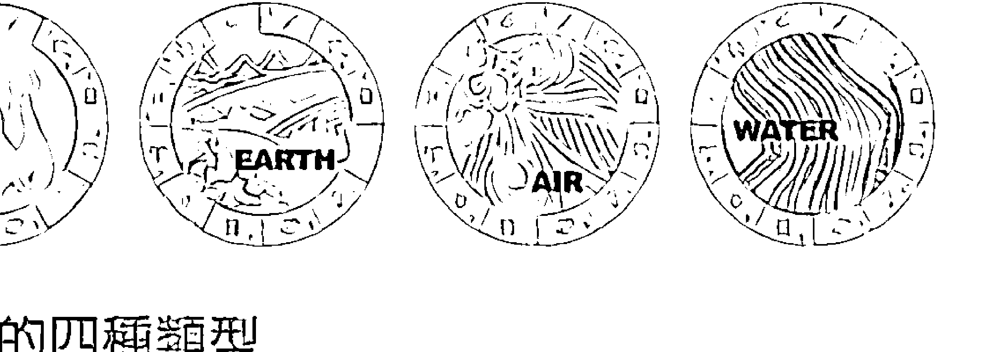

容格將四種心理類型與占星做對應，火象是直覺型，是無意識的表現直覺。土象是感官型，重視實際的物理感官刺激。風象為思惟型，以邏輯、理性來推斷事物。而水象是情感型，代表以個人感受與情緒來處理事物。

在一次做夢中，他夢見了一個長著翠鳥翅膀的東西。他想畫出這個東西的形狀以便於能夠容易的回憶。正在畫時，突然他在自己的花園中發現了一隻翠鳥的屍體，而這種鳥在該地是十分罕見的。這個不尋常的事件恰恰關連了他夢中所發生的事件。

而占星學正是建立在這種同時性的原則上。行星對我們的影響不存在前後或因果的關係，彼此是同步的。天上的行星與地球上的人事變化互相對應，彼此之間像鏡子一樣相互映照。

## 大時代：從雙魚時代到水瓶時代

同時，容格是第一個有系統的將春分點在黃道星座上的移動與整個時代關連的人。

大家都知道，寶瓶時代要來了，那麼寶瓶時代是怎麼來呢？這不得不提到歲差現象！由於歲差，太陽每年交會到春分點的位置是不同的。每年春分點向西逆行50.2弧秒（一年相差20.396分鐘），經過兩萬六千年春分點才會繞一週回到原點。這個循環稱為一個“大年”。而春分點經過每一個星座的時間，平均約2000多年，稱為一個“大月”。而我們所說的雙魚時代、水瓶時代，就是這樣的一個“大月”。占星學稱之為一個柏拉圖月（PLATONICMONTH），雙魚座代表「精神的驅使」，人類即將進入的寶瓶時代，追求自由和人道社會將是新時代的象徵。

春分點每兩千多年跨過一個星座，代表一個大時代的象徵，從兩千多年前春分點進入雙魚開始，人類經歷了代表犧牲與追求心靈的雙魚時代。在雙魚時代，每個人傾向求助於神靈的力量來解答自己的難題。而水瓶時代的降臨，將會使每一個在精神上的自我覺醒，覺知到每個人都是神的一部份。

耶穌基督顯然代表了雙魚時代的開端，這星座的兩條魚，一條向上、一條向下，象徵精神與物質的雙重性。同時也是雙魚的開始。

這個時期出現哥白尼、馬丁路德，基督教會出現分裂。

佛陀、孔子與希臘先賢在這段時期帶來了思想的大爆炸。

牛頓、美國獨立運動、工業革命、法國大革命陸續發生、馬克思與達爾文等反基督教學說興起。

# 天地人 1-2 SYMBOL & CYCLE

魚，第一條魚象徵基督，第二條魚象徵反基督，彼此背道而馳。當春分點與構成星座的某一恆星合相時，地球上便會發生重要的大事件。當伯利恆星在天空出現時，耶穌誕生，雙魚時代降臨，基督教產生。當春分點到達第二條魚尾時，世界上開始了法國大革命、科學發展、達爾文、馬克思等人出生，他們的降臨，正是反基督的時代開始。

對於水瓶時代的開始時間占星學家存在比較大的分歧，大致開始的時間從2000年到2050年這段時期。我們即將面對的，是代表個人與強調新變革的水瓶座所象徵的時代，在這樣的時代中，不斷的變化與注重每個人的重要性是時代的精神，然而，變化後的秩序破壞，與個人化後人性的疏離也將是我們所要面臨的問題。

## 週期

從盤古開天至今，時間就一直不斷前進著，在不同的文明發展中，計算時間與日子的方法雖然不同，但是都有一個共通點，都根據著行星的運行週期來計算。這些週期具有重複性，每一天太陽在東方上升，西方落下，第二天又從東方升起。每一年總是經過春夏秋冬後，又再重新循環一次。除了自然界的重複循環，人世間大大小小的事物也都似乎存在著大大小小、不同的時間週期重複循環著。女人的月經每隔28天會來一次，我們身體的新陳代謝是12天一個週期，動物會在一定的時間產卵、孵育、遷徙、回游，植物的開花也會在特定的季節綻放。所有的一切事物都像調過鬧鐘一樣，會在正確的時間做該做的事。太陽經過365又四分之一天會回到原來的位置，形成四季的更替；月亮每27天回到原點，而每29天與太陽形成另一個月相圓缺的週期。馬雅人特別重視金星，他們用的是金星與日、月形成的特殊週期，因爲他們相信金星的週期顯現著宇宙的和諧。除此之外，每個行星都有各自固定的回歸週期，而我們發現到自然萬物都在有形無形的受到影響，與他們呼應而產生各自的週期反應。

自然界是最明顯的反應者，科學家發現，每隔幾萬年，冰河期就會重新降臨。乾旱的發生與洪水氾濫也會在固定幾年產生高峰期，依循著特定的週期，週而復始地輪替著。這些都還只是自然現象的變化，但是更特別的是從歷史的演變中，我們也發現到從亂世到治世、戰爭的發生、國家的興亡、朝代的更替，整個文明的演進也都似乎存在著特定的週期，週而復始！整體世界的潮流推進也都冥冥中依循著固定的模式變化循環著。

經過各種研究統計中我們發現這樣的週期性原來無處不在，人類有一定的生命週期，股市的波動也經由財經專家歸納出特定的週期法則。一切萬象，不論是自然的還是人文的，物質的還是精神面，意識的還是潛意識，都自然而然的變遷著，以一定的、規則的規律循環著！爲什麼？自然而然的我們會聯想到天，聯想到與我們最相關的地球、太陽、月亮、星星，從他們的週期中追尋解答，很巧合的是，這些人世間種種的循環似乎真的跟這些天上的星星具有一種特殊的關連性。太陽與月亮是最明顯的變化，讓我們很清楚的感受到這樣的關連，女人的月經週期明顯的跟月亮有關，蘇聯科學家發現到太陽黑子的11年週期變化跟人類的戰爭明顯的聯繫上，每11年太陽黑子巔峯期時，往往是世界上最容易紛爭對立的戰爭時機。而日月蝕的發生往往跟地震、瘟疫等天災人禍牽連在一起。馬克斯出生在日蝕發生在金牛座（象徵資源、金融）的時刻，於是他創造了共產主義來遮蔽資本主義！

透過週期重複性循環的特性，馬雅人運用金星的週期性變化預言他們的未來。在我們中國，則以10天干、12地支構成60週年一甲子的週期觀念，認爲每隔60年類似的事情會重複性的發生。

## 不同的週期

馬雅人用金星會合週期訂出一個聖年約13個月，每月20天，一年260天。而中國從易經的推演而形成一甲子60的循環，這些週期其實都是行星週期的變化。

大到整個太陽系甚至全宇宙的運行，小到物質基本要素，原子、分子、電子的運行都提供了大大小小的週期變化，從幾億年到幾億分之秒的循環，彼此串連，構成這個世界！

黃道上的每一個週期都具有他自己獨特的力量，他們顯著地影響我們。這些週期的力量是有時間性的，隨著時間的變化發生改變。從占星的角度看，春分點的週期是一個至為重要的開端，這個週期有25920年之久。整個黃道是一個迴圈的周期，而每一個星座也是一個迴圈周期，因此星座的起始和結束點是十分重要的，每個星座的0度和29度都是關鍵位置，0度表示這個星座的新的開始或者能量影響的改變，29度表示努力控制了星座的能量。而當春分點要完整經過一個星座時，會有將近2000年的時間，因而他所處的星座位置構成了一個2000年之久的時代象徵。這也就是容格所闡釋的雙魚時代，以及我們即將進入的寶瓶時代的含意！

行星的回歸是占星學週期的一個重要指標，太陽一年、月亮一月、水星88天、金星225天、火星2年、木星12年、土星29年、天王星84年、海王星165年、冥王星248年。這些回歸都具有屬於與行星本質關聯的象徵指標。

那地球呢？太陽在黃道上經過三百六十度需要一年，而月亮顯然快多了，也要一個月。而地球由西向東自轉在黃道上形成24小時一週期的循環。因此每四分鐘約移動一度，每四秒移動一分。

除了行星的回歸，另一個重要的週期指標是行星的會合，天空中任意兩顆行星，都可以組成相應的這兩顆星體的迴圈周期。這個周期從相合（0度）開始到下一個相合（0度）結束。而在這個周期內的任何主要相位，如對相、三分相、四分相等，這些位置時間都是關鍵的。當兩個行星形成相位接近到可以容許度以內時，他們便開始相互影響。當完全接近時，相互影響則會達到一個高潮。太陽與月亮每隔29天合相一次，而最長的合相週期是海王星與冥王星的合相，長達492年，此外如果是多星的共同合相週期，那就更複雜了！

### 木土的會合

如圖木土由於運行速度的差異，土星還走不到一圈，木星已經繞一圈半了。從1980年合相開始到2000年重新合相總共20年，這是一個完整的週期，他象徵擴張與壓縮力量的變遷，而這個會合週期的起點星座天秤座更是這個週期的重要象徵。西元前五百七十年春秋戰國之始，此時正逢冥王星、海王星、天王星三星交會，老子、孔子、釋迦牟尼、畢達哥拉斯等中外聖人輩出。合相代表了一個週期的開始，因此兩顆星合相所在的星座就代表了這個週期的重要指標意義。木土的20年合相週期是自古以來占星師特別在意的，美國流行著一個總統詛咒，每20年木土合相時產生的總統都無法做完任期，很巧的兩個被暗殺的總統，林肯與甘乃迪都是在木土合相時當上總統的。這個詛咒一直到雷根才破解，但他還是被槍擊，差點死在任內！特別的是這個20年週期正好是60甲子週期的三分之一，這顯示60甲子週期顯然跟木土有關！

如果從一個人出生開始推算，將人的一生各個階段套入這些行星回歸週期中，你會發現到，還真是關係匪淺呢！因為週期具有的重複循環特性，如果你能夠找到人世間的變化循環與這些行星週期的關連性的話，這就意味著你將找到預知下一個循環發生過程的方法，能夠掌握住未來的變化法則，也就等於能夠預知未來！這就是占星師想要努力的目標！

# 天地人 1-2 SYMBOL & CYCLE

由於行星的回歸週期具有規律性，因此每個人的運行星與本命星之間的互動時間是類似的，例如木星12年回歸一次，因此12歲是青春期的開始，土星29.5年回歸一次，因此所謂三十而立，這時通常是一個人正式進入社會挑戰，面臨人生責任之時。這些規律性的法則也就構成了一生當中的每個階段性的劃分，凸顯一生當中的危機與轉機。當運行星與本命星發生刑克的當年，是面臨挑戰的高峰時期，尤其是土星回歸的影響，通常是一般習俗中所提及需要多加注意事故發生的歲數。所以29歲結婚不宜就是如此，因為正值土星回歸之時。以下是人生受行星回歸影響的狀況，其中色塊標明的是人生中幾個重要時期，比較容易發生衝突與變化。

- 兒童反抗期
  - 6歲 ♃木星-180度-木星
  - 7歲 ♄土星-90度-土星
  - 10歲 ♄土星-120度-土星
- 青少年期
  - 12歲 ♃木星第一次回歸
  - 14歲 ♄土星-180度-土星
- 成年期
  - 18歲 ♃木星-180度-木星
  - 20歲 ♄土星-120度-土星
  - 21歲 ♅天王星-90度-天王星
  - 22歲 ♄土星-90度-土星
  - 24歲 ♃木星第二次回歸
- 成熟期
  - 28歲 ♅天王星-120度-天王星
  - 29歲 ♄土星第一次回歸
  - 30歲 ♃木星-180度-木星
  - 36歲 ♃木星第三次回歸
- 中年危機期
  - 37歲 ♄土星-90度-土星
  - 40歲 ♄土星-120度-土星
  - 42歲 ♅天王星-180度-天王星
  - ♃木星-180度-木星
  - 44歲 ♆海王星-90度-海王星
  - 45歲 ♄土星-180度-土星
  - 47歲 ♃木星第四次回歸
- 更年期
  - 49歲 ♄土星-120度-土星
  - 52歲 ♄土星-90度-土星
  - 53歲 ♃木星-180度-木星
  - 56歲 ♆海王星-120度-海王星
  - ♅天王星-120度-天王星
- 前老年期
  - 59歲 ♃木星第五次回歸
  - ♄土星第二次回歸
  - 63歲 ♅天王星-90度-天王星
  - 65歲 ♃木星-180度-木星
  - 66歲 ♄土星-90度-土星
  - 69歲 ♄土星-120度-土星
  - 71歲 ♃木星第六次回歸
- 後老年期
  - 74歲 ♄土星-180度-土星
  - 77歲 ♃木星-180度-木星
  - 79歲 ♄土星-120度-土星
  - 81歲 ♄土星-90度-土星
  - 83歲 ♃木星第七次回歸
- 高齡期
  - 84歲 ♆海王星-180度-海王星
  - ♅天王星第一次回歸
  - 88歲 ♄土星第三次回歸
  - 89歲 ♃木星-180度-木星

## 星座宮
## SIGNS & HOUSES

當一個人出生時，每一宮宮頭位置會座落於不同的星座上，而賦予了每一個宮位的特性，因此12個宮頭點對應到各自的星座位置。如此透過12星座各自的主宰行星，形成12宮位各宮的宮主星，因此每個宮頭所在的這個星座的主宰行星就是此宮的宮主星，其重要性要高於宮位的自然主宰星。同時因為宮主星的產生，我們可以了解到宮與宮間的聯繫關係。

# PART2-1
## 12星座論
## 12 SIGNS

在入門篇中，我們已經通盤的介紹了12星座、12宮位、行星以及相位等占星學要素的基本含意與基礎，接下來的進階篇中，我們將更深入的了解這些基本要素，做更深入的補充。同時，我們要開始瞭解到星座、宮位、行星、相位之間的連結關係！

先前我們提過，天（星座）、地（宮位）的能量透過行星展現，因此首先我們要深入這兩個構成要素一星座與宮位，並且瞭解他們互相關聯產生的對應，也就是所謂的天地的交集關係！

## 星座的分類

12星座代表的是12種宇宙方位的代名詞，占星學將整個天球宇宙凝縮在太陽的行進軌道一也就是黃道帶上，以春分點為基本點，分割黃道為12等分，藉由黃道上的12個星座當作12種象徵的圖像意義。因此，我們知道現在我們口中的12星座並非指的是天上的星座，而是太陽與春分點的相對關係。所以與其說12星座，不如以另一個名詞稱為12星宮更為適當。

這12星座將整個宇宙分成12份，代表宇宙中12種基本原型，因此12個星座位置也就附有傳達宇宙能量的意義，當行星進入這12個區域中，就會接收到屬於這12個區域的宇宙能量而產生變化！在西方，黃道被分成12等分，以12種圖像來命名。而在我們中國，則將黃道分的更細一些，共分成12氣與12節的24等分，以四季產生的現象來命名。

要深入12星座前我們必須先從四大元素著手。四大元素是由古希臘學者恩培多克勒提出的四根說而來，他認為世界萬物都是由火土風水四種根基構成的，後經由亞里斯多德進一步闡釋，認為四元素中內含四種純質料，也就是冷熱、乾濕兩組對立特性的原初物質。風象內含熱與濕的特質；火象內含熱與乾的特質；土象內含冷與乾的特質；水象內含冷與濕的特質。他認為世界萬物都由不同比例的四大元素所構成。並且提出人體內有四種體液與四大元素對應，這四種體液分別為血液（風象）、黃膽汁（火象）、黑膽汁（土象）與黏液（水象），當體內的體液發生不平衡時，就會產生疾病。四體液說在古典醫療占星學上是非常重要的概念！

12星座與四季也依照屬性可以分成火土風水四種特質，因此12星座也就所屬的四象而帶有相同的純質料的特質。這四大元素也與科學上的物質三態及最近加入的輻射態構成對應。物質由固態（土象）變成液態（水象）再化為氣態（風象），最後成為輻射態（火象）。目前自然界發現的一百多種化學元素有固態、液態與氣態三種，也許應該還有輻射態元素的存在也說不定！

將萬物歸類似乎是古人的共通智慧，西方以四大元素代表四極或四個方向，而中國則在這四個因素中加入中間的概念，而成為所謂的五行，並且與金木水火土五星對應。透過分類與歸屬，占星學將萬物做歸類並給予對應的星座、宮位與行星，以如此的互通關係來聯繫萬象之間。因此分類是占星學中極為重要的部份。星座所象徵的12種基本原型雖然各有其主要意涵，然而在彼此的屬性上仍有其共通性，而能夠加以歸類，所以從歸類中，我們可以看到這12種基本原型之間的關連。

### 中國五行與西方的四象

由於名詞使用的不同，除了火象相同外，實際上水象是屬木，風象是屬水，而土象是屬金，另外中國多了中間的概念，是由土星主管的。

在入門篇中我們已經探討過12星座的分類，依屬性可以分為陰陽、三特質以及四元素。陰陽類似物理學中的正負極、正電或負電或是磁力學中的陰陽極。三特質則與化學元素的反應力類似，化學元素中有主動反應的元素，被動反應的元素以及鈍性元素（不易反應的元素）。因此同樣特質的星座彼此不易產生反應，不容易發生能量交流，造成能量間的阻隔！而四元素則如上所提，與物質的狀態類比，因此同類星座間容易配合，彼此性質相似、易於交融而容易有正面的互動！

由陰陽、三特質的關係可以衍生出六個彼此對立的星座組，也就是將12星座分成六份。這六條線也各有其意義，象徵六種對立面。彼此互為陰影，當一端成為意識的主導，另一端就會被隱藏進入潛意識中，隨時準備浮出，爭奪意識的主導。

### 牡羊VS天秤

這條線與主體象徵有關，牡羊代表的是從平衡兩端的一端脫離，造成一端獨大，因而獨斷、自我、主觀。而天秤則相反，試圖與另一端取得平衡而依附，因而具有協調性、客觀、容易妥協。

### 金牛VS天蠍

這條線與形成象徵有關，金牛代表的是將分散的粒子凝聚成一個穩定的狀態，也象徵將能量變成物質，因此溫和、固執、物質主意。而天蠍則相反，在穩定的狀態中試圖掙脫，由內部爆裂。也象徵將物質轉換成能量，因而內在不穩定，充滿爆發力而危險。

### 雙子VS射手

這條線與連結象徵有關，雙子是由一個定點往多個方向連結，是一對多的方式，因此善變、矛盾、多而不精。射手則相反，是由一個的定點往一個目標前進，是一對一的方式，因此直接、不拐彎抹角、大智若愚！

### 巨蟹VS摩羯

這條線與框架象徵有關，巨蟹是由內向外形成框框，構成自我的領域，並且向下深入，因此具有保護、防衛、排外與內省的特質。摩羯則相反，由外往內形成框框，構成基礎，並向上發展，因而保守、謹慎、努力向上！

### 獅子VS水瓶

這條線與焦點象徵有關，獅子代表是中心的位置，因而尊貴、愛現、熱情付出。水瓶則相反，喜歡遠離中心，因此獨立、自由、個人主義但冷漠！

### 處女VS雙魚

這條線與解構象徵有關，處女是將一個物質分解成無數的細部，因此分析、細緻、注重細節。雙魚剛好相反，將無數分散的粒子融合在一塊，因此包容、模糊、隨便而散亂。

除了特性上的分類，經過數千年的演進與發展，占星師在12星座上發揮創意與想像，由星座的特徵、圖像、季節性、個別性中發展出星座的特別意義而有不同的分類法，形成占星論斷時重要的參考依據。

### ○以天象來分類，可以分成以下三種

1.  長上升與短上升：長上升包括巨蟹、獅子、處女、天秤、天蠍、射手。而短上升則有摩羯、水瓶、雙魚、牡羊、金牛、雙子。
2.  分點與至點（始入）：分點與至點是黃道上四個重要點，因此意義特別重要，分點星座是牡羊與天秤，而至點星座為巨蟹與摩羯。
3.  北方（命令）與南方（服從）：太陽在北緯時白天比夜間長，陽大於陰，因此具有支配的涵意。反之陰大於陽，因此隱含服從配合的意義。北方星座有牡羊、金牛、雙子、巨蟹、獅子、處女。而南方星座有天秤、天蠍、射手、摩羯、水瓶、雙魚。

### ○除此以外，還可以形象特徵來分類

1.  人性（雙子、處女、射手、水瓶），獸性（牡羊、金牛、獅子、射手、摩羯），兩棲（摩羯、水瓶）。
2.  雙元（雙子、處女、射手、雙魚）：這些星座具有兩面特徵，也有多變的特性。
3.  沉默（巨蟹、天蠍、雙魚），有聲（雙子、處女、射手、水瓶、牡羊、金牛、獅子）：沉默星座通常不善言語，而有聲星座多半有口才，尤其是像雙子等有人性特徵的星座。
4.  荒地（雙子、獅子、處女），半荒地（射手、水瓶），肥沃（巨蟹、天蠍、雙魚），半肥沃（金牛、天秤、摩羯）。

# Aries [牡羊座]

⊕ 陽性 □ 主動 Ⓟ 火象

## 我是 (I am)

## 行星強弱

廟：火星 旺：太陽 陷：土星 弱：金星

# 象徵意義

- 正：果斷的、執行力的、競爭的、積極活潑的、勇敢的、大膽的、活躍的、迅速的、行動力的、直覺的。
- 負：性急的、暴烈的、衝動的、草率的、自大的、粗魯的、不服從的、虎頭蛇尾的、蠻橫的、對抗的。
- 身：頭、臉、大腦。
- 疾：頭痛、頭部、眼睛的疾病、發燒、腦炎。
- 人：戰士、軍人、拓荒者、鍛匠、屠夫、救火隊、好打鬥的人。
- 事：打架、戰鬥、競賽、救火、生氣。
- 物：鐵、刀劍、槍炮、火、羊、尖銳物、烤箱。
- 地：戰場、競技場、乾燥地、五金行、消防局。

牡羊的基本含意是在平衡的狀態中以競爭的手段，尋求自我的主導，造成單一個體的領先與獨大。脫離平衡的狀態。

## 神話由來

牡羊座是指神話中那隻有金羊毛的公羊。阿特馬斯國王和王妃涅菲爾生了一對雙胞胎普里克斯和希笛，但國王卻和特貝的公主依諾娃偷情，將王妃趕出宮，改立依諾娃為新王妃。繼母依諾娃王妃非常討厭這對雙胞胎並且對他們相當殘酷，後來依諾娃王妃生了自己的小孩子，便決定要殺死這對雙胞胎。在王妃涅菲爾知道後向天神祈禱求救。天神宙斯非常同情這對雙胞胎，變出了一隻有著金色毛的牡羊送給他們，讓這隻羊帶他們到安全的地方，當牡羊飛過大海時，弟弟希笛一個不留神跌落大海，哥哥傷心的每日以淚洗面。普里克斯安全地到達了在黑海岸的科爾基斯國，為了尋求國王伊特斯的庇護，普里克斯殺了金羊祭祀天神，將金羊毛奉獻了給國王伊特斯，這隻羊的金羊毛後來成了科爾基斯國的鎮國之寶，由一隻永不睡覺的火龍看守著。後來金羊毛被拋到天空成了星星，便成了天空中的牡羊座。

# Taurus (金牛座)

陰性 固定 土象

區間星 0° ♀ 10° ♃ 20° ♄ 30° 主宰星 ♀

## 我有 (I have)

## 行星強弱

| 狀態 | 行星 |
| :--- | :--- |
| 廟 | 金星 ♀ |
| 旺 | 月亮 ☽ |
| 陷 | 天王星 ♅ |
| 弱 | 火星 ♂、冥王星 ♇ |

# 象徵意義

| 類別 | 內容 |
| :--- | :--- |
| 正 | 有耐心的、保守的、自然的、官能的、溫和的、穩定的、實際的、藝術的、忠實的。 |
| 負 | 自我放縱的、固執的、慢動作的、好辯的、牛脾氣的、充滿物慾的、貪婪的、物質主義的、懶惰的、貪婪的。 |
| 身 | 後頸骨、頸、喉、聲帶、口、舌、上顎、甲狀腺、扁桃體。 |
| 疾 | 喉頭炎、聲帶炎、頸部問題、甲狀腺疾病等。 |
| 人 | 畜牧者、資本家、音樂家、園藝家、溫和的人、銀行家。 |
| 事 | 藝術、音樂、商業、理財、資本主義、園藝、所有權。 |
| 物 | 美的東西、美食、金錢、牛、飾品、有價值的東西。 |
| 地 | 大自然、田園、銀行、音樂廳、美術館。 |

金牛的基本含意是將能量固定為物質。將分散的粒子聚合成穩定的狀態，因此象徵物質化、圓滿完整、穩定而牢固。

## 神話由來

金牛座中的金牛其實是天神宙斯的另一個化身。傳說中腓尼基的公主歐羅巴（就是後來歐洲名稱的由來）非常的美麗，一天歐羅巴和宮女們在近海的牧場上摘草，不久，一隻雪白色的公牛出現，溫馴的站在公主身邊。一開始公主大吃一驚，但是這隻公牛既美麗又溫馴，於是公主走向牛身旁，輕輕的撫摸牠的背，並且放心的騎到牠背上玩耍，忽然間牛奔跑了起来，帶著公主跳進愛琴海，帶她到了克里特島。

其實這隻公牛是素以風流著稱的眾神之王宙斯，他見到了公主後被其美貌所迷惑，於是把自己化身成一隻有金色牛角的雪白公牛。當他們進入海中時，海裡的生物都出來向宙斯行禮，美麗的海上女神也列隊前來，人魚也用海螺吹奏愉悅的歌曲。歐羅巴終於知道公牛是宙斯的化身，宙斯表明了身份後並且對公主表現愛慕之意，終於獲得歐羅巴的芳心，娶歐羅巴為妻。宙斯回復原形後，將祂的化身大公牛放置於天上，成為天上的金牛座。

# Gemini (雙子座)

⊕ 陽性 ○ 變動 (A) 風象

## 我想 (I think)

## 行星強弱

| 狀態 | 行星 |
| :--- | :--- |
| 廟 | 水星 ☿ |
| 弱 | 木星 ♃ |

# 象徵意義

| 類別 | 內容 |
| :--- | :--- |
| 正 | 雙重性的、機靈的、好奇的、有適應力的、機智的、伶俐的、聰明的、多才多藝的、手巧的、健談的。 |
| 負 | 善變的、不專心的、好動的、見異思遷的、缺乏專注的、矛盾的、膚淺的、緊張的、多話的。 |
| 身 | 支氣管、上呼吸道、肺、肺上葉、鎖骨、手、臂、肩膀、神經系統。 |
| 疾 | 支氣管炎、結核病、手疾、肩膀的傷、神經緊張。 |
| 人 | 兄弟姊妹、同儕、鄰居、報馬仔、媒體人、記者、機靈的人。 |
| 事 | 新聞、資訊、廣播、交通、八卦流言、交談。 |
| 物 | 信件、電話、交通工具、雜誌、海報。 |
| 地 | 學校、馬路、郵局、電台、便利商店。 |

## 神話由來

宙斯化身為天鵝接近他迷戀的斯巴達王妃勒達，從勒達產下的卵孵化出了一對雙胞胎－波律克斯和卡斯托，其中波律克斯因為留著天神宙斯的血液而成為不死之身。

兩兄弟的感情非常的好，長大後皆成為驍勇冒險的勇士，經歷各種冒險而威名遠播。他們最後一次冒險任務是帶回阿爾卡迪亞的牛群，同行的還有另一對兄弟伊達斯和林克斯。他們抓了很多牛，並準備平分時，貪心的伊達斯和林克斯趁波拉克斯和卡斯托兄弟不備時橫加奪取，將牛全部帶回去。為了奪回牛群，卡斯托與伊達斯發生打鬥，結果伊達斯用箭將卡斯托刺死。後來波律克斯殺了林克斯，伊達斯也被宙斯的雷打死。

波律克斯因為卡斯托的死而悲痛不已，便要求天神宙斯用自己的生命讓哥哥復活。他的悲痛感動了宙斯，由於波律克斯是不死之身，於是宙斯讓他們一天生活在奧林帕斯，一天在陰間生活，每天輪替，並且將兩兄弟放到天空，作為友愛的象徵，成為天上的雙子星座。

# Cancer (巨蟹座)

⊖ 陰性 □ 主動 Ⓦ 水象

## 我感覺 (I feel)

## 行星強弱

| 狀態 | 行星 |
| :--- | :--- |
| 廟 | 月亮 ☽ |
| 旺 | 木星 ♃、海王星 ♆ |
| 陷 | 火星 ♂ |
| 弱 | 土星 ♄ |

# 象徵意義

| 類別 | 內容 |
| :--- | :--- |
| 正 | 敏感的、母性的、家居生活的、愛國的、同情心的、感情豐富的、記憶強的、念舊的、體貼的、內省的、保護的。 |
| 負 | 情緒化的、多愁善感的、防衛性的、易受傷的、消極的、過度謹慎的、自私的、自憐的、排外的、憂鬱的。 |
| 身 | 胸腔、乳房、胃、子宮、卵巢。 |
| 疾 | 胃潰瘍、胃病、消化不良、胸部問題、憂鬱症。 |
| 人 | 母親、奶媽、皇后、廚師、照顧者、情緒化的人。 |
| 事 | 歷史、家庭、關心、心情、家族、回憶、烹飪。 |
| 物 | 土地、房子、烹飪用具、家用品、古董、甲殼動物。 |
| 地 | 家裡、廚房、餐廳、水邊、古董店。 |

巨蟹的基本含意是在框框內小心的擴張地盤。象徵往內在的發展，因此容易有地域性、累積性、保護、防衛、排外與內省。

## 神話由來

希臘神話中，巨蟹座就是那隻被大力士赫丘力士踩碎的大蟹怪。
好色的天神宙斯有一個充滿忌妒心與報復心的老婆天后希拉。宙斯到處獵豔，跟人間女孩阿克梅妮生了兒子赫丘力士，天后希拉知道後大為震怒，於是下了詛咒。赫丘力士後來和德貝的公主結婚，生了小孩過著美滿的生活。可是因為希拉的咒語，赫丘力士竟然親手殺了自己的老婆，當他正欲自殺時，宙斯為了讓他贖罪，乃任命他必須經歷十二個大冒險，其中一項是制服住在阿米英涅沼澤中的怪物西多拉。西多拉是一隻有九個頭的巨蛇，躲在沼澤附近的洞窟內，每砍掉它一個頭便會馬上生出無數個頭。
赫丘力士想到一個用火燒焦蛇頭的辦法，對其投以火炬，激怒的西多拉乃吐毒氣反擊，眼見西多拉苦戰，希拉於是派同住在沼澤裡的大巨蟹跳出來咬赫丘力士的腳，結果大巨蟹被赫丘力士一腳踩死，西多拉也被制服。希拉因感傷他們的犧牲，將它們放置在天上，於是大蟹怪也就成了天空中的巨蟹座。

# Leo (獅子座)

⊕ 陽性 △ 固定 Ⓕ 火象

主宰星：太陽

## 我要 (I will)

## 行星強弱

| 狀態 | 行星 |
| :--- | :--- |
| 廟 | 太陽 ☉ |
| 旺 | 冥王星 ♇ |
| 陷 | 水星 ☿ |
| 弱 | 土星 ♄、天王星 ♅ |

# 象徵意義

| 類別 | 內容 |
| :--- | :--- |
| 正 | 戲劇性的、大方的、驕傲的、光榮的、有創造力的、高貴的、浪漫的、慷慨的、熱情的、樂觀的、領導的。 |
| 負 | 虛榮的、孩子氣的、自以為是的、好面子的、權勢的、炫耀的、浪費的、專橫的。 |
| 身 | 心臟、背部、背脊。 |
| 疾 | 心臟病、背痛、脊椎骨問題、高血壓。 |
| 人 | 父親、國王、領導人、英雄、明星、貴族、舞者。 |
| 事 | 表演、登基、創作、娛樂、英雄主義、權勢。 |
| 物 | 名牌、寶物、黃金、向日葵、權杖皇冠、貓科動物。 |
| 地 | 宴會、舞廳、公園、總統府、娛樂場所、表演場地。 |

獅子的基本含意是位於中心散發光芒。代表成為眾人的焦點，因此象徵創意、熱烈、愛表現、好面子、慷慨與虛榮。

## 神話由來

神話中的獅子座是位於希臘尼米亞森林中住著的一隻兇猛的食人獅子。
赫丘力士是宙斯與凡人阿克梅妮的私生子，他天生具有無比的神力，天后希拉在赫丘力士還是嬰兒的時候，就放了兩條巨蛇在搖籃裡，希望咬死赫丘力士，沒想到赫丘力士笑嘻嘻的就捏死了它們。但是希拉並沒有放棄殺死赫丘力士。
宙斯要赫丘力士執行十二項困難的任務，第一個任務就是制服在尼米亞森林的不死食人獅，這頭獅子的皮厚的刀槍不入，他常常出沒在森林附近傷害居民和其它動物，專吃家畜和村人，之前所有來制服的勇士，都沒有生還過。赫丘力士為了尋找獅子，迷路了好多天才發現獅子的蹤跡。這隻獅子有一般獅子的五倍大，身上沾滿了動物的鮮血，赫丘力士先用神箭射他，再用木棒打他，但因獅皮太硬而無效，用劍砍劍也彎掉了。最後赫丘力士只好和獅子肉搏，過程十分慘烈，但最後還是用蠻力勒死了獅子。希拉為了紀念這隻獅子奮力而戰的勇氣，便將獅子丟到天上變成了獅子座。

# Virgo (處女座)

陰性 變動 土象

## 我分析 (I analyze)

## 行星強弱

| 狀態 | 行星 |
| :--- | :--- |
| 廟 | 水星 |
| 陷 | 金星 |
| 弱 | 木星、海王星 |

# 象徵意義

| 類別 | 內容 |
| :--- | :--- |
| 正 | 勤勞的、秩序的、講求方法的、善於分析的、求真的、精確的、追求完美的、整潔的、乾淨的。 |
| 負 | 好批評的、瑣碎的、吹毛求疵的、潔癖的、挑剔的、嘮叨的、懷疑主義的、神經質的、杞人憂天的、緊張的、小題大做的。 |
| 身 | 腹部、大小腸、結腸、十二指腸。 |
| 疾 | 消化不良、便秘、腸部問題、結腸不整、神經質。 |
| 人 | 護士、勞動者、評論家、處女、秘書、服務生、部屬。 |
| 事 | 工作、健康、衛生、營養、專業技能。 |
| 物 | 健康食品、寵物、清潔用品、作文、顯微鏡。 |
| 地 | 衛生所、工作場所、乾淨的地方、服務機構。 |

處女的基本含意是將一個物質分解成無數的細部。代表從細微處著眼，象徵分析、挑剔、追求完美、見樹不見林。

## 神話由來

處女座就是指左手拿著麥穗，管理穀物的農業女神與大地之母迪米特。
迪米特有一個美麗的獨生女帕瑟芬，她是春天的燦爛女神，只要她輕輕踏過的地方，都會開滿嬌豔欲滴的花朵。有一天帕瑟芬在野地摘花時，突然間，她看到一朵銀色的水仙正盛開著，這是一朵她從未見過的美麗花朵，正當她伸手要摘時，地面突然裂成一個洞，一輛由兩匹黑馬拉著的馬車衝出地面，原來是冥王黑帝斯因愛慕最美的春神帕瑟芬，欲娶她為妻所設下的詭計而擄走了她。
帕瑟芬的呼救聲迴盪在山谷、海洋之間，也傳到了母親迪米特的耳中。為了失蹤的女兒，迪米特悲傷過度因而使的植物枯萎，整個大地一毛不生。宙斯看事態嚴重，乃向黑帝斯說情，可是黑帝斯在帕瑟芬要走時，拿了冥界石榴給她吃，帕瑟芬因為可以離開，高興的吃了四個，結果被迫一年有四個月要留在冥界，這四個月就變成今日萬物不宜耕種的冬天，而當帕瑟芬一回到人間就是春天的來臨。

# Libra (天秤座)

⊕ 陽性 □ 主動 (A) 風象

## 我平衡 (I balance)

## 行星強弱

| 狀態 | 行星 |
| :--- | :--- |
| 廟 | 金星 ♀ |
| 旺 | 土星 ♄ |
| 陷 | 太陽 ☉ |
| 弱 | 火星 ♂ |

# 象徵意義

| 類別 | 內容 |
| :--- | :--- |
| 正 | 合作的、協調的、愛好和平的、高尚的、公正的、愛好藝術的、善於交際的、配合的、客觀的、平衡的、優雅的。 |
| 負 | 缺乏主見的、附庸風雅的、妥協的、猶豫不決的、優柔寡斷的、鄉愿的、偽善的、依附的。 |
| 身 | 腎臟、腎上腺、副腎、腰部。 |
| 疾 | 腎病、腰痛、糖尿病、平衡障礙。 |
| 人 | 協調者、斡旋的人、外交官、配偶、設計師、合夥人。 |
| 事 | 社交、婚姻、契約、藝術鑑賞、合夥、公關、和平。 |
| 物 | 藝術品、時尚、化妝品、天秤、鴿子。 |
| 地 | 仲裁所、美術館、禮堂、交際場所。 |

天秤的基本含意是在不對等的狀態中以依附的方式追求暫時的平衡。象徵合作的，具有協調性、客觀但缺乏主動性。

## 神話由來

天秤座是正義女神亞斯托蕾斯在為人類做善惡裁判時所用的天秤飛到天上而變成的。在遠古時代，眾神和人類和平共處於大地上，因為人類壽命有限，因此寂寞的神只有不斷創造人類，可是人類愈來愈聰明，不但學會了建房子、道路，還學會鉤心鬥角、欺騙等等不好的惡習，喜好爭鬥，惡業橫行，使得許多天神都受不了，紛紛離開人間，回到天上居住。天神中只有亞斯托蕾斯女神捨不得回去而留在世界上，亞斯托蕾斯一隻手持天秤，一隻手握斬除邪惡的劍。為求公正，所以她的眼睛都是蒙著的。不過人類愈來愈變本加厲，開始有了戰爭、彼此殘殺。最後連亞斯托蕾斯也放棄人類而回到天上。但是她對人類並未徹底絕望，依然認為人類有一天會覺悟，會回到過去善良純真的本性。她丟下了那只金色奪目的天秤，做為衡量人們善惡的指標。於是天空就高掛著象徵正義與公正的天秤座了。

# Scorpio (天蝎座)

## 我渴望 (I desire)

## 行星強弱

| 狀態 | 行星 |
| :--- | :--- |
| 廟 | 火星 ♂、冥王星 ♇ |
| 旺 | 天王星 ♅ |
| 陷 | 月亮 ☽ |
| 弱 | 金星 ♀ |

# 象徵意義

| 類別 | 內容 |
| :--- | :--- |
| 正 | 意志堅定的、洞察力的、謀略的、有決心的、沈穩的、善於探密的、內斂的、愛恨分明的、義氣的。 |
| 負 | 報復心的、佔有慾的、黑暗的、城府的、暴烈的、報復的、疑心病的、善妒的、威脅的、同歸於盡的、危險的、毀滅的。 |
| 身 | 生殖器官、膀胱、直腸、攝護腺、肛門、鼻部、再生系統。 |
| 疾 | 性病、膀胱炎、前列腺、攝護腺疾病、痔瘡。 |
| 人 | 間諜、偵察員、犯罪者、心理學家、喪葬業者、陰謀者。 |
| 事 | 生死、保險、遺產、心理學、性、陰謀、火山爆發。 |
| 物 | 寶藏、毒藥、石油、核能、爬蟲類、秘密檔案。 |
| 地 | 地底深處、火山、色情場所、廢墟、淤塞的池塘、下水道。 |

天蝎的基本含意是在極度壓縮的狀態中，由內部爆發，代表物質轉換成能量，象徵強烈的爆發力、危險、深層內在的掙脫。

## 神話由來

天蝎座是希臘神話中天后希拉派出來的那隻毒蠍子。

神話中，獵戶奥立安是海神波塞頓的兒子，是位有名的鬥士，不但是美少年，又是有強健體魄的男子，所以相當有女人緣。他本身也相當自負，因為誇口說要殺盡天下所有猛獸，還大言不慚的公告天下，世界上沒有比自己更棒的人。因而引起天后希拉的不悅，於是派遣了一隻毒蠍子躲在暗處，趁奥立安不注意時從陰暗的地底爬出來，溜到毫不知情的奥立安身邊，以其毒針向其後腳跟刺去，奥立安根本來不及有所反應，就毒發倒地，但最後仍打死了毒蠍，同歸於盡而氣絕身亡。

為了彰顯那隻被殺死的毒蠍子的功績，於是天后希拉將它放到天空中成爲天蝎座，而奥立安也被憐惜他的月之女神放到天上成爲獵戶星座。但是奥立安從此就很怕蠍子，於是，從此只要天蝎座一出現，獵戶座就會躲起來，所以天蝎座和獵戶座永遠不會同時在天上出現。

# Sagittarius (射手座)

⊕ 陽性 ○ 變動 Ⓕ 火象

## 我望 (I see)

## 行星強弱

| 狀態 | 行星 |
| :--- | :--- |
| 廟 | 木星 ♃ |
| 弱 | 水星 ☿ |

# 象徵意義

| 類別 | 內容 |
| :--- | :--- |
| 正 | 坦率的、真理的、自由的、心胸寬廣的、好動的、慷慨的、樂觀的、正義的、開明的、大方的、探索的、大智若愚的。 |
| 負 | 誇大的、浪費的、無責任感的、自我放縱的、無耐心的、粗枝大葉的、狂放不羈的、隨性的、輕忽的、無節制的。 |
| 身 | 臀部、大腿、坐骨神經、尾椎。 |
| 疾 | 坐骨神經痛、臀部問題、腿疾。 |
| 人 | 運動員、冒險家、教育家、哲學家、外國人、旅人。 |
| 事 | 旅行、探險、國外、教育、道德。 |
| 物 | 箭、馬、書籍、運動器具、舶來品、飛機。 |
| 地 | 運動場、異地、法院、大學、天空。 |

射手的基本含意是從一個點出發，不斷的前進，直到到達目標為止。象徵著直接不拐彎抹角、樂觀、外放、大智若愚。

## 神話由來

在遙遠古希臘的大草原中，馳騁著一批半人半獸的族群，具有動物和人類雙重身份。這是一個生性兇猛的族群，被稱為人馬族。
然而在這群殘暴的人馬族中，卻有一個例外，那就是收穫之神克羅那斯的兒子凱龍，他生性善良，對待朋友坦率，是個著名的先知、醫生和學者，不僅懂得音樂、占卜，還是赫丘力士的老師。他奔跑於郊野中的狩獵技術冠於群眾，還有兼通智性學問的醫術而懸壺救世。
有一天赫丘力士和人馬族起衝突，人馬族們倉皇的逃至最受尊敬的族人凱龍家中，憤怒的赫丘力士拿著他的神弓奮力追殺人馬族，卻不知老師凱龍也混在其中，拉滿弓瞬間射出去，竟然射中了凱龍的心臟，善良無辜的凱龍犧牲了自己的生命。
天神宙斯聽見了人馬的嘶喊，於是他雙手托起凱龍的屍體，往天空一擲，瞬間幻化成數顆閃耀的星星，成為天空中的射手座。

# Capricorn (摩羯座)

⊖ 阴性 □ 主动 (E) 土象

区间星：0° ♄ 10° ♃ 20° ♆ 30°

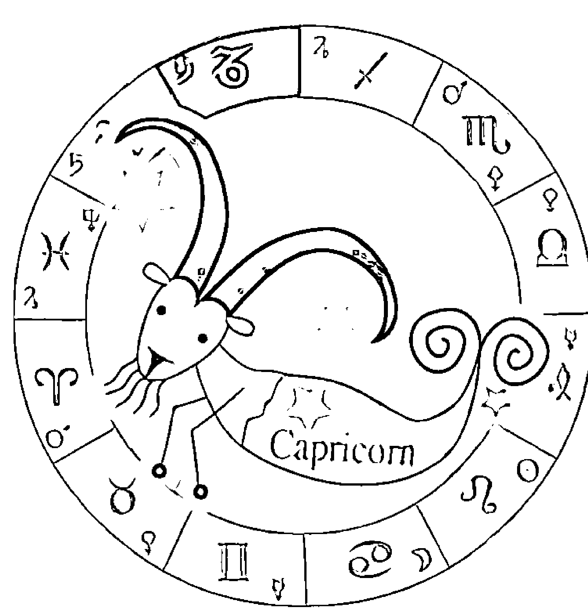

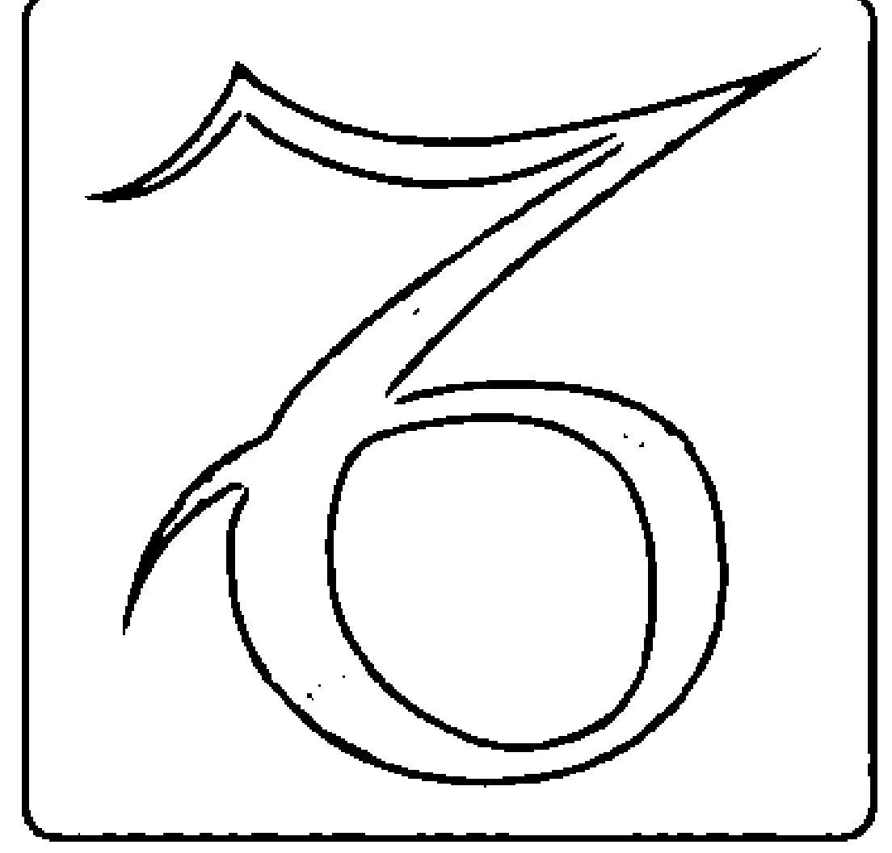

## 主宰星

♄

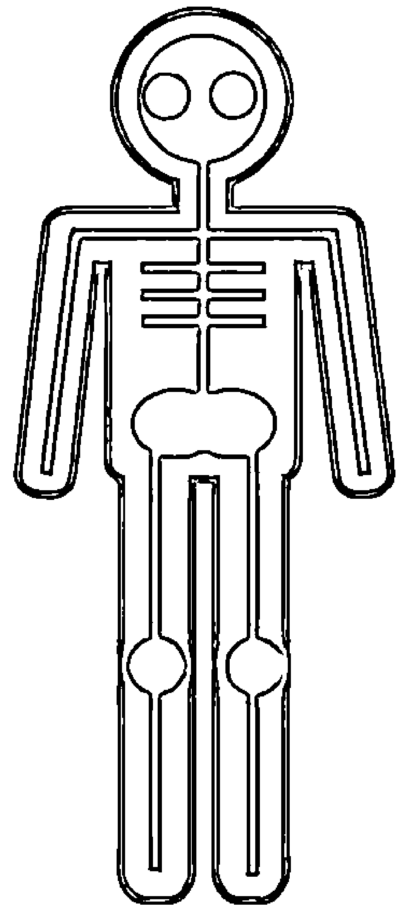

## 我用 (I use)

## 行星强弱

- 庙：土星 ♄
- 旺：火星 ♂
- 陷：木星 ♃ 海王星 ♆
- 弱：月亮 ☽

## 象征意义

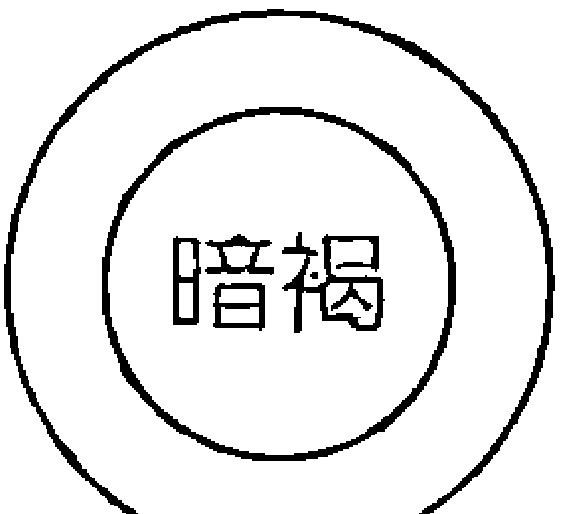

- 正：保守的、谨慎的、负责的、刻苦耐劳的、传统的、纪律的、实际的、节制的、节俭的、努力的、踏实的。
- 负：冷漠的、吝啬的、功利主义的、悲观的、压抑的、阴沉的、严肃的、不择手段的。
- 身：膝盖、膝骨、关节、牙齿、骨骼系统、皮肤。
- 疾：风湿、骨头疾病、牙痛、皮肤病。
- 人：老人、实业家、政治家、建筑师、医师、警察。
- 事：建筑、挑战、野心、法令、传统。
- 物：地基、石头、城墙、矿物、山羊。
- 地：高山、监狱、警察局、地下室、高塔。

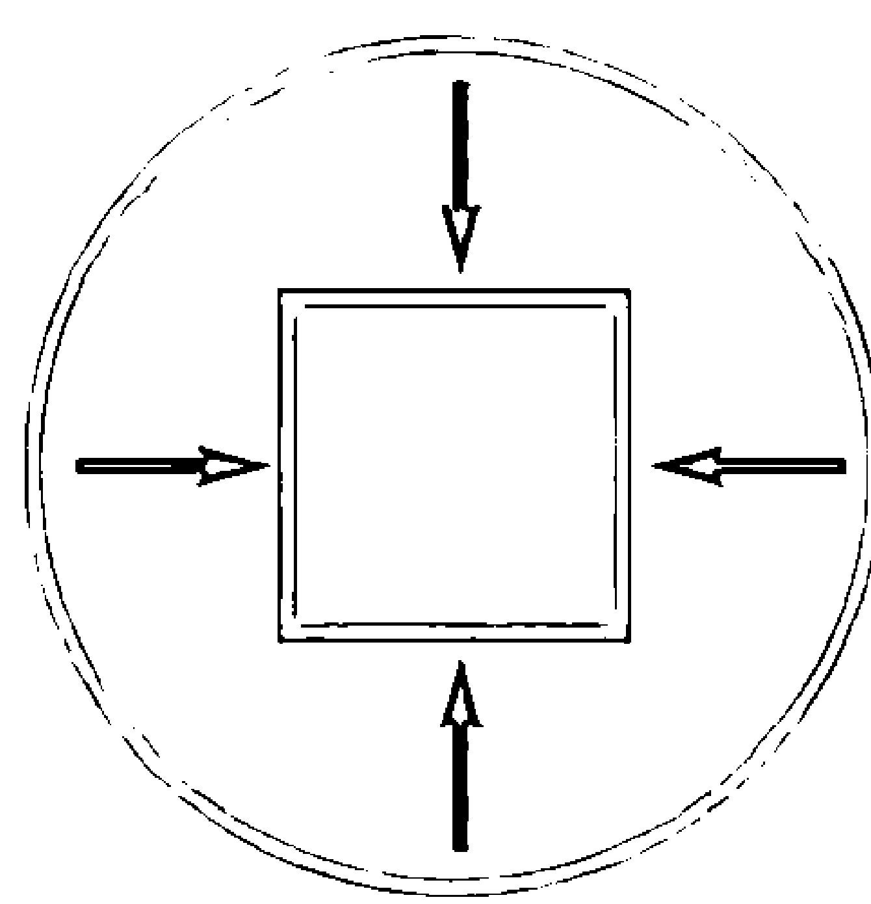

压制的基本含意是从外在建立框架，并往上发展，代表压抑与架构，象征保守、努力向上、追求地位形象。

## 神话由来

在希腊神话中的摩羯座是指汉密斯的儿子野山之神潘恩，他掌管着宙斯的牛羊，以牧神身份成为牧羊人的守护神。潘恩长得十分丑陋，头上生了两支角，上半身为人，下半身是山羊，这样丑陋的外表，让牧神潘恩十分难堪与自卑。

潘恩最爱唱歌和跳舞，经常吹奏自己所制的苇笛。一天他在河畔巧遇仙子纤林克丝，一见钟情下欲跟随时，纤林克丝因为他太丑而惊慌逃走。潘恩穷追不舍，被迫的纤林克丝乃向神祷告，突然消失踪影，只见一只芦苇在风中摇曳。失望的潘恩就摘下芦苇制成笛子，天天吹奏着思念之歌。

一天众神在河边设宴，天神宙斯知道潘恩吹得一口好笛，便要他为众神们演奏助兴。突然怪物提儿出现，诸神大惊失色，马上化身为各种动物逃亡。潘恩因太专注于演奏逃晚了一步，急忙中跳进河中避难，由于过度惊慌失措，只有下半身变成鱼形，于是上半身仍是羊身，而下半身则成了鱼尾。

# Aquarius（水瓶座）

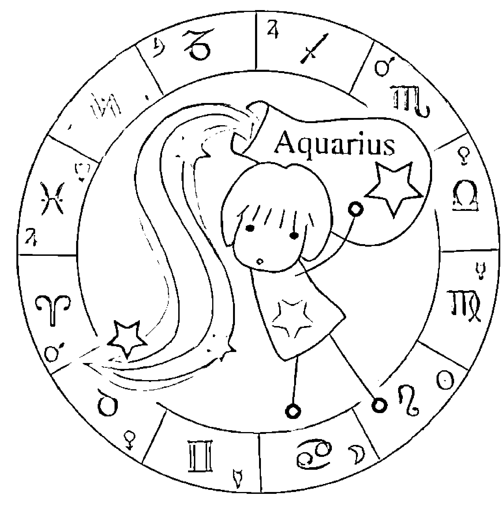

## 我知道 (I know)

## 行星强弱

- 庙：土星 (♄) 天王星 (⛢)
- 旺：水星 (☿)
- 陷：冥王星 (♇)
- 弱：太阳 (☉)

## 象征意义

- 正：独立的、创意的、个人主义的、革新的、博爱的、科学的、逻辑的、人道主义的、创新的、与众不同的。
- 负：不可预测的、冷漠的、不合常理的、古怪的、革命的、分裂的、激进派、叛逆的、孤僻的、无情的。
- 身：脚踝、腿部、小腿、胫骨。
- 疾：脚踝问题、循环问题、胫骨伤痛、小腿疾。
- 人：占星家、发明家、革命分子、特异分子、朋友、社团同好。
- 事：发明、新科技、社团、人道主义、世界大同。
- 物：雷电、波、电脑、网络。
- 地：公共空间、议会、实验室、研发处。

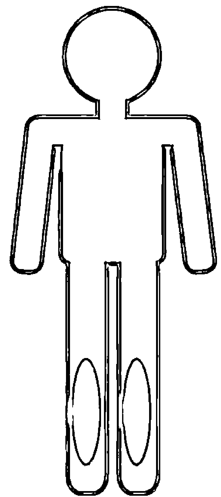

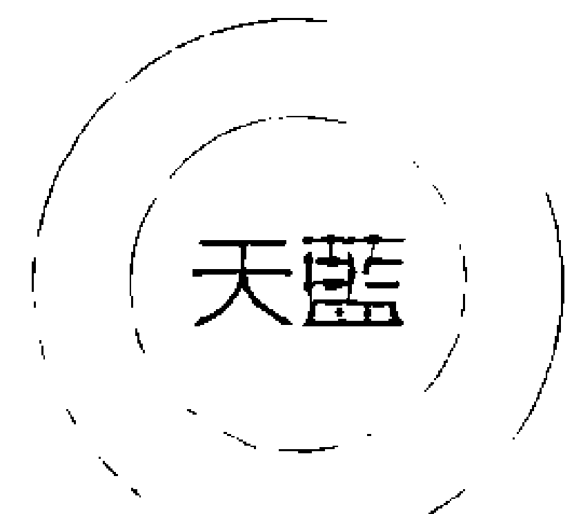

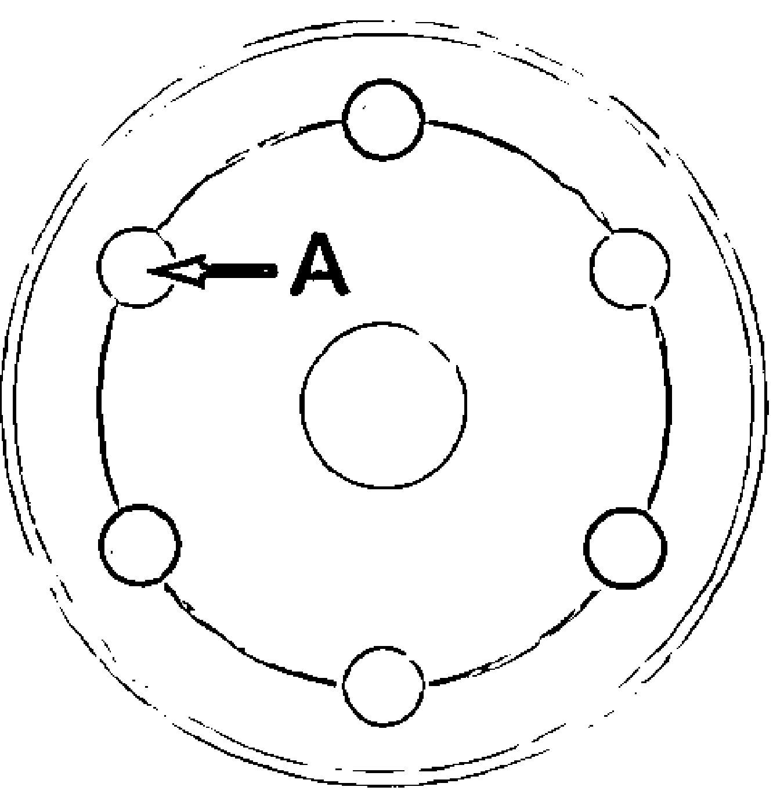

水瓶的基本含意是远离中心，脱离中心的束缚。象征独立自主，爱好自由，不愿成为焦点，个人主义，冷静而冷漠。

## 神话由来

在特洛伊城中，住着一位俊美的王子干尼梅德。他的俊美容貌，连城中美女都自叹不如。有一天众神在奥林匹斯神殿设酒宴，畅饮涅塔尔神酒。负责斟酒的是宙斯和希拉的女儿赫贝。赫贝之美远近驰名，但到了适婚年龄，因和宙斯之子格拉斯结婚之故，不能再担任斟酒职务，宙斯便想寻找赫贝公主的接班人。

一天，太阳神阿波罗到特洛伊城看到俊美的王子正在和宫女游玩。他心想，人间竟然有如此俊美的王子，于是回到神界后报告给宙斯，宙斯看过特洛伊王子之后，每天朝思暮想，希望得到王子干尼梅德，于是化身为大老鹰将王子抓住。宙斯赐与干尼梅德永保年轻，可是却必须要终身担任斟酒的职务。

干尼梅德觉得相当光荣，总是勤奋的工作。宙斯深受感动，送给他一个装满智慧之水的水瓶，水瓶中经常装满着智慧之源的饮料，而且取之不尽，用之不完。从此特洛伊王子变成天上的水瓶座，专门负责给宙斯倒酒。

# Pisces（双鱼座）

阴性 变动 水象

区间星
0° ♃ 10° ☾ 20° ☉ 30°

主宰星 ♃ ♆

## 我信 (I believe)

## 行星强弱

- 庙：木星 ♃ 海王星 ♆
- 旺：金星 ♀
- 弱：水星 ☿

## 象征意义

- 正：善解人意的、好施舍的、仁慈的、感情丰富的、灵动的、包容的、浪漫的、喜好艺术的、想象力的、梦幻的。
- 负：拖延的、模糊的、暧昧的、混乱的、迷糊的、逃避的、不实际的、意志薄弱的、牺牲的、上瘾的、虚幻的。
- 身：脚、淋巴腺、组织液、松果体。
- 疾：脚部疾病、酒精中毒、梦游、精神问题、淋巴问题。
- 人：渔夫、艺术家、堕落的人、暗中的敌人、出家人、灵媒、医生。
- 事：隐藏的秘密、隐居、不伦、囚禁、白日梦、梦境。
- 物：影像、假造物、麻醉物、海、酒精、鱼。
- 地：医院、海边、精神病院、公益机构。

## 神话由来

双鱼座就是美神维纳斯与其子爱神丘比特化身成的两条鱼。

有一天众神因为天气佳之故，于是在河畔设宴。美神维纳斯也带着心爱的儿子爱神丘比特，盛装打扮去参加这一场豪华的宴会。爱好音乐的众神们快乐的唱歌和弹奏乐器，气氛相当热络。在整个宴会逐渐进入高潮，大家都陶醉于美味的食物与香浓的美酒中时，突然传来凄厉的叫声，原来是肩膀下长着一百尾蛇，拥有大羽翼的怪物堤凡。这位不速之客，有着非常狰狞的外表，他伸手大肆破坏，推翻摆设食物的桌子，还用可怕的表情，吓坏了在场的天神。

众神一看不妙，开始四处乱窜，宙斯化身为大鸟，阿波罗化身为乌鸦，希拉化身为母牛，丛林梭斯化为山羊，众神皆以动物之姿逃离。爱和美之女神维纳斯与其子恋爱之神丘比特乃也化身为鱼，逃入尤法拉特斯河中。为了母子不被冲散，维纳斯便用一条缎带将两人尾巴绑在一起，永不分开，就这样顺利从怪物手中逃脱。

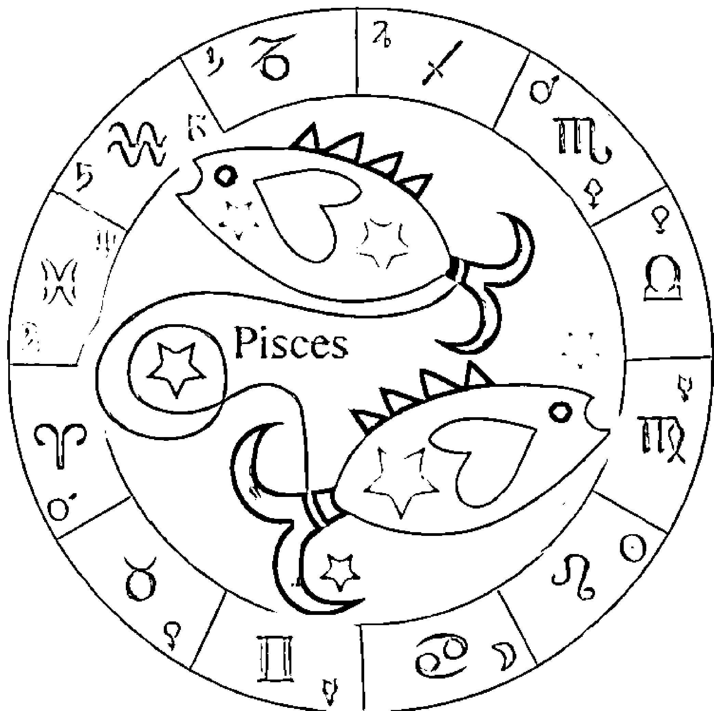

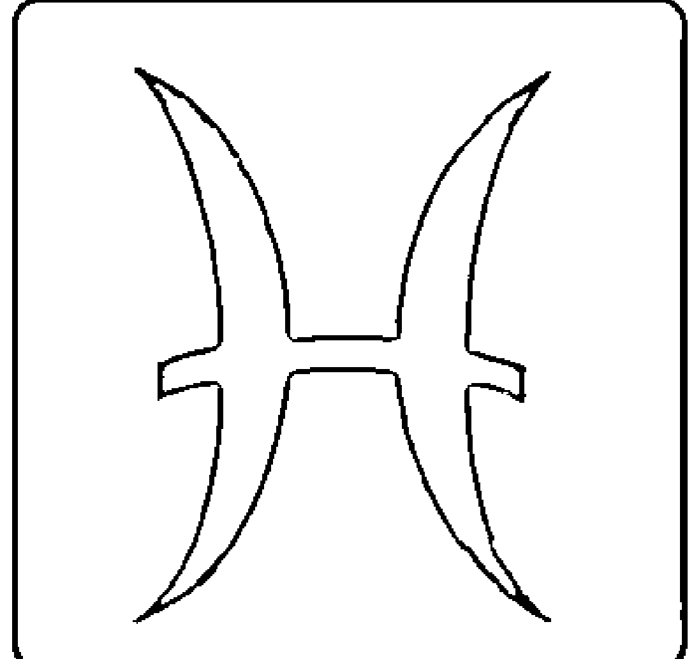

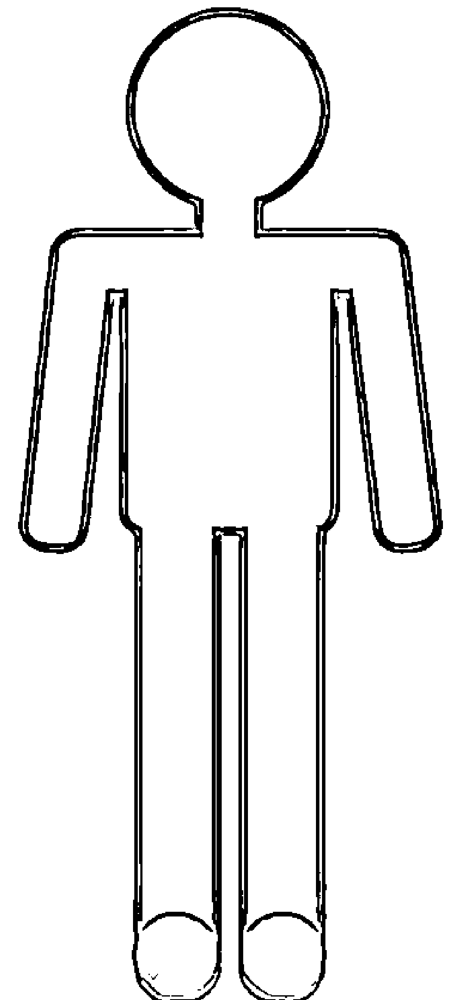

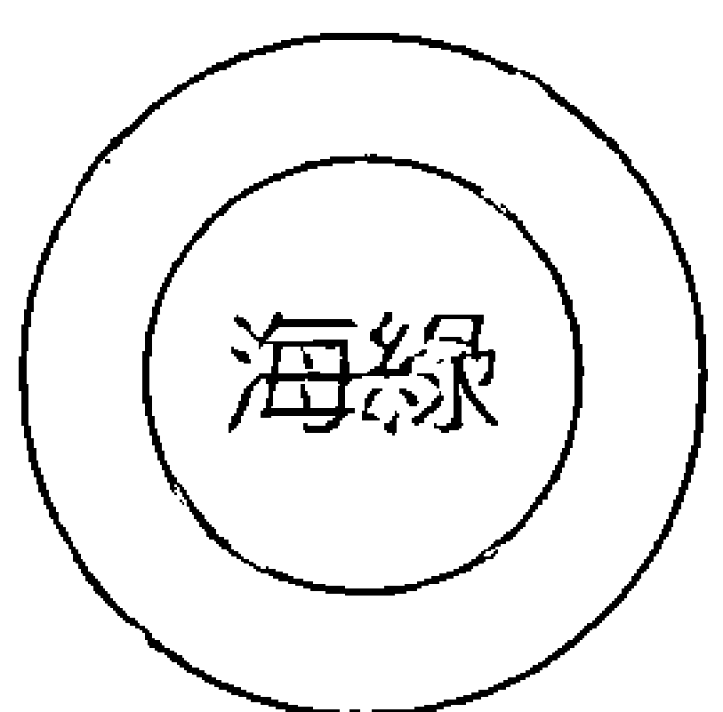

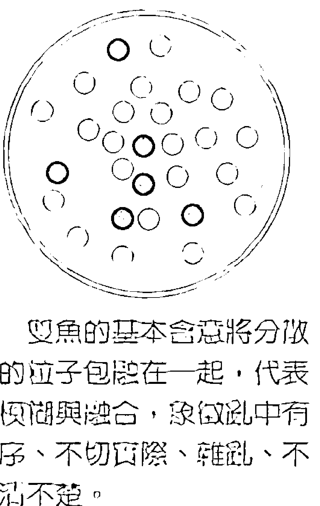

# PART2-2
## 12宫位论
## 12 HOUSES

12星座是宇宙凝结在黄道的基本象征，是人与天的对应。而12宫位则是地球万象在黄道上的凝结，代表着12种人与环境的对应象征，也就是人与地的关系。所以，12宫位与12星座的关连就是象征天与地的关系！

12宫位的基本是由ASC－DES与MC－IC这两条对立线构成的四个角在黄道上切割的四个象限再细分成12份而成。每一宫的开始点是宫位最重要的部份，我们称为宫头，由宫头点所落在黄道上的星座位置，便赋予了此宫的特质。

12宫位是灵魂诞生于世间会面对的12种领域。个人首先面对的是自己的肉身，你降生的意义与命运的基本设定，这是第一宫的范围。从动物学角度来看，生物诞生后首先面临的是活命的基本需求，衍生为物质供应、金钱，这是第二宫。然后要跟世界接触，身旁的兄弟姊妹是第一个重要联系，这是第三宫。接着要划分地盘，衍生为家的归属，这是第四宫。动物学者发现，游戏是动物成长过程中极为重要的一部分，这个过程会使动物产生创意性的方式来面临复杂环境的变化，这是第五宫。成长后必须学习运用身体来获取食物，衍生为工作，这是第六宫。然后是与异性接触，构成关系，这是第七宫。然后交配，共有资产，这是第八宫。完成传宗接代后，开始回归的过程，

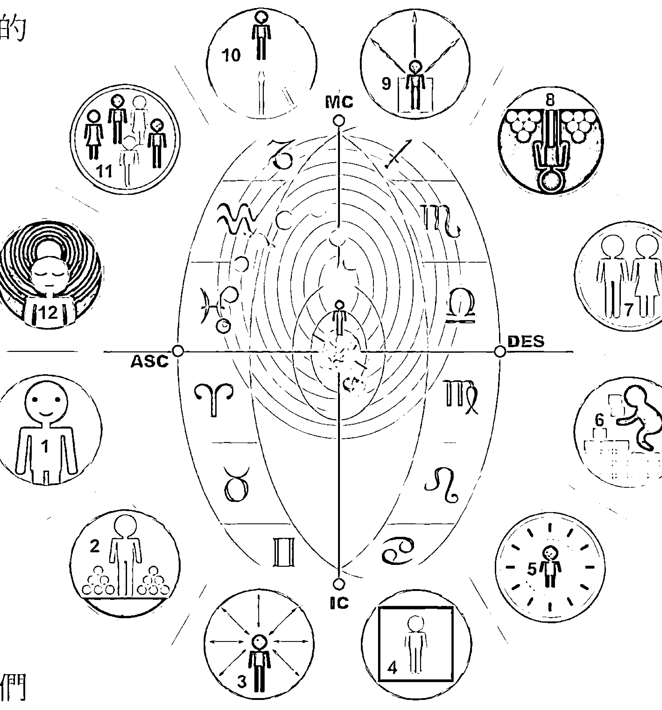

许多动物都有例行性的迁徙，扩张活动领域，这是第九宫。群体的行动需要领导，衍生出社会地位，这是第十宫。当群体发展到一定阶段，开始形成分工，发展组织功能，这是十一宫。动物有寻求回归的本能，而人也不断追寻着未知的本源，这可以衍生为心灵的寄托，莫名的影响，这是十二宫。

## 12宫位的分类与吉凶

12宫位在先天上有其自然对应的星座与主宰行星，每一个宫位都与其自然对应星座与行星有类比的象征关连。因此同12星座一样，12宫位间也有相似性而可以加以分类。在入门篇中我们已经介绍了类似星座三特质的分类法将宫位分为始宫、续宫与果宫。行星在始宫最为有力，接着是续宫、在果宫最弱。

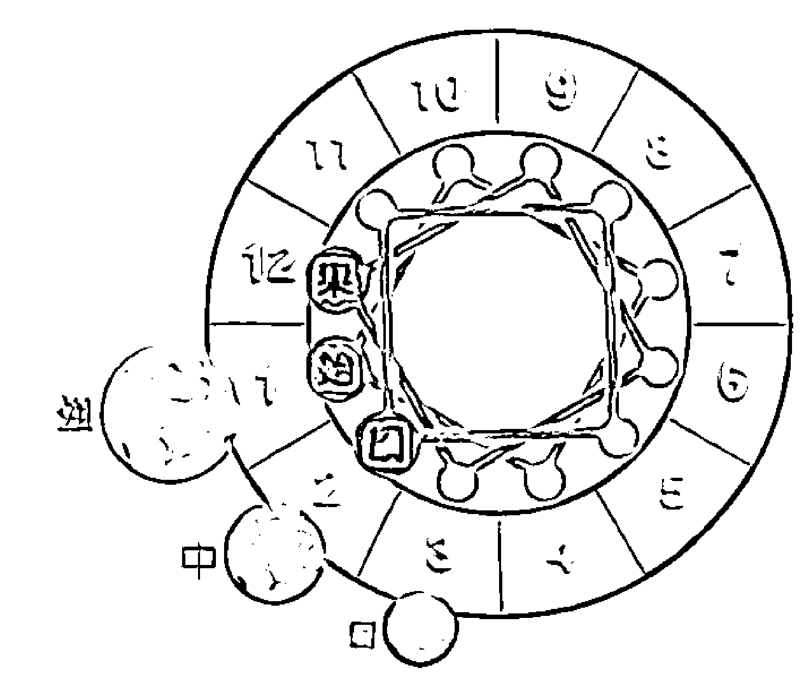

除此外，类似四元素的分类法，可以将宫位分为：

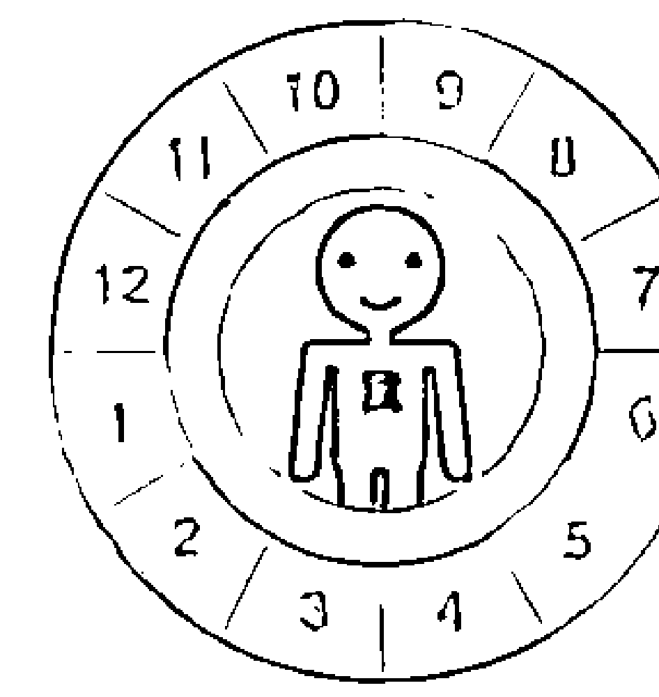

火象宫位（自我）：
1、5、9宫与自我发展有关。1宫是自我本身，5宫是自我的表现，而9宫则是自我的向外拓展。

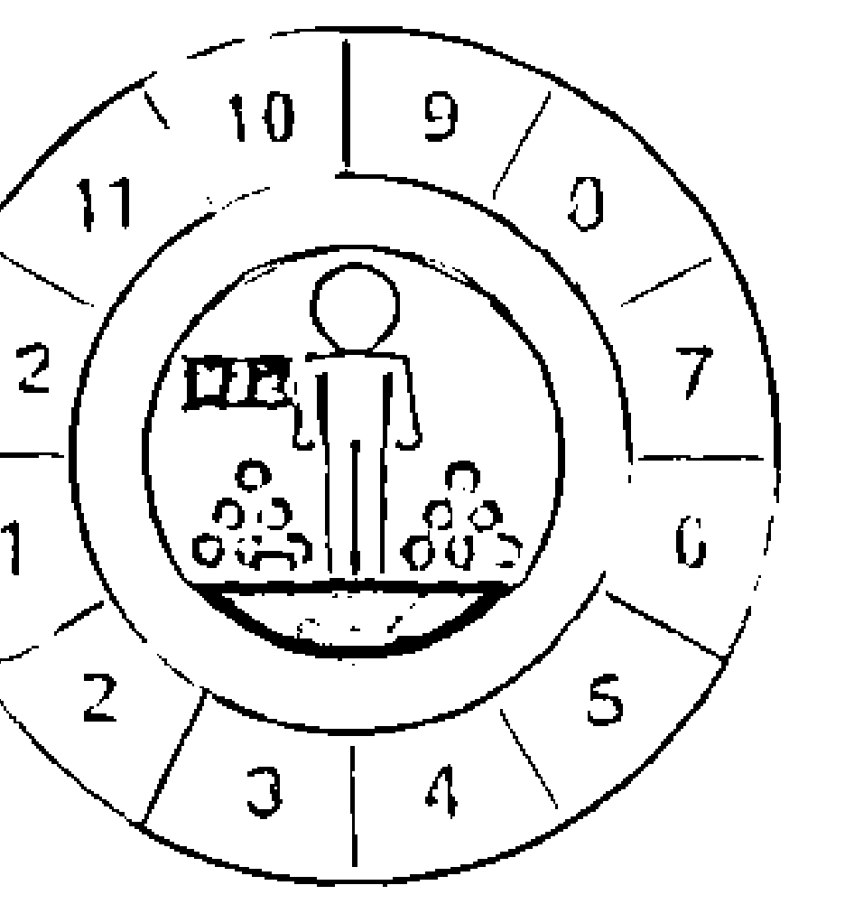

土象宫位（获取）：
2、6、10宫代表实质收获的过程，2宫是资源的获取，6宫是为资源付出努力，10宫则是利用资源获取地位。

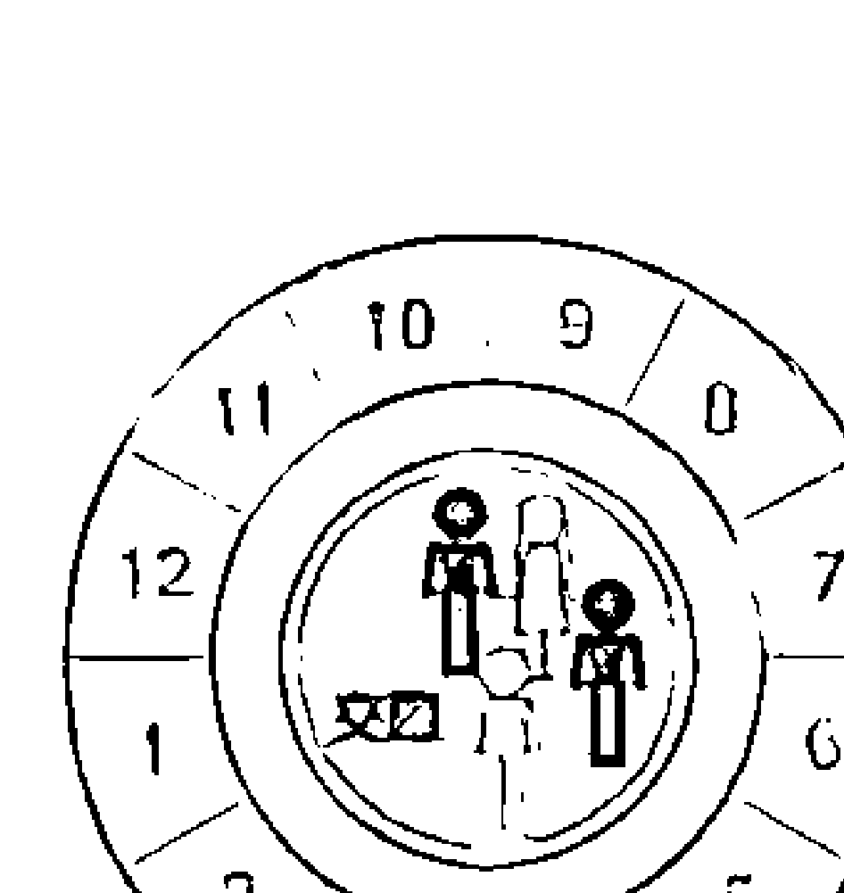

风象宫位（关系）：
3、7、11宫代表人际的交流，3宫是身边亲近的人际，7宫是人际的表现，代表与他人的相处，11宫则是人际的发展，表现为与社会及群体的关系。

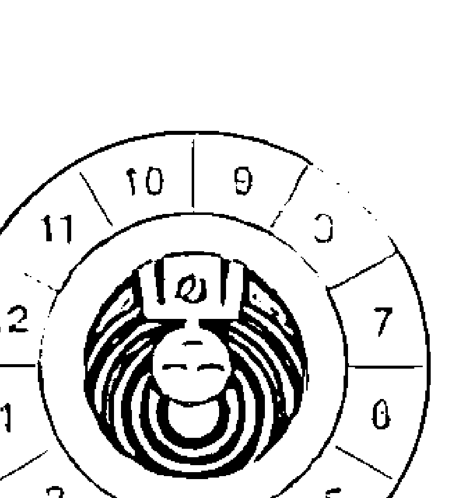

水象宫位（意识）：
4、8、12宫代表意识的层面，4宫是内在意识，8宫是内在意识的表现，是深层的欲望，12宫则为内在意识的拓展，关连到整体的集体潜意识层面。

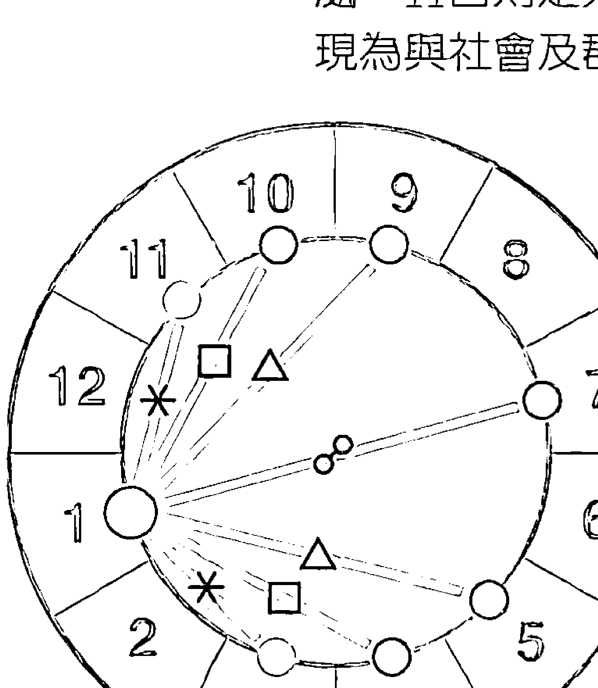

古典占星学中，将宫位定义出好宫与坏宫的差别，它的定义原则是以命宫为基准，凡是与命宫形成传统相位的宫位为吉宫，反之为凶宫。行星在吉宫较能发挥力量，在凶宫则不易显现。
12宫中以1、4、7、10宫最重要，5、9、11宫次之，3宫平平，2、12宫较差，6、8宫最差。

## 衍伸宫

12宫位代表了人世间的基本项目，但是人世间事物的繁杂，并非单纯12个基本项目可以涵盖，因此透过宫与宫的重叠，而发展出衍伸宫法。衍伸宫是以原来的宫位当作基准宫，再分布12宫的方式，如此产生12×12衍伸成144种涵意。举例来说，第二宫为财宫，以第二宫为基准，则第三宫就是财宫的第二宫，第四宫就是财宫的第三宫，…，第一宫就变成是财宫的12宫。如此可以让原来的宫位除了原本涵意，又增加衍伸涵意。像五宫原本是子女宫，他同时是第三宫（兄弟宫）的第三宫，因此可以衍伸为第二个兄弟，所以第五宫除了原来代表的子女宫外，又可以当作第二个兄弟的宫位。

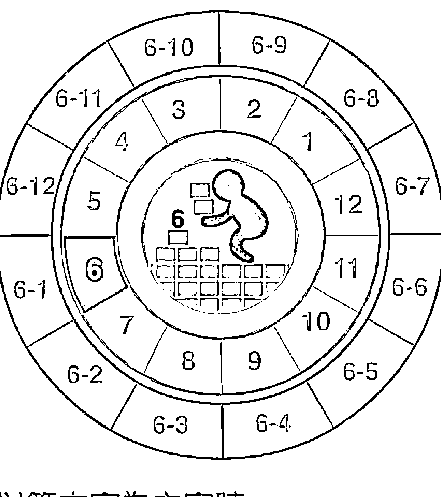

## 以第六宫为主宫时

如图，以第六宫为主时，原来的第七宫就变成第六宫的第二宫，衍伸为下属的钱（二宫为金钱）。原来的第八宫就变成第六宫的第三宫，衍伸为下属的兄弟（三宫为兄弟）。其余依此类推。

## 宫位制的争议与截夺宫

西方占星学发展至今，在基本的占星学理论中，宫位的分宫方法是最有争议的问题。分宫法不少于十种，同样，对宫位界线的定位也有很多不同意见。目前一般是采用不等宫制，采用等宫制的占星家并不多，在西方国家最受欢迎的分宫法是Placidus分宫法。但是不等宫制有个重大的问题，在纬度较高的地点，如果采用不等宫制，容易造成宫位的空间分布相差甚大。

因为不等宫制的使用，因此会发生截夺宫的现象。由于宫位点在黄道上的投影关系，各宫位的大小并不一样，有时一个宫位横跨了三个星座，那么中间的星座就称为被截夺，因为截夺宫的影响被截夺的星座其特性就会被隐藏住，变得不外显，所以落入其中的行星，

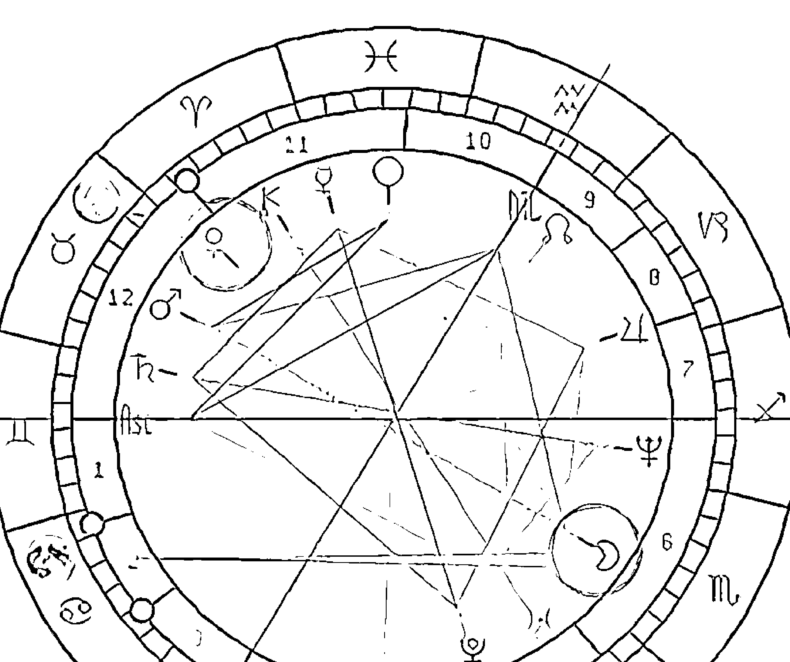

如图中12宫宫头在牡羊，整个12宫包含了牡羊、金牛与双子，因此，金牛被整个12宫包住了，这代表金牛被截夺了，而金牛的主宰星金星的象征就被隐藏了起来。另一个情况是如图下方第二宫与第三宫的宫头都在巨蟹座，因此巨蟹的意义被强调，同时，巨蟹的主宰星月亮的象征也跟着被加强。

和该宫的宫主星力量就会弱化，这意味着原先的象征会消失或是隐藏了。20世纪后英国的一些占星学家是倾向采用等宫制，因爲它摆脱了宫位大小出现极端的问题，同时也避免了截夺宫的发生。而在印度占星学上，依据传统用法，一惯是使用等宫制，但是这种等宫制，与一般的等宫制略有不同，是将宫位与星座合一，亦即是以宫头所在的星座位置，来概括整个宫位，举例来说，某人命宫宫头在巨蟹座20度，一般的等宫制是以巨蟹20度到狮子19度作爲此人第一宫的范围，但是在印度的等宫制则爲整个巨蟹座是他第一宫的范围。不过由于上升与中天不一定是刚好90度，因此中天点在等宫制中的定位就有些不知所措。

## 宫位主星

每一个星座都有它自己的主人！而它们的主人就是太阳、月亮与行星。除了地球以外，太阳系中太阳与月亮以及八大行星依个自的特性，分别掌管适合的星座，成爲星座的主人，我们称它们爲星座的主宰星。在三王星还未发现前，太阳与月亮各主宰了狮子与巨蟹，另外10个星座则分给金木水火土5大行星，个自主宰两个星座，直到三王星发现后，发现到天王星与水瓶性质类似，海王星与双鱼类似，冥王星与天蠍类似。于是便有了两颗行星共管一个星座的状况。有些占星家认爲，完美的结构下应该一个星座由一颗行星掌管，因此他们认爲应该还有一颗新行星掌管天秤座，而处女座是跟小行星相关连的。

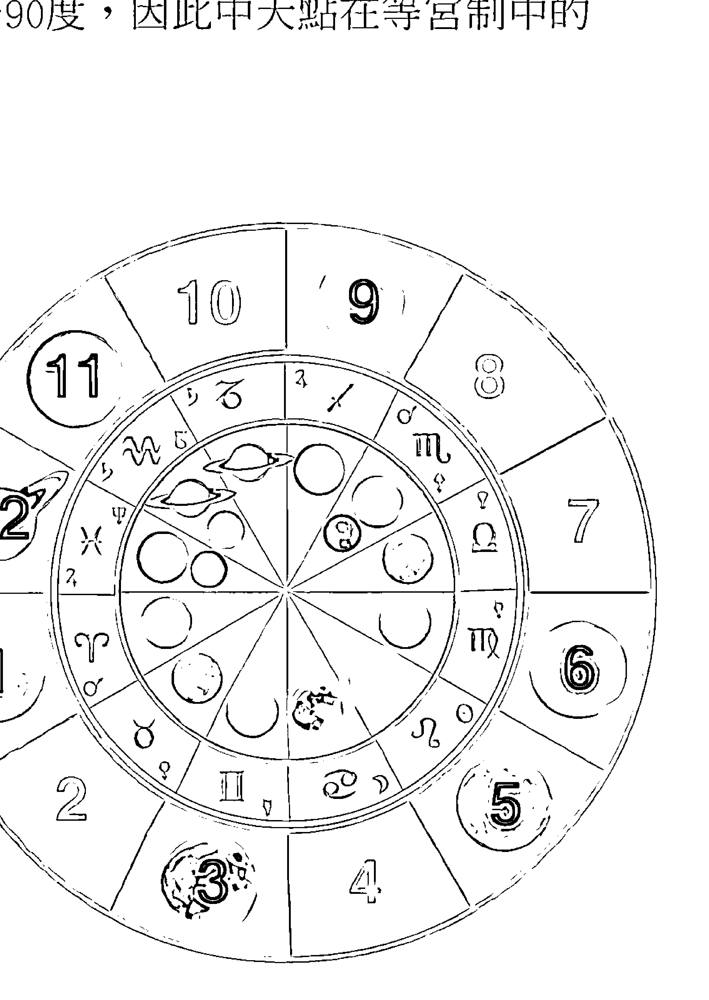

## 行星的喜乐宫

行星依属性有其恶好的宫位，称爲喜乐宫。行星在喜乐宫能增强发挥的力量。如日，水星的喜乐宫爲第一宫命宫，月亮在第三宫、金星在第五宫、火星在第六宫、太阳在第九宫、木星在第十一宫、土星在第十二宫。

同样的，12宫也依其本身的特性与12星座相关连，有其自然对应的星座，例如第一宫的自我特质与牡羊座对应，第八宫的原欲自然对应到天蠍座。而由于12宫与12星座的对应，因此也跟星座的主宰行星对应，以12星座的主宰星来对应到12个宫位成爲12宫位的自然主宰星。除此以外，12个宫位因爲属性

### 不同，会使某些行星特别有力量，而成爲特定行星的喜乐宫。
当一个人出生时，每一宫宫头位置会座落于不同的星座上，而赋予了每一个宫位的特性，因此12个宫头点对应到各自的星座位置。如此透过12星座各自的主宰行星，形成12宫位各宫的宫主星，因此从宫头所在的这个星座的主宰行星就是此宫的宫主星，其重要性要高于宫位的自然主宰星。同时因爲宫主星的产生，我们了解到宫与宫间的联系关系。原则上，由第一宫ASC宫头星座位置的确立，12宫便依序布入12个星座中，假设上升星座爲金牛座，那么照顺序第二宫就是双子座，第三宫是巨蟹座…。
命宫的宫主星称爲命主星，是命盘的重心之一。
假如某人命宫在摩羯座，因爲土星主宰摩羯，其命主星就是土星。那么，土星在这个人星盘中的位置就特别重要。
由于回归时系统与恒星时系统会造成星座位置的不同，因此在不同的系统下就会产生宫主星的变换！如此一来，在两种不同占星体系下，同样的一颗行星所具有的宫主星征象很可能改变了，其同一宫位宫主星也很可能变成是落入不同的宫位。因此两种系统会产生极大的不同结果。因而有关宫主星的应用，在西方占星学上趋于没落！而渐渐以相位来作推论的依据。

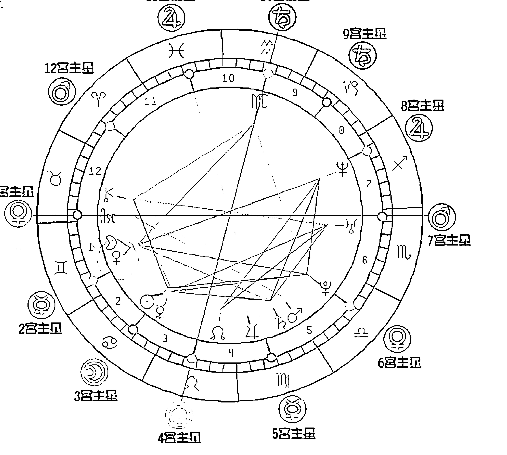

这张星盘的命宫在金牛座，因此其命主星爲金星，而知道其金星正好落在第一宫，因此可以知道此人非常正视自己，有自恋的倾向。

## 飞星理论：宫与座的组合

确立了第一宫所在的星座，我们也可以依序得出每一宫的宫主星。因此就可以由宫主星飞入的宫位来看出宫与宫之间，星与星之间的联系关系，这种宫主星飞佈的方法称爲飞星。

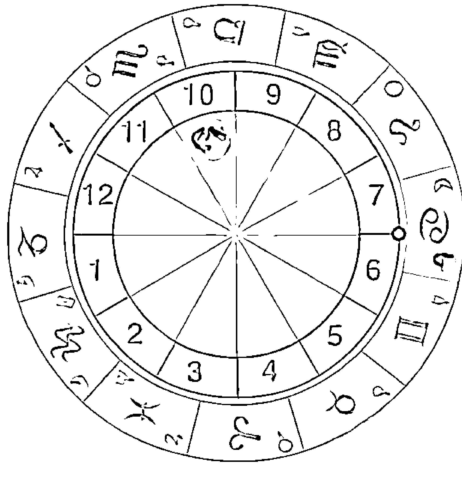

例如左图中第七宫落在巨蟹座，因此七宫主星爲月亮，月亮落在第十宫，因此第七宫与第十宫有了关联。

再举例如右图，某人第二宫的宫头在射手座，射手座的主宰星木星落在第三宫，而第三宫主宰沟通和写作。如此，第二宫与第三宫产生了联系，这表示这个人容易透过写作和口才赚钱。当然这也可能表示某人花费很多金钱在沟通或兄弟身上。

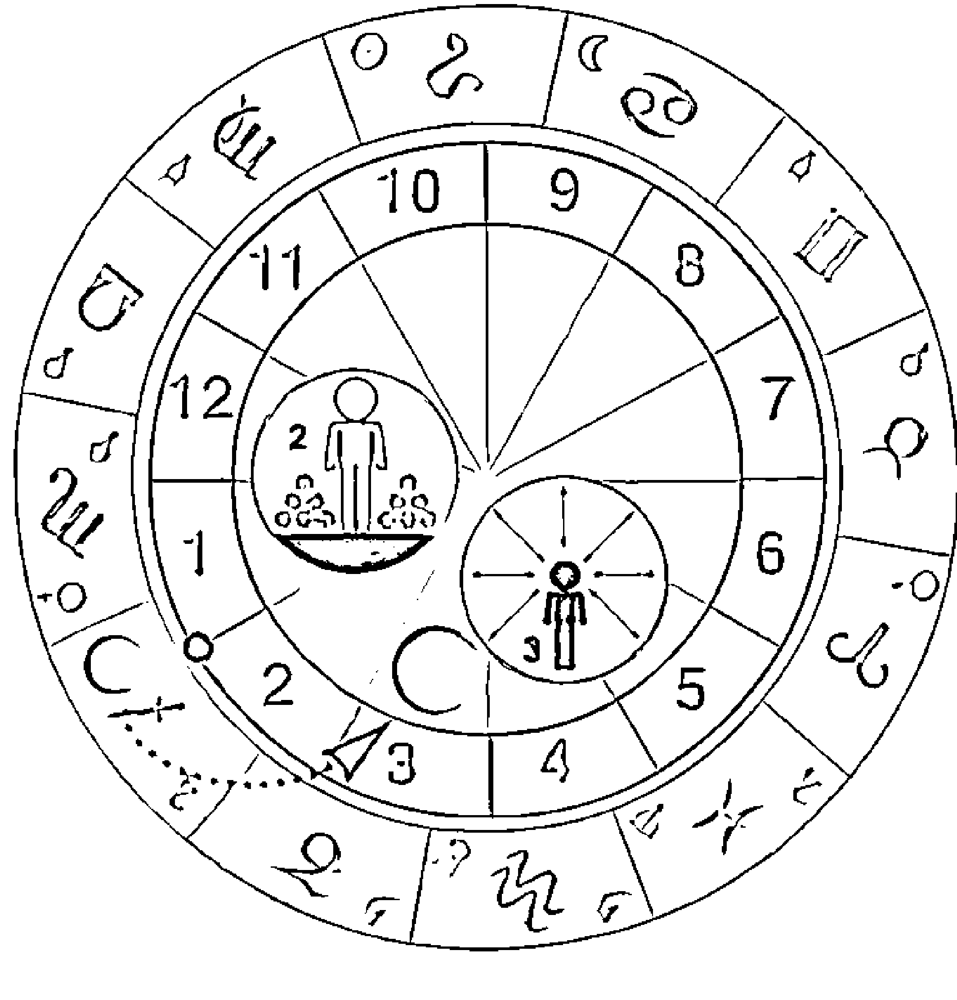

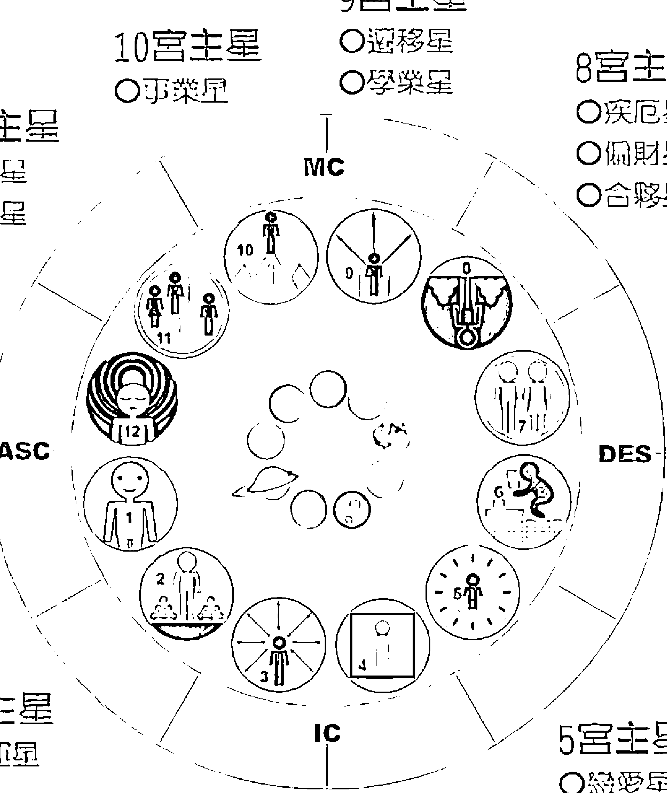

- **1宫主星**: 命运星
- **2宫主星**: 财运星
- **3宫主星**: 兄弟星、沟通星、学习星
- **4宫主星**: 家庭星
- **5宫主星**: 恋爱星、子女星、游戏星
- **6宫主星**: 健康星、部属星、工作星
- **7宫主星**: 婚姻星、对手星
- **8宫主星**: 疾厄星、偏财星、合伙星
- **9宫主星**: 迁移星、学业星
- **10宫主星**: 事业星
- **11宫主星**: 人际星、交友星
- **12宫主星**: 精神星、秘密星、小人星

- **太阳**: 自然形象星、意志星、父亲星
- **月亮**: 自然情绪星、母亲星
- **水星**: 自然智慧星、思考星
- **金星**: 自然爱情星、喜悦星
- **火星**: 自然欲望星、性爱星、伤害星
- **木星**: 自然贵人星、幸运星
- **土星**: 自然困难星、压力星
- **天王星**: 自然改变星
- **海王星**: 自然梦幻星
- **冥王星**: 自然破坏星

宫主星对该宫具有举足轻重的作用，因此是判断宫位事件的重要依据，我们将每一宫的宫主星依照宫位的特质以较通俗的名称来命名，比较容易了解他们的代表意义。这些宫主星会由太阳、月亮、水星、金星、火星、木星、土星、天王星、海王星、冥王星来扮演，而这些行星本身也有其基本自然意义。

# 命運宮

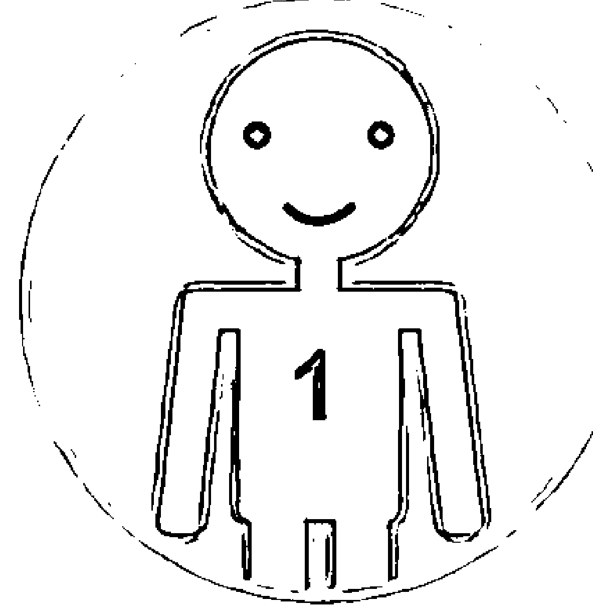

- 星座：牡羊座
- 主星：火星
- 特質：始宮
- 元素：火象宮

命運、身體狀況、外貌、生命力、自我。
○第一宮所在的星座象徵個人的人生狀態的模式、個人的特徵、命運的模式。而其宮主星所在的宮位代表其一生中最為在意的層面。

# 財運宮

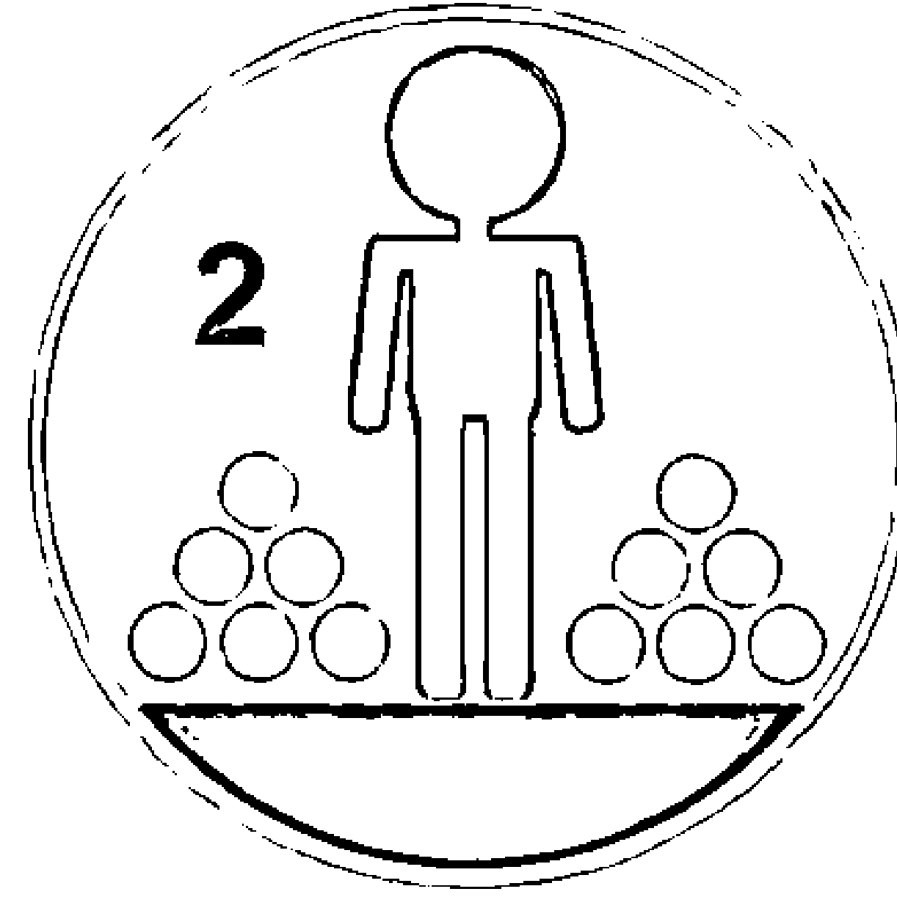

- 星座：金牛座
- 主星：金星
- 特質：續宮
- 元素：土象宮

擁有的資源、理財能力、價值觀、感官、追求物質的能力。
○第二宮所在的星座象徵個人對金錢、價值觀的處理方式表現，以及其入財的模式。而其宮主星所落得宮位暗示獲得金錢的目的之所在。

# 兄弟宮

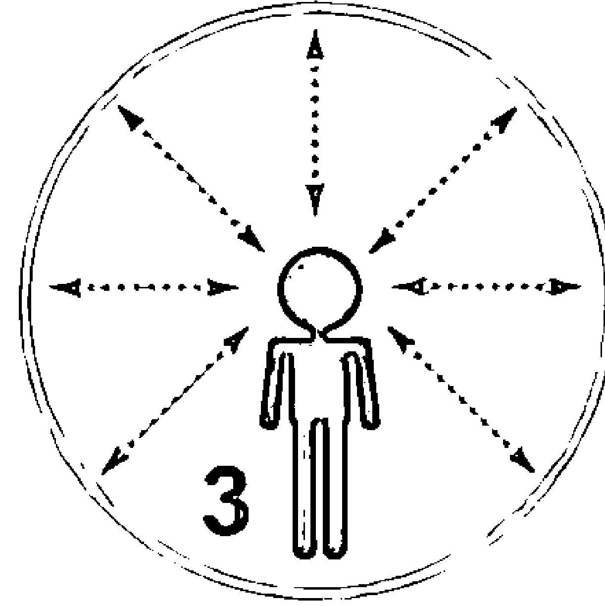

- 星座：雙子座
- 主星：水星
- 特質：果宮
- 元素：風象宮

兄弟姐妹、左鄰右舍、智慧、學習能力、短程旅行、早期學習環境、語言與運用文字能力。
○第三宮所在的星座象徵一個人與外界接觸的傾向模式，個人與兄弟姊妹的相處模式或是某個兄弟姊妹的象徵。而其宮主星所在的宮位代表其與兄弟間的重要關聯層面。

# 家庭宮

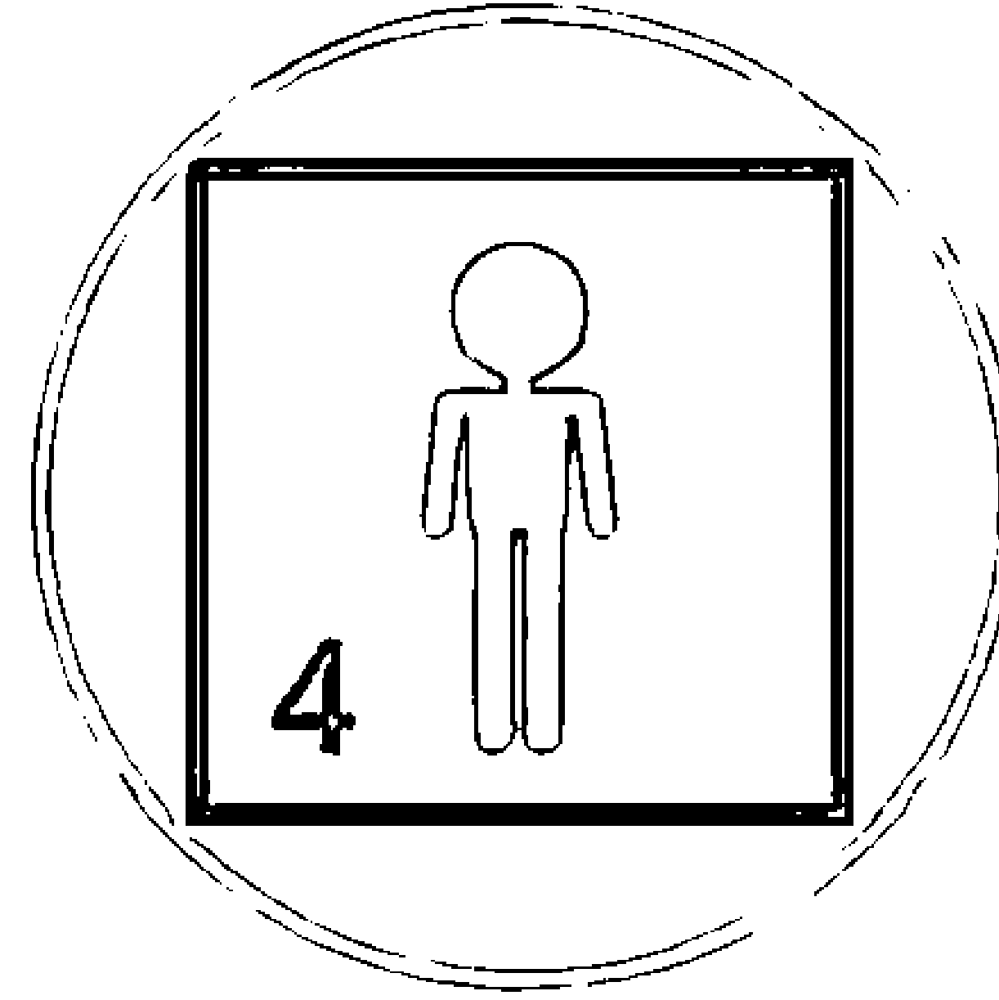

- 星座：巨蟹座
- 主星：月亮
- 特質：始宮
- 元素：水象宮

家庭、生活環境、童年及晚年的生活、不動產、父母遺傳、家世、前世、根。
○第四宮所在的星座象徵一個人與家庭的關係，以及他想要的家庭樣式。而其宮主星所在的宮位代表其與家庭之間的重要關聯面。

# 子女宮

- 星座：獅子座
- 主星：太陽
- 特質：續宮
- 元素：火象宮

子女、創造能力、表現力、娛樂、戀愛運、禮物、偏財運、賭博、休閒活動。
○第五宮所在的星座可以看出一個人以什麼樣的方式追求快樂，他如何對待子女，也代表其某個子女的象徵。而其宮主星所在的宮位代表使其快樂的源頭。

# 健康宮

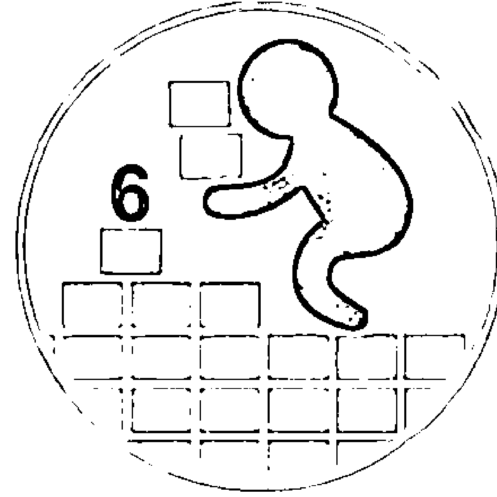

- 星座：處女座
- 主星：水星
- 特質：果宮
- 元素：土象宮

健康運、部屬關係、飲食、工具、寵物、勞動服務、工作運、生病。
○第六宮上的星座可以看出一個人如何運用身邊的資源。他是如何對待部屬，工作的模式以及暗示可能的疾病。由其宮主星所落入的宮位可以了解一個人努力付出所求為何。

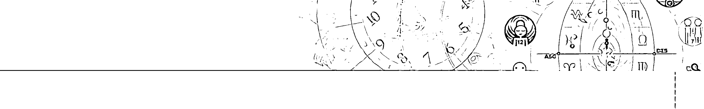

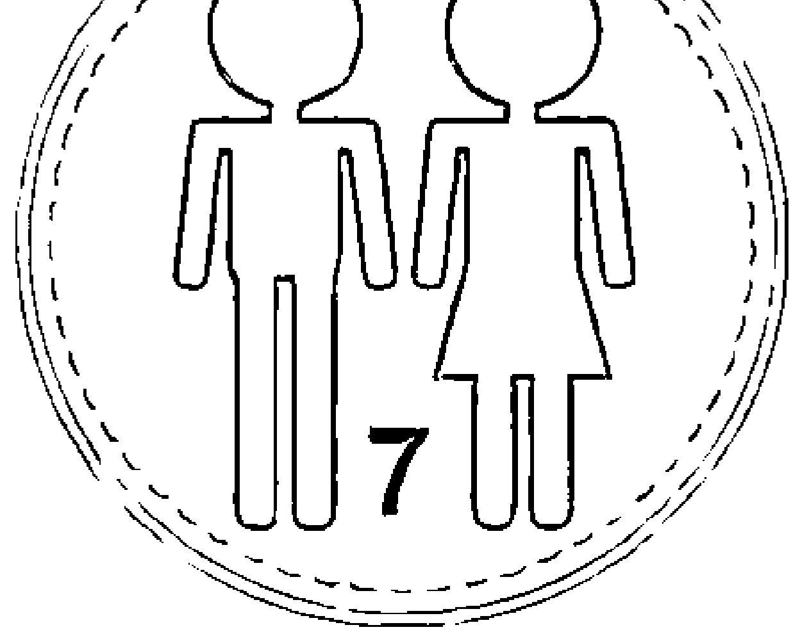

# 夫妻宮

- 星座：天秤座
- 主星：金星
- 特質：始宮
- 元素：風象宮

婚姻、合夥人、股東、人與人之間的關係、密友、公開的敵人、合約、法律、訴訟

○第七宮上的星座可看出一個人以何種方式與人相處，他的配偶的樣式。由其宮主星可看出其與配偶的重要關連所在。

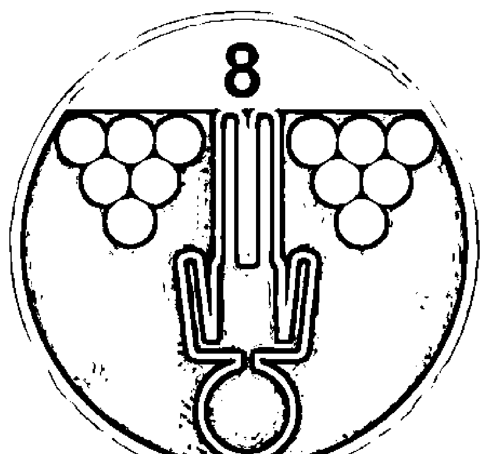

# 疾厄宮

- 星座：天蠍座
- 主星：火星
- 特質：續宮
- 元素：水象宮

黑暗面、共有的資源、他人或配偶的錢、性、死亡、意外、保險、遺產、潛能。

○第八宮上的星座可以看出個人如何與他人共有資源，他對生死的態度以及處理慾望的模式。由其宮主星可以看出個人深層慾望的根源所在。

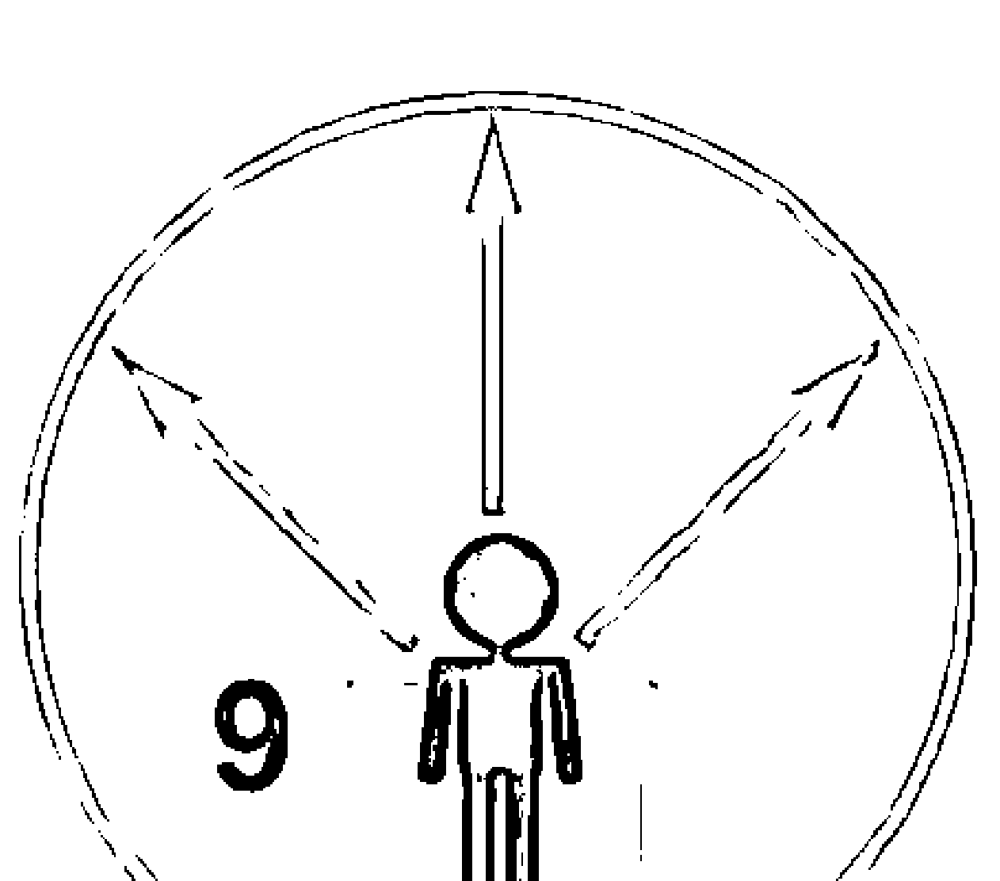

# 遷移宮

- 星座：射手座
- 主星：木星
- 特質：果宮
- 元素：火象宮

長途旅行、國外、高等教育、大智慧、出版、哲學、社會福利、宗教道德。

○第九宮上的星座可看出一個人向外發展的模式以及對新視野的態度。由其宮主星所落的宮位可以知道其向外發展的目的所在。

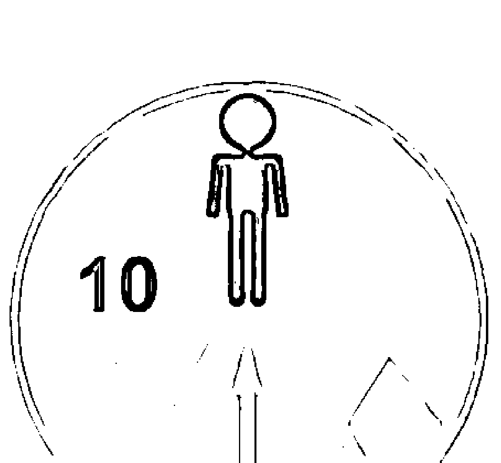

# 事業宮

- 星座：摩羯座
- 主星：土星
- 特質：始宮
- 元素：土象宮

社會地位、名譽、榮譽、職業、外在形象、人生的頂點、政治野心、父母、老闆。

○第十宮上的星座可看出一個人如何努力爬到最高點，他適合發展什麼樣的事業。由其宮主星所落的宮位可以知道其追求地位的目的所在。

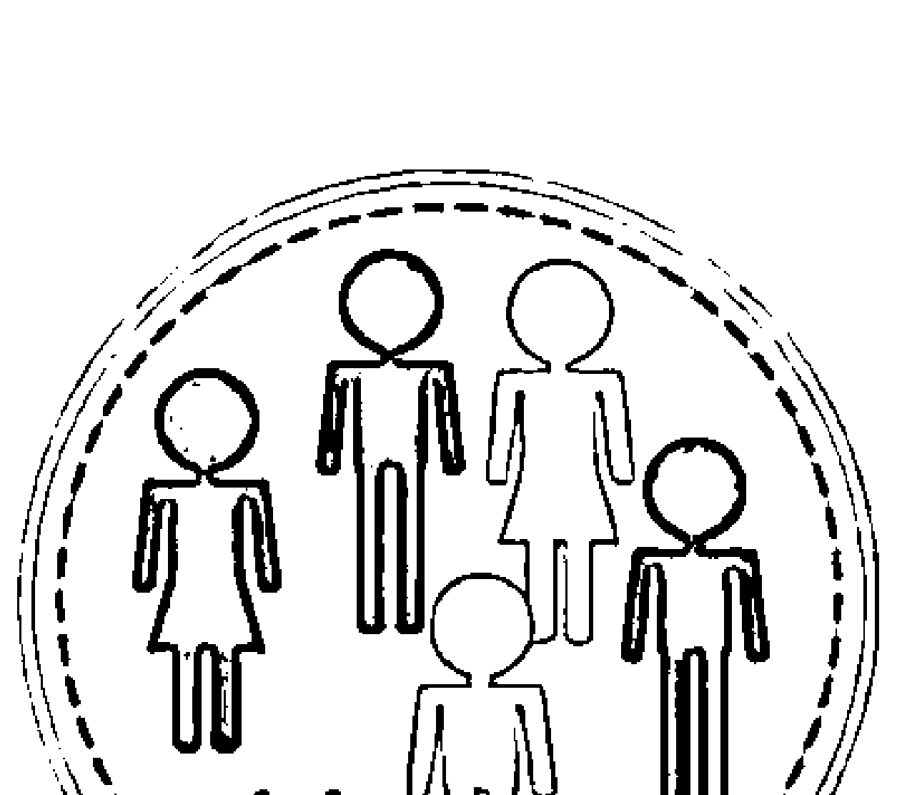

# 人際宮

- 星座：水瓶座
- 主星：土星
- 特質：續宮
- 元素：風象宮

朋友、志同道合、社團、群體願望與理想、社會意識、未來、俱樂部、共同嗜好。

○第十一宮上的星座可看出一個人與群體的關係模式，他的朋友狀況。由其宮主星所落的宮位可以知道他與群體間的重要關係層面。

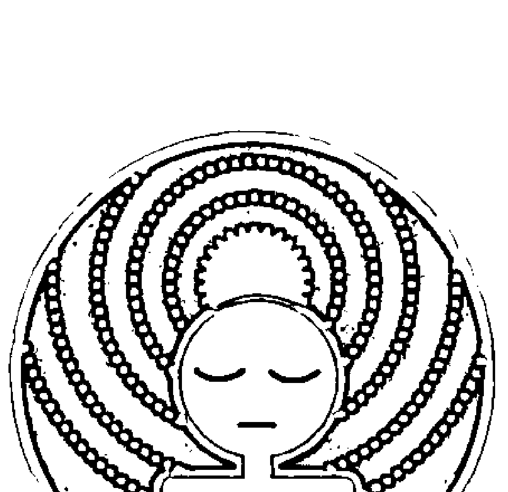

# 精神宮

- 星座：雙魚座
- 主星：木星
- 特質：果宮
- 元素：水象宮

精神面、夢想、隱藏的敵人、幕後工作、自我限制、人生的歸結、隱密面、休息、秘密。

○第十二宮上的星座可以看出一個人的精神傾向，以及其潛在問題的形式。由其宮主星所落的宮位可以知道他精神的重要關連層面。

## Asc at Aries
（上升在牡羊座）

上升在牡羊座的人，其各宮分布以及各宮主星如下圖：

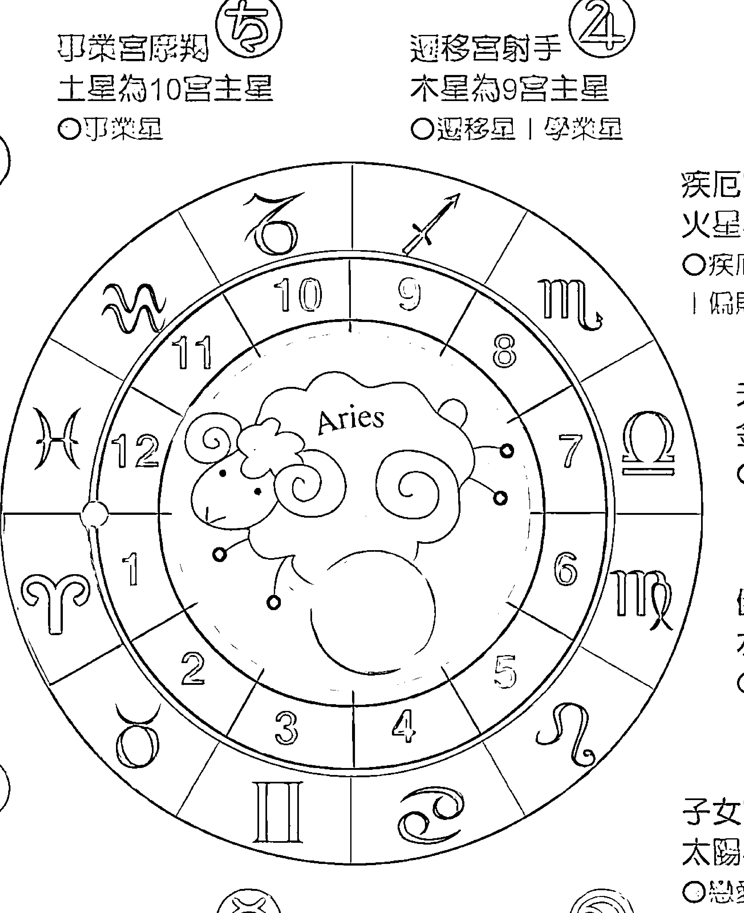

- 人際宮（水瓶座，第11宮）：土星為11宮主星（人際星/交友星）
- 事業宮（摩羯座，第10宮）：土星為10宮主星（事業星）
- 遷移宮（射手座，第9宮）：木星為9宮主星（遷移星/學業星）
- 疾厄宮（天蠍座，第8宮）：火星為8宮主星（疾厄星/偏財星/合夥星）
- 夫妻宮（天秤座，第7宮）：金星為7宮主星（婚姻星/對手星）
- 健康宮（處女座，第6宮）：水星為6宮主星（健康星/部屬星/工作星）
- 子女宮（獅子座，第5宮）：太陽為5宮主星（戀愛星/子女星/遊戲星）
- 家庭宮（巨蟹座，第4宮）：月亮為4宮主星（家庭星）
- 兄弟宮（雙子座，第3宮）：水星為3宮主星（兄弟星/溝通星/學習星）
- 財運宮（金牛座，第2宮）：金星為2宮主星（財運星）
- 命運宮（牡羊座，第1宮）：火星為1宮主星（命運星）
- 精神宮（雙魚座，第12宮）：木星為12宮主星（精神星/秘密星/小人星）

# 第一宮在牡羊座：宮主星為火星

○牡羊一宮象徵一切以我為主。
人格特質：第一宮牡羊座的人非常的自我，具有強烈的精力及原始力量的特質。他們性急不喜歡浪費時間，有不耐煩的傾向。以直覺來行事，當腦中念頭形成的一瞬間，便立刻行動。他們具有很強烈的競爭意識，並且容易用不退讓的態度和人正面對抗。

人生模式：他們通常直接而且有侵略性，也以這種方式開拓自己的人生。競爭與戰鬥往往是他們的面對人生所採取的手段。

外型特徵：他們的特徵主要強調在肌肉與頭上，整體偏向強烈、尖銳，帶有原始的野性，偏紅色。

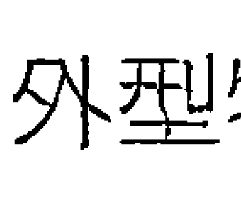

# 第二宮在金牛座：宮主星為金星

○金牛二宮的人對金錢是自私而實際的，對自己的擁有物很在乎，想要就會去爭取。他們會將賺來的錢花在滿足自我，浪費在奢侈品或華麗享受上。

價值態度：他們在乎一件東西是否有實際的價值，對於擁有權很在乎。他們喜歡錢，特別重視生財有利的事物。

進財模式：他們進財方式多半透過實質的物品交易或者以錢來滾錢的，非常實際而且穩定。

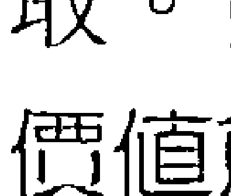

# 第三宮在雙子座：宮主星為水星

○雙子三宮的人總是很自我的表現自己的想法，而且會主動的去接觸外界，總是有很多聰明的妙點子。

溝通模式：他們會採取多方向的模式來與外面接觸，會與三教九流交往，也喜歡接觸不同的環境，但多半淺嘗即止。

兄弟關係：他們與兄弟姊妹之間的關係也是多變的，總是有各種話題，永遠不會無聊。同時這也象徵一個多變機靈的兄弟姊妹。

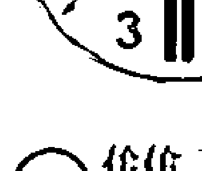

# 第四宮在巨蟹座：宮主星為月亮

○四宮巨蟹的人他們對自己領域非常重視，很在意家是否穩固。媽媽在家庭中具有非常重要的地位。

家庭關係：他們在乎家人，需要從家庭生活中獲得情感上的滿足。他們特別愛回自己的家，因此他們會為了自己人出頭，凡是以家人為前提。

家的樣子：家庭環境舒適而且復古。家中常留有許多舊東西，不肯丟棄。

# 第五宮在獅子座：宮主星為太陽

○獅子五宮的人會直接表現他們的快樂。他們愛出風頭，享受受人注目的榮耀。

他們好表現，因此舞蹈或表演往往能抒發他們的創造能力。

戀愛模式：他們是戀愛高手，熱情而且擅於表現自己，好面子，往往重視的是對方的外表或家世，而且他們老是要對方以他為中心。

子女關係：他們對子女非常疼愛，以他們為傲，他們的子女也多半重視自己的表現，他們的子女多半很有男子氣概。

# 第六宮在處女座：宮主星為水星

○處女六宮的人是對工作非常認真的，往往會將工作成果當成自己的成就。

工作模式：為了達成自我的成就，他們在工作與服務時非常拼命，要求高標準，也以此要求其他人。因此他們完成的工作，都有一定的水準。

部屬關係：他們會對部屬要求完美，一絲不苟。因此特別適合細心、謹慎的工作夥伴。

健康狀況：健康上，要注意消化系統的問題。

# 第七宮在天秤座：宮主星為金星

○天秤七宮象徵此人最缺乏的部份就是協調與平衡。通常會在合作時過度自我未考慮他人感受，而和人發生爭吵。

合作方式：他們不擅長與人合作，因為總是想要別人依順自己，因此他們會受具有協調特質的人吸引，與這樣的人合作。

配偶形態：同樣的，他們會喜歡溫柔，具交際協調能力的配偶，彼此相處時能事事配合自己。所以他們的另一半多半優雅而且比例完美，個性客觀沒有主見。

# 第八宮在天蠍座：宮主星為火星 冥王星

○天蠍八宮由於自我獨斷，因而容易面臨危機中，但也容易於危機中獲得利益。

合夥關係：他們跟人分享利益時，容易有衝突，因為他們傾向於主控一切。也容易因他人的死亡，而有遺囑或是遺產方面的問題。

生死態度：因為一生不斷的面臨危險與蛻變，他們對死有深刻的體認。他們往往在結束一件事時，變成另一件事開始的生機。

欲望模式：他們容易受強烈的原始欲望驅使，在性方面，他們很在行，而且性慾旺盛。

# 第九宮在射手座：宮主星為木星

○射手九宮的人在面對目標時是直接的，擴張式的。

發展方向：他們會自然的往哲學以及其他高等教育提升自我。他們會在不斷的向外發展中追尋自我的提升。

外地態度：他們是天生的探險家，喜歡接觸新的視界，整天往外跑，在外熱情又大方。他們在外面非常的活躍，總是竭盡可能的去了解世界。

# 第十宮在摩羯座：宮主星為土星

○摩羯十宮的人是很有野心的，並且會藉著和別人的競爭中，獲得事業上的名聲。

努力方式：他們努力不懈為的就是要出人頭地。他們覺得人生就是要往上爬，達到最高峰，因此講究秩序，重視權威。面對權勢時多半保守傳統，堅忍而有毅力，不苟言笑。

事業模式：他們適合打基礎，然後一步步的去建構完成的工作。例如政治、建築、專業技師等。

# 第十一宮在水瓶座：宮主星為土星 天王星

○水瓶十一宮的人有和別人建立並維持友誼的能力，雖然他們的個人主義往往會阻礙他們結交朋友。

群體關係：他們喜歡和朋友之間分工合作，與朋友間交往不深，在朋友或社團中他們會希望保有自己的獨立性。對於反傳統或改革風味的社團活動，他們會積極參與。

交友狀況：他們的朋友多半特別叛逆，而且獨立性很強，很有個人特色。

# 第十二宮在雙魚座：宮主星為木星 海王星

○雙魚十二宮的人通常擁有特別的直覺。由於自我太強，他們常常會感到心靈孤獨寂寞。

精神狀況：他們的心靈是很有包容力的，他們的精神面像大海一般，無法瞭解。

潛在問題：他們最大的問題在心靈的混亂，害怕虛幻的事物，不知如何隨著環境改變自己。

## Asc at Taurus
# 上升在金牛座

上升在金牛座的人，其各宮分布以及各宮主星如圖：

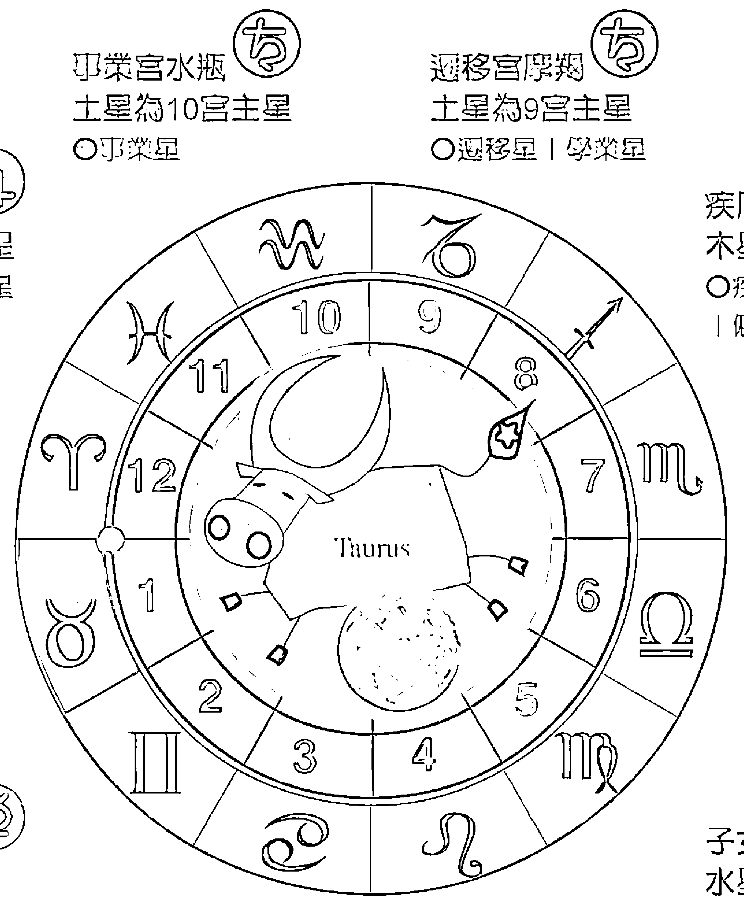

# 第一宮在金牛座：宮主星為金星

○金牛一宮象徵資源的重要性，力求完整與實際的擁有。
人格特質：上升金牛的人通常透過建立物資財力的狀況，來表現他們的潛在能力。價值與實際擁有是他們衡量一切的標準，做任何事時第一考量的是合不合算。看似淡泊名利，實際上一旦認定屬於他們的東西，他們就不會輕易放手。

人生模式：他們傾向以自然、穩定的方式面對他們的人生，具有溫暖大方的天性，並且會用輕鬆的態度來面對人生。會想辦法去獲取所需，然而一旦累積足夠的個人資源，就會變得懶散與揮霍。

外型特徵：他們的特徵強調在肩、脖子、聲音上。整體偏向豐滿、圓潤、厚重，金黃柔和的色系。

# 第二宮在雙子座：宮主星為水星

雙子二宮的人，象徵對價值觀的多元性。善於判斷資訊，會以不同的角度來衡量事物的價值。

價值態度：他們對事物的價值著重在是否多重與新奇，因此容易喜新厭舊，在乎的是花樣多不喜歡一樣東西有好多種不同的風貌。

進財模式：他們會靠實際思考來增加財富，透過與人合作、溝通的方式得到利益。由於價值觀的多面了解，他們會從不同的管道來獲取利益。

# 第三宮在巨蟹座：宮主星為月亮

巨蟹三宮的人會以內斂的方式表現他們的想法，在與外界接觸時特別謹慎。

溝通模式：在與人溝通方面，總是上下波動而不定。他們的溝通模式是累積性的，需要透過熟悉的人為媒介，再進而擴張其資訊網。

兄弟關係：他們對兄弟姊妹的態度就像母親一般，具有保護性。習慣跟陌生人保持距離，但一旦熟了，他們就會對你照顧有加。

# 第四宮在獅子座：宮主星為太陽

獅子四宮象徵家庭的中心地位。喜歡別人進入自己的領域中，展示自己以及他們的地位。

家庭關係：在家庭生活或家人之中，通常可以發揮他們的領導能力。他們在家喜歡當領導者，大家都要聽他的。非常好客，家裡是他們表現的舞台。

家的樣子：家庭環境高貴而且氣派，喜歡明亮開闊的地方。

# 第五宮在處女座：宮主星為水星

處女五宮象徵追求完美的表現，小心翼翼的追求快樂。對於自我的創作過度要求在於細節的掌控上。

戀愛模式：他們談戀愛時非常的龜毛，注重每個細節，要求完美，對每個環節計畫詳細，過份的吹毛求疵，有點神經質。使得他們的男女朋友常常會有不安的感覺。
子女關係：他們對待子女時過於要求完美，他們的子女多半乖巧而且嚴守紀律。

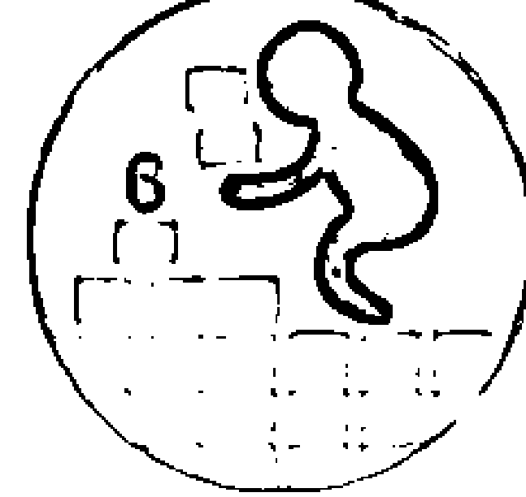

# 第六宮在天秤座：宮主星為金星

○天秤六宮象徵平衡的處理擁有的資源，力求公平與和諧。
工作模式：他們擅於與人一起工作，他們的協調能力良好，在與他人合作的團隊工作上，會營造出和諧的分工關係。
部屬關係：他們對待部屬時力求公正與公平，並且一視同仁，不分高低。
健康狀況：健康上，較容易出現腎臟，過濾系統的問題。

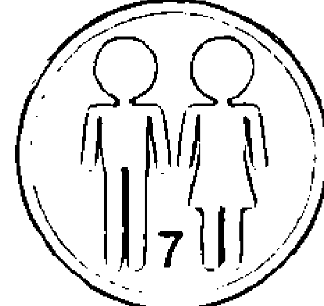

# 第七宮在天蠍座：宮主星為火星 冥王星

○天蠍七宮象徵帶有慾望的合作關係，我的就是我的。他們不善於處理與他人共有利益時的分配。
合作方式：他們只在乎屬於自己的事物，因此不太輕易的與人合作，由於對彼此之間的利害關係過於計較，他們在合作關係中會有嫉妒、控制慾的發生。
配偶形態：因為本身過於實際，他們容易受會將利益分享給他的異性吸引，但是往往事實並非如此，當對方想同時分享他的利益時，彼此相處就會充滿心機而且激烈。他們的另一半多半性感，個性強烈，敢愛敢恨、有點壞壞的味道。

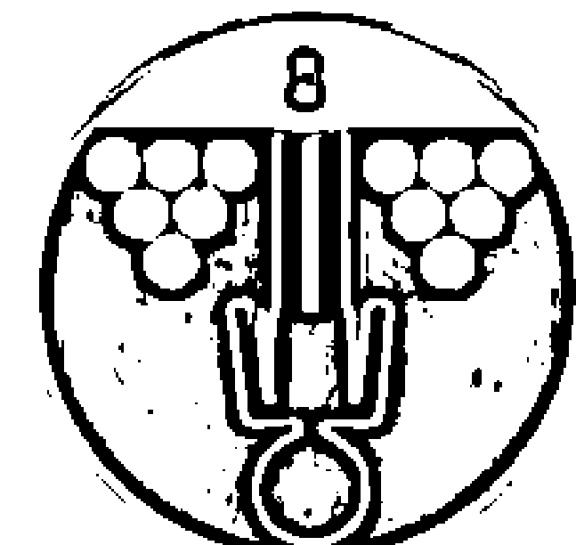

# 第八宮在射手座：宮主星為木星

○射手八宮象徵由他人處擴展，獲取自身的利益，常有可能因繼承而獲得財富。
合夥關係：由於他們總是想著要往更好、更能獲利的地方發展，因此他們會選擇能夠對他們有所助益的人合作。
生死態度：他們對死較為樂觀，會覺得是到另一個未知的領域。
慾望模式：他們對慾望表現直接，在性方面，他們外放不拘，非常豪邁，而且會想往更高層次而不斷換性伴侶的傾向。

# 第九宮在摩羯座：宮主星為土星

○摩羯九宮象徵構築式的擴張，會在某種限制條件完整時才會再往外擴張一步，是一步一腳印的模式。

發展方向：他們通常有向外發展的障礙。在跨越不斷的壓力與艱難中提升自己的層次。

外地態度：面對新環境，在外人面前會讓他們感到拘謹。他們會在外人面前築起一道牆，讓人很難親近。

# 第十宮在水瓶座：宮主星為土星 天王星

○水瓶十宮象徵從舊有中改變進入高點。會在不同的領域中建築新的社會價值。

努力方式：他們重視實質利益，對名聲地位不太重視，對自己的個人實現不同於一般的社會價值，他們會希望自己是創新某種領域中的佼佼者。

事業模式：他們適合在集體分工中，負責獨立性的專業領域。具有特別性與新奇性的事業，例如科學家、發明家、新科技都適合他們。

# 第十一宮在雙魚座：宮主星為木星 海王星

○雙魚十一宮象徵無盡包容的交往，他們通常可以跟任何人成為朋友，不分貴賤。

群體關係：他們在群體中分享一切，容易對人際交往過度的理想化，而有受騙的可能。他們在朋友或社團中會有很多種角色出現，隨著與不同的人接觸，而有不同的變化。

交友狀況：他們的朋友通常很不實際、彼此屬於精神層面的交往。

# 第十二宮在牡羊座：宮主星為火星

○牡羊十二宮象徵衝動的精神狀態，常常會做出令人意想不到的事情。

精神狀況：具有潛在的勇氣，內在精神衝動而率直。他們通常藏不住秘密，對於隱私容易衝動的表現出來。

潛在問題：他們會暗中與人較勁，秘密從事新的活動，他們擅於獨處，容易將事情想的太過單純。他們最大的敵人就是自己。

## Asc at Gemini (上升在雙子座)

上升在雙子座的人，其各宮分布以及各宮主星如圖：

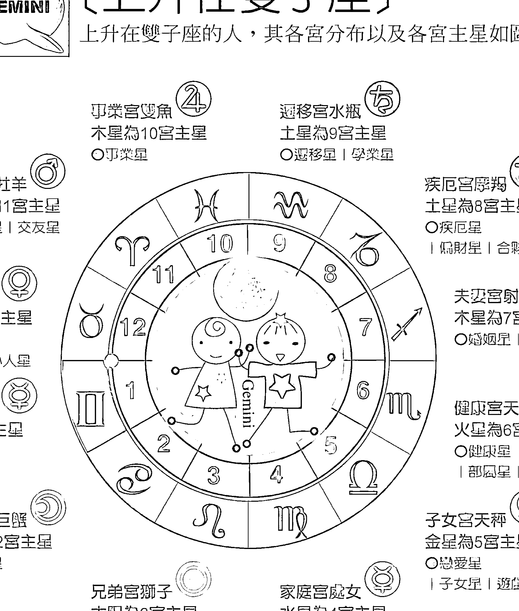

| 宮位 | 星座 | 主星 | 別稱 |
| :--- | :--- | :--- | :--- |
| 事業宮 | 雙魚座 | 木星（10宮主星） | 事業星 |
| 遷移宮 | 水瓶座 | 土星（9宮主星） | 遷移星、學業星 |
| 疾厄宮 | 摩羯座 | 土星（8宮主星） | 疾厄星、偏財星、合夥星 |
| 夫妻宮 | 射手座 | 木星（7宮主星） | 婚姻星、對手星 |
| 健康宮 | 天蠍座 | 火星（6宮主星） | 健康星、部屬星、工作星 |
| 子女宮 | 天秤座 | 金星（5宮主星） | 戀愛星、子女星、遊戲星 |
| 家庭宮 | 處女座 | 水星（4宮主星） | 家庭星 |
| 兄弟宮 | 獅子座 | 太陽（3宮主星） | 兄弟星、溝通星、學習星 |
| 財運宮 | 巨蟹座 | 月亮（2宮主星） | 財運星 |
| 命運宮 | 雙子座 | 水星（1宮主星） | 命運星 |
| 糾紛宮 | 金牛座 | 金星（12宮主星） | 糾紛星、秘密星、小人星 |
| 人際宮 | 牡羊座 | 火星（11宮主星） | 人際星、交友星 |

# 第一宮在雙子座：宮主星為水星

○雙子一宮象徵我的想法決定一切。他們最具力量的本錢，便是他們的聰明才智。

人格特質：頭腦動得很快，能迅速的察覺訊息、反應訊息並傳遞訊息。有很強的好奇心，喜歡接觸各種人事物，以便得到新鮮的刺激經驗。腦部思維很活躍，轉個不停，透過整合各類訊息來源，所以經常會冒出很多具體的想法。

# 第二宮在巨蟹座：宮主星為月亮 ☽

- 巨蟹二宮象徵一點一滴的累積資源，為求取安全感，往往很謹慎的處理資源。
- 價值態度：他們具有的應變能力是獲得利益的工具，具有察覺市場變化的本事，了解市場的需求。他們用錢的方式非常情緒化，對一件物品在意的是是否能引發他們的感覺，因此有將舊東西保留的習慣。
- 進財模式：他們進財方式多半透過積少成多的方式，藉由儲蓄來累積財富。

# 第三宮在獅子座：宮主星為太陽 ☉

- 獅子三宮象徵創造性地思考能力，以表現自我的方式溝通外界，常會有誇大且引人注目的想法。
- 溝通模式：他們會主動而熱情的去接觸新環境，並開始展現自己，成為發號施令或決定意見的人。
- 兄弟關係：他們會慷慨大方的付出，在兄弟中總是扮演著領導者或最耀眼的人。

# 第四宮在處女座：宮主星為水星 ☿

- 處女四宮象徵對自我領域的完美要求，往往在家中反而非常嚴謹。
- 家庭關係：他們斤斤計較屬於他們的領域空間。在家中他們喜歡勞動與服務，他們會把家中整理的井然有序，一絲不苟，家裡工作幾乎由他們一手包辦。
- 家的樣子：家庭環境乾淨、清潔、一絲不苟，非常的精緻。

# 第五宮在天秤座：宮主星為金星 ♀

- 天秤五宮象徵以和諧的方式追求快樂。
- 戀愛模式：他們是最好的情人，注重彼此間的和諧與合作，但是他們戀愛時過於猶豫不決，過份重視彼此間的公平性。他們對社交有興趣，喜歡享受合作的樂趣。
- 子女關係：他們公正的對待子女，把他們當作伙伴，他們的子女多半優雅，善於與人合作。

# 第六宮在天蠍座：宮主星為火星 冥王星

- 天蠍六宮象徵為了原慾而努力付出，健康狀況會受到他們自己對欲望表達的強烈影響。
- 工作模式：他們對深沉、不為人知的工作很有興趣。他們工作時，投入大量的情緒與精力，對工作有一股強大的執著。
- 部屬關係：他們對工作時的利害關係了解清楚，對待部屬時會想完全主宰對方。
- 健康狀況：他們慾念過強，要多注意性器官的問題。

# 第七宮在射手座：宮主星為木星

- 射手七宮象徵他們最缺乏的就是直接而單純的目標，由於他們多變的特性，他們會傾向與單純的人合作。
- 合作方式：他們喜歡與樂觀而且大方的人合作。因為他們本身較為膚淺，因此會重視對方的道德與智慧，是否能增廣他們的視野。
- 配偶形態：他們的婚姻多半幸福，配偶個性樂觀積極，慷慨大方，外向有活力。他們也常有跟外國人結婚的傾向。

# 第八宮在摩羯座：宮主星為土星

- 摩羯八宮象徵對原慾的自我限制。
- 合夥關係：他們會認真的去看待與他人分享的利益，因為他們總在這個過程中吃虧，得不到好處。
- 生死態度：他們對死的看法較為嚴肅，而且悲觀。他們總是認真的開始一件事，然後努力的建構到結束。
- 慾望模式：他們會很艱困的去實現自己的慾望，甚至會壓抑。他們對性保守，經常壓抑，有性冷感的傾向。

# 第九宮在水瓶座：宮主星為土星 ♄ 天王星 ♅

- 水瓶九宮象徵以反傳統的方式發展自我，對於異國的文化有強烈的好奇心。
- 發展方向：他們會向外發展以尋求改變。他們樂於與人群接觸，但卻會與人保持疏離。
- 外地態度：他們在外人面前顯得難以捉摸、特立獨行。他們會在不斷的改變與創新中提升自我的層次。

# 第十宮在雙魚座：宮主星為木星 ♃ 海王星 ♆

- 雙魚十宮象徵虛幻的社會地位，在事業方面，這些人會顯出不切實際的樣子。
- 努力方式：對於社會地位，他們有超凡脫俗、愛幻想的傾向，不太關心社會的評價，會從事不太實際的事業，希望能為世界犧牲奉獻。
- 事業模式：他們適合發揮想像力或感性的事業，也可能牽扯到一些神秘的事件。有時會遊手好閒、無所事事。例如慈善家、社工、醫師。

# 第十一宮在牡羊座：宮主星為火星 ♂

- 牡羊十一宮象徵在人群中積極表現自我。
- 群體關係：他們在社團中非常活躍，對有競爭性的社團活動充滿興趣，會積極的從事新社團的事務。
- 交友狀況：他們對待朋友時主觀而自我，喜歡結交新朋友，認識新朋友時會將舊朋友暫時忘在一邊，有喜新厭舊的傾向。

# 第十二宮在金牛座：宮主星為金星 ♀

- 金牛十二宮象徵執著物慾的心靈，在潛意識中對於物質生活充滿欲求。
- 精神狀況：他們對於自己的隱私是不容許他人侵犯的，私底下，他們對物質慾望有所期待。他們會在暗中一步步的達成他們的秘密想法。他們的夢想多半很實際。
- 潛在問題：他們具有潛在固執的特性，實際而且執著，最想逃避的就是受到物慾需求的控制。

## Asc at Cancer（上升在巨蟹座）

上升在巨蟹座的人，其各宮分布以及各宮主星如圖：

| 宮位名稱 | 主星/別名 |
| :--- | :--- |
| 事業宮牡羊 | 火星為10宮主星 ○事業星 |
| 人際宮金牛 | 金星為11宮主星 ○人際星 \| 交友星 |
| 細神宮雙子 | 水星為12宮主星 ○細神星 \| 秘密星 \| 小人星 |
| 命運宮巨蟹 | 月亮為1宮主星 ○命運星 |
| 財運宮獅子 | 太陽為2宮主星 ○財運星 |
| 兄弟宮處女 | 水星為3宮主星 ○兄弟星 \| 溝通星 \| 學習星 |
| 家庭宮天秤 | 金星為4宮主星 ○家庭星 |
| 子女宮天蠍 | 火星為5宮主星 ○戀愛星 \| 子女星 \| 遊戲星 |
| 健康宮射手 | 木星為6宮主星 ○健康星 \| 部屬星 \| 工作星 |
| 夫妻宮摩羯 | 土星為7宮主星 ○婚姻星 \| 對手星 |
| 疾厄宮水瓶 | 土星為8宮主星 ○疾厄星 \| 偏財星 \| 合夥星 |
| 遷移宮雙魚 | 木星為9宮主星 ○遷移星 \| 學業星 |

# 第一宮在巨蟹座：宮主星為月亮

- 巨蟹一宮象徵一切以感覺為主。
- 人格特質：上升巨蟹的人通常有反覆無常的感情，投入大量的精力在自己的感覺上。同類意識非常強，有開懷和照顧別人的母性本能，但內心卻很敏感且容易受到傷害。有排他性，對於自己人與他人會劃出一道無形的領域範圍，常處在自我防衛的狀態。
- 人生模式：他們的感覺敏銳，也以這樣的方式來處理人生。將感情和自己本身視為一體，全憑自己的感受來判斷一切，對安全感極為在乎，一旦感情遭到傷害，可能要拖很久才能撫平傷痛。
- 外型特徵：他們的特徵主要強調在胸部。整體偏向圓而短小、柔軟，顏色偏白。

# 第二宮在獅子座：宮主星為太陽

- 獅子二宮象徵以權力名聲來獲取資源，樂於付出金錢以使自我受人注目。
- 價值態度：為了自我的尊嚴，他們努力的賺錢。對他們來說，錢是用來表現自我力量的工具，他們會將錢花在讓自己更有價值的事物上，重視事物的表面，對名牌特別的偏好。
- 進財模式：他們多半利用權力、名聲來得到利益，尤其是外表光鮮亮麗的。

# 第三宮在處女座：宮主星為水星

- 處女三宮象徵以謹慎的方式與外界接觸，往往會透過書信文件等處理過的資訊來表達心中想法。
- 溝通模式：當接觸外界時，常常過於謹慎而且小心。對資訊會先行消化再傳達出去，因此能夠清晰、精確的表達自己的想法。
- 兄弟關係：與兄弟姊妹間會專注在小事上，對兄弟姊妹過於苛求而且吹毛求疵。

# 第四宮在天秤座：宮主星為金星

- 天秤四宮象徵領域內的平衡，在他們的想法中，家人就像合夥人的關係一樣，特別強調公正性。
- 家庭關係：他們和人共有領域時，重視彼此間的合作與協調。因此在家中他們多是配合的一方。他們對待家中的每一個人都力求公正與平等。
- 家的樣子：家庭環境雅緻而有質感，具藝術設計感，並且重視協調性，和平與寧靜。

# 第五宮在天蠍座：宮主星為火星 冥王星

- 天蠍五宮象徵原慾式的快樂表現，他們的快樂建立在強烈的感情釋放上，對人心的深層及性有興趣，容易沈溺於官能肉欲之中。
- 戀愛模式：他們戀愛時轟轟烈烈，愛恨交織，占有欲強，過分的投入感情，他們的戀愛多半與性脫不了關係。
- 子女關係：他們對子女付出強烈的感情，但是太強烈的支配欲常造成子女的壓力，他們的子女多半深沉但是性格強烈。

# 第六宮在射手座：宮主星為木星

- 射手六宮象徵以擴張的方式努力服務，他們對服務他人不自私，並且從中得到自信。
- 工作模式：他們總是慷慨大方的服務他人，他們喜歡自由自在、不受拘束的工作，或是能讓他們增加視野的工作。是屬於工作時肯吃苦耐勞的人。
- 部屬關係：他們對待下屬寬大而且常不辭辛苦的貢獻心力。
- 健康狀況：在健康方面，要多注意大腿的部份。

# 第七宮在摩羯座：宮主星為土星

- 摩羯七宮象徵謹慎的交往，由於他們本身極為情緒化，因此會受實際穩重的人吸引。
- 合作方式：他們不善於與他人合作，總是小心謹慎，與人有隔閡。害怕與他人相處。在建立和別人合夥的關係時，會小心翼翼地有所保留。
- 配偶形態：他們對婚姻非常謹慎而保守，通常很晚婚。他們受努力，老成穩重的人所吸引，他們也會為了得到地位而結婚。他們的另一半通常年紀較大，要不就是感覺傳統守舊。

# 第八宮在水瓶座：宮主星為土星 天王星

- 水瓶八宮象徵顛覆性的原慾，以反抗傳統的方式解決需求。
- 合夥關係：他們會在分享利益時採用獨特的方式，基本上，他們不喜歡與人共有利益。
- 生死態度：對死的看法獨特，往往具有感應的能力。他們會讓事情結束改變後，重新開始。
- 慾望模式：他們會有許多特別的方式表達自己的慾望，他們其實很悶騷，在性方面，喜歡違反傳統的方式。

# 第九宮在雙魚座：宮主星為木星 海王星

- 雙魚九宮象徵精神性的擴張。對於未知的領域心生嚮往。
- 發展方向：他們會以強大包容力不斷的在精神、心靈相關的領域發展，提升自我的層次。
- 外地態度：他們對外充滿著幻想，他們容易感染外界的一切，像隻變色龍一般，調整自己來適應周圍。面對外人時，他們會不清楚自己的定位。

# 第十宮在牡羊座：宮主星為火星

- 牡羊十宮象徵個人為主的事業，對於個人聲望相關的事情，他們會顯得非常地有衝勁。
- 努力方式：他們拼命的追求社會地位，努力的與他人競爭。他們擅於開創新局，通常是一個事業的開拓先鋒。
- 事業模式：他們適合以個人主導或具有競爭性質的事業，多不適合守成。例如專業技術人員、軍人、創意家。

# 第十一宮在金牛座：宮主星為金星

- 金牛十一宮象徵具有實質利益的群體關係，他們往往先透過價值判斷來決定人際關係。
- 群體關係：他們很容易受到地位穩固而且富裕的人吸引。對於自然、藝術性的社團中感到悠然自得。
- 交友狀況：他們喜歡跟溫和而且實際的人交朋友，不喜歡太複雜的人際關係。有跟有錢人交朋友的傾向，因為他們傾向將朋友當作他們的資源。

# 第十二宮在雙子座：宮主星為水星

- 雙子十二宮象徵多變的心靈，由於精神上的多重變化，常造成心神上的矛盾。
- 精神狀況：他們在暗地裡用心思考。他們通常有很多的秘密，經常會話中帶話，讓人不清楚他真正的意思，他們有私下與人聯絡的傾向，也常自言自語。
- 潛在問題：他們在情感上往往只透露部分感受，將所有應該藏於內心的保留不說。最大的隱憂就是與他人溝通上的問題。

## Asc at Leo（上升在獅子座）

上升在獅子座的人，其各宮分布以及各宮主星如圖：

| 宮位名稱 | 主星/別名 |
| :--- | :--- |
| 事業宮金牛 | 金星為10宮主星 ○事業星 |
| 遷移宮牡羊 | 火星為9宮主星 ○遷移星 \| 學業星 |
| 人際宮雙子 | 水星為11宮主星 ○人際星 \| 交友星 |
| 疾厄宮雙魚 | 木星為8宮主星 ○疾厄星 \| 偏財星 \| 合夥星 |
| 糾神宮巨蟹 | 月亮為12宮主星 ○糾神星 \| 秘密星 \| 小人星 |
| 夫妻宮水瓶 | 土星為7宮主星 ○婚姻星 \| 對手星 |
| 命運宮獅子 | 太陽為1宮主星 ○命運星 |
| 健康宮摩羯 | 土星為6宮主星 ○健康星 \| 部屬星 \| 工作星 |
| 財運宮處女 | 水星為2宮主星 ○財運星 |
| 子女宮射手 | 木星為5宮主星 ○戀愛星 \| 子女星 \| 遊戲星 |
| 兄弟宮天秤 | 金星為3宮主星 ○兄弟星 \| 溝通星 \| 學習星 |
| 家庭宮天蠍 | 火星為4宮主星 ○家庭星 |

# 第一宮在獅子座：宮主星為太陽

- 獅子一宮象徵一切以自我表現為目的。
- 人格特質：你有自我表現的熱情，喜歡呈現出自信和尊貴的樣子，希望成為大家注意的焦點。只要是自己覺得恰當的事，就一定要表達出自己的意見。明朗、開放且充滿自信，不論走到哪裡，都會給人一種華麗的印象。
- 人生模式：他們非常在乎是否成為焦點，因此也成為他們面對人生的處理方式，有股很強的願望，總希望大家都注視著你，會熱情的將自我表現出去，希望成為眾人所崇拜的中心象徵。
- 外型特徵：他們的特徵主要強調在背部，整體偏向高大而壯碩，捲曲，金黃色。

# 第二宮在處女座：宮主星為水星

- 處女二宮象徵精打細算的價值觀，他們善於整理與規劃身邊的資源應該如何的運用。
- 價值態度：對金錢的運用一絲不苟，非要把每一分錢都花在刀口上。他們用錢非常仔細而有計劃，對一件物品，他們一定經過非常仔細的評估，他們非常重視一件事物的細節與精緻度。
- 進財模式：他們很會運用資源，善於運用他人為自己工作來得到利益。

# 第三宮在天秤座：宮主星為金星

- 天秤三宮象徵平衡的溝通模式，以合作的方式分享資訊。
- 溝通模式：他們喜歡合作，也喜歡接觸人群。當表達自己的想法時，常常考慮許久，以求得平衡。
- 兄弟關係：他們對待兄弟姐妹總是力求公正，並且會盡可能的配合對方。

# 第四宮在天蠍座：宮主星為火星 冥王星

- 天蠍四宮象徵完全控制的自我領域，在家中主導一切事務。
- 家庭關係：他們有侵占他人領域的傾向。在認定為自己的地盤上經常蠻橫不講理，而且習慣於主宰一切，他們喜歡搞家庭鬥爭，經常對家人生氣地吼叫。
- 家的樣子：他們總會弄出完全屬於自己的空間，需要一個私人的角落。家裡多半隱密或有地下室。

# 第五宮在射手座：宮主星為木星

- 射手五宮象徵完全放任的追求快樂，只要能夠讓自己快樂的事，他們就會不顧一切的去完成。
- 戀愛模式：他們的戀愛直接而不拐彎抹角，他們通常不是好的情人，當發現目標不對，馬上掉頭，他們喜歡接觸異國文化，所以常會有異國戀情發生。他們熱愛探險，也喜歡追逐刺激。
- 子女關係：他們對待子女寬大而且幾乎到放任的地步，他們的子女則生性開朗，整天往外跑。

# 第六宮在摩羯座：宮主星為土星

- 摩羯六宮象徵盡心盡力的努力服務，只要一投入工作，他們就一定會盡全力工作，是工作時很有組織能力的人。
- 工作模式：他們對工作認真而且任勞任怨，能夠忍受各種壓力，適合有組織計劃的任務。
- 部屬關係：工作時他們過度嚴以律己，對部屬同樣要求嚴厲，嚴肅而不苟言笑。
- 健康狀況：在健康上要注意骨骼方面的問題。

# 第七宮在水瓶座：宮主星為土星 天王星

- 水瓶七宮象徵獨特性的合作關係，由於本身喜歡別人以其為中心，因此他們會特別喜歡特立獨行，不愛出風頭的人。
- 合作方式：他們雖然重視團體，但是不喜歡與人配合，只想他人配合自己。在合作關係中，依然追求個人自我特質的表現。不論是在何種狀況下與人合作，他們都希望自己是中心人物。
- 配偶形態：他們對配偶的感覺像朋友，會受特立獨行的人所吸引，有喜歡比自己小很多的對象的傾向。他們的另一半通常是古靈精怪而且與眾不同。

# 第八宮在雙魚座：宮主星為木星 海王星

- 雙魚八宮象徵模糊不清的原慾，他們的慾望往往是來自未知的潛意識，非常的夢幻。
- 合夥關係：他們與他人共享利益時，總是不清不楚，容易侵占他人的利益，相反的也容易被人侵占。
- 生死態度：他們對生死間的界線模糊，會逃避這一類的問題，他們對事情的開始與結束完全是模糊不清的。
- 慾望模式：他們的慾望過於虛幻，自己都不太清楚，在性方面，他們過於理想化，常搞不清自己為什麼要做。

# 第九宮在牡羊座：宮主星為火星

- 牡羊九宮象徵原始本能的開展，他們憑藉本能來瞭解人世萬物的道理，以此方式來拓展自我。
- 發展方向：他們會發展自我的領域，在不斷的競爭中提升自我的層次。在全新的領域中創造與發展。
- 外地態度：他們像初生之犢般的對新的領域好奇而且積極。在外面非常活躍，喜歡冒險，他們會將好爭鬥的部份表現在對外。

# 第十宮在金牛座：宮主星為金星

- 金牛十宮象徵創造實質利益的事業，他們是比較偏愛名望與財富的人。因為這些實質利益能讓他們擁有更高貴更尊嚴的形象。
- 努力方式：他們會為了建立自己的高水準生活，而拼命的賺錢。他們會希望自己是一個在各方面都安全、穩定的人。
- 事業模式：他們適合穩重、安定發展的事業，能夠累積實質的價值。

# 第十一宮在雙子座：宮主星為水星

- 雙子十一宮象徵多變的人際關係，他們會借由跟不同層面的人交往來獲得各式各樣的消息，幫助他們得到希望具有的力量。
- 群體關係：他們會學習由不同朋友中所得到不同的觀點，擅於在社團或朋友中當聯絡人，他們對能讓他們得到資訊的社團活動感到興趣。
- 交友狀況：他們特別愛交朋友，從朋友的交往中能讓他們得到各種新知。尤其是聰明、有智慧的朋友。

# 第十二宮在巨蟹座：宮主星為月亮

- 巨蟹十二宮象徵情緒化的心靈，他們是情緒化而且易受到傷害的，往往具有令人無法置信的脆弱內心感情世界。
- 精神狀況：他們經常將自己內在封閉起來，害怕別人侵犯到他們的隱私。他們會將自己的秘密一層層的包起來，很情緒化的編織他們的夢。
- 潛在問題：他們具有潛在的不安全感，情緒上的不穩定。往往他們都有不為人知的家族密辛。

## Asc at Virgo （上升在處女座）

上升在處女座的人，其各宮分布以及各宮主星如圖：

事業宮雙子 水星為10宮主星 ◎事業星
遷移宮金牛 金星為9宮主星 ◎遷移星 | 學業星
疾厄宮牡羊 火星為8宮主星 ◎疾厄星 | 偏財星 | 合夥星
夫妻宮雙魚 木星為7宮主星 ◎婚姻星 | 對手星
健康宮水瓶 土星為6宮主星 ◎健康星 | 部屬星 | 工作星
子女宮摩羯 土星為5宮主星 ◎戀愛星 | 子女星 | 遊戲星
家庭宮射手 木星為4宮主星 ◎家庭星
兄弟宮天蠍 火星為3宮主星 ◎兄弟星 | 溝通星 | 學習星
財運宮天秤 金星為2宮主星 ◎財運星
命運宮處女 水星為1宮主星 ◎命運星
精神宮獅子 太陽為12宮主星 ◎精神星 | 秘密星 | 小人星
人際宮巨蟹 月亮為11宮主星 ◎人際星 | 交友星

# 第一宮在 處女座：宮主星為水星

◎處女一宮象徵一切以義務與服務為主。

人格特質：他們非常重視自己的義務，對於命令特別遵從。心思非常細膩，具有極敏銳的觀察力，對於比較現實實際的事情，具有非常尖銳而且理性的反應。不會浪費時間在不實際的計畫上面，愛好乾淨，幾近於神經質，沒有任何微小的細節可以逃過他們的法眼，認真而有潔癖。

人生模式：他們是很有階級觀念的，具有使命感，認同屬於自我的任務，以這樣的態度來面對人生。會用吃苦耐勞的心態來服務別人，以得到別人的肯定和讚許。

外型特徵：他們的特徵主要強調在腹部，整體偏向細緻、小巧、乾淨，暗褐色。

# 第二宮在天秤座：宮主星為金星

○天秤二宮象徵互相分享資源，他們賺錢或經營的方式很不穩定，大部分取決於合作的對象。

價值態度：他們用錢的方式很不穩定而且不乾脆，在意的是一樣物品是否合乎價值，因而不斷的比較、貨比三家。對協調、美好的事物有所偏好。過於執著價值的合理與否，常常讓他們不清楚是否符合自己的需要。

進財模式：他們進財方式多半透過與他人的合作，以爲人作嫁的方式獲取利益。

# 第三宮在天蠍座：宮主星為火星 冥王星

○天蠍三宮象徵深層透徹的溝通模式，他們通常能通徹的理解所獲取的資訊的深度含意。

溝通模式：當接觸外界時，他們總會先瞭解整體利害關係後，才會深入。不太喜歡說話，不過一旦說話，總是一針見血。

兄弟關係：他們對兄弟姊妹的情感強烈，也充滿心機，容易有忌妒心。

# 第四宮在射手座：宮主星為木星

○射手四宮象徵沒有邊界的領域，他們比較沒有地域觀念，也可能很少在家，總是往外跑。

家庭關係：他們會不斷的擴張自我的領域，也不在乎別人進入他的領域中。在家中特別輕鬆，知道要如何使家中的人和睦相處。

家的樣子：他們尤其喜歡一個很寬廣的場地，家裡多半寬敞，能清楚看到所有的擺飾。

# 第五宮在摩羯座：宮主星為土星

○摩羯五宮象徵有節制的快樂，他們喜歡較嚴肅或需要深思的遊戲，或是經過設計的娛樂方式。

戀愛模式：對戀愛非常認真而且謹慎，他們對感情負責任，而且相當的保守，他們的戀情多半是苦戀，他們喜歡一個人時，即使對方不喜歡，也會堅忍不拔的持續下去。

子女關係：他們對子女的期望非常高，管教嚴格，他們的子女多半規矩、吃苦耐勞。

# 第六宮在 水瓶座：宮主星為 土星 天王星

○水瓶六宮象徵獨創性的努力付出，他們通常知道有效執行工作的方法，擁有獨創性的風格。

工作模式：他們對工作具有獨立創新的能力，在一個團隊中負責其中一個特別的任務，對工作時的個人自由發揮非常重視。

部屬關係：他們對待下屬就像朋友一樣，講求團隊合作，喜歡和別人一起合力完成工作。

健康狀況：健康上，要注意小腿的問題。

# 第七宮在 雙魚座：宮主星為 木星 海王星

○雙魚七宮象徵沒有界限的合作關係，由於他們本身過於理性，缺乏包容性，因此會受這樣的人吸引。

合作方式：他們透過與人合作了解感情，學習沒有界線、沒有階級的交往，以及犧牲自我的利益去配合對方的精神。

配偶形態：他們對另一半充滿不實際的幻想。容易受浪漫，有夢想的人所吸引。他們的配偶多半個性模糊，不切實際。感情異常豐富。

# 第八宮在 牡羊座：宮主星為 火星

○牡羊八宮象徵直接而原始的慾望，他們像個人生的僕人，受到種種義務的制約。所以實際上，他們最大的慾望就是成就自我。

合夥關係：他們容易在與他人錢財上有所爭執，會積極的爭取到自己的利益。

生死態度：他們常因過於衝動而發生意外，改變了一生。總是急躁的開始然後迅速的結束。

慾望模式：他們在表現慾望時直接而急躁，對性方面過於衝動，但是經常開頭很熱，但一下子就冷卻了。

# 第九宮在金牛座：宮主星為金星

○金牛九宮象徵實質有利的發展，他們追求極致的價值，除非有利可圖，他們才會積極的對外發展。

發展方向：除非認為有價值，他們不會主動去向外發展。他們喜歡美麗與實用的東西，喜歡接觸大自然。他們會不斷的去提升自我價值的層次。

外地態度：他們對外是慵懶而且不積極的。在外表現出溫和的態度，面對外人時也多半被動。

# 第十宮在雙子座：宮主星為水星

○雙子十宮象徵人生目標的多元性，追求可以展現他們思考價值的地位。

努力方式：他們會讓大家肯定他們的才能，努力的用盡腦力以達成目標。他們的人生目標多變，因此往往同時經營二個以上的事業。

事業模式：他們適合從事動腦及傳播方面的工作，來滿足分析批判的渴望。如作家、新聞業者、傳播業者。

# 第十一宮在巨蟹座：宮主星為月亮

○巨蟹十一宮象徵有感情的人際關係，在與他人的交往中，他們多半會投入感情。

群體關係：對他們所居的小團體或組織，他們很容易投入深厚的情感。對於跟家有關，令他們感到溫馨的社團特別感興趣。

交友狀況：他們喜歡跟朋友像家人一般，喜歡請朋友到家中作客，他們特別念舊，珍惜與朋友間的回憶。

# 第十二宮在獅子座：宮主星為太陽

○獅子十二宮象徵光明高尚的心靈，他們多半具有源源不斷的精神能量，擁有高貴的心理特質。

精神狀況：他們有潛在的創造力與充沛的精神。對於自己的隱私他們較不保留，甚至會想拿出來炫耀。

潛在問題：他們會在私底下認為自己最了不起。害怕別人看不起自己是他們最大的弱點。實際上，他們非常自卑。

## Asc at Libra （上升在天秤座）

上升在天秤座的人，其各宮分布以及各宮主星如圖：

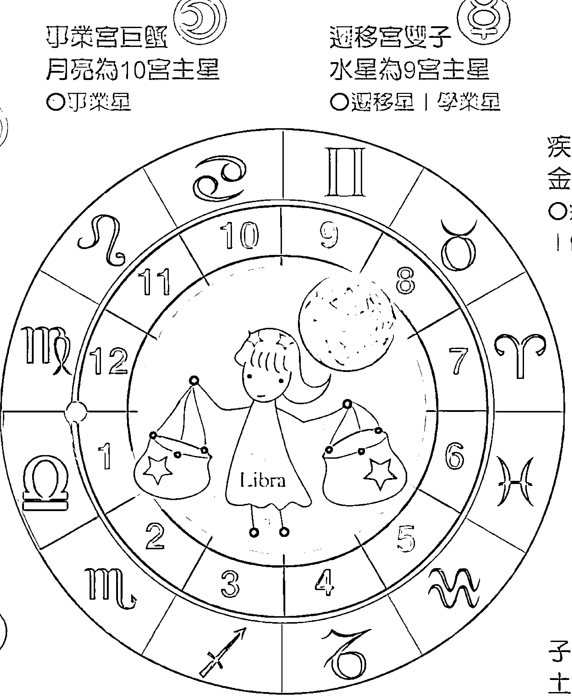

事業宮巨蟹 月亮為10宮主星 ○事業星
遷移宮雙子 水星為9宮主星 ○遷移星 | 學業星
人際宮獅子 太陽為11宮主星 ○人際星 | 交友星
疾厄宮金牛 金星為8宮主星 ○疾厄星 | 偏財星 | 合夥星
精神宮處女 水星為12宮主星 ○精神星 | 秘密星 | 小人星
夫妻宮牡羊 火星為7宮主星 ○婚姻星 | 對手星
命運宮天秤 金星為1宮主星 ○命運星
健康宮雙魚 木星為6宮主星 ○健康星 | 部屬星 | 工作星
財運宮天蠍 火星為2宮主星 ○財運星
子女宮水瓶 土星為5宮主星 ○戀愛星 | 子女星 | 遊戲星
兄弟宮射手 木星為3宮主星 ○兄弟星 | 溝通星 | 學習星
家庭宮摩羯 土星為4宮主星 ○家庭星

# 第一宮在 天秤座：宮主星為金星

○天秤一宮象徵一切合作為考量。

人格特質：他們具有很好的社交能力，追求自我和他人的平衡，為了跟別人建立和諧的關係，做出很多不必要的妥協和讓步。本身散發高雅的品味、和諧的氣氛和細緻的質感，追求理性和感性的平衡運作。內心容易在兩極之間擺盪，表現出很多不確定的態度、矛盾的心情與模稜兩可。

人生模式：他們必須要透過與別人合作的過程，才能發覺自己的獨特性。所以會以這樣的態度面對人生，從別人的反應，表現出自己的特性。

外型特徵：他們的特徵主要強調在腰部，整體偏向比例均勻適中、薄而輕、優雅，顏色偏淡藍。

# 第二宮在天蠍座：宮主星為火星 冥王星

○天蠍二宮象徵隱藏的財富，他們通常獨具慧眼，能夠發現事物隱藏的巨大利益。

價值態度：他們在乎一件物品是否有潛在的利益，因此會將錢花在高於實際價值的物品上，他們也會花錢來滿足自己的控制慾。

進財模式：具有將他人認為無用的東西轉變成有價值物品的能力，他們具有一夜致富的能力，有獲得他人錢財的能力。

# 第三宮在射手座：宮主星為木星

○射手三宮象徵來自不同環境的訊息，他們會主動的去跟陌生的環境發生聯繫。

溝通模式：他們天生喜歡接觸陌生的環境，從不同的領域獲取所需的資訊。尤其是外國或陌生的地方。因此他們常會接到遠方朋友的訊息。

兄弟關係：他們對待兄弟姐妹豪爽而且大方，表達時直接而不保留。

# 第四宮在摩羯座：宮主星為土星

○摩羯四宮象徵穩固的領域範圍，他們會將屬於自己的領域實質化，構築一道清楚的高牆。

家庭關係：他們對自我的領域極為重視，並且不斷的鞏固，費心將家中一切規律化。在家裡他們通常嚴肅而且沈默，家人往往成為他們的壓力。

家的樣子：他們對家的結構穩固，家的外面通常有高牆，給人堅固而且嚴肅的感覺。

# 第五宮在水瓶座：宮主星為土星 天王星

○水瓶五宮象徵追求與眾不同的快樂，他們通常會在一些特殊的事物、團體活動之中獲得極大的樂趣。

# 第六宮在 雙魚座：宮主星為木星 海王星

○雙魚六宮象徵無私的努力服務，他們能不自私地獻身於服務及勞動工作。

工作模式：他們天生具有犧牲服務的特性，對脫離現實的工作有興趣，他們工作時容易混亂，分不清責任的歸屬。

部屬關係：他們對屬下極具同情心，而且容易為他們擔憂太多。他們往往一個人承擔太多事情，最後超過自己的處理範圍，陷入憂鬱而逃避責任。

健康狀況：健康方面，要多注意腳部的問題。

# 第七宮在 牡羊座：宮主星為火星

○牡羊七宮象徵缺乏自我主導性，他們會透過他人的決定表達自己的意志，然而實際上他們早已決定好，只是透過別人的嘴說出來而已。

合作方式：他們本身沒有主見，因此非常積極的與人合作，會受有點自我、直接而略帶魯莽的人吸引，合作時多半受對方主導。

配偶形態：他們喜歡做事直接而不拖泥帶水的配偶，彼此相處時常常有爭執。他們的配偶多半性格急躁，心思單純。

# 第八宮在 金牛座：宮主星為金星

○金牛八宮象徵對物質的慾望，他們的慾望非常實際，也非常現實，對於美麗事物過度熱愛。

合夥關係：他們對金錢財富具有強烈的需求，在與人分享利益時會很實際，而且絕對算的清清楚楚。

生死態度：他們一般都能安詳的結束一生，通常會平靜的開始一件事，慢慢的結束。

慾望模式：他們對自己的慾望表現的並不積極，但是會非常實際的去獲取，在性方面，他們有重肉慾的傾向。

# 第九宮在 雙子座：宮主星為水星

○雙子九宮象徵多重的發展，他們不斷的思考以不同的模式來提升自我的層次。

發展方向：他們通常對不同的世界充滿好奇心，因此會同時往不同的陌生領域拓展自己的視野。

外地態度：他們對外面的世界充滿好奇，喜歡接觸各種不同的領域。他們在外面像只花蝴蝶般，變化多端。而且適應力強，不斷的探究。

# 第十宮在 巨蟹座：宮主星為月亮

○巨蟹十宮象徵一點一滴的累積社會地位，他們會設定一個範圍，然後開始在這個範圍累積實力，建立名聲。

努力方式：他們對地位與名聲非常敏感，會一步步的累積實力，希望成為別人心中認為是負責、值得尊敬的人。

事業模式：他們的事業與家庭之間有很密切的關係。他們適合較感性的工作，最好跟家有關。例如餐飲業者、廚師、家庭看護。

# 第十一宮在 獅子座：宮主星為太陽

○獅子十一宮象徵以名氣決定人際關係，他們會盡力培養一些有影響力的朋友，來尋得外來的助力。

群體關係：在人群社團中希望成為中心人物。對於能夠讓他們名氣大增，表現創造力的社團，他們都會積極參與。

交友狀況：他們喜歡跟有權勢的人交往，會用朋友的成就來突顯自己。他們在朋友面前喜歡裝老大。

# 第十二宮在 處女座：宮主星為水星

○處女十二宮象徵過度挑剔的心靈，他們往往會精神緊張，對於一些瑣碎小事過度的憂慮。

精神狀況：他們會不自覺的過份擔心細節。他們非常在意自己的隱私，自我要求完美。會很謹慎的處理自己的秘密，完全不讓他人有可乘之機。

潛在問題：他們的夢則過於要求完美。他們最大的問題是會有莫名的潔癖，甚至是精神官能症。

## Asc at Scorpio (上升在天蝎座)

上升在天蝎座的人，其各宮分布以及各宮主星如圖：

1. 事業宮獅子 - 太陽為10宮主星 - ○事業星
2. 遷移宮巨蟹 - 月亮為9宮主星 - ○遷移星 | 學業星
3. 疾厄宮雙子 - 水星為8宮主星 - ○疾厄星 | 偏財星 | 合夥星
4. 夫妻宮金牛 - 金星為7宮主星 - ○婚姻星 | 對手星
5. 健康宮牡羊 - 火星為6宮主星 - ○健康星 | 部屬星 | 工作星
6. 子女宮雙魚 - 木星為5宮主星 - ○戀愛星 | 子女星 | 遊戲星
7. 家庭宮水瓶 - 土星為4宮主星 - ○家庭星
8. 兄弟宮摩羯 - 土星為3宮主星 - ○兄弟星 | 溝通星 | 學習星
9. 財運宮射手 - 木星為2宮主星 - ○財運星
10. 命運宮天蠍 - 火星為1宮主星 - ○命運星
11. 精神宮天秤 - 金星為12宮主星 - ○精神星 | 秘密星 | 小人星
12. 人際宮處女 - 水星為11宮主星 - ○人際星 | 交友星

# 第一宮在 天蠍座 ： 宮主星為火星 冥王星

○天蠍一宮象徵一切原慾為主。

人格特質：雖然有點沈默寡言的樣子，但別人能感受到你藏有強烈的情感深度。他們具有充沛的體力以及堅強的意志力，一旦下定決心，他們便會將巨大、專注的情感投注下去，對自己的事情很隱密，也不想讓別人瞭解自己的狀態。佔有慾很強，也很重視性慾的滿足。

人生模式：他們是為了達成自己的慾望可以拿生命做賭注的人，原始的慾望是主導他們的動力。強大的內在力量，容易積存大量嫉妒和報復的衝動。

外型特徵：他們的特徵主要強調在生殖器上，整體偏向有稜有角，顏色深紅。

# 第二宮在射手座：宮主星為木星

○射手二宮象徵從不同的領域獲取資源，他們能夠清楚的找到讓自己獲取利益的目標。能夠快速的擴張自己的資源。

價值態度：他們財運很好，知道增加財富的方法。用錢非常乾脆，看準目標就用。他們善於運用金錢來拓展行動的範圍，以達到目的。對一件事物的價值重視在是否能增加自己的視野與層次。

進財模式：他們有喜歡異國事物的傾向，同時，他們也有在外地發財的特質。

# 第三宮在摩羯座：宮主星為土星

○摩羯三宮象徵謹慎的溝通模式，他們總是有計畫的表達自己的想法，如果沒有非常明確的動機，他們是不會隨便與人接觸。

溝通模式：表達內心想法時，格外的小心謹慎。他們不擅於與人相處，說話時極為保守而且無趣，基本上他們不太說話。

兄弟關係：他們總是在兄弟姊妹之間築起一道無形的牆，總是以嚴肅的態度與他們相處。

# 第四宮在水瓶座：宮主星為土星 天王星

○水瓶四宮象徵不停改變的領域環境，他們經常改變自己的領域，尋求不尋常而具有特色的居家環境。

家庭關係：他們期待家人像朋友而且崇尚自由，他們的家人常會有出人意表的舉動，雖然好客但不喜歡到朋友家。

家的樣子：他們經常搬家或改變家庭布置。家裡的樣子具未來感，很有獨特性。

# 第五宮在雙魚座：宮主星為木星 海王星

○雙魚五宮象徵夢幻般的快樂，他們喜歡作夢，對精神性、神秘的事物特別有興趣。在虛幻的世界中表現自我。

戀愛模式：他們的戀愛就像夢一般，浪漫而不切實際，他們對愛情無畏的奉獻。因此，經常出現曖昧與欺騙，他們是最常有暗戀與不倫的人。

子女關係：他們對小孩全心全意的付出，但是不懂的管教，他們的子女則多愁善感，有逃避現實的傾向。

# 第六宮在牡羊座：宮主星為火星

○牡羊六宮象徵以自我的方式努力付出，他們會希望投注的力量有所用處，並傾向於主導一切。

工作模式：他們總是主動的去工作與服務大眾，不論任何事，都能自動自發。能很有效率、很有力量地處理好難題。

部屬關係：他們樂於伸出援手，但也過於自我意識，容易對下屬或同事過於專橫霸道而產生衝突。

健康狀況：他們容易因衝動而受傷。健康上，要注意頭部的問題。

# 第七宮在金牛座：宮主星為金星

○金牛七宮象徵實際利益的合作，他們充沛的欲望需要能夠化為實質的人，因此他們傾向於與能夠帶給他們實質利益的人合作。

合作方式：他們與人合作時會非常的實際，他們會先考慮到實際的價值，再決定合作的方式。

配偶形態：他們在找尋配偶時，會考慮到對方所帶來的價值，彼此的相處溫和而且實際。他們的配偶多半長的不錯，個性隨和，帶有一點藝術與自然氣息。

# 第八宮在雙子座：宮主星為水星

○雙子八宮象徵多重的欲望模式，他們本身就是以欲望決定行動的人，因此多變的欲望選擇能讓他們知道該如何進入下一個人生階段。

合夥關係：他們與人分享利益時較為理性。他們會同時開始許多事，但是都草草結束。

生死態度：他們會去思考死亡的事，他們的一生可能會面臨多次重生的機會。

欲望模式：他們有很多的欲望。在性方面，他們會跟不同的人接觸，他們想瞭解各種不同的體驗。

# 第九宫在巨蟹座：宫主星为月亮

○巨蟹九宫象征内心世界的扩展，他们基本上不太容易在真实世界中认识与面对陌生的环境。

发展方向：他们往往会朝内在意识扩展自我，会在不断的自省及从过往的记忆中提升自我的层次。

外地态度：他们基本上是恋家的，因此，他们要很有安全感才会向外接触。他们在外容易情绪化，而且依赖。在外地时需要有能跟家联系的物品。

# 第十宫在狮子座：宫主星为太阳

○狮子十宫象征受人注目的事业，他们非常热衷于使自己成为众人的焦点，成为具有主导性的人物。

努力方式：他们雄心勃勃，努力在事业上求得地位与名声。热忠于自己的事业，希望成为众人眼中的焦点。也很在意权力地位，具有领导者的风范。

事业模式：他们的领导能力很好，也努力成为众人的焦点。适合当政治人物、管理阶层、演艺人员。

# 第十一宫在处女座：宫主星为水星

○处女十一宫象征有条不紊的人际关系，他们通常会为自己的人际关系分门别类，依需求性来跟什么样的朋友交往。

群体关系：他们会在朋友或社团中表现出自己完美的一面。对于服务性或分析研究的社团活动他们特别感兴趣。

交友状况：他们的朋友多半由工作场所而来，他们对朋友尽心尽力，会从朋友中学习别人的长处。

# 第十二宫在天秤座：宫主星为金星

○天秤十二宫象征客观的心灵，平衡协调的精神状态，他们具有与生俱来的公正直觉及强烈的公平竞争观念。

精神状况：他们具有公正协调的潜在能力。对于自己的隐私会希望有人了解。虽然喜欢独处，但会暗中与人交往，他们其实渴望与他人共有梦想。

潜在问题：他们最大的问题在不知如何与他人合作，其实很害怕自己一个人。

## Asc at Sagittarius (上升在射手座)

上升在射手座的人，其各宫分布以及各宫主星如图：

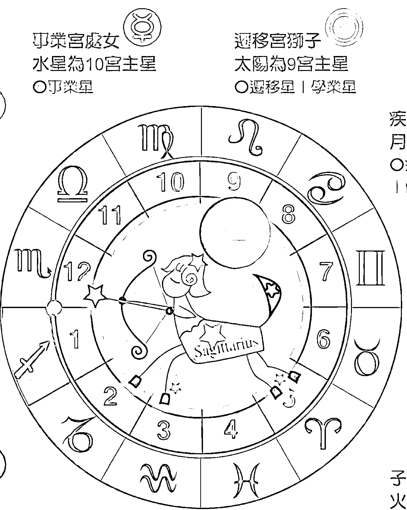

| 宫位 | 星座 | 宫主星 | 关联 |
| :--- | :--- | :--- | :--- |
| 事业宫 | 处女 | 水星 | ○事业星 |
| 迁移宫 | 狮子 | 太阳 | ○迁移星 | 学业星 |
| 人际宫 | 天秤 | 金星 | ○人际星 | 交友星 |
| 疾厄宫 | 巨蟹 | 月亮 | ○疾厄星 | 偏财星 | 合伙星 |
| 纠神宫 | 天蝎 | 火星 | ○纠神星 | 秘密星 | 小人星 |
| 夫妻宫 | 双子 | 水星 | ○婚姻星 | 对手星 |
| 命宫 | 射手 | 木星 | ○命运星 |
| 健康宫 | 金牛 | 金星 | ○健康星 | 部属星 | 工作星 |
| 财运宫 | 摩羯 | 土星 | ○财运星 |
| 子女宫 | 牡羊 | 火星 | ○恋爱星 | 子女星 | 游戏星 |
| 兄弟宫 | 水瓶 | 土星 | ○兄弟星 | 沟通星 | 学习星 |
| 家庭宫 | 双鱼 | 木星 | ○家庭星 |

# 第一宫在射手座：宫主星为木星

○射手一宫象征一切以发展自我为主。

人格特质：他们是天生的乐观主义者，热爱自由，给人的印象是快活开放的，总是兴致勃勃、精神奕奕的样子，具有乐天知命的天性。他们会设定目标，并朝著目标不断的前进。喜欢接触不同的文化，有很强的向外扩张性，喜欢从事旅行和户外活动来经历各种丰富的生活体验。

人生模式：他们一生追求的是最高的智慧，因此不断的发展是他们的人生目的，所谓行万里路胜读万卷书可说是他们的人生写照。

外型特征：他们的特征主要强调在大腿与臀部，整体偏向高大、宽阔，色偏紫。

# 第二宫在摩羯座：宫主星为土星

○摩羯二宫象征有节制的运用资源，对于金钱抱持一种实际、渴望而又负责任的态度。

价值态度：他们对钱的欲望强烈，非常实际，太过重视实质，因此，对钱非常执著，而且非常的节俭。认为钱应该花在保值、具有永恒价值的事物上。他们对一件物品，会非常重视是否稳固与牢靠。

进财模式：他们进财方式多半透过权力或社会地位来取得，一步步的建构。

# 第三宫在水瓶座：宫主星为土星 天王星

○水瓶三宫象征独特的沟通方式，而且多半藉由群体或组织来联繫，每个人在组织中负责各自的功能，互相分享讯息。

沟通模式：他们很容易与新环境接触，靠群体的人际关系与世界沟通。经常以特殊、独创的方式来表达意见。

兄弟关系：他们是四海之内皆兄弟的人，所以与兄弟姊妹之间关系不深。

# 第四宫在双鱼座：宫主星为木星 海王星

○双鱼四宫象徵缺乏边界的领域，他们比较没有地域观念，以四海为家，有到处漂荡的特质。

家庭关系：他们没有领域的概念。他们对待家人很随便，会美化自己家庭的形象。家庭往往是他们逃避现实与做梦的地方。他们家里总不为人知的秘密。

家的样子：家里没有明显的隔间，经常是一片混乱。家中的布置往往很梦幻。

# 第五宫在牡羊座：宫主星为火星

○牡羊五宫象徵以自我为优先的快乐，他们喜欢具有竞争性的游戏，因此喜欢像拳击、摔跤这一类与战斗有关的竞赛活动。

恋爱模式：他们恋爱时直接而且积极，喜欢就马上去追，尤其有竞争者时。但也容易来的快、去的也快。

子女关系：他们容易以惩罚的方式对待子女，子女也多半脾气暴躁。

# 第六宫在金牛座 : 宫主星为金星

○金牛六宫象徵实质获利的努力付出，他们通常会从事比较实际的工作，让他们的付出得到实质的报酬。

工作模式：他们喜欢固定而缓慢的工作，如果确定努力会有钱的话，他们便会很努力。

部属关系：他们对待下属温和，不容易发脾气。

健康状况：他们的身体健康，不会暴饮暴食，喉咙是他们容易出问题的地方。

# 第七宫在双子座 : 宫主星为水星

○双子七宫象徵他们最缺乏的是多变性，他们本身是一根肠子通到底的人，因此会受有多变倾向的人吸引。

合作方式：他们会不断的去尝试与不同的人合作，喜欢经由不同的合作增加对事物的了解，因此，他们有重婚的倾向。

配偶形态：他们喜欢看起来聪明或多才多艺的另一半，彼此相处时像兄弟姊妹般，感觉并不亲密。他们的配偶多半聪明、伶俐且诡计多端。

# 第八宫在巨蟹座 : 宫主星为月亮

○巨蟹八宫象徵温情的渴望，他们其实极度缺乏安全感，需要感情的抚慰。

合伙关系：他们与人分享利益时过于感性。在过程中容易将感情因素牵扯其中。

生死态度：他们对死的事情敏感而情绪化，希望死后能够留下点什么。他们会为自己安排好一切后，以便家人有充分的保障。他们重视开始与结束中间的过程回忆。

欲望模式：他们暧昧的表达欲望，在性方面敏感而且重视感觉，害怕受到伤害。

# 第九宫在狮子座 : 宫主星为太阳

○狮子九宫象徵在外显现光芒，他们是那种外地显贵的人，会渴望在不同领域中，获得令人称赞的名声地位。

发展方向：他们在乎自己在外的名声，也喜欢在外面主导一切。他们会为了让他 人注目而不断的提升自我的层次。

外地态度：他们对外时是热情而充满活力的，习惯于在外人面前表现自己。他们 喜欢长途的旅行，眼光总是落在遥远的目标上。

# 第十宫在处女座：宫主星为水星

○处女十宫象徵深入分析的事业成就，他们面对目标时，会追根究底到自己能完 全掌握为止。

努力方式：他们会有计划、重效率的方式往上爬，而且执著于自己的事业，追求 完美，凡事追根究底。

事业模式：他们在事业上细心而且专注，喜欢服务人群，适合注重精緻、讲求专 精的行业。例如秘书、会计、劳动者。

# 第十一宫在天秤座：宫主星为金星

○天秤十一宫象徵调和的人际关系，他们往往是群体间的仲裁者，讲求团体的和 谐。

群体关系：在朋友或社团中他们常担负协调的任务，他们对人际关系的和谐特别 有兴趣，也对社交性的社团活动积极参与。

交友状况：他们跟客观优雅的人交朋友，而且喜欢与朋友合作。他们通常会从朋 友中选择结婚伴侣。

# 第十二宫在天蝎座：宫主星为火星 冥王星

○天蝎十二宫象徵深刻强烈的心灵，他们的心灵非常深邃，能够洞察他人潜在的 秘密。

精神状况：他们潜意识里情绪强烈，能够看透人心，对自我的隐私隐藏的极为深 密。他们私底下具有强烈的欲望，而且对于隐藏不为人知的事具有洞 察能力。

潜在问题：他们是擅于暗中报复的高手，容易逃避往黑暗面是他们最大的问题。

## Asc at Capricorn (上升在摩羯座)

上升在摩羯座的人，其各宫分布以及各宫主星如图：

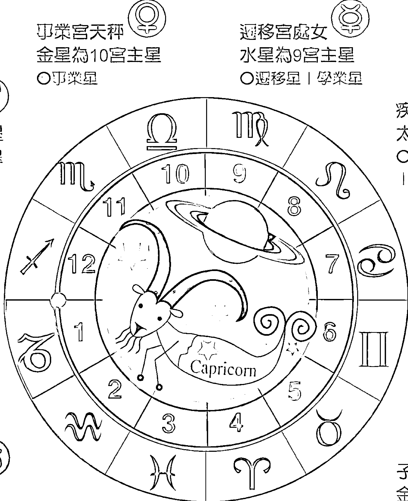

| 宫位 | 星座 | 宫主星 | 关联 |
| :--- | :--- | :--- | :--- |
| 事业宫 | 天秤 | 金星 | ○事业星 |
| 迁移宫 | 处女 | 水星 | ○迁移星 | 学业星 |
| 疾厄宫 | 狮子 | 太阳 | ○疾厄星 | 偏财星 | 合伙星 |
| 夫妻宫 | 巨蟹 | 月亮 | ○婚姻星 | 对手星 |
| 健康宫 | 双子 | 水星 | ○健康星 | 部属星 | 工作星 |
| 子女宫 | 金牛 | 金星 | ○恋爱星 | 子女星 | 游戏星 |
| 家庭宫 | 牡羊 | 火星 | ○家庭星 |
| 兄弟宫 | 双鱼 | 木星 | ○兄弟星 | 沟通星 | 学习星 |
| 财运宫 | 水瓶 | 土星 | ○财运星 |
| 命宫 | 摩羯 | 土星 | ○命运星 |
| 羯神宫 | 射手 | 木星 | ○羯神星 | 秘密星 | 小人星 |
| 人际宫 | 天蝎 | 火星 | ○人际星 | 交友星 |

# 第一宫在摩羯座：宫主星为土星

○摩羯一宫象徵一切以地位为主。

人格特质：他们是有野心的人，外表看起来有点严肃和保守，很有责任感，守规律、力图使一切井然有序、勤奋努力并且又有耐性，有低估自己和压抑自己的倾向。他们做的每一件事情，都是有目的的，并且都是为达到某个重要的位子。潜藏着耐力，也拥有能经得起长期痛苦的耐力。

人生模式：他们受传统与社会价值的规则所束缚。重视秩序与法律以及别人的期待，以这样的人生，努力的朝著社会期许的地位前进。

外型特征：他们的特征主要强调在骨骼、皮肤上。整体偏向消瘦、薄弱、暗黑。

# 第二宫在水瓶座：宫主星为土星 天王星

○水瓶二宫象徵以群体增加资源，他们很会运用群体的力量来累积财富。

价值态度：他们对独一无二或特别新奇的物品很有兴趣，用钱的态度非常不寻常。他们的金钱经常来得快、但是去的也快。

进财模式：他们常以创新而且不寻常的方式赚钱。或是经由组织、团体中，以个人专业、特殊技巧来得到利益。

# 第三宫在双鱼座：宫主星为木星 海王星

○双鱼三宫象徵心灵的沟通，他们心中的想法会显得神秘而且高度情绪化。

沟通模式：不擅于与外界接触，有逃避的倾向。他们不擅于言词，说话模糊不清，而且隐藏着许多的秘密，甚至有说谎的坏毛病。

兄弟关系：他们对兄弟姊妹间充满着感情与付出，对他们非常包容。

# 第四宫在牡羊座：宫主星为火星

○牡羊四宫象徵争夺地盘，在家中他们会比较自我，因此容易发生争执。

家庭关系：对跟领域有关的事具有侵略性。他们的家人多半脾气暴躁，与家人相处时常有争执，同时，他们有爱与人争地盘的倾向。

家的样子：家庭环境简明、单纯，很有个人风格。

# 第五宫在金牛座：宫主星为金星

○金牛五宫象徵实际的表现自我。他们崇尚自然，乐爱艺术，追求感官的享受。

恋爱模式：他们在恋爱时温和而迟钝一点也不积极，他们的感情通常醞酿很久，持续力也很强。但是他们的嫉妒心很强，不容许背叛。

子女关系：他们对待子女温和，把他们当作是自己的所有物，他们的子女也多半是乖宝宝。

# 第六宫在双子座：宫主星为水星

○双子六宫象徵多面性的运用资源，他们以从不同的模式运用身边的资源，以达到事倍功半的效果。

工作模式：他们适合动脑筋的工作，可以同时处理好几件事，想一些让工作更有效率的点子。

部属关系：擅于与下属沟通，对待下属像兄弟姊妹一般。

健康状况：他们容易神经质，手部是常出现问题的地方。

# 第七宫在巨蟹座：宫主星为月亮

○巨蟹七宫象徵缺乏安全感，他们实事求是，背负过多的责任，因此会渴望充满感情的另一半。从对方那得到情感的慰藉。

合作方式：他们与人合作时是情绪化的而且充满感情。他们在乎彼此合作时的感觉。彼此相处时互相的依赖，拥有共同的回忆。

配偶形态：他们喜欢有妈妈味道的另一半，可以呵护他们，给他们安全感。他们的另一半多半细心体贴，但是非常感情用事。

# 第八宫在狮子座：宫主星为太阳

○狮子八宫象徵受人注目的欲望，他们不断的努力往上爬就是为了成为中心人物。

合伙关系：他们在与人分享利益时，会希望拥有主导权，一切由他们来分配。

生死态度：他们一般都很长寿，而且在乎死的体不体面。他们对一件事的结尾一定想办法弄得好看。

欲望模式：他们会很光明正大的表现他们的欲望，对性方面，热情、积极、充满活力，注重整体的表现。

# 第九宫在处女座：宫主星为水星

○处女九宫象徵谨慎的向外发展，他们通常会在准备充分后，才会往陌生的环境前进。

发展方向：他们会仔细的评估外面世界的风险，循序渐进的接触。他们会从每个细微层面的分析研究中提升自己的层次。

外地态度：他们对外显的过于谨慎，在外人面前过于追求表现完美。

# 第十宫在天秤座：宫主星为金星

○天秤十宫象徵合作性的事业成就，他们善于在合作过程中得到所需的名声，利用与生俱来的职场手腕，得到高层的好感。

努力方式：他们擅于运用人际关系以达成自己的事业，他们多半是配合者，喜欢与人合作并负责协调一切。

事业模式：他们非常适合守成，处理人际问题也是他们的专长。适合法官、律师、协调人员。

# 第十一宫在天蝎座：宫主星为火星 冥王星

○天蝎十一宫象徵洞澈人心的人际关系，他们能够轻易了解群体间的强弱与利害关系，选择真正对他们有利的人际交往，完成自己的愿望。

群体关系：他们对朋友或社团中的利害关系有深刻的认识，而且擅于运用。对于触及人性深处，以及神秘难测的相关社团活动，他们特别有兴趣。

交友状况：他们喜欢跟神秘、深藏不露的人交朋友。并欣赏这些朋友处理难题的能力。

# 第十二宫在射手座：宫主星为木星

○射手十二宫象徵开阔的心灵。由于受到现实的压抑，他们往往会转向精神层面发展，因此往往会不自觉的受到潜意识影响。

精神状况：他们有向心灵发展的渴望，有将自我隐私公开的冲动。他们会暗中对外发展，逃避内部的问题。对于梦想，过于自信与乐观。

潜在问题：他们真正的问题便在于不知如何去提升自我的层次，与外面真实的世界接触。

## Asc at Aquarius (上升在水瓶座)

上升在水瓶座的人，其各宫分布以及各宫主星如图：

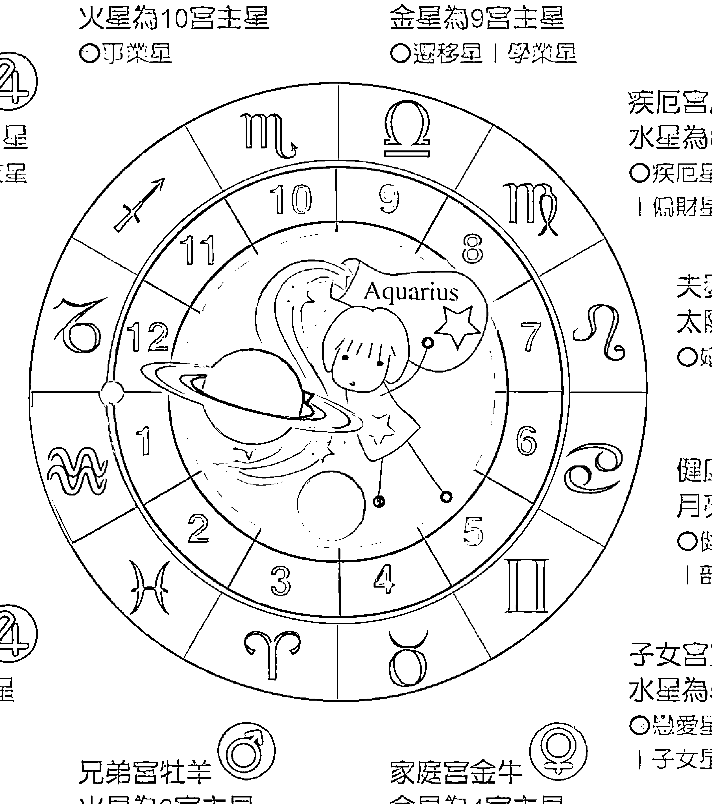

| 宫位 | 星座 | 宫主星 | 关联 |
| :--- | :--- | :--- | :--- |
| 事业宫 | 天蝎 | 火星 | ○事业星 |
| 迁移宫 | 天秤 | 金星 | ○迁移星 | 学业星 |
| 疾厄宫 | 处女 | 水星 | ○疾厄星 | 偏财星 | 合伙星 |
| 夫妻宫 | 狮子 | 太阳 | ○婚姻星 | 对手星 |
| 健康宫 | 巨蟹 | 月亮 | ○健康星 | 部属星 | 工作星 |
| 子女宫 | 双子 | 水星 | ○恋爱星 | 子女星 | 游戏星 |
| 家庭宫 | 金牛 | 金星 | ○家庭星 |
| 兄弟宫 | 牡羊 | 火星 | ○兄弟星 | 沟通星 | 学习星 |
| 财运宫 | 双鱼 | 木星 | ○财运星 |
| 命宫 | 水瓶 | 土星 | ○命运星 |
| 精神宫 | 摩羯 | 土星 | ○精神星 | 秘密星 | 小人星 |
| 人际宫 | 射手 | 木星 | ○人际星 | 交友星 |

# 第一宫在水瓶座：宫主星为土星 天王星

○水瓶一宫象徵一切群体为主。

人格特质：他们喜欢隐藏在群体中，不想让人注意到自己。透过群体展现个人意志。对于权威与传统规范具有反抗性，强调平等互惠的立场，没有上下之分。具有求新求变的改革倾向，喜欢吸收各种领先时代潮流的观念和经验，比较特立独行，具创造天分，非常独立。给人独特、古怪、缺乏感情、看起来很冷漠的印象。

人生模式：他们具有群体性，在群体分工中扮演独特的角色，因此他们非常重视社会、团体与组织的重要性，倾向以整体的发展当作人生的目标。

外型特征：他们的特征主要强调在小腿、脚踝上，整体偏向刚毅、方正、有特色，颜色偏水蓝。

# 第二宫在双鱼座：宫主星为木星 海王星

○双鱼二宫象徵超现实的价值观，他们通常重视的不是物品的实质价值，而是物品的精神价值。

- 价值态度：他们用钱的态度非常不实际，会花钱在追逐自己的梦想上。他们对梦幻的事物特别有兴趣。完全没有理财观念，而且过份的慷慨。
- 进财模式：他们的财运很好，对金钱具有特殊的第六感，也经常会得到秘密的资助。

# 第三宫在牡羊座：宫主星为火星

○牡羊三宫象徵竞争式的沟通模式，他们在与人接触时非常自我而且有侵略性，喜欢表达自己的意见。

- 沟通模式：好争辩，容易与人竞争。对新事物的接触主动而直接。常用新的表达方式与人接触。
- 兄弟关系：以自我的方式与他人接触，容易跟兄弟姊妹间产生冲突。

# 第四宫在金牛座：宫主星为金星

○金牛四宫象徵实质安稳的领域，他们会花钱在创造一个属于个人的私人空间，营造自我的价值。

- 家庭关系：他们对属于自己的领域非常执著，但他们也不会去与人争，对他们来说只要能栖身就行。而他们的家人多半很温和。
- 家的样子：他们喜欢优雅而高尚的家居环境，环境幽雅，富艺术气息。

# 第五宫在双子座：宫主星为水星

○双子五宫象徵多样化的展现自我，他们追求不同层面的快乐方式。喜欢手脑并用的游戏。

## 2-2 12 HOUSES

戀愛模式：他們是典型的花花公子或公主，喜歡同時與不同的對象交往，對戀情不深入，他們把戀人當作是自己的兄妹一般，喜歡跟他們聊天。

子女關係：對待子女時像平輩，他們的小孩多半聰明。容易生出雙胞胎。

# 第六宮在巨蟹座：宮主星為月亮

- 巨蟹六宮象徵情緒性的付出，他們會為了得到安全感或情感上的撫慰而努力。
- 工作模式：他們喜歡在有家的感覺的地方工作。工作上，容易情緒化而且不穩定。
- 部屬關係：他們對待部屬像自己的家人，會為他們著想，保護他們。他們容易因心情變化而影響工作。
- 健康狀況：容易有胃部的毛病，女性則要注意胸部的毛病。

# 第七宮在獅子座：宮主星為太陽

- 獅子七宮象徵缺乏主導性，他們不喜歡成為鋒頭人物，因此會傾向跟有光彩的人交往合作，自己像配角般聽從他人的主導。
- 合作方式：他們會受有權者、地位高的人的吸引。與人合作時讓對方表現與主導。但是若違背自己的意志，他們就會採取革命的手段。
- 配偶形態：他們在找尋伴侶時，會考慮到對方是不是顯眼，所以彼此相處時以對方為中心。他們的配偶多半開朗有活力而且有美好的外表。

# 第八宮在處女座：宮主星為水星

- 處女八宮象徵節制的慾望，他們對於慾望的表達特別謹慎。
- 合夥關係：在與人分享利益時，斤斤計較，計算每一個細節。
- 生死態度：他們關心自己的健康，對死的事保持高度的警覺與危機意識。他們一旦開始一件事，就會想辦法讓他完美的結束。
- 慾望模式：他們對自己的慾望表現節制，在性方面，他們非常在乎每個過程是否完美，不輕易嘗試。

# 第九宮在天秤座：宮主星為金星

- 天秤九宮象徵共同的向外發展，他們會透過合作來拓展自己的視野。
- 發展方向：他們會在不斷的平衡內與外的差異中提昇自己的層次。
- 外地態度：他們是天生的外交大使。在外人面前顯的友善與親切。他們喜歡與他人一起接觸外界，他們有在外國結婚的傾向。

# 第十宮在天蠍座：宮主星為火星冥王星

- 天蠍十宮象徵顛覆性的事業，他們是永遠的挑戰者，不斷的嘗試由根源徹底轉變。
- 努力方式：他們的野心很大，會不斷的挑戰當權者，並透過群體進行變革，經由破壞後的蛻變來達成自我的實現。他們往往能在絕境中逆轉。
- 事業模式：適合探索神秘、生死或具有潛力的事業，例如調查員、保險業者、革命者。

# 第十一宮在射手座：宮主星為木星

- 射手十一宮象徵開展式的人際關係，他們不斷的發展新的人際關係，使他的組織不斷的壯大。
- 群體關係：為了擴展自己的生活，他們會積極加入不同的團體中。在朋友或團體中，他們大方慷慨。旅行、冒險等能讓他們提升自我的社團活動都是他們的最愛。
- 交友狀況：他們喜歡跟樂觀開朗、有智慧的人作朋友，藉由跟朋友的交往開拓自己的視野。

# 第十二宮在摩羯座：宮主星為土星

- 摩羯十二宮象徵受制的心靈，他們往往受到莫名的潛意識限制他們，在精神層面臨壓力。
- 精神狀況：他們實際上比外表所見的還保守。他們對自己的秘密建構的非常的堅固。他們會有不自覺的壓力，會暗地裡用功努力。他們不太敢有夢想，因為總是讓他們失望。
- 潛在問題：他們的問題在於對成就的渴望，讓他們倍感壓力。

## Asc at Pisces

# (上升在雙魚座)

上升在雙魚座的人，其各宮分布以及各宮主星如圖：

- 人際宮摩羯：土星為11宮主星（人際星 | 交友星）
- 精神宮水瓶：土星為12宮主星（精神星 | 秘密星 | 小人星）
- 命運宮雙魚：木星為1宮主星（命運星）
- 財運宮牡羊：火星為2宮主星（財運星）
- 兄弟宮金牛：金星為3宮主星（兄弟星 | 溝通星 | 學習星）
- 家庭宮雙子：水星為4宮主星（家庭星）
- 子女宮巨蟹：月亮為5宮主星（戀愛星 | 子女星 | 遊戲星）
- 健康宮獅子：太陽為6宮主星（健康星 | 部屬星 | 工作星）
- 夫妻宮處女：水星為7宮主星（婚姻星 | 對手星）
- 疾厄宮天秤：金星為8宮主星（疾厄星 | 偏財星 | 合夥星）
- 遷移宮天蠍：火星為9宮主星（遷移星 | 學業星）
- 事業宮射手：木星為10宮主星（事業星）

# 第一宮在 雙魚座：宮主星為木星 ④ 海王星 ⑆

- 人格特質：他們是感受力很強的人，容易受到別人的影響，具有同情心、適應力與靈氣，並且愛幻想。天生具有神秘的洞察力，會把別人的情緒狀態同化為自己的狀態，擁有特別的第六感，也比較宿命。容易逃避的心態，會使他們沈浸在自我的夢想世界中。
- 人生模式：他們很重視心靈的感受，擁有很強的精神力量，也以這種方式面對人生，追求內在意識的提升，沉浸在私人的想像世界，行事低調而且神秘。
- 外型特徵：他們的特徵主要強調在腳上，多半有大而濕潤的眼睛，整體偏向柔軟、細嫩、朦朧，顏色偏暗綠。

# 第二宮在牡羊座：宮主星為火星

- 牡羊二宮象徵個人的價值，基本上，他們自己本身就是最重要的資源，因此一切只為了滿足個人意志。
- 價值態度：用錢非常衝動容易過度揮霍，對金錢方面的事物投入很多精力，總是不斷的找尋增加金錢的方法，他們總是努力的去得到自己想要的東西，到手了又不加珍惜。
- 進財模式：適合透過直覺、創意、競爭或開創事業賺取利益。

# 第三宮在金牛座：宮主星為金星

- 金牛三宮象徵務實的溝通模式，他們通常會深思熟慮地形成想法，只會對有利的訊息有興趣。
- 溝通模式：他們總是緩慢的、被動的去接觸外界。不愛與人爭，但是決定了的想法，也很難被更改。
- 兄弟關係：說話慢條斯理，跟兄弟姐妹之間相處和諧。

# 第四宮在雙子座：宮主星為水星

- 雙子四宮象徵多變的領域，他們通常是狡兔三窟的人，喜歡變換自我的空間。
- 家庭關係：他們常常擁有多個藏身之所。經常變換住所，有擁有二個家的傾向。常常與家人溝通、聊天，但是經常往外跑。
- 家的樣子：他們喜歡多變新奇的環境，家裡通常都會存放很多的書籍。

# 第五宮在巨蟹座：宮主星為月亮

- 巨蟹五宮象徵情緒性的快樂，他們喜歡能夠帶給他們感覺的遊戲，對手工藝或烹饪很有興趣。
- 戀愛模式：戀愛時敏感而且情緒化，他們害怕受傷不易接受戀情，一旦付出就非常深入，非常重視與愛人的點點滴滴回憶。
- 子女關係：他們容易過份保護子女，他們的子女多半溫柔，帶有女性特質。

# 第六宮在獅子座：宮主星為太陽

- 獅子六宮象徵表現自我的付出，他們會希望自己的努力可以贏來別人的注意力。
- 工作模式：他們在工作或服務時會不自覺的表現出自己的權威性，喜歡受人尊重的工作。
- 部屬關係：對待部屬時，會以自我為中心，炫耀他們的能力。
- 健康狀況：他們在健康上，容易有心臟、血液循環的毛病。

# 第七宮在處女座：宮主星為水星

- 處女七宮象徵缺乏處理細節的能力，由於他們本身過於不拘小節、不夠嚴謹、得過且過，因此他們會受實事求是、有效率，而且態度嚴謹的人吸引。
- 合作方式：他們喜歡與態度嚴謹的人合作，能夠幫他們規劃分析，整理細節。會受那些工作勤奮，重視小節的人所吸引，彼此相處時對小細節斤斤計較。
- 配偶形態：他們會希望追求完美的另一半，他們的另一半多半龜毛，個性保守而且一絲不苟。

# 第八宮在天秤座：宮主星為金星

- 天秤八宮象徵得到認同的渴望，他們會藉由與他人的合作成就自己的慾望。
- 合夥關係：他們擅於與他人合作分享利益，他們會力求公正與公平。
- 生死態度：他們對死的事在乎是否和諧。他們總是在衡量每一件事，從頭到尾，是否合理。
- 慾望模式：他們表現慾望時，會去考慮他人與自己之間的關係，在性方面，他們重視協調性，而且會想辦法去配合對方。

# 第九宮在天蠍座：宮主星為火星 冥王星

- 天蠍九宮象徵內在深層意識的開展，他們有往神祕的陌生領域發展的傾向，或是深入黑暗無邊的世界。
- 發展方向：他們容易在外冒險，也會想掌控一切外在的事物。他們會在不斷的內在重生中使自己引發層次的提升。
- 外地態度：他們對外時總是深藏不露。在外人面前總是一副神祕難測的樣子。

# 第十宮在射手座：宮主星為木星

- 射手十宮象徵開展性的事業，他們需要往新的領域發展，拓展個人的視野。
- 努力方式：他們是博愛主義者，充滿理想，樂觀的朝目標前進。他們對外發展的能力強，希望成為慷慨大方、鼓舞人心的導師。
- 事業模式：他們適合可以向外拓展視野、冒險挑戰的事業。例如旅行業者、哲學家、宗教家。

# 第十一宮在摩羯座：宮主星為土星

- 摩羯十一宮象徵保守的人際關係，他們通常在群體中較為保留，並且傾向於與有地位的人做朋友。
- 群體關係：在朋友或社團之中，他們都顯的穩重而不易親近，基本上，他們不擅於與人交際。多半參加需要耐力，有組織架構的社團活動。
- 交友狀況：他們傾向於跟保守的人交朋友，朋友對他們來說是獲得成就的助力。

# 第十二宮在水瓶座：宮主星為土星 天王星

- 水瓶十二宮象徵心靈的不斷革新，他們的精神面是不穩定的，一直處於變革的狀態。
- 精神狀況：他們內心有改變的衝動。他們會把秘密說給朋友聽，以求得認同。他們會在暗中進行改革。在私下，認為自己與眾不同。
- 潛在問題：他們其實渴望能夠成為獨特的人，如何與他人之間有所區別是他們最大的煩惱。

## 行星

## PLANETS

以地球為中心，天上的點點繁星跟世間種種發生對應，在這些星星中，古人發現了七顆星星非常的特別，這七顆星星分別是太陽、月亮、水星、金星、火星、木星、土星。他們在天空中最為耀眼，而且會隨著時間經過規律的移動位置，有時還會逆著跑、有時會停止，有時快、有時慢。在古典占星學中，這七顆行星是主要推命的依據，除此外，天空中明亮的恆星也具有重要的象徵意義。

## 2 PART 3 行星進階 PLANETS LEVEL 2

星座、宮位與行星是占星術中最重要的三部分，而行星又是這三者中最重要的。它就像占星的靈魂，所有的人生變化都是從行星間的互動所產生。行星是星盤中的主角，當行星進入天（星座）與地（宮位）的場域中，這張盤才有了意義。而首先，我們從行星的特性來說明。

以地球為中心，天上的點點繁星跟世間種種事件發生對應，在這些星星中，古人發現了七顆星星非常的特別，這七顆星星分別是太陽、月亮、水星、金星、火星、木星、土星。他們在天空中最為耀眼，而且會隨著時間經過規律的移動位置，有時還會逆著跑、有時會停止，有時快、有時慢。在古典占星學中，這七顆行星是主要推命的依據，除此之外，天空中明亮的恆星也具有重要的象徵意義。

而在近代陸續發現新的行星（天王星、海王星、冥王星）與上萬顆小行星後，占星學也開始出現轉變，將新行星一一納入，而這些新行星的發現時間，便自然的象徵了當代的時代意義。

## 2 行星論 3 PLANETS LEVEL2

# 行星的屬性

## 1. 行星的組成：

與四大元素由四種純質料構成一樣，行星也有其純質料特質，並且有對應的體液。其對應關係如下：

- 火性（熱、乾：黃膽汁）：太陽、火星
- 土性（冷、乾：黑膽汁）：土星
- 風性（熱、濕：血液）：木星
- 水性（冷、濕：黏液）：月亮、金星
- 中性：水星

## 2. 行星的陰陽性：

同樣的跟12星座的分類一樣，行星也依照其本身的性質而可以加以分類為陽性、陰性與中性。 一般來說，陽性的行星較為積極、主動，而中性行星受會合行星影響，而陰性行星則消極、被動。

- 陽性：太陽、火星、木星、土星、冥王星
- 中性：水星、天王星
- 陰性：月亮、金星、海王星

## 3. 行星的吉凶：

行星具有吉凶的特性，而其吉凶的原理可由日月主宰星座與其他星座的托勒密相位來了解。基本上，木星為第一吉星，金星次之，水星中性，火星次凶，土星則為第一凶星。太陽與月亮基本上也是吉的，水星則看會合的是吉星或凶星而轉變，至於三王星中，天王為吉凶參半、冥王為凶中帶吉，海王吉中帶凶！

不過這些吉凶只是行星的自然屬性，然而實際上行星的影響好壞必須看行星座落的星座位置、宮位位置以及與其他星形成的相位來判斷！

## 行星吉凶與相位關係

太陽與月亮是整個占星的重心，從星座的主宰關係看來，以太陽與月亮為基本，土星是對相關係，故最凶。木星是三分相關係，故最吉。火星是四分相，所以次凶。金星六分相次吉。至於水星，並未形成傳統相位，所以是中性。

## 行星的對應

## 1. 星期與時辰

古人認為每一顆行星都有它掌管的時間，因此給傳統七星每一顆掌管一天，如此構成了一週七天的體系，這些行星以固定的順序輪替著，週而復始。同時，行星除了有主宰的日子外，也有主宰的時辰，每一天日出後的第一個小時由當天的主宰行星掌管，接著按照伽勒底秩序往前，一個小時搭配一顆行星。行星的主宰日與主宰時辰在擇日占星與卜卦占星上是很重要的參考依據。

### 行星掌管星期與時辰表

|     | 0   | 1   | 2   | 3   | 4   | 5   | 6   | 7   | 8   | 9   | 10  | 11  | 12  | 1   | 2   | 3   | 4   | 5   | 6   | 7   | 8   | 9   | 10  | 11  | 12  |
| --- | --- | --- | --- | --- | --- | --- | --- | --- | --- | --- | --- | --- | --- | --- | --- | --- | --- | --- | --- | --- | --- | --- | --- | --- | --- |
| MON | ♄  | ♃  | ♂  | ☉  | ♀  | ☿  | ☽  | ♄  | ♃  | ♂  | ☉  | ♀  | ☿  | ☽  | ♄  | ♃  | ♂  | ☉  | ♀  | ☿  | ☽  | ♄  | ♃  | ♂  | ☉  |
| TUE | ♂  | ☉  | ♀  | ☿  | ☽  | ♄  | ♃  | ♂  | ☉  | ♀  | ☿  | ☽  | ♄  | ♃  | ♂  | ☉  | ♀  | ☿  | ☽  | ♄  | ♃  | ♂  | ☉  | ♀  | ☿  |
| WED | ☿  | ☽  | ♄  | ♃  | ♂  | ☉  | ♀  | ☿  | ☽  | ♄  | ♃  | ♂  | ☉  | ♀  | ☿  | ☽  | ♄  | ♃  | ♂  | ☉  | ♀  | ☿  | ☽  | ♄  | ♃  |
| THU | ☉  | ♀  | ☿  | ☽  | ♄  | ♃  | ♂  | ☉  | ♀  | ☿  | ☽  | ♄  | ♃  | ♂  | ☉  | ♀  | ☿  | ☽  | ♄  | ♃  | ♂  | ☉  | ♀  | ☿  | ☽  |
| FRI | ♀  | ☿  | ☽  | ♄  | ♃  | ♂  | ☉  | ♀  | ☿  | ☽  | ♄  | ♃  | ♂  | ☉  | ♀  | ☿  | ☽  | ♄  | ♃  | ♂  | ☉  | ♀  | ☿  | ☽  | ♄  |
| SAT | ♃  | ♂  | ☉  | ♀  | ☿  | ☽  | ♄  | ♃  | ♂  | ☉  | ♀  | ☿  | ☽  | ♄  | ♃  | ♂  | ☉  | ♀  | ☿  | ☽  | ♄  | ♃  | ♂  | ☉  | ♀  |
| SUN | ☉  | ♀  | ☿  | ☽  | ♄  | ♃  | ♂  | ☉  | ♀  | ☿  | ☽  | ♄  | ♃  | ♂  | ☉  | ♀  | ☿  | ☽  | ♄  | ♃  | ♂  | ☉  | ♀  | ☿  | ☽  |

## 2. 人體七脈輪

我們的身體是由各種能量、電波、光波等組成。一切形式的能量都來自頻率的振動。這些震動構成幾個能量中心，稱為脈輪（chakras）。每一個脈輪有它獨特的感官特質與獨特的振動頻率。太陽系的星體關係會對應著我們體內的能量中心。

行星中心反映了延伸在人體周圍的無形能量，像分布在人體周圍的光暈。

## 3. 人體與行星

人體的光能主要有七種階段的波長頻率，這些不同的波反映了我們的健康、精神、思想、心情、行動力等。這些波是不斷變化的。從我們的食物、呼吸的空氣以及我們的經歷會影響光能的變化。色彩是不同波長的能量在視覺上的呈現。因此波頻的變化會產生不同的色彩。

人體內的能量中心與七大行星的能量相互對應，我們可以透過有意識地冥想聯繫行星的能量，把自己的能量中心控制在最佳狀況下。這七大能量中心與行星間的關聯如下：

- **頂輪**：與腦中心相關，位於大腦的中心，（紫紅色），與水星相關。
- **眉心輪**：又稱為第三隻眼，位於前額的中央，（藍紫色），與月亮相關。
- **喉輪**：位於咽喉部位，（藍色），與金星相關。
- **心輪**：位於心臟後方和上方，（綠色），與太陽相關。
- **太陽輪**：位於胸腔下方的神經網絡即為太陽神經叢，（黃色），與木星相關。
- **生殖輪**：位於肚臍的下部，（橘色），與火星相關。
- **海底輪**：位於脊椎的底部，（紅色），與土星相關。

在遙遠的古代，先民就知道人類、植物、色彩、行星之間的和諧與疾病息息相關。古代西方認為要成為好的醫生往往要熟悉占星的理論，占星家用預測的方法去確定疾病發生的嚴重程度和持續時間，並通過分析一個人的星盤了解此人身體上的優點與缺點，各種疾病發生的可能性。

亞里斯多德確定了四大原素：火、風、水和土，以及它們的組成特質：熱、冷、濕、乾。這四特質關連了人體內的四種體液，分別是血液、黑膽汁、黃膽汁、黏液。心臟會產生一種稱為固有熱的能量，用來驅使四種體液流動，當這些體液在身體中維持平衡時，身體就是健康的。

身體是非常有效率的自我調整系統，行星落在不同的位置會產生特別的生理機制，雖然現代醫學已經不吃這一套了，但是近期的許多研究慢慢的發現，行星對病人是有重要影響的，許多醫學報告統計，月圓時不宜開刀，病人容易發生大量出血。精神病患在新月與滿月時病況會變得比較嚴重。古老的占星醫學並非毫無根據，就跟中醫一樣，是有很深的理論與驗證的。

在傳統的西方占星學中，每個星座與行星都主掌著身體的某些個部位。不同的疾病，生理結構、病症，透過星盤上行星的符號而呈現出具體的事實。這些基本對應關係如下：

**太陽**：

太陽在身體之中，主宰著生命...心臟以及心臟，整合身體所有的器官與系統並給予活力。背部及心臟的問題可以從個人星盤中，太陽所在的位置看出端倪。

**水星**：

水星管轄神經系統、大腦、神經，這些與溝通相關的部分。與神經系統、思考相關的問題可以從個人星盤中的水星位置看出來。

**月亮**：

循環系統跟月亮有相當的關係，例如女性的月經週期。因此，月亮象徵著我們身體的循環、消化系統，並且同時影響著我們的情緒。

**金星**：

金星一向主宰喉嚨、腎臟、與腰部，主宰身體間的平衡。金星的問題通常也反映著性與再生系統的化學平衡問題。

**木星**：

木星掌管肝臟，人體內最大的器官，其功能是過濾並儲存養分。木星也與肺部及腿部有關連。成長是木星最主要的負責範圍，常與身體的過度肥胖及成長過劇有關。

**火星**：

在占星學中，火星管轄血液，肌肉和性腺。肌肉使我們得以行動於這世界，並且受我們的意志主導控制。如果星盤中火星受陷，往往象徵著感染的可能性。

**土星**：

在身體中，皮膚是內在身體與外在世界的界限，所以皮膚是土星所管轄。同樣的牙齒、骨骼，這些身體中堅硬的架構也是土星所管。

**天、海、冥**：

外行星對我們身體運作究竟有何影響，至今尚無定論。比較可以確定的是，天王星與神經系統有關係，海王星與淋巴腺體有關，而冥王星則與內分泌有關。

### 12星座與人體的對應關係

| 星座 | 對應部位 |
| :--- | :--- |
| 牡羊座 | 頭、臉 |
| 金牛座 | 頸部、喉嚨、頸部脊骨 |
| 雙子座 | 手臂、肩膀、手掌、肺 |
| 巨蟹座 | 胃、胸、子宮 |
| 獅子座 | 心臟、脊椎、背部脊骨 |
| 處女座 | 大小腸、消化系統 |
| 天秤座 | 腰部、腎臟 |
| 天蝎座 | 再生系統、生殖器 |
| 射手座 | 大腿、臀部、坐骨神經 |
| 摩羯座 | 膝蓋、關節、骨骼 |
| 水瓶座 | 小腿、腳踝 |
| 雙鱼座 | 腳掌、淋巴腺體 |

## 4. 音樂與行星

自古以來，人們就認為音律的變化與行星是息息相關的，並且將七個音階與傳統七星做對應。1619年德國天文學家刻卜勒出版了《宇宙諧和論》，發現行星的運動規律可以用音樂表現出來。直到360年後，美國音樂教授岱天將行星運動數據轉化為人耳可聽到的頻率，發現到水星的聲音像鳥鳴一般，木星深沈而莊嚴，土星像悶雷，火星聲調急促，金星則充滿感傷。

## 定位星

當一顆行星進入別人的星座中時，就像是跑到別人人家時，你就得遵守別人人家的規矩，而受到主宰該星座的行星規範，這樣的情形就稱為定位。例如火星是牡羊座的主人，假設有行星進入牡羊座，自然就得聽火星的，讓火星定位，火星就成為這個行星的定位星。

定位星會對被定位星產生影響，彼此會有微妙的連帶關係。但是如果行星進入自己主宰的星座，那該行星等於回到家，就沒有定位星或者可以稱為最終定位星。最終定位星位於本身主掌的星座中，這使得它具有特殊的力量。成為其他行星的最終定位星，這顆星就具有特別意義，成為整個星盤的主導力量。

定位就像行星能量的關聯，因此這一連串的定位關係會表現出行星能量的運作方式，比方說，火星在雙子座被雙子座的主宰行星水星定位。水星位於射手座又受射手座的主宰行星木星所定位，如果木星位於獅子座，則木星又被獅子座的主宰行星太陽所定位。如果太陽又位於摩羯座，則被土星所定位。假設土星在摩羯座，那麼土星就成為水星、火星、木星與太陽的最終定位星。

如果沒有任何行星落在自己主宰的星座，那麼這個星盤將沒有最終定位，這樣的人容易猶豫不決，無法採取果敢的行動。這種情況往往會出現循環式的定位，舉例：火星位於處女座被水星所定位，水星位於天秤座被金星所定位，而金星又位於牡羊座被火星所定位，如此形成循環式的連鎖關係，沒有最終的定位星，這暗示這個人會在這些能量中打轉，而無法抉擇。

定位星會對被定位星所在的星座與宮位所主掌的事務有所影響，被定位星及定位星的宮位和星座的位置，也會有微妙的連帶關係。
如果兩個行星彼此互相定位。也就是說，他們彼此處於對方主宰的星座，例如：天王星在雙子座、水星在水瓶座，那麼就成為彼此相容的狀態。相容的狀況會給兩個行星帶來額外的積極力量，以及特殊的才華與能力。它們互相交流，彼此支持對方的功能。如果兩個相容的行星組合成為其他行星的最終定位星。這樣子，這兩個行星便一起對個人命運產生重要影響。但是他們還是會有強弱的區別，例如火星摩羯與土星牡羊的互容。由於火星處於曜升（旺）星座，而土星位於失利（陷）星座，因此火星的能量發揮就會高於土星。如果兩個相容的行星發生相位關係，那麼這個相位就會被特別強調。

如果有兩個以上的行星位於所主宰的星座上，定位星盤中其他行星，那麼這幾顆星就共同擁有支配這個人的命運重心。而它們的相位關係，將表現出這幾股重要力量的互動關係。如圖中，火星是木星、金星、太陽的最終定位星。而土星則為水星、月亮的最終定位星。如此形成兩股強大的勢力，主宰此人的命運。

## 當各行星是最終定位星時

行星成為最終定位星時，將會使行星的能力增強，具有決定性的力量，成為命盤中影響力的關鍵，由於行星成為最終定位時一定是處在行星本身主宰的星座中，因此，該星座的特質將會被強調出來，舉例來說，太陽力量高於金星，某人太陽在天蠍座，金星落在天秤座，雖然原本太陽的重要性高於金星，但因金星成為最終定位星，其天秤的性質便加強，相對的太陽天蠍的特質就會減弱而變得較不明顯，反而凸顯出天秤的特質。同時由於金星掌管了其他行星，所以金星所在的宮位就成為其人生的重要領域。

### 太陽：獅子座

當太陽是最終定位星時，這強調了獅子座特質以及太陽座落的宮位。這樣的人非常自我中心與具有權力慾，像個小孩子般，認為所有人都應該以他為主。愛好表現、追求快樂、熱情有活力。他具有驚人的領導力及組織能力，特別有精力、勇氣與自信。名聲、權力、領導慾望會成為所有能力發揮的動機。

### 月亮：巨蟹座

當月亮是最終定位星時，這強調了巨蟹座特質以及月亮座落的宮位。由於月亮容易受影響的特性，因此與月亮發生相位的行星也就特別重要。在他們生命中，女人通常扮演很重要的角色。他們非常敏感，很在意他人的臉色，容易消極地受周遭人的影響。在採取行動時，情感、經驗與安全感是推動他們主要的因素。

### 水星：雙子座 & 處女座

當水星是最終定位星時，這強調了雙子座或是處女座的特質以及水星座落的宮位。對他們來說，做任何事一定會有理由，將理性置於個人偏見及情緒之上，不會陷入情感的泥沼中。他們善於整理資訊、思考、理性的判斷，堅持了解每個細節，但也容易過度理性而顯得冷酷與無情。對他們來說，合理性分析、資訊、思想是他們採取行動的依據。

### 金星：金牛座 & 天秤座

當金星是最終定位星時，這強調了金牛座或是天秤座的特質以及金星座落的宮位。他們很會處理人際關係，喜歡與他人一同合作。生性浪漫，具有吸引力，追尋美妙的愛情與婚姻關係。重視價值與物質享受，具有強烈的審美觀，熱愛自然和諧的事物。愛情、美、和諧、享受是他們行動的誘因。

### 火星：牡羊座 & 天蝎座

當火星是最終定位星時，這強調了牡羊座或是天蝎座的特質以及火星星座落的宮位。他們充滿生命力、意志力及勇氣，會努力實現心中的期望，積極主動、暴躁自私、愛憎分明、愛爭鬥狠，往往招來危險的敵人。他們會付出大量精力與行動力達成目的。欲望、佔有、競爭、性衝動往往是他們做事的重要動機。

### 木星：射手座 & 雙鱼座

當木星是最終定位星時，這強調了射手座或是雙魚座的特質以及木星座落的宮位。他們的想法通常是積極的、自信的、樂觀的，因此往往幸運而容易成功。他們具有對未來的洞見能力，擁有將信念帶給他人的力量，大方而且慷慨對待他人，從而得到他人的支持。智慧、真理、道德以及自由的發展是他們行事的重要考量。

### 土星：摩羯座 & 水瓶座

當土星是最終定位星時，這強調了摩羯座或是水瓶座的特質以及土星座落的宮位。他們是堅定可以依靠的人，具有驚人的自律性，能將一切事務組織得有條不紊，謹慎而有系統。他所做的每一件事都有確定的目標，耐心又有步驟地建立自己的地位。責任、地位、穩定、紀律往往是他們行事的重要法則。

### 天王星：水瓶座  海王星：双鱼座  冥王星：天蝎座

在定位星的運用上，實際上是以日、月、金、木、水、火、土古典七星為主，三王星只當作參考依據，由於三王星落在同一星座時間往往好幾年，因此會形成一個世代的人都有同樣的最終定位星。舉例來說，天王星在1995到2003年都在水瓶座，所以在這一段時間出生的人的星盤中，天王星都成了最終定位星。因此除非古典七星都沒有形成最終定位星時，三王星才會凸顯其重要性。

當天王星是最終定位星時，這強調了水瓶座的特質以及天王星座落的宮位。這時代的人具有極神秘的創造力。他們會做出一些無厘頭的事，對於自由及創造力的渴望，往往採取離經叛道的行為，完全不會顧及別人的想法。

當海王星是最終定位星時，這強調了雙魚座的特質以及海王星座落的宮位。這時代的人是心靈的一代，他們的動機常出於特殊的精神感應，令人難以理解，似乎毫無實際的理由。

當冥王星是最終定位星時，這強調了天蠍座的特質以及冥王星座落的宮位。他們這一代是顛覆世局的一代，具有強烈的內在慾望驅力，能夠以巨大意志力及內在力量的行動，達成目標。

## 行星的強弱

每一顆行星的力量會因為處在黃道帶上不同的位置產生不同的變化，因此會有強弱的不同。而這些強弱也有等級上的分別，基本上，由強到弱，我們可以等級分化為廟、旺、平、陷、弱。

行星會有喜歡的星座與討厭的星座，以廟來說，就是行星進入自己主宰的星座，其相對的弱就是進入主宰星座的對面星座，而旺就是行星進入了最能發揮能力的星座，其相對的陷就是進入旺宮的對面星座。然而除此之外，在古典占星學中，星座除了有專屬的主宰星與旺主星外，還有三分性主星、界主星、外觀主星的分類法，當行星進入主宰的三分性、界、外觀中時，也會影響其強弱的變化。這五種狀況稱為行星的五種尊貴狀況。

行星強弱表

| 星座 | 廟 | 旺 | 平 | 三分性 | 界 | 外觀 | 旺 | 弱 | 分數 |
| :--- | :--- | :--- | :--- | :--- | :--- | :--- | :--- | :--- | :--- |
| ♈ | ☉ | ♃ | ♄ | ... | ... | ... | ... | ... | +5 |
| ♉ | ♀ | ♄ | ☉ | ... | ... | ... | ... | ... | +4 |
| ♊ | ☿ | ☿ | ♃ | ... | ... | ... | ... | ... | +3 |
| ♋ | ☽ | ☽ | ♄ | ... | ... | ... | ... | ... | +2 |
| ♌ | ☉ | ☉ | ☿ | ... | ... | ... | ... | ... | +1 |
| ♍ | ☿ | ♀ | ♃ | ... | ... | ... | ... | ... | -5 |
| ♎ | ♀ | ♃ | ♄ | ... | ... | ... | ... | ... | -4 |
| ♏ | ♂ | ♂ | ☉ | ... | ... | ... | ... | ... | -3 |
| ♐ | ♃ | ☉ | ☿ | ... | ... | ... | ... | ... | -2 |
| ♑ | ♄ | ♄ | ☽ | ... | ... | ... | ... | ... | -1 |
| ♒ | ♅ | ♃ | ♀ | ... | ... | ... | ... | ... | -5 |
| ♓ | ⚳ | ☿ | ☽ | ... | ... | ... | ... | ... | -4 |

底部分數：+5, +4, +3, +2, +1, -5, -4

如圖為行星在各星座與星座區間的強弱表，最下方的分數代表行星在這些位置的強弱，廟最強是+5，旺次強為+4，三分性+3，界+2，外觀+1，而相對於旺的陷為-4，最弱的是弱為-5。

1.  廟與弱（強勢與失勢）：+5/-5

我們知道12星座都有個自的主人，這個主人就是行星。因此，當行星回到自己家裡，處於自己的主宰星座時，便容易如魚得水，行星最能表現其特質、發揮力量，這種狀況稱為強勢（廟）。

而當行星進入自己主宰星座對面的星座時，因為相對的兩星座彼此性質差異最大，因此進入跟自己家完全相反的環境時，行星就變的綁手綁腳，無法發揮力量，本身的特性會受到最大的限制。這樣的狀況，稱為失勢（弱）。

## 行星廟弱圖

如圖中外圈行星分布為行星在廟位（強勢），而黑色內圈中行星分布則為行星在弱位（失勢）。

## 2. 旺與陷（耀升與失利）：+4/-4

在強勢（廟）與失勢（弱）的時候，行星主要是本身特質強弱的不同。但是行星真正發揮力量卻不一定是在自己家中，而往往是在躍升星座（旺）時力量才會最強，甚至比主宰星座時力量還強。而在躍升星座對宮時稱為失利（陷），是行星力量虛弱的時候，在失利星座（陷）時甚至比在失勢星座（弱）時還弱。

躍升星座由於屬性的關係，能夠讓行星的力量充分發揮。舉個例來說，太陽雖然主宰獅子座，但是當他在牡羊座時，正是春天開始時，春天的太陽融化了冬天的冰霜，讓萬物開始欣欣向榮，所以這時的太陽最有朝氣，對萬物最有幫助。而當太陽進入失利的天秤時，秋天的陽光開始催促萬物收成，準備進入冬天，萬物開始蕭條，自然不是太陽發揮力量的時候。

行星旺陷圖

如圖中黃色外圈行星分布為行星在旺位（耀升），而褐色內圈中行星分布則為行星在陷位（失利）

## 3. 三分性：+3

三分性主星是由星座的四大元素分類而來，在古典占星學上具有重要的地位，原則上行星在所屬的三分性位置時，代表一種水到渠成的好運。三分性分類具有白天與夜晚的分別，也就是看命主出生於白天還是夜晚，要分別是白天盤還是黑夜盤最簡單的方法就是看太陽在命盤的位置，太陽在ASC-DES連線上方為白天盤，反之為夜間盤。三分性行星的配置為火象由太陽（白天）與木星（夜晚）支配，土象由金星（白天）與月亮（夜晚）支配，風象由土星（白天）與水星（夜晚）支配，而水象不論白天與黑夜皆由火星支配。

行星三分性圖

如圖中外圈行星分布為白天盤三分性主星，而黑色內圈中行星分布則為夜間盤三分性主星# 4. 界：+2

界又稱為伽勒底界，是一種星座更細微的切割，界主星代表一種傾向，同樣的星座中，在不同的界主星影響下呈現出不同的細微差異。例如同樣是太陽在金牛座，但是在不同度數受不同的界主星影響會帶有不同的傾向，界主星是木星是個性保守而傾向樂觀的，而界主星是土星時會傾向保守而遲疑的態度。

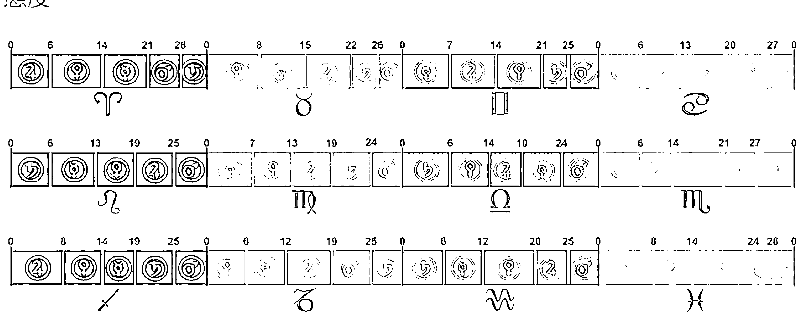

# 5. 外觀：+1

外觀是將每個星座三等分，從牡羊0度配置火星開始按照伽勒底秩序，火→日→金→水→月→土→木的順序，週而復始的配置。外觀主星在應用上比較少用到。

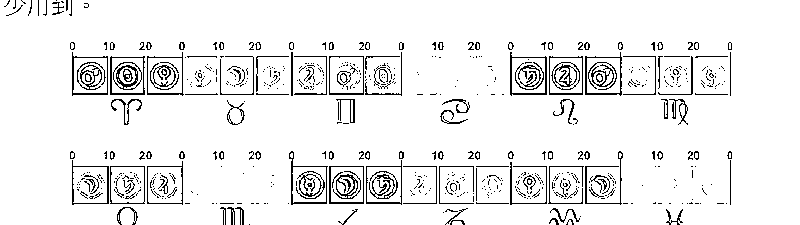

## 行星逆行

星星會倒著跑嗎？這當然是不可能的，但是，為什麼行星會逆行呢？除了太陽跟月亮外，行星都會有逆行的現象，這是由於地球與行星間彼此運行速度不同而造成的，因為速度的差異，因此相對來說在某些時候我們會覺得看起來行星在後退，這就是“行星逆行”現象。在行星運動從順行轉換為逆行時，他會在黃道上的某一 點先停下來。這段停下來的時間稱為停駐點(station)。

在停駐的這個點，行星留下重要的印記，由此產生一個關鍵位置。無論是逆行起始點，還是順行起始點，都是關鍵的重點，一直到下一個逆行(順行)為止，形成一個周期。行星逆行時會使行星的能力產生改變與阻礙，功能變弱。尤其是在改變方向，從順到逆時（SR）及從逆轉順時（SD）影響會特別明顯。

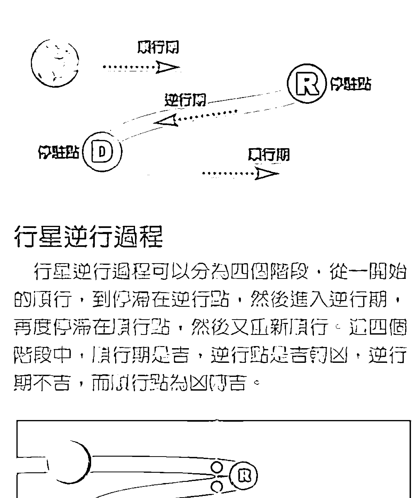

# 行星逆行過程

行星逆行過程可以分為四個階段，從一開始的順行，到停滯在逆行點，然後進入逆行期，再度停滯在順行點，然後又重新順行。這四個階段中，順行期是吉，逆行點是吉凶，逆行期不吉，而順行點為凶吉。

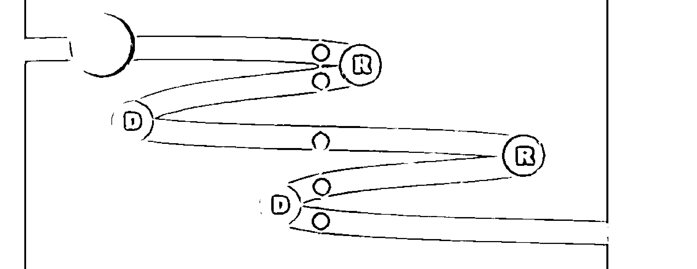

由於逆行的關係，行星在運行時有時會在同一個點來來回回經過3次或5次。水星、金星、火星由於與地球接近的關係，逆行現象特別明顯。水星每年約逆行三次，當逆行時往往造成思想與溝通上的混亂。金星每年約逆行一次，當發生逆行時，往往會出現情愛上的放縱，桃花滿天飛的現象。火星每兩年逆行一次，很特別的，每次會在一個星座出現，經過12次逆行後，剛好每個星座輪一次。當火星逆行時，往往是暴力容易橫行時，衝突變的容易發生，而且往往跟性發生關連。

木星、土星與三王星約每年逆行一次，當木星逆行時往往是樂極生悲的時候，很多過度的行為都容易在此時發生。土星逆行時常常是制度發生問題的時候，大部分的基礎不穩定經常是這段時間發生的。三王星每年逆行的時間都將近半年，因此，在逆行的意義上較不明確，但是對整體世界來說，意義就很大，當三王逆行時，往往是整個世界集體進化的退潮期。

- 產生混亂。
- 帶來延遲。
- 發生矛盾。
- 回復原狀。
- 重來一次。
- 失去正常的力量。

基本上行星的逆行象徵退縮與反省，有回到原點重新嘗試的涵意，當逆行發生時，行星往往會轉性，使行星產生如下的影響：1. 產生混亂。 2. 帶來延遲。 3. 發生矛盾。 4. 回復原狀。 5. 重來一次。 6. 失去正常的力量。當一個人命盤具有很多逆行行星時，代表其容易深受潛意識影響。他們透過潛意識來進行與外界世界的聯繫，因此往往具有特別的巨大精神力量。如果一個人的主要行星中逆行超過四顆以上，這表示此人的潛意識可能會凌駕意識的控制，而使得此人無法以意識來主導個人的行為。

## 各星逆行的涵義

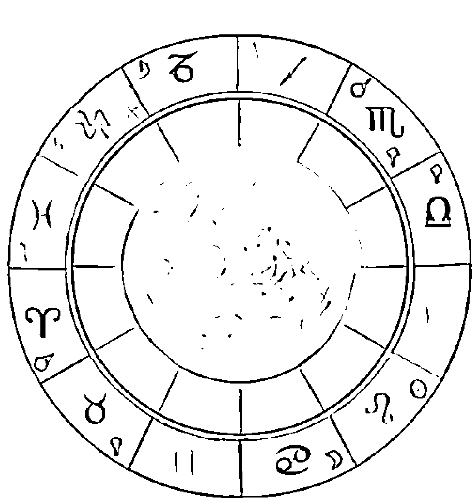

# 水星逆行：

水星反映的是一個人對世界的理解力與洞察力，以及人們思考、表達、學習和推理的潛力。
一般來說，在一年之間，大概會出現3到4次水星的逆行，每隔三到四個月左右水星就會逆行一次，每次大約二十天。在此時，凡是水星所掌管的事物，諸如記憶、溝通、思考、交通等都容易受到影響。受到水星逆行影響的人在這段期間容易出現迷糊健忘、丟三落四、與人溝通談事情不順利，許多事老是反覆修正、重做一遍的情況發生。任何的交流與溝通現象，都會變得十分敏感。人與人間的誤會層出不窮，個人對事物的判斷力也將會變得遲鈍。在逆行時期，說話做事都要比較謹慎。如果要和人談合作以及簽約，更要特別注意，最好延到水星逆行結束以後再決定。
水星的逆行同樣影響著許多通訊器材。所以往往這個時候有關電腦網路、傳真和電話常會有一些混亂的現象。另外，時間的延遲也是常發生的，例如交通工具的誤點、錯過約會、日程安排的混亂、約好的時間一延再延，而無法如期進行等。

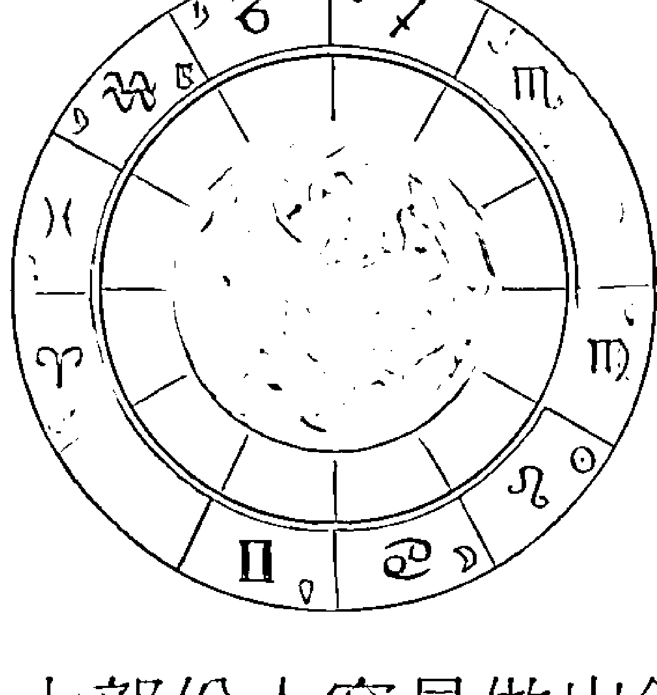

# 金星逆行：

金星象徵人對於愛與美的追求，它影響個人的喜好、社交能力與價值觀。
每一年半左右金星會逆行一次，每次逆行的時間，約為一個半月。當金星逆行時，我們對於美感的敏銳度會大為降低。因為對於美的敏銳度減低了，因此這段時期，大部份人容易做出錯誤的抉擇，在此期間認為美的事物，如新買的衣服、新做的造型、喜歡的對象，往往等到金星逆行結束後，才發現一切並不如想像中美好。
金星逆行使人容易自憐、不善於社交，也不想爭取別人的認同。在人際關係方面，也容易發生摩擦。在這段期間不容易做出正確的價值判斷。原來的價值觀會發生變化，內心真正渴望的事物也變得不太相同。金星的逆行現象，常常意味著雙人關係的一種停滯。這表示應該開始重新檢視感情的時候，重新評估現有感情對自己的價值。另外也暗示昔日戀情或是感情的重新萌發。可能會突然憶起遺忘已久的舊日戀人，甚至突然出現與對方重新接觸的機會。同時這也是重新思考個人財務狀況的時機。

# 火星逆行：

火星影響著個人的欲望以及支配我們的行動力、勇氣與鬥志。

火星每二年都會逆行一次，每次逆行的時間，約二個多月。火星逆行時，要特別注意控制自己的情緒，因為容易發生情緒失控的狀況，每個人的行為、行動以及情緒宣泄的模式，會變得不太一樣，很多人會容易出現衝動、緊張、焦慮、沮喪等情緒反應以及一連串的騷動與混亂。

這段期間精力容易過度，找不到宣泄，因此容易因為衝動做出錯事。因此此時適合沈潛，不宜貿然行動，如果有新的計畫，最好在火星逆行結束再執行！

# 木星逆行：

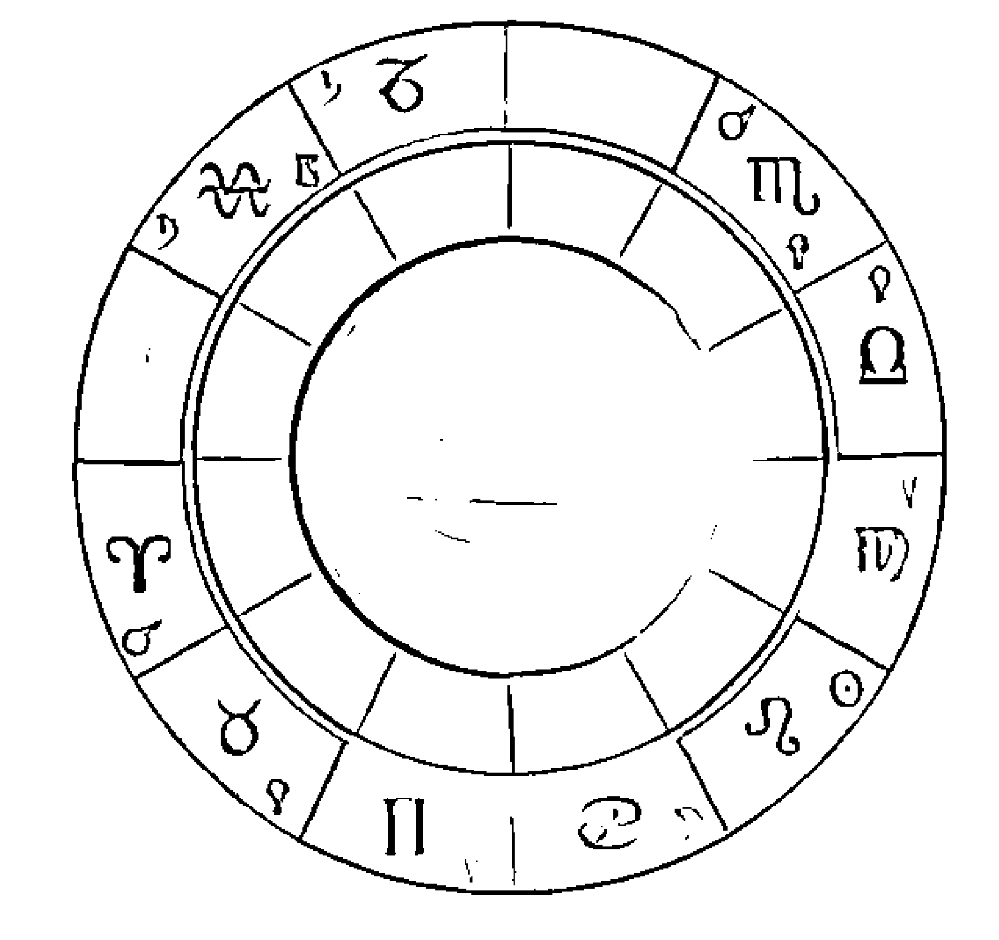

木星每年都會發生逆行，每次的逆行需歷時四個月左右。木星象徵個人的擴張與向外的遷徙，因此在木星逆行的期間，不太適合出國旅行或是遠行。這段時間不適合做向外發展的事，也不該對任何事情過度的樂觀。在做各種層面的擴張時，很容易因為粗心大意、缺乏深思

而在往後發現問題，使事情無法完成或者延後完成的時間，甚至耗費比原先預計更多的時間、精力或金錢！

# 土星逆行：

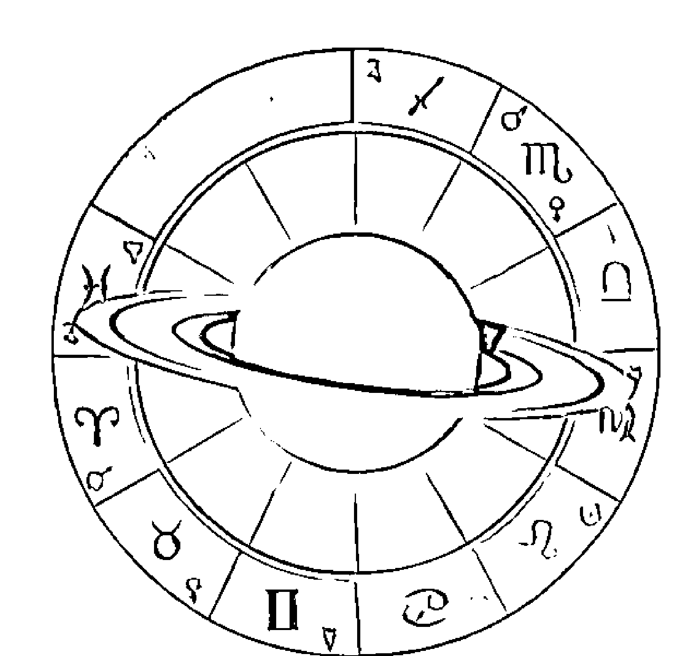

土星逆行也是每年都會發生，由於土星屬外行星，行進速度較慢，以致每次逆行的時間約需四個半月左右。土星代表的是責任與負擔、以及自我磨練，因而在土星逆行的這段時間中，很多架構的基礎會發生崩解，無論是個人或大團體，這時往往是容易發生挫折的時候。這

段期間也不適合作重大生涯規劃的改變，因此最好讓腳步緩和下來，仔細看看這個架構中是否出現漏洞。由於土星象徵的是困難，因而逆行時往往會發生困難暫時解除的狀況，但是其實這只是錯覺，當逆行解除時，往往是更大挑戰的到來。

# 天王星逆行：

天王星的逆行每年都會發生，每次約五個月。當逆行發生時，人們自我改變的渴望容易變成叛逆與失控，過度自由與獨立的行徑，完全不考慮現實狀況而變得沒有規範，只是一味的特立獨行。

# 海王星逆行：

海王星每年約逆行五個多月，當逆行時，人們的心靈容易混亂，精神面會被過度強化，變得極端夢幻與不切實際。在這段期間直覺力會特別強，適合拓展內在層面，但是也要避免犧牲、依賴、自我欺騙。

# 冥王星逆行：

冥王星每年約半年處在逆行狀態，由於冥王星代表內在慾望的力量，因此逆行期間，人們變得難以掌控包括憤怒、性慾、以及自我毀滅的情緒。對於慾望將缺乏抵抗力，容易表現出黑暗的一面。

# 其他影響

## 1. 互容與容納

互容與行星的相容一樣，只不過行星的相容是指兩顆行星各自進入對方主宰的星座中，而互容則更為寬廣，傳統占星學中認為行星各自進入對方五種尊貴狀況時，則成為互容狀態，不過一般只考量行星的廟旺，而不採用三分性、界及外觀。舉例來說，金星廟在金牛、天秤，旺在雙魚；火星廟在牡羊、天蠍，旺在摩羯，當金星進入火星的廟旺星座，而火星進入金星的廟旺星座時，就是金火互容。

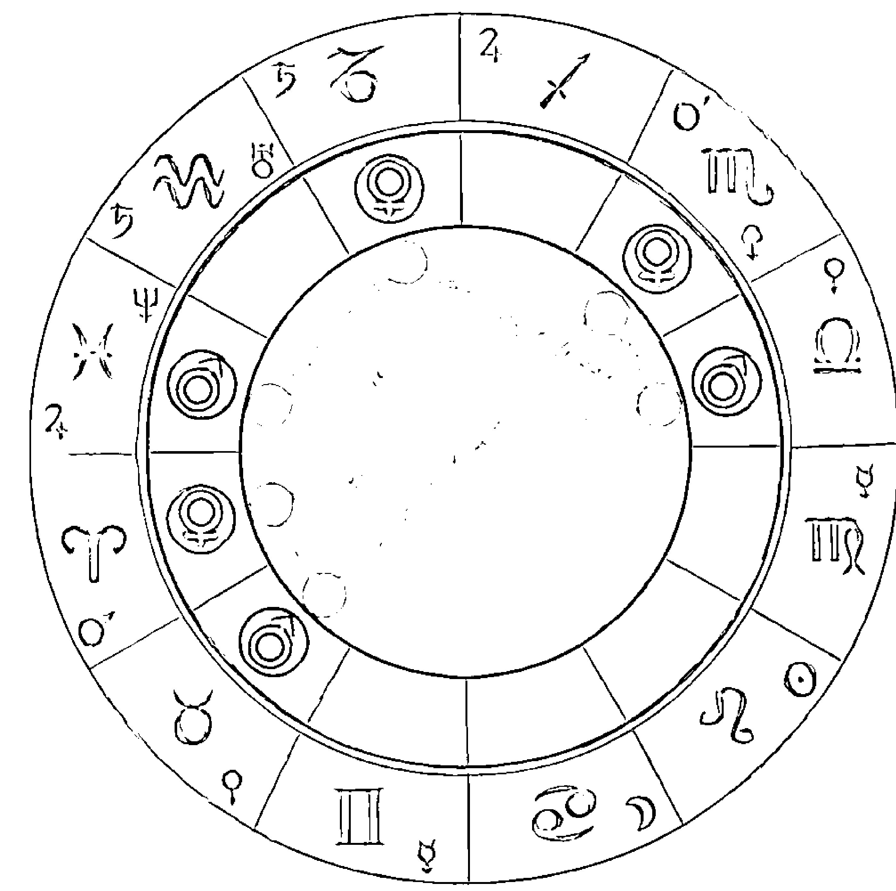

當兩星成為互容時，會為彼此帶來額外的力量，兩星成為互助的狀態，不但保有行星原有的力量，還增加另一星的能力。在互容的狀態下，原來的弱陷的狀態將消失，反而成為吉利的狀態。例如金星在牡羊原本失勢（弱）力

量無法發揮，但是如果火星進入金牛、天秤、雙魚，則因為形成互容狀態反而吉祥。

容納是指當一行星進入某星座與主宰該星座位置的五種尊貴主星形成重要相位（傳統托勒密相位）時，就稱為容納。與互容一樣，基本上只考慮廟旺狀態。舉例來說，金星進入牡羊失勢，牡羊主宰星為火星、曜升星為太陽，因此如果金星與火星、太陽形成重要相位，則形成容納。

當行星形成容納時，會使兩星的關係增加吉祥，即使是不好的相位關係，也能使凶相減弱。以前例來說，假設太陽與金星形成衝突相，由於太陽容納金星，太陽將給予金星好處，像贈與禮物一樣，使金星帶來福氣。同時減緩太陽與金星間的衝突狀態。

## 2. 月亮的月相變化

月亮對女性以及土地相關的事物影響特別明顯，也管到業力、靈魂走向以及精神發展的趨勢，傳統占星中認為月亮的圓缺狀態（月相）比月亮所在的星座更為重要，月相的產生是由於月亮與太陽的相位狀態所形成，從日月0度開始是新月，然後每經約七天形成上半月、滿月、下半月，再回到新月。從新月開始，月亮光度漸增一直到滿月最亮，然後光度漸減到下一次新月。當月亮增光時，象徵著漸熱，因此較為活潑而且較有生產力。月亮減光時，象徵漸冷，因此傾向消極，生產力降低。月相的這四種基本狀態類似一年的四季，因此占星家就將這四種狀態與四季以及四象做對應，並賦予相應的組成純質料。

月相的象徵可以用植物的生長過程來形容，新月期看不到月亮，代表種子被播種與新的開始。月芽期象徵種子已經發芽，需要照顧、滋養，要格外培養照顧。上弦月期代表在生長處爭取地位，把天賦特質表現出來。上凸月期

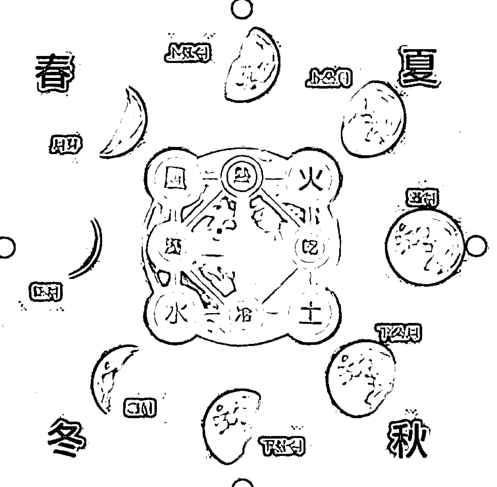

月相的純質料
如圖新月到上弦月屬風象（濕、熱），上弦月到滿月屬火象（乾、熱），滿月到下弦月屬土象（乾、冷），而下弦月到下一次新月則屬水象（濕、冷）

代表已具規模，可以作必要的調整，是發揮生命最好的成果。滿月期代表植物開花結果的時候。下凸月期是果實開始墜落，盛極而衰。下弦月期代表冬天將至，果實已經潰爛。而眉月期時循環即將結束，冬天來臨，保存種子等待春天來臨。

### 3. 與太陽的距離

太陽與月亮象徵天空中的國王與皇后，尤其是太陽更是權威的象徵，由於其強烈的光芒，因此當某一個行星和太陽接近時，其本身的光芒會被太陽遮掩而看不見，傳統占星學家把這種情況稱爲這個行星被太陽焦傷，這種情況會讓另外一個行星發生痛苦的情況而失去力量，當相位越靠近的時候，這種現象就越明顯。這種現象會在一個人的生命中產生明顯的作用，在解析命盤時必須加以考慮，可能帶來疾病、是非或危害。但是，如果行星與太陽完全接近時卻又另當別論，反而增強力量，大大吉利。

行星與太陽接近，會對太陽產生“染色”的效果。例如命盤中太陽與金星極接近，他的太陽在雙子座，那麼這個人的個性除了有本來雙子的特性外，又增加了金牛與天秤的特性。從行星接近太陽的度數，會有不同的效應，基本上有三種。

- ○ 在太陽光束下：當行星與太陽在8.5度到17度之間，行星受太陽光遮蓋本身光芒，因而減弱能力。
- ○ 焦傷：當行星與太陽接近在8.5度到0度17分時，行星被太陽焦傷，在這種狀況下，行星的能力完全被太陽掩蓋無法彰顯出來。
- ○ 核心：當行星與太陽接近到17分內時，這時行星成爲太陽的核心，太陽的能量完全給予行星助力，行星能力大大的增強，是最吉利的狀態。

### 4. 東出與西入

傳統占星學中非常重視行星與太陽的關係，從實際天象的觀察中，在太陽將升之時，若在東方有行星比太陽早升起，稱爲行星東出。在日落時，若在西方天空看見行星，這些行星跟著太陽之後西落，稱爲行星西入。

行星的東出與西入會增加行星的吉凶特質，基本上是以接近太陽來決定吉凶。內行星比太陽快，若東出將接近太陽，凶；反之西入則遠離太陽，吉。外行星比太陽慢，若東出太陽將遠離，故吉；反之西入則太陽接近，凶。東出與西入對金星與水星影響特別大，因為金星與水星永遠在太陽附近，金星跟太陽不會超過48度，水星跟太陽則不超過28度，因此他們很容易被太陽焦傷而失去力量。由於太陽是明亮的象徵，因此東出也有提早出現徵象的涵意，而西入則有延遲出現徵象，事情仍未明朗的涵意。

# 東出與西入

將太陽做為基準點分割星座為兩半如上口所示，行星若在上方就是東出，在下方就是西入。

# 金星與水星

如左圖從地球上看到的金星與水星總是隨著太陽在其兩邊來回運行，金星不會超過48度，水星不會超過28度，所以金星與水星之間也不會超過76度

## 5. 與重要恆星形成合相

除了太陽系的行星外，自古以來，天空中明亮的恆星一直是占星學家注意的重點，其中尤其以在黃道附近的恆星最受注意。占星家威廉·里利特別重視其中三顆，分別為軒轅十四，角宿一與大陵五，其中軒轅十四與角宿一為吉星，大陵五是凶星。

- ○軒轅十四：目前在獅子座29度50分，是獅子的心臟，象徵權力、榮耀與尊貴，是最吉祥的恆星。強度為+6。
- ○角宿一：目前在天秤座23度50分，是麥穗的樣子，象徵好運、收穫與富有，是吉祥的恆星。強度為+5。
- ○大陵五：目前在金牛座26度10分，是魔女的頭，象徵傷殘、斷頭、困厄的危險，是天上最凶的恆星。強度為-5。

實際上除了這三顆恆星外，其他明亮的恆星都會對行星造成影響。當行星與明亮恆星形成一度內合相時，就會對行星產生重大影響。

## Sun
[太陽：個性]

活力、能量、光、意志、外在形象、創造力、表現、陽性功能、爸爸的影響。
性質：吉｜熱、乾｜陽性｜白天行星
主宰：獅子座｜第五宮
星期：星期天
週期：公轉週期一年，相位影響約一星期。
逆行：太陽沒有逆行。
運行：活力的週期。能量與活力，影響個人表現意志與自我的人事物。受重視的機會、受注目成為焦點、陽性的能量、某個男性。

太陽星座代表一個人表現自我的個性與意志時是以何種形式來呈現，一個人如何運用他的基本潛能。同時可以看出他是一個什麼樣個性的人。他們受到重要男性什麼樣的影響。而太陽宮位則代表一個人在什麼樣的人生場景中展現自我的能力，表現自己的特性，燃燒自己的生命。

太陽象徵中心的力量，代表向心力，是往中央集中的力量，同時由中心散發光芒與能量。象徵領導中心、焦點、熱情、活力、表面的。太陽的力量是完整的，一面向心聚集，一面向外發散。

# 象徵意義

正：英雄的、尊貴的、亮麗的、驕傲的、熱情的、光明的、權威的、受矚目的、創造力的、父愛的、活力的。
負：自我中心的、驕傲的、霸道的、好面子的、孩子氣的、愛出風頭的、好賭的、虛榮的、揮霍的、重表面的。
身：心臟、男性右眼、女性左眼、血液循環系統、背部、脊柱。
疾：心臟病、眼病，血液循環毛病、背痛、脊椎毛病。
人：父親、國王、領袖、英雄、貴族、丈夫、男性自己、老闆、表演者、明星、小孩、主導者。
事：娛樂、政治、賭博、表演、秀、名聲、形象。
物：金、獅子、天鵝、向日葵、公雞、日光燈。
地：舞台、政府機關、娛樂場所、劇場、皇宮。

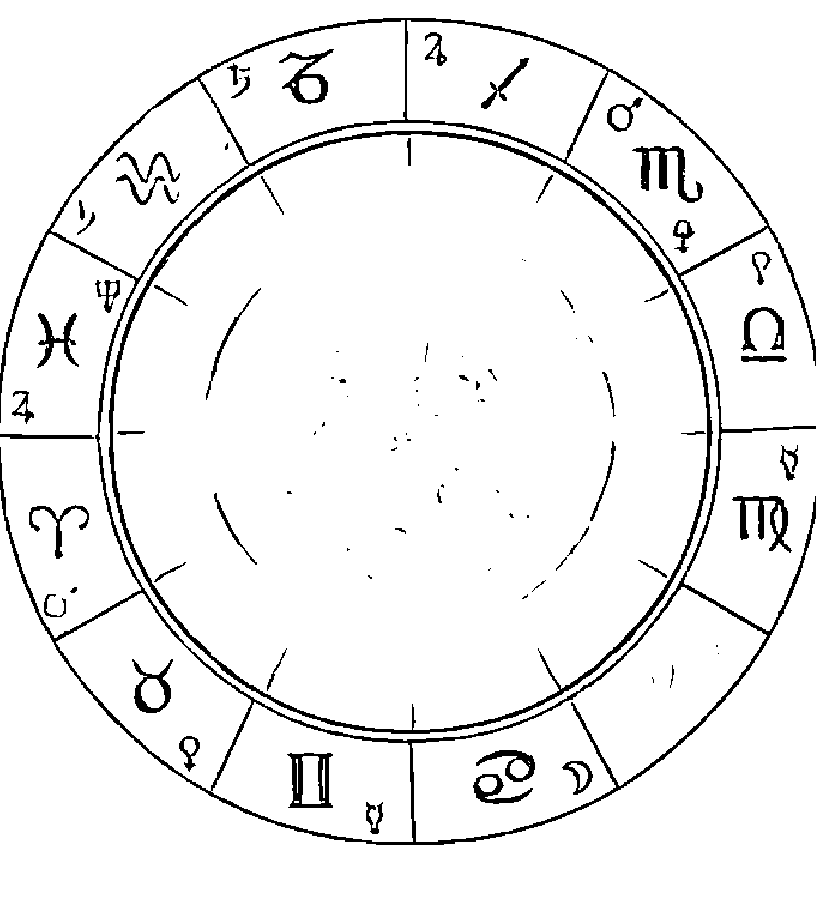

## 太陽12星座強弱表

|   | 星座       | 強度/度數     |
|---|------------|---------------|
| (旺) | ♈ (白羊)   | (廟) 10°~19° |
|    | ♉ (金牛)   |               |
|    | ♊ (雙子)   | (廟) 20°~29° |
|    | ♋ (巨蟹)   |               |
| (陷) | ♌ (獅子)   | (廟) 0°~9°   |
|    | ♍ (處女)   |               |
| (陷) | ♎ (天秤)   | (廟) 10°~19° |
|    | ♏ (天蠍)   |               |
|    | ♐ (射手)   | (廟) 20°~29° |
| (陷) | ♑ (摩羯)   |               |
|    | ♒ (水瓶)   |               |
|    | ♓ (雙魚)   |               |

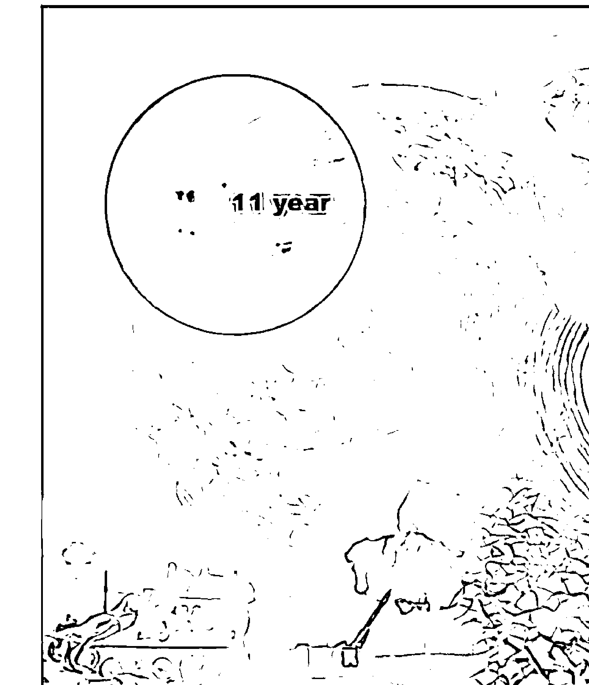

# 太陽的不同週期

太陽是影響我們最深最重要的一顆星。他的光亮孕育了所有的生命，造成全球季節的變化。當日蝕出現時，森林中的鳥兒會在二十四小時之前停止歌唱。整個日蝕期間，森林中的動物都變的像受威脅般，充斥著憂慮與不安。鳥兒停止鳥鳴，猴子會群聚在一起互相保護。令人驚訝的是這些平常喋喋不休的動物，在日蝕期間卻變得非常安靜，整個地球都突然靜止下來，可見太陽的重要性。

太陽並非如我們認為的是一顆靜態的火球，它是一顆擁有無限活力、動能的有機體，無時無刻不在改變他的狀態。當太陽只是些微的改變他的狀態，地球上的生命就會受到影響。從樹木年輪的研究發現，每十一年太陽的核能放射最活躍時。這一年，全球所有的樹都形成一個較寬的圈圈，所有的樹都有相似的行為，為保護自己免於強烈的放射線，樹木每十一年會長出較厚的皮。

全球戰爭的發生有著十一年的週期，流行病也有著十或十一年的週期，革命也跟隨著大約十或十一年的週期。1920年一位蘇俄科學家Chijevsky，在深入研究後發現，太陽每十一年會發生巨大的爆炸，每十一年會有一次核爆。他發現每當太陽出現核爆時，地球就會開始發生戰爭或革命。依照他所說，過去七百年來，當太陽出現這種現象，地球就有災難。

這種十一年的週期與太陽黑子的週期是一致的。針對這個週期，日本一位醫生得到驚人的發現。這位醫生二十年來一直在研究女性的血液。他發現女性的血液裡有一種男性缺少的特性。在月經期，女性的血液會變薄，同時懷孕期也會變薄，但是男人的血液不會變化。他認為這是男女血液之間一個基本的不同。但是當太陽出現核爆時，男人的血液也會變薄。當太陽黑子出現並且在太陽上增加時，地球上的疾病就會增加，當太陽黑子減少時，地球上的疾病也減少。

科學家最近才發現，就像太陽每十一年的黑子週期一樣，每九十年太陽還有另一個類似的週期。在前四十五年太陽是年輕活力的，之後的四十五年開始衰退老化。有四十五年的時間，能量流入太陽中，使太陽處於年輕的巔峰。四十五年之後，就像人類的衰老一般，進入能量的倒退期。在前四十五年太陽處於年輕期時，整個太陽系都充滿能量且往上朝向巔峰，是地球上流行病最少的時期。在後四十五年期間，地球容易邇受地震的打擊，疾病的數目也達到最高點。

## Moon

月亮：情緒

心情感覺、習慣反應、記憶力、陰性功能、媽媽的影響、感受力。
性質：吉 | 冷、濕 | 陰性 | 夜晚行星
主宰：巨蟹座 | 第四宮
星期：星期一
週期：每隔27天運行一圈，相位影響約一天。
逆行：月亮沒有逆行。
運行：情緒的週期。生活的陰晴圓缺與悲歡離合、引發心情反應的人事物、陰性的能量、某個女性、潛意識。

月亮星座代表個人如何面對環境。如何運用過往的記憶，以何種方式反應他的情緒，及他們跟生活中重要的女性是什麼樣的關係，對他們產生什麼樣的影響。月亮宮位代表個人在什麼樣的人生場景中對他們的情緒產生影響。他們的記憶與過去經驗強烈的影響什麼樣的人生情境。

月亮代表的是引力的方向，代表有引力的影響，因此情緒容易受到環境的影響而變化，象徵緣份、緊密的關係、被動、具有依附性。同時月亮的力量也是完整的，一方面受引力吸引，一方面也吸引別人。

# 象徵意義
- 正：母性的、溫馨的、安全的、同情心的、感性的、念舊的、記憶力佳的、傳統的、保守的、敏銳的、保護的、內斂的。
- 負：防衛的、情緒化的、記仇的、心胸狹隘的、害羞的、不穩定的、過敏的、娘娘腔的、搬弄是非的。
- 身：胃、消化系統、腹部、乳房、子宮、卵巢、月經、男性右眼、女性左眼。
- 疾：女性病、消化不良、情緒不穩、貧血、胃病、腹痛、腫瘤。
- 人：母親、妻子、女性自己、人民、接生婆。
- 事：懷孕、生產、潮汐、情緒、吃、土地、不動產。
- 物：銀、珍珠、兩棲類、甲殼類、螃蟹、瓜類、鏡子、生活用品。
- 地：住家、水陸交界、田園、小吃攤、港。

| 星座 | 強弱 |
|------|------|
| 白羊座 | |
| 金牛座 | 強 10°~19° |
| 雙子座 | |
| 巨蟹座 | 強 20°~29° |
| 獅子座 | |
| 處女座 | |
| 天秤座 | 強 0°~9° |
| 天蠍座 | |
| 射手座 | 強 10°~19° |
| 摩羯座 | |
| 水瓶座 | 強 20°~29° |
| 雙魚座 | |

## 太陽與月亮

在占星學中，認爲影響一個人最重要的兩顆星就是太陽與月亮。他們影響人世的層面遠大於其他行星的影響，光這兩顆星就佔了50%以上的影響力，因此可以知道它們對我們的重要性。

太陽是太陽系的中心，是地球上所有生命的根源，如果沒有了太陽，那麼一切的生命都不可能存在。因此，太陽象徵生命力與一切事物的中心。

太陽對我們最明顯的影響就是四季的變化，在黃道帶上，太陽分別在春夏秋冬的第一天穿過牡羊座，巨蟹座，天秤座和魔羯座的0度位置這四個基本點點。所以地球上的生命和季節流年息息相關，因而這些點和我們的生活密切關連。任何一個行星跨越這四個點時，都釋放出巨大的能量。每一年的週期中，生物隨著陽光的變化調整著生命的週期，春天繁殖、夏天旺盛、秋天成熟、冬天蘊藏，週而復始。所以，我們每一年隨著太陽而有著生命力的週期變化。

月亮是地球的衛星，因爲距離的關係，所以月亮的重力對我們的影響也就特別清楚。地球的潮汐、人體的水分以及女人的經期變化都明顯的跟月亮有關。因此，月亮決定了我們身體一個月週期的循環。

月亮除了重力對我們的影響外，她同時能夠反射太陽光，由於日月間相對位置的不同，因而產生陰晴圓缺的變化，這樣的變化產生的是光線角度的不同，對我們產生一個月週期的感受力變化。

如果以農曆生日來看，我們就可以很容易看出太陽與月亮的關係，初一出生的人，是太陽與月亮合相的人，這樣的人外在個性與內在情緒一致，因此有很明顯的人格特質。15月圓出生的人，太陽與月亮對相，他們的外在個性與內在情緒剛好相反，因此，他們的情緒變化很清楚，狼人是在月圓時變身的。10日、20日出生的人，太陽與月亮呈120度和諧相位，因此這些人內外調和，性情穩定。而7日、23日附近出生的人，太陽與月亮呈90度，因此這些人多半內外不調和，性格上容易發生問題。

# 日、月蝕

日月由合相到下一次合相構成了一個月相週期，也就是一整個農曆月份，這個太陽與月亮之間形成的週期性圓缺變化是特別有意義的，而在這個週期中，新月和滿月的位置是最關鍵的。這個週期變化中偶爾會形成兩個極為特別的天象，日蝕（大新月）與月蝕（大滿月）現象，日蝕是一種特殊的新月形式，在這個相位上月亮完全擋住了太陽光。而月蝕是一種特殊的滿月形式，此時，月亮完全躲在了地球的後面。因為這樣特別的天象對人對萬物具有特別的感受，因此每一次的日月蝕都具有特別重要的意義。

日蝕和月蝕的影響可以被稱作“強大的新月”或是“強大的滿月”效應，他們可以產生一種轉變性的力量，深刻影響我們。日蝕與月蝕通常是危險的，而且影響深遠。影響期限通常是六個月到一年。

由於日月蝕的重要性，人們也注意到月亮軌道（白道）與太陽軌道（黃道）的兩個月交點。每年太陽在月亮南北交點其中一個附近時，日月與交點形成一直線，就是形成日、月蝕的關鍵時刻。當太陽在南北交點18度左右時，是日、月蝕容易發生的位置。如果太陽靠近到10-12度內，就會形成日、月全蝕。在12-18度時，通常會形成偏食。

太陽每隔大約173天從一個交點移到另一個交點，因此大約每隔173天就可能出現一次日、月蝕。因為太陽每天移動1度，因此十八度的容許度，讓太陽可以在每一個交點的有效範圍長達36天來形成日月蝕。同時由於月亮約30天運行一週，因此當太陽處於這些位置時，會形成1到3次日、月蝕。這個長達一個多月的時期稱為“日、月蝕季”。

# 日月蝕的發生

如□每年當地球運行到□中紅色位置時，地球、太陽與月交點合連成一線，而當月亮也運行到月交點的位置時，就會生日月蝕的現象

# 月球的交點

月交點(Moon's Nodes)有兩個，就是一般所稱的南北交點，是月球軌道越過黃道面時的交點，因此北交點和南交點的位置永遠是相對的。月交點每隔18.6年逆行繞黃道一週，在每個星座約停留一年半左右。北交點也稱為龍頭，中國稱為羅喉，代表獲得、增加信心的點，類似木星的性質，是個人追尋的領域。南交點也稱為龍的尾，中國稱為計都，代表過去、必須捨棄的點，類似土星的性質，是前世遺留的領域。

在占星學中，月交點在命盤上具有舉足輕重的作用。南交點代表一個人從何處而來。象徵一個人的根源、前世、個人的遺傳基因，與生俱來的能力與天賦，是一個人安身立命的根基，也就是前世的業報。他可能是好的，也可能是先天的一種不足，一個阻礙個人發展的障礙。而相對的北交點代表我們今生將希望達到的方向，也影響著來生。象徵拋棄舊有的包袱，往超越自己的方向成長，它代表著“靈魂要去的方向”。

南北交點在靈魂、心靈與神秘占星中具有極重要的地位，他們認為南北交點象徵著一個人靈魂、精神的潛力和通向新境界的橋梁，是個人靈魂在潛意識中的自我設定。代表我們這一生所需要實現的目標，這樣才能讓自己的靈魂得到滿足。

在靈魂占星學中南交點代表個人前世所有一切的因，在今生所形成的果，是一個人前世的記憶，前世遺留下來的行為習氣、慣性行為和特性等種種的痕跡。代表一個人運用前生的經歷以新的角度處理今生的一切。而北交點是今生必須面對的靈魂進化課題，代表通往来生的理想與目標，是靈魂想要達成的今生目標，也是靈魂進化的方向。

月亮在占星中特別重要，由於月亮象徵潛意識層面，因此跟月亮相關的這些點也都與潛意識脫不了關係

# 黑月

月亮繞地球的軌道是橢圓形的。橢圓有兩個焦點，其中一個焦點是地球，另一個焦點被稱為黑月或莉莉絲。遠地點和第二個焦點位於橢圓同一個長軸上，所以黑月也是月亮軌道中離地球最遠的那個點，同時也是地球與月球的重心，黑月的公轉週期為9年，在中國稱為月孛。

月亮是我們內在意識和本能的反應，而黑月則反映了我們內心中尚未被我們自身所感知的無意識活動。他是月亮跟地球之間更深一層的聯繫，是屬於看不到的潛意識層面，象徵不能表現出來，在無意識中受到壓抑的情感，代表一個人有時會突然消失的功能，被隱藏的一面，也是陰影的象徵。

他暗示了失敗與挫折，是我們在通往成功道路時的荊棘與歧路，而且經常出現在我們所迫切希望的領域上，而且經常是我們自己的庸人自擾。透過黑月可以瞭解到我們沒有意識到但又確實存在內心的東西，或是自己刻意壓抑的情感慾望。

## Mercury
水星：思想

想法、溝通能力、學習能力、吸收資訊、聯絡、說話表達、中性的、智慧、知的慾望。
性質：中 | 中性 | 中間行星
主宰：雙子座 | 第三宮；處女座 | 第六宮
星期：星期三
週期：公轉週期88天，相位影響約二天。
逆行：每年3-4次，每次約20天。
運行：思緒的週期。吸收資訊與溝通的機會、使自己對外接觸的人事物、朋友、資訊的獲得、動腦筋的事。與太陽不超過28度。

水星星座表示出一個人以什麼樣的方式表達他們的思考能力。他們如何與外界溝通，對什麼樣的事物能引起他們的興趣。從水星宮位可以知道個人的思想從何種人生情境中形成。他們花心思在什麼樣的人生情境。另外，因為水星是溝通的能力，他必須有一個媒介，因此與水星最鄰近的行星會對水星有所影響。

# 象徵意義
- 正：機靈的、聰明的、多樣化的、多才多藝的、反應快的、能言善道的、活潑的、善溝通的、傳播的、有趣的、理性的。
- 負：狡猾的、多嘴的、矛盾的、善變的、神經質的、奸詐的、膚淺的、虎頭蛇尾的、八卦的、淘氣的。
- 身：手、肺部、呼吸系統、耳朵、神經系統、腦。
- 疾：神經衰弱、呼吸毛病、手疾、耳疾。
- 人：手足、好友、鄰居、作家、發言人、商人、郵差、傳播業者、推銷員、同學。
- 事：廣播、文書、交通、運輸、八卦、諮商、手藝、想法。
- 物：水銀、狐狸、猴子、鸚鵡、豆類、胡桃類、信、海報。
- 地：商店、學校、郵局、廣播站、車站、捷運站。

## 水星12星座強弱表
| 符号 | 星座符号 | 度数范围 |
|---|---|---|
| ♈ (白羊座) | 界 14°~20° |
| ♉ (金牛座) | 界 0°~9°；界 8°~14° |
| ♊ (雙子座) | 界 0°~6° |
| ♋ (巨蟹座) | 界 10°~19°；界 13°~19° |
| ♌ (獅子座) | 界 6°~12° |
| ♍ (處女座) | 界 0°~6°；界 20°~29° |
| ♎ (天秤座) | 界 19°~23° |
| ♏ (天蠍座) | 界 21°~26° |
| ♐ (射手座) | 界 0°~9°；界 14°~18° |
| ♑ (摩羯座) | 界 6°~11° |
| ♒ (水瓶座) | 界 6°~11°；界 10°~19° |
| ♓ (雙魚座) | 界 13°~20° |

## Venus
金星：愛情

喜好、喜歡、吸引力、愛的能力、女朋友、美的事物、享樂、愛的慾望。

性質：吉 | 冷、濕 | 陰性 | 夜晚行星

主宰：金牛座 | 第二宮；天秤座 | 第七宮

星期：星期五

週期：公轉週期225天，相位影響約五天。

逆行：每1.5年逆行一次，每次約45天。

運行：喜好的週期。桃花運、讓自己喜愛的人事物、異性（偏女性）。享樂的機會、美的饗宴、人緣佳受歡迎。與太陽不超過48度。

金星星座表現出一個人表達自己喜好的方式。對於自己喜歡的東西，會以什麼樣的方式表現出來，以及他們如何表現愛。而金星的宮位代表了一個人自己的喜好表現在什麼樣的人生場景。在什麼樣的生活層面中，可以找到我們的愛人。在什麼樣的環境中付出我們的愛。

金星代表的是一種吸引力與凝聚力，他能夠使物質穩定，將能量固定成物質，因此具有安定、和諧、固定的特質。同時象徵吸引人的魅力。

# 象徵意義
- 正：吸引人的、美的、可愛的、藝術的、協調的、和諧的、高雅的、喜悅的、社交的、和平的、桃花的、浪漫的、穩定的。
- 負：好色的、淫蕩的、享樂的、放縱的、懶散的、濫情的、物欲的、固執的、貪婪的。
- 身：喉嚨、腎、腰部、頸部。
- 疾：扁桃腺發炎、腎病、甲狀腺病變、桃花病。
- 人：美人、愛人、藝術家、金融業者、社交名流、美食家。
- 事：流行時尚、愛情、婚姻、藝術、社交、金融、歌曲、合夥。
- 物：銅、鴿子、玫瑰、有核的甜果、藝術品、化妝品、服飾、珠寶、有價值的東西。
- 地：美術館、音樂廳、金融機構、花園、約會地點。

- 淡褐
- 桃紅
- 粉綠
- 淡藍

## 金星12星座強弱表

| 符号 | 星座符号 | 度数范围 |
|---|---|---|
| ☍ | ♈ | 弱 5°~13° 強 20°~29° |
| ⚹ | ♉ | 弱 0°~7° 弱 13°~21° |
| | ♋ | 弱 0°~9° 強 19°~26° |
| | ♌ | 弱 13°~18° |
| ⚼ | ♍ | 弱 7°~12° 強 10°~19° 弱 6°~10° |
| ☍ | ♏ | 弱 14°~20° 強 20°~29° |
| | ♐ | 弱 8°~13° |
| ⚹ | ♑ | 弱 6°~12° |
| | ♒ | 弱 0°~9° 強 12°~19° |
| ⚼ | ♓ | 弱 0°~7° |

## Mars
火星：慾望

行動力、佔有慾、精力、競爭力、性衝動、男朋友、生理的慾望、鬥爭。
性質：凶｜熱、乾｜陽性｜夜晚行星
主宰：牡羊座｜第一宮；天蠍座｜第八宮
星期：星期二
週期：每隔2年運行一圈，相位影響約二星期。
逆行：每二逆行一次，每次約二個月。
運行：行動的週期。性衝動、使自己想征服佔有的人事物、衝突、競爭者（偏男性）出現、意外傷害、暴力。

火星星座代表一個人以何種方式完成他們的慾望。他們的脾氣如何，以什麼樣的方式與他人競爭。如何展現他們的精力。火星的宮位表現出一個人對什麼樣的人事具有慾望。在什麼樣的場景發揮精力，他們的慾望在什麼樣的地方。在什麼地方會讓他們衝動，容易與他人爭執。

火星與金星相反，代表掙脫的力量，突破穩定的狀態，在掙脫的過程中釋放能量與慾望，因此象徵著衝動與破壞性、分割與裂解、銳利與切斷。

# 象徵意義
- 正：勇敢的、精力充沛的、競爭的、積極的、果斷的、衝勁的、活躍的、野性的、迅速的。
- 負：好戰的、性急的、暴烈的、草率的、粗魯的、危險的、有勇無謀的、衝動的、性慾的、傷害的、意外的、侵略性的。
- 身：頭、肌肉、紅血球、泌尿系統、生殖器。
- 疾：頭痛、發炎、性病、發燒、出血、刀傷、燙傷。
- 人：戰士、軍人、外科醫師、鐵匠、屠夫、理髮師、好打鬥的人。
- 事：打架、戰鬥、競爭、開刀、生氣、意外傷害、火災、性。
- 物：鐵、老虎、野狼、鯊魚、辣椒、刺激性植物、火、尖銳物、烤箱、武器、針、手術刀。
- 地：戰場、屠宰場、競技場、爐灶、五金行、手術室。

| 力量 | 星座 | 度數範圍 |
|---|---|---|
| ⚢ | ♈ | 🜛 0°~9° 🜛 21°~25° |
| ♄ | ♉ | 🜛 26°~29° |
| | ♊ | 🜛 10°~19° 🜛 26°~29° |
| ♃ | ♋ | 🜛 0°~5° |
| | ♌ | 🜛 20°~29° 🜛 25°~29° |
| | ♍ | 🜛 25°~29° |
| ♄ | ♎ | 🜛 25°~29° |
| ⚢ | ♏ | 🜛 0°~5° 🜛 0°~9° |
| | ♐ | 🜛 25°~29° |
| ♄ | ♑ | 🜛 10°~19° 🜛 19°~24° |
| | ♒ | 🜛 25°~29° |
| ♃ | ♓ | 🜛 20°~25° 🜛 20°~29° |

## Jupiter
木星：幸運

積極面、自信、拓展、擴張、機會、樂觀、向外性、好運。
性質：大吉 | 熱、溼 | 陽性 | 白天行星
主宰：射手座 | 第九宮；雙魚座 | 第十二宮
星期：星期四
週期：每隔12年運行一圈，相位影響約二個月。
逆行：每年逆行一次，每次約四個月。
運行：向外擴張的週期。得到機會、貴人、使自己更能向外發展的人事物、新發展、幸運的事、快樂。

木星所在的星座具有一個年份的整體象徵意義。代表一個人如何表現出自己樂觀的一面。一個人如何向外擴張，他如何與他人分享以及如何變得幸運。木星的宮位代表一個人的自信在何處。在什麼樣的環境得到幸運，什麼樣的環境會令他們積極，分享自己。

# 木星12星座強弱表
| 符號 | 星座 | 強度範圍 |
|---|---|---|
| ♈ | 牡羊 | 界 0°~5° 外 0°~9° |
| ♉ | 金牛 | 界 15°~21° |
| ♊ | 雙子 | 界 7°~13° 外 10°~19° |
| ♋ | 巨蟹 | 界 6°~12° |
| ♌ | 獅子 | 界 19°~24° 外 20°~29° |
| ♍ | 處女 | 界 13°~17° |
| ♎ | 天秤 | 界 11°~19° |
| ♏ | 天蠍 | 界 6°~13° |
| ♐ | 射手 | 界 0°~7° |
| ♑ | 摩羯 | 外 0°~9° 界 19°~24° |
| ♒ | 水瓶 | 界 25°~29° |
| ♓ | 雙魚 | 界 8°~13° 外 10°~19° |

木星代表的是向外擴張的能力，具有膨脹性與擴大性，象徵大而展，積極向外發展，因為自信而幸運，突破時間的限制。

# 象徵意義
- 正：幸運的、樂觀的、積極的、發展的、快樂的、大智若思的、單純的、道德高尚的、寬大的、慷慨的、仁慈的、自信的。
- 負：揮霍無度的、浪費的、放縱的、偽善的、盲目的、狂妄的、不知變通的、誇大的。
- 身：肝、臀部、大腿、胰臟、脂肪。
- 疾：肝病、肥胖、糖尿病、中風。
- 人：貴人、外國人、公理的裁判者、聖人、哲學家、探險家、宗教家、教授、旅人。
- 事：真理、智慧、好運、外國、新視野、旅行、宗教、高等教育。
- 物：錫、大象、鯨魚、葡萄、橡樹、箭、舶來品、飛機、輪船。
- 地：大學、法庭、教堂、國外、開放空間、大平原、異域、天空。

## Saturn [土星：責任]

壓力、忍耐力、限制、悲觀、收縮、消極面、孤獨、時間。
性質：大凶 | 冷、乾 | 陰性 | 白天行星
主宰：摩羯座 | 第十宮；水瓶座 | 第十一宮
星期：星期天
週期：每隔29年運行一圈，相位影響約四個月。
逆行：每年逆行一次，每次約四個半月。
運行：向內壓縮的週期。壓力、責任、使自我產生限制的人事物。難關，必須努力克服的事、苦惱與壓抑。

土星星座具有二個半年份的整體象徵意義，代表了一個人如何克服他的難關。他的壓力是何種模式，他們如何面對挑戰，如何負起責任，建立自己的事業。土星的宮位代表一個人的壓力來自何處。他們必須克服什麼樣的困難，他們會努力不懈以求得什麼樣人生環境的改善。

# 象徵意義

- 正：有計畫的、系統的、組織性的、自律的、節儉的、謹慎的、負責的、有耐力的、守時的、實事求是的、責任感的。
- 負：悲觀的、壓抑的、不幸的、嚴峻的、刻板的、多疑的、實際的、自私的、重利的、狹隘的、卑鄙的、不擇手段的、困苦的。
- 身：關節、骨骼、牙齒、表皮、膝蓋、脾臟。
- 疾：慢性疾病、皮膚病、關節炎、牙疾、結石、骨骼的毛病。
- 人：磨練者、老人、建築師、官僚、警察、政客、死神。
- 事：時間、挑戰、困難、建築。
- 物：鉛、煤礦、夜間動物、禿鷹、蚊子、蟑螂、有毒的植物、陶器、棺材、磚瓦。
- 地：礦坑、高山、墳地、老舊的場所、工地、監獄。

土星12星座強弱表
| 星座 | 度数范围 |
|------|----------|
| 白羊座 | 26°~29° |
| 金牛座 | 22°~25°, 20°~29° |
| 双子座 | 21°~24° |
| 巨蟹座 | 27°~29° |
| 狮子座 | 0°~6°, 0°~9° |
| 处女座 | 18°~23° |
| 天秤座 | 0°~5°, 10°~19° |
| 天蝎座 | 27°~29° |
| 射手座 | 19°~24°, 20°~29° |
| 摩羯座 | 25°~29° |
| 水瓶座 | 0°~5°, 0°~9° |
| 双鱼座 | 26°~29° |

## Uranus [天王星：改变]

創新、除舊、革命、新奇、與眾不同、怪異、獨特性。

性質：吉凶參半 | 冷、乾 | 中性 |
主宰：水瓶座 | 第十一宮
星期：無
週期：每隔84年運行一圈，相位影響約一年。
逆行：每年逆行一次，每次約五個月。
運行：自我改變的週期。新變局、使自我產生改變的人事物。突發事故、新奇有趣的際遇、新發現。

天王星星座具有世代象徵意義，代表一個七年的整體性改變以何種方式表現。這種改變如何進行，跟什麼相關。天王星的宮位表示了一個人在什麼情況下改變自己。他們對什麼樣的人生環境想做變化，什麼樣的人生狀況會使他們突破傳統，改變自己。

天王星代表的是離心力，脫離中心的力量，象徵著非主流，也表示突然的脫離常軌，具有突發性，是突破主流、改變常軌的力量。

- 正：創意的、發明的、天才的、自由的、個人風格的、獨立的、突破傳統的、新奇的、與眾不同的、未來的、革新的。
- 負：古怪的、叛逆的、突變的、孤傲的、分離的、反常的、乖戾的、無法無天的、不負責任的、革命的、不可預期的。
- 身：腳裸、松果體、小腿、脛骨。
- 疾：突發的疾病、小腿、腳裸的毛病、痙攣、急性的神經狀況。
- 人：天才、發明家、科學家、革命份子、同志、議員、怪人。
- 事：革命、發明、天文占星、未來科技、同性戀。
- 物：群體移動的鳥、蜜蜂、電、新科技產品、太空船、電腦。
- 地：太空、實驗室、群眾聚集地、有未來感的場所。

| 星座 | 符号 |
|------|------|
| 白羊座 | ♈ |
| 金牛座 | ♉ |
| 双子座 | ♊ |
| 巨蟹座 | ♋ |
| 狮子座 | ♌ |
| 处女座 | ♍ |
| 天秤座 | ♎ |
| 天蝎座 | ♏ |
| 射手座 | ♐ |
| 摩羯座 | ♑ |
| 水瓶座 | ♒ |
| 双鱼座 | ♓ |

# 3 PLANETS LEVEL 2

# 2 行星論

## Neptune [海王星：渴望]

夢想、非現實性、幻想、想像力、迷惑、朦朧、昇華、墮落。

- 性質：吉中帶凶｜冷、濕｜陰性｜
- 主宰：雙魚座｜第十二宮
- 星期：無
- 週期：每隔165年運行一圈，相位影響約二年。
- 逆行：每年逆行一次，每次約五個半月。
- 運行：精神轉化的週期。迷惑與夢幻、消融的力量、引發自己精神昇華的人事物、騙局、夢想成真、受到蠱惑。

海王星所屬的星座代表一個14年世代的共同夢想如何表現。這樣的渴望，以何種形式表現出來，造成什麼樣的影響。海王星所屬的宮位代表一個人的渴望與夢想在什麼樣的人生環境。他們將在什麼樣的情境中昇華自己或是墮落。什麼樣的人事使他們迷惑。

海王星象徵不斷的向外融合一切的力量，具有融化性與超強的包容力，象徵無邊無際與虛幻，代表想像力，容易雜亂、迷惑、空洞而虛浮。

# 象徵意義

正：夢想的、想像力的、靈性的、包容的、悲天憫人的、同情心的、藝術感的、心靈的、迷人的、第六感的、精神性的。
負：虛幻的、不切實際的、墮落的、迷惑的、模糊的、混亂的、欺騙的、癱瘓的、上癮的、中毒的、秘密的、不倫的、催眠的、蠱惑的、虛偽的、不知所措的。
身：腳、視丘、淋巴系統、組織液。
疾：精神性的病、腳疾、淋巴腺病變、中毒、昏睡、夢遊。
人：照相師、心靈導師、神棍、邊緣人、醫生、靈媒、吸毒者。
事：上癮、夢、睡眠、不倫、秘密、隱居、電影、共產主義。
物：酒精、毒品、魚、水晶、麻藥、影像、藥物。
地：海、醫院、夢幻的場所、救濟院、水族館、靈修的場所。

| 星座 | 强弱/状态 |
| :--- | :--- |
| ♈ | (空白) |
| ♉ | (空白) |
| ♊ | (空白) |
| ♋ | 弱 |
| ♌ | (空白) |
| ♍ | 强 |
| ♎ | (空白) |
| ♏ | (空白) |
| ♐ | (空白) |
| ♑ | 弱 |
| ♒ | (空白) |
| ♓ | 强 |

## Pluto [冥王星：潛能]

破壞力、重生、潛在的能量、黑暗面、轉型、控制慾、危機。

性質：凶中帶吉｜熱、乾｜陽性｜

主宰：天蠍座｜第八宮

星期：無

週期：每隔248年運行一圈，相位影響約二年半。

逆行：每年逆行一次，每次約半年。

運行：重生蛻變的週期。大破壞、大轉變、引發自己內在黑暗面與潛能的人事物。脫胎換骨、受到強迫、危機。

冥王星所屬的星座代表一個20年世代的劇烈轉變以何種形式表現，這樣的蛻變可能帶來新生，也可能造成毀滅。冥王星所屬的宮位代表一個人的潛能所在，他將在什麼樣的情況中蛻變。什麼樣的環境將使他脫胎換骨或毀滅自己。

- 深褐
- 暗紅
- 深紫紅

冥王星代表的是外在的壓力壓縮造成內在的崩潰，產生爆裂，將物質轉換成強大的能量，象徵極度的控制與內部強烈的掙脫慾望，這股力量可以造成強大的破壞或重生。

# # 象徵意義

- 正：潛力無窮的、蛻變的、脫胎換骨的、有情有義的、愛恨分明的、神秘的、強烈意志的、執著的。
- 負：強迫的、控制慾的、暴烈的、忌妒的、專制的、陰險的、報復的、殘忍的、虐待狂、變態的、慾望強烈的、恐怖的、侵略的、極端的、兇狠的、黑暗面的。
- 身：性腺、再生組織、排泄系統、新陳代謝系統、胎記、黑痣。
- 疾：腫瘤、排泄器官疾病、性暴力、生殖腺病變、免疫系統障礙。
- 人：黑道份子、犯罪者、地下工作者、間諜、恐怖份子。
- 事：黑道、死、遺產、性、陰謀、地下活動、保險、陰影。
- 物：石油、爬蟲類、毒蛇、蜘蛛、排泄物、垃圾、地底的寶藏。
- 地：地底、火山口、下水道、水溝、廁所、垃圾場。

| 星座 | 強弱 |
| :--- | :--- |
| ♈ 白羊 | |
| ♉ 金牛 | 弱 |
| ♊ 雙子 | |
| ♋ 巨蟹 | |
| ♌ 獅子 | 強 |
| ♍ 處女 | |
| ♎ 天秤 | |
| ♏ 天蠍 | 強 |
| ♐ 射手 | |
| ♑ 摩羯 | |
| ♒ 水瓶 | 隱 |
| ♓ 雙魚 | |

# ## 冥王星12星座強弱表

# 小行星

小行星是直到1800年代才首次被天文学家发现。是太阳系形成时所遗留下来的岩石碎片，主要集中在火星和木星之间，我们称为小行星带。小行星的大小不一，大至直径940公里的谷神星，小的直径只有几百米。小行星大多以椭圆形的轨道绕太阳公转，有时会被行星的引力牵引而被抛出小行星带，因此小行星轨道变化很大。在这些小行星中，体积较大、较早发现和比较重要的有五颗，其中以谷神星体积最大，直径940公里。近年来欧洲的占星学家开始重视起谷神星的影响，将他的象征意义定义为理性和分析结合起来的智慧，甚至认为它才是处女座的主宰行星。水星代表的沟通与连结的媒介比较属于双子座的象征。而谷神星所代表的意义却更接近处女座的象征。至于智神星、婚神星、灶神星的重要性目前并没有准确定义。他们的象征意义和谷神星是差不多的，因为这几颗星其实是一体的细部组成，而这也跟处女座相合。

另外，在土星和天王星之间的凯龙星也非常受重视。凯龙星被占星学家看成是一颗代表特殊智慧和伤痕的星体。它的象征意义也没有得到过仔细认真的论证。这些新星具有其未知性，带着令人感到神秘的能量。这同样象征着新时代意义象征，因此实际上对这些小行星的象征的描述目前分歧较大，并没有非常同一的描述。他们在占星的论断上目前只有参考意义，但是随着时间的演进，他们将会慢慢表现出他们的个性，发生重要的影响，就像三王星一样。

# ## 凱龍星 (Chiron)

凯龙星是在1977年11月1日所发现的，它的直径大约是一般彗星大小的100倍，但又比冥王星类的行星小很多，所以在最初的理解中，凯龙星不能算一颗真正的行星，只是一颗小行星大小的星体。他位于距小行星带很远的地方，运行轨跨越了土星轨道，并向天王星延伸，穿越了土星和天王星的轨道，所以它的运行轨道不是椭圆形的，而是略呈现出三角形。由此可看出凯龙星象征不符合任何已有的规则和概念。

凯龙星的运行周期是50.68年。在凯龙星发现之前，就已经有两位占星学家Dane Rudhyar以及Charles Jayne预言了凯龙星的出现，并且点出了凯龙星的特質。Jayne曾說：「這顆星的運行時間是五十年，約有兩年的上下空間，並且它的運行軌道是搖擺在土星的軌道之上」。

在占星學上，凱龍星被認為是聯繫時間與空間的橋樑，象徵折磨與醫療傷痛，反映我們生命中的傷痕，代表了靈魂的傷痛處。在個人命盤上的位置，象徵有關個人在幼年時期受到的不可避免的意外傷害，這種傷害會在我們的心中留下無法完全痊癒的心靈傷痕，個人將伴著這個傷痕成長、發展，直到領會了傷痕的正面意義。同時通過與他人分享傷痕來幫助他人醫療內心的傷痛。

神話中，凱龍是隻半人半馬怪，是許多英雄的導師，教導希臘神話中英雄們音樂、戰術、道德和醫術。也是希臘神話中掌管醫藥之神阿斯克勒庇俄斯的老師。其所能發揮指導的能力範圍包括了軍事、醫藥和文化藝術等，具有多才多藝的特質，也點出了凱龍星的主要特性～導師，代表著完整的了解和直接的感覺。

凱龍星的主要特質，有下列幾項：

1.  引導：凱龍星具有導師的特質，擅長於帶領別人進入某一個領域，提供參考意見，或是指導方向。
2.  治療：凱龍星具有治癒的特質，包括生理上的健康治療和心理上的心靈撫慰，賦予一個人自我調節的能力。
3.  徘徊：從凱龍星運行在土星和天王星之間，代表它同時具有了土星組織壓縮和天王星分裂的特質，徘徊在這樣的狀態中，既想要結合，又想要分離。
4.  穿梭：凱龍星是不同世界的連接者。一端是天王星奇異的、未知的、創造性的世界；另一端則是土星傳統的、可知的、規範的世界。凱龍星能在現有格局中突破，能在現有的基礎上推陳出新。
5.  昇華：凱龍星象徵開啟智慧，有助於增長個人的智慧，具有跳躍的領悟特質，能夠洞察事物內在的本能，開啟各種新事物的領域，帶來思想、靈魂上的提升。

從心理學層面講，凱龍星象徵內心中的靈魂導師。從凱龍星的星座與宮位，可以瞭解這位導師要告訴我們什麼，我們將要面對的考驗、訓練與折磨，以及我們一直存在的傷痕所在，這樣的傷痕包括外傷以及憂傷。必須在精神上經過折磨與考驗，超越自我與了解傷痕的意義，才可以獲得痊癒，並從了解的過程中得到知識並得以幫助別人。凱龍所在的宮位象徵傷痕所在的領域。而凱龍的星座位置，表現了個人在經歷傷痛中會採用什麼樣的方法來痊癒自己，面對傷痛時的基本態度和處理方法。凱龍的位置就像一個包著繃帶的傷口，當運行星影響時就被打開，使我們的心靈造成打擊。

## 穀神星 (Ceres)

在四小行星穀神星(Ceres)、智神星(Pallas)、婚神星(Juno)和灶神星(Vesta)中，穀神星是最大的一顆，是火星與木星之間的小行星帶中，人類發現的第一顆小行星，發現日期在1800年1月1日，它是最大的一顆小行星，直徑有940公里，約月球直徑的1/4，公轉週期4.6年。剛發現時被列為行星，是月亮以外第二個象徵母親的行星。象徵懷孕、食物、家庭、發育。同時也象徵對自然環境的影響。

一般說來，穀神星對女性的影響力，要遠遠大於對男性的影響力。穀神星在女性命盤上與運行星發生相位時，往往是女性的重大人生時刻的來臨。可能表示的是懷孕生子、月經開始的時間、更年期的開始等。

神話中穀神是主管農業和豐收的女神色列斯(Ceres)，象徵著發育人類文明的肥沃土壤，被當作滋養生產的母親來被人們祭拜。穀神星與處女座的神話有關，色列斯就是處女座神話中女兒被冥神綁架的農耕女神迪米特。因此穀神星也被認為是處女座真正的主宰星，代表秋天果實成熟後的收成過程，她的重要性其實被低估了。

穀神星在星盤中代表了早期所接收到的發育與關愛以及我們是如何發育與關愛他人。也主宰我們的食物和衣服以及工作。由穀神星落入的星座表示了我們發育與關愛的方式和我們願意接受的發育與關愛。而從穀神星落入的宮位表示了我們表達和接受發育與關愛的領域。

## 灶神星 (Vesta)

灶神星是小行星带中较大的其中一个。直径约483公里，在小行星中排名第三，公转周期3.6年，由于表面的高反射率，因此是小行星中亮度最高的一颗。神话中维斯塔 (Vesta) 是宙斯的姐姐，掌管万民的家事。是一位贞洁处女女神。她为了守护圣火而拒绝了追求者，将一生奉献给神殿。因此她象征单身、承诺、专注、服务、独居与寂寞。

灶神星在星盘中的位置象征我们努力献身以及花费最大精力的地方。同时灶神星也会对我们的性欲有影响，有节制性欲的倾向。由灶神星落入的星座表示了我们努力献身的方式。而从灶神星落入的宫位表示了我们专注花费精力的领域。

## 智神星 (Pallas)

智神星是1802年发现的第二个小行星，直径600公里，公转周期4.6年。在神话中帕勒丝 (Pallas) 其实就是战神雅典娜，同时也是智慧女神。因此智神星是女权主义的象征。表示了我们预先计划的能力，以及安排组织解决事情的能力。

智神星在星盘中的位置象征以智慧及预先的规划解决问题，由智神星落入星座则表示了你更倾向运用哪一种方式规划事物。而由落入的宫位表示你善于计划与解决问题的领域。

## 婚神星 (Juno)

婚神星是在1804年发现的第三个小行星，直径247公里，公转周期是4.36年。在神话中朱诺 (Juno) 是宙斯的老婆。因此她代表婚姻、配偶，也代表不贞、虐待以及两性关系中的极力争夺。

婚神星在我们的星盘中暗示了我们真实需求的和将得到的婚姻伴侣是什么样的。是要实际生活在一起的，而不是我们所希望的婚姻伴侣。也象征真实面对婚姻关系的能力。由婚神星落入的星座表示了真正需要的配偶形式以及面对婚姻关系的方式。而从婚神星落入的宫位表示了我们在婚姻关系中实际关注的领域。

# 重要的恆星

占星既然是研究星星的學問，除了日、月、五大行星、三王星外，凡是天上的重要星象，都是占星研究的範圍，在古代，天空中特別明亮的恆星也是很重要的判斷依據，古人對恆星特別重視，恆星的數量雖然很多，但是有幾顆是特別受人關注的，像織女星、牛郎星、天狼星、北極星…等，在許多神話中他們都是主角。

在現代，我們知道行星在軌道上圍著太陽運轉時，太陽和我們的整個太陽系，也圍著銀河系的中心運轉，所以銀河中心點也特別重要，銀河中心的位置目前是在射手座26度49分，代表著一種超自我的精神力量。除了銀河中心外，另一個重要的點是超銀河中心，目前的位置在天秤座1度47分。了解這些重要點對人的影響就是屬於恆星占星學的領域。

> 占星家威廉・里利曾經說過：「恆星給人帶來天賦，它甚至能夠給一個貧窮的人帶來無上的財富和名聲，這是七大行星所做不到的。」

近代占星家將恆星影響範圍的允許度限定在1度以內，當行星與恆星在1度內合相時，恆星的力量會透過行星解放，而發揮影響力。其中尤其以ASC、MC、太陽、月亮與恆星的合相最為重要。以2000年為標準，從牡羊座開始，我們依次列出這些重要的恆星：

♈ (牡羊座14°18')：壁宿二 (Alpheratz)，吉，性質：♀♂♃
象徵：流行大眾化、名望、獨立性、尊榮、優雅。

♉ (金牛座07°40)：婁宿三 (Hamal)，凶，性質：♂♄
象徵：暴力、冷漠、殘忍、頭部傷害、預謀的犯罪，同時也是“治療者”。

♉ (金牛座14°14)：天大將 (Almach)，吉，性質：♀♂♃
象徵：藝術方面的成功、文學或藝術方面的創作能力或評鑑能力。

♉ (金牛座26°10)：大陵五 (Caput Algol)，極凶，性質：♂♄--♀
象徵：大陵五被古人稱為“邪惡之星”，代表絞死、斷頭、窒息、頭和喉部的危險，暴力、女性內在激情的能量。

## 2 行星論 3 PLANETS LEVEL2

（雙子座09°47）：畢宿五（Aldebaran），中性，性質：☿♂♃ 象徵：波斯的皇室之星，主雄辯、兇猛勇氣、榮譽聲望、才智，有煽動性的言論及行動的趨向，從他人處獲得財富以及權力，只要清廉正直則大成功，如果同流合污，則將導致失敗，會有暴力和疾病的危險。

（雙子座16°50）：參宿七（Rigel），吉，性質：♃♄♅ 象徵：代表法老王的腳，帶來技藝、教育文化、發明創作能力、幽默感、文藝、技術和藝術方面的才賦。

（雙子座20°57）：參宿五（Bellatrix），吉凶參半，性質：☿♂ 象徵：若歷盡艱辛將帶來大成功、開發大潛能，能獲得巨大的嘉獎。因盲目衝動或墮落而引起意外事件，突發的不名譽、爛桃花、醜聞、多嘴、忌妒。

（雙子座21°51）：五車二（Capella），吉，性質：☿♂ 象徵：喜歡速度、機靈、好學深思、追求知識，特別愛好新奇的東西。有力量決心能迅速採取行動，心胸寬廣、朋友緣佳、真誠的朋友。

（雙子座28°45）：參宿四（Betelgeuse），吉，性質：☿♂♃♄ 象徵：主應天賜之福、成功。抱負遠大有進取心、有教養、魅力迷人。

（巨蟹座14°5）：天狼星（Sirius），吉，性質：☽♂♃ 象徵：天狼星是天上除了太陽以外最亮的一顆星，埃及人稱之為“灼熱者”或“閃亮者”，代表起死回生、創造奇蹟，主野心、名望、財富。但遇火星主凶災，易被野獸咬傷。

（巨蟹座14°58）：老人星（Canopus），吉，性質：☽♃♄♅ 象徵：太平、吉祥、長壽，發現新路、新方法、新方向、新的未來。

（巨蟹座20°15）：北河二（Castor），中性，性質：☽☿♂♃♄ 象徵：與北河三為兄弟之星，主意外損失，手足的殘廢。也代表心智敏銳，分辨能力佳，不經考驗，自然而然成功。

（巨蟹座23°13）：北河三（Pollux），中性，性質：☽♂ 象徵：與北河二為兄弟之星，是一件事中折磨痛苦較多之一面，主投機、魯莽、無禮、敏感狡猾、詭計多端、不加思考的決定。也與毒藥有關，代表殘酷和衝動的本性，喜愛搏鬥、拳擊。

♋（巨蟹座25°47）：南河三（Procyon），凶，性質：☿♀♂♃♄ 象徵：主有名望但易隕落，崛起迅速也隕落容易。能夠迅速成功，但成功不久，會突然由高處跌落，不得善終。與政治暴力有關，驕傲自大、容易生氣、粗心大意，有暴力傾向、脾氣暴躁，莽撞無禮，為人輕浮，軟弱無能，膽小怯弱。也主被狗咬傷和狂犬病。

♌（獅子座07°21）：積尸氣（Praesepe），凶，性質：☿♂♆ 象徵：巧計、隱遁、盲目、陰謀、謀殺、高深莫測，也主火災、屍體。

♌（獅子座29°50）：軒轅十四（Regulus），吉，性質：♂♃ 象徵：波斯的皇室之星，古占星家用這顆星占卜帝王的命運，當火星接近時會發生不利於天子之事。代表尊貴、成就野心、寬宏大量、慷慨大方、雄心壯志、崇尚權力、發號施令、英勇無畏，象徵天賜大成功，有高尚的理想和精神力量。但若有報復之念頭，將突然地衰敗、受關押、慘死。

♍（處女座21°37）：五帝座一（Penebela），中性，性質：☿♀♂♄ 象徵：幸福轉成不幸，化喜為怒。主應吹毛求疵、保守固執、控制、缺乏想象力。要注意因違反傳統或脫離常軌而迎迫害之事。也代表自然災害、大災難。

♎（天秤座23°50）：角宿一（Spica），大吉，性質：☿♀♂♃ 象徵：天空大星之一，是被室女女神所捆綁的麥穗，代表女神新知識的禮物成就。象徵幸運之子，主順利、勝利、名譽、財富、尊榮、魅力、知識、繁榮。甜美的性格、愛好藝術與科學。

♎（天秤座24°14）：大角（Arcturus），大吉，性質：☿♀♂♃ 象徵：自創新局、新方法，走出前人未走出之路。主財富、榮譽名望、高的名譽、進取心、自我意志堅定。經由旅行而獲利以及航空航海貿易的繁榮。

♏（天蠍座19°22）：氐宿四（North Scale），凶，性質：☿♂♃ 象徵：主被詛咒、不幸、禍從口出、悲劇。

♏（天蠍座29°3）：南門二（Bangula），吉，性質：☿♀♂♃ 象徵：神秘的興趣，主玄學和哲學的興趣、自我分析能力。

（射手座09°46）：心宿二（Antares），凶，性質：☿♂♃♄ 象徵：波斯皇室之星，能帶來大成功，但因太過沈迷而突然的損失。代表不幸的預兆以及註定的災禍、對眼睛的傷害。頑強、好勝、打鬥、有軍事才能但惡毒、有毀滅性、天生魯莽、貪婪、剛愎，因頑固而害了自己。

（摩羯座15°19）：織女星（Vega），大吉，性質：☿♀♃♄♆ 象徵：政治上的幸運，有特殊動人之魅力，但也會被獨裁者濫用。代表魅力與魔法的大演說家，仁慈、深沈冷靜、實際、充滿希望、優稚得體，自命不凡但通常好色淫蕩。

（水瓶座01°47）：河鼓二（Altair），中性，性質：☿♂♃♄ 象徵：又名牛郎星，主有勇略、志氣、行動迅速、大膽、自信、勇敢、堅定。突然而短暫的運氣、突發的橫財但不長久，因衝動、任性被小人暗害。

（雙魚座03°52）：北落師門（Fomalhaut），中性，性質：☿♀♃♄♆ 象徵：波斯的皇室之星，也是煉金術之星，非常幸運而且有權勢，代表因高貴理念而成功，如果夢想破滅了，那麼會產生極大的混淆和損失。也代表天生的短處、缺點、人生之陷阱、先天性疾病。容易養成極端的性格，從物質享受昇華成了精神上的追求。亦主信心、信念、夢想、煉金術。

（雙魚座05°20）：天津四（Deneb Adige），吉，性質：☿♀ 象徵：聰明有創造力，有強烈的意志與脾氣。主科學、文學、占星、寫作能力。

（雙魚座15°19）：水委一（Achernar），吉，性質：♂♃ 象徵：主應公職成功、宗教利益、人情味，此星也主冒險，與大火和大水有關，在一個又一個危機中渡過。

（雙魚座23°29）：室宿一（Markab），中性，性質：☿♀♂♃♄ 象徵：傷痛之星、悲傷、情感的傷痕、愛情悲劇，要小心發熱、割傷、喘氣、刺傷。

（雙魚座29°22）：室宿二（Scheat），凶，性質：☿♂♄♆ 象徵：極其不幸、監禁、束縛、謀殺、暗殺、自殺和溺死。主思想自由，有思考能力，但不切實際。

## 星盤上的特別點

占星學上除了行星外，還運用了許多的敏感點，除了ASC、MC、DSC、IC等宮位點與月交點外，每個星座的開始也是重要的敏感點，尤其是二分二至點（牡羊、巨蟹、天秤、摩羯的起點）最為重要。除此以外，還有許多以不同方式得出的敏感點，例如阿拉伯點、映點以及現代漢堡學派所提出的中點。

### 1. 中點

中點是由漢堡學派提出的觀念，他們認為兩個行星或重要點的中點關連這兩顆星的能量，是這兩星能量的合成，這種關係可以視為兩個整體融合成一個新的個體。彼此的分量和重要性是平等的，兩個因素被完美均衡地混合，強調於中點。當另一顆星與這個中點合相時，將會引發這兩顆行星的合成力量，激發這個關係的本質。

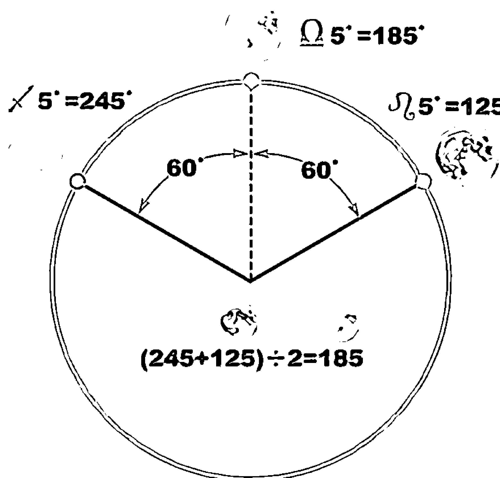

舉例太陽和月亮代表的是陽性與陰性、男與女，因此他們的中點就象徵陰陽關係，男與女的關連。假如木星成為這個中點位置，那麼木星的吉祥特質會帶給這個關係，他可能象徵陰陽關係的好運。

在占星學中，每兩個行星或重要點都能夠融合成一個新的象徵，因此在解讀中點時是需要一些想像力的。

### 2. 映點與反映點

所謂的映點是以夏至點與冬至點的連線作行星的鏡射，而反映點則是映點的對立點，也就是以春分點與秋分點的連線做行星的映射。由於夏至是由至陽轉陰之時，而冬至是由至陰轉陽之時，因此自古以來，夏至與冬至象徵著轉捩點。在應用上，映點類似六分相的調和相位，而反映點則類似四分相的衝突相位。

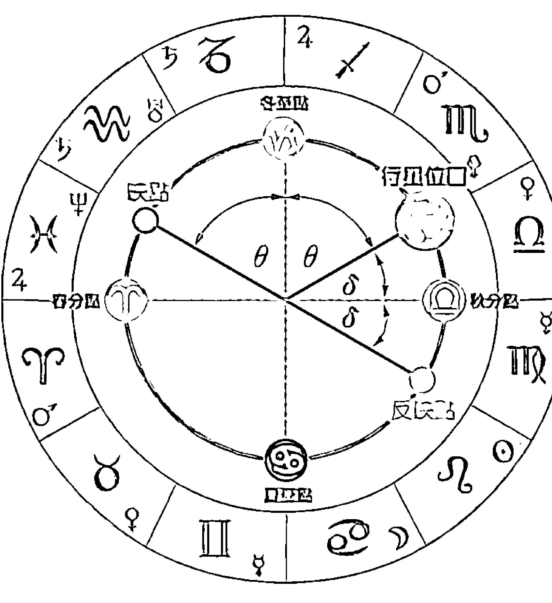

映點在卜卦占星中有其重要性，實際上他有點像中國太歲的概念，大家口中常常會提到“太歲”這個名詞，所謂的“太歲當頭坐，無喜必有禍”。那麼

太歲究竟是什麼呢？在占星學上，木星象徵著幸運與擴張，它平均約12年繞行黃道1週，所以平均每一年會經過一個星座，因此，木星又有歲星的稱號。很多人誤以為木星就是太歲，但是其實不然。

由於木星是以逆時鐘方向運行，這與中國宮位子丑寅卯以順時鐘分佈的方式相反。因此，古人便模擬出一顆虛星，以木星為基準，對應於子午線鏡射出一顆跟木星運行速度一樣，但是運行方向相反的星星，將這顆虛星取名為太歲，這就是太歲的由來。

由於太歲與木星是互相鏡射的關係，因此當木星順時鐘轉時，太歲是逆時鐘。相反的，當木星逆時鐘時，太歲反而是順時鐘了。這樣的關係，使的太歲的性質正好逆於木星，木星是幸運的象徵，而太歲反而帶有凶險的意涵。

因此，太歲的性質似乎契合於木星逆行的狀況，有點樂極生悲的意味。所以，反過來說，當木星逆行時，反而是太歲發揮幸運時。進一步來說，如果將這種原理運用在其他行星身上，是否也可以創造出太歲金星、太歲土星…呢？

而這種鏡射的概念跟“映”的相位非常類似，不同的是“映”是以夏至點對冬至點（丑未線）這條線做鏡射，跟中國所用的子午線相差30度。

### 3. 阿拉伯點

近代發現的小行星，因為有許多占星大師研究他們，而愈來愈有份量。而日月交點與日月蝕相關，更是極為重要的部份。除此以外還有阿拉伯點，在古典占星學中占有極為重要的地位，也是重要的研究範圍。

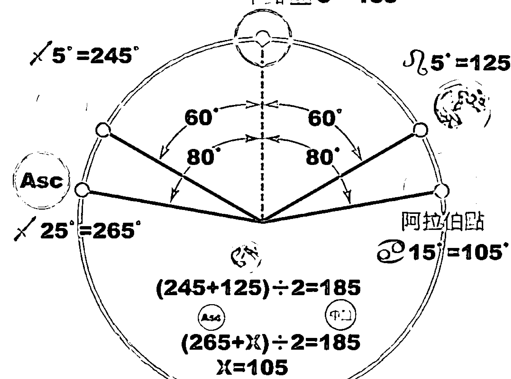

所謂的阿拉伯點又稱為箭，它的最初來源是古希臘，由於阿拉伯人繼承了古希臘人的占星成果，並發揚光大，所以後來就統稱為阿拉伯點。阿拉伯點是屬於較高級的占星技術，這些點是利用行星或重要點以特殊的數學公式加加減減得出來的特別點，有些像中國的神煞。雖然現代占星學中阿拉伯點已經沒落了，但是在現在的卜卦占星學中，幸運點、婚姻點和死亡點等三個阿拉伯點，仍然是論斷時的重要參考依據。

九世紀時，阿拉伯天文學家Albumassar整理了阿拉伯點，列出了九十七個，留傳至今，基本的阿拉伯點有九十七個，另外還有七十三個附加的點，

總共是一百七十個阿拉伯點，實際上，阿拉伯點總數不止如此總數大約有兩百個以上。阿拉伯點的基本原理是由三個重要行星或重要點來得出第四點。簡單的說可以A+B=C+D這個公式來計算。

舉例：以最廣泛應用的福點（Part of Fortune）來說，它代表興旺和幸運，任何一顆星與福點呈1度合相，它的力量都會大大增強，增加行星的幸運度。福點是由上升點、太陽、月亮的位置計算而成，計算公式依據出生時間是白天或是夜晚而有所不同：

白天人福點計算公式：上升點+月亮-太陽
夜生人福點計算公式：上升點+太陽-月亮

在此我們介紹幾個重要的阿拉伯點：

- （白天）福點 = ASC 上升 + ☽ 月亮 - ☉ 太陽
- （夜晚）福點 = ASC 上升 + ☉ 太陽 - ☽ 月亮
- （白天）精神點 = ASC 上升 + ☉ 太陽 - ☽ 月亮
- （夜晚）精神點 = ASC 上升 + ☽ 月亮 - ☉ 太陽
- （白天）旺點 = ASC 上升 + ♈ 牡羊19 - ☉ 太陽
- （夜晚）旺點 = ASC 上升 + ♉ 金牛3 - ☽ 月亮
- 基礎點 = ASC 上升 + 福點 - 精神點
- 成就點 = ASC 上升 + ☉ 太陽 - ♃ 木星
- 運氣點 = ASC 上升 + ☽ 月亮 - ♃ 木星
- 父親點 = ASC 上升 + ☉ 太陽 - ♄ 土星
- 母親點 = ASC 上升 + ☽ 月亮 - ♀ 金星
- 女孩點 = ASC 上升 + ♀ 金星 - ☽ 月亮
- 男孩點 = ASC 上升 + ♃ 木星 - ☽ 月亮
- 手足點 = ASC 上升 + ♃ 木星 - ♄ 土星
- 朋友點 = ASC 上升 + ☽ 月亮 - ♀ 金星
- 愛情點 = ASC 上升 + ♀ 金星 - ☉ 太陽
- 婚姻點 = ASC 上升 + ⚗ 第七宮 - ♀ 金星
- 離婚點 = ASC 上升 + ♀ 金星 - ⚗ 第七宮
- 資產點 = ASC 上升 + ☽ 月亮 - ♄ 土星
- 玩樂點 = ASC 上升 + ♀ 金星 - ♂ 火星
- 健康點 = ASC 上升 + ♂ 火星 - ♄ 土星
- 精神點 = ASC 上升 + ☉ 太陽 - ☽ 月亮
- 生病點 = ASC 上升 + ♂ 火星 - ♄ 土星
- 爭鬥點 = ASC 上升 + ♂ 火星 - ☉ 太陽
- 災難點 = ASC 上升 + ♄ 土星 - ☉ 太陽
- 死亡點 = ASC 上升 + ⚗ 第八宮 - ☽ 月亮

## 相位 ASPECTS

相位在目前的西方占星學論法中佔有很重要的地位，但在占星學的發展歷史中，相位是屬於較後期的產物。在早期只有合相，缺乏其他相位，而在印度占星學上，至今仍是以合相和對相為主，幾乎不提及其他相位。古代的占星論法中非常重視行星所在的星座，並認為只要是行星落入同一星座，皆視為合相。只要行星不落入同一星座，即使是相距很近，照樣不以合相論之。

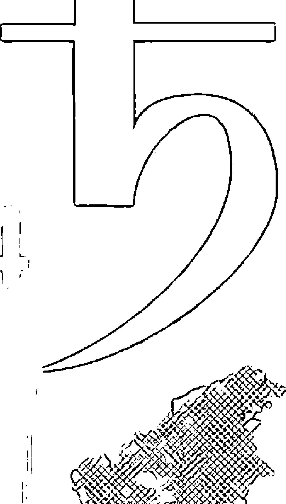

## 相位進階 ASPECTS LEVEL2

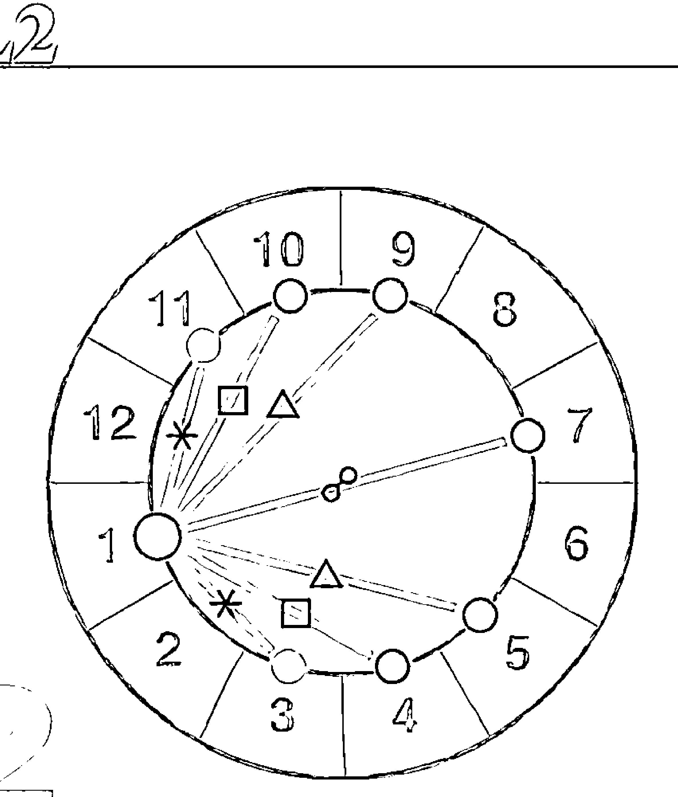

簡單的定義相位，相位是指行星間所形成的特殊角度。以地球為中心來看，任意兩行星之間當他們彼此夾著某些特定的度數時，會產生特別的互動，就像是音樂上的共鳴一樣，這些特殊的度數，便稱之為相位。行星的相位可以顯示命盤主人的人格在那些方面可能獲得充分而積極的發揮，或者顯露出某些方面，命盤主人可能會遭受到的心理壓力及緊張的狀態。

相位在目前的西方占星學論法中占有很重要的地位，但在占星學的發展歷史中，相位是屬於較後期的產物。現今占星學中對相位的解釋基本是一致的，可以說行星的相位是占星的靈魂所在。在早期只有合相，缺乏其他相位，而在印度占星學上，至今仍是以合相和對相為主，幾乎不提及其他相位。

古代的占星論法中非常重視行星所在的星座，並認為只要是行星落入同一星座，皆視為合相。只要行星不落入同一星座，即使是相距很近，照樣不以合相論之。而目前的西方占星論法考慮的是實際上的相位度數，並把合相設定為容許度在八度範圍內。有關容許範圍的說法非常多，原則上都以越接近精確的相位產生的效果越明顯。精確的合相是指行星同樣投影到黃道上的完全同一個位置，精確的相刑是行星距離九十度，而精確的三合，則指行星距離一百二十度。而現代占星學的發展趨勢則朝向濃縮容許範圍的趨勢。

正如同每一個星體具有自己的基本含義，每一種相位本身也有自己的基本內涵，代表一種行星間的互動關係。重要的的相位引發的關係，可以很容易從生活的現象中發現其影響力。而一些小相位的關係，則比較不容易表現在現實層面，而潛藏在意識中，等待時機爆發。另外，如果一個行星不和其他星體產生傳統的重要相位關係那麼就稱此為空相位。

分析命盤時，通常會認為60、120的和諧相位是吉，90、180的不和諧相位是凶，但這只是通常情況。其實相位沒有絕對的吉凶，行星也是，只有感覺上的好壞，實際上應該視為中性，吉凶乃是由行星所在的位置來決定，真正

重點在於行星是否能發揮力量來決定。現代占星師漸漸有新的認知，認爲凶相位能夠爲個人提供衝力與上進心。事實上，這世界上本來就沒有所有謂好相位與壞相位之說。任何相位，說白了都是一種潛在的趨勢，全看我們如何去利用它。如何去看待與處理一個相位，將決定著結果的好壞！

在對相位進行解釋時，必須按部就班地依循一定的邏輯，一步一步的解釋與統合，才不會混亂：

- ① 考慮各相位的意義。例如：四分相代表必須克服的障礙，五分相代表特別的天賦才能。如圖（1）兩星形成對相，代表著一種衝突。
- ② 此相位有關的兩行星的本性與綜合意義。如圖（2）所指，形成相位的兩星爲火星與月亮，火星代表個人的行動與慾望，而月亮代表的是個人的情緒與內在。
- ③ 二個行星有關的其他相位。那些相位表現出減輕或加重壓力的結果，並且決定了正相的可能性。如圖（3），月亮同時與木星六分相，與MC四分相；而火星同時與太陽六分相，也與MC四分相。
- ④ 形成此相位的兩個行星所在的星座。如圖（4）火星在金牛，而月亮在天蠍。
- ⑤ 相位的這兩個行星所占的宮位。如圖（5）火星在12宮，而月亮在六宮。
- ⑥ 形成此相位的這二個行星所主宰的宮位。如圖（6）火星主宰牡羊與天蠍，而12宮在牡羊，七宮在天蠍，所以火星主宰七宮與12宮。同理，月亮主宰第三宮。
- ⑦ 相位中兩行星的定位星。如圖（7）火星在金牛被金星定位，月亮在天蠍受火星定位。
- ⑧ 相位中兩行星的定位星及其宮位的管轄關係。如圖（8）火星的定位星金星主宰金牛與天秤，而命宮在金牛，六宮在天秤，所以金星主宰一宮與六。同理，月亮的定位星火星主宰第七宮與12宮。
- ⑨ 考慮這個相位所在的整體相位模式。如圖（9）的火星與月亮的對相，同時與MC形成一個T型三角的相位格局。

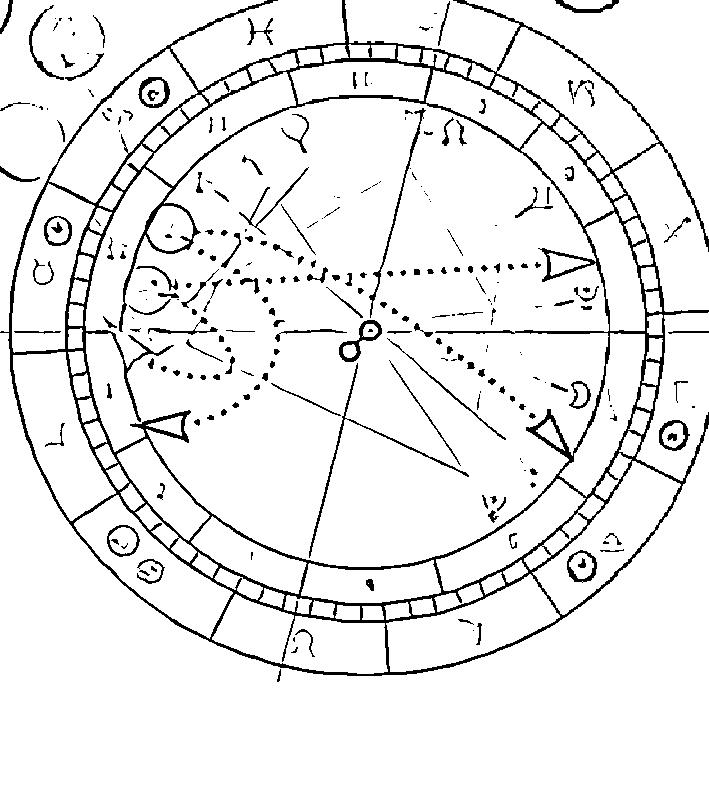

## 相位論 4 ASPECTS LEVEL 2

# 星盤分割法

占星學與數字學是息息相關的，尤其是質數更是具有特別的含義。傳統上我們定義的相位，就是將360度星盤以質數2、3或5這三個數字來分割的方法得到相位。而這也是相位構成的基礎，在數律圖的領域中認為每個數字都有其基本的宇宙涵意。

在占星學裡面，一切的相位都由合相開始，合相代表的是兩顆星的集合，象徵交會與關係的開始。從開始發生合相，中間經歷各種相位，到下一次合相結束，構成一個完整的循環。合相具有太陽與月亮的特質，具有向心力與融合的象徵。

二分法得到的相位象徵一種極端力量的互相衝突、無法共存的相位關係；而三分法所產生的相位，象徵各極性力量相互和諧、平衡，能夠整合在一起的相位關係；五分法得到的相位，代表一種在個體內部隱藏的創造力。而大部分重要的相位，其實都是從這三種分割法中得到的。實際上，只要是質數的分割都具有特殊的意義。

## 二分法

以二來分割星盤時首先會得到180度對相，再一次分割就會得到90度四分相，可以組成一個完美的大十字，因此形成這樣的相位表示這兩星是在同樣特質的星座中，同屬主動、不動或變動的特質。將刑相位進一步剖分，就可以得到45度和135度的半刑相位，代表著摩擦與阻礙。

二是一之後第一個質數，象徵著分別與對立，因此傳統中以二來分割的相位被視為凶相位。在某種意味上凶相位具有一種行動受阻的義含。表示一種行星間能量被阻斷，由於能量受阻，因此能量會被累積而急於採取行動來獲得解放，因此若得到釋放的管道，往往能得到強烈的效果。

180度對相具有土星的特質，是一種對立與壓力。而90度四分相則有火星的特質，是能量的衝突與受到阻斷。

## 三分法

三是一加二的組成，因此具有連結性與完整性，是兩股能量的橋樑，以三來分割星盤，我們首先得到的是120度的三分相位。三分相是將同元素星座中的星體聯繫起來的相位，因為彼此的性質相同，因此具有一種容易和諧的聯繫。三分相在個人星圖上通常意味著一種天賦的才能。而120度的中點60度相位，同樣具備120度的特點，能夠結合兩股互相促進的能量。60度再分割就是30度相位，具有協助與復原的特質。而150度是180度的協助，因此也屬於凶相位，是能量變壞，產生疾病的象徵。

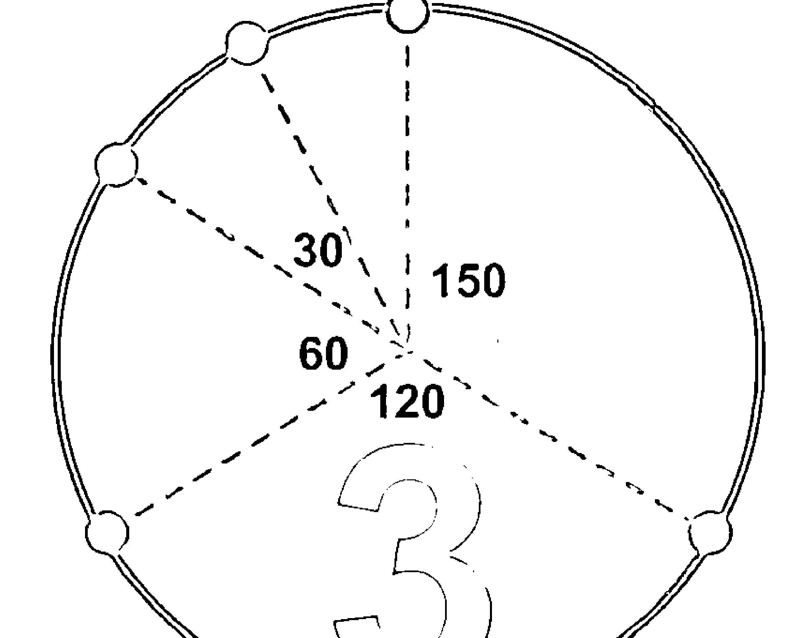

三分相具有木星的特質，是能量的拓展與發揮，而六分相則具有金星的特質，是一種具有吸引力的相位，能夠使兩股力量彼此增加發揮能力的機會。所有採用三分法分割的相位，都具備一種增長和機會的含義，因此傳統上認為是吉相位。這類相位對於個體，會產生很舒暢、很愉悅的感受。因為能量有發揮與流動的機會，因此不容易集中，不容易集合成較大的力量。因此很多時候，因為機會與能力的來的太過順利，而容易浪費機會，不容易有大作為與成就。

## 五分法

數字五往往和個體的創造性有關，五的分割相位是一種天才的相位，象徵一種天生的、無中生有的能力。當兩星形成五分相時會結合產生一種新的能量，因此許多天才藝術家、音樂家、發明家都可以發現到其星盤中具有重要的五分相位。

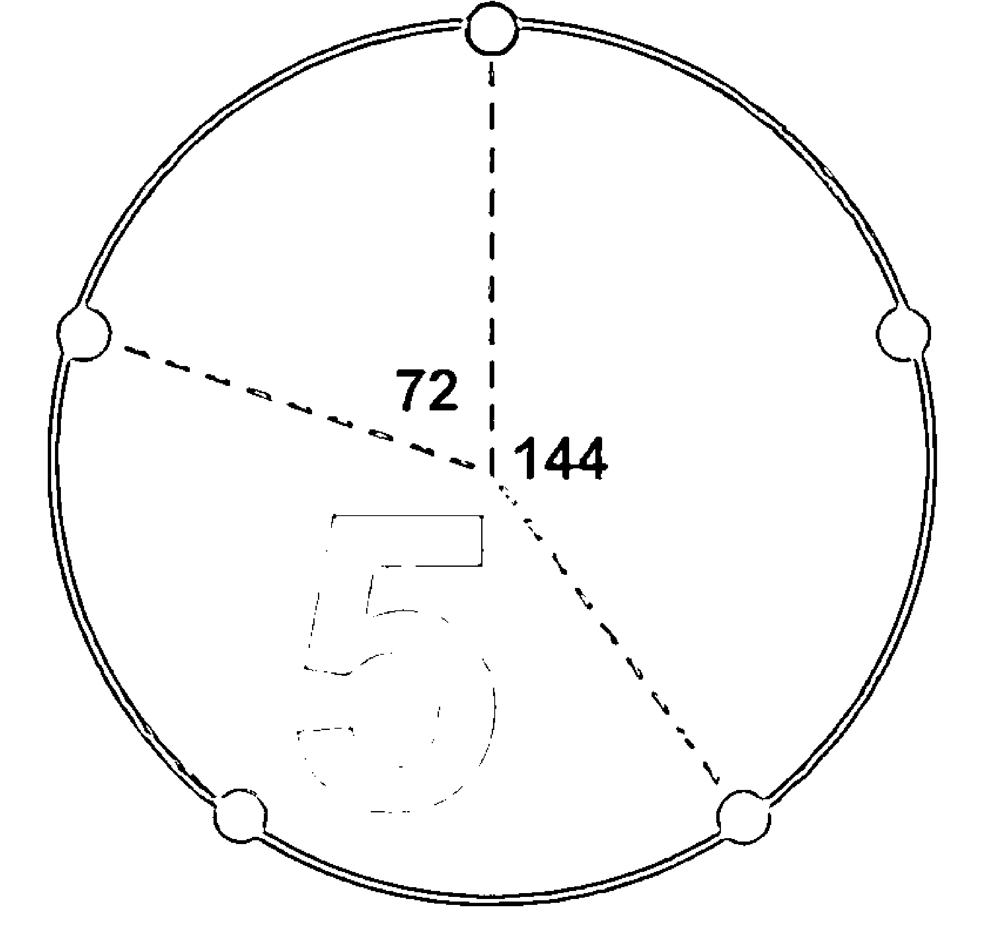

在這種劃分法下，可以得到72度和144度兩種相位。如果將這些分點連接起來，就是我們非常熟悉的五芒星圖案，這似乎與中國五行的相生相剋力量類似。一般來說，雖然72與144度是影響力很小的相位，但是如果一個人的星圖上這種相位十分顯著，甚至構成五芒星時，那就表示這個人具有一種天才性的創造力特質。

# 主要相位（托勒密相位）

相位雖然有很多，但是傳統占星中最重視的主要有五個，這五種相位是論斷星盤時的主要依據，而其他的相位只具有參考價值。這五種相位分別是合相、對相、三分相、四分相與六分相。這五種主要相位是由大天文學家托勒密所提出的，因此又稱爲托勒密相位。

## 合相—0度：中性

集中、融合、特殊的能力、循環的開始

合相可以說是最有力的相位，也是最主要的相位，對於個人特質、每日的運勢預測，以及將雙人合盤時的關係解釋上，都象徵極爲重要的影響力。它是指行星和行星相合時的情況。可以探知行星的力量被集中後的融合狀況，也代表兩顆行星的相互關係的開始。

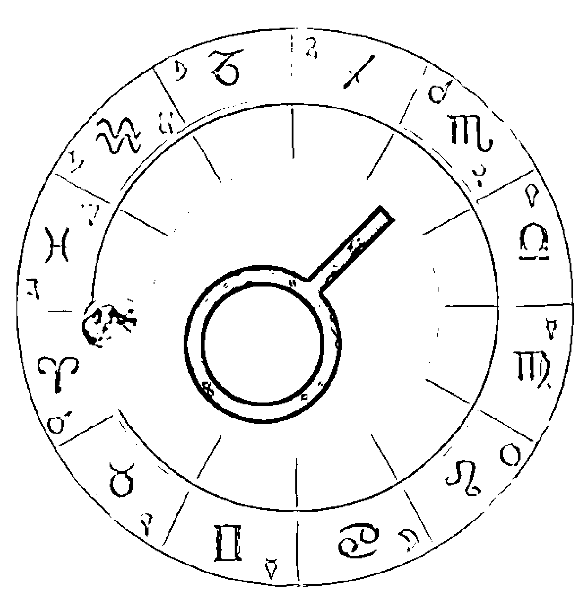

合相在吉凶方面是屬於中性的，它單純的代表著兩股力量發生交集。由於合相代表著兩個行星能量的融合，因爲行星能量形式的不同，類似性質行星的相合，會增加正面的力量。相反的，如果是不同性質的行星相合，則會產生一些衝突及矛盾的情況，形成衝突和不協調的情況。因此如果這兩個星球的特質可以搭配得很好，那麼合相的效果就會是有利的。如果說兩個星球的特質互相之間會有所衝突，那麼就容易產生負面的影響力。例如水星和天王星的合相，在科學技術文學方面皆屬吉祥的。金星和海王星的合相，在藝術靈感方面屬吉祥的。而金星和天王星的合相，在設計方面屬吉祥的等等。

另外行星本身的吉凶特質也會使合相產生吉凶的變化，例如吉星（木星、金星）和中性行星（太陽、月亮、水星）合相，通常是吉利的。然而，如果和凶星（主要凶星：土星、火星；次要凶星：天王星、海王星、冥王星）發生關係時，則多半會有不利的影響。

## 六分相—60度：次吉

協助、合作、機會、產生穩定的關係

六分相表示一種調和的關係。象徵著兩個行星之間能量的協調，這種協調性會反應在性格上或是某些好的機運。對於夫妻關係和朋友關係來說，這是一個非常重要的角度。當星盤中有許多六分相時，象徵源源不斷的機會。

在占星的經驗中，一般是把它看成一種潛能或是潛在的機運，等待個人的努力來發展這個優勢。如果努力發展的話，將容易獲得成功，這是個可抓住機會的調和相位。

對於運行的影響來說，60度的關係表示可能會有一些機會的出現。在個人的命盤中，如果有許多這樣的相位，則表示此人努力時會得到許多助力而獲得成功。如果是合盤時出現這種角度，則意謂這二個人可以相輔相成，彼此成為助力。同時這個角度也表示和兄弟、親戚及朋友之間的合作關係會不錯，意謂著與兄弟親戚以及朋友合作能擴大自我的範圍，而且容易經由參與一些群體活動碰到良好的機會，獲得好運。

## 四分相—90度：次凶

衝突、阻斷、分裂、產生受困的關係

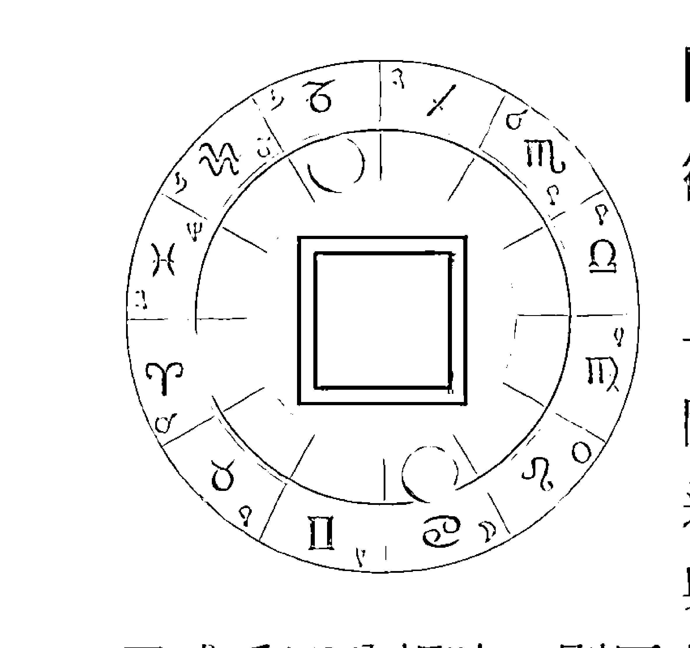

四分相是一個不利的相位，這代表兩個星球間形成一種緊張的關係，是一個衝突的位置，意謂著兩行星間可能會有一些障礙和不協調的情況出現。尤其是當這兩個行星本身的特性就有所衝突的時候，例如木星與土星本身性質相反，木星擴張、土星壓縮，當彼此又成爲四分相時，則原本的不協調就更爲加強。

在一個人的命盤中，如果出現了許多衝突的四分相，則表示在這個人的基本特質中，會有許多矛盾和衝突的情況，有這種相位的人，大多不能覺察自己的問題，他們不能自覺到他們的痛苦其實是來自於內在靈魂與外在需要的矛盾，只是覺得好像自己老是周期性地因爲外在環境的阻擾而受苦。四分相往往造成因爲追求某個行星的特性，而阻斷了另一個行星的特性，但是不幸的是這兩種特性對個人都很重要，因此這樣的人容易因爲受挫、行事突然中斷、半途而廢。然而相反的，若其能夠突破阻礙，則往往能形成特有能力，具有重大成就。

對於運行的影響來說，90度的關係表示可能會有一些困難需要解決，或是生活中出現了一些不順利受到阻礙的情況。意謂著想要完成某事而引起障礙的不調和狀況。由於形成90度的兩個行星所在的兩個宮位互爲對方的四宮與十宮的衍伸宮，因而也象徵關於事業和家庭性質的困難。若雙人合盤間出現四分相，往往會使兩人產生不對盤的狀態，彼此互相成爲對方的阻礙，使對方的慾望受到挫敗。

## 三分相—120度：最吉

順利、和諧、發展、流通、自然產生有益的關係

三分相象徵著某種好運、創造力、或是性格上某種天生創意性的優點，是自然產生、與生俱來的，完全不須努力就能夠順利得到發揮的才能。這是一種合諧的相位，也是事情可以順利進行的位置。所帶來的益處是很自然就得到的，讓人覺得好像是理所當然的，因而往往忽視了它的意義與價值，所謂的生在福中不知福。

在一個人的命盤中，如果出現了許多三分相的關係，或在命盤中形成一個大三角形時，代表天生擁有的能力與機運。因此應該要有意識地去發展自己天賦的優點，利用好的根基來達成理想。這意味著此人擁有非常的能力與運氣，他往往能夠不勞而獲，如果加上一點點努力和奮鬥，就可以獲得不錯的成就。

就因果的觀點來看，擁有許多三分相的人，表示這個人正在享用著過去的努力所結下的果實。然而如果一個人的命盤中只有很多三分相或六分相的優良相位，而沒有任何不良相位的激發，那麼這個人可能會因為過於平順而變成比較軟弱、太過樂觀、或是性格上比較膚淺，因為沒有經過人生的磨練與挑戰讓他去突破自己，他可能容易覺得自己的優點與好運是理所當然，是自己應得的結果。在這情況下，他的一生可能不會有很大的進展。

在合盤時，如果兩人出現了120度的情況，由於具有相同元素的同類關係，這表示二個人在某些方面，會是非常具有協調性的，而且在溝通上沒有任何的困難，彼此帶給對方幸運。而在運勢的預測時，如果出現120度的情況，這表示事情可以順利的進行，或是可以得到一些好運及幫助，自然而然的水到渠成。同時三分相也代表能量得到表現與發揮的管道，象徵創造力的發揮與擴張性的發展。

## 對相—180度：最凶

不平衡、壓力、互補、產生對立的關係

對分相是一個互相對立的相位，這表示兩個行星之間的能量互相對抗、無法達到一個平衡，因此可能在某些方面的行為會偏向極端，因此缺乏協調與平衡是這個相位的主要影響。這是併次於合相的主要相位，是二行星是位於對宮時的情況，由於兩個行星形成對立姿態，所以是個產生緊張和對立的不調和相位。由於兩股力量缺乏共通點與交集，因此往往造成力量在兩邊擺盪，也可能凸顯了其中一邊，另一邊力量則被隱藏了。因此容易引起偏頗和不協調的情況。所以尋找到一個平衡點，是解決這種對立關係的重要依據，而這個平衡的出口往往由與這個相位的兩顆行星另外形成吉相位的行星來擔任。

在一個人的命盤中，如果出現了這種情況，則表示此人必需在為人處世上，尋找一種平衡點，因為過與不及都會導致事情的失敗。對分相的影響是很明顯的，很容易反映在外在的事件上。有對分相的人，很容易有過度的傾向，由於能量受到彼此對立與壓抑，而這樣的矛盾狀態會表現在對立的宮位中。通常他們的問題往往都與他人發生關係，因為困難一再地以相同的面貌出現，因此容易產生自我設限的狀況。這些困難往往是自己無意識地創造的困境，為了利用創造出的對立面來凸顯本來的面目，從對立的限制挑戰中了解與獲得能力。所以一旦突破了這個瓶頸，他就能更加了解到能力的真實意義，因而能將能力發揮到極致。

當合盤時出現了這種相位時，由於彼此擁有對方所沒有的另一半，因此會有一種非常強烈的吸引力，特別是男女關係上。然而也因為缺乏交集，而容易互相看對方不順眼。而當運勢的預測出現180度的情況時，這表示事情受到外力的限制，容易產生對立的人事物阻止事情的順利進行。

# 次要相位

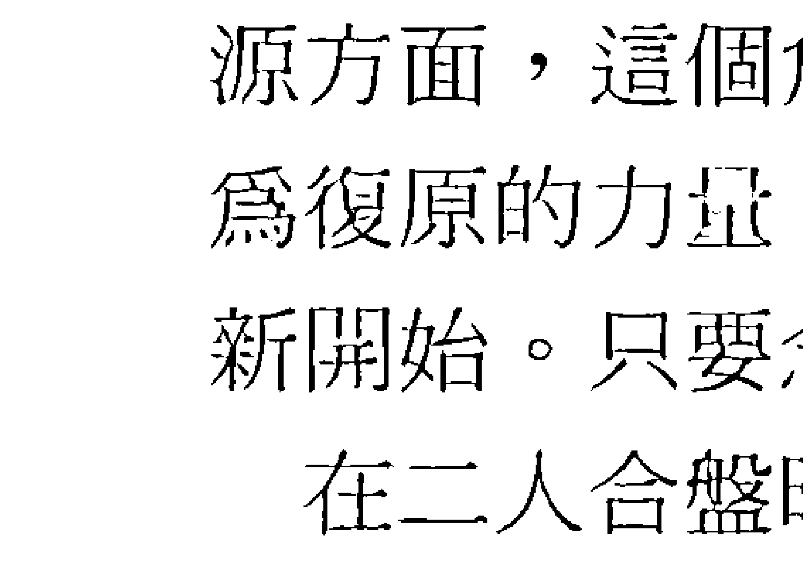

## 角度解析—30度：吉

幫助、復原、休息、產生助益的關係

12分相是個只擁有60度一半力量的吉相位。是行星能量過度使用產生不均衡時的修復能力，同時意謂在資源上可以獲得援助、補充不足。而雖然算是一個次要的角度，但是在資源方面，這個角度是非常重要的。同時它象徵著兩顆行星彼此得到幫助，成為復原的力量，這種力量像是休息後重新得到補充。所以意味著休息後，重新開始。只要念頭一轉，馬上可朝下一個主題進行。

在二人合盤時如果出現了30度相位的情況，則代表二人是可以在某一方面互相幫助，成為對方復原的力量。而在運勢的預測出現30度的情況時，通常代表得到協助或者有機會休養生息，準備重新出發。如果在生病時遇到12分相，通常代表康復的機會。

相位論 4 ASPECTS LEVEL2

## 角度解析—45度：凶

摩擦、糾紛、產生利益衝突的關係

八分相是個擁有90度一半力量的不調和相位，是一個次要的相位，不過對於資源方面來說，這會是一個重要的位置，代表兩顆行星能量彼此制肘。意味著金錢資源上以及人際群體間的困擾和損失，而在溝通過程中產生摩擦以及糾紛。

45度相象徵利益上會有困境出現，特別是在支出方面。在二人的合盤時，如果出現了八分相的關係，這表示二人會因為利益上有些微的摩擦。

## 角度解析—135度：凶

焦急、不安、緊張、產生拖延的關係

補八分相和45度的關係是類似的，也是一種次要的位置，是一種不太協調的角度，意味著焦急或受別人的煽動，代表兩顆行星能量彼此拖延。代表因為某些外在的延誤而感到不安或焦慮，不過在某些具有煽動群眾魅力的政治家命盤中，這卻是一種非常重要的相位。

在兩人合盤上，這種相位表示彼此互相拖延，會有一些短時間的不安和焦慮，但是這樣的衝突可以經由溝通獲得改善。

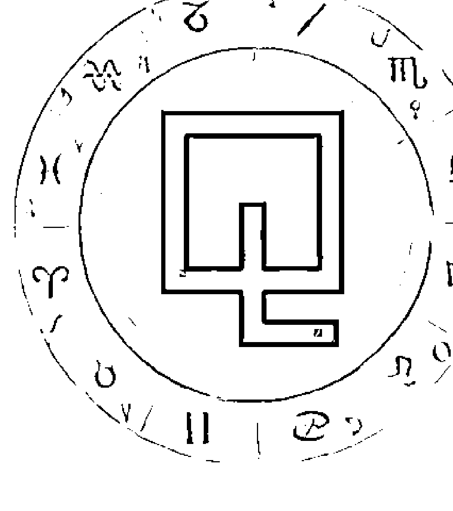

## 角度解析—150度：凶

疾病、傷害、腐敗、產生不均衡的關係

補12分相是一個次要的相位，代表一種不均衡的情況，雖然是個弱小的不調和相位，但是對於疾病卻是極為重要的。意味著兩顆行星能量的轉壞，彼此對對方造成傷害，往往能量過度使用也無法達成目的。當個人命盤出現150度相位時，代表若某種層次或能量隱藏著毛病與問題，是容易生病的。

如果是在合盤時，二人之間的關係出現了150度的情況，那這意謂著彼此隱藏的病因，或是一種宿命上的不均衡關係。在運勢的預測出現150度的情況時，通常代表出現不均衡的狀況，即將發生問題或產生疾病，但仍然可以挽救與治療。

構成150度的兩顆星，在星座的二極（陰陽），三分（主動宮，固定宮，變動宮），四象（火土風水）上都沒有共同點。即使是這樣，這兩顆星仍是有著不可忽視的關聯。由於兩星十分不同，它們必須試圖尋找平衡點，就像對相

一樣。但是由於它們沒有共同的性質，所以是無法達到平衡的，結果導致能量具有擾動性，使人感到必須作出某些調整。爲緩解這種壓力，兩星中的一顆會被迫以違反該星特質的方式作出反應，可想而知，這種反應是困難而又痛苦的。

# 其他相位

五分相的關鍵字是創造力，包括72度相與144度相兩種，顯示的是我們整合兩股能量的能力，帶來的是創新的才能和力量，能顯示出你以那種創造性的方式來表達自己的理念。同時還與創造性的活動有關，能夠發揮天賦獲得精神上的愉悅。五分相明顯的人會以天性來行事，從另一個角度來說，這是一種精神上的莫名力量，但是他們通常有能力控制這股力量，把它轉化成基本的創造力。因此這個相位在具有特殊創造力的人如社會改革家、作家、音樂家、藝術創作家、設計者以及科學家的命盤中較爲顯著。

## 角度解析—72度：中性

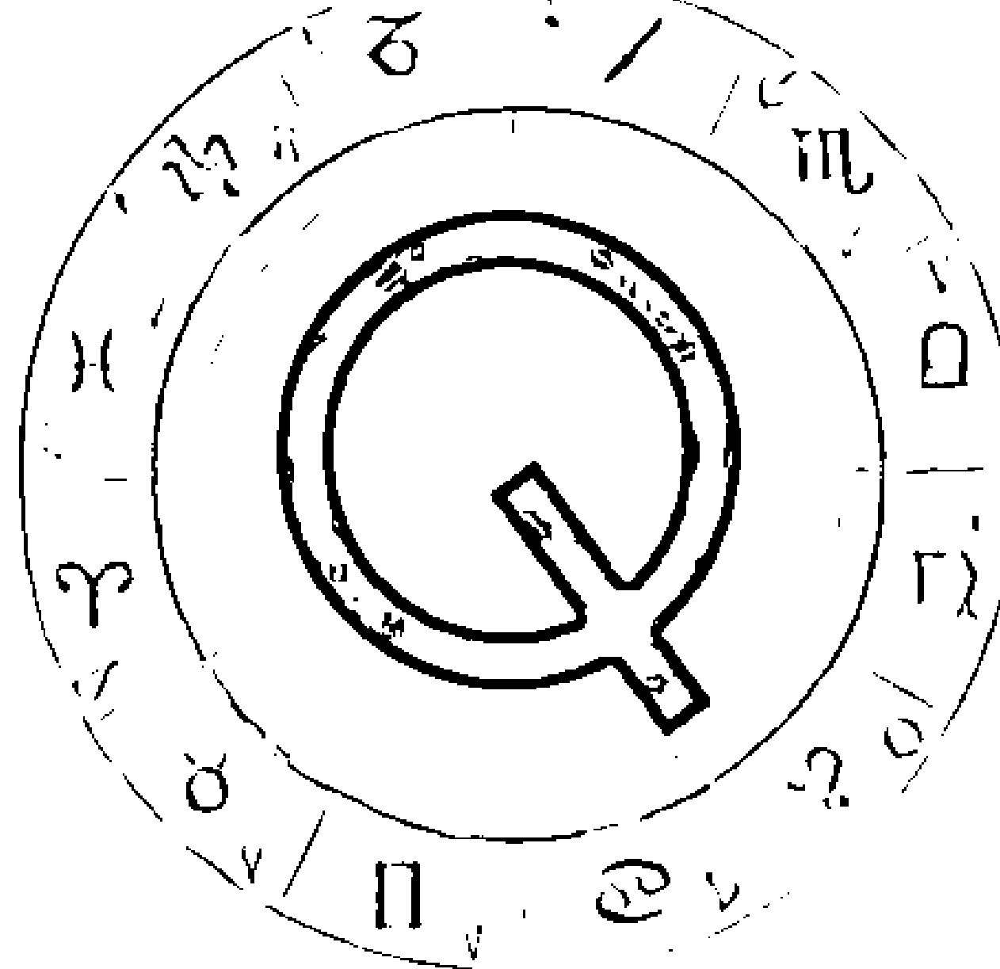

精神支柱、展現、創造、加強

五分相是在心理占星中較常用到的相位，屬於中性相位，象徵精神上的支柱，能夠獲得快樂。也代表整合能量的能力，以及思想上的新異和創造力，一種等待發掘與發現的理念。這個人可能充滿接受新觀點的勇氣，能慢慢的從舊理念中蛻變，發展新的觀念與見解，打破局限，創造其更多新的思路。

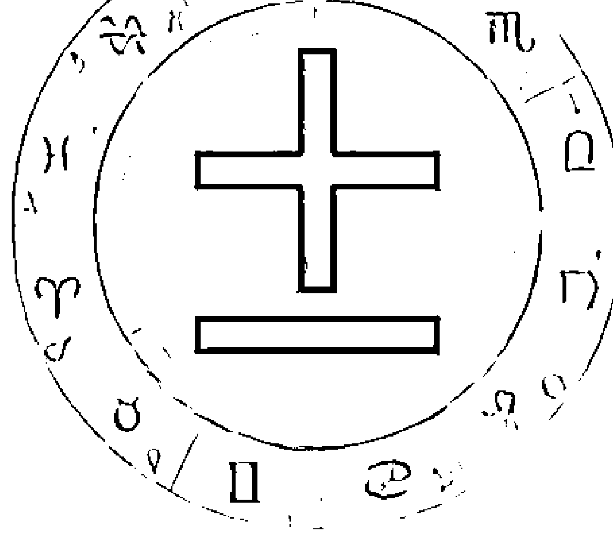

## 角度解析—144度：中性

精神安慰、擴展、實現、強調

倍五分相代表潛意識中的創造性力量經過吸收、接納過程，得到更大的發展。象徵透過創意的發揮，得到精神上的安慰。把潛意識中隱藏的創造力，努力提升到意識層面上來，並且可以自由探索心智的極限。這種相位強的人容易將精神與思想潛能放大，將人生重心放在一種不具目的性的隨興行爲。

## 出相位與入相位

出入相位是指兩顆行星在形成準相位的過程時，當兩顆行星即將形成相位時稱為入相位。舉例來說月亮在金牛6度，太陽在摩羯10度，因為月亮速度比太陽快，因此月亮即將趕上太陽，形成標準的120度三分相。因此這種情況稱為月亮三分相入相位太陽。反過來說，如果是太陽在金牛6度，月亮在摩羯10度，由於太陽運行比月亮慢，因此太陽趕不上月亮，無法形成120度三分相，而逐漸遠離，這種情況就稱為出相位。

如圖中月亮比太陽快，相對於太陽，月亮是如箭頭方向正著運動。同樣的如果是太陽與木星形成相位，由於木星比較慢，因此相對太陽來說，木星是以前面方向逆著接近太陽。

同時由於行星會有逆行狀況，因此在判斷出入相位時主要是以兩星逐漸形成的角度來判斷。舉例，以形成120度三分相來說，如果兩顆星的相對角度從超過120度逐漸縮小接近準120度時或小於120度逐漸增加為準120度時稱為入相位，反之則為出相位。因此以前例中，雖然這兩種情況都是太陽—月亮三分相，但是實際上由於出入相位的不同，在意義上還是有差別的。入相位代表一種即將形成相位的趨勢，而出相位則表現了一種離開相位而尋求新相位的狀況。由於準相位代表事件的發生，因此入相位代表事件仍處在醞釀期，即將發生的狀態。而出相位代表事件已經發生，目前屬於事件膨脹期中。所以一般來講，入相位的重要性往往強於出相位。而我們在研究相位時如果不考慮這個因素，很有可能會誇大一些相位的影響力，導致判斷時的錯誤。

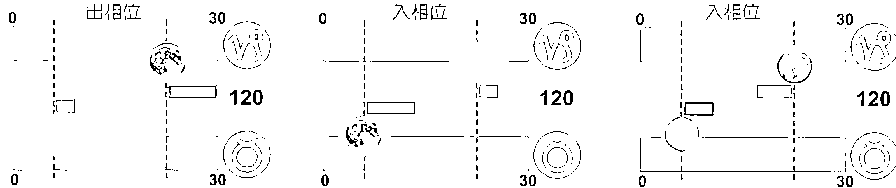

## 行星空相位

空相位是指命盤中當某顆行星完全不與其他行星形成主要相位（托勒密相位）時，便稱此行星為空相行星。在占星學上，有一條不成文的規則就是什麼都沒有比有一些什麼要強。具體一點講，就是如果在某一個宮位沒有行星落入，反而是較好的一種狀態。雖然無行星落入此宮，會減少此宮的重要性，但因為行星的力量往往帶來了它宮的關連，反而使得此宮充滿了複雜的變敗，增加了關於此宮的問題。

同樣的當行星空相位時，表示這個行星的最本質精神與能量能得到完整的表達，沒有了隱藏的其他動機與刻意的目的。從某種意義上講，空相位的行星就像是一個孤獨的流浪者。它象徵一個人處理行星相關的事物時是單純而直接的，不會受到紛雜的外在影響。因此空相位的行星往往具備此行星最高的潛力。這種強大的能量不會受到妨礙，也就不容易偏離。

空相位往往是行星所有的相位中最好的一種情況。行星在這樣的狀況下會是最自由的，最具有創造力的。它表示行星能量會以一種輕鬆、自由自在的方式與其他能量接觸，是自然的不帶有慾望與目的的。但必須注意的是空相行星的影響力往往因為缺乏與它星發生互動而被忽略了。

## 空相位

如上圖中的木星，他完全沒有與任何行星產生傳統相位，這種情況就稱為木星空相位，因此代表這張星盤中的木星擁有最純粹的木星力量，因為他完全沒有受到其他行星的能量污染。

## 出生圖的型態

行星在星盤上的分布狀況會顯現出有不同特質與集體性的影響，將這些出生圖中行星分佈的型態加以分類，大抵上可以區分出火車頭型、集團型、提桶型、翹翹板型、散落型、碗型、擴展型、扇型等。這些行星分佈的型態對於了解當事人的生命方向以及看出星盤的重點所在，具有重要參考意義。

- 碗型：Bowl Shape

碗型是指星盤中行星皆集中於出生圖中的一邊，分布在一百八十度內的型態，標準的碗型是指行星分布全在地平線以上或以下，或全在子午線以東或以西的狀態。碗型代表缺乏一邊，因此容易偏頗，而在碗型狀態時，領頭的行星便具有特別的重要性。

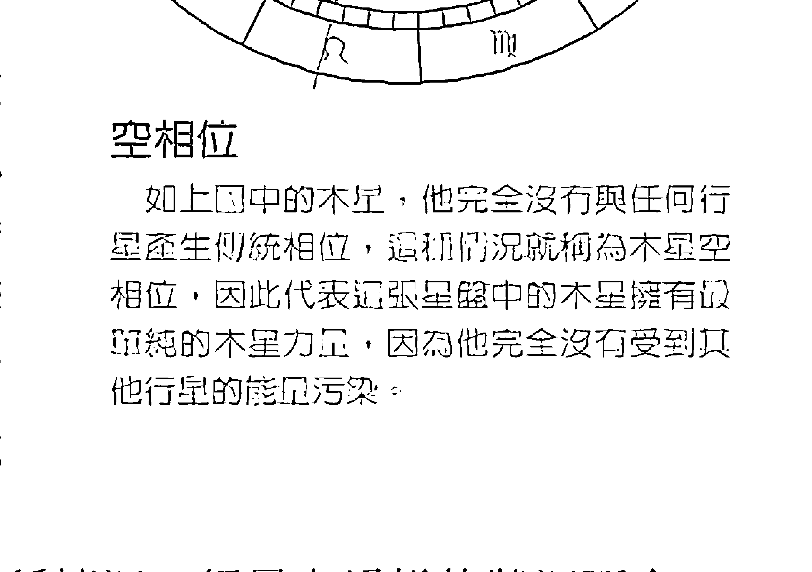

## 2. 提桶型：Bucket Shape

提桶型是由碗型而來，此型分布中大部分行星佔據了半圓，位於出生圖中一百八十度的範圍，而只有一顆行星單獨地落在另一邊的半圓中，形成類似水桶的把手。此種類型的人，其所有的能量只為了達成一個目標，可能會任性的只為求得目標之達成，而這一目標之本質就會由把手星所代表的意義與宮位顯示出來。

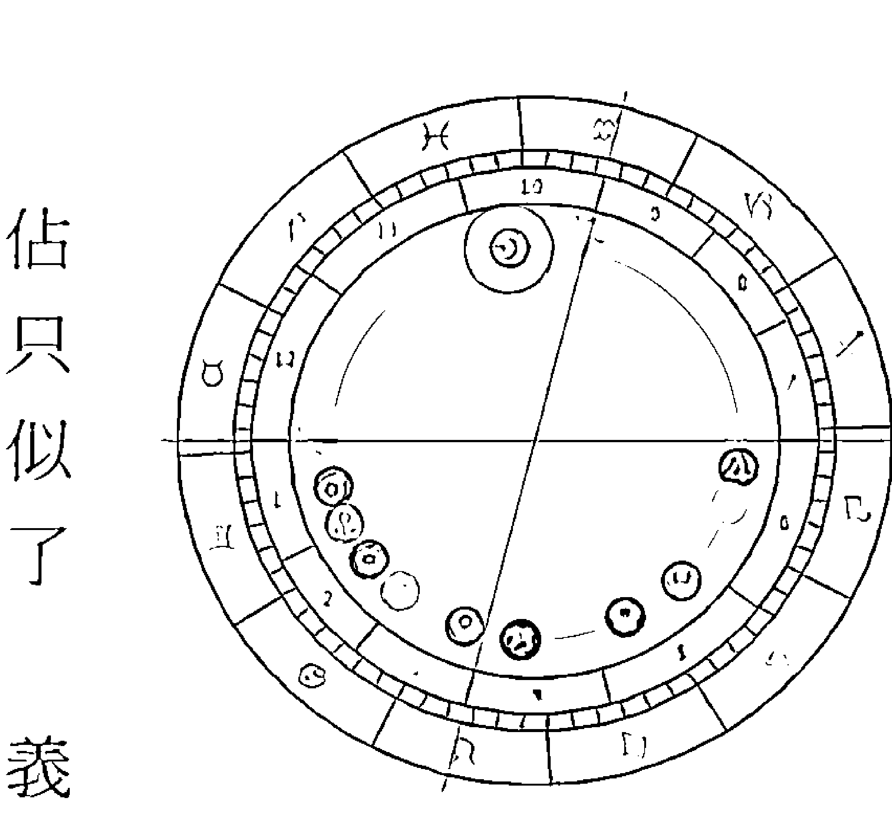

## 3. 集團型：Bundle Shape

集團型是比碗型更加集中的分布狀態，所有行星的分佈集中在相鄰的幾個宮中，整個分布不超過一百二十度。擁有集團型態命盤的人，通常會表現出明顯的專家傾向，人生模式比較固定，適合往專門的領域深入發展，而領頭的行星便具有這樣的指標意義。

## 4. 扇型：Fan Shape

扇型是由集團型而來，有點類似提桶型。此型分布中大部分行星佔據了出生圖中一百二十度的範圍內，形成一個集團，但有一星落在集團外，因此這顆星便被特別強調。這一型的人同樣具有專業性，然而其專門投入的目的是為了落在外面的那一顆星代表的象徵意義。

## 5. 火車頭型：Locomotive Shape

火車頭型與集團型相反，行星在星盤分布中會有一百二十度左右的空白內無星曜分佈，也就是行星散落在二百四十度的範圍內。因此其領頭的一顆星就顯得特別重要，這顆行星便是火車頭，象徵了一種人生奮鬥之驅動力。而留下的一百二十度空白，便使人產生特別之失落感，為了填補空白的部份而產生特別的奮鬥力量來彌補這種失落感。

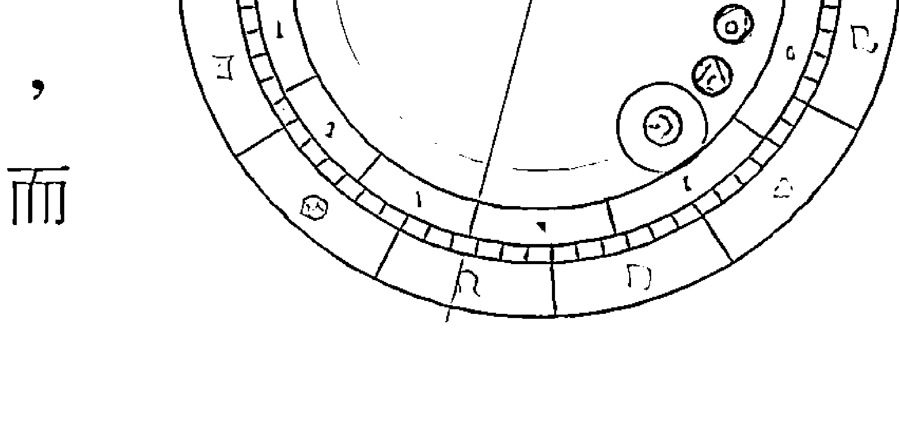

## 6. 跷跷板型：See-Saw Shape

跷跷板型是行星分布形成两个集团，彼此分隔，中间相隔空白的部份至少超过六十度的范围。标准的跷跷板是两组相对位置的行星，每一组有五个，各在星盘的两边。具有此种行星分布型态的人通常具有敏锐的观察力，能够考虑相反的两边观点和意见，但也容易紧张，患得患失。

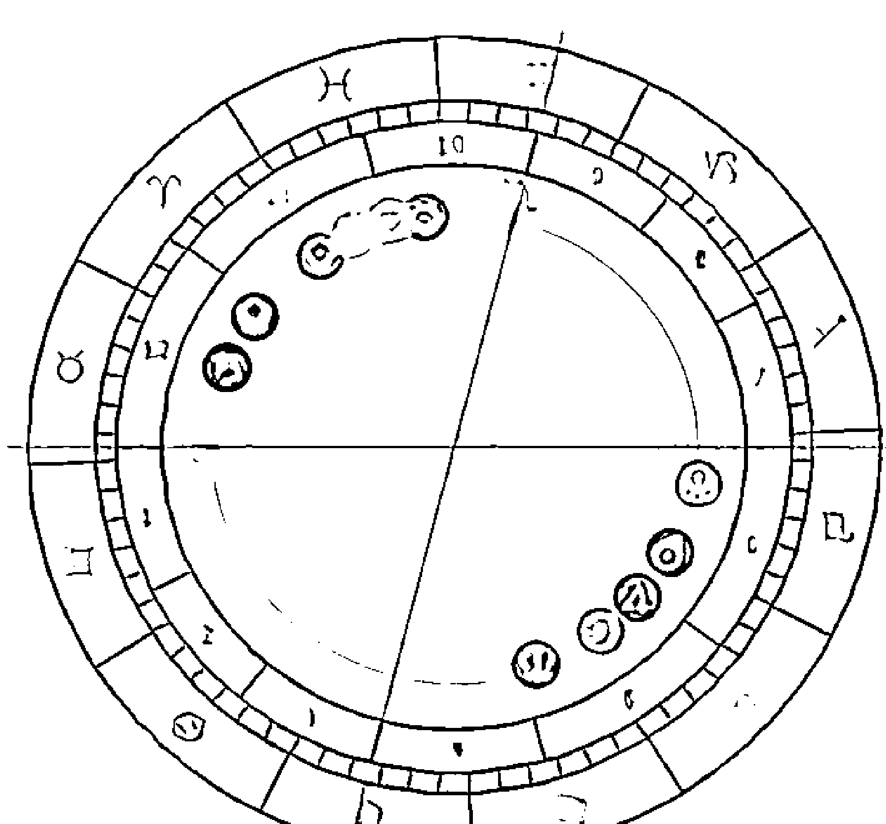

## 7. 散落型：Splash Shape

这是一种很常见的分布型态，这种状态中行星分布的很广泛，也非常的分散，因此有这种星图的人多半兴趣十分广泛，多学多闻，具有丰富的常识，但是同时也象征多学少精，能量分散、无法集中全力，找不到人生的重心与方向。

# 相位组成的格局

## 1. T型三角：T-Square

T型相位又叫三刑会冲，所谓三刑会冲是指命盘中有两颗星互相形成180度对相，而这两颗星分别同时与另外一颗星形成90度四分相，构成一个等腰直角三角形的相位格局。这是极难应付的困难相位格局，行星间全部是凶相位，对立的两边要寻找平衡点，却同时受到另一星的能量阻断，因此充分的代表困难、紧张、压力、冲突。命盘上有这种格局的人，代表总是会有需要去突破的难题。在这个格局中，位于T型的顶点，与其他两颗星形成90度的那颗星就是这个格局的重点。代表这个人会把他的精神以及行动放在这个顶点上，因而导致过度的消耗体力或是脑力，所以必须特别注意这个顶点所落入的的星座与宫位的象征意义。因于T型是大十字缺了一个点，会形成一种绝对的不平衡状态，使T型頂點過分突出。而欠缺的那個點也就是T型格局壓力及能量的來源，也是解決此相位所帶來的問題的線索，由缺的那部分所落的宮位或者星座所代表的領域便隱藏著解決人生問題的出路。如果不能平衡這種傾斜的力量，個人就會永遠處於一種懸而未決的危機當中。

如果這個格局中的行星沒有與其他行星形成吉相位讓力量找到宣洩的出口時，往往會導致壓力和精力最終爆發出來而導致不幸。假設頂點行星是落入主動宮的話，會有向前邁進的壓力；如果落入固定宮的話，會過度堅持個人的立場；如果是落入變動宮的話，將會有無所適從的壓力產生。

但是T型格局有一個特色，就是會大器晚成，實際上T型格局的人往往是早年辛苦、中年發達、晚年收成的。因為在早年遇到各種壓力與外在環境衝撞，受到種種壓迫。但是經過種種磨難，過了中年以後，慢慢心智變得成熟也習慣了磨練，對人生經驗的價值有了正確認知，就會逐漸的一步步往上爬上巔峰。其實，這樣的相位常常在商界要人、企業主管和具有魄力的人物本命盤上出現，因為星盤的能量受到阻礙而被聚集起來，生命中一路走來都是充滿挑戰、備極艱辛，但是正因為充滿挑戰，所以能儲備與激發生命中最大的潛能，反而能爬上更高的顛峰。

## 2. 大十字：Cross

大十字格局是兩組行星兩兩互相形成180度對相，彼此又都構成90度四分相。這樣的格局類似於T型的壓力和衝突，但是壓力比較平衡，不像T型集中在某一點上，因此也象徵能量相互對立，找不到出口，四個頂點都是構成壓力的來源。大十字會給一個人的一生帶來無窮的困難與險阻。擁有這種格局的人往往會做出錯誤的決定，行事猶豫不決，像走在人生的十字路口中，不知該往哪個方向。由於這四顆行星構成四個直角，因此當大十字形成時，這四顆行星將會落在同樣特質的星座中，而這些不同特質的大十字也會有意義上的差異。

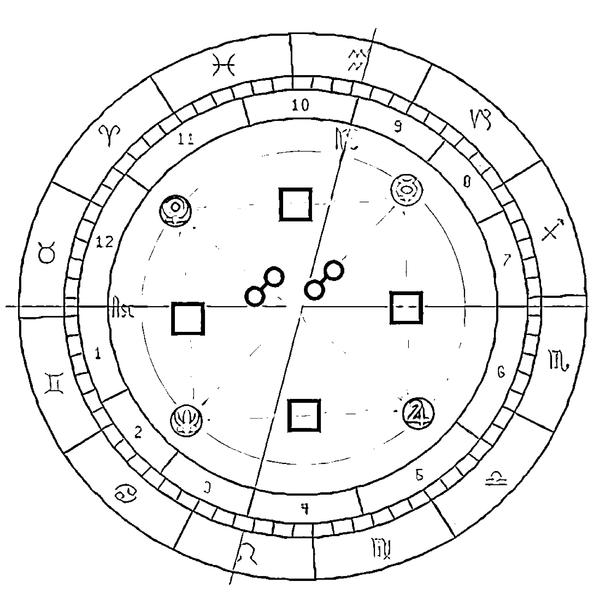

主動大十字：

主動大十字會加強開創與主導的特質，帶有強烈的自我意識，它象徵一輛四頭馬車往四個方向前進，卻彼此拉扯。這樣的人開創力十足，也喜歡駕馭別人。人生過程中馬不停蹄的不斷追求成功，不達到目的決不甘休，但是往往追求的方向太多而且極端，造成彼此拖累。

### 固定大十字：

固定大十字象徵在不同的方向固定與堅持，因此具有極端固執的特性，由於能量找不到出口，又缺乏尋找出口的動機，因而容易造成能量過度的內縮與累積，所以固定大十字的人雖然有堅毅不拔、持續力強的特質。但往往爆發時會更加不可收拾。這樣的人受到傳統的觀念影響很深。過度在意實質的利益、財富和權力，強烈缺乏安全感，對環境的適應力很差。

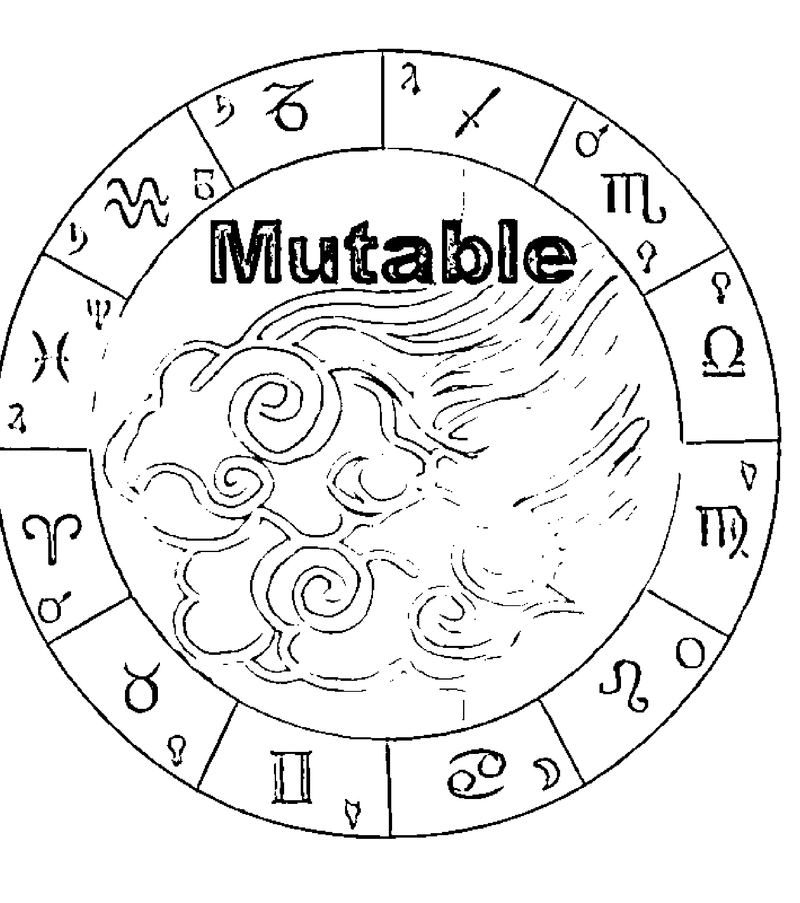

### 變動大十字：

變動大十字象徵受到四面八方的影響，像風向儀一樣隨著風吹改變方向，因此具有善變、逃避或容易妥協的特質。這樣的人一生中像浮萍般的不斷漂蕩，受到命運擺佈，因此有良好的適應力。他們通常多才多藝，缺乏目標，總是逆來順受，容易浪費生命以及精力，因為自己沒有方向性，容易猶豫不決、相互矛盾，無法獨立完成專一性的工作。

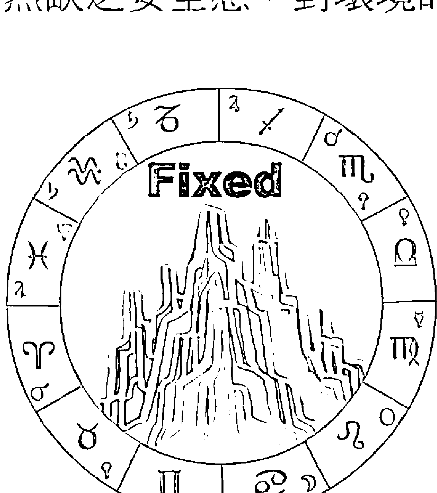

## 3. 大三角：Trine

大三角是由三顆星，兩兩形成120度角所構成的格局，當形成大三角時，三顆行星會同屬火、土、風、水四象中的一象。由於行星能量相通，能夠交互作用產生良性的循環，因此能夠非常的順利的流動、生生不息。大三角也就是我國命理學所說的三方會照格局，以所有格局來說，這是第一吉利的格局。 這是對個人極為有利的相位格局，被認為是幸運的象徵，這種格局最大的好處是能夠把吉相位的優點發揮到極致，造成命盤主人特別的人格與能力，往往會在人生中有非常傑出的表現。一般而言，擁有這樣的格局會比別人有比較順暢的人生，容易發揮自己的天賦才能，對一個人的成功發揮良好的推動作用。當與別人競爭時，也會增加勝算的機會。

由於行星能量間能夠順利的、自然的流通，因此很多具有大三角的人，往往會不自覺到這種順利，反而容易有浪費這種天賦的傾向，白白浪費機會，因為缺乏目標與衝擊的歷練反而讓自己怠惰。

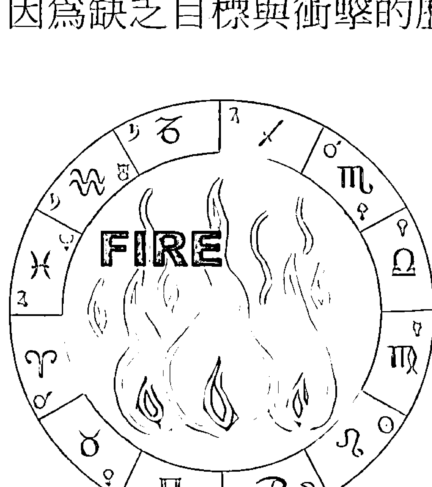

### 火象大三角：

火象的特點是行動，象徵以純粹的直覺行事。當行星構成火象三角時，會加強行星的行動力，使行星變得更為積極。火象大三角的人容易直接的展現行星的能量，單純地以強烈而原始的方式盡情表現，因此必須學會保存能量。

有火象大三角的人總是充滿了活力，充分的樂觀、積極、行動力強，非常富有勇氣、敢於冒險，也樂於享受許多樂趣。他們面對目標積極並且主動開創以實現理想。他們擁有非常強烈，突出的擴張特質，容易爆發式地表達喜怒哀樂。

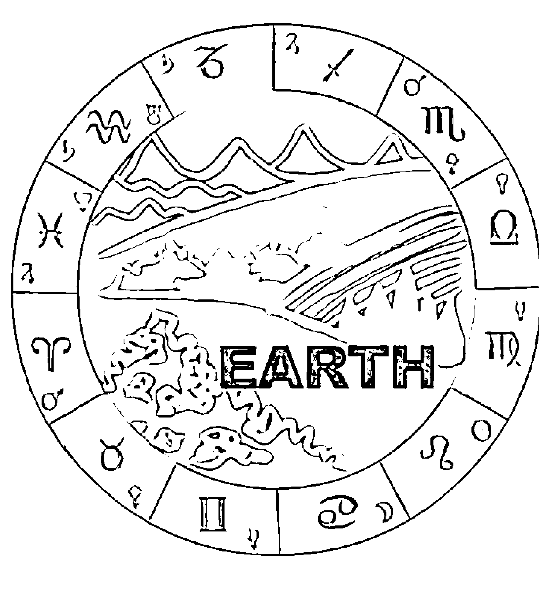

### 土象大三角：

土象的特點是實際，象徵以真實的感官行事。當行星構成土象三角時，會加強行星的實際性，使行星變得更為穩定。土象大三角的人容易將行星的能量轉化為實質的利益，因此他們容易得到想要的事物，而容易沈溺于舒適的現狀。

土象大三角的人非常腳踏實地，也很現實，講究實際，喜歡有條不紊，循規蹈矩，重視安全感。他們重視真實的感官，喜歡享受來自物質世界，實實在在的喜悅和安慰。並且謹慎評估生命的發展，追求生產力。

### 風象大三角：

風象的特點是建立聯繫，構成想法，象徵以理性的判斷行事。當行星構成風象三角時，會加強行星的溝通性，使行星變得更有連結力。風象大三角的人容易將行星的能量增加變化與彈性，藉由行星間的連結擴展行星的能力空間。

風象大三角的人有強烈的學習力，思想活躍，喜歡超脫、客觀的方式增加對事物的理解。容易發揮思想的溝通與創意，更有打開知識的好奇心，不論是思想上或是溝通上會有許多不同表達的技巧。由於風象具有流動的特點，因此他們缺乏集中力與注意力，不知道如何走出思想空間，走入現實世界。

容易天花亂墜，不幹實事，最終淪爲空想。

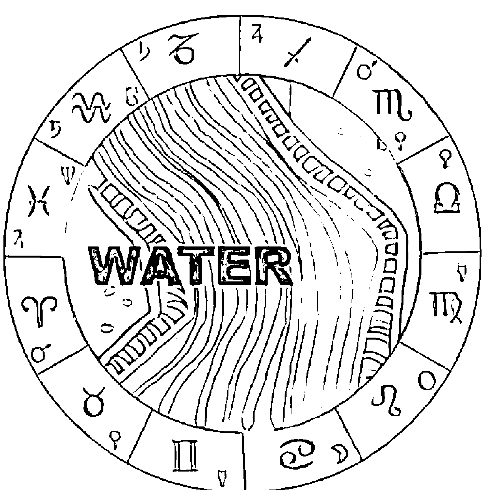

### 水象大三角：

水象與情感，內在意識有關。象徵以個體的感覺行事。當行星構成水象三角時，會加弧行星的感受性，使行星變得更容易與潛意識聯繫。水象大三角的人容易將行星的能量轉化到心靈層次，增加情感與對感覺變化的敏銳性。這種情感的深度和強度，使他們具有藝術天賦與創造力。

水象大三角的人很相信自己的本能和內在感覺，對自己和他人的情感特別敏感。很容易感知到個體以及群體的需要，充滿了感性、敏感、善解人意、體貼別人的本事。他們關注精神和心靈領域，在人生中作決定時常常是憑情緒性的感覺。

## 4. 風箏：Kite

風箏格局是在大三角格局的任一點，有另一星與之形成對相，同時與另兩顆星呈六分相。將這四顆星兩兩相連，就整個外型來看，就像是個美麗的風箏，即為風箏格局，而這顆對立星就是風箏的頭。它表示一個人擁有天生的機會與幸運，但仍有突然爆發的危機，必須要注意。

這種格局具有五個吉相位與一個對沖凶相位，是屬於吉凶參半的格局。當有不利事件發生時，往往能夠逢凶化吉。而這個幸運的調和力量就來自於跟這一顆風箏頭形成60度這兩顆行星的意義。
和大三角格局相比，風箏格局反而具有更大的活力，大三角格局是一個對稱的等邊三角，這意味在此種格局能量是通暢的流動，因此沒有特定的儲存點，將能量累積起來做最大的釋放，但是形成風箏格局時由於第四顆星跟大三角中的某一顆星相沖，因此這顆星的位置會使這股順利流動的力量有些阻礙，造成能量的累積，將能量聚集到一起，所以這顆星往往成為這個格局中行星能量的爆發出口，成為風箏格局的重點。
然而這顆星而也因具有對沖相位，經常會遭受到壓力，因此也能刺激生命潛能，所以到後來會比單純的大三角更有成就。

## 5. 信封：Mystic Rectangle

信封型格局同樣是由四顆星所組成。其中總共形成兩個對相，兩個三分相與兩個六分相。這是一種非常詭異而神秘的長方形相位格局組合，同樣具有吉凶參半的特質。其中兩組對立相位形成壓力，但是彼此間又被六分相與三分相行星釋放壓力。由於四個邊同時可以累積能量也得到釋放，因此他們必須找到主要的目標，不然容易在多個面向受到考驗，歷經過多的錯誤嘗試。

信封型格局的命運特徵是在逆境中得到成長的，所以一生中都是挑戰味道十足。在順境時同時帶有壓力，所以不容易驕傲或掉以輕心，而在逆境中又容易得到協助與激勵，所以只要肯吃苦大半都能成功，不至於灰心喪志。所以這種人通常會有成就，毅力堅強，氣度宏偉。

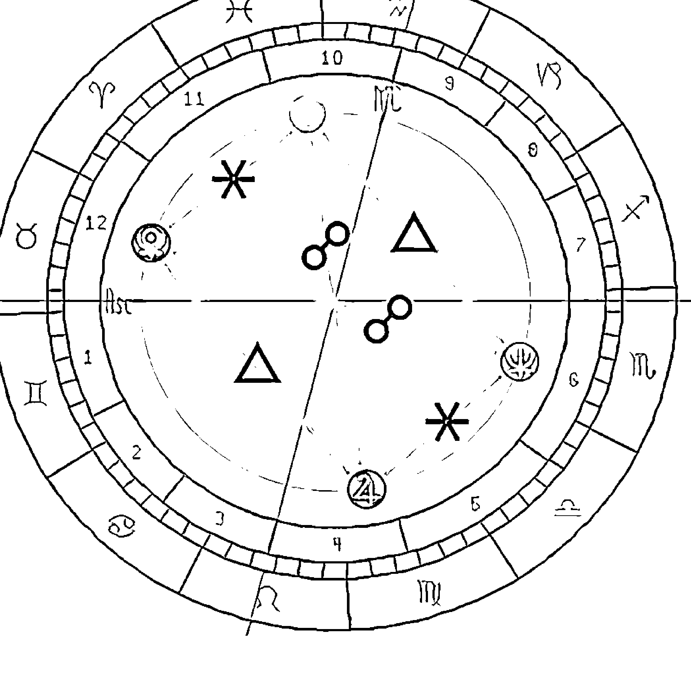

## 6. 上帝之指：Yod

上帝之指格局由兩個指向同一顆行星的150度相位構成，並且這兩個行星間形成一個六分相。這是一種比較少見的格局，通常在旁邊的這兩顆行星是紓解壓力的助力。而上帝所指向的那顆星球，暗示著我們人生中特別要完成的地方，象徵著一種我們無法抗拒的命運。它代表人生某個層面之中隱藏的病源，如果不是一種強制性的不均衡狀態，就是一種長期的永遠無法解決的問題，需要經過治療使其恢復正常。

上帝之指的能呈暴發通常是瞬間發生的，就像生病一樣，當不均衡的狀況到一定程度後就會發病。而那兩顆六合星就會使頂端星的作用發生調整。從積極的觀點看上帝之指是指點你，人生的問題點所在，必須有所調整。有上帝之指的人雖然象徵某種毛病，但是也不可忽視其復原能力。它暗示著如果認真面對毛病之所在，好好的治療與預防，反而是一件健康的事。

上帝之指是一種150度的加強形態，並且帶有很大的宿命的色彩。150度相位的特殊之處在於它不像合相位那樣使星體力量得到融合，不像三分相或是六分相那樣使星體間的力量互相流動，也不像四分相或是對相，造成劇烈的能量衝突。而是一種能量間的不均衡狀態而造成的敗壞力量。因此占星家經常利用150度相位來判斷一個人的健康，甚至經常會用來判斷一個人的死亡。

同時它象徵那種永遠困擾我們的莫名的慢性病或是慢性精神疾患，再不然就是那種下意識的墮落嗜好，是一種無意識或是下意識的行為，是個人本身難以改變的。同時上帝的手指在暗示命運病因的同時，也象徵著一種回復性的能呈。

另外上帝之指也象徵一種永遠無法完成的工作，因為在這個三角中，沒有一種渠道去釋放這種內在能量，而能量本身是不會消失的，所以它不是造成能量失去均衡而腐敗，不然就會以一種不斷循環的創造力形式表現出來。因此具有這種相位的人，如果參與一些永遠無法完成的工作，比如說科學探索、教育工作，就容易發揮上帝之指的正面作用。

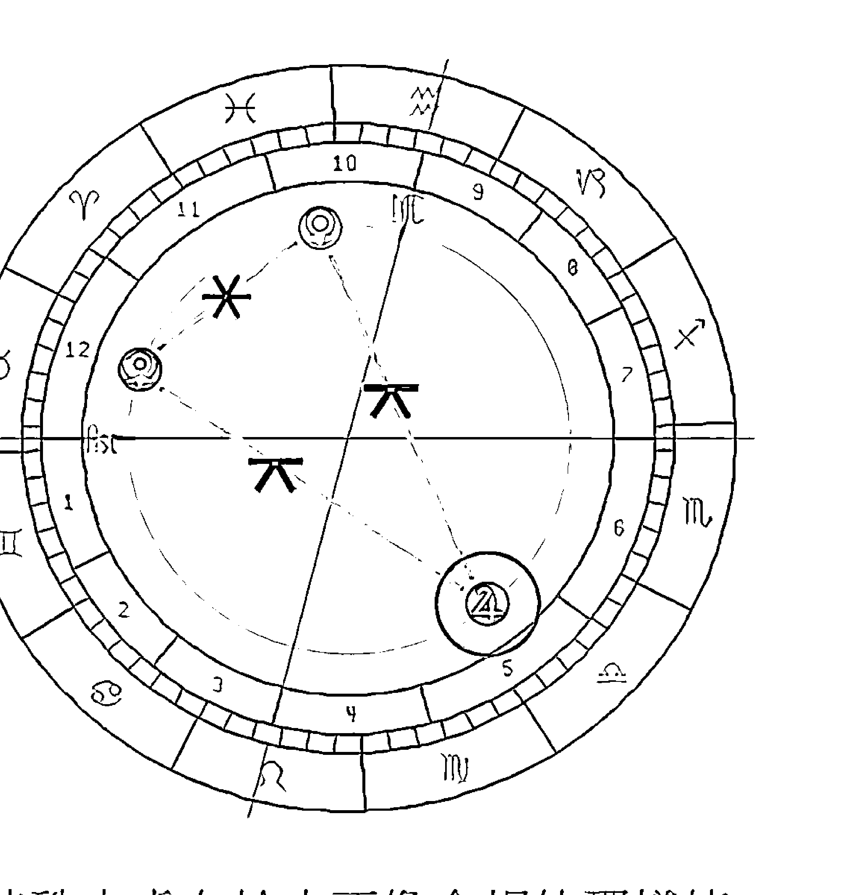