華文第一本結合人文與現代心理占星觀點，專論圖形相位的學習經典

# ASPECT PATTERNS IN ASTROLOGY

AOA國際占星研究院創辦人，英國占星學院首位華人客座講師

魯道夫

# 圖形相位全書

在星盤當中，複雜交錯的相位形成如網路般的連結，
這些連結象徵著人與人之間的互動方式，
也暗示著事物的特質。

本書從基礎談起，自行星與行星互動衍生的生命主題，
進而認識相位所象徵與呈現的力量，
結合人文與現代心理占星觀點，
讓占星學習者們能更深入的透過解讀星盤，
找到生命的軌道，
協助他人與自己達成身心靈整合的目標。


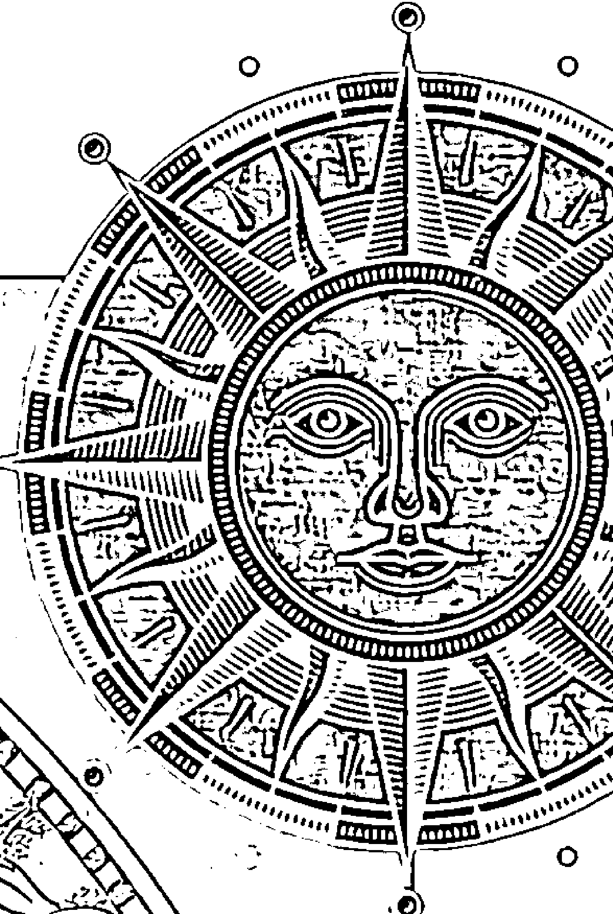

# St. Royal College

# 天使神秘学院

- ※ 专业占卜预测机构
- ※ 神秘学培训机构
- ※ 水晶能量研究中心
- ※ 神秘学资料库
- ※ 官方微信：strcdts
- ※ 微信公众平台：strc2011
- ※ 读书交流QQ群：
    - 占星塔罗占卜师交流群：814594478（加入密码：PDF）
    - 神秘学其他综合群：659338717（加入密码：PDF）

占星塔罗占卜师交流群：814594478（加入密码：PDF）

神秘学其他综合群：659338717（加入密码：PDF）

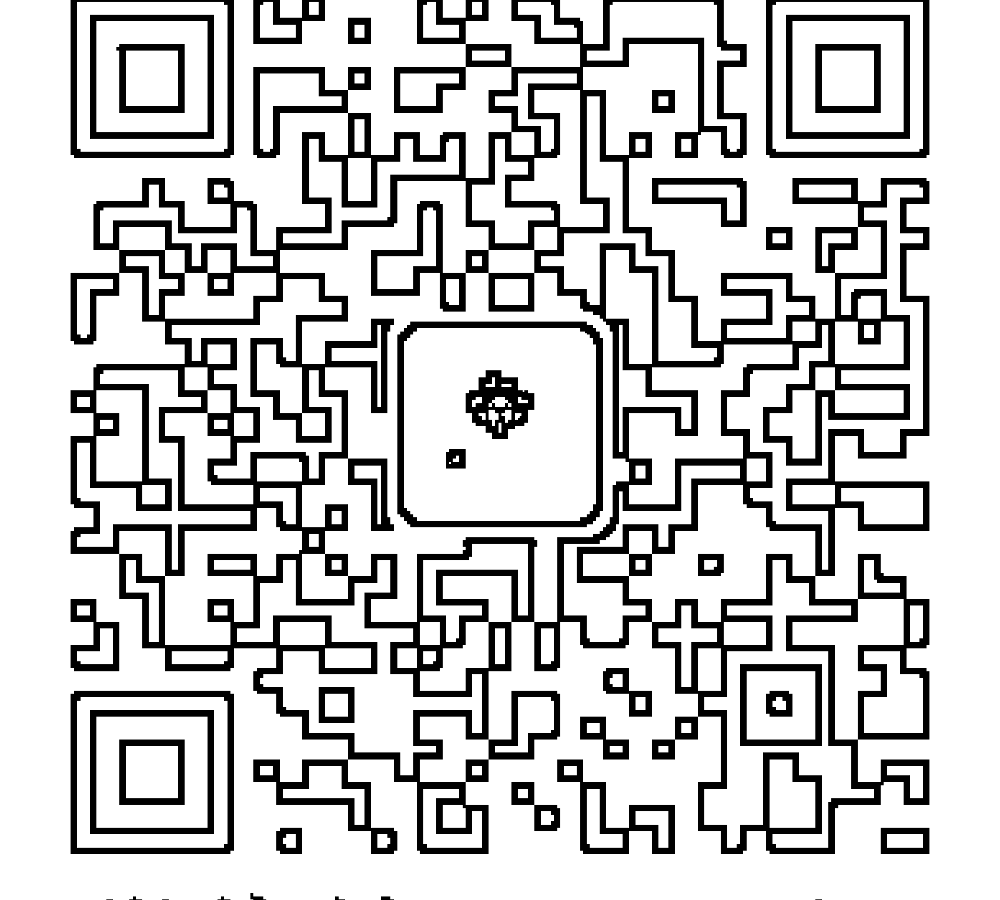

微信号：strcdts

天使神秘学院

天使神秘学院  院长QQ：715104687

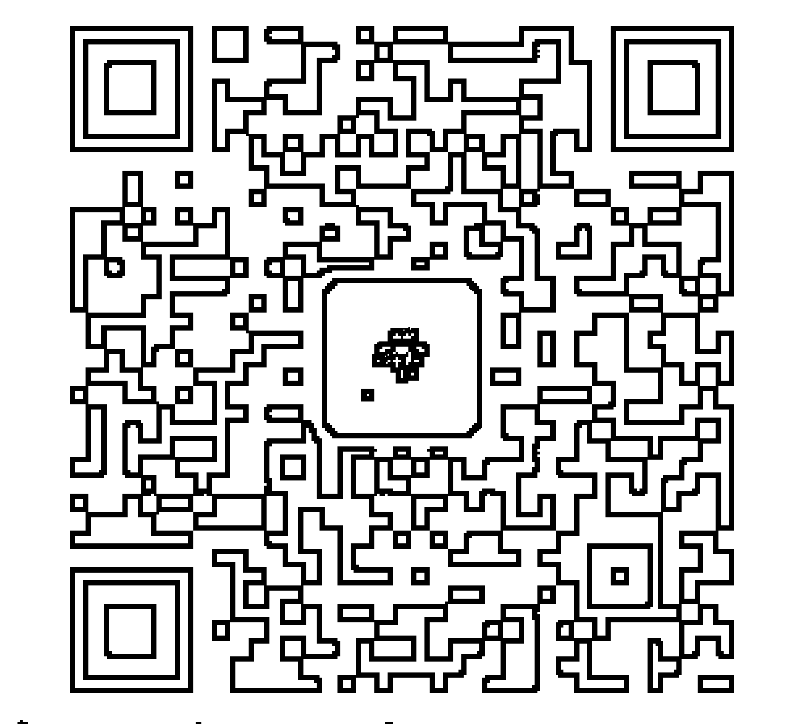

微信公众平台：strc2011

# 制作说明：

本书由《天使神秘学院》出重金从台湾购入的原版书籍扫描制作完成。为达到最好阅读效果，特地把原版书全部切开后，再经由专业扫描设备高精度扫描完成，并经过一张张的PS后期处理最终成书，其间花费大量的人力、物力以及时间，只为能给大家提供经济并优质的神秘学学习资料而努力。

本学院强力谴责某些机构和个人，把本学院花心血制作完成的电子书籍，包装后直接放在自家淘宝网上低价倾销的行为，以谋取不劳而获的经济利益。如果长此以往最终将无人愿意再为大家花心思制作电子书，那以后可能大家再无新书可读。

为让大家以后能够读到更多的好书，也为了本学院的良性发展。本学院恳请大家尽量做到如下几点：

- 1. 尽量在本学院的网站购买电子书籍。
- 2. 请勿用技术手段把电子书内的水印及加密去掉。
- 3. 在收到电子书后小范围传阅即可，千万不要公开传播，更别挂到淘宝网上低价销售。

同时为答谢广大支持者，学院电子书将做如下调整：

- 1. 学院会把一些早已收回制作成本的电子书折价销售。
- 2. 最新制作的电子书籍会开放打印功能，大家购买后有条件的可自行打印成书。

# 目錄

# 作者序 007

# 第一章 認識圖形相位 009

什麼是「圖形相位」？在星盤中佔有什麼樣的重要性？

# 第二章 行星組合：圖形相位中的可能主題 017

圖形相位詮釋的第一步：找出該圖形相位可能涵蓋的生命主題。

- ✦ 基礎的行星組合
- ✦ 圖形相位的應用
- ✦ 行星組合
- ✦ 練習

# 第三章 相位：圖形相位中的作用力 055

透過不同的占星觀點，重新認識「相位」。相位象徵著互動的特質，於當事人來說顯示可能產生的感受，這是圖形相位的重要基礎。

- ✦ 主要相位
- ✦ 次要相位
- ✦ 其他相位
- ✦ 相位的好與壞
- ✦ 相位的強與弱
- ✦ 容許度 078
- ✦ 入相位、出相位、正相位的影響 080

# ## 第四章 圖形相位 083

在瞭解行星組合可能暗示的主題以及相位可能帶來的互動模式之後，深入認識常見的幾種圖形相位，以及在詮釋時該注意哪些事項與特質。

- ✦ T三角 083
- ✦ 大十字 093
- ✦ 大三角 102
- ✦ 小三角 127
- ✦ 風箏 134
- ✦ 神秘矩形（信封） 140
- ✦ 上帝手指 145
- ✦ 世界手指（雷神之鎚） 152

# ## 第五章 如何使用圖形相位分析表 157

- ✦ 認識圖形相位分析表 157
- ✦ 如何詮釋其他圖形相位 167

# ## 第六章 圖形相位在流年與合盤的應用 177

- ✦ 行運與推運中的圖形相位 178
- ✦ 合盤中的圖形相位 190

# # 第七章 進階考量

- ✦ 象徵星
- ✦ 守護關係的互動

# # 第八章 實際案例探討

# # 附 錄 行星組合主題

將行星組合以三個一組的方式介紹，說明行星組合的可能性。

- ✦ 太陽圖形相位
- ✦ 月亮圖形相位
- ✦ 水星圖形相位
- ✦ 金星圖形相位
- ✦ 火星圖形相位
- ✦ 木星圖形相位
- ✦ 土星圖形相位
- ✦ 外行星圖形相位

# 作者序

二〇一三年我利用在澳洲旅行的時候開始思考這一本書的內容，圖形相位一直是許多初學者感到困擾的課題，由於涉及三顆以上的行星，經常讓人不知如何是好，在開始構思這本書時我也不知該如何下手，困惑於究竟要從哪些角度寫下圖形相位的特色才好？

在澳洲旅行的那一個月，有時我看著雪梨大橋與歌劇院，欣賞著他們的美，同時問自己為什麼我在這裡構思這本書？或許有它的意義。有一天我因為衝浪摔傷了肩膀，民宿老闆是一位退休的物理治療師，他一邊告訴我如何做一些復健的動作，一邊告訴我人體架構的奧妙，許多器官與構造都是相互牽連的，例如最簡單的腰痛有著許多原因，很可能是內臟的問題，也可能是腿部的問題造成腰部過多的壓力。物理治療師與按摩師在治療個案的時候，都必須根據個案全身的身體狀況及疼痛部位做出全盤的考量。突然之間，我對這本書有了想法，可以從結構、架構、全盤地考量不同角色組成可能帶來的變化。

圖形相位是許多占星初中階段學習者所面臨的最大挑戰，許多書籍都會提到圖形相位，雖然精彩地解釋了每一種圖形可能帶來的影響，但是讀者們仍然無法用這樣的方式來詮釋圖形相位。我開始問自己，如果我的個案有一組圖形相位，我會怎麼去分析？怎麼去詮釋？一個步驟一個步驟下來，成爲了這本書的架構。

有了這些基礎構想之後，我開始書寫這一本書，但是在更多不同的學習場合以及對生活還有大自然的觀察當中，我不斷地更新這本書的內容。從二〇一三年一直到二〇一八年，這本書寫了整整五年才完成，這是我寫作生涯的第二十本書，卻也是寫得最久的一本。我要感謝 AOA 的小修、艾曼達、Cici、Brian、許展、Jupiter 與 Josephine 老師這幾年來一起爲了學院努力。也感謝所有教過我占星的師長、同事、學生、客戶，是你們豐富了我對占星的認識，謝謝你們。

魯道夫
二〇一八年三月
倫敦

# # 第一章

# # 認識圖形相位

「圖形」是占星學中一門比較晚近的技巧，我們在傳統占星學裡也很少看到關於「圖形相位」的描述。

「圖形相位」的定義是三個以上的行星，彼此之間形成相位並且在星盤上產生了幾何圖形。例如大家所熟知的「大三角」，假設月亮、金星、土星組成了一組大三角，這說明著月亮與金星有一組三分相，月亮與土星也有一組三分相，而金星與土星之間也有一組三分相。這三個行星因為彼此的相位而交互影響，同時在星盤上我們也會看到一個三角形的圖案連結著這三個行星。常見的圖形相位，包括了 T 字三角、大十字、大三角、小三角、風箏、神秘矩形、上帝手指、世界手指等。

學習分析圖形相位是許多占星初學者的重大挑戰，在我多年的學習經驗當中，老師們總是不停地提醒我們圖形相位的重要性，圖形相位往往顯示著星盤當中複雜的秘密，然而當學生們畫好星盤之後，看見那如同蜘蛛網般的複雜圖形就不知道該如何是好。占星課本與占星老師告訴我們月亮與火星可能暗示著急躁的脾氣、情緒化的行動，可是當月亮、火星與冥王星形成大三角或大十字時，卻只告訴我們：「月亮火星冥王星彼此影響著」，或許這樣的方式對於聰穎以及想像力豐富的學生來說暗示著什麼，但是對我來說卻是腦中一片空白。彼此影響著？如何影響呢？從來沒有人告訴我三個行星的相位該如何解釋？到底誰影響誰？到底誰被影響？

特別是在學習圖形相位時，我們知道大三角象徵著輕鬆的能量整合，有些老師會很簡單的告訴你：「大三角是好的」，或者一些占星師會運用想像力的點出大三角在星盤的圖案上，如同城牆一般的把中心包圍起來，讓他人不易觸擊我們的內心，暗示著個案內心當中需要保護的議題，但這些也都只說明了「圖形」以及這些圖形背後可能突顯的特性，例如大三角所強調的星座元素，T 三角所帶來的性質衝突與端點所承受的壓力，但最後我們仍然對星盤上的內容感到模糊。

我必須承認圖形相位的詮釋是我在學習中最大的挫折，也或許我的星盤當中少有合相的因素，讓我不同的事物整合在一起往往是我學習與工作上的最大挑戰，也因為少有合相這些主題，因此這成爲我最好奇也最想知道的內容。學習星盤解釋的時候，我第一個遇到的大挫折就是解釋我家人星盤上天秤座當中冥王星、火星、太陽、金星的合相。是的，天秤座有很多星星，他們彼此影響著，這顯示著天秤座所象徵的婚姻、正義、人際關係對他來說很重要。老實說這讓我相當困擾，我根本連星群該怎麼解釋都無從下手。

一直到我學習中點時老師推薦了我一本經典 —— 萊恩霍德 · 艾伯丁（Reinhold Ebertin）的《星群影響的組合》（The Combination of Stellar Influences）。我當時一直有個疑問，為什麼這本書不直接叫中點，而要給一個與中點技巧完全無關的奇怪的名稱？

可是當我開始閱讀這本書的時候，我逐漸清楚中點所描述的是三顆行星透過在黃道上的等距離產生的彼此影響。而艾伯丁的詮釋方式讓我開始對圖形相位有了不同的想法，那就是長久以來我們在詮釋圖形相位時所忽略的行星主題。

無論是大三角或T三角，都是由不同的行星所組合而成的，或許大三角象徵著輕鬆順利與發展的機會，或許T三角象徵著困難阻礙挑戰與巨大的壓力，但是如果這兩組圖形相位都是由金星、火星與木星所組合而成的，那麼這告訴我們生命當中這三個行星的主題交織在一起，金星所象徵的金錢，將會同時沾染上火星的急切，與冥王星的危機感受，於是所謂的「彼此影響著」就可以清楚地解釋為：個案對於金錢的態度往往帶有一種受到危機威脅、需要急切地採取行動的感受。用這樣的方式，我便可一步步的釐清星盤中的圖形相位與星群所帶來的影響。

然而我們也不能忽略不同相位帶來的不同作用力與感受，同樣以金星、火星、冥王星所暗示的「對金錢總是有受到威脅感受」的星盤主題為例，個案 A 受到大三角影響時，很可能利用溫和以及容易被個案接納的方式在生命當中呈現，並在不知不覺中成為個性的特質之一；但若這三組行星在個案 B 的星盤中所形成的是大十字，那麼個案 B 所承受的衝擊將遠大過於個案 A，他將可能明顯地意識到危機所帶來的巨大力壓力以及難受。

所以我將在這本書中分享我學習圖形相位的經驗，我建議在看待圖形相位時，優先透過所組成的行星來判斷可能帶來的生命主題，接著透過認識圖形相位的架構，來了解這些行星所產生的交互相位如何在個案生命當中呈現？是輕鬆還是帶來巨大的壓力？接著我們再來考慮「是哪些相位組成這個圖形」？許多時候我們將太多的關注放在圖像上面，而忽略了圖形相位真正組成的成分是行星與相位。這就好像你吞下了一顆阿斯匹靈，卻只在乎這個阿斯匹靈是甜的還是苦的，而不知道他的成分組合以及是什麼原因讓你不再感到疼痛？

我們在考慮圖形相位時，必須根據組成的相位與行星分別做出下列幾點考量，這也是本書會在往後的章節當中詳述的重點。

- 1. 優先考慮組成的行星所強調的主題。這三個（四個）行星究竟會影響哪些生活層面？
- 2. 行星的影響範疇，考量組成的行星屬於個人或世代、強勢或弱勢。在感受上，個人的行星與個人切身的感受與事件較為相關；世代的行星帶來較多的震撼改變（或被迫改變），並象徵著更廣泛的外界（大眾、社會、國家）的涉入可能性提高。
- 3. 相位的特質與衝擊強度。考量組成的相位究竟是強硬相位或柔和相位，這往往代表作用力的衝擊性。三分相與六分相屬於柔和相位，衝擊較低；一百五十度與三十度帶來敏感的刺激；而強硬相位多半象徵著強力的衝擊。
- 4. 考慮組成的相位有哪些？是否全都是強硬相位？例如 T 三角幾乎都是強硬相位，強調了力道與衝擊性；兩組以上的四分相行星相位，暗示著四分相需要去執行實現，暗示著感受上的壓力與張力的增加且少有彈性。彈性影響到個人的感受，沒有彈性往往會讓人產生較難接受的感覺（被迫接受）。含有六十度、一百二十度、一百五十度的圖形相位多半能夠發展出適當的適應力。
- 5. 作用的迫切性。我們可以根據角距的緊密度來分析作用的迫切性，一組大三角或許力道沒有 T 三角那麼明顯，但如果是角距緊密的大三角，或許就對個人有一種迫切實現的需求。在同一個圖形相位中，一組容許度緊密的組成相位，會比另一組相位在這一個循環組合中更突顯。

分析一組圖形相位中角距的緊密度也可以幫助我們了解個案在整個事件當中優先感受到哪一種迫切的壓力。例如在一組木星月亮火星的 T 三角當中，如果月亮與火星的四分象徵著生活基本需求的壓力，而月亮木星象徵著個人對自由的渴求，這時候如果月亮與木星的距離較緊密，那麼在自由與滿足生活基本需求的兩難當中，這個人會把對自由的渴求視為優先考量，因為越是緊密的角距，越是迫切。

- 6. 用圖像型態的方式來看待圖形相位，往往會讓初學者陷入迷思，例如一張星盤當中出現了類似水星土星海王星 T 三角的組合，水星在十五度金牛座，海王星在五度水瓶座，土星在十度獅子座，這時候很多初學者會因為角距限制而疑惑：海王星與水星之間有著十度以上的寬鬆角距，究竟能不能算是四分？這一組 T 三角能不能成立？事實上如果我們觀察到在這一組行星所產生的相位組合當中，就算是沒有產生「圖像」和「模式」（Pattern），但是土星已經同時被水星還有海王星影響了，類似 T 三角的感受仍會出現在一些事件上，透過了解不同相位對此行星組合的分析，我們仍可以進一步的探討水星土星海王星對此個案的複雜影響。
- 7. 考量星座與宮位所帶來的影響。星座往往描述著事件與感受的特質，而宮位象徵著事件呈現的領域，在圖形相位當中，我們可以分析事件的特質與可能涉及的生活領域。
- 8. 注意重複的元素與性質。許多人都相當清楚水元素的大三角強烈的影響著一個人在情緒感受上的呈現，而固定的大十字暗示著一個人堅守立場可能帶來的影響。我們之所以會有這樣的認知，是因為水元素大三角將三個落在代表感受的水元素星座行星串連起來，情緒感受的主題在這張星盤上出現了三次；而固定大十字將堅守立場的四個固定星座的符號在星盤當中強調了出來，這些特質都是透過不斷重複的占星符號而引起我們的注意。
- 9. 就算不是這些顯著的重複，我們也依然可以透過分析來找出一組圖形相位中不斷重複出現的暗示。例如一組月亮在射手座第六宮，對分木星在雙子座第十二宮，而月亮木星同時四分火星在第九宮，這時候我們注意到，射手、木星、第九宮都暗示著外國與異國文化或者高深的學問，那麼這很可能就是這個圖形相位中相當需要被重視的領域。有人將這樣的特質稱作「三腳凳理論」，而我習慣說是重複出現的暗示。

在我們熟悉這些整合圖形相位的優先考量之後，我們會對圖形相位有著基礎的認識，這時候你可以將其他占星學上的技巧套用在這些分析的細部描述當中，例如我個人就覺得傳統的守護關係、行星與星座搭配上的強勢、弱勢、互融、收受會明顯的改變。但並不是每一個占星師都習慣這樣的判斷方式，所以我將這一部分放入進階的考量當中。

為了幫助初學者更輕鬆地深入了解圖形相位，我在這本書的附錄放入了我們稱為食譜（cookbook）的行星組合分析，在這些分析中，我盡量使用行星符號象徵與組合的方式，來說明每一組行星組合可能帶來的影響，希望對初學者帶來一些幫助。然而這一個部分卻是我最不希望讀者閱讀的部分，因為仰賴食譜的行星組合說明，對占星學習還有個案的諮詢不會有太大的幫助。

行星組合的特質在宇宙之間的展現是有許多可能的，而我的文字與書本厚度的考量無法完全包含這些可能性。每個人都有著不同的文化背景與生活方式，不同方式讓同一張星盤呈現出不同的樣貌，就像是同樣的一首樂曲在不同的演奏家手上會變化出不同的風格一般。同樣一組日月火落入開創星座的大三角，會因為環境、時空、教育、家庭、態度、個人意志力而有著不同的行為與反應，而說出不同的故事，他可能是一個獨立的冒險者，可能是一個女性主義者，可能是一個有野心的投機客，甚至其他千萬種可能性。

最棒的方式，是讀者透過閱讀第二章的行星組合，反覆的練習探索這一組行星組合所可能帶來的描述，甚至更進一步找出可能對自己或個案有利的發展傾向，透過這樣的訓練，可以把一個占星初學者逐步訓練成為專業的占星師，在熟悉這樣的練習之後，我們在看到星盤的行星組合時不但可以看見星盤與個案之間的呼應，同時也能理解個案究竟受到哪些機制的牽絆，甚至可以提供一些可能帶來改變困境的「方向」。

現在，讓我們一同來探索星盤中行星組合的無限可能吧！

## 第二章

## 行星組合：圖形相位中的可能主題

許多人在關住圖形相位時，只注意到大十字可能帶來的困境，上帝手指可能帶來的焦慮，或大三角所帶來的「好運」，卻忽略了行星與相位是圖形相位中最重要的基礎，每一組不同的行星組合，可能會讓同樣的大三角在不同的領域中引發不同的事件。

一個人的大十字或許暗示著他生活中的許多層面充滿了挑戰，但如果他的大十字是由火星、木星、天王與冥王星組成，那麼這樣的挑戰可能會傾向於強調在這四個行星所暗示的層面，或許是與外界社會的互動，又或是對於社會階級不平等的憤恨與期盼。如果這四個行星沒有落在與伴侶關係有關的宮位，沒有落在四個軸點附近，這四個行星也沒有守護伴侶關係相關的宮位，也沒有落入與人我關係相關的牡羊天秤軸線、與親密關係有關的金牛天蠍軸線、或與父母家庭有關的魔羯巨蟹軸線，甚至沒有與伴侶關係密切關聯的金星月亮產生其他相位，那麼我們可以確定這樣的生活困擾會直接影響伴侶關係的可能性較低。

相反的，同樣的一組行星組合，會因為不同的相位產生不同的圖形，讓相似的生命主題在不同個案身上帶來不同的感受、激發不同的反應，並帶來不同的命運。

像是剛才所描述的火星、木星、天王與冥王星所組成的組合，所暗示的社會階級挑戰如果不是展現在大十字圖形相位當中，而是以風箏圖形相位呈現的話，因為這個組合中大量的三分相與六分相所帶來的衝擊較不激烈，而且風箏中的六分相增加了靈活反應的可能性，所以在這裡我們先暫且放下圖像可能帶來的神奇影響，專注在「是哪些行星出現在圖形相位當中」，透過關注組成的行星，找出這一組圖形相位所影響的「生命主題」，因為其中包含一些相當基礎且重要的占星訓練。如果你從來沒有這樣練習過，那麼接下來的練習將有助你強化星盤的解讀與分析能力。

我們或許都已相當熟悉相位的分析，在英國占星學院的初級課程當中，老師引導著學生去探索每一組相位可能帶來的影響，他可以是心理狀態的描述，外觀外表與身體上的特質，健康的困擾，生活當中的事件，甚至也可以作爲一些靈性與精神成長的方向。

一組行星相位不會只侷限在某一種描述上，月亮土星的四分相，可能是情緒上的壓抑，可能是飲食上的克制，可能與母親之間的疏離，可能是消瘦的女性，也可能是身體上消化系統的困擾，甚至你可以用這樣的相位來描述業力的影響，或在行運的星盤上用來描述當日上了新聞首頁的女性企業家。當代占星的特色在於我們試著去看待一組行星符號「可以」描述的「可能性」，如此開放式的去探索占星符號帶來的可能性，不是天馬行空的言語，例如月亮與土星的所有相位就不會被用來描述歡樂的派對或思想上的奔放。

# # 基礎的行星組合

讓我們先稍微停留在以兩個行星爲一組的基礎相位詮釋上，每一組行星相位所帶來的影響，是根據我們對行星的基礎認識而做出的描述，我們試著把兩個行星的關鍵字擺在一起，然後找出有意義的組合，因為占星師認為無論形成的是暗示困難的四分相或暗示協調的三分相，只要是同樣的一組行星，他們可能就暗示著相似的可能主題，因為無論形成的是什麼相位，只要月亮與土星，他就脫離不了這兩個行星所給的主題。讓我們試著用這個兩個行星來做說明：

1.  我們找出兩個行星的關聯字詞，你能找出的關聯字詞越多，你就越能找出更多的可能性。
    - 月亮：母親、照顧、情緒、飲食、童年、家庭、保護、伴侶、安全感、歸屬感。
    - 土星：嚴肅、壓力、限制、成就、時間、蕭條、冷漠、保護、距離感、穩定規律。

2.  從這兩個行星當中各自找出一個字來組成句子，我們可能從月亮當中挑出「母親」這個關鍵字，從土星當中挑出「嚴肅」，這樣便組成了「嚴肅的母親」這一個描述。他也可以是「母親的成就」或「母親的憂鬱」。

3.  這時候你會問：「難道月亮只會是母親嗎？」當然不，它也可以是伴侶，可以是童年生活的描述，可以是飲食習慣，所以它可能是穩定的（土）飲食習慣（月）或有限制（土）的飲食（月）。透過這樣的練習方式，我們知道月亮與土星產生相位時，可能在伴侶關係上帶來壓力，也可能帶來穩定的伴侶關係，或是在親子關係上帶來距離、也可能加強一個人對隱私的保護、在飲食上暗示著限制，如果你知道月亮守護腸胃而土星暗示著緩慢，那麼月亮與土星的相位可能暗示著緩慢的消化或者下腹部的冰冷感受。

4.  如果你挑出的兩個字無法組成有意義的組合，建議你換一個字試試看。例如你挑選月亮象徵母親，土星象徵時間，這兩個字擺在一起就比較難產生有意義的描寫。

這樣的組合練習，可以讓每一個人都有不同的切入方式。因爲我長期學習外國語言，所以我習慣的方式是把和行星相關的字詞分成名詞、動詞、形容詞與副詞，這樣比較不會產生困擾。

例如，月亮＋土星可以是：

- （伴侶關係）名詞＋（有距離）形容詞
- （進食）動詞＋（緩慢的）副詞

最後再把「相位」當作一種作用力，放入字句中。

例如我們通常認爲三分相是認同的、容易被接受的，四分相是一種顯著的壓力與阻礙。如果是月亮土星三分相，可能顯示這個個案比較容易接受有距離的伴侶關係；但如果是月亮土星四分相，可能顯示個案認爲月亮土星所暗示的冷漠距離會帶來伴侶關係上的阻礙。

如果你還不是很熟悉每一種相位的特質，我們會在下一個章節中仔細檢驗每一種相位。

5.  在描寫完一組相位之後，我們會考慮這兩個行星所在的星座，並且加入特型描述，我們會考慮這兩個行星落入的宮位，並考慮這一特質最容易展現的生活領域。

例如，月亮在水瓶座與土星在天蠍座產生的四分相，很可能因爲希望理性的（水瓶特質）表達情感（月亮）而造成了一種親密感受（天蠍）的隔閡（土星）。如果這一組相位落在第十宮與第七宮，那麼這樣的壓力將明顯地在工作與伴侶關係當中感受到。如果是在第二宮與第五宮的四分相，那麼個案會透過與子女的互動觀察到上述的感受。

6.  有時候兩個行星之間會有相似的字詞，這代表與這個字詞有關的主題在個案生活當中「被強調了」，例如前面的案例中，月亮與土星都與「過去」這個字有關，也都有保護的意涵，那麼過去的體驗以及保護的議題將特別容易出現在個案的生活當中。

此外，如果行星星座、宮位都有相似的暗示，那麼他們就特別有可能在某一個領域中被突顯或更容易被個案察覺到。例如月亮與土星的四分相落入暗示著與父母關係有關的巨蟹、魔羯，或位於第四宮、第十宮、或者天頂附近，那麼這樣的相位便可能暗示著父母主題所帶來的壓力感受（四分相）。

7.  將行星的停滯與逆行納入考量。行星的停滯與逆行在占星學的判斷中具有顯著的差異性，一個行星的停滯暗示著個人對該行星主題的重要關注，因此，當停滯的行星出現在圖形相位中時必須特別注意，這個停滯狀況可能是個案在考慮全盤圖形相位的影響時，必須特別留意該行星所代表的意涵。至於逆行，象徵著一種與眾不同、或一種深入思索再出發的呈現方式。有些占星師認為逆行代表著相反的行星特質或減弱的行星特質，我個人對這樣的說法持保留的態度。

8.  在訓練我的學生時，我通常會分享丹·魯德海雅（Dane Rudhyar）的概念，他認為占星符號的象徵可以廣泛的應用在四種不同的層面上：心理層面、個人生活層面、世俗社會層面與精神心靈（transpersonal）層面。所以光是一組月亮土星的相位，可以在一個人的生命當中有多重的表現。

在心理上感受到歸屬感（月）的阻礙（土）。

在個人生活上感受到與母親或伴侶（月）之間的距離（土）。

在社會上強調社會大眾（月）的安全感（土）。

在靈性上強調感受（月）與過去業力（土）的連結。

### 行星關鍵字

接下來我們要討論一些與行星有關的字詞，這將會對我們在相位的詮釋以及圖形相位的詮釋上有一些幫助。

## 月亮

- **名詞：**
    - （人物）母親、女性、伴侶、照顧者。
    - （物品與身體）銀、食物、腸胃。
    - （心理與心靈）回憶、感覺、情緒、童年、安全感、歸屬感、本能反應（生理的）。
    - （社會、文化、經濟）家族、民眾、農業、漁業、婦女。
- **動作：** 照顧、餵養、依賴、保護、感受、回憶、吃喝、展現情緒。
- **形容特質：** 多變化的、每日生活中的事物、生活當中需要的、依賴的、過去的、敏感的、不安的、熟悉的、與情緒相關的、與母親的臍帶連結。

#### 太陽

- **名詞：**
    - （人物）父親、自我、男性、領導者、老闆、演員、貴族、有聲望的人、英雄。
    - （物品與身體）金、心臟、脊椎、生命力、光、熱、發光與閃耀的物品。
    - （心理與心靈）自我意識、自信、成就感、我所追求的事物、英雄之旅。
    - （社會、文化、經濟）榮耀、重要的事情、受囑目的事情、與領導者有關的事件。
- **動作：** 追求、成長、領導、指引、看見、察覺、演出、吸引他人的目光、發光、發熱、產生能量、成為中心。
- **形容特質：** 自我的、驕傲的、光亮的、熱情的、有活力的、真誠的。

## 水星

- **名詞：**
    - （人物）小孩、學生、同學、手足、鄰居、親戚、商人、郵差、旅行者、以文字說話溝通為行業內容的工作者。
    - （物品與身體）水銀、神經系統、手與肩膀、呼吸器官、通信用品、文件、書籍、筆、鑰匙、車子。
    - （心理與心靈）交流、意識與無意識之間的滲透、夢。
    - （社會、文化、經濟）信息、鄰近的地區、商店、通訊、短程旅行、基礎教育系統、商業。
- **動作：**
    - 學習
    - 表達
    - 溝通
    - 旅行
    - 書寫
    - 分析
    - 思考
    - 移動
- **形容特質：**
    - 靈敏的
    - 快速的
    - 移動不停的
    - 停不下來的
    - 交流的
    - 傳遞的
    - 中介的
- **停滯：** 水星停滯暗示著對上述事物有一種持續的關注，強調水星事物的重要性，認為學習溝通或交流這些事物不能輕易地對待。在圖形相位中，暗示著持續關注或學習這些特質所帶來的影響。
- **逆行：** 在傳統的看法中，認為水星逆行帶來溝通的不順暢，或暗示著更強調心靈的溝通、反覆地思考、在學習與交流時採取更謹慎的態度，或是不輕易地表達自我的想法。在圖形相位中，暗示著這些謹慎思考的特質所引發的變化與感受。

## 金星

- **名詞：**
    - （人物）女性、女孩、所喜愛的人、大使、藝術工作者。
    - （物品與身體）銅、腎臟、腰部、糖、甜食、金錢、衣物、化妝品、珠寶、美麗的物品、藝術品。
    - （心理與心靈）女性原型、自我價值、價值觀、情感、人際關係、愛。
    - （社會、文化、經濟）女性議題、藝術相關事務、使節、和平、斡旋、金融與貨幣。
- **動作：** 愛、喜歡、談和、斡旋、睡覺、做愛、生產、生育、賦予價值。
- **形容特質：** 美麗的、可愛的、令人喜愛的、有價值的、美麗的、柔和的、舒適的、平靜的、懶散的、緩慢的。
- **停滯：** 專注在金星的事物上、著迷於藝術或甜點，對女性的關注，對金錢的著迷或深入探索、非常在意事物的價值。
- **逆行：** 當金星逆行時，暗示著從內心找尋「與眾不同」的價值或美感，暗示著採取與眾人期待不符合的方式表達自己對愛的看法，在愛與人際關係當中更為謹慎。

## 火星

- **名詞：**
    - （人物）男性、軍人、警察、歹徒、運動員、外科醫生、強調力氣或武力特質的人。
    - （物品與身體）鐵、血液、肌肉、刀、工具、武器、機械。
    - （心理與心靈）男性的原型、自我展現、競爭、求生意念、性慾、衝突、自我防衛、獨立。
    - （社會、文化、經濟）衝突、攻擊、傷亡、戰爭、比賽、體育活動、暴力事件。
- **動作：** 手術、切割、攻擊、保護、競爭、掠奪、破壞。
- **形容特質：** 刺激的、敏感的、加速的、衝突的、競爭的、破壞的、男性化的、憤怒的、生死攸關的、自我防衛的。
- **停滯：** 此人對於力量、或者生存的相關議題十分重視，出於對生存議題（適者生存）的衡量將左右許多決定。
- **逆行：** 對於行動、攻擊與衝突採取非常謹慎的態度，對外的衝突轉為內心當中的強烈衝突。

## 木星

- **名詞：**
    - （人物）好人、學者、長者、尊貴的人、高大的人、外國人。
    - （物品與身體）肝臟、錫、飛機、書籍、外國來的物品、宗教相關的物品。
    - （心理與心靈）理想、理念、信仰、宗教、自由。
    - （社會、文化、經濟）未來、異國文化、大眾出版、經濟發展。
- **動作：** 擴張、擴大、膨脹、調節、包容、旅行、研究、釋放、解脫、懷孕。
- **形容特質：** 自由的、幸運的、寬廣的、遙遠的、有遠見的、宏觀的、異國特質（異國情調）、冒險的、發展的、博學多聞。
- **停滯：** 停滯的木星象徵著對於觀點、信仰、文化差異或自由的強烈專注，以及可能帶來的堅持。
- **逆行：** 逆行的木星暗示此人對於宗教或相信他人的議題上，將採取更為謹慎的態度，這些人通常不追隨大眾所相信的事情，試圖找出自己的真相。

## 土星

- **名詞：**
    - （人物）父親、祖先、老人、老闆、權威、警察、討厭的人。
    - （物品與身體）鉛、骨骼、皮膚、牙齒、架構、重物、堅硬物品、老舊物品、被拋棄的物品。
    - （心理與心靈）沮喪、憂慮、防衛機制、權威議題、安全感、業力、前世、過去。
    - （社會、文化、經濟）時間、責任、成就、組織、保守派、政府、當權者、傳統文化、傳統產業。
- **動作：** 施壓、排斥、拒絕、漠視、否認、檢查、測試、考驗、回溯、回憶、重複、負責任、收穫、成功。
- **形容特質：** 費時的、沉重的、蕭條的、失落的、辛苦的、麻煩的、討厭的、恐懼的、結構的、秩序的、權威性、謹慎的、考驗的。
- **停滯：** 土星的停滯暗示著個案對於權威、責任以及社會結構相當的在意以及堅持。
- **逆行：** 星盤中若有土星逆行，可能暗示著試圖在生活中找出自己對責任、權威、架構的定義，而不是遵從他人對責任架構還有權威的定義，以及這樣的概念可能引發的事件。

## 天王星

- **名詞：**
    - （人物）革命者、叛亂者、陌生人、資本家、自由主義者、科學家、占星師。
    - （物品與身體）循環系統、鈾、放射物質。
    - （心理與心靈）距離、冷漠、排斥、釋放心靈、突破與舊有機制崩潰。
    - （社會、文化、經濟）社會改革、中產階級、科技、核能、自由主義、資本主義、自由化。
- **動作：** 切割、離開、驅逐、排擠、改變、革命、解脫、自由化。
- **形容特質：** 自由的、解脫的、冷漠的、改革的、科技化、菁英特質、資本化、全球化、排斥與被排斥。
- **停滯：** 天王星停滯象徵對於改變、對自由的專注、以及希望深入探討這些議題可能對社會還有個人所帶來的影響。
- **逆行：** 天王星逆行暗示著對於大環境的社會改革、科技議題、法規鬆綁，對個人自由與解脫的觀念上不願意遵循大眾的潮流，試圖找出自己對上述議題的定義。

## 海王星

- **名詞：**
    - （人物）靈修者、靈媒、犧牲者、藝術工作者、善心人。
    - （物品與身體）病毒、酒精、毒品、藥品、化學品。
    - （心理與心靈）同理心、模糊、恍惚、幻覺、錯亂、無我。
    - （社會、文化、經濟）社會主義、共產主義、影像、藝術、熱潮、泡沫、禍害、污染。
- **動作：** 超脫、變得更偉大、失去界線、失去焦點、失真、脫離現實、神聖化、犧牲、被害。
- **形容特質：** 偉大的、仁慈的、犧牲的、無我的、包容的、分享的、純真的、完美的、理想化的、幻覺的、模糊的、不真實的。
- **停滯：** 海王星停滯帶給人們一種對於影像與藝術的關注，對於周遭事物感同身受般的強烈在乎。
- **逆行：** 海王星逆行並不是從模糊變清晰了，行星逆行時也不是那個行星的意義就變得相反。逆行的海王星暗示著藝術、毒品、社會福利對社會影響的反思；在個人範疇上可能暗示著在毒品、藝術、仁慈這一類海王星特質上不願意輕易接受他人的觀點，可能需要進一步尋找自己對藝術和慈悲的看法。

## 冥王星

- **名詞：**
    - （人物）神秘人物、控制者、威脅者、讓人畏懼的人、洞悉者。
    - （物品與身體）性器官、腫瘤、被遮蓋掩埋的事物。
    - （心理與心靈）恐懼、死亡、羞恥、業力、集體無意識中的恐懼。
    - （社會、文化、經濟）醜聞、屠殺、大規模死亡、恐慌、集體無意識、心理分析與諮詢。
- **動作：** 結束、重生、掩埋、清除、殺戮、威脅、挖掘、調查、掌控。
- **形容特質：** 與死亡有關的、重生的、具威脅性的、醜聞的、控制的、令人恐懼的。
- **停滯：** 冥王星停滯暗示著對於威脅控制以及生死相當在乎，渴望深入地探討這些事情。
- **逆行：** 當冥王星逆行時，暗示著對冥王星的事情包括醜聞、恐懼、心理與無意識的影響抱持著比較獨特的個人觀點，且不容易接受傳媒當中的醜聞，任何這一類的訊息都抱持著懷疑的態度。

#### 凱龍星

- **名詞：**
    - （人物）受傷者、醫療者、老師、弱勢者。
    - （物品與身體）傷口、醫療。
    - （心理與心靈）傷痛、療癒、因傷痛而學習的專長。
    - （社會、文化、經濟）弱勢族群。
- **動作：** 傷害、被傷害、療癒、被療癒、均衡。
- **形容特質：** 傷痛的、痛苦的、療癒的、教導的、均衡的、與父母家族有關的傷痛。
- **停滯：** 凱龍星的停滯暗示著對於傷痛與療癒的持續關注，以及強調傷痛療癒在生命中的特色。
- **逆行：** 凱龍星的逆行暗示著人們回顧過去的傷痛、某些特定事件所帶來的傷害，以及如何在這些傷害經驗當中獲得治療。對於傷痛有著個人化的特殊觀點。

#### 北交點

人生當中的學習成長經驗、吸收、前進、吸引的、公眾的。

#### 南交點

人生當中的習慣部分，將所學的應用、結果呈現、作用的、公眾的。

#### 上升

自我與世界的互動、自我的外在形象、自我的呈現、自我的認同、我。

#### 天頂

贏得尊敬的特質、與職業有關的、獲得榮耀的、眾人眼中的你、雙親、權威。

## 圖形相位的應用

我們可以透過行星的組合來找出這一組圖形相位的主題是什麼，在現代占星學中，透過行星所顯現的主題不會只有一個，水星可以是學生也可以是車子，當不同的行星湊在一起時，主題的範圍可以是很多、很廣泛的。或許這會引起初學者對占星學準確性的懷疑，因為這似乎把很多生活主題都涵蓋進來了，如此還能說占星學「精準」或預言對了嗎？事實上，占星學是一門符號解讀的學問，而一個符號往往可以指向很多不同的事物，這些不同的事物都會有相似的特質，所以我們需要專注的「準確」是在這些事物共同特質的描述上，而不是單一的事件或人物。但是在更深入地學習占星學的過程當中，我們可以逐漸瞭解到，占星學所帶給客戶的潛在發展可能比起「準確」來得更有幫助。

也就是說，或許我們會以為一個水星土星有四分相的人不擅長溝通，這可以是一個「準確」的事實，也可能是某一個時間的狀態。但是土星也是證據，土星暗示著務實的態度，這時候產生了一些可能性，或許他不擅長聊天，但是給他實際的物品（土）來說明（水），請他引述（水）經典（土）就呼應了這樣的特質，或許日後他在產品說明會上口若懸河，或是在法庭或大學殿堂上引經據典，這就是現代占星師所說的潛在可能。如果你沒有一個擁有水星土星相位的人身上看到這些特質，並不代表你沒學好，也不代表占星學「不準」，或許我們更深入地觀察時就會發現他的水土特質，只表現在遵守交通（水）規則（土）上面？

我們已經學會了兩個行星的分析，接著我們可以試試看如何把三個行星組合起來，當你熟悉了解這樣的方式之後，我們甚至可以把四到五個行星的主題找出來。不過這只是圖形相位的主題部分，個人如何感受這個主題在生活中的動力與衝擊，就必須回到圖形相位所組成的相位來看。

最簡單的三個行星的主題探索方式，是將其中一個行星當作被描述的主體。例如一組由太陽、木星、凱龍星所組成的圖形相位，我們可以先選定太陽作為被描述的主題，然後用木星、凱龍的動作或特質來描述這個太陽。我們可以用太陽所象徵的父親作為描述，也可以說這是對社會上領導人的看法、他如何爭取成就，或是描述哪些事情將影響這個人的生命活力。

首先，我們找出這三個行星的關鍵字詞：

- 日：父親、領導人、自我實現、榮耀、成就、什麼讓我成功。
- 木：發展、信念、自由、哲學、包容、大學、學問、成就、遠方海外、書籍。
- 凱龍：傷痛、治療、老師、兩個極端的整合、薩滿。

然後以太陽所象徵的「父親」作為木星與凱龍的描述對象，我們可以得到這些句子：

- 父親（日）的信念（木）是我的傷痛（凱）。
- 父親的自由（木）是我的傷痛（凱）。
- 父親的脆弱傷痛（凱）幫助我在信念上成長（木）。
- 來自於父親（日）的傷害（凱）促使前往海外（木）。

如果這時候我們把太陽所象徵著主題換掉，不再討論父親，而討論太陽可能帶來的個人成就，我們可以得到以下句子：

- 我的成就（日）是哲學上（木）不同觀點的整合（凱）。

哲學也可以替換成「信念、學問、海外議題、語言、社會」。

我的建議是，不要把你看到的相位組合侷限在你認識的範圍當中，透過更多的字句組合來達成。太陽的議題不會只發生在你父親身上，可能發生在領導人，可能發生在自己，可能發生在男性伴侶。

對於上述這個人來說，我們會說他的太陽主題具有強烈的發展整合色彩，例如學問上的整合、思想信念上的整合，對於療癒的發展，以及對於神秘學的發展。

我建議你們這麼做：每次遇到圖形相位時，先想想主題。順序是：

1.  把這組相位中的行星拉出來，看看他們有哪些特質。
2.  將這些特質個別列出來。
3.  將其中一個行星設定為被影響的主題。

在圖形相位中，任何一個行星都可以被當作主題描述，但如果是壓力點的話，則可能是最明顯、最容易受到影響的主題。也就是說，如果上述案例中的凱龍星是壓力點，那麼凱龍星可能是「最明顯」的主題，而太陽、木星的主題相較而言略不明顯而已。

太陽主題：關於父親、什麼讓他獲得成就。

你能不能寫出三個都不要重複意思的句子？

```
什麼讓他獲得成就（日）＝相信的事物（木）＋不同方向的整合（凱）
```

於是這一組太陽、木星、凱龍的組合可能是：他的成就在於不同觀點的信仰整合。

```
什麼讓他獲得成就（日）＝釋放、自由（木）＋傷痛（凱）
```

他的成就在於讓眾人從過去的傷痛中的解脫。

```
什麼讓他獲得成就（日）＝冒險、探索（木）＋薩滿信仰、神秘學領域（凱）
```

他的成就主要在於薩滿與神秘學上的探索。

從剛剛的示範中，我們看到了在成就的主題上，我們可以找到許多不同的發展方向，可能是傷痛的釋放，可能是神秘學領域的探索，這些都可能是他可以發展的方向。我們必須進一步地針對這三個行星所在的星座與宮位來探索，然後在諮商中與個案討論。

中，结合当事人的生活经验，引领他走向他渴望的生活发展方向。不过，我们知道太阳的主题不会只是“成就”，所以我们可以再进一步地找到其他太阳主题来替换，并且带来不同的可能性。在这里我虽然只使用信念来表达木星，使用不同事物的整合来代表凯龙，但事实上这几个字词也是可以替代的。

我怎么带来光和热（日）＝信念（木）＋不同层次整合（凯）

不同的信念的整合替我带来了荣耀。

我怎么看待父亲与男性＝信念（木）＋不同层次整合（凯）

我的父亲把不同的信仰整合起来。

我怎么影响、领导别人＝信念（木）＋不同层次整合（凯）

我对他人最重要的影响，在于我把不同的信仰观念整合在一起。

4. 接着我们可以把不同的行星当作主题，利用图形当中的其他行星来做不同的观察。例如我们已经了解太阳的主题，现在我们可以改用木星或凯龙作为主题，并且用太阳与凯龙作为描述。

木星＝太阳＋凯龙

成长（木）是透过对伤痛（凯）的察觉（日）而得到的。

学术探索的方向（木）倾向于了解伤害与疗愈（凯）的重要性（日）。

凯龙＝太阳＋木星

伤痛＝扩大的（木）自我（日）

膨胀的自我（ego）可能带来的伤害。

过去的伤痛（凯）＝释放（木）太阳（日）

对于过去伤痛（凯）的释怀（木）让我更有自信（日）。

5. 有时我们可以只挑选关键字词，并且去思考不同方向的可能性。

社会发展特质（木）＝领导者、英雄（日）伤痛（凯）

领导者造成了整个社会的伤痛，或是领导者对当前社会的发展感到伤痛，甚至是英雄主义造成了当前社会的伤痛，或者整个社会透过这个英雄事迹（领导人的作为）而获得伤痛的疗愈。

6. 将不同的占星符号整合在一起，对初学者来说是一大困难，有时候必要的分类与定义可以帮助我们更清楚如何分析这些主题。我们经常常用行星所在的星座来描述这一个行星的细节特质，或相关的特性，有些时候我们会把它们放在形容与描述上。

在下面星盘中，我们可以看见一组T三角，天王星在狮子座第一宫，对分凯龙在水瓶座第七宫，同时四分太阳在天蝎座第五宫。

我们可以先找出主题：

天王星（科技、进步、与众不同）、太阳（英雄、领导、成就）、凯龙（伤害、疗愈、整合）。因此这一个主题可以是：

太阳（成就）＝天王星（科技、革命、创新）＋凯龙（疗愈、整合）

他的成就在于科技的整合，或是他的成就在于创新的疗愈方式。

## Case

Natal Chart
28 Oct 1955, Fri
21:15 PST +8:00
Seattle, Washington
47°N36'23" 122°W19'51"
Geocentric
Tropical
Placidus
True Node

行星相位表格，行和列代表行星符号，单元格显示相位符号和度数。例如，太阳与水星相位为8A45，太阳与金星相位为2A17等。

Compliments of: Rod Chang rod@rodmagic.com

找到主题之后，我们可以进一步加入星座的描述：

- 天王星狮子座＝夸张与戏剧化的改变、在科技上的荣耀
- 凯龙在水瓶座＝利用科技来疗愈伤痛、透过分离而造成伤痛
- 太阳在天蝎座＝在危机中显现成就、具有危机处理能力的领导者，带来恐惧的英雄人物

接着，让我们重新观察这三者将如何彼此影响。此时我们把这些句子摆在一起，他们可能串起一个故事，不过这些故事只是占星师的揣测，并非真实的事件，我们的个案往往会用不同的方式串起这些符号象征。

## 〔可能性一〕

- 天王星狮子座＝在科技上的荣耀
- 凯龙在水瓶座＝利用科技来疗愈伤痛
- 太阳在天蝎座＝在危机当中显现成就

在科技上的荣耀＋运用科技来疗愈伤痛＋在危机当中显现成就

他在危机时运用科技来治疗病痛，并且获得相当大的荣耀。

## 〔可能性二〕

- 天王星狮子座＝夸张与戏剧化的改变
- 凯龙在水瓶座＝透过分离而造成伤痛
- 太阳在天蝎座＝带来恐惧的英雄人物

一个带来剧烈改变与分离伤痛，并且令人感到恐惧的英雄人物。

7. 我们可以不断地找出其他的可能性并且做进一步的描写。不过接下来我们可以稍微把焦点放在另一个方向，因为在图形相位中，星座有两种功能，第一用来描述行星的特色，第二则是在整合的时候去比对这些特质或关联的事物，并找出强调的主题。

在刚才这一组图形相位中，我们看到了天王星落入狮子座由太阳来守护，太阳落入第五宫，这里有一些重复出现的暗示。

太阳、狮子座与第五宫在占星学上都有着强调创造力与创意能力的特色，所以我们从三个重复出现的符号中可以推测，创造力、创意、领导特色这些重复出现的特质，会是这一组图形相位或是这一个人的生命中相当被强调的特色。其次，天王星出现在这一组图形相位当中，并且与他对分相的凯龙落入了被天王星守护的水瓶座，这时候我们可以说另一个被强调的主题则是科技改变革命与社会福利。

8. 在星盘上，宫位象征着事物发生的生活领域，当我们观察到一组图形相位所坐落的宫位时，可以知道这个议题会在哪些生活领域中被突显出来。有些占星师认为星座也可能暗示着事物发生的领域，如果你也认同这一点，当然你可以纳入考量，但是对于初学者来说如果会造成困扰或矛盾，我建议可以先不必这么做。

通常我仍然会关注并试图找出重复出现的讯息，也就是说，如果太阳出现在一组图形相位当中，而且太阳守护的狮子座也出现在这一组图形相位时，这已经强调了此主题与太阳还有狮子座有关的创意、创造力、尊贵、发光发热有关，如果这时图形相位中有一行星正好落入第五宫，那么上述的关键字，不但会在第五宫的娱乐、竞赛、儿童、个人目标领域中出现，更明显的是我们看到了重复了三次的讯息，这已经是我们不能够忽略的重复暗示了。

有时候重复暗示不仅仅会出现在守护星与星座的关联，或者宫位与相关的星座上，我们还可以透过主题的重复暗示来思考。例如和太阳相关的一个关键字是父亲与权威，如果宫位落在与父亲有关的四宫（或四宫十宫轴线），或者图形相位中另一个行星是土星，又或者图形相位中另一个行星守护四宫十宫轴线、图形相位中行星落入与父亲形象相似的魔羯座，这些都可以让我们判断父亲主题在此图形相位中是个重要的议题。

占星学是一门透过符号来判断、预测事物发展生命发展的学问，当你观察到符号的象征重复出现，或不同的符号指向同一主题时，建议你毫不犹豫地深入检视，思考究竟这个太阳主题象征着他创意上的发展？还是他跟父亲的关系？或是他跟老板的关系？不要害怕发问，占星师了解的是星盘与符号诠释的艺术，但只有当事人最了解自己的经历，星盘主人最清楚这一组符号在他生活中象征着什么。只有占星师与当事人合作，才能够一起解读过去并且找出未来发展的趋势，甚或讨论出应对处理的态度或方向。当你相当熟悉这样的技巧时，你甚至可以从不存在图形相位中的符号找出重复出现的资讯。如果一个人的星盘有着天王星、木星与金星的T三角，同时又有水瓶座上升却是月亮巨蟹，太阳在射手座却土星合相轴点，是不是可能重复暗示了这个人在舒适安全与自由当中挣扎的议题？

9. 许多老师都曾一再提醒我，在图形相位的诠释中，不必把上升、天顶、南北交考虑进来，这一点我相当认同，因此在这本书的案例中你将很少看到我去讨论涉及南北交或上升天顶的图形相位。它们都是星盘中相当重要的部分，不过我选择不诠释它们所组成的图形相位。如果你认为有必要考虑包含上升、天顶、南北交所组成的图形相位，你当然可以这么做，你只要找出它们的意涵，并且用上述方式来诠释，相信这么做并不困难。

## 行星组合

当我们在强调行星与行星之间可以互相组合，产生一些关于生活主题的暗示时，我们根据的是行星在占星学上的自然特质。例如当太阳与土星产生相位时，我们知道星盘或个案生活中的太阳特质与土星特质有了“连接”，而且会彼此影响、彼此形容，像是土星的严肃特质可以用来自我描述太阳的自我或父亲。

不过我们也会注意到，有些时候，有些行星具有相同的特质，或者两个行星的符号都指向同一个人物，例如太阳与土星都具有权威人士的意涵，这可能暗示权威人士对此人的生活有着重要的影响。如果出现这样的状况，我们就必须小心谨慎的寻求第三次或者第四次的重复暗示，这一组图形相位中有没有其他与权威人事有关的星座、宫位、行星包含其中呢？或者这个人的星盘中有没有其他强调权威对他的影响呢？如果这个人有太阳土星相位，再加上他的上升（或月亮）在魔羯座、狮子座，或者他同时有天王星、土星对分相，或是他有许多行星落在象征权威的第十宫，这些都暗示着权威主题的重复出现，也提醒着占星师，个案对于这方面的议题相当敏感，必须更为谨慎细心地面对。

在中世纪的占星学中，行星除了本身的自然特质之外，还会因为星盘中的宫头起点（Cusps）落入某个星座，而与某个宫位产生连接，也就是我们称为的“守护关系”。例如你的土星或许与金钱财富无关，但是当你的星盘第二宫的宫头是摩羯座或水瓶座时，这时候因为土星守护这两个星座，所以土星也就成了第二宫的守护星，土星对你而言也就代表着金钱、财富、资源、价值或者心理意涵上的自我价值，同时也影响着你对价值的判断等等。有些现代占星师不使用这样的概念，这并没有对或错，或许他们认为其他的诠释方式更为重要，但是我觉得这样的传统占星学概念相当有趣，也帮助我找出许多重复暗示的议题。所以在接下来的行星组合讨论中，我会包含宫位守护星的概念，如果你对这样的方式没有兴趣，不妨可以略过。

接下来我会列出每一个行星，并且讨论每一个行星与其他行星产生相位时可能强调的主题。某些是根据占星上的行星特质，某些是根据其延伸的意涵，有时候这些不同行星链接时所产生的强调主题，会因为占星师的成长环境、教育背景而有所不同，我相当鼓励读者们找出属于自己的行星组合的强调特质。

## 月亮

名词：
（人物）母亲、女性、伴侣、照顾者。
（物品与身体）银、食物、肠胃。
（心理与心灵）回忆、感觉、情绪、童年、安全感、归属感、本能反应（生理的）。
（社会、文化、经济）家族、民众、农业、渔业、妇女。

动作：照顾、喂养、依赖、保护、感受、回忆、吃喝、展现情绪。

形容特质：多变化的、每日生活中的事物、生活当中需要的、依赖的、过去的、敏感的、不安的、熟悉的、与情绪相关的、与母亲的脐带链接。

两个行星共同强调的议题：

月亮－太阳：父母亲主题、个人生活基础主题、内外整合主题、男性与女性的关系、伴侣主题。

- 月亮－水星：快速变动的特质、与人的链接。
- 月亮－金星：女性主题（与女性的关系或女性的身份认同）。
- 月亮－火星：保护主题、内心当中的防卫机制、生存基础条件（吃、喝、养育）。
- 月亮－木星：怀孕、孕育。
- 月亮－土星：家庭主题、过去（童年、过往、祖先、前世）。
- 月亮－冥王星：生存的主题被强调。
- 月亮－凯龙：亲子主题、过往。
- 月亮－南北交：父母主题、与人群的互动、强调过往与家庭环境。
- 月亮－四宫守护（或巨蟹座行星）：家庭主题、归属感。
- 月亮－六宫守护（或处女座行星）：每日生活需求。
- 月亮－七宫守护（或天秤座行星）：伴侣关系。
- 月亮－八宫守护（或天蝎座行星）：担忧、忧虑。
- 月亮－十宫守护（或巨蟹、摩羯行星）：母亲、双亲与家庭。

### 其他行星组合强调的议题：

## 太阳

- 太阳－金星：自我价值。
- 太阳－火星：阳性、男性身分的认同、与男性的关系、自我实现的主題。
- 太阳－木星：尊敬、尊贵、被看见、被注视。
- 太阳－土星：权威主题、父亲议题。
- 太阳－天王星：独立特质。
- 太阳－冥王星：生命力、重生、生死议题。
- 太阳－凯龙：双亲主题。
- 太阳－南北交：强调成长与学习发展。
- 太阳－一宫守护：自我认同、自我意识、自我的不同层面。
- 太阳－四宫守护：父亲主题。
- 太阳－五宫守护：创意力、创造力、孩童。
- 太阳－七宫守护：人我关系、伴侣关系的互动。
- 太阳－九宫守护：真理、真相。
- 太阳－十宫守护：父母议题、权威主题。

## 水星

- 水星－木星：教育、学习。
- 水星－南北交：学习、人群互动。
- 水星－三宫守护：兄弟姐妹、旅行、邻居、沟通。
- 水星－五宫守护：孩童。
- 水星－十一宫守护：朋友。

## 金星

- 金星－火星：性、情感、伴侣关系。
- 金星－木星：舒适、愉快。
- 金星－天王星：情欲。
- 金星－海王星：美。
- 金星－二宫守护：金钱、价值、资源。
- 金星－五宫守护：喜爱的人事物。
- 金星－十宫守护：母亲。

## 火星

- 火星－天王星：切割、独立特质。
- 火星－冥王星：生命力、重生、生死议题。
- 火星－一宫守护：自我呈现。

## 木星

- 木星－土星：社会议题。
- 木星－天王星：自由、未来。
- 木星－海王星：和善、仁慈、强调精神性。
- 木星－凯龙：教育、学习。
- 木星－南北交：强调成长、学习发展与人群互动。
- 木星－九宫守护：真理、真相、学习研究。

## 土星

- 土星－天王星：新旧冲突。
- 土星－海王星：划清界线与模糊界线。
- 土星－冥王星：不愉快的、难受的、业力的。
- 土星－凯龙：双亲主题。
- 土星－南北交：熟识的、业力的。
- 土星－四宫守护：家庭主题。
- 土星－十宫守护：父母关系与权威主题。

## 天王星

- 天王星－十宫守护：父母议题、权威主题。
- 天王星－十一宫守护：未来议题。

## 海王星

- 海王星－十二宫守护：消融主题、失去、牺牲与奉献。

## 冥王星

- 冥王星－凯龙星：伤痛。
- 冥王星－南北交：业力感受。
- 冥王星－八宫守护：困境、挣扎、危机、生死议题。
- 冥王星－十二宫守护：业力、无法自主、受囚禁控制。

## 凯龙

- 凯龙－南北交：双亲主题。
- 凯龙－四宫守护：家庭主题。
- 凯龙－六宫守护：疗愈主题。
- 凯龙－八宫守护：伤痛议题。

## 练习

下面这张星盘中有一组 T 三角，分别由金星、天王星与海王星组成，我们依序从行星主题、星座与宫位的结合来练习。在这个阶段，我们先不要考虑这一组 T 三角可能带来的影响（下一个章节中再做讲解与练习），我们先专注在“找出此图形相位可能影响的主题与生活领域”上。

- 天王星：巨蟹座二十四度，第十宫。
- 海王星：天秤座二十八度，第二宫。
- 金星：魔羯座二十度，第四宫。

### 第一步：找出每个行星的相关字词。

- 金星：金钱、女性、喜爱、艺术、美丽的、有价值的。
- 天王星：改革、科技、背叛、切割。
- 海王星：梦想、影像、崇高理念、病毒、狂热。

### 第二步：以每个行星作为主题，以另外两个行星作为描述。

（以下只是举例，请你试着自己找出其他主题。）

Steven Jobs
Male Chart
24 Feb 1955, Thu
19:15 PST +8:00
San Francisco
37°N46'30" 122°W25'06"
Geocentric
Tropical
Placidus
True Node

| ☉ | ☽ | ☿ | ♀ | ♂ | ♃ | ♄ | ⛢ | ♆ | ♇ | ♅ | ☊ | ☋ | As | Mc |
|---|---|---|---|---|---|---|---|---|---|---|---|---|---|---|
| ☉ | | 1S59 | | | | 1S35 | | | | | | 4S20 | 4S20 | | |
| ☽ | | | 0S25 | | 0S14 | | | | | | | | | | |
| ☿ | | | | 7A55 | 0S39 | 6S48 | 2A57 | 6A52 | 3S46 | 3A14 | 4S20 | 2S20 | 4S20 | 2S20 | |
| ♀ | | | | | | 0S00 | 4S57 | 1S02 | 4A09 | | | | 1S06 | 6S56 |
| ♂ | | | | | | 0S39 | 3S37 | 7S32 | 1S11 | | 4A19 | | 1S46 | 0S48 |
| ♃ | | | | | | | 2A58 | 3S54 | 2S43 | 4S16 | | | 1S07 | 0S08 |
| ♄ | | | | | | | | | | | 1A04 | 1A04 | 1A50 | |
| ⛢ | | | | | | | | | | | | 0S00 | | |
| ♆ | | | | | | | | | | | | | | |
| ♇ | | | | | | | | | | | | | | |
| ♅ | | | | | | | | | | | | | | |
| ☊ | | | | | | | | | | | | | | |
| ☋ | | | | | | | | | | | | | | |
| As | | | | | | | | | | | | | | |
| Mc | | | | | | | | | | | | | | 0A58 |

Compliments of:
Rod Chang
rod@rodmagic.com

#### 金星主题：

金钱（金）=科技（天）+影像（海）

〔可能性一〕 透过影像科技来获得金钱。

金钱（金）=科技（天）+泡沫（海）

〔可能性二〕 透过人们对投资科技的梦幻来获得金钱。

〔可能性三〕 自身的财务可能在科技投资的泡沫中受到影响。

练习：

______（金） = ______（天） + ______（海）

#### 天王星主题：

科技（天）=美感（金）+视觉影像（海）

〔可能性四〕 将科技应用在视觉影响的美感上。

彻底改变（天）=有价值的（金）+狂热（海）

〔可能性五〕 对于金钱财物与价值的狂热可能彻底改变他的生活。

练习：

______（天） = ______（金） + ______（海）

### 海王星主题：

精神信仰（海）= 价值观（金）+ 彻底转变（天）

〔可能性六〕宗教与精神信仰可能带来他在价值观上的彻底改变。

理想与期盼（海）= 美学（金）+ 科技（天）

〔可能性七〕此人对于科技与美学的结合有着高度的理想期盼。

练习：

____（海）= ____（金）+ ____（天）

### 第三步：试着加入「星座」来描述每个行星。

现在我们试着找出每个行星所在的星座，并且加入进一步的星座诠释，看看是不是能够套入我们刚才的几个句子当中。

- 天王星（改变、科技）在巨蟹（熟悉的、女性的、照护的、每天的、家族的）
- 海王星（梦幻、理想、牺牲）在天秤（人我互动、对等的、协调的、柔和的）
- 金星（金钱、价值、美感）在魔蝎（权威的、现实的、架构的、组织的）

科技（天）居家生活（巨蟹）= 美感（金）有结构（魔蝎）+ 视觉影像（海）柔和的（天秤）

将柔和协调的视觉影像与有结构的美感，呈现在居家生活的科技当中。

梦幻（海）天秤（伴侣关系）= 金钱（金）现实的（魔蝎）+ 切割分离（天）家族与熟悉的环境（巨蟹）

一段梦幻般的伴侣关系，最终可能因为财务上的现实考量使他离开熟悉的环境。

The request was rejected because it was considered high risk徵月亮，慢速運行的行星象徵太陽，那麼合相之後快速運行行星第一次與慢速運行行星的四分相，象徵著上弦月，傳統概念的上弦月是發展的過程，於是這個上弦四分相又被稱爲發展過程當中重要的抉擇。而過了兩個行星的對分相之後，快速行星來到了另一次四分相的位置時，由於這時已經處於兩行星循環的結束週期，這時像是下弦月一樣，這組下弦四分相又有一種透過衝突帶來消散與捨棄的重要關鍵時刻。

## 四分相（90度）關鍵字
- 壓力
- 問題
- 干擾
- 拖延
- 漫長
- 訓練
- 建設
- 威脅
- 完成

## 三分相（120度）

### 幾何圖形與數字：數字三、和諧、完整

如果我們將一個圓的三百六十度分成三等分就會得到一百二十度。這是一組與數字三有關的相位，代表著幸福快樂與完美。數字三最經常被用來描述基督教義中的三位一體，象徵著一種完美的神性。而這種三位一體的形象早在埃及文明中地獄之神奧西里斯、魔法女神伊西絲與他們的兒子太陽神荷魯斯的關係中可以看見，這象徵著最基礎的家庭組合——父親、母親與兒子的關係。在星盤中產生三分相的行星多半落入相同元素的星座，因此有著一種和諧與完整的關係。

### 傳統概念：調節與混合

在傳統占星師的眼中，三分相的行星除了因爲落入相同元素而有和諧互動的意涵之外，從獅子座出發產生三分相的射手座，與從巨蟹座出發產生三分相的雙魚座都由木星守護，因此三分相帶有一種木星的意涵，是最吉利的相位，象徵著完美的友誼、完全的同意、充滿善意的互動。也因此，當我們從這個角度來解釋三分相時，不難理解現代占星師為何認為三分相具有擴張與成長的意涵。同時，我們也必須看見木星在傳統占星學的角度中之所以被認為是最吉利的行星，是因為木星的調節與混合，並且不走極端的性質，這似乎在今日很少被關注到。

### 動力特質：行動、成長、擴張、表現、調和、和諧

如果我們從牡羊座出發順時鐘來到射手座，這是一個代表著自信、信念觀點與高等學問的星座，有一種木星式的擴張與成長的意涵，無論是在信念或是行動上的提升，也因此三分相經常與行動的順暢、成長、擴張有著密切關連。而從牡羊座逆時針來到三分相的星座則是獅子座，近代的占星師認為這是一個代表著自我呈現、證明自我、被關注的星座，也因此三分相具有某種程度的表現和被觀察的意味。由於這三個星座都屬於同樣的元素，也就是說，三分相的星座都對生活的某一種層面有著共同的關注。同在火元素的行星強調行動與成長，同在土元素的行星強調秩序與實體，同在風元素的星座強調溝通與人的互動，同在水元素的星座突顯感受與滋養。三分相暗示著兩個行星之間，彼此有著共鳴且了解彼此，蘇·湯普金老師在她的著作中也強調了三分相的接受特質相當明顯。

在月相的概念中，太陽與月亮的第一次三分相出現在上弦月與滿月之間的第一象限月（First quarter Moon）與凸月（Gibbous Moon）之間，在這個上弦月階段，月亮逐漸呈現飽滿的過程，被視為是一種成長、行動與事物建構的發展過程。而第二次的三分相出現在滿月過後的傳播月相階段（Disseminating Moon），象徵著事物發展到一個成熟階段之後，與此事物相關的概念、價值觀開始在人群中擴散與傳播開來。從月相與三分相的連結中，我們可以看到建構、行動、擴散、傳播、教育都與三分相的特色有關。

### 六分相（60度）關鍵詞
- 接納
- 成長
- 擴張
- 調和
- 創造性

## 六分相（60度）

### 幾何圖形與數字：數字六、創造、均衡

若我們將黃道的三百六十度均分成為六個等分，我們就會得到六十度的區塊。六十度這個相位與數字六有著密切的關連，數字六一直有著複雜的意涵，許多數字占卜者認為數字六有著完美的特色，基督教與猶太教的神話當中，天神用了六天創造了世界，也因此六被認為是與創造有關。在卡巴拉中，數字六與太陽連結，象徵著一種陰性與陽性的均衡和創造力。數字六的複雜來自於它可以被視為是2x3，同時具有數字二與數字三的特性，衝突與對抗結合了和諧與成長。有占星師認為這與傳統概念中六分相並不是最吉利的相位，而是稍微吉利的相位有關，而現代占星師跳脫了過度簡化的吉凶思維，認為六分相的和諧與衝突並存的特質，可以帶有一股行動上更為靈活的特色。

### 傳統概念

波納提指出，若我們從日月這兩個發光體所守護的獅子與巨蟹來觀察，與他們產生六十度的星座都由金星守護，金星在傳統概念中是影響力次於木星的吉星，被認為影響力稍弱、吉利的性質更小。也因此在相位的詮釋上，六分相被認為是中等程度的友善，而不是非常友善，以及是部分認同的意涵。

#### 動力特質

六分相或許不是最吉利的相位，但卻相當符合現代社會的需求。在過去，許多事情被認爲應當非黑即白，但隨著社會的進步，我們瞭解到人們之間儘管可能有敵意，卻仍有可以共事的可能；人們或許有同樣的想法，卻可能有著不同的執行方式。簡單來看六分相的兩個星座，他們或許元素不同、性質不同，但卻有著一致的陰陽性，他們在某部分上可以認同彼此，但對生活領域的重視以及在行動方式上卻不盡相同。這種最低限度的認同與理解，帶來了友誼的基礎，而不同的重視領域與行動方式進一步帶來了合作與互補的可能性，也像是金星的特色帶來了友誼與互動。蘇·湯普金更認爲六分相還帶來了一種引誘的特性，促使我們去接觸新的事物。

人文占星學重視月亮循環的影響，並且在相位與行星的循環中採用大量的相位觀點。在月亮與太陽循環的月相關係中，第一次的日月六分出現在新月之後的牛角上弦月階段，象徵著新領域的發現、成長過程中的抉擇、意志上的考驗、準備將想法具體呈現。而下弦月的階段也有一次六分相，這一個六分相位在最後象限月相，是一個艱苦的體認過程，由於下弦月象徵著傳播與消散，在這個過程中，我們經歷一些衝突與危機，體認到舊的循環必須結束，才能讓新的事物有成長的空間。從這兩個階段中，我們看見六分相都帶著些許的挑戰，並且與如何呈現想法、一種行動前的準備特質相關。

### 六分相（60度）關鍵字
- 誘餌
- 機會
- 靈感
- 愉快
- 互動
- 學習

## 次要相位

### 45 度

#### 幾何圖形與數字：數字八

當我們將一個圓的三百六十度區分成八等分時，可以得到四十五度，因此半四分相的四十五度與數字八有著密切的關連。若你將一百八十度減去四十五也會得到一百三十五度這個相位，因此這兩個相位都被認爲是與數字八有關的相位。在數字占卜中，數字八有著力量的意涵，數學當中無限大的符號也是一個橫躺的八。占星師們認爲數字八因此有著力量、用力、使力、努力的意涵。從另一方面來看，四十五度是一百三十五度的一半，也因此有著挑戰的特色，面對四十五度與一百三十五度的挑戰，我們通常得花上許多的時間與精力，有時甚至會覺得得到的收穫與付出的時間、力量不成正比而感到挫折。

#### 動力特質

從牡羊座出發，四十五度會來到雙子座與水瓶座的位置，若我們觀察彼此之間的關係，可知牡羊座的火元素強調行動，而雙子、水瓶的風元素強調觀察與思考，這當中的衝突可能存在於思考分析與直覺之間的衝突。從直覺的角度來看，若要分析那種強烈的召喚，有時候得浪費相當多的時間；若從思考的角度來看待內心中強烈的悸動與召喚的力量，就如同是無止盡的心理諮商療程的對話，將會需要相當多的時間耐心與毅力。

在月相的觀察中，新月之後的第一次合相是進入上弦月的時期，這時候月亮逐漸散發出光芒，從月相來說，這一組四分相與六分相同屬於牛角上弦月，暗示著強調學習與發展過程中意志力的考驗與挑戰，同時也與如何將概念、想法實現出來的挑戰有關。當我們將這一組月相對應在行星相位時，所指的是兩個行星在合相之後，第一次產生的四十五度，象徵事物發展過程中如何落實想法的考驗。如果新月暗示著新事物出現的可能性，那麼在此階段，為了將有限的時間與力量專注於重要的事物上，這一個四十五度經常必須面對一些選擇。

#### 45度關鍵字
- 辛勤
- 樂團奔放
- 不容易的
- 粗暴的
- 挑戰的

### 135 度

#### 動力特質

一百三十五度的幾何與數字的關連與四十五度是一樣的，不妨請參考四十五度的描述。但是從人文占星學的角度來看，一百三十五經常出現在同樣元素的星座，但因為與數字八的關連，於是我們必須在詮釋的時候考慮這兩者。一百三十五度與四十五度同樣都會帶來辛苦、努力、吃力、筋疲力竭的感受，但如果發生在同樣元素的星座上，我們需要考慮的是事件的外表看來並不如當事人經歷的那般難受，很可能在表面的相似與和諧之下，有著許多細節上的差異。我們可以從性質來觀察，例如同樣的元素或許都有對同一種生活領域的共鳴，但若是其中一個行星落入開創星座，強調立即、當下的行動，另一個行星落在固定星座，要求緩慢與保守的態度，這便會產生衝突。因此一百三十五度的特質帶有繁瑣細節所帶來的費力感受。

在月相的循環中，一百三十五度有兩組，分別是滿月前與滿月後的階段。若以兩個行星的循環來看，第一次的一百三十五度發生在兩行星合相之後、對分相之前，這樣的一百三十五對應著凸月（Gibbous Moon），象徵一種演進與成長的成熟狀態，同時不再只是關注到自己，也開始注意到人我之間的互動，也因此帶來更多的克服自身挑戰的特色。如果說滿月引發人們的關注，像是舞台上的表現，那麼這位在凸月的一百三十五度像是登台亮相之前的改進與準備，通常是為了更好的表現而需要做很多繁瑣費力的工作，衝突與挫折也可能起因於準備工作中的溝通不良或認知差異。

另一組一百三十五度發生在兩個行星對分相之後，當月亮在滿月之後進入下弦月的階段，就如同植物從幼苗開始一路成長來到開花結果，這一個階段的特質是傳播與分享，因此在這個強硬相位中，暗示著在傳播與分享的過程中遭遇的辛苦以及挫折。儘管有同樣的想法，但是不同的執行方式也可能引發衝突，也有可能是不同的信念相遇而引發的挑戰。

#### 135度關鍵字
- 辛勞
- 繁瑣的工作
- 不願回憶的事
- 事情多變
- 測試

### 30 度

#### 幾何圖形與數字

若將黃道三百六十度每三十度做一個區隔，我們會得到數字十二，這個數字被視為 3x2x2，包含了三的完整特質，卻也將數字二的挑戰重複了兩次，因此許多占星師認為這樣的一組相位更強調衝突。

從圓形的三百六十度來看，若不轉動頭部，我們幾乎看不見兩側三十度的範圍，也成為了視覺上的死角，象徵那裡發生了什麼事情我都不知道。

#### 動力特質

從現代的觀點來看待這種無法理解的差異性，有一部分強調了因為全然相異的特質，而無法彼此溝通與理解。許多占星師強調三十度具有一種個人無法察覺的刺激，這種惱人的刺激，因為無法被觀察和形容，而讓人感到不悅。

產生三十度相位的兩個行星會位在相鄰的星座，從牡羊座的角度出發，一邊是金牛座，另一邊是雙魚座，這兩組差異可以給我們一些啟發：牡羊與金牛無法理解的層面在於衝動是否應該付諸行動，用訴諸事實的金牛觀點來探討牡羊的直覺，往往會讓雙方都無法理解與接受；而雙魚和牡羊所強調的直覺與感受並沒有強烈的差異性，但是在衝動之餘，腦海中仍有許多的質疑需要釐清，因為從傳統的角度來看這兩個星座，元素不同，也沒有相同的性質，甚至陰陽性也不同，因此我們會有一種完全無法理解的感受。在黃道上產生的三十度相位，以及將一百八十度減去三十度的一百五十度，這兩個相位都擁有這樣的特質。

從月相的角度來看，新月之後的第一個三十度相位，是新月開始的階段，像是種子仍舊埋在土裡的時刻，充滿了生命力與發展潛力，但此時仍不知未來的方向，這種焦慮與刺激帶有一些對未知的不安，但這時必須抱持敞開與多方嘗試的態度，允許任何事物的可能性發生。而滿月之後、新月之前的三十度則處於消散月相之中，與新月前的四十五度一樣是一整個循環的結束部分。這樣的三十度帶有一種失落的特性，掙扎與放手並不是容易學習的課題，不願面對失去的感受可能干擾著我們，但若對舊事物不放手，那我們也很難有機會接受新的事物進入到生命中。

#### 30 度關鍵字
- 盲點
- 無法察覺
- 不愉快卻又不能理解的刺激

### 150 度

#### 動力特質

在占星學上，一百五十度被視爲是一百八十度減去三十度，因此與三十度是相似的相位。在數字觀點的討論上也被認爲與數字十二有關，不妨可以參考前面關於三十度的詮釋。但是從幾何圖形的位置上，一百五十度多了一種視野的角度，也就是說，一百五十度並非視野上的死角，我們可以看見這個位置。但是在傳統的觀點上，兩個位於一百五十度星座的行星既沒有相同的元素、沒有相同的性質，也沒有陰陽性的共鳴，這一點帶來了不熟悉與無法理解的感受。對於一個可以看見也可以觀察的事物，卻沒有辦法理解，這樣的互動會帶來不信任與緊張的關係，通常也暗示著一種渴望看清事物面貌，渴望理解或渴望被理解的焦慮。許多占星師認爲一百五十度象徵一種調整的態度，而這種調整卻帶來更明顯的挫折感受，因爲我們不知道這樣做究竟是對還是錯。

要了解一百五十度，人文占星師建議我們從牡羊座出發來看座落於一百五十度的星座，一端落在處女座，像是一種為了更美好而不斷進行細節的修補，一種略帶不滿足或還可以更好的心態，或者在作品中看見瑕疵而產生的後悔，這些都經常在一百五十度的相位中被觀察到。另外一個一百五十度落在天蠍座，這種強調內心中的不安與危機感受，有時希望更深入地挖掘事實的真相，同時也有一種擔憂失去的危機感。

從月相的角度來看，滿月之前的一百五十度像是一種結果呈現之前的焦慮，因為擔心不夠完美而渴望做更多的調整或學習，我們可能聚焦於一些無法理解的事物，或為了調整某些事物而聚焦於細節上，因此產生焦慮與緊繃的感受。滿月之後的一百五十度，強調人我之間互動的衝突，暗示著無法察覺個體的差異而引發的焦慮，或暗示因為這樣的焦慮帶來更多調整改變的費時費力。

而我個人認為，在這樣的焦慮、調整、適應並且有著虧欠感的同時，我們可以同時培養出一種包容以及尊重不同事物存在的態度，也就是說，你不一定要完全了解一件事情才能夠尊重它的存在，有些事物就算你不理解，它也仍然有權利存在。這樣的刺激或許難以忍受，但是卻可以打開我們的眼界，同時我也經常在諮商時引用心理學家羅洛梅的概念：「焦慮是創意之母」，當我在與我的個案討論星盤上一百五十度的焦慮特質時，我總是鼓勵他們面對這樣的焦慮，並導向創作與尋求事物解決之道上，當這樣的焦慮累積到足夠的能量時，創意往往因此誕生。

#### 150 度關鍵字
- 視而不見
- 調適
- 適應
- 焦慮
- 虧欠感
- 糾結感
- 包容

## 其他相位

### 五分相

某些占星師使用五分相以及倍五分相，分別是七十二度與一百四十四度。若要考量這個相位的影響，建議從數字五來觀察，這一個位置暗示著整合、雕琢、調整、綑綁包裝，與創作型態或生活型態有著比較密切的關連。

### 七分相

七分相與倍七分相分別是五十二度與一〇四度，這是一組與數字七有關的度數，暗示著啟發、影響、靈感與幻想，有時候暗示著狂熱與激動的情緒。

## 相位的好與壞

許多占星初學者都會詢問這個問題，哪些相位好？哪些相位壞？回答這個問題前，我們必須回到相當根本的議題：好與壞。或許從簡單的角度來看，把事物區分成善惡好壞可以讓我們快速的回答問題，但事實上，人生中很少有事情是絕對的好或壞。一件事情從不同的角度來看，有些人認為是好事，有些人認為是壞事；從不同的生命時段來看，年輕時與情人的分手或許是壞事，但是到了年老的時候你或許會發現如果當時沒有跟那個人分手，你或許不會遇到現在的伴侶，因此我不建議用好與壞來分析相位。不過在古代，你的確會聽到好的相位是三分相與六分相，象徵著順暢和諧，壞的相位是四分相與對分相，象徵著拒絕與衝突，合相的吉凶則需要從合相的行星來做判斷。

## 相位的強與弱

這是另一個學習占星的初學者經常會遇到的課題：怎麼判斷一個相位的強弱呢？我仍然覺得這是一個相當簡化的判斷方式，如果經常使用這樣的方式來判斷一組相位，我們會錯失精細的描述。強與弱是一種力量的判斷，但在過去也被人當作是好或壞的判斷。

若真要以強弱區分，從現代的占星學觀念出發，我建議這樣看待：影響力的強弱。一組相位在圖形相位中是否具有強而有力的影響？一組相位是否在人生當中有強而有力的影響，這個問題我們可以先觀察行星的重要性，例如這個行星是否是當代占星師口中的個人行星？或者這個行星是否守護個人星盤的上升或天頂，這些都與個人日常生活中的重要議題有關，因此我們可以說它影響力強。

我們也經常使用柔和與強硬的性質，一組相位的柔和或強硬性質，可用來區分這一組相位是否會帶來巨大的衝突。現代占星師習慣稱柔和相位與強硬相位，把傳統的三分相與六分相稱作柔和相位，認為這兩組相位都具有一種溫和的特色，所代表的事件或感受都比較容易被接受；合相、對分相、四分相、半四分相、補半四分相等稱為強硬相位，認為這些相位的衝擊較大，容易帶來不舒服的感受。

主要相位與次要相位，主要相位指的是在傳統占星學中經常被使用的相位，包括合相、對分相、四分相、三分相、六分相，除此之外的相位都被視為次要相位。許多當代占星師區分這兩種相位的原因在於容許度，主要相位多半給予較寬鬆的容許度，例如八度到十度之間；給予次要相位較小的容許度，例如一度到三度之間。

請注意，主要與次要並不代表著主要相位比較重要或次要相位比較不重要，如果在你的占星盤中，你習慣使用一種相位，那麼它就具有意義。影響力的強弱多半從容許度來判斷，也就是說，一組容許度相差一度的一百五十度相位，在影響力上可能強過一組八度容許度的四分相。

## 容許度

容許度是當代占星學在判斷一組相位是否具有龐大影響力的根據，當兩個行星產生相位時，他們不一定都在精準沒有誤差的度數上，因此容許度的判斷與計算在占星學中是相當重要的，最常見的有兩種不同的容許度判斷方式。

### 根據行星判斷容許度

傳統的占星師根據不同的行星給予不同的容許距離，例如太陽是明亮的發光體，當他在某個度數時，往前七度三十分、往後七度三十分的行星都會受到太陽的影響，因此被認定為產生相位。例如太陽在牡羊座十五度○分時，從牡羊座八度三十分到二十二度三十分都會被認為是跟太陽合相，如果任何行星在天秤座八度三十分到二十二度三十分，就會被認為是跟太陽對分相。而金星與水星沒有太陽、月亮發光體這般的亮度，所以在傳統上，他們的容許度是前後三度半，在判斷的時候我們會把兩個行星的容許度相加，看他們是否產生相位。例如當太陽的容許度是七度半，而月亮的容許度是六度，當他們彼此距離十三度三十分時（七度半＋六度）就會產生相位。這樣的判斷方式在當代較不常使用，也因此現代行星通常會給予比較小的容許度。

#### 傳統的相位容許度

| 行星 | 容許度 |
|---|---|
| 太陽 | 7 度 30 分 |
| 月亮 | 6 度 |
| 水星 | 3 度 30 分 |
| 金星 | 3 度 30 分 |
| 火星 | 4 度 |
| 木星 | 4 度 30 分 |
| 土星 | 4 度 30 分 |

### 根據相位來判斷容許度

這是當代較為流行的方式，現代占星師習慣給予主要相位較大的容許度，而給予次要相位較小的容許度。例如在英國占星學院（Faculty of Astrological studies）的教學當中，就給予在本命盤上合相八度的容許度，也就是說，在本命盤上兩個行星只要在同一星座並且距離八度以內就可以視為合相，而不是從行星來判斷容許度。

在流年與合盤上則會給予比較小的容許度。英國占星學院慣用的容許度只是一種參考範例，並不是說這就是絕對的判斷標準，許多占星師都有自己習慣使用的方式，有些占星師甚至會運用這種方法並同時考慮傳統的方式，給予太陽、月亮的主要相位較大的容許度，給予三王星的次要相位最小的容許度。占星師往往會在自己的學習與執業生涯中摸索出一套適合自己的容許度判斷方式。

## 英國占星學院（Faculty of Astrological studies）給予的相位容許度

| 本命盤 Natal chart | 容許度 |
|--------------------|--------|
| 合相、對分相、三分相、四分相 | 8度    |
| 六分相              | 6度    |
| 所有其他次要相位    | 2度    |

| 行運與合盤 | 容許度 |
|------------|--------|
| 合相、對分相、三分相、四分相 | 5度    |
| 六分相      | 3度    |
| 所有其他次要相位 | 1度    |

無論你使用哪一種容許度的判斷方式，容許度的緊密與否，與個案的感受有著密切的關連，越是緊密接近0度的相位，對個案來說越有一種緊急迫切的感受；當容許度越寬鬆，就算是有影響，但個案或許不會感到迫切。在圖形相位的不同行星相位組合中，個案或許比較容易感受到緊密容許度的領域或相關的事件。

## 入相位、出相位、正相位的影響

最後我們要來討論一下出相位與入相位，這在當代占星學中被部分占星師所忽略，不過仍有許多占星師利用行星的出相位與入相位來判斷影響，這也經常被視爲是一種強或弱的判斷方式。要了解入相位與出相位是否能夠判斷強弱，我們必須先了解什麼是入相位？什麼是出相位？什麼又是正相位？

### 正相位

兩個行星位在產生容許度接近0度的位置上，例如太陽和月亮都在牡羊座十度，這是一組正相位的合相。水星在巨蟹座十度，木星在天秤座十度，這是一組正相位的四分相。

### 入相位

兩個行星產生相位時，快速移動的行星在黃道上正要往慢速運行的行星靠近。例如木星在金牛座十度，月亮在水瓶座五度，這時候運行速度比較快的月亮，正往十度這個正相位的度數靠近，於是我們說它們正彼此接近，逐漸要進入正相位的範圍當中。

### 出相位

兩個在星盤上產生相位的行星，快速運行的行星已經跟慢速的行星產生過正相位，並且繼續地往前進，快速運行的行星會在一段時期之後離開了容許度，不再形成相位。例如水星在雙子座十五度沿著黃道前進，而木星在射手座十四度，水星運行的比木星快，而且在此之前水星已經與木星產生了正相位的對分相，而現在正要離開這個度數，幾天之後，這一組對分相就會因為水星離開容許度的範圍而失去影響力。

當我們了解這些定義之後，不妨仔細地思考一下，入相位與出相位真的暗示著強而有力或柔弱無力嗎？從某個角度來看或許是的，從時間的軸線來看，正相位與入相位代表著正在發生、或之後會發生的事情，而出相位則是已經發生過的事情。若是從預測未來的角度來看待占星學，我們可以理解為什麼過去的占星師們比較重視入相位與正相位，不過有些現代的占星師不認為出相位就不具有參考的價值，如果一組入相位象徵著逐漸逼近的事物或感受，而出相位代表著逐漸淡去與失去影響力的因素、或是過去發生過的事情，那麼在當代的分析判斷技巧當中，我們仍舊可以從過去發生過的事情（出相位）來判斷這一組相位對個案曾經帶來的影響。

# 第四章 圖形相位

在接下來的章節中，我們要深入研究許多常見的圖形相位，包括 T 三角、大十字、大三角、小三角、風箏、神祕信封、上帝手指、世界手指。

這些常見的圖形都略有一些差異，文中我會盡量涵蓋並說明，但我沒有提到的圖形相位並不代表它們不存在或不能被解讀，我們會在下一個章節中運用深入分析的方式，分享如何分析解釋那些沒有包含在這個章節裡的圖形相位，以及一些獨特的變數。

## T 三角

T 三角是一種十分常見的圖形相位，這個圖形相位是透過一組行星分別位在對分軸線上，同時又與另一個行星產生四分相所組成，由於十分常見也常被許多人所關注，更因為這組圖形相位都是強硬的相位，所以許多占星師以及初學者都不認為這是一個「好的」圖形相位。但我不喜歡從好與壞這種簡化的判斷方式來看待圖形相位或詮釋星盤，在這組圖形相位中，兩個行星彼此產生對分相，並同時與第三個行星產生兩組四分相。

### 組成：一組以上的對分相與兩組以上的四分相

### 對分相的定義：看見

對抗、競爭、衝突、挫折、合作、觀察、覺察、投射、伴侶關係。可能帶來合作與整合的機會，讓自己的人生與生活更為完整。若從這個角度看完整特質，可以降低對分相的對抗與衝突性。

### 四分相的定義：執行

阻礙、由外對內的壓力、由內向外的張力、堆積、漫長、拖延、挫折。可能透過反覆漫長的訓練與挫折來獲得成就，穩固紮實是特質，向內扎根深入了解自己，向外透過對抗壓力而獲得成就。

### 綜合的相位特色

都是強硬相位，缺乏彈性與包容，都具有明顯的衝突與壓力，容易帶來挫折特性。有時端點行星扮演的特色是：我們透過對分看見了需要整合或衝突的地方，卻忽略了端點行星同時承受兩端的壓力。即使我們注意到端點行星需要同時承受雙方的壓力，但也會因為複雜漫長的處理過程感到困擾。

### 對分軸線

對分相的兩端是我們看見的，端點的兩端是必須去執行的，在此常遇到的挑戰是沒有重視執行細節，或者眼高手低，想是一回事做又是另一回事，必須透過漫長的調整與訓練，讓軸線的兩端得以完整。

對分軸線往往呈現了重要主題，像是個案生活中呈現的主題，或是經常在人我互動中容易被觀察、注意到的事件主題，其影響的關鍵就在於端點的行星。若從人際關係的角度來看，對分相像是兩人之間的互動、合作甚至是衝突，而這一層關係受到位於端點的第三行星介入，可以藉此獲得幫助或者是被干擾。

### 端點行星

這是一個壓力呈現的領域，是感受挫折的位置，是讓衝突更為複雜化的因素，卻也是整合的關鍵，往往可以透過長時間的鍛鍊（練習）而獲得成就的關鍵。有時候，若我們將對分相的主題視為衝突時，端點的行星也可能象徵著深陷衝突兩難的人事物主題，因此有人也將端點視為調停、調解的方式。

有些占星師認為我們應當特別注意那一個同時接收到兩個四分相的行星，通常又被稱作端點的行星，也就是同時被兩組四分相擊中的行星，因為這個行星承擔了較大的壓力。這或許是一個簡單的開始，但如果我們認為只有這個行星承受壓力，而忽略其他在此圖形相位的行星時，那就有點可惜了，因為圖形相位中的每一個行星都是值得被關注的。但是在詮釋這一個端點行星時，的確由於同時承受兩組四分相的影響，所以當我們考慮這個位於端點的行星時，必須加入四分相的壓力、壓抑、塑造、延遲、困境、難受、建立、架構等特色。

T 字三角與大十字都具有一種在同一時間內需要處理許多事物的感受，同時這些事物又如同 Catch-22 一樣相互箝制著，讓人一時之間無從下手。我在英國占星學院的老師卡羅泰勒曾經提醒我：

> 「從創造的角度來看 T 三角，往往象徵著我們如何將對分相兩端行星所象徵的原料組合成與端點行星有關的成品。」

對我來說這是一個對個案相當有建設性的論述，當我們在觀察個案的 T 三角所產生的可能生活呈現時，不要忘記他如何能將這樣的可能性發揮在他自己的生活當中。

占星師們可以細心的觀察，組成的相位是否因為分離相位而落入同樣元素或同樣陰陽性的星座，這可以透過認同、理解、幫助，而帶來整合的關鍵；其次，占星師可以透過行星、星座、宮位之間的相似特質，尋求認同、互動、整合以及安排優先順序。請記住，不同的星座性質仍必須在詮釋的時候被考量，強調開創性質的別忘記他們總是希望一口氣完成所有事情，或者專注於一件事情上，此刻先後順序是他們需要認知的；強調固定星座的可能對於改變興趣缺缺，常常得在深刻認知與研究之後，才能在既有事物上做出妥協；強調變動星座的T三角可能需要在執行的安排上符合更多選擇，才不會使他們覺得無聊。

占星是一門詮釋符號的學科，我們經常將T三角詮釋為困難的事物，但請不要忘記T三角是由強勁能量的對分相與四分相所組成，就如同強勁的動力或是強勁的電流，我們可能遭受動力或電力的衝擊而受傷，但若能了解如何使用這些強勁的動力與電力，便可造就可觀的生產力。所以這一個端點位置不應該只被視為干擾，他也可以是一個整合的方向、解決衝突與困難的可能方向。

許多占星師都建議在觀察T三角時，優先關注這三個行星座落的位置是否都在同一種性質，開創、固定、或變動。因為三個端點經常落在相同性質的星座，不同的性質帶來的不同行動方式，也往往成為T三角最強烈的特色。

### 強調的性質（同樣適用在星群與大十字）

#### 開創性質的T三角或大十字

當一組圖形相位的行星都落入開創星座時，在處理與這些行星、星座、宮位、相位相關的事物時往往帶有非常積極主動的特色，重視當下、強調周邊事物的重要性與急迫性，可能帶有一種急迫與當機立斷的特質，這種特色也可能是造成自身困擾的原因。

#### 固定性質的 T 三角或大十字

當此一圖形的幾個行星都落入固定星座時，處理與這一組 T 三角有關的主題時，可能帶有強烈堅持的色彩，達成目的才會放手，而且不容易改變、不輕易妥協，有時候要他們放下過去的態度與觀念，或是放下掌握在手上的事物時，需要花費相當長的一段時間。

#### 變動性質的 T 三角或大十字

當個圖形相位的行星都落入變動星座時，這一組圖形所牽涉的事物多半會強調彈性與機動的態度，適應、調整與學習是一種方式，變動的 T 三角重視未來的發展，多元的思路與靈活的手法是其特色，但是諸多變數與太多選項也可能是帶來困擾的原因。

#### 分離性質圖形相位的詮釋

並不是所有的 T 三角或大十字都位在同樣的性質星座中，許多時候，當產生 T 三角的行星都落在星座開頭或後端的度數時，我們就會發現一組 T 三角（大十字）擁有兩種以上的性質，在詮釋上，此時我們必須加入另一個性質的影響。通常這樣的 T 三角增添了調和的可能，因為 T 三角為個案帶來的困擾可能涉及該圖形相位的生活領域，且習慣以一種積極或調整的態度來處理，有時候這樣的欠缺彈性或太過堅持，在加入另一組特質時可以讓處理事情的方式多些不同的選擇。

此外，三個行星所落入的星座中，很可能其中兩個星座是相同的元素，或者相同陰陽性的星座，此時增加了一些調和與認同的原因，並稍微降低了因為四分相與對分相所強調的緊張與壓力。

#### 開創－固定的 T 三角（大十字）

較多行星落入開創星座時，仍然強調事物當下所帶來的緊迫感受，落入固定星座的行星可能帶來一種拖延不易改變的特色，此時同元素或同樣陰陽性的行星可帶來同理、理解、包容、甚至協助的特質以加速腳步。這樣組合的優點是在強調即時反應的開創性質中加入謹慎的作為。

較多的行星落入固定的組合，重視原則、習慣與規定，在日常生活中扮演著規律運作的機制，但是遇到突發狀況以及遇到一些新的構想時可能沒有快速反應的動力，在這組圖形相位中加入了開創星座時，帶來了當機立斷的可能，也增加進步創新的動力。

#### 固定－變動的 T 三角（大十字）

當一組圖形相位有較多的行星落入固定性質，暗示著個案處理相關事物的態度較為謹慎保守，有時候會因為考慮太多而延遲回應，也可能錯失反應的時機。此時落入變動星座的行星帶來了一種靈活的態度，或許是溝通協調，也或許是透過不同的管道來彌補損失。

當這組圖形相位有比較多的變動性質的行星時，個案的態度會傾向用調節與適應的思維來面對相關事物，多樣的思維模式可以增加選擇，卻也可能帶來無所適從，固定星座的加入提供一種從過去經驗來判斷的特色。

#### 變動－開創的 T 三角（大十字）

圖形相位中有較多的變動行星時，暗示著靈活的手段與思維模式帶來的幫助，同樣的也可能帶來複雜的考量；而開創星座行星的介入則採取權衡事物對「當下」影響的輕重，或是以當下能夠處理的課題來考量處理的優先順序。

較多開創星座行星組成的 T 三角暗示著強勁的動力，以及處理事情的果斷特性，相關主題往往帶來一種同時需要完成許多事情的急迫感受，而變動星座的行星則可能舒緩這種急迫性，並且提供不同的觀點，或者透過調整處理事物的節奏，儘可能地達成同步進行的目的。

- T 三角圖形相位特色
  - 對分相的行星可能暗示著衝突的主題（也請注意星座與宮位）。
  - 端點行星（星座、宮位）可能承受較多的問題、拖延與壓力的內容。
  - 端點行星（星座、宮位）也經常扮演著時間的協調者，或者讓問題更複雜的干擾者。
  - 注意此 T 三角的性質究竟是積極的開創、堅持的困難，或者靈活的變動。
  - T 三角也往往象徵著長時間面對的任務與課題，也帶有清晰的個人特色。

## 案例：海明威

圖形相位名稱：T 三角

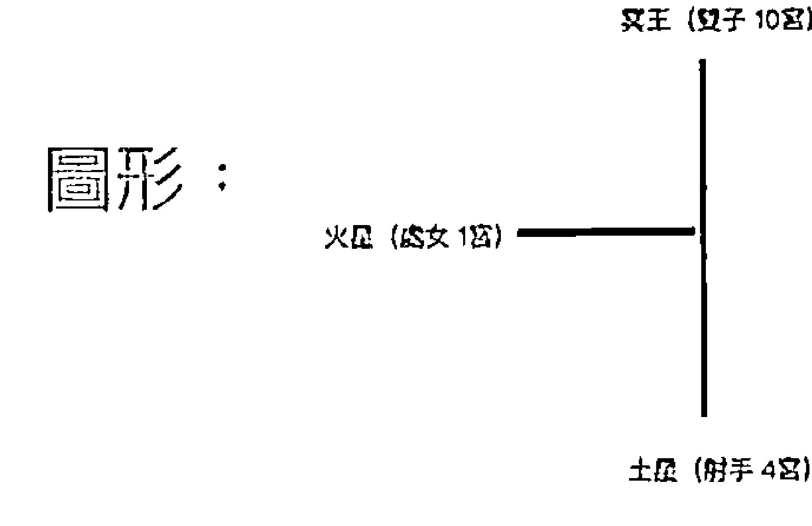

所組成的行星：火星、土星、冥王星

所組成的相位與容許度：火星四分土星、火星四分冥王、土星對分冥王

Ernest Hemingway
Male Chart
21 Jul 1899 NS, Fri
08:00 +6:00
Oak Park, Illinois
41°N53'06" 087°W47'04"
Geocentric
Tropical
Placidus
True Node

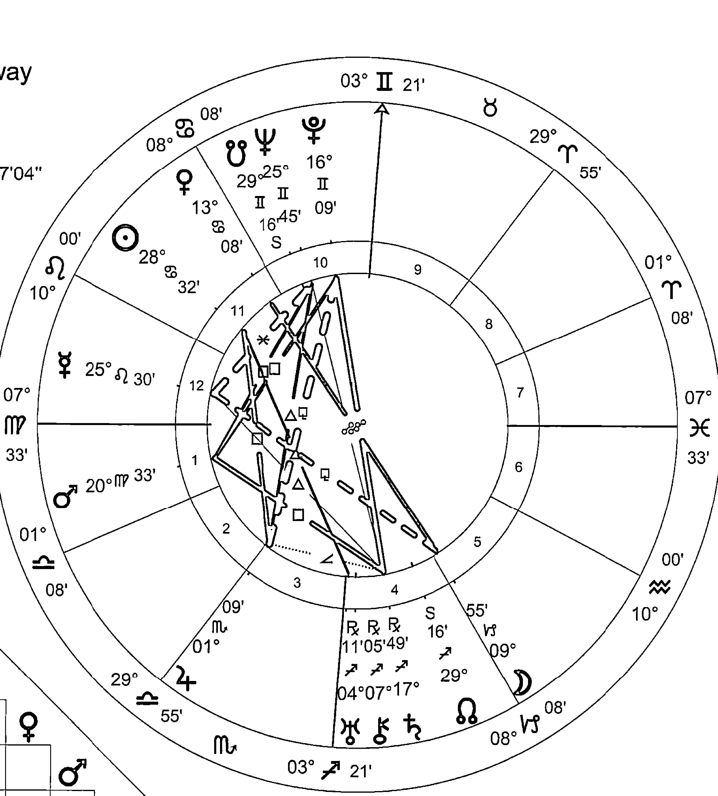

| 行星符号 | ☿ | ♀ | ♂ | ♃ | ♄ | ♅ | ♆ | ♇ | ⚳ | ⚴ | ☊ | ☋ | As | Mc |
|----------|---|---|---|---|---|---|---|---|---|---|---|---|---|---|
| ☿        |   | □ 0A34 | ☌ 3A12 | □ 2A37 | △ 7S40 | △ 5A39 |   |   |   |   |   |   | △ 2A21 | □ 7S51 |
| ♀        |   |   |   | □ 2S44 | □ 5A11 | □ 4S24 |   |   |   |   |   |   |   |   |
| ♂        |   |   |   | ∠ 1A39 | △ 5S24 | □ 0S00 |   |   |   |   |   |   |   |   |
| ♃        |   |   |   |   | △ 7S56 | ☌ 1A39 |   |   |   |   |   |   |   |   |
| ♄        |   |   |   |   |   | ☌ 2A53 |   |   |   |   |   |   | □ 3S21 | ☌ 0A50 |
| ♅        |   |   |   |   |   |   |   |   |   |   |   |   | □ 0S28 | ☌ 3A43 |
| ♆        |   |   |   |   |   |   |   |   |   |   |   |   |   |   |
| ♇        |   |   |   |   |   |   |   |   |   |   |   |   |   |   |
| ⚳        |   |   |   |   |   |   |   |   |   |   |   |   |   |   |
| ⚴        |   |   |   |   |   |   |   |   |   |   |   |   |   |   |
| ☊        |   |   |   |   |   |   |   |   |   |   |   |   |   |   |
| ☋        |   |   |   |   |   |   |   |   |   |   |   |   |   |   |
| As       |   |   |   |   |   |   |   |   |   |   |   |   |   | □ 4A12 |
| Mc       |   |   |   |   |   |   |   |   |   |   |   |   |   |   |

Compliments of:- Rod Chang rod@rodmagic.com

海明威 (Ernest Miller Hemingway)

| 行星 | 火星 | 土星 | 冥王星 |
|------|------|------|--------|
| 该行星定义<br>(可能主题) | 生存议题、攻击、<br>保护、男性 | 长者、权威、谨<br>慎、恐惧、实现 | 生死存亡的课题、<br>危机、恐惧 |
| 落入星座与定义<br>(可能主题) | 处女：辨别、服务 | 射手：旅行、成<br>长、生命意涵 | 双子：学习、沟<br>通、兄弟姐妹 |
| 是否逆行或停滞<br>(象征意涵) |  | 逆行：对于土星象<br>征的权威与实际有<br>更多审思。 |  |
| 落入宫位与领域<br>(影响的范畴) | 一宫：自我呈现 | 四宫：家庭、内心<br>世界 | 十宫：成就、事<br>业、社会地位 |
| 守护宫位与领域<br>(影响的范畴) | 九宫：高等教育、<br>哲学、国外事务 | 五宫：娱乐游戏儿<br>童 | 六宫：工作、生活<br>步调 |
| 产生相位特质<br>(可能感受) | 四分土星（阻障）<br>四分冥王（困扰） | 对分冥王（冲突）<br>四分火星（延迟） | 对分土星（冲突）<br>四分火星（困难） |
| 在图形中位置<br>(是否为端点或特<br>殊位置) | 端点 | 对分轴线 | 对分轴线 |
| 与其他行星的容许<br>度紧迫性与危机性 | 火星冥王4度<br>火星土星3度 | 土星冥王1度（紧<br>密迫切） |  |

强调主题与可能主题：火星（生存、行动、竞争）/土星（权威、压力、困境）/冥王星（隐藏、危机、死亡）。

- 生存（火）的壓力（土）是一種巨大的危機（冥）。
- 以獨立思考後實際（土星逆行）行動（火）對抗死亡與危機（冥）。
- 信念與信仰（九宮守護星火星）受到危機（冥）的挑戰而更加堅定（土）。

### 可能呈現的動力：

變動的 T 三角可能暗示著強大的挑戰，也通常帶來充滿壓力且不斷變化的環境，雖然具有挑戰性，但也能帶來以適應力為主軸的強勁動能。

### 對此圖形相位的描述：

因為火星與冥王都有著生存危機的暗示，也因此這一組 T 三角的主題可能偏向行動的困境與掙扎，由於落入一、四、十的角宮，突顯了這組 T 三角在海明威生活中的重要影響。
變動的星座暗示著用調整與學習適應的態度來面對這組圖形相位帶來的衝突。土星、冥王星的對分，暗示著對於死亡或權威的的恐懼將是個案優先察覺的主題，由於端點行星是火星，行動與勇氣成為突破的關鍵，卻需要不斷的演練才有可能帶來改變。落入處女座與第一宮守護第九宮，暗示著對自我在這個世界的位置、世界觀與人生觀、與行動細節的考量將在這些衝突當中扮演關鍵角色。

### 其他涉及行星（帶來的舒緩或更複雜化的暗示）：

- 火星海王星四分、土海對分、木土半四分、木土 135 度：理念、想像、理想化帶來的牽絆。
- 水土三分：透過溝通書寫，獲得成長與接納。

## 大十字

組成：兩組對分相，四組四分相

大十字的組成是由四個行星組成兩組對分相，而這四個行星又彼此產生四分相。許多人認爲大十字是一組相當不好的圖形相位，正因爲組成的都是傳統的凶相位。這一組相位的形成有一個特色，那就是強調性質，與T三角一樣，如果四個行星都落入同一種性質，那麼個案的星盤通常已過度強調某方面的性質。

如果個案的大十字都落入某一種性質，那麼我們需要注意這一種性質可能帶來的影響以及發展趨勢，如果他們落入不同的性質，也可能帶來調整與困擾。我在T三角的章節中詳細的描述了這些內容，建議沒有讀過這一個部分的讀者可以參閱T三角關於性質與分離相位的部分。

除了重視性質之外，還需要注意的是，大十字出現的時候，多半四個元素都會包含在其中，也就是說，這是一組要求四個元素均衡的相位，這同時說明了此人對於不同領域的生命探索有著比別人更多的渴求，這一點卻是我們經常忘記對個案說明的。

當大十字落入四種元素的時候，帶來衝突與壓力的不是元素，而是相同性質所代表的行動與態度。但或許我們也可能會注意到，他要火元素的生命力與動能，他要水元素的滋潤與感受，要風元素的資訊與分析，他要土元素的踏實與秩序。更重要的是，這樣的人暗示著生命當中絕大部分的事情，都需要四種元素的共同參與。

分佈在四種元素的大十字，象徵個案生命中有四種元素的資源，但是卻有整合上的困難。的確，每一種資源都有的人就得面對如何將各種元素整合進生命當中的議題。關於這個部分，我們在分析相位的時候會有深入的探討，如果因爲分離相位的因素，大十字中沒有出現某一組元素的話，我們或許會問此人星盤上是否完全缺乏那個元素？如果並非如此，我們也不必刻意詢問爲什麼缺乏這個元素。本命盤中缺乏元素議題的人，容易對那個元素所代表的生活態度產生陌生好奇或特別的追求，像是完全沒有行星落入火元素的人，可能對行動與果決感到不熟悉，並且對於行動與獨立的特質好奇而進行探索，或接觸較具動態與表演性質的工作。命盤中完全沒有行星落入土元素的人，可能對物質架構、秩序還有金錢財務的議題感到陌生且好奇，可能因此產生強烈的探索興趣，甚至傾向長期接觸相關的工作或長期與強調土元素的人互動來認識土元素。星盤當中完全沒有行星落入風元素的人，對於溝通、教育、人際互動的議題有著謎一般的態度，探索與長期的接觸可能滿足這樣的特質。本命盤當中完全沒有行星落入水元素的人則可能在情緒、感受與情感呈現上較爲陌生，對於相關的議題可能採取長期的探索而進一步的促成對生命全盤的認識。

### 對分相的定義：看見

對抗、競爭、衝突、挫折、合作、觀察、覺察、投射、伴侶關係。可能帶來合作與整合的機會，讓自己的人生與生活更為完整。若從這個角度看完整特質，可以降低對分相的對抗與衝突性。

### 四分相的定義：執行

阻礙、由外對內的壓力、由內向外的張力、堆積、漫長、拖延、挫折。可能透過反覆漫長的訓練與挫折來獲得成就，穩固紮實是特質，向內扎根深入了解自己，向外透過對抗壓力而獲得成就。

### 綜合的相位特色

在許多層面中，大十字與 T 三角並沒有很大的差別，他們都是由四分相與對分相共同組成的，差別在於 T 三角同時承受著兩個四分相端點，而端點經常被視為一個顯著的壓力點，也可能是帶來整合的起點。反觀大十字，在這一組圖形相位中，每一個行星都至少承受著一個對分相與兩個四分相，每一個行星都可以被視為端點，在這組圖形相位中每個行星都承受了巨大的壓力，或者也可以說，每個行星都擁有高度的動能。

### 對分相：觀察、衝突、合作、對抗、與人互動

在這一組圖形中，每一個行星所代表的主題都需要做到至少兩件事情，第一是這個行星與對分相的行星主題需要去觀察、去看見；再者，這兩個行星的主題經常會透過伴侶關係或人際互動來呈現，無論是相愛、衝突或競爭，這兩個對分軸線的主題會優先的呈現，並且引發個案的關注。

### 四分相：挫折、執行、壓力

關注與認識僅是對分相的特色而已，在這個議題當中，更複雜的是另外兩個四分相的行星在執行上對細節的考量。舉例來說，如果在一組大十字中，凱龍與另外三個行星產生了大十字，與木星產生了對分相，同時與土星海王星產生了四分相。當我在思考與凱龍有關的傷痛以及帶來困擾的主題時，可以先從對分相的木星著手，木星象徵著歡樂、傳播、信念、成長、擴張、放縱等特色，於是在與他人合作競爭甚至是伴侶關係的主題上，此人的歡樂或放肆所帶來的困擾容易被關注到，也或許此人的信仰理念、過度自信可能帶來合作關係上的痛楚。

當我們明白這一個觀察重點之後，接著再把第一個四分相的行星 —— 土星加入，在伴侶與合作關係上因為信念而帶來困擾時，可以考慮土星可能帶來的複雜影響。由於這是一組四分相，四分相的特質有著執行、衝突與挫折，土星象徵著約束、法律、權威，因此，權威、法律（土星）將可能緊密地約束這個人的自信與膨脹（木星）在合作互動（對分）上可能帶來的傷痛（凱龍）。我們可以多找一些不同的描述，例如：

- 成為某個領域的權威（土）可能替此人帶來在成長過程（木）中與人互動（對分）時遭遇過的傷痛的療癒（凱）。
- 權威與長輩（土）可能是此人在大學階段時期（木）當中傷痛（凱）的主要因素。

接著我們再把另一個四分相的行星加進來考慮。海王星，象徵夢幻、熱忱、憧懾、想像、犧牲或者藝術，從凱龍的觀點來看，仍然可將這一個行星定義為帶來執行層面的困擾。土星象徵著約束、法律、權威，那麼：

- 權威、法律（土）可能緊密地約束這個人的自信與膨脹（木）在合作互動（對分）上可能帶來的傷痛（凱），而他對於理想熱忱的追逐渴望（海）更讓他左右為難。
- 成為某個領域的權威（土）可能替此人帶來在成長過程（木）中與人互動（對分）時遭遇過的傷痛的療癒（凱），但對於周遭事情的超越真實性的強烈感受（海），使得療癒的途徑更具挑戰性（四分）。

透過這樣的方式，我們可以了解當我們在大十字的圖形相位中挑選一個行星作為詮釋主題時，其對分相的行星可以從人際互動模式、伴侶關係模式、觀察得來的體驗來詮釋，而另外的四分相則是在這個觀察與人際互動之下，帶來影響、干擾、刺激、協助、長期訓練的行動。

大十字擁有高度覺察與高度整合、強勁的動能，關鍵在於整合，不只是「去看見」，還要「去做」，同時要花相當長的時間進行。就如同高空走鋼索，不僅是看見對岸的目標，同時要保持左右的均衡，這需要相當長時間的訓練。

在所有的相位中，對分相與四分相最缺乏彈性，但是動力最為強大。這樣的相位總是強而有力的直接影響著我們，促使我們對生命做出回應，也往往讓渴望舒適生活的人感到不愉快，這也是為什麼在古代時這樣的相位總是帶有不吉利的色彩。我習慣使用人文觀點來詮釋星盤，這樣的大十字的確帶來相當多生活中的不愉快與不順暢，但是生命的挑戰不會因為我們感到不愉快就停止，外界的轉變對我們的影響也不會因為我們想要趨吉避凶就停滯下來。大十字象徵著當事人需要用認真與複雜的態度去面對每一個受到大十字影響的環節，命運女神並不會因為你逃避人生責任就停止追逐你，但是當你認真面對時，就如同經濟學家凱恩斯所說的：「就算是打破一面窗戶，也可以讓修補窗戶的工人賺到錢。」大十字不是最順暢的生命流動，但當我們仔細檢視並且面對時，我們會知道生命或許要我們花較長的時間在準備工作上，用更多的考驗與挑戰，好讓我們更專精於我們所要面對的課題。對於某些人來說，大十字或許就像是鮭魚從大海洄游，不斷地向更高的海拔挑戰，不斷地抵抗水流的衝擊，然後終於回到出生地產卵，完成這一生延續生命脈動的任務。

最後，我們仍有釐清主題的必要。透過組成的行星來釐清這組大十字的主題是什麼？接著再透過容許度的寬鬆與緊密，來判斷哪些主題更為迫切？通常四分的兩端帶來動力，並「協助」完美地成就這項工作（就如同四分兩端扮演警察督導，讓你頭痛卻必須精確地完成他們的要求）。更別忘記整合兩個端點有兩組課題要完成，比起T十字又多了一組，或許在這麼多的課題當中，別忘記透過分析與判斷組成的行星、星座、宮位找出重複性最高的主題，那或許正是你應該優先下手的地方。

## 大十字圖形相位摘要

- 大十字的主題往往對生活有著全面性的影響，需要長時間與不斷地面對。
- 大十字的主題要求我們透過不斷地訓練，以達到完美零誤差的成果。
- 大十字強調在獲得觀察或者遭遇到衝突之後，可以發現新的處理方式。
- 大十字或許不會帶來順暢，但卻可以帶來強勁的動能，並要我們緩慢、仔細、迂迴地獲得成就。
- 試著從行星、星座、宮位中找出不斷重複出現的重要主題。

## 案例分析

圖形相位名稱：大十字

圖形：

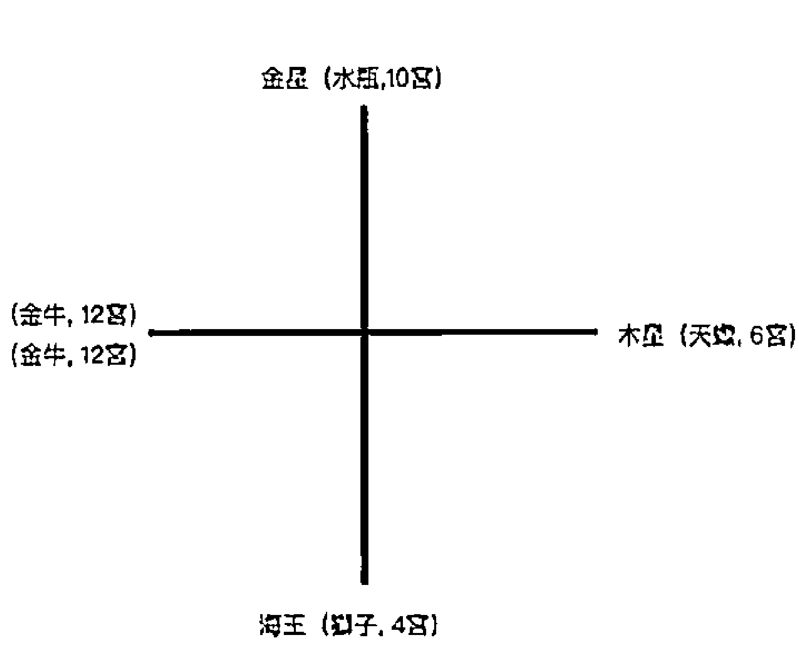

所組成的行星：金星、木星、海王星、火星

所組成的相位與容許度：見表格

Marcel Marceau
Male Chart
22 Mar 1923 NS, Thu
08:00 GMT +0:00
Strasbourg, France
48°N35' 007°E45'
Geocentric
Tropical
Placidus
True Node

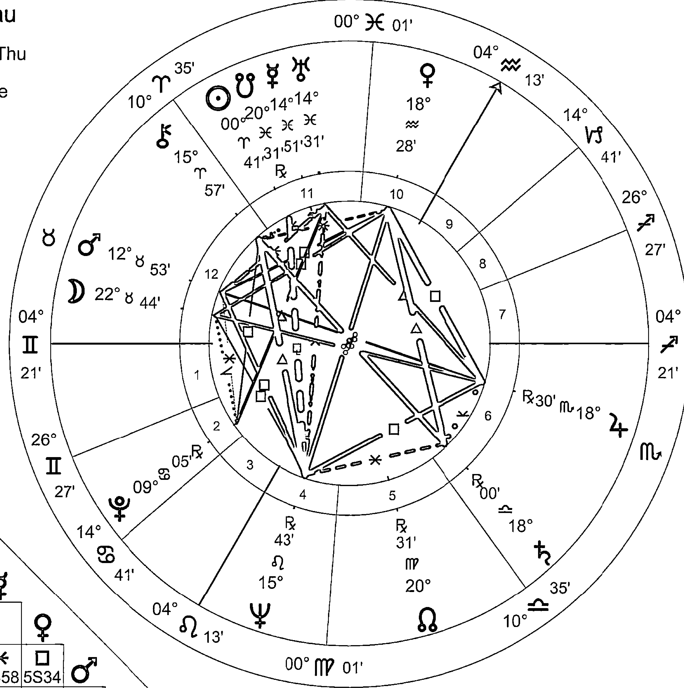

| 行星 | 太阳 | 月亮 | 水星 | 金星 | 火星 | 木星 | 土星 | 天王星 | 海王星 | 冥王星 | 凯龙 | 北交点 | 南交点 | 上升点 | 中天 |
| :--- | :---: | :---: | :---: | :---: | :---: | :---: | :---: | :---: | :---: | :---: | :---: | :---: | :---: | :---: | :---: |
| 太阳 | - | □ 4S16 | * 1S58 | □ 5S34 | △ 0A02 | □ 5A37 | △ 0S27 | * 0S19 | * 1A38 | △ 3A59 | □ 7S00 | □ 0A02 | □ 0A52 | □ 2S44 | □ 2A50 |
| 月亮 | | - | △ 3A39 | □ 0A02 | □ 5A37 | △ 0S27 | | * 1A38 | △ 3A59 | □ 7S00 | □ 0A02 | □ 0A52 | □ 2S44 | □ 2A50 | □ 2A47 |
| 水星 | | | - | △ 0S30 | * 1A38 | △ 3A59 | □ 7S00 | □ 0A02 | □ 0A52 | □ 2S44 | □ 2A50 | □ 2A47 | □ 2A17 | □ 1A12 | |
| 金星 | | | | - | △ 3A59 | □ 7S00 | □ 0A02 | □ 0A52 | □ 2S44 | □ 2A50 | □ 2A47 | □ 2A17 | □ 1A12 | | |
| 火星 | | | | | - | □ 7S00 | □ 0A02 | □ 0A52 | □ 2S44 | □ 2A50 | □ 2A47 | □ 2A17 | □ 1A12 | | |
| 木星 | | | | | | - | □ 0A02 | □ 0A52 | □ 2S44 | □ 2A50 | □ 2A47 | □ 2A17 | □ 1A12 | | |
| 土星 | | | | | | | - | □ 0A52 | □ 2S44 | □ 2A50 | □ 2A47 | □ 2A17 | □ 1A12 | | |
| 天王星 | | | | | | | | - | □ 2S44 | □ 2A50 | □ 2A47 | □ 2A17 | □ 1A12 | | |
| 海王星 | | | | | | | | | - | □ 2A50 | □ 2A47 | □ 2A17 | □ 1A12 | | |
| 冥王星 | | | | | | | | | | - | □ 2A47 | □ 2A17 | □ 1A12 | | |
| 凯龙 | | | | | | | | | | | - | □ 2A17 | □ 1A12 | | |
| 北交点 | | | | | | | | | | | | - | □ 1A12 | | |
| 南交点 | | | | | | | | | | | | | - | | |
| 上升点 | | | | | | | | | | | | | | - | |
| 中天 | | | | | | | | | | | | | | | - |

> Compliments of:-
Rod Chang
rod@rodmagic.com

## 馬歇·馬叟 (Marcel Marceau)

| 行星 | 金星 | 海王星 | 木星 | 火星 | 月亮 |
| :--- | :--- | :--- | :--- | :--- | :--- |
| **該行星定義 (可能主題)** | 藝術、和平、舒適、女性 | 消融、超越、犧牲、消失 | 信仰、哲學、海外、擴張 | 行動、生存、攻擊、保護 | 女性、感受、家庭、母親、日常生活 |
| **落入星座與定義 (可能主題)** | 水瓶座：人道主義、自由、獨立、科技 | 獅子座：創意、創造力、戲劇化、光榮 | 天蠍座：意志力、洞悉、危機、情感堅持 | 金牛座：保有、累積、資源、物質 | 金牛座：保有、累積、資源、物質 |
| **是否逆行或停滯 (象徵意涵)** | | 逆行：對於海王星象徵的夢幻榮景有更多的內在思考 | | | |
| **落入宮位與領域 (影響的範疇)** | 十宮：成就、榮耀、社會地位、父親、母親 | 四宮：家庭、父母親、內在世界 | 六宮：服務、勞動、訓練、日常生活 | 十二宮：自我消融、隱藏敵人、自我摧毀、奉獻 | 十二宮：自我消融、隱藏敵人、自我摧毀、奉獻 |
| **守護宮位與領域 (影響的範疇)** | 六宮 | 十一宮 | 七、八、十一宮 | 十二宮 | 三宮 |
| **產生相位特質 (可能感受)** | 對分海王（衝突）<br>四分木星（壓力）<br>四分火星（張力）<br>四分月亮（否定） | 對分金星（對抗）<br>四分火星（壓力）<br>四分木星（張力）<br>四分月亮（延遲） | 對分火星（衝突）<br>對分月亮（對抗）<br>四分金星（阻礙）<br>四分海王（受困） | 對分木星（衝突）<br>四分金星（延遲）<br>四分海王（壓力） | 對分木星（對抗）<br>四分金星（張力）<br>四分海王（阻礙） |
| **在圖形中位置 (是否為端點或特殊位置)** | | | | | |
| **與其他行星的容許度緊迫性與危機性** | 金星海王3度<br>金星木星0度<br>（緊密迫切）<br>金星火星6度<br>金星月亮4度 | 海王月亮7度<br>海王火星3度<br>海王木星3度 | 木星火星6度<br>木星月亮4度 | | |

### 強調主題與可能主題：

- 反覆出現視覺上（海王逆行）的美感（金）來自於誇張的（木）行動（火）挑起情緒反應（月）。
- 有爲了理念（木）與他人衝撞（火）的衝動，但又顧及人我關係（金）以及家庭關係（月）而打消念頭（海）的內在衝突。
- 試圖以包容的態度（木）化解（海）兄弟姊妹（三宮守護星月亮）之間因爲金錢或人際關係（金）上的衝突（火）。

### 可能呈現的動力：

這是一組屬於固定性質的大十字，強調不退讓、不妥協的特質，具有強勁的動能，但以固定星座的耐力方式呈現。

### 對此圖形相位的描述：

在這組大十字中，火星可能暗示著衝突，卻落入弱勢的金牛，但金星海王與月亮等陰性行星的特色也帶來了對平和的渴求，以及內在的憤怒與衝動如何釋放。這樣的衝突與憤怒容易展現在社會名聲（十宮）、家庭環境（四宮）與日常生活（六宮）之中，也可能與社會福利或人群福祉（水瓶與十一宮）有著密切關聯。由於是固定大十字，如何在衝突當中堅持不退讓，這是此星盤值得關注的地方。

### 其他涉及行星（帶來的舒緩或更複雜化的暗示）：

- 在此圖形相位中，月亮與火星並沒有合相，因此需要特別留意。在處理火星議題時可忽略月亮影響，同樣的，在處理月亮議題時可以忽略火星的影響。
- 此外，土星與金星三分與海王六分，象徵著藝術或想法的實踐與呈現，凱龍與金星六分與海王三分，暗示著在藝術當中尋找到對過去傷痛的療癒。

## 大三角

大三角在星盤上呈現的方式是三個行星（以上）彼此之間產生三組三分相的相位，大多時候這三個行星會落入同樣元素的星座。

### 組成：三組三分相

### 三分相的定義：接受、自然、成長

三分相具有和諧共鳴的意涵，三分相的星座都位在同樣元素，同一元素的不同星座又代表著對同一種生活層面的關注的不同切入點。行星的三分相是透過共同的關注而感受到共鳴，同時又因為接觸到不同的切入點，而有著接受與成長的意涵。透過三分相，不同星座的差異可以表現在對事物不同樣貌的接受度。

### 大三角特質

這一組相位經常被一些占星師們視為幸運的相位，因為這一組相位都是由古代占星師眼中的吉相位所組成的。大多數占星師認為這樣的圖形相位可以帶來舒適的感受，不過也有占星師認為大三角需要一些其他強硬相位的刺激才能夠發揮其特色。例如占星師馬琪與麥克艾弗（Marion D. March & Joan McEvers）所著的《學習占星的唯一途徑》（The only way to learn Astrology）提到，若沒有其他強硬相位刺激大三角，可能讓人躺在那裡不做事浪費了天賦。而諾泰爾（Noel Tyl）則透過圖形的方式，描述這樣的相位暗示著一種自給自足的特質以減少與他人互動的可能，而強硬相位的介入則刺激與打破了大三角自給自足的限制。

若要充分認識大三角所帶來的影響，除了透過行星主題的研究之外，我們必須回到三分相之上，因爲這一組圖形相位除了三分相之外別無其他。在前一個章節中我們提到過三分相最主要的特質是和諧。大三角中的三個行星多半落入相同元素的星座，暗示著和諧與一致性，這當中或許會有些細節的差異，但是每一組元素的三個星座都有著共同重視的生活領域，也因此能夠充分的接納。三分相顯示接受與包容的特色，這也呼應著在傳統占星中三分相與木星有著呼應的關聯，木星的溫和與調節不同事物，使它成爲最吉利的行星象徵。

大三角的三分相替個案帶來了一種舒適與自在，這種自在可以是每日生活中的輕鬆，以及對周遭事物的接納。他們能夠處在一些改變之中，並透過不同的方式「接受」這些改變，也能夠接受事物的差異性。對於生活在當下，以及對此大三角所相連的主題事物處之泰然則是一種特色。

由於三分相接納和包容的特色帶有明顯的彈性，與三分相有關的木星本身又具有「調和」的意涵，這些彈性允許擁有大三角的個案可以輕鬆地改變生活態度、模式、或是觀點來接受轉變。換句話說，如果個案的生活中發生了一些狀況，而這些狀況又與星盤中大三角的行星、星座、宮位有關時，個案大多會接受這些改變，就如同遇到巨大的衝擊時，大三角會成爲一種相當有彈性避震的阻尼器。當衝擊發生在其他人身上時，他們可能會與之對抗，或者挺身面對衝擊與壓力，而星盤中有大三角的人，一方面透過多種管道的調整減輕衝擊，一方面可以讓自己隨着周圍的變化而改變。

三分相的包容與溫和降低了衝突與刺激，這並不代表三分相就是一種無力的特質，現代占星觀點認爲三分相也具有某種程度的成長與擴張，不過這樣的成長與擴張不強調衝突的色彩，或許像是一種溫和的演進，一種舒適自然的成長態度，自然地流動並順應周圍的擴張方式，非常像是道德經當中的「無爲」。大三角擁有的態度是一種不勉強、不給予壓力、不限制的特色，這也可能是星盤中有大三角的人可以拥抱的生活态度。

有趣的是，在我的咨询观察当中，一些拥有大三角的人并不容易察觉自己星盘中所拥有的资源与才华。我曾经与一位相当知名的作者讨论他星盘中座落于三、七、十一宫的大三角，我们都知道他在写作上的成就，但是他却认为这项才能并不“特殊”，在他眼中，每一个人都应当拥有适当的沟通书写与深入思考某些议题的能力。这或许是因为大三角有一种舒适与自然的特色，这种舒适让我们减低对于自身才华与资源的察觉，他们或许更在意星盘中缺乏的元素或是其他的强硬相位，但是对于占星师来说，大三角所突显的资源却是个案相当值得更深入认识并学习如何应用的方向。此外有些人会将自身大三角的特色视为其他人也都应该具备的特质。没有看见并不代表不存在，自身拥有某种才能并不一定表示其他人也一定拥有这样能力，这两个方向往往需要与拥有大三角的个案做进一步讨论。

有些占星师认为大三角强调三分相，因此不具有积极的特色，这或许有他的道理，但事实上我们很少看到一张星盘只有单纯的大三角而不具有其他的强硬相位。同时，我们必须更留意具有刺激性的行星像是火星、天王、冥王星等落入不同元素的星座时，都可能替这样的大三角带来刺激与冲突的特质，当然这仍然可以透过三分相的互动找到共识。更值得关住的是，这些冲突与刺激可以替大三角带来更多的推进力量。

有时候我们会听到一些人说大三角有着“过多”舒适的三分相，所以降低了一个人去争取机会和努力的意愿。我完全同意这样的说法，因为我自己有一组由太阳月亮天王星组成的风元素大三角，的确带来了语言沟通上的舒适与流畅，甚至有着在人际关系上避开与他人冲突的倾向。曾经有一位占星师朋友就指出我星盘中的大三角会让我逃避应有的人生责任（而我知道他这段话是从 Bil Tierney 的书中复制过来的）。不过如果从较人文的一面来思考，一个人如果安于自身的状态时，占星师有什么理由挥舞着皮鞭来指责他？又是谁赋予占星师如此伟大的权力呢？占星师可以指出大三角所强调的生活领域、可能带来的舒适与和谐自在的特质与主题，但若一组大三角真的造就了一个人舒适的特质，要他去积极争取究竟是否违背了他的本性？占星究竟是要让一个人更认识自己、更拥抱自己，还是要他去做其他人眼中成功认真负责的人？占星师应当好好地思考一下，我认为只有在个案对自己的生活感到静止与无聊而求助于占星师的时候，我们或许可以在这时点出大三角的舒适与自满，可能是他迟迟无法离开舒适圈的主要原因，并透过星盘中其他暗示着动力的象征，建议他在不否定自我的舒适与无争的状态下，仍然可以去突破这种过于平淡无聊的状态，而不是在不考虑整体星盘与个人本质的情况下就要一个人去改变自我。

从另外一个角度来看，三分相强调着成长，许多占星师们认为三分相的安逸与舒适带来了发展的限制，我并不完全同意，因为无论从传统的角度来看三分相与木星发展的关联，以及从人文角度来看它与射手、狮子的关联，我们都会看到“成长”在三分相当中出现。或许这种成长不是传统权威式，不是斯巴达式的强硬特质，但却是一种身心协调的自由成长，或许三分相不强调克服困难，不强调通过抗争以取得成就，但从某方面来看，在危机发生时大三角不具备对抗的能力，但是大三角强调融入、调和、融合，是一种较不具有侵略性质的扩张与成长，或许这样的温和态度需要当事人花更长的时间来察觉细微奥妙的生命演进。

由于大三角容易出现在同样元素的星座，三个以上的行星落入同一种元素的星座时，象征着个案对该元素的重视与熟悉，有时这种熟悉感受像是一种与生俱来的特质，因此在与个案讨论星盘时，认识该元素成为我们解读大三角的首要重点。

## 元素的特质

### 火元素星座大三角

在古代的占星师眼中，元素象征着一些特质，可以描述环境、气候、或者人们的身体状态。

火元素象征着干燥与炙热的环境特质，夏天和中午，与体液当中的黄胆汁有关联，他们认为这样的干燥与炙热让人将身体的水分排出，就像是行动时挥汗如雨的结果，也因此将火元素与行动结合。古代的四液说理论当中认为黄胆汁让人急躁、容易生气，具有统治领导的特色，这些特质也经常与火元素有关。

从元素的符号诠释来观察，火元素强调热力、行动。火元素的符号是向上的三角形，而在物理特质当中热空气是往上升的。向上攀伸、提升、成长成为火元素的另一种特质。在物理学当中，热力的传播不仅仅是向上而已，也具有辐射的特质，因热力往周围散发，也往往暗示着火元素强调着对周围热力扩散，将温暖带给周围的人。火的热度能令人流汗，也因此火元素对应着热、热情以及那些与流汗有关的行动，运动冒险，同时刺激、兴奋的感受也经常让人汗流浃背。

火的出现让人们能够在黑暗中看清事物，也因此光亮、明朗、清晰也与火元素的特质有关。这种清晰与明朗暗示着直接、不隐藏的特色，用这种特性来描述人格的话，火元素是一种爽朗积极的个性，将这种特质应用在行动时，行动的方向清晰明确，一旦展开，将会是一种直接、不曲折、不妥协也不停滞的行动。也因此意志、信念、力量等特色经常与火元素作连结。

当代的占星师经常将四元素结合荣格四种人格特质，认为火元素象征着一种“直觉”，接近于天启或召唤的特质，或者说自动自发的态度。因为这些星座强调的是一种不经思索的即刻行动，不是等待刺激之后才作出反应，不是经过思考与证实之后才采取行动。

因此，与星盘中有火元素的人讨论他的星盘时，建议先与他们一同探索他们对生命的热爱、无须督促的自主态度，以及鲜明的个人特质，看见他们积极生活的美好，这些态度如何帮助他们突破生命的重重限制，这些热情如何让他们在社会中成为个性鲜明与他人不同的角色。火元素大三角中的牡羊座行星带来行动所需的开启动能，诱发展开行动；狮子座的行星透过创造力、创意以及荣耀，帮助我们发挥个人特点并坚持行动；射手座行星则根据成长的方向与对未来的洞见，帮助我们在生活中做出行动的调整。

落入牡羊座的行星象征着强烈的生存奋斗特质，落入牡羊座的行星都与生存的行动有着密切的关连，此行星所涉及的根本议题就包括了生存、存在、活着。为了存活下去，竞争是争取工作机会的方式，与商业同行的竞争、工作上争取个人的成就与表现、情感与关系上可能与争夺伴侣引发的冲突有关，这些对当事人来说或许只是一种自发举动，但从牡羊座所象征着生存奋斗特质来看，这是一种近乎动物本能的天性，而这种最原始的动物本性往往可以带来最强烈的动机与竞争力，当事人或许可以善用三角当中的此一主题来展开整个计划。古代的占星师提醒我们，太阳与火星在此星座具有优势，因此火星与太阳落入牡羊座的人往往在事件的启动、行动的展开，以及竞争当中带有一定程度的优势。在考虑他们的火元素大三角时，占星师不妨点出这项天赋，并与当事人共同探讨如何将这样的特色纳入行动与计划之中。金星与土星落入这个星座时，可以提醒因个人迟疑所可能带来的干扰，以及面对人际关系、权威议题时引发的冲动所可能带来的困扰。

落入狮子座的行星重视具体的成果呈现，由于是固定星座，所以持续性成为其中的优点。许多人都知道落入狮子座的行星强调荣耀与光芒四射，但他们也愿意为了一种认同的荣誉而长时间努力。如何看见生命中的事件所能够带来的荣誉，可以刺激火元素大三角中的狮子座部分，并带来坚持与具有延续性的行动力。创意与创造力是狮子座的另一项特质，透过落入狮子座的行星来取得源源不绝的创造力，一方面可以提升整个火元素所象征的个人特质，另一方面，这些创造力就像是丰富的能源一样支撑着整个行动的运作。传统占星师认为太阳是狮子座的守护，在火元素大三角中，有太阳落入狮子或者太阳与狮子座行星产生相位时，都强调了狮子座主题的创造力与自信可能带来的优势，强烈的自信与创造力成为大三角主题中强烈的推进力。而土星落在此处时可能带来个人的信心危机，在发挥整个火元素大三角的强烈行动力时，自我设限可能成为人生发展中需要关注与探讨的主题。

现代占星师认为落入射手座的行星寻求更高、更深远的意义，这些行星带有成长与扩张的特质，同时带来转变可能性。这是整组火元素大三角灵活的枢纽，落在射手座的行星告诉我们，当遇到冲突与挑战时如何灵活的反应。由于射手座象征着高深的哲理以及异国文化，这提醒我们接触到的新思想可能有别于日常习惯，一方面这可以创造更多的个人特质，另一方面协助我们用不同的方式面对生活中的冲突。意义的追寻是射手座行星在无形中滋养整个大三角的动作，这可以让整体走向个人成长与提升的方向，同时也让个人在遇到挑战和冲突时，更清楚自己为什么做这件事情。在占星学中，木星是守护射手座的行星，如果在这组大三角中有木星落入射手座，或者木星与射手座行星产生相位，我们都会建议当事人关注一下木星的成长、信念、乐观、寻求生命意义的特质，这将会是此人星盘中可以充分运用的优势。而水星落入射手座则是传统的失势，这并不代表此人的学习沟通能力不好，而是在沟通过学习过程中的急躁与不重视细节，将有可能带来一些困扰并值得个案更加谨慎。

火元素的大三角强调星盘中的行动力与个人意志，重视个人成长、找寻生活的方向、明白生活的意义，行动上的独立自主以及生活当中不愿意受到任何限制，都是这个大三角的明显特色。或许这样的特质在与他人互动时可能带来一些挑战，但却是一种强烈的个人生活哲学，因为他们渴望活出自己。

在我的咨询当中，我会先让个案看见这样的图形相位所暗示的独立从何而来，与四宫、十宫、月亮、太阳、土星、凯龙有关时，是否是家庭环境的促成？与十宫、十一宫、十二宫、或者外行星有关时，是否是不可抗拒的时代环境变迁？与七宫、八宫、金星、月亮有关时，是否暗示着在人我互动时的体验？根据这些特质了解当事人之所以强调“独立自主、不受干预”的背景之后，我们才能够进一步地让对方知道并非所有的事物都需要自己一个人面对。我们也必须了解到并不是每一组大三角都是纯粹的大三角，一定有其他的行星与这大三角产生其他相位，特别值得关住的是角距紧密的相位以及强硬相位。带来这个相位的行星所关联的事物，这个行星所在的星座、宫位所暗示的主题，都会让个案深刻体会关于“个人成长、独立不受干预”的甘苦，并进一步地了解这一组火相大三角所带来的成长意涵，也可以刺激当事人在遇到生命的挑战课题时，充分运用坚强的意志与积极乐观的行动来回应。

我知道一些占星师喜欢讨论这些个性带来的“问题”，并建议对方修正，或许在媒体书写时这样的辛辣文笔可以博得许多认同，但咨询并不是媒体营销，生命更不是机器，人格特质的确会在某些时候带来一些生活的困扰，但如果一再强调这些特质所带来的“问题”，反而限制了此人拥抱自身的才能。

我在咨询时习惯的做法是让个案看见这些特质是生命当中富足的资源，在遇到生命的挑战时不妨回到这些特质中以寻求出路，只有在意识到自身的热情或积极的态度会带来困扰时再来进行检视，也就是说，在个案并不因为这样的生活态度是一种问题时，占星师的指责可能会成为一种干扰个人成长的限制。

## 土元素星座大三角

土元素在传统的占星学当中属于干燥与冷的环境气候特质，从古代医学的四液说中，土元素与身体中的黑胆汁（melancholy）相关，黑胆汁的拉丁文最后成了现代医学中忧郁以及忧郁症的字根。因为古代医学认为黑胆汁过剩将会让人被动、忧虑、保守、严肃。

对人格特质来说，这种特性是敏感的，有些人会诠释为伤春悲秋，这样的人格特质也经常会与水元素的特质搞混。事实上，土元素的感伤出自于一种担忧，一种对于环境敏锐感受而有的忧虑，以及严肃地看待周围环境，这一点与水元素的情绪反应有些差异。在荣格的四种特质当中土与感受有关，这样的感受并不是强调情感，而是强调对于现实状况的感受而做出的判断与反应。

从元素的论点来看，土元素是四大元素中唯一能够被掌握的，具有一种实体的存在感，火元素与风元素几乎完全无法被触碰，水元素可以被触碰但是很难被掌握控制。但是土元素的实体物质、大地土壤却是你们可以触碰、雕塑、拿捏、甚至耕作的元素。也因此土元素经常被认为与触感有关，能够握在手中，所以刚刚所说的触碰、雕塑、拿捏、耕作都与土元素的生命特质有关。土元素象征着人们与物质世界的紧密连结，土元素可以是物质世界中的一切，除了大地、农作、高山、沙漠、土壤、田园之外，我们的身体也与土元素有着紧密的关联，从粮食到金钱财富甚至到如何取得与应用，社会与经济的规划与管理都息息相关。也因为强调触感与掌握，通常现代占星师认为土元素带有强调实际与存在的特质。

星盘中落入土元素星座的行星，暗示我们在哪些领域与实际生活有着更密切的接触，这些领域包含了身体健康、金钱财富、资源、社会经济的运作、职场考量与日常生活当中的吃喝睡等。土元素大三角中的摩羯座行星帮助我们认清社会运作的基础架构，金牛座行星带来鉴赏与保有物质资源的能力，而处女座行星则在事物产生变化时，提供我们灵活的态度，将人事物安排在最适当的位置。拥有两个以上的行星落入土元素或甚至形成土相星座大三角时，暗示着对于物质生活、感官世界、社会与个人生活的运作秩序比较容易理解与应用。当然我必须再次提醒初学者，个案如何在实际生活中呈现？个案是否真的善于理财？是否重视健康？这些仍必须观察整张星盘，以及配合个案的生活环境、成长背景，才能够清楚土元素星座与落入土元素的行星如何在个案生命当中真实呈现。

落入金牛座的行星象征着我们对于资源的认知与应用态度，包括了我们的身体、我们所拥有的物品、我们的财富，近代占星师更进一步地将金牛座的连结推升到我们的能力以及价值观。土元素的大三角强调我们对生活的实际态度，而在金牛座的行星帮助我们认清手边的资源与自身的才能、我们手上拥有什么，这可以是我们如何看待财富金钱与个人价值，也可以是我们从哪里赚取生活所需。充分应用落入金牛座的行星可以帮助我们有效率地取得资源，也由于是固定星座，这些行星象征着生活中不轻易改变的主题，或许是金星的价值观，或许是土星对权威的重视或者对生命的谨慎，也或许是天王星的客观态度。这些坚守的原则、紧紧抓住的事物，与生存的维系，彼此间势必有关联，才会使得个案不容易轻易放手。认清这一点对于个案将有相当大的帮助，重点不在于规劝对方放手，而是让他看见这行星背后可能存在的生存危机，才能让个案在适当时机做出是否该放手的选择。

在传统占星学当中，落在金牛座的金星与月亮有着一定的优势，他们象征着生活中丰富的资源，如果大三角中有这样的位置，或者金星、月亮与落入金牛座的行星产生相位，多少都能够帮助个案体验生命的丰盛，以及透过寻求丰富的资源来创造个人优势。而火星在此处于失势的位置，面对竞争时的坚持与缓慢，或因过于谨慎而容易错失机会、带来的悔恨，这是当事人需要注意的，但就算如此，我们仍然可以提醒个案保护所拥有的事物是火星金牛的优势。

落入处女座的行星象征着人们对于物质转变的认知，同样是土元素强调对物质与资源的关注，但因为落在变动星座上，因此倾向于采取调整、改变与整合的执行方式。在土元素的大三角强调物质与资源的议题上，处女座行星暗示着我们如何区别、调整、转变、控制、整合手上的资源，这也是为什么处女座的行星经常与技艺有关。落在这个星座的行星带来了土元素大三角整合上的灵活，我们用一种实际的态度把手边的资源整合在一起，例如水星落入处女座强调观察、区别、分析能力的物质整合态度，更因为落在处女座的水星在传统占星学中有着守护与强势的优势，有这一组行星星座配置的人可以善用此优点。如果水星与落入处女座的行星产生相位，也多少会替这个土相大三角带来显著的分析能力，并拥有更多的竞争优势，就算木星在处女座是传统占星观点的弱势组合，亦可强调是理念的整合、想法的落实。金星在处女也是传统占星学中认为落陷行星的星座组合，但依然可用谨慎专注的态度完成美学的生活应用、或者在日常生活细节之中发现情感与人际互动在生命中的意义。而对于弱势与落陷的行星，占星师多半都会建议个案谨慎地处理与该行星有关的生活领域。

落入摩羯座的行星象征着人们对于物质世界发展的动力，因为是开创星座，所以比起其他土元素星座拥有更显著的行动力，这样的行动力并非莽撞，而是一个经过审慎思考、缜密安排之后采取的行动。落入该星座的行星象征着土元素大三角的前进驱力，如何拓展个案在社会上的视野？如何争取更多生存的契机？如何取得更多的成就？在社会结构中透过哪些特质可以发挥影响力？例如天王星落入摩羯座的人或许是透过谨慎的改革以取得社会成就；金星落入摩羯座的人可能会透过人际互动与情感来提升自己的视野，并巩固自身的社会地位。计划与执行是现代占星师最常与摩羯座产生连结的几个字词之一，土星是摩羯座的守护星，当土星进入摩羯座、或者土星与摩羯座的行星产生相位时，都会替这一组大三角带来更显著的摩羯座特质，占星师也认为这样的配置或相位，可以透过经验与谨慎行动来增强这组大三角三角争取物质与社会资源的能力。火星落入摩羯座也是传统中的强势，火星摩羯会让个案在面对竞争与争取成就的过程更加谨慎，强调经由计算与安排之后采取行动的优点，若是火星与大三角中位在摩羯座的行星产生相位，也会带来相似的益处。相对的，太阳与月亮落入摩羯是传统占星中认为需要多加关注的配置，谨慎地面对自身的能力与情绪的渴求是最常被提醒的，但是我们更常注意到太阳摩羯对自身质疑所带来的生活困扰，以及月亮摩羯对情感与需求的否定，这些都需要占星师在咨询时给予更多的关注与讨论。

### 风元素星座大三角

风元素在传统的四液观念中与血液有关，血液与风元素的性质同样属于温热、潮湿，是有利于生命生长的环境。这样的环境像是春天，像是早晨，也像是人类成长过程中的婴儿时期。对于传统的占星师来说，风元素强调的是一种乐观活泼的态度、人与人之间的社交活动、生活当中的对话与互动，这些都是风元素所强调的性质，也因此，这个元素被认为与社会交流有着密切关联。

存在于自然界的风元素是风，移动的空气，从呼吸、微风到风暴，风元素的某种意涵象征着无所不在并且总是在移动变化当中。在传统的占星学中，风元素的几个星座都没有动物的图像在其中，双子的图像是两个孩童，天秤是女神手持的秤子，水瓶则是少年捧着水缸，这些星座又被称为人类星座。在古代占星师的眼中这暗示着人类的社会活动、与人有关的接触、人烟聚集的地方，象征着人类的文明和文化。

在荣格之后的许多现代占星师将风元素与人格特质中的思考功能做连结，认为风元素象征着思想、传播、教育、沟通，社交生活、社会互动与社会议题等等。同时也强调因为与人的互动所带来的视野增长、对话交流、思想交流、人我之间对等关系的重视。我们必须注意个案在这些生活议题的发展，虽然风元素重视思想传播或者是沟通，但不代表星盘中强调风元素的人就是聪明的，对理性与讯息传播重视并不代表天才或高智商。

风元素的星座广泛地和人与人之间的关联结合，风元素大三角象征个案生活中强调社会交流的特质，从兄弟姊妹、伴侣关系到社群互动等不同层次的人际关系都会带来显著的生活议题。风元素大三角中的天秤座行星带来了关系串连的能力与对等尊重的基础，水瓶座的行星提升视野并且带来对于思想、人群互动大原则的坚守，双子座的行星则在日常生活当中带来适应与转变的圆融。

落入双子座的行星象征着重视人与人之间最开始的交流，在生活层面中实用知识的观察与应用。双子座是风元素中的变动星座，强调整合与交流的能力，在一组大三角中，变动星座依照所在元素重视的生活层面（在此为风元素）去整合不可变的原则与驱动力，并且根据实际的环境情况来落实。也因此，在大三角中的双子座行星象征整个风元素的思想交流中最容易被理解与应用的范围，也就是那些能够在生活中被使用的，双子座的行星象征我们传播那些层面的实用知识，以及用什么样的方式去传递。例如木星虽然在双子座是传统中的弱势，但是木星双子的人可能以木星的宏观、开朗的态度去传递木星所象征的旅行知识与实用的国际新闻，甚至那些能够在生活中运用的哲学宗教思想。双子也象征着我们沟通与表达的态度、学习与搜集资讯的习性，水星是传统的双子守护，暗示着快速反应，在风元素大三角中若有水星在双子或是水星与双子座行星产生相位，都会更加强调这种快速沟通与反应的特色。

落入天秤座的行星象征人与人公平与对等的互动，代表着合作、婚姻、亲密关系、对等的关系，以及规范社会互动的法律、约定等。天秤座是风元素的开创星座，象征着风元素流动的动力，在对等的交流中促进人与人之间的互动，因为任何人都不喜欢在不对等的情况下长久互动。在风元素大三角中落入天秤座的行星象征着风元素关系互动中追求和谐与平衡的驱动力。

著互动的根源、交流的动力，并且强调彼此互利互助的主题，也可能暗示着牵涉合作、关系、法律、约定的议题。天秤座的行星暗示着我们如何与他人互动、互助，生命中的合作关系，例如火星在天秤座时，可能带来直接、刺激、活跃的伴侣互动的特质，甚至象征着我们对伴侣关系与合作的期待是快速直接的，虽然在传统占星当中这被视为弱势的行星配置，但也象征着伴侣关系与合作议题能够提供整个知性生活源源不绝的动力。太阳在天秤座也被视为落陷，这样的配置无法增强太阳的耀眼光芒，却比较适合与人合作或透过人我互动来强调自身的优势。金星是天秤座的守护星，在大三角中有金星落在天秤，或者有金星与落入天秤座的行星产生相位时，都能够增进风元素大三角中和谐交流、达成协议的可能。而土星在天秤座为强势，在大三角中有土星落在天秤，或者有土星与落入天秤座的行星产生相位时，更强调合作与婚姻当中的法律约束力量，以及落实想法的可能。

落入水瓶座的行星代表的是风元素中人与人交流更广泛的层面，也就是个人与群体的互动，在这一层关系中我们不再只是跟熟悉的人互动，不再只是一对一的互动，而是一整个社会、群体，我们在群体中的位置、我们如何处理社群关系、社会如何影响你我，都与落入水瓶座的行星有关。风元素大三角中，由于水瓶座的固定特质，象征着我们思想当中执着的部分，天秤座的行星带来动力与交流互动的起点，水瓶座的行星让我们更宏观、抽离地观察这些互动，并找出那些必须坚持的事项，让双子座的行星去执行因为落实而需要调整的部分。土星与天王星都是这个星座的守护，它们都提醒我们在看待社会与群体互动时，不能急促简略，需要长久的时间，保持客观、冷静，并与他人保持距离。当这两个行星落入水瓶座或是与水瓶座的行星产生相位时都加强了这一层意涵。而太阳落入水瓶座，这是不适合太阳本性的位置，我们必须谨慎地处理太阳所象征的自信、权威、荣耀、创造力，个案究竟是过度强调权威的重要性与自我的突显，或是在某些议题上此人不够有自信、漠视创造力，甚至将这样的特质投射到他人身上。

## 水元素星座大三角

水是组成地球上生命的重要元素之一，也被许多科学家用来判定是否有利于生命成长的重要因素。在四元素当中，水元素代表着潮湿与寒冷的环境气候特质，也与夜晚还有冬天有着相似的关联，更代表着人生中年老的状态。在古代的四液说当中，与水元素有关的体液是黏液，它所指的是黏稠的痰液特质，有时候中文也会直接翻译成痰液，这包括了湿冷、黏稠、流动不顺畅的物理特质。在拉丁文中的Phlegm有着排出的意思，黏液在以四液说为主的古代医学观念中象征着排除出身体的液体，像是眼泪、尿液、鼻涕，许多身体上的排泄、排除功能也与黏液有关。

古代人认为水元素强调着缓慢与被动的态度，这样的人格特质强调内向并且重视隐私，由于水元素本身寒冷的特质，古代占星师们也认为星盘中强调水元素的人有一种冷静的特色，他们的冷静并不是我们认为的那种有距离的理性判断，而是一种强调内向不外显、带有细腻思维、强调包容力与接受性的处事态度。在这样的基础特质中，水元素不像强调风元素的习惯在人群中移动，他们与人的链接是属于感性的、感受的、与包容的。

现代的占星师则根据荣格的观点来看待水元素，它是一种内向的并且强调感觉的元素，强调水元素的人具有内向与被动的态度，占星学中会使用「阴性」这个字词来表达。所谓的被动并非「静止」，而是受到刺激之后采取的反应与行动。强调阴性特质的土元素与水元素，必须先有外来的刺激才会采取回应。同时水元素强调情绪与感觉，特别是我们受到外界事物的刺激之后，或者在观察到自身与外界变化时所产生的感受、我们如何回应周遭环境的改变。每一个星盘中的强调元素，都暗示着我们所重视的生活特质，进入水元素的行星被认为强调生命的孕育与滋养，以及我们与周遭人事物透过情感产生的连结。火元素强调他们在生活中的行动，风元素强调生活中的思维与沟通，土元素重视生命中的形体与架构，而水元素则重视滋养与哺育、感受与情绪。但身为占星师，我们必须非常小心地描述这样的特质，而不是夸大或刻意突显水元素重视情感所以会情绪化，「情绪化」这个字眼在今天已经些许带有负面的标签，也让许多强调水元素的人无法感受在生活中所带来的优势。在水元素的大三角中，巨蟹座的行星强调透过感情产生的连结，以及我们如何以情感与归属感作为动力；天蝎座的行星透过厘清真实的感受来延续这股动力，并且守护、保卫珍贵的事物；而双鱼座的行星则透过交流来丰富我们的情绪与感受，并且藉由对周遭环境的敏锐观察来调整自身的态度与情感的流向。

落入巨蟹座的行星象征着我们如何哺育滋养自己与身边的人们，不仅是我们对子女的照顾、父母对我们的照顾，也是我们如何照顾自己。在埃及，巨蟹座的符号是圣甲虫，圣甲虫将卵产于动物的粪便中，让他们的后代一出生就有食物，这些后代在成长之后从粪便中爬出，埃及人认为这是死去的甲虫重生，与太阳神每天从东方重生相似。哺育、生产、滋养、亲子之间的连结符号与巨蟹座紧密相连。

家是我们日常生活中休息滋养与亲子互动的场所，从家庭关系、家族影响到居家环境的议题，甚至是民族情感、还有我们与国家土地的连结，也都可以透过进入巨蟹座的行星来描述。

这些我们与亲人、家族、乡土的连结议题，在心理范畴则与归属感有关，这是我们面对血缘关系或种族关系所属的群体时的态度，也可以是我们与亲密伴侣之间的归属感。在水元素大三角中，落入巨蟹座的行星象征着丰富的感受力与想像力所提供的协助，由于开创星座象征着开启的动能，巨蟹座的行星也带来了行动所需的那种发自内心情感的强烈驱动力，促使我们透过滋养、照顾来与周围产生紧密的连结。若要善用这个位置的行星，我们必须先看清内心的归属感，或许是与家的连结，或者是与土地血缘的连结，也可以是来自于家族祖先与家庭环境当中赐予我们的能力。例如月亮与木星都是传统占星中被视为在巨蟹座强势的行星，在水元素的大三角中，若有月亮与木星进入巨蟹座，或者与巨蟹座行星产生三分相，都可能透过感受、滋养、照顾的能力来增进水元素大三角的生活优势。土星的冷漠、实事求是与火星的切割、激进的态度，并非一般人习惯的滋养与情感态度，若出现在巨蟹座时属于弱势的象征，也因此，当这两个行星出现在巨蟹座，或者在水相大三角中与巨蟹座行星产生相位时，或多或少提醒我们需要更谨慎地面对情感与家庭的事务，是否冷漠激进已经造成自身不愉快的感受？是否有其他的方式能够展现我们对家人的情感以及对生命的热爱。

落入天蝎座的行星象征着对情绪、感受、情感的坚持与保有。相较于开创星座巨蟹座在情感层面的开启与创造的动能，固定星座象征在某个领域的坚定立场，水元素的固定星座天蝎座就象征着内心领域的坚定与守护。许多人说固定型态的水就像是冰雪一样，能够保存许多事物，也因此在水元素大三角中，落入天蝎座的行星强调着那些为了保存曾经发生过的经历而带来的坚定意志力。这个位置的行星告诉我们如何从内心中对事物和生命的深刻情感，去找到无论发生什么事都不会退缩的坚定力量，这些特色或许在日常中不曾显现，就如同被秘密守护着的宝藏。隐藏经常是天蝎座的一种行动特色，落入天蝎座的行星可能暗示着你渴望隐藏起来的秘密或珍宝，也象征着我们如何挖掘出重要的事物，无论你是刻意守护或者无意地隐藏，因为这些深刻情感的珍贵只能在重要的危机关键时显现。天蝎座的行星总是与面对重大危机时的表现、生死存亡关头的态度与行动有关，这也是为什么在谈论天蝎座时总是离不开死亡与重生，死亡不正是生存中最重大的危机？而渡过重大危机的威胁不也往往有一种恍如隔世的重生感受？在传统占星学中守护天蝎座的行星是火星，而现代占星师们则加入了冥王星作为天蝎座的共同守护，当这两个行星在水相大三角中进入天蝎座，或者与天蝎座的行星产生相位时，都会更加强调深刻情感、坚定意志力、危机处理、挖掘真相的能力，对于个案来说，这些特色是必须被鼓励发展的方向。而金星在天蝎座则处于无法轻松发挥自身强调爱与美的位置，但是回头想想，那些火星与天蝎座所象征的战争与攻击，是不是有时候也是出自于保护内心珍爱事物的行动？这告诉我们即使金星在天蝎座弱势，却也象征在危机中我们必须加倍谨慎地厘清最重要的价值、与生命中深刻挚爱的人事物。

落入双鱼座的行星强调着因时因地调整我们的感受，以及如何根据内心的感受来转变我们的态度与行动。变动星座强调调整、适应与混合，水元素的双鱼座会根据内心的感受来进行这些调整。感情的流泻与流动是情感体现的一种方式，也是无形的内心情感最容易被观察到的原因。落入双鱼座的行星带给我们透过情感的交流而产生的紧密连结的能力，也同时掌管着我们如何根据感受而做出的调整。在大三角中，落入双鱼座的行星负责转变、调整、包容、接纳，该如何进行这些调整则以水元素的情感、滋养为判断基础。我们对某些事物也会因时间环境的影响而转变，甚至遗忘，遗忘并非全然的坏事，背负着太多记忆或回忆，往往会对生活产生负担与困扰，双鱼座的行星有时也暗示着哪些事情我们容易混淆、哪些感受我们可能需要重新考量、以及哪些事情比较需要放下或遗忘，让情绪与感受呈现流动的态度，也让生活有更多的弹性。在占星学中，木星是传统的双鱼座守护星，金星在双鱼则具有强势的影响力，而现代占星师认为海王星与木星共同守护双鱼座。当这三个行星在双鱼座或者是在大三角中与双鱼座的行星产生相位时，都提醒我们鼓励个案尽情地发挥自身的包容力、感受力、想像力，他们对周围的敏锐观察，可以提升他们在环境变迁中的适应力。而水星则是传统占星学中认为比较不能在双鱼座发挥自身特色的行星，这时个案的言论与想法往往因为有着强烈的包容力与想像力，而不符合社会对于学术研究、严肃的言论发表的期盼，因此，如何巧妙地运用言语和文字、谨慎地面对需要厘清的事物，便是水星在双鱼需要注意的范围。

## 混合元素的大三角

并不是所有的大三角都有着一致的元素，有时候当一个行星落在星座开头或结尾的度数时，会造成混合元素的三分相。例如水星在牡羊座二十九度，与处女座一度的火星产生了角距八度内的三分相，并且与海王星在射手座二十八度形成大三角。首先我们得判断哪一个元素较多？在这组大三角中拥有太多数行星的元素可以为这一组大三角定调，像是举例中有火元素的海王星与水星，所以火元素主导着这一个大三角，而落入处女座的火星则根据所在星座与性质带来了调整与调节的功能。在诠释上，我们会说这是一组火元素的大三角，但因为有了处女座的火星，使得这一组大三角混合了土元素的特质，暗示着除了对行动与生命活力的重视之外，当事人会因为火星在处女座而在行动上更加审慎地观察实际状况并做出调整，或许这样的调整会减低行动的流畅，但却能让行动更加因时制宜。

其实也不一定要刻意强调哪个元素主导、哪个元素较少而处于辅助的位置，这并不是诠释的重点，如果你能够完整地根据每个行星与星座的搭配，阐述它们在这一组大三角的贡献，那将会更贴近大三角所要描述的内容。其次，我们要留意分离相位带来的相位性质的转变，原本同一元素的三分相，因为角距容许度的关系而跟不同元素的星座产生三分相，但这样的三分相会带来一些细微的差异，用刚刚的例子来说，牡羊座的水星与处女座的火星产生三分相，从星座来看，处女座与牡羊座并非同一元素，从牡羊零度到处女零度有着一百五十度的距离，此时这一组三分相会同时带有一百五十度的焦虑与调整特色。而大三角的另一边处女座与射手座的三分相，则因为两者都是变动星座，同时处女座零度到射手零度是九十度的距离，因此在考虑这一组三分相时便多了变动的性质与四分相的延迟与阻碍的特色。一组混合元素的大三角仍然具有强调成长与和谐的主题，而上述的内容则是一些细节与微调，就算如此也依然不会改变这组大三角的主题，所以初学者若感到困扰则不一定要考虑这些的细节。接下来我们来看一看常见的混合元素的大三角。

### 火元素与土元素混合

火元素的大三角暗示着个案对生活中行动的重视，他们将以积极的行动来处理这一个大三角所暗示的主题（透过行星组合来找出主题），但是当土元素的行星加入，产生混合的大三角时，则会带来对周围实际状况的观察与重视，当然也有人会将这样的状况视为一种干扰，但占星师必须指出在这种不可避免的情况下，个案可以使用的星盘优势正是加强对实际状况的关注。

另一种情况，是土元素的大三角加入了火元素的行星，土元素的大三角强调着对物质世界的熟悉，身体、健康、金钱、财富、食物、秩序、架构、管理等，对于周围事物变化的谨慎观察与审慎衡量是一个优点，而火元素的行星加入这一组大三角时带来了行动力以及热情与勇气，当然我们也可能听见关于个案内心焦躁的怨言。

### 土元素与风元素混合

土元素的大三角强调着个案在生活中对周遭物质与架构变化的实际关注，以一种审慎仔细的观察来处理生活的事件，而风元素重视观察与思考，当风元素的行星介入土元素大三角时，可以带来沟通以及多元的思考，更有助于事情的发展，除了安全的考虑之外，也有开放性与更多弹性。

风元素的大三角重视生活的沟通与思考，强调着人与人之间的互动。思考，计划、意涵与理想性是风元素大三角所重视的。当有土元素的行星进入风元素大三角时，能够将风元素的研究、观察、理想与讨论拉回到现实层面，这些论点如何应用？可以透过人际关系带来实质帮助。

### 风元素与水元素混合

风元素的大三角暗示着个案对理性、逻辑以及人际互动的重视，面对事物时会优先从人际互动与理性层面来判断，思考、沟通是个案的优势层面。当水元素的行星加入风元素大三角时，情绪与感受成为另一个判断事物的依据，面对必须同时符合理性与情绪感受的决定时，可能会产生一些困扰。

水元素的大三角重视情感与感受，感受力、想像力、周遭无形的氛围变化的察觉是水元素大三角的优势，在生活当中也以个人感觉为判断的首要衡量条件。当水元素的大三角加入了风元素的行星时，在感受的同时，个案可能会自问这样的态度是否合乎逻辑？这样感受的合理性是否足够？判断如何与在反射性的行动搭配会是一个具有挑战性的训练。

### 水元素与火元素混合

水元素以及火元素都象征着对感受的重视，其中的差异在于水元素的特质往往是隐藏与被动的，需要经过刺激才可能呈现，在水元素的大三角中加入火元素的星座，可以帮助原先较为被动的情感与关怀的态度顺利地表现出来。

火元素的大三角强调来自于内心的感召与立即的行动，这个大三角较关切可望达成的目标与成就，多过于其他生活细节。在火元素大三角中带入水元素的行星，并不会减低既有的热情，却可增添更多想像空间，以及顾及周遭人的感受，或许降低了行动的顺畅却多了关怀。

## 大三角图形相位特色

- 大三角象征着和谐主题与个人容易自然接受的生活主题。
- 大三角的主题往往暗示着可以去成长、扩张的领域。
- 注意那些与大三角产生强硬相位的行星，它们带来刺激与动力，让大三角展现其丰富的资源与能力。

## 案例分析

图形相位名称：大三角

所组成的行星：月亮、金星、土星

所组成的相位与容许度：见表格

图形：

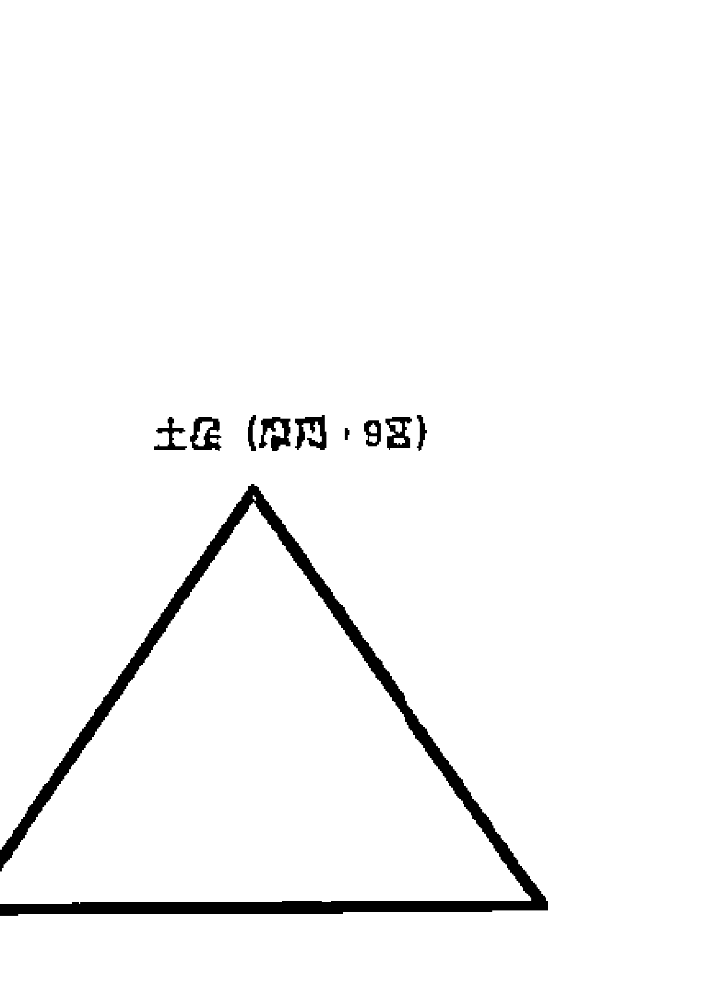

Marcel Proust
Male Chart
10 Jul 1871 NS, Mon
23:30 LMT -0:07:16
Auteuil, France
48°N50' 001°E49'
Geocentric
Tropical
Placidus
True Node

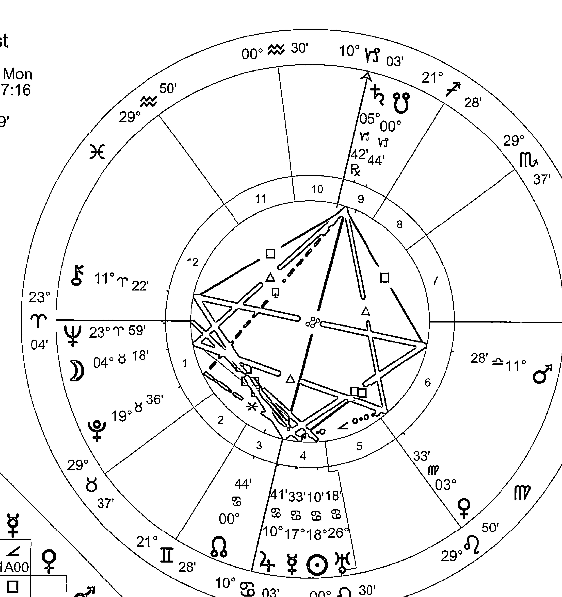

行星相位表格，行列为行星/点符号（太阳、月亮、水星、金星、火星、木星、土星、天王星、海王星、冥王星、凯龙星、北交点、南交点、上升点、中天），单元格内为相位符号及度数差（如 ☉ ⚻ ♃ 0A37，表示太阳与木星六合，容许度0度37分）。

> Compliments of:-
Rod Chang
rod@rodmagic.com

马塞尔・普鲁斯特（Marcel Proust）

获取更多好书，请加微信号：strcdts
店铺：http://strc.cr.cx

| 行星 | 月亮 | 金星 | 土星 |
|------|------|------|------|
| 该行星定义<br>(可能主题) | 需求、童年、家庭、母亲、女性、情绪 | 女性、喜爱的人事物、<br>美丽的、舒适的 | 过去、权威、压力、责任、实际、讨厌的 |
| 落入星座与定义<br>(可能主题) | 金牛：物质、财富、堆积、感官、拥有 | 处女：物质、秩序、分析、区别、服务 | 摩羯：物质、权威、成就、秩序、规矩 |
| 是否逆行或停滞<br>(象征意涵) |  |  | 逆行：对于土星象征的权威与实际有更多审思 |
| 落入宫位与领域<br>(影响的范畴) | 一宫：自我、外表、我与世界的关系 | 六宫：工作、日常生活、仆人属下、身体健康 | 九宫：人生意义、高等教育、宗教、法律、外国事务 |
| 守护宫位与领域<br>(影响的范畴) | 四宫：家庭、房屋、内心世界 | 二宫：物质金钱<br>七宫：伴侣关系 | 十宫：社会地位、成就<br>十一宫：社群关系<br>十二宫：牺牲、消融 |
| 产生相位特质<br>(可能感受) | 与金星三分相（接纳）<br>与土星三分相（融合） | 与月亮三分相（成长）<br>与土星三分相（认同） | 与金星三分相（融合）<br>与月亮三分相（接纳） |
| 在图中位置<br>(是否为端点或特殊位置) |  |  |  |
| 与其他行星的容许度紧迫性与危机性 | 月亮金星 0 度（紧密迫切）<br>月亮土星 1 度（紧密迫切） | 土星冥王 1 度（紧密迫切）<br>金星土星 2 度 |  |

### 强调主题与可能主题：

- 喜欢的人事物 (金) 多半带有过去 (土) 生活的回忆 (月)。
- 谨慎地对于权威 (土星逆行) 的仰赖 (月) 并建立和谐的关系 (金)。
- 与女性 (月) 的良好关系 (金) 有助于争取更高的社会地位 (十宫守护星土星)。

### 可能呈现的动力：

大三角所呈现的动力是温和与成长，三个行星的主题互相支援，而与此三个行星产生强硬相位的行星将带来更强劲的动力。例如在这个案例中带来四分相的天王星或对分土星的木星，这些议题都与进步、自由、开放有关。

### 对此图形相位的描述：

这是一组强调土元素的大三角，暗示着对物质世界、现实生活的重视，落在金牛的月亮为强势、落在摩羯座的土星也在自己守护的星座，这有一种适切与应用得宜的意涵。相对的金星属于落陷的位置，在美好的回忆之中有一种失去影响力或不再美好的意涵。这组大三角座落于一、五、九宫，暗示明确的生活方向、以及对自我的认知成长探索的重视。

### 其他涉及行星（带来的舒缓或更复杂化的暗示）：

- 木星：木星与土星对分但并没有与月亮、金星产生六分，否则会成为风筝图形，木星守护土星所在的第九宫，强调了哲学、宗教、人生意义的特质。
- 天王星：天王星与月亮有一组非常宽松的四分相，这可能暗示着从过去的回忆中得到不同生活方式的启发，或者切断与过去的连结，但由于角距相当宽松，当事人不一定可以感受得到或有必要面对这个议题。
- 太阳、水星：太阳水星都与金星产生半四分相，或许在生活中意识到了事物的不够美好而尽力追逐探索。

## 小三角

六分相型態：這些小三角有三種型態，基本上都與六分相有著一些關聯，這三種組包括了：

-   一組對分相與一組三分相加上一組六分相。
-   一組三分相加上兩組六分相。
-   一組六分相加上兩組半六分相。

這些組合都帶有六分相的活躍特質，促使個案去學習、將所知的事物靈活地應用在生活中。六分相帶著溫和的刺激，並不會使人特別難受，也不會舒適到讓我們無法察覺應當重視的議題。接下來，將分別透過相位來分析這三組小三角的不同之處。

### 1. 一組對分相與一組三分相加上一組六分相

對分相：個案容易透過人際互動與伴侶關係當中察覺到的議題，進而帶來學習、成長與接受。

三分相：透過那些察覺與學習到的議題帶來成長與接受自身原本的樣貌。

六分相：在遭遇到對分相所暗示的察覺與觀察到的衝突，進一步地交流、互動、學習。

### 小三角特質：

這樣的小三角有著對分相的強烈動能，對分相的主題或許在某些時候帶來衝突與挑戰，然而卻會刺激六分相的行星組合，我們可以透過六分相的行星組合來學習認識對分相主題的衝突，同時也透過三分相主題所暗示的包容與成長，去接受那些存在生命當中的挑戰與衝突（特別是在此一組圖形相位中的對分相行星所關聯的議題），並且更進一步地將這些挑戰、衝突、學習與成長，應用在生活中的其他領域。

### 2. 一組三分相加上兩組六分相

三分相：組成三分相的兩個行星所指出的主題，是個案在生活中覺得舒適自然之處，或許他人無法理解，但對個案來說卻是稀松平常的事情。

六分相：透過六分相行星的主題帶來些許刺激，並引導當事人透過與他人和諧的互動，深入探索原本習以為常的事物。

### 小三角特質：

這一組小三角帶來輕鬆活潑的學習機會，六分相可將原本覺得平常的生活議題變得更為豐富，而這樣的深化與理解更能夠靈活應用在其他的領域上，特別是產生六分相行星有關的生活議題當中。

### 3. 一組六分相加上兩組半六分相

六分相：六分相的行星主題會透過與周遭的互動，循序漸進地引導個案去學習與認識，這種和諧、輕鬆卻又帶有些許刺激的互動並不會讓人感到不適。

半六分相：半六分相具有盲點的特質，讓人無法理解究竟為何會對這兩個行星的主題感到不適，但占星師可以透過行星所在的星座之間的差異找出造成不適應的原因可能在哪，並進一步透過這組圖形相位的六分相主題來做更為靈活的探討和應用。

### 小三角特質：

半六分相很少被討論，這一組相位通常有著無法捉摸、無法理解的盲點，半六分相的行星帶來可能出現盲點的主題，而兩個行星所落的星座之間的差異則點出了造成不舒服的原因為何。多半當事人需要透過與他人的探討來找出這種不適，而六分相正好給予一個具刺激感卻又愉快的機會，有利於更深入地探索在生活中被忽略的、感到不適的議題。

### 4. 其他型態

-   一組對分相與一組半四分相與一組一百三十五度。
-   一組對分相與一組半六分相與一組一百五十度。
-   一組四分相與兩組半四分相。
-   一組一百三十五度，加上一組四分相與一組半四分相。
-   一組一百五十度，與一組半六分相與一組三分相。

這些三個端點的組合很少被人討論，但卻經常出現在星盤組合當中。在處理這些圖形相位時，我們必須牢記是哪些行星組成的主題，其次再來仔細考量每一組相位之間的關係，最後將這些關係綜合起來描述這一組圖形相位可能帶來的影響。

## 小三角圖形相位特徵

-   擁有六分相的小三角多強調學習與靈活應用的意涵。
-   擁有強硬相位的小三角象徵著透過較多的挑戰學習此生活主題。
-   帶有四分相與半六分相的小三角極可能帶來需要不斷地調節與適應的生活主題。

## 案例分析

圖形相位名稱：小三角

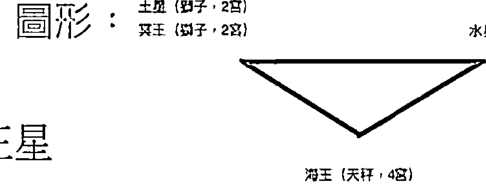

所組成的行星：水星、土星、冥王星、海王星

所組成的相位與容許度：見表格

Steven Spielberg
Male Chart
18 Dec 1946, Wed
18:16 EST +5:00
Cincinnati, Ohio
39°N09'43'' 084°W27'25''
Geocentric
Tropical
Placidus
True Node

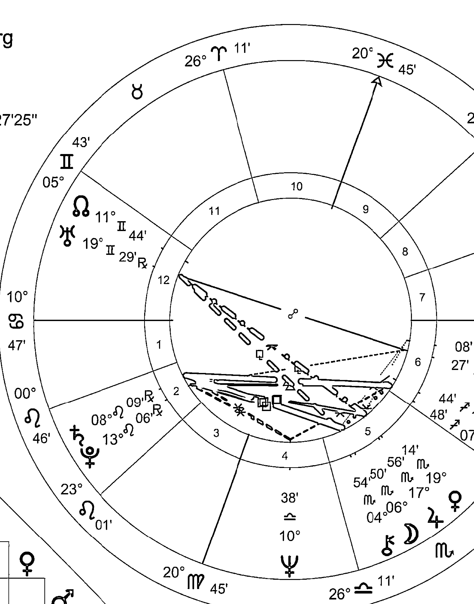

| 行星/点 | 与太阳相位 | 与月亮相位 | 与水星相位 | 与金星相位 | 与火星相位 | 与木星相位 | 与土星相位 | 与天王星相位 | 与海王星相位 | 与冥王星相位 | 与凯龙星相位 | 与北交点相位 | 与南交点相位 | 与上升点相位 | 与中天相位 |
| :--- | :--- | :--- | :--- | :--- | :--- | :--- | :--- | :--- | :--- | :--- | :--- | :--- | :--- | :--- | :--- |
| 太阳 |  | ☽合相0A57 | ☿四分相6A15 | ♀四分相4A41 | ♂四分相1A18 | ♃四分相6S57 | ♄六分相2A49 | ♅四分相1A39 | ♆四分相1S56 | ♇六分相3A56 | ⚷合相3S56 | ☊四分相1A05 | ☋四分相1A05 | As对冲5A41 | Mc六分相1S30 |
| 月亮 |  |  | ☿四分相0A21 | ♀四分相0A14 | ♂四分相3A45 | ♃四分相0A21 | ♄四分相3S35 | ♅四分相3A15 | ♆四分相3A56 | ♇四分相7A08 | ⚷四分相0S09 | ☊六分相2S48 | ☋六分相2S48 | As六分相1S16 | Mc四分相0S50 |
| 水星 |  |  |  | ♀合相4S49 | ♂四分相5A18 | ♃六分相3S35 | ♄合相1A32 | ♅六分相2S28 | ♆六分相5S53 | ♇六分相4S57 | ⚷六分相0A57 | ☊六分相0A57 | ☋六分相0A57 | As六分相0A57 | Mc六分相0A57 |
| 金星 |  |  |  |  | ♂合相6S08 | ♃六分相7A44 | ♄六分相2A28 | ♅六分相7A44 | ♆六分相0A57 | ♇六分相4S57 | ⚷六分相0A57 | ☊六分相0A57 | ☋六分相0A57 | As六分相0A57 | Mc六分相0A57 |
| 火星 |  |  |  |  |  | ♃六分相4S49 | ♄合相4S57 | ♅六分相1S06 | ♆六分相1S06 | ♇六分相0A57 | ⚷六分相0A57 | ☊六分相0A57 | ☋六分相0A57 | As六分相0A57 | Mc六分相0A57 |
| 木星 |  |  |  |  |  |  | ♄六分相2A28 | ♅六分相1A21 | ♆六分相5S53 | ♇六分相0A57 | ⚷六分相0A57 | ☊六分相0A57 | ☋六分相0A57 | As六分相0A57 | Mc六分相0A57 |
| 土星 |  |  |  |  |  |  |  | ♅三分相0A57 | ♆六分相5S53 | ♇六分相0A57 | ⚷六分相0A57 | ☊六分相0A57 | ☋六分相0A57 | As六分相0A57 | Mc六分相0A57 |
| 天王星 |  |  |  |  |  |  |  |  | ♆六分相5S53 | ♇六分相0A57 | ⚷六分相0A57 | ☊六分相0A57 | ☋六分相0A57 | As六分相0A57 | Mc六分相0A57 |
| 海王星 |  |  |  |  |  |  |  |  |  | ♇六分相0A57 | ⚷六分相0A57 | ☊六分相0A57 | ☋六分相0A57 | As六分相0A57 | Mc六分相0A57 |
| 冥王星 |  |  |  |  |  |  |  |  |  |  | ⚷六分相0A57 | ☊六分相0A57 | ☋六分相0A57 | As六分相0A57 | Mc六分相0A57 |
| 凯龙星 |  |  |  |  |  |  |  |  |  |  |  | ☊六分相0A57 | ☋六分相0A57 | As六分相0A57 | Mc六分相0A57 |
| 北交点 |  |  |  |  |  |  |  |  |  |  |  |  | ☋合相0A57 | As六分相0A57 | Mc六分相0A57 |
| 南交点 |  |  |  |  |  |  |  |  |  |  |  |  |  | As六分相0A57 | Mc六分相0A57 |
| 上升点 |  |  |  |  |  |  |  |  |  |  |  |  |  |  | Mc六分相0A57 |
| 中天 |  |  |  |  |  |  |  |  |  |  |  |  |  |  |  |

Compliments of:-
Rod Chang
rod@rodmagic.com

## 史蒂芬·史匹柏（Steven Spielberg）

| 行星 | 水星 | 土星 | 冥王星 | 海王星 |
| :--- | :--- | :--- | :--- | :--- |
| **該行星定義 (可能主題)** | 溝通、交流、學習、思考、分析 | 定義、懷疑、保護、阻礙、恐懼、權威 | 危機、恐懼、掩埋、挖掘、死亡、重生 | 影像、幻想、美好、消失、狂熱、超越、偉大 |
| **落入星座與定義 (可能主題)** | 射手座: 異國文化、信念、信仰、飛行 | 獅子座: 熱情、創意、創造力、榮耀、娛樂、個人成就 | 獅子座: 熱情、創意、創造力、榮耀、娛樂、個人成就 | 天秤座: 關係、溫和、美好、人我互動、公平、正義 |
| **是否逆行或停滯 (象徵意涵)** | | 對於土星所象徵的定義、權威反覆深入思考 | 對於冥王星所象徵的恐懼、危機有更深入的探討 | |
| **落入宮位與領域 (影響的範疇)** | 五宮: 遊戲、娛樂、情感、個人目標 | 一宮: 自我呈現、與外界的互動 | 二宮: 物質、金錢、資源與價值觀 | 三宮: 溝通、學習、兄弟姊妹、鄰居 |
| **守護宮位與領域 (影響的範疇)** | 三宮、十二宮 | 七宮、八宮 | 五宮 | 九宮 |
| **產生相位特質 (可能感受)** | 與土星三分 (接納)<br>與冥王三分 (融合)<br>與海王六分 (學習) | 與冥王合相 (整合)<br>與海王六分 (機會) | 與海王六分 (活躍) | |
| **在圖形中位置 (是否為端點或特殊位置)** | | | | |
| **與其他行星的容許度緊迫性與危機性** | 與土星 0 度 (緊密)<br>與冥王 3 度<br>與海王 5 度 | 與冥王 5 度<br>與海王 2 度 | 與海王 2 度 | |

-   強調主題與可能主題：
    -   討論（水）關於不斷重複的恐懼（冥王逆行）以及害怕（土星逆行）的事物並且如何超越（海）它們。
    -   探討（水）如何透過影像或冥想（海）而超越恐懼（冥）限制（土）。
    -   在受到限制（土）的艱困（冥）環境之中帶來療癒（海）的訊息（水）。
    -   透過分析思考（水）那些過去沒有被關注（冥）的影響力以踏實地（土）實現夢想（海）。
    -   透過影像（海）的具體呈現（土）表達（水）自己所喜歡的事物（五宮守護星冥王星）。

### 可能呈現的動力：

這是一組三分相與六分相組成的小三角，象徵著靈活多變的動能，爭取機會並且隨機應變。

### 對此圖形相位的描述：

這是一組充滿活力以及柔和相位的小三角，因為涉及的行星多半為外行星，暗示著上述主題可能透過外界生活的劇烈變動而引起。六分相的水星海王星暗示著透過影響傳遞訊息或學習；另一組六分的土海可能暗示著對於實現夢想的靈活務實態度；而冥王海王的六分相可能是對於時代背景的狂熱、恐懼或對於失去自我的反省。水星與土星冥王的三分相則暗示著對於恐懼事物、生存掙扎的積極正向思考，從中發現未來的成長方向。由於水星土星相位最為緊密，所以務實的態度將會是整組圖形相位的主軸。

### 其他涉及行星（帶來的舒緩或更複雜化的暗示）：

土星同時涉及了月亮與凱龍的強硬相位，可能暗示著童年環境或家族（種族）身分所帶來的壓力，與此務實態度的展現有關。冥王星與日月水金等個人行星都有關係，暗示著如何面對冥王星所象徵的生命恐懼、黑暗、權力控制，也是影響這一組圖形相位的一股強大的動機。

## 風箏

風箏是大三角的變化型態，當大三角其中一端的對面多了一個對分相的行星時，此時它會與另外兩端的行星產生六分相。

### 組成：三組三分相、兩組六分相、一組對分相

三分相的定義：接受、自然、成長

三分相具有和諧共鳴的意涵，三分相的星座彼此位在同樣的元素，每一元素的不同星座又代表著對同一種生活層面關注的不同切入點。行星的三分相透過共同的關注而感受到共鳴，同時又因為不同的切入點而有著接受與成長的意涵，透過三分相不同星座的差異，能夠自然地接受事物在生活中的不同樣貌。在風箏圖形相位中，這三組三分相所形成的大三角的和諧被對分相給擊破，原有的寧靜和諧遭受到衝擊，卻也帶來成長與前進的動力，同時又有六分相帶來學習動機，在衝突與刺激中，大三角顯得更為活躍並發揮更大的作用。

六分相的定義：引誘、機會、學習、互動、靈活

六分相所在的星座擁有同樣的陰陽性質，也因此這兩個行星所形成的主題將會透過與周遭的互動，循序地引導我們去學習認識，這樣和諧輕鬆卻又帶些刺激的互動並不會讓人感到不適。在風箏的圖形相位中，受到對分相所暗示的察覺與觀察到的衝突，也透過三分相體認、接受這些刺激可以帶來成長，進一步地嘗試交流與互動學習。

對分相的定義：看見、對抗、競爭、衝突、挫折、合作、觀察、覺察、投射、伴侶關係

對分相不僅僅是衝突與對立，也帶來合作的可能，在沒有其他柔和相位的調節下，對分相的主題多半讓人感到難受，可能是帶來人際關係的挑戰或內在的心靈衝突，透過這些衝突，可以了解自我不同面向的渴求。但在風箏中，這組對分相的衝突主題會透過六分相學習，透過三分相接受並獲得成長，繼而帶來合作整合的機會，讓自己的人生與生活更為完整。若從這個角度來看，風箏可以降低對分相的對抗與衝突性，同時也讓大三角更為活躍。

### 風筝特質

風筝的組成包括了一組大三角與一組小三角，同時一組對分相帶來了刺激與衝突。

比起大三角，風筝多了對分相的刺激、衝突、投射，讓我們不再舒適地待在其中，強硬相位會刺激大三角運作，大三角的協調與包容性會因爲對分的衝突更加顯現出價值，而小三角的學習動力帶來了適應力與加速成長。

端點行星是重要關鍵，許多占星師將風筝圖形相位中存在於對分相且同時跟另外兩個行星產生六分相的那顆行星稱之爲端點，這一個行星是唯一沒有處於大三角之中的行星，被視爲是帶來最大挑戰的主題，也是整個風筝圖形相位的重要關鍵，因爲它將整個完整的循環協調打破並產生衝突。對分相透過投射，讓我們看見想要整合的議題，它或許帶來了衝突與刺激，在風筝中不會感覺到這股壓力，因爲內部的循環會自動紓解這股壓力。更特殊的是六分相，六分相的兩個行星負責刺激、活化整個結構，並以此靈活的方式減輕對分相端點的壓力。

## 風箏圖形相位特色

-   端點行星暗示著重要挑戰的主題，並藉此帶來個人生活整合的契機。
-   大三角的元素以及行星象徵著面對挑戰時可以運用的資源。
-   擁有六分相的行星可帶來著靈活變化與機會。
-   或許不同的主題象徵著不同生活領域的影響，但最終個案會察覺這一切都可整合成為重要的個人生活的主題。

## 案例分析

圖形相位名稱：風箏

所組成的行星：
太陽、木星、海王星、冥王星、凱龍

所組成的相位與容許度：見表格

圖形：
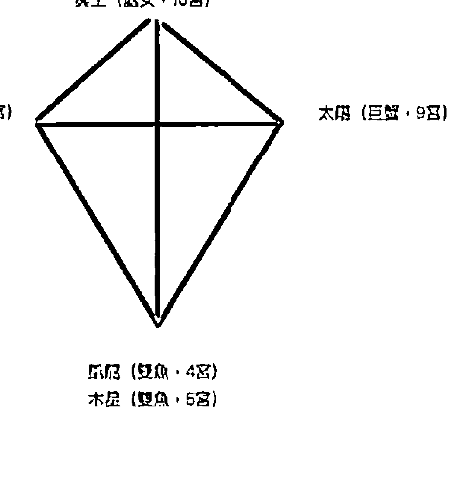

Tom Cruise
Male Chart
3 Jul 1962, Tue
15:06 EDT +4:00
Syracuse, New York
43°N02'53" 076°W08'52"
Geocentric
Tropical
Placidus
True Node

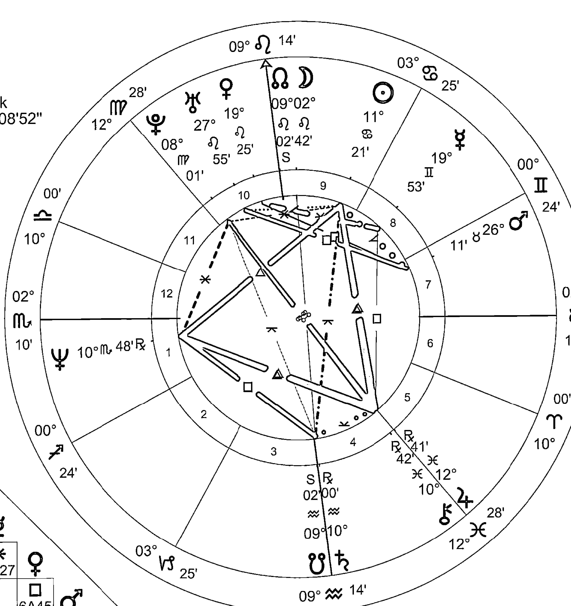

Astrological aspects table: rows and columns represent planets, cells show aspect symbols and orb.

## 湯姆·克魯斯 (Tom Cruise)

Compliments of:-
Rod Chang
rod@rodmagic.com

| 行星 | 冥王星 | 木星 | 凱龍 | 太陽 | 海王星 |
| :--- | :--- | :--- | :--- | :--- | :--- |
| **該行星定義（可能主題）** | 隱藏、恐懼、危機、生存議題 | 信仰、信念、海外、成長 | 傷痛、療癒、局外人 | 自我、父親、男性、創造力 | 夢想、影像、完美、超越、融合 |
| **落入星座與定義（可能主題）** | 處女座：辨別、分析、應用、實際、服務 | 雙魚座：情感交流、滋潤、感覺感受、融合 | 雙魚座：情感交流、滋潤、感覺感受、融合 | 巨蟹座：生產、滋養、哺育、照顧、家庭 | 天蠍座：危機、生存議題、洞悉、影響力 |
| **是否逆行或停滯（象徵意涵）** |  | 逆行：對於信念與成長的定義保持獨立思考判斷 | 逆行：對於傷痛與療癒有著反覆的思考 |  | 逆行：對於夢想與影響有著反覆地探討或回顧 |
| **落入宮位與領域（影響的範疇）** | 十二宮：消融、放下自我、犧牲、隱藏的敵人 | 六宮：服務、勞動、訓練、日常生活 | 六宮：服務、勞動、訓練、日常生活 | 十宮：權威、公眾形象、社會地位、雙親（母親） | 二宮：金錢、財富、資源、自我價值、能力 |
| **守護宮位與領域（影響的範疇）** | 三宮：言語、學習、手足、鄰里、交通 | 四宮：家庭、住家、雙親（父親）、歸屬感<br>七宮：伴侶、合作夥伴、公開敵人 |  |  | 七宮：伴侶、合作夥伴、公開敵人 |
| **產生相位特質（可能感受）** | 對分木星（衝突）<br>對分凱龍（對抗）<br>六分太陽（機會）<br>六分海王星（活躍） | 合相凱龍（融合）<br>對分冥王（對立）<br>三分太陽（接受）<br>三分海王（和諧） | 合相木星（融合）<br>對分冥王（合作）<br>三分太陽（成長）<br>三分海王（接受） | 六分冥王（機會）<br>三分木星（成長）<br>三分凱龍（包容）<br>三分海王（接受） | 六分冥王（活躍）<br>三分木星（成長）<br>三分凱龍（接納）<br>三分太陽（和諧） |
| **在圖形中位置（是否為端點或特殊位置）** | 端點 | 與端點對分 | 與端點對分 |  |  |
| **與其他行星的容許度緊迫性與危機性** | 與太陽3度<br>與木星4度<br>與凱龍2度<br>與海王2度 | 與太陽1度<br>與凱龍2度<br>與海王1度 | 與太陽0度（緊密）<br>與海王0度（緊密） | 與海王星0度（緊密） |  |

### 強調主題與可能主題：
- 透過信念與信仰（木）危機（冥）或是大型的危機與個人的犧牲（海）呈現受傷的英雄（日）形象。
- 對於不斷重複的宗教（木逆行）與理想的狂熱（海逆行）可能招致個人名聲（日）的危機（冥）與不被社群接納的狀態（凱逆行）。
- 透過影像（海）發揮創造力（日）藉此療癒（凱）過去與外界社會（木）接觸的恐懼（冥），因為對於權威（日）信任（木）的消失（海）而透過言語（三宮守護冥王星）表達傷痛（凱）。

### 可能呈現的動力：
對分相的木星冥王與凱龍冥王將是帶來衝擊與動力的主題，太陽與海王星所提供的三分相、六分相一方面能減輕衝擊，以太陽的自信、海王的寬容或影像靈活處理衝突；另一方面受到刺激，將衝擊的議題作為資源與動力，靈活應用在生活之中。

### 對此圖形相位的描述：
- 冥王與木凱的對分相暗示著衝突以及動能的來源，對人的信任招來的危機，權力、暴力可能帶來的傷痛，自信可能帶來的麻煩，以及重新找到自信的過程。透過三分相太陽的創造力與海王的藝術、宗教、寬容慈悲的特質，可以幫助個案接納這些難受的議題。透過靈活應用的六分相，這些傷痛將提供動力促成太陽的光榮以及海王星的偉大。
- 冥王星的端點暗示著黑暗、恐懼、危機、生存議題將是一個重要關鍵。
- 水元素的大三角暗示著滋潤、養育、照顧、藝術，以及將身心靈領域的事物作為個人資源。
- 二、六、十宮暗示著物質資源、身體、日常生活的關照與工作職場領域將是這議題呈現最顯著的地方。
- 在這一組圖形相位之中，雙魚座與相對應的十二宮還有守護雙魚座的木星、海王星都出現了，這暗示著與這些主題有關的精神、宗教、包容、慈悲、影像、病毒、沉溺、上癮，將強烈地被突顯。

### 其他涉及行星（帶來的舒緩或更複雜化的暗示）：
- 土星雖然不在這組圖形之中，但是與太陽、凱龍、海王、冥王都有相位。土星在水瓶並與南交點合相，暗示著過去或童年的限制與困境，可以替這組風箏增加實用性與保護特質，透過這一組風箏來療癒過去的難受。土星也與冥王月亮產生上帝之指（Yod）圖形相位，在主題上再次強調過去的不愉快所帶來的強烈影響。
- 天王與火星也透過與太陽、冥王的相位，替這一組風箏添加色彩，特別提供了力量、勇氣與果決的態度，切斷過去的連結，活出不一樣的人生。

### 神秘矩形（信封）
這一組圖形相位在圖像上看起來像是個信封一樣的長方形，於是又被稱為「信封」圖形相位。在長方形的中間是兩組對分相的交錯，但是四個行星之間並沒有產生四分相，相對的四個行星之間都有著六分相與三分相的互動。

### 組成：兩組對分相、兩組三分相、兩組六分相
在這裡衝突與對照的主題增加，但在詮釋上與風箏並無太大差異。這裡沒有端點行星，我們必須用不同的方式來詮釋，也就是每一個行星作為主題的詮釋方法。

對分相的定義：看見、對抗、競爭、衝突、挫折、合作、觀察、覺察、投射、伴侶關係

在神秘矩形中，對分相行星帶來的主題容易突顯在合作關係，伴侶關係，競爭關係上，讓我們看見個人身上需要去了解和認識的主題。但這些衝突卻可以透過三分相與六分相的行星，來找到學習理解以及接受與包容的能力。

六分相的定義：引誘、機會、學習、互動、靈活

六分相所在的星座擁有同樣的陰陽性質，也因此這兩個行星所形成的主題將會透過與周遭的互動循序地引導我們去學習認識，這樣和諧輕鬆卻又帶些刺激的互動並不會讓人感到不適。

透過六分相的兩個行星所找出的主題或該行星象徵的事物，可讓我們用靈活的方式去處理需要整合的主題，不再只是僵化，有機會透過活潑積極的方式促成整合。它們連結了兩個對分相的端點，讓我們能夠比對，甚至可以用彈性調節的手法整合原本衝突的位置。

三分相的定義：和諧、成長、包容、接受

三分相具有和諧共鳴的意涵，三分相的星座彼此位在同樣的元素，每一元素的不同星座又代表著對同一種生活層面的不同切入點。行星的三分相透過共同的關注而感受到共鳴，在神秘矩形的三分相行星所組成的主題或該行星的相關事物，會替我們帶來更多包容性與彈性，讓我們在處理對分相主題時具有更宏觀的視野。從另一個角度來看，這原本是不具刺激的位置，受到對分相主題的刺激反而更有能力去看見並應用充沛的資源。

雖然神秘矩形與大十字一樣都有著兩組對分相，但是卻多了象徵靈活的六分相與象徵包容的三分相，每一組的對分、三分與六分，都是一組象徵著刺激帶來學習能力的小三角，不過四個行星彼此互相牽連，帶來了複雜的考量，卻也替個案帶來更多不同處理事務的方式。

### 神秘矩形圖形相位特色
- 神秘矩形中的六分相帶來靈活的學習能力。
- 三分相充滿和諧特質的擴張方式。
- 對分相的行星主題可能暗示著衝突，但可以用三分相、六分相行星的靈活方式處理對立與衝突。

## 案例分析
圖形相位名稱：神秘矩形

所組成的行星：月亮、太陽、火星、凱龍

所組成的相位與容許度：見表格

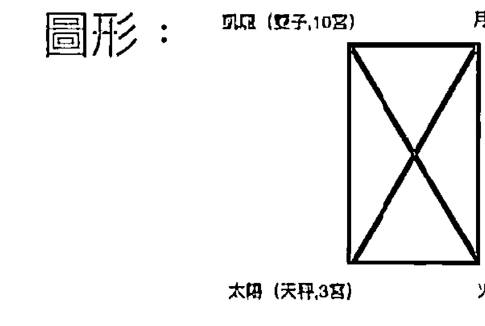

## Luciano Pavarotti
Male Chart
12 Oct 1935, Sat
01:40 CET -1:00
Modena, Italy
44°N40' 010°E55'
Geocentric
Tropical
Placidus
True Node

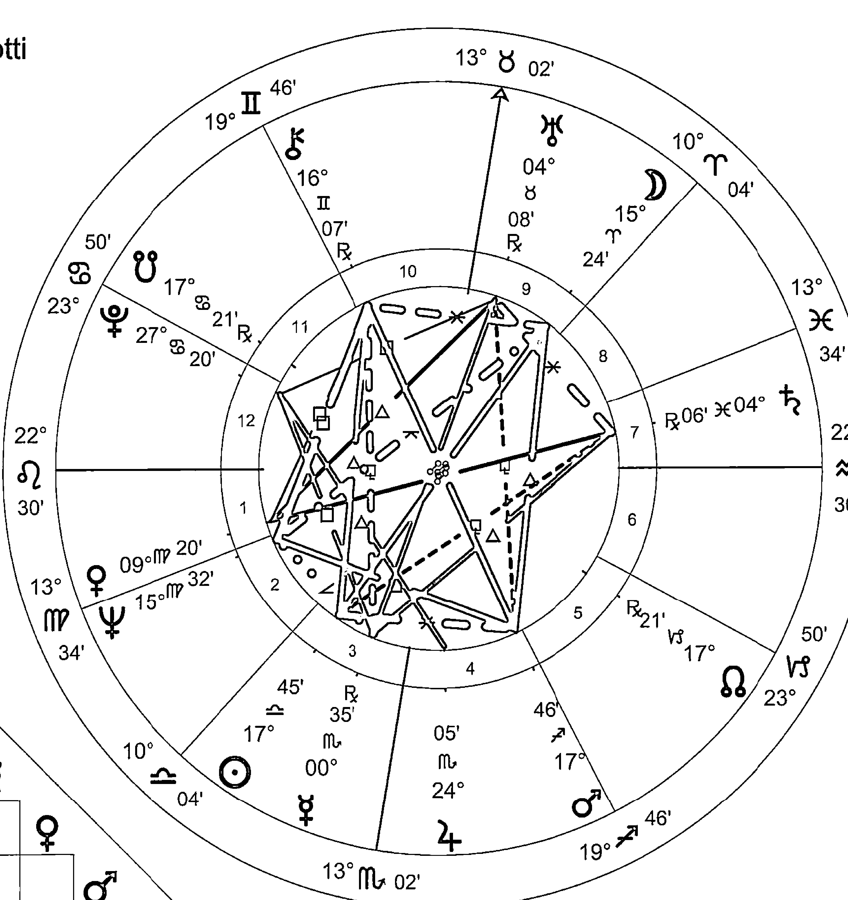

Triangular aspect table displaying relationships between planets and points. Rows and columns include Sun (☉), Moon (☽), Mercury (☿), Venus (♀), Mars (♂), Jupiter (♃), Saturn (♄), Uranus (♅), Neptune (♆), Pluto (♇), Chiron (⚷), North Node (☊), South Node (☋), Ascendant (As), and Midheaven (Mc). Cells contain aspect symbols such as △ (trine), * (sextile), □ (square), △ (conjunction), and numerical values like 2A21, 0A00, etc.

Compliments of: Rod Chang
rod@rodmagic.com

盧奇亞諾·帕華洛蒂 (Luciano Pavarotti)

| 行星 | 月亮 | 太陽 | 火星 | 凱龍 |
| :--- | :--- | :--- | :--- | :--- |
| 該行星定義 (可能主題) | 女性、母親、飲食、童年、記憶、需求 | 男性、父親、英雄、成就、追求、生命活力 | 行動、攻擊、保護、衝突、憤怒、競爭、生存議題 | 傷痛、療癒、局外人、教師、收養 |
| 落入星座與定義 (可能主題) | 牡羊座：活力、行動、競爭、生存、優先 | 天秤座：伴侶關係、合作、競爭、外交、法律 | 射手座：宗教、異國文化、理想理念、高等教育 | 雙子座：溝通、學習、傳播交通、兄弟姊妹、鄰居 |
| 是否逆行或停滯 (象徵意涵) | | | | 逆行：反覆地進行傷痛的療癒 |
| 落入宮位與領域 (影響的範疇) | 九宮：信仰、信念、高等教育、與國外的關係 | 三宮：溝通、傳播、學習、思考、表達 | 十宮：社會地位、專業、權威、父母親（母親） | 四宮：房屋、家庭、歸屬感、父母親（父親） |
| 守護宮位與領域 (影響的範疇) | 十二宮：失去自我、犧牲、奉獻 | 上升：自我形象、與外界的互動 | 四宮：家庭、父母 | 九宮 |
| 產生相位特質 (可能感受) | 對分太陽 (衝突)<br>三分火星 (接受)<br>六分凱龍 (學習) | 對分月亮 (合作)<br>三分凱龍 (和諧)<br>六分火星 (活潑) | 對分凱龍 (對抗)<br>三分月亮 (成長)<br>六分太陽 (機會) | 對分火星 (衝突)<br>三分太陽 (成長)<br>六分月亮 (活潑) |
| 在圖形中位置 (是否為端點或特殊位置) | | | | |
| 與其他行星的容許度緊迫性與危機性 | 太陽：2度<br>火星：2度<br>凱龍：0度 | 火星：0度 (緊密)<br>凱龍：1度 | 凱龍：1度 | |

### 強調主題與可能主題：
- 因為父母的關係（日月）獨立與勇氣（火）是一個相當敏感的議題（凱）。
- 因為自身克服（火）困難而追求成功榮耀（日）與自身需求（月）不斷地替人們帶來療癒（凱逆行）。
- 自信（九宮守護星火星）的傷痛可透過創造力（日）滿足自身需求（月）而獲得療癒（凱）。

### 可能呈現的動力：
涉及家庭、男女關係、伴侶關係、勇氣表現、爭取利益、獨立的議題上可能帶來相當大的衝擊，但是透過自信、關懷、以及不過分強求也不消極放棄的態度，逐漸學會靈活的表達的方式。

### 對此圖形相位的描述：
相當強調父母親與家庭的議題，此外也強調學習、溝通表達、高等教育上的課題。

### 其他涉及行星（帶來的舒緩或更複雜化的暗示）：
海王星：在這一圖形相位中，海王星與月亮、火星、凱龍都有相位，一方面強調了犧牲、消融、藝術、理想、慈悲的主題，同時也強調想像力、幻想力、模仿能力、慈悲心、同理心可以幫助自己追求目標。

### 上帝手指
這一組圖形相位經常被認爲有著言語難以描繪的影響力，令人覺得難以適應，又稱爲 Yod，是希伯來文中「手」的象徵，又因爲兩組一百五十度同時尖銳指向一個行星，又被稱為上帝手指，往往背負著一種業力與命運的特質。

### 組成：兩組一百五十度、一組六分相
一百五十度的定義：視而不見、調節、適應、焦慮、虧欠感、罪惡感、包容

一百五十度並非傳統的相位，但這組相位卻經常與業力、疾病扯上關聯。從傳統的區塊相位觀點來看，相距一百五十度的兩個星座在陰陽性、性質、元素上都不相同，幾乎完全沒有共同點，當形成相位時，他們完全沒有共通性，甚至有一種相見不相識的感受，卻因爲相位而產生互動，在互動中必須彼此調節適應，此間容易產生摩擦和焦慮，因爲不了解的摩擦可能帶來厭惡、虧欠甚至罪惡感。我個人認爲一百五十度的摩擦與不適應是引導我們去「承認」不同事物的存在，你無法理解的人事物也有存在的理由，那些人、那些事也有存在的權利。其次，一百五十度帶來的強烈焦慮可帶來創造力，在一次次的嘗試與失敗中，驚人的創意也將油然而生。

六分相的定義：引誘、機會、學習、互動、靈活

六分相所在的星座擁有同樣的陰陽性質，也因此這兩個行星所形成的主題將會透過與周遭的互動循序地引導我們去學習認識，這樣和諧輕鬆卻又帶些刺激的互動並不會跟一百五十度一樣讓人感到不適。也因此在上帝手指中，我們可以透過六十度的兩個行星主題來舒緩、引導整個主題的學習。

### 端點行星
因爲一百五十度的焦慮、厭惡、虧欠感與罪惡感，卻又不得不面對那些無法理解與接受的人、事、物時，總會讓人感到一種命運捉弄的感受，也無怪乎許多人將一百五十度視爲一種強調業力特色的相位。當兩組一百五十度同時都指向一顆行星時，這一個行星成爲端點，像是遭遇到進退兩難的局面，每一組一百五十度的主題都帶來明顯的焦慮，並且不容許我們脫逃。不斷地調節、調整自己的行爲來配合當前的狀況，並且在情緒感受上學會適應，焦慮、忙碌與匆促，端點行星的確承受了相當程度的挑戰，我也會特別注意此一行星在身體、心理、心靈上的象徵事物以及相關的健康狀態。

我們根據組成此一圖形相位的行星找出整體的主題，這一個主題有種焦慮、不斷調整並且帶來成長的特色，接著找出端點行星的相關事物，這一個行星的占星學象徵、這一個行星落入的星座與宮位主題、這個行星守護的宮位主題等等，都有可能是他明顯感受到挑戰、焦慮、虧欠與罪惡感的所在。接著再分析每一組一百五十度行星的各自主題，並且從這些主題中找出與個案焦慮或不適應有關的議題，並且進一步深入探討。我們的目的並不在於要客戶即刻接受或放下，而是透過星盤的符號象徵，幫助他說出當下的焦慮與感受，在透過傾聽與同理心給予客戶支持之外，另一方面也讓他承認、看見，的確是他無法接受的人事物的存在，否定與漠視並不會使情況好轉，承認那些事物的存在才是上帝手指開始帶來創造力的起點。我經常告訴我的客戶，Yod 在卡巴拉的意涵中象徵著事物創造的源頭、這個字的形象「،」像是精子與種子，是宇宙事物的起始點，也是創造力的根源。這整個圖形相位的主題或許讓他承受許多挑戰與不舒服的感受，但是其中累積的能量、經驗與擴展的視野，將可能帶來生活中旺盛的創造力。

### 上帝手指圖形相位特質
- 上帝手指或許會帶來許多不適應的感受，但卻是相當具有創造力的圖形。
- 從不斷尋覓、適應的過程中創造出許多重要的事物。
- 上帝手指所帶來的焦慮，是個值得深入探討的議題。了解焦慮的根源並去看见所創造的成果為何。
- 從這個主題中學會如何發現焦慮的根源，如何面對焦慮主題，接受焦慮的存在以及如何『調節』釋放焦慮所帶來的壓力都是重要的課題。

## 案例分析
圖形相位名稱：上帝手指

所組成的行星：凱龍、月亮、土星

所組成的相位與容許度：見表格

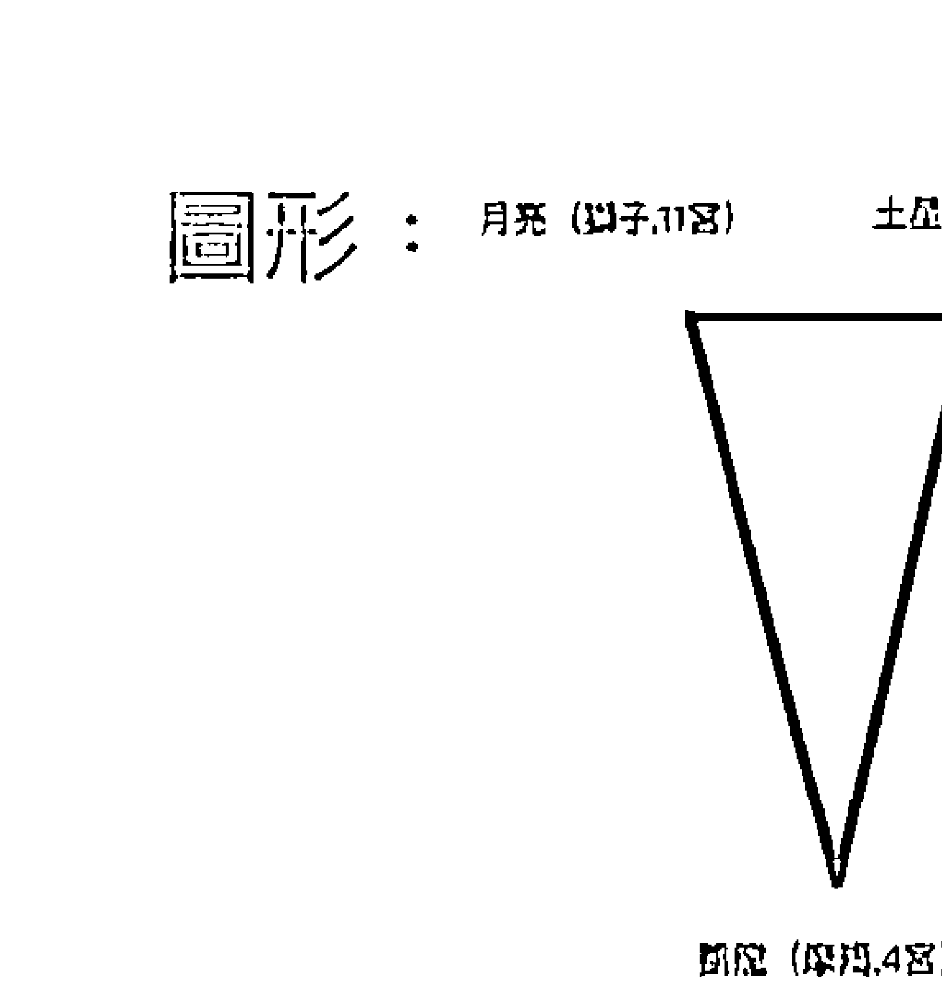

## Oscar Wilde
Male Chart
16 Oct 1854 NS, Mon
03:00 LMT +0:25
Dublin, Ireland
53°N20' 006°W15'
Geocentric
Tropical
Placidus
True Node

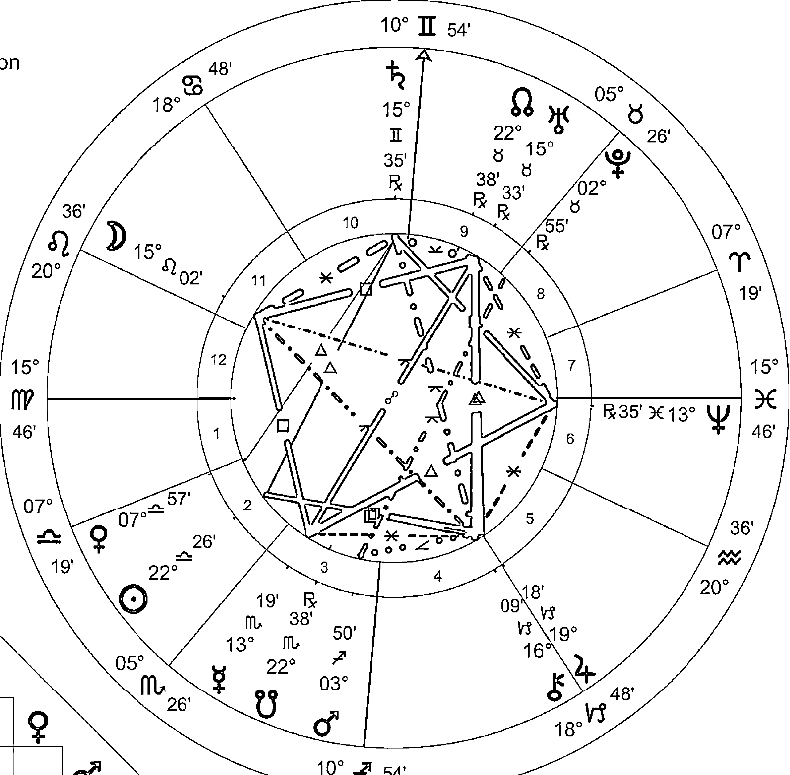

| 行星/点 | 太阳 | 月亮 | 水星 | 金星 | 火星 | 木星 | 土星 | 天王星 | 海王星 | 冥王星 | 凯龙星 | 北交点 | 南交点 | 上升点 | 中天 |
| :--- | :---: | :---: | :---: | :---: | :---: | :---: | :---: | :---: | :---: | :---: | :---: | :---: | :---: | :---: | :---: |
| **太阳** | - | | ☐ 1S43 | | | | | | | | | | | | |
| **月亮** | | - | | | | ☐ 3S08 | | ☐ 0A30 | | | | | | | |
| **水星** | ☐ 1S43 | | - | | | | ✳ 0A32 | ☒ 1S27 | | | ☒ 1A07 | ☐ 7A35 | ☐ 7A35 | ☍ 0S44 | |
| **金星** | | | | - | | | △ 6S51 | | | | ☒ 6S17 | ☍ 0A11 | ☍ 0A11 | | |
| **火星** | | | | | - | | | | | | ✳ 2A50 | | | | |
| **木星** | | ☐ 3S08 | | | | - | | | ☐ 2A13 | | | ☐ 0S19 | ☐ 0S19 | | |
| **土星** | | | ✳ 0A32 | △ 6S51 | | | - | △ 7A37 | ☒ 2A00 | | | △ 3A19 | △ 3A19 | ✳ 2S27 | |
| **天王星** | | ☐ 0A30 | ☒ 1S27 | | | | △ 7A37 | - | ☒ 1A57 | | ☐ 3S45 | | | △ 3A31 | |
| **海王星** | | | | | | | ☒ 2A00 | ☒ 1A57 | - | | ☐ 0S36 | | | ☒ 0S11 | ☐ 4A40 |
| **冥王星** | | | | | | | | | | - | ☐ 2S34 | | | ☒ 0S13 | |
| **凯龙星** | | | ☒ 1A07 | ☒ 6S17 | ✳ 2A50 | | | ☐ 3S45 | ☐ 0S36 | ☐ 2S34 | - | | | ☍ 2S11 | |
| **北交点** | ☐ 7A35 | ☍ 0A11 | | | | ☐ 0S19 | △ 3A19 | | | | | - | | ☍ 0A23 | |
| **南交点** | ☐ 7A35 | ☍ 0A11 | | | | ☐ 0S19 | △ 3A19 | | | | | | - | ☍ 6A51 | |
| **上升点** | ☍ 0S44 | | | | | | ✳ 2S27 | △ 3A31 | ☒ 0S11 | ☒ 0S13 | ☍ 2S11 | ☍ 0A23 | ☍ 6A51 | - | ☐ 4A52 |
| **中天** | | | | | | | | ☐ 4A40 | | | | | | ☐ 4A52 | - |

| 行星 | 凯龙 | 月亮 | 土星 |
| :--- | :--- | :--- | :--- |
| 该行星定义 (可能主题) | 伤痛、疗愈、收养、照护、局外人 | 需求、情绪、感受、饮食、女性、家庭 | 严肃、制度、政权、时间、专业、权威 |
| 落入星座与定义 (可能主题) | 摩羯座：组织、架构、制度、文化、权威 | 狮子座：创造力、创意、娱乐、尊贵 | 双子座：沟通、传播、交流、学习、移动 |
| 是否逆行或停滞 (象征意涵) | | | 逆行：对于土星所象征的权威、挑战，有著独立思考的见解 |
| 落入宫位与领域 (影响的范畴) | 四宫：家庭、土地、归属感 | 十一宫：朋友、社交、人际 | 十宫：社会地位、权威、统治者 |
| 守护宫位与领域 (影响的范畴) | | 十一宫：朋友、社交、人际 | 五宫：子女、创造力<br>六宫：每日生活步调、服务 |
| 产生相位特质 (可能感受) | 与月亮 150 度（焦虑）<br>与土星 150 度（焦虑） | 与土星 60 度（学习）<br>与凯龙 150 度（愧疚） | 与月亮 60 度（活泼）<br>与凯龙 150 度（调整） |
| 在图形中位置 (是否为端点或特殊位置) | 上帝手指端点 | | |
| 与其他行星的容许度紧迫性与危机性 | 与月亮 1 度<br>与土星 0 度 | 与土星 0 度 | |

### 強調主題與可能主題：
- 因為制度與法律（土）而產生了與女性或親人（月）之間的傷痛（凱）。
- 透過關懷滋養（月）療癒了社會制度所不斷重複（土逆行）對弱勢團體（凱）的忽略。
- 與權威（土）介入伴侶關係（月）而受到傷害（凱）。
- 朋友之間的關係（十一宮守護星土星）因為親密關係的發生（月）而受到傷害（凱）。

### 可能呈現的動力：
月亮土星的六分可能暗示著對生活的重視，以及以實際的態度看待生活，或者與權威之間維持著和諧彈性的關係。但兩個行星都同時一百五十度凱龍，這暗示著在每天的生活中為了保有某些安全而妥協隱忍傷痛，並在這層關係中來回調整自己每日的生活步調、伴侶關係與感受。這些隱忍與難受可能造成身心的傷痛。

### 對此圖形相位的描述：
月亮土星與凱龍都暗示著家庭的議題，而座落的宮位也進入四宮與十宮，再一次強調了與父母的關係、身為父母的責任、與權威的關係成為傷痛的主題，並在生活中不斷地調整適應，可能在內心裡產生了羞愧或歉疚的感受。

### 其他涉及行星（帶來的舒緩或更複雜化的暗示）：
- 木星：木星與凱龍合相，但沒有與月亮土星產生相位，在傷痛這個主題中，暗示著從制度與權威而來的傷痛中解放，並透過出版寫作與更高深的學問以帶來療癒的可能。

## 世界手指（雷神之鎚）

從圖形上來看，世界手指與上帝手指非常相似，但卻是完全不同的組合。它是由兩組一百三十五度與一組四分相組成的，也因此在詮釋上也完全不同。

組成：兩組一百三十五度、一組四分相

一百三十五度的定義：不容易、費力、辛勤、事倍功半、筋疲力竭、挫折感、不滿意

一百三十五度帶來相當多的挑戰，這一組相位代表著辛苦努力爲了一件事情付出，得到的成果卻不如人意。與這組相位有關的議題，或許不是什麼重大變故，但也不是輕鬆的課題，總讓人來回奔波不斷地付出，有著竭盡心力與筋疲力竭的感受。

四分相的定義：阻礙、執行、堆積、漫長、拖延、挫折

四分相往往具有拖延與阻礙的意味、在這裡形成四分相的行星很可能是生命中重大的議題，令當事人感受到極大的壓力，也希望在面對這個議題時能夠有周全的準備，在謹慎與顧慮中不但延長了工作的時間，同時因爲更多的考量不斷湧入，出現不停的修正，造成工作有著窒礙難行的狀況。

儘管世界手指的名稱與上帝手指相似，但感受卻是截然不同的。上帝手指有著獨特的「視而不見」的特質，因此帶來了慌張與焦慮；世界手指的組成相位全都是強硬相位，一組四分相的重大挑戰，兩組一百三十五度的辛勤與挫折，就如同擺在你眼前的大大小小的生活課題。舉例來說，就像你剛搬了家，要支付一大筆的房屋貸款，雖然整個人心思都在未來全家的財務該如何安排，卻也希望添購傢俱並且裝潢新屋，更想帶著全家大小出國旅行，但是你還是得上班、完成即將到期的工作計畫、採購日常生活用品等等。可能為了房屋貸款的大筆支出，你得不停節省開銷，並因為無法以夢想中的昂貴設備來裝潢房子而沮喪；而出國計畫，最後可能因為希望加班多賺些錢來償還貸款，而成為全家到附近的海灘度過一個週末。

世界手指總是環繞著一個重大的課題，為了讓事物有更美好的呈現而不斷地付出，讓人有疲憊的感受。有人給這組圖形相位取了一個有趣的名字——「雷神之鎚」，環繞著這組圖形相位的課題就好像是打鐵師傅的鐵鎚一樣，不僅是在炙熱的環境中費力地敲打，還不時地停下來從各種角度檢視修正，有時候稍微有一個環節疏漏，整個工作又要重來一次。

## 案例分析

圖形相位名稱：世界手指

所組成的行星：凱龍、火星、太陽

所組成的相位與容許度：見表格

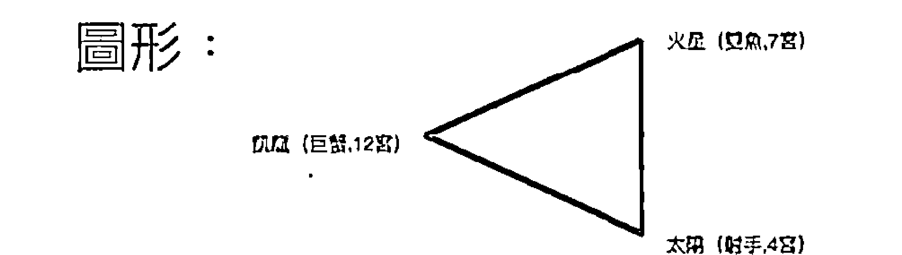

Tina Turner
Female Chart
26 Nov 1939, Sun
22:10 CST +6:00
Nutbush, Tennessee
35°N41'53" 089°W24'29"
Geocentric
Tropical
Placidus
True Node

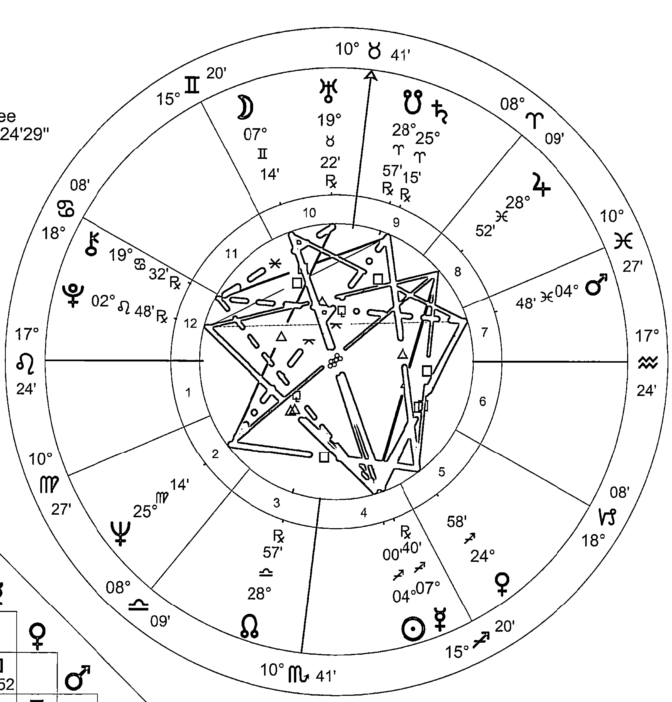

相位表格，包含行星、角度符号与相位数据。

## 蒂娜·透娜 (Tina Turner)

Compliments of:-
Rod Chang
rod@rodmagic.com

| 行星 | 凱龍 | 火星 | 太陽 |
| :--- | :--- | :--- | :--- |
| 該行星定義（可能主題） | 傷痛、療癒、收養、照護、局外人 | 生存、刺激、加速、興奮、憤怒、男性、力量 | 重要的事物、自我、父親、領導、男性、生命活力 |
| 落入星座與定義（可能主題） | 巨蟹座：家庭、滋養、照顧、母親、生產 | 雙魚座：漂流、融合、滋潤、情感交流 | 射手座：異國文化、意見觀點、行動調整 |
| 是否逆行或停滯（象徵意涵） | 逆行：反覆地進行傷痛的療癒 | | |
| 落入宮位與領域（影響的範疇） | 十二宮：隱藏的敵人、遺忘、放下 | 七宮：伴侶、合作夥伴、公開敵人 | 四宮：家庭、父母、根源 |
| 守護宮位與領域（影響的範疇） | | 四宮：父母、家、歸屬感 | 五宮：子女、創造力<br>六宮：每日生活步調、服務 |
| 產生相位特質（可能感受） | 與火星 135 度（挫折）<br>與太陽 135 度（盡全力） | 與太陽四分（阻礙、拖延） | |
| 在圖形中位置（是否為端點或特殊位置） | 端點 | | |
| 與其他行星的容許度緊迫性與危機性 | 與火星 0 度（緊密）<br>與太陽 0 度（緊密） | 與太陽 0 度（緊密） | |

### 強調主題與可能主題：

- 內心的傷痛透過奮力地呈現自我（火）才華（太陽）來療癒（凱龍）。
- 與男性權威之間的衝突而受到傷痛。
- 在薩滿的靈性世界（凱）中不停尋找自我（日）與生命力（火）。
- 透過信仰（九宮守護星火星）療癒（凱）了自我（日）。

### 可能呈現的動力：

太陽與火星的四分相在實現自我的路途中充滿了阻礙與挑戰，而凱龍所象徵的過去的傷痛，與太陽產生一百三十五度的相位，讓個案對自我表現有著嚴格的要求，不斷努力地實現自我，也不斷的感受到挫折。

### 對此圖形相位的描述：

這組圖形相位可以盡全力地讓自己發光發亮、盡全力地保護自我，同時也對遭遇相同的人給予大力幫助。努力、盡全力、挫折感則是個案在面對自我展現、創意能力、自我保護、與男性的關係之間的顯著感受。自我展現的壓力來自於過去的傷痛，因此不斷地自我要求。

### 其他涉及行星（帶來的舒緩或更複雜化的暗示）：

- 冥王星與太陽火星也同時產生相位，重複暗示著與男性、自我展現之間的強烈緊張，同時也帶來堅定的意志力。
- 天王星與凱龍的六分相提供了一個以距離、冷漠、突然切割或者令人意想不到的方式，從傷痛當中獲得解脫。

# 第五章 如何使用图形相位分析表

## 认识图形相位分析表

面对图形相位的错综复杂关系，许多人都有分析上的困扰，前面章节中我们提到了先将重点放在行星组合可能带来的生命议题上，接着再观察不同的相位可能替这些议题带来什么样的动态与感受。

这份表格是我在指导学生分析图形相位时常用的工具，透过这一份表格，可以一步一步骤地慢慢厘清行星彼此之间的关系。

| 项目 | 说明 |
| :--- | :--- |
| 图形相位名称： | 图形： |
| 所组成的行星： | |
| 所组成的相位与容许度： | |

| 行星 |
| :--- |
| 該行星定義<br>（可能主題） |
| 落入星座與定義<br>（可能主題） |
| 是否逆行或停滯<br>（象徵意涵） |
| 落入宮位與領域<br>（影響的範疇） |
| 守護宮位與領域<br>（影響的範疇） |
| 產生相位特質<br>（可能感受） |
| 在圖形中位置<br>（是否為端點或特殊位置） |
| 與其他行星的容許度緊迫性與危機性 |

強調主題與可能主題：

可能呈現的動力：

對此圖形相位的描述：

其他涉及行星（帶來的舒緩或更複雜化的暗示）：

### 步驟一

首先，寫下要分析的圖形相位名稱，並簡單地將行星符號與組成的圖形繪製在右上方。接著列出所組成的行星名稱，因為這與主題有關，接著再展開分析。

圖形相位名稱：世界手指　　圖形：
所組成的行星：凱龍、太陽、火星

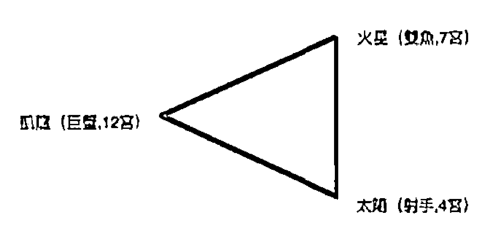

### 步驟二

寫下形成此圖形相位的行星以及每一個行星分別代表的定義，開始思考行星之間的主題會有哪些可能性。例如，凱龍火星太陽是否有可能是內心的傷痛透過奮力地呈現自我（火）才華（太陽）來療癒（凱龍）。請注意，你所想像的內容不一定會發生在個案身上，但是我們可以試圖從多方面思考行星組合的可能性，並在諮詢時保持開放的思路，去察覺個案所描述的狀況是否符合星盤之中的特質。

| 行星 | 凱龍 | 火星 | 太陽 |
| :--- | :--- | :--- | :--- |
| 該行星定義<br>（可能主題） | 傷痛、療癒、收養、照護、局外人 | 生存、刺激、加速、興奮、憤怒、男性、力量 | 重要的事物、自我、父親、領導、男性、生命活力 |

### 步驟三

寫下每一個行星落入的星座，這給予我們該行星如何展現其特質的描述，在此亦可加入一些更細節的形容。同樣請記住這是我們試圖探索的，是根據我們自己的經驗與環境所做出的推論，而非個案本人的體驗。在真正的占星諮詢中，個案的生活體驗才是最重要的，我們在這裡所做的只是一種推測，若個案真正的生活描述與遭遇不符合你的推測，並不代表你是錯的，也不代表占星學不對，我們必須思考的是這些描述究竟符合星盤中哪一個部分，從中找出對個案有幫助的特質並加以討論。

例如火星在雙魚座，對於情感的流動感到興奮刺激，凱龍在巨蟹座對於滋養照顧的議題可能感到傷痛。家庭帶來的內心傷痛（凱龍巨蟹），透過具有行動特質的才華創意（射手太陽），奮力地呈現自我感受（火雙魚）來療癒。

| 行星 | 凱龍 | 火星 | 太陽 |
| :--- | :--- | :--- | :--- |
| 該行星定義（可能主題） | 傷痛、療癒、收養、照顧、局外人 | 生存、刺激、加速、興奮、憤怒、男性、力量 | 重要的事物、自我、父親、領導、男性、生命活力 |
| 落入星座與定義（可能主題） | 巨蟹座：家庭、滋養、照顧、母親、生產 | 雙魚座：漂流、融合、滋潤、情感交流 | 射手座：異國文化、意見觀點、行動調整 |

### 步驟四

檢查是否有行星逆行或停滯，在此描述逆行或停滯的行星可能帶來的影響。逆行的行星可能暗示著行動上的重複、延遲、相關人事物的獨立思考、與眾不同的態度、深入地檢視與審思。例如，個案的凱龍逆行，可能暗示著不斷重複的回顧傷痛或不斷重複地進行傷痛的療癒。

| 是否逆行或停滯（象徵意涵） | 凱龍逆行：反覆地進行傷痛的療癒 |
| :--- | :--- |

### 步驟五

寫下每個行星所在的宮位，藉此可知這一個充滿挑戰與挫折的世界手指會對個案的哪些生活領域產生影響。這個案例裡包括了七宮的婚姻、伴侶關係；四宮的父母與家庭；十二宮的犧牲、放下自我的領域。

| 落入宮位與領域 (影響的範疇) | 凱龍十二宮：隱藏的敵人、遺忘、放下 | 火星七宮：伴侶、合作夥伴、公開敵人 | 太陽四宮：家庭、父母、根源 |
| :--- | :--- | :--- | :--- |

### 步驟六

標示出每一個行星所守護的宮位，幫助我們知道哪些生活領域受到其他行星的影響，並可解釋個案那個宮位所象徵的生活領域可能有的體驗。例如，火星守護第九宮，此時我們可以用凱龍與太陽對第九宮的影響來描述，他可能象徵著透過信仰 (九宮守護星火星) 療癒 (凱) 了自我 (日)。

| 守護宮位與領域 (影響的範疇) | 凱龍：無 | 火星<br>四宮：父母、家、歸屬感<br>九宮：異國文化、信念 | 太陽<br>一宮：自我、自我的形象、自我的呈現、我與世界的關聯 |
| :--- | :--- | :--- | :--- |

### 步驟七

在此列出相位。若是初學者，建議可以在相位之後寫下一些與這個相位有關的關鍵字。此處可以開始思考這些行星主題之中，彼此的狀態是和諧還是充滿著張力。在案例中，火星與太陽的主題是象徵阻礙與張力的四分相，因此我們知道個案在呈現自我 (火星) 的創造力 (太陽) 時容易感受到壓力並且需要長時間的訓練。而凱龍與太陽的一百三十五度則象徵著因爲內心的傷痛，使得自己在表現才華上有着費盡心力去爭取，並且不斷感到挫折的特質。

| 產生相位特質 (可能感受) | 凱龍與火星 135 度 (挫折) 凱龍與太陽 135 度 (盡全力) | 火星與太陽四分 (阻礙、拖延) |  |
| :--- | :--- | :--- | :--- |

### 步驟八

接着，如果一組圖形相位中有特殊的位置，我們可以將它列出來，包括了 T 三角的端點、上帝手指的端點、世界手指的端點、風箏的把手等。端點的行星以及其象徵的事物，多半暗示着經常要夾在中間面對兩難的局面。

| 在圖形中位置 (是否為端點或特殊位置) | 凱龍位在世界手指的端點 |  |  |
| :--- | :--- | :--- | :--- |

### 步驟九

每一組行星所產生的相位都會有容許度，在此列出這些容許度是因爲一度以內的容許度往往象徵着密切重要的議題，並帶來一種需要時時刻刻關注的迫切感受。因此在分析時，我們會特別注意這些議題，當相位超出四度以外的時候，這個議題對個案來說不會有強烈的迫切感受。在這個案例中，每一組相位都十分的緊密，象徵着這些議題對個案產生極爲迫切的影響。

| 與其他行星的容許度緊迫性與危機性 | 凱龍與火星0度（緊密）<br>凱龍與太陽0度（緊密） | 火星與太陽0度（緊密） |  |
| :--- | :--- | :--- | :--- |

### 步驟十

接著試著寫下一些行星組合可能帶來的議題。

強調主題與可能主題：
- 內心的傷痛透過奮力地呈現自我（火）才華（太陽）來療癒（凱龍）。
- 與男性權威之間的衝突而受到傷痛。
- 在薩滿的靈性世界（凱）中不停尋找自我（日）與生命力（火）。
- 透過信仰（九宮守護星火星）療癒（凱）了自我（日）。

### 步驟十一

把不同行星之間透過相位所呈現的動力描寫出來。

可能呈現的動力：
太陽與火星的四分相在實現自我的路途中充滿了阻礙與挑戰，而凱龍所象徵的過去的傷痛，與太陽產生一百三十五度的相位，讓個案對自我表現有著嚴格的要求，不斷努力地實現自我，也不斷的感受到挫折。

### 步驟十二

現在我們應該對這一個圖形相位有著更清楚的概念了！在此可寫下一些對此圖形相位的完整描述。

對此圖形相位的描述：

這組圖形相位可以盡全力地讓自己發光發亮、盡全力地保護自我，同時也對遭遇相同的人給予大力幫助。努力、盡全力、挫折感則是個案在面對自我展現、創意能力、自我保護、與男性的關係之間的顯著感受。自我展現的壓力來自於過去的傷痛，因此不斷地自我要求。

### 步驟十三

最後再觀察一下整張星盤，是不是有其他行星同時與這一組圖形相位產生相位？是不是柔和相位？有沒有可能暗示著舒緩壓力？是不是強硬相位？有沒有可能帶來更複雜的挑戰？有沒有重複出現的主題？

其他涉及行星（帶來的舒緩或更複雜化的暗示）：

- 冥王星與太陽火星也同時產生相位，重複暗示著與男性、自我展現之間的強烈緊張，同時也帶來堅定的意志力。
- 天王星與凱龍的六分相提供了一個以距離、冷漠、突然切割或者令人意想不到的方式，從傷痛當中獲得解脫。

## 案例分析

圖形相位名稱：世界手指

所組成的行星：凱龍、火星、太陽

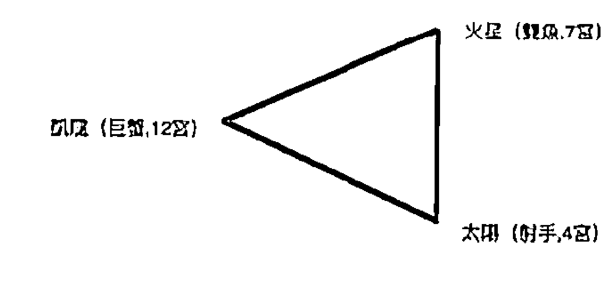

### 所組成的相位與容許度：

| 行星 | 凱龍 | 火星 | 太陽 |
| :--- | :--- | :--- | :--- |
| 該行星定義<br>(可能主題) | 傷痛、療癒、收養、照護、局外人 | 生存、刺激、加速、興奮、憤怒、男性、力量 | 重要的事物、自我、父親、領導、男性、生命活力 |
| 落入星座與定義<br>(可能主題) | 巨蟹座：家庭、滋養、照顧、母親、生產 | 雙魚座：漂流、融合、滋潤、情感交流 | 射手座：異國文化、意見觀點、行動調整 |
| 是否逆行或停滯<br>(象徵意涵) | 逆行：反覆地進行傷痛的療癒 |  |  |
| 落入宮位與領域<br>(影響的範疇) | 十二宮：隱藏的敵人、遺忘、放下 | 七宮：伴侶、合作夥伴、公開敵人 | 四宮：家庭、父母、根源 |
| 守護宮位與領域<br>(影響的範疇) |  | 四宮：父母、家、歸屬感 | 五宮：子女、創造力<br>六宮：每日生活步調、服務 |
| 產生相位特質<br>(可能感受) | 與火星 135 度（挫折）<br>與太陽 135 度（盡全力） | 與太陽四分（阻礙、拖延） |  |
| 在圖形中位置<br>(是否為端點或特殊位置) | 端點 |  |  |
| 與其他行星的容許度緊迫性與危機性 | 與火星 0 度（緊密）<br>與太陽 0 度（緊密） | 與太陽 0 度（緊密） |  |

### 強調主題與可能主題：

- 內心的傷痛透過奮力地呈現自我（火）才華（太陽）來療癒（凱龍）。
- 與男性權威之間的衝突而受到傷痛。
- 在薩滿的靈性世界（凱）中不停尋找自我（日）與生命力（火）。
- 透過信仰（九宮守護星火星）療癒（凱）了自我（日）。

### 可能呈現的動力：

太陽與火星的四分相在實現自我的路途中充滿了阻礙與挑戰，而凱龍所象徵的過去的傷痛，與太陽產生一百三十五度的相位，讓個案對自我表現有著嚴格的要求，不斷努力地實現自我，也不斷的感受到挫折。

### 對此圖形相位的描述：

這組圖形相位可以盡全力地讓自己發光發亮、盡全力地保護自我，同時也對遭遇相同的人給予大力幫助。努力、盡全力、挫折感則是個案在面對自我展現、創意能力、自我保護、與男性的關係之間的顯著感受。自我展現的壓力來自於過去的傷痛，因此不斷地自我要求。

### 其他涉及行星（帶來的舒緩或更複雜化的暗示）：

- 冥王星與太陽火星也同時產生相位，重複暗示著與男性、自我展現之間的強烈緊張，同時也帶來堅定的意志力。
- 天王星與凱龍的六分相提供了一個以距離、冷漠、突然切割或者令人意想不到的方式，從傷痛當中獲得解脫。

## 如何詮釋其他圖形相位

在本書中，我們介紹了八種常見的圖形相位，我相信許多讀者或許仍有疑問，因為你聽過一些書中沒有介紹的圖形相位，例如「大衛之星」、「天使之羽」或者是由上帝手指變化出來的「迴力鏢」等等。或許你也會發現自己或他人的星盤中有幾個行星的相位組成了一個圖案，因而懷疑是不是該稱之為圖形相位。在本章中，我會透過清楚的步驟來分享我是如何解讀這些沒有列在本書中的圖形相位。

在此使用一張客戶的星盤作為解讀其他圖形相位的示範，我已徵得對方同意，在之後的實際案例章節中也會再次分享星盤諮詢的經驗。

Emma 的星盤並沒有任何我們熟悉的圖形相位，但是星盤中的月亮、凱龍、金星、冥王組成了一個有趣的圖像。我使用這款表格做了一些分析，雖然這不是一組常見的圖形相位，但是在諮詢討論的過程中，這一個圖像與組合替我與 Emma 帶來了相當多的幫助。

- 1. 釐清哪些行星彼此產生相位。

Emma 的月亮、金星、凱龍、冥王之間組成了一組特殊的圖形，彼此之間產生了相位。或許你會注意到火星與金星相當的靠近，但是火星並沒有與月亮產生相位，所以我會在最後才討論火星可能帶來的影響。

圖形相位名稱：無

所組成的行星：月亮、金星、冥王星、凱龍

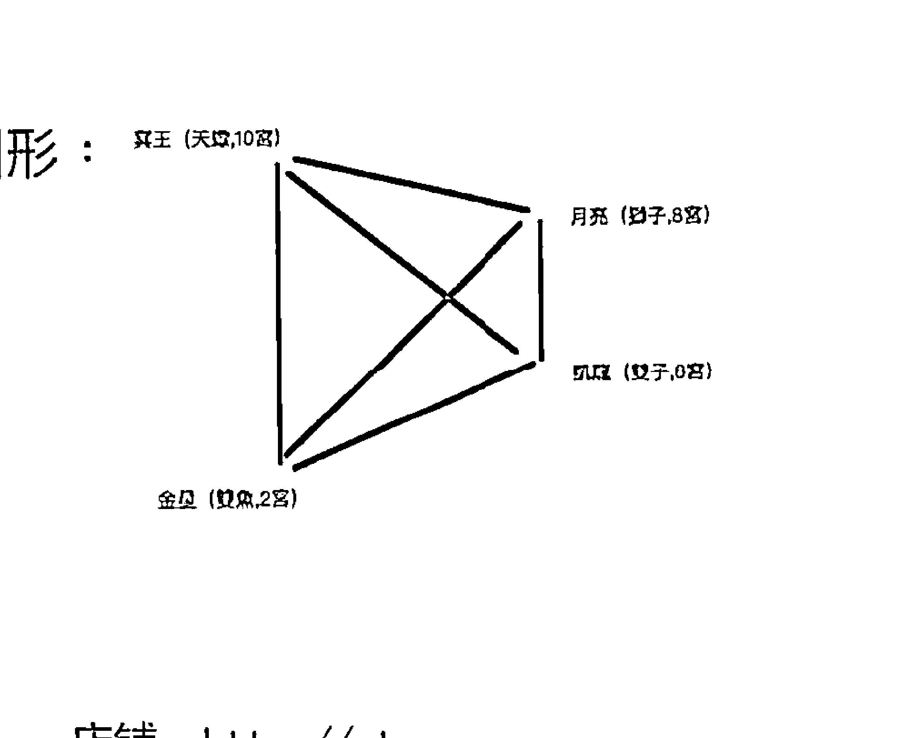## Emma
Natal Chart
8 Jan 1985, Tue
06:30 GMT +0:00
Glasgow, UK
55°N53' 004°W15'
Geocentric
Tropical
Placidus
True Node

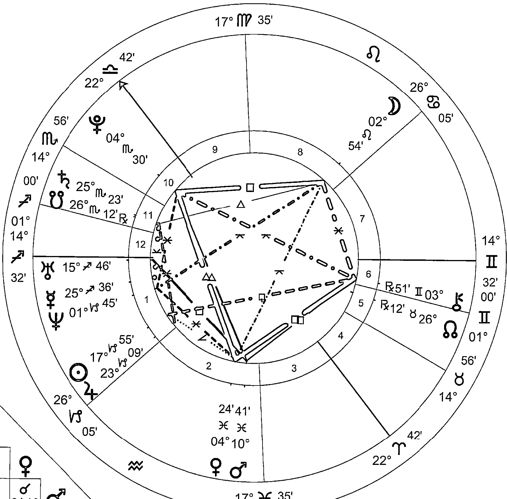

| 行星 | 太阳 | 月亮 | 水星 | 金星 | 火星 | 木星 | 土星 | 天王星 | 海王星 | 冥王星 | 凯龙星 | 北交点 | 南交点 | 上升点 | 中天 |
|---|---|---|---|---|---|---|---|---|---|---|---|---|---|---|---|
| 太阳 | - | ◯ | ∠ | K | ◯ | | △ | | K | □ | * | | △ | | □ |
| 月亮 | ◯ | - | ∠ | K | | ◯ | | | | | | | | | □ |
| 水星 | ∠ | ∠ | - | ◯ | | | | | | ◯ | | K | | | * |
| 金星 | K | K | ◯ | - | | | | | | ◯ | | | | | □ |
| 火星 | ◯ | | | | - | ◯ | △ | | | | | | | | □ |
| 木星 | | ◯ | | | ◯ | - | □ | □ | | | | | △ | □ | |
| 土星 | △ | | | | △ | □ | - | | * | | | | | | □ |
| 天王星 | | | | | | □ | | - | | | △ | △ | | △ | △ |
| 海王星 | K | | | | | | * | | - | * | | | | △ | □ |
| 冥王星 | □ | | ◯ | ◯ | | | | △ | * | - | | | | □ | |
| 凯龙星 | * | | □ | □ | | | | | | | - | | | | □ |
| 北交点 | | | | | | △ | | △ | | | | - | | △ | |
| 南交点 | △ | | | | | | | | | | | △ | - | | |
| 上升点 | | | | | | □ | | | △ | | | | | - | |
| 中天 | □ | □ | * | | | | □ | | □ | | | | | | - |

Emma 星盤

### 2.
写下形成此图形相位的行星，以及每一个行星分别代表的定义，并可开始思考行星之间的主题有哪些可能性。

- 与母亲有关：与母亲之间（月）的紧张关系（冥）导致自我价值（金）受到伤害（凯）。

- 与金钱有关的主题：透过照护滋养（月）受到病痛（凯）威胁（冥）的人而赚取金钱（金）。

| 行星 | 月亮 | 金星 | 冥王星 | 凯龙 |
| :--- | :--- | :--- | :--- | :--- |
| 该行星定义<br>（可能主题） | 母亲、情绪、滋养、照顾、亲密关系、个人需求 | 喜爱、金钱、自我价值、女性、和平、人际关系 | 危机、隐藏、掩埋、死而复生、紧追、控制 | 伤痛、疗愈、收养、照护、局外人 |

### 3.
写下每一个行星落入的星座，这给予我们该行星如何展现其特质的描述，在此亦可加入一些更细节的形容。

- 与母亲有关：与富有创造力的母亲之间（月亮狮子）的隐藏紧张关系（冥王天蝎）导致原本就迷惘的自我价值（金星双鱼）受到伤害，特别是言语之间的伤痛（凯龙双子）。

| 落入星座与定义<br>（可能主题） | 月亮狮子座：创造力、尊贵、荣耀、骄傲、热情温暖 | 金星双鱼座：随性、滋养、感受、流动、迷惘、无私无我 | 冥王星天蝎座：危机、隐藏、保护、专注在感受上 | 凯龙双子座：资讯交流、沟通、理性、邻近的事物 |

### 4.
检查是否有行星逆行或停滞，在此描述逆行或停滞的行星可能带来的影响。逆行的行星可能暗示着行动上的重复、延迟，相关人事物的独立思考、与众不同的态度、深入地检视与审思。

5. 寫下每個行星所在的宮位。此案例中，包括了二宮的自我價值與金錢，六宮的工作、每天生活步調，八宮的危機與死亡，十宮的職業、社會地位與父母親。這些議題都可能會在Emma的自我價值、金錢、工作以及與父母的關係當中展現。

| 落入宮位與領域（影響的範疇） | 月亮八宮：危機感、死亡與重生、他人的金錢、共享資源 | 金星二宮：金錢、財富、個人價值、資源 | 冥王星十宮：社會地位、職業、權威、父母親 | 凱龍六宮：每日生活步調、工作、僱員、下屬、小動物 |
| --- | --- | --- | --- | --- |

6. 標示出每一個行星所守護的宮位，這也可以幫助我們知道那些生活領域受到其他行星的影響，並且可以試圖解釋個案那一個宮位所象徵的生活領域可能有的體驗。在這個案例中，金星守護第十宮，我們可以用職業與社會地位取代金星，並思考月亮、冥王、凱龍對Emma的職業與社會地位的影響。你也可以考慮月亮守護八宮，以危機一詞來取代月亮，並且判斷金星、冥王、凱龍會描述什麼樣的危機。

- 職業與社會地位（金星守護十宮）：從事與照護（月）療癒（凱）以及面臨重大危機（冥）的人的職業（金星守護十宮）。

7. 在此列出相位。若是初學者，建議可以在相位之後寫下一些與這個相位有關的關鍵字。此處可以開始思考這些行星主題之中，彼此的狀態是和諧還是充滿著張力。

在Emma的星盤上，我們可以看到月亮與金星一百五十度，暗示著對生活舒適的焦慮，或者是對於母女關係感到歉疚、不舒服的感受。而與凱龍的四分相暗示著她可能想要修復這段關係，但卻需要花很長的時間去訓練如何處理母女關係的不舒服。最後冥王星與金星三分相暗示著如果去探查心裡的秘密，挖掘過去的不愉快，甚至是研究整个家族的母女关系议题，或许能帮助她接受已经发生过的不愉快，并改善与母亲之间的互动。

| 产生相位特质（可能感受） | 月亮与金星150度（焦虑、调整）
月亮与冥王四分（阻碍、紧张）
月亮与凯龙六分（灵活、学习、应用） | 金星与冥王三分（接受、和谐）
金星与凯龙四分（抵抗、阻碍） | 冥王星与凯龙150度（调整、焦虑、罪恶感） |
| --- | --- | --- | --- |

8. 接着，如果一组图形相位中有特殊的位置，我们可以将它列出来。

在 Emma 的这一组图形相位中，并没有产生端点，但若仔细观察星盘，月亮与金星海王同时形成了上帝手指，这暗示着月亮端点同时所受到的压力来自于金星象征的舒适价值、女性，以及海王星象征的超越、伟大、牺牲、虚弱、遗忘。我们可以把这一些资讯列在表格后面的其他考量之中。

9. 每一组行星所产生的相位都会有容许度，在此列出这些容许度是因为一度以内的容许度往往象征着密切重要的议题，并带来一种需要时时刻刻关注的迫切感受。因此在分析时我们会特别注意这些议题，当相位超出四度以外的时候，我们知道那一个议题对个案来说不会有如此强烈的迫切感受。

这个图形相位暗示着十分迫切地渴望透过深度心灵探索（冥）疗愈（凯）来帮助自己提升自我价值或母女关系（金星）的议题。

| 与其他行星的容许度紧迫性与危机性 | 月亮与金星1度
月亮与冥王1度
月亮与凯龙1度 | 金星与冥王星0度
金星与凯龙0度 | 冥王星与凯龙0度 |
| --- | --- | --- | --- |

### 10. 接著我們試著寫下一些行星組合可能帶來的議題。

- 與母親有關：與母親之間（月）的緊張關係（冥）導致自我價值（金）受到傷害（凱）。或是為了照護受傷（凱）的母親（月）而造成際或情感關係（金）的緊張狀態（冥）。
- 與金錢有關的主題：透過照護滋養（月）受到過去病痛（凱龍逆行）威脅（冥）的人而賺取金錢（金）。
- 與恐懼有關的主題：由於過去家族不斷重複的傷痛（凱龍逆行）而對於情感與親密關係之間（月）的甜蜜喜悅（金）感到恐懼（冥）。
- 職業與社會地位（金星守護十宮）：從事與照護（月）療癒（凱）那些面臨重大危機（冥）的人的職業（金星守護十宮）。

### 11. 把不同行星之間透過相位所呈現的動力描寫出來。

在此與金星凱龍有關的議題，以及冥王月亮之間的議題可能有較為明顯的壓力。與女性之間的關係可能感受到阻礙與緊張；對於內心莫名的不安感到愧疚，不斷調整自己的生活態度與價值觀試圖讓自己更有價值；探索挖掘過去以及心理，可以幫助療癒與母親、女性以及伴侶的關係。

### 12. 現在我們應該對這一個圖形相位有著更清楚的概念了，不妨寫下對這一個圖形相位的完整描述。在此，考慮到整體的互動，我們可以把整個圖形的主題以及可能出現的互動狀態完整地描寫出來。

- 月亮與金星一百五十度，暗示著對於生活舒適的焦慮，或者是對母女關係感到歉疚、不舒服的感受。而與凱龍的四分相，暗示著她可能想要修復這段關係，但卻需要花非常久的時間去訓練如何處理與母女之間的不舒服。最後冥王星與金星三分相暗示著，如果探查心裡的秘密、挖掘過去的不愉快，甚至是研究整個家族的母女關係議題，或許能幫助她接受已經發生過的不愉快並改善與母親之間的互動。

- 13. 最後再觀察一下整張星盤，是不是有其他行星同時與這一組圖形相位產生相位？是不是柔和相位？有沒有可能暗示著舒緩壓力？是不是強硬相位？有沒有可能帶來更複雜的挑戰？有沒有重複出現的主題？

- 剛剛提到的月亮與金星海王的上帝手指是一個考量，接著，思考這組圖形相位中有沒有不斷重複的暗示？例如金星與月亮都象徵著女性議題，我們可以推測與女性關係的緊張會讓 Emma 有強烈的感受。

- 在這組圖形相位之中有冥王星的符號、天蠍座的符號，月亮落在第八宮並且守護第八宮，這些符號都暗示著危機與看不見的隱憂，這也是一個特質。

- 星盤中象徵物質生活領域與日常生活領域的二、六、十宮都出現在這一組圖形相位中。這些因為壓力而不斷調整自己的狀態，很可能也與物質、金錢、工作、社會形象有著密切的關連。

## 案例分析

圖形相位名稱：無

所組成的行星：月亮、金星、冥王星、凱龍

所組成的相位與容許度：

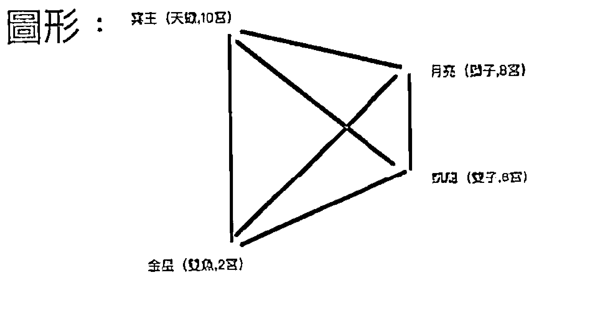

| 行星 | 月亮 | 金星 | 冥王星 | 凱龍 |
|------|------|------|--------|------|
| 該行星定義（可能主題） | 母親、情緒、滋養、照顧、親密關係、個人需求 | 喜愛、金錢、自我價值、女性、和平、人際關係 | 危機、隱藏、掩埋、死而復生、緊迫、控制 | 傷痛、療癒、收養、照顧、局外人 |
| 落入星座與定義（可能主題） | 獅子座：創造力、奪貴、榮耀、驕傲、熱情溫暖 | 雙魚座：隨性、滋養、感受、流動、迷惘、無私無我 | 天蠍座：危機、隱藏、保護、專注在感受上 | 雙子座：資訊交流、溝通、理性、鄰近的事物 |
| 落入宮位與領域（影響的範疇） | 八宮：危機感、死亡與重生、他人的金錢、共享資源 | 二宮：金錢、財富、個人價值、資源 | 十宮：社會地位、職業、權威、父母親 | 六宮：每日生活步調、工作、僱員、下屬、小動物 |
| 守護宮位與領域（影響的範疇） | 八宮：危機感、死亡與重生、他人的金錢、共享資源 | 五宮：子女、喜愛的事物、娛樂 | 十一宮：社交生活、朋友、對未來的期盼 | 無 |
| 產生相位特質（可能感受） | 月亮與金星150度（焦慮、調整）<br>月亮與冥王四分（阻礙、緊張）<br>月亮與凱龍六分（靈活、學習、應用） | 金星與冥王三分（接受、和諧）<br>金星與凱龍四分（抵抗、阻礙） | 冥王星與凱龍150度（調整、焦慮、罪惡感） | （空） |
| 在圖形中位置（是否為端點或特殊位置） | （空） | （空） | （空） | （空） |
| 與其他行星的容許度緊迫性與危機性 | 月亮與金星1度<br>月亮與冥王1度<br>月亮與凱龍1度 | 金星與冥王星0度<br>金星與凱龍0度 | 冥王星與凱龍0度 | （空） |

### 強調主題與可能主題：

- 與母親有關：與母親之間（月）的緊張關係（冥）導致自我價值（金）受到傷害（凱）。或是為了照護受傷（凱）的母親（月）而造成人際或情感關係（金）的緊張狀態（冥）。
- 與金錢有關的主題：透過照護滋養（月）受到過去病痛（凱龍逆行）威脅（冥）的人而賺取金錢（金）。
- 與恐懼有關的主題：由於過去家族不斷重複的傷痛（凱龍逆行）而對於情感與親密關係之間（月）的甜蜜喜悅（金）感到恐懼（冥）。
- 職業與社會地位（金星守護十宮）：從事與照護（月）療癒（凱）那些面臨重大危機（冥）的人的職業（金星守護十宮）。

### 可能呈現的動力：

在此與金星凱龍有關的議題，以及冥王月亮之間的議題可能有較為顯著的壓力。凱龍與冥王的一百五十度，對於內心莫名的不安感到愧疚，並且不斷調整自己的生活態度與價值觀試圖讓自己更有價值。金星與冥王的三分相暗示著一種和諧。

### 對此圖形相位的描述：

月亮與金星一百五十度，暗示著對於生活舒適的焦慮，或者是對母女關係感到歉疚、不舒服的感受。而與凱龍的四分相，暗示著她可能想要修復這段關係，但卻需要花非常久的時間去訓練如何處理與母女之間的不舒服。最後冥王星與金星三分相暗示著，如果探查心裡的秘密、挖掘過去的不愉快，甚至是研究整個家族的母女關係議題，或許能幫助她接受已經發生過的不愉快並改善與母親之間的互動。

### 其他涉及行星（帶來的舒緩或更複雜化的暗示）：

- 在 Emma 的這一組圖形相位當中，並沒有產生端點，但若仔細觀察星盤，月亮與金星海王同時形成了上帝手指，這暗示著月亮端點所受到的壓力來自於金星象徵的舒適價值、女性，以及海王星象徵的超越、偉大、犧牲、虛弱、遺忘。可能會讓這組圖型相位的主題更為複雜。
- 金星與月亮都象徵著女性議題，我們可以推測與女性關係的緊張會讓Emma 有強烈的感受。
- 在這一組圖形相位之中有冥王星的符號、天蠍座的符號，月亮落在第八宮並且守護第八宮，這些符號都暗示著危機與看不見的隱憂，這也是一個特質。
- 星盤中象徵物質生活領域與日常生活領域的二、六、十宮都出現在這一組圖形相位中。這些因為壓力而不斷調整自己的狀態，很可能也與物質、金錢、工作、社會形象有著密切的關連。

# 第六章

## 圖形相位在流年與合盤的應用

當您了解圖形相位之後，便可理解行星組合會將星盤中的許多象徵，透過複雜的方式結合在一起。當其中一個行星被影響，圖形相位中的其他行星也會被影響，這樣的影響可以透過運勢推測（流年）技巧中的二次推運、太陽弧正向推運、太陽回歸、月亮回歸、行運等等來呈現。

舉例來說，如果你的本命盤有一組月亮、水星、冥王的T三角，在最近的行運中，土星與你的月亮產生相位，那麼這會被視為一個重要的人生時刻，因為你本命盤的圖形相位被觸動了。

另外一種應用圖形相位的方式，是透過兩個人的合盤來產生影響。假設你的本命盤有一組月亮、水星、冥王的T三角，而你的好友、上司、伴侶的太陽與你星盤上的太陽正好與你的月亮、水星或冥王星其中一個行星產生相位，那麼這也會突顯兩人相處上的重要議題。

最後需要特別注意的是，有時星盤上原本沒有圖形相位，但因為行運、推運或者合盤而產生了一組圖形相位，我們將會在接下來的章節中討論這些議題。

### 行運與推運中的圖形相位

### 圖形相位被觸動

在這裡我們只專注在行運技巧或推運技巧之中圖形相位如何被觸動以及如何解釋。在此要提醒各位，進行流年預測之前，一定要仔細研究過本命盤，這是每一位專業占星師都知道的事，在不了解本命盤的情況下，直接預測運勢或討論合盤，都是相當片面而且不專業的做法。

在此我們以英國哈利王子的星盤來做示範。哈利王子的星盤上有一組月亮在金牛座十五度、金星在天秤座十七度、火星在射手座十六度的上帝手指。我們可以透過分析表來認識這一組圖形相位對哈利王子的影響，當然在專業的諮詢工作中，最好能夠先進行完整的本命盤分析，再來做運勢分析的工作。

### 案例：哈利王子

- 圖形相位名稱：上帝手指
- 所組成的行星：月亮、金星、火星
- 所組成的相位與容許度：

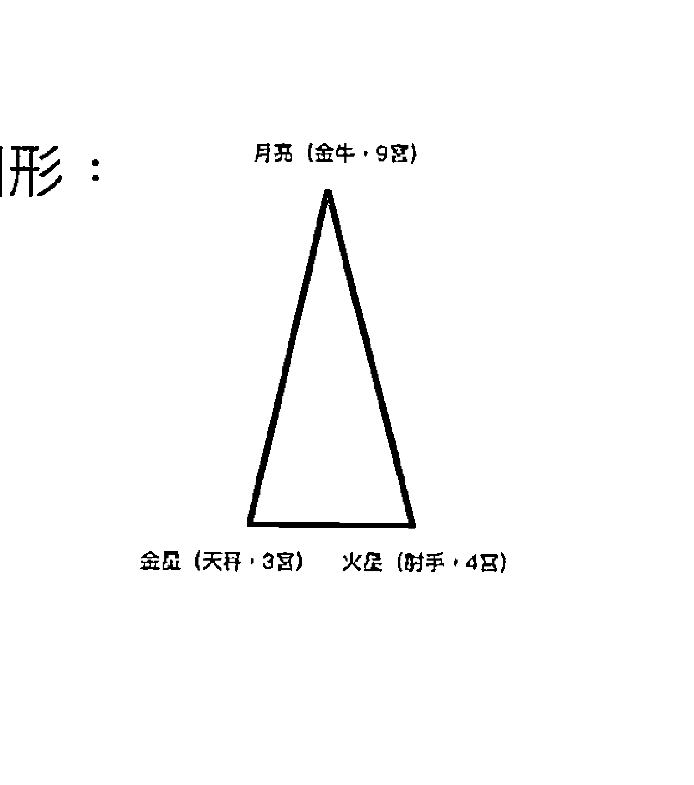

Prince Harry
Male Chart
15 Sep 1984, Sat
04:20 BST -1:00
London, UK
51°N30' 000°W10'
Geocentric
Tropical
Placidus
True Node

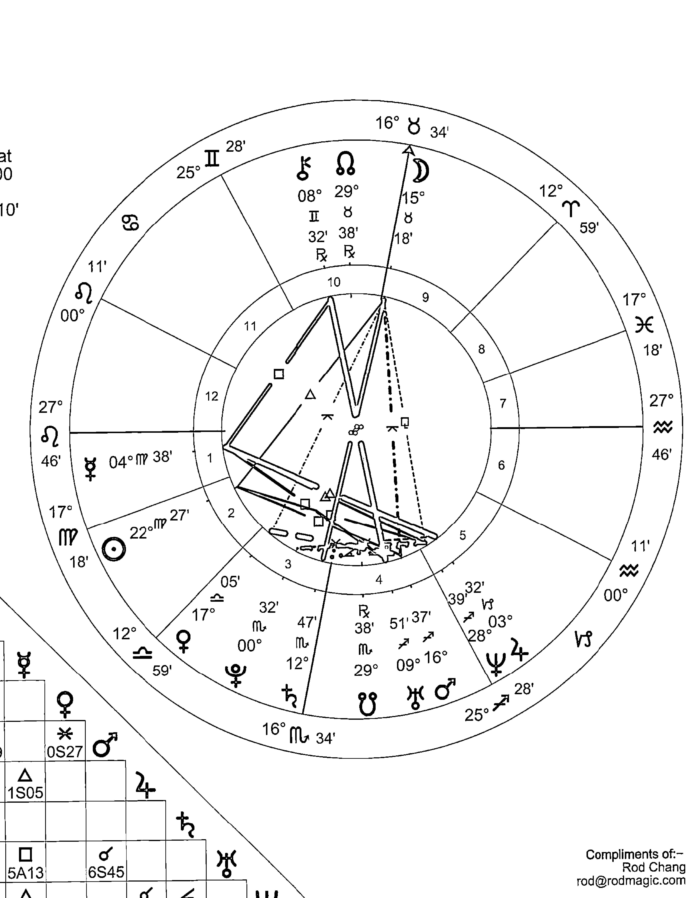

相位表，显示了行星之间的相位关系：
- 太阳(☉): 对月亮(☽) △ 7A09, 对水星(☿) ⚷ 1A46, 对金星(♀) ⚷ 1A19 □ 5S49, 对火星(♂) ✶ 0S27, 对木星(♃) △ 1S05, 对土星(♄) ☊ 2S30, 对天王星(♅) □ 5A13, 对海王星(♆) □ 6A12 △ 5S58, 对冥王星(♇) △ 3A54, 对凯龙星(⚷) △ 7A10 □ 4S59, 对北交点(☊) □ 4S59, 对南交点(☋) ⚶ 6A52, 对上升点(As) ✶ 1S16 △ 5A52, 对中天(Mc) ⚷ 0A30 ⚷ 0A03 □ 1A57 ⚷ 3S46
- 月亮(☽): 对水星(☿) □ 5A13, 对金星(♀) ✶ 6S45, 对火星(♂) △ 1S38 □ 6A12 △ 5S58, 对木星(♃) □ 4S52 ⚷ 0A51, 对土星(♄) ⚷ 1S05 ⚷ 2S59, 对天王星(♅) □ 3A54, 对海王星(♆) ✶ 1S52, 对冥王星(♇) ⚷ 0A58 ⚷ 0S54, 对凯龙星(⚷) ⚷ 0A58 ⚷ 0S54, 对北交点(☊) □ 1A52, 对南交点(☋) □ 1A52, 对上升点(As) △ 0A53 ⚶ 2A46, 对中天(Mc) ⚷ 1A52 ⚷ 1A52
- 水星(☿): 对金星(♀) □ 1A57, 对火星(♂) △ 0A30, 对木星(♃) ⚷ 0A03, 对土星(♄) □ 1A57, 对天王星(♅) ⚷ 3S46, 对海王星(♆) ⚷ 1S16 △ 5A52, 对冥王星(♇) ⚷ 6A52, 对凯龙星(⚷) ⚷ 4S59, 对北交点(☊) ⚷ 0A58 ⚷ 0S54, 对南交点(☋) ⚷ 0A58 ⚷ 0S54, 对上升点(As) ⚷ 1A52 ⚷ 1A52, 对中天(Mc) ⚷ 0A53 ⚶ 2A46
- 金星(♀): 对火星(♂) ⚷ 1A52 ⚷ 1A52, 对木星(♃) ⚷ 0A53 ⚶ 2A46, 对土星(♄) ⚷ 3A54, 对天王星(♅) ⚷ 7A10 □ 4S59, 对海王星(♆) ⚷ 4S59, 对冥王星(♇) ⚶ 6A52, 对凯龙星(⚷) ⚷ 1S16 △ 5A52, 对北交点(☊) ⚷ 0A30 ⚷ 0A03 □ 1A57 ⚷ 3S46, 对南交点(☋) ⚷ 1S05 ⚷ 2S59, 对上升点(As) ⚷ 1S38 □ 6A12 △ 5S58, 对中天(Mc) ⚷ 4S52 ⚷ 0A51
- 火星(♂): 对木星(♃) ⚷ 0A58 ⚷ 0S54, 对土星(♄) ⚷ 0A58 ⚷ 0S54, 对天王星(♅) □ 1A52, 对海王星(♆) □ 1A52, 对冥王星(♇) △ 0A53 ⚶ 2A46, 对凯龙星(⚷) ⚷ 3A54, 对北交点(☊) ⚷ 7A10 □ 4S59, 对南交点(☋) ⚷ 4S59, 对上升点(As) ⚶ 6A52, 对中天(Mc) ⚷ 1S16 △ 5A52
- 木星(♃): 对土星(♄) □ 1S05, 对天王星(♅) ⚷ 2S30, 对海王星(♆) △ 5A13, 对冥王星(♇) ✶ 6S45, 对凯龙星(⚷) □ 5S49, 对北交点(☊) ⚷ 1A46, 对南交点(☋) ⚷ 7A09, 对上升点(As) ⚷ 0S27, 对中天(Mc) △ 1S05
- 土星(♄): 对天王星(♅) ⚷ 1S16 △ 5A52, 对海王星(♆) ⚷ 0A30 ⚷ 0A03 □ 1A57 ⚷ 3S46, 对冥王星(♇) ⚷ 6A52, 对凯龙星(⚷) ⚷ 4S59, 对北交点(☊) ⚷ 0A58 ⚷ 0S54, 对南交点(☋) ⚷ 0A58 ⚷ 0S54, 对上升点(As) ⚷ 1A52 ⚷ 1A52, 对中天(Mc) ⚷ 0A53 ⚶ 2A46
- 天王星(♅): 对海王星(♆) ⚷ 1A52 ⚷ 1A52, 对冥王星(♇) ⚷ 0A53 ⚶ 2A46, 对凯龙星(⚷) ⚷ 3A54, 对北交点(☊) ⚷ 7A10 □ 4S59, 对南交点(☋) ⚷ 4S59, 对上升点(As) ⚶ 6A52, 对中天(Mc) ⚷ 1S16 △ 5A52
- 海王星(♆): 对冥王星(♇) ⚷ 0A58 ⚷ 0S54, 对凯龙星(⚷) ⚷ 0A58 ⚷ 0S54, 对北交点(☊) □ 1A52, 对南交点(☋) □ 1A52, 对上升点(As) △ 0A53 ⚶ 2A46, 对中天(Mc) ⚷ 1A52 ⚷ 1A52
- 冥王星(♇): 对凯龙星(⚷) ⚷ 1A52 ⚷ 1A52, 对北交点(☊) ⚷ 0A53 ⚶ 2A46, 对南交点(☋) ⚷ 3A54, 对上升点(As) ⚷ 7A10 □ 4S59, 对中天(Mc) ⚷ 4S59
- 凯龙星(⚷): 对北交点(☊) ⚶ 6A52, 对南交点(☋) ⚷ 1S16 △ 5A52, 对上升点(As) ⚷ 0A30 ⚷ 0A03 □ 1A57 ⚷ 3S46, 对中天(Mc) ⚷ 1S05 ⚷ 2S59
- 北交点(☊): 对南交点(☋) □ 1S38 □ 6A12 △ 5S58, 对上升点(As) ⚷ 4S52 ⚷ 0A51, 对中天(Mc) □ 3A54
- 南交点(☋): 对上升点(As) ⚷ 1A52 ⚷ 1A52, 对中天(Mc) ⚷ 0A58 ⚷ 0S54
- 上升点(As): 对中天(Mc) △ 7A09

Compliments of:-
Rod Chang
rod@rodmagic.com

哈利王子（Prince Harry）## 行星定义对照

| 行星 | 凯龙 | 火星 | 太阳 |
| :--- | :--- | :--- | :--- |
| **该行星定义<br>(可能主题)** | 母亲、女性、情绪、滋养、关怀、需求 | 情感、喜爱的人事物、爱情、喜好、财富、价值观 | 行动、争取、保护、自我展现、意志力、冲突 |
| **落入星座与定义<br>(可能主题)** | 金牛：资源、财富、土地、稳定、丰盛 | 天秤：伴侣关系、合作关系、法律、公平公正 | 射手座：远方、未来、国外、高等教育 |
| **是否逆行或停滞<br>(象征意涵)** | | | |
| **落入宫位与领域<br>(影响的范畴)** | 九宫：国外、高等教育、宗教、信念<br><br>天顶：社会地位、名声名望、事业 | 三宫：学习、沟通、兄弟姊妹、邻里关系 | 四宫：家庭、父母、根源、归属感 |
| **守护宫位与领域<br>(影响的范畴)** | 无 | 十宫、天顶：社会地位、名声名望、事业 | 四宫：家庭、父母、根源、归属感<br><br>九宫：国外、高等教育、宗教、信念 |
| **产生相位特质<br>(可能感受)** | 月亮与金星 150度（焦虑）<br><br>月亮与火星 150度（调整） | 金星与火星六分相（机会、学习） | |
| **在图形中位置<br>(是否为端点或特殊位置)** | 端点 | | |
| **与其他行星的容许度紧迫性与危机性** | 月亮与金星1度<br><br>月亮与火星1度 | 金星火星0度 | |

### 强调主题与可能主题：

- 与所喜爱（金）的女性（月）之间有着相当刺激活跃（火）的互动。
- 对于生活（月）的舒适（金）感到亏欠或是不满足，也因此不断地去争取（火）并藉此证明自我。
- 个人的公众形象（十宫守护星金星）经常环绕着对母亲（月）的保护与愤怒（火）。

### 可能呈现的动力：

不断调整、刺激、不舒适、内心当中的亏欠愧疚罪恶感与不满足。

### 对此图形相位的描述：

金星与火星象征着争取喜爱的人事物的活泼和谐态度，但是个案并不容易因为这样的事物而感到安定，反而感到自己应该去做些什么、去改变或调整行动。月亮与金星的主题，例如与女性关系、与母亲的关系，对生活的舒适态度，带有一种不断调整的特质，并且在这特质背后有一种不明瞭、不了解、甚至因此引发的不愉快、不满足、罪恶感受的特色。同样的特质也出现在月亮与火星争取每日需求的行动上、情绪表达或者保护家人的议题上，焦虑与调整十分地明显。

月亮作为焦点，强调着母亲、伴侣关系、情绪、安全感为重要的议题。

### 其他涉及行星（带来的舒缓或更复杂化的暗示）：

- 土星合相天底（IC）对分月亮，土星象征着规矩、制度，而土星守护六宫与七宫，暗示着每天的生活步调、工作、健康、伴侣关系等议题，受到这组图形相位主题的强烈影响，但通常不容易被观察到。

当我们了解这一组本命盘的上帝手指对哈利王子可能带来的影响之后，应该可以发现家庭、父母关系、社会地位、职业、个人情感、与女性的关系等，可能是这一组图形相位所突显的主题。因此在运势推测的时候，如果这一组图形相位被触动，刚才提到的那些领域的事物便需要加倍关注。接下来，让我们继续以这个案例来介绍如何在运势推测技巧上分析图形相位。

## 行运

当我们关注行运对图形相位的影响时，有几个重要的诀窍，但若你需要更详细的行运技巧，请参考我的另一本著作《占星流年》。

### Tip 1

优先观察外行星的位置，包括凯龙、冥王星、海王星、天王星、土星、木星以及南北交在当下行运的位置，因为如果外行星对本命盘产生影响时，影响的时间可以从一两个月到两三年。也就是说，生活中的挑战可能会持续几个月到两三年。但是当你考虑内行星与太阳、月亮在行运的影响时，它们的时间相对较短，约莫是几天至一两周。

### Tip 2

任何外行星开始对星盘上的图形相位行星产生入相位时，整个图形相位便开始被影响，越是接近正相位时，影响力越大，到了出相位时，事件才会逐渐消退。入相位与出相位必须考虑距角（Orb），每一位占星师使用不同的距角，在行运时，我个人习惯的距角如下：

- 合相、四分相、对分相、三分相：五度距角
- 六分相：三度距角
- 其他相位：一度距角

也就是说，如果行运土星即将合相本命在天秤座十七度的金星时，影响力大约会从土星位在天秤座十二度开始出现，越是靠近本命金星，影响力越大、越明显。但是当行运土星过了天秤座十七度之后，事情虽然仍受影响，但已逐渐地减弱消退，当行运土星移动到天秤座二十二度之外，这些影响将从我们的注意力中消失。

如果是行运行星的次要相位，例如一百五十度或半四分相，那么我们仅需考虑一度的距角，像是行运土星来到双鱼座十六到十八度之间，才会影响到本命盘位在天秤座十七度的金星。

### Tip 3

接着必须留意影响的时间范畴。若本命火星在射手十六度，与这个位置合相的影响范围是射手座十一度到射手座二十一度之间，所以我们检查星历表，土星在二〇一六年一月就进入这个位置，一直要到二〇一七年一月才会离开射手座二十一度。也就是说，这层影响会长达至少一年。而我们需要注意的是，在这一年中如果有其他行星同时与这一组图形相位的行星产生相位，将会提高事件被我们注意到的机率。如果是内行星，很可能就暗示着那几天会是事件发生的日期。

### Tip 4

当我们分析过本命盘后，便可知道哪些本命盘的议题是这一组图形相位的主题方向，所以若有流年行运行星经过这一段时间，这些议题极可能引起我们的注意，或是产生与这些主题有关的事情。

### Tip 5

若我们把本命盘的图形相位视为已经存在的经验，或是生命中某些重要的任务，而行运行星在这时候可能扮演了引发事件发生的原因，或者引发我们回顾那些内在体验的事件。透过行运行星的特质，以及行运行星在行运的星座宫位，甚至行运行星在本命盘中的位置，我们便可推测是哪些事情带来这些影响。

## 二次推运与太阳弧正向推运

「二次推运」与「太阳弧正向推运」，在当代的占星运势推测技巧中占有重要的位置，进行专业的占星咨询时，占星师至少会参考三种以上不同的运势推测技巧来分析未来的运势。与行运技巧不同的是，二次推运与太阳弧正向推运是透过出生之后的行星移动来分析较长期的轮廓。二次推运有着一天等于一年的概念，利用生日之后第二天的行星移动位置，来预测出生之后第二年的运势。而太阳弧正向推运则是以每年所有的行星都会移动将近一度的方式，来预测每一年的运势。同样地，我们必须了解本命盘的特质，接着再观察是否有行星在最近二次的推运与太阳弧正向推运之中与本命盘的图形相位行星产生相位。

- 在二次推运中，我们通常会优先关注太阳、月亮、水星、金星、火星是否与本命盘的行星产生相位；在太阳弧正向推运中，我们则会关注所有的行星是否与本命盘行星产生相位。
- 任何行星开始对星盘中的图形相位行星产生入相位时，整个图形相位就开始被影响，越是接近正相位时，影响越大，到了出相位时，事件便会逐渐消退。入相位与出相位必须考虑距角（Orb），每一位占星师会使用不同的距角，我个人的习惯则是使用一度。
- 影响的时间周期，在使用二次推运时我们必须观察推运内行星与本命盘的行星何时产生一度的入相位，然后在行星产生一度出相位的时候影响力减弱。二次推运月亮大约有两个月的影响，太阳、水星、金星大约是两年左右，而火星则可以长达四年。太阳弧的行星影响则都是两年。
- 当我们分析过本命盘后，可以知道哪些本命盘的议题是这一组图形相位的主题方向，每当推运行星经过这一段时间，这些议题便有极大的可能引发我们的注意，或是产生与这些主题有关的事件。
- 若我们把本命盘的图形相位，视为已存在的体验，或是生命中某些重要的事件任务，而推运行星在这时可能扮演了引发事件发生的原因，或者引发我们回顾那些内在体验的事件。透过推运行星的特质，以及推运行星在此时的星座宫位，甚至推运行星在本命盘当中的位置，我们便可推测是哪些事情带来这些影响。

## 案例：英国皇室宣布哈利王子与女星梅根马克尔交往（二〇一六年十一月八日）

二〇一六年底，英国皇室正式宣布哈利王子正在与女星梅根马克尔交往的新闻，这对于哈利王子来说是一个重大的事件，正式承认有一位女友，当然这个女友的身份、职业、国籍、肤色、家庭关系都成为媒体焦点。虽然两人应该在这个时间前就认识并且交往，但是透过皇室发言人的宣告，这是某种重要的象征。

首先我们知道哈利王子星盘上的月亮、金星、火星的上帝手指，与社会地位、伴侣关系、与女性的互动、家庭关系、失去母亲的伤痛都有着密切的关连。

### 行运上的图形相位变化：

在皇室宣布消息的当天，行运土星正好位在射手座十五度，合相了这一组上帝手指的火星，我们会优先考虑他的火星，是因为在前面的表格中，我们知道他的火星在射手座、第四宫，并且守护四宫和九宫，所以家庭、归属感、根源、与国外的关系、信念等内容都直接地被行运土星的经验、务实、踏实、挑战、压力、延迟、制度化、具体化给影响。然而更重要的是，我们不能只考虑本命火星，因为本命火星已经与本命盘上的月亮、金星形成了一个集团，所以这整个上帝手指的主题也会在此刻被触动。所以在这段时间，我们可以预测将发生一些事情，与社会地位、感情、伴侣关系、女性互动有关的重要事件，而且会相当具体，与法律制度有关，或者带有些压力挑战的色彩，因为这些都是土星的特色。当然我们也必须参考土星在本命盘中的位置以及守护宫位，本命土星在第三宫象征着讯息、传播、兄弟姊妹，本命土星非常靠近天底，也可能与家庭有关，同时本命土星守护六宫与七宫，这暗示着将有可能与日常生活步骤、下属、伴侣关系、合作或竞争有关。如果我们把这些资讯组合起来，就能够观察出这些特色正好描述了皇室正式宣布（第十宫、天顶）哈利王子与新的对象交往（第七宫）的讯息（第三宫）。这对众人来说无疑地又把哈利王子母亲黛安娜王妃的回忆都拉回来。

同时，消息宣布当天的太阳在天蝎座十六度，合相哈利王子的土星，同时对分哈利王子的本命月亮。在这里我们需要知道的是，行运土星以他的特质影响了整个上帝手指接近一年的时间，而太阳在这时合相本命土星，并对分本命月亮，对这组上帝手指再度带来了刺激。

### 推运上的图形相位变化：

在皇室宣布消息的这一天，二次推运月亮移动到巨蟹座十六度，与本命星盘上位在金牛座十五度的月亮产生六分相，与本命盘的金星产生四分相，与本命盘的火星产生一百五十度的相位，这些距角都在一度内。由于是二次推运月亮，所以影响的时期是前后一个月的范围。

### 产生图形相位：

在我们观察行运推运的时候，我们也可以特别注意在特定的行运推运时刻是否有图形相位的产生，也就是说，在某一段时间的行运推运行星与本命盘原有的相位组成了一组图形相位，并在那一段时间影响个案，直到行运推运行星离开为止。

这可能是本命盘的四分相变成T三角，本命盘的三分相变成大三角、小三角或风筝，本命盘的一百五十度或一百三十五度成为上帝手指或者世界手指，也可能是本命盘的T三角成为大十字，本命盘的小三角、大三角暂时变成风筝。

例如哈利王子的本命盘有太阳在处女座二十二度，四分火星在十六度，当行运的凯龙经过双鱼座的十一到二十一度时会刺激火星，当行运凯龙经过双鱼座十七到二十七度时会对分太阳，产生一组临时的T三角，所以行运凯龙从十一到二十七度的时刻，会让哈利王子拥有一组临时的T三角。

想要了解这段时间的状况，必须先定义影响力从何时开始出现？何时结束？凯龙从二〇一三年的春天接近双鱼座十一度，要到二〇一八年三月才会离开双鱼座二十七度。于是在这五年的时间中，哈利王子本命盘的太阳火星四分相会形成一组行运的T三角。

我们该怎么样看待这些变化呢？首先，这是一个长达五年的课题，相信这会是相当重要的议题。接下来我们有两种方式来处理这个议题，第一，将凯龙太阳火星的T三角摆在一起，并且利用我们分析图形相位的表格来分析，找出主题以及了解T三角可能带来的困难与压力、可能影响哪些生活领域，可能是独立展现自我，成为英雄过程的伤痛？或是对于自我创造力的伤痛感到困窘？

另一种方式，先专注于本命盘的太阳与火星的四分相之上，讨论火星与太阳四分相在本命盘中可能突显对权威的抗争压力，成为个人英雄的不断努力，突显个人特色的过成所遭遇的挫折，甚至是个人独立的艰苦过程。然后我们将凯龙视为一种临时的变化，在这五年中，这一个本命抗争议题因为凯龙的加入而更为突显、更为复杂，除了「我要如何对抗权威、我要如何成为独立的英雄」之外，凯龙所象征的过去伤痛、家族的伤痛、伤者、照顾者、医疗者、局外人的特质，会因为行运的四分相，让独立、对抗还有成就自我的意图更为困难复杂。

哈利王子在这段时间离开了军旅生涯，在此之前，他曾经在中东参战，藉此突显个人的勇敢，二〇一四年左右被调回英国，在最后的一段时间中，曾 有恐怖分子针对哈利王子袭击，让英国皇室（太阳）与国防部（火星）感到窘困与为难（凯龙）。我们可以看到这一段时间中的太阳火星凯龙如何展现，从二〇一四年起，哈利王子展开一连串支持英国因战争受伤的退伍军人的行动，没有哪三颗行星的组合能比太阳、火星、凯龙更贴切地描述受伤（凯龙）的退伍军人（火）的荣耀（日）。

## 合盘中的图形相位

除了因为不同的时间使得行星移动，并且刺激本命盘的图形相位之外，因为外来刺激而影响图形相位的状况还有合盘。当你将一个人的本命盘与另一个人的本命盘叠在一起，观察两个人的星盘对彼此的影响时，经常可以发现其中一方的行星刺激了对方的图形相位，或者让图形相位变得更复杂，甚至将原有的相位变成了图形相位。

因为合盘产生的图形相位也带有一些特色，当两个人的互动越久，这样的影响就越容易被突显，当距角越是紧密，双方的感受就越是强烈。

若两个人的互动时间不长，这样的特色就不容易被观察到，除非当合盘中图形相位的行星越靠近上升下降轴线、天顶天底轴线、南北交轴线时，图形相位的影响越个人。

# 案例：威廉王子與妻子凱特的合盤

威廉王子：水星雙子與火星天秤三分

可能的主題：機智且風趣的語言替人際關係帶來溫和的刺激，透過言語刺激帶來生活的動力；靈活且有禮的表達自我或替自我辯護。

凱特王妃：水星與金星在水瓶並合相

可能主題：以冷靜優雅的態度有條理的表達自我，表達與眾不同、不追隨潮流的美感。

兩人的主題結合：

當凱特王妃與威廉王子產生互動時，凱特不追隨潮流的率性美感，讓威廉王子感到契合，並刺激他以靈活的行動言語展現自我。因為風元素的三分相，雙方有著知性與理性上的共鳴與契合。如果我們仔細觀察，凱特王妃的火星也在天秤座十度，不僅三分自己的水星金星，同時也與威廉王子的火星緊密合相，這兩個人都有著本命盤的水星火星三分相，象徵言語行動上的和諧與一致性，某種程度的言出必行，並找出理性的實踐生活方式，成為兩個人合盤上的一個重要特質。而兩個人的三分相組成的風元素大三角，象徵著理性思維與人際關係上的契合與相互支持。

Inner Wheel
Prince William
Male Chart
21 Jun 1982, Mon
21:03 BST -1:00
London, UK
51°N30' 000°W10'
Geocentric
Tropical
Placidus
True Node

Outer Wheel
Duchess of Cambridge
Female Chart
9 Jan 1982, Sat
19:00 UT +0:00
Berkshire, UK
51°N30' 001°W20'
Geocentric
Tropical
Placidus
True Node

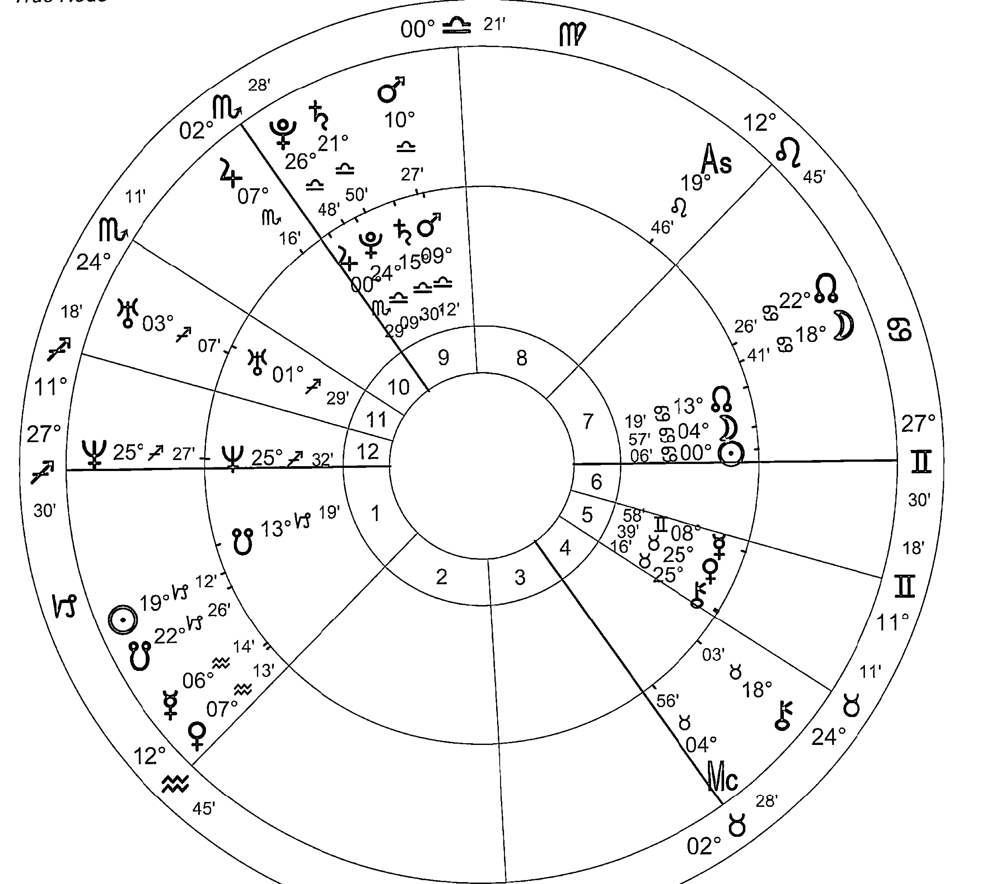

> Compliments of:-
Rod Chang
rod@rodmagic.com

# 威廉王子與妻子凱特的合盤

## 第七章 進階考量

在本章中，我們將使用傳統的占星觀點與現代的占星技法，來擴大對圖形相位的細節詮釋。例如，探討在傳統占星學中，組成圖形相位的行星彼此的守護影響是否會強化彼此的互動？或是否會帶來我們看不見的內在衝突。

在閱讀這一個章節之前，我要再次提醒各位，圖形相位的基礎分析相當重要，如果你無法根據行星組合找出可能主題，如果你無法根據不同的相位分辨出主題可能帶來的影響，那麼在這一個章節中所學到的內容並不會帶來太多幫助。

如果你能夠充分掌握前面所提到的主題與展現方式，那麼本章內容將提供更細緻的內容描述，記住了，本章所提到的一些細微調整，並不會改變我們在基礎分析中所學到的一切。

## 象徵星：

### 強調每一個行星守護的宮位，在圖形相位中的影響

在占星學中，每一個行星都守護著一至兩個星座，傳統占星師認為七大行星分配給十二個星座，太陽守護獅子座、月亮守護巨蟹座，除此之外，每一個行星各自守護兩個星座，如下：

傳統行星守護星座

| 行星 | 太陽 | 月亮 | 水星 | 金星 | 火星 | 木星 | 土星 |
| :---: | :---: | :---: | :---: | :---: | :---: | :---: | :---: |
| 星座 | 獅子 | 巨蟹 | 雙子<br>處女 | 金牛<br>天秤 | 牡羊<br>天蠍 | 雙魚<br>射手 | 水瓶<br>摩羯 |

當天王星、海王星、冥王星陸續被發現之後，占星師們也開始安排這三個行星進入星座守護的安排之中，不過並不是每一位占星師都認同這二十世紀之後的改變，所以絕大部分的傳統占星師堅持上方表格的守護關係，並鮮少應用天王星、海王星、冥王星。而許多現代占星師則使用天王星、海王星、冥王星，並將他們加入星座守護之中，在傳統與現代的守護分配上，有些占星師會使用現代守護，如下：

現代行星守護星座

| 行星 | 太陽 | 月亮 | 水星 | 金星 | 火星 | 木星 | 土星 | 天王星 | 海王星 | 冥王星 |
| :---: | :---: | :---: | :---: | :---: | :---: | :---: | :---: | :---: | :---: | :---: |
| 星座 | 獅子 | 巨蟹 | 雙子<br>處女 | 金牛<br>天秤 | 牡羊 | 射手 | 摩羯 | 水瓶 | 雙魚 | 天蠍 |

有些占星師則使用一套融合古典與現代的雙守護的系統，也就是認為火星與冥王星共同守護天蠍座，木星與海王星共同守護雙魚座，土星與天王星共同守護水瓶座。我在教授現代心理占星時，使用的就是這一套系統。

### 雙守護系統

| 行星 | 太陽 | 月亮 | 水星 | 金星 | 火星 | 木星 | 土星 | 天王星 | 海王星 | 冥王星 |
|------|------|------|------|------|------|------|------|--------|--------|-------- |
| 星座 | 獅子 | 巨蟹 | 雙子<br>處女 | 金牛<br>天秤 | 牡羊<br>天蠍 | 射手<br>雙魚 | 水瓶<br>摩羯 | 水瓶 | 雙魚 | 天蠍 |

想要了解如何透過象徵星來豐富圖形相位的詮釋，我們必須先了解行星與宮位的關係。

當你拿到一張星盤，每一個宮位都有一個起點的位置，我們習慣稱為宮頭（Cusps），古代占星師認為，這是出生時每一個宮位能量最為強盛的度數。宮頭起點星座的守護星就與這一宮產生了關聯，我們稱為守護關係。接著我們可以用這一宮的守護星來代表這一個領域的事情，我們稱每一宮的守護星為象徵星（Significator）。

如果我們用英國哈利王子的星盤來觀察，我們會發現他的第三宮的起點位置在天秤座十二度，而他的第十宮起點是在金牛座十六度。這兩個星座都是由金星守護的，所以金星成為星盤上第三宮與第十宮的象徵代表。而我們知道第三宮象徵著溝通與學習、兄弟姊妹，第十宮象徵著權威、父母、社會地位。

我們接著可以用他星盤上金星的資訊來描述哈利王子的溝通學習方式、與兄弟姊妹的互動，甚至他與權威的關係。

哈利王子有一組月亮、金星、火星的上帝手指，象徵著一種內心焦慮且不斷調整的行動。因為金星守護著星盤上第三宮與第十宮，這也暗示了這樣的特質將會影響他在溝通、學習、兄弟姊妹、權威、父母、社會地位等領域。

我習慣這樣的分析方式，金星守護著星盤上第三宮與第十宮，所以我暫時忘記金星可能代表的其他可能，直接認定金星等於哈利的兄弟姊妹或哈利的溝通態度，或哈利的社會地位。接著我會用同一組圖形相位的另外兩個行星來分析這些事情。

### 案例：哈利王子

-   金星、火星、月亮上帝手指。
-   金星＝第三宮與第十宮＝兄弟姊妹、溝通態度或社會地位。
-   兄弟姊妹、溝通態度或社會地位將受到火星、月亮的特質影響。
-   與兄弟姊妹之間（金星守護第三宮）充滿了情感上（月）的衝突競爭（火），讓個案不斷地試圖調整自己的生活步調（一百五十度）。
-   與女性關係（月）的衝突（火）將會影響自己的社會地位（金星守護第十宮），使得個案不斷改變、調整自己與女性的關係（一百五十度）。
-   對家人與親密伴侶（月）的捍衛保護（火）將影響自己的社會地位（金星守護第十宮），可能在內心中產生強烈的愧疚感受（一百五十度）。

我們也可以將其他行星以他們所守護的宮位取代，在這一個案例中，由於哈利王子的巨蟹座並沒有出現在任何一宮的宮頭，所以我們無法以月亮為案例。

-   火星＝第四宮與第九宮＝家庭、父母關係、與國外的關係、高等教育、信仰理念。
-   家庭、父母關係、與國外的關係、高等教育、信仰理念將受到金星與月亮的特質影響。
-   為了與國外（火星守護第九宮）維持和諧美好（金）維持頻繁的日常互動的關係（月），而不斷地調整自己的生活作息（一百五十度）。

Prince Harry
Male Chart
15 Sep 1984, Sat
04:20 BST -1:00
London, UK
51°N30' 000°W10'
Geocentric
Tropical
Placidus
True Node

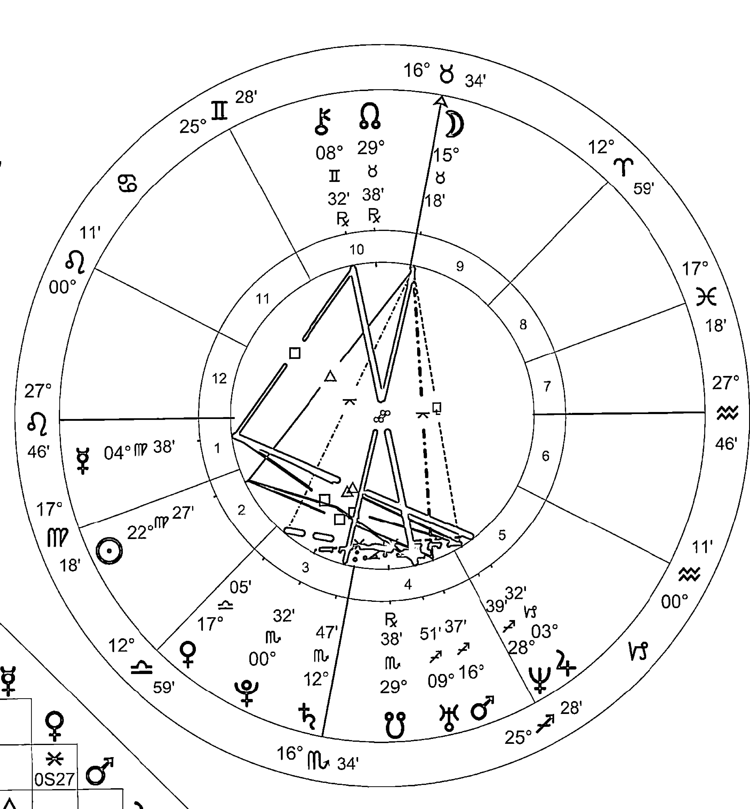

| (行星符号) | (相位符号) | (行星符号) |
|---|---|---|
| (符号列) | (相位数据格，如 7A09, 1A46, △, □ 等) | (符号行) |

# 哈利王子（Prince Harry）星盤

Compliments of:-
Rod Chang
rod@rodmagic.com

## 守護關係的互動：

### 透過守護星或優劣勢來判斷兩者間的互動變化

許多占星師會在研究星盤時，運用行星與星座的守護關係，在前文中，我們討論了運用象徵星的方法是一種行星與星座守護關係的應用，接下來我們要討論其他的守護關係應用。

### 當行星在自己的守護或擢升星座

每一個傳統行星都有各自守護的星座與擢升的星座（如下表），晚近發現的天海冥則不列入。當行星落入他所守護的星座時，象徵著行星回到了自己所統御的領土，行星在這裡有最舒適的環境來配合，有最豐富的資源，我們可以解釋為這個行星所象徵的事物都有著最適切的資源與環境配合，對於相關事物會呈現一種自信與熟稔的態度。

當一個行星來到他擢升的星座時，象徵著一種優勢的態度，許多占星師認為擢升是僅次於守護的吉利狀態。事實上，我認為擢升在占星學當中指的是一種統領與執行的能力，「Exaltation」這個字本身有著提高、提升的意涵，這暗示著當行星進入自己的擢升星座時，有一種崇高的地位，象徵一種高度要求、盡全力、強調執行應用的態度。

雖然擢升與守護都是吉利的象徵，但最大的差別在於，守護關係是一種擁有與統領，並帶有舒適的感受；而擢升帶有盡全力去執行的態度，比較緊繃，我們可以把這樣的觀念放入詮釋當中。值得注意的是，傳統占星中認為水星在處女座同時處於守護星座，也同時是擢升星座，這代表水星適應處女座的環境，並能在這裡發揮充分的執行力。通常我會建議個案在處理一些生活挑戰時，善用落在守護星座行星或擢升星座行星的特質與能量，對個案來說多了一些克服挑戰的幫助。

例如在哈利王子的月金火上帝手指中，月亮在金牛座十五度，金牛座是月亮擢升的星座，這暗示著在這一組圖形相位當中，月亮擁有強勢的力量，位在金牛座擢升的月亮，有一種對伴侶關係、與母親的關係、自身的需求、情緒安全感的盡全力爭取，與月亮相關的事物對他來說也往往能夠帶來較多的幫助。

接著我們將這樣的概念放進圖形相位來考量時，可以得到一些更為細節的描述。如果月亮與金星火星的上帝手指，象徵著哈利王子對於生活需求（月）的舒適（金）感到虧欠或是不滿足，也因此不斷地去爭取（火）並藉此證明自我。那麼這裡可能暗示著哈利王子對月亮所象徵的生活需求有著較高的標準。同時在他面對與月亮金星火星的情感挑戰時，若能從月亮金牛的層面切入，強調踏實的感受、追求穩定的安全感，或許會比較容易。

行星與自己守護的星座

| 行星 | 守護星座 |
|------|----------|
| 太陽 | 獅子座 |
| 月亮 | 巨蟹座 |
| 水星 | 雙子座、處女座 |
| 金星 | 金牛座、天秤座 |
| 火星 | 牡羊座、天蠍座 |
| 木星 | 雙魚座、射手座 |
| 土星 | 水瓶座、摩羯座 |
| 天王星 | 水瓶座 |
| 海王星 | 雙魚座 |
| 冥王星 | 天蠍座 |

行星與擢升的星座

| 行星 | 擢升星座 |
|------|----------|
| 太陽 | 牡羊座 |
| 月亮 | 金牛座 |
| 水星 | 處女座 |
| 金星 | 雙魚座 |
| 火星 | 摩羯座 |
| 木星 | 巨蟹座 |
| 土星 | 天秤座 |

### 當行星在自己的弱勢或落陷星座

當行星在自己守護的星座或是擢升的星座時，都可以帶有某種程度的優勢，相對的，當行星進入自己守護星座的對面，或是擢升星座對面的那個星座時，就帶來了一些不順暢的狀況。古代的占星師認為，如果說行星的守護星座是自己統領管理的國度，那麼這個星座的對面，就是敵人的領土，行星擢升星座是提高地位的地方，那麼這個星座的對面就是失去地位的位置。

當行星落在自己守護星座的對面星座時，稱之為弱勢，「Detriment」原意有破損的意思，在這裡描述著來到不是自己能夠掌控的地方，不是自己的家，而且是一個與自身個性有所抵觸的環境，有點像是穿上不合身的衣服。簡單的說，弱勢是一種不熟悉的環境，多了許多的限制，或者功能不全，使得行星的特色與功能無法盡情地發揮。

當行星來到自己擢升星座對面的星座時，稱之為落陷（Fall），這裡有從高處掉落的意涵，因為擢升的意涵有著崇高的地位，而這裡卻是對面，有著低落的意涵。在這裡往往暗示著行星有一種卑微的態度，可能處於被控制、差使的低下狀態，也有些占星師認為這裡可能暗示著一種墮落或者傾毀的特色。落陷經常暗示著一種身分或狀態低落、容易被制約，身不由己的狀態。

當一個行星落入這兩種狀態時，並不代表這個行星完全失效，但是這個行星的狀態並非百分之百絕佳的狀態。如果我們在一組圖形相位中看到弱勢或者落陷的行星時，我們必須謹慎地去了解這一個行星所扮演的角色、所象徵的事物，這些事物可能需要個案更多的關注。當處理這些相關事物時需要更為謹慎，必須清楚自己能力的限度，以及處理這些事情所受到的限制與狀況。相對的，如果放任不去約束這樣的狀態，那麼這個弱勢與落陷行星所代表的事物往往會帶來更多的挑戰。值得注意的是，水星在雙魚座同時處於弱勢與落陷的狀態，象徵著水星的邏輯在雙魚座對於抽象環境的不適應以及受到限制。

約翰藍儂的大三角中火星落入天秤座，火星守護牡羊座與天蠍座，所以當他來到牡羊座對面的天秤座與天蠍座對面的金牛座時，都是處於弱勢的狀態。這裡的火星處於弱勢，所以在考慮這一組圖形相位時，可以進一步去思考與火星相關的自我呈現、男性特質、攻擊保護，以及火星守護的上升點，自我與外界的關聯，以及第八宮的遺產、資源分享，這些都需要特別注意。因為這些事物有著先天環境上的限制，使得他在面對這些議題的時候必須更加謹慎，特別是當這些行星所擁有的相位是強調困難與挑戰的相位時，那麼所面對的挑戰將會更為顯著。

行星與自己弱勢的星座

| 行星 | 星座 |
|------|------|
| 太陽 | 水瓶座 |
| 月亮 | 摩羯座 |
| 水星 | 雙魚座、射手座 |
| 金星 | 牡羊座、天蠍座 |
| 火星 | 金牛座、天秤座 |
| 木星 | 雙子座、處女座 |
| 土星 | 巨蟹座、獅子座 |
| 天王星 | 獅子座 |
| 海王星 | 處女座 |
| 冥王星 | 金牛座 |

行星與落陷的星座

| 行星 | 星座 |
|------|------|
| 太陽 | 天秤座 |
| 月亮 | 天蠍座 |
| 水星 | 雙魚座 |
| 金星 | 處女座 |
| 火星 | 巨蟹座 |
| 木星 | 魔羯座 |
| 土星 | 牡羊座 |

## 支配星與收受的影響

如果你已經了解前面所提出的守護概念，在此我們將更進一步地應用這些觀念。

當一個行星落入另外一個行星守護的星座時，該星座的守護星便成為它的支配星。舉例來說，任何行星進入天秤座與金牛座時，金星都會成為他們的支配星。以剛才哈利王子的案例來說，金星成了在金牛座的月亮的支配星（Dispositor）。

雖然現代占星師比較少用這樣的觀點，但是傳統觀點仍認為支配星能夠掌握、控制另一個行星，對另一個行星發揮影響力。我認為支配星比較像是長輩、或者督導者給予他所支配的行星一些建議或經驗。對於在天秤座的月亮來說，他受到金星的支配，這個位在第三宮天秤座的金星所象徵的人事物，可以給予他在月亮所象徵著伴侶關係、情緒需求上一些經驗分享。

行星與其支配星之間的關係，在產生相位時會更為緊密，因為這不僅僅代表兩者之間具有一些共同經驗的分享、一些認同，同時也因為彼此產生了相位，而有了更密切的互動。也就是說，不僅有精神上的支持，也有實際行動的援助，這在傳統占星中稱為「收受」。

收受（Reception）這個概念是傳統占星學中相當重要的概念，它必須符合至少兩個前提，第一是行星 A 落入行星 B 所守護的星座；第二是行星 A 與行星 B 之間產生了一組相位。這種狀態象徵彼此之間緊密的連結，守護星通常可以帶來精神思想與理念上的支持、經驗的分享，但如果產生相位的話，則更突顯了實際上的聯繫與行動。

有些傳統占星師在考慮收受時會有許多考量，第一，只使用合相、對分相、四分相、三分相、六分相；第二，會考慮行星的速度，通常運行慢速的行星才會對運行快速的行星有收受的能量，就好像是大人（運行慢速行星）才有能力照顧（收受）小孩（運行快速行星）。不過許多現代占星師會把其他相位考慮進來，同時也很少考慮行星的運行速度是否能讓收受成立。

在哈利王子的案例中就有這樣的狀況，落在金牛座的月亮，同時被金星守護，也同時與金星產生了相位。這兩個行星都與金星產生了收受的關係。由於金星一天運行的速度大約是一度，比起月亮一天運行的平均速度是十二度來得相對緩慢，所以金星可以收受月亮。

在這裡，金星所暗示的人事物不僅僅給予月亮情感上的支援、分享經驗，同時也因為彼此之間的相位，而讓雙方的互動更為緊密。不過這裡的互動因為是一百五十度，帶有些焦慮、不了解的狀態，很可能暗示著對方所提供的經驗或實際援助，對個案在情緒感受上來說，是有幫助而且能產生認同的，但是卻不一定百分之百的適用，有時甚至增加了一些焦慮。

### 互融

當一組圖形相位中的兩個行星，分別落入彼此守護的星座，這裡就產生了互融的狀態。例如當火星在水瓶座被土星所守護，同時土星進入牡羊被火星所守護，這時兩個行星便產生了互相守護、互相接納的關係。從現代占星的角度來看，這兩個行星可以交流分享彼此的經驗，就好像你與另一個外國人互訪彼此的國家，這時你們可以分享經驗與資源，你知道在哪可以找到他需要的事物，而他知道你可以向誰尋求幫助。

許多傳統占星師對互融的定義有一些更嚴格與複雜的要求，例如有些占星師認為互融的兩個行星必須符合收受的條件，同時產生傳統的相位。而在傳統占星學中，不僅可以透過守護關係產生互融，甚至連擢升的狀態或者其他行星尊貴的狀態也都可以彼此產生互融，這一個範圍已經超出了本書的主題，所以不在此詳述。

知名的英國老牌演員伊恩·麥克連（Sir Ian McKellen）爵士，也就是大家在電影 X 戰警中熟悉的萬磁王，在他的本命盤中有一組 T 三角，冥王星在二十九度巨蟹座，對分火星在水瓶座零度，四分土星在牡羊座二十六度。這是一組比較複雜的混合性 T 三角，強調開創性質的動能以及固定性質的堅持。其中土星在火星守護的牡羊座，與火星在土星守護的水瓶座不僅產生了互融的狀態，也同時產生了四分相。

火星與土星的四分相，帶來了行動上可能因為恐懼、謹慎而產生的壓力與干擾，可能阻礙自己去展現強烈的自我特質。但是在兩個行星彼此交換守護星座的情況之下，個案很清楚如何克服恐懼，清楚自己該有哪些行動上的堅持，也就是說，雖然兩個領域的事物彼此干擾，但卻能夠根據經驗與資訊的交流，摸索出更適切的方式。這對落入弱勢的土星來說有相當大的幫助，在象徵受限與無法發揮全部功能的情況下，火星的收受產生了足夠的幫助，讓土星能夠在挫折中建立勇氣，緩緩地以自己的步調展開證實自我的穩定行動。

Ian McKellen
Male Chart
25 May 1939, Thu
21:30 BST -1:00
Burnley, England
53°N48' 002°W14'
Geocentric
Tropical
Placidus
True Node

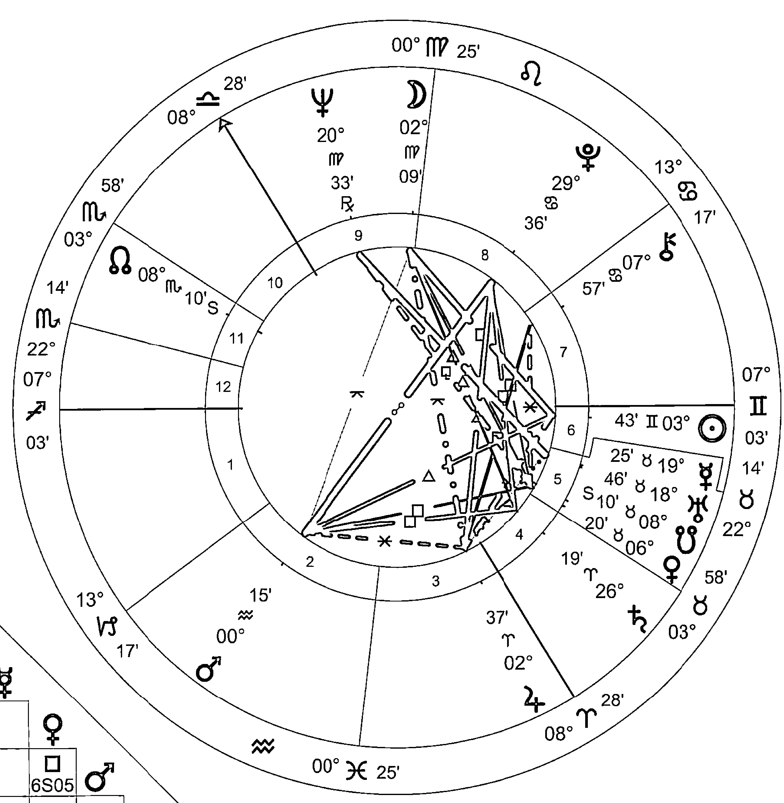

| 行星/点 | 太阳 | 月亮 | 水星 | 金星 | 火星 | 木星 | 土星 | 天王星 | 海王星 | 冥王星 | 凯龙星 | 节点 | 东方升起点 (As) | 天顶 (Mc) |
|---|---|---|---|---|---|---|---|---|---|---|---|---|---|---|
| 太阳 | 口 1A33 | | Δ 4A10 | ⚷ 1S54 | ⚷ 0A27 | Δ 5S49 | | | | | | □ 4S53 | |
| 月亮 | | | | □ 6S05 | * 2A22 | □ 3S55 | ⚷ 0S39 | Δ 1A07 | □ 6S44 | * 1A37 | ⚷ 1A50 | ⚷ 6A00 | |
| 水星 | | | | | | | ⚷ 0S47 | | * 1A37 | | | ⚷ 0S42 | |
| 金星 | | | | | | | □ 0S38 | | | | | ⚷ 4S25 | |
| 火星 | | | | | | | ⚷ 3S01 | | | | | | |
| 木星 | | | | | | | □ 3A16 | | | | | |
| 土星 | | | | | | | | | | | |
| 天王星 | | | | | | | | | | | |
| 海王星 | | | | | | | | | | | |
| 冥王星 | | | | | | | | | | | |
| 凯龙星 | | | | | | | | | | | |
| 节点 | | | | | | | | | | | |
| 东方升起点 (As) | | | | | | | | | | | | |
| 天顶 (Mc) | | | | | | | | | | | | |

伊恩·麥克連 (Sir Ian McKellen) 星盤

> Compliments of:-
> Rod Chang
> rod@rodmagic.com

## 第八章 實際案例探討

在進行占星諮商時，我們必須先全面觀察整張星盤，包括四軸點、每一個行星、星座、宮位對個案的影響。每一位占星師都有自己獨特的方式，在本章中，我要分享的是，當個案所要討論的內容與星盤上的圖形相位有關時，我們可以怎麼開始進行？在此我要重申，專業的占星工作有必要的倫理必須遵守，這一個案例的分享已經過 Emma 的同意並以化名來發表，這是占星師對個案的尊重。

Emma 在二○一二年底與我進行了一次占星諮商，這次諮商的目的是為了討論她該不該辭去目前的工作，專心照顧孩子。Emma 是航空公司的地勤主管，進行諮商時，她正因為孩子出生而暫停工作。Emma 相當熱愛她的工作，也頗受公司賞識，在此之前從來沒有想過要因為家庭與小孩而辭去工作，但是在小孩出生之後，她的態度開始轉變了，在生產與育嬰過程中接觸到的資訊，讓她了解到母親對孩童成長的重要性，她一方面想保有她的工作，另一方面她也開始猶豫這麼做對自己與小孩是不是最佳選擇。

身為占星師，我們必須釐清每一次諮商的議題，才能夠透過星盤之中的符號象徵，給予我們的客戶最適切的幫助。在與 Emma 接觸的過程當中，我先說明了我的諮詢方式是傾向符號解讀與分析，同時透過對話與深入的討論，幫助她釐清這些困擾背後的身心與個人經驗的關聯。我不會給她所謂的建議，我們或許會一起探討不同選擇的原因，以及未來發展的可能性，結果得由她自己在我們的諮商之後再做決定。我之所以會特別強調這一點，是因爲長久以來許多人對占星的期待是占星師告訴個案該怎麼做，而我個人所受到的現代占星訓練則強調由個案面對自己的生命歷程，並由自己決定該怎麼做，占星師只是站在符號分析解釋的輔助角度。這與許多人的期待不同，如果這不是 Emma 能夠接受的占星諮詢方式，我會建議她尋求其他占星師的服務。在理解我所能夠提供的服務與收費之後，Emma 同意以這樣的型態進行諮詢。

接下來我會先討論 Emma 星盤的基礎特質，並特別著重在事業還有親子之間的狀態。接著我會針對兩組不同的圖形相位深入探討，並與各位分享 Emma 諮詢過程的重點。

> 案例：Emma 的本命盤

Emma 的星盤中，除了天頂與凱龍之外並沒有顯著的風元素特質，暗示著她透過與天頂有關的領域學習與人的互動，這包括了母親、事業與社會地位。在宮位的比例中相當強調第一宮與第一至第三宮的自我領域。

上升射手暗示著對她來說，發展、成長、自由是與社會互動的方式，並在其中追尋自己的人生意涵。而上升星座的守護星落在第一宮摩羯座並且與太陽合相，暗示物質社會中的穩定成長對個人來說相當重要，透過自己在社會與工作之中的成就來認識這個世界，證實自我並且榮耀自己。與國外的接觸、飛行、長途旅行、宗教信念這些與木星還有射手座有關的內容也相當重要，這可能會是她與世界接觸的方式，而我們知道 Emma 目前從事的是航空公司的地勤主管，這一點與描述不謀而合。

Emma
Natal Chart
8 Jan 1985, Tue
06:30 GMT +0:00
Glasgow, UK
55°N53' 004°W15'
Geocentric
Tropical
Placidus
True Node

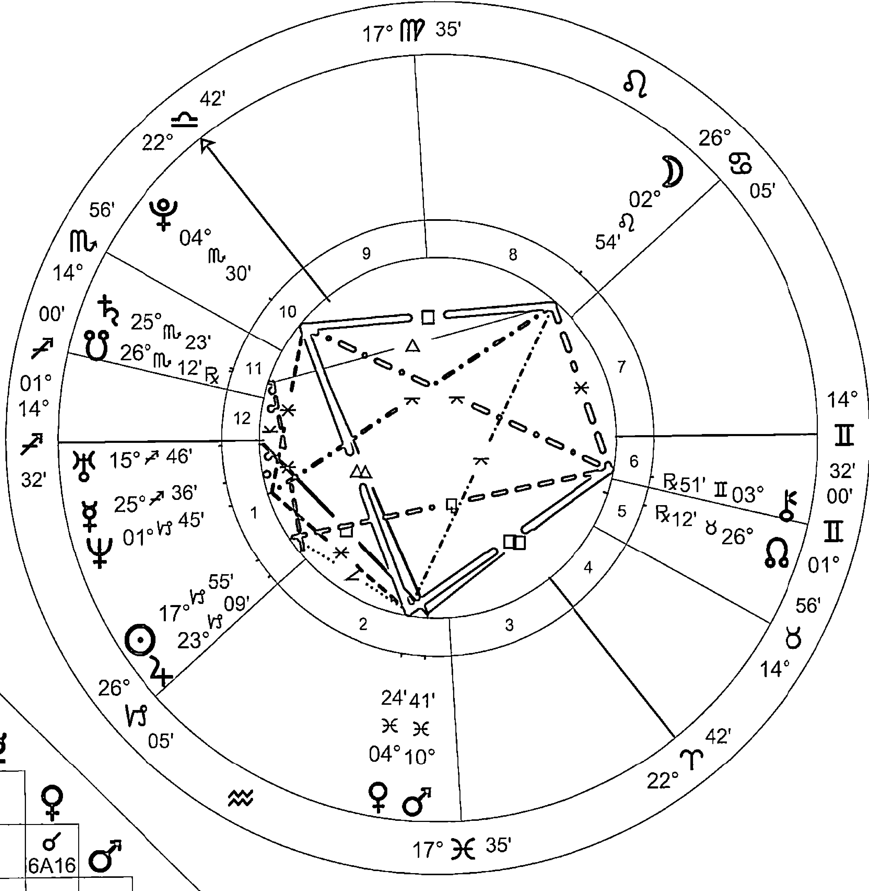

| ☉ | ☽ | ☿ | ♀ | ♂ | ♃ | ♄ | ♅ | ♆ | ♇ | ⚳ | ⚴ | ☊ | ☋ | As | Mc |
|---|---|---|---|---|---|---|---|---|---|---|---|---|---|---|---|
| ☉ | | ☌ | ☍ | ⚻ | | △ | □ | ⚻ | □ | □ | △ | | △ | | □ |
| ☽ | | | | △ | | | | △ | | △ | | | | | |
| ☿ | | | △ | | △ | | | | | □ | | ☌ | | □ | |
| ♀ | | | | △ | | | | △ | | □ | | ☌ | | □ | |
| ♂ | | | | | △ | | | | | | | | | △ | |
| ♃ | | | | | | △ | | | | □ | | | | | |
| ♄ | | | | | | | △ | | | □ | | | | △ | |
| ♅ | | | | | | | | □ | | □ | | △ | | | |
| ♆ | | | | | | | | | □ | | | | | □ | |
| ♇ | | | | | | | | | | △ | | | | △ | |
| ⚳ | | | | | | | | | | | ☌ | | | | |
| ⚴ | | | | | | | | | | | | ☌ | | | |
| ☊ | | | | | | | | | | | | | | △ | |
| ☋ | | | | | | | | | | | | | | △ | |
| As | | | | | | | | | | | | | | | □ |
| Mc | | | | | | | | | | | | | | | |

> Compliments of:-
> Rod Chang
> rod@rodmagic.com

天頂與其說是工作，不如說是一種事業，事業象徵著個人從事的活動所帶來的成就，這與許多人所說的工作或賺錢有著很大的不同。當我們關注天頂的時候，我們所獲得的資訊是這一個人如何獲得社會成就、如何贏得社會地位，別忘了天頂也同時與權威、父母親（在傳統觀念當中特別是母親）有著密切的關連。

Emma 的天頂位在天秤座，象徵著獲得成就的其中一個條件，與法律、公平、人我互動有著密切的關聯。而冥王星位在第十宮之中，暗示著冥王星相關的危機、摧毀、恐懼、挖掘也可能與這些事物有關。而守護天頂的金星在雙魚座第二宮，這是金星擢升的位置，代表金星將會在這裡盡全力的表現。金星同時守護第五宮，這可能暗示著事業成就的達成多少可能跟第五宮有關的子女、喜好、創意有關聯。

Emma 的太陽落在第一宮摩羯座，太陽不僅象徵著自我、男性、領導者，同時也可能帶給我們一些與個人有關的重要資訊。她認為什麼事情是人生中相當重要的？什麼事物能夠帶來活力與個人成就？通常在與職業有關的諮詢當中，我會將太陽的星座、宮位、相位與第十宮天頂的有關資訊做整合，象徵著帶給個案成就感受的事物。

Emma 的月亮落在獅子座第八宮，一方面象徵著榮耀、創意、權威，另一方面落入資源分配、危機死亡有關的第八宮。月亮象徵著 Emma 每天的生活步調、生活中需要滿足的基本需求，而在占星學中，第六宮也象徵著每天的生活步調，同時也是許多占星師認為與工作有關的宮位。這裡的工作並不是第十宮的事業，這裡象徵著工作的步調、對例行工作的態度以及與下屬的關係。我通常會在討論事業選項時提醒個案去滿足月亮的需求，並認識每日生活步調的特性。在 Emma 的星盤中，第六宮的起點是雙子座，暗示著一種保持靈活的生活態度，強調每天生活之中的溝通與學習，第六宮有凱龍，暗示著在每天生活中面對傷痛與療癒的關係。水星落在射手座第一宮，也再一次強調了在每日生活中渴望與寬廣的世界接觸。Emma 的月亮與海王星、金星產生上帝手指，並且是端點，而我們也在先前討論過 Emma 的月亮、冥王、金星、凱龍彼此有著相位，產生了一組有趣的圖像，這些我們都會在稍後進行探討。

天王星在射手緊密的合相上升點，對於 Emma，來說不但呼應了對於射手座上升所強調的寬廣、不受約束的象徵，同時也強調她對於獨立自主的要求。星盤中有擢升的金星以及在自己守護的冥王星，水星在射手的弱勢與木星在摩羯的落陷也需要列入分析考量中。

透過與 Emma 在諮詢前的討論，我們彼此都清楚諮詢的方向，身為母親的責任與對個人事業成就的期待，這些事情都與第十宮有著密切的關連，而海王星以及月亮與第十宮守護星金星所產生的上帝手指吸引了我的關注，因為月亮與第十宮都與母親的主題有關，而第十宮也與事業成就有著密切關聯，於是透過圖形相位的分析表格，我們可以找出更多需要注意的細節。

## 案例分析

- 圖形相位名稱：上帝手指
- 所組成的行星：月亮、金星、海王星
- 所組成的相位與容許度：見表格

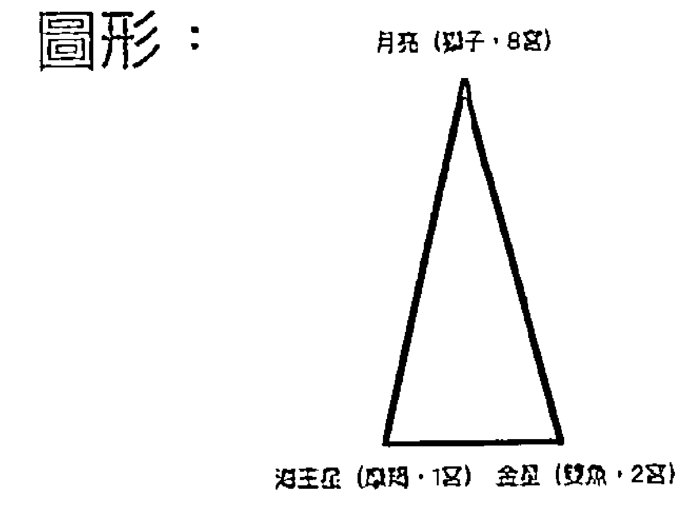

| 行星 | 月亮 | 金星 | 海王星 |
|------|------|------|--------|
| 该行星定义（可能主题） | 母亲、女性、生活需求、滋润、养育 | 女性、舒适、和平、美丽、喜爱的人事物 | 梦幻、热忱、融合、超越、虚弱、消失 |
| 落入星座与定义（可能主题） | 狮子座：荣耀、尊贵、创意、娱乐 | 双鱼座（擢升）：理想、想像、情感交流、融合、消失 | 摩羯座：制度、架构、次序、成就、权威 |
| 是否逆行或停滞（象征意涵） |  |  |  |
| 落入宫位与领域（影响的范畴） | 第八宫：危机、死亡、恐惧、资源分享 | 第二宫：财富、金钱观、价值、资源 | 第一宫：自我呈现、外表、与外界的互动 |
| 守护宫位与领域（影响的范畴） | 第八宫：危机、死亡、恐惧、资源分享 | 第五宫：子女、创意、喜欢的人事物；天顶第十宫：事业、成就、社会地位、母亲 | 第三宫：沟通、学习、兄弟姐妹、邻里关系 |
| 产生相位特质（可能感受） | 月亮与金星150度（焦虑、调整）；月亮与海王星150度（歉疚、罪恶感、不满意） | 金星与海王星六分相（灵活互动刺激） |  |
| 在图形中位置（是否为端点或特殊位置） | 端点 |  |  |
| 与其他行星的容许度紧迫性与危机性 | 月亮与金星1度；月亮与海王星1度 | 金星与海王星2度 |  |

### 強調主題與可能主題：

- 對於生活（月）的舒適（金）有一種高度期盼（海）。
- 對於母親（月）的形象有一種接近完美的想像期盼（金海）。
- 為了事業成就或母親（金星守護十宮）可能犧牲（海）個人的需求（月）。
- 對子女（金星守護第五宮）的滋養照顧（月）有著接近完美的期盼（海）。

### 可能呈現的動力：

- 月亮與金星的一百五十度，暗示著親子之間的和諧關係與舒適可能帶來的不滿意，因而不斷進行調整的行動
- 月亮與海王星的一百五十度可能對母親的完美形象而做出與犧牲有關的調整行動。
- 金星與海王的六分相，對於完美與理想的學習探索所帶來的刺激與生活應用。

### 對此圖形相位的描述：

這一組圖型相位不僅強調在每天生活中為了追求事業、親子關係的完美而不斷地做出調整，海王星也暗示了犧牲是其中一種調整方向。金星與海王都有一種完美形象，刺激了個案對月亮所象徵的母親有著完美的要求與想像。不過海王星守護第三宮，也可能透過與鄰里的互動、或者在學習的過程中達成這樣的目的。

### 其他涉及行星（帶來的舒緩或更複雜化的暗示）：

- 月亮金星同時與冥王凱龍呈現另一組複雜的圖形相位，我們將會在後面獨立探討。

> 火星与金星合相，火星守护第四宫与十一宫，暗示着突显个人特色的期待、冲动与防卫特色（火星），家庭、根源（四宫）朋友、社交（十一）可能会让这一组图形相位的考量更为复杂。

我同时注意到 Emma 的金星、月亮、凯龙、还有冥王星产生了一组图形，虽然不是传统的图形相位，但是我仍然可以使用图形相位的表格来分析这一组行星所带来的可能性。我们在先前也讨论过这一组图形相位：

## 案例分析

图形相位名称：无

图形：

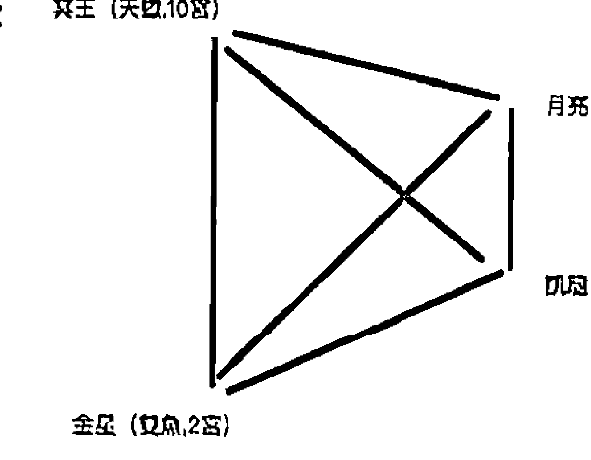

所组成的行星：月亮、金星、冥王星、凯龙

所组成的相位与容许度：见表格

| 行星 | 月亮 | 金星 | 冥王星 | 凯龙 |
| --- | --- | --- | --- | --- |
| 该行星定义 (可能主题) | 母亲、情绪、滋养、照顾、亲密关系、个人需求 | 喜爱、金钱、自我价值、女性、和平、人际关系 | 危机、隐藏、掩埋、死而复生、紧迫、控制 | 伤痛、疗愈、收养、照顾、局外人 |
| 落入星座与定义 (可能主题) | 狮子座：创造力、尊贵、荣耀、骄傲、热情温暖 | 双鱼座：随性、滋养、感受、流动、迷惘、无私无我 | 天蝎座：危机、隐藏、保护、专注在感受上 | 双子座：资讯交流、沟通、理性、邻近的事物 |
| 落入宫位与领域 (影响的范畴) | 八宫：危机感、死亡与重生、他人的金钱、共享资源 | 二宫：金钱、财富、个人价值、资源 | 十宫：社会地位、职业、权威、父母亲 | 六宫：每日生活步调、工作、佣员、下层、小动物 |
| 守護宮位與領域 (影響的範疇) | 八宮：危機感、死亡與重生、他人的金錢、共享資源 | 五宮：子女、喜愛的事物、娛樂；十宮：社會地位、職業、權威、父母親 | 十一宮：社交生活、朋友、對未來的期盼 | 無 |
| 產生相位特質 (可能感受) | 月亮與金星150度（焦慮、調整）；月亮與冥王四分（阻礙、緊張）；月亮與凱龍六分（靈活、學習、應用） | 金星與冥王星三分（接受、和諧）；金星與凱龍四分（抵抗、阻礙） | 冥王星與凱龍150度（調整、焦慮、罪惡感） | |
| 在圖形中位置 (是否為端點或特殊位置) | | | | |
| 與其他行星的容許度緊迫性與危機性 | 月亮與金星1度；月亮與冥王1度；月亮與凱龍1度 | 金星與冥王星0度；金星與凱龍0度 | 冥王星與凱龍0度 | |

強調主題與可能主題：

- 與母親有關：與母親之間（月）的緊張關係（冥）導致自我價值（金）受到傷害（凱）。或是為了照護受傷（凱）的母親（月）而造成人際或情感關係（金）的緊張狀態（冥）。
- 與金錢有關的主題：透過照護滋養（月）受到過去病痛（凱龍逆行）威脅（冥）的人而賺取金錢（金）。
- 與恐懼有關的主題：由於過去家族不斷重複的傷痛（凱龍逆行）而對於情感與親密關係之間（月）的甜蜜喜悅（金）感到恐懼（冥）。
- 職業與社會地位（金星守護十宮）：從事與照護（月）療癒（凱）那些面臨重大危機（冥）的人的職業（金星守護十宮）。

### 可能呈現的動力：

在此與金星凱龍有關的議題，以及冥王月亮之間的議題可能有較為顯著的壓力。凱龍與冥王的一百五十度，對於內心莫名的不安感到愧疚，並且不斷調整自己的生活態度與價值觀試圖讓自己更有價值。金星與冥王的三分相暗示著一種和諧

### 對此圖形相位的描述：

月亮與金星一百五十度，暗示著對於生活舒適的焦慮，或者是對母女關係感到歉疚、不舒服的感受。而與凱龍的四分相，暗示著她可能想要修復這段關係，但卻需要花非常久的時間去訓練如何處理與母女之間的不舒服。最後冥王星與金星三分相暗示著，如果探查心裡的秘密、挖掘過去的不愉快，甚至是研究整個家族的母女關係議題，或許能幫助她接受已經發生過的不愉快並改善與母親之間的互動。

透過這兩組圖形相位的分析之後，我們可以清楚地看到母親、母女關係、親子關係、犧牲、夢想與完美的期待。其中無論是月亮在第八宮並且守護第八宮、月亮與冥王星的四分相，都暗示著一些強烈的危機感受並且不可忽略，這些危機容易展現在第十宮所象徵的母親與事業議題上，以及對於每日生活的擔憂。凱龍在第六宮不僅顯示了每天生活中的療癒，也透露了家庭中沒有說出口的傷痛秘密可能會是需要探索的部分。

### 二〇一二年十一月的行運推運影響

太陽弧正向推運

在二〇一二年十一月進行諮商的時候，太陽弧正向推運的月亮移動到處女座一度，三分本命海王星，與本命月亮產生三十度的相位；推運水星在摩羯座二十三度緊密合相本命盤的命主星木星；推運金星來到牡羊座二度，三分本命盤月亮、四分本命盤海王星；推運冥王星來到射手二度，三分本命月亮、對分本命凱龍，這些都對我們先前所觀察到的圖形相位帶來了刺激。推運的冥王星對分凱龍、推運金星四分海王，以及推運水星與木星的合相，都是值得關注的重點。

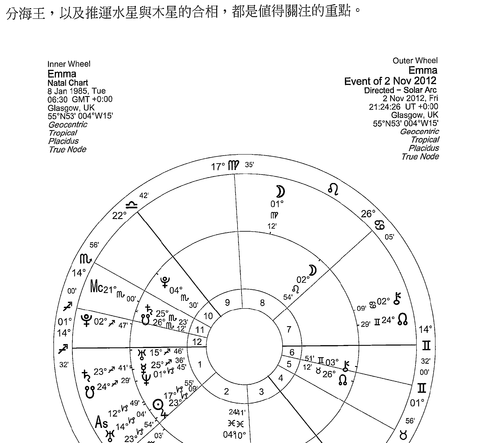

Inner Wheel
**Emma**
Natal Chart
8 Jan 1985, Tue
06:30 GMT +0:00
Glasgow, UK
55°N53′ 004°W15′
Geocentric
Tropical
Placidus
True Node

Outer Wheel
**Emma**
**Event of 2 Nov 2012**
Directed - Solar Arc
2 Nov 2012, Fri
21:24:26 UT +0:00
Glasgow, UK
55°N53′ 004°W15′
Geocentric
Tropical
Placidus
True Node## 二次推運

二〇一二年 Emma 的二次推運火星與金星都四分本命的海王星，再一次地強調了事業（十宮守護）與家庭（四宮守護）的迷惘。太陽與天王星的六分相，暗示著對於自由與不受約束的暗示，也可能是透過科技找到一些解決的辦法。從十月開始一直到十二月左右，二推的月亮會與火星產生一百五十度，也突顯了那幾個月心中的焦慮以及渴望採取行動改變現狀。

**Inner Wheel**
**Emma**
Natal Chart
8 Jan 1985, Tue
06:30 GMT +0:00
Glasgow, UK
55°N53' 004°W15'
Geocentric
Tropical
Placidus
True Node

**Outer Wheel**
**Emma**
Event of 2 Nov 2012
Sec.Prog. SA in Long
2 Nov 2012, Fri
21:24:26 UT +0:00
Glasgow, UK
55°N53' 004°W15'
Geocentric
Tropical
Placidus
True Node

### 行運

行運冥王星與本命火星產生六分相，這是一組溫和的刺激，行運海王星、凱龍與本命金星產生合相，這會是這一段時期的主要影響。更重要的是，二次推運中也有推運金星火星與海王星的相位，這樣重複出現的相似組合，對占星師來說是一個重要的資訊。行運天王星在牡羊五度，三分月亮、六分凱龍、四分海王，並且與冥王產生一百五十度的緊密相位。天王星雖然不在本命盤的圖形相位之中，但卻是本命盤的合軸星，占有相當重要的地位，同時二次推運太陽也刺激了天王星，我們可以推測天王星所象徵的獨立或自由或多或少帶來了一些影響。行運土星在天蠍座六度，合相了本命的冥王星、四分本命月亮、六分本命海王、三分本命金星、對分本命凱龍，這同樣也是一組重要的影響。本命土星所守護的第二宮，本命土星所在的十一宮，都可以暗示我們一些壓力的來源。

### 諮詢的過程

在現代人文心理占星對星盤的看法中，認為星盤可以描繪出個案的特質，占星師的專業訓練可以描繪出這些突顯的特色以及可能的趨勢。但是個案如何活出這張星盤，以及以什麼樣的實際方式呈現出細節，則不是占星師能夠輕易推測的，同時也對諮商的互動沒有多大的幫助。所以在諮詢之前，我並不清楚這些星盤的特質以及圖形相位之中行星的組合會如何確切的在 Emma 的星盤中呈現，我所仰賴的只是舉出這些特質，並且聆聽 Emma 如何展現或體驗這些行星符號。

我描繪了這些特色，我們開始討論事業對她的意義為何？她自己對親子關係的看法又是如何？我認為 Emma 與母親在成長過程的互動似乎佔了相當重要的影響，因此我們依序地針對這些主題繼續討論。

當我們在描述對事業的看法時，我提到了守護星落入二宮的價值，並且金星擢升代表的盡全力與高地位，Emma 認為她在工作上感受到的成就感是讓她想要回到工作的主要原因，她在工作時能得到許多認同，工作中一些必須處理的緊急危機狀況，甚至與許多陌生乘客之間的互動，可以為她帶來對世界的認識。

我反問她辭掉這份工作可能的影響時，她提到如果為了小孩而辭去工作，就好像失去了這一份榮耀，她不知道能不能從其他工作當中找到同樣的肯定，她一方面非常恐懼自己成為平凡的家庭主婦，另一方面又覺得沒有替孩子著想是一種羞恥。

當我們轉入親子關係的議題時，我請 Emma 描述了她的童年。Emma 是在單親家庭中長大的，與母親以及祖母同住，她的母親必須工作養家，母親的工作是傳銷的業務，這種自由的工作時間可以讓她同時照顧 Emma，當母親工作時，Emma 不但要學會照顧自己，也要學會獨立。我問 Emma 她是否享受這種獨立？她說其實並不討厭這樣的感覺，有相當大的自由，但是她也學會自律，因為母親並不會時時刻刻在身邊。我問 Emma 當母親不常在身邊照顧自己時，會有什麼感受？她說並沒有什麼特別的，或許也是因為祖母分擔了母親一部分的工作。

當我描述月亮冥王星、第八宮、以及上帝手指可能暗示著親子關係所存在的不斷調整、虧欠、不滿足或不滿意的感受時，她說這正是她剛才所說的那種沒有替孩子著想的羞恥。但我懷疑這一點也存在於 Emma 與母親的關係。Emma 並沒有立即聯想到與母親的這一層關係，她懷疑是否是青少年時母親改嫁，她與母親之間有一些說不出的彆扭有關？於是我們進一步探討了這一層關係，她認為母親改嫁之後她們搬離了祖母的家，新的家庭關係讓處於青少年的她花了一段時間才適應。

這時 Emma 突然想起一件重要的事，當母親改嫁後沒多久，祖母生了一場重病，全家陷入愁雲慘霧之中，母親因為工作以及新家庭的關係，照顧祖母便顯得慌亂疲憊。母親這時也經常說出認為自己因為工作還有愛情對祖母疏忽關注，對 Emma 也感到愧疚。在 Emma 眼中，母親是一個相當強勢的女性，總是希望事情完美，但那時如何同時扮演好理想的母親、理想的女兒、理想的妻子、並同時兼顧工作，成了一個相當大的挑戰。事實上，當 Emma 描述這一段故事的時候，我得承認與我原先心中揣測的故事大綱不同，在諮商之前，我預期是否是 Emma 親身經歷了缺乏母親照顧而轉而對自身的要求，但 Emma 的描述並不符合我的想像，這一點我也要請許多初學者注意，我們的推測並不一定是個案實際的體驗，但這不代表占星學無用，占星師的工作並不是精確描繪個案生活的「細節」，而是提出可能有的特色、模式、以及個案如何受到影響或如何去應用這些特質。

Emma 的描述使星盤中的月亮、金星、海王的上帝手指，如何在她生命當中呈現變得清晰，而冥王、凱龍、月亮、金星之間的組合也與 Emma 的描述吻合。我們進一步地討論這些過去的影響，並且對照 Emma 當下的生活狀況。Emma 似乎也把那完美的母親形象套用在自己身上了，她希望自己能夠扮演一個好的母親角色，她與她的同居男友計畫在小孩長大一些後，買間房子好讓孩子有更棒的成長環境，如果 Emma 辭去工作，可能就會影響這個計畫，可若是 Emma 去工作，她又擔心自己會失去陪伴孩子成長的重要性。當我指出她對自己的完美期待，以及預期這種完美無法達成時的愧疚感，與她描述的母親相似之處時，Emma 開始對整件事有一些不同的看法。

而我進一步地思考合相上升點天王星，並且在行運與二次推運都產生影響的天王星，是否也扮演了某種角色。Emma 認為在懷孕之後，男友仍然維持著相似的生活態度，而自己卻開始受到限制，在孩子出生後的這一段時間，男友雖然也扮演起父親的角色，但是他不必被綁在家裡，於是「去工作」似乎是可以讓她脫離這個被限制的出口，如同她的母親或男友不必被鎖在家裡一樣。我們不能忽略失去自由，對一個擁有天王星合相上升的人的影響。

在了解對於成就與自由的渴望之後，諮商的後半段，我們比較了她的成長環境經驗以及現有的環境、母親必須獨立養家的狀況，以及現在 Emma 並非一個人獨力照顧孩子的狀況。我們試著討論有沒有哪些方式能夠在 Emma 不去工作時仍然擁有成就感與自由，也討論了若去工作，Emma 如何調適自己對孩子的愧疚感，男友與雙方家人是否能夠給予足夠的支援等等？雖然 Emma 並沒有在諮詢的過程中得到結論，但是卻帶著兩個調整過的方案回去。

在這個案例中，我希望讀者能夠了解，本書所描述的圖形相位是如何與本命盤還有諮商的實際互動結合。我們如何透過圖形相位的行星組合找出可能的主題，其中的相位如何暗示個案可能有的感受，以及在我們不瞭解個案的生活情況之下，揣測細節或者想像個案可能的經歷，都對諮商沒有太大的幫助。在分析星盤時，我們可以透過星盤的特質、圖形相位的主題與相位的特質來推測可能性，但也需要知道自己其實對客戶的實際生活一無所知。在諮商時保持開放的心態，並且利用這些行星的特徵，引導個案描繪出相關的感受與經歷，再從這裡與個案一同討論，才可能得到對個案有幫助的諮商結果。

# 附錄
## 行星組合主題

### 太阳图形相位

#### 日月

日月的主题都涉及家庭与父母亲，特别注意当土星、凯龙、MC、IC的守护星，或者第三、四、五、十宫的行星也被牵连进入这组图形相位时，将特别强调家庭或家族议题。若是天秤七宫内的行星或七宫守护、金星介入图形相位，则强调人我互动与情感主题。

#### 日月水

### A. 行星象征

日：男性（male）、父亲（father）、领导者（leader）、上司（boss）、成就（success）、光荣（glory）、照亮（light up）、启发（enlightenment）、指导（guild）、生命力（vigour）、我（I）、追求的事物（wanted thing）、英雄事迹（heroic journey）。

月：女性（female）、母亲（mother）、照顾者（care taker）、情绪（emotion）、感受（feeling）、需求（need）、喂养（nurture）、童年（childhood）、家庭（family）、食物（food）、情绪安全感（emotional security）、过去（past）。

水：手足（sibling）、邻居（neighbour）、学生（student）、商人（merchant）、讯息（message）、书信（letter）、语言（language）、邻近地区（local area）、沟通（communication）、学习（study）、旅行（traveling）、交易（trading）、分析（analyse）。

### B. 不同行星主題的考量

**針對太陽主題的符號象徵分析**

榮耀主題=讓自己感到榮耀（日）的事物與情感（月）的表達（水）有關。

父親主題=與父親有關的議題（日）可能帶來對內心世界（月）的學習與探索（水）。

**針對月亮主題的符號象徵分析**

情緒感受主題=內心（月）有著表達出（水）真實自我與自我成就（日）的渴望。

家庭童年主題=重視（日）家庭之中（月）特別是與父母親、生活伴侶（日月）的溝通（水）。

**針對水星主題的符號象徵分析**

鄰近人事物主題=兄弟姊妹或鄰居（水）在每日生活（月）之中佔有重要地位（日）。

思考溝通主題=透過溝通以及思考（水）整合個人的內在感受（月）與外在的生活體驗（日）。

**生活中可能的呈現（可能的議題）**

太陽的議題與父親、領導者還有讓自己發光發熱的事物有關，在這裡受到月亮、水星的影響，暗示著情感交流成為與父親關係或與成就有著重要關聯。水星象徵鄰近的人事物、兄弟姊妹，這些人可能與扮演著個案生活中的關鍵人物，有著極大的影響力，甚至有可能扮演起父母親的角色。由於太陽象徵著外在與陽性（男性）層面，月亮象徵著內在與陰性（女性）層面，水星的聽說讀寫、思考溝通將串連起內在與外在整合、以及個人陽性與陰性層面的整合。

### C. 第四行星

> 以下說明僅是此行星組合中的一部分潛在可能，建議讀者利用本書第二章所指導的行星主題探索方式，找出更多的影響。

- 金：透過思考、學習內外在的整合，進而提升個人價值與個人魅力，重視透過溝通增進婚姻伴侶關係。
- 火：當談論起童年、家庭、父母親議題時，有明顯的情緒反應，或許是興奮、或者感覺隱私受到侵犯。
- 木：在家庭生活、伴侶生活之中學習、尋找人生的意義，家庭中充滿歡樂、宗教或學術氛圍。
- 土：成長過程當中，權威、禮儀與規矩有著重要的影響，傾向謹慎地與家人溝通，也可能帶來踏實的生活與學習態度。
- 天：生活在開放自由的家庭環境當中，或者生命的重要主題是如何透過學習溝通，將自己從家庭的束縛當中解放出來。
- 海：家庭成員可能對某些事物感到狂熱，也可能有迷失或犧牲的成員，包容與犧牲是此人家庭生活的特質。
- 冥：家庭中有著秘而不宣的議題，可能帶來凝重的氣氛，也可能帶來更為緊密的相互扶持。
- 凱：成長過程之中受到言語的傷痛，可透過語言書寫與相關的方式達成療癒與和解。

#### 日月金

### A. 行星象徵

日：男性（male）、父親（father）、領導者（leader）、上司（boss）、成就（success）、光榮（glory）、照亮（light up）、啟發（enlightenment）、指導（guild）、生命力（vigour）、我（I）、追求的事物（wanted thing）、英雄事蹟（heroic journey）。

月：女性（female）、母親（mother）、照顧者（care taker）、情緒（emotion）、感受（feeling）、需求（need）、餵養（nurture）、童年（childhood）、家庭（family）、食物（food）、情緒安全感（emotional security）、過去（past）。

金：女性（female）、美麗（beauty）、娛樂（entertainment）、藝術（art）、美學（aesthetics）、金錢（money）、財物（finance）、價值（value）、自我價值（self esteem）、生產（reproduction）、外交（diplomatic）、大使（ambassador）、溫和（mildness）、和平（peaceful）、甜美（sweetness）。

### B. 不同行星主題的考量

**針對太陽主題的符號象徵分析**

生活重點主題＝重視日常生活當中的美學與人際關係。

父親主題＝與父親的關係有著一種依賴與和諧的關係，或者父親具有較為內斂安靜的特質。

**針對月亮主題的符號象徵分析**

情緒感受主題=透過重視感受與人際互動而成爲領導者。

**針對金星主題的符號象徵分析**

愛情主題=愛是伴侶關係的基礎，甚至是人生的重要議題。

自我價值主體=在自我價值的判斷中受到父母親的影響十分顯著。

**生活中可能的呈現（可能的議題）**

針對太陽的描述時，我們可以從父親或者重視的事物來切入。當我們探討父親時，可能是描述父親的特質或者與父親的關係，當象徵父親的太陽同時與兩個陰性的行星月亮、金星產生相位，可以描述父親的陰性特質，安靜、內斂、重視美學，與女性有著良好的關係，但也可能描述父親具有母親或女性特質。不過這在現實生活當中較爲可能的呈現是，因爲某些原因，母親取代了父親的地位，或者父親擅長那些社會認定的女性工作，如縫紉、照顧看護。別忘記了太陽也描述意識中的自我，這也可能是個案對自己的認知。當我們以月亮作爲主題，並以太陽與金星的特質來描述，不難想像女性議題在此人生活中的重要性，母親或家族中的女性扮演著重要的地位。也可能暗示著與人相處時，和諧與舒適成爲個案重視的特質。隨著不同的圖形相位，會有不同的感受，若是柔和相位較多的圖形，則可較爲舒適、自然地展現在生活之中；若是強硬相位，那麼展現驕傲與自我價值時，容易遇到挫折與挑戰。

### C. 第四行星

- 水：透過學習與討論，了解父母如何影響自身的情感與價值觀。
- 火：如何展現自我價值與爭取自己所喜愛的事物，是人生中的重點。
- 木：和善、包容與寬容成爲人生的課題，對家庭的模式有理想化的傾向。
- 土：長輩對於自身的價值評判將有顯著的影響，甚而影響到人際互動與伴侶關係。
- 天：獨立與自由可能成爲伴侶關係的學習主題，並藉此從過去困擾中得到釋放。
- 海：期盼完美的家庭與期盼完美的伴侶關係，是學習體驗人生的開始。
- 冥：秘密可能讓個人與父母緊密地綁在一起，也可能讓人喘不過氣。
- 凱：成長過程中，金錢與自我價值的傷痛將帶來一項專長以及一個重要的療癒課題。

#### 日月火

### A. 行星象徵

日：男性（male）、父親（father）、領導者（leader）、上司（boss）、成就（success）、光榮（glory）、照亮（light up）、啟發（enlightenment）、指導（guild）、生命力（vigour）、我（I）、追求的事物（wanted thing）、英雄事蹟（heroic journey）。

月：女性（female）、母親（mother）、照顧者（care taker）、情緒（emotion）、感受（feeling）、需求（need）、餵養（nurture）、童年（childhood）、家庭（family）、食物（food）、情緒安全感（emotional security）、過去（past）。

火：行動（action）、攻擊（attack）、對抗（against）、刺激（stimulate）、加速（assertion）、加劇（aggressive）、憤怒（anger）、敏感（sensitive）、生存議題（survival issue）、自我呈現（self expression）、性與繁衍（sex and reproduce）。

### B. 不同行星主題的考量

**針對太陽主題的符號象徵分析**

成就的事物＝對於情緒與家庭主題（月）上的行動（火）。

父親的特質＝將行動、暴力、對抗的力量（火）發揮在家庭與女性上（月），可能是保護女性與家人，也可能是對家人或女性施暴。

生命活力＝每天的（月）運動（火）、飲食中的（月）刺激辛辣（火）。

**針對月亮主題的符號象徵分析**

母親的特質＝在行動、競爭主題、生存主題上（火）的指導者（日）。

每天的需求＝在我所追求的成就上（日）取得優勢的地位（火）。

情緒的表達＝用戲劇化（被注目）的方式（日）表達我的憤怒（火）。

**針對火星主題的符號象徵分析**

刺激的主題是＝無法在每天的生活中（月）得到成就感（日）。

與別人的衝突＝在重大的事件當中（日）重視個人感受（月）。

覺得敏感的話題＝男（日）女（月）的互動，父親與母親之間的關係。

**生活中可能的呈現（可能的議題）**

此人在情緒表達上容易引人注目，同時生活中帶有一種較具有競爭性的態度，這種程度可能是從積極主動到對他人帶來侵略性，也可能透過保護家庭的行動，或者盡力表達自己的感受得到成就。若產生強硬相位，可能會帶來了更強烈的挑戰與否定意味，這暗示著榮耀與成就需要經過比別人更多的掙扎。我們必須從日月火的星座、宮位、以及什麼樣的圖形相位來做判斷，例如較多強硬相位組成的圖形，可能引發個案的保護機制，也可能表現得較為敏感；柔和相位有關的圖形，可能採取的積極方式較容易為自己或他人所接納。

### C. 第四行星

- 水：兄弟姊妹可能參與上述事務並且扮演著關鍵角色，上述事務有著強烈被討論的需要。注意水星與月亮的相位是否有助於情緒的抒發。
- 金：女性在上述事務中扮有重要角色，上述的議題可能對金錢或情感有著更明顯的影響。太陽與金星的議題可能與個人尊嚴還有自我價值有關，月亮與金星的強硬相位是否帶來了每日生活中的無法放鬆、對於生活需求過與不及的反應，日月金火同時涉及的議題相當有可能與男性、女性之間的情感互動有關。
- 木：上述的爭議可能環繞著不同的文化或信仰的主題呈現。想法與創意如何在每天生活中被執行可能是重要的主題。火星、木星、以及火星與太陽的強硬相位，可能暗示著執行的困難；月火的強硬相位暗示著情緒、每日生活的緊湊步調、生活中的緊張壓力被突顯。
- 土：上述的主題可能帶來劇烈的生活壓力，同時相當有可能延伸出與權威互動上的敏感議題。火星與土星除了與權威的衝突之外，許多事情的執行都需要反覆地安全確認與練習。行動上受到的阻礙會讓人沮喪，但這也是在重要時刻可以保護生命的要件，更可能是重要時刻獲得榮耀的關鍵。
- 天：家庭的互動明顯使得此人生活徹底轉變，也可能因為大環境的關係造成與家人的分離。日天火的主題都與獨立有關，造成個人成長過程中的獨立事件，在日後生命歷程上有著劇烈的影響。
- 海：對家庭關係有著高度期盼，很可能也因為家人在實際狀況中無法達到這樣的要求而覺得憤怒，若有大量的天秤、七宮相關的指標時，很可能暗示著對於伴侶生活有著高度期待，是否因此而感到沮喪？是否因此而覺得不容易找到喜歡的對象？在家庭或情感中扮演救世主或犧牲者的角色？
- 冥：由於火星冥王星同時涉及這個議題，強烈的生存掙扎主題可能出現在家庭之中，或在每日生活中可能遭遇的危機、憤怒、為了生活而戰的辛苦感受。與父母親之間的關係可能出現緊密的連結（相當親密的關係）、緊張的壓力，也常見因巨大的恐懼而被控制的特質出現在這組相位中。是否因為父母不和睦，其中一方聯合子女產生緊密的結盟，進一步對子女成年後的生活有著強烈的干涉特質？

凱：在此主題上，火星凱龍帶來了一種極端的態度，家庭、父母的相處狀況可能替個案帶來幫助自己或他人的專業能力。個案不一定明顯察覺家庭所帶來的困擾，但卻擅長在生活與人際關係中應用這項能力。對於親子關係、家庭暴力以及兒童成長獨立的話題可能感到相當敏感，通常有著極端影響。婚姻與生育可能對此人有著莫名的重要與療癒特色，也可能用拒絕討論相關議題，拒絕婚姻或生育來呈現。

## 日月木

### A. 行星象徵

- 日：男性（male）、父親（father）、領導者（leader）、上司（boss）、成就（success）、光榮（glory）、照亮（light up）、啟發（enlightenment）、指導（guide）、生命力（vigour）、我（I）、追求的事物（wanted thing）、英雄事蹟（heroic journey）。
- 月：女性（female）、母親（mother）、照顧者（care taker）、情緒（emotion）、感受（feeling）、需求（need）、餵養（nurture）、童年（childhood）、家庭（family）、食物（food）、情緒安全感（emotional security）、過去（past）。
- 木：信仰（believe）、宗教（religion）、人生意涵（life meaning）、擴張（expansion）、寬廣（broad）、成長（growth）、冒險（adventure）、接納（accept）、調節（adjustment）、希望（hope）、自由（freedom）、高等教育（higher education）、異國文化（foreign culture）。

### B. 不同行星主題的考量

針對太陽主題的符號象徵分析
榮耀主題：給予他人智慧上的（木星）滋養（月亮）帶來榮耀。
成就主題：可以在每日生活中（月亮）的智慧增長（木星）帶來個人的成就。

針對月亮主題的符號象徵分析
日常生活的特色：認為哲學與生活觀（木星）在生活當中是重要的（太陽），以異國特質（木星）的生活方式備受他人關注（太陽）。
對母親（女性）形象的看法：透過與女性（母親）（月）的互動與社會接觸（木），並且認清自己的生活目標（太陽）。

針對木星主題的符號象徵分析
人生意涵主題：透過個人生活中的內在感受與外在行動的衝突和協調來成長，並體認人生的意義。
自由主題：無論是透過開放的家庭氛圍，或缺乏長輩的約束，自由與空間很可能是家庭當中的重要特質。

生活中可能的呈現（可能的議題）
精神思想與人生觀的追尋是生活當中的重要主題，也突顯了生活中的多采多姿。家庭背景中的多元，可能進一步帶來開放與自由的態度，弱勢、強硬相位可能是在衝突當中體認這樣的主題。與女性的互動帶有明顯的思想交流色彩，在伴侶關係與生活當中可能充滿了自由的特質。異國文化與海外的接觸、宗教與高等教育，可能在個人生活中佔有重要的位置，進而替個人帶來一種多元文化的包容價值觀。

### C. 第四行星

- 水：在成長過程中逐漸學習到開放的胸襟以及接觸不同文化的重要性。
- 金：在生活中致力追求身心靈的協調，不是空洞的口號，而是包含生活飲食、人際互動到精神成長。
- 火：對於自我或他人所相信的事物（人生觀、理念、信仰）採取一種積極與挑戰的態度。
- 土：受到家庭的影響，對於事物的發展採取踏實的態度，不過分妄想但也不致於悲觀。
- 天：自由與獨立被視為成長的主題，強硬相位較多時，必須為這樣的態度付出較多的代價。
- 海：一種慈愛與包容的信念在家庭當中出現，學會接納不同的人事物，必要時為他們犧牲。
- 冥：幸福與財富並不如同他們的物質表象，若處在艱苦的環境當中，將可深入探索人生的意涵。
- 凱：生活經驗將告訴你，對他人的信任與達成夢想，並不是簡單的事。

## 日月土

### A. 行星象徵

- 日：男性（male）、父親（father）、領導者（leader）、上司（boss）、成就（success）、光榮（glory）、照亮（light up）、啟發（enlightenment）、指導（guide）、生命力（vigour）、我（I）、追求的事物（wanted thing）、英雄事蹟（heroic journey）。
- 月：女性（female）、母親（mother）、照顧者（care taker）、情緒（emotion）、感受（feeling）、需求（need）、餵養（nurture）、童年（childhood）、家庭（family）、食物（food）、情緒安全感（emotional security）、過去（past）。
- 土：踏實（practical）、實際（reality）、保護（protection）、定義（definition）、界線（boundary）、限制（restraint）、蕭條（depression）、壓力（stress）、擔憂（worried）、困難（difficulty）、訓練（training）、時間（time）、權威（authority）、實現（implement）。

### B. 不同行星主題的考量

針對太陽主題的符號象徵分析
權威主題：權威的界定，在於此人必須比平常人擁有更多的專業技能（土）與穩定的情緒（月）。
成就與榮耀主題：認為成就與榮耀來自於在日常生活（月）當中對自我的嚴格要求（土）或情感上的克制。

針對月亮主題的符號象徵分析
情緒感受主題：對於自身或他人的情緒感受感到陌生、或有著否定（土）情緒（月）的重要影響（日）。
伴侶關係主題：對於伴侶關係（日月）可能有著比較功能性（土）的看法，有著比較多經濟穩定與生活安全的考量（土）。

針對土星主題的符號象徵分析
界線主題：在生活當中，可能將外界公眾領域、專業領域（日）與私人領域、內在情感領域（月）劃出清楚的界線（土）
專業主題：可能因為對家庭關係、親子關係、父母關係、伴侶關係（日月）的疑惑，而渴望進一步了解、並成為這些領域的專業人士（土）。

生活中可能的呈現（可能的議題）
太陽象徵著我們如何爭取榮耀，土星多半對事物採取保守與實際的態度，也因此象徵著在生活中重視「實用性」。當月亮土星同時產生相位並形成圖形相位時，暗示著日常生活的嚴格要求與爭取成就有關，在柔和相位較多的組合中，或許是自發性地認定這是成功的唯一途徑；在強硬相位較多的圖形中，或許暗示著被迫在嚴格的環境中達成較高水準的表現。展現在伴侶關係上，除了情感之外，物質環境的安穩也會是其中重要的考量。

### C. 第四行星

- 水：在學習溝通上或許採取謹慎與緩慢的步調，也可能在對自我的外在表現與內在感受認知的整合過程中，產生些許挑戰。
- 金：情感生活的挑戰可能與父母的影響有關，自我價值的認知將可能在伴侶關係上帶來顯著的影響。
- 火：長期接受訓練而得以成為某個領域的權威，但也相當可能產生對於權威與體制的衝撞。
- 木：對於社會的運作以及人如何在社會中互動感到興趣，對於自由與安全議題的強烈關注，也可能是對未來總是感到擔憂。
- 天：容易觀察到生活當中的新舊衝突或是自由與安全的對立，很有可能身陷其中，最終注意到自身對兩者都有渴求。
- 海：將有機會實現自身的理念或者藝術創作的概念，但是實現過程當中有著必要的妥協、挫折與訓練。
- 冥：處理恐懼的方式可以是鴕鳥態度，也可能是深入了解恐懼的源頭、給予定義，並透過一種實際的態度來面對。
- 凱：家族中因為說不出口的傷痛或秘密，將帶來沉重的壓力，而個案將有機會藉此展開療癒。

## 日月天

### A. 行星象徵

- 日：男性（male）、父親（father）、領導者（leader）、上司（boss）、成就（success）、光榮（glory）、照亮（light up）、啟發（enlightenment）、指導（guide）、生命力（vigour）、我（I）、追求的事物（wanted thing）、英雄事蹟（heroic journey）。
- 月：女性（female）、母親（mother）、照顧者（care taker）、情緒（emotion）、感受（feeling）、需求（need）、餵養（nurture）、童年（childhood）、家庭（family）、食物（food）、情緒安全感（emotional security）、過去（past）。
- 天：改變（changing）、革命（revolution）、科技（technique）、未來（future）、反對（against）、切割（cut）、距離疏遠（distancing）、冷漠（cold）、突然的（suddenly）、驚訝（surprise）、自由（freedom）、核能（nuclear）。

### B. 不同行星主題的考量

針對太陽主題的符號象徵分析
父親主題：與父親（日）之間的互動可能以較為疏離或抗拒（天）的方式呈現，但也替個人生活（月）帶來獨立與自由。
榮耀主題：透過與眾不同的方式（天）在關懷教養或生活態度（月）上取得榮耀（日）。

針對月亮主題的符號象徵分析
情緒感受主題：傾向用客觀冷靜的觀點（天）看待自身的情緒感受，以及周遭人士表達情緒（月）的方式，並彰顯（日）自身與他人的不同。
家庭伴侶關係主題：獨立或自由（天）的重要性（日）將容易突顯在伴侶關係與家庭生活（日月）中。

針對天王星主題的符號象徵分析
獨立與自由主題：無論在個人家庭生活或對社會與政治的觀點中，自由與獨立（天）的相關議題都會成為個案的生活重心（月日）。
改革主題：生命中將不斷地透過重大事件所引發的轉折（天）來改變個人對於家庭生活（日），以及個人對成就（月）的看法。

生活中可能的呈現（可能的議題）
月亮象徵著我們日常生活的態度，與太陽產生相位時，特別強調家庭環境與伴侶關係的特色。天王星會透過不同的事件，讓我們處理獨立與自由的人生主題，或許是透過與父母親的疏離，或許是透過與父母甚至權威的對抗，也或許家庭本身就存在著尊重個人自由的氣氛。這也會展現在個人的伴侶關係之中，個人自由是否會造成親密關係的困擾，值得個案思考。但若以強硬相位較多的圖形相位呈現時，在生活中與領導者、權威的關係可能較為緊張，尤其是天王星象徵著獨立與自由的態度，可能引發與家長、長官、執政者或者權威人士的緊張關係。

### C. 第四行星

- 水：不管家庭背景為何，培養思考的獨立性是成長過程的重要特質。
- 金：或許是對事物價值的特殊判斷，也或許帶來獨特的審美觀與情感態度。
- 火：在行動上相當的積極，有時也以獨特的方式來處理事務，可能以冷戰或突然離開表達憤怒。
- 木：木星與天王星都對自由有著相當大的要求，也帶來與眾不同的人生觀。
- 土：自由與安全的衝突將在家庭生活與伴侶關係中不斷出現，直到個案了解如何同時兼顧兩者。
- 海：可能在影像與科技上展現獨特的興趣，也可能對社會中的改革議題感到極大的興趣。
- 冥：關注社會中那些被隱藏起來的不平等事物，替自身或者整體社會取得發展機會。
- 凱：對於改革採取兩種極端的態度，奮不顧身的投入，或者強烈的抗拒改革，直到學會如何平衡這兩者。

## 日月海

### A. 行星象徵

- 日：男性（male）、父親（father）、領導者（leader）、上司（boss）、成就（success）、光榮（glory）、照亮（light up）、啟發（enlightenment）、指導（guide）、生命力（vigour）、我（I）、追求的事物（wanted thing）、英雄事蹟（heroic journey）。
- 月：女性（female）、母親（mother）、照顧者（care taker）、情緒（emotion）、感受（feeling）、需求（need）、餵養（nurture）、童年（childhood）、家庭（family）、食物（food）、情緒安全感（emotional security）、過去（past）。
- 海：影像（image）、願景（vision）、幻覺（illusion）、想像（imagination）、無形（intangible）、融合（merge）、偉大（great）、消失（disappear）、犧牲（sacrifice）、補償（redemption）、虛弱（weak）、病毒（virus）、上癮（addiction）、超越（transcend）。

### B. 不同行星主題的考量

針對太陽主題的符號象徵分析
自我呈現主題：對於未來以及應該呈現怎麼樣的自己（日月）容易感到迷惘（海），需要長時間探索。
成就主題：透過日常生活（月）中所展現的慈悲、犧牲、或影像藝術（海）取得個人的成就（日）。

針對月亮主題的符號象徵分析
家庭生活主題：寬容與接受不同的事物（海）將是個人情感與家庭生活（月）的重要特質（日）。
情緒感受主題：對於他人的情緒感受（月）相當敏感，容易展現（日）強烈的同理心（海）。

針對海王星主題的符號象徵分析
超越主題：在生活中（月）將透過超越自我限制、超越身體限制（海）等特質獲得他人的敬重（日）。
融合主題：認為不分你我的融合（海）在一起是情感與伴侶關係（月）中的重要表現（日）。

生活中可能的呈現（可能的議題）
海王星象徵著敏感而且不分界線的特質，展現在與月亮、太陽的相關事件上，很可能是在生活中能夠感受到他人未說出口的感受，展現類似靈媒的特質，這種不分人我的感受也可以展現在同理心上，對他人帶來撫慰。這也暗示著海王星相關的犧牲、願景、理想、或是影像相關的創作，很可能成為個人生活當中的重要特質，甚至成為事業成就的一部分。

### C. 第四行星

- 水：影像對個案的思考可能有較強烈的刺激，也可能有著強烈的同理心。
- 金：對於生活中的事物可能有著高度的期盼，進而學習接受與包容。
- 火：對於生活中的目標可能採取較為狂熱的態度，甚至願意犧牲某些事物來達成目標。
- 木：重視精神生活，認為生活重點並不在於所見的事物為何，而是事物所代表的意涵為何。
- 土：如何將概念以及理念變成實際可以應用的事物，在夢想中找到可行性。
- 天：對於世界的改革以及人們的未來有著強烈的熱情與期盼。
- 冥：可能是對神秘事物感到強烈的好奇，也可能是成為權力的犧牲品。
- 凱：無論親身經歷哪些不愉快的事情，必須學會無私以及劃清界線之間的拿捏。

## 日月冥

### A. 行星象徵

- 日：男性（male）、父親（father）、領導者（leader）、上司（boss）、成就（success）、光榮（glory）、照亮（light up）、啟發（enlightenment）、指導（guide）、生命力（vigour）、我（I）、追求的事物（wanted thing）、英雄事蹟（heroic journey）。
- 月：女性（female）、母親（mother）、照顧者（care taker）、情緒（emotion）、感受（feeling）、需求（need）、餵養（nurture）、童年（childhood）、家庭（family）、食物（food）、情緒安全感（emotional security）、過去（past）。
- 冥：黑暗（darkness）、隱藏（hidden）、掩埋（buried）、危機（crisis）、恐懼（fear）、控制（control）、挖掘（digging）、調查（investigation）、研究（research）、洞悉（insight）、死亡（death）、重生（rebirth）。

### B. 不同行星主題的考量

針對太陽主題的符號象徵分析
榮耀與成就主題：透過在日常生活（月）中洞悉隱藏的事物與危機處理（冥）獲得榮耀與成就（日）。
領導者主題：認為一個領導者（日）要能夠隱藏（冥）情感與情緒（月）的表現。

針對月亮主題的符號象徵分析
生活需求主題：有著強烈的危機意識，容易察覺（日）在生活中無論是情感關係或者生活需求（月）層面的危機（日）。
親密關係主題：認為親密關係（月）不僅僅是喜歡或生活在一起，而是必須一起去征服（日）來自於個人內心與外界的挑戰，成就更為深刻的結合（冥）。

針對冥王星主題的符號象徵分析
深刻與挖掘主題：透過對於情感與關係（月）的深刻挖掘（日）而認識自我（冥）。
生死與危機主題：家庭與伴侶關係（月）中經常需要面對處理（日）面對生死、危機與信任的議題（冥）。

生活中可能的呈現（可能的議題）
冥王星象徵著大多數人都感到恐懼的議題，例如生與死。因為這些恐懼而來的危機感受，以及心理、心靈、情緒的反應，將因為與月亮的相位而更為顯著。與太陽的接觸象徵著意識與察覺，或者對自我的重新認識，帶來一種心靈或身體上自我重生的過程，同時也暗示著在生活與伴侶關係當中，克服這些恐懼將會是個人的生活重心，很可能透過探索心理、心靈、靈性、或者管理的方式來處理這些挑戰。若是強硬相位的狀況，面對處理危機與生死課題時，將帶來更顯著的重大的衝擊。

### C. 第四行星

- 水：在人際互動中，對於隱藏的訊息相當敏感，也能夠常常聽出玄外之意。
- 金：生活中能夠看見事物未曾顯露的價值，通過危機與衝突，了解伴侶關係的真正價值為何。
- 火：為了生存而不斷地奮鬥，是此人生活的特質，較多的強硬相位則顯示在困境當中掙扎。
- 木：透過宗教、哲理、高等教育、心靈成長與人生的衝突去探索人生的意涵。
- 土：在生活中，面對恐懼是重要課題，透過許多挑戰而學會在失敗與恐懼之中找出自我與力量。
- 天：個人生活相當容易受到大環境變化影響，能夠在挑戰中洞悉整個社會結構性的問題。
- 海：一方面對於探索神秘未知的事物有著強烈的興趣，卻也可能對其他陌生領域感到恐懼排斥。
- 凱：能夠輕易看穿他人不易察覺的脅迫與情緒勒索，對於心理與權力運作有著熟悉感受。

## 日月凱

### A. 行星象徵

- 日：男性（male）、父親（father）、領導者（leader）、上司（boss）、成就（success）、光榮（glory）、照亮（light up）、啟發（enlightenment）、指導（guide）、生命力（vigour）、我（I）、追求的事物（wanted thing）、英雄事蹟（heroic journey）。
- 月：女性（female）、母親（mother）、照顧者（care taker）、情緒（emotion）、感受（feeling）、需求（need）、餵養（nurture）、童年（childhood）、家庭（family）、食物（food）、情緒安全感（emotional security）、過去（past）。
- 凱：傷痛（wound）、療癒（healing）、修理（fix）、拋棄（abandon）、認養（adopt）、排擠（exclusion）、導師（mentor）、薩滿（shaman）、照顧者（caretaker）、病人（patient）、受害者（victim）、局外人（outsider）、弱勢族群（minority group）。

### B. 不同行星主題的考量

針對太陽主題的符號象徵分析
父親主題：童年生活（月）中虛弱、受傷（凱龍）的父親（日）印象，或者父親在生活中缺席。
成就主題：透過生活中與個人家庭或情感上（月）的療癒、認養或教育（凱龍）而獲得成就（日）。

針對月亮主題的符號象徵分析
家庭生活主題：由於雙親在生活（日月）中的特殊處境，可能帶來個人在情感中極端的親暱或疏離（凱龍）。
情緒感受主題：在生活中（月）可能因為身分、意識、驕傲（日）而容易與周圍的人有一種格格不入（凱龍）的感覺。

針對凱龍主題的符號象徵分析
傷痛與療癒主題：透過對他人的傷痛（凱龍）的共鳴，渴望幫助他人脫離痛苦。

苦，進一步地幫助自己意識到（日）過去的（月）傷痛。

領養與教育主題：由於過去生活（月）的缺憾所造成的遭遇因而帶來的特殊技能（凱龍），將可扮演他人的教師、指導者（日），帶來某種形式上認領的互動關係。

生活中可能的呈現（可能的議題）

在占星學中，凱龍的傷痛多半象徵那些不是自身造成的錯誤，卻必須由你去承受。這很可能是整個社會的決定而造成你的傷痛，或者是與生俱來的身分、人格特質、身體傷痛，也有許多人認為這樣無法選擇、無法避免的傷痛與前世或業力有關，這也可能與那些早已被遺忘的祖先或者家中長輩的遭遇，進而在無形之間影響家人互動所帶來的家庭特質有關。這也容易間接影響成年之後的情感生活，更重要的是，這些傷痛的記憶很可能隱藏起來，直到我們透過與伴侶或其他人互動時，再次見識到相似的傷痛，而進一步展開對他人與自我在相同傷痛議題上的療癒旅程。

C. 第四行星

- 水：對於家庭中的言語傷害特別敏感，也可能透過言語替他人帶來撫慰。
- 金：自身的價值認定，很可能是影響情感伴侶關係，甚至是事業金錢議題的主要原因。
- 火：無論是刻意強調的突顯自我，或者是看似懦弱退卻，都暗示著必須在兩者當中取得平衡。
- 木：思考是否應該讓相信他人所帶來的傷痛阻擋你的未來。
- 土：面對沉重的家庭或者傳統在父親與男性議題上帶來的挑戰。
- 天：孤獨可能是一種傷痛，但是否能在傷痛當中看到釋放與自由的可能性？
- 海：該不該與他人在生活中劃清一條界線，這將是相當重要的生命課題。
- 冥：在權力與影響力中感受到一種被宰制的無能為力，透過掙扎而取得生存控制權。

日水

日水在黃道上的距離不會超出二十八度，在圖形相位之中多半以合相的狀態出現，詮釋的時候往往象徵著個人對於溝通、交流、思考、移動、交通、鄰居、兄弟姊妹的重視。一些占星初學者常有些誤解，認為水星代表學習與思考，所以日水合相象徵著聰明，事實上，對溝通或表達的重視並不代表這些人一定「很聰明」，落在不強調客觀思考的星座中甚至有可能暗示著直覺或感受強烈的主觀意見。日水與另一個行星最容易出現的狀態是星群，象徵著專注思考的事物，或者判斷許多事物的基礎為何。

日水金

A. 行星象徵

- 日：男性（male）、父親（father）、領導者（leader）、上司（boss）、成就（success）、光榮（glory）、照亮（light up）、啟發（enlightenment）、指導（guild）、生命力（vigour）、我（I）、追求的事物（wanted thing）、英雄事蹟（heroic journey）。
- 水：手足（sibling）、鄰居（neighbour）、學生（student）、商人（merchant）、訊息（message）、書信（letter）、語言（language）、鄰近地區（local area）、溝通（communication）、學習（study）、旅行（traveling）、交易（trading）、分析（analyse）。
- 金：女性（female）、美麗（beauty）、娛樂（entertaiment）、藝術（art）、美學（aesthetics）、金錢（money）、財物（finance）、價值（value）、自我價值（self esteem）、生產（reproduction）、外交（diplomatic）、大使（ambassador）、溫和（mildness）、和平（peaceful）、甜美（sweetness）。

B. 不同行星主題的考量

針對太陽主題的符號象徵分析

成就主題：財務（金）交易（水）上獲得成就，或是社群（金）的交流（水）互動上取得成就。

父親主題：和諧的溝通是與父親（男性）互動的一個重要主題。

針對水星主題的符號象徵分析

學習議題：對藝術、文化（金）主題上有著強烈的探索與關注（日）。

手足議題：在金錢財物、藝術文化、人際互動（金）議題上受到兄弟姊妹的啟發（日）。

針對金星主題的符號象徵分析

人際關係主題：強調溝通與學習（水）在人際關係（金）當中的重要性（日）。

自我價值主題：透過學習與內外在的溝通（水）認識自我（日），同時增進自我價值（金）。

生活中可能的呈現（可能的議題）

金星除了象徵著物質中的金錢與心理上的自我價值、人際互動之外，也與我們對情感的態度有關，此一組合象徵著重視溝通在情感中的影響。當水星有其他的柔和相位，會鼓勵我們發展這樣的特質；但若水星有更多的強硬相位，比較容易察覺到情感中溝通的挫折，並進一步地深入了解溝通與情感的重要以及不同的技巧。這組相位也描述著重視與周遭的和諧關係，扮演鄰里或親友之間的溝通橋樑，但也可能暗示著對周遭事物的一種理想化的期盼。

C. 第四行星

- 月：透過與周遭的人際互動察覺關係中的投射，促進內心中意識與無意識的交流。
- 火：在人際關係中容易察覺競爭的蹤影，特別對群體中的領導者言行感到敏感。
- 木：個人的空間與自由的時間對此人來說是不可缺少的生活條件。
- 土：謹慎在生活當中佔有重要的關鍵，若採取輕忽的態度則容易引來周遭的批判。
- 天：不在乎與環境是否格格不入，在沒有經過獨立的判斷下寧願孤獨也不願意盲從。
- 海：對於周遭事物感到敏感，容易察覺他人沒有說出口的感受，也可能將其誤解為自身感受。
- 冥：容易洞悉隱藏在事物表象之後的內容，卻也可能因此帶來人際關係上的困擾。
- 凱：溝通與信任可能帶來傷痛，需要透過學習與溝通來療癒身心的傷痛。

日水火

A. 行星象徵

- 日：男性（male）、父親（father）、領導者（leader）、上司（boss）、成就（success）、光榮（glory）、照亮（light up）、啟發（enlightenment）、指導（guild）、生命力（vigour）、我（I）、追求的事物（wanted thing）、英雄事蹟（heroic journey）。
- 水：手足（sibling）、鄰居（neighbour）、學生（student）、商人（merchant）、訊息（message）、書信（letter）、語言（language）、鄰近地區（local area）、溝通（communication）、學習（study）、旅行（traveling）、交易（trading）、分析（analyse）。
- 火：行動（action）、攻擊（attack）、對抗（against）、刺激（stimulate）、加速（assertion）、加劇（aggressive）、憤怒（anger）、敏感（sensitive）、生存議題（survival issue）、自我呈現（self expression）、性與繁衍（sex and reproduce）。

B. 不同行星主題的考量

針對太陽主題的符號象徵分析

成就主題：透過積極（火）的交流、學習、溝通與社群互動（水）帶來成就（日）。

生命力主題：憤怒或個人意願（火）的表達（水）順暢與否，與個人的健康活力（日）有著密切的關係。

針對水星主題的符號象徵分析

溝通主題：在溝通（水）交流中非常積極（火）的突顯自我的重要性（日）。

兄弟姊妹主題：與兄弟姊妹的關係（水）充滿了競爭與刺激（火），對日後成就也有所影響（日）。

針對火星主題的符號象徵分析

憤怒主題：言語（水）以及自我意見（日）表達的受挫可能帶來憤怒（火）。

生存主題：可能在周遭親友（水）的成就（日）中看見個人的生存的威脅（火）。

生活中可能的呈現（可能的議題）

太陽所象徵的主題包括了個人的生命活力、生活重心、榮耀、成就、權威與父親議題，受到水星與火星的影響，暗示著這些主題將帶來積極的交流態度，積極主動的自我表達與爭取發言，將被個人視為一種榮耀成就或者自我意識的突顯。若此組圖形相位在強硬相位較多的情況下，很可能引發衝突或帶來挫敗的感受，並影響個人的自信與活力。兄弟姊妹的衝突也經常在這一組行星群或圖形相位中被察覺，但這些體驗或許有助於我們熟悉在未來人際間的衝突與競爭的方式。

C. 第四行星

- 月：家庭環境中的衝突與競爭，將可能強烈影響個人的情緒表達，擁有強烈的保護性。
- 金：在生活中展現溝通、談判、妥協的態度，以取得個人追求事物的精巧藝術。
- 木：對人生可能有強烈的主觀態度，但也可以透過包容心態開闊眼界。
- 土：行為言語上的限制與挫敗影響著個人成就，自我約束帶來成就，自我限制帶來失敗。
- 天：獨立自主的言行帶領此人獲得成就。
- 海：對於周遭事物的接納包容可受人尊敬。
- 冥：在逆境之中的成長，帶來洞悉真相的能力。
- 凱：對於表達個人意願呈現兩極的作風，在積極呈現或是默不出聲中達到平衡。

日水木

A. 行星象徵

- 日：男性（male）、父親（father）、領導者（leader）、上司（boss）、成就（success）、光榮（glory）、照亮（light up）、啟發（enlightenment）、指導（guild）、生命力（vigour）、我（I）、追求的事物（wanted thing）、英雄事蹟（heroic journey）。
- 水：手足（sibling）、鄰居（neighbour）、學生（student）、商人（merchant）、訊息（message）、書信（letter）、語言（language）、鄰近地區（local area）、溝通（communication）、學習（study）、旅行（traveling）、交易（trading）、分析（analyse）。
- 木：信仰（believe）、宗教（religion）、人生意涵（life meaning）、擴張（expansion）、寬廣（broad）、成長（growth）、冒險（adventure）、接納（accept）、調節（adjustment）、希望（hope）、自由（freedom）、高等教育（higher education）、異國文化（foreign culture）。

B. 不同行星主題的考量

針對太陽主題的符號象徵分析
- 領導者主題：領導者（日）需要描述（水）出對未來的願景（木）。
- 活力主題：自由的（木）移動（水）可呈現出個人的活力（日）。

針對水星主題的符號象徵分析
- 學習主題：學習（水）重要人物（日）的信念（木）。
- 鄰里主題：在鄰里與親友（水）之中成爲意見（木）領袖（日）。

針對木星主題的符號象徵分析
- 文化主題：高等教育、異國文化、哲學信仰（木）是生活中與他人交流（水）的重點（日）。
- 自由主題：在思想上、行動上（水）需要擁有自由不受約束的空間（木）對此人相當重要（日）。

生活中可能的呈現（可能的議題）

太陽所象徵的不僅是自我，更確切地，是我們意識到的自我。當太陽與木星、水星產生相位時，這一個自我透過與鄰近的交流而獲得成長提升，學習、交流與成長的主題，對此人來說是生活當中的重要部分。太陽除了暗示自我的意識之外，也象徵著我們對權威的看法，這包括了家族中的領導者，或國家機構的領導者。水星、木星暗示著這些人物對個案在人生觀與世界觀上的啟發相當重要，讓個案進而追隨，或者期許自身成爲相似的角色。這也暗示著在心靈上追尋生命的意義，或者關注社會上經濟文化的交流，這些事物可能成爲個案生活的重心。

C. 第四行星

- **月**：親密關係與家庭關係，將是探索人生意涵的重要關鍵。
- **金**：強調對外與社群之間的互動，將社交生活視爲獲得人生成就的重要關鍵。
- **火**：對個人信仰、信念展現積極的態度，也可能在此議題上展現防衛與攻擊的行動。
- **土**：透過對社會運作、政治經濟的探索獲得個人的成就。
- **天**：不受約束是重要的生活主題，思想上傾向關注較大的格局。
- **海**：容易接受到周遭事物的精神、藝術、哲學層面的重要啟發。
- **冥**：透過對危機與生活黑暗面的關注而發展出獨特的人生觀。
- **凱**：相信與希望所帶來的傷痛，是人生當中的重大議題。

日水土

A. 行星象徵

- **日**：男性（male）、父親（father）、領導者（leader）、上司（boss）、成就（success）、光榮（glory）、照亮（light up）、啟發（enlightenment）、指導（guild）、生命力（vigour）、我（I）、追求的事物（wanted thing）、英雄事蹟（heroic journey）。
- 水：手足（sibling）、鄰居（neighbour）、學生（student）、商人（merchant）、訊息（message）、書信（letter）、語言（language）、鄰近地區（local area）、溝通（communication）、學習（study）、旅行（traveling）、交易（trading）、分析（analyse）。
- 土：踏實（practical）、實際（reality）、保護（protection）、定義（definition）、界線（boundary）、限制（restraint）、蕭條（depression）、壓力（stress）、擔憂（worried）、困難（difficulty）、訓練（training）、時間（time）、權威（authority）、實現（implement）。

B. 不同行星主題的考量

針對太陽主題的符號象徵分析
- 追求事物主題：透過嚴謹的（土）學習與溝通（水）來達成所追求的目標（日）。
- 領導者主題：認爲領導者（日）應該用實際（土）的態度與人溝通（水）。

針對水星主題的符號象徵分析
- 學習主題：在學習與溝通（水）上謹慎地（土）面對權威的引導（日）。
- 商業主題：以實用性（土）與重要性（日）來進行產品的設計與銷售（水）。

針對土星主題的符號象徵分析
- 挑戰主題：如何在權威面前（日）表達自我（水）成爲一個生活中重要的挑戰（土）。
- 實現主題：認爲實踐（土）任何事物的過程中，最重要（日）的是進行符合邏輯的分析（水）。

生活中可能的呈現（可能的議題）

因為太陽與土星都有著權威的意涵，在這個組合中，如何面對權威便成爲相當重要的生活主題，多半帶有嚴謹與壓力的特色，但較多的變動星座、強勢水星或者柔和相位，都暗示著靈活的溝通。對於學習上謹慎地面對權威引導，可能暗示著順從權威的論點，但也可能暗示對權威言論的強烈質疑。這組相位也引導人們在生活中以保守踏實的態度，看待日常生活以及政治經濟文化的變遷。

C. 第四行星

- 月：適合用謹慎的態度面對生活中的大小事務。
- 金：建議透過交流與溝通來探索自我價值與情感關係的困擾。
- 火：踏實的行動或許會帶來許多挫敗與延誤，但謹慎的思維可以使行動順暢。
- 木：對於社會經濟有許多敏銳的觀察，傾向以實際的態度看待時局。
- 天：生活中經常地思考自由與安全的衝突對自身與社會的影響。
- 海：用小心謹慎的分析來追逐夢想，一步一步地落實獲得成就。
- 冥：透過學習和溝通以了解內心中恐懼的形成，並進一步克服恐懼。
- 凱：如何與父親或權威互動，可能是生活中必須面對的成長課題。

日水天

A. 行星象徵

- 日：男性（male）、父親（father）、領導者（leader）、上司（boss）、成就（success）、光榮（glory）、照亮（light up）、啟發（enlightenment）、指導（guild）、生命力（vigour）、我（I）、追求的事物（wanted thing）、英雄事蹟（heroic journey）。
- 水：手足（sibling）、鄰居（neighbour）、學生（student）、商人（merchant）、訊息（message）、書信（letter）、語言（language）、鄰近地區（local area）、溝通（communication）、學習（study）、旅行（traveling）、交易（trading）、分析（analyse）。
- 天：改變（Changing）、革命（Revolution）、科技（Technique）、未來（Future）、反對（Against）、切割（Cut）、距離疏遠（distancing）、冷漠（cold）、突然的（Suddenly）、驚訝（Surprise）、自由（Freedom）、核能（Nuclear）。

B. 不同行星主題的考量

針對太陽主題的符號象徵分析

父親主題：在對外的探索上（水）父親（日）扮演著開啟更廣大的視野（天）的角色。

自我主題：透過學習（水）與自我探索（日）帶來生命的劇烈轉變（天）。

針對水星主題的符號象徵分析

兄弟姊妹主題：在重大的議題上（日）與兄弟姊妹（水）之間有著不同的態度（天）。

思考溝通主題：在思考（水）重要事物（日）時傾向用更寬廣的更全面的視野（天）來檢視。

針對天王星主題的符號象徵分析

改變主題：在學習與成長的過程（水）中有可能遭遇到重大的改變（天）而更認識自我（日）。

自由主題：在思想與言談之中（水）不願意遭受限制（天），渴望盡情地發揮創意（日）

生活中可能的呈現（可能的議題）

這一組圖形相位在與父親權威的互動上有著重要的影響，由於天王星不受約束以及疏離的特質，可能暗示著當事人或者其生命中重要的男性有著不願意受約束的特質，在生活中容易感受到疏離的態度。此一特質同時也替當事人帶來獨立與不受約束的機會，在創意上不受限制。另一特質是透過言語突顯自身的與眾不同，經常容易在強硬相位上帶來溝通上的挑戰。

C. 第四行星

- 月：親子互動上強調獨立，養成了一種成熟略帶疏離的態度。
- 金：人際社交上強調自身的不同，在人群當中學習獨立思考判斷。
- 火：強調行動上的獨立自主，強烈的衝勁與動能無需壓抑，但需要準備周全。
- 木：獨立自由是重要生活主題，從身體、思想到人際關係上不願受到約束。
- 土：對社會變遷與政治、自由與安全、創新與保守之間的衝突有著強烈的關注。
- 海：思想上擁有寬廣的格局，對未來以及改變抱持著熱忱。
- 冥：透過挑戰人生當中的恐懼而帶來重大的生命轉變。
- 凱：承認自己並不特別並不代表你的存在沒有意義。

日水海

A. 行星象徵

- 日：男性（male）、父親（father）、領導者（leader）、上司（boss）、成就（success）、光榮（glory）、照亮（light up）、啟發（enlightenment）、指導（guild）、生命力（vigour）、我（I）、追求的事物（wanted thing）、英雄事蹟（heroic journey）。
- 水：手足（sibling）、鄰居（neighbour）、學生（student）、商人（merchant）、訊息（message）、書信（letter）、語言（language）、鄰近地區（local area）、溝通（communication）、學習（study）、旅行（traveling）、交易（trading）、分析（analyse）。
- 海：影像（image）、願景（vision）、幻覺（illusion）、想像（imagination）、無形（intangible）、融合（merge）、偉大（great）、消失（disappear）、犧牲（scarify）、補償（redemption）、虛弱（weak）、病毒（virus）、上癮（addiction）、超越（transcend）。

B. 不同行星主題的考量

針對太陽主題的符號象徵分析

成就主題：透過無私的（海王）思考方向（水）而獲得成就（日）。

自我意識主題：因他人的影響或強烈的想像（海王）使得自我意識（日）不易清楚表達（水）。

針對水星主題的符號象徵分析

兄弟姊妹主題：容易受到兄弟姊妹（水）無形的影響而犧牲自己（海）或改變自身原本的目標（日）。

溝通主題：在溝通上（水）傾向描述偉大（海）的成就目標（日）。

針對海王星主題的符號象徵分析

願景主題：願景以及理想（海）對個人的思維（水）有重要（日）的影響。

超越主題：對於事物的考量（水）有著超越（海）個人利益與成就（日）的特質。

生活中可能的呈現（可能的議題）

可能因為受到他人無形的影響而模糊了對自身的印象，也可能對自己有著相當高的理想與期許。海王星的無形與消融特質，可能使得水星的溝通與學習能力變得模糊不清，或是太陽的自我意識被理想與願景所稀釋。然而，這也賦予當事人透過溝通與思考來傳遞理想、藝術或精神層面事物的能力。在強硬相位下，則需注意因過度理想化而導致的自我欺騙或溝通失真。

高的期待。海王星象征着模糊迷惘，但同时也象征着一种超越个人限制或超越自我原有的状态，也为同时具有一种理想化的特色，经常与伟大理想有着密切的关联。太阳、水星与海王产生相位时，这样的伟大理想思维成为个人特色。描述梦想与愿景与是否真能达成那样的目标，或是那样的目标是否可行，期间并没有直接的关联。

### C. 第四行星

- 月：对亲子之间的沟通有高度期盼，但可能与真实想法有点差距。
- 金：追求美好与祥和的事物是生活当中的重要事项。
- 火：人际关系与情感关系上容易有许多不容易厘清的误会。
- 木：对于个人成就有着远大的目标，对世界有理想的期盼。
- 土：在大格局的思想与实际的行动计划之中往返将可能获得成就。
- 天：自由与不受限制将会成为个人生活挑战的一大主题。
- 冥：具有看清事物真相的能力，也具有粉饰太平的技巧。
- 凯：因为不愉快的事物而严格的要求自己或者走向另一极端的放纵自我。

## 日水冥

### A. 行星象征

- 日：男性（male）、父亲（father）、领导者（leader）、上司（boss）、成就（success）、光荣（glory）、照亮（light up）、启发（enlightenment）、指导（guide）、生命力（vigour）、我（I）、追求的事物（wanted thing）、英雄事迹（heroic journey）。
- 水：手足（sibling）、邻居（neighbour）、学生（student）、商人（merchant）、讯息（message）、书信（letter）、语言（language）、邻近地区（local area）、沟通（communication）、学习（study）、旅行（traveling）、交易（trading）、分析（analyse）。
- 冥：黑暗（darkness）、隐藏（hidden）、掩埋（buried）、危机（crisis）、恐惧（fear）、控制（control）、挖掘（digging）、调查（investigation）、研究（research）、洞悉（insight）、死亡（death）、重生（rebirth）。

### B. 不同行星主题的考量

#### 针对太阳主题的符号象征分析

启发主题：透过分析探索被隐藏、被掩藏的事物而受到启发。

英雄事迹主题：在追求成就（日）的路途上必须经过一番非常剧烈的思想（水）挣扎（冥王），甚至放弃原有的认知。

#### 针对水星主题的符号象征分析

沟通主题：神秘以及重要信息（日）的隐藏（冥）成为沟通（水）的特色。

邻里互动主题：邻里互动（水）之中可能因为由谁主导（日）而有着权力争夺或暗中较劲（冥）的特色。

#### 针对冥王星主题的符号象征分析

恐惧主题：在与长辈、权威领导者之间的沟通包含着恐惧的主题，谈论恐惧或者害怕与他们沟通。

挖掘主题：透过挖掘被外界隐藏起来（冥王）的资讯（水）而获得成就（日）。

### 生活中可能的呈现（可能的议题）

这一组行星组合强调对自我深刻的认识与觉醒的过程，这并不是一段轻松的自我探索过程，往往伴随着许多挣扎，在挣扎之中获得坚强的意志力，并同时深刻地了解自身的心灵深处包括每个人都会有的黑暗或恐惧。通常整个过程会带着神秘性以及从拥有、失去到再次拥有而获得深刻的智慧。往往对于心灵、心理、生死、权力互动、古老知识、或者隐藏秘密的探索特别有兴趣。

### C. 第四行星

- 月：透过深层的自我探索来认识真实自我、伴侣关系与家族互动。
- 金：洞悉美丽词汇背后的真相。
- 火：自我探索的过程中包含着重要的生存挣扎主题。
- 木：透过思考那些所追求的成就背后的动机而明了人生的意义。
- 土：面对恐惧事物的方法是在不断的挫折中学会如何正视恐惧。
- 天：在对抗大环境的恐惧之中发声，成为意见领袖或协调者。
- 海：透过冥想与洞悉内心的学习而超越原有的自我。
- 凯：探索那些被隐藏的讯息、被隐藏的过去而达到疗愈自我。

## 日水凯

### A. 行星象征

日：男性（male）、父亲（father）、领导者（leader）、上司（boss）、成就（success）、光荣（glory）、照亮（light up）、启发（enlightenment）、指导（guide）、生命力（vigour）、我（I）、追求的事物（wanted thing）、英雄事迹（heroic journey）。

水：手足（sibling）、邻居（neighbour）、学生（student）、商人（merchant）、讯息（message）、书信（letter）、语言（language）、邻近地区（local area）、沟通（communication）、学习（study）、旅行（traveling）、交易（trading）、分析（analyse）。

凯：伤痛（wound）、疗愈（healing）、修理（fix）、抛弃（abandon）、认养（adopt）、排挤（exclusion）、导师（mentor）、萨满（shaman）、照顾者（caretaker）、病人（patient）、受害者（victim）、局外人（outsider）、弱势族群（minority group）。

### B. 不同行星主题的考量

#### 针对太阳主题的符号象征分析

父亲与权威主题：伤痛与疗愈（凯）环绕在与父亲以及权威（日）的沟通议题（水）上。

成就主题：透过言语（水）的疗愈（凯）而获得成就（日）。

#### 针对水星主题的符号象征分析

兄弟姊妹主题：以创意（日）的角度从与兄弟姊妹（水）之间的关系当中看见伤痛的疗愈的可能（凯）。

思考学习主题：学习处理（水）重大的（日）伤痛疗愈（凯）以及权威人士（日）带来的伤痛（凯）。

#### 针对凯龙主题的符号象征分析

伤痛与疗愈主题：书写故事（水）是自我（日）疗愈（凯龙）的一个方式。

长辈与祖先主题：透过学习探索（水）祖先与长辈的不为人知的故事（凯）而更加认识自我（日）。

### 生活中可能的呈现（可能的议题）

这一组行星相位的组合强调着对于伤痛与疗愈的认识，并且透过学习这一主题而获得成长与成就。有时凯龙可以是单纯的「修理」的意涵，那是指物质上的事物无法运作，需要修更正，这组相位可能与修正事物的学问有关。但如果我们视人生发生的每一件事，即使是痛苦也都有其意涵，那么在人生的议题上，凯龙则不是修正而是疗愈，疗愈并非更正，疗愈是使生命完整，透过认识自己以及发生在自身还有家族之间的故事，使人生与自我更为完整。

### C. 第四行星

- 月：观察双亲的互动或自身的伴侣互动而了解未曾察觉过的家族模式。
- 金：和谐的关系底下埋藏了一些深层不愿碰触的议题。
- 火：在替他人解决冲突的过程当中，了解保护自我以及声明自我主张的重要性。
- 木：在追寻人生意涵或精神成长的道路上，如何将疗愈的概念落实在每天的生活中是相当重要的。
- 土：人生当中有着强烈的祖先与权威的伤痛议题需要去面对。
- 天：过去难以察别的伤痛，无形地影响着你对生活的态度与重大抉择。
- 海：在他人事物与个人事物之间学会划出一条公平且尊重彼此的界线。
- 冥：观察学习操弄的主题所带来的伤痛与疗愈过程而获得成就。

## 日金

太阳金星的角度很少超过四十八度，它们可能产生的相位包括了合相、半六分相与半四分相。太阳与金星产生相位时，象征着个人对于社交生活、情感、价值与财务的重视，也可能产生积极的追求态度。半六分相比较无法察觉这样的态度；半四分相象征着非常努力地去实现这样的目标，但总有不足以及疲惫沮丧的感受。当另一行星加入图形相位时可能成为星群，这时暗示着个人专注的情感价值、社交事物与另一行星有关。当产生小三角时，对分相的两行星形成对于自我价值或伴侣关系有强烈影响的主题。

## 日金火

### A. 行星象征

日：男性（male）、父亲（father）、领导者（leader）、上司（boss）、成就（success）、光荣（glory）、照亮（light up）、启发（enlightenment）、指导（guide）、生命力（vigour）、我（I）、追求的事物（wanted thing）、英雄事迹（heroic journey）。

金：女性（female）、美丽（beauty）、娱乐（entertainment）、艺术（art）、美学（aesthetics）、金钱（money）、财物（finance）、价值（value）、自我价值（self esteem）、生产（reproduction）、外交（diplomatic）、大使（ambassador）、温和（mildness）、和平（peaceful）、甜美（sweetness）。

火：行动（action）、攻击（attack）、对抗（against）、刺激（stimulate）、加速（assertion）、加剧（aggressive）、愤怒（anger）、敏感（sensitive）、生存议题（survival issue）、自我呈现（self expression）、性与繁衍（sex and reproduce）。

### B. 不同行星主题的考量

#### 针对太阳主题的符号象征分析

启发主题：在爱（金）的行动（火）之中获得启发（日）。

重要事物主题：保卫（火）自我价值（金）是人生的重要事务（日）。

## 针对金星主题的符号象征分析

美丽主题：充满阳性（日）与刺激夸张（火）的审美角度（金）。

#### 针对火星主题的符号象征分析

敏感主题：对于自身的重要性（日）以及对自身价值（金）的议题相当敏感（火），且容易展现防卫态度。

生存议题：透过彰显自身的重要性（日）以及个人存在的价值（金）来争取生存机会（火）。

### 生活中可能的呈现（可能的议题）

火星在现代占星学中最重要的议题是生存，展现在生物界是如何通过竞争增加觅食、繁衍的机会，以及避免成为其他动物的食物，在生活中，便成为工作与个人成就的展现，好增加收入或者吸引他人注意。太阳与金星可能暗示着通过和平、合作或美丽的手腕增加生存机会。从另一个层面来说，这一组图形相位暗示着个案对自我价值的重视，以及在追求喜欢的事物上可能较为积极。

### C. 第四行星

- 月：情感与伴侣关系对此人的生活来说相对重要，如何展现积极特色又维系人际关系将是个挑战。
- 水：犀利的言语可能替社交生活带来挑战，温和的行事风格也需要确保个人权益。
- 木：情感中强调个人自由与个人空间，追求事物时展现随性的态度。
- 土：对于个人喜爱的事物与渴望的成就，采取谨慎的追求方式。
- 天：强调自身的与众不同，在追求情感与个人成就上需要用独特的方式来获得。
- 海：对于自身有着高度的期许，对于生活事物有着高度的期盼，在这些期盼失落时可能感到愤怒。
- 冥：生活之中的强烈挣扎而找寻到自身的真正价值。
- 凯：来自于过去的伤痛强烈的影响个人在生活中的自我呈现。

## 日金木

### A. 行星象征

日：男性（male）、父亲（father）、领导者（leader）、上司（boss）、成就（success）、光荣（glory）、照亮（light up）、启发（enlightenment）、指导（guide）、生命力（vigour）、我（I）、追求的事物（wanted thing）、英雄事迹（heroic journey）。

金：女性（female）、美丽（beauty）、娱乐（entertainment）、艺术（art）、美学（aesthetics）、金钱（money）、财物（finance）、价值（value）、自我价值（self esteem）、生产（reproduction）、外交（diplomatic）、大使（ambassador）、温和（mildness）、和平（peaceful）、甜美（sweetness）。

木：信仰（believe）、宗教（religion）、人生意涵（life meaning）、扩张（expansion）、宽广（broad）、成长（growth）、冒险（adventure）、接纳（accept）、调节（adjustment）、希望（hope）、自由（freedom）、高等教育（higher education）、异国文化（foreign culture）。

### B. 不同行星主题的考量

#### 针对太阳主题的符号象征分析

领导者主题：对于领导者（日）有着高度的理想（木）期盼以及接近完美（金）的形象。

荣耀主题：透过对人们的和善（金）与包容接纳（木）来获得荣耀（日）。

## 针对金星主题的符号象征分析

女性主题：一个对于大众媒体（木）有着强烈影响力（日）的女性（金）。

和谐主题：在智慧与真理（木）当中认清自我（日）而达到身心和谐（金）。

#### 针对木星主题的符号象征分析

信仰主题：透过信仰（木）寻找自我（日）的价值（金）。

自由主题：在情感的关系（金）之中强调自身（日）应有充分的自由空间（木）。

### 生活中可能的呈现（可能的议题）

代表完美的金星与理想的木星并不一定都会让人有所成就，但会给予较高的目标让自己去挑战，强硬相位的图形组合可能暗示着较多的挫折，但同时这一组符号组合强调了温和和谐与包容性，可以在人际与情感关系当中展现。但是木星与太阳也可能暗示着在关系中强调自我与自由的空间的主题，在强硬相位时可能突显了伴侣关系在此主题上的冲突。

### C. 第四行星

- 月：对于双亲以及伴侣关系可能有着高度的期待。
- 水：在信念上可能相当的主观却仍以温和的态度呈现。
- 火：对于个人信仰以及金钱财物的议题较容易感到冲动敏感。
- 土：对未来抱持着踏实的看法，谨慎地追逐个人的美好梦想。
- 天：在伴侣关系上需要相当足够的个人空间，意识到这一点将有助于情感发展。
- 海：对于地位崇高的人有着一种幻想或者寄予相当高度的期盼。
- 冥：透过自身的敏锐嗅觉挖掘出精神或物质上的富足。
- 凯：受到过去伤痛的影响而拒绝展现完美的一面，或是坚决展现完美的一面的极端特色。

## 日金土

### A. 行星象征

日：男性（male）、父亲（father）、领导者（leader）、上司（boss）、成就（success）、光荣（glory）、照亮（light up）、启发（enlightenment）、指导（guide）、生命力（vigour）、我（I）、追求的事物（wanted thing）、英雄事迹（heroic journey）。

金：女性（female）、美丽（beauty）、娱乐（entertainment）、艺术（art）、美学（aesthetics）、金钱（money）、财物（finance）、价值（value）、自我价值（self esteem）、生产（reproduction）、外交（diplomatic）、大使（ambassador）、温和（mildness）、和平（peaceful）、甜美（sweetness）。

土：踏实（practical）、实际（reality）、保护（protection）、定义（definition）、界线（boundary）、限制（restraint）、萧条（depression）、压力（stress）、担忧（worried）、困难（difficulty）、训练（training）、时间（time）、权威（authority）、实现（implement）。

### B. 不同行星主题的考量

#### 针对太阳主题的符号象征分析

权威主题：透过踏实（土）以及温和（金）的手法与权威（日）互动。

启发主题：在自我价值（金）的挫折（土）当中获得启发（日）。

## 针对金星主题的符号象征分析

魅力主题：踏实（土）以及忠于自我（日）的不卑不亢是一种魅力（金）。

自我价值主题：透过许多的挫折（土）中找寻真实的自我（日）而展现自我价值（金）。

#### 针对土星主题的符号象征分析

人生挑战主题：如何维系人际关系（金）又同时展现自我的骄傲（日）是一大人生挑战（土）。

保护主题：保护（土）自己所爱（金）的人事物是人生当中重要的事物（日）。

### 生活中可能的呈现（可能的议题）

多数的人会专注在金星与土星可能带来的情感、人际关系上的挫折，这的确是这一组行星相位的可能展现，有时这一组图形相位也可能让人不断地想要证实自己在关系中的重要性而替自己带来困扰。不过这一组行星组合也可能暗示着通过努力而发现自己真实的价值，或者在创作过程、在自我价值的挖掘过程、在人际情感的学习过程当中，通过经历不断地挫败而成为专家与权威。

### C. 第四行星

- 月：双亲可能带来自身价值的否定，将需要长久的时间重新定义自我的价值。
- 水：在言行上谨慎的抉择将可能避开损失获得成就。
- 火：若不采取谨慎的态度去追求事物，很可能遭到挫折与否定，也可能成为愤怒的根源。
- 木：对于社会与经济的运作敏感，并透过长久与仔细的观察获得成就。
- 天：学会如何在新旧冲突当中折衷并且获得成就与利益。
- 海：有能力去实践脑中的构想，有机会在艺术以及艺文创作上展现自我。
- 冥：洞悉力决断力以及坚强的意志力带来此人的美与价值。
- 凯：将可能需要深入过去家族的故事才得以探索自我价值。

## 日金天

### A. 行星象征

日：男性（male）、父亲（father）、领导者（leader）、上司（boss）、成就（success）、光荣（glory）、照亮（light up）、启发（enlightenment）、指导（guide）、生命力（vigour）、我（I）、追求的事物（wanted thing）、英雄事迹（heroic journey）。

金：女性（female）、美丽（beauty）、娱乐（entertainment）、艺术（art）、美学（aesthetics）、金钱（money）、财物（finance）、价值（value）、自我价值（self esteem）、生产（reproduction）、外交（diplomatic）、大使（ambassador）、温和（mildness）、和平（peaceful）、甜美（sweetness）。

天：改变（changing）、革命（revolution）、科技（technique）、未来（future）、反对（against）、切割（cut）、距离疏远（distancing）、冷漠（cold）、突然的（suddenly）、惊讶（surprise）、自由（freedom）、核能（nuclear）。

### B. 不同行星主题的考量

#### 针对太阳主题的符号象征分析

生命力主题：在情感与人际互动（金）上的客观、距离与自由空间（天）带来温暖的生命活力（日）。

追求事务主题：追求（日）独特的（天）自我价值（金）呈现。

#### 針對金星主題的符號象徵分析

情感主題：在情感上（金）強調自我的突顯（日）與獨立（天）的風格，也可能投射在這樣的性格的人身上。

價值主題：認爲獨一無二（天）的原創事物有重要（日）的價值（金）。

#### 針對天王星主題的符號象徵分析

改變主題：自我（日）以及對自己的評價（金）將有可能遭遇強烈的衝擊而徹底改變（天）。

疏遠主題：與情感生活（金）之中重要的人（日）保持一種疏離或客觀（天）的互動關係。

### 生活中可能的呈現（可能的議題）

象徵著價值與人際關係的金星，遇上了與衆不同以及疏離的天王星，很可能在生活當中帶來許多情感的議題，加上太陽也在這一組相位當中，很可能自身採取疏離與客觀的人際態度，但也可能透過周遭的疏離關係來體驗情感。情感與人際關係是否就只有一種模式？你的感情生活是不是一定要他人的感情互動？這將成爲當事人必須深思的議題。

### C. 第四行星

- 月：因爲家庭的影響，在親密關係中並不認爲需要展現過度的熱絡與緊密。
- 水：從廣大的格局來分析人與人之間的互動而獲得成就。
- 火：透過與衆不同的手法來取得自己喜愛的事物。
- 木：強調思想與生活中的自由與獨立，特別在情感上不願意受到約束。
- 土：生活中對於控制以及約束的事物特別在意，是否受到約束？他人是否接受你的約束？
- 海：總是看見事物美好的一面，也期待美好的事物出現在生活之中。
- 冥：個人的價值觀與財務生活在劇烈的世界變動中受到影響。

> 凱：認爲親密關係上的疏離，與自身是否有價值、自己是否美麗有關。

# 日金海

### A. 行星象徵

- 日：男性（male）、父親（father）、領導者（leader）、上司（boss）、成就（success）、光榮（glory）、照亮（light up）、啟發（enlightenment）、指導（guild）、生命力（vigour）、我（i）、追求的事物（wanted thing）、英雄事蹟（heroic journey）。
- 金：女性（female）、美麗（beauty）、娛樂（entertainment）、藝術（art）、美學（aesthetics）、金錢（money）、財物（finance）、價值（value）、自我價值（self esteem）、生產（reproduction）、外交（diplomatic）、大使（ambassador）、溫和（mildness）、和平（peaceful）、甜美（sweetness）。
- 海：影像（image）、願景（vision）、幻覺（illusion）、想像（imagination）、無形（intangible）、融合（merge）、偉大（great）、消失（disappear）、犧牲（scarify）、補償（redemption）、虛弱（weak）、病毒（virus）、上癮（addiction）、超越（transcend）。

### B. 不同行星主題的考量

針對太陽主題的符號象徵分析

- 父親主題：用美好（金）的記憶回憶或想像（海）修補著生命中父親（日）主題的缺憾。
- 榮耀主題：在人際與情感上（金）的包容與寬容（海）是一種榮耀自我（日）的方式。

#### 針對金星主題的符號象徵分析

藝術主題：透過藝術以及生活中的美好（金）來幫助自己超越（海）原有的自我（日）。

財務主題：應用個人的夢想以及願景（海）的呈現（日）來獲取財務上（金）的收入。

#### 針對海王星主題的符號象徵分析

- 超越主題：超越（海）自身的價值（金）是生命中重要的事（日）。
- 願景主題：對於自身的成就（日）懷抱著美好（金）的願景（海）。

### 生活中可能的呈現（可能的議題）

不可否認的，金星與海王星同時出現在一組相位時，總是讓夢變得更爲甜美，若沒有踏實的土星、土元素或者洞悉事理的天蠍、冥王，可能讓人無法看清理想與現實的差距，特別是若這些主題應用在物質生活上，很可能將遭遇一些挑戰。但更重要的是，我們應鼓勵個案以自己的方式榮耀星盤的特質，我們依然能夠善用這一份美好，超越原有生活限制與超越自我的限制。

### C. 第四行星

- 月：家庭與伴侶生活的理想狀態，是生命當中重要的努力方向。
- 水：言語與思想上的美好將帶來強盛的生命活力。
- 火：爲了保衛生活的美好而奮鬥爲了追求美夢而行動。
- 木：人生中的美夢不侷限於個人身上，生活中可以強烈體現同理心。
- 土：或許美夢總是遭遇挫折，但你卻比起他人更能夠實現你的願景。
- 天：對於社會改革有著強烈的期許將這份熱情投注在參與社會團體的活動之中。
- 冥：有能力洞悉美麗願景背後的疏漏與真相。

凱：世界是不完美的，你會怎麼面對？全然放棄夢想，或拒絕接受現實，或者在現實中努力實現夢想？

# 日金冥

### A. 行星象徵

日：男性（male）、父親（father）、領導者（leader）、上司（boss）、成就（success）、光榮（glory）、照亮（light up）、啟發（enlightenment）、指導（guild）、生命力（vigour）、我（i）、追求的事物（wanted thing）、英雄事蹟（heroic journey）。

金：女性（female）、美麗（beauty）、娛樂（entertainment）、藝術（art）、美學（aesthetics）、金錢（money）、財物（finance）、價值（value）、自我價值（self esteem）、生產（reproduction）、外交（diplomatic）、大使（ambassador）、溫和（mildness）、和平（peaceful）、甜美（sweetness）。

冥：黑暗（darkness）、隱藏（hidden）、掩埋（buried）、危機（crisis）、恐懼（fear）、控制（control）、挖掘（digging）、調查（investigation）、研究（research）、洞悉（insight）、死亡（death）、重生（rebirth）。

### B. 不同行星主題的考量

針對太陽主題的符號象徵分析

生命力主題：透過深刻挖掘（冥）自身的價值與內在的平靜（金）而獲得強盛的生命力（日）。

男性與父親主題：與男性的互動關係帶有強烈且極端的情愫，因爲無法看見的恐懼傷痛而緊密相依或感到難受。

#### 針對金星主題的符號象徵分析

情感主題：自我的認同與自尊（日）與不願意彰顯（冥王）的強烈情感（金）有着深刻關聯。

自我價值主題：自我價值（金）並不等同於外在的魅力，需要不斷地驗證與挖掘（冥）才能感受到榮耀（日）。

#### 針對冥王星主題的符號象徵分析

掩埋與挖掘主題：透過去深刻挖掘（冥王）被隱藏或掩埋的自我（日）而獲得平靜（金）。

死亡與重生主題：正視（日）自身對於死亡的恐懼（冥王）而逐漸獲得重生的平靜（金）。

### 生活中可能的呈現（可能的議題）

冥王帶來讓許多人不願意接受的內容，或許是對死亡的恐懼。太陽象徵著生命的活力，當它與冥王星產生相位時，許多掩埋再次被挖掘，或者死亡後又重生的議題會出現在生活當中。在這組相位中，金星象徵的情感、價值、人際關係都有可能會遭遇這些不愉快的經歷，但也可以是透過挖掘被掩藏的價值而感到驕傲，或許是透過深刻地挖掘才看見真感情。

### C. 第四行星

- 月：與家庭還有父母之間的關係充滿著深刻的感受，影響著伴侶關係並需要進一步探究。
- 水：呈現被隱藏的事物需要很大的勇氣，但卻能夠換得自身的榮耀。
- 火：情感上有著比他人更爲強烈的感受也可能面對許多的掙扎。
- 木：挖掘與探索帶來對自我的認知、更多的智慧與內在的平靜。
- 土：有價值的事物不容易呈現，需要在掙扎奮鬥中挖掘出來。
- 天：情感與對自我的認識，在變動的大環境改變之中更顯得重要。
- 海：有着強烈豐富的情感，並且尋找適合的創作途徑發揮。
- 凱：不斷地透過認清對生命的深刻恐懼而成就自我。

# 日金凱

### A. 行星象徵

日：男性（male）、父親（father）、領導者（leader）、上司（boss）、成就（success）、光榮（glory）、照亮（light up）、啟發（enlightenment）、指導（guild）、生命力（vigour）、我（i）、追求的事物（wanted thing）、英雄事蹟（heroic journey）。

金：女性（female）、美麗（beauty）、娛樂（entertainment）、藝術（art）、美學（aesthetics）、金錢（money）、財物（finance）、價值（value）、自我價值（self esteem）、生產（reproduction）、外交（diplomatic）、大使（ambassador）、溫和（mildness）、和平（peaceful）、甜美（sweetness）。

凱：傷痛（wound）、療癒（healing）、修理（fix）、拋棄（abandon）、認養（adopt）、排擠（exclusion）、導師（mentor）、薩滿（shaman）、照顧者（caretaker）、病人（patient）、受害者（victim）、局外人（outsider）、弱勢族群（minority group）。

### B. 不同行星主題的考量

針對太陽主題的符號象徵分析

追求主題：追求（日）財務與情感（金）時可能受到過去傷痛（凱）的牽絆。

父親與領導者主題：因爲父親與領導者（日）有關的傷痛（凱）而影響對自己的評價（金）。

#### 針對金星主題的符號象徵分析

女性主題：可能以極爲親密或抗拒的方式（凱）來處理自己（日）與身邊女性夥伴（金）的關係。

金錢主題：因爲可能是非個人的過去的經驗（凱龍），而對於金錢（金）所能帶來的成就（日）感到困惑。

#### 針對凱龍主題的符號象徵分析

傷痛與療癒主題：在金錢與情感（金）上透過療癒傷痛（凱）而獲得成就（日）。

局外人主題：可能在人際關係（金）當中以局外人（凱）的角色定義自我（日）。

### 生活中可能的呈現（可能的議題）

雖然凱龍象徵著療癒，但是傷痛與療癒是共同存在的，與金星、太陽的圖形相位經常暗示著個人的情感與財務狀況受到那些不是個案自身因素所帶來的傷痛，很可能是家庭環境背景、或者大環境的變遷而帶來金錢財務的痛苦。藉此了解到接受命運並不表示完全放棄任何努力，最終學會擁抱這些等同於自身標示的傷痛所造就的自我。

### C. 第四行星

- 月：在情感上容易遭遇來自於家族的困擾或是因家族背景的議題而受到挑戰。
- 水：在情感當中不容易輕易地表達自己的想法，因爲錯誤的資訊而造成金錢上的損失。
- 火：對於自身喜愛的事物無法輕易展開追求行動，卻對他人的追逐行動給予精闢的見解。
- 木：如何不因爲包容與無私而犧牲自己，是生活當中的重要課題。
- 土：學會如何面對、處理在情感與金錢上那些非自己的過失所造成的困擾。
- 天：要如何同時擁有自由與親密關係是重要的人生課題。
- 海：在夢想與現實當中學會折衷處理，而不是只傾向某一邊。
- 冥：瞭解到面對親密關係對此人而言需要很多勇氣。

# 日火

這兩個行星都具有強烈的男性特質與突顯個人的特色，當形成圓形相位時，往往強調男性特質議題的重要，也可能暗示著有一種強烈自我展現的渴望。這些主題與其他行星所代表的事物結合而帶來的生活互動極爲重要，有時會因爲火星的積極以及強烈個人色彩，容易受到環境壓抑而不容易實踐，但忽略此一主題則可能引發活力低落甚至憤怒的態度。

# 日火木

### A. 行星象徵

- 日：男性（male）、父親（father）、領導者（leader）、上司（boss）、成就（success）、光榮（glory）、照亮（light up）、啟發（enlightenment）、指導（guild）、生命力（vigour）、我（I）、追求的事物（wanted thing）、英雄事蹟（heroic journey）。
- 火：行動（action）、攻擊（attack）、對抗（against）、刺激（stimulate）、加速（assertion）、加劇（aggressive）、憤怒（anger）、敏感（sensitive）、生存議題（survival issue）、自我呈現（self expression）、性與繁衍（sex and reproduce）。
- 木：信仰（believe）、宗教（religion）、人生意涵（life meaning）、擴張（expansion）、寬廣（broad）、成長（growth）、冒險（adventure）、接納（accept）、調節（adjustment）、希望（hope）、自由（freedom）、高等教育（higher education）、異國文化（foreign culture）。

### B. 不同行星主題的考量

#### 針對太陽主題的符號象徵分析

指導主題：積極地（火）展現自己具有引導（日）他人成長（木）方向的能力。

追求事物主題：積極地（火）追求（日）生命的意義（木）。

#### 針對火星主題的符號象徵分析

憤怒主題：對於權威或長輩（日）干涉自身的信仰（木）感到憤怒（火）。

自我呈現主題：因爲突顯（火）出自身的自由或崇高的理念（木）而感到驕傲（日）。

#### 針對木星主題的符號象徵分析

擴張主題：對於自我意識（日）膨脹（木）的狀況感到相當敏感（火）。

相信主題：以捍衛（火）自己所相信的事物（木）感到光榮（日）。

### 生活中可能的呈現（可能的議題）

自我的擴張在這個主題當中顯得相當重要，但可能透過不同的方式呈現，或許是積極的擴展自己的影響力，或者對於他人在生活當中具有強迫性的訴求感到反感。可能對於他人的評論、指導建議都特別容易感到不舒服，尤其在具有強硬相位的圖形中，容易產生人際關係上的衝突。但也可將這樣的行星能量作爲積極追求成長的動力。

### C. 第四行星

- 月：將可能在伴侶之間的衝突中，找尋到重要的人生意涵。
- 水：在言語溝通以及意見表達上積極表現，也容易產生衝突。
- 金：對於所追求的事物抱有高度的期盼。
- 土：容易與權威產生理念差異的衝突，也可能積極參與社會運作。
- 天：在個人的行動與意見表達上不願意受到限制。
- 海：對於個人的目標有著相當程度的狂熱，特別當主題與信仰信念有關時更爲顯著。
- 冥：容易在信仰之中遭遇重大的危機而改變對生命意涵的看法。
- 凱：容易受到來自於家人信仰的選擇而影響自身的抉擇。

# 日火土

### A. 行星象徵

- 日：男性（male）、父親（father）、領導者（leader）、上司（boss）、成就（success）、光榮（glory）、照亮（light up）、啟發（enlightenment）、指導（guild）、生命力（vigour）、我（i）、追求的事物（wanted thing）、英雄事蹟（heroic journey）。
- 火：行動（action）、攻擊（attack）、對抗（against）、刺激（stimulate）、加速（assertion）、加劇（aggressive）、憤怒（anger）、敏感（sensitive）、生存議題（survival issue）、自我呈現（self expression）、性與繁衍（sex and reproduce）。
- 土：踏實（practical）、實際（reality）、保護（protection）、定義（definition）、界線（Boundary）、限制（restraint）、蕭條（depression）、壓力（stress）、擔憂（worried）、困難（difficulty）、訓練（training）、時間（time）、權威（authority）、實現（implement）。

### B. 不同行星主題的考量

#### 針對太陽主題的符號象徵分析

父親以及權威主題：與父親還有權威（日土）之間的關係呈現出互相保護（火土）或者對峙緊張（火）的關係。

生命活力主題：生命活力（日火）需要透過較爲踏實（土）的方式呈現，重視身體健康與持續（土）的運動（火）帶來活力（日）。

#### 針對火星主題的符號象徵分析

行動主題：行動上（火）容易不斷地受到阻礙（土），但透過踏實的修正（土）方向，讓行動（火）得以成功（日）。

憤怒主題：可能有著壓抑（土）自身憤怒（火）的特質，另一種呈現方式則是將怒氣（火）轉爲踏實（土）積極（日）的行動。

#### 針對土星主題的符號象徵分析

困難與擔憂主題：對於自身的特色（火）是否能突顯，以及自己的行動是否能夠成功（日）感到憂慮（土）。

保護主題：對於自我的成就（日）與榮耀還有追求事物的行動（火）小心翼翼的保護（火土）。

### 生活中可能的呈現（可能的議題）

火星與土星的共同特色是保護，使得這一組圖形相位有着強烈的保護色彩，但在生活中，這樣的保護特色可能透過阻礙、干擾呈現，因此建議在受挫時不妨利用機會修正方向。太陽與火星的共同特色是自我的呈現，而土星的壓抑，暗示著需要長時間的自我了解才能呈現完整的自我。太陽與土星又同時有着權威的意涵，也因此這一組合往往暗示着與權威之間的緊張關係。

### C. 第四行星

- 月：親子關係與伴侶關係容易在管教與權威主題上遇到衝突。
- 水：言語溝通上容易感受到衝突壓抑與挫折，積極的方向則是謹慎踏實的溝通。
- 金：對於自身的評價總是特別敏感，可能會很在意他人的看法而感到憤怒沮喪。
- 木：對於公眾事務採取較爲積極的態度，也可能因爲這些事情而憤怒。
- 天：在創新自由與安全保守之間衝突過程中學會折衷。
- 海：現實與理想之間的差距可能帶來沮喪，也可以積極踏實的築夢。
- 冥：生命中最大的課題是正面迎擊、戰勝自身的恐懼。
- 凱：強大的宿命感受或者家族壓力，使得此人在自我身分與獨立議題上顯得掙扎。

# 日火天

### A. 行星象徵

- 日：男性（male）、父親（father）、領導者（leader）、上司（boss）、成就（success）、光榮（glory）、照亮（light up）、啟發（enlightenment）、指導（guild）、生命力（vigour）、我（I）、追求的事物（wanted thing）、英雄事蹟（heroic journey）。
- 火：行動（action）、攻擊（attack）、對抗（against）、刺激（stimulate）、加速（assertion）、加劇（aggressive）、憤怒（anger）、敏感（sensitive）、生存議題（survival issue）、自我呈現（self expression）、性與繁衍（sex and reproduce）。
- 天：改變（Changing）、革命（Revolution）、科技（Technique）、未來（Future）、反對（Against）、切割（Cut）、距離疏遠（distancing）、冷漠（cold）、突然的（Suddenly）、驚訝（Surprise）、自由（Freedom）、核能（Nuclear）。

### B. 不同行星主題的考量

#### 針對太陽主題的符號象徵分析

啟發主題：從客觀以及遙遠的距離（天）來觀察衝突競爭與生存議題（火），並從中獲得啓發（日）。

權威主題：重視個人的獨立自主（天），對於權威（日）的介入相當的敏感（火）。

#### 針對火星主題的符號象徵分析

自我呈現主題：突顯自己（火）的獨一無二的特質（天王）能帶來的個人光彩（日）。

行動主題：以無法能預料（天）的手法處理衝突與挑戰（火）將帶來個人的榮耀（日）。

#### 針對天王星主題的符號象徵分析

自由主題：當個人（日）自由（天）受到干擾時容易感到憤怒（火）。

驚訝與驚嚇主題：因爲個人（日）堅決的行動（火）容易帶來驚嚇（天）。

### 生活中可能的呈現（可能的議題）

火星與天王星有許多相似之處，這兩個行星都強調切割，出現在這一個組合時可能在人際互動上帶有一些衝突或者分離的特色，與人群保持距離，就算是親密夥伴也有一定程度的距離，或者是突然改變對某人的態度等等。這同時也可能暗示著因為無預期、快速突然的事件而受到傷害。日火天三個行星都有著獨立的特色，此一主題將成為個人生活當中可能的挑戰，或者是需要去實踐的重要議題。

### C. 第四行星

- 月：家庭與伴侶關係中可能充滿著獨立的風氣，彼此干涉可能帶來衝突。
- 水：與權威互動時言語上的冷漠可能是衝突的主要原因。
- 金：以獨一無二的手法去爭取自己喜歡的事物。
- 木：自由不受約束是生命的重要主題。
- 土：與權威的互動充滿著挑戰，身為權威時卻也難以忍受他人的挑戰。
- 海：如果能夠找到初衷，將會帶來一股狂熱的改革力量。
- 冥：對於體制感到厭惡並採取攻擊或建設性的行動。
- 凱：了解合作依賴與獨立行動的適當配合，將是生命的重要主題。

# 日火海

### A. 行星象徵

| 行星 | 象徵意義 |
| :--- | :--- |
| 日 | 男性（male）、父親（father）、領導者（leader）、上司（boss）、成就（success）、光榮（glory）、照亮（light up）、啟發（enlightenment）、指導（guide）、生命力（vigour）、我（I）、追求的事物（wanted thing）、英雄事蹟（heroic journey）。 |
| 火 | 行動（action）、攻擊（attack）、對抗（againist）、刺激（stimulate）、加速（assertion）、加劇（aggressive）、憤怒（anger）、敏感（sensitive）、生存議題（survival issue）、自我呈現（self expression）、性與繁衍（sex and reproduce）。 |
| 海 | 影像（image）、願景（vision）、幻覺（illusion）、想像（imagination）、無形（intangible）、融合（merge）、偉大（great）、消失（disappear）、犧牲（sacrifice）、補償（redemption）、虛弱（weak）、病毒（virus）、上癮（addiction）、超越（transcend）。 |

### B. 不同行星主題的考量

#### 針對太陽主題的符號象徵分析

父親主題：對於父親或權威（日）的夢想（海）的敏感與憤怒（火）。

成就主題：透過犧牲（海）換取更激烈的（火）自我成就感受（日）。

#### 針對火星主題的符號象徵分析

生存議題：將心中對願景與想像（海）的追求（日）視為是生死存亡的議題（火）。

對抗議題：企圖透過對抗（火）權威（日）而成就更偉大的（海）自我。

#### 針對海王星主題的符號象徵分析

消失主題：對於消失的父親或消失（海）的權威（日）感到憤怒（火）。

融合主題：將憤怒或意志力（火）融合（海）在對成就的追求（日）上。

### 生活中可能的呈現（可能的議題）

有時海王星帶給人一種無力感受，當與象徵活力的太陽、火星產生相位時，很可能暗示著因為健康或心理的因素而失去活力。也可能暗示的遭遇到病菌的攻擊或感染，這也是許多人在無法察覺此一影響時最容易有的遭遇。但若能積極應用，火星與海王都帶有熱忱，能夠幫助個案不顧一切的去追逐成功。

### C. 第四行星

- 月：對於家庭當中雙親的缺席感到敏感憤怒。
- 水：對於鄰里環境有著高度的期盼而積極展開行動。
- 金：將自我的夢想投射在伴侶關係當中可能帶來的爭議。
- 木：追逐一個理想與美好的世界。
- 土：因爲無法在現實中達成夢想而感到憤怒。
- 天：對於社會的改變有著強烈的期許而積極投入。
- 冥：不能理解權力運作的神祕，將有可能導致個人權益受到犧牲。
- 凱：因爲對追逐理想的投入而受到傷痛，同樣的也能藉此完成療癒自我的過程。

# 日火冥

### A. 行星象徵

| 行星 | 象徵意義 |
| :--- | :--- |
| 日 | 男性（male）、父親（father）、領導者（leader）、上司（boss）、成就（success）、光榮（glory）、照亮（light up）、啟發（enlightenment）、指導（guide）、生命力（vigour）、我（I）、追求的事物（wanted thing）、英雄事蹟（heroic journey）。 |
| 火 | 行動（action）、攻擊（attack）、對抗（against）、刺激（stimulate）、加速（assertion）、加劇（aggressive）、憤怒（anger）、敏感（sensitive）、生存議題（survival issue）、自我呈現（self expression）、性與繁衍（sex and reproduce）。 |
| 冥 | 黑暗（Darkness）、隱藏（Hidden）、掩埋（Buried）、危機（Crisis）、恐懼（Fear）、控制（Control）、挖掘（Digging）、調查（investigation）、研究（research）、洞悉（insight）、死亡（death）、重生（rebirth）。 |

### B. 不同行星主題的考量

#### 針對太陽主題的符號象徵分析

啟發與指導主題：因為觀察隱藏在檯面下的權力（冥）鬥爭（火）而獲得啟發（日）。

男性主題：與男性（日）之間可能有著一種緊張且不容易察覺（冥）的攻擊保護（火）的關係。

#### 針對火星主題的符號象徵分析

刺激與敏感著題：能夠敏感（火）的察覺到領導階層（日）對於權力的爭奪（冥）。

行動主題：在不被察覺（冥）的情況下採取行動（火）而獲得成就（日）。

#### 針對冥王星主題的符號象徵分析

危機主題：在展現個人行動意志（火）用以獲得成就與榮耀（日）的過程中遭遇危機（冥）。

挖掘主題：深入挖掘、了解（冥）自己敏感在意（火）的議題而獲得更大的榮耀（冥）。

### 生活中可能的呈現（可能的議題）

火星與冥王星都有著相似的生存掙扎，當兩個行星組成相位時，往往強調這樣的掙扎主題。用來描繪太陽的生命活力與自我，往往暗示這些主題有著一段痛苦掙扎的時刻，這也暗示著成長過程當中可能面對的嚴苛環境與身心狀態。這也是透過深層挖掘自我、面對恐懼與憤怒之後，才能夠獲得個人的成就。

### C. 第四行星

- 月：因為沒有被看見的生存議題，使得家庭關係更緊密或更緊張。
- 水：能夠透過他人的言語找到其心中的秘密、恐懼或熱切的渴望。
- 金：透過檯面下的運作而得到自己渴望的事物。
- 木：追逐那些隱藏起來的智慧或者隱藏起來的寶藏。
- 土：在艱困的環境當中培養強盛的意志力與自我保護的能力。
- 天：透過觀察個人自由與宿命力量之間的衝突而受到思想啟發。
- 海：對於權力與控制抱著一些期待，也願意作出犧牲以換得力量或保護。
- 凱：家族中曾經遭遇的傷痛，讓個人對於權威完全仰賴或者不抱持任何期待。

# 日火凱

### A. 行星象徵

| 行星 | 象徵意義 |
| :--- | :--- |
| 日 | 男性（male）、父親（father）、領導者（leader）、上司（boss）、成就（success）、光榮（glory）、照亮（light up）、啟發（enlightenment）、指導（guide）、生命力（vigour）、我（I）、追求的事物（wanted thing）、英雄事蹟（heroic journey）。 |
| 火 | 行動（action）、攻擊（attack）、對抗（against）、刺激（stimulate）、加速（assertion）、加劇（aggressive）、憤怒（anger）、敏感（sensitive）、生存議題（survival issue）、自我呈現（self expression）、性與繁衍（sex and reproduce）。 |
| 凱 | 傷痛（Wound）、療癒（Healing）、修理（Fix）、拋棄（Abandon）、認養（adopt）、排擠（exclusion）、導師（mentor）、薩滿（shaman）、照顧者（caretaker）、病人（patient）、受害者（victim）、局外人（outsider）、弱勢族群（minority group）。 |

### B. 不同行星主題的考量

#### 針對太陽主題的符號象徵分析

父親主題：與父親（日）的關係在男性議題或男子漢特質的議題（火）中有著難解的傷痛（凱）。

成就主題：對於傷痛與療癒（凱）採取積極的行動（火）而獲得成就（日）。

#### 針對火星主題的符號象徵分析

自我呈現主題：認為療癒傷痛（凱）是個人獨特的榮耀（日）而積極呈現在他人面前（火）。

生存主題：可能認為因為缺乏長輩或父親的引導（日）是生存競爭（火）上的弱勢（凱）主因。

#### 針對凱龍主題的符號象徵分析

薩滿主題：積極（火）的追尋（日）與大自然中肉體與精神世界有關的連結的薩滿智慧（凱）。

傷痛主題：可能需要去療癒（凱）與父親或領導人（日）之間的衝突（火）。

### 生活中可能的呈現（可能的議題）

在生活當中，很可能對於獨立、突顯自我、生存機會這樣的議題感到不解，而透過與生活周遭的互動來學習。往往可能具有強烈的保護他人傾向，或者替他人爭取利益，在此過程中了解到自己也應適時的關注自身權益，以及注意到自己權益被侵犯的可能。與男性之間的關聯，或如何表達出男性特質的生活議題上，可能將遭遇窘困的狀況。

### C. 第四行星

- 月：家族中隱藏著影響深遠的獨立自主、衝突與保護的議題。
- 水：他人在憤怒時所表達的言語可能帶來傷痛。
- 金：在親密關係當中學會傷痛與療癒。
- 木：往大自然學習、體會生命的智慧與自我的療癒。
- 土：或許權威將帶來生活的困擾，但踏實的面對自己，可學會不卑不亢的生活態度。
- 天：或許你選擇的路不符合家人的期待，但透過跳出框架限制之外，可能帶來家族間長久困擾的療癒。
- 海：在曖昧不明的情況之中受傷，也透過包容帶來生命的療癒。
- 冥：堅持或許帶來許多挑戰，但也能夠帶來深刻的智慧。

# 日木

太陽與木星都有著榮耀與輝煌的特色，木星經常會帶來擴張另一個行星所代表相關事物，在此很可能是自我意識的擴張，自尊的擴張，成就的擴張。在考慮這一組圖形相位時我們可以從這裡切入此人的自我意識在哪些領域擴張？是金星的人際情感？還是土星的保守態度的政治經濟社會運作，還是海王可能暗示的精神藝術領域，當然也不要忽略這些行星落入的星座宮位可能暗示的領域。這些行星形成的相位可能暗示著這樣擴張延伸的態度是否順暢。

# 日木土

### A. 行星象徵

| 行星 | 象徵意義 |
| :--- | :--- |
| 日 | 男性（male）、父親（father）、領導者（leader）、上司（boss）、成就（success）、光榮（glory）、照亮（light up）、啟發（enlightenment）、指導（guide）、生命力（vigour）、我（I）、追求的事物（wanted thing）、英雄事蹟（heroic journey）。 |
| 木 | 信仰（believe）、宗教（religion）、人生意涵（life meaning）、擴張（expansion）、寬廣（broad）、成長（growth）、冒險（adventure）、接納（accept）、調節（adjustment）、希望（hope）、自由（freedom）、高等教育（higher education）、異國文化（foreign culture）。 |
| 土 | 踏實（practical）、實際（reality）、保護（protection）、定義（definition）、界線（boundary）、限制（restraint）、蕭條（depression）、壓力（stress）、擔憂（worried）、困難（difficulty）、訓練（training）、時間（time）、權威（authority）、實現（implement）。 |

### B. 不同行星主題的考量

#### 針對太陽主題的符號象徵分析

領導者主題：一位領導者（日）需要具有務實的實現（土）其理想遠見（木）的能力。

追求事物主題：生活中追求（日）安全感（土）與自由成長（木）的平衡。

#### 針對木星主題的符號象徵分析

生活信念主題：在挫折（土）中發現並實踐生活信念（木）而再次獲得榮耀（日）。

異國文化主題：謹慎地（土）面對在異國文化（木）之中所獲得啟發（日）。

#### 針對土星主題的符號象徵分析

定義主題：透過擴張自身的影響力（木）來定義（土）自身的成就（日）。

實踐主題：在現實生活中去實現（土）自身的理想（木）而感到光榮（日）。

### 生活中可能的呈現（可能的議題）

由於木星、土星經常被定義為社會行星，這一組相位通常涉及了超越個人生活之外的事物，多半讓一個人有許多機會去接觸群眾，參與社區互動，或者政治、經濟、宗教相關事務的團體互動。也因為木星的自由與擴張與土星的謹慎踏實特質相反，這一組相位可能帶來許多兩難與挫折感受，但透過這些經驗，可學會如何用踏實的態度實現理想。

### C. 第四行星

- 月：家庭生活的事物經常受直接到社會政治經濟變動影響。
- 水：對於社會的發展有著深刻的觀察與明顯的個人立場。
- 金：透過參與社區活動或社會運動而提升個人價值與個人魅力。
- 火：積極的參與社會發展的相關事務而獲得榮耀。
- 天：在鼓勵自由不受約束的發展時不能夠犧牲安全考量。
- 海：在世俗事務的消長之中獲得重要的人生啟發。
- 冥：巨大的壓力與嚴苛的環境可能帶來的財富或成長的機會。
- 凱：可能受到社會變遷的影響，而造成個人或家族的權益受損。

# 日木天

### A. 行星象徵

| 行星 | 象徵意義 |
| :--- | :--- |
| 日 | 男性（male）、父親（father）、領導者（leader）、上司（boss）、成就（success）、光榮（glory）、照亮（light up）、啟發（enlightenment）、指導（guide）、生命力（vigour）、我（I）、追求的事物（wanted thing）、英雄事蹟（heroic journey）。 |
| 木 | 信仰（believe）、宗教（religion）、人生意涵（life meaning）、擴張（expansion）、寬廣（broad）、成長（growth）、冒險（adventure）、接納（accept）、調節（adjustment）、希望（hope）、自由（freedom）、高等教育（higher education）、異國文化（foreign culture）。 |
| 天 | 改變（Changing）、革命（Revolution）、科技（Technique）、未來（Future）、反對（Against）、切割（Cut）、距離疏遠（distancing）、冷漠（cold）、突然的（Suddenly）、驚訝（Surprise）、自由（Freedom）、核能（Nuclear）。 |

### B. 不同行星主題的考量

#### 針對太陽主題的符號象徵分析

啟發主題：在不受限制（木天）的環境下獲得啓發（日）。

父親主題：非傳統的父親形象，可能與父親保持距離或者客觀的互動。

#### 針對木星主題的符號象徵分析

成長主題：與眾不同（天）的成長途徑（日）而受人矚目（日）。

高等教育主題：創新科技（天）爲主軸（日）的高等教育（木）。

#### 針對天王星主題的符號象徵分析

改變主題：人生之中將可能遭遇一些事件，因而帶來重大（日）的信念（木）改變（天）。

切割主題：與那些受人矚目（日）的、受人歡迎（木）的人事物做切割。

### 生活中可能的呈現（可能的議題）

木星與天王的共同特質爲自由與寬廣的空間，與太陽結合時暗示著個人對於個人空間以及自由的重視。但這也可能暗示著成長階段與父親或家中權威的關係疏遠，或者這樣的親子關係不符合傳統特色與大衆的期待。這樣的環境可能培養出獨立自主的態度，在伴侶關係當中需要學習保持自由又同時維持親密關係的步調。

### C. 第四行星

- 月：受到成長環境的影響，伴侶關係適合保持更多的個人空間。
- 水：言論思想上的自由，對個人來說是極為重要的。
- 金：財務上容易有驚訝與意外的事件，情感上正視自己需要空間的性格。
- 火：生活中採取積極活躍的態度，自由隨性的態度將可能引發重要的生活議題。
- 土：對於未來趨勢具有強烈的洞悉能力，同時有財務上的敏銳觀察。
- 海：美好的夢想終將透過踏實與謹慎的態度來實踐。
- 冥：大環境的劇烈變動將帶來許多發展的契機。
- 凱：家族中因為他人不受約束的任性而受到影響，以至於自由與自主成為家中的敏感議題。

# 日木海

### A. 行星象徵

| 行星 | 象徵意義 |
| :--- | :--- |
| 日 | 男性（male）、父親（father）、領導者（leader）、上司（boss）、成就（success）、光榮（glory）、照亮（light up）、啟發（enlightenment）、指導（guide）、生命力（vigour）、我（I）、追求的事物（wanted thing）、英雄事蹟（heroic journey）。 |
| 木 | 信仰（believe）、宗教（religion）、人生意涵（life meaning）、擴張（expansion）、寬廣（broad）、成長（growth）、冒險（adventure）、接納（accept）、調節（adjustment）、希望（hope）、自由（freedom）、高等教育（higher education）、異國文化（foreign culture）。 |
| 海 | 影像（image）、願景（vision）、幻覺（illusion）、想像（imagination）、無形（intangible）、融合（merge）、偉大（great）、消失（disappear）、犧牲（sacrifice）、補償（redemption）、虛弱（weak）、病毒（virus）、上癮（addiction）、超越（transcend）。 |

### B. 不同行星主題的考量

#### 針對太陽主題的符號象徵分析

自我意識主題：允許自我意識（日）的消失（海）以達成提升（木）自我層次。

追求主題：追求（日）影像藝術（海）所能呈現人生的多元（木）樣貌。

#### 針對木星主題的符號象徵分析

成長主題：透過奉獻與犧牲（海）自我（日）來獲得成長（木）。

自由主題：不替自我的型態設限（日海），允許生命自由成長（木）。

#### 針對海王星主題的符號象徵分析

補償主題：透過精神成長或自由的生活態度（木）來補償（海）父親與權威（日）所帶來的困擾。

超越主題：藉由體驗異國文化（木）幫助自己（日）超越（海）原有的限制。

### 生活中可能的呈現（可能的議題）

木星與海王所擁有的共同特質比較傾向於釋放以及精神層面，因此這個圖形相位可能重視釋放與消融自我主題上的人生課題，柔和相位傾向展現與實踐，硬相位較多的圖形，可能暗示著努力掙扎地釋放原有自我禁錮。但太陽、木星與海王的另一個層面也可以是很物質的，像是去追求寬裕的生活與更多的財務收入。在社會議題上，展現對弱勢以及社會底層的強烈關懷。

### C. 第四行星

- 月：無論家庭結構為何，可能擁有較不具約束力的家庭互動關係。
- 水：對於社會議題相當關注，對於人們的不幸與遭遇有強烈的同理心。
- 金：關注於自身的福利追求，也可以用於專注於社會福利制度的發展。
- 火：狂熱的追求某些事物，特別與理念、信仰、藝術、社福或者財富有關。
- 土：無論輕鬆或者困難，去實現夢想是生命當中重要的事物。
- 天：生命之中有著強烈不願意受到約束的傾向。
- 冥：神秘的洞悉能力將有助於精神成長、藝術創作或者投資理財的表現。
- 凱：當不受約束的議題可能帶來成長的困擾時，傾向以極端的方式來面對，而逐漸地學會適時的自我約束。

# 日木冥

### A. 行星象徵

| 行星 | 象徵意義 |
| :--- | :--- |
| 日 | 男性（male）、父親（father）、領導者（leader）、上司（boss）、成就（success）、光榮（glory）、照亮（light up）、啟發（enlightenment）、指導（guide）、生命力（vigour）、我（I）、追求的事物（wanted thing）、英雄事蹟（heroic journey）。 |
| 木 | 信仰（believe）、宗教（religion）、人生意涵（life meaning）、擴張（expansion）、寬廣（broad）、成長（growth）、冒險（adventure）、接納（accept）、調節（adjustment）、希望（hope）、自由（freedom）、高等教育（higher education）、異國文化（foreign culture）。 |
| 冥 | 黑暗（darkness）、隱藏（hidden）、掩埋（buried）、危機（crisis）、恐懼（fear）、控制（control）、挖掘（digging）、調查（investigation）、研究（research）、洞悉（insight）、死亡（death）、重生（rebirth）。 |

### B. 不同行星主題的考量

針對太陽主題的符號象徵分析
光榮主題：透過不斷的深入挖掘（冥）人生意涵（木）而帶來榮耀（日）。
生命力主題：信念（木）帶來了堅強的生命力（日）以通過危機考驗（冥）。

針對木星主題的符號象徵分析
高等教育主題：研究那些已經消失的事物或難以察覺的事物（冥）來獲得高等教育（木）上的成就（日）。
希望主題：就算經歷許多重大的危機挑戰（冥），抱持希望（木）仍能獲得成功（日）。

針對冥王星主題的符號象徵分析
洞悉主題：洞悉（冥）社會名流（木）成功（日）背後的秘密。
恐懼主題：以樂觀（木）開朗（日）來掩飾自身的恐懼（冥）。

### 生活中可能的呈現（可能的議題）

這樣的圖形相位組合可能帶來敏銳的洞悉能力，往往能夠看穿許多事物光鮮亮麗的外表之下所隱藏的意涵，也可能帶來信任與信心的危機，同時不容易顯得樂觀。這樣的能力卻能夠在不斷的挑戰之下建立強烈的自信，幫助自己度過許多危機。這樣的行星組合所帶來的能力很適合用在學術研究、投資理財中。

### C. 第四行星

- 月：對人的信任很可能在家庭關係或親密關係之中帶來挑戰。
- 水：能夠洞悉社會現象之後所隱藏的重要訊息。
- 金：對於事物真正的價值相當敏銳，也可能因此獲得利益。
- 火：需要經歷一番掙扎才能找到生命的意涵與自信。
- 土：權力與生存將是觀察社會運作的主要方向。
- 天：劇烈的社會變化容易直接影響個人，並帶來不同的人生觀點。
- 海：在洞悉黑暗之後是否還能相信人性，是重要的人生議題。
- 凱：對擁有權力者能夠帶來的好處抱持著懷疑的態度。

## 日木凱

### A. 行星象徵

- 日：男性（male）、父親（father）、領導者（leader）、上司（boss）、成就（success）、光榮（glory）、照亮（light up）、啟發（enlightenment）、指導（guide）、生命力（vigour）、我（I）、追求的事物（wanted thing）、英雄事蹟（heroic journey）。
- 木：信仰（believe）、宗教（religion）、人生意涵（life meaning）、擴張（expansion）、寬廣（broad）、成長（growth）、冒險（adventure）、接納（accept）、調節（adjustment）、希望（hope）、自由（freedom）、高等教育（higher education）、異國文化（foreign culture）。
- 凱：傷痛（wound）、療癒（healing）、修理（fix）、拋棄（abandon）、認養（adopt）、排擠（exclusion）、導師（mentor）、薩滿（shaman）、照顧者（caretaker）、病人（patient）、受害者（victim）、局外人（outsider）、弱勢族群（minority group）。

### B. 不同行星主題的考量

針對太陽主題的符號象徵分析
- 啟發主題：在傷痛（凱）之中獲得人生發展方向（木）的啟發（日）。
- 領導者主題：領導者（日）的善意（木）可能帶來傷痛以及對於傷痛的療癒（凱）。

針對木星主題的符號象徵分析
- 成長主題：透過與父親或長輩（日）有關的傷痛（凱）而獲得成長（木）。
- 釋放主題：透過療癒（凱）所帶來的傷痛釋放（木）而獲得更強大的生命力（日）。

針對凱龍主題的符號象徵分析
- 薩滿主題：透過對於自然信仰（凱）的觀察建立起獨特（日）的人生觀（木）。
- 療癒主題：接受（木）無法改變的過去傷痛，促成療癒（凱）而建立完整的自我（日）。

### 生活中可能的呈現（可能的議題）

當我們詮釋凱龍可能帶來的影響時，絕對不要忽略了這個行星所象徵的包含傷痛以及對傷痛的療癒，同時它的呈現方式可能是透過對太陽、木星主題的專注，或是全盤忽略來呈現。太陽、木星可能象徵著那些社會主流所呈現的美好事物，這些事物或觀念受到凱龍的影響，可能極力追求美好事物或者全盤否認這些美好事物所能帶來的影響，然而凱龍要我們花上相當長的一段時間，在過分專注與全盤否認中取得平衡點。

### C. 第四行星

- 月：在家庭或親密關係的傷痛議題中，學會信任彼此可以帶來的影響。
- 水：在過去不愉快的經驗當中了解到承諾的重要性。
- 金：去體認美好的經驗究竟是毫無價值的表面，或者其美好也能帶來深刻影響。
- 火：在體驗沒有絕對的美好之後獲得的堅強力量。
- 土：透過改變社會制度，對弱勢族群帶來療癒。
- 天：體驗到自由開放可能對某些族群帶來的傷害。
- 海：透過夢想、影像來療癒集體的社會傷痛。
- 冥：在洞悉信仰的真正意涵之後獲得療癒。

## 日土

這兩個行星有著截然不同的特質，太陽象徵著生命活力與熱情，而土星象徵著冷漠、距離與緩慢，組成圖形相位時，可能需要專注在如何適時地應用整合這兩種特質。此外這兩個行星或多或少都與男性長輩、權威特質有關，也因此當這兩個行星組成相位時，男性長輩與權威特質的議題會被突顯。

## 日天

### A. 行星象徵

日：男性（male）、父親（father）、領導者（leader）、上司（boss）、成就（success）、光榮（glory）、照亮（light up）、啟發（enlightenment）、指導（guide）、生命力（vigour）、我（I）、追求的事物（wanted thing）、英雄事蹟（heroic journey）。

土：踏實（practical）、實際（reality）、保護（protection）、定義（definition）、界線（boundary）、限制（restraint）、蕭條（depression）、壓力（stress）、擔憂（worried）、困難（difficulty）、訓練（training）、時間（time）、權威（authority）、實現（implement）。

天：改變（changing）、革命（revolution）、科技（technique）、未來（future）、反對（against）、切割（cut）、距離疏遠（distancing）、冷漠（cold）、突然的（suddenly）、驚訝（surprise）、自由（freedom）、核能（nuclear）。

### B. 不同行星主題的考量

#### 針對太陽主題的符號象徵分析

父親主題：與父親、男性長輩、權威（日、土）之間的關係產生距離（土、天）。

追求事物主題：在追求事物的過程當中，需要注意創新創意與安全穩定的整合。

#### 針對土星主題的符號象徵分析

實際主題：在構思創意（日）時或許不需要受到限制（天），但在落實的時候必須考慮實際（土）條件的配合。

訓練主題：不按牌理出牌（天）是獲得成就（日）過程中必要的訓練（土）。

#### 針對天王星主題的符號象徵分析

創新主題：在陳舊的環境（土）中提出創新觀點（天）而成爲領袖（日）。

切割主題：與過去的（土）光榮事蹟（日）做切割（天）。

### 生活中可能的呈現（可能的議題）

這一組圖形相位的三個行星都與權威有著緊密的關聯，因此謹慎地面對與父親、師長、領導人的互動，並在服從與獨立之間摸索出自己的道路。太陽與天王星都強調創造力與獨立特性，而土星講求規矩，若圖形相位包含強硬相位時，則很可能透過內在的掙扎與外在的衝突呈現。

### C. 第四行星

- 月：自由與安全感的衝突將容易突顯在伴侶關係之中。
- 水：學著融合過去與未來，創新與傳統而獲得榮耀。
- 金：親密關係是否允許個人擁有自己的空間將是一個重要的人生議題。
- 火：強調獨立自主，與權威之間的關係較容易產生衝突。
- 木：引導團體在新舊衝突之中走出困境。
- 海：將可能意外地受到大環境經濟變動的影響。
- 冥：可以在艱困的環境限制之下帶來希望。
- 凱：強調家族內的權威議題，透過分離、重獲自由與療癒舊有傷痛。

## 日土海

### A. 行星象徵

日：男性（male）、父親（father）、領導者（leader）、上司（boss）、成就（success）、光榮（glory）、照亮（light up）、啟發（enlightenment）、指導（guide）、生命力（vigour）、我（I）、追求的事物（wanted thing）、英雄事蹟（heroic journey）。

土：踏實（practical）、實際（reality）、保護（protection）、定義（definition）、界線（boundary）、限制（restraint）、蕭條（depression）、壓力（stress）、擔憂（worried）、困難（difficulty）、訓練（training）、時間（time）、權威（authority）、實現（implement）。

海：影像（image）、願景（vision）、幻覺（illusion）、想像（imagination）、無形（intangible）、融合（merge）、偉大（great）、消失（disappear）、犧牲（sacrifice）、補償（redemption）、虛弱（weak）、病毒（virus）、上癮（addiction）、超越（transcend）。

### B. 不同行星主題的考量

#### 針對太陽主題的符號象徵分析

- 父親主題：渴望從父親（日）的影響之下解脫（海）而帶給自己巨大的壓力（土）。
- 成就主題：在了解如何拉近現實（土）與夢想（海）之間的差距之下獲得成就（日）。

#### 針對土星主題的符號象徵分析

- 實現主題：不畏懼挫折（土）的實現夢想（海）而獲得榮耀（日）。
- 限制主題：替自己（日）的夢想（海）設下限制（土）。

#### 針對海王星主題的符號象徵分析

- 夢想主題：對於權威以及領導人（日）寄與夢想（海）而感到失望（土）。
- 超越主題：透過不斷的訓練（土）超越（海）原本的自我（日）。

### 生活中可能的呈現（可能的議題）

土星與海王星擁有截然不同的性質，土星強調實際與物質，而海王星超脫了物質的型態與限制，在生活中若能整合土星的實現能力以及海王星追求完美的夢想特色，或許過程辛苦但卻能夠落實夢想。太陽加入這一個圖形相位，暗示著個人將因此而獲得成就，但過程需要不斷的面對夢想落空，或是提醒自我朝著實際路線去修正夢想。

### C. 第四行星

- 月：透過家庭關係了解到實現夢想的重要性。
- 水：在溝通與學習之中實現自我的夢想。
- 金：個人魅力在於有實際能力去追逐理想。
- 火：夢想的落空將帶來更強大的行動。
- 木：對於社會經濟政治有著高度的期盼與參與感。
- 天：客觀的態度有助於理解理想與現實的差異。
- 冥：有能力從環境變動的犧牲者，變成實現理想的英雄。
- 凱：理解到別人不可能做到的事情並不一定會發生在你身上。

## 日土冥

### A. 行星象徵

- 日：男性（male）、父親（father）、領導者（leader）、上司（boss）、成就（success）、光榮（glory）、照亮（light up）、啟發（enlightenment）、指導（guide）、生命力（vigour）、我（I）、追求的事物（wanted thing）、英雄事蹟（heroic journey）。
- 土：踏實（practical）、實際（reality）、保護（protection）、定義（definition）、界線（boundary）、限制（restraint）、蕭條（depression）、壓力（stress）、擔憂（worried）、困難（difficulty）、訓練（training）、時間（time）、權威（authority）、實現（implement）。
- 冥：黑暗（darkness）、隱藏（hidden）、掩埋（buried）、危機（crisis）、恐懼（fear）、控制（control）、挖掘（digging）、調查（investigation）、研究（research）、洞悉（insight）、死亡（death）、重生（rebirth）。

### B. 不同行星主題的考量

針對太陽主題的符號象徵分析
英雄之旅主題：個人英雄之旅（日）的神話是征服（冥）自身的恐懼與弱點（土）。
生命力主題：在艱苦的環境（土）之中掙扎（冥）而獲得生命活力（日）。

針對土星主題的符號象徵分析
保護主題：在危機（冥）中發揮保護（土）的能力而成爲領導者（日）。
經驗主題：過去的不愉快（土、冥）經驗可以限制自我也可以成就自我（日）。

針對冥王星主題的符號象徵分析
隱藏主題：學會在危險的環境之中隱藏（冥）並保護（土）自我（日）。
研究主題：研究調查（冥）過去（土）發生不爲人知的事情而獲得榮耀（日）。

生活中可能的呈現（可能的議題）
土星與冥王星在占星學中都有著恐懼的意涵，往往在生活中透過面對危機與挑戰來呈現此一主題，但也因爲這樣的恐懼而帶來更加強大的保護能力，但恐懼與保護限制自我發展的可能性也提高。如何在這樣的議題當中認識自我，是重要的人生課題。

### C. 第四行星

- 月：在艱苦的環境當中掙扎保護自己與家人。
- 水：透過不斷地深入思考了解被隱藏起來的訊息。
- 金：爲了保護自我而將自身最有價值的地方隱藏起來。
- 火：那些不愉快的經驗終將成爲你實踐自我的動力。
- 木：有能力在社群之中發揮強大的影響力。
- 天：遇到問題時請改變自己的觀察角度，因爲舊有的思想無法解決存在的問題。
- 海：看清權威的真面目以及權力的運作是重要的人生課題。
- 凱：不願意建立自身權威的背後，隱藏著許多重要生命課題等待去探索。

## 日土凱

### A. 行星象徵

日：
- 男性（male）
- 父親（father）
- 領導者（leader）
- 上司（boss）
- 成就（success）
- 光榮（glory）
- 照亮（light up）
- 啟發（enlightenment）
- 指導（guide）
- 生命力（vigour）
- 我（I）
- 追求的事物（wanted thing）
- 英雄事蹟（heroic journey）

土：
- 踏實（practical）
- 實際（reality）
- 保護（protection）
- 定義（definition）
- 界線（boundary）
- 限制（restraint）
- 蕭條（depression）
- 壓力（stress）
- 擔憂（worried）
- 困難（difficulty）
- 訓練（training）
- 時間（time）
- 權威（authority）
- 實現（implement）

凱：
- 傷痛（wound）
- 療癒（healing）
- 修理（fix）
- 拋棄（abandon）
- 認養（adopt）
- 排擠（exclusion）
- 導師（mentor）
- 薩滿（shaman）
- 照顧者（caretaker）
- 病人（patient）
- 受害者（victim）
- 局外人（outsider）
- 弱勢族群（minority group）

### B. 不同行星主題的考量

針對太陽主題的符號象徵分析
權威主題：來自於權威（日）所提供的保護（土）也可能是造成傷痛（凱）的原因。
成就主題：成爲修理事物與療癒傷痛（凱）的專業人士（土）而獲得成就（日）。

針對土星主題的符號象徵分析
專業主題：對於專業人士（土）的指引（日）感到不愉快（凱）。
訓練主題：在無法融入（凱）訓練（土）的不適應過程中，明白自己的獨特性（日）。

針對凱龍主題的符號象徵分析
局外人主題：身為與眾不同的局外人（凱）或許孤獨（土），但也能發揮自身的特色（日）。
療癒主題：過去的傷痛（凱）可能是壓力（土）的根源，也可以是自我成長（日）的開始。

### 生活中可能的呈現（可能的議題）

土星、凱龍所象徵的過去傷痛，在這一個組合中與個人的成長有著密切的連結。凱龍象徵著傷痛以及療癒，所以土星與太陽所象徵的權威可能是造成傷痛的原因，也可能是傷痛帶來的禮物。這些行星多少都帶有獨特、孤獨與無法融入群體的特色，也因此孤獨主題容易在個案生活當中呈現。這些特色帶來的傷痛與能力都需要被看見。

### C. 第四行星

- 月：與雙親之間的距離是重大的人生課題。
- 水：獨立的思考判斷能力或許是特色，但也必須學會適時的接受他人建議。
- 金：如何看待自身價值將顯著的影響個案的金錢與情感生活。
- 火：莫名的憤怒或許暗示著過去沒看見的傷痛被觸動了。
- 木：了解輝煌的成就背後有許多他人看不見的代價。
- 天：具有療癒衝突所帶來的傷痛的能力。
- 海：了解到世俗生活與靈性生活在療癒的過程之中都需要被重視。
- 冥：對他人的影響力能夠帶來療癒的慰藉，也可能帶來極大的困擾。

## 日天

太陽與天王星乍看之下似乎有著截然不同的特徵，太陽象徵著自我、成就、男性；天王星則與改革、改變、反叛有關。但仔細研究，我們會發現這兩個行星的共同主題都與獨立、單一以及強調創造的特質有關，也因此當我們關注到這組行星共同產生相位時，可以強調獨立與創造力的議題。

## 日天海

### A. 行星象徵

- 日：男性（male）、父親（father）、領導者（leader）、上司（boss）、成就（success）、光榮（glory）、照亮（light up）、啟發（enlightenment）、指導（guide）、生命力（vigour）、我（I）、追求的事物（wanted thing）、英雄事蹟（heroic journey）。
- 天：改變（changing）、革命（revolution）、科技（technique）、未來（future）、反對（against）、切割（cut）、距離疏遠（distancing）、冷漠（cold）、突然的（suddenly）、驚訝（surprise）、自由（freedom）、核能（nuclear）。
- 海：影像（image）、願景（vision）、幻覺（illusion）、想像（imagination）、無形（intangible）、融合（merge）、偉大（great）、消失（disappear）、犧牲（sacrifice）、補償（redemption）、虛弱（weak）、病毒（virus）、上癮（addiction）、超越（transcend）。

### B. 不同行星主題的考量

#### 針對太陽主題的符號象徵分析

- 父親主題：因為夢想（海）而與父親（日）之間的關係疏遠（天）。
- 成就主題：科技（天）帶來了超越（海）以往的成就（日）。

#### 針對天王星主題的符號象徵分析

- 改革主題：因為願景（海）而徹底的改變（天）自我（日）。
- 驚訝主題：對於領導者（日）的狂熱（海）感到驚訝（天）。

#### 針對海王星主題的符號象徵分析

- 願景主題：對於未來（天）的成就（日）充滿了憧懾（海）。
- 包容主題：透過遠見（天）與包容（海）而獲得成就（日）。

天王星與海王星象徵著大格局的外界變化，當同時與太陽產生相位時，象徵著外界社會的重大改變為個案帶來啟發。也可能感覺到自己被時勢所左右，但也可以是積極的參與推動社會事務的改變。在不察覺的情況下，天王星可能以冷漠、決斷、異常的態度出現在生活當中，而海王星可能以容易被察覺到的犧牲、補償、幻想出現在個案的生活當中。但個案可以積極地利用天王星的客觀、獨特、自由以及海王星的願景、熱情、包容來改變生活。

### C. 第四行星

- 月：影像藝術與精神生活帶來家庭生活的徹底改變。
- 水：有能力描繪對未來的夢想而獲得矚目。
- 金：因為願景而徹底的改變對世界以及對自己的價值評判。
- 火：將追求更美好的未來社會視為是個人生活的重心而積極的參與社群運動。
- 木：渴望自由的追逐夢想而不願受到干涉。

土：在自我實現的過程當中客觀地察覺到夢想與現實的差距。

冥：可以是大環境變動的犧牲者，但也可以反過來獻身於推動社會不公義的改革。

凱：生活的重心在於療癒與平衡那些因為社會變動所造成的傷痛。

# 日天冥

### A. 行星象徵

- 日：男性（male）、父親（father）、領導者（leader）、上司（boss）、成就（success）、光榮（glory）、照亮（light up）、啟發（enlightenment）、指導（guide）、生命力（vigour）、我（I）、追求的事物（wanted thing）、英雄事蹟（heroic journey）。
- 天：改變（Changing）、革命（Revolution）、科技（Technique）、未來（Future）、反對（Against）、切割（Cut）、距離疏遠（distancing）、冷漠（cold）、突然的（Suddenly）、驚訝（Surprise）、自由（Freedom）、核能（Nuclear）。
- 冥：黑暗（Darkness）、隱藏（Hidden）、掩埋（Buried）、危機（Crisis）、恐懼（Fear）、控制（Control）、挖掘（Digging）、調查（investigation）、研究（research）、洞悉（insight）、死亡（death）、重生（rebirth）。

### B. 不同行星主題的考量

針對太陽主題的符號象徵分析

成就主題：所追求的成就（日）容易受到大環境的影響，特別是那些隱藏（冥）的細節所暗示的變動（天）。

生命活力主題：徹底地改變受到控制的事物而獲得生命活力。

針對天王星主題的符號象徵分析

未來主題：在他人未能洞悉（冥）的事物中看見未來的趨勢（天）而獲得成就（日）。

改革主題：若要在改革上（天）獲得成就（日），必須深入探討那些暗中影響（冥）的因素。

針對冥王星主題的符號象徵分析

洞悉主題：透過洞悉內心深處的恐懼（冥）而帶來自我（日）改革（天）的決心。

挖掘主題：透過自我認知（日）的深刻挖掘（冥）而獲得自由（天）。

生活中可能的呈現（可能的議題）

天王星和冥王都屬於外行星，並且都暗示著劇烈的生活轉變，當太陽與天冥產生相位時，容易發生透過外界社會引發的重要個人轉變。對大多數人來說，重大的改變都帶有衝擊與挑戰，且不容易接受。而這些挑戰也可能訓練個人對於時勢變化有更敏銳的感受，可能因此而進一步獲得成就。

### C. 第四行星

- 月：從家庭與伴侶關係的互動之中帶來深刻的性格轉變。
- 水：因爲書寫或者計畫重大的社會轉變而獲得成就。
- 金：洞悉社會轉變的契機而獲得成就與利益。
- 火：對於無法抗拒的轉變感到憤怒，也可以積極投入社會改革。
- 木：自由對於個人來說是重要的議題，卻隱藏著需要深入探索的秘密。
- 土：憑著一己之力與環境對抗，也可領導眾人與環境對抗。
- 海：有必要跳出傳統的世俗的限制而用更大的格局觀察人生。
- 凱：若想要知道是什麼阻礙你成就自我，需要從家族的歷史之中細細檢視。

# 日天凱

### A. 行星象徵

- 日：男性（male）、父親（father）、領導者（leader）、上司（boss）、成就（success）、光榮（glory）、照亮（light up）、啟發（enlightenment）、指導（guide）、生命力（vigour）、我（I）、追求的事物（wanted thing）、英雄事蹟（heroic journey）。
- 天：改變（Changing）、革命（Revolution）、科技（Technique）、未來（Future）、反對（Against）、切割（Cut）、距離疏遠（distancing）、冷漠（cold）、突然的（Suddenly）、驚訝（Surprise）、自由（Freedom）、核能（Nuclear）。
- 凱：傷痛（Wound）、療癒（Healing）、修理（Fix）、拋棄（Abandon）、認養（adopt）、排擠（exclusion）、導師（mentor）、薩滿（shaman）、照顧者（caretaker）、病人（patient）、受害者（victim）、局外人（outsider）、弱勢族群（minority group）。

### B. 不同行星主題的考量

針對太陽主題的符號象徵分析

父親主題：因為與父親（日）之間的距離感（天）而走上療癒的旅程（凱）。

自我呈現主題：從抽離（天王）的角度觀察傷痛與療癒（凱）成為個人驕傲的特質（日）。

針對天王星主題的符號象徵分析

改革主題：改變（天王）舊有傷痛所帶來的生活影響（凱）是人生中重要的目標。

解脫主題：從權威（日）帶來的傷痛（凱）之中釋放（天）。

針對凱龍主題的符號象徵分析

認養主題：獲得陌生群體（天）的認養（凱）而感到光榮（日）。

傷痛主題：感受到因爲強烈的個人特質（日）而與他人疏離（天）帶來的傷痛（凱）。

生活中可能的呈現（可能的議題）

這三個行星在占星學當中多與父親的議題有關聯，也暗示著個案生活中可能需要面對此一主題。而太陽、天王星多半帶來獨立的特色，凱龍則暗示著局外人的特質，因此這樣的相位可能帶來強烈的獨立特色以及孤獨的感覺。然而亦可由此了解自身的與眾不同，並開始進行傷痛的療癒。

### C. 第四行星

- 月：從親密關係中的疏離感受開始走上療癒的旅程。
- 水：透過察覺與溝通化解疏離的鴻溝。
- 金：在社交生活之中展現照顧者獨特的個人風格。
- 火：學習如何適當的處理、採取突發的行動，都是重要的人生課題。
- 木：自由、疏離、孤獨或許會帶來傷痛，但也是重要的個人特質。
- 土：在安全保守與自由開放之中關注到被忽略的權益。
- 海：透過信念的改變而獲得傷痛的釋放。
- 冥：在重大的時局改變中，學會如何保護自身的權益。

# 日海

日海的相位可能暗示著太陽主題的自我意識、榮耀、目標，有著模糊迷惘的感受，從虛弱的自我到狂妄的自我，都是這種失去自我的解釋範圍，但海王星的另一個特色是願景與狂熱帶來夢想追逐的強烈動能。

# 日海冥

### A. 行星象徵

- 日：男性（male）、父親（father）、領導者（leader）、上司（boss）、成就（success）、光榮（glory）、照亮（light up）、啟發（enlightenment）、指導（guide）、生命力（vigour）、我（I）、追求的事物（wanted thing）、英雄事蹟（heroic journey）。
- 海：影像（image）、願景（vision）、幻覺（illusion）、想像（imagination）、無形（intangible）、融合（merge）、偉大（great）、消失（disappear）、犧牲（scarify）、補償（redemption）、虛弱（weak）、病毒（virus）、上癮（addiction）、超越（transcend）。
- 冥：黑暗（Darkness）、隱藏（Hidden）、掩埋（Buried）、危機（Crisis）、恐懼（Fear）、控制（Control）、挖掘（Digging）、調查（investigation）、研究（research）、洞悉（insight）、死亡（death）、重生（rebirth）。

### B. 不同行星主題的考量

針對太陽主題的符號象徵分析

成就主題：超越自身（海）的恐懼（冥）而獲得成就（日）。

生命力主題：願景（海）幫助自己在黑暗（冥）之中重獲生命力（日）。

針對海王星主題的符號象徵分析

融合主題：了解到黑暗（冥）與光明（日）都是人生的一部分而將此融合（海）在生命的成長之中。

夢想主題：自信（日）可能帶來夢想（海）實現過程之中的危機（冥）。

針對冥王星主題的符號象徵分析

重生主題：在追逐（日）夢想（海）過程之中體驗重生（冥）的經歷。

危機主題：對迷失（海）自我（日）的危機（冥）感到恐懼。

生活中可能的呈現（可能的議題）

此一相位組合在生活當中可能透過艱困的挑戰呈現，這些議題多半帶有強烈的迷惘特質，透過心靈、藝術、精神成長去面對。這些重生的經歷是珍貴的，我們可以在挑戰中學會包容、慈悲以及接受生命原本的樣貌，學會接受真實的自我。

### C. 第四行星

- 月：透過家庭之間的危機而學會彼此接受包容。
- 水：學習探索那些美好影像之後沒被揭露的危機。
- 金：從追求完美到接受黑暗與醜陋，都是生命成長的一部分。
- 火：充滿面對危機的戰鬥力，同時衝動的追逐夢想將容易遭遇危機。
- 木：在危機與絕望當中不放棄信念而獲得成就。
- 土：學會在狂熱之中觀察到危機，並以實際的方式面對。
- 天：對危機的警覺性，可讓人在狂熱之中保持冷靜。
- 凱：學習如何面對與接受命運所帶來的傷痛而獲得療癒。

# 日海凱

### A. 行星象徵

- 日：男性（male）、父親（father）、領導者（leader）、上司（boss）、成就（success）、光榮（glory）、照亮（light up）、啟發（enlightenment）、指導（guide）、生命力（vigour）、我（I）、追求的事物（wanted thing）、英雄事蹟（heroic journey）。
- 海：影像（image）、願景（vision）、幻覺（illusion）、想像（imagination）、無形（intangible）、融合（merge）、偉大（great）、消失（disappear）、犧牲（scarify）、補償（redemption）、虛弱（weak）、病毒（virus）、上癮（addiction）、超越（transcend）。
- 凱：傷痛（Wound）、療癒（Healing）、修理（Fix）、拋棄（Abandon）、認養（adopt）、排擠（exclusion）、導師（mentor）、薩滿（shaman）、照顧者（caretaker）、病人（patient）、受害者（victim）、局外人（outsider）、弱勢族群（minority group）。

### B. 不同行星主題的考量

針對太陽主題的符號象徵分析

追求事物主題：對於身心靈（海）的傷痛療癒（凱）是生命之中的重要主題（日）。

父親主題：因為父親（日）的虛弱或模糊形象（海）而感到傷痛（凱），並開始展開療癒之旅。

針對海王星主題的符號象徵分析

願景主題：從了解家族過去的傷痛（凱）之中清楚看見（日）未來所要追求的願景（海）。

藝術影像主題：透過藝術與影像更了解自我（日）並獲得傷痛的療癒（凱）。

針對凱龍主題的符號象徵分析

薩滿主題：在薩滿（凱）的精神世界中超越（海）過去的自我（日）。

修理主題：透過修復（凱）影像（海）而獲得成就（日）。

生活中可能的呈現（可能的議題）

在日常生活當中，海王、凱龍可能暗示著犧牲者的傷痛需要去觀護療癒，藉此重新找到自我。同時海王與凱龍都具有相當強烈的新時代身心靈特質，與藝術治療或許多身心靈的療癒有著密切的關連，這將是個案可以積極探索的部分。

### C. 第四行星

- 月：因為家族或親密關係的議題而走上療癒的路途。
- 水：充滿同理心型態的談話式治療找回自我。
- 金：透過藝術與精神成長而使生命獲得完整。
- 火：積極行動以面對或對抗生命中的傷痛。
- 木：對於弱勢族群的社會福利有著強烈的關注。
- 土：透過傷痛與夢想的幻滅，了解真實的自己到底追求什麼？
- 天：從迷惘之中走出，並獲得生命的力量。
- 冥：走出壓迫犧牲的體驗，將可以分享並幫助他人。

# 日冥

太陽與冥王是光明與黑暗的對比，但兩者都是生命中不可或缺的一部分，正如同誕生與死亡都是人生之中必須的一部分，包含這組相位的圖形項為主題都暗示著個案在死亡與重生的議題之中了解生命的意義並重新找回生命力。

# 日冥凱

### A. 行星象徵

- 日：男性（male）、父親（father）、領導者（leader）、上司（boss）、成就（success）、光榮（glory）、照亮（light up）、啟發（enlightenment）、指導（guide）、生命力（vigour）、我（I）、追求的事物（wanted thing）、英雄事蹟（heroic journey）。
- 冥：黑暗（Darkness）、隱藏（Hidden）、掩埋（Buried）、危機（Crisis）、恐懼（Fear）、控制（Control）、挖掘（Digging）、調查（investigation）、研究（research）、洞悉（insight）、死亡（death）、重生（rebirth）。
- 凱：傷痛（Wound）、療癒（Healing）、修理（Fix）、拋棄（Abandon）、認養（adopt）、排擠（exclusion）、導師（mentor）、薩滿（shaman）、照顧者（caretaker）、病人（patient）、受害者（victim）、局外人（outsider）、弱勢族群（minority group）。

### B. 不同行星主題的考量

針對太陽主題的符號象徵分析

權威主題：療癒（凱）權威（日）暴力（冥）所帶來的傷痛。

生命力主題：在危機（冥）之中療癒（凱）自我找到生命力（日）。

針對冥王星主題的符號象徵分析

深層主題：透過薩滿形式（凱）的療癒深層（冥）的探索自我（日）。

洞悉主題：洞悉（冥）個人光彩（日）背後的傷痛（凱）。

針對凱龍星的符號象徵分析

療癒主題：探索被隱藏（冥）起來的秘密，療癒（凱）與自身（日）有關的傷痛。

導師主題：成爲處理自我身份認同（日）危機（冥）的導師（凱）。

生活中可能的呈現（可能的議題）

由於太陽與凱龍都具有導師的形象，帶來建議指引以及專業指導的能力，而凱龍與冥王帶來了無法選擇拒絕的那種宿命般的傷痛，這一組相位多半暗示著透過長期面對不愉快的經驗，成爲能夠幫助他人的指導者。

### C. 第四行星

- 月：聆聽與探索家族之中不爲人知的故事而獲得療癒。
- 水：學習書寫如何在危機之中照顧自己與他人。
- 金：學習如何面對自我價值的危機。
- 火：在不公義的事件之中扮演對抗者的角色。
- 木：在無法避免的危機之下仍用樂觀的態度去面對生命。
- 土：將有機會學習如何面對粗暴權力所帶來的傷痛。
- 天：在撕裂混亂的危機之中找到自我。
- 海：用同理心去面對暴力之下的犧牲者。

# 月亮圖形相位

# 月水

月亮與水星象徵著情感的抒發、溝通與連結，在傳統占星學當中這兩個行星運行速度都相當快，也因此都象徵著快速的變化，同時他們也多少有著連結、聯繫的意涵，月亮象徵著人與人之間情感互動的感受，而水星則是人與人之間的交流聯絡，它們也都可以暗示著內心意識與無意識之間的交流。

# 月水金

### A. 行星象徵

- 月：女性（female）、母親（mother）、照顧者（care taker）、情緒（emotion）、感受（feeling）、需求（need）、餵養（nurture）、童年（childhood）、家庭（family）、食物（food）、情緒安全感（emotional security）、過去（past）。
- 水：手足（sibling）、鄰居（neighbour）、學生（student）、商人（merchant）、訊息（message）、書信（letter）、語言（language）、鄰近地區（local area）、溝通（communication）、學習（study）、旅行（traveling）、交易（trading）、分析（analyse）。
- 金：女性（female）、美麗（beauty）、娛樂（entertainment）、藝術（art）、美學（aesthetics）、金錢（money）、財物（finance）、價值（value）、自我價值（self esteem）、生產（reproduction）、外交（diplomatic）、大使（ambassador）、溫和（mildness）、和平（peaceful）、甜美（sweetness）。

### B. 不同行星主題的考量

針對月亮主題的符號象徵分析

母親主題：以美好（金）的言語文字（水）滋養他人的母親形象（月）。

情緒安全感主題：透過與友善的（金）聯繫（水）而帶來情緒上的安全。

針對水星主題的符號象徵分析

學習主題：學習（水）與女性、生育（金、月）有關的主題。

手足主題：與兄弟姊妹（水）之間有著美好的（金）童年回憶（月）。

針對金星主題的符號象徵分析

自我價值主題：童年時（月）與兄弟姊妹（水）之間的關係明顯地影響自我的評價（金）。

美麗主題：透過述說表達（水）熟悉的事物（月）增添魅力（金）。

生活中可能的呈現（可能的議題）

這一組行星都與個人生活有著重要的關聯，例如女性主題、情感流動、社交生活、聯繫交流、飲食與生活型態，也涵蓋了大部分的日常生活影響，因此在解讀時必須多做不同的考量。例如以母親形象作為考量時，可以是美好的文字言語滋養他人的母親形象，但也可以是靈活社交手腕的母親形象（或許星盤當中的風元素、天秤或者三、七、十一宮被強調），或財務上精明計算的母親（或許是土元素、二、六、十宮被強調）。在強硬相位較多的圖形中呈現時，可能暗示著生活的嚴厲要求，或者自我價值與人際關係的挑戰。

### C. 第四行星

- 火：在社交生活中積極呈現自我的感受，或者具有顯著保護防衛特色。
- 木：童年生活環境建立起對社會與生命意涵的重要看法。
- 土：家庭生活所遭遇的挑戰培養踏實的生活態度。
- 天：家人之間獨立客觀的思考態度也可能被解讀為疏離。
- 海：學習包容彼此之間不同的價值觀與生活態度是重要的生活主題。
- 冥：那些不曾被揭露的家庭過往，無形中影響著個案的生活、情感、社交態度。
- 凱：去了解親人間因為價值議題或溝通議題所帶來的傷痛，並展開自我療癒之旅。

# 月水火

### A. 行星象徵

- 月：女性（female）、母親（mother）、照顧者（care taker）、情緒（emotion）、感受（feeling）、需求（need）、餵養（nurture）、童年（childhood）、家庭（family）、食物（food）、情緒安全感（emotional security）、過去（past）。
- 水：手足（sibling）、鄰居（neighbour）、學生（student）、商人（merchant）、訊息（message）、書信（letter）、語言（language）、鄰近地區（local area）、溝通（communication）、學習（study）、旅行（traveling）、交易（trading）、分析（analyse）。
- 火：行動（action）、攻擊（attack）、對抗（against）、刺激（stimulate）、加速（assertion）、加劇（aggressive）、憤怒（anger）、敏感（sensitive）、生存議題（survival issue）、自我呈現（self expression）、性與繁衍（sex and reproduce）。

### B. 不同行星主題的考量

#### 針對月亮主題的符號象徵分析

家庭與童年主題：與兄弟姊妹（水）的敏感關係（火）是童年與家庭生活（月）的重要課題。

需求主題：積極地（火）表達（水）自己的需求（月）。

#### 針對水星主題的符號象徵分析

學習主題：積極的（火）學習理解（水）與日常生活有關的事物（月）。

鄰里主題：與鄰居之間（水）因為不同的需求（月）而產生衝突（火）。

#### 針對火星主題的符號象徵分析

憤怒主題：對於表達（水）自我感受（月）上的挫折可能感到憤怒。

保護議題：保護（火）家庭（月）與兄弟姊妹（水）是日常生活的重要課題。

### 生活中可能的呈現（可能的議題）

月亮、火星都有著顯著的敏感特質，暗示著當事人對於情緒表達的重視與積極，與家庭親友之間的關係緊密，可能扮演保護者的角色，但也容易產生言語上的衝突，學習情感表達與溝通將有助於促進人際關係。這一組相位也突顯了對日常生活事務的重視，以及可能帶來的憂慮。

### C. 第四行星

- 金：與家人可能因為價值觀的差異而產生衝突。
- 木：在生活中的衝突與掙扎之中了解生命的意義。
- 土：情緒的表達與爭取日常生活需求的事物需要更為謹慎。
- 天：學習如何客觀地表達情緒卻又不讓人感到冷酷。
- 海：擁有強烈的同理心容易感受周圍的需求與憤怒，了解自身真正感受是重要課題。
- 冥：家族之間的衝突有著一些難解的祕辛與生存掙扎。
- 凱：獨立與依賴是個人在家庭互動時必須正視的課題。

## 月水木

### A. 行星象徵

月：女性（female）、母親（mother）、照顧者（care taker）、情緒（emotion）、感受（feeling）、需求（need）、餵養（nurture）、童年（childhood）、家庭（family）、食物（food）、情緒安全感（emotional security）、過去（past）。

水：手足（sibling）、鄰居（neighbour）、學生（student）、商人（merchant）、訊息（message）、書信（letter）、語言（language）、鄰近地區（local area）、溝通（communication）、學習（study）、旅行（traveling）、交易（trading）、分析（analyse）。

木：信仰（believe）、宗教（religion）、人生意涵（life meaning）、擴張（expansion）、寬廣（broad）、成長（growth）、冒險（adventure）、接納（accept）、調節（adjustment）、希望（hope）、自由（freedom）、高等教育（higher education）、異國文化（foreign culture）。

### B. 不同行星主題的考量

#### 針對月亮主題的符號象徵分析

照顧者主題：照顧者（月）帶來人生意涵（木）的訊息（水）。

情緒感受主題：包容接納（木）他人說出（水）對事物的感受（月）。

#### 針對水星主題的符號象徵分析

溝通主題：透過情緒上（月）的溝通（水）而對遭遇感到釋懷（木）。

交易主題：與遠方（木）進行日常生活用品（月）的交易（水）。

#### 針對木星主題的符號象徵分析

異國主題：與住在異國（木）的親友（月）保持密切聯繫（水）。

人生意涵主題：在日常生活中（月）的細節事務（水）找出重要的人生意涵（木）。

### 生活中可能的呈現（可能的議題）

這一個主題可能象徵著對於生活事務的包容與接納，並將生活中的體驗提升到更高的哲學宗教心靈層次。在日常生活中，因為工作或親友的因素，與木星所象徵的遠方或者國外保持著密切的聯繫，也擴張自身的視野。木星的擴張也可以作為誇大解釋，擴張生活聯繫的範圍，也有可能是生活中的誇張情緒表現。

### C. 第四行星

- 金：對於生活周遭環境抱持著高度期盼。
- 火：在日常生活之中積極地追求生命的意涵。
- 土：深刻感受到社會變遷對日常生活的重要影響。
- 天：用客觀包容的角度來接納家人對生活的不同觀點。
- 海：透過藝術與精神成長尋求繁忙生活之中的解脫。
- 冥：看見日常生活平凡事物背後的深遠意涵。
- 凱：在過與不及之中學會適當地包容接納。

## 月水土

### A. 行星象徵

月：女性（female）、母親（mother）、照顧者（care taker）、情緒（emotion）、感受（feeling）、需求（need）、餵養（nurture）、童年（childhood）、家庭（family）、食物（food）、情緒安全感（emotional security）、過去（past）。

水：手足（sibling）、鄰居（neighbour）、學生（student）、商人（merchant）、訊息（message）、書信（letter）、語言（language）、鄰近地區（local area）、溝通（communication）、學習（study）、旅行（traveling）、交易（trading）、分析（analyse）。

土：踏實（practical）、實際（reality）、保護（protection）、定義（definition）、界線（boundary）、限制（restraint）、蕭條（depression）、壓力（stress）、擔憂（worried）、困難（difficulty）、訓練（training）、時間（time）、權威（authority）、實現（implement）。

### B. 不同行星主題的考量

#### 針對月亮主題的符號象徵分析

母親主題：用務實（土）的態度考量（水）生活的母親（月）。

情緒安全感主題：謹慎地（土）表達（水）自己的情緒感受（月）。

#### 針對水星主題的符號象徵分析

兄弟姊妹主題：嚴肅謹慎地（土）與兄弟姊妹（水）討論家庭生活議題（月）。

學習主題：嚴肅地（土）在日常生活（月）之中學習（水）。

#### 針對土星主題的符號象徵分析

保護主題：以言語（水）保護（土）自己的家人（月）。

定義主題：去思考（水）並且替自己的情緒（月）下定義（土）。

### 生活中可能的呈現（可能的議題）

這一組行星組合暗示著情緒與表達上謹慎的態度，很可能也同時會經歷一些情緒表達的挫折。關於母親以及親密關係的議題上，有可能感受到彼此之間的距離，但是也學會以一種重視實際的生活態度。不熱絡的關係並不代表愛不存在，愛的呈現可能以一種實際滋養或保護的方式存在著。

### C. 第四行星

- 金：在社交生活當中展現出實際的生活態度。
- 火：溝通上的挫折感受可能以憤怒的方式呈現。
- 木：試圖在生活中的自由成長與安全保護之中取得平衡。
- 天：在家族之中看見時代影響的衝突。
- 海：有能力將言語文字的美感呈現出來。
- 冥：嚴苛的環境將家人團結在一起，互相保護。
- 凱：奔放的言語或默不作聲都讓人感到難受。

## 月水天

### A. 行星象徵

月：女性（female）、母親（mother）、照顧者（care taker）、情緒（emotion）、感受（feeling）、需求（need）、餵養（nurture）、童年（childhood）、家庭（family）、食物（food）、情緒安全感（emotional security）、過去（past）。

水：手足（sibling）、鄰居（neighbour）、學生（student）、商人（merchant）、訊息（message）、書信（letter）、語言（language）、鄰近地區（local area）、溝通（communication）、學習（study）、旅行（traveling）、交易（trading）、分析（analyse）。

天：改變（Changing）、革命（Revolution）、科技（Technique）、未來（Future）、反對（Against）、切割（Cut）、距離疏遠（distancing）、冷漠（cold）、突然的（Suddenly）、驚訝（Surprise）、自由（Freedom）、核能（Nuclear）。

### B. 不同行星主題的考量

#### 針對月亮主題的符號象徵分析

照顧主題：用科技（天）來輔助照顧（月）兄弟姊妹或孩童（水）。

需求主題：以相當抽離（天）的方式來分析（水）檢視自己的日常生活需求（月）。

#### 針對水星主題的符號象徵分析

學習主題：對於情感的探索將帶來令人驚訝的發現。

溝通主題：對情緒化（月）的言語（水）感到驚訝與抗拒（天）。

#### 針對天王星主題的符號象徵分析

改變主題：家庭關係或親密關係（月）的看法（水）有著劇烈的轉變（天）。

自由主題：在生活之中（月）需要來去自如（天）的移動（水）。

### 生活中可能的呈現（可能的議題）

當天王星影響月亮與水星時，可能暗示著一種冷漠疏離的連結，這樣的方式若呈現在家庭生活之中，可能培養獨立的態度，但或許發展親密關係時須注意自身對自由的強烈需求與對方的需求是否相同。在觀察與學習事物上，暗示著超然客觀的態度可帶來的幫助。

### C. 第四行星

- 金：在群體之中表達自己與他人不同的生活態度。
- 火：積極活躍的處理日常生活事物。
- 木：生活中需要大量的成長空間與自由。
- 土：生活之中的獨立客觀與冷靜容易被誤解。
- 海：對於未來的生活充滿了想像與熱忱。
- 冥：童年生活被大環境的劇烈改變所影響。
- 凱：對於所謂的進步與自由抱持著謹慎的態度。

## 月水海

### A. 行星象徵

月：女性（female）、母親（mother）、照顧者（care taker）、情緒（emotion）、感受（feeling）、需求（need）、餵養（nurture）、童年（childhood）、家庭（family）、食物（food）、情緒安全感（emotional security）、過去（past）。

水：手足（sibling）、鄰居（neighbour）、學生（student）、商人（merchant）、訊息（message）、書信（letter）、語言（language）、鄰近地區（local area）、溝通（communication）、學習（study）、旅行（traveling）、交易（trading）、分析（analyse）。

海：影像（image）、願景（vision）、幻覺（illusion）、想像（imagination）、無形（intangible）、融合（merge）、偉大（great）、消失（disappear）、犧牲（sacrifice）、補償（redemption）、虛弱（weak）、病毒（virus）、上癮（addiction）、超越（transcend）。

### B. 不同行星主題的考量

#### 針對月亮主題的符號象徵分析

家庭主題：對於家庭以及親密關係（月）的願景（海）需要被討論（水）。

需求主題：認為自身的需求（月）受到親友（水）的無形影響或為他們犧牲（海）。

#### 針對水星主題的符號象徵分析

溝通主題：與親密伴侶（月）之間的溝通（水）產生誤解（海）。

學習主題：學習（水）透過影像（海）傳遞感受（月）。

#### 針對海王星主題的符號象徵分析

融合主題：有能力融合（海）言語表達（水）與情緒感受（月）。

理想化主題：對於自身與兄弟姊妹、鄰居的關係有一些高度期盼。

### 生活中可能的呈現（可能的議題）

這一組行星組合可能暗示著在生活中容易受到他人言語的影響，這緣起於海王星能夠讓人輕易地接納周遭人的情緒感受，甚至是那些沒有說出口的言語。相反地，這些人也同樣可以運用這個長處學習傳銷銷售、同理心、心理諮商、催眠技巧等。

### C. 第四行星

- 金：注意社交生活當中容易產生的誤解與曖昧。
- 火：為了追求偉大的夢想而可能犧牲與親友的關係。
- 木：從家庭關係當中學習到寬容理解與包容。
- 土：在實現夢想的過程當中有家人親友相伴。
- 天：用科技影像來傳遞內心感受。
- 冥：能了解周遭親友沒有說出口的感受與秘密。
- 凱：學會適切的親密關係的溝通。

## 月水冥

### A. 行星象徵

月：女性（female）、母親（mother）、照顧者（care taker）、情緒（emotion）、感受（feeling）、需求（need）、餵養（nurture）、童年（childhood）、家庭（family）、食物（food）、情緒安全感（emotional security）、過去（past）。

水：手足（sibling）、鄰居（neighbour）、學生（student）、商人（merchant）、訊息（message）、書信（letter）、語言（language）、鄰近地區（local area）、溝通（communication）、學習（study）、旅行（traveling）、交易（trading）、分析（analyse）。

冥：黑暗（darkness）、隱藏（hidden）、掩埋（buried）、危機（crisis）、恐懼（fear）、控制（control）、挖掘（digging）、調查（investigation）、研究（research）、洞悉（insight）、死亡（death）、重生（rebirth）。

### B. 不同行星主題的考量

#### 針對月亮主題的符號象徵分析

母親主題：母親（月）具有看穿真相（冥）的分析能力（水）。

情緒安全感主題：探索（水）情緒安全感（月）上的恐懼（冥）。

#### 針對水星主題的符號象徵分析

學習主題：深入探索（水）親子之間（月）的緊張關係（冥）。

交易主題：在日常生活中（月）被隱藏起來（冥）的交易（水）。

#### 針對冥王星主題的符號象徵分析

深入挖掘主題：深入挖掘（冥）言語之間（水）所暗藏的情感（月）。

危機主題：透過危機（冥）將家人們（月）聯繫（水）起來。

### 生活中可能的呈現（可能的議題）

這一組行星的互動暗示著具有深入探索挖掘的能力，特別是對於人與人之間的情感、言語之間被隱藏起來的內容。但也可能暗示著需要面對親情、情感上的危機或恐懼，若有機會面對這些危機，進一步地研究或許將可用這樣的能力來幫助其他人。

### C. 第四行星

- 金：與朋友之間的言語關係緊張，容易察覺隱藏的威脅。
- 火：心理與言語上的影響容易在衝突之中被察覺。
- 木：關注社會福利對家庭的扶持與幫助。
- 土：家庭生活容易受到大環境的嚴格考驗。
- 天：親密關係將容易帶來生活當中的重大轉變。
- 海：往內心深處探索心靈對情感的影響。
- 凱：家族的故事中隱藏著干擾著你發揮專長的原因。

## 月水凱

### A. 行星象徵

月：女性（female）、母親（mother）、照顧者（care taker）、情緒（emotion）、感受（feeling）、需求（need）、餵養（nurture）、童年（childhood）、家庭（family）、食物（food）、情緒安全感（emotional security）、過去（past）。

水：手足（sibling）、鄰居（neighbour）、學生（student）、商人（merchant）、訊息（message）、書信（letter）、語言（language）、鄰近地區（local area）、溝通（communication）、學習（study）、旅行（traveling）、交易（trading）、分析（analyse）。

凱：傷痛（wound）、療癒（healing）、修理（fix）、拋棄（abandon）、認養（adopt）、排擠（exclusion）、導師（mentor）、薩滿（shaman）、照顧者（caretaker）、病人（patient）、受害者（victim）、局外人（outsider）、弱勢族群（minority group）。

### B. 不同行星主題的考量

#### 針對月亮主題的符號象徵分析

家庭主題：從家庭（月）長輩的故事（水）之中明瞭自身傷痛的泉源並展開療癒（凱龍）。

情緒主題：透過療癒（凱）學會適切情緒（月）的表達（水）。

#### 針對水星主題的符號象徵分析

溝通主題：學會透過溝通敘事（水）而達到情感（月）上的療癒（凱）。

兄弟姊妹主題：自身的傷痛（凱）與童年間（月）兄弟姊妹（水）的互動有關。

#### 針對凱龍主題的符號象徵分析

指導者主題：扮演著兄弟姊妹（水）在生活起居上（月）的指導者（凱）。

療癒主題：透過伴侶關係（月）上的溝通（水）互動而達到傷痛的療癒（凱）。

### 生活中可能的呈現（可能的議題）

這一組行星象徵著情緒以及溝通對家庭還有親密關係有著重要影響，成長環境中可能有一些特殊且不容易理解的議題少被提及，卻在無形之中影響個人對親密關係還有溝通的表現。同時可能因此擁有以言語安撫他人情緒的能力，透過這些探索而走上療癒之旅。

### C. 第四行星

- 金：溝通成為社交生活之中特別需要注意的議題。
- 火：學會適當的表達自己的憤怒感受是重要的生命課題。
- 木：自信的課題與家庭之中沒有被提及的長輩故事有關。
- 土：突兀的表現可能與童年時長輩的管教方式有關。
- 天：分離是家庭當中的重大議題，也與日後的親密關係態度有關。
- 海：對人的包容以及劃清界線似乎是重要的情感課題。
- 冥：謹慎的面對權力的議題，你的言語有一定程度的影響力。

## 月金

此一行星組合多半與女性議題有關，可能是對於自身女性身分的看法，也可能是與周遭女性之間的關係，無論男女，這也都暗示著情感上的互動以及社交生活上的互動。

## 月金火

### A. 行星象徵

月：女性（female）、母親（mother）、照顧者（care taker）、情緒（emotion）、感受（feeling）、需求（need）、餵養（nurture）、童年（childhood）、家庭（family）、食物（food）、情緒安全感（emotional security）、過去（past）。

金：女性（female）、美麗（beauty）、娛樂（entertainment）、藝術（art）、美學（aesthetics）、金錢（money）、財物（finance）、價值（value）、自我價值（self esteem）、生產（reproduction）、外交（diplomatic）、大使（ambassador）、溫和（mildness）、和平（peaceful）、甜美（sweetness）。

火：行動（action）、攻擊（attack）、對抗（against）、刺激（stimulate）、加速（assertion）、加劇（aggressive）、憤怒（anger）、敏感（sensitive）、生存議題（survival issue）、自我呈現（self expression）、性與繁衍（sex and reproduce）。

### B. 不同行星主題的考量

#### 針對月亮主題的符號象徵分析

生活需求主題：以和諧（金）的手法追求（火）生活需求的滿足（月）。

照顧主題：以財富、藝術（金）的追求（火）來滋養照顧自己（月）。

## 针对金星主题的符号象征分析

自我价值主题：对于自我价值（金）有着强烈的敏感容易和刺激（火）情绪（月）。

舒适主题：以从容舒适（金）的态度面对生活（月）当中的刺激挑战（火）。

#### 针对火星主题的符号象征分析

生存主题：将家庭（月）以及社交关系（金）视为是争取更多生存（火）机会的重要关键。

愤怒主题：学习如何对亲人（月）适切有理（金）的表达自己的愤怒（火）。

### 生活中可能的呈现（可能的议题）

这一组图形相位有着生活中积极却又不粗鲁的动能，情感生活上勇于表达自身的感受。追求自己喜爱和需要的事物是一个重要的课题，在较多强硬相位出现时，可能经由不断地挫折、调整，学会如何取得自己喜爱的事物。

### C. 第四行星

-   水：将胆势以及社交手腕应用在商业技巧当中。
-   木：将有自信地去追逐自身所喜爱的事物。
-   土：在情感追求中可能受到些许挫折，对自我的评价是需要检视的部分。
-   天：突如其来的情绪行动容易惊吓到社交圈的朋友。
-   海：积极地达成自身的理想，也容易因为挫折而气馁。
-   冥：魅力与社交手段是争取生存机会的重要关键。
-   凯：关注自身与身边女性之间的关系，并维持一种微妙的平衡。

## 月金木

### A. 行星象征

-   月：女性（female）、母亲（mother）、照顾者（care taker）、情绪（emotion）、感受（feeling）、需求（need）、喂养（nurture）、童年（childhood）、家庭（family）、食物（food）、情绪安全感（emotional security）、过去（past）。
-   金：女性（female）、美丽（beauty）、娱乐（entertainment）、艺术（art）、美学（aesthetics）、金钱（money）、财物（finance）、价值（value）、自我价值（self esteem）、生产（reproduction）、外交（diplomatic）、大使（ambassador）、温和（mildness）、和平（peaceful）、甜美（sweetness）。
-   木：信仰（believe）、宗教（religion）、人生意涵（life meaning）、扩张（expansion）、宽广（broad）、成长（growth）、冒险（adventure）、接纳（accept）、调节（adjustment）、希望（hope）、自由（freedom）、高等教育（higher education）、异国文化（foreign culture）。

### B. 不同行星主题的考量

针对月亮主题的符号象征分析

需求主题：社会评价（木）与社交活动（金）是生活中的重要需求（月）。
情绪安全感主题：物质与精神上的和谐（金）丰盛满足（木）与情绪安全感（月）有关。

## 针对金星主题的符号象征分析

价值主题：在每日生活（月）中成长（金）是一种自我的价值（木）。

和谐主题：与人分享（木）自身情绪（月）感受的和谐（金）。

#### 针对木星主题的符号象征分析

人生意涵主题：在每天生活（月）的和谐（金）中找到人生意义（木）。

异国文化主题：在日常生活（月）之中体验异国文化（木）的美好（金）。

### 生活中可能的呈现（可能的议题）

金星与木星呈现了生活美好的面，这并非是说有这样的图形相位组合就会有好日子过，在强硬相位较多的组合中，可能以极力争取美好生活来呈现，但过程可能让人感到不轻松。和谐舒适丰盛是金星与木星的主题，这也可能暗示着个案对家庭的印象或者对家庭的想像应是如此。

### C. 第四行星

-   水：在不同的文化之中探索生活的美好。
-   火：相当积极地追求丰盛的日常生活。
-   土：理想的世界是每一个人都应过着和谐的生活。
-   天：对于情感上的自由与独立有着强烈的需求。
-   海：在生活之中有能力展现强烈的同理心。
-   冥：了解过去的不愉快带来了生活的宁静与丰盛。
-   凯：徘徊在过度丰盛与简朴之中，并可了解生活的均衡。

## 月金土

### A. 行星象征

-   月：女性（female）、母亲（mother）、照顾者（care taker）、情绪（emotion）、感受（feeling）、需求（need）、喂养（nurture）、童年（childhood）、家庭（family）、食物（food）、情绪安全感（emotional security）、过去（past）。
-   金：女性（female）、美丽（beauty）、娱乐（entertainment）、艺术（art）、美学（aesthetics）、金钱（money）、财物（finance）、价值（value）、自我价值（self esteem）、生产（reproduction）、外交（diplomatic）、大使（ambassador）、温和（mildness）、和平（peaceful）、甜美（sweetness）。
-   土：踏实（practical）、实际（reality）、保护（protection）、定义（definition）、界线（boundary）、限制（restraint）、萧条（depression）、压力（stress）、担忧（worried）、困难（difficulty）、训练（training）、时间（time）、权威（authority）、实现（implement）。

### B. 不同行星主题的考量

针对月亮主题的符号象征分析

-   童年主题：童年的（月）严苛环境（土）对日后的财务与价值观（金）有显著影响。
-   需求主题：对于自己美好（金）生活的需求（月）感到愧疚（土）。

针对金星主题的符号象征分析

-   女性主题：用严肃实际的态度（土）的看待与女性（月亮金星）之间的关系。
-   社交生活主题：用实际（土）的态度看护和照顾着（月）朋友（金）。

#### 针对土星主题的符号象征分析

挑战主题：家庭（月）的财务（金）规划是生活中一大挑战（土）。

实现主题：努力实践（土）每天生活（月）之中的和谐与美好（金）。

### 生活中可能的呈现（可能的议题）

当土星遇上了象征日常生活的月亮与舒适的金星时，经常暗示着个人的挑战与舒适生活有关，可能是努力想要达成生活舒适的目标，也可能是为了自己的舒适生活感到愧疚。这也经常象征与女性的关系容易遭遇到挑战，学习如何与女性相处是重要的人生课题。

### C. 第四行星

-   水：对于与亲友之间的价值观差异感到难受。
-   火：因为生活的艰辛而感到忿忿不平。
-   木：亲友与人际关系能够帮助个人实现梦想。
-   天：观察出社会阶级需求的差异而获得财富。
-   海：生活当中的美梦需要踏实的去实现。
-   冥：与女性之间的互动关系紧张，影响到财富与自我价值的呈现。
-   凯：对于他人物质生活需要照料的地方特别敏感。

## 月金天

### A. 行星象征

-   月：女性（female）、母亲（mother）、照顾者（care taker）、情绪（emotion）、感受（feeling）、需求（need）、喂养（nurture）、童年（childhood）、家庭（family）、食物（food）、情绪安全感（emotional security）、过去（past）。
-   金：女性（female）、美丽（beauty）、娱乐（entertainment）、艺术（art）、美学（aesthetics）、金钱（money）、财物（finance）、价值（value）、自我价值（self esteem）、生产（reproduction）、外交（diplomatic）、大使（ambassador）、温和（mildness）、和平（peaceful）、甜美（sweetness）。
-   天：改变（changing）、革命（revolution）、科技（technique）、未来（future）、反对（against）、切割（cut）、距离疏远（distancing）、冷漠（cold）、突然的（suddenly）、惊讶（surprise）、自由（freedom）、核能（nuclear）。

### B. 不同行星主题的考量

针对月亮主题的符号象征分析

-   母亲主题：与母亲（月）有距离的关系（天）考验着对自我的评价（金）。
-   滋养照顾主题：对于舒适（金）的滋养照顾（月）方式采取反对（天）的立场。

针对金星主题的符号象征分析

-   美学主题：以美学（金）的方式描绘未来（天）的生活（月）。
-   和谐主题：认为客观以及距离（天）可带来和谐（金）的生活模式（月）。

针对天王星主题的符号象征分析

-   改变主题：生活（月）中的客观与疏离（天）可能增进生活的美好（金）。
-   疏离主题：与生活中亲近的女性保持着疏离的关系。

### 生活中可能的呈现（可能的议题）

天王星的距离感可能会对金星、月亮所象征着亲密关系与社交生活带来冲突，但也可以强调个人对自由的强烈渴望，以及不符合社会期盼的风格。在论及亲密关系挑战时，占星师有可能需要协助个案探索此一主题，并接受自己在情感的态度上与他人的不同。

### C. 第四行星

-   水：用客观的态度与亲近的人沟通。
-   火：在情感上容易采取突如其来的行动。
-   木：生活中渴望无处不在的自由。
-   土：在新旧事物的冲突之中了解到生活的价值。
-   海：为了未来更美好的生活而牺牲一部分的需求。
-   冥：生命中女性将带来生命中的重大改变。
-   凯：去了解情感以及生活当中对自由的强烈渴求或恐惧来自于哪里。

## 月金海

### A. 行星象征

-   月：女性（female）、母亲（mother）、照顾者（care taker）、情绪（emotion）、感受（feeling）、需求（need）、喂养（nurture）、童年（childhood）、家庭（family）、食物（food）、情绪安全感（emotional security）、过去（past）。
-   金：女性（female）、美丽（beauty）、娱乐（entertainment）、艺术（art）、美学（aesthetics）、金钱（money）、财物（finance）、价值（value）、自我价值（self esteem）、生产（reproduction）、外交（diplomatic）、大使（ambassador）、温和（mildness）、和平（peaceful）、甜美（sweetness）。
-   海：影像（image）、愿景（vision）、幻觉（illusion）、想像（imagination）、无形（intangible）、融合（merge）、伟大（great）、消失（disappear）、牺牲（sacrifice）、补偿（redemption）、虚弱（weak）、病毒（virus）、上瘾（addiction）、超越（transcend）。

### B. 不同行星主题的考量

针对月亮主题的符号象征分析

-   母亲主题：对于母亲（月）有着一种近乎完美（金）的观点或想像期待（海）。
-   需求主题：为了情感关系（金）而牺牲（海）生活的平静（月）。

针对金星主题的符号象征分析

-   平静主题：透过超越（海）自我情感（月）的影响而获得平静（金）。
-   价值主题：为了亲人（月）做出的牺牲（海）与自我的价值（金）有密切的关连。

针对海王星主题的符号象征分析

-   补偿主题：以舒适（金）的生活对童年的遭遇（月）做出补偿（海）。
-   愿景主题：对于生活（月）的舒适与欢乐（金）有着一种愿景（海）。

### 生活中可能的呈现（可能的议题）

金星与海王都带有一种美好的特色，这可能是对于生活的看法、对伴侣关系的期待、对家庭关系的理想，但如何去实现、以及实现此一愿景过程的顺畅与否，都与相位的特质有关。海王星的牺牲与补偿作用也容易在家庭生活及伴侣关系之中被发现。

### C. 第四行星

-   水：透过书写满足童年时的美好梦想。
-   火：对于美好的梦想是否能在生活当中实现感到敏感激动。
-   木：对于社会制度有着高度的理想与期盼。
-   土：以踏实的观点看待社会福利政策。
-   天：心灵上的改革可以带来生活上的美好。
-   冥：在生活中透过灵修冥想的方式获得平静。
-   凯：谨慎的评估生活之中的不满与如何补偿这种不满是否过度或者不足。

## 月金冥

### A. 行星象征

-   月：女性（female）、母亲（mother）、照顾者（care taker）、情绪（emotion）、感受（feeling）、需求（need）、喂养（nurture）、童年（childhood）、家庭（family）、食物（food）、情绪安全感（emotional security）、过去（past）。
-   金：女性（female）、美丽（beauty）、娱乐（entertainment）、艺术（art）、美学（aesthetics）、金钱（money）、财物（finance）、价值（value）、自我价值（self esteem）、生产（reproduction）、外交（diplomatic）、大使（ambassador）、温和（mildness）、和平（peaceful）、甜美（sweetness）。
-   冥：黑暗（darkness）、隐藏（hidden）、掩埋（buried）、危机（crisis）、恐惧（fear）、控制（control）、挖掘（digging）、调查（investigation）、研究（research）、洞悉（insight）、死亡（death）、重生（rebirth）。

### B. 不同行星主题的考量

针对月亮主题的符号象征分析

-   生活习惯主题：对生活习惯（月）的轻松舒适（金）感到危险（冥）。
-   情绪安全感主题：能观察出社交生活以及情感上（金）所隐藏的安全（月）威胁（冥）。

针对金星主题的符号象征分析

-   金钱主题：在生活中（月）以处理危机（冥）赚取财富（金）。
-   艺术创作主题：利用艺术（金）创作的型态抒发生活（月）当中的恐惧与危机（冥）。

针对冥王星主题的符号象征分析

-   洞悉主题：洞悉（冥）人们对于情感（金）与家庭（月）强烈需求的原因。
-   隐藏主题：发掘隐藏（冥）在日常生活（月）之中有价值（金）的事物。

生活中可能的呈现（可能的议题）

这一个组合暗示着舒适生活以及亲密关系与危机有着密切的关联，或许是习惯处于危机处理的工作环境当中，也或许是在生活与金钱中不断遭遇挑战。身为女性，此一主题可能暗示着女性身份的危机或者女性生理上隐藏的危机，需要对健康保持关切。也可能透过强烈的洞察力获得财富。

### C. 第四行星

-   水：研究调查情感与家庭关系背后的秘密。
-   火：对于自身的情感与亲密关系有着强烈的保护态度。
-   木：发挥敏感的观察力将带来好运。
-   土：谨慎仔细地挖掘自身被掩埋起来的价值与魅力。
-   天：以冷静的态度回应周围的情感危机。
-   海：时代思想的改变将强烈的影响个案的价值观与每天生活。
-   凯：用紧迫盯人或者毫不在意的方式，处理情感上的担忧并藉此展开疗愈生命的契机。

## 月金凯

### A. 行星象征

-   月：女性（female）、母亲（mother）、照顾者（care taker）、情绪（emotion）、感受（feeling）、需求（need）、喂养（nurture）、童年（childhood）、家庭（family）、食物（food）、情绪安全感（emotional security）、过去（past）。
-   金：女性（female）、美丽（beauty）、娱乐（entertainment）、艺术（art）、美学（aesthetics）、金钱（money）、财物（finance）、价值（value）、自我价值（self esteem）、生产（reproduction）、外交（diplomatic）、大使（ambassador）、温和（mildness）、和平（peaceful）、甜美（sweetness）。
-   凯：伤痛（wound）、疗愈（healing）、修理（fix）、抛弃（abandon）、认养（adopt）、排挤（exclusion）、导师（mentor）、萨满（shaman）、照顾者（caretaker）、病人（patient）、受害者（victim）、局外人（outsider）、弱势族群（minority group）。

### B. 不同行星主题的考量

针对月亮主题的符号象征分析

-   母亲主题：母亲（月）的外表、财富或社交生活（金）带来个案成长的困扰（凯）。
-   依赖主题：对于金钱财富（金）的依赖（月）采取断绝或依附的两极化（凯）的态度。

针对金星主题的符号象征分析

-   自我价值主题：自我价值（金）的伤痛（凯）影响与亲密伴侣（月）之间的关系。
-   社交生活主题：在社交生活之中观察到自己对于依附所感受到的窘困（凯）。

针对凯龙主题的符号象征分析

-   疗愈主题：透过艺术（金）疗愈（凯）自身的情绪安全（月）议题。
-   祖先主题：祖先（凯）之中可能有着强烈的母女议题与女性价值（月金）议题而受到影响。

### 生活中可能的呈现（可能的议题）

月亮与金星都与私密生活息息相关，当同时与凯龙产生相位时，暗示着家族之中不曾被提及的窘困，无形地影响着个案的生活态度。这些议题特别容易再次展现在亲密关系、社交生活、财富、母女关系以及女性价值的层面上，也可能暗示着女性对于身体的关照与觉醒有着强烈的必要。

### C. 第四行星

-   水：述说、聆听家族之中女性的故事并获得疗愈。
-   火：采取行动以保护遭受不公平待遇的家人及女性。
-   木：受到女性的启发而走上自我疗愈的旅程。
-   土：成长之后对于过去生活的严苛环境采取极端（严格、放纵）的方式回应。
-   天：时代的改变影响着自己与家人之间的关系。
-   海：对于在生活中实践的精神与灵修的议题可能有着极端的看法。
-   冥：与女性之间的权力挣扎将显著的出现在生活当中。

## 月火

许多人对月亮、火星相位的体验在于情绪的激动表现上，但因为月亮象征着生活中的步调，也因此在生活上有明显的影响；火星则带来了行动力与加速的特质。也因此，此组合暗示着紧凑的生活步调以及因此可能产生的结果。此外，月亮与火星都与基础的生存本能有着密切关联，若你希望从心理层面探索，也多半与童年时期所遭遇的生存有关的安全感有着密切的关联。

## 月火木

### A. 行星象征

-   **月：** 女性（female）、母亲（mother）、照顾者（care taker）、情绪（emotion）、感受（feeling）、需求（need）、喂养（nurture）、童年（childhood）、家庭（family）、食物（food）、情绪安全感（emotional security）、过去（past）。
-   **火：** 行动（action）、攻击（attack）、对抗（against）、刺激（stimulate）、加速（assertion）、加剧（aggressive）、愤怒（anger）、敏感（sensitive）、生存议题（survival issue）、自我呈现（self expression）、性与繁衍（sex and reproduce）。
-   **木：** 信仰（believe）、宗教（religion）、人生意义（life meaning）、扩张（expansion）、宽广（broad）、成长（growth）、冒险（adventure）、接纳（accept）、调整（adjustment）、希望（hope）、自由（freedom）、高等教育（higher education）、异国文化（foreign culture）。

### B. 不同行星主題的考量

#### 針對月亮主題的符號象徵分析

照顧者主題：照顧者（月）帶來刺激（火）生命意涵（木）行動。

情緒安全感主題：自由（木）的議題容易引發情緒上（月）的明顯刺激（火）。

#### 針對火星主題的符號象徵分析

行動主題：採取行動（火）去擴大（木）每天生活（月）的影響範圍。

生存主題：以擴張、成長（木）自己生活圈（月）的方式贏得更多生存機會（火）。

#### 針對木星主題的符號象徵分析

異國文化主題：生活中（月）容易受到異國文化（木）的強烈刺激（火）。

冒險主題：對於每天生活（月）的探索冒險（木）感到興奮（火）。

### 生活中可能的呈現（可能的議題）

由於木星與火星象徵著活躍的行動與冒險探索，而月亮帶來了一些不同的冒險方向，配合星盤當中的分析可能是較為陰性的，或是每天在研究學問上的積極探索，也可能是較為動態的在生活中採取積極的冒險行動。這也象徵著一種較為積極活躍的生活信念，或是對於周遭事物的開放包容，也可能暗示著在生活中容易感到被冒犯。

### C. 第四行星

水：適合每天去探索高深的研究學問。

金：在金錢上可以往遠方積極探索。

土：努力的平衡生活中的過與不及。

天：對於自由與約束極為敏感，容易因此而有衝突。

- 海：包容是一種好的態度，但是無需總是為他人犧牲。
- 冥：就算面對再多的困難，保持信念會讓你完成挑戰。
- 凱：憤怒與傷痛的背後似乎隱藏著家族之間信任的議題。

# 月火土

### A. 行星象徵

月：女性（female）、母親（mother）、照顧者（care taker）、情緒（emotion）、感受（feeling）、需求（need）、餵養（nurture）、童年（childhood）、家庭（family）、食物（food）、情緒安全感（emotional security）、過去（past）。

火：行動（action）、攻擊（attack）、對抗（against）、刺激（stimulate）、加速（assertion）、加劇（aggressive）、憤怒（anger）、敏感（sensitive）、生存議題（survival issue）、自我呈現（self expression）、性與繁衍（sex and reproduce）。

土：踏實（practical）、實際（reality）、保護（protection）、定義（definition）、界線（boundary）、限制（restraint）、蕭條（depression）、壓力（stress）、擔憂（worried）、困難（difficulty）、訓練（training）、時間（time）、權威（authority）、實現（implement）。

### B. 不同行星主題的考量

針對月亮主題的符號象徵分析
需求主題：他人對於自身需求（月）的否定與拒絕（土）可能引發憤怒（火）。

情緒安全感的主題：對於任何引發情緒安全（月）激動（火）的議題採取防衛（土）的態度。

#### 針對火星主題的符號象徵分析

行動主題：在行動（火）時謹慎（土）地面對因情緒感受（月）而造成的影響。
自我呈現主題：刻意地呈現（火）自身控制（土）情感（月）的特質。

#### 針對土星主題的符號象徵分析

實際主題：以實際（土）的態度面對每天生活（月）當中的衝突（火）。
訓練主題：辛苦的訓練（土）自己面對親密關係（月）之間的衝突與自我保護（火）。

### 生活中可能的呈現（可能的議題）

首先我們必須注意月亮、火星、土星都有著某種程度的隱私與保護的特色，也因此呈現在生活中時，多半在人際互動上呈現著保護防衛的特質。的確，火星的行動遇上了土星的沉重可能帶來行動上的不順暢，月亮象徵的情感、家庭往往是主要的干擾，特別在強硬相位出現時容易帶來困擾，最適當的應用是採取實際的態度去執行日常生活的事物。

### C. 第四行星

- 水：謹慎地用言語文字表達內心當中的挫折感受。
- 金：用更為實際的態度去爭取自己所喜愛的人事物。
- 木：生活容易被社會制度的不公平影響而引發憤怒。
- 天：用踏實的態度面對衝動的內心或許很累，但回報是值得的。
- 海：利用自身與他人的經驗謹慎地追逐美夢。
- 冥：生活的辛苦掙扎培養堅強的意志力。
- 凱：生活中莫名的怒氣與成長過程家族的互動影響有關。

# 月火天

### A. 行星象徵

月：女性（female）、母親（mother）、照顧者（care taker）、情緒（emotion）、感受（feeling）、需求（need）、餵養（nurture）、童年（childhood）、家庭（family）、食物（food）、情緒安全感（emotional security）、過去（past）。

火：行動（action）、攻擊（attack）、對抗（against）、刺激（stimulate）、加速（assertion）、加劇（aggressive）、憤怒（anger）、敏感（sensitive）、生存議題（survival issue）、自我呈現（self expression）、性與繁衍（sex and reproduce）。

天：改變（changing）、革命（revolution）、科技（technique）、未來（future）、反對（against）、切割（cut）、距離疏遠（distancing）、冷漠（cold）、突然的（suddenly）、驚訝（surprise）、自由（freedom）、核能（nuclear）。

### B. 不同行星主題的考量

針對月亮主題的符號象徵分析
家庭主題：家庭關係（月）為因為生計（火）而疏離（天）。
感受主題：冷漠的（天）看待生活周遭（月）的群情激動（火）。

針對火星主題的符號象徵分析
憤怒主題：對於親密關係（月）的疏離（天）感到憤怒（火）。
生存主題：用與眾不同（天）的方式過日子（月）增加更多生存（火）的機會。

#### 針對天王星主題的符號象徵分析

- 改變主題：與人之間的衝突（火）將帶來家庭關係（月）的劇烈改變（天）。
- 自由主題：生活當中（月）不斷地爭取（火）更多的自由（天）。

### 生活中可能的呈現（可能的議題）

我們必須注意火星與天王都象徵著一種切割的能量，這樣劇烈的特質在生活當中出現時，可能以積極的行動、快速的行動展現，但也可能伴隨著意外與傷痛，積極地利用這樣的特質將大量消耗自己的活力，例如固定的運動等。在關係上，這可能暗示著顯著的衝突或疏離，試圖了解他人不同的觀點，不但符合天王月亮火星特質，也可以降低衝突疏離的傷害。

### C. 第四行星

- 水：衝突之中的言語容易造成情感上的疏離。
- 金：在生活之中展現獨特的品味以及獨特的作風。
- 木：自由不受約束是生活之中需要重視的議題。
- 土：傳統與改革的想法不斷地在生活之中帶來衝突。
- 海：積極地將科技應用在每日的生活當中以創建未來。
- 冥：在劇烈的時代改革之中為了保護家庭而挺身奮鬥。
- 凱：自由、獨立、突如其來的分離造成了家庭之間的傷痛。

# 月火海

### A. 行星象徵

月：女性（female）、母親（mother）、照顧者（care taker）、情緒（emotion）、感受（feeling）、需求（need）、餵養（nurture）、童年（childhood）、家庭（family）、食物（food）、情緒安全感（emotional security）、過去（past）。

火：行動（action）、攻擊（attack）、對抗（against）、刺激（stimulate）、加速（assertion）、加劇（aggressive）、憤怒（anger）、敏感（sensitive）、生存議題（survival issue）、自我呈現（self expression）、性與繁衍（sex and reproduce）。

海：影像（image）、願景（vision）、幻覺（illusion）、想像（imagination）、無形（intangible）、融合（merge）、偉大（great）、消失（disappear）、犧牲（sacrifice）、補償（redemption）、虛弱（weak）、病毒（virus）、上癮（addiction）、超越（transcend）。

### B. 不同行星主題的考量

針對月亮主題的符號象徵分析
童年主題：為了失落（海）的童年（月）感到激動（火）。
依賴主題：依賴（月）被視為行動力（火）低落（海）。

針對火星主題的符號象徵分析
刺激主題：在每天的生活（月）中受到完美理想（海）的刺激（火）。
追逐主題：追求（火）完美（海）的母親或女性形象（月）。

針對海王星主題的符號象徵分析
補償主題：積極（火）的補償（海）童年（月）的生活的不滿足。
犧牲主題：為了保護（火）家人（月）而願意犧牲（海）自身利益。

### 生活中可能的呈現（可能的議題）

月亮與海王星在某種程度上都有著依賴或者上癮的暗示，當火星與這兩個行星產生相位時，可能暗示著在憤怒或受到挫折時傾向依賴某種慰藉，可能是他人的救贖，或者對於物質的依賴。海王星的不受限制可能暗示著情緒與行動的失控，或者在生活中不限制自己去實現夢想。但這一組相位也可能因為對於生活、伴侶關係有著美好的期盼，而積極的爭取這個夢想的實現。

### C. 第四行星

- 水：沉浸於他人可能遭遇的危機的擔憂。
- 金：傾向理想化的思維將影響生活與行動。
- 木：包容與寬容的關係將帶來更大的動力。
- 土：不要讓世俗限制你的創意，不要讓想像主導你的生活。
- 天：勇於嘗試新的科技帶來的生活便利。
- 冥：為了不讓自己成為犧牲者而奮戰。
- 凱：試圖在被迫害的自我保護與放棄自我之中取得均衡。

# 月火冥

### A. 行星象徵

月：女性（female）、母親（mother）、照顧者（care taker）、情緒（emotion）、感受（feeling）、需求（need）、餵養（nurture）、童年（childhood）、家庭（family）、食物（food）、情緒安全感（emotional security）、過去（past）。

火：行動（action）、攻擊（attack）、對抗（against）、刺激（stimulate）、加速（assertion）、加劇（aggressive）、憤怒（anger）、敏感（sensitive）、生存議題（survival issue）、自我呈現（self expression）、性與繁衍（sex and reproduce）。

冥：黑暗（Darkness）、隱藏（Hidden）、掩埋（Buried）、危機（Crisis）、恐懼（Fear）、控制（Control）、挖掘（Digging）、調查（investigation）、研究（research）、洞悉（insight）、死亡（death）、重生（rebirth）。

### B. 不同行星主題的考量

#### 針對月亮主題的符號象徵分析

母親主題：對於母親（月）的生命活力（火）感到恐懼（冥）。

需求主題：為了達成目標（火）而隱藏（冥）自身的需求（月）。

#### 針對火星主題的符號象徵分析

生存主題：每天（月）都與生存的威脅（冥）奮戰（火）。

行動主題：在家人（月）面前隱匿（冥）自身的行動與追求的目標（火）。

#### 針對冥王星主題的符號象徵分析

洞悉主題：洞悉（冥）隱藏在行動（火）之後的真實需求（月）。

隱藏主題：受到無意識（冥）的情緒影響（月）而感到激動或憤怒（火）。

### 生活中可能的呈現（可能的議題）

火星與冥王有著相似的生存議題，對於生活當中的奮鬥與掙扎有著明顯的影響，這也可能暗示著個案或許洞悉生活的威脅而採取積極的態度面對，也可能在生活當中不斷掙扎。冥王星在生存議題上最顯著的就是對死亡的焦慮。每天面對這樣的議題可能導致情緒上的壓力，或者最終學習接受人終究會死亡，而所獲得的是對於人性的洞悉，與對心靈無意識的熟悉。

### C. 第四行星

- 水：透過學習、分析，明瞭人們生活之中最大的恐懼根源。
- 金：在人際關係與金錢事物之中了解到生存競爭與權力操弄的運作。
- 木：透過對生活的恐懼走上精神成長的道路。
- 土：在每天的生活當中辛苦的與恐懼奮戰。
- 天：因為未曾察覺的過去體驗而痛恨遭受限制。
- 海：對於重新發掘的過去夢想展開激烈追求。
- 凱：對於曾經遭受權力迫害的傷痛進行療癒。

# 月火凱

### A. 行星象徵

月：女性（female）、母親（mother）、照顧者（care taker）、情緒（emotion）、感受（feeling）、需求（need）、餵養（nurture）、童年（childhood）、家庭（family）、食物（food）、情緒安全感（emotional security）、過去（past）。

火：行動（action）、攻擊（attack）、對抗（against）、刺激（stimulate）、加速（assertion）、加劇（aggressive）、憤怒（anger）、敏感（sensitive）、生存議題（survival issue）、自我呈現（self expression）、性與繁衍（sex and reproduce）。

凱：傷痛（wound）、療癒（healing）、修理（fix）、拋棄（abandon）、認養（adopt）、排擠（exclusion）、導師（mentor）、薩滿（shaman）、照顧者（caretaker）、病人（patient）、受害者（victim）、局外人（outsider）、弱勢族群（minority group）。

### B. 不同行星主題的考量

針對月亮主題的符號象徵分析

照顧主題：由於家族的過往議題（凱）對於照顧（月）自己或他人都感到相當敏感在意（火）。

童年主題：對於童年（月）的傷痛（凱）感到憤怒（火）。

#### 針對火星主題的符號象徵分析

自我呈現主題：由於童年經驗（月）的影響對於自我的獨立與自我呈現（火）感到窘困（凱）。

保護主題：透過療癒（凱）學習如何適當保護（火）自己的隱私（月）。

#### 針對凱龍主題的符號象徵分析

照顧者主題：切割（火）照顧者與被照顧者（凱）之間的情感連結（月）是生命重要議題。

弱勢族群議題：因為情緒（月）的召喚，起身保護（火）弱勢族群（凱）。

### 生活中可能的呈現（可能的議題）

在個人生活當中，這一組相位可能暗示著在家族之中存在著一種照顧、關懷所帶來的議題，可能帶來當事人需要花更多的時間，學會如何獨立或者學會如何接受他人關懷。而情感以及如何適切地表達憤怒，或者用平常心去追求自己所需要的事物，則是另一個重要的學習課題。

### C. 第四行星

- 水：從聆聽家族長輩的故事當中，瞭解到如何適切接受照顧或學會獨立。
- 金：親密關係的互動與相互照顧將會是需要學習的重大課題。
- 木：家人之間的信任與放任可能帶來需要療癒的傷痛。
- 土：瞭解對於他人的安全與保護也有可能帶來成長的限制。
- 天：堅持獨立行動或者習慣依賴的態度，都與家族之中不曾提起的故事有關。
- 海：因為同情而開始介入對他人的傷痛療癒，最終明瞭需要療癒的是自己。
- 冥：無微不至的關懷將可能帶來窒息的感受。

# 月木

月亮與木星所組成的相位可能暗示著生活之中的擴張，例如到遠方去生活，受到遙遠事務的影響，不只是距離上的擴張，也可能是精神上的深遠，木星有可能將積極樂觀、希望或是精神成長帶入生活之中。

# 月木土

### A. 行星象徵

- 月：女性（female）、母親（mother）、照顧者（care taker）、情緒（emotion）、感受（feeling）、需求（need）、餵養（nurture）、童年（childhood）、家庭（family）、食物（food）、情緒安全感（emotional security）、過去（past）。
- 木：信仰（believe）、宗教（religion）、人生意義（life meaning）、擴張（expansion）、寬廣（broad）、成長（growth）、冒險（adventure）、接納（accept）、調節（adjustment）、希望（hope）、自由（freedom）、高等教育（higher education）、異國文化（foreign culture）。
- 土：踏實（practical）、實際（reality）、保護（protection）、定義（definition）、界線（boundary）、限制（restraint）、蕭條（depression）、壓力（stress）、擔憂（worried）、困難（difficulty）、訓練（training）、時間（time）、權威（authority）、實現（implement）。

### B. 不同行星主題的考量

針對月亮主題的符號象徵分析
女性主題：年長的（土）女性（月）將帶來生命成長的啟發（木）。
感受主題：將生活（月）之中的擔憂恐懼（土）的範圍擴張（木）。

針對木星主題的符號象徵分析
信念主題：在日常生活（月）之中實踐（土）信念（木）。
釋放主題：釋放（木）情緒（月）當中的壓力（土）。

針對土星主題的符號象徵分析
訓練主題：到國外（木）去接受生活與情感（月）的考驗訓練（土）。
保護主題：來自於異鄉（木）的照顧（月）保護（土）。

生活中可能的呈現（可能的議題）
這一組相位可能暗示著以一種實際態度，來面對生活當中的精神成長或實現生活信念，也可能是指生活態度試圖在開放與保守之間取得均衡。月亮與土星都可能暗示著從前人的經驗或者從自身過去的經驗之中獲得生活哲理與智慧。

### C. 第四行星

- 水：面對家人時謹慎地表達自己的意見與觀點。
- 金：學習在日常生活之中維持財務上的均衡。
- 火：對於生活中進退兩難的狀況感到沮喪，但也可學習保持彈性的生活哲學。
- 天：與其認為自身的自由受限，不如看作是兼顧自由與安全保障。
- 海：將自身對周遭事物的和善，用在真正有需要的地方。
- 冥：辛苦地去取得那些被隱藏起來的珍貴事物。
- 凱：了解社會群體的困苦與無奈並試圖療癒。

## 月木天

### A. 行星象徵

月：女性（female）、母親（mother）、照顧者（care taker）、情緒（emotion）、感受（feeling）、需求（need）、餵養（nurture）、童年（childhood）、家庭（family）、食物（food）、情緒安全感（emotional security）、過去（past）。

木：信仰（believe）、宗教（religion）、人生意義（life meaning）、擴張（expansion）、寬廣（broad）、成長（growth）、冒險（adventure）、接納（accept）、調節（adjustment）、希望（hope）、自由（freedom）、高等教育（higher education）、異國文化（foreign culture）。

天：改變（changing）、革命（revolution）、科技（technique）、未來（future）、反對（against）、切割（cut）、距離疏遠（distancing）、冷漠（cold）、突然的（suddenly）、驚訝（surprise）、自由（freedom）、核能（nuclear）。

### B. 不同行星主題的考量

針對月亮主題的符號象徵分析

- 女性主題：受到特立獨行（天）的女性（月）啟發而成長（木）。
- 需求主題：對於自由（木）與獨立（天）有著強烈的需求（月）。

針對木星主題的符號象徵分析

- 擴張主題：透過科技（天）擴張每天的生活（月）邊界不受侷限（木）。
- 接納主題：接納（木）與眾不同（天）的家庭關係（月）。

## 月木天

### A. 行星象徵

- 月：女性（female）、母亲（mother）、照顾者（care taker）、情绪（emotion）、感受（feeling）、需求（need）、喂养（nurture）、童年（childhood）、家庭（family）、食物（food）、情绪安全感（emotional security）、过去（past）。
- 木：信仰（believe）、宗教（Religion）、人生意涵（life meaning）、扩张（expansion）、宽广（broad）、成长（growth）、冒险（adventure）、接纳（accept）、调节（adjustment）、希望（hope）、自由（freedom）、高等教育（higher education）、异国文化（foreign culture）。
- 天：改变（Changing）、革命（Revolution）、科技（Technique）、未来（Future）、反对（Against）、切割（Cut）、距离疏远（distancing）、冷漠（cold）、突然的（Suddenly）、惊讶（Surprise）、自由（Freedom）、核能（Nuclear）。

### B. 不同行星主题的考量

#### 针对天王星主题的符号象征分析

- 改变主题：突如其来的人生变化（天）彻底改变对每日生活（月）的人生观（木）。
- 未来主题：根据对未来的期盼（天）而对自身的需求（月）作出调整（木）。

### 生活中可能的呈现（可能的议题）

木星与天王星都有着强烈的不受限制的特色，这影响着个案的生活步调、家庭与情感关系。若个案不自觉，可能强烈的受到拥有强烈独立色彩的人、或渴求而得不到的人的吸引，并藉此了解到自身对于自我空间与自由的需求。对于个案来说，明了此一特质将可帮助自己清楚在感情与生活上自己需要什么。

### C. 第四行星

- 水：在邻里之中显得特立独行或者冷漠。
- 金：与人维持适当距离的社交生活，重视个人的生活隐私。
- 火：热情积极地追求自身的梦想，不希望受到限制。
- 土：了解事物发展有其限制并不代表失去自由。
- 海：有着宏观与远见，对生活的看法与众不同。
- 冥：大时代的改变将带来幸运与发展的契机。
- 凯：对于自由与独立爱恨交织，学习释放过去的恐惧并藉由家族经验获得自由。

# 月木海

### A. 行星象征

- 月：女性（female）、母亲（mother）、照顾者（care taker）、情绪（emotion）、感受（feeling）、需求（need）、喂养（nurture）、童年（childhood）、家庭（family）、食物（food）、情绪安全感（emotional security）、过去（past）。
- 木：信仰（believe）、宗教（Religion）、人生意涵（life meaning）、扩张（expansion）、宽广（broad）、成长（growth）、冒险（adventure）、接纳（accept）、调节（adjustment）、希望（hope）、自由（freedom）、高等教育（higher education）、异国文化（foreign culture）。
- 海：影像（image）、愿景（vision）、幻觉（illusion）、想像（imagination）、无形（intangible）、融合（merge）、伟大（great）、消失（disappear）、牺牲（sacrifice）、补偿（redemption）、虚弱（weak）、病毒（virus）、上瘾（addiction）、超越（transcend）。

### B. 不同行星主题的考量

#### 针对月亮主题的符号象征分析

- 感受主题：容易接纳（木）将他人的感受（月）但也可能太过融入（海）而误以为自身也是同样的状态。
- 过去主题：透过想像（海）与研究（木）超越时空的限制回到过去（月）的生活之中。

#### 针对木星主题的符号象征分析

- 冒险主题：当明瞭自身的真正的需求（月）时将超越（海）一切限制地去冒险追逐（木）。
- 人生意涵主题：强烈的同理心（海）将建构一种四海一家（月）的人生观（木）。

#### 针对海王星主题的符号象征分析

- 愿景主题：对于日常生活（月）抱有着远大（木）的梦想（海）。
- 牺牲主题：为了自身的理想（木）而牺牲（海）自身的需求（月）。

### 生活中可能的呈现（可能的议题）

木星与海王都有一种超越个人与社会限制的特质，在每天生活当中不受琐事的牵绊，成为这一组图形相位的常见解释，但不一定局限于精神成长，海王与木星也都有其世俗的一面可能呈现的是对于物质生活的强烈重视。此一行星组合也经常使个案去经历一场梦幻与狂热追求某些事物的人生阶段。

### C. 第四行星

- 水：对于手足与亲友给予无私的关怀。
- 金：关怀他人，在人群中显得无私亲切和善。
- 火：将有可能放弃一些生活事务，好热情积极的追逐梦想。
- 土：用大的格局看待世间事物的消长而获得生活智慧。
- 天：生活不受限制的理念可以在精神与物质生活当中呈现。
- 冥：明瞭有些事情将是个人无法扭转改变的而喜悦的接受命运的原本样貌。
- 凯：用相当两极化的态度来面对那些无法触及的抽象事物。

# 月木冥

### A. 行星象征

- 月：女性（female）、母亲（mother）、照顾者（care taker）、情绪（emotion）、感受（feeling）、需求（need）、喂养（nurture）、童年（childhood）、家庭（family）、食物（food）、情绪安全感（emotional security）、过去（past）。
- 木：信仰（believe）、宗教（Religion）、人生意涵（life meaning）、扩张（expansion）、宽广（broad）、成长（growth）、冒险（adventure）、接纳（accept）、调节（adjustment）、希望（hope）、自由（freedom）、高等教育（higher education）、异国文化（foreign culture）。
- 冥：黑暗（Darkness）、隐藏（Hidden）、掩埋（Buried）、危机（Crisis）、恐惧（Fear）、控制（Control）、挖掘（Digging）、调查（investigation）、研究（research）、洞悉（insight）、死亡（death）、重生（rebirth）。

### B. 不同行星主题的考量

#### 针对月亮主题的符号象征分析

- 母亲主题：对于母亲（月）有关的恐惧（冥）感到释怀（木）。
- 情绪安全感主题：透过深层挖掘（冥）情绪安全感（月）的内容而获得成长（木）。

#### 针对木星主题的符号象征分析

- 人生意义主题：从日常生活（月）之中隐藏的危机（冥）洞悉人生的意义（木）。
- 接纳主题：透过接纳（木）亲密关系（月）当中彼此的恐惧（冥）而获得成长。

#### 针对冥王星主题的符号象征分析

- 危机主题：日常生活步调（月）与信仰理念（木）之间容易有冲突危机（冥）。
- 挖掘主题：透过深入挖掘（冥）隐藏在情绪困扰（月）底下的因素而获得自由（木）。

### 生活中可能的呈现（可能的议题）

这一个主题暗示着在生活中可能面对信仰、信念或者发展的危机，例如对于未来不抱希望、对于乐观的态度抱持怀疑，与女性、母亲、照顾者之间容易发展出一些与安全感主题有关的挑战，但由此展开深入探讨的旅程通过了解而获得成长。也可能暗示着与异国文化之间容易有着冲突。

### C. 第四行星

- 水：通过检视生活之中的危机而获得智慧。
- 金：洞悉在社会福利政策对人们每天生活的影响。
- 火：在家庭互动与情绪安全感的议题上极为敏感。
- 土：谨慎地面对社会转变的危机，将有可能对日常生活产生剧烈影响。
- 天：需要深入了解自由的定义以及那些因为自由而带来的潜在影响。
- 海：深入审思通过对善意的行为引发的危机而获得成长。
- 凯：希望了解如何在危机之中替人们带来抚慰。

# 月木凯

### A. 行星象征

- 月：女性（female）、母亲（mother）、照顾者（care taker）、情绪（emotion）、感受（feeling）、需求（need）、喂养（nurture）、童年（childhood）、家庭（family）、食物（food）、情绪安全感（emotional security）、过去（past）。
- 木：信仰（believe）、宗教（religion）、人生意涵（life meaning）、扩张（expansion）、宽广（broad）、成长（growth）、冒险（adventure）、接纳（accept）、调节（adjustment）、希望（hope）、自由（freedom）、高等教育（higher education）、异国文化（foreign culture）。
- 凯：伤痛（wound）、疗愈（healing）、修理（fix）、抛弃（abandon）、认养（adopt）、排挤（exclusion）、导师（mentor）、萨满（shaman）、照顾者（caretaker）、病人（patient）、受害者（victim）、局外人（outsider）、弱势族群（minority group）。

### B. 不同行星主题的考量

#### 针对月亮主题的符号象征分析

- 亲密关系主题：对于个人自由（木）与亲密关系（月）之间的平衡感到伤痛（凯）。
- 需求主题：怀疑自身的需求（月）过多（木）而感到窘困（凯）。

#### 针对木星主题的符号象征分析

- 信任主题：童年（月）时的伤痛（凯）对信任他人（木）带来极大的困扰。
- 人生意涵主题：在亲密关系、家庭关系（月）的伤痛与疗愈（凯）当中找到人生的意涵（木）。

#### 针对凯龙主题的符号象征分析

- 疗愈主题：透过宗教与信仰（木）带来家庭关系（月）之间的疗愈（凯）。
- 局外人主题：与家族（月）之间的理念（木）不同，而有一种局外人（凯）的感受。

### 生活中可能的呈现（可能的议题）

这一个组合暗示着生活中的信仰、信念可能带来的伤痛或疗愈，家人以及亲密关系也可能经历过信念不同的冲突，而学会包容接受彼此的不同。有时这个主题暗示着童年的经验带来对未来的不安，或者对事物不采取乐观的态度。

### C. 第四行星

- 水：藉由沟通来疗愈家庭之间不同主张而引发的冲突。
- 金：可能需要去探讨为什么对于美好的事物并不抱持期待。
- 火：对于自由表达意愿与观点感到紧张窘困。
- 土：长辈的做不到的事情不代表你也受到同样的限制，但他们的经验却带来智慧。
- 天：无拘无束是否也象征着孤独，生命在这当中试图找到平衡。
- 海：因为仁慈而受到的伤害让人更为谨慎。
- 冥：因为他人权利的扩张而受到伤害。

# 月土

月土相位暗示着以一种严肃的态度来看待许多日常生活当中的事物，也可能用来描述家庭、亲子以及亲密关系之中强调传统、规律、制度、保护、安全的态度。这样的互动强调功能与运作，有时需要深入探索才能看见隐藏在其中的关怀，而许多时候会让人有一种疏离与冷淡的感受，但是距离感是否代表没有爱或不关怀，相当值得占星师与个案去深入探讨。

# 月土天

### A. 行星象征

- 月：女性（female）、母亲（mother）、照顾者（care taker）、情绪（emotion）、感受（feeling）、需求（need）、喂养（nurture）、童年（childhood）、家庭（family）、食物（food）、情绪安全感（emotional security）、过去（past）。
- 土：踏实（practical）、实际（reality）、保护（protection）、定义（definition）、界线（boundary）、限制（restraint）、萧条（depression）、压力（stress）、担忧（worried）、困难（difficulty）、训练（training）、时间（time）、权威（authority）、实现（implement）。
- 天：改变（Changing）、革命（Revolution）、科技（Technique）、未来（Future）、反对（Against）、切割（Cut）、距离疏远（distancing）、冷漠（cold）、突然的（Suddenly）、惊讶（Surprise）、自由（Freedom）、核能（Nuclear）。

### B. 不同行星主题的考量

#### 针对月亮主题的符号象征分析

- 母亲主题：因为独立（天）的需求与母亲（月）之间有着鸿沟（土）。
- 情绪安全感主题：为了保护（土）自我，以一种疏离（天）的态度来处理情绪安全感（月）。

#### 针对土星主题的符号象征分析

- 定义主题：对家庭关系（月）下一个与众不同（天）的定义（土）。
- 权威主题：成为兼顾生活需求（月）与未来发展（天）的权威人士（土）。

#### 针对天王星主题的符号象征分析

- 距离疏远主题：对于家庭（月）的保护（土）采取一种疏远（天）的态度。
- 惊讶主题：对于被自我拒绝否定（土）的情绪需求（月）感到惊讶（天）。

### 生活中可能的呈现（可能的议题）

由于土星与天王星的强烈对立性质，增加了生活之中的复杂考量，若能明瞭保守安全与自由发展都是生活中所需，单独偏重一种性质只会让生活过得更快乐。由于冲突性质显著，即使是柔和相位组成的图形相位也都有一种挣扎感受，需要时间的磨练来拿捏安全与自由之间的适当尺度。由于天王与土星都具有疏离特色，独立不受家人或情感约束的主题将在生活之中被突显。

### C. 第四行星

- 水：谨慎的使用言语将可以改进家庭之间的疏离感受。
- 金：在社交生活之中容易保持一种疏离的态度。
- 火：对于社会制度在新旧之间的冲突相当敏感，甚至有可能参与其中。
- 木：虽然对于生活中的自由有着强烈的渴求，但制度法规与安全必须被考量。
- 海：在实现童年梦想的过程中有着突然其来的方向转变。
- 冥：由于社会制度的剧烈转变带来家庭生活或情感生活的挣扎。
- 凯：在情感关系以及家庭关系之中，学会如何保持自由与独立同时兼具关怀是重要的课题。

# 月土海

### A. 行星象征

- 月：女性（female）、母亲（mother）、照顾者（care taker）、情绪（emotion）、感受（feeling）、需求（need）、喂养（nurture）、童年（childhood）、家庭（family）、食物（food）、情绪安全感（emotional security）、过去（past）。
- 土：踏实（practical）、实际（reality）、保护（protection）、定义（definition）、界线（boundary）、限制（restraint）、萧条（depression）、压力（stress）、担忧（worried）、困难（difficulty）、训练（training）、时间（time）、权威（authority）、实现（implement）。
- 海：影像（image）、愿景（vision）、幻觉（illusion）、想像（imagination）、无形（intangible）、融合（merge）、伟大（great）、消失（disappear）、牺牲（sacrifice）、补偿（redemption）、虚弱（weak）、病毒（virus）、上瘾（addiction）、超越（transcend）。

### B. 不同行星主题的考量

#### 针对月亮主题的符号象征分析

- 情绪安全感主题：在无边无际（海）的感受中寻求实体物质（土）的所能带来的安全感受（月）。
- 母亲主题：因为对母亲（月）的角色有所期待（海）而感到难受（土）。

#### 针对土星主题的符号象征分析

- 担忧主题：在伴侣关系（月）之中因为力求美好形象（海）而增加忧虑（土）。
- 专业主题：透过艺术或心灵领域（海）达到安抚情绪（月）的专业技能（土）。

#### 针对海王星主题的符号象征分析

- 影像主题：将无意识（月）之中的影像（海）具体化（土）。
- 补偿主题：补偿（海）那些童年时（月）所欠缺（土）的期盼与梦想。

### 生活中可能的呈现（可能的议题）

我们经常专注在土星的缺点上，例如压力、担忧、教训、欠缺以及挫败。不可否认的，当土星与月亮、海王星产生交互相位时，生活当中的愿景经常受到土星的修正，但这不代表着个案应该放弃梦想的本能。若能将土星视为具体化的能力，那么在一次又一次的挫折当中，我们仍然可以逐渐地在生活中谨慎地建构梦想。

### C. 第四行星

- 水：家庭关系中（母亲与兄弟姊妹之间）因为对彼此的期待而有所压力。
- 金：与女性的关系容易因为期盼或误会而感到挫折。
- 火：要在日常生活当中实现伟大的梦想需要更小心翼翼地逐步执行。
- 木：对生活有着美好的期盼，亲身去执行、创造或许是最适合的方式。
- 天：对日常生活有着一种理想，若无法达成时你会选择疏远这环境或是接受现实的限制？
- 冥：比起其他人个案，将有机会在生活中体验那些强烈的世界变化的影响。
- 凯：在生活中透过伤痛或挫折学会包容承担与划清界线的平衡。

# 月土冥

### A. 行星象征

- 月：女性（female）、母亲（mother）、照顾者（care taker）、情绪（emotion）、感受（feeling）、需求（need）、喂养（nurture）、童年（childhood）、家庭（family）、食物（food）、情绪安全感（emotional security）、过去（past）。
- 土：踏实（practical）、实际（reality）、保护（protection）、定义（definition）、界线（boundary）、限制（restraint）、萧条（depression）、压力（stress）、担忧（worried）、困难（difficulty）、训练（training）、时间（time）、权威（authority）、实现（implement）。
- 冥：黑暗（darkness）、隐藏（hidden）、掩埋（buried）、危机（crisis）、恐惧（fear）、控制（control）、挖掘（digging）、调查（investigation）、研究（research）、洞悉（insight）、死亡（death）、重生（rebirth）。

### B. 不同行星主题的考量

#### 针对月亮主题的符号象征分析

- 童年主题：因为生存议题（冥）而感到压力（土）的童年生活（月）。
- 情绪感受主题：因为恐惧（土）而将个人的情绪感受（月）隐藏（冥）。

#### 针对土星主题的符号象征分析

- 保护主题：挺身保护（土）家人（月）所受到的威胁（冥）。
- 权威主题：深入探索亲密关系、家庭关系（月）隐藏的（冥）冲突而成为权威（土）。

#### 针对冥王星主题的符号象征分析

- 危机主题：以实际的（土）态度处理情感上（月）的危机（冥）。
- 挖掘主题：挖掘家族中（月）没有被提及（冥）的历史（土）。

### 生活中可能的呈现（可能的议题）

不可讳言的，土星与冥王常带来艰苦的体验，当与月亮产生相位时，可能暗示着童年生活的挣扎、家庭关系的挑战、与女性关系的挑战。虽说拥有这组相位的人家庭关系并不一定不好，很可能因为月亮与土星也都具有强烈的保护色彩，而面对冥王星的威胁与挑战可能会以挺身保护的特质呈现，也可能让家人之间的关系更为紧密。

### C. 第四行星

- 水：因为童年环境的挑战可能带来学习的压力。
- 金：因为生活中的危机而使社交生活受到局限。
- 火：在危机的环境之中展现强烈的保护特质。
- 木：凭着在生活之中的信念度过困苦的时光。
- 天：以保守实际的态度面对剧烈动荡的生活环境。
- 海：过多的期盼或者毫无梦想都可能让生活陷入困境。
- 凱：经验的教训固然珍贵，但是否要被这些经验完全控制你的生活？

# 月土凯

### A. 行星象征

- 月：女性（female）、母亲（mother）、照顾者（care taker）、情绪（emotion）、感受（feeling）、需求（need）、喂养（nurture）、童年（childhood）、家庭（family）、食物（food）、情绪安全感（emotional security）、过去（past）。
- 土：踏实（practical）、实际（reality）、保护（protection）、定义（definition）、界线（boundary）、限制（restraint）、萧条（depression）、压力（stress）、担忧（worried）、困难（difficulty）、训练（training）、时间（time）、权威（authority）、实现（implement）。
- 凯：伤痛（wound）、疗愈（healing）、修理（fix）、抛弃（abandon）、认养（adopt）、排挤（exclusion）、导师（mentor）、萨满（shaman）、照顾者（caretaker）、病人（patient）、受害者（victim）、局外人（outsider）、弱势族群（minority group）。

### B. 不同行星主题的考量

#### 针对月亮主题的符号象征分析

- 童年主题：童年时（月）的困境（土）带来某些专业技能（凯）。
- 情绪感受主题：情绪感受（月）的伤痛（凯）带来恐惧（土）。

#### 针对土星主题的符号象征分析

踏实主题：因为家族伤痛（凯）的影响以踏实（土）的态度来面对情绪波动（月）。

训练主题：因为母亲或家庭（月）因素带来了一些面对挑战（土）的能力，并在日后发展成为专业技能（凯）。

#### 针对凯龙主题的符号象征分析

疗愈主题：去疗愈（凯）过去生活需求（月）被他人否决（土）所带来的影响。

专业主题：发展出训练（土）病人回复日常生活步调（月）的专业技能（凯），例如职能治疗。

### 生活中可能的呈现（可能的议题）

这三个行星都有着与过去家族历史有关的特质，这些过去的故事以及可能带来的困扰与伤痛，也可能不容易被个案察觉，但却能够发展成一些专业的技能。这样的组合也可能暗示着与女性之间关系的疏离与渴望所造成的挑战，了解如何维繫并且允许说「不」的互动或许是重要的。

### C. 第四行星

- 水：透过聆听故事与叙述故事来疗愈过去的伤痛。
- 金：以温和不激烈的方式慢慢面对过去所带来的不愉快影响。
- 火：长辈的保护可能被视为一种压抑，在自我发展过程中带来冲突。
- 木：如何从过去生活中的伤痛中获得智慧而成长。
- 天：在生活中体验距离与远离是否真的能让我们逃离过去的不愉快。
- 海：他人的慈悲与善意可能带来伤痛，如何表达感激并且学会说不（或学会接受）成为一门课题。
- 冥：在生活中学会只有拥有智慧的人才知道该如何适当应用强大的力量。

# 月天

月亮与天王星暗示着一种对于生活周遭人事务带有距离的特质，这样的距离可能暗示着一种客观与尊重，也可能是疏离与拒绝，个案也可以在自觉这样的状况时，让冷漠转变成同时兼具距离与关怀的客观尊重。

# 月天海

### A. 行星象征

月：女性（female）、母亲（mother）、照顾者（care taker）、情绪（emotion）、感受（feeling）、需求（need）、喂养（nurture）、童年（childhood）、家庭（family）、食物（food）、情绪安全感（emotional security）、过去（past）。

天：改变（changing）、革命（revolution）、科技（technique）、未来（future）、反对（against）、切割（cut）、距离疏远（distancing）、冷漠（cold）、突然的（suddenly）、惊讶（surprise）、自由（freedom）、核能（nuclear）。

海：影像（image）、愿景（vision）、幻觉（illusion）、想象（imagination）、无形（intangible）、融合（merge）、伟大（great）、消失（disappear）、牺牲（scarify）、补偿（redemption）、虚弱（weak）、病毒（virus）、上瘾（addiction）、超越（transcend）。

### B. 不同行星主题的考量

针对月亮主题的符号象征分析

家庭主题：因为对家庭功能的陌生（天）而对家庭（月）有许多高度期待（海）。

亲密关系主题：因为更伟大的梦想（海）而对亲密关系（月）保持距离（天）。

针对天王星主题的符号象征分析

科技主题：在每天的生活（月）中利用科技（天）实现理想（海）。

改变主题：所追逐的梦想（海）因为亲密（家庭）关系（月）而有着重大的改变（天）。

针对海王星主题的符号象征分析

视觉艺术主题：人与人之间疏离（天）的关系（月）成为视觉艺术（海）创作主题。

超越主题：家人之间的关怀（月）可以超越（海）距离与冷漠（天）。

生活中可能的呈现（可能的议题）

这一组相位暗示着个案的家庭关系以及生活，比起他人更容易受到大环境改变的影响，在亲密关系当中可能因为疏离所造成的陌生而有着一种补偿的渴求，或者一种更高的期盼。有时家庭关系之中的冷漠与距离是出自于一种善意而没有被察觉。

### C. 第四行星

- 水：在邻里关系当中学会关怀并同时保持距离。
- 金：容易在关系之中为了如何保持关怀与距离的平衡而困扰。
- 火：因为情绪的影响而有突如其来的行动或断然的离开。
- 木：为了更伟大的梦想牺牲了生活需求的满足。
- 土：严肃地在生活当中实现脑中的创意与愿景。
- 冥：生活当中可能遭遇到的剧烈变动带来更广阔的视野。
- 凱：因为过去的伤痛而采取截然不同的生活方式。

# 月天冥

### A. 行星象征

月：女性（female）、母亲（mother）、照顾者（care taker）、情绪（emotion）、感受（feeling）、需求（need）、喂养（nurture）、童年（childhood）、家庭（family）、食物（food）、情绪安全感（emotional security）、过去（past）。

天：改变（changing）、革命（revolution）、科技（technique）、未来（future）、反对（against）、切割（cut）、距离疏远（distancing）、冷漠（cold）、突然的（suddenly）、惊讶（surprise）、自由（freedom）、核能（nuclear）。

冥：黑暗（darkness）、隐藏（hidden）、掩埋（buried）、危机（crisis）、恐惧（fear）、控制（control）、挖掘（digging）、调查（investigation）、研究（research）、洞悉（insight）、死亡（death）、重生（rebirth）。

### B. 不同行星主题的考量

针对月亮主题的符号象征分析

日常生活主题：因为危机威胁（冥）而对日常生活（月）做出重大的改变（天）。

情绪安全感主题：从客观的角度（天）思考面对危机（冥）时的情绪反应（月）。

针对天王星主题的符号象征分析

科技主题：以科技处理日常生活（月）当中隐藏的危机（冥）。
疏离主题：对于家庭与亲密关系（月）中的情绪勒索（冥）采取疏离（天）的态度。

针对冥王星主题的符号象征分析

危机主题：认为亲密关系（月）的疏离（天）是一种危机（冥）。
调查主题：去深入调查研究（冥）家庭（月）疏离（天）的原因。

生活中可能的呈现（可能的议题）

在情感层面上，这一个组合显示了因为强大外力所造成的家庭结构变化，注意冥王星的威胁可能带来的反应不只是憎恨排斥，也可能是家庭成员更紧密的相依。
这些人也容易将日常生活焦点放在超越个人领域以及社会影响的事物上，比起他人更容易受到科技、身心灵、大时代的变化的影响。

### C. 第四行星

- 水：将学习的焦点放在那些对日常生活有重大影响的事物改变上。
- 金：需要厘清隐藏在情感生活、社交生活背后的情绪不安。
- 火：与其被动受影响，不如采取行动主导生活当中的重大改变。
- 木：那些无法改变的命运主题将带来观念上的重大改变。
- 土：在生活困境之中积极的突破限制。
- 海：对于社会的改革的生活影响怀抱着一种梦想。
- 凱：厘清哪些事情是能够去改变而认真付出，厘清哪些事情无法改变而接受臣服。

# 月天凱

### A. 行星象征

月：女性（female）、母亲（mother）、照顾者（care taker）、情绪（emotion）、感受（feeling）、需求（need）、喂养（nurture）、童年（childhood）、家庭（family）、食物（food）、情绪安全感（emotional security）、过去（past）。

天：改变（changing）、革命（revolution）、科技（technique）、未来（future）、反对（against）、切割（cut）、距离疏远（distancing）、冷漠（cold）、突然的（suddenly）、惊讶（surprise）、自由（freedom）、核能（nuclear）。

凱：伤痛（wound）、疗愈（healing）、修理（fix）、抛弃（abandon）、认养（adopt）、排挤（exclusion）、导师（mentor）、萨满（shaman）、照顾者（caretaker）、病人（patient）、受害者（victim）、局外人（outsider）、弱势族群（minority group）。

### B. 不同行星主题的考量

针对月亮主题的符号象征分析

母亲主题：疗愈（凱）与母亲（月）之间疏远（天）的关系。

情绪安全感主题：以客观（天）的角度看待情绪安全感（月）的伤痛（凱）。

针对天王星主题的符号象征分析

改变主题：透过彻底改变（天）生活环境（月）疗愈伤痛（凱）。

独立主题：因为过去的伤痛（凱）而养成生活（月）之中的独立特质（天）。

针对凯龙主题的符号象征分析

局外人主题：成为家族（月）的局外人（凱）而感到疏离（天）。
遗弃主题：需要从不同（天）的观点审视被遗弃排挤（凱）的感受（月）。

生活中可能的呈现（可能的议题）

凯龙与天王星都带来了一种隔绝与疏离的特质，从生活中观察这样的相位，可能带来独立与客观的态度，对于情绪的变化起伏冷静以待，也可能对于情绪剧烈反应感到陌生。凯龙试图透过情绪与生活的彻底疏离或者完全融入的两个极端特色，让我们逐渐地了解到我们既不能完全被情绪引导也不能完全地忽略自己的情绪。

### C. 第四行星

- 水：强调理性与逻辑主导生活，其背后有着需要去探索的故事。
- 金：以较为疏离的态度面对与女性之间的关系。
- 火：生活中的独立与依赖主题需要深入检视。
- 木：自由不受约束的态度是亲密关系当中需要处理的议题。
- 土：与家中长辈还有公司老板之间的关系紧绷。
- 海：与人之间的界线以及疏离的关系将是情感上的重要课题。
- 冥：需要以智慧面对宿命般的分离议题。

# 月海

月亮与海王星可能暗示着个人生活之中的边界消融，在身心灵以及生活态度上，比起他人更容易受到周围的影响。对于周遭环境的敏感不限于那些肉眼能够观察到的人事物。海王星象征着沉溺与依赖，而月亮也在某种程度上象征着习惯性，当这两个行星组合在一起时，寻求人、事、物上的依靠与慰藉将更为明显。

# 月海冥

### A. 行星象征

月：女性（female）、母亲（mother）、照顾者（care taker）、情绪（emotion）、感受（feeling）、需求（need）、喂养（nurture）、童年（childhood）、家庭（family）、食物（food）、情绪安全感（emotional security）、过去（past）。

海：影像（image）、愿景（vision）、幻觉（illusion）、想象（imagination）、无形（intangible）、融合（merge）、伟大（great）、消失（disappear）、牺牲（scarify）、补偿（redemption）、虚弱（weak）、病毒（virus）、上瘾（addiction）、超越（transcend）。

冥：黑暗（darkness）、隐藏（hidden）、掩埋（buried）、危机（crisis）、恐惧（fear）、控制（control）、挖掘（digging）、调查（investigation）、研究（research）、洞悉（insight）、死亡（death）、重生（rebirth）。

### B. 不同行星主题的考量

#### 针对月亮主题的符号象征分析

家庭主题：想象（海王）家庭（月）可能遭遇的危机（冥王）。

情绪安全感主题：因情绪安全（月）上的恐惧不安（冥）转而向周围的人事物寻求补偿（海）。

#### 针对海王星主题的符号象征分析

牺牲主题：家族中（月）的特定人物在剧烈的危机（冥）之中被牺牲遗忘（海）了。

超越昇华主题：透过危机（冥）事件昇华（海）了对周围人们的关照照顾（月）。

针对冥王星主题的符号象征分析

洞悉主题：洞悉（冥）生活（月）之中所沉溺（海）的事物。

隐藏主题：情感上（月）的美梦（海）被隐藏起来（冥）。

生活中可能的呈现（可能的议题）

除了上述主题之外，海王与冥王都属于超越个人力量能够影响的事物，也经常带来宿命的感觉。当月亮与这两个行星同时产生相位时，很可能会替个案带来许多身不由己的感觉，例如无法改变的基因状态，或家庭环境以及外在环境的变化，这些事物将强烈地影响个案每天的生活，占星师须谨慎处理这些议题。我个人的经验是，透过同理心与正面的鼓励逐步的替个案带来力量，鼓励个案关注于那些他愿意且现阶段也能够开始处理的议题。

### C. 第四行星

- 水：能在言语之中表达出了潜藏在大众内心之中的恐惧。
- 金：家庭关系之间可能存在需要面对的牺牲与控制议题。
- 火：透过长期反复的试炼找出以为不存在的个人力量。
- 木：洞悉社会福利照护当中隐藏的危机。
- 土：透过对生活危机的观察研究找出适当的助人方式。
- 天：生活将不拘泥于个人事务，可能献身于更伟大的社会议题。
- 凱：了解各人的善意如何被误用而更为谨慎地面对善意的付出。

# 月海凱

### A. 行星象征

月：女性（female）、母亲（mother）、照顾者（care taker）、情绪（emotion）、感受（feeling）、需求（need）、喂养（nurture）、童年（childhood）、家庭（family）、食物（food）、情绪安全感（emotional security）、过去（past）。

海：影像（image）、愿景（vision）、幻觉（illusion）、想象（imagination）、无形（intangible）、融合（merge）、伟大（great）、消失（disappear）、牺牲（scarify）、补偿（redemption）、虚弱（weak）、病毒（virus）、上瘾（addiction）、超越（transcend）。

凱：伤痛（wound）、疗愈（healing）、修理（fix）、抛弃（abandon）、认养（adopt）、排挤（exclusion）、导师（mentor）、萨满（shaman）、照顾者（caretaker）、病人（patient）、受害者（victim）、局外人（outsider）、弱势族群（minority group）。

### B. 不同行星主题的考量

针对月亮主题的符号象征分析

需求主题：因为过去被牺牲（海）的经验而对自身需求（月）采取极度坚持，或为他人而牺牲的态度。

女性主题：对于女性与母亲的角色（海）抱持着美好的期待（海），进而替自己带来家庭或关系上的难受（凱）。

针对海王星主题的符号象征分析

梦想主题：因为过去的伤痛（凱）对生活（月）采取逃避现实或不敢做梦（海）的态度。
艺术主题：透过艺术创作（海）疗愈（凱）生活（月）之中的伤痛。

针对凯龙主题的符号象征分析

疗愈主题：因为家人（月）牺牲（海）的伤痛需要长期的关照疗愈（凱）。
萨满主题：因为情绪（月）上的敏锐（海）感受，容易接触与萨满或神秘疗愈（凱）有关的主题。

生活中可能的呈现（可能的议题）

凯龙的极端可能带来个案对生活、对梦想截然不同的态度，很可能否定梦想或者耽溺于梦想之中。其目的是要人们在不同的体验当中学会既不放弃梦想，也不会因为梦想忽略生活中其他的需求。而因为月亮、凯龙都与土地还有自然的古老神秘学问有关，也因为海王星带来的敏感，而更容易被神秘事物吸引。

### C. 第四行星

- 水：因为自身或家人的关系学习接触古老的神秘事物。
- 金：家族的秘密将可能影响面对情感的态度。
- 火：对于追逐梦想感到又爱又怕。
- 木：透过不同的经验学习如何对外界敞开自我，以及适度的接纳外界的帮助。
- 土：实现梦想过程当中的困扰将可能追溯到家族的影响。
- 天：实际的看待梦想，将可以带来改变生活的帮助。
- 冥：对于生活中细微事物的无形影响做深入的研究。

# 月冥

拥有月冥相位的人可以透过生活中的经验，了解到家庭与情感中彼此微妙的影响，隐藏在内心当中的恐惧往往是拉近距离或造成关系冲突的主要原因。在没有深入探索的情况下，这样的互动经常被认为是宿命般且无法逃避的影响，透过深入了解将给个案更多选择。

# 月冥凱

### A. 行星象征

月：
- 女性（female）
- 母亲（mother）
- 照顾者（care taker）
- 情绪（emotion）
- 感受（feeling）
- 需求（need）
- 喂养（nurture）
- 童年（childhood）
- 家庭（family）
- 食物（food）
- 情绪安全感（emotional security）
- 过去（past）

冥：
- 黑暗（darkness）
- 隐藏（hidden）
- 掩埋（buried）
- 危机（crisis）
- 恐惧（fear）
- 控制（control）
- 挖掘（digging）
- 调查（investigation）
- 研究（research）
- 洞悉（insight）
- 死亡（death）
- 重生（rebirth）

凱：
- 伤痛（wound）
- 疗愈（healing）
- 修理（fix）
- 抛弃（abandon）
- 认养（adopt）
- 排挤（exclusion）
- 导师（mentor）
- 萨满（shaman）
- 照顾者（caretaker）
- 病人（patient）
- 受害者（victim）
- 局外人（outsider）
- 弱势族群（minority group）

### B. 不同行星主题的考量

针对月亮主题的符号象征分析
母亲主题：对于被母亲（月）遗弃（凱）感到恐惧（冥）。
感受主题：因为伤痛（凱）而开始忽略（冥）自身的感受与需求（月）。

针对冥王星主题的符号象征分析
控制与排除主题：因为曾经发生过的伤害（凱），而对于生活（月）之中的威胁采取严格控制隔离（冥）的态度。
研究主题：深入研究（冥）祖先的遭遇（凱）如何影响现在的家庭关系（月）。

针对凯龙主题的符号象征分析
局外人主题：因为成为家族（月）之中的陌生人（凱）而感到愤怒（冥）。
疗愈主题：对于受到迫害（冥）的情绪感受（月）而进行疗愈（凱）。

生活中可能的呈现（可能的议题）
这一个组合可能在情感上以及生活上带来强烈的恐惧，为了进一步地保护以及维持生活的平稳而否定这些恐惧的存在，也可能深刻受到恐惧的干扰而需要专业的协助。也因为这些体验让个案容易理解与同理情绪与恐惧议题，甚至成为专业的治疗师。

### C. 第四行星

- 水：学习帮助他人疗愈身心的专业技能。
- 金：深入检视哪些因素影响自己与金钱、女性、情感的态度。
- 火：过于冲动或者懦弱都可能会替自己带来困扰。
- 木：家族之中的秘密隐藏着个人是否能够真正拥抱享受生活的幸福。
- 土：从经验之中找真正的力量而征服恐惧。

## 水星圖形相位

## 水金

一個行星符號可以有許多面向，金星就是一個好例子，不但可以象徵女性、愛情、藝術、音樂，也可以象徵美好溫和的特質，現代占星則認為金星與價值有關，更因此而連結了金星與金錢。水星、金星可能暗示著和諧的交流與對美好生活環境的重視，兩個行星產生的相位對於生活中的人際互動交流、以及商業交易都有著密切的關連。

## 水金火

### A. 行星象徵

- 水：手足（sibling）、鄰居（neighbour）、學生（student）、商人（merchant）、訊息（message）、書信（letter）、語言（language）、鄰近地區（local area）、溝通（communication）、學習（study）、旅行（traveling）、交易（trading）、分析（analyse）。
- 金：女性（female）、美麗（beauty）、娛樂（entertainment）、藝術（art）、美學（aesthetics）、金錢（money）、財物（finance）、價值（value）、自我價值（self esteem）、生產（reproduction）、外交（diplomatic）、大使（ambassador）、溫和（mildness）、和平（peaceful）、甜美（sweetness）。
- 火：行動（action）、攻擊（attack）、對抗（against）、刺激（stimulate）、加速（assertion）、加劇（aggressive）、憤怒（anger）、敏感（sensitive）、生存議題（survival issue）、自我呈現（self expression）、性與繁衍（sex and reproduce）。

### B. 不同行星主題的考量

- 針對水星主題的符號象徵分析
  - 思考主題：思考（水）如何爭取保護（火）被認為美好且有價值（金）的事物。
  - 交易主題：對於藝術（金）市場的交易（水）感到激動（火）。
- 針對金星主題的符號象徵分析
  - 人際關係主題：利用人際網絡（金）的傳播溝通（水）爭取自己的利益或發動戰爭（火）。
  - 價值主題：以尖銳（火）的言詞（水）談論價值（金）。
- 針對火星主題的符號象徵分析
  - 自我呈現主題：在自我表達（火）時強調自己的言語邏輯（水）以及社交能力（金）。
  - 爭取獲得主題：透過價值（金）的交換或人際關係的交流（水）去獲得（火）自己想要的事物。

生活中可能的呈現（可能的議題）
若僅是這三個個人行星的組合，其影響力會集中在個人生活層面，對於周遭環境的人際互動交流感到敏感，可能容易覺得被冒犯，或者對周遭的人採取自我防衛的態度，也可能對金錢、商業交易有著敏銳的感覺。金星與火星可能暗示著積極爭取自己所喜愛的事物；而水星的影響則是透過言語溝通交流來取得自己喜歡的東西。

### C. 第四行星

- 木：積極宣揚自身的理念，對於周圍的人有著強烈的影響力。
- 土：嚴肅的面對許多個人生活事務，從言語、價值以及行動都受到影響。
- 天：可能因爲一些突發事件，徹底地改變了個人的生活方式。
- 海：對於人際交流抱持的美好的期盼且積極努力爭取。
- 冥：在生存掙扎之中善用人際網絡與溝通技巧。
- 凱：曾經因爲獨立個性而在人群當中受到排擠，但並不代表從此就該不再與人互動。

## 水金木

### A. 行星象徵

- 水：手足（sibling）、鄰居（neighbour）、學生（student）、商人（merchant）、訊息（message）、書信（letter）、語言（language）、鄰近地區（local area）、溝通（communication）、學習（study）、旅行（traveling）、交易（trading）、分析（analyse）。
- 金：女性（female）、美麗（beauty）、娛樂（entertainment）、藝術（art）、美學（aesthetics）、金錢（money）、財物（finance）、價值（value）、自我價值（self esteem）、生產（reproduction）、外交（diplomatic）、大使（ambassador）、溫和（mildness）、和平（peaceful）、甜美（sweetness）。
- 木：信仰（believe）、宗教（religion）、人生意涵（life meaning）、擴張（expansion）、寬廣（broad）、成長（growth）、冒險（adventure）、接納（accept）、調節（adjustment）、希望（hope）、自由（freedom）、高等教育（higher education）、異國文化（foreign culture）。

### B. 不同行星主題的考量

#### 針對水星主題的符號象徵分析

- 手足主題：透過兄弟姊妹（水）而獲得個人價值（金）的成長擴張（木）。
- 溝通主題：透過溝通交流（水）擴大（木）自己在社交圈（金）上的影響力。

#### 針對金星主題的符號象徵分析

- 價值主題：透過商業交易或書寫（水）增加（木）個人的財富或自我價值（金）。
- 女性主題：與女性（金）溝通（水）帶來正面的發展（木）。

#### 針對木星主題的符號象徵分析

- 發展主題：從與鄰近的人事物觀察交流（水）獲得自我價值（金）的啟發（木）。
- 人生意涵主題：透過對藝術音樂（金）的學習（水）進而找尋到人生意涵（木）。

### 生活中可能的呈現（可能的議題）

金星與木星都是傳統占星學上的吉利行星，水星的加入暗示著鄰近的事物，例如鄰居手足可能帶來好運。也可能暗示著個案可能在商業、教育、美學藝術上有發展的潛能（若是強硬相位，則在發展的過程容易遭遇較多挑戰），生活的信念與智慧可能來自於一些周遭的事物。

### C. 第四行星

- 火：在人群之中積極地宣揚自身的想法與理念。
- 土：言語中表達自信以及實際，但誇張以及畏懼則需要注意。
- 天：在思想與價值觀上有著獨立不受影響的態度。
- 海：容易被周遭的事物打動，並追求理想美好的願景。
- 冥：關注到隱藏的細節與秘密而獲得成就。
- 凱：學習與言語上的自信需要更多的關注。

## 水金土

### A. 行星象徵

- 水：手足（sibling）、鄰居（neighbour）、學生（student）、商人（merchant）、訊息（message）、書信（letter）、語言（language）、鄰近地區（local area）、溝通（communication）、學習（study）、旅行（traveling）、交易（trading）、分析（analyse）。
- 金：女性（female）、美麗（beauty）、娛樂（entertainment）、藝術（art）、美學（aesthetics）、金錢（money）、財物（finance）、價值（value）、自我價值（self esteem）、生產（reproduction）、外交（diplomatic）、大使（ambassador）、溫和（mildness）、和平（peaceful）、甜美（sweetness）。
- 土：踏實（practical）、實際（reality）、保護（protection）、定義（definition）、界線（boundary）、限制（restraint）、蕭條（depression）、壓力（stress）、擔憂（worried）、困難（difficulty）、訓練（training）、時間（time）、權威（authority）、實現（implement）。

### B. 不同行星主題的考量

#### 針對水星主題的符號象徵分析

- 思考主題：以實際（土）的態度思考（水）個人的價值（金）。
- 交易主題：交易（水）時注意到獲利（金）的限制（土）。

#### 針對金星主題的符號象徵分析

- 娛樂主題：認為娛樂（金）替學習（水）帶來負面（土）的影響。
- 生產主題：以謹慎（土）的態度（水）來進行生產創造（金）的計畫（水）。

#### 針對土星主題的符號象徵分析

- 壓力主題：對於人際互動（金）與溝通（水）感到壓力（土）。
- 實現主題：去實現（土）自己的美好（金）計畫（水）。

### 生活中可能的呈現（可能的議題）

土星有許多不同的面相，一方面象徵擔憂、恐懼與失敗，但另一方面讓我們以實際的態度面對周遭的一切。水星、金星往往象徵著周遭的人事物，以及渴望完善的想法，因此與其告訴個案他期盼的未來可能失敗，我比較傾向提醒個案以實際謹慎的態度去實現自己的美好計畫，並讓他知到擔憂是為了讓計畫進行得更完善，但是接受努力後的結果是一種更為實際的態度。

### C. 第四行星

- 火：思考完善並且小心謹慎地去實現。
- 木：對於社會運作有著美好的期待。
- 天：交流新舊之間的差異而獲得利益。
- 海：夢想與實際需要透過溝通交流來達成妥協。
- 冥：別因為恐懼而忽略了自身的價值、優勢與優點。
- 凱：關注於事物的實用性與價值，是值得個案注意並深思的一件事。

## 水金天

### A. 行星象徵

- 水：手足（sibling）、鄰居（neighbour）、學生（student）、商人（merchant）、訊息（message）、書信（letter）、語言（language）、鄰近地區（local area）、溝通（communication）、學習（study）、旅行（traveling）、交易（trading）、分析（analyse）。
- 金：女性（female）、美麗（beauty）、娛樂（entertainment）、藝術（art）、美學（aesthetics）、金錢（money）、財物（finance）、價值（value）、自我價值（self esteem）、生產（reproduction）、外交（diplomatic）、大使（ambassador）、溫和（mildness）、和平（peaceful）、甜美（sweetness）。
- 天：改變（changing）、革命（revolution）、科技（technique）、未來（future）、反對（against）、切割（cut）、距離疏遠（distancing）、冷漠（cold）、突然的（suddenly）、驚訝（surprise）、自由（freedom）、核能（nuclear）。

### B. 不同行星主題的考量

#### 針對水星主題的符號象徵分析

- 學習主題：學習探索（水）科技（天）與美學（金）的結合。
- 旅行主題：透過旅行（水）改變（天）自己的價值觀（金）。

#### 針對金星主題的符號象徵分析

- 財務主題：財務上（金）的交易（水）總是令人驚訝（天）的波動。
- 平靜主題：透過切斷（天）與外界的溝通連結（水）找到平靜（金）。

#### 針對天王星主題的符號象徵分析

- 未來主題：看見未來（天）的金融（金）交易（水）趨勢。
- 改變主題：改變（天）社交環境（金）之中的溝通（水）模式。

### 生活中可能的呈現（可能的議題）

天王星與水星都有忙碌的特質，若與象徵平靜的金星同時產生相位時，將帶來了許多不同的發展，有可能如同前面練習所說的，透過切斷溝通才能找到平靜，也極有可能學會在不停歇的喧鬧中找到平靜。水星與金星也或多或少都與財務還有金錢交易有關，從這個角度來看，不僅暗示個案在金融財務上容易有著極大的波動，也可能學會透過科技或者與眾不同的方式獲得財富。

### C. 第四行星

- 火：對於與眾不同的價值觀可能有著激烈的言詞反應。
- 木：為了給自己更多的空間，將與鄰近的事物保持距離。
- 土：在新舊不同的價值觀中扮演傳遞交流的中間人。
- 海：擁有更廣大格局的價值與美學的觀點。
- 冥：在劇烈的改變之中以言語安撫人心。
- 凱：劇烈的改變或許帶來自身價值的傷痛，但透過學習得以療癒。

## 水金海

### A. 行星象徵

- 水：手足（sibling）、鄰居（neighbour）、學生（student）、商人（merchant）、訊息（message）、書信（letter）、語言（language）、鄰近地區（local area）、溝通（communication）、學習（study）、旅行（traveling）、交易（trading）、分析（analyse）。
- 金：女性（female）、美麗（beauty）、娛樂（entertainment）、藝術（art）、美學（aesthetics）、金錢（money）、財物（finance）、價值（value）、自我價值（self esteem）、生產（reproduction）、外交（diplomatic）、大使（ambassador）、溫和（mildness）、和平（peaceful）、甜美（sweetness）。
- 海：影像（image）、願景（vision）、幻覺（illusion）、想像（imagination）、無形（intangible）、融合（merge）、偉大（great）、消失（disappear）、犧牲（sacrifice）、補償（redemption）、虛弱（weak）、病毒（virus）、上癮（addiction）、超越（transcend）。

### B. 不同行星主題的考量

#### 針對水星主題的符號象徵分析

- 溝通主題：與女性（金）溝通（水）容易產生誤解（海）。
- 學習主題：學習（水）想像力（海）帶來的美感（金）。

#### 針對金星主題的符號象徵分析

- 生產主題：透過不受限制（海）的交流（水）帶來生產力（金）。
- 價值主題：傳遞（水）價值觀點（金）時很可能失真（海）。

#### 針對海王星主題的符號象徵分析

- 超越主題：超越（海）邏輯（水）所能夠理解的價值觀（金）。
- 消失主題：體驗消失的或無聲的（海）文字語言（水）所帶來的美感（金）。

### 生活中可能的呈現（可能的議題）

海王星象徵著打破邊界與常軌，金星與海王星在占星學上又有許多共鳴之處，而水星強調邏輯、溝通交流，與海王星產生相位時，需要注意海王星有可能暗示著邏輯與常軌的失真，且不符合一般大眾的期待。海王星帶來穿越的效果，有時是時間空間的錯置感，有時象徵著誤解與謊言，可能象徵著不真切的情況下所帶來的溝通、互動、交流、交易，也或許體驗非邏輯以及超越常軌的價值與美學的可能。

### C. 第四行星

- 火：因為誤解而在情感與財務上產生衝突。
- 木：透過財務或情感交流的起落而獲得人生智慧。
- 土：在交流中對於願景抱持著戒慎的態度。
- 天：對科技可能帶來的日常生活便利帶有幻想。
- 冥：傾聽內心之中透過夢境幻影所傳遞的神秘訊息。
- 凱：學習如何適切的應對情感、交流、交易上的仁慈所帶來的不便。

## 水金冥

### A. 行星象徵

- 水：手足（sibling）、鄰居（neighbour）、學生（student）、商人（merchant）、訊息（message）、書信（letter）、語言（language）、鄰近地區（local area）、溝通（communication）、學習（study）、旅行（traveling）、交易（trading）、分析（analyse）。
- 金：女性（female）、美麗（beauty）、娛樂（entertainment）、藝術（art）、美學（aesthetics）、金錢（money）、財物（finance）、價值（value）、自我價值（self esteem）、生產（reproduction）、外交（diplomatic）、大使（ambassador）、溫和（mildness）、和平（peaceful）、甜美（sweetness）。
- 冥：黑暗（darkness）、隱藏（hidden）、掩埋（buried）、危機（crisis）、恐懼（fear）、控制（control）、挖掘（digging）、調查（investigation）、研究（research）、洞悉（insight）、死亡（death）、重生（rebirth）。

### B. 不同行星主題的考量

#### 針對水星主題的符號象徵分析

- 訊息主題：透過隱藏（冥）的訊息（水）傳遞情感（金）。
- 交易主題：因為檯面下（冥）的交易（水）獲得財富（金）。

#### 針對金星主題的符號象徵分析

- 愛情主題：探討（水）對愛情（金）的恐懼（冥）。
- 美麗主題：探索（水）死亡（冥）的價值（金）。

#### 針對冥王星主題的符號象徵分析

- 禁忌主題：書寫（水）禁忌的（冥）愛情（金）。
- 隱藏主題：透過秘密（冥）交流方式（水）互動的社交生活（金）。

### 生活中可能的呈現（可能的議題）

冥王星並不如許多人所想的恐怖與禁忌，在日常生活之中，有時候冥王星透過隱藏與秘密的特質呈現，水星與金星又與日常生活的溝通交流、社交生活有關，在與冥王星產生相位時，增加了日常生活交流的神祕特質，也可能暗示著金錢財富以及交易的主題，可能與不為人知的秘密有關。

### C. 第四行星

- 火：容易在社交生活之中感到被冒犯。
- 木：利用隱藏的訊息而得到財富情感上的好處。
- 土：對於弦外之音感到戒慎。
- 天：研究或書寫大時代的變動而獲得好處。
- 海：探索內心的神秘世界而獲得平靜。
- 凱：因爲利益的爭奪而受傷，逐步在成長之中獲得言語或藝術的療癒技能。

## 水金凱

### A. 行星象徵

- 水：手足（sibling）、鄰居（neighbour）、學生（student）、商人（merchant）、訊息（message）、書信（letter）、語言（language）、鄰近地區（local area）、溝通（communication）、學習（study）、旅行（traveling）、交易（trading）、分析（analyse）。
- 金：女性（female）、美麗（beauty）、娛樂（entertainment）、藝術（art）、美學（aesthetics）、金錢（money）、財物（finance）、價值（value）、自我價值（self esteem）、生產（reproduction）、外交（diplomatic）、大使（ambassador）、溫和（mildness）、和平（peaceful）、甜美（sweetness）。
- 凱：傷痛（wound）、療癒（healing）、修理（fix）、拋棄（abandon）、認養（adopt）、排擠（exclusion）、導師（mentor）、薩滿（shaman）、照顧者（caretaker）、病人（patient）、受害者（victim）、局外人（outsider）、弱勢族群（minority group）。

### B. 不同行星主題的考量

#### 針對水星主題的符號象徵分析

- 兄弟姊妹主題：自我價值（金）的傷痛（凱）與兄弟姊妹（水）之間的互動有關。

語言主題：因為語言（水）表達的不順暢（凱）而看輕自己的價值（金）。

#### 針對金星主題的符號象徵分析

社交主題：在社交生活（金）之中的溝通（水）是讓個案窘困（凱）的議題。

藝術主題：透過藝術（金）的學習（水）而獲得療癒（凱）。

#### 針對凱龍主題的符號象徵分析

祖先主題：若在金錢與情感交流上有長期的困擾，或許值得探索這些議題如何在祖先的生活中呈現。

療癒主題：或許在溝通與人際關係中不順暢，但卻因此學會療癒自我與他人的方式

### 生活中可能的呈現（可能的議題）

水星與金星象徵著生活中的人際互動以及財務議題，當凱龍與金水產生相位時，可能暗示著生活溝通、金錢、情感、自我價值上的窘困，通常在成年時發展出特別的專長以應對那些困擾。凱龍也可能暗示這些困擾很可能與長輩祖先的故事有關，有時明瞭自己與家人如何受到這一層影響，有助於接納自身的處境。

### C. 第四行星

- 火：與手足鄰居之間可能因為金錢的議題而有衝突。
- 木：因為信念或價值觀的不同而與兄弟姊妹有所衝突。
- 土：權威式的生活態度可能帶來困擾，但這提醒我們建立自身的權威。
- 天：受到劇烈改變的影響，對於溝通還有關係有著與眾不同的態度。
- 海：藝術創作以及心靈成長將可以撫平情感與溝通的不愉快。
- 冥：關係之中存在著沒有說出口的緊張，需要了解雙方家族的故事以進一步療癒。

## 水火

水星與火星的相位可能暗示著言語上的敏感與衝動，甚至暗示著衝突，但是火星也暗示著積極的態度，可能是積極熱情的自我呈現與表達，但強硬相位可能暗示著表達不順暢帶來的挫折與憤怒。與手足、鄰居、鄰近的人事物也可能是以積極或者明顯的挫折感來呈現；移動交通與學習可能呈現出興奮激動或衝動的特質。在現代占星的觀點中，水星與兄弟姊妹有關，而傳統占星中，火星也與兄弟姊妹有關，或許這樣的組合會特別強調兄弟姊妹的互動。

## 水火木

### A. 行星象徵

- 水：手足（sibling）、鄰居（neighbour）、學生（student）、商人（merchant）、訊息（message）、書信（letter）、語言（language）、鄰近地區（local area）、溝通（communication）、學習（study）、旅行（traveling）、交易（trading）、分析（analyse）。
- 火：行動（action）、攻擊（attack）、對抗（against）、刺激（stimulate）、加速（assertion）、加劇（aggressive）、憤怒（anger）、敏感（sensitive）、生存議題（survival issue）、自我呈現（self expression）、性與繁衍（sex and reproduce）。
- 木：信仰（believe）、宗教（Religion）、人生意涵（life meaning）、擴張（expansion）、寬廣（broad）、成長（growth）、冒險（adventure）、接納（accept）、調節（adjustment）、希望（hope）、自由（freedom）、高等教育（higher education）、異國文化（foreign culture）。

### B. 不同行星主題的考量

#### 針對水星主題的符號象徵分析

- 學習主題：對於學習（水）異國語言文化（木）充滿熱情（火）。
- 分析思考主題：以寬廣的格局（木）去思考（水）生存競爭議題（火）。

#### 針對火星主題的符號象徵分析

- 行動主題：在行動（火）渴望自由（木）特別不願意受到鄰近人事物（水）的牽絆。
- 敏感主題：對於他人毫不拘束（木）的言語（水）感到敏感（火）。

#### 針對木星主題的符號象徵分析

- 人生意涵主題：相當積極（火）的學習探索（水）人生的意義（木）。
- 成長主題：在言語的衝突或兄弟姊妹（水）的衝突（火）中獲得成長（木）。

### 生活中可能的呈現（可能的議題）

這一行星組合可能暗示著與手足、鄰居、同事之間因人生觀的不同而有衝突，也可能暗示著因為文化差異而帶來的困擾，但是積極與正面的態度可以引導個案走向多元文化的包容。因為木星涉及異國文化，可能暗示著對異國文化語言、國際貿易、國際事務、宗教文化有著強烈的熱忱，但火星也暗示著因為受挫而感到憤怒可能性。

### C. 第四行星

- 金：透過衝突與溝通獲得不同價值觀的交流與成長。
- 土：對於異國文化與不同信念採取較為保守和防衛的態度。
- 天：對於不同的文化造成的衝突抱持著包容的態度。
- 海：可能因為言語文化上的差異而引發誤會，甚至容易因為衝動受騙。
- 冥：對於生存的議題有著深遠的見解。
- 凱：透過溝通與信念幫助自己帶來勇氣面對困難。

## 水火土

### A. 行星象徵

水：手足（sibling）、鄰居（neighbour）、學生（student）、商人（merchant）、訊息（message）、書信（letter）、語言（language）、鄰近地區（local area）、溝通（communication）、學習（study）、旅行（traveling）、交易（trading）、分析（analyse）。

火：行動（action）、攻擊（attack）、對抗（against）、刺激（stimulate）、加速（assertion）、加劇（aggressive）、憤怒（anger）、敏感（sensitive）、生存議題（survival issue）、自我呈現（self expression）、性與繁衍（sex and reproduce）。

土：踏實（practical）、實際（reality）、保護（protection）、定義（definition）、界線（boundary）、限制（restraint）、蕭條（depression）、壓力（stress）、擔憂（worried）、困難（difficulty）、訓練（training）、時間（time）、權威（authority）、實現（implement）。

### B. 不同行星主題的考量

針對水星主題的符號象徵分析

溝通主題：在溝通上（水）為了避免衝突（火）而更加謹慎（土）。

學習主題：因嚴肅的（土）看待所學習（水）的事物而充滿活力（火）。

針對火星主題的符號象徵分析

行動主題：謹慎的（土）思考計畫（水）行動（火）。
對抗主題：對抗（火）權威（土）所說的話（水）。

針對土星主題的符號象徵分析

壓抑主題：對於說出（水）自己的意願（火）感到壓抑（土）。
責任主題：對於自己的言語（水）行動（火）採取負責任（土）的態度。

### 生活中可能的呈現（可能的議題）

許多人對土星不抱好感，但若從正面的角度來看，土星可以帶來認真嚴肅與專業的態度，在這組相位上，對於行動、言語、自我表達都可以採取這樣的看法，這並不代表土星令人壓抑或難受的特質會消失，尤其是在土星與火星所落入的星座宮位的主題上，特別容易有著阻礙的感受，但建議個案換個角度，以一種追求安全完美的角度來看這些挫折的優點。火土也可能暗示著對權威的挑戰態度，水星可能扮演著溝通交流的管道，若以強硬相位呈現，將需要花更多的時間心力學會與權威溝通。

### C. 第四行星

- 金：對於無法以靈活的方式追求自己所喜愛的人事物感到挫折。
- 木：對於社會公眾事務有著犀利的言詞見解。
- 天：對於過於激進或是傳統的言論感到憤怒。
- 海：容易因模糊不清的言論感到困擾，且阻礙了行動的發展。
- 冥：嚴肅的看待周邊的事物，認為可能與生存的議題有關。
- 凱：對於權威命令帶來的傷痛感到憤怒，並在成長中摸索出適切的應對方式。

## 水火天

### A. 行星象徵

水：手足（sibling）、鄰居（neighbour）、學生（student）、商人（merchant）、訊息（message）、書信（letter）、語言（language）、鄰近地區（local area）、溝通（communication）、學習（study）、旅行（traveling）、交易（trading）、分析（analyse）。

火：行動（action）、攻擊（attack）、對抗（against）、刺激（stimulate）、加速（assertion）、加劇（aggressive）、憤怒（anger）、敏感（sensitive）、生存議題（survival issue）、自我呈現（self expression）、性與繁衍（sex and reproduce）。

天：改變（Changing）、革命（Revolution）、科技（Technique）、未來（Future）、反對（Against）、切割（Cut）、距離疏遠（distancing）、冷漠（cold）、突然的（Suddenly）、驚訝（Surprise）、自由（Freedom）、核能（Nuclear）。

### B. 不同行星主題的考量

針對水星主題的符號象徵分析

學習主題：學習（水）使用科技（天）增進生存（火）的機會。

言語主題：激烈（火）的反對與批判（天）言論（水）。

針對火星主題的符號象徵分析

追逐主題：積極追求（火）與眾不同（天）的言語書寫學習方式（水）。

敏感著題：對於不同（天）的意見表達（水）感到敏感或憤怒（火）。

針對天王星主題的符號象徵分析

突然主題：突如其來（天）的言語（水）衝突（火）。

獨立主題：以激烈（火）的言詞（水）表達獨立（天）的意願。

### 生活中可能的呈現（可能的議題）

火星與天王星有著一些相似的特性，兩者都與獨立行動有關，也都與切斷連結有著關聯，也都具有激烈的特質，這暗示著個案在言語、思考、鄰里關係、手足關係上可能常發生一些激烈衝突，或者有著許多突如其來的意外狀況需要處理。

### C. 第四行星

- 金：以創新的思緒取得自己想要的事物。
- 木：思想上的自由對個案來說極為重要。
- 土：面對新舊之爭容易有激烈的言論。
- 海：用積極的態度實現未來的願景。
- 冥：用積極的行動與言語對抗宰制以爭取自由。
- 凱：對於獨立自主可能感到相當敏感。

## 水火海

### A. 行星象徵

水：手足（sibling）、鄰居（neighbour）、學生（student）、商人（merchant）、訊息（message）、書信（letter）、語言（language）、鄰近地區（local area）、溝通（communication）、學習（study）、旅行（traveling）、交易（trading）、分析（analyse）。

火：行動（action）、攻擊（attack）、對抗（against）、刺激（stimulate）、加速（assertion）、加劇（aggressive）、憤怒（anger）、敏感（sensitive）、生存議題（survival issue）、自我呈現（self expression）、性與繁衍（sex and reproduce）。

海：影像（image）、願景（vision）、幻覺（illusion）、想像（imagination）、無形（intangible）、融合（merge）、偉大（great）、消失（disappear）、犧牲（scarify）、補償（redemption）、虛弱（weak）、病毒（virus）、上癮（addiction）、超越（transcend）。

### B. 不同行星主題的考量

針對水星主題的符號象徵分析
溝通主題：積極的（火）傳遞（水）美好願景（海）的訊息。
商業主題：在商業上（水）展現熱忱（海）與積極且略具有侵略性（火）。

針對火星主題的符號象徵分析
衝突主題：因爲模糊（海）的言語（水）而產生衝突（火）。
自我呈現主題：積極地以言語（水）表達近乎理想（海）的自我形象（火）。

針對海王星主題的符號象徵分析
理想主題：在討論（水）理想（海）時相當激動（火）。
補償主題：積極的（火）補償（海）童年（水）時的遺憾。

生活中可能的呈現（可能的議題）
火星與海王星的組合可能暗示著虛弱的行動力或者虛弱的健康狀態，水星暗示著這樣的狀況出現在生活周遭或者兄弟姊妹之間。火星、海王也可以是將熱情與理想展現在學習、書寫、手足關係或者鄰里關係之上。由於水星、海王帶有某種宗教特質的願景，火星暗示著個案在宗教或自己所相信的理念上扮演著積極宣傳的角色，甚至帶有些殉道者的色彩。

### C. 第四行星

- 金：行動與言語是否完美，將會影響個人對自身的評價。
- 木：對於所相信的理念、宗教，採取積極推廣與保衛的態度。
- 土：以謹慎的態度思考如何追逐美夢。
- 天：積極地爭取美好的未來。
- 冥：童年時因爲虛弱的防衛力量而面對危機。
- 凱：逃避言語衝突所帶來的傷痛。

## 水火冥

### A. 行星象徵

水：手足（sibling）、鄰居（neighbour）、學生（student）、商人（merchant）、訊息（message）、書信（letter）、語言（language）、鄰近地區（local area）、溝通（communication）、學習（study）、旅行（traveling）、交易（trading）、分析（analyse）。

火：行動（action）、攻擊（attack）、對抗（against）、刺激（stimulate）、加速（assertion）、加劇（aggressive）、憤怒（anger）、敏感（sensitive）、生存議題（survival issue）、自我呈現（self expression）、性與繁衍（sex and reproduce）。

冥：黑暗（Darkness）、隱藏（Hidden）、掩埋（Buried）、危機（Crisis）、恐懼（Fear）、控制（Control）、挖掘（Digging）、調查（investigation）、研究（research）、洞悉（insight）、死亡（death）、重生（rebirth）。

### B. 不同行星主題的考量

針對水星主題的符號象徵分析

兄弟姊妹主題：與兄弟姊妹（水）的衝突（火）背後隱藏著生存競爭議題（冥）。

溝通議題：經常在溝通（水）之中感受到衝突（火）與威脅（冥）。

針對火星主題的符號象徵分析

憤怒主題：因為言語文字（水）觸動到無意識的恐懼（冥）而感到憤怒（火）。

攻擊主題：思考（水）如何在暗地裡（冥）攻擊目標（火）。

針對冥王星主題的符號象徵分析

挖掘主題：以文書調查（水）和實際行動（火）挖掘真相（冥）。

意志力主題：兄弟姊妹（水）的激勵（火）帶來堅強的生存意志（冥）。

生活中可能的呈現（可能的議題）

在這組行星組合當中，火星與冥王都有著生存的議題，也因此個案很可能相當重視生活周遭的隱藏威脅。在水星的介入下，將可發揮學習與研究的特質，找出那些危及生存的隱藏威脅，可以將挖掘真相、危機處理訓練成專長，當然這也可能在日常生活當中以風聲鶴唳的警覺特質，或者顯著的言語防衛態度來呈現。

### C. 第四行星

- 金：在一連串的危機考驗中發現自身隱藏的價值。
- 木：以謹慎與防衛的姿態面對公眾媒體。
- 土：以激進的言詞對抗權力的控制。
- 天：透過言語和行動實踐徹底革除陳年的惡習與弊端。
- 海：看清內心無意識機制如何影響慌亂盲目的行動。
- 凱：因為遭受過的暴力衝擊而對周圍人事物經常保持警戒。

## 水火凱

### A. 行星象徵

- 水：手足（sibling）、鄰居（neighbour）、學生（student）、商人（merchant）、訊息（message）、書信（letter）、語言（language）、鄰近地區（local area）、溝通（communication）、學習（study）、旅行（traveling）、交易（trading）、分析（analyse）。
- 火：行動（action）、攻擊（attack）、對抗（against）、刺激（stimulate）、加速（assertion）、加劇（aggressive）、憤怒（anger）、敏感（sensitive）、生存議題（survival issue）、自我呈現（self expression）、性與繁衍（sex and reproduce）。
- 凱：傷痛（Wound）、療癒（Healing）、修理（Fix）、拋棄（Abandon）、認養（adopt）、排擠（exclusion）、導師（mentor）、薩滿（shaman）、照顧者（caretaker）、病人（patient）、受害者（victim）、局外人（outsider）、弱勢族群（minority group）。

### B. 不同行星主題的考量

針對水星主題的符號象徵分析
溝通主題：自我表達（水）上的困擾（凱）可能讓自己容易感到憤怒（火）。
手足主題：家族的歷史（凱）之中隱藏著兄弟姊妹（水）因為生存議題（火）而有的傷痛。

針對火星主題的符號象徵分析

自我呈現主題：在他人面前呈現自我（火）時可能有著難以言語（水）的的傷痛（凱）。

敏感主題：對於人們如何勇於表現自我（水）感到相當的敏感（火）甚至有可能感到傷痛（凱）。

針對凱龍主題的符號象徵分析

療癒主題：在成長過程中培養出對於犀利（火）言語（水）所造成傷痛的療癒（凱）方式。

局外人主題：對於以局外人（凱）的身分處在鄰近的人事物（水）之中感到憤怒（火）。

### 生活中可能的呈現（可能的議題）

水星與火星經常暗示著對於周遭事物（兄弟姊妹、鄰居、日常生活對話）的敏感與衝突，以及學習、溝通上的困擾，當凱龍加入時，暗示這樣的不愉快有可能與家族歷史有隱密的關聯，也暗示著在這樣的環境影響之下，個案培養出了應對與療癒的方式。凱龍處理傷痛的極端特性，往往是透過拒絕溝通或滔滔不絕、壓抑怒氣或動則得咎的方式來呈現，直到人們學習到如何適切地表達憤怒，學會適切地站出來保護自己。

### C. 第四行星

- 金：對於追求自己所喜歡的人事物可能有著不顧一切爭取，或完全不敢表態的兩極態度。
- 木：尖銳的言詞背後是保護自我，也是長久以來被漠視的信任議題的影響。
- 土：勇敢的說出長久以來一直壓抑的傷痛故事以進行療癒。
- 天：獨立與自由將是個人成長過程之中與家族互動的重要議題。
- 海：走向屬於自我的心靈道路，也需要了解不是每個人都有同樣的療癒之旅。
- 冥：言語表達、溝通或學習困擾的背後，隱藏著祖先過去面對生存掙扎的影響。

## 水木

水星與木星的相位可能暗示著看待生活與成長觀點的議題成為生命的重心，也暗示著在追求成長、教育的過程中的特殊感受。若是柔和相位，可能有許多鼓勵引導我們朝更高等教育、身心成長、人生意涵的方向前進；若是強硬相位，這樣的成長吸引力仍在，但過程較為辛苦，也可能因為挑戰而獲得更多的心得。這也暗示著個人與更寬廣的世界交流的強烈興趣，或許是接觸異國文化或是進行國際貿易。

## 水木土

### A. 行星象徵

水：手足（sibling）、鄰居（neighbour）、學生（student）、商人（merchant）、訊息（message）、書信（letter）、語言（language）、鄰近地區（local area）、溝通（communication）、學習（study）、旅行（traveling）、交易（trading）、分析（analyse）。

木：信仰（believe）、宗教（religion）、人生意涵（life meaning）、擴張（expansion）、寬廣（broad）、成長（growth）、冒險（adventure）、接納（accept）、調節（adjustment）、希望（hope）、自由（freedom）、高等教育（higher education）、異國文化（foreign culture）。

土：踏實（practical）、實際（reality）、保護（protection）、定義（definition）、界線（boundary）、限制（restraint）、蕭條（depression）、壓力（stress）、擔憂（worried）、困難（difficulty）、訓練（training）、時間（time）、權威（authority）、實現（implement）。

壓力（stress）、擔憂（worried）、困難（difficulty）、訓練（training）、時間（time）、權威（authority）、實現（implement）。

### B. 不同行星主題的考量

#### 針對水星主題的符號象徵分析
溝通主題：嚴肅（土）的談論（水）自身的信念（木）。
交易主題：謹慎地（土）處理與國際（木）貿易（水）事務。

#### 針對木星主題的符號象徵分析
擴張主題：謹慎地（土）去思考（水）如何擴張（木）自己的影響力。
高等教育主題：嚴謹的（土）面對高等教育（木）的學習（水）過程。

#### 針對土星主題的符號象徵分析
壓力主題：放任（木）自我的言語（水）可能替自己帶來壓力（土）。
專業主題：成爲外國（木）語言（水）的專業權威（土）。

### 生活中可能的呈現（可能的議題）
在言語、學習、旅遊、信仰以及對他人的信任議題上，水星、木星、土星極有可能透過許多挫折呈現在生活當中，當個案與占星師察覺這樣的影響時，我們可以試圖引導個案瞭解到，土星透過挫折的經驗，讓我們更嚴謹地去面對這些議題。土星是經驗的導師，他所在意的不是你遭遇到了什麼，而是你如何從這些挫折當中學會更謹慎地面對生活，或許最終也能成爲相關領域的權威。

### C. 第四行星

- 金：所相信的事物深刻的影響個人的自我價值。
- 火：採取行動去調和社會中開放與保守的衝突。
- 天：在不同階層的衝突之中找尋到自己的人生意涵。
- 海：爲了達成更偉大的夢想，需要謹慎且不放棄自身的信念，並從中找出適切的方法。
- 冥：以書寫和言語揭露社會衝突的秘密。
- 凱：透過書寫與談話療癒不同族群之間的衝突。

## 水木天

### A. 行星象徵

- 水：手足（sibling）、鄰居（neighbour）、學生（student）、商人（merchant）、訊息（message）、書信（letter）、語言（language）、鄰近地區（local area）、溝通（communication）、學習（study）、旅行（traveling）、交易（trading）、分析（analyse）。
- 木：信仰（believe）、宗教（Religion）、人生意義（life meaning）、擴張（expansion）、寬廣（broad）、成長（growth）、冒險（adventure）、接納（accept）、調節（adjustment）、希望（hope）、自由（freedom）、高等教育（higher education）、異國文化（foreign culture）。
- 天：改變（changing）、革命（revolution）、科技（technique）、未來（future）、反對（against）、切割（cut）、距離疏遠（distancing）、冷漠（cold）、突然的（suddenly）、驚訝（surprise）、自由（freedom）、核能（nuclear）。

### B. 不同行星主題的考量

#### 針對水星主題的符號象徵分析
學習主題：信念（木）的改變（天）帶來不同的學習態度（水）。
鄰近人事物主題：因為渴望更多的空間（木）而與鄰近的人事物（水）抱持疏離態度（天）。

#### 針對木星主題的符號象徵分析
成長主題：透過客觀（天）的觀察與學習（水）而獲得成長（木）。
異國文化主題：學習（水）異國的文化（木）將徹底改變（天）個人生活。

#### 針對天王星主題的符號象徵分析
反抗主題：對於樂觀正向（木）的言語（水）採取抗拒的態度（天）。
驚訝主題：對於鄰近（水）生活的多樣化（木）感到驚訝（天）。

### 生活中可能的呈現（可能的議題）
當我們在研究圖形相位的行星組合時，必須了解有時候某些行星有著共同的特色，例如木星與天王星都帶有對於自由的重視以及對於寬廣空間的需求。水星的介入則暗示著這樣不受約束的需求，更容易呈現在思想言語以及與鄰近的互動關係之中。這樣的不受約束也可能帶來人際關係上的疏離，但個案必須明瞭自身對空間自由的需求，並從這一層認知中處理人際關係議題。

### C. 第四行星

- 金：與眾不同的價值觀可能與鄰近的環境格格不入。
- 火：對於他人不受拘束的言語行為感到憤怒。
- 土：瞭解到現實與理想的差距，但你是否仍願意去實現夢想。
- 海：在成長的過程當中不斷地根據時代改變調整自己的信念與想法。
- 冥：意外發現將可能帶來巨大的好處，同時也可能伴隨著需要面對的危機。
- 凱：試圖在太過拘謹與毫無約束的極端當中取得更適切的做法。

## 水木海

### A. 行星象徵

- 水：手足（sibling）、鄰居（neighbour）、學生（student）、商人（merchant）、訊息（message）、書信（letter）、語言（language）、鄰近地區（local area）、溝通（communication）、學習（study）、旅行（traveling）、交易（trading）、分析（analyse）。
- 木：信仰（believe）、宗教（religion）、人生意涵（life meaning）、擴張（expansion）、寬廣（broad）、成長（growth）、冒險（adventure）、接納（accept）、調節（adjustment）、希望（hope）、自由（freedom）、高等教育（higher education）、異國文化（foreign culture）。
- 海：影像（image）、願景（vision）、幻覺（illusion）、想像（imagination）、無形（intangible）、融合（merge）、偉大（great）、消失（disappear）、犧牲（scarify）、補償（redemption）、虛弱（weak）、病毒（virus）、上癮（addiction）、超越（transcend）。

### B. 不同行星主題的考量

#### 針對水星主題的符號象徵分析
學習主題：學習（水）與海洋（海）有關的智慧（木）。
手足主題：透過為了兄弟姊妹（水）犧牲（海）而獲得成長（木）。

#### 針對木星主題的符號象徵分析
人生意義主題：因為生活周邊（水）的事而對人生的意義（木）感到迷惘（海）。
異國文化主題：因爲對異國文化（木）的高度期盼（海）而展開學習旅程（水）。

#### 針對海王星主題的符號象徵分析
願景主題：期盼（海）自己能夠說出（水）更有智慧（木）的話。
犧牲主題：一些日常平凡的想法（水）因爲放下和犧牲（海）而獲得更深刻的智慧（木）。

### 生活中可能的呈現（可能的議題）
這三個行星經常帶來個人經驗的擴張與成長，瞭解到世界的變換以及那些沒有形體、無法觸碰的事物所帶來的智慧。強硬相位的時候，這樣的組合可能帶來對於生活的高度期盼，特別是相關的星座、宮位等。如何實現這樣的理想，則建議從個案星盤的土星、火星、太陽等層面下手，找出執行的切入點。

### C. 第四行星

- 金：個人的優點在於善良以及強烈的包容性。
- 火：將有機會憑著熱忱追求心中的夢想。
- 土：不要害怕挫折，這將會使你有機會安穩地實現理想。
- 天：思想上的自由不受限制，對個人來說極為重要。
- 冥：對於一些不能執行的理想的缺點有著洞悉能力。
- 凱：無邊無際、無拘無束並不是個人生活的理想狀態。

## 水木冥

### A. 行星象徵

- 水：手足（sibling）、鄰居（neighbour）、學生（student）、商人（merchant）、訊息（message）、書信（letter）、語言（language）、鄰近地區（local area）、溝通（communication）、學習（study）、旅行（traveling）、交易（trading）、分析（analyse）。
- 木：信仰（believe）、宗教（religion）、人生意義（life meaning）、擴張（expansion）、寬廣（broad）、成長（growth）、冒險（adventure）、接納（accept）、調節（adjustment）、希望（hope）、自由（freedom）、高等教育（higher education）、異國文化（foreign culture）。
- 冥：黑暗（darkness）、隱藏（hidden）、掩埋（buried）、危機（crisis）、恐懼（fear）、控制（control）、挖掘（digging）、調查（investigation）、研究（research）、洞悉（insight）、死亡（death）、重生（rebirth）。

### B. 不同行星主題的考量

#### 針對水星主題的符號象徵分析
商業主題：從隱藏的事物（冥）之中看見商業（水）利益（木）。
分析主題：分析（水）信仰信念與宗教（木）對人的無形影響（冥）。

#### 針對木星主題的符號象徵分析
擴張主題：與恐懼危機（冥）有關的訊息（水）的擴散（木）。
信仰主題：深入調查（冥）信仰（木）如何在人群中傳播（水）。

#### 針對冥王星主題的符號象徵分析
極端主題：透過溝通與訊息（水）獲得極端（冥）的利益（木）。
危機主題：危機（冥）之中的交易（水）可獲得利益（木）。

### 生活中可能的呈現（可能的議題）
許多占星師認為木星與冥王象徵著巨大的財富，那只是這兩個行星組合所帶來的眾多可能性之一。但我也鼓勵占星師與個案從利益的角度來看待，不過這些利益並不全然是有形的財富，因為木星所象徵的好處也可能是精神的成長。水星象徵著周邊的事物，而冥王星更是具有隱藏或危機的特質，也就是說，這些所謂的財富利益將出現在生活周遭，但是不容易看見或者伴隨著危機出現。

### C. 第四行星

- 金：應用溝通與洞悉能力等社交技巧以獲得個人的利益。
- 火：在對抗危機挑戰之中明瞭人生的智慧。
- 土：困境與危機伴隨著利益或智慧個案是否有勇氣面對挑戰。
- 天：洞悉自由不受約束可能帶來的威脅。
- 海：明瞭宗教、信仰與媒體如何透過訊息左右整個社會。
- 凱：童年的不愉快經歷帶來對人信任的議題。

## 水木凱

### A. 行星象徵

- 水：手足（sibling）、鄰居（neighbour）、學生（student）、商人（merchant）、訊息（message）、書信（letter）、語言（language）、鄰近地區（local area）、溝通（communication）、學習（study）、旅行（traveling）、交易（trading）、分析（analyse）。
- 木：信仰（believe）、宗教（Religion）、人生意涵（life meaning）、擴張（expansion）、寬廣（broad）、成長（growth）、冒險（adventure）、接納（accept）、調節（adjustment）、希望（hope）、自由（freedom）、高等教育（higher education）、異國文化（foreign culture）。
- 凱：傷痛（wound）、療癒（healing）、修理（fix）、拋棄（abandon）、認養（adopt）、排擠（exclusion）、導師（mentor）、薩滿（shaman）、照顧者（caretaker）、病人（patient）、受害者（victim）、局外人（outsider）、弱勢族群（minority group）。

### B. 不同行星主題的考量

#### 針對水星主題的符號象徵分析
溝通主題：透過不同文化（木）的交流與溝通（水）獲得療癒（凱）。
旅行主題：在更高層次（木）的教育機構學習（水）並學得與修理、療癒有關的專業技能（凱）。

#### 針對木星主題的符號象徵分析
成長主題：書寫（水）成長（木）所經歷的傷痛（凱）。
釋放主題：透過溝通（水）獲得過去傷痛（凱）的釋放（木）與療癒。

#### 針對凱龍主題的符號象徵分析
薩滿主題：學習了解（水）原始信仰有關的薩滿巫術（凱）而獲得更寬廣（木）的視野。
弱勢族群主題：透過交流溝通（水）爭取弱勢族群（凱）的福利（木）。

### 生活中可能的呈現（可能的議題）
凱龍所暗示的傷痛可能帶來個案對自由、成長、擴張與未來等主題的懷疑，進而呈現拒絕改變的態度，透過水星的傳遞交流與學習，家族過去的故事或許可以找到原因，並幫助個案成長。水星、凱龍也可能暗示著言語學習或兄弟姊妹帶來的傷痛，透過木星的信仰與高等教育提升眼界而獲得釋懷。

### C. 第四行星

- 金：去探索家族的傷痛以療癒情感與人際關係的傷痛。
- 火：在不顧一切的冒險與拒絕走出自己世界的兩極態度中找到更棒的方式。
- 土：明瞭成長可能帶來的危險與停滯所衍生的危機之後，找出適當的應對生活方式。
- 天：自由與不受約束的背後，可能暗示著孤獨的傷痛可透過溝通書寫獲得釋懷。
- 海：仁慈與善良可能遭到背叛與利用，進而改變對人的信任態度。
- 冥：可能因為信任權力而被傷害，同樣地也可能創造利益。

## 水土

多數人認為土星與水星的相位象徵著言語溝通學習上的困難，土星的緩慢與謹慎與水星的靈活多變性質不調和，當他們產生相位時，的確可能帶來不靈活的感受，但這並不全是壞事。土星象徵著謹慎、嚴肅與訓練，這一組相位可以發揮在專業性的學習，強調實際與謹慎的思維，以及計劃的落實。土星也象徵著專業與權威，這些都不是在短時間之內可以完成，失敗與挫折也經常是專業與權威的必經過程之一。

## 水土天

### A. 行星象徵

- 水：手足（sibling）、鄰居（neighbour）、學生（student）、商人（merchant）、訊息（message）、書信（letter）、語言（language）、鄰近地區（local area）、溝通（communication）、學習（study）、旅行（traveling）、交易（trading）、分析（analyse）。
- 土：踏實（practical）、實際（reality）、保護（protection）、定義（definition）、界線（boundary）、限制（restraint）、蕭條（depression）、壓力（stress）、擔憂（worried）、困難（difficulty）、訓練（training）、時間（time）、權威（authority）、實現（implement）。
- 天：改變（changing）、革命（revolution）、科技（technique）、未來（future）、反對（against）、切割（cut）、距離疏遠（distancing）、冷漠（cold）、突然的（suddenly）、驚訝（surprise）、自由（freedom）、核能（nuclear）。

### B. 不同行星主題的考量

#### 針對水星主題的符號象徵分析
溝通主題：在傳統（土）與創新（天）之間扮演溝通（水）的橋樑。
學習主題：以嚴肅（土）的態度學習科技（天）。

#### 針對土星主題的符號象徵分析
擔憂主題：擔憂（土）科技（天）對學生們（水）的影響。
專業主題：成為通訊（水）科技（天）的專業權威。

#### 針對天王星主題的符號象徵分析
反對主題：因為擔憂（土）而對許多事情抱持著反對（土）的意見（水）。
切割主題：與舊時代（土）的思想（水）做徹底的切割（天）。

### 生活中可能的呈現（可能的議題）
土星與天王的相對特質包括了新舊之爭，開放自由與安全保守的不同考量。不可忽略的是，這兩個行星都有疏遠冷漠的特色，可能帶來溝通上的冷漠態度。但水星作為溝通的行星，這一個組合最大的作用是，可以在不同的觀點之中來回串連達到交流的目的，或是在創新的科技之中成為權威，但過程並不輕鬆。

### C. 第四行星

- 金：認為事物的理想的狀態是兼具傳統與創新。
- 火：建議以持續不懈的溝通、思考與行動取代憤怒與急躁。
- 木：對外界社會的觀察敏銳，可在不同的族群之中扮演溝通者。
- 海：能夠在理想與計劃之中找到可行與不可行的地方。
- 冥：用謹慎思考的方式面對時代的劇烈變化。
- 凱：長期陷於兩難的考量之下，找出謹慎卻又能創新的思考途徑。

## 水土海

### A. 行星象徵

- 水：手足（sibling）、鄰居（neighbour）、學生（student）、商人（merchant）、訊息（message）、書信（letter）、語言（language）、鄰近地區（local area）、溝通（communication）、學習（study）、旅行（traveling）、交易（trading）、分析（analyse）。
- 土：踏實（practical）、實際（reality）、保護（protection）、定義（definition）、界線（boundary）、限制（restraint）、蕭條（depression）、壓力（stress）、擔憂（worried）、困難（difficulty）、訓練（training）、時間（time）、權威（authority）、實現（implement）。
- 海：影像（image）、願景（vision）、幻覺（illusion）、想像（imagination）、無形（intangible）、融合（merge）、偉大（great）、消失（disappear）、犧牲（scarify）、補償（redemption）、虛弱（weak）、病毒（virus）、上癮（addiction）、超越（transcend）。

### B. 不同行星主題的考量

#### 針對水星主題的符號象徵分析
兄弟姊妹主題：與兄弟姊妹（水）之間的關係為了實現願景（海）而更為牢固（土）。
分析主題：以謹慎的（土）態度去思考（水）如何實現夢想（海）。

#### 針對土星主題的符號象徵分析
謹慎主題：對於天馬行空（海）的言語（水）感到警戒（土）。
權威主題：對美好願景（海）的言語（水）的控制影響力（土）。

#### 針對海王星主題的符號象徵分析
美好主題：美化（海）了權威（土）所說的話（水）。
超越主題：超越（海）言語文字（水）的限制（土）。

### 生活中可能的呈現（可能的議題）
土星與海王星有著截然不同的特質，海王星虛幻而土星實際，這一組相位可能經常與美夢破滅有關，但我們可以利用土星的實踐力量來建構夢想；與水星的關係則是將這樣實現美夢的力量投注到言語、學習、書寫、與兄弟姊妹鄰近人事物的關係上。在人際互動與社群互動上，將有可能因為自身或他人的願景而帶來控制與自由行動的衝突。

### C. 第四行星

- 金：在實際的實現夢想之後獲得利益與名聲。
- 火：謹慎勇敢的去分析如何實現夢想。
- 木：靈活有自信地在侷限的環境中實現夢想。
- 天：客觀謹慎地實現與他人不同的夢想。
- 冥：因身邊發生不愉快的遭遇而對權威採取謹慎的態度。

> 凱：在既不願意放棄夢想又不願意冒險時，你該怎麼處理？

## 水土冥

### A. 行星象徵

- 水：手足（sibling）、鄰居（neighbour）、學生（student）、商人（merchant）、訊息（message）、書信（letter）、語言（language）、鄰近地區（local area）、溝通（communication）、學習（study）、旅行（traveling）、交易（trading）、分析（analyse）。
- 土：踏實（practical）、實際（reality）、保護（protection）、定義（definition）、界線（boundary）、限制（restraint）、蕭條（depression）、壓力（stress）、擔憂（worried）、困難（difficulty）、訓練（training）、時間（time）、權威（authority）、實現（implement）。
- 冥：黑暗（darkness）、隱藏（hidden）、掩埋（buried）、危機（crisis）、恐懼（fear）、控制（control）、挖掘（digging）、調查（investigation）、研究（research）、洞悉（insight）、死亡（death）、重生（rebirth）。

### B. 不同行星主題的考量

針對水星主題的符號象徵分析

言語主題：以恐懼（冥）的態度談論（水）陌生或古老的（土）事物。

學習主題：嚴謹地（土）去探索學習（水）那些沒有被看見（冥）的事物

針對土星主題的符號象徵分析

權威主題：與權威之間（土）有著不被他人注意到的秘密（冥）協定（水）。

定義主題：去定義（土）那些沒有被意識到（冥）的想法（水）。

針對冥王星主題的符號象徵分析

洞悉主題：洞悉（冥）防衛式（土）言語（水）背後的憂慮。

重生主題：謹慎的（土）建構東山再起（冥）的計畫（水）。

生活中可能的呈現（可能的議題）

土星冥王的組合經常令人感到強烈的擔憂，經常被當作是許多不幸事物的象徵，宿命般的阻擾等等。與權威的關係、恐懼、命運等主題在個案生活當中被強調。但這一組相位也可以是探索隱藏事物的工具，以及對抗恐懼壓力的能力。當與水星產生相位時，言語、思考以及對鄰近人事物的態度可能帶來那種宿命般的困擾，或者可以作為探索隱藏事物的最佳工具。

### C. 第四行星

- 金：與權威私下的協議保護自身的利益。
- 火：以謹慎秘密的靈活行動來達成目標。
- 木：思考、研究權力、恐懼等社會運作背後沒被注意到的事物。
- 天：以嚴謹的態度去研究時代劇烈變化背後的因素。
- 海：對於神秘的事物感到恐懼進而研究探索。
- 凱：以言語文字表述自身的體驗，去療癒那些遭受權威迫害的傷痛。

## 水土凱

### A. 行星象徵

- 水：手足（sibling）、鄰居（neighbour）、學生（student）、商人（merchant）、訊息（message）、書信（letter）、語言（language）、鄰近地區（local area）、溝通（communication）、學習（study）、旅行（traveling）、交易（trading）、分析（analyse）。
- 土：踏實（practical）、實際（reality）、保護（protection）、定義（definition）、界線（boundary）、限制（restraint）、蕭條（depression）、壓力（stress）、擔憂（worried）、困難（difficulty）、訓練（training）、時間（time）、權威（authority）、實現（implement）。
- 凱：傷痛（wound）、療癒（healing）、修理（fix）、拋棄（abandon）、認養（adopt）、排擠（exclusion）、導師（mentor）、薩滿（shaman）、照顧者（caretaker）、病人（patient）、受害者（victim）、局外人（outsider）、弱勢族群（minority group）。

### B. 不同行星主題的考量

針對水星主題的符號象徵分析

溝通主題：透過溝通（水）療癒過去（土）所帶來的傷痛（凱）。

兄弟姊妹主題：以實際的（土）態度面對兄弟姊妹（水）所帶來的困窘（凱）。

針對土星主題的符號象徵分析

權威主題：權威（土）的聲明（水）療癒傷痛（凱）或帶來傷痛（凱）。

壓力主題：因為壓力（土）而帶來言語表達（水）上的困窘（凱）。

針對凱龍主題的符號象徵分析

療癒主題：成為治療（凱）學習與表達困難（水）的權威（土）。

弱勢族群主題：成為政府（土）與受害弱勢族群（凱）的溝通媒介（水）。

生活中可能的呈現（可能的議題）

在生活中，這一組圖形相位組合的議題可能學會如何面對言語、學習當中的困難，而不是完全忽視或完全地被這些困難限制。與兄弟姊妹鄰居還有同學之間的關係可能因為權威議題、保護議題而無法順暢的交流，強烈的感受到自己成爲親友之間的局外人。透過學習表達書寫而展開療癒自我及幫助他人的過程。

### C. 第四行星

- 金：粉飾太平的言語可能帶來更多的困擾。
- 火：因爲激烈的言詞或行動而受到龐大的壓力。
- 木：因不同的理念的交流而獲得傷痛的療癒。
- 天：因爲過去的傷痛而對權威採取明顯的抗拒態度。
- 海：事物是否能夠被信任、掌握，成爲人生重要的影響關鍵。
- 冥：探索內心之中沒有被意識到的話語。

### 水天

從思考與學習的層面來看，水星與天王象徵著不同觀點所帶來的刺激，帶來具有開創性的想法。在關係上則象徵著與兄弟姊妹、鄰居、親友的疏離態度。水星的移動以及交流上，可能暗示著一些不停歇或者突發的行動狀態。

### 水天海

### A. 行星象徵

- 水：手足（sibling）、鄰居（neighbour）、學生（student）、商人（merchant）、訊息（message）、書信（letter）、語言（language）、鄰近地區（local area）、溝通（communication）、學習（study）、旅行（traveling）、交易（trading）、分析（analyse）。
- 天：改變（Changing）、革命（Revolution）、科技（Technique）、未來（Future）、反對（Against）、切割（Cut）、距離疏遠（distancing）、冷漠（cold）、突然的（Suddenly）、驚訝（Surprise）、自由（Freedom）、核能（Nuclear）。
- 海：影像（image）、願景（vision）、幻覺（illusion）、想像（imagination）、無形（intangible）、融合（merge）、偉大（great）、消失（disappear）、犧牲（scarify）、補償（redemption）、虛弱（weak）、病毒（virus）、上癮（addiction）、超越（transcend）。

### B. 不同行星主題的考量

針對水星主題的符號象徵分析

學習主題：學習（水）與藝術或化學（海）有關的新技術（天）。

交流主題：帶來了為了夢想（海）而改革（天）的訊息（水）。

針對天王星主題的符號象徵分析

啓發主題：受到夢中（海）訊息（水）的啓發（天）。

反對主題：反對（土）不切實際（海）的言論（水）。

針對海王星主題的符號象徵分析

熱忱主題：非常熱情（海）的發表對於改革（天）的言論（水）。

願景主題：描述（水）著未來（天）的願景（海）。

生活中可能的呈現（可能的議題）

天王與海王往往涉及著超越個人生活層面的議題，天王的改變與反對，海王的夢想願景與熱忱，引導人們打破現況的限制，水星則暗示著個案學習溝通這些資訊。也因此，在個案的生活之中可能透過科技、科學、藝術、影像、宗教、身心靈的啟發而有著更為寬廣的視野。

### C. 第四行星

- 金：社交生活當中充滿了開闊視野的言論。
- 火：以積極熱情的態度展開生活的改變。
- 木：書寫傳遞那些具有理想的改變觀念。
- 土：謹慎小心地面對熱情與一窩蜂的觀點。
- 冥：對於劇烈的改變帶有一些疑慮也容易洞察到問題。
- 凱：生活是在專注寬廣的宇宙以及日常生活所需之中取得均衡。

## 水天冥

### A. 行星象徵

- 水：手足（sibling）、鄰居（neighbour）、學生（student）、商人（merchant）、訊息（message）、書信（letter）、語言（language）、鄰近地區（local area）、溝通（communication）、學習（study）、旅行（traveling）、交易（trading）、分析（analyse）。
- 天：改變（Changing）、革命（Revolution）、科技（Technique）、未來（Future）、反對（Against）、切割（Cut）、距離疏遠（distancing）、冷漠（cold）、突然的（Suddenly）、驚訝（Surprise）、自由（Freedom）、核能（Nuclear）。
- 冥：黑暗（Darkness）、隱藏（Hidden）、掩埋（Buried）、危機（Crisis）、恐懼（Fear）、控制（Control）、挖掘（Digging）、調查（investigation）、研究（research）、洞悉（insight）、死亡（death）、重生（rebirth）。

### B. 不同行星主題的考量

針對水星主題的符號象徵分析

溝通主題：透過加密隱藏（冥）的科技（天）來溝通（水）。

商業主題：對抗（天）控制性（冥）的商業交易（水）。

針對天王星主題的符號象徵分析

啟發主題：受到神秘（冥）訊息（水）的啟發（天）。

獨立主題：對於表達（水）獨立（天）的想法感到恐懼（冥）。

針對冥王星主題的符號象徵分析

摧毀主題：認爲不同（天）的意見（水）可能具有毀滅性（冥）的影響。

死亡主題：對於死亡與事物的結束（冥）有著與眾不同（天）的見解（水）。

生活中可能的呈現（可能的議題）

天王星與冥王星都屬於世代行星，當兩個行星產生相位時，往往暗示著那幾年是一個重大的時代轉變時刻，而水星同時產生相位時，暗示著個案比起他人更容易察覺到這樣的劇烈改變，也可能在生活周遭受到這樣的時代轉變的明顯影響。例如意識到生活中被政府、財團、組織或他人無形的操控，轉而爭取或追求不同的生活方式。

### C. 第四行星

- 金：受到時代的轉變影響而有了新的價值觀。
- 火：積極的宣傳並且參與改變時代的事物。
- 木：用寬廣的視野看待劇烈時代的變化。
- 土：小心謹慎地探究那些暗示著轉變的訊息。
- 海：將所洞悉時代的變化意涵透過藝術表達出來。
- 凱：因爲大環境的壓力而有著表達真實自我的困擾。

## 水天凱

### A. 行星象徵

- 水：手足（sibling）、鄰居（neighbour）、學生（student）、商人（merchant）、訊息（message）、書信（letter）、語言（language）、鄰近地區（local area）、溝通（communication）、學習（study）、旅行（traveling）、交易（trading）、分析（analyse）。
- 天：改變（Changing）、革命（Revolution）、科技（Technique）、未來（Future）、反對（Against）、切割（Cut）、距離疏遠（distancing）、冷漠（cold）、突然的（Suddenly）、驚訝（Surprise）、自由（Freedom）、核能（Nuclear）。
- 凱：傷痛（Wound）、療癒（Healing）、修理（Fix）、拋棄（Abandon）、認養（adopt）、排擠（exclusion）、導師（mentor）、薩滿（shaman）、照顧者（caretaker）、病人（patient）、受害者（victim）、局外人（outsider）、弱勢族群（minority group）。

### B. 不同行星主題的考量

針對水星主題的符號象徵分析

兄弟姊妹主題：與兄弟姊妹（水）之間的疏離（天）帶來傷痛（凱）。

語言主題：因爲言語表達（水）的困擾（凱）而與人疏離（天）。

針對天王星主題的符號象徵分析

未來主題：因爲過去傷痛（凱）而說出（水）對未來（天）感到悲觀的言論。

科技主題：探討科技（天）對人與人之間溝通（水）所帶來的傷害（凱）。

針對凱龍主題的符號象徵分析

療癒主題：透過言語或書寫（水）療癒（凱）冷漠（天）所帶來的傷痛。

局外人主題：因爲反對（凱）的意見（水）而被親友所排擠（凱）成爲局外人。

生活中可能的呈現 (可能的議題)

首先我們必須注意到，凱龍的排擠、局外人主題與天王星的孤獨、獨立可能導致相同的狀態，也因此，這一組行星相位很可能暗示著與鄰居、親友、手足之間略微疏離的關係。無論傷痛是造成這樣疏離關係的原因或者結果，凱龍也都暗示著我們可以對此一狀況展開療癒，特別是透過書寫與談話的治療來幫助自己或別人。

### C. 第四行星

- 金：與親友的疏離關係將影響個案對自我的評價。
- 火：對於不同的意見感到被羞辱與憤怒。
- 木：用更寬廣的視野看待自由與孤獨之間的關係。
- 土：透過談話來治療面對孤獨的不適應。
- 海：專注在個人獨立與依賴的生活議題上。
- 冥：認為生活周遭充滿了危機而離群索居。

### 水海

當水星受到海王星影響時，人們最容易注意到的是個案的思維不完全符合現代社會所崇尚的理性與邏輯，而在思考時以抽象、圖像、感覺、感受爲主要的判斷標準。水海相位可能不會帶來非黑即白的判斷，但帶來更具有包容性的思維，與人的互動則有許多模糊界線可能造成誤會與困擾，特別在那些描繪美好夢想的時刻，從政治、宗教的宣傳洗腦，到商品販售、宣傳行銷或者情人的承諾等。

## 水海冥

### A. 行星象徵

- 水：手足（sibling）、鄰居（neighbour）、學生（student）、商人（merchant）、訊息（message）、書信（letter）、語言（language）、鄰近地區（local area）、溝通（communication）、學習（study）、旅行（traveling）、交易（trading）、分析（analyse）。
- 海：影像（image）、願景（vision）、幻覺（illusion）、想像（imagination）、無形（intangible）、融合（merge）、偉大（great）、消失（disappear）、犧牲（scarify）、補償（redemption）、虛弱（weak）、病毒（virus）、上癮（addiction）、超越（transcend）。
- 冥：黑暗（Darkness）、隱藏（Hidden）、掩埋（Buried）、危機（Crisis）、恐懼（Fear）、控制（Control）、挖掘（Digging）、調查（investigation）、研究（research）、洞悉（insight）、死亡（death）、重生（rebirth）。

### B. 不同行星主題的考量

針對水星主題的符號象徵分析

學習主題：學習研究（水）病毒（海）帶來的危機（冥）。

交易主題：為了達成夢想（海）而進行一些檯面下（冥）的交易（水）。

針對海王星主題的符號象徵分析

消失主題：因為危機或恐懼（冥）而失去（海）溝通（水）的能力或意願。

願景主題：透過學習探索（水）隱藏事物（冥）而發覺熱忱與願景（海）。

針對冥王星主題的符號象徵分析

意志力主題：因爲學習（水）的熱忱（海）帶來堅強的意志力（冥）。

挖掘主題：在失落或模糊（海）的言語（水）中挖掘真相（冥）。

生活中可能的呈現（可能的議題）

在生活中，可能因爲一些沒有釐清的話語而遭到誤解或產生危機，在充滿熱忱的面對一些協議合約或者重要人際互動時，或許需要更爲謹慎並尋求專業協助。有些時候也可能因爲一些熱情夢想的主張（例如因爲宗教或某些信念）可能讓當事人處於生活的危機狀態，但相對地也可能有能力洞悉那些充滿迷惑力量言論背後的真相。

### C. 第四行星

- 金：注意人際關係之中可能出現的黑函、醜聞與脅迫。
- 火：藝術與夢想可能帶來更爲強大的生存意志力。
- 木：有能力看清一些虛假的善意。
- 土：保護自己不受秘密與流言的脅迫。
- 天：研究神秘事務而帶來截然不同的生活。
- 凱：可能因爲狂熱的信念而帶來傷痛。

## 水海凱

### A. 行星象徵

- 水：手足（sibling）、鄰居（neighbour）、學生（student）、商人（merchant）、訊息（message）、書信（letter）、語言（language）、鄰近地區（local area）、溝通（communication）、學習（study）、旅行（traveling）、交易（trading）、分析（analyse）。
- 海：影像（image）、願景（vision）、幻覺（illusion）、想像（imagination）、無形（intangible）、融合（merge）、偉大（great）、消失（disappear）、犧牲（scarify）、補償（redemption）、虛弱（weak）、病毒（virus）、上癮（addiction）、超越（transcend）。
- 凱：傷痛（Wound）、療癒（Healing）、修理（Fix）、拋棄（Abandon）、認養（adopt）、排擠（exclusion）、導師（mentor）、薩滿（shaman）、照顧者（caretaker）、病人（patient）、受害者（victim）、局外人（outsider）、弱勢族群（minority group）。

### B. 不同行星主題的考量

針對水星主題的符號象徵分析

兄弟姊妹主題：因爲兄弟姊妹（水）身心狀況的虛弱（海）而展開療癒（凱）之旅。

言語主題：因爲虛幻模糊（海）的言語（水）而受到傷害（凱）。

針對海王星主題的符號象徵分析

願景主題：對於描繪美好願景（海）的言語（水）感到傷痛警戒（凱）。

同理心主題：透過同理（海）他人的言語（水）帶來傷痛的療癒（凱）。

針對凱龍主題的符號象徵分析

局外人主題：因爲宗教信仰或藝術喜好（海）而在鄰里同事（水）之間成爲身份特殊的人（凱）。

窘困主題：因美麗夢幻（海）的言語（水）可能帶來的困窘或療癒（凱）感受。

生活中可能的呈現（可能的議題）

水海的相位經常被人描述爲美麗夢幻的言語，有時也指向謊言，例如在前面水海相位時提到的美好夢想的描繪，宣傳洗腦與美麗的承諾。而凱龍的加入可能暗示著因為這些夢幻而受到傷害，但我們也不能忽略凱龍的治療能力，可能是以同理心的言語帶來療癒的效果。

### C. 第四行星

- 金：對於周邊的事物抱有高標準的期盼而感到失落。
- 火：因為衝動所說出的話可能帶來進退兩難的窘境。
- 木：那些看似美好善意的事物可能觸動傷痛。
- 土：透過經驗與考驗更有能力不卑不亢的面對生活周遭的事物。
- 天：對於主張或信仰抱持著不同的觀點而受到傷害。
- 冥：以書寫言語去療癒權力（暴力）迫害下的受害者。

## 水冥

水星、冥王可能暗示著透過言語文字而帶來影響力，或者深入鑽研語言文字的內容，特別是那些不被人所理解的言語文字，可能是密碼暗語、已經無人使用的古老語言或者不被人了解的話語（夢話、囈語）。這組相位也可能暗示著與周圍人事關係的重要性，通常透過緊張或緊密的特質呈現，或許是不愉快的對峙脅迫，或者因為危機而緊密相依的家人親友。

## 水冥凱

### A. 行星象徵

- 水：手足（sibling）、鄰居（neighbour）、學生（student）、商人（merchant）、訊息（message）、書信（letter）、語言（language）、鄰近地區（local area）、溝通（communication）、學習（study）、旅行（traveling）、交易（trading）、分析（analyse）。
- 冥：黑暗（Darkness）、隱藏（Hidden）、掩埋（Buried）、危機（Crisis）、恐懼（Fear）、控制（Control）、挖掘（Digging）、調查（investigation）、研究（research）、洞悉（insight）、死亡（death）、重生（rebirth）。
- 凱：傷痛（Wound）、療癒（Healing）、修理（Fix）、拋棄（Abandon）、認養（adopt）、排擠（exclusion）、導師（mentor）、薩滿（shaman）、照顧者（caretaker）、病人（patient）、受害者（victim）、局外人（outsider）、弱勢族群（minority group）。

### A. 行星象徵

水：溝通 (communication)、思想 (thinking)、學習 (study)、旅行 (travelling)、交易 (trading)、鄰近地區 (local area)、兄弟姊妹 (siblings)、書信 (letter)、語言 (language)、訊息 (message)、分析 (analyse)、商人 (merchant)。

冥：黑暗 (Darkness)、隱藏 (Hidden)、掩埋 (Buried)、危機 (Crisis)、恐懼 (Fear)、控制 (Control)、挖掘 (Digging)、調查 (investigation)、研究 (research)、洞悉 (insight)、死亡 (death)、重生 (rebirth)。

凱：傷痛 (Wound)、療癒 (Healing)、修理 (Fix)、拋棄 (Abandon)、認養 (adopt)、排擠 (exclusion)、導師 (mentor)、薩滿 (shaman)、照顧者 (caretaker)、病人 (patient)、受害者 (victim)、局外人 (outsider)、弱勢族群 (minority group)。

### B. 不同行星主題的考量

針對水星主題的符號象徵分析

溝通主題：透過溝通 (水) 療癒 (凱) 那些內心之中的恐懼 (冥)。

旅行主題：在旅行 (水) 之中發現被隱藏的真相 (冥) 感到傷痛卻也獲得療癒 (凱)。

針對冥王星主題的符號象徵分析

生存主題：與兄弟姊妹 (水) 共同經歷生存危機 (冥) 所帶來的傷痛與療癒 (凱)。

洞悉主題：洞悉 (冥) 學習或言語表達 (水) 困擾 (凱) 背後的原因。

針對凱龍主題的符號象徵分析

拋棄主題：家族內存在著被拋棄 (凱) 的子女手足 (水) 所帶來的隱藏恐懼 (冥)。

認養照顧主題：認養照顧 (凱) 那些受到迫害或有生存困難 (冥) 的幼童 (水)。

### 生活中可能的呈現（可能的議題）

冥王與凱龍都暗示著有著一些較不能被察覺的困境影響與限制，且多半這樣的議題隱藏在家族之中，需要當事人用漫長的時間去挖掘並且展開療癒。在當事人沒有意識與察覺的情況之下，這樣的組合往往會在手足、童年、學習、表達、交通、交易議題上命運般阻擾的無奈來呈現，直到當事人意識到這樣的長遠影響並且展開療癒。

### C. 第四行星

- 金：言語或學習上的困擾影響了自己的自我評價。
- 火：對於言語的傷害感到極度憤怒。
- 木：與手足之間容易有著信任造成傷痛的議題。
- 土：生活中透過不同的態度展現強烈的自我保護特質。
- 天：積極的鼓吹進行徹底的社會改革。
- 海：許多誤解帶來了宿命般的犧牲傷痛。

## 金星圖形相位

### 金火

金星與火星的相位暗示著我們面對所喜愛的人、事、物的態度，我們如何去追求、爭取這些東西。金星幫助我們判定價值與喜愛的程度，幫助我們發揮魅力吸引他們過來，火星進一步地幫助我們呈現自我的優點長處，並給予動力追求。兩個性質相對的行星，金星一方面弱化火星的衝動，並帶來社交手腕去達成目標，火星一方面帶來動力刺激行動，卻也降低了金星的優雅輕鬆。

### 金火木

### A. 行星象徵

金：女性（female）、美麗（beauty）、娛樂（entertaiment）、藝術（art）、美學（aesthetics）、金錢（money）、財物（finance）、價值（value）、自我價值（self esteem）、生產（reproduction）、外交（diplomatic）、大使（ambassador）、溫和（mildness）、和平（peaceful）、甜美（sweetness）。

火：行動（action）、攻擊（attack）、對抗（against）、刺激（stimulate）、加速（assertion）、加劇（aggressive）、憤怒（anger）、敏感（sensitive）、生存議題（survival issue）、自我呈現（self expression）、性與繁衍（sex and reproduce）。

木：信仰（believe）、宗教（Religion）、人生意涵（life meaning）、擴張（expansion）、宽阔（broad）、成长（growth）、冒险（adventure）、接纳（accept）、调节（adjustment）、希望（hope）、自由（freedom）、高等教育（higher education）、异国文化（foreign culture）。

### B. 不同行星主題的考量

針對金星主題的符號象徵分析

- 自我價值主题：將他人對你的信任（木）程度當作是自我價值（金）的評判，並因此感到敏感（火）。
- 喜愛主題：喜歡（金）那些帶有熱情刺激（火）的異國文化事物（木）。

針對火星主題的符號象徵分析

- 刺激主題：容易受到異國文化（木）與價值觀（金）的刺激而有激烈（火）的反應。
- 自我呈現主題：非常賣力（火）地呈現出自己的眼界寬廣（木）與個人魅力（金）。

針對木星主題的符號象徵分析

- 信念主題：認為自己的信仰（木）有重要的價值（金）並積極的推廣（火）。
- 擴張主題：在金錢財物（金）上有著侵略性（火）的擴張（木）的行動。

### 生活中可能的呈現（可能的議題）

為生命中美好的事物感到激動，樂於追求所期盼的未來，也會保護生命中喜愛的人事物。生活中的喜好與興趣可能相當廣泛，對於帶有異國特質的事物特別有興趣，也可能是對於學術、哲理、信仰的熱愛。在追求所喜歡的事物時可能因為緊張或激動而有誇張的表現。

### C. 第四行星

- 土：對於追求美好事物感到遲疑，需要時間來完成。
- 天：在情感世界與所喜愛的事物中徹底改變自己的人生觀。
- 海：為了建立美好的社會的夢想而積極努力。
- 冥：在美麗和諧的情況中看見危機。
- 凱：情感世界的議題可能與對人的信任有著密切關聯。

### 金火土

### A. 行星象徵

金：女性（female）、美麗（beauty）、娛樂（entertainment）、藝術（art）、美學（aesthetics）、金錢（money）、財物（finance）、價值（value）、自我價值（self esteem）、生產（reproduction）、外交（diplomatic）、大使（ambassador）、溫和（mildness）、和平（peaceful）、甜美（sweetness）。

火：行動（action）、攻擊（attack）、對抗（against）、刺激（stimulate）、加速（assertion）、加劇（aggressive）、憤怒（anger）、敏感（sensitive）、生存議題（survival issue）、自我呈現（self expression）、性與繁衍（sex and reproduce）。

土：踏實（practical）、實際（realty）、保護（protection）、定義（definition）、界線（boundary）、限制（restraint）、蕭條（depression）、壓力（stress）、擔憂（worried）、困難（difficulty）、訓練（training）、時間（time）、權威（authority）、實現（implement）。

### B. 不同行星主題的考量

針對金星主題的符號象徵分析

- 喜愛主題：對於追逐（火）自己喜愛（金）的人事物總是感到阻礙（土）。
- 金錢主題：謹慎（火）的去爭取（火）財富與利益（金）。

針對火星主題的符號象徵分析

- 保護主題：透過與權威（土）建立良好關係（金）來保護自我（火）。
- 憤怒主題：對具有強烈保護色彩（土）的愛意（金）感到憤怒（火）。

針對土星主題的符號象徵分析

- 實現主題：積極（火）地去實現（土）自我的美學與藝術（金）。
- 權威主題：成為追求（火）財富利益（金）的權威（土）。

### 生活中可能的呈現（可能的議題）

火星、土星暗示著除非謹慎地採取行動追求所喜歡的人事物，否則個案相當容易在情感、金錢與社交關係之中感受到阻礙與挫折。火星的衝動不喜歡土星的謹慎，會視其為干擾，也因此有這樣組合的個案很可能需要花更多的時間或更為謹慎的態度在金錢、喜好、情感與人際關係之中。許多人注意到火星具有攻擊性，但忽略了這樣的攻擊與增進個人生存機會有關，也可以是一種自我保護，當與同樣象徵保護議題的土星產生相位時，可以強調個人的保護特質。

### C. 第四行星

- 木：在追逐事物的過程之中謹慎卻也不失去自信。
- 天：情感的世界可能充滿了不同世代觀點的衝突。
- 海：對於實踐內心當中的美感與藝術充滿了行動力與毅力。
- 冥：堅強的在困苦與具有挑戰的環境之中保護喜愛的人事物。
- 凱：權威的壓抑與控制，對情感生活與自我價值帶來嚴重的困擾。

### 金火天

### A. 行星象徵

金：女性（female）、美麗（beauty）、娛樂（entertaiment）、藝術（art）、美學（aesthetics）、金錢（money）、財物（finance）、價值（value）、自我價值（self esteem）、生產（reproduction）、外交（diplomatic）、大使（ambassador）、溫和（mildness）、和平（peaceful）、甜美（sweetness）。

火：行動（action）、攻擊（attack）、對抗（against）、刺激（stimulate）、加速（assertion）、加劇（aggressive）、憤怒（anger）、敏感（sensitive）、生存議題（survival issue）、自我呈現（self expression）、性與繁衍（sex and reproduce）。

天：改變（changing）、革命（revolution）、科技（technique）、未來（future）、反對（against）、切割（cut）、距離疏遠（distancing）、冷漠（cold）、突然的（suddenly）、驚訝（surprise）、自由（freedom）、核能（nuclear）。

### B. 不同行星主題的考量

針對金星主題的符號象徵分析

- 財富主題：利用突如其來（天）的行動（火）帶來財富（金）。
- 女性主題：強調獨立（天）與勇敢（火）的女性身分（金）。

針對火星主題的符號象徵分析

- 生存主題：為求生存（火）而改變（天）與周遭的關係（金）。
- 自我呈現主題：積極地呈現（火）出自己與眾不同（天）的美（金）。

針對天王星主題的符號象徵分析

- 距離主題：與積極（火）表現出友善（金）或積極追求的人保持距離（天）。
- 改變主題：在追求（火）自己所喜歡（金）的人事物的過程當中突然改變方向（天）。

### 生活中可能的呈現（可能的議題）

如果金星、火星產生的相位，與他們所在的星座宮位相位象徵著我們所追求或爭取所喜歡的人、事、物的態度，那麼天王星的介入可替這個過程帶來許多刺激與轉折。我們不能預期在爭取的過程中平平穩穩，卻可以期待刺激多變，突然的改變或終止，這或許被許多人視為不順利的象徵，但追求的過程摻雜著人生的重大轉變，不一定是不幸，或許我們終可接受與眾不同真實的自我。

### C. 第四行星

- 木：在情感生活中對於自由與個人生活空間有重要的考量。
- 土：以謹慎的方式去追求未知領域所能帶來的財富。
- 海：若即若離的混淆狀態可能困擾著情感生活。
- 冥：情感生活容易受到外界重大改變的影響。
- 凱：距離遠近的拿捏將是個人在情感生活中需要注意的事情。

### 金火海

### A. 行星象徵

金：女性（female）、美麗（beauty）、娛樂（entertainment）、藝術（art）、美學（aesthetics）、金錢（money）、財物（finance）、價值（value）、自我價值（self esteem）、生產（reproduction）、外交（diplomatic）、大使（ambassador）、溫和（mildness）、和平（peaceful）、甜美（sweetness）。

火：行動（action）、攻擊（attack）、對抗（against）、刺激（stimulate）、加速（assertion）、加劇（aggressive）、憤怒（anger）、敏感（sensitive）、生存議題（survival issue）、自我呈現（self expression）、性與繁衍（sex and reproduce）。

海：影像（image）、願景（vision）、幻覺（illusion）、想像（imagination）、無形（intangible）、融合（merge）、偉大（great）、消失（disappear）、犧牲（scarify）、補償（redemption）、虛弱（weak）、病毒（virus）、上癮（addiction）、超越（transcend）。

### B. 不同行星主題的考量

針對金星主題的符號象徵分析

- 自我價值主題：對於是否該採取追求（火）喜歡（金）人事務的行動感到混淆（海）。
- 喜愛主題：對於所喜愛（金）的事物展開狂熱（海）的追求（火）。

針對火星主題的符號象徵分析

- 敏感主題：對於無法掌握（海）的情感（金）感到敏感憤怒。
- 生存議題：對於喜愛（金）人事務的憧憬（海）加強生存（火）的動機。

針對海王星主題的符號象徵分析

- 犧牲主題：在追求（火）喜歡（金）的人事物過程中犧牲（海）會是一個重要的主題。
- 補償主題：以愛（金）來彌補（海）過去的傷害（火）。

### 生活中可能的呈現（可能的議題）

這一組相位可能在情感、興趣喜好社交生活之中帶來強烈的影響，許多時候人們關注在海王星的模糊、與曖昧的層面，這可能引發許多誤會或犧牲，但是海王星也可以用在同理、包容、展現其偉大的精神；另一種較少被提及的是海王星可能帶來狂熱的動力，將這樣的狂熱展現在所喜歡的事物上。許多人也認為海王星強調精神性，事實上海王星的狂熱追逐也經常突顯在物質層面上。

### C. 第四行星

- 木：狂熱的追逐理想，可以是探索精神世界的完美，也可以是追求物質世界的豐盛。
- 土：追求理想的過程中勢必有些挫折，卻讓結果更接近完美。
- 天：在人生中逐步學會用清晰透徹且包容的態度來面對一切。
- 冥：在追逐的過程中明瞭那些我們不能改變的，並積極去改變我們所能影響的。
- 凱：在情感中劃清界線並不是無情的拒絕，接納也不是無區別的概括承受。

### 金火冥

### A. 行星象徵

金：女性（female）、美麗（beauty）、娛樂（entertainment）、藝術（art）、美學（aesthetics）、金錢（money）、財物（finance）、價值（value）、自我價值（self esteem）、生產（reproduction）、外交（diplomatic）、大使（ambassador）、溫和（mildness）、和平（peaceful）、甜美（sweetness）。

火：行動 (action)、攻擊 (attack)、對抗 (against)、刺激 (stimulate)、加速 (assertion)、加劇 (aggressive)、憤怒 (anger)、敏感 (sensitive)、生存議題 (survival issue)、自我呈現 (self expression)、性與繁衍 (sex and reproduce)。

冥：黑暗 (Darkness)、隱藏 (Hidden)、掩埋 (Buried)、危機 (Crisis)、恐懼 (Fear)、控制 (Control)、挖掘 (Digging)、調查 (investigation)、研究 (research)、洞悉 (insight)、死亡 (death)、重生 (rebirth)。

### B. 不同行星主題的考量

針對金星主題的符號象徵分析

- 情感主題：感情世界 (金) 中充滿追逐、刺激 (火)、危機與意志力的展現 (冥)。
- 金錢主題：透過檯面下 (冥) 的較勁對抗 (火) 取得金錢 (金)。

針對火星主題的符號象徵分析

- 生存議題：對所愛 (金) 的人事物的執著 (冥) 而帶來強韌的生命力 (火)。
- 敏感議題：對於情感 (金) 中所隱藏 (冥) 的秘密相當的敏感 (火)。

針對冥王星主題的符號象徵分析

- 意志力主題：在追逐 (火) 財富 (金) 的過程中展現強韌的意志力 (冥)。
- 恐懼主題：因為恐懼 (冥王) 而不敢去追求 (火) 自己所喜愛 (金) 的事物。

#### 生活中可能的呈現 (可能的議題)

冥王星的強烈影響讓人們在情感、財富、個人價值的議題上顯得複雜，這些議題往往暗藏了許多秘密，且讓個案有著強烈的被命運所束縛的感受，因為種種考量而不彰顯自身的意圖，或者放棄追逐自己喜歡的，就算是放棄也會在內心當中牢牢記住。需要經過人生的歷練，重新挖掘出自己真正所要的是什麼，因為只有戰勝恐懼，冥王星的強大力量才能幫助我們爭取、擁有並保護我們所愛的人事物。

### C. 第四行星

- 木：洞悉能力、意志力與挑戰危機的勇氣將帶來利益。
- 土：十分在意自己是否能夠爭取到所喜歡的事物而嚴重影響到表現與生活態度。
- 天：在對抗不公平的事物中發現自身真正的價值。
- 海：謹慎的將洞悉能力發揮在模糊與混淆的時刻帶來最大的利益。
- 凱：深深明瞭恐懼與權力對生活的影響而能帶來療癒。

### 金火凱

### A. 行星象徵

金：女性（female）、美麗（beauty）、娛樂（entertaiment）、藝術（art）、美學（aesthetics）、金錢（money）、財物（finance）、價值（value）、自我價值（self esteem）、生產（reproduction）、外交（diplomatic）、大使（ambassador）、溫和（mildness）、和平（peaceful）、甜美（sweetness）。

火：行動（action）、攻擊（attack）、對抗（against）、刺激（stimulate）、加速（assertion）、加劇（aggressive）、憤怒（anger）、敏感（sensitive）、生存議題（survival issue）、自我呈現（self expression）、性與繁衍（sex and reproduce）。

凱：傷痛（wound）、療癒（healing）、修理（fix）、拋棄（abandon）、認養（adopt）、排擠（exclusion）、導師（mentor）、薩滿（shaman）、照顧者（caretaker）、病人（patient）、受害者（victim）、局外人（outsider）、弱勢族群（minority group）。

### B. 不同行星主題的考量

針對金星主題的符號象徵分析

- 自我價值主題：因爲自我價值（金）被傷害（凱）而感到憤怒（火）。
- 女性主題：因爲積極彰顯（火）自身的女性特質（金）而遭到羞辱（凱）。

針對火星主題的符號象徵分析

- 追逐主題：在追逐（火）所愛的事物（金）過程中療癒傷痛（凱）。
- 憤怒主題：在社交生活（金）之中被排擠（凱）而感到憤怒（火）。

針對凱龍主題的符號象徵分析

- 傷痛與療癒主題：因爲愛（金）而療癒（凱）了無法表達出勇氣（火）的傷痛。
- 導師主題：一位明瞭愛（金）與行動勇氣（火）的導師（凱）。

### 生活中可能的呈現（可能的議題）

在情感世界與金錢財富的議題上，凱龍暗示著過去的傷痛所帶來的困擾，使人沒有勇氣去爭取自己所喜歡的事物，凱龍的兩極特性也可能相對地讓人憤怒並不顧一切積極爭取所要的事物。這兩種態度都讓我們徹底去檢視所愛的事物爲何，並學會以適當的心態面對得到與得不到的事物並習得智慧。

### C. 第四行星

- 木：在追逐喜愛的事物的過程當中，自信是成敗關鍵。
- 土：情感世界的議題深刻的與長輩還有權威有著密切的關聯。
- 天：客觀的態度可能被當作是對情感的冷淡與冷漠。
- 海：當慈悲與同理心開始對你帶來困擾時，適當的劃清界線是必要的。
- 冥：愛讓你看見內心的恐懼，也讓你有能力去療癒它。

# 金木

金星與木星在傳統占星的看法當中都是吉利的象徵，可以暗示著利益、幸運、愉快的事物等。暗示著當事人的價值觀與世界觀的結合，在情感上可能需要自由與寬廣的空間，在沒有意識到這個狀態時，可能也會帶來一些情感的困擾。此外與木星有關的異國文化、國際交流、海外、航空、高等教育等等可能與當事人的利益或情感有著密切的關連。

# 金木土

- A. 行星象徵

- 金：女性（female）、美麗（beauty）、娛樂（entertainment）、藝術（art）、美學（aesthetics）、金錢（money）、財物（finance）、價值（value）、自我價值（self esteem）、生產（reproduction）、外交（diplomatic）、大使（ambassador）、溫和（mildness）、和平（peaceful）、甜美（sweetness）。

- 木：信仰（believe）、宗教（religion）、人生意涵（life meaning）、擴張（expansion）、寬廣（broad）、成長（growth）、冒險（adventure）、接納（accept）、調節（adjustment）、希望（hope）、自由（freedom）、高等教育（higher education）、異國文化（foreign culture）。

- 土：踏實（practical）、實際（reality）、保護（protection）、定義（definition）、界線（boundary）、限制（restraint）、蕭條（depression）、壓力（stress）、擔憂（worried）、困難（difficulty）、訓練（training）、時間（time）、權威（authority）、實現（implement）。

### B. 不同行星主題的考量

- 針對金星主題的符號象徵分析

- 價值主題：認為實用（土）的智慧（木）才有價值（金）。

- 情感主題：對於需要冒險（木）的情感（金）抱持懷疑的態度。

- 針對木星主題的符號象徵分析

- 人生意涵主題：認為人生（木）是在限制（土）的環境當中接受挑戰，並發覺自身的價值（金）。

- 自由主題：為了平和（金）的生活認為自由（木）也應該受到限制（土）。

- 針對土星主題的符號象徵分析

- 謹慎主題：謹慎地（土）面對那些受歡迎（金）的信念（木）。

- 困難主題：在情感與金錢（金）上要放手一搏（木）時容易遇到困難挑戰（土）。

### 生活中可能的呈現（可能的議題）

木星象徵著自由與開放的態度，土星象徵著保守與謹慎，個案可能在渴望自由時受到束縛，在面對安全時又感到無聊。木星與土星的相對性質，並不代表不可能融合，只是提醒我們，在面對情感、金錢或是社交生活時，個案不能自我設限也不能夠不顧一切。謹慎實際卻又抱持著希望去面對這些事情，但這也需要經驗的累積。

### C. 第四行星

- 火：面對挑戰時，你所愛的與你所深信的事物會帶來勇氣。

- 天：在自由不受約束的同時也需要記住自己的責任。

- 海：去執行去實現夢想將會讓你看見人生的美好。

冥：在克服恐懼之後意志堅定的去追求你的幸福。
凱：因爲社會環境因素帶來自身價值的低落感受。

# 金木天

### A. 行星象徵

金：女性 (female)、美麗 (beauty)、娛樂 (entertainment)、藝術 (art)、美學 (aesthetics)、金錢 (money)、財物 (finance)、價值 (value)、自我價值 (self esteem)、生產 (reproduction)、外交 (diplomatic)、大使 (ambassador)、溫和 (mildness)、和平 (peaceful)、甜美 (sweetness)。

木：信仰 (believe)、宗教 (religion)、人生意涵 (life meaning)、擴張 (expansion)、寬廣 (broad)、成長 (growth)、冒險 (adventure)、接納 (accept)、調節 (adjustment)、希望 (hope)、自由 (freedom)、高等教育 (higher education)、異國文化 (foreign culture)。

天：改變 (changing)、革命 (revolution)、科技 (technique)、未來 (future)、反對 (against)、切割 (cut)、距離疏遠 (distancing)、冷漠 (cold)、突然的 (suddenly)、驚訝 (surprise)、自由 (freedom)、核能 (nuclear)。

### B. 不同行星主題的考量

針對金星主題的符號象徵分析

情感主題：自由（木）與獨立（天）是情感生活（金）的重要議題。

價值主題：透過與衆不同（天）的方式增進（木）自己的價值（金）。

#### 針對木星主題的符號象徵分析

包容主題：包容（木）接納不同的（天）感情觀（金）。
成長主題：成長（木）的過程當中接觸到許多相當不同（天）的價值觀（金）。

#### 針對天王星主題的符號象徵分析

自由主題：在社群（金）中因為自由（木）的態度而與眾人產生距離（天）。
改變主題：因為情感（金）而徹底改變（天）自己的生活信念（木）。

### 生活中可能的呈現（可能的議題）

天王星與木星替感情世界當中帶來了自由與獨立的特質，在當事人沒有察覺的情況下，很可能透過投射在他人身上展開學習自我的旅程，可能喜歡上性格較為自由獨立的人，或是喜歡上因為種種狀況而給予自己許多獨處時刻的人，並從中了解自由與獨立在生活中的重要性。與眾不同的價值觀以及社交生活態度也經常在這一組圖形相位當中出現。

### C. 第四行星

- 火：奔放與自由的態度成為情感、財務與生活信念的特色。
- 土：徘徊在謹慎保守與冒險之間，透過生活歷練才能抓準時機。
- 海：溫和的推動生活當中的重要思想改變。
- 冥：能夠在劇烈的變動之中洞悉爭取利益的最佳時刻。
- 凱：療癒家庭與情感上因為距離而產生的傷痛。

# 金木海

### A. 行星象徵

金：女性（female）、美麗（beauty）、娛樂（entertainment）、藝術（art）、美學（aesthetics）、金錢（money）、財物（finance）、價值（value）、自我價值（self esteem）、生產（reproduction）、外交（diplomatic）、大使（ambassador）、溫和（mildness）、和平（peaceful）、甜美（sweetness）。

木：信仰（believe）、宗教（religion）、人生意涵（life meaning）、擴張（expansion）、寬廣（broad）、成長（growth）、冒險（adventure）、接納（accept）、調節（adjustment）、希望（hope）、自由（freedom）、高等教育（higher education）、異國文化（foreign culture）。

海：影像（image）、願景（vision）、幻覺（illusion）、想像（imagination）、無形（intangible）、融合（merge）、偉大（great）、消失（disappear）、犧牲（scarify）、補償（redemption）、虛弱（weak）、病毒（virus）、上癮（addiction）、超越（transcend）。

### B. 不同行星主題的考量

針對金星主題的符號象徵分析
價值主題：能夠了解無形抽象（海）事物在成長（木）之中的價值（金）。
藝術主題：從影像（海）與藝術（金）之中獲得成長（木）。

針對木星主題的符號象徵分析
人生觀主題：對於人生（木）有著和諧（金）與高度的理想（海）期盼。

宗教主题：认爲宗教（木）能够替人带来无形（海）的财富（金）。

针对海王星主题的符号象征分析

想象主题：想象中（海）的异国（木）恋情（金）。

牺牲主题：爲了爱情而牺牲理想，或者爲了理想（木）而牺牲（海）爱情（金）。

生活中可能的呈现（可能的议题）

这三个行星都具有某种程度的美好特质，也使得美好、完美、理想成爲个案生活当中的重要主题，了解「什麽是美好」对此人来说相当重要。他可能期待着完美的生活，美好的恋情，也可能因爲达不成理想而有一种被牺牲的感受。个案也可能透过接触艺术与精神领域来获得更棒的生活。

### C. 第四行星

- 火：透过冲劲与热情去实现理想。
- 土：寻求理想的可行性并谨慎执行。
- 天：对于信仰与艺术如何改变社会有著很大的期待。
- 冥：认为利益与财富可能需要透过危机与牺牲来换取。
- 凯：狂热的投入某些治疗与疗愈。

# 金木冥

### A. 行星象征

金：女性（female）、美丽（beauty）、娱乐（entertainment）、艺术（art）、美学（aesthetics）、金钱（money）、财物（finance）、价值（value）、自我价值（self esteem）、生产（reproduction）、外交（diplomatic）、大使（ambassador）、温和（mildness）、和平（peaceful）、甜美（sweetness）。
木：信仰（believe）、宗教（religion）、人生意涵（life meaning）、扩张（expansion）、宽广（broad）、成长（growth）、冒险（adventure）、接纳（accept）、调节（adjustment）、希望（hope）、自由（freedom）、高等教育（higher education）、异国文化（foreign culture）。
冥：黑暗（darkness）、隐藏（hidden）、掩埋（buried）、危机（crisis）、恐惧（fear）、控制（control）、挖掘（digging）、调查（investigation）、研究（research）、洞悉（insight）、死亡（death）、重生（rebirth）。

### B. 不同行星主题的考量

针对金星主题的符号象征分析
娱乐主题：认为危机四伏（冥）的冒险旅程（木）是一种娱乐（金）。
喜爱主题：喜欢（金）有深度需要挖掘（冥）其意涵（木）的事物。

针对木星主题的符号象征分析
智慧主题：认识黑暗与死亡（冥）在生命之中的价值（金）的智慧。
幸运主题：在寻觅（冥）宝物与寻找遗失珍贵物品（金）上有着不错的运气（木）。

针对冥王星主题的符号象征分析
危机主题：在危机（冥）之中看见美好（金）的未来（木）。
研究主题：深入研究（冥）美学（金）而获得智慧（木），深入研究异国文化而获得财富。

生活中可能的呈现（可能的议题）
从恐惧与黑暗的层面来看冥王星，这一个组合可能带来对于美好事物的担忧、对未来的担忧、对于外来事物的疑虑。若我们将冥王星视为动作，它象征着去深入调查挖掘真相，透过了解隐藏在事物背后的内容，并带来生活上的利益。这组图形相位也象征着在情感与财富可能遭遇一些重大的危机挑战，借此了解生命的意义。

### C. 第四行星

- 火：总能够在遭遇危机的同时有好运的帮助。
- 土：谨慎地面对那些还没有实现的美好承诺。
- 天：在时代动荡的转变时获得利益名声或财富。
- 海：若只看见事物的美好与梦幻将容易忽略重大危机。
- 凯：深入探索、了解对于美好事物恐惧的原因而获得疗愈。

## 金木凯

### A. 行星象征

- 金：女性（female）、美丽（beauty）、娱乐（entertainment）、艺术（art）、美学（aesthetics）、金钱（money）、财物（finance）、价值（value）、自我价值（self esteem）、生产（reproduction）、外交（diplomatic）、大使（ambassador）、温和（mildness）、和平（peaceful）、甜美（sweetness）。
- 木：信仰（believe）、宗教（religion）、人生意义（life meaning）、扩张（expansion）、宽广（broad）、成长（growth）、冒险（adventure）、接纳（accept）、调节（adjustment）、希望（hope）、自由（freedom）、高等教育（higher education）、异国文化（foreign culture）。
- 凯：伤痛（wound）、疗愈（healing）、修理（fix）、抛弃（abandon）、认养（adopt）、排挤（exclusion）、导师（mentor）、萨满（shaman）、照顾者（caretaker）、病人（patient）、受害者（victim）、局外人（outsider）、弱势族群（minority group）。

### B. 不同行星主题的考量

针对金星主题的符号象征分析

自我价值主题：因对人信任（木）而受到的伤害（凯）将影响对自己的评价（金）。

艺术主题：透过与宗教（木）有关的艺术（金）获得疗愈（凯）。

针对木星主题的符号象征分析

智慧主题：在疗愈（凯）情感（金）伤痛的过程之中体验到人生智慧（木）。

扩张主题：在财务（金）上因扩张（木）而遭受到伤痛（凯）。

针对凯龙主题的符号象征分析

伤痛与疗愈主题：透过宗教信仰（木）疗愈（凯）了与情感（金）有关的伤痛。

导师主题：在异国（木）遇见艺术上（金）的指导者（凯）。

生活中可能的呈现（可能的议题）

因为这一个组合使得凯龙所象征的伤痛容易出现在那些人们预期美好结局的事物上，也可能造成某些人不敢期待未来与美好的事物。从另一个角度来看，这样的人因为自身的体验，知道该如何面对因为信任所带来的伤痛，因为情感所带来的伤痛，还有因为价值观差异所带来的伤痛。同时也可能因为疗愈与治疗的工作而获得利益与名声。

### C. 第四行星

火：愤世嫉俗的背後隐藏着世代的伤痛。

土：社会规范在情感与自我价值上可能带来伤痛。

- 天：在众人一团和乐的情况之下总觉得自己无法融入。
- 海：对于疗愈与身心灵对生活的影响报有着高度的期待。
- 冥：了解那些黑暗与危机在生活中有其存在的必要性而获得智慧。

# 金土

这一组相位可能象征着情感的压抑、情感互动的阻碍、在心理上可能暗示着自我价值的低落，但土星也暗示着透过长时间的了解与务实的处理以提升自我价值，或者情感需要稳定踏实的建立。外在生活上，金星所象征的社交生活或者金钱财物也可能经常感受到阻碍，或是透过专业与长时间的训练而成为社交、情感、金钱、艺术上的权威。

## 金天

### A. 行星象征

- 金：女性（female）、美丽（beauty）、娱乐（entertainment）、艺术（art）、美学（aesthetics）、金钱（money）、财物（finance）、价值（value）、自我价值（self esteem）、生产（reproduction）、外交（diplomatic）、大使（ambassador）、温和（mildness）、和平（peaceful）、甜美（sweetness）。
- 土：踏实（practical）、实际（reality）、保护（protection）、定义（definition）、界线（boundary）、限制（restraint）、萧条（depression）、压力（stress）、担忧（worried）、困难（difficulty）、训练（training）、时间（time）、权威（authority）、实现（implement）。
天：改变（changing）、革命（revolution）、科技（technique）、未来（future）、反对（against）、切割（cut）、距离疏远（distancing）、冷漠（cold）、突然的（suddenly）、惊讶（surprise）、自由（freedom）、核能（nuclear）。

### B. 不同行星主题的考量

- 针对金星主题的符号象征分析
女性主题：与女性（金）之间的关系有着压力（土）与距离（天）。
喜爱主题：喜欢（金）古老（土）而且与众不同（天）的事情。

- 针对土星主题的符号象征分析
困难主题：对于彻底改变（天）舒适（金）的习惯感到困难（土）。
实际主题：以实际（土）的态度去面对高科技（天）商机（金）。

- 针对天王星主题的符号象征分析
创新主题：若能兼具创新（天）与实用（土）就能找利益（金）。
未来主题：从过去的经验（土）学到如何让未来（天）的美好（金）。

### 生活中可能的呈现（可能的议题）

新旧冲突、创新与保守的主题可能在个人生活中被突显，个案也可能因为独特的身分、或者与众不同的外貌身分而在社交生活、情感当中遭遇挑战。了解自身与他人的不同，并且不去盲从社会或他人定义的价值，对于拥有这一组图形相位的人来说相当有帮助，借此亦可在情感财物与社交生活之中开拓新的局面

### C. 第四行星

- 火：热情追逐新的事物的同时需要非常谨慎。
- 木：在新旧的对抗之中能够另外找出一条多人能接受的道路。
- 海：突然地去实现理想。
- 冥：利用科技绕过权威控制而得到利益。
- 凯：透过改变观念去疗愈那些让自己觉得自己不够好不够美不够有价值的事物。

# 金土海

### A. 行星象征

- 金：女性（female）、美丽（beauty）、娱乐（entertainment）、艺术（art）、美学（aesthetics）、金钱（money）、财物（finance）、价值（value）、自我价值（self esteem）、生产（reproduction）、外交（diplomatic）、大使（ambassador）、温和（mildness）、和平（peaceful）、甜美（sweetness）。

- 土：踏实（practical）、实际（reality）、保护（protection）、定义（definition）、界线（boundary）、限制（restraint）、萧条（depression）、压力（stress）、担忧（worried）、困难（difficulty）、训练（training）、时间（time）、权威（authority）、实现（implement）。

- 海：影像（image）、愿景（vision）、幻觉（illusion）、想像（imagination）、无形（intangible）、融合（merge）、伟大（great）、消失（disappear）、牺牲（scarify）、补偿（redemption）、虚弱（weak）、病毒（virus）、上瘾（addiction）、超越（transcend）。

### B. 不同行星主题的考量

针对金星主题的符号象征分析

金钱主题：谨慎地（土）避开投资理财（金）上的泡沫（海）。

喜愛主題：在情感上（金）有著許多憧憬（海）而給自己帶來壓力（土）。

#### 針對土星主題的符號象徵分析

保護主題：多休息（金）保護（土）自己免於病毒的感染（海）。

實踐主題：在藝術上（金）具體地（土）創造出腦海中的影像（海）。

#### 針對海王星主題的符號象徵分析

超越主題：透過愛（金）讓許多事情超越（海）原有的限制（土）。

同理心主題：對於他人情感上（金）的困境（土）發揮同理心（海）。

### 生活中可能的呈現（可能的議題）

這樣的行星組合或許帶來了一些情感、財務上的阻礙與延遲，但卻是為了更美好與更謹慎地去實現心中的夢想，耐心與毅力成爲個人的特點。若個案對藝術或者金融有興趣，都可以將能力發揮在其中，可以將抽象概念化爲具體，創造出美的作品，也可以務實地在金融交易當中獲得利益。

### C. 第四行星

火：因爲是喜愛的事物所以在挫敗當中仍有熱忱與動力去追求。

木：心中的信念與樂觀將成爲追求理想的重要支撐。

天：財務上的夢想需要突破困難才能實現。

冥：實際看待自己的夢想，你的洞悉能力將幫助你掌握時機。

凱：藝術與精神成長可以幫助療愈傷痛。

## 金土冥

### A. 行星象徵

金：女性（female）、美麗（beauty）、娛樂（entertainment）、藝術（art）、美學（aesthetics）、金錢（money）、財物（finance）、價值（value）、自我價值（self esteem）、生產（reproduction）、外交（diplomatic）、大使（ambassador）、溫和（mildness）、和平（peaceful）、甜美（sweetness）。

土：踏實（practical）、實際（reality）、保護（protection）、定義（definition）、界線（boundary）、限制（restraint）、蕭條（depression）、壓力（stress）、擔憂（worried）、困難（difficulty）、訓練（training）、時間（time）、權威（authority）、實現（implement）。

冥：黑暗（darkness）、隱藏（hidden）、掩埋（buried）、危機（crisis）、恐懼（fear）、控制（control）、挖掘（digging）、調查（investigation）、研究（research）、洞悉（insight）、死亡（death）、重生（rebirth）。

### B. 不同行星主題的考量

- 針對金星主題的符號象徵分析
美麗主題：因為擔憂（土）而將美麗（金）與個人的才華隱藏（冥）起來。
女性主題：因為女性的身分（金）而遇上了隱藏（冥）的限制（土）。

- 針對土星主題的符號象徵分析
權威主題：因為調查研究（冥）而成爲女性議題（金）的權威（土）。
訓練主題：訓練（土）如何利用人際關係（金）處理危機（冥）。

- 針對冥王星主題的符號象徵分析
洞悉主題：因爲洞悉真相的能力（冥）而使得社交生活（金）上遇到挑戰限制（土）。
挖掘主題：挖掘（冥）出那些被層層限制阻礙（土）所掩埋的價值（金）。

- 生活中可能的呈現（可能的議題）
這個組合不僅僅暗示著情感、社交生活、財務狀況需要注意，也可能暗示著與女性的關係或者象徵女性的身分或身體器官可能暗藏著危機，需要特別謹慎注意。許多人會將土星與冥王的組合視為極度不愉快的組合，的確這兩個行星都帶有令人不悅，而且帶有宿命特質的難以克服的挑戰，但擁有這組相位的人也同時具備了應對這樣極大挑戰的能力，會是極端環境之下的生存者。

### C. 第四行星

- 火：生存的意志力強大，需要面對控制自我的議題。
- 木：信心在劇烈的挑戰之中扮演致勝關鍵。
- 天：用愛去修復撕裂的關係，不僅僅是個人的情感，更可以是族群的隔閡。
- 海：包容與同理讓個案理解，痛苦與恐懼背後的原因。
- 溫柔的對待那些受到權力侵害的人們。

## 金土凱

### A. 行星象徵

金：女性（female）、美麗（beauty）、娛樂（entertainment）、藝術（art）、美學（aesthetics）、金錢（money）、財物（finance）、價值（value）、自我價值（self esteem）、生產（reproduction）、外交（diplomatic）、大使（ambassador）、溫和（mildness）、和平（peaceful）、甜美（sweetness）。

土：踏實（practical）、實際（reality）、保護（protection）、定義（definition）、界線（boundary）、限制（restraint）、蕭條（depression）、壓力（stress）、擔憂（worried）、困難（difficulty）、訓練（training）、時間（time）、權威（authority）、實現（implement）。

凱：傷痛（wound）、療癒（healing）、修理（fix）、拋棄（abandon）、認養（adopt）、排擠（exclusion）、導師（mentor）、薩滿（shaman）、照顧者（caretaker）、病人（patient）、受害者（victim）、局外人（outsider）、弱勢族群（minority group）。

### B. 不同行星主題的考量

#### 針對金星主題的符號象徵分析

自我價值主題：因為被否定（土）而使得自我價值（金）受到傷害（凱龍）。

藝術主題：透過具體實現（土）出心中的藝術（金）想法而帶來療癒（凱）。

#### 針對土星主題的符號象徵分析

實際主題：因為曾有的困苦傷痛（凱）而培養出實際（土）的金錢態度（金）。

界線主題：情感上（金）的界線隔閡（土）帶來了傷痛（凱）。

#### 針對凱龍主題的符號象徵分析

療癒主題：透過藝術（金）療癒（凱）那些歷史（土）的傷痛。

弱勢族群主題：通過法規（土）幫助財務或情感上（金）的弱勢族群（凱）。

### 生活中可能的呈現（可能的議題）

凱龍與土星暗示著個案的傷痛主題相當深遠，有時可能隱藏在家族長輩的故事之中，帶來了情感、金錢、社交生活上的特殊態度，也令個案學會了如何應對這些困窘，這些能力將在日後成為特殊專長或職業能力。家族中的女性長輩可能需要療癒或者帶來療癒的能力。

### C. 第四行星

- 火：去了解為何無法對心動的事物展開追求爭取的行動。
- 木：過去的壓抑帶來限制傷痛也開啟智慧與幸福。
- 天：去擁抱接受過去曾經發生也不會再改變的事，並了解未來是可以改變的。
- 海：責任的劃分與誰該真的負責，成爲個案生活中相當重要的議題。
- 冥：家中的禁忌議題等待著你去挖掘聆聽並療癒。

## 金天

這一組相位讓個案在情感態度、社交生活、金錢價值觀上有著獨特的模式，甚至具有相當獨立不受他人干擾的態度，同時也因此與周遭顯得格格不入。若當事人不能接受這樣的狀態，很可能認爲自己有著情感與社交生活上的困擾。同時這一組相位也暗示著生活當中充滿改變也可能充滿驚訝。

## 金天海

### A. 行星象徵

金：女性（female）、美麗（beauty）、娛樂（entertainment）、藝術（art）、美學（aesthetics）、金錢（money）、財物（finance）、價值（value）、自我價值（self esteem）、生產（reproduction）、外交（diplomatic）、大使（ambassador）、溫和（mildness）、和平（peaceful）、甜美（sweetness）。

天：改變（changing）、革命（revolution）、科技（technique）、未來（future）、反對（against）、切割（cut）、距離疏遠（distancing）、冷漠（cold）、突然的（suddenly）、驚訝（surprise）、自由（freedom）、核能（nuclear）。

海：影像（image）、願景（vision）、幻覺（illusion）、想像（imagination）、無形（intangible）、融合（merge）、偉大（great）、消失（disappear）、犧牲（sacrifice）、補償（redemption）、虛弱（weak）、病毒（virus）、上癮（addiction）、超越（transcend）。

### B. 不同行星主題的考量

針對金星主題的符號象徵分析
美學主題：創新獨特（天）而且充滿大量影像（海）的美學（金）。
金錢主題：透過科技（天）的狂熱（海）獲利（金）。

針對天王星主題的符號象徵分析
改變主題：因為包容（海）而改變（天）了情感（金）的態度。
距離主題：與相當夢幻（海）的情感關係（金）保持距離（天）。

針對海王星主題的符號象徵分析
熱忱主題：個人的魅力（金）在對於未來（天）展現積極的熱忱（海）。
影像主題：利用科技（天）製造出美麗（金）的影像（海）。

### 生活中可能的呈現（可能的議題）

天王星與海王星的組合經常使個案與社會與世界接軌，而不只是侷限在個人生活當中。這也可能是外界的科技、宗教、藝術與任何的潮流都較能影響個案的情感與金錢。當然個案對時代變化的敏銳，也可以反過來主導這些變化，但是我們必須知道當一個人的情感與財務容易為外界事物所影響時，往往會將這些不可抵抗的外力視為是宿命的影響。

### C. 第四行星

- 火：因為有夢想而不畏懼未來改變而積極的去追求。
- 木：對於突然的改變抱持正面樂觀的態度。
- 土：用客觀的角度試圖在新舊衝突之中找到雙方交流的可能。
- 冥：在人们想法的转变之中找到隐藏的利益。
- 凯：有能力去疗愈那些不被主流社会价值观所接纳的人。

## 金天冥

### A. 行星象徵

金：女性（female）、美丽（beauty）、娱乐（entertainment）、艺术（art）、美学（aesthetics）、金钱（money）、财物（finance）、价值（value）、自我价值（self esteem）、生产（reproduction）、外交（diplomatic）、大使（ambassador）、温和（mildness）、和平（peaceful）、甜美（sweetness）。

天：改变（changing）、革命（revolution）、技术（technique）、未来（future）、反对（against）、切割（cut）、距离疏远（distancing）、冷漠（cold）、突然的（suddenly）、惊讶（surprise）、自由（freedom）、核能（nuclear）。

冥：黑暗（darkness）、隐藏（hidden）、掩埋（buried）、危机（crisis）、恐惧（fear）、控制（control）、挖掘（digging）、调查（investigation）、研究（research）、洞悉（insight）、死亡（death）、重生（rebirth）。

### B. 不同行星主題的考量

針對金星主題的符號象徵分析

和平主題：以和平（金）的手法推動革除弊端（冥）的社會改變（天）。

女性主題：突顯女性（金）在危機（冥）之中扮演的不同角色（天）。

針對天王星主題的符號象徵分析

- 切割主題：透過迅速切割（天）的手段處理金融（金）危機（冥）。
- 疏遠主題：與具有控制（冥）傾向的女性（金）保持疏遠距離（天）。

針對冥王星主題的符號象徵分析

- 隱藏主題：透過保持距離（天）來隱藏（冥）愛意（金）。
- 意志力主題：因爲喜愛（金）的人事物而在劇變（天）之中展現堅強的意志力（冥）。

### 生活中可能的呈現（可能的議題）

天王與冥王暗示著重大的時代改變，金星則象徵著個人的女性關係、女性身份、金錢、價值觀、情感與社交生活受到這個重大改變的影響相當顯著，雖然帶有些宿命不可抗拒的感受，但是個人也可能因此擁有堅強的意志力可以達成目標。這也顯示個案需要去探究一些因爲莫名原因保持距離的事物，很可能會因此帶來重大的生活改變。

### C. 第四行星

- 火：做出重大改變的決定時也讓周遭人們表達他們的感受。
- 木：突如其來的幸運時刻可能出現在金錢、財務與情感上。
- 土：對於討人喜歡的事物抱持著不同的看法並保持距離。
- 海：在劇烈的改變之中因爲所愛的人事物而做出犧牲。
- 凱：深入內心以及隱藏在歷史之間的故事找出療癒的線索。

## 金天凱

### A. 行星象徵

金：女性（female）、美麗（beauty）、娛樂（entertainment）、藝術（art）、美學（aesthetics）、金錢（money）、財物（finance）、價值（value）、自我價值（self esteem）、生產（reproduction）、外交（diplomatic）、大使（ambassador）、溫和（mildness）、和平（peaceful）、甜美（sweetness）。

天：改變（changing）、革命（revolution）、科技（technique）、未來（future）、反對（against）、切割（cut）、距離疏遠（distancing）、冷漠（cold）、突然的（suddenly）、驚訝（surprise）、自由（freedom）、核能（nuclear）。

凱：傷痛（wound）、療癒（healing）、修理（fix）、拋棄（abandon）、認養（adopt）、排擠（exclusion）、導師（mentor）、薩滿（shaman）、照顧者（caretaker）、病人（patient）、受害者（victim）、局外人（outsider）、弱勢族群（minority group）。

### B. 不同行星主題的考量

針對金星主題的符號象徵分析

女性主題：因為對女性身分（金）抱持與眾不同的觀點（天）而受到傷害（凱）。

價值主題：認為傷痛（凱）會在未來（天）帶來價值（金）。

針對天王星主題的符號象徵分析

- 改變主題：因為傷痛與療癒（凱）而造成價值觀（金）的徹底改變（天）。
- 自由主題：在情感上（金）因為自由（天）的議題而感到傷痛（凱）。

針對凱龍主題的符號象徵分析

- 導師主題：鼓勵學生培養獨立（天）價值觀（金）的導師（凱）。
- 排擠主題：因為獨立（天）的個性而在社群（金）之中被排擠（凱）。

### 生活中可能的呈現（可能的議題）

這個行星組合強調著在社交生活上疏離與孤獨的感受，特別是因為與眾不同的情感觀點或者價值觀，而造成這種格格不入的現象。但因為這些不同的觀點也培養出特殊專長，甚至可以用來幫助同樣需要幫助的人。仔細聆聽家中與女性或金錢有關的故事很可能會帶來療癒的契機。

### C. 第四行星

- 火：了解擁有健康的社交生活也仍然可以維持獨立的自我特質。
- 木：對於自由與獨立有著相當複雜的感受，如何與人保持距離又不冷漠是一門課題。
- 土：在生活的經驗中培養跨越世代隔閡的交流能力。
- 海：透過藝術影像療癒人與人之間的距離。
- 冥：曾有的分離帶來的重大傷痛需要去療癒。

## 金海

金星與海王星可能暗示著情感上的包容、價值觀的包容與無所限制，但在沒有界限的情況下，迷惑混淆可能是一條必經的過程。這兩個行星也都同時具有完美與藝術的特性，但往往會需要象徵行動力與實現能力的行星或星座，才能暗示藝術的呈現。

## 金海冥

### A. 行星象徵

金：女性（female）、美麗（beauty）、娛樂（entertainment）、藝術（art）、美學（aesthetics）、金錢（money）、財物（finance）、價值（value）、自我價值（self esteem）、生產（reproduction）、外交（diplomatic）、大使（ambassador）、溫和（mildness）、和平（peaceful）、甜美（sweetness）。

海：影像（image）、願景（vision）、幻覺（illusion）、想像（imagination）、無形（intangible）、融合（merge）、偉大（great）、消失（disappear）、犧牲（sacrifice）、補償（redemption）、虛弱（weak）、病毒（virus）、上癮（addiction）、超越（transcend）。

冥：黑暗（darkness）、隱藏（hidden）、掩埋（buried）、危機（crisis）、恐懼（fear）、控制（control）、挖掘（digging）、調查（investigation）、研究（research）、洞悉（insight）、死亡（death）、重生（rebirth）。

### B. 不同行星主題的考量

針對金星主題的符號象徵分析

情感主題：對於秘密（冥）的戀情（金）有一些幻想與期盼（海）。

美學主題：喜歡（金）他人覺得恐怖（冥）的影像（海）。

針對海王星主題的符號象徵分析

狂熱主題：狂熱（海）的追求隱藏（冥）起來的財富（金）。

精神領域主題：在高度神秘（冥）的精神領域（海）團體當中受到歡迎（金）。

針對冥王星主題的符號象徵分析

摧毀主題：摧毀（冥）了對於金錢或情感（金）上的願景（海）。

控制主題：成爲情感（金）控制（冥）的犧牲者（海）。

### 生活中可能的呈現（可能的議題）

並非每一個擁有這組相位的人都會成爲情感控制的犧牲者，很可能因爲自身的不安進而對他人進行無形的控制而不自覺。當自身意識到上述的狀態出現時，或許應試圖尋求專業諮商的協助。這也可能指向對於恐懼、危機在藝術主題表現上有不同的見解，同時冥王星的意志力，可以展現在對情感、金錢與藝術或任何理想的狂熱追求上，奮不顧身的態度可能令周圍的人感到驚訝。

### C. 第四行星

- 火：對所喜愛的事物展現強韌的意志力而且不容易放手。
- 木：因爲抱持著希望，再怎麼困難都能樂觀地面對挑戰。
- 土：透過藝術影劇可以實現腦中恐懼的想像。
- 天：透過科技探索被掩埋的藝術。
- 凱：在神秘的精神成長團體當中療癒傷痛。

## 金海凱

### A. 行星象徵

金：女性（female）、美麗（beauty）、娛樂（entertainment）、藝術（art）、美學（aesthetics）、金錢（money）、財物（finance）、價值（value）、自我價值（self esteem）、生產（reproduction）、外交（diplomatic）、大使（ambassador）、溫和（mildness）、和平（peaceful）、甜美（sweetness）。

海：影像（image）、願景（vision）、幻覺（illusion）、想像（imagination）、無形（intangible）、融合（merge）、偉大（great）、消失（disappear）、犧牲（sacrifice）、補償（redemption）、虛弱（weak）、病毒（virus）、上癮（addiction）、超越（transcend）。

凱：傷痛（wound）、療癒（healing）、修理（fix）、拋棄（abandon）、認養（adopt）、排擠（exclusion）、導師（mentor）、薩滿（shaman）、照顧者（caretaker）、病人（patient）、受害者（victim）、局外人（outsider）、弱勢族群（minority group）。

### B. 不同行星主題的考量

針對金星主題的符號象徵分析

喜愛主題：喜歡（金）薩滿巫術（凱）具有超越現實（海）的靈性感受。

女性主題：認為女性（金）應具有精神上（海）療癒（凱）的能力。

針對海王星主題的符號象徵分析

影像主題：透過影像（海）治療情感（金）的傷痛（凱）。

虛弱主題：認為表現喜愛（金）是一種虛弱（海）且容易受傷（凱）的表現。

針對凱龍主題的符號象徵分析

療癒主題：透過藝術（金海）展開對傷痛的治療（凱）。

窘困主題：因為表現出實現自身喜好（金）的願景（海）而受到羞辱（凱）。

### 生活中可能的呈現（可能的議題）

海王星與凱龍都暗示著虛弱與疾病的連結，也同時都與療癒有著一些關聯。並不是每一個擁有這組相位的人都會身體虛弱或是走上醫療專業，但是都有能力幫助他人。

他人面對傷痛，特別是透過藝術或者同理心的展現。

### C. 第四行星

- 火：衝動的投入情感將可能讓自己感到窘困。
- 木：對人的信任將可能帶來金錢與情感的困境。
- 土：透過藝術的創作療癒自身與他人的傷痛。
- 天：對於他人不同的感情觀採取包容的態度是療癒的開始。
- 冥：洞悉完美形象之下的曾有的傷痛。

## 金冥

金星冥王的相位可能象徵著被隱藏起來的珍貴事物，需要透過挖掘才能得到的財富與美麗。這也可能暗示著金錢、人際、情感上的危機，透過這一層危機讓人們了解真正的價值為何。這一組相位也可能暗示著與女性之間具有張力的關係，不一定是危機或衝突，有時也會透過緊密到無法喘息的互動來呈現。

## 金冥凱

### A. 行星象徵

金：女性（female）、美麗（beauty）、娛樂（entertainment）、藝術（art）、美學（aesthetics）、金錢（money）、財物（finance）、價值（value）、自我價值（self esteem）、生產（reproduction）、外交（diplomatic）、大使（ambassador）、溫和（mildness）、和平（peaceful）、甜美（sweetness）。

冥：黑暗（darkness）、隐藏（hidden）、掩埋（buried）、危机（crisis）、恐惧（fear）、控制（control）、挖掘（digging）、调查（investigation）、研究（research）、洞悉（insight）、死亡（death）、重生（rebirth）。

凯：伤痛（wound）、疗愈（healing）、修理（fix）、抛弃（abandon）、认养（adopt）、排挤（exclusion）、导师（mentor）、萨满（shaman）、照顾者（caretaker）、病人（patient）、受害者（victim）、局外人（outsider）、弱势族群（minority group）。

### B. 不同行星主題的考量

針對金星主題的符號象徵分析

喜爱主题：喜欢（金）被主流忽略（凯）且隐藏（冥）的事物。

自我价值主题：受到伤痛（凯）而倾向隐藏（冥）自己的价值（金）。

針對冥王星主題的符號象徵分析

生存主题：透过疗愈（凯）自身的价值（金）而获得生存的力量（冥）。

挖掘主题：需要去挖掘（凯）因为什么原因而使得自己成为人际圈（金）中的局外人（凯）。

針對凱龍主題的符號象徵分析

医疗主题：喜好（金）神秘（冥）且非主流的治疗方式（凯）。

照顾者主题：女性（金）的照顾者（凯）可能带来恐惧（冥）。

生活中可能的呈現（可能的議題）

這一組相位可能強調需要檢視與女性之間的關係，同時，若個案身為女性，可能暗示著對於身為女性的價值感到困擾，也可能需要去面對與女性有關的疾病，特別是那些隱藏在基因中不容易被察覺的遺傳困擾。這也可能暗示著個案擁有治療或者協助他人面對痛苦的能力。

### C. 第四行星

- 火：擁有著保護弱勢族群伸張正義的能力。
- 木：關注政權對社會福利分配的態度。
- 土：受到壓抑而無法輕易地表達情感。
- 天：透過科技找出治療基因疾病而獲得名聲利益。
- 海：以藝術去療癒一整群受到權力迫害的人。

## 火星圖形相位

## 火木

從火星的行動角度來看，在生活中，這一組相位暗示著透過行動尋找生命的意涵，積極地面對未來，對於行動抱持著正面積極樂觀的看法，也象徵著大規模的行動或者距離遙遠的行動。從木星的信念與文化來看，除了去實踐自己所相信的事物之外，也願意挺身去保護，有時將所相信的事情與個人的生死產生緊密的結合。

## 火木土

### A. 行星象徵

- 火：行動（action）、攻擊（attack）、對抗（against）、刺激（stimulate）、加速（assertion）、加劇（aggressive）、憤怒（anger）、敏感（sensitive）、生存議題（survival issue）、自我呈現（self expression）、性與繁衍（sex and reproduce）。
- 木：信仰（believe）、宗教（religion）、人生意涵（life meaning）、擴張（expansion）、寬廣（broad）、成長（growth）、冒險（adventure）、接納（accept）、調節（adjustment）、希望（hope）、自由（freedom）、高等教育（higher education）、異國文化（foreign culture）。
- 土：踏實（practical）、實際（reality）、保護（protection）、定義（definition）、界線（boundary）、限制（restraint）、蕭條（depression）、壓力（stress）、擔憂（worried）、困難（difficulty）、訓練（training）、時間（time）、權威（authority）、實現（implement）。

### B. 不同行星主題的考量

針對火星主題的符號象徵分析

- 追逐主題：在追逐目標（火）的過程當中必須謹慎（土）卻又不放棄希望（木）。
- 敏感憤怒主題：對於權威式（土）的理念（木）感到敏感憤怒（火）。

針對木星主題的符號象徵分析

- 未來主題：因爲看見未來（木）的壓力（土）而感到憤怒並準備迎戰（火）。
- 自由主題：因爲自由（木）被限制（土）而感到無力（火）。

針對土星主題的符號象徵分析

- 蕭條主題：以刺激（火）國際貿易（木）的做法對抗蕭條（土）。
- 實現主題：必須以生死決戰（火）的態度去實現（土）理想（木）。

生活中可能的呈現 (可能的議題)

木星與土星暗示著個案對社會議題有著敏感的察覺，而火星可能會帶來積極的作爲，可能透過政治、宗教、商業等行爲，讓個案的生活與社會脈動緊密相連。在生活中，個案可能需要一些時間學會社會不是只有單一的聲音與訴求，社會的融合需要考量不同的觀點。個人生活也一樣，行動不是一味地向前衝，謹慎也不是全然的自我設限。

### C. 第四行星

- 天：對於權威相當敏感甚至起而反抗，但本身也可能扮演權威的角色。
- 海：對生活的某些片段可能迷惘，但可憑藉信念而回到穩定的步調。
- 冥：認爲社會上發生的許多事情都與人們的生存息息相關。
- 凱：因爲考量社會的觀點而不敢盡情地表達自我。

## 火木天

### A. 行星象徵

火：行動（action）、攻擊（attack）、對抗（against）、刺激（stimulate）、加速（assertion）、加劇（aggressive）、憤怒（anger）、敏感（sensitive）、生存議題（survival issue）、自我呈現（self expression）、性與繁衍（sex and reproduce）。

木：信仰（believe）、宗教（religion）、人生意涵（life meaning）、擴張（expansion）、寬廣（broad）、成長（growth）、冒險（adventure）、接納（accept）、調節（adjustment）、希望（hope）、自由（freedom）、高等教育（higher education）、異國文化（foreign culture）。

天：改變（changing）、革命（revolution）、科技（technique）、未來（future）、反對（against）、切割（cut）、距離疏遠（distancing）、冷漠（cold）、突然的（suddenly）、驚訝（surprise）、自由（freedom）、核能（nuclear）。

### B. 不同行星主題的考量

針對火星主題的符號象徵分析

- 衝動主題：衝動（火）的爭取自由（木）的未來（天）。
- 自我呈現主題：強調個人的特色（火）是充滿希望（木）而且不受規範約束（天）。

針對木星主題的符號象徵分析

- 信仰主題：反對（天）具有侵略性（火）的信仰（木）。
- 成長主題：成長（木）的過程當中強調獨立（天）不受約束的行動（火）。

針對天王星主題的符號象徵分析

- 改變主題：因爲衝突（火）而徹底的改變（天）人生的信念（木）。
- 切割主題：因為信仰（木）的衝突（火）而切斷（天）與某些人的關聯。

生活中可能的呈現（可能的議題）

火星與天王星都有著切割的特質，也都帶有些反抗與衝突，而木星則象徵著這樣的衝突容易展現在個案的信仰、理念、文化環境之中。木星、天王星也暗示著個案的行動需要比別人更多的自由，一旦受到約束將可能引發激烈的衝突，如果約束的力量強大到個案無法反抗，那麼個案可能會覺得生活毫無意義。

### C. 第四行星

- 土：責任與成就對於自由的生活帶來約束與不適，卻是必須面對的課題。
- 海：透過科技與海外進行交易帶來財富。
- 冥：因爲個人理想，渴望改變社會帶來正義。
- 凱：對於人與人之間的距離感到敏感，並以極端的方式回應。

## 火木海

### A. 行星象徵

火：行動（action）、攻擊（attack）、對抗（against）、刺激（stimulate）、加速（assertion）、加劇（aggressive）、憤怒（anger）、敏感（sensitive）、生存議題（survival issue）、自我呈現（self expression）、性與繁衍（sex and reproduce）。

木：信仰（believe）、宗教（religion）、人生意涵（life meaning）、擴張（expansion）、寬廣（broad）、成長（growth）、冒險（adventure）、接納（accept）、調節（adjustment）、希望（hope）、自由（freedom）、高等教育（higher education）、異國文化（foreign culture）。

海：影像（image）、願景（vision）、幻覺（illusion）、想像（imagination）、無形（intangible）、融合（merge）、偉大（great）、消失（disappear）、犧牲（sacrifice）、補償（redemption）、虛弱（weak）、病毒（virus）、上癮（addiction）、超越（transcend）。

### B. 不同行星主題的考量

針對火星主題的符號象徵分析

- 追求主題：追求（火）烏托邦理想國（海）一樣的社會發展（木）。
- 加速主題：透過化學藥劑（海）刺激（火）成長（木）。

針對木星主題的符號象徵分析

- 人生意義主題：對於人生（木）的虛無（海）感到憤怒（火）。
- 自由主題：追求（火）一種完全不受約束（海）的自由（木）。

針對海王星主題的符號象徵分析

- 消融主題：期盼以包容的力量消融（海）社會（木）衝突（火）。
- 熱忱主題：將極大的熱忱（海）用在保護（火）所相信的事物（木）上。

生活中可能的呈現（可能的議題）

這組行星組合常被解釋為虛弱的行動力和身體上的虛弱，並且與肝臟問題、酒精藥物有關的健康議題相關。在行為上暗示著不受約束的行動力，但也可能帶來逃避的行動。從精神層面上來解釋，暗示著信念能夠帶來行動的力量，是一種充滿理想的行動，熱情地去追求，也可能將自己的行動誇張戲劇化，或者戲劇化地看待衝突（特別是社會衝突）。

### C. 第四行星

- 土：能夠務實地看待自身理想的追求，卻也不失寬廣的視野。
- 天：對於宗教信仰與社會價值觀相當的敏感，可能參與相關的改革運動。
- 冥：遭遇危機挑戰時，去尋找心中的信念將可帶來更多的勇氣。
- 凱：捍衛弱勢團體的權益並促進社會的融合。

## 火木冥

### A. 行星象徵

- 火：行動（action）、攻擊（attack）、對抗（against）、刺激（stimulate）、加速（assertion）、加劇（aggressive）、憤怒（anger）、敏感（sensitive）、生存議題（survival issue）、自我呈現（self expression）、性與繁衍（sex and reproduce）。
- 木：信仰（believe）、宗教（religion）、人生意涵（life meaning）、擴張（expansion）、寬廣（broad）、成長（growth）、冒險（adventure）、接納（accept）、調節（adjustment）、希望（hope）、自由（freedom）、高等教育（higher education）、異國文化（foreign culture）。
- 冥：黑暗（darkness）、隱藏（hidden）、掩埋（buried）、危機（crisis）、恐懼（fear）、控制（control）、挖掘（digging）、調查（investigation）、研究（research）、洞悉（insight）、死亡（death）、重生（rebirth）。

### B. 不同行星主題的考量

針對火星主題的符號象徵分析

- 行動主題：為了更多的個人自由（木）而採取隱密（冥）的行動（火）。
- 憤怒主題：對於操弄（冥）社會大眾（木）的行為感到憤怒（火）。

針對木星主題的符號象徵分析

- 擴張主題：為了爭取更多生存機會（火）隱密（冥）的擴張（木）自己的影響力。
- 異國文化主題：認為異國文化（木）具有威脅（冥）的侵略性（火）。

針對冥王星主題的符號象徵分析

- 生存主題：為了爭取（火）生存機會（冥）而出走海外（木）。
- 洞悉主題：洞悉（冥）社會文化（木）衝突（火）背後的秘辛。

生活中可能的呈現（可能的議題）

火星、冥王星暗示著隱密的行動，並強調生死存亡的議題，個案可能將個人的文化與信仰視為與個人生死一樣重要的課題，也可能暗示著一個人在面對危機之下，可能出走海外，進入宗教團體，或者發揮個人的影響力。火星冥王也可能暗示著衝突，但這裡的衝突比較傾向針對社會層面與文化信仰層面。

### C. 第四行星

- 土：勇敢的面對巨大的社會壓力揭露真相。
- 天：對於社會控制感到不滿，渴望更多自由。
- 海：看似無為，但在無形之中已經開始產生許多影響。
- 凱：憤怒與生存的力量可以是一體的，可以去了解是什麼讓你無法對人發脾氣。

## 火木凱

### A. 行星象徵

火：行動（action）、攻擊（attack）、對抗（against）、刺激（stimulate）、加速（assertion）、加劇（aggressive）、憤怒（anger）、敏感（sensitive）、生存議題（survival issue）、自我呈現（self expression）、性與繁衍（sex and reproduce）。

木：信仰（believe）、宗教（religion）、人生意涵（life meaning）、擴張（expansion）、寬廣（broad）、成長（growth）、冒險（adventure）、接納（accept）、調節（adjustment）、希望（hope）、自由（freedom）、高等教育（higher education）、異國文化（foreign culture）。

凱：傷痛（wound）、療癒（healing）、修理（fix）、拋棄（abandon）、認養（adopt）、排擠（exclusion）、導師（mentor）、薩滿（shaman）、照顧者（caretaker）、病人（patient）、受害者（victim）、局外人（outsider）、弱勢族群（minority group）。

### B. 不同行星主題的考量

針對火星主題的符號象徵分析

- 爭取主題：在追求爭取（火）事物因為信任（木）議題而帶來困境（凱）。
- 敏感主題：對於社會發展（木）所帶來傷痛（凱）的議題相當的敏感（火）。

針對木星主題的符號象徵分析

- 自由主題：因為自由（木）的態度而受到排擠（凱）感到憤怒（火）。
- 成長主題：因為成長（木）的傷痛（凱）而對事物更加敏感（火）。

針對凱龍主題的符號象徵分析

- 排擠主題：因為突顯個人特質（火）而遭社會大眾（木）的排擠（凱）。
- 療癒主題：透過信仰（木）療癒（凱）個人的憤怒議題。

生活中可能的呈現（可能的議題）

火星與凱龍都帶有傷害的意味，這可能暗示著個案某些特質與社會期盼相異，因而被排擠而造成傷痛。個案也可能對於異國文化、宗教、不同社會文化相當的敏感，甚至可能因為一些內容感到被傷害與憤怒。木星訓練我們包容這一組相位的人，讓個案可能採取兩極化的反應，隨著智慧的增長，或許能夠了解包容不是懦弱，堅持立場卻可以不傷人。

### C. 第四行星

- 土：學習如何可以包容又堅持保護自己的立場是重要的課題。
- 天：傾向以旁觀者的角色觀察社會衝突，並提供療癒機會。
- 海：相信某些事情並且積極的投入推廣。
- 冥：因為一些無法抗拒的人生挑戰而積極的投入宗教並尋求療癒。

## 火土

這一組相位暗示著謹慎的行動以及根據經驗來行動，但是許多人的體驗是行動受到阻礙或挫折。土星是經驗與時間的象徵，在我們擁有經驗之前，土星可能透過一連串的挫折，引導我們用有架構且負責任的態度來處理事務。對於擁有火土相位的人來說，追求任何事物都需要長時間與謹慎的規劃，並且以正面的態度看待挫折。

## 火土天

### A. 行星象徵

火：行動（action）、攻擊（attack）、對抗（against）、刺激（stimulate）、加速（assertion）、加劇（aggressive）、憤怒（anger）、敏感（sensitive）、生存議題（survival issue）、自我呈現（self expression）、性與繁衍（sex and reproduce）。

土：踏實（practical）、實際（reality）、保護（protection）、定義（definition）、界線（boundary）、限制（restraint）、蕭條（depression）、壓力（stress）、擔憂（worried）、困難（difficulty）、訓練（training）、時間（time）、權威（authority）、實現（implement）。

天：改變（changing）、革命（revolution）、科技（technique）、未來（future）、反對（against）、切割（cut）、距離疏遠（distancing）、冷漠（cold）、突然的（suddenly）、驚訝（surprise）、自由（freedom）、核能（nuclear）。

### B. 不同行星主題的考量

針對火星主題的符號象徵分析

- 對抗主題：以科技（天）對抗（火）權威的鎮壓（土）。
- 自我呈現主題：以實際（土）且獨特（天）的方式呈現自己（火）的特色。

針對土星主題的符號象徵分析

- 保護主題：採取令人驚訝（天）的行動（火）來保護自己（土）。
- 界線主題：以疏遠（天）的行動（火）來劃清彼此的界線（土）。

#### 针对天王星主题的符号象征分析

科技主题：利用科技（天）建造自我防卫（土）的武器或工具（火）。

改变主题：彻底改变（天）僵化（土）的行动（火）。

### 生活中可能的呈现（可能的议题）

当愤怒时，这组相位可能暗示着冷静或压抑的态度，面对冲突或者不愉快时可能采取疏远的方式。在生活中，个案可能经常处于创新与守旧的冲突之中，进而训练能够兼具安全与创新的处事态度，或以独特且实际的方式去争取自己渴求的事物。由于土星与天王星也同时蕴藏了权威的议题，此一组合可能暗示着与权威之间的竞争与冲突，可能成为家庭与工作上的特色。

### C. 第四行星

- 木：勇敢的挑战宗教或学术上的权威。
- 海：对于新旧事物的冲突感到混淆且愤怒。
- 冥：在世代冲突当中隐藏自我保障生存契机。
- 凯：去疗愈那些因为遗弃与疏离所带来的伤痛。

## 火土海

### A. 行星象征

| 行星 | 象征关键词 |
|---|---|
| 火 | 行动（action）、攻击（attack）、对抗（against）、刺激（stimulate）、加速（assertion）、加剧（aggressive）、愤怒（anger）、敏感（sensitive）、生存议题（survival issue）、自我呈现（self expression）、性与繁衍（sex and reproduce）。 |
| 土 | 踏实（practical）、实际（reality）、保护（protection）、定义（definition）、界线（boundary）、限制（restraint）、萧条（depression）、压力（stress）、担忧（worried）、困难（difficulty）、训练（training）、时间（time）、权威（authority）、实现（implement）。 |
| 海 | 影像（image）、愿景（vision）、幻觉（illusion）、想象（imagination）、无形（intangible）、融合（merge）、伟大（great）、消失（disappear）、牺牲（scarify）、补偿（redemption）、虚弱（weak）、病毒（virus）、上瘾（addiction）、超越（transcend）。 |

### B. 不同行星主题的考量

#### 针对火星主题的符号象征分析

行动主题：因为行动（火）的虚弱（海）而感到沮丧（土）。

刺激主题：受到伟大理念（海）的刺激（火）而去实现（土）。

#### 针对土星主题的符号象征分析

限制主题：因为想象力（海）受到限制（土）而感到愤怒（火）。

保护主题：免疫能力（土）的虚弱（海）而引发高烧（火）。

#### 针对海王星主题的符号象征分析

愿景主题：用更为积极的（火）态度去实现（土）自己的愿景（海）。

牺牲主题：为了保护（土）一些人事物而勇敢（火）的选择牺牲（海）。

### 生活中可能的呈现（可能的议题）

土星与海王最积极的地方在于梦想的实现，而火星带来了更强劲的动能，在过程中土星会不断的修正不切实际的方向，或许容易感到挫折，但是却不会完全的迷失方向。火星与海王星可能也暗示着防卫力的虚弱，例如身体免疫力的虚弱，而土星则透过专业知识或是日常的训练来加强自己的保护能力。

### C. 第四行星

- 木：对于社会发展与规范有着相当理想的期待。
- 天：用实际的态度去看待宗教改革的争论。
- 冥：因为巨大的压力而更奋力地争取美好的未来。
- 凯：容易因为自身防御能力的虚弱而经常地进出医院，更学会疗愈自我的方式。

## 火土冥

### A. 行星象征

| 行星 | 象征关键词 |
|---|---|
| 火 | 行动（action）、攻击（attack）、对抗（against）、刺激（stimulate）、加速（assertion）、加剧（aggressive）、愤怒（anger）、敏感（sensitive）、生存议题（survival issue）、自我呈现（self expression）、性与繁衍（sex and reproduce）。 |
| 土 | 踏实（Practical）、实际（reality）、保护（protection）、定义（definition）、界线（Boundary）、限制（restraint）、萧条（depression）、压力（stress）、担忧（Worried）、困难（difficulty）、训练（training）、时间（time）、权威（authority）、实现（implement）。 |
| 冥 | 黑暗（Darkness）、隐藏（Hidden）、掩埋（Buried）、危机（Crisis）、恐惧（Fear）、控制（Control）、挖掘（Digging）、调查（investigation）、研究（research）、洞悉（insight）、死亡（death）、重生（rebirth）。 |

### 上、不同相位能量分析

#### 针对火星主题的符号象征分析

行动主题：因为担忧（土）而隐藏（冥）自己的行动（火）。

自我呈现主题：对于权威（土）的恐惧（冥）而不敢呈现自我的能力（火）。

#### 针对土星主题的符号象征分析

实际主题：踏实（土）的行动对抗（火）生命威胁（冥）。

定义主题：鼓起勇气（火）面对自身的恐惧（冥）去学习并下定义（土）。

#### 针对冥王星主题的符号象征分析

意志力主题：坚强的意志力（冥）展现在长时间（土）的争取自己所要争取的（火）。

生存主题：在面对生死存亡（冥）的议题时展现勇气（火）与专业能力（土）。

### 生活中可能的呈现（可能的议题）

这样的组合特别强调踏实、谨慎地去面对威胁以及危机，或许会有一段时间会对许多事情感到恐惧，但透过经验还有学习，去了解哪些事情才会真的带来生命的威胁，进而更无畏地展现自己。在行动上谨慎而低调，但也可能背负着极大的压力，确定力量与经历是放在最需要的地方。

## C. 相位分析

- 木：对于隐藏的黑手控制社会感到愤怒。
- 天：果决勇敢的去突破危机与威胁。
- 海：对于在危机中求生存有着非常多的想像。
- 凯：有能力在胁迫与压力之下求生。

## 火土凯

### A. 行星象征

| 行星 | 象征关键词 |
|---|---|
| 火 | 行动（action）、攻击（attack）、对抗（against）、刺激（stimulate）、加速（assertion）、加剧（aggressive）、愤怒（anger）、敏感（sensitive）、生存议题（survival issue）、自我呈现（self expression）、性与繁衍（sex and reproduce）。 |
| 土 | 踏实（practical）、实际（reality）、保护（protection）、定义（definition）、界线（boundary）、限制（restraint）、萧条（depression）、压力（stress）、担忧（worried）、困难（difficulty）、训练（training）、时间（time）、权威（authority）、实现（implement）。 |
| 凯 | 伤痛（wound）、疗愈（healing）、修理（fix）、抛弃（abandon）、认养（adopt）、排挤（exclusion）、导师（mentor）、萨满（shaman）、照顾者（caretaker）、病人（patient）、受害者（victim）、局外人（outsider）、弱势族群（minority group）。 |

### B. 不同行星主题的考量

#### 针对火星主题的符号象征分析

愤怒主题：因为长辈（土）的伤痛（凯）遭遇而感到愤怒（火）。

获得主题：因为自身的遭遇经验（土）而努力去争取（火）帮助别人的机会（凯）。

#### 针对土星主题的符号象征分析

经验主题：因为伤痛（凯）的经验（土）而对周遭可能的攻击（火）十分敏感。

保护主题：鼓起勇气（火）去保护（土）弱势（凯）的人。

#### 针对凯龙主题的符号象征分析

疗愈主题：以果决（火）和实际（土）的态度去面对伤痛的疗愈（凯）。

排挤主题：因为严肃（土）与粗鲁（火）而被人排挤（凯）。

### 生活中可能的呈现（可能的议题）

凯龙容易让我们以极端的态度面对火星与土星的议题，极端的愤怒并立即采取行动，或是放弃了愤怒的权利并且不再保护自己。在面对生活议题上可能非常实际，对许多事情谨慎，但也可能不愿意接受物质和规范的束缚。在许多时候，这样过程是在训练我们了解两个极端特质的必须性与可能造成的问题，然后学会在两者之中找到中间的道路。

### C. 第四行星

- 木：认为一个社会的进步是去保护弱势的族群。
- 天：冷漠与拒绝可能带来的伤痛让人采取保护行动。
- 海：以包容与慈悲去化解冷漠和冲突。
- 冥：对于危险与威胁有着敏锐的观察，并教导他人如何自保。

## 火天

火星与天王暗示着突然的行动，以及暗示着行动的激烈程度。火星与天王星都暗示着切割与分裂，任何行星与这两个行星产生相位，都暗示着相关的领域可能会遭遇到分裂的状况，在与个人行星产生相位时，可能暗示着对于独立不受约束的重视。我们也可以应用天王星的变异与独创，展现独特的行动或者令人惊讶的行动。

## 火天海

### A. 行星象征

| 行星 | 象征关键词 |
|---|---|
| 火 | 行动（action）、攻击（attack）、对抗（against）、刺激（stimulate）、加速（assertion）、加剧（aggressive）、愤怒（anger）、敏感（sensitive）、生存议题（survival issue）、自我呈现（self expression）、性与繁衍（sex and reproduce）。 |
| 天 | 改变（Changing）、革命（Revolution）、科技（Technique）、未来（Future）、反对（Against）、切割（Cut）、距离疏远（distancing）、冷漠（cold）、突然的（Suddenly）、惊讶（Surprise）、自由（Freedom）、核能（Nuclear）。 |
| 海 | 影像（image）、愿景（vision）、幻觉（illusion）、想象（imagination）、无形（intangible）、融合（merge）、伟大（great）、消失（disappear）、牺牲（scarify）、补偿（redemption）、虚弱（weak）、病毒（virus）、上瘾（addiction）、超越（transcend）。 |

### B. 不同行星主题的考量

#### 针对火星主题的符号象征分析

攻击主题：因为理念（海）的不同（天）而发动攻击（火）。

追逐主题：追逐（火）自身独特（天）的愿景（海）。

#### 针对天王星主题的符号象征分析

未来主题：追逐（火）关于美好未来（天）的梦（海）。

革命主题：某件事物刺激（火）了改革（天）的热潮（海）。

#### 针对海王星主题的符号象征分析

病毒主题：因为受到病毒感染（海）发烧（火）而隔离（天）。

影像主题：以科技电脑（天）影像（海）作为攻击的武器（火）。

### 生活中可能的呈现（可能的议题）

这一组相位在追逐梦想的过程中带有显著的独立特质，不容易与周围融合，也不会因为现实而妥协。这也可以用在艺术上，展现对未来的梦想，以及透过艺术展现自由与独立的主题。不过在健康上可能暗示着因为抵抗力虚弱所引起的许多状况，需要注意病毒感染、细菌感染可能引发的隔离甚至是切除手术。

### C. 第四行星

- 木：因为深信人生而自由而极力去争取。
- 土：透过观念的改变而放下了长久累积的愤怒。
- 冥：面对酒精、药品时反应相当敏感，需要更为谨慎。
- 凯：因为宏观的视野，个人的愤怒而得以疗愈。

## 火天冥

### A. 行星象征

| 行星 | 象征关键词 |
|---|---|
| 火 | 行动（action）、攻击（attack）、对抗（against）、刺激（stimulate）、加速（assertion）、加剧（aggressive）、愤怒（anger）、敏感（sensitive）、生存议题（survival issue）、自我呈现（self expression）、性与繁衍（sex and reproduce）。 |
| 天 | 改变（Changing）、革命（Revolution）、科技（Technique）、未来（Future）、反对（Against）、切割（Cut）、距离疏远（distancing）、冷漠（cold）、突然的（Suddenly）、惊讶（Surprise）、自由（Freedom）、核能（Nuclear）。 |
| 冥 | 黑暗（Darkness）、隐藏（Hidden）、掩埋（Buried）、危机（Crisis）、恐惧（Fear）、控制（Control）、挖掘（Digging）、调查（investigation）、研究（research）、洞悉（insight）、死亡（death）、重生（rebirth）。 |

### B. 不同行星主题的考量

#### 针对火星主题的符号象征分析

对抗主题：为了对抗（火）操控的幕后（冥）黑手，必须切断（天）所有与过去的关联。

侵略主题：透过科技（天）暗中（冥）入侵（火）。

#### 针对天王星主题的符号象征分析

科技主题：与网路（天）上的霸权（冥）宣战（火）。

自由主题：为了争取（火）自由（天）而密谋（冥）计划。

#### 针对冥王星主题的符号象征分析

挖掘主题：挖掘（冥）网路（天）冲突（火）的背后秘辛。

恐惧主题：对于分离切割与独立（天）的行动（火）感到恐惧（冥）。

### 生活中可能的呈现（可能的议题）

这样的相位暗示着因为无意识的影响而采取突如其来的举动，或者想要了解莫名其妙的切割分离的关系，需要从心里无意识的层面下手。在心理层面上，我们可能必须考虑为了求生而做出的决定；在社会层面上，天王星与冥王星的相位暗示着剧烈的社会变动，也可能使得这些社会变动不公义的根源浮上台面。

### C. 第四行星

- 木：在剧烈的变动中勇敢地采取行动获得幸运。
- 土：谨慎地面对环境变动之中的冲突。
- 海：因为不满被统治压迫而狂热的投入反抗运动。
- 凯：彻底改变什么都不敢面对的懦弱状态。

## 火天凯

### A. 行星象征

| 行星 | 象征关键词 |
|---|---|
| 火 | 行动（action）、攻击（attack）、对抗（against）、刺激（stimulate）、加速（assertion）、加剧（aggressive）、愤怒（anger）、敏感（sensitive）、生存议题（survival issue）、自我呈现（self expression）、性与繁衍（sex and reproduce）。 |
| 天 | 改变（Changing）、革命（Revolution）、科技（Technique）、未来（Future）、反对（Against）、切割（Cut）、距离疏远（distancing）、冷漠（cold）、突然的（Suddenly）、惊讶（Surprise）、自由（Freedom）、核能（Nuclear）。 |
| 凯 | 伤痛（Wound）、疗愈（Healing）、修理（Fix）、抛弃（Abandon）、认养（adopt）、排挤（exclusion）、导师（mentor）、萨满（shaman）、照顾者（caretaker）、病人（patient）、受害者（victim）、局外人（outsider）、弱势族群（minority group）。 |

### B. 不同行星主题的考量

#### 针对火星主题的符号象征分析

自我呈现主题：以行动呈现（火）出自己的与众不同（天）以及一种客观的局外人（凯）特色。

愤怒主题：因为曾有的愤怒（火）而带来的困窘（凯），开始采取冷漠（天）回应周遭事物。

#### 针对天王星主题的符号象征分析

突然主题：因过去的伤痛（凯）引起的愤怒（火）突然（天）爆发。

独立主题：因为没有勇气（火）去争取个人的独立（天）而感到伤痛（凯）。

#### 针对凯龙主题的符号象征分析

困窘主题：认为无法独立（天），需要他人协助的行动（天）带来困窘的局面。

助人主题：透过科技（天）去疗愈（凯）受到攻击（火）的人。

### 生活中可能的呈现（可能的议题）

除了强调独立特质可能带来的创痛之外，这一组相位往往暗示着因为一些过去的不愉快，而使得个案找出与众不同的行事风格，这些不同的行动往往进一步带动了他人疗愈的机会。对于当事人来说，当再次陷入困境时或许需要去检视曾经有过的伤痛，以及促使自己采取不同途径的原因，并不再被伤痛给侷限住。

### C. 第四行星

- 木：仔细审视行动被限制时感受到的愤怒以及背后的深刻意涵。
- 土：如果没有事物是完美的，那么或许可以试图妥协不同的意见。
- 海：照顾他人不代表一定要牺牲自己，拒绝别人不一定就不是慈悲。
- 冥：对个案来说剧烈的改变是通过缓慢而且不容易被察觉的过程来进行。

## 火海

海王星所象征的理想与愿景可以激起火星的行动力，追逐理想与实现梦想是这一组相位最佳的实现。但是海王星的理想愿景并非每一个都能够与现实契合，所以这一组相位很可能带来一些行动上的迷惘。这组相位同时也暗示着牺牲的行动或者行动的无用，或可能暗示身体上因为感染或药物而活力降低。

## 火海冥

### A. 行星象征

| 行星 | 象征关键词 |
|---|---|
| 火 | 行动（action）、攻击（attack）、对抗（against）、刺激（stimulate）、加速（assertion）、加剧（aggressive）、愤怒（anger）、敏感（sensitive）、生存议题（survival issue）、自我呈现（self expression）、性与繁衍（sex and reproduce）。 |
| 海 | 影像（image）、愿景（vision）、幻觉（illusion）、想象（imagination）、无形（intangible）、融合（merge）、伟大（great）、消失（disappear）、牺牲（scarify）、补偿（redemption）、虚弱（weak）、病毒（virus）、上瘾（addiction）、超越（transcend）。 |
| 冥 | 黑暗（Darkness）、隐藏（Hidden）、掩埋（Buried）、危机（Crisis）、恐惧（Fear）、控制（Control）、挖掘（Digging）、调查（investigation）、研究（research）、洞悉（insight）、死亡（death）、重生（rebirth）。 |

### B. 不同行星主题的考量

#### 针对火星主题的符号象征分析

行动主题：对于积极热情（海）的行动（火）感到危险恐惧（冥）。

愤怒主题：愤怒（火）被压抑掩埋（冥）所带来的虚弱无力感（海）。

#### 针对海王星主题的符号象征分析

影像主题：透过影像（海）传递生存（火）的危机（冥）。

愿景主题：为了达成愿景（海）而采取令人恐惧的极端（冥）行动（火）。

#### 针对冥王星主题的符号象征分析

控制主题：梦想或影像（海）被审查控制（冥）而引发愤怒（火）。

调查主题：调查（冥）那些神秘模糊不清（海）的行动（火）。

### 生活中可能的呈现（可能的议题）

在健康上，这一组相位可能暗示着污染、毒品、药物、病毒、细菌感染可能带来的重大危机，也多半与大规模的伤亡有关。在心理上，可能暗示着愤怒与自我防卫的态度需要深入检视讨论，这一组相位也可以积极地被用在调查、研究看起来显得模糊迷惘的议题，发现一些狂热行动、流行疾病背后的真相。

### C. 第四行星

- 木：重视污染危机的扩大而采取行动。
- 土：对于恐惧害怕的事物采取实际面对检视的方法。
- 天：用科技检视那些原因不明的伤害事件。
- 凯：通过神秘的身心灵仪式进行伤痛的疗愈。

## 火海凯

### A. 行星象征

| 行星 | 象征关键词 |
|---|---|
| 火 | 行动（action）、攻击（attack）、对抗（against）、刺激（stimulate）、加速（assertion）、加剧（aggressive）、愤怒（anger）、敏感（sensitive）、生存议题（survival issue）、自我呈现（self expression）、性与繁衍（sex and reproduce）。 |
| 海 | 影像（image）、愿景（vision）、幻觉（illusion）、想象（imagination）、无形（intangible）、融合（merge）、伟大（great）、消失（disappear）、牺牲（scarify）、补偿（redemption）、虚弱（weak）、病毒（virus）、上瘾（addiction）、超越（transcend）。 |
| 凯 | 伤痛（Wound）、疗愈（Healing）、修理（Fix）、抛弃（Abandon）、认养（adopt）、排挤（exclusion）、导师（mentor）、萨满（shaman）、照顾者（caretaker）、病人（patient）、受害者（victim）、局外人（outsider）、弱势族群（minority group）。 |

（imagination）、無形（intangible）、融合（merge）、偉大（great）、消失（disappear）、犧牲（sacrifice）、補償（redemption）、虛弱（weak）、病毒（virus）、上癮（addiction）、超越（transcend）。

凱：傷痛（Wound）、療癒（Healing）、修理（Fix）、拋棄（Abandon）、認養（adopt）、排擠（exclusion）、導師（mentor）、薩滿（shaman）、照顧者（caretaker）、病人（patient）、受害者（victim）、局外人（outsider）、弱勢族群（minority group）。

### B. 不同行星主題的考量

#### 針對火星主題的符號象徵分析

刺激加速主題：透過心靈、藝術與影像（海）加速（火）療癒（凱）的成效。

行動主題：因為行動（火）的迷惘（海）而感到困窘（凱）。

#### 針對海王星主題的符號象徵分析

融合主題：因為傷痛（凱）的體驗而將力量（火）團結（海）起來。

願景主題：保護（火）弱勢族群（凱）的偉大願景（海）。

#### 針對凱龍主題的符號象徵分析

排擠主題：因為自身的願景（海）受到攻擊（火）與排擠（凱）。

療癒傷痛主題：透過藝術（海）對曾經受過的攻擊（火）進行治療（凱）。

#### 生活中可能的呈現 (可能的議題)

在生活中，可能暗示著對於受傷的人或是弱勢族群有著強烈的同理心，並積極地展開幫助別人的行動。火星、海王、凱龍可能暗示著虛弱的防衛狀況，在面對污染、疾病、感染時需要特別注意。這也可能暗示著雖然行動力的消極或虛弱，但是在精神思想理念上的活躍並不被限制，甚至可能因而創造出具有療癒能力且感動人心的作品。

### C. 第四行星

- 木：透過自身的經驗創造出受人歡迎且具有療癒性的作品。
- 土：深怕傷害而謹慎地面對那些無法掌握的事物。
- 天：接納與自身理念不同的人將替自己帶來更多活力。
- 冥：在危機當中，夢想理念將與自身的生存意志力有著密切的關連。

## 火冥

在心理上，這一組相位可能暗示著無意識中事物如何影響我們的行動，同時這兩個行星也多半與生存議題有著密切的關連。在社會中，象徵一些權力衝突、權力鬥爭，但若回到基本面，這底下仍然隱藏著求生的議題。在生活中可能暗示著低調與隱密的行動，因為個案可能在許多行動中遭遇阻擾與危機，也可能展現強韌的意志力，以及危機處理的能力。

## 火冥凱

### A. 行星象徵

火：行動（action）、攻擊（attack）、對抗（against）、刺激（stimulate）、加速（assertion）、加劇（aggressive）、憤怒（anger）、敏感（sensitive）、生存議題（survival issue）、自我呈現（self expression）、性與繁衍（sex and reproduce）。

冥：黑暗（Darkness）、隱藏（Hidden）、掩埋（Buried）、危機（Crisis）、恐懼（Fear）、控制（Control）、挖掘（Digging）、調查（investigation）、研究（research）、洞悉（insight）、死亡（death）、重生（rebirth）。

凱：傷痛（Wound）、療癒（Healing）、修理（Fix）、拋棄（Abandon）、認養（adopt）、排擠（exclusion）、導師（mentor）、薩滿（shaman）、照顧者（caretaker）、病人（patient）、受害者（victim）、局外人（outsider）、弱勢族群（minority group）。

### B. 不同行星主題的考量

#### 針對火星主題的符號象徵分析

對抗主題：對抗（火）權力控制（冥）帶來的傷痛（凱）。

侵略主題：對弱勢族群（凱）造成不易察覺（冥）的侵略剝削（火）。

#### 針對冥王星主題的符號象徵分析

危機主題：與危機（冥）和生活對抗（火），並學會如何照護這樣的傷痛（凱）。

掩埋主題：因為傷痛（凱）而壓抑掩埋（冥）了自身的活力與自我的特色（火）。

#### 針對凱龍主題的符號象徵分析

傷痛主題：將突顯自我（火）的困窘（凱）遭遇深深地埋藏（冥）在無法被挖掘的記憶當中。

受害者主題：受到權力控制（冥）的受害者（凱）的憤怒反抗（火）。

### 生活中可能的呈現（可能的議題）

冥王與凱龍可能暗示著人們在生存壓力之下所面對的傷痛，這樣的生存壓力多半又帶有控制、威脅、恐懼的色彩。火星可能暗示著對此一狀況的憤怒與反抗，或者試圖尋求突破這樣的狀態。同時這也可能暗示著因為類似的經驗而展開對於受到暴力侵害的人的療癒途徑。

### C. 第四行星

- 木：對於放任以及無拘無束感到憤怒，認爲這有可能帶來傷害。
- 土：認爲政權機構需要對曾經有過的暴力傷害展開調查與療癒。
- 天：鼓起勇氣去對抗那些令人害怕的事物，而逐步展開自我的療癒。
- 海：可以將熱情理想與犧牲的勇氣放在對抗暴力威脅之上。

## 木星圖形相位

## 木土

木星與土星的相位強調個案對社會發展與制度的敏感，換句話說，這些人通常與社會變遷有著強烈的互動，積極參與或是被動影響而改變了人生。發展、自由、安全、保障、法律、制度這些議題環繞在個案的生活之中。整合開放與保守，自由冒險同時顧及安全穩定，通常是這些人透過經驗去學習的。

## 木土天

### A. 行星象徵

- 木：信仰（believe）、宗教（Religion）、人生意涵（life meaning）、擴張（expansion）、寬廣（broad）、成長（growth）、冒險（adventure）、接納（accept）、調節（adjustment）、希望（hope）、自由（freedom）、高等教育（higher education）、異國文化（foreign culture）。
- 土：踏實（practical）、實際（reality）、保護（protection）、定義（definition）、界線（boundary）、限制（restraint）、蕭條（depression）、壓力（stress）、擔憂（worried）、困難（difficulty）、訓練（training）、時間（time）、權威（authority）、實現（implement）。
- 天：改變（changing）、革命（revolution）、科技（technique）、未來（future）、反對（against）、切割（cut）、距離疏遠（distancing）、冷漠（cold）、突然的（suddenly）、驚訝（surprise）、自由（freedom）、核能（Nuclear）。

### B. 不同行星主題的考量

針對木星主題的符號象徵分析
擴張主題：透過高科技技術協助（天）謹慎的（土）擴張（木）。
人生意涵主題：在困境（土）與孤立中（天）發現人生意涵（木）。
針對土星主題的符號象徵分析
踏實主題：劇烈的改變（天）帶來踏實（土）的人生觀（木）。
保護主題：為了保護自我（土）而選擇切斷原有的關係（天）並前往國外（木）。
針對天王星主題的符號象徵分析
改變主題：需要用宏觀（木）的角度來思考如何改變（天）僵化（土）的制度。
未來主題：從非常保守（土）的角度來看社會發展（木）的未來（天）。
生活中可能的呈現（可能的議題）
這一組相位可能暗示著一些社會變遷對個案有顯著的直接影響，例如社會改革可能影響到個案固有的權益，或是幫助個案脫離困境等。在生活當中，可能暗示著對於自由及安全的需求，並在兩者之中作出妥協，同時也暗示著突如其來的改變將轉變個案對人生的態度與看法，與國外或異國文化接觸的陌生與挑戰。

### C. 第四行星

- 海：以包容異己的宏觀觀點來面對挑戰。
- 冥：被動接受社會改變而成爲受害者，或是主動爭取改變以保護自我。
- 凱：成爲社會的局外人並從療癒過程中得到智慧。

## 木土海

### A. 行星象徵

木：信仰（believe）、宗教（religion）、人生意涵（life meaning）、擴張（expansion）、寬廣（broad）、成長（growth）、冒險（adventure）、接納（accept）、調節（adjustment）、希望（hope）、自由（freedom）、高等教育（higher education）、異國文化（foreign culture）。

土：踏實（practical）、實際（reality）、保護（protection）、定義（definition）、界線（boundary）、限制（restraint）、蕭條（depression）、壓力（stress）、擔憂（worried）、困難（difficulty）、訓練（training）、時間（time）、權威（authority）、實現（implement）。

海：影像（image）、願景（vision）、幻覺（illusion）、想像（imagination）、無形（intangible）、融合（merge）、偉大（great）、消失（disappear）、犧牲（sacrifice）、補償（redemption）、虛弱（weak）、病毒（virus）、上癮（addiction）、超越（transcend）。

### B. 不同行星主題的考量

針對木星主題的符號象徵分析

成長主題：釐清理想（海）是否能夠被實現（土）對個案來說是相當重要的成長（木）議題。

信仰主題：對於沉迷（海）於宗教（木）感到擔憂（土）。

針對土星主題的符號象徵分析

踏實主題：謹慎踏實的去實現（土）未來的（木）夢想（海）。

困難主題：將未來（木）想得太過美好（海）可能帶來自身的困境（土）。

針對海王星主題的符號象徵分析

影像主題：透過影像（海）展現對社會發展（木）的擔憂（土）。

同理心主題：透過同理心（海）去幫助在異國（木）遭遇困境（土）的人。

### 生活中可能的呈現（可能的議題）

這個組合可能在生活中帶來許多發展的限制，但若我們仔細觀察，就會發現並非如此，土星並不是全然的阻礙，而是要求謹慎以及更加安全地發展。也因此，個案經常會有著糾結的感受，一方面無法克制內心的熱忱，一方面擔憂那些不確定的因素，在執行的過程中也經常感受到挫折，必須抱持信念與夢想堅持下去。

### C. 第四行星

- 天：若既有的執行選項無法達成任務，或許有另一條令人意外的途徑。
- 冥：樂觀背後的隱憂值得個案去深入探索。
- 凱：透過同理心去療癒或保護社會上的弱勢團體。

## 木土冥

### A. 行星象徵

木：信仰（believe）、宗教（religion）、人生意義（life meaning）、擴張（expansion）、寬廣（broad）、成長（growth）、冒險（adventure）、接納（accept）、調節（adjustment）、希望（hope）、自由（freedom）、高等教育（higher education）、異國文化（foreign culture）。

土：踏實（practical）、實際（reality）、保護（protection）、定義（definition）、界線（boundary）、限制（restraint）、蕭條（depression）、壓力（stress）、擔憂（worried）、困難（difficulty）、訓練（training）、時間（time）、權威（authority）、實現（implement）。

冥：黑暗（darkness）、隱藏（hidden）、掩埋（buried）、危機（crisis）、恐懼（fear）、控制（control）、挖掘（digging）、調查（investigation）、研究（research）、洞悉（insight）、死亡（death）、重生（rebirth）。

### B. 不同行星主題的考量

#### 針對木星主題的符號象徵分析

人生意涵主題：透過生死危機（冥）的挑戰更加明確定義（土）人生的意涵（木）。

自由主題：為了避免個人自由（木）遭受打壓（土）而隱身（冥）。

#### 針對土星主題的符號象徵分析

實際主題：懷抱著希望（木）並以實際（土）的態度面對危機（冥）。

限制主題：信仰（木）遭到限制（土）而帶來生活危機（冥）。

#### 針對冥王星主題的符號象徵分析

挖掘主題：挖掘（冥）宗教團體（木）對社會發展所帶來的限制（土）。

意志力主題：堅定的（土）信念（木）帶來強大的意志力（冥）。

### 生活中可能的呈現（可能的議題）

這些行星組合有絕大多數的影響力來自於社會外界，有時外界事物的影響強烈到個人無法抵抗與改變，因此帶來一種宿命的感受。在面對事物時，越是踏實的態度越有助於發展，懷抱著一點希望在挑戰中繼續前進。在面對宗教、信仰、高等教育、國際貿易、外國事務時，建議抱持著比較謹慎的態度。

### C. 第四行星

- 天：在新舊事物的衝突之中運用創造力而獲得利益。
- 海：可以將心力放在鑽研神祕難懂的事物上。
- 凱：注意到整個社會制度轉變可能帶來的無形傷害。

## 木土凱

### A. 行星象徵

木：信仰（believe）、宗教（religion）、人生意涵（life meaning）、擴張（expansion）、寬廣（broad）、成長（growth）、冒險（adventure）、接納（accept）、調節（adjustment）、希望（hope）、自由（freedom）、高等教育（higher education）、異國文化（foreign culture）。

土：踏實（practical）、實際（reality）、保護（protection）、定義（definition）、界線（boundary）、限制（restraint）、蕭條（depression）、壓力（stress）、擔憂（worried）、困難（difficulty）、訓練（training）、時間（time）、權威（authority）、實現（implement）。

凱：傷痛（wound）、療癒（healing）、修理（fix）、拋棄（abandon）、認養（adopt）、排擠（exclusion）、導師（mentor）、薩滿（shaman）、照顧者（caretaker）、病人（patient）、受害者（victim）、局外人（outsider）、弱勢族群（minority group）。

### B. 不同行星主題的考量

針對木星主題的符號象徵分析

釋放主題：釋放（木）壓力（土）的治療方式（凱）。

自由主題：陷入追求個人自由（木）與家庭社會責任（土）的兩難（凱）。

針對土星主題的符號象徵分析

- 保護主題：為了保護（土）自身的信仰（木）而遭到羞辱（凱）。
- 困難主題：擁有解決（凱）與外國人（木）互動的困難（土）的專長。

針對凱龍主題的符號象徵分析

- 照顧者主題：照顧（凱）來自於異鄉（木）的老人（土）。
- 局外人主題：被宗教（木）的權威（土）排擠的局外人（凱）。

### 生活中可能的呈現（可能的議題）

很可能在高等教育、宗教、異國語言文化的領域上遭遇到困難挑戰，許多人可能會因此擔心高等教育的問題，或許可以選擇與療癒、治療、醫療（凱龍）或是政治、法律、工程（土星）甚至是一些強調土星色彩的主修選項。同時在面對權威挑戰時，必須懷抱著希望，不要因為挫折而氣餒或是全盤放棄。

### C. 第四行星

- 天：疏離與反叛的態度可能帶來與權威的衝突。
- 海：透過藝術與信仰療癒權威所帶來的集體傷痛。
- 冥：必須從時代背景與不同信仰的角度來療癒極權曾經帶來的傷痛。

## 木天

木星與天王星的共同主題是不受限制，當這兩個行星產生相位以及同時出現在圖形相位時，我們必須注意到關於自由、獨立不受限制的主題將在個案的生活當中被強調。在社會層面上象徵著高等教育變革、宗教的改革，暗示著激烈的社會進程，社會改革的擴大。在生活當中可能暗示著信念的改變，以及對未來美好的期盼。

## 木天海

### A. 行星象徵

木：信仰（believe）、宗教（religion）、人生意涵（life meaning）、擴張（expansion）、寬廣（broad）、成長（growth）、冒險（adventure）、接納（accept）、調節（adjustment）、希望（hope）、自由（freedom）、高等教育（higher education）、異國文化（foreign culture）。

天：改變（changing）、革命（revolution）、科技（technique）、未來（future）、反對（against）、切割（cut）、距離疏遠（distancing）、冷漠（cold）、突然的（suddenly）、驚訝（surprise）、自由（freedom）、核能（nuclear）。

海：影像（image）、願景（vision）、幻覺（illusion）、想像（imagination）、無形（intangible）、融合（merge）、偉大（great）、消失（disappear）、犧牲（sacrifice）、補償（redemption）、虛弱（weak）、病毒（virus）、上癮（addiction）、超越（transcend）。

### B. 不同行星主題的考量

針對木星主題的符號象徵分析

擴張主題：污染的（海）突然（天）增加（木）。

自由主題：對未來（木）充滿了不受約束（天）的願景（海）。

針對天王星主題的符號象徵分析

科技主題：透過科技（天）的影像（海）改變社會（木）。

反對主題：反對（天）化學藥物（海）的濫用（木）。

針對海王主題的符號象徵分析

熱忱主題：對於宗教或學術（木）的狂熱（海）在人群中顯得特立獨行（天）。

消失主題：因為理想（木）消失（海）而以冷漠（天）的態度回應周遭事物。

### 生活中可能的呈現（可能的議題）

不願意受到約束的行動與思想，擁有相當豐富的想像力，也可能暗示著對生活對未來充滿了希望。透過藝術、宗教、精神成長徹底改變生活。對於異鄉充滿自由的夢想而出走，從物質層面來說，這可能暗示著對於藥物、酒精、輻射相當敏感，身體容易受到這些刺激而產生明顯的變化，增高增長變胖或是異常的細胞增生。

### C. 第四行星

- 土：客觀冷靜謹慎地看待狂熱的夢想。
- 冥：深入探索污染擴大危機背後的真相。
- 凱：以藝術來療癒社會疏離的感受。

## 木天冥

### A. 行星象徵

- 木：信仰（believe）、宗教（religion）、人生意涵（life meaning）、擴張（expansion）、寬廣（broad）、成長（growth）、冒險（adventure）、接納（accept）、調節（adjustment）、希望（hope）、自由（freedom）、高等教育（higher education）、異國文化（foreign culture）。
- 天：改變（changing）、革命（revolution）、科技（technique）、未來（future）、反對（against）、切割（cut）、距離疏遠（distancing）、冷漠（cold）、突然的（suddenly）、驚訝（surprise）、自由（freedom）、核能（nuclear）。
冥：黑暗（darkness）、隱藏（hidden）、掩埋（buried）、危機（crisis）、恐懼（fear）、控制（control）、挖掘（digging）、調查（investigation）、研究（research）、洞悉（insight）、死亡（death）、重生（rebirth）。

### B. 不同行星主題的考量

#### 針對木星主題的符號象徵分析
- 信念主題：科技（木）的進步帶來信仰（木）的危機（冥）。
- 釋放主題：透過先進科技（天）將人們從恐懼（冥）中釋放（木）出來。

#### 針對天王星主題的符號象徵分析
- 革命主題：社會發展（木）的革命（天）正在暗中（冥）醞釀發生。
- 未來主題：樂觀（木）的面對未來（天）可能發生的危機（冥）。

#### 針對冥王星主題的符號象徵分析
- 洞悉主題：洞悉（冥）未來（天）的發展（木）。
- 挖掘主題：挖掘（冥）仰賴科技（天）的社會發展（木）可能遭遇的狀況。

### 生活中可能的呈現（可能的議題）
這三個行星的組合暗示著生活中對自由、獨立的恐懼或是深入探索，透過客觀的深入檢視而對事物更為樂觀，也可以暗示研究那些不為人知科技可能帶來突如其來的巨大利益或是名聲。同樣的，因為這三個行星象徵著世代的變革，比起他人，個案更容易察覺到自身生活受到劇烈的社會改變的影響。

### C. 第四行星
- 土：謹慎地看待自由對社會的影響，甚至認為需要對自由加以規範。
- 海：透過玄秘的幻想事物，從日常生活當中解脫。
- 凱：透過深入未知的心靈領域療癒成長的傷痛。

## 木天凱

### A. 行星象徵
木：信仰（believe）、宗教（religion）、人生意涵（life meaning）、擴張（expansion）、寬廣（broad）、成長（growth）、冒險（adventure）、接納（accept）、調節（adjustment）、希望（hope）、自由（freedom）、高等教育（higher education）、異國文化（foreign culture）。

天：改變（changing）、革命（revolution）、科技（technique）、未來（future）、反對（against）、切割（cut）、距離疏遠（distancing）、冷漠（cold）、突然的（suddenly）、驚訝（surprise）、自由（freedom）、核能（nuclear）。

凱：傷痛（wound）、療癒（healing）、修理（fix）、拋棄（abandon）、認養（adopt）、排擠（exclusion）、導師（mentor）、薩滿（shaman）、照顧者（caretaker）、病人（patient）、受害者（victim）、局外人（outsider）、弱勢族群（minority group）。

### B. 不同行星主題的考量

針對木星主題的符號象徵分析
- 希望主題：透過對未來（天）的希望（木）療癒過去傷痛（凱）。
- 信仰主題：因爲信仰（木）而與周遭的人疏離（天）感到傷痛（凱）。

針對天王星主題的符號象徵分析
- 切割主題：因爲宗教（木）而療癒（凱）了情感切割（天）的傷痛。
- 改變主題：寄望信仰（木）能夠改變（天）生活並帶來療癒（凱）。

針對凱龍主題的符號象徵分析
- 拋棄主題：因爲出國（木）切斷了（天）原有親情關聯而有著被拋棄（凱）的感受。
- 社會主題：社會發展（木）改革（天）的受害者（凱）。

### 生活中可能的呈現（可能的議題）
這三個行星在某種程度上都帶有疏離與不受影響的特質，對於自由、獨立可能抱持著兩種極端的看法，某些人的反應是強烈的渴望自由，但另一個極端可能發展成對於自由的懷疑。曾經有過對人的信任造成的傷痛，也可能帶來與社群之間的疏離狀態，但是這樣的距離有時也可能帶來療癒與解脫的機會。

### C. 第四行星
- 土：對於權威的信任可能帶來自身的傷害。
- 海：因爲社會冷漠的傷痛而活在想像世界之中。
- 冥：深入心底探索冷漠與疏離的原因。

## 木海
這兩個行星都具有某種程度的理想特質，可能暗示著個案對美好事物的期盼，這一組相位可能暗示著對於未來的夢想與熱忱，進步的社會觀點主導人生，對於宗教藝術的喜愛狂熱，並且期待這些事情能夠影響社會。幸運、熱情與膽試可能讓人對許多事情抱持樂觀且忽視危險。

## 木海冥

### A. 行星象徵
木：信仰（believe）、宗教（religion）、人生意义（life meaning）、扩张（expansion）、宽广（broad）、成长（growth）、冒险（adventure）、接纳（accept）、调节（adjustment）、希望（hope）、自由（freedom）、高等教育（higher education）、异国文化（foreign culture）。

海：影像（image）、愿景（vision）、幻觉（illusion）、想像（imagination）、无形（intangible）、融合（merge）、伟大（great）、消失（disappear）、牺牲（scarify）、补偿（redemption）、虚弱（weak）、病毒（virus）、上瘾（addiction）、超越（transcend）。

冥：黑暗（darkness）、隐藏（hidden）、掩埋（buried）、危机（crisis）、恐惧（fear）、控制（control）、挖掘（digging）、调查（investigation）、研究（research）、洞悉（insight）、死亡（death）、重生（rebirth）。

### B. 不同行星主题的考量

针对木星主题的符号象徵分析
- 冒险主题：危机（冥）可能激发了冒险（木）的热忱（海）。
- 信念主题：在危机（冥）中迷失（海）了原本的信念（木）。

针对海王星主题的符号象徵分析
- 消失主题：渴望自由（木）不愿意受到危机（冥）的控制而消失在人群中（海）。
- 想像力主题：因为想像力（海）而使得挖掘调查（冥）的层面扩大（木）。

針對冥王星主題的符號象徵分析
- 控制主題：可望控制（冥）宗教（木）可能帶來的狂熱（海）。
- 意志力主題：因爲信仰（木）的狂熱（海）而帶來堅強的意志力（冥）。

生活中可能的呈現（可能的議題）
透過豐富的想像力去挖掘真相，也可能是豐富的想像力帶來更大的恐懼，因爲對於生存的疑慮或是危機的感受，而渴望控制那些不能夠被約束的事物，可能將自由、無拘無束、無法定義的事物視爲是危險的根源。海王與木星也都可能有著逃避的意涵，可能暗示著以這樣的方式處理危機。若將海王與木星視爲樂觀的象徵，那麼可能暗示著對於危機、危險感到樂觀。

### C. 第四行星
- 土：強調因爲安全感而渴望掌握、控制那些難以控制的事物。
- 天：在危機發生時離群索居避開傷害。
- 凱：以走入心靈世界的方式療癒曾經有的迫害傷痛。

## 木海凱

### A. 行星象徵
木：信仰（believe）、宗教（religion）、人生意涵（life meaning）、擴張（expansion）、寬廣（broad）、成長（growth）、冒險（adventure）、接納（accept）、調節（adjustment）、希望（hope）、自由（freedom）、高等教育（higher education）、異國文化（foreign culture）。

海：影像（image）、願景（vision）、幻覺（illusion）、想像（imagination）、無形（intangible）、融合（merge）、偉大（great）、消失（disappear）、犧牲（scarify）、補償（redemption）、虛弱（weak）、病毒（virus）、上癮（addiction）、超越（transcend）。

凱：傷痛（Wound）、療癒（Healing）、修理（Fix）、拋棄（Abandon）、認養（adopt）、排擠（exclusion）、導師（mentor）、薩滿（shaman）、照顧者（caretaker）、病人（patient）、受害者（victim）、局外人（outsider）、弱勢族群（minority group）。

### B. 不同行星主題的考量

#### 針對木星主題的符號象徵分析
- 冒險主題：因爲狂熱（海）的冒險（木）而受傷（凱）。
- 釋放主題：透過藝術的創作（海）將傷痛（凱）釋放出來（木）。

#### 針對海王星主題的符號象徵分析
- 消失主題：因爲弱勢（凱）的地位而使得理想（木）消失（海）了。
- 願景主題：對未來（木）的美好願景（海）是身心均衡的療癒（凱）。

#### 針對凱龍主題的符號象徵分析
- 局外人主題：因爲熱忱（海）的追求個人的信念（木）而成爲社群的局外人（凱）。
- 療癒主題：因爲同理心（海）感到被接納（木）而產生療癒的感受（凱）。

### 生活中可能的呈現（可能的議題）
由於木星與海王都象徵著抽象的事物，藝術的、精神的、理念的、理想性的，凱龍則說明了這些領域可能帶來的傷害與療癒。從傷害來說，或許對於無形的事物無法感到信任，或者懷疑不具有形體的事物是否能真的帶來好處。療癒則明顯地透過宗教、心靈成長與藝術而達到身心均衡的成果。

### C. 第四行星
- 土：謹慎地看待那些強調心靈能力抽象型態的治療方式。
- 天：透過包容接納而療癒了冷漠的人。
- 冥：因為逃避被控制的狀態而出走。

## 木冥
羅馬的冥王是掌管地下寶藏之神，而木星則象徵著豐盛的狀態，從這個意象著手，可能暗示著豐富的地下資源，對個人來說很可能與這些看不見的豐富資源有著緊密的連結，這些資源可能是具體的寶藏財富也可能是想法、意見、信念等。而這個相位同時暗示著在信仰與成長的過程當中可能充滿刺激與挑戰。

## 木冥凱

### A. 行星象徵
- 木：信仰（believe）、宗教（religion）、人生意涵（life meaning）、擴張（expansion）、寬廣（broad）、成長（growth）、冒險（adventure）、接納（accept）、調節（adjustment）、希望（hope）、自由（freedom）、高等教育（higher education）、異國文化（foreign culture）。
- 冥：黑暗（darkness）、隱藏（hidden）、掩埋（buried）、危機（crisis）、恐懼（fear）、控制（control）、挖掘（digging）、調查（investigation）、研究（research）、洞悉（insight）、死亡（death）、重生（rebirth）。
- 凱：傷痛（wound）、療癒（healing）、修理（fix）、拋棄（abandon）、認養（adopt）、排擠（exclusion）、導師（mentor）、薩滿（shaman）、照顧者（caretaker）、病人（patient）、受害者（victim）、局外人（outsider）、弱勢族群（minority group）。

### B. 不同行星主題的考量
- 針對木星主題的符號象徵分析
  - 希望主題：因為傷痛（凱）而將希望（木）掩埋（冥）起來。
  - 高等教育主題：研讀（木）以研究無意識（冥）為主的心理治療（凱）。
- 針對冥王星主題的符號象徵分析
  - 危機主題：因為被排擠（凱）而對自己產生信心（木）上的危機（冥）。
  - 意志力主題：成長（木）過程的傷痛（凱）帶來了強韌的意志力（冥）。
- 針對凱龍主題的符號象徵分析
  - 療癒主題：因為恐懼的（冥）釋放（木）而獲得療癒（凱）。
  - 受害者主題：宗教（木）醜聞（冥）的受害者（凱）。

生活中可能的呈現（可能的議題）
如同之前所說，木星與冥王可能暗示著有形或無形的隱藏資源，而凱龍暗示著這些資源所帶來的傷害或者幫助，這個組合可能象徵著這個資源就是與凱龍有關的療癒能力、照顧指導他人的能力。但也請注意這樣的危機挑戰可能帶來的傷害，或者是濫用資源能力可能帶來的災害。

### C. 第四行星
- 土：療癒由宗教權威所帶來的傷痛。
- 天：釋放因為理念不同而被監禁的受害者。
- 海：相信心靈的力量能夠帶來療癒的效果。

## 土星圖形相位

## 土天
土星與天王星在占星學上象徵著新舊衝突，不受約束的天王星打破了土星的限制與邊界，同時土星可能限制天王星的自由，兩者的相位經常暗示著衝突。有這組相位的人往往有著內在同時渴望自由與安全感的掙扎，如何在渴望自由與抗拒改變之中徘徊，如何讓改革與理想更符合實際的狀況，同時這兩個行星都有著冷漠以及疏離的特質。

## 土天海

### A. 行星象徵
土：踏實（practical）、實際（reality）、保護（protection）、定義（definition）、界線（boundary）、限制（restraint）、蕭條（depression）、壓力（stress）、擔憂（worried）、困難（difficulty）、訓練（training）、時間（time）、權威（authority）、實現（implement）。

天：改變（changing）、革命（revolution）、科技（technique）、未來（future）、反對（against）、切割（cut）、距離疏遠（distancing）、冷漠（cold）、突然的（suddenly）、驚訝（surprise）、自由（freedom）、核能（nuclear）。

海：影像（image）、願景（vision）、幻覺（illusion）、想像（imagination）、無形（intangible）、融合（merge）、偉大（great）、消失（disappear）、犧牲（scarify）、補償（redemption）、虛弱（weak）、病毒（virus）、上癮（addiction）、超越（transcend）。

### B. 不同行星主題的考量

針對土星主題的符號象徵分析
- 權威主題：擁有對抗（天）權威（土）的夢想（海）。
- 保護主題：透過科技（天）讓真實身分消失（海）來保護自我（土）。

針對天王星主題的符號象徵分析
- 革命主題：透過同理心（海）與實際（土）的態度來進行改革（天）。
- 未來主題：為了應付現實（土）的狀況犧牲（海）了未來的夢想（天）。

針對海王星主題的符號象徵分析
- 融合主題：融合（海）實用性（土）與創新（天）的概念。
- 影像主題：透過科技（天）重現過去古老（土）影像（海）。

生活中可能的呈現（可能的議題）
土天海的組合可能暗示著人們處於崇拜權威與對抗權威的迷惘之中，個案有可能透過一連串與權威的互動或衝突，來意識到自己對於權威有著複雜的看法，無法完全地屈服也無法徹底的掙脫，讓個案感到相當困擾。在另一方面，個案的夢想願景可能是能夠讓新的事物與舊的事物融合且共同存在。

### C. 第四行星
- 冥：透過深入檢視探討，找出讓新舊事物和諧共存的方式。
- 凱：透過藝術療癒反抗權威所的來的傷痛。

## 土天冥

### A. 行星象徵
土：踏實（practical）、實際（reality）、保護（protection）、定義（definition）、界線（boundary）、限制（restraint）、蕭條（depression）、壓力（stress）、擔憂（worried）、困難（difficulty）、訓練（training）、時間（time）、權威（authority）、實現（implement）。

天：改變（changing）、革命（revolution）、科技（technique）、未來（future）、反對（against）、切割（cut）、距離疏遠（distancing）、冷漠（cold）、突然的（suddenly）、驚訝（surprise）、自由（freedom）、核能（nuclear）。

冥：黑暗（darkness）、隱藏（hidden）、掩埋（buried）、危機（crisis）、恐懼（fear）、控制（control）、挖掘（digging）、調查（investigation）、研究（research）、洞悉（insight）、死亡（death）、重生（rebirth）。

### B. 不同行星主題的考量

針對土星主題的符號象徵分析
- 困難主題：洞悉（冥）未來（天）的困難（土）。
- 壓力主題：因為抗拒（天）控制（冥）而遭受極大壓力（土）。

針對天王星主題的符號象徵分析
- 革命主題：因為恐懼（土）而帶來了改革（天）的危機（冥）。
- 科技主題：透過科技（天）克服生存（冥）的壓力（土）。

針對冥王星主題的符號象徵分析
- 生存主題：客觀（天）地看待實際生活（土）中的生存的危機（冥）。
- 挖掘主題：挖掘（冥）古老的（土）科技變革（天）。

生活中可能的呈現（可能的議題）
在生活中有一種強烈掙扎的感受，意識到生活之中的種種限制，並渴望改變現實狀態中的不滿。另一個人生課題，可能是要清楚的意識生活與生命之中那些不可能改變的事物，並找出面對這些事物的態度，極力反抗或接受臣服。由於這些經驗，可以促使個案在面對社會大規模挑戰時以冷靜實際的態度來面對。

### C. 第四行星
- 海：接受生命之中無法改變的限制，才能以實際的方法去改變生活。
- 凱：因為遭受控制的傷痛而強烈的渴望自由。

## 土天凱

### A. 行星象徵
土：踏實（practical）、實際（reality）、保護（protection）、定義（definition）、界線（boundary）、限制（restraint）、蕭條（depression）、壓力（stress）、擔憂（worried）、困難（difficulty）、訓練（training）、時間（time）、權威（authority）、實現（implement）。

天：改變（changing）、革命（revolution）、科技（technique）、未來（future）、反對（against）、切割（cut）、距離疏遠（distancing）、冷漠（cold）、突然的（suddenly）、驚訝（surprise）、自由（freedom）、核能（nuclear）。

凱：傷痛（Wound）、療癒（Healing）、修理（Fix）、拋棄（Abandon）、認養（adopt）、排擠（exclusion）、導師（mentor）、薩滿（shaman）、照顧者（caretaker）、病人（patient）、受害者（victim）、局外人（outsider）、弱勢族群（minority group）。

### B. 不同行星主題的考量

#### 針對土星主題的符號象徵分析
- 擔憂主題：因為曾經有過的被排擠（凱）經驗令個案對他人冷漠（天）的態度感到擔憂（土）。
- 保護主題：曾有的拋棄經驗（凱）使得個案將與人保持疏離（天）當作一種保護自我（土）的方式。

#### 針對天王星主題的符號象徵分析
- 驚訝主題：對於長輩（土）遭遇過的傷痛（凱）感到驚訝（天）。
- 反對主題：反對（天）在處理傷痛（凱）的時刻給予更多的壓力與限制（土）。

#### 針對凱龍主題的符號象徵分析
- 療癒主題：透過與長輩（土）的接觸去療癒（凱）疏離（天）的傷痛。
- 困窘主題：因為權威（土）的否定（天）而感到困窘（凱）。

### 生活中可能的呈現（可能的議題）
這一組行星組合強烈的暗示著疏遠與距離所帶來的傷痛，使個案在成長過程中學會如何面對孤獨。凱龍的影響往往透過極端的作為，讓人們學會如何適切地面對傷痛，因此個案可能從獨立拒絕外援到緊密的保持人我互動這兩種態度開始嘗試，直到了解與人的互動不代表失去個人自主的權利，並了解如何維持適切的人際關係。

### C. 第四行星

海：透過無差別的包容療癒了冷漠與疏離。

冥：深入心靈的深處了解孤獨對人生所造成的影響。

## 土海

土海的相位象徵著夢想的實現，而土星暗示著實現的過程可能充滿磨練與考驗，這種能將想像或理想化為真實的力量，包括了各種創作過程，從藝術、政治到科技。而這一組相位也暗示著個案特別容易關注到事物的消長，從生成到傾毀消失，並藉此一察覺超越自我的侷限，走向更寬廣的格局來看待生活。

## 土海冥

### A. 行星象徵

土：踏實（practical）、實際（reality）、保護（protection）、定義（definition）、界線（boundary）、限制（restraint）、蕭條（depression）、壓力（stress）、擔憂（worried）、困難（difficulty）、訓練（training）、時間（time）、權威（authority）、實現（implement）。

海：影像（image）、願景（vision）、幻覺（illusion）、想像（imagination）、無形（intangible）、融合（merge）、偉大（great）、消失（disappear）、犧牲（scarify）、補償（redemption）、虛弱（weak）、病毒（virus）、上癮（addiction）、超越（transcend）。

冥：黑暗（darkness）、隱藏（hidden）、掩埋（buried）、危機（crisis）、恐懼（Fear）、控制（Control）、挖掘（Digging）、調查（investigation）、研究（research）、洞悉（insight）、死亡（death）、重生（rebirth）。

### B. 不同行星主題的考量

#### 針對土星主題的符號象徵分析

- 保護主題：強烈的使命感（海）要在危機（冥）中保護（土）自己與眾人。
- 實現主題：把對於危機（冥）的想像（海）實現（土）出來。

#### 針對海王星主題的符號象徵分析

- 願景主題：有堅強的意志力（冥）去實現（土）自己的願景（海）。
- 影像主題：透過攝影、電影等影像（海）揭露被隱瞞（冥）的實際困境（土）。

#### 針對冥王星主題的符號象徵分析

- 掩埋主題：因為生活困境（土）而掩埋（冥）了對生活的美好願景（海）。
- 重生主題：對於實現（土）願景（海）的熱忱而帶來重生（冥）的力量。

### 生活中可能的呈現（可能的議題）

這一組相位帶來對於神祕想像力的實踐能力，驚悚、恐怖、或者帶有危機特質的想法，可能需要找到適當的方向抒發，同時也帶來強烈的創作力量，實現的過程需要更多人的合作。對於事物的失去與擁有充滿了獨特的洞見，將有可能因為在乎某些人、事、物的存在與消失，而經歷強烈的感受與人生的變化。

### C. 第四行星

- 天：透過科技的協助，揭露那些隱藏的污染所帶來的危害。
- 凱：因自身傷痛而帶來同理心，並促使個案在危機中保護他人。

## 土海凱

### A. 行星象徵

土：踏實（practical）、實際（reality）、保護（protection）、定義（definition）、界線（boundary）、限制（restraint）、蕭條（depression）、壓力（stress）、擔憂（worried）、困難（difficulty）、訓練（training）、時間（time）、權威（authority）、實現（implement）。

海：影像（image）、願景（vision）、幻覺（illusion）、想像（imagination）、無形（intangible）、融合（merge）、偉大（great）、消失（disappear）、犧牲（scarify）、補償（redemption）、虛弱（weak）、病毒（virus）、上癮（addiction）、超越（transcend）。

凱：傷痛（wound）、療癒（healing）、修理（fix）、拋棄（abandon）、認養（adopt）、排擠（exclusion）、導師（mentor）、薩滿（shaman）、照顧者（caretaker）、病人（patient）、受害者（victim）、局外人（outsider）、弱勢族群（minority group）。

### B. 不同行星主題的考量

#### 針對土星主題的符號象徵分析

- 壓力主題：因為逃避（海）壓力（土）而陷入困窘（凱）的狀態。
- 實現主題：實現（土）療癒（凱）傷痛的夢想（海）。

#### 針對海王星主題的符號象徵分析

- 熱忱主題：對於權威（土）有著相當程度的熱忱崇拜（海）而陷入困窘的狀態（凱）。
- 虛弱主題：因為免疫系統防禦力（土）的虛弱（海）而需要接受治療（凱）。

#### 針對凱龍主題的符號象徵分析

- 療癒主題：透過藝術或化學藥劑（海）療癒（凱）僵化（土）的身心。
- 局外人主題：被政權（土）放逐（海）的局外人（凱）。

### 生活中可能的呈現（可能的議題）

這個組合可能暗示著個案的夢想與傷痛有某種程度的連結，因為想像力豐富而被嘲笑？因為太過實際而錯失夢想？但透過謹慎的實現夢想，或者透過藝術創作的實現可以療癒過去的傷痛，甚至是一整群人的傷痛療癒。擁有這樣的組合，個案往往可以扮演著精神世界與物質世界的溝通橋樑。

### C. 第四行星

- 天：因為改革的熱忱被政權驅逐的傷痛。
- 冥：透過深入調查了解才知道治療的困難阻礙在哪裡。

## 土冥

這一組相位暗示著恐懼與安全感、穩定、制度有著密切的關連，這可以從因為不安全感而接受制度的保障，或者對於政權控制的深刻恐懼，甚至可能在生活之中受到生存的威脅，而對周遭事物有著強烈的警戒，同時也與權威之間有著相當敏感的互動關係。力量、生存、權利、控制與安全感是個案星盤當中突顯的主題。

## 土冥凱

### A. 行星象徵

土：踏實（practical）、實際（reality）、保護（protection）、定義（definition）、界線（boundary）、限制（restraint）、蕭條（depression）、壓力（stress）、擔憂（worried）、困難（difficulty）、訓練（training）、時間（time）、權威（authority）、實現（implement）。

冥：黑暗（darkness）、隱藏（hidden）、掩埋（buried）、危機（crisis）、恐懼（fear）、控制（control）、挖掘（digging）、調查（investigation）、研究（research）、洞悉（insight）、死亡（death）、重生（rebirth）。

凱：傷痛（wound）、療癒（healing）、修理（fix）、拋棄（abandon）、認養（adopt）、排擠（exclusion）、導師（mentor）、薩滿（shaman）、照顧者（caretaker）、病人（patient）、受害者（victim）、局外人（outsider）、弱勢族群（minority group）。

### B. 不同行星主題的考量

#### 針對土星主題的符號象徵分析

- 界線主題：為了療癒（凱）傷痛與外界隔絕（土）並且將自己隱藏（冥）起來。
- 權威主題：權威或長輩（土）的生死威脅（冥）所帶來的傷痛（凱）。

#### 針對冥王星主題的符號象徵分析

- 洞悉主題：洞悉（冥）權威（土）可能帶來的傷痛（凱）。
- 意志力主題：在保護（土）弱勢（凱）族群上展現堅強的意志力（冥）。

#### 針對凱龍主題的符號象徵分析

- 困窘主題：醜聞（冥）或恐懼被具體呈現（土）出來而帶來困窘（凱）的局面。
- 傷痛主題：對於傷痛（凱）有關的人事物感到恐懼（冥）而拒絕接觸（土）。

### 生活中可能的呈現（可能的議題）

這一組相位在於生存傷痛、暴力傷害、權威控制主題的療癒上，往往帶來一種隔絕與被掩埋的傷痛，同時這些相位往往暗示著一個年代的特殊體驗，重大的社會事件帶來了生存的危機。凱龍不僅僅是傷痛，也可能暗示著從挖掘過去歷史的真相之中得到療癒傷痛的機會。需要注意的是，由於這些行星影響的時間較長，占星師需要更深刻地考慮這三個行星所落入的宮位與守護的宮位，還有同時產生相位的行星的暗示，才能判斷個案如何受到影響。

### C. 第四行星

- 天：因為劇烈的社會制度的改變而受到傷痛。
- 海：以藝術或身心靈成長的方式，療癒成長過程中權威所帶來的傷痛。

## 外行星圖形相位

## 天海

這一組相位往往跟科技、文化的巨大變化有著密切的關連，例如對科技的狂熱、資本主義對金錢財富的追逐、社會主義思想所帶來的改變。同樣的，因為這是一組世代的相位，擁有這一組相位並不代表個案會主動參與這樣的變化，當星盤上個人行星或四軸點同時與這兩個行星產生相位時，個人生活受到時代變化影響的可能性才會增加。

## 天海冥

### A. 行星象徵

天：改變（Changing）、革命（Revolution）、科技（Technique）、未來（Future）、反對（Against）、切割（Cut）、距離疏遠（distancing）、冷漠（cold）、突然的（Suddenly）、驚訝（Surprise）、自由（Freedom）、核能（Nuclear）。

海：影像（image）、願景（vision）、幻覺（illusion）、想像（imagination）、無形（intangible）、融合（merge）、偉大（great）、消失（disappear）、犧牲（scarify）、補償（redemption）、虛弱（weak）、病毒（virus）、上癮（addiction）、超越（transcend）。

冥：黑暗（Darkness）、隱藏（Hidden）、掩埋（Buried）、危機（Crisis）、恐懼（Fear）、控制（Control）、挖掘（Digging）、調查（investigation）、研究（research）、洞悉（insight）、死亡（death）、重生（rebirth）。

### B. 不同行星主題的考量

#### 針對天王星主題的符號象徵分析

- 未來主題：對於未來（天）充滿了美麗的想像（海）而帶來堅強的意志力（冥）。
- 自由主題：因為強烈的恐懼（冥）而犧牲（海）了自由（天）。

#### 針對海王星主題的符號象徵分析

- 幻想主題：對於科技（天）的美好幻想（海）而帶來危機（冥）。
- 超越主題：透過客觀的（天）態度超越（海）了恐懼（冥）。

#### 針對冥王星主題的符號象徵分析

- 洞悉主題：洞悉（冥）混亂（海）的狀態而保持超然的立場（天）。
- 恐懼主題：因為恐懼（冥）犧牲（海）而與周遭切斷聯繫（天）。

### 生活中可能的呈現（可能的議題）

這一組相位可能暗示著洞悉時代變化的能力，對於重要事件的出現擁有敏銳的觀察，並產生興趣去探索那些不為人知的真相。同時可能暗示著因為對某些事情的堅持與執著，憑著熱情找到不一樣的途徑去達成目標。

### C. 第四行星

- 凱：因為不同的理想熱忱而導致危機，並陷入兩難的局面。

## 天海凱

### A. 行星象徵

天：改變（Changing）、革命（Revolution）、科技（Technique）、未來（Future）、反對（Against）、切割（Cut）、距離疏遠（distancing）、冷漠（cold）、突然的（Suddenly）、驚訝（Surprise）、自由（Freedom）、核能（Nuclear）。

海：影像（image）、願景（vision）、幻覺（illusion）、想像（imagination）、無形（intangible）、融合（merge）、偉大（great）、消失（disappear）、犧牲（scarify）、補償（redemption）、虛弱（weak）、病毒（virus）、上癮（addiction）、超越（transcend）。

凱：傷痛（Wound）、療癒（Healing）、修理（Fix）、拋棄（Abandon）、認養（adopt）、排擠（exclusion）、導師（mentor）、薩滿（shaman）、照顧者（caretaker）、病人（patient）、受害者（victim）、局外人（outsider）、弱勢族群（minority group）。

### B. 不同行星主題的考量

#### 針對天王星主題的符號象徵分析

- 改變主題：透過領養照護他人（凱）的慈悲（海）帶來重大的生命改變（天）。
- 切割主題：透過想像（海）與傷痛（凱）做切割（天）。

#### 針對海王星主題的符號象徵分析

- 熱忱主題：對於科技（天）的狂熱（海）造成了傷害（凱）。
- 補償主題：透過自由不受約束（天）來補償（海）曾經受過的傷痛（凱）。

#### 針對凱龍主題的符號象徵分析

- 療癒主題：藉由放射性物質（天）與化學物質（海）展開治療（凱）。
- 傷痛主題：因為疏離（天）與消失（海）所帶來的生命傷痛（凱）。

### 生活中可能的呈現（可能的議題）

在生活中，可能暗示著透過創新的視覺影像科技可能帶來療癒的效果，或者是客觀的釐清混亂的狀況來修復事物的狀態，或是突然地受到污染、感染而造成嚴重的健康問題，並需要長期的照護。在社會範疇當中，可能暗示著革命的熱忱可能帶來的傷痛與療癒。

### C. 第四行星

冥：深入心靈的傷痛療癒，同時帶來了對未來的夢想。

## 天冥

這一組相位在世俗占星上象徵著重大的時代改變，連根拔起的改革態度。但在個人生活中也可能象徵著藉由科技處理危機或者透過科技所引發的危機、重大改變所帶來的危機或者是因為危機而徹底改變生活的態度，當然也可能象徵著科技上不為人知的秘密。

## 天冥凱

### A. 行星象徵

天：改變（Changing）、革命（Revolution）、科技（Technique）、未來（Future）、反對（Against）、切割（Cut）、距離疏遠（distancing）、冷漠（cold）、突然的（Suddenly）、驚訝（Surprise）、自由（Freedom）、核能（Nuclear）。

冥：黑暗（Darkness）、隱藏（Hidden）、掩埋（Buried）、危機（Crisis）、恐懼（Fear）、控制（Control）、挖掘（Digging）、調查（investigation）、研究（research）、洞悉（insight）、死亡（death）、重生（rebirth）。

凱：傷痛（Wound）、療癒（Healing）、修理（Fix）、拋棄（Abandon）、認養（adopt）、排擠（exclusion）、導師（mentor）、薩滿（shaman）、照顧者（caretaker）、病人（patient）、受害者（victim）、局外人（outsider）、弱勢族群（minority group）。

### B. 不同行星主題的考量

#### 針對天王星主題的符號象徵分析

- 驚訝主題：對於發現隱藏（冥）的傷痛（凱）感到驚訝（天）。
- 解放主題：透過傷痛的療癒（凱）從恐懼（冥）之中獲得釋放（天）。

#### 針對冥王星主題的符號象徵分析

- 研究主題：深入研究（冥）藉由科技（天）可能帶來的療癒（凱）方式。
- 洞悉主題：洞悉（冥）傷痛（凱）背後可能帶來的自由地與解脫（天）。

#### 針對凱龍主題的符號象徵分析

- 療癒主題：透過深入心靈的探索（冥）療癒（凱）疏離感受（天）。
- 受害者主題：解放（天）被控制（冥）的弱勢族群（凱）。

### 生活中可能的呈現（可能的議題）

這一組相位往往暗示著在劇烈的時代變動之下可能帶來的傷痛，或者透過時代的劇烈改變而療癒了曾經受傷的人。因為制度與結構的改變，有些人可能失去利益與好處，而有些原本被認為是對的事情可能也不再是正確的。因為看見危機而改變制度，也可能釋放那些曾經被控制奴役的弱勢族群。這個組合也可能暗示著新的科技、不同的想法可幫助人們從恐懼與被控制的狀態中走出來，並獲得療癒。

## 海冥

這兩個最外圍的行星都與深層的無意識有著密切的關連，也是許多當代社會最畏懼的象徵，非理性、虛無、摧毀、死亡與重生。從某些角度來看，可能暗示著污染、藥物可能帶來的危機，混亂狀態可能帶來的威脅，但也帶來了我們對於許多不了解的事物的探討。他們可能象徵著心靈力量的強韌，以及混沌狀態所能夠帶來的生命力量。

## 冥凱

冥王與凱龍的相位可能暗示著許多人最深層的恐懼死亡所帶來的傷痛。人們如何面對死亡的議題？逃避、漠視、用醫療科技藥物來抵擋，或者以神話、身心靈來幫助自己接納死亡。這一組相位也可能暗示著深入了解那些造成傷痛的原因而獲得更堅強的力量。在生活中，這一組相位也可能暗示著力量、權力、暴力可能帶來的傷痛，可以深入了解來療癒傷痛。

## 海冥凱

### A. 行星象徵

海：影像（image）、願景（vision）、幻覺（illusion）、想像（imagination）、無形（intangible）、融合（merge）、偉大（great）、消失（disappear）、犧牲（scarify）、補償（redemption）、虛弱（weak）、病毒（virus）、上癮（addiction）、超越（transcend）。

冥：黑暗（Darkness）、隱藏（Hidden）、掩埋（Buried）、危機（Crisis）、恐懼（Fear）、控制（Control）、挖掘（Digging）、調查（investigation）、研究（research）、洞悉（insight）、死亡（death）、重生（rebirth）。

凱：傷痛（Wound）、療癒（Healing）、修理（Fix）、拋棄（Abandon）、認養（adopt）、排擠（exclusion）、導師（mentor）、薩滿（shaman）、照顧者（caretaker）、病人（patient）、受害者（victim）、局外人（outsider）、弱勢族群（minority group）。

### B. 不同行星主題的考量

#### 針對海王星主題的符號象徵分析

- 熱忱主題：探索挖掘（冥）的熱忱（海）導致傷痛的療癒（凱）。
- 想像主題：藉由幻想（海）療癒了死亡（冥）帶來的傷痛（凱）。

#### 針對冥王星主題的符號象徵分析

- 控制主題：為了撫平虛無（海）感受的傷痛（凱）而接受控制（冥）。
- 洞悉主題：洞悉了（冥）藥物（海）可能帶來的傷痛（凱）。

#### 針對凱龍主題的符號象徵分析

- 療癒主題：以藝術（海）來療癒（凱）暴力（冥）所帶來的傷害。
- 局外人主題：因為熱忱（海）調查真相（冥）而被放逐的局外人（凱）。

### 生活中可能的呈現（可能的議題）

這一組相位組合可能暗示著長期潛伏的藥物影響、污染影響而帶來的身心傷害，也可能暗示著受到狂熱宗教控制的受害者。但是善用這一個組合，可能象徵著對深層心靈的探索而帶來的療癒效果。因為同理心而去了解人們對死亡的恐懼，可以對自己與周遭的人帶來幫助。

占星圖形相位全書／魯道夫著. -- 初版.-- 臺北市：春光出版：家庭傳媒城邦分公司發行, 2018（民107.11）面； 公分
ISBN 978-957-9439-47-3（平裝）
1. 占星術
292.22 107017553

## 占星圖形相位全書

- 作 者／魯道夫
- 企劃選書人／王雪莉
- 責任編輯／何寧
- 內文編輯／劉毓玫
- 版權行政暨數位業務專員／陳玉鈴
- 資深版權專員／許儀盈
- 資深行銷企劃／周丹蘋
- 業務主任／范光杰
- 行銷業務經理／李振東
- 副總編輯／王雪莉
- 發 行 人／何飛鵬
- 法律顧問／元禾法律事務所 王子文律師
- 出 版／春光出版

台北市104中山區民生東路二段 141 號 8 樓
電話：(02) 2500-7008 傳真：(02) 2502-7676
部落格：http://stareast.pixnet.com/blog
E-mail : stareast_service@cite.com.tw

- 發 行／英屬蓋曼群島商家庭傳媒股份有限公司城邦分公司

台北市中山區民生東路二段 141 號11樓
書虫客服服務專線：(02) 2500-7718 / (02) 2500-7719
24小時傳真服務：(02) 2500-1990 / (02) 2500-1991
服務時間：週一至週五上午9:30～12:00，下午13:30～17:00
劃撥帳號：19863813 戶名：書虫股份有限公司
讀者服務信箱E-mail: service@readingclub.com.tw
城邦讀書花園網址：www.cite.com.tw

- 香港發行所／城邦（香港）出版集團有限公司

香港灣仔駱克道 193 號東超商業中心 1 樓
電話：(852) 2508-6231 傳真：(852) 2578-9337
E-mail : hkcite@biznetvigator.com

- 馬新發行所／城邦（馬新）出版集團【Cite(M)Sdn. Bhd.(458372U)】

11, Jalan 30D/146,Desa Tasik,
Sungai Besi, 57000 Kuala Lumpur, Malaysia.
電話：(603) 9056-3833 傳真：(603) 9056-2833
E-mail : cite@cite.com.my.

- 封面設計／黃聖文
- 內頁排版／游淑萍
- 印 刷／高典印刷有限公司

□ 2018 年（民 107）11 月 1 日初版

Printed in Taiwan

售價／799元

城邦讀書花園
www.cite.com.tw

版權所有・翻印必究

ISBN 978-957-9439-47-3

獲取更多好書，請加微信號：strcdts

店鋪：http://strc.cr.cx

學習分析圖形相位通常是許多占星初學者的重大挑戰，老師們總是不斷地提醒我們圖形相位何等重要，圖形相位又是如何顯示著星盤中複雜的秘密。但是每當畫好星盤之後，看見那如同蜘蛛網般的複雜圖形時，卻總是一頭霧水，不知該如何開始解讀才好。

占星書與占星老師常描述：「月亮與火星可能暗示著急躁的脾氣、情緒化的行動。」可是當月亮、火星與冥王星形成大三角或大十字時，卻只是說：「月亮火星冥王星彼此影響著。」什麼是「彼此影響著」？如何影響？這三個行星的相位該如何解釋？到底誰影響誰？到底誰被影響？

本書是第一本循序漸進、由淺而深，並加上豐富案例說明的「圖形相位」參考專書，帶領你認識：什麼是「圖形相位」／透過行星找出星盤主題／了解常見的圖形相位：T三角、大十字、大三角、風箏、神秘信封、上帝手指、世界手指／圖形相位在流年與合盤的應用。這是一本結合人文與現代心理占星觀點的圖形相位全書，從基礎開始，描述詳盡，鉅細靡遺，是占星學習者們想搞懂圖形相位最適合、最易懂的專業參考書！

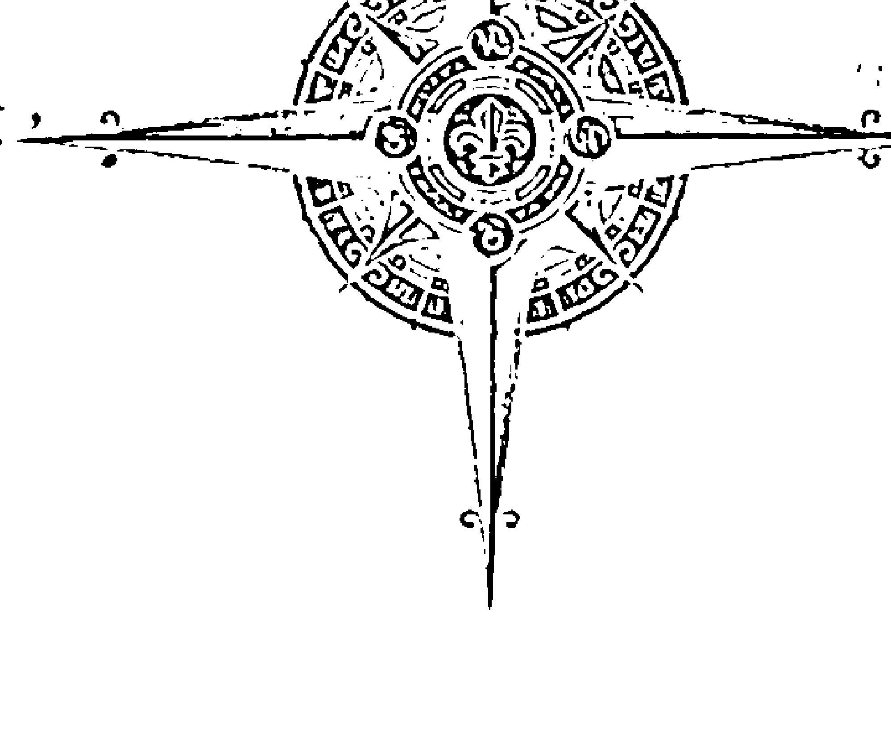
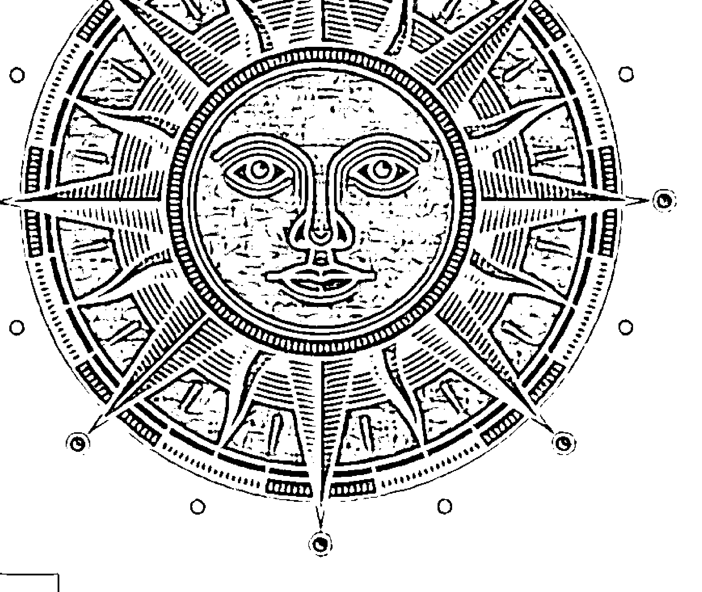