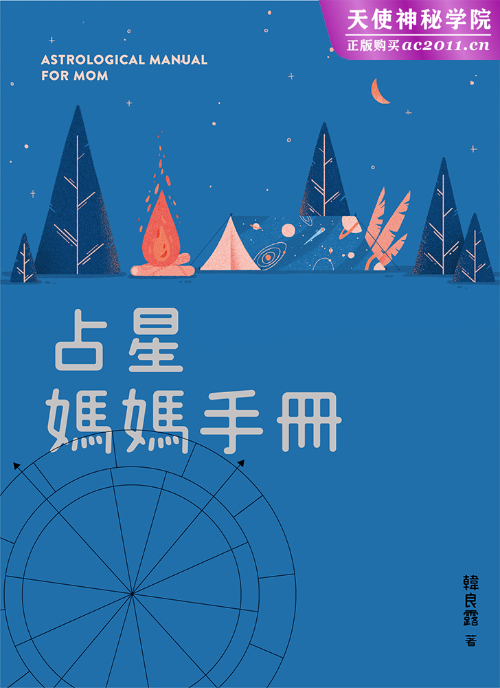
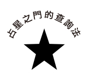
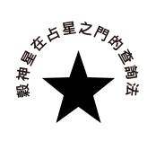

# 占星妈妈手册

# 出版缘起

兴趣广泛、身分多元的知名文化人韩良露，除了大家熟知的作家、媒体人及文化推动者身分之外，她也是艺文圈中最受重视的占星学大师。二○○三年起她在金石堂金石书院（现龙颜讲堂）开设占星课程，由于口耳相传、好评不断，课程一直持续到二○一○年才划下休止符。

南瓜国际从二○一六年起，陆续将多年来数量庞大的上课录音及相关资料，整理成为系列书籍。

随着占星越来越受到大众重视，查询本命星图早已不再是难事，针对占星初学者，南瓜国际推出「Handbook」书系，从如何打出一张本命星图开始，一步一步教大家进入占星学的美妙世界。

# 序
不存在的完美母亲

为人父母者在接触占星学时，除了打出一张自己的本命星图之外，一定会打出小孩的星图。但往往打出了星图却无从下手，此时不妨先看看跟亲密关系与安全感最为相关的月亮。本书除了探讨月亮的母性、月亮带来的安全感议题之外，也旁及谷神星的养育与亲密关系，以及跟母亲有关的十宫。

「为什么我的孩子会有这样的星图？」

「月亮落在这个位置不好吧？」�

「我是不是没有尽好自己的母职？」

「孩子的月亮跟我的月亮好像很不合耶，怎么办？」

很多人在初学占星时会很患得患失，尤其是面对亲子关系，很担心自己是不是有哪些事情没做好会害了孩子的成长。其实家庭是一场共修，大家有缘生在一个家庭中，就是要藉由亲密关系的短兵相接，让彼此得到灵性的成长。从这个角度来看，家庭成员星图彼此之间差异很大反而是正常的，因为如果大家的星图特质很接近，灵魂能学到的功课就不多了。近代占星理论强调的是灵魂的成长，而不是谁克了谁或谁害了谁。每个人在出生前，都选择了这辈子要修的功课，不管功课有多难，都是一种灵魂的选择。

每一个母亲都有觉得自己做不好的时候，每一个子女也都会有对母亲不满意的时候—但事实上完美的母亲并不存在。我们渴求的是大地之母全部的爱，但母亲只是一个凡人。我们原本都是宇宙间自由自在的灵魂，为了灵魂的学习功课而来到地球，每一个母亲就是代替大地之母来抚养我们的人。然而每一个母亲的母爱都有其侷限，月亮牡羊的妈妈给不了月亮天秤的情感，反之亦然。

占星学之美，在于了解自己、了解别人，从而了解宇宙的奥秘。星图是一种客观化的工具，透过星图，我们更能够客观的面对每一个人的真实处境。家庭生活与亲子关系原本就是一种很深的缘分、很不好学的功课。

对初学者来说，了解自己的月亮，了解孩子的月亮，会是增进亲子关系的第一步。从理解而体谅，以了解代替干涉，是让人际缘分走得更好的开始。一起共修，彼此协助，一起做好这辈子的灵魂功课。

* * *

[注] 本文依据二○○七年相关课程整理而成。

# Chapter 1
教你看懂星图：行星、星座、宫位、相位

### 1    请搜寻「占星之门」，或直接以网址「astrodoor.cc」进入首页。  

##### 在首页右上角

##### 登入 微信 脸书 选单▼

##### 点选「选单▼」

### 2    进入输入出生资料页面  

##### STEP1 请输入国历出生时间

##### 西元 ＿＿＿ 年 ＿＿月 ＿＿日

##### STEP2 请设定出生地点

##### ex.台湾 台北

### 3    将出生资料填妥之后，再点选下方「辛苦了！请按我送出查询」按钮。  

### 4    就会进入本命星图页面选单：  

##### 星盘图片

##### 行星位置

##### 上升星座

##### 星座比例

##### 点开「星盘图片」的蓝色 bar，就可以看到包含小行星的本命星图。

## 本命星图中的星座

每一张本命星图都包含了星座、宫位、相位。

星座是行星展现能量的本质，宫位是行星会在怎样的领域展现能量，而相位是哪些行星之间会互相形成特定角度，进而有了对手戏，演出生命的情节。

如果用烧菜做比喻，行星落入星座就像是食材，食材是豆腐或是猪肉，这就是本质上的不同。宫位就像是烹调方式，要煮一个川味料理，或是糖醋口味，就会有不同的发挥。相位则是两个行星互相产生关联，香菇跟鸡一起煮成香菇鸡汤，或是凤梨跟虾做成凤梨虾球，这些都是不同的行星一起演出的情节。

当我们要看行星落在什么星座，可先不看宫位与相位的红绿蓝线，看看「日」、「月」、「水」、「金」、「火」、「木」、「土」、「天」、「海」、「冥」对应到「牡羊」、「金牛」、「双子」……十二个星座中的哪一个星座。

十二星座的名称会随着各家翻译而略有不同，本书统一将「射手」统称为「人马」，魔羯统称为「摩羯」，水瓶统称为「宝瓶」。

## 本命星图中的宫位

所谓的「本命星图」，就是我们出生的时刻，从出生地点看到的星空。出生时往东方的地平线看过去的黄道座标，称为「上升点」，俗称为「上升星座」。在出生之前，我们都是在宇宙中遨游的灵魂，当每个人诞生在地球上，出生时吸进地球的第一口气时，我们的灵魂就藉由上升点被钉在地球，展开了这辈子的生命旅程。

上升点是一宫的起点，它代表的是每一个人来到这个世界的初始状态，它涵盖了一个人先天从父母接收到的基因，以及早年环境形塑出跟环境互动的基本态度，也就是这个人在最自然、放松状态时，会「像」什么样子。

从上升星座开始画出十二个宫位，十二个宫位分别代表了十二个不同的生命情境。

十二个宫位中有没有行星，代表这辈子当事人是否有缘去做相关的事。一个二宫金钱宫有很多行星的人，这辈子一定会有很多跟金钱有关的缘分；一个四宫家庭宫很多行星的人，这辈子一定会有很多跟家庭有关的缘分。

## 本命星图中的相位

所谓的相位，就是两颗（或两颗以上）的行星形成特定角度，最重要的四个相位为合相、九十度、一百二十度与一百八十度。

当两颗行星产生相位时，这两颗行星的能量就会产生交互影响。

合相会使这两颗行星力道加大。

一百二十度是和谐相，这个相位会让两颗行星的能量用和谐的方式互相帮助，容易激发出彼此的正面能量。

九十度跟一百八十度是负面相位。九十度带来冲突，一百八十度带来对立，这两个相位会引发出两颗行星彼此的负面能量，因此在本书中被称为「克相」。

在占星之门中，一百二十度和谐相用绿线标示，九十度克相用红线标示，一百八十度克相用蓝线标示。在本书中，如果提到「好相位」，指的就是占星之门中的绿线，如果提到「坏相位」或「克相」，指的就是占星之门的红线与蓝线。

占星之门中将六十度画为浅蓝线，但六十度的力量比一百二十度小很多，因此在书中不予讨论，初学者亦可先暂时忽略浅蓝线，以免眼花撩乱。

很多人从大众媒体得到「牡羊座如何如何」、「摩羯座如何如何」的资讯，说的都是「太阳星座」。但每个人的本命星图都不是只有一颗太阳，它还包括了月亮、水星、金星、火星、木星、土星、天王星、海王星、冥王星。

大众媒体的「十二星座说」虽然简明易懂，问题是过于简化，会让人误以为全世界只有十二种人。但大家稍微用逻辑想一下，地球有七十几亿人口，你的命运怎么可能跟其他十二分之一的人一样？

大家利用网站或各种软体，输入出生时间、地点而画出的星图，称为「本命星图」。

每个人的本命星图中，都有太阳、月亮、水星、金星、火星、木星、土星、天王星、海王星、冥王星这十颗主要行星。这十颗行星代表的是一个完整的太阳系。每个人一出生时，天上的星图分布，构成了这个人的本命星图，而这也意谓着每个人一出生时，就拥有了专属于自己的太阳系。当一个新生儿从妈妈肚子里生出来，都是一个全新的太阳系来到这个世界。

你的太阳在什么星座几度、月亮在什么星座几度、水星在什么星座几度……你的太阳在几宫、月亮在几宫、水星在几宫……

你的太阳、月亮有没有其他行星形成特定角度（也就是星图中各种颜色的连线），因而一起演出生命情节？

天上的星辰不断的移动，天上的太阳系每分每秒都不同，因此每个人的本命星图都不一样。也因此，每一个人都是独特的，每个人拥有的本命星图，就是每一个人独特的星空。

在研究星图前，让我们先了解十颗主要行星在占星学中的意义是什么。

###  太阳 

太阳是一个人的主观自我意识，它是一个人认可的自我形象。一个人的太阳会随年龄而成熟，随着年龄发展，自我意识也会逐渐发展完成。很多妈妈常常觉得小孩到了青春期就像变了个人似的，原因在于一个人的自我意识通常是在青少年时期开始发展，也因为刚开始发展的自我意识不够圆融，所以青少年的太阳意识最为横冲直撞。

太阳是一种来自父亲形象的价值观认同。虽然每个的父亲都不同，每一个父亲也都有着很多面向，但子女会随着自己太阳的状况而展现不同差异。例如一个太阳牡羊的人眼中的父亲会是一个勇敢、有冲劲的父亲；一个太阳双子眼中的父亲，会是一个很幽默风趣、很聪明的父亲，等到当事人长大以后，也会期许自己成为这样的人。

星图中的太阳除了自己以外，也代表生命中的重要男性，包含父亲、儿子（不包含女儿），对女性当事人而言，太阳有可能会投射在先生身上。大家常有的疑问，是一个家庭里面可能有好几个小孩，明明爸爸都一样，为什么小孩的太阳各自不同？原因是每个人都有许多不同的面向，每个小孩从父亲身上拿到的也都各自不同，而每个小孩眼中的父亲，往往是这个小孩在成长重要阶段时父亲的生活重心。以我为例，我们家有四个小孩，太阳分别在不同星座。我跟妹妹良雯的太阳在天蝎，意谓着我们的成长阶段看到的父亲是一个掌握大钱、大权的大老板；由于良雯一出生就因为智力不足而让父亲奔忙不已，妹妹良忆的太阳在双鱼，代表她在成长阶段看到的是一个很有同情心，为了女儿牺牲自己的父亲；后来父亲因为公司经营不善而破产，弟弟良恺的太阳在牡羊，显示出在良恺的成长阶段，他看到的是一个奋力求生、不被现实打倒的父亲。

###  月亮 

月亮代表一个人内在情绪的运作，它跟安全感有关，而这种安全感来自于童年时期母亲对待当事人的模式。也就是一个人眼中的妈妈是什么形象，将来长大以后，他就会对这种情感模式产生安全感，当他遇到了可以满足他们月亮安全感的人事物，就会感到内在情绪很安稳，其中包含了家庭观念、居家生活、金钱带来的安全感、理财方式。

从月亮可以看出母亲对待当事人的模式，但并不等同于母亲的全部。每个人会有很多面向，一个母亲同时也可能是一个太太或职业妇女，而且随着母亲生命的转变，小孩看到的母亲面貌也都会有不同。我们家有四个小孩，四个小孩的月亮各自反映出我母亲的生命转变。我是长女，我的月亮在双鱼，原因是我母亲早婚，生我的时候还是一个温柔却不太能干的小妇人；妹妹良雯的月亮在摩羯，良雯一出生就有智能不足的问题，她看到的是一个母女关系很艰苦的母亲；良忆跟良恺的月亮都在牡羊，经过岁月的历练，这时我的母亲不再是当年羞怯的小妇人，她已经是一个强悍的女人了。

月亮的内在情绪是一种很强大的驱动力，但也因为它是一种隐藏的情绪，它不像太阳这么可以从理性来分析。一个人也许在太阳的理性层面上想要这么做，但月亮的情绪未必也想要这么走。如果不从月亮来切入的话，就无法理解为何明明理智上觉得应该这么做，情绪上却会来扯后腿。

从月亮可以看出两个人同处一个屋檐下是否处得来。举例来说，月亮牡羊的人在家待不住，但月亮巨蟹的人想要天天待在家，这两个人如果要同住一个屋檐下，就得要额外花很多力气来互相包容。两个人的月亮如果协调，他们住在一起时会比较不会起冲突，但是否真的能长久在一起，光看月亮彼此合不合是不够的。而月亮不合却成了家人的例子所在多有，这时就要考验彼此能否尊重彼此差异，进而在一个屋檐下和平共处。

###  水星 

水星代表的是心智思考与沟通能力，它跟太阳的不同，在于太阳是自我意识的呈现，而水星纯粹是一种客观的心智思考，并不包含主观的自我意识。一个人的数学能力、文字能力、口语表达，甚至抽象的哲学思考能力，这些都跟水星有关。

水星要探讨的是「我思故我在」，每个人都会有其不同的思考模式，也会因为不同的思考模式而衍生出不同的表达模式。

###  金星 

很多人会将金星视为感情，火星视为性爱，但其实金星代表的是一个人的美学价值，它是一种用来讨人欢心的能量。从金星可以看得出一个人的美感品味，甚至一个人长得漂不漂亮，以及对感情与金钱的态度，都可以从金星看得出来。

金星也跟金钱有关，它代表的是一个人经由才华而带来的金钱，美学品味可以带来金钱，长于社交可以带来金钱，美貌也可以带来金钱。

###  火星 

火星代表肉体活力。火星是一种不经思考的本能反应，其中也包含了性能量。火星的性能量并不只是性爱，它是一种求生存的基本欲望—抢地盘、抢食物、繁衍后代。不要觉得火星很野蛮，火星最重要的功能是捍卫自己的生存，如果火星的功能不彰，就会被别人欺负而无法自保了。

不过火星也因为太过生物本能、太过不经大脑而容易惹祸，从一个人火星落入的星座、宫位，可以看出这个人在哪些地方容易太过冲动、太容易惹恼别人。

###  木星 

前面提到的太阳、月亮、水星、金星、火星，这五颗行星在占星学中都是个人行星，它们分别是构成了一个人性格的一部分，不管在怎样的社会环境中，都会有具有这些性格的人存在。而接下来的木星、土星、天王星、海王星、冥王星在占星学中则是社会、宇宙行星，这五颗行星跟社会环境有关。

木星是一颗吉星，一般人说的财运如何，可从星图中的木星看出端倪。木星代表的是社会资源，它不只是金钱，它还包含了学历、名气与贵人，这些都比单纯的金钱更让人受益。从一个人的木星，可以看出当事人会因为怎样的社会环境受惠。

###  土星 

土星跟木星都是社会星，这两颗行星都代表社会价值观。木星带来社会资源，土星带来社会制约，一个人会因为哪些社会价值观而感到约束与压力，都跟土星有关。

如果说木星显现出一个人会因为哪些社会环境而受益，土星就是因为哪些社会制约而受害。从一个人土星的星座，可以看出当事人出生时，社会正集体因为某些事件而受到压迫，当事人长大以后就会严肃看待相关事物。

土星也跟业力有关，从一个人土星落在什么宫位，可以看出这个人这辈子会在这个宫位相关领域受苦，但也因为土星会让当事人吃苦头，当事人就会从中获得成长。

###  天王星 

天王星、海王星、冥王星都是世代星，这三颗行星绕一圈的时间很久，在每一个星座停留的时间也很久。很多人不了解世代的影响跟个人有什么关联，事实上关联很大。一个人会出生在社会上的集体潮流时，当事人长大以后就会成为这个风潮的实践者。

天王星绕一圈大约八十四年，平均在一个星座停留七年，天王星会带来巨大的改变，也带来巨大的突破。天王星落在不同的星座会显现出人类在这个时代的集体新创见、新发明与新思潮。从本命星图中的天王星可以看出当事人在哪些地方具有与众不同的本领，有什么特立独行之处。

###  海王星 

海王星是一颗灵性星，它是梦想，也可能只是幻想。从本命星图中的海王星可以看出一个人怎么样的艺术、灵性。

海王星绕行一圈大约需要一百六十五年，在一个星座停留大约十二到十四年。海王星代表的是世代的集体梦想，当海王星落在不同星座，人类社会就会集体对这个领域感到憧憬，出生在这个世代的人，长大以后就会在相关领域特别充满梦想。

海王星也代表消融与迷离，在星图中，如果海王星跟其他行星形成相位，海王星就会消融这颗行星的现实力量，并且朝向灵性或自欺之路前进。

###  冥王星 

冥王星是巨大的占有欲，占有欲的激情带来毁灭与重生。

在占星学的十颗主要行星中，冥王星距离太阳最远，它需要两百四十八年才会绕行一圈。也因为冥王星的轨道跟太阳系其他行星有很大的不同，所以它在每一个星座停留的时间也有很大的差距，少则十几年，多达三十几年。冥王星具有强烈想要落实的特性，当冥王星进入一个星座，人类社会就会集体对这个领域感到强烈的激情，并且想让这种激情化为现实，成为一种产业、一种法案或一种政治结构。出生在这种世代的人，长大以后就会自然而然的视这些事物为生活的一部分。

占星初学者通常最喜欢的是木星，因为木星带来金钱、贵人、机会等社会利益，是大家最爱的吉星；最害怕的则是土星，因为土星必然带来压制、试炼，它就像是一种还不完的债，让人不得不乖乖照着土星的规范走。但事实上木星与土星是两种最切身的外在社会力量，木星是红萝卜，土星是鞭子，透过木星的助力与土星的压力，我们得以学会在这个世界上如何生存。

懂得命理的知识，才可以透过这些知识跟命运之间搭起一座知识的桥梁。知道事情的原因，有助于减少恐惧、不安与无名的慌张。了解命理未必能让命运变好，但是了解命理可以让人理解命运的安排。

藉由星图找到自己的内在价值很重要，当一个人经由内在价值建立起长程的人生目标时，不管旅途上遇到什么事，都会比较有能力予以取舍。否则就只能随着外界的人事物与外界的运势随波逐流，遇到什么就是什么，这么一来，人生的风险会很大。

# Chapter 2
月亮代表我的心：月亮星座

在十颗行星中，跟亲子、家庭最为相关的就是月亮。

月亮有很多面向，母性是其中之一，但母性不等于母亲。很多人常认为只要是母亲都有母性，甚至认为只要是女人都有母性，这是不正确的。有的女人有母性，有的女人不太有母性，有的女人也可能在某一些情境下没有母性。比如有人小时候母亲经常卧病甚至住院，他们的母亲可能很有母性，却没有余力照顾小孩。

每个人的月亮从小到大都会有一些情绪上的不满足与伤疤，很多造成伤疤的事情我们已经不记得了，但是当我们在生活中遇到了一些事情时，这些情绪伤疤就会造成当事人的过度反应。比如有一些太太只要发现先生可能不忠的蛛丝马迹，可能就会回到小时候被母亲抛弃的恐惧中。过度反应绝对都不是针对当下发生的事，当下发生的可能只是一件小事，但是当事人可能会因为这个小事大为激动、歇斯底里或极度沮丧。

沮丧、焦虑、悲观、忧郁、不安都是情绪过度反应的不同方式，过度反应的方式会随月亮在什么星座、月亮有什么相位而有所不同。其实我们太阳的理智都知道应该要到此为止，知道不能再陷在情绪里面，可是我们的月亮办不到。月亮就是需要抓住连结，当我们失去的时候，我们的月亮永远要找一个替代品，因此月亮也跟家庭、房子、小孩之类的事情有关。

月亮代表当事人生命中的重要女性，它可以代表母亲、女儿、姊妹，如果当事人是男性的话，月亮有可能会投射到太太身上，如果当事人是女性，月亮则往往会呈现出妈妈是这样的人，当事人也是这样的人。在个人星图中的月亮，可以从中看出这个人的情绪、安全感，从而影响到当事人的家庭生活。本书的重点在探讨亲子关系，所以会着重于月亮的母亲课题，至于女儿、太太的面向暂不探讨。

当月亮落在不同星座，月亮就会用这个星座的特质来展现出月亮月亮的能量。黄道十二星座是一个三百六十度的圆形座标，从牡羊座开始，到双鱼座结束，每三十度画分出一个星座，依序展现出春夏秋冬的风景。

牡羊座是十二星座之首，它代表个体的创生。所以它具有开创、勇敢、奋斗，而且不顾他人的特质。牡羊并不自私，他们只是只顾得了自己，无暇顾及他人。

金牛是第二个星座，接续着牡羊的开创，金牛的概念是守成，也因为有成可守，金牛星座长于物质世界色声香味触的具象之美。

双子是第三个星座，代表了近距离沟通。不管任何行星落在双子，都会具有想要跟他人沟通的倾向。

巨蟹是第四个星座，它代表家庭提供的保护。当行星落在巨蟹时，都会比较保守。此外，巨蟹也常跟家庭有关。

当个体发展进入了狮子座领域，就会开始想要展现自我，想要获得众人的掌声，因此不管任何行星落在狮子，都会比较夸张、比较大众，也比较戏剧化。

狮子座想要的是大鸣大放，但如果每个人都只顾展现自我，世界就会大乱，因此处女座追求的是秩序、工整，它具有强烈的事务性特质，希望一切按部就班。

当个体发展进入第七个星座天秤，天秤渴望的是人与人之间的和谐。当行星落在天秤，就会具有想要跟对方平等相待的倾向。

天蝎注重的是他人的资源，包含了性、金钱、权力—而这些都是最秘而不宣，也最容易跟别人起争执的领域。

在个体发展中，如果停留在天蝎的性、金钱、权力，就会陷入贪嗔痴而无法自拔，因而需要人马的开放思想。人马是开放的价值观，它常常跟宗教、哲学与异国有关。

摩羯座追求功成名就，它是成就动机最强的星座。当行星落入摩羯，就会显现出务实，而且渴求社会肯定的特质。

宝瓶座讲求打破社会现状，以免陷入摩羯的官僚气息，社会停滞不前。当行星落入宝瓶，就会具有前卫、不按牌理出牌的特质。

双鱼座是最后一个星座，它不务实且迷离的特质。当行星落入双鱼，就会比较具有同情心，但也会有比较容易被欺骗的倾向。

#### 月亮牡羊

月亮牡羊的人不管年纪多大，他们在情绪上都是个小孩子，他们的情绪都不稳定，也容易冲动。

月亮落在牡羊，本身就是一个比较容易情绪波动的位置，月亮牡羊的人脾气都很直，如果月亮有克相，当事人的情绪就会更容易波动，他们的脾气就会很坏。

月亮跟家庭、家人有关，月亮牡羊的人尤其容易在亲密关系中，跟自己的家人或亲密伙伴反映出他们坏脾气的一面。我认识不少月亮牡羊的女性，她们外表很温柔，尤其如果太阳在双鱼或天秤，没有人看过她们在外头发脾气，可是她们的家人却很容易看到她们凶巴巴的一面。

月亮牡羊的人脾气很急躁，做事也很急躁。一个人如果月亮在牡羊，他们恐怕不太可能觉得自己的妈妈很温柔。我有个作家朋友常常写她小时候母亲有多凶，她的月亮就在牡羊。我母亲的月亮也在牡羊，她的太阳在双鱼，所以她出门在外时都很温柔，可是在家时脾气不好。

不过月亮牡羊也有其优点。在月亮落入的十二个星座中，月亮牡羊的人是最会自己一个人过日子的人。一个经济无虑的月亮牡羊，根本不需要谈恋爱或结婚，因为他们的情绪很自足，根本不需要依赖别人来提供情绪的慰藉。

很多太太一旦遇到先生外遇就活不下去，月亮牡羊不会。虽然不少家庭主妇的月亮落在牡羊，但这只是表示她们选择在经济上依靠婚姻，如果家中经济无虞的话，她们绝对可以不管先生也不管小孩。

月亮牡羊的人也容易在家庭中出意外。举例来说，大家在洗澡前，应该都会先把温度调成中温，再视水温将温度调高，但我认识好几个月亮牡羊，他们有时候不专心，就会一开始就把温度调最高，结果因为水温太烫而被烫伤。他们在煮饭的时候也容易割伤、烫伤，原因是他们在家时很不小心，非常粗枝大叶。

#### 月亮金牛

金牛要探讨的是物质世界的拥有物。月亮金牛代表当事人的母亲十分务实，当事人在这一生会遇到的重要女性，都容易展现出月亮金牛的特质。

月亮金牛跟财运有关。月亮这颗行星代表我们每个人会有的保命财，而金牛星座跟地球资源有关，就算月亮有克相，月亮金牛的人也会是先有钱之后才留不住钱，而非一开始就没有钱。

月亮是一种阴性的能量，月亮金牛的能量，往往会透过身边重要女性来表达出来。像我有一个月亮金牛的老友，她的母亲非常会做生意，她现在是非常知名的政治人，而她早年求学、从事媒体工作时，她的母亲都给她很多资助。月亮金牛的人终身都会获得许多物质方面的安全感，来源可能来自母亲、妻子或自己。

我有一个月亮金牛的朋友，她的金钱运很好。她长年为一个国外来台开公司的老板当秘书，公司开了二十年之后结束，老板退休回到国外，就把台北的办公室送给她，结果不到两年就遇到了台湾房地产起飞，她的资产因而翻了好几倍。

月亮金牛的人回到家后都会变得比较懒。也因为月亮金牛的人在家很放松，家庭生活对月亮金牛的人很重要。很多月亮金牛的人特别喜欢在家养宠物、养植物。他们在家中很容易显示出自己温柔的一面。我认识一个媒体女强人，她在公众领域是以强势、凶悍着称，可是月亮金牛的她在家却非常温柔。

相较之下，月亮巨蟹、月亮双鱼虽然在家也很温柔，但月亮金牛的不同，在于金牛是土象星座，而巨蟹与双鱼是水象星座，水象星座是情绪、情感能量，土象则跟现实有关，因此月亮金牛的温柔都会透过实际的服务、实际的物质资源来表达。舒适的沙发、舒适的床单，给予宠物或植物实际的照顾，这些属于月亮金牛的强项，说说好听话哄别人，这就跟月亮金牛无关。月亮金牛的情感都会透过具象的物质来展现。

#### 月亮双子

月亮双子的女性容易有一个神经紧张的母亲，她们长大以后也容易成为一个神经紧张的人；而月亮双子的男性，他们的母亲容易神经紧张，他们长大以后也容易娶到神经紧张的女性，或跟具有这种特质的女性交往。对很多月亮双子的男性来说，漂不漂亮并不是择偶的首要考量，假设要他们在聊不来的美女或聊得来的中等姿色女性中选择，他们会选后者。一个能跟他沟通的伴侣，绝对胜过一个聊不来的美女。对月亮双子来说，沟通很重要，话一定要说出口，一切尽在不言中是不存在的。

双子是一种很知性的星座能量，也因此，月亮双子的人并不讲求情绪的亲密感。如果想要跟月亮双子的人结婚，就不能期待婚姻生活、居家生活中有很多或很强烈的情感互动。你不能期待月亮双子的先生或太太下班以后，跟你一起在沙发上手牵着手安安静静过一整晚，也不能期待两个人依偎在一起你侬我侬不讲话。月亮双子的居家生活，应该是夫妻俩晚上开着电视，两个人一起讨论电视内容，这才是月亮双子的理想居家生活。如果夫妻间出了什么问题，月亮双子也会倾向出去吃个饭，找几个朋友一起去玩一玩，而不是待在家里将彼此有什么不满讲个清楚，他们不喜欢在亲密关系中面临情绪的临界点。月亮双子即使是要离婚，也不会想要大吵大闹，也因此，他们的另一半会觉得月亮双子在逃避问题。

月亮双子的人好奇心很强，他们喜欢在情绪上跟他人有比较多的互动，却无法忍受强烈的情绪。他们有能力谈论自己的问题，可是却有个盲点—月亮的能量重在感觉，月亮双子有能力谈论自己的问题，却无法感觉自己的问题。我有个月亮双子的朋友，她因为婚姻问题而找我喝咖啡，她花了好几个小时跟我说结婚十几年来的心路历程，她讲的是一个悲伤的故事，可是我感觉不到她的悲伤。她说她感觉很受伤，可是我从她身上感觉不出来她很受伤。虽然也并不是轻描淡写，但是她不断的在分析这件事，分析给别人听，也分析给自己听。她很纯粹的在就事论事，情绪几乎没什么波动，当然也没有哭。

#### 月亮巨蟹

月亮巨蟹的人在情绪上高度敏感，不管当事人是从事艺文工作，或者在居家生活中发挥他们的感性都很适合。月亮巨蟹的男性特别喜欢妈妈型的太太，他们不会让太太接管、控制全部的生活，却很喜欢跟太太撒娇。我有几个月亮巨蟹的朋友，别看他们平常非常男性化或疯疯癫癫，但私底下他们会有月亮巨蟹很细腻、依恋的一面，甚至私底下很怕老婆，只是表面看不出来。

巨蟹的星座本质，就是防御受伤的机制，因此月亮巨蟹的人很容易情感受伤，只是如果太阳落在比较活泼开朗的星座，他们就会明明个性很开朗，情感却容易受伤，很可能会因此让人觉得这个人有点难搞。例如我有个朋友，他喜欢讲笑话取笑别人，却只能他笑别人，不能别人笑他。

不论月亮巨蟹的人是男是女，他们的母亲对他们来说都非常重要，他们会比月亮落在其他星座的人更常把妈妈挂在嘴上。不过巨蟹是一种家庭意识，所以月亮巨蟹的人是用「我跟母亲是一家人」的概念与母亲连结，而非「我是母亲的小男孩或小女孩」。

此外，月亮巨蟹的人非常恋旧。月亮巨蟹的人很喜欢跟老朋友在一起，也很喜欢收藏东西，因为老朋友或旧东西可以引起他们的情绪，尤其是跟家庭有关的老东西是他们的最爱。月亮巨蟹的人也喜欢去别人家吃饭或请朋友来家里吃饭。

月亮巨蟹的人喜欢老东西，我认识的这一票月亮巨蟹的朋友很多都在玩古董。一起鬼混跟玩古董，这两件事情在本质上是相通的。比如在永康街的古董店，三天两头往那边钻的老男人，很可能月亮都在巨蟹。稍微观察一下就会知道，喜欢泡古董店玩古董的人是一种小社群，他们没事就在店里面泡茶聊上几小时，虽说是玩古董，但哪有可能天天都在买古董？他们享受的是在古董店里，跟几个熟悉的老客人聊天，就像这些人都是家人一般的感觉。

也因为月亮巨蟹的人在情绪上比较保守、守旧，他们即使婚姻出了问题，也不会一下子就考虑离婚。我的那一大群月亮巨蟹朋友，不管他们是否花名在外，在太太面前都很乖—也因此他们一群人出去玩时，都不喜欢带着太太，一整个晚上如果都得要乖乖的就不好玩了。

#### 月亮狮子

月亮狮子的人不分男女，他们一定会有一个喜欢支使别人、很骄傲、很有领导能力的母亲。在他们的童年记忆中，家庭生活中真正当家作主，拥有最终决定权的往往是妈妈。这件事对男性当事人会有一些不利，因为有一些月亮狮子的男性可能从小很怕妈妈，结果长大以后造成跟女性相处的困难。如果一个月亮狮子男性从小跟母亲的关系不错，他们长大以后就会深受强势女性的吸引，加上他们的太阳本身如果不是很强悍（例如太阳巨蟹、太阳双鱼）的话，他们会比较心甘情愿的当成功女性背后的男人，但如果当事人的太阳落在比较强势的星座，就会产生冲突。他们小时候受母亲的支配是不得不然，或许长大以后还是很尊敬母亲，但内心中很可能会对强势的女性敬而远之。

月亮狮子的女性则会因为从小面对的是强势的母亲，她们长大以后也会成为一个在家庭中很强势的女性。但也因为月亮往往在家庭领域才会展现，所以有可能婚前她们看起来很温柔，娶回家之后才发现是母老虎。

月亮狮子的人内在都会有一种想要出风头的渴望。月亮狮子的人在居家用度上不会太节俭，对男性的月亮狮子来说，他们自己在家庭用度上很爱乱花钱，他们也容易遇到这类特质的太太，而月亮狮子的女性则容易成为爱花钱的太太。

月亮狮子的人需要拥有家中主导权，他们在家中也很需要被拍马屁。相较之下，太阳狮子需要在社会上被拍马屁或被称赞，回家后未必。太阳狮子跟月亮狮子都需要掌声，但太阳狮子是因为内在自信不足，所以渴求掌声，而月亮狮子则是自信满满，他们只是需要被肯定。月亮狮子要的是俯首称臣。月亮狮子的家庭就是一座城堡，他们要在家中当国王或女王，但出门面对社会时并不需要。所以月亮狮子的人在家跟出门时会有一种奇怪的不平衡：他们在家可能是山大王或母老虎，出了门之后却可能很温柔。

月亮狮子的人可能会将自己的缺点当成笑话来讲，大家听了笑笑便罢，千万不要顺着他们的话去挖苦他们，否则会不知不觉的得罪他们。我有个月亮狮子的亲戚，跟她很熟的人都知道，她可以讲自己的小孩不好，但别人说她小孩不好，她就会翻脸。

#### 月亮处女

月亮跟从小在家中养成的习性有关，月亮处女代表当事人的母亲很神经质、很小心，不管当事人是男是女，从小他们的妈妈都会在他们的身边不断叮咛、纠正他们，要他们干干净净，一定要坐有坐相、站有站相。我的姪子就是月亮处女，他从小就是全家最有规矩的人，但他吃一顿饭还是会被他妈妈纠正十几二十次。很多月亮处女的男生都会有一些轻微的女性化，原因在于从小被妈妈要求要彬彬有礼，极为优雅的结果，就会丧失粗野的男性特质。

对月亮处女的人来说，妈妈就像是检察官，永远不断的在纠正当事人。所以有一些人长大以后会有点畏惧女性，而且也会造成当事人跟母亲之间的障碍。

不过虽然月亮处女的人会有恐惧母亲的问题，他们通常都会是很孝顺的子女，他们一辈子都会努力为母亲服务。妈妈生病时会像护士一样陪侍病榻的，往往会是月亮处女的人。我有个当大学教授的朋友，他的月亮在处女，自从他母亲得了癌症之后，他就搬回老家，有时候黄昏时，我还会看到他推着老母出来散步。

虽然月亮处女的人很孝顺，但他们跟母亲在一起时压力都很大，他们孝顺母亲时并不快乐。处女座具有仆人的特质，月亮处女从小被妈妈管得很严，一辈子都很孝敬妈妈，但其中畏惧的成分居多，很像是妈妈的仆人。他们虽然并没有乐在其中，却又无法不尽孝顺之责。很多月亮处女的人都有情绪表达的障碍，他们从小在情感上受到的约束太强，因而都会想要掩饰自己的脆弱。他们常常过度自我批评，无法开放自己的内心，对自己的要求非常严格。

月亮处女都会以尽实际责任的方式跟别人产生关系，他们很懂得为别人做实际的事情，却不懂得流露感情。月亮处女的人表达情感时，他们会为你做饭、洗衣服，但不懂得温情的拥抱。我有个朋友的母亲是月亮处女，从小妈妈都没有对他们说过什么好听话，但妈妈会为他们做很多事。月亮跟家庭生活有关，月亮处女的人特别重视家中的整洁干净，出门以后则不见得很爱干净。

由于处女座不利于月亮的情绪表达，他们在情绪表达上很封闭，尤其是男性的月亮处女有可能会跟妻子有一些相处上的困难。

#### 月亮天秤

月亮天秤意谓着当事人的母亲对他们永远相敬如宾。对月亮天秤的人来说，妈妈简直是完美女性，她们从来不骂小孩，看起来总是很优雅。男性的月亮天秤长大以后都会受这类型女性的吸引，女性的月亮天秤长大以后则会努力成为这样的女性。

月亮天秤的人很害怕对立、争辩、冲突，他们如果遇到一个很强势的婚姻伴侣就很惨，因为他们在家庭中会很退让。我认识一个月亮天秤的男生，他娶了一个很凶的太太，他甚至还在冰箱上贴了「爱妻守则」，声明自己一切以太太的话为重。月亮天秤的人通常是和平的拥护者，他们很懂得如何跟别人协调。促成美国尼克森总统与毛泽东会面的国务卿季辛吉（Henry Kissinger）就是月亮天秤，他被公认是国际政治学的均势理论大师。

所有星座能量都有其主体性，只有天秤座的主体性是建立在「他人」，所以任何行星落在天秤，都会比较难以理解。天秤座就像是拿着平衡杆在走平衡木的人，但时时需要拿着平衡杆走路的人，他们其实是最不平衡的状态。不管是太阳天秤或月亮天秤，在夫妻生活中最相敬如宾的就是他们了。他们在夫妻关系显现给外人看的，一定是最美好、最和谐，最像模范夫妻的一面。天下有问题的夫妻何其多，一对夫妻一天到晚吵翻天，他们离婚大家会觉得理所当然，但当我们听到月亮天秤婚姻出问题时，会觉得有些伤感—因为他们看起来婚姻很美好。

事实上吵翻天的夫妻不见得感情不好，很多夫妻每天吵架，吵完之后出门吃个饭就和好，很多会吵架的夫妻，他们在吵架时将所有怨气都发散出去，火爆之中自有其相处之道。反而从来不显现不满情绪的月亮天秤，很可能有很多隐藏的问题不断的累积，如果你跟他们够熟的话，你会知道他们的婚姻生活中有很多无奈，只是不想去面对。他们之所以会用尽一切心力去维持婚姻的和谐，真正的原因是他们骨子里根本不相信婚姻是和谐的，所以会花最大的精力去保持和谐。他们不敢跟另一半吵架、翻脸，因为他们不相信跟人吵架之后可以和好，因而再怎么不合，都不想跟对方吵架。月亮天秤对和谐太没有信心，所以连小吵架都不愿意吵。天秤星座最擅长外交的和平，而外交的和平永远暗潮汹涌。

#### 月亮天蝎

月亮天蝎的人往往会有一个压抑情绪却很坚强的母亲。我认识一个月亮天蝎，他的父亲是个商人，一年到头都在出差旅行，很少在家。月亮天蝎显示出当事人的母亲可能对这种情况并不满意，甚至可能很愤怒，却因为女性的传统价值观而隐忍了下来。月亮天蝎的人不分男女，他们都告诉过我，他们曾经在生命中感受到母亲对父亲的敌意。

月亮天蝎的母亲都会遇到一些婚姻问题，但她们都没有把问题摊开，都没有吵吵闹闹。他们没有把暴力情绪往外发散，而是将不愉快的暴力能量往内压，变成了内在情绪。

我有个月亮天蝎的朋友告诉我，小时候因为父母关系不好，母亲会控制小孩的情绪，希望小孩可以向着她，统一战线来敌对父亲，从小他就在父母之间的权力游戏中长大。一直到自己年纪很大以后，他才意识到父亲不是圣人，父亲并没有坏到让他从小这么恨他的地步。而他从小选边站的支持母亲，也为他的生命带来了很大的压力，以致于他长大以后，只要看到描述父子情的戏剧都会忍不住泪流满面。他发觉他在二十几岁以前都因为很恨父亲而像是无父之人，但这一切都只是为了要讨好母亲而产生的心理机制，问题是母亲并没有跟父亲离婚。父亲虽然对母亲不好，但没有不好到需要离婚，母亲对父亲的不满也没有到恨对方的程度，可是母亲有意无意的让小孩选边站的结果，反而母亲得要来劝他对父亲的敌意不要那么强。后来长大以后比较客观的回头看这段往事，他发现父亲的确没那么不好，他小时候是因为情绪因素而跟父亲处不来，而父子亲情就这么一去不复返。

从这个例子来看，我们会发现，很多月亮天蝎的人中年以后跟母亲的关系会不像童年那么紧密，因为人会随着年纪增长，越来越能看清自己曾经受过的情绪操控。月亮天蝎的男性也容易娶到控制欲强的太太。

天蝎是一种带有暴力、激情的能量，太阳跟意志有关，月亮跟情绪有关。月亮天蝎最容易表现在情绪的暴力而非意志、行为的暴力上。因此月亮天蝎小时候有可能会经历情绪的、隐藏的暴力，但不会经历肢体的、外显的暴力。

#### 月亮人马

对月亮人马的人来说，母亲具有很大方、很包容的特质。

月亮人马的人在女性关系上都会有一些好运，他们的母亲都会对他们很大方—这跟所谓的「慈母」又稍有不同。她们并不见得是那种心很软的妈妈，或者对小孩提供很多服务，但她们一定对小孩很大方，很愿意给小孩提供很多资源。我有个月亮人马的朋友，从小到大母亲经常会塞钱给他，让他过得很宽裕。

月亮代表母亲，也代表太太，我认识三个月亮人马的朋友，他们念博士都是太太娘家出钱让他们念的，意谓着他们不但娶到有钱的太太，太太还很大方。也有可能是当事人的母亲的娘家本身很有钱，母亲从小生长在富裕的家庭中，所以很大方。

月亮人马的人在情绪上很好相处，尤其在家庭生活与亲密关系中脾气很好。人马具有膨胀的特质，月亮人马的人常常会有很庞大的朋友圈，他们可以在心理上将很多人视为家人。不过他们因为太喜欢新经验，所以在亲密关系会有喜新厌旧的问题。对月亮人马来说，他们喜欢的亲密关系是一种玩伴关系，他们喜欢跟身边人像玩伴一样的在一起玩。

月亮人马的人在居家生活中很大方，如果在家请客，他们会是很好的主人。在占星学中，月亮、金星、木星这三颗星跟钱有关，月亮人马的人往往会在财务上颇有好运。我认识一个月亮人马的女生，她的母亲虽然没什么钱，但是很幸运的是只要手头没什么钱时，她的婆婆就会给她钱。

人马的资源未必一定是金钱，有时候也会显现在异国文化，有些月亮人马的母亲会跟外国有某些渊源，例如母亲曾经出国留学、母系祖先曾有日本或荷兰混血、母亲在外商公司上班或常批外国货来卖，甚至有可能母亲是外国人。

许多月亮人马的人不排斥，甚至有点喜欢搬家。一般人十几二十年都不打算搬家，但月亮人马的人有可能三五年就搬个家，甚至有可能有好几个家，让他们搬来搬去、住来住去。就算不搬家，他们也喜欢移动家具，让家里展现新风貌。

#### 月亮摩羯

月亮摩羯的人往往跟母亲较为无缘，当事人情感匮乏的问题，很可能来自童年跟母亲之间情感的疏离，进而造成当事人阴性能量难以发挥，会对亲密关系中造成一定程度的阻碍，因为他们无法用简单而温暖的方式表达情感。

月亮摩羯的人的内在自我有很强烈的责任感，但他们无法自然的流露情感，他们对居家生活也有不愿意改变的倾向，常会有或多或少的强迫症。太阳摩羯跟强迫症无关，月亮摩羯跟强迫症有关，原因是月亮跟日常生活有关而太阳无关。月亮摩羯可能居家布置不能乱摆，拖鞋不能乱穿。

月亮摩羯的生活，早上起床要做什么，接下来要做什么，往往都有一定的固定模式，他们喜欢稳定到甚至带有一点封闭的居家生活。

我的妹妹良雯的月亮就在摩羯，一出生就有智力问题的她，对日常生活规律的要求，远超过一般人。她每天从心路基金会放学回家之后，要先吃什么、后吃什么必须要每天都一样。养她乍听之下很容易，但实际执行时很麻烦。我每个礼拜都要跟她吃一次饭，而她每一次都要吃广州炒面，我猜测可能是因为她人生中第一次的外食经验吃到了广州炒面，因此将外食跟广州炒面划上等号。从良雯身上可以发现，月亮摩羯凡是搬去一个新地方，第一次跟这个地方产生连结的事物很要紧。

在情感生活上，月亮摩羯的人很实际，他们对真情流露有表达障碍，这种障碍来自于童年跟母亲之间的沟通困难。就占星学理论来说，月亮摩羯意谓着当事人在母亲怀孕期到生产后接受到母体的营养不足，它可能是情绪性的养分或是实际的营养。对男性当事人来说，月亮摩羯的男性也常会跟太太之间不容易很亲密，常常会过于实事求是，绝对不罗曼蒂克。不过一个人在婚前往往是用金星在谈恋爱，也许当事人的金星落在一个比较活泼的星座，就很有可能谈恋爱时很有趣，但结婚以后完全不是那么回事。我有个好友嫁给一个金星牡羊、月亮摩羯的名人，婚前对方追她追得非常勤，但结婚的那一天，对方跟她说，现在我们已经结婚了，从今天起，之前花前月下的日子都结束了，从现在起照我的时间表过日子。结果他们结婚没多久就闪电离婚了。

#### 月亮宝瓶

月亮宝瓶的人，他们的母亲不会是从早到晚都以照顾小孩为生活重心的人，她们对公众领域的兴趣远大于当家庭主妇。我有个月亮宝瓶的朋友，他从小觉得妈妈不只是自己的妈妈，而是众人的妈妈。他们的妈妈如果跟自己的小孩、亲戚小孩、邻居小孩在一起，当事人一定会觉得妈妈一视同仁，对别的小孩跟对自己一样好，不会对自己比较好。有一次他跟邻居小孩吵架，妈妈居然向着邻居小孩，让他感觉很受伤。

宝瓶有可能会带来意外与改变，月亮宝瓶的人的母亲有可能因为许多原因而不在小孩身边，即使在小孩身边，也不会是个传统母亲。受到母亲的影响，月亮宝瓶女生长大以后其实并不是很热衷于母职，她们比较热衷于跟社会领域有关的事物。

月亮宝瓶的人情绪常常很不稳定，进而影响到家庭生活。月亮宝瓶也可能会显现在小时候的住处不稳定，长大以后也不介意在很多地方住来住去，甚至有可能没办法在同一个地方住太久，因为他们会不耐烦。

月亮宝瓶不希望跟伴侣之间的关系太亲密，喜欢保持疏离，尤其是在对小孩的亲子关系中，他们也不希望小孩太依赖，希望小孩快点长大。月亮宝瓶需要很多自由，他们也会给别人很多自由。月亮宝瓶的人如果发展得比较好，他们会有很强的人道主义精神，虽然不擅母职，但是他们很喜欢请一群人一起来家里探讨理性与理想相关事物，也很喜欢跟一群人一起过一种类似半闭关的生活。不是每个人都喜欢让别人住进家里，例如月亮天蝎就很讨厌别人住到他们家，但月亮宝瓶如果家里有三个房间，让两间房间给别人住都没关系—当然还是得谈得来，但即使谈得来，月亮宝瓶也不会整天黏着你，如果你到他们家作客，他们会像室友一样，跟你互不干扰。月亮宝瓶是把「家」当成「房子」，而不是把「房子」当成「家」的人，他们并不依恋房子带来的安全感，也不依恋亲密关系带来的安全感。

#### 月亮双鱼

月亮跟母亲有关，而双鱼跟宿世轮回有关，因而很多月亮双鱼的人会跟他们的母亲之间，有一定程度的宿世关系。月亮双鱼不会有个坏母亲，但他们的母亲往往无法成为现实中的依靠，他们的母亲在担任母职的劳务时，不见得很可靠。

我的月亮就在双鱼，我母亲是一个很有爱心的人，但我从小并没有特别受到她很多的照顾。她原本是小学老师，后来又选择去育幼院工作。我有很多童年记忆是在育幼院中跟一群院童一起度过的，在这种场合，我会看到我母亲充满爱心的帮孤儿做很多事情，但真正照顾我生活起居的是家中女佣陶妈妈。举凡吃饱了没、有没有洗头洗澡，这些都是陶妈妈的工作。

很多占星书提到月亮双鱼，多半只会提到这个位置很罗曼蒂克、很有耐心，但通常不会考虑到它的缺点—月亮双鱼不擅长扮演妻子的角色，如果一个男性是月亮双鱼，他娶到的太太通常不会很擅长做家事。月亮双鱼是一种众人母亲、众人情人的概念，它无法专属于一个人所有。月亮代表家庭，很多人看到月亮双鱼就会望文生义，认为它代表当事人小时候家庭生活过得很好—完全不是这么一回事。月亮双鱼意谓着当事人小时候的家庭环境不稳定，因为双鱼星座的特质最不具现实功能，尤其如果月亮双鱼又有克相，当事人可能小时候家中有人酗酒或生活不稳定，也可能从小家人有精神困扰或生病，像我的妹妹良雯就从小智能不足。在我四五岁时，父母已经发现良雯有智力问题，于是开始四处求医，也导致了我小时候的家庭生活很不稳定。尤其当年不像现在有这么多相关的基金会与支持团体，面对女儿健康上未知的恐惧，让我母亲很不安。也就是说，我的月亮双鱼同时反映了我有一个需要照顾、精神状况不稳定的妹妹，也反映了我童年眼中的母亲，是一个因为女儿不会讲话、不会走路而感到不安、混乱的母亲。

月亮双鱼的人童年一定会感觉到母亲或许因为生病或其他原因而特别软弱，也可能因为各种原因而经常在当事人生命中缺席。我母亲在我童年生活经常缺席的最主要原因，是她喜欢待在孤儿院里胜过待在家中，而为了良雯四处求医，也让她无法一天到晚在家做好家庭主妇的工作。

# Chapter 3
月亮带来安全感：月亮宫位

十二个宫位分别代表了十二个生命情境，只要宫位中有行星，当事人这辈子就会跟这个宫位情境特别有缘，会做很多跟这个宫位相关的事情。

月亮代表的是潜意识的情绪，当月亮进入不同宫位，当事人就会在潜意识中很想要得到这个宫位相关领域的东西。月亮是一个人的安全感所在—换言之，如果一个人得不到月亮的安全感，就会很不安，因此会努力的去得到这些东西。但也因为月亮是潜在的情绪而非主动的意识或行动，所以虽然月亮落在某个宫位，当事人会很想要这个宫位的东西，却不会采取很明显的行动，他们会用一种消极、被动却非要不可的情绪力量来获取这些东西。举例来说，一个人的月亮如果落在二宫金钱宫，他们就会在潜意识很想得到金钱，如果钱不够，他们就会感到很不安，因而会很努力的去赚取金钱，并且努力的把钱存起来。

每个人的月亮都会落入不同星座、不同宫位，星座是本质，宫位是情境，同样月亮落在二宫金钱，如果是月亮牡羊二宫，当事人就会用牡羊急躁的方式在二宫累积财富，如果是月亮摩羯二宫，当事人就会用摩羯按部就班的方式在二宫累积财富。

十二个宫位是十二种不同的生命舞台，当行星落入不同宫位，行星的能量就会在这个宫位发光。

一宫代表的是自我形象，它是基于当事人的童年环境而形塑出的跟外界互动的模式。

二宫是金钱宫，它代表的是一个人赚钱的能力。如果一个人二宫有行星，他们就会随着二宫中的不同行星，而用这颗行星的方式来赚钱或花钱。

三宫是沟通之宫，三宫有行星的人对搜集资讯很有兴趣，他们也乐于跟别人分享资讯，因此三宫中有行星的人都很适合当记者，或者从事大众传播媒体的工作。

四宫是家庭宫，家庭与家人对四宫有行星的人来说是重要的，他们会比一般人有更多的家庭活动。

五宫是创造之宫，它包含了恋爱、子女与创作，五宫代表了内在小孩，五宫有行星的人终身童心未泯，他们的生命中会有很多跟玩乐有关的缘分。

六宫是健康与工作之宫，六宫有行星的人会很重视生活的秩序、纪律与效率。

七宫是伴侣宫，但七宫的伴侣并不限于婚姻伴侣，它包含了事业伴侣，以及所有的一对一平等关系。

八宫是他人资产之宫，八宫在二宫正对面，二宫探讨的是当事人自己去赚钱的能量，而八宫探讨的则是从他人身上得到金钱的缘分。

九宫在三宫正对面，三宫探讨的是日常生活中的资讯与八卦，九宫要探讨的是个人哲学、宗教、伦理道德、异国等高等心智领域。

十宫是社会舞台，十宫有行星的人都会希望自己在社会舞台上被众人所看见，因此十宫是一个很实际的宫，十宫有行星的人都会希望自己在社会上出人头地。

十一宫是志同道合的社交舞台，十一宫有行星的人都会是对社会很有想法、很有理念的人，他们会想要透过一群朋友的无私付出，对世界产生贡献。

十二宫是轮回业力之宫，当行星落入十二宫，行星能量就会退位给灵性，常常会因为各种原因而无法完全发挥功能，也因此，十二宫常常会跟身心症有关。

#### 月亮一宫

一宫代表一个人早年的生活环境，由于月亮无法自主发光，月亮一宫的人从小就很容易没有安全感，他们会用一种月亮的方式来求生存。

月亮一宫觉得依赖他人很理所当然，他们天生不是很自立自强的人。一个小孩子求生存最重要的就是要有奶吃，月亮一宫的人最受不了的就是没有奶吃。很多月亮一宫的人一早醒来第一件事就是找东西吃，尤其刚睡醒时，意识还没有完全清醒，更让他们像是回到了童年时代，刚睡醒却吃不到东西，会让他们像是没有奶吃的小孩，进而引发强烈的情绪问题。一个肚子饿了的小孩会立刻大哭，让妈妈赶快去喂他，月亮一宫的人也会有很类似的方式来获得旁人的关注，月亮一宫对母奶的需求不只是生理需求，更是一种情绪的需求。

一宫代表一个人面对外界的基本态度，当月亮落在一宫，代表当事人把一宫原来应有的对外表达，隐藏在月亮的心情中，就像月亮在白天时看不清楚一样，你永远搞不清楚月亮一宫到底现在是高兴、不高兴或是怎么了，月亮一宫的不安全感，会让旁人很难捉摸。这一点跟月亮牡羊很不同，月亮牡羊的人虽然脾气大、很急躁，但是你很清楚是怎么回事，因为他们的月亮情绪，全部透过了牡羊的直接、急躁方式而表达了出来。

月亮一宫的人也很容易受到外在环境的影响，如果他们去一个地方，周围都是很友善的熟朋友，他们就会显得很友善，但如果他们去的地方跟大家都不熟，事实上根本没有人对他们有敌意，可是他们常常会因此显现出很有敌意的样子。

月亮一宫很难忍飢耐饿，他们都很喜欢吃东西，因为食物是人类各种需求中最接近母爱的东西，对于小婴儿来说，婴儿跟母爱最直接的连结，就是「有奶便是娘」，他们都对食物有依赖性，尤其好甜食—所有小孩都喜欢吃甜甜的东西。他们的好吃是一种很单纯的童年心理反应，他们不是美食家，也未必爱做菜。他们只是想要回到童年，藉由食物来获得母爱。

月亮一宫的人不分男女，他们长大以后都会跟母亲有很亲密的关系，因为母亲象征了他们重要的情绪来源。对男性当事人来说，如果他们娶到了一个具有母亲形象的太太，太太就会取代母亲的角色。

#### 月亮二宫

月亮二宫的人很喜欢钱，但他们未必喜欢赚钱。他们喜欢的是金钱带来的安全感，藉由金钱的安全感，可以让他们安心的待在家中，可以为他们带来食衣住行的舒适生活。

月亮跟女性有关，所以月亮二宫的人这辈子有女性财的缘分。知名的音乐家柴可夫斯基（Tchaikovsky）的月亮在二宫，虽然柴可夫斯基在后世很受欢迎，但生前作品并不受欢迎，长期依赖一位神秘的铁道大亨富孀梅克夫人的资助，才得以维持生活，两人之间互通了一千两百封多封信，而他也有很多作品是献给这个贵妇，最特别的是在梅克夫人的坚持下，两人终生没有见过面。诗人拜伦（Lord Byron）的月亮也在二宫，拜伦是个穷贵族，他也是靠着一些贵妇的支持才得以维生。

我身边有不少月亮二宫的朋友，他们不太擅长理财，可是却不时会有一些金钱上的好运。月亮跟「家」有关，因此月亮二宫的好运有时候会跟房地产有关。我认识一个月亮在二宫的女生，她多年前帮一对在台开贸易公司的华侨夫妻当秘书，后来老板夫妻年事已高退休回美国，由于双方感情很好，老板决定将办公室送给她当遣散费，结果三年后台北房地产大涨了五倍。月亮二宫的人对钱都很被动，他们不擅长理财，也不太喜欢赚钱，从上面这个例子来看，房子并不是她主动开口要的，当年还没有劳基法，老板可以只给一个红包，但老板将房子留给她。而她也因为不擅于理财，所以拿到房子之后并没有进一步处理，结果没想到三年之后遇到房市起飞，反而变得很有钱。

月亮最注重的是安全感，月亮二宫的人看重的是金钱带来的安全感，他们喜欢的是金钱能为他们换取食衣住行的基本需求，他们也会用金钱去买一些可以带来安全感的物品，例如各式各样的居家用品，也很喜欢老东西。

如果月亮二宫的人去做生意，他们最适合从事跟民生、物资有关的工作，尤其适合可以提供大众安全感的相关行业，尤其可以从饮食、房地产、保险、家居相关行业中赚到钱。

#### 月亮三宫

月亮三宫不管当事人本身是男是女，他们都会有一个女性手足，在他们的生命中扮演重要的角色。一个人月亮落在三宫，除了会有重要女性手足，他们的母亲也会比较像是他们的大姊姊，而不那么像传统的母亲。我的月亮在三宫，我的母亲跟我只差了十九岁，她这辈子都很像是我的大姊姊，而不太像是我妈。

当一个人的月亮落在三宫，当事人在成长阶段，就会有一个比当事人更重要的姊妹，他们小时候姊妹比他们重要，有可能是因为表现杰出，也有可能是因为出了问题，导致大家的眼光都放在他们的兄弟姊妹身上。以我的家庭为例，我的妹妹良雯从一出生就有心智问题，导致整个家庭的重心都摆在她身上。

月亮三宫的人不分男女，他们对待手足时都会具有母性的态度。如果当事人是女性，就常会展现一种长姊若母的态度，如果当事人是男性，他们就会特别关心他们的手足。

我在家中是长女，从小就有长姊若母的风范，不管到哪里都带着妹妹良忆。我的朋友们都说良忆就像是我的翻版—但没有人会想要成为别人的翻版。早年我还不懂占星时，我很喜欢管良忆的闲事，后来我意识到我的控制欲带给她很大压力之后，就努力调整，不再过度干涉她的生活。

三宫也跟邻居有关，邻居也是一种身边近距离的人际关系。小时候你跟兄弟姊妹的相处状态，长大以后也会反映在你跟邻居之间的关系。前几年我搬到师大路，才参加过一次的管委会会议，之后我就决定再也不要去开了。因为我在管委会中展现出很强势的态度，让我跟很多管委会里的人处不来—而这正是我早年跟妹妹关系的翻版。所以我决定凡事睁一只眼闭一只眼，这样才能跟邻居和睦相处。

月亮三宫的人对环境会有一种直觉能力，他们并不是用心智（太阳）去理解环境（三宫），而是用情绪（月亮）去体会、影响周遭环境（三宫），因此月亮三宫的人往往会是很好的作家，因为他们是用情绪与感觉去感动别人。

三宫也跟基础教育有关，但三宫是一个心智理性之宫，而月亮是感性的能量，三宫的理性不适合靠着月亮的感觉来学习。我的月亮在三宫，我小时候读书时就读得很糟，因为我讨厌读教科书，上课都在做白日梦。

#### 月亮四宫

月亮跟过去世有关，四宫代表父亲的情境。一个人如果月亮落在四宫，意谓着当事人的父亲跟当事人之间有宿世业力关系，他们在轮回中有很近的家庭缘分。

月亮四宫的人跟父亲特别亲近，他们常常会有一个月亮化，也就是比较像母亲的父亲角色。他们的父亲可能会比较温柔、比较善体人意，也比较会留在家里带小孩，甚至有可能父代母职，绝对不会是一个大男人主义、完全不碰家事、很少回家的父亲。英国的安德鲁王子（The Prince Andrew, Duke of York）的月亮在四宫，由于他出生时，他的母亲伊丽莎白二世已经登基为女王，所以安德鲁王子从小可说是由父亲菲利普亲王父代母职抚养长大。

月亮四宫的人都对家庭有依恋，因为他们的家庭能够给他们很强的心理上的支持，即使月亮相位不好（也就是月亮跟其他行星形成九十度或一百八十度克相）也一样，只不过月亮相位不好的话，他们会更容易受童年家庭习性的影响，以致于形成生活上的拖累。

月亮四宫的人很重视是否能拥有一个很舒适的家，因为家对他们来说不只是一个家的壳子，更是他们内心的根源。只要他们觉得缺少安全感，就会想要吃小时候家里吃过的东西，想要抱小时候玩过的玩具，想要藉由小时候家庭中的生活模式来找回安全感。月亮四宫的人对家的依恋，会随着年纪而越来越强，尤其到晚年，他们会很需要家庭来提供他们情绪的安全感。但如果月亮四宫的人月亮跟其他行星形成九十度或一百八十度相位，代表他们虽然需要稳定的家居生活，却很容易在家居生活中遭遇情绪的困扰。

月亮四宫的人小时候父母会喜欢带客人来家里聚餐，常常会有一些亲近的朋友或亲戚来家里一起过家庭生活。月亮跟食物有关，对月亮四宫的人来说，在家里跟亲人分享食物是很重要的事情。

月亮四宫的人特别在乎家人跟祖先之间的关系。四宫也跟晚年生活有关，月亮四宫的人比较容易在老年时获得家庭的归属感。月亮四宫的人很在乎安全感、归属感，家庭会是他们休养生息的重要场所。

#### 月亮五宫

五宫是游戏之宫，一个人如果五宫有行星，在外人眼中看来，他们都会是很爱玩也很懂得玩的人。五宫要探讨的是恋爱、子女、创作与赌博，这些事情的共通点，都是内在小孩的创造力。五宫有行星的人在青少年时期的创造力通常都会受到鼓励，他们在青少年时期都是出风头的人，因而终身都会喜欢这种游戏人生的感觉。

也因此五宫里面有行星的人都会喜欢谈恋爱，他们终生都会具有一定程度的桃花。太阳五宫的人喜欢恋爱的原因之一，是他们喜欢恋爱时的游戏感，而太阳五宫的人也的确个性比较可爱而且很主动，但论及桃花，太阳五宫比不上月亮、金星、火星五宫。太阳五宫的人会主动去追求喜欢的人，月亮五宫不同。月亮五宫也喜欢处于恋爱状态，但他们很被动，所以月亮五宫的人会用一种隐性带动的方式在放电。太阳五宫的人享受的是恋爱时狩猎的追逐，而月亮五宫的人喜欢的是恋爱时的浪漫感觉。

月亮五宫的人喜欢在亲子活动中跟别人取得情感交流。五宫也是子女宫，月亮五宫的人都会很喜欢小孩，对他们来说，子女是他们安全感的来源。也因为月亮跟五宫都跟亲子关系有关，所以月亮五宫的人特别容易怀孕，如果月亮五宫的人暂时不想生小孩的话，一定要随时做好避孕工作，否则很容易一不小心就怀孕了。

月亮五宫的人会有一种吸引人的气质，可是他们却是用一种被动的、阴性的方式来吸引人。如导演劳伦斯奥立佛（Laurence Olivier）、史蒂芬史匹柏（Steven Spielberg）、小说家史蒂芬金（Stephen King）月亮都在五宫。月亮五宫的人虽然不会像太阳五宫常常对心仪的人展开主动攻势，但他们会像捕蝇草一样，用情绪的力量被动的等着对方上门被他们网罗。

#### 月亮六宫

月亮六宫的人需要透过服务别人，来让他们得到情绪的满足。

月亮六宫的人的身体很容易受到工作上情绪的影响，工作状态不好时，月亮六宫的人就容易生病。只要看到月亮六宫生病，通常那段时间也就会是他们对工作很不满的时候。月亮六宫在生活中需要很多的生活常规，他们喜欢生活井井有条，生活中充满着的细节，让他们感到很有安全感，因此他们在生活中常常有很多仪式。偏食也是一种生活中的仪式，月亮六宫的人喜欢吃熟悉的食物，每天吃差不多的东西也无所谓。

月亮六宫如果相位不好，受到其他行星的负面影响，很容易会因为工作而焦虑，很容易因为工作而神经质，进而影响到健康。此外，他们也容易得到跟母系遗传相关的疾病。

月亮跟母亲有关，月亮六宫意谓着当事人小时候母亲对日常生活很神经质，他们的母亲很重视细节，他们的母亲很要求当事人吃饭时要守哪些规矩，做功课以及任何日常起居都有一套标准守则。

月亮跟饮食有关，太阳在六宫的人不会因为工作压力而饮食不正常，月亮六宫会。六宫是一个紧张而且神经质的宫位，月亮六宫的人常常会有饮食失调问题，他们不会贪食，但是常常会偏食或心情不好吃太少的问题。我有些月亮六宫的朋友吃素吃到身体很不好，因为月亮六宫一旦吃起素来就会很澈底，而且常常偏食，只吃自己想吃的那几样，结果吃到营养不均衡。

月亮六宫的人经常会在工作场域中扮演母亲角色，他们很喜欢把同事当家人，也喜欢将工作场所弄成像家的感觉。不过同事未必会领情，而且不见得把同事当家人同事就不会跟他不合，当月亮六宫遇到跟同事不合时，他们可能会沮丧得工作不下去—太阳六宫不会。也因为月亮六宫在工作时比较情绪化，所以比较容易换工作。

月亮六宫的人工作时喜欢帮别人准备食物，一个人如果月亮相位不错，也就是月亮跟其他行星形成一百二十度和谐相，会藉由其他行星激发出月亮的正面能量，他们就很适合去做任何跟月亮有关的工作，例如厨师，或任何跟别人情绪有关的工作。

#### 月亮七宫

在传统的占星理论中，七宫中有行星的人会很容易结婚，因为他们重视别人的想法。在现代生活中，结婚已经不是一个非要不可的选项，所以我们可以将七宫回归原始定义，也就是一对一的平等关系。七宫有行星的人会很重视别人的想法，比较容易跟别人合作，这件事也会成为他们重要的生命议题。

月亮七宫的人喜欢在人际关系中寻找一个具有母亲功能的人来当自己的伴侣，但所谓的「母亲功能」，指的是月亮的情绪喂养，而不是实际照顾小孩的母职。

月亮七宫跟太阳七宫的差别，在于太阳代表重要人士，所以太阳七宫往往会跟有名或有权势的重要人士成为伴侣，而月亮七宫未必。月亮七宫的人喜欢寻找具有亲人感觉的人来当伴侣，尤其想寻找的是像母亲般带来亲情的伴侣，他们往往会希望另一半能够好好照顾他们，能够跟他们产生情感的联系。也因此，月亮七宫的男性往往会跟妈妈型、具有母性形象的女性结婚。

月亮七宫通常会跟伴侣之间很亲密，他们跟伴侣会有很多生活上与情绪上的互动，他们会很在乎伴侣的情绪。

但月亮总是阴晴不定，月亮七宫会让当事人在七宫的伙伴关系中过度敏感，这也有可能会造成相处上的困难。

月亮七宫在婚姻中未必是一个好对象的原因，也在于婚姻制度的设计，除了情绪之外也包含性爱，但当一个人把配偶当成亲人，尤其是当成母亲的话，会对性爱带来很大的压力。

对不重视性爱的人来说，月亮七宫的人会是很好的婚姻对象，但对很重视性爱的人来说，月亮七宫的人恐怕就不会是很好的婚姻对象。

月亮七宫的人很在乎配偶的感受，这是一个优点，也可能是一个缺点。人的情绪本来就一定会起伏不定，如果过度被另一半的情绪牵着走，就有可能造成现实生活中的困扰。

#### 月亮八宫

八宫是性、金钱、权力的欲望之宫。月亮八宫的人很可能童年时母亲有一些跟八宫有关的性、金钱、权力的困扰，童年的印记进入了潜意识，长大以后就会对他们的现实生活产生干扰。

月亮八宫的人，尤其是月亮八宫的女性非常敏感，他们倾向于藉由跟八宫有关的事物，也就是性、金钱、权力来让自己获得安全感。二宫跟八宫都跟金钱有关，差别是二宫对赚自己的钱有兴趣，而八宫则对他人的钱有兴趣。月亮二宫的人会想要藉由赚钱来为自己带来安全感，而月亮八宫的人会想要藉由性、金钱、权力的方式，让他人为自己带来安全感。也因此，月亮八宫的女性很容易受到有钱有势的人的吸引。

他们童年潜意识中很多的不快乐是来自于金钱、性与权力的纠纷，当他们长大以后，这些事情都会变成了一种本能反应。月亮八宫的人都会很了解性，但他们都不是很需要性的人。这一点跟太阳八宫很不同，太阳八宫的人具有隐藏的性魅力，他们也很喜欢性。而月亮要的是亲密感，对月亮八宫的人来说，金钱与权力都比性来得安全，性实在太不可控制，有太多不确定因素，所以相较于性，月亮八宫比较喜欢金钱与权力。

太阳八宫的人会想要主动探测别人的潜意识，却隐藏自己的潜意识，所以他们特别神秘，很具有吸引力。所以太阳八宫的人很适合去做间谍，而月亮八宫的人不行。月亮八宫的人并不会主动研究、探测别人的潜意识，但他们具有灵媒体质。月亮八宫的人很容易受到别人潜意识的影响，他们虽然不像太阳八宫是主动侦测别人的间谍，但是他们可能比主动的间谍更敏感。

月亮八宫的人要比较小心的是他们不能承受太复杂的环境，因为身边人的潜意识很容易影响到他们。所以如果在很多潜意识伏流的环境，也就是太过于跟性、金钱、权力纠葛的地方时，他们就会不由自主的受到影响。

月亮八宫跟月亮十二宫都有一种灵媒体质，两者的差异，在于十二宫的灵媒体质是一种受到无名界的影响，而八宫则是受到身边人的情绪、潜意识的干扰。也因此，月亮八宫的人也容易受到人类集体潜意识中贪嗔痴慢疑的五毒影响，而非像十二宫月亮容易受到跟灵魂与无明界干扰。

#### 月亮九宫

月亮九宫的人很有住在外国的缘分，他们在情绪上跟外国很贴近，异国事物会让他们很有安全感，他们很依赖异国文化带来的情感联系，因此很多月亮九宫的人一生会有一段时间有缘分住在外国。

月亮也跟生命中重要女性有关，一个男人如果月亮落在九宫，他们就很有可能会在异国跟异性发生重要关系，也就是在国外结婚。这种情况跟金星在九宫有点相似但不同。金星九宫的人很容易有异国情人，在异国很容易有桃花，可是有异国桃花并不代表会结婚。而月亮九宫则代表异国婚姻缘，对方不见得一定是外国人，对方有可能也是台湾人或华侨，但他们容易在外国结婚。

月亮、土星、海王星与冥王星，这四颗行星跟过去世的因果有关，当这四颗行星落在九宫，当事人都会因为前世因缘而跟异国有缘分，月亮九宫如果反映在异国婚姻对象上，当事人很可能是在重复过去世的某一种缘分。月亮九宫的人往往会发现自己跟某一个异国文化之间，有着难以解释的强烈情绪牵连。太阳九宫的人通常很明暸自己是对异国文化有着强烈好奇心，而月亮九宫对异国的依恋，并非来自于好奇心，他们会在情绪上受到异国的吸引力，让他们想要往异国发展，甚至不清楚为什么会在异国就结了婚。我认识一个有名的电视明星，他看起来跟异国毫无牵连，也曾经跟好几个女明星谈过恋爱，最后却娶了一个法国太太，他的月亮就在八宫。从这个例子来看，月亮九宫的他并不是本来就对异国很感兴趣，他是因为娶了一个法国太太，有了情绪的牵连，之后才渐渐的熟悉外国文化。相较之下，太阳九宫的人本身知道自己对异国文化有兴趣，他们是主动的去追求一个地平线之外的经验。所以我们可以说，太阳九宫是为了追求新颖的经验而去异国，而月亮九宫却是为了追求一种熟悉的经验而去异国。

对月亮九宫的人而言，今生的异国有可能是过去世的故乡。

#### 月亮十宫

十宫是社会舞台，当一个人的月亮落在十宫，他们会很容易成为名人。

一个人得以成为名人，往往是因为他们需要别人给予情绪上的关注，如果一个人发自内心需要跟世界产生情绪上的关联，世人自然会跟他们产生情绪关联。月亮十宫的人在群众中，就像回到母亲怀抱一样。一个人如果月亮落在十宫，当事人早年跟母亲的关系都会有一点冷淡，有可能是母亲的性格本来就比较冷淡，或者母亲忙于事业，因而跟当事人之间缺少较为亲密的关联，所以月亮十宫的人都会有一点被爱缺乏症。跟世界之间的紧密关系，可以让月亮十宫找回早年跟母亲之间失落的亲密关系。也因为月亮十宫早年跟母亲关系较为疏远，所以他们需要大量的爱，不论是身边的人给的爱，或是从大众而来的爱。也因此，月亮十宫的人都会有长不大的一面，他们会在社会面前显露出一种很情绪化、很像长不大的小孩的样貌。他们会很希望被社会肯定、拥抱、承认。一个人如果有这样的特质，他们就会很容易有感情是非。一个需要旁人给予大量情感支持的人，就是一个渴求爱的人，既然对爱有着强烈渴求，就容易遇到情感上的是非。而一个人如果有很多情感上的是非，大家就都会很想知道他们的私生活。并不是说月亮十宫的人故意想要别人知道他们的隐私，而是背后有着这一串因果逻辑。他们并不是为了成名而这么做，而是他们在性格中具有一种渴爱的特质，容易跟群众撒娇，他们也很懂得跟群众撒娇的艺术，他们面对群众时特别的情绪化。

月亮十宫面对群众的方式跟太阳十宫不同。太阳十宫在面对群众时，很理性也很要强；月亮十宫面对十宫时会有一种情绪化的亲密感，尽管十宫是一个大我的世界舞台，他们面对着社会时，却像是一种很私人的关系。这种私人的亲暱感，会让群众牢牢记住他们。

当然并不是说只要月亮十宫，就能够成为很出名的名人，只是月亮十宫的人比其他人更有机会因为一些意外的私事曝光而变成名人。如果当事人本来就是公众人物，他们也会因为大众关心他们的私生活而红得更久一些。

#### 月亮十一宫

十一宫是志同道合的同道之宫，而太阳跟男性有关，月亮跟女性有关。太阳十一宫的人不分男女，都会有很多男性朋友，而月亮十一宫的人则会有很多志同道合的女性好友。

我的太阳在十一宫，虽然我对女性主义很感兴趣，但我不可能去主办一个女性主义的组织—因为太阳代表男性，所以我身边多半是男性朋友。相较之下，一个生理男性如果月亮在十一宫，他会比我更适合去做跟女性主义有关的协会。

月亮十一宫的人一生中，会跟有进步思想的女性很有缘分，他们也常跟朋友圈中有很多家庭往来。太阳十一宫如我虽然朋友很多，但通常都约在咖啡馆谈天或在餐厅吃饭，很少请朋友回家。而月亮十一宫的人则有把朋友变成家人的倾向，他们不介意朋友在家里进进出出。十一宫是志同道合的革命之宫，月亮很感性，月亮十一宫的人会在外一起搞革命，再把这些朋友带回家当家人。例如民权领袖马丁路德金恩（Martin Luther King）或披头四乐团的成员约翰蓝侬（John Lemen）与保罗麦卡尼（Paul McCartney），他们的月亮都在十一宫。月亮十一宫对志同道合的朋友都会抱持着一种自己人的态度，因此很喜欢去照顾朋友。

月亮十一宫的人在朋友圈中比较恋旧，我认识的月亮十一宫的人，他们的朋友圈会有些是国小同学，有些是国中同学，而这些从小到大累积起来的志同道合对象，长大以后就成为共同的社交圈成员。一般来说，我们对朋友会腻，对家人不会腻，而月亮十一宫的人则往往可以跟一群人从小到大往来几十年也不会腻。

十一宫是朋友宫，月亮跟母亲有关，月亮十一宫代表母亲通常比较开放，月亮十一宫的人跟母亲之间会很像朋友，他们可以跟母亲分享一些志同道合的理念。

我妹妹有个男性朋友的月亮十一宫，他的身边有很多姊妹淘，他跟我妹妹的感情很好，两个人经常一起出国旅游，但他们并不是男女朋友。

#### 月亮十二宫

十二宫是前世业力轮回之宫，月亮十二宫会随着月亮有好相位或坏相位而有很大不同。

如果月亮十二宫是好相位，当事人就会跟母亲之间有很好的情绪连结。母亲很期待这个小孩的诞生，并且能给予小孩正面的保护力量。当事人在母亲的子宫中感到很安全，也很期待诞生在这个世界上。也因为他们的灵魂选择了一个难能可贵、充满安全感与关怀的子宫，所以出生之后会带有神圣的使命—他们这辈子要担任世人灵性的母亲。月亮十二宫对世人付出的不是一般的爱，而是灵魂的关怀，他们经常会去关怀别人，并且付出无私的爱，他们会有一种共体一心的宇宙之爱。这也意谓着当事人前世跟母亲曾经有过很好的关系，所以母亲愿意为了这个灵魂的诞生而给予良好帮助，也意谓着当事人这辈子跟母亲之间会相处融洽。

但如果月亮十二宫是克相，就意谓着当事人跟母亲在上辈子有着困难的关系，也就是上辈子在业力上跟母亲有着债务关系。月亮十二宫克相的人，他们的母亲在怀孕期间常有情绪障碍，也因此会影响到小孩。以致于当事人这辈子在自己都还没有意识到之前，就会有很多莫名的恐惧，而这些不安全感完全没有理由，都来自于出生前在母亲子宫中受到的创伤，也来自于灵魂过去世的未解议题—他们在过去世并没有给予别人应给的安全感，也可能过去是在情绪上伤害了别人，所以这辈子必须要补修情绪的相关议题。

想要解决十二宫的问题，当事人需要接受一定程度的灵魂学教育—灵魂学是懂得前世今生的逻辑，必须要觉察出灵魂在轮回中要让我们学会的课题，而非直接修道。对月亮十二宫又相位不好的人来说，他们常常会在日常生活中遇到一些幻听、幻想，进而影响现实生活，这时候他们需要做的是透过学习来理解这些都是过去世的残影，但如果直接去修道，当事人就有可能会更放大幻听、幻想，对现实生活造成更大的困扰。

# Chapter 4
谷神星的养育与亲密关系：谷神星的星座与宫位

谷神星一颗小行星，它跟养育小孩特别有关。

「母亲」跟「母职」是两回事—尽管在一般家庭中，母亲往往得同时肩负起母职，但在占星学中，母亲跟母职分属不同的行星掌管，母亲归月亮，母职归谷神星。

我常觉得生母归生母、保姆归保姆的分权比较符合人性，因为两者需要的特质有很大的差距。生母给予情绪的抚慰，保姆给予实际的照顾。保姆的责任是定时定量的喂奶、换尿布，让小孩可以很稳定的在物质层面得到很好的照料，而母亲的责任则是陪小孩玩，给予小孩情绪的支援。所以在最理想的状况下，应该是小孩的生活起居都由保姆打理，妈妈只需要好整以暇的陪小孩即可。不过在现代生活中，母亲们往往在忙着喂奶、换尿布已经精疲力竭的同时，还要付出情绪的抚慰，现代母亲很多都身兼二职，非常的辛苦。

月亮落在什么样的位置，会显现出当事人的母亲具有什么样的特质、母亲会用什么样的方式跟小孩做情绪上的交流，当事人长大以后，就会在情绪上具备这样的特质。例如一个人的月亮落在牡羊，小时候他们的母亲脾气都会比较不好、没耐心、常骂人，从小在这样的家庭环境中长大，当事人以后也会很容易发脾气、脾气很直，不懂得看别人眼色。

谷神星不同，谷神星是养育的方式，一个人如果谷神星在牡羊，从小母亲就会很爱管，很喜欢支使小孩，把小孩呼来唤去，而且经常会批评小孩的穿着、打扮，小孩长大以后也常会批评当事人的工作或恋爱，让当事人觉得很烦。也导致当事人在择偶时会特别选择独立自主的人，因为他们从小被母亲管得烦死了，所以会选择很独立自主的人当对象，你不来管我，我也不去管你。

一个人的月亮跟谷神星可能有很大的差距，例如一个人的月亮在牡羊而谷神星在天秤—在星图中，牡羊跟天秤是一百八十度正对面，它们的特质也有着一百八十度的南辕北辙—当事人在母爱与母职上，就会有非常强烈的差距。当事人很可能在月亮牡羊的这一面显现出母亲平常脾气很急躁的这一面，但母亲在教育、管理小孩时，会教小孩做人要和和气气，以致于当事人长大以后虽然脾气很急，可是却不太敢跟别人吵架，这就是月亮与谷神星可能会有的不同面向。

### 1    请搜寻「占星之门」，或直接以网址「astrodoor.cc」进入首页。  

##### 在首页右上角

##### 登入 微信 脸书 选单▼

##### 点选「选单▼」

### 2    进入输入出生资料页面  

##### STEP1 请输入国历出生时间

##### 西元 ＿＿＿ 年 ＿＿月 ＿＿日

##### STEP2 请设定出生地点

##### ex.台湾 台北

### 3    如果只是要看主要行星的话，将出生资料填妥之后，再点选下方「辛苦了！请按我送出查询」按钮即可，但谷神星属于小行星，所以必须先点选下方「▼显示进阶选项」。 

### 4    将出生资料填妥之后，请点选下方「▼显示进阶选项」之后，就会出现以下选单： 

##### □ 显示小行星（凯龙星、婚神星、智神星、灶神星与谷神星）

##### □ 显示次要相位

##### □ 星盘图形左上角不打印出生资讯

##### □ 我输入的出生时间为日光节约时间（夏令时）

##### 请点选「□ 显示小行星」之后，再点选下方「辛苦了！请按我送出查询」按钮。

### 5    就会进入本命星图页面选单： 

##### 星盘图片

##### 行星位置

##### 上升星座

##### 星座比例

##### 点开「星盘图片」的蓝色 bar，就可以看到包含小行星的本命星图。

##### 如果有勾选「□ 显示小行星」选项，跳出来的图就会多出几个星，包括凯龙星（显示为「凯」）、婚神星（显示为「婚」）、智神星（显示为「智」）、灶神星（显示为「灶」）与谷神星（显示为「谷」）。

### 6    谷神星、婚神星、智神星与灶神星 

##### 谷神星、婚神星、智神星与灶神星都跟人际关系有关。谷神星代表的是自幼受到的养育经验，长大以后会影响到亲密关系；婚神星是一种占有欲，它会影响到婚姻关系；灶神星是一种无私的性能量展现；智神星则会牵涉到人际关系中的理性沟通，它跟工作沟通与合约签订很有关。

### 7    凯龙星 

##### 凯龙星代表的是当事人这辈子的创伤所在，凯龙星的创伤并不能治愈，但是透过对凯龙星的理解，我们得以跟创伤共处。

###  谷神星牡羊 

牡羊是一个很强势的星座能量，它相当自我中心。当谷神星落在牡羊时，当事人小时候母亲不擅长照顾小孩，但喜欢干预小孩，经常将小孩呼来喝去，让小孩觉得很烦。

谷神星牡羊的人小时候接收到的养育模式是自我中心、过度干预，当事人长大以后在亲密关系中会喜欢很独立自主的人，甚至带点大老板或大女人的霸气也可以，但是你不要来管我，我也不要来管你。

牡羊的课题在于学习独立自主，谷神星牡羊的人小时候常常会觉得自己的母亲管过头，自己不管做什么母亲都有意见，当他们为人父母之后，如果谷神星发展得不错，他们就特别会鼓励小孩做自己，他们相信理想的养育应该要能提供小孩学习独立的能力，让小孩可以逐渐自给自足。

谷神星也跟种植物、养宠物有关，谷神星牡羊的人最适合种仙人掌，因为不太需要照顾。如果你的母亲的谷神星在牡羊的话，你最好当一个独立的小孩，因为你的母亲不会喜欢小孩太依赖。

###  谷神星金牛 

金牛代表了物质世界的资源—它不是情绪满足，也不是心灵的抚慰，它是很扎实的物质资源，包含了色声香味触的满足。谷神星金牛的人小时候接收到的养育非常具体，他们的妈妈会每天早上帮他们准备好早餐，过节过生日时也一定会记得要送他们礼物。从小受到这样的养育，跟谷神星金牛的人交往，如果从来不送他们礼物，光用嘴巴上讲甜言蜜语，他们不会真的相信；如果没有经常透过抚摸、拥抱的实际肢体接触，他们就感觉不到情感的交流。

从小受到充分物质资源的养育，谷神星金牛长大为人父母时也会给予充足的物质资源，甚至有可能会因此而稍显偏执—他们会将自我价值建立于良好的物质安全感上。

谷神星金牛的人通常是绿手指，因为种植物也是一种物质世界的养育。不过他们因为很务实，当他们将植物种得很好之后，不会光是纯欣赏，他们会很快的想到应该要拿来卖，藉此获得实际利益。

###  谷神星双子 

双子代表近距离的沟通，对谷神星双子的人来说，如果无法在亲密关系中跟对方建立良好的沟通关系，他们就不会觉得自己被接纳、被喜欢。

如果谷神星双子的相位不错，他们从小得到的母爱来自于跟母亲之间大量的谈天与聆听，他们的母亲可能从小给小孩看很多故事书，随时有空就跟小孩聊聊故事书中的内容，进而养成亲子之间无所不谈的习惯。而如果谷神星双子的相位不好，他们小时候就有可能因为各种原因而无法跟母亲取得良好沟通。例如母亲的年纪很大，或者母亲是忙碌的职业妇女，也有可能因为母亲的过度纠正而造成想要逃避母亲，进而出现学习困难的问题。

也因为亲子沟通是谷神星双子最重视的议题，很多谷神星双子为人父母之后，最重视的也是亲子间的沟通。也因此很多谷神星双子的人得要等小孩学会说话，可以跟小孩沟通后，亲子关系才会变得比较好。

###  谷神星巨蟹 

巨蟹讲求情绪上的连结，谷神星巨蟹的人小时候很需要被母亲拥抱，而且光是拥抱、喂奶还不够，他们需要从拥抱、喂奶中得到母亲的情感连结，藉此感觉到跟母亲情绪相通。

如果他们小时候得到了这样的养育经验，长大以后就会用情绪的满足感去养育别人，包含养育亲密关系中的对象，以及养育自己的小孩。但如果他们小时候没有得到这样的养育，小时候从那边得到的情绪交流不够，就会在亲密关系中有很大的心灵空缺，以致于没兴趣生养小孩。但谷神星巨蟹如果有克相，他们虽然不想生小孩，但是却特别喜欢养宠物。很多人养宠物时会不希望宠物上床，而谷神星巨蟹的人很多会跟宠物一起上床睡觉，而且会很热衷于自称为宠物的爸爸或妈妈。毕竟谷神星巨蟹的人会有强烈的被拥抱的需要，需要很多亲密关系中的情感交流，当他们无法从母亲或小孩身上得到时，就会将爱心转嫁到宠物身上。

###  谷神星狮子 

狮子需要表现自我，他们最渴求大众的掌声，不管任何行星落在狮子，他们都会有很大众化的倾向，都不会太曲高和寡。谷神星狮子如果相位不错，他们小时候母亲都很能鼓励他们，很能让他们充满自信，但如果谷神星狮子的相位不好，也就是跟其他行星形成九十度或一百八十度克相，他们小时候就有可能有很多来自于母亲的打压，他们不但得不到母亲的掌声，还有可能会遭到母亲的打压。

如果谷神星狮子从小从母亲身上得到了充足的自信，他们长大以后就会致力于鼓励别人，让别人有机会能够表达做力；如果谷神星狮子小时候受到母亲打压，他们会经常感觉到生命中有一个很大的缺陷，无法感到幸福，想要解决这个问题，他们必须要提供别人表达自我的机会，让别人有机会得到掌声，从中弥补自己的成长过程中掌声不足的缺陷。

谷神星跟手工艺有关，谷神星狮子往往很擅长做一些小手工艺品来自我表达，也很适合去学学吉他、口琴之类的乐器。

###  谷神星处女 

处女讲求秩序，其中包含了工作的秩序、生活的秩序、社会的秩序与身体的秩序。谷神星处女的人都会很重视自己的身体健康，很重视营养，也会花很多时间去了解许多健康理论。也因为他们是健康理论、健康食品的爱好者，所以很适合从事跟健康食物有关的工作。

谷神星处女从小都会很有纪律，而且很擅长处理日常生活的事务。原因在于很可能他们的母亲就是一个很负责、很能干的人，他们从小在能干的母亲要求之下，长大以后变成了一个很负责、很能干的人；也可能他们小时候母亲因为各种原因而无法负担母亲的责任，所以这个人从小就得要一肩扛起各式各样的日常常务，以致于变成了一个很能干的人。

谷神星处女的问题，也在于他们从小生长在一个吹毛求疵的养育环境，长大以后也可能会使他们在亲密关系中或亲子关系中过于吹毛求疵，造成双方很大的压力。谷神星处女的人很能干，但他们往往一边帮助别人，一边唠唠叨叨，让别人感到不太愉快。

###  谷神星天秤 

天秤是一种一对一的平等关系，谷神星天秤从小就会被母亲教育要尊重别人，要对人和善、客气。所以他们长大以后会特别没有办法跟别人起冲突，如果他们在亲密关系或亲子关系中跟对方相处得很和谐，他们就会觉得自己很有价值，如果他们跟别人无法保持客客气气的关系，就会感到很痛苦。他们在成长的过程中，母亲会用很尊重的方式，把他们当成平等的伙伴对待，不太会对他们颐指气使或大吼大叫，他们长大以后，也会用很和谐的方式去支持配偶或小孩。

不过也因为谷神星天秤的人很注重周遭环境的和谐，所以他们会很害怕跟另一半甚至是跟同事、跟工作伙伴吵架。很多人每天跟办公室的人处得很不好，但生活丝毫不受影响。谷神星天秤做不到。有的谷神星天秤的人甚至只要跟办公室的同事吵架，很可能那一阵子都会想办法避开跟对方见面，由此可见谷神星天秤会花很多心力在不要跟别人吵架。

###  谷神星天蝎 

相较于天秤的理性平等，天蝎要探讨的是情绪的占有。任何行星落入天蝎，都会具有神秘而深刻的特质。谷神星天蝎小时候母亲会用一种很深刻的情感来照顾他们，甚至可能会带有一点占有欲，以致于当事人长大以后，如果无法在亲密关系与亲子关系中得到强烈的情感，他们就不会感到满足，他们追求的是亲密关系中的巅峰经验。

谷神星天蝎会随着本身状况好坏而有不同情境。如果谷神星相位不错，他们从小就会得到很强烈的爱，长大以后就很习惯于索求与给予强烈的爱；如果谷神星相位不好，当事人小时候会很想从母亲那边得到深刻的情感交流却得不到，因此觉得没有被爱，长大以后也会觉得自己不会被人爱。

也因为谷神星天蝎的人很缺乏安全感，常常无法相信别人，所以很容易嫉妒与自私。他们在亲密关系与亲子关系最大的课题，就是必须学会相信别人。

###  谷神星人马 

人马的特质是自由自在、不受管束，他们不能被任何人事物给绑住—但亲密关系就是一种綑绑，如果一个很需要强烈深刻亲密关系的人遇到了谷神星人马，就会觉得怅然若失。

谷神星人马小时候母亲会给他们很多鼓励，而且不会有占有欲，不会把他们绑在身边，也就是说，谷神星人马童年的养育经验虽然不是细腻的照顾，但是很乐观，而且有很大的自由空间。因此他们长大以后面对亲密关系与亲子关系，也会具有同样的状况—他们给对方很大的空间，也给自己很大的空间，他们虽然很热情、乐观，但往往会将自己的母爱投射至社会领域，也就是说，他们往往爱工作胜过爱自己的配偶与小孩。

不过这未必是一件坏事，如果谷神星人马遇到一个同样不黏不腻的对象就很好。我认识一对夫妻，两个人的谷神星都在人马，先生一天到晚在外游晃，太太觉得很轻松，因为连家事都不必做，两个人像是室友一样，家里几乎不开伙。

###  谷神星摩羯 

摩羯是最成就导向的星座，摩羯渴望的是被社会标准认定的功成名就。谷神星人马从小母亲就会望子成龙、望女成凤，如果当事人没有办法达成母亲的期待，他们就会觉得自己不值得被爱，因而他们非常渴望功成名就，因为功成名就等于母爱。

谷神星摩羯的人会用渴求母爱的方式来追求名利，所以都会很努力的培育自己，也很愿意吃苦耐劳，从基层出发往上爬，而且擅长担任组织性的工作，所以很容易在大公司或政府机关升到很高的位置，而他们也会用功成名就的方式，在亲密关系中展现母爱。

谷神星摩羯小时候接受到的亲密关系太过功利，他们也会用功利的方式来经营亲密关系。谷神星摩羯表达爱意的方式是去赚很多钱，他们对情感交流没兴趣。谷神星摩羯的人往往会成为男强人、女强人，他们会用自己很有钱、很成功的方式来吸引对方。很多女性可以接受这样的男人，但很少男性可以接受这样的女人，因此谷神星摩羯对女性来说会比较辛苦。

###  谷神星宝瓶 

宝瓶具有非传统、不按牌理出牌、前卫的特质，谷神星宝瓶的人都会有一个非传统的母亲，他们的母亲不会像传统含辛茹苦待在家的母亲形象，他们的母亲都有点怪。

大家可能会直觉想到职业妇女，事实上不是。现在很多妈妈都是职业妇女，谷神星摩羯的妈妈可能一天到晚在加班，平常也不常在家。其中的差别，在于谷神星摩羯的人如果妈妈不在家，小孩会很清楚的知道妈妈在公司里头加班，妈妈在努力赚钱，但谷神星宝瓶的人如果妈妈不在家，当事人会搞不清楚妈妈在做什么。何况谷神星摩羯的妈妈加班加完了一定回家，回家之后还会紧盯子女的功课，不会放任小孩不读书。而谷神星宝瓶的妈妈则很神秘，她们有可能在家也可能不在家，不在家的话不清楚她们什么时候会回来，在家的话也不会紧盯着小孩有没有写功课。

谷神星宝瓶的人长大以后也会用非传统的方式去看待亲密关系与教养小孩，他们不会跟另一半或子女非常亲近。

###  谷神星双鱼 

双鱼具有广泛的同情，它提供的是同理心与抚慰—问题是谷神星必须提供的是实际的养育，一个小孩肚子饿了要吃奶、尿布溼了要换，光是提供广泛的同情是没用的。

谷神星双鱼童年经验到的往往是一个受苦的母亲，也因为受苦，所以可能无暇顾及子女，没有办法周全的顾好子女的生活起居。就算努力照顾子女，子女接收到的也是含着泪水的母爱。

也因为谷神星双鱼从小受到的是无能为力的养育经验，他们长大以后，不管是面对亲密关系或亲子教养，也会有一种情感有余却力不从心、无能为力的感觉。

双鱼跟宿命有关，谷神星双鱼的人可能过去是有某些课题，到了今生必须透过母爱的痛苦来得到灵魂的顿悟。他们不管多么想发挥母爱，却能力不足，永远感到无助。

###  谷神星一宫 

一宫代表了一个人跟周遭环境的互动，简单来说，就是一个人看起来像什么样子。太阳一宫的人看起来很自信，月亮一宫的人看起来温柔，水星一宫的人话很多，金星一宫的人五官端正，火星一宫的人看起来很有活力、有点粗鲁。谷神星是一颗很能干的行星，因为谷神星代表的是实际的母职，母职工作很复杂，一眼就让别人看出能胜任母职，代表他们看起来非常能干，如果要选一个看起来很像老板的人，就会是谷神星一宫的人。

一宫是一个人的外在形象，谷神星一宫的人一定会将自己的外表打理得井井有条，一定会看起来很干练，而且会打扮得很得体。他们不会将自己打扮得太过突出，可是一定看起来很值得信赖，而且会显得很干练。

也因为一宫是个人形象，谷神星一宫的人有机会成为各种人事物之母，他们很容易会催生出某些事物。

###  谷神星二宫 

二宫是金钱宫，它代表靠自己得来的个人资产。不管任何行星落入二宫，都会随着不同的行星能量而获利或惹出跟金钱有关的纠纷。

谷神星二宫代表当事人会用提供子女金钱的方式来展现母爱。我认识一个长辈，他有一子一女，他以前是高阶公务员，退休之后每个月都有固定的退休俸，他的女儿离婚以后成为生活拮据的单亲妈妈，因此长辈每个月都补贴女儿生活费，也补贴儿子生活费，虽然儿子有在上班，并不缺那些钱，但是为了公平起见，儿子女儿都发钱。这个长辈的谷神星就在二宫。

在希腊神话中，谷神星狄米特的女儿被冥王星绑架，于是狄米特让大地荒芜，逼使冥王星每年将女儿放回人间半年。所以当谷神星二宫又跟其他行星形成九十度或一百八十度克相时，当事人可能会面临子女被抢走的问题，比较常见的是离婚抢不到监护权，也可能是会为了监护权而付出很多的金钱。

###  谷神星三宫 

三宫代表的是沟通，它跟兄弟姊妹有关，跟基础教育有关，跟邻居有关，跟交通有关，也跟大众传播媒体有关。三宫中有行星的人都会比较乐于跟别人沟通，也对资讯搜集很感兴趣，简单来说，就是很喜欢跟别人交换八卦讯息。

谷神星三宫的人会将养育他人的能量放在三宫的沟通上，他们不但会是很爱讲话的人，而且会是利用讲话来喂养、养育、拉拔他人的人。我认识一个谷神星三宫的人，他是我认识的人中最爱讲话的人，跟他比起来，我完全称不上爱讲话。谷神星是一颗很实用的行星，谷神星三宫会把三宫的八卦闲聊，用来做实际的用途。刚刚提到的谷神星三宫朋友，他的工作是副刊主编，他一天到晚在跟各式各样的人聊天，常常很多题材与作者就这样聊着聊着，就聊了出来。这个朋友除了当主编，也当老师辅导一些年轻学子认识艺文，我有一次看到他跟一些大学生谈论文艺，既热情又有启发性，让我不禁想到，谷神星三宫的哺育，就是跟他人沟通。

###  谷神星四宫 

四宫是家庭宫，也是内心之家，四宫中有行星的人都会比没有行星的人有更多的家庭活动—但不意谓着跟家人特别好，或待在家里特别快乐，而是他们会比四宫没有行星的人有更多缘分待在家里，他们生命中会有更多事件是在家庭中发生。

谷神星的神话是谷神星狄米特女儿被掳走的故事，所以它往往会跟悲伤的事情有关，谷神星落在四宫，除非跟金星、木星之类的吉星合相或有一百二十度吉相，否则都会对当事人童年的家庭生活带来一些波折，或多或少会让当事人感受到失怙的痛苦，不管是当事人的父亲这一方或母亲这一方，甚至有可能是祖父祖母或外公外婆那边的问题，让当事人在生命的某一个阶段感受到自己彷彿是个无父无母之人。

四宫代表了原生家庭，也代表当事人长大以后自己成的家。谷神星四宫的人在成长过程中容易遇到失去养育的痛苦，他们也很容易就一时冲动而结婚，结果反而又陷入家庭困境中。

###  谷神星五宫 

五宫是恋爱宫，也是子女宫，它代表了一个人的内在儿童。五宫有行星的人都会在儿童与青少年时期特别受到重视，所以他们终身都会处于一种内在儿童特别活跃的状态，简单来说，他们终身都会是比较爱玩，对「玩」特别认真的人。

不过谷神星通常会带来一定程度的伤痛，谷神星五宫的人也容易在生命的过程中遭遇某种程度上的丧子之痛。也就是说，谷神星四宫的人有可能会经历无父无母的伤痛，而谷神星五宫则有可能会经历程度大小不同的失去子女的悲伤。不过谷神星五宫失去子女的悲伤，未必会是很大的事件，子女长大离巢也是一种失去子女的事件。

在神话中，谷神星狄米特的女儿是被冥王星掳走，所以谷神星落在五宫，如果又跟冥王星合相或有九十度、一百八十度的状况最差，我有些朋友就有这种问题，他们往往会遇到争取不到子女抚养权的问题。

###  谷神星六宫 

六宫是健康宫，它掌管生活的运作，以及身体的运作。六宫中只要有行星，当事人都会对工作很认真。谷神星跟养育、健康有关，六宫又是健康宫，如果一个人的谷神星在六宫，他们就会对健康比一般人有更大的热情与执着。

六宫有行星的人很容易成为工作狂，而谷神星在六宫的人会用一种工作狂般的态度来面对健康，但谷神星往往伴随着失落，谷神星六宫的人多半会是那种非常重视健康，结果却适得其反的人。很多谷神星六宫的人不管是精神或身体都不放松，他们可能因为太在乎健康而用了错误的方式想要让身体健康，结果反而因为对待身体的方式不对，导致健康崩溃。

六宫最重视的是效率，谷神星六宫的人童年得到的养育经验重视工作与效率，照顾他们的人往往是个工作狂，他们会用最有效率的方法照顾小孩，以致于当事人长大以后习惯用这种方式来照顾自己。他们很可能会是一天吃很多维他命丸，结果反而吃出毛病的人。

###  谷神星七宫 

很多人会将七宫视为婚姻宫，但其实所有的一对一的伙伴关系都涵盖在七宫的范围中。七宫有行星的人会很重视他人的意见，也因此一生中会有很多跟他人合作的机会—从传统的角度来看，这也意谓着他们比较容易进入婚姻之中，跟婚姻伴侣一起同修七宫伙伴关系的课。

谷神星是一颗阴性的行星，所以谷神星七宫的人都会选择比较温柔的对象来交往，而且是具有慈父或慈母特质的对象，而不是温柔的小男人或小女人。谷神星七宫的人都会注重伙伴关系，但谷神星往往伴随着童年养育经验的缺失，因为缺失而让他们长大以后格外向往良好的亲密关系。谷神星七宫的人之所以会选择慈父、慈母型的对象，很可能是来自童年对父母的失望，他们童年时想要拥有温柔的父亲、母亲，但可能父母不在身边，或没有能力照顾他们，所以长大以后他们想要寻找这样的对象，让他们可以在对方面前像小男生或小女生一样的撒娇。

###  谷神星八宫 

八宫是他人的资源，它通常跟性、金钱、权力有关。八宫中有行星的人，这辈子都容易会有比较大的金钱缘分，但也容易因此陷入贪嗔痴的执着中。谷神星八宫的人在亲密关系中会经历比一般人更为激烈的纠葛，也因此，他们的亲密关系或婚姻路会走得比一般人更为曲折。

谷神星往往伴随着童年养育经验的失落，谷神星八宫的人有可能童年被拥抱得不够，因而长大以后需要透过性的巅峰经验来满足童年没有被满足的需求。

性能量并不等同于性，它有可能透过金钱上的贪念或权力欲的追求来展现，也就是说，性能量的展现，会是谷神星八宫的人在亲密关系中的沟通方式。但性能量不等同于性行为，我有一个谷神星八宫的朋友，早年他在性生活与亲密关系中经历了许多冒险与曲折，后来他跟随大师，成为了一个知名的治疗师，透过灵修方式，他可以跟别人深层沟通，而不需要因为上床徒生纠纷。

###  谷神星九宫 

九宫是高等心智之宫，它跟异国、宗教、哲学、高等教育与理念有关。一个人如果九宫中有行星，他们都会很热衷于鼓吹自己的思想，都会很像热情的传教士。对谷神星九宫的人来说，九宫相关的异国、宗教、哲学就会是他们喂养自我跟喂养他人的方式。

谷神星九宫的人在童年的养育经验中，九宫相关的高等心智追求取代了母亲角色，他们的母亲小时候可能不擅长或不重视煮饭给他们吃，但是很重视跟小孩讲道理，他们的母亲认为将知识传递给小孩，让小孩有世界观、有道德观，是比煮饭更重要的事。

因此谷神星九宫的人长大以后，也会将高等心智的传递，视为一种母职的哺育。我有一个谷神星九宫的朋友在做灵性教育工作，她在做灵性教育工作时非常的温柔，学生们几乎都视她为灵性上的母亲，但她也因此吸引到很多情绪不稳的学生，她就像一个高等心智的慈母，即使学生未必听得进去，她还是对学生们不断的循循善诱。

###  谷神星十宫 

十宫是社会舞台，只要十宫中有行星，当事人都会有强烈的成就动机，都会想要在社会舞台上功成名就，被社会大众重视。十宫跟母亲有关，谷神星十宫在童年的养育经验中，他们通常会有一个把心思放在社会舞台而不在家庭的母亲，他们的母亲未必一定是职业妇女，但即使她们是家庭主妇，她们也会很重视自己在社会舞台的表现。她们往往会是众人眼中的母亲，却未必有时间精力在家扮演母亲的角色。

我有个朋友的谷神星在十宫，他的母亲很喜欢政治活动，是一个党工，几乎以党为家，他们的家庭生活中充满了各种跟政党有关的活动，他的童年几乎有很多时间都在党部度过。也因为谷神星十宫的母亲热衷于公众事务，谷神星十宫的人都跟母亲在情感上比较疏远，进而造成亲密关系中的困难，因为他们会像母亲一样，只要出现在公众领域就兴高采烈，乐于扮演社会众人的母亲，回到家后，虽然未必无法扮演家庭角色，但不会像在外头这么高兴。

###  谷神星十一宫 

十一宫是志同道合的公益舞台，它是一群人基于共同的兴趣而聚成的非营利组织，简单来说，十一宫就是社交舞台。十一宫有行星的人都会具有一定程度的社交能力，他们喜欢跟朋友一起为了共同的理念而互相勉励。如果一个人的谷神星落在十一宫，代表他们童年经历的是一种人民公社式的养育经验，这也暗示出他们的母亲基于各种理由无法照料小孩，所以当事人与其说是被母亲养育长大，不如说是被社区、团体养育长大。

我有个谷神星十一宫的朋友，他小时候母亲因为健康问题，经常长期住院，他的父亲在政大教书，政大的教职员本身自成一个团体，既然他的母亲经常不在家，同学们的妈妈就轮流照顾他，政大教职员工的生活圈等于取代了他母亲的角色。

也因为谷神星十一宫小时候受到的是抽象的集体社群的养育经验，他们长大以后也会对亲密关系很不熟悉。但也因为小时候接受的是集体的社群养育，他们长大以后会很擅长公共领域的养育，很容易成为非营利组织的公益领域母亲。

###  谷神星十二宫 

十二宫是灵魂业力之宫。现实生活原本应该像是铜墙铁壁，十二宫有行星的人会或多或少受到前世的影响，因此很容易感到精神衰弱，也容易造成身心症，影响到身体的健康。

谷神星十二宫童年的养育经验中，往往会有一个长期卧病在床或因为类似原因而无法善尽母职的母亲—而且可能不但无法善尽母职，还反而长年需要当事人去照顾母亲，但这样的养育模式，会使当事人跟母亲的关系比任何人都更亲密。

经由这样童年养育模式的人，长大以后在亲密关系与亲子关系中，最常出现的问题，就是他们对有问题的人感兴趣，只有有人生大病，不管这个人多十恶不赦，他们也会付出感情。但如果对方很正常，他们就会表现得很冷淡。对谷神星十二宫的人来说，只要对方生病，不管做了什么坏事都可以原谅，甚至只要对方装可怜，他们就会上当。

# Chapter 5
母亲的互动＝社会的互动：十宫

在本命星图中，十宫位于星图的最上方。如果一个人太阳落在十宫，当事人必然出生于日正当中。十宫是世人可以看得到的屋顶，当任何行星落入十宫，这颗行星就会在十宫的社会舞台大放光芒，让众人看见。

十宫代表的是社会舞台，而我们每个人最早的社会舞台就是母亲。一个人小孩怎么跟母亲互动，长大以后就会怎么跟社会互动。一个人小时候母亲对他们有什么样的祈求，长大以后就会用同样的方式来获取社会的青睐。所以我们在星图中，常常可以从十宫中看出母亲跟当事人之间的关系。

一个人如果十宫中有行星，当事人早年母亲一定有一些特殊情况，因而造成了铭记作用，以致于影响到当事人长大以后的家庭生活或职场表现，只要十宫中有行星，当事人都会跟母亲有一定程度的功课要做。每个人都有母亲，但不见得每个人十宫中都有行星，如果一个人十宫中没有行星，代表跟母亲之间的相处，不是当事人这辈子主要的议题。

###  太阳十宫 

对十宫中有行星的人来说，母亲希望你成为怎样的人，会透过当事人十宫中的行星来显现出来。

如果一个人太阳在十宫，不管当事人本身是男是女，当他们出生之后，他们的母亲都会希望这是个被大家看到、受大家重视的小孩，希望他们是出人头地、闪闪发光的人。出名的可能性很多，骂名与美名都是名，既然当事人是太阳挂在十宫，当事人的母亲都会希望当事人长大以后能走正途，能够用正面的方式出人头地。他们的母亲会希望小孩循规蹈矩、守秩序、认真、有纪律，总而言之，母亲会希望当事人用一种社会认可的方式去发光发热。母亲会希望当事人成为一号人物，但不是当事人自己爱么做就怎么做，他必须要受到社会认可才行。也因为十宫是一个很社会化的大我舞台，所以太阳十宫的人个体化都会受到一些压抑，因为太阳的个体性会因为社会的群体性而有所克制，因此太阳十宫的人不会像太阳三宫或太阳五宫之类的人这么有活力。太阳十宫的活力必须因应十宫的社会组织、社会观感而有所调整，当事人的太阳光芒，会集中在他们的社会角色上。

太阳是一个人发光发热之所在，十宫是社会舞台，一个人如果太阳落在十宫，当事人就容易出人头地，在社会上被众人所见。至于能出人头地到什么地步，则必须视当事人的整体星图格局而有不同。太阳十宫的人大到可能去当总统，也可能小到在一间小邮局里面由一个小职员慢慢晋身成主管。太阳十宫的人很容易被人赋予重任，如果你的办公室中有一个太阳十宫的同事，他一定不会永远安于当个小职员，他一定会成为这个池塘中的重要角色，虽然池塘有可能很大，也可能很小。有的太阳十宫如果池塘小，他们也可能会在某一个小的领域中有名，但未必有大众名。有很多专业单位的主管都是太阳十宫，只是一般社会大众不知道他们的名字，但他们可能在他们的专业领域中很重要。

太阳是阳性能量，所以太阳十宫的人喜欢凭这意志力、能力去赢得公众关注，而公众看到当事人，也会偏重于当事人的个人形象与专业能力，我们会认识这个人的公众形象，而不会太关心当事人的私生活。

###  月亮十宫 

假设有两个演员，一个是太阳十宫，一个是月亮十宫，对经纪人来说，恐怕签月亮在十宫的人比较好。虽然月亮十宫的演技可能不如太阳十宫，可是大众会对月亮十宫的隐私很感兴趣—这件事是成为名人的保证。太阳十宫的人往往自己很努力，大众也会就专业层面给予关注，可是大家不会对这个人感到好奇。

如果说太阳十宫的人把世界当成父亲，月亮十宫的人就是把世界当成母亲。月亮十宫往往会是最出名的人，不论是好名、坏名、大名、小名，太阳十宫的人再被人看重，大家也都是基于当事人的专业表现而给予关注，但月亮十宫的人会让大众很想知道他们的私生活，月亮代表的是我们隐藏的情绪，它是不在阳光下的不为人知领域，如果一个人连私生活都被公众看到，当然台面上的领域也一定早就被公众看到了。

的确出卖私生活是成名的捷径，但不是任何人想出卖就可以出卖，绝大多数人的私生活根本没有人关心，也可能小小关心一下就把当事人给忘了，成名只有七分钟。要让社会大众牢牢记住你，这很需要一点能耐。就跟太阳、月亮一样。白天时，大家根本不必抬头就能意识到太阳的存在，到了夜晚，大家得要抬头，特别去找一下月亮在哪里，才能看得到月亮。

在网路时代，媒体报导与搜寻可说是一个人的知名度指标，而月亮十宫的人往往是大家最喜欢搜寻的人，因为他们容易在情绪上引起大家窥探的冲动，因此很容易出名，而且可以出名很久。

月亮十宫的人跟母亲的关系是有问题的。月亮十宫的人的母亲多半有一点事业心，甚至有一点工作狂。这一点跟太阳十宫不同，太阳十宫的人多半父亲是工作狂，而他们的母亲则期待当事人长大以后跟他们的父亲一样有所成就，而月亮十宫的人的母亲本身有很强的社会意识，当事人的母亲会希望当事人长大以后可以成为社会关注的人。

月亮十宫看待世界，就如同小孩渴求母亲的青睐。而一个人如果这样看待世界，世界就会回应以青睐。

###  水星十宫 

水星十宫的人在社会舞台上，会以水星的心智沟通见长。他们在社会舞台上，会被视为聪明且口齿伶俐的人，口才或写作会是他们站在社会舞台上地位的来源。水星在三宫的人或许适宜写作，但未必会像水星十宫的人会以写作出名。

水星跟一个人的口才有关，而水星在十宫的人容易藉由口才而站上职业舞台。水星十宫的人有可能会是知名记者，或者是大企业、大机构的发言人。

水星跟思想、研究、贸易、聪明才智、教学、媒体、广告、写作，所有这些跟心智直接相关的工作有关，水星十宫的人常会因为这些工作而得到社会的注意力。但水星在十宫成为名人的机率不如月亮十宫。我认识两个媒体人，一个水星在十宫，一个月亮在十宫。水星十宫的人是朋友圈中出了名的聪明、博学，他也主持了一个读书型的电视节目，但是对一般社会大众来说，他的大众知名度远远比不上月亮十宫。月亮十宫的人也是一个媒体人，她有出书、主持节目，而且大众对她的私生活很感兴趣，每隔一段时间就会有八卦媒体去报导她的私生活。由此可见，大众最有兴趣的是私生活话题，如果大众对你的私生活感兴趣，你就会是社会关注的名人。

一个水星十宫的人可能会是一个以知识闻名，在知识份子圈中有名的名人，但除非他闹出一个大绯闻，否则社会大众未必知道他是谁—除非他的月亮也落在十宫，否则他就算做了什么不伦之事，也未必会被大众得知。

水星十宫的人也很适合从事跟销售有关的行业。我认识一个任职于美林证券的高阶主管，他的水星就在十宫。水星十宫意谓着当事人很会销售、口才很好能让他们爬上社会舞台的高位。

由于水星跟太阳之间的夹角永远小于二十八度，所以水星在十宫的人很有机会太阳也在十宫，这样的力量就会很强，例如知名艺人张小燕的太阳、水星都在十宫。太阳、水星都在十宫，意谓着当事人的名声（太阳）与口才（水星），会是他们站在社会舞台上的重要工具。

###  金星十宫 

金星十宫的人如果获得社会上的地位，原因都来自社会大众觉得他们很有吸引力，觉得他们很美，所以他们最适合贩卖跟美有关的事物，很多名模的金星都在十宫。他们很适合从事化妆品、服装、美容、演艺事业，以及比较商业的艺术。

金星十宫容易出名的程度仅次于月亮十宫，两者的差异，在于金星十宫的出名，往往跟他们的长相、外貌有很大的关联，而月亮十宫跟长相无关。一个人的金星如果落在十宫，代表他们的脸很容易被大众认识、记住。如果当事人从事媒体或演艺工作会非常适合，因为世人很容易记住他们的脸。脸容易被记住，就容易出名。

金星是一颗吉星，金星在十宫的人通常跟母亲的关系不错，当事人的母亲会很在意当事人在社会上是否是个讨人喜欢的人。十宫跟母亲有关，如果一个人金星落在十宫，通常他们的母亲会是一个美人。如果一个男生金星十宫，他们都会仰慕自己的母亲，他们会觉得自己的母亲很美丽。如果一个女生金星十宫，她会跟母亲之间产生竞争关系，她们从小会在母亲比自己更美的压力下长大。

金星十宫最大的特色是公众很容易记得当事人的长相。或许当事人是个作家，或许当事人是一个新闻记者，大众未必清楚他们的工作是什么，却很容易记得他们的脸。我认识一个主播，她在主播圈是个公认的美人，大家并不记得她是不是做过什么很大的新闻，或者她播报得是否特别好，可是大家都记得她长得很漂亮。

很多金星十宫的人会从事演艺、公关、时尚相关工作，即使他们从事的不是直接跟美貌有关的工作，他们也常会有靠长相吃饭的情况。比如一个作家如果金星落在十宫，他可能书写得很烂，但是因为长得漂亮，大众记得他的脸，所以书卖得很好—这就是所谓的靠脸孔吃饭。

金星十宫的人都会因为大家觉得他们很漂亮而得到注意力，如果他们从事的是模特儿、演员之类的工作就很理所当然，但即使他们做的是完全不相干的工作，例如卖汽车，大家也会冲着这个人好看而来跟他买车。所以他们很容易被视为花瓶演员、花瓶作家、花瓶总经理，诸如此类。

###  火星十宫 

在十宫领域中，最有野心、竞争心，最可以在事业上打拚，最期望自己可以达到社会高位就是火星十宫。火星跟行动力与性能量有关，火星十宫的人往往会在前往功成名就的路上，牵扯出很多跟性有关的问题。

对火星十宫来说，社会舞台并不是一个友善的地方，他们一定得要透过努力竞争才能继续往上爬。在他们早年生活中，都会有一个很急躁、不耐烦的母亲，他们的母亲会强力要求他们努力上进，要求他们要表现杰出。这一点跟太阳十宫不同。太阳十宫的人母亲会要求他们表现得很有尊严，火星十宫的人母亲会要求他们很大胆、很强悍。

火星落在十宫特别适合去当运动员，十宫是社会舞台，火星十宫如果去当运动员，他们会很容易被社会大众看见，因而变成很有名的运动明星。职业运动员跟喜欢运动是两回事。职业运动员理论上都会是喜欢运动的人，但喜欢运动的人却未必能成为职业运动员。喜欢运动的人很多，但大部分人会将运动视为一种嗜好，而职业运动员则是将运动这件事，全心全意的发展成他们的事业。

不只是职业运动员，只要火星落在十宫，当事人都会把他们本能喜欢的事情，很热情的变成事业—也就是说，他们不会只是一天三五个小时当消遣，而是一天十几个小时泡在这个领域中。

十宫中只要有行星，当事人都会很努力的想要在事业舞台上出人头地，即使是比较理性的水星十宫，或者比较爱美的金星十宫，他们都会在社会上很努力。而以十宫中有行星来比较，最努力的人就是火星与冥王星十宫。

不过这并不意谓着想要找人来上班时，最好的员工就是十宫中有行星的人。六宫有行星的人才是喜欢当员工的人，十宫很强的人喜欢当老板，他们未必会对当员工有很强的兴趣。

火星十宫会是那种一天能工作十几个小时的人，不管他们进入怎样的行业，他们都会想要或多或少的踩着别人往上爬—比较温和的火星双鱼，或许比较不会很明显的踩着别人往上爬，而如果是火星牡羊，他们就会不顾一切的往前冲了。从火星落在的星座，可以看出火星十宫的人是用什么方式来展现努力，所谓的竞争，未必都一定会张牙舞爪，但不管是用什么形式竞争，火星十宫都会是有野心的人。

###  木星十宫 

木星十宫都会被社会视为在事业上很幸运的人。木星是社会星，木星十宫的人虽然特别幸运，但之所以能爬上重要的社会地位，也是基于一些相关条件，例如教育、法律、知识程度等等跟木星相关的背景。木星十宫往往都会是被社会大众视为受过比较好的教育的人—受过教育的人所在多有，但未必人人都有社会性的好运，而木星十宫的人他们会是受到好的教育，且因为好教育而受惠的人。

木星的幸运不只限于钱，还包括名。很多人有利无名，有的人有名无利，而木星十宫的人容易在社会上名利双收，而且往往是先有名，后有利，用名来带动利。由此可知，木星十宫的人不宜太重利，不宜太急着获利，应该要先让自己名声好，利自然会跟着来，越有名就越有利。

十宫跟母亲的对待方式有关。木星十宫的人的母亲都会对小孩有很高的期待，也愿意提供小孩很多资源，愿意让小孩去开拓比较大的视野，小孩长大以后也就自然会有想要拓展社会舞台的愿望。而他们一生也会遇到很多机会，遇到很多贵人，让他们的社会经验可以扩大，让他们去从事更为重要的工作。他们最适合走人道主义或励志路线，他们很能鼓舞人心，可以用带给他人乐观、希望的形象出现在社会上。而正面的形象又对他们的社会地位有正面帮助。

前几年我跟我先生打算成立一间网路公司。我先生在研究所教书，于是找了一些已经毕业的学生来面试，后来找到一个还在当兵，还没退伍的同学。大家相谈甚欢，于是这个同学退伍的第一天，就正式的成了这间公司的员工。在这个小公司中，我先生因为有教职，不能担任老板，而我最讨厌各式各样的人事管理工作，结果这个学生等于是退伍的第二天就当了老板。公司从第一年开始就经营得不错，也几乎每年得奖，于是从一个小公司逐年成长，变了一间几十个人规模的公司。这个人的木星就在十宫，他从退伍的第一天一直到现在都是老板，从来没有当过小员工。在他之前来面试的几个人，原本都在大公司上班，但后来都因为网路公司泡沫化而纷纷失业，只有这个人一路当老板，而且公司越做越大。

###  土星十宫 

如果说木星十宫在社会舞台上很幸运，那土星十宫就真的很不幸运。他们要爬上社会高位得要花上很多的时间、精力，得要像蜗牛般慢慢爬。土星十宫天生容易悲观，土星十宫的母亲关系会限制他们的发展。

木星十宫的母亲常常会鼓励当事人，会给当事人很多资源，也不会严厉管教；土星十宫的母亲则从小不会鼓励当事人，而是会贬低他们，他们的母亲从小就常常会说他们做不到，而且不会给当事人很多资源。

土星十宫的人从小会从母亲那边接收到很多传统价值观，他们很在乎社会地位与被社会认可的成功。他们会用一种比较悲观的、比较谨慎的方式，逐步迈向社会舞台，也因此，土星十宫的人容易在进社会之后，进入比较大的机构或政府机关，然后慢慢的往上爬。

土星十宫的人在事业上经常是大器晚成，会在一定年纪之后开始功成名就，这也意谓着他们在年轻时期会遇到很多事业上的阻碍与限制。也因为土星十宫的人一生事业路都很艰困，经常觉得社会对他们很冷酷，当他们走到权力高峰时，也常会变成冷酷的掌权者。

我认识许多土星十宫的人，他们有可能明明从很好的学校毕业，却很奇怪的不容易找到很好工作，就算进到好公司，也未必会受到重用，就算受到重用，也容易遇到阻挠。例如我有个土星十宫的朋友，他从哈佛毕业之后，在好几家大公司中担任重要职务，但工作运一直不佳，每个工作都做不了两年就离职。

火星十宫跟土星十宫都适合当军人，火星十宫适合当打仗的军人，而土星十宫适合运筹帷幄，当掌权的军人。土星十宫如果当军人，他们很能吃苦，又有谋略，他们就会年轻时当小兵，慢慢往上爬而成为一个大将军。

不过土星位在十宫常常会让当事人有壮志未酬的感觉，土星十宫的人常常会觉得社会舞台对待他们太过冷酷，不管他们爬到多高的位子，都不会觉得自己很幸运，他们在事业舞台上不会一帆风顺一路打胜仗。土星是业力星，一个人如果土星在十宫，这辈子就得要学习事业舞台上经由挫败而带来意义。

###  天王星十宫 

天王星的能量很奇特、很不符合社会既定印象，社会会视他们为特立独行，甚至是惊世骇俗的人。

天王星十宫意谓着当事人跟母亲之间有着很奇怪的关系。不少天王星十宫的人的母亲缺席，也有可能会是不管小孩的妈妈、不负责任的母亲、跟小孩无缘的母亲，也可能是观念很新，用特立独行方式教小孩的母亲。

天王星十宫的人长大以后，他们跟社会的关系，就如同他们跟母亲的关系一样，是一种脐带很松，无法附着于世界上的关系。他们喜欢特立独行，不喜欢主流社会的价值观，他们喜欢从事自由、前卫的工作，不想要当一般人，尤其常常会不想要当母亲心中想要他们当的人。而且他们常常渴望脱离原来的社会，如果有机会出国就会出国，如果他们是台湾人就会不想待在台湾，如果是美国人就会不想待在美国。

天王星十宫意谓着当事人的母亲不是个传统母亲，他们的母亲并不想做为人妻、为人母的角色，当事人长大以后也会用比较不传统的方式来面对世界，常常会被世人视为怪人。甚至有可能因为他们视传统社会标准于无物而成为违反社会纪律的人。

天王星十宫跟社会舞台的不亲近，最容易展现在换工作上。他们都会是经常换工作的人，也可能从事自由业或其他比较奇怪的行业，甚至有可能从事革命工作。例如《资本论》的作者马克思（Karl Marx）的天王星就在十宫，他终身都为了工人阶级推动革命而奔忙。

我认识一个很有名、在电视圈很重要艺人的女儿。一般来说，父母是这种等级艺人，子女长大多少会想要利用父母人脉来进入演艺圈，但她的天王星在十宫，她自从去了加拿大念书后，就再也不回台湾了，因为她不想要在一个所有人都认识她母亲的地方生活。

天王星十宫的人会想要从事一些比较独特、比较原创的工作。他们的社会角色会特别具有反抗性的特质。很适合从事高科技、软体、广告业之类的工作—而这些工作最不会要求员工朝九晚五。

天王星十宫的人从小的生活环境就不保守，长大以后在社会舞台上呈现出来的，也会是一种不保守的社会形象。

###  海王星十宫 

土星、海王星都跟前世有关，土星十宫与海王星十宫的人都跟母亲有前世因缘，但两者有很大的差异。土星十宫意谓着母亲的期待很高，因而对他们的要求很严格；海王星十宫意谓着母亲也对当事人有很高的期待，但都是梦想与幻想，她们不会对小孩要求很严格。海王星十宫的人的母亲会把她们对世界的梦想投射在小孩身上，土星十宫的人的母亲虽然也会将她们的梦想投射在小孩身上，但她们投射的却是功名利禄的层面，两者有很显着的差异。

海王星十宫意谓着当事人跟母亲之间有心电感应，却不意谓着当事人跟母亲很亲近。应该是说，他们实际上不亲，但心灵上很亲。原因在于海王星型的母亲并不具备照顾小孩的能力，她们并不会不爱小孩，但她们的爱是一种大爱，她们并没有能力顾及小孩的饮食起居冷暖。海王星十宫的人跟母亲之间都会具有一种很梦幻而不现实的关系，当事人长大以后，也会跟社会舞台之间形成一种梦幻而不现实的关系。

以十颗行星落在十宫而论，只有天王星十宫与海王星十宫的人会跟社会形成脱节的关系。前面提到《资本论》的作者马克思，他的天王星与海王星都在十宫。终身鼓吹工人阶级革命的他，不但是一个革命家（天王星十宫），也是一个梦想家（海王星十宫）。从海王星十宫的角度来看，马克思虽然有着革命梦想，但是他一辈子并没有真的亲身去打仗，当俄国革命发生时，马克思已经过世多年。

海王星十宫的人也容易有名，他们喜欢从事慈善、艺术、宗教或跟美有关的工作，可是他们的名气比较虚无缥缈，也未必能拿这些名声去做一些加官进爵的实际功能。而且相较于太阳、月亮、水星、金星、火星、木星、土星十宫的入世，海王星十宫的人倾向于逃离社会舞台，即使贵为总统，他们还是会有一种想要逃离社会的倾向。例如美国的甘迺迪总统（John Fitzgerald Kennedy）或英国的黛安娜王妃（Diana, Princess of Wales）。严格来说，甘迺迪并不能算是很有建树的总统，但他却被认为是最鼓舞人心的总统之一。黛安娜王妃也是，如果就现实角度来说，她实在不能算是一个很好的王妃，她上媒体大谈皇家私生活，还跟查尔斯王子离婚，可是她却是最深得人心的王妃。

###  冥王星十宫 

十宫中如果有行星，当事人跟母亲之间必然有很强的连结，而在十颗主要行星落在十宫中，冥王星十宫的人跟母亲的关系最为特殊。冥王星十宫的人的母亲最有意志力，最希望小孩出人头地。她们最容易给小孩很大的压力，也最要求小孩要像火凤凰般浴火重生。

冥王星带来毁灭与重生，冥王星十宫跟火星十宫都会让当事人很有功成名就的动力，差别是火星不会带来毁灭。而冥王星则有可能会破坏原先的成功，因为想要得到更大的成功。火星十宫的人如果赚了五亿，他们接下来会想要赚五百亿—但不管是赚五亿或赚五百亿，性质其实差不多。而冥王星十宫的人如果赚了五亿，他们很可能完全抛弃原来的身分，转而从事完全不相干的其他领域。

冥王星虽然力量很大，但是它的层次会随着个人的修为而有很大的差异。冥王星十宫的人会在社会舞台上，不断破坏自己、修正自己，因而在生命中经历很多巨大的变革。

冥王星跟台面下交易有关，所以有一些冥王星十宫的人有能力从事黑社会工作。他们有很强的权力欲，甚至会为了掌权而不择手段，又不信任别人，例如因为水门案丑闻而黯然下台的美国总统尼克森（Richard Nixon）的冥王星就在十宫。

在十颗主要行星落在十宫中，天王星、海王星十宫的人没有权力欲，其他行星落在十宫都会使当事人有权力欲，权力欲最强的就是冥王星十宫。但冥王星的权力欲既隐藏又曲折，他们常常想要表现出自己不在乎权力的样子，但他们很在乎权力。冥王星带来强烈的控制欲，他们很不希望自己输。

冥王星十宫的人一生会在职场生涯中有很巨大的改变。我的好友胡因梦的冥王星就在十宫，她原先是很有名的电影明星，后来息影当起作家与身心灵推动者。冥王星也跟深刻的心理学或神秘学有关，冥王星十宫的人也喜欢从事相关行业，而它跟天王星、海王星十宫的不同，在于冥王星十宫的人很希望能够透过心理学或神秘学来改变身边的人，他们很希望看到实际的改变，如果冥王星十宫的人当心灵导师，被他们辅导的学生如果一直没有改变，他们就会感到挫折，而天王星、海王星十宫不会。
