The request was rejected because it was considered high risk還不錯。大事及方向也頗為清楚。進一步希望老師有機會能介紹印度占星學、主限向運、及目前最熱門的財經占星學。

希望對占星有興趣的朋友，可以透過此書有更深入的瞭解。

特別感謝美國 Astrolabe公司 允許本書使用其占星專業軟體 Solar Fire 所創作的天宮圖

# 上學（上）

Astrology

# 目 錄

- 序言 001
- 本書使用案例出生資料一覽表 022
- 第一章 占星學的哲學基礎 001
## 第1節 占星學是什麼？ 005
## 第2節 大衛 波姆的宇宙實相觀點 010
## 第3節 混沌論、複雜科學的碎形結構 018
## 第4節 集體無意識、原型、同時性 024
- 第二章 占星學的歷史發展沿革 031
## 第1節 發期～第1次死亡 037
## 第2節 中世紀時期 045
## 第3節 英國復興時期～20世紀 052
## 第4節 占星學的現代發展趨勢概述 056
## 第5節 中國占星學與西洋占星學的交流 064
- 第三章 天宮圖的繪製 069
## 第1節 天宮圖是什麼？ 075
## 第2節 繪製天宮圖必備的大文座標概念 087
## 第3節 繪製天宮圖的幾個重要時間概念 093
## 第4節 繪製天宮圖常用的宮位系統 110
## 第5節 天宮圖後天12宮的繪製 115
## 第6節 行星、敏感點在天宮圖的位置 121
- 第四章 黃道12星座 129
## 第1節 先從四大元素談起 135
## 第2節 12星座先天宮的分類 145
## 第3節 星座的其他分類 171
## 第4節 黃道12星座細論 176

# 目录

- 第五章 後天12宫 201
## 第1節 後天12宫的名稱與順序 208
## 第2節 占星學後天宫位的分類 211
## 第3節 後天12宫的古典意義 227
## 第4節 後天12宫的衍生宫意義 241
- 第六章 行星的原理與特性 255
## 第1節 行星作用的經驗傳承 258
## 第2節 必然的尊貴(Essential Dignity)與必然的無力(Essential Debility) 270
## 第3節 偶然的尊貴(Accidental Dignity)與偶然的無力(Accidental Debility) 292
## 第4節 行星的原理與特性細論 315
## 第5節 行星的晝夜區分(Sect) 345


# 本書使用案例出生資料一覽表

| 案例 | 姓名 | 出生時間 | 出生地 | 經度 | 緯度 | 頁數 |
|------|------|----------|--------|------|------|------|
|      | 蔡小妹 | 2001.04.24 PM 20:59 | 高雄市 | 120E17 | 22N38 | 128 |
|      | 男   | 1984.07.26 AM 09:56 | 高雄市 | 120E17 | 22N38 | 162 |
| 二   | 女   | 1989.11.15 AM 07:38 | 高雄市 | 120E17 | 22N38 | 163 |
| 三   | 郝柏村 | 1919.08.08 AM 03:10 | 江蘇 | 120E06 | 33N18 | 164 |
| 四   | 連戰 | 1936.08.27 PM 20:00 | 陝西 | 108E52 | 34N16 | 165 |
| 五   | 周恩來 | 1898.03.02 AM 02:00 | 江蘇 | 120E06 | 33N18 | 166 |
| 六   | 金鈺 | 1924.01.21 PM 15:40 | 浙江 | 120E42 | 30N30 | 167 |
| 七   | 王永慶 | 1917.01.18 AM 05:45 | 新北市 | 121E32 | 24N57 | 168 |
| 八   | 王光生 | 1950.07.05 AM 03:35 | 台南 | 120E21 | 23N07 | 169 |
| 九   | 馬英九 | 1950.07.13 PM 13:35 | 香港 | 114E10 | 22N18 | 224 |
| 十   | 許信良 | 1941.05.27 PM 12:48 | 桃園市 | 121E18 | 24N59 | 225 |
| 十一 | 劉德華 | 1961.09.27 AM 09:30 | 香港 | 114E10 | 22N18 | 226 |
| 十二 | 陳水扁 | 1950.10.12 AM 08:00 | 台南縣 | 120E15 | 23N02 | 282 |
| 十三 | 溥儀 | 1906.02.07 AM 04:00 | 北京 | 116E28 | 39N54 | 284 |

# 本書使用案例出生資料一覽表

| 案例 | 姓 名 | 出生時間 | 出生地 | 經度 | 緯度 | 頁數 |
|------|-------|----------|--------|------|------|------|
| 十四 | 布希總統 | 1946.07.06 AM 06:26 | 德州 | 072W55 | 41N18 | 287 |
| 十五 | 查爾斯王子 | 1948.11.14 PM 21:14 | 倫敦 | 000W08 | 51N30 | 351 |

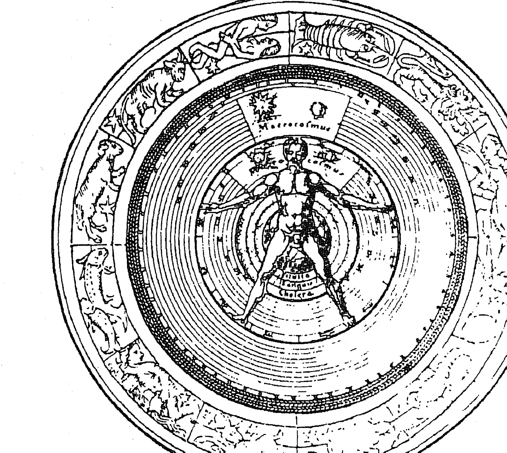

天人感应模型-星空是大宇宙(macrocosm)，人是小宇宙(microcosm)

# 第一章 占星學的哲學基礎

占星學在全球各地的歷史文化中，幾乎都曾扮演一定的角色，而具有相當強盛的生命力，已成人類社會的共同文化資產。目前在西方世界，因有學養俱佳的占星學家前赴後繼地努力研究，於20世紀已經放出燦爛的光芒，但在東方世界，除印度占星學的特殊地位外，其他地區似乎見不到令人振奮的果實，一般網站或叫座的占星節目，大都停留在膚淺的基本星座解說而已。儘管紫微斗數盛行一時，畢竟它僅是藉由虛星演繹，非屬於真正的占星學，而中國的七政四餘占星學，雖具占星學的內容，卻仍陷於陰陽五行的泥淖，未見大開大闊的格局，流行程度反不及紫微斗數和八字命理學，殊為可惜。

占星學在某種程度係屬類宗教，涉及心靈的討論，在發展過程中摻雜許多宿命論的觀點，常被科學人士所排斥，他們以特定的方式來檢驗占星學，即率爾抨擊占星學的不是，動搖許多想學占星學的人。另外比較沒有科學根基的占星學家，也不敢捫其鋒，而僅一再強調占星學是藝術的、神秘的，甚至自我逃避於心靈的邊陲領域，面對科學衛道人士的攻擊，不敢說出“我是學占星學的”

心靈、物質孰是孰非，自古希臘以來一直是哲學的重要命題，至今仍爭論不休。本章分節討論占星學是什麼，從而演伸17世紀以來牛頓古典力學的核心觀念，20世紀初期兩大物理理論，即相對論和量子論的發展及隱含觀念，20世紀末期混沌理論，複雜科學的特殊意涵，讓讀者瞭解量子論所揭藥的宇宙觀是心物合一的，而混沌理論、複雜科學，顯示系統各因子的互相作用，形成非線型動力，似看混亂卻亂中有序，宇宙間有股神秘力量在運作。20世紀科學界的三大發展方向，事實上正搭起心靈與科學的交會。我們將以著名的物理學家大衛 波姆(David.Bohm)的觀點說明，心靈或意識與物質是不同層級的一體兩面。碎形幾何結構為典型的天人感應模型，卻無處不在於我們的生活周遭。另外瑞士著名的分析心理學家卡爾 容格(Carl.G.Jung)所創立的一些觀念，正是人類心靈重要寫照。上述這些意義，在某種程度上，可以融合作為占星學的哲學基礎。

## 第1節 占星學是什麼？

我們可從占星學的英文原名Astrology來瞭解，它源自希臘語的兩個字詞，Astra是星星之意，和Logos是邏輯或理由之意。就字面上的意義，占星學即是由星星或行星來顯示的學說、教義或法則。

1960年代英國著名的女占星學家瑪格麗特 伊 荷恩 (Margaret.E.Hone)在其所著《The Modern Text-book of Astrology》·書中對占星學的定義，已被學習過占星學的人所廣泛地認知，她說「占星學是解釋行星作用與人類經驗之間關係的一套獨特系統。」對強調心靈的人 比較直接體會行星作用的神秘意涵，但對強調物質或過於理性以科學為重的人，就緊抓行星作用到底是什麼？如何實證？等問題不放，而強悍的科學基本教義派人士甚至搬出宇宙的四種基本物理力，即

- I. 遠距物體質量間之交互作用所偵測的重力(引力)
- II. 光和帶電粒子的電磁力
- III. 質子和中子凝聚在原子核裡的強核力
- IV. 放射性衰變有關的弱核力

輕率地推論「門對嬰兒的引力效應大於出生時冥王星的引力效應，所以若門對嬰兒的心靈無任何關聯，那麼出生時冥王星如何能關聯到嬰兒呢？」就狹義而言，這種說法是有效的，符合邏輯，但占星學所顯示的並非是由引力運作，也非其他三種物理力的功用。那麼占星學真正的作用力是什麼？坦白說，就目前科學水準仍無法具體地呈現，但從中醫的蓬勃發展及其療效，占星學所揭示的生命藍圖未嘗沒有先驗的天才直覺或潛科學成分。曾幾何時，中醫的草藥、針灸不也是受盡嘲笑，稱之為迷信。

科學精神及功用，確實帶給人類社會莫大的福祉，航太工業延伸人類的生活空間，電子資訊的綿密，縮短了溝通的距離，生化科技的進展促進人類健康與壽命的延長......。但並不能因科學的功績，就一切唯物是從。我們看看今日生態環境的重大破壞與變化，無一不是科學種下的惡因，科學的信仰若不含有心靈、人文的關懷，純唯物思想的科學，祇會加速大地之母-地球的毀滅。

今日科學昌盛，它的應用技術帶來龐大的工業利益，令人驚嘆，近代西方文明的甜蜜果實，可說完全歸功於它也不為過。科學的重鎮-歐美，更成為全球的政經中心及知識重地，科學已成為知識的最高型態，社會的最高威信。於是科學家無意識地高人一等，20世紀30年代的傑出科學家萊欣巴哈(H.Reichenbach)在《科學的哲學之興起》就語重心長地指出「就大部人而言，科學信仰已取代了上帝信仰，而科學家也化身為神，他的訓諭必須毫不猶疑地接受」科學的衛道人士所堅持的信念，即是這種無意識心理作祟。但如果我们冷靜思辨現代科學發展的方向，會發覺科學衛道人士所死執的信仰，仍停留在牛頓的古典力學模式，並以此來攻訐所有心靈、精神或神秘的事物。然而自17世紀所發展的牛頓古典力學模式，難道就真的那麼完美無缺，可作為天下所有事物的典範？

## 第2節 大衛 波姆的宇宙實相觀點

所謂的牛頓古典力學模式，是一種機械論的宇宙觀。它是絕對的、秩序的、確決的、一致的；可以用數學方法和實證推理來重複驗證的因果關係，絕對的客觀與獨立，絕對的空間與時間。在這種模式下，宇宙被認為是完全可以被預測的，每一個因會產生一個果，而每一個果都有一個因，所以若知道一個狀態的初始條件，就可以推斷其過去與未來，這個過程可以用數學表達和計算出來的。這種模式是西方科學的樞紐，促使各項科學領域的重大發展，但進入20世紀後，現代物理科學的一大發展方向，相對論和量子論，以及較後期的混沌論(Chaos Theory)和複雜科學(Complexity Science)都已深深擊中古典力學機械論的要害，我們簡單說明於下

- 一、愛因斯坦提出「相對論」，說明「同時」(Simultaneity)的相對性，時間與空間的不可分離性，甚至時間空間與物質的相互依存性，打擊了古典力學絕對時空、運動、質量的觀念。
- 二、A. 混沌論說明任何系統存在著非線性(Non-Linear)動力，因果非比例關係，蝴蝶效應(Butterfly effect)一系統達到某種不穩定時，內在微小的變化，往往會導致極其重大的效應，高雄的一隻蝴蝶鼓翼，可能會造成台北汐止淹大水。
- B. 複雜科學進一步提昇混沌論的精髓-亂中有序，各系統中各因子非獨立運作，是互相作用的，經由循環和回饋，各因子能自我組織性地產生適應。系統雖徘徊於混沌和秩序之間，有結構但難以預期，但因各因子的碎形(fractal)型態，能產生自我類似性(Self-similarity)，得以自發產生秩序，此即亂中有序。

混沌論和複雜科學闡明非線性動力，無法像1+1=2那麼簡單的決定論，除了古典物理法則外，尚存在著互相作用，非獨立個體的觀念，也打破化約論的邏輯。

從量子論創立後，等同宇宙的實相應有股神秘的力量有了科學的說明，量子論的許多先賢，如玻爾、薛丁格...等都對東方的神秘觀點給予正面的評價。1937年玻爾訪問中國，他發現自以為最得意的科學創見-互補思想，早就由中國的太極圖表露，引為訝異，他死後的永久紀念碑就雕刻著相當醒目的太極圖。薛丁格則從印度哲學領悟到大自然的每部份，都同它的整體息息相關，在無窮的變化中又保持著永恆。他從東方古代哲學有機論自然觀中發現了智慧光芒，深刻瞭解量子世界就像個有機世界，粒子的運動狀態同觀察者處於互相作用中。擊碎了“與觀察者無關”的客觀世界。自然與人　肉體與靈魂互相結合而為渾然一體，即是典型心物合一的寫照。

混沌論與複雜科學更以自然界無處不在的碎形幾何結構，昭示大宇宙、小宇宙的關係，即

> 「上天如此，地下如此」(As above, As below)

。西漢 劉安《淮南子》云

> 「故頭之圓也象天，足之方也象地，天有四時、五行、九解、三百六十日：人亦有四肢、五臟、九竅、三百六十(骨)節，天有風雨寒，人亦有取與喜怒，故膽為雲，肺為氣，腎為雨，脾為雷，而心為之主。」② 這種類比法很樸素地顯示出「天人感應」的觀念。有關神秘學、術數的研究，就常以這種類比法，占星學自然不例外。

從以上現代科學的發展，可知死執牛頓力學模式來抨擊一切有關心靈宗教、神秘學、術數或占星學，實不值與之論道的。這些學問也許只是個假設，目前尚未有直接驗證的作用力機制。但美國物理學者亨滋 裴傑斯(Heinz. R. Pagels)在《理性之夢》的一段話發人深省值得轉載，「有很多假設是不能被直接驗證的，但從假設推演出的結果，則是可被驗證的，假如結果符合經驗，則假設正確的可能性會被增強」 ③ 當然我們不是在替這些學問找個護身符，可以擋掉來自質疑者的攻訐，研究者或實務操作者應本著搭起心靈與科學的橋樑，將研究結果作驗證以杜人口實。

## 第2節 大卫 波姆(David Bohm)的宇宙实相观点

当量子论阐明宇宙实相为不确定关系、机率性、主观化、量子跳跃时，爱因斯坦相当不以为然，甚至说出「上帝不玩骰子」反驳量子论机率性的名言，但往后的量子论发展，证明他错了。爱因斯坦基于对物理理论的完美探索，认为宇宙实相尚有未被发现的变数，它能够说明事件的机率面向。这些变数称之为隐藏变数(hidden variables)，如果找到他们，那么物理学就有个良好的哲学基础。量子论发展过程一个相当重要的关键点，即光既是波，又是粒子，演伸为波是粒子，粒子也是波，物理学界称之为波粒双元性(Wave-particle duality)。在古典物理中，波和粒子是不相容的，但量子论的次原子有此特性，且经过实验证明，确有波粒双元性的现象，这隐含两大省思。

- I. 科学知识(古典物理)与直接经验不相符合的事实
- II. 波粒双元性揭示的物我合一，从而物理科学已由观察者纯然独立于被观察物体的绝对客观，走向观察者参与的主观化，亦即世界不再外在于我

上述II的现象是因测量一个电子时，祇可能知道它的位置(粒子)或动量(波)两者之一而已，绝对不可能知道它的全貌，祇能就所选择的部份加以测量。美国学者盖利·祖卡夫(Gary Zukav)在《The Dancing Wu Li Masters》曾生动地描述这种现象

> 「在哲学上，量子论的意义实在令人困惑。依量子论，我们不仅影响了实相，而且在某种程度上我们还真的创造了它。」

由于事物的本性使然，我们祇能认知粒子的位置或动量，而无法同时认知两者，我们不得不选择测量这两项属性的其中一种。在形而上学，这就等于说，因我们选择要测量某些属性，我们就创造了这些属性。换句话说，很可能正因为我们有意要测量位置，而如果某种东西占据了一个我们想要测量的位置，我们便无法测量位置，我们才创造了带有位置某种东西，如粒子。」④

依这种说法，则我们所想要测量的属性，不仅是我们(观察者)创造出来的，连带有这属性的物体本身也都是我们创造出来的。显然观察者参与赋予主观化，观测意涵了意识，亦即意识会让受测体产生变化，这种新的物理科学观，对仍固守牛顿力学模式的物理学家来说，排斥抗拒不言可喻，但量子论的实证结果，实在是不可承受之重。

另外，1935年爱因斯坦和波多尔斯基(B. Podolsky)、维森(N. Rosen)设计一个实验，发现将「零自旋双粒子系统」(two-particles system of zero spin)的双个粒子分开，其中一个飞向A区，另一个飞向B区，然后使飞向A区的那个粒子通过磁场。结果在A区的所作所为(改变磁场设定)，总会立即影响到B区的粒子。令人不解的是，B区粒子为什么那么快速立即地获得A区粒子的讯息，即时地调整自己的行为。这种状况跟一般古典物理，或西方哲学观念所认知的「每一个个别的事物都自立自足的存在」相抵触，而且世界上最快的是光速，若靠光的传递也需时间，B区的粒子行为不可能立即地受到A区粒子行为改变而改变。爱氏等三人的实验，即是著名的EPR矛盾。

1964年，美国物理学者贝尔(J.S. Bell)，构想了另一个实验，而由克劳塞(J.Clauser)与傅立曼(S. Freeman)在1972年付之实现，实验的对象是一对对光子，它是构成光的量子，所以光子的速度即光速。让光子以光速朝相反方向飞去，排除以光的信号互相传递讯息，但结果光子仍始终行动保持一致，更证实了EPR矛盾，表示它们无需任何媒介，即可以有良好的联系。想想看心电感应、天眼通等不因空间距离多远而立即地感应的神秘现象，与EPR矛盾或贝尔定理无甚差异。英国学者赛琳娜·罗芮道格(Serena.Roney-Dougal)在《科学与神秘的交叉点》就提供了哲学上的省思，她说「不论是在EPR矛盾还是贝尔定理中，系统都不能分裂成依一般通则之不同部分，而是在整个系统中 其不可见的联系中，每个部分都对整体具有一定的意义。就更广泛的概念而言，至少从物质而大多数反对瞬间同时性、心电感应和天眼通等可能性的哲学思想，如今已被新的物理学彻底地改变」此即量子论揭示的整体性(Wholeness).告诉我们宇宙实相中没有独立的事件，每件事都是不可分的而互相联系。人类的思想、心灵的过程也具不可分割性。古典的物理学将实相解析为个别的、可描述的部分组合而成，尽管也可能自觉到整体宇宙的相互连接，但研究方法仍是个别的检验单独的事项。

> 「不论是在EPR矛盾还是贝尔定理中，系统都不能分裂成依一般通则之不同部分，而是在整个系统中 其不可见的联系中，每个部分都对整体具有一定的意义。就更广泛的概念而言，至少从物质而大多数反对瞬间同时性、心电感应和天眼通等可能性的哲学思想，如今已被新的物理学彻底地改变」

从以上所述的隐藏参数、观测者参与、整体性，一一地违反古典物理的法则，但要从目前的学理诠释它，又捉襟见肘，譬如从一般物理原则，实相如果是地域性，那么资讯的传递速度不得大于光速，才符合狭义相对论的观点，即占星学的哲学基础

在我们三维世界里，信号不能超过光速，但贝尔定理则指出实相具非地域性。因而要同时包容狭义相对论与实相非地域性，贝尔假设在我们的宇宙之外尚存在另一个更深的层面，方得以解决这个两难。有心探索实相本质的物理学都，都不可避免涉足心灵领域，常以东方哲学的观点来切入，至目前为止，比较受人注目的是美裔物理学家大卫波姆的见解。

波姆(1917-1992)在美国宾州长大，就读于宾州州立学院，而在加州州立大学柏克莱分校获得物理学博士学位。1943年参与曼哈顿计划的短暂工作后，获聘前往普林斯顿大学任教，而与爱因斯坦为同事，后来在1951年美国兴起麦卡锡反共白色恐怖，他拒绝作证，无法继续获得普林斯顿大学的聘书，不得不前往巴西，后转往以色列，最后在英国的布里斯托(Bristol)大学任研究员，1961年被提名为伦敦柏克贝克学院(Birkbeck College)的理论物理学教授。

波姆虽是位顶尖的量子论物理学家，但对心灵的探索并不排斥，且由其中获得不少宝贵观点，而能建立他的宇宙实相模式。如他从印度哲学大师克里希那穆提(Jiddu Krishnamurti)的书《论自由》中谈论观者与所观的概念，体悟到量子论观察者参与的神奇。

坦白说，波姆的宇宙实相模式不容易了解，且无简捷确切的数学式子来表达，因而不受唯物派的物理学家所认同，但若以开放的心胸，细细体会应可了解其模式才能真正合理说明上述量子论的两难。

波姆的主要著作为《Wholeness And The Implicate Order》，和海利(B.J.Hiley)合著《The Undivided Universe》，和皮特(F.D.Peat)合著《Science*Order And Creativity》。

我们整理大衛波姆的观点如下：

- 1. 整个宇宙应被视为一个不可分的整体，因此对任何分离和独立的存在部分的分析，都不具基本依据。
- 2. 宇宙的运作是多面向的，称之为整体动态，一层又一层的秩序全都融入，类似佛家“万物一体”为无限维的根源。上一层的秩序绽放(Unfolding)下一层秩序，而下一层秩序又总藏(enfolding)于上一层秩序中，不断展开的整体性。
- 3. 不可分的整体为隐秩序(Implicate Order)绽放我们三维的世界，包括物质、时间、空间，称为显秩序(Explicate Order)，亦即显秩序参照隐秩序，由其涌现。
- 4. 身·义(Soma Significance)的观念，是指身(即物理的)和它的意义(即心理的)绝非分别存在的，它们是一整体实相的两面，每一种面向反映且意涵另一面向。

大卫波姆建立宇宙实相为一个不可分割的整体性(Unbroken Wholeness)，天地万物交互融通，彼此并未分离。因而EPR矛盾和贝尔定理的物理学两难，透过波姆的模式就可迎刃而解，因为粒子本来就融通无碍，随时立即将讯息传送给对方，不需任何时间。不可分割的整体性意涵了人类彼此之间以及人类与自然间，都具有密切的关系，说得更明白些，这些都是同一个整体的投射。祖卡夫在前引书也提到“这个支撑我们物质世界的观念，并非独立存在的，无可分析的实体所构筑而成，而是由各组成分字交织的关系网，它的意义完全来自于整体之间的关系。”

在哲学上的省思，不可分割的整体性，让我们体悟到我们的任何作为，会影响到整体，反过来说宇宙万事万物也会影响到我们。占星学的假设认为宇宙星辰会影响到人类，由大卫波姆的宇宙实相模型，可得到诠释。

隐秩序绽放显秩序，而显秩序总藏于隐秩序，这种整体动态(Holo movement)过程，不易了解。波姆以一滴墨水掉入一杯甘油的实验来作比喻。如果搅拌甘油，该滴墨水会逐渐融化而消失，也就是墨水折叠总藏融入了甘油，但如果再倒转搅拌的动作，如影片倒带，墨水就会重新绽放。另外电视影集中的所有影像如人物、花木......等，就好像浑然一体地被折叠于分布广大空间的电磁界，当电源打开影像又显现在萤光幕上。

绽放和总藏是整体动态的基本特质，会呈现整体包含于每一部分，而每一部分会展开成整体。大卫波姆以全息摄影(holograph)的概念进一步解说，“希腊语holo的含义是整体，graph的含义是写，因而全息摄影就是描绘整体。借助于发出高度有序的激光，散漫四射的光波可被聚到一点，而被摄到的仅是光波，而不是物体的形象。值得注意的是，在成像的照片上，它的每一部分都可产生整体物体的形象。与照相机拍摄的照片不同，它与所摄物体不是点与点一一对应的。每一物体的信息都包含在它的每一部分之中；当这个被包含的信息被展示出来时，一个图像产生了。因而全息摄影昭示了一种全新的认识和对宇宙的全新理解，那就是整体的信息包含在每一部份之中，世间万物便是这种信息被展示的结果。”⑤

波姆以全息摄影解说宇宙实相得到曾担任史丹佛大学神经生理研究所所长卡尔普利布兰(C.Pribram)的大脑生理学之研究相呼应，即脑部的每个部分都含有整体的所有资讯，人类整个身躯和心智的所有形式和构造被折叠融入脑部的每一区。英雄所见雷同，两人遂惺惺相惜成为好朋友，为学术界的佳话。

另外，波姆的身一义观念是从整体动态归纳而得的，我们物理的和心理的世界，都是从隐秩序创造出来的，它代表同一个整体实相，身(物理的)和义(心理的)两个面向。每一种义都是根据相关的身来的，这种关系波姆以所称的含义(meaning)来关联的，含义是身和义的桥梁，是意识的根本特质。如果我们深刻体会大卫波姆的隐秩序的整个概念是藉由无形经过明显化或绽放的过程来讨论有形的来源的一种方法，那么就不难领悟身、义及含义的关联了，宇宙就是以这三个互相包藏的层面显现。索甲仁波切《西藏度亡经》更以含义类比法身，义(能量)类比报身，身(物质)类比化身，阐释大卫波姆的物理科学宇宙观，与西藏神秘的三身心要，如出一辙，令人惊奇。

最后我们归纳大卫波姆的宇宙实相模型如下：

一个未分割的整体以总藏与绽放的整体动态过程流动，其中每一部分折叠融入于整体；这个实体的三个基本显现为物质(身)，能量(义)和含义，每一个皆总藏其他两个，整体告知所有它的部分之行为，而这些部分也回馈至整体的流动。这个流动显现让我们感觉得到的，称之为显秩序，其他广大隐藏在上层的，称之为隐秩序。

大卫波姆的宇宙观对占星学提供那些重要启示呢？

- 1. 从全息摄影的概念，提供小宇宙(人类)和大宇宙之间的关系，即“上天如此，地下如此”。
- 2. 占星学的作用机制，并非建立在某一行星送来射线给我的大脑，使得我有类似该行星的作为，而是行星和人类是一个简单的动态过程，由含意形态结合在一起，占星家利用天宫图试图来描绘这个含意形态，找出隐含的智慧，但因含义无法量化，占星学就难以古典决定论来作科学性的证明。
- 3. 解读占星学的天宫图，就如显现隐秩序的图，在意义上，占星学是秩序的科学，为精緻秩序和行星物体移动之笛卡儿秩序之间的交互关系。
- 4. 占星学假设某些原型(archetype)的存在，它是隐秩序的先驱显现，而这些展露的循环形态攸关于行星的移行，占星家根据这些充分的循环性与严谨性，得以就特定行星的特定原型予以分析。

## 第3节 混沌论 复杂科学的碎形结构

300多年来，西方科学发展一直朝向将万物解析成分子、原子、核子、夸克等化约的小球，服膺牛顿古典力学的运动定律，在三维空间的碰撞里，是独自分离的、客观的、具决定性可预知的。尽管量子论已打破古典物理的神话，但客观性的宇宙模型，仍是科学界的最爱，美国相当著名的科学哲学家孔恩(T.S.Khun)所强调的典范转移(Paradigm Shift)需要经过革命、常态科学、危机的三个阶段，古典力学模式即处于危机的阶段。

1970年代兴起另一波科学革命的思潮，带动科学界对无规律现象的研究，此即混沌论，由于各科学领域各有无序现象，经由跨领域的整合，又促使复杂科学的研究风潮。混沌论与复杂科学的精神其实都是一致的，很实际地研究生活周遭的事物，现实世界中许多不规则的现象，如星云、海洋浪潮、股票指数、高速公路上阻塞的车阵、水管中的水流...等似乎是没有秩序、条理的状态。经过研究发现这些混乱的现象，其实仍存在着某种规律，亦即乱中有序。如拥挤在车站月台的人们，看起来毫无秩序，若广播说某列车改在某月台上车，这些拥挤的人潮自然会立刻转向，形成乱中之秩序来。

混沌论一直被誉为是20世纪中继相对论、量子论后的第三项革命性理论，它的特色及打破古典力学化约论，我们已在第一节叙述过；其中各因子的碎形型态能产生自我类似性，因而得以自我组织性产生适应，经由循环，回馈，系统在开放状态下，显现乱中有序，那么碎形结构是什么呢？

传统的欧几里德几何学教导我们的，只能描述整齐而规则的图形，但要描述大自然的许多形状，如山脉、海岸线、河川、云朵、血管、树叶，而它们看起来有些凌乱，但若仔细看，发觉虽然不可能有两片树叶完全一模一样，但它们的形状却相当类似，立陶宛裔一位任职IBM公司的电脑专家，毕诺特曼德布洛特(Benoit.Mandelbrot)，及其同事查德沃思(Richard Voss)提出碎形图案(一般称之为曼德布洛特图案)⑥，有力地解释无处不存在于我们生活周遭的许多碎形结构，竟是那么有类似性的美妙结构，如树叶、雪花、股票价格走势、云朵形状、海岸线...比比皆是，这足大自然的奥妙。局部和整体类似，局部的局部也与整体类似，而整体也说明局部的形状。上节介绍的大卫波姆的不可分割之整体性思想在曼德布洛特图案得到相当明确的实证。该图案在学术界以碎形结构作为代表，碎形结构中的局部，会产生自我类似，因而局部就含有整体性，各系统的因子类似这种机制，而产生自我组织性，适应系统内的运作机制，必然产生循环与回馈，就不致失序。所以混沌论所强调“初始条件的微小变化”会产生结果之巨大误差的蝴蝶效应，而无法预测，事实上因自我类似，得以乱中有序，不致如热力学第二定律所说的，宇宙为独立的封闭系统，会因熵值增加，且不可逆过程，最终失序、分裂、腐败，走向热死的命运，这一天就是世界末日的来临。

从混沌论到复杂科学就是因发现自我类似性，产生自我组织性，各因子的互动关系，尽管系统介于失序和秩序之间，却是失序与秩序的平衡。系统内各因子不会固定，但也不会分崩离析，自我组织地循环与反馈，彼此互动，进而能稳定地维系运作，足够的创造力呈现丰富的生命力。所谓的自我组织，就是系统内的各因子，会不断成大的结构，低层次的单元会自动组织成高层次的系统，透过突现(emergence)，复杂性会增加，如下二例：

- (I) 细胞==>组织==>器官==>人体
- (II) 员工==>部门==>公司==>企业集团==>国家经济体==>世界经济体

突现的意义是自我组织的宏观性质出现，如人类为了交换所需的物品，而有市场的突现，为了感情需要慰藉，而有家庭、宗教的突现。

另外，混沌论中有重要名词奇异引子(Strange Attractor)，它源自动力学系统。当我们要确定粒子在任何时刻之位置和运动，并给予这些变量的关系。划出图形，称之为空间图形(Phase Space graph)，利用它可直接观察混沌系统的状况，在空间图形中的轨迹，就好像要这个图形定型，称之为引子，这种现象表示系统被吸引至一个不可避免的全面性行为，当引子具精緻且十分清晰，称之为奇异引子。混沌论重要贡献人，爱德华劳伦兹(Edward. Lorenz)所发现之类似蝴蝶型之劳伦兹奇异引子，最为典型。

本质上，奇异引子具有自我类似性，或碎形结构，经由自我类似之部分呈显整体性。

最后我们分别整理混沌论与复杂科学的特性如下：

即使极少数很微小的个体所构成的简单系统，都可能灵敏地感应出最微小的干扰，因而使它以一种随意且不可预测的方式进行活动。

- 无秩序且无规律的
- 不可预测的结果
- 不规律来主宰
- 未来不能由过去决定
- 非线性动力
- 因果非比例
- 引了或奇异引了存在

确定混沌为一种随机性的非线性型态，但混乱中却有秩序，即初始值产生微小的误差，经由非线性的迭代作用(iteration)而迅速扩大，陷入混乱，但系统内除了物理学的规则外，尚存在着碎形结构，各因子自我类似性，产生自我组织，经由循环与回馈，使系统产生更丰富的生命力。

- 混沌论的现象
- 系统中各因子互相作用
- 碎形结构
- 自我类似性
- 循环与回馈
- 自我组织
- 适应性

混沌论及复杂科学再一次说明古典力学，绝非科学的唯一典范，那么它们对占星学有那些重要的启示呢？

- 1. 碎形结构和自我类似性，揭示小宇宙/大宇宙的对应原理，即天上如此，变成许多个地下如此，每一个较小层次可以较大的层次来了解，占星学即是生命的碎形几何。
- 2. 系统内各因子的互相作用，说明人类与星辰，人类与环境，或地球与天球间的关系，是整体性的呈现。
- 3. 占星学的每一种分类，都有碎形结构的运作，天宫图即是占星家试图了解，存在于宇宙中动态过程的关系，天宫图可视为一个奇异引子，为论述事件、个性、婚姻....等形态的大纲。
- 4. 天宫图中的要素，星座、宫位、行星，或特殊敏感点，都是引子或奇异引子，都含有自我类似性的多样性，为已定整体中的混乱，如同海王星代表海洋、船、酒精、中毒、浪漫、艺术....等多样性，自然界中的秩序与随机性并存，亦是此象。
- 5. 占星学使用的时间与空间型态也有碎形结构的自我类似性，如流年系统的各种方法皆是，次限系统(Secondary Progression)的一日代表一年，一日即一年的碎形。主限向运(Primary Direction)的天球自转约4分钟代表一年，4分钟即一年的碎形。后天宫位的产生是黄道星座每日运转的碎形，而星座则是一年四季的碎形，大年(Great Year)则是因黄道岁差移转后黄道星座的碎形。
- 6. 测定图(Geodetic Map)中，地球设想为黄道的碎形，其中蝴蝶效应让许多科学人士断定命运无法预测，但复杂科学却证明自然界万事万物，乱中有序，仍有一定规律可循，对从事占星学或任何术数的人，应有个警惕，命运的预测甚难，不可能100%，“不准免钱”是徒留话柄而已。
- 7. 初始条件的微小差异，会使结果差异甚大，因而占星学中的双生子，或占星双生子，困惑占星学或命理的问题，会有比较合理的解释。

## 第4节 集体无意识 原型 同时性

我们前面二节所谈的近代科学发展，说明科学与神秘的交会，占星学的运作机理的哲学基础，就是“天上如此，地下如此”的天人感应学说，但仍为具体解说，为何天空的星辰，与人类命运有所关联？这个问题自古以来即是怀疑论者紧捉不放的问题，一直到20世纪初卡尔容格提出一些深层心理学的观念，才使上述问题有比较具体的答案。

卡尔容格(1875～1961)，是20世纪的思想巨擘，他的学说影响心理学甚远，称为分析心理学，就容格的学术内容，则遍及心理学、哲学、自然科学、宗教学、神话学、灵魂学、占星学，当科学理论大放异彩，科技工业带给人类极亮丽的物质文明，他却专注于人类灵魂深处的研究，其成就令人景仰，被誉为“发现人类内在的哥伦布”。

容格的学说体系相当繁杂不易解说，我们祇针对比较受占星学家引用的集体无意识(Collective Unconscious)，原型和同时性(Synchronicity)来说明。

无意识(Unconscious)这个名词国内也有翻译成潜意识，最早由皮列尔宾内特(Pierre Jenet, 1859-1947)所提出，但经由容格亦父亦师的精神分析大师西格蒙佛洛伊德(Sigmund Freud,1856-1939)的诠释和运用而大放异彩，成为心理学史上的一项重要发现。人类内在世界的结构，若简单的区分，可分为两层，一为日常生活可以知觉感受得到的意识层，另一为更深层难以辨识的无意识层。佛洛伊德认为无意识层储存着本能的欲望和低等动物的性冲动，自童年期的性创伤与环境，即各种被压抑的欲望。一切的精神创伤皆源自性欲，但因受意识层的理性压抑，却常纠缠于意识层，当压抑不住时，精神官能疾病即爆发。佛洛伊德将精神官能疾病归因残留于无意识层的精神上创伤，一切源自性欲，如欲求不满，祇要了解原因，即能治疗，试图将人类的心理作用或精神纠缠以古典力学的因果决定论来解决。

但容格深入探讨灵魂学、神话学、人类学、古代艺术象征、考古学.....等，认为佛洛伊德的无意识性欲论太过简单，无法全面解释所有心灵现象。如几乎所有的人都怕黑暗和蛇，这种经验是人类共通的，非佛洛伊德的学说可以解释的，观点的差异遂造成他们的分道扬镳。

容格相当认同无意识的存在，但这个层面他将之分为个人无意识和集体无意识，前者的概念约与佛洛伊德的无意识概念契合，但后者则是容格独创的。他从实际的治疗经验中累积，发现病患反复在梦中出现的象征符号和人物象征，与太古时代的神话、艺术、人物有相当多的雷同，他认为这是人类集体共同的经验，只不过一代一代地留存于无意识层，经由梦的象征而触发，如有一案例，他的一位病患向他说“风是怎么吹，知道吗？是因为太阳中心突出一个阳具，它动的时候就产生了风”后来容格读到一本刚出版有关太阳神和风的故事，竟然和该病患所讲的内容，相当类似，容格认为这就是集体遗传的意象，因而提出集体无意识的概念。我们以简单的图(1-1)来理解。

物理学的场(field)是指空间里的区域具有某种物理特质，通常是不可见又不可触摸，只是在某种情形下，能够与物质起作用，依量子论而言，量子场为总藏的隐秩序，绽放的粒子就是显秩序，绽放的部分是物质的世界，我们可以感官的经验。美国心理学家威廉・詹姆斯(William James)曾指出，无意识这个观念本身可以跟物理学中的“场”概念相比较，就像粒子进入磁场会显现出一定的秩序，而在无意识的心灵场中，心理内容也会绽放某种特定的规律，当意识与无意识融合，也许就是灵光一现，容格主编的《人及其象徵》中“科学与无意识”章节就曾举例19世纪德国数学家高斯(K.F Gauss)灵光一现的经验，找到算术理论的某种规则。美国约瑟夫・马尔菲博士(Dr. Joseph Murphy)在《The Power of your Sub-Conscious Mind》更直言无意识的丰富内容，甚或有神性、佛性。若比较佛家的唯识和无意识，可知唯识中的第七识末那识、第八识阿赖耶识类比于无意识层的个人无意识，及集体无意识，故心灵净透，具有强烈的第六感，诗人或艺术家，或科学家解决问题等灵感，人类具有神通，并不足为奇。

容格在集体无意识中针对各种共通的心灵机能的现象，提出“原型”的概念予以说明。他假设原型是许多意象的表征，人类深层的意象并非全部隐藏在里面，他提出几个重要原型，如人格面具(persona)、阴影(shadow)、阿尼玛(anima)、阿尼姆斯(animus)、地母(Great Mother)、父亲(father)、英雄(hero)、圣童(pure/Divine Child)、贞女(Kore/The Maiden)、恶精灵(Trickster)、智慧老人(wise old man)、本我(self)。这些原型是人类生命中先天就具备的内在型式，一种活生生的心灵力量。每个原型都有光明和黑暗两面，容格进一步指出集体无意识中的原型是心理成长的源泉，如果能在意识和无意识之间建立合理的关系，对于心灵的健康甚为重要，他将达到心灵平衡的过程称为个体化(individuation)。并认为这是人类所有的心理活动所遵循的原则和过程，因而就可成为“一个不可分割的整合个人”。

同时性是容格另一项重要发现的心灵现象，他在原型的发展过程中，经验多次不可思议的巧合事件，试图从这些巧合经验里找出一个理论模式来解说，在1952年，他发表一篇论文：《Synchronicity - An Acausal connecting Principle》正式揭橥同时性的观念，即同时性为事件以非因果关系联系起来的原理。在同一时间点上发生两件或更多事件的种巧合现象，这些事件并不具有因果上的关联，但却是彼此具有意义的联结。

# 占星學的哲學基礎

有相同，或相似的意義。

容格對這些同時發生的有意義的巧合事件，分成三類：
- I. 某種特定的精神內容與其對應的客觀行動，兩者不約而同地相互暗合，而這種契合發生於同時。例：中國人常說的「說曹操，曹操就到」。
- II. 某種主觀的精神狀態與某種幻象（夢境或幻想），兩者不約而同地相互暗合，事件的發生的地點在一段距離之外，卻巧合地發生於同時。例：常發生至親親人逝世時，而有心痛或悵然若失之心電感應。
- III. 現在所察覺之事件，將於未來應驗，而此時刻係以夢境或幻象，其他象徵的方式出現。例：透過手相、面相、星象運勢、水晶球、解夢、天眼通...等。

同時性的現象已在量子論得到驗證，我們在前面談及的EPR矛盾和貝爾定理，發現量子論的非定域性，即是同時性的現象，說明了物理學、神秘學或玄秘學有共通之處，而這些學問的中心思想即是大衛．波姆的整體性，不可分割。在隱秩序裡面，所有的事件都是現在、過去與未來，連綿的現在，都是隱秩序裡的泛音(harmony)、共振，歷史是蘊藏狀態的綻放，過去已經綻放，未來將要綻放，所以同時性的各種類型，得以合理解說。

原型、同時性與集體無意識對占星學的啟示是什麼呢？

- 1. 占星學天宮圖的各項元素，如行星、星座、敏感點、後天宮位，都具有原型的特質，所以出生時，事件發生時天空的徵象，透過同時性的現象，得以昭示，甚或顯現該原型相對應的人間事件。
- 2. 占星學的天宮圖就似一張心靈的地圖，由原型的先驗秩序，為人性提供一套普遍而共同的法則，這張地圖描述一個人的內在世界的結構，進而為外在世界的事件。
- 3. 時事占星學(Mundane Astrology)討論星象與國家、地區城市...等眾人集體的事件，如地震、天災的關聯。當重大災難發生時，人們共同呈現的歇斯底里無異是集體的無意識所致，亦即時事占星學建構於集體無意識。

# 注解

> ① http://technovate.org/web/articles/astrology and physics.htm/ 《Astrology and New physics-part Ⅰ》 Integrating Sacred and Secular Science. by william Keepin. PH.D.
> ② 《新譯淮南子 精神》 P 306. 熊禮匯注釋 三民書局
> ③ 《理性之夢》by Heinz. R. Pagels，牟中原 梁仲賢譯
> 天下文化出版公司，作者自忖為科學基本教義派，但他的這個觀點，仍是研究心靈科學的人應予以注重的。
> ④ The Dancing Wu Li Masters. by Gary Zukav. Bantam. Books.1979,P28.
> ⑤ http://www.horoscopesnow.Com/articles/Keep-inl.htw/ 《Astrological Writings》 Astrology as a Sacred Science,the Holographic Universe,and Deeper Reality. Interview with physicist-Astrologer Will Keepin. PH.D
> - 請查看林和譯《混沌》- 不測風雲的背後天下文化 P.149 後的彩色頁。

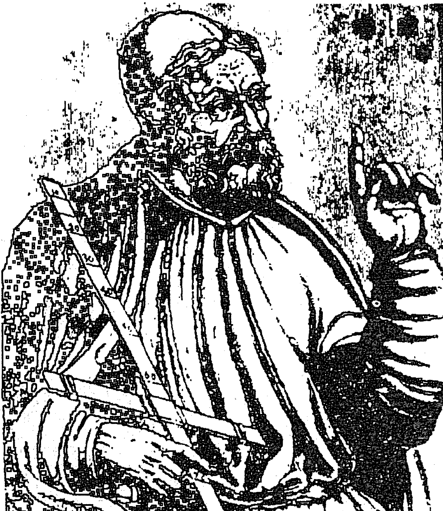
希腊化时期最著名的占星家 托勒密
(C. Ptolemy 約AD.100-170)

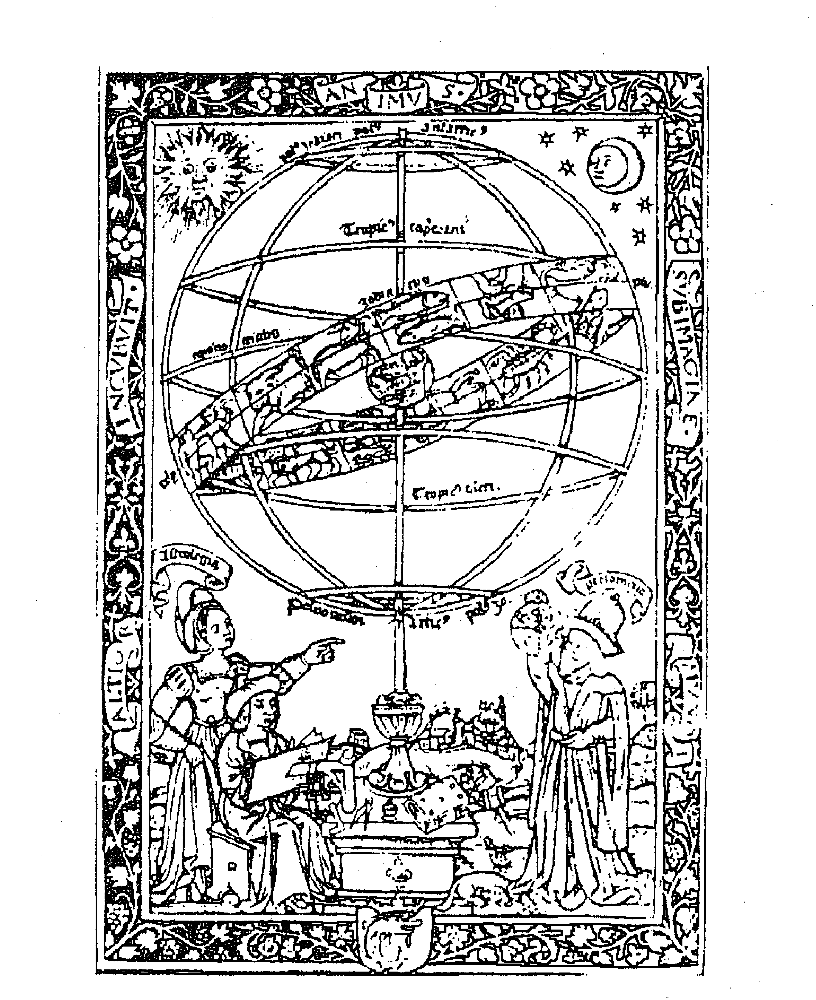
根据托勒密地心体系所形成的天球概念，地球在球心中央，天體以同心圆轨道，绕地球而行

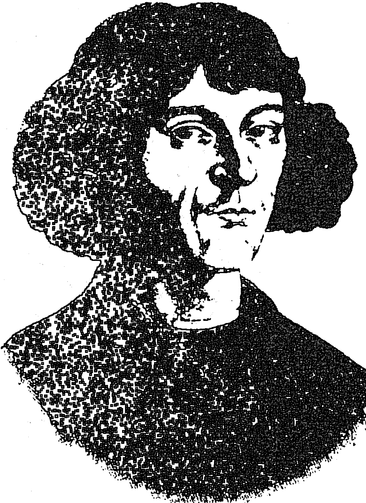
哥白尼(N. Copernius AD 1473-1543)
日心體系的發現者

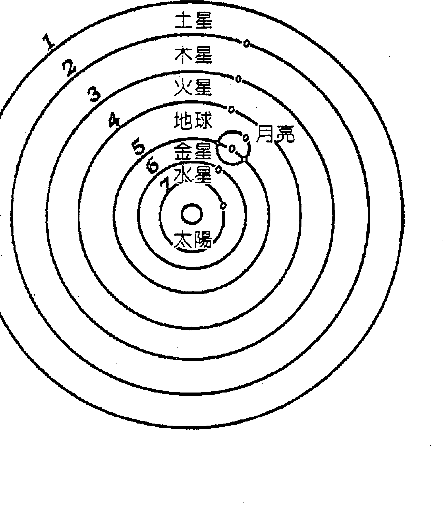
# 哥白尼的日心體系示意图
當時哥白尼仍認為行星運行的軌道是正圓形的。
一直到開普勒發現行星實際運行的三大定律，
世人才認知是橢圓形的。

# 第二章 占星學的歷史發展沿革

占星學的歷史長河淵源流長，我們在本章繪一簡表，約從B.C.8000年之發軔期一直到公元2000年止，就占星學發展主軸及旁支，按重要轉承來劃分，如它的發展第一次黃金期和第一次死亡期...等。根據這樣的段落，會很容易掌握占星學歷史發展的契機及變化，在這些段落中有關重要的占星學事蹟和占星學家，或對占星學發展有貢獻的人物，儘量予以論列。

本章旨在介紹占星學發展的輪廓，讓初學者有個基本概念而已，我們將在第1節敘述發軔期至第一次死亡，第2節由中世紀阿拉伯人保存，然後重回歐洲，到17世紀最鼎盛，再到第二次死亡，共劃分3期來敘述，第3節是從19世紀末，在英國重新復興至20世紀，另外由於20世紀後的發展，相當有別於19世紀以前，我們特設第4節說明占星學現代發展的趨勢概述，最後第5節簡述中國占星學與西洋占星學的交流。學院派的歷史學者，對占星學向來喜歡揶揄嘲弄，多次聲稱占星學已死亡，如吉姆·帝斯特(Jim Tester)的《A History of Western Astrology》就是一例，但事實上，占星學不僅未死亡，且多次如浴火鳳凰更加茁壯。這些現象絕非如反對占星學之人士所稱的，占星學僅是心理創傷者的精神慰藉。兩千多年來的生命力，其堅韌值得深入觀察。

# 占星學的歷史發展沿革

**表2-1**

| 發軔（約B.C.8000年） | 巴比倫人（加勒底人） | 埃及人 | 古印度吠陀哲學（約B.C.4世紀） | 第一次黃金期（約A.D.2世紀） | 希臘及希臘化 | 古波斯祆教 | 印度占星學 | 第一次死亡（約A.D.5世紀）聖奧古斯丁 | 羅馬 | 拜占庭東羅馬帝國（約A.D.3世紀~A.D.7世紀隨佛教東傳進入中國） | 保存與發揚光大（約A.D.8世紀~A.D.11世紀）阿拉伯回教國家 | 1. 結合中國陰陽五行演變成七政四余<br>2. 中西自行發展天文與星學 | 約A.D.13世紀中隨元朝征伐，回回學士進入中國 | 重返回西歐（約A.D.11世紀末經西班牙） | 第一次復興（約A.D.14世紀）文藝復興時期 | 第二次黃金期（A.D.17世紀） | 約A.D.15世紀末~17世紀中隨傳教士天文曆法進入中國 | 第二次死亡（A.D.18世紀） | 第二次復興（A.D.19世紀）英國復興 | 現代占星學 |
| :--- | :--- | :--- | :--- | :--- | :--- | :--- | :--- | :--- | :--- | :--- | :--- | :--- | :--- | :--- | :--- | :--- | :--- | :--- | :--- | :--- |
| **（發展主軸）** | | | | | | | | | | | | | | | | | | | | | |
| **（旁支）** | | | | | | | | | | | | | | | | | | | | | |

## 第1節 發軔期～第1次死亡

### 占星學的發軔

世界四大古文明之一的埃及，其鄰近區域的兩河流域，底格里斯河和幼發拉底河交會區域，即今之伊拉克，也孕育豐盛的古文明。據比較可靠的歷史考古文獻，約在西元前8000年以前住有蘇美人，這些古先民面對浩瀚的天空，常忐忑不安，天體的異常變化帶來災難，而不知所措，必然敬畏天地，這是各地先民共同的經驗，因為敬畏，而對天空的崇拜，祈求星星指引應可理解，將天上的星星當作神，覺得他們對人世間必然有重大影響。透過先民中智慧較高者，觀察天象，看行星的移行到底有何徵象。這些經驗的累積與傳承，多少可以獲得一些寶貴的訊息，如每年四季的遞變、晝夜日升日落的規律，從而作為先民生活作息的指引，以利農耕。早期先民根據時序推移，也會簡單地算出天上行星的周期，雖僅是觀察經驗，但這是天文學的濫觴，由於跟先民關心的禍福災祥較有關聯，占星學的基本核心意義就這樣形成。

發軔蘊釀過程是粗鄙的，但隨著人類智慧的增長，及掌握天象的更多經驗而建立起一些規則，不管是天文學或占星學，都是先民智慧的結晶；在其他古文明地區，也有這些結晶，祇不過各自傳承不同，保留方式差異，而評價不一。蘇美人的先民經驗因甚早發明數學計算，及以楔形文字記錄在泥板上，得以保存，即使後來受巴比倫人統治，卻因其優異文化，而同化了侵略者，將其文化傳承且發揚光大。


# 占星學的歷史發展沿革
19世紀中葉伊拉克一位留學英國牛津大學的年輕考古學家，荷慕茲德·拉斯南(Hormsuzd.Rassan)不顧當時法國考古學隊的挖掘權利，雇工在他的故鄉挖掘，卻挖出震爍古今的歷史考古大事，荷拉斯南發現的是B.C.668-627之間巴比倫地區統治者亞述王朝的首都尼尼微的宮廷圖書館，其中藏有25,000泥板，薈集中東古代智慧的精華，其中最令天文學界和占星家振奮的是有70餘塊，約7000餘條的徵兆預言(Omens Prophet)。經整理後發現都跟天象有關，遂揭橥了占星學源頭的序幕。後世占星學家稱之為巴比倫徵兆占星學(Babylonian Omens Astrology)。但嚴格地講，這些徵兆預言，尚無占星學的完整體系。

### 巴比倫時期

真正的巴比倫時代開啟，是在B.C.1758年，古巴比倫王朝聲名最顯赫的漢摩拉比(Hammurabi)統一征服了兩河流域，名垂千古的《漢摩拉比法典》使巴比倫的文明倍受尊崇，其名言「以眼還眼，以牙還牙」傳誦一時。

直到B.C.約16世紀，另一族亞述人竄起，成巴比倫地區的統治者，建立將近千年的亞述王朝，約B.C.669年漢尼拔(Ashurbanipal)登位，他是一位相當有作為的國王，為建立功勳，仍四處征戰，這也開啓了巴比倫與埃及、波斯...等地區的文化交流，漢尼拔對占星術(當時尚未具體化)頗為熱衷，就在首都尼尼微興建宮廷圖書館，將征戰各地所得之資料收藏，再加上亞述王朝歷來觀察天象的預言，合計成出土的徵兆結集(Omens Collection)，此即後世所稱之亞奴恩尼勒史詩(Enuma. Anu Enil)，之所以有這史詩名稱係因第一塊泥板鏽有“在亞奴神(Anu)和恩尼勒神(Enil)的時候”而命名，意即稱呼巴比倫地區上天之神，祈求他們保佑，而能瞭解天象之意。

亞奴恩尼勒史詩所記載的徵兆預言，幾乎都圍繞在國家大事上，所以當時巴比倫的徵兆占星學的形式，若以現代占星學的分類，歸屬於時事占星學(Mundane Astrology)之範疇，但為求吉利，也多少具有擇日占星學(Electional Astrology)的基本概念。

亞述王朝的文明雖大放異彩，但於B.C.612年由加勒底人(Chaldean)建立起新的巴比倫王朝，才真正奠定現今占星學的基本雛型，加勒底人被譽為與占星家同義，由於B.C.540年加勒底王朝被波斯人滅亡，而納入波斯帝國的一部份，其占星術乃向周圍擴散、結合波斯、埃及之宇宙觀念，而開啟占星學的整合，一般咸信，黃道12宮，每宮30° 約在B.C.5世紀左右就已確立。

後來約B.C.4世紀，地中海地區軍事強權馬其頓，亞歷山大大帝(Alexander the Great B.C.356-323)橫掃歐洲、中東、西亞，將希臘文明隨其四處征伐版圖大幅擴展，而形成希臘化時期，影響約800年左右，這段期間是占星學成型後的第一次黃金時期。

# 占星學的歷史發展沿革

### 希臘與希臘化時期

就占星學的發展歷史而言，有關希臘的深遠影響，約可劃分成古希臘，以宇宙哲學建構占星學時期，和以亞歷山大大帝東征擴展版圖，而與各地文化交融而形成泛希臘文化之希臘化時期，這其中也包含其後期的羅馬時代，公元476年西羅馬帝國滅亡為止。

希臘是世界四大古文明之一，B.C.8世紀的荷馬史詩的澎湃激昂，至今仍讓世人難忘，荷馬時期的希臘位處巴爾幹半島，被海洋和許多島嶼所包圍的多山國家，較難發展陸上類似古代東方的集權國家，藉由海上交通而形成經商貿易特色的新型式國家，當時普通平民與貴族對抗取得勝利形成所謂自由公民，以商人、手工業者居多，容易奠定經濟和政治實力，由於這種城邦特色造就貿易、財富、思想自由，而使希臘文明耀眼非凡，他們所建構的哲學觀念，至現今仍一直被稱誦。其中的宇宙哲學觀念及萬物生成源自四大元素，地（土）、水、火、風，直是占星學的重大支柱。

畢達哥拉斯(Pythagoras 約B.C.580-500)，數學著名的畢氏定理創始人，認為「數學的本原就是萬物的本原」提供宇宙天空的奧妙詩篇，也為占星學數學結構，如陰陽、三方、四正、相位...等提供了堅實的基礎。

柏拉圖(Plato B.C.470-347)所著的《泰米亞斯篇(Timaeus)》敘說造物主如何利用四大元素，地（土）、水、火、風來創造世界，結合世界靈魂(World-Soul)和每個東西創造時就存在，但又分別為「自同」和「他異」從而解釋，赤道(自同)和黃道(他異)傾斜成約23.5°的「靈魂」，造物主讓他們循環運轉。

亞里斯多德(Aristotle B.C.384-322)，認為世界萬物的基礎是一種「原初物質」，即純質料冷、熱、乾、濕，再由其對立形成四大元素，而世界萬物再由四大元素構成，我們在第三章先從四大元素談起，有較詳細的說明再參考之。

亞氏提出地球是球形的，位於宇宙的中心，地球本身不動，其他天體都圍繞著地球運轉，天體圍繞地球運動分為若干層，如月亮、太陽、水星、金星、火星、木星、土星等依次一層層地排成若干同心圓，宇宙的最外層是不動的推動者，即神是一切天體追求的根本動力和最高目的。

亞氏的宇宙哲學對占星術影響極為深遠，經過托勒密(Claudius.Ptolemy)的整理，形成「地心體系」如下圖。一直是占星學最重要的基礎，即使現代已知是「日心說」，但占星學仍以地球觀察為討論核心。

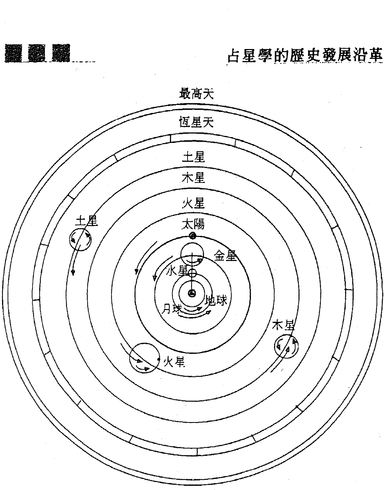
據考証托勒密約在西元後A.D.100-170之間，無疑是占星學發展歷史中最重要的標竿人物，他學識淵博，有關地理、光學，仍是現今必讀之書，占星學重要著作《四書》(Tetrabiblos)，已將占星學的架構及原理說明得相當詳細，若比對現今占星學讀本，除心理學、分宮、現代技巧外大抵都相通，所以說，占星學在托勒密時代，已奠定基調。

# 占星學的歷史發展沿革
約與托勒密同期或較早的羅馬詩人馬尼利烏斯(M.Manilius)所著的《天文學》(Astronomica)，將斯多亞學派(Stoic)的宿命論和占星學結合，強調「命運控制著世界，萬物都依無可避免的定律……它創造了人們，但也在他們出生時，決定了他們的壽數和命運的變化。」

在希臘化時期，除托勒密和馬尼利烏斯，較著名為人所知尚有二位，即都勒斯(Dorotheus of sidon)和維替斯·瓦倫(Vettius.Valen)在當代都有一定影響。

從上述這些人著作中，可發現天宮圖(Horoscope)已具備了，因此討論本命已不是問題，王朝宮廷所供養的宮廷占星家無時不在地為王公諸侯尋求吉利時刻，從事政治、軍事、經濟的活動。希臘化後期，占星術幾乎是王公貴族必備之知識，羅馬共和國末期，內外交爭的局面，奧古斯都(Octavius)即屋大維，就曾公佈自己的本命天宮圖昭示天下，自己就是天命真子，即將登上大位。

占星學歷史上就從托勒密之年代A.D.2世紀起一直到西羅馬帝國滅亡之前，占星術極為鼎盛的時期，稱為第一次黃金期。

### 占星學的第一次死亡

中國易經的陰陽學說，敘述任何事物是對立又統一，在占星學的發展階段，並非沒有反對者，如公元前B.C.2世紀柏拉圖學派的卡內德斯(Carneades)就提出「同一時刻出生的人，其氣質命運迥然不同。」以及「遭遇相同的人，卻不一定出生於同一時刻。」這些質疑鏗鏘有力，卻未見迴響，一直到A.D.5世紀，基督教聖徒聖奧古斯丁(St.Augustine，A.D.354-430)以基督教“萬能的主”不能冒瀆，在其名著《懺悔錄》(Confession)大事抨擊占星學。聖奧古斯丁早歲即研習過占星學，事實上，基督教早期發展中為吸引教徒，並未反對它，因宗教難免藉助神秘主義，尤其是基督的發展到壯大，正是羅馬帝國從興盛到滅亡，以至退居拜占庭(Byzantine)，這種動盪戰亂的年代，人們尋求神秘事物來慰藉，正是人之常情，而占星學中的本命占星學論述命運可填補這項需求，宗教界當然不能忽視，可是占星學的預卜未來和以一切為上帝旨意格格不入，自會引起基督教為維護教義而批判，聖奧古斯丁即是一例，他找到可以反駁占星學，僅是偶然的驗證而已，並非觀察星辰而得，即孿生兄弟問題，其實這已是老掉牙的問題，他卻宗教式熱情地大力駁斥，這在基督教有一定的影響。隨著西羅馬帝國滅亡，歐洲進入空前未有的文化黑暗時期，占星學的流傳似乎不見蹤影，占星學歷史稱之為第一次死亡。

## 第2節 中世紀時期

何謂中世紀時期甚難定義，我們僅以占星學發展作為劃分以利掌握其脈絡，原則上劃分三期：
- Ⅰ. 黑暗時期-阿拉伯人繼承
- Ⅱ. 重回西歐時期
- Ⅲ. 文藝復興～17世紀時期

### ※Ⅰ. 黑暗時期-阿拉伯人繼承

當歐洲邁入黑暗時代，中東沙漠地區的阿拉伯民族卻悄悄興起追求知識的熱潮，當他們知道拜占庭人、波斯人及印度人知道的事而他們卻不知道，甚覺差人一等，特別是拜占庭人；乃邀請有學識的外國人來到伊斯蘭地區-巴格達 (Baghdad)，也派密使到其他國家尋找書籍，而民間和政府機構大量將外國書籍翻譯成阿拉伯文。約在西元8世紀開始，有關天文學和占星學的希臘文書籍自然不可避免，也因這樣才得以保存古希臘占星學的原貌。阿拉伯人對占星學的貢獻，實值得大書特書，他們不僅保存原貌且在托勒密的天文學基礎下，做進一步的觀察與研究，更精密編製星曆表，推演了天文學及占星學的更科學的發展。

阿拉伯天文及占星家人才倍出，我們列舉：
- 1. 阿爾布馬薩(Albumasar A.D.787-886)，是阿拉伯占星家最著名的，他原本是位伊斯蘭教創立者穆罕默德(Muhammad)及其追隨者的研究專家，在30～40歲才開始轉向占星學研究，卻得到相當大的成就。在西方，他被尊為占星家之等同名詞，就如天文學家等同托勒密一樣，想像得到他的崇高地位，他最重要的一本書是《The Great Introduction》由於較龐大，又有濃縮本《The Abbreviation of the Introduction to Astrology》，一直是占星學界的圭臬。
- 2. 阿爾·比魯尼(Al-Biruni A.D.973-1048)，他是位學者曾花了數年時間在印度研習梵文，並向當地首席天文學家和占星家研習，生前似乎較不為西歐所知，但他的著作《The Book of Introduction in the Elements of the Art of Astrology》含蓋當時的天文學、數學、占星學知識，在20世紀初翻譯成英文才受重視。

### ※II. 重回西歐時期

當阿拉伯人在A.D.800年後其天文、醫學、數學、其他技藝甚為發達之際，歐洲的文化陷入了相當低潮，當然這段期間歐洲並非沒有占星家，但較不顯赫而已。A.D.1066年，英國諾曼公爵即威名遠播的威廉(William)渡海征服英國，由於他篤信占星學，由宮廷占星家為其選擇加冕禮之吉時，即公元1066年聖誕日的中午，這一時刻仍是研究英國國運的重要參考依據，而後占星學在英國大為流行。這些資料都從義大利、西班牙傳入，而義大利、西班牙之所以有這些學識，卻是經由鼎盛的阿拉伯文化輸入的。

原來阿拉伯人早在公元8世紀初就征服了西班牙，曾建立起後倭馬亞王朝，這裡的占星家也追隨阿爾布馬薩，形成所謂西阿拉伯學派，自然就成為阿拉伯通往西方的孔道。因此將阿拉伯保存且發揚光大的希臘占星學及天文學的寶貴占星學的歷史發展沿革

文化資產，就轉回西歐，讓歐洲即將進入文藝復興時期前，有個準備及曙光重現。

這段期間有幾個占星家，對整個占星學有極大貢獻。我們列舉如下

- 1. 古德波那提(Guido Bonatti)，確實出生年代未知，應是A.D.13世紀前葉，可推演他是位義大利人，為13世紀最負盛名的占星家，他所寫的《天文書》(Liber Astronomicus)相當重要，彙總阿拉伯占星書的精華，至今仍是不可多得的占星書。波那提曾受雇皇家，與敵軍作戰，親自在城堡上發號施令，按其選定時辰作戰，據載百戰百勝，令人噴噴稱奇，他的天文書影響17世紀鼎鼎大名的威廉里利(William Lilly)甚遠。現代占星家復古大將Robert Zollar就以其書作為論斷訣竅，頗受推崇。
- 2. 羅格培根(Roger Bacon A.D.1210-)，出生於英國的貴族家庭，是一位相當有才華的方濟會教士。嚴格說來，他是位哲學家，但演繹推理能力極強，被譽為現代科學之父。他對占星學的貢獻是極力擁護占星術，受其老師羅伯特葛若瑟泰斯特(Robert Grosseteste)對星辰力量的虔信的影響，全盤接受占星術，並贊憲基督教會正面積極使用占星術，認為占星術可用來擊敗不信基督教的韃靼人，培根的勇於辯護、論証，使當時的占星術有所依靠。
- 3. 聖湯瑪斯阿奎那斯(St. Thomas Aquinas)，14世紀，道明會教士，他調和了占星術與基督教神學的衝突，而讓日漸茁壯的基督教不排斥占星術，而有了轉寰空間，因為他加進了自由意志(Free Will)。他認為天上星辰是上帝意志的代行者，因此會控制人的肉體，但並不控制靈魂（即自由意志）。靈魂是用來與上帝接觸的，他的名言“聰明的人是星星的主人”，適當地排除了占星術之命定論，增加了自由意志，對占星學影響甚深。

### ※III. 文藝復興～17世紀時期

文藝復興（Renaissance）時期如何界定，一直頗有爭論，基本上是以土耳其回教大軍於A.D.1453年5月29日攻佔信奉基督教的東羅馬拜占庭帝國的首都君士坦丁堡（Constantinople）作為劃分。因當時希臘學者將其喜愛的古代手抄本，隨其移往義大利，而重現西歐，豐富滋潤西歐工藝文化，促進歐洲繁榮興盛。但就占星學而言，反而較早流行，隨著歐洲文藝復興，占星學再次綻放光芒，比希臘化時期更加昌榮，因此稱此時期為占星學的第二次黃金時期。其特色有

- (I) 歷史因離現代近且印刷術進步，一些重要典籍容易流傳、保存。
- (II) 王公貴族等上流人物趨之若鶩。
- (III) 星占曆書大量印行。
- (IV) 醫療與占星學結合，部份著名大學開設占星學課程。

我們從（II）開始說明

### （II）王公貴族等上流人物趨之若鶩

義大利的佛羅倫斯是文藝復興時期之重鎮，市政府就有正式任命的占星家。羅馬教皇篤信占星術的，不乏其人，常見占星家為他們選擇加冕的吉日吉時，宮廷裡頻見占星家顧問，作為決策諮詢。

英國女王伊麗莎白一世(Elizabeth I)，就由占星家約翰迪(John Dee)為其選擇加冕典禮的時間，更聽從他的建議而終身不嫁，也曾應用占星學偵測敵情。

丹麥國王曾資助著名的天文學家兼占星家，泰谷·布洛赫(Tycho Brahe)在哈芬島(Hveen)建立天文觀測站，天文儀器設備精良，馳譽全歐，當然泰谷也為丹麥王室作占星顧問。捷克貴族華倫斯坦(A.E.Von Wallenstein)，曾匿名叫泰谷的學生，著名的開普勒定律創始人約翰開普勒(John Kepler)得到相當離奇、曲折的準驗，後來16年後，又再匿名叫，但開普勒拒絕，可是仍資助他住宅及各種方便，專心編製星表。他的名言「倒洗澡水時，不要將小孩一起倒掉」，即不要為了打倒占星學的迷信糟粕，卻將占星學的功用也放棄。

16世紀末開始，英國政治進入動盪局面，政爭之雙方都會聘請占星家作決策諮詢。17世紀中英國最具盛名的占星家威廉里利不免介入其中，有趣的是競爭對手都會放出風聲說里利已站在己方，甚至連士兵都會看里利所編曆書之啟示而行動。他在公元1647出版《Christian Astrology》至今仍是占星學必讀之書。

這些事蹟不勝枚舉，說明知名占星家在當時之熱絡。

### (III) 星占曆書大量印行

星占曆書就如中國的農民曆，每年都有占星家編製，預告今年天象氣候、農作物收成、政治、經濟、軍國大事，頗受歡迎，幾人手一冊。知名的占星家所編製的，常一上市就被購買一空，這種景象當然加速占星術的普及化。開普勒的曆書更是赫赫有名，而里利也不遑多讓。開普勒在1595年更曾準確預測“土耳其入侵奧地利”“今年冬天特別冷”。

### (IV) 醫療與占星學的結合

在尚未進入新領域之前，醫療與占星學的結合，於中世紀甚為普遍，醫生常是占星家利用占星術診斷病情起因，並擇日開刀，注意放血，擷取藥草也注意時辰或日子，並將草藥依行星之類似性質歸類，取相剋性質來治療，因而發展出特殊的醫療占星學(Medical Astrology)，重視病人第一次臥床時刻 或尿液送至醫生處之時刻取疾運盤(Decumbiture)來作醫病關係，致病原因，治療方面的判斷，這在當時甚為流行連著名的大學都設有這方面的課程。里利的學生，尼可拉斯丘勒匹柏(Nicholas Culpeper)就是個中高手，也是草藥專家。

這段期間，除了上述所提之占星家的貢獻外，尚有

- 1. 約翰穆勒(Johann Muller A.D.1436-76)，他是德國天文學家，為尋求托勒密占星手稿來到義大利，曾擔任教皇的占星顧問，以其數學修養創立了一種分宮制，里利採用這種分宮制，作為卜卦用，此即Regiomontanus分宮制，採穆勒的化名來命名。
- 2. 拿斯特拉達馬斯(Nostradamus A.D.1503-1566)生於法國，至今仍是盛名不衰的預言家。他的預言在幾世紀後應驗異常，雖艱澀難懂，卻頗令人驚嘆。他曾受僱法國宮廷為皇家子弟繪製天宮圖。
- 3. 普拉德西(Placido de Titis A.D.1603-1668)他是以天球赤道圈分宮制聞名於世。至今其分宮法仍是占星學界用得最多的方法，當然有其影響。

### 占星學的第二次死亡

17世紀前的黃金時期，其實因文藝復興的昌盛，而蘊含科學思想之追求。這段期間科學人才倍出且光芒萬丈，實驗的精神 執著的態度都為人類開啟了新頁。如哥白尼(Copernicus)發現日心說，是天文學發展史最重要的轉捩點，卻因當時宗教思想氣氛，祇能在逝世前一年出版《天體運行論》。但是在一世紀後，經義大利的伽利略(Galileo)努力不懈地觀察，才得到合理証明，這種日心說，當然對主張地心說的占星家甚大衝擊，更讓原本反對占星學的人振振有辭，加上牛頓天體力學等，都使得理性主義抬頭，但實際上這祇是將天文學從占星學分離出去，有趣的是哥白尼、伽利略、牛頓等都是占星高手。不可否認天文學發展，使占星學落沒，但非此次占星學第二次死亡的直接原因，應是科學促進知識邏輯的進步，間接地便會對玄虛有所懷疑，於是漸進地使占星學自然地死亡。

## 第3節 英國復興時期～20世紀

18世紀～19世紀，歐洲發生了革命性的變化，英國的工業化革命、法國的大革命、德國的第二次工業革命，都促使科學進步，更使玄虛的占星學加速衰退，曆書比黃金時期較乏人問津。1785年天王星，1846年海王星被發現，而其間又有些小行星陸續被發現，使太陽系僅有7大行星的說法倍受質疑，且自古以來各星座的主星安排之合理性也被懷疑，於是占星學理論，受到空前的挑戰，確實沈寂了一陣子，科學和懷疑主義阻卻了占星學的發展，不容否認。

一直到英國布雷瓦斯基夫人(Helena Petrova Blavatsky)在A.D.1875創立通神會(Theosophy)，強調輪迴、再生的觀念，而提供占星家另種層次的思維。19世紀末通神會成員之一的亞倫·里歐(Alan Leo)，原本是位縫紉機推銷員，一次因生病從草藥醫生得知占星術，結交占星家朋友，後來與朋友開辦《占星家雜誌》以訂閱可送免費出生天宮圖，大廣招來，而馬上風行。到1895年，刊物歸他所有，改名《現代占星術》，開辦簡易的占星術課程，並且出版占星學書籍，對較難的術語，以深入淺出的說法解釋，頗得好評，而逐漸建立起占星術事業王國。

1914年5月 里歐被控因算命違反當時法律，雖被開釋，但這個事件卻促使他原來強調事件預測，而轉向個性解釋，他的律師建議他說，心理傾向的預測不會被認為是算命，他採納了，從此天宮圖的解釋轉向個性的解說。他的名言「個性決定一切」。這項轉變卻促使占星學研究重大變革，乃至有1980年代現代心理占星學的蓬勃發展。

里歐的組織能力，對占星術的熱衷及簡單易懂的敘述，強調實用性，風靡了19世紀末及20世紀初的英國。這股風潮竟讓占星術得以重生，他對占星術的功績歷史上得記上一筆。晚年強調的個性分析，讓占星學較少受攻擊而能立足。當然里歐的接班人查里斯卡特(Charles Carter)的勤於實證，並將心得筆之於書，嚴謹不偏祖，實事求是的態度，頗贏得敬重。他曾是英國占星學院的第一位院長，在占星學界地位頗崇高，而預測自己似乎可能會死於1968年，屆時也應驗。

自從里歐之後，英國占星學界的嚴謹樸素的風格一直不變，頗為人津津樂道。里歐為20世紀占星學的光芒再綻放，提供堅實的基礎，同時也感染世界其他地區，如德國 美國相互輝映。

在里歐於1914年被控訴，美國一位知名女占星家愛文格林亞當斯(Evangeline Adams)也因以占星術算命而被起訴上法庭，她準備了一些書表工具，向法官解釋她是如何推算的，該法官為考驗其真實，出了一份未具名之出生時間，由愛文格林當庭論述，結果頗讓法官詫異，準驗度相當高，乃說是他的兒子，於是就撤銷了控訴，並認為她已「提昇占星學，使之具有準確科學的尊嚴」，這下使原本就已十分出名的她，更加傳神。美國上流社會一直想跟她交往，如美國金融大亨摩根(J.P.Morgan)就是她的座上賓。他說了句耐人尋味的話「百萬富翁是不用找占星家的，但億萬富翁就要。」愛文格林的斷驗，噴噴稱奇，頗為臉炙人口。她將算命的經驗寫成幾本書，一直都是占星家積極搜尋的目標，她帶動了美國占星學實用的風潮，在她去世前二年主持電台節目，答詢各種占星問題，相當受歡迎，促進占星術在美國的發展。

第一次世界大戰後，德國戰敗，經濟困頓，占星術反而露出曙光。人們希望從中瞭解未來情況，但德國人做事向來有板有眼，將占星術做為學問研究，在占星學界佔有相當重要的份量。如德國，愛伯丁家族的宇宙生物學派(Cosmobiology)的中點理論(Midpoint Theory)是重要的論斷訣竅。1923年，第一代的艾爾白莎愛伯丁(Elsbeth Elbertin)曾預測德國混世大魔王希特勒的未來，也確實如她所言，希特勒曾遭受暗殺且成為德國領袖，因此使艾爾白莎愛伯丁聲名大噪，開拓其家族在占星學界的影響力。

第一次和第二次世界大戰幾遍及歐、亞、非各地，美國也積極介入，且本土曾歷經經濟大恐慌，這種景況加深未來不確定。當時歐美占星術剛復興且方興未艾，在學理上增進心理因素，提供心靈撫慰的功能，所以研習的人日漸增多，而推廣占星術的人教育程度，人品道德，皆一時之選，更易帶動占星術的推廣。如美國的C.C.Zain，是神祕派學者，他原名愛伯特班傑明威廉(Elbert Benjamin William)，創立光之教堂(Church of light)大力推廣占星術，舉辦教學函授，他總共寫了21本書，一直都是占星學典範教科書，用字淺顯易懂，實例解析清楚，頗受歡迎。另一位被譽為「美國占星學之父」麥克艾德蒙瓊斯博士(Marc Edmund Jones)，以嚴謹的學術闡釋占星學原理，提昇占星學的內涵，雖艱澀但促進占星學學術地位，他過世後占星學界以他的名字創立象徵占星學最高榮譽桂冠的獎項，不定期頒給當代對占星學有貢獻的占星家。

麥克艾德蒙·瓊斯博士的風範也影響另一位法裔美籍占星大師，但恩魯迪海爾(Dane Rudhyar)。他原本是音樂家和作曲者，藝術家的靈性、敏感使他在占星學的成就令人刮目相看。他強調人本主義(Humanistic)，重視人本，認為人可以透過自我認知轉換自己的命運，亦即天宮圖是一個人的潛能模型，祇要努力就可使自己想成為怎麼樣的人，這種生命哲學，擺脫占星術徹底宿命論的桎梏，增進人性光明面。頗受知識份子歡迎，也促進80年代現代心理占星學的強力發展。

## 第4節 占星學的現代發展趨勢概述

在第3節我們說明發展背景，在本節則特別說明占星學在現代發展的重要特色，約可歸納為下列

- (Ⅰ) 新技術的開發
- (Ⅱ) 占星學的科學研究
- (Ⅲ) 占星學與心理學的結合
- (Ⅳ) 嚴謹的占星學研究組織及占星學期刊
- (Ⅴ) 電腦的廣泛使用 占星學軟體功能齊全、網站林立
- (Ⅵ) 占星學的復古運動吹起
- (Ⅶ) 財務金融占星學逐漸獨樹一幟

我們分別簡述於下

### (Ⅰ) 新技術的開發

有別於古典方法，20世紀有不少新的技術開發，使占星學的分析方法呈現多元化，其中較被普遍認同的是中點理論、泛音盤(Harmonic)、換置占星學(Relocation Astrology)、合盤(Synastery)。

中點理論發源於德國，由漢堡學派(Hamburg School)開山祖師爺阿爾菲德·維特(Alfred Witt)所創，他認為黃道中兩個行星或敏感點之中點具有重要性，後來同在德國另一重要的占星學門派-宇宙生物學派，也同樣採用，更賦予理論化及實證，得到全球各地占星學家的尊崇，打響中點理論的名號。

泛音盤為英國約翰　艾迪藉印度占星學(Indian Astrology)的分盤技巧而開發出令人驚奇的新技術，可更細膩了解天宮圖的特殊秉賦，他的研究充分證明星象反映了宇宙周期的現象。

換置占星學是在20世紀中葉才發展出的技術，主要內容是研究命主換到其他地方的吉凶禍福，作為趨吉避凶之道。於1982年美國的吉姆·路易士(Jim Lewis)更發展出Auto Carto Graphy圖(簡稱A*C*G)，將天宮圖4大敏感點Asc. Mc. Dsc. Ic之行星曲線結合全球地圖，生動地描繪，何地為命主的吉凶，有助趨避，經實證A*C*G圖的功用甚強，一度是全球各地占星家的利器。另外知名占星軟體Win*star的創始人麥克艾爾溫(Michael Erlewine)強調地平空間(Local Space)的重要，結合中國風水的觀念而開發地平空間占星學，也頗具特色。

合盤技巧更是20世紀重要的新技術，任何六親關係，夫妻、戀愛、合夥或流年與本命的關係，都可透過合盤技巧來處理，已成占星學不可或缺的重要技巧。

### （Ⅱ）占星學的科學研究

20世紀是科學相當昌明的世紀，一切學問似乎都必須經得起科學的檢驗，才比較會受普羅大眾的接受，占星學也同樣必須面對科學的檢驗，儘管我們不甚同意按牛頓式古典力學模式，但20世紀中占星學的科學研究，仍值得一書。

(i) 法國高魁林博士(Dr.Michel Gauquelin 1928-1991)是巴黎大學出身的心理學、統計學博士。他走遍全歐洲各地的市政府與醫院，蒐集群多名人士的出生資料，30多年來共搜集約5萬多個，透過統計實驗，證明占星學天宮圖四大頂點出現的行星與職業有關。高魁林的科學實證無異給占星學打了一劑強心針，但質疑論者卻無所不用其極地否定其發現，如在比利時成立的比利時特異現象科學委員會，簡稱特異委員會(Committee Para)，否定一切特異現象，包括占星學。自1955年起，高魁林一宜寄去他所發現的實證卻得不到該委員會的回應，後來經不起刺激，他們在1965年進行535名運動員重複驗證，結果確有火星效應(Mars Effect)，但該委員會卻決定不發表這項結果，被引為話柄。在美國同樣發生這種糗事，超自然現象科學調查委員會(Committee for the Scientific Investigation of Claims of Paranormal，簡稱CSICOP)，於1976年也重複證明火星效應與運動員的關係，卻修改實證方法，而否定高魁林的發現，令人不齒。

(ii) 英國約翰·艾迪(John Addey 1920-)，出身英國劍橋大學，於1955年起進行一系列的占星學的泛音波狀研究，他提出地球上的萬事萬物都依照各種不同的「時計」，來作為行進的原動力。即星象反映了宇宙間的周期分析，他的實證相當有力地為占星學提供堅實的科學基礎。1970年代美國著名的刊物周期(Cycles)，也呼應約翰·艾迪的理論，發行該刊物的周期研究基金會(Foundation Study of Cycles)的總經理，杜威·達肯(Dewey Daiken)，就表示目前的跡象顯示人類行為受到一股強大(或許是宇宙)的力量所左右。杜威的說法正是占星學的命題。

(iii) 捷克尤根·喬纳斯(Eugen Jonas)為婦產科醫學博士，為政府研究防止人口膨脹及避免墮胎。於1968年起，根據占星學的理論，進行一系列的實證，統計出約高達98%準確率的方法，即根據婦女本命天宮圖的太陽、月亮之距離角度，在可受孕的年齡內，安排每年中太陽、月亮相同角度的時刻同房，即很容易受孕，並可根據受孕當時，月亮所在之陰陽星座，而決定女或男孩。喬納斯博士的方法相當簡單易行，自然的生產控制方法，不失為人口學控制的方法之一。

### (III) 占星學與心理學的結合

我們已在第3節敘過，不再贅述

### (IV) 嚴謹的占星學研究組織及占星學期刊

20世紀以後，占星學發展的另一項特色是有心人士發起學會組織並發行刊物，定期舉辦研討會，互相討論激盪，這些有心人士不乏知名的博士。所發行的刊物，態度嚴謹頗具…般正統學術的論文特色，令人尊敬，而各學會組織間的交流，共相盛舉建立友誼也傳為一時佳話。巾於全球幅員廣闊，也不免有良莠不齊的學會組織或刊物。以下我們介紹著名的占星學會組織及期刊

#### 〈一〉占星學會組織

(1) 倫敦占星學分會(The Astrological Lodge of London簡稱A.L.L)1915.7.13由亞倫·里歐原本為通神協會設立的倫敦分會。剛開始合併研究通神學，第一次世界大戰後，查里斯·卡特在1922被選為主席全力著重於占星學，才與通神協會脫鉤，獨立運作，但仍保留A.L.L名稱。1926年更發行《Astrorogy Quarterly》季刊，一直是占星學界最重要的期刊之一，水準相當高。A.L.L對占星學界貢獻甚鉅，著重於占星學各領域的歷史和哲學，使占星學不再被誤解為算命(fortunetelling)。

### A.L.L曾歷經兩次重大分裂

- 1. 1948.6.7占星學研究學院(The Faculty of Astrological Studies)成立於倫敦，為占星學標準教育而設，學院畢業的學員授予學位，它的D.F.Astro.S一直是職業占星學家想得到之認證。
- 2. 1958.6.21英國占星學會(The Astrological Association of Great Britian簡稱A.A)。
設立成員的主要目的是想使占星學能為社會接受，擺脫成為邊緣，因而致力深層心理學、統計數學的研究，朝科學路線走，它的主要領導人都是占星學界主流人物，望重一時。如查里斯哈維(Charles Harvey)，尼克卡普恩(Nick Campion)。

- (2) 美國占星家協會(American Federation of Astrologers簡稱A.F.A)1938年成立，全世界最大的占星學組織，其目標鼓勵占星學所有科學性的研究和占星學知識的普及，為占星學研究學員或執業占星家設立分級考試。

# 占星學的歷史發展沿革

(3) 地球宇宙研究全國審議會 (National Council for Geocosmic Research INC，簡稱 NCGR) 1971.3.6 在麻州成立，一開始就是全球性的組織，目前已被公認為最嚴謹、最認真的占星學組織，它的定期報告是不可多得的研究材料，值得收藏。其成員都是美國占星學望重士林的人士，如羅伯·漢得 (Rob Hand)、阿拉費·勞威 (Alphee Lavoie)、李李荷曼 (Lee Lehman)。

### (一) 占星期刊

(1) 《University Centre for Astrological Research》，簡稱 U.R.A，1999年成立於法國，為線上占星期刊，每兩個月一次，內容著重之三大方向：歷史、認識論、技術，立場客觀中立，深度、廣度皆具，為一不可多得的占星學材料內容，更難得的開放上網閱讀，但因多語文，有些文章須懂得法文、拉丁文方看得懂。

(2) 《The Mountain Astrologer》簡稱 TMA，美國著名的占星期刊，每年發行6次，每兩月一次，內容相當紮實，涉足占星學各領域，占星學書評、國際重大事件、實證資訊...等，發行量甚廣。

### (VI) 電腦的廣泛使用

電腦的廣泛使用，占星學軟體功能齊全，網站林立。在電腦未普及化之前，學習占星學必須忍受繁雜的製作天宮圖之苦惱，但電腦科技的進步已徹底解決這項問題。1977年，麥克·艾爾溫的 Matrix 公司創作 Win*Star 電腦占星軟體，以及羅伯·漢得成立 Astro-Graphics 公司，創作 Astro-Scope，歷經改組，公司更名為 Astrolabe，軟體改以 Solar-Fire 為主打商品，帶動占星學便利學習的風潮，他們的貢獻值得大書特書。這些軟體，功能相當齊全，圖案精美，操作便利。而1996年後網際網路時代來臨，全球各地占星網站林立，更是20世紀占星學的一項特色。占星資訊無遠弗屆，令人目不暇及。

### (VII) 占星學的復古運動吹起

1985年之前，現代心理占星學的發展雖提昇占星學的學術地位，卻與市井小民以事件為主的諮詢有些背離，遂有些占星家重新整理古代占星學典籍及技巧，如美國的卡洛·A 威格絲 (Carol.A.Wiggers)，英國的奧莉維亞巴克列 (Olivia Barclay) 從卜卦占星學著手，逐漸得到回響。而在1992年，由羅伯·漢得、羅伯·舒密特 (Robert Schmidt) 及羅伯·遮絡 (Robert Zoller) 三人發起的 ARHAT (Association for the Retrieval of Historic Astrological Texts)，重新整理注釋自希臘化時期以來尚留存於世的占星學書籍。至目前仍在進行中，已發行的資料顯示成果相當豐碩，發現古代某些技巧確有令人驚奇之處，他們為保存占星學文獻的功績，值得尊敬。

### (VIII) 財務金融占星學逐漸獨樹一幟

財務金融占星學原來歸類為時事占星學的一支，但隨著國際金融市場的全球化趨勢，市場訊息萬變，投資者或投資顧問，莫不想在市場捷足先登。在1980年代之前，運用占星學在股市、期貨雖時有所聞，但畢竟祇是少數。1987年10月美英股市大崩盤，一些市場專家，包括經濟學家、財務金融專家、股市老手皆傻眼之際，美、英的占星家竟然相當明確篤定地預測出10月19日的崩盤，相當不可思議，因而財務金融占星學特有的行星周期遂與股市、期貨之走勢的對應遂成一股風潮，所以，財務金融占星學已脫離時事占星學獨樹一幟。

## 第5節 中國占星學與西洋占星學的交流

全球各地文明較發展的地區或國家，大都跟天文學是否發展得較具體、鮮明有關，如巴比倫、希臘、埃及、印度，而中國也不遑多讓。在先秦時期，中國對天體運行規律與時令季節的變化就掌握得相當好，天空的星區劃分為28宿，用來觀測太陽、月亮和五星的運行變化，各王朝早就設有史官來觀測天象，《禮記·月令》「乃命太史司天、日月、星辰之行。」

中國占星術應在春秋戰國時期就已相當發達，漢朝司馬遷《史記·天官書》及後來出土之帛書《五星占》就可明證，但這時候的占星術係以國家大事為主，加上分野觀念的提出，豐富了各國競爭的占星術話題。大陸江曉原教授《歷史上的星占學》稱中國占星學為軍國星占學，頗為貼切。中國各王朝替代頻繁，但撰述史書者，都保有《天文志》或《五行志》或兩者並列。想像得到皇朝對天象記錄的重視，而持續長期的觀察記錄，在國際天文學界佔有一席之地。

中國的軍國占星學，若以現代占星學的內容來看，幾乎完全歸屬於時事占星學或部份屬於氣象占星學，從中國現存的占星書籍，除前述之外，如《靈台秘苑》、《開元占經》、《乙巳占》就可知道，而這些書籍都是唐朝當代或以前著述的，應可推論在這之前以占星術論命，比較不普及，若有也稀少，無全面流傳。中國占星術完整的論述個人命運，應屬《果老星宗》，但此書係明朝正式出版，託名唐朝張果老，因證據不全，也難以確定就是唐朝時期之作品，但有趣的是《果老星宗》的後天12宮，名稱及意義與希臘、印度占星學的內容相當雷同，所以兩者當中必有關聯。

我們根據表2-1，大略可瞭解，中國占星術曾和外來的占星術曾有三次互相合流，衍生出一些小火花，卻未在中國境內產生實質的變化，分別說明於下：

-   (1) 第一次合流：約在公元5世紀-7世紀，印度占星術於魏晉南北朝、隋唐時期之東傳而進入中國，結合中國陰陽五行及28宿（印度設為27宿）之類似而衍生成中國的七政四餘占星學。唐朝的韓愈曾說「我生之辰，月宿南斗，牛奮其角，箕張其口...。」而大詩人杜牧「我生在角星（命宮所在）」這些術語是七政四餘的內容，所以唐朝士人之間已有占星術論命之風氣。

-   (2) 第二次合流：公元13世紀，元朝征伐阿拉伯地區，從當地搜集不少天文儀器及相關星占資料。回回曆法進入中國，當時也曾促使元朝的天文學成就達到另一高峰，後來元朝滅亡，朱明登位，朱洪武曾命大臣吳伯宗主持由回回大師們翻譯成一本重要天文學書籍，名《天文書》。這本書包羅萬象，幾將中世紀阿拉伯時期的重要內容包含在內，如本命、流年、擇日、時事（國運），但遺憾的是這本書也未在中國流行開來。

-   (3) 第三次合流：約公元15世紀-17世紀，利瑪竇來華傳教，一直找不到切入點，而當時天文學受明朝禁錮，民間不敢奢談天文學，至明朝後期，中國的天文學知識已趕不上西洋，幾次預測日、月蝕皆偏離太多，而讓利瑪竇找到可以切入傳教之點，即帶當時西洋較進步的天文、曆法知識給想急於吸取知識的飽學之士。利瑪竇寫信給母國教會，請派懂天文、曆法的傳教士來華。穆尼閣就是其中之一，他傳授給薛鳳祚，而撰成《天步真原》一書，內容也相當豐富，為中世紀文藝復興時期約16世紀占星術的內容，但同樣這本書也未能在中國流行。

這三次合流，對中國占星術內容未產生實質的影響，其原因如下：

-   (i) 沒有較完整的星曆表，輔助計算七政位置，欲推論命運，本就緣木求魚。比起李虛中所創年命納音算命法複雜得多，豈易流通？而《天文書》是回回曆為準，在明朝瞭解的人原本就不多，而子平八字在明朝已有較完整體系，所以天文書難以抗衡。《真步天原》在明末清初之時完成的，當時對天文學的瞭解也是少部人而已，而書中的弧角天星後天12宮算法，即使在今日也不知如何使用，何況當時。

-   (ii) 涉及民族意識，第一次交流尚未那麼明顯，但第二次交流和第三次交流，情形較嚴重。如清康熙發生的楊光先的曆獄事件，激化當時東西方文化碰觸所產生的民族意識，而阻礙其發展。

-   (iii) 中國的子平八字，起排容易，且有一定準驗性，在比較之下，繁複的西方占星術會被擱置，而對天體的瞭解，沒有歸屬感，所以西方占星術更不易推行。

### 古代中國七政四餘算命天宮圖格式

| 格星忌所 | 命名功 | 格星正所 |
|----------|--------|----------|
| 日月失位 | 乙丑   | 日月拱西 |
| 木炁捲月 | 甲寅   | 木炁扶身 |
| 土羅變女 | 乙未   | 官宮拱命 |
|          | 辛未   |          |

#### 天曜
- 天曜水
- 地蝕木
- 天刑金
- 天印土
- 天囚水
- 天耗火
- 天使木
- 天傷木
- 天暗火
- 天殺火
- 地傷金
- 地耗土
- 地劫火
- 地空土

#### 四餘
- 計都
- 羅睺
- 月孛
- 紫炁

#### 血忌
- 血忌
- 血支
- 血光
- 血刃

遠古以來，若天上發生的太陽或月亮被龍吞噬，視為人世間的危機預兆，此即日蝕和月蝕，一般發生於離月亮交點5.9° 內，故月亮北交點 🜝 又稱龍首，月亮南交點 ☋ 又稱龍尾。

# 第三章 天宮圖的繪製

占星學的分析工具是一張完整的天宮圖 (Horoscope)，在希臘化時期，即有它的概念，其希臘原文的意義是「我注意著時辰」，引申為「我注意升起來的是什麼」，即根據出生時刻，注意在東方地平線升起來的是什麼星座，此即上升星座 (Ascendant Sign)，簡稱 ASC，由它開始劃分成12個宮位，論述人生各事項領域，如個性、財帛、婚姻、六親、事業...等。

早期的天宮圖受限於數理天文學尚不夠完整，而有些粗疏，但今日球面三角函數已充分發展，且電腦科技之賜，天宮圖的繪製，透過占星軟體的指令，鍵入必備的出生資料，約1分鐘即可完成一張精美的出生天宮圖。

天宮圖的繪製原理，完全根據天文座標及行星運動來計算的，坦白說，欲充分瞭解及計算相當費時，但為使有心學習占星學的讀者瞭解其過程，在本章我們不辭辛勞地解說天宮圖繪製的原理，以及計算步驟的過程，我們將在第1節天宮圖是什麼，先介紹它的輪廓及要素，第2節說明繪製天宮圖必備的天文座標概念，得以揣摩天宮圖的一些要素，如經度、緯度、黃道、赤道、地平方位....等必備的概念，第3節說明繪製天宮圖所需的幾個重要時間觀念，讀者方不致誤用或能自行校正，第4節說明繪製天宮圖常用的宮位系統 (House System) 讓讀者在使用占星軟體之宮位系統的選擇有所依循，第5節說明天宮圖後天12宮的繪製過程，在本書我們採用查表法，第6節說明如何安排各行星成敏感點於天宮圖的適當位置，並列出這些要素之間的相位線，而成一張完整的天宮圖。

## 第1節 天宮圖是什麼？

1.  重要敏感點：ASC、MC、DSC 及 IC，位於天宮圖的4個尖軸，其中 ASC 與 DSC 相對，MC 與 IC 相對，在占星學論斷上，ASC 及 MC 佔著重要的地位。
    -   (I) ASC 上升宮始點，地球自轉時，用事時刻之用事地點的東出地平方位與黃道交叉之星座度數，以這個度數為起點，數至天宮圖的第2個宮始點，稱為第1宮，又稱為命宮，若論本命則是個人秉賦、健康、才能表現、體格長相、個性特徵....等。其英文全名為 Ascendant，以晝夜觀點看，此點意謂太陽在黎明上升點。
    -   (II) MC：中天或稱天頂，第10宮宮始點（非等宮系統時），為用事時刻地點所在之子午經圈與黃道交會在其直接上頭之點，以這個點數至天宮圖第11宮宮始點，稱為第10宮又稱事業宮，若論本命則是個人聲望、成就、社會地位、職業傾向....等，又因是父親相對宮，亦為母親宮。其英文全名為 Midheaven，而 MC 簡稱源自拉丁語 Medium Coeli，以晝夜觀點看，此點為午正南天最高點。
    -   (III) DSC 下降宮始點，是 ASC 相對點，以這個度數為起點，數至天宮圖的第8個宮始點，稱為第7宮，又稱為夫妻宮，若論本命則是夫妻或合夥人、他人明顯的競爭對手....等。其英文全名為 Descendant，以晝夜觀點看，此點意謂太陽在黃昏西沈點。
    -   (IV) IC：天底，為第4宮宮始點，是 MC 的相對點，以這個點數至天宮圖的第5個宮始點，稱為田宅宮，又稱父母宮，若論本命則是個人的血緣、根、與父母的關係、父親的狀況、祖產、土地...等。其拉丁文全名為 Immum Coeli 簡稱之來源，以晝夜觀點看，此點為子正北天，黃道最低點。

一般上，ASC 和 DSC 連線將天宮圖劃分成兩半，在上為南天，代表白天；在下為北天，代表夜間。而 MC 和 IC 連線，則將天宮圖也劃分成兩半，在左為東天，代表自我；在右為西天，代表他人。

2.  先天黃道十二宮其命名及符號如下：
    - ♈ 白羊
    - ♉ 金牛
    - ♊ 雙子
    - ♋ 巨蟹
    - ♌ 獅子
    - ♍ 室女
    - ♎ 天秤
    - ♏ 天蠍
    - ♐ 人馬
    - ♑ 摩羯
    - ♒ 水瓶
    - ♓ 雙魚

天宮圖周天360°，12個星座，平均每個星座30°，通常以白羊座為春分點星座，代表春天來臨，大地生氣盎然，黃道12星座在天係按上述順序，即白羊、金牛、雙子、巨蟹、獅子、室女、天秤、天蠍、人馬、摩羯、水瓶、雙魚，逆時針運行。

3.  行星與特殊點符號：
    -   **A. 行星**
        | 符號 | 名稱 | 符號 | 名稱 |
        |------|------|------|------|
        | ☉ | 太陽 | ♃ | 木星 |
        | ☽ | 月亮 | ♄ | 土星 |
        | ☿ | 水星 | ♅ | 天王星 |
        | ♀ | 金星 | ♆ | 海王星 |
        | ♂ | 火星 | ♇ | 冥王星 |
    -   **B. 小行星**：⚳ 凱龍
    -   **C. 特殊點**：☊ 月亮北交點、☋ 月亮南交點

某些占星家也會視其研究或喜好，而增減行星、小行星及特殊點符號的使用。

行星、小行星及特殊點在黃道的位置，是由太陽帶領而在黃道上逆時針運行著，這是地球公轉帶來季節性效應，但占星學的發展係站在地球觀點來觀察這些行星運轉的相對視運動位置，此即地心系統 (Geocentric System)，太陽也被視為行星之一。我們以圖3-1來說明例示，行星在黃道的位置。

如地球繞太陽公轉，其位置在射手，若以地球觀點，則太陽在黃道的相對視運動位置在雙子，其他行星亦復如此。

天宮圖雖是平面的，但其隱含意義卻是立體的，它有地球公轉和地球自轉之縮影，太陽帶領其他行星在黃道上的運行是季節，春夏秋冬四季交替，可由太陽所在之星座來區分，通常太陽始入春分點，即太陽進入白羊0°時，即春天的開始，金牛、雙子皆屬春季星座，而太陽始入夏至點，即太陽進入巨蟹0°時，即夏天來臨，獅子、室女皆屬夏季星座，當太陽始入秋分點，即太陽進入天秤0°時，即秋季的開始，天蠍、人馬皆屬秋季星座，而太陽始入冬至點，即太陽進入摩羯0°時，即冬天來臨，水瓶、雙魚皆屬冬季星座，上述這種劃分，完全符合地球季節的實際，不致脫離。

中國著名的陰陽曆、24節氣與上述二分二至的契合。占星學就是站在地球觀點來看天體運行，自古之農事耕作，春種、夏耘、秋收、冬藏，不致脫序就是其傑作，這種宇宙自然秩序的規律，可作為人生命運之推測「天上如此，地下如此」天人感應，一直深植人心，不得不感佩先民智慧。

上述二分二至的太陽始入所採用之黃道，即是占星學使用之迴歸黃道 (Tropical Zodiac)。至於天宮圖隱含之地球自轉之晝夜效應，已在前說明。

4.  後天12宮代表符號為阿拉伯數字。

後天12宮是人生生活領域事項的演繹，我國唐代盛行之七政四餘，係由印度東傳，再加上我國陰陽五行學說融合之占星術，其後天12宮之基本架構和希臘流傳至今之後天12宮幾完全相同，我們先臚列後天12宮管轄之生活領域，以後再詳論。
    -   1宮（命宮）：主管個性、身體體型特徵、脾氣特質、才能秉賦、健康本質。
    -   2宮（財帛宮）：主管個人財運、價值觀、賺錢能力、動產如流動性資金、賺錢慾望。
    -   3宮（兄弟宮）：主管兄弟姊妹、親戚、鄰居、短期或短程旅行、交通、基本教育、思考溝通。
    -   4宮（田宅宮）：血緣、根、家庭、位居、祖產、土地、不動產、父母、墓地、晚年。
    -   5宮（男女宮）：子女、戀愛、創作才華、投機、賭運、娛樂、休閒。
    -   6宮（奴僕宮）：勞動、工作崗位、部屬、疾病、服務、寵物。
    -   7宮（夫妻宮）：婚姻或合夥關係、配偶長相、體裁、個性、社交能力、競爭對手、訴訟。
    -   8宮（疾厄宮）：他人（或配偶）的錢財、遺產、偏財、負債、稅務、保險、性慾、死亡。
    -   9宮（遷移宮）：高等教育、出國進修、長程或長期旅行、宗教、精神、法律、國外事務。
    -   10宮（事業宮）：個人聲望、社會地位、名譽、形象、事業才華、職業生涯。
    -   11宮（福德宮）：朋友、同學、同僚、團體組織、公會、公益活動、願望、社會意識、人權。
    -   12宮（相貌宮）：無意識、隱密場所、醫院、養老院、監獄、危險事故、犯罪、禁錮。

以上係以本命占星學 (Natal Astrology) 為主論列，若是卜卦、擇日、國運、醫療、財經，其各宮意義當有所修正。

5.  相位 (Aspects)

行星、特殊敏感點在黃道上運行之位置，彼此之間會形成特殊角度 (Angle)，經占星家研究證明，這些角度會帶給命主或命盤或多或少之影響，此特殊角度，占星學的術語稱為相位，因影響力不同而分成主要相位 (Major Aspects) 和次要相位 (Minor Aspects)，通常是以主要相位為主，分別如下：

| 相位 | 符號 | 角度 | 基本意義 |
| :--- | :---: | :---: | :--- |
| 會合 Conjunction | ☌ | 0° | 強調或強化 |
| 半合 Sextile | ✱ | 60° | 機會 |
| 刑 Square | ☐ | 90° | 挑戰、刑剋 |
| 三合 Trine | △ | 120° | 順暢、幸運 |
| 沖 Opposition | ☍ | 180° | 對立、抵抗 |
| 梅花形 Inconjunction | ⚻ | 150° | 調整 |

這些相位又因吉凶不同，而分別稱為調和相位 (Harmonious Aspect) 和不調和相位 (Inharmonious Aspects)。
-   調和相位：✱ △
-   不調和相位：☐ ☍ ⚻

而 ☌ 之吉凶須視所會合之行星吉凶而定。又行星、特殊敏感點，形成角度有個容許度，在容許度範圍內，都視為相位，相關主題容後詳論。

6.  特殊敏感點
    -   A. 羅喉 (☊)、計都 (☋)，這兩個點在黃道上是相對的，如羅喉在金牛8°5'，計都就在金牛對宮天蠍的8°5'（當然還須注意計算標準是以真實的或平均的而定）。
    這兩個點的產生，是因月亮繞地球的軌道面，一般稱作白道，與地球繞著太陽公轉之黃道面交叉，所產生的如下圖（配合第7章 圖7-1）。

### 壹、选盘

### 天宫图的绘制


罗睺和计都的名词是直接翻译自印度占星学，这两个月亮交点，前者为North Node北交点，后者为South Node南交点。因日月蚀发生在此两交点附近，先民想像一只龙吞噬发光中的太阳或月亮，视为人世间危机的征兆，北交点为龙首(Dragon Head)，南交点为龙尾(Dragon Tail)，前者被视为等同木星之吉祥，后者等同土星之邪恶。

### B.阿拉伯点(Parts of Arab)

阿拉伯点真正的源头是希腊占星学中的重要部份，只不过在欧洲黑暗时代(Dark Age)，阿拉伯回教国家大量翻译希腊占星学书籍，予以保留并发扬光大，这些点因阿拉伯人甚常使用，而被误称为阿拉伯点，我国明朝翻译的《明译天文书》则称为箭，阿拉伯点相当多，最常用的是幸运点⊗。

> ⊗幸运点，代表财富，须分白天或夜间，其计算会不同，待有关章节再详论。

### 天宫图的绘制

### 命宫意义的来源

中国术数论及人生命运，大多设有命宫，如紫微斗数、七政四余、太乙人道命法、六壬神课、奇门遁甲、四柱八字学，大都尊崇。《三命通会 论坐命宫》的说法「神无庙，无所归，人无室，无所栖，命无宫，无所主。故有命宫之法」说明命宫的重要。但其来源则避而不谈，或命宫排法截然不同，但各家对命宫之定义几无二致，那为何差异那么大，这就有必要探索命宫的意义。

从后天12宫之排列，以1首领数代表命宫，从而按顺序列出各宫显然隐含命宫之意。《果老星宗》云「人之生也，以身命为主，故曰命宫为第一。」即是此义，该句话中「人之生也」可扩大解释为人类、万物之生机，以太阳系而言，因地球绕行公转产生四季及地球本身自转产生昼夜，这两种基本的天体物理运动，恒久以来形成宇宙自然规律，人类、万物生机之所以出生也，所以命宫的定义，应源自于这种宇宙自然规律，从而预测人类万物之命运。占星学完整架构形成于希腊化时期，其命宫的概念就是如此，但甚少明析解说。《三命通会 论坐命宫》曾提「经云 天轮转出地轮上，卯上分明是命宫」已点出这项观念，但从未有人深究，直到黄家骋在《星海词林 浑天大五星宝卷附篇》才完全解析清楚，使占星学命宫意义更加确定，而有所依循，我们引录于下 「由古经定法即可验诸术真伪曰『天轮转出地轮上，卯上分明是命宫』」，上诀对术家言，并不陌生，却无人能解，因地球有自转与公转，以地为太极(地球不动，地心系统)，则太阳视行黄道，即天

# # 天宫图的绘制


轮也。又由地球任何地点作中心，则太阳东起西没之周天运行即地轮也，故由天轮(节气值月)与地轮(每日时辰)之运变，即可求算太阳东升(卯)命宫也。因天道地轮皆顺天而行，为逆转者(逆时针方向)，故安命法宜改定为「中气定月，卯起正月，逆布生月，逆数生时。」此千金不易之安命真诀，而俗书尽误，竟相沿千年无人更正，因命宫不确故无法应用，今以新法校正，则命宫之谜终得破解。」上述引句若非行家恐一时也不易懂，黄先生复在《上升星座的第一本书》继续解说。

- 天轮是指地球公转的天上时间，也就是个人出生月日的「太阳星座」
- 地轮是指地球自转的地上时间，也就是个人出生时辰的「地方时间」

学过大六壬的人就知道黄氏所说的天轮，即是月将，而月将以中气定宫，将天轮化为恒星时间加上地轮，求算「午经圈之中天后，再转90°就能找到正确的出生命宫，此即「卯上分明是命宫」所以卯是一个直角象限，所得之出生命宫，即所谓「上升星座」

出生时间(birth time)或种子时刻(Seed Moment)
欲建立天宫图，必须有个出生时间和所在地经度、纬度等时间、空间因素，在占星学各分支领域皆同。有关经度、纬度的空间因素，比较单纯，我们留待后面说明，至于出生时间会因本命、流年、国运、卜卦、择日、事件...等取

法而有所不同，本处以本命占星学为主，说明有关本命天宫图的建立，采用之时间，一般是以婴儿脱离母体后哭声为第一口空气吸入肺部为准，当然也有人认为脱离母体时即起算，两者差异虽不太大，却有哲学之思辩，大多数占星家采用前者居多。在现代时间已相当准确，但在天宫图刚形成之希腊时期，事实上尚称困难，故占星大师托勒密就论及精确的出生时间难以获得，须用当时的星盘(Astrolabe)和时计辅助推算，他特别提及水钟(Water clock)。托勒密也论及受孕时刻或分娩时刻都应注意，问题是分娩时刻的准确时间都已相当难得，何况受孕时刻，即使在现代科学这么昌明，父精母卵受孕的瞬间都无法确定，在希腊化时期更不用说。托勒密认为出生时间虽是次要的源始，但它已赋予婴儿在那瞬间上天所塑造的特质，容格提出同时性观念，说明该时刻的时间特性能解释该婴儿的命运。

## 第2节 绘制天宫图必备的天文坐标概念

- 天球(Celestial Sphere)

当我们站在没有光害的夜晚星空下，仰望浩瀚无际的天空，它就像一个半圆形的球体正覆盖着我们所站的地平面，而这个半圆形球面，镶着密密麻麻的繁星。我国古代宇宙模型「盖天说」就是这种朴素直觉，认为大地平整四方，天似穹窿覆盖，天地在远处连合。若运用想像力，地平面底下也有相对的半圆球形，两个半圆球形成一个全圆球形，此即天球。

事实上，天球为一假想球形，可以地球球心作中心，向四周作无限延伸，此无限延伸为天球半径。天球可作为研究天空星体位置和运动相当良好的辅助工具。在天球球面设定一些点和线，了解它们的相互关系，亦即它们形成球面几何，得以透过球面三角函数或向量矩阵演算，精确地计算出天空各种星体的位置和运动。

我们以图3-2表示天球的各种点、线、圈，其意义说明于下

### 天宫图的绘制

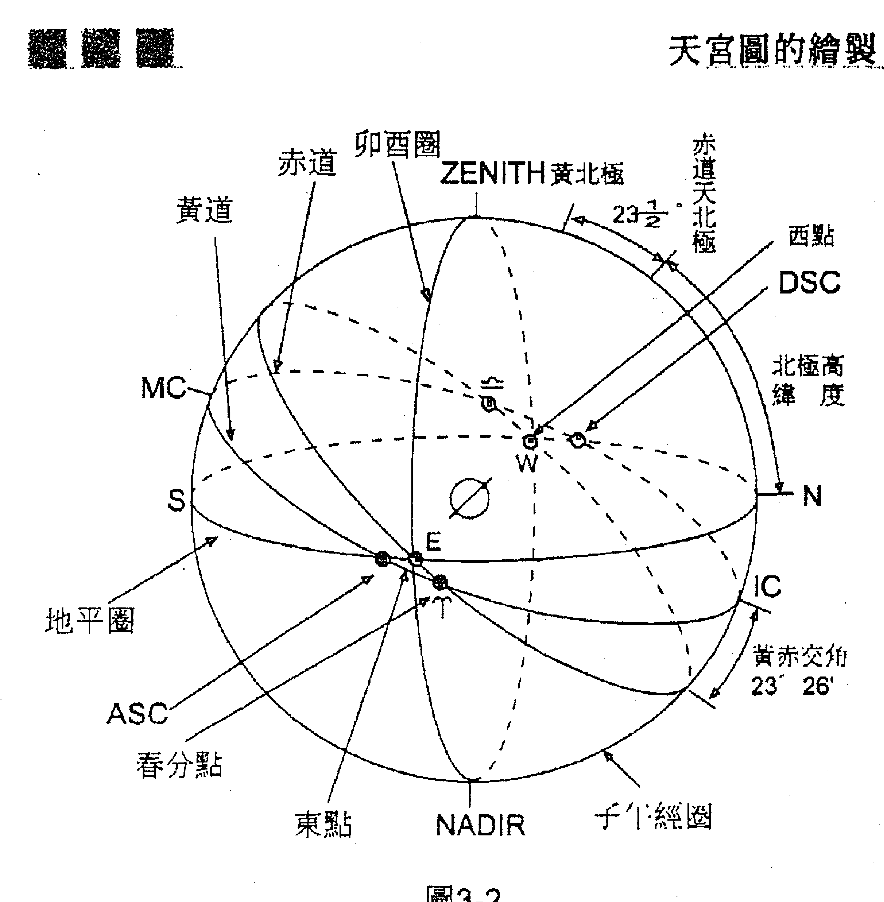

1. 子午经圈(Meridian) 是经过地平圈之最高点(Zenith)和最低点(Nadir)，赤道天北极，黄道天北极(黄极)，及地平圈的南点S和北点N的一个大圈。
2. 卯酉经圈(Primary Vertical) 是垂直于子午经圈的一个大圈，它经过地平圈的东点E、西点W。
3. 地平圈(Horizon) 是用事地点，地平面所形成的一个大圈，其头顶最高点称为Zenith，穿透地底想像的一个最低点，称为Nadir。

4. 赤道圈(Equator): 是平分地球为南半球和北半球的一个大圈，其最高点为赤道天北极，最低点相对为赤道天南极(图中未列出)。

5. 黄道圈(Ecliptic): 是地球绕太阳公转之一个大圈，亦即从地球看，太阳带领月亮及五大行星、三王星运行之轨道圈，其最高点为黄极，太阳在春分点为春天的开始。

天宫图的ASC，就是用事地点之地平圈和黄道圈交会于其东方，以本命占星学而看，此人出生时，其东方地平方位升起什么星座，就可知道，而其相对是DSC，即西方地平方位下降什么星座，MC，则是此人出生时所在地子午经圈最高点，而其相对点，即是其所在地子午经圈最低点IC。

6. 黄赤交角(Obliquity of the Ecliptic) 地球因自转，其轴偏离黄道约23°26'，称为黄赤交角，此黄赤交角与黄道、赤道之关系，形成球面三角形，故常用来作为坐标间转换的要素。

### 经度与纬度

用事地点的经度和纬度，也是建立天宫图必备的要素之一。

地球为一个球体，其球心称为地心(想像的)，地球自转是以通过地心到地球最高点北极和最低点南极的假想地轴，由西向东旋转，以赤道圈大圆为中心，划分南北半球，可分别划出向上与赤道圈平行而垂直于地轴之圈，此称为北纬线，而向下与赤道圈平行且垂直于地轴之圈，称为南纬线

> 如下图3-3

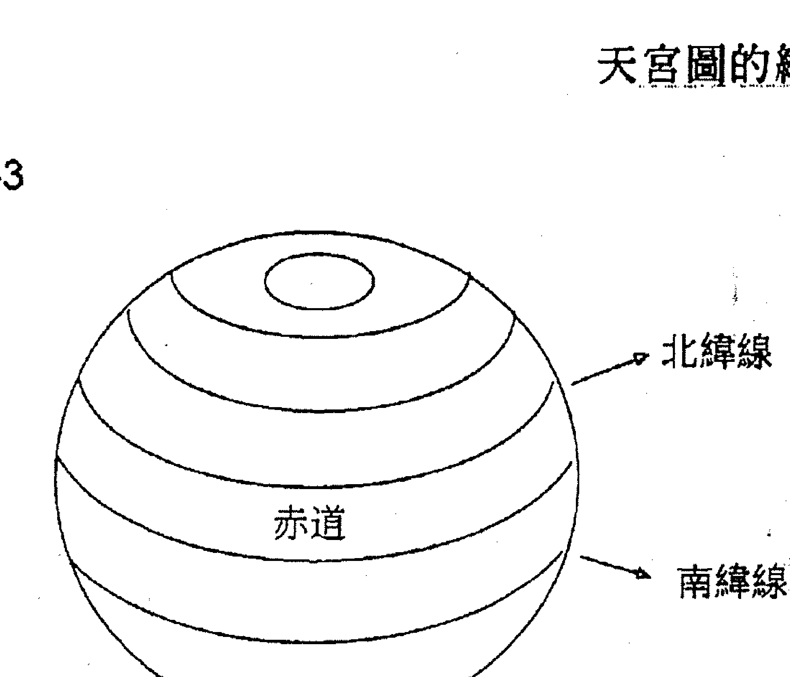

图3-3 纬线

一切通过地轴的平面而同地球表面切割而成的圆圈，称为经圈，一切经圈必然通过地球的南北极，而将地球划分两个180°的半圆，此半圆称为子午经线，但为地理定位之需要，设有假定最初起算的子午经线，一般称为本初子午线，为求全世界统一，公元1884年，经国际会议决定以通过英国的格林威治天文台为全世界通用之本初子午线，因而全球各地之经度线，即能明确而不致混淆，由于经度线跟时间有关，因地球自转一圈360°，共24小时，每1°=15分，若全世界有个统一标准，各地区的定时，就能明确划分，这对航行于海上之船只、飞翔于天空的飞机，都具安全定标的作用，所以不能忽略。

### 有关经线之图3-4

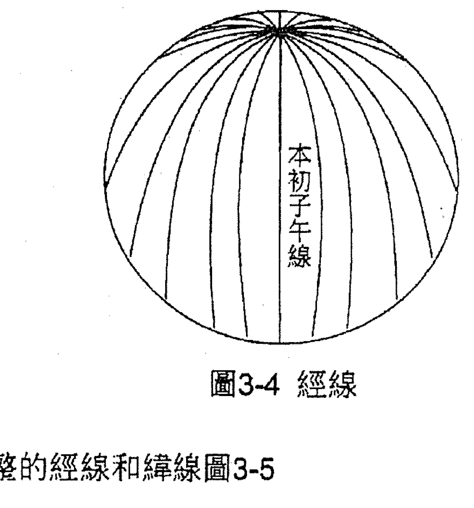

### 地球完整的经线和纬线图3-5

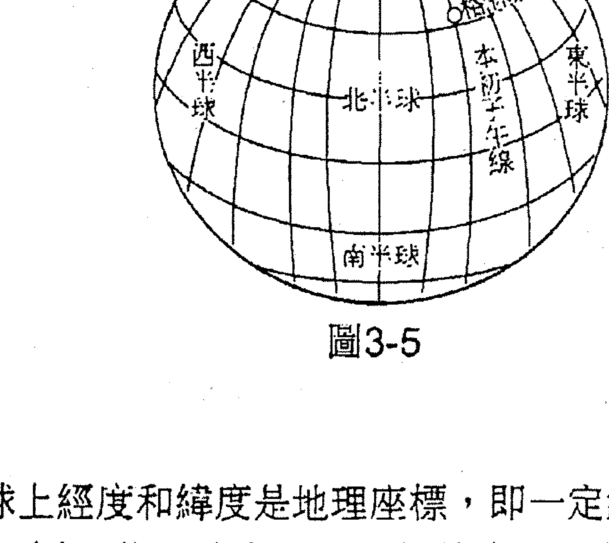

地球上经度和纬度是地理坐标，即一定纬度和一定经度的组合，标示着地球表面上一个特定地点的位置，度量全球任何地点的地理坐标，需要一个统一制度，如前述。这

# ## 第三章 天宫图的绘制

个统一制度的基本标准，即赤道、格林威治本初子午线，若假设某地P，可由下图求出其经度、纬度。图3-6：

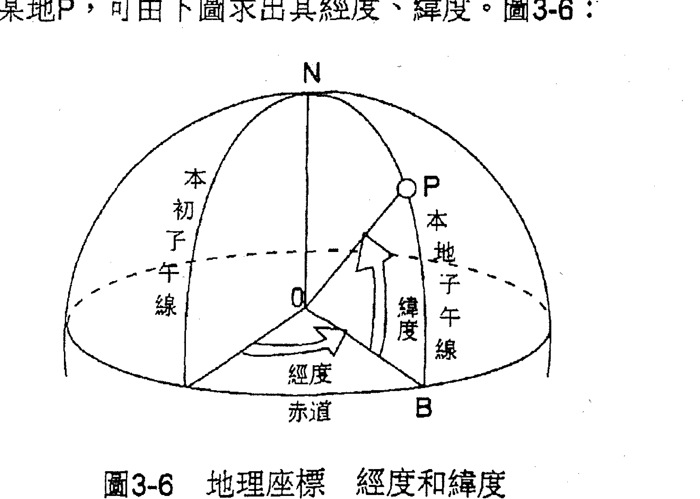

1. 从本地子午线与赤道圈交叉之B，计算至本初子午线，其距离AB即经度数，国际议规定在格林威治以东为东经，在其西，则为西经。
2. 从本地子午线与赤道圈交叉之B起算至P，其距离PB，即纬度数，在赤道以北称为北纬，在赤道以南称为南纬。
3. 地球上东经共180°，而西经也180°，总共360°经度。
4. 地球上北纬共90°，而南纬也90°，总共180°纬度。

占星学绘制天宫图，必需考量用事地点的经度、纬度，比中国的八字学、紫微斗数等命理学纯用出生时间，来得精密许多。

# # 第三章 天宫图的绘制

## 第3节 绘制天宫图的几个重要时间概念

占星学的时间计数，沿自天文学的用法，我们以下表列出占星学使用时间计数概念的区别

- 时间
  - 太阳时
    - 视太阳时
    - 平太阳时
      - 格林威治平时
      - 区时或标准时
      - 地方平时
  - 恒星时
    - 格林威治恒星时
    - 地方恒星时

要了解太阳时和恒星时的观念，可藉天球坐标的赤道圈说明。图3-8。为天球第一赤道坐标，它的基圈是天球赤道或称天赤道，以午圈为始圈，其纬度为赤道纬度，称为赤纬，从午圈与基圈之交点Q，作为始点向西测量天体S所在之时圈，其距离为时角(Hour angle)t，由于地球自转，天体的时角每小时增长15°，天球的经度0° -360°，可与0° 24小时相对应，用天球的第一赤道坐标，即可测量任何天体的相对经度与时刻。

### 天宫图的绘制

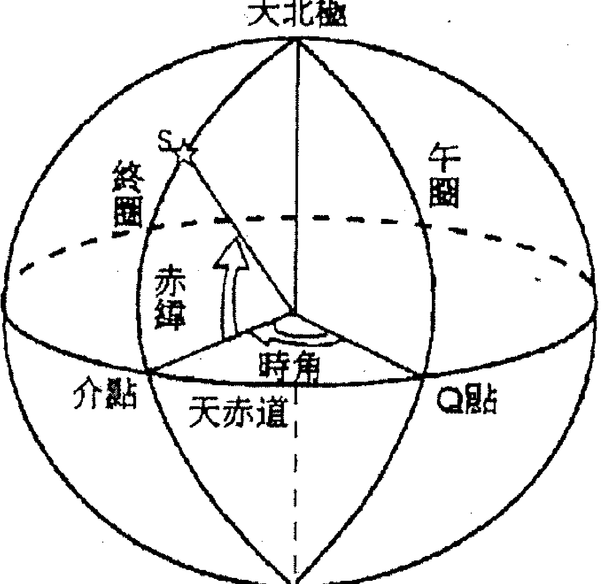

因天球第一赤道坐标仅能测量天体的相对经度和时刻，无法满足编制星历表要求之绝对位置，遂有图3-9的第二赤道坐标，它的基圈同样是天赤道，但始点定在春分点，由它向东测量天体S所在的位置，其角距离称之为赤经α (Right Ascension 简称R.A.)，赤经每15°等于1小时。

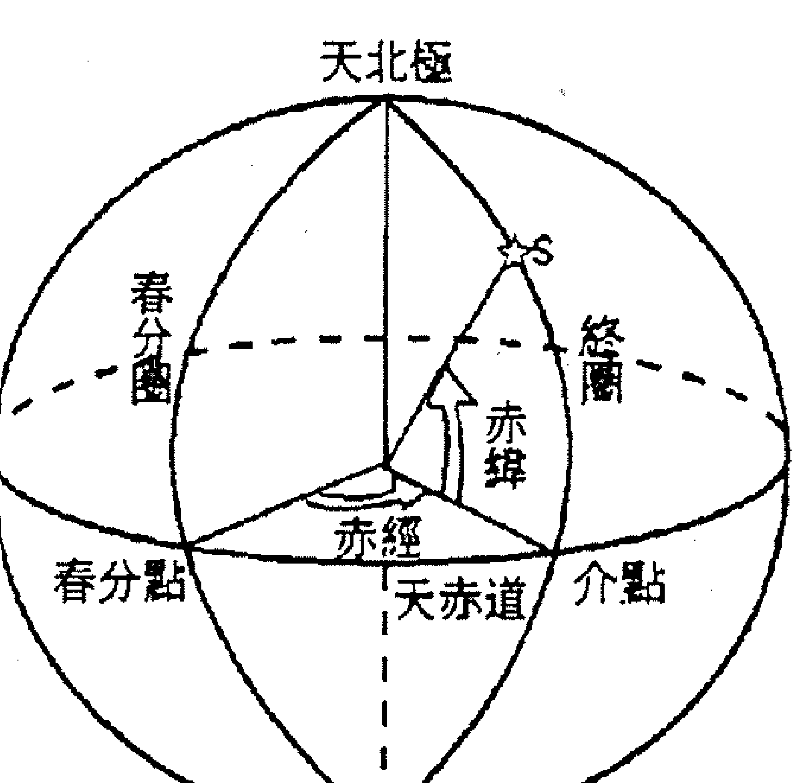

### 太阳时(Solar time)

所谓太阳时，即是根据太阳时角所推算出来的时间，根据天球第一赤道坐标，太阳为天体S，从午圈Q点向西测量太阳所在经圈位置，即为太阳时角t⊙因系从午圈起算(即从中午12时)，故太阳时＝t⊙+12h，太阳时刻与时角的关系，可由下图3-10来表示：

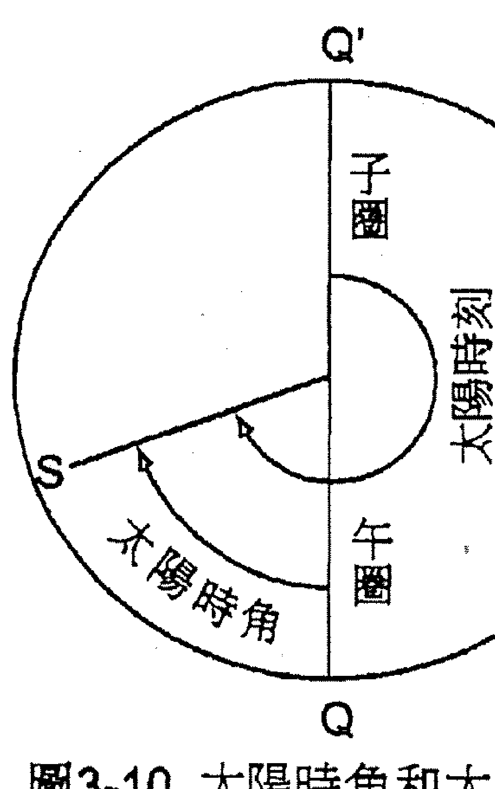

天文学上测量太阳时有两种，一是视太阳时(Apparent Solar time)或称真太阳时，是根据实际存在的太阳，即真太阳，因真太阳在黄道运行的速度不匀称，其每日昼夜运行会出现长短不一，就日常生活或其他科学研究甚为不便，遂假想一个匀速的太阳就其在天赤道运行而测量的时间，称之为平太阳时(Mean Solar time)。平太阳时事实上是根据视太阳时或恒星时推算的，但使用上甚为方便。

### 天宫图的绘制

视太阳时和平太阳时，会产生差异，有时正值，有时负值，以平太阳时为标准，一年内出现零值和正负极大值的日期大约如下

| 日期 | 时差 | 日期 | 时差 |
| :--- | :--- | :--- | :--- |
| 12月25日 | 0 | 6月14日 | 0 |
| 2月12日 | -14.4分 | 7月27日 | -6.3分 |
| 4月16日 | 0 | 9月9日 | 0 |
| 5月15日 | +3.8分 | 11月4日 | +16.4分 |

从表中可知12/25、4/16、6/14、9/1真太阳时与平太阳时，无甚差异，其值为零，但约在2/12及7/27真太阳时比平太阳时慢，而在5/15及11/4则真太阳时比平太阳时为快。

中国传统术数，涉及到时间的都以2小时为单位，因而命主生在时头或时尾，很近分界点时，其出生时刻就会产生争议，基本上，命理学应根据真太阳时为准，而非人为假想的平太阳时，所以应作调整，有关真太阳时差每月每日的资料可参阅陈品宏《预言命律正解》、钟义明《天星择日实务》有详细的记载。

在占星学的使用上，平太阳时，又分成
(Ⅰ)格林威治平时(Greenwich Mean Time 简称GMT)
格林威治平时是以格林威治所在地之经度，所测量的平太阳时。太阳昼夜的周日运动，照射全球各地呈现不同的时间，为求一个统一，国际天文学会IAU以GMT作为基准，得以换算全球各地之时间。

### (II)区时或标准时

由于地球本身自转一周天为24小时，因太阳照射关系全球各地产生昼夜不同，如在台湾为早上8时，在美国东岸可能是前晚19时，而美国西岸可能是下午16时，这些时间一般称为理论时区，以格林威治之本初子午线，为当日凌晨0:00Am同时刻，东经地区加、西经地区减这些时间，称为世界标准时，全球理论时区的划分如下图

如台湾位于东八理论时区，查下表H为+8，亦即当格林威治时GMT为Am1:00则台湾为Am9:00，我们听到广播称为中原标准时间。由于国际间编制通用之天文星历，常以格林威治时间为主，所以必须了解这个重要时间观念。

### 世界时区图

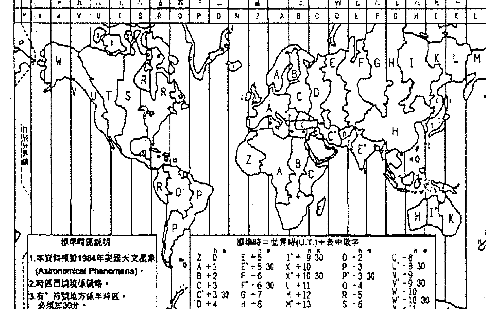

1. 本资料根据1984年英国天文星象(Astronomical Phenomena).
2. 对应地区系依略.
3. 有*符号地方系半时区，必须加30分.

| 字母 | 偏移量 |
|------|--------|
| Z    | 0      |
| A    | +1     |
| B    | +2     |
| C    | +3     |
| C'   | +3 30  |
| D    | +4     |
| D'   | +4 30  |
| E    | +5     |
| E'   | +5 30  |
| F    | -6     |
| F'   | -6 30  |
| G    | -7     |
| H    | -8     |
| I    | +9     |
| I'   | +9 30  |
| K    | +10    |
| K'   | +10 30 |
| L    | +11    |
| M    | +12    |
| M'   | +13    |
| N    | -1     |
| O    | -2     |
| P    | -3     |
| P'   | -3 30  |
| Q    | -4     |
| R    | -5     |
| S    | -6     |
| T    | -7     |
| U    | -8     |
| U'   | -8 30  |
| V    | -9     |
| V'   | -9 30  |
| W    | -10    |
| W'   | -10 30 |
| X    | -11    |
| Y    | -12    |

### 天宫图的绘制

### (III)地方平时(Local Mean Time 简称LMT)

用事地点所在经度测量所得的平太阳时，即是地方平时。

由于理论时区的划分，致使时区内由西至东15° 内之各地方的时间皆为标准时，如台湾和北京皆在东八区的理论时区内，两岸皆为中原标准时间，但台湾大部分地区是在东经120° 左右，北京为东经116° 19'，根据LMT的定义，当太阳到达台湾地区天空最高点午正12:00时，北京当地的太阳尚未到达其最高点，须在15-16分钟后。这种差异是因各地经度所造成，为精密严谨计算天宫图，LMT比标准时重要。

### LMT与标准时可以互算

```
1周天=360°
1日=24小时=1周天
360/24 = 15° = 1时
1时=60分
1° = 60'
1' = 60"

60分/15° = 4分 = 1°
1分=60秒
4分=240秒
240/60' = 4秒 = 1"
```

应注意以上之日、时、分、秒为时间测量单位，而360、15°、60'、60"为经度单位。

一般经度差校正，是以理论时区之经度为准，在东经时，若比理论时区的经度多则加，若比理论时区的经度少则减；相对地，在西经时，若比理论时区的经度多则减，若比理论

时区的经度少则加，经由这样校正程序，就可得地方平时，我们举例说明。

例一.台北县三芝乡经度为东经121° E30′，中原标准时间为早上8:00，其地方平时为多少？

台北县三芝乡之理论时区为东经120° E0′，而三芝乡地方实际经度为121° E30′，比前者多1° 30′，依前面换算公式
1° =4分，1′ =4秒，4分+4秒×30′ =4分+120秒=6分(经度差)因是东经，故三芝乡当时之地方平时为8:06Am

例二.中国大陆北京，经度为东经116° E19′，中原标准时间为早上8:00，其地方平时为多少？

北京之理论时区为东经120° E0′，而北京地方实际经度为116° 19′，比前者少3° 41′，依前面换算公式
1° =4分，1′ =4秒，4分×3+4秒×41=14分44秒(经度差)
因是东经，故北京当时之地方平时为7:55:16Am

### 恒星时(Sidereal Time 简称ST)

恒星时是以地球自转为基础的时间计量系统，通常以春分点起算向东至观测地点所在之子午经圈，所测量的赤经距离，因地球自转，每恒星时增长赤经15°，故恒星时对应至The request was rejected because it was considered high risk## 天宮圖的繪製

### 恆星時加速值校正表

| DAY | SID. TIME | 4 | ♃ | ☉ | ♆ | ♄ |
|---|---|---|---|---|---|---|
| | h m s | ° ' | ° ' | ° ' | ° ' | ° ' |
| 1 Su | 12 37 40 | 7° 36.9 | 27° 47.0 | 23° 29.5 | 8° 21.0 | 15° 13.4 |
| 2 M | 12 41 37 | 7° 47.4 | 27° 53.2 | 23° 32.1 | 8° 22.2 | 15° 12.9 |
| 3 Tu | 12 45 33 | 7° 58.1 | 27° 59.4 | 23° 34.6 | 8° 23.4 | 15° 12.4 |
| 4 W | 12 49 30 | 8° 8.8 | 28° 5.7 | 23° 37.1 | 8° 24.6 | 15° 11.9 |
| 5 Th | 12 53 27 | 8° 19.7 | 28° 12.1 | 23° 39.6 | 8° 25.8 | 15° 11.3 |
| 6 F | 12 57 23 | 8° 30.6 | 28° 18.5 | 23° 42.1 | 8° 26.9 | 15° 10.7 |
| 7 Sa | 13 1 20 | 8° 41.6 | 28° 24.0 | 23° 44.5 | 8° 28.0 | 15° 10.1 |
| 8 Su | 13 5 16 | 8° 52.7 | 28° 31.5 | 23° 46.8 | 8° 29.1 | 15° 9.4 |
| 9 M | 13 9 13 | 9° 3.9 | 28° 38.0 | 23° 49.1 | 8° 30.2 | 15° 8.7 |
| 10 Tu | 13 13 9 | 8° 15.2 | 28° 44.7 | 23° 51.4 | 8° 31.2 | 15° 8.0 |
| 11 W | 13 17 6 | 9° 26.6 | 28° 51.3 | 23° 53.7 | 8° 32.2 | 15° 7.2 |
| 12 Th | 13 21 2 | 9° 38.1 | 28° 58.0 | 23° 55.9 | 8° 33.1 | 15° 6.5 |
| 13 F | 13 24 59 | 9° 49.6 | 29° 4.8 | 23° 58.1 | 8° 34.0 | 15° 5.7 |
| 14 Sa | 13 28 56 | 10° 1.2 | 29° 11.6 | 24° 0.2 | 8° 34.9 | 15° 4.8 |
| 15 Su | 13 32 52 | 10° 12.9 | 29° 18.5 | 24° 2.3 | 8° 35.8 | 15° 4.0 |
| 16 M | 13 36 49 | 10° 24.7 | 29° 25.4 | 24° 4.4 | 8° 36.6 | 15° 3.1 |
| 17 Tu | 13 40 45 | 10° 36.5 | 29° 32.4 | 24° 6.4 | 8° 37.4 | 15° 2.2 |
| 18 W | 13 44 42 | 10° 48.4 | 29° 39.3 | 24° 8.4 | 8° 38.2 | 15° 1.2 |
| 19 Th | 13 48 38 | 11° 0.4 | 29° 46.4 | 24° 10.3 | 8° 38.9 | 15° 0.3 |
| 20 F | 13 52 35 | 11° 12.5 | 29° 53.5 | 24° 12.2 | 8° 39.6 | 14° 59.3 |
| 21 Sa | 13 56 31 | 11° 24.6 | 0° 0.6 | 24° 14.0 | 8° 40.3 | 14° 58.3 |
| 22 Su | 14 0 28 | 11° 36.8 | 0° 7.7 | 24° 15.9 | 8° 41.0 | 14° 57.2 |
| 23 M | 14 4 25 | 11° 49.1 | 0° 14.9 | 24° 17.6 | 8° 41.6 | 14° 56.1 |
| 24 Tu | 14 8 21 | 12° 1.4 | 0° 22.1 | 24° 19.3 | 8° 42.1 | 14° 55.0 |
| 25 W | 14 12 18 | 12° 13.8 | 0° 29.4 | 24° 21.0 | 8° 42.7 | 14° 53.9 |
| 26 Th | 14 16 14 | 12° 26.3 | 0° 36.7 | 24° 22.6 | 8° 43.2 | 14° 52.8 |
| 27 F | 14 20 11 | 12° 38.8 | 0° 44.0 | 24° 24.2 | 8° 43.7 | 14° 51.6 |
| 28 Sa | 14 24 7 | 12° 51.4 | 0° 51.4 | 24° 25.8 | 8° 44.1 | 14° 50.5 |
| 29 Su | 14 28 4 | 13° 4.0 | 0° 58.7 | 24° 27.3 | 8° 44.5 | 14° 49.2 |
| 30 M | 14 32 0 | 13° 16.7 | 1° 6.2 | 24° 28.7 | 8° 44.9 | 14° 48.0 |

### 天宮圖的繪製

- T: 出生時間(Time)，其他非格林威治時區出生的人，須換算為GMT，如台灣地區，以中原標準時間，東經120°之時區，比GMT快8時，本例之GMT為0:59:00Pm，中午12:59:00
- A: Acceleration，加速值校正，可查恆星時加速值，校正表。如本例之GMT12:59:00，加速值校正約為2分8秒。
- R: Refinement，經度差修正。如本例命主在高雄市120E17'出生，其經度差修正值為120°÷15°=8時，17'=1分8秒(1'=4秒，共68秒)120°17'共8時1分8秒，因係東經，故須加。經由上述分析計算，即可得用事地點之地方恆星時間LST，若超過24小時，則減去24小時。

如本例所得結果為下表

### 天宮圖的繪製

### （Ⅰ） 地方恆星時間換算表

| 項目 | 內容 | 備註 |
| :--- | :--- | :--- |
| 姓名： | 蔡 | ♂⊕ |
| 時區： | 8 時 | |
| 1.出生地 : （用事地點） | 省 高雄 縣 市 鎮 鄉 | 經度 120°E 17′，緯度 22°N 38′ |
| 2.出生日期 （用事時間） | ：公元 2001 年 4 月 24 日 時間 20 時 59 分 | 秒 |
| 3.GMT （2.東減西加時區） | ：公元 2001 年 4 月 24 日 時間 12 時 59 分 | 秒 |
| (II) | | |
| S.子正GST (查3.日期，星曆表所列) | 時間 | 14 時 8 分 21 秒 |
| T.GMT (查3.時間) | 時間 | 12 時 59 分 秒 |
| A.平太陽時 / 恆星時校正 (查恆星時加速值校正) | 時間 | 2 分 8 秒 |
| R.經度差.東加.西減 | 時間 | 8 時 1 分 8 秒 |
| (III) LST=S+T+A+R | ※時間 | 11 時 10 分 37 秒 |

### 天宮圖的繪製

## 第4節 繪製天宮圖常用的宮位系統

我們在第1節已簡單介紹後天12宮管轄人類生活領域的各項活動或世俗事件(Mundane events)，而後天12宮的劃分卻非如中國紫微斗數那麼簡單地一個12地支宮圖各宮相等分。占星學的後天12宮是天球座標之黃道圈、赤道圈或地平圈、卯酉圈....等投射而成，需經過球面天文學嚴謹地計算。因用事地點不同而顯現出各宮不同的等距，如何作一個明確的劃分，是2000年來有心占星家一直想要突破解決的問題。儘管今日天文學相當發達，欲以人為而想完美無瑕地分宮，仍是不可得，這也隱含宇宙奧妙浩瀚，非人類區區智力得以克服的。

分宮最早出現於希臘化時期，當時是以上升星座的0°開始作為第1宮，然後按黃道秩序逐步遞移為下1宮。此種宮位劃分是以整個星座為主，算不上真正屬於如現代占星學的分宮形式，因當時球面天文學尚未發展之故，但它總算是分宮制度的一個雛形，西元2世紀托勒密的《四書》提到等宮系統(Equal House)。在阿拉伯保存時代，阿拉伯的天文學家已著手研究分宮，傳回西歐後，促成分宮系統的發揚光大，尤其是在義大利，研究占星學的人士不乏飽學之士，具有醫學、數學、天文學背景，使分宮系統進步甚多，直到現代，仍有許多有心人潛修，想要提出更令人折服的宮位系統。

至目前，各種宮位系統都有死角。如極緯地區，南北極地區之用事地點，其分宮相當扭曲，這是投影的必然結果，但這也讓懷疑論者相當質疑占星學的正確性。這些懷疑論者指責占星學的同時，是否也虔誠謙卑體認，科學昌明的今日，同樣有科學的死角呢？

因分宮系統涉及後天12宮各宮主星，若分宮不清楚就會呈現論斷不一的結果，德國的宇宙生物學派及漢堡學派就不採後天12宮的論法，也沒有分宮系統的選擇問題，這是該學派一家之說。從全世界重要的占星研究報告，或案例研究證明後天12宮是占星學最具重要的因素。儘管分宮系統仍不完美，但在全球大部分地區仍相當具可行性，值得進一步深入研究。美國著名的占星大師，麥克 P 曼卡賽 (Michael P Munkasey)就認為有必要瞭解宮位系統的功能及利弊得失，使用時才不致患得患失。

本節簡述全球各占星組織學會常用的幾個宮位系統，說明其名稱、來源、定義及特色，至於各宮位系統的數理公式，本書作者已完全解出，但礙於過度艱澀，不擬在此處臚列。

台灣地區靠近赤道，故分宮系統可以採用赤道圈投射至黃道的系統，尤以普拉西德斯宮位系統最適合，若是卜卦或擇日可以傳統的Regiomontanus宮位系統為主。

### 有關常用的宮位系統簡述如下

| 名稱 | 來源 | 定義 | 特色 |
| :--- | :--- | :--- | :--- |
| 1. 整個星座宮位制 (Whole Sign House System) | 約與天宮圖創始之時期B.C. 1世紀左右 | 取ASC星座的0°作為第1宮然後沿黃道順序之星座，分別取作後天12宮。 | 1. 希臘時期原創的宮位制。<br>2. 計算簡單.方便使用.一瞄可知。 |
| 2. 等宮位制 (Equal House System) | 約A.D. 1世紀右左 | 取ASC作為第1宮的始點，然後沿黃道每隔30°取為各宮。 | 1. MC與第10宮，宮始點幾都不一致，而MC相當重要。<br>2. 較符合宮位制原創精神。<br>3. 計算簡單，不用較深數學。 |
| 3. Porphyry House System | 約A.D. 3世紀普菲力 (Porphyry) 創作 | 以ASC到MC的黃道距離予以之等分，分別為10.11.12宮，各宮弧度相等。<br>再以ASC到IC的黃道距離予以三等分，形成1.2.3宮，各宮弧度相等。 | 1. 取黃道圈為主。<br>2. 計算簡單。<br>3. 改善了等宮位制中MC與10宮宮始點不一致的缺點。 |
| 4. Campanus House System | 約A.D. 1298年坎普納斯 (Campanus )創作 | 以卯酉圈(Primary Vertical)從地平東點開始，每30°劃分成均等弧度共12個點，此12點投射到黃道圈，形成各宮宮始點。 | 1. 被歸類空間Space系統。<br>2. 因係從卯酉圈投射到黃道，分宮頗不均等。<br>3. 高緯度地區嚴重扭曲分宮。<br>4. 低緯度地區較均勻。 |
| 5. Regiomontanus House System | 約1476由德國約納斯穆勒(Johans.Miller)提出，其拉丁名字為努基歐蒙坦那斯(Regiomontanus)聞名於世 | 以天球赤道圈從戊宮起劃分每30°區間，共12點投射到黃道形成各宮始點。 | 1. 被歸類空間Space系統。<br>2. 使用赤道圈跟地球自轉有關，較貼近地球，因威廉.里利使用，而占有一席之地，常用於卜卦.擇日。<br>3. 高緯之分宮扭曲較Campanus輕。<br>4. 類似Placidus宮位制，但計算較不複雜。 |
| 6. Morinus House system | 由法國占星家巴帝斯塔 莫林(Jean Baptiste Morin)(1583-1656)提出 | 類似5，以天球赤道從戊宮起劃分每30°區間，共12個點，這些點卻以經由極點之經度圈投射。 | 1. 被歸類空間Space系統。<br>2. ASC非零點，而是MC之黃道經度加90°而得。<br>3. 黃極為天球固定點，分宮大小跟黃道有關，不受緯度影響，不會發生高緯嚴重扭曲之象。 |
| 7. Placidus House System | 約1688意大利數學家普拉西德基(Placidus)提出 | 從天球赤道圈戊宮0°開始，以每30°均等劃分12個點，而這些投射到黃道，形成各宮始點，但需進一步複雜地收斂至穩定。 | 1. 被歸類空間Time系統。<br>2. 取MC.ASC於某地，換算為恆星時，MC-ASC恆星時差之等分，再由MC減算到11宮，12宮恆星時，重複算至穩定ASC-IC亦同。<br>3. 本命占星學常使用。<br>4. 高緯度，亦扭曲。 |
| 8. Koch House System<br>又稱Birth days House System | 約1970德國瓦塞爾、高取(Walther Koch)提出 | 地平圈和赤道圈交點到子午經圈的D.S.A予以三分，投影至黃道而形成各宮宮始點。 | 1. 被歸類空間Time系統。<br>2. 類似Placidus宮位系統利用半弧(Semi-Arc S.A)的三分法。<br>3. 高緯度，亦扭曲。<br>4. 本命占星學的使用頗受肯定。 |
| 9. Topocentric House System | 約1960年阿根廷占星家A.P尼爾遜 配吉(A P Nelson Page)和凡德爾 波立許(Vendel. Polish)提出 | 在出生地點或用事地點，劃一軸與地軸平行，每日天體運行繞此軸轉動，每兩小時劃分一黃道宮位。 | 1. 計算簡單。<br>2. 在極區，允許較正確的分宮。 |

## 第5節 天宮圖後天12宮的繪製

在歐美地區，常見專業的編製宮位系統書以利查表之用，但占星電腦軟體興起之後，就已不受注目，在台灣僅王中和《易學正統占星術》附有台灣地區各重要城市之普拉西德斯宮位系統表，可以取用。

當計算完地方恆星時及選用宮位系統後，即可根據宮位系統書，查尋天宮圖後天12宮各宮的宮始點之黃道經度，若所算之LST介於某兩個LST之間，則採用插補法較為精確地計算其天宮圖後天12宮各宮宮始點之黃道經度，我們沿用第3節中之例說明。

### 天宮圖的繪製

### 普拉西德斯制(PLACIDUS)

### 高雄十二宮立成表

### 北緯22° 38' 東經120° 17'

| SID.TIME | MC | 11 | 12 | ASC | 2 | 3 | AV | EP |
|---|---|---|---|---|---|---|---|---|
| 8:0:0 | 27 Cn 55 | 29 Le 32 | 29 Vi 60 | 27 Li 30 | 26 Sc 40 | 26 Sa 49 | 17 Cp 47 | 2 Sc 11 |
| 8:4:0 | 28 Cn 52 | 0 Vi 31 | 0 Li 58 | 28 Li 25 | 27 Sc 35 | 27 Sa 44 | 18 Cp 6 | 3 Sc 13 |
| 8:8:0 | 29 Cn 50 | 1 Vi 31 | 1 Li 57 | 29 Li 19 | 28 Sc 29 | 28 Sa 39 | 18 Cp 27 | 4 Sc 15 |
| 8:12:0 | 0 Le 47 | 2 Vi 31 | 2 Li 55 | 0 Sc 13 | 29 Sc 23 | 29 Sa 34 | 18 Cp 48 | 5 Sc 17 |
| 8:16:0 | 1 Le 45 | 3 Vi 31 | 3 Li 53 | 1 Sc 7 | 0 Sa 17 | 0 Cp 29 | 19 Cp 9 | 6 Sc 19 |
| 8:20:0 | 2 Le 43 | 4 Vi 31 | 4 Li 52 | 2 Sc 1 | 1 Sa 11 | 1 Cp 24 | 19 Cp 31 | 7 Sc 21 |
| 8:24:0 | 3 Le 41 | 5 Vi 31 | 5 Li 50 | 2 Sc 55 | 2 Sa 5 | 2 Cp 20 | 19 Cp 53 | 8 Sc 23 |
| 8:28:0 | 4 Le 40 | 6 Vi 32 | 6 Li 48 | 3 Sc 49 | 2 Sa 59 | 3 Cp 15 | 20 Cp 15 | 9 Sc 24 |
| 8:32:0 | 5 Le 38 | 7 Vi 32 | 7 Li 47 | 4 Sc 43 | 3 Sa 53 | 4 Cp 10 | 20 Cp 38 | 10 Sc 25 |
| 8:36:0 | 6 Le 37 | 8 Vi 33 | 8 Li 45 | 5 Sc 37 | 4 Sa 47 | 5 Cp 6 | 21 Cp 1 | 11 Sc 26 |
| 8:40:0 | 7 Le 35 | 9 Vi 33 | 9 Li 43 | 6 Sc 30 | 5 Sa 41 | 6 Cp 1 | 21 Cp 25 | 12 Sc 27 |
| 8:44:0 | 8 Le 34 | 10 Vi 34 | 10 Li 41 | 7 Sc 24 | 6 Sa 35 | 6 Cp 57 | 21 Cp 48 | 13 Sc 27 |
| 8:48:0 | 9 Le 34 | 11 Vi 35 | 11 Li 39 | 8 Sc 17 | 7 Sa 29 | 7 Cp 52 | 22 Cp 12 | 14 Sc 28 |
| 8:52:0 | 10 Le 33 | 12 Vi 36 | 12 Li 37 | 9 Sc 11 | 8 Sa 23 | 8 Cp 48 | 22 Cp 36 | 15 Sc 28 |
| 8:56:0 | 11 Le 32 | 13 Vi 37 | 12 Li 35 | 10 Sc 4 | 9 Sa 17 | 9 Cp 44 | 23 Cp 0 | 16 Sc 28 |
| 9:0:0 | 12 Le 32 | 14 Vi 38 | 14 Li 33 | 10 Sc 58 | 10 Sa 10 | 10 Cp 40 | 23 Cp 24 | 17 Sc 28 |
| 9:4:0 | 13 Le 32 | 15 Vi 39 | 15 Li 31 | 11 Sc 51 | 11 Sa 4 | 11 Cp 36 | 23 Cp 49 | 18 Sc 28 |
| 9:8:0 | 14 Le 32 | 16 Vi 40 | 16 Li 29 | 12 Sc 44 | 11 Sa 58 | 12 Cp 33 | 24 Cp 14 | 19 Sc 27 |
| 9:12:0 | 15 Le 32 | 17 Vi 41 | 17 Li 27 | 13 Sc 38 | 12 Sa 52 | 13 Cp 29 | 24 Cp 39 | 20 Sc 26 |
| 9:16:0 | 16 Le 33 | 18 Vi 43 | 18 Li 25 | 14 Sc 31 | 13 Sa 46 | 14 Cp 26 | 25 Cp 4 | 21 Sc 26 |
| 9:20:0 | 17 Le 33 | 19 Vi 44 | 19 Li 22 | 15 Sc 24 | 14 Sa 40 | 15 Cp 22 | 25 Cp 29 | 22 Sc 25 |
| 9:24:0 | 18 Le 34 | 20 Vi 46 | 20 Li 20 | 16 Sc 17 | 15 Sa 34 | 16 Cp 19 | 25 Cp 54 | 23 Sc 23 |
| 9:28:0 | 19 Le 35 | 21 Vi 47 | 21 Li 18 | 17 Sc 10 | 16 Sa 28 | 17 Cp 16 | 26 Cp 20 | 24 Sc 22 |
| 9:32:0 | 20 Le 36 | 22 Vi 49 | 22 Li 15 | 18 Sc 3 | 17 Sa 22 | 18 Cp 13 | 26 Cp 46 | 25 Sc 20 |
| 9:36:0 | 21 Le 37 | 23 Vi 50 | 23 Li 12 | 18 Sc 56 | 18 Sa 16 | 19 Cp 11 | 27 Cp 11 | 26 Sc 19 |
| 9:40:0 | 22 Le 39 | 24 Vi 52 | 24 Li 10 | 19 Sc 49 | 19 Sa 10 | 20 Cp 8 | 27 Cp 37 | 27 Sc 17 |
| 9:44:0 | 23 Le 41 | 25 Vi 53 | 25 Li 7 | 20 Sc 41 | 20 Sa 4 | 21 Cp 6 | 28 Cp 3 | 28 Sc 15 |
| 9:48:0 | 24 Le 42 | 26 Vi 55 | 26 Li 4 | 21 Sc 34 | 20 Sa 58 | 22 Cp 4 | 28 Cp 29 | 29 Sc 13 |
| 9:52:0 | 25 Le 45 | 27 Vi 57 | 27 Li 1 | 22 Sc 27 | 21 Sa 52 | 23 Cp 2 | 28 Cp 56 | 0 Sa 10 |
| 9:56:0 | 26 Le 47 | 28 Vi 58 | 27 Li 58 | 23 Sc 20 | 22 Sa 46 | 24 Cp 0 | 29 Cp 22 | 1 Sa 8 |
| 10:0:0 | 27 Le 49 | 29 Vi 60 | 28 Li 55 | 24 Sc 12 | 23 Sa 41 | 24 Cp 58 | 29 Cp 48 | 2 Sa 5 |
| 10:4:0 | 28 Le 52 | 1 Li 2 | 29 Li 52 | 25 Sc 5 | 24 Sa 35 | 25 Cp 57 | 0 Aq 15 | 3 Sa 3 |
| 10:8:0 | 29 Le 54 | 2 Li 3 | 0 Sc 49 | 25 Sc 58 | 25 Sa 30 | 26 Cp 56 | 0 Aq 42 | 4 Sa 0 |
| 10:12:0 | 0 Vi 57 | 3 Li 5 | 1 Sc 45 | 26 Sc 50 | 26 Sa 24 | 27 Cp 55 | 1 Aq 8 | 4 Sa 57 |
| 10:16:0 | 2 Vi 0 | 4 Li 7 | 2 Sc 42 | 27 Sc 43 | 27 Sa 19 | 28 Cp 54 | 1 Aq 35 | 5 Sa 54 |
| 10:20:0 | 3 Vi 3 | 5 Li 8 | 3 Sc 38 | 28 Sc 35 | 28 Sa 14 | 29 Cp 53 | 2 Aq 2 | 6 Sa 50 |
| 10:24:0 | 4 Vi 7 | 6 Li 10 | 4 Sc 35 | 29 Sc 28 | 29 Sa 8 | 0 Aq 53 | 2 Aq 29 | 7 Sa 47 |
| 10:28:0 | 5 Vi 10 | 7 Li 11 | 5 Sc 31 | 0 Sa 20 | 0 Cp 3 | 1 Aq 53 | 2 Aq 56 | 8 Sa 43 |
| 10:32:0 | 6 Vi 14 | 8 Li 13 | 6 Sc 27 | 1 Sa 13 | 0 Cp 59 | 2 Aq 53 | 3 Aq 23 | 9 Sa 40 |
| 10:36:0 | 7 Vi 18 | 9 Li 14 | 7 Sc 23 | 2 Sa 5 | 1 Cp 54 | 3 Aq 53 | 3 Aq 51 | 10 Sa 36 |
| 10:40:0 | 8 Vi 22 | 10 Li 16 | 8 Sc 19 | 2 Sa 58 | 2 Cp 49 | 4 Aq 54 | 4 Aq 18 | 11 Sa 32 |
| 10:44:0 | 9 Vi 26 | 11 Li 17 | 9 Sc 15 | 3 Sa 50 | 3 Cp 45 | 5 Aq 55 | 4 Aq 46 | 12 Sa 28 |

### 天宫圖的繪製


| SID.TIME | MC | 11 | 12 | ASC | 2 | 3 | AV | EP |
|----------|----|----|----|-----|---|---|----|----|
| 10:48:0 | 10 Vi 30 | 12 Li 19 | 10 Sc 11 | 4 Sa 43 | 4 Cp 40 | 6 Aq 56 | 5 Aq 13 | 13 Sa 24 |
| 10:52:0 | 11 Vi 34 | 13 Li 20 | 11 Sc 6 | 5 Sa 36 | 5 Cp 36 | 7 Aq 57 | 5 Aq 41 | 14 Sa 20 |
| 10:56:0 | 12 Vi 39 | 14 Li 21 | 12 Sc 2 | 6 Sa 28 | 6 Cp 32 | 8 Aq 58 | 6 Aq 8 | 15 Sa 16 |
| 11:0:0 | 13 Vi 43 | 15 Li 22 | 12 Sc 58 | 7 Sa 21 | 7 Cp 28 | 10 Aq 0 | 6 Aq 36 | 16 Sa 11 |
| 11:4:0 | 14 Vi 48 | 16 Li 23 | 13 Sc 53 | 8 Sa 13 | 8 Cp 24 | 11 Aq 2 | 7 Aq 4 | 17 Sa 7 |
| 11:8:0 | 15 Vi 53 | 17 Li 24 | 14 Sc 48 | 9 Sa 6 | 9 Cp 21 | 12 Aq 4 | 7 Aq 32 | 18 Sa 2 |
| 11:12:0 | 16 Vi 57 | 18 Li 25 | 15 Sc 44 | 9 Sa 59 | 10 Cp 18 | 13 Aq 7 | 8 Aq 0 | 18 Sa 58 |
| 11:16:0 | 18 Vi 2 | 19 Li 26 | 16 Sc 39 | 10 Sa 51 | 11 Cp 14 | 14 Aq 10 | 8 Aq 28 | 19 Sa 53 |
| 11:20:0 | 19 Vi 7 | 20 Li 27 | 17 Sc 34 | 11 Sa 44 | 12 Cp 11 | 15 Aq 12 | 8 Aq 56 | 20 Sa 49 |
| 11:24:0 | 20 Vi 12 | 21 Li 27 | 18 Sc 29 | 12 Sa 37 | 13 Cp 9 | 16 Aq 16 | 9 Aq 24 | 21 Sa 44 |
| 11:28:0 | 21 Vi 17 | 22 Li 28 | 19 Sc 24 | 13 Sa 30 | 14 Cp 6 | 17 Aq 19 | 9 Aq 52 | 22 Sa 39 |
| 11:32:0 | 22 Vi 23 | 23 Li 28 | 20 Sc 19 | 14 Sa 23 | 15 Cp 4 | 18 Aq 23 | 10 Aq 21 | 23 Sa 34 |
| 11:36:0 | 23 Vi 28 | 24 Li 29 | 21 Sc 13 | 15 Sa 16 | 16 Cp 2 | 19 Aq 27 | 10 Aq 49 | 24 Sa 30 |
| 11:40:0 | 24 Vi 33 | 25 Li 29 | 22 Sc 8 | 16 Sa 9 | 17 Cp 0 | 20 Aq 31 | 11 Aq 17 | 25 Sa 25 |
| 11:44:0 | 25 Vi 38 | 26 Li 29 | 23 Sc 3 | 17 Sa 2 | 17 Cp 58 | 21 Aq 35 | 11 Aq 46 | 26 Sa 20 |
| 11:48:0 | 26 Vi 44 | 27 Li 29 | 23 Sc 57 | 17 Sa 55 | 18 Cp 56 | 22 Aq 40 | 12 Aq 15 | 27 Sa 15 |
| 11:52:0 | 27 Vi 49 | 28 Li 29 | 24 Sc 52 | 18 Sa 48 | 19 Cp 55 | 23 Aq 45 | 12 Aq 43 | 28 Sa 10 |
| 11:56:0 | 28 Vi 55 | 29 Li 29 | 25 Sc 46 | 19 Sa 42 | 20 Cp 54 | 24 Aq 50 | 13 Aq 12 | 29 Sa 5 |
| 12:0:0 | 29 Vi 60 | 0 Sc 28 | 26 Sc 40 | 20 Sa 35 | 21 Cp 53 | 25 Aq 56 | 13 Aq 41 | 29 Sa 60 |

| SID.Time | MC | 11 | 12 | ASC | 2 | 3 |
|----------|----|----|----|-----|---|---|
| 11:8:0 | 15° 巳53' | 17° 辰24' | 14° 卯48' | 9° 寅6' | 9° 丑21' | 12° 子4' |
| 11:12:0 | 16° 巳57' | 18° 辰25' | 15° 卯44' | 9° 寅59' | 10° 丑18' | 13° 子7' |

根據我們的舉例，計算所得的LST為11時10分37秒，正好介於該表11:8:00及11:12:00之間可透過插補法，較精確地計算該例各宮宮始點之黃道經度。

（I） 計算的LST 11:10:37
- 區間上端LST 11: 8: 0
區間A 2:37 = 157秒

（II） 區間下端LST 11:12: 0
- 區間上端LST 11: 8: 0
區間B 4:00 = 240秒

(III) $$ \frac{\text{區間A}}{\text{區間B}} = \frac{157^{\prime\prime}}{240^{\prime\prime}} $$

(IV) 當LST多走2:37:157秒，在此區多進行 $$ \frac{157^{\prime\prime}}{240^{\prime\prime}} $$ 之比例

故MC當為 $$ 15^{\circ} \ 巳53' + (16^{\circ} \ 巳57' - 15^{\circ} \ 巳53') \times \frac{157^{\prime\prime}}{240^{\prime\prime}} = 16^{\circ} \ 巳35' $$

11當為 $$ 17^{\circ} \ 辰24' + (18^{\circ} \ 辰25' - 17^{\circ} \ 辰24') \times \frac{157^{\prime\prime}}{240^{\prime\prime}} = 18^{\circ} \ 辰 \ 4' $$

12當為 $$ 14^{\circ} \ 卯48' + (15^{\circ} \ 卯44' - 14^{\circ} \ 卯48') \times \frac{157^{\prime\prime}}{240^{\prime\prime}} = 15^{\circ} \ 卯25' $$

ASC當為 $$ 9^{\circ} \ 寅 \ 6' + (9^{\circ} \ 寅59' - 9^{\circ} \ 寅 \ 6') \times \frac{157^{\prime\prime}}{240^{\prime\prime}} = 9^{\circ} \ 寅41' $$

2當為 $$ 9^{\circ} \ 丑21' + (10^{\circ} \ 丑18' - 9^{\circ} \ 丑21') \times \frac{157^{\prime\prime}}{240^{\prime\prime}} = 9^{\circ} \ 丑58' $$

3當為 $$ 12^{\circ} \ 子 \ 4' + (13^{\circ} \ 子 \ 7' - 12^{\circ} \ 子 \ 4') \times \frac{157^{\prime\prime}}{240^{\prime\prime}} = 12^{\circ} \ 子45' $$

### 天宫圖的繪製

由於MC與IC相對，11宮與5宮相對，12宮與6宮相對，ASC與DSC相對，2宮與8宮相對，3宮與9宮相對，故(IV)之星座度分求其星座對宮即可得相對宮之黃道經度。所以 IC 16° 亥35'    DSC 9° 申41'
5 18° 戌 4'         8 9° 未58'
6 15° 酉25'         9 12° 午45'

我們將該例演算之後天12宮各宮宮始點黃道經度與Solar Fire占星電腦軟體之結果作一比較如下，可知兩者幾乎完全一樣。

Solar Fire

| House Cusps: | |
| --- | --- |
| 01 | 09° ♐ 40' |
| 02 | 09° ♑ 58' |
| 03 | 12° ♒ 45' |
| 04 | 16° ♓ 35' |
| 05 | 18° ♈ 04' |
| 06 | 15° ♉ 24' |
| 07 | 09° ♊ 40' |
| 08 | 09° ♋ 58' |
| 09 | 12° ♌ 45' |
| 10 | 16° ♍ 35' |
| 11 | 18° ♎ 04' |
| 12 | 15° ♏ 24' |

計算

| 宮 始 點 | |
| --- | --- |
| ASC | 9° 寅 41' |
| 2 | 9° 丑 8' |
| 3 | 12° 子 45' |
| IC | 16° 亥 35' |
| 5 | 18° 戌 4' |
| 6 | 15° 酉 25' |
| DSC | 9° 申 41' |
| 8 | 9° 未 58' |
| 9 | 12° 子 45' |
| MC | 16° 巳 35' |
| 11 | 18° 辰 4' |
| 12 | 15° 卯 25' |

天宮圖後天12宮宮始點黃道經度的求算，原本須由天球座標的轉換計算而得，過程需懂得球面天文學，才得以求解，底下，我們僅列MC及ASC之公式。

### 天宫圖的繪製

(I) MC的黃道經度，λMC

$$ \lambda_{MC} = \tan^{-1} \left( \frac{\tan \text{RAMC}}{\cos \varepsilon} \right) $$

RAMC為MC的赤經，ε 為黃赤交角，約23° 27′

(II) ASC的黃道經度，λASC

$$ \lambda_{ASC} = \tan^{-1} \left[ \frac{\cos \text{RAMC}}{ -(\tan \phi \times \sin \varepsilon + \sin \text{RAMC} \times \cos \varepsilon) } \right] $$

- RAMC: MC的赤經
- ε: 黃赤交角
- φ: 用事地點的地理緯度

## 第6节 行星、敏感点在天宫图的位置

行星的黃道經度可直接查尋星曆表，但一般星曆表大多以曆書時（Ephemeris Time 簡稱E.T）的子正或午正編製的，與我們先前計算使用的GMT或稱為世界時（Universal Time 簡稱U.T）不同。

星曆表採用曆書時之原因，是世界時依據地球自轉運動建立起的時間計量系統，其不均勻性為精密度之缺點，而曆書時依據地球公轉運動建立起的時間系統，可由力學定律確定時間的均勻。星曆表的編製的時間間隔要求就是均勻性，比如每隔一日給出一個位置，其日必須是等長的。

任何瞬間的世界時都有個對應的曆書時，兩者的關係為
ET=UT+△T
△T可由下表查尋

就占星學的天宮圖計算，此△T可忽略，因為它的影響，甚為些微，頂多影響到度.分.秒之秒而已，所以可略去。

### △T 校正（ET对UT）

| 年 | 秒 | 年 | 秒 | 年 | 秒 | 年 | 秒 | 年 | 秒 | 年 | 秒 | 年 | 秒 |
| :--- | :--- | :--- | :--- | :--- | :--- | :--- | :--- | :--- | :--- | :--- | :--- | :--- | :--- |
| 1860 | 8 | 1880 | -5 | 1900 | 3 | 1920 | 21 | 1940 | 24 | 1960 | 33 | 1980 | 51 |
| 1861 | 8 | 1881 | -5 | 1901 | -4 | 1921 | 22 | 1941 | 25 | 1961 | 34 | 1981 | 51 |
| 1862 | 8 | 1882 | -5 | 1902 | -5 | 1922 | 22 | 1942 | 25 | 1962 | 34 | 1982 | 52 |
| 1863 | 7 | 1883 | -5 | 1903 | -5 | 1923 | 23 | 1943 | 26 | 1963 | 34 | 1983 | 43 |
| 1864 | 6 | 1884 | -5 | 1904 | -5 | 1924 | 23 | 1944 | 26 | 1964 | 35 | 1984 | 54 |
| 1865 | 6 | 1885 | 8 | 1905 | -5 | 1925 | 24 | 1945 | 27 | 1965 | 36 | 1985 | 55 |
| 1866 | 5 | 1886 | 8 | 1906 | -5 | 1926 | 24 | 1946 | 27 | 1966 | 37 | 1986 | 55 |
| 1867 | 4 | 1887 | 8 | 1907 | -5 | 1927 | 24 | 1947 | 28 | 1967 | 37 | 1987 | 55 |
| 1868 | 3 | 1888 | 7 | 1908 | -5 | 1928 | 24 | 1948 | 28 | 1968 | 38 | 1988 | 56 |
| 1869 | 2 | 1889 | 6 | 1909 | -5 | 1929 | 24 | 1949 | 29 | 1969 | 39 | 1989 | 56 |
| 1870 | 2 | 1890 | 6 | 1910 | 10 | 1930 | 24 | 1950 | 29 | 1970 | 40 | 1990 | 57 |
| 1871 | 0 | 1891 | 5 | 1911 | 12 | 1931 | 24 | 1951 | 30 | 1971 | 41 | 1991 | 58 |
| 1872 | -1 | 1892 | 4 | 1912 | 13 | 1932 | 24 | 1952 | 30 | 1972 | 42 | 1992 | 58 |
| 1873 | -1 | 1893 | 3 | 1913 | 15 | 1933 | 24 | 1953 | 30 | 1973 | 43 | 1993 | 59 |
| 1874 | 93 | 1894 | 2 | 1914 | 16 | 1934 | 24 | 1954 | 31 | 1974 | 44 | 1994 | 60 |
| 1875 | -3 | 1895 | 2 | 1915 | 17 | 1935 | 24 | 1955 | 31 | 1975 | 45 | 1995 | 61 |
| 1876 | -4 | 1896 | 0 | 1916 | 18 | 1936 | 24 | 1956 | 31 | 1976 | 46 | 1996 | 62 |
| 1877 | -5 | 1897 | -1 | 1917 | 19 | 1937 | 24 | 1957 | 32 | 1977 | 48 | 1997 | 63 |
| 1878 | -5 | 1898 | -1 | 1918 | 20 | 1938 | 24 | 1958 | 32 | 1978 | 49 | | |
| 1879 | -5 | 1899 | -4 | 1919 | 21 | 1939 | 24 | 1959 | 33 | 1979 | 50 | | |

就第3节所举之例来计算ET将是

ET = 12時59分 + ΔT          此ΔT約65秒（概算）
      = 12時59分 + 65秒
      = 13時 0分   5秒

此ET距離4月24日子正時間為13時5秒，比例約

$$ \frac{13時5秒}{24時} = 0.54416.....(P) $$

### 天宫圖的繪製

|          | (1) 2001年4月24日 | (2) 25日 | (3)=(2)-(1)位置差異 | (4)×P比例差異 | (5) 加到24日 |
|----------|------------------|----------|-------------------|---------------|-------------|
| ⊙        | 3° 酉52'         | 4° 酉51' | 59'               | + 32'         | 4° 酉24'    |
| 月        | 8° 酉12'         | 21° 酉29'| 797'              | + 431'        | 15° 酉23'   |
| 真Ω      | 8° 未23'         | 8° 未13' | - 10'             | 5'            | 8° 未18'    |
| 水        | 4° 酉35'         | 6° 酉43' | 128'              | + 69'         | 5° 酉44'    |
| 金        | 1° 戌44'         | 1° 戌54' | 13'               | + 5'          | 1° 戌49'    |
| 火        | 27° 寅16'        | 27° 寅27'| 11'               | + 6'          | 27° 寅22'   |
| 木        | 12° 申 1'        | 12° 戌14'| 10'               | + 7'          | 12° 申 8'   |
| 土        | 0° 申22'         | 0° 申29' | 7'                | + 4'          | 0° 申26'    |
| 天        | 24° 子19'        | 24° 子21'| 2'                | + 1'          | 24° 子20'   |
| 海        | 8° 子42'         | 8° 子42' | 0'                | + 0'          | 8° 子42'    |
| 冥        | 14° 寅55'        | 14° 寅54'| 1'                | + 0'          | 14° 寅55'   |

將上表所得(5)，與Solar Fire電腦占星軟體之結果對照，可知極為接近。

天宫圖中的四大敏感點ASC、MC、DSC、IC已於上節計算出，尚有⊗幸運點需計算，⊗的計算在古典占星學中，分成日夜，分别計算，現代占星學，則不管日夜一律以日公式計算，應以古典觀念為是。

### 天宫圖的繪製

| Pl | Geo Lon | R |
| :--- | :--- | :--- |
| ☽ | 15° ♉ 21'41" | |
| ☉ | 04° ♉ 24'20" | |
| ☿ | 05° ♉ 44'06" | |
| ♀ | 01° ♊ 49'11" | |
| ♂ | 27° ♐ 22'09" | |
| ♃ | 12° ♊ 08'09" | |
| ♄ | 00° ♊ 26'05" | |
| ♅ | 24° ♒ 20'19" | |
| ♆ | 08° ♒ 42'11" | |
| ♇ | 14° ♐ 54'28" | R |
| ⚸ | 08° ♋ 19'20" | R |
| MC | 16° ♍ 34'58" | |
| ASC | 09° ♐ 39'58" | |
| ⊗ | 28° ♍ 42'37" | |
| ꙮ | 28° ♐ 42'28" | R |

⊗=ASC+☽-☉ (白天盤，☉在地平線上) (Ⅰ) 公式

⊗=ASC+☉-☽ (夜間盤，☉在地平線下) (Ⅱ) 公式

公式中的ASC、☽及☉，皆須將星座度數，化成黃道度數，以利計算，兩者關係如下圖3-12


| 宫位 | 星座 | 度数1 | 度数2 | 宫位 | 星座 | 度数1 | 度数2 |
|------|------|-------|-------|------|------|-------|-------|
| 戌宫 | 白羊 | 0°    | 0°    | 辰宫 | 天秤 | 0°    | 180°  |
| 酉宫 | 金牛 | 0°    | 30°   | 卯宫 | 天蝎 | 0°    | 210°  |
| 申宫 | 雙子 | 0°    | 60°   | 寅宫 | 射手 | 0°    | 240°  |
| 未宫 | 巨蟹 | 0°    | 90°   | 丑宫 | 摩羯 | 0°    | 270°  |
| 午宫 | 獅子 | 0°    | 120°  | 子宫 | 水瓶 | 0°    | 300°  |
| 巳宫 | 處女 | 0°    | 150°  | 亥宫 | 雙魚 | 0°    | 330°  |

依举例ASC 9° 寅41'，☽ 15° 酉23'，☉4° 酉24'，分別化作黃道度數為，ASC=249° 41'；☽=45° 23'；☉=34°24'，該例為夜間出生。

公式(II) ⊗ = 249° 41'+34° 24'-45° 23'
= 238° 42'
= 28° 卯42'

### · 各行星之間的相位關係

計算各行星之間的相位關係，應考慮容許度(orb)，一般主相位較寬，次相位較緊，本書作者採用之容許度如下：

| | ⊙ | ♀ | 其他行星 |
| :--- | :--- | :--- | :--- |
| 主相位 | ⚶ | 8° | 7° | 6° |
| | ✳ | 3° | 3° | 3° |
| | □ | 6° | 6° | 6° |
| | △ | 6° | 6° | 6° |
| | ⚼ | 8° | 7° | 6° |
| 次相位 | ⚻ | 1.5° | 1.5° | 1.5° |
| | ∠ | 1.5° | 1.5° | 1.5° |
| | ⁂ | 1.5° | 1.5° | 1.5° |
| | ⚼ | 1.5° | 1.5° | 1.5° |

以☉為例，☉在4° 酉24'，在上表之容許度下，能與☉產生相位的計有

☿ 5° 酉44'，與☉形成 ⚶, 0° 會合
♃ 8° 子42'，與☉形成 □, 90° 刑

其他結果如Solar Fire之相位表內容

|   | ☽    | ☉    | ☿    | ♀    | ♂    | ♃    | ♄    | ♅    | ♆    | ♇    | ⚷    | ☊    | As   | Mc   | ⊗    |
|---|------|------|------|------|------|------|------|------|------|------|------|------|------|------|------|
| ☽ |      | 1S19 |      |      |      |      |      |      |      |      |      |      |      |      |      |
| ☉ | 1A26 |      |      | 4A26 |      |      |      |      |      |      |      |      |      |      |      |
| ☿ |      |      |      |      |      | 1S23 |      |      |      |      |      |      |      |      |      |
| ♀ |      |      |      |      |      |      | 3S25 |      |      |      |      |      |      |      |      |
| ♂ |      |      |      |      |      |      |      | 2A46 |      |      |      |      |      |      |      |
| ♃ |      |      |      |      |      |      |      |      | 1S23 |      |      |      |      |      |      |
| ♄ |      |      |      |      |      |      |      |      |      |      |      |      |      |      |      |
| ♅ |      |      |      |      |      |      |      |      |      |      |      |      |      |      |      |
| ♆ |      |      |      |      |      |      |      |      |      |      |      |      |      |      |      |
| ♇ |      |      |      |      |      |      |      |      |      |      |      |      |      |      |      |
| ⚷ |      |      |      |      |      |      |      |      |      |      |      |      |      |      |      |
| ☊ |      |      |      |      |      |      |      |      |      |      |      |      |      |      |      |
| As |      |      |      |      |      |      |      |      |      |      |      |      |      |      |      |
| Mc |      |      |      |      |      |      |      |      |      |      |      |      |      |      |      |
| ⊗ |      |      |      |      |      |      |      |      |      |      |      |      |      |      |      |

### 天宫圖的繪製

本例經演算所繪製的天宫圖如下

- 蔡小妹
- Natal Chart
- Apr 2 2001
- 8:59PM -8:00
- 高雄市，Taiwan
- 22N38 120E17
- Geocentric
- Tropical
- Placidus
- True Node

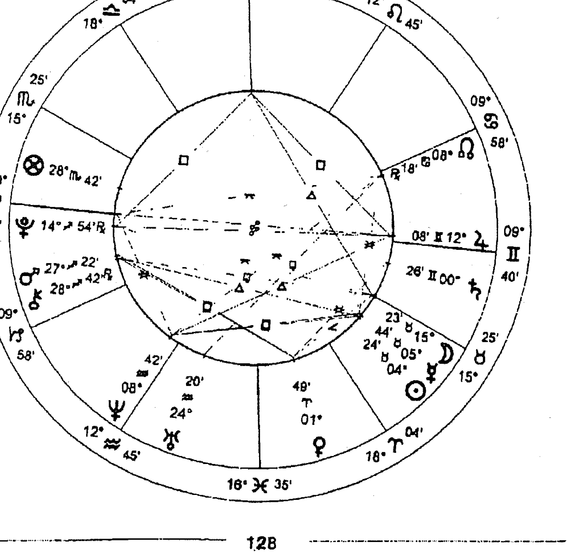

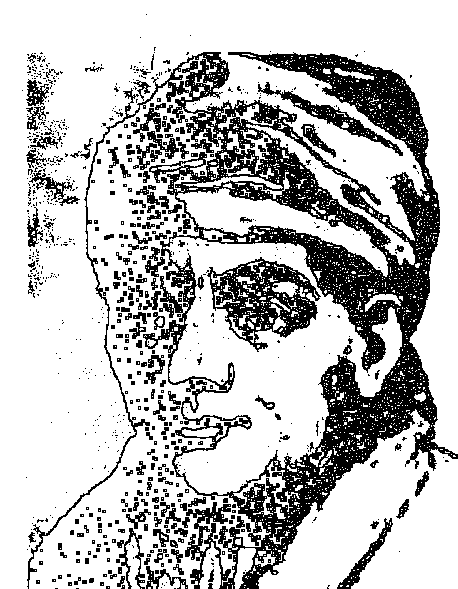

約翰 穆勒(Johann Muller, 1436-1476)
盛行於15.16.17世紀Regiomontanus宮位系統的創始人

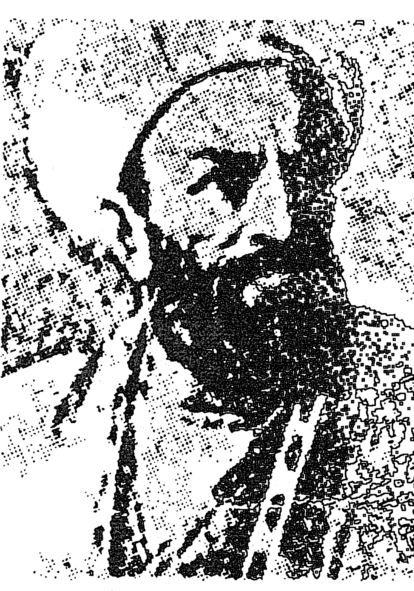

阿爾 比魯尼(Al-Biruni AD 973-1048)


### 拿斯特拉達馬斯(Nostradamus A.D 1503-1566)

法國著名的占星預言家，於1555年出版《世紀》，以詩歌形式寫成的預言，已證明甚為應驗，令人嘖嘖稱奇。

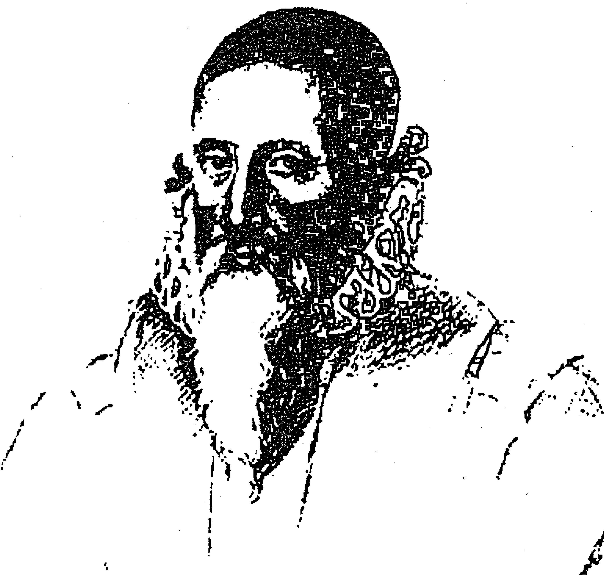

### 约翰 迪(John Dee AD 1527-1608)

英國女皇伊麗莎白一世信賴有加的占星家

# 第四章 黄道12星座

黄道12星座是天宫图的重要元素之一，但学习占星学的人，应知道占星学的12星座，在天空星座，确有其名称，却非实际星图所在的星座；它们是以地球为中心太阳绕行相对视运动所经的12等分的宇宙天体的空间划分，这是占星学与天文学有关星座划分截然不同之处，故以天文学的观点来揶揄占星学，实不可道相为谋。

本书采用的占星学黄道12星座，是以回归黄道(Tropical Zodiac)为主，即太阳每年回归至春分点，白羊座0°为一年的开始，不同于印度占星学或某些恒星派学者所使用的恒星黄道(Sideral Zodiac)，两者的差异源自岁差移动(Precession)，这是因地球形状，太阳月亮附加不平衡引力，地球自转的惯性作用，而产生分点的进动，造成回归年与恒星年之差异，此即岁差。流传于古希腊、阿拉伯、中世纪、文艺复兴一直到西方的占星学大多采回归黄道为主，其主要原因除了例证丰富外，它与地球四季季节的配合一致，不致于如恒星黄道可能产生的怪异现象，即当太阳入天秤座，却是春季的开始，有可能须重新定义星座，工程甚为浩大。

我们应充分了解黄道12星座的特性，阴阳、三方、四正、星座主星、同族性甚至符号逻辑，这样才能确切掌握黄道12星座的真正内涵。本章第一节解说四大元素的哲学，可奠定星座的基础。第二节着重于黄道12星座各种分类的意涵。

第三節附記其他的分類。第四節則細論各星座的具體意義。

另外為了書寫方便，有關黃道12星座，我們以中國十二地支代表如下

| 星座 | 地支 | 星座 | 地支 |
|------|------|------|------|
| 白羊座 | 戌宮 | 天秤座 | 辰宮 |
| 金牛座 | 酉宮 | 天蠍座 | 卯宮 |
| 雙子座 | 申宮 | 射手座 | 寅宮 |
| 巨蟹座 | 未宮 | 摩羯座 | 丑宮 |
| 獅子座 | 午宮 | 水瓶座 | 子宮 |
| 處女座 | 巳宮 | 雙魚座 | 亥宮 |

## 第1節 先從四大元素談起

四大元素-火、土、風、水-的哲學

占星學的萌芽始自巴比倫時期，但巴比倫占星學以神性為主，將各行星賦予他們所尊崇之神的特殊神性來演繹，在西元前6世紀之後，巴比倫占星學滲透其他地區較完整的天象觀察，如埃及，而得以進一步發展成現今占星學都在使用的黃道12星座之時，鄰近地中海的希臘，因學術較自由、思想開放，而綻放哲學種子，名家輩出，如蘇格拉底、畢達哥拉斯、柏拉圖及亞里斯多德，至今仍影響相當深遠。希臘先賢對宇宙構成相當感興趣，雖是哲學性的宇宙觀卻啟迪後世宇宙科學的進展。

以宇宙構成元素而言，各家觀點雖不同卻可從其中發現，四大元素，火 土、風、水哲學的形成，我們僅臚列而不詳論。

1. 泰勒斯(Thales 約B.C624-547) 「水是萬物的本源，萬物都生於水，又復歸於水；世界萬物生滅變化，唯有水不生不滅。」

2. 阿那克西尼(Anaximander 約B.C588-524) 「萬物的始基，是無限的空氣。」 「呼吸現象是生命的延續與否，小宇宙(人存在)既是如此，整個宇宙亦是如此。」 強調氣(風)始基說

3. 畢達哥拉斯(Pythagoras 約B.C580-500) 「數學的本原就是萬物的本質」 「萬物的始基是一元，從一元產生二元」 從而產生四種元素-火、土、風

### 4.赫拉克利特斯(Heraclitus 約B.C540-480)

「萬物原是火」，「火產生了一切，一切又都後歸於火」 「萬物的生成變化皆是矛盾對立，在萬物鬥爭衝突的過程表現對立物的統一」

### 5.齊諾菲尼斯(Xenophanes 約B.C565-473)

「一切出生和生長的東西都是土和水」 「一切都從土中生，一切最後都歸於土」

### 6.恩培多克勒(Empedocles 約B.C490-430)

提出「四根說」認為火、土、風、水是「化生萬物的四個根」，即萬物的本原或根基是由四大元素構成。恩培多克勒的四根說提出後，後世的希臘先賢，幾都採用。

### 7.柏拉圖(Plato 約B.C427-347)

柏氏在泰米亞斯篇(Timaeus)敘說造物主如何利用四大元素火、土、風、水來創造世界，但祇是身體部份，還須有理性- 世界靈魂(World-Soul)，每個東西創造時就「存在」，但又分別「自同」和「他異」，世界靈魂就由這三種混在一起，人類靈魂猶如世界靈魂。柏氏的宇宙哲學觀念影響占星學甚巨，天球和赤道、黃道創造時就「存在」，赤道運轉是「自同」而黃道運轉為「他異」

### 8.亞里斯多德(Aristotle B.C384-322)

亞氏進一步分析四大元素是由純質料(為一種原初物質)，它的內部含有冷、熱、乾、濕兩種對立的特徵。由這些對立特性的相互結合，而形成四種元素，即

熱、濕→風  熱、乾→火
乾、冷→土  冷、濕→水

9.而世界萬物是由四大元素以不同比例結合完成。提出人體有四種體液(Humors)-血液、黃膽汁、黑膽汁、粘液，當它們的混合、力量相互均勻且平衡時，人體是健康的，反之即出現不健康的症狀，同時他也認為四種體液分別與風、火、土、水四元素、四季以及濕、熱、乾、冷四種性質有密切的關係如下圖4-1


恩培多克勒的四根說，可能是他曾觀察一塊木材燃燒，有些東西崩解，聽到爆裂聲和雜亂的聲音，那是水；有些東西揚升於煙中，那是風。而火，能看得見，當火燒盡，有些東西可能保留住，那是灰燼或土，從而悟出四大元素，這種古典樸素的觀念，一直是占星學的支柱，反對占星學的人，就譏諷現代化學元素已拓展百餘個，四大元素豈能做為物質的基本元素。但若詳細歸納這些化學元素不外乎四種型態，即

- 輻射態→火
- 氣態→風
- 固態→土
- 液態→水

更加佩服古聖先賢的智慧，事實上，四大元素不能僅從唯物觀點，它含有精神、物質之一體兩面。

我們先以亞里斯多德的純質料逐步分析，從物理、化學的基本作用來瞭解四大元素的轉化涉及純質料，如風(熱和濕)變化成水(冷和濕)，涉及它的特性更換，如“熱”變成相反的“冷”，這種變化標示實體世界的實質改善，古希臘先賢稱之為自然力(force of nature)。

### 純質料熱、冷、乾、濕的基本特性，整理如下表4-1

| | 主動 | | 被動 | |
| :--- | :--- | :--- | :--- | :--- |
| 純質料 | 熱(Hot) | 冷(Cold) | 乾(Dry) | 濕(Moist) |
| 基本特性 | 輕盈、明亮、稀薄性(稀疏)、敏銳/觀察力 | 沈重、稠密、遲鈍 | 堅固、硬度、乾燥、粗燥、易碎性/容易瓦解 | 柔軟、溫和、光滑、平坦、柔滑、發黏的、濕冷的 |
| 歸納原理 | 熱度、靈活性、伸展性 | 寒冷、黏著、縮回 | 拉緊、僵化、熱度 | 冷易變性、伸展性 |

(1)熱和冷具備主動特性，因他們能對其他事物發生作用，能量的分散和集合

A.熱對某些物體，使它乾燥，如太陽的熱蒸發水汽，即使濕蒸乾和分散
B.冷誘導事物潮濕，甚或凝結成冰，即集合會象。

(2)乾和濕具備被動特性，較易按照行事，為質量的抵抗和吸收

C.濕易於適應型式，它是柔軟溫和、順從的，如沙混合於水，吸收成液體。
D.乾是堅硬、緊湊，能將事物凝聚一起，有自己的型式，如堅硬的卵石將抵抗乾硬的沙，兩者無法混合。

這四種純質料互相结合和排斥类似，吸力与斥力的宇宙法则，需有共通性才能组合成某一元素，若完全相斥，则其能量互相抵销，其排列共有六种。

Ⅰ. 热和湿→共同有伸展性
Ⅱ. 热和乾→共同有热度
Ⅲ. 乾和冷→共同有僵化、黏着性
Ⅳ. 冷和湿→共同有寒冷性
Ⅴ. 热和冷→相互抵销
Ⅵ. 乾和湿→相互抵销

所以前四种Ⅰ、Ⅱ、Ⅲ、Ⅳ之组合，就易构成元素。

这四种纯质料的主动性和被动性，又可因能量特性，而进一步划分成下列状况

| 热 | +.+ | 乾 | -.+ |
| 冷 | +.- | 湿 | -.- |

Ⅰ.热和冷如前述都是主动性，但热显示之能量较冷为积极，热为辐射态系高能量之原生质，如电子、原子。

Ⅱ.乾和湿如前述都是被动性，但乾则是凝聚、对抗；而湿是顺从、柔软。

# 黃道12星座

根據純質料這些基本特性及歸納原理，其所組合之四種元素，就能衍生其意義，從而掌握四大元素的特質，我們列表於下：

| 四大元素 | 質料 | 純質料基本特性 | 優點 | 缺點 |
|----------|------|----------------|------|------|
| 火 | 熱 | 輕盈、明亮 稀薄性(稀疏) 敏銳 | 熱情.熱心.性急. 活潑好動積極.充 滿鬥志.行動力強. 執行力強.無憂慮. 自信.前進.野心. 希望.耀眼.目標. 企圖.樂觀 | 衝動.脾氣火爆.過 於激進.欠思慮.衝 突.本性獨裁.獨 斷.粗暴.魯莽.競 爭.不服輸.爭強. 自我.不考慮他人 立場.易怒 |
| 火 | 乾 | 堅固、硬度乾 燥、粗糙、易 碎性 / 易瓦解 |  |  |
| 土 | 乾 | 堅固、硬度乾 燥、粗糙、易 碎性 / 易瓦解 | 謹慎.保守.穩定. 持續.耐心.忠誠. 務實.勤奮努力.深 謀遠慮.安定.安全 感.善於使用及管 理物質.金錢.秩 序.組織.沈穩.堅 忍.毅力.嚴謹.儲 蓄.不喜浪費 | 倔強.頑固.堅持己 見.不知變通過於 現實.遲鈍.反應 慢.易喪失良機.壓 抑.自責.困難.不 易表達.守財奴.缺 乏自動自發.悲觀 |
| 土 | 冷 | 沈重、稠密、 遲鈍 |  |  |

# 黄道12星座

| 四大元素 | 质料 | 纯质料基本特性 | 优点 | 缺点 |
| :--- | :--- | :--- | :--- | :--- |
| 风 | 热 | 轻盈、明亮、稀薄性(稀疏)、敏锐 | 理性思维、健谈善论、善于表达、语言才能、知识逻辑、思考、说服力、聪明、学习力强、人际沟通、社交关系的聪慧能力、资讯传播、反应能力快、好奇心重 | 浮夸、不切实际、善变不定、躁动、神经衰弱、过于理性、缺乏人情味、易争辩、神经绷紧难入眠或紧张 |
| 风 | 湿 | 柔软、温和、光滑、平坦、柔滑、发黏、湿冷 | 同上 | 同上 |
| 水 | 湿 | 柔软、温和、光滑、平坦、柔滑、发黏、湿冷 | 情绪、情感感受深、易感动、直觉力强、慈悲、怜悯、艺术直觉力强、潜意识洞察力、喜研宗教神秘、温情主义、念旧、艺术天份 | 容易受骗、困惑、意志力薄弱、牺牲、自怨自艾、隐密、孤独、逃避、易自我陶醉、鸵鸟心态、过于感性、易沮丧 |
| 水 | 冷 | 沉重、稠密、迟钝 | 同上 | 同上 |

四大元素所揭櫫的心理特征，是现代占星心理学派努力的结果，其准验性相当高，古典占星较着重于事件，对个性、心理的着墨较少。我们应当注意上表之叙述，系在极端一单一元素所产生之征象，事实上，心理特征是四大元素相互配合的结果。

我们从上述四大元素的优缺点，应可得知

- 1. 火象最具挥发、燃烧、爆发性、精力旺盛、野心，但

- 1. 火象虽充满活力与开创精神，却常有冲动欠思量，故若有土象稳定、毅力，风象的理性，水象的内敛互相搭配，就不致显现其极端缺点之一面，不致过度精力消耗、躁动。
- 2. 土象虽稳固、实务，却嫌反应过慢，甚或笨手笨脚，所以需要火象提升其速度，风象来表达其理念，水象的感性冲淡其冷酷和不知变通。
- 3. 风象虽理性、点子多，却嫌其浮夸、坐而言，故需火象的行动力、执行力，提供目标性及企图心；土象来成就其想法，展现踏实；也需水象增加感性。
- 4. 水象虽感性，但易凭感觉或感情用事，脱离实际太远，故需火象提供目标；土象务实，以克服梦幻式想法；风象的理性，得以条理分析，不致仅有水象感性之受骗迷惑。

四大元素可说是命盘主人的主轴，也是个性分析的重点。读者务必掌握其要义。

现代占星心理学常将四大元素和本世纪分析心理学大师容格所提之四种心灵的功能相结合，由于事涉许多心理学术有名词需深入解说，方得全面了解，此处不拟提出讨论。

我们说过古典占星学未曾对四大元素之心理功能作详细分析，但亚里斯多德时代，天气变化之气候分析，借重四大元素之虑甚多，在气象学尚未发展成今日精密科学分析之前，占星学在气象预测，也扮演些许功用。17世纪中叶耶稣教会传教士来华传教就具体介绍四大元素之气象预测之基。

本解说收留在《四库全书、子集、天文算法类》利玛窦的《乾坤体义·卷上》就曾说明四大元行(素)的概念，与在宇宙中的关系，从而藉以分析气候变化的原因，颇具逻辑性。

## 第2节 12星座先天宫的分类

早期巴比伦人观察天体运行，从留下的资料显示以恒星群为主，尚未有明确黄道12宫的划分，据考证，应是到B.C5世纪以后加勒底王朝统治巴比伦地区，与邻近地区之文化交流如埃及，约在B.C5世纪，才确立黄道12宫，直到今日名称意义都相同，黄道英文原名Zodiac，兽带之意，即太阳经过之区域(以地球为中心之太阳视运动)，古代先贤以当地能见到之野兽和其他人物来命名，每30° 为一区域均等划分，有助于辨识季节，促进历法发展，有利农耕。当时将黄道一周天360° 划分成12个星座，原先各星座可能是以不同之星群合成星座来识别，后来随着占星学逐渐成熟，为了逻辑性推理遂有各种分类之解说，我们分别说明于下

### 阴阳(Positive and Negative)

黄道12星座，从白羊起算为1白羊、2金牛、3双子、4巨蟹、5狮子、6处女、7天秤、8天蝎、9射手、10摩羯、11水瓶、12双鱼，其中奇数代号的星座为阳；偶数代号的星座为阴如下图4-2

星座二分为阴阳的观念，在占星学发展历史中，从古典到现代似乎并不重视，占星家常以+代表阳；-代表阴，后来一些接触中国易经的占星家，才略有表达星座之阴阳类似易经阴阳的观念，但并未引起太大注意。

一般阳性代表雄性、男性、外显、外露、坦白、主动、积极、阳刚、开朗、外向、活泼、好动、敏捷、开创、动态，但也失之草率、鲁莽、轻浮、欠思虑...等。

而阴性代表雌性、女性、收敛、隐藏、隐瞒、被动、消极、阴柔、抑郁、内向、沉着、被动、自制、保守、静态，但失之悲观，过于压抑、忍受、易失良机...等。

星盘中若有关行星落于阳性星座较多，多少具有上述阳性代表的特性，相对落于阴性星座较多，则易见阴性代表之特质。必需注意星座阴阳非个性发展之主轴，故不宜执着于此一标准。

黄道星座的阴阳在古代被用得最多的是将星座划分成白天(Diurnal)和夜间(Nocturnal)。所谓白天的星座即是阳性星座，而夜间的星座即是阴性星座，但希腊所强调的白天和夜间星座，并非针对上述阳性或阴性的特质来解说，而是若行星为白天的行星落在白天星座，行星为夜间行星落在夜间星座，有其特殊意义；相反地，白天的行星落在夜间星座，夜间的行星落在白天星座，则其行星本质会变化，这项观念已被现代所遗忘。1990年代占星学在美国的复古运动才又重新显露其意义，实际定义及吉凶判断，我们留待讨论行星意义时再叙明。

### 三方(Triplicities)

黄道12星座的三方即所谓三分性，按四大元素的分类，将12星座划分成四大组，每个星座距离各120°，因是四大元素分类，每一组都有共同的基本特性，如下图4-3

- - 火象星座：白羊、狮子、射手 英文名称Fire Signs
- 土象星座：金牛、处女、摩羯 英文名称Earth Signs
- 风象星座：双子、天秤、水瓶 英文名称Air Signs
- 水象星座：巨蟹、天蝎、双鱼 英文名称Water Signs

火象星座的共同基本特性，即火元素；土象星座的共同基本特性，即土元素
风象星座的共同基本特性，即风元素；水象星座的共同基本特性，即水元素

若一个人的命盘中，相关行星或点落入某元素星座较多，很容易凸显该元素特质的个性。我们必须注意仅凭单一元素的多寡论断必有所偏颇，必须细腻地区分出同属某元素星座之间的差异，如狮子和射手同属火象星座，若行星及点落于该两个星座之数目相同之不同命盘，个性特质是有差异的，我们留待本章稍后详论。四大元素的分析是命盘的心理主轴，绝不能轻忽。

将黄道星座与四大元素结合一起，应从希腊时代的占星学就有了。但在当时非着重于个性分析，故黄道星座与四大元素的关系描述，并无现代占星心理学的细腻，古典论法因着重于事件预测，故比较重视行星在黄道运行之吉凶，因此除了上述将黄道12星座划分成白天和夜间星座，也强调三星座一体时，在白天或夜间出生的人，有不同的主星，这是涉及行星必然的尊贵(Essential Dignity)之一种，我们也留待后面叙明。

星座的三分性也有阴阳之分，其中火象及风象的星座，都是奇数代号为阳，而土象及水象星座都是偶数代号故为阴。

### 四正(Quadruplicities)

黄道12星座的四正，即将星座划分成三大组，每一组内星座不是呈90°，即呈180°对冲，这种分类也其基本特性，如下图4-4

- - 启动星座 白羊、巨蟹、天秤、摩羯，也称基本星座 Cardinal Signs
- 固定星座 金牛、狮子、天蝎、水瓶，英文名称 Fixed Signs
- 变动星座 双子、处女、射手、双鱼，英文名称 Mutable Signs

启动星座的基本特性为创造性的原动力，原始的创造力，开始的形成，又因是各季节春、夏、秋、冬的起始星座，所以可联想成新的开始、引领、先驱，不断追寻目标，可归纳启动星座的共同特性为行动、驱使、创新、诱因。

固定星座的基本特性为持续已创作的、稳固和持久，因是各季节的中间阶段，代表继续、展现坚持，可联想到定性、持续、稳固、自恃、目标集中而再拓展、顽强、不让步或习惯偏好。

变动星座的基本特性为变化、适应已创造的，因是各季节的末段，即将迈入新的季节，代表不会坚持，可联想到适应、变通、不定、浮动、喜新厌旧，易随环境变化而改变，前后不一致，以变应变。

命盘中若有凸显的四正，易显现出该四正的特质。

三方及四正构成命盘的心理主轴，掌握他们交叉的结果，很容易分析出命盘主人的基本特质，四正可帮助同属三方星座的个别区分，而三方之元素也可厘清四正显示之重点领域，我们分析于下

# 第四章 黄道12星座

| 三方 | 资料 | 四正 | 解 说 |
| :--- | :--- | :--- | :--- |
| 火象 | 白羊 | 启动 | 生命、活力、精力、爆发力、容易呈现领先，不断追寻目标、具体行动向前冲，因而白羊座的人行动力甚强、开拓之先锋.较无耐心、冲动、草率、易怒、得罪他人 、甚具冒险精神、但易消耗精力、性急。 |
| 火象 | 狮子 | 固定 | 火的光亮、耀眼、热力，聚焦于此星座，稳固持久.让人看得到他的才华，有表演的舞台、挥洒的空间、荣耀加诸于身，但因期待别人注目而虚荣自恃、顽强不让步，时时想占据舞台，希望所有焦点在他身上而成习惯。 |
| 火象 | 射手 | 变动 | 火的目标性、野心、用于变动不定的人生经历、企图达到未知的目标，因此会提出理念、精神、形而上，或与宗教有关等价值观，乐观、自信、坦率，却易挥霍、慷慨、不在乎、体验新境界、放纵、讨厌束缚、随心所欲，但热诚、热心不减。 |
| 土象 | 金牛 | 固定 | 实际、现实、稳健的土象结合持续、固定，隐含安全感之需要，金钱物质持久拥有是种享受、舒适，进而衍生美食、美感(感官的)及理财能力，但因顽强习惯偏好，而使得金牛过于现实物欲取向、不通人情、缓慢、固执。 |
| 土象 | 处女 | 变动 | 土象的务实、勤劳结合适应融入，易随环境而改变因而呈现调和、机敏、尽力作好工作、甚而求完美，土象的秩序以致整洁干净，但易工作至上，吹毛求疵、批判、谨慎、过于注重细节、刻苦耐劳。 |
| 土象 | 摩羯 | 启动 | 土的务实、组织、秩序、耐力，会呈现带动，诱因式的驱使，所以虽表面如土之冷静或冷漠，却潜藏着成就感、地位、权威等领先，因而具沉重压力、责任感重、土的稳固，而呈现传统、保守。 |

| 三方 | 资料 | 四正 | 解说 |
| :--- | :--- | :--- | :--- |
| 风象 | 双子 | 变动 | 风的传播、流通、思考、智慧，碰上变动、不定、浮动、喜新厌旧、甚或前后不一致，更加速双子的浮动性，但机敏反应、快速应变、学习速、却浅而不深入，虽伶俐、机智、举一反三，然思虑多变、能书善谈、生动、幽默、却给人轻浮、空谈。 |
| 风象 | 天秤 | 启动 | 风的理性、思维、展现引领、先驱、促进合理性的概念，隐含公平、公正、理性客观等观念性的促进，因着重公平，故会权衡、人际关系佳，却易陷于两难，举棋不定、优柔寡断。 |
| 风象 | 水瓶 | 固定 | 风的理念、思维、逻辑，结合坚持、持续、顽强、不妥协，很容易形成意识形态、观念执着的色彩，因而让人觉得过于自我，甚至与众不同、特立独行或新鲜感、标新立异、聚焦于观念.易走极端、反体制。 |
| 水象 | 巨蟹 | 启动 | 水的情绪、感情、柔情，伴随着行动、诱因、驱使、促进、带领，因而逐渐地形成温情或对他人的照顾来呈现自己的认同，这是种情绪的安全感，不断地扩大感情基地，使人难以拒绝，虽是付出，却是自私、狭隘。 |
| 水象 | 天蝎 | 固定 | 水的感情、情绪、情欲，结合稳固、持久、顽强、不妥协，必然对感情占有欲强，强迫征服之潜在欲望，因而顽固、执拗、韧性、不屈不挠，情感放得深且持续，往往容不下背叛，因而嫉妒、猜疑、甚或报复。 |
| 水象 | 双鱼 | 变动 | 水的柔情、感性、情绪，结合适应、变动、以变应变，就很容易自我牺牲、同情、慈悲、怜悯、善解人意，虽善良却懦弱，不懂得拒绝别人，缺乏自信或坚持，感情容易受挫感伤，却又合理化解啰，虽浪漫却迷惘、困惑、无秩序。 |

| 四正 | 星座 | 三方 | 解说 |
| :--- | :--- | :--- | :--- |
| 启动星座 | 白羊 | 火 | 新的开始、驱使、诱因，最易以活力.爆发力来具体行动呈现。 |
| 启动星座 | 巨蟹 | 水 | 引领、先驱、创新、不断追寻目标，表现在情绪、情感的范围。 |
| 启动星座 | 天秤 | 风 | 促进、驱使、以带领理性的观念沟通，强调和谐、公平、公正。 |
| 启动星座 | 摩羯 | 土 | 引领、带动、先驱，表现于务实、组织、秩序、建构成就，而影响他人。 |
| 固定星座 | 金牛 | 土 | 稳固、坚持、维持、习惯偏好，表现于金钱、感官、物质享有、规律。 |
| 固定星座 | 狮子 | 火 | 持续、自恃、坚持，表现于灿烂、耀眼、明亮的舞台上。 |
| 固定星座 | 天蝎 | 水 | 坚持、顽强、不屈不挠，表现在情感、情绪上。 |
| 固定星座 | 水瓶 | 风 | 坚持、顽强、持续，表现在观念、思想上、意识形态浓厚。 |
| 变动星座 | 双子 | 风 | 活泼、不定、变通、适应，表现在观念、思想、知识情报之吸收。 |
| 变动星座 | 处女 | 土 | 适应、融入、调和、易变，表现于实际、物质环境、擅长服务。 |
| 变动星座 | 射手 | 火 | 适应、融入、易变、不定，表现于目标性、精神层次的野心。 |
| 变动星座 | 双鱼 | 水 | 适应、融入、易变、以变应变，表现于感情、情绪、感受、情欲上。 |

三方四正的交叉分析是星座分析的重点，所以应细细体会。

### 星座主星(Rulership)

几乎在占星学具成熟之初期，即委派黄道12星座各有一个主星，当时仅有太阳、月亮、水星、金星、火星、木星、土星7颗行星，除太阳、月亮各掌黄道北纬最高的狮子、巨蟹外，余按离太阳由近而远，每个行星各掌有2个星座。对照尚未发现现代之外行星天王星、海王星、冥王星之太阳系，当可发现这是古人朴素观察的合理安排。水星临太阳最近，故在狮子、巨蟹旁之两个星座处女及双子，接着是金星、火星、木星，土星最远，故正好在狮子、巨蟹之对宫。依古代传统，这种星座主星安排上颇具对称与美感，

| ☿ 处女 | ☉ 狮子 | ☽ 巨蟹 | ☿ 双子 |
| :---: | :---: | :---: | :---: |
| ♀ 天秤 | | | ♀ 金牛 |
| ♂ 天蝎 | | | ♂ 白羊 |
| ♃ 射手 | ♄ 摩羯 | ♃ 水瓶 | ♄ 双鱼 |

但18世纪末叶，1781年天王星被发现后，海王星、冥王星后来也分别被发现，好事者如英国的R.C.Smith(著名的Rapheal)就想像这些发现的新行星也应有主管星座(注意Rapheal仅及天王星、海王星，因在他生前冥王星尚未发现)，他认为摩羯是土星主要主管星座，因而摩羯之后黄道顺序的水瓶座为天王星主管星座，而接下来之双鱼则是海王星的主管星座，照道理白羊应是冥王星的主管星座，但冥王星的特性为伏匿、深邃也有类似火星的破坏，因而联想到天蝎最符合其特性，将它分配为冥王星的主管星座，由于这三颗外行星是世代影响，因他们运行甚慢，所以有部份占星家仍持传统星座主星观念，但兼用现代行星的星座主星之观念。由于星座主星对星座分析也具举足轻重地位，所以务必要记熟。

占星学的行星有其原理及作用，此处我们先列其关键语(Key Words)及正面、负面评价，详细的讨论留待行星相关章节

| 行星符号 | 心理作用 | 关键语 | 正面评价 | 负面评价 |
| :--- | :--- | :--- | :--- | :--- |
| 太阳 ☉ | 自我意识 | 权力<br>生命力<br>自我表现 | 尊贵 支配 信心、华丽、权力<br>心地高尚、良好生机、骄傲、王者气派、真诚情深、生命力 | 独断独行、虚华奢侈、自大傲慢、独裁专制、玩心重、反对任何改变、作威作福 挥霍放肆、乱动感情、威胁、浪费、放荡、爱现 |
| 月亮 ☽ | 情绪反应 | 反应<br>波动 | 情绪、敏感、念旧、保护、照顾、母性本能 想像力 内向 感受强、直觉力丰富、仁慈、顾家 | 善变、过失合理化、易烦燥、自私、易受刺激、多愁善感、不安、不能信任、反复无常、害羞、过于积累、影响的过度吸收 |
| 水星 ☿ | 思维方式 | 沟通<br>(心灵和<br>运输) | 灵巧 敏捷 聪明、智慧、合理、好奇、知觉敏锐 反应快速、健谈、能言善道、多才多艺、变通快、细节 | 狡诈、耍手段、喋喋不休、批评、冗长 爱打听 好辩 喧噪 神经质、非真心的、花言巧语、阴险 |
| 金星 ♀ | 感官作用 | 和谐<br>调和<br>关系 | 调和、艺术美感、友善、人缘佳、文雅、优美、温文儒雅、和睦、爱情、爱好和平、平静、交际手腕 | 附庸风雅、优柔寡断 不确定 滥情、懒散、欲求不满足、虚弱、淫荡好色、耽迷、滥好人、魄力不足 |
| 火星 ♂ | 直觉 冲动 | 能量 热度 激励 | 活跃的先锋 积极、勇气、大胆、建设性 讲话直接、精力旺盛、强有力、领导者、冲劲、热情、性能力 | 好斗、竞争、冲动、易怒、脾气火爆、侵略、残忍 意外伤害、火灾、手术、毁灭、无耐心、有勇无谋、争先、好战、粗暴、野蛮、草率 |
| 木星 ♃ | 扩张 精神 | 扩展 保持 | 喜好运动、幸运的、慷慨、丰富肥沃、愉快、展望佳、乐观 自信、哲思、获得机会增进 | 铺张、浪费、过分乐观、浅见、不注重细节、过分信赖、幸运、庸俗而夸张、挥霍、奢侈 |
| 土星 ♄ | 压抑 情绪 | 限制 冷漠 | 渴望、讲话小心谨慎 自制 适当、耐性、务实、责任 严肃 节俭、组织、纪律、磨练、保守 | 悲观、沮丧、吝啬小气、教条的、迟钝、害怕畏惧、贪婪、限制、卑贱、苛刻、平凡、不重视美感、拘束、挫折抑郁 消沉、妨害 |
| 天王星 ♅ | 特立独行 | 变化 (革命. 分裂. 专横) | 发明才智、创新才能、独创、坦率直言无讳、正面的神秘主义、改革促进、强烈意志、科技才华、聪明 | 专横、怪癖、叛逆、突然分裂 革命颠覆、极端主义、无政府主义、标新立异、煽动、不喜拘束、突来横祸、爆炸、地震、痉挛 |# 黃道12星座

| 行星符號 | 心理作用 | 關鍵語 | 正面評價 | 負面評價 |
| :--- | :--- | :--- | :--- | :--- |
| 海王星 ♆ | 夢幻聯想 | 朦朧、曖昧、易受影響的 | 藝術才華、夢想、易受感動、靈感、想象力豐富、靈感媒介、敏感、韻律感、神秘宗教、慈悲、同情、直覺、內省 | 空中樓閣、易受騙、自我犧牲、迷信、妄想、渾沌、不切實際、逃避、意志薄弱、說謊、毒品、模糊、徘徊、自我毀滅、感情用事、麻醉、溺斃 |
| 冥王星 ♇ | 情欲掌控 | 排除、重新、再來 | 破壞再建設、深沈內在、潛藏力量、探究、偵察、超心理、排除、再生、揭發、掌控、情欲、原動力、魅力 | 大震盪、爆炸、地下活動、犯罪、滅絕、災難、殘酷、強暴、暴力性犯罪、脅迫、恐嚇、陰謀、勒索、懷恨、執拗、報復、無情、罪惡深淵 |

占星學的分析有個同族關係的說法，如雙子座的星座主星為水星，在分析雙子座就有水星的正、負面評價在內，除此雙子座若由白羊起算，為第3宮就有後天宮第3宮的意涵存在，這種雙子座=水星=第3宮的概念，就是同族關係，所以欲掌握占星學符號意義，就須記牢這種關係，我們整理於下

- 白羊座=火星=1宮  天秤座=金星=7宮
- 金牛座=金星=2宮  天蠍座=火星、冥王星=8宮
- 雙子座=水星=3宮  射手座=木星=9宮
- 巨蟹座=月亮=4宮
- 獅子座=太陽=5宮
- 處女座=水星=6宮
- 摩羯座=土星=10宮
- 水瓶座=土星、天王星=11宮
- 雙魚座=木星、海王星=12宮

同族關係的觀念，是現代占星學的產物，在17世紀之前的古典占星學尚未見到其影子。這項觀念對現代占星學建立比較合理或邏輯的分析，頗有貢獻，但也混淆各元素符號意義之界線。1990年代興起的占星學復古運動，有不少占星家就頗反對，如Lee.Lehman就著書立說反對這項觀念，她認為這種混淆是因未完全解讀古典占星學，各元素所掌管原始字義(Rulership)所致，但這不在我們討論範圍內。

## ### 符號邏輯

占星學的一支，神秘學派，曾發展出符號來詮釋天宮圖各項因素的意義，雖是臆想比擬卻可掌握其要義，美國占星家曼恩(A.T Man)及亞倫 歐肯(Alan.Oken)皆很努力地詮釋，其要義可用來輔助星座符號及行星符號的了解 曼恩以四個最簡單的幾何符號，即圓、點、半圓和十字，說明其最基本意義。

- 圓○: 稱為精神(Spirit)的圈或永恆的戒指(Ring of Eternity)，象徵精神或生命力、心靈和宇宙。
- 點：象徵焦點或創造者。
- 半圓 ）、（ 稱為靈魂(Soul)或靈魂的發源地或意識的逐漸增長。
- 十字+、↗ 象徵實體或物質世界。

西方占星學中符號圖騰三個根本，象徵精神的圓，靈魂的半圓或新月，物質的十字，依神秘學派的說法，所有生命形態都是由各種比例的精神、靈魂、物質構成的。

我們舉例來說明星座各項分類實證。基本上計算ASC、MC、⊙、☽、☿、♀、♂、♃、♄、♆、♅、⚳、⚷共13個，各落在那一星座，按其分類性質，即可得各分類性質特性的多寡。

### 案例一

男

Natal Chart
Jul 26 1984
9:56AM -8:00
高雄市, Taiwan
22N38 120E17
Geocentric
Tropical
Placidus
True Node

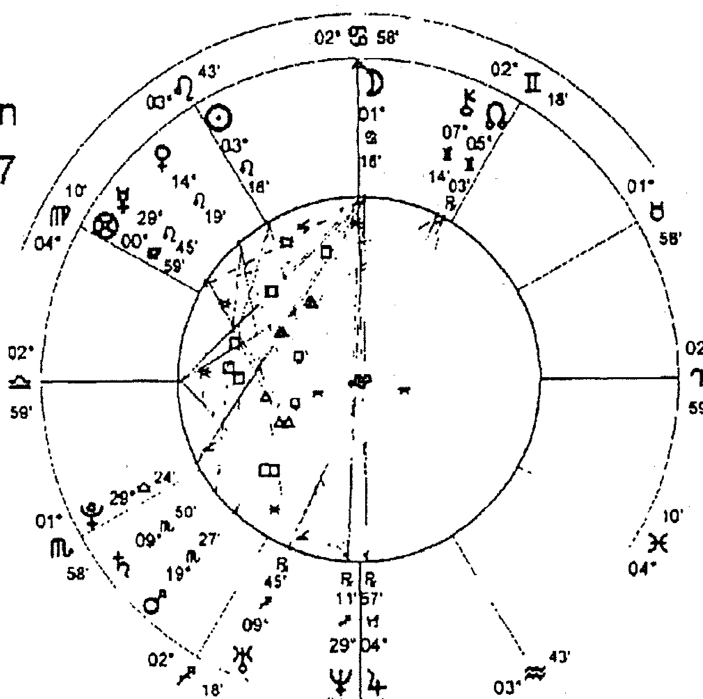

重點分析：
1. 陽性星座較強，尤其是獅子座。○、♀、☿在午獅子，ASC、♃在辰天秤，♆、☊在寅射手，共8/13。
2. 太陽○又與ASC形成吉相。
3. 火象星座甚強，○、♀、☿在午獅子，♆、♃、☊共6/13。

命主自小即展現領導力 主動、積極、陽剛、喜受注目的特性。

### 案例二

女

Natal Chart
Nov 15 1989
7:38 AM-8:00
高雄市, Taiwan
22N38 120E17
Geocentric
Tropical
Placidus
True Node

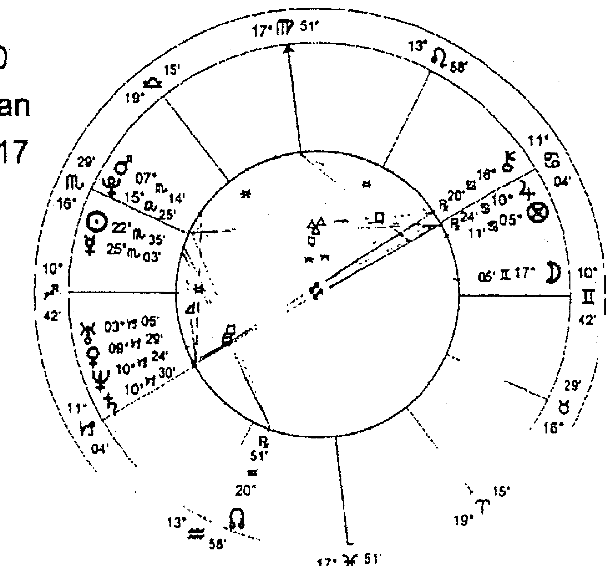

重點分析：
1. 行星幾多落在陰性星座，尤其是天蠍及摩羯。☉、☿、♂、♃在卯天蠍，⚷、♀、♆、♄在丑摩羯，♃在未巨蟹，MC在巳處女，共10/13。
命主消極、退縮卻城府深、被動、陰沈、孤僻卻又想控制他人，嫉妒、報復心強。

本案例與案例一為親兄妹，卻有截然不同的個性，推論時，其母噴噴稱奇，相當認同占星的分析，有些自我解嘲地說，同出一娘胎，為何個性差異那麼大。

### 案例三

郝柏村

Natal Chart
Aug 8 1919
3:10 AM -8:00
江蘇, 中國
33N18 120E06
Geocentric
Tropical
Placidus
True Node

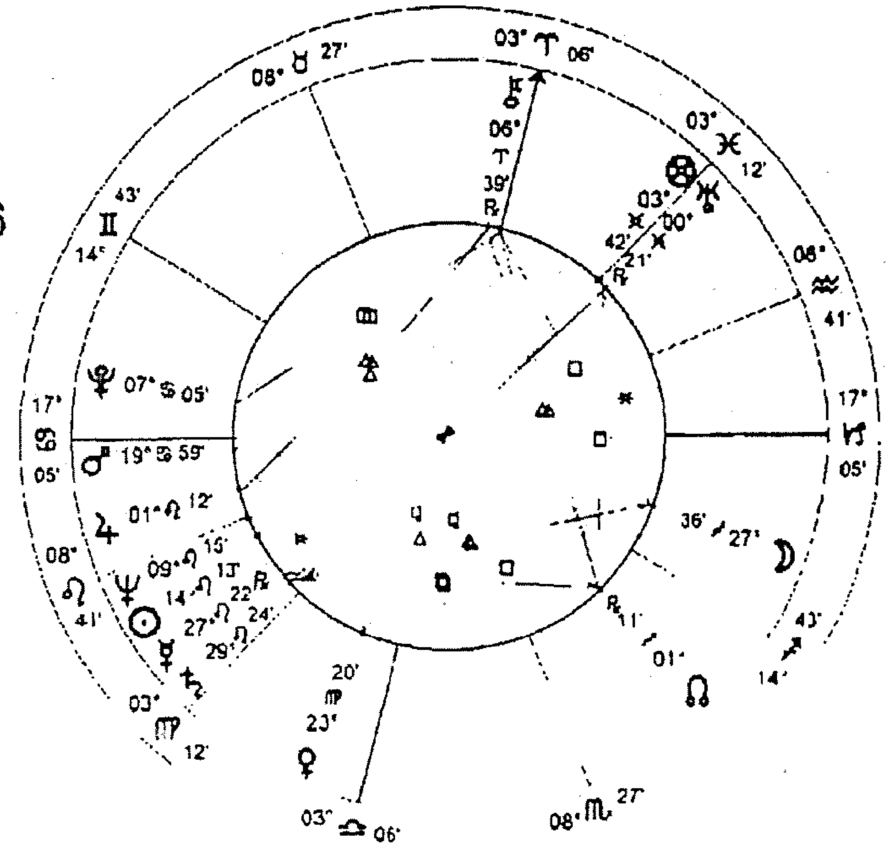

重點分析：
1. 火象星座甚強，尤其是獅子座。4、Ψ、⊙、♀、♃在午獅子，☽在寅射手，MC在戌白羊共7/13。
2. ♂又相當近ASC，♃為MC主星。

前行政院長郝柏村出身軍人，在蔣經國時代擢升參謀總長，掌控三軍，權勢顯赫，頗具霸氣，☿又與MC白羊90°刑，MC主星♃又入命，的確是權貴之命，充分展現火象獅子之重要徵象，自我、領導、堅強、固執、不服輸、不妥協、強勢、主動、積極的軍人本色。

### 案例四

連戰

Natal Chart
Aug 27 1936
8:00 PM -8:00
陕西, 中国
34N16 108E52
Geocentric
Tropical
Placidus
True Node

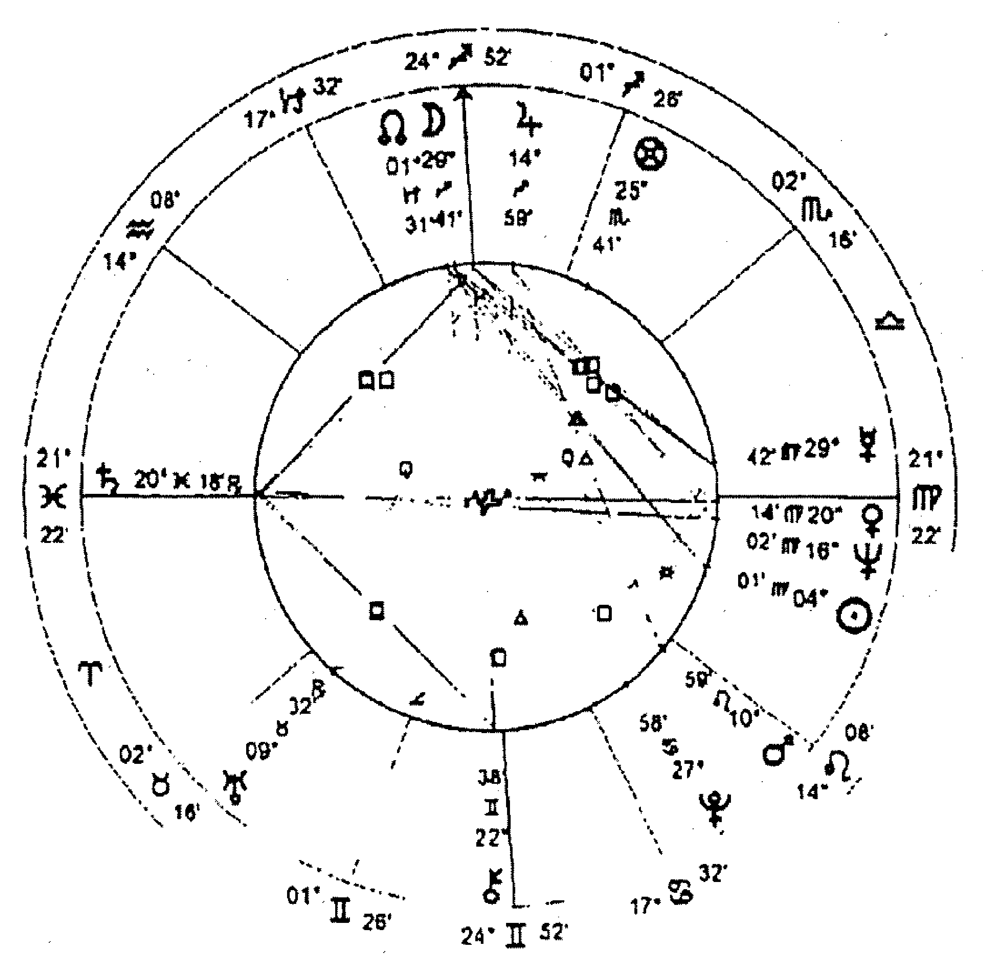

重點分析：
1. 上象強，且陰性星座亦強。太、海、金、天在巳處女，ASC、土在亥雙魚，計都在未巨蟹，羅在酉金牛，共9/13。
2. 土上升於ASC命度。

現任國民黨黨主席連戰，給人的印象，溫文儒雅、被動消極、內斂、服從、穩重、保守，卻無趣、LKK，不討年青人喜歡，有些潔癖、紳士，風象星座甚弱，故口才、語言表達能力，比起其他政治人物遜色。

### 案例五 周恩來

Natal Chart
Mar 2 1898
2:00 AM -8:00
江蘇,中國
33N18 120E06
Geocentric
Tropical
Placidus
True Node

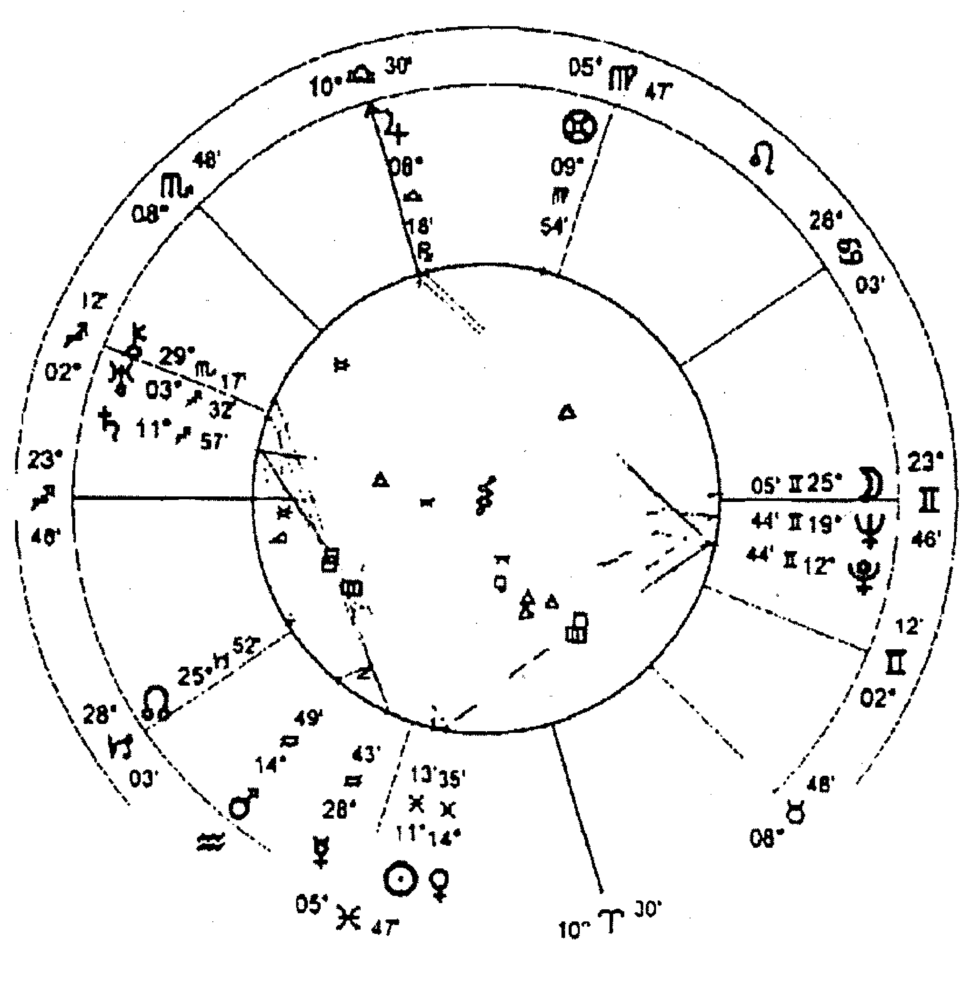

重點分析：
1. 風象星座甚強 ♀、♃、☽在申雙子，ASC、♃在辰天秤，♂、☿在子水瓶，共7/13。
2. 變動星座亦甚強。ASC、♃、☋在寅射手，☉、♀在亥雙魚，☿、♃、☽在申雙子，MC在巳處女。
3. ☿ △ ☽。

已逝前中共國務院總理周恩來，一生憑其機智、口才，在外交戰場上折衝替中共贏得國際同情，在國共內戰期間及後來的諸多外交戰，奠定中共的地位，實為中共功勛卓著之英雄。

# 第四章

### 案例六 金庸

Natal Chart
Jan 21 1924
3:40 PM -8:00
浙江, 中国
30N30 120E42
Geocentric
Tropical
Placidus
True Node

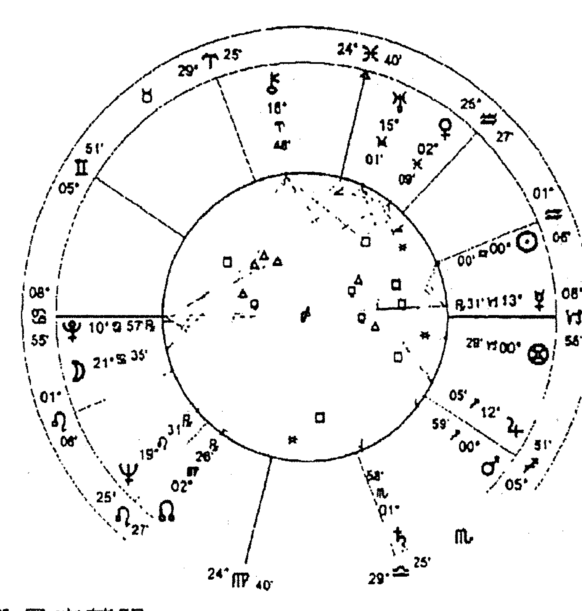

重點分析：
1. 水象星座甚強。ASC、土星、月亮在未巨蟹，木星在卯天蝎，MC、天王星、金星、海王星在亥双鱼，共8/13。
2. 月亮又在命宫与MC三角三合吉象。
3. 变动星座也强。火星、冥王星在寅射手，MC、天王星、金星、海王星在亥双鱼，共6/13。

金庸的著作「射雕英雄传」「天龙八部」...等结合历史与武侠风格的小说风靡全球，显现他敏感细腻、艺术才华、直觉力强、情感丰富等水象星座特色。巨蟹上升，月亮又在命宫，念旧、历史，而土星在ASC，也有执著、坚毅的一面，MC在亥，双鱼，正是艺术、灵性、编写天马行空的特质。

### 案例七 王永慶

Natal Chart
Jan 18 1917
5:45 AM -8:00
新店市，台灣
24N57 121E32
Geocentric
Tropical
Placidus
True Node

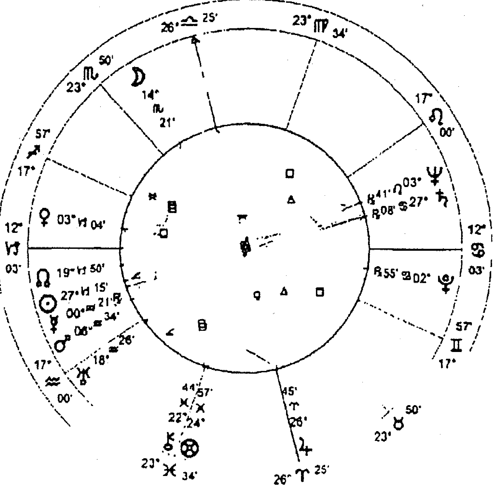

重點分析：
1. 啟動星座甚強，固定星座也強，變動星座甚弱。
   (1) ASC、⊙、♀在丑摩羯，MC在辰天秤，♃在未巨蟹，♄在戌白羊，共8/13，在啟動星座內。
   (2) ♂、♀、⛢在子水瓶，♆在午獅子，☽在卯天蠍，共5/13，在固定星座內。
2. 所有行星幾乎都在始宮內，增1之(1)象。
3. 天宮圖呈現大十字格局。

王永慶是台灣經濟奇蹟的主要貢獻者，努力、主動、積極、帶領之先驅，企圖心強，開創時勢，且能持續、堅持，贏得台灣經營之神的美號。

# 第七章 命盤分析

### 案例八 王先生

Natal Chart
Jul 5 1950
3:35 AM -8:00
台南, 台灣
23N07 120E21
Geocentric
Tropical
Placidus
True Node

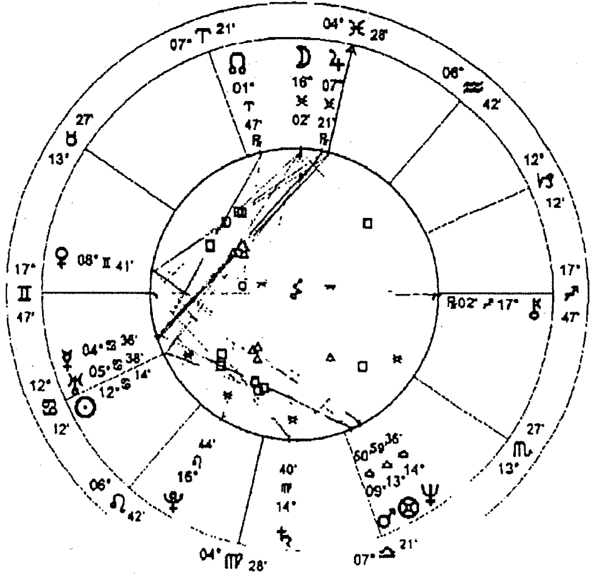

重點分析：
1. 啟動星座甚強，但固定星座弱，而變動星座又甚強。
   (1) ☿、♅、☉在未巨蟹，☋、♂、♃在辰天秤，共6/13，在啟動星座。
   (2) ASC、♀在申雙子，MC、♃、☽在亥雙魚，☊在巳處女，共6/13，在變動星座。
2. 風象星座及水象星座皆強，而火象星座及土象星座甚弱。
   (1) ASC、♀在申雙子，☋、♂、♃在辰天秤，共5/13，在風象星座。
   (2) ☿、♅、☉在未巨蟹，MC、♃、☽在亥雙魚，共6/13，在水象星座。

命主、敏感、直覺力佳、口才、語言表達能力屬佳，但情緒變化大，融入狀況、適應環境的能力甚好，但給人浮誇、不實際、吹牛、耍嘴皮子、變化大。

## 第3節 星座的其他分類

黃道12星座發展至今已歷2500年以上，在歷代占星家使用上各有其他特殊意義。有些是天文、季節的意義，有些是根據命名獸類之特徵而分類，有些是由其特性而衍申為日常生活意義，這些有助釐清黃道12星座的內涵，進而為特殊斷訣使用，我們彙總臚列於下

### 天文意義的分類

1.  **長上升星座(Signs of Long Ascension)和短上升星座(Signs of Short Ascension)**
當地球以其軸心自轉，在北極圈之下的北半球，每24小時內，所有星座都能上升於東方地平線上，在北緯地區，從巨蟹到獅子、處女、天秤、天蠍到射手可視作長上升；而從摩羯、水瓶、雙魚、白羊、金牛、雙子可視為短上升。
兩者差異的理由是因所有上升必然平行於天球赤道，因黃道斜交赤道，致某些部份上升於地平線上，會以較快速率上升，此即短上升，其他的則稱為長上升。在南半球南緯地區，長上升星座和短上升星座，適與北緯地區相反。亦應注意在赤道地區及南北極圈永晝、永夜，就無此分類。

2.  **分點星座(Equinoctial Signs)**
以太陽在黃道視運動之迴歸至春分點時為白羊座，迴歸至秋分點為天秤座。白羊座和天秤座稱為分點星座。

### 3. 至點星座 (Tropical (Solstitial) Signs)

以太陽在黃道視運動之迴歸至夏至點時為巨蟹座，迴歸至冬至點時為摩羯座。巨蟹座和摩羯座稱為至點星座。

### 4. 北方星座(Northern Signs)和南方星座(Southern Signs)

當太陽在北緯時，這些星座如白羊、金牛、雙子、巨蟹、獅子、處女等6個星座，稱為北方星座，而當太陽在南緯時，這些星座如天秤、天蠍、射手、摩羯、水瓶、雙魚等6個星座，稱為南方星座。

### 季節意義的分類

1.  春季星座(Spring Signs) - 白羊、金牛、雙子
2.  夏季星座(Summer Signs) - 巨蟹、獅子、處女
3.  秋季星座(Autumn Signs) - 天秤、天蠍、射手
4.  冬季星座(Winter Signs) - 摩羯、水瓶、雙魚

### 獸類、特徵的分類

1.  人性星座(Human Signs) - 雙子、處女、水瓶、射手 (前半段之半人)
2.  獸性星座(Bestial Signs) - 白羊、金牛、獅子、摩羯、射手(後半段半馬)
3.  四足星座(Four-footed Signs) - 白羊、金牛、獅子、射手、摩羯
4.  兩棲類星座(Amphibious Signs)－水瓶、摩羯(兩者都有水棲和陸地之要素)

### 日常生活使用之分類

1.  **雙元或雙體星座(Dual或Double-bodied Signs)**
雙子、雙魚、射手和處女(托勒密將之列在內)，這些星座有雙重意涵，如為5宮(男女)宮始點，易有雙胞胎之可能，在10宮(事業)，常有兩種職業，很少從一而終。

2.  **沈默星座(Mute Signs)**
水象星座巨蟹、天蠍、雙魚皆為無聲，口語表達能力較遜，溝通較弱。

3.  **有聲星座(Signs of Voice)**
雙子、處女、水瓶、射手(半人)，皆能發聲、講話，故口語表達較強，溝通能力較強。又其他獸性星座，如白羊、金牛、獅子也能發聲，但無法說話，故如同2.沈默星座之特性，但稍佳。

4.  **荒地星座(Barren Signs)**
雙子、獅子、處女此三個星座稱為荒地星座，較不易生產小孩，故女命5宮宮始點為荒地星座，懷孕機率較小，其次射手、水瓶為半荒地星座。

5.  **肥沃星座(Frutiful Signs)**
水象星座巨蟹、天蠍、雙魚等稱為肥沃星座，較容易生產小孩，故女命5宮宮始點為肥沃星座，懷孕機率較高，其次金牛、天秤、摩羯稱為半肥沃星座。

### 6. 命令星座(Commanding Signs)

同〈一〉之4的北方星座由於太陽在北緯時，其白天的時間比夜間長，陽大於陰具有支配之意，較易掌有實權。

### 7. 服從星座(Obeying Signs)

同〈一〉之4的南方星座由於太陽在南緯時，其白天的時間比夜間短，陰大於陽，較為內斂，隱含較易服從之意，較易替人服務。

### 8. 始入星座(Ingress Signs)

太陽迴歸視運動，每年在剛進入二分二至點星座，如白羊、巨蟹、天秤、摩羯的0° 時，稱為始入，占星家通常按其始入時刻和首都所在地或用事地點的經、緯度起盤，用來論斷國運或時事。

## 第4節 黃道12星座細論

| 關鍵語：我是(I am) | 白羊座 | 同族宮位：1宮 |
| :--- | :--- | :--- |
| 1.太陽迴歸期間<br>約國曆3/21～4/20 | 10.金屬：鐵(鋼) |
| 2.符號：♈ | 11.顏色：紅色系 |
| 3.純質料：熱、乾 | 12.方向：東方 |
| 4.白天或夜間　白天星座 | 13.場所　伙房、乾燥地方、磚窯、新開墾地 |
| 5.三方　火象星座 | 14.寶石　紅寶石、鑽石、水晶、雞血石、瑪瑙 |
| 6.四正：啟動星座 | 15.器具　尖銳物品、軍需品、手槍、手工工具 |
| 7.星座主星　火星♂ | 16.動物　羊、狼、麋鹿 |
| 8.數字　9、13 | |
| 9.身體部份<br>頭部、臉、眼睛、腦部 | |

白羊座歷史上的符號代表公羊，為羊群的領導者，描述領導能力的性質。符號由公羊的兩個角組成劃成兩個半圓，意識的新月象徵靈魂，兩個半圓由直線聯結太陽的君權代表太陽的權力聯結了生命力，而兩個新月顛倒未成圓，象徵力量釋放，鼓舞了新活動和生活開始。符號也象徵頭、臉、前額之眉毛，向前開拓及攻擊、騷動、鼓動者。

1. 火星為主星，熱力、生命力、爆發力強，故具有衝勁、企圖心、爭先競爭、戰鬥、暴燥。
2. 陽-火-啟動，代表動態活動，率先、進取心、直接、自信、光明、不喜隱藏、好強說做就做、行動力強、不斷追求新目標不單調乏味、性急地自我表現。
3. 黃道的第一個星座，春分點，春季草木欣欣向榮，但新芽脆嫩易折，故易折損象徵易發生意外，嫩則意味未經世事磨練，太直接而未經思考，而第一個星座也代表率先、開創性。
4. 同族宮位為1宮，跟生命力有關。
5. 關鍵語 「我是」就含有自我、獨斷、不聽他人意見、自以為是。

### A: 身體特徵

1. 中等身材稍高，瘦而略向前傾、頸長、肩膀寬強、手指薄且短。
2. 頭圓臉長而頰瘦、上唇略長、下唇薄且短。
3. 髮色紅或黃紅、棕色有時非常黑，硬直或鬆捲而曲。
4. 眉毛濃密而黑。
5. 鼻子薄而彎曲。
6. 牙齒白而強壯。

### B: 可能疾病

所有有關頭部的慢性病，特別是頭痛、偏頭痛、頭部受傷、熱病、發炎、發燒、猩紅熱、天花疱症、粉刺面疱、割傷、燒傷、燙傷、腦炎、腦中風、角膜炎、視網膜病變、眼睛發黃、視力受損。

### C: 人生態度，改進重點

1. 而要冷靜，不宜躁進，行事前多思量。
2. 注意意外傷害，火災。
3. 脾氣不宜火躁，四處得罪人。

### D: 業餘活動

1. 戶外運動。
2. 有競爭性之體育競賽。
3. 動手修理房舍、使用物品。

### 其他相關事項

|   | 正面評價 | 負面評價 |
|---|---|---|
| 人 | 勇氣膽識、鼓舞他人、熱情幹勁、積極活潑、冒險犯難、直接果斷、驕傲自信、開朗鬥志、光明真誠、正直進取 | 心情不定、缺乏耐心、魯莽無禮、易怒爭吵、專制蠻橫、思慮欠周、挖苦諷刺、強迫鬥氣、三分鐘熱度、虎頭蛇尾 |
| 事 | 救火、進行外科手術、燒飯作菜、烤麵包...與火有關。與火有關製品，消防器材、爐灶、壁爐、尖銳修理工具、烤箱、電磁爐、鐵器、外科手術用具、切割利器、瓦斯筒。 |  |
| 物 | 爐灶、壁爐、尖銳修理工具、烤箱、電磁爐、鐵器、外科手術用具、切割利器、瓦斯筒。 |  |

| 關鍵語：我有(I have) | 金牛座 | 同族宮位：2宮 |
| :--- | :--- | :--- |
| 1. 太陽迴歸期間<br>約國曆4/21～5/20 | 10. 金屬 銅 |
| 2. 符號：♉ | 11. 顏色 柔和溫潤色調，奶油色、淡黃色 |
| 3. 純質料：乾、冷 | 12. 方向 南偏東 |
| 4. 白天或夜間：夜間星座 | 13. 場所：庭院、金融機構、牛舍、田地、地窖 |
| 5. 三方：土象星座 | 14. 寶石 翡翠、玉、瑪瑙 |
| 6. 四正 固定星座 | 15. 器具 樂器、珠寶箱、外在飾物、耳環 |
| 7. 星座主星 金星♀ | 16. 動物 牛、豬 |
| 8. 數字：6、14 | |
| 9. 身體部份：頸部、喉嚨、食道、聲帶、甲狀腺 | |

### 符號象徵

金牛座歷史上的符號代表公牛的頭部，由圓(精神的圓、生命力)。覆以一個新月，金牛的新月向上，以保留儲存維護生命力。因象徵公牛的頭和角，意涵著如牛之緩慢，定性，以保護擁有的。

### 內在機制分析

1. 金星為主星，強調舒適、美感、感官、金錢、物質、可衍生物產、享受美食、愛美。
2. 陰-土-固定，代表靜態、堅持、務實、穩固、韌性，必然演繹成規律、執著、實際、緩慢步調、物欲取向、習慣偏好溫順、保守、傳統。
3. 同族宮為2宮，跟金錢財產有關，結合1.2.更易凸顯金牛座強調物質擁有的感受，故經濟的安全感成為基本需求。
4. 關鍵語 “我有”就意味著擁有、感受。

# 黄道12星座

| A：身体特征 | C：人生态度，改进重点 |
| --- | --- |
| 1. 中等身材稍矮，厚重方型、短而强的颈、肩、稍弯背、手脚宽厚。<br>2. 头圆或方、宽与肩搭配良好，脸方前额较宽，唇厚嘴阔。<br>3. 髮黑，曲而波状、茂密。<br>4. 眼睛棕或黑，大而圆，眼睑重、稍低，给人想睡觉之感觉。<br>5. 鼻挺，鼻孔通常较厚。 | 1. 不宜过于贪婪、物欲取向。<br>2. 步调须加快，不宜过于坚持，以致丧失良机。<br>3. 应注意喉咙、食道之异样症候。 |
| B：可能疾病 | D：业余活动 |
| 甲状腺机能亢进或减退，咽喉炎、白喉、扁桃腺肿、发炎、感冒咳嗽、声音嘶哑、声带发炎，颈部不适，口吃、语言障碍。 | 1. 种花、绘画、刺绣、雕塑。<br>2. 听音乐、唱歌、弹琴。<br>3. 享受美食、美酒。<br>4. 金钱投资、理财活动。 |
| 其他相关事项 | 正面评价 | 负面评价 |
| 人物：畜牧者、资本家、财政管理者、银行家、会计出纳、音乐家、艺术家、歌手演唱者、钢琴师、皮革艺术家、珠宝商。<br>事物：艺术、音乐、商业、财产、理财、借贷。<br>物品：美丽礼物、饰物、保险箱、存摺、支票簿、美食、牛排、证券、金钱、宝石、贵重石头。 | 实际、忠诚、依赖、耐性、富艺术美感、定性、责任感、喜爱美食、具商业头脑。 | 顽固、古板、贪婪、占有欲强、物欲重、缺乏应变能力、缓慢、迟钝、懒惰、过于坚持。 |

# 黃道12星座

| 關鍵語：我思(I think) | 雙子座 | 同族宮位：3宮 |
| :--- | :--- | :--- |
| 1. 太陽迴歸期間<br>約國曆5/21～6/20 | 10.金屬 水銀 | |
| 2. 符號：♊ | 11.顏色 黃色系列 | |
| 3. 純質料：熱和濕 | 12.方向：西偏南 | |
| 4. 白天或夜間 白天星座 | 13.場所：學校、教育機構、電台、停車場、馬路 | |
| 5. 三方 風象星座 | 14.寶石：水晶、綠玉、斑紋石頭 | |
| 6. 四正 變動星座 | 15.器具 各種交通工具、圖書、海報 | |
| 7. 星座主星：水星 ☿ | 16.動物 小鳥、猴子 | |
| 8. 數字：5、17 | | |
| 9. 身體部份：肩部、手臂、肺部、支氣管、神經系統 | | |

**符號象徵** 雙子座歷史上的符號，反映雙胞胎，由兩個十字(物質)構成，代表性質的兩面，衍申為多元化、知識傳播之延伸無遠弗屆，如同體內之神經系統的網路，因而反應快，善於捕捉他人想法，這種網路構成，基本上仍由中央和枝節兩部份建構的。

**內在機制分析**

- 水星為主星，好奇、敏銳、聰明、智慧、善談、口才佳、多才多藝。
- 陽風-變動，代表顯露、浮出、反應快舉一反三、機敏多變、但不牢靠、浮動而表面化，因而雖聰明，但思慮多變，而有浮誇不實之現象。
- 同族宮為3宮，代表溝通、交通、手足、親戚、鄰居。
- 關鍵語：“我思考”具有思考、演繹、變通之特性。

### B 可能疾病

肩胛骨傷痛，手臂傷痛，肺結核，肺功能不佳，支氣管炎，百日咳，肺氣腫，哮喘，肺炎，神經失調，失神，失憶，神經緊張或過敏，呼吸系統之諸項疾病。

### D 業餘活動

- 喜廣泛地收集資料，心智活動，上網。
- 喜跟人聊天，天馬行空，動腦之下棋遊戲。

| 其他相關事項 | 正面評價 | 負面評價 |
|--------------|----------|----------|
| 人: 兄弟姊妹、親戚、鄰人、傳達消息者、知識份子、演說者、旅客、訪問者、寄信人、書店老闆、司機、郵局員工、記者、文人。<br>事: 廣播、新聞報導、情報資訊、文書檔案、電話、寫作能力、流言蜚語、旅遊、心智活動。<br>物: 信件、交通工具、出版物、書籍、雜誌與無線電相關之物品。 | 多才多藝、機敏多變、活潑、聰明智慧、寫作、語言才能、健談、善於表達、反應快速。 | 狡猾、多變、不定、浮誇、喋喋不休、愛挑剔、批評、坐而言。 |

# 黄道12星座

| 關鍵語：我感覺(I feel) | 巨蟹座 | 同族宮位：4宮 |
|-----------------------|--------|--------------|
| 1. 太陽迴歸期間<br>約國曆6/21～7/20<br>2. 符號：♋<br>3. 純質料：冷和濕<br>4. 白天或夜間：夜間星座<br>5. 三方 水象星座<br>6. 四正 啟動星座<br>7. 星座主星 月亮☽<br>8. 數字：2、18<br>9. 身體部份：胃部、胸腔、消化器官、膽囊、卵巢 | 10.金屬 白銀<br>11.顏色：銀藍色、灰藍色<br>12.方向：北方<br>13.場所：餐廳、家裡廚房、旅館、水邊、起居室<br>14.寶石 珍珠、月石、石英<br>15.器具 家庭日常生活用品、麵包、米食、古董<br>16.動物 甲殼類動物，螃蟹、蝦子 |

巨蟹座歷史上的符號為螃蟹，描述保護和防衛、內心軟之特質，由兩個圓加上一個新月，兩邊反轉，但圓在裡面，保留了生命力，此兩圓類似女性乳房、胸部、卵巢、生命源泉之家，故巨蟹座具有這些特性。

- 月亮為土星，代表情緒、敏感、念舊、照顧、顧家、保護、母性本能、仁慈。
- 陰-水-啟動，容易讓人覺得親切、溫馨，因將水的感情、情緒透過促進、帶領而擴張其影響力，但這是潛移默化的。
- 同族宮為4宮，代表家族、母親、田宅與家庭事務有關。
- 關鍵語 “我感覺” 意味著：巨蟹者感情豐富，容易感傷懷舊，情緒波動。

| 部分 | 内容 |
|------|------|
| **A: 身体特征** | 1. 两种型态，高而苗条或短而矮胖，后者居多，身体圆头重脚轻，水样外观，丰胸，手臂可能细长而手掌及手指短而多肉。<br>2. 头圆，脸长而窄或脸圆，颊下垂，嘴大。<br>3. 发棕亮，金黄棕或较无色泽。<br>4. 眼睛大而水样，眼睑有些下垂。<br>5. 鼻子短，牙齿不齐。 |
| **B: 可能疾病** | 胃炎、胃病、胃溃疡、胃黏膜炎，幽门病变、反胃、晕船、消化系统疾病、女性乳房肿痛、乳癌、卵巢病变、胆囊炎、胆汁分泌障碍、胆结石、肋膜炎、横膈膜炎、焦虑症、忧郁症。 |
| **C: 人生态度，改进重点** | 1. 改掉情绪化，感情或亲情不要让人有压迫感。<br>2. 心胸宜宽大，不宜自艾自怜，难以取悦。<br>3. 应注意消化系统、乳房、卵巢之病变。 |
| **D: 业余活动** | 1. 居家活动、烹饪、缝纫、编织。<br>2. 搜集古董、探寻家族历史、集邮。<br>3. 水上活动、海边游玩。 |
| **其他相关事项** | **人**：母亲、奶妈、保护者、房地产经纪人、房屋持有人、旅馆所有人、收藏家、餐厅所有人、饮食供应商、女管家、饮食店业者。<br>**历史**：家族记忆、母性光辉、温情記事，与土地、房地产相关之事。<br>**物**：土地、房屋、不动产，与水相关事物、用品、器具，与家庭相关之用品器具。 |
| **正面评价** | 母性本态 照顾、记性佳、善良、敏感 热心、保护防卫、家庭观念重、顾家、爱国心、念旧、寻根历史。 |
| **负面评价** | 情绪化、过于鸡婆、易自怜、心胸狭窄、难以取悦。 |

### 獅子座

# 黃道12星座

| 關鍵語：我要(I will) | 獅子座 | 同族宮位：5宮 |
|---|---|---|
| 1. 太陽迴歸期間 約國曆7/21~8/20 | 10. 金屬 黃金 | |
| 2. 符號：♌ | 11. 顏色：金黃色，耀眼系列之色調 | |
| 3. 純質料：熱和乾 | 12. 方向 東偏北 | |
| 4. 白天或夜間 白天星座 | 13. 場所 宴會、舞廳、賭場、娛樂場所、公園 | |
| 5. 三方：火象星座 | 14. 寶石：紅寶石、琥珀、貓眼石 | |
| 6. 四正 固定星座 | 15. 器具：賭具、黃金飾品、娛樂器具、值錢物品 | |
| 7. 星座主星 太陽☉ | 16. 動物 獅子、貓科動物 | |
| 8. 數字 1、19 | | |
| 9. 身體部份：心臟、脊椎、背部、心包絡、血液循環 | | |
| 符號象徵 | 獅子座歷史上的符號獅子頗能符合，它是叢林中王者之尊。曲線符號是由圓轉成新月，生命力聯結到靈魂，而其曲線流經類似心臟之冠狀動脈，故主心臟血液循環。 | |
| 內在機制分析 | 1. 太陽為主星，代表尊貴、自大、榮譽、領導能力、權力、支配、華麗、耀眼、愛炫。<br>2. 陽-火-固定，積極，亮度聚焦於此，榮耀加諸於身，熱力持久而堅固，有表演舞台受人注目，英雄主義虛榮心易引起，頑強而不讓步。<br>3. 同族宮為5宮，代表才華創作、男女情感、投機賭博活動，娛樂玩心重、小孩，而有天真之面。<br>4. 關鍵語 “我要” 具有獨斷、自我、堅持之特性。 | |

# 黄道12星座

### A 身體特徵

- 中高或高，強壯而寬的肩膀，尊貴的容貌，骨頭大肌肉強，背部壯，手大，手指指甲月型。
- 頭大而圓，直立，臉圓，嘴唇良好整合。
- 髮亮，茶褐，有些波浪若有火星易禿頭。
- 眼睛亮而耀眼，偶而側視。
- 不留空隙，鼻子小較直挺，鼻翼大，牙齒大而強。

### B 可能疾病

- 心律不整、心臟病、心絞痛、心臟衰竭、心悸，背部酸痛、脊椎硬化、佝僂彎曲，中風、血液循環疾病、高血壓、膽固醇偏高、血管阻礙。

### C 人生態度，改進重點

- 學習懂得尊重別人，不宜英雄主義，作威作福。
- 應謙虛，不宜虛榮，熱衷權勢。
- 應注意心臟血管疾病。

### D：業餘活動

- 舉行宴會、派對
- 賭博、投機
- 才藝創作
- 參加政治活動

| 其他相關事項 | 正面評價 | 負面評價 |
|--------------|----------|----------|
| 人 主席、監督者、元首、總理、父親、董事長、政治家、泰斗、馴獸師、電影創作者、證券交易商、賭徒、投機者、享樂者。<br>事 證券交易、娛樂活動、賭博、運動、王權父權、創作才華。<br>物 工冠、寶座、火爐、紙牌、遊戲機、打火機、珠寶。 | 領導能力、創作力、表演天才、熱誠、開朗、樂觀大方、慷慨雄心、豪邁。 | 仗勢欺人、作威作福、自大勢利、熱衷權勢、自以為是、排除異己。 |

# 黄道12星座

| 關鍵語：我分析(I analyze) | 處女座 | 同族宮位：6宮 |
| :--- | :--- | :--- |
| 1. 太陽迴歸期間 約國曆8/21～9/20<br>2. 符號：♍<br>3. 純質料：乾和冷<br>4. 白天或夜間 夜間星座<br>5. 三方 土象星座<br>6. 四正 變動星座<br>7. 星座主星 水星 ☿<br>8. 數字 5、2<br>9. 身體部份：大腸、小腸、十二指腸、腹部、交感神經系統 | 10. 金屬 水銀、鎳<br>11. 顏色：綠、暗棕色<br>12. 方向 西偏南<br>13. 場所：工作場所、服務機構、衛生所、乾淨整潔地方、圖書館<br>14. 寶石 藍寶石、黃玉、打火石<br>15. 器具：衛生設備、營養品、文件檔案、清潔品<br>16. 動物 寵物式動物 |

符號象徵

處女座的歷史符號與時值夏末穀物成熟但尚未經農夫收割之季節有關，意涵純真、純潔，符號描述了髮捲所蘊含的處女本質，尚未完全放開，由一個緊密的圈扣住，代表原封不動的處女膜。

內在機制分析

- 水星為主星，細膩分析、批評、挑剔、嘮叨。
- 陰-土-變動，默默耕耘，努力工作，組織秩序感，謹慎務實，因而衍生整潔、不喜髒亂，細膩分析以致過於著重細節，土象的憂慮而不安，因變動得以調適。
- 同族宮為6宮，代表工作、健康、部屬 易產生耐勞 注重養生、寵物飼養。
- 關鍵語 "我分析" 強調條理分明，秩序整齊，因而評估、批判、嘮叨。

### 處女座

| A: 身體特徵 | C: 人生態度，改進重點 |
|---|---|
| 1. 中高而稍單薄通常瘦、整潔、清爽，肩膀常是寬的。<br>2. 頭不大，臉稍圓，前額較高，嘴唇薄、小巧，有時下唇稍凸。<br>3. 髮黑亮。<br>4. 眼睛黑而清澈。<br>5. 鼻子薄而直，鼻翼易動。 | 1. 學習自我放鬆，解除緊張及放心不下之毛病。<br>2. 不要太小題大作或吹毛求疵、古板。<br>3. 應注意胃腸疾病。 |
| B: 可能疾病<br>腸阻寒、腸中風、腹部絞痛、十二指腸潰瘍、胃腸乳糜系統疾病、盲腸炎、腹膜炎、痢疾腹瀉、秘結、疝氣，營養失調及不良，憂鬱症、神經緊張、手冒汗。 | D: 業餘活動<br>1. 忙碌不得閒<br>2. 飼養寵物<br>3. 服務義工 |

| 其他相關事項 | 正面評價 | 負面評價 |
|---|---|---|
| 人<br>護士、服務員、勞動、與政府服務有關人員、醫生、衛生人員、獸醫、批評者、吹毛求疵者、僱人、部屬、處女、秘書、侍者。 | 明辨是非、努力工作、分析能力、小心謹慎、謙虛節儉、整潔秩序。 | 吹毛求疵、小題大作、墨守成規、古板、小心眼、過於潔癖、緊張壓力。 |
| 事<br>衛生事務、營養學、速記學、編輯、勞工事務、慈善事務、失業救濟。 | | |
| 物<br>營養品、滋養品、菜單、寵物、木廚櫃傢俱、衛生設備用品、急救用品、乾酪、奶製品。 | | |

關鍵語：我衡量(I balance) 天秤座 同族宮位：7宮

- 太陽迴歸期間：約國曆9/21～10/20
- 符號：♎
- 純質料：熱和濕
- 白天或夜間 白天星座
- 三方 風象星座
- 四正 啟動星座
- 星座主星 金星♀
- 數字 6、3
- 身體部份 腎臟、腎上腺、膀胱、輸尿管、腰部脊椎

- 金屬：銅
- 顏色：綠色、淡藍色
- 方向 西方
- 場所 美術館、法院、戀愛場所、清新舒適地方
- 寶石：鑽石、珊瑚
- 器具 合同、契約、美容用品、流行服飾
- 動物：鴿子

天秤座的歷史上符號代表平等，因值秋分，白天與夜間等長，因而象徵是公正、平衡的象徵，符號是以一個覆蓋的新月(靈魂)旁邊各有一直線(權力)結合，因而有兩邊力量之均衡的意涵，又因在一直線(權力)之上，代表以權威的公正靈魂在權力之上。

- 金星為主星，代表藝術、美感和諧、愛情、金錢、優雅、高尚。
- 陽-風-啟動，風的理性思維，帶領合理性、概念，因而公平、公正、客觀，這就是仲裁、衡量、調解，顧及雙方平衡，而展現交際圓滑，但不免優柔寡斷，立場白失。
- 同族宮為7宮，代表夫妻、合夥、條約、契約簽訂、法院仲裁審判。
- 關鍵語 “我衡量” 具有評估、調和、權衡之特性。

# 黄道12星座

### A: 身體特徵

- 高大、薄而輕盈，但晚年則結實，常讓人感覺美麗或均勻，手腳小但圓，手指短但指甲形狀漂亮。
- 頭小，稍圓，比例均勻，臉圓，唇型狀美、優雅，頰形狀佳。
- 髮常棕黑、平滑。
- 眼睛型態看起來敏銳的。
- 鼻子挺而直，牙齒整齊、小。

### C: 人生態度，改進重點

- 要改進優柔寡斷，魄力不足之譏評。
- 過於享受，卻故附風雅，懶散不振。
- 應注意腎臟、膀胱...等泌尿系統之疾。

### B: 可能疾病

腰痛，腎臟功能失調，膀胱結石、腎結石、尿蛋白失衡、腎盂炎、腎衰竭、糖尿病、尿毒症，腎上腺功能亢進，腰部脊椎病變、扭傷、腰不直。

### D: 業餘活動

- 觀賞美感事物，流行趨勢。
- 日光浴，舒適而懶散的享受。
- 唱歌、跳舞、繪畫。

| 其他相關事項 | 正面評價 | 負面評價 |
|--------------|----------|----------|
| 人：幹旋者、談判者、法官、仲載者、和平主義者、藝術設計家、合夥人、配偶、美容化妝師、美髮設計者、來賓、外交官。<br>事：公關事務、婚姻、商業合夥 社交活動 交涉、折衝、訴訟、藝術事務 同盟、契約、愛情。<br>物：藝術品、鋼琴、化妝品、磅秤、圖畫、花卉 時尚用品、室內外裝潢設計用品、珠寶盒。 | 平易近人、和諧愉悅 迷人高雅 富藝術美感、理想主義、羅曼蒂克、擅長交際 手腕圓滑。 | 優柔寡斷、沒有主見 猶疑不定、難以決定 賣弄風情、附庸風雅。 |

| 關鍵語：我渴望(I desert) | 天蠍座 | 同族宮位：8宮 |
| :--- | :--- | :--- |
| 1. 太陽迴歸期間：約國曆10/21～11/20<br>2. 符號：♏<br>3. 純質料：冷和濕<br>4. 白天或夜間：夜間星座<br>5. 三方：水象星座<br>6. 四正：固定星座<br>7. 星座主星：火星♂、冥王星♇<br>8. 數字：0、9、4<br>9. 身體部份：生殖器官、子宮、卵巢、攝護腺、肛門、直腸 | 10. 金屬：鋼、鐵<br>11. 顏色：深紅、茶色<br>12. 方向：北偏東<br>13. 場所：廢墟、垃圾場、性交易場所、喪葬公司、惡臭淤塞池塘<br>14. 寶石：雞血石、碧玉、天然磁石<br>15. 器具：保險套、廢棄物、秘密文件<br>16. 動物：爬蟲類動物 |
| **符號象徵** | 天蠍座歷史上的符號由蠍子代表，有毒的尾針，含有懷恨惡毒之意，♏的符號中的m是北歐古代神秘文字與死亡有關，而整個符號代表女性生殖器，其尾部是開放的，意涵性交活動。 |
| **內在機制分析** | 1. 火星及冥王星為主星，火星代表熱力、生命力、爆發力，而冥王星代表破壞、建設、深沈內在、偵察、情慾、掌控，因而易呈現陰狠、報復、性慾強、魅力之特質。<br>2. 陰-水-固定，情感或情緒，默默地沈澱固守著，堅持而小妥協甚至頑固，情感放得深且持續因而容不得背叛，所以猜忌、嫉妒，甚至毀滅式的報復，深沈的慾望，而有探索之象，因此水象的直覺引動洞察力。<br>3. 同族宮為8宮，代表死亡、遺產、他人錢財、稅務、保險、神秘學、潛意識心理學。<br>4. 關鍵語「我渴望」具有強迫、征服之意涵。 |

# 黄道12星座

### A: 身體特徵

- 中高或稍低、厚重、方型結實，若較高時，背會略為彎曲，手骨頭強，手指頭方而略尖。
- 頭方面寬嘴大，前額較低，太陽穴厚。
- 髮黑波狀而曲、粗鄙。
- 眼睛黑而凝視，甚而逼人，眉毛較亂。
- 鼻子彎曲，牙齒強。

### B: 可能疾病

任何生殖器官病變、性病、子宮頸癌、子宮肌瘤、卵巢、月經不順、睪丸炎、攝護腺腫大、排尿不順，肛門直腸病變，痔瘡、痔疾。

### C: 人生態度，改進重點

- 要學習容忍，過於執著反害自己。
- 心胸開放，有助解開心鎖。
- 應注意生殖器官，子宮、卵巢、直腸病變。

### D: 業餘活動

- 神秘學、靈異、心理學研究。
- 所有水上活動、具刺激性競賽。
- 探究、偵察他人隱私。

| 其他相關事項 | 正面評價 | 負面評價 |
| :--- | :--- | :--- |
| 人 心理學家、間諜、偵察員 婦產科 花柳科醫生、保險、稅務人員、犯罪者、強姦犯 靈媒與喪葬有關人員、陰謀者、驗屍官。<br>事 生死事務、保險、稅務事務、秘密陰謀事、債務、遺產、合夥金錢事務或配偶財產事務、性、地下經濟組織。<br>物 下水道、污物、排泄物、廢物垃圾、秘密資料。 | 意志堅定、不屈不撓 洞悉力強 謀略 掌控、情感豐富。 | 城府過深、頑固 倔強 多疑猜忌、嫉妒吃醋、冷酷報復。 |

# 黄道12星座

| 关键语：我看(I see) | 射手座 | 同族宫位：9宫 |
| :--- | :--- | :--- |
| 1. 太阳回归期间<br>约国历11/21~12/20<br>2. 符号：♐<br>3. 纯质料：热和干<br>4. 白天或夜间：白天星座<br>5. 三方 火象星座<br>6. 四正 变动星座<br>7. 星座主星：木星♃<br>8. 数字 3、7<br>9. 身体部份：肝脏、尾部脊椎、坐骨神经、臀部 | 10. 金属：锡<br>11. 颜色：宝蓝色、紫色<br>12. 方向 东偏南<br>13. 场所 运动场射箭场、赛马地、教堂、法院<br>14. 宝石 紫玉、紫水晶<br>15. 器具 泊来品、外国书籍、运动器材、哲学刊物<br>16. 动物 马 | |
| **符号象征** | 射手座的历史上符号代表半人半马，拿着箭欲射向远方，代表多元化、想多学习，朝向较高精神层次的远方，而♐瞄向天堂，象征较高层次事务，+为物质升华为精神。 | |
| **内在机制分析** | 1. 木星为土星，代表扩张、乐观、自信、仁慈、幸运、喜好运动、坦率。<br>2. 阳-火-变动，积极活动的热力、生命力、爆发力，随时随环境变化而变化，木星的高远，促进此星座提升精神层次，而朝哲学、宗教、道德规范，这都属高等教育的精神内容。<br>3. 同族宫为9宫，代表迁移、国外文化及事务、较高层次的内涵。<br>4. 关键语“我看”意味着射手座向远眺望之意。 | |
| **A：身体特征** | 1. 高大，稍瘦，但尚均匀，运动型、活泼，手脚皆长、头长、肩宽。<br>2. 头宽阔，脸椭圆，但长、窄，前额稍宽。<br>3. 发棕黑或茶色，有些曲。<br>4. 眼睛明亮，眉毛搭配住。<br>5. 鼻子长而薄直，有时有些弯曲。 | **C 人生态度，改进重点**<br>1. 不宜过于乐观自信，应停、听、看。<br>2. 不宜奢华、不知节制。<br>3. 应注意肝胆、臀部、坐骨神经之疾。 |
| **B：可能疾病** | 肝功能失调，肝脏疾病、肝昏迷，骨刺、坐骨神经病变，臀部酸痛。 | **D：业余活动**<br>1. 喜好运动。<br>2. 喜好哲思。<br>3. 多元学习。 |
| **其他相关事项** | | |
| **人** | 教育家、哲学家、学问渊博者、宗教家、四处旅游者、国外代理人、机长、空中运输有关人员、运动员、博爱主义者、探险者。 | |
| **事** | 与教育、宗教、哲学相关事务，国外、长程旅游事务、探险事务、法律、知识出版品、国外广告。 | |
| **物** | 运动设备、器具、箭矢、马、出版品、哲学、宗教书籍、关税表。 | |
| **正面评价** | 乐观好动、坦白正直、喜好自由、思想开明、擅长哲思。 | |
| **负面评价** | 夸大、奢侈、浪费、盲目乐观、不安份、浪迹天涯、无责任感。 | |

# 黄道12星座

| 关键语：我用(I use) | 摩羯座 | 同族宫位：10宫 |
| :--- | :--- | :--- |
| 1. 太阳回归期间 约国历12/21~1/20 | 10. 金属：铅 | |
| 2. 符号：♑ | 11. 颜色 暗绿、深褐色、灰黑色 | |
| 3. 纯质料：干和冷 | 12. 方向 南方 | |
| 4. 白天或夜间 夜间星座 | 13. 场所：公司、地下室、矿场、基地、建筑工地 | |
| 5. 三方：土象星座 | 14. 宝石 花岗石、土耳其玉、石灰石 | |
| 6. 四正 启动星座 | 15. 器具 老旧物品、皮革制品、农具、矿物 | |
| 7. 星座主星 土星♄ | 16. 动物 有趾蹄动物 | |
| 8. 数字：8 | | |
| 9. 身体部份：骨骼系统、膝盖、牙齿、皮肤、关节 | | |

**符号象征**：摩羯座历史上的符号是羊头鱼尾，但羊头出现较多，意谓羊爬上山头，其过程是崎岖难行，象征刻苦耐劳，得以出人头地，而其符号像膝盖、骨骼关节，圆圈(精神)在上，而时值冬至，太阳在白天又会慢慢增长，但寒冬也有一番澈骨寒冷。

**内在机制分析**：
1. 土星为主星，代表谨慎、传统、保守、务实、组织、纪律、秩序、责任、严肃、节俭、自制。
2. 阴-土-启动，冷静地企图追寻成就的实现，因而容易挑战现实生活的困难、窘境；沉着、自制、讲求组织秩序、负责地完成艰巨任务，得以成功。
3. 同族宫为10宫，代表声望、地位、名誉、成就。
4. 关键语“我用”具有应用、实用、实践之意。

**A: 身体特征**
1. 中高或稍低，骨骼强而明显或薄而硬，胸部弱，肩倾斜，颈弱手足皆弱。
2. 头小，脸薄，常爱虑样，薄而固定的唇。
3. 发黑而暗。
4. 鼻子长，但内部弯曲，牙齿不佳。

**C 人生态度，改进重点**
1. 应乐观面对人生，而非冷漠严肃。
2. 不宜过于吝啬守财，一毛不拔。
3. 应注意骨骼系统，皮肤之疾病。

**B:可能疾病**
骨骼系统病变、痛风、风湿症、硬化症、脱臼、小儿麻痹、瘫痪、牙痛、牙神经痛，湿症、白癣、干癣...等皮肤病变，膝盖酸痛、破碎，悲观论、忧郁症。

**D业余活动**
1. 喜欢孤独自处。
2. 喜欢较严肃、刻板之作品。
3. 喜具实用性之活动。

**其他相关事项 (人)**
企业主、实业家、政治家、土地交易商、泥水匠、建筑师及工人、煤矿业主及工人、节俭的人、老人、墓园有关人员、陶艺有关人员。

**其他相关事项 (事)**
政治运作、不动产事务、企业经营与组织、矿采、水泥等事务、墓园事项。

**其他相关事项 (物)**
房地产、园艺、墓园工具、挖矿工具、砖瓦、水泥、陶器、骨灰、棺材。

**正面评价**
有抱负、勤勉、刻苦耐劳、守秩序、组织纪律、谨慎、企划心、择善固执。

**负面评价**
冷漠、无同情心、吝啬、守财、一丝不苟、爱杀风景、悲观沮丧、不易亲近。

### 水瓶座

# 黄道12星座

| 关键语：我知道(I know) | 水瓶座 | 同族宫位：11宫 |
| :--- | :--- | :--- |
| 1. 太阳回归期间：约国历1/21～2/20 | 10. 金属：铝 | |
| 2. 符号：≈ | 11. 颜色：水蓝色、天蓝色 | |
| 3. 纯质料：热和湿 | 12. 方向 西偏北 | |
| 4. 白天或夜间 白天星座 | 13. 场所：电脑公司、演讲聚众、交谊厅、国会、爆炸场所、革命叛变地区 | |
| 5. 三方：风象星座 | 14. 宝石 蓝宝石、黑珍珠 | |
| 6. 四正：固定星座 | 15. 器具 照相器材、电子产品 | |
| 7. 星座主星 土星♄、天王星♅ | 16. 动物 会飞大鸟、群体移动之鸟 | |
| 8. 数字：4、8、9 | | |
| 9. 身体部份 小腿、脚踝、胫骨、下半身血液循环 | | |
| **符号象征** | 水瓶座历史上的符号，由人倒着水，象征传布观念，聪明创意多，≈水波的流动，其实也颇像电波、电子波动，故易与电子相关科技联想。 | |
| **内在机制分析** | 1. 上星、天王星为主星，具有上星冷漠、涡望、不圆滑，也具有天王星的独立、聪明才华、创新、强烈意志、科技才华、改革理念，故水瓶座最适合数理、科技、科学的研究，兼具工星之耐性、勤苦和天王星的创新。<br>2. 阳-风-固定，风的理性思维逻辑结合、坚持、持续、顽强、不妥协，很容易形成意识形态、意志坚定，理念过于执着的色彩，让人觉得过于自我、标新立异、与众不同、改革甚或叛逆，过于前卫。<br>3. 同族宫为11宫，代表人道主义、社会意识、强调人类福祉、组织团体、社团、朋友。<br>4. 关键语“我知道”具有创新发明，难以接受他人之意涵。<br>※注：水瓶座的解析，因星座主星，在古代为♄，现代为♅，衍生之解释差异甚大，故宜辨明。 | |
| **A:身体特征** | 1. 中高或较高，看起来削毅，方型样式。<br>2. 头有些低垂，脸圆或长，有些肌肉，嘴大，笑时露牙齿。<br>3. 发黑但易灰白，微曲。<br>4. 鼻子直，但常有些弯曲。<br>5. 牙齿不佳。 | **C:人生态度，改进重点**<br>1. 不要标新立异，自以为是，应采合作态度。<br>2. 不宜偏激、叛逆，聪明反被聪明误。<br>3. 应注意脚踝，下半身血液循环疾病。 |
| **B 可能疾病** | 脚踝、胫骨伤痛，小腿抽筋、痉挛、静脉瘤，下半身血液循环不佳，脚尾手尾冰冷，怕冷，神经兮兮甚至短路，神经错乱。 | **D 业余活动**<br>1. 环保、社福义工。<br>2. 发明、研究、创新活动。<br>3. 电子、电脑之装配。 |
| **其他相关事项** | | |
| **人** | 理想主义者、占星家、电子科技业者、革命家、天文学家、国会议员、朋友、团体会员、同事、神经专家、环保专家。 | |
| **事** | 发明创新事务、科技研究、电子 电脑相关事务 天文、占星学事务、社会福利事务、环保社会意识事务。 | |
| **物** | 电磁波、电力、X光、无线电、立体音响、相关电子、电脑等科技产品、创新发明品。 | |
| **正面评价** | 独立、意志坚定、有创意、思想改革精神、智慧、人道主义、社会意识、博爱。 | |
| **负面评价** | 偏激、叛逆、标新立异、不圆滑、革命暴动、过于执着、过于前卫与社会脱序、突然分裂。 | |

### 双鱼座

| 关键语：我相信(I believe) | 双鱼座 | 同族宫位：12宫 |
| :--- | :--- | :--- |
| 1. 太阳回归期间：<br>约国历2/21～3/20 | 10. 金属：铂 | |
| 2. 符号：♓ | 11. 颜色 柔和的海洋绿、略为阴暗色度 | |
| 3. 纯质料：冷和湿 | 12. 方向：北偏西 | |
| 4. 白天或夜间 夜间星座 | 13. 场所 医院、监狱、救济院、水族馆、油井、水边、沼泽地 | |
| 5. 三方 水象星座 | 14. 宝石 象牙、水晶、绿玉 | |
| 6. 四正 变动星座 | 15. 器具 镇定剂、酒、石油制品、渔具 | |
| 7. 星座主星：木星♃、海王星♆ | 16. 动物：水中动物、鱼 | |
| 8. 数字：7、12 | | |
| 9. 身体部份：脚趾、淋巴腺系统、体内各种组织液 | | |

**符号象征**：双鱼座历史上的符号是由双条不同方向的鱼构成，代表目标不定和混淆，♓符号由两个新月(灵魂)却背向，也意谓着各朝不同方向，必然混淆不清，由中间直线(物质)串在一起，物质与精神的不协调，仅想逃避。

**内在机制分析**：
1. 木星、海王星为圭星，木星代表仁慈宽大，而海王星代表迷惑直觉，因而容易形成悲悯、自怜、自我牺牲、欺骗、意志薄弱之象。
2. 阴-水-变动，消极被动让水的感情、情绪以变应变，就很容易不定、多变，虽替人着想、善解人意，不懂拒绝他人，却换来缺乏自信和坚持，容易受骗受挫感伤，麻醉自己却又合理化解释自己的行为举动，不敢真正地面对。
3. 同族宫为12宫，代表隐遁、藏形、逃避、监禁、隔绝....等。
4. 关键语“我相信”具有宗教信仰、自我说服之特性。

**A:身体特征**
1. 中高或稍低，笨重或有些肌肉，骨头弱、胸窄，肩厚而圆，脊骨有些弯。
2. 头大而宽向前垂，脸圆而多肉，嘴大且唇满，低而宽前额。
3. 发黑柔软，好而满。
4. 眼睛薄。
5. 鼻子短而宽，牙齿小有些像贝，或不整。

**C:人生态度，改进重点**
1. 意志要坚定，不要鸵鸟心态，自我安慰。
2. 不要过于迷信或麻醉自己，逃避现实。
3. 应注意脚趾、淋巴腺系统、体内组织液。

**B:可能疾病**
脚趾伤痛、变形、脚气病，体肉组织液病变、淋巴腺病变，酒精中毒、梦游症、妄想症、酗酒、吸毒、难以诊断之疾病，对药物过敏，鬼神附身，走火入魔。

**D:业余活动**
1. 发呆、作白日梦、幻想。
2. 从事宗教活动。
3. 艺术创作灵感之启发。
4. 水上活动。

**其他相关事项**
| 项目 | 内容 |
|------|------|
| **人** | 化学工程师、医院工作者、监狱工作者、开采石油人员与海洋事务有关人员、神秘灵媒、艺术家、预言家、囚犯、入监者、渔夫、秘密敌人、醉汉、吸毒者。 |
| **事** | 秘密事项、走私毒品、侦察事务与海洋有关事项、隐居、囚禁、艺术才华直觉。 |
| **物** | 石油、酒精、毒品、鸦片、麻醉药物、艺术品与水相关物品、鱼获、鱼网、含酒精饮料。 |
| **正面评价** | 谦虚、悲悯、同情心、敏感、脱俗、仁慈、宗教观、感情丰富、直觉力强、善解人意。 |
| **负面评价** | 暧昧模糊、意志薄弱、优柔寡断、迷糊不确定、牺牲、散漫、不切实际、隐晦、逃避、酒精中毒。 |

泰谷.布洛赫(Tycho Brahe AD 1546-1601)
著名的天文学家兼占星家

# 泰谷在哈芬岛(Hveen)建立的天文观测站全貌

约翰.开普勒(John.Kepler 1571-1630)

天文学史上重要的开普勒之定律的发现者

# Horoscopium gestellt durch Joannem Keppelerum 1608.

开普勒为捷克贵族华伦斯坦(A.E.Von.Wallenstein)所绘的本命天宫图

# 第五章 后天12宫

后天12宫在占星学的专有名词称为House，它源自出生者或用事地点地平东出与黄道交接，定命宫后起12宫作为人生事项各生活领域的一种区分，我们在分宫系统谈过，由于至今尚无一种分宫制度可以完美无瑕地划分出12宫位，所以后天12宫位就必须更谨慎以对，若以台湾地区纬度分布约22°～26°之间，算是比较靠近赤道地区，在分宫制度选择，以普拉德西宫位系统，较为适当，因该制系以天球赤道圈作为划分大圈之基础，在黄道投射上较为均匀。

后天12宫在黄道秩序逆行，系因地球本身自转，逆行于黄道之故，这样会产生后天12宫与先天黄道12星座的结合，而有不同象征，共计12×12=144组合即有些人的命宫始点在天蝎，有些命宫始点在天秤，如果在细较各星座30°，变化就更多，当然他们所衍申之敏感点就更不同，后天12宫在12星座的始点，有相当重要的意义，如5宫代表男女，若始点在水象星座，巨蟹、天蝎、双鱼等肥沃星座，怀孕、生座就会比其他始点在荒地星座，双子、狮子、处女多，其象意并不祇有如此，若考虑与子女的关系对待，上述之肥沃星座，通常会较宠爱，呵护子女，荒地星座中除狮子外，双子为知识交流，寻求理性沟通而处女则会要求较高，唠叨放心不下，不似水象之心灵交通，后天12宫之始点在12星座的基本象徵是切入本命各生活领域分析的一项重要资讯。

地球本身自转产生昼夜24小时，若以天宫图而言，ASC上升始点就如日出东方，而MC天顶就如日正当中，而DSC就如太阳西沉之地，IC天底就是子夜凌晨零时，ASC、MC、DSC、IC，标示着一天最重要的4个阶段，而天宫图中的人生事项或生活领域，也以这四个点开始之1、10、7、4宫最为重要，自古以来，称为始宫，其象徵意义，在前之符号认识约略谈及，本章更会详细推演其意不能忽视。

为进一步了解后天12宫的内容，占星家亦比照先天黄道12宫的分类法
- (1)始宫、续宫、果宫
- (2)半球与象限
- (3)比照四大元素，而有个人、实际、社交、无意识之分类
- (4)对宫特质比对，等这些分类法，都值得探索，而建立后天12宫则性的内容。

占星学发展超过2000年以上，虽在希腊化时代即已建构现代占星学的架构，先天黄道12宫因属天象，基本意义在古代和现代无甚大差异，但后天12宫因古代，中世纪，现代生活差异或各国风俗习惯不同，对后天12宫所管辖之人生事项的体认不同，故名词定义，主管事项内容不同，甚或矛盾，故有必要了解其古典意义，事实上，罗伯·舒密特就认为古典意义颇具合理性，我们强调古典与现代的融合，希腊的托勒密较为现代所认知，我们会以其名称作为讨论，以丰富后天12宫的核心意义。

后天12宫始点所在黄道星座，产生基本对待关系，就以始点星座管辖之星作为后天12宫的宫主星，但因该宫主星会飞临到其他星座之其他后天宫，而产生另一种象意，占星学名称称为飞星，在占星学各领域，都占有重要象徵的意义。在古代或中世纪卜卦占星学一直是占星学的主流，这种飞星徵象是卜卦分析的重要线索，引申至本命、流年也同具重要角色。

另外，卜卦占星学因以问事为主，涉及事项多重，而藉活盘转化衍生更为活泼，这是所谓活盘衍生宫技巧，这项技巧也丰富了本命、流年的论断内容，值得探讨。

又后天12宫的名称及顺序，古今中外占星学较少论及，尤其是顺序，中国的果老星宗的说法，倒值一读。

针对以上说明，我们在第1节说明后天12宫的名称和顺序，第2节解说后天12宫的各种分类，第3节就后天12宫的古典意义诠释，可了解其沿革及各宫的核心意义，第4节说后天12宫衍生宫的活盘技巧。

## 第1节 后天12宫的名称与顺序

翻遍中西占星学的书，甚少谈论到后天12宫为何如此排列的理由，倒是据称出自唐玄宗时期之张果老《果老星宗》谈到后天12宫的名称与顺序之理由，颇为可取，录之于下

> 「星命之说，固云有理。然所以推星与命者，则吾未之喻也。敢问何以先排12宫　一命宫，二财帛，三兄弟，四田宅，五男女，六奴仆，七妻妾，八疾厄，九迁移，十官禄，十一福德，十二相貌。
>
> 其名次序，无乃牵强也与？答曰　人之生也，以身命为主，故曰命宫为第一，财为养命之源，故次二。分我之财者，独兄弟，故次三。田宅所以安命藏而居兄弟，故次四。既有财帛、兄弟、田宅而男女，所以承田与财者，故次五。奴仆所以辅男女，故次六。妻妾敌体与命宫对冲，故次七。夫自命宫而至妻宫，其叙自不乱，疾厄，人命之所不能无者，故次八。迁移，人命之所不能免者，故次九。官禄，天之所序，系于命最要，故次十。福德，人之所享，系于天而难得，故次十一。相貌所以成身，故次十二。」

《果老星宗》后天12宫的名称与顺序与希腊、印度、波斯、阿拉伯及中世纪之占星学，几完全一样，除了第12宫相貌之外。根据英国剑桥李约瑟研究所何丙郁教授在《「紫微斗数」与星占学的渊源》文章里提到，果老星宗的星盘图式，可能系我国魏晋南北朝佛教东传中土，结合中国原有占星学## 後天12宮

說而形成的，因此其後天12宮，名稱順序(除12宮相貌宮)都與印度占星學一樣，而印度占星學係在馬其頓亞歷山大大帝東征時，希臘占星學也隨著流傳於印度，東西文化交流，而仍保有原來形式，並不足為奇，何教授曾整理出這些流傳過程及至中國的影響。由於以占星學為主，故表中有關現代紫微斗數12宮及太乙人道命法12宮，就不列出其他的，整理如下表(表5-1)

(表5-1)西洋.印度.波斯和中國黃道十二宮對照表

| 宮次序 | 西洋 | 印度 | 波斯 |
|--------|------|------|------|
| 第1宮 | 生命身體 | 身體 | 命 |
| 第2宮 | 富 | 富 | 財 |
| 第3宮 | 兄弟 | 兄弟 | 兄弟 |
| 第4宮 | 雙親 | 母親 | 住居 |
| 第5宮 | 兒女 | 兒女 | 子孫 |
| 第6宮 | 奴僕.病.敵人 | 敵人 | 病人 |
| 第7宮 | 婚姻 | 妻 | 結婚(者) |
| 第8宮 | 死 | 死 | 死(人) |
| 第9宮 | 友情.旅行 | 法 | 旅行(者) |
| 第10宮 | 名譽.地位 | 行為.權威 | 天中央 |
| 第11宮 | 友.福利 | 所獲 | 幸福 |
| 第12宮 | 損失 | 不幸 | 不幸 |

# 後天12宮

| 宮次序 | 《七曜攘災決》 | 《道藏・紫微斗數》 | 《張果星宗》 |
|--------|----------------|-------------------|--------------|
| 第1宮 | 命宮 | 命宮 | 命宮 |
| 第2宮 | 財宮 | 財帛宮 | 財帛 |
| 第3宮 | 兄弟宮 | 兄弟宮 | 兄弟 |
| 第4宮 | 田宅宮 | 田宅宮 | 田宅 |
| 第5宮 | 男女宮 | 男女宮 | 男女 |
| 第6宮 | 僮僕宮 | 奴僕宮 | 奴僕 |
| 第7宮 | 妻妾宮 | 妻妾宮 | 妻妾 |
| 第8宮 | 病厄宮 | 疾厄宮 | 疾厄 |
| 第9宮 | 遷移宮 | 遷移宮 | 遷移 |
| 第10宮 | 官位宮 | 官祿宮 | 官祿 |
| 第11宮 | 福相宮 | 福德宮 | 福德 |
| 第12宮 | 困窮(禍害)宮 | 相貌宮 | 相貌 |

由上表當可得知《果老星宗》與希臘 印度占星學一定有相當淵源，至於它為何改12宮為相貌宮，尚無確切證據說明其源由。

儘管我們取《果老星宗》的說明，但讀者務必注意，我們討論的是西洋占星術，有關後天12宮的基本特性，已在天宮圖符號認識一章中已提到不再贅述。

## 第2節 占星學後天宮位的分類

始宮(Angular)、續宮(Succedent)、果宮(Cadent) 自古以來占星學將後天12宮的1、4、7、10宮，歸於一類稱為始宮，將2、5、8、11宮歸為一類稱為續宮，將3、6、9、12宮歸為一類稱為果宮，這種後天宮分類法最後重要，如下圖5-1

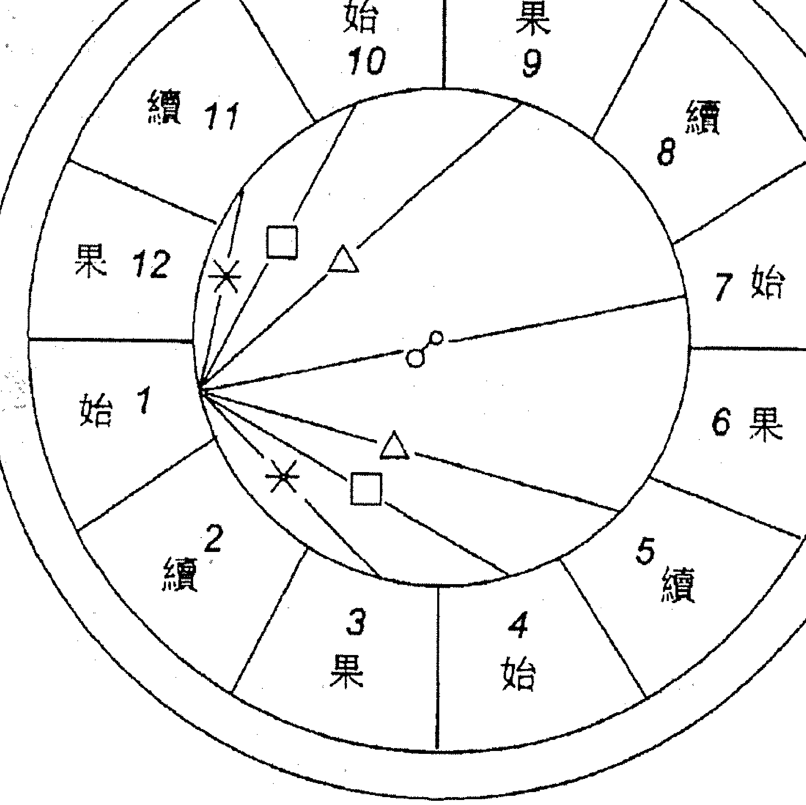

一般上，行星在黃道先天宮，代表行星本身能量之先天秉賦、強弱，而後天12宮則是行星表現它自己能力的舞台，其中以1宮、10宮最強。

# 後天12宮

I.行星在始宮，不管它先天如何，都有能力表現它自己，成為觀點主流，

+   若(i)先天條件良好，如水星在雙子或處女，此時該行星必能有效地、強有力地、有能力地展現出它先天黃道的特質。
+   (ii)先天條件不佳，如水星在射手或雙魚，此時該行星也能有所表現，但受囿於本身能力而有所牽絆。

始宮含有開創、促進之意，1990年代占星學復古運動大將之一的羅伯 舒密特將始宮譯成尖軸點(Pivot Point)，因始宮在希臘占星學佔有相當地位，類比於正式儀典中，設定東、西、南、北方向是重要的一步。

II.行星在續宮，類似在邊廂等待，無法充分掌握其能力，其發揮效力僅及始宮時之約50%左右，其中以11宮最強，因它在古代係代表希望和幸福之宮，其次是2宮，而8宮最差，因它代表死亡、性。

羅伯 舒密特將續宮譯成Post-ascending，代表中性性質、承繼。澳洲著名女占星家Bernadette Brady在其《Study Guide for Mediedval and Ancient Astrology》稱續宮較強的人，宜以團隊合作方式，藉由他人合作而得以成就。

III.行星在果宮，則較無力量表現自己，儘管黃道先天條件佳，但似乎總是他人獲益，容易為人作嫁，無法有效地將行星的能量表現在實際世界，其中12宮最弱，6宮次弱。

# 後天12宮

羅伯·舒密特將果宮譯成declines(傾斜、衰退)，所以果宮若沒有來自其他地方之幫助，如吉星金星、木星的吉相，則該行星無法揮灑，古代及中世紀占星學認為果宮是負面的，但事實上如果它有良好的黃道先天條件，從另一種角度，若從事社工、心理諮商者，不以自己名字或不太計較名利，並未妨礙其實力的。

以上行星在始宮、續宮、果宮的基本特性，會受到其主星飛佈之影響而有所調整這必須注意的，原則上主星以古典星座主星為主。

+   A.若始宮主星4個，飛佈落在果宮或較多，則原先之始宮促進、開創之能力表現會大大地減低，可能較不會那麼自我驅使，而缺乏生產力。
+   B.若始宮土星4個，飛佈落在始宮或較多，則更加積極、活潑，將知道如何獲得最佳成果，頗具生產力。
+   C.若始宮主星4個，飛佈落在續宮或較多，可能會藉由他人協助或團隊合作，而得最佳成果，有時是促進者，有時是被促進者。
+   D.大多數命盤，不可能純粹落在始宮、續宮或果宮上，視其組合而予以分析，配合其黃道先天條件，後天12宮模式應可掌握此人能力及希望達成之目標為何。

後天宮的這種分類法，對始宮之重視，已是占星家長期注意天宮圖尖軸為力量最大的論證之一，但是一直到1950年代法國心理統計學家-高魁林系統化地研究才得到支持，但高魁林原本是想以統計資料來反駁占星學的說法，結果卻出現令他頗為詫異的結果，反而讓玄虛占星學理論得以驗證，他走遍全歐洲各地的市政府及醫院蒐集許多知名人士的出生資料，他將這些資料按職業分類，看看是否與傳統占星學行星有關,結果發現的確有相關，出版《Cosmic Influences of Human Behavior》，將研究成果予以公布，我們分別列出其幾個統計曲線，顯示行星近於尖軸對職業有強的決定作用如火星對運動員，木星對演員、記者和政治家。

# 星座圖

# 後天12宮

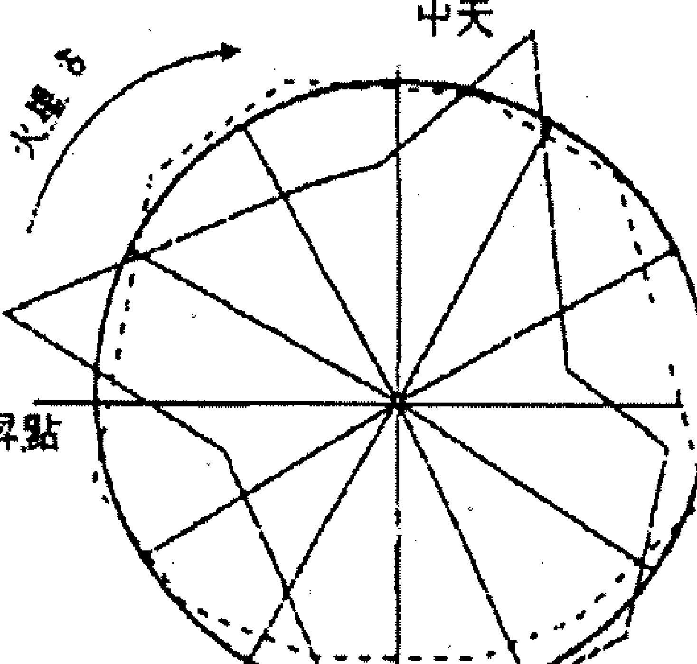

### 圖一 運動員出生火星統計曲線
.....717位普通運動員 ——2088位得獎運動員

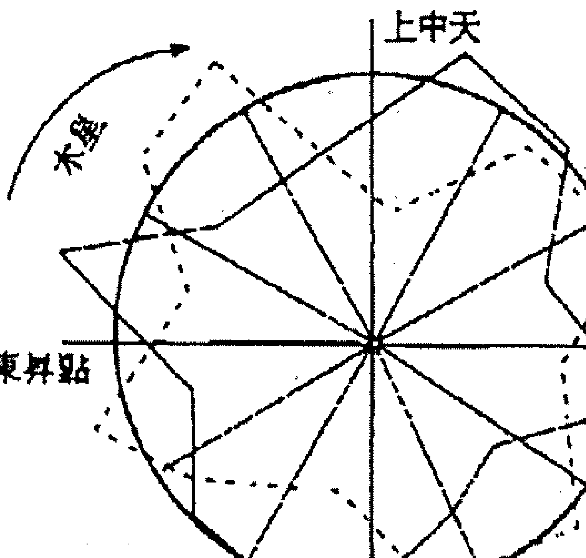

### 圖三 出生木星統計曲線
.....3647位科學家 ——1409位演員

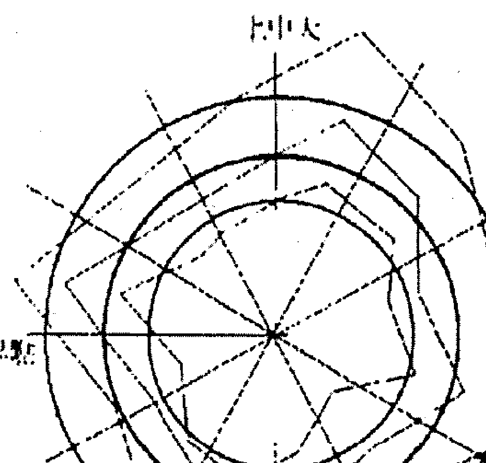

### 圖二 出生木星統計曲線
+   - 內 1409位演員
- 中 903位記者
- 外 1003位政治家

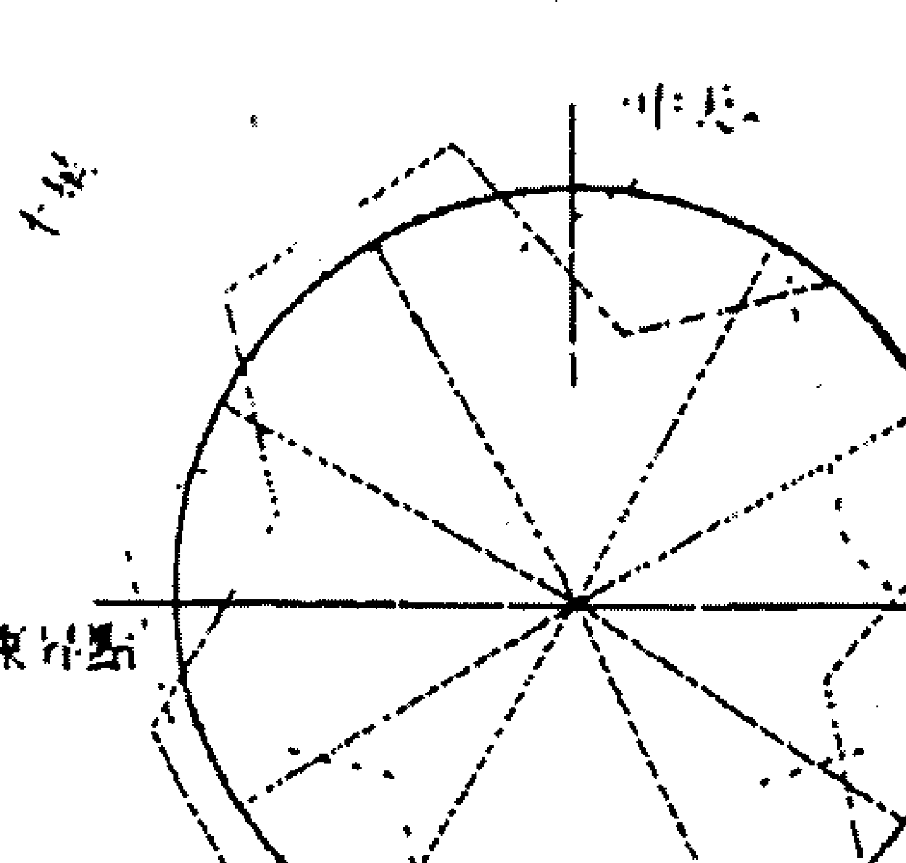

### 圖四 出生土星統計曲線
.3647位科學家 ——5100位藝術家

# 後天12宮

高魁林的統計實證，雖說明職業和行星的尖軸性有關，但細究之，顯著點卻與果宮有關，跟傳統占星學所強調始宮似乎完全相反，一般的解釋是高魁林的資料中之出生時間，有可能稍晚，另也有人提出，在希臘托勒密即認為各宮之起點應以前一宮之7.5度起算，若是如此，倒頗符合高魁林的實證結果；又印度占星學(Vedic Astrology)的宮位起始點曾以前一宮的中點起算(應是希臘占星學早期之遺風)，因此也符合傳統的說法，另外，若這些解釋成立，那麼從高魁林的統計實證，可知始宮中之1宮、10宮較4宮、7宮重要，很明顯地凸顯出來。

在筆者的實證中，若出生時間相當精準，則傳統的說法，確有其事。以筆者為例，太陽、水星及羅喉皆在6宮，果宮，水瓶，雖任職大集團之重要幹部，但都是為人作嫁，目前從事五術執業，也的確是類似心理諮詢工作。

### 半球(Hemispheres)與象限(Quadrants)

Ⅰ.南半球和北半球
以ASC和DSC聯結劃成一直線將天宮圖劃分成上下兩個半圓，在上稱為南半球，在下稱為北半球。

Ⅱ.東半球和西半球
以MC和IC聯結劃成一直線，將天宮圖劃分成左右兩個半圓，在以ASC為主的半圓稱為東半球，而以DSC為主的半圓稱為西半球。

### III. I II、III、IV象限

+   由東、西、南、北四個半球，互相交叉而劃分成四個象限
    第Ⅰ象限：ASC-IC
    第Ⅱ象限：IC-DSC
    第Ⅲ象限：DSC-MC
    第Ⅳ象限：MC-ASC

上述半球與象限，可以美國占星家夫婦厄尼斯特(Ernest.A)及卡薩琳 T 格蘭特(Catharine.T.Grant)合著《Grant Textbook Series VolIII.Synthesis of The Horoscope》的圖表完整來呈現，如下圖5-2

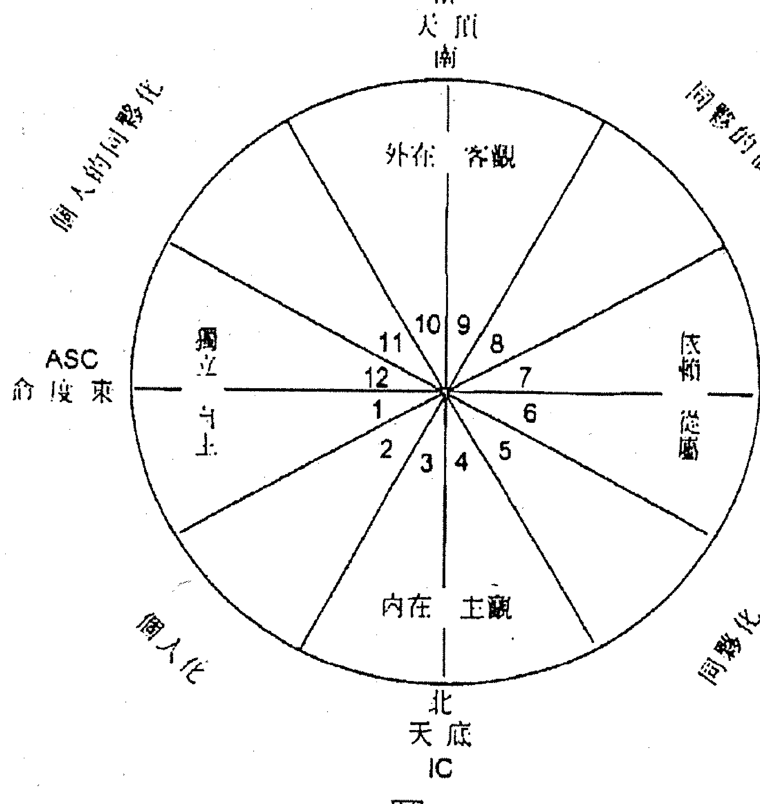

A.行星在南半球領域，是看得見的，而在北半球則看不見，因此以ASC-DSC劃分，意謂著外在和內在，客觀和主觀的區別，以心理層面言，意識和無意識的分別。

+   (i)行星在南半球較多甚至全部，將比較著重外面世界，非私人的，因而會注意外界評價，較客觀強調未來、服務、利他、生活空間較廣闊、注意社會脈動。
+   (ii)行星在北半球較多甚或全部，將比較著重私人務或自家事務，不關心外界，因而較主觀、懷念過去、自我本位或自私、生活領域較狹窄。

B.行星在東半球，象徵行星將從地平線上升於地平線上，這意謂著行星能量將從低處脫離，從較多的個人角色往較高處，較多的社會角色邁進，意即按照內在的自我行事，不管成功與否，外界領會了這個自我，可以視作較主動積極，自己可以掌空。

行星在西半球，象徵行星將從地平線下降於地平線下，意謂著行星能量將從較高處的社會角色往較低處個人角色走，是一種經驗，被動的，且較難自己掌控

+   (i)行星在東半球較多甚至全部，將傾向較為獨立自主，是一位行動者，常能掌控自己的命運，並無缺乏自信的困擾。
+   (ii)行星在西半球較多甚至全部，將傾向在行動之前先觀察，因此常依賴或缺乏自信，注重別人感受，而有從屬的感覺。

# 後天12宮

以上有關半球的分析，僅是基調而已，尚須考量行星之特性，及象限意涵，如以東半球為例，行星在1宮和12宮，能力的表現就不同，在1宮為始宮，最能發揮，在1宮則隱藏，又同樣在1宮始宮，如果是土星、海王星，會抵消東半球的自信獨立特性，因土星易挫敗、受限，除非它先天黃道條件佳，又為白天盤或其他吉星形成吉相 因海王星易混淆、自欺，都不利東半球的特性。較符合的是太陽、火星、木星、天王星、冥王星，卻比較適合在1宮、10宮或2宮、11宮，不宜在3宮、12宮，其他半球之權衡亦同此論。

### C.以象限言

+   (i) 第1象限 係東半球和北半球交會區，若行星大多數落於此，強調個人式行動，較為率真 不等待別人，為東半球的自我表現和北半球主觀感受之結合，相當個人化。
+   (ii) 第2象限 係北半球和西半球交會區，若行星大多數落於此，強調個人式的感情，關心他人反應，類似母性，為北半球的主觀感受和西半球的被動、順從、注重別人的結合，具同夥化。
+   (iii) 第3象限 係西半球和南半球交會區，若行星大多數落於此，強調個人的昇華，一種等待與轉機，為西半球行動之前先觀察、順從被動和南半球客觀，強調未來之結合，為同夥的個人化。
+   (iv) 第4象限 ：係南半球和東半球交會區，若行星大多數落於此，強調個人表現在團體、社會，非個人事務上，為南半球注意外界評價、客觀、服務利他，和東半球獨立自主、自我表現之結合，為個人的同夥化。

以上象限的概念也是基調，需考量所落行星為何，及各種狀況方能真正整合出其意義，但掌握其基調有利分析。

有關象限的意義羅絲 萊曼(Rose Lineman)和珍 波不樂卡(Jan Popelka)合著的《Compendium Astrology》曾頗精闢的解說，我們整理如下作補充

+   1. 第1象限(1宮到3宮)，是我(me)或我的(mine)象限，焦點擺在自我需求，第1宮關於“我”，第2宮是我的財產，第3宮是我的環境學習如何溝通，以利實現自我需求，這個象限代表一個人發現他或她的需要之第一個階段，是個人自我發展邁向整體發展的開始階段，意謂著未來發展嚴重地受私心影響。
+   2. 第2象限(4宮到6宮)，強調發展的第2個階段，結合自我需求和家人和家族(4宮)其他人的需求，經由孩子和創作才華(5宮)和工作、服務(6宮)。儘管同第1象限都是在地平線下但因屬於西半球，因此較缺乏率先進取，而在發展過程中較依賴他人，係一種整合智慧、情緒和身體需要於內在水平，來準備外的發展。
+   3. 第3象限(7宮到9宮)，強調從自我到人際關係和社會接觸的發展，經由社會擴展(7宮)，能量的再生(8宮)和智慧或精神的成長(9宮)的歷程。
+   4. 第4象限(10宮到12宮), 整個人生發展的最後階段，經由生涯目標(10宮)朋友和社會識(11宮)，和精神促進(12宮)，這個階段是最難處理的，因個人的自然傾向結束此發展過程。

### 個人宮位(Individual Houses 或稱 Personal Houses )，實際宮位(Practical Houses)，社交宮位(Social Houses)，無意識宮位(Unconscious Houses)

+   I. 個人宮位-1宮、5宮、9宮，這種宮位關聯到個人 自我。
    - 1宮象徵個人能量在外在世界的釋放
    - 5宮繼續個人能量釋放的節奏，但傾向消遣和娛樂
    - 9宮象徵個人理解外界是什麼的能力
    - 這個三分性類比於火象星座。

+   II. 實際宮位-2宮、6宮 10宮，這種宮位涉及到實質的資產。
    - 2宮象徵個人金錢、財產或價值觀。為社會定義的資產概念。
    - 6宮象徵為他人工作或為自己工作，都具社會性。
    - 10宮象徵社會地位、聲望、角色為社會指標。
    - 這個三分性類比於土象星座。

+   III. 社交宮位-3宮、7宮、11宮，依慣常意識具人際社交關係
    - 3宮象徵與親戚、鄰居、手足的人際關係。
    - 7宮處理個人與他人之關係，如夫妻、配偶、合夥、契約簽訂。
    - 11宮象徵個人和團體、社團之關係。
    這個三分性類比於風象星座。

+   IV.無意識宮位-4宮、8宮、12宮，這3宮都與無意識心理過程和情感有關。
    - 4宮是深層地關聯到一個人的根。
    - 8宮象徵深層的情感、無意識地掌控或神秘事務、死亡。
    - 12宮關聯到命運意識和深思、隱遁、逃避。
    這個三分性，類比於水象星座

以上這種後天宮位分類，僅進一步地有助各後天宮位的重點，至於類比於四大元素的說法，是美國知名女心理占星家姬波拉．杜賓恩斯(Zipporah Dobyns)極力提倡的。

我們舉案例一～八來說明後天宮、半球、象限的實證

### 案例一

群星很明顯地幾乎都聚集在東半球。
命主更增強、獨立自主的傾向，不求於人，自行解決問題。

### 案例二

群星也聚集在東半球居多。
命主雖受星座陰性強烈影響，但仍會流露出些許的獨立、自主。

### 案例三

前行政院院長郝柏村後天宮最凸顯的是第一象限，故較為率真，不等待別人，相當自我、主觀。

### 案例四
現任國民黨黨主席，群星聚集在西半球居多，尤以第二象限，尊重他人、順從、被動、具同夥化。

### 案例五
前中共總理周恩來，群星聚集在北半球。深諳老二哲學，內斂、不張揚，有內在主觀的世界。

### 案例六
武俠名作家金庸，西半球星群較多，尤以第三象限稍強，會強調個人精神的昇華、關心他人。

### 案例七
台灣經營之神王永慶，東半球群星較多，尤以第一象限第1宮居多。率真，不等待別人，相當自我主觀、獨立、自主、不妥協。

### 案例八
群星較集中在東半球。命主雖受星座三方、四正影響，不穩定，但仍具獨立自我的特質。我們另舉其他命盤說明。


# 後天12宮

### 案例九：馬英九

馬英九
Natal Chart
Jul 13 1950
1:35 PM -8:00
香港，中國
22N18 114E10
Geocentric
Tropical
Placidus
True Node

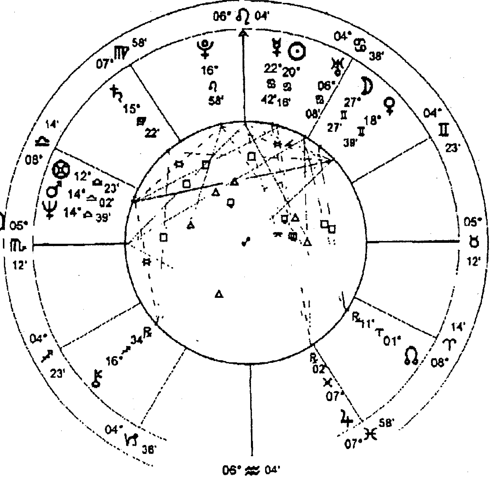

+   重點分析
    1.  群星聚集南半球，9宮巨蟹
    2.  命主星入官祿(立命卯天蠍，♂、♃為命主，♃在10宮內)
    3.  ASC△♆△♃(大三角吉相)

現任台北市長馬英九，是國民黨中生代中最有人望的政治明星，其行星群聚南半球，客觀、重視外界評價，事業心重、強調道德、精神(9宮)，命主♃與♀在8宮形成60°※吉相，英俊、魅力強，為全國女性性幻想對象第一名，不虛此象，而大三角吉象，更使他親和力強。

### 案例十
許信良

Natal Chart
May 27 1941
12:48 PM -8:00
桃園市，台灣
24N59 121E18
Geocentric
Tropical
Placidus
True Node

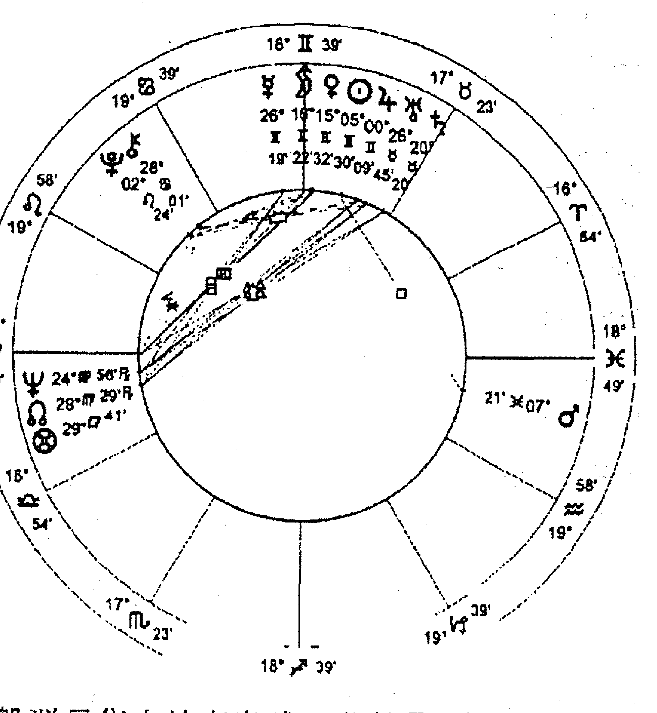

### 重點分析

+   1.  星盤群星集中於南半球，尤其是9宮雙子座。
+   2.  命主星 ♀ 入10宮宮祿為廟，卻與 ♆ 90° 刑。

前民進黨黨主席許信良，一生是理念先行的人物，尚屬客觀，重視外界評價，反應快、點子多，卻不免幻想多於實際（♂ □ ♆），聰明卻也變化太快為政治變色龍，由國民黨栽培，卻帶領民進黨對抗國民黨，當其看法不被黨內同志認同時，憤而離黨，大罵自己曾帶領的黨，故飽受譏評，又 ♀ (口才、語言) □ ♆ (模糊)，也影響其口齒不清。

### 案例十一
劉德華

| 项目 | 内容 |
|------|------|
| Natal Chart | Natal Chart |
| 出生日期 | Sep 27 1961 |
| 出生时间 | 9:30 AM -8:00 |
| 出生地 | 香港，中國 |
| 坐标 | 22N18 114E10 |
| 坐标系 | Geocentric |
| 黄道 | Tropical |
| 分宫制 | Placidus |
| 交点 | True Node |

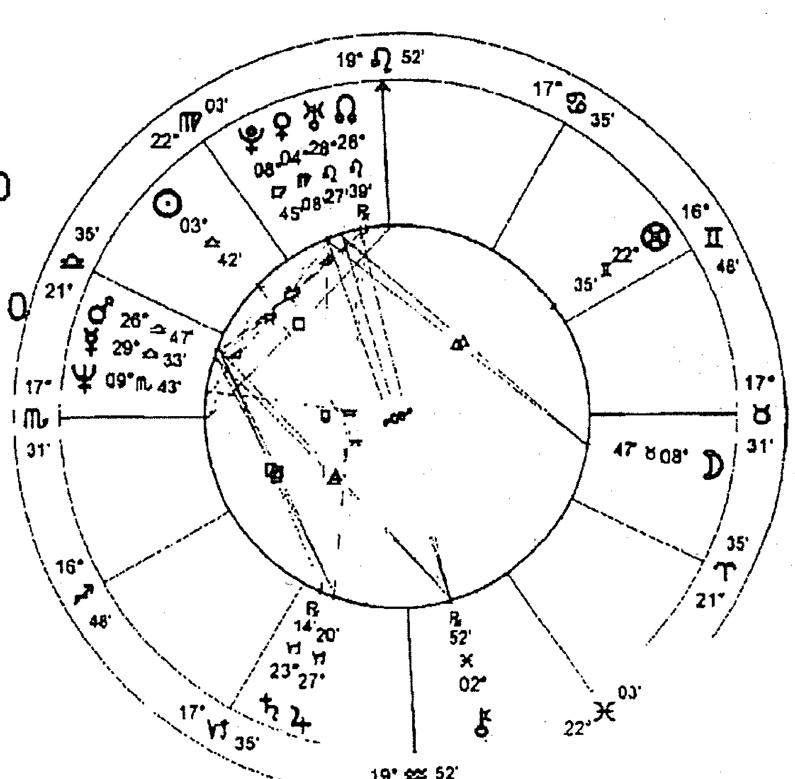

+   1.  星盤群星聚集南半 束半球，尤其是第四象，此即個人同夥化。
+   2.  命主♃入10宮官祿與☽120°三合，另一命主♂入辰，天秤與8宮之⊗幸運點120°三合。
+   3.  月亮入酉，金牛為旺與♀在10宮120°三合，且受金星容納。

香港巨星劉德華自出道來頗受歡迎，甚具魅力（命主♃☌♀），尤其是女性影迷、歌迷（♀☌♃）△☽），重視外界評價、客觀，公益活動常見他的回饋。

## 第3节 后天12宫的古典意蕴

现代占星学后天12宫的意义约在中世纪A.D. 11、12世纪即已定调，我们从13世纪意大利著名占星家古德·波那提所著《Liber Astronomiae》Books 2所叙述的后天12宫可看出端倪，后天12宫是人生的各种生活领域，为本命或卜卦问事之重点。在17世纪，英国威廉·里利的威名盛极一时，但仍延续古德·波那提的说法，仅稍加修饰，即使至现代仍适用，只不过现代心理占星学对后天宫，强调心理层面，如2宫，一般定义为金钱、财产，但心理占星学强调2宫系个人价值观取向。

其实在希腊时代对后天宫的诠释有些不同，现代占星学所称宫位，希腊标准的字语是topos，简单具体的意思为“地方(place)”，在希腊化时代已引用了主题的某些意义，意即宫位代表了个人的生活领域。

- 从现存资料的研究，希腊对后天宫强调之重点约可分为下面三类

I. 生活领域，世俗问题或主题，称之为议题系统(Topical System)。希腊占星家使用不同系统来划分黄道成12宫，其目的之一即是用来观察命主的生活特定领域，如兄弟、姊妹、父母、职业...等。

II. 观察行星的相对力量，称之为动态系统(Dynamical System)。希腊占星家认为天宫图的4个尖轴，即ASC、MC、DSC、IC可划分成四个象限，可三等分，而共有12宫，这12宫的分类，如前述之始宫、续宫、果宫，行星在始宫，能力最容易发挥而最强，续宫次之，果宫最弱。

### III. 决定各宫的好与坏

各宫的好与坏，真正的意涵是发挥能力多少而言，其观念类似II，但其意义却以所谓传统相位观点来看的，原则上以ASC之宫为主，其他11宫与其产生60°（*）、90°（□）、120°（△）、180°（☍）皆可谓为好宫，因此

- 形成60°（*）——3宫、11宫（3宫，有其他占星家不认为是好的）
- 形成90°（□）——4宫、10宫
- 形成120°（△）——5宫、9宫
- 形成180°（☍）——7宫

而不与ASC宫产生上述角度则为坏，如2宫、12宫、6宫、8宫，其中6宫、8宫最差，因他们与ASC宫为不合意(Aversion)，以现代而言即150°。希腊占星家也以天宫图四个尖轴作为人生四个阶段，从ASC始点开始顺时钟（而非如黄道秩序之逆时针方向），1宫是生命的第1期、10宫为主要期间、7宫生命休养期，即老年、而4宫生命死亡及其身后事。

### （五）后天12宫各宫的核心意义

1宫（命宫） 个性、给别人外在印象、身材、外表、秉赋、体质、生命力、脾气

1宫就好像舵柄，位于看不见的地平线下，但即将上升于看得见地平线上，正如处于母亲的子宫中看不见外界，而将出世看见外界，标示着生命的起初或开端，因为这个理由所以1宫代表身体，特别是脸及外貌，不必代表有形的身体外观，但是为命主进入外界的生命能量，所以出生时，若1宫主星或称命主星(中世纪以命宫支配星)受损严重，古人说，婴儿难以养育或出生后不久即死亡；相对地，若命主星或命宫支配星与吉星(木星、金星)形成吉相，或为必然的尊贵，他们的生命力较为旺盛。

舵柄是船的操纵舵轮所在，掌管这个地方的是舵手，若他不在岗位上，船会搁浅或沉没，这类比命主若缺乏明确的方向将遭遇困难，在占星学上这可由命主星落于1宫不合意星座如2宫、12宫、6宫、8宫来呈现，其中以6宫、8宫较为严重，可能意味着命主对人生悲观，但相对地舵手尽职于其岗位上，船顺利航行，如命主星具必然尊贵或偶然尊贵。

水星♀在此宫为喜乐，这是因为水星正好为昼夜区分之中间，如同命宫临于地平线上下间之性质，水星很容易从不同观点改变好与坏的意图，这是人性。

### 2宫(财帛宫) 金钱和动产，对财富和财产的价值观，正财、个人物质生活

2宫为出生后的下一宫，代表出生婴儿如何掌握周遭，必须学习客观的永恒，即自我评价演伸为价值观，该坚持的是什么；财为养命之源，出生婴儿需要物质来养育，故意意味着金钱、物质或财产，若2宫主星或其支配星受刑克，尤其是凶星，则境遇不佳，仅能糊口度日，更糟的则流浪街头或被父母遗弃，相对地，若2宫主星或其支配星，宫内行星系良好配置，个人所得较多，能抬头挺胸。

托勒密称此宫为阴间之门，意即堕落之渊源，就人性而言，财为物质易沦为物欲为财富不计手段时有所闻，淹灭人性以求个人财富，当然另外一种观点当太阳西沉后，2宫也是慢慢地从阴间走出，但仍尚在地平线下，有其阴暗的一面。

### 3宫(兄弟宫)：与他人沟通的正常心态、资讯、短期旅行、兄弟姊妹、邻居、亲戚；基本教育、自我、语言表达能力、非正统宗教。

3宫为4宫(父母)田宅宫之前一宫，具有「邻近的环境」之基本观念，因而可引申为邻居或除了父母之外的同血缘亲戚，如兄弟姊妹、堂、表等亲戚，以较广泛意识包含邻近或周围环境，人们脱离不了(正常而言)周围，故会产生交流沟通或有媒介物，如信件、汽车、火车、船，当然也包含心灵沟通，故教育、知识、资讯、短期旅行..等。

另外有趣的是9宫，为正统宗教，古希腊称之为太阳神宫，而3宫则称月亮女神宫，意涵着3宫也有宗教之影子，但非正统或异教的，如以现代占星学，3宫类比双子，其质疑特质就常与正统宗教之不容侵犯违背，古代教堂将月亮比做女人，因夏娃带给亚当罪恶。

古代认为月亮在3宫为喜乐，若又是夜间出生，月亮能量将发挥得较好。

- 4宫(田宅宫)：家，最个人和私密的生活，家族、父母、祖先、家乡、不动产、土地、生命结束，一个人的过去和与传统的关系，身后事、老年生活。

4宫是天宫图中最接近地球，故很容易联想休息或象征埋葬、身后事务，也象征老年、祖先家谱、血统关系（特别是父母）和我们源自何处。它代表我们安全感的基础及归属感，因为是最隐藏的地方，所以托勒密称之为隐匿宫，故也象征为何许多人很难完全地认识他们自己。在西方此宫被视作世袭的地方，现代占星学以同族观念，即巨蟹=4宫，而认作此宫为母亲宫，但威廉·里利则以此宫为父亲，两种说法差异甚大，罗伯·施密特则统称之为父母宫，依笔者经验，威廉·里利说法较为正确，但须参考白天盘时太阳为父亲自然主星，而夜间盘土星为父亲自然主星，此宫具世袭传承的观念。

就物质而言，4宫代表所站地面，故为家、基础、房地产和不动产，若幸运点在此宫，原则上会拥有土地，包含隐藏的财富或宝藏。

### 5宫(男女宫) 自我表现和创作才华、游戏和娱乐、爱情、分娩和小孩、赌博、投机和投资。

5宫为生命力强度的结果，所以首先是男女情爱、性爱而得的结果，分娩而小孩诞生，这是热情、爱情的结晶，因此宫与ASC宫为120°三合，为顺畅、欢愉、性交的致命吸引力特性，被指出和激烈的欲望一致，如爱情、赌博游戏、赌注、赛马、股票投机，其过程即生产力，如同来自兴奋知觉的敏锐过程。

5宫在地平线下和西半球，代表从壳(4宫)释放出来，涉及回馈如爱情表达，投资我们自己于别人身上；就物质而言，是一种投资、投机，而释放也是一种创作力的表现。古希腊称此宫为好运，前面提到它与ASC宫三合，金星在此宫为喜乐，所以性享受娱乐欢愉气氛。

### 6宫(奴仆宫) 服务、工作、部属、奴仆、受雇、疾病、营养、卫生保健、小动物

6宫为果宫，且传统相位上与ASC宫不合意，古代认为这是不幸，称之为恶运，一般认为疾病、受伤，故6宫为健康宫。而6宫亦与天顶MC三合120°，而有服务工作，甚至部属之意，若凶象多，则为人使唤之奴仆，现代则是受雇。

6宫在地平线下，前一宫5宫为个人产出，而7宫为地平线上，可看得见代表与公众(7宫)初次交际时，如何预习接受别人回馈时(西半球)之态度，这需要许多工作、评判、精炼，是自我改进，如何面对危机和变化。

火星为夜间区分，两个凶星中较不凶的，在古代火星在6宫为喜乐，可能是因为6宫为果宫可能会弱化火星的凶性，应是合理的。

### 7宫(夫妻宫): 婚姻、合伙、公开敌人、公开冲突、诉讼案件、顾问关系

7宫正好为1宫的对宫，意味着比较、对抗，每件事都会遭遇命主，所以成为公开敌人、奋战或控诉命主，因合约或婚约发生灾难。

另外7宫也因自我和他人之关系，而具备合约的参与的性质，而婚姻是最典型的，同盟的其他型式、合伙、同居。

> 法裔美籍著名占星家Dane Rudhyar曾说明ASC/DSC地平线是意识、知觉之转捩，因在7宫，古希腊称之为下降地方，正属于地平线上下，即部份知道(在地平线上)部份未知(地平线下)，这类比于有关合伙人或对手之已知或未知。若ASC星座看得见愈多，则DSC星座愈看不见，所以对命主而言，对手秘密可能更多。

在中世纪卜卦占星学相当盛行，此宫被视为战争的指示，和公开敌人，这是因为7宫的对抗性质，但若这种对抗能和平地解决，它可能变成友谊如合伙甚至婚姻。而心理占星家则将此宫视为心理投射之处，有些人甚至称之为我们的阴影(Shadow)，而医疗占星学中疾运盘，此宫常代表医生。

- 8宫(疾厄宫) 死亡、遗产继承、他人钱财、神秘事物、超心理学、性欲、税务、保险、金融贷款、商业活动

8宫在古希腊称之为懒惰、不动，因它与ASC宫无传统相位，而为不合意，故含有衰败、退化、身体的剥蚀、生命和呼吸停止或生命功能丧失，意即死亡，攸关死亡诸事当然就包含在内，遗产继承(特别以衍生宫言，8宫又为7宫(他人)之2宫，即他人钱财)，简短碑文、遗嘱、遗产税。

8宫适为7宫之2宫，他人钱财，故金融贷款、保险、合伙钱财、妻子嫁妆甚或税缴，都由本宫主事，中国俗称偏财是非常动机而获利，与2宫正财、5宫投机或投资财比较，2宫正财较具挑战，5宫需先花费，而8宫系不劳而获，另外11宫为企业财，古称收获地方(place of acquisition)，故从10宫(政府)起算至第11宫，正好为8宫，政府的收获地方为税收，可点明此宫税务之意，也因这项理由，必须谨慎处置资源，将金银珠宝或贵重物品放在保险柜以防止失窃，投保险以防灾难甚或信用操作以维持个人信用。

死亡虽是人生终点，但相信灵魂不死的占星神秘学派，认为人类善恶观念会随着亡者进入另一种不可思议的次元，它是最神秘隐藏、奥妙，所以8宫也跟这些有关，由于隐藏之原欲，佛洛伊德将它直指为性欲，认为人类许多心理问题都因欲求不满有关。

- 9宫(迁移宫)：较高心灵、哲学、宗教、法律、长期旅行、外国、远地文化或事物、高等教育、道德精神。

9宫是在8宫(死亡)之后，古代称为太阳神宫，代表一种精神的升华，较高的心灵，因此是生命力强度的智慧，为洗炼这种精神必然需有哲学思想、宗教薰陶、法律约束、高等教育训练、道德精神之提倡。太阳是整个太阳系之核心，为知性、理性代表教化、启蒙，经过努力奋斗之后的澄澈透明或堕道之后的光明，所以毫无疑问太阳在9宫为喜乐。

9宫也代表外国、远地、观光和探险，这可能是经过8宫之骚扰，需要逃避到陌生环境可缓和一下心境，而事实上在古代若遭遇法律麻烦(9宫也代表法律)常发配流放边疆、异地。

9宫的学习是一种经过内省后的洗炼，故有一定水平的精神意义，层次较高，而宗教也属正统，但3宫则是粗糙，基本的水平，故教育仅止于一般基础教育，宗教则易倾向异教。

10宫(官禄宫)：经历或职业、社会地位、名誉和荣耀、母亲、老板、主管、雇用者、政府官员、政治权力、社会责任。

10宫称为天顶，古代亦此称号，是个人所在地之黄道最高点，代表权威、高高在上，外界看得到的荣誉、耀眼，当然也跟个人与权威之关系，如老板、主管或政府官员，若论国运，常涉及王朝、元首、总统，由于MC的权威最顶峰，意味着个人的成就，因此联想到经历或职业，企业经营，但高处不胜寒，孤独的心境，社会甚或企业责任感之束缚，油然而生。

10宫在9宫之后，当9宫的精神升华再教育，其梦想就可实现在10宫(成就)。

10宫是生命的顶点，奋斗的目标，需要努力不懈，自古常类比于摩羯及其主星的刻苦自励。

10宫是4宫(父亲)的夫妻宫，故也代表母亲，论及母亲尚须考量白天盘时，配合金星；夜间盘时，配合月亮。

### 11宫(福德宫) 朋友、社团、希望、愿景、同志、同事、收获

11宫因与ASC宫位60° *吉相，古称为好精神，代表希望、愿景，跟5宫比较，11宫属于精神、文化层次，而5则属肉体、感官、物质层次，此宫古时也称收获地方，因5宫为投资、投机之支出，而11宫为7宫之5宫，即别人之投资、投机支出，而为我所得，而11宫亦为5宫之对宫，也含有投资、投机支出之返回，若扩充解释，11宫并非仅财务所得，而是外界对努力的整个回报。

木星在11宫为喜乐，因木星也属精神层次，如宗教、法律、教育等光明面，而11宫在地平线上，与太阳性质并联，而木星属血液质且风象性质如蓝天光明所蕴含之信赖、信心，所以与人相处信赖对方，11宫属于非很深入的交往，因而很易衍生为朋友、同志、同事之概念，聚集一起而成社团、组织。

### 12宫(相貌宫) 自我毁灭、牺牲、因果报应、神秘、秘密敌人 医院、监狱或精神病院、遗世独居、逃避。

12宫古称坏精神，与心灵上之痛苦有关，因精神问题引发之折磨，在古代将土星最大凶星配于12宫中，但土星若是在白天盘时则为喜乐，较不会引发12宫之问题，若是夜间盘，若没其他吉相，同样会引发，由于土星阴郁悲观灰色，故易带来自我毁灭、堕落、牺牲、悲观、自我封闭，所以会联结到医院、监狱、精神病院，衍申为遁世、退休、逃避现实，较严重者，精神不正常、疯狂，常犯小人(秘密敌人)，心思混乱认为鬼魂索命。

12宫在地平面上，即刚从黑暗到光明，却常萎缩退回阴暗而禁锢，易受无意识的控制，而不自觉退缩，又12宫与1宫也没有传统相位，也是不合意，1宫常被立即地注意到，在旁之12宫则忽视延宕，若再从黄道顺序，12宫刚好在最后，类似废物遗弃，而它也在11宫之后，代表不适应，容易被遗忘，自我毁灭。

玄奥占星学派(Karmic Astrology)相当重视12宫，常根据月亮和南北交点轴，这三个因素来分析前世可能之业障，而这一世及未来如何修练，从而解放前世禁锢之心灵非在本章议题，不予讨论。

又各行星在希腊的后天宫，各有其喜乐之处，如水星在1宫，月亮在3宫，金星在5宫，火星在6宫，太阳在9宫，木星在11宫，土星在12宫，这种喜乐宫，英文称为Joy，这种观念在17世纪前，仍相当盛行，但在现代已不复留存，且相当分歧，由于现代占星学发展同族关系的论断，如命宫=白羊座，故火星应是现代占星学命宫之自然主星，而2宫=金牛座，则金星为2宫自然主星，因此和古典1宫之喜乐星为水星和现代的火星，根本风马牛不相及，现代人未想到火星之破坏性，将它作为1宫自然主星。

希腊化时期对后天12宫之定义及内涵，与现代的大致相同，但略有差异，基本上，托勒密的名称在当时较为普遍，分别如下

### 占星图

### 后天12宫

1. 上升时刻(The Horoscope)
2. 阴间之门(Gate of Hades)
3. 月亮女神(Moon Goddess)
4. 隐匿的(Subterraneous)
5. 好运(Good Fortune)
6. 恶运(Bad Fortune)
7. 下降地方(Setting place)
8. 懒惰不动(Idle)
9. 太阳神(Sun God)
10. 天顶(Midheaven)
11. 好精神(Good Spirit)
12. 坏精神(Bad Spirit)

上述相关内容可以约瑟夫·卡连(Joseph Crane)《A Practical Guide to Traditional Astrology》中的一个图呈现，图5-3


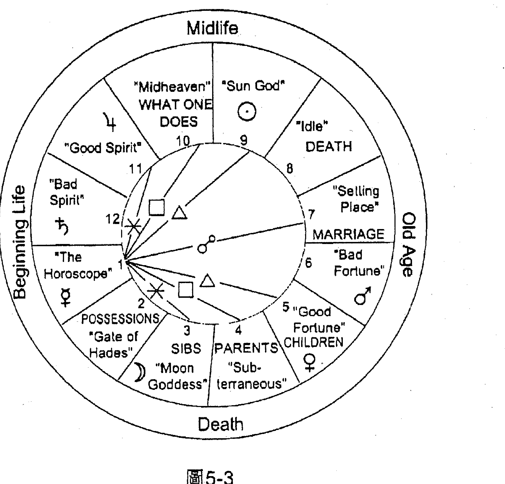

## 第4节 后天12宫的衍生宫意义

后天12宫的核心意义虽是命主生活领域的基本项目，但事实上，命主面对外界各种人事物，实非区区12宫就可涵盖，如亲戚方面，堂、表一大堆，虽不见得亲，但总有些关系，其他事、物亦同，因此在卜卦占星学就善用后天的活盘衍生宫，而得以论述各种人事物，活化了占星学，卜卦占星学的这项技巧渊源甚长，如与托勒密大师约同期的另一位著名占星家Vettius Vellen就常以希腊点(后误称阿拉伯点)的落宫，算其主星落于何宫来论述一个人的成就、名望，甚至其他灾难，这种算法就是中世纪卜卦占星学盛行之活盘衍生宫的滥觞，该技巧适度地解决了问事者的各种疑难杂症，有其准验及实用而得以盛行不衰，后来也引用到本命及流年占星学中，由于活盘衍生宫的过度滥用，常让人宿命论之感觉，因而本命占星学甚多人不以为然，时有争辩。

20世纪初期，法国占星家欧帝斯·皮卡德(Eudes Picard A.D1867-1932)，写了篇有关衍生宫的论文“Judicial Astrology”颇为详细说明衍生宫各种用法，得到20世纪较早期英国著名占星家Vivian.E.Robson的赞赏，但之后纷争不断，尤其后来现代心理占星学兴盛以后，这种技巧逐渐不受重视，因它被归类为命定与心理占星学强调人本(Person-Central)或自由意志(Free Will)有所违反。另外又因过度滥用，颇受讥评，如兄弟宫藉由衍生可分别产生3宫本身为第1个手足，3宫之3宫为5宫，为第2个手足，若论其父母或祖父母，当然不可能同宫，在逻辑上站不住脚。当然使用这项技巧的占星学家不会笨到这样使用，依笔者的经验，活盘衍生宫，有其不可思议的奥妙，但不宜滥用，应以第一级衍生即可。

以下所列衍生宫征象是一般常推论的，须知各宫管辖事物甚多，故衍生征象将不止于此。

| 宫位组合 | 衍生征象 |
|----------|----------|
| 2宫之12宫 | 个人财产、财物之可能损失 |
| 3宫之11宫 | 第1个手足的朋友、同事或社团 |
| 4宫之10宫 | 外祖母、配偶的内祖母 |
| 5宫之9宫 | 第5个小孩，第一个孩子的宗教观、高等教育及国外运势 |
| 6宫之8宫 | 部属、员工、宠物之死亡 |
| 7宫之7宫 | 诉讼中的被告、配偶的合伙伙伴；配偶手足之儿女运、爱情运、投机运(5宫之3宫之5宫) |
| 8宫之6宫 | 性生生活的健康问题，宠物的繁殖能力 |
| 9宫之5宫 | 国外或长途旅行中的娱乐、风流韵事、赌博 |
| 10宫之4宫 | 母亲方面的家运、继父的家族运 |
| 11宫之3宫 | 社团组织的交流或短期旅行 |
| 12宫之2宫 | 隐藏敌人的财产、财物 |

| 宫位组合 | 衍生征象 |
|----------|----------|
| 3宫之12宫 | 第一个手足的悲伤和隐晦之事，隐藏敌人 |
| 4宫之11宫 | 父亲的朋友、社团、同事、父亲手足的宗教观和国外运势、高等教育 |
| 5宫之10宫 | 个人才能、游戏、运动之声名地位，第一个子女的声望成就 |
| 6宫之9宫 | 工作的再教育、进修 |
| 7宫之8宫 | 配偶之死亡、遗产及神秘内在，配偶手足的健康或工作，与部属之关系，外甥、侄儿死亡 |
| 8宫之7宫 | 配偶的负债、税务、保险、及性能力 |
| 9宫之6宫 | 外国朋友的健康，孩子的疾病 |
| 10宫之5宫 | 继父在外所生之子女，母亲手足之智力、短期旅行、基本教育、岳父母的投机运 |
| 11宫之4宫 | 继子之家庭，个人社会人脉的基础，朋友的父母 |
| 12宫之3宫 | 隐藏敌人的手足 |

# 第五章 後天12宮

| 宮位組合 | 本命3宮 衍生微象 |
| :--- | :--- |
| 4宮之12 | 父親或家族的隱藏敵人，田宅不動產之可能損失 |
| 5宮之11 | 第1個孩子的朋友、同事和社團活動運勢，配偶外遇所生子女之投機運 |
| 6宮之10 | 部屬、僕人的名譽、地位、信用，父親手足的事業和社會地位 |
| 7宮之9 | 配偶的宗教觀、高等教育、國外、長途旅行之運勢 |
| 8宮之8 | |
| 9宮之7 | 宗教人員的配偶或合夥人 |
| 10宮之6 | 母親的健康、個人事業上雇用的職員、母親手足之不動產 |
| 11宮之5 | 朋友的孩子 |
| 12宮之4 | 秘密敵人的家族、田宅 |
| 2宮之2 | |

| 宮位組合 | 本命4宮 衍生徵象 |
| :--- | :--- |
| 5宮之12 | 孩子的隐藏敌人、投机或投资的可能损失 |
| 6宮之11 | 部属的愿望、朋友、同事，租金收入、租用者 |
| 7宮之10 | 配偶的事业(假设他/她自行经营)、社会地位、名望、配偶母亲，祖父之地位 |
| 8宮之9 | 死亡者(无亲戚、朋友关系)的宗教观 |
| 9宮之8 | 宗教人员的死亡、遗嘱、遗产、配偶手足之死亡与遗产 |
| 10宮之7 | 父亲、事业的竞争者 |
| 11宮之6 | 朋友的健康、工作，继子的健康和部属 |
| 12宮之5 | 隐藏敌人的孩子或投机运 |
| 2宮之3 | 财务合同 |
| 3宮之2 | 手足的财运、写作所得 |

| 宮位組合 | 本命5宮 衍生徵象 |
| :--- | :--- |
| 6宮之12 | 部屬、員工的隱藏敵人，父親手足的悲傷和損失 |
| 7宮之11 | 配偶或合夥人之朋友或社團 |
| 8宮之10 | 死亡者(非親戚、朋友關係)的名望、地位，對死亡者之評價 |
| 9宮之9 | 宗教人員的長途旅行，配偶手足的長途旅行或國外運勢 |
| 10宮之8 | 老板、主管的死亡和遺產，個人信用、名譽的衰敗、母親的死亡 |
| 11宮之7 | 朋友、同事的配偶 |
| 12宮之6 | 隱藏敵人的健康、母親手足的疾病、工作運，較大型動物的疾病 |
| 2宮之4 | |
| 3宮之3 | 第2個手足 |
| 4宮之2 | 父親的流動資產，不動產買賣的收入 |

| 宮位組合 | 本命6宮 衍生徵象 |
| :--- | :--- |
| 7宮之12 | 配偶、合伙人的隐藏敌人、婚姻造成之损失、悲哀 |
| 8宮之11 | 死亡者(非亲戚朋友关系)的朋友、社团 |
| 9宮之10 | 宗教人员的社会评价、配偶手足的事业、社会地位、名望、孙子的职业、名望 |
| 10宮之9 | 老板、主管的宗教观、长途旅行、母亲的宗教观、国外旅行运势、与事业有关之长途旅行 |
| 11宮之8 | 朋友、同事的死亡、子女配偶的死亡与遗产、配偶前次婚姻所生子女之 |
| 12宮之7 | 隐藏敌人的配偶或合伙人 |
| 2宮之5 | |
| 3宮之4 | 手足独立后的家居、契约保存的所在 |
| 4宮之3 | 不动产、契约 |
| 5宮之2 | 孩子的流动资产、运动收入、投机收入(另一种看法) |
| 6宮 | 父亲的手足 |

# 後天12宮

| 宮位組合 | 本命7宮 衍生徵象 |
| :--- | :--- |
| 8宮之12 | 死亡者(非親戚、朋友關係)的隱藏敵人、悲傷及損失 |
| 9宮之11 | 宗教人員的朋友、同事、配偶手足的朋友、同事、社團、外國友人之朋友 |
| 10宮之10 | 個人事業的名聲、地位、老板主管的評價 |
| 11宮之9 | 朋友、同事的宗教觀、長途旅行、非婚生子女的宗教觀、國外運勢、朋友的孫子 |
| 12宮之8 | 隱藏敵人的死亡、較大型動物的死亡、母親手足的死亡 |
| 2宮之6 | |
| 3宮之5 | 手足的孩子、休閒、投機運勢 |
| 4宮之4 | 祖父 |
| 5宮之3 | 第2個孩子、孩子的基本教育、短程旅行及心智 |
| 6宮之2 | 部屬、員工的收入，父親手足的財運 |

| 宮位組合 | 本命8宮 衍生徵象 |
| :--- | :--- |
| 9宮之12 | 宗教觀的悲傷及損失，配偶手足的悲哀、損失，外國人或國外所造成之損失 |
| 10宮之11 | 母親的朋友、事業上的朋友，老板、主管的朋友、社團 |
| 11宮之10 | 朋友的事業或朋友、社團的評價、名望，子女配偶的事業、聲望、地位 |
| 12宮之9 | 隱藏敵人的長途旅行、宗教觀，母親手足的宗教觀、國外運勢 |
| 2宮之7 | 債務、稅務、擔保債務 |
| 3宮之6 | 手足的健康、工作、小寵物 |
| 4宮之5 | 父親的娛樂、投機運 |
| 5宮之4 | 孩子獨立後的家庭、房地產 |
| 6宮之3 | 部屬、員工的手足，父親手足的契約，短期旅行 |
| 7宮之2 | 配偶的錢財，合夥商業的資金，姪子女，男(女)之收入 |

# 第五章 後天12宫

| 宮位組合 | 本命9宮 衍生徵象 |
| :--- | :--- |
| 10宮之12 | 事业、社会地位的隐藏敌人、悲伤及损失 |
| 11宮之11 | 朋友的朋友或同事、社团，继子或非婚生子女的朋友、社团...子女配偶的朋友、社团 |
| 12宮之10 | 母亲手足的事业、社会地位、隐藏敌人的事业、职业或社会评价 |
| 2宮之8 | |
| 3宮之7 | 第一个手足的婚姻、配偶和合伙 |
| 4宮之6 | 父亲的疾病、工作、部属、家庭的卫生设施 |
| 5宮之5 | 孩子(尤其是第一个)的娱乐及投机运 |
| 6宮之4 | 父亲手足的家庭或不动产运势 |
| 7宮之3 | 配偶手足(尤其是第一个)的个性、外貌、身材，配偶的心智、契约、基本教育 |
| 8宮之2 | 遗产孳息 替人理财之所得 |

# 後天12宫

| 宮位組合 | 本命10宮 衍生徵象 |
| :--- | :--- |
| 11宮之12 | 朋友所造成之悲傷、損失、繼子或非婚生子女之悲傷及損失 |
| 12宮之11 | 隱藏敵人的朋友、社團，母親手足的朋友、同事、社團 |
| 2宮之9 | |
| 3宮之8 | 手足(尤其是第一位)的死亡、遺產 |
| 4宮之7 | 父親的合夥人、競爭對手、母親，房地產的訴訟 |
| 5宮之6 | 子女(尤其是第一位)的健康、工作、小寵物 |
| 6宮之5 | 部屬、員工的子女、娛樂、投機運，父親手足子女即堂表兄弟姊妹之娛樂、投機運 |
| 7宮之4 | 配偶的父親(岳父、公公) |
| 8宮之3 | 隱藏敵人的手足、契約、基礎教育，與死亡有關之文件、契約 |
| 9宮之2 | 宗教人員的收入，國外有關的收入，孫子的金錢、財務 |

# 後天12宫

| 宮位組合 | 本命11宮 衍生徵象 |
| :--- | :--- |
| 12宮之12 | 隱藏敵人本身自己的隱藏敵人 |
| 2宮之10 | |
| 3宮之9 | 手足的宗教觀，高等教育，長途旅行，國外運 |
| 4宮之8 | 父親的死亡 |
| 5宮之7 | 子女的配偶、夥伴、訴訟、競爭對手 |
| 6宮之6 | 部屬、員工、小寵物的健康、父親手足之子女的健康及工作 |
| 7宮之5 | 配偶之前次婚姻子女或非婚生子女，配偶或合夥人之娛樂或投機運 |
| 8宮之4 | 死亡者（非親戚、朋友）的家庭、父親 |
| 9宮之3 | 宗教人員的手足，配偶手足子女的心智、基本教育 |
| 10宮之2 | 企業所得、老板、主管的收入、財務 |

| 宮位組合 | 本命12宮 衍生徵象 |
| :--- | :--- |
| 2宮之11 | |
| 3宮之10 | 手足(尤其是第一位)的職業、事業、地位名聲 |
| 4宮之9 | 父親的宗教觀、國外、長途旅行運勢 |
| 5宮之8 | 小孩(尤其是第一位)的死亡 |
| 6宮之7 | 部屬、員工的配偶 |
| 7宮之6 | 配偶、合夥人的健康、小寵物 |
| 8宮之5 | 死亡者(非親戚朋友關係)的子女 |
| 9宮之4 | 宗教人員、外國友人的父親，在國外的房地產，配偶手足之子女的家庭，國外旅館 |
| 10宮之3 | 母親的手足其個性、外貌、身材、才能，與事業有關的短期旅行，事業之契約文件 |
| 11宮之2 | 朋友、同事的財產、收入、資源，組織團體的收入獲利，子女配偶的收入 |

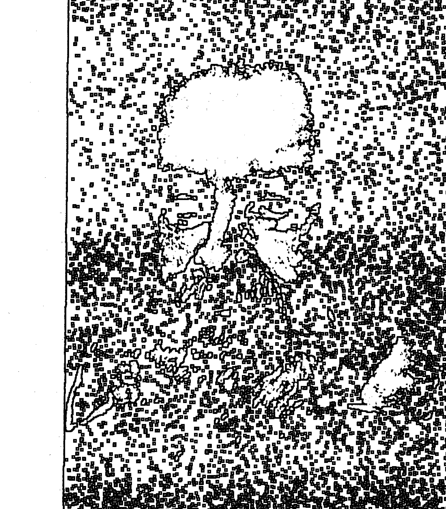

# 加利略(G.Galilei AD.1564-1642)

科学史上最重要的实验天文物理学家，为支持哥白尼理论，却蒙受罗马教会的禁锢。

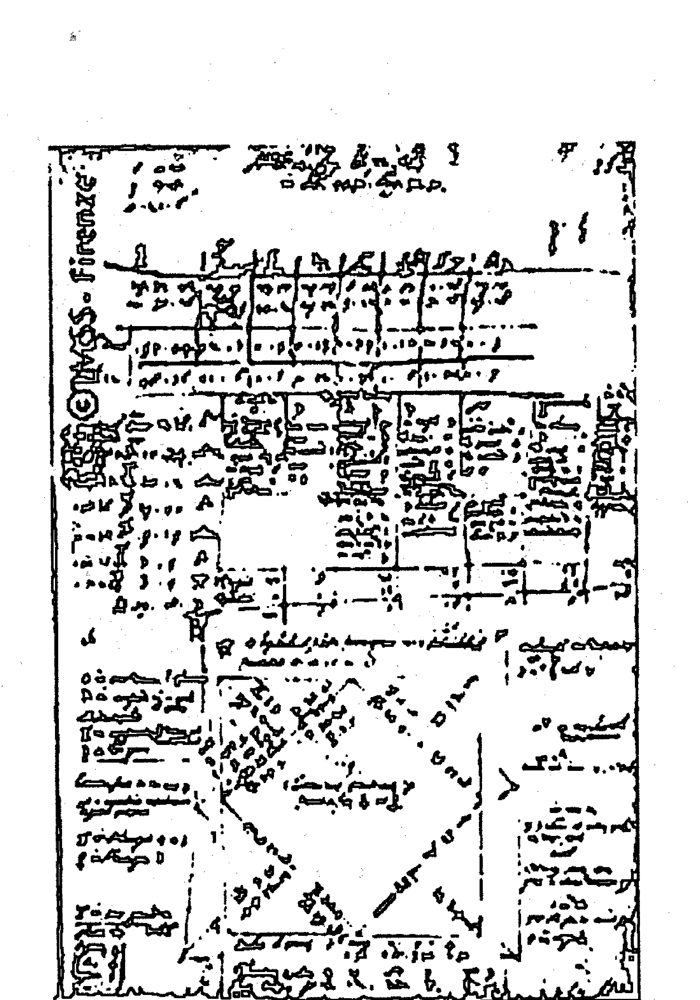

伽利略为其女儿Virginia所绘的天穹图，因年代久远难以辨识其内容。

# 第六章 行星的原理與特性

行星是天宮圖中最重要的角色，古代占星先賢就是從浩瀚夜空，繁星點點中，某些行星的移動，體悟到徵兆的象徵，更將這些行星賦予神名形成神話故事流傳於世。古典占星學相當重視行星的作用，是判斷事件吉凶的主要根據。而現代占星學強調的心理，排斥事件吉凶的預測，無形中忽視行星真正的功能，殊為可惜，本書著重古典與現代的融合，因而將有不少篇幅討論行星古典的原貌，尤其是行星力量強弱，是相當重要的一環。

我們將在第1節說明行星作用的經驗傳承，敘述古典學說中行星的一些概念。第2節解釋行星在黃道的位置，衍生出來的固有強弱，古典占星學稱之為必然的尊貴，和必然的無力。第3節解釋行星在後天宮位，衍生出來的強弱，以及其他因素，統稱之為偶然的尊重，和偶然的無力。第4節詳列行星的原理和特性。第5節討論已失傳的行星晝夜區分。

# 行星的原理與特性

## 第1節 行星作用的經驗傳承

太陽系的行星在天空中運行，一直是早期先民觀察天體最主要的目標，經與世俗事件結合，長期下來歸納出它的作用。早期先民敬畏天地，常將天體視為天上神祇而加以膜拜，更加深對其作用的印象，一代一代的累積就形成後世集體無意識。早期較具體記載行星的作用，應屬巴比倫時期，他們所傳承下來的與現代占星學各行星作用原理，無甚大差別，我們整理於後：

- 太陽 為撒馬許神(Shamash)，正義的化身，公正之神，一些君王常引用它標榜自己是公正無私的，如漢摩拉比王就在著名法典的緒言中提到，『我漢摩拉比，虔誠敬神的君王，為使國中正義、邪惡消亡，強不凌弱，我像太陽一樣升起，給國家帶來光明。』
- 月亮 月神辛(Sin)，為創造我的神，在黑暗之中帶給大地光明，壓倒群星。
- 水星 為尼布神(Nebo)，愛跑常跳，常隨太陽出沒，讓人摸不著，是智慧之神，狡猾。
- 金星 為伊撒塔神(Ishtar)，明亮、美麗、魅力(妖魔曾為她的姿色所迷倒)，又具戰爭之象，所以金星兼及愛情與戰爭。
(註:現代占星學僅保留金星的愛情、美麗之作用，戰爭完全歸於火星)

火星：為戰神努爾格(Nergel)，發出惡毒的紅光，是死亡和破壞的先驅。
木星：為眾神之王模德克(Marduk)，非常明亮的行星，雍容大度，聲名顯赫，大權在握，但也會發動風暴和大洪水。
土星：為尼努他神(Ninurta)，遙遠、行動、緩慢的行星，它那閃爍的蒼白光芒，代表光陰已逝、老年和學術研究，因緩慢而讓人覺得穩重。

巴比倫先民將行星與神的比擬，實際上是觀察這些行星的自然景象的感受，現代占星學仍絕大部份沿用，由於太陽、月亮及五大行星（當時尚未發現三王星），都被視為神，所以每日在天空運行的情況，就顯得特別有意義，尤其是這些行星升起於地平線上，或即將下降於地平線，更須注意，巴比倫的徵兆占星學，常見這種記載，如下載「如果金星於二月（Airu月）出現於東方，大、小雙子星環繞著它，且此四星連同金星皆晦暗不明亮，則Elans將患病死亡。」

行星的作用，在古代也常以神話故事流傳，除上述巴比倫的神話外，希臘.羅馬的神話更不遑多讓，現代占星學中行星的英文名稱，更直接取自羅馬神話中的人物（除太陽、月亮外），我們分別列出，希臘、羅馬神話之名稱 意義以供參考。

| 行星 | 現代英文名稱 | 希臘神話 英文名稱 | 希臘神話 意義 | 羅馬神話 英文名稱 | 羅馬神話 意義 |
| :--- | :--- | :--- | :--- | :--- | :--- |
| 太陽 | Sun | Helios | | Apollo | |
| 月亮 | moon | | | Diana | 婦女及小孩的守護神 |
| 水星 | mercury | Hermes | 司學藝、聰明、善言、做生意傳達信息 | Mercury | 商業之神.其神廟為穀物的交換中心，穀物商人都敬拜它 |
| 金星 | Venus | Aphrodite | 享樂、快樂、美麗、和平、戰爭中的勝利，友誼、藝術 | Venus | 美和繁殖之神、主宰、繁殖愛及家庭生活 |
| 火星 | Mars | Ares | 戰神、忿怒、好爭吵、抱怨 | Mars | 脫胎自希臘之戰神，主要功能是保護國土 |
| 木星 | Jupiter | Zeus | 宙斯、諸神之王、法律制定者仁慈及保護、創造機會、好運、生畏 | Jupiter | 羅馬主神、掌管、誓言、結盟、酒，父親形象的原型 |
| 土星 | Saturn | Kronos | 主宰命運及時間、過去、極限及界限、結構骨架、冷冰老邁、保守 | Saturn | 土地之神、掌管、播種、和穀種 |
| 天王星 | Uranus | | | Uranus | 毀了土星的傳統及權威而得解放 |
| 海王星 | Neptune | | | Neptune | 將事物吞沒到無盡、模糊之中 |
| 冥王星 | Pluto | | | Pluto | 地府之王、生性冷酷、無情、是死亡之神、但也是財神 |

※ 天王星、海王星、冥王星，為近代或現代發現的行星，雖沒有其作用之流傳故事，但卻有人根據發現時代背景意義，將他們比較於羅馬神話故事中的人物。

# 第6章 太陽系的結構

太陽系的範圍甚廣，除了太陽、月亮、行星之外，尚有其他星體，例如大行星的衛星，在他們之間的小行星，Asteroids，如西利絲(ceres)，凱龍星....之類，以及彗星、流星。太陽在天文學上，實際是最近地球的一顆恆星，其光體甚大，而一般恆星出現在天空，距離地球都相當遙遠，僅能看到光點而已。太陽系的行星在天空中運行，若仔細觀測，可看得到他們的移行，而恆星幾乎是靜止固定不動，行星與恆星都是占星學重要的要素，然行星更是重要，行星間的小行星陸續被發現，也有部份占星學，特別強調其重要，並編有小行星的星曆表，美國心理占星家姬波拉 杜賓博士就相當用心於小行星的使用，筆者個人保留凱龍星，其他不用，因增添繁瑣，且實證尚未完整，若以後相關實證資料得到認同，再予以補論。

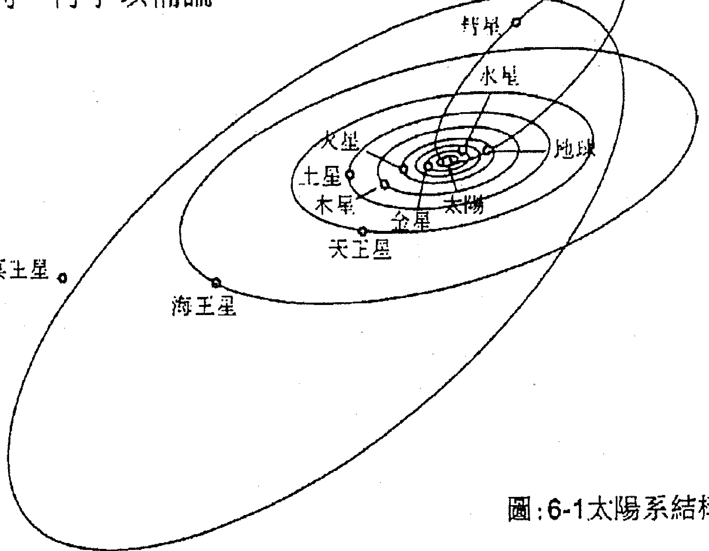

## 第三節 行星的原理與特性

太陽為太陽系之中心，諸行星或彗星環繞於外，除冥王星外，大致呈橢圓形，冥王星的例外，更賦予其深邃，不可測，陰險的印象。

18世紀科學文明帶給歐洲工業革命，豐碩的物質發達，使占星學沈淪，因此有部份占星家鑑於此，遂努力欲使占星學沾上科學之邊。相信占星理論必須有實際上的根據，亦即行星對地球的氣候，動、植物有實質的影響力，經過他們的努力，終於有了相當令人振奮的成果，我們臚列幾個著名研究個案，這些個案的研究者，或許非占星家，但結果卻符合行星的實質影響力。

1. 高田(Maki Takata)博士證明人體血液的成分隨11年太陽黑子週期而變化。
太陽黑子也常用在經濟循環的研究當中，台灣在民國78年79年，國民黨內主流與非主流鬥爭激烈，及股票加權指數從12500左右，下降到不足3000，當時正值太陽黑子高峰期；事隔11年，民國89年、90年又是太陽黑子週期高峰台灣發生，政黨輪替之巨變，股票指數也從11000左右下降至4500左右，百業蕭條。

2. 美國著名的「週期研究基金會」出版「週期」(Cycles)，致力於各種統計數字來作科學報導，說明人類的行為，受到一股強大的力量所左右，這股強大力量，或許就是宇宙行星的力量。「這些力量左右著興盛和衰退、富裕和蕭條。它們控制了多數產品的產量、不僅限於農產品，連工業產品和礦產品都包含在內，除了控制總額的多寡外，也控制了單價漲跌，它們無所不在地左右著利率和證券價格，也控制了個人收益，它們還影響了人對各種疾病的感染與否，並改變人的情緒，使人從開放漸趨保守，或是由保守又回歸開放、自由」。該基金總經理.杜威博士Dr.Dewey.Daiken是位嚴謹的學者，其說明使更多的科學家相信週期確實存在，小至個體，大至社會及歷史事件，都見其影響的蹤影。1980年代趨近成熟的財務金融占星學，就證明各種不同組合行星的會合周期，和股市、商品或期貨、經濟情勢，確有令人咋舌的吻合。

3. 德國的托馬司克博士(Dr.Thomaschek)，曾研究歷史上的134個大地震和當時的星象，他發現平均每六次大地震，有五次天王星正好發現在地方的上中天，最相關的行星是木星、天王星、冥王星，所謂相關，即是形成不調和相位。托馬司克博士的研究，後來證之其他地區地震也頗應驗，如民國89年日蝕後的土耳其大地震，台灣921大地震，公元2001年印度大地震，都符合其理論，尤其涉及天王星。

4. 英國的約翰 艾迪博士(Dr.John.Addey)曾研究1000名小兒麻痺和人瑞，發現有相當一致的波浪曲線，係因宇宙間週期現象所致，說明宇宙萬物，不管是大宇宙或小宇宙都具有高低起伏的特質，週期也許很快，也許相當長久，但一般傳統物理學或天文學都無法解釋，卻可在占星學中所強調的行星週期得到答案。

這些科學化的占星研究，確實豐富占星學的認知，也可改正古典先驗性的占星學說法，發展至今，古典占星學似乎仍經得起考驗，以下我們就開始詳細介紹行星的各項特性

### 行星的純質料和體液的關係

| 行星 | 特徵 | 相關的體液 | 主要特徵 |
| :--- | :--- | :--- | :--- |
| 太陽 ☉ | 熱和乾 | 黃膽汁 | 氣(Pneuma)、固有熱、生命的功能和精神 |
| 月亮 ☽ | 冷和濕 | 黏液 | 根本濕、聚在一起的體液 |
| 水星 ☿ | 中性 | 中性 | 野性的功能、精神、心智 |
| 金星 ♀ | 冷和濕 | 黏液 | 生殖器之尿液系統、排出功能 |
| 火星 ♂ | 熱和乾 | 黃膽汁 | 膽汁質體液、膽囊、吸引力 |
| 木星 ♃ | 熱和濕 | 血液 | 自然的功能與精神、消化 |
| 土星 ♄ | 冷和乾 | 黑膽汁 | 憂鬱質體液、脾臟、保持力 |

以上所列是古希臘、阿拉伯及中世紀占星學常見的內容，雖然在現代似已不被提起，但這些內容有助認識行星的原理及特性，對欲深入瞭解個性及醫療占星學有甚大助益，可依據第4章第1節所述純質料的基本特性及組合，掌握某行星的原理，從而繹其特性及功能，詳細的內容可看《行星的原理及特性》表當可理解。

# 行星的原理與特性

至於現代所發現的三王星，也有占星家賦予他們純質料的基本特性，但相關體液則付之闕如。

- 天王星：非常熱和極為乾（尚有其他人持不同看法）
- 海王星：非常冷和極為濕
- 冥王星：熱和乾之傾向，但很難界定

### 行星的陰陽性

行星的陰陽性分類，基本上可以純質料來作界定。我們談過濕的力量，特別的陰性，含有濕的行星共有月亮、金星、木星、海王星四個，但木星也有熱的純質料不似前三者都共有冷和濕，因此月亮、金星、海王星，歸類為陰性行星。水星和冥王星之純質料較難界定，可歸類為中性行星，但冥王星因熱和乾之傾向，應屬中性偏陽。至於太陽、火星、天王星都其熱和乾，而木星也具熱，故歸類為陽性行星，而土星雖具冷和乾，給人陰鬱的感覺，但因具壓制性，自古以來都將它歸類為陽性行星。有關行星的陰陽性，我們再彙總於下：

| 陽性 | 中性 | 陰性 |
| :--- | :--- | :--- |
| 太陽 | 水星 | 月亮 |
| 火星 | 冥王星 | 金星 |
| 木星 |      | 海王星 |
| 土星 |      |      |
| 天王星 |    |      |

一般上，陽性行星較主動、積極、外向，陰性行星較被動、消極、內向，而中性行星性質不顯，視與會合之行星而定，若無會合，則保持中性。

托勒密曾提及行星陰陽性的分類之另一種方法，係根據行星和太陽相態的關係而推論，如當行星為晨星，先太陽而出地平線他們變成陽性，而當行星為昏星，在太陽之後西沈，他們變成陰性，托勒密的這種觀念在古代及中世紀一直是個重要課題，這須專題討論，一般稱之為行星的相態，涉及行星東方性或西方性，此處我們暫且不表。

### 行星的吉凶

行星有其吉星、凶星之性質，除太陽、月亮發光體外，第一吉星為木星，第二吉星為金星，水星為中性，無吉無凶，視所會合之行星而定，第一凶星為土星，第二凶星為火星。從巴比倫行星神性的說明，就可知道行星的吉凶性質早就形成。在希臘化時期，以托勒密相位（ptolemy Aspects）予以理論化，所謂托勒密相位，即托勒密在《四書》提到相位，係以整個星座，非如現代是以星座內度數，而且他也僅提到0°會合（☽）、60°半合（⚹）、90°刑（□）、120°三合（△）、180°沖（☍）這五個相位而已，如獅子座與天秤座，就成60°半合，托勒密以星座主星和相位，定出行星的吉凶，如下圖：

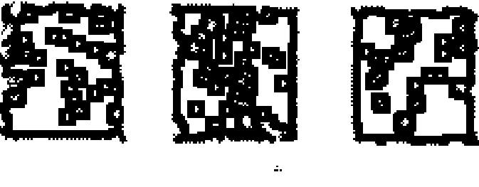

說明：

1. 獅子座、巨蟹座是赤緯最高的星座，其主星分別由太陽、月亮主管。
2. 分別從獅子座和巨蟹座起，各逆行針、順行針方向。
    - A. 由獅子座起算天秤座60°半合（✳），吉；天蠍座90°刑（□），凶；射手座120°三合（△），吉；水瓶座180°沖（☍），凶。
    - B. 由巨蟹座起算，金牛座60°半合（✳），吉；白羊座90°刑（☍），凶；雙魚座120°三合，吉；摩羯座180°沖（□），凶。
    - C. 由A. B可歸納出，金星主管的星座為吉，火星主管的星座為凶，木星所主管星座為吉，土星所主管的星座為凶，而120°的吉大於60°的吉，故木星的吉大於金星；相對地，180°的凶大於90°的凶，故土星的凶大於火星的凶。
    - D. 水星所主管的星座處女及雙子，因無托勒密相位，故無吉無凶，為中性。至於三王星的吉凶性質，仍可按其現代所主管星座來論，冥王主管天蠍為凶，天王星主管水瓶亦為凶，海王主管雙魚似吉，但強調其負面，亦屬凶。

以上所述行星的吉凶，僅是最基本的特性之一，不能死執這種基本觀代因為行星最具體的吉凶，是須根據其在黃道的先天條件，而演繹出必然的尊貴和必然的無力，以及其在後天12宮的後天狀況所顯示的偶然的尊貴和偶然的無力。

## 第2節 必然的尊貴（Essential Dignity）和必然的無力（Essential Debility）

行星或敏感點在黃道先天位置上所形成的固有本質，可用來評估行星的相對力量強弱，從而評估其影響力，占星學的術語稱為必然的尊貴，和必然的無力。這項評估技術在18世紀前一直被廣泛使用，且是主流技術，地位相當重要，但18世紀後，主星的意義已被誤解甚深，甚或曲解，古典的五種必然尊貴，僅留存星座主星及旺宮主星，而三分性主星、界主星，及外觀主星，則消失無蹤。

公元2世紀希臘托勒密在《四書》就已建立必然尊貴的概念，後世流傳雖有增添或桀誤，但至17世紀英國里利根據托勒密的觀念，給予分數，作為判斷依據，一直被奉為圭臬，我們分別列出，行星必然尊貴和無力的托勒密表及里利評價分數表。

### 〈表6-1〉行星必然尊貴和無力的托勒密表（度數從星座1°起算）

| 星座 | 廟 | 旺 | 三分性（晝） | 三分性（夜） | 界 | 界 | 界 | 界 | 界 | 外觀 | 外觀 | 外觀 | 陷 | 弱 |
| :--- | :--- | :--- | :--- | :--- | :--- | :--- | :--- | :--- | :--- | :--- | :--- | :--- | :--- | :--- |
| ♈ | ♂ D. | ☉ 19 | ☉ | ♃ | ♃ 6 | ♄ 14 | ♀ 21 | ♂ 26 | ♃ 30 | ♂ 10 | ☉ 20 | ♃ 30 | ♀ | ♄ |
| ♉ | ♀ N. | ☽ 3 | ♀ | ☽ | ♀ 8 | ♀ 15 | ♃ 22 | ♄ 26 | ♂ 30 | ♀ 10 | ☽ 20 | ♄ 30 | ♂ |  |
| ♊ | ☿ D. | ♄ 3 | ♄ | ☿ | ☿ 7 | ♄ 14 | ♀ 21 | ♄ 25 | ♂ 30 | ☿ 10 | ♂ 20 | ☉ 30 | ♃ |  |
| ♋ | ☽ D. | ♃ 15 | ♂ | ♂ | ♃ 13 | ☿ 20 | ♀ 27 | ♃ 30 | ♀ 10 | ☿ 20 | ☽ 30 | ♄ | ♂ |  |
| ♌ | ☉ D. | ☉ | ♃ | ♄ | ♄ 13 | ♀ 19 | ♃ 25 | ♂ 30 | ♃ 30 | ♃ 20 | ♂ 30 | ♄ |  |
| ♍ | ♀ N. | ♀ 15 | ☽ | ☽ | ☿ 7 | ☿ 13 | ☿ 18 | ♄ 24 | ♂ 30 | ☉ 10 | ☉ 20 | ☿ 30 | ♃ | ♀ |
| ♎ | ♀ D. | ♄ 21 | ♄ | ☿ | ♄ 6 | ♀ 11 | ♃ 19 | ♀ 24 | ♂ 30 | ☽ 10 | ♄ 20 | ♃ 30 | ♂ | ☉ |
| ♏ | ♂ N. | ♂ | ♂ | ♂ | ♂ 6 | ♃ 14 | ☿ 20 | ♀ 27 | ♄ 30 | ♂ 10 | ☉ 20 | ☿ 30 | ♀ | ☽ |
| ♐ | ♃ D. | ♄ 3 | ☉ | ♃ | ♃ 8 | ♀ 14 | ☿ 19 | ♄ 25 | ♂ 30 | ♄ 10 | ☽ 20 | ♄ 30 | ♀ |  |
| ♑ | ♄ N. | ♂ 28 | ♀ | ☽ | ♀ 6 | ♀ 12 | ☿ 19 | ♂ 25 | ♄ 30 | ☿ 10 | ♂ 20 | ☉ 30 | ☽ | ♃ |
| ♒ | ♄ D. | ♄ | ☿ | ♄ | ♄ 6 | ♀ 12 | ♀ 20 | ♃ 25 | ♂ 30 | ♀ 10 | ♀ 20 | ☽ 30 | ☉ |  |
| ♓ | ♃ N. | ♀ 27 | ♂ | ♂ | ♀ 8 | ♃ 14 | ☿ 20 | ♂ 26 | ♄ 30 | ♄ 10 | ♃ 20 | ♂ 30 | ♀ | ♀ |

廟 □  旺 ▏  陷 ▨  弱 ▦

### 〈表6-2〉里利必然尊貴和無力評價表

| 必然的尊貴 | 無力 |
| :--- | :--- |
| +5，行星在它自己的星座，或與其他行星就星座主星互容。 | -5，行星在陷宮（Detriment） |
| +4，行星在它自己的旺宮，或與其他行星就旺宮主星互容。 | -4，行星在弱宮（Fall） |
| +3，行星在它自己，白天或夜晚的三分性。 | -5，行星是外來的（Peregrine） |
| +2，行星在它自己的界。 | |
| +1，行星在它自己 Chaldean decanate 或外觀 | |

### A. 廟（Rulership）

行星在自己的星座，最能發揮主人權威地位，能量最充裕，如太陽在獅子；月亮在巨蟹；水星白天在雙子，夜間在處女；金星白天在天秤，夜間在金牛；火星白天在白羊，夜晚在天蠍；土星白天在水瓶，夜間在摩羯。我們從前面圖6-2可看出。

根據托勒密的解釋，以地心系統太陽視運動繞行黃道12星座，在夏至到達最北赤緯，此時之星座比其他時節之星座最能產生光和熱、溫暖，即巨蟹和獅子就其陰陽分別被派予最大和最有力的星體，那就是發光體，獅子座為陽，由太陽掌管，巨蟹座為陰，由月亮掌管，而其他行星就按太陽系行星排列順序 ☿，♀，♂，♃，♄，分別按半弧圈，主管一個星座，除太陽月亮外，每個行星共主管二個星座，雖主管二個星座，其中一個會比另一個較強，17世紀的拉米西（Ramesey）就以較強的星座，稱為行星的喜樂（JOY），類似行星在後天宮喜樂之意義，拉米西列表於下：

- ♄ - 水瓶
- ♃ - 射手
- ♂ - 天蠍
- ☉ - 獅子
- ♀ - 金牛
- ☿ - 處女
- ☽ - 巨蟹

土星在水瓶喜樂，而非在摩羯？為何是這樣呢？因為從〈表6-1〉，土星在水瓶同時擁有白天的廟及三分性；同樣木星在寅喜樂，而非在亥？因為木星在寅同時擁有白天的廟及三分性，而在亥僅有廟而已。火星在天蠍比白羊有力，因它在天蠍同時擁有白天的廟及三分性；金星在金牛比天秤有力，也是同樣的理由，具有白天的廟及三分性，水星在處女比在雙子有力，是因它同時具有夜間的廟及旺。

拉米西的喜樂宮觀念，目前在現代占星學已見不到，此處提出，可作為參考。

### B. 旺（Exaltation）

旺是根據地心系統的天文特性衍申及季節時令的體會而得的概念，以迴歸黃道而言，太陽於巨蟹座，揚升於黃道最高點。事實上，從白羊座到天秤座，太陽上升在北的範圍，而從天秤座到白羊座，則是在南的範圍，因此兩個分點星座可代表類似羅盤的方向，兩個至點星座代表其方向的極點，即最高點或最低點。

1. 太陽是地球生命的源泉，取他的旺在白羊，為春季，使所有生物活動華麗且產生良好的、溫暖的氣候，白天較長。太陽在北方的範圍上升；相對地，太陽在天秤為弱，白晝開始慢慢減少，進入秋季，萬物蕭索，淒涼景象，太陽的威力發揮不出。
2. 月亮反射太陽光，假設太陽、月亮會合白羊，它被我們看見的第一個星座將是金牛，且金牛也是月亮第一個三分性之星座，故月亮旺於金牛。
3. 水星旺於處女，係由金星旺於雙魚推論而得。
4. 金星是自然的濕，特別在雙魚座之季節，正處於潮濕，所以金星自然地旺於雙魚。
5. 火星是自然的熱和乾，因它的影響和效應在摩羯最有力量，因此最南赤緯星座值冬季季節，火星的本性可溫暖它，因這個理由，故火星旺於摩羯。
6. 木星在巨蟹較為愉快，鼓動北方的風，增进了肥沃和生長，木星在巨蟹是它的最高赤緯。
7. 土星在3個近代行星（三王星）未發現之前，是太陽系最遠的行星，與太陽、月亮相對，代表寒冷，太陽的熱，旺於白羊，故土星旺於其對宮天秤。

行星在它的旺宮，其能量強且狀況良好，雖比廟稍弱，但也能發揮，凶星若是在旺宮，凶性減少，傳統的旺和廟有一重大差異，即沒有重複的旺，即所有星座並非都有旺的行星，如獅子、天蠍、水瓶、就無旺的行星。

在古代，基本的極性（或磁性）是太陽和土星，以旺而言，太陽在白羊對沖土星在天秤；水星在處女對沖金星於雙魚；木星旺於巨蟹對沖火星於摩羯。

- ○（一）♄
- ☿（一）♀
- ♂（一）♃

在醫療占星學這種行星極性或磁性是草藥特性相剋的依據。

### C. 三分性（Triplicity）

托勒密和古代占星學先輩，將星座予以分類，其中按四大元素分類的星座，分別有白天和夜間的主星，這就是三分性主星的由來，從〈表6-1〉，可整理出

### 〈表6-3〉三分性主星

| 元素 | 星座 | 白天 | 夜間 |
| :--- | :--- | :--- | :--- |
| 火 | 白羊、獅子、射手 | ☉ | ♃ |
| 土 | 金牛、處女、摩羯 | ♀ | ☽ |
| 風 | 雙子、天秤、水瓶 | ♄ | ☿ |
| 水 | 巨蟹、天蠍、雙魚 | ♂ | ♂ |

三分性主星在傳承上也有些不同，上表為里利的觀點，托勒密對水象的三分性主星則認為白天為金星，夜間為月亮，同土象一樣。由於里利威名遠播，有使用三分性主星的占星家，大多採用里利的說法，同期的拉米西也據其說法，演繹其意義如下：

- I. 太陽、木星支配火象之三分性，白天為太陽，夜間為木星，係因太陽之熱、乾，適合火象性質，而木星則因它是溫和的，能調整其極端，木星的濕配合夜間，故為夜間主星。
- II. 金星、月亮支配土象之三分性，白天為金星，夜間為月亮，因土象星座為陰性星座，故東南風的濕符合金星、月亮濕的特性。
- III. 土星、水星支配風象之三分性，白天為土星，夜間為水星，前者在天秤為旺，水瓶為廟且喜樂，而後者雙子是水星的廟。
- IV. 火星支配水象的三分性，白天、夜間皆同，會委派為水象之主星，可能是為冷卻其大膽凶惡之性。

行星若得三分性主星可視為好運，但非因他們的卓越表現，而是誤打誤撞所致。

三分性主星在古典占星學中佔有重要地位，常依ASC、太陽或月亮落宮星座及度數查出三分性主星，而論斷一生的三個階段之大略狀況，也可應用至各後天12宮，分別論斷各宮的三個階段，此項技巧已失傳，且較簡略，故不受重視。

### D. 界（Terms）

〈表6-1〉所列的界，托勒密稱為迦勒底界（Chaldean Terms），里利採用之，後世占星家使用界，也以此為準，現代研究界較有成就的為李、李荷曼博士，也同樣使用它。迦勒底界為何如此排列，已很難追蹤，但從表中所列，約可看出

- I. 一星座中，廟、旺、三分性等主星，較多的，常將之委派到前面第一個，如金牛座，廟主星及三分性主星，皆為金星，故金星安排金牛座界的最前面0°～7°（注意表中所列，係以星座第1度為1°，通常是以0°為第1度）。
- II. 火星、土星，自古被認為凶星，若非I，則常被排在星座後面。必須注意I. II規律並不完整，僅供參考而已。

行星的界主星，指示命主或行星參與了行星的事務，並非真正獲得其所在黃道位置的力量，該行星的事徵雖重要，但結果無法確定，如卜卦占星學中ASC命度的界主星可以用來描述詢問者的身體特徵，假設ASC的界主星是土星，則詢問者可能是嚴肅的人、老人、認真、或醜陋的人...，等任何有關土星特性的描述，但不能說其結果就是凶的。

在本命占星學的運用，界主星代表一種傾向，並非有能力帶到那個方向，如金星的界主星為木星，可能有樂觀但浪費奢侈的傾向。

### E. 外觀（Face）

〈表6-1〉所列的外觀是必然的尊貴之最後一種，將黃道圈360°，劃分成每10°一個單位從白羊座起，按迦勒底秩序（Chaldean Order），即♂→☉→♀→☿→☽→♄→♃，周而復始地排列，就形成〈表6-1〉之外觀內容。迦勒底秩序，即是古代常使用之行星時間（Planetary Hours）。

又在外觀表中之直行裡的順序，恰好即是一星期中每天的行星代表。

- 星期日：☉
- 星期一：☽
- 星期二：♂
- 星期三：☿
- 星期四：♃
- 星期五：♀
- 星期六：♄

星期的每一天黎明後（即日出）的第一個時辰，由所代表的行星主管，如星期日，由太陽主管，故星期日日出後的第一個小時，由太陽主管，然後按迦勒底順序到第8個小時，又由太陽主管，日落後的第3個小時及第10個小時亦同。

行星時間在古代常被使用，如17世紀著名的醫療占星家丘勒匹柏就認為採集草藥的時間應配合行星時間才最有效，如時間值 ♀，利於採集水星性質的草藥，其效果最佳。又在卜卦占星學中，常用行星時間來判定所建立的卜卦盤，是否為根本的（Radical），里利相當注意此法，即一個卜卦盤是否有效，該行星時間的主星，應有三種方式符合卜卦盤的ASC。

1. 同一行星主管行星時間和卜卦盤的ASC。
2. 同一行星主管行星時間和卜卦盤ASC的三分性。
3. 行星時間的主星其要素特性應和ASC特性相同。

外觀表中每星座劃分成3個部份區間，同為10°，在古代系統，也有稱之為decans，印度占星學仍保有該種說法，但順序和迦勒底秩序不同，李·李荷曼博士認為每個星座的3個段落，事實上是代表星群，或群星的部份組合，作為時間標誌而得以測量行星的位置至度數或分數。

行星的外觀主星，基本上應用較少，5種必然的尊貴中，外觀其實算不上尊貴，反而需時時警惕、擔憂，表現上係以遮掩方式而非直接地害怕，拉米西說行星的外觀主星為"最後的喘息（at the last gasp）"，頗為傳神，就如一個人即將踏出門檻，隨即有人將門關上，而不得再入。

### 定位星（dispositor）、容納（reception）、互容（Mutual Reception）

### A. 定位星

所謂定位星是指行星所落黃道星座，其主星即是該行星的定位星，如太陽落於雙子座，水星為雙子座主星，故水星為太陽的定位星，太陽就含有水星的意涵，水星多少指導了太陽，這也是各行星在黃道12宮，在現代解釋上感覺都圍繞在星座的意涵之原因，我們論到其章節，再詳述。

定位星對落其主管星座的行星有直接的影響，也會產生間接的影響到落入該行星所主管星座之行星，如太陽落入天秤座，天秤座之主星金星為太陽的定位星，因此金星會對太陽產生直接影響，而也會對落入獅子座的行星，產生間接影響，因這些行星的定位星為太陽。這種直接和間接的關係會產生以下數種狀況：

- （i）某行星位於其本身所主管的星座，並且是天宮圖中其他行星的最終定位星，它將變成整個天宮圖極為重要的顆行星，具有主導作用，亦即這顆最終定位星常是他生命中的重點，可依其行星原理、特性和後天宮代表之人事物予以解析。

The request was rejected because it was considered high riskThe request was rejected because it was considered high risk行星的原理與特性

主要的原理
發光或向外推進、浪費(奢侈)，太陽所在之效應傾向受到注目，聚光燈的發亮，這個理由完全顯而易見，在天空中，它是最亮的目標，太陽系的中心，根據亞里斯多德說法，它是熱和乾，膽汁質的熱產生活動力，乾產生區別，這是非常陽性的行星，為精神、專注和堅決的象徵。

天宮圖中的意義：
- 1. 太陽在盤中建構個人的主要性格之一，可由其所在星座詮釋。
- 2. 個人的才華、意志、精力、權力、企圖心的追求，由所落後天宮位，看其表現在何種生活領域，此即太陽二力說:能力、精力、權力。
- 3. 男命命盤中的父親，女命命盤中父親或丈夫，由其先後天配置，視其必然的尊貴或無力、偶然的尊貴或無力來參考。
- 4. 太陽為生命的能量，所在先後天宮，受刑沖，能量易燃燒過其，形成所代表之器官受損，疾病發生。
- 5. 就容格心理學，太陽是英雄的原型，心靈運轉的原動力，此即容格之libido而受注目，常是論斷個人外貌形象特徵的重要因素，尤其是其合相行星，因反射其光而凸顯。
- 6. 父系遺傳之推測。

※影響:心臟、背部、視力、精力、能力、權力 父親、創造才華。

太阳

行星的原理與特性

| 每日运行速率: 0° 59' 8" | 黄道周期: 一年绕行黄道一周 | 关键语：权力、生命力、自我表现、创造力 |
|---|---|---|
| 逆行意義(Retrogradation) 太阳无逆行现象 | | 正面评价 | 负面评价 |
| 人: 国王、元首、总统、父亲、丈夫、尊贵的人、雇主、老板、领导者、演员、导演 | 地点: 舞台、政府机构、宴会厅、娱乐场所、赌场 | 创造力、领导能力、慷慨、尊贵、热爱生命、喜爱孩子、勇气、荣耀、自信、权威 | 傲慢、自负、专制、夸大、挥霍浪费、强人所难、缺乏耐力、虚荣、自我本位、独裁、赌性、玩心重、放荡、作威作福、桃花 |
| 事: 英雄事迹、娱乐事务、政治 | 颜色: 金黄色、镀金色、红、紫 | | |
| 物: 勋章、褒扬令 | 金属: 黄金、钻石、黄玉、红宝石 | | |
| 器官: 背部、心脏、男性右眼、女性左眼、血液、循环系统、动脉、身体右侧 | 动物: 狮子、老鹰、隼、公鸡、孔雀 | | |
| 疾病: 心脏病、高低血压、背部疼痛、视力差、眼病、发烧发炎、视力不佳 | 植物: 稻米、向日葵、番红花、甘菊、肉桂、杜松属、金盏草、芳香植物 | | |

行星: 月亮 符號: ☽ 行星的原理及特性 性質 吉

純質料: 冷. 濕 喜樂宫: 3宫 星期代表: 星期一
白天或夜間: 體液: 黏液質 行星時間: 星期一日升後第1及第8個時辰，及以下夜晚的第3個和第10個時辰
陰或陽: 陰性行星 行星期間: 實歲4歲前(含)

| 廟 Ruler | 旺 Exaltation | 三分性 Triplicity | 界 Terms | 外觀 Faces | 陷 Detriment | 弱 Fall | 外來的 peregrine |
|---|---|---|---|---|---|---|---|
| 巨蟹 | 金牛 尤其3° | N. 金牛 處女 摩羯 | | 金牛 10° 19° 巨蟹 20° 29° 天秤 0° 9° 射手 10° 19° 水瓶 20° 29° | 摩羯 | 天蠍 | 白羊 0°-29° 金牛 雙子 0°-29° 巨蟹 獅子 0°-29° 處女 D 天秤 10°-29° 天蠍 弱 射手 0°-9° 20°-29° 摩羯 D 水瓶 0°-19° 雙魚 0°-29° |

符號演繹
月亮係由符號半圓形成，代表靈魂、陰性、被動、為太陽光源之反光，但也隱含另一半圓的無明，亦即人類的本性之感受性如無意識、情感、行為本能，而這些常具光明面及隱晦面。

主要的原理
吸收、引起心靈感動，集合磁性，產生真空(空虛)，月亮為冷和濕，意謂著它傾向和諧而沒有區別，冷降低了活動力和產生平靜，它是非常陰性的行星，為所有精神投入的吸收者，所以它無法形成物質型式。

天宮圖中的意義：
- 1. 月亮在黃道12星座，代表個人人格一部份為感情直接反應方式，它顯示植根源於早期經驗的影響，決定了個人與家庭生活事務，母親、女性之關係。
- 2. 月亮因主宰一般的情緒反應，也代表個人面對陌生環境或一般環境時之情緒反應，也形成個人精神負擔所在。
- 3. 男命的母親、女性，女命的母親，或男女命的母系遺傳，感覺母親對自己的態度。
- 4. 月亮的位置，是飲食習慣或食物或是家居佈置，偏好的指標。
- 5. 月亮在後天宮，可以瞭解其生活領域的情感表現方式。
- 6. 月亮距離地球近且移動速度快，影響明顯，所以是卜卦、擇日及醫療占星學重要決定因子。

※影響:出生、母親、消化系統、胃、乳房、子宮卵巢、交感神經系統、營養、情緒、個人習慣、家庭、祖先、記憶。

行星的原理與特性

| 每日運行速率:13° 10′36″ | 黃道周期:27.32日 | 關鍵語：反應、直覺、變動 |
| :--- | :--- | :--- |
| 逆行意義(Retrogradation) 月亮無逆行現象 | | 正面評價 | 負面評價 |
| 人：人民 母親、妻子、女主人、助產士 | 地點：住家、田園、水族館、旅舍、餐廳、近水、船泊 | 母性 富同情心、聽從 具包容性、想像力豐富、念舊、敏感、記憶力佳 | 情緒化、防衛過度、容易記恨、心胸狹窄難取悅、易受到刺激 |
| 事：食慾、大眾之事、繁殖力、懷孕、生產 | 顏色：銀灰色、白色、淡青藍、乳白色 | | |
| 物：土地、不動產、日常家居用品、食品雜貨 | 金屬：貓眼石 月長石、珍珠、水晶、銀鋁、透明石膏 | | |
| 器官 胃、腹部、胸部、身體左側、子宮卵巢、周期性、月經、男性左眼、女性右眼 | 動物：青蛙、大兔、夜鶯、鸚鵡、天鵝、螃蟹甲殼類水中物 | | |
| 疾病：上述器官之病變、精神不正常、食慾不振、貧血症、視力不佳 | 植物 甘藍菜 甜瓜、胡瓜、南瓜藤、菊高苣、香菇、水田芥、百合花 | | |

行星:水星  符號:☿  行星的原理及特性  性質:中

純質料: 喜樂宫:1宫 星期代表:星期三
白天或夜間: 體  液: 行星時間:星期三日升後第1及第8個時辰，以後晚上的第3個時辰和第10個時辰
陰或陽:陰性行星 行星期間:實歲5-14歲，共10年

| 廟 Ruler | 旺 Exaltation | 三分性 Triplicity | 界 Terms | 外觀 Faces | 陷 Detriment | 弱 Fall | 外來的 peregrine |
|---|---|---|---|---|---|---|---|
| 雙子 | 水瓶 | N.雙子<br>天秤<br>水瓶 | 白羊14°-20°<br>金牛8°-14°<br>雙子0°-6°<br>巨蟹13°-19°<br>獅子6°-12°<br>處女0°-6°<br>天秤19°-23°<br>天蠍21°-26°<br>射手14°-18°<br>摩羯6°-11°<br>水瓶6°-11°<br>雙魚13°-20° | 金牛0°9°<br>巨蟹10°-19°<br>處女20°-29°<br>射手0°9°<br>水瓶0°19° | 射手<br>雙魚 | 獅子 | 白羊0°-13°<br>21°-29°<br>金牛15°-29°<br>雙子<br>巨蟹0°-9°<br>20°-29°<br>獅子0°-5°<br>13°-29°<br>處女<br>天秤0°-18°<br>D24°-29°<br>天蠍0°-20°<br>27°-29°<br>射手10°-19°<br>20°-29°<br>摩羯0°-5°<br>水瓶0°-5°<br>D20°-29°<br>雙魚0°-13°<br>20°-29° |
| 處女 | | | | | | | |

符號演繹
水星由半圓、圓及十字，共三個部份組成，十字代表物質在底下，中間圓為精神，上面半圓為靈魂，亦即水星正是由物質經由精神通往靈魂，蘊含水星為物質界和較高層次之精神界之媒介，地與天、人與神之交界。

行星的原理與特性

主要的原理
分裂和加速(善變性)雙重性、理念，水星主要的目的是扮演所有雙重性，和對立型態的調停。諸如熱和冷、濕和乾、光明和黑暗、硬和軟，因為這個理由它本身非這些原理(雖然它輕微地乾)，而是仿效最有可能實現的原理，它象徵傳達、溝通、語言、智商、性別是中性的。

天宮圖中的意義：
- 1. 水星在黃道12星座，代表命主的思維方式的運作，如在風象反應快速；在火象亦同；在土象則遲鈍；在水象，會以感覺取代邏輯。
- 2. 水星代表溝通、方式和態度，可以所落黃道星座，來推論其立場，而影響人際關係的互動。
- 3. 水星在後天12宮，常是命主思考之生活領域和話題。
- 4. 水星帶有精神與物質之雙重性，除了世俗之智能活動，如教育、通訊、溝通、語言，也有自我覺醒的非世俗智慧。
- 5. 在器官，水星代表神經系統，「臂、肺......等」
※影響：智力、頭腦、神經系統的協調、呼吸系統與每日的交通

| 每日運行速率: 0° 59′8″(地心系統) | 黃道周期:87.97日 | 關鍵語: 溝通(心靈和交通) |
|---|---|---|

逆行意義(Retrogradation)
命主會減少與外界溝通，說話保留、反應慢或較深思熟慮才出口，以一般社會標準，若受刑剋，將不喜表達，甚或有些遲鈍。

| 左列 | 中列 | 正面評價 | 負面評價 |
|---|---|---|---|
| 人:作家、編輯者、演說家、教師、思想家、出版商、郵政人員、發言人、推銷員、手足、鄰居 | 地點:學校、郵局、圖書館、出版社 | 渴求知識、知覺力、多才多藝、辯才無礙、聰明智慧、反應力快、理解力強、表達力佳 | 前後不一，吹毛求疵、漫無目標、好辯奸詐、言語刻薄、神經兮兮、狡猾多變 |
| 事:智力測驗、出版、演講、廣播、初中級教育、短期旅行、信息、溝通、運輸 | 顏色:金屬藍、海藍色、鉛色、多色 | | |
| 物:書籍、出版刊物、郵票、契約、文書、交通工具、海報 | 金屬:瑪瑙、大理石、海藍色寶石、水銀、玻璃 | | |
| 器官:手臂、肺部、支氣管、右腦、耳朵、語言器官、神經系統 | 動物:無尾猿、狐狸、大蛇、蜜蜂 | | |
| 疾病:神經質或衰弱、肺部相關疾病、支氣管炎、手臂傷痛、失眠、耳疾 | 植物:薰衣草、杜鵑花、桃金孃、茴香、胡蘿蔔、香菜、荷雨芹 | | |

行星:金星 符號:♀ 行星的原理及特性 性質 吉

| 廟 (Ruler) | 旺 (Exaltation) | 三分性 (Triplicity) | 界 (Terms) | 外觀 (Faces) | 陷 (Detriment) | 弱 (Fall) | 外來的 (peregrine) |
|---|---|---|---|---|---|---|---|
| 金牛 | 雙魚 | N. 金牛 處女 摩羯 | 白羊 5' - 13' 金牛 0' - 7' 雙子 13' - 21' 巨蟹 19' - 26' 獅子 13' - 18' 處女 7' - 12' 天秤 6' - 10' 天蠍 14' - 20' 射手 8' - 13' 摩羯 6' - 12' 水瓶 12' - 19' 雙魚 0' - 7' | 白羊 20' - 29' 巨蟹 0' 9' 處女 10' - 19' 天蠍 20' - 29' 水瓶 0' 9' | 天蠍 白羊 | 處女 | 白羊 0° - 5' 14' - 19' 金牛 0° - 12' 雙子 22' - 29' 巨蟹 10' - 18' 27' - 29' 獅子 0° - 12' 19' - 29' 處女 N 0' - 6' 20' - 29' 天秤 天蠍 0' 13° 0' - 7' 射手 14° - 29' 摩羯 N 0' - 5' 13' - 29' 水瓶 10' - 11' 20' - 29' 雙魚 |
| 天秤 | | | | | | | |

符號演繹
金星由圓和十字構成，代表精神的圓凌駕於代表物質的十字，象徵精神壓過物質，因而產生愛情與和諧，向上提昇則精神昇華，向下沈淪則物慾橫流。

主要的原理
和諧、平和及因水平力而成的斑污，金星本質上是冷和濕，濕帶給人們聚在一起共同的和諧，但也使區別無法劃分清楚，且差異會使他們分離；因冷解除任何可能，不和諧產生的爭論..故增加了社會和諧。金星為陰性行星，吉星。

天宮圖中的意義：
- 1. 金星在黃道12星座，表示命主如何在私人關係中表達感情，尤其是愛情與婚姻，另外也可了解命主對金錢、財產、生理舒適度:社交及美學的態度。
- 2. 金星在後天12宮，表示命主如何在各生活領域中呈現藝術、美感、浪漫、柔性、協調..等金星特質。
- 3. 在男命命盤中，金星常是代表所喜歡之類型，而在女命命盤，則是自己喜歡成為什麼類型。
- 4. 金星為感官的享受，金錢與物質的指標，財富的象徵之一。
- 5. 金星主管靜脈系統，腎臟、膀胱、泌尿系統以及喉嚨、頸部，可輔助明瞭命主這些方面器官的強弱。

※影響：愛情、情感、腰部、泌尿系統、喉嚨、甲狀腺、女性的影響力、資產、金錢、社交生活、藝術、美學、時尚流行及舒適。

行星的原理與特性

| 每日運行速率：0° 59'8" (地心系統) | 黃道周期：224.7日 | 關鍵語：和諧、一致、關係 |
| :--- | :--- | :--- |
| 逆行意義(Retrogradation) 不喜表達情感，戀愛易挫敗，或出現疏離 遁世，社交本能較少外向性，評估愛情、 美感、合夥關係，可能較主觀或內在、抽象 | | |
| 人:資本家、銀行員、 金主、藝術美術家、美食家、音樂家 | 地點:銀行、美術館、音樂廳、服飾店 | 正面評價 | 負面評價 |
| 事:跳舞、唱歌、美食、娛樂、歡愉、愛情、慶典、婚姻、合夥、韻事、協調、金錢借貸 | 顏色:淡褐色、和所有清淡顏色 綠、淡黃 | 友善祥和、氣質高雅、藝術美感、適應力強、社交能力強、協調佳 | 濫情、懶散、依賴、猶疑不決、意志薄弱、過度浪漫、奢求享受、附庸風雅、 |
| 物:圖畫、藝術品、珠寶、玩具、服飾、化妝品、園藝、銅幣、支票、借據 | 金屬:紅寶石、珍珠、銅 青玉 硫磺、琥珀、翡翠 | | |
| 器官:喉嚨、腎、膀胱、靜脈、頸部 | 動物:松雞、火雞、鸕鶿、鴿 | | |
| 疾病:扁桃腺腫、甲狀腺機能病變、腎、膀胱等分泌系統諸疾 | 植物:玫瑰、芳香植物、醋栗樹、薄荷、杏樹、水仙花、櫻桃 | | |

行星:火星 符號:♂ 行星的原理及特性 性質 凶

| 屬性 | 值 | 屬性 | 值 | 屬性 | 值 |
| :--- | :--- | :--- | :--- | :--- | :--- |
| 純質料 | 熱、乾 | 喜樂宮 | 6宮 | 星期代表 | 星期二 |
| 白天或夜間 | 夜間行星 | 體液 | 膽汁質 | 行星時間 | 星期二日升之後的第1及第8個時辰，和以後晚上第3個時辰和第8個時辰 |
| 陰或陽 | 陽性行星 | | | 行星期間 | 實歲42-56歲，共15年 |

| 廟 Ruler | 旺 Exaltation | 三分性 Triplicity | 界 Terms | 外觀 Faces | 陷 Detriment | 弱 Fall | 外來的 peregrine |
| :--- | :--- | :--- | :--- | :--- | :--- | :--- | :--- |
| 白羊 天蠍 | 摩羯 | D. 巨蟹 N. 天蠍 雙魚 | 白羊 21° - 25° 金牛 26° -29° 雙子 26° -29° 巨蟹 0° - 5° 獅子 25° -29° 處女 25° -29° 天秤 25° -29° 天蠍 0° - 5° 射手 25° -29° 摩羯 19° -24° 水瓶 25° -29° 雙魚 20° -25° | 白羊 0° 9° 雙子 10° 19° 獅子 20° - 29° 天蠍 0° 9° 摩羯 10° - 19° 雙魚 20° 29 | 天秤 金牛 | 巨蟹 | 白羊 金牛 0° -25° 雙子 23° - 29° 巨蟹 陷 獅子 0° - 19° 處女 0° - 24° 天秤 0° 9° 天秤 20° - 25° 天蠍 0° 19° 射手 0° 24° 摩羯 水瓶 0° - 24° 雙魚 |

符號演繹：火星由十字(╱和+同義)和圓構成，代表物質的十字凌駕於代表精神的圓，象徵物質壓過精神，易產生慾望和衝點，物慾的正面功能會促進勇於任事，但其負面，則有戰爭毀滅之危險。

行星的原理與特性

主要的原理
貫注精力，生動和直接，火星是非常熱和乾（膽汁質），性質上歸為凶星熱產生騷動不安、憤怒，及乾產生區別，因意識知覺能進一步地怨恨，憎惡而使兩邊對立，火星是非常陽性的行星，它的主要目的是存活的本能，它象徵戰爭、暴力、危險、衝動、和決定。

天宮圖中的意義：
- 1. 火星在黃道12星座，表示命主行為的表達方式、個人慾望、性慾強弱、野心企圖的行為模式，發脾氣時之樣子。
- 2. 火星在後天12宮，代表命主表現在何種生活領域的企圖心，或精力貫注，若相位不佳，發生意外災禍在那一事項上。
- 3. 火星在男命命盤中，是其崇拜類型；在女命命盤中，則是所喜歡男人類型。
- 4. 火星主管頭部、紅血球、肌肉、生殖系統。輔助說明上述組織或器官的強弱。

※影響：火星影響肌肉、生殖系統、性腺、腎上腺素、頭部、紅血球、發炎、發燒、燙傷、意外傷害 男性的影響力、精力、行動、企圖、野心。

# 行星的原理與特性

每日運行速率：0°31′27″

黃道周期：687日

關鍵語：積極主動、精力充沛

逆行意義（Retrogradation）：減弱外在積極的推力，甚至提不起勁、精力減弱、受剋嚴重甚或性無能（男命），女命則性冷感，或無由地排斥男性。

- 軍人、外科醫生、修理匠、冶金人、屠夫、工程師、凶手、田徑運動員、理髮師
- 屠殺事件、戰爭、性慾、火災、意外災難、犯罪、外科手術
- 鐵器、武器、尖銳工具、火製品、切割用具
- 頭部、肌肉、紅血球、膽汁、生殖系統
- 發炎、發燒、手術開刀、溢血、出血、燒傷、燙傷
- 外科醫院、修理工具屋、爐灶、戰區、火災區
- 紅色、深紅色、紫紅色、深紫色、胭脂紅
- 雞血石、鋼、鐵、孔雀石、打火石、天然磁石
- 公羊、野豬、馬、老虎、野狼
- 胡椒末、生薑、蘿蔔、洋蔥、大蒜、芥末、胡荽、九層塔、雪茄蔥
- 果斷、直接了當、勇敢、活潑、積極、精力、熱心、熱情、領導、衝勁十足、運動能力強
- 魯莽、衝動、意外危險、爭鋒、強出頭、欠思慮、侵略性強、急躁、殘酷、猛烈

# 行星的原理與特性

行星：木星 符號：♃ 行星的原理及特性 性質：最吉

純質料：熱、濕
喜樂宮：11官
星期代表：星期四
白天或夜間：白天行星
體液：血液質
行星時間：星期四日升後的第1及第8個時辰和以後晚上的第3組和第8個時辰
陰或陽：陽性行星
行星期間：實歲57-68歲，共12年

| 廟 Ruler | 旺 Exaltation | 三分性 Triplicity | 界 Terms | 外觀 Faces | 陷 Detriment | 弱 Fall | 外來的 peregrine |
|----------|---------------|-------------------|----------|------------|-------------|---------|------------------|
| 射手、雙魚 | 巨蟹 | N. 白羊、獅子、射手 | 白羊 0° - 5°<br>金牛 15° - 21°<br>雙子 7° - 13°<br>巨蟹 6° - 12°<br>獅子 19° - 24°<br>處女 13° - 17°<br>天秤 11° - 19°<br>天蠍 6° - 13°<br>射手 0° - 7°<br>摩羯 19° - 24°<br>水瓶 25° - 29°<br>雙魚 8° - 13° | 白羊 0° 9°<br>雙子 10° 19°<br>獅子 20° 29°<br>摩羯 0° 9°<br>雙魚 10° - 19° | 雙子、處女 | 摩羯 | 白羊 6° 29°<br>金牛 0° - 14° 22° - 29°<br>雙子 13° - 19°<br>巨蟹<br>獅子 0° 18° 25° - 29°<br>處女 0° 12° 17° 29°<br>天秤 0° 10°<br>天蠍 0° - 5° 14 -29°<br>射手<br>摩羯 0° - 11° 19° -29°<br>水瓶 0° - 19° 25° 29°<br>雙魚 |

符號演繹：
木星由半圓和十字構成，代表靈魂的半圓在上面，而代表物質的十字在下，象徵靈魂可以駕馭物質，生命可透過靈魂的覺醒，而向上提升生命的智慧，而拓展視野。

# 行星的原理與特性

| 主要的原理 | 成長、擴展、同時蔓延和增加，木星本質上是熱和濕，意謂著木星有增加活動的效果，且濕產生諧因而擴大效果，這種血液質的特性，是非常具有成長的生產力，如植物在此種環境下，生長得非常快，於命盤中，它顯示何處最有可能繁榮，木星是陽性行星。 |
| :--- | :--- |
| 天宮圖中的意義： | 1.木星在黃道12宮，代表命主所持道德、宗教、哲學的信念如何？以及他持續性發展或擴展的行為模式，表現樂觀或寬大氣度的方式。<br>2.木星占星學第一大吉星，在後天12宮，往往表示何種生活領域最易獲得幸運，或易有發展，持續擴展，但若先後天不佳，則是浪費，耗損所在或法律糾紛之處。<br>3.木星為高等教育，可輔助觀察命主的學歷高低或個人信仰。<br>4.木星也是富裕之象徵，可作為判斷成就或財富的一個重要指標。<br>5.木星主管肝臟、動脈、肋骨、坐骨神經、胰臟、臀部，可輔助判斷上述疾病的吉凶。<br><br>※ 影響：大學教育、精神道德、外國、幸運、宗教、法律、肝、動脈、坐骨神經、胰臟 |

# 行星的原理與特性

每日運行速率：0° 4′59″

黃道周期：11.9年

關鍵語：擴展、維護

逆行意義（Retrogradation）：減少擴展的機會及方向，不夠務實，甚或虛幻，較易放縱、浪費，不易尋找出世俗事務的充足富裕之潛力。

- 人：聖人、哲學家、大學教授、法官、律師、金融財政首長、外交官、主教、愛國者
- 事：高等教育、精神道德、智慧、宗教、國外、旅遊、異國文化、信仰、幸運、擴展、愛國
- 物：箭、國外物品
- 器官：肋骨、肝臟、動脈、臀部、坐骨神經、胰臟
- 疾病：代謝功能不佳，上述器官諸疾
- 地點：教堂、大學、法律事務所、法庭
- 顏色：深紫色、深藍、藍紫色、紫靛色
- 金屬：紫水晶、黃玉、綠松石、錫
- 動物：大象、鹿、公牛
- 植物：蘆筍、粟、丁香、萵苣、樹、葡萄乾、法國菊、橡樹、甜菜、草莓
- 正面評價：樂觀大方、具同情心、宗教情懷、精神道德、多元化運動能力
- 負面評價：盲目樂觀、奢侈浪費、目無法紀、放縱、煽動、庸俗誇耀

# 行星的原理與特性

行星：土星 符號：♄ 行星的原理及特性 性質：最凶

| 廟 Ruler | 旺 Exaltation | 三分性 Triplicity | 界 Terms | 外觀 Faces | 陷 Detriment | 弱 Fall | 外來的 peregrine |
| :--- | :--- | :--- | :--- | :--- | :--- | :--- | :--- |
| 魔羯<br>水瓶 | 天秤 | D.雙子<br>天秤<br>水瓶 | 白羊 26° - 29°<br>金牛 22° - 25°<br>雙子 21° - 24°<br>巨蟹 27° - 29°<br>獅子 0° - 6°<br>處女 18° - 23°<br>天秤 0° - 5°<br>天蠍 27° - 29°<br>射手 19° - 24°<br>魔羯 25° - 29°<br>水瓶 0° - 5°<br>雙魚 26° - 29° | 金牛 20° - 29°<br>獅子 0° - 9°<br>天秤 10° - 19°<br>射手 20° - 29°<br>水瓶 0° - 9° | 巨蟹<br>獅子 | 白羊 | 白羊 0° - 25°<br>金牛 0° - 19°<br>雙子 0° - 20°, 25° - 29°<br>巨蟹 0° - 26°<br>獅子 10° - 29°<br>處女 0° - 12°, 17° - 29°<br>天秤<br>天蠍 0° - 26°<br>射手 0° - 18°<br>魔羯<br>水瓶<br>雙魚 10° - 25° |

符號演繹：
土星由十字和半圓構成，但代表物質的十字在上面，代表靈魂的半圓在下面，象徵靈魂會受制於物質，因而物質現實折騰了靈魂，顯現退縮。

# 行星的原理與特性

| 主要的原理 | 收縮，固定（結晶化），形成或組織化，無知；土星極為冷和乾，其性質為兇，乾使區別明確，如泥土乾了裂開，冷使無意義或活動力慢和凝固，這可能產生悲觀，缺乏理解而無知，冷讓微分子（或觀念）聯結，且乾給予它結構的型式，它象徵責任、成就和紀律。 |
| :--- | :--- |
| 天宮圖中的意義： | 1.土星在黃道12星座，代表命主面對各種責任、壓力、限制、困難，所需學習的課題，往往是悲觀陰影的態度，或畏懼、壓力的傾向。<br>2.土星在後天12宮，是命主感覺受限制、困難、壓力所在的生活領域，或是畏懼，缺乏信心之來源，但不得不扛負責任，若受剋嚴重，是其心理陰影。<br>3.土星是凶星，延遲過慮，喪失良機，悲觀、孤獨，易有心理壓抑，夜間出生，又在6、8、12宮，且受剋嚴重，可作為切入論斷的重要線索。<br>4.土星組織性，務實，若得吉星吉照，易擔負責任，事業之企圖心<br>5.土星主管骨骼系統、關節皮膚、脾臟，可輔助參考上述器官之疾病<br><br>※ 影響：皮膚、牙齒、骨骼、脾臟、膽囊、關節、老年、堅忍、毅力、嚴肅、限制 |

# 行星的原理與特性

每日運行速率：0° 2'11"

黃道周期：29.5年

關鍵語：限制、冷漠

逆行意義（Retrogradation）：無意識地保持一定受限的心理模式，若受剋嚴重，則過度僵化、頑固、自我懷疑、矮化、悲觀、過於自責自我否定，甚或自我毀滅。

- 人：建築師、實業家、泥水匠、土地仲介者、老人、陶藝人員、守墓人、採煤工
- 事：不動產事務、政治、死葬
- 物：磚瓦、泥製品、陶器、挖礦工具、骨灰、棺材
- 器官：關節、骨骼系統、牙齒、脾臟、腳、皮膚、外表組織
- 疾病：關節疼痛、骨折、牙齒痛、腳踝傷痛、各種結石、風濕、小兒麻痺、皮膚差
- 地點：礦坑、墳地、地下室、建築工地
- 顏色：灰、黑、暗棕、褐色
- 金屬：一般礦物、黑曜石、煤、鉛
- 動物：熊、駱駝、夜間動物、蒼鷺、鴕鳥、甲蟲
- 植物：毒胡蘿蔔、龍葵、旃那葉、大麻、菠菜、榆樹
- 正面評價：實際、謹慎、紀律、節儉、忠誠、組織、耐性、忍受、負責任、自律
- 負面評價：冷漠、嚴峻、貪婪、無情、自私、沮喪、悲觀、艱苦、愁苦、卑鄙、心胸狹窄、劃地自限

# 行星的原理與特性

行星：天王星 符號：♅ 行星的原理及特性 性質

| 純質料： | 喜樂宮： | 星期代表： |
| --- | --- | --- |
| 白天或夜間： | 體液： | 行星時間： |
| 陰或陽： | | 行星期間： |

| 廟 Ruler | 旺 Exaltation | 三分性 Triplicity | 界 Terms | 外觀 Faces | 陷 Detriment | 弱 Fall | 外來的 peregrine |
| --- | --- | --- | --- | --- | --- | --- | --- |
| 水瓶 | | | | | 獅子 | | |

| 符號演繹 | 天王星由左右兩個半圓，中間的|字及下面的圓構成，代表物質的十字凌駕了代表精神的力量，也穿越代表靈魂的半圓，而半圓背對，象徵人類結合神性可引導物質世界較大的革命。 |
| --- | --- |

# 行星的原理與特性

| 主要的原理 | 推翻、駁倒、破裂或分裂，天王星非常熱，極為乾，它是電力的象徵，為土星外的第一個行星（所以該行星是如此之乾以致它裂開），代表突破、瞬間的洞察力、它是在歐洲啟蒙運動開始時及第一次產業（工業）革命時被發現，賦予時代意義，如產業革命、法國革命、和自由的理想，如美國獨立戰爭。 |
| :--- | :--- |
| 天宮圖中的意義： | 1. 天王星是世代星，影響個人較些微，但論時事頗重要。<br>2. 天王星在命盤若與太陽、月亮、水星、金星、火星、木星、土星..等形成相位，具有意義，應加以分析。<br>3. 天王星在後天12宮，具有一定影響力，不宜在六親宮，易見突然分離、分裂，與六親無緣之象，或出古怪，特立獨行之六親，若受剋嚴重，更加凸顯。 |

# 行星的原理與特性

每日運行速率：0° 4′59″
黃道周期：84年
關鍵語：分裂、突然、改革

逆行意義（Retrogradation）：命主潛在之聰明、特立獨行行為會退縮，傾向較深層之自我意志，若受剋嚴重，甚或有難以控制之危難，或不可預期之事件出現。

- 人：天才、科學家、叛逆份子、革命家、國會議員、理想主義者、發明家
- 事：發明創新、革命、科技、社會福利、天文占星、社會意識
- 物：電子相關產品、電腦、發明物品
- 器官：腳踝、脛骨、小腿、下半身血液循環、腦神經
- 疾病：腳踝、脛骨傷痛、小腿抽筋、下半身血液循環不良、腦水腫、神經短路
- 地點：電腦公司、演講聚會場、交誼廳、爆炸或革命地區
- 顏色：水藍色、天藍色
- 金屬：藍寶石、黑珍珠
- 動物：會飛大鳥、群體移動之鳥
- 植物：
- 正面評價：聰明、知識、人道、獨立、自由、創意、發明、意志堅定、厭惡受限、坦率、直言無諱、促進、不因循慣例
- 負面評價：古怪、叛逆、自以為是、乖戾、反常、與眾不同、不合群、孤傲、危險、分離、怪癖、造反、難以預期

# 行星的原理與特性

行星：海王星 符號：Ψ 行星的原理及特性 性質：凶

| 純質料：冷、濕 | 喜樂宮： | 星期代表： |
| :--- | :--- | :--- |
| 白天或夜間： | 體液： | 行星時間： |
| 陰或陽：陰性行星 | | 行星期間： |

| 廟 Ruler | 旺 Exaltation | 三分性 Triplicity | 界 Terms | 外觀 Faces | 陷 Detriment | 弱 Fall | 外來的 peregrine |
| :--- | :--- | :--- | :--- | :--- | :--- | :--- | :--- |
| 雙魚 | | | | | 處女 | | |

符號演繹：
海王星由半圓和十字構成，代表靈魂的半圓，雖在上，卻被下面代表物質的十字所刺穿，象徵人類雖有心提昇較高層次的靈魂淨潔，卻受制於物質的經驗，易模糊不清，墮落、自欺，但若昇華境界相對也會較高。

# 行星的原理與特性

| 主要的原理 | 無增益的擴展，消散、釋放、放鬆，因塗污界限，而朦朧、蔓延，形成傾瀉和滲透。海王星是非常冷和濕的行星，因此傾向模糊了區分，然和諧，這顆行星的凶性，使濕性和區別之模糊，更加極端，海王星所落的宮位，正是需要我們看得更清楚一點，對於理想主義，形成幻想，是海王星的特色，甚少實際，本質上海王星是陰性行星，在海王星被發現同時，達爾文進化論，席斯特心靈論，而陸續出現電影、麻醉、服術。<br><br>天宮圖中的意義：<br>1. 海王星是世代星，影響個人較些微，但在疾病上，它所落星座主管身體的部位，常會弱化，或過敏所在部位。<br>2. 海王星，論時事也須注意。<br>3. 海王星在後天12宮，常是命主幻想，夢想之生活領域，不宜與太陽，月亮、水星、金星、火星、木星、土星..等形成凶相位。 |
| :--- | :--- |

# 行星的原理與特性

每日運行速率：0° 4′59″
黃道周期：164.8年
關鍵語：陰暗、朦朧

逆行意義（Retrogradation）：滋養了過去的經驗且負面特性增加，強化遁世逃避的傾向，自我欺瞞，內在混亂，若受剋嚴重，無法自我把持，麻醉自己，漸漸走上自我毀滅之途。

- 人：化學工程師、醫院人員、石油人員、海洋相關人員、獄政或犯人、中毒者、麻醉者
- 事：秘密事項、走私毒品、偵察間諜、隱居、囚禁
- 物：石油、酒精、毒品、鴉片、魚網、魚、和水相關物品
- 器官：腳趾、淋巴腺系統、體內各種組織液
- 疾病：腳氣病、雞眼、淋巴腺病變，難以診斷之疾病
- 地點：醫院、監獄、救濟院、水族館、油井、水邊、沼澤地
- 顏色：柔和的海洋綠、略為陰暗色
- 金屬：象牙、水晶、綠玉
- 動物：水中動物
- 植物：
- 正面評價：理想主義、藝術心、重精神、敏銳第六感、靈巧、悲天憫人、宗教、韻律感佳、通靈、靈感力強
- 負面評價：幻想、漫無目標、自欺、受騙、大而化之、不計較、犧牲性、麻痺、不切實際、酒精中毒、過敏、迷糊、無秩序、無組織、弱化

# 行星的原理與特性

行星：冥王星 符號：♇ 行星的原理及特性 性質：凶，吉

| 純質料： | 喜樂宮：1宮 | 星期代表： |
| :--- | :--- | :--- |
| 白天或夜間： | 體液： | 行星時間： |
| 陰或陽： | 行星期間： | |

| 廟 Ruler | 旺 Exaltation | 三分性 Triplicity | 界 Terms | 外觀 Faces | 陷 Detriment | 弱 Fall | 外來的 peregrine |
| :--- | :--- | :--- | :--- | :--- | :--- | :--- | :--- |
| 天蠍 | | | | | 金牛 | | |

符號演繹：
冥王星由圓、半圓和十字構成，代表精神的圓在最上面，中間為代表靈魂的半圓，最下面為代表物質的十字，象徵退化和進化的整個過程，這正是死亡、再生之寫照，故精神力量可退化成最陰暗底層，相對地物質也可淨化，而提昇成最高層次的精神，與原子論之質能互變異曲同工。

# 行星的原理與特性

| 主要的原理 | 轉換、破壞再建設、死亡再生、型態轉變，它似乎代表反感，不合意，且它熱和乾的性質，很難界定，就如水星，它是在1930年被發現，大約是相對論和宇宙黑洞的假設，和原子分裂之原子能反應之時代，故象徵、破壞再建設，深邃神秘、組織犯罪和變態心理，另外法西斯主義，史達林的極權與殘酷，國際恐怖主義，都形成冥王星之人類的集體意識經驗。 |
| :--- | :--- |
| 天宮圖中的意義： | 1. 冥王星是世代星，在黃道12星座的意義，影響個人較小。<br>2. 冥王星在後天12宮，代表命主無意識裡想要掌控之生活事項，不宜與太陽、月亮、水星、金星、火星、木星、土星等形成凶相。<br>3. 冥王星論時事，應予以注意。 |

# 行星的原理与特性

| 每日运行速率:0° | 黄道周期:249.9年 | 关键语：破坏再建设.死亡再生 |
| :--- | :--- | :--- |
| 逆行意义(Retrogradation)<br>类似天王星、海王星之逆行，自我转换能力降低，而倾向破坏，内在之阴暗致使其负面、特性、无意识地流露，常有破坏情结，不寻常的恐惧，易走上毁灭。 | | |
| 人：心理学家、间谍、<br>保险、税务人员、<br>犯罪者、灵媒、阴谋者、与丧葬有关人员 | 地点：废墟 垃圾场、性交易场所、恶臭淤塞池塘 | 正面评价 | 负面评价 |
| 事：生、死事、遗产、<br>保险、秘密、阴谋、性、金钱、地下经济活动 | 颜色：深红、茶色 | 大事业天赋、理财强、开创新局、投入、深入、揭发 | 阴险、有犯罪倾向<br>残忍 兽性、变态心理<br>虐待狂 幕后操控 地下活动<br>爆发 大震荡 |
| 物：下水道污物、排泄物、垃圾、秘密、资料 | 金属：鸡血石 碧玉、天然磁石 | | |
| 器官：生殖器官、子宫卵巢、摄护腺、肛门、直肠 | 动物：爬虫类、毒蚁 | | |
| 疾病：上述各部位之病变。 | 植物： | | |

## 第5节 行星的昼夜区分(Sect)

在古代因无电力，一到晚上整片漆黑，虽有煤油、蜡烛，但总是不方便，这给占星家一个启示，命主生在白天或夜间，即太阳在地平线上，或地平线下，其解释当有所不同，因行星在白天和在夜间，其潜能不同，经长年累月的验证，遂得出行星白天和夜间的区分。

英文的Sect来自拉丁文seco，切割或划分之意，所以区分就是划分，以行星来说，有两种划分，所有的行星不是与太阳有关系的(即白天区分)，就是与月亮有关系(即夜间区分)

下表显示，行星按区分的顺序，从最白天的，到最夜间的

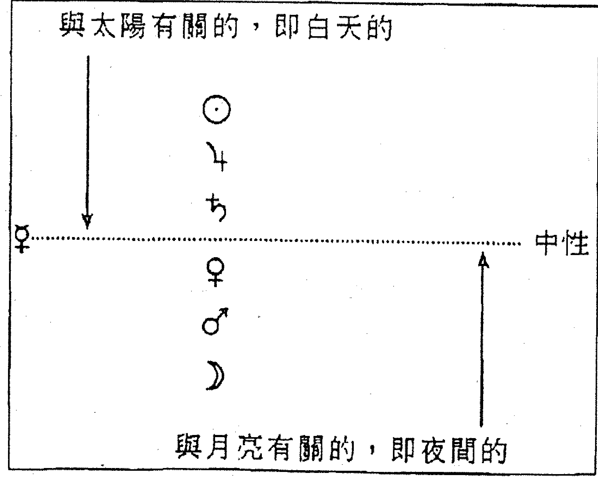

行星的昼夜区分，大抵上和行星的阴阳性质类似，但火星为阳性，却是夜间行星，这是因为火星的热、乾纯质料，在夜间可稍为抑制，而适当地温暖夜，故赋予它为夜间行星。

由于传承出现不同解读，有关行星的昼夜区分，尚有其他说法，如以行星所落星座决定，即星座亦有白天或夜间的性质，若行星落入白天的星座，即称白天的行星，若落入夜间的星座，则称为夜间的行星，而星座的白天或夜间性质，完全与星座的阴阳性质相同。

- 白天的星座：白羊、双子、狮子、天秤、射手、水瓶等阳性星座
- 夜间的星座：金牛、巨蟹、处女、天蝎、摩羯、双鱼等阴性星座

另一种说法则是视命盘是白天或夜间而定，即

- (1) 任何行星，在白天命盘中，位于地平线上或任何行星，在夜间命盘中，位于地平线下 → 称为白天配置
- (2) 任何行星，在白天命盘中，位于地平线下或任何行星，在夜间命盘中，位于地平线上 → 称为夜间配置

- 所以讨论行星的昼夜区分，共有3种
  - A. 命盘本身为白天的或夜间的，来定行星的白天或夜间性质
  - B. 配置的特性，即行星为白天配置，或夜间配置
  - C. 按星座的昼夜区分而定行星的白天或夜间性质

后来就将这3种标准予以统一

因此，白天的行星，当它是在白天的命盘，白天配置在白天的星座，是最吉祥的，相同地，夜间的行星，当它是在夜间的命盘，夜间配置在夜间的星座，是最吉祥的，这两种情形，在占星学的术语，称之为区分内Hayz。

相对地，若行星完全没有符合上述之昼夜区分，称之为区分外(Out of sect)，吉星显现不出其吉象，而凶星更凸显其凶象。

上述两种状况，我们整理于下：〈表6-8〉

| 行星类型 | 区分内 Hayz | 区分外 Out of sect |
| :--- | :--- | :--- |
| 白天行星 | 1. 命盘为白天盘，太阳在地平线上。<br>2. 所落星座为阳性星座之一。<br>3. 白天配置，在地平线上，位于后天12宫-7宫之间。 | 1. 命盘为夜间盘，太阳在地平线下。<br>2. 所落星座为阴性星座之一。<br>3. 夜间配置，在地平线上，位于后天12宫-7宫之间。 |
| 夜间行星 | 1. 命盘为夜间盘，太阳在地平线下。<br>2. 所落星座为阴性星座之一。<br>3. 夜间配置，在地平线上，位于后天12宫-7宫之间。 | 1. 命盘为白天盘，太阳在地平线上。<br>2. 所落星座为阳性星座之一。<br>3. 白天配置，在地平线上，位于后天12宫-7宫之间。 |

行星的昼夜区分，并非行星强弱的依据，而应视作行星能量的流动是否顺畅，或阻碍，若是为Hayz，行星能量的流动顺畅，相对地，若是处于区分外，则有所阻碍，有关行星处于区分内或区分外之特性，我们整理于下 （表6-9）

| 状况行星 | 区 分 内 | 区 分 外 |
| :--- | :--- | :--- |
| ☉ | 太阳是唯一在白天盘且是白天配置的行星，它是白天的原理，有最大的能量(除了8宫、12宫之外)太阳的成功是自己的。 | 会干扰到太阳的特色，即原本希望于外在世界中获得卓越，会受到某些阻碍。 |
| ☽ | 对命主是强力资源(假设不受其他凶星刑克)，能符合他人的渴望，月亮的成功迎合他人需求。 | 较明显不利，无力抵抗来自不同管道的阻碍，即使是在强的宫位，如1.4.7.10都隐含着问题。 |
| ☿ | | |
| ♀ | 女命倾向传统的美德，温柔、婉约，男命有此金星配置，将喜欢较温柔的女性。 | 古代观点，金星在此种状况，女命倾向不道德，性强，男命可能软弱，优柔，或性偏差。在现代观念，女命较难接受传统角色，男命可能喜欢自主性强的女性。 |
| ♂ | 火星的乾，配合夜间的湿，得以联系，感觉、感情、滋养是一种防卫、支撑的力量，就如军人并不愿意主动攻击他国，仅希望看到自己国家和人民、生命财产的安全。 | 易呈现火星的凶性，白天的光虽使火星活跃，但也加速乾，而较少情感，故系野蛮地活跃，感情有所挫折，产生伤害不幸和恶运。 |
| ♃ | 易呈现木星最佳的一面，成功、权力、财富虽有凶星刑克，其吉象未完全消失，白天的光，配合木星的知识和觉醒，增强木星能量的流动，白天的木星，如同射手。 | 虽未完全丧失木星其吉象，较少能量(温暖)抵抗凶星，反而呈现湿(因夜间)而更敏感、同情心，较易呈现双鱼之特质，若刑克严重。 |
| ♄ | 显示土星吉祥的一面，纪律、秩序、和尊重，甚至能指示伟大的成功和社会地位，因白天的光是意识会消除土星的负面，且白天的热有利于土星的冷。 | 显现土星本质上之不幸，邪恶，产生恶运和灾难，因晚间无光，让命主无法意识到事情真相，因而常处于无知，而走向毁灭。 |

现代行星三王星，并未论及，在古代这三颗星尚未被发现，即使在现代，一般人肉眼也很难观察得到，有关他们的昼夜区分，尚无具体验证资料，故不予论列。

行星的昼夜区分，是希腊化时期相当重视的一项论断技巧，这时期重要的占星学书籍都曾谈及它，经过阿拉伯时期的保存，再传回欧洲，于中世纪较早期时，还看得到它的踪影，如13世纪的古德·波那提《天文书》都还专章讨论它，但到中世纪后期之文艺复兴时期，占星学第二次黄金时期，行星的昼夜区分似乎消失了，一直到20世纪末1990年代占星学的复古运动，才又重见天日。

现代占星学忽视命盘为白天或夜间之特性，一律视作白天盘，有可能冒着50%之风险，因若常态分配，白天出生和晚上出生，应各占50%，会将晚上出生之夜间盘特色予以忽略，所以应谨慎看待之！

我们举一实例，英国的查尔斯王子(Prince Charles)，来说明。(案例十五)

查尔斯王子
Natal Chart
9:14 PM +0:00
伦敦，英国
51N30 000W08
Geocentric
Tropical
Placidus
True Node

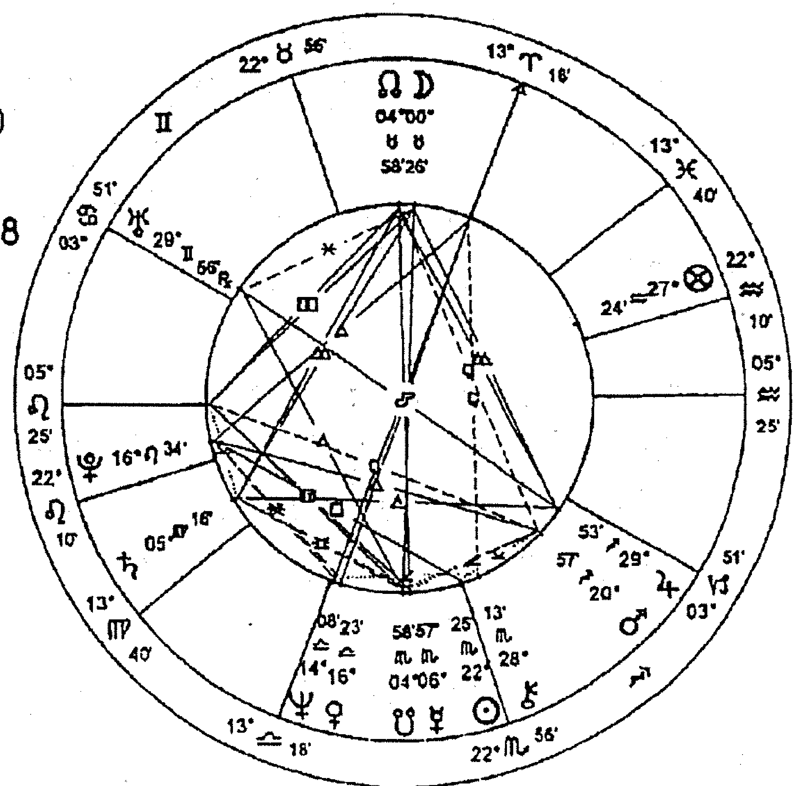

| 行星 | 昼夜区分 | 配 置 | 星 座 | 评 论 |
| :--- | :--- | :--- | :--- | :--- |
| ☉ | 白天 | 夜间4宫 | 夜间天蝎 | 区分外 |
| ☽ | 夜间 | 夜间10宫 | 夜间金牛 | 区分内Hayz |
| ☿ | 中性 | 白天4宫 | 夜间天蝎 | |
| ♀ | 夜间 | 白天4宫 | 白天天秤 | |
| ♂ | 夜间 | 白天5宫 | 白天射手 | |
| ♃ | 白天 | 白天5宫 | 白天射手 | |
| ♄ | 白天 | 白天2宫 | 夜间处女 | |

从上表可看出，英国王储查尔斯王子命盘中的月亮正是区分内，月亮能量的流动甚为顺畅，而月亮扬升于天顶，且又入旺于金牛10宫，先后天宫，都符合必然的尊贵和偶然的尊贵，故他有位全球注目的母亲，占星学似透露了这项讯息，应注意月亮的区分内，更增添先后天宫之吉象。

再看看他的太阳正好是查尔斯王子的命主星为区分外，以他个人而言，原本希望于外在世界中获得卓越，似乎受到了阻碍，毕竟晚上的太阳发不了光，若太阳为父亲形象，他的父亲的确较为暗淡，比起母亲，差别甚大。

由本例，就可嗅出行星昼夜区分特性，确有值得注意之处。