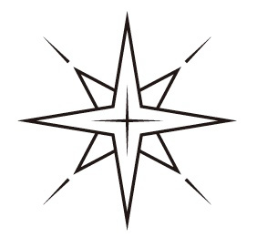
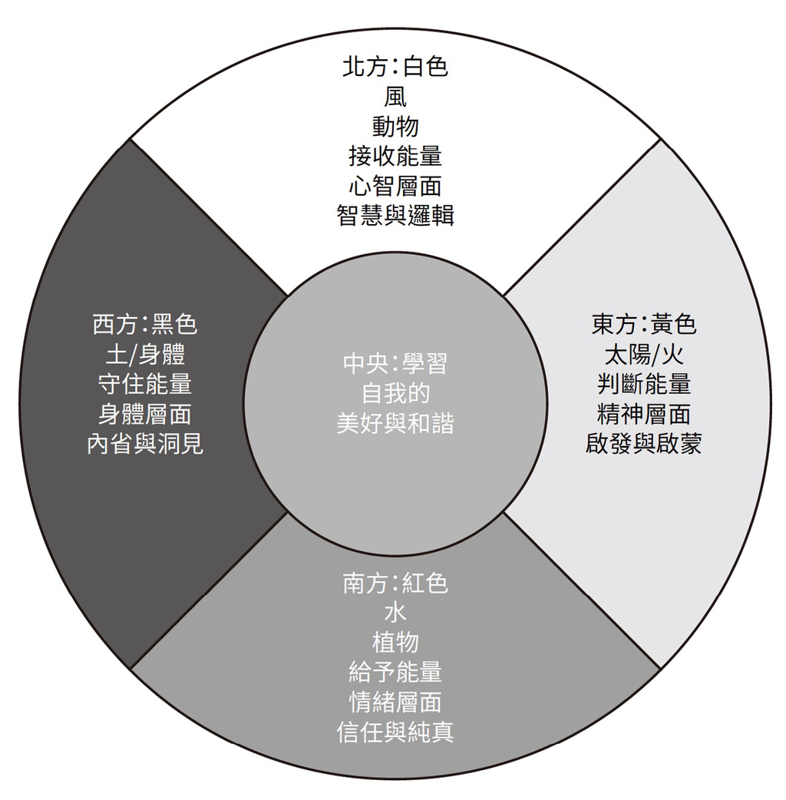
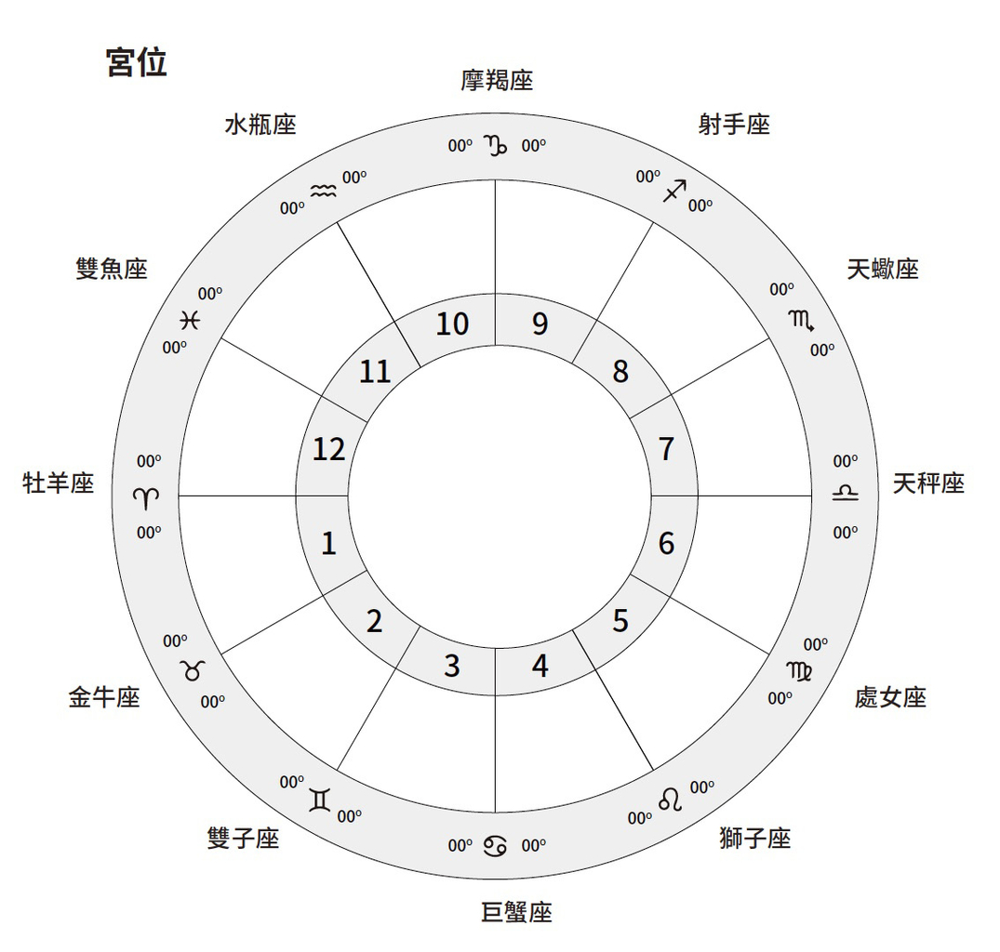
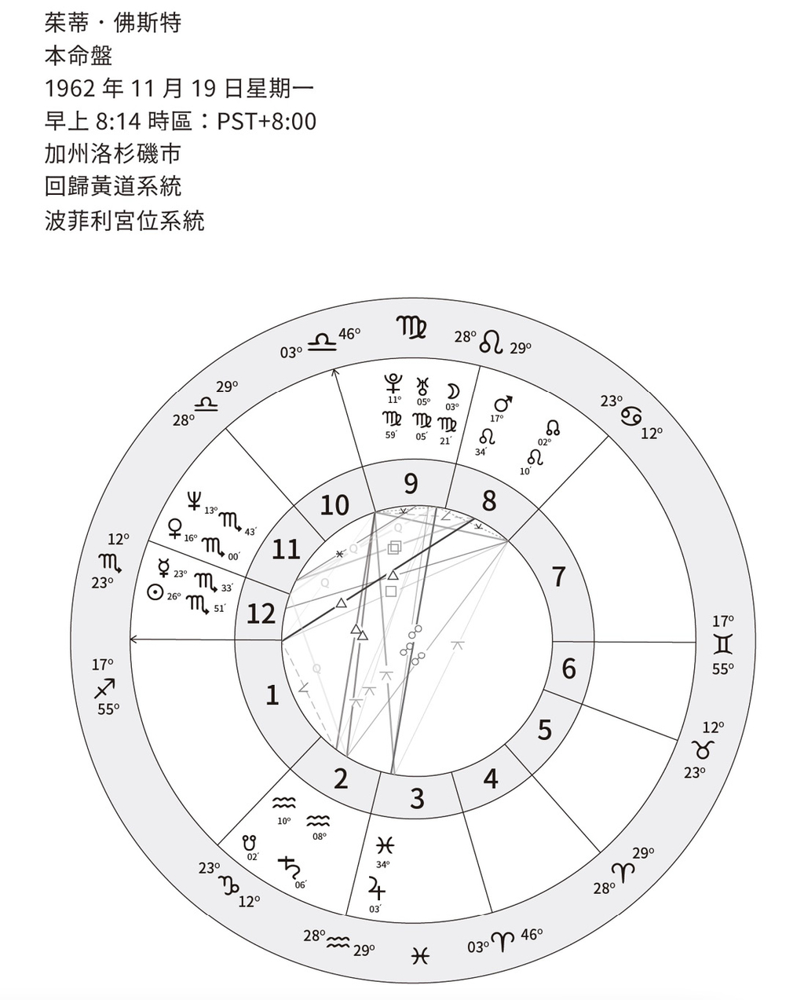
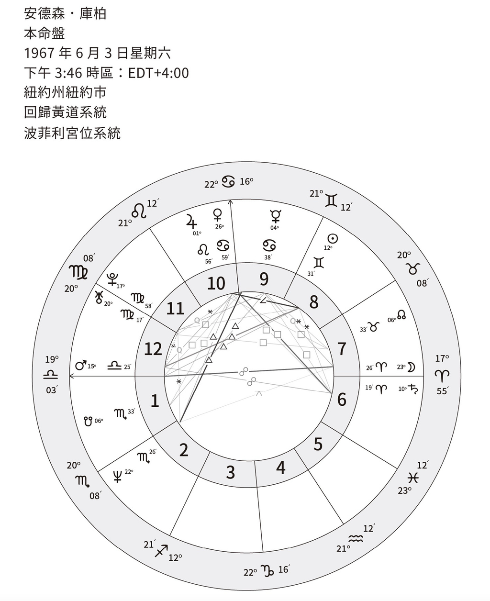
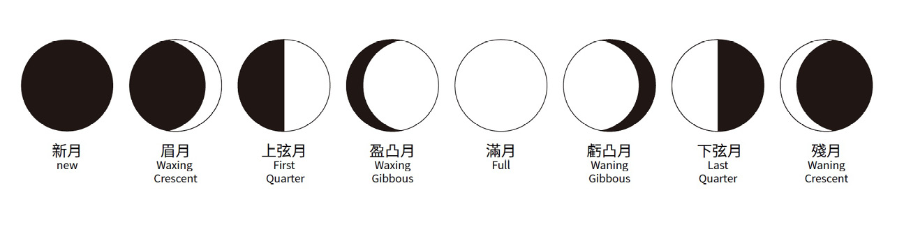
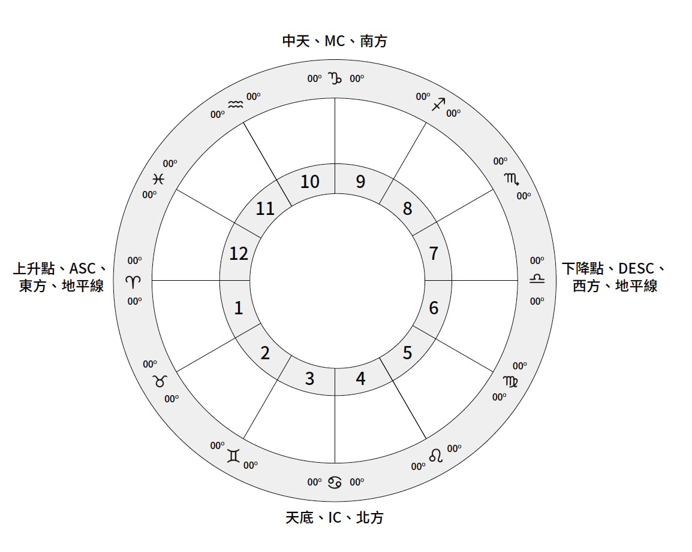
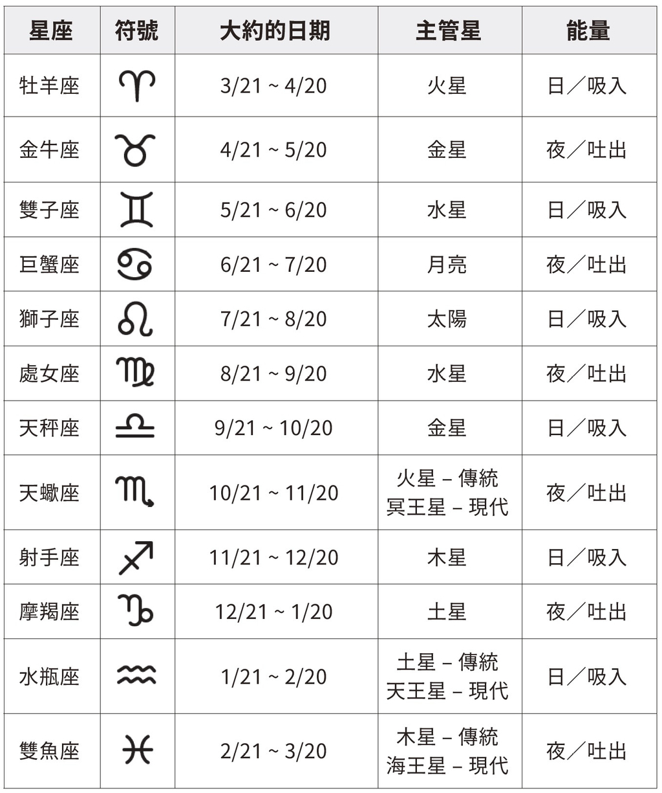
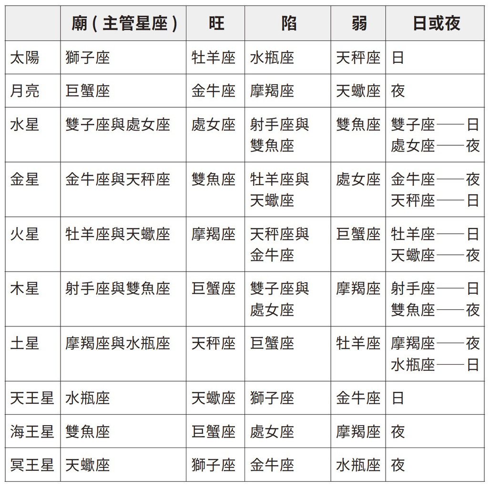
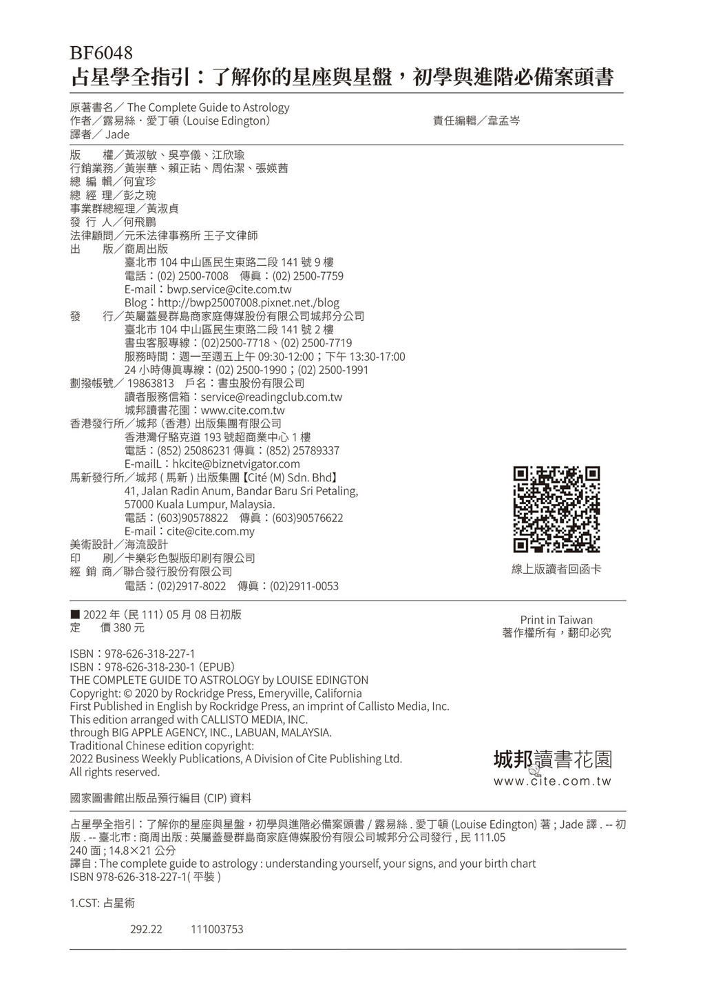

# 占星学全指引

# 前言

本书是为每一个人所写，从初学者到进阶占星师。在本书里，我尽力用详尽且容易理解的方式，将海量的占星信息涵纳进来。

我把星盘视为潜力与可能性的蓝图，你绝不会听到我说任何一个象征或配置是绝对的好或坏，我相信总是可以找到一个方法，透过各种挑战或阻碍去成长、进化与调整，本书是从这样的观点出发的。我们每个人都有细微差异，也都能够有意识地按照我们的宇宙蓝图航行。我不会说灵性至上，也就是说，我不会用灵性修练来回避那些未解决的问题或伤口，我宁愿坚定地看着它们，去思考要如何疗愈或整合那些阴影，而非避而不谈。

现在，我邀请你以不同的方式来看“性别”这个主题。

传统上，占星语言是二元性的，使用“男性／女性”、“阳性／阴性”的标签，然而，每一颗行星与星座都包含在我们的出生星盘内，因此，我们每个人之中都具备这些特质。星盘不会标示出性别，本书也不会。我聚焦在全人与个人性格上，完全移除二元标签。本书的内容会为你创建扎实的占星学关键基础，并且以一种截然不同的方式去理解占星语言，理解到这些行星与星座具有非二元性的内在本质。

整本书中，我使用“日”与“夜”来分别取代阳性／男性与阴性／女性，因为这两个词较不受限。这两个词是古代使用的概念，等同于广义的阳性与阴性。我会在第一章里进一步说明。我想要感谢占星师杰森．霍利（Jason Holley），是他将这个概念介绍给我，也要感谢罗伯特．汉德（Robert Hand）与布莱恩．克拉布克（Brian Clark）的作品，帮助我扩展这个概念。

日与夜的概念，使我们可以用更人性化的方式，去理解灵魂的内在风景。因此，虽然这是本帮助你解读自己星盘的指导手册，但是，也要求你更彻底且非二元性地去理解占星语言。

我一直热爱占星学，我还留有一些十几岁年轻时描述太阳星座特质的笔记。在我二十九岁太阳回归（当行运太阳回到出生时，本命盘上的太阳所在位置时）后，我才发现了我所谓“真正的”占星学。那时候，有个朋友为我解读星盘，给了我一些书，令我就此沉迷其中。那年是一九八九年。

我狼吞虎嚥地阅读这些书，自己学会了如何手绘本命盘，买了更多书，狂啃更多书，订阅杂志，在我朋友与他们的孩子身上做练习。然后我步入婚姻，有了小孩，对占星学的狂热消失了几年，不过，我并没有失去对占星学的迷恋。

二〇一二年十月，在几个大陆洲际之间搬迁两次（从英国搬到澳洲，再搬到美国），那时候我的孩子是十五岁与十三岁，我担任谘商工作，那时候，我领悟到，我的天职就是要从事专业占星师的工作。我与许多老师一对一做解读，上许多课程来磨练这门艺术，在几个月内，我开始以占星师的身分工作。我到今天还是会去上课，因为占星学非常美好丰盛，就像一个永远没有尽头的兔子洞，总是可以发现更多东西。

我现在已经做过上千次解读，也开过课，几乎每天在写占星学文章。二〇一八年，我出版了第一本书《现代占星学：掌握你的星星，发现你的灵魂真实目的》，这是本专为个人成长所写的工具书。我同时也是一位萨满与社会运动者。

我是一个太阳射手座，有星群在十一宫与十二宫射手座里，上升也是射手座，月亮在双子座的人。这些信息就可以让已经懂占星基础知识的人，知道我是一个作家、一位老师，并且深受社会正义与政治议题的吸引，这一切都会带进我的工作中。

本书是为了那些想要让自己的占星学研究，以一种具有包容性的方式提升到另一层次的人所写。

本书是献给每一个人的，欢迎加入。

# 第一部

占星学积木

在第一部中，我们会简单的审视占星学历史、现代占星学所处的位置，以及如何以一种新的方式，来看占星学语言。我们也会包含某些星盘的基本积木块，以及如何开始解读你自己的星盘。

## 第一章

占星学基础

千年以来，占星学一直被用来预测事件。直到最近，人们开始将占星学作为个人发展与成长的工具，从他们的个人模式、受限的信仰与可能性中寻找洞见。

占星可以帮助我们与大自然的元素与周期共存，为每一件事情选择最佳时间，从农事到关系、工作……并且加进心理探索与过去世的功课。占星有助于疗愈我们与宇宙自然循环之间的断裂，使我们与宇宙循环和谐共存，就像宇宙循环在我们内在运作一样。

在最高的层次上，占星学是一种将我们每个人带入与宇宙更高灵性链接的工具，帮助我们做出有意识的选择，活出最高潜能。

我理解意识的方式，是人本的以及心理学的，而内在风景则是我的焦点。我们每个人都拥有每一颗行星与星座，在我们灵魂意识中运作。迄今为止，占星语言还没有充分表达出所有的灵魂意识。时代正在改变，占星语言必须表达出这些概念。

为什么占星学会准确？这是一则永恒的提问。我的回答是，占星学根据的是千年来的观察，即使占星学在某些时期式微了，但是人性总是会回到占星学的研究上，因为有技巧地解读宇宙的变迁，会为我们的生命意义与生命周期提供答案。

### 什么是占星学？

占星学是门古老的科学，借由观察行星长期以来的周期与移动，记录下因宇宙变化而触发的模式与事件。

如同月亮周期清楚影响着地球的潮汐、经期与其他生物韵律的周期、我们的情绪能量、其他宇宙星体、发光体、行星、小行星，也超越了我们内在的工作。宇宙中的一切事物彼此链接，这是占星师知之已久的事实，现在已经被量子力学的科学家承认。量子力学认为，每个原子都影响着其他原子。在量子物理学中，一切都是由波与粒子所组成，根据纠缠理论而运作，这个理论认为没有任何一个粒子是完全独立的，简而言之，一切都在这个宇宙中一起运作，宇宙星体的移动，也活化了我们内在以及自然世界的能量。

换句话说，我们与整个宇宙纠缠在一起。所有能量都交织着行星魔法与科学的复杂之舞，占星学语言则为这支舞作解说。

占星学的起源要回溯至数千年以前。考古学家已经发现证据，像是洞穴壁画标示出月亮周期，证明人类从最早的时期就在追踪月亮周期。某些证据的日期可以远溯到西元前三万年。

人们常说占星学是根据历学系统，但是，我认为历学系统是根据宇宙星体的移动。最早的历法是根据太阳、恒星天狼星的移动（埃及历法）或月亮的移动（希腊历法）。

换句话说，人类先目击行星的周期并加以记录，然后，历法系统才从宇宙的移动中产生。这意味着占星学才是我们一切生活的源头。

占星学历经数千年的进化，产生各种不同的占星学系统，包括（但不限于）吠陀占星学（Vedic，也称 Jyotish Vidya 或 Hindi），这个系统是根据恒星黄道，而不是西方占星学使用的回归黄道；中国占星术则是根据十二年周期；希腊占星术则是从西元前一世纪到西元七世纪的传统占星学，目前正开始复兴；最后是现代的西方占星学，也是我所学习的占星学，根据的是回归黄道。西方占星学源自托勒密与巴比伦占星学，采用较多心理学与具有启发性的方式。

在占星学历史中的关键人物包括托勒密（Ptolemy，西元第二世纪），他着有一本重要的占星书——《占星四书》（Tetrabiblos）；卡尔．荣格（Carl Jung）是心理学领域中使用占星学的先驱；艾伦．里欧（Alan Leo）常被称为现代占星学之父；以及我个人喜欢的其中一位占星师丹恩．鲁海尔（Dane Rudhyar）他创造了“人文占星学（Humanistic Astrology）”这个词，并协助开拓了现代占星学。

这本书根据的是现代西方传统，无论如何，所有的传统都是有效的，只是方法不同，某些比较偏重预测，比如吠陀占星学，某些则采取更多个人成长或理学上的方法。

现代西方占星学主要根据特定的时间、日期与地点，作出一张图或天宫图，使用的是回归黄道，那是根据地球与太阳之间的象征性关系而产生。回归黄道将黄道分成十二等分，每个等分三十度（即为星座），并且以季节为导向，黄道开始于春分，这时候太阳移动进入牡羊座。黄道是一条想像的线或平面，标示出太阳每年在天空行走的路径，并产生蚀的现象。

### 占星学的历史源头

先不论早期洞穴与骨头画上追踪月亮周期的证据，有纪录的占星学历史真正开始于六千年前，美索布达米亚的苏美人注意到星空的移动，以及吠陀占星学至少在五千年前的印度就开始出现。

从大约西元前二千四百年～三三一年，巴比伦的迦勒底人创造出黄道轮搭配行星，十二宫则代表着生活与发展的领域。

在亚历山大大帝征服巴比伦之后，希腊人进一步发展占星学，赋予行星与星座现代的名字。西元一四〇年，托勒密出版的《占星四书》，里面包含了行星、宫位、相位与轴点，所有现代占星师到现在还在使用他所提及的这些技术。

占星学的研究与使用，在西方经历了数个世纪的兴衰，但是，蓬勃发展于中世纪，当时占星学是数学、天文学与医学世界的一部分，而且最古老的学院里还有教授占星学。

当教会掌握权力，占星学开始衰退。在理性主义时代，包括十七与十八世纪的新教改革运动，都开始宣扬理性，后来只把占星学视为一种娱乐而抱持怀疑态度。因此，占星学不再受到欢迎，直到十九世纪晚期才复兴。

### 占星学的现况

如我们所知，西方占星学是在十九世纪晚期开始复兴。通常我们把世人开始对占星学重新产生兴趣，以及作为一名神智学者，开发出更灵性与神秘学的理解等等状况，归功于艾伦．里欧。神智学是根据神秘学洞见，教授关于神与这个世界的学问。艾伦．里欧以占星师的身分，将业力与转世的概念，带进他的作品中，并且开始脱离以事件为导向的占星学，进入性格分析。

另一位神智学者，丹恩．鲁海尔也参与了这次的复兴。他真正开始了心理学的占星方式，并且创造了这个词“人文占星学”。鲁海尔的作品主要根据神智学与东方哲学，他受到心理学家卡尔．荣格的影响。鲁海尔的作品是许多在一九六〇与一九七〇年代发展的现代占星学的基础。

大部分现代西方占星学聚焦于心理学与人文，不过，目前某些更古老的技术以及预测技术正在复兴，特别是在较年轻的占星师之间。

行星与星座的性别分类，在现代占星世界里是一个问题。阴性主要被认定为是被动的、接受性的、虚弱的、黑暗的与具有破坏性的；而阳性被认为是有力量的、行动导向、光的、积极的与主控的，在这当中并不考虑其他性别。行星的名字来自罗马与希腊的众神，在本质上这是绝对的重男轻女。

主要的星体中，只有月亮与金星被指定为阴性。在许多较古老的文化中，这都不是真的，许多文化是以不同的方式在看待这些行星。例如，在古老文化中，有很多太阳女神，月亮常常被视为是精子，相对的，太阳则是卵子。在本书中，我移除了这些二元性的定义，因为我们都是太阳与月亮以及其他星体，每一个星体都有强大与虚弱，并不是特定性别才有。

在这里，我们做了整合与扩展，将古老的希腊占星技术中的所谓日夜区分（Sect）整合进来，也就是把行星定义为日间行星（Diurnal Planet）与夜间行星（Nocturnal Planet）。在这个系统里，太阳、木星与土星是日间行星；金星、火星与月亮是夜间行星；水星则是连接两者之间的桥梁。在某些当前占星师的脉络中，去创造出一个更有包容性与非二元性的占星学语言，我们会使用“日间”与“夜间”这两个词。这些讲法是有道理的，因为日与夜是眼睛可见的，日更偏“阳”或“外向”，夜则是更“阴”或“内向”。就如在占星学表格那个章节里的行星表上清楚显示，五颗个人行星：水星、金星、火星、木星与土星，全部都同时有日与夜的品质，端视其传统主管星的星座能量而定。这样增加了更深的解释，让我们远离一直使用至今固有的父权制与二元性的占星语言。

太阳系是一个活的、会呼吸且有脉动的有机体，会吸气（日间）与吐气（夜间），许多行星、星座、宫位与相位，都有日间／吸气能量或夜间／吐气能量，有时候两者都有。我把日间链接到吸气的能量，是因为我们吸入生命的呼吸，给我们自己那一天外出的能量。在夜间，我们释放或是吐气，使我们充电。这反映了在每个活着的有机体以及每个人体内所存在的太阳系量子纠缠。

拥护占星学的名人

——————

历史上，占星学曾经受到领导者、统治者与其他名人的欢迎。在中世纪，天主教教宗曾对占星学有兴趣，曾依赖占星师的预测与建议，决定加冕的时间，也帮助他们做重要的决定。

查理五世（Charles V）在巴黎为占星师创建一所学院。众所周知，法国皇后凯瑟琳．德．麦蒂奇（Catherine de Medicis）曾谘询过诺斯特拉达姆斯（Nostradamus）。前美国总统夫妇隆纳与南西．里根（Ronald and Nancy Reagan）常常谘询占星师。

摩根大通集团的摩根（J.P. Morgan）是做重要商业决定时，会去参考占星学的许多领导者之一，他曾说过一句法庭证词：“百万富翁没有占星师，亿万富翁才有。”另外，前美国财政部长唐诺．里根（Donald Regan）曾经说过：“这已经是普通常识了，华尔街经纪人有极高百分比的人会使用占星学。”其他已知会去找占星师谘商的名人与公众人物包括女神卡卡（Lady Gaga）、玛丹娜（Madonna）、亚伯特．爱因斯坦（Albert Einstein）以及西奥多．罗斯福（Theodore Roosevelt）。

## 第二章

四元素与三态

在这一章，我会探讨三态——本位（Cardinal）、固定（Fixed）与变动（Mutable），以及四个主要元素——火（Fire）、土（Earth）、风（Air）与水（Water）。

三态是指星座的品质或运作方式。三态中的每一态都包含四个星座，每个星座隶属于一个元素。四元素分别代表一种特色：火代表精神、水代表情绪、风代表心智以及土代表身体。

黄道就像宇宙本身，由四种元素组成，在占星学中，代表一个人内在典型的特色。就像发光体、行星、小行星与其他宇宙星体与我们偕同运作，元素也一样。元素彼此之间也和谐运作，因此，请注意每个人内在，都包含所有元素。

每一种元素与黄道上的三个星座链接，星盘上的主要元素清楚指出一个人会如何反应、回应与行动。光是分析星盘上的元素平衡，就能够说出很多这个人的主要特点。

牡羊座是本位星座火象

金牛座是固定星座土象。

双子座是变动星座风象。

巨蟹座是本位星座水象。

狮子座是固定星座火象。

处女座是变动星座土象。

天秤座是本位星座风象。

天蝎座是固定星座水象。

射手座是变动星座火象。

摩羯座是本位星座土象。

水瓶座是固定星座风象。

双鱼座是变动星座水象。

将元素与三态混合，会让我们得到更多有关该人主要特征的信息。例如，双子座是变动星座风象，因此该人可能非常具变动性；天秤座是本位星座风象，此人可能比较会想到一些新点子。

### 本位星座（Cardinal modality）

三态中的第一个是本位星座，他所链接的四个星座，都位于自然黄道带每个四分之一象限（quadrant）的第一个星座：牡羊座、巨蟹座、天秤座与摩羯座。牡羊座与天秤座是日间（或吸气）星座，巨蟹座与摩羯座则是夜间（或吐气）星座。

三态代表星座运作的基本方式，四个本位星座全都具有启动能量，展开新的季节或是人生阶段，因此，反映在本质上，本位星座喜欢开始新的计划，是黄道上的先锋，但是可能缺乏持续的力量使想法或计划开花结果。

### 固定星座（Fixed modality）

三态中的第二个是固定星座，与自然黄道带每个四分之一象限的中间那个星座链接：金牛座、狮子座、天蝎座与水瓶座。这里一样有两个夜间（或吐气）星座——金牛座与天蝎座，以及两个日间（或吸气）星座——狮子座与水瓶座。

固定星座是说到做到的星座。他们的行为基本方式坚守在本位星座所启动之处，他们具有持续的力量，去执行本位星座所发起的专案、计划与想法。固定星座喜欢持续性，不喜欢变动。但是人生与宇宙是持续移动的，那会带我们前往第三态。

### 变动星座（Mutable modality）

三态中的第三个是变动星座，链接着四个黄道带每个四分之一象限的最后一个星座，将会带我们进入下一个开始：双子座、处女座、射手座与双鱼座。双子座与射手座是日间（或吸气）星座，处女座与双鱼座是夜间（或吐气）星座。

就如这一态的名字所表达出来的印象，变动星座非常具有弹性、可变动性与多样性。他们通常可以看到问题的所有面向，当生命向他们做出变化时，他们都能好好处理。不过，他们很容易失去生命中的焦点与目的，总是受苦于“闪亮事物症候群”与分心。

星盘对应医药轮

——————

在萨满文化中，将四元素与四个本位星座用于医药轮中已有千年之久。代表着仪式中的四个基本方位与季节的开始。在北半球，本位星座牡羊座（火）打开了春季，本位星座巨蟹座（水）打开了夏季，本位星座天秤座（风）打开了秋季以及本位星座摩羯座（土）打开了冬季。在南半球则相反。

四个方位也代表了生命的阶段：出生（东边、火、新的开始）、青年期（南边、水、情绪上的纯真与信任）、成年期（西边、土、身体的能量）以及老年期（北方、风、智慧）。因此整个星盘可以看作为一个药轮或是神圣的生命之轮。请注意，这是另一种观看方式，以不同的萨满传统来看生命之轮。

一年的季节对应生命的季节，出生（春季）、青年期（夏季）、成年期（秋季）与老年期（冬季）。一切都在一个伟大的创造性曼陀罗中链接在一起。

### 火

火是转化与行动的能量，是日间（吸气）能量。当我们吸入生命，我们的呼吸会取得能量。在吸气时，我们也会扩张我们的肺。火象星座与行星是扩展或向外的。火象是热与移动。想想火焰的能量，当你看着它们闪烁舞动，就可以感受到火元素了。太阳为地球与人类提供了我们生存所需的热与光。

火会快速移动，具有转化能力，就像从毁灭的灰烬中飞起的凤凰一样。

三个火象星座——牡羊座、狮子座与射手座，是积极、具有启发能力、热情与自信的。他们与日间能量比较有链接，比较直接且向外聚焦，不过所有的星座内在都有一些火象能量，就像我们内在具备所有元素，只是数量不同。

牡羊座由战神火星主管，是火象星座中的第一个，最直接、最聚焦。狮子座由太阳主管，自信且喜欢被人注意。射手座由木星主管，扩张而具有启发性。

任何在火象星座的配置，无论是发光体、行星、小行星或轴点，都会具有这些特质。例如，有金星（价值与爱）在牡羊座的人，在关系中就会很直接，而且有更多类似战士的特质。水星（心智与沟通）在狮子座的人，他们的沟通风格则带着权威性。

### 水

水是接受的能量、情绪，是夜间（吐气）能量。水就像情绪，流动而变化多端。水组成人类身体的大部分，可以说是最重要的元素。巨蟹座、天蝎座与双鱼座，这三个水象星座全部都带有深刻的直觉与创意的能量。

月亮主管巨蟹座，链接滋养与母性。冥王星主管天蝎座，反映出这个星座的深度，链接执着与心理深度。海王星主管双鱼座，与所有冥想或变化的状态有关，也链接了集体无意识或精神能量。

任何在水象星座的配置，都具有更多流动的能量。例如，有水星（心智与沟通）在巨蟹座，直觉地接收信息，将信息保留在较深的层次，因为巨蟹是接受性的夜间能量。

### 风

风是心智或思想的能量，是日间（吸气）能量，代表呼吸与风。我们无法停止呼吸，风会流进流出，我们需要风，因为风会使我们周遭的空气流动。双子座、天秤座与水瓶座是三个风象星座，它们是思想、想法、社会性与分析的星座。风象星座链接理性。

双子座由水星主管，与二元性及学习有关。天秤座由金星主管，与交际手段、关系与冥想有关。水瓶座由天王星主管，因为它会将思想、点子与人串接起来，因此与网络有关，也与较高的心智、发明与创新有关。

在风象星座中的任何配置，都会带有较多风象的味道。例如火星（驱力与意志）在双子座的人是快速的学习者，也可能说话非常快速与直接。

### 土

土是物质世界的能量，是你能够碰触与感觉到的能量。土是稳定的、实际的与有耐心的，是夜间（吐气）能量。金牛座、处女座与摩羯座是三个土象星座，他们是辛勤工作、建造、创造物质事物的星座，链接到物质世界与结构。

土象星座是感官的，具有创造的品质，与大自然的周期有链接，也与人类的出生周期、生与死有链接。

金牛座由金星主管，是与物质世界和地球本身最有链接的一个星座。处女座由水星主管，与技术的世界及手艺比较有链接。摩羯座由土星主管，是土象星座的先锋，是领导与成就导向的星座。

任何在土象星座里的配置，都会带有这个星座的味道。例如，有火星（驱力与意志）在金牛座的人，与火星在其所主管的星座牡羊座的人相较，在牡羊座的人动作非常快速与直接，在金牛座的人动作会比较慢、比较细致。

## 第三章

太阳星座

在这一章，我会讨论十二个黄道太阳星座。在当代占星学中，太阳星座代表核心的我，也可以说代表我们的自我（ego）。

几乎所有人都知道，太阳星座是自我的一部分，其主要能量会为我们的存在增添活力。我会提供关键字、技术细节——比如主管的行星——以及每个星座有趣的信息。在这一章里，我们以二元性（夜间／阴性和日间／阳性）来看。将星座视为个人发展的进化，从象征出生的牡羊座到生命结束的双鱼座，如此你会对于星座在你里面如何运作，获得较深刻的理解。我们所有人的内在都拥有来自每一个星座的能量，不管我们的太阳星座是什么。

### 牡羊座（Aries）

牡羊座是黄道上第一个星座，大部分人也将之视为占星年的开始，当太阳进入牡羊座，标示出北半球的春分，牡羊座是先天十二宫（Natural horoscope）中的第一个星座，掌管第一宫。

这个星座位于黄道的第一个三十度，太阳从春分，大约三月二十一日到四月二十日期间，通过这个星座。日期会根据我们在地球上所看到太阳实际在天空移动的速度而有所变化。

牡羊座是日间本位火象星座，由火星主管，战神，代表青年期，非常聚焦在自己身上。

牡羊座的象征符号是一只公羊，其图像则是公羊的两支角。牡羊座的对面星座是天秤座，风象星座，这代表两者互补，一起顺畅运作。

牡羊座的主要关键字是“我是”，意思是他们全心关注自己，并且喜欢跑第一。牡羊座主管头部与眼睛，与牡羊座链接的颜色是红色，钻石是其生日石，铁是其所属的金属。

牡羊座最讨人喜欢的特点是，他们是有动力的、是开拓者，在别人眼里他们看起来就是个领导者。他们拥有健康的自利精神且非常勇敢，然而如果没有好好调整他们的直率，他们就会有攻击与反动的倾向。其他人会觉得牡羊座没耐心、行动速度快且大胆。

女神卡卡、艾尔顿．强（Elton John）、南西．佩洛西（Nancy Pelosi）与达文西（Leonardo da Vinci）都是都是出生于牡羊座。

### 金牛座（Taurus）

黄道上的第二个星座是金牛座，从四月二十一日到五月二十日，太阳会行经这个星座。金牛座同时也主管第二宫。

金牛座是夜间固定土象星座，由金星主管，在其物质世界里，转世为显化女神。就像牡羊座，金牛座也是以有角动物作为其象征符号——公牛，显示出最前面这两个星座都很直接而冒失。

金牛座的图形是头与公牛角，所代表的是开始与物质世界链接的生命阶段。

天蝎座是金牛座的对面星座，彼此会互补得很好。强壮而坚定的公牛代表着这个星座，因此，金牛座的主要关键字是“建造”，所有出生于太阳金牛座的人，都喜欢发展具有持久性的一切。

金牛座与喉咙、声带有关，与这个星座最有链接的宝石是绿宝石。但是，作为最物质的星座，也与蓝宝石有关。与金牛座有关的金属是铜。

金牛座会展现动物的智慧，他们具有敏锐的感官，敏感、务实与忠诚。他们内在脚踏实地、有耐心且稳定，但是，这也可能导致固执或死心眼，而且因为追求安全感，还可能会有过度物质化的倾向。他人眼中的金牛座是稳定而不虚伪的人。

伊莉莎白女王二世（Queen Elizabeth II）、马克．祖克伯（Mark Zuckerberg）与巨石强森（Dwayne “The Rock”Johnson）都是出生于太阳金牛座。（“巨石”这个外号，真的是金牛座的象征，岩石也是土元素）。

### 双子座（Gemini）

双子座位于黄道的第三个三十度，从五月二十一日到六月二十日，太阳会经过双子座。双子座主管黄道的第三宫。

双子座是日间变动风象星座，是水星主管的两个星座之一，是心智／讯息的化身。这个星座的象征是双胞胎，由一个既分开又链接的双胞胎图形代表。双子座代表我们的人生舞台来到开始用口语沟通，且理解到彼此之间既链接又分离的状态。

射手座是双子座的对面星座。

双子座是双胞胎的星座，有些宝石据说对这个星座是幸运的。黄色石头最常被视为幸运，如玛瑙、茶晶、琥珀。不意外的是，双子座的幸运金属是水银（译注：水银的英文与双子座主管星——水星是同一个字）。双子座也与胸部、肺、神经系统、手臂与肩膀有关。

双子座是一位思考者，代表着心智、声音与沟通。他们的内在生命充满了好奇、善于观察，常常分心且可能会高度紧张。别人眼中的双子座很擅长社交与口语表达，但有时爱操纵人，且爱耍两面手法。

约翰．肯尼迪（John F. Kennedy）、川普（Donald Trump）、保罗．麦凯尼（Paul McCartney）、王子（Prince）以及巴布．狄伦（Bob Dylan）都是出生于太阳双子座。

### 巨蟹座（Cancer）

巨蟹座是黄道上的第四个星座，从六月二十一日到七月二十日，太阳会通过巨蟹座。

巨蟹座是夜间本位水象星座。以螃蟹来代表这个星座，图形符号是螃蟹的两个钳子，呈现防御状态。巨蟹座主要的能量是内向且具有防御性。巨蟹座对面的星座是土象的魔羯座，幸运金属与宝石，则反映出这个星座的主管星——月亮。相关金属是银，宝石是月光石、珍珠与白水晶。巨蟹座与胃部、胸部及乳房有关。

“感受”是巨蟹座的主要关键字，他们完全受情绪与直觉主导。巨蟹座是黄道上的滋养者，相当传统与家庭导向。这个星座的内心极端敏感，有缺乏安全感的倾向，会付出过多，甚至忽略自己的需要。他人眼里的巨蟹座是反应灵敏且充满爱的人，然而有时可能会有点情绪化。

黛安娜王妃（Princess Diana）、达赖喇嘛（Dalai Lama）、汤姆．克鲁斯（Tom Cruise）以及梅莉．史翠普（Meryl Streep）都是出生于太阳巨蟹座。

受欢迎的占星预测

——————

杂志与报纸的网站上写的占星预测，是把每个星座当作一个整体，以通则的方式来分析星盘。这类预测确实准确，特别是如果你知道自己的上升星座，就可以阅读有关上升星座以及太阳星座的预测。

这些预测做得好的时候，会把当下行运太阳的所在位置，当作第一宫宫头，去看当下行星的主要行运，以及这些行运如何影响每个占星宫位。

例如，如果行运冥王星在摩羯座，受到其他行运的启动，同时太阳在天秤座，那么这个预测就会以太阳天秤在第一宫作为预测用的星盘。于是，这张星盘就会显示出行运冥王星在第三宫，因为摩羯座是在天秤座往后数的第三个星座。在你的星盘上，这可能不是你真正的第三宫，但还是会有一些共鸣。

如果你是上升天秤座，那么这个预测就会概略的谈到你自己第三宫包含的生命领域。如果你想要读这类一般性的预测，那么知道自己的上升星座会很有用。

### 狮子座（Leo）

黄道上第五个星座是狮子座，大约从七月二十一日到八月二十日，太阳会通过狮子座。

狮子座是日间固定火象星座，太阳是其主管星。狮子是这个尊贵星座的象征，图形代表着狮子的头与鬃毛。对面的星座是水瓶座，不意外地，黄金是与狮子座有关的金属，其幸运宝石是金黄与琥珀色的宝石，例如琥珀、虎眼石与黄玉。狮子座主管心脏、嵴椎与上背部。

狮子座生来要去领导，这就是狮子座的关键字。不管是身为国王、皇后，还是自己家中的领导者，狮子座的人生来就是要闪闪发光与充满魅力。他们渴望引人注意，当处于阴影中时，会有太戏剧化与自认为优越的倾向。狮子座相反的那一面则充满动力、自信且好玩。处于最佳状态时，他们具有吸引力，令人喜爱，能够点亮周围人的生命，因为他们内在携带着太阳的光芒。

欧巴马（Barack Obama）、克林顿（Bill Clinton）、玛丹娜（Madonna）与詹姆士．保德温（James Baldwin）都是出生于狮子座。

### 处女座（Virgo）

黄道上的第六个星座是处女座。从八月二十一日到九月二十日，太阳通过处女座。

处女座是夜间变动土象星座，是水星主管的第二个星座，偏向技术、细节导向，是亲力亲为的典范。

这个星座由少女或处女代表，在这里的意思是“我是一个完整的人”。它的符号图像是一个字母 M，代表少女（Maiden），拿着一根麦穗，代表丰收。这种存在的状态，反映出处女座的“能量”而非“性别”。双鱼座则是处女座对面的星座。就像另一个由水星主管的双子座一样，处女座的金属是水银，幸运宝石则是蓝宝石、玉及碧玉。消化系统及脾脏与处女座有关。

处女座的能量体现出服务的原则，他们喜欢感觉到自己对这个社会是有用的。处女座关注细节，具有很强的分析能力。他们的内在世界常常会自我批判，同时也是战士。然而他们很容易沦为“被奴役”而非“服务”，因为他们在服务过程中会忘记照顾自己。

别人眼中的处女座具有道德感和组织能力，尽管我发现处女座有洁癖，这点有点像是个神话了，这很可能有一部分是因为他们的完美主义倾向，而这种倾向也会导致分析瘫痪。“分析”是处女座的主要关键字。

哈利王子（Prince Harry）、德雷莎修女（Mother Teresa）、伯尼．桑德斯（Bernie Sanders）与皇后合唱团的弗雷迪．墨裘瑞（Freddie Mercury of Queen）就是出生在太阳处女座。

### 天秤座（Libra）

天秤座是黄道的第七个星座，从九月二十一日到十月二十日，是太阳通过天秤座的时期。

天秤座是日间本位风象星座，由金星主管，是理智的化身。天秤座的符号是一座秤，图像则同时反映出平衡与太阳西下，此时，北半球将要进入秋季（或是在南半球正在升起的太阳）。牡羊座是天秤座对面的星座。橄榄石与黄玉是天秤座的幸运宝石，与天秤座有关连的金属是铜。肾脏、皮肤、下背部以及臀部都由天秤座主管。

“平衡”是天秤座的主要关键字，因为他们会在一切事物中尝试找到中间地带以及和谐的平衡。天秤座是黄道上的外交官与调停者，因此，他们有时会给人优柔寡断、犹豫不决，甚至是被动攻击的印象。一般而言，天秤座给人的印象是公平、爱好和平与富有创造力。他们的内在聚焦于他人与关系。

天秤座的名人有甘地（Mahatma Gandhi）、小威廉丝（Serena Williams）、威尔．史密斯（Will Smith）与奥斯卡．王尔德（Oscar Wilde）。

### 天蝎座（Scorpio）

第八个星座是天蝎座，掌管第八宫。从十月二十一日到十一月二十日，太阳会通过天蝎座。

天蝎座是夜间固定水象星座，由冥王星（现代）与火星（传统）主管。

这是个深刻而复杂的星座，其象征与图像都由蝎子代表，螫刺代表着天蝎座潜在的呛辣本质。作为一个高度复杂与转化的星座，天蝎座也与蛇有关，蛇是转化的象征，也与凤凰有关，凤凰是重生的象征。

金牛座是其对面星座。铁及钢与天蝎座有关，红宝石与石榴石是天蝎座的幸运宝石。天蝎座主管繁殖系统与性器官。

“欲望”是天蝎座的主要关键字，反映出情绪的深度与磁性的复杂度，还有重视隐私的特质。

天蝎座在别人眼里是有磁性的、有力量的，有时有点吓人。他们的内在可能忧郁而执着，但也可能具有强烈的心理直觉与本能。当天蝎座能够深深地进入生命里最强烈的情绪课题中，他们就能够与自己真实的力量链接。

毕加索（Pablo Picasso）、海蒂．拉玛（Hedy Lamarr）、鲁保尔．莱昂纳多．迪卡普里奥（Rupaul Lenardo Dicaprio）、丽莎．波奈（Lisa Bonet）与约翰．高蒂（John Gotti）都是出生于太阳天蝎座。

占星学的不同用途

——————

虽然本书讨论的是本命占星学，但是，要注意占星学有很多种用法，这很重要。这些用法可以脱离本命盘，也可以搭配本命盘来研究。

世俗占星学（Mundane Astrology）是事件、组织、择日、国家与气候事件的占星学。“世俗（mundane）”这个字来自拉丁文 mundanus，意思是“世俗的”。任何事件或组织都可以起一个盘，解读方式类似于本命盘。

财经占星学（Financial Astrology）则专门预测财经事件与周期。

卜卦占星（Horary Astrology）则是一种根据提问时间来回答特定问题的工具。这个技巧用于回答任何问题，比如：“我的钥匙在哪里？”

医疗占星（Medical Astrology）用于诊断及医疗疾病，也可以用于预防，他可以展示出一个人健康上虚弱的区域。

置换占星学（Astrocartography／Locational Astrology）根据画在地球上的行星线，指出生活在特定地点会加强或削弱一个人的哪些面向。

### 射手座（Sagittarius）

主管第九宫的是射手座，十一月二十一日到十二月二十日，太阳会通过射手座。

射手座是日间变动火象星座，由木星主管。射手座的图像是一支指向星星的箭，对应射手的象征，这是一名半人半马的射手。图像与象征都反映出这个星座具有远见的能量。双子座是其对面的星座。射手座主管臀部、大腿与肝脏。绿松石与紫水晶是射手座的幸运石，金属则是锡。

“流浪”与“好奇”是射手座的主要关键字，因为他们喜欢流浪，无论是身体还是心智上的，他们常处于对这个世界充满好奇的状态。射手座是真理与自由的寻找者，也热爱从事各种探索。他们常常看起来天真、励志且乐观。精神导向与远见卓越，使他们有能力看到生命较大的图像。如果射手座拥抱生命，宛如一场经验与真理的追寻，那么他们的天真倾向就会转化为较高的智慧。

华德．迪士尼（Walt Disney）、珍．芳达（Jane Fonda）、吉米．罕醉克斯（Jimi Hendrix）、杰斯（Jay——Z）与吉安尼．凡赛斯（Gianni Versace）都是出生于太阳射手座。

### 摩羯座（Capricorn）

黄道上的第十个星座是魔羯座，由土星主管。从十二月二十一日到一月二十日，太阳会通过摩羯座。

摩羯座是夜间本位土象星座。摩羯座的象征是海山羊，其图像则是山羊蹄配上鱼尾巴，鱼尾巴所代表的柔软面向，在很多占星作品中都失落了。其对面星座是巨蟹座。摩羯座主管骨胳系统、牙齿与关节。摩羯座的金属是铅，宝石是红宝石。

摩羯座的主要关键字是“成就”。摩羯座聚焦在攀爬成就的阶梯，但是，当他这么做的时候，常常是基于外在世界的期待，而非以自信作为基础，自信是鱼尾巴所在之处。

摩羯座被视为有责任感且坚定的，但是，同时也爱控制且充满恐惧。虽然摩羯座工作勤奋且奉公守法，但他们内心总是处在一种“永远不够”的恐惧中。他们的承诺与领导品质是他们的力量。

杰夫．贝佐斯（Jeff Bezos）、猫王艾维斯．普雷斯理（Elvis Presley）、蜜雪儿．欧巴马（Michelle Obama）与贝蒂．怀特（Betty White）都是出生于太阳摩羯座。

### 水瓶座（Aquarius）

主管黄道第十一宫的是水瓶座，从一月二十一日到二月二十日，太阳会通过水瓶座。

水瓶座是日间固定风象星座，由天王星（现代）与土星（传统）主管。虽然水瓶座的象征是个提水者，但是，其图像实际上代表的是能量波，这个象征是从天上倒下灵或能量，指出这个星座超越俗世的品质。对面星座是狮子座。与水瓶座有关的金属是铅，宝石是黑曜石与蓝宝石。水瓶座主管小腿、脚踝与神经系统。

水瓶座是黄道上的个人主义者，主要的关键字是“知道”。

水瓶座有时候会被视为黄道上的怪人，因为他们在本质上总是无法预测、具有创造性与原创力。水瓶座有社会意识，致力于事业和改革，但他们有时也可能在情感上疏离，甚至变成无政府主义。因为他们常常感觉与周遭格格不入，有时会尝试违背自己的信念去融入，但是，无论如何，他们的道路就是体现其个人真理。

欧普拉（Oprah Winfrey）、巴布．马里（Bob Marley）、艾伦．狄珍妮（Ellen DeGeneres）以及富兰克林．罗斯福（Franklin D. Roosevelt）都是出生于太阳水瓶座。

### 双鱼座（Pisces）

黄道的第十二个也是最后一个星座是双鱼座。从大约二月二十一日到三月二十日，太阳会通过双鱼座。

双鱼座是夜间变动水象星座。双鱼座的象征是鱼，图形是游向不同方向的两条鱼，但被一条线连接起来。如果我们视黄道为人类发展的一条路径，双鱼座则是死亡的时刻与出生前的时刻，是羊水，也是结束与开始。海王星（现代）与木星（传统）主管双鱼座。对面的星座是处女座。双鱼座主管脚、淋巴系统以及第三眼。双鱼座相关的宝石是白色的钻石、海蓝宝石与紫晶，金属则是锡。

双鱼座是最灵性与富同情心的星座，他们的主要关键字是“相信”，他们被视为高度敏感、富创造力与神秘感的存在。双鱼座常常受困于界线与极端的同理心，这会使他们落入受害者或烈士的角色。就像鱼往两个方向游的意象，同时活在真实世界与神秘世界是双鱼座的功课。如果他们能够适应在物质领域成为灵性的媒介，那么就能够避免可能会有的逃避与上瘾倾向。双鱼座与魔法及电影的能量有关。

弗雷德．罗杰斯（Fred Rogers，Mr. Rogers）、苏斯博士（Dr. Seuss）、露丝．贝格．金斯伯格（Ruth Bader Ginsburg）与寇特．柯本（Kurt Cobain）都是出于太阳双鱼座。

## 第四章

升或下降星座以及区间主管星

在这一章，我会讨论黄道的十二个上升星座（Ascendant Sign），也称做上升点。你的上升星座就是你出生那一刻，在东方地平线上的那个星座，在你的星盘上九点钟的那个轴点。更精确地说，那是地平线或地平面与黄道面交会之处，所谓的黄道面，就是从我们位于地球的观点，所看到的太阳一整年移动的平面。

上升点是人们首次认识你的第一印象，以及你会向他们展示的样貌。常常被称为“人格面具（persona）”或“面具（mask）”，我比较喜欢“接待员”这个词，不过三个词都说得通。这是当人们出现在这个世界里最明显的那一面，也是别人对你的第一印象，同时也代表着你出生时的状况以及童年早期。你的一切都透过上升点过滤。要正确计算上升点，需要准确的出生时间，因为上升点是根据出生的日期、时间与地点来计算。

每张星盘都有一个命主星（ruling planet），主管上升点所在的星座，这颗行星就是这个人的命主星。例如，如果一张星盘上升点在射手座，其主管行星是木星，这张盘的命主星就是木星。命主星是一张星盘上最重要的行星之一，这颗行星的所在位置，以及任何与这颗行星合相或邻近上升点的行星，都会调整上升点的能量。

我们要如何开始创造出一个人的图像？就是把以上的因素合并在一起看，因为，虽然拥有相同上升星座的人都会很类似，但当我们开始把整个星盘综合起来时，每个人都是独一无二的。

我们也会去看每一个星座的区间（decans）。每个星座的跨度是三十度，而每个星座还可以进一步分成十度一个区段，我们称此为区间。

区间系统有两种，我会使用三分性系统（triplicity system），这个系统会把星座相同元素分配给每个区间：

第一个十度，属于星座本身。比如，牡羊座／牡羊座。

第二个十度，则属于下一个在相同的三分性或元素的星座，也就是，牡羊座／狮子座。

第三个十度，则属于三分性中剩下的那个星座，那就是牡羊座／射手座。另一种区间系统则是迦勒底系统（Chaldean system），他将七个肉眼可见的行星当做主管星，分配到每一个十度区间。在现代占星学中，比较不常使用这个系统。

### 上升点（The Ascendant）

让我们进一步来看黄道上的每一个上升星座。任何身体或特征的描述，大部分基于占星家们长久以来的观察。我在这本书中描述的身体与其他特质，是根据一般性来讲，不应视为在定义其特征。

牡羊座上升

牡羊座上升是日间星座，这些人非常主动与直接。他们通常行动快速，喜欢运动与竞争性的活动，尽管他们的竞争力往往是自我导向的。他们常常一头热地栽进某些事情里，追逐他们想要的东西，没有好好想清楚。牡羊座上升做每件事都是用最快的速度，而且喜欢保持行动状态。

他们常常被视为先锋与领导者，尽管他们很难把自己发起的事情做完。当一个牡羊座上升的人想要与你创建关系，无论是当朋友还是更进一步，毫无疑问，他们是直接而积极的，但是有些人会感到不知所措。

出生于牡羊座上升的人，星盘上的命主星是火星，火星的所在位置会提供更多关于这个人在这个世界里如何运作的信息。另外，任何靠近上升点的行星，也会调节这个能量，例如，土星真的会为这个上升星座的快速能量踩刹车。

雷哈娜（Rihanna）、约翰．蓝侬（John Lennon）与萨曼莎．福克斯（Samantha Fox）都是出生于牡羊座上升。

金牛座上升

我总是把金牛座上升想成一棵树根强壮的树，有很粗的树干。因为他们稳定而坚固，要是别人想推他们，他们动都不动。他们常常拥有结实而坚毅的外表，经常穿着品质不错的衣服，但不会过度。他们的表现都很平静，让周围的人感到很舒服，除非你压迫到他们。无论如何，他们极度忠诚，也因此会以为别人对他们也是如此忠诚。

金牛座上升是夜间星座，他们经常以稳定的速度移动，不喜欢被逼迫或匆促行事。关于他们的一切都是感官的，因此，他们会被好的气味、味道、声音与触感所吸引。他们也可能会有令人愉悦的声音。

他们的命主星是金星，金星的位置会透露更多关于这个人的事情。例如，如果金星在双子座，这会让一个人比光只有金牛座上升更有弹性。金星在双子座也会增加他们的社交性与可能性，他们会以某种方式去使用他们那令人愉悦的声音，比如唱歌。与上升点合相的行星也会调整上升点的能量。

马丁．路德．金恩（Martin Luther King）、乔治男孩（Boy George）与麦莉．希拉（Miley Cyrus）都是出生于金牛座上升。

双子座上升

双子座上升的人具有高度社交性，但也是最混乱的上升星座。这个双胞胎的星座可以从任何主题的两个面向争执，让他们成为辩论高手，但这也使他们像是口是心非的人，某些比较敏感的星座就很难接受这一点。

双子座上升具有无止尽的好奇心、机智且享受身处于社交环境之中。他们注意力的持续时间很短，简单来说就是会很快地把注意力转移到下一个事物上。有时他们的躁动会让他们看起来很神经质，因为他们常常坐立不安。

他们的外表相当苗条，几乎都有艺术家似的修长手指，当他们说话的时候，总是会看到他们的手指在摆弄着什么。他们擅长同时做好几件事情，因此，看起来可能像是分心或没有在听你说话，但事实可能并非如此。

水星是双子座的主管星，这颗行星的位置会比只看上升星座能说出更多关于这个人的事情。与上升点合相的行星也会调节这个星座的能量。例如，冥王星合相双子座上升，将会带来的激烈与深度，但并非所有双子座上升的人都会这样。

布鲁斯．普林斯汀（Bruce Springsteen）、瑞奇．马丁（Ricky Martin）与金．怀德（Gene Wilder）全部都是出生于双子座上升。

巨蟹座上升

出生于巨蟹座上升的人，这是一个夜间星座，他们是高度敏感与充满爱的灵魂，最温和与最滋养的人。就像巨蟹座的象征——螃蟹那样，他们害羞且具有防御性。

他们喜欢熘到旁边，安静地进入任何空间。情绪低落的时候，他们也有忧郁的倾向，可能会退回自己的壳里，也可能渴望安慰。他们常常被形容为“月亮脸”，通常被认为有吸引力。由于巨蟹座主管胃，因此他们有过重的倾向，当感觉不知所措时，会有消化的问题。

加上他们的同情心宛如“海绵”的本质，巨蟹座上升会对他们周围的每个人与每件事都有感觉，当他们与人相遇时，最好学习一些保护自己能量的方法，这样才不会又进入忧郁的隐士模式。

月亮是巨蟹座的主管星，代表母性或滋养的能量，这也解释了为什么有很多人在他们需要的时候，会被吸引到巨蟹座上升的人身边。巨蟹座上升的人，星盘上月亮的位置提供我们对这个人更深的理解。例如，月亮在牡羊座也许会要人更直接表达他们的情绪，对自己也一样。

安洁莉娜．裘莉（Angelina Jolie）、茱莉亚．罗伯兹（Julia Roberts）、泰拉．班克斯（Tyra Banks）与约翰．屈伏塔（John Travolta）都是巨蟹座上升。

狮子座上升

狮子座上升的人，命主星是太阳，展现在外表上，常常会有一头狮子鬃毛般的头发与太阳般的圆脸。他们很有磁性，当他们走进任何一间房间，都会使整个房间亮起来，让人印象深刻。

他们很戏剧化、情感外放且爱引人注意。他们时而大声，时而庄重，还总是爱指挥人。他们常常为了吸引人的注意力而打扮自己。

如果没有人注意或奉承他们，他们就会不太积极。他们的内在小孩可能会飞扬跋扈地乱发脾气。狮子座上升的人在心里是个大孩子，他们就只是想要被爱，他们会以仁慈来审视他们的国土。他们做一位领导者会比做一个劳工好，虽然有时候他们有鲁莽的倾向。

太阳是太阳系的中心，所有行星与地球都绕着它转，这也说明了狮子座上升的人具备的人格特质。他们有一种认为世界是绕着自己转的倾向，而事实上也常常这样。作为命主星，太阳的位置以及任何靠近上升点的行星，都会调整上升点的能量。例如，一个太阳处女座，相较于其他配置，就会比较没那么精力旺盛。

穆罕默德．阿里（Muhammad Ali）、蒂娜．透纳（Tina Turner）、梅莉．史翠普与乔治．布什（George W. Bush）都是出生于狮子座上升。

人格面具（The Persona）

——————

“人格面具”这个词会用来形容上升点或上升星座。这也是瑞士心理学家荣格开发出来的词，他将之定义为“某种面具，一方面给人一种明确的印象，另一方面用来隐藏个人的真实本质”。

荣格是最现代的西方占星师，他透过人格面具这个镜头去看上升点。我们年轻时，常常比较认同上升点，然后开始个体化过程，渐渐成熟。过度认同上升点且适应了社会化，是完全有可能的事情，我们借由过分迎合外在世界的形象，来掩盖真实的自我。

在荣格的词汇中，这个“人格面具”是公开的形象，我们常常发现公众人物会过度认同他们公开的形象。

荣格曾说：“可以夸张一点地来说，所谓的人格面具就是，这个人其实不是这样，但是，自己跟别人都认为是这样。”

占星学的目标，是鼓励人们个体化，超越这个人格面具。

处女座上升

处女座上升的人是黄道的分析师与战士。他们的童年可能会有个执着于他们的健康、体重与外表的父母，以致于他们对这些事有某种程度的讲究。因为他们会往后退开，分析状况，而且相当害羞，他们可能给人一种矜持和冷漠的印象，但当你了解他们时，他们就会跟你热络起来。当你跟他们熟起来，就会发现他们天生渴望帮助他人，这种本质使他们成为忠诚的朋友。

过度分析与追求完美的倾向，使他们容易焦虑不安，特别是如果他们并没有忙着做什么计划案，或是无法让每件事情都按部就班的时候。他们总是打扮得整洁干净，看起来有一点点紧张。

因为是变动星座，因此，他们不会执着于自己的想法，但是在他们做出改变前，必须看到证据。对处女座上升的灵魂而言，“谦逊”是个伟大的词。他们总是风度翩翩。

水星是处女座的主管星，水星的位置以及任何靠近上升点的行星都会调整这个星座的能量。例如，如果水星在固定星座天蝎座，他们研究调查的品质会更加深刻，他们的批判倾向也是。

伍迪．艾伦（Woody Allen）、休．海夫纳（Hugh Hefner）、奥斯卡．王尔德与贝蒂．福特（Betty Ford）都出生于处女座上升。

天秤座上升

天秤座上升的人相处起来愉悦且迷人。他们不喜欢冲突，因此他们总是会当和事佬，与人为好。一般来讲，他们看起来很有吸引力，外表可爱甜美，这些都增加了他们的迷人指数，他们通常也很苗条。人们就是会受到天秤上升的人所吸引，天秤座上升的人喜欢与人创建关系，因为他们有一种透过别人的眼睛看自己的倾向，而且他们很难独处。

他们在关系中也有被动攻击的倾向，他们会希望别人完成他们不切实际的期待。这是他们著名的犹豫不决带来的产物，他们总是看着所有的面向，不断想要平衡这些天秤。

天秤座上升的主管星是金星，会展现出爱美、关系与和谐的能量。金星所在位置以及任何靠近上升点的行星，都会调整上升星座。例如，如果火星合相上升点，被动攻击的倾向会被加强。

珍妮佛．安妮斯顿（Jennifer Aniston）、李奥纳多．狄卡皮欧（Leonardo Dicaprio）、莎莉．菲尔德（Sally Field）——她著名的“你真的喜欢我”奥斯卡获奖感言，就是典型的天秤座上升，以及大威廉丝（Venus Williams）都是天秤座上升。

天蝎座上升

具有磁性、令人生畏以及激烈，这些都是描写天蝎座上升的词汇，天蝎座上升是夜间星座。他们非常重视隐私，甚至会对自己的内在生活保密，在身边创造出一种神秘的氛围。

他们的外表常常略带忧郁，还有一双具穿透力的眼睛。天蝎座上升对待所有事情都用最强的力道，常常到了执着的地步。他们会深度挖掘每件事情，具有一眼看穿事物的调查能力，甚至好像可以看进别人的灵魂深处。

由于他们非常注重隐私，因此常常会有情绪表达的困难，尤其他们的天性激烈，总是会使自己陷入深深的情绪漩涡之中。不过，他们确实散发出深刻的力量，常常充满了热情，他们所做的每一件事情都深具创造力。

冥王星是天蝎座上升的命主星，冥王星所在的位置会调整上升星座的能量。例如，有个人有冥王星在第三宫，那么这个人很可能会爱八卦，且没那么专注。与上升点合相的行星也会调整上升星座的影响力。

艾瑞莎．弗兰克林（Aretha Franklin）、大卫．林区（David Lynch）、罗宾．威廉斯（Robin Williams）与王子都是出生于天蝎座上升。

下降点（The Descendant）

——————

在上升点或上升星座对面的那一个端点就是下降点或第七宫宫头，也就是出生那一天你所在的位置与时间点，可以观察到在西方地平线上的那个星座。

当我们在探讨你会被哪一种人所吸引，以及在所有重要关系中，你会吸引来什么样的人时，下降点是一个重要的考虑点。这也指出了你个人想透过伙伴关系来发展时，你内在的误区。可以这样说，你的上升点是日间能量，或是你投入这个世界的一切，而你的下降点则是夜间能量，或是你透过伙伴关系，从别人那里接收的一切。

下降点代表的误区，称为“否认的自我”，换句话说，我们会在别人身上，看到一些东西惹我们生气，直到我们理解到，那其实是我们需要认出的自我的一部分。例如，如果你有水瓶座在下降点，你可能会发现，伴侣疏离冷淡的情绪会惹火你，但是，一旦你意识到这一点，你就有能力理解，事实上那是你必须去处理的内在课题，这很可能会成为一个巨大的觉醒。换句话说，感受到的冷漠，可能会成为自由的感觉。这也被称为镜像工作，我们将任何令人讨厌的品质转化为要发展的积极特质。当我们在看相容性时，这是需要纳入考虑的重要因素。

射手座上升

射手座上升的人有趣且热爱自由。他们对人生有一种热情与乐观的气氛，那是其他星座少有的。他们具有冒险心，总是在寻找可以强化他们生活的经验，他们有时候会到处去旅行，在出生地以外的地方生活。他们也会在心智中旅行，而且常会有一个大书柜，或是床边堆满了书。

这些出生在射手座上升的人，常常从他们的探险中获得满满的刺激与意见，他们缺乏机智，可能会苦于“说错话”症候群。然而，他们的讨人喜欢和幽默感通常可以防止他们陷入太多麻烦，别人也会觉得他们有点天真。

他们的外表通常又高又瘦，大部分时间都在移动中，好像急着要获得下一个体验一样，事实很可能真的就是这样。

射手座上升的命主星是木星，其在星盘上的位置或靠近上升点的行星，都会调整这个星座。例如，土星在上升点会使这个人比较没那么外向，外表会严肃一些。

洁美．李．寇蒂斯（Jamie Lee Curtis）、阿赛尼奥．霍尔（Arsenio Hall）、黛安娜王妃与安徒生（Hans Christian Andersen）都是出生于射手座上升。

摩羯座上升

摩羯座上升的人是黄道上最有野心的人，他们很严肃且工作导向。他们绝对不是黄道上的派对动物，虽然他们确实常常会在绝佳的时机展现出绝妙的幽默感。他们的外表通常很瘦，棱角分明，眼睛明亮，而且他们经常为了成功而打扮，喜欢朴实的服装颜色。

由于他们严肃的举止，摩羯座上升的人在情感上可能会显得很冷漠，虽然他们其实并没有那么冷漠，只是不会轻易展现自己的情绪而已。

摩羯座上升的人可能经历过辛苦的童年，或是在人生早期被赋予很多责任，通常会随着年龄增长而放松下来。这些人有追求安全感的倾向，或是变成给家人或伴侣提供安全感的那个人，但还是有股恐惧的暗流，担心自己没有做到或没有做够。

土星是魔羯座的主管星，土星的位置与任何靠近上升点的行星，都会调整上升星座的能量。例如，如果土星在双鱼座，他们会更具有直觉力，也会与自己创作力的那一面更有链接。

伊莉莎白女王二世、珍．芳达、泰勒丝（Taylor Swift）与约瑟夫．斯大林（Joseph Stalin）都是出生于摩羯座上升。

水瓶座上升

出生于水瓶座上升这个日间星座的人，古怪、好奇且有点叛逆。他们友善，并且喜欢心智的美好沟通，特别是当主题牵涉到拯救世界，或至少是拯救一部分的世界时。他们也喜欢精彩的辩论，并且充分扮演了魔鬼的代言人。他们是人道主义者，通常还是理想主义者且具有超前的眼界，可以从进步的观点去描绘出他们眼中更加平等的世界样貌。因为他们通常希望所有具有信念的人都拥有真正的“人性”。他们在情绪上看起来相当冷漠，但是，他们又同时是个关心世界的社会运动份子。

水瓶座上升常常会有年轻的外表，中等身材，穿着打扮常常看起来很古怪，或是就某个方面来讲很有个人风格。

天王星是水瓶座的主管星，这颗行星的位置以及任何接近上升点的行星，都会调整上升星座的能量。例如，如果月亮靠近上升点，他们可能会变得更加温暖，更情绪化一点。

巴拉克．欧巴马、大卫．鲍伊（David Bowie）、妮基．米娜（Nicki Minaj）以及卡尔．荣格都是出生于水瓶座上升。

双鱼座上升

双鱼座上升的人是黄道上的梦想家，他们似乎漂浮在幻想的世界里，具有柔软的内在与同情心。身为变动水象星座，他们很能反映出周围的人事物，还是个情绪海绵。他们常常具有某种可塑性，能够映照出周围的人。他们富有想像力与创造力，是最不接地气的上升星座之一，因此，他们最好与那些可以让他们稳定下来的人创建关系，他们很容易被那些善于操纵人的人所影响。

由于他们极端敏感，因此往往容易受到各种药物侵害，包括处方药。他们也有沮丧的倾向，因为这个世界没有将他们的梦想与理想活出来。他们的外表通常美丽、闪闪发亮，不食人间烟火，这对大部份人来讲都相当迷人。善良的人则会想要保护他们。

双鱼座上升的命主星是海王星，海王星的位置会调整这个上升星座的运作。例如，海王星在金牛座就意味着这个人会比较接地气，比较与物质事物链接。靠近上升点的行星也会调整上升星座的运作。

麦可．杰克森（Michael Jackson）、惠妮．休斯顿（Whitney Houston）、劳勃．瑞福（Robert Redford）（创办领导业界的日舞影展，就是典型的例子）以及火星人布鲁诺（Bruno Mars）都是双鱼座上升。

### 区间（Decans）

一个区间是一个星座其中一个十度的区块。区间很复杂，从埃及时代就发展出来，当时他们先根据三十六个恒星，将三百六十度划分成三十六个区块。在第一世纪时，这些区间被合并到黄道的十二个星座里，当时埃及与美索布达米亚的传统融合在一起。

从那个时候开始，两个系统合并，我们将探索三分性系统，给予每个人更多资料。每一个人的太阳都会在某个区间里，这会加深我们对那个位置的理解。在每个区间的日期，要参考你的出生日期。

牡羊座的区间

第一个区间由火星主管，是牡羊座区间。出生在这个区间的人是黄道上货真价实的先锋，非常具有行动力、企图心与勇气。他们以孩子般的热情对待生活，热情中带着可爱的天真。如果你的太阳位于牡羊座〇度到九度之间，那么你就在这个区间里，这个区间大约是三月二十一日到三月三十日。

牡羊座的第二个区间由太阳主管，是狮子座区间。太阳与狮子座为这些人带来尊贵的品质，他们喜欢在这个世界里发光，并接收到许多注意力。狮子座具有固定星座的品质，为这个区间的领导能量带来某种坚定不移的品质，意思是他们会执着于他们的目标，不管别人想要什么，这有可能是傲慢的领导者能量。如果你的太阳位于牡羊座十度到十九度之间，你就会在这个区间，这个区间的日期大约是四月一日到四月十一日。

牡羊座的第三个区间由木星主管，是射手座区间。木星为牡羊座带来扩张与追寻的品质。牡羊座的能量往往是聚焦的，但是，这个区间喜欢探险以及寻找他们的个人真相。他们是非常特立独行的人。如果你的太阳是在牡羊座二十度到二十九度之间，那么你就属于这个区间，这个区间大约的日期是四月十二日到四月二十一日。

金牛座的区间

第一个区间由金星主管，是金牛座区间。这个人稳定且与大地以及物质世界高度链接。这个区间具有非常本能的身体知识，意思是他们很爱用好食物、触感舒服以及让他们感觉良好的事物来滋养他们的身体。过度耽溺与缺乏弹性可能是这个能量的缺点，不过，他们确实是非常和平且可爱的人，通常都是很感官与性感的。如果你的太阳位于金牛座〇度到九度之间，你就是在这个区间里，这个区间大约的日期是从四月二十二日到五月一日。

第二个区间由水星主管，是处女座区间。水星与处女座的影响，为通常很固执的金牛座能量带来更多弹性。这些人通常务实又现实，但是以一种非常内敛与谦逊的方式展现。处女座与水星的感性，会使他们在其他有较多远见与理想性的人眼里，显得索然无味，因为他们总会对别人说，他们没有活在现实里。如果你的太阳位于金牛座十度到十九度之间，你就是属于这个区间，这个区间大约是五月二日到五月十一日。

金牛座的第三个区间由土星掌管，是摩羯座区间。这些人可能会稍微远离金牛座耽溺的能量，因为他们可能太忙于建造与向上爬，享受劳力的果实，虽然他们还是喜欢拥有生命中美好的事物。

他们生活简朴，在某些人眼里可能很无趣。无论如何，他们是建造大师，在生活中创建起坚固且耐久的结构，无论那是事业、一个家的根基，还是一个家庭。一旦你了解在建造趋力背后的他们，就会知道，在表面之下的他们可能相当有趣与感性。如果你的太阳在金牛座二十度到二十九度之间，你就是在这个区间里，这个区间大约是五月十二日到五月二十一日。

双子座的区间

双子座的第一个区间由水星主管，是双子座区间。出生时太阳位于这个区间里的人具有极端的好奇心，你会发现他们总是从各种来源收集信息。他们也可能很容易不专心，总是从一样事物跳到另一样事物上。这也是大家熟知的“闪亮事物症候群”或“松鼠症候群”。他们的心智运作很快，以独立的方式理解信息，但因为有容易分心的倾向，因此很少深入任何一个主题。如果你的太阳位于双子座〇度到九度，你就是在这个区间里，这个区间大约是五月二十二日到六月一日。

双子座的第二个区间由金星主管，是天秤座区间。这些社交人尽其可能地与人相处，与人对话。他们就像所有双子座一样充满好奇心，想要了解一切与你有关的事情，还有你感兴趣的事情。天生的好奇心也会吸引他们去研究艺术或是探索大自然。他们倾向于透过别人的眼睛来看自己，这会使他们在没有别人给予意见时，很难做出任何决定。

他们很会做协调人，因为他们在人身上总是看到美好的一面，在协商过程里，总能向另一方展现这份美好。如果你的太阳位于双子座十度到十九度，你就是在这个区间里，这个区间大约的日期是从六月二日到六月十一日。

双子座的第三个区间由天王星主管，是水瓶座区间。这些人是思考大局的人，他们会有创新的概念。在情绪上，他们是最冷漠的人，因此看起来与人很疏离。无论如何，他们采取鸟瞰的观点，会看到帮助整体人类所需要的链接。他们知识范围宽广，视野就像是一幅巨大的拼图，把看似不同的部分拼在一起。这些双子座通常很友善，但是，他们想要谈的是比较大的想法而不是杂谈闲聊。如果你的太阳位于双子座二十度到二十九度，你就是在这个区间，该区间大约是从六月十二日到六月二十一日。

巨蟹座的区间

巨蟹座的第一个区间由月亮主管，是巨蟹座区间。这样的人极度敏感，深具同情心，他们会以无限的情感链接能力去滋养并照顾他所爱的人。但是这会导致他认同于这个角色，某种程度上，他们永远不会说出自己的感情需要。这会导致不安全感以及情绪勒索的行为。他们也常常会发现，自己很难放下过去受伤的情感他们的爱很强烈，对某些人来讲很舒服，但对某些人来讲却是很大的压力。如果你的太阳位于巨蟹座〇度到九度，你就是在这个区间内，这个区间大约是六月二十二日到七月一日。

巨蟹座的第二个区间由冥王星主管，是天蝎座区间。这些人的情绪很深，如最深的大海。他们的情绪也像这么深的海一样，难以进入也难以表达出来。因此，这些人看起来似乎没有情绪，他们天生的克制更让人有这样的印象。当然，这只是表面，因为反过来才是真相。他们感受得如此之深，愿意为自己所爱去做任何事情，甚至愿意牺牲自己。这种天蝎座的深度，也会使他们想要占有自己所爱的，不过，他们是非常棒的聆听者，没有人可以像他们那样，为别人腾出空间。如果你的太阳在巨蟹座十度到十九度，你就是在这个区间里，这个区间大约是七月二日到七月十一日。

巨蟹座的第三个区间由海王星主管，是双鱼座区间。这是你所见过最敏感与温和的人。他们看起来就像是不食人间烟火的存在，会对周围的所有一切做出回应，产生情绪变化。常常很难知道他们真正的感受是什么，连他们自己都常常不知道。

他们就像第一区间的那些人，照顾所爱之人时永不疲倦，但是，当他们感觉别人在占他们便宜时，会有一种觉得自己是受害者的倾向。这些人必须学习好好设定个人界限。如果你的太阳在巨蟹座二十度到二十九度，你就是在这个区间里，这个区间的大约日子是七月十二日到七月二十一日。

狮子座的区间

狮子座的第一个区间由太阳主管，是狮子座区间。他是一切的管理者，或至少是这个人对自己的看法。他们认为自己很特别，有权以最好的方式，在他们所做的一切中成为领导者或受到崇拜。他们似乎觉得自己生来就要当第一，就许多方面来看，他们是对的，他们会散发出一种温暖与尊贵的气场。狮子座主管心脏，属于这个区间的许多人都是仁慈的领导者，但是通常不够谦逊。当其他人看待他们不如他们看待自己的样子，或是没有获得自己预期该得到的关注，他们就会感到很受伤。如果你的太阳位于狮子座〇度到九度，你就是在这个区间里，这个区间大约的日子是七月二十二日到八月一日。

狮子座的第二个区间由木星主管，是射手座区间。这些人是狮子座里的赌徒与冒险家，由于木星的影响，带来了扩展的振动以及幸运，举凡他们所碰触的都会变成黄金。事情确实常常如此，他们也倾向于把这种幸福感传递给周围的人，因为他们对过错很宽宏大量。这种冒险的倾向有时会导致他们过度扩张，但是总会因祸得福。如果你的太阳在狮子座十度到十九度，你就是在这个区间里，这个区间的大约日期是八月二日到八月十一日。

狮子座的第三个区间由火星主管，是牡羊座区间。这是战士狮子，他会抱着正义感与可能性进入这个世界，他们真心相信自己想做什么事都可以达成。他们的意志如此坚强，渴望如此强大，也确实常常达成了他们真心想做的事情。狮子座的固定星座品质，使他们执着于达成这些渴望，但也可能会使他们变得固执，听不进去别人说的话。他们很少会承认自己做错。无论如何，他们非常开放而诚实，不管别人怎么说或怎么想。如果你的太阳位于狮子座二十度到二十九度，你就是在这个区间里，这个区间的大约日期是八月十二日到八月二十一日。

处女座的区间

处女座的第一个区间由水星掌管，是处女座区间。出生于这个区间的人，都有非常聪明与理智的头脑。他们很有生产力，总是让自己的一天很有效率的运作，这样他们才会觉得有好好利用自己的时间。他们享受智性关系，在这样的关系中，可以与身边的人讨论计划与想法。他们也是伟大的战士，内在的自我批判可能是黄道上所有人中最强大的，因为他们总是不断分析每样事情。这个区间的变动能量，意味着他们常常在修正路线，这有可能是一种祝福，但也可能是诅咒。如果你的太阳位于处女座〇度到九度，你就在是在这个区间里，这个区间的大约日期是八月二十二日到九月一日。

处女座的第二个区间由土星主管，是摩羯座区间。土星与摩羯座的启动能量缓解了一些处女座潜在的分析麻痹，鼓励他们采取行动，创建会让他们有物质安全感的架构。他们倾向于当一个优等生，寻求持续建设与赚钱，他们是投资者而不是消费者，因为那使他们拥有了所需要的成就感。如果他们感觉在某些计划上失败了，他们也可以放弃投降。他们非常有责任感，是个伟大的经理人，但是，他们对成就的追求，也意味着他们错失了生命中比较光亮、有趣的那一面。如果你的太阳在处女座十度到十九度，你就是在这个区间里，这个区间的大约日期是九月二日到九月十一日。

处女座的第三个区间由金星主管，是金牛座区间。金星那让人舒服的存在，以及金牛座的稳定影响，使处女座这个区间没有别的区间那么紧张。处女座喜欢亲手做东西，你可能会发现这个区间的人，在任何需要铸造或使用其他大地材料的领域里，比如雕刻或手指画之类的事，他们都很有创造力。这些人行动缓慢，通常相当保守与自制。他们也喜欢好好打扮，看起来必须干净舒服，但很少打扮得很华丽。如果你的太阳在处女座二十度到二十九度，你就是在这个区间里，这个区间的大约日期是九月十二日到九月二十一日。

天秤座的区间

天秤座的第一个区间由金星主管，是天秤座区间。这些人喜欢美丽、喜悦与其他人。他们喜爱和谐、和平，使生活平顺可爱。在关系中是他们最快乐的时刻，虽然天秤座的阴影是他们可能会变得很爱争论，有时候只是为了争论而争论。在商业上，他们对于什么事情可行很敏锐，一个平衡的第一区间人，就会使用这种敏锐的直觉创造工作与生活之间健康的平衡。当他们处于最平衡的状态时，就会生活在一个和平而美丽之处，无论是内在或外在。如果你的太阳位于天秤座〇度到九度之间，你就是在这个区间之内，这个区间的大约日期是九月二十二日到十月一日。

天秤座的第二个区间是由天王星主管的水瓶座区间。这些人比天秤座的其他区间更重视个人性，在生活中，比较会被其他人的聪明智慧吸引，而不是视觉上看起来多好看。他们也会需要更多个人空间，才能找到天秤座所需要的平衡。如果你的太阳在天秤座十度到十九度，你就是在这个区间里，这个区间的大约日期是十月二日到十月十一日。

天秤座的第三个区间由水星主管，是双子座区间。他们很迷人，会用言词追求别人，但是他们也比较易变，坐立不安，这会破坏天秤座所需要的平衡与和谐。他们具有高度的社交性，需要定期与人交谈。如果你的太阳位于天秤座二十度到二十九度，你就是在这个区间里，这个区间的大约日期是十月十二日到十月二十一日。

天蝎座的区间

天蝎座的第一个区间由冥王星主管，是天蝎座区间。这些人深沉且个性极其激烈。他们会几乎无意识地跟别人玩权力游戏，因为他们想要满足那深深的渴望与欲望。他们通常很有占有欲，也会很执着，因为他们非常渴望与处于关系中的那些人融合。他们不是最容易相处的人，但是，如果你可以承受那股热烈，那么他们会爱得非常深刻。如果你的太阳在天蝎座〇度到九度之间，你就是在这个区间里，这个区间的大约日期是十月二十二日到十一月一日。

天蝎座的第二个区间由海王星主管，是双鱼座区间。出生在这个区间的人非常直观且诱人。他们会以魅惑人的方式去吸引人，让人搞不清楚现在是怎么回事。他们的想像力令人惊艳，他们的理想很高，但有时候这些理想根本不切实际。如果你的太阳在天蝎座十度到十九度之间，你就是在这个区间里，这个区间的大约日期是十一月二日到十一月十一日。

天蝎座的第三个区间由月亮主管，是巨蟹座区间。月亮与天蝎座那种滋养与爱的品质，相当程度地软化了天蝎座的激烈个性，只是他们本质上那种接受性，还是想要与人在深刻的情绪层次链接。这些人忠诚度很高，但是信任度更高。如果你的太阳位于天蝎座二十度到二十九度之间，你就是在这个区间里，这个区间的大约日期是十一月十二日到十一月二十一日。

射手座的区间

射手座的第一个区间由木星主管，是射手座区间。这些人爱冒险且乐观，不过他们有时候缺乏持续性。他们常常研究较高的哲学与原理，包括各种宗教，有活到老学到老的倾向。他们可能倾向于教条主义，且会以他们所知道的对人说教。如果你的太阳位于射手座〇度到九度之间，你就是在这个区间里，这个区间的大约日期是十一月二十二日到十二月一日。

射手座的第二个区间是由火星主管，是牡羊座区间。这些人很容易出意外，因为通常射手座就是很爱到处跑，加上带头冲的火星能量，他们可能并不会常常注意自己跑到哪里去了。他们常常挑战自己，通常会完全开放与诚实。这些人需要行动与移动。如果你的太阳在射手座十度到十九度之间，你就是在这个区间里，这个区间的大约日期是十二月二日到十二月十一日。

射手座的第三个区间是狮子座区间，由太阳主管。这是另一个爱冒险的配置，这个组合会使他们在人生中赌博，因为他们会寻求冒险与经验。他们是正直的人，不过，当他们立下高远目标，他们的骄傲可能会造成阻碍，导致失败。如果你的太阳位于射手座二十度到二十九度之间，你就是在这个区间里，这个区间的大约日期是十二月十二日到十二月二十一日。

摩羯座的区间

魔羯座的第一个区间由土星主管，是摩羯座区间。这些人具有伟大的决心。他们很严肃且负责任，因为他们有加倍的魔羯座能量，他们也会有双倍的“不足的恐惧”，他们必须小心因为害怕失败而过度辛苦工作。如果你的太阳在摩羯座〇度到九度之间，你就是在这个区间里，这个区间的大约日期是十二月二十二日到一月一日。

魔羯座的第二个区间由金星掌管，是金牛座区间。中间这个区间常常是最平衡的，中间的魔羯座区间也一样。金星与金牛座的能量意味着这些人还是会负责任且有决心，但是，也会确保他们可以放松，并且享受他们的成就所带来的舒适。用较慢的方式去完成事情会让他们比较快乐。如果你的太阳位于摩羯座十度到十九度之间，那么你就是在这个区间里，这个区间的大约日期是一月二日到一月十一日。

摩羯座的第三个区间由水星掌管，是处女座区间。跟前面两个区间相较，这些人比较没耐心，总是想方设法要让他们所做的每一件事情都更有效率，这样他们才可以快一点进行下一件事情。他们具有较多紧张的特质，因为他们会被摩羯座的无情决心所牵制。如果你的太阳位于摩羯座二十度到二十九度，你就是位于这个区间内，这个区间的大约日期是一月十二日到一月二十一日。

水瓶座的区间

水瓶座的第一个区间由天王星主管，是水瓶座区间。这些人是真正的个人主义者，也是不墨守成规的人。他们具有进取心，是和睦的人道主义者，不过他们常常只有一个很小的交友圈。他们总是会想出新的计划与点子，他们的头脑很少停下来，如果他们不能有一些独处的停机时间，他们的过度思考可能会导致焦虑。如果你的太阳位于水瓶座〇度到九度之间，你就是位于这个区间内，这个区间的日期大约是一月二十二日到二月一日。

水瓶座的第二个区间是由水星主管，是双子座区间。这些人与第一区间的人特质类似，但是感觉比较轻松。他们还是个人主义，但会更具有社交性，而且，他们不只对抽象想法有兴趣，也对这个世界感到好奇。他们通常是文学爱好者，也常常是个伟大的沟通者，渴望教导大家关于他们所研究的事情。如果你的太阳位于水瓶座十度到十九度之间，你就是位于这个区间内，这个区间的大约日期是二月二日到二月十一日。

水瓶座的第三个区间是由金星主管，是天秤座区间。他们是天生的伟大政治家，因为他们非常擅长与人相处，也很希望别人能过上更好的生活。他们通常可以在人们身上看到最好的部分，也想要帮助人将那些好展现出来。他们通常非常优雅和柔顺。如果你的太阳位于水瓶座二十度到二十九度之间，你就是位于这个区间内，这个区间的大约日期是二月十二日到二月二十一日。

双鱼座的区间

双鱼座的第一个区间由海王星主管，是双鱼座区间。这些人几乎是纯粹的精神海绵，对他们周围的所有事物都很敏感。他们具有高度直觉力，与所有集体无意识相连。他们常常会吸引来神秘经验，因为他们根本就居住在那个世界里。他们很容易被占便宜，因为他们界线不清，常常看起来像是行走在梦想与创造的朦胧云雾中。如果你的太阳位于双鱼座〇度到九度之间，你就是在这个区间里，这个区间的大约日期是二月二十二日到三月一日。

双鱼座的第二个区间由月亮主管，是巨蟹座区间。这些人具有创意而浪漫，但是，在三个区间里，他们是最渴望安全感的人。他们非常忠于自己所爱之人，如果他们没有感受到安全感，也可能会很黏人。感到安全时，他们就会展现艺术与家政的能力。出生在这个区间的人，需要家的安全感，以及亲密家人的链接，但是这个架构中，他们也需要很多独处时间。如果你的太阳位于双鱼座十度到十九度之间，你就是在这个区间里，这个区间的大约日期是三月二日到三月十一日。

双鱼座的第三个区间由冥王星主管，是天蝎座区间，出生于这个区间的人常常会被那些隐藏与禁忌的领域所吸引，例如魔法、通灵与死亡。他们常常会与另一个世界链接，甚至可以看到灵体。不然至少会有强烈的直觉，可以感知到在他们周围发生的事情。如果你的太阳位于双鱼座二十度到二十九度之间，你就是在这个区间里，这个区间大约是三月十二日到三月二十一日。

## 第五章

行星与其他主要星体

一张星盘由许多元素组成，这一章要看的是行星与其他主要星体。可以这样形容：在星盘上有“什么”在哪个星座，代表这些行星“如何”在你里面运作，以及位于哪个宫位，即“何处”，或是位于哪个生命领域。

在你的星盘里的这些“什么”代表着诸如你的情绪、驱力、爱的天性、心智⋯⋯等，或用不同的方式来说，就是自我不可或缺的部分。不同的星座则显示出你自我的这些部分，如何展现在一个人身上，举例来说，是以一种比较狂热的方式来展现，还是比较保守的方式；宫位或是这个“何处”，则指出这个行星与星座在这个人身上，运作得最普遍的生命领域。

就历史上来讲，占星学使用两个发光体——太阳与月亮，以及五个可见的行星——水星、金星、火星、木星与土星。不过，现代占星学也会使用最近发现的宇宙星体，有一些会包括在这一章，其他的则会在本书后面的章节讨论。

在第二部，你会学习到如何架构与解释一张星盘。当你整合星盘上所有部分，创造出自我的整体图像时，这些篇章将可作为参考。

太阳 ⊙

太阳是太阳系的中心，也同时是自我的核心。它是核心的身分认同，在你星盘里的太阳会给你能量。太阳是日间能量，因为太阳明显在白天发光，吸入空气，这会提供我们身体能量。就像太阳在太阳系里，其他的所有行星都围绕着这个闪亮的核心旋转。太阳掌管狮子座这个星座与心脏，这也指出太阳就是你的心。太阳被视为男性，或是在现代西方文化中称为阳性能量，但是在其他文化中，太阳被视为阴性，因为它具有滋养生命的品质。

太阳的功能就像是你的 CEO 或是你的指挥家，当你与太阳星座能量调频，那么你就是以最吻合自己的能量在运作。太阳也代表着自我表达、目的感、创造力以及在最健康状态下的自我。

太阳能量的最高表达就像一位仁慈的领袖，会照亮其他人的生命，他们怎么照亮别人，也就怎么使自己充满能量。太阳也可能是狂妄自大的，就像在太阳系里的真实太阳一样，在我们里面的太阳能量，也可能会被其他的配置闷住或阻塞，当太阳星座被阻塞，会使其更难表达自身的能量。

月亮 ☽

月亮代表你情绪上的需要，以及你与感受的关系。它是夜间能量，是我们在一天结束放松时，吐气的能量。巨蟹座与第四宫都由月亮掌管，月亮也代表你与家人、家屋以及祖先之间的关系。

月亮的本质是接受与反射，本身不会发出光。因此，西方文化把月亮视为阴性或女性能量，也是被动的。不过，有其他的传统相信太阳是卵子，月亮是精子。月亮是可见的夜晚能量，当我们吐气、休息，会复原我们的能量。

月亮是我们安全感的基础，常常代表母亲或是早期生命中“像母亲般”照顾你的人。

月亮管理身体的节奏，包括月经周期以及睡眠周期，一般相信，当满月的时候，我们会睡得少，并会拥有更多能量，当黑月时期，我们会更向内在聚焦且需要独处的时间。我们的月亮配置会说出许多我们对外在世界的回应，月亮的实际月相也会影响我们。所有的月亮能量，都有它的起落。

水星 ☿

水星同时是日间与夜间能量，也是吸气与吐气，因为水星掌管双子座——双胞胎与处女座——服务与实用性。事实上它同时掌管了阳性（日间）风象的双子座与阴性（夜间）土象星座的处女座，就指出了水星是所有行星中最非二元性的行星。水星是两颗发光体——太阳与月亮之后的第一颗个人行星。水星代表心智、沟通、讯息、细节、技术能力、洞察力与学习。水星也代表协调，如同我们的头脑会告知我们的神经通路如何去做协调。

水星的配置会显示出我们如何体现水星的能量，它可以是好奇、机智、社交与多才多艺，或是神经质、过度在意细节或高度紧张的。水星也与骗子的原型有关，事实上这颗行星每年会逆行三到四次，暗示其骗子的本质，因为水星逆行是出名的技术性混乱与沟通错误。骗子原型是一种颠覆传统规则和行为的原型。

水星与讯息之神赫密士（Hermes）有关，是最接近我们的核心——太阳的行星，从核心传递讯息到地球。从我们的位置观看，水星的行径路线靠近太阳，总是与太阳在同一个星座，或是相邻的两个星座。

金星 ♀

一般都知道金星是爱的行星，当然，现代占星学将其定义为女性，尽管金星掌管天秤座——日间风象星座，同时也掌管夜间土象星座——金牛座。就像水星一样，金星同时是日间与夜间，也同时是吐气与吸气。现代占星学的定义，反映出性别偏见，这也是为什么有些人从来都不认同“男人来自火星，女人来自金星”这种概念。

金星是第二颗个人行星，也是从太阳数来第二颗，并且最靠近地球的行星。金星就像水星那样，行进路径很靠近太阳，从我们的位置观看，它不是跟太阳在同一个星座，就是与太阳相邻的星座。

金星掌管感官，因此象征着我们与所有可以看、碰触、听、嗅闻与品尝的一切事物有关，包括人、大自然、金钱、食物与物件。金星也象征着价值、艺术、美、性感、和谐与调解，以及犹豫不决、惰性与放纵。

金星有一种周期，反映出更复杂且二元性的能量：在太阳之前升起，金星是“晨星”，被称为大众弗洛斯（Phosphorus）或路西法（Lucifer），光的承载者，向外的阳性（日间）金星。在太阳之后落下，金星是暮星，或赫斯佩罗斯（Hesperus），具有更多接受性的阴性（夜间）位置。观察金星的位置是很好的练习，加上星座与宫位的配置，以及与其他行星的相位，会使你对这个人的金星有更完整的了解。

包容性（Inclusivity）

——————

我要重申很重要的一点，星座运势或占星盘并不会显示出性别、肤色，或甚至那是不是属于一个人类的盘。事件、动物或任何其他的东西，都可以有一张星盘。占星学是原型与神话，但本质上不是刻板印象。很多占星业者与父权制的社会条件，可能会有较多刻板印象。

占星术本身不需要改变就可以用包容和平等的方式来理解，占星学本身是中性的，该改变的反倒是占星家们用自身偏见与条件去理解占星的方式。

为了让占星学前进，占星家必须理解并开始改变自身偏见，将前来的每个客户视为独特的个体。许多占星家在新客户来预约时，使用谘询表，以理解问一个问题时，客户喜欢用什么代名词，这在选择为自己解盘的占星师时，是个好事。同时也要去看一下这些占星师在行销与所写的文章里，所使用的词汇。

当你看着自己的星盘，我建议在你解盘的时候，使用“日间”与“夜间”，“吸气”与“吐气”这些名词，并且注意到你自己根深蒂固的性别规范态度。例如，某个人有很多火象与风象星座，可能会被典型的描述成有很多“男性”的星盘。将这张盘解说成重点在于拥有日间与吸气的能量，会是比较具有包容性的态度，也比较能适用于所有人。

火星 ♂

火星是最后一颗个人行星，唯一一个离太阳比地球更远的行星。因为火星带领我们到达太阳系的外围并远离太阳，因此行星本身的能量更加外向。火星掌管牡羊座，是黄道上的先锋。很有趣的是，在传统占星学中，火星也掌管天蝎座。传统占星学一般在解盘时，只使用我们肉眼可见的行星与主要星体，因此，用来作为星座主管星的行星，是月亮到土星这几颗行星。火星是天蝎座的传统主管星，这颗红色的行星代表夜晚与吐气。在现代占星学中，火星是阳性（日间）能量。

火星象征着行动、驱力、勇气、领导、果断、侵略与愤怒。常常有人说火星象征战斗与竞争，但是，这就要指出金星主管的天秤座掌管战争，也掌管和平。这里还是得再次强调，占星学比某些人所想的更加复杂。

一般来讲，火星与身体及竞争有关，刀与枪也会让人想像与火星有链接。火星代表热情、不耐烦与生命力量，因此是吸气能量。没有火星，我们的人生会少做不少事情。火星帮助我们完成我们的渴望，也代表我们的动物天性，我们全部的人都有这种天性，程度多寡则视其在个人星盘上的配置而定。在其夜晚的化身——其作为天蝎座的传统主管星时，火星具有穿透性与热情。

木星 ♃

木星常被称为社会行星的第一个行星，我们移动到离太阳更远的地方了，代表我们从个人行星往外移动到较近期才发现的超个人或集体行星。木星是日间／吸气行星，是火象星座射手座的主管星。作为双鱼座的传统主管星，木星是夜间或吐气能量。当在看一张个人星盘时，必须注意这种扩散式的能量。

木星主管寻找真理与信仰的射手座，也主管第九宫。木星是黄道上的上师或老师，象征着神的能量。在罗马万神殿里，最初有一个由六位男神与六位女神组成的委员会，但是，后来在罗马文化中，木星成为主神。

木星这颗行星作为天空之神，象征着自由、乐观、慷慨宽大、幸运、扩张、宽阔与真理。木星是先知、智者、世界旅行者与探索者。木星也象征着浮夸、通货膨胀、吹牛者与肥皂箱（译注：过去会在公开场合，站在肥皂箱上，发表自己对各种议题的意见，引人靠近聆听。）

木星常常被视为幸运星，这可能是真的，但是，木星也代表着过度扩张以及各种太过火的行为。

土星 ♄

土星是第二个社会行星，是在传统占星学中，最初那几颗肉眼可见的行星中的最后一个。土星掌管阴性土象星座摩羯座，土星也因为这个星座，在传统上被视为男性的特征。我们必须记住，所有性别内在都拥有这些品质。土星是夜间较冷的能量，作为摩羯座的主管星，属于吐气。但是，作为水瓶座的传统主管星，土星也会表现出日间或吸气的能量。当你在解读星盘时，请注意土星所在星座是日间还是夜间能量。土星也与十宫有关。

土星象征外在权威，就像我们认为的太阳系的外部极限一样。土星的其他象征还有父母或父亲，或是展现比较多阳性能量的那个父亲或母亲能量。土星象征着界线、规则与限制、恐惧、否认与控制。土星也象征着成熟、传统、感官现实与老年。

土星有时候因为这些品质而饱受诟病，但是，界线与受到局限的感知对于生活结构的创建是很重要的。那是我们要关起门来的地方，不管是字面上或比喻上的意思，在日间的行动导向能量之后的补偿。如果你选择与你星盘上配置的土星合作，它便可以成为你生命的支柱与锚。

天王星 ♅

天王星是近期发现的超个人行星中的第一个，这些超个人行星无法以肉眼看见。天王星是在一七八一年由威廉．赫雪尔（William Herschel）发现。发现一颗超越先前所知的太阳系边界的行星，是一件相当令人震惊的事情。

天王星主管水瓶座与第十一宫。天王星的发现打开了集体的、更大力量的发现，这也打开了占星师们的心智。像是灵魂的概念，以及主要的行星周期，以前因为土星在外部极限的封闭系统，限制了这类的教导。这指出了天王星象征的觉醒能量与破碎的界线。天王星有一个与垂直线成九十八度的自转轴，使其有别于宇宙中的其他星体。

天王星代表着个体性、独特性、不合常规与独立性。天王星代表革命与反叛。

这是一个与行动及社会活动有关的日间与吸气的能量。天王星在占星盘上坐落的位置，是你会被召唤走上自己的路，并且打破常规的地方。天王星是发明天才，对各种前所未闻的信息与想法或是未曾链接过的地方开放。

海王星 ♆

海王星，超个人行星中的第二个，在一八四六年被发现。就像海王星本身的模煳天性一样，海王星的发现是根据“有个星体干扰到天王星的轨道”这个假设，经由数学预测而发现，并不是单纯透过经验的观察。我们现在知道伽利略实际上在十七世纪观察到海王星，可能把它误认为恒星。这些困惑的发现经验正好代表了海王星的象征意义。

海王星主管双鱼座与第十二宫，象征幻觉、困惑、意识本身、心理敏感度与类似入神的创造性能量。所有神秘主义与神秘学的领域，都由海王星所象征，上瘾与受害者情结也是。

海王星是没有界线的、牺牲的，但也是疗愈的、温柔的。海王星能量会溶解，并且让碰触到它的一切都变得模煳，是一个接受性与感觉的行星，也是夜间或吐气的能量。

矮行星（Dwarf Planets）

——————

我们现今所称的这些矮行星，被天文学家发现之后，更进一步改变了占星学，以前所未有的速度改变着。这些发现同时遇到了时代的改变，从双鱼世纪转变为水瓶世纪。

占星学的每一个世纪都代表了历史上一个主要时期，每一个占星学世纪大约延续二千一百六十年，要走完所有的世纪将超过二万五千九百二十年。双鱼世纪大约开始于基督教诞生的时代，我们目前正处于从双鱼世纪转进入下一个世纪——水瓶世纪的时刻。（世纪的轮替在星盘上是向后行进轮替）。

阋神星（Eris）是在二〇〇五年发现，震惊了天文学界，也在二〇〇六年确定分类为“矮行星”，接着冥王星被降级，以及以前被认为是小行星，现在被正式命名的谷神星（Ceres）晋级，

自从阋神星后，许多其他的矮行星也被发现，包括妊神星（Haumea）与鸟神星（MakeMake），以及赛德娜（Sedna）、亡神星（Orcus）、创神星（Quaoar）、伐罗娜（Varuna）、伊克西翁（Ixion）与一些在柯伊伯带（Kuiper belt）中其他的超海王星星体都被纳入考虑。有一些评估认为，在柯伊伯带的探查中，至少有一百个星体可以被分类为矮行星，甚至会超过数千个。

许多占星学家开始在探索其中一些星体，但是，由于这些发现还在持续中，而且是新发现的研究领域，因此本书还是只会包含冥王星与谷神星。

冥王星 

冥王星是在最现代的占星学中最后一个被使用的超个人行星。事实上，以天文学界而言，冥王星已经不再是一颗行星，因为在矮行星阋神星被发现之后，冥王星已经被降级了，同时，小行星谷神星则升级为矮行星，创造出一个全新的宇宙星体分类。但是，这一切并不会减少冥王星固有的力量，既然冥王星是转化的能量，那么随着矮行星的发现，它正在进一步转化占星学，有什么好惊讶的吗？冥王星主管天蝎座与第八宫，是夜间或吐气的能量。

冥王星象征着个人的转化、心理深度以及灵魂进化的渴望。作为冥界的主管者，冥王星主管着深埋在我们精神中的个人资源。种种被人视为禁忌的许多事情就是由冥王星所象征，包括性、压抑、抑郁与强迫症行为。潜在的现实与业力伤痕是由冥王星所象征。他是强而有力的能量，同时代表着个人的赋权与无力。

### 行星的尊贵（Dignities）与无力（Debilities）

对所有行星要思考的事情，不只是它主管或坐庙于一个或更多星座，它也会被认为跟某些星座有更多一致性，而跟其他星座则少一些一致性，这些称为尊贵与无力。在考虑完主管行星之后，再来考思考尊贵与无力，会加深你对这些行星与星座在一张星盘上的理解。

有四个必然(译注：两个必然尊贵，两个必然无力)：

•庙（Rulership）：这是行星最有在家感受的地方（我以 “主管或守护” 来描述的地方）。

•陷（Detriment）：当行星位于其所主管的星座对面，力量就会减弱。

•旺（Exaltation）：这个星座会提供这颗行星最佳的表达，但次于其在庙的时候。

•弱（Fall）：当行星位于其旺位的对面时，其力量最弱。

当一颗行星没有落在以上任何一个位置，就会被称作外来的（peregine），这时它的相位就会变得更加重要。必须注意的是，经验显示陷与落，并不总是以负面方式演出，特别是有好相位时。

以下为最简略的行星尊贵与无力：

太阳：庙于狮子座，陷于水瓶座，旺于牡羊座，弱于天秤座。

月亮：庙于巨蟹座，陷于摩羯座，旺于金牛座，弱于天蝎座。

水星：庙于双子座与处女座，陷于射手座与双鱼座，旺于处女座，弱于双鱼座。

金星：庙于金牛座与天秤座，陷于天蝎座与牡羊座，旺于双鱼座，弱于处女座。

火星：庙于牡羊座与天蝎座，陷于天秤座与金牛座，旺于摩羯座，弱于巨蟹座。

木星：庙于射手座与双鱼座，陷于双子座与处女座，旺于巨蟹座，弱于摩羯座。

土星：庙于摩羯座与水瓶座，陷于巨蟹座与狮子座，旺于天秤座，弱于牡羊座。

天王星：庙于水瓶座，陷于狮子座，旺于天蝎座，弱于金牛座。

海王星：庙于双鱼座，陷于处女座，旺于狮子座（或巨蟹座，要看你读的是谁的书），弱于水瓶座（或摩羯座）。

冥王星：庙于天蝎座，陷于金牛座，旺于牡羊座（或双鱼座），弱于天秤座（或处女座）。

到目前为止，我们解释了星盘组合所需要的积木，现在是整合星盘散落的各部分，创建一个连贯的灵魂故事的时刻了。下一章，我们会来看相位，那些形成角度的线，将不同的部分链接在一起。

## 第六章

相位

相位是行星与星盘上的其他星体彼此之间所形成的角度，不同的相位，形成相位的星体之间的角度就不同。相位将星盘上散置的元素系在一起，创造出一个连贯的故事。这是高度复杂的主题，只有靠着练习才会熟练，而且还得先学会基础才行。

相位是指星盘上两个点的距离，以度数来表示。星盘由三百六十度组成，每一个相位则是三百六十度的其中一个区块。例如，四分相是把星盘分成四个区块，形成九十度角。就像星盘上的每一样东西都有阴与阳或日间与夜间一样，相位也是。某一些比较行动导向，某一些则比较具有接受性，与另一个行星的日间与夜间配置链接。

所有的相位都会创造出激励的元素，某些紧张相位会启发一个人采取行动。一个相位的激励程度，取决于该相位本身以及其涉及的元素。相位没有好或坏，和谐性较少的相位，倾向于给出较多动力，但是会带来较多压力。而和谐的相位倾向于需要有一些努力，才会被启动，但是后续会比较轻松容易。我们会在后面的章节多说一些。

这些相位中，最重要的是托勒密相位：合相（两个行星合在一起）、对分相（相隔一百八十度）、四分相（相隔九十度）、三分相（相隔一百二十度）以及六分相（相隔六十度）。我建议聚焦在这些最重要的相位就好，特别是如果你是一个初学者。等你练习更精进时，再使用其他的相位，来创造更细致的解读。

### 合相 0°（The Conjunction）☌

合相是指两颗行星或其他主要星体在一起或彼此在星盘上相距在很少的度数以内。这个相位可以是夜间或日间能量，要看星体、星座与宫位混合起来的状况而定。

合相是两个行星或星体很有力量的混合，强化两个行星的象征，混淆两颗星体之间的能量，在观察两颗截然不同的星体能量时，会造成困难。个别的行星似乎失去了它们的个体性，并融入另一颗行星的某些特质，外行星会对内行星有更大的影响力。

合相的度数越接近，两个象征的融合就会越强大，也就越难将两颗行星分开来看，也无法分别感受到个别的力量。一般会视合相为和谐相位，不过，那需要更复杂的理解，要弄懂这两个行星、星座与宫位的象征如何共同运作。

例如，海王星合相金星，意味着这个人可能在关系中很难看清楚，别人会觉得他有一种空灵的气质。他们也常常无法反观自己，看见自己那种不切实际的理想主义。

### 对分相 180°（The Opposition）☍

对分相是当两颗行星或其他主要星体，视觉上看起来，在星盘上彼此处于相对的两极，大约是相隔一百八十度。换句话说，就是将黄道的三百六十度除以二，创造出一百八十度的相位。传统上，会说这是一个不和谐的相位，运作星盘上对分相的关键，就是整合相对两极的能量。这是一个夜间、吐气相位。要了解两者如何一起运作，就需要将行星、星座与宫位混合来看。

这个相位比合相有更多视角，对分相的行星可以看到彼此，因此，星盘主人会比较容易了解该如何去整合这两行星。这两颗行星会彼此沟通及协商，感觉就像是一种内心的谈判，完全就像是两个星盘的主人在面对面协商一样。

例如，月亮对分木星，从简单的层次来说，会让星盘主人的情绪一下子强烈高涨，一下子低落，因为木星会扩张，而月亮代表情绪。两者所在的星座与宫位配置，会带来更深刻的理解。

### 三分相 120°（The Trine）△

三分相这个相位，行星之间大约相隔一百二十度，也就是说，将黄道的三百六十除以三。组成这个相位的两个行星，大部分会位于相同元素，除非他们形成的是分离相位（译注：dissociated Aspect，指组成相位的两颗行星，分别位于不同元素的星座上）。否则，这是最顺流与和谐的相位，两颗行星毫不费力地一起运作，辅助彼此并且丰富彼此。这是日间相位或吸气。

三分相为我们展示自己天生的力量在哪里。这两个行星在相同元素的星座中，在共生关系中运作。由于这种相位的流动如此容易，因此，要能够有意识地展现这些力量，动力就比较少。这种相位是一种本能，被启动的时候，会给人带来一种真正发挥天性的感觉。

例如，金星在天秤座三分海王星在水瓶座，代表一个人具有高度的直觉与创造力，但是，因为这种能力来得如此自然，在他们的日常生活中，他们可能不会实际运用这项能力。因为三分相的两个点常常位于相同元素中（在这个例子里的元素是风象元素），这常常意味着这个主题无法带来另一个元素的动力来使这个相位极大化。无论如何，当这个人渐渐觉察到这一点，并且开始将这些力量整合到他们的生活中时，他们就能够以最轻松的方式实现自己灵魂的潜力。

### 四分相 90°（The Square）□

最具有挑战性也最有能量的相位就是四分相，这意味着两个行星或其他基本星体相隔大约九十度，把黄道的三百六十度除以四。这是一个夜间或吐气相位。

在四分相中，两颗行星彼此之间处于最紧绷的状况。四分相的角度代表着，这两颗行星无法面对面看着对方，却彼此影响。也就是说，这是一个不和谐的相位，然而却给予最大的动力，去突破这个相位所要求的进化、需要面对的阻碍与课题。这两颗行星几乎在互相争夺，如果星盘主人能够有意识地整合这种冲突的能量，此相位就会具有很大的力量。

例如，金星四分土星会指出在亲密关系中的阻碍，或是金钱上的局促。有意识的觉察与成熟，会松开这种紧绷，并且转变成关系中的稳定或有能力创建极大的财务成功。

### 六分相 60°（The Sextile）

六分相连接的两个行星相距约六十度，黄道的三百六十度除以六。六分相是一个机会的相位，也被视为是和谐的相位。

六分相也需要有意识地努力才能吸收并展现其潜力，然而一旦这个相位被启动，就会打开成长之路，为当事人带来极大的可能性。

有时这个相位会被描述为“较弱的三分相”，但这个描述太过简单。所有涉及的相位、行星、星座与宫位，都会显著地改变这个相位的力量。这个相位通常是日间或吸气相位，不过，还是要考虑涉及的元素。

六分相是一个可以为两颗行星的位置带来变动刺激的相位，因为通常会连接两个不同元素的行星，创造出额外的刺激与效果。

例如，火星在双子座可能会六分在狮子座的土星，这个组合有火星（意志）与土星（决心）在风象（双子座象征沟通）与火象（狮子座象征领导力），这会带来一个强而有力的领导者，其沟通带有权威性。

### 容许度（ORBS）

容许度是指在每个相位中，两颗行星距离准确相位之间容许的度数。在占星学的传统中，容许度一直是个有争议的问题，每个占星师都有自己的观点。一般而言，会给太阳与月亮较宽的容许度，在托勒密相位中的合相与对分相，会给予最宽的容许度。

以下的容许度建议，请当作一个指导方针。在实际练习中，你会渐渐找到最适合你的容许度，也会了解哪个组合需要给予较宽的容许度。

合相：发光体的容许度是十度，其他行星是八度（译注：发光体指的是月亮与太阳）。

对分相：发光体的容许度是九度，其他行星是七度。

三分相与四分相：发光体的容许度是八度，其他行星是六度。

六分相：发光体的容许度是四度，其他行星是三度。

补十二分相、五分相、八分相、补八分相：发光体的容许度是三度，其他行星的容许度是二度。

十二分相：发光体的容许度是二度，其他行星的容许度是一度。

### 补十二分相 150°（The Quincunx）

这是一个挑战的相位，涉及的行星位于不同的相位与不同的三态，因此在两个形成相位的行星之间，很难找到共识。这是一个脱离相位（breakaway aspect），邀请我们调整并了解这两个形成相位的行星，无法像对分相或四分相那样整合。这两个行星彼此冲突，因为它们的差异非常复杂，所以有必要鼓励人去深入了解并接受将生活的这两个领域区分开来的内在动力，以便星盘主人可以了解为什么存在这种需求。

一百五十度是一个无法将黄道三百六十度整除的数字，也反映出这个相位不和谐的本质。

例如，有个人有金星在狮子座与土星在摩羯座形成补十二分相，这个相位一方面具有爱的天性，非常有趣与喜悦，常常渴望与孩子相处，另一边则是需要努力工作来创建安全感。这个人会感受到被玩乐与工作两边的需要所拉扯，很难好好处理两者，常常感觉他们好像“应该”去做另一边的事情，这会带给他们罪恶感。

泛音盘（Harmonics）

——————

泛音盘是一种不同的相位看法，由约翰．艾迪（John Addey）在一九七六年出版的书《占星学里的泛音》（Harmonics in Astrology）中发展出来的技巧。泛音盘是根据星盘中，呈现出来的共鸣与泛音。

简单的说，黄道整个三百六十度是基本音，代表数字一。泛音盘想要把一张星盘中的行星结合起来一起运作。这是很复杂的计算，幸好大部分好的占星软件可以帮你计算。在泛音盘中没有星座与宫位，只有相位，每一个泛音盘重新安置由泛音盘的数字所链接起来的相位，使相位的链接更容易看。

例如，用很简单的方式来讲，第四个泛音展现出我们如何处理压力与困难，链接的相位是将黄道除以四。第五个泛音指出天赋，链接了五分相与倍五分相（biquintiles）。第七个泛音代表灵感与幻觉。有多少数字就有多少泛音，因此，我建议你掌握解盘的基本技巧后再来研究。

### 五分相 72°（The Quintile）

五分相将黄道的三百六十度除以五，在星盘上的两颗行星之间创造出七十二度的相位，是一个日间或吸气相位。在星盘上，一个五分相通常代表着创意的天赋，特别是模式与结构。星盘上拥有五分相的人，当他们创造或找到充分利用形成相位的这两个行星的行为模式时，他们的生活通常会更加充实，因为这些行星是星盘主人被强大驱动的地方。

例如，在水星与木星之间形成的五分相，就意味着这个人被驱动着极尽所能地去学习，因为水星代表心智与信息，木星代表扩张。这个人会持续不断地读书或进修课程。

太阳永远不会与水星或金星形成五分相，因为这三颗行星靠得太近，永远都不会相隔七十二度。

### 八分相 45°（The Semisquare）

八分相是将黄道的三百六十度除以八，是半个四分相，类似四分相，这个相位代表着阻碍。通常会由外在事件激发一个人觉察到这个相位的阻碍，会邀请星盘主人去整合两颗行星的能量。这通常指涉着没有弹性的领域，这个相位会邀请你变得更有弹性，并且学习移开这个阻碍的方式。

例如，在火星与土星之间的八分相，当你实际上被要求以耐心与毅力去面对你的责任与承诺，以通过这个阻碍，当你感觉事情太难的时候，这个相位会带来放弃的倾向。有这个相位的人，学会了这个课题时，就有能力“移山”了。

### 补八分相 135°（The Sesquisqare） 

这是另一个次相位，一个不和谐的能量，一百三十五度无法整除黄道的三百六十度，也反映了不和谐的状况。这个相位也被称为 sesquiquadrate。这个相位是八分相乘以三（3 x 45°）或是一个四分相加上一个八分相，这也指出其象征的意义。我会形容为停止呼吸，不是吸气也不是吐气。

这是另一个带来紧绷与挑战的相位，大家都说这个相位需要受控制，因为这两个形成相位的行星通常会导致生活中的错误选择，从而放大了两个形成相位的行星其最低阶的象征意义。

### 十二分相 30°（The Semisextile）

十二分相是将黄道的三百六十度除以十二，意味着形成相位的行星是位于相邻的星座。建议的容许度，发光体是二度，其他行星是一度，这意味着这是非常稀少的分离或失格（out-of-sign）相位，不过，确实会发生这样的相位。

这个相位有不同的解释，其中一个学派认为因为是相邻的星座，因此，就处于不同的三态与元素，要让两颗行星合作会很有挑战。无论如何，有其他学派相信黄道十二宫是有目的地按照一定的方式排列，并且星座的能量是个人成长和进化的能量，每个星座都创建在前一个星座的基础上。因此，这个相位对灵魂的进化成长有帮助，这是一个日间或吸气相位。

两种解释都可能是真实的，这就要看星盘主人的觉知与意识的层次了。一个准备好踏上个人成长之路的人，会比较有能力整合这两个行星，在这两个能量带来的任何困难中创造机会。

### 形成最多相位的行星

与其他的行星及主要发光体形成最多相位的行星，是最重要、最需要去看的行星，因为那颗行星在星盘上有很多链接，成为这张星盘上的焦点。这代表在解读这张星盘时，必须仔细检查这颗行星。

客户的人生会与这颗焦点行星有很多关联。形成最多相位的行星也深具挑战，因为这颗行星的能量必须整合如此多其他相位，但是，这也使这颗行星成为强大的焦点。所有相位统合起来，象征了这些挑战的本质，该挑战有可能会非常复杂。

例如，如果水星这颗学习的行星是形成最多相位的行星，从行星的相位整合出来的所有智慧，可能会让人获得极大的智慧，但是也可能导致过度分析，因为有太多信息需要整合。这个人的一生大部分都会与收集信息、学习与沟通有关。

分离相位（Dissociate Aspects）

——————

分离相位也被称为失格相位，可能不太容易发现。

大部分相位会从某种态或元素的星座链接另一个某种态或元素的星座。比如，四分相会从一个位于变动星座射手座的行星，链接到另一个在处女座或双鱼座的行星，也是变动星座。

总之，因为容许度的关系，一个相位可能会发生在“错误”的星座中，形成相位的两颗行星，位于星座很后面的度数以及很前面的度数，就会发生这种状况。

例如，如果月亮位于射手座二十八度，火星位于牡羊座一度，他们会形成四分相，因为双方相隔九十三度。精准的四分相应该是射手座二十八度到双鱼座二十八度，多出来的三度使相位进入牡羊座，但是，这个相位依然是“在容许度内”。

### 无相位行星

无相位行星非常重要，应该持续注意，通常指的是那些没有与其他行星形成托勒密相位（合相、六分相、四分相、三分相或对分相）的行星。

无相位的行星代表自我单独存在的部分，可能在生命的整合中会是一个挑战。它们可能代表着最强大的领域或是最脆弱的领域，端视星盘主人如何回应这颗没有相位的行星，以及这颗行星其他的力量，例如尊贵或无力。

由于无相位的行星既代表礼物也代表挑战，这两者都很难让人体现，但是我们可以透过星座和宫位来理解行星，帮助这个人面对这些挑战并体现行星提供的礼物。

无相位的行星可能意味着一个人感觉与世界格格不入、被误解，特别是如果无相位的行星是个人行星，如太阳、月亮、水星、金星或火星。

我们现在已经看过了一张星盘上大部分的积木了，包括元素、三态、行星、区间与相位，下一章我们将会看宫位，那会在星盘上指出人生的领域。

## 第七章

宫位

整个星盘是由许多元素组成，这些元素必须被整合起来，创造出一张具有连贯性的蓝图，描述出你这一生的灵魂以及灵魂进化的可能性。

我们所看到的这些行星与其他主要星体，那是你蓝图中的“什么”。我们也透过核心自我的镜头——太阳，去看星座，这就象征着这些行星在你的蓝图上“如何”行动。

现在，我们来到宫位，共有十二个，在星盘上以逆时钟方向排列。整个星盘由星座轮与宫位轮组合而成，星座轮是从我们的角度来看，太阳每年沿着黄道的转动而形成。宫位轮则是基于地球二十四小时自转而形成。要做出一张星盘，需要正确的出生细节——日期、时间与地点，这会将两个轮结合在一起。

十二个宫位象征着生活的领域或经验的范围。这就是“什么”（行星与其他主要星体）“如何”（星座）在你与你的生活中运作之处。宫位循着个人发展的路径而行，从出生（第一宫）到死亡（第十二宫）。宫位也像宇宙的一个脉冲或呼吸，就像星盘上其他个别的部分一样。例如，第一宫由牡羊座及火星掌管，是日间或吸气宫位，第二宫是夜间或吐气宫位，以此类推。

在星盘解读中加上宫位，是我们开始理解每一个宇宙蓝图的独特性的方法。举例来说，一个有太阳在射手座二宫的人，其生命经验会相当不同于太阳射手座在十宫的人。前者会更多强调个人价值与自我价值，后者则会更具焦在事业与他们的公众生活。

### 第一宫：自我之宫

第一宫代表着出生与幼年生活。这是生命吸入第一口气、日间、行动导向、角宫。从那个时间和地点的角度来看，第一宫的宫头代表了占星学中出生的时间和地点，东方地平线上当时的星座。第一宫宫头也是大家熟知的上升星座或是上升点，代表着命盘主人出生时的第一口呼吸，新生命的曙光。第一宫在本命盘中由火星与牡羊座掌管。

这是自我之宫，你的生命力量，在宫头的星座或这一宫的开始，与你上升点及你的人格面具有关。上升点与第一宫是你的私人接待员，代表自我或“我是”的存在，也是在开始成熟与进化前，你最初看到自己的地方。

包含在这个宫位的行星，会由第一宫的星座上色，并且直接投射到你所遇到的人身上：这就是别人第一次与你相遇时看到的你。第一宫也代表了早期童年经验与天生的能力，以及你实际的出生经验，还有你对外来刺激的自发性反应。

### 第二宫：资源之宫

第二宫是我们的吐气之处，我们开始意识到这个物质世界、身体、大自然、财产与金钱，我们从这里与物质世界创建链接。第二宫是我们可以碰触、看、听、嗅闻的物质领域，是夜间能量，我们在夜间时，感官会具有更多接受性。这个宫位由金星与金牛座掌管。

这是所有资源的领域，包括你的内在资源、自尊、自我价值、核心价值以及与身体及大自然之间的关系。这代表是你看重的事物、你在物质世界里与金钱及财产的关系。

第二宫代表自给自足与感官，会因这一宫里的行星以及宫头的星座而有所调整。例如，木星在第二宫，通常代表着较高自我价值感的人，赚钱能力高超，且喜爱探索大自然。

### 第三宫：沟通之宫

在第三宫，我们进入意识的心智，开始学习周遭这个世界。这是日间、吸气以及果宫，因为在这个宫位里，我们磨练我们的感知与观察的技巧，并且收集信息。我们在这个宫位里，发现我们的声音，学习书写并发展沟通风格。这一宫也代表我们的早期教育、学习风格以及你过去是一个什么样的学生，还有你的兄弟姊妹与邻居。第三宫是我们发展出觉察别人的观点，以及看见我们周遭更大世界的地方。

这里也是交通与短期旅行、电子邮件、闲聊八卦、电话与简讯的领域，由水星与双子座掌管。

举例来说，如果土星在第三宫，可能代表这是一个勤奋的学生，但是话很少。

### 第四宫：家庭之宫

在第四宫，我们再度吐气并且进入夜间之境，这是角宫，进入我们的家，也就是我们生活的地方，以及我们的内心的归属，内在生活最隐私的部分。生活之处代表着我们情绪上与物质上的安全感基础，你的教养就反映在这一宫，这一宫也反映出你的父母与祖先的影响以及模式。从发展的角度来看，他是我们意识到我们内在的情感景观以及我们如何对周围世界做出情感反应的地方。

这一宫与月亮及巨蟹座有关。生活中不常被提及的一个领域，就是照顾自己与爱自己。你如何被滋养，以及你学习如何滋养自己、如何满足情绪需要，也都反映在这里，包括你会创造的家或你喜欢的居家类型。

例如，有些人有冥王星在四宫，他可能度过了一段困难的童年，可能在家里经验过权力斗争之类的事情，可能被迫在生活中做出改变，突破祖先的模式。

宫位系统

——————

至少有五十种不同的宫位系统，可以做为划分星盘的方式。其中有一些比较普遍使用的系统如波菲利（Porphyry）、普拉德斯（Placidus）、柯赫（Koch）以及整宫制（Whole Signs）。普拉德斯宫位制是许多占星软件缺省的宫位系统，也成为最受欢迎的系统，因为在手画星盘时，有很多宫位表可用。

占星家在希腊占星复兴后，倾向于使用整宫制，许多演化占星家则使用波菲利宫位制，也有些人改用柯赫，这是一个比较新的系统。

有很多分割空间的方法，在许多宫位系统中有一个普遍的共识，亦即大家熟知的上升点，开始于第一宫，中天则开始于第十宫，宫位则是在轴点之间划分的区域。我比较喜欢用的系统是波菲利，他将轴点之间的空间除以三，平均三个空间。无论如何，我不会推荐人用哪个系统，我鼓励你自己花时间研究，看看你喜欢用哪一个。

### 第五宫：自我表达之宫

第五宫是火象宫位，与太阳及狮子座有关，是一个吸气、日间能量，也是续宫。这是在我们人生中，发展创造性的自我表达与喜悦的地方。

我总是觉得在灵魂的发展中，第五宫像是青少年、青春期，是我们在这个世界上开始闪耀光芒，发展我们自我意识的地方。这是孩子、乐趣、享受生活的领域，是我们养成习惯与运动以及学习玩乐之处，是第一个人际关系的宫位，因为我们在这里找到了我们的恋爱关系。你的表演能力与你的人生阶段，都反映在第五宫。

这一宫受到强调，通常指出某个受到创造性艺术吸引的人，以及某个以喜悦的方式，与世界接触的人。

### 第六宫：服务与健康之宫

第六宫与处女座有关，土象星座，由水星主管。这是一个夜间能量，是吸气与果宫。我们会在第六宫找到我们在这个世界里有用的地方，在我们日常的生活与工作中服务他人。你每天的工作经验、工作的本质与日常生活型态都由这一宫代表。健康、宠物也都与第六宫有关。

从发展上来讲，第六宫是我们开始明白自己要如何对社会与他人做出贡献的地方。从这里开始，我们从个人发展与成长的内在景象，改变进入成年人的外在世界。

夜间或吸气能量的第六宫，对我们周遭的世界做出回应，渴望在这个世界里，创造出某种秩序。因此，整洁干净也与六宫有关，你对所有外在刺激的回应，都反映在这里。

### 第七宫：关系与婚姻之宫

在第七宫里，我们的灵魂吸了一大口气，正式进入了外在或成年世界的领域里。这一宫由天秤座与金星主管，比较外向、是日间的化身，为日间角宫。这一宫与下降点有关，对面的点是上升点，反映出你会被别人吸引的部分，以及你会吸引别人的部分。

第七宫与所有重要的人际关系有关，包括主要的合伙人或生活中的伴侣。这一宫也包括已成年的孩子、重要的生意或工作关系以及重要的友谊。你在关系中的本质与模式也反映在这一宫。另一个与这一宫有关的领域是荣格所谓的“否认自己”（Disowned self），那是我们不喜欢且会在别人身上看到的那部分自己。这个部分是当我们在别人身上看到时，会触发一股强烈的不喜欢的情绪反应。

第七宫作为第二个关系宫位，代表着参与我们生活的伙伴关系或是与某人结婚。第八宫则根据第七宫的关系，创建长期的关系。

### 第八宫：亲密与死亡之宫

第八宫是另一个吐气与夜间宫位，我们在此陷入一切与黑暗有关的事物之中，这一宫与冥王星及天蝎座有关，是续宫，是深厚的羁绊，长期的伙伴关系，是情绪上、精神上与性方面的链接。这是生命、资源与灵性身体融合的能量。这是第三个关系宫位，是长期关系中亲密关系的存在之处。

这也是身体与心理的死亡、精神转化以及重生的领域。遗产以及其他与星盘这个区块有关的，通常是禁忌，例如魔法与神秘学的领域。这是深度疗愈或灵魂探索的领域，你与所有共享的权力与业力事物的关系。

权力与无力都属于第八宫的领域，操控的或漤用权力、动力都会在这一宫展示出来。包括你自己的阴影心理领域、你不想看太清楚的那部分自己，然而，这部分的自己也是你内在黄金的领域，或是埋藏的宝藏，因此，无畏地探索你的第八宫，可以带来极大的回报。

### 第九宫：较高自我之宫

第九宫是另一个吸气与日间能量，将我们带出去，让我们进入扩张、探索这个世界以及比较高层次的学习领域。

这是一个果宫，由木星与射手座掌管。第九宫与所有较高形式（正式与非正式）的研究、哲学、与个人信仰有关。你如何经验你个人认为的神圣，就反映在这里，因此，宗教也与此宫有关。第九宫可以是教条所在之处，但是，一般而言，第九宫与扩展心智及意识有关。

就发展而言，第九宫带我们踏上灵性追寻，去寻找生命意义。在第九宫，我们寻找真理、自由、智慧与大自然法则的知识，以及这个世界与大自然如何运作的知识。探险的能量意味着这一宫也代表着旅行，包括漫长的心智之旅。

### 第十宫：公开的自我之宫

第十宫是在你的星盘上最公开的部分，虽然这是一个吐气以及土象、夜间的能量，在这里反映出在这个世界上，别人如何看待我。这是一个角宫，由土星与摩羯座掌管。第十宫是在人生中，我们的贡献或使命的本质，常常称之为我们的事业，希望都能处于和谐状态。这是你在这个世界里，最会被看到的地方，这一宫也与你公众的声誉与地位有关。这是智慧老人的礼物，我们在这里创造出人为的法律（相对于在第九宫里探索的自然律）。这是重力所在之处，我们在这里创建财务与身体的安全感。对他人的义务与责任也在这里展现，正直诚信也是。

像第四宫一样，这个宫位也与父母之一有关——通常是父母之中，比较在这个世界抛头露面的那一位，或者代表权威以及你与权威和既定社会的关系，例如管理我们这个世界的机构。

象限 （Quadrants）

——————

星盘被分成四个象限，以及不同的半球，每个象限有三个宫位，分别被称为角宫（Angular Houses）、续宫（Succedent Houses）与果宫（Cadent Houses）。

角宫的宫头通常都是轴点（上升点、中天、下降点、天底），角宫由四个本位星座主管：牡羊座、巨蟹座、天秤座与摩羯座，代表着行动与生命经验不同阶段的开始。第一宫是自我发展的开始，第四宫是意识的发展，第七宫是关系的发展，第十宫则是你公开的与集团意识的发展。

续宫由四个固定星座主管：金牛座、狮子座、天蝎座与水瓶座。在这些宫位里，我们巩固在角宫中开始的事情。

果宫由四个变动星座主管：双子座、处女座、射手座与双鱼座。在这些宫位里，我们开始思考改变，我们将从发展的一个阶段进入下一个阶段。

### 第十一宫：社群之宫

第十一宫是吸气、日间、续宫。带我们出去，进入各种形式的社群之中，这一宫与天王星及水瓶座有关。这是一个朋友圈、组织与协会的领域。第十一宫也与社会事业、社会意识与政治有关。这个宫位受到强调，意味着这个人比较像人道主义者，会对生态有兴趣。

这一宫的另一个关联是网络，因为这个宫位的社群面向，特别是社交媒体。潜在或未发现的能力也可以在这里发现，这一宫与未来、大目标、新想法与发现有关。

从发展上来讲，我们从第十宫开始，在这个世界里，创造一个具体的目标、规则与基础，接着进入第十一宫，这是一个制造社会性链接的领域。在这一宫里，我们学习脱离第十宫的权威所施加在我们身上的规则，走我们自己的路，探索自己的天份，创造自己的未来。

### 第十二宫：无意识之宫

第十二宫是果宫，当进入这个无意识的夜间能量，我们为这趟旅程做最后一次吐气。这是一切神秘且神奇事物的领域，与海王星及双鱼座有关。

这一宫是出生前的时刻与死亡前的时刻，是第一宫里第一次吸气前的羊水，是产前的经验，也是吐出最后一口气消失前的那一刻。所有改变状态的形式都在这里呈现，包括化学上的诱导状态与冥想状态。这一宫的创造性与直觉将我们链接到超个人的知识与理解。这一宫是一个临界空间，存在于各种世界之间的空间，与所有过渡的空间与活动有关，例如出神、催眠与神秘经验。

隐居与僻静之处也与这一宫有关，比如监狱、修道院、闭关中心与医院。这是作梦、强烈的同理心与未知的神秘所在之处。

现在，你已经有了星盘的每一块积木，是时候该去审视并且开始整合出自我的连贯故事了。在下一章，我们会去看每一个元素，如何参与出生盘的架构。

# 第二部

了解你的本命星盘

在第二部里，我们将第一部中找到的积木，放进出生图中，去思考整个星盘。包括架构与解释你的出生盘，并且了解其他的星体。

## 第八章

架构你的本命星盘

在第八章，我会简单复习一下我们在第一部中讨论过的占星学元素：星座、宫位与行星。然后开始进入更多细节，去理解个别元素如何参与一个星盘的架构。请记住，我们使用日间与夜间、吸气与吐气的概念，来表明宇宙在你里面运作时，那活生生、脉动的本质。

### 星座

在一张星盘里，星盘的外圈代表黄道，上面有黄道带上的十二个星座，就像任何一个几何圆圈，这个圆有三百六十度。医药轮或“动物圈”是分成十二等分，每一等分三十度，粗略上是根据星座但不等同于星座。大部分行星与其他主要星体沿着黄道平面一个一个星座移动，称为轨道，是在一个狭窄的带子里。不过，冥王星以及某些较近期发现的矮行星，不会遵循相同的轨道平面，相较于传统的行星，它们的轨道偏移。

黄道星座永远遵循相同的顺序，从牡羊座到双鱼座，以逆时钟方向围绕着星盘的外圈。这些星座代表着十二个心理冲动与需要，每个人的心理蓝图都包含十二个星座。在这一页上的图示中，在上升点的星座，也就是这张图九点钟的方向，是牡羊座。但是，每个人星盘里的上升点，根据出生的时间与地点，上升星座都不一样。在这一章最后，你会在两张星盘例子中看到。

针对这十二个区块的描述，请参考下方图表的号码。

十二个宫位

| 1 自我之宫吸气、日间、个性 、你的投射、生命力 、早期经验与能力。 | 2 资源之宫吐气、夜间、自信、价值、与身体、物质世界的关系、你如何赚钱。 | 3 沟通之宫吸气、日间、觉察与观察、声音、书写与沟通的风格、早年的教育、兄弟姊妹、邻居、交通与短程旅行。 |
| 4 家庭之宫吐气、夜间、内在、私人的生活、情绪与物质的安全感与基础 满足情绪上的需要、 照顾自己、家的类型。 | 5 自我表达之宫吸气、日间、创意的表达、喜悦、快乐、玩乐、嗜好、爱情关系、浪漫、小孩。 | 6 服务与健康之宫吐气、夜间、有用的、服务、日常惯例与工作、日常工作的本质 健康事物、清洁、日常饮食、宠物。 |
| 7 关系与婚姻之宫吸气、日间、吸引你的人事物与你会吸引来的人事物、重要的关系、否认的自己。 | 8 亲密关系之宫吐气、夜间、深刻羁绊、深刻的心理问题 转化与死亡、遗产与分享的财务资源。 | 9 较高自我之宫吸气、日间、扩张与探索、较高阶的研究与哲学、个人的信仰 神圣经验、长程旅行与其他文化。 |
| 10 公开自我之宫吐气、夜间、一生的贡献或使命、事业、 公开的可见度与声望 、父母之一。 | 11 社群之宫吸气、日间、集团与组织、朋友、社会事业、意识、人道主义 政治，包括性别政治 网络、链接。 | 12 无意识之宫吐气、夜间、神秘、神秘学、冥想、变化的状态、化学或冥想、超个人的知识 、隐居、僻静、修道院、监狱 梦、同理心。 |

### 宫位

本命盘会被区分为十二个区块或是十二小块的派状，也是以逆时钟方向前进。这些宫位在每一张盘上都会在固定相同的位置上，星座则围绕着宫位旋转，就像从我们的视点看到的星座与行星，绕着黄道旋转一样。

根据出生的时间与地点，每一宫的宫头会有不同的星座或开始。根据使用的宫位系统，有些宫位也许会位于相同的星座，会有两个宫位的宫头是相同的星座。请看第七章宫位系统的段落。

### 行星

包含在每个星座与宫位里的是行星与其他主要星体的符号。每一个行星都代表在整体心灵中的一部分。行星所在的星座，代表这颗行星如何被启动，所在的宫位则代表这个行星活跃在哪个生命领域。

### 星盘范例

我们来看几张星盘范例：茱蒂．佛斯特（Jodie Foster）与安德森．库柏（Anderson Cooper）。

茱蒂．佛斯特（Jodie Foster）

茱蒂．佛斯特出生于一九六二年十一月十九日，早上八点十四分，加州的洛杉矶。这位著名的女演员有太阳在天蝎座，有天蝎星群，月亮在处女座，射手座上升。

我建议在进入细节之前，先看一下整张图。

这张星盘的主要元素是水元素，她有太阳、水星、金星、木星与海王星都在水象星座。她的上升点在射手座，是火象星座，有火星在狮子座，另一个火象星座，与上升点有相位。她的月亮、天王星与冥王星在处女座，土象星座。这代表佛斯特主要是一个灵性的、具有想像力与创造力的灵魂。她的三态主要是固定星座，代表着她喜欢稳定，她第二多的三态则是变动星座，因此当有需要的时候，她具有随机应变来采取行动的能力。

射手座上升的人，常常会受到旅行与较高的学习所吸引。佛斯特两者都做过，她年轻时在法国读书，法文流利，以耶鲁的优秀学生身分毕业。

佛斯特的木星在双鱼座第三宫，代表她具有扩张的、几乎像海绵一样的吸收能力在学习与接收信息。

木星对分月亮—天王星—冥王星，这三颗星在九宫合相（九宫的主管是射手座），这反映出她被较高的研究场所吸引，不过，她说在她家里所有宗教仪式都做，因此，她的家庭学习场所有宗教系统（第九宫）。

木星在第三宫，代表她早年的学术实力，据说佛斯特在三岁的时候就能识字读书了。

太阳在天蝎座星群散佈在第十一宫与第十二宫，有发光体在第十二宫，显示她极度注重个人隐私的天性，因为天蝎座与第十二宫都代表着隐私。

佛斯特的火星，天蝎座的传统主管星，位于狮子座第八宫，天蝎座的自然宫位，增加了想要隐私的驱力，虽然狮子座的火星也有表演的能力。天秤座中天也反映了她创造力的天性，金星、海王星在天蝎座合相，也有相同的意义。她的水象配置，第八宫与第十二宫的配置，以及木星在双鱼座，都代表了她具有深刻的直觉，可能还有通灵天分。这些配置也显示她渴望探索他人的心理动机，佛斯特透过她选择的角色与执导的影片展现了这个部分。

她的月亮—天王星—冥王星合相在处女座第九宫，也显示她倾向于探索情绪的深度与心理创伤（天王星—冥王星合相）的生命领域。这让我想到她在《计程车司机》（Taxi Driver）与《沉默的羔羊》（The Silence of the Lambs）这两部影片中的角色，以及她在耶鲁的论文题目是托妮．莫里森（Toni Morrison），她的作品探讨了奴隶制和非裔美国人在历史上的种族主义。

佛斯特的星盘显示出高智力、具有深刻敏感度的探索天性、直觉的本质以及情绪的力量，她将这一切带入自己的电影事业，同时又保有隐私。

安德森．库柏（Anderson Cooper）

安德森．库柏出生于一九六七年六月三日，下午三点四十六分，出生地点是纽约州纽约市。库柏的主要元素是风元素，他有双子座太阳、天秤座上升，火星在天秤座与上升点合相。

水象的尾端在第二宫与中天、命主星金星与海王星都是在水象星座。月亮、木星与土星在火象星座，尾端靠近第三宫。

库柏唯一的土象配置是天王星、冥王星合相在处女座。他的星盘上有很平衡的三态，基本、固定与变动能量。库柏的行星主要集中在南半球，或说星盘的上半部，代表他外向而善于交际。他给人的第一印象是一个很平衡的人。

他有双子座太阳、天秤座上升与火星合相，命主星金星在星盘的顶端，与中天合相，因此库柏选择公众角色作为他的事业，也就不令人惊讶了。风象星座与心智、媒体及沟通有关。

火星在上升点以及月亮与土星在火星主管的牡羊座，两者都接近他的下降点，他会有一股想要取得成功的驱力。他在媒体的大突破是自制（牡羊座）伪造的通行证进入缅甸，并将他自己的新闻片段，销售给一家小的新闻机构——第一频道。

他强大的水象元素，加上巨蟹座中天，命主星金星在巨蟹与轴点（合相中天）以及海王星在天蝎座，代表天性很爱照顾人，那也激发他的调查工作，他常常在转播时表现出情绪化的一面。他曾经这样说：“对啦，我宁可自己不要那么情绪化，我希望不要沮丧，但是，当你周遭充满勇敢的人，他们正在受苦且需要帮助时，你很难不情绪化。”

他的第十二宫天王星—冥王星合相，代表他与创伤的深刻链接，指出他的人生创伤。他的哥哥在一九八八年自杀，库柏承认在报导任务做了几年后，对于战争的可怕渐渐变得麻木。他的第八宫太阳也指出他的调查会牵涉到隐藏的伤痛。幸好，他强大的风象与火象配置带来平衡的出口，因此他知道什么时候要转向生命较光亮的那一面，把自己带离黑暗之处。他的第八宫太阳也代表着他注重个人生活的隐私。

库柏的天秤座上升，使他非常吸引人，外表与举止都令人喜欢，他的狮子座木星在十宫给了他明星风采。他的狮子座木星也暗示了他作为范德比家族（Vanderbilt）的继承人在美国“皇室”中的地位。

现在，我们已经看过星盘的结构，也开始透过星盘范例去发展分析工具，更深入解读星盘，把其他元素整合进星盘的时机到了。在下一章，我们会加入其他元素，比如某些小行星与轴点。

行星的新观点

——————

行星通常以古代神话中的神与女神命名，但是，要记住的是，这些神代表着人类经验人格化的部分，也是大自然中的原型。类似的神话与主题，出现在各种不同的文化之中，并为这些原型赋予不同的名字。

由于人类在理解上的限制，将这些神描述为阳性或阴性，并将这些想法带入占星语言之中。

我不建议重新为这些行星命名，不过，我们要知道人类强行对行星所做的占星学上的解释，缺乏了细微的差别。例如，数百年来火星被描述为阳性，即使传统上火星守护牡羊座与天蝎座，这两个星座分别属阳性与阴性。行星的个别细微差异如同人类，所有的存有，包括星体，内在都同时存在着日与夜，整个宇宙在本质上，并没有二元性。

## 第九章

解读你的本命星盘

在这一章，我们会将你目前所学习到的一切整合起来，并且介绍更多元素，增加解盘的深度。单独从太阳、月亮与上升点的配置，就可以获得真正的洞见，但是，从星盘上其他行星与元素所获得的洞见会加深你的知识，因此也很宝贵。

在剩下的这几章中，我会介绍更多元素，指导你如何解读自己的星盘。总之，我想要强调一点：要获得更深的洞见，最好的方法就是持续不断地练习。

由于占星电脑软件的出现，要做出一张星盘变得较为容易。在此之前，你必须使用宫位表与星历表去计算一张星盘，然而，现今要用电脑做出一张星盘，有各种选择可以使用。最专业的选项中的其中几个有 Solor Fire、Matrix 以及 Astro Gold，不过，你也可以免费使用 Astro.com 网站来计算一张星盘，这是目前最好也最清楚的免费选项之一。Astro Gold 有 app 可用，还有另外两个好用的 app，则是 Time Nomad 与 TimePassages。

### 你的太阳 ⊙、月亮 ☽与上升点 

太阳、月亮与上升点或上升星座，是性格的三个主要指标。当你开始研究一张星盘时，每次都应该先思考这三项。

太阳是你的核心，月亮是你的灵魂，上升点是你的人格面具。要正确计算出这三个点（以及星盘上其他元素）的位置，就需要正确的出生日期、时间与地点。特别是如果你出生在一个月的二十一日，这些信息对太阳就很重要，因为太阳进入下一个星座的日期与时间，每年都不一样。上升点与宫头则比较需要正确的出生时间。

太阳 ⊙

如前所述，太阳是“你是谁”的核心要素，是你的自我、你的重要组成，是太阳系与你的中心组织原则。太阳主管心脏，可说是你这个交响乐团的指挥。生命目的和意识来自太阳所在的星座，并被太阳与其他行星的宫位和相位所改变。那些活出太阳所在位置的能量的人，会展现出有目的且有方向的样子。

太阳是日间吸气能量，是我们在这个世界里采取行动时的身分，即使太阳所在的星座是夜间或吐气能量也一样。例如，巨蟹座太阳的人，当他们在滋养与照顾别人时，就是正在活出有目的的人生。太阳是当下的此时此刻。

月亮 ☽

月亮代表你的灵魂或是最内在的核心。这是夜间或吐气能量，其中最主要的是感受与需要。

月亮是潜意识能量，会涵纳周遭的一切。月亮是对压力的回应，代表需要安抚与滋养的人事物，以及你的基本习惯与反应。

星盘上的月亮是直觉的能量，你会有一种预感。你要如何有意识地依据直觉与预感来行动，那就要透过太阳。月亮的能量具有创造性、敏感与适应性，也可能具有保护性或情绪化与不理性，但是，这个能量如何表达出来，则是看月亮所在的星座与宫位。再说一次，出生的正确时间，对于算出正确的月亮位置，非常重要，特别是因为月亮是星盘中移动最快的能量。

你出生时所处的月相，也具有一些影响力。在星盘上，月相是太阳与月亮之间的角度关系或是相位。

简单来讲，如果你出生时，太阳与月亮合相，你就是出生在新月期（日间、吸气、0-45°），代表是一个自我启动者，他们想要将自己的光，照在这个世界上。

眉月期（夜间、吐气、45-90°）的人是正在学习独立，且释放掉老旧的模式。

上弦月期（日间、吸气、90-135°）的人，喜欢采取行动，在变化中茁壮成长。

盈凸月期（夜间、吐气、135-180° ）的人，渴望在追寻真理中，接收知识。

满月（日间、吸气、180-225° ）的人，阳光强烈的照射在他们的感受上，因此，他们常常是冲动而本能导向。

亏凸月期（夜间、吐气、225-270° ）的人，渴望与这个世界分享他们的知识与智慧。

有些人出生在下弦月时期（日间、吸气、270-315° ），这些人感觉有点与世界格格不入，需要与他们的直觉自我创建关系。

最后，残月期（吐气、夜间、315-360° ）是个非常敏感与直觉的人。

### 出生盘的四个轴点

星盘的四个轴点，是由星盘上水平与垂直两条轴线交会产生的四个点：北方、南方、东方与西方。这些就是大家熟知的上升点、下降点、中天（MC）与天底（IC）。

上升点或上升星座

上升点是出生的那个时刻与地点，位于东方地平线上的那个星座与度数，或是任何事件盘的开始。上升星座代表着你向世界所展现的部分，你的“接待员”，当别人遇见你时，会投射出来的某种形象。这是存在的外层，即所谓的人格面具，只展示出一开始想要被别人看见的部分。

上升点也显示出许多个人出生及早期童年的状况，因此，上升点有时可以成为早期生活和处于具有挑战性情况下的防御机制。然而，随着年龄增长，我们会在上升点中成长，会更积极地活用上升点。例如，有个人是上升摩羯座，有可能年轻时非常严肃与保守，但是当他们年纪渐长，就会越来越放松。

中天

中天，也是很多人知道的 MC 或天的中央（Medium Coeli），是星盘的最高点，也是大部分宫位系统中的十宫宫头。在北半球，它代表南方，在南半球则代表北方。

中天是星盘中最公开的地方，代表着使命、目标与一生的贡献。大家常常会说它代表事业，但并不一定只当作事业，虽然它确实代表着一个人理想上要去追求的事业类型。由于这是星盘上最开放的地方，因此，也代表着公众的声望与社会地位。

下降点

出生那一刻，位于水平线西方的星座与度数。下降点代表着你会被别人身上的什么部分所吸引，以及你在你的生活中，如何与其他重要他人产生关系。

在下降点的星座代表着你在人生中会寻找拥有什么能量的伙伴。例如，如果你有双子座在下降点，你会享受以智性为基础的伙伴关系，那会带来很多乐趣。这并不代表伙伴必须是双子座，比较像那个人的星盘上有很多风象能量，当然也包括双子座。

天底

天底，也是很多人知道的 IC 或天空的底部（Imum Coeli）。位于星盘的最底部，在北半球代表北方，在南半球代表南方。这是星盘上最具隐私的部分，代表你内在最私密的生活。在大部分的宫位系统中，天底的星座就是四宫的宫头，也代表着父母其中之一，通常是最常抚养、滋养你的那一个。童年时的家以及这个人喜欢的家庭样貌，也是由天底代表。

### 计算相位

相位是现代占星解盘的基石，关于不同相位的更多细节，请参考第六章。

要计算相位，你必须知道行星的星座与度数，以及两颗行星之间的度数。行星以及其他星体所在的度数与星座，可以查阅星历表找到，但是，幸运的是我们现在有电脑软件来帮我们做这件事情。

### 行星位于主管星座

如果一个行星位于主管星座（也就是它自己的家），那么力量会被强化，星座与行星的品质也会被强化，不管是正向还是负向的强化。

例如，水星在双子座，会对学习有狼吞虎嚥的大胃口，也代表这个人具有高度的社交性，程度多寡则视其星盘上其他因素而定。

### 命主星（Ruling Planet）

这个行星主管整张命盘、命盘主人或事件，就是主管上升星座的行星。这个行星所在的星座与宫位，会调整上升点的能量。例如，某个人有水瓶座上升，他的命主星是天王星，位于天秤座第六宫，那么代表这个人有一种独特、甚至有点怪异而具有创意的自我表达。

### 星群（Stellium）

星群指的是有三个或更多行星聚集在一个星座中，意味着这个人会展现比较多该星座的能量，相较之下，只有一个行星的星座，展现比例就会比较少。因为金星与水星在大部分的太阳年中，都会跟着太阳移动，因此，星群常常会包含这两颗个人行星之一，或两颗都在内。

### 行星的互容（Mutual Reception）

两个行星处于互容状态，意思是两颗行星个别所处的星座，是另一颗行星主管的星座。当行星处于互容状态时，即使它们彼此之间没有相位，还是会有链接。这两颗行星会互相支持，但是支持的品质则会因个别行星在星盘上所处的星座力量而有不同，因行星的三分性、旺、陷或弱来决定其力量。

例如，如果火星在射手座，木星在牡羊座。两颗行星位于火象三分性星座，因此，会很好地支持彼此。

### 小行星（Asteroids）与凯龙星（Chiron）

在这一段，我们会看四个主要的小行星与凯龙星，虽然谷神星（Ceres）已经被晋级为矮行星，是小行星带上唯一一颗晋级矮行星的小行星。宇宙星体在天文学上的定义，会因为有新发现而改变，当我们进入一个新的模式，并开始改变占星学中使用的语言时，这些不断变化的定义似乎才合适。

凯龙星 

凯龙星是占星学中最有趣也最不寻常的星体之一。在神话学中，凯龙是一个半人马，但是，他跟其他的半人马不同，那些半人马是很粗鄙的生物。大部分的人马有人的头与躯干，有马的尾巴与脚。但是，凯龙有人类的前脚，显示出他具有更多人类的品质。凯龙是一位老师、疗愈者与弓箭手，具有不死之身。当他被毒箭所伤，不死之身使他在痛苦中维持着生命，直到他放弃不死之身去拯救普罗米修斯（Prometheus）。

因为这个神话故事，在占星学中凯龙星是有名的伤痛疗愈者，意味着他会在星盘中，呈现出伤痕。我们检视凯龙星的符号，其形状就像一把钥匙。将神话学的本质与凯龙星做为一位老师、引导者与疗愈者的声誉结合起来，将其视为你星盘上进入疗愈之门的钥匙会比较合理。大家也都知道，凯龙星是灵性、物质与异端萨满之间的彩虹桥。

凯龙星没有主管星座，但是，他与半人马座及射手座有关，他有许多射手座的品质，不过，因为它有疗愈能力，因此也跟处女座有关。凯龙星的不健康表达，会把焦点放在伤口上，而非疗愈的潜能。

例如，有人的凯龙星在水瓶座第二宫，他可能一出生就感觉到与别人格格不入的倾向，那会影响自尊。总之，找出更高的知识，与整体宇宙沟通，将会带给这个人有能力在人性中，看到有关自己的更大图象。

谷神星（Ceres）

希瑞斯是有名的伟大母亲、农业女神，她与巨蟹座、处女座及金牛座有关。在星盘上，谷神星及其所在的星座，代表我们如何滋养他人，以及我们如何满足自己的需要。其所在的宫位显示出，什么样的经验会帮助你促进爱自己与接受自己的感觉。这颗小行星就等于专属于你的爱的语言。

谷神星也与大自然的周期有链接，像是怀孕与出生、成长的周期、四季与临终。

当你活出谷神星的最佳表达时，你就与大自然及你的身体周期调频，也就是尊重自己爱的语言。

例如，有个人的谷神星在摩羯座第一宫，当他完成个人的目标，当他帮助别人为他们自己负责时，他就会感受到自我价值的提升。不过，他们也会过度认同于那份教导别人的责任感，以及那份要给别人留下印象的需要。当他们比较多聚焦在自己的内在成就感上，比较少聚焦在需要控制别人如何去负责任时，他们就会表达出谷神星的较高品质。

智神星（Pallas Athena）

智神星（帕拉斯．雅典娜）是智慧女神，也是一位战士。她的占星符号代表著作为国家保护者的正义战士之矛。她与天秤座、狮子座及水瓶座有关。智神星代表一个人创造的智慧与原创思想的能力，那会创造新的可能性。

在星盘里，她代表着启发的意象与理解复杂模式的能力。通常在占星师的星盘上，会发现智神星的强大配置，因此，智神星是闻名的“占星师的小行星”。

我有智神星准确合相我的命主星——木星。智神星有一种灵魂的渴望，想要走向一个不那么二元且雌雄同体的世界，所以我正在写一本将超越主导占星学二元世界的书。我的智神星不只是主管我的射手上升星座，同时也在射手座合相我射手座的主管星——木星。

智神星所在的星座与宫位，指出你会在何处，以及如何使用你具有创造力的聪明才智。

灶神星（Vesta）

灶神星是在我们每个人内在燃烧的永恒火焰，是火焰公主与维斯塔贞女（Vestal Virgins），与处女座及天蝎座有关。请记得，“处女（Virgin）”这个字原始的意义是“全心对待自己的人”，在占星学上，对于灶神星的象征给出了一个主要的指示。

灶神星代表着聚焦与承诺。这颗小行星所在的星座与宫位指出我们能量聚焦之处，以及我们为了什么而奉献。不健康的表达，则是狂热与痴迷，而不是聚焦。

比如一个人的灶神星在天蝎座十宫，他们会非常聚焦在他们的人生使命上，而且会有对该使命过度奉献的倾向，因而忽略他们的人际关系，尤其是如果他们没注意到自己有这种倾向的话。

婚神星（Juno）

朱诺（Juno）是神圣配偶，是邱比特的妻子（这里是指在希腊神话中）。在占星学里，小行星智神星代表着我们创建有意义的关系的能力，且与天秤座（重要关系）与天蝎座（深刻链接的关系）有关。天秤座也与正义有关，因此，婚神星也是受压迫者与弱势群体的代表。

婚神星所在的星座与宫位，代表你在关系中最渴望的事物。例如，若在射手座与第十一宫，你会需要互相分享信念与未来的愿景，也会希望伙伴可以同时既是朋友也是恋人。

演化占星学

——————

在现代占星学传统中，出生盘被视为灵魂演化潜能与发展的地图，这张出生盘也称为星盘、灵魂地图、宇宙蓝图以及本命盘。

因此，在这本书里，我们不会把这张图看作只在描述你终生不变的人格，而是一张具有丰富意义与可能性的蓝图。灵魂的发展会发生在行星行运与周期循环的期间，以及当人的自由意志遵循演化的呼召时。这会移除许多占星传统的命定式解释。

预知占星学当然有它的地位，我的意思并不是说演化占星的方式比较有效，而是这种方式很接近本书的本质，会使我们进入非二元性，这种方式适用于每一个人。换句话说，我们同时谈的是灵魂的演化企图以及占星学本身的演化。

## 第十章

审视更多细节

在这一章，我们会深入出生图中更细致的部分。包括半球的重点、月亮交点、幸运点、逆行的行星、劫夺星座（intercepted signs）以及行运。上述的前两者在本命盘分析时，最为重要，行运则是预测技巧，在本书的范围里，只能稍微讲一下。

### 半球的重点

星盘会被水平线或水平轴线，以及子午线或垂直轴线，划分出四个半球。在这一段，我们会检视四个半球，以及行星与其他主要星体在每个半球的重要主题，代表什么意义。

南半球

南半球是星盘的上半部，通常外向而客观，是日间或吸气能量。有很多行星在这个半球的人，他可能会过着有意识的、事件导向的人生，可能会因为与外在世界的交流而充满活力。

宫位强调必须与半球强调结合，因为如果大部分的行星在七宫、九宫、十宫与十一宫，星盘的外向品质，就会最明显。行星如果集中在八宫、十二宫，则外向的品质就会不那么明显，因为这两个宫位是生命中非常私密的区域，是夜间或吐气能量，受到水象星座主管，意即这两个宫位比其他宫位内向。

北半球

星盘下方则是北半球，行星聚集在这里，意味着夜间吐气能量，具有较内向的本质。这是一个比较主观与向内聚焦的人，他会活出更直觉与接受性的人生。

这个人似乎享受独处且需要独处的时间，以便感受到充满能量。相反的，花太多时间与其他人相处，会使他筋疲力尽。

行星聚集在第一宫与第五宫，会稍微减少以上这些品质，因为这两宫在外表上看起来比较外向。

东半球

在星盘上，东半球是星盘的左侧，这个半球强调则比较偏日间吸气能量。一个人若有很多行星聚集在东半球，他会是一个自主的、目标导向且有企图的人。这些人比较会使用他们的意志，有意识的选择并创造出他们自己的现实世界。他们常常看起来意志坚定，而且比较不喜欢跟别人一起合作。

西半球

西半球是星盘的右侧，这是夜间吐气能量，在这里我们会比较臣服于他人的意志与超越意识领域的力量。这些人本质上比较具有协作与合作的倾向，但是，他们也比较会去承受同侪的压力。

由于这个类型的人会顺流而行，即使他们有意识地选择了某些道路，要改变路径对他们来说还是比较容易。

### 月亮交点：北交点（North）☊与南交点（South）☋

月亮交点是月亮轨道与黄道交叉时产生的两个点。北交点是从我们在地球的观点看，月亮在偏北的方向穿越黄道，南交点则是在偏南的方向，月亮穿越黄道。这两个月亮交点总是在彼此的对面。

在大部分的星盘解读中，月亮交点代表着每个人一生中灵魂的发展路径，南交点代表着过去，北交点则代表未来。这两个点也是大家都知道的龙尾（南交点）与龙头（北交点），它们也代表着缺省的情绪反应或灵魂的习惯，以及灵魂的潜能，或是习惯有意识地前进。它们是发展的连续体，并不是南交点都是坏的，也不是北交点都是好的，以下是交点意义的简介：

北交点在第一宫或牡羊座：

要发展独立、勇气、自发性与自我觉察。

北交点在第二宫或金牛座：

要发展坚强的价值观、自我价值、与地球链接、品味、耐心与忠诚。

北交点在第三宫或双子座：

要发展好奇心、聆听的技巧、对新的想法与他人的观点开放、策略。

北交点在第四宫或巨蟹座：

要发展同理心、有能力注意且正确察觉感受、谦卑、觉知并接纳他人的感受与情绪。

北交点在第五宫或狮子座：

要发展自信、创意的自我表达、脱颖而出的意愿以及玩乐与享受乐趣的能力。

北交点在第六宫或处女座：

要发展服务意识、更聚焦在日常生活与细节、适度以及具有同情心的行动。

北交点在第七宫或天秤座：

要发展出合作的能力、社交、觉知到他人的需要以及如何与他人一起生活、工作，以及分享。

北交点在第八宫或天蝎座：

要减少对物质价值的依恋、觉知到他人的心理渴望与动机，与人产生权力角力。

北交点在第九宫或射手座：

要发展能够觉知到来自源头的直觉或指引，并且信任这些直觉与指引。冒险感与自我信任、觉知到较高的意识。

北交点在第十宫或摩羯座：

要发展自我控制与尊重、在各种状况中采取成熟的角色、负责任与依赖自己。

北交点在第十一宫或水瓶座：

要发展自我认可、分享创意性与非常规想法的意愿、有能力在团体中工作，以平等和人道主义的方式与人类接触、有能力与志同道合的人链接。

北交点在第十二宫与双鱼座：

要发展同情心、信任并臣服于源头或集体的创造法则、无条件的爱、灵性道路与自我反思实践。

南交点在第一宫或牡羊座：

要努力减少冲动的习惯、不健康的自私、愤怒的问题与太过自以为是。

南交点在第二宫或金牛座：

要努力减少固执的倾向、抗拒改变、过度执着于所有权与物质财产的累积、吃太多与其他的过度耽溺。

南交点在第三宫或双子座：

要努力减少犹豫不决的影响、以及总是相信，在行动前你需要更多信息或更多研究、忽视直觉、相信他人的意见与想法胜过你自己的。

南交点在第四宫或巨蟹座：

要努力减少对他人的依赖、缺乏安全感、情绪操控、避免冒险，以及过度执着于恐惧与安全感。

南交点在第五宫或狮子座：

要努力减少对他人的奉承与认可的需要、权力感、冒险与太过戏剧化的倾向。

南交点在第六宫或处女座：

要努力减少“付出到了自我牺牲”的倾向、对于接受他人的给予有困难、分析瘫痪、焦虑与担心、过度批判。

南交点在第七宫或天秤座：

努力减少无私的习惯、当好人却损害了自己与他人、相互依存、以及只会从他人的眼光来看自己。

南交点在第八宫或天蝎座：

要努力减少执迷或强迫性的习惯、专注在别人的动机与行为、对别人过度反应与愤怒、受到危机状况的吸引。

南交点在第九宫或射手座：

要努力减少教条与自以为是的习惯、不去聆听别人真正在讲什么、在想清楚之前就讲太多。

南交点在第十宫或摩羯座：

要努力减少想要控制以及为所有事情与所有人负责的需要、需要随时表现出坚强的样子，以及太过专注在目标上。

南交点在第十一宫或水瓶座：

要努力减少情绪疏离和表现冷淡的习惯、避免冲突、倾向于改变自己融入群体，好让自己感觉被接受，却不去拥抱自己的个体性。

南交点在第十二宫或双鱼座：

要努力减少过度敏感以及扮演受害者角色、倾向于退缩且轻易就放弃、极度的逃避主义与避开“真实”世界，自我怀疑。

### 幸运点（Part of Fortune）

幸运点是用太阳、月亮与上升点的经度来计算，这是古代占星学中常用的技巧。在希腊占星学卷土重来之际，这个技巧也复活了。这是许多阿拉伯或希腊技巧之一，但却是最为人所知，也最广泛被运用。在大部分的占星软件里都可以计算幸运点。

幸运点的计算方法如下：

在一张日间盘里，也就是星盘上的太阳，位于南半球或是在地平线之上。若太阳在上升点，则幸运点位于月亮所在的位置。

在一张夜间盘上，也就是星盘上的太阳，位于北半球或在地平线之下，若月亮位于上升点，则幸运点会在太阳所在的位置。

在这两个例子里，你先算出太阳与月亮之间的度数，然后根据上生点在出生盘上的位置，顺时针或逆时针计算相同距离，找到幸运点的位置。

幸运点通常就像这个名称一样，指出你会找到幸运之处，以及你如何轻易地找到丰盛或财富。幸运点所在的星座与宫位，则是你会找到幸运的地方。例如，幸运点在双子座第六宫，可能指出幸运财富会透过说话或写作而来，特别是如果你所做的是聚焦在服务他人的话。

月交点事实：蚀与灵魂团体

——————

当新月或满月发生，靠近月亮交点时，从我们的视点看，就会发生蚀。

月蚀（满月）会发生在地球来到太阳与月亮之间，且在南北交点的 11 度 38 分内。日蚀（新月）会发生在月亮来到地球与太阳之间，且在南北交点的 17 度 20 分之内。度数相位越接近南北交点，蚀的整体性就越高。

南北月交点停留在黄道的两个星座中，南交点在其中一个星座，北交点就会在对面的星座，会在一个星座停留约一年半。在这段期间，所有的蚀会在其中一个星座中发生。

任何人出生在那段期间，都会共享相同的南北交点，由于南北交点代表着灵魂发展的路径，因此，这些人可说是属于相同的灵魂团体。

月交点的周期大约是十八年半，因此，在我们出生后十八年半出生的人，会与我们属于相同的灵魂团体。而那些在我们之前或之后的九年半出生的人，交点会跟我们相反，我们常常会感觉到，被这些相反的人所吸引，因为他们帮助我们发展这些北交点的特质。

### 逆行的行星（Retrograde Planets）

从我们地球的视点看起来，那些行星似乎往后退时，我们就称这颗行星是在逆行。没有任何行星实际上会后退走，这些逆行是因为当行星在最靠近地球的点时，因为速度上的相对差异而造成。当行星距离地球比较远，看起来就会是往前走。事实上，在我们的太阳系统中，所有的行星都绕着太阳转，因此，这些异常状况，都是因为我们是以相对的运转轨道的观点，才会看起来像逆行。

当行星显示停止，然后转为逆行或是在逆行期间结束转为顺行时，这几天称之为停滞期。太阳与月亮从来不会逆行，其他所有行星都会逆行，水星一年会逆行三或四次。在一张星盘上，逆行的行星会被用红色字标示或是会在行星旁边写上一个“R”字。停滞的行星会在旁边写上一个“S”。逆行期间在停滞期前后几天，处于最强状态。

明显的逆行影响是因为它离地球很近，而且从我们的角度来看，地球似乎在回溯黄道带的某个区域，从而更能敏锐地感受到它的能量。回溯黄道带某个区域的路径，会使我们更走向内在或夜间的旅程，或是邀请我们吐气并释放那些行星顺行时的功课。

如果本命盘有逆行行星，你可能会觉得有点不符合那个生活领域的社会规范——你会按照自己的节奏前进，这也是一个你会更专注于内心的领域。如果逆行的行星是一个内行星的话，聚焦于内在的状况会被强调，像是水星、金星或火星，如果是木星或土星逆行，这个人可能会觉得与主流文化在某些方面有点格格不入。如果一个外行星——海王星、天王星或冥王星逆行，那么这个人可能会觉得与他们的世代在某些方面不合拍。在一张本命盘上，不太可能会有超过三颗行星逆行，不过，如果有人的星盘真的有这种状况，那他们会感觉与他们出生所进入的这个世界非常格格不入，且可能会是一个真正特立独行的人。

### 被劫夺的星座 （Intercepted Signs）

在使用不均等宫位系统，例如普拉德斯（Placidus）、波菲斯（Porphyry）或科赫（Koch）时，就会发生星座被劫夺。这些都是以时间为基础的宫位系统，第一宫始于真正的上升点度数，每一宫的大小不同，因为每一宫的计算，是以不同的方式划分围绕着黄道的空间。在这些宫位系统中，星盘主人出生地点距离赤道越远，每一宫的大小差异越大。对面的宫位会一样大，所以，如果你有被劫夺的星座，那么你就一定至少会有两个星座被劫夺。这也意味着同一个星座会主管两个宫位的宫头。

占星师们练习更多传统技法，常常使用以空间为基础的系统，比如整宫制或等宫制，每个宫位都会一样是三十度。

在星盘上，当一个星座被劫夺，那么这个星座的能量就很难被该人所使用，代表着障碍，他们会发现在他们早年的生活里，很难发展自己的这个部分，他们必须有意识地去学习发展这个部分。观察这个被劫夺的星座，其主管行星所在的位置与相位，有助于你学习如何使用星盘上的这个部分。

逆行的解释

——————

所有的行星都有逆行时期，不过，月亮与太阳永远都不会逆行。所有行星的逆行，都有不同的时期，也有不同的规律，称之为会合期（synodic period）。

水星：一年会有三次，有时候甚至会有四次逆行，每 3.8 个月会逆行约 21 天。

金星：每 19.2 个月会逆行约 21 天。

火星：每 25.6 个月会逆行约 72 天。

木星：每 13.1 个月会逆行约 121 天。

土星：每 12.4 个月会逆行约 138 天。

天王星：每 12.15 个月会逆行约 151 天。

海王星：每 12.07 个月会逆行约 158 天。

冥王星：每 12.3 个月会逆行约 150 天。

### 占星学的行运

行运（transits）是行星星体正在进行的运动做解释的一种方式，与本命盘有关。一个行星会经由任何相位来行运本命行星，这是一种预测趋势与个人发展的方式。解释一个行运，要将行运行星所在的星座与宫位，以及在星盘中被行运的行星或点所在的星座与宫位综合起来检视。

观察行运的其中一个最重要的方法，就是观察行星回归。这代表这个行星会回到他本来在本命盘中的相同位置，这通常发生在天王星以下的行星，因为海王星有一百六十四年的周期，冥王星则是二百四十八年的周期。

月亮回归大约每二十八天发生一次，太阳回归则是每三百六十五天一次。我们可以用任何行星的回归，来做一张回归盘，象征着一个人的发展，并聚焦在那颗行星的下一个周期。

最普遍使用的回归盘是太阳回归盘，这是太阳回到与出生盘上的太阳同度同分的时刻。太阳回归盘要使用出生当时的地点或是现在的居住地，占星师们的看法都不同，我自己喜欢用出生地。太阳回归盘的解读法类似本命盘，但是，只聚焦在即将来到的这一年。因此，这张回归盘会指出你下一个太阳年会带来什么，以及你将要聚焦在哪里。

其中一个最广为人知的回归则是土星回归，大约发生在二十九岁、五十八岁与八十七岁的时候，会指出主要的成熟期或生命的阶段。

现在，我们看了更多细节，添加了星盘分析的深度，接下来我们将审视你的召唤，让你了解每个黄道星座适合什么职业。

# 第三部

太阳星座之工作与爱情

在第三部里，我们会涵盖所有十二个太阳星座关于工作与爱情的内容，为你可能的事业提供一些想法，并让你了解，与其他人相处时，如何与每个星座互相包容。

## 第十一章

从黄道星座看你的召唤

本命盘可以为一个人指出最能满足、最能发挥一个人独特天赋与能力的工作类型。不过无法精确说出你应该走哪一条事业之路，所以最好把星盘的象征视为开放的可能性。

在这一章里，我们会仔细审视理想的职业与个人的特质，因为它们与每个星座的职业有关。在这里我们会为每个星座列出建议的职业，不过，请把这些建议作为其他可能性的跳板。例如，摄影师可能是基于星盘上的职业指标提出的建议，比如说双子座中天，但是，如果星盘上有很重的第八宫特质的话，这个人可能会受到闺房摄影（译注：闺房摄影是一种摄影风格，以摄影工作室、卧室或私人更衣室作为拍摄背景，拍摄亲密，感性，浪漫，有时甚至是色情的图像为特色）所吸引，因为那种摄影风格具有较深刻的主题与灵魂的挑战。

为了对最适合你的职业获得清楚的图像，除了看太阳星座之外，我建议还要看本命盘上中天的星座或是第十宫的宫头，然后再看那个星座的主管星位于哪个星座与宫位，这会对于你最适合哪一种工作给出较深刻的说明。

比较深度的解读，也要去看第六宫，去看看什么样的日常工作最适合你的个性，加上伴随的元素与三态强调、星座中的星群与相位。

换句话说，必须考虑整张星盘，以获得深度的职业分析。在这个脉络下，我会举出一些太阳星座的名人，但是解读时不能局限于我们的太阳星座，因此，当解读你自己的星盘时，请把上述的一切都考虑进去。

### 牡羊座的工作

牡羊座最适合的，就是可以让他们领导或独立运作的工作，他们喜欢与人一起展开新的计划，然后代表大家完成他们一起开展的工作。牡羊座喜欢速度快且具有竞争性的环境，在这样的环境下，他们天生的热情才不会受挫。

牡羊座总是大胆面对任何挑战，准备好要冒险，而且绝不只是玩票性质。他们是这个世界里勇敢无畏、坦承直接的人。消防员、外科医生、急救医疗技术员、艺术总监、公共关系专业人员、军事或执法人员、企业家、风险投资家、自由登山者、导游、混合式健身教练或运动教练、运动员、金属雕刻师、机械师、猎人、银或其他金属雕刻师与厨师……对牡羊座而言，这些都是理想的职业。

牡羊座老板有可能是位鼓舞人心、能量充满且得天独厚的领导者。这个老板对你的工作有什么感受，都会让你清楚知道，不管是最高的赞美，还是最无礼、最直接的批评。他对你没有任何报复的心态，只是直指核心而已。牡羊座老板不喜欢人过度思考，他希望大家都把大量的能量投入工作，并且快速完成计划。他们也享受赞美与尊敬，但是，他们可以在瞬间看穿任何虚假的奉承。

牡羊座员工有可能是最辛勤工作且最有能量的员工，只要你不要逼他们遵守严格的例行公事，或是把他们困在办公桌前。

如果你的牡羊座员工感到无聊，他们可能就会去找别的工作了。当他们被赋予自主权并且对最少人负责时，他们会工作得最好。如果给他们自由，可以自行安排自己的行程与工作方式，他们会是最有生产力与动能的员工。

牡羊座同事一起工作时，不见得是最好的同事，除非你乐于让他们领导，且让他们做自己的事情。他们具有竞争性，喜欢当第一，因此，如果在他们做之前，其他同事就抢先照他们的方式去做了，这些牡羊座的反应不会很好。总之，如果你乐于让他们领导，他们会充满热情且非常鼓舞人心。

牡羊座知名人士

女神卡卡、艾尔顿强、汤米．席尔菲格（Tommy Hilfiger）与成龙都是出生于太阳牡羊座。

### 金牛座的工作

金牛座最适合的是能给予他们稳定感与安全感的工作。金牛座人忠诚且顽强，但也很固执与不易变通。他们也喜欢生活中的好东西：好食物、美丽与舒适的环境以及大自然。

金牛座喜欢生活中具体的事物，因此，他们喜爱做一些具体有形的工作，这意味着那些他们可以碰触、看见、嗅闻、听见与品尝的事物。

对金牛座而言，适合的工作有银行家、收银员、金融家、贷款人员、歌手、农民、房地产专业人士、室内设计师、足科医生、足疗师、花艺师、园丁、景观设计师、珠宝商、美容部落客、品牌大使、酿酒师、厨师、风景摄影师、行政助理，以及餐厅经理。

金牛座老板是建造者，不管他们从事什么样的生意或领域，都会坚持不懈地扩展与成长。他们可能是所有星座中最有耐心的老板，喜欢和谐与平静的环境。因此，他们通常不太会对小问题做出反应，然而，遇到真正的大问题，就会让金牛座变成一头愤怒的公牛。不过，金牛座老板在失去冷静以前，通常会给员工补正错误的机会。

由于金牛座老板喜欢扎实而稳定的结果，他们常常可以容忍需要额外时间把事情做好，而不会要求快速完成。他们喜爱有纪律且小心谨慎的员工。

金牛座员工可靠、稳定且值得信任。他们在工作场合中，像是一种舒缓的存在，危机不会使他们慌乱，事实上，危机可以带出他们内在的最佳状态，因为他们会冷静处理状况。

金牛座同事也是相处起来很愉快的人，虽然他们沉重缓慢的速度会使某些动作快的人感到挫折，他们对改变的抗拒也令人沮丧。不过，他们喜欢带好吃的零食来工作场合，因此，如果你喜欢被款待，那么很适合跟他们攀关系。他们也非常擅长帮助那些主动工作的人完成计划。

金牛座知名人士

乔治．克隆尼（George Clooney）、史帝夫．汪达（Stevie Wonder）、巨石．强生、肯南．汤普森（Kenan Thompson）、山姆．史密斯（Sam Smith）、克莉丝汀．史都华（Kristen Stewart）全部都是出生在金牛座的人。

### 双子座的工作

双子座的爱讲话、好奇以及水星天性，意味着他们最适合的工作，要能够给他们很多持续学习新信息的机会，还可以遇到很多人。他们并不爱例行公事或长时间坐着不动。双子座具有说服力，通常是优秀的演讲者，具有年轻的活力并且喜欢同时做好几项工作。他们喜爱步调快的环境。

适合双子座人的工作是科学家、广告代理、记者、作家、教师、会计师、电脑程序设计师、工程师、项目经理、媒体分析师、通信专家、口译员、运输工人、司机、讲故事的人、艺人、广播或播客主持人、部落客、摄影师、导师、导游、私人助理、销售人员或电视主持人。

在双子座老板底下工作可能有点困难，因为他们具有焦躁与捉摸不定的本质。他们会不停地行动，当所有例行公事都交代出去，只需要想一些点子以及抽象计划时，他们会有最佳的工作状态。“改变”是双子座老板的常态，他们倾向于去注意一切正在发生的事情。

双子座老板非常讨人喜欢，因为他们具有极佳的幽默感且擅长社交，但是，他们通常在情绪上相当疏离，他们不想卷入员工间充满情绪的剧码中。对于比较稳重型的员工来说，替双子座老板工作感觉就是一团混乱，但他们不是会混乱的人。如果你可以在充满变动性且快节奏的环境中生活，那么你跟这个老板一起工作会很有乐趣。

双子座员工不喜欢任何形式的框架，如果他们感觉被困住，就会非常激动，反倒没有效率。虽然他们看起来似乎心不在焉，但是他们真的有在过滤信息，而且会把工作完成，特别是当他们天赋的技能有被好好利用，就更是如此。谈判薪资对他们来说也不是什么难事，因为他们总是善于争论自己为什么值得加薪。

作为同事，双子座会很有趣，但也很会分心，因为他们的心思常常会从一个主题飞到另一个主题。他们会跟一起工作的每个人都聊上一轮，但是，他们会是工作场合中的生命与灵魂，他们还可能会组织工会或活动。

双子座知名人士

玛莉莲．梦露（Marilyn Monroe）、保罗．麦坎尼（Paul McCartney）、哈维．米尔克（Harvey Milk）、大威廉丝、，翁山苏姬（Aung San Suu Kyi）、拉薇安．考斯克（Laverne Cox），与乔治男孩都是出生在双子座。

### 巨蟹座的工作

巨蟹座的人具有适应力，还能够滋养他人。他们最适合的职业，在某些方面会与照顾人或照顾家庭有关。他们也很传统，热爱所有与传统及情感有关的东西。他们与职业上的情绪链接很重要，不然他们会看起来比较情绪化，甚至可能会愤怒。他们通常对财务很擅长。

适合巨蟹座的工作是护士、儿科医生或妇产科医生、谘商师、业务经理、家庭经纪人、房地产经纪、考古学家、历史学家、餐饮服务商、面包师、营养师、食物治疗师、专业组织者、风水师、教师、厨师、内容经理、品牌推广专家、网站设计师、社会工作者或销售员。

巨蟹座老板对于工作伦理很严格，并且会为他们所处的专业或产业鞠躬尽瘁。他的员工若努力工作，就会获得报酬，但是，只要偷懒摸鱼或是不懂控制时间，都会遭到巨蟹座老板臭脸。巨蟹座自己对财务安全感的需求，会使工作场域变成严肃的区域，因此，如果你有一个巨蟹座老板，要小心且严肃处理所有事情，才是上上策。

巨蟹座员工主要是为了财务安全感而工作，因此，他们会对自己的职业很严肃且非常勤奋。他们确实会期待他们的勤奋会获得奖赏，得到适当的加薪。如果他们获得了回报，他们会在一个职位留非常久。巨蟹座也会以爬上阶梯顶端为目标奋斗，他们最大的缺点是，万一在他们的生活中有任何情绪的上的问题，他们很难把私生活的问题跟工作分开。

巨蟹座同事是天生的团队成员，他们常常是善良且在乎与他们一起工作的人。不过，他们需要一个没有压力的工作环境，万一事情一团糟，他们的情绪也会一团糟。

巨蟹座知名人士

纳尔逊．曼德拉（Nelson Mandela）、马拉拉．尤赛夫沙（Malala Yousafzai）、乔治．麦可（George Michael）、梅西．埃利奥特（Missy Elliott）、麦可．佛莱利（Michael Flatley）、以及丹尼．葛洛佛（Danny Glover）都是出生在巨蟹座。

### 狮子座的工作

狮子座喜欢在聚光灯下，他们是黄道上的王室——至少他们期待被当作王室般对待。狮子座充满热情、爱玩、具有创造力与娱乐性。由于他们是天生的领导者，因此，他们的最佳职业就是将他们放在领导者的位置上，或是去做某些可以让他们发出万丈光芒的事情。

狮子座擅长的职业，比如演员、DJ、平面设计师、广告代理、喜剧演员、广播员、执行长、政府工作人员、建筑师、导演、活动策划师、媒体战略家、影片部落客、模特儿、产品推广员、销售主管、珠宝商、艺术家或儿童艺人。

狮子座老板天生就是要来领导，他们也会让所有人都知道这一点。狮子座是个好的组织者，他们会很聪明地将任务分配给小组。他们也会对新的想法开放，但总是不太擅长称赞提出新想法的人。狮子座通常会创造出一个相当浮夸的工作环境，只要你一直让他们当老大，这一切就会很有趣。绝对不要压过狮子座老板的风采，因为他们很骄傲，而且，如果受到阻挠，他们的行为反应就会变得很幼稚。

作为员工，狮子座的人需要奉承阿谀，以及大量的赞美与关注。他们也喜欢有好的头衔与地位。如果忽视他们，他们会深深受伤，以后就不会好好的回应你了。他们需要一个可以展示自己天分的位置，一旦获得这个位置，他们在工作岗位上的忠诚与骄傲，就会非常强大。

如果你对狮子座同事真诚，他们在工作上会对你很忠诚。他们确实倾向于认为自己在工作上是老大，因此，权宜之计就是让他们相信这一切真的是由他们掌管。当一个狮子座的骄傲与心受到伤害，他们经常会表现出孩子气的行为，还会不爽。但是，当狮子座快乐的时候，他们会使整个房间亮起来，对身边每个人都很好。多多赞美并关注你的狮子座老板，对大家都有好处，因为他们会对所有员工回报他们的爱。

狮子座知名人士

玛丹娜、魔术强森（Magic Johnson）、安娜．派昆（Anna Paquin）、惠妮．休斯顿以及黛咪．洛瓦托（Demi Lovato）都是出生于狮子座。

### 处女座的工作

处女座最适合的工作，就是要善用他们批判与分析的能力。他们喜欢使用双手的工作，运用手眼协调的能力去做技术性的工作。具有高度的组织与细节导向，他们也会受到那些会感受到意义以及有益于更大利益的工作所吸引。换句话说，他们喜欢服务他人，无论从事任何职业都会追求完美。

对处女座而言，理想的职业是会计师、营养师或食物治疗师、研究员、评论家、数据分析师、统计学家、审计师、管家、组织者、调查员、投资者、技术员、雕塑家、网页设计师、时装设计师、3D 建模师、计算机工程师、兽医、焊工、草药师、接待员、心理学家、精神病学家、记录员、图书管理员、银行职员、医学研究员、编辑、技术作家、检查员或工程师。

处女座老板会注意到每一个细节，而且他的管理会有吹毛求疵的倾向，因为他们要每件事情都依照他们的完美标准做好。他们会在计划表上写上很多时间，在下决定前先想很多，但是，那也可能意味着，有时候他们缺乏大局的观点。

处女座对自己的批判最严厉。虽然处女座老板有非常高的标准，但是，他们并不是专制独裁者，他们非常擅长危机管理，因为就像大部分的土象星座，他们是很有耐心的一群。

作为员工，处女座缺乏自我满足感，想要服务人，但他们确实在乎公平，所以他们需要得到公平的报酬，而且他们很可能会要求你遵守聘雇合约里每一个细节。由于处女座倾向于担心，他们关注的这些细节，反映出他们对于财务不稳定与独立的担忧。把他们放在一个充分利用他们对细节关注的位置，你和你的公司都会得到很好的回报。

处女座同事是个照顾者，他们会帮助一些比较草率的同事去注意细节，但是，有时那会让人觉得是在批评与挑剔。当细节没有被照顾好时，他们有时候也会焦躁不安且有压力。如果你需要一颗头痛药之类的，你的处女座同事手上就会刚好有，因为他们对于健康的所有层面都有浓厚兴趣。他们可能有很多待办事项清单。

处女座知名人士

碧昂丝（Beyoncé）、粉红佳人（Pink）、基努．李维（Keanu Reeves）、史蒂芬．佛莱（Stephen Fry）、莉莉．汤琳（Lily Tomlin）、以及德雷莎修女（Mother Teresa）都是出生于处女座。

### 天秤座的工作

天秤座人喜欢和平、和谐与平衡，在一个可以反映出这种能量的氛围中工作最好。他们也是人群导向的人，喜欢与他人交流，创建关系。因此，他们真的不太爱独自一个人工作，他们也喜欢任何创造公平的职业。

对天秤座人而言，理想的工作有艺术家、人力资源经理、调解员、外交官、化妆师或发型师、平面设计师、律师、媒人、时装设计师、指导顾问、谈判员、活动策划师、护士、业务管理员、品管人员、音乐家、政治家、创意广告代理人、文科教授、社会工作者或劳资关系官员。

天秤座老板比较适合在合伙关系中工作而不是独资，不过，不管是哪一种，他们都会经营出一个公平与正义的组织，在各方面都力求平等地对待每一个人。他们一直努力想取悦每一个人，使天秤座的人显得犹豫不决与摇摆不定。他们不喜欢躁进与爱争执的员工，他们会特别欣赏外表整理的很好且举止合宜的人。

天秤座员工会把他们的平静带入工作的状态，也是机智与社交的典范，只要周遭没有大呼小叫与争吵，他们跟每个人都能处得来。他们有往上爬的野心，而作为一个风象、日间星座，他们也喜欢可以发挥自己聪明才智的任务。

天秤座同事很优雅、机灵，倾向于与每一个人当朋友。他们不会在热烈的讨论中选边站，他们确实常常会对人不对事，不过，面对你的时候，还是会摆出善意的态度，以便在工作场所里维持愉悦的气氛。

天秤座知名人士

小威廉丝、娜拉提洛娃（Martina Navratilova）、奥斯卡．王尔德、威尔．史密斯（Will Smith）、火星人布鲁诺、以及卡蒂比（Cardi B）都是出生于天秤座。

### 天蝎座的工作

天蝎座是深刻而复杂的星座，他们工作的最佳环境，是能够满足他们强迫症倾向，让他们能够深入工作的地方。由于他们是非常注重隐私的人，他们独自工作会做得很好，不会热衷于茶水间的闲聊。

适合天蝎座的职业是心理治疗师、外科医生、侦探、研究员、工程师、法医科学家、财务顾问、市场分析师、票据收集者、调查员、政治家、政治分析家、礼仪师、体检医师、生育专家、性治疗师、化学家、萨满治疗师、闺房摄影师或丧葬业者。

天蝎座老板很强势，可能会令人生畏，因为他们具有穿透力，可以看穿他人的动机，他们会利用这种能力来发挥自己的优势。天蝎座老板不会立刻信任他们的员工，然而一旦信任，对于值得奖赏以及有天赋的人，他们也不吝于给奖赏。他们的缺乏信任，可能会在委派工作时制造问题，使团队生产力降低。

天蝎座员工独来独往、非常冷静并由内散发出自信。他们是最足智多谋、一心一意、最有上进心的员工，但对雇主和同事来说可能很可怕。他们最好是被分配到一项深刻而艰难的计划，那可以让他们在自己的区域独自工作。

天蝎座同事有强烈的存在感，可以看进同事们的内在心理。他们天生聆听的能力，意味着别人会与天蝎座人分享最深刻的问题，但是，他们很少因此了解自己。因为他们非常勤奋，所以如果你不期待任何轻松的事物，他们就会成为你最佳的同侪伙伴。

天蝎座知名人士

李奥纳多．狄卡皮欧、朱蒂．佛斯特（Jodie Foster）、德瑞克（Drake）、琥碧．戈柏（Whoopi Goldberg）、提姆．库克（Tim Cook）、鲁保尔（RuPaul）与茱莉亚．罗伯兹（Julia Roberts）都是出生于天蝎座。

### 射手座的工作

射手座天生好奇、乐观、喜欢冒险，最适合能够让他们在身体或精神上自由探索的职业。在可以让他们天生的哲学本质闪闪发亮，以及他们可以持续探险新领域的地方，就会带给他们满足感。

射手座适合的职业有神学家、瑜伽老师、出版商、导游、旅行社、翻译、律师、法官、教授、高中教师、大使、运动员（尤其是马术）、企业家、酒店经理、营销人员、销售人员、传教士、建筑师、考古学家、公共关系经理、私人教练、品牌大使或旅游部落客。

帮射手座老板工作很有趣，跟他相处也很酷。他们非常好相处。由于他们对知识与新经验很渴望，因此会给员工机会去扩展他们自己的知识领域。缺点是射手座恶名昭彰的讲错话症候群，可能会因为他们的心直口快与诚实而冒犯到身边的人。

作为员工，他们积极向上的态度令人耳目一新，他们的热情和自信可以感染其他员工。然而，他们会质疑别人对他说的每一件事，因为他们不喜欢被告知“事情就是这样”，而且他们直率的诚实可能不会被接受。通常，他们聪明的头脑与敏锐的方法会胜出。

只要你跟得上他们的脚步，跟射手座同事相处是很开心的事情。他们通常会有一种讽刺的幽默感，喜欢惹别人发笑，他们也很爱辩论。他们有想使周围的人提升的倾向，这使他们很适合与人一起工作。

射手座知名人士

泰勒丝、比莉．珍．金（Billie Jean King）、妮基．米娜（Nicki Minaj）、雷文．西蒙尼（Raven——Symoné）、吉安尼．凡赛斯以及杰米．福克斯（Jamie Foxx）都是出生于射手座。

### 摩羯座的工作

摩羯座是真正的建造者，他们喜欢创造坚固耐久的事物，无论那是一栋建筑、一份职业，还是一门生意。他们适合能够发挥强烈职业道德感的环境，并且能自然融入其企业精神，因为摩羯座喜欢结构化和既定的等级制度。

适合摩羯座的职业是会计师、专业组织者、教师、收银员、骨科医生、财务规划师、电脑程序设计师、首席执行官、文案撰稿人、业务分析师、建筑师、顾问、分析师、客户服务经理、法律秘书、珠宝商、建筑工人、电工、人力资源经理、中盘商经理、牙医或森林管理专业人士。

摩羯座老板会尽心尽力、辛勤工作且非常认真创建自己的事业与业务。你会发现摩羯座老板工作极其认真，他们工作时数很长，常常无法享受生活中的任何乐趣。摩羯座老板可以很有效率地管理一个团队，也擅长管理麻烦的客户与危机状况。严肃且任劳任怨的团队成员会得到摩羯座老板的赞赏。

摩羯座员工可能是组织里，工作起来最任劳任怨的人，也从来不会戏剧化地大惊小怪。因此，摩羯座的人会内敛务实，遵守职场规则，顽强地顺着梯子往上爬。

身为同事，摩羯座可能会确认每个人都正确地做好自己的工作，且对任何不守时或做事马虎的同事皱眉。他们也可能会是第一个同意超时工作的人，他们非常可靠，也会很慷慨地花时间去帮助同事。

摩羯座知名人士

大卫．鲍伊（David Bowie）、瑞奇．马丁（Ricky Martin）、丹佐．华盛顿（Denzel Washington）、艾伦．狄珍妮（Ellen DeGeneres）、贝蒂．怀特（Betty White）、以及玛莉．布莱姬（Mary J. Blige）都是出生于摩羯座。

### 水瓶座的工作

水瓶座是黄道十二宫里最不墨守成规的人，他们不太守规则，因此最适合的就是可以发挥自己创意和古怪天性的环境。他们也是黄道上的人道主义者，因此，如果他们感觉自己的职业会带来某些良善的结果，他们会更加满足。他们常常在非常高的心智层次上运作，因此，他们最快乐的时刻，就是使用头脑的时刻。

适合水瓶座的职业有占星师、天文学家、电脑程序设计师、发明家、教授、环境工程师、政治战略家、法官、社会工作者、毒理学家、演员、专案经理、研究员、物理治疗师、私人教练、数据分析师、环境规划师、诗人、音乐家、电工、X 光技术员、技术顾问、修车工人、航空航天工程师、神经疾病学家或催眠治疗师。

水瓶座老板会是改革者与创新者，他们会创造做事的新方法，也会对你创新的想法抱持开放态度。这种老板喜欢明智，情绪是疏离的，因此他们不喜欢在工作场合上有戏剧化的情绪表现。他在思想与生活上是如此独立，因此，他们常常会独自工作而不是与一个团队一起工作。

水瓶座员工会有很多朋友，但是深交的很少，他们会吸引团队来到身边，也可能显得心不在焉，容易忘记平凡的细节，因为他们的头脑持续链接着许多有关如何以大局来运作这些事物的点。总之他们认真、忠诚又古怪。

一个水瓶座同事的智力水准很有意思，他也对你的智力很有兴趣。可以期待与他们来场友好的智性对话。他们可能也会试着拉你参与他们最近的人道活动，他们富有同情心，但会想采取实际行动，而不是在情感上安抚他人。

水瓶座知名人士

艾莉西亚．凯斯（Alicia Keys）、爱莉丝．华克（Alice Walker）、贾斯汀．提姆布莱克（Justin Timberlake）、哈利．斯泰尔斯（Harry Styles）、麦可．乔丹（Michael Jordan）以及欧普拉（Oprah Winfrey）都是出生于水瓶座。

### 双鱼座的工作

双鱼座是黄道十二宫的梦想家和创意者，最适合那些让他们凭直觉和创造性流动，并且可以随情绪需要改变方向的职业。除非他们以创造性的能力工作，否则企业界通常不适合他们，因为商务上的具体细节通常不是他们的强项。

适合双鱼座本性的职业有通灵者、灵媒、艺术家、家居装饰师、社会工作者、非营利工作者、顾问、护士、物理治疗师、电影制作人、音乐家、健康教育家、摄影师、能量治疗师、看护人、药理学、小说作家、足病医生、麻醉师、广告主管、物理学家、狱卒、诗人、演员、招聘人员或潜水员。

双鱼座老板在创意产业工作时，表现最好，他们柔软而温和，不善于领导及给予指示。作风强势的员工会挑战这个双鱼座老板，但是，如果双鱼座老板的团队相信这位老板的愿景与直觉的洞见，那么他们就会工作得很好。

双鱼座员工必须处于适合他们感性灵魂的职业中，嘈杂、挑战与快速移动的环境，会使双鱼座员工感到很悲惨。如果双鱼座在一个平静的环境中工作，他们很会尽责。双鱼座善解人意的天性使他们最适合小团队，他们需要保护自己免受周围每个人的情绪影响。

双鱼座知名人士

雷哈娜（Rihanna）、爱伦．佩吉（Ellen Page）、汪达．赛克斯（Wanda Sykes）、乔．汉姆（Jon Hamm）、崔佛．诺亚（Trevor Noah）、乔治．哈里森（George Harrison）、以及史帝夫．贾伯斯（Steve Jobs）都是出生于双鱼座。

## 第十二章

从星座中看你的爱情

在这一章，我们会仔细讨论黄道上每一个星座的爱情速配度。当然，在一个人的星盘上，还有其他重要的影响与因子，会协助我们确认爱情速配度，而这里的分析提供的是一般性的指引与概略，让人了解每一个太阳星座如何面对爱情。如果你在太阳星座之外，更深度去分析，那么你就要根据第二部的方式来制作出生盘。那样的资料就可以提供更多信息，以了解每一个人的优点、独特的性格以及如何合作。在两张图之间，所有的行星、宫位配置以及相位，会在速配度解读时增加细节与细微差异。

请注意，没有什么“好”或“不好”的配对。每个人、每个星座都很复杂，比如说金星与火星这两者的结合，在很多占星书或文章中都不被看好，很可能实际上是可行的。把这些只当做一般的指南，跳出框架来思考，比如说，把用在星座上的描述，套到某个人金星所在的星座上来思考。同时深入解盘时，也要考虑到两张星盘之间下降点的星座、宫位配置以及相位。我们都是复杂的人类存有，光靠太阳星座的链接，只会告诉我们一部分的故事。

### 恋爱中的牡羊座

恋爱中的牡羊座，大胆、直接且坦率，他们会去追求他们热烈渴望的人。由于他们很直接，因此，当你与一个牡羊座的人在一起，你总是会知道你在他心中的地位。他们总是启动一段关系的那个人，他们对人生的热情非常吸引人，但是对某些比较温和的星座来讲，会觉得压力有点太大，而且似乎太具有侵略性。他们永远不会让问题摆烂。

爱的配对

牡羊座 VS 牡羊座｜火象组合，极度热情。两个人都很独立且具有竞争性，会让关系很活泼，有时候会有爆炸性的争斗，不过，双方实际上相当享受这种棋逢对手的感觉。

牡羊座 VS 金牛座｜是快速、热情与缓慢、感性的组合。牡羊座会逼金牛座采取行动，金牛座会把冲动的牡羊座安抚下来。

牡羊座 VS 双子座｜这是个团队，牡羊座领导，双子座提供想法，牡羊座会扇风点火，这两个星座在一起，绝对是乐趣满满。

牡羊座 VS 巨蟹座｜绝佳团队，牡羊座伴侣负责所有外在世界的行动，巨蟹座伴侣则会维持家里的活力。

牡羊座 VS 狮子座｜另一种火象组合，他们之间会有很多乐趣，也会有一些爆发性的争斗。牡羊座比较像是一个启动者，而狮子座则是让启动的计划得以实现。

牡羊座 VS 处女座｜冲动与保守主义的混合体，牡羊座提供刺激，让处女座活泼起来。处女座则带来耐心与务实，使牡羊座脚踏实地。

牡羊座 VS 天秤座｜牡羊座的行动与独立，加上天秤座的协商与团队合作的混合体。如果牡羊座能够试着妥协一点点，天秤座则时不时地让牡羊座领导，那么两个人也会处得不错。

牡羊座 VS 天蝎座｜这是对热情的组合，牡羊座的开放与诚实，会穿透天蝎座比较注重隐私与侦探般的能量。

牡羊座 VS 射手座｜又是一对火象与冒险的组合，只是射手座缺乏策略机制，牡羊座需要担任主导者，这些偶尔会导致一些问题。

牡羊座 VS 摩羯座｜这组配对有可能成功，只要个人对于独立与成就感的需要，受到尊重而不是想要试着控制对方。

牡羊座 VS 水瓶座｜是另一个勇敢与冲动的组合，两者似乎都会分享恶趣味。

牡羊座 VS 双鱼座｜的组合可以运作得不错，只要牡羊座觉察到双鱼座的敏感，并学着妥协一点点。双鱼座则会永远忠诚的跟随牡羊座的随兴所至。

### 恋爱中的金牛座

恋爱中的金牛座忠诚，很难冒着犯错的风险，需要很长的时间才能让他们做出承诺，而一旦给出承诺，你可以绝对确定他们是认真的。只要进入一段关系，他们对家庭的忠诚度与财务稳定感，会使他们为他们所选择的人鞠躬尽瘁。如果受到伤害，他们确实会很难原谅。

爱的配对

金牛座 VS 金牛座｜两个人都很忠诚且脚踏实地，他们都很享受一起舒适的在家里，会准备好一起创建那个家。

金牛座 VS 双子座｜这一对需要妥协，金牛座要少一点点固执，多一点点社交意愿，双子座则要多一些耐心，脚步稍微放慢一点。

金牛座 VS 巨蟹座｜彼此都很忠诚且多情，他们会一起创造出一个非常美好的家，满足彼此情绪上的需要。

金牛座 VS 狮子座｜这段关系会需要很多妥协，因为狮子座热情，为了今天而活。而金牛座的人则是务实与耐心，为了稳定感而活。当然，这意味着如果他们可以妥协，他们还是可以在一起。

金牛座 VS 处女座｜这组星座是很好的配对，因为他们都务实且负责任。处女座带来一点点幽默感，金牛座则带来更多感受性。

金牛座 VS 天秤座｜两者都由金星主管，两者都是浪漫且爱奢华的星座。如果金牛座可以觉察到天秤座需要社交与调情，天秤座可以觉察到金牛座对稳定的需要，那么他们就可以相处得不错。

金牛座 VS 天蝎座｜是两极相吸的例子，两者都倾向于带出彼此最佳的优点。在财务上，他们会极度的稳定，双方都非常感性。

金牛座 VS 射手座｜会相处得不错，因为金牛座会为偶尔有些轻浮的射手座带来脚踏实地以及常规，而射手座则会为这个组合带来一些随兴所至与乐观主义。

金牛座 VS 摩羯座｜是一组土象与务实的组合，摩羯座会带来野心与幽默感，金牛座则带来坚定，并提供家的基础。

金牛座 VS 水瓶座｜需要接纳彼此的不同，不过，如果双方有类似的人生观，就可以相处。水瓶座喜欢打乱一切，很爱智性的探索。而金牛座则喜欢比较务实与脚踏实地的事物，当然，如果双方能够各退一步，就可以相处。

金牛座 VS 双鱼座｜是一对好的组合，金牛座脚踏实地的务实与稳定，配上双鱼座较多一点的主义与同情心。双方喜欢从彼此身上学习而不是挑战。

金牛座 VS 牡羊座｜的组合，双方不是彼此吸引就是互相排斥，快动作的牡羊座会逼金牛座采取行动，金牛座会把冲动的牡羊座安抚下来。

### 恋爱中的双子座

恋爱中的双子座速度快、轻浮、善于交际，需要智力刺激，以致于他们经常将自己的爱人视为最好的朋友，这只是意味着比较没那么重视关系中肉体的层面。他们是充满好奇且极佳的聆听者，这往往会吸引他们遇到的每个人。

爱的配对

双子座 VS 双子座｜非常需要至少其中一个人的星盘里，有一些务实的土象元素。这个配对会充满乐趣以及不安分的智力关系而显得很不稳定，不过，两人的友谊指数很高。

双子座 VS 巨蟹座｜这一组，绝对需要在社交与隐私，以及轻松与敏感之间做出妥协。好奇心与乐趣，以及情绪上的安全感，只要带着觉知，就能够和谐并存。

双子座 VS 狮子座｜这对伴侣会带来充满乐趣、多情的生活，可能还会办很多派对。狮子座带来一些原则，双子座则带来更多弹性，两者互补。

双子座 VS 处女座｜都是由水星主管，这意味着双方可互相适应且沟通良好。处女座带来务实感，双子座则能帮助处女座更活泼一些。

双子座 VS 天秤座｜这是不错的配对，这一对喜欢常常出门，探索新的经验与人，总是在分享彼此的想法。

双子座 VS 天蝎座｜是深度加隐私、轻松加开放的组合，会为彼此带来很多调整。一样的是，如果双子座允许天蝎座经常拥有独处时间，而如果天蝎座有时发展出比较调皮好玩的面向，那么这段关系就可行。

双子座 VS 射手座｜这对有很多共同点，都喜欢智力探索与辩论，双方都有很好的幽默感。这是一段轻松而好玩的关系。

双子座 VS 摩羯座｜这对要合得来的话，需要一些彼此尊重与理解。因为摩羯座严肃，双子座则完全不是如此。同样的，双子座要能够为摩羯座带来一些玩乐感，摩羯座则为双子座带来所需要的脚踏实地，那么双方就能相处。

双子座 VS 水瓶座｜这是名副其实的智性相遇，两个人的点子绝对不会用完，在一起有谈不完的话题。双方都爱社交，也爱彼此的独立。

双子座 VS 双鱼座｜会需要一些妥协，因为双子座是外向的花蝴蝶，而双鱼座情绪化、害羞而敏感。不过两个星座都具有弹性，因此，配合双方的需要去做协调，是有机会好好相处的。

双子座 VS 牡羊座｜风象与火象的组合，这两个元素在一起很合得来。双子座是黄道上的模仿者，可能与牡羊座的热情会速配，双子座的心智会被牡羊座的火所点燃，所以很有趣！

双子座 VS 金牛座｜并不是最容易相处的伴侣，不过，相处起来会很有趣。金牛座会发现很难跟上双子座，双子座有时候会希望金牛座可以更爱社交，少一点固执。但是，如果双方可以妥协，这会是不错的关系。

速配度不只是看太阳星座

——————

我在这给出不同星座速配度的概述，根据的是太阳星座。但是，还有其他方法可以窥知速配度，比如考虑以下这些因素：

日间能量往往更能彼此了解，也就是火象与风象星座：牡羊座、双子座、狮子座、天秤座、射手座与水瓶座。因为他们通常活泼、爱社交且具有冒险精神，而主要的障碍则是缺乏务实性与情感链接。

同样的，夜间能量——金牛座、巨蟹座、处女座、天蝎座、摩羯座与双鱼座，通常来讲会比较速配，他们喜欢稳定、有生产力与互相羁绊的关系。他们主要的障碍在于缺乏刺激、自发性与乐趣。

相同的原则适用于星盘上任何行星的链接，以及两张出生盘上角度之间的链接。

### 恋爱中的巨蟹座

巨蟹座谈恋爱时体贴而敏感，他们坠入情网既快又狠。他们可能会很快就给予承诺，并且把一切都奉献给他们的伴侣，但是，当他们感觉不到爱的回馈时，他们的敏感会带来情绪性的索求。巨蟹座的人会成为他们所爱之人的拥护者，所以，请用他们应得的爱来对待他们。

爱的配对

巨蟹座 VS 巨蟹座｜这段关系充满了爱、多情与忠诚，彼此都能轻易感受到对方的需要。但是他们需要安全感，可能会多愁善感，不过彼此都能了解对方的状况，所以，不太会造成问题。

巨蟹座 VS 狮子座｜这会是非常有爱与热情的组合，特别是当巨蟹座的人记得不断给予狮子座称赞与爱，还有狮子座可以稍微节制一下他们肆无忌惮的行为的话。

巨蟹座 VS 处女座｜是一组具有耐心、脚踏实地且忠诚的组合。这两个星座非常了解彼此，土象的处女座对巨蟹座的多愁善感很有耐心。一般而言，他们会宅在家里，而且经济上很保守。

巨蟹座 VS 天秤座｜这可能是很困难的配对，如果巨蟹座的人无法理解天秤座与其他人接触的需要，而天秤座不努力满足巨蟹座的情绪需求的话，这段关系就会很困难。当他们可以这么做，他们就可以用新的方式享受彼此的关系。

巨蟹座 VS 天蝎座｜彼此之间具有直觉上的链接，是在情绪上会达到深刻满足的一对。天蝎座确实比巨蟹座需要更多独处时间，但是，那不太会是问题。

巨蟹座 VS 射手座｜这一对会有一些困难，因为射手座是一个自由的灵魂，巨蟹座则需要安全感。不过，射手座一旦真的坠入情网，他们通常会给予深刻的承诺，因此，光是这一点加上妥协，这段关系就行得通了。

巨蟹座 VS 摩羯座｜在忠诚度与安全感上，是一段不错的关系，但是，摩羯座在情绪上有时会太冷漠，因此，如果他们能够展现一点点情意，这一对就可以长远地走下去。

巨蟹座 VS 水瓶座｜是情感需求与客观思考的混合体，这会使双方都不满足，除非两个人都能体认到彼此有不同的需要。

巨蟹座 VS 双鱼座｜这是很棒的配对，因为他们几乎有一种心灵上的链接，双方都充满关爱与情感。巨蟹座比较善于管理金钱，他们会喜欢在家里，沉浸在两人的世界里。

巨蟹座 VS 牡羊座｜在一起还不错，当巨蟹座比较聚焦在家庭里时，牡羊座就聚焦在外在世界的事情。如果牡羊座伴侣能够花点时间表达他的情感，这段关系甚至会更加成功。

巨蟹座 VS 金牛座｜另一种忠诚与多情的配对，两者都会聚焦在家庭与财务的安全感上，他们都会很能够满足彼此的需要。

巨蟹座 VS 双子座｜是不错的一对，只要巨蟹座可以接受双子座的轻松、有趣与调情的天性，而双子座可以把他感到有趣的注意力转向他的伴侣而不是他人。

### 恋爱中的狮子座

恋爱中的狮子座会令人感到兴奋与心胸开阔，只要他们感受到自己的爱有得到回报。他们是有爱心的好伙伴、好父母。然而，因为他们心胸是如此开阔，如果身边没有人给予他们爱与关注，他们就很容易受伤。

爱的配对

狮子座 VS 狮子座｜在一起很可爱，只要双方都没有想要掌控另一方。他们会让彼此沉浸在爱、赞美与关注之中。如果他们这么做，就真的会是一对快乐的组合。

狮子座 VS 处女座｜可以是不错的配对，有狮子座的乐趣与处女座的稳定混合在一起，只要处女座放松一点，狮子座不要想要掌控爱分析的处女座就好。

狮子座 VS 天秤座｜通常会形成迷人而引人注意的一对，他们会一起享受不错的社交生活。如果他们对彼此付出足够的注意力，他们就可以快乐的持续下去。

狮子座 VS 天蝎座｜是两个固执且威力十足的星座，他们都喜欢戏剧性的争吵，也都很忠诚。令人惊讶的是，这个组合常常相处得很不错，即使常常非常激烈。

狮子座 VS 射手座｜是非常有趣也很有能量的一对，也会有点戏剧化。射手座可能必须试着节制一下他们毫不客气的舌头，如果他们不想挫伤狮子座的骄傲的话，不过，整体来讲这是很棒的一对。

狮子座 VS 摩羯座｜可能是不错的团队，力量会随着时间增长。他们彼此之间的力量能够平衡得很好，可以启迪对方，达到彼此的目标。

狮子座 VS 水瓶座｜是另一个活泼且令人兴奋的配对。狮子座需要很多关注，但是，水瓶座常常有点太冷淡，会让狮子座觉得受到的关注不足。如果水瓶座可以学习丢一些赞美出来，那就可以相处得不错。

狮子座 VS 双鱼座｜可能会是一段不错的关系，如果狮子座能够采取慈爱与关心的管理者姿态去与双鱼座相处，而不是期待双鱼座为自己挺身而出的话。

狮子座 VS 牡羊座｜真的还不错，只是双方都是火象的关系，可能会有一些大战，但是，他们也会分享很多笑声。牡羊座的直接有时候可能会使狮子座柔软的心受挫。

狮子座 VS 金牛座｜可以是美好的一对，如果双方可以在金牛座对稳定而坚固的家的需要，以及狮子座的外向热情本性与冒险倾向之间妥协的话。

狮子座 VS 双子座｜是很令人兴奋与活泼的组合。双方都相当戏剧化、果敢，也都很爱社交与调情，但是，双子座必须保证会把一些注意力放在狮子座身上，这样狮子座的骄傲才不会受伤。

狮子座 VS 巨蟹座｜是还不错的一对，如果巨蟹座与狮子座伴侣相处时，使用正向加强而不是批评，因为狮子座有一种收到多少爱与赞赏，就回报给对方多少爱与赞赏的倾向。

### 恋爱中的处女座

谈恋爱时的处女座，是黄道上的理智情人，他们对待爱情小心谨慎。他们喜欢与可以进行智性对话的人在一起，但是，他们常常被比较外向直接，且会先采取行动的人吸引。他们喜欢承诺，会透过服务的行为来表达他们的爱意，而不是花言巧语或许多碰触。

爱的配对

处女座 VS 处女座｜如果双方承诺定期放下工作，处女座和处女座就可以相处。这两个人是如此同步，如果没有这种承诺，他们可能形成“都在工作，没有玩乐”的关系。

处女座 VS 天秤座｜如果都可以接受对方的做法，那么他们可能是严肃与轻浮的混合体。这一对的优点是沟通能力，他们都有优秀的沟通技巧，因此，说出彼此的不同，会对两人的关系有帮助。

处女座 VS 天蝎座｜是很速配的一对，如果处女座不要试着用逻辑去分析具有深刻感受的天蝎座，并且接受天蝎座人有他们先天且安静的自信，当他们觉得跟一个人在一起很舒服的时候，会有很多时间处于静默中。

处女座 VS 射手座｜是心智的相遇，但是两人的方式不同。处女座比较内向而矜持，射手座比较外向而松散。如果这两个人在中年相遇，这一对就可以相处。

处女座 VS 摩羯座｜这两个土象星座非常速配。这两个人非常了解彼此，也很能互补。

处女座 VS 水瓶座｜就智性上，会很享受彼此。不过，处女座会很受不了水瓶座的不切实际，虽然这两个星座混合了想像力与实用性，其实很不错。

处女座 VS 双鱼座｜很有挑战性，是务实与理想主义式的梦想的组合，如果双方愿意妥协，这段关系才有可能性。双鱼座要试着稍微减少敏感性，处女座则要试图更敏感一点。

处女座 VS 牡羊座｜如果处女座让牡羊座当前导的那盏灯，而牡羊座让处女座照顾实际上的细节，并且，了解到他们只是在享受着做自己，不要尝试去控制，那么处女座与牡羊座这一对就可行。

处女座 VS 金牛座｜两人共享责任感与想要有生产力的渴望，创建可靠且整体而言稳定而和谐的关系。金牛座会带进更多感性，而处女座会带来更多幽默感。

处女座 VS 双子座｜这一对具有极高水准的智性速配度。处女座会更务实，双子座会更社交，有时候会更轻浮。把话谈清楚，对两个人总是有帮助。

处女座 VS 巨蟹座｜很速配的组合，两个人都很内向且忠诚，这两个人总是可以很直觉地理解彼此。

处女座 VS 狮子座｜如果处女座不要试图用批评挫伤狮子座的骄傲，狮子座不要试图去掌控，那么处女座与狮子座这一对就可以相处得好。

### 恋爱中的天秤座

天秤座喜欢爱人以及被爱，他们非常亲切，会赞美人，也会希望别人这样对待他们。不过，他们对于要跟谁创建关系很挑剔，他们对于没有安全感，或是视觉上没有吸引力的伴侣比较没兴趣。

爱的配对

天秤座 VS 天秤座｜很速配，有时候他们会缺少一点热情，因为他们如此协调，他们关系的基础创建在心智上的相容。

天秤座 VS 天蝎座｜一开始就会有很多吸引力，不过，天蝎座的情绪深度与天秤座的社交性在长期关系中会带来争执。两个人可能对彼此而言都是一团谜，不过，沟通可以让两人了解彼此的落差。

天秤座 VS 射手座｜有趣而乐观的一对，他们有类似的幽默感，有助于超越他们在面对关系时会采取的不同态度。比如射手座讲错话症候群与天秤座的外交手腕。

天秤座 VS 摩羯座｜一组稳定的配对，摩羯座会以工作优先，天秤座则以关系优先，互补得很好。

天秤座 VS 水瓶座｜还不错的配对，有很多共同点，将是具有强烈友谊元素的伴侣关系。

天秤座 VS 双鱼座｜是具有创意与理想性的伴侣，但是这种关系，缺乏双鱼座所需要的情绪链接。如果可以解决这个问题，那么这段关系就没问题。

天秤座 VS 牡羊座｜是相反的星座，彼此非常不同。天秤座喜欢团队工作，牡羊座则是个人主义者。如果牡羊座可以试着稍微妥协，天秤座可以让牡羊座领导，那么就会是一段还不错的关系。

天秤座 VS 金牛座｜两人都有很多金星的特质，因为两者都是由金星主管。例如，他们会分享对和谐与奢华的热爱。如果天秤座能够容忍金牛座的悲观主义，而金牛座能够知道天秤座的轻浮本性是与生俱来的，那么双方都重视忠诚，在一起会相处得不错。

天秤座 VS 双子座｜是很棒的伴侣，只是有时候两个人会犹豫不决。他们都喜欢交谈与社交，因此，他们在一起会有很多乐趣。

天秤座 VS 巨蟹座｜会有点挑战，巨蟹座需要情绪上的亲密，天秤座则比较轻浮，需要更多社交。他们对彼此的忠诚会帮助他们好好地妥协。

天秤座 VS 狮子座｜是一对迷人的伴侣，两者都多情、好玩且爱社交。他们很可能会一起花钱买快乐。

天秤座 VS 处女座｜似乎经常不合，天秤座很放松、漫不在乎且爱社交，处女座生产力高、严肃且保守。不过，这一对实际上可以互补，好好相处。

### 恋爱中的天蝎座

恋爱中的天蝎座性格强烈，几乎可说是执迷，他们会把自己拥有的一切都丢进关系里，并且鞠躬尽瘁与忠诚、渴望深刻的亲密。他们确实需要独处的时间，虽然他们需要一样多的亲密，他们的感受如此的深刻，使他们很难分享他们的感受。

爱的配对

天蝎座 VS 天蝎座｜威力强大到令人难以置信、激烈与戏剧化，可以把彼此内在最好或最坏的一面在不同的时间点都带出来。如果两人调和得好，他们就能天长地久。

天蝎座 VS 射手座｜完全不同，要努力让最初的强大吸引力成功，天蝎座就要减少自身对隐私的需求与严肃的那一面，射手座则要发展一些隐私与严肃。

天蝎座 VS 摩羯座｜很速配的一对，因为两个人都会勤奋工作、含蓄且重视安全感。他们会为关系带来优势互补。

天蝎座 VS 水瓶座｜尽管有很强的吸引力，但天蝎座和水瓶座常常会无法创建长期的链接，不然就是需要很多妥协才能和谐相处，天蝎座的情绪强度和水瓶座的超然可能会引起冲突，但只要努力解决分歧，两人就可以相处。

天蝎座 VS 双鱼座｜是一种忠诚且情感上有链接的伴侣关系，尽管双鱼座并不太喜欢天蝎座那种比较具有对抗性的倾向。两人都倾向于精神和浪漫，并且会心甘情愿为对方付出。

天蝎座 VS 牡羊座｜都喜欢控制，但是，他们之间有很多热情。双方都很享受那种强度，加上一点点沟通，就可以维持关系。

天蝎座 VS 金牛座｜就各方面来讲，对彼此都是完美的。因为金牛座比较放松的风格，会与天蝎座的强烈互补，双方都有类似的价值观。

天蝎座 VS 双子座｜这是有趣的能量混合，天蝎座深刻，而双子座喜欢用轻松态度看待事情。双方都足以吸引对方，以持续探索彼此要如何可以在一起，他们也常常这么做，并找到在一起的方式。

天蝎座 VS 巨蟹座｜都有很深刻的情绪、敏感度，也都有强烈的占有欲。事实上，这一对还真的能够相处，因为他们在这样的配对里感受到安全感。

天蝎座 VS 狮子座｜非常热情与戏剧化的关系，但是，会发现没有冲撞就很难沟通。不过，双方常常很享受这种高度激烈的配对，那会使他们维持对彼此的兴趣。

天蝎座 VS 处女座｜这是互补的组合，可以相处得不错。双方都享受独处的时间，并且能够很容易就创建对彼此的信任。

天蝎座 VS 天秤座｜说话和生活的目的不一致，但尽管如此，彼此仍然有吸引力。天蝎座的隐私需求与强烈性格，会让轻松的天秤座感到困惑，而天秤座的社交性会引起天蝎座的占有欲，不过沟通与妥协会有帮助。

### 恋爱中的射手座

恋爱中的射手座处于高能量，充满了狂热与乐趣。别人常常认为射手座会拖延很久才给予承诺，但是，那只是因为他们正在探索，想找到一个可以让他们一直感兴趣的人。当他们真的坠入情网，他们通常极度忠诚，他们最容易被那些有野心与驱动力的人所吸引。

爱的配对

射手座 VS 射手座｜一种充满了乐趣、热情与探索的伙伴。他们都喜欢旅行以及发现新的经验，他们会充满热情地去做这些事情。实用性与情绪上的链接会造成一些问题。

射手座 VS 摩羯座｜可能会是不错的关系，因为摩羯座的务实，可以让射手座的过度行为落实下来，射手座伴侣则会欣赏摩羯座的野心。

射手座 VS 水瓶座｜这是组很有愿景的组合，两个人都是目标导向，也愿意开发新的想法，这是一组有乐趣的组合。

射手座 VS 双鱼座｜彼此之间有吸引力，但是，必须做一些妥协。在外向、随兴所至的射手座能量与含蓄害羞的双鱼座之间，需要找到平衡。

射手座 VS 牡羊座｜有很多相同点，会是高能量的一对，他们会享受一起参与的活动。由于射手座的直率和牡羊座总是喜欢抢先，因此两人的关系非常惊险且有一些波动，但总体来说是不错的配对。

射手座 VS 金牛座｜有一些挑战需要克服，因为被动与稳定的金牛座，会使能量充满的射手座感到挫折。不过，金牛座可以为有时候轻浮的射手座，带来脚踏实地与常规，而射手座可以为这个组合带来一些随兴所至与乐观主义。

射手座 VS 双子座｜会一起制造很多乐趣的组合，虽然可能会有点不稳定，毕竟两人都喜欢变化。他们都喜欢做智力探索与辩论，也都有很强的幽默感。这是一段轻松好玩的关系。

射手座 VS 巨蟹座｜会遇到一些挑战，因为这个组合是敏感、情绪化的巨蟹座与直率坦白不敏感但好玩的射手座。双方都意志坚定，因此，如果两人之间存在着吸引力，那么他们会倾向于想办法相处。

射手座 VS 狮子座｜狂野、热情且充满乐趣的一对，他们很有可能白头到老，尤其是如果射手座能够控制可能伤害狮子座骄傲的残酷诚实。

射手座 VS 处女座｜在智力上具有速配度，但情绪上极为不同的一组奇怪组合。因为处女座矜持而内向，一般来讲，射手座则是外向的，这一对可能需要时间来改善关系。

射手座 VS 天秤座｜充满乐趣与社交刺激的一对。如果天秤座可以不要太在乎射手座的不修边幅，那么这一对就可以相处得不错。

射手座 VS 天蝎座｜可能有点挑战度，因为射手座喜欢自由，缺乏天蝎座的情绪强度。然而，两人会发现彼此很迷人，所以随着时间的推移可以解决差异。

从相位看速配度

——————

在关系中，两张星盘里行星之间的相位，也必须考虑进去。这也一样适用于不同行星与轴点的相位，不只是指太阳。

以下是一般的应用，请注意，这里面没有好或坏，在关系里面，对我们形成挑战的人，只要是健康的挑战，都可以推动我们成长与发展。

行星位于相邻的两个星座里，会很难“看见”彼此，因为两个星座在日夜间区分、元素以及三态都不一样。

行星所在的星座，彼此有六分相，那是和谐的，因为他们分享着日间或夜间能量。

行星所在的星座，彼此有四分相，就会有比较多挑战，因为他们一个是日间能量，一个是夜间能量，虽然他们同享相同的三态。

行星所在的星座，彼此有三分相，他们会是和谐的，因为他们享有相同的元素，以及相同的日间或夜间能量。

行星所在的星座，彼此有补十二分相（150°），则会比较有挑战性，因为他们一个是日间能量，一个是夜间能量，在元素与三态上，速配度较低。

行星位于相反两极的星座里，他们会有相同的三态，双方不是一样夜间，就是一样是日间，但是，在元素上会有一点点不速配，不过，这两个行星通常可以互补彼此相反的力量。

### 恋爱中的摩羯座

摩羯座坠入情网的速度很慢，他们比较喜欢先当朋友，但是，一旦恋情开始发展起来，他们会稳定且全心全意地创造与伴侣的生活。他们需要有个人能够理解他们在创建安全的财务基础和职业生涯上的努力。他们在情感上总是没有那么温暖，特别是在关系的早期。

爱的配对

摩羯座 VS 摩羯座｜两人可以相处得不错，因为他们可以一起分享目标、相同的工作伦理以及内敛的天性。这有可能会是稳定而长期的关系。

摩羯座 VS 水瓶座｜在一起有能力面对挑战，因为摩羯座喜欢坚定的目标与计划，而水瓶座是非常自由的灵魂，喜欢长期的目标，不要有个确定的计划在那里。两个人都很有决心，这可以使他们达成妥协。

摩羯座 VS 双鱼座｜是不错的配对伙伴，因为摩羯座会带来实用性，而双鱼座则带来创意与情绪上的支持。

摩羯座 VS 牡羊座｜并不是最轻松的组合，因为摩羯座是个有耐心的建造者，且喜欢稳定。而牡羊座喜欢动态的行动且很冲动，但是这一对如果不要试图去控制对方，是很有可能成功的。

摩羯座 VS 金牛座｜在生命中大部分的领域，具有相同的价值观，是非常棒的一对。摩羯座的野心与金牛座的宅倾向，这样的组合很不错，两个人相当速配。

摩羯座 VS 双子座｜含蓄的稳定配上不稳定的社交性，意味着两个人很不同。如果两个人能从彼此身上学习而非批评，他们就可以找到一个平衡点，彼此尊重与了解。

摩羯座 VS 巨蟹座｜这是个混合包。可以是一种忠诚的伙伴关系，双方都需要安全和稳定的家庭，但巨蟹座需要很多感情，摩羯座必须有意识地选择将感情表现出来。关键是要找到平衡点。

摩羯座 VS 狮子座｜两人一样固执，如果两个人之间有吸引力的存在，则表示两个人会努力调整。摩羯座比较含蓄且悲观，狮子座比较外向且乐观，他们可以从对方那里学习彼此的不同。

摩羯座 VS 处女座｜脚踏实地与矜持含蓄的一对，两人非常速配。他们都喜欢稳定，也喜欢勤奋工作。

摩羯座 VS 天秤座｜看起来是相当不同的一对。摩羯座稳定、保守且是一个节省的人，而天秤座外向且爱花钱。不过，这些差异并非无法协调。

摩羯座 VS 天蝎座｜两人是好搭档，彼此会将对方最好的品质带出来。两个人会有相同的工作方式与目标，这会使两人相处得不错。

摩羯座 VS 射手座｜彼此之间的差异，可以跟对方互补，虽然两个人处理事情的方式似乎完全相反，摩羯座会谨慎小心的处理，而射手座处理每件事情都很鲁莽。

### 恋爱中的水瓶座

恋爱中的水瓶座会给出承诺且非常细心，但并不深情。他们需要一段时间才能达到愿意给出承诺的地步。水瓶座很聪明。还会想要与伴侣对一些宏大的想法长谈。他们内在很有自信，这点非常吸引人。

爱的配对

水瓶座 VS 水瓶座｜都是用头脑在相处，他们在情感上疏离，以致于这种关系只有少许的情感深度。不过，他们可能也会觉得友谊多过其他部分也无所谓。

水瓶座 VS 双鱼座｜这是个不寻常的组合，水瓶座是理性思考者，而双鱼座则偏重直觉与灵性，这点会带来挑战，因为双鱼座的情感需求可能无法被满足。不过，双方都是很坚定的人道主义者，这会把两个人拉在一起。

水瓶座 VS 牡羊座｜会发现彼此都很刺激，是不错的配对，他们对未来抱持着乐观，他们会分享很多的幽默感。

水瓶座 VS 金牛座｜之间有很多差异，不太像会配对，但是，两个人都有持久力，这可以创建一种将他们拉在一起的刺激关系。

水瓶座 VS 双子座｜心智上棋逢敌手，是很有动力的一对。他们的组合会充满乐趣、多采多姿以及活泼的社交生活。

水瓶座 VS 巨蟹座｜水瓶座疏离的情绪状态很可能无法满足具有极大情感需求的巨蟹座人。这意味着两人需要常常针对彼此的差异来沟通，两人的关系才能走得久。

水瓶座 VS 狮子座｜有很多歧异的地方，但这并不会阻止他们这段关系充满刺激与兴奋，这会使他们能在一起很久，并找到平衡点。

水瓶座 VS 处女座｜是一对智性的组合，彼此可以截长补短。处女座可以学着拥抱一些混乱，水瓶座则学习更有组织一点。

水瓶座 VS 天秤座｜很可爱的组合，他们会一起享受不错的社交生活与心智激荡。

水瓶座 VS 天蝎座｜困难且激烈的组合，如果水瓶座伴侣学习展现一些情意，而天蝎座学着信任他的伴侣，这段关系就能够维持。

水瓶座 VS 射手座｜很有乐趣的组合，两人会一起享受冒险。

水瓶座 VS 摩羯座｜不太轻松的组合，如果双方下决心化解彼此的差异，两人就可以相处。其中一个主要差异是魔羯座喜欢稳定与安全感，但是对水瓶座来讲，那不是他的优先要务。

### 恋爱中的双鱼座

恋爱中的双鱼座所寻找的爱，是具有高度灵性与直觉的链接。他们很爱去爱他们的伴侣，会让伴侣觉得他们是这个世界上最特别的人，因为对双鱼座人而言，他们的伴侣就是如此特别。他们温和且具有敞开心胸的灵魂，那会使他们被那些比较不敏感的人所伤。

爱的配对

双鱼座 VS 双鱼座｜是相当好的配对，他们一起在他们梦想中的世界里，可能永远都不会实际完成任何事情。

双鱼座 VS 牡羊座｜如果牡羊座学会耐心地与他们爱作梦的伴侣相处，那么双鱼座与牡羊座的配对就可行。如果他们真的在一起了，双鱼座会非常非常支持牡羊座。

双鱼座 VS 金牛座｜是不错的配对，因为双方会分享浪漫与忠诚的爱，金牛座提供脚踏实地的态度，双鱼座则在他们的生活中充满了想像力。

双鱼座 VS 双子座｜应力都很强，他们可能可以借由沟通，帮助他们跨越一些彼此相当大的差异。双鱼座想要重要的情感联系，而双子座喜欢保持轻松。

双鱼座 VS 巨蟹座｜是很相爱、很浪漫的一对，他们几乎是以一种心灵相契的方式在一起。

双鱼座 VS 狮子座｜这配对具有很多可能性。如果狮子座沉浸在双鱼座的爱与爱慕之中，避免任何想要掌控的欲望，并且努力理解双鱼座感性的本质。双鱼座与处女座是相反的两个星座，彼此不是互相吸引就是彼此相斥。关键是要将双鱼座爱做梦及浪漫的本质，与处女座的务实性整合起来。

双鱼座 VS 天秤座｜这是很有创意与爱的一对，如果双方可以克服天秤座需要社交以及双鱼座要多留在家里的需求，那就没问题了。

双鱼座 VS 天蝎座｜是很神奇的一对，他们有深刻的情绪链接，会为这两个敏感的星座带来很强大的安全感。

双鱼座 VS 射手座｜都很有弹性，喜欢聚焦在信念与信仰的哲学领域，如果他们可以平衡双方的内向与外向本质，就可以在一起。

双鱼座 VS 摩羯座｜是世俗与梦想的奇妙混合体，混合得好，就可以好好相处。

双鱼座 VS 水瓶座｜若可以在水瓶座情绪疏离的风格与双鱼座的情绪敏感之间，做出妥协，就可相处得好。

占星学是一门永无止尽的奇妙主题，永远都有更多东西值得学习。小心使用本书，使用更多具有包容性的方法与语言，你会有能力深度理解你的星盘。

# 第四部

关键要点与补充信息

## 第十三章

总结

传统上，有性别区分的占星学用语奠基于父权神话，并且符合二元性的原型。土星即为其中一个重要的例子。在神话中，土星是农业、财富与世代之神，土星的统治被描述为丰盛与富裕的年代。这些特质都非常阴性（或说女性），然而，土星在大部分的占星学中被描述成非常男性的能量。

另一个例子：代表摩羯座的符号，一只海山羊，常常被画成山羊，排除掉非常阴性的鱼尾巴（“海山羊”中“海”的部分），显得比较阳性。

如果上述内容令人困惑，这也无可厚非，我认为这是因为父权社会重男轻女，以至于传统占星学的解释，所使用的大部分语言都变得二元化且偏颇。

在我们的占星学解读的神话原型之中，女性属性的女神通常被画成恶魔、记仇或乏味的麻烦制造者。相反的，男性神总是会化身为英雄或是领导者。我不完全相信神话是这样开始的，而且，有很多人努力做更多细致的描绘。

我知道有一件事情是确定的，那就是神话故事是创造来展现人类天性的某些部分。在父权系统下生活了数千年之后，我们可以看到二元性如何反映在我们传述的故事之中。我们人类需要确定性与定义，我们可从中看到有限性与两极性，在现实之中可能存在着链接与整合。

因此，是时候该把男性描述成善与光，把女性描述成邪恶与黑暗的这种语言，完全改变过来了。新的语言认为在男性与女性之中，都同时存在着好与坏的品质，并且在定义一个人时保留一些空间，不是归类成其中之一。

使用这种新语言时，当你在看一张星盘，就会以整体的观点，把自己视为一个拥有不同特质的个体，而非“好”或“坏”，就只是不同。

随着现代占星学的到来，占星师们已经不使用“好”与“坏”的字眼，但是，我们必须更进步一点，连“男性”与“女性”这种用词也放弃。这会使我们对一张星盘，打开整体的新理解。

因此，这本书邀请你踏入一个更具有创意与想像力的空间，去感受贯穿所有生物的链接网，包括宇宙。去感受一切的脉冲、吸气和吐气，所有处于其多样性和非线性中的事物。这本书邀请你去感受，我们几千年来，一直在占星学空间中的交缠而非分离。

最近的占星学世纪，是双鱼世纪与牡羊世纪，在本质上都是父权的，重视日间能量超过夜间。在所有神话与主题中所使用的语言，就像占星学所反映出来的本质，重视外向、“做”的能量超过接受与直觉的能量。

没有人知道，占星学的水瓶世纪会带来什么，不过，水瓶座这个星座，代表着交缠与链接。其符号代表波，可能是量子波理论、精神波或能量波。这个星座的共同主管者是土星与天王星，代表着古代与超现代、保守与创新的奇妙组合。水瓶座也是群体的能量，链接的另一种形式，代表人道主义、人权与事业。水瓶座具有远见与未来感。

当我们站在新的占星学世纪的门口，很适合我们开始以新的方式、更具有包容性与有交集的方式，去审视占星学的语言以及如何去理解占星学。当然，行星的移动与周期是不变的，但是，就像我这整本书中所说，是我们的观念和语言要改变。在希腊哲学里，Logos（希腊文中的“word”，即文字、语言）背后的概念，是贯穿整个井然有序的宇宙神圣法则，这说明了，语言长期以来一直被用来理解我们不理解的东西。因此，我们现在必须以不同的方式思考，使用不同的语言进入新时代。

这本书就在邀请你，以不同的方式思考，并且开始感受你内在活生生的宇宙，也邀请你让日与夜的能量进驻内在。

本书是为每一个人所写的。

### 专有名词释义

风象星座：双子座、天秤座、水瓶座。

轴点（Angles）：上升点（ASC）、下降点（DSC）、中天（MC）、天底（IC）。这些点个别等于第一宫、第七宫、第十宫与第四宫的宫头。

上升点（ASC）：第一宫宫头，也是大家所熟知的上升星座。这是你出生那一刻，在东方地平线升起的那一点。

相位：在本命盘上，两个点之间的角度关系。

小行星：环绕太阳运行的小岩石物体。

本位星座（Cardinal Signs）：牡羊座、巨蟹座、天秤座、摩羯座。

界线（Cusp）：在本命盘上，一个宫位的起始处，或是一个星座的结束与另一个星座开始的地方。

区间（Decans）：将每一个星座再细分成每 10˚一个区间。

下降点：本命盘上的第七宫宫头，在上升点的正对面。

庙（Dominion）：行星位于他最强的位置。

土象星座：金牛座、处女座、摩羯座。

黄道（Ecliptic）：在天空中想像出来的一条线，标示出太阳每年的行进路线，是地球绕行轨道的投射，也标示出日蚀发生的那条线。

元素：火、土、风与水。

火象星座：牡羊座、狮子座、射手座。

固定星座（Fixed Signs）：金牛座、狮子座、天蝎座、水瓶座。

符号图象（Glyphs）：用于占星学上星座、行星、发光体与相位的象征符号。

半球（Hemisphere）：一个平面或线，将天球垂直地或水平地一分为二。

宫位（House）：本命盘划分成十二个区域，每一个区域都掌管着生命中不同的领域。

发光体（Luminaries）：太阳与月亮。

中天（Midheaven）：本命盘上第十宫的宫头。是出生那一刻，在黄道中最高的点，也是本命盘中最宫开的领域。

变动星座（Mutable Signs）：双子座、处女座、射手座、双鱼座。

互容（Mutual Reception）：两颗行星各自所在的位置，是对方掌管的星座。

交点（Node）：月亮或另一个行星，穿越黄道时产生的两个点。

容许度（ORB）：在相位度数间，与精准度数之间距离的度数。

个人行星：内行星以及发光体，对个人会有更直接的影响力——太阳、月亮、水星、金星与火星。

主管行星（Rulers）：行星主管个别的星座。

逆行（Retrograde）：从地球的观点看，行星明显的往后退行。

太阳星座：出生时，太阳所在的星座。

行运（Transit）：行星目前运行的状态与星盘之间的关系。

水象星座：巨蟹座、天蝎座、双鱼座。

### 太阳星座表

### 主要相位表

| 行星所在星座 | 对分相星座 | 四分相星座 | 六分相星座 | 三分相星座 |
| 牡羊座 | 天秤座 | 巨蟹座，摩羯座 | 双子座，水瓶座 | 狮子座，射手座 |
| 金牛座 | 天蝎座 | 狮子座，水瓶座 | 巨蟹座，双鱼座 | 处女座，摩羯座 |
| 双子座 | 射手座 | 处女座，双鱼座 | 狮子座，牡羊座 | 天秤座，水瓶座 |
| 巨蟹座 | 摩羯座 | 牡羊座，天秤座 | 处女座，金牛座 | 天蝎座，双鱼座 |
| 狮子座 | 水瓶座 | 金牛座，天蝎座 | 双子座，天秤座 | 牡羊座，射手座 |
| 处女座 | 双鱼座 | 双子座，射手座 | 巨蟹座，天蝎座 | 金牛座，摩羯座 |
| 天秤座 | 牡羊座 | 巨蟹座，摩羯座 | 狮子座，射手座 | 双子座，水瓶座 |
| 天蝎座 | 金牛座 | 狮子座，水瓶座 | 处女座，摩羯座 | 巨蟹座，双鱼座 |
| 射手座 | 双子座 | 处女座，双鱼座 | 天秤座，水瓶座 | 牡羊座，狮子座 |
| 摩羯座 | 巨蟹座 | 牡羊座，天秤座 | 天蝎座，双鱼座 | 金牛座，处女座 |
| 水瓶座 | 狮子座 | 金牛座，天蝎座 | 牡羊座，射手座 | 双子座，天秤座 |
| 双鱼座 | 处女座 | 双子座，射手座 | 金牛座，摩羯座 | 巨蟹座，天蝎座 |

### 行星表

### 区间表

| 星座 | 第一个区间 0~9°˚ | 第二个区间 10~19°˚ | 第三个区间 20~29°˚ |
| 牡羊座 | 火星／牡羊座 | 太阳／狮子座 | 木星／射手座 |
| 金牛座 | 金星／金牛座 | 水星／处女座 | 土星／摩羯座 |
| 双子座 | 水星／双子座 | 金星／天秤座 | 土星与天王星／水瓶座 |
| 巨蟹座 | 月亮／巨蟹座 | 火星与冥王星／天蝎座 | 木星与海王星／双鱼座 |
| 狮子座 | 太阳／狮子座 | 木星／射手座 | 火星／牡羊座 |
| 处女座 | 水星／处女座 | 土星／摩羯座 | 金星／金牛座 |
| 天秤座 | 金星／天秤座 | 土星与天王星／水瓶座 | 水星／双子座 |
| 天蝎座 | 火星与冥王星／天蝎座 | 木星与海王星／双鱼座 | 月亮／巨蟹座 |
| 射手座 | 木星／射手座 | 火星／牡羊座 | 太阳／狮子座 |
| 摩羯座 | 土星／摩羯座 | 金星／金牛座 | 水星／处女座 |
| 水瓶座 | 土星与天王星／水瓶座 | 水星／双子座 | 金星／天秤座 |
| 双鱼座 | 木星与海王星／双鱼座 | 月亮／巨蟹座 | 火星与冥王星／天蝎座 |

### 进阶阅读建议书单

Astrology for the Soul，作者：Jan Spiller

The Secret Language of Birthday

作者：Gary Goldschneider、Jooset Elffers.

The Inner Sky: How to Make Wiser Choices for a More Fulfilling Life，作者：Steven Forrest

Modern Astrology，作者：Althea Press

Mysteries of the Dark Moon: The Healing Power of the Dark Goddess，作者：Demetra George

### 人名索引

Karen Krawczyk 凯伦．克劳奇克

Alan Leo 艾伦．里欧

Albert Einstein 亚伯特．爱因斯坦

Alice Walker 爱莉丝．华克

Alicia Keys 艾莉西亚．凯斯

Anderson Cooper 安德森．库柏

Angelina Jolie 安洁莉娜．裘莉

Anna Paquin 安娜．派昆

Aretha Franklin 艾瑞莎．弗兰克林

Arsenio Hall 阿赛尼奥．霍尔

Aung San Suu Kyi 翁山苏姬

Barack Obama 巴拉克．欧巴马

Bernie Sanders 伯尼．桑德斯

Betty Ford 贝蒂．福特

Betty White 贝蒂．怀特

Beyoncé 碧昂丝

Bill Clinton 克林顿

Billie Jean King 比莉．珍．金

Bob Dylan 巴布．狄伦

Bob Marley 巴布．马里

Boy George 乔治男孩

Brian Clark 布莱恩．克拉布克

Bruce Springsteen 布鲁斯．普林斯汀

Bruno Mars 火星人布鲁诺

Cardi B 卡蒂比

Carl Jung 卡尔．荣格

Catherine de Medicis 凯瑟琳．德．麦蒂奇

Ceres 瑟瑞丝

Charles V 查理五世

Dalai Lama 达赖喇嘛

Dane Rudhyar 丹恩．鲁海尔

Danny Glover 丹尼．葛洛佛

David Bowie 大卫．鲍伊

David Lynch 大卫．林区

Demi Lovato 黛咪．洛瓦托

Denzel Washington 丹佐．华盛顿

Donald Regan 唐诺．里根

Donald Trump 川普

Dr. Seuss 苏斯博士

Drake 德瑞克

Dwayne “The Rock”Johnson 巨石强森

Ellen DeGeneres 艾伦．狄珍妮

Ellen Page 爱伦．佩吉

Elton John 艾尔顿．强

Elvis Presley 猫王艾维斯．普雷斯理

Franklin D. Roosevelt 富兰克林．罗斯福

Fred Rogers，Mr. Rogers 弗雷德．罗杰斯

Freddie Mercury of Queen 皇后合唱团的弗雷迪．墨裘瑞

Gene Wilder 金．怀德

George Clooney 乔治．克隆尼

George Harrison 乔治．哈里森

George Michael 乔治．麦可

George W. Bush 乔治．布什

Gianni Versace 吉安尼．凡赛斯

Hans Christian Andersen 安徒生

Harry Styles 哈利．斯泰尔斯

Harvey Milk 哈维．米尔克

Hedy Lamarr 海蒂．拉玛

Hermes 赫密士

Hugh Hefner 休．海夫纳

J.P. Morgan 摩根

James Baldwin 詹姆士．保德温

Jamie Foxx 杰米．福克斯

Jamie Lee Curtis 洁美．李．寇蒂斯

Jane Fonda 珍．芳达

Jason Holley 杰森．霍利

Jay——Z 杰斯

Jeff Bezos 杰夫．贝佐斯

Jennifer Aniston 珍妮佛．安妮斯顿

Jimi Hendrix 吉米．罕醉克斯

Jodie Foster 茱蒂．佛斯特

John Addey 约翰．艾迪

John F. Kennedy 约翰．肯尼迪

John Gotti 约翰．高蒂

John Lennon 约翰．蓝侬

John Travolta 约翰．屈伏塔

Jon Hamm 乔．汉姆

Joseph Stalin 约瑟夫．斯大林

Julia Roberts 茱莉亚．罗伯兹

Juno 朱诺

Justin Timberlake 贾斯汀．提姆布莱克

Keanu Reeves 基努．李维

Kenan Thompson 肯南．汤普森

Kristen Stewart 克莉丝汀．史都华

Kurt Cobain 寇特．柯本

Lady Gaga 女神卡卡

Laverne Cox 拉薇安．考斯克

Leonardo da Vinci 达文西

Leonardo Dicaprio 李奥纳多．狄卡皮欧

Lily Tomlin 莉莉．汤琳

Lisa Bonet 丽莎．波奈

Madonna 玛丹娜

Magic Johnson 魔术强生

Mahatma Gandhi 甘地

Malala Yousafzai 马拉拉．尤赛夫沙

Marilyn Monroe 玛莉莲．梦露

Mark Zuckerberg 马克．祖克伯

Martin Luther King 马丁．路德．金恩

Martina Navratilova 娜拉提洛娃

Mary J. Blige 玛莉．布莱姬

Meryl Streep 梅莉．史翠普

Michael Flatley 麦可．佛莱利

Michael Jackson 麦可．杰克

Michael Jordan 麦可．乔丹

Michelle Obama 蜜雪儿．欧巴马

Miley Cyrus 麦莉．希拉

Missy Elliott 梅西．埃利奥特

Mother Teresa 德雷莎修女

Muhammad Ali 穆罕默德．阿里

Nancy Pelosi 南西．佩洛西

Nelson Mandela 纳尔逊．曼德拉

Nicki Minaj 妮基．米娜

Nostradamus 诺斯特拉达姆斯

Oprah Winfrey 欧普拉

Oscar Wilde 奥斯卡．王尔德

Pablo Picasso 毕加索

Pallas Athena 雅典娜

Paul McCartney 保罗．麦凯尼

Pink 粉红佳人

Prince 王子

Prince Harry 哈利王子

Princess Diana 黛安娜王妃

Prometheus 普罗米修斯

Ptolemy 托勒密

Queen Elizabeth II

伊莉莎白女王二世

Raven——Symoné 雷文．西蒙尼

Ricky Martin 瑞奇．马丁

Rihanna 雷哈娜

Robert Hand 罗伯特．汉德

Robert Redford 劳勃．瑞福

Robin Williams 罗宾．威廉斯

Ronald and Nancy Reagan 隆纳与南西．里根

RuPaul 鲁保尔

Rupaul Lenardo Dicaprio 鲁保尔．莱昂纳多．迪卡普里奥

Ruth Bader Ginsburg 露丝．贝格．金斯伯格

Sally Field 莎莉．菲尔德

Sam Smith 山姆．史密斯

Samantha Fox 萨曼莎．福克斯

Serena Williams 小威廉丝

Stephen Fry 史蒂芬．佛莱

Steve Jobs 史帝夫．贾伯斯

Stevie Wonder 史帝夫．汪达

Taylor Swift 泰勒丝

Theodore Roosevelt 西奥多．罗斯福

Tim Cook 提姆．库克

Tina Turner 蒂娜．透纳

Tom Cruise 汤姆．克鲁斯

Tommy Hilfiger 汤米．席尔菲格

Trevor Noah 崔佛．诺亚

Tyra Banks 泰拉．班克斯

Vanderbilt 范德比家族

Venus Williams 大威廉丝

Vestal Virgins 维斯塔贞女

Walt Disney 华德．迪士尼

Wanda Sykes 汪达．赛克斯

Whitney Houston 惠妮．休斯顿

Whoopi Goldberg 琥碧．戈柏

Will Smith 威尔．史密斯

William Herschel 威廉．赫雪尔

Woody Allen 伍迪．艾伦

