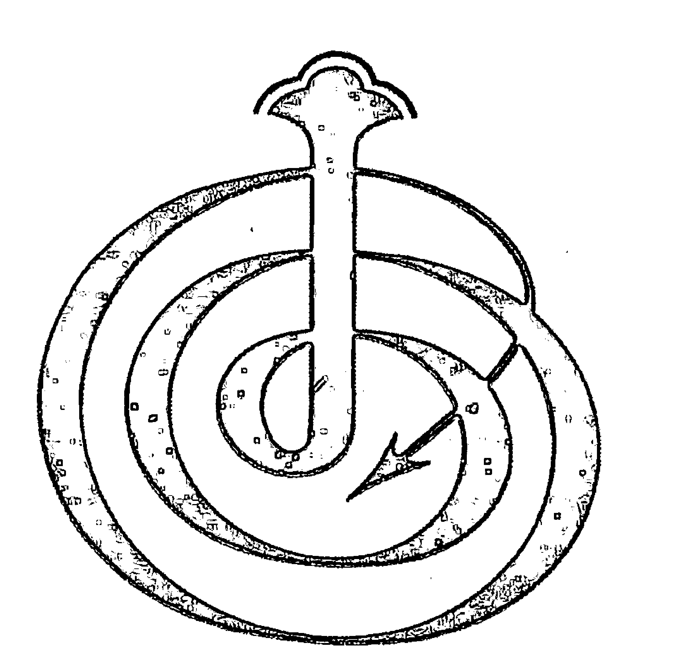
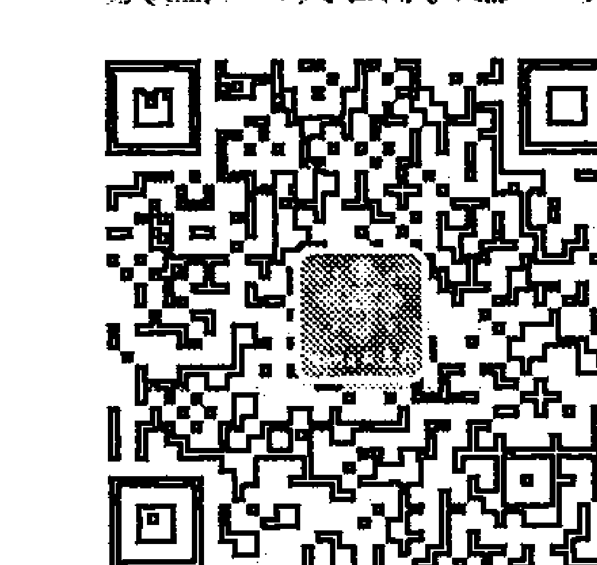
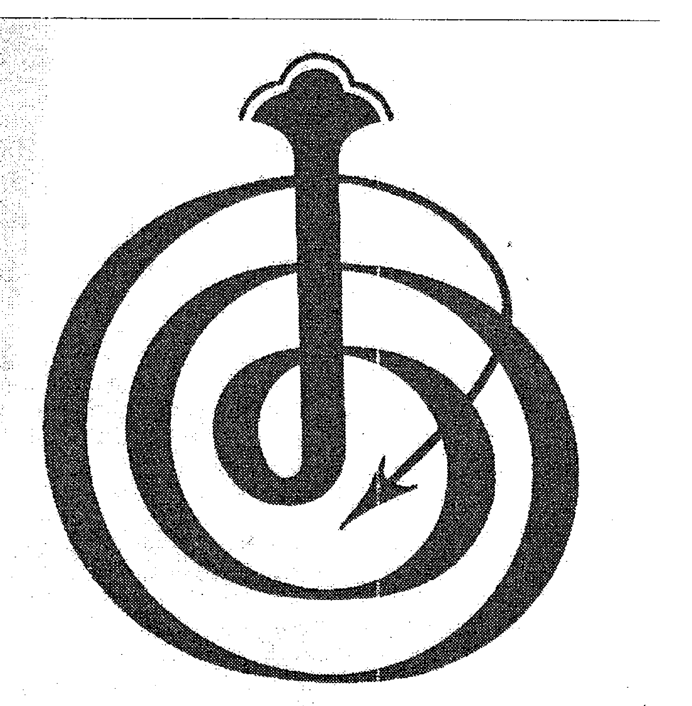

# 占星学拾遗

HILARION

《占星学拾遗》由 Nana 星象与心理工作室特别推荐，供内部学习研究之用。

想进一步了解此书的读者请关注公众号：NANA-astrology 或扫描下面二维码进入公众号，以此同时将有更多精彩的星象知识与您共享。

## 【NANA 星象与心理工作室简介】

2010 年创立于魔都上海的星象与心理工作室（原先的 Nana 占星社），致力于为个人及企业客户提供占星咨询服务，占星及星座课程讲授，以及沙龙和五百强企业咨询培训活动。Nana 星象与心理工作室自创立以来，其咨询业务以及课程活动，受到了海内外客户的一致好评。

我们相信，在每一颗星星背后，都有着奥妙无穷的人生和丰富百态的故事。而占星，作为一门古老而高深的学问，在现代，也随着时代的发展和社会的进步，与各种学科，尤其是心理学、社会学，甚至是管理学可以进行创造性的结合。

依据星盘，我们可以从中探究生命的轨迹，人生的轨迹。从一个不一样的视角去诠释我们的人生和解读我们的生命甚至灵魂，从而获得无尽的启示和积极的成长。

依据星盘，我们也能够在一个家庭中，甚至团体中，找到家庭或者团体的动力和需求，以及核心的力量。从而以更有效和更富有建设性的方式，去重建和营造家庭的氛围，或去打造一支真正卓越而高效并具有创造力的团队。

# *****

版权© 1980

由

马库斯书籍出版社

P. O. Box 327, Queensville
Ontario, Canada, LOG IRO

这本电子书由马库斯书籍出版社制作出版，若您尚未购买此书，请光临我们的网站www.HilarionBooks.com，并进行捐赠，以协助我们将大师希拉里翁的智慧和信息通过莫里斯 B. 库克更好地传递给世界。

您也可以在我们网站上的通讯录注册，以便我们将来通知您希拉里翁系列丛书电子书出版的信息。

# *****

## 《占星学拾遗》电子书前言

斯戴凡·瓦内尔

我很高兴的向大家宣布希拉里翁《占星学拾遗》电子书的出版。这本书已经绝版了一段时间，马库斯书籍出版社现在决定将这本书以电子版的形式再次提供给大家。

我们有意陆续将希拉里翁传达给我们的占星学信息编汇成书，在此之前，这些信息分散在莫里斯·B·库克最初的希拉里翁系列丛书里面，现在我们会将出版一套新的完整的希拉里翁占星学教学丛书。

除了负责制作这套电子丛书之外，我也是执业的占星师。我自从1982年接触希拉里翁的信息后，我就开始使用这些信息工作。我可以自信地说，在我的经验中，这些是当代占星学最不可思议及有价值的宝贵知识。

希拉里翁在本书说的许多信息与传统的占星学知识有一定的对应性，但希拉里翁提供了这些传统占星学知识后面所隐藏的非常具体的业力课题及洞见。

另外还包括大量传统占星学完全不能触及的洞见，但是，在我多年与大量客户的实践中，我见证了希拉里翁信息的高度准确度。

我不但将这种信息用于了解客户的生活和经历，也谦虚地以我一生的个人生活经历来验证这些课题。

希拉里翁的灵媒莫里斯·库克在本书介绍中，对于占星学的基础知识提供了很有帮助的解释。他分享了希拉里翁的目标是，向普通社会大众提供一些占星学知识，而不仅仅是专门研究占星学的学生。

这就是公认的“库克之书”在占星学的内容：占星学里行星落于星座、宫位的基本意义。但是，在我多年的学习中，“库克之书”的这些知识是最有力量和最精确的。

优秀的占星师可能会发现，如果能够整合希拉里翁某些特定信息，就可以拓展自己占星的能力，有助于通过个人的出生星盘对其一生蓝图的真实意义获得更全面的理解。

当今，占星师意识到在2012年到2015年间，天王星与冥王星彼此相刑多达七次，我们也都注意到旧的社会架构和信仰系统所发生的转化和剧变，这个趋势也将继续。天王星代表了不寻常和与众不同、突然的转变、从已经丧失功能的旧模式中的解放，也是代表占星学的传统行星。

我感觉到，这次《占星学拾遗》再版，也许传播广度可以比上次更大，这本身的意义就是这种冥王星/天王星对传统占星学知识所共同进行的颠覆、转化作用。

正如希拉里翁自己在这本书的介绍里所述：

> > 以下内容从来没有向人类披露，但现在已经来到了新时代，水瓶座的循环将要开始，人类终于可以开始更深入地理解之前已经被赋予的知识了。

真诚的，
斯戴凡·瓦内尔

*斯戴凡·瓦内尔是《业力占星看美国》和《查尔斯和戴安娜：内幕故事：业力占星的观点》的作者，两本书都是基于本书信息所著。欲知更多信息请访：
www.SpiritualCompany.com

*****

## 目录

### 电子版前言（斯戴凡·瓦内尔）

### 介绍（莫里斯 B. 库克）

### 介绍（希拉里翁）

### 行星位于星座

- 太阳
- 月亮
- 上升
- 中天
- 水星
- 金星
- 火星
- 木星
- 土星
- 天王星
- 海王星
- 冥王星

### 行星落宫

介绍

序言

太阳

月亮

水星

金星

火星

木星

土星

天王星

海王星

冥王星

结论

词汇表

## 封面标志

莫里斯B 库克以意念接收到这个图形作为本书的封面标志，它代表了每一个人类灵魂伟大的朝圣之旅，经过不断轮回，最终从黑暗走向光明。一层层的圆圈代表了不断死亡与重生的循环，带刺的尾巴直扎入图形的中心，显示了伤害自己的负性和毁灭性的力量，在最后邪恶只能成为它自己的毁灭者，但正是从黑暗所栖之处，灵魂最终成功升起并进入自己灵性的光明中，在此由被美丽金光所包围的正在萌芽的莲花头所代表。

# # 介绍

莫里斯 B 库克

1978 年初，我以精神感应的方式，从大师希拉里翁那里接收到本书第一部分内容，在 1983 年接收到第二部分。接收信息的过程与希拉里翁系列丛书的其它书的过程是一样的，先用精神技术或珞迦瑜伽先清除所有我个人的思绪，再提升头部中心联络点的共振，然后就可以接收并抄录下来思想和图象。

我会在此介绍中，试图以一种并不是非常精确的方式将占星学的基础知识呈现给普通读者，以便让读者可以更好的欣赏理解本书的内容。

我有意强调普通读者，是因为与其它占星书不同，本书力图让更多的人看懂，而不仅仅是学习占星的学生。本书信息的来源希拉里翁，希望帮助人们看到占星产生的整体图景，这样非专业的读者也可以理解，占星这门学科如何在人类伟大的灵性朝拜之旅中发生作用，并可以认知到，占星的光芒可以帮助每一个人了解到在其生命轨迹中，业力、重生和生命课题是如何复杂缠绕并互相作用。

很多希拉里翁系列丛书的读者都期待着向希拉里翁学习更多的占星知识，因为他的信息来源于更高的灵性层面。我传递这些信息并将之出版，希望读者和其它人可以据发掘更深的内在洞见，从而更好理解生命的目标和轨迹。

在我看来，占星学应该停止固步自封，向我们展示其在整个人类种族精神灵性进化过程中所扮演的重要角色。长久以来，占星学已经成为了它的反对者和支持者之间对抗的焦点，反对者着眼于占星学不是二十世纪科学思潮的一部分，而任由自己的怀疑主义蒙住双眼；而它的支持者任由自己情感上的忠诚和防御立场作祟，也同样盲目。有时，占星学被塑造成一种形式上的宗教，行星成为无所不能的神明，可以命令人们忽略自己的自由意志，去过这样或那样的生活，更漠视其它很多同样影响人类命运的灵性力量。希拉里翁丛书的一个目标，是试图更全面的描述人类的状况，将长久以来只顾着走向不同方向的像蒙眼驴子一样的人们带到一起，争取让他们向着一个目标前进：那就是整个种族的灵性进化。

我相信占星学可以对这个伟大事业做出丰厚贡献，但要以一种超越的眼光来看待它，要带着开放的意愿，相信占星学所讲述的是人类整个种族的故事，而不仅仅是对一个个体提供具体的提示。

所以，虽然可以通过本书对一个人的星盘所包含的具体信息理解一二，但我还是强烈建议，先把本书作为综述，要读完整本书。只有当一个人完全理解了所有信息及整体的意义后，才可以清晰地理解这些模式对于他个人的影响。

现在我们来看占星学。

正如其它希拉里翁的书里解释过的一样，占星学本质上是一套密码系统，与每个灵魂的指导灵和守护者为这个灵魂安排的投射出来的新人格所“对应”，包括特质、倾向、生活模式所涉及的业力、最可能发生的事件等等的清单。指导灵根据这个灵魂为其选择了最合适的出生时间，相对应的行星配置就是这套密码。

根据本书所述，这些配置一具体来说就是太阳、月亮和其它行星在黄道各个星座的落点一能够赋予这个转世轮回的人某些特点，或是象征性的代表了这个人这一世先天带来或是后天获得的一些个性。

占星学的原始材料主要包括了太阳、月亮和其它行星落于黄道十二星座的位置。首先需要区别行星与恒星，恒星是像我们的太阳这种星体，因为他们距离我们极远，所以看起来很小。相对而言，占星学的行星都是围绕着我们自己的太阳运转的星体。地球与水星、金星、火星、木星、土星、天王星、海王星和冥王星一样，都是行星。恒星以他们自己产生的光芒闪耀，而行星反射了太阳的光，才成为可以被看见的星体。我们与行星的距离跟我们最近恒星的距离相比也非常小。例如，若一个人可以用光速（每秒 186, 000 公里）旅行，他需要五个小时就能到达距离我们最远的行星，冥王星；但需要四年多才到到达距离我们最近的恒星。以同样的速度，我们从地球到太阳只用花八分钟。

所有围绕太阳运行的行星的轨迹差不多是在同一个平面上的，所以如果我们在夜晚，持续数月或数年观察星空里任何特定的行星，我们就会注意它总是以一种特定的轨迹穿越固定的星座，这个轨迹在天文学中被称为黄道，对于占星师来说，它确立了一个更大圆环的中心位置，与固定的恒星不同，所有已知的行星、太阳和月亮的实际路径就在这个环上，这个环在占星学中被称为黄道十二宫。

占星师将黄道十二宫的这个环或圆圈分为每个 30 度的十二等分的区域，以太阳在春天开始时在黄道上的位置作为开端。

幸运的是，占星学的学生不需要亲自去观察和计算每个时刻每个行星的精确落点了，现在由电脑来完成这些困难而琐碎的工作，并可以在一般都可以获得的星历表上查阅到。大多数新时代、玄学和神秘学的书店都有各种不同的星历表出售，它通常是一本包括一段时期内太阳、月亮和其它行星每天位置的表格，其位置对应的每天的时间，是格林威治标准时间正午 12 点，或者是每天开始的零点，星历表可以轻易地包括从 19 世纪到 20 世纪的所有年份。

为了方便阅读星历表，必须学会读懂行星和十二星座的符号，在以下的表格里列出：

| 符号 | 天体 | 中文名 |
| :--- | :--- | :--- |
| ⊙ | THE SUN (Sol) | 太阳 |
| ☽ | THE MOON (Luna) | 月亮 |
| ☿ | MERCURY | 水星 |
| ♀ | VENUS | 金星 |
| ♂ | MARS | 火星 |
| ♃ | JUPITER | 木星 |
| ♄ | SATURN | 土星 |
| ♅ | URANUS | 天王星 |
| ♆ | NEPTUNE | 海王星 |
| ♇ | PLUTO | 冥王星 |

| 符号 | 星座 | 英文名 | 象征 |
| :--- | :--- | :--- | :--- |
| ♈ | Aries | 白羊 | Ram 公羊 |
| ♉ | Taurus | 金牛 | Bull 公牛 |
| ♊ | Gemini | 双子 | Twins 双胞胎 |
| ♋ | Cancer | 巨蟹 | Crab 蟹 |
| ♌ | Leo | 狮子 | Lion 狮子 |
| ♍ | Virgo | 处女 | Virgin 处女 |
| ♎ | Libra | 天秤 | Balance 平衡 |
| ♏ | Scorpio | 天蝎 | Scorpion 蝎子 |
| ♐ | Sagittarius | 射手 | Archer 射箭手 |
| ♑ | Capricorn | 摩羯 | Goat 山羊（公羊） |
| ♒ | Aquarius | 水瓶 | Water Carrier 提水人 |
| ♓ | Pisces | 双鱼 | Fishes 鱼 |

在星历表里，一个人的黄道十二星座中所落的各种星体的位置，以其在具体星座的多少度多少分来显示。“分”是指圆弧的分，不是时间的分钟。每个360度的圆被分为60分，每一分再划分为60秒，或是角秒。在某些星历表里（例如拉斐尔的星历表）里，太阳和月亮的位置会精确到最接近的角秒，其它星体精确到分。以下是1976年2月份的一份星历表的一部分，显示一下有关信息是如何呈现的。

### LONGITUDE FEBRUARY 1976
| Day | Sid.Time | ☉ | ☽ hr | ☽ Noon | ☉ True | ♀ | ♂ | ♃ | ♄ | ♅ | ♆ | ♇ |
|---|---|---|---|---|---|---|---|---|---|---|---|---|
| 1 Su | 8 41 22 | ♒ 11 45 38 | ♒ 19 45 39 | ♒ 35 50 37 | ♒ 45.8 | ♒ 23 55.0 | ♏ 1 1.3 | ♐ 15 28.7 | ♑ 19 9.5 | ♑ 25 34.5 | ♒ 7 1.3 | ♐ 13 27.9 | ♏ 11 38.8 |
| 2 M | 8 45 13 | ♒ 12 15 50 | ♓ 2 10 9 | ♓ 3 17 37 | ♒ 48.3 | ♒ 23 35.1 | ♏ 1 15.3 | ♐ 15 36.0 | ♑ 19 17.0 | ♑ 25 29.9 | ♒ 7 0.4 | ♐ 13 29.2 | ♏ 11 39.5 |
| 3 Tu | 8 49 13 | ♒ 13 18 52 | ♓ 14 21 44 | ♓ 20 22 39 | ♒ 50.8 | ♒ 23 32.3 | ♏ 1 26.0 | ♐ 15 46.7 | ♑ 19 23.4 | ♑ 25 25.2 | ♒ 6 59.4 | ♐ 13 30.6 | ♏ 11 40.2 |
| 4 W | 8 53 12 | ♒ 14 17 45 | ♓ 25 33 58 | ♓ 34 32 10 | ♒ 53.3 | ♒ 23 29.0 | ♏ 1 42.4 | ♐ 15 56.1 | ♑ 19 27.0 | ♑ 25 20.5 | ♒ 6 58.4 | ♐ 13 32.0 | ♏ 11 40.9 |
| 5 Th | 8 57 8 | ♒ 15 18 37 | ♒ 8 44 34 | ♒ 14 10 7 | ♒ 55.8 | ♒ 23 26.0 | ♏ 2 11.0 | ♐ 16 4.3 | ♑ 19 32.0 | ♑ 25 15.8 | ♒ 6 57.4 | ♐ 13 33.4 | ♏ 11 41.6 |
| 6 F | 9 1 16 | ♒ 16 19 37 | ♒ 20 3 50 | ♒ 28 57 23 | ♒ 58.3 | ♒ 23 23.1 | ♏ 2 34.1 | ♐ 16 11.6 | ♑ 19 36.7 | ♑ 25 11.2 | ♒ 6 56.4 | ♐ 13 34.8 | ♏ 11 42.3 |
| 7 Sa | 9 5 1 | ♒ 17 20 10 | ♓ 1 51 42 | ♓ 7 47 7 | ♒ 60.8 | ♒ 23 20.3 | ♏ 3 1.1 | ♐ 16 18.0 | ♑ 19 39.0 | ♑ 25 6.8 | ♒ 6 55.4 | ♐ 13 36.2 | ♏ 11 43.0 |
| 8 Su | 9 8 58 | ♒ 18 21 4 | ♓ 13 44 28 | ♓ 18 44 31 | ♒ 0.3 | ♒ 23 17.4 | ♏ 3 16.4 | ♐ 16 23.7 | ♑ 19 42.0 | ♑ 25 2.4 | ♒ 6 54.4 | ♐ 13 37.6 | ♏ 11 43.7 |
| 9 M | 9 12 54 | ♒ 19 21 50 | ♓ 25 47 35 | ♓ 29 34 48 | ♒ 2.8 | ♒ 23 14.3 | ♏ 3 35.7 | ♐ 16 30.0 | ♑ 19 47.4 | ♑ 24 57.9 | ♒ 6 53.4 | ♐ 13 39.0 | ♏ 11 44.4 |
| 10 Tu | 9 16 51 | ♒ 20 22 34 | ♓ 7 40 49 | ♓ 14 23 47 | ♒ 5.3 | ♒ 23 11.1 | ♏ 3 58.4 | ♐ 16 35.7 | ♑ 19 52.0 | ♑ 24 53.5 | ♒ 6 52.4 | ♐ 13 40.4 | ♏ 11 45.1 |
| 11 W | 9 20 47 | ♒ 21 23 17 | ♓ 19 32 33 | ♓ 27 15 31 | ♒ 7.8 | ♒ 23 8.0 | ♏ 4 20.6 | ♐ 16 41.4 | ♑ 19 56.3 | ♑ 24 49.1 | ♒ 6 51.4 | ♐ 13 41.8 | ♏ 11 45.8 |
| 12 Th | 9 24 44 | ♒ 22 23 59 | ♓ 1 24 44 | ♓ 10 35 58 | ♒ 10.3 | ♒ 23 5.0 | ♏ 4 37.4 | ♐ 16 47.1 | ♑ 20 0.5 | ♑ 24 44.8 | ♒ 6 50.4 | ♐ 13 43.2 | ♏ 11 46.5 |
| 13 F | 9 28 41 | ♒ 23 24 38 | ♓ 13 17 10 | ♓ 24 33 27 | ♒ 12.8 | ♒ 23 2.1 | ♏ 4 58.1 | ♐ 16 52.8 | ♑ 20 4.3 | ♑ 24 40.4 | ♒ 6 49.4 | ♐ 13 44.6 | ♏ 11 47.2 |
| 14 Sa | 9 32 37 | ♒ 24 25 15 | ♓ 25 10 25 | ♓ 35 37 36 | ♒ 15.3 | ♒ 22 59.3 | ♏ 5 20.3 | ♐ 16 58.1 | ♑ 20 9.2 | ♑ 24 36.1 | ♒ 6 48.4 | ♐ 13 46.0 | ♏ 11 47.9 |
| 15 Su | 9 36 34 | ♒ 25 25 53 | ♒ 8 53 20 | ♒ 33 13 45 | ♒ 17.8 | ♒ 22 56.4 | ♏ 5 4.0 | ♐ 17 4.1 | ♑ 20 13.5 | ♑ 24 31.8 | ♒ 6 47.4 | ♐ 13 47.4 | ♏ 11 48.6 |
| 16 M | 9 40 30 | ♒ 26 26 28 | ♒ 20 37 53 | ♒ 44 4 36 | ♒ 20.3 | ♒ 22 53.6 | ♏ 5 22.1 | ♐ 17 9.7 | ♑ 20 17.4 | ♑ 24 27.5 | ♒ 6 46.4 | ♐ 13 48.8 | ♏ 11 49.3 |
| 17 Tu | 9 44 27 | ♒ 27 27 1 | ♒ 2 20 44 | ♒ 55 1 8 | ♒ 22.8 | ♒ 22 50.9 | ♏ 5 40.5 | ♐ 17 15.3 | ♑ 20 21.0 | ♑ 24 23.2 | ♒ 6 45.4 | ♐ 13 50.2 | ♏ 11 50.0 |
| 18 W | 9 48 23 | ♒ 28 27 34 | ♒ 13 54 21 | ♒ 65 34 26 | ♒ 25.3 | ♒ 22 48.2 | ♏ 6 1.1 | ♐ 17 20.9 | ♑ 20 24.6 | ♑ 24 18.9 | ♒ 6 44.4 | ♐ 13 51.6 | ♏ 11 50.7 |
| 19 Th | 9 52 20 | ♒ 29 28 4 | ♒ 25 17 15 | ♒ 76 26 26 | ♒ 27.8 | ♒ 22 45.5 | ♏ 6 19.0 | ♐ 17 26.5 | ♑ 20 28.2 | ♑ 24 14.6 | ♒ 6 43.4 | ♐ 13 53.0 | ♏ 11 51.4 |
| 20 F | 9 56 16 | ♒ 30 28 34 | ♒ 6 51 51 | ♒ 87 2 30 | ♒ 30.3 | ♒ 22 42.8 | ♏ 6 37.2 | ♐ 17 32.1 | ♑ 20 31.8 | ♑ 24 10.3 | ♒ 6 42.4 | ♐ 13 54.4 | ♏ 11 52.1 |
| 21 Sa | 10 0 13 | ♒ 31 29 2 | ♒ 18 8 41 | ♒ 98 9 54 | ♒ 32.8 | ♒ 22 40.2 | ♏ 6 5.0 | ♐ 17 37.7 | ♑ 20 35.4 | ♑ 24 6.0 | ♒ 6 41.4 | ♐ 13 55.8 | ♏ 11 52.8 |
| 22 Su | 10 4 10 | ♒ 1 29 29 | ♒ 29 8 17 | ♒ 109 57 58 | ♒ 35.3 | ♒ 22 37.6 | ♏ 6 13.0 | ♐ 17 43.3 | ♑ 20 39.0 | ♑ 24 1.7 | ♒ 6 40.4 | ♐ 13 57.2 | ♏ 11 53.5 |
| 23 M | 10 8 6 | ♒ 2 29 55 | ♓ 11 45 6 | ♓ 118 27 35 | ♒ 37.8 | ♒ 22 35.1 | ♏ 6 20.9 | ♐ 17 48.9 | ♑ 20 42.6 | ♑ 23 57.4 | ♒ 6 39.4 | ♐ 13 58.6 | ♏ 11 54.2 |
| 24 Tu | 10 12 3 | ♒ 3 30 20 | ♓ 23 6 40 | ♓ 129 41 55 | ♒ 40.3 | ♒ 22 32.6 | ♏ 6 28.5 | ♐ 17 54.5 | ♑ 20 46.2 | ♑ 23 53.1 | ♒ 6 38.4 | ♐ 14 0.0 | ♏ 11 54.9 |
| 25 W | 10 15 59 | ♒ 4 30 43 | ♓ 5 12 37 | ♓ 140 46 30 | ♒ 42.8 | ♒ 22 30.2 | ♏ 6 36.0 | ♐ 18 0.1 | ♑ 20 49.8 | ♑ 23 48.8 | ♒ 6 37.4 | ♐ 14 1.4 | ♏ 11 55.6 |
| 26 Th | 10 19 56 | ♒ 5 31 4 | ♓ 16 15 52 | ♓ 151 27 48 | ♒ 45.3 | ♒ 22 27.8 | ♏ 6 42.4 | ♐ 18 5.7 | ♑ 20 53.4 | ♑ 23 44.5 | ♒ 6 36.4 | ♐ 14 2.8 | ♏ 11 56.3 |
| 27 F | 10 23 52 | ♒ 6 31 25 | ♓ 27 14 33 | ♓ 162 3 22 | ♒ 47.8 | ♒ 22 25.4 | ♏ 6 53.4 | ♐ 18 11.3 | ♑ 20 57.0 | ♑ 23 40.2 | ♒ 6 35.4 | ♐ 14 4.2 | ♏ 11 57.0 |
| 28 Sa | 10 27 48 | ♒ 7 31 43 | ♓ 8 17 14 | ♓ 172 23 35 | ♒ 50.3 | ♒ 22 23.0 | ♏ 6 31.7 | ♐ 18 16.9 | ♑ 21 0.6 | ♑ 23 35.9 | ♒ 6 34.4 | ♐ 14 5.6 | ♏ 11 57.7 |
| 29 Su | 10 31 45 | ♒ 8 32 0 | ♓ 19 37 34 | ♓ 183 44 11 | ♒ 52.8 | ♒ 22 20.6 | ♏ 6 23.4 | ♐ 18 22.5 | ♑ 21 4.2 | ♑ 23 31.6 | ♒ 6 33.4 | ♐ 14 7.0 | ♏ 11 58.4 |

最左列显示的是一个月的几号，剩下的列里只有上面列明的“Long”(经度)是本书需要了解的部分。这些列显示了各种星体在黄道十二星座的位置，从左数第三列列明的是太阳的黄道位置，这个月的5号零时，太阳的位置是水瓶座15度、18分和37秒，注意，星座是显示在表格的第一行，除非有变化，否则不再重复出现。显示月亮经度的那一列（从左边数第五列）更清晰的呈现了这个规则。这个月的开始，月亮在水瓶座19度、45分。2号，它走到了双鱼座的2度、9分，所以这时有一个新的星座出现了。3号时，它还在双鱼，所以这个星座不用再标明一次了。

所有行星的信息都用同样的方式标明，唯一需要额外解释的信息是显示逆行和顺行的标志，R 和 D。例如，在上面的表里，这个月开始时，水星的那列，从地球的角度看起来，水星好像在向后走（逆行），日子一天天的向前走时，水星位置的数字反而在一点点减少。但是在4号时，字母 D 标示着水星走到了它的正位，从这之后它就开始向前移动了（顺行）。现在看看天王星的那列，这个行星在月初时顺行，但在11号开始，它来到了它的逆行位，由字母 R 标志。从这一天之后，在地球上观察它，它是向后走的（数字减少）。

还有另外一个需要说明的是相位，需要注意的是，在希拉里翁的整本书中，会提到具体的行星与其它行星形成“积极相位”或是“受刑克”。

这是指在星盘里行星间所形成的角度，当两个行星有特定的角度关系（就是彼此间形成了一定角度），他们就是彼此“形成了相位”，不同的相位说明了发生关系的不同行星之间的作用和特质是如何互相影响的。

在本书中，我们只详细说明以下五种相位关系：

- 1) 合相: 两个（或更多）行星占据同一个度数，这个相位可以是和谐的或是困难的，视乎于合相的行星的性质。例如，土星（寒冷和限制）与金星（情感）合相会导致在爱情上受限和冷漠；木星（扩张、乐观）与金星合相，就会产生完全相反的效果。
- 2) 六合: 两个行星间产生60度角（就是落于两个分离的星座并位于这两个星座里差不多相同的角度）。这个相位是积极的，显示两个行星的基本特质有机会轻松地整合在一起。
- 3) 刑: 两个行星间的角度是90度，正如名字显示的，是一个困难的相位。这显示了行星间不同特质艰难的挣扎，互相阻止对方在生命中呈现和谐和圆满。
- 4) 三合：两个行星形成了 120 度关系。这是最有利的相位，显示两个行星间形成了和谐的关系，每种行星的特质都可以增强彼此的力量，协助彼此以积极的方式在生命中呈现。
- 5) 对冲：两个行星形成 180 度，直接在对方的对面。这是一种困难的相位，只有牺牲两个行星中的一个，才能让另外一个完全地呈现自己的特点（通常这种牺牲是不利的）。要平衡这两者，需要有意识的努力。

现在普通读者应该已经可以相对容易地理解希拉里翁的论点了，在我结束本介绍前，还有一点需要强调。

经过前面的介绍，读者肯定已经知道，每个人的出生时间会决定他的任一行星在十二星座的位置。因为希拉里翁会分别论述每个行星落于每个星座的情况，所以本书只有十二分之一的内容会直接与一个特定的读者有关。但是，假设我们每个人在此之前都活过许多次，合理的假设是，在这一世之前，我们已经以许多不同的生命模式，历练了许多不同的课题。因此，我再次强调要先读完全部内容，再去尝试直接了解与自己有关的部分。一旦精读完全部内容，与个人有关的行星描述就会更加有意义。在拥有更宽广的灵性洞察后，一个人也能够更好地深入理解特定信息。

对于那些没有读过希拉里翁系列丛书的读者，我推荐他们阅读一些与本书内容有关的书籍，本书内的很多讨论都需要读者对于人生的意义有更深入的理解，而这些在《现实的本质，灵性的季节与象征》里面进行了深入的探讨。

莫里斯 B 库克

多伦多， 加拿大

1980 年 1 月

本书最后附有本书所使用的占星学词汇表，仅提供给对于占星学未进行深入研究的人士参考。

## 行星落于星座

## 介绍

### （希拉里翁）

占星学为当代人们解读误差较大，它被认为是一个解释人生事件的意义的系统，也是一生进程中所遭遇的事件的时间和模式的大纲，是人类内在头脑运作、心理和人格的象征性描述，但所有这些概念都没有触及占星学系统的核心。

在远古的过去，当人类刚出现在地球表面时，天空不是现在这个样子，星体不一样，他们的轨道和周期都与现在不一样，星体运动与地球上所发生事件的关联性在当时与现在是不一样的。是的，在星体轨迹中解读不出重大的意义，哪怕那时的人们具有足够的智慧或教育、可以识别太阳系星体的运动和位置。

五百万年前，人与天使共同繁衍了第一批人类后，就开启了历代的转回转世。教导人类关于他们自身和所要体验的朝圣之旅的最好方式，莫过于将星体安排到完全映照他所生活的这个时代和时代的精神，除此以外，还要安排每个人的出生时间，让一个经过适当学习的人，可以通过此时的星体配置，在一定程度上解读这个轮回灵魂的天性、他很可能发展出来的个性、最可能发生的生活事件。

但是除了前面那些相对简单直接的事实外，占星学还有更深远的含意，这就是：占星学系统是人类最高创造者直接给予的礼物，它允许人在所有层面同时发展——不仅仅是显现个性的物质身体层面，也在更高的精神层面和星芒体层面，及更在那之上的层面。所以仅仅是在个性层面改善是不够的，必须要专注于更高的灵魂层面，或是被称为高层自我的改善。

星体能量本身可以穿透人的物质身体，达到更高层面。没有这些星体的位置和相位（星体落于黄道十二星座的位置及所形成的不同角度），人很难了解自己的人生课题，更不用说如何知道向上的发展之路，穿越各种不同层面，一直达到灵性的最高点。

本书的目标就是简单说明行星和其它占星符号的意义，不仅仅为了较低世俗层面的个性发展，也为了高层自体或是灵魂的发展。以下的信息从来没有向人类披露，但现在已经来到了新时代，水瓶座的年代已经将要开始，人类终于准备好去理解他们已经被给予过的知识的真相了。

## 太阳

在占星学中，太阳显示了这个灵魂或高层自体的主导特质所投射到意识人格层面的特点。例如，太阳所落的星座的通常意义必须被理解为：可能或可能不在人格层面所直接及有意显现的特点，也就是说，低层自我的特点。在很多情况下，人格的个性经过各种情结和环境的因素过滤后投射而成，太阳星座的一些甚至大部分特点在意识层面都可能被模糊化。在这种情况下，这个人此次转世的一个主要任务就是去找回这些被模糊化了的特点或特质，然后在生活中显现它们。每一种太阳星座的特点都有积极和消极的一面，例如，白羊模式的积极一面是无穷的精力，而消极的一面就是以攻击性或是暴力性行为表达这种精力。我们会在下面以类似方式更全面的解释太阳落于所有星座的情况。所以，一个人这生的主要任务就是找回被模糊化或被压抑的太阳星座的特质，而且要学会强调其积极和建设性特质。

白羊 我们说过白羊拥有无穷的能量，这种能量实际上是这个白羊人过去某次转世中的英勇行为的回报或礼物，当时他把个人利益放在一边，帮助他人。在某种层面来说，这个礼物是内在而不是外在的，因为这种为了帮助他人而无畏地面对危险的行为本身，会自动地与一种无穷的能量来源相连接，这个灵魂会获得与这种能量来源永久的连接。但伴之每份礼物而来的是责任，对于白羊，这个责任是需要学习处理这种加强的能量，不以攻击性的表达或暴力性的行为来伤害到他人或自己。

金牛 金牛人在灵魂层面的深度，深入理解了爱的含意，金牛的守护星金星证明了这一点。再次，掌握如何去爱及爱的真实含意本身就是一种礼物，这个灵魂自己获得了这份礼物—这次是源于这个灵魂在某次前世中为他人献出了自我牺牲的爱，通常没有得到完全的回报。这个无私奉献的行为让这个灵魂在很高的灵性层面深深地与无尽纯粹的爱相连接，从而获得了能够爱与关怀的巨大能力。同样，伴随礼物而来的是责任。对于金牛而言，任务是学会无条件的表达爱，单纯地允许爱流
入、贯穿整个人，而不要试图阻隔它，学会付出不带条件的爱。若存有一丝阻隔或限制爱的冲动，他所拥有的丰富的爱就会因为需要找到合适的客体而成为问题。拒绝外在客体，就是另一个人或多个人，这份爱就会浪费在自己物质身体的原始本能上，这往往来源于金牛自我放纵的倾向。若为了避免以自我放纵的方式来表达受挫的爱情冲动，金牛人又容易发展出另一种问题，压抑的习惯。在这种情况下，这份爱很可能因为无法指向另外一个人，而转移到对拥有物质或金钱的热爱上，这往往是因为早年父母几乎不表达任何身体亲密。所以，金牛此生在人格层面的任务是要学会表达爱，而不要让这种爱的需求转移到自我放纵或是过于强调物质或金钱的拥有上。

### 双子

双子人在之前一次转世中，通过坚持不懈的努力发展了显著优越的智力和理性能力，并将获得的能力服务于他的兄弟。这种努力和服务再次成为一种礼物，让双子在非常高的层面与智力或头脑的能量深刻连接。这种头脑能量可以为这个灵魂所用，并在过滤后适当呈现在人格层面。

但同样，陪伴礼物而来的是责任，对于双子而言，他需要学习让头脑能量的状态不那么纷杂和扰乱，或是对他人的言语攻击。双子的守护星是水星，通常与人类发展的孩童阶段相对应，很多双子人也同样只将他们所拥有的头脑能量发展到一个未成熟的阶段。无论孩童的太阳星座是什么，他们通常很爱动，注意力维持时间较短，也很难长期坚持做一件事。这些是他们未成熟的大脑试图满足更高层心灵需求所导致的。孩子，特别是与兄弟姐妹一起生活的孩子，也容易发展出对彼此的言语暴力—通常是冲突的另外一种表现方式，因为父母禁止他们发生肢体打斗。在其它头脑能量没那么强大的星座身上，成长到某一个阶段时，这种倾向就可以被克服。但双子拥有的大量头脑能量反而让他难以克服，甚至是成年后，也会表现出以上的特征，他们往往会要么表现出言语的暴力，要么能量分散，或是两者都有。

### 巨蟹

巨蟹人在某次前世中为家庭奉献了一生，以极大的奉献精神养育和照顾了他人，哪怕这种奉献不仅仅由爱而来。无论动机是什么，这种为整个种族的奉献，让巨蟹人在灵魂层面与一种高层的养育冲动相连接，经过适当的环境过滤的影响，这种特质可以在人格层面表现出来。

伴随这个礼物而来的任务是：自由地表现这种养育本能，无需把别人和自己紧紧捆绑在一起。在消耗极大精力关心和照顾他人后，很难不升起一种这些被照顾的别人“欠了我什么”的感觉，因为照顾者已经做出了巨大的牺牲，但这正是巨蟹人的主要功课，照顾别人，但不给别人带来负罪感，也无需把别人与自己捆绑在一起。

当一个人花费了他的大部分精力照顾他人后，总会有一种感觉随之产生，就是如果无法与这个被照顾者保持连接，生命就失去意义。失去他人的威胁（例如，当孩子长大离开家时）可以泛滥为巨蟹人通常体会到的巨大不安全感，对此唯一的解药只能是对神或上帝的信任。当一个人经过几世巨蟹模式的轮回后，不安全感可能会变成灵魂层面的特质，这种特质需要调整。这时，可能会在某一次轮回里出现很多增加不安全感的事件，希望这个人最终投向超越人类的内在信仰。通常会在这样的人生早期安排一些与教会或宗教团体（僧人或是修士）的连接，使这个人在遭受人生事件打击、安全感受损时，有一些基础的“记忆”，以便可以转而投向信仰所带来的信心。

### 狮子

狮子人在之前的某世，显示了领导的特质和对其它人的指导并因此拯救了众人。从这个行动随之而来的礼物是：这个灵魂获得了永久与灵性层面的主动性和领导力特质的连接，经过适当的环境过滤的影响，这种特质可以在人格层面表现出来。

随着这个礼物而来的任务是：在拒绝自我膨胀的同时展现指导力和领导力。这些能量很容易导致夸大的自我和骄傲，狮子性格的人需要不断努力来避免这种消极特质。避免骄傲和自我中心倾向的最好方法是培养对他人的仁慈和体谅，但即使是善良的狮子也很容易习惯性地把人生看成一出戏剧，自己是主角、其他人都是围绕他的配角。这种倾向还是由于与更高层面连接而来的能量过于丰富所致，能量投射下来的清晰图景是：这个人领导他人，也就是说，站在别人之上，或是以某种方式高于他所领导的人。处理这种狮子能量的最好方式是找到一个场所，让狮子领导他人的同时服务他人，所以教师角色是狮子特质呈现的最好方式之一。

### 处女

处女人在过去某次转世中，处于一个学习某种特定重要的灵魂、生命、或课题的早期阶段。因为每个灵魂都急迫地理解物质化生活所要教授的基本功课，一个几乎什么都没学到的生命历程就可以算是一份特别的“礼物”，这个礼物与之前所述的礼物不同，它从本质上而言，是由其它灵魂或实体在这一世借给处女人使用的某些有用的特质，更像是一份贷款。这份贷款运作的机制过于复杂，不在此赘述，但可以简单地理解为，处女所表现出来的某些特质并不是这个灵魂天然的一部分特质，这些特质与这个人的智性层面相关。处女是一个土相星座，代表了学习过程的早期阶段。

处女的守护星水星象征了他这次轮回中所被给予的智性，希望这个人可以运用理性和智力来理解他无法完全用心领悟的课题，然后，再通过很多世的转世，把这些智性理解转化到心灵层面。当心终于可以领悟到这些课题时，他们就会自动地整合入灵魂所在的更高层面。

另一个叠加的特征是一系列极高标准的活动、行为和理念，这些本来是给处女用于内在衡量之用，以便评估自己的学习进展，但因为处女不断地发现自己未能达到标准，为了回避面对失败的懊恼，处女常常转而将这些标准用于衡量其他人。在这种情况下，处女的爱挑剔的一面就出现了。与其批评自己和改正缺点，处女反而将评判的目光投向他人，以言语挑剔别人，试图让别人遵守他们自己内在过于理想化的标准。

### 天秤

天秤人在之前的某世中，在经历了极端的考验和困难后，努力奉献自己，试图让一段婚姻或是合作关系成功。经过这种努力，关系中的另一方深刻地理解了爱与承诺的含义，作为对这种理想的婚姻和忠诚的回报，天秤人获得了与更高灵性层面的连接，他们对于一对一、承诺、奉献的关系具有直觉的深入理解。这份礼物经过现实环境的过滤进入低层面的自我或人格后，会产生对于伴侣的深层渴求，只有在伴侣关系中这份渴求才能被满足。

但这份礼物也带来了责任。在世俗层面，婚姻倾向于被理想化为一种完美的结合，两个彼此完全合适对方的人相遇并结合，幸福地永远生活在一起，等等。但实际上，这个概念从神话到民俗传说，其实都不是指现实中两个人的关系，而是在深层次隐喻着一个人内在两性的整合：自己内在的男性面-女性面、积极面-消极面、主导面-养育面、等等。

大多数人成熟后意识到，一段成功的婚姻需要对另一半缺点的妥协和忍让，对彼此差异的原谅和尊重，但对于天秤来说，因为他们内在直觉性地对完美伴侣的渴求，他们很难接受现实根本不可能存在一个完美的结合。这是天秤的重大课题。并不在于某一种行为或态度，而是要在深层次理解这一点，那就是，无论如何，天秤与他人关系中最主要呈现的问题是，过于冷漠和克制他们自己的情绪反应。这个特征源于避免任何极端状况的冲动，他认为极端威胁到关系的平衡，在更深层次是对天秤所追求完美结合的危害。

### 天蝎

天蝎人在之前某世，认为自己所做出的某件事是如此可怕和可憎，以至于不应该再活在世上，而为了赎罪结束了自己的生命。这种自毁行为的后果，是使这个灵魂与某种黑色能量连接在一起，这种能量一方面让天蝎通过牺牲和死亡，深入理解了重生的含义，另一方面他也获得了对他人的某种控制力，一种不惜一切方式达到目标的态度，对于公平竞争和荣誉的概念的无视，在他自己的黑暗时刻，导致前世自毁行为的冲动会再次发出嘲笑的回响。天蝎最大的任务和挑战是将自己天性中的重生呈现在生活中，给低层自我插上老鹰的翅膀（老鹰是天蝎高层次的动物化身），并以自己的生活展示给他人，凤凰传说的真实意义，就是从自己燃烧的
灰烬中升出的纯净。天蝎几乎很难完成这个任务，特别是在刚过去的双鱼世纪，因为几乎没有真正灵性之路的指引，到处都是混乱和毁灭。但在当下的水瓶新时代，会有很多拥有天蝎一面的人（无论是否是太阳落于天蝎）将可以作为见证，因为新时代的能量会开启人类的意识，他的灵性将会插上翅膀，翱翔在当下无法想象的智慧、爱和创造力之中。

### 射手

射手的前世是荣誉、正直和诚实的一生，他将这些特质持续地展现给别人看，并以此对别人的灵性发展产生了积极的帮助。这荣誉的一生的影响是，他的灵魂持续地与最高的灵性层面里荣誉的冲动相连接，在环境因素的过滤后，他们也会将这种影响带到人格层面。射手的任务是管理这种冲动，并在此世再次向世人展现他们的正直，但应该谨慎，不能因为过于强调诚实和坦白而伤害别人。射手总会坚持他的坦诚，于是往往会在还没想清楚之前，话就冲口而出，未能三思而后言的结果是难堪、尴尬的场景，甚至会导致痛苦一虽然造成他人的不舒服或痛苦绝不是射手的本意。此时，最主要的课题是要学会考虑自己的话对别人的影响，不能轻易脱口而出。

### 摩羯

摩羯在之前的某世，在世人的眼里完成了诸多个人成就，他的成就在物质层面给他人创造了永久的益处。因为这是一种贡献，虽然不是在灵性层面，但也会让他与建设性和创造性能量的源泉连接，这种连接会促使摩羯继续在物质层面努力达到某种成就。但因为他对别人的帮助仅限于物质层面，摩羯人更容易在灵性方面存在盲点，他比一般人更难以理解现实的真相、灵性和高层智慧的价值。

虽然很难，但摩羯还是可能成功地克服其它灵魂不用应对的巨大困难，然后将自己的一生奉献给更高的精神成就。摩羯掌管一个人的膝盖，而膝盖正好可以象征摩羯“奉献的一生”这个目标，因为膝盖是在传统祈祷者的姿势里用来支持身体的部位。

### 水瓶

水瓶在之前的某一世，将自己的能量奉献于召集人们并组成一个团体，在人群间倡导友爱和兄弟情谊。因为在精神层面成为被尊崇的和平制造者，水瓶连接了在人类兄弟情谊方面最高的理想主义源泉，经过适当环境的过滤，可以在灵魂层面及人格层面表现出来。这种理想的兄弟情谊的源泉代表的是远超现代人类种族所达到的先进程度。爱的感觉对每个人来说都是不一样的；是的，大多数人仅仅能通过爱情带来的澎湃激情体会到神圣大爱的碎片，随后就被冰冷无情的现实唤醒。但水瓶本能地知道宇宙性的非独占的爱是可能的，但这个看法往往会在人类当下发展阶段的人际关系中产生问题。

水瓶常常会去努力追求他内心的理想主义，这会导致排斥婚姻包含的独占性的亲密，或是试图在朋友或是熟人圈子里塞进太多人；他的伴侣会因此认为水瓶冷漠，而他的朋友却会认为他离不开他的亲密关系。水瓶的课题是要努力自然地生活在这个世界，妥协他内心对于兄弟情谊的理想，起码要与一或两个人形成亲密关系，兄弟情谊总要从两只握在一起的手开始形成。水瓶的理想必须先从少数人团体（甚至是两个人）中培养起来，然后才能扩展到整个人类种族。

### 双鱼

双鱼在之前的某世，为了终结痛苦而绝望地结束了自己的生命。在灵性层面，自杀永远是不正确的，但如果自杀的动机只跟自己有关，那还好一点。因为这种自我毁灭的举动，双鱼与一种消沉和悲观的源泉建立了连接，而这种情绪经过现实的过滤也往往会在人格层面呈现。但造世主不会只给予消极的东西，做为附加，双鱼可以与对他人同情和共情的深层次源泉相连接，希望他可以通过关心他人，共情他人的悲伤，他们可以忘了自己的忧郁，把自己的生命奉献给他人。这种敏感往往会使双鱼急于从生命的艰难中逃离，而转向药物或酒精，避免这种倾向是双鱼的首要课题。

### 月亮

占星学里的月亮与太阳所代表的意义截然不同。月亮是与地球最接近的天体，因此它代表了在物质世界中受到的影响和形成的个性特点，通常在一个人的早年生活中获得。有意思的是，虽然作为一个星体，月亮并不是很大，但因为它离我们很近，所以它看起来跟太阳一样大。这一现象与其象征意义也非常吻合，每一个轮回的个体受月亮影响所形成的性格会被放大，最后与他们从灵魂层面带来、然后受到过滤所呈现的天生性格一样多。所以在心理学家间有一个古老的争论，什么因素在一个人性格的形成中占有更重要的比重—天生的本性还是后天获得的特点—占星学认为这两方面的影响都是同样重要的，是完美的平衡。

月亮不是阻碍灵魂特质在现实中呈现的过滤器，也不是像其它行星一样，以叠加作用来影响性格，或是说，给灵魂附加了本来没有的重要特质。月亮只是简单的反映了一大堆特征、性格和影响，他们往往是一个人的早年家庭生活影响所带来的。所以它常常代表了父母中更占主导地位的那一个的一些主要特点，或是一种原生家庭的普遍氛围，例如冲突、情感淡漠之类。

白羊 这个星座由火星守护，火星主管能量、冲突和情感爆发，月亮位于此处会显示早年的家庭生活是缺乏控制的，通常包围这个孩子的是斗争本能。后果就是暴风雨般的早年生活氛围，在这种体验下成长的这个人很可能潜意识里认为“家庭”就意味着冲突和动荡。然后他要么去寻找一个可以为他重现类似的家庭环境的伴侣，要么结婚后他自己激惹对方并创造出与他童年家庭类似的冲突。只要月亮落于白羊，基本上可以肯定的说，对于这个灵魂最主要的课题就是去克服这种由早期家庭的冲突和动荡所带来的潜意识影响，不要在他自己的家庭环境中再去重现这种动荡。

### 金牛

金牛由主管爱情、情感和美的金星守护，金星也代表了自我放纵和对于世界美好事物的过度重视。月亮落于这星座时，首先需要小心判断月亮与星盘里其它重要行星或虚点所形成的相位是主要受克还是良好，才能去论断这个星座的优点和缺点会如何显现于早年生活中。若月亮受克严重，早年生活体验在很大程度上是缺乏爱的，于是这个人在成年后，需要经历很多，才能在生命的较晚时得到情感满足的关系。“情感满足的拖延”不是生活中一系列外在事件发生的结果，而是这个人内在对于真实爱情关系认知不当所导致的后果。若月亮受克较少，他早年生活会从一位或两位父母身上得到了大量的爱，他因此自我价值感较好，自己接收和给予爱的能力也发展的很好（如果没有其它行星带来与此相矛盾的作用）。

### 双子

双子是由水星守护的，水星是理性头脑的象征。月亮在这个位置说明，作为一个孩子在他早年家庭生活中接受到大量智力发展的刺激，通过思维获得成就或是理性功能的发展都受到鼓励。也很有可能在他早年的家庭环境里，某种因素带来了神经质或轻浮的特点。最后，很可能在早年的家里某种东西是双重或重复的。

若月亮落于双子受克，很可能家庭环境容易引起神经紧张，或是这个人有一定神经质的表现，或是潜在有这种倾向。在这种情况下，生活就是对于这个灵魂的试炼，看他能否克服神经质特质的消极一面，学会控制自己的神经紧张，避免变成神经症。当月亮落于双子相对没有受克时，他的早期家庭环境可能存在大量双子的积极特质，在他成年后，他就可能为自己的家庭创造类似的环境，包括通过学习、智力的刺激、很多聊天和沟通等增加家庭成员的愉悦感，也可能通过规律性地改变家庭住址的方式获得智性刺激，特别是他很可能在早年生活中也经历了类似的情况。

### 巨蟹

巨蟹由月亮守护，所以很多月亮所代表的特征都会在这个人的早年家庭中呈现。月亮在最好状态下，会带给家庭环境爱和滋养，包括大量情感支持，并由此可以帮助家人得到很好的自我价值感；家人之间的连接很紧密，可以完全防御从外面世界来的任何伤害，形成一个很安全的家。整个家庭的图景就是一家人很舒服地坐在起居室里，围绕着火炉喝茶，狗在主人脚边蜷着睡觉，虽然可以听到外面冬天的风暴声，但这只会增加家里所有成员对这个温暖环境的归属感和舒适感。但这个完美的图景很难在现实中实现。若月亮在巨蟹受克，则家庭环境就会与这个理想图景相距甚远。受克越严重，在早年家庭生活中不能得到理想环境的痛苦就越强，在这种情况下，这个人很可能会对于找到理想家庭环境过于执着，经过日复一日的现实打击和问题突显，他必定会遭受幻想破灭。这个人需要学习接受世界真相，人们本来就是这样的，完整并有缺点。是的，不能接受不完美本身就是不完美的，而月亮在巨蟹受克就是为了提醒这个人，接受事情的本来面目就是他需要努力的功课，他只能通过妥协，努力让家庭维持下去。月亮落于巨蟹，无论受克与否，最终任务是允许家人，特别是孩子，可以做他们自己，不受来自父母的情感连接或是罪恶感的约束而无法自由。特别是月亮落于巨蟹的女性，总是倾向于与孩子建立非常紧密的连接，要努力避免这种倾向，因为它会剥夺孩子的成长和限制他们自我表达。

### 狮子

如我们前面所述，月亮只与在早年生活环境所获得的个性有关，而狮子是由太阳守护，这样就是这个一般规则的例外了。月亮在狮子会显示灵魂的特质，它是人类所有特质中最高贵、最美丽的特质：宽恕。因为通过原谅他人，人就走向了神的道路。神永远不会谴责，在神的眼里，没有行动、思想或情感是罪恶的。人是自己的指控者和审判者，他的业力是他自己创造的，并不是某种审判大厅对他的罪过的惩罚。

当月亮落于狮子严重受克时，可以理解为他的早年家庭影响会干扰他天生带来的对于宽恕的学习过程，也许他会有一个执着的或是充满怨恨的父母；或是情况是，当这个人还是孩子时，在试图表现出原谅后，别人反而来占他便宜，认为他这是软弱或是好欺负的表现。这些消极经历是他的试炼，他需要克服这些障碍，并重新找到他宽恕的天性。

当月亮在此受克时，还有另外一个特质需要做功课，就是容易对别人的缺点视而不见，假装这些缺点不存在。这是一种自我欺骗，必定会导致失望，更好的方式是清晰地了解别人，既看到他们的缺点，同时也知道所有人必定会有缺点，这就是人的天性，而且正是因为这些不可避免的缺点，我们才需要彼此关爱。

### 处女

处女由水星守护，水星是理性思考的星体。月亮在处女，显示了早期家庭环境是强调智性的，而且通常来自于父母中比较吝啬或是过度整洁的那一个。在这个家庭中，会有一些过于强调细节或形式的状况，从而导致丧失了对大局的把握，最好的形容是“只能看到树木而看不到森林”。当月亮在此受克，可能说明这个孩子会从一个或两个父母身上接收到不赞同或是批评的压力，后果是他起码在潜意识层面认为家庭是吹毛求疵的地方，然后倾向于找到一个具有这些特点的伴侣，或自己在家里展现这种特点。这个特点并不是灵魂本身所具有的特点，只是由早年生活经历所带来的；所以对于月亮处女的人的主要课题就是，避免将原生家庭环境的批评、挑剔带入成年生活。

### 天秤

天秤由金星守护，金星是关于和谐、宁静、平衡、爱与美的行星。月亮在此说明早年家庭环境会控制过度的情感，起码对外展示了和谐、平衡的气氛，至于这种表面之下是否存在真实的和谐，要看月亮受克的程度。

月亮天秤严重受克的话，说明家庭生活表面上平静、安宁，但表面下充满了未解决的冲突和骚动。孩子实际感知到的比大人以为他们知道的要多，在这种充满伪装的环境下成长的孩子，当然会认为在家和婚姻中都要不惜一切代价地控制内在冲突的欲望。不幸的是，当不允许能量自然流动时，必然会产生一些更不健康的方式。积极一面来说，不受克的月亮天秤通常会显示他的两面—男性和女性的两极—可以得到相对好的整合和平衡，并最终可以拥有真正和谐、平衡的家庭。月亮天秤通常会较迟才能获得完全满意的婚姻/家庭，一定程度上是因为业力原因。

### 天蝎

天蝎是由火星和冥王星守护的，充满了黑暗和强大的能量，会给一个人的核心内在和性欲带来突然和逐渐的变化。月亮落于天蝎说明灵魂特质较重，也是一般规则中的一个例外。他的特征是让激情或性欲主导了恋爱中的情感一面，简单来说，月亮天蝎说明这个人在一定程度上会依靠性欲来确定感情。因为在情感生活中过于强调性的部分，这个人对于未与激情或性爱混合在一起的纯粹情感之爱相对不太熟悉。因为很多人并没有意识到身体的激情实际上只是爱或爱洛斯的另外一面，他们可能会认为他们完全不能感觉到爱。这不是真的：只是对于他们而言，爱情的结合在生活中的呈现与别人有一定区别。这依然是爱，太受身体激情所影响的爱说明了在灵魂层面的不平衡——为了矫正这种更高层面的不平衡，才需要在现实层面做功课。

这种特质在情感受创时会得到调整，典型情况是在生活的某阶段会遭遇心碎、丧失或孤独，这种生活事件的主要目的是让灵魂学习到爱的纯净情感一面的重要性，特别只是单纯地由心感觉到丧失时，那种深远的影响。月亮天蝎受克的程度会说明这些经历的痛苦程度。仅凭这个配置很难具体描述出早期家庭环境，想要知道这个情况，要看月亮与其它行星形成的相位、落于巨蟹的行星、或是星盘上四宫里所落的行星。可以肯定的说，若月亮天蝎严重受克，早期家庭中应该会有一些经历、事件或环境将这个孩子的性欲提升到意识层面，或是过早地唤醒了对性的意识。这可能是一种创伤性事件，或另一方面来看，只是他家里对于性的一般意识而已，而由业力事件决定了这个影响的性质。

### 射手

射手由木星守护，当月亮落于此处，早期家庭环境肯定存在一些扩大、增加、愉快、夸张、旅游或宗教的成分（都是木星所代表的东西）。若受克的话，月亮射手会呈现出家庭环境中夸张的一面，可能是对于家庭的重要性过于强调，或是家里总是有太多人。当月亮不受克时，很可能家庭为这个人提供了丰富的基础，例如很享受丰富的物质基础，或是外表长的很出众。

### 摩羯

摩羯由代表着限制、责任、疾病和约束的土星守护。无论月亮与其它行星形成的什么相位，这个配置都说明早期家庭环境充满了限制和约束，可能是早期体验到的弥漫性的情感冷漠或距离，这种感受也可能是由于父母之一的缺席所导致的，很可能这个孩子过早地承担责任和职责，并因此一生严肃和时而的忧郁。

在那些几乎没有什么笑声的家庭里长大的人，成年后回想起自己的童年，可能会看到许多病态的特征，例如永远充满了沉重的负担，很少有爱或轻松来照亮生活。对于月亮摩羯的最大考验是，摆脱凄惨的早期家庭生活带给他的影响，为自己创造一种充满爱的生活，放下重担，让心轻松。也许期待月亮摩羯的家里经常响起开心的笑声有点过份，他们作为孩子时几乎就没有学会笑，但只要付出足够的努力，还是有机会的。

### 水瓶

水瓶是由天王星守护的，天王星主管兄弟情谊和宇宙大爱，也是未预期的改变、破坏和不寻常。月亮在此显示早期家庭环境里既有对于个人追求自由和自我表达的鼓励，也有不太重视情感或爱的回应的倾向。

月亮受克越是严重，这个人越容易在内心层面情感控制和压抑、甚至冷漠。月亮水瓶的正性相位越多，就越多对个性化的鼓励和独立性思考能力。无论相位是什么，都可能会从早期家庭环境学习到对情感的自我控制、不喜欢情感表露或极端情感，这可能会导致这个人成年后的家庭/婚姻出现一定问题，特别是当他与一个情感需求比他能给予的更多的人建立关系时，而这种情况往往会发生。这里的考验是要认识到真实的爱情交流与个性和独立并不矛盾，真实和无私的爱的本质就是要去认识另外一个人的全部面向，没有任何限制或约束。

### 双鱼

这个星座由海王星守护，海王星是大海之神，主管着所有的幻觉、情绪泛滥、感受导向和逃避主义。当月亮落于此时，毫无疑问的是，在早年家庭体验里会有起码上述一个以上的特征。因为有太多可能性，试图列明是没有意义的，无论早年环境反映了双鱼/海王星的哪些关键特征的组合，可以肯定的是，在这种环境下成长的这个人一定会经历这种体验。

可以预期的是，在这个人成年后，他所创造的家庭会反映出他原生家庭的突出特点。这种状况通常是由潜意识造成的（海王星代表了从意识中的逃离），所以当这种状况导致了任何问题或困难时，这个人很难理解这是他的过错造成的。这是一个艰难的考验，但若能通过这个考验获益甚丰，值得花费一切努力。若这个人无法理解到他自己家庭/婚姻的真相，他就很难与其它人建立起深刻的连接，从而也不可能继续与他们的关系，迟早家庭和婚姻都会在现实的坎坷中破裂。

## 上升

当代神秘学对于上升的理解并不完整，人们往往会认为它是由这个人出生时所“吸的第一口气”的时间所确定，但实际上，出生时间会受到种种意外而延迟和提前的，而且因为出生时间会影响到一个人的各种生命事件、先天及后天的性格及其它方方面面，所以上升远比简单的第一口气更为意义深远。在每个人出生之前，在母亲妊娠期即将届满前的几天或几周，天上的星星所形成的格局，已经与这个即将开展的人生基本符合了。

当最适合他出生的那一天被确定以后，这一天的24小时会被仔细审查，以便得到一个最合适的上升点——这个时刻可以让所有的行星都落在对于这个灵魂来说最有意义的宫位里。然后努力安排，以便让这个灵魂呼吸到第一口气的时间与选定的一天和上升相符合。在大多数情况下，这些安排的时间与出生时间精确到一小时之内。虽然的确有一些特例，实际与选定的出生时间达到了12个小时甚至以上的误差。

在这种情况下——往往这种人一生也不会寻求占星师的帮助——这个人的生命和星盘可能会找不到对应关系。这时需要用出生矫正来决定这个人更好的上升点，而不是简单地按照他的出生时间来定，也可以向这个人的潜意识询问，潜意识很清楚自己最合适的上升是什么，有时也可以用钟摆来寻求答案。

更困难的是有时会有不止一个合适的上升点，例如，可以有一个一般的上升点，由此产生一张出生盘，显示了这个人一生中很多方面的一般图景；然后可以通过行运和推运发现一个更准确的上升点，解释了这个人一生中很多生命事件的时间顺序；然后还可能会有一个“业力”上升点，由此而产生的盘中仅看土星的相位就可以知道这个人生命的业力了。然后可能还有其它更合适的上升，但那个就更少见了。

我们在以下讨论的，实际上是根据第一口气来确定的上升，它会给人的人格，特别是自我形象，以外来影响的方式带来一层特定的特质。一个人如何看待自己，对他的生命非常重要，若自我形象在某些方面存在任何严重缺陷或不足，都会影响积极性格的形成，从而在生活中造成许多阻碍和困难。

### 白羊

白羊的守护星是火星，上升位于白羊的人倾向于发展出具有强大行动力和勇气的自我形象，他认为自己随机应变能力强，特别是在应对紧急事件时，可以作为其它人效仿的领袖或是模范。他的情感反应速度也很快，会突然陷入极度迷恋或其它类似的强烈感情。白羊会对体育活动充满兴趣，很可能会投身于运动或体育行业，所以经常会有上升白羊的知名运动员，当然也会有压抑这一面、不展现给世人的上升白羊。

### 金牛

上升金牛会带着浓厚的土象色彩，实际而且坚固，他会倾向于把自己看成脚踏实地的人，具有很强的一致性和可靠性。需要强调的是，在现实中，也许别人一点也看不到他认为自己的上述特点。上升显示的只是这个人的自我印象，他认为自己所具有的特点，这与别人认为这个人是怎样的一个人可能相差甚远。这就是为何很多人会更容易认同自己的上升，而不是太阳星座。

### 双子

上升双子会带有强调智力的自我形象，因为双子的守护星是水星。这个人会显得智力敏捷而警觉，多才多艺和富有创造力，健谈或表现的像一个智者。这些特征可能是他想象出来的，也可能是真的，无论如何，必然会影响他与别人互动的方式。

### 巨蟹

巨蟹上升的主导自我形象是家庭主妇或家庭主男（特别是女性拥有这个上升），这个人会认为自己的主要特点是喜欢照顾及保护他人，满足他人的各种需求。因为巨蟹的守护星月亮，对于一个人的心理发展有重大影响，导致拥有巨蟹自我形象的人会寻求符合这种特点的生活方式。选择巨蟹作为这个人出生盘的上升，实际上是为了提供给他一种补充性的影响，不然他无法通过其它影响获得这方面的特质，或者哪怕有这种特质，也是失衡或不足的。目标是帮助这个人调整他对于家庭和照顾他人方面的问题。

### 狮子

当上升落于狮子时，这个人的自我形象会被涂抹上一层典雅、特殊和优越感的色彩，他的内在往往是骄傲的，哪怕有时并不表现出来。将这个上升给予一个人是为了提升他对自己的正性观感，这一点他在以往的轮回中并没能做到。狮子由太阳守护，太阳可以帮助这个人增强自信，这样才能让这个人学会不要低估自己的价值，也不会总感觉在别人面前低人一等。根据以上的解释，我们就可以理解上升狮子的这个特点，他们内心总会在过于自大和过于自卑的两极间摇摆。希望他们可以通过这种内在斗争，最终认识到每个人都是完整和有价值的，没有人比别人更优越或更低劣。

### 处女

上升处女的自我形象是整洁和严谨的，他擅长表达，做事有条理，擅长自控，有时他们会认为自己拥有很高的行为准则（无论是否真实），而且他们会倾向于要求别人遵守这些准则，然后发现别人无法遵守，这时他们的批判性就会浮现。

### 天秤

天秤上升的人认为自己注重情感控制，拥有稳定和平衡的脾气，他们认为自己不会有极端的情绪或行为，并且会将自己的这一特点理想化。只是，当客观地看待自己时，现实往往是截然相反的：获得天秤上升的人，是为了提升他控制能量、情绪和思维的能力，因为这个灵魂在之前的轮回中未能学会这些能力。所以我们往往看到上升天秤的人在两极间跳跃，从极端的自我行为控制跳到情感爆发——这种行为通常会让其他人困惑不已。他们就像火山一样，在经过多年不活跃之后，有一天突然在愤怒中爆发。天秤上升也会显得很美丽和具有吸引力，而且往往他们的外表的确好看，当然天秤上升也会促使这个人努力维持和改善自己的外表。

### 天蝎

因为天蝎的守护星是火星和冥王星，天蝎上升的人会以敏感、情绪化和对他人的控制作为自我形象。再次说明，这些特点可能都不是真的，只是这个人认为自己是这样的。然后他们可能会拥有强烈的性欲，并认为与他人交往的主要方式是在卧室里征服他。天蝎上升不是必须具有这些特点，这些特点主要是为了让这个人以亲密关系的方式，将因业力所必须遇上的另一个人，吸引进他的生活中，从而消解他身上所背负的沉重业力。

### 射手

射手上升会使这个人认为自己是正直、诚实、道德感强的人，无论这是否真实，这也会让他渴望旅游，去“看看这个世界”，他甚至会觉得自己像一个永远流浪的犹太人。所有这些对上升射手的影响是，他们容易晚婚，或是同时陷于多段像婚姻的关系中，因为他们倾向于抓住射手的青春和冒险不放，而别人早就已经放弃了青春梦想的刺激。这不是在批评他保持年轻外表的努力，实际上，现代社会大部分人在年轻时，就已经对生活持一种过于严肃认真的态度，这与造物主希望我们保持一生的有趣和刺激的感觉背道而驰。

### 摩羯

魔羯的守护是土星，因此导致的自我形象是严肃和认真的，他们会显得像小大人，这个自我形象在经过多年的发展后，他们的人生观是，“生活是艰苦和严肃的”。这种观念的形成可能与多年的健康问题有关，或是在生命早期就已经身负重担，其实把摩羯上升安排给他们，正是为了增大他们内在严肃的一面。实际上，摩羯上升正是给予那些缺乏严肃感、总是对待他人过于随意的灵魂。这就是为何摩羯上升的人一般都会在对待事情的态度的过于轻松和过于严肃的两极间摇摆，这种内在冲突最终的目标当然是让他在两者间找到平衡。

### 水瓶

当本命盘的上升是水瓶时，这个人会拥有独立、有个性和智力超群的自我形象。别人会觉得他与众不同，通常在某些方面是特殊的。将水瓶上升安排给这个人，大多数情况是因为要鼓励这个人在这一次轮回中舒展自己，学习一些新的东西，从以往的熟悉的模式中走出来。往往这个灵魂在过往的轮回中过于传统守旧，总是重复自己所习惯的生活模式。他往往也会展现从传统行为跳到非传统行为的变化，因为他在学习这两者间的平衡。

### 双鱼

双鱼上升的自我形象带有强烈的抑郁和受害的色彩，他容易觉得自己饱经摧残，或是总受沉重命运的左右。这种“不幸之人”的形象笼罩着这个人，他很难看到人生不必是这样阴郁和悲观的。此时，双鱼上升变成一种考验：能否通过积极的努力来克服人生的沉重。

## 中天

与上升一样，当今神秘学的学生也未能完全理解天顶或M.C.（中天）。本质上，中天显示了自我形象的另一面：投射给世界的形象。在某种意义上而言，一个人假设只有这样才能在人群中运作有效，因此带上了天顶这个面具。于是上升和中天各自显示了自我或是低层自我的一半。需要强调的是，中天并不像上升一样，以更直接的方式导致结果。它更像是一种安排好的影响，就是说，安排好的人生事件并以此发展出来的外在形象，这种外在形象一定程度上与中天及落于十宫的星体相呼应。

### 白羊

中天落于白羊的人会表现出一种刚愎的、任性的和有活力的特征，无论这种特征与他的内在自我形象是否相符。他可能会表现的很急躁，特别是火星或天王星落于十宫。相反，若中天落于白羊时，一个像土星这样星体落于十宫，就会给白羊的能量带来一种沉重和不断自我控制的力量，哪怕他不将这种影响呈现给别人看。若此时有阴性行星落于十宫，则可以将白羊的冲动性转化为情感上的热情。

### 金牛

金牛中天会呈现一种情感渴望和迫切地与他人发生情感连接的外表。其它人可能会用“充满爱心”来形容这个人，如果他的十宫里没有其他具有相反力量的行星影响。例如，若土星落在十宫就会减弱他对于情感的需求，而火星会导致缺乏一致性，但他情感强度就像暴风雨一般。

### 双子

双子中天的人会在他人面前投射出一个擅长言语和智力的形象，他会像一个智者或是很健谈的人，若十宫里有相反作用的行星，则可以减弱这些特征。而土星在此会让这个人在人际交往中显得沉重和乏味；而火星则会让他的言语更加尖锐，并容易导致争吵和纠纷。

### 巨蟹

巨蟹中天的人会向世界投射出巨蟹的滋养、照顾和保护别人的一面，巨蟹中天的人往往是天秤上升，从之前所描述的天秤上升的特征，结合巨蟹中天来## 狮子

狮子中天投射给世界的形象是慷慨、骄傲、大方和有时傲慢，这个形象也许与他自己的内在形象不一致，也许与这个人各种真实特点并不接近，但把这些特点给予这个人主要是为了让他克服从之前轮回里带来的自卑。哪怕他的内在自我形象是不稳定的，也要鼓励他带上一个狮子中天般勇往直前的面具，这样才能最终改变他自卑的内在形象。这就是现实世界中行动的伟大力量，不仅仅在物质层面有影响，在情感和精神层面也同样有作用。

### 处女

处女中天会投射出一丝不苟、注重实际和对于细节和组织重视的特征，其他人可能会注意到他挑剔性和某种理想主义的倾向。可以确定的是，拥有处女中天的灵魂在这一世起码有一个特别重要的课题，星盘上土星会揭示这个课题的关键。土星所位于的宫位和/或星座，可以知道对于这个灵魂来说，需要成长的最主要和最重要的区域在哪里，当然这并不意味没有其它重要课题了。

### 天秤

天秤中天的人会习惯性地投射出一种文雅、平静和情绪控制的形象，这些特征并不是这个人经常呈现的样子。将中天放置在天秤是为了帮助这个人增强对自己情绪的控制，跟天秤上升一样。

### 天蝎

当天蝎位于星盘顶部，这个人投射出来的形象会与性有关，虽然这种投射可能完全在潜意识里，这个人意识不到。其它人会发现这个人非常擅于在一个聚会上感应到性的能量，而且异性通常会接收到这个人散发的模糊的性吸引力。

### 射手

中天位于射手的人投射出来是一个正直、直率的形象和一个年轻、富于冒险的精神，他们往往会有双鱼上升，这时这个中天所带来的积极和轻快的能量就可以更好的与双鱼那种忧郁和软弱的内在形象中和了。

### 摩羯

白羊上升或是金牛上升的人会遇到中天落于摩羯，这样他投射给世界的形象会带有更多摩羯严肃和谨慎的特点。其它人会认为这个人很实际、努力工作、没有时间玩乐。但玩乐正好是这些人所需要的，特别是那些搭配了金牛上升的人，他们的两个角宫都是土象星座，太沉重了，必须用一些纯粹为了开心而进行的轻松愉快的活动来中和。搭配了白羊上升的人也要小心被摩羯的“要工作不要玩乐”的陷阱困住，而应该更多投身于白羊喜欢的体育活动。

### 水瓶

水瓶中天的人投射出来的形象是独立思考、情感节制和某种其它人很难确定的“与众不同”，中天位于此的重要之处是为自己的情感冲动带上面具，一层很坚硬的外壳，这是这个灵魂的任务，需要学会在冷漠的面具下自然轻松地表达爱。

### 双鱼

中天位于双鱼的人若是生在北纬地区，会有一个巨蟹上升（虽然大多数情况是双子上升）。当两个水象星座位于一个人星盘如此重要的位置时，这个人必然会在内在和外在都是情感丰富的，也会伴随着不安全感和受迫害感。这个灵魂自主地选择了这样的生活，希望通过面对这种巨大的困难，一次性学会处理情感的难题。在之前的轮回中，他可能在控制情感方面没付出什么努力，在这一世，似乎这是一个“最后但也是最好的成功机会”了。这就像学习游泳，若你穿上泳衣来学，你可能很快就学会了。但若你特意穿上橡胶鞋和三件厚毛衣，然后在这种重负下学会游泳，那你就真的学会了。这就是这个灵魂为何要选择了在这一世中面对两个水象星座的重大影响。

### 水星

在占星中，水星是精神或理性能力的主要象征星，它是人最重要的三元本质（精神、情感和身体）中的三分之一。高层自我投射或早期家庭环境中形成了基本性格和个性，而水星代表了在此上所叠加的影响。若水星与太阳所落星座是同一个，它会强化太阳星座所带来的基本性格；若不是同一个，就会在这个人的本能推理过程（太阳星座）和理性或意识的推理过程间出现矛盾。若水星与太阳在三度以内形成合相或三十度角（十二分相），我们就可以知道水星所落星座所显示的这个人的智性特质是他高层自我的一部分，虽然水星还会通过叠加作用强化它的特点。若在三度之外，则与高层自我无关。

水星通过叠加作用带给一个人的精神方面的影响，通常是为了让这个人学习到特定的基本而重要的课题。当水星与太阳落于同星座而强化了太阳星座的特点时，重要课题是要克服过度呈现太阳星座的消极特质，或是过于强调太阳星座的特质，或是特质的不平衡。我们在以下来描述水星与太阳落于不同星座时所呈现的基本特征和课题。

### 相位

相位说明了水星所叠加的影响是如何发生作用的，困难相位会将水星所落星座的消极一面呈现在精神生活中，而正性相位会将该星座的积极一面带出。

- 通常来说，与土星形成相位会带来严肃或抑郁的一面，视相位的性质而定。
- 天王星带来的作用要么是洞察力的灵光一闪，要么是精神崩溃的可能性。
- 火星会带来极大的精神能量或是喜欢战斗的精神（虐待性的倾向）。
- 海王星会带来丰富的想象力（甚至是某种预感能力）或是通过白日梦、空中楼阁的想象等方式来浪费自己的精神能量。
- 金星与水星形成的正性相位会让这个人有悦耳的声音，对“精神”艺术有很好的鉴赏力：音乐、文学、诗歌等等。负性相位会将自己的精神能量浪费在爱情白日梦和迷恋等上。
- 木星的正性相位带来各种丰富的精神特质，特别是木星与水星所落星座有关的特质。负性相位会导致在精神方面的某种夸大。
- 月亮与水星的正性相位会将许多不同方面的精神能力聚合到一起，月亮管理日常生活的心智活动（就是那些开车、走路、洗碗所需要的心智活动），精神的理性一面和日常生活一面若能和谐运作，就可以将额外的能量和能力释放到精神层面。若月亮与水星的相位不和谐，也会将很多能量释放到精神层面，但这些能量很难控制，常常以无尽的闲聊、八卦、恶毒的方式来消耗掉。

### 白羊

这个人突出的心智特点是对控制的需求和冲动。一旦这个人学会如何控制他的头脑，可以做到集中注意力一段时间来完成一件事，他就可以很好地使用丰富的精神能量，他的基本课题是学会控制精神力量。

### 金牛

水星在此受克会呈现一种过度的自我中心倾向，所有的思考最终都会围绕着自己。此人要经历真实打击才能学会为别人考虑，若水星落于金牛并严重受克，则这种打击会不可避免的发生于他的亲密关系中，特别是与孩子有关的方面（孩子是由水星象征的）。受克时，也会显示这个人的喉咙和脖子比较薄弱，容易有健康问题。他的基本课题是要克服自我中心的问题。若水星与其它行星的相位是正性的，水星可以带来爱美的特质，特别是对于精神艺术，包括音乐、文学等，并且能够以一种感人的方-式口头表达情感。

### 双子

水星在此受克会突出双子的缺点：注意力分散及用言语去伤害其它人。基本课题是管理自己言语伤人的特点。若相位是正相的，水星会带来多才多艺、擅长沟通、口头表达流畅和语言能力较好的特点。

### 巨蟹

水星在此受克会让理性思维过程变的特别困难，因为他很难不受情绪影响地进行思考，负面的感受和情绪会干扰理性。他主要课题是要将理性思考与情绪进行整合，感分开。若在巨蟹形成正性相位，水星可以在家里付出爱，特别是给予孩子家庭温暖。

### 狮子

水星在此受克会加重骄傲、优越感和傲慢的影响，他的思绪总会而且只会围绕着自己，他将人生视为自己的一部壮丽演出，自己是主角，剧本也是他写的。主要的课题是学会将其它人视为拥有自身权利的独立个体，也在出演着各自的人生戏码。同样，跟金牛一样，他需要经历某种与亲密关系和孩子有关的打击才能学会不那么自我中心。

### 处女

水星在此受克会导致精神方面的挑剔和过于理想主义，主要课题是：接纳拥有缺点的人们；在你自己还有缺点时，不要试图把世界变成完美的。水星若在这里拥有良好相位，会带来精准的思考能力、分析能力和超强记忆力。

### 天秤

水星在此受克会带来在表达情绪方面近乎于死板的控制，这是它的主要影响，主要的课题是要学会更多的表露情感。若在此有良好相位，水星会表现为在生命早期就希望找到伴侣，因为他天生就会觉得伴侣关系才是“对的”。

### 天蝎

水星在此受克会导致对于性欲的过度重视，也可能发展出低沉或是性感的声线，主要的课题是要减少对于性的注意。良好相位可以让他擅长理财。

### 射手

水星在此受克会轻易的批评他人，所以主要课题是控制对他人的批评。良好相位时，他会在年老时也可以保持年轻外表和冒险精神。

### 摩羯

水星在此受克会让思维格外的严肃，对未来风险的担忧、恐惧、责任等，让他总是心事重重。主要的课题是让思维不要过份严肃，最好的方式是在生活中找欢乐和率性的源泉。

### 水瓶

水星落在此非常有利，无论相位如何，它都是擢升于风相星座。哪怕受克，最坏结果也只是精神活动过于活跃。受克时，他会有情感节制的特点，但若星盘上没有其它因素叠加的话，这点也不难克服。正性相位可以让人拥有丰富的智力和精神能力。

### 双鱼

这里无疑是水星最差的落点，无论什么相位。双鱼是水星的落陷位置（与水星所守护的处女对冲的位置），在此，所有导致理性思维可以有效顺利运作的功能都会受阻：精神能量的流失（双鱼的守护星海王会吸取一切它接触到的能量）；情感对于思考产生太多影响或是影响清晰的思维；过度焦虑；被悲观所笼罩，例如对死亡、丧失等的担忧；沉溺于过去的悲伤；过于丰富的幻想和白日梦；及其它很多。即使是正性相位，上述的一些负性的特征也会出现，虽然可能会出现超常的记忆力。相位越困难，上述负性的特征出现的越多，也会越明显。

### 金星

金星是代表人的爱情和感受一面的主要占星象征星。人的三元本质中爱的那部分的精华，只能生出爱情和慈爱，除此以外是各种倒错、扭曲、反常的情感，理解这一点非常重要。因此，恐惧和仇恨是爱的反面，怜悯和情感用事是爱的扭曲，贪婪或其它任何“占有”他人的过度欲望都是爱的反常一面。

在占星学中，金星是通过叠加影响发生作用的，它专门针对性格中的爱情区域施加影响。当金星与太阳形成三度之内的精确相位时，说明金星所落星座的特点是灵魂或高层自我本身所具有的特征。以下是一些意义和基本的课题：

### 白羊

金星在白羊受克时，会带来爱情的鲁莽行为和对于爱情欲望难以控制，突然间陷入迷恋是很常见的。主要的功课是要管理爱情方面的冲动。这不是说要压抑情感，而是说在跳进一段关系前，要先搞清楚自己的感受。爱需要时间培养才能开花，它极少会在两个才认识一晚的人之间发生。即使没有严重受克，金星白羊也会在爱情方面特别冲动。

### 金牛

金牛是由金星守护的，即使受克它也会带出爱最好的一面。严重受克时，金星会导致对爱情生活过度重视，以至于生活的其它部分都容易被忽略。“一切都为了爱，世界也可以失去”是一句很好的总结，虽然对于当下我们轮回所生活的这个世界来说，这并不是一件坏事，因为爱情对于人类来说，在确是很重要性的功课。当形成良好相位时，金星可以将爱的本质中的持久、深刻、真实等美好一面带出来。

### 双子

当金星在此受克，往往出现一脚踏多船的情况，不一定是这个人有意安排的，外在的现象实际上反映了这个人内心爱的分裂，他有能力以同样强度去感觉到两份或是更多的不同的爱或感情（双子多才多艺的一种表现），而且他也愿意同时去体验这两份感情。当这种特征呈现在生活中时，可以肯定的是，他这一世需要通过这个考验。这个考验的目的是，看这个人能否能够理解，在当今社会环境中，只有当你真心为别人考虑和关怀时，才能拥有一份真实深刻的爱情体验。金星双子的人越放纵他自己的多对象爱情体验，就会有越多的悲伤和丧失进入他的生活。这种经历是为了让被牵扯在一起的两个（或是更多）人中，那个先放手离开这段关系的人，能感受到更多的爱。金星在此有正性相位的，会将爱的轻松愉快一面带出，例如一些无害的调情；也容易被聪明和有智慧的人吸引。

### 巨蟹

巨蟹会将感受放大，金星在此受克，会有过多的情绪掩盖了爱本身，会在一段紧密关系里失去对爱情冲动的控制。金星位于此处的人需要好好管理他们的感受，同时允许爱情显现。只有金星巨蟹（也可能或是金星双鱼）的人可以完全理解这个问题的含义。良好相位的话，金星在此会带来温暖的爱，并且可以在家庭里很好的表达这份爱。

### 狮子

金星在此受克会导致爱情中的过度理想主义，一旦自己喜欢的人显示出有缺点的迹象时，就会体会到极大的失望。主要课题是穿透理想化的自我欺骗，看到所有世人皆有弱项和缺点，并去爱这些拥有缺点的世人。

### 处女

金星在此受克会对恋爱伴侣有过高的理想化要求——以至于很少（如果不是没有）人能够符合他的要求，因此他的生命中会有很长的孤独时期，或是在关系中对伴侣无尽的挑剔。主要的课题是接受别人本来的样子，管理自己挑剔的天性，特别是对他所爱的人。

### 天秤

金星是天秤的守护星，即使受克，也会带来深刻敏感的爱情关系。严重受克会导致在选择伴侣时犹豫不决，最坏的情况下，会导致在爱情满足上产生轻微的延迟。一般来说，金星天秤预示了在人生中最终可以获得美满的婚姻，可以将这个理解为业力的奖励，源于他过去世因为对别人的深刻、（通常是）无条件的爱而做出的巨大奉献，这个“别人”通常会是他这一世最终幸福的归属。

### 天蝎

金星在此落点不好，无论是否受克。天蝎是金星的落陷位（对冲金星所守护的金牛），对于金星落于天蝎的人来说，呈现纯粹的爱是非常难的。爱往往被身体欲望所掩盖，而欲望带来的激情往往会走向因对方离去的悲伤。重要的课题是认识到，爱本身就是完整的，不需要一定呈现在身体层面。爱情的情感一面本身，就是完整的，不需要身体方面。这不是说这两方面一定要分开—正好相反，当一份真爱/情感关系在一个男人和一个女人的纯粹情感层面发生时，两个人会很自然的希望也可以通过身体来表达这份爱。长远来说，拒绝这份爱的表达实际上会对情感方面造成损害。奥妙是看到爱的情感一面不需要依赖物质一面，或是从物质一面中汲取力量。

### 射手

金星在此受克说明在高层自我中，本身具有对冒险和旅行的热爱，这会让他为了寻求开放的关系而放弃一段爱情的可能性。为了要让这个人看到情感的重要性，会让这个人容易遇到远距离恋爱，他与爱情伴侣在相当长的时期里是分开的；这样，他高层自我才会被近距离接触的渴求所触动，才能重新调整对于爱的态度。落在此处，不像大多数金星的落点，它的确显示了需要被纠正的灵魂特点。

### 摩羯

金星在此受克，会以一种冷漠或距离的方式给爱添加了沉重感。这个人不一定能像其它金星落点一样感受到这部分，因为土星（摩羯的守护星）通常是一种潜意识的影响。主要的课题是要更多的表达情感和温暖。若是良好相位，金星摩羯会在情感上呈现奉献、坚忍和持久力。

### 水瓶

金星在此受克会带来情感冷漠，难以对别人表达真诚的热情和感情，这些特点也会导致爱情中的困难，这是因为在之前世中，别人对他表达的情感热情时，被他冷漠对待所产生的业力结果。

### 双鱼

金星在此受克，他的爱情生活会被过度的情感和敏感所笼罩（比金星巨蟹更严重），他们会基于爱情的直觉就投入一段关系，完全不考虑与别的关系的平衡或能否持久的问题。这在爱情生活中，肯定会导致悲伤和丧失。这种困难经验的目的是，鼓励这个人学习一定程度控制他爱的冲动—再次，不是将爱熄灭，而是学会更持久的爱，而不是基于同情或是恐惧而产生的短暂情感。

### 火星

火星在占星学中代表了物质身体为了表现能量所呈现的不同功能：肌肉、精神、情感和创造力。所有这些活动都是通过身体表达的能量，在更深层面这些能量都是同一种。他们是生命的礼物，在某种意义上来说，没有他们，生命不再，也无法繁衍。这份礼物是直接从神圣三角的意志/力量/创造力而来，是“根据造物主的形象而创造的”所有造物的精髓，就是说，每一个造物都具有造物主的神圣源泉三角的三种面向。一个人出生盘上火星的落点是与这个人所能使用的能量有关，暗示了他只能通过学习控制和引导这种能量才能学到的课题。

### 白羊

白羊由火星守护，火星在此就像回到自己家，拥有丰富的能量，能够以多种方式来使用。这并不限于身体或肌肉的能量，他也同样擅长以创造力、智性活动或情感体验来表达这些能量。当火星在此受克时，突出的课题是需要学会控制这些能量。无论火星在哪里受克，这个人都会很难控制自己；但若在白羊，他所使用的能量本来就特别多，所产生的难以控制的问题也就特别大了。若是正性相位，那就说明他拥有特别丰富的能量。

### 金牛

金牛由金星守护，并对冲由火星守护的天蝎，火星落在这是不利的，无论有何相位。火星在此很难毫无阻碍地发挥能量，而这种阻碍通常因为某种自我中心。当火星受克时，经常会有纵欲的情况，因为金牛是土象星座，物质满足对他很重要，此时主要的课题是要避免这种自我放纵的倾向，特别在性的方面。

### 双子

双子与精神有关，由水星守护，火星落在此会倾向于通过精神来表达能量。若火星形成的相位正性，就会有大量的精神能量。若是负性相位，则主要与学习精神控制有关，包括学习连接和管理精神力量；受克的火星会带来冲突和好斗的喜好，所以他也容易呈现精神或是语言上的攻击性或虐待性。

### 巨蟹

巨蟹由月亮守护，与家庭、一个人的背景和父母的影响有关。火星落在巨蟹是落陷，因为与火星的曜升位摩羯对冲。火星在巨蟹无论有什么相位，它都会在早期家庭里产生暴风雨般的冲突，在后来或成年后的家庭中也很可能会继续这样的生活，因为他成年后总会倾向于寻找与童年家庭类似的环境。课题总是一样的，无论相位如何：不要为家庭带来冲突。当然，若相位越差，家里的冲突越强，克服这种冲突的难度也越大。

### 狮子

这个星座有很严重的傲慢和骄傲的问题。火星在此受克，会把这种傲慢表现为对他人实际的厌恶或蔑视上，很容易有挑衅的习惯。那些易于带出他内在冲突的人，也容易引发他的攻击性。通常他对于别人的厌恶没有什么明显的理由一只是因为“他让我不舒服了”。对于火星在狮子受克的人主要的课题是：更接纳别人，控制自己的敌意。

### 处女

火星在处女，虽然从传统守护星座的角度上考虑来说并不差，但落在此并不会让一个人可以清晰、有效的使用能量；相反，能量容易在琐碎的事项、过度的事前计划、对健康死亡等事项的担心上消耗掉。课题一或是主要的目标一应该是避免在无价值活动上浪费能量。在这里形成积极相位时，火星会给头脑和分析能力带来额外的力量。

### 天秤

天秤是社交的星座—希望与其他人在一起的星座。它与火星的家（白羊）对冲，所以火星在这里落点不好。不论相位是什么，火星落在天秤都会让这个人在生命中某些时期，感觉自己与他人有距离，甚至可能会有被众人驱逐在外的感觉。这是业力导致的，往往这个人在之前的轮回中，导致某个其他人被社会驱逐或是自己逃离社会。在当下的轮回中，这种被孤立所带来的孤独是为了偿还业力的债。除此以外，火星天秤会在婚姻中带来冲突、争吵和不协调。这通常是火星天秤的这个人的过错，但有时对方会承担这种冲突的主要责任。

### 天蝎

天蝎是由火星守护的，火星能量在此可以得到充分的表达。在天蝎，火星能量主要在性的领域表达，因此生活课题是要避免过度的性，无论相位怎么样。相位越消极，他越难控制性的本能。火星天蝎受克时，另一个容易产生的问题是，一种生命里必须经历的业力性质丧失—与某个已经形成强烈的性连接的人分离。这当然是为了帮助这个人降低他以性作为能量的出口的重视度。

射手

射手由木星守护，与增加和放大有关。若受克的话，在射手的行星经常会与某种形式的夸大有关。火星在此受克时，火星能量的重要性就会被夸大。这可能是性欲、运动和精神方面的。有时这个人会同时在多方面进行夸大。相位越困难，问题越严重。

摩羯

火星在此曜升。火星在摩羯会帮助他在生活角色中很好的发挥能量，无论是事业方面、或是作为父母、或是其它。在此受克的危险是，太过于迷失在自己的工作中，或是这个“角色”让这个人完全对生活中的其它方面失去兴趣。力争前沿的欲望会让这个人牺牲很多东西，特别是他的个人或情感生活。

水瓶

水瓶是精神或风的星座，由土星（原来的守护星）和天王星一起守护。火星在此无论相位如何，这个人会获得相当不错的精神能量。除此以外，他可能会倾向于在头脑里过度地关注与性有关的事物或进行性幻想等。这就是火星落在水瓶的主要问题了，但因为精神能量不错，所以他比较容易意识到这个问题，并及时控制它。所以总体来说，这个位置是火星不错的落点。

双鱼

双鱼由海王守护，海王会吸收它所接触到的一切能量和物质，火星在此落点非常不好，无论相位如何。他会觉得处理情感或是与情感激烈的人打交道过于消耗能量，他的脚（由双鱼守护的部位）也容易出现问题，而这种物质身体的问题，实际上是为了把这个人的注意力向下拉，让他注重实际的、现实的考虑。在过去世，这个人忽略了现实，总是追求更高层面的东西，结果导致别人以某种方式替他受苦。所以，这一世这个人必须以非常实际的方式使用他的能量，通常是“关心和照顾”他人（例如孩子）。当然，很多没有这个位置的人也会照顾其它人，但对于火星双鱼的人来说，这是更难的，而且他总会对于承担责任需要花费很多时间和精力这一点耿耿于怀。

我们在此之前讨论了行星以叠加的方式，在性格发展中增加了额外的特质。这些行星与人重要的三元特质有关：水星、金星和火星。他们也是与地球最接近的行星，所以他们带来叠加效果也最强。较远的行星，从木星开始，也以一种较弱的叠加效果产生影响，但他们的重要性更多是象征层面的。换句话来说，他们呈现了“安排”的重要性，呈现了一个人的出生日期是预先为他选定的，以此预示着他一世的基本生活事件和方向，而在这种事先安排中，也包括了较慢的行星带来的影响。

逆行的行星

最近已经有很多关于逆行这个现象的占星学解释了，关键概念就是这个行星的能量因为逆行而被阻碍了，但这里还是要再说一下这种阻碍的内在原因。这种限制和障碍有时是因为，他在前世未能成功的学会建设性地运用某种特定的能量（经常是因为这个原因）。其它情况是，这个灵魂为了他自己的原因，选择不接受新的人格里与这个逆行的行星有关的能力。这个决定通常是因为，他希望在艰难的运用这个能量的过程中，学习到更多，从而更珍惜与这个逆行行星有关的能量和象征所主宰的领域和活动。

水星、金星和火星逆行并不会给性格叠加造成太多重要的影响，只是当金星、水星与太阳合相，或是火星对冲太阳时，才有灵魂层面的特殊意义。

木星

木星代表了巨大、增加、成长、扩张、吸收（对于食物、观念、经验等），若受克，则是夸大。木星与高等教育、旅行、宗教信仰和高等哲学思想有关。它管理动物（特别是大型动物），并与诚实、公平、对他人的权利和自由的尊重有关。木星坐落于不同的十二宫星座，会将上述概念在不同的生命方向呈现。

### 白羊
白羊由火星守护，木星在这里总会带来一种极丰富的活力和能量。木星受克时，建设性地控制和管理这种能量会有困难。若是积极相位，木星会带来很好的体能、迅速康复的能力、在生活中积极争取的态度，他内在坚信，一个人可以轻易地克服生命中的大多数阻碍，不需要惧怕任何困难。

### 金牛
金牛由金星守护，木星在此会带来物质方面的收益。若受克，他会过于强调物质收益，而缺乏情感和关系的满足。这种缺乏是为了让这个人明白，若没有满意的情感生活，物质的丰盛毫无意义。

### 双子
双子由水星守护，木星在此会带来多才多艺和大量心智才能，也有旅行的机会或欲望。他总可以从“改变住所”中获得收益。若这个人的生活陷于千篇一律，或是感到“好运不再来”，他只需要搬个家或是换一个城市生活，他就可以把情况变得更好。若木星受克，他的能量容易分散，过于强调理智的重要性，并（经常）贬低感受或情感生活，他的一个重要任务就是要在理智和情感间找到平衡。

### 巨蟹
巨蟹由月亮守护，木星在此曜升，这个人在早期的家庭环境必然会获得一定好处，这可能是物质、情感、精神或良好的自我形象。若受克，木星巨蟹会导致夸大或过于注重父母中的一位的作用，这往往是因为早期家庭经验带来的对父母中的一位的形象扭曲。

狮子

狮子由太阳守护，木星在此带来大量的仁慈，或起码是对其它人关心和善良的潜力。受克时，除了傲慢的特质，还会对爱情关系过于重视，轻易地发生外遇或暧昧，也容易让自己不停地陷入“恋爱的”感觉里，这是木星狮子受克时主要需要克服的问题。无论什么相位，木星落在狮子，这个人起码会有一个孩子在世人的眼里相当成功，通常这个人也会与这个孩子情感上非常亲近。

处女

处女由水星守护，木星在此，对于写作，特别是短篇文章，包括随笔、故事等很有帮助，但他集中注意力的能力发展的不够好，处理长时间的工作有一定难度，这个问题是因为木星在处女并不是一个好落点（处女对冲双鱼，双鱼在传统上是由木星守护的）。若木星受克，他写作的能力就会受阻，具体要看受克的程度。在现实层面，这种受阻是因为头脑不停地被太多不重要的活动占据了，浪费了能量：过度的计划，对于已经发生的事情无休止的回顾、分析等等。

天秤

天秤由金星守护，木星在此总意味着最终可以获得幸福婚姻（或是类似婚姻的伴侣关系），木星受克程度与获得幸福的拖延时间有关，也与在此之前所要经历的痛苦有关，这种拖延和痛苦是业力所导致的，最终的幸福结合也是业力所导致的。

天蝎

天蝎由火星和冥王星守护，木星在此带来对于感官/性能量的过度重视。若受克，木星在此会导致头脑不停进行性幻想，并会主动寻求这类的体验，直至过度的程度。主要的课题是适当管理这种倾向。形成积极相位时，木星天蝎会擅长理财，也拥有强烈的性驱力。

射手

这里是木星的家，木星落在这里是很有利的，无论相位是什么。它会带来诚实、坦白、正直、热爱冒险和旅游、有朝气和乐观的人生态度。若受克，年轻朝气和旅游冲动会被放大，也会过于重视直率的个性，导致这个人说话之前不考虑清楚，给别人造成伤害或冒犯。

摩羯

摩羯由土星守护，木星在此处于落陷位（摩羯对冲木星曜升的位置，巨蟹）。所以无论相位是什么都是不好的。一般来说，木星在此会导致对于年轻朝气、玩耍和冒险本能的压抑，这个人年轻时就会显示出一种冷静的成熟，甚至在童年就可能出现这种特征。积极一面来说，木星摩羯若有良好相位，就可以成功地扮演人生的角色，无论是在事业上、作为父母、或是其它。木星越受克，这个人就越难在获得成功后保持在这个高峰上。木星摩羯受克时，应对的方法是在人生不同的阶段对于人生目标的变更做好准备。早期的社会成功在后期要逐渐让位给更高的灵性目标，不然就会在人生中遭遇挫败和丧失。

水瓶
水瓶由天王星守护，木星在此会很艰难。天王星与木星的能量不能彼此互补，通常的结果是，这个人会觉得他的生命的能量和收获总是处于一种突然变化或被破坏的危险中：他的事业会看起来像时刻危在旦夕，或是过于依赖于别人的心情，或是婚姻总是在紧逼的威胁中。所有这些不确定，都是为了让这个人将自己的眼光从物质或实际的层面提升出来，更多地注意远方星体所指向的神秘学知识。这种追求不一定需要太深入，目的仅仅是让这个人理解在事件发生背后的意义：一切存在都是有计划的，顺势而为才容易成功；允许灵性力量自然地发挥作用，才是人生之道。除此之外，木星落在了代表兄弟情谊的星座，他会拥有把冲突的团体带到一起的能力，能够帮助人们建立紧密的连接，宣扬宇宙大爱和善意。木星水瓶的最终召唤是施展这种能力。

双鱼
双鱼由海王守护，木星在此相当有利，天性中的情绪和感觉一面都被加强了，无论相位怎么样，也有很强的与他人共情的能力。若受克的话，会有夸张的敏感性，以至于这个人会有一定的适应不良。主要的课题是要学会平衡和管理因过度敏感所导致的感受及情绪。

土星

毫无疑问，为了让一个人认识清楚自己，土星是天空中最重要的指示。在东方，人们将土星理解为广义上显示了一个人的业力所带来的生活事件；但西方占星直到最近，仍是更愿意将土星看作仅仅是一种限制、困难和丧失的提示。

出生盘上土星的位置可以显示这一生的主要课题、需要努力去平衡的能量、需要学会放下的负性业力。土星与其它星体和日月的相位说明了业力在生命呈现的细节，一切只要与土星有关就可能会有特殊意义，哪怕是涉及到黄道圈的具体角度。灵性世界会尽一切努力，让人类灵魂尽可能清晰地知道这一次轮回的目标、价值、意义，没有什么安排是无缘无故的。

土星落在具体星座的位置，揭示了这个人因为业力而自愿或被迫面对的阻碍和限制，土星与其它星体的相位增添了更深一层的含意。关于与其它星体的相位，首先需要理解的是，每个相位都显示了两个方面内容，一是对于内在本质所增加的叠加效应的影响，二是象征性地提示了更高层面对于这个人的生命事件的巧妙安排。

相位

当土星与太阳形成相位，这个人通常会与父母角色中的其中一位有关系问题。相位越紧密，问题越严重。土星与月亮形成相位时，效果也是类似的。至于现实事件而言，土星与日月之一形成的相位，会在生活中带来与权威、政府、警察或其它任何权威角色交往的困难。这个模式的目的，均是为了让这个人从内在与外在都可以认识到，指引、法规和限制是有价值的——一个人必须要学会按规则“玩游戏”，不然游戏就没法继续。他在前世未能学会这一课，这已经导致他在灵魂课题的失败和落后了。

当土星与水星形成相位，从高层自我向头脑脉轮自由流动的智性能量会受到限制和阻碍，结果就是智性的运转和操作比平常更加困难。当水星落在有利星座时，来自土星的限制就不会严重影响智力的运作，而会呈现在外在发生的事件中。土星与水星的相位总是会给水星相关的活动带来限制：旅游、学习、沟通。这是为了让这个人学会比前世更珍惜这些区域的能力，在这一世之前，他有很多机遇和能力，但却不在意或忽视这些能力。

当土星与金星形成相位时，心脉轮的能量流动会受阻，导致情感压抑、冷漠及/或倾向于表现出没有感觉。通过努力可以克服这些特点，在外在生活事件层面，土星与金星的相位总会导致情感生活的问题，分离、心碎等。所有这些情况，除了是业力后果之外，还是为了让这个人打开心扉，更多地感受，更多的表达。

在对占星学不太了解的人眼里，土星与火星形成相位并不是太糟。但火星是能量，与土星形成的任何紧密相位都会导致能量受到压制和时而的阻碍。但是，即使是在熟读现代占星学资料后，也未必能从刑或冲相位直接推导出生活事件。这里的奥秘是：收缩的土星遇上扩张、甚至爆炸的火星时，会出现失衡问题。若这个人可以找到两种能量的中间点，就有可能让生活平衡。若他找不到，就会在过于压抑和过于活跃两种能量状态里疯狂摇摆。通常这个人会先处于土星的冰冷和限制的状态一段时间，然后当他再也不能忍受这种沮丧时，他会向各个方向爆发火星能量，通常是以一种毁灭性的方式。这种模式会在生活的各个方面出现：爱情、工作、健康等，所以很难具体说明。

土星与木星形成相位时，也是把两种相反的能量放在一起。木星与扩张和成长有关，而土星与收缩和限制有关。他们之间的紧密相位会显示某些木星管理的内在特征受到压抑：青春和冒险精神、直率、开放和诚实、宗教信仰。这种内在冲突会在外在生活事件的层面呈现为类似的冲突，比方说旅游和冒险的机会、或是高等教育的机遇会受限。内在和外在的目的都是为了让这个人更珍惜受到限制和压抑的机会，因为他在前世漠视了类似的机会。

土星与天王星的相位说明在限制与冲破限制的希望之间的冲突。因此，当星盘有这种紧密相位时，这个人会一段时期生活在受限和传统的状态，过一段时期又变得反传统、完全独立于其它人。在这两种生活体验之下，是不同欲望的碰撞，主要的课题是要在两种欲望间找到平衡。

土星与海王星形成相位再次会给生活带来冲突，这次是在土星带来的限制和传统与海王星带来的逃避现实的做梦人外表之间。他会倾向于诉诸于海王的活动来逃离艰难的现实生活，打发时间的逃离方式从轻度的过度看电视到更严重酗酒或药物滥用。功课很明显：学会接受现实生活的严苛，不要试图逃避艰难。

现代占星师对于土星和冥王星形成相位的意义并不是很了解，因为它们的连接主要发生在潜意识中，只是有时浮到表面，在意识自我中留下痕迹，或是在现实事件中呈现。土星与冥王星的连接代表了这个人的生活需要极度深远的改变，这种改变会深刻地影响潜意识。在某些方面来说，某种态度、外表、思考方式或生活体验必须要经历一种激烈的变更，而且几乎都是以这个人无法控制的事件或环境强加给这个人。这两个行星坐落的星座和宫位会对这种改变的性质有所提示。冥王星通常说明改变的区域，而土星会说明改变的方式。

土星与月亮交点有相位通常说明这一世有重大课题，北交点所落的宫位和星座会具体说明情况。南交点说明生活中会经历丧失或悲伤的领域，与土星相会让情况更严重。

土星落在黄道十二宫的星座，会对这一世需要面对的重大课题有所提示，细节可能会有所变化，但总可以根据星座的特征知道这个课题的一点信息。特别是若太阳也位于这个星座，则说明这一世所面对的重大缺陷。

### 白羊
土星在白羊说明功课与某种自控有关，可能是指精神、身体或情感控制。

### 金牛
土星金牛说明了自我放纵的风险，通常是身体方面。

### 双子
土星双子显示了思想倾向于太严肃或沉重。

### 巨蟹
土星巨蟹显示了接受生命早期的父母有一定困难。通常来说，这个人的真正的父母不太让人满意，但偶尔，问题完全是由这个人的内在特点所导致的。因为这个父母问题，他内心潜意识里对于父母应该是怎样的和应该怎么行为有一种扭曲的观念。在这个人自己成为父母后，这常常会导致负面或破坏性的活动或行为。潜意识里恶劣的父母形象、及这种恶劣形象带来的负面体验，都是业力的后果，是因为这个人在前世中，当自己作为父母时的一些负面行为，对别人造成了某种伤害。土星巨蟹的这个人的主要任务是克服这种早期家庭带来的缺陷，并自己发展出合适的父母行为。

### 狮子
土星在狮子总说明同一件事：骄傲与傲慢。相位越差，问题越严重，越需要努力去解决这个问题。

### 处女
土星处女会在不值得的事情上浪费太多能量来组织和计划，他容易失去整体图景的视角，因为把太多注意力放在了细节和不必要的事情上，功课是要调整这种不平衡。

### 天秤
土星在此，这个人的伴侣关系容易产生问题，要么是延迟、被拒绝的婚姻，要么是总遇上某种形式的限制和障碍。这些限制的出现，是因为他内心对于婚姻必须的共同分享心存疑虑，并把这种疑虑投射到外界。这个问题不仅仅存在于个性层面，是这个灵魂本身的一部分。婚姻关系中遇到这个问题，就是为了将他内在疑虑呈现于外在，让这个人从个性层面尝试以积极行动改善婚姻问题，纠正内心的不平衡。

### 天蝎
土星在天蝎说明在这一世的生活事件中会有某种与性相关的问题，必须要努力去改正。问题通常是过于重视性，纠正方式通常是这个人被迫长期忍受非常有限的性生活。

### 射手
土星在射手显示这个灵魂拥有过于明显的青春和冒险精神，他选择了这一世来纠正这种不平衡。通常的纠正方式是旅游机会受限，或附加一些土星特质，例如疾病或责任。拥有这样土星落点的人，特别是土星同时还有紧密的负性相位，应试图理解，对于我们来说，生命的冒险不仅仅是在地球上旅游，而应该是在更高的灵性层面。重要的是去探索内心，在精神世界翱翔，开启对所有生命的热爱，在这种活动中，才可以发现灵魂的真正冒险：向更高境界前进的旅程。

摩羯

摩羯是由土星守护的，土星在此是很有利的位置。一般来说，所有积极的土星特质都会呈现。在不同程度的受克情况下，会呈现不同的消极特质。积极特质包括认真、稳定、谨慎、寻找安全位置的本能、野心和社会层面成功的能力。消极特质是情感冷漠、过于重视世俗成功、过于守时。这时相位就很重要，因为土星若没有负性相位，就说明这一世还没有准备好面对土星摩羯的课题。

水瓶

在没有发现天王星之前，水瓶过去是由土星守护的，土星在此位置很好。但是，土星在此肯定会导致过于强调生命中智性的重要性，并往往牺牲了与其它人的情感互动。这是土星在此的主要问题，特别是那些土星同时受克的人，他们会经历情感困难、关系丧失，然后才能学会发展和表达情感的重要性。

双鱼

土星在双鱼这个落点非常不好。双鱼是水象、易变、情绪化、不关心现实事物；而土星坚硬、稳固、极度现实和情绪压抑。土星在此会突出了两种力量的冲突，并产生相应的后果，这个人会在过于情绪化和冷酷理性之间挣扎。有时冲突会呈现在内在特质和受潜意识所吸引来的人与经历上。例如，这个人可能是自身冷酷、现实、理性和可靠，但他总是与情绪化、不稳定和不现实的人打交道。实际上，情绪化是他自己内在的一部分，但被限制在潜意识里了，只能通过投射到外在他人身上才能被看到。

天王星

在占星学上，天王星主管一切突发的、意外的、不寻常的、奇特的和科技导向的事物，也代表应对土星带来的限制时两种可能反应中的一种：

1. 为了打破循环、摆脱限制、冲出一条新路，天王星会切断连接和盟约，例如婚姻盟约。离婚、爱情关系的破裂、爱人的突然丧失或离去都与天王星有关，独立思考和行动也是，还有希望“不同”的冲动。
2. 为了逃离限制和边界、躲避现实的艰辛而采取的措施，包括白日梦、幻想；或是最糟的情况：转向由酒精或药物带来的遗忘。这种反应是挺海王特质的，下一章我们会更多地讨论海王。

天王星落于星座的影响没有天王星与其它行星形成相位的影响重要，特别是与内行星的相位，例如太阳、月亮、水星、金星和火星。天王星若落在与重大生命课题有关的星座，自然可以清晰呈现其意义，但不是所有的星座都这样，以下我们说一下有重大意义的星座。

天王星落金牛（由金星守护）会在爱与金钱的领域带来改变和不确定，在内心，这个人的爱会是不同寻常的，需要以某种方式取得平衡。

天王星在巨蟹会对早期家庭有影响，这个人的早期家庭体验会有一定的不寻常之处，通常会是这个人的背景在某种程度上不寻常或与众不同。对于内在而言，天王星在月亮守护的星座会显示，这个人的女性/母亲原型以某种方式偏离正常或不平衡。拥有这样配置的女性通常不会追随自己母亲所显示的女性形象，但是这种决定总是会伴随着重复母亲路径的更深层内在愿望。

天王星在狮子时，通常会导致在爱情生活里出现分手、决裂和不确定的情况。这个配置说明了内心的爱有某种不寻常或失衡，爱情关系里出乎意料的丧失和悲伤是为了让这个人可以修正和平衡他内心爱的失衡。

天王星在天秤，当然会暗示在伴侣/婚姻关系中的改变和破裂。这个配置总会显示这个人内心对于婚姻的概念有点失衡，通常他会无法清楚地看到或欣赏伴侣的本来面目。

天王星在摩羯说明在事业方面会有变化和困难。这个配置说明这个人内在过于重视事业，强调一定要“做的好”，突然出现在事业上的阻碍是为了让这个人调整这种失衡。

我们这里来讨论天王星与内行星的相位：

太阳
天王星若与太阳形成紧密相位，会显示不同寻常兴趣的内在特质。负性相位会让这个人难以去发展这些兴趣，当然，他所遭遇的阻碍是由于业力导致的。

月亮
天王星与月亮形成紧密相位显示了聪明和相当能干的内在特质，负性相位会阻碍这些才能的展示，而这种阻碍是业力所导致的。

水星
天王星与水星形成紧密相位时，积极相位会带来不错的直觉和洞察力的闪现。这个人能够瞬间捕捉灵感，而且不需要费劲就可以理解这个灵感。若是负性相位，特别是对冲相位，这种连接扰乱了头脑的平静，让这个人很难去忍受带来精神紧张的环境和情况，总可能面临精神崩溃的风险，但生活环境决定了是否真的会发生这种崩溃。

金星
天王星与金星形成紧密相位总会显示在爱情上会有某种不同寻常或是“与众不同”。负性相位会导致爱情中的分手、决裂和丧失，而这些其实都是为了修正爱情中的不平衡。积极相位不可避免地指向与前世记忆有关的潜意识情结，他对于自己做为两个性别的不同前世的记忆同样深刻。这并不一定意味着这个人在这世的意识层面会有同性恋冲动，虽然有时会是这样。更常见是在潜意识里留存的性别认同障碍，并由此在意识层面存在的一些补偿性表现：超级运动健将、厌女倾向和憎恨母亲的想法，这些都是对更深层次的性别认同障碍的极端反应。

更常见的是，一个有这种配置的人会很挑剔，也很难遇上一个能满意的合适伴侣。只有在选择伴侣时非常小心，才可能处理好潜意识里同时认同两个性别的压力，及对这种灵魂天性导致现实关系困难的恐惧。

缓解这个问题的方法当然是，意识层面上要认知到：所有的灵魂都是两个性别特质的结合，一个人不应该将异性视为威胁或“不够男人”或“不够女人”的迹象，而应该允许自己在人格层面呈现另外的性别特点。

所以男人可能会希望在艺术的领域发展，或在照顾孩子的过程中承担重要角色，而女人也可以允许自己在与别人交往时更加直接和有力量感，去追求事业的满足感，或更多的通过身体和运动表达自己。同时滋养内在的两部分，才能达到平衡。

火星

天王星与火星形成紧密相位时常常说明了缺乏自我控制，通常是指对身体的自我控制。

负性相位会带来更多问题，包括突然爆发的愤怒、狂怒和暴力的发作。

但积极相位也会在控制这些冲动上有额外的困难，导致对于别人的某种形式的伤害。

### 海王星

在占星中，海王星与一切与海、水、溶解、消减力量或具有替代性的方式，例如幻觉、欺骗和逃避。在某种意思上，海王星将这种水的感觉蔓延到一切所接触到的东西上，使清晰看到事情的真实本质变得更加困难。那些出生盘中受海王星或双鱼星座重大影响的人，总会发现很难清楚的认识自己。

出生盘里海王星所落的星座不一定对于这个人有很大意义，这是因为海王星在每个星座里都要很缓慢地走很久。在现代，所有活着的人的海王星应该都是落于巨蟹、狮子、处女、天秤、天蝎或射手。海王星所落星座会指出某种形式的自我欺骗可能会发生于哪个领域，但是要注意海王星是否严重受克，若没有的话，很难说这个人一定会体验到海王星在特定星座带来的困难。

更重要的是海王星与其它行星所形成的相位，跟天王星一样，当海王星与内行星形成相位时产生的影响比与外行星（木星、土星、天王星、冥王星）有相位的影响大，以下的一般性讨论针对海王星与太阳、月亮、水星、金星和火星形成相位所做出。

## 太阳

海王星刑克太阳总会导致这个人无法清晰认识“男性法则”，因为一个人与他父亲的关系通常会对他的“男性法则”产生重大影响，这个人往往在早年生活中，因为现实父亲的某种缺席或失衡而导致了内在对男性印象的残缺。

### 月亮

海王星刑克月亮，会像海王星/太阳相位影响男性法则一样，对女性法则有同样的影响。

### 水星

海王星刑克水星会将沟通的整体领域置于困境，受到海王星带来的困惑、迷失的影响。通常有这种配置的人，会在演讲上有问题，或是缺乏清晰思考的能力，他的思考过程比寻常人更加模糊，可能会经历某种精神困扰，视水星在星盘里的其它相位。这种困难肯定是业力的结果，是因为这个人在前世未能充分地使用他的智力，或是完全没有使用。因此这一世他需要额外努力去克服智力困难，才能纠正之前对于智力礼物忽略的业力。

### 金星

海王星刑克金星的后果是在情感生活中一定的迷惑和自我欺骗。他容易在爱情中欺骗自己，把一段关系理想化为“伟大、完美的爱情”一直到最后被迫看到对方的真实一面，然后再度陷入失望中。对于这种配置的人来说，最关键的是要在一开始就清晰地认清对方，才能避免失望和心碎。

### 火星

海王星刑克火星造成的问题，与人们想象中会导致能量受损不一样。火星是能量的源泉，即使是海王星的弱化作用，也不能让火星的力量衰竭。但海王星会蒙蔽这个人的双眼，让他无法恰当地使用这种能量，通常的情况是他会滥用被赠予的力量、能量或权力。

### 冥王星

占星学上的冥王星与给生活带来变化的东西有关——态度的改变、外表的改变、特定领域里做法的改变。星盘上冥王星带来的改变是不可避免的，肯定会发生的。对于大多数人来说，这种改变是被迫的，也就是说，盘主是抗拒这种改变的，但不可抗拒和不可避免的力量依然会带来改变的事件。当改变遭遇到抵抗时，就会更艰难、更痛苦。若盘主认识到命运不可改变，自愿走上改变的道路，那就可以不那么痛苦。

若只论冥王星这颗星本身的话，最重要是它所落的宫位。宫位会显示冥王星所带来的不可抵抗的能量在生命中哪个方面体现的最为强烈。但同时也要观察与冥王星形成紧密相位的行星，若相位在三度以内就非常重要，形成相位的行星同样说明了这个人需要面对的不可抗拒的深层次改变会发生在哪里。

与冥王星形成合相的行星在以下逐一说明，因为从业力角度看，这种合相往往非常重要。

与太阳的合相通常显示这个灵魂在过去世忽略了生命中一些非常重要的领域（婚姻、孩子或其它），他这一世必须在这一领域经历重大困难才能偿还这些业力。合相所发生的宫位指明了过去所忽略的重要领域。

与月亮的合相也非常重要，因为它显示了这个人前世在家庭或养育孩子方面存在重大的失职，于是，这一世他需要面对家庭的沉重和悲伤，才能偿还业力。

与水星的合相的重要性没有之前两个星体那么大，但它的意义非常清晰，就是过去他的头脑领域以某种方式被忽略了或是被误用了，因此现在这个人必须经历某种头脑的痛苦。这种痛苦可能只有很短时间，或是持续整一生，视乎于所涉及的业力情况。

与金星的合相通常显示生命中很长时间的孤独和寂寞，不能获得爱情的满足，这是前世里他给其它人造成了类似体验的业力结果。

与火星的合相也不是特别重要，说明他以某种方式错误使用了物质能量或身体。结果是在这一世，物质身体必须经受业力带来的限制或损伤等，通常是一种对于人类来说挺严苛的方式，当然也视乎于与这个合相所形成的刑克相位。

## 行星落在宫位里

## 介绍

行星落于黄道十二宫不同的位置，正如我们在第一部分里所述的，不受地球每天的自转运动所影响。除了月亮之外，其它行星相对缓慢地从一个星座移动到下一个星座，离我们最远的行星要用很多年才走完黄道的一个区域。

但是，地球每天的自转运动会对其它行星产生一个很明显的效果，用太阳来解释是最好的：每个学生都知道，虽然太阳看起来在凌晨升起，穿过天空，然后在夕阳时落下，但实际上是地球的自转造成了太阳快速运动的幻觉。

事实上，太阳与其它恒星之间保持相对静止，在满天星芒的背景中每天只移动一度。但地球带着我们与它一起旋转，使太阳看起来每天升降。

对于所有的行星来说都是如此，对于恒星来说也是这样。于是，不仅仅可以通过它在黄道的实际位置来辨别一个行星（通过所坐落的星座和度数），也可以根据观察者在不停旋转的地球上的位置及行星看起来的位置来判断。一个行星可以在东方地平线上升起，或是在头顶，或是在下降点，或是在我们脚底下（就是在我们脚下的地球的背面）。

占星师将太阳看起来每天围绕地球旋转的道路分为十二个区域，从任一地球的观察点来看，以地平面为依据划分出这些区域。

占星学将太阳的运动圆圈首先分为四个象限：第一个象限从东方地平线（上升点）到我们脚底下这一点（I.C.天底）；第二个象限从天底到西方地平线（下降点）；第三个象限从下降点到我们头顶的点（M.C.或中天）；第四个象限从中天回到上升点。每个象限再依次划分为三个宫，这样总共为十二个宫。从第一个象限的上升点开始依次产生，通过第二、第三和第四象限，直到第十二宫回到上升点。下页的图表显示了这十二宫。

首先决定黄道上一个宫与下一个宫的分界点，然后才能开始计算太阳、月亮和各种行星在宫的具体位置。按顺时针方向的一个宫的边界叫做这个宫的宫头，这里被认为是这个宫开始的地方，这里的影响是最强的。所以若行星靠近或直接在一个宫的宫头的话，相对于那些落在宫较深地方的行星而言，会受到这个宫更强烈的影响。正如下页的图表所示，一宫的宫头是上升，二宫和三宫的宫头也标出来了，其它宫的宫头也以此类推。

传统方式确定一个人出生时间的上升点要用一本叫做《宫位表》的书，这个占星家需要知道这个人出生那一天的准确时间（通常以孩子所呼吸的第一口气来计算），将这个时间转换为真实当地时间（根据地球经度对时间进行一定弥补），然后再用一系列数学公式（本书不列举了）转换为恒星时。一旦出生时间的恒星时被计算出来后，占星家就可以打开《宫位表》，找到出生地点相应的纬度，就可以找到宫头的度数。

有几种流行的分宫系统，在叫做“等宫制”的分宫系统里，占星师只用从书上确定上升点（一宫的宫头），然后按30度一宫的方式依次计算出每个宫的宫头即可。例如，若上升点在狮子14度，那二宫宫头就会在处女14度，三宫宫头会在天秤14度，依次类推。

另外一种分宫制——可能是最广泛应用的一叫做普拉西德分宫制，在这个系统里中天是10宫的宫头，其它象限根据上升点相应排出。还有其它不同的系统，每个占星师都有他自己喜欢用的系统。

但是，当我向希拉里翁咨询这个问题时，他告诉我，指导灵通过操纵出生时间来为每个人安排星盘，并总是应用将每个象限简单的三等分的系统，就是一个象限分为三个宫。

我应该在这里说明，由于地球的倾斜角度，每个象限的转弧通常并不是90度。比方说，中天（10宫宫头）与上升（1宫宫头）间的弧度进行三等分时，通常产生的宫的跨度是差不多40度一宫，依据出生的时间和地点不同有所差异。（出版商请注意：这种划分方式所形成的分宫系统是四分仪制）。

这样就产生了几个问题，非占星师希望本书的下一章帮助他完全理解这些问题。第一个就是实际出生时间，很多人不知道自己出生时间的具体小时和分钟，也没有什么方法可以找到准确时间。

即使知道出生时间，一个人还是会怀疑它的准确性。然后就是计算基本的上升点和中天的数学方法，然后还有需要应用专业参考书（宫位表），最后就是应该应用哪种分宫制。

为了要查明正确的上升点，我推荐用钟摆。希拉里翁的书《更多答案》里讨论了如何使用钟摆，一旦一个人精通如何以钟摆获得是/否的答案后，就只需要通过以下的问题来确定上升了：

+   a) 它是黄道十二宫的头六个星座之一吗？
    b)（若答案是“对”的话）它是白羊吗？是金牛吗？等等。
    c)（当星座确定下来后）它是在头10度里吗？它是在第二个10度里吗？它是在第三个10度里吗？
    d)（假设它是在第三个10度里）它在20度吗？21度吗？等等。

上升点确定之后，在知道出生日期和地点的情况下，任何称职的占星师都可以相应地反过来算出产生这个上升点的时间。注意，虽然这个上升点在很多情况下与真实的第一口气是一致的，在某些情况下它不是第一口气产生的上升点，而是最好和最准确符合这个人当下这一世生活状态的上升点。

## 序言

行星位于出生盘的宫里的意义与他们位于星座的意义不一样，落于宫的意义不是泛泛而言的，而是对这个人更有针对性的。每个宫都可以代表了生命的一部分领域，轮回转世的业力在这些领域中作用并发生事件。例如，一宫与自我形象有关，就是一个人已经发展出来认为自己是什么样的人，或是将在这一世发展出来的形象。这个自我形象通常深深受到落于一宫的行星所施加的“叠加”效应或“过滤”效应的影响。

需要重点理解的是，出生盘的不同宫都提供了多重意义——所有意义都是真实的，而且可以从盘上看到在这个人的生活中一一体现。关键的是，一个特定的宫会有 1）一个实际或直接的意义，2）一个从之前轮回里带来的业力意义，3）这个人需要在物质世界的这一世学习到的课题意义。

我们这里举例说明一下这些不同层面的意义，假设一个人出生盘里月亮落在一宫，接近宫头（上升点）。这个配置的实际效果是通过直接影响发生的，会导致一种退缩的自我形象，这个人内心会对自己有一种缺陷感或无资格感，并假设别人也用这种眼光看待他，认为他软弱或没能力，常常伴随着有自卑情结。这就是这个配置所产生的直接或实际效果。

在另一个层面，业力作用的层面，月亮在一宫说明他需要重新平衡内在的男女两性，这是因为某次前世里男性特质过重所导致的。在这次前世里（或很多次前世里），他常常会故意以傲慢的大男子主义“贬低”女性，也可能会涉及一定残暴的行为。在当下这一世，他要与之前他给别人造成的精神、情感或身体痛苦而导致的业力作出补偿和和解——通过自我贬低所产生的沉重痛苦，及与内在自我无价值感的斗争。

在生命课题的层面，月亮一宫的人的课题是：学会中和之前男性生命带来的过于强调男性的潜意识影响，培养一些传统上认为更与女性相关的温和、内敛和慈悲的特质。无论这个人这一世的性别是什么，上述的话对他/她都适用。

我们现在开始讨论行星落于不同宫位。

### 太阳

在繁星似锦的天空中，太阳站在远远的背景里，但是它对于人类的影响和意义却是最重要和最有力量的。是的，很多占星师总是忘记去研究出生盘里太阳行运的相位，而热衷于琢磨运动更慢的行星。这样做，他们就错过了触发生活事件的最重要和有力的星体之一，太阳，因为它巨大的能量，实际上通过对内在头脑和情绪的影响，对一个人的环境也施加了重要的影响。

作为地球周围空间里最主要的星体，太阳落于任何一宫的实际效果就是，像一个聚光灯一样，让与这一宫有关的事件在这个人的整体生命中格外显眼。这个人很容易注意到与太阳所落宫位有关的活动，经常对此领域进行大量思考。每天占据头脑的事总是在本命盘上太阳所在宫所主导的领域，在根本上来说，这里就是这个人所生活的领域。

#### 一宫

因为一宫代表了自我看法或自我形象（如我们前面所解释的那样），所以太阳落在一宫的话，就说明这个盘主（拥有这个出生盘的人）的头脑、思想、态度和习惯都会先入为主地被自我形象所占据，他总会沉浸在自己身上，把别人和环境看成第二重要的。“自恋狂”常常是一个合适的形容。自然，一个人通过持续的努力，可以克服这种自我中心的思维方式（就跟所有的消极或不平衡的特征都可以被纠正一样），但大多数太阳在一宫的人都很难主动或是有能量去进行这种改变。

太阳在一宫的另一个直接影响就是，给人格增加了力量感。他们投射给世人的形象中带有一种明显的意志力和力量感，无论高层自我是否真的具有这种特质。这就是太阳所施加的直接的叠加效果：就是说，太阳赋予现实中的低层自我（人格层面）一种力量感或主导性。

通常这种叠加效果是特地增加在人格层面的，为了补偿他从之前世的生活中所带来的自卑感。因此经常可以看到，一个太阳一宫的人表现得很有力量、意志力并总是控制周围的环境，但他内在潜藏了一种绝望的恐惧，就是总有一天，别人会发现他无能或不配或他处于一种羞辱的场景中，这些像是在潜意识深处回忆中的嘲笑声，总是持续地回响在他心里。

对于太阳一宫的人来说，所暗示的业力很明显。这个配置的主要业力是，必须经历许多对自我或自体的试炼。在众多的案例中，经历旧模式的崩溃是必要的，可能通过一场精神危机的方式，通过一次严重的抑郁，或是受到他人操控——例如有些情况是参加了当今社会的某个“邪教”组织，他们会用一种对抗的技巧来加强成员的服从性。这个在前世累积而来的业力，是因为盘主对别人施加了类似的压力，延迟了那个人灵魂成长的进程。

出生盘里出现这个配置说明成长的课题是，整合自我，让自己圆满，在人格层面让各种面相获得平衡是关键的，没有平衡，就无法获得灵性成长的重大意义。因此，盘主常发现自己需要在不同人生阶段发展非常不同的特质。可能是他紧张的职场事业要让位给一种更隐居的生活方式，或是回归家庭；若他早年的生活重点是体育或感官体验，可能晚年时会投身于智性的思考或研究；一个一开始认为自己想要的只是婚姻和家庭的女人，也许有一天会觉醒，渴望其它方面的冒险。

#### 二宫

出生盘的二宫代表了盘主的资源。一宫是内在资源或自我，而二宫是他可以使用的外在资源。在当今文化下，这种资源通常是指金钱，然后再延伸到传统占星里认为其它与金钱有关的二宫事物上。但从更长远的角度来看，这个宫主要管理的是，盘主可以为了自己的目标而在现实世界里使用和控制的东西。

这种太阳落点的一个实际和直接的意义就是，盘主要小心处理他的资源。他总会倾向于对于金钱做出草率决定，因为事先没有考虑清楚，总会遭受重大损失。这种影响的严重程度与太阳在此受克的程度有关。

另一个直接作用是过于受到情感的影响。一宫的太阳促使盘主总是思考与自我或自体有关的想法，而二宫的太阳会让盘主内心首先关注爱情。他总会过于强调恋爱关系的重要性，而恋爱总是以最终的分离为结局，于是必然会导致内在的极大痛苦。

这个配置暗示的课题可以总结为一个简单的句子：一切只为了爱，你会失去整个世界。这个人会为了爱牺牲一切，甚至是他的自我。但是，这个态度并不是通往我们应该体验的真爱——神所知道的爱。因为若一个人贪求爱的话，他肯定也会贪求于得到爱的回报，然后这样他就会开始走向歧途。纯粹的爱只希望被爱的人幸福，是人类的依恋和期待把人导向了痛苦，只有当他放下这些，获得圣徒般的平静和清明后，他才能深刻地了解到：世上的一切最终都会消逝，只有灵性的生活才是永恒的。在漫长的痛苦旅程的终点，人最终可以看到爱不是一张诱捕的罗网，也不是吸引的诱饵，而是一盏美丽、闪耀的灯，照亮了给予爱和收获爱的人的喜悦之路。

这个配置说明业力会让这个人必须穿越众多情感痛苦和心碎的事情，因为他在前世的任性和易变给别人带来了类似的痛苦，而且在这一世他还带有这些特质。

#### 三宫

本命盘上的三宫与盘主的智性天赋有关，根本上来说，盘上这个位置显示这个人可以使用的智性方面的天赋和能力。太阳位于此显示了盘主拥有很强的智性能力，他会优先通过智性来接触到此生轮回的经验，太阳三宫带来的现实性效果就是这样。

在生命课题方面，太阳位于三宫的人，肯定会经历某种打击或强迫式的体验，将他的智性概念拓展到更广阔的领域。这往往会来自于旅游，及旅游过程中不可避免地面对不同文化或观念。通常来说，太阳三宫的人是之前很多世都拥有某种显著狭隘的、拘泥或封闭的智性概念，现在这个灵魂希望纠正这种不平衡——通过强迫头脑向更广阔的世界开放。

业力而言，这个配置会带来“难堪的痛苦”，因为这个人在之前世所持有的狭隘观念，会在生命的某时刻看起来很不成熟或是毫无价值。这个业力当然是来自于盘主在前世嘲笑或讥笑了别人的观念，从而给别人带来的难堪。

#### 四宫

本命盘的四宫与“庇护所”这个概念有关，与世界上一切给盘主带来安全感的东西有关：他的家，他的家庭，他的早年生活，他的父母。太阳在此说明这些领域可能会特别重要。通常父母中的一位会对他有主导的影响，这种影响会在潜意识层面烙下刻印，在成年后会导致一些问题。他可能会过于倾向抓住过去的安全感不放，他会充满感情地怀念过去，认为过去总是比现在好。这些情况是由于出生时，太阳与天底或是 I.C.（四宫的宫头）过于接近，给人格层面带来的直接影响所导致的。

在业力层面，太阳的这个配置说明盘主这一生需要经历许多带来不安全感的事件，这些事件会一点点消弱盘主的自信和内在的满足感。他可能会失去他的家庭，或是他的家，或是工作，或是连接特别紧密的那一位父母（无论这种连接是积极的或是消极的）。这种丧失对于这种太阳配置的人来说，是特别具有毁灭性和打击性的，这个业力说明他在前世曾给其它人造成类似的焦虑或创伤。

这里的课题是：不要向世界寻求安全感。唯一真实的庇护所是灵魂内在的光，所有其它的灯最终都将暗淡和熄灭，只有神才是智慧灵魂最终休憩的港湾。

#### 五宫

本命盘的五宫掌管了父母-子女关系，这是因为它紧跟着“父母”之宫的四宫。当太阳位于五宫时，两个领域的事项会被突出：盘主的孩子和父母，特别是父亲。是的，太阳在此会突出了父亲的重要性。这个配置现实的或直接的影响是导致增加了盘主与他的孩子或他的父亲间的距离（在太阳严重刑克的情况下，也许与两者都很有距离）。这个距离也许是心理的，也可能是物理距离上的分离。

太阳五宫的课题是要学会放下对爱情固着的强调，学会发展另外两个爱呈现的主要领域：盘主的孩子和父母。是的，很多占星师错误地认为五宫掌管爱情，因为他们观察到，若在此出现凶星或破坏性的星体，此人的爱情就会受到不良影响。但最好先考虑这个情况，就是太阳在五宫的人本来已经倾向于过于重视爱情的体验，并因此发展出忽略父母/孩子关系的习惯，就可以更好的理解这个情况。因此，这个配置会强迫盘主与他自己的孩子、他的父母（父亲）或是两者在物理上或情感上分离，最终让盘主学会珍惜所有的家庭成员，无论来自哪个代际。

业力而言，太阳的这种配置说明他之前的行为给他的孩子或父母造成了痛苦，通常是遗弃他们或是以某种方式把‘他们甩在身后’。

#### 六宫

本命盘的六宫主要说明了盘主与世界的连接方式，特别是现实的、琐碎的日常体验。太阳落于六宫说明这个人对于处理例行的、实际的事务具有很强的能力，这种能力是作为一种‘叠加效应’补充给他并显现在他的人格层面，通过出生时太阳与地球的地理位置。

这个太阳配置的课题是要学会在更高层面同样发展对于细节的注意。在几乎所有的案例里，高层自我或灵魂还未曾将这个特点发展好。在过去的轮回里，这个灵魂未能适当地发展出这方面的特点，导致盘主和其它人受苦，因为他在某些方面的鲁莽、对于细节的忽略、或是他过于注重全局而忽略了日常的琐事和责任。因此他这一世收到的礼物就是太阳落于六宫，给他提供了他本身灵魂所没有完全拥有的特点，希望他可以通过这一世来练习注意细节，从而让高层自我将这个特征吸收成为自己的特点。

业力而言，这个配置要求这个人经历相当多的单调、例行的工作，他本身的灵魂不喜欢这种工作，这个经历加诸给他是因为在前世，他曾要求别人从事类似的无聊和重复性任务，而他自己享受了更宏伟和刺激的事业。

#### 七宫

本命盘的七宫说明盘主和‘他人’的关系。大量的人类哲学专注于人-我二元关系，成卷的书籍试图解析这个二元关系背后的存在性难题。但是，几乎没有哲学家能看穿事情的本质，实际上对此只有一个答案：那就是，在现实中，没有我也没有他—所有一切只不过是一个神性的显现。是的，现实世界所有的一切都是一切生命和一切物质—都只不过是神创造出来让自己惊喜的伪装。为此，他自己是爱人的人，也是被爱的人，所有礼物的给予者，也是接受者—包括从神来的礼物。

当太阳落于七宫，会让这个人在人格层面的价值体系里强烈倾向于重视人-我关系，一切想法和情感都与伴侣关系有关，各种不同的能量用于建立和巩固爱情伴侣关系，在现实层面，太阳这种配置说明盘主肯定让自己经历了许多与伴侣有关的体验，哪怕这些体验只限于他的内心活动。

业力层面，说明他前世与一个冷酷无情的婚姻伴侣之间累积了很多业力，这一世注定要再次遇上。于是这一世他会不时地被爱情伴侣拒绝—因为盘主之前残酷地拒绝了别人。

从课题的角度来看，太阳在此要求盘主学习以平衡与和谐的态度对待他人（即爱人）。一方面来说，他会过于强调一个人生活中伴侣的重要性，同时另一方面他又会试图操纵和控制他人，以便实现他认为的爱情关系。于是，这种操纵常见的结果自然是盘主愿望的反面：他与伴侣间产生了怨恨。若他能认识到这一切，他最终会意识到他的伴侣也是完全独立的个体，应该以其本身状态被珍惜、尊重和爱，而不是被胁迫着完成盘主对于关系的幻想。

#### 八宫

出生盘上的八宫指向了与“他人”的爱情互动—这个他人由之前讨论的七宫代表。当今，大部分这种互动带有浓厚的性的色彩，所以八宫就变成了与身体激情有关的宫位。

在更深的层面，八宫与“通过死亡而重生”的哲学概念有关，就是，旧的、过时的思考和行为习惯的死亡所带来的重生。所有与八宫有关的一切都与“结束和开始”有关，在看到旧有模式逝去的创伤中，目睹了新生的开始。

当太阳落于八宫时，意义非常明确：这个人在生命的某个时刻，必须要经过“灵魂的黑夜”，并从此中方能重生。只有在这种时刻，他才能抛弃过去生活习惯和反应模式所带来的众多包袱—就像蛇蜕皮一样（是的，蛇是天蝎的一个象征，天蝎是与第八宫有关的）。通常的情况是，当这个人处于蜕皮的过程中时，他会害怕皮蜕完后，什么也不会剩下，但总会有新模式出现—这个人最终很高兴地发现，这个新模式是他的灵魂为他特地塑造的。

业力上，太阳在八宫说明盘主需要忍受“黑夜”，正如他在过去世曾强迫他人忍受类似的经历。

就课题而言，这个太阳配置呼唤这个人寻找一种新的思考和行为方式，让他自己像蝶蛹一般，可以带着对自己的本性和目标更清晰的认识，走进更光明的一天。

#### 九宫

本命盘上这个区域指向了前世所累积的道德、公平、正直。若许多行星落于此宫，就会说明之前起码会有几世的生活充满正义和荣誉，因此可以得出结论，在这一世，会得到某种奖励。这种奖励通常会刺激一个人以头脑获得深层的理解，因此九宫的经典意义是“高等教育”，但旅行也会拓展和丰富智性，这也是出生盘的九宫被照亮时所得到的另外一种奖励。

特别是太阳落于九宫时，说明了重视荣誉的内在特质，及强烈追求正义和公平的特点，说明前世里九宫特质也特别突出，于是这一世会获得智力提升和旅游的奖励。太阳若在此受克，常常会导致过于重视高等教育和旅游，换句话说，这个人会非常享受“诚实的奖励”，以至于过于强调，而损害了生活的其它部分。

于是这个人可能会非常热衷于高等教育，或是旅游成瘾，与此同时，他生活的其它部分却未得到充分发展。在这种情况下，特别是太阳受到紧密相位的刑克时，可以推论出，他这一世的现实生活的特定领域存在某种匮乏或限制，这种限制是为了推动他去寻找更平衡的生活状态，拓展他生活的其它领域（通常是情感部分）。

这个太阳配置说明的业力层面的东西不多，因此对于前面陈述的一般规则来说，九宫是个例外。

就课题而言，太阳在九宫受克说明盘主需要减少与九宫相关的智力和旅游体验的欲望；若不受克，则说明不了太多重大课题。

#### 十宫

本命盘的这个位置与土星有关的权威、责任和奉献概念有关，十宫也是父母的宫位，通常是盘主作为孩子时，对他更具有权威角色的那一位父母。因为这些常见的连接，及在当今社会系统中（双鱼座时代），一个人的工作更多地与权威、责任和义务有关，因此本命盘的十宫在传统占星学里主管“事业”。

但实际上它的意义远为广阔，十宫实际上是一个人选择所扮演的“人生角色”—无论这个角色是家庭主妇、老师、学生、生意人或是其它。所有这一切都是一个人在世间所扮演的角色，向世人表演并声明“这就是我”的方式。但是，很多人并没有强烈认同于他们自己的“正式角色”，他们没有掩藏真实自我的社会面具。这种人已经学会什么是真实这一课—简单地真实面对自己，不去扮演不是自己的角色。有一个古代的箴言很好地总结了这一课，“人类啊，认识你自己。”任何直面自己内在真实的人，都不会将自己的生命能量浪费于向世界投射出一个虚假的自我。

我们离题了，但我总是想抓住机会说明所看到的当今社会的可悲现象之一：就是那些工作/事业/职业领域。一个人不应该以他做什么来定义自己，而应该以他是什么样的人来定义自己。当一个人最终明白人类灵魂的真实定义时，所有的这些把戏和伪装都将像阳光下的黄油，一下化为无影无踪。什么是人类灵魂的真实定义呢？那就是所有世界的先贤都知道的，可以简单说明为：每一个人都是神的爱的孩子，每一个人都被神珍爱，就如同每一个现实父亲珍爱自己的孩子一般。没有其它定义可以更清晰地说明这一事实，因为没有其它说法能更准确地把握人与他的神的关系。

当太阳落于本命盘的十宫，这说明这个人有非常强的动力向世界投射一个角色、达成某种成就、在世界上留下他的痕迹，这种倾向是他成就卓越的前世所养成的习惯。这个配置的另一个现实意义与他的父母有关。毫无例外，太阳落于十宫的人会受到他一位父母强大、支配性的影响，这段关系会唤醒他这一世对于世俗成功的偏好，这种偏好是他前世现实体验所建立的。

就课题的角度而言，太阳在此显示了他需要学习真诚面对自己的内在本质，不要为了成功而妥协。太阳受克越严重，所需要学习的课题就越多。

业力而言，太阳位于十宫的人，会在他的“人生角色”有关问题上遇到不确定和无价值感的阶段，太阳受克的程度显示了这些阶段有多困难，在严重受克时，这个人可能永远也无法建立他所追求的事业。

#### 十一宫

当代占星师对于出生盘的十一宫有很大误解，人们认为这里与朋友和熟人有关，而实际上这一宫是敌人的宫位。与友谊有关的宫位当然是七宫，因为七宫代表了与盘主非常亲近的人，盘主愿意以某种方式与其建立连接。而十一宫则指向那些前世与盘主是对立的人。在这一世，这些旧敌人经常受消极业力的吸引，前来与盘主建立各种关系，友谊是其中一种关系。

但是，对于那些十一宫影响很重的人来说，认清他的关系中哪些是与十一宫有关是很明智的。因为，一旦知道哪些灵魂曾经是敌人，就有利于他更好的采取行动克服这些旧有的摩擦，以真诚的情感消解过去的怨仇，只有爱才能消融两个灵魂对抗和怨恨的连接和牵绊。一个人的十一宫是给他的礼物，是他灵性成长道路上指明方向的路牌，通过做到耶稣所教导的那样，“爱你的敌人”。

太阳位于十一宫说明盘主的父母之一，通常是盘主作为孩童时更有权威的那一个，是盘主过去重要一世中的一个敌人或对手。在这一世，过去的不喜欢、恐惧或嫉妒的感觉像回声一样充满了盘主的童年，让他对于这个父母产生一种爱恨交织的感情。深一层的意义是盘主倾向于结识权威人士（通常年长一些），这些人前世就与他形成了敌对或竞争关系。在所有这些关系中，明智的是记住，当下是纠正过去错误的极好机会，要与过去的对手和解，学会以真诚和爱意对待他们。

业力上，太阳的这个配置往往会让盘主与许多有权力和影响的人交往，并被他们为了自己的目的所利用，特别是太阳受克时。受克的情况有多严重照常可以由刑克的角度的紧密度来判断。若太阳在十一宫没有受克，则这种烦心的事也会有，但性质就不那么严重。

太阳这个配置带来的课题是要学会爱以前的敌人，这是从自己的炼狱中解脱的最终一举。成千上万的灵魂将自己困在这个轮回的炼狱里，因为仇恨只不过是铅秤砣一样，将自己的灵魂一次次地拉入物质轮回的泥沼，重复地遇上之前轮回的同一个敌人的灵魂。灵魂的指导灵总是试图以这种方式，将灵魂指引向真实的、爱的和解（例如丈夫与妻子，或是母亲与孩子），但成千上万的人们总是一次次的失败，然后指导灵为了他们一次次丧失的机会而哭泣。

#### 十二宫

出生盘上的十二宫与这个人最近的一次前世有关，以复杂的方式提示了这一次前世所具有的特征和特质。我们强调这一宫直接说明了最近一次前世，而不是对于当下经验而言“最重要”的一世。因为最近一次前世残留了很多东西在一个人的潜意识里，所以十二宫也说明了一定潜意识的回忆、偏见和爱好。

当太阳位于十二宫时，毫无疑问说明这个人最近的一次前世是男性。若太阳在十二宫里并位于一个星座的头几度（五度以内），就很有力的说明他在这次前世里的寿命与当时的平均寿命相比，是比较短的。很可能在21岁前就去世了，这种短寿的经验可能给这个人留下很强烈的印记一因此当下的这次轮回中，他有很强的动力希望活的久一些，或是过度恐惧死亡。太阳受克说明前世遇到的逆境，刑克的行星具体说明了逆境的情况。例如，土星刑克十二宫的太阳说明，最近一次前世承担了很多责任和义务一也可能是疾病；也很可能生命的结束是因为一场疾病。火星带给十二宫的刑克说明前世充满了冲突和攻击。

从业力的角度来看，太阳在十二宫说明盘主需要经历与潜意识更紧密的沟通，他必须渡过紧张和压力的时期，才能把他的潜意识带到意识层面，来体察自己。前世里，他倾向于忽视和压抑潜意识，从而导致了伤害他人的行为和态度，因此当下他需要面对这些压力和创伤，从而认识到这个领域是不可以被忽视的。

至于课题层面，十二宫的太阳说明盘主必须学会与潜意识里的东西达成和解，在这个意义上而言，业力与课题所暗示的东西是非常类似的。

### 月亮

在此之前我们对宫位的意义进行了一般性的解释（在之前的章节里），然后逐一针对不同行星和月亮、太阳来考虑这些意义。但是，每个行星都有自己不一样的故事，呈现的结果也各有不同，关键是要把每个行星的意义与行星所落宫位的意义结合起来一起考虑。

月亮与滋养和家庭有关，特别与盘主因早期家庭体验而发展出来的某些特点有关。盘主童年时，包围他的人和整体氛围会在他个性发展过程中留下印迹。通过解读本命盘里与月亮有关的相位、月亮所落入的星座和宫位都有助于了解这些印迹。我们在本书的前半部分讨论了星座的意义，现在我们来讨论月亮所落不同宫位所带来的意义。

#### 一宫

正如前面所指出的，一宫与盘主的自我形象有关。几乎是不可避免的，月亮在一宫带来了一个柔弱的或适应不良的自我形象。这个特征的来源是因为月亮比太阳“柔弱”很多，它的光是来自于折射太阳的光芒，因此可以象征地说，这个自我形象更像是一种“反射出来的形象”，反射出来的形象（例如镜子里所反射的形象）本身并没有实体，月亮一宫的人的自我形象就有点像这种没有实体的状态，这是与前一章所述的太阳一宫相对而言的一太阳一宫会带来强大而有力量的“自体”（即使这种实体在高层自我或灵魂层面并不是真实的）。

月亮在一宫产生的效果就是削弱了自我形象，这个配置往往是给予一个前世里拥有强大协调的自我、却利用这种强大人格力量去控制和限制他人的人。于是月亮落在一宫是一种业力的结果，让盘主体验这种因软弱的自我形象而产生的不适感和无价值感的痛苦，作为前世里他让别人所经受的痛苦的补偿。

从课题的角度来看，月亮一宫的人需要学会，无法通过外在成就或积累现实财富来获得自我价值感，而只能通过在内心认识到，在神的眼里他自己是有价值的，是被爱着的。矫正月亮一宫带来的软弱自我形象的方案，是求助于价值的真实及唯一、的来源，即认知到一个人是神所爱的孩子。在神的眼里，一切生命都是尊贵的、有价值的（参看这一段前面的介绍）。

#### 二宫

月亮落于二宫揭示了某种深层次的重要特质，与一个人爱的能力有关。二宫是与情感有关的宫位（也是与盘主物质资源有关的宫位），若月亮落在这里，说明他在情感方面易变和无常。月亮是占星学里变化最快的星体，落在二宫，月亮的易变性就会让这个人在爱情里同样易变。二宫月亮也说明这个人的物质财富容易出现变化，月亮的相位会影响这种变化的剧烈程度。

月亮二宫的人通常不会承认他自己情感上的易变性，并坚称他是最恒定的爱人。唉，要真是这样就好了。事实上，他只会对得不到的人维持稳定的感情，一旦他得到了他想要的人，他的心就游荡到别的快乐上去了。他需要认识到自己重复地与一个得不到的人“陷入爱情”的需要，这些经验是为了让他学习到，缺乏深层情感的关系是难以持久的。

业力而言，在之前的轮回里，这种几乎可以满足但却不能满足的欲望总是被放置在一旁，给他的伴侣带来了被短暂地爱过又被抛弃的痛苦，而这一世，盘主所感受到的痛苦是业力的作用。

#### 三宫

当月亮落于本命盘的三宫时，说明盘主的智性活动很活跃，许多不同领域都由思维所主导，盘主的观点和意见经常左右摇摆。因此月亮三宫的人的主要功课就是避免总是在观点上的墙头草状态。在一个人没有决定自己相信什么是真的并且坚持这种看法之前，他的灵魂很难成长。在前世，他因为在智性领域缺乏持续性，而放弃了理想或妥协了原则，灵魂向上成长的路在此走向了歧途。在这一世，容易改变观点的特质依然会给他的生活造成困难，他需要学会坚持自己的观点，坚守自己的原则。

业力而言，月亮三宫说明他面临生命选择时，会经历许多踌躇的时刻，并因此感觉痛苦。在之前的轮回中，其它人因为盘主反复无常的行为，而经历了类似的窘境和踌躇的状态。

#### 四宫

月亮位于四宫，这在占星学上具有非常有力的指示，它说明盘主的天然倾向和欲望是指向隐居、孤独和家务活动的。当然，这个人的生活是由他的指导灵帮他安排的，帮助他拒绝完全实现他这种天生的渴望，月亮受克程度可以看出他拒绝的力度。拒绝的原因是为了让这个人去体验“入世”的生活，去经历现实生活各种混乱所带来的期待和奖励。典型情况中，月亮四宫的人长期隐居或庇护于保护性、家庭般的环境里，已经失去了在外界社会照顾自己的能力。他们往往在修道院或寺庙里找到这种庇护的生活--虽然在这种隐居的体验中可以学很多东西，也可以获得很多值得称赞的灵魂特质，但他们还是需要与大多数人一样，在轮回中经历坎坷的时期，以此平衡他的隐居经历。这就是月亮落于四宫的人的课题。

业力方面，情况就不一样了。这个人在前世，总是在别人还没有准备好之前，就将现实生活的艰难曝露在其面前；通常的情况是把孩子抛出了家庭的保护环境，强迫他们在童年就面对现实世界的艰难。结果是，视四宫月亮的受克程度，这个人往往会发现他自己在早年就需要经历类似的体验，在没有严重受克时（特别是来自土星的刑克），这个人可能不需要在早年体验这种艰难，但还是会在这一生的某个时刻，面对世界的艰难一面。

#### 五宫

出生盘上月亮落于五宫与太阳落于此的意义类似，唯一的区别是这里强调了母性的概念（与父性相对）。盘主必须学会接受和享受作为母亲或是类似母亲的角色（无论性别是什么），也需要找回与自己母亲和孩子的亲密感，这种亲密感在之前的生活中因为受到更“刺激”的爱情生活的吸引而被忽略了。

为了让盘主减少他对爱情的过于重视，他的爱情生活中会有许多伴侣，他的爱情关系会迅速形成，然后迅速消失；他的爱人来来去去，爱情活动起起伏伏一但缺乏盘主所渴望的持久性和一致性。

业力上，因为盘主在前世过于变化无常，而让别人经历了类似的痛苦，他这一世必须要经历许多爱情上的起伏。

#### 六宫

当月亮在六宫时，与月亮落于其它宫相比，其意义相对有点含糊。月亮在这里说明他需要头脑刺激。月亮是两个“守护心智”的行星之一（另外一个是水星），它在六宫并不是一个很差的位置，因为六宫与心智的星座处女座相关，但六宫与月亮的频率并不能完全达成和谐，因为月亮主管低层或是“每天”的心智，而六宫（与处女有关）更与逻辑有关，心智功能里的储存和整理。这种配置会让这个人的思维落于俗套，习惯于在不同中寻找熟悉的东西，过于轻易地假设事情很简单，而实际上事情是复杂的，需要仔细思考的。

这个配置所需要面对的课题是，不要将自己局限于空泛的沟通和日常活动的策划中，心智功能还有更高层面的活动。盘主需要将他的抽象思维能力提升到更精细的层面—科学、宗教、神秘学、数学及许多其它的学科。在他的生命中某个时刻，他需要面对这些领域，需要学会在他的日常生活中更有建设性地运用他的头脑。这是这个配置的课题。业力而言，与其它月亮配置的情况是差不多的。

#### 七宫

月亮在此揭露了盘主非常重要的特质。明确地说，这个配置说明盘主在前世里曾努力地回避其它人的陪伴，这个印迹如此深刻，以至于在这一世，他依然有非常强的冲动去避世及“独自生活”。

但是这个特质对于水瓶时代所需要的成立家庭并没有帮助，因此对于月亮落于七宫的人来说—特别是月亮受克严重的—必须一次次地让他们与其它人相伴生活。只有这种方式，他们才可以学会享受与人类接触。指导灵所使用的另一个技巧是安排盘主在他的生命的不同时期教导其它人—特别是若本命盘上有强烈的狮子影响。这样盘主可以学会享受面对一大群人并成为焦点的情况。

是的，正是因为他人聚焦的注意力曾带给盘主极大的痛苦，让他现在的潜意识希望回避这种接触，生活在尽量偏远的地方。通常是前世曾被一群人追捕和迫害的人，会在这一世发展出厌恶群体和讨厌成为焦点的习性。但这种习性是必须要被克服的，通常以月亮落在七宫的方式来提醒盘主，要改变他这种不平衡的状态。

另一个促进学习这一课题的方式是，增加盘主伴侣关系（七宫的关键词）中的波动和改变。通常来说，一个人的月亮落在七宫时，他会发现他的爱情关系或是婚姻关系充满了情绪上的波动和变化。

### 月亮

婚姻上经常起起伏伏。常见的是，他会经历两段类似婚姻的结合。这些起伏也是解决盘主前世爱情里的薄情给他人造成痛苦的业力的方式。

#### 八宫

月亮在此提示了对于感受爱的能力缺失。这并不是说完全没有这个能力，每个人类灵魂都具有爱的能力。只是当月亮落在本命盘的八宫时，通常是指导灵特地安排了这种性格，使通向高层自我（灵魂）的天然通道及爱的自然流动受到限制，只能局限于更高或是更低的层面（视乎月亮受克的情况）。这种限制是出于业力的原因，及为了教导盘主重要的一课。这个业力的原因是盘主前世以否认他人的爱的方式，让他人体会到一种“空虚”的感觉，而盘主现在自己必须要体会这种感觉。这个课题当然是，努力让爱的感觉重现。通过努力，驱散内心荒漠的感受，并让爱的暖流重新流动。

获得这种爱之体验的秘密是，认识到爱并不依赖于性激情的滋养而产生。前世他对性欲本身过于强调，温柔的纯净爱情枯萎并死去了。这个“死亡”是盘主现在所体验的。只有允许爱以一种纯净的方式进入心灵时，爱才能重生—不掺杂任何身体的激情。人的性欲应该是爱的仆人，不是主人。它是为了让物质身体表达内心已经存在的爱而产生的，若在没有感受到爱的情况下就允许身体的性产生，就把事情完全颠倒过来了。最终，没有爱情的纵欲，反而会将伴侣间显现在人格层面的灵魂之爱的通道关闭。这也是通常月亮八宫的人所遇上的情况。

#### 九宫

月亮落在此处与太阳落在此处的意义是有关的。盘主在前世对其他人帮助很大—特别是在滋养和照顾孩童方面—这种灵性努力的结果是这一世的某种“奖励”。这个奖励主要与在水上的旅行有关（月亮在占星学上是与水有关的星体），而不是与教育有关。

业力上这里没有太重要的意义。这个配置的课题是要继续去表现灵魂天性中的那份照顾和滋养，不要让对于遥远地方的渴望干扰自身情感和感受的完整发展。

#### 十宫

十宫的月亮说明这个人处于发展和圆满众多灵魂和个性特质的过程中—特别是与一个人可以显现的天赋有关。因为（在大多数情况下）有太多事要完成，盘主通常会发现自己在相对短的时间里，从一份工作换成另一份工作，从一个事业跳到另一个事业。他们常常会担心自己变换人生角色的频率过于频繁，但这种担心是不必要的。

从课题的角度来看，已经完成的功课是（除了将天赋更好的发展出来之外）认识到一个人的自我形象和自我价值与做什么完全无关，在前世他有很强的倾向通过事业角色来建立自我认同，在这一世，将通过在这个领域不断改变的经历来瓦解这种习性。

业力而言，这个配置说明了盘主经历事业上的改变时，必定会伴随着担忧和不确定。这些事件是为了解决前世的业力，当时，盘主的任性行为导致其它人经受了类似的精神痛苦。

#### 十一宫

我们之前已经说明十一宫是（以前的）敌人的宫位，月亮在此清晰地说明，盘主这一世遇上的许多成年女性曾是他（前世的）对手或敌人。盘主这一世自己的母亲几乎总是这个敌人，而且他们的问题几乎总是为了争取某个第三方灵魂的感情，这个第三方灵魂通常也在这一世的这个家庭里—不是盘主这一世的父亲，就是一个兄弟。

课题肯定就是要克服这种过去敌对带来的厌恶的感觉，特别是若这个敌人是母亲的话。业力而言，他需要面对来自成年女性或母亲的不公对待，这种待遇是前世他人所受到的类似待遇的一种补偿。

#### 十二宫

当月亮在十二宫，可以肯定的是盘主在最近的一次轮回里是一位女性。知道这一点往往就可以帮助盘主更好地理解自己，知道这一世里若有所失的感觉的来源。若月亮受克，说明这一次前世充满了悲伤和丧失。若月亮位于十二宫宫头，并且受到火星或土星的刑克，说明他短暂的一生在残酷中结束。所有这些提示都是为了提供给盘主当下这一世更有用的信息，帮助他来了解自己。

业力和课题的角度来看，月亮落于十二宫说明盘主需要与自己的潜意识有更紧密的连接，读者可以参考太阳落于十二宫的意义，很多方法都可以通用。

### 水星

占星学上，这个行星与头脑、理性思考的能力、与他人的沟通相关，一定程度上也与孩子和旅游有关。水星作为双子这个双胞胎的守护星，是没有性别的行星。神秘学上通常认为双胞胎是一个男孩和一个女孩，而水星作为这个双重星座的守护星，就同时具有男性和女性的特点。

于是水星主要代表了盘主的智性活动、天赋和习性，这样它就成了盘主这一世前进之道路的重要路标—通过头脑的练习，人提升自己成为神的共同创造者。我们多次在之前的讨论中涉及了这个话题，读者找到了我们这本书，开启了初步了解人类智性功能运作的重要性和适用性。

#### 一宫

当水星位于本命盘的一宫时，说明盘主的自我看法受到智性能量的严重影响。水星一宫的人，特别是水星靠近盘的上升点（一宫的宫头），几乎不可避免的会夸大地看待自己的智性能力。此人的重大功课是要正确地评估他自己，特别是要认识到，虽然他可能的确比很多人聪明，但他的智性能力也并不能匹配他夸大的认知。在他的一生中，当他遇到学习困难时，他会反复地面对这个情况。最后，他的自我形象会受损，至少在他学会调整对于自己的智性能力的夸大看法之前。这是拥有这个配置的盘主需要学习的最关键的功课。业力上，他需要经历在智性领域的羞辱性失败，作为前世他让别人经受了类似难堪的补偿。水星一宫的人拥有另外一个更吸引人的特点，他们往往对于生活拥有一种孩子般的、玩耍的态度，甚至会将这种态度持续到中年甚至更老。

#### 二宫

水星在出生盘的二宫，有力地说明了这个人的情感发展水平保持了某种孩子般的特质。若水星在此受克，说明在爱的能力上不够成熟，他需要探索人类精神可以到达的真实情感深度。为了要学习到这一课，盘主必须经历某种情感痛苦，从而让自己的情感反应程度达到更深层次。业力上，爱情痛苦是为了消解前世所累积的业力负担，因为自己的任性而给别人造成的同类痛苦。

#### 三宫

水星在三宫基本上是一个积极的位置，因为三宫主要与智性有关。这个配置说明他智性的品质是敏锐的，也拥有整合事实材料的良好能力。水星三宫的功课与双子的功课类似，也要避免过于分散自己的能量。这个配置的业力并不重大，除非水星受到土星的严重刑克，在这种情况下，就会随着土星/水星刑克的紧密度的增加而加大了精神抑郁的可能性。

#### 四宫

这个位置主要与业力有关。几乎不可避免的，水星落于四宫，特别是靠近四宫头的位置（星盘的天底）会说明生殖器天生有缺陷，存在某种程度的萎缩或畸形。一般可以由水星受克的程度来推测问题有多严重性。这个业力的原因可能是多种多样的，但通常与盘主在前世某些导致他人生殖器区域受损的行为有关。这个配置没有太多功课。

#### 五宫

水星在五宫说明一个人对于爱情思考过多，他使用过多的智性能量来计划、回忆、希望和想象爱情生活，却几乎没什么情感投入。简单来说，盘主在用他的头脑，而不是心来经营爱情，这本身就是一个问题。需要学习的功课是，允许情感能量在爱情中流动，不要事先用头脑去计划。盘主想掌握这个功课需要一些帮助，通常是通过这种方式：在生命中的某个阶段与孩子互动，孩子会将盘主内在巨大的爱激活。这个孩子可能是也可能不是他自己的后代。这个配置的业力不是特别重要。

#### 六宫

当水星在与处女座（由水星守护）相关的六宫时，落点是不错的。水星在此会让盘主热爱分析，也往往具有语言天赋，这两点都需要来自运动缓慢的外行星的积极相位影响后才能显现。业力上，盘主会需要在工作中使用分析性的智性能力，但他对此觉得无聊或厌恶，虽然他不会需要持续一生，可能会在 45 岁时得到解放。这个功课当然是神的一份礼物（正如这种分析的头脑），无论遇上什么样的工作，不要抱怨。

#### 七宫

水星落于七宫时，说明盘主对待婚姻伴侣的方式不成熟。功课是要在这个领域“成长”，业力上与前世里因为盘主同样的不成熟而导致别人受苦有关。这一世，通常起码会有一段“重要的”爱情关系因为盘主的幼稚而结束。

#### 八宫

水星在八宫清晰地说明了对于性的强调。正如我们前面所述，这个行星既是男性也是女性。在八宫时，这种双性的特质带来了性别角色上的深层次困惑。通常情况是，盘主在最近一次前世中是另外一个性别，并拥有强烈的性欲望。而在这一世，性欲望试图在不同的性别身体里表达自己，但总不能得到完全满足。灵魂还没学会以新形态表达性欲，仍期待着得到前世熟悉的感官享受。

几乎不可避免的，这个灵魂之所以进行性角色改变，是为了阻止自己在单纯性体验上的沉溺，也就是说，很少或没有情感的为了性而发生的性。这是一个螺旋式下降通道的重要关口，这个灵魂决定以改变性别的方 式来斩断这个过程。通常，这里肯定有风险，即使这个灵魂在这一世以新的人格拥有另一个性别，还是可能继续发展无爱的性沉溺；但是，这种可能性被大幅降低了。新的人格通常会将性受挫的感觉解读为性本身是不完整的，这正是灵魂所希望的结论，因为这样就可能推动意识人格重新检验他对于性的看法，从而认识到，没有爱的性是空虚的体验。

是的，他最终会发现，若只与怀有真实情感的对象发生性，那种挫折的感觉就消失了。

#### 九宫

当水星落于九宫，说明这个人已经忘了他前世所学习到的“正义的戒律”。水星导致了盘主如同早期孩童般的状态，通常来说，在关于存在法则这方面，这个灵魂已经走过了“知道”这个阶段，来到了“忘却”这个阶段，而这一生的一个任务就是重新获得失去的记忆。这个配置的功课非常明显。业力上，这个人需要经历各种情形，只要他不完全诚实和开放就会身陷困境，这种尴尬是因为在之前的“正义”的一世里，他对于道德和正直过于热衷，导致了其它人陷于尴尬困境。

#### 十宫

当水星落于出生盘的十宫时，盘主会发现自己无法满足于在世界上所扮演的“角色”，可能是他没有完全做好准备承担以工作谋生这个责任。这里的功课当然是要不带抱怨地承担起这种日常负担，因为“伴之而来的是权利”，就是说，它是轮回体验的一部分。业力上，这个人对于自己工作的细节不够重视，这才导致了他被迫要经历的麻烦。

#### 十一宫

水星落于十一宫说明他会遇上“之前的敌人”。因为水星与孩子有关，盘主通常会遇上必须要与比自己年轻的人交好的情况。有时这个“之前的敌人”转世成为盘主的孩子，功课是用爱消解与旧敌人的不合。这里的业力不太重要。

#### 十二宫

当水星落于本命盘的十二宫时，说明这个灵魂最近的一世里年轻离世。水星受克的情况说明了之前离世的情况。占星师知道了最近这一世盘主的情况，就可以更好地帮助他面对潜意识里特定的恐惧或恐惧症。功课是要处理这种由于短暂一生所带来的潜意识包袱。这里没有业力的提示。

### 金星

金星是与爱情、艺术、美、感情和归属感有关的行星，它在本命盘上的落点会清晰地呈现爱情冲动的性质和方向。受刑克时说明了情感受阻。广义上，金星是占星学上非常正性积极的行星，它在本命盘上的落点几乎不会说明业力的影响。课题也总是要学习排除障碍或限制，允许爱自由流动。

#### 一宫

当金星落于出生盘的一宫时，清楚地说明盘主的爱情天性与他的自我形象紧密相连，他在与他人的情感互动中看到他自己。若受刑克，一宫的金星说明他的自我价值过于依赖于他人给予的爱，他需要学会在与自己的相处中获得快乐，而不是持续性地需要他人的支持。

#### 二宫

在很多方面而言，二宫都是金星这个爱情之星的理想落点。二宫与被金星守护的金牛相关，除非金星在二宫严重受克，否则通常来说，这个人的爱的本质是稳定和真诚的，灵魂情感之泉由很深处涌出，这个人知道爱情是持久的火焰。受克严重时，这个配置说明他需要清理阻塞情感的障碍，有时他倾向于将爱情浪费在肉欲上，从而变得自我放纵或是纵情于感官享受。除此之外的其它问题倒是不多。这个幸运的行星落于二宫（相对木星而言，金星是幸运较少的行星，木星是幸运较多的行星），总会对盘主的“物质资源”有保障性的正面影响。

#### 三宫

当金星位于这个宫位时，说明盘主的智性相当受他爱情生活的影响。当爱情生活顺利时，他的智性功能运转顺畅；但当心碎时，清晰思考和建设性地使用头脑的能力受损。功课是要学会不让一个人的情感生活的变化影响他的判断、理性思考或智力运作。

#### 四宫

当金星位于此处，说明盘主的“大本营”—他进入社会前或将进入社会之前的家庭环境—是由情感和爱的温和色调所渲染的。早期家庭提供给盘主的资源中，包括大量支持性的爱，而他能接受到这些“奖励”是因为前世的积极行为。

#### 五宫

金星在五宫说明这个人的爱的能量主要指向伴侣或爱情关系，其它方向因此会被牺牲。他会将所有的爱集中在他的配偶或伴侣身上，只留给孩子或父母象征性的情感。为了克服这种倾向，在盘主的生命轨迹中，会安排他遇上一个情感极度牵绊的灵魂，通常是一个父母或一个孩子。常见的情况是，这个灵魂是盘主前世里作为配偶而爱上的灵魂，在这一世将他们聚合在一起的目的是，他们以不同的方式连接，这样他们可以探索情感的不同面向，而不仅仅是配偶关系。

#### 六宫

当金星落于六宫，他的欲望会指向情感的多种面向，虽然不一定只是指向其它人类灵魂。他的潜在愿望是避免做出人际关系中必不可少的承诺和妥协，因此他的情感会常常指向宠物，特别是猫。猫被选中是因为他们看起来是相对独立的动物，但又足够可爱，可以被爱。狗则需要更多的照顾、时间和关注，正是这种对于自己时间和精力的付出，是金星六宫的人不愿意的。从上面的解释就可以清晰看到这个配置所带来的功课：就是说，学会与另一个人类灵魂进入一段相互付出、成熟、平衡的情感关系。他的生命经过精心安排后，通常会有起码一段强烈情感的关系，在这段关系里，他会因想要与另一个人相处的渴望，而做出妥协和让步。足够幸运的话，爱会胜出。

#### 七宫

金星在这里代表了一段真实美丽的爱情关系。若受克的话，在获得这段满意的关系之前会有一定拖延，但最终总会得到满足。七宫与金星守护的天秤有关，因此爱情之星落在本命盘的这个位置是很好的，除了对于耐性和信任的需求之外，这个配置没有什么功课。

#### 八宫

当金星落于本命盘的八宫时，说明这个人将金星代表的爱情与八宫的性欲或激情连接在一起。这个人过于依赖性欲来决定心的走向，潜在配偶的身体吸引力被过份强调了，后期注意到两个人缺乏情感或思想匹配时，必定会走向懊悔。这个配置所带来的功课是：不能只注意到情感里的身体吸引力这部分，不要单纯地被两人之间的化学反应拉入一段爱情关系中。

#### 九宫

当金星落于九宫时，说明这个灵魂这一世渴求真相和正义。若受克的话，金星的这个配置说明，这个人需要调整他看待正直、荣誉和道德的情绪化或极端化的方式。一定要记住，地球上的所有人都是有缺陷的，不诚实不比自我放纵、情感泛滥或自我中心更有罪。

#### 十宫

金星在十宫清晰地说明，他的事业/社会角色领域上笼罩着保护性的影响。与此同时，盘主应该尝试对他的日常工作不那么情感用事，特别是金星在此受到火星或土星刑克的话。基本功课是要在与世界往来时更超脱一些。

#### 十一宫

当爱情之星落在以前敌人的宫位时，指示很清晰：这个人应该努力向他感觉到前世陈旧仇恨或不满的人表达情感。若金星在这一宫没有受克，这样做起码会带给盘主一份非常深厚的友谊—通过在前世努力克服对同一灵魂所产生的敌意而赢得的一种连接。

#### 十二宫

金星落在了掌管最近一次前世的这一宫，说明在这一前世里这个人是一位女性。若受克的话，说明这一世的情感是令人伤感的，这种创伤很可能被带到了当下的体验中。你可以在双手的月丘（下阴丘，就是手掌上小拇指对应的下方隆起部分）寻找这种潜意识里创伤的确认，你可能会找到一个标记、痣子、印记或是实际的伤疤（请参看我们的书《身体占星学》里秘传手相一章节）。这个课题是要克服由这个配置带来的任何消极情感倾向。

### 火星

火星主管能量。积极一面，这是领导的能量、开创的能力、运动的天赋；消极一面，火星带来冲突、攻击和暴力。火星受克的程度说明了这个人将火星能量的表现方式从消极转向积极的困难程度。

#### 一宫

火星位于一宫时，可以肯定的是自我形象会带有男性色彩，果断和崇尚运动。若受克，火星在一宫会带来与别人发生冲突的强烈倾向，总会让别人不舒服。功课是调整他的过于自信和攻击性的特质，以便使他与别人的关系不再被这些特点所干扰。业力而言，火星的这个配置说明他的前世充满了大量对别人的身体攻击行为，结果是，在当下的这次轮回里，这个人必须经历别人对他的身体虐待—通常是他的一个父母。

#### 二宫

当火星在二宫时，情感中的强烈激情或身体欲望会显得特别突出。他会把伴侣首先看成性欲的客体，然后才是配偶。功课当然是要认识到性欲只是用身体表达爱的方式，若没有强烈的、有承诺的情感支持，这种表达永远都是不完整的。若有必要的话，会通过失去爱情伴侣的方式，让他学习到这个功课，这种失去会持续发生，直到他认识到性本身只不过是一种空虚的体验。业力而言，这个配置说明在很多次前世中，他人因为盘主对性欲的癖好和反复无常的调情而受苦；因此这一世里，这个人必须受到类似的苦痛，于是他会反复被无法对他做出承诺的爱人所吸引。

#### 三宫

火星在三宫会产生可观的智性能量，因为三宫是智性的宫位。任何问题都可以发挥头脑的作用来解决，当火星受克时，会导致头脑不由自主地飞速运转，因为这种不停运作的思绪，盘主常常会有无眠的夜晚。这个状态是由于前世努力发展智性能力的结果。但是，当这种持续的智性刺激成为纯粹世俗层面的运作后—没有灵性追求的影响—反而可以看到，灵魂之所以选择这样的生活作为现实体验，是为了强迫自己进行灵性练习来对抗头脑的不停运作。哈吉瑜伽的特定技术可以帮助盘主达到不思考的状态，他可以让学会让头脑安静下来，让它平静的如同贮水池的水面。在这种静止的状态下，他才能感觉到自己的直觉和指导灵的思想，这是这个配置的主要功课。业力上没有太多需要讨论的。

#### 四宫

当火星落于四宫时，清晰的说明了“家庭”和“冲突”这两个概念被紧密地结合在一起了。不是早期家庭体验，就是后来的家庭（或两者都是如此）会充满冲突—通常盘主是挑起冲突的那一方，虽然不是总是如此。功课是要认识到，不是所有的家庭都充满冲突，这样才能在成年后，不会自己去建构一个充满对抗和冲突的家庭环境。通常他会被激发他的攻击本能的人所吸引，伴侣的易怒会被他看成魅力，甚至带有性刺激的作用。无论如何，这种关系只会在一开始很刺激，这种持续对抗带来的刺激很快就会让位于真实的愤恨和全面的战争，然后关系面临破裂。业力上，像 Cayce 过去所说的，早期家庭冲突就是“与自己的会面”。在之前的轮回里，盘主以暴力给自己的孩子和配偶造成了许多痛苦，这种氛围会给暴露其中的孩子造成心理上的扭曲，于是很可能在这一世，盘主自己受到早期家庭冲突的不利影响。

#### 五宫

火星在五宫非常重要，因为这显示了盘主在前世倾向于与自己的孩子或父亲或两者发展充满冲突的关系。这一世，同样的倾向当然会再度显现，盘主会再次遇上这个灵魂，并再次形成孩子或父母关系；在与这个人的交往中，他会再次感觉到怨恨和愤怒。功课是要学会克服这些令人苦恼的态度和感觉，若盘主不减少这种倾向，在他的生命里就总会遇上同一个灵魂和同样的冲突，每一次他失败，这个功课就变得更难。若盘主没有先解决父母/孩子的问题，就转向了伴侣关系（爱情关系），他会不可避免地发现他无法逃避冲突，冲突也会在他的伴侣关系中出现，并再次将他带回去面对他的首要任务，解决他对于他的孩子或父亲（或两者）的不喜欢或怨恨的感觉。

#### 六宫

在很多方面来说，火星在六宫都是这个行星可以有的最好配置。除非严重受克，火星在这里可以刺激思维活跃度，提高组织能力的清晰度。当受克时，能量会显得跳跃和难以管理，但总体来说还是积极的。六宫呈现了盘主的健康状态，但很多时候这些信息被误读了。人们对于六宫行星与身体疾病的连接进行了许多解释，特别是受克时。其实最好的方式是将六宫解读为与精神、实际操作有关的区域，然后假设这里的行星影响了盘主的这些领域。与身体疾病的连接实际上是因为，疾病的产生首先发生在灵性或精神层面，然后才呈现在物质身体上。因此六宫受克指向了精神层面的不平衡和压力，之后可能会导致身体疾病，但并不一定会，要看这个人如何处理这些由六宫里受克行星所代表的破坏性能量。

#### 七宫

火星位于出生盘的七宫时，会将火星的破坏性能量带到生命中与伙伴，关系相关的领域—特别是与配偶所形成的伴侣关系。火星在七宫促使盘主选择引发自己攻击性和破坏倾向的配偶，这样他会清楚地审视自己的特点，然后体会因这些特点而与配偶发生的冲突。

一般来说，他的大多数爱情关系都带有冲突性能量。功课当然是要消除这种一旦对立就进入战斗状态的倾向，也要在真正爱情里超越彼此分歧。记住，真爱会原谅一切，现实生活的主要目的之一，就是最终学会真正的慈悲情怀。业力上，盘主必须要屡次经历爱情关系在他自己所制造的冲突中搁浅的命运，分离的痛苦是为了消除前世他给别人造成的类似痛苦所累积的重担。

#### 八宫

八宫的火星将感情里的性欲或激情一面突现出来，说明人格的这些面向被过于强调了。无论是否受克，这个配置的火星会让盘主经历无数次性上的挫折。这种挫折是为了让盘主体验爱情其它的表达形式，比方说精神的和情感的。若盘主可以学会在内心里感受到爱，而且不需要伴随着性欲的表达，则他就学到了这个功课。这个配置有强烈的业力原因，盘主要处理前世里因自己的性习性给别人造成的痛苦所累积的重担。通过这一世强制性的节欲，这些重担可以被消除。

#### 九宫

火星在九宫会给这个人增加了道德正义感，他会是追求“正义”的斗士一无论是为了别人、动物、自然或是其它。这里的功课不多，除了适当管理这种倾向的极端性。业力上除了通常意义之外也没有太多需要陈述的。

#### 十宫

火星在十宫会给社会“角色”，通常是指工作或事业，增加能量。在这个意义上，火星在十宫与火星在摩羯的意义相当。但十宫的火星同样会给这个领域带来一定冲突和攻击性。这个人必须学会弱化他的攻击倾向，否则他的事业会受阻，他常常会因为得罪同事而失去职位。业力上，这个配置说明在前世中，盘主的奇思妙想强迫其它人经受了生活中的损失。

#### 十一宫

当火星落在本命盘的十一宫时，清晰地说明了这个灵魂这一世还会遇上前世的对手或敌人的灵魂，而且必须要解决对这个灵魂的厌恶和冲突。拥有这种火星配置的人在发现生活中出现的“敌人”角色很有天赋，也擅长寻找方法解决之间的紧张。

即使现在不再与这些旧敌人的灵魂有接触，盘主也应该在自己内心寻找方法去消除仍未放下的憎恨或厌恶。记住，若你这一世死亡时仍带有对这个灵魂的一丝憎恨或厌恶，你们下一世仍会相遇，并被放置到同样导致敌对的紧张和分歧情形下。这个不可变更的法则对于所有人类灵魂都是适用的。

#### 十二宫

当火星落在十二宫时，清楚地说明盘主在最近的一次前世是男性。火星在此受到其它行星的刑克会说明这最近的一世的情况，而这些情况会被带到现在这一世的潜意识里，并影响这个人。

### 木星

木星代表了前世所累积的“积极业力”的汇聚，当木星主要与其它行星形成了积极相位时（就是主要是三分及/或六合），好业力的有利影响会显现在这次轮回中；当主要相位是受克时（刑及/或对冲），这一世里就只能显现很少的积极业力。我们应该强调木星的“影响”本质上是事先安排好的，行星自己并不会在一个人出生时对他产生任何直接的影响。我们的意思是，一个人的指导灵安排了他一生的事件，与木星及其积极相位的预示一一对应。若这个人的一生要显现积极业力，指导灵确保他出生时所吸入第一口气时，木星落点（或相位）不错。

#### 一宫

木星在一宫说明了对自我的感觉是相当不错的。但是，若木星在此严重受克，则会出现自我形象的夸大或认为自己过于重要。在这种情况下，这个人会因为自我膨胀而疏远其它人。他的功课当然是要学会不那么虚荣或骄傲或自负一或是任何其它夸大的自我形象所显现的状态。

#### 二宫

木星在二宫说明，爱这个人的生活中是很重要的一部分。若严重受克，盘主必须先学会减少他对于感官享受的夸大看法，才能获得全面的情感满足。

#### 三宫

当木星在本命盘的三宫时，强有力地说明精神生活会充实和愉悦，尤其是他可以在极大程度上拓展思绪的边界。这个人能够以泰然和接纳的态度对待最怪异和奇特的想法，而不会被他们所威胁。无论木星是否与其它行星主要形成积极相位，上述意义都适用。当然，若严重受克，三宫木星一般会导致不诚实的倾向。

#### 四宫

当木星在四宫时，这个人很大程度上受益于早期家庭的某些积极因素。这不是说早期家庭在所有方面都很好，那是很罕见的。只是说，木星会起码在一个方面为盘主的成年生活带来很有利的影响：可以是自我形象的积极强化，或是家庭的财富，或是有影响力的背景，或是家庭里起码一个人付出了大量真诚的爱。通过研究木星所落星座及与木星形成最紧密积极相位的行星，可以了解这种有利影响的具体性质。当木星在四宫严重受克时，它预示了盘主生活的某些领域缺乏良好基础。

#### 五宫

当木星在五宫形成积极相位时，说明盘主会得益于他的爱情生活；除非五宫里有其它行星有所冲突，很可能盘主起码会有一个孩子（通常有几个），其中一个孩子会是他最宠爱的，而且这个孩子成年后很可能会成为某种杰出人士。受克时在五宫的木星一般会说明夸大爱情重要性的倾向，所刑克的行星会说明这种过于强调会带来何种负性结果。

#### 六宫

若木星在六宫受刑克，盘主会因为不能真诚地与他人互动，在生活里经常被拒绝。他最重要的功课就是真诚，在他学会这一点之前，他很难得到真实的个人幸福。若相位积极，六宫的木星说明盘主可以在他日常的规律工作中得到快乐，而且有能力（如果他选择使用这个能力）去提升他的同事的精神。

#### 七宫

木星在七宫受克时显示过于强调伴侣或婚姻关系的某些方面的特质，过于强调的可能是安全感、或是逃避孤独、或是伴侣提供的性欲满足，具体可以通过研究刑克木星的行星的性质和位置来了解。若木星在七宫拥有良好相位，它对于幸福婚姻有基本保障—过去称为‘天生一对’。

#### 八宫

木星在八宫受克会带来对爱情中性的一面的夸大和强调，伴之而来的危险是将关系本身置于险地。若呈积极相位，八宫的木星会说明生活中会有‘意外之财’，这个人可能通过继承或其它意料之外的方式得到财富。

#### 九宫

当木星在出生盘的九宫时，盘主天生重视道德，他本能地知道什么是对的，他是否总是会做对的事件那是另外一回事。对于木星九宫的人来说，这本身就是一个试练。他的生命中会遇到很多次测试，看他能否用这种能力去选择正确的行为或反应。若木星受克，他知道什么是正确的，但坚持做对的事情的能力会减弱，试练也会更艰难。若与其它行星形成的相位主要是积极的，木星九宫会带来一种高贵和正直的性格。

#### 十宫

木星在十宫说明，前世努力在现实生活中创造某些价值所累积的积极业力，会试图在这次轮回中显现。可以从木星的积极和消极相位来判断显现的情况，这个配置说明的“积极业力的显现”通常会呈现为一个人事业上的“好运气”。即使一定程度受克，木星在十宫还是会给事业带来一定支持，帮助这个人“逢凶化吉”，哪怕事情的发展看起来对他不利。

#### 十一宫

木星在敌人的宫位，说明通过前世的努力，许多以前的敌人已经被转变了，可以带着爱来相处。作为结果，特别是木星主要与其它行星形成积极相位时，这一世可以得到有影响力或有权力人士的很多帮助—这些人“主动喜欢”盘主，因为盘主在前世努力去克服与他们之间的冲突。若木星的相位主要是负性的，则只是限制了这种帮助的效果。

#### 十二宫

当木星在本命盘的十二宫时，说明盘主在最近的一次转世里幸福和丰盛，并获得了许多好处—这无疑是他通过在前世努力造福于他的兄弟而获得的回报。拥有这种幸福的体验的结果一般是，他拥有相信生活“一切都会没事”的信心，这种信心可以在盘主的生活圈子里传递给其它人。若木星在十二宫受克则会显现他在最近一次轮回里习得了负性或限制性的思考方式。

### 土星

在占星上，土星与把人限制和约束在现实层面的东西有关，因此它管理疾病、权威、业力、义务和责任。土星在星盘里的位置说明了灵魂在这一世会在起码一个方面所遇上的消极业力，这通常指向了盘主在潜意识里所“恐惧”的东西，灵魂在出生前及在现实人格形成的过程里，下意识知道这一世将会呈现的消极业力。土星所落宫位说明了会在生命的哪个方面遇上这种消极业力。

#### 一宫

当业力之星落在自我的宫位，可以知道自体的许多特质及自我形象都将通过这次轮回土星给自我印象带来的压力而发生重大转变。他的自我形象一定会因失败打击而被颠覆，其它任何一种影响都不可能对性格的塑造产生如此重大的影响。这个灵魂进入这次轮回之前，清晰地意识到需要对自我形象和从每个现实体验中投射而形成的基本人格进行大量工作，并愿意让自己的人格经受众多考验，从而获得救赎。

现实里的失败打击可能会有多种形式，很多情况下是健康问题一因为灵魂知道通过疾病发作可以带来许多成长。另外的情况是，身体是强壮的，但会发生意外或手术等削弱力量的事情。还可能有其它情况，不是身体的损害，而是精神和情感方面的压力。虽然如何穿越土星一宫的影响没有迅速和严格的规则，但可以肯定是这一世必然会经历产生转变的失败和打击。而且盘主越快学习到所需的转变，并积极去面对这种转变，他生活中的负性体验就会越快结束。当然，负性体验的结束还是依赖于消极业力的消解。经常的情况是，即使学会了所需的功课，必需的转变也已经发生，痛苦依然继续。这种情况是因为还有更多的业力需要消解。

#### 二宫

当土星在二宫时，其意义像是土星一宫的补充说明，土星的位置更清晰地说明了在生活的哪个方面会遇上挫折，盘主必定要遭遇财富上的挫折，这也包括了情感。土星影响最明显的是爱情生活，它会带来爱情的丧失和满足的延迟。我们知道许多土星二宫的人听到这个信息会感到灰心；但是我们向读者强调，现实生活不仅仅是为了获得快乐或成就的冒险之旅。每一次的轮回，灵魂都要面对许多功课和业力，爱情上所遇到的磨难是为了学习功课和消除业力。土星二宫的人最好努力争取真挚面对爱情，并以智者的态度沉着泰然地面对爱情的丧失。依恋会给人带来悲伤，而不是一个人、物品或状态的失去。若对于所失去的事物没有依恋，也就不会感受到伤心。是的，当一个人学会不带着依恋来爱，以内心真挚的去爱，就更可能不再发生丧失爱人的情况。这也是消除消极业力的唯一方式。

#### 三宫

当土星位于本命盘的三宫，它的作用主要发生在精神层面。盘主会具有某种形式的严肃思维。当土星严重受克时，会有某种的精神抑郁或不稳定；刑克的行星会说明具体特征的细节。另一方面，土星的主要相位若是好的，就会有稳定的精神状态，甚至会有哲学的思辩能力；他会是一个谨慎的人—特别擅长为可能发生的消极事件提前准备。业力主要是精神方面的，心理层面所体会到的重担。

#### 四宫

当这颗环状行星落在与早期家庭影响有关的四宫，清楚地说明强大的业力会影响盘主人格塑造过程中的父母因素。土星主管权威，每个人在人格塑造期所遇上的第一个权威就是父母。当土星在四宫受克时，可以知道家庭生活被冷酷或控制的乌云所笼罩，起码一位父母代表了在人格发展中出现的问题。通常这个问题呈现为面对这个父母时的情绪，这个父母的专制会给盘主带来情绪上的压力。在其它情况时，土星可能会表现为与父母的物理距离，而不是情感距离。有时，起码一位父母在家庭里完全缺席。这种沉重的早年生活通常让这个人在成年后建立自己的家庭时极度谨慎，也可能导致其它复杂的情况，但受盘主与土星代表的这个父母所形成的不同情感关系，也会产生各种不同的情况。

#### 五宫

当土星在五宫时，可能会说明盘主需要花费半生致力经营与父亲的关系，而盘主一般更喜欢将情感投入到与潜在伴侣的爱情关系，而不是与父母的关系。这种偏好是盘主由一系列前世中养成的，现在通过强迫这个人努力经营与他父亲的关系，可以纠正和平衡这种偏好。哪怕是父亲角色缺席的情况，盘主仍需要与父亲这个概念做斗争，父亲的缺席有时会带给盘主更多调整的动力。

同时，土星位于五宫的配置会导致爱情的延迟或最终也无法满足，并会在生育孩子上出现困难。不是说这些领域上会一起出现问题，除非土星在五宫严重受克。他所感受到的限制是为了促使自己重新调整情感能量的分配，不要将所有能量放在伴侣关系上，要学会更平衡地分配给父母（父亲）和孩子身上。

#### 六宫

当这个环状行星落在六宫时，强烈地说明盘主起码在生命的一个阶段里，会在工作环境中感觉到限制和敌对。将盘主置于这种受限境地的目的是，让他学会以更严肃的态度对待工作或生活角色。盘主渴望以轻松的方式谋生，但土星认为只能通过努力、坚持和专注，他才能成功。

#### 七宫

土星在七宫说明因为业力，盘主会经历一场婚姻或类婚姻伴侣关系的创伤式的破裂。这样的业力来源于盘主在前世婚姻关系中给他人造成的同等痛苦，通常来说，这一世的配偶仍是前世的同一个灵魂。无论如何，除非土星和其它行星只有消极相位，盘主一般不会一直得不到婚姻的满足，前提是他勤奋地寻找婚姻失败的原因，并努力改变自己，这样就很有可能最终得到一位合适的伴侣并持续一生。

#### 八宫

土星在八宫会在成年后限制性欲的表达，无论是通过主动选择的节欲，或是盘主或他伴侣的身体疾病，或是因为没有伴侣关系。目标是为了让这个人降低他对于性体验的强调。许多土星八宫的人会否认他们对于性的过份在意，但我们是以不同方式来看待这个问题的。少数拥有这种配置的盘主成功地降低了他们对于性的夸大（他的指导灵正希望如此），但大多数情况是，盘主只是简单把他的性欲压抑到潜意识里，让意识层面的人格不受到无法得到满足的性欲的折磨（当生活强迫他节欲的时期里）。

在某些情况下，灵魂希望逃避性关系的愿望是如此强大（因为他希望纠正以前的纵欲），他会给自己的人格安排各种覆盖和过滤影响，最终选择了独身的道路。例如，这样的人也许会被教会吸引，然后完全无法觉察到自己所隐藏的强大性欲冲动及现在的平衡状态。对盘主解释八宫的事宜时总要很小心，因为过于传统或清教徒特质的人总会压抑他们的基本性欲。无论如何，在任何压抑的情况下，就容易出现身体健康问题（影响到生殖系统的疾病），梦的体验（难堪），或是额头的痕迹（眉间的皱纹）。我们提醒占星师及其它从事咨询行业的人士在探索这个领域时更加谨慎。

#### 九宫

当土星落在与哲学领域有关的九宫时，土星在九宫并不自在，因为土星本质上与现实性的事物相关，而九宫与思辨哲学、灵性洞见和直觉有关。这个配置通常会说明这个人倾向于发展一种自我为中心的生活哲学，受限于客观可以观察和体验到的事物，他通常不会理会无法以事实证明的灵性和“超越世俗”的观念。

这个人的任务是拓展他生活的视角，深入理解存在的意义。为了达到这个目标，他的指导灵有时会安排起码他的一位父母（或相同角色）对于生活采取一种更精神化的哲学或信仰，以此将盘主曝露于这种非传统的影响下，他可以吸收一些概念，从而超越自己狭隘的观念。若这种接触未能将他带出他舒适的物质主义，他的指导灵通常会开始提供给他一些以原来的哲学观无法解释的个人体验，这些体验会越来越强，直到他无法再否认自己的体验，然后会转而寻求更具有包容性的世界观—从而可以解释这些体验。

#### 十宫

当土星落于十宫时，说明了这个人需要努力于他的工作或事业上，以便获得成功。若不努力一及大量的小心和谨慎，他的事业就会一次次的失败。课题是为了付出合理的努力以获得工作成功，若可以做到这一点，就不会遇上问题。但是，前世懒惰和不专心的习惯通常会被带到这一世，然后通过工作上的失败来纠正这一点。我们应该指出十宫代表了任何生活中的角色，而不仅仅是经常定义的工作或事业。对于一个家庭主妇，家庭环境就是事业，而土星在十宫就会影响家庭。十宫也是“父母的宫位”，土星在此受克说明盘主与一位父母的关系紧张。

#### 十一宫

当业力和限制的行星落在（以前）敌人的宫位里时，意思是需要付出很多努力来调整与旧有对手的关系。土星受克越严重，所需付出的努力就越多。在现实层面，土星这个配置会在生活中出现容易发生冲突的权威角色。通常父母中的一位是最早的权威角色，若盘主和他的一位父母的关系是紧张和充满冲突的，可以肯定的是这个父母曾是他的一位敌人，而且除非两个人可以在这一世解决他们的冲突，他们还会一次次地在轮回中相遇，直到他们可以解决旧有的敌对。可以做到这一点的唯一力量是爱。

#### 十二宫

土星在十二宫说明前世负担沉重，通常是因为疾病和孤独。结果是，这一世的人格依然在潜意识里背负着伤疤，这种残留会让他不自觉地以某种消极的方式对待事和人。可能的结果多种多样，很难一一详细陈述。我们只能说，占星师或分析者应将这个配置看成对于盘主许多复杂的恐惧症和反社会行为的来源的提示，从而可以更直接地探索和看清盘主的问题。前世回溯在这一点上是非常有帮助的。

### 天王星

天王星与不寻常、未期待的、奇特的东西有关，它的能量帮助个人一及整个种族一从旧有模式中挣脱出来，从狭隘和地方主义中解脱出来。天王星所落的宫位大约指明了这种突然的、出乎意料的改变会发生在生活的哪个方面，它的相位显示了这种改变发生的方式。

#### 一宫

当天王星落于出生盘的一宫，这个人的自我形象会带有非传统的色彩，他不喜欢传统的束缚，寻求以自己的方式做事，渴求拥有自由精神。不可避免的，他们的物质身体上也会有一些特别的特点、标记或体征以区别与他人，可能是说话的音调，或是眼睛的神采，或是其它无穷的可能性。试着寻找这些与他人区别的特点，你总可以找到。

#### 二宫

天王星在二宫说明爱的方式是非传统的。若星体受克的话，会带来财富的突然改变。盘主会在生命中卷入起码一段特殊的爱情，从而发生重大改变。

#### 三宫

当天王星在三宫时，其意义主要与智性层面有关。他会具有迅速掌握创意和概念的能力，不需要经过一步步的理论推导过程。这个配置特别与早期童年有关，不可避免的是，盘主会遇上起码一位非常强势的、思维或行为方式非常反传统的成人，这个成人在与盘主交往的过程中，对盘主有重大影响。

#### 四宫

天王星在四宫说明早期家庭某种方式是不一般的或是不寻常的。与通常的童年经验相比，盘主回想起自己的家庭，会发现它充满强烈的个性、奇特和无法预期的改变，并对“忠于自己”的特质非常鼓励。是的，天王星在四宫所带来的重大礼物就是早年生活的环境，它会带给盘主与众不同的勇气、哪怕孤独也要寻求独立、及坚持自己的观点、自己的看法、自己的生活模式。若受克，天王星会说明早期家庭里有关系破裂或被破坏的创伤。

#### 五宫

天王星在五宫的意义与爱情有关，虽然这个宫主要与父亲-孩子的关系有关，但天王星在这个位置更多代表了一种与异性的非传统关系。不可避免的，他起码会有一次奇特或不寻常的爱情冒险，要么是伴侣很奇特，就是这个关系的性质很不常见。

#### 六宫

六宫的天王星说明他总是急于完成日常琐事，不愿意付出应该的努力。这样就容易发生错误，并进而导致不好的结果，不好的程度可由天王星所形成的积极及消极相位共同推导出。

#### 七宫

天王星在七宫，说明容易遇到破裂的婚姻。若严重受克，就很有可能关系破裂或离婚。这个配置说明他要处理其它人已经处理过的业力，有关的业力与婚姻破裂时的痛苦有关，或是在极端的情况下，离婚。

#### 八宫

当天王星在星盘的八宫时，意义与性的关系不大，而更与财务有关。若有积极相位，这里的天王星会带来因为前世的积极业力所显现的“好运气”，通常会是某种继承或是意外之财。若是消极相位，则会说明伴侣的行为所导致的损失。

#### 九宫

九宫的天王星给盘主提供了在23岁到53岁间大幅拓展自己的精神领域的机会，在生命的这个阶段，盘主会遇到许多可以提升和拓宽精神视野的人。但是，盘主必须愿意向这个方向努力，如果他不愿意，他就没机会遇到这种事件，然后，日常生活的单调会将他重重包围。这种机遇是为了让盘主向更宽广的影响开放，从而让他的指导灵带领他走的更远。

#### 十宫

当天王星在十宫，清晰地对盘主作出警告，不要在事业或工作上“冒风险”，若想要在社会上成功，就要避免投机和赌博式的心态。在前世里，其它人因为盘主对于谋生不负责任的态度而受苦，现在这种特征也可能再次出现。为了与之斗争，盘主被安排去进行投机和高风险的冒险，然后遇上麻烦。若天王星的消极相位较多，问题肯定会更严重，但即使天王星主要形成了积极相位，还是需要在工作/事业领域格外小心。这个配置通常会带来传统意义上的“不一般的职位”，若天王星在十宫严重受克，就要小心职位上的突然转变或丧失。

#### 十一宫

当天王星在十一宫时，盘主会遇上一个不寻常的年长人士，这个人在前世是盘主的敌人。这一世两个灵魂很可能可以达成和解，但另外一个人的不寻常会在一定程度上将盘主推远，盘主需要付出努力和善意来克服这种阻碍。

#### 十二宫

当天王星在本命盘十二宫时，说明盘主最近一次前世非常不寻常。通常天王星所落的星座，或是这个星座的守护星所落的位置，会进一步说明这种不寻常。出生盘带来的这个信息只是为了帮助占星师或咨询师探索盘主的潜意识，以便确定现在导致问题的某种恐惧或情结是否是从最近的一次轮回里带来的。

### 海王星

海王星主管所有迷惑和欺骗人的东西，它也守护大海、石油、药品行业和酒精。海王星进一步与意识状态转变、神秘主义、和星芒体有关。这个水行星在出生盘上的位置指出盘主很可能被迷惑或误导的区域，虽然只有当海王严重受克时，这个风险才很大。若海王星的相位主要是积极的，则它所落宫位显示了灵性会以某种方式显现的领域。很难明确迅速地诠释海王星落点的意义，我们更倾向于给出一些具体的例子来说明应该如何思考这个问题。

+ a) 海王星在一宫，与土星形成四分相。这个配置明显与自我形象有关，说明盘主对于自己存在某些严重的错觉。土星的刑相位说明这种错觉是盘主与他的一位父母的关系（或者是缺乏关系）所导致的结果，这个模式给分析者一种可能的框架，用以进一步帮助盘主克服他对自己的错觉。

+ b) 海王在六宫，与天王星形成良好相位并合相水星。这时盘主会在灵性或神秘学的表达（水星）方面表现卓越（由天王星和海王星的积极相位所象征），他可能是教授灵性的老师或写这个题材的书。

+ c) 海王星在七宫合相火星并与金星形成良好相位。在这种情况下，错觉围绕着伴侣关系。火星与其它行星合相应该视为火星刑克了该行星，因此海王星所带来的错觉的危险会发生在婚姻关系中。这些错觉很可能与配偶所发生的冲突和攻击有关，无论如何，与金星的和谐相位指出了解决问题的方向，那就是将爱的力量（金星）带到这个图景中，克服冲突，消除（婚姻必须是一个战场的）错觉。

+ d) 海王星在十宫对冲四宫的月亮，同时三合太阳。十宫的海王星总是说明在工作/事业方面存在幻想的危险。在这种情况下，对冲四宫月亮很可能说明与母亲（月亮）的关系是事业困难的根源。太阳的相位也说明了一种来自父母的影响，但这个积极相位说明了克服问题的方向，就是表现出太阳的特点，采取积极和大胆的步骤，去“闪耀”。这个建议可能过于抽象，不够清楚，但拥有这个配置和相关问题的盘主可以理解应该如何做到这一点，占星师只用记住以下简单的基本原则：

+ a) 星盘上的每个行星都代表了一个相关的问题；
+ b) 来自其它行星的刑克说明了问题的细节，可以指明问题所在；
+ c) 形成积极相位的其它行星说明了克服或解决这个问题的方法。应用这些简单法则，占星师可以更好帮助人们。

### 冥王星

冥王星会带来极大的改变。这个行星落于出生盘的位置，指明了这个灵魂已经同意在生活的哪个领域去经历压力，从而对自己的态度、习惯或理解进行深层次改变。若人格层面拒绝这些压力，就会感觉到更多压力和困难。冥王星就像不可拒绝的力量，横扫一切。唯一可以积极运用这个行星的能量的方式，就是按着它所指明的方向去走，否则就是自找麻烦。

+ **一宫** 一宫的冥王说明这个人的自我形象会在生活中的某一时刻经历激烈改变，可以从刑克冥王的行星瞥到需要除去的东西，“新的形象”可以从三合于冥王的行星看到一点。

+ **二宫及三宫** 基本来说，任何冥王星所落的宫位都可以按前面所述的方式解读，通常守护该宫的行星来理解转变的领域。角宫是例外：四宫、七宫、十宫和十二宫（见下述）。

+ **四宫** 冥王在四宫，除了盘主对于家庭概念的态度需要深层次转变之外，也说明父母中的一位很可能是专制和强硬的，经常与盘主发生冲突。这是盘主收到的一份礼物，因为没有这些冲突，他自身的顽固和固着也不会转变。

+ **七宫** 当冥王星位于本命盘的七宫，意义是这个灵魂处理婚姻的方式上会有深层次的转变，除此以外，也说明盘主喜欢与拥有强大意志的人结成伴侣。除非盘主学会妥协和软化他自己的固定模式和固执观念，这一对情侣都会因顽固和执着导致不断的冲突。这些争执最终会破坏这段婚姻或伴侣关系，除非盘主学会妥协的艺术。

+ **十宫** 冥王星在十宫，说明这个人倾向于选择一份可以将他潜意识里深藏的问题带到表面并加以应对的事业，此外他在这次轮回中也必须转变他对于人生角色的态度。

+ **十二宫** 当冥王在潜意识之宫时，受到前世经历的影响，其意义是这个灵魂在最近的一世经历了很多激烈的转变，他的态度、习惯和交往的人在这次轮回里都会经历许多重大改变。作为一个结果，当下的人格可能会有某种的敏感和胆怯，因为他拥有很多最近才学习到的特点。没有长期、相对现实的人格作为支持，当下的人格会觉得孤立无援、犹豫和不确定。分析师可以向他解释，在最近的一世里他发生了许多积极的转变，他当下的性格代表了灵魂进化过程中向前进的坚实一步。

# 结论

占星，正如其它重要神秘象征学，具有帮助个人和整个种族的极大潜力，可以帮助我们达到自我觉察和灵性进化的更高级别。除了这个目的，没有其它更适当的用途。那些将星体的科学用于虚无的算命或达到对他人某种形式的控制的人，只不过是误用了这门科学，为自己累积了沉重的业力负担一视乎于这种误用给其它人造成了什么样的伤害。

我们希望，通过这次全面但简要地介绍我们所认为的占星学，能为那些寻求更高层次视角的人们提供一点支持，让他们踏上进一步的冒险之旅。

我们为希望深入了解占星学的人们提供的最好建议就是，就眼前的众多问题冥想，去学习现实所能找到的一切资料，最后一当特定的问题指向了需要清晰化的需求时一向更高的力量求助，让他们为你指明道路。记住，现实与更高层面之间的交流的法则，就是任何寻求光（知识）的要求都不可以被问及问题的高层实体所拒绝，拒绝就意味着这个高层实体自己会被更高层的力量所拒绝。

希望所有关心人类奋斗的高灵所带来的平和与祝福永远与你同在。

> OM MANI PADME HUM
唵嘛呢叭咪吽

# 词汇表

## 上升
根据出生的时间和地点所计算出的东方地平线所落的星座和度数，由占星师根据出生时的日期、时间和出生地点，用数学公式和宫位表计算所得。

## 合相
两个行星（包括太阳和月亮）在天空中（8度以内）相遇在一起。

## 失势
任何行星落在对冲自己所守护的黄道星座的星座时就是失势。失势的行星很难流畅地表达自己的能量。

## 直接
见介绍里的解释。

## 擢升
任何落在不是自己的“家”的黄道星座的行星，但在这个星座里，这个行星可以很轻松地发挥自己的能量。

## 落陷
行星落于自己擢升的黄道星座的对冲星座。落陷的行星难以轻松地表达自己的能量。

## 过滤
希拉里翁使用这个词来特指任何可能影响现实人格发展的因素，占星的或其它的，除了这个人进入地球生命时本来就带着的灵魂特质。

## 家
任何行星的家都是他主要守护的黄道星座，在这里这个行星的本质能量的流动是最容易和顺畅的。

## 宫位
这个名词指的是围绕地球的空间被分割为十二部分，上升（参见该条）标明了一宫的开始或是“宫头”，而中天（参见该条）标明了十宫的开始。每个宫位都是天空中的一个区域，从出生的地方和时间开始，以地平线和天顶相对分割。宫位与黄道星座不同，星座是由恒星所标明的。

## 光体
这个词和古词“发光体”都是指太阳和月亮。

## 中天
这个词指的是在出生时间和地点时正好在头顶的黄道星座，它的计算是占星师找到上升点的过程中的一部分。

## 月交点
这个是月亮运行轨道与地球运行轨道相交的地理位置，并没有实际的行星或其它星体在这个位置。

## 容许度
这个词指明任何相位未能精确相交的度数，但依然认为是有效的相位。同时也用这个词说明两个星体离精确角度有多远。

## 逆行
参看介绍里的解释。

#### 十宫
在出生时从中天向东方 30 度的空间，位于十宫的行星接近天顶或中天会对事业领域有影响或有关联。而且，任何在十宫的行星一般被认为落在了强有力的位置，除了他们对事业的很强影响以外。

# 《占星学拾遗》

三年前，马库斯书籍出版社根据希拉里翁（Hilarion）对于每个行星位于不同黄道十二星座意义的评论，出版了一本名为《占星学》的小书。出乎所有人意料之外，这本书大受欢迎，很快销售一空。受《占星学》的鼓励，M.B.库克再度以精神连接了希拉里翁，从他那里得到更多关于行星位于本命盘不同宫位意义的信息，这些信息形成了这本书，《占星学拾遗》，前半部分是《占星学》的内容，后半部分是新的内容。

《占星学拾遗》是为了占星师及非专业人士所著，不需要对占星科学有深入的理解和研究就可以看懂。像所有希拉里翁的书一样，本书巧妙地陈述自己的主张，意图提供给读者灵性层面的视角。这就是“拾遗”所着眼的独特角度。