# 占星學量子

中華書局

# 占星學量子

占星學量子 (王建碩如)

丁致良

2023 年 3 月

ii

傳說中的落魄 秀才書屋
Taichung, Taiwan, 40344, ROC
Phone: +886 4 2371 0252
Fax: +886 4 2371 0252
E-mail: qlivre@gmail.com
Web site: www.geocities.ws/qlivre

All rights reserved
© 2023 年 3 月秀才書屋

國家圖書館出版品預行編目資料

| 占星學量子 / 丁致良著， |
| :--- |
| 台中市 : 傳說中的落魄 秀才書屋，民 103 |
| ii 面 : 14.5 × 21 公分 |
| ISBN 957-29280-4-X ( 平裝 ) |
| 1. 占星學 |
| 292.22 | 93024027 |

占星學量子
2023 年 3 月出版
著者 : 丁致良
封面題字 : 王建奭
出版者 : 傳說中的落魄 秀才書屋
電話 : (04) 23710252

匯款帳號 : 台灣銀行台中分行 010-008206798
第一銀行台中分行 40150800314

No part of the material protected by this copyright notice may be reproduced or utilized in any form or by any means — graphic, electronic, or mechanical, including photocopying, taping, recording or by any other information storage and retrieval system, without written permission from De-Font Publishing.

This book is simultaneously published in Taiwan under ISBN : 957-29280-4-X

# 目錄

- 1 關於占星

## iv 目錄

- 4 行星的位置
  - 4.1 得地與失利
  - 4.2 截、奪
- 5 行星過境
  - 5.1 木星轉換宮位
  - 5.2 天王星入第四宮
  - 5.3 天王星在雙魚座
  - 5.4 天王星在牡羊座
  - 5.5 天王星金牛座
  - 5.6 海王星轉換宮位
  - 5.7 冥王星過境
  - 5.8 冥王星在銀河系的中央
  - 5.9 眾星雲集
  - 5.10 彗星
- 6 行星交會
  - 6.1 太陽會木星
  - 6.2 火星衝天王星
  - 6.3 火星四刑天王星
  - 6.4 火星衝冥王星
  - 6.5 火星遇土星
  - 6.6 水星四刑冥王星
  - 6.7 火星四刑木星
  - 6.8 火星天王星交會
  - 6.9 火星四刑海王星
  - 6.10 火星四刑冥王星
  - 6.11 木星與冥王星交會
  - 6.12 木星衝太陽
  - 6.13 木星衝冥王星
  - 6.14 木星與天王星交會
  - 6.15 木星與土星交會
  - 6.16 木星與海王星交會
  - 6.17 土星與海王星交會
  - 6.18 土星衝海王星
  - 6.19 土星衝天王星
  - 6.20 土星與冥王星交會
  - 6.21 土星衝冥王星
  - 6.22 土星衝太陽
  - 6.23 土星木星海王星三交會
  - 6.24 火星衝海王星
  - 6.25 天王星四刑冥王星
  - 6.26 沒有任何行星交會

# 目錄

- 7 行星週期 …………………………………………………… 137
  - 7.1 月亮週期 …………………………………………………… 137
  - 7.2 太陽的週期 ………………………………………………… 140
  - 7.3 木星的週期 ………………………………………………… 141
  - 7.4 土星的週期 ………………………………………………… 142
  - 7.5 天王星的週期 ……………………………………………… 145
  - 7.6 冥王星週期 ………………………………………………… 150
- 8 日月蝕 ……………………………………………………… 153
  - 8.1 1999 年 …………………………………………………… 154
  - 8.2 2002 年 …………………………………………………… 155
  - 8.3 2003 年 …………………………………………………… 156
  - 8.4 2004 年 …………………………………………………… 156
  - 8.5 2005 年 …………………………………………………… 156
  - 8.6 2006 年 …………………………………………………… 158
  - 8.7 2007 年 …………………………………………………… 159
  - 8.8 2008 年 …………………………………………………… 160
  - 8.9 2009 年 …………………………………………………… 161
  - 8.10 2010 年 ………………………………………………… 166
  - 8.11 2011 年 ………………………………………………… 168
  - 8.12 2012 年 ………………………………………………… 176
  - 8.13 2013 年 ………………………………………………… 182
  - 8.14 2014 年 ………………………………………………… 189
  - 8.15 2015 年 ………………………………………………… 198
  - 8.16 2016 年 ………………………………………………… 203
  - 8.17 2017 年 ………………………………………………… 210
  - 8.18 2018 年 ………………………………………………… 216
  - 8.19 2019 …………………………………………………… 222
  - 8.20 2020 …………………………………………………… 228
  - 8.21 2021 …………………………………………………… 233
  - 8.22 2022 …………………………………………………… 235
- 9 雜論 ………………………………………………………… 237
  - 9.1 愛情與婚姻 ……………………………………………… 237
    - 9.1.1 中西占星中的夫妻宮與事業宮 …………………… 237
  - 9.2 為什麼會得魯癌？ …………………………………… 239
    - 9.2.1 何時會遇到真命天子？ ………………………… 240
    - 9.2.2 早婚或晚婚？ ………………………………… 241
    - 9.2.3 偏房與繼室之命 ……………………………… 241
    - 9.2.4 為什麼好男人 (女人) 都不見了？ …………… 242
    - 9.2.5 婚姻與退休金 ………………………………… 243
  - 9.3 預測死亡 ……………………………………………… 243
  - 9.4 如何化解厄運？ ……………………………………… 245
  - 9.5 地震與星象的關係 …………………………………… 248
  - 9.6 何時該賣出手中的股票？ …………………………… 252
  - 9.7 紫微諸星新論 ……………………………………… 253

# 10 實例討論

- 10.1 第十宮三顆行星逆行的畢卡索 ……………………………… 257
- 10.2 第十宮二顆行星逆行的張大千 ……………………………… 261
- 10.3 S. Chandrasekhar 眾星雲集的天頂 ……………………………… 263
- 10.4 Theodore von Kármán 眾星雲集的第九宮 ……………………………… 266
- 10.5 歌劇女神卡拉斯金星在第一宮 ……………………………… 268
- 10.6 怕瓦落地金星在第一宮 ……………………………… 269
- 10.7 琶雅芙眾星雲集的第八宮 ……………………………… 271
- 10.8 大眾情人香奈兒木星在第七宮 ……………………………… 272
- 10.9 陶淵明土星在第二宮木星在第十二宮 ……………………………… 274
- 10.10 包拯土星在第三宮 ……………………………… 277
- 10.11 Lewis Carroll 土星在第九宮逆行 ……………………………… 280
- 10.12 金庸冥王星在第三宮 ……………………………… 281
- 10.13 莫言五顆行星逆行的諾貝爾文學獎 ……………………………… 282
- 10.14 李安五星聚首第五宮豐富的創造力 ……………………………… 284
- 10.15 教宗方濟冥王星升起 ……………………………… 286
- 10.16 哈利波特帶來的巨大財富 ……………………………… 287
- 10.17 莫札特第五宮眾星雲集 ……………………………… 288
- 10.18 普契尼土星在第十宮逆行 ……………………………… 290
- 10.19 華德狄斯耐第十宮土星木星共舞 ……………………………… 291
- 10.20 史坦威土星在第十宮 ……………………………… 292
- 10.21 哈維爾木星在第十宮被截 ……………………………… 294
- 10.22 柴契爾眾星雲集的第十一宮被截 ……………………………… 295
- 10.23 愛因斯坦天王星在第三宮 ……………………………… 297
- 10.24 Paul Erdös 海王星在第二宮木星在第七宮 ……………………………… 299
- 10.25 比爾蓋茲木星冥王星在第二宮 ……………………………… 301
- 10.26 陳啟禮冥王星在第 10 宮 ……………………………… 304
- 10.27 教宗若望保祿二世 2005 年日蝕前去世 ……………………………… 305
- 10.28 日蝕前結婚的黛安娜王妃 ……………………………… 308

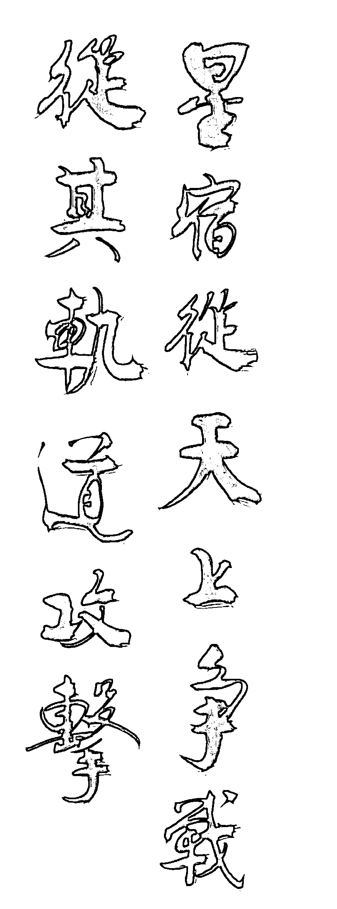

星宿從天上征戰，從其軌道攻擊。士師記五章 20 節。歐善全書。

viii

## 序

「占星學」是先人遺傳下來的智慧寶典。很多行星交會一個人一生只能遇到一次。交會時會發生甚麼事誰也不知道。唯有藉著先人遺留下來的智慧，我們得以趨吉避凶。很可惜占星算命被很多人蒙上神秘的色彩。寫書的人都要稱自己是 XX 齋主、XX 道人、XX 居士，少不得穿上唐裝，弄個披頭散髮帶個水晶球…之類的。

市面上算命的書不少。但是能以古人的理論為基礎，提出自己的見解，成一家之言的人卻無幾。本書運用研究科學的手法來探討算命，也就是藉由「觀察」→「理論模型」→「預測」→「驗證」的方法來討論占星學。我們：

- 探討容易驗證的時事占星：市面上占星學的書籍少有談論「時事占星」。星象不但影響各人的生活也影響整個社會。要從每個人的私生活中印證某些星相並不容易，因為資料不易取得。但是對整個社會的影響確在報紙新聞上都可以看到。
- 正確的引用文獻：多數算命書籍之作者提出一個理論，但是卻從沒有告訴你是如何得到這些結論。「科學的方法」首先就是要告訴人家你根據甚麼得到這些結論？使後人能夠驗證妳的理論。
- 科學的觀察方法：個人生活事件從寫日記，或者簡單的紀事，開始，以便日後查詢。國家社會上發生的事情可以從圖書館的舊報紙上得到資料。更遠的事情就只好從研究歷史或者名人傳記著手。
- 知之為知之，不知為不知：本書只討論我「看得懂」的東西。

本書中我們不談如何排盤；那是電腦的事。我們的篇幅全部放在探討命理中現象。我，根據所受的物理學思考訓練，提出很多看法。這些看法，當然有個人的盲點，不見得完全正確。不過相信是值得大家探討的問題。

我並沒有很仔細的紀錄每一個事件，也不可能。只是偶爾看報有感而發寫下來。由於市面上完全沒有類似的書，寫這本書在很多方面考驗著我的能力。如何能將我在學術上所受的訓練用在這樣一個題目上？

我不是甚麼小鐵口也不是「科學乩童」。只是純脆業餘愛好，於讀報、歷史及傳記後有感隨筆寫下本書。從開始寫作時的「平生不願混巫媼」、「入大廟，每事問。」到後來逐漸轉為「究天人之際，通古今之變，成一家之言。」希望筆記型電腦能夠取代水晶球。希望這本書能夠開啟大家研究占星學的興趣。也希望這本書能夠博得同好掌聲。

丁致良
2023 年 3 月
於台中

# 目錄

> Destiny is not a matter of chance,
it is a matter of choice;
it is not a thing to be waited for,
it is a thing to be achieved.

William Jennings Bryan (1860-1925)

# 1 關於占星

占星學是什麼？這個問題的答案見仁見智；正如同心理學及量子力學是甚麼對每個人的意義也不同一般。中研院第十七屆院士何丙郁 (1926-2014) 就是研究中國古代占星學的專家，對他說來占星學是一種歷史學。

本書討論的是占星學的理論模型其實驗證據。對我們說來占星學是一門經世濟民之學。不但能指導個人前途，還能在社會發生動盪時幫助社會找出方向。

占星學是一門精密的科學；如果你想知道的只是一個 YES/NO 的答案，大可以去卜卦。但是，如果你想用占星來了解妳的一生，無論是過去或者未來，或者了解這個世界上每天發生的事情，你需要多知道一些東西。

## 1.1 一點哲學

占星學的背後有著希臘諸神的傳說；如同中國紫微斗數背後也有許多上古時代的傳說。不過她們背後也都有著一套哲學：
「算命」並非像去看聯考榜單般去看上帝在你身上的計劃。
有人稱這是「命理」。它是一種「哲學」。它事實上是一種「對事物的看法」。如果只是去看榜單，那麼命盤人人會排。在今日電腦科技發達，更可以用電腦排盤了。但是很多事情是看

# 第一章

# 1. 關於占星

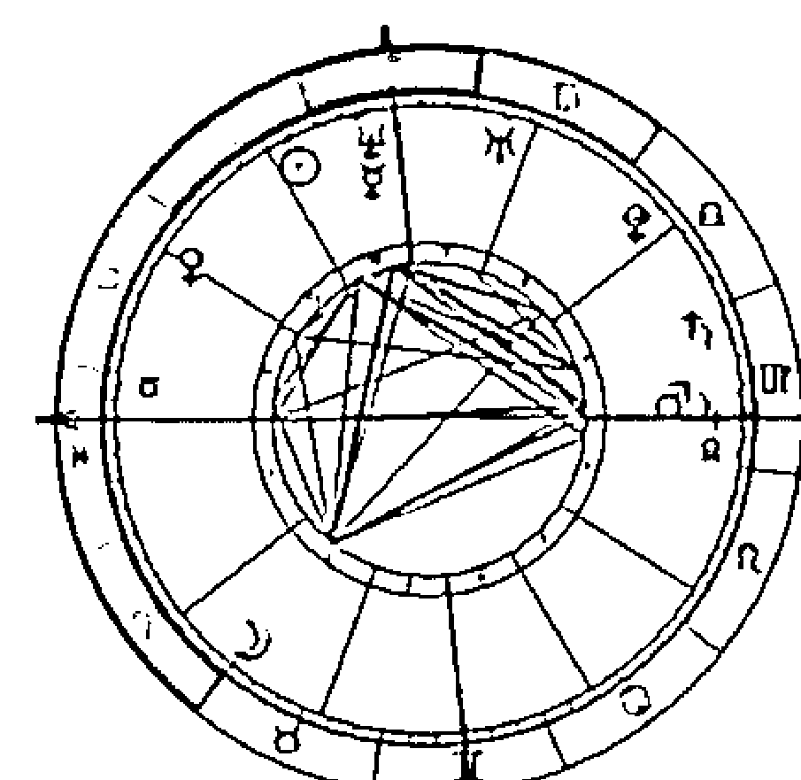

N小姐，1979年12月28日早上10:30生於高雄。某國立大學護理系畢業。畢業時正逢台灣經濟不景氣，失業率高達5%以上。因此畢業就失業。但是2003年台灣爆發SARS風暴。許多醫師護士因而被隔離甚至喪命。當時很多人想辭職都辭不掉。N小姐當然應該慶幸自己「命不好而失業」了！

當事人怎麼看它。在我們生長的環境裡，從小外界塑造了我們對事物的看法。這就是「命」。古希臘哲學家說性格既命運1。

排盤的規則書上說得很清楚。但是那些「哲理」有人也許一輩子也始終弄不懂。古人乾脆就稱這叫「慧根」。事實上，古書裡甚至對某些排盤的細節都有爭論。因而演變出「派別」之分。但是，很多爭論點其實都只是一體的兩面。有「慧根」的人一眼就看出這是同一個問題，沒「慧根」的就只能在一些支節末梢的問題上做文章、鑽牛角尖混飯吃了。

「命」其實沒有好壞。就像海邊的石頭一樣，每一顆都是上帝的傑作。只是看你「知不知命」，會不會善加運用罷了。因此古人說「行行出狀元」。學會欣賞、尊重別人的不同才是最重要的事。

莊子「逍遙遊」裡說到一個故事：有人種了一種大葫蘆。結果這個葫蘆太大了，根本不適合拿來當勺子。因此他覺得這種大葫蘆沒有用。莊子說，你何不把它當作救生圈來用呢？莊子說：以前有一個人祖先世代從事洗棉絮的行業。天寒地凍時洗棉絮手容易龜裂。他的祖傳秘方卻能讓手不龜裂。有一天來了一個客人，知道他有這個方子，就想出百兩黃金把它買下。他把族人找來商量。想一想自己世代洗棉絮不過賺個幾兩黃金，如今卻可得百兩黃金何樂不為？客人得了這個方子，把它獻給吳王。後來吳、越冬天在河上打仗。吳王因為有這個方子而大勝。當然這個人後來就得以割地封侯了。同樣一個方子，有人得了百兩黃金，有人卻得以升官封侯，原因是什麼呢？

一個東西有沒有用是看你怎麼用它、會不會用它罷了。一切都只是自己的價值評斷而已。因此去算命應該好像是去看醫師一樣。

1希臘哲學家 Heraclitus, On The Universe, fragment 121。

## 1.1. 一點哲學

但是「命」有「高潮」有「低潮」。有人少年得志，晚年落魄²；有人中年後發³。莎士比亞說：

> There is a tide in the affairs of men,
Which taken at the flood, leads on to fortune.
Omitted, all the voyage of their life is bound in shallows and in miseries.
On such a full sea are we now afloat.
And we must take the current when it serves, or lose our ventures.
(Julius Caesar Act 4, scene 3, 218–224)

孟郊，寫「慈母手中線遊子身上衣」的詩人，46 歲中進士，好不得意於是寫下了

> 昔日齷齪不足誇，今日放蕩思無涯。
春風得意馬蹄急，一日看盡長安花。

²如果流年天王星、海王星、冥王星等大行星的位置，少年時在天頂，到了晚年就走到天底，就會造成這個現象。
³通常幼年困頓的故事都是少年時天王星、海王星、冥王星等大行星流年位置在天底，到了晚年就走到天頂。韓信出身貧賤，從小就失去了雙親。淮陰屠中少年，有侮信者，曰：『若雖長大，好帶刀劍，中情怯耳。』眾辱之曰：『信能死，刺我；不能死，出我胯下。』於是信孰視之，俛出胯下，蒲伏。一市人皆笑信以為怯。此時流年某行星應在第五宮 (對宮為十一宮)。至秦末劉邦起義，韓信建立軍功，出人頭地 (某行星上升到地平線以上)。以這段時間估計秦朝統治不過十五年，因此能夠在這麼短的時間中由天底爬到天頂的行星應該是天王星。
《史記淮陰侯列傳》對這中間的轉變有詳盡的記載。變化始於項梁率軍渡過了淮河，韓信靠著自己的一把劍去追隨他，但只是一個默默無名的小卒，估計此時天王星在第五宮末尚未進入第六宮。項梁戰敗，又隸屬項羽，項羽讓他做了郎中。他屢次向項羽獻策，以求重用，但項羽沒有採納。漢王劉邦入蜀，韓信脫離楚軍歸順了漢王。因為沒有什麼名聲，只做了接待賓客的小官。後來犯法判處斬刑，同夥十三人都被殺了，輪到韓信，他抬頭仰視，正好看見滕公，說：『漢王不想成就統一天下的功業嗎？為什麼要斬壯士？』滕公感到他的話不同凡響，見他相貌堂堂，就放了他。和韓信交談，很欣賞他，就把這事報告漢王，漢王任命韓信為治粟都尉。不過漢王並沒有察覺他有什麼出奇超眾的才能。韓信多次跟蕭何談話，蕭何認為他是位奇才。到達南鄭，各路將領在半路上逃跑的有幾十人。韓信揣測蕭何等人已多次向漢王推薦自己，漢王不任用，也就逃走了。蕭何聽說韓信逃跑，來不及報告漢王，親自追趕他。有人報告漢王說：『丞相蕭何逃跑了。』漢王大怒，如同失去了左右手。過了一兩天，蕭何來拜見漢王，漢王又是惱怒又是高興。罵蕭何道：『你逃跑，為什麼？』蕭何說：『我不敢逃跑，我去追趕逃跑的人。』漢王說：『你追趕的人是誰呢？』回答說：『是韓信。』漢王又罵道：『各路將領逃跑了幾十人，您沒去追一個；卻去追韓信，是騙人。』蕭何說：『那些將領容易得到。至於像韓信這樣的傑出人物，普天之下找不出第二個人。大王果真要長期在漢中稱王，自然用不著韓信，如果一定要爭奪天下，除了韓信就再沒有可以和您計議大事的人了。但看大王怎麼決策了。』漢王說：『我是要向東發展啊，怎麼能夠內心苦悶地長期呆在這裡呢？』蕭何說：『大王決意向東發展，能夠重用韓信，韓信就會留下來，不能重用，韓信終究要逃跑的。』漢王說：『就依你的，我讓他做個將軍。』蕭何說：『即使是做將軍，韓信一定不肯留下。』漢王說：『任命他做大將軍。』蕭何說：『太好了。』於是漢王就要把韓信召來任命他。蕭何說：『大王向來對人輕慢，不講禮節，如今任命大將軍就像呼喚小孩一樣。這就是韓信要離去的原因啊。大王決心要任命他，要選擇良辰吉日，親自齋戒，設置高壇和廣場，禮儀要完備才可以呀。』漢王答應了蕭何的要求。眾將聽到要拜大將都很高興，人人都以為自己要做大將軍了。等到任命大將時，被任命的竟然是韓信，全軍都感到驚訝。突然的改變就是天王星的特性，但是前面必然也經歷過無名小卒的第六宮，甚至被人公然侮辱及作法當斬的第五宮及家貧的第四宮。估計此時天王星已經上升的地平線上了。

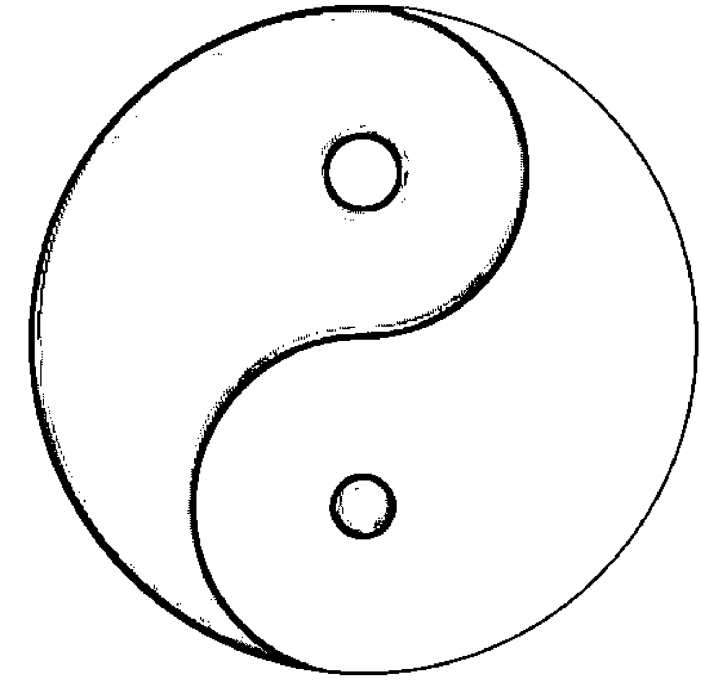

图 1.1: 易经八卦等于是电脑的机器语言。

的名句。上帝是公平的，乞丐也有三年好命啊！好像演戏，有些时候你在后台，有些时候你在聚光灯下。但是在后台时你不好好准备，上台后你能表演吗？

有人认为算命是一种悲观的「宿命论」。其实这也是对命理一知半解的结果。命盘是生下来就固定了，就好像生物界里的 DNA 在演化的过程中早已固定。生物是根据这个「样版」去制造个体。但是造出来的个体却仍可有很大的出入。命盘有可能是一样的。但是制造出来的人生，却可以有很大的不同。

算命违反科学吗？其实并不见得。至少对于紫微斗数、西洋占星甚至子平八字并不是。这三种算命都有很清楚的规则。它们都是一种「模型预测」。（相对于面相、手相只是一种经验定律 [5]）中国古代由甲骨占卜走向易经八卦就是由不科学的方法走上科学的模型预测。「规则」书上都有，算命先生只是给它一个「解释」，一个符合环境的解释。这就好像高能物理学里面的「基本粒子理论」。由实验上我们知道一些规律，物理学家由此建立模型。对于算出来的数学式子给它一个解释（也许应该称为「诠释」，interpretation），再经由实验验证、用模型来进行预测 ...。占星学中这些步骤一个都没少。我们也是对排出来的星图给它一个解释。这个「解释」的工作一般称为「算命」。因此从事这两种算命的人并不「语怪力乱神」，当然更不需「半仙」，也无需「通灵」。「紫微斗数」是一种模型，「西洋占星」是另一种模型，「易经八卦」又是另一种。从事算命需要的是能运用模型进行抽象思考的能力。

以现代电脑语言来比喻：「易经八卦」是「机器语言」，「子平八字」是「组合语言」，「紫微斗数」与「西洋占星」则是低

## 1.1 一點哲學

階語言，而算命師的「解釋」則是「自然語言」$^{4}$。

占星學或紫微斗數的基本假說是「上天如是，人間亦然」，也就是說「天上」與「人間」是相關的；無論是「天上的星星影響人間的事物」還是「人間影響天上」。這是能用「模型」進行「預測」的基本假說$^{5}$。

即使是科學，如歐氏幾何、古典力學，乃至經濟學，也是建立在一些基本假說上$^{6}$。數學上稱之為 axiom，物理學家稱為 postulate。假說是無法證明的，但是卻可由此推導出一些可驗證的理論。有沒有模型可以不需任何假說？答案是否定的。因為，你可以製造任何理論模型，模型本身並沒有告訴你該如何，但是卻是假說把模型與真實世界連結在一起。沒有假說的模型是虛幻的。

每個模型其實都不完整。好像盲人摸象一般。有時候一個問題用某一個模型不容易得到清楚的答案，用另一個模型卻可以清楚的解答。就好像電腦語言有些時候適合用這種語言，有些情況適合用另一種。

這種上天與人的關係在中國儒、道、釋家均有闡釋 [6]：

- 《黃帝內經·靈樞·刺節真邪》強調人「與天地相應，與四時相副，人參天地」，
- 《靈樞·歲露》、《靈樞·經水》「人與天地相參也」，《素問·脈要精微論》「與天地如一」。
- 《周易·乾卦·文言》：「大人者與天地合其德，與日月合其明，與四時合其序，與鬼神合吉凶，先天而天弗違，後天而奉天時。」
- 老子《道德經》：「人法地，地法天，天法道，道法自然」。
- 莊子《齊物論》：「天地與我並生，而萬物與我為一」。

$^{4}$《說文解字序》中談到中國文字的起源時也有提到中國文字最原始的形式可能是八卦 (機器語言)。其次是結繩記事 (組合語言)；再來是黃帝史官倉頡，見鳥獸蹄迒之跡，知分理之可相別異也，初造書契 (自然語言)。但是多數學文字學的人在讀到這段文字時顯然無法理解許慎的意思。
$^{5}$依照陸斌兆、王亭之所著的《紫微斗數講義》所說，這是「賓星」的主張。也是陸斌兆先生的看法。
$^{6}$N. G. Mankiw, Principles of Economics 開宗明義章就提出 10 個經濟學基本假說。古典力學基本假說如既定性 (determinism)，請見拙著古典力學。另外，既然我們已經承認「上天如是，人間亦然」，但是天體運行是依照古典力學也就是既定論，因此我們已經承認占星或者命運的演化是依照古典力學的既定論。

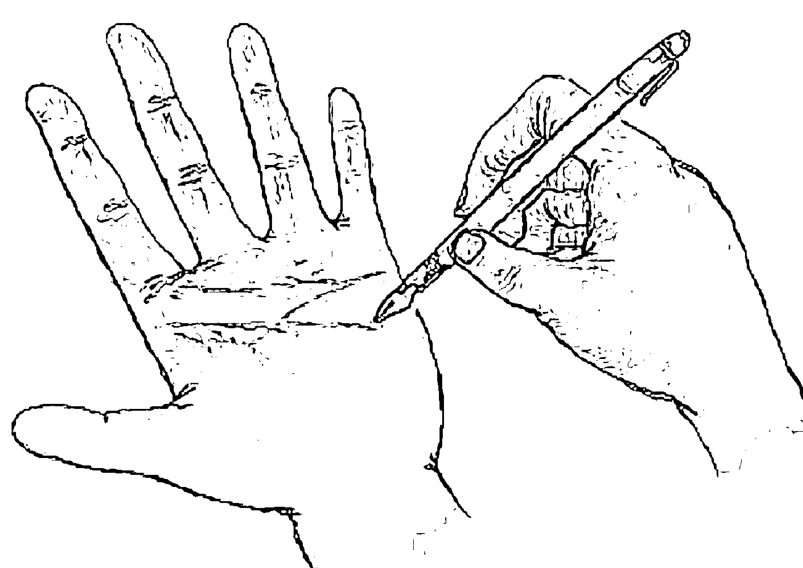

圖 1.2: 命運由自己創造 (聯合報 92 年 7 月 11 日 E7 版)。

...漢武帝獨尊儒術，當時儒家的代表董仲舒提出了「天人之際，合而為一」的思想。到宋代，大學者張載明確提出了「天人合一」的概念，並對它進行了闡述和定義。

由占星學的假設可以推論得知：人間的事、物是相關的；因為很多事情會受同一星象影響。這就是為什麼遠在千里外的占星家會突然寄來電子郵件說已經看到他所預測將發生在你的身上的事情發生了。也是為什麼類似的事件會同時發生在世界上好幾個不同的角落。這件事說起來就是歷史演進的一元論。

近代西方文明始於 14 世紀末到 16、17 世紀義大利的文藝復興時期。牛頓 (Isaac Newton, 1642-1727) 就是生於這個時代的末期。1686 年牛頓出版了它的三本巨作, Principia, 是近代科學的始祖。受牛頓的啟發，十八世紀法國啟蒙思想家，如孟德斯鳩 (Baron de La Brède et de Montesquieu, 1689-1755), 就主張用牛頓的方法來研究人文與社會現象。於是形成一種新的思想，後來稱為「歷史演進一元論」，認為可以找出歷史演進的規律，「放諸四海皆準，行之百世而不惑」。十九世紀歐洲出現不少社會思想家，如孔德 (Auguste Comte, 1798-1857)、馬克思 (Karl Marx, 1818-1883)，相信自己已發現歷史的規律並據以進行歷史的分期。史學家余英時 (1930-) 對此種思想有極多的批評。不過這種思想與他主張的天人合一其實相去不遠，甚至異曲同工。或者說前者錯誤的理論只是一種學說：學術研究中錯誤的模型很多，經過修正後有可能變成正確的。

## 1.2 一點歷史

占星學源起於古人敬天地畏鬼神的原始宗教活動所反映的天人關係。古人根據觀察天象變化以占卜人世吉凶禍福的數術，稱為占星術 (學)，或稱星占術 (學) [8]。我們稱理性的部分為占星學；非理性的部分為占星術。本書探討的是前者。要了解占星學得先了解一點歷史與一點天文：

### 1.2.1 西洋占星的源起

西方古代，如亞里斯多德的年代，占星與天文，甚至物理、數學並沒有區分。六世紀時羅馬人 Boethius (c.480—c.525) 就稱現今之天文、算數、幾何及音樂為 mathematics。這四門學科始於古希臘在中世紀歐洲大學稱為 quadrivium。後來各學科才逐漸劃分出來。德文 Wissenschaft 到今天還是指著所有系統性的研究，包含歷史及哲學。中國古代所稱之數術就包括近代所稱之數學、天文、占星甚至風水等等。首先將 mathematics 稱為數學的是李善蘭 (1810-1882)。

今日我們所看到的占星學至少應該是人類知道如何精密計算行星位置與軌道之後的事了；這與甲骨文中的占卜有非常大的差異。計算行星軌道屬於古典力學的範圍。至於人類何時知道如何計算行星軌道已經不可考，而且似乎也是逐漸演進而來的。現存最早的占星圖是西元前 410 年用楔形文字刻寫在泥板上的 [2]。已知占星學可以追溯自西元前七世紀，甚至西元前 18 世紀，的巴比倫人的美索不達米亞文化。

西元前四世紀亞歷山大王佔領巴比倫因此占星學為希臘文化所吸收。但是希臘文化深受蘇格拉底及柏拉圖的影響並不接受占星學；但是季諾 (Zeno, 336-264BC) 創立的斯多葛學派 (Stoicism) 則相信命運是注定的。羅馬帝國時期上流社會都相信這個學派，因此占星學也就隨之發達了；這段時間也是巴比倫天文學的頂峰。

到了托勒密 (Claudius Ptolemeous, 約西元 100 年到 168 年) 的時期人們認為已經完全了解宇宙了。托勒密集古希臘天文學之大成著有十三冊的巨作《天文學大成》(Almagest)。

西元五世紀歐洲文化進入黑暗時期。占星在歐洲也因為基督教興盛而被驅逐到回教世界。直到十一世紀初伊斯蘭國家保有的科學知識才滲入歐洲。

公元前後，占星學從希臘傳入印度。今日印度占星學一般稱為「吠陀占星學」(Vedic astrology)。「吠陀」(Veda) 二字，原意指「神的啟示」或「神秘的知識」，是印歐語系中最古老的聖典文獻。而吠陀經書之成書時期為西元前十世紀至前六世紀，為印度宗教萌生之始。雖說吠陀經成書於此時，但吠陀時期則可追溯至西元前二千年或更早。

### 1.2.2 中國的占星學

中國歷代皇帝都有專業占星師輔佐 [7]。《左傳》：「丙之晨，龍尾伏辰 …鶉之賁賁，天策焞焞；火中成軍，虢公其奔。」宋高宗每逢臣僚「有負聖恩」時，總是自我解嘲地認為是自己星命中奴僕宮位置不好。所以吳焯《南宋集事詩》有詩嘲諷：「堅壁長城慕勇功，中興想望野人同。醫身醫國皆司命，星陷無如奴僕宮。」

中國傳統占星學與西方占星學最大的差異在於中國傳統認為皇帝是天子受天命而統治天下。因此稱為天文的占星術是要服務天子的。因此中國傳統的天文學中並沒有涉及個人命運的占星學。

易經是傳統儒家文化中唯一認可的命理書籍。詩經中也談命理、天象，例如

> 嘒彼小星，三五在東。肅肅宵征，夙夜在公。寔命不同。
> 嘒彼小星，維參與昴。肅肅宵征，抱衾與裯。寔命不猶。

> 維天之命，於穆不已。於乎不顯，文王之德之純。假以溢我，我其收之。駿惠我文王，曾孫篤之。

### 1.2.3 紫微斗數的源起

中國傳統的卜卦等數術，甚至易經都是用來決疑和趨吉避凶的。這與推算事情發展的奇門遁甲、六壬等非常不同 [4]。子平八字並不依靠天文觀察。至於紫微斗數是否與天文觀測有關？我個人認為他是一個簡化後的西洋占星模型，因此已經逐漸脫離了天文觀測，例如在紫微斗數中根本沒有日蝕、月蝕這回事。

今日所見之中國占星學發源於春秋時期 (722—480 BC) [2]。依據收入欽定四庫全書的永樂大典本星命總括，耶律純從寮國出使高麗，因而習得從西域傳入高麗的占星學。道藏紫微斗數一書中的方形命盤與現代流行的紫微斗數形式相近。太乙人道命法和現代紫微斗數的十二宮較為接近。這大概可視為紫微斗數的由來。欽定四庫全書及古今圖書集成中雖然有收錄部分數術典籍但是沒有直接提及紫微斗數。明代的正統道藏收入紫微斗數三卷這是最早有紫微斗數名稱的典籍。時間大約是 1436 年以前。但是這本書所說的紫微斗數與現代的紫微斗數有相當的出入；例如，十二宮的順序與名稱都不同。但是其中卻有希臘天文學中的十二星座名詞及羅睺 (Rahu)、計都 (Ketu) 兩顆虛星$^{7}$。這兩顆虛星最早出現在西元七世紀由印度傳入的九執曆 (Navagraha) 中的大正大藏經；它們指的是黃、白道的升交點與降交點。

印度占星學在西元三世紀就已經傳入中國了。隋朝佛經中有一部譯名為《大乘大方等日藏經》的經書，裏面就提到了十二星座；雖然使用的名稱與今日的不同。北宋開寶五年 (972) 的《熾盛光佛頂大威德銷災吉祥陀羅尼經》(現藏於日本奈良寺院)，卷首圖就是一幅環狀的十二星座。杜牧《自撰墓誌銘》：「予生於角，星昴、畢於角為第八宮，曰病厄宮，亦曰八殺宮，土星在焉，火星繼木。」就是說，他的星命以角宿所在天秤宮為第一宮命宮，據此以推，昴、畢二宿所在金牛宮為第八病厄宮，火、土災星會聚於此。

$^{7}$請注意，睺是日字邊。康熙字典：頁 498 第 31 辭海：卷 6 頁 4610 第 1。何樓切，音侯。喉字之譌。月之交首尾曰羅睺。又人名。隋將周羅睺，封義寧郡公。

### 1.2.4 近代占星學

從十七世紀開始天文學與占星學分道揚鑣。1781 年發現天王星徹底改變了占星原本的理論。當然這件事現在看起來並不是世界末日，隨後又在 1846 年發現了海王星，及 1930 年發現了冥王星。畢竟即使是科學上的理論也是需要隨著新的實驗發現不斷的修正。十九世紀初西洋占星學在美國受到通神學 (theosophy) 和紅玫瑰十字會 (rosicrucian) 的復興所鼓勵走向新方向，結合科學、宗教、哲學並著重道德。

近代身為占星家的學者並不在少數。例如心理學家榮格 (Carl Jung, 1875-1961) 用占星來探討人類的心理。不過此時的占星學仍然沒有擺脫宿命論的色彩。作曲家 Dane Rudhyar (1895 —1985) 是另一個重要的例子。他在 1936 年寫了一本書 The Astrology of Personality 主張人的自由意識在星圖中扮演決定的角色，並開始研究無意識心理。後來他更提出超個人占星 (transpersonal astrology)，並於 1969 年創立國際人文占星委員會 (International Committee for Humanistic Astrology)。他的觀點對 1960 年代加州三番市的嬉皮影響甚鉅。就是他在 1972 年提出水瓶世紀將在 2062 年來臨的看法。更近代一點的著名占星學者有劇場學者 Antero Alli (1952 -)。

## 1.3 西洋占星與中國紫微斗數之比較

何丙郁在他的專文中討論了西洋占星與中國紫微斗數的淵源，但是他並沒有下結論 [2]。

西洋占星與紫微斗數很多詞彙，甚至觀念，並沒有完整的對應，正如同閩南語中很多字在國語中並沒有很好的翻譯一般。9.2.2 節會討論的早婚晚婚就是一個例子。9.1.1 節會討論的夫妻到底是牽手 (台語，意味事業的伴侶) 還是我的對偶 (duality)？讀完本書相信讀者無論對於西洋占星與紫微斗數都有進一步的認識。西洋占星與中國紫微斗數最大的差異有幾個：

- 西洋占星命盤並不區分男女。
- 西洋占星中行星的「逆行」的觀念在紫微斗數中付之闕如。
- 紫微斗數沒有出生地的觀念，西洋占星不但需要地點還精準到需要經緯度。
- 西洋占星中區分初等教育與高等教育的觀念紫微斗數中沒有。
- 愛情與婚姻的區分；工作與事業的區分在紫微斗數中也付之闕如。
- 西洋占星中投資與子女同屬第五宮，紫微斗數中投資與子女也屬同宮。
- 西洋占星中無四化星。
- 紫微斗數中沒有看過討論日蝕、月蝕；西洋占星卻非常重視。

對於行星我們可以作一個簡單的比較表

| 紫微斗數 | 西洋占星 |
| :--- | :--- |
| 太陽 | 太陽、木星 |
| 七殺、擎羊 | 土星 |
| 天機 | 天王星 |
| 月亮 | 月亮 |
| 天機/巨門 | 水星 |

目前西洋占星命盤的排法都是畫成圓形，其實在中古時代西洋占星盤命也是畫成方形。南印度占星命盤畫得更像我們用的方形紫微斗數命盤。用一個數學上的術語來說，命盤的形狀只是拓樸不同而已，不同形狀的命盤間其實是同構 (isomorphic) 的。

我們可以大膽的說紫微斗數是一個簡化且吸收了中國思想後的西洋占星。把西洋占星的幾度幾分丟掉，只剩下第幾宮，30 度一個單位，這兩種占星方法就大同小異了。這意味著行星位置即使相差 30 度仍可被列在同一宮裡。這件事看起來影響不大，但是兩顆對衝的行星如果各差 30 度就可能是三合了 (180-30-30=120 度)。四刑的行星差個 30 度也變成三合 (90+30=120)。因此如果有人跟你談紫微斗數的行星交會，甚麼三合、四刑、...的你笑笑就好，因為那是無稽之談。也因此紫微斗數對於子時的劃分會有爭議。把度數的細節丟掉以後，雖然紫微斗數中仍有流時、流月、流年的觀念，但是行星交會的觀念已是一派胡言。

紫微斗數不論出生地點更加深這個問題。畢竟在古老的時代能像唐三藏、張騫這樣從中原到西域的人不多。但是，今日社會中，在美國出生的人紫微斗數命盤到底應該依照美國時間排，還是換算成中原標準時間排？答案是：依行星而異。太陽、月亮依照當地時間。其它行星可能得換算後才具意義。通常都是依照當地時間來排。但是依照這個方法排出來的命盤嚴格說起來就只是太陽、月亮占星盤。也就是說紫微斗數等於就是太陽、月亮占星。其它的行星則會有相當的誤差。誤差時間可能高達半天到一天。但是為什麼還具有相當的準確性？原因在於紫微斗數只是一個近似模型，因此允許誤差。對於行動緩慢的外圍行星而言這個誤差可以接受。但是，如果要談行星交會這種精密計算就有問題了。各位可以在本書中看到，要能計算整個社會、國家發生的事件，必須仰賴行星交會的資訊。因此紫微斗數要算這些事情時就有困難。簡化模型是好的，不過過度簡化以至於某些特性遺失就不好了。

一個理論模型經常有它的盲點。紫微斗數中對於出生地、閏月的爭議，甚至子時的爭議就是一個例子。但是在西洋占星中就完全沒有這個問題。

有人說西洋占星的命宮就是第一宮。這一點可能只對了一半。對於太陽在第一宮的人正確。紫微斗數命宮中對應的行星可能可以在西洋占星命盤的最高點位置找到。

西洋占星在宮位順序的安排造成了本書在 2.4 節所說的現象。在紫微斗數中似乎看不到這些。而且在紫微斗數中男女流年行星行走的方向不同，但是宮位的順序卻相同，使得上述現象更不可能出現。

大家在研讀本書中可以自行比較二模型行星間的異同相信能大有斬獲。

## 1.4 觀察星象的方法

本書強調的是用科學的方法研究占星。因此在開始討論星相問題前，我們先討論方法：

日常生活中的事件絕大多數都是有前因後果的。即使是車禍，「碰」的一瞬間發生，其實也是一連串的事件：首先開車的人要把車子開上路，然後才會撞到，撞完了以後可能就進醫院了。行星交會也不是「碰」的一下發生。它們也是逐漸接近、交會、離開。由於地球並非太陽系的中心，因此有些複雜的交會可能會來回幾次，請參考 1.6.4 節。但是這幾次交會可能相隔幾個星期甚至幾個月$^{8}$。

因果關係是歷史學家非常有興趣的問題之一 [1]。不過，通常人都太健忘了。幾個月前發生的事，什麼時候發生，誰也記不清楚，更不用說聯想起認為它們是相關的事件。因此要研究占星必須從寫日記，或者簡單的紀事，開始。簡單記下每天發生的重大事件，以便日後查詢。如果是研究國家社會上發生的事情當然可以從圖書館的舊報紙上得到資料。現在大家經常使用電子郵件。因此電子郵件也是一個查詢生活上發生的事情的好方法。

鑑往知來，因此研究星相必須熟讀歷史、偉人傳記。司馬遷在史記《太史公自序》說他寫史記的目的就是要：「究天人之際，通古今之變，成一家之言。」

## 1.5 數算年歲的方法

> 求你指教我們怎樣數算自己的日子， ...。

詩篇九十篇 12 節

有人用地球公轉幾次、自轉幾次計算他的日子；有人用辛亥革命後幾年計算他的年歲；有人用耶穌出生以後地球轉過的次數計算他的年歲；...。本書將告訴你還可以用行星交會、地震發生的時候、...來計算你的年歲。這中間的差異只是一個座標轉換；座標轉換在高中就學過了。相對論也不過就是個座標轉換而已。但是你會發現，經過轉換後，原本看似雜亂無章的事件卻變得有關連。

## 1.6 名詞解釋

### 1.6.1 歲差

天文學上，太陽系八大行星都以同一個方向繞著地球轉。而且這些行星運動的平面幾乎一致。

希臘占星學是傳統保守的印度占星學的起點，並在歐洲、印度與東南亞的文化中開花。但是印度人與伊斯蘭教徒（回教徒）、歐洲人對黃道的定義有所不同：地軸有 23.5 度的傾斜，太陽在黃道上運動。每年太陽會跟赤道面在春、秋交會二次，這就是春分點與秋分點，或稱晝夜平分點 (equinox)。黃道一圈可以劃分為十二個 30 度扇形。但是第一宮牡羊座從哪裡開始？這是一個爭論的問題。太陽由一個分點到另一個分點是一年四季中的重要節奏。這提供北半球黃道起始點合理的參考座標，大約在三月 21 日的春分點。這個赤道交點稱為「第一宮牡羊座」，依此類推計算十二宮。

問題是：十二星座原本的名字及符號得自沿黃道的恆星星座。但是這跟背景的恆星星座比起來晝夜平分點就不是固定的了。黃道上的十二宮位與它們後面的恆星以平均 72 年一度的速度往後移動。因此走一整圈大約要兩萬六千年！這個現象稱為歲差 (precession)。

古典希臘占星學家以晝夜平分點起算牡羊第一宮。這樣比較符合四季變化。而印度占星學家則用恆星黃道，保持十二宮位起始位置與牡羊恆星間的關係。因此幾個世紀下來這兩種方法差異越來越大。目前大約差 25 度。幾乎差了一個宮位。現在的春分點落在雙魚座，正接近雙魚和水瓶的交界處。這也就是所謂的水瓶世紀將到的原因。因此一個射手座的讀者如果要看自己的印度占星預測就得看天蠍座的部分了！

把牡羊座 0 度設為春分點的方式稱為回歸線方式 (tropical zodiac)，把牡羊 0 度固定於黃道上的特定位置的稱為恆星黃道方式 (siderial zodiac)。西洋占星用前者，十三星座占星、印度占星用後者。

### 1.6.2 逆行

天文學中我們知道太陽系是以太陽為中心運行。但是占星學中卻是以地球為中心來觀看行星運行。因此我們會看到有些行星往一個方向前進一段時間後又會「後退」。我們用一個符號 **R** 來表示行星後退 (retrograde)。

正行的時候當然是擴張、得到正面效應。逆行的行星不發生作用，甚至可能發生「反作用」。或者說他是在一種「休息」、「回憶」或者「冬眠」的狀態。正行了一段時間後就必然會逆行。這如同有白晝、黑夜一般。當然月亮及太陽是不會逆行的$^{9}$！

命盤中逆行的行星不但發揮不了作用反而會找麻煩。但是本書討論的許多大師多有極多的行星逆行！這些人多是些音樂家、作家、畫家 (無雇主的自由業)，也許正是紫微斗數中說的僧道之命。畢卡索 (10.1 節) 有四顆行星逆行，莫言有五顆 (10.13 節)，普契尼六顆 (10.18 節)，...可能的原因在於行星逆行使他們無力於社會舞台上與人爭權奪利轉而從事創作。能量不斷累積，在中年後，當你看到他時，已成大師。莫言在得到諾貝爾獎以前已經 (寫書) 寫了一個土星週期 (29 年) 了！已發表 80 多篇短篇小說、30 部中篇小說，11 部長篇小說，5 部散文集、1 套三卷本散文全集，還創作過 9 部影視文學劇本及兩部話劇作品。

根據我的經驗，本命逆行的行星似乎應該歸對宮計算。各位在觀察命盤時可以驗證一下我的說法是否正確。

很多人在經歷一段困苦後，以為行星轉換宮位應該痛苦結束了，誰知好日子沒過多久又恢復從前的壞日子了。這個現象與逆行有關。原因在於行星剛轉換宮位時都在交界處，一旦

$^{9}$因為月亮繞地球，而地球繞太陽!

The request was rejected because it was considered high risk

有些人一想到算命就問”準不準”。去找算命的故意甚麼都不說要看看他是不是半仙。準不準的問題其實包含兩個層面：第一是命盤排得準不準，第二是詮釋得準不準。前者應該不是問題。命盤是根據出生當時的天空行星位置排的。人類已經能登陸月球、探測火星、...因此精確計算行星位置早就不是問題了。至於詮釋，也沒有準不準的問題。既然稱為詮釋就只有好壞的問題；正如同指揮家卡拉揚詮釋貝多芬的作品一樣。讀過本書的讀者就應該知道算命的目的並不是在猜謎。算命的目的是在於藉由理論模型讓一個人對過去的經歷有更多的認識，從而能妥善的規劃未來。

下面這些算命對話是我偶爾在網路上發現的，因為它具有共通性，摘錄如下：

## 例 1.1

> 我是男生，生於 1983 年 12 月 21 日晚間 20 點 24 分，高雄市。
> 問題是這樣的：長久以來，我自認在感情方面相當坎坷，這與我的個性有關。一方面，我在藝術方面的若干表現，若是令某些女性動心，則往往基於她們「藝術家」的浪漫想像。交往中，我常得滿足這類想像，並每每覺得對方虛榮淺薄。另一方面，不知是否相關，我所欣賞的女性，則通常是我能依賴、傾吐的對象，這時，我卻察覺她們寧視我作有趣的男性友人，而非交往對象。
> 近日我陷入無端的憤怒，憤怒從事藝術，是自欺欺人的。因為，我不只騙來虛榮淺薄的女性，還騙自己該滿足於追求藝術，而這正為逃避感情的缺憾。
> 我想請問各位老師，從星盤看來，幾時我才能找到合適的伴侶？又或者，我該怎麼修正自己，才能脫離上述困境？若問得更精細，這半年之內，是否有可能遇到所謂真愛呢？

來占者能夠清楚地述說他的經歷與問題，實在難能可貴。此君之藝術天分的確在其眾星雲集的第五宮中可以看出，而且當時，2012 年，流年冥王星已經在他的第五宮待超過十年了。第五宮同時也代表純純的愛。至於夫妻之愛的第七宮則沒有主星，雖然流年天王星的確在大約 2004 年左右行經他的第七宮。

一位大師答覆如下：

> 你利用藝術的特長來吸引女性，想必你對自己的特長必定自認為有過人之處。這句話的意思是，你是知道自己這種行為的，只是，現在產生了一些厭惡感罷了。有些因你的特長被你吸引，但你卻不是那麼喜歡，卻還是玩了下去。長久以來，你只是開始覺得厭惡了些罷了。
> 有時候你的神智會特別清晰，知道這種行為很膚淺。深入去探就它，你會知道自己的情感，安全感是疲乏的。看你是要屈就你的需求，還是理性所分析出來的客觀事實。如此而已。
> 或許你會辯解，我沒多做些什麼，她們就自己愛上我啊。請記得你對女性的博愛精神，很容易讓女生有這種誤會。這種特質沒什麼不好，但是如果太過，請區分這種界線更明確些。依照你務實的思維，這些想法你都已經想過。只是想要有人跟你講，讓你確定而已。

上面這段答覆也並非特例，的確是很多算命的答覆。它的問題在於它根本算不上是占星。它完全沒有根據星盤答覆。我看不出是根據甚麼寫下那一堆答覆的？這就好像小學生做算術，沒有過程就得到答案一樣。所有的詐騙都是這樣來的。

下面這個例子也是在網路上看到的：

## 例 1.2

> 男生 1980/01/16，08:35，台北市。一直以來感情都是短期結束，想請問這部份。

而我給他的答覆是：

> 每個人說的感情並不一樣。在第 3,5,7,9,11 宮都有
> 一下你所說的那種感情所在的宮位是否有行星逆

他的命盤排出來第七宮有土星、木星逆行，而且在過去的七年中天王星在他的第一宮。真正的算命是根據命盤答覆。

在財經界有這麼一句名言，當一家公司的財務報表令你看不懂時，別碰。當一個算命的告訴你的理論稀奇古怪時，同樣，別碰。好的理論一定能清楚的解釋一個現象。需要凹來凹去才能說的理論即使是正確也是不好的。

> The worst pain a man can suffer:
> to have insight into much
> and power over nothing.
>
> Herodotus (484-425BC)

# 2 星盤與宮位

一個人的命盤我們把它劃分成十二個宮位。一般劃分的方式是將圓周等分，稱為「等宮分法」。有些學派主張不等分，比較流行的是依照 17 世紀義大利僧侶 Placidus 的分法。西洋占星與中國紫微斗數的十二宮有幾許相似之處，不過次序並不相同，意義也有差異。仔細比較二者的差異可以對占星學有更進一步的了解，請見 1.3節。

### 2.1 十二宮的意義

第一宮命宮 如同紫微斗數的命宮。是一個人給人家最直接的印象。表示誕生及與周遭環境、外界的關連性。

第二宮財帛宮 正財。表示與自己擁有之物的關連性。

第三宮初等教育、短途旅行宮、親戚間的往來宮 與知性發達、語言能力有關、各種協議。

第四宮家庭宮 家，住的地方，室友。自己此時此地的感覺。與父親的關連。所有事情的終結。

第五宮愛情宮 表示戀愛、創造性。第五宮的愛是真愛。也代表兒童或者風險承受能力。自己的固有性向之外的表現。第五宮也掌管著懷孕與出生。

圖 2.1: 星盤與宮位。

第六宮健康、工作宮 表示關於健康、義務和角色扮演的想法。又稱奴僕宮或是服務宮（一個人服務時的樣貌、態度）、下屬宮（一個人自己當下屬的狀態、他的下屬的型態及他與下屬的相處關係）、疾病宮。

第七宮夫妻宮 與夫妻或合夥人的情況。結婚、契約。

第八宮共有的宮 表示與他人共有財產的情況。單筆的財產收入，包括仲介費、版稅、權利金交易、銀行貸款、法院賠償金、離婚贍養費及其它分財產的協商、遺產贈予、獎學金、獎勵、獎品、保險給付、所得稅支付、退款、創投等等。它也代表改變與治療。因此有些醫療行為，如開刀，也在這個宮位。更重要的第八宮代表一個人的生死觀，甚至他的死亡方式。在一個人有了相當年紀後流年第八宮的行星發生變化時有可能死亡。如果第八宮火星可能在火星發生變化時突然死亡，如果是空的或者是月亮可能長期臥病後逐漸死亡 ...。

第九宮探求的宮 與外國、高等教育（大學以上之教育）、出版事業、法律、廣播有關的事務。這些東西有一個共通的特性就是蒐集或者散佈資訊。第九宮也是宗教、玄學、冥想之宮。受過訓練正規的思考是研究，胡思亂想當然就稱為玄學了。

第十宮事業宮 事業宮，名譽、表示自己所欲成為的人物。

第十一宮交友宮 想要超越目前自我的情況。朋友、團體。一個人的公眾形象。民意機關、地方政府、政治改革 ...等。第五宮及第十一宮也表示官司訴訟，這件事比較少占星師直言。

第十二宮潛意識宮 一個人關起門來、在人後的一切。也有人稱為福德宮。與第十一宮恰好相反，這是一個「隱藏」的宮位，適合進修。導演、編劇等幕後的工作屬於第十二宮，演員則屬於第十一宮。本書開宗明義講到人生有時候在台前有時候在後台。第十二宮就是一個在後台準備的工作。某些不懂「命理」的「算命仙」把這個宮位形容成「運氣不佳的隱藏宮，不但擋住了你的好運，更擋住了希望，在職場人際上受到表達不順暢的影響，你的運勢起伏劇烈而且頻繁，你最好學會平常心看待，前一分鐘你可能還是老闆眼中的紅人，下一秒鐘你很可能就已經是大家的眼中釘了。」既然人前不好何必強求？退而充實自己準備下一次上台吧！這就是本書開宗明義章所說的「因物為用」的道理吧!?知命以後要會運用，因勢而為。

### 2.2 各宮間的區別

有幾個宮位間的差異要特別說明：

- 第六宮是工作宮，有別於第十宮的事業宮。事業與工作到底有甚麼不同？工作是混飯糊口用的，事業是自己當老闆實現願望理想。有人整天抱怨老闆給的薪水太少，下了班把工作一丟就走了，這種人多半是在「工作」。有人雖然從事的工作收入不多，但卻樂在其中，這多半是一種「事業」。有一句英文諺語說的：

> 人生最苦的是：見識非凡卻人微言輕

就是一種沒有事業的寫照。

何麗玲說：「...發薪水時，心中充滿成就感，絕不是個人投資理財的成就所能比擬。」這就是「事業」。孔子說「用之則行，舍之則藏」。「道不行，乘桴浮於海」「沽之哉！沽之哉！我待賈者也。」可見他是一個沒有事業的人。

圖 2.2: 事業與工作。

事業是甚麼？對很多人說來這是需要學習的一件事。很多人來算命問為什麼沒有事業。但是攤開他的命盤第十宮明明就有大行星，而且流年也有大行星經過，她卻說甚麼也沒有。很多人就是認不清，「事業是需要自己去創造的」。微軟總裁說 you've got to EARN it. 事業 (通常) 不會從天上掉下來。

- 第九宮關係一個人的聲譽。升遷屬於第九宮。如果只是輪調，換個位置則是第六宮。

- 第十宮不強但是對宮 (第四宮) 強也可以有事業。微軟，google 那種車庫起家的事業、在家開業的醫師都是第四宮。

- 錢財在第二宮、第五宮、第八宮都有，但是有所不同。第五宮是冒險買股票的錢財，第八宮是保險、房地產、債券等與人共有的財產或者因某些特別原因而得到的別人的財產。第二宮是正財；由勞力血汗誠實換來的財產。第八宮的錢財不如第二宮的穩定，通常是一筆一筆的交易。業務員、店家賣東西所得的錢，有賺有賠的可能，這種錢財都是第八宮，即使是生意興隆客戶絡繹不絕也是。

- 愛情在第五宮、第七宮都有，但是第五宮的愛是純純的真愛，第七宮是夫妻的愛。第七宮是第一次婚姻，如果有第二次婚姻，將會在第九宮中描述1。第一宮是自我宮相對於第七宮是夫妻伴侶等他人的宮位。

區分第五宮與第七宮非常重要。有很多人來算命說「我都已經 XX 歲了從來沒有談過戀愛。請問我的正緣何時會出現？」2。問這種問題的人相信分不清第五宮（談戀愛）與第七宮（正緣）。有一點年紀的人應該都同意，談戀愛的對象不見得就是結婚的對象吧？!

有一個小姐的告訴我他希望尋找的對象要能寵他。我告訴他：如果你爸爸買給你的玩具還不夠多，你應該找個乾爹。至於夫妻，是伴侶，兩個人是平等的合夥人。

- 第七宮雖然是夫妻宮，但是它也正衝第一宮（本命宮），因此它也代表那些公開批評、毀謗你的（敵）人！而且很奇怪的這些人使用的方法都是口頭的！事實上，經常，你的另一半就扮演這樣的角色！所謂冤家路窄。以量子力學的術語說，第七宮的人是伴侶與敵人的同調疊加 (coherent superposition)。用狄拉克 (Dirac P. A. M.) 的符號來寫3

$|\text{第七宮的人}\rangle = \alpha |\text{伴侶}\rangle + \beta |\text{敵人}\rangle$

類似的同調疊加狀態無論在西洋占星或紫微斗數中屢見不鮮。相對的宮位效應就是疊加，一個行星同時具有兩種特性也是疊加。依照量子力學，疊加狀態你不要去弄清楚它，不要去測量它。不要去問”你到底愛我不愛我”。一旦測量就會改變狀態。

不過這並不是說命運是遵照量子力學演變的。出現這個問題只是老子說的「道可道非常道」。我們用一般的語言去描述一個在這個語言中沒有的東西必然出現誤差。

1這也許是為何許多教授都有第二次婚姻。能拿博士當教授必然第九宮有強力行星。如果他有不錯的第七宮，必然少年得意取得美嬌娘。但是到了晚年第二次婚姻也就不可免了。如果第七宮不好，大家只是看到他晚婚。
2至於 XX 是多少則因人而異。有人說 20；有人說 30...這個數字本身就很有趣。
3同調疊加與狄拉克的符號至少是半本量子力學。請見拙著量子力學一書。

### 2.3 分佈格局

行星在各宮位的分佈並不均勻。很多占星學家，如 Mark Edmund Jones (1888-1980), Alexandre Volguine (1903-1976), Jacques Berthon (1926.2.11. -), Christophe de Cène (1961.4.4. -), ...都會企圖從這個分布圖中歸納出一些資訊來。例如，碗型 (bowl shape),提桶型 (bucket shape,如伊莉莎白女皇 Elizabeth II 1926 年 4 月 21 日 2:40 生於英國倫敦 Westminster), 集團型 (bundle shape , 如老布希總統 George Bush 1946 年 7 月 6 日 7:26 生於 new heaven CT, USA), 火車頭型 (locomotive shape), 鋸齒型 (see-saw shape), 彈弓型 (sling shape 又稱扇形 fan shape), 散落型 (splash shape), 擴展型 (splay shape), ..., 如圖 2.3。不過在社會科學研究中大家都知道”分類”並非好方法。例如，將人的個性依照血型分為四種，就是一種很差的研究方法。因此我們不特別討論行星在各宮位的分佈。

### 2.4 飄零的落花

圖 2.3: (a) 碗型, 行星分布在六、七個相鄰的宮位；(b) 提桶型, 有把手的碗；(c) 集團型, 行星密集分佈在大約九十度範圍內；(d) 火車頭型, 除了 2-4 個連續的宮位以外行星分佈得相當均勻；(e) 鋸齒型, 行星分佈在 X 的兩側；(f) 彈弓型, 像集團型但是加了一個子彈；(g) 散落型分佈得非常平均；(h) 擴展型與散落型類似但是有一兩宮內卻聚集了 2,3 顆行星。

命盤的看法，除了要注意這些本命行星的分佈以外，還要注意流年行星的走法；尤其是大行星。有人少年得志，含著金湯匙出生。有人少年家貧，中年後發。都與流年行星的走法有關。前者是大行星在出生時由天頂逐漸往下移動，後者可能是大行星在出生時由天底逐漸往上移。這些大行星中天王星的週期，84 年，大約就是一個人的壽命。含著金湯匙的人出生時行星在上半球，金湯匙當然是得之於長輩。但是長輩總會先離開於是行星也逐漸下行。子曰：四十、五十而無聞焉，斯亦不足畏也矣。在占星上看來倒是未必。五十歲以前有人喊包拯青天嗎？

有一首劉雪庵作詞、作曲的藝術歌曲飄零的落花，歌詞是這樣的：

> 想當日枝頭獨占一點春 嫩綠嫣紅何等媚人
> 不幸攀折慘遭無情手 未隨流水轉墮風塵
> 莫懷薄悻惹傷心 落花無主任飄零
> 可憐鴻魚望斷無蹤影 向誰去嗚咽訴不平
> 乍辭枝頭別恨新 和風和淚舞盈盈
> 堪嘆世人未解儂辛苦 反笑紅雨落紛紛
> 願逐洪流葬此身 天涯何處是歸程
> 讓玉香消逝無蹤影 也不求世間予同情

從占星學上看來這是必然的。當某大行星，通常是冥王星或天王星，行經第十一宮時此人為眾所矚目，枝頭獨佔一點春，嫩綠嫣紅何等媚人。但是當行星轉入第十二宮後當然落花無主任飄零，向誰去嗚咽訴不平？雖然歌詞中沒有明言這是愛情故事但是我們都知道這多半就是愛情。

報載民視八點檔「春花望露」爆紅女星葉歡，年逾五十未婚，仍堅信將來兒女成群...(聯合報 2016 年 11 月 14 日)。爆紅必然是某大行星行經第十一宮。估計必然是冥王星才有如此致命的吸引力。但是行經第十一宮的下一個宮位就是十二宮，他不婚的原因也就在此。根據報導她 2007 年受洗成為基督徒，也證明該大行星已經進入第十二宮。除非他有別的行星及時從地平線下竄起，不然落下的冥王星要在他的有生之年升起恐怕不容易吧！?

第十二宮有這麼可怕嗎？不！我們前面說過了人生有時候在台前有時候在後台。第十二宮就是一個在後台準備的工作。這時候從事準備、充電準備下次上台。慧心齋主說”讀書最能補運”就是這個道理。

禮記〈大學〉篇：

> 古之欲明明德於天下者，先治其國；欲治其國者，先齊其家；欲齊其家者，先脩其身；欲脩其身者，先正其心；欲正其心者，先誠其意；欲誠其意者，先致其知；致知在格物。物格而后知至，知至而后意誠，意誠而后心正，心正而后身脩，身脩而后家齊，家齊而后國治，國治而后天下平。

在占星學上看來，修身之時流年行星即使不在第四宮也必然在地平線之下。能齊家必然已經結婚，所以行星必然已經過第七宮在地平線之上。能夠治國、平天下必然事業有成，也就是流年大行星達到第九宮、第十宮、第十一宮了。

2016 年 11 月 30 星座專家薇薇安 (本名陳佳瑛, 1973 年 5 月 26 日生, 世新廣電系畢業, 父親陳連春為聲寶總經理) 驚傳離世其實也是一樣的道理。她也是經過十多年的爆紅 (冥王星行經第十一宮), 然後突然隱居 (冥王星行經第十二宮)。但是她沒有等到冥王星落下就去世了。畢竟她從 2014 年 9 月辭去節目工作到去世不過兩年。冥王星要走過一個宮位至少要十多年。隱居的第十二宮同時也是健康宮 (第六宮) 的對宮。她得了癌症。

## 林志玲的命盤與婚姻

林志玲 1974/11/29 台北市出生。正確出生時間有說寅時有說卯時。不過對於西洋占星說來差異不大。我們根據折衷時間 5:00 排盤後校正就可。
2019 年 6 月 6 日端午節前夕突然發布婚訊。
突然閃電結婚就是天王星進入第七宮。當時天王星位置在金牛座 5 度左右。因此這個位置必須在林志玲的命盤的 DEC (降位)。推算出生時間約在早上 4:00 左右
根據這個條件排盤冥王星在第十一宮故有致命的吸引力，如同張惠妹。木星在第五宮更加強了第十一個的力量。第五宮的木星應該說戀愛運極佳，但就像香奈兒的木星在第七宮一樣，太多了最後變成大眾情人。海王星金星在第二宮與木星冥王星形成六分相位顯示她的財富來源與第十一宮及第五宮的木星、冥王星有關。
有人說林志玲上唐綺陽節目時說土星在第 5 宮巨蟹座才導致晚婚。不過這個時辰應該是錯的。很多當事人都搞不清楚自己是幾點出生的。真正的占星家拿到一個命盤後都要先問這個時辰對不對? 林志玲並不是沒有戀愛機會吧!? 他是專業戀愛家，因為太多機會了甚至將他的機會變成事業來經營而從事模特兒行業。土星在第五宮的意思是沒有戀愛也沒機會啊!! 木星在第五宮是所謂的泛水桃花或者說是大眾情人。還有，戀愛與結婚是兩回事? 結婚是第七宮不是第五宮
2022 年初他聲稱是生下寶寶了。
天王星入第七宮結婚怕的是天王星離開時就離婚了。

大陸著名治蛇咬傷的季德勝蛇藥有這樣的傳奇故事：季德勝是江蘇省宿遷人，生於 1898 年。清光緒三十三年，也就是他九歲那年，宿遷發大水遭災，季氏全家四口（季德勝和他的父母，還有弟弟）流浪江南。流浪途中，母親倒斃，幼弟夭亡，從此父子二人靠捉蛇治病度日（天王星第四宮家庭發生變故）。季德勝從小隨父捉毒蛇，採草藥，學了一套配製藥餅治療蛇傷的本領。每到一地，為招攬顧客，常常進行像上面那種蛇表演。1924 年，也就是季德勝 26 歲那年，父親季明揚在如東病逝。於是，季德勝開始隻身浪跡江湖，後來在蘇州結識了他的妻子（天王星第七宮），逃難來到南通，逐漸有了兩個孩子，但是並沒有家，四口人一直住在南通郊區的一個土地廟裡。1954 年聯合診所擴建為聯合中醫院，院長朱良春經常考慮醫院的

# 第二章

## 2. 星盤與宮位

發展，他想到章次公先生曾經感慨過的《道少集》，為了更好地為人們解除病痛，就應該廣納人才，這時他注意到了經常在十字街進行蛇表演的季德勝。覺得他的一技之長，也是可以用來為人們解除痛苦的。因此，在 1954 年初夏的上午，朱良春和衛生局嚴毓清副局長等一行四人下鄉，來到天生港附近的上新港，對季德勝進行專訪。希望他能到醫醫治病患，1956 年 4 月 1 日，南通市政府把聯合中醫院接收改建為公立南通市中醫院，朱良春任院長。成立大會的會場設在西牛肉巷的萬宜樓。會上邀請了市委、市政府的領導和全市各界知名人士，季德勝也在應邀之列。季德勝坐上貴賓席，極度興奮。會議休息時，興之所至，他突然從懷中掏出兩條蛇耍起來，與會的幾位女士給嚇昏過去。市長孫卜菁連忙叫他把蛇收起來。當孫市長知道季德勝已是過去聯合中醫院的編外人員，向朱良春建議：將來中醫院的編制是不是可以考慮季德勝。後來，經過衛生局長趙朋三同志的批准，朱良春把季德勝吸收為中醫院的正式醫生，工資定為 105 元，相當於縣處級幹部工資。為了系統研究蛇藥的藥理和療癒機制，在市科委、衛生局領導以及南通醫學院的協作支持下，成立了季德勝蛇藥研究組，後來建立了研製季德勝蛇藥的南通製藥廠（天王星第十宮）。1958 年，季德勝出席了全國醫學技術革命經驗交流大會和全國科聯第二次代表大會，受到周總理的接見，還被中國醫學科學院聘請為特約研究員，吸收為中華醫學會會員，並榮獲中央衛生部頒發的醫藥衛生技術革命先鋒金質獎章，又被推選為省、市政協委員，市科協常委等職，季德勝終於成為馳名國內外的蛇藥專家（天王星第十一宮）。

西洋占星宮位為何如此安排？這樣的順序合不合理？在本書後面，如 9.2.5 節及 9.3 節，的討論我們可以一再的驗證確實符合命運發生的順序。

> 不知命，無以為君子也。
> 《論語·堯曰篇第二十》

## 3 占星的符號語言

語言是一種溝通的方法，在人類生活中佔有非常重要的一部分。就算啞巴也要用「手語」溝通。占星學是一種符號語言：易經使用的符號是「陰」、「陽」、「八卦」。計算機科學使用的符號是 0、1。占星學用的符號就是「行星」及「星座」。

光有「符號」，並不能構成「語言」。例如，英文，光有了 a,b,c ...並不能夠成英文。光是一連串的字母放在一起並沒有什麼意義。我們還需要一些「運算規則」，或者說是「文法」1。「運算規則」把「符號」組合成有意義的東西。數學上的「群」、「環」就是這麼回事。占星學「運算」就是「行星交會推論的規則」。

這些我們在後面會逐一介紹。

### 3.1 行星符號

占星學上用一些特別的符號來代表每個星座與行星。這是占星學有趣的地方。

行星的象形符號是從文藝復興時期逐漸演化來的。有三個要素：靈、魂及物質；以不同的方式組合。靈用 ○ 表示。物質用 + 表示。新月型的 ∪ 則是介於靈、魂與物質之間。

- 水星 ☿ 綜合三者。
- 木星與土星成對：土星 ♄ 是物質加於魂上。木星 ♃ 則是魂在物質之上。
- 金星 ♀ 與火星 ♂ 也成對：火星原本的符號恰好是金星的符號上下顛倒過來。

天王星、海王星、冥王星在地球之外，稱為外行星。天文學上外行星與內行星的確也有本質上的差異。外行星多是氣體組成，而內行星多是岩石組成。外行星都是在十八世紀後才發現的：

- 天王星 ♅ 是兩個新月狀的魂及靈以物質分開。
- 海王星 ♆ 是魂被物質打入。
- 冥王星 ♇ 也是三者的綜合。

太陽 ☉ 及月亮 ☽ 恐怕是中外共通的符號吧！?
對學物理的人說來「互補」代表著特殊的意義：量子力學中，測不準原理說，兩個互補的物理量無法同時精準量測。占星中是否也有這種關係？太陽與月亮是互補的。同樣的木星與土星；金星與火星也是互補的。這點值得大家研究。
每個星座也有它特殊的符號：

| 牡羊 | 金牛 | 雙子 | 巨蟹 | 獅子 | 處女 | 天平 | 天蠍 | 射手 | 魔羯 | 水瓶 | 雙魚 |
|---|---|---|---|---|---|---|---|---|---|---|---|
| ♈ | ♉ | ♊ | ♋ | ♌ | ♍ | ♎ | ♏ | ♐ | ♑ | ♒ | ♓ |

除了星座、行星之外占星學上還有一些重要的位置符號：

- 升位 <ASC, Ascendant, 東昇點> 是黃道在東方水平線上昇的角度。表示自己與世界的接觸，這是實際上存在的個體的身體及特徵。
- 降位 <DES, Descendant, 西沉點> 是西方水平線落下的角度。與升位相反，它表示與他人的關連，因此是伴侶與性的結合。
- 過了上子午線最高的點是中天 <Mᶜ, Medium Coeli> 子午線連接天頂最高點，也是第九宮與第十宮間交界的尖角，因此 Mᶜ 代表成就、事業及權力2。
- Mᶜ 的相反是天底 <IC, Imum Coeli>。它位於最低點，也是第三宮與第四宮間交界的尖角，表示家及祖先和一個人的根。

這四個點是以一個人所在的位置為中心。在我們當地天空的正上方的是天頂 (zenith)，它代表著我們將去的地方及未來。相反的，在下面經過地球中心到另一方對應的該點是天底 (nadir)，這是過去，我們所來之處，也是我們將回歸的地方。從旋轉天的不可動的極軸到天頂及天底，且與水平線正交的是南北的子午線 (meridian)。這就是我們與宇宙中樞相連處，也是我們的時間及歷史線。這樣我們就把我們的宇宙分成四個象限了。

- 北點 ☊、南點 ☋（月結點 moon's node）月亮掌管過去的記憶及潛意識習慣模式。北點代表月亮軌道經過太陽面的位置。北點所在的宮位代表我們心裡所不滿意的地方；需要努力、學習的地方或者說是未來、目標，因此存在著阻力。南點代表一個人過去生活中已經完成的事情、熟悉習慣的事情，因此幾乎是無阻力潛意識就可以完成的事。南點與紫微斗數的命宮有一些相似；北點則是身宮。傳統占星學認為南點與土星有相似的限制與不幸的涵義。因此又稱南點為貧瘠點 (barren node)。相反的北點卻被視為吉星；具有木星的效應。流年的南北點會移動。週期大約是 18 年；平均每個宮位 1.5 年。換言之每 1.5 年每個人的生活重心隨著南北點的移動也會有所移動。北點又稱為北月交或龍頭 (dragon's head)；南點稱為龍尾 (dragon's tail)。中國的七政四餘稱北點為羅喉；南點為計都。

1 請見卓著離散數學一書第四章。
2 請注意是事業不是職業。

### 3.2 行星的符號意義

每一個行星代表一些意義。正如同中國字，每一個字有一個意義。即使是八卦陰陽符號，也有一些意義。這稱為符號意義。

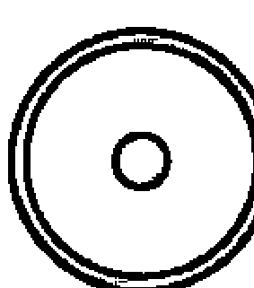

#### 3.2.1 太陽

中國紫微斗數中的太陽星與西洋占星的太陽星意義幾乎相同。太陽主宰獅子座及白晝。它是行星系統的中心，光及生命的來源。富創造性及恆久不變。經由四季它調節自然。它是神、靈、心、事物的本質、良知及至高者。它代表男性、父親及國王。太陽星表示一個人的形象，或是給別人的印象。太陽星座也影響個人的意識，動態活動或自我表達的方式。太陽的位置在個人出生圖的位置好的話，其正面特徵為：自信、活力，活潑的氣質就會表達出來。太陽的人光亮，他們有英雄本色、高貴、有目的、忠誠及慷慨。他們是舞台中心、明星及領導者。負面的方面是他們傲慢、輕蔑的自我。心理學上他們自我認同並以自我為中心。依榮格的說法，這叫做個別化過程 (individuation process)。

一個人如果太陽位於第一宮這個人將比較自我中心。因為第一宮代表自己。在第十宮這個人比較專注於事業。不過再仔細分析就發現只要在日出以前大約卯時出生的人都是太陽在第一宮，午時出生的人大概都在第十宮。

其它聯想：
- 顏色：橘黃色及緋紅色。
- 植物：天芥菜屬植物，如：向日葵；金盞草屬植物，如：蒲公英。
- 動物：高貴的動物如天鵝，太陽的前鋒 (小公雞)。
- 職業：國王、指揮者、創辦者、表演者。
- 場所：宮殿、劇場。

#### 3.2.2 月亮

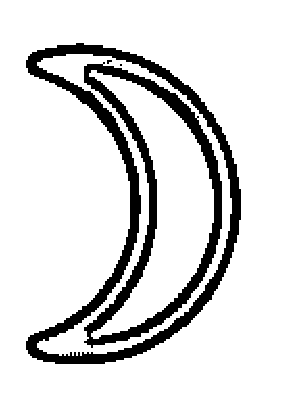

月亮掌管巨蟹及夜晚，它繞地球運轉，陰晴圓缺造成每月的週期及潮汐變動。它是善於接納、易變、反射陽光的鏡子。它擁有直覺能力、靈魂、大自然的節奏及流動、良知、神秘及玄妙。跟著月亮走就是跟著潮流走。是羅馬女神戴安娜 (Diana)，婦女及小孩的守護神。月亮的人本性害羞、善感、具母性特質。負面的特質是膽怯，過度敏感。心理學上，月亮代表個人的無意識面、習慣反應、兒時形成的典範、基本需求及直覺能力。

月亮是，太陽以外，在出生圖上最重要的星體，占性格中百分之三十以上。特徵是對習慣的反應，和個人本能的行為模式有密切關係。有時月亮星座也是緩和太陽星座的一個重要因素。月亮在占星上代表的是母性，情緒，胃，乳房和消化系統。它好的影響方面：使人記性好，有耐心，包容力強。若處在不利的位置則使人不可靠，排外，心胸狹隘。

其它聯想：
- 顏色：白色或銀色。
- 植物：圓形、多汁的水果（瓜）、厚、多汁的葉（甘藍菜）。
- 動物：夜晚或水生的動物 (貓頭貓頭鷹，蝸牛，青蛙)。
- 職業：清潔工、釀酒的人、接生婆、水手。
- 場所：海、海岸、港。

#### 3.2.3 水星

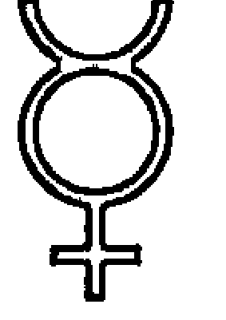

水星主宰雙子座及處女座 （或稱守護星）。它最接近太陽，並能快速移動。腳上有翅膀、司學藝的希臘之神赫墨斯 (Hermes)。它聰明、善言、做生意及竊盜。它是使用魔法的人，介於男、女之間 (hermaphrodite 一字的字首)、意識及無意識之間、心與物之間、生與死之間 (靈魂進入冥界的接引者)。水星的人急智、老練、有發明才能及博學。負面方面，它狡猾、多嘴、不顧道德。心理學上，它是惡作劇的妖精，從失言及弗洛依德傾訴治療表現出來。

其它聯想：
- 顏色：條紋，雜色斑紋及混合式。
- 植物：豆類、胡桃類、無味的花。
- 動物：狡猾的、淘氣的、喋喋不休的 (猴子，鸚鵡)。
- 職業：媒體、商人、辦事員、會計、學者。
- 場所：商店、學校及車站。

#### 3.2.4 金星

金星主宰天平座及金牛座。它是愛之星也是財星。希臘女神阿佛洛狄特 (Aphrodite)、性慾、色情及享樂。靈感、快樂、美麗、和平、戰爭中的勝利、笑聲、友誼及藝術。

金星的人尋找合夥及伴侶關係。金星代表各種吸引力。他們合群、容忍、妥協、愛美、藝術、財富及享樂。負面的特質包括淫蕩、縱慾、男女關係混亂、迷惑。

2004 年 6 月 8 日及 2012 年 6 月 6 日各有一次金星凌日，金星穿過太陽表面，等於是金星造成的日蝕。它是週期性發生，$n(121.5 + 8 + 105.5 + 8)$ 年，每次兩個相隔八年。上一次發生是 1874 年 12 月及 1882 年 12 月。下次是 2117 年及 2125 年的 12 月。星象上確切的影響並不清楚。不過馬雅人對金星有相當的恐懼可能就源自金星凌日現象。2012 年 6 月 6 日當天上午 6 時 30 分到 12 時 49 分台灣地區金星凌日。當天上午 9 時 8 分起到下午 3 時 48 分間台東外海發生連續五次 5.9 級淺層地震。

水星也有凌日的時候，也就是水星造成的日蝕。且比金星凌日更常發生。

其它聯想：
- 顏色：白、綠。
- 植物：有氣味的 (薔薇、水仙)、平葉的 (百合)，甜的 (無花果、蘋果、桃、李)。
- 動物：溫柔、友善的動物如鴿子、海豚。
- 職業：流行與美、藝術及外交。
- 場所：臥室、花園。

#### 3.2.5 火星

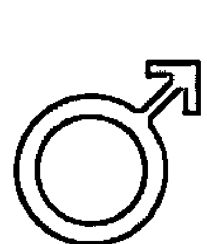

主宰牡羊及天蠍。它是紅色的力之星，代表意志、行動、體力及（男性的）性慾。它是希臘戰神（Ares），忿怒、好爭吵及抱怨。火星的人富侵略性、穿透性及反抗性，異於常人及不妥協。他們是生與死的戰士。負面方面，它是不滿的、暴力的及不理性的破壞者。心理學上它是本能的衝動，自恃的力量及分裂的能力。

紫微斗數中也有火星，但是擎羊也具有西洋占星中火星的特色。

火星在各宮停留的時間通常是六個星期，但有時候也會長達八個月。

2003 年 8 月 27 日 9:51（格林威治時間）是火星 73000 年來最接近地球的日子。有人說會有大災難發生。結果呢？的確，8 月 31 日台北縣蘆洲一位婦人因口角引火自焚發生火災。死傷慘重。當時許多星象都讓這個效應更加複雜：8 月 28 日火星達到正衝太陽，而在 30 日達到近日點。27 日發生在處女座的新月、28 日冥王星轉正行水星轉逆行。2003 年 8 月 14 日紐約再度大停電 29 小時不能不說也是這一波火星效應之一。最後查出原來是俄亥俄州克里夫蘭郊外一條過熱的電線下垂碰到一棵樹而引發了一連串連鎖反應。

更有趣的是在火星接近地球時。受火星影響較大的人似乎都可以感到壓力。怎麼知道她們會感到壓力呢？因為在那附近連續幾個人來算命，說她們日子不好過...。當然，當時經濟不景氣，大家的日子都不好過。但是這幾個人特別。命盤排出來，這幾個人都受火星影響極大。她們要不是火星在西洋占星的天頂，要不就是紫微命宮或者西洋占星第一宮中有火星。

- 8 月 16 日來了一位小姐。1982 年 5 月 22 日 21:12 生於馬來西亞彭亨州關丹縣 (Kuantan)。此人西洋占星命盤中竟然有五顆行星逆行。而居於最高位置唯一一顆不逆行行星就是火星。
- 8 月 27 日又來了一位小姐。1982 年 1 月 11 日 22:13 出生於屏東潮州。此人西洋占星命盤火星在第一宮，紫微命盤火星也居命宮。

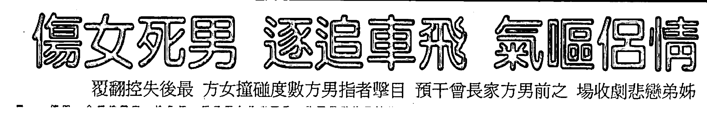

圖 3.1: 2003 年 9 月 9 日聯合報。

2003 年 9 月 9 日是數萬年來火星與月亮最靠近的日子。我不清楚氫彈之父泰勒在這天病逝是否與這個天文異象有關，但是次日聯合報出現如圖 3.1 的一則社會新聞。這個很凶悍的男士顯然是火星，而女性應該就是月亮。火星與月亮靠得那麼近終致命喪輪下。

2005 年的 10 月 30 日火星再次接近地球。不過這次的距離比 2003 年遠了一點。就在這天國民黨主席馬英九的父親心臟病發，數日後去世。當日發生的事情還包括法國巴黎市郊的克利希蘇布瓦市 (Clichy-Sous-Bois)，由於 27 日有 2 名非裔少年企圖逃避警方逮捕而觸電身亡，引起該地居民連續達兩週的暴動。這是自 1968 年巴黎學運以來為時最久的城市暴動，不但擴及全國還造成歐元驚跌。

2005 年 12 月 11 日火星由逆行轉正行，這天藝人張小燕的父親去世。

其它聯想：
- 顏色：紅及橘色。
- 植物：火辣、刺激或苦（薑、胡椒）。
- 動物：掠食者（狼、鯊）。
- 職業：士兵、外科醫師、運動員。
- 場所：火爐、鑄造工廠、屠宰場。

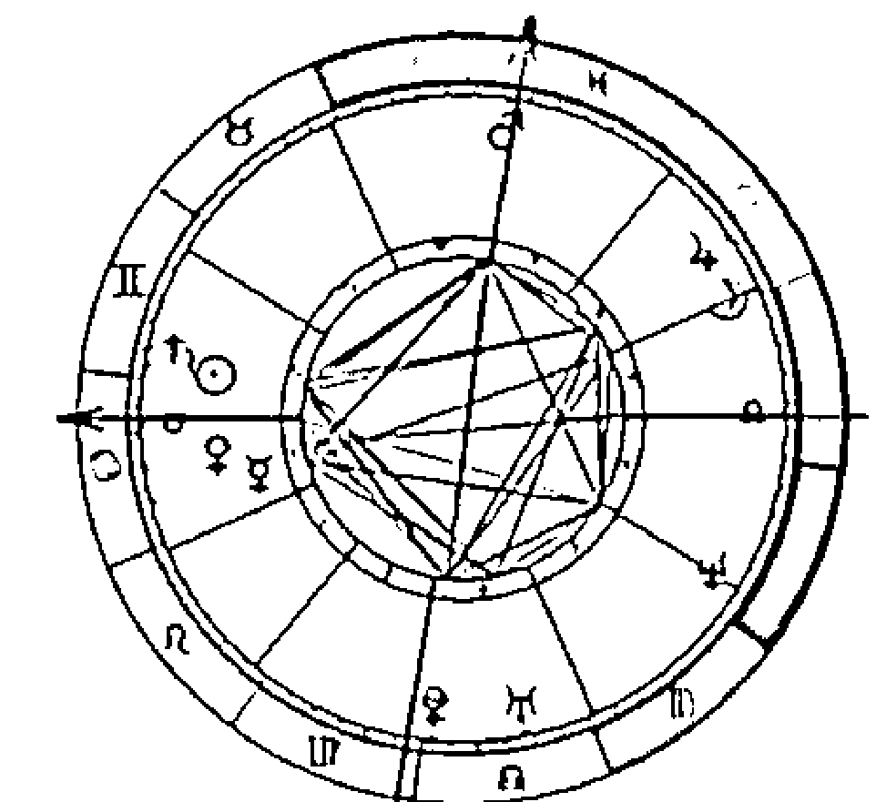

A 教授，1973 年 6 月 19 日上午六時生於屏東。冥王星及天王星在她的第四宮，自幼離家在外唸書。第三宮及對宮第九宮均無主星。但是 2003 年天王星進入她的第九宮，在一串火星近地之後不但拿到了博士學位還當上了國立 T 大 (助理) 教授！足見火星近地並不見得只會帶來壞運。當然促成這件事情的還不止於此。而且此人本命第四宮，第十宮的對宮，有冥王星及天王星。

#### 3.2.6 木星

西洋占星中的第一吉星就是木星。木星掌管射手座及雙魚座。它是傳統行星中最大的一顆行星。希臘神宙斯、諸神之王及天之雷神。它是法律制定者、仁慈的及保護的、創造機會、生長及進步。它是神的眷顧、好運、信心、希望及慈悲。

木星的人寬大、高貴、樂觀、慷慨及愛自由。他們引導及鼓勵別人，提供聰明的建議。負面的方面，它是極端跋扈的，偽善的及自大的。心理學上它是意義的追尋，超自然的經驗及心靈成長的欲望。它有本事可以用一粒沙扭轉整個地球，甚至整個宇宙。

近代中國史上有三個奇人：金庸 (請見 10.12 節)、瓊瑤 (坊間流傳資料為 1938 年 4 月 20 日丑時生於四川成都估計應在凌晨 1:05 分冥王星才能在第七宮) 及柯旗化 (1929 年 1 月 1 日生於高雄左營，2002 年 1 月 16 日去世)；更早一點到了清朝有曹雪芹。金庸以武俠小說著稱，瓊瑤以愛情小說聞名。柯旗化的「新英文法」是我們大家初中、高中唸英文時必備的參考書；暢銷四十八年再版 143 版銷售量突破 200 萬本。他們的著作都不是第九宮主宰的「學術著作」。柯旗化曾有牢獄之災可能與冥王星或某些行星在第九宮逆行有關。不過這些人應該在第三宮都有特殊的格局。雖然沒有精確的時辰，但是，瓊瑤的命盤在第三宮的確眾星雲集。

木星在哪個星座哪個星座的人就要走運了。木星週期大約是十二年。大約與紫微斗數中的流年週期相當，平均每一個星座都要呆一年。的確每年全世界平均有 1/12 的人要走運。但是每個人走運表現出來的東西卻不相同。例如學生走運的時候可能是他畢業了。總而言之是在他過去耕耘努力的地方上得到報償。

2002 年下半到 2003 年上半年木星在獅子座。在報紙上我們就發現很多獅子座的人都走運了。最令人不敢相信的是中華開發的董事長竟然換成一個名不見經傳的陳敏薰。但是大家要注意這種好運絕不是天上掉下來的。大家可以發現陳家已經為這一天準備了好多年了。從 2003 年 8 月 27 日起木星進入處女座。9 月 2 日的報紙就登著怡富公司台灣區負責人宋文琪宣布自年底退休，取而代之的就是處女座的章碩麟。

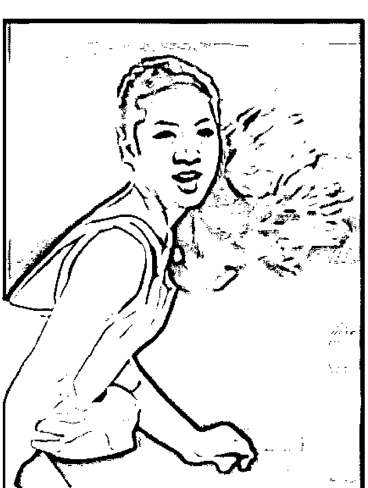

華裔溜冰明星。1980 年 7 月 7 日 10:05 AM 生於洛杉磯。火星在第一宮是運動員必備的條件，太陽在第十一宮是她成為明星的原因。天王星行經第五宮時開始嶄露頭角。2006 年天王星離開第五宮時因傷退出全美錦標賽，就此結束冰上生涯。土星在第七宮，所以只有在天王星進入第七宮時結婚。天王星離開時離婚。火星在第一宮個性明顯極為粗暴。

W 女士 1953 年 8 月 27 日 12 點 30 分生於台北。育二子一女。早年與先生從事貿易業，後轉賣保險。曾一年賣出五千萬之保單。木星在第八宮，在多所大學附近擁有房屋出租。符合紫微斗數所說的「良田百頃」。第八宮同時也代表保險。土星在第十一宮木星在第八宮使她適合從事保險業。土星在第十一宮表示她必須為了某些事四處請求。眾星雲集的第九宮適合海外或高等教育發展。惜當事人除畢業於國內某私立大學外並未往這方面發展。但早年與夫從事國際貿易業務也有關聯。2005 年起流年冥王星入第二宮，有巨大且穩定的收入。這個收入的方式因為冥王星在 2008 年轉換宮位而曾經有所改變過。

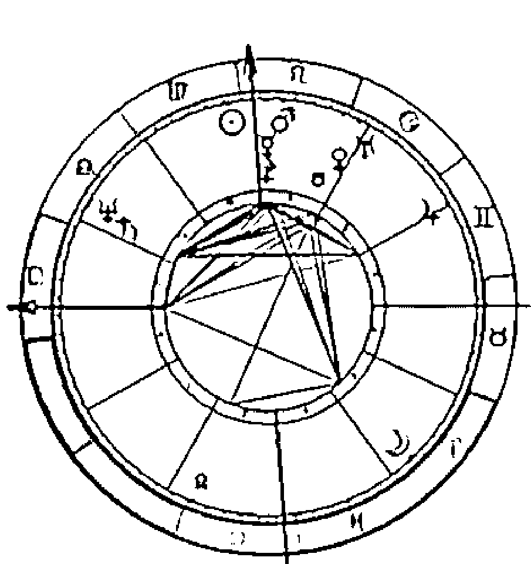

其它聯想：
- 顏色：紫、藍及海綠色。
- 植物：長得快的及爬得遠的植物。
- 動物：大而有力的動物如馬、大象、鯨、鷹。
- 職業：律師、牧師、顧問、開發者、帝國建造者、演員、丑角。
- 場所：開放空間、公眾場所、平原、大視野。

#### 3.2.7 土星

土星主宰水瓶及魔羯座。它是希臘神克洛諾斯，主宰命運及時間、過去、限制及考驗、形狀、結構及骨架。它冰冷老邁、自制及保守。土星的人嚴肅有紀律。負面的方面，是它憂鬱、表現猜忌、苦惱、恐懼及不正的行為。

心理學中「覆頌」中壓抑的東西，否認且低劣的自我，以代罪羔羊的形式表現。

在西洋占星中土星號稱第一兇星。哪裡有它大概都沒有好處。對個人說來，土星在第四宮的時候這個人可能生長在單親家庭；從小沒爹沒娘的；也可能是家中兄弟姊妹有人早逝。流年土星到第四宮表示你的家突然變小了。怎麼「變小」了？可能是家裡小孩長大了房間不夠住了，或者是結婚、出去工作的兄弟姊妹搬回來住了。土星在第七宮的話此人可能辦了事卻沒有婚約；可能是補不到票，或者補到了又被退貨。不過土星也意味著蒼老。因此土星在第七宮也可能意味著結婚對象年紀非常的大。這是根據行星的意義推論得的結果。要差多少歲？我不知道。楊振寧與翁帆的結婚很可能就是這種案例。他們年齡相差一甲子，且均為再婚。但是事實也證明他們最後還是離婚了。土星一定會把任何合作夥伴幹掉，不要懷疑。無論差多少歲。不過土星在第八宮卻可以幫助你把別人欠你的債討回來呢！或者是從遺產、保險中得到一筆財富。這個「遺產」未必意味著有長輩去世。土星在第九宮的人如果想唸博士應該會非常辛苦。因為第九宮代表著高等教育與出版。博士是必須有論文發表才能畢業；從事研究工作也是 publish or perish。但是土星在第九宮的人要出版論文恐怕不太容易。不過說不容易並非不可能，應該說要倍嚐艱辛。不過土星在第九宮的朋友還不需要急著沮喪：有很多名人一看，竟然都是土星高掛第九宮！對一個肯努力的人說來，土星所在的宮位經常還是他一生最成功的地方。艾利斯夢遊仙境的作者 Lewis Carroll，請見本書第 10.11節，並沒有拿到博士學位。雖然他有學術著作，但是重要性有限。艾利斯夢遊仙境及其它膾炙人口的著作是「童書」，明顯是他命盤第三宮的木星，加上第九宮的土星逆行造成。他雖然畢業後留在牛津大學任教，但是並非教授。由於土星有「限制」、「約束」的力量，土星在第九宮可以做學術期刊的審稿委員。歐本海默的星盤就是土星在第九宮。包青天，請見本書第10.10節，土星應該在第九宮的對宮。土星在第十一宮這個人可能必須四處看人臉色、拜託人。甚麼樣的人會這樣呢？參加選舉必須四處拜託是一種可能。為了成就某種事業，必須促成各方面不同的意見也是一種可能。業務銷售員四處推銷產品也是一種可能。土星在第十二宮這個人可能有「自閉症」，常常喜歡把自己關起來。或者是SARS來了大家都足不出戶。

施明德的倒扁活動明顯是土星效應。施明德自從2006年12月5日起因倒扁不成功而進入「自囚」。此時正好是土星轉逆行的時候。2007年4月1日他宣布復出。而土星則是自4月19日起重回正行。

樂聖貝多芬 (Ludwig Von Beethoven 1770年12月16日凌晨3:40生於德國波昂 Bonn) 也是土星在第九宮。

土星在第二宮的名人竟然包括查理王子 (1948年11月14日21:14生於英國倫敦)，老布希總統 (1924年12月6日11:45生於美國麻州Milton Hill)，日本明仁天皇 (1933年12月23日6:39生於日本東京)，作家艾倫坡 (1809年1月19日13:00生於美國麻州波士頓)。後者的第二宮甚至還有海王星。

L小姐1977年1月21日12點56分生於台北。土星在第四宮，六歲父母離異。且與雙親的關係也極差。在她的第四宮裡明顯的一顆土星。大學至少唸九年！應屆時考上T大醫技系。唸了兩年被21。重考一年。唸了一年不喜歡又重考。迫於當時男朋友媽媽的要求去唸了M校牙醫系。但是不喜歡那學校，所以唸了一年以後又跑去重考，這次考上農化系而且很認真的唸，因為那時一心想轉牙醫系。但是一不小心體育被當了。改轉藥學系。唸藥學系時決定要出國去唸醫藥管理。本來已經申請國外學校了，可是天不從人願，又被當了！注定延畢。紫微斗數中有此能耐的唯有破軍星。破軍星所在宮位「不到蓋棺絕不定論」！此人出遠門會比在家好。因為遷移宮紫微破軍都很亮。大約2006年前冥王星在她的第七宮，有致命的吸引力。

## 省功超級必然土星在第二宮

這段文章出自 2004 年 2 月 5 日中國時報 D8 版。此人省功超級必然土星在第二宮。作者如果了解這就是一個人的天性就會看得開一點了！

其它聯想：
- 顏色：黑、橄欖色。
- 植物：有毒的或深根的植物。
- 動物：有害的小動物（臭蟲、蟑螂、蚊子及蝨子）。
- 職業：政客、建築師。
- 場所：山、無人煙的地方、礦坑。

#### 3.2.8 天王星

天王星變動的特性與紫微斗數中的天機星相同。這點只要對照同一個人的兩個命盤就可以發現。

天王星與土星共同主宰水瓶座，是位於土星外第一顆被發現的新星。於 1781 年被發現，震撼了中世紀的宇宙學。是被克洛諾斯閹了的希臘天神歐蘭諾思（Ouranos）。它毀了土星的傳統及權威而得解放。它是科學啟蒙及表現自然至上的崇高智慧。天王星的人可能是占星家、科技人、任性的異鄉人、改革者、人道主義者或怪才。總而言之是一些怪怪的人³。負面的方面，天王星是無秩序的、暴虐的及殘酷的。心理學上，它表現意識的分裂，反抗及閹割情結。

> ³法國作家，諾貝爾文學獎得主，Albert Camus (卡繆) 的得獎作品 L'Étranger 中文翻譯成”異鄉人”，其實應該翻成”奇怪的人”，其中故事主人翁明顯就是一個天王星的化身。故事開始於主角莫梭接到了來自養老院的電報，說他的母親過世了。然而莫梭並未表現出一般喪母者該有的哀痛。

天王星所在的宮位都有突然的改變。它代表著解放與新科技。歷史上與天王星有關的事件都有革命的特性。如，1789 年法國大革命，1781 年美國獨立戰爭。這說穿了都是解放。中國大陸曾經發生的文化大革命起因為外來文化的衝擊。在文化大革命之前就有五四運動。雖然我不知道當時的星象如何，但是幾乎可以確定是由天王星的效應造成。陳水扁的駙馬趙建民，依照學籍資料的 1972 年 6 月 29 日生於台南鹽水計算，時間推論大致是寅時，其西洋占星命盤天王星在第五宮不訝異會突然當上駙馬。

天王星的過境教導一個人獨立。根據占星學家 C. Critchlow 的經驗，如果天王星在一個人的命盤的第七宮裡出現，這個人要不是不婚要不就是結婚多次！因為天王星解放了婚姻的束縛。說得更精確一點天王星如果逆行就會不婚，如果正行就會結婚多次。這個現象也表現在其它的宮位。例如天王星在第九宮逆行此人可能出國多次卻呆不了多久又回來了。

利比亞強人格達費 (Muammar al-Gaddafi, 1942.6.19.-2011.10.20.) 能夠玩弄西方四十年，和西方國家領袖鬥智鬥力不下三百回合。從尼克森開始，美國共有八位總統和格達費打過交道，都沒佔到什麼便宜。2003 年美國成功說服利比亞強人格達費，讓他放棄利比亞還在初期階段的核武計畫，換取國際社會解除對利比亞的制裁。但卻在 2011 年天王星離開雙魚座時，席捲中東的「阿拉伯之春」反獨裁運動蔓延到利比亞，遭聯合國劃定禁航區攻擊，格達費遭推翻逃亡，被反對他的民兵抓到後在亂槍下喪生。再回想陳水扁在位時似乎與格達費頗為投合，一般對他評價均認為其行事怪異，二人命盤中天王星應該都佔有舉足輕重的角色。其四十二年的執政生涯也符合天王星半周期的長度。應該是天王星行經他上半球 (第七到第十二宮) 的時間4。

他不知道母親的年紀，不想瞻仰遺容，在守靈的夜晚邀請看守一起抽菸，在葬禮過後與女朋友去游泳、看電影，如平常的生活一樣。

圖 3.2: 當天王星在下半球時一個人通常失業，所以去做學生當博士生可以拿一點錢。這時候天王星在第五宮最佳。當天王星進入第七宮時結婚。但是這些由天王星造成的改變通常維持七年The request was rejected because it was considered high risk

德州爆炸；這件事證明這兩個爆炸其實是同一個星象。波士頓馬拉松賽在 2013 年 5 月月蝕結束後又繼續比賽也另外證明此事與日、月蝕有關。

大家一定還想知道北韓的飛彈最後如何了？其實，在冥王星轉逆行之後北韓的飛彈並沒有發射就已經告訴我們不會發射了。因為轉逆行時已經是一件事情發展到極點了。果然美國官員在 5 月 6 日透漏，北韓已將二枚舞水端飛彈從發射台上卸下並搬離現場。

#### 3.2.11 小行星

除了「九大行星」外還有一些小行星。根據 2006 年天文界的分法應該是「八大標準行星」及「四矮行星」。也就是將冥王星與所謂的「小行星」共列為「矮行星」。不過由此也可見「小行星」的地位其實一點也不小。它們至少應該與冥王星齊名。其作用不容忽視。其實小行星也不止四個。

## 凱龍

凱龍 (Chiron, ⚷) 又稱天醫星天師星，亦可譯成凱倫星或科隆星。是希臘神話中專門載亡靈過冥河的船夫。於 1977 年 11 月 1 日被發現，近似彗星，軌道奇特，介於土星與天王星之間，軌道有一部份跨進土星軌道內。平均公轉週期 248.1 年。

一般認為凱龍星代表愛情、心靈伴侶、兒童、配偶、生育。甚至一個人的財富也可以從此預測。

凱龍星又名天醫星乃在它是憂傷心靈的醫治良伴。它所帶來的訊息是：「健康與疾病是我們的老師」。

## 穀神星

(Ceres, ♀) 1801 年由義大利人發現。公轉週期為 4.6 年。依羅馬中植物與母愛的女神而命名。它所在的宮位表示母性本能的顯現。

## 塞德那

塞德那（齊娜，sedna，Xena，(symbol)）公轉週期是目前已知行星中最長的大約 560 年到 11400 年。體積大約是冥王星的 2/3。於 2003 年 11 月 14 日拍得照片，不過直到到 2005 年 1 月才確認。它與冥王星相同都是位於科伊博帶的「行星」。公轉軌道與黃道面傾斜達 45 度。它的出現導致冥王星是否被除名的危機。科伊伯帶至少有七萬顆直徑超過一百公里的小型星體，大部分應是短周期彗星。塞德那不僅亮度第三，且據哈伯太空望遠鏡測量，它的直徑約三千公里，比冥王星至少大了約一百一十三公里。

## 婚神星

婚神星（juno，(symbol)）約在 1804 年被發現，直徑 240 公里繞太陽公轉週期約 4.36 年。婚神星所在的星座顯示此人所需要的伴侶，而所在的宮位暗示此人為何結合。它與金星或火星不同。金星或火星只是我們想要的伴侶，但是婚神星卻是最後得到的而且是需要的。

## 智神星

智神星（pallas，(symbol)）約在 1802 年被發現，直徑 524 公里。Pallas 其實就是我們熟悉的智慧女神雅典娜。對希臘人說來她不只是智慧女神，更是戰神。但是她與另一位代表火星的戰神 Ares 使用的是暴力與殺戮不同，她擅長戰術與謀略。因此占星上它代表著處理事情時智慧的謀略。

## 灶神星

灶神星（vesta，(symbol)）位於土星與木星間的小行星帶，體積第三大但卻是小行星中最亮的。希臘羅馬神話中的家庭女神。它所在的宮位是一個人集中精力可以有最佳表現的地方。

| 星座 | 進入日期 | 節氣 |
| --- | --- | --- |
| 牡羊 | 3月21日 | 春分 |
| 金牛 | 4月21日 | |
| 雙子 | 5月21日 | |
| 巨蟹 | 6月21日 | 夏至 |
| 獅子 | 7月23日 | |
| 處女 | 8月23日 | |
| 天平 | 9月22日 | 秋分 |
| 天蠍 | 10月22日 | |
| 射手 | 11月22日 | |
| 魔羯 | 12月22日 | 冬至 |
| 水瓶 | 1月21日 | |
| 雙魚 | 2月18日 | |

表 3.1: 太陽轉換宮位的大致時間。

### 3.3 星座

一般星座的劃分是看當年的農民曆上的十二節氣來決定。太陽大約如表 3.1 的時候進入各宮。每個星座間分隔的日期並非固定。常常有生在交界處的人困惑自己到底該屬於哪個星座。要精確知道一個人是屬於哪一個星座，則應將星盤排出來，看看太陽星位在哪一個星座便知。

不過在 1.6.1我們說過，星座的劃分存有爭議，甚至有人提出十三星座的理論。各位會發現本書中的理論幾乎完全不用星座。事實上中國古代占星學也專注於討論日月蝕、行星交會、地震、旱災 ...間的關聯。

#### 3.3.1 黃道的邏輯

占星學從陰、陽衍生出一些符號語言。好像電腦從 0 與 1 衍生出機械語言，再衍生出組合語言。

黃道十二宮可以分為三組四個元素:

| | 基本 | 固定 | 變動 |
| --- | --- | --- | --- |
| 火 | 牡羊 | 獅子 | 射手 |
| 地 | 魔羯 | 金牛 | 處女 |
| 氣 | 天平 | 水平 | 雙子 |
| 水 | 巨蟹 | 天蠍 | 雙魚 |

橫方向分三組。分別是三種不同的行為方式或狀態的表現。

基本 開創，轉捩點的工作。太陽進入這些宮時是每季的開始。

固定 守成，忍受、穩定。當太陽進入這些宮時是各季的旺季。

變動 前行，適應、傳播。當太陽在這些宮時，季節正在轉換。

直的方向分四種元素：

- 火、氣是「陽」，上昇、外向。
- 地、水是「陰」，下沉、內向。

元素的意義是從我們對它們的經驗而來：

火 火就是視覺能見的光。它是熱及溫暖，給我們無限活力。它神聖，只可遠觀，而且危險。它表現得果斷、自信、熱愛生命。

地 我們站在地上，它支撐我們。任何東西都由它組成。它表現得可信賴、物質主義及具一般常識。

氣 充滿各處卻虛無，正如天與地間之空間。它穿透物體，支持呼吸、語言、思想。它表現成仁慈、語言及智慧。

水 水會流動而自行平衡。它乾淨、溶解及豐富。它表現成感情、想像及將自己的感情投入某個對象中的移情作用 (empathy)。

這四種氣質也就是中世紀科學及醫藥中所提的氣質。是亞里士多德的四要素「熱」、「冷」、「濕」及「乾」及與占星學中的元素互相關聯：中國命理學中與四要素平行的是，最早見於

熱及乾 = 火 (易怒的氣質) 冷及乾 = 地 (憂鬱的氣質)
熱及濕 = 氣 (快活的氣質) 冷及濕 = 水 (冷靜的氣質)

淮南子及春秋繁露的，五行：金、木、水、火、土及其間的相生、相剋的原理。

有些近代占星師把這些元素與心理學上榮格的分類相連起來。

| 星座 | 特性 |
| --- | --- |
| 牡羊 | 創始、獨斷。 |
| 金牛 | 建造、擁有。 |
| 雙子 | 聯絡、分開、質疑。 |
| 巨蟹 | 保護、養育。 |
| 獅子 | 創造、組織、歡享。 |
| 處女 | 分析、辨別。 |
| 天平 | 平衡、和諧、反應。 |
| 天蠍 | 穿透、密集、隱藏。 |
| 射手 | 尋找、探索、幻想。 |
| 魔羯 | 雄心、控制、謹慎。 |
| 水瓶 | 有節操、自治、疏離。 |
| 雙魚 | 自我犧牲、虔誠。 |

表 3.2: 各星座所代表的意義。

火 → 直覺 地 → 感官
氣 → 智慧 水 → 感覺

不過近代另一些心理學的書（如 Zimbardo, Psychology and Life）開宗明義章就說明「分類」是一種拙劣的研究方法。

#### 3.3.2 宇宙萬物與黃道十二宮

黃道十二宮的順序表示宇宙萬物的生命週期。這是黃道的心理學及另一種語言表示法。大家可以發現這十二個星座正如同中國人的十二生肖一樣也分陰陽。

牡羊 (aries,ram)
陽性, 由火星主宰。代表頭部、臉部。基本的人 (火花, 熱焰)。
這是第一宮, 宇宙萬物以頭最先來到世上。牡羊是立即及純真的, 離開自我利益而工作。創始、活動及倔強。
關鍵語：我優先

金牛 (taurus, bull) 陰性, 由金星主宰。喉嚨及脖子。不變的地 (原野及森林)。
第二宮表現化身及肉體需要。金牛重視物質安全感。擁有、建造及保存。

關鍵語：我的

雙子 (gemini, twins) 陽性，由水星主宰。手臂及手。易變的氣（微風）。
第三宮宇宙萬物變得好奇。雙子連接、傳達、網路。快速、聰明但是不和。
關鍵語：我說

巨蟹 (cancer,crab) 陰性，由月亮主宰。胸及胃。基本的水（海）。
第四宮創設家及安全感。培養、保護及防衛。
關鍵語：我保護

獅子 (leo, lion) 陽性，由太陽主宰，心及背。不變的火（灼熱）。
第五宮萬物變得具有創造力！獅子是自我表現，自負，自我中心。勇敢、驕傲及忠誠。
關鍵語：我創造

處女 (virgo, virgin) 陰性，由水星主宰。消化系統。易變的地（田野及收成）。
第六宮，處女有技巧的適應環境。服務、分析、識別及完美。
關鍵語：我服務

天平 (libra,scales) 陽性，由金星主宰。臀、背部下方。基本的氣（風）。
第七宮顯示當萬物半途遇到「相異性」時平衡主觀與客觀。關聯、使調和及智力。
關鍵語：我關聯

天蠍 (scorpio, scorpion) 陰性，由火星及冥王星主宰。生殖器及排泄器官。不變的水（小塘）。
第八宮帶來性、能力、不可思議的、神秘的生活及死亡。穿透，轉變及報復。
關鍵語：我再生

射手 (sagittarius, archer) 陽性，由木星主宰。臀部及大腿。易變的美（跳舞的火焰）。
第九宮，萬物旅行，探險及瞄準東西。追尋意義與自由。幻想與樂觀。
關鍵語：我尋找

魔羯 (capricorn, goat) 陰性，由土星主宰。骨頭、牙齒及骸骨。基本的地（山及岩石）。
第十宮整理過去，創造及控制邊界。雄才大略，負責。
關鍵語：我征服

水瓶 (aquarius, watercarrier) 陽性，由土星及天王星主宰。脛骨、踝及循環系統。不變的氣（天）。
第十一宮表現友誼、群體生活及分享的意識。思想的定律及事物的原理。改革及親切。
關鍵語：我了解

雙魚 (pisces, fish) 陰性，由木星及海王星主宰。足。易變的水（小溪）。
最後一宮，萬物準備結束。為大我不惜犧牲小我的欲望。救贖、同情、慈善。
關鍵語：我挽回。（魚代表基督）

位於星盤上相對的兩個星座，如射手與雙子，稱為互視 (beholding)。互視的星座擁有共同的生命主題卻由不同的方式表現。牡羊與天平的共同主題是自我肯定，但是牡羊表現出自我的態度來肯定自己而天平卻希望從他人的眼中找到自我的肯定。

我們可以把這些宮位與行星的特性總結如表 3.2及表 3.3。這些「意義」有些是它們的「影響力」，有些是他們的「特性」。請讀者注意：無論我們用甚麼樣的形容詞，總是有些誤解的可能。這就是老子所說的「道可道非常道」。請大家從這一連串的形容詞中仔細去揣摩它們的真正意義。這就是占星的「符號意義」。

| 行星 | 意義 |
|---|---|
| 金星 | 引誘、吸引、美麗、價值、愛、男女關係、金錢 |
| 火星 | 性慾、身體、侵略、戰鬥、能量、意志、慾望、創始力、性衝動、憤怒 |
| 冥王星 | 強迫、色慾、性行為、破壞、消除、再生、轉型 |
| 海王星 | 浪漫、敏感、忍耐、朦朧、理想主義、幻想、混淆、渴望 |
| 木星 | 寬恕、無私的愛、達成、擴張、機會、保存、保護 |
| 土星 | 控制、苛刻、冷酷、限制、阻遏 |
| 天王星 | 獨立、變化、探險、革命、瓦解、分離、解放 |
| 水星 | 通訊、表達、智力、聯絡、溝通、智慧、知性、自我表現 |
| 月亮 | 情感、心情、直覺、反應、波動、習慣、接納、女性的功能 |
| 太陽 | 根源、自己、創造、原則、能力、活力、權威者、父性的功能 |

表 3.3: 各行星所代表的意義。

> Astrology is not destiny as it is best used for planning.
Susan Miller

# 4 行星的位置

行星會移動。有很多因素會影響一顆行星的力量。例如，在命盤之天頂、天底、升位、降位附近的行星都較為重要。如果我們發現一個命盤在某些地方眾星雲集那顯然是重點部位。或者它們可能聚集在某一半球，此時交界處的行星也該特別注意。不過還不只這些：

### 4.1 得地與失利

行星在某些宮位得地（exalted），獲得力量；在相反的宮位則失利（fall）。為甚麼？例如，火星在魔羯得地，因為火星的力量是有紀律的，如同一個軍隊。金星在雙魚座因為獲得同情而得地，但是處女座卻是吹毛求疵使得金星失利。

更妙的是在這些得地與失利的宮位裡竟然會有某個角度使得得地或失利的效用特別強！

很奇怪的各行星這些「得地」與「失利」的位置並不是平均分配於 12 個星座！星座有 12 個但是行星加上太陽也只有 10 個。有部份原因要歸咎於中世紀以後新發現的行星把「原本的秩序」弄亂了！用物理學上基本粒子理論來說，這個理論並不完全。或者說這個理論需要擴充。例如，愛因斯坦的狹義相對論就是發現勞倫茲轉換的問題從而擴充得到的理論。擴充基本粒子模型就會得到一些尚未發現的粒子，於是實驗物理學家，如丁肇中，就去尋找這些粒子。從而發現這些粒子，獲得諾貝爾獎。在占星學中也有這種尚未發現的虛構天體，如 Lilith。

不清楚這種得地與失利的行星是如何得到的；事實上有些行星得地與失利的星座也有爭議。讀者可以自行研究補上兩個行星看看能不能讓這個表看起來比較對稱。不過可惜的是填上的人並不能獲得諾貝爾獎！另一個有趣的問題是：並不是互補的行星得地與失利的星座也互補。為甚麼？答案也是留給各位思考。物理學家就是在思考「變」與「不變」中而得到真理。

除了得地與失利以外還有兩個很相似的名詞：

- 失勢 (detriment)
- 掌權 (主宰、守護, rule)

發現天王星前，到冥王星發現後行星掌權的宮位也有變動，如表 4.2。發現天王星前 7 個行星如何守護 12 個星座？虧希臘人想得出來，他們讓太陽、月亮各自守護一個星座，其它的五個行星分別守護兩個星座。但是這種分法並沒有甚麼好的理由。物理學家對於這種沒有理由隨便加上去的理論，稱為 ad hoc，非常排斥；通常是不會採用。

正由於這些涉及星座的概念一方面有 1.6.1節所說的星座劃分的爭議，另方面得地、失利星座也有爭議，所以準確性大有問題。因此真正的占星大師都知道看星座不如看行星。她們注重的事件有幾類：

- 行星間的交會。
- 行星過境。
- 行星的正逆行。
- 行星週期。
- 日蝕月蝕。

正如同我們在 1.6.4 節所說的，本書所談論的占星學的特色是在考慮這些行星交會的時間序列所產生的影響。也只有用這些方式才能理性的算出世界局勢、股市、...「大環境」的問題。隨便找一個時間，例如股票交易所成立的時間或者公司成立的時間 ...，來算國家、股市或公司的命運，似乎有些牽強。所謂的時辰占星 (horary astrology)，用來占的時辰排盤預卜所問的事情，則更是一派胡言$^{1}$。這種觀念在量子場論中也有。也就是說我們不能憑空隨便抓一個時間作為命盤來考慮。這是建構一套完整理論必然要考慮到的。

$^{1}$時辰占星有人翻成卜卦 (oracle) 並不正確。不過無論是卜卦還是時辰占星都不屬於本書討論的範圍，因為它們並非 1.1 節所說的理論模型。

| 行星 | 得地 | 失利 |
|---|---|---|
| 太陽 | 牡羊 | 天平 |
| 月亮 | 金牛 | 天蠍 |
| 水星 | 水瓶 | 獅子 |
| 金星 | 雙魚 | 處女 |
| 火星 | 魔羯 | 巨蟹 |
| 木星 | 巨蟹 | 魔羯 |
| 土星 | 天平 | 牡羊 |
| 天王星 | 天蠍 | 金牛 |
| 海王星 | 射手 | 雙子 |
| 冥王星 | 處女 | 雙魚 |

表 4.1: 行星的得地與失利。

| 發現天王星前 | 宮位 | 發現冥王星後 |
| :--- | :--- | :--- |
| 土星 | 水瓶 | 天王星 |
| 木星 | 雙魚 | 海王星 |
| 火星 | 牡羊 | 火星 |
| 金星 | 金牛 | 金星 |
| 水星 | 雙子 | 水星 |
| 月亮 | 巨蟹 | 月亮 |
| 太陽 | 獅子 | 太陽 |
| 水星 | 處女 | 水星 |
| 金星 | 天平 | 金星 |
| 火星 | 天蠍 | 冥王星 |
| 木星 | 射手 | 木星 |
| 土星 | 魔羯 | 土星 |

表 4.2: 發現天王星前到發現冥王星後各宮守護星的變化。

### 4.2 截、奪

一個命盤劃分 12 個宮位，同時也有 12 個星座。平均每個宮位應該對應一個星座。但是，在不等宮制（如普拉西度制）的劃分時，我們觀察許多奇人的命盤會發現，很多宮位分佈明顯不均勻。如果某個星座特別寬其對應的宮位就可能整個被包含在裡面，或者某個宮位特別窄以至於對應的星座把它整個包進去了，此時，我們稱這個星座為被截星座（intercepted sign）。被截星座裡的行星我們稱為被截行星（intercepted planet）。現代占星學者認為，星座若被截則代表著弱化或有著被監禁的意思。但在古典占星中會以被截星座的主星作為該宮位的第二象徵星，17 世紀卜卦之神 William Lilly 就曾在其大作 Christian Astrology, 第 749 頁到 750 頁有提到這點。

至於被截宮位（intercepted house）則是反過來：當一個星座出現在兩個以上的連續宮位始點，這個宮位就稱為被截宮位。此時就會出現連續兩個宮位被某個星座包含，造成這兩宮的宮位主星相同。此時若要分辨兩宮位的差異就會有些困難。

當被截星座的特性無法順利表現出來時，會在該宮位相關的領域上引發一些內心的衝突。特別是這一宮當中沒有任何行星時，這些能量無法明顯表現，無法被我們輕易的意識到經常會造成一些困擾。

被截（intercepted）經常被翻譯成被截奪；甚至有寫成被劫奪。事實上 intercepted 並沒有被奪的意思。而且占星學中另外有被奪行星（besieged planet）這是夾在兩個凶星中間的行星。在古典占星學中凶星只有火星與土星；在現代占星學中認為天王星、海王星及冥王星也可能帶來不幸因此也算凶星。

> Astrology is the study of timing,
not predestination,
for astrologers can calculate
when it would be best to act,
and when it would be best to hold back.
If you act in sync with the energies of the universe,
you increase your chances of success.

Susan Miller

# 5 行星過境

明白了行星的符號意義以後，我們開始來做推演，觀察行星造成的影響。本章是討論單一行星造成的影響，第六章討論兩顆以上的行星造成的影響。要討論一個事件是否由某個行星造成時必須檢討這個事件是否符合行星的符號意義，而且事件發生的時間必須在行星交會的有效範圍內。

每個行星經過一個宮位的時間都不一樣，而且同一個行星也可能行經每個宮位的時間不同：

- 太陽 大約 30 天
- 月亮 大約 2.5 天
- 水星 14-30 天
- 金星 23 天到兩個多月
- 火星 大約一個半月
- 木星 大約一年
- 土星 大約兩年半
- 天王星 大約七年
- 海王星 大約十四年
- 冥王星 大約十四到三十年

西洋占星的行星過境就好像中國紫微斗數的大限、流年、流月之類的。行星進入某個宮位都會在這個宮位帶來變動，或好或壞。路過的行星如果是在地球以內的小星星，如水星、月亮，影響力比較小。月亮離我們最近運行的最快。一般看每天心情的起伏可以由當天月亮所在的宮位判定。這種較快速的

The request was rejected because it was considered high risk

## 5.5 天王星金牛座

2018年5月15日天王星第一次進入金牛座到11月6日逆行。上次轉換宮位時日本發生311大地震導致核電廠爆炸。4月29日桃園敬鵬發生大火，五名消防人員殉職。5月1日，多明尼加斷交。5月5日巴基斯坦西南部煤礦爆炸崩塌16死9傷。夏威夷幾勞亞（Kilauea）火山也開始噴發。6月7日大爆發並引發5.6級地震。5月10日馬來西亞大選自1957以來61年來首度變天，92歲高齡前首相馬哈地勝出大選。5月4日台大校長遴選遭拔，台大於12日召開臨時校務會議討論是否重啟校長遴選；76票贊成教育部應依大學法等規定，處理台大校長遴選結果，盡速發聘，必要時學校應依法尋求救濟，43票反對，3票空白，2票廢票。在新校長就職前，由代理校長郭大維依法正常行使完整的校長職權。另一提案為解散遴委會，立即進行重啟遴選，46票贊成，74票反對，4票空白。11日台南南化發生駭人聽聞的滅門血案，兄嫂及小叔夫婦3人遇害，兇手竟是39歲外孫。高雄氣爆32死李長榮化工董事長、高市府秘書長各於此時被判4年以上。14日印尼第二大城——泗水——24小時內連傳5起炸彈恐怖攻擊，至少22死。14日下午4點，在美國「第一千金」伊萬卡·川普（Ivanka Trump）與以色列總統納坦雅胡（Benjamin Netanyahu）的主持下，美國駐以色列的「耶路撒冷大使館」終於正式開設，成為全球第一個外交承認「以色列首都是聖城」的國家；但與此同時，為了反對「以色列併吞聖城」並悼念巴勒斯坦淪亡日（Nakba，以色列建國日），各地的巴勒斯坦人也發起大抗爭，其中在加薩走廊，周一就有5萬示威者向邊境逼近，在以色列國防軍的實彈射擊下，單日就有58名巴人被擊殺、1,113人負傷。15日馬英九洩密案二審判決出爐，四個月。Google也在此時因應歐盟個資法（GDPR）大幅修訂隱私權條款，25日起生效。24日傍晚，非洲布吉納法索與我國斷交。28日吳茂昆請辭教育部長獲准。任期僅40天，標準的天王星變變變。西班牙時間6月1日上午11點，西國國會因執政的人民黨（PP）爆出嚴重的貪腐醜聞，正式對在任7年的首相拉荷義（Mariano Rajoy）提出「不信任案」，並以180票同意、169票反對、1票棄權的結果成功倒閣，成為西班牙重返民主憲政以來，首次因不信任投票而引發的政府變天。七年的時間明顯是天王星行經一個宮位的時間。為什麼從4月講到6月？故事顯然還沒結束，川金會還沒登場呢。6月7日夏威夷火山大爆發也證實故事還沒結束。3日瓜地馬拉首都瓜地馬拉城西南方約四十公里的富埃戈火山噴發，造成至少廿五人死亡，包含三名兒童，數千民眾因火山噴出的有毒氣體與岩漿受傷，逾三千兩百位民眾撤離，還有多人下落不明。這是富埃戈火山自1974年來最嚴重的噴發，火山灰噴至海拔四千五百公尺高空，並流出滾燙岩漿和火山碎屑至附近城鎮。6月4日空軍花蓮第五（原401）聯隊一架編號6685的F-16A戰鬥機，由少校飛官吳彥霆駕駛，下午1343時在東北部山區上空突然失聯、雷達光點消失。這是吳彥霆駕駛F-16第二次事故。102年5月15日，當時是中尉的吳彥霆，在嘉義455聯隊（現第四聯隊）換裝F-16戰機，當天他駕駛的編號6622號F-16A，在高雄小港機場外海西側44浬處，因發動機故障、失去動力墜機，吳彥霆跳傘獲救，由直升機救回。7日傅達仁在瑞士執行安樂死，享年85歲。怪異的行徑、突然的改變都是天王星的特色。次日立法院通過公務員年金改革法案，各機關立刻以雙掛號將計算結果送達。18日上午7:58日本大阪發生6級地震。

兆豐銀行2016年遭美國DFS裁罰1.8億元，金管會解除包括兆豐金前董事長蔡友才在內的6位兆豐高層職務，創下金管會出手罰銀行最快、且最重的紀錄。蔡友才不服遭解除兆豐金董事職務而提告，台北高等行政法院28日撤銷訴願決定及原處分。

311地震引發福島核災，居民被禁止進入該區。隨著天王星轉移，安倍政府自2017年起陸續解除管制。爆發於天王星在牡羊座時的阿拉伯之春在經過多年戰爭後似乎也進入尾聲。

2004年12月26日印尼南亞海嘯，2011年3月11日日本仙台海嘯，2018年12月22日印尼巽他海峽海嘯，都是發生在天文與轉換宮位時。2018年教育部以怪異的行動卡管，也在地震後結束。翁啟惠的浩鼎案也在此時獲判無罪，新任縣市長也在此後就職，開啟新的一頁歷史。從2019年3月6日起天王星正式進入了金牛座，直到2025年7月7日。

## 5.6 海王星轉換宮位

2011年4月3日海王星第一次從水瓶座進入雙魚座，但是不久後的8月14日又逆行回水瓶座。1998年1月28日到1998年8月22日及1998年11月27日到2011年4月3日海王星都在水瓶座。海王星上一次在雙魚座是1847年到1862年間。2012年2月3日海王星終於進入雙魚座。就在這天年僅51歲的美光執行長Steve Appleton駕新型試驗飛機試飛墜毀。

敘利亞政府軍3日午夜到4日清晨砲轟中部城市荷姆斯，造成至少200多人喪生，寫下敘利亞民眾抗議阿塞德政權11個月來最血腥的一天。11個月前不就是海王星第一次進入雙魚座的時候嗎？

2012年2月洛杉磯當地時間11日下午，洛杉磯警察接獲報案，國際流行歌壇巨星惠妮休斯頓（Whitney Houston）在飯店去世，得年48。Whitney Houston 1963年8月9日20:55生於美國紐澤西州Newark（資料來源出生證明），22歲首次發片1985年同名專輯狂銷2400萬張創下美國女歌手首次發片最佳成績，1992年The Bodyguard電影原聲帶創下女歌手連續三張專輯突破900萬張銷售紀錄。並於同年與歌手巴比布朗結婚，隨即懷孕產子。1994年獲得葛萊美獎最佳專輯。一生共獲得六座葛萊美獎、兩座艾美獎及其它大小獎共計415座。全球唱片銷售超過一億七千萬張。但是海王星進入水瓶座後（2000年）在毒品影響下情況急轉。2007年結束婚姻。估計是流年海王星在他的第十一宮（人前形象宮）時演藝事業達到巔峰，當海王星進入他的第十二宮開始吸毒，當海王星掉到地平線以下時殞落。與上列時間排出來的命盤相符³。

藝人大炳（1975年5月15日生）於2012年7月20日以37歲壯年去世。大炳出道16年縱橫綜藝主持、電影、舞台劇、幕後配音等，模仿秀更是一絕。2007年到2011年間，四度吸毒重創台灣的演藝事業，最後不得不遠赴中國另謀生路。去世前因吸毒遠走大陸發展。他應該與惠妮休斯頓的去世是類似流年行星經過第十二宮後落至地平線以下，請見9.3節。

2012年1月3日台灣鳳飛飛以肺癌病逝。鳳飛飛的生辰資料並不確定。有人猜測是1953年8月20日，4:00左右，地點：桃園大溪。

華裔籃球明星林書豪（Jeremy Lin，1988年8月23日生於美國加州Palo Alto）在2012年二月初（第一則新聞在5日出現）一夕爆紅，似乎也與海王星轉換宮位有關。他的出現與惠妮休斯頓的消失幾乎同時。我猜測的出生時間是當日凌晨1:05分，這個命盤火星正好在第十一宮符合運動明星的特質。第十一宮是人前形象宮，作秀宮。用運動作秀。

## 5.7 冥王星過境

陳水扁的執政到下台應該是冥王星進入某個宮位停留十二年的週期及天王星於2003年進入雙魚座的週期相符。不過正如同歐巴馬及其它歷史人物，單一星象並不足以成就其事業。

冥王星大約在1995年改變宮位直到2008年。而這個宮位，就是天平座的第三宮（對宮第九宮）了。從1994年贏得台北市長選舉開始陳水扁握權掌勢12年。台北市長任內颱風淹水，第一心腹馬永成喝花酒，拔河活動斷臂意外，折損首席幕僚羅文嘉；四年任期，風風雨雨，罄竹難書，連任終告失利。2000年，扁靠連宋分裂突圍，得票率不到四成的少數總統。被支持者的喧囂聲沖昏了頭，在「快樂頌」的背景音樂下得意忘形。新手駕駛橫衝直撞，一下極左、一下極右，就是找不到執政主軸；朝野互信一路崩毀，扁聲望在低檔徘徊。2004年，扁靠終場前兩聲不明的槍響達陣，驚險連任，人民對國家元首信任，卻完全破毀。可是，陳水扁依舊不畏人言，府院黨，政策、人事、政務、黨務，無一不沾。扁嫂吳淑珍開官邸後門迎賓，干政、濫權、上行下效，女婿有樣學樣，青出於藍。

殷琪的台灣高鐵也佔據了冥王星在一個宮位的12年。台灣高鐵公司於1996年正式成立，大約也是在2006、2007年完工。但是殷琪本人卻在2009年9月22日，因高鐵營運不善下臺。她整整做了12年的高鐵夢。

1983年11月6日冥王星進入天蠍座，1984年5月18日回到天平座，1984年8月28日再回到天蠍座。1995年1月17日進入射手座，1995年4月21日再度回到天蠍座，同年11月11日又回到射手座。

1994年12月中華民國第一次省市長暨省市議員選舉。就在1995年的1月17日當天5:46日本發生7.3級阪神大地震。1995年2月15日台中衛爾康餐廳大火造成64死12傷的慘劇，至今仍是國內死傷最慘重的意外，並導致市長林柏榕被彈劾。距離冥王星進入射手座不到一個月。同年5月8日鄧麗君（1953年1月29日雲林縣褒忠鄉出生，一般猜測為辰時出生，估計大約是7:15冥王星在第七宮逆行故婚姻不順，天王星在第五宮逆行故愛情不順，第三宮有木星故聲名遠播，第一宮與帕瓦洛帝級卡拉絲相同有金星，天頂位於射手座與天蠍座交界處故死於冥王星轉換時。）病逝泰國清邁。

1995年在科學界有量子電腦的出現及白光LED的出現。兩件事情在科學界都帶來重大的影響。

2008年1月26日冥王星進入魔羯座後又逆行，2008年11月26日冥王星終於定居於魔羯座。幾天前黑人歐巴馬（1961年8月4日依據出生證明為19:24生於夏威夷Honolulu，不過有人說是13:06資料何來不得而知）當選美國總統。兩百年前冥王星在魔羯座時美國興起，有林肯總統解放黑奴。

2008年2月1日司法院大法官會議做出釋字636號解釋認為，檢肅流氓條例第2條第3款關於「欺壓善良」，第5款關於「品行惡劣」、「遊蕩無賴」之規定，與法律明確性原則不符；第12條第1項「限制被移送人對證人之對質、詰問權與閱卷權」之規定，與憲法第23條比例原則之意旨不符，有違憲法第8條正當法律程序原則及憲法第16條訴訟權之保障。這是檢肅流氓條例第三度被宣告部分條文違憲，同一部法律數度被宣告違憲，創下憲政史上的紀錄。

2008年9月15日雷曼兄弟公司聲請破產，同日美國銀行以大約500億美元併購美林公司，次日全球最大的保險業者美國國際集團（AIG）接受政府接管及850億美元紓困。9月21日，高盛集團、摩根士丹利公司獲准改制商業銀行，美國的五大獨立投資銀行至此全數消滅。但投資人依舊質疑高盛與摩根士丹利能否獨立存活，股價接連遭到重擊。美國華盛頓互惠銀行在9月26日遭聯邦主管機關接管，次日聲請美國史上最大商業銀行倒閉案。熊熊烈火28日延燒到歐洲，比利時金融巨擘富通銀行被迫接受荷比盧三國政府112億歐元紓困。德國、冰島、英國等國接連出現金融機構倒閉、政府接管案件。市場恐慌在9月29日攀至新高，美國眾議院當日否決7,000億美元紓困法案，道瓊指數重挫778點，創歷來最大跌點。10月3日美國眾議院修正通過紓困法案，依舊無法阻止股市繼續崩跌。比利時、盧森堡政府紓困富通銀行計畫也宣告失敗，富通遭拆分，金融危機加速惡化。10月9日道瓊指數五年來首次跌破9,000點，並曾一度跌破8,000點。冰島政府則宣布陷入舉國破產的危機。10月10日亞洲股市全面崩跌，東京日經指數跌掉近10%，創1987年以來最大跌幅。世界金融市場陷入驚濤駭浪，金融業者紛紛告急。各國政府在驚慌中胡亂出招，反而增添亂象。危機的曙光在10月8日出現，英國政府宣布一套金融紓困作法，由國家入股銀行，擔保銀行拆借，成為其它國家跟進的模範，局面才稍微安定下來。歐盟各國在12日宣布跟進英國的紓困方案，美國也在13日宣布跟進，15日水星開始轉正行，這波金融危機至此才稍告緩解。在這一波危機中唯獨傳出許多電腦廠商獲利增加（各位如果記得本書前面討論的，電腦產業本來就是冥王星）。在我看來這是冥王星在11月底離開射手座進入魔羯座的現象。同一系列的事件還包括辜仲諒被通緝兩年後終於回台投案，清大情殺事件女主角洪曉慧獲得假釋。

冥王星這種外圍行星由於影響均屬長期，因此帶來的效果可能是長期努力的結果一次收穫。

麥當勞大約在1984年進入台灣，當時冥王星剛轉換宮位到天蠍座。

1995年1月17日阪神大地震，當天冥王星轉換宮位第一次進入射手座。知名繪本作家幾米也就是在1995年得知罹患血癌。鄧麗君也是在1995年的5月8日去世。奇怪的是圓山飯店也是在1995年的6月27日發生大火。

1995年起冥王星進入射手座，帶來了網路科技及量子電腦（物理與電腦結合的新科學，二者都代表冥王星）。Yahoo就是在這個時候興起的。台灣著名的BBS網站PTT也是在這年開始。代表網路的程式語言JAVA雖然是1991年就出現了，但卻是在1995年重新出發後才為大家所接受。JDK1.0a2版就是在1995年5月23日正式發表！撰寫動態網頁的語言PHP則是在1995年6月8日發布。中國大陸，也可能是全球，最大的電子商務網站，阿里巴巴，創辦人馬雲，原本只是一名英文老師。畢業於杭州師範學院英語系，後任教於杭州電子工學院。月領89塊錢人民幣。1995年訪美國時因緣際會接觸了網際網路。1999年3月拿著東拼西湊的50萬元，馬雲創立阿里巴巴網站，為中國大陸的網商在網站配對，幫他們找到海內外買家。2002年，阿里巴巴營收600萬美元，2004年營收6800萬美元，僅兩年就翻漲十倍。2000年登上富比士雜誌封面，被選為全球的未來領袖。馬雲一直活躍到2013年5月10日，冥王星逆行且為日蝕當天，卸下CEO職務退隱。

另一位大陸富豪何燕也是在1995年時因前夫趙平原任職的國騰電子掌握了IC卡話機關鍵技術得以賺得第一桶金。2001年何燕以何然之名首次登上富士比中國富豪榜排名第82，個人資產約7000萬美元。顯然冥王星自1995年起在她的第八宮為她帶來巨大無比的財富。2013年她的國騰電子市值已達36億。不過，顯然此時冥王星已經轉換宮位到第九宮。2013年6月她因侵占國有資產被公安帶走，勢必面臨各種官司訴訟（第九宮）。推測這顆為她帶來財富及官司的流年行星為冥王星乃是根據其行經一個宮位的時間得知。

- 大約1995年台灣出現第一杯珍珠奶茶，到2008年台灣幾乎大街小巷都是賣茶的，不但賣到大陸、香港、東南亞還賣到歐洲。2013年估計年產值有800億。
- 1995年台灣出現第一家網路書店博客來，該公司到2007年冥王星再度轉換宮位前出現財務危機而讓7-eleven入股51%；等於是公司被賣掉了。
- 歌手張惠妹在1996年出道，首張專輯「姊妹」在台灣賣破一百二十一萬張，想必就是冥王星週期的影響。隨著冥王星2008年再度轉換宮位阿妹是沉寂了。

2008年1月冥王星離開射手座進入魔羯座。世界第一個商用網路瀏覽器，Netscape Navigator，終於決定「拔管」，結束13年生命。研發它的時代華納公司旗下的「美國線上」（AOL）決定走廣告專業路線，2月1日起不再為Netscape提供研發和技術支援。

前教育部長吳京在2008年1月14日中午因胰臟癌去世。審理馬英九特別費案的法官庭長劉景星，在2008年3月起退休，也是進入新的一頁歷史的徵兆。

9月9日冥王星由逆行轉正行，人類有史以來最龐大的一部機器：瑞士日內瓦的大強子對撞機（Large Hadron Collider, LHC）終於開始運轉。大強子對撞機企圖以質子束模擬宇宙大爆炸在10⁻²⁷秒的瞬間產生的變化！科學家對基本粒子物理的知識，已能成功解釋許多物理現象，例如地球上的任何東西都是μ夸克和d夸克組成；目前已知的基本粒子包括夸克、輕子和負責交互作用的玻色子，但無法解釋「質量」的來源是什麼？為什麼有些粒子很重、有些粒子根本沒有質量？科學家認為希格斯粒子（Higgs boson）應該可以解釋這個問題。對全世界的物理學家而言，LHC將開展出無比豐碩的探索之旅，希格斯玻色子、超對稱性、暗物質、多維度空間...許多自然界最重要的奧祕都可能從此撥雲見日。雖然這個新紀元也是一波三折，LHC啟動後又故障，直到2010年3月30日才成功完成第一次對撞。LHC的成功運轉導致Higgs粒子被證實，而導致2013年英國物理學家希格斯（Peter Higgs）及比利時物理學家恩格勒特（Francois Englert）獲得諾貝爾物理獎。一連串的事件驗證1.6.5節尼采的名言。

英國外科醫師在「刺胳針」（Lancet）期刊發表報告指出：英國有一個女子克拉克2歲時，因擴張型心肌症以致心臟衰竭於1995年7月接受移植。移植心臟迅速接管原有心臟的大部分功能，克拉克逐漸康復。不過，10多年來克拉克服用的抗排斥藥物，其副作用使她罹患人類疱疹病毒第四型引起的移植後淋巴擴增疾病（EBV PTLD）。這是移植病患服藥抑制免疫系統排斥新器官時，可能罹患的一種癌症。克拉克接受化療並服用藥物，但癌症一再復發，醫師只有降低抗排斥藥的劑量來抑制癌症，移植心臟的功能已受影響，克拉克幾近腎衰竭，瀕臨病危。克拉克的移植心臟衰竭之際，原有的心臟卻逐漸復原，開始正常運作。2006年2月，醫療團隊做了一個醫界未曾見過的大膽決定，摘除移植心臟並停用抗排斥藥物。克拉克移除心臟39個月後，癌症已完全痊癒，心臟也正常運作。其實這也就是冥王星的轉換而已。

2007年12月27日傍晚巴基斯坦反對派領袖54歲的布托遇刺身亡。在我看來這也是冥王星轉換宮位的預備徵兆，雖然來得早了一點。

2007年1月，不但原本應有的元月效應落空全球股市開始大跌，22日聯準會被迫降息三碼救股市。元月以來各市場總計跌幅大概都有20%左右，明顯是冥王星轉換宮位前的效應。而且就在這天，法國興業銀行驚爆員工假造交易紀錄，造成72億美元鉅額虧損。這是歷來一人獨力犯下、金額最高的金融界醜聞。

## 冥王星入第八宮

Y先生1951年7月31日23:00生於台南。年輕時跑船賺美金。1980年29歲任船長。1981年起離開航海生涯，與朋友合資開公司，代理美國家電。直銷客戶遍及全台，並鋪貨全台各賣場百貨。火星、天王星在第四宮，對宮為第十宮事業宮此人必有事業。而且此事業必由家庭而來因為第四宮為家庭宮這意味著：

- 可能由家裡開始例如微軟從車庫開始。
- 從事與家有關的行業。例如，微軟比爾蓋茲從事家庭電腦。

此人的確銷售一些物品如廚具。第八宮從天蠍座的後半開始。流年冥王星自1983年進入天蠍座。因此大約從那時候開始正確的說應該是1989年左右開始冥王星為他帶來巨大無比的財富。這種錢財必然是：

- 與他人共有。
- 賣東西得來的。

大約2000年左右最高紀錄一個晚上出貨4500件直銷商品。大約2001年起冥王星離開他的第八宮，適逢台灣政治鬥爭經濟衰退，生意自然走下坡。大約2011年起冥王星進入他的第十宮事業宮事業會再有進展。

³行星掉落地平線下並不一定意味一個人的去世。只意味這個人以不同形式消失，請見圖2.1。

The request was rejected because it was considered high risk

The request was rejected because it was considered high risk

The request was rejected because it was considered high risk

## 6.18 土星衝海王星

與土星海王星交會非常相似。1971/1972 雙子的土星與射手的海王星對衝導致越戰的終止。1972 年尼克森是西方第一個訪問大陸的領袖。這一年也是美國水門案件爆發的時候，最後導致尼克森下台。

再往前推 1936/1937 年的雙魚座的土星與處女座的海王星對衝。民國 26 年盧溝橋事變爆發抗日戰爭。在世界其它地方也有類似的事件。這是世界大戰！半個世紀以來的第二次。

土星海王星對衝似乎影響大英王朝至鉅。1936 年 1 月 20 日英王喬治五世去世，愛德華八世隨即繼位，但卻在同年 12 月 10 日退位。維多利亞女王在土星海王星第三次對衝的 1901 年 1 月去世。而伊麗莎白女王 1952 年在他父親去世後隨即登基，正是土星海王星交會之時。

從 2006 年起土星又再次衝海王星。第一次發生在 2006 年 8 月 31 日。此時正是倒扁運動如火如荼的展開的時候。2007 年 2 月 28 日土星第二次衝海王星，前一天全球股市大跌導因於中國股市大跌約 8%。再次說明海王星與共產主義的關係。事情還不只如此，幾天後阿扁再度提出口號「四要一沒有」引起台股再度大跌。2007 年 6 月 25 日是土星第三次衝海王星。前幾天的 21 日台灣央行終於升息。導致長期流出的資金回流，股匯市大漲，25 日當天台塑、台化股價分別來到The request was rejected because it was considered high risk

The request was rejected because it was considered high risk

獄時，張國隆 74 歲，林泰治 67 歲，柯芳澤 66 歲，都已白髮蒼蒼。這就是土星週期！張國隆獲判無罪後領回當年的保釋金七萬元，馬上用來和一銀打官司確認僱傭關係，終於在 2016 年 84 歲時獲賠四百八十七萬元。84 歲是天王星回歸。柯芳澤向一銀求償 1348 萬元已獲賠 400 萬，2021 年 2 月 2 日再判一銀給付 880 萬元給 81 歲高齡的柯。前後相距 42 年是半個天王星週期。除此以外，這個判決應該也與土星與木星的大交會有關。

美國印第安那州有一名婦人 Paula Cooper，在 1985 年 5 月 15 歲時犯下殺人罪被判死刑。但是獲得教宗及 200 萬人同情聯署，於 2013 年 6 月 17 日獲得假釋。坐牢 27 年加上犯罪審判時間，大約就是一個土星週期。

2015 年 11 月，新聞傳出松青超市將賣給全聯。松青超市是在 29 年前的 1986 年由味全食品與日本松青株式會社 FRESSAY 合資成立，以「日式精緻」引領台灣超市新風潮。全台首家門市信義店，位於大安森林公園與永康商圈間的超級蛋黃區。

2019 年，謝金河在聯合報及臉書上表示，美中已從夥伴關係轉為敵對，台灣和日本則轉變為夥伴關係，台灣正在轉折的大運上。謝金河回顧歷史指出，1960 年美國總統艾森豪的亞洲行訪問台灣、日本，美國亞太戰略布局讓台灣和日本成為美國在亞太最重要戰略夥伴關係。後來美國排除萬難，安排日本加入 GATT，日本經濟快速崛起。不過到了 80 年代，日本慢慢從與美國的夥伴關係變成敵對關係。雷根時代，蘇聯與美國冷戰，在美國總統尼克森、季辛吉鋪路下，中國成為美國的幫手；80 年代起，中國成為美國的夥伴關係。美國努力拉抬中國經濟，2001 年美國拉中國加入世界貿易組織（WTO），從此中國踩著全球化大步，搖身變成經濟大國。這個重大轉折導致日本深陷泡沫經濟泥沼，進入失落的 30 年，台灣也加速邊緣化，台灣的人流、物流、金流全速往中國流。不過 2018 年起美中貿易戰開打，美國副總統彭斯、國務卿龐培歐批陸的發言，即可意識到美國和中國已從夥伴關係轉變為敵對關係，台灣和日本則轉變為夥伴關係。他說這個歷史大轉折的周期大約 30 年，其實就是占星學上的土星週期。

一個人一生最多經歷二、三個土星週期。如果說第一次在 13 歲，第二次就在 42 歲，第三次就在 71 歲了！這代表著進入人生的最後階段，面對無可避免的老化及死亡。

土星回來時要特別小心骨頭、牙齒這些與鈣質有關的東西；可能是骨質酥鬆症、骨折或者蛀牙之類的毛病。

## 7.5 天王星的週期

天王星的週期約 84 年。由於軌道的離心律使得半週期在各處從 38 年到 46 年不等。台灣在 2003 年初爆發急性呼吸道症候群傳染（簡稱 SARS）。據說世界上上一次爆發瘟疫流行就是在 84 年前。因此 SARS 是否與天王星週期有關似乎是頗值得探討的事情。

SARS 與 Covid-19 相隔 17 年是否有甚麼週期？我不知道。不過有一個名人在這兩次中都出現了。這是新光醫院的副院長黃芳彥。2003 年 SARS 疫情爆發時，當時一名疑似感染 SARS 的曹女士從台北市立和平醫院轉送至新光醫院，黃芳彥第一時間帶領同仁採最高規格抗煞，且觀察曹女士胸部 X 光片，越看越不對，最後證實確診染煞。所幸黃芳彥展現醫療專業，要求醫護等相關人員全程防護，才讓新光沒有爆發院內感染，如今新光對抗新病毒，都傳承至黃芳彥的抗 SARS 經驗。不過在 Covid-19 爆發後一年的 2021 年一月，傳出他在美國舉槍自殺。他因涉嫌國務機要費洗錢案，潛逃到美國。

天王星的半週期代表著「中年危機」。一個人二十多歲時稱「年輕」，有活力，可以被人家當小弟、小妹呼來喚去。但是沒有一家公司需要 40 歲的小弟、小妹。於是有些人到了中年就面臨失業。這個年紀代表著「要不就是現在，再等就沒希望了」的心情。論語說「四十、五十而無聞焉，斯亦不足畏也已！」。真正的解釋應該就是「要不就是現在，再等就沒希望了」。

翻開古今中外名人傳記，幾乎每個人都曾經經歷中年危機：

- 法國哲學家笛卡兒 44 歲同時遭遇喪女及喪父之痛，45 歲被控為無神論者，47 歲被市議會下令拘捕。
- 歌劇大師華格納因思想左傾 35 歲到 50 歲遭到放逐。
- 心理學家榮格在這個時候經歷了精神崩潰。
- 鋼琴家霍洛維茲 (Vladimir Horowitz, 1903-1989) 共有四次退隱。分別是 1936-1938；1953-1965；1969-1974；1985。其中 1953-1965 長達 12 年應該算是他的中年危機。
- 流行音樂天王麥可傑克森 (Michael Jackson, 1958 年 8 月 29 日 19:33 生於印第安那州 Gary。此時辰得自出生證明。), 2009 年 6 月 25 日猝死，得年 50 歲。其實他早在 2005 年因猥褻男童被起訴。他帶著空洞的眼神拍下嫌犯檔案照，像犯人一樣被搜身。麥可雖以罪證不足獲判無罪，但演藝壽命已奄奄一息。
- 「書聖」王羲之 49 歲以與揚州刺史王述不協，辭官歸隱，結交東土方外之士，採藥服食，弋釣自娛。
- 白居易 44 歲時，因上書進諫，一下被貶為江州司馬，後改任杭州刺史、蘇州刺史。
- 王維四十多歲時先後隱居終南山和輞川，亦官亦隱，思想日趨消極，佛教信仰日益發展。
- 董作賓 1937 年，44 歲，赴安陽視察殷墟發掘工作。盜墓者以標語「打倒摧殘人民生計的董梁」、「只許州官放火，不許百姓點燈」反對挖掘工作。7 月 7 日蘆溝橋事變，年底安陽被日軍佔領，安陽發掘工作暫停。
- 殷海光 (本名殷福生，1919-1969) 五十歲英年早逝。

危機的理由稀奇古怪、五花八門。但是危機也就是轉機。

- 王陽明 38 歲時被貶謫到貴州龍場驛當驛丞而頓悟了「知行合一」、「格物致知」、「心即理」。
- 汽車大王亨利福特在他的天王星半週期後建立了福特汽車公司。

本書中的大師小傳也大都有明顯的中年危機。雖然古代人壽命較短，但是中年危機發生的時間卻是一致的。中年危機的發生除了有星相上的意義以外還是一個「物理定律」；也就是說它的發生是必然的：原因在於一個人於青少年時在社會上遇到的多是「長輩」，但是到了大約四十歲時上面一輩逐漸交棒下來，這時候在社會上遇到的多是「同輩」，甚至逐漸是「晚輩」。不同輩份的人許多觀念當然也不同。如果一個人沒有接到棒子，他就會遭遇中年危機。

2006 年 11 月 18 日，就在天王星即將由逆行轉為正行的前兩天晚上，台中市長胡志強赴高雄為高雄市長選舉站台，回程發生車禍。他的夫人因此手臂截肢並切除脾臟。就在 21 年前的這一天，陳水扁的夫人也在選舉時發生車禍而終生下半身癱瘓。21 年不正是天王星的四分之一週期嗎？

2012 年中，沉寂了 41 年的保釣運動又復發了。2012 年 8 月 12 日，香港保釣行動委員會的「啟豐二號」漁船載著中國大陸、香港及澳門的保釣人士 14 人登島後被捕遣返。41 年前，1971 年的保釣運動元老如今都已白髮蒼蒼了。為什麼釣魚台爭議再起？那附近並沒有特別的星象。只能根據 41 年的週期猜測可能與天王星有關。這次與 41 年前最大的不同是中國已經是強權國家了。

1990 年 3 月 16 日到 22 日，台灣爆發野百合運動，24 年後的 2014 年 3 月 18 日到 4 月 10 日，台灣爆發太陽花學運。這中間雖然差的是 24 年，在我看來是天王星的 1/4 週期。原因是天王星週期隨著是近日點或遠日點是有一點差異的。而且以事件的性質看起來的確屬於天王星。

高劍父（1879 年 10 月 12 日－1951 年 6 月 22 日），名崙，字爵廷，號劍父，廣東省番禺縣人（今廣州市番禺區南村鎮員崗村），同盟會會員，知名畫家、教育家。他是嶺南畫派的創始人之一，與高奇峰、陳樹人並稱「嶺南三傑」。幼年便遭遇父母雙亡，家道中落 (天王星行經第四宮)。12 歲時，是族叔經營的藥店中的一名小學徒。1893 年，15 歲，他的族叔高子元向清末知名畫家居廉推薦了高劍父，居廉答應免費收其為徒，高劍父開始師從居廉學習國畫。1906 年，在朋友的幫助下，28 歲的高劍父隻身赴日本東京美術學校學習繪畫技藝。1908 年，從東京美術學院畢業，學成歸國，同年在廣州舉辦「折衷東西」傾向的「新國畫展」(土星第一次回歸)。1896 年，拜年長近二十歲的同門伍德彝為師，併入居伍家「萬松園」，從此得以遍覽粵中名收藏家之藏品，開拓了眼界，「窺盡宋元各家傑作之奧秘」。1920 年以後淡出政壇。孫中山病逝以後，更公開表示永不做官。其後的歲月，他潛心於國畫事業。1921 年，43 歲，在廣州主辦了全省第一次美術展覽會 (天王星到天頂)。1951 年 6 月 22 日病逝。

郭鶴年 (1923 年 10 月 6 日-) 馬來西亞最傑出的企業家、慈善家、社會活動家，號稱酒店大王及糖王，全球華人富豪排行榜第四名，祖籍福建省福州市，出生於馬來西亞柔佛州新山市。1948 年 12 月 26 日喪父，1990 年 9 月 15 日鄧小平在北京會見，2012 年 12 月 12 日，獲得中國經濟年度人物終身成就獎。喪父時天王星到天底，是他人生的最低點。1948 到 1990 共 42 年恰好是天王星半週期。1990 年天王星到天頂，是他人生的 (最) 高點。

前華隆集團掌門人翁大銘 1977 年，27 歲時，父親驟逝，估計此時天王星在他的第四宮。2015 年 3 月他驟逝 (被發現死於自家浴缸烤箱中，明顯為心臟病突發)，預估此時天王星已至天頂。期間間隔 38 年大約為天王星半週期，且二事件均為突發事件。在此期間他的事業也是大起大落：早年為奪回家族事業，曾上演「王子復仇記」，事業版圖橫跨紡織、人壽與證券業，市值高達一千五百億元。但他卻也因華隆案、洪福證券違約交割案等官司纏身。這些事件都可以解釋為天王星的傑作。

范仲淹 2 歲喪父，母親改嫁，家道中落 (天王星行經第四宮), 27 歲進士及第 (天王星上升到地平線以上)。

2015 年諾貝爾醫學獎頒給 84 歲的中國大陸學者屠呦呦。84 歲天王星回到出生位置。她在 1967 年臨危受命擔任 523 計劃的中醫研究院科研組長。從 2000 多種方藥中整理出可能有效的 640 多種草藥。但這份「抗瘧單驗方集」雖然包括青蒿，但由於提煉方式錯誤，青蒿藥效不佳，失敗 190 多次後，研究陷入停滯。但是她突然想起，晉朝葛洪 (抱朴子)「肘後備急方」中說過，「青蒿一握，以水二升漬，絞取汁，盡服之」。之後立刻棄用水煎法，避免高溫破壞青蒿藥效，最後在 1971 年成功提煉足以抑制瘧原蟲的原料。在大陸境內被稱為「三無學者」，既無博士學位、也無海外留學背景，更無中國兩院院士頭銜。從她成功提煉青蒿素到獲獎共經過 44 年，大約就是一個天王星半週期。

42 年前，台灣畫家梁丹豐在丹麥哥本哈根旅行時，臨時興起為一位 19 歲憂鬱少年素描並送給對方。這個青年當時高中畢業拿到瑞典政府的獎學金到瑞典念書。2017 年，這位青年變成了墨西哥駐台灣大使。這時梁丹豐已經 83 歲了。42 年的時間就是個天王星半週期。

2018 年 8 月 2 日，蘋果公司（Apple）成為首家市值突破 1 兆美元的美國企業。21 年前，蘋果瀕臨破產，直到共同創辦人賈伯斯鳳還巢，酷炫產品接連問世，才開啟蘋果的黃金時代。21 年是天王星四分之一週期，酷炫產品正是天王星的表徵。事實上蘋果創立於 1976 年，1996 年底，蘋果市值剩不到 30 億美元。1997 年，蘋果在 PC 市場被微軟公司（Microsoft）打得抬不起頭來，風雨飄搖之際，蘋果決定賭一把，以 4 億多美元買下賈伯斯當時經營的科技公司 NeXT，請回賈伯斯。1976 到 1997 不也是 21 年？

印度有一名男子通加爾（Sajid Thungal）45 年前因故沒搭上一架失事班機，事後也沒有聯繫家人，家人始終以為他已喪命。通加爾表示他 47 年前遠走他鄉討生活，但工作並不順遂：他本來想在海灣國家發達致富，無奈事與願違。我覺得自己很失敗，沒有臉聯繫家人。後來又想在孟買做點事再聯繫所有人。但這也沒有發生。就這樣 45 年過去了 ... 直到兩年前被人發現已經 70 歲了。這 43 年就是天王星半週期，估計此時天王星行經下半球。

## 7.6 冥王星週期

很少人探討冥王星週期。因為週期太長了，超過人的壽命。人生不過幾十個寒暑，任何人一生都走不完一個冥王星週期。一個人從出生時的無知，好像小溪源於深山，壯年時猶如平原中澎湃江河，逐漸到「知命之年」人生已經過了大半，最後都將歸於大海。莊子逍遙遊說「朝菌不知晦朔，蟪蛄不知春秋，此小年也。楚之南有冥靈者，以五百歲為春，五百歲為秋」上古有大椿者，以八千歲為春，八千歲為秋。」冥王星應該算是「大年」吧 !?

2012 年 3 月 14 日，有 244 年歷史的大英百科全書出版商宣布 2010 年版將是最後一版紙本大英百科。1768 年第一本大英百科在愛丁堡印刷，是蘇格蘭啟蒙運動的產物。50 到 60 年代的美國，書架上的大英百科全書、客廳的黑白電視機和車庫裡的旅行車，是中產階層的三大象徵，許多家庭情願每月分期付款，也要擁有一套大英百科。70 年代的美國大英百科曾經雇用兩千名推銷員。大英百科在 90 年代銷售達到巔峰期。不過卻在網路上出現後被 2001 年才正式上線的網路維基百科打敗了。244 年大約就是一個冥王星週期。

> 我的神阿、
求你叫他們像旋風的塵土、像風前的碎秸。
火怎樣焚燒樹林、火餒怎樣燒著山嶺、
求你也照樣用狂風追趕他們、用暴雨恐嚇他們。

詩篇 83 篇 13-15 節

# 8 日月蝕

任何時候有日、月蝕發生都表示某些情況突然如閃電般發生改變。妳會感覺到時光飛逝，好像走過了一座橋，到了另一個世界。過了橋妳好像無法再回到從前。這些重要的事件包括出生、結婚、升遷、離職、重要的旅行、交易 ...。

人類歷史上第一個日蝕紀錄是公元前 721 年。占星學中的日蝕、月蝕平均每半年就有一次。成對出現。日蝕出現在新月，代表著一個時代的開始。月蝕出現在滿月。因此這件事情必然達到滿足點。通常連續幾次日蝕月蝕都會出現在同一個宮位。要轉換到下一個宮位時就會出現兩個月蝕夾一個日蝕或者兩個日蝕夾一個月蝕這種三個一起出現的情形。

日蝕 (月蝕) 也有週期性，同樣位置的日蝕大約每 19 年發生一次。因此要知道這一次日蝕大約會有甚麼樣的事情，你可以回想 19 年以前，類似位置的日蝕到底發生了甚麼事情。當然 19 年前別的行星所在的位置略有不同，因此每次發生的事情也不同。這是日蝕的短週期。日蝕還有更長的週期大約 1300 年，稱為 Saros cycle。這些事情巴比倫人、希臘人就知道了。

日蝕月蝕是好運亦或壞運端看發生的宮位。

日蝕發生時的行動準則：只對發生的事做「反應」，不「主動」採取任何行動，不要太快對情況做出反應，等大約一個星期，不要太情緒化。多聽少做。所謂「讓上帝依著祂的旨意行」。考慮別人的提議，而不自己提意見或做決定。因為月蝕發生時妳得到的資訊可能不完全。無論日月蝕發生前，盡量不要安排太多的工作，因為突發的事件可能需要很多的力量應付。如果因為月蝕而失去工作或者與情人離異，不要太傷心。妳記得我們說的行動準則：只做「反應」絕對不採取「主動」的原則。對方採取主動炒妳魷魚恐怕已經犯錯了！

如果日蝕發生的時間恰好在妳的生日附近幾天，它們對妳的影響將特別顯著，未來一年妳的生活必定「多采多姿」。妳可能遷居，或者室友突然去度假了，同事辭職，辛苦的工作終於得到報償而得到名聲。這些改變都修正了妳的人生方向。至於哪些事情發生則要看實際上日蝕影響到的部位而定。如果你的太陽星或者其它某顆行星正好在日蝕發生的位置，日蝕對你的影響也會特別顯著。

任何一個日蝕都會伴隨著月蝕的發生，只是先後每次不同。二者相差半個月。

日蝕可能會讓你做一些以前認為不可能做的事。或者妳以為可能要好久以後才能達到的目標。但是事情已經發生了你就一躍而過了。多數月蝕的影響大約在月蝕發生前後四天以內可以感覺到，日蝕有時候可以差到一個月。據說月蝕有時候可以早兩個星期或遲六個星期！不同於月蝕，日蝕多半代表某個階段的開始。

即使日、月蝕的影響不發生在妳身上，妳也可以在周圍人身上看到或者在報紙上看到重大新聞。

## 8.1 1999 年

1999 年 1 月 31 日月蝕發生在獅子座 11 度 20 分；1999 年 2 月 16 日日環蝕發生在水瓶座 27 度 8 分。

1999 年 3 月開始，比利時的一些養雞業者發現，飼養的母雞生蛋率下降，且蛋殼堅硬；肉雞生長異常等現象。調查發現，比利時 9 家飼料公司生產的飼料中含有致癌物質戴奧辛 (Dioxin)，雞體內戴奧辛含量高於正常值的 1000 倍。5 月 27 日比利時政府宣佈有 400 家養雞場使用了受污染的飼料。3 個星期後，受影響的農場數增加到 1400 餘家。比利時衛生部於 5 月 28 日下令禁止銷售肉雞和雞蛋，要求全部回收和銷毀目前市場銷售的肉雞和雞蛋。6 月 1 日將禁止和銷毀範圍擴大到所有禽肉製品。歐盟在 6 月 3 日決定，歐盟 15 國停止出售並回收和銷毀比利時生產的肉雞、雞蛋、蛋禽製品、豬肉、牛肉以及雞蛋成分超過 2% 的食品。 ...

1999 年 7 月 28 日月偏食發生在水瓶座 4 度 57 分。1999 年 8 月 11 日的日全蝕，發生在獅子座 18 度，對占星學說來是一個大事。自從 1998 年 8 月開始，到 2000 年 2 月，就有一連串四個日月蝕發生在獅子座。

這個日蝕經過地球上人口最稠密的區域。這個日蝕替原本形成 T 刑的火星天蠍 16 度、土星金牛 16 度、天王星水瓶 14 度，補上了第四支腳變成大十字。同時水星、海王星、木星也成 T 刑。相信大家還記得這次日蝕以後發生的大事：921 大地震！當年早在日蝕後的 8 月 17 日土耳其就發生了大地震。9 月 7 日雅典也有大地震。

比 1999 年這個日蝕早幾天，台灣實施「精省 (凍省、廢省)」，雖然這件事早在 1996 年 12 月 28 日就已經決定了。台灣省政府自此走入歷史。這也開始了宋楚瑜的一串磨難。也就在這個時候核四電廠動工。是年 7 月新竹夜歸人 TV PUB 遭縱火造成 8 死 12 傷的慘劇。這個日蝕發生在獅子座。正好與水瓶座相反的星座。因此特別能彰顯水瓶特質。每個星座都有一個主宰行星。天王星就是水瓶座的主宰行星。它代表著「探索」與「試驗」。2003 年 3 月 10 日以前它也正好在水瓶座。在那裡他停留了七年。台灣的大專院校也在此時大量獲准升格，或新設。短時間內，造成大量教師需求。但是，數年後，少子化隨之而來，學生數量大量減少，終至有些學校招不到學生。

## 8.2 2002 年

2002 年的 11 月 19 日的月蝕發生在金牛座。金牛座的月蝕意味著在金錢方面會有問題。當時台灣為了金融改革爆發十二萬農民大遊行，最後導致兩位財金官員下臺。

2002 年 12 月起木星逆行，9 月 19 日爆發了「削凱子」事件的薛凱莉被迫從 TVBS 的螢幕暫時消失。薛凱莉是射手座。

## 8.3 2003 年

2003 年 5 月 16 日的月蝕在金牛座對宮的天蠍座。當時 SARS 風暴已經延燒月餘。但是就在這天達到高潮，衛生署署長請辭。世界各地也都爆發自殺炸彈攻擊事件。月蝕經常是意味著一些與健康有關係的事件。同年 6 月 8 日劉泰英在被羈押四個月後終於出獄。但是隨即被迫辭去開發董事長的職務。2003 年 11 月 24 日的日蝕是連續幾年來發生在射手雙子座的最後一個日蝕。在這前幾天土耳其再度爆發炸彈攻擊。台灣也連續幾家工廠發生爆炸。有趣的是作家李敖也就在次日進醫院割除攝護腺。

2003 年 5 月 16 日的這次月蝕前兩天，史學家達勒克出版了甘迺迪總統的傳記 An Unfinished Life。其中披露甘迺迪塵封 41 年的地下情。此事與黛安娜私情被揭發，請見本書 10.28 節，類似。事情上報紙或者傳遍全世界的時間大概也就是月蝕發生的時候。

## 8.4 2004 年

2004 年 4 月 19 日的日蝕，發生在牡羊座尾巴的 29 度 49 分，麥當勞 CEO 及金氏紀錄創辦人去世。5 月 4 日的月蝕發生在天蠍座 14 度 42 分。

10 月 14 日日蝕發生在天平座 21 度 5 分，10 月 28 日月蝕發生在金牛座 5 度 2 分。

## 8.5 2005 年

2005 年 4 月 8 日日蝕發生在牡羊座 19 度 5 分。

無論從歷史的角度或從占星的觀點，一個偉人的去世代表一個時代的結束；當然也是另一個紀元的開始。在 2005 年這次日蝕前教宗若望保祿二世突然去世 (請見 10.27 節)。

在這次日蝕突然去世的大人物還包括有「台灣黑道最後仲裁者」尊稱的「文哥」許海清，以 94 歲高齡因為吃壽司噎到於 4 月 6 日去世。還有號稱勤政愛民的摩納哥國王雷尼爾也是 4 月 6 日病逝。他和女星葛麗絲凱莉的婚姻，為他的一生增添了好萊塢的魅力。在他的領導下，這個原本貧窮的地中海國轉型成為一個重要的金融與休閒中心。1976 年以『韓伯的禮物』獲頒諾貝爾文學獎及普立茲獎的索爾貝簷 (Saul Bellow) 也於 5 日去世。曾經擔任蔣公座機長見證國民政府遷台等關鍵年代的亞洲化學董事長衣復恩將軍也於 4 月 9 日上午 6:30 因患白血症以 90 歲高齡病逝。同樣在這次日蝕，丹麥王子與香港女子文雅麗的姐弟婚姻也正式完成離婚手續。有趣的是 42 歲的文雅麗竟然又在 2007 年 3 月 3 日的處女座月蝕當天和小他十五歲的攝影師結婚。這種人好像老鷹，似乎有本事抓住每一個日蝕與月蝕乘虛御風。

2005 年這個日蝕發生在射手座掌管創造力、生育、戀愛的第五宮。射手座的名主播侯佩岑也在此後一天的週末發表了他的新書。13 日侯主播竟然也宣告離開主播檯。好端端的為甚麼要隱居？不過如果各位注意到第五宮的對宮就是掌管大眾形象的第十一宮時就不會覺得奇怪了。

2005 年 4 月 24 日這次月蝕發生在天蠍座 4 度 19 分。但是在這之前就已經發生各種事情。首先 18 日開始選舉教宗。在 19 日就選出來了。而新任教宗的就任大典就定在 24 日。更有趣的是新任教宗本篤 16 世 (Benedict XVI) 的生日就在 4 月 16 日 (1927 年 4 月 16 日上午 4:15 生於德國 Marktl am Inn)。離他當選的日期及月蝕不遠。事情還不只如此：台灣醫界再度因健保給付於 20 日上街遊行，中國大陸也爆發大規模的反日示威。台師大校長黃光彩也竟然在 20 日被教育部宣告撤職。還有連戰也在 26 日訪問大陸，此事還引發了李登輝的重砲攻擊。這個月蝕發生在星期天，因此有很多事情必需延後 (例如，連戰的訪問大陸) 或者提前發生 (例如，黃光彩事件)。24 日當天的重大新聞是 14 天前汐止的殺警奪槍案主嫌被捕。14 天前不也正是日蝕發生的時候嗎？日本在 25 日上午 9:30 發生電車撞公寓民宅造成 57 人死亡 417 人輕重傷應該也算是月蝕效應吧！?

2005 年 5 月 1 日的重大新聞是倪敏然被發現上吊自殺於宜蘭頭城。發現時估計死亡約十多日。根據星相推斷他自殺的時間應該就是月蝕時。各界對於他死前的種種回憶例如整形醫師回憶 9 日他曾經去找他整形 ...都可以追溯到 8 日的日蝕。顯然這個日蝕對他的影響很大。

## 8.6 2006 年

2006 年 3 月 14 日月蝕發生在處女座 24 度 15 分。3 月 29 日日蝕發生在牡羊座 8 度 35 分。

9 月 7 日月蝕發生在雙魚座 15 度 5 分。9 月 22 日日蝕發生在處女座 29 度 20 分。

大約從 2006 年 3 月 14 日月蝕開始台灣陸續爆發各種弊案，包括金管會及台開案。隨後邱毅陸續報料直指陳水扁。8 月開始施明德發起倒扁運動。9 月 7 日的月蝕發生在「變、變、變的阿扁」動力來源的天王星所在的雙魚座。8 月施明德就預計 9 月 9 日倒扁開始上街頭。倒扁運動規劃一直到隨之而來的 9 月 22 日的日蝕。金管會林忠正辦公室在 10 月 30 日遭台中地檢署搜索，林隨即依貪污罪名被收押。也就在這天原本替陳水扁國務機要費做偽證的幾個人分別吐實，導致檢察官陳瑞仁於 11 月 3 日起訴吳淑珍、馬永成等四人，正式宣告扁氏王朝瓦解。不過扁王朝的瓦解分水嶺其實是在 10 月 23 日邱義仁說扁、珍一人涉案就下台而掀開了潘朵拉的盒子。為什麼特別提這一天？原因在於根據星象 9 月 22 日的日蝕有些資訊到 10 月 23 日才傳到。因此整個事件明顯是日蝕的結果。

類似事件也幾乎同時在南韓與墨西哥上演。2000 年墨西哥也以民主程序結束超過半世紀一黨專政而揚名於世。2006 年，墨西哥抗議大選舞弊的民眾和台灣倒扁運動支持者，也以大遊行圍城表達對舞弊與貪瀆的強烈反彈。2006 年 9 月 19 日泰國竟然也發生坦克開上曼谷街頭的政變。還有，匈牙利總理賈爾契沙尼 5 月在一次秘密會議中承認，執政的社會黨一再捏造不實的經濟數據。國營電台 17 日取得錄音帶公布後，輿論譁然，上萬民眾示威逼退，在野黨也要他辭職，但賈爾契沙尼堅拒下台。大約一萬人 17 日向首都布達佩斯的國會大廈挺進，造成匈牙利 1980 年代末放棄共產體制以來，最嚴重的警民衝突。日本雖然沒有發生政變但是也在這次日蝕中由小泉內閣換成了安倍內閣。

吳淑珍被提起公訴象徵著陳水扁之死。兩天後，正當陳水扁忙著準備要「向人民報告」時，另外兩個消息傳來了一個是陳定南於 11 月 5 日 14:20 左右去世。伊拉克海珊也在這天被宣判死刑。這三件事情是一樣的：陳定南是被上帝判了死刑；海珊被伊拉克法院判了死刑；陳水扁被台灣人民判了政治上的死刑。更有趣的是這天正好滿月，而且陳水扁選擇晚上八點開始開記者會「向人民報告」，當天滿月的正確時間是晚上 20:59！陳定南是處女座的而這個日蝕就發生在處女座 29.2 度！

這都證明此類事件，非單一事件，與星象有關。

## 8.7 2007 年

3 月 3 日處女座 12 度 59 分月全蝕，復華金控行員於 3 月 6 日捲款 1900 萬潛逃澳門。幾天後的日蝕同時發生的新聞太多，包括明基內線交易、李泰安案又跳出來 ...真是令人目不暇給。4 月 23 日火星經過 3 月 3 日的月蝕點時，傳出俄國前總統葉爾欽病逝，享年 76 歲。葉爾欽是促成蘇聯解體並把俄國推向民主政治和市場經濟的關鍵人物，也是蘇聯解體後第一位俄國領袖。如此重要的人物一生必然充滿傳奇。他於 1999 年 8 月 9 日任命普亭為總理，並希望他做接班人。而兩天後的 11 日就是 1999 年重要的日蝕了。

3 月 18 日雙魚座 28 度 7 分日偏蝕，審判海珊的法官 (太陽) 也在海珊被絞刑的前兩個星期逃到英國，在 2007 年 3 月 17 日日蝕前申請政治庇護 (日蝕)。3 月 18 日英業達前董事長溫世仁的遺孀在馬來西亞因心肌梗塞去世，得年只有 57。溫世仁本身則是在 2003 年 12 月因腦溢血去世。心肌梗塞、腦溢血之類的疾病都是突發性的特別適合日蝕時發生。

8 月 28 日雙魚座 4 度 46 分月全蝕。南韓赴阿富汗傳教被擄的人質經過 41 天南韓終於與塔利班談判代表達成協議，釋放 19 名已被拘禁六個星期的南韓人質。

9 月 11 日處女座 18 度 24 分日偏蝕。印尼連續兩天發生多起強烈地震。日本首相安倍晉三突然辭職。事實上安倍內閣早在 8 月 28 日月蝕時就進行改組，因此說首相辭職其實也並不意外。

## 8.8 2008 年

2008 年 2 月 7 日正月初一日蝕。遠航過年前就傳出發不出年終獎金。大過年就傳出跳票。世界上也誕生了新的國家：原屬聯合國託管、塞爾維亞一省的科索沃，17 日在西方強國支持下正式宣布獨立。不過柯索沃獨立事件並不是就此打住，在隨之而來的月蝕時還發生了一串暴動。

幾天後 2 月 21 日再有月蝕。2 月 20 日馬英九特別費案的檢察官侯寬仁被調職。古巴強人總統卡斯楚終於下台了。

月蝕這一天鬧了將近一個月的香港藝人陳冠希慾照風波終於出面開記者會道歉，算讓整個事件達到最高潮。在這次日蝕月蝕期間，除了那幾天氣溫極低，澎湖海域突然水溫大降，造成魚類大量死亡，事後清理魚屍達 150 噸。

不過這個日、月蝕真正的效應似乎卻延遲了一個月才發酵：包括西藏暴動、台灣總統大選、茂迪董事長鄒福田去世、台灣合唱之父呂泉生 3 月 17 日去世 ...。

2008 年 8 月 1 日的日全蝕發生在獅子座 9 度；隨後 8 月 16 日的月偏食發生在水瓶座 24 度。這個日蝕是繼香港回歸後再次發生在中國大陸的日蝕，正值 8 月 8 日的奧運開幕。8 月 9 日裕隆集團的董事長吳舜文去世。吳舜文民國二年農曆 11 月 8 日出生於江蘇常州。射手座。2003 年就中風了。他的中風及去世都可以解釋為天王星的效應。其實世界上還有一位巨星殞落：俄國作家索忍尼辛於 8 月 3 日去世。

這次日蝕對陳水扁也有很大的影響。在這個前後他的兒子及媳婦被瑞士檢察官發現洗錢。他自己也因此被限制出境。

事實證明，中國大陸經過連續兩次日蝕以後轉變成富強國家。歐盟也是在 1999 年日蝕經過歐洲後成立。

## 8.9 2009 年

2009 年大年初一的 1 月 26 日，又和 2008 年大年初一相同，發生水瓶座日（環）蝕。對應的 2 月 9 日元宵節月蝕。2 月 6 日美林證券程淑芬辭職。我為什麼特別提她？因為她美林任職 9 年。9 年前大約就是 1999 年大轉折年代。以他學經歷能夠當上外資名牌分析師，沒有日蝕的推升怎麼可能？但是日蝕得到的事，也會在日蝕失去！這個日蝕還有另一個遭殃的人是李慶安因為國籍案被中選會撤銷 13 年公職年資。不過，我對該事件的資料不全，無法清晰判定該事件到底是屬於日蝕，還是另一個與該事件幾乎同時發生的星象，土星衝天王星，造成。當然也有可能是二者綜合的結果。但是，李慶安於 2010 年 12 月 2 日逢父喪，應為天王星於第四宮造成。但是她的國籍爭議卻在 2011 年 8 月 23 被判無罪。

2009 年 7 月 7 日月蝕發生在魔羯座 15 度，7 月 22 日，號稱本世紀最長的日蝕，發生在巨蟹座 29 度，8 月 6 日再有一個月蝕發生在水瓶座 13 度。這種一個日蝕伴隨兩個月蝕的情況不多。就在月蝕前兩天的 7 月 5 日，新疆烏魯木齊發生暴亂事件，造成近 150 多名維吾爾人死亡、900 多人受傷及 1000 多人被捕。其實更早一點事情就已經發生了：伊朗總統大選結果於 6 月 13 日揭曉，現任總統阿馬丁加德以將近 63% 的得票率連任成功。但舞弊疑雲持續發酵，不滿總統阿馬丁加德連任的反對人士持續街頭抗爭。這個起於總統大選的危機，其實已經超越選舉爭議，成為一場權力以及國家未來路線的鬥爭。回顧伊朗的政治史可以清楚的看到星相的軌跡：1979 年伊斯蘭大革命；1989 年伊朗前精神領袖、也是伊斯蘭共和體制的創立者何梅尼去世 …。

也就在這個月蝕前馬總統出訪中南美洲，出發當天宏都拉斯因政變總統流亡臨時取消行程。馬總統預定 7 月 3 日訪問尼加拉瓜前夕，再傳尼加拉瓜首都馬納瓜市長阿桂約（Alexis Arguello）舉槍自盡，原排定訪團縣市長成員拜會阿桂約的行程，頓時改為向尼國表示哀悼。因宏國行程取消，馬總統及訪問團將提早兩天在 7 月 4 日傍晚抵達夏威夷，北韓揚言對夏威夷發射洲際彈道飛彈的時間，就是在 7 月 4 日美國國慶前後。依然是在這個月蝕前巨星麥可傑克森去世，在月蝕當天下葬。也就在 7 日，因電影「倩女幽魂」紅遍港台的息影玉女明星，王祖賢（1967 年 1 月 31 日台北生），因 6 月前男友齊秦傳喜訊，傳出在加拿大出家，時年 41 歲，正是她的中年危機。緊接著 7 月 22 日的日全蝕。新店國小校長姚志文 10 日上午出門失聯，三天後被發現在宜蘭竹安河口防風林內自縊身亡。臺大校長李嗣涔在 7 月 13 日下午中風。7 月 14 日台北市警察局長洪勝堃 60 歲申請「退休」，當天就被市長郝龍斌批准。監察院也在同日通過彈劾前交通部長林陵三兼任航發會董事長時違法投資高鐵 45 億。7 月 15 日台中市警察局長葉坤福竟然不約而同的也「退休」了。上面這些人有一個共同的特點：他們都是「太陽」！想一想，當一個警察局長何等威風！？要抓誰就抓誰。他發一張公文你就吃不了兜著走。你去法院還告不動呢！可惜當日蝕發生時一切都變了。正如同聖經士師記 5 章 20 節說的「星宿從天上爭戰，從其軌道攻擊 …」。兩軍交戰，一方有 F5-F 戰鬥機 900 架注定要贏的。哪知戰爭才開始卻下起大雨，戰鬥機全部墜海…²。15 日當天台灣的確掉了一架 F5-F 戰鬥機下來，伊朗也發生空難 168 死！美國也有一架飛機破大洞，差點沒掉下來！妙的是台灣這架飛機裡的兩位飛行員竟然都是 8 月 26 日生的。7 月 20 日，日蝕前兩天，被民進黨拆除的中正紀念堂牌匾終於掛回。很多事情看起來是人為、行政的事情，但是卻也必須依賴日蝕才能達成。這個日蝕對前新聞局駐加拿大官員郭冠英說來應該永生難忘，他以「范蘭欽」等筆名，在網路上發表不當言論破壞國家形象，監察院在 7 月 21 日審查會以七比三通過彈劾案。日本首相麻生太郎也在這天宣布解散眾議院，並在 8 月 30 號大選。監察院王建煊院長也在 7 月 20 日，日蝕前兩天，發言表示民怨載道。半個月後的月蝕前王院長說得更清楚了：台灣自從天王星進入雙魚座成立金管會後，「配合」警政署四處將無辜民眾帳戶設成警示戶、凍結資產，名曰防止詐騙。但是真正的詐騙卻仍層出不窮。8 月 2 日監察院長王建煊終於不滿警察單位表現，在公開場合撂話說，監察院已有共識，再抓不到詐騙犯就彈劾警政署長、副署長等，直到詐騙案減少。

前菲律賓總統艾奎諾夫人（Corazon Aquino，1933 年 1 月 25 日出生於呂宋島中部丹轆省），揭開了 8 月 6 日月蝕的序幕，於 8 月 1 日凌晨，在與結腸癌奮戰 1 年多後因為心臟停止跳動而去世，享年 76 歲。她從一名不識政治險惡的家庭主婦，到成為凝聚在野陣營的核心人物，領導不流血革命成為亞洲第 1 位女性國家元首，之後又在 7 場軍變的風暴中安然完成任期，以柔性力量寫下傳奇。根據文獻記載，她的曾祖父原名許尚志，1861 年自福建南渡菲律賓經商，改名許範戈。13 歲時赴美留學，1953 年取得法文系文學士學位返國，原欲繼續攻讀法律，但在第 2 年嫁給前國民大會議長之子艾奎諾二世（Benigno Aquino, Jr.），兩人育有 4 女 1 男。艾奎諾二世仕途一帆風順，1955 年，即以 22 歲之齡，當選家鄉鎮長，之後從鎮長而省長，再於 1967 年獲選參議員，並有意於 1973 年競選總統，成為當時強人馬可仕的政敵。馬可仕於 1972 年 9 月 21 日宣佈戒嚴，在廢憲後繼續執政，同時開始大規模拘捕反對派人士，包括艾奎諾二世在內。1980 年，在美國前總統卡特干預下，馬可仕將被判死刑的艾奎諾二世和他的家人放逐美國。1983 年 8 月 21 日，艾奎諾二世不聽勸阻執意返菲，不料在走出華航班機時被槍手射殺，倒臥於馬尼拉國際機場停機坪。艾奎諾二世出殯當天，媒體稱有 200 萬人含淚送葬。之後兩年，艾奎諾夫人參加了多場示威集會。1985 年，馬可仕宣佈次年 2 月 7 日舉行臨時總統大選，她被推為反對陣營共主，挑戰馬可仕長達 20 年的統治。1986 年 2 月 15 日，選舉結果公佈，她敗選。一個星期後，馬可仕的兩名盟友-國防部長安瑞烈和參謀總長羅慕斯倒戈。在天主教登高一呼之下，數百萬民眾走上乙沙大道反對獨裁統治，之後包圍總統府，史稱「乙沙革命」。2 月 25 日，她和馬可仕分別宣誓就職菲律賓共和國第 11 任總統，但馬可仕當晚就在美國的安排下以直昇機載到夏威夷，開始流亡生活。艾奎諾夫人在 1986 到 1992 年擔任總統期間，主導推行多項改革，包括廢國家立法院，改立參議院與眾議院，重組最高法院，制定及落實新憲法、家庭法、民法、行政法、地方政府法，以及土地改革法等。1991 年，終止菲美軍事基地協定，撤除美國蘇比克灣海軍基地和克拉克空軍基地。面對諸多人禍與天災，她在馬拉坎南宮的日子並不平坦，1986 至 1987 年間的 6 場、1989 年的 1 場軍變，導致 152 人死亡、770 人受傷，包括她的獨子。此外，1990 年的大地震在碧瑤市奪走 1600 條人命，次年皮納土波火山爆發導致 300 人喪生，同年一場超級颶風更造成 6000 人死亡。1992 年因憲法限制未再競選連任，她所支持、時任國防部長的羅慕斯，以些微票數領先接下了她的棒子，繼續解決她所留下來嚴重缺電、經濟疲弱、土地改革未能貫徹、以及清剿叛軍成效不佳等問題。卸任後，她回歸平民生活，積極參與公益活動，拉拔中小企業及宣導廉政，但未完全脫離政治，2001 年推翻艾斯特拉達的第 2 場人民力量革命，她就扮演了重要角色；2004 年，雅羅育總統競選舞弊疑雲爆發，她也參與了多場民間反貪污示威集會。2008 年 3 月，罹患結腸癌，經過化療後還曾多次公開露面，然而 7 月 1 日，消息傳出病情惡化住院，第 2 天家人宣佈放棄任何方式的治療，她的支持者為她舉辦為期 9 天的祈福彌撒，希望她能康復，或至少減輕痛苦。但仍難敵病魔辭世。

這個月蝕正確發生時間是 8 月 6 日上午 8:55。8 月 5 日就傳出資深藝人文英於上午 11 時去世，得年 73。長期抽菸的她，2009 初發現胸悶不舒服，查出是肺癌第三期。但兩周前又開始出現狀況，入台大醫院治療的她時而昏迷時而清醒。她發現肺癌的時間不用說就是 2009 年 1 月 26 日大年初一的月蝕！也就在這個月蝕楊志良當上了衛生署長。他一上任立刻調漲健保費。2005 年的月蝕時，健保問題也曾經出現。

月蝕發生的事情也並非都是壞事。3 月 17 日在中國與北韓邊境圖們江一帶，替所屬的舊金山電視台採訪北韓難民時闖入北韓境內被捕，並於 6 月 8 日被判 12 年勞改，的記者凌志美與李雲娜，突然在 5 日獲釋回到美國。而居中斡旋的竟然是前美國總統柯靈頓！其實，早在 7 月凌志美與李雲娜打電話回家報平安時，就指出柯靈頓為救人的最佳人選。訊息傳到白宮，官員判斷平壤當局透過記者表達立場，反映出金正日的態度。

---
² 我們不得不想起 1967 年以色列六日戰爭所創下的 25 比 460 的輝煌戰果。

# 第八章

### 8. 日月蝕

度。讀者由此事件也可以驗證本書所說的星相事件特性：日蝕、月蝕雖然是「突發事件」，但是事情絕不是「突然發生」。該事件早在 3 月就已經在醞釀了。

不用說 8 日美國加州奇諾男子監獄暴動造成至少 40 人受傷，還有莫拉克颶風帶來的豪雨造成八八水災，足可與八七水災相比，重創南台灣至少造成 124 死，當然也是這個月蝕的效應。不過月蝕的效應絕不只此。水災、地震一瞬間造成，然後呢？美軍在 15 日宣布派遣兩架直升機來台參加救援。這是自中美斷交後美軍首次來台。國軍也在 15 日啟用登陸艦運，送一百噸物資及六部小山貓搶灘登陸台東大武及達仁鄉。這是國軍首次對本島的登陸運補救災行動。也是自 823 炮戰以來首次使用登陸艦。再次驗證日、月蝕會使原本不可能發生的事情發生。行政院長劉兆玄及全體閣員也在 9 月 7 日因水災事件宣佈總辭。因為中興銀行弊案被判刑潛逃大陸王玉雲也在 17 日病逝北京。18 日前南韓總理金大中心臟衰竭去世。

2009 年的最後一天，12 月 31 日，竟然也趕來一個月蝕。印尼前總統、伊斯蘭教領袖瓦希德（Abdurrahman Wahid）就在這個 30 日下午病逝於雅加達中央醫院，享年 69 歲。幾乎全盲的瓦希德因糖尿病、中風長期住院。29 日病況急轉直下，30 日不治。瓦希德在 1999 年 10 月就任印尼總統。任期原為五年，但是在 2001 年 7 月 23 日遭印尼最高權力機關「人民協商會議」彈劾並罷黜。總統職位旋即由副總統梅嘉娃蒂繼任。瓦希德曾在印尼、埃及、伊拉克、加拿大等地求學。從政之前是印尼「伊斯蘭教士聯合會」領袖，備受尊重，號稱擁有四千萬成員。印尼前獨裁者蘇哈托在位期間，瓦希德盡力與其周旋，不但保住地位，更擴大聯合會勢力，終於撐到蘇哈托垮台。1999 年印尼總統大選投票後，各界原本看好印尼國父蘇卡諾之女梅嘉娃蒂出任總統，但瓦希德成功結合其它黨派，硬是在人民協商會議票選中扳倒梅嘉娃蒂，出任總統。瓦希德掌權以後，對動盪不安政經局勢、種族衝突及分離運動，始終拿不出辦法，治國形同兒戲，幾度內閣改組又大失人心，執政末期，瓦希德連操守都遭質疑，最後遭罷黜下台。

台語歌壇國寶級藝人洪一峰也在 26 日發高燒病危。在這個月蝕去世的還有藝人蕭亞軒的母親。

月蝕後幾天台師大歷史系教授劉紀曜經歷 10 年的升等案經教育部做出訴願決定，要求台師大另為適法之處置。此一升等案十年前就送到文學院教評會，但被認為分量不足，歷經三任院長都被擋下。但卻在這個月蝕後台師大的校教評會依教育部決議，通過劉紀曜從副教授升等為教授，並且追溯過去十年的年資，必須補償劉百萬薪水差額。

這個月蝕侯佩岑終於傳出要結婚了。顯然這個月蝕發生在她的第七宮。對照 2005 年日蝕時她突然從螢光幕消失而後出書，我們幾乎可以斷言她的太陽星座就在升位的射手座。不過她真正結婚卻是在 2011 年 4 月 18 日水星逆行時。這是一件天王星在雙魚座時被延誤的事情。直到天王星離開雙魚座後水星逆行時才完成。

2010 年 1 月 20 日聯合報上出現一個聳動的標題「上帝牽我手選號，美女歌手中 4.6 億」。原來在跨年夜，也就是月蝕當天，一位雙子座在 PUB、西餐廳駐唱的美女歌手花 1000 元自己選號買了十注威力彩，結果幸運抱走四億六千多萬元頭獎獎金。這並不是個單獨偶發事件！如果你知道 2010 年 6 月 26 日的月蝕發生在類似的宮位，臺中市也有一對夫妻中了 4.9 億的威力彩。

### 8.10 2010 年

1 月 15 的日蝕發生在摩羯座 25 度 1 分，是伴隨 2009 年最後一天的月蝕成對出現。1 月 13 日海地發生 200 年來最大地震。同日土星轉逆行。也許只有這兩個星象相加後才會造成這個可能是現代史上最具毀滅性的天災。

也就在這個日蝕，最高法院駁回麗歌上訴，知名的作曲家 73 歲的翁清溪打贏官司，向麗歌唱片爭回包括「月亮代表我的心」等 157 首暢銷歌曲的著作財產權。60 年代，翁清溪以膾炙人口的歌曲捧紅許多歌手，紅遍大街小巷，由鄧麗君主唱的「小城故事」，也是他的作品。

1 月 19 日上午檢察總長陳聰明終於被監察院以八比三的懸殊比例彈劾，他本人立刻於下午辭職。其實他的彈劾案 1 月 5 日就已經第一次表決，但是以六比六沒有通過。19 日當天下午兩點多台灣地區也發生有感地震。

2010 年 6 月 26 日的月蝕，發生在魔羯座 4 度 50 分，而且太陽、水星、木星、天王星、月亮及土星在天空形成凶險的大十字。澳洲政壇驚爆執政黨內部「政變」！由於國會選舉將至，執政黨工黨民調低迷，總理陸克文眾叛親離，副總理兼教育與就業部長茱莉亞姬拉德（Julia Gillard）集結黨內山頭 23 日逼宮，24 日經黨內投票，成為澳洲首位女總理。在台灣 24 日有兩岸經濟合作架構協議（ECFA）早收清單的簽定，中鋼華南金第一金及國泰世華等四家公司董事長換人。中央銀行也在這天祭出「房市管控措施」，這是央行民國 78 年對房地產採取選擇性信用管制後，近 21 年以來首度對房市採取「針對性措施」。也就在這天，出人意料的在金融危機狂降 9 碼半利率後，央行終於決定升息半碼！原本各界還估計年底前絕對不會升息。美國金改法案也在 25 日達成協議，7 月 15 日獲參院通過，隨後於 7 月 21 日由歐巴馬簽署成立。這是自從 1929 年大蕭條以來最大規模的金改。為什麼這些事件都提早了一兩天發生？原因在於月蝕當天，26 日，為週六。因此需要行政運作的事情必然提早或延後發生。當天晚上大約 18:40 月出帶蝕，直到 21:00 復原。韓劇冬季戀歌演員朴容夏卻在這個 6 月 30 日清晨自鎰身亡。這個日蝕對桃園中正機場的影響顯然不小。28 日機場空橋突然斷裂，2 日航空站主任遭撤換，6 日遭立委揭露，機場中控中心督導在中控中心喝酒摟妹，7 日督導遭記大過一支，民航局長李龍文請辭獲准。4 日音樂家黃友棣去世享年 100 歲。也就在 7 月 15 日英國石油公司在墨西哥灣持續三個月的漏油終於止住了。也就在這個 14 日爆發了司法官受賄案，司法院長賴英照於 7 月 18 日請辭獲准。22 日荷蘭的國際法庭認可科索沃的獨立。

2010 年 12 月 21 日月全蝕發生在雙子座 29 度 22 分。這次月蝕非常靠近冬至。有多靠近？一說是 372 年來最靠近的一次。上一次是 1638 年的 12 月 21 日，下一次是 2094 年的 12 月 21 日。當然 2001 年也曾經頗靠近過，在 12 月 30 日發生月蝕。在這前一天，大陸陳雲林來訪。次日第六次江陳會。當天伊朗東南部克曼省發生 6.5 級淺層強震。22 日凌晨 1 點 20 分日本小笠發生 7.2 級地震。就在這天年代綜合台因為節目廣告化 (或稱置入性行銷) 屢勸不聽被 NCC 撤照。可以確定南北韓的軍事衝突也與這個月蝕有關，23 日下午美韓舉行歷年來最大規模軍演。至於五都選舉及跆拳道選手楊淑君的禁賽風波The request was rejected because it was considered high risk

The request was rejected because it was considered high risk

The request was rejected because it was considered high risk

## 第八章 8. 日月蝕

但是衛生福利部長邱文達就在月蝕前幾天的 4 日辭職下台，在月蝕當天離開衛服部。而且在月蝕當天又發現另外一家正義製油行的油也有問題。連續兩個滿月都爆發問題。正義飼料油風波導致頂新董座魏應充於 9 日下午宣布辭去頂新、味全、正義製油董座一職。隨著日蝕的到來魏應充被收押，味全業績慘跌 95%。曾是味全公司員工的陳建民說，六年前帶著妻兒南下接手經營味全公司恆春經銷處，供貨對象涵蓋恆春半島的飯店、民宿、茶飲店和部分超商、超市，加上茶飲店多指定用林鳳營鮮乳，銷售業績穩定且逐年成長，但在頂新爆發黑心油後一夕全變樣。六年就是天王星在一個宮位的時間，這個日蝕也是發生在目前天王星所在的宮位對面啊。黑心油事件表面上看起來是單一事件，其實根據廠商（如統一）公布的問題商品時間都是近半年的，我們可以大膽假設問題油始於上一個日蝕（4 月 29 日），原因是當時某些廠商企圖哄抬物價對不服從的廠商斷貨，不服的廠商另尋獲源終於遇到黑心油；或指某些廠商企圖漲價不成於是轉而「降低成本」尋找更價廉的原料。頂新魏家四兄弟則在日蝕後的 28 日被迫交出台北 101 的經營權。

美國自 8 月 8 日對伊斯蘭國（IS）展開空襲，歐巴馬並在 9 月 10 日正式對 IS 組織宣戰。九月底香港爆發要求普選的占中事件，西班牙也有獨立公投。更早一點蘇格蘭的獨立公投過半，卻在 9 月 20 日挫敗，畢竟滿月已過。香港占中要求普選在月蝕前幾天人反而變少了。9 日香港政府終止與學聯對話。同樣始於 8 月美國聖路易弗格森鎮，手無寸鐵的黑人青年麥可布朗（Michael Brown）遭白人警察槍殺，引起多日抗議和騷亂。月蝕當天再度有黑人遭警方開槍射殺，並引起群眾抗議。全球股市在月蝕時開始大跌，但在日蝕時逐漸恢復。

9 月 12 日台灣史及東亞海洋史學者、目前唯一沒大學文憑的中研院院士曹永和病逝享壽九十五歲。曹永和出身書香門第，台北州立第二中學校畢業（今成功高中）後，未考上大學，估計此時流年天王星或土星在他的第三宮。後進入台大圖書館任職，所有學問都在圖書館任職三十八年間自修、發表。四十五歲赴日研究應該算是中年轉類點。估計此時天王星應該上升到他的地平線以上。從日返台後，當時的台大歷史系主任許倬雲就想以東洋文庫研究員身分，聘他教授東南亞史，但未獲系務會議通過。由於論文聲譽卓著，六十五歲獲聘中研院三民主義研究所（今人文社會科學研究中心）兼任研究員，同年任教台大歷史系。七十八歲，在許倬雲推薦下，獲選為中研院院士。曹永和對荷、西據台歷史貢獻卓著，一九四五年日本人離台後，是唯一他懂得荷蘭文、西班牙文的人。一生最大三榮譽：2002 年獲荷蘭女王頒發皇家勳章；2009 年獲台大名譽博士學位；2012 年獲日本頒發勳章都是在十年間得到的。

9 月 27 日，日本長野和岐阜縣交界的御嶽山，無預警爆發導致 63 人死亡，是日本二次大戰後最慘重的火山意外。

柯文哲在月蝕前幾天被發爆料在台大醫院擁有秘密帳戶 MG149。客委會主委也突然爆出論文抄襲事件。中國安邦保險集團在月蝕前以六百億台幣買下紐約地標華爾道夫大飯店（Waldorf Astoria），創美國飯店轉手價格紀錄。華爾道夫大飯店的歷史最早溯自 1893 年，幾經演變，目前 47 層高的華爾道夫在 1931 年落成啟用時，是全世界最高和最大的旅館。華爾道夫堪稱各國政商名流最愛的紐約飯店，清朝大臣李鴻章是第一位在此下榻的華人政要，前總統陳水扁、前中國國家主席胡錦濤和前中國總理溫家寶也都住過。1946 年二戰結束後，美、英、法、俄四個勝利國代表在紐約華爾道夫塔樓的一個套房簽訂了《世界和平協議》；盟軍代表曾在該飯店簽署有關戰後的協議。二戰期間盟軍統帥、後來成為美國總統的艾森豪常光顧該飯店，他去世後，其夫人選擇在此永久居住；此外，第 31 任美國總統胡佛將飯店列為永久住所；2000 年的《新千年宣言》也在華爾道夫誕生。

2014 年的諾貝爾物理獎則在月蝕前一天公布。由發明藍光 LED 的三名日本人中村修二、赤崎勇和天野浩獲得。中村修二，素有藍光之父之稱，原本是鄉下化工廠的孤獨研究員。1954 年出生於四國愛媛縣，在家鄉附近大學完成碩士學位後進入日亞化學工業。1987 年至佛羅里達大學進行一年的研究，1993 年研發出藍光 LED 量產技術，1999 年離開日亞，2000 到加州大學 Santa Barbara 分校任教。當然隨後公布的還有諾貝爾化學獎、和平獎等等。

法國歷史小說家莫迪亞諾（Patrick Modiano），則在月蝕當天拿下 2014 年諾貝爾文學獎。在莫迪亞諾的小說中，猶太、納粹佔領與身分的失去是反覆出現的主題，1968 年出版的「星形廣場」（La Place de l'Etoile）後來在德國被推崇為後大屠殺時期的巨著。莫迪亞諾在法國出版超過 40 部作品，部分已有英譯本。他也著有童書及電影劇本，1974 年的電影「拉孔布·呂西安」（Lacombe Lucien），他與法國名導路易馬盧（Louis Malle）合著劇本，2003 年上映的「一路順風」（Bon Voyage），則由他和電影「大鼻子情聖」的導演尚保羅哈波諾（Jean-Paul Rappeneau）合力打造劇本。

富士康重慶廠在 8 日罷工。公平會在 8 日一口氣罰了多家廠商違反公平交易法。9 日股市聞人賈文中變身之假外資遭金管會外資登記資格，帳上所有登記股票必須限期出脫。

月蝕當天（8 日）凌晨 2:08 花蓮外海發生 5.2 級地震。雲南景谷則於前一天晚上也發生強震。月蝕正確發生時間是台灣時間 8 日下午 18:51。台北時間 9 日上午 10 時 14 分智利復活島外海 6.8 級強震。10 日傍晚國家實驗研究院所屬海研五號在澎湖發生船難，造成 2 死 25 傷；此事使得文革之火燒向對科技，對部長張善政應是日蝕。伊斯蘭國也在此時大開殺戒處死 13 人。同日也有水上救生隊在風浪中出海訓練遭致滅頂。尼泊爾境內的喜馬拉雅山區 15 日發生意外，造成 4 名登山客死亡，152 人失聯。

台灣時間 14 日上午 11 時 51 分，距離薩爾瓦多東南部城市烏蘇盧坦 106 公里發生規模 7.4 級的地震。

20 日上午日本經濟產業大臣小淵優子因不當挪用政治獻金宣布辭職；同日法務大臣松島綠在自己的選區內送選民扇子也被指責違反公職選舉法辭職。一天兩位女性大臣辭職重創安倍晉三政府。安倍兩年前組閣後長達 617 天內閣沒換人也沒人辭職，創二戰後最穩定紀錄；但在一個月前安倍主動改組內閣，延攬五位女性入閣卻在此時雙雙中箭下馬。還不只如此一星期後的 28 日又有兩位大臣中箭。

法國道達爾石油（Total）董事長兼執行長德馬喬里的私人飛機 20 日在俄羅斯 Vnukovo 國際機場撞上鏟雪車，不幸罹難，享壽 63 歲。南非槍殺女友的刀鋒戰士在此時被判刑五年。台灣也多起案件判決出爐；例如某導演的性侵案；高鐵炸彈客案發回更審；前立委游淮銀掏空台東企銀案件判刑 6 年 6 月確定；台北市議員賴素如收賄護航太極雙星案被判刑 10 年；日月光排汙事件四緩刑一無罪，日月光罰三百萬。甚至復興航空於 7 月 23 日澎湖空難的黑盒子錄音也在 11 月 2 日解讀出來，塔台並為提供能見度資料。同樣在此日美國第一夫人御用設計師奧斯卡德拉倫塔（Oscar de la Renta）在美國康乃迪克州家中與世長辭，享年 82 歲。印尼總統當選人佐科威也在此時宣誓就職，呼籲全國團結，放下選舉所導致的分裂。「伊斯蘭國」的武裝分子，20 日晚間再度對重要的敘利亞邊界城鎮科巴尼發動的新一波猛烈攻擊。

21 日空軍一架教練機在空中擦撞墜機飛行員身亡。報導水門案件的華盛頓郵報主編 Ben Bradlee 也在此日安然過世享年 93 歲。在非洲蔓延已經好一陣子的伊波拉病毒在此時入侵紐約。一名曾到幾內亞協助治療病患的醫師回到紐約後開始發燒，於 23 日驗出感染伊波拉病毒。

22 日上午加拿大國會發生槍擊案件，兇手需先在渥太華國家紀念碑開槍射殺衛兵，接著搶奪一輛汽車開往國會...。兇手最後被 58 歲的侍衛長擊斃。美國華盛頓州瑪莉斯維爾一皮朱克高中也在 24 日上午 10 時 45 分發生槍擊事件二死四傷，槍手為華盛頓州高一男生疑因感情問題在餐廳裡開槍打死一名女生隨後自盡。報導中說兇手曾在 8 月在推特威脅情敵，「你不會喜歡接下來發生的事」可能是誤植，應是 8 日月蝕時；情殺事件通常也不會拖延數月。同日同時（24 日上午 10 時 30 分左右）加州也發生一人所為，總共四起、橫跨相距約 50 公里兩個郡的槍擊案，兩名警員喪生，一名警員與一位居民受傷，警方發動大規模追緝，先捕獲一名女共犯，隨後逮捕 34 歲的凶嫌馬奎茲。為什麼不同的地方同時發生槍擊案？無它，星象的結果。

大陸能源局煤炭司副司長魏鵬遠家中被搜出超過 2 億人民幣為中共建政以來最大額贓款。報導缺乏詳細日期，不過還包含能源局多位官員如劉鐵男、郝衛平都在年初以來中箭下馬。

歌手潘瑋柏 24 日清晨在台北小巨蛋高空特技彩排時發生意外頭部嚴重撞擊受傷，因此 25 日的演唱會取消。日蝕正確發生時間是在台灣時間 24 日清晨 5:57；台中日出時間為 5:59。它的墜落時間與日蝕非常吻合。

25 日義大利羅馬百萬人上街頭抗議就業改革。美國也在此時新增六州同性戀合法。巴西、烏克蘭也在此時舉行大選。

29 日似乎是很多日蝕事件發生的時間。美國火箭於 28 日升空 6 秒後發生爆炸，幸無人傷亡。頂新魏應充在此日被起訴、也被迫交出台北 101 的經營權算是整個日蝕中最顯著的事件。科技部學術倫理審議委員會則在此時對 7 月，其實是上一個日蝕，爆發論文假審查案件的屏東教育大學前副教授陳震遠做出停權十年的決議；只差一票並未終身停權畢竟這個日蝕只是日偏食。至於陳震武吉前教育部長蔣偉寧的部分則退回初審；畢竟只是日偏蝕。29 日清晨四時許還爆發一名 79 歲老翁趁 47 歲女友熟睡時割去其耳、鼻、唇。美國聯準會也在此時宣布停止 QE3 購債計畫。但日本中央銀行突然祭出經濟刺激措施日幣於 11 月 7 日貶至 7 年低點，全球股市一片叫好。全球油價自從夏天以來跌幅至此已達 25%。

國碩及碩禾董事長陳繼仁也在 30 日病逝。清大材料所畢業的他創業過程坎坷，曾經做過光碟片、IC 設計，還跳槽到做面膜，但連三次創業都遭遇失敗命運。第四次創業，他看準太陽能未來發展，直攻產業鏈上游，一舉創造出台灣股價第三高的上市公司碩禾，更是太陽能類股的股王。從差點破產、跑三點半的總經理，變成太陽能產業股王代表。在國碩決定轉型投資太陽能導電漿料時，當時公司一面送樣檢測，一面還在跟飛利浦打光碟片專利官司。他發現漿料才是未來的重點，但自己卻還在為一個將過氣的產品跟飛利浦打官司。於是他斷然付出和解金，終結訴訟，專心研發導電漿料。10 月中旬，陳繼仁病況急轉直下明顯月蝕宮位在他的第十二宮（健康宮對宮）而終至日薄西山。

美國維珍銀河公司（Virgin Galactic）研發的「太空船二號」（SpaceShipTwo）也在 10 月 31 日在加州進行試飛時發生「嚴重異常」，失事墜毀，兩名駕駛員 1 死 1 重傷。Android 之父 Andy Rubin 也在此時宣布離開 Google 自立門戶。唯一來台參加國慶大典的非洲友邦布吉納法索總統龔保雷欲修憲連任，延續長達 27 年的執政，引爆人民怒火，示威要求他下台。在軍方施壓下，龔保雷 31 日宣布請辭並離開該國。

無論是美國黑人被警察槍殺案件還是香港佔中事件在 11 月底都畫上句點。白人警察被判無罪，當然暴動示威隨之而起，但是歐巴馬則在數日之前批准非法移民特赦案件以攏絡人心。香港佔中人士則以被捕收場。台塑王永在也在 11 月 27 日辭世。

2008 年 2 月 11 日，雲門舞集位於八里烏山頭租賃 16 年的鐵皮屋排練場遭祝融，雲門新家「淡水文化藝術教育中心雲門劇場」則在 2014 年 11 月 10 日落成。在我看來雲門遭受祝融與金融海嘯同時，QE3 結束時雲門也有了新家，表示冥王星轉換宮位帶來的衝擊已經遠離。

### 8.15 2015 年

2015 年 3 月 20 日格林威治時間 9:46 分日蝕，發生在雙魚座 29 度 27 分。日蝕前幾天天王星第七次也是最後一次四刑冥王星。這次日蝕陰影經過歐洲大陸，對歐洲近年大力發展的太陽能發電造成重大影響。數日之前的 14 日陳水扁的兒子陳致中因民調落後宣布退出民進黨立委初選。

伊能靜在這個日蝕閃電宣布結婚；徐若瑄則宣布懷孕了。日蝕的效應到底是結婚（第七宮）還是懷孕（第五宮）端視日蝕發生在每個人命盤的宮位而定。

這個日蝕真正的效應應該在 23 日凌晨 3 時才發生。前新加坡總理李光耀（1923 年 9 月 16 日）以 91 歲高齡辭世。事實上李光耀在 3 月 17 日就已經病情惡化了，18 日還有人故意在網站上張貼李光耀病逝的公告。這個日期正好是在他的生日（9 月 16 日）對面（減 6 個月）。李光耀被譽為新加坡「國父」，他將彈丸島國新加坡打造成為「亞洲四小龍」之一。

次日，24 日上午 10 點，德國一家廉價航空的飛機在阿爾卑斯山解體墜落，150 人罹難，雖然肇事原因是副駕駛的精神疾病。

26 日馬政權公布新任警政署署長，陳國恩。

半個月後的 4 月 4 日，格林威治時間 12:01 分月蝕發生在天秤座 14 度 24 分；幾乎與天王星成 180 度。事件的發生似乎比這個日期早了幾天。伊朗與六強國家 2 日終於對限核達成架構協議，朝伊朗全面恢復石油出口更邁進一步。這是自 1979 年伊朗挾持美國人質事件遭受世界各國廣泛制裁後雙方首度邁向和解。伊朗是全球僅存未和國際市場接軌的最大經濟體。同日巴西聖多斯港口一座儲油槽發生火災。也就在這天伊斯蘭激進組織「青年黨」四名成員闖入肯亞東北部城市加里薩一所大學的宿舍開槍濫殺，一度挾持人質與軍警對峙，最後引爆炸彈背心，結束將近 16 小時的血腥行動，至少造成 147 人死、79 人傷；這是肯亞 20 多年來最慘重的恐怖攻擊。此日同時傳來彭博資訊報導，三星電子從台積電手中奪回蘋果晶片代工業務，成為下一代蘋果 iPhone 手機的晶片生產商。

3 月 29 日藝人李蒨蓉等 13 名大人、7 名小孩及 6 名外籍人士以會客名義進入 601 旅搭乘阿帕契軍機並將照片貼在臉書上陸軍司令部 3 日公布懲處名單。邀約李一行入營的中校副隊長勞乃成身為作戰隊副隊長兼任資安官分別以「重大洩密違法、嚴重影響軍紀」記大過一次調離現職並移送法辦。事件剛爆發時令我覺得很奇怪。因為，整起事件看起來是日蝕，但是無論參觀日期或者爆發日期都不在日蝕時。等到 7 日事件逐漸明朗，原來 601 旅旅長簡聰淵早在 2 月 20 日就曾經帶人參觀。

陳由豪投資的古雷石化廠在 6 日晚上發生爆炸。

2015 年 9 月 13 日 14:54 日蝕，在處女座 Virgo 20'10"。8 月 24 日，日月光突然宣布以 45 元的價碼公開收購矽品精密，到 9 月 22 日止。收購時間符合整個日蝕、月蝕，而且是在入相時進行，充分利用日蝕、月蝕的能量。

歐洲二次大戰以來最大難民潮、台南登革熱在此時達到高峰。8 月 27 日，鄰近奧地利首都維也納的高速公路上，一輛停置路肩的冷凍貨櫃車被發現，裡面的難民全數被困死，一共有 71 具屍體。幾天後各國媒體刊出一名身穿紅衣的難民男童在海上罹難後，屍體被沖上土耳其海岸，俯臥沙灘的照片。8 月底，德國聯邦移難民局（BamF）的內部文件外流使得德國準備收容敘利亞戰爭難民的消息提前曝光。在媒體的追逼下，移難民局只能窘迫地透過推特公開坦承，來到德國的敘利亞難民將被就地收容，不會根據《都柏林公約》被遣返其踏上歐盟區的第一個入境國。梅克爾 30 日在記者會上宣告「政治庇護無上限」（Asyl kennt keine Obergrenzen）。難民問題始於 2011 年初的「阿拉伯之春」撼動突尼西亞和埃及政權，敘利亞人也發動遊行要求民主改革，不滿阿薩德家族獨裁統治，敘利亞產生反政府示威活動，最終卻演變成內戰。因此敘利亞內戰應該視為天王星轉換宮位的效應。2013 年更爆出化學武器攻擊平民事件，但政府軍與反政府軍卻相互卸責。更糟糕的是，現在還有伊斯蘭國的侵略，使得內戰情況更加複雜嚴重。截至 2015 年 8 月，超過 400 萬敘利亞人逃亡海外，占該國總人口的六分之一。2015 年 9 月 4 日。當晚，面對首波從匈牙利首都布達佩斯突破封鎖，往德國方向進發的難民大隊，梅克爾仍決定保持邊境開放。這個決定永遠改寫了德國、乃至於整個歐洲的歷史。入境德國的難民人數每日在六到八千人之間。梅克爾仍然堅定的說「我們辦得到」（Wir schaffen das）。直到下一個日蝕的 2016 年 3 月 20 日，歐盟與土耳其簽訂的難民協議生效才終止了長達七個月的難民潮。

10 日 23:23 花蓮 4.7 級地震，食品藥物管理署同時接獲市調處提供的資訊，工研醋因回收販賣過期產品 11 款產品在 9 月 13 日午夜 12 點以前全數下架。12 日清晨 4:49 日本東京灣 5.3 級地震。颱風艾陶重創日本關東、東北地區，連日大雨造成鬼怒川潰堤。日本九州位於熊本的阿蘇山火山十餘日來持續噴發終於於 14 日上午爆發。埃及軍警 13 日在西部的沙漠地帶追擊恐怖分子時，因為誤判而對四輛載有墨西哥觀光客的車輛開火，造成 12 名觀光客死亡、10 人受傷，其中兩名死者是墨西哥人，其餘是埃及人。

新加坡於 11 日舉行國會大選，12 日開票出爐，總理李顯龍領導的執政人民行動黨（PAP）贏得大選，在 89 個國會席次中奪得 83 席，反對黨工人黨獲 6 席。曾任澳洲通訊部長的滕博爾（Malcolm Turnbull）14 日在執政黨的黨內投票中，擊敗現任總理艾伯特（Tony Abbott），將成為澳洲八年來第六任總理。

12 日台大辦「婚禮」迎娶排灣族祖靈柱。這個柱子是台大在 83 年前的 1932 年以 400 元購買，於 2015 年 3 月獲文化部指定為國寶。想必指定為國寶之日就是上次日蝕的 3 月 20 日。另外，83 年的時間幾乎就是一個天王星週期。

日蝕後兩天的 15 日傳來太陽花學運的領袖陳為廷因碩一升碩二資格審查沒過關，遭就讀的清華大學社會所決議「退學」。事實上這個事件已經在暗中進行了好一陣子了：社會所在 9 月 2 日開資格審查會議中決議，陳為廷的成績及學習態度不佳，資格審查不過關；陳為廷接著在 9 月 7 日提申覆；社會所又再於 9 月 10 日召開申覆委員會，絕大多數老師仍決議不過關。這一事件也再次驗證我們在提出的看法，經過七次天王星四刑冥王星後，天王星要想再度四刑冥王星已經是作夢。

從 16 日早上花蓮近海就連續發生十次以上有感地震，搖不停。17 日凌晨 1 點 16 分，台南近海發生芮氏規模 4.5 地震。智利更於 16 日晚間發生 8.3 級強震。諸多事實都顯示日蝕事件的真正發生時間似乎就是此時。台北市長柯文哲身陷波卡及遠雄雙重風暴。匈牙利也決定關閉邊界，而與難民爆發衝突。

美國環保署 18 日指控德國著名車廠福斯汽車安裝特殊軟體僅在車輛接受空汙檢驗時啟動過濾裝置假造柴油引擎排放廢氣數據。此事造成福斯股價大跌超過兩成失血逾 250 億歐元，並引發歐美股市全面重挫。而且還必須面對投資人集體索賠破紀錄 400 億歐元的官司其實美國西維吉尼亞大學的研究團隊早在 2013 年 5 月就已經發現了。

勞動局於 18 日接獲團購網 Groupon 將於 11 月 21 日裁員 100 人後停業通知。

19 日凌晨日本參議院以 148 票對 90 票通過允許行使集體自衛權，自衛隊可出兵海外的安保法。這是日本自二次大戰戰敗以來最大變革。日本自衛隊成立於 1954 年 7 月，當年 6 月的參院全體會議上表決通過了禁止將自衛隊派往海外的決議，之後很長時間一直進行極為有限的運用。1991 年的波斯灣戰爭是這一路線的轉折點，當時的海部俊樹內閣在「國際貢獻」的名義下派掃雷艦在停火後的波斯灣進行掃雷，開始向海外派遣自衛隊。1992 年「聯合國維和行動（PKO）合作法」正式公布施行，日本向柬埔寨派遣了陸上自衛隊。在北韓不斷開發導彈的背景下，1999 年 5 月制定了假想朝鮮半島「有事」時為美軍提供支援的「週邊事態法」。此外還增加了在日本「有事」時加以應對的「武力攻擊事態法」。2001 年 9 月美國「911

## 第八章 8. 日月蝕

事件」後，日本制定了「反恐對策特別措施法」，海上自衛隊在印度洋為美國艦船等提供了補給。伊拉克戰爭後，2004 年陸上自衛隊在戰鬥持續的伊拉克開展了供水等支援重建的活動。2012 年重新掌權的首相安倍晉三繼設立國家安全保障會議（NSC）和制定「特定秘密保護法」之後，廢除了基於「武器出口三原則」禁止武器出口的政策。2015 年 4 月又修改了規定自衛隊和美軍職責分工的「日美防衛合作指針」，強化了日美合作關係。這是近 18 年來首次修改該指針。

21 日台北悠遊卡公司董事長戴季全、發言人林筱淇因波卡事件被迫辭職。中國國家主席習近平也在此時啟程訪美，且在 26 日凌晨，月蝕前，雙方在白宮會面。台大園藝系助理教授李國譚因八年內無法升等被解聘。我們可以再度看出，事件的發生需要時間。22 日空軍一架教練機失聯。

因主演日本電視版「失樂園」爆紅的日本女星川島直美因罹患膽管癌，24 日病逝於東京醫院。享年 54。她去年 1 月動膽管手術，今年 9 月初現身大眾，當時體重只有 35 公斤，她 19 日還在部落格表示將休養一陣子，不料 24 日病情急轉直下，不幸逝世。這種突發事件是日蝕的特徵之一。同日，印尼東部巴布亞地區（Papua）外海發生規模 6.6 的強震；回教聖城麥加（Mecca）郊外米納（Mina）發生的朝聖者踩踏事件，至少造成 717 人死亡。這是 25 年來朝聖活動最嚴重的意外事故。1990 年 7 月麥加附近的 1 個隧道也發生踩踏事件，造成 1426 人喪生。這兩次事故都發生在忠孝節（Eid al-Adha）當天。中視「MIT 台灣誌」入圍金鐘獎教育文化節目主持人獎項，原預計 26 日頒獎不料在頒獎前夕，節目合作高山嚮導「藍教官」幸益真 24 日心臟病突發倒臥在台中和平區池有山林道猝逝。也就在此時，中鋼董事長鄒若齊退休請辭獲准。金鐘獎則於 26 日晚間頒獎。影后由大黑馬朱芷瑩擠下大熱門林心如。三度入圍金鐘的藍正龍，娶妻生子後大旺，拿下影帝。娶妻生子表示某顆行星進入第七宮，也就是上升到地平線以上，大旺不足為奇。

這個月蝕與日蝕之間伴隨著 25 日冥王星轉正行，因此事件顯得複雜。在此之前國內外經濟情況急遽惡化，出口連六衰迫使央行於 24 日緊急降息半碼，這是自 2009 年 2 月金融海嘯以來近五年半首見調低利率，台幣也貶至六年半低點。

2015/9/28 上午 10:47 月蝕在牡羊座 4’40”。強颱杜鵑登陸 7 年來首見。上次有強烈颱風登陸是 2008 年薔蜜颱風，同樣在 9 月 28 日。9 月 30 日，中共國慶前夕，廣西柳城發生郵包連環爆炸事件；共 18 起。造成 7 死 52 傷。疑犯可能是一名中共地方當局強拆的受害者，曾被勞教，他一共造了 70 多個郵包炸彈進行報復。次日美國俄勒岡州羅斯堡（Roseburg）一所社區學院發生槍擊案一共造成 10 人死亡，包括行兇者在內。俄國也在此時對伊斯蘭國展開空襲，但是攻擊目標似乎還包括了美國扶植的反抗勢力。各種稀奇古怪的事件層出不The request was rejected because it was considered high risk

## 第八章 8. 日月蝕

時中、勞動部長林美珠、科技部長陳良基。而部長交接日就訂在日蝕當天。

台灣時間 10 日中午，上任才三周的美國總統川普致電習近平表示尊重一中的原則，結束自去年 12 月 2 日川普與蔡英文通電後中國提出的抗議。當然這也等於是打臉蔡英文了。11 日凌晨 1 時 12 分台南市發生 5.6 級地震。

12 日，位於加州中北部的「奧羅維爾水壩」(Oroville Dam) 突然出現潰堤危機，逼得當局緊急向奧羅維爾周邊，與貫穿加州中央谷地的費瑟河下游，發出緊急撤離的命令——24 小時之內，超過 10 The request was rejected because it was considered high risk

## 第八章 8. 日月蝕

月亮」相距不到 10 度的景象。

6 月 21 日及 28 日檢察官林俊佑私帶兩警闖花蓮縣私立幼兒園，對未滿 3 歲幼童大聲質問，還要園方交出監視器畫面，為的就是替疑遭霸凌的女兒討公道。花蓮地檢署於 26 日將林起訴，隨即召開署內檢察官職務評定審議會，審議委員以 4：0 的票數壓倒性通過將林俊佑送法務部，請求檢察官評鑑委員會個案評鑑。8 月 1 日被停職。這個檢察官明顯就是個逆行的火星。8 月 2 日第二次火星四刑天王星，請第見 6.3 節。怪異的行徑也是天王星的特色。

全國科展在此時邁入最高峰。

29 日上午 6 時 47 分印尼旅遊勝地龍目島（Lombok）發生規模 6.4 級地震，不久後引發 5.4 級餘震。31 日下午 5 時 42 分日本發生最大震度 4 的有感地震，震央位於福島縣外海、深度約 20 公里，推估地震規模 5.4。8 月 2 日晚上 9 時 38 分 18.5 秒竹山鎮地震，芮氏規模 4.7；最大震度在雲林縣古坑 5 級。8 月 5 日台灣時間 19:46 印尼龍目島再度發生 7 級地震。經過一個多星期清點知至少 436 死。

29 日交大一位倪姓學生在 139 線騎自行車，停在路邊休息時，突遭轎車追撞身亡。

蟄伏七年後，美國太空總署 (NASA) 3 日在休士頓太空中心，宣布其商業夥伴波音和 SpaceX 公司最初四次載人太空飛行選定的九位太空人。2011 年太空梭停飛也同樣在日月蝕的時候發生。七年來，美國一直借用俄國的聯合太空船，把太空人送到國際太空站，每送一個人得花大約 8000 萬元。

這次日、月蝕有三次。第三次理論上應該是 11 日下午 17:46 才到。但是似乎在 7 日就看到影子了。7 日當天大學指考放榜。多人自殺或死亡，多件案件判刑出爐。幾家歡樂幾家愁。比較有名是蘇炳坤冤獄案。日本反對運動代表、沖繩縣知事翁長雄志 8 日因胰臟癌緊急入院傍晚病逝浦添綜合醫院，享年六十七歲。翁長的任期將於十一月屆滿，他此時病逝對沖繩縣知事選舉及美軍沖繩基地遷建的影響，受到關注。翁長雄志 1950 年生於那霸市，1985 年首次當選那霸市議員，歷任市議員、縣議員，2000 年起連任十四年那霸市長，並在 2014 年當選沖繩縣知事，一直到他病逝都堅持美軍普天間基地應撤離沖繩。

救國團也在此時遭黨產會認定為國民黨外圍組織凍結所有財產。

11 日美國加州陪審團裁定農化業大廠孟山都公司（Monsanto）賠償近 2.9 億美元（約台幣 89.8 億元），因為該公司未能警告一名離癌工友強生（Dewayne Johnson）該公司生產的除草劑「年年春」（Roundup）有致癌疑慮。強生在 2014 年被診斷出非何杰金氏淋巴瘤（non-Hodgkins lymphoma），這種癌症會影響白血球。強森在加州班尼西亞（Benicia）一所學校工作時經常使用通用版的「Ranger Pro」。

爭議近 13 年的台東美麗灣渡假村開發案，業者也在此時決定退場「不玩了」，台東縣政府證實業者日前已提仲裁，向台東縣政府求償 12 億元。

動植物防疫檢疫局 11 日發布新聞稿表示，我國在今年 8 月 6 日開放英國豬肉進口。同樣發生在 11 日土耳其幣（里拉）崩跌。還有一位美 29 歲的國機場地勤人員理查·羅素（Richard Russell）竟然突發奇想偷開飛機，飛機飛行了 90 分鐘後在距離機場 40 公里的凱特隆島（Ketron Island）墜毀，羅素亦獲證實在墜機時死亡。埃及也在此時發現新的人面獅身像。

13 日新北市新莊區衛生福利部立台北醫院附設護理之家凌晨 4 時多發生火警，九死。川普 13 日簽署「2019 財政年度國防授權法」生效，涉加強台灣軍事防禦等。

14 日上午 11:30 義大利北部大城熱那亞的「莫蘭迪大橋」（Ponte Morandi）崩塌，超過 39 人死亡。這座大橋建於 1967 年總長 1,182 米距離地面有 45 公尺。

16 日，爭議已久的台大校長聘任案監察院彈劾案出爐。同日再彈劾吳茂昆違法請公差 106 日。龍巖集團總裁李世聰，繞道海外買彰銀「持股超限」，被金管會處罰共 600 萬元，並命其限期處分。17 日行政院黨產會移送行政執行署台北分署追繳國民黨 8.6 億元黨產。地政機關兵分 7 路前往查封包括國民黨位於台北市杭州南路的智庫大樓及八德路的「第三區黨部」、松山、文山地區的黨工宿舍等處。

17 日下午大約六時開始埔里連續發生幾次地震，最大震度五級。19 日龍目島又遭遇一連串地震和餘震襲擊，其中威力最強大的一次是 6.9 級。

美國加州優勝美地國家公園（Yosemite National Park）的「佛格森大火」（Ferguson Fire）從 7 月 13 日日蝕開始至 8 月 20 日完全被控制，也等於宣告這一波日蝕月蝕結束。蔡英文出訪 9 天 8 夜也在此時回國，次日薩爾瓦多斷交。

93 歲的馬來西亞總理馬哈迪（Mahathir Mohamad），21 日結束了為期五日的中國訪問行程，並正式與北京當局達成協議，確認無限期凍結兩國合作開發、總價超過 230 億美金的「東海岸鐵路計畫」（ECRL）與沙巴天然氣管線開發案。工程始於 2017 年 8 月。在計劃初期，ECRL 會被中馬兩國，視作為「一帶一路」的開發旗艦點；但隨著時間的推移，ECRL 的開發成本與投標弊案，卻屢遭本地質疑。因此，在 2018 年 5 月的大馬大選變天後，重新上任的首相馬哈迪，也即刻宣布重新檢討開發案，並於 7 月初下達「停工命令」。

這個日蝕前後中華隊參加亞運也拿下十七面金牌。

中研院院士胡佛大約於此次日蝕時跌倒住進台大醫院，9 月 10 日病逝。

### 8.19 2019

2019 年 1 月 6 日台灣時間上午 9:42 日偏食發生在魔羯座 15’25”。此日蝕適逢天王星轉換宮位，事件大約一個月前就陸續出現。11 月 17 日起法國爆發「黃背心」運動抗議政府於元旦起調漲汽油稅及柴油稅。嚴凱泰於 12 月 3 日因食道癌病逝台北榮總，享年 54 歲。華為財長孟晚舟於 12 月 1 日在溫哥華被捕。8 日江丙坤突然在宴會上主動脈剝離，引發心肌梗塞昏倒送醫，10 日家屬同意拔管去世。孫安佐 3 月因在美國涉嫌恐攻遭逮入獄，歷經開庭審議關押禁 260 天後，孫安佐被聯邦法院判決「刑滿獲釋」，於美國時間 12 月 10 日從華盛頓起飛回台。

南北韓 12 月 26 日上午 10 時為連接兩韓武裝區的道路與鐵路現代化計畫舉行象徵性破土典禮。馬英九洩密案原本被判刑在此時發回更審。墨西哥總統在 5 日宣布大減稅方案，鄰美六州所得稅、公司稅降十個百分點，增值稅減半，希望刺激經濟。民進黨在 2018 年底大選大敗，檢討聲浪逐漸出現。在日偏食當天民進黨主席選舉揭曉，卓榮泰當選民進黨主席！日蝕之後突傳金正恩 1 月 7 日至 10 日至中國進行訪問。這是金正恩與習近平的第 4 次會見。管中閔在 8 日正式接任台大校長。10 日台大再爆論文抄襲事件，上次發生導致台大校長換人。11 日內閣果然總辭。

2019 年 7 月 2 日日全蝕。這個日蝕前一個月有木星衝太陽，7 月 10 日在有土星衝太陽，因此星象有一點混亂。

6 月 10 日端午節，連假期間，從新北市淡水清水巖祖師遶境、三芝區小基隆福成宮金面媽祖出巡遶境，天天爆發群眾衝突，新北市長侯友宜宣布，將淡水分局長陳良德拔官。分局長稱得上是代表權威的太陽了。

10 日起香港爆發反送中（反對惡法將港人送到中國去）條例衝突抗議恢復審議《逃犯條例》草案，台灣也有長榮空服人員罷工。同日太平洋建設總裁章民強離世，享壽 100 歲。事實上隨後幾天發生的各種怪事很多。11 日中油所租用 CFR 石化原料之石油腦貨油船 (Front Altair)，傳出在波斯灣地區受到攻擊並起火。

台灣時間 6 月 16 日清早 6 點 54 分紐西蘭東北海域發生規模 7.4 級強震。這個地震是否與木星衝太陽有關不得而知畢竟相隔了 6 天，但是附近並無其它星象發生而且各種怪異衝突的確連續發生。就在此時爆出台大校長管中閔任政務官期間為媒體寫社論，遭監察院以違法兼職彈劾後，移送公務員懲戒委員會，公懲會以本件屬「社會矚目重大案件」，定 7 月 2 日首次開庭，並開放旁聽。這是公懲會首度「主動」公開審理案件。一個大學的校長也算得上是太陽了。

17 日 16:31 滿月，晚上四川省宜賓市發生了五次地震，其中四次在宜賓長寧縣，最大一次為 22 時 55 分發生規模 6 的地震，震源深度 16 公里。次日歌手江明學被房東發現在租屋處輕生，確切死亡時間不詳，但根據星象估計應在滿月前發生。18 日晚上 10 時 22 分日本新潟縣下越地方發生震度 6 強地震，芮氏規模 6.8，震央在山形外海，深度 19 公里。美國總統川普與中國大陸國家主席習近平 18 日通話，確定兩人將於日本 G20 峰會期間會晤。

監察院 5 月 14 日通過委員高涌誠、蔡崇義提案，彈劾時任彰化地檢署檢察官陳隆翔偵辦曲棍球案，理由是「認事用法有明顯重大違誤，嚴重違反辦案程序」，引發法界強烈反彈。監院 19 日再舉行記者會公布調查報告，調查報告由 110 頁大幅增為 147 頁，「加碼」當事人罪狀。

19 日台灣時間下午三點紐西蘭外海地震 6.4 級。

6 月 20 日第四所大專退場。亞太創意技術學院停辦。先前停辦的分別是高鳳、永達、高美。天母麥當勞也在這天終止了 33 年來的營運。長榮航空從該日起罷工，29 日落幕。

浩鼎內線交易案張念慈等 5 高層於 21 日被判無罪。馬英九洩密案更一審也於是日辯論終結兩周後，正是日全蝕後，宣判。

涉嫌公海賣油給北韓導致官司纏身的油商陳世憲 22 日在住處跳樓身亡。

24 日孟加拉火車因橋斷裂墜河，5 死逾百傷。同日，國民黨新竹市黨部被新竹地方法院查封，理由是「給付薪資」問題。

前總統陳水扁女婿趙建銘 14 年前二度參加「三井宴」，捲入台開公司內線交易案。

俄國機密潛水艇 Losharik 號 1 日在水下探勘時著火 14 死（請注意這中間有時差，消息傳來時正是日蝕當天）。

7 月 3 日台灣時間 3:23 日全蝕。高雄大八飯店宣布停業。這兩天也是大學指考的日子，有人會因此一飛衝天鯉魚躍龍門，有人卻會進入地域。公務員懲戒委員會在這The request was rejected because it was considered high risk

## 第八章 8. 日月蝕

爆」曝光。消息傳出後，Wirecard 股價一度斷崖式暴跌 95%，市值蒸發超過 120 億歐元，更申請破產。半個月的時間不正是上次日蝕？更有趣的是，如果追蹤這家公司的歷史，它崛起於 1999 年，那不正是 921 那個改變多少人命運的年代？星象的確是會重複的，天行健君子以自強不息。

前考試院長邱創煥 7 月 2 日病逝，享耆壽 96 歲。

7 月 3 日陸媒東南衛視兩名駐點記者因違反規定，被廢止記者證與入境許可證。背後沒有說出來的理由應該是報復「香港自治法」。同日海陸聯合登陸作戰操演膠艇翻覆意外 3 死。

月蝕發生在台灣時間 7 月 5 日中午 12:30。日本九州強勁的梅雨鋒面造成嚴重豪雨，自 4 日開始就在九州的熊本、鹿兒島兩縣，造成破紀錄的洪水災情。至 6 日下午梅雨鋒面逐漸北上，北九州的佐賀、福岡與長崎三縣。各種洪災淹水，至少造成 41 人死亡。

南投地區從六月連假開始就山難頻傳，到 7 月月蝕前就有 10 天五起的紀錄。7 日下午微星科技總經理跳樓。

9 日上午 11 時 24 分和中午 12 時 12 分，花蓮近海接連發生兩起地震，規模僅差 0.2，位置差 200 公尺。地震預告事件的發生。南韓首爾市長朴元淳當日驚傳失蹤，他的女兒下午報案，稱父親當天早上在家中留下類似遺言的字句後就不知去向，手機也關機。首爾警方大舉搜索，出動兩個中隊及一個刑事小組共近四百人，加上無人機和警犬，並請求兩家電信公司調查手機最後定位資訊，韓聯社報導，九日深夜已發現朴元淳遺體。

首爾市長朴元淳九日上午約十時四十四分離開位於鐘路區嘉會洞的市長官邸，戴著黑色帽子，穿著深色夾克，背黑色背包。他的官方臉書最近一次發文是八日上午，談論首爾綠色能源發展。當日晚上找到遺體。據說有一名女秘書指控其性騷擾。

大同公司於 30 日上午舉行股東會並進行董事改選。公司派大幅刪除市場派的投票權，公司派提名的 6 席董事、3 席獨董全數當選。雖然成功保住經營權，外界嘩然，導致 9 日經濟部駁回大同董事變更申請。

澳門賭王何鴻燊 5 月底病逝，出殯日期定於 7 月 10 日。

12 日清晨 6 時起，中國河北唐山接連發生 3 起地震，最大震度 5.1 級，

2017 年 8 月底日全蝕時裁撤的關島辦事處現在又要開啟了。這個月蝕與當時的日蝕的確在附近。

7 月 16 日一架參與漢光 36 號演習編號 616 的 OH-58D 戰搜直升機墜毀新竹軍機場，兩飛官殉職。

30 日李登輝病逝，造成後來各國政要訪台弔唁。

2020 年 11 月 30 日台灣時間 17:43 月蝕。這次月蝕集隨後發生的日蝕相對上是比較友善的，但是月蝕還是讓某些人的情緒達到高潮。28 日桃園某私立高校董事長疑欠債失聯，警方尋獲已明顯死亡。他失蹤的時候是 25 日。30 日凌晨 2 時左右，新北市樹林 25 歲王姓男子經過一間回收場跑進去裡面想偷衣服，翻了 2 個小時後，旁邊多達百公斤的衣物突然倒塌，壓在王男身上，直到上午 8 時許才有人發現，救護人員到場後，發現已沒有呼吸心跳，明顯死亡。30 日月蝕當天下午三線一星國道公路警察局勤務中心主任陳世雄請假去新北市石碇區登山卻失聯。次日尋獲已死亡。類似事件也發生在大陸，30 日一名工作人員由於操作熱氣球不慎，不幸被強風帶至高空中，疑似無力抓緊繩子，從高空中墜地慘死。事件的發生昭告月蝕的發生。12 月 2 日晚間 70 歲孫姓老翁赴台北市內湖區民權東路的中天電視台，在門口淋汽油自焚。12 月 3 日上午 11 時台中市中區繼光街商圈傳出火警，其中從 1928 年創店的台中一福堂受損狀況最為嚴重，整間店面全面燃燒，近乎全毀。這類事件的共同特性是因為滿月大家的情緒達到最高點。4 日高雄大樹鄉一對夫妻攜二子女尋短。

10 日晚間 21:20 台灣發生 6.7 級強震，是 921 以來第七強震。次日凌晨 2 時 15 分左右，宜蘭外海又發生芮氏規模 5.6 有感地震。地震的發生揭開日蝕序幕，中天新聞台於次日因換照不通過被停播。中天停播似乎與 2 日的老翁自焚有關，詳情不得而知。

11 日 66 歲陳姓男子上午 10 點多爬高雄柴山，意外遭子彈貫穿小腿，原以為海軍陸戰隊在柴山靶場做射擊訓練，經高市府、軍警等單位勘驗後，是軍方在柴山西北角的海域做快艇演練，以架設的 50 機槍射擊。

14 日，日蝕前一天，核二廠 1 號機 11 時 17 分因汽機廠房冷卻水泵聯軸器齒輪磨損，導致汽機冷卻水系統流量不足，引發汽機跳脫。15 日凌晨 0:17 日蝕。日蝕前大約四小時 google、YouTube 發生大當機持續一個多小時後恢復。此時在美國是 14 日，美國選舉團人在各週正式投票選出下任美國總統。拜登橫掃六大搖擺州拿下超過 270 張選舉人票，突破當選門檻。美國也在此時開始施打 Covid-19 疫苗。

奈及利亞卡齊納州的男校州立政府科學中學 (Government Science Secondary School) 11 日遭遇襲擊，300 多名男學童失蹤將近一周。當地政府發言人勒伯蘭 (Abdu Labaran) 表示，奈及利亞軍隊 17 日晚間救出 344 名學童。

### 8.21 2021

2021 年 5 月 26 日月蝕。2020 年沒有颱風直接登陸侵襲，寫下 56 年來紀錄，「風調了，雨卻不順」，4 月多開始，部分地區實施供五停二限水措施，水位持續往下探，號稱多雨之島的台灣，陷入缺水之苦。513 全台大停電。華航諾富特群聚起於 4 月 16 日機師赴清真寺，機場飯店一名主管 4 月 29 日確診，一發不可收拾，共造成機師、飯店人員等 37 人染疫。5 月 15 日激增 180 病例，雙北升到三級警戒。隨後一個月的時間台灣可說是生靈塗炭，每天感染人數超過 200 人死亡超過 30 人。有趣的是蘋果日報宣布 18 日起停刊。

月蝕前台灣幾乎每日都有大小不等的地震。雲南和青海接連發生強烈地震，其中雲南大里州漾濞縣從 21 日晚 9 點 48 分發生 5.9 級地震後，兩個多小時內餘震 17 次，最大地震為 6.4 級。青海果洛州瑪多縣 22 日凌晨 2 點 4 分發生 7.4 級地震。

玉山森林大火延燒 12 天候，在月蝕次日終於傳出撲滅了。

以色列與哈瑪斯 10 日爆發激烈衝突，21 日才依據協議停火。造成 253 名巴勒斯坦人喪命，包括 66 名兒童，另超過 1900 人受傷。月蝕後聯合國人權理事會同意調查期間罪行。

10 日台灣時間 18:42 日偏蝕。這波疫情大爆發，已迅速累計有 11294 例本土病例，更有 385 人不幸身亡。隨著疫情的失控，蔡英文與陳時中的滿意度也雙雙下滑。尤其陳時中迅速從神壇上墜落，與他幾個荒腔走板的決策與作為有關。包括讓航空機組人員檢疫時間放寬為 3 + 11 天、諾富特事件稱「病毒跑得比公文快」、「校正回歸」之亂、不願意普 (廣) 篩、外購疫苗短缺、刁難民間採購疫苗、對國產疫苗孤注一擲、幫 AZ 疫苗代工破局等。月蝕之後的日蝕必然有官員下台。11 日蔡英文臉書發文，從中央到地方，會不斷調整出最適合的戰鬥隊形，確保台灣不會被病毒打敗。

2021 年 11 月 19 日 17:03 月偏蝕，台灣可見。偏蝕覆蓋率約 97% 是 1939 年以來最大的偏蝕。這次發生的事件似乎都比月蝕的時間早一點。立委高嘉瑜遭男友林秉樞家暴案（月蝕，群情激憤）。11 月 12 日被脅迫錄下 19 秒「逼供」的影片，躺在床上，滿身是傷，只能回答「是」，若不回答就要被打。本來這種事情是家庭糾紛，但是因為民進黨就是從挑撥兩性關係建立起來的政權，因此本案牽連甚廣，雪球越滾越大，牽扯出網軍案。

2021 年 12 月 4 日 17:33 日蝕。

12 月 5 日總統府國策顧問詹宏志宣布辭去總統府國策顧問職務（日蝕，有人下台）。柯文哲甚至說「再搞下去國家會被搞掉」。

日蝕之後有一些事情陸續爆發出來了。12 月 10 日尼加拉瓜與我國斷交。12 月 11 日台北榮總前院長李良雄病逝，享壽 82 歲。同日阿肯色州、伊利諾州、肯塔基州、密蘇里州、密西西比州及田納西州 6 州，至少遭 30 個龍捲風侵襲。罹難人數累積超過 70 人。

最特別的是中研院 P3 實驗室人員染疫。這位染疫人員是在 12 月 3 日離職的。另外 12 月 12 日上午北市萬隆變電廠爆炸，造成雙北地區 30 萬戶停電。同日桃園體育局李姓股長獨攀台中市和平區中央尖山，失聯。搜救 12 天候在 24 發現遺體卡斷崖 80 公尺高。12 月 24 日南韓政府公布新年大赦名單，前總統朴槿惠上榜，另一位前總統李明博落榜。12 月 26 日諾貝爾和平獎得主南非屠圖大主教辭世享壽 90 歲。

### 8.22 2022

5 月 1 日凌晨 4:41 台灣地區日偏食。這個日蝕時台灣最熱鬧的事件應該是疫情。一天達到九萬多人染疫，包括各機關首長。

5 月 12 日最高法院撤銷中信金控前副董事長辜仲諒紅火案無罪判決。本案至今已纏訟 16 年。

5 月 16 日中午 12:11 月全蝕。紐約州水牛城 (Buffalo) 的一座超市 14 日下午傳出槍擊案，至少 10 人喪生。我為什麼特別提這個不太重要的新聞？因為月蝕表示人的情緒來到高點。15 日美國加州一處長老教會教堂發生槍擊案，造成台裔人員 1 死 5 傷。

俄烏大戰也是這次日蝕月蝕的重點。烏克蘭當局宣布在馬立波被俄軍圍困的亞速鋼鐵廠的戰事於 16 日晚間畫下句點，守軍投降。封城一個半月的上海也在月蝕當日開始分三階段解封；部分聯外交通陸續開放，不少人迫不及待返鄉。

本年度二組日月蝕於 10 月 25 日以日偏蝕揭開序幕。台北時間 16:58 (GMT 時間 08:58) 開始，19:00 (GMT 時間 11:00) 達到最大食分，21:02 (GMT 時間 13:02) 結束。首先六十九歲的前立委黃義交於 18 日傍晚從台北市內湖區住處墜樓。黃義交在 1998 年曾爆發和周玉蔻、何麗玲三角戀情緋聞，同年以無黨籍身分參選第 4 屆立委，在何麗玲並肩作戰下投入選戰，順利當選，並連任 4 屆立委。19 日晚，台北市萬華區傳出連續槍擊案，一名疑似萬國幫成員男子邱國隆「阿國」（57 歲），在漢口街一處商業大樓，要找自己洪姓老大「阿弟仔」尋仇開槍，「阿弟仔」及另外一名小弟中槍。槍手隨後飲彈自盡。

10 月 30 成大校長選舉上演大驚奇。沈孟儒當選第 18 任校長。原本各方看好現任副校長、曾任科技部政務次長的蘇芳慶接任，而沈孟儒原本有意續任醫院院長，卻因為續任遲遲未過關，宣布放棄續任，轉戰校長，結果順利獲得遴選委員青睞。這是日蝕的效應，會有突發狀況。

11 月 2 日台灣一位阿美族青年赴烏克蘭參戰不幸戰死。

10 月 29 日晚間南韓首爾梨泰院地區萬聖節活動中發生大規模踩踏事故，造成 154 死意外；死者多為女性。29 日為週六，中午過後當地湧入約 10 萬人。當晚 10 點 20 分左右，網路社群開始出現梨泰院發生踩踏意外的消息。

同日印度西部古茶拉底省 (Gujarat) 一座吊橋突然斷落，有上百位民眾墜落河裡，造成至少 141 人喪命、30 人受傷。這座 230 公尺長的歷史悠久吊橋是在 19 世紀英國統治期間建造，歷經半年整修後，才剛重新開放通行。

為什麼認定上面兩個事件屬於幾天後的月蝕？因為它們都包含了一大堆人。

11 月 8 日月全食，同時會發生月掩天王星。本次月全食的過程，自台灣時間 11 月 8 日下午 4 時 1 分起，由「半影食始」揭開序幕、下午 5 時 9 分「初虧」、晚上 6 時 16 分「食既」、晚上 6 時 59 分「食甚」、晚上 7 時 42 分「生光」、晚上 8 時 49 分「復圓」，最後在晚上 9 時 58 分「半影食終」結束，共歷時 5 小時又 57 分鐘，其間可見 1 小時又 26 分鐘的精彩全食紅月。台灣上次夜間可見的月掩天王星現象發生於 1999 年 11 月 15 日，下一次將於 2038 年 4 月 12 日發生。台灣於 1930 年 10 月 8 日的月偏食亦正好發生月掩天王星，不過該次掩入及掩出點均不在地影本影區內，而是發生於半影區中，不能見天王星自月食的紅月後面進出，遠不如本次 11 月 8 日月全食掩天王星稀有。

> Millionaires don't use Astrology, billionaires do.
J. P. Morgan

# 9 雜論

### 9.1 愛情與婚姻

#### 9.1.1 中西占星中的夫妻宮與事業宮

西方某些國家男女關係混亂，夫妻關係被降級為 partner。這個字的中文意思就是「伴侶」。說清楚一點就是「性伴侶」。但是 partner 這個字還有另外一個意思，就是「合夥人」。

西洋占星中無論是夫妻或是事業上的合夥人都是表現在第七宮中。這說明二者間微妙的地方。無論是作夫妻或是作事業上的合夥人都必須患難與共，共同承擔失敗，當然也共享成功的喜悅，一起分享心靈的快樂與痛苦。中國紫微斗數乾脆就把夫妻宮放在事業宮的對面也說明了二者為一體的兩面；請見第二章有關疊加的討論。

真正的事業伴侶不會是「老闆」與「部屬」間的關係。老闆與部屬間的關係在西洋占星中由太陽星表現。如果妳發現在妳的工作中只有妳要求老闆要付妳多少錢，或者只有老闆要求妳要作多少工作，那麼顯然這種工作（job）並非妳的事業（career）。另找頭家吧！西洋占星中另外有第六宮代表這種非「事業」的「工作」。不過換言之，如果你約會的對象只是說你小氣，討論誰該付賬；如果對方只有在你人生的高點才出現，那麼顯然這不是你的另一半。

歌手伍佰與大他五歲的經紀人陳文珮於 2003 年 2 月 8 日於日本結婚。不過消息直到 2005 年 4 月 27 日才為媒體報導。伍佰和陳文珮是因工作而結緣，12 多年前，伍佰是真言社簽約歌手，陳文珮則在真言社擔任企劃。兩人認識時，伍佰已推出首張專輯「愛上別人是快樂的事」，但叫好不叫座；伍佰從第二張專輯「浪人情歌」開始，陳文珮就是他的工作夥伴，而這張專輯也扭轉了伍佰的音樂事業，讓他一砲而紅，從此兩人於公於私都是最佳拍檔，伍佰在音樂舞台上吶喊衝刺，陳文珮則是隱身幕後的最佳推手。十多年來，伍佰和陳文珮這對相差近 5 歲的姊弟戀，一直走得很平穩，伍佰雖然和眾多漂亮女歌手合作，但從未傳過緋聞。近來，他們一起合開月光音樂公司，兩人共同打拚事業，關係更密不可分了。這就是第七宮的一體兩面，也就是事業夥伴同時是婚姻伴侶的最好例子。

1960 年代初期，瓊瑤因為小說《窗外》走紅而認識皇冠出版社的老闆平鑫濤。當年他一手負責瓊瑤作品，讓她登上了事業高峰。她事業如日中天，最終卻與前夫離婚。但瓊瑤與平鑫濤因工作接觸頻繁，漸漸產生情愫。當時平鑫濤也有妻小，她幾度想放棄，...。不過這些細節，都不是重點。重點是事業與夫妻的確有關。

從上面這些都可以看出，夫妻與事業上的合夥人是相同的。這也就是為甚麼失業的人經常也是失婚的人。

在我印象中最了解這種關係間的奧秘的莫過於法國人了。在法國如果有人向你要一根煙或者電話卡（現在可能是借手機）千萬別以為是乞丐上門了。幾乎可以確定對方是在試探可不可以占你便宜。因此東西借了絕對不要期待對方會還。電話卡打完，卡片會還你但是裡面的錢可就沒了！如果你願意讓她在這種事上占便宜，下次也許她會讓你在另一種事上占便宜（哪一種事你自己想吧！）。如果下次妳看上了法國帥哥也可以試試看這種方法。

不過西洋占星中的夫妻宮卻在命宮的對宮，正衝命宮，這正說明了中西占星中對於「夫妻」的詮釋的差異。西洋占星中認為「夫（妻）」是「我」的「互補」；但是也說明了「另一半」經常是那個令你又愛又恨經常找你麻煩的人。西洋占星中還有很多類似的問題：例如無論是金錢或是女人都是以金星代表。占星家永遠分不清這兩個東西。不過也正說明它們是一體的兩面。物理學裡有「測不準定理」說：兩個互補的物理量永遠無法同時做精密的測量。上面所說的也許應該稱為是占星學中的「測不準定理」。「夫」、「妻」之間最好不要分得太清楚！

### 9.2 為什麼會得魯癌？

魯癌是當下 e-世代對於無法找到伴侶的人的稱呼；源自魯蛇 (looser)，永遠的魯蛇稱為魯癌。

希望脫魯的人應該要問一下自己：你希望的是愛情還是婚姻？占星學中告訴我們這兩件事是不同的。如果是愛情，那是第五宮；婚姻則是第七宮。因為時代的轉變，婚姻與愛情的形式也變了。

有些人認為他沒有第五宮的愛情，其實他天天上網交友就是一種第五宮的愛情了。「讚友數千人」，古時候就稱為「後宮佳麗三千」。如果你天天上網替人按讚而不理會周遭的人，甚至連讚友的來信都不理，當然你的愛情都只存在於網路上了。至於第七宮的婚姻，那是建立在分享與合作上。一個人你能跟他分享、合作才會變成第七宮的伴侶。這也就是為什麼有些人雖然結婚了卻很快就離婚。

分享與合作應該從分享開始。當你看到一個心儀的對象時先試試看他能不能與你分享。我在法國就遇過女生找我要菸、借火（法國抽菸的女子的確不少），不抽菸的借電話卡、借手機 ....。

#### 9.2.1 何時會遇到真命天子？

很多年過三十的女性來算命，他們甚麼事也不關心，只問一件事：我命中的他到底是甚麼樣的人？甚麼時候會遇到他？

其實這個年紀早已遇到了。只是未必認得！她期望的只是算命的告訴她是甚麼樣的人。紫微斗數中根據夫妻宮、夫妻宮對宮的事業宮及命宮中的星象或多或少可以說出這個人大致是甚麼樣子。西洋占星中由於行星較少，有些人夫妻宮未必有特殊的格局，因此不見得說得出真命天子到底是甚麼樣的人。

西洋占星中男性的伴侶要看月亮；女性的伴侶要看太陽。在這兩個行星所在的宮位，將行星稍微移動一點，看看有哪些行星能與之形成相位1。這些行星及其所在的星座就是那些能成為伴侶的人的主要特徵。不過形成相位其實還不夠，這個相位必須是入相，請見 1.6.3 節，也又是移動月亮或太陽時只能往前移動。

但是這只是告訴你甚麼樣的人。至於大家最關心的”何時“似乎少有占星家敢回答，正如同沒有人願意預測死亡一般。不過依我的看法，似乎在命盤中的重要大行星經過婚神星時應該會遇到。

但是知道了是甚麼樣的人又怎麼樣？假如今天她的真命天子真的在某個時候出現了，她的反應會是甚麼？要認得「命中的真命天子」應該先要有正確的觀念，知道甚麼是「夫妻」吧！？不然就算遇到了也不認得啊！除了極少數夫妻宮為天相星的人以外，「真命天子」的出現極可能是路上有人找你「搭訕」。如果你不理或者認為是「性騷擾」，機會就過去了。流年的夫妻宮也不過是一年。「你是子夜的流星，我是晴空的流雲」，對多數的「凡人」說來，相遇的緣分總是短暫的。如果硬是要讓他離開，也是會離開的。12 年才會有一次流年經過夫妻宮。三十幾歲的人不可能沒有經過。但是「一生能有幾次選擇」？

有人說，不是沒有遇到，只是遇到的人都不「適合」。當然我們需要檢查一下他所謂的「適合」是甚麼了。當你把他所謂「適合」的條件攤出來以後，相信很多人就會恍然大悟了。

1通常我們說行星形成相位都允許一定的誤差，這就是 1.6.3 節所說的球差。因此移動月亮或太陽的意思也就是說允許更大的球差。

## 9.2.2 早婚或晚婚？

早婚、晚婚這個概念是紫微斗數中提出來的。西洋占星中沒有看過類似問題。但是紫微斗數中又說不出早婚、晚婚的界線是甚麼？對一個理論物理學家說來，一個模型中必須能提供一個理論界線，一個測量早、晚的尺度，才算完整。要在這個模型中能算出高於甚麼年齡算晚婚，低於甚麼年齡算早婚。沒有界線的分早婚、晚婚等於沒分。用手加進去的界線等於胡說八道。

但是西洋占星卻有討論第一次婚姻、第二次婚姻 ...。第一次婚姻看第七宮，第二次看第九宮。沒有第一次就有第二次的當然就是晚婚了。確切數字的確可以因人而異，正如同中年危機到底在幾歲發生的確是因人而異。中年之後的婚姻就是晚婚了。

事實上，一個人的心理年齡、生理年齡及戶籍年齡都有極大的差別。這就是為什麼有人 50 歲就子孫滿堂去世了，有人卻活過百歲。我們嘲笑一個人幼稚當然就是說他的心理年齡與戶籍年齡不符。經常我們聽人說遇到的對象”年紀相差很大”也是同樣的問題。堅持戶籍年齡幾歲該配幾歲的人應該就是心理年齡低於戶籍年齡的表現。

通常當冥王星、天王星進入一個人的第七宮時此人就會結婚。但是當這些行星離開時，古代的人是當激情不再時仍然相守，現代的人就勞燕分飛。

## 9.2.3 偏房與繼室之命

到底什麼樣的命會做偏房？甚麼樣的做繼室？首先要了解，這個概念是紫微斗數的一些古書中提出來的。但是偏房繼室指的到底是什麼？這兩個都是古代用語。在現代到底代表什麼意義？偏房應該是嫁一個已經有老婆的男人。繼室則是嫁一個死了老婆的男人。但是這兩種關係都是結了婚，這與辦了事卻沒有婚姻關係是完全不同的。

## 9.2.4 為什麼好男人(女人都不見了?

常常有人問: 為什麼好男人(女人都不見了? 這個問題和「台灣為什麼找不到人才?」其實是一樣的。

每個人的命盤裡都有10顆星。當某顆行星被剔除後, 每個人的命盤中都有某一部分被剔除。你把某一類人, 具有某種特性或星相的人, 剔除後, 你也把你自己的某一部分剔除了。

## 9.2.5 婚姻與退休金

2012 年 8 月 24 日聯合報家庭版刊載著一個女性的故事：一個小學老師一直沒有結婚對象，直到快退休前幾年認識一位在美國的離婚男子。原本想要辭職到美國與他結婚，卻不甘三年後就可退休領退休金。但是三年後退休了，男友卻已另結新歡。

這是一個純粹女性的愛情難題。不過看在占星家眼裡卻不覺得奇怪。我沒有這位女性朋友的命盤。不過根據她一直沒有結婚對象一件事，可以推斷在她的第七宮及第九宮應該都沒有主星。不過故事的重點是在她可以退休的前三年卻遇到了結婚對象。明顯的在這個時候有某個流年行星經過她的第七宮。流年行星經過第七宮，下一個宮位就是主掌退休金的第八宮。所以她會說再過三年就可以有退休金了。以這個行星的速度推斷，這個行星應該是天王星。不過問題是等到行星進到第八宮，也就離開第七宮了。當然她的男友也飛了。從她能夠擔任小學老師這件事推斷她在第三宮應該有主星。

## 9.3 預測死亡

很少占星家願意談論或預測死亡時間。子曰：「未知生，焉知死？」《論語先進第十一》

從邏輯上我們可以說，如果死亡時間可以從命盤上預測，必然與流年行星有關，因為本命的行星是固定不變的。死亡是一個變動事件，當某一個時間到了才發生。必然是流年行星行經本命某個位置。從本書討論的例子可以看出，一生功業彪炳的人經常在造成其成就之重要行星落下地平線時死亡。例如，惠妮休斯頓 (5.6 節)、大炳 (5.6 節)、格達費 (3.2.8 節) ...。由於行星要落下地平線之前必然經過第十二宮，這種人不是在事業頂峰死亡。死亡前必然經過一段”隱居” (第十二宮)。不過行星落下地平線並不一定意味著一個人的死亡，只意味著這個人從人群中消失。死亡只是消失的一種方式而已。落下地平線意味著不再能呼風喚雨了。2013 年 5 月 5 日台灣大學海洋研究所教授唐存勇，在辦公室留下遺書表示久病纏身活著沒意義，在學校倉庫自殺身亡，得年 62。此人已婚 (第七宮)、有子女、事業有成 (第十宮)、久病纏身顯然某大行星經過整個上半球到達第十二宮 (第六宮的對宮) 而落下地平線。以時間推斷此行星應為天王星才能在 62 年內行經半個週期。

另外有些人是在流年大行星離開天頂時去世。例如，台新銀行總經理林孝信、補教界名師黃子嘉 (本名黃賢卿)、屏風表演李國修 (2013 年 7 月 2 日去世得年 58)、毒物專家林杰樑 (2013 年 8 月 5 日去世得年 55 )、義大犀牛總教練徐生明 (2013 年 8 月 24 日去世得年 55 )、瑞昱董事李朝政 ...。人們通常看到這些人在事業頂峰猝逝。這種人多半已婚、有子女、錢財、事業。原因在於流年大行星要來到這個位置前必然經過第七宮 (婚姻)、第八宮 (財產)、第九宮及第十宮 (事業)。但是要能在人生短短幾十年間經歷七、八、九、十等四個宮位的只有天王星一個。因此這種人死亡多是突發事件。例如，林孝信登山死亡、黃子嘉打球時猝死、李朝政自殺死亡。還有這些人當中多為科技界靈魂人物，原因在於天王星也是科技的代表。

根據報紙報導，李國修 1955 年 12 月生於台北中華路違章建築。明顯是一個貧苦困頓的童年。到 58 歲去世，這段時間能夠從天底升到天頂的只有天王星。1989 年 7 月與王月結婚，婚後育有一子一女。明顯天王星已經行過第七、八、九宮到達第十宮。

很多人是在天王星回到出生位置時去世的，也就是 84 歲足歲未滿 85 歲時。而且很多人是在生日前幾天去世的。這個兩個原理加起來其實是說 85 歲足歲生日前幾天去世的人不少。由於是天王星效應，這種去世多是突發事件。例如，汽車大王亨利福特 1947 年 84 歲去世。有些人熬過的天王星回歸，但是卻在天王星即將離開回歸的那個宮位時死亡。也就是說大約在 84 + 6 歲死亡。事實上經常是 89 歲未滿 90 歲。曾經在力霸案、東森案掏空台灣 731 億元的王又曾，於美西時間 2016 年 5 月 27 凌晨在美國遭遇連環車禍死亡，享年 89 歲。

某些奇人命盤中某個部位眾星雲集，這也是他一生中功業彪炳之所在。當眾星雲集衝擊到他的這個部位時也就是他去世的時候了。如，10.22節所說的柴契爾夫人。

2012 年 12 月 27 日，1991 年 1 月率領多國盟軍於代號沙漠風暴的戰役中將伊拉克軍隊逐出科威特的美國將軍史瓦茲柯夫 (Norman Schwarzkopf, 1934 年 8 月 22 日上午 4:45 生於紐澤西州 Trenton) 因肺炎併發症在佛羅里達州坦帕過世，享壽 78 歲。當日冥王星摩羯座 9 度 40 分，而他的第六宮起始位置約在 9 度 14 分。此人命盤第十宮僅有逆行的天王星一顆卻能當上大將軍，一戰成名。沙漠風暴時冥王星約在他的第四宮。1991 年 8 月隨即退休。

英國菲利浦親王 (1921 – 2021) 於 2021 年 4 月 9 日過世。他是 1921 年 6 月 10 日 21:46 生於希臘 (39n36, 19e56 ) ²。去世時冥王星正好落到地平線以下。

人死後命盤是否就結束了？在我看來未必。只是需要以另一種方式解讀。

## 9.4 如何化解厄運？

下面這則故事出自中國時報 2006 年 8 月 6 日浮世繪。原作者為閔嘉潤；

民國五十多年的某一天下午，原本酷熱的天空，在剛剛下了一場大雷雨後，降溫了不少。馬路上的車子原本就不多，路人更是稀少，此時一位太太步履蹣跚地跨過了馬路，她的手中沒有撐傘，因為她的雙手正捧著一個布包袱。

在一排房子前的走廊上，她來來回回走了好幾趟，終於鼓足了勇氣，走進入了一間位於台北市萬華區的當舖。掀開了當舖門口的藍色布簾，她走至高高的櫃檯前，將手中的包袱推上了櫃檯；此時，當舖老闆正趴在桌前小寐，因為包袱和櫃檯的摩擦聲響，沒等到太太開口，老闆就醒了！

老闆推了推掛在鼻樑上的老花眼鏡，伸了伸腰，回過神後，接過了包袱，包袱內包的是一個大同牌電鍋。老闆和太太兩人在一番商談之後，老闆翻開一本厚厚的藍色本子，仔細將太太的身分證上的資料填入空格欄內。一會兒功夫，老闆便將當票的存根粘在電鍋上，太太也收起了當票，點數著剛剛到手的兩百元新台幣。

從那一天開始，只要每隔三個月的滿當期一到，太太一定會帶著這三個月的利息錢，進入這一間當鋪，繳完利息錢後，太太都會仔細看一看當票後頭的滿當日期，然後收起當票，步出門口。

這日子有多久了？之前的正確日子我不清楚。直到民國六十四年某日，我一邊讀書一邊幫父親看理當鋪，才真正見過那一位典當電鍋的太太。那一年我才十七歲，聽父親說起她的事：「她的電鍋是之前的當鋪老闆當下來的，當初在盤下這一家當鋪時，倉庫除了一般的典當品之外，就只有這一個電鍋，而且典當下來也有一段時間了，也不知道電鍋還能不能用。奇怪的是，這麼多年來，那一位太太就只當那一個電鍋。

畢業後服完兵役，已經是民國七十二年。我繼續幫著父親看理當鋪，那一位太太還是一樣每三個月出現一次。當票後面收利息的欄填滿了，舊的當票也黏貼上一張一張的新當票。民國八十年，有一天，她又出現時，父親好心地對著那一位太太說：「太太！您的這一個電鍋在我們這裡也放了很久了。這麼多年來，謝謝您的關照，我翻了一下您的資料，算了一下，我們收的利息也收了不少了，利息錢都可以買好幾個這樣的電鍋。我想，現在您就可以將電鍋帶回去，本金和利息都不用再算了！」太太抬起頭，看著我父親，用閩南語話對著我的父親說：「這個錢我還付得起，不用你操心！」

又過了幾個月，有一天，父親告訴我電鍋已經贖回去了，那一位太太還向父親說起：「老闆！其實，我是因為一位算命仙告訴我，我命中註定一定要走當鋪，才能夠幫助我的夫家，所以我才會拿一個電鍋當在你這裡。現在我已經兒孫滿堂，兒女事業也有成，我想我也可以安心頤養天年，謝謝您這麼多年來幫我保管這一個電鍋。」

²網路上流傳著另外一個版本的出生時間，早上 10:00。但是這個時間在第十一宮有相當多的行星，並不符合菲利浦親王的形象，而且也不會得到去世時間剛好冥王星落下的結果。

## 火星在第二宮逆行土星在第七宮

到底土星在第七宮會有甚麼神秘的力量讓一個人「辦了事卻沒有婚約」？
C 小姐，1967 年 3 月 31 日 17:20 生於員林。土星在第七宮。據說她的確在結婚之前與她的第一任丈夫沒有婚前性行為。她說她生長在保守的員林，而且母親也不允許她們有類似的行為。不過她結婚之後才發現所嫁非人。理由包括對方賭博酗酒。於是不到一年她提議離婚。我問她，當初為甚麼不知道他有這麼多缺點？她回答說兩人交往時，都是男方到女方家裡，她從來沒去過男方家裡！兩年後她認識第二任「男友」。此時她已 33 歲。她們決定有了孩子後再去結婚。但是就這樣過了六、七年，雖然每天在床上辛勤工作卻還是沒有孩子。她提議結婚，他卻嫌她這麼老了不會生了。於是 2002 年 9 月又分手了。C 小姐錯在她的婚姻觀念。婚約是用來保障一個女子的權益。我問她有沒有得到贍養費？答案當然是否定的。
C 小姐和這位第二任男友在一起六、七年都沒有懷孕。根據她的描述，這段期間她的月經很不規則。而她的命盤，在那七年間恰好天王星在水瓶座在她主宰愛情懷孕的第五宮。天王星代表解放。也許這就是她一直無法懷孕的原因吧？！2003 年後天王星進入她的第六宮，原本在公司擔任會計的她也失業了變成自己創業，也就在此她發現罹患乳癌。(第六宮)
她的命盤另外幾個特色是：火星在第二宮，表示「多空交戰」或者「揮霍無度」(逆行時)。當事者未必「揮霍無度」，但是借債度日倒是必然。據她說 2003 年時她確借了幾十萬，但是都是為了弟妹要唸書。2008 年冥王星進入魔羯座在她的第四宮，她開始與弟弟共同創業。為此她把家裡的房子、土地全都抵押借了數百萬。木星在第十宮，應該有很大的事業，而且可能是慈善事業。我問她到底在幹什麼？她說可能是參加某個宗教團體。教宗若望保祿二世，請見 10.27 節，也是木星在第十宮。2008 年這個過度擴張的事業，開始是經營連鎖麵包店發現毫無利潤，投資血本無歸，損失達百萬；後來經營蔥油餅，也大致如此。
不過這個命盤在 311 大地震後應該會有轉變。原因在於 311 大地震是眾星雲集於牡羊座，也是天王星進入牡羊座的時候。牡羊座在她的第七宮。她原先所有行星都在下半球，現在開始有行星出現在上半球。在下半球意味著她都是過著人後隱藏的日子，上半球意味著她出現在人前。上半球的行星應該會使她第十宮的木星得以發揮。
的確從那以後她沒有再來算過命了。

上文中此人可能火星在第二宮逆行！

## 9.5 地震與星象的關係

科學上我們知道地震是地球板塊移動造成的。但是，如同潮汐，地球板塊的移動卻可能受其它星球引力變動的影響。而星球引力變動就直接與星象有關了。這個問題在行星由逆行轉正行，或者正行轉逆行時最為明顯。

921 地震 (1999 年 9 月 21 日凌晨 1 點 47 分，台灣南投) 對所有台灣人說來應該都是難以磨滅的記憶。16 世紀法國占星家 Michel de Nostradamus (1503-1566) 在他的著作 Les Propheties 第十卷第 72 篇中提到 1999 年 7 月恐怖從天而降。而他所以會做這種預測的原因在於那附近的星象成一個大十字的分布。除了冥王星以外，幾乎所有的行星都聚集在固定星座：金牛、獅子、天蠍、水瓶。921 的星盤與他所預測的相差不遠。

2008 年 5 月木星於 9 日轉逆行，眼看著馬英九就職的 5 月 20 日即將來臨，距離大家期待已久的 8 月 8 日北京奧運還有 88 天的 5 月 12 日下午台灣地區有人感到輕微的搖晃。大家都經歷過 921 因此任何地震都是風吹草動。不久新聞傳出大陸四川汶川縣於 14:28 發生 7.9 級強震。這次規模為 921 的五倍以上；2/3 個中國都在搖晃。上次大陸如此大規模地震大概就是 1976 年 7 月 28 日 3:42 發生於河北的唐山大地震。這次地震對於占星命運的影響當然也不下於 921。這個地震發生在中國大陸並不太令我驚訝：2008 年 8 月 1 日就有一個日蝕發生於蒙古。不過我寧願把這次地震歸因於 2008 年 2 月 7 日的日蝕：因為遠航也就是從那時候傳出財務危機，但卻一直拖延到 5 月 12 日下午終於宣佈停飛所有航班。在這前幾天就有 5 月 3 日的緬甸風災。

2005 年 6 月 2 日凌晨 12:20 花蓮外海出現規模不大的地震。同日在太平洋沿岸都有地震發生。翌日（仍為 6 月 2 日）早報報導，沉寂了 33 年，美國近代史上最大謎團終於解開。華盛頓郵報 5 月 31 日證實，當年提供內幕消息，協助華郵揭發「水門案」的神秘消息來源「深喉嚨」，就是時任美國聯邦調查局副局長的費爾特 (Mark Felt, 1913 年 8 月 17 日生於美國 twin falls, Idaho)。

水門案的發生是因為越戰，尼克森和甘迺迪家族的瓜葛，新聞界發動政變，國會揭竿起義。

故事主角之一的華盛頓郵報記者伍德華大學剛畢業還在海軍服役時，一天到白宮送公文，就結識了聯邦調查局主管調查部門的副局長費爾德。1971 年 7 月 1 日費爾德被局長胡佛拔擢為聯邦調查局的第三號人物。雖然是第三號人物但是局長及第二號人物托森都都因病無法上班。1972 年 5 月 2 日胡佛死於寓所。費爾德本以為自己可以扶正，哪知尼克森總統卻派了他的親信葛雷來接任。費爾德的心中感受可想而知。

1972 年 6 月 17 日民主黨全國委員會位於華府水門飯店的總部遭人潛入，五人被捕。本來這只是一般竊案，但是其中一人竟然是尼克森競選總部的安全主管。時任華盛頓郵報記者伍德華和柏恩斯坦引用「深喉嚨」提供的消息，率先報導尼克森政府和水門事件有關。這些不法作為曝光導致尼克森於 1974 年辭職下台，成為美國史上第一位被迫辭職的總統，尼克森一些最高層幕僚還銀鐺入獄。

三人在案發後曾保證，在費爾特死前不會透露「深喉嚨」的身分，但經過 33 年很多當年主角都已去世。深喉嚨現身時已是中風不良於行的 91 歲高齡。費爾特隱瞞多年，至 2002 年才告訴家人及密友拉加德真相，也要求家人封口。直到 2005 年 5 月 31 日才在報上披露。

費爾特本人知道，當時他是冒了很大的風險，根據他「第一手的經驗」，當年尼克森的幕僚不惜透過監聽、跟監等方式，千方百計要追查誰是洩密者。費爾特早年反納粹間諜的工作經驗，讓他知道如何擺脫跟監，他的口袋中有千百種方法。例如，伍德華想見「深喉嚨」時，在陽台上擺一盆花；又如深喉嚨要見伍德華時，在伍德華訂閱的紐約時報第二十頁上畫個時鐘臉。「深喉嚨」前後和伍德華秘密會面七次，協助報導。

「深喉嚨」的行為在日常生活中並不罕見。但是能像費爾特般具有情報人員的知識，能逃過總統阻撓的人卻不多見。例如，2013 年 5 月冥王星逆行時美國有一名曾任職國家安全局的承包商低階雇員的史諾登將大批聯邦調查局監聽民眾電話與網路通訊之機密資料洩漏給《衛報》及《華郵》卻遭聯邦調查

## 第九章 9. 雜論

局通緝^3。深喉嚨及情報員的行為應該都屬冥王星。水門案在星象上是土星衝海王星。而案涉總統尼克森應該就與太陽星有關。費爾特於 2008 年冥王星轉換宮位後不久的 12 月 18 日去世也證明冥王星在他的命盤中舉足輕重的角色。

2006 年 4 月 1 日 18:02 台東發生 6.4 級強震。此次地震雖然不及 921 地震但是卻是三年來最大的一次。就在同時，新聞報導台東縣補選縣長國民黨籍的鄺麗貞當選。前幾天的 3 月 29 日才發生日全蝕， 此後兩天伊朗接連發生強震。

2010 年 2 月 27 日智利， 當地時間凌晨 4 點， 發生 8.8 級強震， 搖撼達一分半鐘， 是 2010 年 1 月 12 日海地大地震七級的 1000 倍。就在這天， 立委補選國民黨又敗北了。四席只拿到一席。上一次， 1 月 9 日補選立委三席國民黨全敗！兩次立委補選與地震這兩件事是日期巧合嗎？

2010 年 11 月 8 日晚間九點台南發生五級的有感地震。當日 8 名涉嫌集體貪瀆的法官被起訴。

2011 年天王星轉換宮位當天的地震事件請見 5.3節。2011 年 9 月 17 日冥王星由逆行轉為正行。9 月 18 日晚上印度北方尼泊爾發生 6.9 級地震， 西藏及中國都被波及。

2012 年 2 月 26 日台灣屏東發生 6.1 級地震， 是兩年以來最大。前一天下午三時， 旅美科學家、文學家陳之藩 (1925 年 6 月 19 日生於河北霸縣) 病逝香港威爾斯醫院。陳之藩於 1985 年第一次中風， 2008 年嚴重中風。2008 年的重要星象是冥王星轉換宮位， 因此推斷此一星象恐怕也與冥王星有關。他結婚兩次， 膝下無子。同樣在 27 日， 日本記憶體大廠爾必達正式向東京地方法院申請破產保護。爾必達創立於 1999 年 12 月。因此， 此一事件似乎告訴我們從 921 (1999 年) 的一串事件終了。其實， 爾必達在 2009 年就已經獲日產省同意重整了。因此推斷這一串自 921 的事件也與冥王星有關。只是事件的轉換與結束需要時間而已。2013 年 2 月 26 日國際唱片業聯盟 (IFPI) 公布 2012 年全球音樂銷售成長 0.3%。幅度雖小卻是自 1999 年來首見。再度驗證趨勢已經反轉。2016 年捷克僅存的黑膠唱片廠業績竟然比前一年成長了 40 %， 達到年產量 2500 萬張。...

> ^3史諾登時年 29，正是第一個土星週期。

## 9.5. 地震與星象的關係

2012 年 4 月 10 日冥王星轉逆行後 16 個小時印尼發生 8.9 級強震。

2016 年的小年夜，2 月六日凌晨 3 點 57 分台南發生 5.3 級地震。台南維冠大樓倒塌。自從 921 地震發生以來世界有很多改變，但是到 206 為止。哪些事呢？例如，王金平當院長從 921 之前一點開始，到 206 之前一點吧？台中市中心的舊遠東百貨大樓從 921 以後就歇業，直到 206 當天才重新開張。當然這中間相距太遠很多人於是忘了他們的關聯。

2016 年 4 月 14 日熊本發生芮氏規模 6.5 地震、16 日再度發生芮氏規模 7.3 地震。17 日厄瓜多 7.8 級地震；太平洋島國東加 (Tonga) 也發生 6.1 級地震；20 日厄瓜多再發生 6.2 級地震 ...。原因其實是 17 日台灣時間 20:13 火星轉逆行、18 日 15:25 冥王星轉逆行。

2016 年 5 月 31 日 13:23 基隆外海發生 7.2 級地震為 921 以來最大。兩天前王又曾在美車禍死亡。

2017 年 9 月 6 日台灣時間 15:03 滿月，當日凌晨 2 時 55 分台東蘭嶼發生規模 5.1 地震。

2017 年 11 月 22 晚上 22:20:23 海王星轉正行。晚上 22 點 20 分 09 秒阿里山發生規模 5.5 有感地震，且餘震不斷。二者吻合到只差幾秒。當天晚上八點多中和發生 9 死 2 傷縱火案。

2017 年 12 月 19 日土星由射手座進入摩羯座。4 日黎巴嫩總理哈里里 (Saad Hariri) 在訪問沙國期間被軟禁突然宣布辭職，使得雙邊關係和國內情勢趨於緊張。沙烏地阿拉伯今天呼籲國民「盡快」離開黎巴嫩，另一波斯灣國家科威特隨後也跟進。7 日晚間中華民國空軍一架幻象機飛行訓練中失蹤墜海。台灣時間 11 月 13 日清晨 2 點伊拉克庫德斯坦 7.3 級大地震。

2021 年 2 月台灣一連串奇怪的地震，最後在農曆年初二晚 11 時 8 分，台灣時間 10 時 8 分，日本福島再度發生 7.3 級地震。日本氣象廳地震情報企畫官 14 日凌晨 1 時 10 分召開記者會表示這起地震是十年前 2011 年東日本大地震的餘震。1 月 6 日大批川普支持者闖入美國國會，試圖打斷去年 11 月大選結果認證程序，造成 5 人喪生。眾議院隨即在 1 月 13 日以 232 票贊成、197 票反對的票數，以「煽動叛亂」罪名彈劾川普，讓他成為美國史上首位 2 度遭彈劾總統。2 月 13 日農曆年初二，歷經 5 天審理後，57 位參議員對川普投下有罪票，43 位投無罪票。確認無罪。川普 2019 年 12 月也曾因被指控施壓烏克蘭調查民主黨政敵，被眾議院以濫權、妨害國會罪名彈劾。由於當時參議院受共和黨掌控，川普也以無罪脫身。

## 9.6 何時該賣出手中的股票？

當你聽到查理王子離婚必須支付贍養費時是否聯想到股市必然下跌？不知道各位聽到飛機失事，是否聯想到股市必然下跌？在我看來這類股市下跌都與占星無關，他們是物理定律。查理王子必須賣股票才能支付贍養費，保險公司必須賣股票才能支付理賠金。不過飛機失事或查理王子離婚卻與占星學有關。

我在三種情況下賣出基金：

- 1. 月亮處於射手座、雙子座時。
- 2. 行星由正行轉為逆行之前。尤其是水星、木星之類的行星。
- 3. 滿月的時候。

台積電在 2014 年 7 月 14 日除權，但是除權後並沒有如一般所料三天填息，反而貼息，甚至在 16 日傳出掉單 ADR 股價大跌。這件事在我們看來一點都不奇怪。原因在於 7 月 14 日除權前最後一個交易日 12 日滿月且月亮在射手，符合上面三個條件中的兩個，此日必然是相對高點。

月亮在火象星座時大家的情緒比較激動，市場比較熱絡因此經常是相對高點。不過有時候很不巧的月亮在射手座時卻遇到週末假期。2、3 同樣表示一件事情發展到最高潮了。

事實上，此次台積電的下挫日也是木星離開巨蟹座的時候。當天發生的事情很多，包括馬航一架客機在烏克蘭被擊落。烏克蘭的衝突已經進行了很久了，客機被擊落指示標識一個占星的事件。有鑑於烏克蘭危機再度惡化，美國及歐洲更進一步對俄羅斯進行經濟制裁。以色列巴基斯坦的衝突更早就發生了，但是以色列也在此時宣布展開地面攻擊。微軟也在當天宣布歷年最大裁員，一萬八千人。這些事件都更進一步造成股市全面下挫。

如果股市或基金沒有在月亮達到射手座時達到相對高點表示市場中已經有不尋常的訊息及氣氛蔓延，此時慎防崩盤！此時可能有其它大行星處於不利的相位，畢竟股價是多方角力加減乘除後的結果。

通常論基金或大盤比單獨一支股票更適用以上法則，因為前者比較能表現大環境的情況後者比較有可能有特例出現。我們討論的問題多是針對大環境而言。

不過大家要知道，星象是由至少十顆行星共同組成的酸辣湯。要能所有的行星同時都從正行轉逆行或者同時都到某一個宮位機率很小。這中間勢必要有一些取捨。

不過股市的「元宵變盤」與「元月效應」與星象並無關係。前者純粹是中央銀行在過年期間的金融操作，過年前大量發行通貨過年後陸續回收造成的。後者是由歐美銀行以年底庫存計算保管費，造成民眾不願意在年底購買股票或基金造成。

## 破軍居田宅宮內務雜亂

2013 年 3 月 4 日聯合報 A10 版刊出一則附相片的新聞。一名玩具商雜物堆滿臥室，足足有一個人高，連走路都困難，愛乾淨的空姐妻子無處可睡訴請離婚。懂得命理的人就知道此人必然破軍星居田宅宮。當事人如果了解這一點是一個人的天性就會看得開一點了！

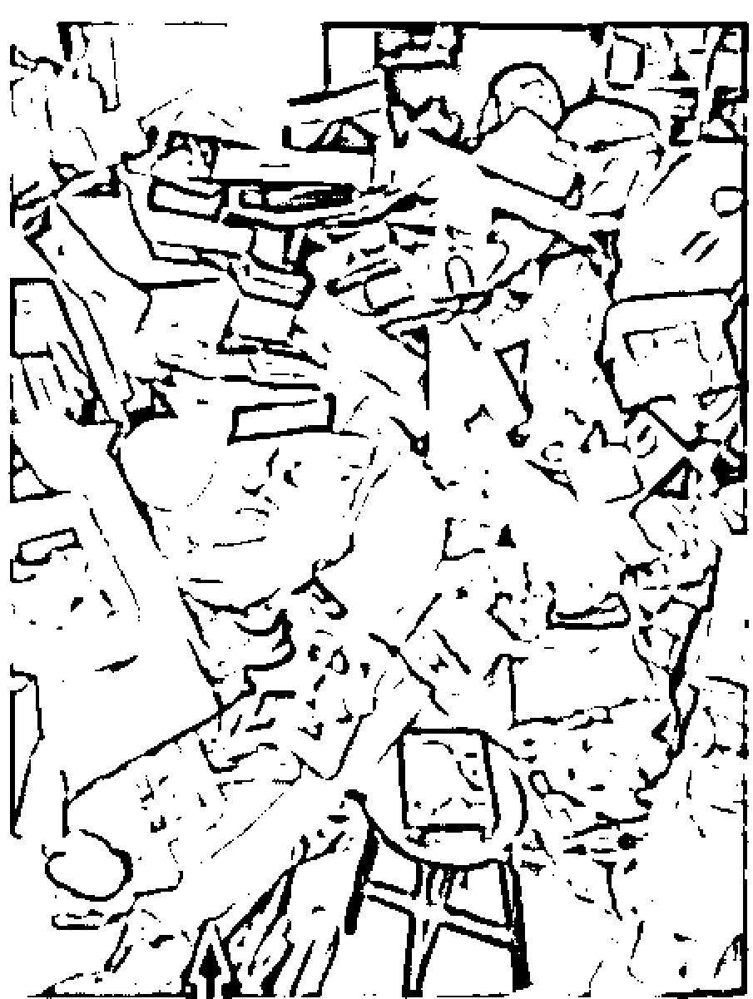

## 9.7 紫微諸星新論

紫微斗數把人分成陰、陽。在法文課中我們學了兩個形容詞：Elle est costau (中文意思大致是：她看起來頗強壯) 跟 Elle a l'air fragile (中文意思大致是：她看起來弱不禁風) 前者通常是陽女；後者通常是陰女。前者通常也會 un peu forte。觀察一個人的外在形象就可以知道他的命盤了。這一點在西洋占星中也有；請見 3.3 節。

有鈴星的女子，無論是座命、座夫妻宮、流年、大限，反正只要在「重要的地方」出現就夠了，就像「鱷魚」$^{4}$。也許下面這首德文歌描述的就是這種女子：

> Wenn sich die Ingel küssen, dann müssen, müssen,
müssen sie ganz, ganz fein behutsam sein.

(學過德文的朋友可以在 Themen Neu II 的課本 Lektion 2 找到這首歌。) 身宮在夫妻宮的人亦然。有紅鸞坐命的的人追求者不斷。如果再配個廟、旺的鈴星可就是天下無敵了！男性的「火星」就好像女性的「鈴星」。

有廉貞星的女孩「漂亮」。在眾人之中你一定能一眼認出她來。因此，有人說這種女孩特別適合從事演藝工作。她的「出眾」與太陽星座命的不同。藝人白冰冰應該是太陽座命的典型，她的臉看上去圓潤、豐滿就像個小太陽。但是廉貞星的女孩不同，有一點白裡透紅，像白玉般亮麗。也許可以用「天生麗質」來形容。太陰星的女孩是另一種漂亮。簡單說，「長髮飄逸」是最佳的形容。太陽星的人通常也比較愛運動；相對於有一種人除了學校的體育課以外是從來不做運動的！太陽座命的人喜歡「政治」，白冰冰就是個超級助選員。陳菊應該也是。

有算命先生一看到空、劫在命，立刻批下「一生錢財入不敷出」。雖然說空、劫在命會對現實不滿，但卻是激勵、改進的原動力。但是，真正最適合做研究的是破軍星，無論在命宮、事業宮、流年、大限均可；當然效果不盡相同，而且星星必須夠亮不然老是吃敗仗。這種人如果你要跟他談戀愛的話還是小心為妙；如果你期望的是天長地久永世不渝的愛。當然如果您期望的是一場轟轟烈烈驚天地泣鬼神的愛情故事那就另當別論了。溫沙公爵「不愛江山愛美人」，想必就是敗在破軍星的手裡。古書中說「紫破辰戌不忠，故有趙高指鹿為馬，王莽篡漢」。這多半是雙子座的個性。此星不到蓋棺絕不定論。廉貞貪狼同在夫妻宮能夠梅開三度。想必賈桂琳歐納西斯就是此種格局加破軍星。

如果你的朋友中有人鋼琴彈得很好，去看看它的命宮、事業宮、大限 ...多半有貪狼星。貪狼星古書中評為凶星，一點不為過。這種人在我眼中也多半是「凶神惡煞」。她們會穿一些「很奇怪」的衣服；肩膀開個洞、露屁股 ...。當她們登台演出時穿的禮服也是稀奇古怪。就連日常生活亦然。當然她們自己也許不會這麼想，她們會覺得那種衣服才「漂亮」、「時髦」。不過登台演出時要如何穿著實在是門大學問。當然貪狼星的另一面就是她們的多才多藝。古書中說武曲貪狼座夫妻宮會「婦奪夫權」，例如當夫妻雙方為一件事爭論不休時，她明明是錯的卻也會贏；家中諸事都由她作主 ...。

七殺是戍守邊疆的大將；衝鋒陷陣。因此我們派駐外國的領事人員最好是七殺座命；當然這顆星必須廟、旺，否則老是吃敗仗。不過您可別期望七殺的男人是個什麼「好老公」。七殺的人很兇悍！我們的國會、議會、反對黨、女權運動中應該也有不少這種人才。

廉貞化忌常常跟七殺在一起出現，常常是這個人表現得太傑出了而招致同儕的嫉妒。紫微斗數〈太微賦〉中有云「廉貞七殺路上埋屍」。這句話的意思是說遇到廉貞七殺同宮時會出車禍。廉貞是演藝之星。為何遇到廉貞七殺就會出車禍？出車禍也許未必，當眾出洋相大概都有。我聽過的幾個例子當事者都發生車禍。車禍就是在路上表演獻醜了。

曾紅遍大街小巷的「還珠格格」捧紅過不少明星，包括趙薇、林心如以及范冰冰。其中飾演「香妃」的劉丹，一雙水汪汪的大眼睛配上堅毅的氣質，令人相當喜愛。不過在她演完「還珠格格」之後，於 2000 年到廣東出席商業活動時，途中司機超速行駛，見到障礙物閃避不及，結果車子在打滑後撞擊護欄失控打轉，後座的她被拋出，當場頭部破裂死亡。消息一出惹哭眾多粉絲，許多人皆認為她正準備要大紅大紫，沒想到一場意外葬送了她的生命。這是標準的「廉貞七殺路上埋屍」。

西洋占星中七殺就是土星。而演藝的宮位則是第十一宮。有人命盤土星居第十一宮，在流年土星行經第十一宮時的確出車禍。不過有趣的是〈斗數骨髓賦〉卻說「廉貞、七殺，反為積富之人」。為何？不得而知。可能是坐落的宮位不同吧！?

命可以改嗎？我想是不可能的。但是如果知道流年或者大限廉貞七殺那何不就買個高額的保險。每撞一次車就大發一次！一台車變兩台不是更好嗎？這就是「知命」。我們不可能改變命運但是卻可以善加運用。

天梁星到底是人家梁我呢？還是我梁人家？你怎樣梁人家呢？簡單說，就是「英雄救美」了。那麼「白雪公主」、「美女與野獸」以及華格納的歌劇「漂泊的荷蘭人」...大概都是這類情節了。

古書中說昌曲同是秀才之命。現代當然就是上一流學府囉。如果你大學沒考好，別失望，研究所一定會上！

有天同的人「人緣好」；就是那種傳統中國所認同的個性。傳統中認為女子無才便是德，因此取名字時也都不願意用太特殊的名字。俗一點的叫春花、秋菊的，雅一點你看每年聯考的榜單就知道了；什麼雅惠、怡心（疑心）的一大堆。在這種價值觀下的女性是那種命宮中無主星的（通常主星會在對宮），少數是陷落的星曜、或者陀螺星。

天刑在命宮的人身體上會有傷。甚麼樣的傷？我看過的例子都是牙齒。母親懷孕時服用抗生素導致出生後門牙發黑。不過現在牙科技術進步很可能都做了假牙，除非是你很熟悉的朋友從小一起長大，看不出來。這種人通常會從事法律或醫療(外科)工作。

庚年生人古書中對於太陰星到底是化科或者化忌有所爭論。不過應該是化忌與化科兼具。盲人摸象，兩派人都摸到了一半。

對於流年一般認為是以陰曆計算，甚至有說以春分為分隔點的。在現代社會中，「流年」與「學年」有相當密切的關係；也就是會由陽曆六、七月開始。持這種說法的另一個理由是：所有的轉換應該都是漸進的。也就是說在上一年的下半就應該會有下一年的特性逐漸出現了。

有奏書的人會寫文章；包括告狀。西洋占星就是有某些行星在第九宮。你看過那些作文比賽得獎的小朋友嗎？有些小朋友從小就在報紙上寫文章，大了還拿些什麼校際作文比賽冠軍或者什麼文學獎的，這種人大概就是奏書在命宮吧？

> Who can control his fate?
William Shakespeare (1564-1616)
in Othello, act 5, sc. 2, l. 265

# 10 實例討論

本章諸多命盤實例讀者可以參照書中各章節仔細比較。討論名人命盤的好處仍然是可驗證性。一個人花了八十年的時間演完一齣人生的戲碼，我們卻能瞬間攤開討論它的神奇。在這些故事裡我特地把事件發生對應的宮位標示在括弧中，請注意它們的順序。一個人一生幾十年寒暑，能夠明顯看出生活重心轉移的大致就是天王星。有些人這種週期很明顯，有些人則較不明顯。

## 10.1 第十宮三顆行星逆行的畢卡索

Pablo Ruiz Picasso 1881 年 10 月 25 日約 23:15 生於西班牙 Malaga (36N43 04W25)。他非常矮只有 163 公分。強烈的性慾使他與很多女人發生關係卻只結過兩次婚。雖然是西班牙人但是他的一生多半在法國度過。他共有 8+1 個女人，四個小孩分別由三個女人生的。第九個女人是 2005 年才公開的 Geneviève Laporte (1926-2012)。

要了解畢卡索先要了解他的女人。他的一生大約每十年一個女人。十年在紫微斗數上就是一個大限。從童年起他周圍就都是女人。除了他母親、阿姨，他還有兩個妹妹。因此他很早就學會掌控女人。

他三歲時經歷大地震。地震的經驗影響他後來關於西班牙內戰的畫作 Guernica。1891 年，舉家遷居 La Coruña。在那裡，他考取了美術學校，很早就顯示了出眾的藝術才華。他總認為藝術是無法學習的。因此他也沒有對學校的課程特別認真。到 1898 年，他已經掌握了嫻熟精湛的繪畫技巧，並與巴塞隆納前衛派藝術界經常往來。他一方面熱烈地參與在酒吧間裡開展的激烈討論，另一方面也投稿給各刊物，但是與這些刊物合作的時間一次比一次短。這可能與他的西洋占星命盤中第十宮中至少有三顆星逆行有關（第十一宮逆行的冥王星在某些宮位劃分下也屬於第十宮）。

19 歲首次去巴黎，以後又多次重返巴黎。20 歲，他在巴黎設立畫室。習慣晚起卻工作至深夜。直到 1904 年春，他決定在那裡定居。與當時文化界最重要的代表有了接觸。

在他的一個友人去世後他進入了 1902-1904 的藍色時期。這段期間他的畫作主要是畫窮困與痛苦。

1905 年，24 歲起，進入三年的粉紅色時期，主題是丑角馬戲團生活。1905 年夏，他到荷蘭住了一個月。除了繪畫和雕塑活動之外，他還兼做一些造型藝術工作。他結交了美麗的 Fernande Olivier (1881-1966)。1906 年夏，到巴塞隆納、Gósol 等地旅行，對羅馬雕塑和古伊比利半島雕塑有深刻印象。同一時期，他遇到野獸派運動領袖 Henri Matisse。

可能是在 1906 年至 1907 年那個冬天，畢卡索開始繪製「亞維儂的姑娘」第一批習作草圖。這幅作品儘管經過多次修改始終沒有完成，卻成為理解和表現空間的一種新方式。他結識了德國年輕的收藏家 Kahnweiler 得到經濟上的支持。同一時期，他認識了 Georges Braque 和 Andre Derain。當時，Braque 還在忙於野獸派的探索，而 Derain 則已經開始研究塞尚的結構問題。這些結構問題通過他們之間的關係，朝著早期立體主義方向發展。

1909 年，畢卡索在 Horta de Ebro 度過了夏季，在那裡，他繪製了一些立體主義風景畫。這些作品在當年秋季，由 Vollard 代為展出。同年他還在摩納哥唐懷瑟畫廊舉辦了一次展覽。雖然畢卡索沒有參加沙龍畫展，但是那些最時髦的青年對他的畫作極有興趣。他的作品不久就成為立體主義革新派的代表。許多青年，雖然並不充分理解畢卡索繪畫語言的複雜性，卻都趨之若鶩地追隨了他的足跡。1909 到 1914 年是他與 Braque 共同發展雕塑及轉換到解析立體主義的棕色時期。

畢卡索在與 Fernande Olivier 斷絕關係之後，又與 Marcelle Humber (1885-1915) 結為伴侶。1912-1914 年，畢卡索的繪畫在法國國內外名聲日盛。在摩納哥、科倫和柏林等地舉行的歷次國際畫展中，畢卡索的立體主義繪畫有著異常突出的地位。國際性前衛派雜誌都刊登他的作品，在所有最先進的藝術中心，人們都在議論他的創新。

他父親於 1913 年去世。1914 年，第一次世界大戰爆發後，畢卡索留在巴黎，而他的同伴們都奔赴前線。在戰爭的那些年代中，畢卡索度過了一段孤獨和辛酸的時期。1915 年冬至 1916 年，Marcelle Humber 去世了。他生活在巴黎郊區的蒙特魯日，只有接受 Jean Cocteau 的懇切邀請，到義大利為芭蕾舞劇 Parade 作佈景設計才短暫離開。這是一次重要的旅行，因為他結識了芭蕾舞蹈演員 Olga Kaklova (1891-1955)，並在次年與她結婚；這次旅行之所以重要，也是由於他發現了古典藝術的深厚魅力，發現了假面喜劇的無憂無慮和輕鬆愉快。從與俄國芭蕾舞團團長 Sergei Diaghilev、現代派音樂家 Stravinsky

# 第十章

## 10. 實例討論

的合作中汲取豐富的創作動力。

1917 至 1924 年間，人們不斷地呼籲重回循規蹈矩的傳統做法，在這種氣氛中，畢卡索進行了兩個不同方面的活動：一個是古典主義的，它再次要求繪畫應描寫自然或生活，另一方面則是立體主義的創新。在這些年裡，畢卡索開始與一些從事試驗性活動的詩人來往，這些詩人後來開創了超現實主義的局面。

1921 年八月，40 歲，中年時，他因收受一羅浮宮失竊的雕刻被巴黎警方拘留。雖然他並沒有被判刑入獄，這卻是他終生對法國警方恐懼的開始。這應算是他的中年危機。

1923 年，他在 Boisgeloup 展示了他一年前開始的雕塑工作的成果，在技術上他曾得到 Julio González 的幫助。在這個時期結交了 Marie-Therèse Walter (1909-1977)。1935 年，Walter 生了女兒 Maya。不過 Marie-Therèse Walter 卻以上吊自殺結束了她的生命。再下一個女人是 1936 年的 Dora Maar (1907-1997)。不過 Dora Maar 卻有精神方面的疾病。畢卡索所有關於哭泣的女人畫作都是畫 Dora Maar。1936 年，西班牙內戰爆發，畢卡索立即站在 La República 這一邊反法，並接受了 El Museo del Prado 館長職務，展開了拯救巨大藝術遺產的重要任務活動。

從創作的角度來看，畢卡索反法的活動表現在 1937 年巴黎萬國博覽會西班牙館的那幅巨畫“Guernica”上，同時也體現在同一年的插圖著作「佛朗哥的夢想和謊言」(Sueño y mentira de Franco) 上。戰爭的恐怖和人的瘋狂獸性明顯地表現在他的全部作品上，令人觸目驚心。在這個時期，他主要住在巴黎，並與薩特和傑克梅第常來往。1938 年他的母親去世。1939 年他把這幅名畫捐給紐約現代藝術博物館。1941 年，他寫了一部劇本「抓住慾望的尾巴」(el deseo atrapado por la cola)，同時他還從事雕塑，並廢寢忘食的作畫。

60 歲以後的他的性慾變成是一種強迫性的行為。從 1946 至 1948 年，畢卡索住在 Antibes。在那裡，他又嘗試以新材料從事陶瓷器之製作。這個時期，他的生活重新獲得寧靜。1946 年三月他遇到比他小 40 歲的 Françoise Gilot (1921-)。他的新伴侶 François Gilot 給他生了兩個孩子。而他的藝術活動正如他的生活一樣，也反應出他的內心喜悅。但是，當畢卡索結識 Jacqueline Roque (1926-1986)，他與 François Gilot 的決裂就不可避免了。他與 Gilot 的婚姻維持了七年。1961 年與 Jacqueline 秘密結婚。從那時起，Picasso 就來往於他擁有的多處寓所和別墅中，過著一種退隱的生活。

1973 年 7 月 8 日 11:35AM，正當他在籌備一個在亞維儂，另一個在尼斯舉行的展覽時，在他的 Mougins 別墅裡，心臟病突發。享年 91 歲。

他一生留下至少 14000 幅油畫及其它各種雕刻、書籍插畫數千種。使他成為億萬富翁。這可以由他第二宮中的天王星看出來。

## 10.2 第十宮二顆行星逆行的張大千

張大千 1899 年 5 月 10 日酉時四川內江生，排行第八。他出生的年代比畢卡索晚了 18 年。適逢敦煌石窟發現，而三度赴敦煌臨摹，不能不說是生逢其時。20 歲性情不穩，遁入佛門為僧法號大千。三個月後為家人尋回與曾慶容成婚。24 歲娶二夫人黃凝素。26 歲父親過世，開始蓄鬚。27 歲於上海舉行第一次個展，初至北京結識藝文界，邁入職業畫家生涯。36 歲娶三夫人楊婉君，作品赴歐巡迴展出。38 歲母親過世。43 歲至敦煌開始兩年半的壁畫臨摹工作。46 歲於成都重慶舉辦敦煌壁畫臨摹展，造成轟動。51 歲首度來台灣舉行個展，大陸局勢驟變，與四夫人徐雯波轉赴香港暫居。54 歲舉家遷往南美，56 歲遷往巴西建八德園，自此僑居巴西 15 年。

58 歲首度遊歐，於巴黎近代美術館展出近作 30 件。在巴黎的藝文朋友如趙無極、常玉等人都提及畢卡索這個抽象畫始祖人物。或許是相似的背景，讓張大千興起了見面的想法。當時大家都勸阻，怕會碰釘子，因為畢卡索是很有個性的，情緒陰晴不定。結果張大千自己找了翻譯打電話約畢卡索，沒想到畢卡索很熱情的在他位於 Nice 的別墅招待張大千夫婦。這中西藝術大師的交流轟動一時、成為佳話。不愛穿上衣的畢卡索，還特別的穿了一件條紋襯衫。

67 歲時倫敦首次個展。78 歲返台定居。1983 年 4 月 2 日，85 歲，病逝台北。

大千財務狀況如何？據說他經常千金散盡，甚至無以為繼，總是向船王董浩雲做將伯之呼1。在巴西他也曾經和親友成立一家豬鬃公司，銷往美國，被推為董事長。不過原本是一本萬利萬無一失的生意卻被誣指為大陸貨遭到沒收。他為此頗受損失，心情沉重，是親友三十年僅見。但是看看他第十宮逆行的主星，這種結局似乎並不意外。

大千住處經常冠蓋雲集，擺龍門陣，因此他也欠下不少畫債。這可能與他第八宮逆行的木星有關。巴西歷任國府大使如果未曾到過八德園盤旋半日，似乎等於未接篆視事。一生雖四處流浪，對居所卻十分考究，不論四川「梅邨」、巴西「八德園」、美國「可以居」和「環蓽盦」到台北「摩耶精舍」，均極富園林之勝，也可能是源自木星在第八宮的影響。

綜觀畢卡索與張大千的命盤，最大的共通處似乎就在眾星雲集的第四宮外加第十宮逆行的主星。12 年一任的夫人，正符合木星週期。狹窄的第四宮也有被截宮位的格局，使他在此成就非凡。

1 張大千的八德園世界，許啟泰，2003 年台灣商務印書館發行。

## 10.3 S. Chandrasekhar 眾星雲集的天頂

1982 年諾貝爾物理獎得主。S. Chandrasekhar 1910 年 10 月 19 日生於印度 Lahore。不過這個地方現在是屬於巴基斯坦。我們並沒有他的確切出生時辰。但是生日與出生地點都是有案可考。1995 年 8 月 21 日去世。

他在印度長大，在英國念博士。19 歲便因 Sommerfeld 給了他一篇論文接觸到了 Fermi-Dirac 統計，自己便寫了三篇論文發表於 Proceedings of the Royal Society 及 Philosophical Magazine，也因此拿到了去英國的獎學金，他得諾貝爾獎的研究是在去英國的船上想到的；但卻是在他得博士學位後才真正把它做出來。和很多當年出國留學的人一樣，他從此沒有再見過他的母親。

劍橋也許真的是個奇怪的地方。由 Chandra 和家中的書信中可以看出一個反覆出現的主題；他的寂寞，一種令人透不過氣的壓力。這和徐志摩、陳之藩的筆下是多麼不同！以他在印度時功課的表現，發表的論文，他早已於印度成名。但在劍橋他卻是那麼的渺小。當然這也不足為奇，Dirac 長他十歲早因提出量子力學聞名，但在劍橋他卻仍只是個講師。Fowler 是 Chandra 的導師。有時為了見 Fowler，他竟然在圖書館外面等了二個小時之久，而 Fowler 走過他旁邊時卻只是笑笑點個頭就過去了。家書往返的時差，引起的焦慮，恐怕不是現在去美國的留學生所能體會的。有一段日子，他只好到 Copenhagen 去透透氣。並曾一度考慮要改做物理。這個現象一直到他當上了三一學院 (Trinity College) 的研究員 (fellow) 才有所改善。但另一個隱伏已久的問題又隨之而來，就是他在到英國的船上所發現的星球質量極限的問題，導致了他和 Eddington 間的「世紀之爭」。

和每個人一樣，生命中不可缺少愛情。這個問題一直到他做博士後研究時才浮現。那個女孩叫 Lalitha，大學修課時認識的；Lalitha 坐第一排他坐第二排。六年不見了，Chandra 沒有把握她仍和以前一樣。因此一直到他回印度再次見到她後才決定他們的婚姻。Lalitha 長在一個不平凡的家庭。婚前她是一所中學的校長。他們結婚五十餘載，不能說不是個成功的婚姻。這是似乎與他第七宮中的海王星有關。六年的分離，估計是天王星行經某個宮位的時間。六年間由戀愛 (第五宮) 轉為婚姻 (第七宮)，估計這六年時間天王星應該行經第六宮。

他初到美國時，芝加哥大學還是個剛成立不久的學校，他的研究方法和他的老師比起來大大不同，當時甚至不被視為正統。他從設計研究所課程開始，圖書館、書報討論...。芝加哥大學天文系的成長他的功不可沒。但後來他卻遭系上排擠而轉到物理系。Fermi 死後系上流失了不少人才，他卻是少數沒有離開的人。

中年後的 Chandra，花了大半的精神主編 Astrophysical Journal。他並不喜欢博士班的學生把自己的博士論文發表出來。期刊上偶爾有些作者為了某些問題爭論不休時，他會介入希望作者停止爭論而讓事情自然被遺忘；這方式不正和他處理 Eddington 及 Chicago 兩件事相同嗎？為了保持期刊主編的公正，那段日子他不得不盡量與外界隔絕。他對一問題的研究，通常以寫書做最後的總結。他和 Eddington 之爭時是第一次這麼做；後來又寫了好幾本書亦即換了好幾個領域。對他而言，一個問題研究夠了若再加任何東西都會破壞原本的完美。

在比較有人性的日常生活裡，他很喜歡小孩。萬聖節時他怎麼裝扮呢？別忘了他有一件 Cambridge gown。平日不隨便說話，除非他知道是絕對正確的事。和 Eddington 之爭使他認清最重要的事是不斷研究，而不是浪費時間於無謂的爭執。他對文學、藝術都有相當的接觸。對他說來莎士比亞、貝多芬乃至牛頓的作品中有共通的特性。在諾貝爾獎頒獎的晚宴上，一位旁坐的女士問他：The work you are recognized for was apparently done fifty years ago. What have you been doing since? Chandra 回答：They also serve who only stand and wait. 那女士沒聽懂，因她沒念過 John Milton 的詩2。得諾貝爾獎的心情是什麼？只有他最清楚。回顧往日他承認年輕時是為了成名而努力。不過劍橋的日子使他發現，要達目的必需投下大量的精神與努力而且在正確的方向上堅持相當的時日。許多人無法認清這點就誤入歧途了。

能夠到海外發展能夠主編學術期刊必然第九宮眾星雲集。我猜測生於正午 12:00；在這個星盤上可以清楚看到在主掌出版與高等教育學術研究的第九宮與事業的第十宮的確眾星雲集。第四宮逆行的土星可能是他早年離家的原因？

2 這是失樂園的作者 John Milton 的詩 On His Blindness 中最後的一句話。原文如下：

> When I consider how my light is spent
> Ere half my days in this dark world and wide,
> And that one Talent which is death to hide
> Lodged with me useless, though my soul more bent
> To serve therewith my Maker, and present
> My true account, lest He returning chide,
> "Doth God exact day-labour, light denied?"
> I fondly ask. But Patience, to prevent
> That murmur, soon replies, "God doth not need
> Either man's work or his own gifts. Who best
> Bear his mild yoke, they serve him best. His state
> Is kingly: thousands at his bidding speed,
> And post o'er land and ocean without rest;
> They also serve who only stand and wait."

意指雖殘廢，在天國裡仍有他的位置。也就是說耐心的重要。

## 10.4 Theodore von Kármán 眾星雲集的第九宮

1881 年 5 月 11 日生於匈牙利的布達佩斯。文獻中並沒有他的出生時間。我們以正午 12:00 估計。

他的一生受嚴父影響極大。生長於匈牙利，排行老三，猶太人。也許是理想主義？或是因為倔強？抑或為主張正義？他得自父親影響的個性，使父子二人均極晚出頭。與同儕及上司不睦。很小，他就在親友前表現算術的天賦，但他父親卻極不悅，不願他成為「天才兒童」。他父親認為宗教、人文及科學為知識的三面，同等重要。因而將他的學習導向人文方面。致使他日後能通六種語言。大學畢業時他就發表了結構彎曲 (buckling) 方面的論文。服完兵役後，決定去德國 Göttingen 找 Prandtl 深造。

他和 Prandtl 只差六歲。個性截然不同。二人間的競爭從師生期的階級關係到後來得 Klein 之助當上 Aachen 大學教授轉成兩系競爭。他仍想繼續做結構方面的研究，但 Prandtl 做流體力學且對他的研究毫不感興趣。再加上他不喜歡 Göttingen 因此次年就轉到柏林附近的一家小學校。不過很快就發現，更糟，又轉回來了。此時正好有家軍火工廠需要他的研究。因此很快就有了足夠的數據畢業。他早想離開 Prandtl 了。

畢業後到法國是他人生的轉捩點。當時距離萊特兄弟 1903 年的試飛不過五年。由於朋友邀請觀看一次試飛表演而激起他研究飛行的興趣。於是再度回 Göttingen 當 Prandtl 的助理。此時他的室友包括 Max Born; 也因此他做過晶體結構方面的研究。也是在這段日子裡他發現了 Kármán 渦流排的現象。一次大戰時他被徵召回國。戰後匈牙利被共黨佔領他則逃回 Aachen。

在教育上 Kármán 有他得自父親的獨到的見解。他很關心學生。也常在啤酒館出現和同學聊天。演講時也有他特殊的魅力。他把 Aachen 變成一個一流的學校。戰後的國際研討會使他揚名於世。而受 Millikan 邀請，至 Pasadena 主持 GALCIT (Guggenheim Aeronautical Laboratory at the California Institute of Technology) 達 25 年之久。

當時美國的航空界極落後，多只用經驗定律。是他引入了科學及理論的方法。Millikan 是如何，花了四年，在 Stanford 及日本間把他爭取到美國的？當然納粹主義之興起也是重要的原因之一。但對當時的歐洲人說來美國，即使不是流氓，也是一些不能適應環境的人去的地方。

在美國，他仍然很照顧學生。他從不用美國式的方法，讓年輕的教授或研究生教大學部而名教授只教少數的研究生。如今 CalTech 的名聲及南加州的航空工業都是大家有目共睹的。

1935 年是另一個重要的時刻：有個博士班學生 (Malina) 想做火箭方面的研究。當時大多數人都認為不可行。這個學生幾經掙扎。這種故事永遠是成王敗寇。當事者必須忍受周圍人們殘酷的嘲笑也許只有自己獨立做過研究的人能體會。當時人們戲稱 Malina 等人為 The Suicide Club 可見一班。當然，今天我們都看到火箭發射上天了！南加州也有了著名的噴射推進實驗室 (JPL, jet propulsion laboratory)。

二次大戰末他再度創立機構：白宮幕僚群。戰後奉命搜索，在德國 Volkenrode 發現大量先進的研究，甚至波音公司 B-47 轟炸機的後掠翼 (swept-back wing) 設計都是那裡學來的。重返德國與 Prandtl 相會自是百感交集。

他終身未婚。一直和他的母親及妹妹住在一起。他天生左耳重聽，終其一生都帶著助聽器。也許這也是影響他的一個重要原因。他看起來比實際年齡年輕約 15 歲！1946 後他已成為世界航空界最重要的人物之一。各式的獎章，榮譽學位湧入。如果說這個成功的男人背後有個女人，這便是他的妹妹。

晚年他仍，受父親影響，致力於國際合作及科技交流。在北大西洋公約組織 (NATO) 下設立 AGARD (advisory group for aeronautical research and development) 而長居巴黎。約 82 歲去世。

在我猜測的命盤裡我們也可以看到第九宮裡真是眾星雲集。這種四個以上的行星在同一個宮位或者星座的我們稱為星群 (stellium)。

## 10.5 歌劇女神卡拉斯金星在第一宮

卡拉斯 (Maria CALLAS 全名 Maria Anna Sophia Cecilia Kalogeropoulos) 1923 年 12 月 2 日上午 7:07 生於美國紐約市3。她的一生充滿傳奇。說她是金星、愛與美的化身應該不為過。她的命盤的確金星在命宮 (第一宮)。她的一生極具爭議性，這可以從她的火星、土星在第 11 宮交界看出她的忿怒及眾人對她的批評。據說她曾經與歌劇院經理爭執憤而將一支匕首擲向對方！(雖然實際情況可能只是在與經理簽約時憤怒之下將手中的筆丟向對方。)

第七宮的冥王星使她充滿了致命的吸引力。但是冥王星在第七宮逆行明顯造成她與船王歐納西斯的悲劇婚姻。中年危機。

3 資料得自 http://www.khaldea.com/charts/mariacallas.shtml 也有別的網站說是 3 日早上六點；不過這些網站說資料是得自記憶。據說 Callas 曾經在巴黎找過占星師 Andre Barbault 算命。她說她是生於 6:00 : 2 日早上。資料來自 Astralites des Femmes Illustres, Editions du Rocher, 1998, pp 316. 我們採用的資料, 7:07 據說得自 Lois Rodden 的網站竟然精確到分鐘應該較可信。從她的特殊婚姻及生平其它事蹟判斷應該也是這個時間。她母親在 My Daughter, Maria Callas 一書中說她是 4 日生的經考證也是錯誤。請見 http://www.astralis.it/mcallas.htm 他們考證後認為是 6:10。

## 10.6 怕瓦落地金星在第一宮

Luciano PAVAROTTI 近世最偉大的男高音之一。1935 年 10 月 12 日 1:40A.M. 生於義大利 Modena。麵包師傅的兒子。母親是雪茄煙廠女工。幼年家境並不富裕但是他非常滿足快樂。2007 年月蝕日蝕間的 9 月 6 日凌晨 5 點 71 歲因胰臟癌死於義大利 Modena 家中。（次日冥王星由逆行轉正行。）他命宮是獅子與處女。而 9 月 2 日土星進入處女，且日蝕發生在處女 18°24'。他的死亡並不意外。土星在第七宮逆行再加上第九宮逆行的天王星，共結過兩次婚。第一任妻子結婚 35 年 1996 年與 26 歲秘書再婚，2003 年再與 Nicoletta Mantovani 結婚。他與前妻共生三個女兒，第二任妻子再生一個女兒。

幼年就與父親參加教堂唱詩班。早年從事保險業。不過在未婚妻的鼓勵下他開始學習聲樂。金星在第一宮顯然是他能在這方面成功的原因。1961 年他贏得一個當地的聲樂比賽而演出普契尼的《波西米亞人》中的 Rodolfo。隨後一連串成功的在歐洲小型演出，1963 年終於在倫敦的柯芬園演出 Di Stefano 的 Rodolfo。1965 年在義大利歌劇聖殿 La Scala 首演，1967 年舊金山首演，1968 年紐約大都會歌劇院首演。冥王星自 1960 年代末期進入他的第二宮無疑的為他帶來巨大無比的財富。1978 年他的體重紀錄是 180 公斤。他由原本的抒情男高音轉入如 Otello 等較吃重的角色。1970 年代中期起他變成媒體巨星在商業電視上或戶外與流行音樂家合作演出。1990 年代與多明哥、卡列拉斯共同在羅馬、1994 洛杉磯的世界杯足球賽演出而被共稱為世界三大男高音。不過他的第十宮並沒有主星。木星出現在第四宮使他的事業與家庭有關。再加上 1990 年代起冥王星也正好在他的第四宮造就他的事業（第十宮）。

## 10.7 琵雅芙眾星雲集的第八宮

法國歌手 Édith Piaf 的中文翻譯名字也許不是眾人皆知。但是如果說起電影《美麗人生》中的主人翁，說起她的歌曲 La vie en rose、Hymne à l'amour 也許就比較多人知道了。她被視為法國香頌的代表人物。

1915 年 12 月 19 日 5:00 生於巴黎貧苦家庭，媽媽在咖啡廳唱歌，Édith 出生不久便被遺棄給玩雜技的爸爸和開妓院的外祖母照顧。她的身高只有 142 公分，標準妝扮是一字眉。

14 歲時，天王星進入它的第五宮，隨爸爸在街頭表演賺錢，15 歲開始在巴黎街頭表演自力更生，17 歲初戀、懷孕，生下女兒 Marcelle。然而，Édith 經常流連街頭唱歌賺錢，將女兒獨自遺留在家。女兒兩歲的時候患上腦膜炎去世，對 Édith 的打擊很大。

1935 年天王星進入她的第六宮，19 歲的她決定離開貧民區，到巴黎較富有的街頭賣唱。一位夜總會老闆 Louis Leplée 提攜她建立歌唱事業，並為嬌小的她改了藝名 La Môme Piaf（小麻雀）。

Édith Piaf 一生經歷過多次婚姻，每一段愛情都沒有開花結果，不是她離別人而去，就是情人不幸死去。其中最轟烈的要算是她與已婚拳擊手 Marcel Cerdan 的愛情故事。當時 Édith Piaf 已經成為知名歌星，在美國巡迴演唱，以悲歌見稱的 Édith Piaf 以為自己終於找到她一直以來所渴望的真愛。然而天意弄人，情郎於 1949 年空難中離世，壞消息對 Édith Piaf 打擊很大，但她仍然堅持於當晚演出，並將 Hymne à l'amour 獻給她一生的摯愛。

自 1958 年的一場車禍後，Édith Piaf 對嗎啡成癮，終日依靠嗎啡止痛，後來更酗酒，並患上胃潰瘍、慢性風濕病和肝癌。熱愛歌唱的她甚至到了這個地步仍然要堅持歌唱，展開了 1959 年所謂不顧自己健康的「自殺式巡迴演唱」。終於，她於同年二月在華爾道夫酒店演出時倒下，1963 年於養病的地方法國南部昏迷去世。

## 10.8 大眾情人香奈兒木星在第七宮

香奈兒 (Coco Chanel)，時尚界大師。1883 年 8 月 19 日下午 4 點生於法國 Saumur 貧寒家庭。12 歲喪母後在孤兒院住了七年，估計此時天王星在第四宮。在修道院受了一點教育，19 歲在一家成衣廠找到工作，算是她第一次與服飾業的接觸。由於去當地的咖啡館，耳濡目染下，她想當歌手。22 歲時受了點歌唱訓練。25 歲認識酷愛馬術的法國商人 Étienne Balsan 成為他的情婦，使她初嘗充滿珍珠鑽石的富裕生活。(第五宮) 她為了學騎馬自己設計馬褲。她開始只為興趣設計 (第五宮) 帽子；頗受來訪的女士歡迎。不久她離開了 Balsan。於 1910 年在巴黎開設個人第一家服飾店。但是不久倒閉了。這中間我們的資料不全，她應該還經過一些第六宮的工作。後來她又認識了 Arthur Capel (第七宮) 得他的資助再度開店。也是他將她引入巴黎的社交圈。1913 年再開一間。也就在這年她的姊姊去世。

1914 年，31 歲，第一次世界大戰爆發。戰爭使得男人上前線，女人生活改變，而她的服裝設計也越來越熱門。1916 她把所有的借款都還清了 (第八宮)。不過 Arthur Capel 也結婚了，新娘卻不是 Coco，雖然他們還是繼續往來，直到 1919 年耶誕 Arthur Capel 車禍死亡。這是她唯一愛過的男人。1920 年，37 歲，她的妹妹在阿根廷去世。

一年後，Igor Strawinsky 及其家人因俄國革命逃亡至巴黎搬進了她的別墅。她出身貧寒現在卻成了資助者。後來還有俄國沙皇的姪子也搬進她的別墅。她的 (性) 伴侶一直不斷。

1923 年，40 歲了，推出曠世作品「香奈兒 5 號」，迷倒眾生。憑著毅力、際遇與藝術才華征服巴黎成為國際名流。1930 年代的大蕭條並沒有中斷她的事業。她獲邀至美國替好萊塢明星設計服飾。

1939 年英、法對德宣戰。她決定關掉時裝店。1944 年戴高樂接管法國臨時政府。可能是因為與德國人私通她被捕了。雖然很快就被釋放。1954 年復出，已經 70 歲了，實力風采依舊。

她為 20 世紀女性量身訂作，從服飾上解放女性。不過自己卻終生未嫁。從星圖上看來，木星在第七宮，她不是沒有機會，而是機會太多！堪稱大眾情人。雖然事業宮無主星，但是第四宮有！使她的事業與家庭有關，而且海王星的特性使她的事業「撲朔迷離」；不光是香水撲朔，連她自述早年生活及創業也迷離（因此命盤中的海王星應該在第五宮）。眾星雲集的第八宮是她財富的來源。狹窄不等分的宮位（第五宮）顯示她出色的地方（創意）。1971 年 1 月 10 日巴黎去世。

不過另外兩個法國名牌的創辦人就和她非常不同了：LV 創辦人 Louis VUITTON（1821 年 8 月 4 日 3:00 生於法國 Anchay）及 YSL 創辦人 Yves SAINT LAURENT（1936 年 8 月 1 日 19:45 生於阿爾及利亞的 Oran）都有木星在第十宮創造他們的事業。

Maurizio Gucci (1948 年 9 月 26 日 1:10 AM 生於義大利 Florence) 是另外一位義大利名牌創辦人。他在 1995 年 3 月 27 日，天王星即將上升到地平線上將入第七宮時，被他的前妻僱請兇手槍殺。他在第十宮並沒有主星，但對宮第四宮有海王星及水星。

## 10.9 陶淵明土星在第二宮木星在第十二宮

東晉哀帝興寧三年生於潯陽柴桑（今江西九江附近）的一個落魄仕宦家庭裡（西元 365 年～427 年）。正確生辰已無可考。他的一生在物質世界裡衣食住行樣樣貧困，但忠於自我固窮守志，不為五斗米而折腰。「採菊東籬下，悠然見南山」是大家所熟知的。

少年時代在柴桑的農村，八歲喪父（可能冥王星入第四宮）後家庭衰微，孤兒寡母，有時不得不在外祖父家裏生活。「少年罕人事，游好在六經」（《飲酒》其十六），便是這個貧窮的少年忘卻現實，只醉心於研讀儒家經典的寫照。

身處在戰爭頻仍的亂世裡，民間百姓的顛沛流離。當時士人因對改革社會亂象及政治門路一點辦法都沒有，而紛紛背棄儒家思想，消極的表現在文章上。人民在動盪中渴望樂土，於是隱逸之風和仙道思想盛行，也形成魏晉流行「志怪小說」的現象。但是陶淵明是一個踏實的人，也是當時少數幼時除了老莊思想之外還另外接受儒家教育，長成後還會有匡濟天下、大濟蒼生的凌雲壯志的年輕人。

年輕時的家裡為了嫁妹籌措妝奩而賣田，幾乎到了無以維生的地步。幸好淵明有機會在隨後的五年時間，在附近一戶姓東郭的農莊裡當家教老師 (某行星經過第三宮)。而且竟然得到東郭小姐的青睞，最後結為夫妻。也因這位賢內助精於農事的關係，讓淵明一向寒窘的家境暫時得以舒展。婚後有子的淵明雖然內心崇尚自然，但並沒有完全擺脫名教的束縛，仍希望立善求名。所以當他母親動用舊時的關係為他求了一個官職回來時，他為了建功立業和解決生活上的困難，終於決定在 29 歲時嘗試去做江州祭酒這個小小的學官。

當時江州的刺史過分熱衷信仰，置地方行政於不顧，一切僧道法事的花費概由江州政費開支，弄得水利不能修、窮民不能濟，地方人民學務經費無著，還要他去發展「五斗米道」。所以當有差役大搖大擺的通知他趕快整裝去見官職比他還低的鄉里小人時，他就只好帶著傲骨辭官歸家了。

沒想到歸家後的隔年，妻子東郭氏生第二胎時遇到難產。她在死前託人去把她的姑表妹翟氏找來，要翟氏在她死前答應替她撫育幼子，照顧淵明一家老小之後，方才瞑目而去。窮秀才當家教竟然能娶得主人家小姐，又能夠有雙妻命，應該夫妻宮有兩個主星。

就這樣隔了四、五年，35 歲，當初介紹他到東郭家教書的朋友又介紹他到新的江州刺史處去當桓玄的幕僚 (參軍)。桓玄是個野心勃勃的將領，一直都在私下準備著奪取東晉的政權。可想而知陶淵明在他手下辦事會是如何的格格不入。剛好那一年冬天，母親孟氏去世 (第四宮)。於是他便按照古代的規矩辭官回鄉隱居三年。不久，桓玄真的舉兵作亂，並在次年篡奪了帝位。再隔了年餘，又有劉裕這個人起兵平定了桓玄的叛亂。討逆成功的劉裕，真正掌握了國家大權。此時年已 40 歲的淵明，轉眼就有了五個孩子 (某行星到了第五宮)，再加上莊稼因連年天旱欠收，生活實在不濟。陶淵明又因舊友的牽線再度前往出任劉裕的參軍 (到了第六宮)。這是他第三次出仕，所以心情非常的複雜。這時的劉裕正忙於討伐桓玄的殘餘勢力。爭戰殺戮這樣血腥的事情實在不是淵明這般宅心仁厚的幕僚所能接受的，所以到了第二年 (即公元 405 年)，他便自請改任江州刺史劉敬宣的參軍。或許是因為個性比較忠直，所以後來把替劉敬宣因權力傾軋而向朝廷送辭表的事情辦的很好。在他跟著劉敬宣失去工作的同時，卻在家中意外接到了詔命，任命他為江州東邊百多里地的彭澤縣令！由於這是一個正式的文官職務 (第七宮)，所以這一次他也就攜家帶眷，欣然赴任去了。

61 歲時那個一直以來都像鐵人一般頂著陶家的翟氏去世了 (第七宮尾)，陶家長大的兒子們個個外出流離也僅供糊口。62 歲，剛寫完《詠貧士七首詩》的淵明骨瘦如柴的躺在家裡，而剛剛上任江州刺史的劉宋名將譚道濟正好這時慕名前來看他，在一番話不投機之後，譚道濟就另外派人去給淵明送點肉跟糧來。他因忌諱譚家子弟歷事晉、宋二朝還能春風得意，所以鄙棄其物「麾而去之」。在飢餓面前還是表現了錚錚的骨氣。而另一方面，當他還能走動的時候，曾經到潯陽里的巷裡討飯。當年災荒，「討飯」變成淵明飢餒之下無可奈何的事呀！

由於他不得志，幾度出仕都是幕僚職務，可見他第十宮沒有主星。他的第九宮必然有某些主星，因為他說自己年少時是「猛志逸四海」。第九宮的主星使他對海外的事物有興趣，而且他很會寫文章。很可能是金星落在第九宮。他經濟情況極差，最後是窮死的，因此土星恐怕是落入第二宮。只有土星受困於此的人會非常辛苦的工作卻只有很少的報酬。隱居 (第十二宮) 可能是淵明選擇排除他內心困難的方法。加上他是身後多少年後才盛名卓著有所謂的幸運發生，推論他出生星盤上的木星，應該是落在十二宮。

土星在第二宮，木星在第十二宮，這兩顆星宿就可能形成刑剋的 90 度四分相位了；不但會帶來財務方面的困擾，也會因為缺少機會或是運氣不好，而在工作上吃虧。他的好酒，已然成為他生活和文學的標誌，他生活中與酒有關的事蹟何其多，如陶淵明喝酒微醉的時候，便撫弄家裡的無絃琴來寄託閒情逸志，這種雅癖也是眾人皆知；他是一個終生懷抱理想的人，否則不會寫出《桃花源記》來，他具有詩人的敏感跟理想主義性格，因此也讓他不能同流合污，靈魂為此受苦。可能海王星在第十一宮。海王星掌管著人的情感與心靈的理想，它有著夢幻跟不切實際的性質。

63 歲，寫下一篇說明「人生實難，死如之何？嗚呼哀哉！」的自祭文後，在秋末窮病而死 (第八宮)。

## 10.10 包拯土星在第三宮

包青天，包大人（根據包公廟所載西元 999 年 4 月 11 日安徽廬州生，1062 年 5 月 24 卒）。據聞包拯是農曆二月十五日滿月時出生，時辰未知。能為判官斷人生死的必然土星在第九宮（或者對宮第三宮）。據 1973 年出土於包公墓的包公墓銘記載，包拯先後有三妻 (夫妻宮很可能有三顆星)。他是一個鄉村農家出生寒微子弟，有一個困頓卑微的童年、明顯嚴格的家教，還有無法施展抱負、仿如龍困淺灘的青年歲月。以他幼年必需等到農閒，才能寄居在城南的一座古廟裏，埋頭鑽研學問看來，土星在第三宮並不為過。真是「天將降大任於是人也，必先苦其心志。」但是單只有土星在第三宮絕不能夠成就包拯一生偉大的事業而為後人稱頌。

第一個土星週期，29 歲（西元 1027 年）中進士。但不論是朝廷任命他為「大理評事」，或是任命他為建昌知縣，他都以父母年事已高，不忍遠去為官。雖然一個農家子弟歷經了千辛萬苦才換來功名，包拯對於放棄官職留在家裏的這個決定，卻義無反顧。這可能是當時流年有某些重要行星在他的第四宮。後來，朝廷又嘗試委派他到家鄉附近的和州做官，因為是在附近，所以這回，包拯確有赴任，不過現實的情形是，包拯還是放心不下留在家中的父母，所以方才幾個月的官場生涯就此匆匆打住。短暫的遠離、突然的變化，推斷可能是流年天王星的影響。一直等到父母相繼去世後，守孝完畢的包拯才離開鄉村，前往京城等候授予新職。當時的他，已經是一個青春盡逝的中年人了。

景祐三年（1036 年），包拯被任命為天長知縣，正式出山。年近四十的他就在那裏當一個知縣小官。可是也就在這彈丸之地、人稱九品芝麻官這種處境裡，開始了他為後世傳頌千古的傳奇。在一個沒有嚴明監督機制的官僚基層中，包拯卻能奇蹟般的以身作則、自我監督。他為官清廉，而且言行一致、剛正不阿、不畏權貴，加上他斷案精準、才華顯溢，很快的便聲名遠播。

宋仁宗慶曆二年（1042 年）包拯任端州知郡事。該地盛產一種國寶級的名硯，人稱端硯，是朝廷欽定的貢品，和湖筆、徽墨、宣紙並稱為「文房四寶」中的絕品，據說是隆冬不冰的奇物。所以當地的「油水」之多，可是歷來貪官覬覦之處；以往在端州任職的知州，總要在上貢朝廷的端硯數目之外，再暗使民工多製幾倍，以為賄賂，好為不肖官員製造自己日後能升任京官的本錢。包拯上任後卻明令絕不多製或多收一塊端硯，當地的硯工因此脫離了永無休止的勞務剝削，對包拯非常感激。包拯三年任期屆滿，硯工看他就連平時在公堂上用過的端硯也造冊上交，心中充滿感佩與不捨。於是眾人趕在船行之前，送來了一塊用黃布包裹著的端硯，以為報答。包公手下則因心有同感，也就擅收入艙。哪知，載著包拯離開端州的船經羚羊峽口時，突然江面風浪大起。包公覺察事有蹺蹊，隨即查問，並親自下艙檢查，才發現船艙裏私藏的那塊端硯。包拯一言不發，舉手便將那塊名貴的端硯丟入西江。瞬間，江面恢復了平靜，傳說在包公擲硯之處，就隆起了一塊陸洲，也就是如今名叫「墨硯沙」的硯洲島。

回京後，包拯終於開始了他身為朝廷重臣的政治生涯。剛開始包拯擔任監察御史裏行，又改監察御史，這是一個「言事官」，意思是對所有處事不當，行事不法的官僚，都可以進行彈劾的一個職設。加上包拯向來嫉惡如仇、執法無私、堅為生民請命，為官清廉有才、處事又剛毅有序，以致當時在朝所有的貴戚、宦官皆為之斂手，聞者莫不皆憚包公之名。他曾上疏皇帝絕不可用貪官，並嚴厲批評宋廷的任官制度。他曾經連續七次上書彈劾當時一位「心同蛇蠍」，殘害百姓的江西轉運使王逵。不過，包拯此時所揭發的，只是宋朝龐大官僚系統中積弊運作中的冰山一隅罷了。

皇祐二年（1050 年），52 歲，包拯升任天章閣待制，真正擔任了「諫官」的職務。他不但對皇帝有所期許，總是直言不諱的依真理與正道來鍼砭時政，也引領了許多重大決策的訂定。他曾經三次彈劾當時皇帝寵信的外戚張堯佐，甚至在第三次彈劾時，不惜在朝廷上甘冒觸怒天顏的大不諱，跟皇帝當面辯論起來，才迫使皇帝罷了張堯佐的官。

嘉祐二年（1057 年），59 歲，執法如山的他再度被委以重任，出任開封知府。開封因地處京畿，歷來皆是個極為重要的職務。以往都是由親王、大臣兼任的。而京官難當之處在於，皇權倚勢而行，嚴重干預地方事務。所有的皇親國戚都聚集在此，其間結黨徇私、仗勢欺人，都無理可講。北宋政權一百多年間，出任過開封知府的竟有一百八十多人，平均每個知府的任期只有半年多，不難想見此官職之凶險！大家在包青天電視劇中都可看見這群雄環伺的情況。絕不只是柯南之類的小聰明就能在此辦案。

然而包拯擔任如此顯赫的開封府府尹時，跟二十年前初次離鄉出任一個小知縣的官職的心態一樣。為了去除積弊，讓百姓告狀不必先寫狀子，也不必再加一道委託府吏傳遞的手續，他乾脆大開府門，讓老百姓直接到堂上來陳述，這樣官吏少了經手訴狀的機會，無法再居中做手腳。此時他的威德與經驗累積，每每展露了他斷案如神的功力。一時之間，獄治大清。才一年的時間就把開封治理的井井有條、煥然一新。難怪開封府街頭當時會廣泛流傳著這樣一句話：「關節不到，有閻羅包老」。原來就在此一北宋時期的庶民文化中，就已經出現用閻羅比喻包拯的情形了。正是因為包拯這種始終如一，富貴、貧賤皆不移的清官事蹟，讓他的典範長存，最後在歷史的淘沙之中，就自然為尊崇正義的人民所神格化了。

宋嘉祐六年（1061 年），63 歲，他官至樞密副使。不幸在隔年的五月病逝。由於包公一生清廉自守，不慕榮利，所以於財貨一項竟無所留。真正留於後代的，僅有他告誡後世子孫的幾句話而已。

包拯斷案如神的原因，有人認為是水星的功效。我頗不以為然。水星的心智、思考都是輕而敏捷的。例如電話銀行的服務人員通常是水星的表現。但是包拯擁有特殊的思辨能力，特別嚴謹的價值觀念，以及迅速深入的推理跟洞察，甚至被人穿鑿附會能驚天地泣鬼神，我猜這是冥王星的傑作。

## 10.11 Lewis Carroll 土星在第九宮逆行

Charles Lutwidge Dodgson 1832 年 1 月 27 日 3:45A.M. 生於英國 Daresbury。Lewis Carroll 是他的筆名。他最著名的著作就是艾利斯夢遊仙境。命盤中最高也是唯一一顆逆行的行星就是第九宮的土星。家裡 11 個兄弟姊妹他排行老三。木星在第三宮，自幼聰穎。在學校得過不少獎。小時候他就喜歡玩小把戲、寫詩在家裡自行出版。1854 年自 Oxford (Christ Church College) 畢業。他其實是一個數學家，有很多這方面的著作包括 An Elementary Treatise on Determinants (1867)，Euclid and His Modern Rivals (1879)，及 Curiosa Mathematica (1888)。他喜歡攝影，以小孩為主題。Christ Church College 院長的女兒 Alice Liddell 就是他的模特兒，後來也變成艾利斯夢遊仙境的主角。1865 年出版艾利斯夢遊仙境。曾因異性緋聞鬧上法庭，也曾至外國長期旅行（第九宮）。寫童書賺大錢的確是他的想法。因為出版艾利斯夢遊仙境等書，他應該相當富有（第二宮）。他一直留在 Christ Church 教書（講師），收入穩定衣食無虞，直到 1881 年。1898 年 1 月 14 日因急性肺炎去世，留下傳奇的一生。

## 10.12 金庸冥王星在第三宮

金庸的傳記有多本可取得。因此我們可以根據這些資料做一些推論：金庸，本名查良鏞，1924 年 2 月 6 日（陰曆，陽曆為 3 月 10 日）生於浙江海寧縣。表兄為徐志摩。坊間流傳資料認為是丑時或戌時；如果是丑時 1:10 可能可以滿足冥王星在第三宮。

他的一生都與出版寫作有關 (第九宮或第三宮)。1941 年因在壁報上寫諷刺訓導主任投降主義的文章《阿麗絲漫遊記》被其開除。明報的言論也多有類似風格。可見他第九宮（或對宮第三宮）的行星不是金星、水星之類的行星；多半是黑暗、陰沉、揭發地底真相的冥王星。各位可將此事與本書 9.5 節所說的深喉嚨相比，是不是有些類似？他想當外交官、律師、法官都沒當成可能也與此有關。(因此應該是第三宮) 以 3 月 10 日當天凌晨一點左右排盤的確冥王應在第三宮逆行。但是拜流年冥王星入第九宮之賜，2005 年，劍橋大學授予榮譽文學博士，金庸隨即以 81 歲高齡赴劍橋大學攻讀並取得歷史碩士、博士學位。2009 年開始，以遙距教育方式在北京大學修讀中文系博士，2013 年 8 月畢業。2010 年，英國劍橋大學再度授予金庸榮譽院士和哲學博士學位。

他的第一本武俠小說是 1955 年的書劍恩仇錄。此後陸續出版多本直到 1972 年鹿鼎記連載完後封筆。因此我們推斷他寫作武俠小說可能與流年某顆大行星經過某宮位有關。17 年的時間大約是天王星 1/4 週期。無論旁人或他自己都說他的小說之所以吸引人就是在「變」一個字。而「變」正是天王星最大的特色。天王星離開了他自然就封筆了。創辦「明報」顯然也是他的事業。他一生的使命就是辦報：從 1946 年 22 歲進入杭州東南日報到 46 年 (天王星半周期) 後離開他自己創辦的明報。1939 年讀初中三年級的他與同學合編了一本指導學生升初中的參考書——《給投考初中者》是此類型書籍首次在中國出版，也是金庸出版的第一本書。從金庸年譜中，我們可以很清楚的看到木星週期：24 歲時被調派赴港，36 歲創立民報。48 歲鹿鼎記連載完成宣佈封筆。第八宮的木星火星則為他帶來巨大無比的財富。他有三段婚姻。1948 年與杜治芬結婚，後離婚，1953 年再娶。以這段婚姻的持續時間估計，應為天王星行經第七宮所致。第二任妻子名為朱玫，新聞記者出身，生二子二女。1976 年，金庸與朱玫感情破裂，主動提出離婚，並娶年輕二十九年的林樂怡為妻二十九歲是一個土星週期。

## 10.13 莫言五顆行星逆行的諾貝爾文學獎

2012 年諾貝爾文學獎得獎人管謨業，筆名莫言。1955 年 2 月 17 日下午 13:08 生於中國山東濰坊高密市 (離青島不遠，119E44 36N23)。命盤第一宮呈現被截之格局。

他的得獎並非如中國國務院所言是因為中國強大了。他的命盤明顯可以看出得獎一事。他在 1981 年，26 歲，開始創作生涯；1997 年以《豐乳肥臀》奪得大家文學獎；2006 年以十年 345 萬元版稅收入在作家富豪榜排名第 20 位；2008 年以《生死疲勞》獲香港的紅樓夢獎；2011 年以《蛙》獲茅盾文學獎。

莫言是一位寫吃的高手。他寫《糧食》，寫《吃相兇惡》，連中、長篇小說的書名也直接寫吃：《紅高粱》、《透明的紅蘿蔔》、《天堂蒜薹之歌》、《食草家族》、《酒國》。難怪一位著名文學評論家說，「吃」是莫言小說中的關鍵密碼。這可能與第七宮 (命宮對宮) 的金星有關。根據莫言自述，當年想當作家的原因很簡單，就是一天三頓都能吃到餃子。

他的命盤降位大約在摩羯座 2 度。得獎時的流年冥王星已經在大約 7 度的位置。冥王星已經升到地平線以上，他得以出頭並不意外。而且當時流年天王星已經到了他的天頂。311 地震的八星聚首也在這裡。流年事業宮旺盛無人能比。原本他的事業宮並無主星。

他自述幼年家貧，五歲時遇文化大革命，下鄉務農。估計此時冥王星就在他的天底。不久村裡來了一位鄰居，是被遣返回鄉的右派大學生，他告訴莫言，作家們的生活非常富裕，每天三頓都吃餃子。聽到這話時，莫言一年只能吃上一頓餃子。1981 年，冥王星進入他主宰創造力與生育的第五宮，他在河北保定的《蓮池》第 5 期上發表了處女作短篇小說《春夜雨霏霏》。同年女兒出生。(生育與創作都是第五宮。) 後又陸續發表了《枯河》、《秋水》、《民間音樂》等作品。1986 年，在解放軍藝術學院文學系畢業。1991 年，在北京師範大學魯迅文學院創作研究生班獲得文藝學碩士學位。1997 年，以長篇小說「豐乳肥臀」奪下中國的「大家文學獎」，獲得高達 10 萬元人民幣的獎金。同年退伍。

他的命盤共有五顆行星逆行，分別是命宮的木星、第二宮的天王星、第三宮的冥王星、第五宮的海王星及第九宮的水星。土星在第五宮但是他的創造力大家有目共睹。再次驗證土星所在宮位經常是一個人一生最有成就的地方。由於其創作明顯受流年冥王星影響加上本命第三宮的冥王星及第九宮的水星，其作品題材敏感、反思尖銳 (水星的批判、冥王星的陰沉)、風格獨特、語言犀利、想像狂放。作品出版後常常引發廣泛的爭議 (冥王星)。由於其命盤不光第三宮有主星得以寫作小說，第九宮也有主星使其小說得以名揚海外。

## 10.14 李安五星聚首第五宮豐富的創造力

導演李安 (1954 年 10 月 23 日，22:20 左右生於屏東潮州) 曾獲得三座奧斯卡金像獎、五座英國電影學院獎、四座金球獎、兩座威尼斯影展最佳電影金獅獎以及兩座柏林影展最佳電影金熊獎。他的爆紅與莫言、足球明星貝克漢 (c.f. 8.13 節) 的命盤如出一轍。是由於流年冥王星上升到地平線以上，而且 311 大地震後眾星雲集於他的事業宮。

小學及中學曾經因父親工作關係多次轉學。大學考試落榜兩次，後來才通過專科考試，進入國立臺灣藝術專科學校 (今國立臺灣藝術大學) 影劇科就讀，並於 1975 年畢業。服完兵役之後，於 1979 年遠赴美國就讀伊利諾大學香檳分校戲劇系，並在 1980 年順利取得學士學位。此時認識同為臺灣留學生的林惠嘉，二人於 1983 年結婚。

畢業之後他繼續在 1981 年至紐約大學就讀電影製作研究所 (蒂施藝術學院)，並取得碩士學位。李安在攻讀研究所期間於 1982 年也完成了 16 毫米短片《蔭涼湖畔》(Shades of the Lake)，並獲得臺灣金穗獎最佳劇情短片獎。他自己的畢業論文作品《分界線》(Fine Line) 則是一部 43 分鐘的劇情片，並獲得紐約大學沃瑟曼獎最佳導演獎及最佳影片獎，後來也會在公共電視網及亞美影展上放映。畢業後李安失業長達六年。在這段時期寫下幾部劇本，並且不斷到好萊塢碰運氣。1990 年創作了兩份劇本，分別是《推手》和《喜宴》，並在中華民國行政院新聞局主辦的比賽中獲得優良電視劇本首獎及二獎的肯定。李安的獲獎劇本引起當時擔任中央電影公司副總經理徐立功的注意，他對於李安的清新怡人獨特風格產生濃厚的興趣。徐立功於是邀請李安拍攝《推手》(1991 年)，這是徐立功首次擔任製作人。

他的事業宮 (及對宮) 本來並無主星。因此曾經失業長達六年當一個全職的家庭主夫。資料來源並未指出明確時間。估計是流年某大型星行經第四宮。可以推算六年的時間大約是天王星行經一個宮位的時間。拜 311 大地震後眾星雲集牡羊座之賜使他事業鴻圖大展。

他的命盤除了火星以外都在下半球。顯示這是一種隱藏於人後的人生。從事導演工作似乎是再適合這種命盤不過了。

他的創造力表現在他第五宮的眾星雲集，可與莫札特相提並論。不過這種創造力並不一定要表現在電影上。這是占星奧妙的地方。也就是我們在 1.1 節所說的命盤雖然是生下來就固定了，但是造出來的人生卻仍可有很大的出入。

2016 年 9 月日蝕時獲頒國際廣電大會 (International Broadcasting Convention，簡稱 IBC) 最高榮耀的年度卓越國際榮譽獎。

## 10.15 教宗方濟冥王星升起

教宗方濟 (Pope Francis) 原名 Jorge Mario Bergoglio，1936 年 12 月 17 日 21:00 出生於阿根廷首都布宜諾斯艾利斯。1998 年冥王星進入他的第五宮獲命為布宜諾斯艾利斯的總主教，2001 年獲任命為阿根廷樞機。2013 年獲選為教宗時冥王星正好走到地平線以上。明顯的他與莫言都是受冥王星週期影響。這是一個很有趣的問題。本書第 3.2.10 節、8.1 節及 9.5 節提過 921 的宇宙藍、綠大對決，唯有冥王星遺世獨立。十多年後有些冥王星冒出頭了。他當選教宗時眾星雲集於他的第九宮使他成為第一位非義大利籍的教宗。

## 10.16 哈利波特帶來的巨大財富

近年來全球出版界另一個奇人是哈利波特的作者 Joanne Kathleen Rowling (1965 年 7 月 31 日 10:45 A.M. 生於英國 Bristol 的 Yate)。她因出版哈利波特一書獲得多所大學之榮譽學位。2008 年甚至獲邀赴哈佛大學演講。

1990 年時她開始有寫作哈利波特的想法。隨後的七年，顯然此時天王星在她的第四宮 (天底)，她經歷了母親的去世、結婚 (1992 年 10 月 16 日)、生育 (1993 年 7 月 27 日)、失業及離婚 (1993 年 11 月 17 日) 及貧窮。離婚搬到妹妹家中時皮箱中的哈利波特完成了三章。1995 年冥王星轉換宮位到射手座，在她的第三宮並與第九宮 (出版與著作) 的木星交會，她用打字機完成了哈利波特。1997 年她從蘇格蘭政府 (Scottish Arts Council) 獲得一筆 8000 磅的獎金，而且哈利波特也終於在這年 6 月出版了。五個月後這本書獲鵲巢好書獎 (Nestlé Smarties Book Prize)，次年再獲英國圖書獎 (British Book Award)，1998 年美國版權賣出得十萬美金使她得以搬離貧民區，...，到 2007 年結束共出版七集。銷售至少 4 億本。該年富比世全球富豪排行榜中她名列 48，是英國有史以來最暢銷的作家。但是她的初稿卻被 12 家出版社拒絕。哈利波特雖然算是童書，卻能為她贏得榮譽學位，不能不歸功於第九宮的木星。畢竟第九宮是高等教育。2011 年 12 月 26 日再婚。大約天王星在她的第五宮 (生育宮) 的 2003 年 3 月 24 日生一子及 2005 年 1 月 23 日生一女。

此命盤有被截的格局，雖然看起來並不很明顯。第三宮 (第九宮) 明顯把整個射手座 (雙子座) 包在裡面。而第十二宮及第六宮至少聚集了四顆行星 (第六宮土星逆行故應算做第十二宮)。十二宮是隱藏的宮，的確適合當作家。出書時流年天王星在事業宮的對宮第四宮後段。但是第九宮的木星使她的著作如金庸的武俠小說般暢銷。在她的著作一砲而紅之時冥王星正好在她的第三宮。

有趣的是她的傳記均自大約 1990 大學畢業後到葡萄牙教英文開始。但是從星盤上看，冥王星在進入第三宮以前必然經過第二宮。在第二宮裡她有一顆海王星。冥王星與海王星交會應該也會有相當的效應。但是卻沒有看到任何人提出。

2013 年 4 月她再度以 Robert Galbraith 的筆名出版了 The Cuckoo’s Calling 一書，同樣造成熱賣。

## 10.17 莫札特第五宮眾星雲集

莫札特 1756 年 1 月 27 日 20:00 生於奧地利薩爾茲堡。他的父親是任職於大主教手下的小提琴手，曾寫下一首「玩具交響曲」，而且還在莫札特出生那年出版了一本有關小提琴演奏法的教科書。他發現莫札特的天份後，即放棄一切專心地教育他的小孩，並且帶著他到處旅行 (第三宮)。因此莫札特小時候大半的時間都在旅行及演奏渡過。在巴黎時因母親去世 (第四宮) 不得不回到出生地薩爾茲堡。第五宮（及對宮）眾星雲集。再加上母親去世後顯然流年天王星在第五宮，短暫 34 年的人生寫過 41 首交響曲，17 首鋼琴協奏曲，約 20 齣歌劇，及其它各種小品約 600 件。土星在第五宮，據說戀人無數只是都不長久，第十宮火星逆行，雖有事業卻常因脾氣誤事。曾與大主教不和後到維也納自求發展。海王星在十一宮，令人覺得如夢如幻。

1781 年起，他的人生最後歲月都在維也納度過。1791 年 12 月 5 日去世。

歌劇大師威爾第 1813 年 10 月 10 日 20:00 生於義大利 Roncole 亦同。華格納 1813 年 5 月 22 日 4:11 生於德國萊比錫 (Leipzig) 是家中第九個小孩父親早逝繼父是劇作家，命盤中有被截的格局。由於他與左派政權的關係，他中年也經歷放逐，直到 1862 年 50 歲時才解除。這算是他的中年危機。

## 10.18 普契尼土星在第十宮逆行

普契尼 (Giacomo Puccini) 生於 1858 年 12 月 22 日凌晨 2:00。資料出自 Lucques 當地醫院的出生紀錄，相當可靠。他是公認古典歌劇世界裡的貝多芬，是繼威爾第之後的義大利歌劇巨將。他的歌劇杜蘭多公主就好像貝多芬的第九交響曲一般。他出生音樂世家，家人原先希望他能夠成為一個風琴師或合唱團指揮，但普契尼十六歲時，聽了威爾第的《阿依達》，讓他改變志向，決心成為一個歌劇作曲家。

他的第十宮竟然土星高照。他的命盤共有六顆行星逆行！

二十二歲時移居米蘭學習作曲。第一部歌劇《群妖圍舞》是為了參加比賽，卻敗在馬斯卡尼的《鄉村騎士》手下。讓他一舉成名，紅遍海內外的作品是《Manon Lescaut》(1893 年，36 歲)。這部歌劇共有五位劇作家參與劇本創作，其中兩位：賈科薩與伊利卡後來還與普契尼合作他著名的三部歌劇：《波希米亞人》、《蝴蝶夫人》與《托斯卡》。

1904 年普契尼與同窗好友的遺孀潔明娜妮結婚。事實上兩人從 1884 年就開始同居，在保守的天主教社會中成為醜聞一件。威爾第也會因為同居事件面臨社會的指責，但是與他同居的斯特雷蓬妮是威爾第的理想伴侶，對於威爾第的音樂事業有很大的幫助；潔明娜妮則完全不懂普契尼的事業，兩人的戀情很快就冷卻，最後成了勉強在一起的冤家。這種病態的生活讓我們在普契尼的歌劇中看到他筆下一些女主角擁有既殘暴又溫柔的個性，讓人產生又愛又恨的矛盾情節，例如，曼儂萊斯卡與杜蘭朵公主。這應該都與他第七宮的冥王星有關。

普契尼的每部歌劇風格皆不同：《波西米亞人》音樂簡單不華麗，配器精緻，圓熟的表現劇中人物的各種情感，輕易地抓住人心；《托斯卡》是一部充滿痛苦、折磨、自殺、謀殺的血淋淋歌劇，普契尼改以最強而有力的音樂塑造每一個場景，帶給觀眾最大的震撼。

普契尼晚年，在家鄉度過。最後一部歌劇《杜蘭朵公主》雖沒有完成就於 1924 年因癌症去世了，但從歌劇的基礎架構上看來，這是部構思完整、規模龐大的作品。《杜蘭朵公主》由阿爾法諾續完。

## 10.19 華德狄斯耐第十宮土星木星共舞

華德狄斯耐 1901 年 12 月 5 日 12:35 生於芝加哥。金星在第 11 宮，從小喜歡表演說故事。強烈的事業宮，18 歲就開始創業。1922 年隻身到好萊塢闖蕩。1925 年木星經過升位時，24 歲，創立製片廠並結婚。不過卻在 29 歲土星回到生位 (出生時的位置，並非升位) 時公司所有員工被挖角，事業面臨重大危機。但也就這時候創製了米老鼠。長片卡通是他卡通事業的最高理想：36 歲木星第三次回到出生位置時，1937 年 12 月 21 日他生日附近，白雪公主在洛杉磯中國戲院首映，隨後獲頒奧斯卡特別金像獎。他開始逐漸有錢、有地位。不過他也經歷過中年危機：1930 年代末期美國經濟衰退施行新政導致工會罷工，二次大戰開打迫使製片中斷。1948 年木星第四次回到生位時，他開始有建立狄斯耐樂園的構想。土星、木星共在第十宮也許是他幾次受到背叛卻也能重生的原因。

命盤各宮位分布不均勻的多為奇人。而他獨到的地方就在那狹窄的宮位中所夾的行星。這就是本書第 4.2 節討論的被截。

## 10.20 史坦威土星在第十宮

與華德狄斯耐一樣有土星在第十宮的史坦威在鋼琴界的名字就像提琴界的 Stradivari 一樣充滿傳奇。

Heinrich Engelhard Steinweg 1797 年 2 月 22 日 18:00 生於德國西北部的一個小城市 Wolfshagen。他的父親從事的工作是 kohler Meisters 也就是燒煤的專家。稱為 Meisters 的地位可能高一點，也許是個領班。工業革命之後燒煤專家應該就等於現在台積電員工。幼年父親就在一次意外中死亡，估計此時天王星在第四宮。他 15 歲從軍。1818 年退役後在教堂當管風琴手。1820 年，天王星及海王星都還在他的第四宮尾，他在自家廚房試著複製鋼琴。學會了製做鋼琴。1825 年 2 月天王星進入第五宮後數年結婚，送給妻子的結婚禮物就是他做的鋼琴。婚後他有七個小孩，在 1835 年搬到附近的城市而開始他的鋼琴製造業。1837 流年天王星上升到地平線上就會在商展上獲獎。

1840 年代德國政經情況不佳，當時土星及天王星在他的第八宮，他考慮移民美國。1849 年先由他的兒子 Charles 去了紐約探查，1850 年天王星及冥王星進入第九宮全家移民紐約。當時紐約市有 1/4 的人口來自德國。剛開始他們是分別加入當地的製琴廠工作，因此習得的各種技術。1853 年 3 月 5 日設立了自己的公司，稱為 Steinway。請注意拼法 weg 的德文變成了 way 的英文。在此之前它們已經做了 482 台。那一年它們只做了 9 台鋼琴，但是訂單很快就變成 200 台。當時美國就有大約 200 家鋼琴製造商。1860 年他們擴建自己的工廠。他們大部分的專利是在公司設立後不久就設定了。1850-1875 年間他的兩個兒子 Henry Jr. 及 C. F. Theodor. 至少申請了 25 項專利。他們全部的專利共有 127 個，大約有半數都是創業初期申請的。

1871 年 2 月 7 日去世。

美國在 1930 年代經歷了大蕭條，隨後的二次世界大戰史坦威鋼琴完全停產。工場轉而生產滑翔機。畢竟滑翔機也是木製的。

富貴不傳三代，通常家族企業的確傳不過三代。但是 Steinway 傳了四代 125 年，直到 1972 年。但是這四代其實也是三代，因為他是與第二代共同創業的。雖然他早已去世，但是冥王星在大約 1962 年落到他的命盤地平線以下，可能是史坦威帝國殞落的原因吧。

## 10.21 哈維爾木星在第十宮被截

哈維爾 (Václav Havel, 1936 年 10 月 5 日下午三點，生於布拉格)。2011 年 12 月 18 日去世，享年 75 歲。著有至少六本詩集、22 本劇本及其它至少 10 本各式專書。可從他第九宮中的金星看出這些著作並非小說或童書。劇本、詩集顯然為金星之表徵。

家族顯赫，與捷克 1920 到 1940 年的革命有密切關連，因此 1951 年完成義務教育後共產黨就不准他再就學。他進入一間化學實驗室擔任助理並念高中夜間部，於 1954 年畢業。家族背景使他希望念人文方面的學科，但是政治因素使他無法申請到這些科系。於是他念了兩年經濟系後輟學。1964 年，29 歲，土星第一次回到升位，結婚。

1959 年服完兵役後，在劇場工作。1963 年他的首部劇作上演獲得國際注目。1968 年他的劇作還曾經在紐約上演。隨後他的劇作在祖國被禁。

舞台工作人員、劇作家出身的哈維爾 60 年代開始投身民主運動。1968 年的「布拉格之春」後更為積極，以寫作批判時政；1977 年他領導異議知識份子發表著名的「七七憲章」人權宣言，受到國際矚目，但也因此在 1979 年，44 歲，遭判刑入獄四年，算是他的中年危機。

1984 年出獄後，持續推動民主，促成 89 年 12 月 29 日捷克斯洛伐克首次民主選舉，54 歲獲選為總統，以非暴力手段終結共黨統治、政權和平轉移，即所謂「絲絨革命」。他擔任總統後，捷克與斯洛伐克分家的呼聲高漲，最終於 92 和 93 年各自獨立，哈維爾在 93 年 1 月獲選為獨立後的捷克共和國總統，並於 98 年連任，2003 年卸任。

命盤中第十宮 (第十一宮) 明顯的被截格局，木星在其中，能夠引領革命並不意外。第一宮 (第七宮) 如此的寬廣，幾乎是一般人的兩倍大，極為罕見。

## 10.22 柴契爾眾星雲集的第十一宮被截

柴契爾夫人 (Margaret Hilda Roberts Thatcher) 1925 年 10 月 13 日 9:00AM 生於英國東部林肯郡 Grantham。土星在升位，被俄國媒體封為鐵娘子。2013 年 4 月 8 日台灣時間當天下午去世。

她的父親阿爾弗瑞德羅伯茨 (Alfred Roberts) 在當地鎮上經營雜貨店，熱心於地方政治。他除了是地方議會的參事 (alderman)，並曾在 1945-1946 年任格蘭瑟姆市長外，也是一位傳道人。

大學主修化學。大學時就成為為牛津大學保守黨協會 (Oxford University Conservative Association) 主席，是第三位出掌這個職位的女性。大學畢業後在化學實驗室工作。1951 年與 Daniel Tachecher 結婚。Daniel Tachecher 為再婚。Daniel Tachecher 為一富有的商人，因而有能力資助她修讀法律課程並投考律師公會。而她亦於 1953 年取得訟務律師的資格，並專研稅務法。同年，兩夫婦誕下了一對孿生兄妹。1970 年被 Edward Heath 任命為教育部長。1975 年擊敗 Edward Heath 成為保守黨黨魁。1979 年 5 月，土星經過她的中天處女座 8 度時，保守黨大選獲勝，柴契爾夫人出任首相，成為英國歷史上第一位女首相。1983 年 6 月和 1987 年 6 月兩度連任首相。1990 年 11 月辭去首相職務。是英國 20 世紀在位最久的首相。

1982 年帶領英國在福克蘭戰役中獲勝。

1990 年 11 月 22 日上午 9:30，土星經過她的南點 (龍尾) 時，發表演說退出第二輪投票宣布辭職。卸任後的她算是已經完成星象上的終生使命，不久後就疾病纏身。2008 年已經患有失憶症不復當年叱吒風雲的樣子了。

英國民眾認為，柴契爾夫人遠離政壇多年後，影響力仍持續發威。當年她將國營事業私有化的政策，促使英國走向市場經濟，迫使工黨放棄老舊的社會主義，開創了英國經濟的全新局面。

柴契爾夫人命盤最硬的地方，也就是他一生最大成就的來源，就在第十一宮。共有三顆行星聚集於此，而且是被截宮。這是她能夠具有群眾魅力贏得大選的重要原因。她去世的時候眾星雲集於牡羊座，在第十一宮的對宮，原本在雙魚座的但是 4 月 8 日已經逐漸移進牡羊座。4 月 8 日當時至少有四顆行星 (金星火星太陽天王) 在牡羊座。而且在兩年前才有一次此生不再的 8 星雲集於牡羊座。因此她中風去世並不意外，而且這件事應該兩年前就發生過一次了。而且當時流年冥王星的位置應該也幾乎與她本命冥王星對沖。

## 10.23 愛因斯坦天王星在第三宮

1879 年 3 月 14 日當地時間 11:30 AM 生於德國 Ulm。1921 年諾貝爾物理獎得主。1955 年 4 月 18 日去世。

5 歲時進入一所天主教小學就讀。8 歲時，他轉學到路特波德文科中學，這學校很注重數學、科學、拉丁文與希臘文。在這裏，他待了 7 年 (天王星在第三宮)。

因無法與大公司競爭，愛因斯坦的父親所經營的電器公司，於 1894 年被迫關閉，全家搬遷至義大利帕維亞，只有愛因斯坦繼續留在慕尼黑完成學業 (天王星在第四宮)。嚴格專制的校風與機械式的學習方式令他難以忍受。那年年底，他藉口身體不適，離開學校，搬去帕維亞與家人會合。這樣，他也可以避免從軍。後來，他決然放棄德國國籍，成為無國籍。

16 歲時參加了瑞士蘇黎世聯邦理工學院的 1895 年入學考試，這時的他比大多數其他考生至少要小兩歲。雖然他在數理科部分得到高分，他卻並沒有通過考試的文科部分。理工學院院長建議他先完成高中學業，因此他進入瑞士阿勞的阿勞州立中學讀書，住在教授的家裡。幾個月後，他愛上了教授的女兒瑪莉。(天王星在第五宮)。隔年 9 月，他成功通過瑞士高中畢業考試。

1896 年，17 歲時，因全家搬到瑞士，進入蘇黎世的聯邦技術學院 (Swiss Polytechnic Institute in Zurich) 就讀，專攻物理和數學。起初，他和一般青年學生同樣地，並未對此抱著很大的興趣或期望。甚至覺得自己在這方面顯得很愚昧且遲鈍。他覺得在家中學習的事物，比從學校中學得更多。看到他的命盤後就絲毫不覺得奇怪。在他代表學校教育的第三宮裡有一顆天王星。第三宮掌管基礎教育。因此看到他在學校裡的怪異行為並不足為奇。

畢業後，愛因斯坦謀職一直不順遂，曾開過家教班，幾乎餓死，後來才在朋友幫忙下，於瑞士專利局棲身。此時他常泡在啤酒館，與人辯論科學與哲學問題。在此他發表過三篇重要的論文投到 Annalen der Physik。第一篇是關於光電效應，第二篇是狹義相對論 (原名移動物體的電動力學)，第三篇是關於布朗運動。乍看之下是不是三篇都「毫不相關」？直到 1909 年他才得到學術界任教。1910 年起，他九度被提名角逐諾貝爾物理獎，1921 年才因光電效應的論文得獎。

他所有重要的工作在中年以前就已經完成。甚至諾貝爾獎也在 1922 年，43 歲時，就已經獲得。1933 年，54 歲，當他訪問英國及美國時納粹政府沒收了他的財產並取消他的公民權。不過在此之前他就已受新成立的普林斯頓高等學術研究院邀請。

雖然並不是特別的富有他卻從來不在乎錢。世界各地的出版商及編輯出巨額希望他寫自傳他卻從來不考慮。最後他是替學術出版寫了一個”Autobiographical Notes” 因為他認為”it is a good thing to show those who are striving alongside of us, how one’s own striving and searching appears to one in retrospect.” 但是卻未索分文。

月亮在第六宮，他的心在此。此人顯然非常熱衷工作。海王星在十一宮他顯然不願公開發表意見批評別人，以至於一般人不了解他而覺得他如夢如幻。

他共結婚兩次。火星在第七宮婚姻生活中此人顯然粗暴獨裁。1903 年與同為物理學家的 Mileva Maric 結婚，育有二子。但在他到達柏林後不久就離婚了。其實愛因斯坦結婚前，兩人就生育一個女兒，取名莉絲蘿。但因莉絲蘿係未婚所生，後來可能讓別人收養。第一次大戰後他愛上已為人妻的堂妹艾爾莎，再婚。第二次婚姻，險些眾叛親離。

## 10.24 Paul Erdös 海王星在第二宮木星在第七宮

1913 年 3 月 26 日生生於布達佩斯。猶太人。

從童年開始他就只對數字有興趣，也不寫通俗暢銷書，因此認識他的人多是數學家。20 歲那年他證明了 Chebyshev 定理，也就是說對任何一個整數 $n > 1$ 而言，在 n 與 2n 間至少有一個質數。21 歲在布達佩斯大學拿到博士後就到了英國。由於匈牙利的政治情勢他於 1938 年去美國。1954 年起，41 歲中年了，他開始與美國及蘇聯當局齟齬。他去荷蘭開會，回到美國，移民局官員問他對於馬克思的看法如何？他回答說：我能力應該不夠做判斷，但是無疑的他是個偉人。隨後幾年他就只好住到以色列去了。1960 年代他再度被允許入境。不過 1964 年起他旅行都是帶著他八十多歲的母親同行。1971 年他母親去世後他更是瘋狂的靠著咖啡因一天工作 19 小時。

終其一生，他沒有結婚也沒有全職工作。他對於那種無法在智慧上分享的關係毫無興趣。但是他的合作者卻其多無比。一位 AT&T 的 Ron Graham 於是發明了 Erdös number 來計算他的合作者。和他一起發表過一篇文章的人 Erdös number=1, 與 Erdös number=1 的人一起發表文章的人 Erdős number=2 ...據說 Erdős number=2 的人高達 4500 人。他沒有結婚的原因可能也與空白的第十宮及對宮第四宮有關。畢竟組織一個家庭也是一種事業。

他的主要貢獻在數論上。1949 年與 Atle Selberg 一起證明了質數（分布）定理。原本他們說好兩個人一起投稿一起發表。不過 Selberg 確背叛了他搶先投稿。次年 Selberg 得到了 Fields Medal。Erdös 竟然能夠不在意！

他一直在世界各國研究所中訪問沒有自己的家。幾乎是「半卡皮箱走天下」。他走到哪裡都是他的同事幫忙照顧他：借他錢、餵他、幫他買衣服甚至幫他交稅。他得到的各種獎金、演講費就送給更需要的數學家。從 1954 年起他列出各種他想知道的問題（當然是和數論有關的問題），懸賞能解答的人 10 到 1000 美金。他生活儉樸，極少物質需求。唯一一次他需要錢是一位數學家解出了他懸賞的題目。他的錢還有後來這 1500 篇論文就是由 Ron Graham 替他保管。Graham 的 Erdős number 當然等於 1。他說 Erdős 的驅動力其實就是一個強烈的求知慾。

Erdős 曾經笑談身後事。他說他最希望的死法是某次演講完，證明完某個問題後，一個找麻煩的聽眾舉手問：「那一般情況怎麼證呢？」，他回答「那就留給下一代的數學家吧！」就倒下去了。1996 年 9 月 20 日他於波蘭華沙參加一個研討會時，因心臟病發去世。離他理想的死法不遠。他死時全部的遺產也不過 25000 美金。

文獻中似乎沒有他的出生時間。但是，根據他的這些特異行為我推斷他出生時間應該是當天上午 9:30 左右。原因是生日 1913 年 3 月 26 日及地點已經固定在布達佩斯，此人對錢財搞不清楚應該有海王星在第二宮。「合作者」英文中稱為 partner 其實也是一種夫妻關係。他的合作者那麼多，幾乎可以用「後宮佳麗三千」來形容。他沒有工作顯然第十宮與第六宮都沒有主星。但是他發表的論文卻其多無比，顯然第九宮有主星。按照這些要求去排出來的命盤。第二宮海王星逆行。第七宮木星。第九宮火星與天王星。都合乎要求。

Erdős 後宮佳麗三千卻沒有結婚還不足為奇。更奇怪的是他與 Graham 到底是甚麼樣的關係？Erdős 是不沾鍋，但是 Graham 卻有辦法沾得上。Graham 必然也是個奇人；他是台灣女子金芳蓉的第二任丈夫。這三個人在組合數學上有相當的成就。金芳蓉 1949 年 9 月 10 日台灣高雄出生。23 歲離婚，24 歲與 Graham 再婚。她很多發表的論文都以 Fan Chung 屬名；沒有姓！

## 10.25 比爾蓋茲木星冥王星在第二宮

目前世界首富，律師的兒子，微軟帝國總裁。1955 年 10 月 28 日生於西雅圖$^{5}$。文獻上只有說晚上九點多。有人說是 22:00。但是根據我們實際排出來的命盤，大約 21:30 以後冥王星就在第二宮。明顯的木星與冥王星是他大富的原因。對紫微斗數說來這個時間差異不大。但是對西洋占星說來 21:35 分以後太陽就在第四宮。他的命盤宮位分布並不均勻，第二宮部份特別窄。

1975 年的愚人節，19 歲創立微軟。1994 年元旦結婚。2021 年 5 月 4 日宣布與妻子離婚。結婚 27 年幾乎就是一個土星週期。

他的命盤中沒有一顆行星逆行。但是令我驚訝的是他的第十宮竟然只有月亮！但是對宮第四宮卻有不少主星。這意味著他的事業起於家庭。而且他創造的電腦是「家用」電腦（有別於以往 IBM 的商用電腦是辦公室的事務機器）。例如惠普科技 (HP) 也是有名的從車庫起家的企業。他的創辦人也可能在第四宮有某些行星或者是流年有大行星經過。看對宮行星西洋占星與紫微斗數相同的地方。對宮行星的效力有時還不亞於本宮的行星。

他是天蠍座的。1990 年代冥王星在他的第五宮，這也許正是他的創造力與愛情的原動力來源。但是就在 2006 年 6 月 15 日他突然宣佈將在未來兩年內逐步退出微軟的日常運作管理，以專注帶領他和妻子所創立的基金會從事衛生和教育方面的慈善工作。也大約同時他與美國 Los Alamos 國家實驗室及幾家創投公司合資，成立了泰拉能源公司 (Terra Power)，研究新的核電技術，行波反應器。電腦、核能、物理在占星學上都屬於冥王星。一個能創造電腦世界，將電腦帶進每個人家中，叱吒三十年的人，想必也能開創核能新局。

冥王星代表電腦。這說明了比爾蓋茲財富的來源。不過大約在土星衝冥王星的那段時間比爾蓋茲的霸業也略受影響。2006 年微軟新版視窗 VISTA 推出就一再延後，距離上次推出 Window XP 已經是三年後的事了。

與畢卡索的命盤相比較，二者相似之處在於第四宮與逆行的第十宮。

$^{5}$資料來源 Cindy Rempel 提及。他確定是 22:00 左右。Getulio Bittencourt 在"Hard Drive, Bill Gates and the Making of the Microsoft Empire," John Wiley and Sons Inc, NY, 1992, p.10 提及 9:15 PM.

## 10.26 陳啟禮冥王星在第 10 宮

陳啟禮，竹聯幫精神領袖，1943 年 4 月 27 日酉時生，生於四川。1950 年隨父母遷居台灣。李居璋《現代八字札記下冊》，文昌居士《斗數看流年偏財運》，了無居士《誰在主宰台灣》都用這個時辰。但是只看過用紫微斗數或者八字論斷。看到他的命盤時對於他黑道大哥的背景一點也不驚訝，因為冥王星在天頂。我沒有更精確的出生地點及時間，否則排出的命盤可能更為驚人！他早在十三、四歲，就在台北縣永和參加「竹林聯盟」（竹聯幫前身），以綽號「旱鴨子」闖蕩江湖；十年後執掌竹聯幫大部分勢力，名列台灣最大外省掛——竹聯幫「飄霸子」，其後更因「江南案」受人注目。1975 年蔣中正總統過世，他獲減刑，回老本行消防器材生意打拚一年，34 歲起開始得意商場，此後又跨足營造業，逐漸累積財力。1984 年 7 月 1 日在當時電影圈聞人帥嶽峰引介下參與一場「鴻門宴」，與當時情報局長汪希苓、副局長胡敏儀、代處長陳虎門在情報局招待所聚餐。陳啟禮當場被吸收為情報局特工，化名「鄭泰成」赴美執行暗殺筆名「江南」的作家劉宜良，因緣際會，改變他的下半生。陳啟禮自認「為國立功」卻落得身繫囹圄。時年 42 歲正是每個人該遭遇中年危機的時候。且當時流年冥王星在他的第一宮！

1991 年元旦，陳啟禮減刑提前出獄，此時他自認參透人生，到台北縣樹林海明寺皈依佛教長老悟明法師門下，法號「道明」。1996 年 4 月，陳啟禮因背部長黑色素肌瘤，到大陸上海求診中醫。同年 8 月底，台灣治安機關再度發動「治平專案」掃黑，捲入北宜高等多項工程弊案的他又被列為頭號查緝對象，回不了台灣，轉往柬埔寨避風頭。從此展開十二年的流亡生涯。從第九宮中的木星可以看出他的異國緣份。

1995 年（至 2007 年）流年冥王星在他的第二宮，射手座，他必然富可敵國。在柬埔寨，陳啟禮養病兼經商，經營水泥、木材及房地產仲介，迅速累積可觀資本，又與當地權貴往來，受柬國皇室封為「勳爵」。孰料柬埔寨突然掃黑，以擁有大批槍枝等罪名逮捕他送辦。2007 年 10 月 4 日胰臟癌病逝香港。

這麼好的命盤，如果他多讀一點書就站在不同的立足點上了。

## 10.27 教宗若望保祿二世 2005 年日蝕前去世

原名 Karol Jozef Wojtyla。1920 年 5 月 18 日約 16:30 生於波蘭南部小鎮 Wadowice（瓦多維采, 49N53/19E30）。

太陽在第八宮表示生死的過程在他一生中扮有重要的角色。擔任教宗也符合這種現象。早年生涯一直籠罩在親人死亡的陰影中，使他對人生的苦難與無常感受格外深刻。他出生之前就有一個姊姊夭折；在他九歲生日前一個月，母親因為心臟與腎臟疾病辭世；十二歲那年，唯一的哥哥在當實習醫生時，因感染病人的猩紅熱而死亡；1941 年 2 月，61 歲的父親也離他遠去，從此他孑然一身；他自己也在 1944 年兩度遇上嚴重車禍，兩度與死神擦肩而過。

他從小就是個資賦優異的學生，而且熱愛各項運動。他是足球場上的守門員，經常在家鄉的斯卡瓦河泛濫時游泳橫渡，同時他還擅長網球、滑雪、登山與泛舟。盛年時的他身高 180 公分，體重 80 公斤，是標準的運動員身材。不過 1944 年的兩次車禍，使他終身肩膀微駝，後來他又遭受多次苦難：肩膀脫臼；大腿骨折導致的髖關節置換手術；結腸良性腫瘤切除。

木星在第十宮顯示他的事業應該是一種慈善事業。求學時代的他對宗教、詩歌與戲劇表演特別熱衷。1938 年他隨父親遷居克拉考，就讀當地的雅格洛寧（Jagiellonian）大學。他先後主修哲學、文學與神學，並參加詩歌朗讀與文學討論社團，同時還是一個實驗劇團的台柱，曾至各地巡迴演出，朋友說他演技甚佳，歌喉也頗具水準。而且他在大學裡還有一位交往多年的女朋友，兩人一直到他決定進神學院後才分手。

1939 年 9 月 1 日，第二次世界大戰爆發，納粹鐵騎入侵，波蘭各大學被迫關閉，他為了避免被遣送到德國作苦工或被監禁的噩運，只能在次年先行輟學，棲身於採石場與化學工廠中，雕鑿石塊、看管鍋爐，從此與波蘭的勞動階層培養出深厚情感，還曾因此被納粹爪牙列入黑名單。

他在 1942 年重回校園，決捨戲劇而就神學，進入克拉考一家秘密運作的地下神學院，半工半讀，並接受大主教薩皮阿的庇護，踏上服侍上帝與普世信徒之路，並開始與波蘭教會領導階層建立密切關係。

大戰在 1945 年結束，隔年 11 月 1 日聖靈節，他正式成為神父，隨後赴笈羅馬天神大學（Angelicum University）攻讀神學，只花一年半時間就以研究聖十字架若望（St. John of the Cross）的論文取得哲學博士學位。

1948 年，29 歲土星第一次回歸出生位置，返回波蘭。1953 他的 Habilitation 論文為雅格洛寧大學接受。論文主題是德國哲學家謝勒（Max Scheler）的倫理學體系。從此他在神職與學術之路扶搖直上，雖然東歐大部份地區都被關入鐵幕，共產黨的無神論教條成為金科玉律，但他仍堅持自己的宗教信仰，一方面透過教會傳播福音，一方面在大學作育英才。在 1959 年榮膺波蘭科學院院士。

他始終未能忘情於文學，經常以安德濟．嘉文（Andrzey Jawien）為筆名，定期在兩份雜誌上發表詩作，後來一部詩集《復活節守夜與其它詩作》還賣了六萬多冊。他當上教宗後依然筆耕不輟，晚年著作多達一百五十餘卷。著作及高等教育上的成就是冥王星在第九宮的結果。綜觀其一生，多數的成就都與國外有關，總計出訪義大利境外 104 次，行遍各大洲 127 個國家，路程超過一百萬公里，發表了三千多次演講；天主教在全球 333 個教區，他親臨 317 個。他通曉八國語言，其中西班牙文還是即位之後才學。他死後甚至沒有歸葬故土，也都是第九宮的效應。

1963 年他前往梵蒂岡，參加近代天主教發展史上關鍵性的「梵蒂岡第二屆大公會議」，以其深邃的學問智慧與幹練的行政才能嶄露頭角，隔年他接任克拉考大主教。1967 年 5 月 29 日，他的神職生涯再創高峰，教宗保祿六世任命他為樞機主教。在共產黨高壓統治之下的波蘭，他樞機主教運用其堅定的意志與巧妙的策略，與華沙當局耐心周旋，成為推動波蘭改革的中流砥柱。

1978 年，即位甫 33 天的教宗若望保祿一世猝逝，樞機主教團緊急集會，10 月 16 日傍晚五點多鐘，梵蒂岡傳來令波蘭舉國歡騰的消息：樞機團秘室會議選舉他為第 264 位教宗，名號訂為「若望保祿二世」，時年不過 58 歲，是教廷 132 年來最年輕的教宗。

教宗一生衛護天賦人權與人性尊嚴不遺餘力，對獨裁暴君不假辭色，諸如南美洲巴拉圭的史托斯納爾、智利的皮諾契特、菲律賓的馬可仕，都會遭到教宗的口誅筆伐。1980 年波蘭工會運動風起雲湧之際，教宗是團結工聯最有力的支持者，迫使共黨當局節節敗退，終於讓波蘭脫胎換骨，在 1989 年加入民主國家的行列。他從未以政治家自居，但他對國際政治的關懷參與之廣，遠超過歷代任何一位教宗。美國發兵攻打伊拉克前夕，教宗苦口婆心敦促華府化干戈為玉帛，並駁斥所謂伊拉克戰爭為「義戰」的荒謬說辭。教宗對於血腥衝突不曾間斷的中東地區更是念茲在茲，一有機會就懇切規勸以色列與阿拉伯雙方相互退讓，為和平進程開創契機；只可惜言者諄諄，聽者藐藐，教宗終究無緣得見聖城耶路撒冷復歸平靜。

1981 年教宗在梵蒂岡遇刺受重傷，兩年之後的聖誕節前夕，教宗親赴監獄探望遭囚禁的凶手阿格卡，並且寬恕了這名想置他於死地的土耳其青年，展現出真正宗教情懷。私底下的教宗是位和藹可親、爽朗幽默的長者，喜歡親近青年朋友，還是典型的性情中人，尤其容易被小孩感動得紅了眼眶。教宗熱愛音樂，興致來時會拿起吉他自彈自唱，還出過兩張宗教音樂專輯「天父密碼」與「世界之聲 2000」。

他於 2005 年 4 月 2 日凡蒂岡當地時間 21:37 去世，在位 26 年又 5 個月。依照教廷規定新的教宗必需於 15 日到 20 日內選出。2005 年 4 月 8 日的日蝕及 4 月 23 日的月蝕都正好落在這個範圍內。更巧的他的葬禮就選在 4 月 8 日。這也說明他的去世就是為這個日、月蝕揭開序幕。教宗是金牛座的。這個日蝕就發生在金牛座，距離他的生日只有 10 天，對他的影響當然非常深遠。更有趣的是英國查理王子早在同年 2 月 10 日就已經敲定 4 月 8 日的婚禮，就這樣硬生生的被這起突來的喪禮擠到 4 月 9 日了。驗證了日蝕時總會有突發狀況。

據說教宗出生時也有日蝕發生。更有趣的是教宗一直正常工作到 2005 年的 2 月 22 日。兩天後就因為呼吸問題住院進行氣切手術。自此教宗健康狀況迅速惡化。2 月 22 日當天伊朗東南部也發生強烈地震。

## 10.28 日蝕前結婚的黛安娜王妃

黛安娜王妃 1961 年 7 月 1 日下午生於英國 Sandringham (52N50, 0E30)。確切時間有人說是下午 7:45 也有人說是下午 2:00。命盤 (以 19:45 排) 中四顆行星逆行，分別是第一宮的土星、第七宮的水星、第二宮的木星及第十宮的海王星。

中學 (O-levels) 功課極差，全部不及格重修兩次。幾乎沒受過正式教育。擅長游泳及舞蹈。想當巴雷舞者卻不願認真學習，且身高太高無法勝任。大約在 1977 年到瑞士念書時認識查理王子。在知道自己不可能完成任何學業後央求父母讓她住到倫敦。17 歲生日前雙親為她在倫敦買了個房子。她在那裏一直住到 1981。1981 年 7 月 29 日 (兩天後日蝕) 結婚。數年後婚姻即告觸礁。

1992 年 6 月 30 日她生日的前一天發生日蝕。那個月 Andrew Morton 在他的書裡揭發了黛安娜的私情。1992 年 12 月 9 日再度發生日蝕，下議院宣告她與查理王子分居。黛安娜的命盤太陽在夫妻宮可見她努力經營夫妻關係，但是夫妻宮中的水星卻逆行顯示夫妻溝通不良，且對宮竟然有土星說明了她得不到夫妻生活。但是她卻有愛情，因為金星在第五宮。她有巨大無比的財富從她第八宮及第二宮中眾星雲集就可以看出。黛安娜的一生諸多大事都與日月蝕有關：威廉王子於 1982 年 6 月 21 日日蝕出生，1992 年 12 月 9 日月蝕正式與查理王子分居，她死於 1997 年 8 月 31 日（9 月 2 日日蝕）。當時流年的冥王星也正好進入她的第十二宮。

## 參考文獻

- [1] J. Brien, *The Role of Causation in History*, Hist. Mak., 2 (1974), pp. 72-81.
- [2] P.-Y. Ho, *Chinese Mathematical Astrology*, Routledge, may 2003.
- [3] A. Odlyzko, *Isaac Newton and the perils of the financial South Sea*, Phys. Today, 73 (2020), pp. 30-36.
- [4] 中山茂 (なかやましげる), 西洋占星術科 と魔術のあいだ, 講談社, 1992.
- [5] 何丙郁, 紫微斗數與星占學的淵源, 歷史月刊, 68 (1993), p. 38.
- [6] 余英時, 論天人之際：中國古代思想起源試探, 聯經出版事業股份有限公司, 2014.
- [7] 陳久金, 中國星占揭秘, 三民書局, 2005.
- [8] 魯子健, 中國歷史上的占星術, 社會科學研究, 1998 (1998), pp. 113-118.