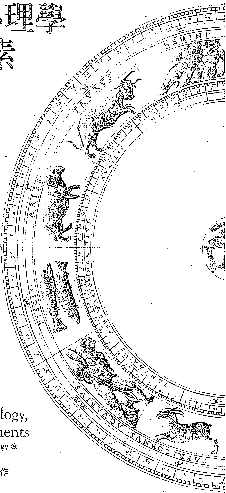
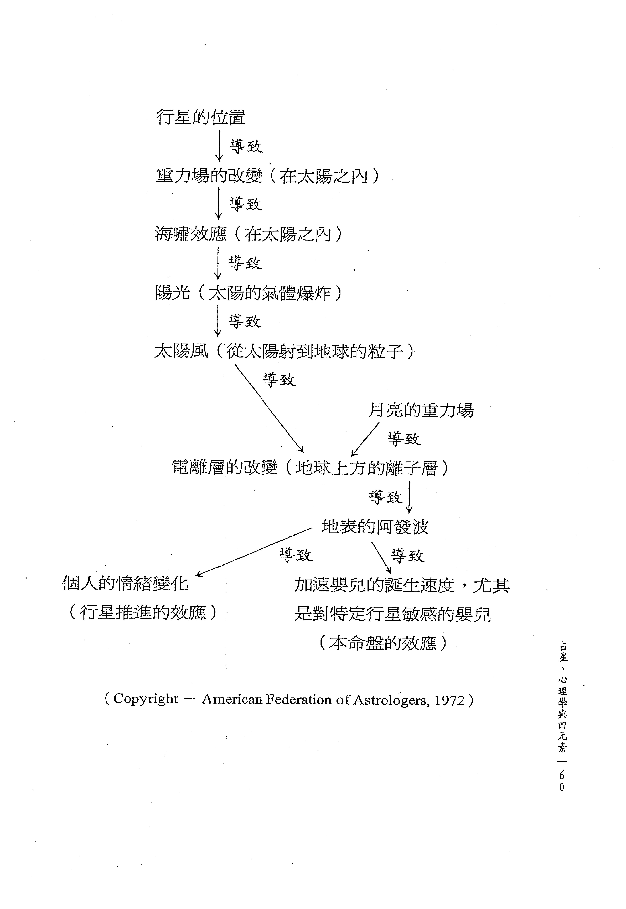

# 占星、心理學與四元素

# 占星諮商的能量途徑

作者
Stephen Arroyo
史蒂芬·阿若優

譯者
胡因夢

心靈工坊
PsychGarden

占星學涵蓋了所有古老心理學知識
它甚至更能提供顯而易見、可以預測
又足以解釋複雜人性的詮釋系統

# Astrology, Psychology,
and the Four Elements
An Energy Approach to Astrology &
Its Use in the Counseling Arts

占星心理學大師阿若優經典力作
榮獲英國占星學會大獎

# 目次

譯者序 006

前言 009

# 第一部 占星與心理 015

第一章 現代科學與心理學 016

第二章 老架構的侷限 024

第三章 知識及其證據問題 030

第四章 原型及宇宙法則 046

第五章 占星學的理論基礎 058

第六章 人本心理學與人本占星學 070

第七章 占星學在諮商藝術中的應用 080

第八章 占星諮商師的教育訓練 086

# 第二部 從能量層次詮釋本命盤

第九章 占星學：一種能量語言 100

第十章 四元素：占星學的基本能量 119

第十一章 個人心理學 135

第十二章 元素的詮釋 146

第十三章 人格整合的潛力：相位和行星的關係 164

第十四章 行星座落的元素 170

第十五章 星盤比對中的元素 182

第十六章 元素以及宮位：關鍵詞系統 196

〔附錄一〕占星學與兩極療法 212

〔附錄二〕第一部參考書目 217

〔附錄三〕延伸閱讀 221

# 【譯者序】

人類這個有自覺意識的主體，生活在複雜多變的現象世界裡，一面經驗著各種外來的挑戰和刺激，一面又要勉力去調和內在反應帶來的衝突與矛盾，因此亟需要一套能兼顧質與量、個人與整體宇宙、主觀與客觀性、世俗與神秘性、形上與形下、現象與原理的詮釋系統，來幫助自己理解事件背後的意義和目的，如此才能完整地洞察心理慣性模式之中必須修正、調整和轉化的老舊制約。

本書的第一部分就是在試圖釐清、闡明及說服讀者，為何占星學歷經了數千年的發展，遭遇過人類的青睞及污名化，但仍然能突破科學實證主義傾向的制約，逐漸與心理科學結合，而達成了上述種種在詮釋上的完整目的。

此外，阿若優也花了許多功夫來闡明占星學為何能成為「人本心理學」的有力工具。

根據布根紹爾這位心理學家的看法，人本心理學的主旨乃是要完整地描述生而為人的意義，同時要研究人類的成長、進化及退化傾向，和外在制約的互動關係，主體經驗的範疇和種類，在宇宙中的定位和意義，以及一切的感受、思想和行動的潛能。以阿若優多年的研究來看，這一切均可藉由「人本占星學」獲得釐清。

論及「預測未來」在一般人心目中造成的不自由感時，作者舉出了占星大家丹恩·魯依爾（Dane Rudhyar）和心理學家卡爾·羅傑斯（Carl Rogers）的見解：人最終的自由乃是要選定心態來面對眼前的情境。其實大部分的人之所以會卡在某段生命遭遇裡、變得進退兩難，主因就是不知該以何種態度來面對。由於缺乏全盤的理解，所以只能從慣性模式和偏狹的觀點，做出自己無法控制的負面反應。占星學能夠連結小宇宙（人類）和大宇宙（行星的勢力），讓我們從生命內建的一體性和同時發生性，來洞悉事件背後極其精密的業力脈絡，繼而以正向開放的心態去接納和面對挑戰，以達成淨化及成長的目的。因此，預知未來可能面臨的挑戰並不會限制個人的自由意志，反而使人更有能力讓命定的事件順利地穿越過自己，也穿越過自己的意志和選擇。

此外由於超個人心理學方興未艾的發展趨勢，令許多心理學家開始積極投入於超驗次元的研究。這樣的研究令科學家們意識到過往的人格理論已經不再適用，但又缺乏針對個人的超驗次元的詮釋系統，就此點阿若優仍強烈主張只有「人本占星學」能運用天體的週期活動做為象徵語言，來呈現出偶發的危機或超驗經驗的心理真相。

本書的第二部分談到了脈輪系統與行星之間的關係。脈輪是存在於人體中脈上面的七個能量中樞，它們和十大行星落入的星座能量波息息相關，而行星又象徵著一個人內在的衝突、需求及動機。事實上黃道十二星座就是由地、水、火、風四元素所構成的，這四元素不但是占星學和一切玄學的基礎，也是人類經驗到的一切事物的構成元素，甚至是靈魂在肉體產生作用力的必要條件，或是意識體的動力來源。因此，學占星學必須先徹底了解四元素的內涵、意義以及彼此的關係，才能領略這門學問真正的本質。此外，歐美發展出來的另類療法——涉及到能量層面的治療——也幾乎都可以和四元素代表的意義結合，來正確地做出診斷。

筆者在翻譯本書和《占星．業力與轉化》的過程中，深深地感受到阿若優嚴謹理性的科學語言背後，不斷地透露出來的心理壓力。這似乎是玄學家自古以來的宿命——無論怎麼努力地闡明和疏理，都無法讓當時的主流社會徹底承認此類學問的正當性。

本書和《占星．業力與轉化》，是阿若優最受歐美占星界及讀者肯定的經典著作。譯者為心靈工坊選出它們作為心理占星學系列叢書的前導，目的就在於提供一個深入認識占星學、親炙大師豐厚文化底蘊的機會。後續心靈工坊將會出版其他的大師論述生命週期循環方面的專書。

# 【前言】

一種嶄新形式的占星學已經誕生了。目前它只是呈現出一種雛形，尚未完全整合或完全符合社會的需求，因此需要更多的鼓勵和支持。如同歪歪倒倒正在學走路的孩子一樣，這種嶄新的占星學也正在面臨一些起伏，而且經常摔得一鼻子灰。雖然做父母的只有等孩子長成健康而自給自足的人，才能放鬆下來欣賞自己努力的成果，但鼓勵孩子發展與成長的過程本身，已足以誘使父母繼續付出關懷。這種新的占星學趨勢，主要是將傳統占星學的理論與態度，從裡向外翻轉了過來，並揭露了許多自相矛盾、陳腐空泛的內涵，但也保留了許多能呈現宇宙真理的智慧。因此嶄新形態的占星師往往會去蕪存菁、深化自己的理解，為占星學以及為人類開展一種截然不同的新途徑。

二十世紀的前半葉在心理學上的突破，現在正開始被集體意識消化吸收，但早在三○年代占星學就已經受到它的影響。直到近來這個消化吸收的過程才累積了足夠的動力，讓許多占星家和學生感覺需要重新定義占星學的傳統和目的。一九三六年丹恩·魯依爾撰寫的《人格占星學》（The Astrology of Personality），促成了這個重新建構占星學的過程，自此之後便逐漸蔚為風潮。這種嶄新形式的占星學之所以發展得非常緩慢，主要是因為集體意識的改變需要多年的時間，而占星家也必須花時間來擺脫早已熟悉的老旧結構。然而大眾的集體意識的確已隨著時間而改變，因此占星家逐漸認清二○年代適用的詮釋方式可能無法用在今日了。

我將會在本書中詳細闡述這種嶄新形式的詮釋方式，在此我想首先提出一個重點，傳統占星師的角色乃是為人算命，就好像本命盤能夠透露未來將面臨的情況，而且這些外在情況是可以被預測，甚至是無法改變的。但很顯然對事物的預測會因其複雜性而有所改變，舉個例子，動物的細胞或化學元素通常是可以被預測的，因為其性質非常簡單，變數不大，而且不具備任何意識或能力做出別種的反應方式。但季節的變化就比較不容易預測了，主要是因為其中有許多未知的變數，雖然這些變數仍然能透過對已知現象的了解來加以預測。然而人類是最不容易被預測的，因為他擁有某種程度的理性、意志、抽離的能力以及做出各種反應的能力。如果人的覺知發展得更敏銳一些，就更不容易被預測了。此外，一個具有高度覺知力的人，可能只需要一點暗示便能學會某種功課或得到某種洞見，而那些覺知力比較差的人，則必須藉由具體的外在事件和情況來獲得同樣的理解和洞見。我認為一個人之所以能夠被精準地預測，其實是因為他缺乏覺知，基於此理，我所指的嶄新形式的占星學之對象，顯然是那些已經採取行動來增強自我覺知之人。

每個人的確擁有自己的本命盤、特定的業力模式，或是情緒、心智、肉體等等層面的各種傾向，然而一個人將會面臨的情況，卻絕大程度被他的表現方式所設定。換句話說，你給出什麼就會得到什麼；每件事終將回到它的源頭。如果一個人表現出來的是不耐煩或自以為是的態度，那麼她或他一定會誘使別人做出同樣的反應。把自己製造的不幸謠過於本命盤，乃是徒勞無益的事。因此占星學現代化及建設性的運用方式，應該是轉化和修正本命盤的能量模式，讓最正向的表現能夠展現出來。本書所強調的就是必須對占星學的基本要素發展出深入的理解，對占星學的所有技巧產生更深刻的認識。

本書將分成兩大部分，第一部分的六個章節包含了我在加州州立大學心理系的碩士論文，這篇論文獲得了一九七三年英國占星學會大獎，被譽為那一年占星學上最傑出的貢獻。我當時撰寫這篇論文的主旨，本是要釐清占星學的各種途徑，揭示其實用的部分，尤其是跟心理學領域直接相關的詮釋技巧。雖然這篇論文是針對占星學的門外漢所撰寫的，但一般占星師和學生仍然可以從中獲益，因為這篇論文不但能促成對占星學的深入了解和綜合性的觀點，而且可以解答大眾對占星學的疑惑，去除不熟悉占星之人的偏見。

本書第二部分將從四元素的能量層次來解釋占星學的理論，由於四元素描述的是占星元素的特定能量，因此了解其背後的原理，能夠讓人以較為實際的方式來綜合研判本命盤的意義。我認為學習及應用占星學最大的障礙，就在於占星學的著作缺乏綜合研判的方法，雖然目前可以找到各式各樣的入門書籍，卻很難發現任何一本書能夠讓我們洞悉占星要素的核心意義，以及本命盤所呈現出的素樸秩序。我必須在此強調，由於本書的第二部分主要是在呈現四元素的基本法則，因此不得不以概論方式來闡明這些法則。

在閱讀時讀者必須小心，不要只是認同太陽星座的元素或任何一種單一的元素。如同我在本書中所闡明的，每一個元素都是整體模式中的一部分，即使是某個強而有力的元素，也仍然無法掌控整張星盤。同時我要指出的是，對某些讀者來說，能量這個字眼或許顯得有點含糊曖昧，但實在沒有其他更精確的字眼可以代替它了。如果我們把「光能」看成是八度音階的某個音，那麼它畢竟只是可以被識別的電磁譜系之中的七十五個階次之一。試圖以有限的語言來描述這些超驗性的能量，是十分困難和充滿挑戰的任務，我希望讀者能諒解我在表達這些精微意涵上面的失誤。

我們研究任何現象所採用的方式，很自然地會奠基於潛意識和顯意識裡的目的，換句話說，我們的結論決定了我們所採用的方式。我寫這本書的目的是要提供一個框架，讓讀者從近代心理治療和能量的概念，去理解和應用占星學。基於這個理由，我省略了所謂的玄異或奧祕占星學的面向，但並不是因為我不相信這些途徑的價值，而是它們超越了本書的範疇。

為了促進新觀念的發展，我們必須擺脫已知的假設，這樣的開放性和自由態度一向是科學的顯著特質。清除掉情緒及心智上的偏見，才能達成這種自由的態度，基於這個理由，我花了許多篇幅闡明目前的科學和心理學所採用的方法。

許多人都在尋找更具整合性和包容性的生命觀點，大學或研究所教導的專業知識已經不能帶來滿足，人們愈來愈渴望從更完整的角度來理解生命的循環，占星學剛好提供了這方面的解釋。如同物理學家兼哲學家懷特（A. N. Whitehead）所言：「最深的美學及科學法則，往往是單純的、井然有序的、優雅的、有結構的。」本命盤代表的就是宇宙及個人身上井然有序、優雅、單純而有結構的基本模式。

在心理學的領域裡，科學家已經發展出各式各樣的人格理論，試圖定義和探索個人的生命風格以及性格之中的常規。每種人格理論都假設確實有所謂的先天性格，而且是以概略性的假設和潛力的形式呈現出來。這類心理學理論的問題就在於，每一個被分析的人似乎都跟理論的發明者一樣，帶有某種共通的先天特質。換句話說，由於這些理論家已經假設每個人都跟他一樣帶有某種深層的心理傾向，而且並沒有一個更宏大的框架供其觀察人類，因此在實際的應用上面，如此偏狹的理論往往會帶來破壞性的影響。本書中的許多觀點所呈現出的占星學，確實能描述促使人類產生活動的那些能量；它可能是描述每一個人的性格最正確的方式。在過往的九年裡，我廣泛地應用占星學來觀察人性，故而逐漸捐棄了其他的心理學理論。對我而言，占星學無疑是了解人類的人格、行為、變化和成長最精確的工具。

許多人都問過我為什麼占星學近年來會如此受歡迎，我認為部分的答案是西方文化不再有足以支撐它的神話傳統。神話一向是任何一種文化的活力來源，因為它能夠讓人類與更宏大、更帶有宇宙性的實相產生關係。人一向需要某種井然有序的模式來引領其人生，為生命經驗帶來意義。從這個角度來看，占星學的結構裡本來就帶有神話學的架構。坎伯教授（Joseph Campbell）曾經寫道：「人如果不相信神話傳統中的某些安排，是不足以在宇宙中自持的。事實上，他生命的深度與完整性並不直接與其理性思考有關，而是跟他生長的地區的神話有關。」坎伯闡明神話主要有三種作用力：「激發一種神聖的感覺」、「提出某種宇宙觀」以及「促使個人反觀內在的現實」。今日有許多人已經發現，正確地運用占星學就能充分發揮這三種作用力。如果我們贊同坎伯對神話的定義，就不得不贊同占星學一向能為我們所處的時代提供實際而富有活力的神話。

# 第一部 占星與心理

# 【第一章】
現代科學與心理學

> 人類的現象必須從宇宙的角度來進行思考。
——德日進

由於我們正在經歷一場世界性的變革，尤其是在通訊系統、社會形式及國際關係上，因此我們對人和宇宙的觀點也在改變中。生命的變化一向是不停歇的，但目前我們似乎正面臨著某個重要的轉捩點。那些老舊的發展階段已經結束，即將來臨的另一種生命循環變得愈來愈明顯，因此科學和整個心理學界必須以開放和富創意的態度來面對這些改變。大部分人仍仰望所謂的科學家和專家為當前的兩難之局帶來解答，然而這些心理學家、專家、治療者或聲稱自己有解答的人，其實並不能提供什麼。他們很難為人類經驗的意義和目的帶來真正的啟蒙。不過其中有幾位專家——譬如榮格和德日進——已經採取確切的行動，朝著更完善的方向來了解人類存在最深的意涵。但是大體而言，這些專家學者多半仍拒絕冒險，寧願隱身於自己的專業領域，雖然他們聲稱自己追求的是真理，而且願意整合現代所有的世界觀去幫助人類。極少有人具備真正的創造力和勇氣，甘願被當代人和同儕批評，也要追求生命最高的理想。

在今日的西方世界裡，我們發現人愈來愈和自己的文化解離；他和他的根源已經脫節了。他已經捐棄了自己的傳統和文化價值，因此急需和這些傳統的精髓重新建立關係，而且要回歸精神的核心，方能超越空間和時間的侷限。根據我的了解，心理學領域裡沒有一種人格理論，足以了解和描述什麼是「宇宙人」，因此我們必須開始尋找其他的理論、概念及經驗，來了解每個人的根本實相。這當然是很難辦到的事，然而一種全球性的社會正在形成，所以我們最好做妥準備，深入地去探究人到底是怎麼一回事？這個正在萌芽的世界新秩序的本質究竟是什麼？麻省理工學院哲學教授及《人類的宗教》（Religions of Man）之作者休斯頓·史密斯（Huston Smith），曾經說過以下這段話：

世界有三大文明：西方文明、東亞文明（中國）以及南亞文明（印度）。

它們在自己的歷史最重要的階段，分別發展出了解決不同問題的長才：西方文明的長才是對大自然的研究，中國人對社會關係特別有認識，印度文明著重的則是心理上的關係。如果以上的假設屬實，那麼每一種文明都可以從其他文明學到自己忽略的事物。

我們可以從中國文化裡學到對家族的重視、對長輩的敬重、願意在帝國統治下盡個人本分、對社會付出更高的忠誠度。根據戈頓·愛伯特（GORDON ALLPORT）的觀察，印度文化一向認為人有四種目標，分別是追求快樂、世俗成就、責任義務以及終極解脫。但西方世界追求的幾乎完全是前面兩個目標，對責任義務雖然稍有關注，卻毫不注意終極解脫的議題。同時印度人對人類的典型也有認識，雖然促成了種姓制度的濫觴，仍然算是有效的洞見……

此外，這種新文明將會更注重生態議題。如同我們早先提到的，西方文明一向著重於觀察自然，中國和印度也關切自然議題，但精神比較傾向於華茲華斯（Wordsworth）而非伽利略（Galileo）。西方世界善於操控自然……近年來有許多在摸索源起論，然而生命的品質又該如何看待呢？我認為世界終將回歸到這個新文明的生態面向。

我對這個新文明的第三種預測是，時機一旦成熟，世界將會有更多的人朝著靈性方向發展。十九世紀時我們將整個自然看成一部機器，現今的二十世紀我們則把自然看成一個有機體。我們的定論愈少，自由度就愈大。我們有可能從十七至十九世紀的機械觀以及二十世紀的生物觀，轉向二十一世紀的精神觀嗎？最後我們會發現，這個新世界文明很可能發展出一種新的生活模式，把過往所強調的三個面向——自然、人類以及自身——統合起來。

漢斯·史都瑟（Hans Stossel）表達了人類當今的需求：

今日的人類必須發展出更深入、更具有宇宙性及靈性的理解，這乃是我們這個時代以及本世紀最重要的需求。人必須去探究如何才能跟宇宙結為一體。

占星學能夠為現代人提供的啟示，就在於如何跟整個宇宙及大自然結為一體。心理學家馬龍（Robert L. Marrone）曾經寫道：「從過往的歷史來看，人類對自然的思索以及和自然的關係，曾經令他失勢過、也曾經為他帶來擴張的機會，曾經造成他和自然界分離，也令他有機會和宇宙的循環融為一體。」人類與自然界的分離以及缺乏對整體宇宙的認同，造成了人們對占星學的不信賴，似乎必須經由實證，才能視其為一門科學或藝術。其實我們熟悉的任何一種文化，幾乎都擁有某種形式的占星學；這並非因為它們欠缺現代科學的啟蒙，而是它們和當前的宇宙有一種融合感。目前流行的偽科學之中的偏見，科學家、教育者和社會大眾所抱持的不合時宜的科學論點，在在阻礙著人類發展出知識層面的綜合性觀點。大部分的心理學家似乎都在做羅伯·歐本海默（Robert Oppenheimer）警告我們不要去做的事：努力地模塑出一種奠基於過時的物理學之心理學。觀察一下近代物理學的發展，我們會發現，反物質理論或測不準定律幾乎像是神秘主義者在開悟的狂喜中做出的表白，而不像我們所期待的科學解說。但心理學的某些研究者仍然保持原有的運作模式，就好像他們是生化專家或唯物論者似的。因此，占星從業者雖然可以從現代心理學之中獲得一些洞見，但仍然得留意不要太低估占星學，或是太高估現代心理學的有效性。如同榮格所說的：「很顯然占星學能夠帶給心理學許多幫助，但後者卻無法為他的老大姐帶來什麼助力。」

科學本是一項有利的工具，占星學也是如此。這些工具有兩種運用方式：一是操縱它們，二是尊重它們的價值。不幸的是，西方科學到目前為止都是被前面的方式所掌控，包括物質科學及心理學在內。如同物理學家及哲學家懷特曾經說過的：「科學可以從人類對無意識的深入認識之中獲益，這份認識會引領科學不斷地進展，而且仍然在持續著。」包括占星學與心理學在內的整體科學已經到了必須追求真理的階段，因此不能只是搜集一些片面的事實就算了。雖然占星學也可以用在操縱性的目的上面，但是它與心理學更高洞見的整合，的確能讓我們深入地了解我們自己、他人以及整體宇宙。

科學家和心理學家雖然聲稱科學進展必須靠新穎富創意的研究，但是他們對科學過度認同的態度本身，卻阻礙了這樣的研究發展。換句話說，他們並不了解什麼是真正的創造過程。其中許多人甚至認不清自己的分裂人格（職業上的客觀性和私生活裡的主觀性）障蔽住了內在的創造活動。創造力本是從人類的整體性發展出來的能力，因此我們至少得朝著這份整體性去努力才對。誠如魯登（REDDI）在他的《心理治療與宗教》（Psychotherapy and Religion）一書中所言：「人只要逃避了自己的靈魂，便可能損害生命、導致疾病，同時在心智的創造力上面帶來不誠實及呆板的產物。」任何一個領域的先驅的追隨者及門徒，一旦確信自己已經找到了真理，很快就會變成狂熱主義者或僵固之人，繼而凍結了理論創始者的思想。這種傾向讓數個世代的發展都遭到了壓制。同樣的現象也發生在某些占星圈子裡，令這個亟需統合的領域變得更加分化。

那些能夠帶來新的突破，而且能夠讓後人繼續敬重的人，通常都是對新觀念抱持開放態度的人。這份開放度很自然會引領這類富有創意的人，進入非正統以及不依循慣例的研究領域。依照艾弗列·諾斯·懷德海（Alfred North Whitehead）的觀察，幾乎所有的新觀念在一開始發表的時候，都給人一種愚蠢的感覺。我們只要看一看西方文化的幾位創造者，就會發現他們的研究在其時代裡有多少是被官方視為禁忌的。愛因斯坦也談到過原創洞見之中的神秘體驗，以及真實的理解之中的宗教感受：

我們所能經驗到的最深以及最美的情感，往往都帶著一種神秘性。這是所有真實科學的動力來源。我們必須認清那些無法被洞悉的事物的確是存在的，而且是以最高智慧和最美的形式呈現出來，但是我們魯鈍的心只能以原始的方式去領略它——這份認知，這種感受，就是真正的宗教情懷。

榮格不但把占星學應用在他的心理治療上面，而且花了許多年研究鍊金術的心理面向。佛洛伊德晚期曾經寫過一封信：「如果我能再活一遍的話，可能會致力於超自然現象的研究而非心理分析。」天文學家及物理學家克卜勒曾經表示，他非常不願相信占星學的有效性，但是「伴隨著行星相位同時發生的無誤事件，卻讓我不得不相信占星學的準確性。」其他著名的占星家及科學家分別是法蘭西斯·培根、富蘭克林、納皮爾（發明對數的科學家）及牛頓。當年有人問牛頓進劍橋大學最想讀的科系是什麼，他的回答是：「數學，這樣我就有能力檢驗占星學是否準確了。」後來當哈雷（發現彗星的人）怒斥牛頓的迷信傾向時，據說牛頓的回答也是：「很顯然你沒有研究過占星學，而我的確有研究。」

我們愈是發現生命的奧秘，愈是能整合不同的研究領域以及不同的知識體系。心理學領域尤其需要這種整合性觀點，因為這門科學處理的大部分是人的生命。我很清楚地看見占星學是現代心理學最缺乏的一項整合工具。個人的統合及健全的發展本是社會活力和健全發展的開端。一個不斷鼓吹片面見解與扭曲世界觀的社會，如何能製造出富有創意的人呢？因此教育體制亟需對人性和存在意義的假設提出質疑。如果我們對自己夠誠實的話，就能夠以開放的態度面對真相。為了建立一個聚焦於個人健康和圓滿性的心理學，我們不得不發展真正的生命科學來處理身心的存在問題，其首要焦點就是意識本身。但是在進行這件事之前，我們必須擺脫已經過時的唯物思想，認清不同類型的研究需要透過不同的途徑來達成。

第一章 現代科學與心理學 23

## 【第二章】
### 老架構的侷限

今日有許多人已經認清物質科學不再能滿足人的深層需求，雖然它能夠帶來生理上的方便和舒適，讓頭腦獲得某種榮耀感。在建構現代占星學的時候，我們不但要滿足頭腦的需求，還要滿足靈魂和內心的需要。人類現今有一個普世性問題，那就是知道的太多，深層的理解太少。蒐集資訊或整合事實本來沒什麼問題，但是太專注於特定的細節，就會失去統合性及和諧感。我們因此而喪失了宇宙真理帶來的復原力。現代科學對物質世界的細節已經有了深入的理解，然而這些發現並未統合成完整的認識。由於我們傾向於研究各種複雜的現象，因而忘卻了單純不變的真理，如同歌德在《浮士德》中所言：

> 研究有機實體的人首先以僵固心態排斥靈魂的存在，然後掌握住片面的真相、予以分類，但是跟靈性源頭的連結卻因而喪失。

今日我們需要強調的是整體而非片面；在尚未干預自然之前，我們必須再度檢視一下生命底端的宇宙法則。我們現今所面臨的生態危機，就是因為缺乏智慧——對整個生態體系的了解——造成的結果。因為急於得到快速的效果，心理治療師才會依靠電擊療法和藥物，並稱其為一種治療方法。農人則是依賴化肥和殺蟲劑，而且把自己的行為合理化成經濟上的必要行動，或是防止人類挨餓的勇敢嘗試。占星學能夠為現代人提供的，就是對宇宙法則、整體和諧性及生命底層模式的理解。這就是為什麼美國有這麼多人對占星學愈來愈感興趣的原因：他們發現占星學能夠為他們混亂的人生帶來秩序和意義。

喬瑟夫·古達貝吉（Joseph Goodavage）寫過一本書，《占星學：太空時代的科學》（Astrology: The Space Age Science），書中很清晰地表達了現代人對物質科學已經不再抱持幻想：

> 我們對物質主義的執著似乎已到達飽和點。它除了造成挫敗、仇恨、戰爭和階級鬥爭之外，並沒有帶來什麼長進。它的目標是空虛無意義的，而且把人類推向了一個死胡同。我們必須承認眼前的新證據全都指向大自然的相依相生性，以及更高的統合性。

你會十分驚訝有多少現代科學家和哲人開始關注宇宙的靈性及精神面向。金斯（Jeans）爵士在他的著作《神秘的宇宙》（The Mysterious Universe）一書中寫道：

> 在科學的物質層面上，許多人都有共通的看法，認為知識正帶領我們朝向非機械性的現實在發展；宇宙看上去更像是一個偉大的構思而非一具偉大的機器。心智不再是進入物質次元的偶發干預者；我們開始懷疑或許應該把心智看成是物質次元的掌理者或創造者……老舊的心物二元論幾乎快要消失了，但這並不意味物質比以往的重要性減低了或變得模糊了，也不意味心智消解於物質活動的作用力之中，而是物質實體變成了心智的示現或創造。我們發現宇宙顯現出一種控制力或構思力，它跟人類心智的運作有相似之處——雖然不具備人類類在心智、情緒、道德或美學上的鑑賞力，卻具有一種數學式的精密構思能力……

現代人被占星學吸引，就是因為它揭露了宇宙的構思力，而且是以數學式的精密架構呈現出來的。

歐文·洛克斯（Irving F. Laucks）認為上帝已死這個現代哲學概念，指的其實是物質上帝已死。我們都應該接受這個事實，如此才能騰出空間給更完整的生命觀和宇宙觀：

東方宗教的理念比較沒有物質傾向，他們認為世界是由我們今日所認為的能量構成的，西方科學也發現能量是宇宙構成元素更基本的勢力。從這個角度來看，西方科學和東方宗教或許可以合作無間。此外東方宗教對超越死亡的存在，也抱持非物質性的看法，他們認為輪迴轉世及涅槃與能量的存在形式相關，不像西方宗教教導的「宇宙是由時空及物質構成的」。

人類的年輕頭腦所能想出來最重要的理論，或許就是能量構成了物質宇宙。就科學而言，這個概念的形成還不到一個世紀，因此無論科學家或一般大眾，都尚未意識到這個概念最深的重要性。

本書的第二部分將會詳細討論能量是比物質更基本的現實，尤其著重於能量和占星學的關係。

在日常生活裡，人的靈性面向與精神生活是不可分的。「心理學」這個詞彙本身已經揭露了人的心智和靈性本質的緊密關係。Psycho 這個希臘字原本有兩個意思，第一個意思是「蝴蝶」，象徵著滲透於大自然以及每個人之中的不朽本質。自希臘時代以降，Psycho 一向被定義成「心智」（Mind），但仍然有許多偏向生理實驗的心理學家很想去除非物質性名相（根據印度心理學和靈性科學的理論，雖然心智和靈魂是一般人日常運作中息息相關的兩個面向，但實際上是分別存在的。最先進的一種瑜珈觀點甚至主張，靈魂必須擺脫心智的束縛，才能獲得自由。）

所幸某些人本心理學家仍勇於將人的最深次元納入考量，這些次元能夠轉化所有的心智活動。心理學的行為學派一向認為只有客觀數據才是有價值的，這樣的心理學實在不算是一種心理學。將心理學侷限於動物實驗或研究人類的外在行為，是不符合Psycho這個字的定義的，因為一切受造物和人類之中都彌漫著心智——靈魂——靈性的特質。榮格不斷地在他的著作中指出，研究人的靈魂是不可能「客觀」的，因為我們必須藉由自己的靈魂來觀察另一個靈魂。這也許是對所謂的客觀研究的一種批判，但卻能貼切地說明人對自身及內在活動的研究之本質。心理學派之中的行為學派盛行的客觀研究，忽略了人的一個基本事實：創造性。如同榮格和兒童心理學家皮亞傑所指出的，心智的運作不像是一面消極的鏡子，反倒是像懷著目的性的活躍藝術家。讓我再次引用魯登的著作《心理治療與宗教》的一段話：

> 現代心理學無法像十九世紀的心理學那樣規避與靈魂相關的緊迫議題，只把自己關進實驗室去進行一些化學及物理方面的研究。心理學應該審慎地進入人的真實生活中，進入靈魂無法被截斷的活動以及起起伏伏的變化中，為他的秘密、渴望和嚮往注入光明……

心理學家賀巴特·莫瑞（O. Hobart Mowrer）也表達過類似的想法：「人面對社會做出的生存反應及調整，是一般類型的科學研究無法探知的深層真相……」這個事實說明了二十世紀的心理學為什麼會變得停滯不前，甚至和日常生活以及我們內心的渴望完全無關。近年出現的幾位心理學家嘗試著去了解我們的內在生活和立即經驗，因而獲得了某些突破、超越了傳統科學研究的侷限。我指的是那些開始研究長期被忽略的領域的科學家們，這些領域包括冥想、超感現象、東方心理學與哲學、神話學、比較宗教學，以及運用占星學和其他古老技法的科學領域。這些研究鬆散地結合成真正具有人本精神的心理學；它們已經被證實可以促進解脫，而且是人類特有的能力之中可以被創造性地運用的。如果研究心理學的目的只是要發展更有效的技巧來限制和操縱自己的同胞，那麼就該專注於人類行為方面的研究。但若是渴望利用這門科學更深入地理解自己和他人，學習以健康和諧的方式生活，將人類內心最富創意的部分釋放出來，那麼就該認清唯物主義的侷限，開始探入未知領域。我們所能依持的只有對人性最高理想及根本智慧的一份信心。

第二章 老架構的侷限 29

## 【第三章】
### 知識及其證據問題

> 我所能體悟的，只有那些真正被我活出來的道理。
——齊克果

懷特在他的著作《人類下一步的發展》（The Next Development in Man）一書中指出，西方的學術傳統已經顯現所謂的「解離」傾向。這個詞彙的意思是：從柏拉圖、聖保羅的時代演進至二十世紀，西方人一直在用頭腦指揮行為，並藉由對大自然的研究來運作。當他面對眼前的經驗產生自發行為反應時，不可避免地會顯現身與心、自我與自然、心智與直覺之間的解離，而且是呈現在知識、宗教、政治和經濟等各個層面。只有一些詩人、神秘主義者和社會邊緣人沒有受到這股潮流的限制。這種解離傾向導致了西方文化的瓦解，你可以從世界大戰、目前的生態危機以及愈來愈嚴重的精神和心理問題，看出這個現象。懷特繼續說道：

> 如果整個自然界是一個不斷在轉化和發展的巨大系統，那麼試圖把任何一個部分孤離出來，都勢必導致失敗。尤其是把人視為一個與客觀的自然領域分隔開來的主體，特別會令他對自己獨有的生命形式視而不見。人只有透過個人經驗獲得的主觀知識來觀察整個有機自然界，才能徹底了解自己，而這會帶來一種嶄新的自我接納態度，一種奠基於智慧的天真。如此一來，帶有偏見的傳統道德觀，就會轉化成生命發展上面的正向態度……

懷特同時指出，從希臘時代以降，思想家大致分成兩個陣營，亦即所謂的原子論者和整合論者；但是他們對彼此的互補見解都不太能接受。在我們的日常生活裡面，這兩種觀點多少都會用到，但整合觀當然比較能讓我們了解有機生物界的整個系統。如同懷特所言，整合觀（對形式和基本模式的覺知）是不容忽視的，因為它提供了我們無可反駁的事實，讓我們看見大自然以及每樣事物背後的基本模式。

存在主義心理學家和哲人，也提出了這種自相矛盾的生命觀帶來的問題。心理學家羅洛·梅曾經說過，「存在主義試圖藉由打破主客觀之間的鴻溝，來理解人類本身。從文藝復興運動以降，西方人一直在承受這種分歧所導致的困擾」，存在主義思想家發現人類有兩種不同的理解途徑，一是神秘主義者的整合觀，二是從局部去分析問題。蓋布里奧·馬塞爾（Gabriel Marcel）曾經指出，存在本身是無法被解釋的，你必須去體悟它，才能產生真正的了解。法國哲學家巴斯卡（Pascal）也否認宇宙和人類可以藉由理性分析來了解，他認為透視事物核心的奧秘，才是了解人和宇宙的關鍵所在。馬塞爾和巴斯卡指的就是今日所謂的整合觀，讓我在此闡明一下這兩種讓西方人解離及過於強調智力的思想途徑。

古代神秘主義傳統（現代心理治療技法的前身）告訴我們，人類的意識之所以會受限，是因為以武斷思想作繭自縛之故。研究一下西方文明的發展史，我們會發現希臘對科學及理性的強調乃是文化發展上的一個轉捩點。那個時代人類對自身及宇宙的認識有了巨大進展，但希臘文化帶來的貢獻不只是對自然律的發現，同時也延伸至對個人內在生活及成長的認識。希臘哲學最重要的概念就是「認識你自己」（Know thyself），「哲學」這個字的意思則是「愛智慧」。對希臘人而言，科學不只是搜集一堆數據藉此來獲得一些發現，同時要對生命和大自然底層的核心真理做出系統式研究，並試圖去發現生命本身的宇宙法則。對希臘人來說，理性不僅僅是電腦般的邏輯計算，更是奠基於優雅及平衡法則之上的整合分析與直觀認識。

許多現代科學家仍然相信，最融通的理論必定是最優雅，最能帶來美感，而且是最單純的。但許多科學家已經忘了這份理想；他們由於過度強調理性分析，而忽略了融通的真理。若想發展真正的科學精神，就要盡量避免把自己的期待、慾望和成見強加在他人的思想上面，如此人類的性靈才能自由地成長，臻於成熟。大部分的科學家，包括心理學家在內，都限制了對自己、人類及其潛力的觀點。當一個人在自己的心智外面築起一道牆時，其實並不能影響牆外的世界，而只會阻礙自己看到外界的真相，甚至扭曲了整個生命結構。透過分類和設限來了解生命，而且是奠基於思想上的偏見和情緒上的預設，只可能為自己帶來侷限；事實上不論我們說了什麼，真相仍然是真相。我們的教育機構或許可以從鈴木禪師那裡學到有益的功課：

> 「初心」乃是我們本自俱足的心，它是一顆空寂和準備好去接受的心。如果我們的心是空的，它就能隨時準備好去接受、對一切抱持開放態度。初學者的心中充滿著各種可能性；老手的心卻沒有多少可能性……初學者的心中沒有「我已經達成了！」之類的念頭，這些自我中心思想只會限制住我們廣大無邊的本性。當我們的心沒有任何成就慾或私慾時，我們就是真正的初學者，如此才能真的學到一些東西。

人的智力主要是用來操縱外在世界的，自從理性主義在歐洲登基之後，我們很清楚地看見西方科學及科技的蓬勃發展，同時也發現唯物心理學方面的研究並沒有促使我們對人產生更多了解；直到近年來，理性和智力才跟主觀經驗的感受及直覺達成平衡。所幸某些心理學支派已經開始試圖了解人的內在本質。理性分析既不能證實也無法駁斥哲學及宗教對生命根本議題的看法；這些看法是每個人心理結構的基礎。實證哲學可能是這種分析途徑最極端的示現，它以最徹底的抽象思考作為目標，卻不具備太大的意義。但意義才是人所需要的；了解人對意義的需求，才能帶來心理上的健康和圓滿感。意義產生於內在而非外在，因此分析途徑永遠無法滿足人的這份最深的需求。

心理學家威爾森·馮·度山（Wilson Van Dusen）也表達過同樣的想法：

> 當世界不再被視為物理學家眼中的抽象或客觀宇宙——一種完全非個人性的世界，生命才可能變得更合理。物理學家以便捷的方式把世界看成一種概念性結構，但是就個人的心理而言，這種看法卻大錯特錯了。個人的內心世界才是我們真正熟知的，不過這個世界只能以個人的主觀意義來加以描述。當我入睡時，這個世界就關閉了；當我感到乏味時，世界的時間也跟著減緩下來；當我有興趣投入時，世界會跟著加快速度……生活的世界本來就是個人性的世界，譬如閃電和雷鳴對我而言是美妙無比的，對你而言是否另有意義呢？客觀的、非個人性的閃電和雷鳴，又代表什麼呢？這些都只是被報導的事件罷了，因此對個人世界是沒有多大意義的。沒有人會真的關注非個人性的客觀世界。

法國生物學家與人類學者德日進，也質疑過所謂的「客觀」知識的有效性：

> 所謂的真理只是整體宇宙與其細部的關係。我們為什麼會懷疑或低估這個整體，只因為我們自己是觀察者嗎？我們不斷地聽到人類本是宇宙中心之類的觀點，但這種觀點與客觀現實是相左的。事實上這種界分根本不存在，人類的真相就是宇宙的真相；換句話說，真相只有一個。

德日進說過的這段話提供了簡明扼要的理論。這種人和宇宙乃是一個整體的觀點，證實了傳統以地球為中心的占星學的有效性，也證明了古代作者提出過的小宇宙與大宇宙相關的觀點。

為了闡明人類為何過度偏重客觀性，我們必須把榮格的人格理論也提出來探討一下。

根據榮格的觀點，人類的認知有四種方式，榮格稱其為四種基本精神作用力：思想、感受、知覺以及直覺。思想與知覺可以分成一組來看，因為分析思維本是奠基於感官知覺到的外在資訊。直覺與感受也可以列為一組，因為這些作用力是從個人內在產生的，並不完全受社會文化所侷限。此外藉由直覺和感受獲得的知識多半是直觀和個人性的，換言之，是無法被客觀證實的。（由於這四種作用力可以分成兩組不同的認知方式，所以我將採用思想和直覺這兩個詞彙來做區分。）思想這種作用力是藉由系統式分類以及對事實的辨認而運作的，同時還得仰賴我們所採用的邏輯模式（不同的人當然會有不同的邏輯。）直覺卻涉及到一個人當下的洞見，以及對眼前系統的運作的覺察。直覺指的就是人的直觀力，它能超越、穿透或繞過較為遲緩的邏輯分析。現代科學之所以徹底忽略人類的直覺作用，或許是因為科學假定直覺只是一種受個人感覺所左右的偏見，但直覺其實是一種極為清明的洞見，感覺則是從含糊的潛意識裡產生的作用力。直覺和人的審美能力息息相關，因為偉大的藝術作品所呈現的秩序及和諧性，是不需要藉助理性分析就能洞察到的。藝術語言比客觀理論或數學更接近人類的直觀本質，猶如懷特在《對形式的強調》（Accent on Form）一書中所言：

> 以非語言形式呈現出來的直覺，比語文和數學系統所能領略的事物的範疇要寬廣得多。

偉大的德國詩人歌德也描述過他對直覺的偏好：「我渴望以繪畫的形式來摩擬大自然的展現方式。」若想建構一種描述人和人的經驗的心理學，就必須運用到直覺，誠如心理學家度山所言：「有人若是主張小說家、詩人或音樂家比心理學家運用的語言更接近人類經驗的本質，我是不反對的。」我們應該在這段話之外再加上一句話，那就是占星學的象徵性語言比心理學家的語言更接近人類的本質。

為了了解直覺的運作機能，我們必須先認清想像力和直覺並不是邏輯分析的產物，因此真正具有創造力的人，往往會威脅到主流社會的價值觀和思維方式。如果這些人的洞見並不是來自主流社會的教育或文化模式，那麼這份創造力到底源自何處？新穎的洞見和想像都是出自人類的直觀力。人類的智力受制於許多元素，但直觀力似乎沒什麼侷限。

讓我們釐清一下人類在認知上的不同途徑：

| 思想 | 直覺 |
|---|---|
| 1. 假定：因果律 | 無需依賴因果律（在整體之內得到調和） |
| 2. 目標：分辨與分類 | 綜合與秩序 |
| 3. 達成概念的方式：靜態的 | 不斷進展以及順著秩序改變 |

從以上的描述看來，智力揭露的是外在世界及物質運作的秘密，直覺揭露的則是內在世界及個人經驗的奧秘。在精神科學上融合這兩者是比較理想的。心理學本來就是在研究人類的內心世界及其經驗的意義，因此直覺不但應該佔有重要地位，而且是深入了解個人的主要途徑，理由是人類的主觀經驗本身就是一種「質」。分析途徑早已具備量化的數學語言來描述其發現，但直覺途徑到目前為止尚未擁有被大眾接受的語言，足以表述在「質」上面的發現。

| 4. 進行的方式： | 按規律進行 | 同時發生 |
| 5. 語文： | 注重量 | 注重質 |
| | （運用精確的語言） | （運用感受、視覺和藝術感） |
| 6. 方針： | 解決問題 | 探索奧秘 |
| 7. 研究領域： | 整個系統的細節與內容 | 整個系統及其形式和模式 |
| 8. 語言構成單位： | 符號 | 象徵 |
| 9. 運用領域： | 外在世界（物質的） | 內在世界（心理的，精神的） |

占星學一向是一種表述「質」的語言，它能夠有效地描述人類的經驗和主觀性。目前只有少部分科學家及學院派人士能夠接納占星學，視其為滿足這份需求的解答，但社會大眾卻很自然地把占星學看成是理解其經驗的一種方式。換句話說，占星學如同化學的週期表一樣，能夠輔助所有的治療藝術，包括醫學、心理學與精神醫學在內。吉波拉·都賓斯（Niproah Dobyms）這位心理學家一直致力於整合心理學與占星學，她稱占星學為：「人類對宇宙整體秩序的洞悉，而且已經成功地轉化為概念形式。」她同時提到：

人類似乎發展出了兩種主要的宇宙性語言，可以用來象徵性地描述現實以及將現實分類。其中的數學語言是量化的，能夠用來描述任何一種可以被衡量的事物。占星學則似乎是一種宇宙性語言，而且是質大於量的。我很確定那些目前盛行的詮釋人格的心理學體系將會在未來逐漸消失，被經過淨化和統合的占星學所取代。這似乎是無法避免的趨勢，因為占星學在人格上的分類方式，比心理學更能提供顯而易見、可以預測、又足以解釋複雜人性的詮釋系統。

這兩種認知上的不同途徑，很自然地帶來了兩種不同的證據類型，一是靜態或客觀的，二是經驗性的或存在式的。讓我們再檢視一下與占星學有關的證據問題。

## 占星學的證據：為什麼以及如何？

雖然現代占星學家正在促成占星學方面的統計研究，但我們必須認清我們無法仰賴統計學來解釋所有事物，因為生命的質與經驗無法服膺於這樣的研究。事實上，即使統計研究揭露了某些重大事實，仍然無法解釋那些現象是如何運作的。舉個例子，科學有許多經驗法則是被實驗所證實的，但是到目前為止仍然無法提出合理的解說。天文學裡有一個最佳範例，就是所謂的「波德定律」（Bode's Law），這個法則和行星與太陽的距離有關。如果我們寫出一列數字0，3，6，12，24，48，96，然後每個數字再加上四，就會得出4，7，10，16，28，52，100這幾個數字。波德定律闡明行星的距離就是按照這樣的順序排列的。換句話說，水星和太陽的距離是四個天文單位的話，金星距離太陽就是七個天文單位；地球是十個天文單位；火星是十六個天文單位；木星是五十二個；土星則是一百個天文單位。但二十八這個數字一直都找不到什麼關聯性，直到小行星被發現為止。天文學家將此定律的範圍擴大到一百個天文單位時，便測知了天王星、海王星及冥王星的存在。在科學探索的歷史裡，最令人振奮的一頁就是發現了三個外行星乃是以數學秩序存在的。這項成果主要就是歸功於波德的直覺，但直到今日仍無法提出任何理性解釋。因此在運用統計學的時候必須十分謹慎，也無需對它抱持過高的期許。

統計學的侷限性就在於它只能用來處理集體的「量」和概略性現象，而無法處理和個人或「質」有關的現象；後者正是人本心理學和占星學的研究焦點。如同心理學家羅洛·梅所指出的：

如果你把一群人拿來做統計上面的預測研究——這顯然是正統心理學的一種做法——就等於在下一個與眼前這個人無關的定義。或者當你把他看成是由某些驅力組合成的東西時，你也是在研究一個與經驗者無關的事物。

但占星學在這方面卻是獨特的，因為它包含了正確性和藝術性，又能照顧到細節上的精確性和科學性。如同丹恩·魯依爾所言：「占星學強調的是「生命的活動與基本能量的週期循環，而且把人的存在視為一種階序性的改變過程，裡面是帶著目的和意義的。」

魯依爾繼續談到占星學的計算方式是一種象徵系統，必須轉譯成與人格特質有關的語言：

愛、對美的反應、個人的性格都是無法從「量」上面去測度的，除非你把人變成一部電腦般的機器；這就是目前的科學試圖對人做的事。

根據魯依爾的說法，占星學主要處理的是存在的品質，只有採用這種以質為主的語言，才能超越統計上面的研究。榮格也寫過與統計的侷限有關的觀點，他在《未發現的自性》（The Undiscovered Self）一書中說道：

> 統計顯現的是一般的事實，但無法讓我們了解經驗性的現實。它雖然能反映事實的某些面向，卻可能以最誤導的方式曲解真相，尤其是那些奠基於統計的理論。真正的事實最顯著的一點就是它的個體性，我們甚至可以說最真實的狀態往往跟既定的法則毫不相干，因此絕對性的現實往往帶有違背常規的特質。科學教育是奠基於統計數據和抽象知識上面的，因此對世界的觀點雖然合理但不真實。從這類觀點來看個人，就好像他只是個無足輕重的邊緣現象，然而這個被視為非理性數據的個人，才是現實真正的載具。這個具體的人是跟不真實的理想對立的，正常人則是跟科學理論對立的。我們絕不能低估統計學對心理造成的影響，因為它對數據的偏好遠遠超過對人的重視。

由於占星學能提供我們一套特殊的公式，以及原型式通則，所以可以成為理想的心理學工具。雖然占星學處理的是原型式通則，但它也能藉由本命盤提供一種簡明易懂的象徵系統，讓我們認識個人的獨特性。事實上，大部分的占星家之所以仍沿用以地理位置為準的計算方式，就是因為他們重視以地球及個人為中心的占星學，遠勝於所謂的客觀架構。

雖然這一點一直遭到批評，但是對於住在地球上的人而言，這個星球就是他們的世界重心，如同個人就是他的世界重心一樣。在探討占星學的時候，真正應該提出來的問題是，占星究竟能提供什麼樣的核心價值？在心理學的範疇之內，它能否帶給心理學家及個案真正的幫助？其他有關占星證據的議題，都只是學術上的討論罷了。當我們看見愈來愈多的心理學家、心理治療師及一般大眾都在運用占星學，而且發現它的確是有價值的，那麼我們就必須假定它是一個有用的工具。對那些「深知」其價值的人而言，占星學能否被證實的問題，從來都不是重點。在過往的四十年裡，運用不同療法的心理治療師，一向比理論家要領先許多，因此我們也不該期待科學及學術機構提出「證據」來證實占星學的有效性。不過的確有另外一種證據，亦即占星學及哲人丹恩·魯依爾所謂的「實在的證據」。

魯依爾認為只有這種「實在的證據」，才是跟個人真實的情況有關聯的東西。但「實在的證據」不能奠基於一般的分類法，它只能從複雜而又無法複製的個人經驗裡，取得它所需要的證據。如果研究了占星學及精確的本命盤之後，一個人首度發現他的那些看似混亂又毫無目的之生命遭遇原來是有目的、有意義的，同時也發現自己如何障蔽了對這些事件的領悟，那麼占星學就得到了一份實在的證據。

對許多占星家而言，企圖把占星學變成傳統的科學類別之一或建立一個純屬客觀的統計架構，意味著犧牲掉占星學最深的意義和獨特性，因為這個做法勢必會輕忽占星學原本的宇宙性及完整架構。那些想要創造出現代占星科學的人其實忽略了一個事實，那就是占星學真正的優勢就在於它可以適用於所有的人，而且是範疇最寬廣的宇宙性語言。

它的科學面向是顯現於精確的計算上面，但這只是占星藝術的原始材料罷了；身為一門藝術，該如何創造性地應用自己的科學元素，這個考量是不該基於統計學的基礎之上的。把占星學變成一門客觀的統計學不但會減低其精緻性，也會喪失它為人的靈魂帶來最深意義的機會，如同安娜·克雷柏（Anna Crebo）所言：「這麼做就等於將一種宇宙性語言侷限在有限的概念裡。或許這種語言只能轉譯成視覺形象、態度與特質。」

瑞士的內科醫師亞歷山大·魯伯提（Alexander Ruperti）表達了相似的意見：

> 很不幸的，科學態度強化了心理層面的混亂，因為它破壞了個人的價值，而且它製造出的程式及機械化生活，破壞了人對自然和生命韻律的參與感。現代人似乎忘記科學主要的目的只是要建立集體性的法則。環境科學並不能為人類帶來意義和目的；它呈現的只是冰冷的事實，甚至是不該改變的。但是從長遠的角度來看，事實往往因為宇宙的週期循環，很輕易地就改變了。

把占星學變成一種科學知識又有什麼價值呢？它的基本哲學和技巧本來是可以解放人類、讓人不再受科學束縛的。把占星學奠基於它本有的基礎上面，讓它和科學產生互補效應，將現代文明、意識及思維導向重新連結自然的韻律，不是更有價值的做法嗎？科學只能帶給我們知識，如此而已。它完全無法解釋宇宙最深的肇因，也不能讓我們理解人的價值和生命目標……占星學帶給人類的禮物，就是它為科學無法解答的領域提供了解釋。我們需要更大的視野以及更具有建設性的想像力，但前提是必須從目前的分析途徑和數學統計之中解脫出來。整體永遠比局部要大，因此無論搜集再多的數據，尤其是關於人類外在行為和性格特質的數據，永遠無法揭露一個人最深的生命目的。

尚未有能力欣賞占星學在新形式的心理學之中扮演的角色之前，我們必須先檢視生命底層的原型和宇宙性要素。

## 【第四章】原型及宇宙法則

> 對世俗事物必須先有認識才能產生愛，對神聖事物則必須先有愛才能產生認識。
——巴斯卡

哲學的目的曾經是尋求事物的精髓以及底層的本質，而且是基於對智慧的熱愛，但如果從現代科學的角度來看，或許可以說是尋求現實的「原型」次元。然而今日任何一種對事物精髓的追尋，都可能被冠上「玄學」的稱謂，可是當我們檢視週遭世界、試圖為自己及大眾的人生找出一些意義時，就不得不承認凡是意義都會涉及到隱微的玄學。不論我們積累了多少知識，總是是很難找到真正的意義，除了那些能夠指出人跟宇宙的合一性的研究領域之外。人跟宇宙的一體性就是占星學真正的基礎。

此外，比較宗教及神話學是另一個可以顯現這種合一性的學術領域，但本書無法詳述榮格在這方面的貢獻，因為他的全集呈現出的智慧乃是畢生的學術研究的結晶。榮格無疑已經闡明人類心理模式之中最重要的生命動力，亦即所謂的原型式要素。這些深埋在心理底層的原型是與生俱來的，榮格稱之為集體潛意識，並將其描述成個人與集體心理底層的宇宙法則。在占星學和神話學裡面，最重要的研究目標就是這些宇宙法則。這兩者的差異就在於神話學強調的是這些原型顯現出來的文化現象，而占星學則是用這些原型法則來理解人或社會文化的基本模式及勢力。從歷史來看，神話與占星學之間一直有緊密的關係，事實上占星學可以看成是人類文化之中最簡明易懂的神話學。如同本書前言曾經提到的，任何一個文化裡的神話，都能夠讓人認識人和宇宙的關係。近年來占星學之所以有明確的再生現象，就是因為西方文化對神話學重新產生了需求；人類需要一種成長的典範和秩序來引領集體意識，為生命經驗帶來意義。如同坎伯所言：

為什麼神話裡的非現實性主題能夠為人注入活力，產生教化作用，而且帶著一種天命難違的美感？為什麼每當人尋求生命的保障時，不會去選擇現實世界裡的事實，而會去選擇那些無法追憶的古早神話……？

坎伯提出的這個問題最明確的答案是，神話裡的神祇（如同占星學裡面的行星）代表的就是宇宙法則和背後的勢力。從榮格的實驗我們獲得一個結論：人類的原型基礎可以引領我們去了解這些法則，而近年來的比較宗教和人本心理學在這方面也有許多研究。我認為占星學之所以能夠讓我們理解這些基本勢力和運作力，乃是因為占星學是人類已知的語言中最顯明易懂的，如同坎伯所言：

事實上，許多文化裡的神話在潛意識和顯意識兩種層次上，都帶來了能量的解放、生命的原動力以及人生的指引……

人需要經歷階段性的轉化，因此神話也必須跟著改變，來適應新的存在層次。隨著人類意識的淨化，神話也必須跟著改變：

如同肉眼可見的植物及動物王國一樣，神話世界也有其歷史演進的過程和一連串的改變，而且是由宇宙律法所掌控的。

雖然人對這些神祇及宗教的理解已經改變，但是這些事物仍然以某種形式繼續存在著，因此占星學也不會因為人類的理性分析而消失。但是我們必須重新評估我們對它抱持的態度，不再視其為一種象徵命運的線索，而應該利用它來了解我們的生命本質，體悟我們在宇宙裡的位置，幫助我們活出創意和圓滿性。換句話說，占星學應該被看成是可以善用的神話學。現代西方人已經不再滿足於無意識地依循過時的神話、僵固的教條或是一些古老的传统。他為了擺脫這些侷限及傳統，卻擺蕩到了另一個極端。他已經喪失了與原型的連結，也失去了這種連結帶來的支持和心靈滋養。因此我們可以運用占星學來連結自然、核心自我以及宇宙的進化歷程。

## 宇宙法則

> 長久被埋沒的，總有一天會顯現出來；今日所榮耀的，總有一天會被遮蔽。
——義大利詩人賀拉斯

然而「宇宙法則」究竟是什麼？從定義上來看，它們位於個人與超個人的邊緣，因為它們是促成物質各種模式背後的勢力。許多科學家已經相信，在一切生命背後都有無形的構成模式，一種能夠引領和決定能量運作形式的精神模式。自然背後的這些模式，可以藉由生物的進化或人的生理及心理發展看出端倪。另外一個經常被用來描述這種現象的辭彙，就是所謂的「形式」。懷特最重要的著作《對形式的強調》，就是在處理所謂的「生命構成法則」。他說過：「自然律法最顯而易見的特質，就是這種構成形式的傾向。」

「形式」乃是人類最古老的概念。希臘有許多理論都在闡述所謂的完美形式，譬如柏拉圖的永恆形式、歐基里德的空間之定量關係，以及畢達哥拉斯對數字以及幾何學的研究。在中古世紀，人們普遍認為每樣事物都有其核心精髓；此精髓並不是一個靜止的東西，而是所有活動的源頭。當時的人認為，最深的實相是由無數的精髓組合成的，而哲學的目的就是要了解這些精髓。事物的精髓便是它存在的基礎以及構成的元素。對中古世紀的哲學家而言，自然之中的各種形式並不是靜止的存有，而是概念的具體化顯現，很類似柏拉圖所謂的理念。這些永恆理念的源頭，便是所謂的宇宙意識。人類的一切理念和所有形式的精髓，都是源自於宇宙意識（與榮格的「集體潛意識」很類似）。奇怪的是，現代物理學正在回歸這些被嘲笑已久的概念；我們現在被告知，人類看見的一切事物的實相，原來只是能量的振動。科學家發現物質的粒子原來是一種延展的模型，物質的原子則是一種能量場。或許我們會再度需要宇宙意識的概念，來幫助我們了解模塑一切形式的精神是什麼。

對形式的研究或許能揭露事物背後的無形能量，讓我們了解一切事物之中難以捉摸的精髓。懷特曾經說過：「若想真的了解任何事物，我們就必須深入地洞察其終極模型。」這句話之所以屬實，乃是因為底層的模型似乎決定了事物的構造；這個事實讓我們更能肯定整合性的研究途徑。如同懷特所言：「如果從原子論的宇宙觀來看，事物的形式豈不是不太可能發展得出來？」根據懷特的說法，理解宇宙真正的構成法則，不但能幫助我們了解物理學及生物學上的構成理論，以及心智的運作模式，同時還能幫助人達成內心的祥和。

目前西方科學傳統已經對東方的古老教誨有了認識；人類若想達成內心的祥和，必須給予宇宙法則最高的重視。

發現事物優雅本質的時機已到，所有的形式之中都帶有這種合一的歷程。它能夠調和事物的差異。我們必須重新強調宇宙法則，如此才能恢復事物的平衡性。

占星學能提供人類的就是一切形式之中的合一性。占星學把每個人都看成是一個整體，或是宇宙法則的模式及能量的獨特表現。傳統占星家和哲學家把黃道十二宮看成是「自然的本質」，它為生命帶來了形式和秩序。占星學本是一種宇宙法則語言，一種觀察個人生命形式及秩序的方式，同時也象徵著個人和宇宙要素的一體性。現代占星學不能再奠基於錯誤的假設——人的存在只是構成生理及心理現象的宇宙勢力之總合；事實上每個人都是一種獨特的形式，能夠展現出和宇宙元素的特殊關係。

如同懷特所言：「宇宙萬物都跟我們的本質、需求及潛力有某種關係。每樣事物的過程都能反映我們內在的歷程，激發我們的某種情緒，但我們可能無法察覺到它。」懷特指的就是傳統占星學所謂的小宇宙與大宇宙的關係。換句話說，個人內在的作用力和要素，往往能反映宇宙的構成及法則。如果用現代語彙來表達，我們可以說宇宙乃是由相互滲透的能量場所構成的，而每個人的能量場都跟大宇宙的能量場息息相關。占星學最大的價值就在於，它能幫助我們了解在我們身上運作的宇宙要素，藉此我們會對生命的宇宙法則有更深的理解，現代科學已經把指紋、心跳掃描器和大腦X光片看成是有利的工具，這些工具多少顯現出了人類能量的振動韻律。占星學的本命盤就是一個完整的圖像，藉由它我們可以了解宇宙性的韻律和能量如何在個人身上運作。

在占星學之中能夠處理宇宙法則的理論，主要就是榮格提出來的「原型」架構，但原型並不是一種物質架構，而是：

與水晶的軸心類似的系統。它雖然沒有屬於自己的物質性質，卻能形成結晶體……原型本身沒有任何實質性，純粹只是形式或預先存在的可能性。

榮格繼續說道：「據我來看，原型的本質是很難意識到的，因為它是一種超驗狀態。」另外一位榮格學派精神醫師愛德華·惠特曼（Edward Whitmont）也提到原型乃是一種「超心理及超驗能量。」他認為「原型能量場」與占星學的行星有關，並且將原型定義為「宇宙性的模式及原動力」。因此原型很顯然類似懷特所謂的構成法則，而占星學的要素代表的就是這些東西。

如果原型是一切精神生活的基礎，而且的確是超驗狀態（精微到無法立即覺知），那麼我們就更需要一種可以描述它的語言。我們若是無法意識到它們，至少也該了解它們是如何運作的，或者對我們有什麼意義；方式就是透過占星學來了解這些勢力。不論我們對這些勢力加上何種標籤——宇宙法則、原型、精髓或是構成法則——它們都不斷地在影響我們的內心與外境。此即許多心理學家、精神醫師和諮詢師開始運用占星學來了解個案的心理動力的原因。榮格自己曾經說過，他時常運用占星學來了解某些難以理解的個案：

我雖然身為心理學家，但我最感興趣的卻是天宮圖為複雜的個案性格帶來的解說。當我面臨難解的心理狀態時，我通常會參照當事者的天宮圖，試著從截然不同的角度來深入了解此人。我必須說我經常發現占星學的數據的確能提供其他方式無法提供的解說。

有一本法國占星雜誌曾經訪問過榮格，當時他說了下面這段話：

有件事是很確定的，那就是當你發現一種明確的心理狀態時，你將會在星盤的行星星座上找到類似的情況。占星學是由代表集體潛意識的象徵符號組合成的：行星就是天上的神祇，象徵潛意識裡的勢力。

在同樣的一篇訪問裡，榮格也談到個人內建的精神模式「似乎可以完全從星宮圖裡看出來。」榮格在他的許多著作中經常強調，占星學涵蓋了所有的古老心理學知識，包括個人內建的心理模式在內，同時又能精確地預測生命危機發生的時段：

我觀察過許多個案，發現他們星盤裡的行星，往往能顯示心理發展過程中的明確階段或重大事件（尤其是土星和天王星的困難相位）。

愛德華・惠特曼也寫過類似的東西：從更高的層次來看，占星學對深層心理學家的價值可能不亞於夢的解析。占星學能夠提供的不只是未來將會發生的事件或固定的性格特徵，而是一個人會去抗拒的潛意識基本動力及模式，而且終其一生都會以自己的方式持續地反應下去。個案的這種性格特質完全包含在星盤的宇宙符號之中。

我早先提過的心理學家吉波拉．都賓斯，也說過占星學可以是一種心理治療工具：

首先，占星學能提供我們一種人格系統的外在參考架構，因此它比人格研究領域製造出的人為系統更優越。我們幾乎可以確定未來的心理學將會採用這種宇宙性的詮釋系統。它提供了一種象徵人類心智及命運的藍圖，而且不像許多心理學的簡易測試，可以被測試者的主觀好惡所操控。它能夠讓當事者產生某些洞見，讓他們看到從未表達出來的價值觀或壓抑下來的情緒，或是從未面對過、時常投射到外在事件和關係上面的衝突與矛盾。它能提供線索，幫助個案發現自己的潛力、才華，找到整合及昇華的自然管道，藉由本命盤呈現出的過去及未來的心理模式，治療者能夠獲得一些個案早期創傷事件的線索，同時能看出個案未來面臨的壓力時段……星盤也可以幫助僱傭雙方、婚姻伴侶以及治療者和個案，了解兩造之間的相稱性。我深信未來的心理治療或心理諮商將會固定地採用天宮圖，就像我們現在採用個案的背景資料及訪談一樣。

另外一位心理學家羅夫·麥茲那（Ralph Metzner）也出版過一本與占星學有關的著作，書名是《意識地圖》（Maps of Consciousness），他也經常運用占星學來進行治療：

身為心理學家與心理治療師，我一直對占星學這個既令人困惑又令人著迷的主題感興趣。這個心理類型學及診斷方法，比任何一種分析系統都要更複雜更微妙。占星學的星座、宮位及行星相位，比心理學的人格類型、特徵、動機、需求、因素或評量系統，更能闡述人類本質的多樣性。

占星學還有另一個優勢：它是獨立於主體行為之外的一套詮釋系統，因此可以擺脫任何形式的心理偏見……，占星學不像其他人格評估方法，因為它具備一種先天的動力。由一位經驗老道的專業占星師來詮釋星盤，不但能綜合性地描述一個人世代相傳的傾向與性向，而且能指出此人的潛力和必須發展的方向。簡而言之，占星學能提供自我了悟的發展地圖。

在同樣一篇文章裡，麥茲那也提到占星學應該成為心理學及精神醫學的附屬品，同時他把占星學定名為「運用於心理治療的天文學」。

只有象徵性語言才能帶來充足的宇宙性，而且能超越文化、國族及教育背景的限制，應用在各式各樣的人身上。心理學人格理論的問題就在於只能應用於少部分人身上，但占星學卻是最完整的人格理論；它能夠統合並提供一個基礎給其他專業理論。占星學之外的其他象徵系統雖然對某些人也有幫助，但缺點是缺乏外在的參照物，也沒有精確的計算方式。占星學包含了象徵符號以及數學計算方法，並且能將兩者混合成和諧系統，因此比任何一個系統的應用範疇都要寬廣得多。占星學不但能正確地描述意識的類型、個人的獨特性和差異性，以及在一個人之中的能量運作模式，同時還能揭露宇宙律法的兩極性、調和性，以及身心兩個層面的能量。

## 【第五章】占星學的理論基礎

> 未知的必須藉由更深的未知來獲悉，隱晦的必須藉由更隱晦的來明瞭。
——古老鍊金術格言

### 因果律途徑

「占星學究竟是如何運作的？」這個問題可以藉由幾種理論架構予以釐清。如果把占星學看成是一種因果理論，我們會發現有愈來愈多的證據足以支持占星學的有效性。其中最常見的對占星學因果律的解釋，就是所謂的「宇宙性先決條件」；它指的是在人和太陽系之中維持巧妙平衡性的電磁場。當行星的位置改變時，這個電磁場就會產生各種變化，科學家瑞克斯·佩（Rex Pay）對這一點的解釋如下：

史利普（Sliopog）曾經指出過，我們可以把地球和大氣電離層之間的中空地帶看成是一種共振系統，它有一種典型性週期，大約是八分之一秒的時間——光環繞地球一周的時間。此共振頻率大約是八個 c/s（每秒周數），類似於人腦的阿發波。史利普認為這個電磁場或許能提供一種精密的機制作用讓此共振發生。如果人類的行為真的被這個共振頻率所影響，那麼行星就可能在人類的事務中扮演重要角色，而且是超乎過往所假設的。

這種理論認為人類的神經系統會被宇宙大環境的改變所影響。

除了格林（Green）發展出來的電磁波理論之外，並沒有令人滿意的理論足以解釋占星學的因果架構是成立的。格林主張占星學的純科學因果理論並不難掌握，他畫出了以下這個有關因果律的鏈鎖圖來解決此類問題。雖然格林認為這只是因果作用力的可能性之一，但此圖的確可以用來解釋占星學。以下就是他畫出的圖示：

( Copyright — American Federation of Astrologers, 1972 )

上面提到的「加快誕生速度」這件事，指的是捷克醫師尤金·納斯（Eugen Jonas）提出來的一個觀點。如同格林所言：

> 約納斯發現嬰兒在誕生的那個時刻，新陳代謝可以說是達到了巔峰。他會將腎上腺素釋放到母體的血液中來促進自己的誕生。他的實驗顯示，這個巔峰時刻往往會在個人的日月形成某個角度時出現。對這個現象最合理的解釋就是胎兒有一種與生俱來的人格特質……誕生時刻的行星位置會強烈地影響胎兒。因此你的本命盤的確能顯示出你最敏感的行星位置。

### 象徵途徑

另一種占星途徑可以稱為「象徵途徑」，它將行星和星座視為宇宙法則和宇宙進化的象徵符號。以下這段解說是從艾柏丁（Ebertin）的理論擷取來的，其內涵是在對照十二星座與節氣的關聯：

| 星座 | 節氣 | 心理狀態 |
| :--- | :--- | :--- |
| 牡羊座 | 萌芽期，外顯的能量 | 意志力，行動的驅力，進取的精神，自我意識，領導慾 |
| 金牛座 | 形式的創造期，鼓舞和強化的能量 | 堅忍穩固，有模塑的能力，具有形式感 |
| 雙子座 | 醒活及綻放的時節 | 活潑，多才多藝，膚淺 |
| 巨蟹座 | 受胎及施肥的時節 | 豐富的感受，為人父母的感受 |
| 獅子座 | 種子的成熟期 | 創造力，意志力，自信心，子嗣，重視所有的產物 |
| 處女座 | 收成和利用的時節 | 勤勞，關懷，整潔，喜歡家居生活，具有批判才能 |
| 天平座 | 適應天則以達成平衡的時節 | 有正義感，追求和諧，能夠與人共鳴 |
| 天蠍座 | 生命終止的時節 | 有耐力和持久力，為了生存而無情地奮鬥 |
| 射手座 | 冬眠期 | 培養生命的靈性面向，為了未來而樂觀地規劃 |
| 魔羯座 | 所有形式結晶化的冬季 | 為了保有自我而無休止地奮鬥，有耐性，執著於社會的具體形式 |
| 寶瓶座 | 春季來臨之前的等待期 | 善於觀察和規劃，抱持期望的態度 |
| 雙魚座 | 種子在地底膨脹的時節 | 從老舊的事物中激起新的生機 |

黃道十二星座一向被人們按照其星宿的象徵符號來加以分析。這所有的途徑都有其成果，但不論我們採取的是哪一種途徑，都必須承認占星學的確滿足了人類的諸多需求，才可能維持那麼長的時間，而且在許多文化中都佔有很高的地位。在前一章裡我們已經引用了幾位心理學家的話，來證實占星學是最完整的象徵語言，至於這些象徵符號代表的是什麼，並沒有獲得解答。其實象徵符號代表的就是活生生的現實，而且是不能以其他方式表達的（至少到目前為止）。或許這個問題根本是無法回答的，或或許人類永遠無法用言語來描述宇宙的超驗實相，不過我們仍然可以採用這種象徵語言來代表宇宙性的法則、勢力及模式，無論這些要素有多麼超驗。總地來看，占星學的象徵途徑必須奠基於整合途徑的框架內，才可能完整有用。

### 整合途徑

整合哲學假定宇宙是一個完整的系統，在這個系統裡面存在著許多不完整的片段體；它們的結構、模式和作用力都跟這個整體息息相關。中世紀的占星家和哲人經常拿小宇宙和大宇宙的觀點來描述這個概念：整個大宇宙都在人這個小宇宙裡面；反之，天上的行星排列也可以看成是一個巨大的宇宙人。這樣的類比很接近單一原子和我們太陽系的關係，換句話說，原子就是整個太陽系這個大宇宙裡的小宇宙。某位英國的玄學詩人稱此概念為「一致性法則」。此途徑的重點在於研究行星的週期循環和模式，以便讓我們認清人身上的生命週期循環。

整合途徑不假定因果律就是宇宙的終極法則，因為宇宙如果是一個完好的整體，就沒有任何東西可以導致另一個東西了。其實整體內的每個部分都是息息相關的，這個古老的法則可能是更貼切的觀察方式。榮格稱之為「同時發生性」，一種沒有肇因的連結法則；他說從占星學的角度來看，在某個時刻誕生出來的東西或做出的行為，不可避免地一定會帶著那個時刻的特質。榮格舉了一個品酒師的例子，這位品酒師可以透過酒的味道來判斷這批葡萄是產在哪個區域，以及年份是什麼。同時發生性可以解釋為何本命盤必須按照一個人出生的時刻來設定，因為初生嬰兒在那一刻開始跟整個大宇宙的韻律產生交感。

另一位心理學家吉波拉·都賓斯也就「同時發生性」提出了自己的觀點：

我認為行星是整個宇宙秩序的一部分，因此它們的模式可以帶給我們有用的線索，幫助我們看到無處不在的宇宙秩序。我認為行星在維持或創造這個秩序上面並沒有那麼重要，它比較像是代表這個秩序的地圖或藍圖。

同樣的概念也可以在古代和現代的文學及哲學裡發現。譬如愛默生就曾經寫到：「在事物的每個細部上都可以看出構成宇宙的法則。」林肯·巴爾奈特（Lincoln Barnett）進一步地闡明：「愛因斯坦的理論乃是要說明自然的一切形式——行星、光、電、甚至是原子之類的微小粒子——都遵從同樣的宇宙律法。」因此占星學最大的價值就是將我們對宇宙律法的知識運用在個人的生活上面。

丹恩·魯依爾比任何一位現代占星家或哲人更清楚地闡釋了占星學的整合途徑，也說明了心理學、哲學以及和人有關的一切事物之中的統合性。在過往的五十五年裡，魯依爾出版了十幾本書，以及和占星學、心理學、文化、哲學等主題相關的上百篇論文，其中最為人熟知的是《人格占星學》、《占星學的實際應用》（The Practice of Astrology）、《新人類的誕生模式》（Birth-Patterns for a New Humanity）、《行星對意識的影響》（The Planetarization of Consciousness），以及《從占星學看心理結及情緒困擾》（An Astrological Study of Psychological Complexes and Emotional Problems）。此外他也發展出了「人本占星學」，這是一種現代化的嶄新詮釋途徑，而且跟現代心理學技法完全相符。魯依爾比任何一個人更周詳地詮釋了占星學，他的思想和現代科學、哲學及心理學裡最樂觀的洞見，可以完美地融合在一起。

魯依爾所有的哲學都是奠基於整合觀上面的，此觀點最基本的主張是萬物在各個次元的顯現，最終乃是一個完整而又息息相關的整體性活動。魯依爾認為，占星學是人類詮釋這個整體的形式、結構及週期性最完整的語言。在他早期所寫的《人格占星學》裡面，魯依爾把占星學稱作「生命的代數」，也就是一種理解生命秩序的方式，包括個人和集體在內。他在近期的一本著作裡進一步地闡明了這個觀點：

當我們仔細檢視占星學帶來的詮釋和意義時，我們會發現這個象徵語言代表的是宇宙整體的時空結構，它和個人或人類的發展是有關聯的。占星學的確是一種詮釋存在的整合性哲學，根據這門哲學，每一個存在的整體都包含在更大的整體之中，同時還有更大的整體將其包容進來。因此任何一個帶有存在性活動的有機系統，都是既能包含比較不完整的局部，也能被更大的系統所包含的。

以我來看，占星學主要是一門處理宇宙週期循環的學問。它所觀察的是形式或完型，一種在每個有機系統的活動中內建的法則，因此這法則也存在於每個整體之中。但這並不意味地球上的存有會直接受到外在的某些天體的影響。

在某種程度上，占星學其實是在研究和理解每個整體性活動之中的驅力和主要作用力的序列。古人把這種概念詮釋成小宇宙和大宇宙的一致性；但最初整個地球是被視為整體宇宙基本結構的縮影，後來人類的個體化過程開展以後，人類才從部落社會的全盤掌控中脫身出來，然後個人才被視為宇宙的縮影——當耶穌基督說：「天國就在你們中間。」的時候，他指的就是這個事實。

即使像德日進這麼卓越的科學家，也肯定了整合觀的價值，他曾經寫到單純的事物只能藉由更複雜的事物來加以理解。心理學家羅洛・梅也說過同樣的話：

> ……如果從演化較低層次的簡單元素來了解一個有機體，只會看到一半的真相，因為每個新的作用力都會形成新的複雜性，繼而制約了整個有機體之內較為單純的元素。

就目前來看，整合哲學對許多人而言都是最令人滿意的占星學詮釋系統，但還有另一種詮釋途徑正在形成，這個途徑或許能解決不同的觀點造成的差異。這種觀點主要處理的是每個人身上的能量運作模式，而這些能量都是由行星和星座所象徵的。本書的第二部分就是試圖從這個觀點來有系統地詮釋占星學，其焦點乃是鎖定在活化我們每個人的基本能量上面的。占星學的能量途徑在本質上也是一種整合途徑，因為它同時能容納人的生命的所有面向。在此我必須強調的是，目前有許多研究都證實了自然界以及人類之中的確有精微能量的存在。事實似乎愈來愈證明，盲目地依循因果律的架構，永遠無法讓我們發展出占星學的綜合性理論，甚至可能阻礙我們發展出占星學的正確用法及解說。如同亞歷山大．魯伯提所言：

雖然帕拉塞爾蘇斯提出了大宇宙和小宇宙的關係，魯依爾提出了整體宇宙的每個部分都能和諧共振的法則，榮格提出了由同時發生性法則所掌管的時間之內的精神現象，但由於現代占星學追隨的是科學態度，所以仍然堅持主張從客觀的因果法則來看待大宇宙和小宇宙的一致性。如此一來，現代占星學反而因為迷信科學的崇高地位而違背了它的古老傳承。

占星家真正的角色一向是也應該是在闡明宇宙秩序，而且是就人的任何一個時刻的成長來說明的。目前占星學為物質次元帶來秩序的功能已經完成了，因為現代科學比占星學在這方面的裝備要精良多了。但是在心理的層次上，今日的人性卻顯然處在混亂中。基於這個理由，我建議占星學的最高使命仍然是要提出心理層面上的和諧秩序的可能性，此乃現代人最關鍵性的需求。

## 【第六章】人本心理學與人本占星學

在過往的十年裡面，人們再度對人及其主觀經驗感興趣起來。這種心理學途徑被稱為「第三勢力」或「人本心理學」，它跟過去幾個世代的心理學家所主張的機械化典範有明顯的不同。雖然人本心理學的成長速度很快，而且愈來愈影響到其他的研究領域，但仍舊有許多老派的心理學家認為這是不夠科學的研究門徑。人本心理學是從整合觀點來看待人類的精神和情感生活，它是一種綜合性的途徑，而且由於它強調的是主觀性和完整性，所以自然不容易從客觀和易於測量的角度來進行研究。雖然如此，還是有一種心理學工具可以用在觀察人格類型及其差異上面，這個工具就是占星學。

但是人本心理學和其他研究人性的途徑究竟有何不同？首先，所有的人本心理學家都相信人人皆有成長的潛力和完整的本質。如同心理學家羅傑斯所言：

> 主觀的個人具有一種根本價值和重要性：無論他被冠上何種標籤或是以何種方式來評量，他永遠是個人，而且是深不可測的。他不僅僅是一套機械裝備，不僅僅是刺激和反應的聚合體，也不僅僅是個物件或抵押品。

另一位心理學家莫利斯·特默林（Maurice Terman）也寫過人本心理治療的目標不像科學目標那樣是可以測量或控制的。事實上，愈是成功的心理治療，愈難預測個案的發展，因為個案的僵固傾向會減輕，自發性和創造性則會增強。

特默林的這段話似乎跟流行占星學強調的預測面向有衝突，因為人本占星學的重點是放在人而不是特定的事件上面，就這一點丹恩·魯依爾這位人本占星學最傑出的代言人曾經寫過：「事件是由人造成的」，此即人本占星學和其他類型的占星學最大的差異。

同樣的，強調人本的心理學途徑對生理或心理疾病的詮釋，也從辨認人會有什麼問題，轉向了辨認什麼樣的人會有什麼樣的問題。

人本心理學重視的另一個面向是人類的創造和自我實現潛力，這比他的侷限、反常傾向以及適應社會的困難更重要。事實上，人本心理學是唯一可以讓人發展出獨特性及個人存在基調的途徑，而占星學在這方面的研究一向是獨到的。存在主義心理學家羅洛·梅把存在定義成個人的「潛力模式」，他說：「雖然人人都擁有這些潛力，但每個人身上仍然有其獨特的模式。」這段引言也可以用在個人的本命盤上面，因為占星學的本命盤象徵的就是每個人獨特的潛力模式。

詹姆斯·布根紹爾是一位推廣人本途徑不遺餘力的心理學家，他主編過《人本心理學的挑戰》（Challenges of Humanistic Psychology）這本書。在一篇標題為〈人這個難題〉（The Challenge That is Man）的文章裡，布根紹爾寫道：

> 闡述一個人如同闡述遙遠的銀河系一樣困難。訂定集體行為及其能量的律法，就等於提出一個有關人在世界的存在方式的假設。描述人類的經驗，就好像試圖描述採樣片上的微生物一般……人本心理學家……將這種經驗的基本主觀論點視為努力研究的方向，我指的是我們對外在世界做出的任何一種說明，不可避免地一定會牽涉到當下的自我，許多作者都描述過我們所謂的客觀性最終的主觀性……人本心理學的復興，意味著科學關注的焦點再度導向了主觀性。

在這段引言裡面，布根紹爾概略地提出了他對宇宙完整本質的見解，此乃占星學最基本的哲學前提。布根紹爾進一步地闡述了他所認為的人本心理學的主要目標：

人本心理學的終極目標就是要完整地描述生而為人的意義是什麼。當然這並不是一個容易徹底達成的目標；但了解這項任務的本質仍然是很重要的事，而這樣的論述勢必得把人類的天分包括進來，也必須把他的感受、思想及行動的潛能包括進來，同時要考量到他的成長、進化以及退化傾向，還有他跟各種外在制約之間的互動關係，同時還得考量他的經驗範疇和種類，以及他在宇宙中的位置的意義。

除非布根紹爾對占星學的運用和精確性很熟悉，否則他勢必無法了解要達成這個目標是很容易的事。只要採用占星學做為心理治療的工具，很容易就能達成上面這段引言提出的目標，也能保有人本心理學所強調的個人成長、潛能的發展以及存在的開放性。布根紹爾同時觸及了預測性的問題：

> ……人本心理學試圖描述人及其經驗，以便讓人更能預知和掌握自己的經驗（這會使人拒絕被人操控）。

丹恩·魯依爾在他的著作中也提出了人本占星學所追求的相同目標，這種預知性和個人自由是不衝突的，因為人最終的自由乃是要選定心態來面對眼前的情境，如同心理學家羅傑斯所描述的：

我的觀察一向側重於內在的、主觀的、存在性的自由，這份自由意味著為自己選擇的存在方式負責，並且認清自己不是一個靜止不動的產物，而是不斷在顯化的過程……再來要詮釋的就是這份自由與內心的因果關係並不衝突、甚至是互補的。自由應該被看成是個人生命秩序的達成，如同馬丁．布博（Martin Buber）所言：「自由人……既相信命運，也相信命運能滿足自身的需求。」他在世間自由地、自發地、負責任地扮演著自己的角色，讓命定的事件穿越過自己，也穿越過自己的意志和選擇。讓我再引用布博的一句話，「一個能夠忘卻因果、從內心深處做出決定的人……就是自由人，這樣他所遭遇的命運就會變成他自由的對應物。命運不再是他的界線，而是他自我實現的契機。」

我們所提到的這份自由是存在於人這個主體身上的。個人透過這份自由去選擇圓滿自己，方式是在命定的事件裡扮演自發及負責任的角色。這種對自由的體認才是我的個案最具有意義的發展方向，因為它能幫助他們在人際互動的過程中變成一個完整的人。

今日的人本心理學途徑的缺點之一，就在於它雖然試圖維持一種對個人經驗的開放性和理解的態度，但卻缺乏與個人相關的、不斷在蛻變的分類法。若想發展成符合人本

## 第七章 占星學在諮商藝術中的應用

前面幾個章節已經概略地說明了將占星應用在心理學的領域裡的價值及功用。占星學也可以運用在其他的諮商領域，譬如婚姻諮商、兒童諮商、家族諮商，以及特定類型的心理治療，或是在每日的生活裡、無論有沒有心理學家頭銜的情況下進行的心理輔導。由於前面幾章已經把最重要的理論說明了，因此本章我只想指出某些特定和實際的占星諮商的應用方式。大部分的讀者都知道占星學有許多種類，而且基本占星法則的應用方式也有許多種。讓我最感興趣的還是心理諮商的領域，我覺得分享我的許多諮商經驗，或許跟讀者自己的經驗比較能產生關聯。

我特別要強調的是諮商本是一門藝術，在一對一的諮商之中，占星學的象徵符號會顯得特別鮮活。心理諮商是跟另一個人交換能量，也是一種闡明個案的整個生命情境和存在形式的方法。雖然我們可以藉由經驗、辛勤的演練以及自我檢視來改善我們的諮商能力，但這門藝術本身是無法教授的，因為每個人運用占星學的方式都不相同。我自己並不喜歡扮演上師，我不想在個案面前講個不停，或是為他們的兩難之局提供一切解答。

我很清楚地知道個案的開放度決定了他們將獲得多少幫助，或者能藉由和我的互動達成多深的自我認識。就每日的情境而言，這一點也是屬實的：我們願意付出多少、願意面對自己的真相到多深，我們就能夠有多少的收穫。某些占星師仍然持續扮演算命師及萬事通的角色，這代表他們的自我已經和扮演的角色糾結在一起了。不論社會怎麼看待占星師，或是占星師怎麼看待自己，他們畢竟只是個凡人，因為知識、理解和經驗都是有限的。他們和一般人的不同之處，僅僅在於他們研究了占星學這個宇宙象徵系統，因此有一個工具可以讓他們洞察到自欺傾向、自我的表象以及社會角色底端的真相。

在占星學的日常應用上面，最重要的一件事就是占星師的誠實無欺。換句話說，如果他不知道問題的解答是什麼，不了解本命盤的某個面向，或者無法在某種層次同理他的個案，那麼他就應該把真相毫不遲疑地說出來，並且要求教或求助於人。我發現大部分的占星師都會面臨個案將其投射成上師一般的人物，而且會把所有的責任都丟給他們。

這是自我很喜歡玩的一種把戲，因此占星師很容易不知不覺地扮演起這種角色。但是我們應該認清，只是給一些建議而沒讓個案深入地了解事件背後的意義，是沒有多大價值的，因為每個人都必須透過自己的生命經驗來轉化自己，繼而達成更高的覺知，以便超脫或革除原先的困擾。同時占星師也要認清個案對他們的暗示有多麼敏感，多麼容易受影響，因此必須在用權上面抱持最謹慎的態度。如果沒有足夠的理解，最好不要做出毫無根據的猜測；但占星師很容易因為不安全感或個案的要求而做出這種事來。如同吉波拉．都賓斯所指出的，只要個案能夠接受，占星師的話語往往埋藏著宇宙式的權威性和力量。這份責任是不容輕忽的。此外，占星師如果想要客觀地面對某個特定的人或情況，就應該誠實自在地說出自己的哲學信念和倫理觀。

占星師和個案的關係就像醫生和病人的關係一樣緊密。這份關係的品質不可避免地會決定諮商的結果，因此每一位占星師都應該大方地將個案轉介給其他的占星師，如果他覺得個案對他有抗拒或是放不開，故而無法有效地進行諮商。其實根本沒有所謂的「最好的」占星師，只有適合不同個案的不同類型的占星師。某位占星師無法理解或不能處理的問題，很可能是另一位占星師的長處。除了特定的占星系統或技法之外，占星師和個案的關係以及自我認識的深度，也往往會為這一對一的諮商關係帶來不同的啟發。缺少了一對一的互動，占星學不可能帶來最大的幫助或最深刻的應用方式。雖然為一個未曾謀面的人看盤，也能帶來一些幫助，但親自與個案接觸，通常比較能帶來更深的理解，因為缺乏人與人的真實接觸，是不太可能覺知到個案的真實反應的（除非占星師有神通力）。

在本章剩下來的部分，我將列出占星師能夠為諮商藝術做出的貢獻。這些都是我個人的價值觀，因此很自然地和我的親身經驗以及對生命的態度有關。

1. 印度的薄伽梵歌說過：「心智會謀殺掉真相。」某位現代作家也曾經寫過：「自我的死亡就是其他事物的誕生。」占星學能夠提供洞見，幫助我們脫離心智和自我的模式，以便偶爾瞥見真相；只要我們仍然受制於這些模式，我們就會活在徹底的黑暗中。本命盤能夠清晰地揭露這些模式，讓我們更有效地轉化自己的習性。

2. 占星學能夠幫助我們發展耐性；一旦發現自己的存在結構會受既定的週期循環的影響，就比較有耐性安住於當下，因為我們知道目前的週期循環會在完成任務之後終止。透過占星學發展出來的這份耐性，被某位作者形容成「積極地跟上神的節奏。」

3. 占星學提供的成長和發展模式，比任何一種心理諮商工具都要卓越。它能顯示出一個人應該努力的部分，幫助我們了解特定經驗或生命階段的核心意義、必須轉化的內在模式，或者某種經驗將會持續多久，如何正確地找到關鍵性的生命變化階段。

4. 占星學能夠讓我們和內在的力量相應，學會運用思維、意志和創造力，來達成更佳的存在方式。留意生命的週期循環，可以讓我們認清何時能發展出新的途徑、何時會遭到試煉，或者目前的方式是否能帶來創造力和滿足。

5. 研究占星學或透過諮商經驗來熟用占星學，能夠讓我們更深入地了解滲透在生命之中的宇宙律法，並且能幫助人依照內心的宇宙真理來生活。這些律法分別是：宇宙秩序、因果律、業報償還、兩極性、生命的週期循環、能量的振動頻律、「境由心生」以及「物以類聚」。

6. 占星諮商會讓我們認識生命如何跟更大的宇宙秩序相融，繼而構成了一個人的基本生命結構或生命雛型。

7. 占星學能帶給我們洞見以及對自己的覺察，使我們不再執著於任何一種經驗、挫折或阻礙。它能夠讓我們連結生命的動力和週期循環。

8. 占星學令我們對更宏大的東西產生信心，進而信賴自己的核心本體。

9. 占星學能幫助諮商師或治療師進入個案的內在世界，並且根據個案的本質來深入理解他們，而不是將自己潛意識的預設投射到個案身上。同時占星學也能幫助占星師選擇正確的治療方法，將其應用在個案身上。

10. 占星學能提供我們線索來了解成長和挑戰的啟蒙時段，這樣的模式和需求是西方文化一直忽略的。

11. 占星學能讓我們覺察到個案潛意識裡的渴望和最深的感受。原先看似含糊或帶來困擾的感覺，因而轉化成新的創造力，甚至為個案帶來新的方向和意義。

12. 占星學能夠使人認清在何種活動裡可以讓生命力最自在地展現出來，繼而獲得一種滿足。

13. 占星學能夠幫助一個人發展出更大的自信心，方式是確知自己的感覺、心理暗示和內在的認知，將其勇敢地表達出來。雖然人們經常批評占星學造成了個案依賴外在力量，但正確地運用占星學，反而能幫助個案發展出自信心和自主力。譬如某個人覺得自己有某種領域的特殊才能，但是缺乏信心以及對自己的信賴感，因此無法將其施展出來，這時占星學就可以派上用場了。

14. 占星學能夠幫助我們認清「世界就是一個舞台」，我們只是這場大戲裡面的一個角色罷了。這樣的認知可以帶給我們一種洞見和幽默感，讓我們比較輕鬆地面對人生。此種體悟也會讓我們逐漸思考到生命的終極議題：這場大戲裡面的演員是誰？導演是誰？編劇又是誰？

15. 占星學使我們看到我們內在有許多相互交流的驅力，我們的存在就是由這些勢力、需求和驅力構成的。占星學幫助我們認同生命過程的整體而非經驗的一兩個面向。

16. 應用占星學來進行諮商，能夠幫助個案和自己的本質及存在調和一致，而不是把一種人為理論套在他們身上。

## 第八章 占星諮商師的教育訓練

不論是學生、老師、家長或學校的行政人員，都日漸清楚美國的教育制度實在太落後了，不僅課程的結構需要改變，甚至整個教育體系都需要改善。目前有許多家長對公立學校的教育已經厭惡至極，因此紛紛組織自己的私塾學校——通常會面臨極大的財力問題——為的就是讓他們的孩子在健康的環境裡學習和成長，不再跟其他的學生過度競爭較量。其中有某些人已經做出結論，認為學校教育如果背離日常社區生活的本質，就是一種過時的制度。因此我們發現，每一州都有愈來愈多的社區人士追求相同的目標和價值，開始將兒童教育整合到他們的生活結構裡。

然而「教育」這個字究竟有什麼意義？大部分的人，甚至大部分的字典，都把這個字詮釋成藉由訓練、演練和指導來傳遞資訊。但是在語源學上這個字最深的意義卻是「開導」和「引出」。我認為我們可以把這個字解釋成，將一個人「從黑暗導向光明」或是把一個人內在的精華「導引」出來。由此我們會發現，教育其實是一個更細膩的過程，它真正的目的並不是讓學生記住一些資料，變成一台順手的電腦，而是要去除學生內心的恐懼，逐漸發展出深刻的自我覺知。但這並不意味現代教育就不該教授專業技術，我真正要強調的是，沒有任何專業知識的重要性是超過個人心理及情緒的成長的。如果我們的大學只是一種職業訓練學校，我們就該明白這便是它們的目的，而不要誤以為它們的使命是在追求真理，模塑人格。

我認為我們的教育最大的問題是學校企圖為所有的人做盡所有的事，譬如公立小學一直試圖扮演孩子的保姆、道德師、幫助孩子社會化的媒介，以及讓孩子學會基本溝通技巧和數學的地方。除此之外，學校還試圖提供特殊課程給那些遭受情緒困擾的年輕人。

中學雖然不再充當青少年的保姆，但它們往往給孩子一種關監牢的感覺。它們不能為孩子帶來什麼激勵，只會造成他們的挫敗感。大學之中除了幾間私立學校之外，幾乎都在企圖做太多的事情，因而導致我們在報紙上看到的不可避免的混亂結果。它們企圖達成的事包括了一般的職業訓練、專業訓練、少數族群的教育以及大規模的社會改造。我覺得我們如果有足夠的開放度，或許可以從代表宇宙秩序的古老占星學之中學到一些功課，為我們的教育體系理出一些頭緒來。

在黃道十二星座裡面有四個星座可以代表教育的不同階段，這四個星座都是變動星座（分別是雙子座、處女座、射手座及雙魚座）。事實上，如果從廣義的角度來看教育，那麼這四個星座代表的就是一個人的自我發展、成長和受教育的不同階段。理想上，每一位老師都應該認識這四個成長和發展的階段。這四個變動星座也足以說明個人的心智及精神在社會化的過程中的演變。這四個教育階段的內涵如下：

### 雙子座：

代表的是學習基本的心智技巧，投入於初階的社會活動。這個階段的發展涉及到與同儕建立關係，包括兄弟姊妹和外面的同儕。孩子在這個階段會試著建立自己的想法，以自己的方式來觀察世界、表達自己的觀點以及弄清楚外面發生的事。因此雙子座的關鍵詞就是「溝通交流」，而且是在社會和心智層次上產生的作用力。

### 處女座：

代表的是服務社會、做學徒以學會謀生技巧，並且透過辛勤的工作、負起責任義務來面對現實世界。在我們的文化裡，這個階段的成長幾乎完全被忽略了。我們每一年都有成千上萬、甚至上百萬的畢業生，但是他們有許多人赫然發現自己什麼事都不會做。他們的高等教育帶給他們的只是滿腦子的概念，但通常是無法應用和不實際的；而且他們根本沒有真正的一技之長來應付生存問題。由於他們有許多人都成了業餘的學者或知識分子，因此也很難再從九宮的高等教育退回到六宮的辛勤工作。

如果美國的教育課程能夠在雙子階段的尾期（十四～十六歲）之後，立即給予學徒式的專業訓練，可能會有很大的改善。如果這種師徒相授的制度能夠在我們國家裡復興起來，那麼年輕人可能會找到較為滿意的工作。接下來射手座階段便跟著展開了。

### 射手座：

象徵著處女座的學徒階段後續的發展。射手座或九宮代表的是「高等教育」，但是更廣義地來說，它代表的是在自己選擇的領域裡發展成真正的達人，譬如成為某個專業領域裡的專家或大師。在這個階段，個人開始明顯地影響整個社會，也許是教導新的技術，把自己的智慧結晶出版成書，或是為下一代的人建立某種專業標準。因此這個階段的發展包含了學習（讓自己的工作、理想、性格臻於完美），以及分享自己已經學到的東西。美國的傳統教育一向認為如果取得博士或碩士學位，就已經是某個領域裡的達人了。但我們忽略了一個事實，那就是真正的專業性只有透過長時間的自我訓練、辛勤的努力以及逐漸學會謙卑精神——缺乏前人的努力，我們根本不可能有任何知識基礎——才能發展出來。只是快速地藉由各種學術課程來擷取前人的知識，然後得到一個碩士或博士學位，絕不意味我們已經和許多大師級的人物一同豐富了我們的文化內涵。我們為了量而犧牲了質，目的只是在維持一種輕易就能變得卓越的幻覺。

### 雙魚座：

雙魚座的發展階段指的是，一個人已經完成了他在社會上的工作和家庭責任，因此有一股急切的需求想要回歸自己的內心，去體驗最核心的靈性教育。在印度，雖然傳統不斷地在改變，但生活的模式和我們所描述的這四個階段基本上是吻合的。最後一個階段往往會示現成遁世修行。雙魚座的階段象徵的是放下世俗的執著，以便成為高層真理的顯化管道。榮格寫過一篇論文名叫「生命的不同階段」，他在這篇文章裡所描述的意識演化模式，和我們在這裡所描述的四個階段很類似。根據榮格的說法，最後的階段也是要回到內心朝著靈性體悟去發展。

### 師生關係

占星學也能幫助我們認清人人都是一個獨特的個體，同時也是整體宇宙的一部分。但是我們的師資訓練課程裡，幾乎完全忽略了個體的差異性。大部分的老師或大部分的人，從未認清過人的確是有差異的。當然這份認知在某種程度上得取決於老師的自我認識，缺乏這層對差異性的認識，老師往往會無意識地把自己的偏見強加在學生身上。譬如太陽落巨蟹座的老師可能會厭惡太陽落天平座的學生，或者被牡羊座的學生所威脅。這種情況無疑地會阻礙學生在學校的發展。我對這種師生關係之間的偏見有許多親身的觀察。這種事令人感到十分悲哀，但更悲哀的是學校絕對禁止老師接受占星學方面的短期訓練，即使這種訓練可以減輕許多問題。

由於大部分的老師都缺乏占星學方面的知識，因此他們很自然地會尋求其他比較缺乏精確性的評量學生的方法。雖然有許多研究都已經揭露了智商測驗的害處，但學校仍然採用這種評量學生的方法。如此一來智力的高低便決定了學生的表現。大家都誤以為智商測驗可以決定學生的智力，其實智力有好幾種類型。「智力」和「教育」一詞同樣會因為不同的目的而有不同的定義。雖然智商測驗最初只是為了評量「智力」，但目前心理學領域裡較為成熟的專家，卻主張智商測驗所能測試的只有「智力」罷了。這句話聽起來似乎有點荒謬，但事實就是如此！無論如何，許多老師仍然依賴這樣的測驗來評量學生，而且老師對學生的表現的期待，也往往奠基於智商測驗的分數！

研究占星學可以讓老師看到智力和才華的確有不同的類型。大部分的教育者最感興趣的精神作用力似乎僅止於智力，在占星學裡這是由水星所象徵的。水星的位置和相位可以明確地揭露理性思考的整合程度及流暢度；但金星也能揭露一個人的藝術才華，火星代表的則是機械和工程方面的能力，海王星代表的往往是音樂方面的敏感性，等等。

因此不同的人可能有不同的才華，研究占星學可以幫助老師比較有耐性地去了解不同類型的學生。一名演化相當高的學生，可能比他的老師的意識層次和想像力要高出許多。

如此一來老師就必須認清學生的才華及潛力，而且要學習讓孩子以自己的方式自由地成長。占星學的確能幫助老師達成這一點。

很顯然的，老師沒有能力幫助所有的人完成所有的事；任何一個老師都有其偏見及好惡，研究占星學可以幫助老師觀察到自己的偏見，學習以更客觀的態度來面對他的學生。我認為老師最需要的就是認清自己容易犯的錯誤，老師一旦能誠實面對自己的錯誤和感受，學生就會開始尊敬和信賴老師。榮格也表達過老師最需要面對的困境：

不可避免的，未來的教育者的身教勢必比言教更重要。每一個教育者——廣義地來說——應該不斷地問自己，看看自己有沒有把教導的內容用在自己的生活裡以及自己身上。心理治療讓我們認清，真正造成療效的並不是知識或專業技術，而是醫生的人格。教育本身也是如此：其先決條件就是自我教育。

## 占星諮詢師的基本訓練

在過往的幾年裡，凡是積極投入占星學領域的人都會察覺到一種困境，那就是任何一個人或團體試圖為占星從業員建立教育訓練的標準時，往往會發現他們特有的專業訓練無法含括在法律規範或法條之中。由於占星師有各種不同的類型，占星學也有各種不同的類別，因此很難設定一種統一的訓練課程或教育計畫，或是設立對每個人都公平而又能滿足明確目標的法律規範。我的目的並不是要探討占星從業員的執照問題，我也不想給人一種印象，好像傳統的學術訓練不能帶來解答，幫助占星學子奠定明確的訓練結構，改善占星學基本訓練的品質。在本章接下來的內容裡，我只想釐清某個特定的議題，那就是如何建立一個管道，幫助占星學子和初學者發展出諮商技巧。

首先我們要把占星學和占星諮商做個明確的區分。占星學本身就像其他的研究領域一樣，只是一門包含了傳統歷史以及既定技巧的知識；占星諮商則是將這門知識應用在幫助人覺察自己的生命結構、創造潛能以及關係的特質。占星學是可以被教導、研究和測試的，因此能夠和其他領域的學術訓練並行不悖。占星諮商則是一種高度個人化的技藝，因此到了某個階段就無法被教導了，而且無法以僵固的教條化方式來規範和測試。

這些活躍於占星領域裡面的從業者、電腦設計師、資料統計者以及科技人員，是不需要具備諮商師或治療師資格的，但那些想要應用占星學去處理人的問題的諮商師，就不得不熟悉占星學的基本科學，同時還要考量到經驗的心理次元、處理關係的能力，以及涉及一對一的諮商關係的倫理議題。

一九七五年的夏季，英國占星學會月刊登了一篇精彩的文章，標題為〈占星學的傳授〉。作者大衛·罕布林（David Hamblin）是一位大學教授，他在這篇文章裡探討現代占星學的傳授問題，以及什麼才是占星研究者和諮詢師的理想教育基礎。在這篇文章裡，罕布林為占星學和占星諮詢做了清楚的區分，他說：「目前這兩者是混淆在一起的，沒有一方獲得了正確的教導。」他指出現今大部分的占星課程都假定課程結束之後，學生就有能力成為夠格的占星治療師，這如同拿到了駕照之後，就代表這個人已經是駕車高手了。事實上，他只是剛開始懂得這門技術，將來還得靠經驗來進一步地磨練其中的技藝。因此罕布林先生建議，理想的占星課程應該包含兩個部分：第一部分只教導最純粹的占星學，這對研究員或統計資料的實驗者而言，已經算是提供足夠的訓練了。這種課程不但包含傳統占星學的要素和詮釋方面的技術，同時也會讓學生熟悉這個領域的許多重要詮釋系統：譬如泛音盤、中點、太陽弧移位法、太陽回歸法、宿命點、關鍵週期移位法、恆星以及行星的鑄型（譯註）。同時這個課程裡面還有占星學的發展史，占星學和其他研究領域的關係，占星領域裡的幾位先驅的思想（丹恩·魯依爾、C．E．O．卡特、馬克·愛德蒙·瓊斯等人），還有現代心理學的見解和方法。

第二部分則是占星諮商的訓練，這部分會教導學生如何將占星學的知識應用在個案諮商上，包括如何解讀星盤、如何與個案互動、如何提出詮釋及問話技巧做出建言。罕布林承認這種包含兩個部分的課程，會比目前存在的課程要花更多的時間，更多的學費，但是他覺得這種課程的結果會比較理想，因為從其中出來的「畢業生」比目前在執業的占星師更夠格，而且知識和經驗都更豐富一些。誠如他所描述的：

就目前而言，獲得英國占星學院的文憑，跟得到頂級占星師的星盤解析報告一樣便捷。如果成為醫生跟獲得醫生的診斷一樣便利，我們一定會認為很荒謬，但基於某種理由，同樣的情況在占星學的領域裡卻不顯得那麼荒謬。

我之所以引用這麼多罕布林的文章，是因為我覺得他很清楚地指出了占星教育方面的重大問題。現在大部分的占星師都是自學成功，雖然我不認為這是一種缺憾，但基於美國現在有愈來愈多的人參加和占星學有關的教育課程，因此我們勢必得設計出一種課程來幫助人們成為占星諮詢師，不論這些人想不想變為這個領域裡的專業人士。

> 【譯註】其原文分別是 Harmonics, Midpoints, Solar Arc Progressions, Solar Returns, The Vertex, Key Cycles, Fixed Starts and Planetary Pictures.

我的感覺是，雖然占星諮詢師的訓練無法也不該被僵固地掌控，雖然他們必須被統合到傳統學術的結構裡面，譬如必須拿畢業文憑，入學時必須符合不相干的條件，被加諸過度權威性的框架，但所有認真的學生都應該有機會得到類似的訓練。雖然占星諮詢無法以傳統方式來傳授，但這樣的技術還是可以藉由經驗老道、富有洞見，以及願意和學生建立誠實關係的老師來加以引領。一對一的諮詢藝術必須透過日常的演練來達成，不過仍然可以從某些有經驗、理解力超越自己的老師的身上，獲得一些洞見。占星諮詢的任何一門課程的主要目的，都應該符合「教育」這個字的真義：把學生的獨特性、體悟、內在智慧和精神的敏感性導引出來；幫助學生擺脫自我懷疑、過度自覺以及和自我相關的所有把戲，然後發展出更深的自我覺知。透過同儕和老師的鼓勵及支持，參與課程的學生能夠藉由不妥協的自我檢視，以及愈來愈趨近真理法則，來促進自知之明。不用說，這份自知之明將會正向地反映在個人的占星諮詢工作中。

中的見解。雙子座和射手座如果沒有處女座的實務經驗做支撐，會顯得膚淺，甚至完全流於空想。占星領域裡的老師或作者，理想上應該有深厚的經驗，而不只是一堆的概念和理想。我希望所有的占星老師或學生都經歷過處女階段的發展歷程，而不是只參加一些既定的課程，或藉由自修和個人的演練來發展這門技術。這份努力的成果應該是處女座的謙卑美德，因為我們勢必會發現，不論有多麼豐富的經驗，我們懂得的都似乎太少了。這份謙卑的精神會讓我們成為更好的指導老師，以及心胸更開放更能同理個案的諮商師。

第八章 占星諮商師的教育訓練 97

# 第二部 從能量層次詮釋本命盤

# 【第九章】占星學：一種能量語言

人們曾經用象徵主義、業力系統、同時發生性、心理運作模式、行星射線等等的字眼描述過占星學，但是大部分的占星家都忽略了一個占星學的基礎：能量。所有的物質與心智現象都是能量的示現，當魯依爾談到：「本命盤裡的行星代表的是整個有機體的運作模式」時，他指的就是在我們之中運作的特定能量模式。我們之所以會忽略占星學本是奠基於能量之上的，乃是因為這件事實在太顯而易見了。睜眼看見現前的事實，往往比發展出繁複的理論要困難得多。

現代心理學與超心理學領域的研究者為個案諮商時，已經開始在強調能量阻塞與否的問題了。諸如心理學上的完型治療、結構整合及生物能醫學，也都愈來愈著重於統合及活化案主的能量。同樣的，當我們運用占星學來處置心理及生理問題時，目的也是要讓能量暢通起來。

生物能醫療領域的研究者從威爾漢·瑞克（Wilhelm Reich）的探索，發展出了生物能療法。此領域的專家目前已經可以測量和看見活的有機體的能量場。羅伯特·O·貝克（Robert O. Becker）是紐約上州醫學中心（Upstate Medical Center）的一位整形醫生，他成功地從人體磁場與大地氣場的循環及變化，研究出了它們的相關性。貝克醫生甚至追蹤出斷裂的骨頭發射的電流，以及腦子與神經系統的電荷變化；這一切都承諾了一種奠基於能量的治療科學。

藍道夫·史東醫師（Dr. Randolph Stone）是一位骨科大夫及整脊專家，他發展出了屬於能量層次的治療方法——「兩極療法」，這種方法與占星學的原理十分吻合。史東醫師寫了許多書探討這個主題，其中的一本叫《能量：治療藝術的重要法則與人類的無線組織》。占星學的本命盤一向被認為是可以用來診斷疾病的工具，史東醫師的研究在這方面提供了明確的技術，可以用來改變阻塞的能量場與電流。

另外有些暢銷書也提到治療藝術的能量議題，諸如《鐵幕後的通靈探索》（Psychic Discoveries Behind the Iron Curtain），卡拉古拉醫師（Dr. Karagulla）的《創造力之突破》（Breakthrough to Creativity），以及露絲·蒙哥馬利（Ruth Montgomery）的《天生治療者》（Born to Heal）。其實現代占星學和治療領域對能量的研究並非新穎的發現，像艾玲·格瑞特（Irene Garret）以及艾德格·凱西（Edgar Cayce）這樣有眼通能力的人，早就聲明他們可以看見人體周邊的靈光，而且可以診斷和預測一個人將會出現的疾病或心理危機。不過在這些描述人類能量的嘗試之中，唯獨少了一樣東西，一種妥當的詮釋語言。那些致力於治療藝術的人，不論是心理學家或醫療者，都需要發展出一種語言，來正確地分辨人這個有機體的各種能量運作模式，而占星學本身就能提供這種語言；事實上，占星學對治療藝術的貢獻如同化學上的週期表一樣，可以是新治療科學的基礎。

本命盤之所以必須根據出生時間來推算，是因為那一刻某個新生的有機體開始和宇宙交換能量，不再受母親能量的影響。嬰兒吸進第一口大氣的時候，他自己的生命韻律便開始啟動；他和整個宇宙能量產生了關係。占星學發現某些特定的能量及能量模式會在出生那一刻建立起來，而且會在人的一生中持續地運作。如果非要把占星學說成是一種「命定」系統，那麼出生這一刻和整個宇宙的能量交換，便是一種預設好的東西。但研判一個人將會如何處置和導引這些能量，則只能取決於占星師的經驗以及觀察的細微度了。

## 星座是一種能量模式

占星學的地水火風四元素，本是所有物質結構與完整有機體的構成積木。每個元素都代表一種基本能量以及在我們之中運作的意識模式。現代物理學已經指出物質即是能量，而四元素結合起來便形成了所有的物質。當死亡來臨時，生命的靈明之光會脫離肉體，這四大元素也會同時消解，然後回歸到它們的原始狀態。只有一個顯化出來的完整有機體才能把四元素統合起來。每個人都有這四元素，但不同的人會跟不同的能量相應。四元素之中的每一個都以某種能量振動模式顯現出來，它們分別是變動能量、固定能量與基本能量。因此當我們把三種能量模式與四元素放在一起時，我們就有了所謂黃道十二星座的十二種基本能量模式。

黃道十二星座也被稱為能量場、原型模式、宇宙構成法則等等（請參照第四章內文）。這幾個宇宙構成法則就是占星學象徵的基本現實，它們和榮格所說的原型十分類似，而榮格的原型也可以用來解釋星座能量模式的本質：「以我看來，原型的真正本質是不易察覺的，因為它是一種超驗事物。」如果這些星座能量模式的本質真的是超驗和未知的，那麼我充其量只能建議你觀察一下你的手掌，從其中也許可以發現這類的能量模式。你的掌紋、指紋、身體及精神狀態都是由同樣的能量模式構成的。現在你可能會問道：「精神」究竟是什麼東西？你雖然看不見它，但它確實存在著。我們每天都在經驗精神力量帶來的影響，因此精神跟任何一種物質事物一樣真實，即使我們無法聞到它、觸摸到它、嚐到它。

如果我們接受精神力量是一種存在的現實，自然能接受構成生命、物質及精神的那些無形勢力。這些原型能量模式或宇宙構成法則，就是那些看不見的元素。榮格之所以稱其為原型，是因為從有時間以來，它們便活躍地模塑著這個星球上的一切生命。占星學家稱其為黃道十二星座，並視其為與人類的人格典型相關的象徵符號。占星教科書裡所有的關鍵詞彙以及對人格特質的無盡描述，都是源自於這十二個星座的能量模式。若想了解這些能量模式的基本意涵，必須依循深度占星學的詮釋途徑，其中的醫藥占星學及心理占星學，尤其重視這類原型能量的根本涵義。

我們可以從十二星座的能量範型來深入了解它們，譬如基本星座（譯註一）象徵的是帶著離心力的放射能量，而且跟明確的行動有關。屬於基本星座的牡羊座與天平座代表的是「陽性能量」，它們關切的是帶著前瞻性的當下行動。陰性的基本星座則是巨蟹座與魔羯座，它們關切的是屬於過往歷史的事物（譬如巨蟹座愛家、愛古董，魔羯座重視傳統及歷史）。

固定星座（譯註二）則是一種帶著向心力的能量；一種向內發射的能量。這些星座在日常展現出來的能量是比較不活潑的，但若是把它們運用在創造活動或靈性發展上面，卻具有強大的專注力及持續力。固定星座是最能專注於當下的，因此玄學體系一向認為固定星座與重生及靈性發展有密切關係，原因是這些能量可以源源不絕地從人身上發射出來，而且在某種程度上可以被人所掌握。因此，一個人的太陽如果是落在固定星座上面，往往能直覺地意識到內在靈性能量的深度與力道；這些星座一向被視為「神的顯化之門」，而且是靈魂得到重大啟悟的關鍵符號，因為專注的能量可以幫助人產生貫注於當下的覺知。

變動星座（譯註三）通常與和諧法則有關，也可以把它們看成是迴旋能量模式。雙魚座及處女座象徵的是向下的迴旋能量，因此這兩個星座似乎也跟過去有關：雙魚座與過去的業力攸關，處女座則跟人格發展過程中的過往危機有關。雙子座與射手座象徵的則是向上的迴旋能量，這兩個星座是未來導向的，其中的射手座帶著一種先知傾向，雙子座則喜歡不斷地進行思索。

任何一個星座的元素都能顯示意識的特定類型，以及此人在當下產生覺知的方式。風象星座與心智的覺知、理解及表達有關，特別是跟思維模式相關。火象星座則會表現出溫暖、充滿活力以及向外發射的能量法則，而這會示現成一種熱忱、愛或自我中心傾向。水象星座象徵的則是感覺、反應，以及和敏感性相關的能量法則，而且帶著沉著、療癒及撫慰的特質。土象星座則往往跟物質世界的形式以及運用物質的能力有關。這些元素的本質和運用模式，將會在後面的章節裡詳加描述。

> 【譯註一】牡羊座、巨蟹座、天平座、魔羯座
> 【譯註二】金牛座、獅子座、天蠍座、寶瓶座
> 【譯註三】雙子座、處女座、射手座、雙魚座

古人把黃道十二星座看成是「自然的精髓」，如果我們將其看成是宇宙能量模式的原型，或許就能了解古人為何會如此形容它們了。在艾德格・凱西的靈命解讀裡也可以發現同樣的論點，他曾經說過：「生命就是由能量振動所維繫的。」因此我們可否將黃道十二星座看成是能量振動的循環呢？我認為應當如此。凱西同時提到：「每個人都有特定的振動模式」，然而行星又是什麼呢？

## 行星是一種能量調節裝置

人類一向被看成是宇宙的縮影。古老的瑜珈體系早就提到過能量中樞或脈輪系統；也有許多玄學體系提到脈輪與行星息息相關，因為行星與我們潛在的能量波是相連的。脈輪與太陽系裡的行星能量則是對應的。行星座落的星座揭示了我們內在的某種能量波，行星本身則代表我們這個太陽系的基本勢力或能量中樞，它們會示現成根本的心理運作模式：衝動、需求及動機，因此行星也會刺激其所座落的星座的能量場。它們代表的是調節有機體能量運作模式的宇宙法則。另外還有一種說法：行星代表的是個人和宇宙智慧庫進行能量交換的特定模式。它們是主宰人格模式的活躍法則，能夠在心智、情感及肉體各個層次同時促成自我表現的類型。

在古人的眼裡，行星則象徵著令人尊崇的神祇，代表這些根本的生命勢力是不容忽視的，人類必須留意它們、接受它們以及辨認出它們；然後這些與生俱來的能量就可以被清明地引導。如果我們察覺不到這些內在勢力，往往會受它們操弄。希臘人認為最大的罪惡是無明（hybris），意味著人類愚蠢的自尊令自己忽略了這些神祇的力量，難怪會被這些神祇爆發出來的勢力所迫害。

## 占星學有關人格的理論

在心理占星學裡面，行星可以分成三組，第一組代表的是基本的個人性元素：太陽、月亮、水星、金星及火星。這些行星顯示出我們可以有意識地引導或修正的勢力。這些行星也象徵較為明顯的個人特質以及最強烈的驅力。每個人都能體驗到某種個人性及身分感（太陽），或是奠基於制約反應（月亮）的自發回應模式，與他人交換思想的推理能力（水星），愛及親密關係上面的需求與能力（金星），以及行動、自我確立、性經驗上面的驅力（火星）。

在這些基本的個人性要素底端，還埋藏著由木星及土星所象徵的集體意識的動機。雖然這兩個行星代表特定的驅力，但也暗示著超意識（木星）或潛意識（土星）裡的需求。它們象徵的是一個人參與世界的影響力，以及和社會活動連結的方式。這兩個行星還象徵著更深的穩定性、傳統和安全保障（土星），或是未來的願景、冒險的需求及個人層面的成長（木星）。

第三組行星則是由天王星、海王星、冥王星所組成的，這組行星象徵的是生命最深的變動性、經驗的超越次元，以及我們所能感應到的最精微的能量。這些行星勢力的顯現方式通常是靈感、瞬間示現的洞見、直觀力、不必透過學習而早就擁有的內在知識，以及想要融入整體宇宙的驅力、渴望改善自己最深本質的衝動。當這些能量示現出來的時候，老舊的生命模式就會遭到撼動而快速地改變。這三個行星可以說是超個人性要素，也是我們內心的轉化力量。

從完整的能量系統來看，這三組行星都能提供占星從業員完整而清晰的理論，這些理論可以幫助我們了解人類的人格、心理運作模式，包括對安全感、愛與創造活動的需求，以及不斷朝著自我實現、改變、成長和超驗性次元演進的衝動。如果我們從這種能量的根本運作模式來看待個人及生命，我們就會開始發現身心本是交互影響的能量場，它們並不是僵化的機械裝置。這份對整個人的完善理解，將會發展出一種嶄新的占星學，一種奠基於生命律法的科學。

## 重要概念與定義

如果一個人真的理解了下述的定義，他對占星學就有了概略的了解：

- 行星代表的是經驗的面向。
- 星座代表的是經驗的特質。
- 宮位代表的是可以讓行星及星座的能量運作的領域。
- 相位（行星之間的角度關係）則顯示出一個人的各種經驗面向是如何統合的。

這四項要素組合成了占星學的基本字母，如果將這些字母組合成一種能量語言，便是所謂的占星學。

這些要素是以下面的方式結合在一起的：某個特定的經驗面向（由特定的行星所代表），不可避免會被星盤裡的行星星座落的星座特質所薰染，這兩種要素的組合會形成自我表現上的某種驅力，也能夠為特定需求的滿足提供一些解釋。行星星座落的宮位則說明一個人必須面對的生命領域的直接經驗。任何一個人只要有行星與星座的相位組合，都會想表達或滿足那個面向裡的經驗，但此人能否輕易表現那份驅力或滿足那份需求，則必須取決於行星的相位。下面幾頁的內文將說明與每個星座及行星相關的重要概念。在「元素與宮位」這一章裡，我將會說明有關宮位的重要概念（請翻閱第十六章的內文）。

# 有關行星的核心概念：

| | 本質 | 驅力 | 需求 |
|---|---|---|---|
| 太陽 | 活力；個人性；創造力，光明的內在自我；核心價值。 | 存在與創造的驅力。 | 自我表現以及被賞識的需求。 |
| 月亮 | 潛意識的預設；老舊的自我形象感；制約反應。 | 追求情感與家居生活的安全保障；追求內心的支撐感。 | 獲得情緒的寧靜與歸屬感的需求；自我適切感方面的需求。 |
| 水星 | 溝通；意識心（邏輯或理智）。 | 藉由語言和記憶來表達概念和見識。 | 與別人建立關係的需求；學習的需求。 |
| 金星 | 帶著情感色彩的鑑賞力；價值觀；藉由施與受與他人交換能量；分享。 | 社交與愛的驅力；表達情感的驅力；享樂的驅力。 | 與他人親近、獲得慰藉及和諧感的需求；付出情感的需求。 |
| 火星 | 欲望；行動上的意志力；開創力；肉體的精力；動力。 | 自我確立與積極表現的性驅動力；採取確切行動的驅力。 | 達成欲望、滿足肉體及性刺激的需求。 |
| 木星 | 擴張；恩寵。 | 與更宏大的秩序或是比自己更宏大的事物連結的有生命；想要改善自己的驅力。 | 信仰及信賴感方面的需求，包括信賴自己和所求。 |
| 土星 | 收縮；辛勞。 | 維護自我的結構與尊嚴；取得社會贊同的驅力；藉由確實的成就來獲得安全保障。 | 仰賴自己的資源及努力的需求。 |
| 天王星 | 個人主義式的自由；奠基於自我的追求分化、原創性以及從傳統中獨立出來的驅力。 | 渴望改變、刺激以及無拘無束地表達自己的力。 | |
| 海王星 | 超驗性的自由；一體性；擺脫自我。 | 脫離自我及物質世界的對一體境界的渴望的驅力。 | |
| 冥王星 | 轉化；蛻變；汰舊 | 徹底重生的驅力；透視經驗的核心之驅力。 | 琢磨與改善自己；藉由痛苦來擺脫老舊的制約。 |

## 行星的正負向展現法則

每個行星的本質都可以藉由正向及富有創意的方式展現出來，但也可能藉由負向及破壞的方式表現出來。換句話說，一個人與某個經驗面向的相應方式可以是和諧或合乎高層律法的，但也可能以不和諧或不協調的方式呈現出來，而這會導致創造性地運用個中的能量，或者誤用其中的能量、勢力與感應力。此外每個行星的相位都要加以分析，才能了解一個人的內在能量是否和諧。

| 行星 | 正向表現 | 負向表現 |
|---|---|---|
| 太陽 | 神采奕奕；散發出愛與創造性。 | 驕傲；自大；對獨特性過度渴望。 |
| 月亮 | 易感；知足；流暢而帶著順應性的自我感。 | 過度敏感；缺乏安全感；受制而又不正確的自我感。 |
| 水星 | 富有創意地運用技巧或智力；利用推理及辨識力來達成更高的理想；藉由客觀的理解與清晰的言語表達與人達成協議。 | 技巧或智力上的誤用；不當地自我合理化傾向；單向表達與堅持己見。 |
| 金星 | 愛；懂得施與受的道理；有能力分享；心胸慷慨。 | 自我耽溺；貪婪；情感上索求無度；熱情受阻。 |
| 火星 | 勇敢；富有開創性；將意志清明地導向正確的目標。 | 缺乏耐性；任性；有暴力傾向；不當地運用力量或威嚇力。 |
| 木星 | 忠誠；依循更高的宇宙力量或安排而行事；開放心胸接受恩寵；樂觀積極；虛心接受改善自我的建言。 | 過度自信，懶惰；能量分散；游手好閒；不負責任；承諾過多；過度伸張自我。 |
| 土星 | 吃苦耐勞；願意承擔責任義務；有耐性；有組織力；可靠。 | 缺乏信心和過度仰賴自己；僵固；冷漠；自我防衛；恐懼；負向思考及自我壓抑。 |
| 天王星 | 與真理相應；富有原創性；有發明能力；有實驗精神，尊重個人自由。 | 任性；不安和缺乏耐性；漫無目的的改變以及追求刺激；叛逆；激進主義。 |
| 海王星 | 與整體宇宙交感；在靈性次元得到體悟；有包容一切的悲憫心；活出最高的理想典範。 | 自毀式的逃避傾向；逃避責任以及最深的需求；拒絕面對內心最真實的動機，不想付出承諾。 |
| 冥王星 | 願意將意志及心智專注在自我轉化上面；有勇氣面對自己最深的渴望和驅力，並能透過努力和深切的體認來轉化它們。 | 以衝動的方式表達潛意識的渴求；以獨斷的操控力迫使他人滿足自己的需求；無情地運用各種手段來逃避內在的痛苦；對權力著迷。 |

## 十二星座的元素與基本概念：

| 星座屬性 | 基本概念 | 行星落此星座將會染上的性格色彩 |
| :--- | :--- | :--- |
| **火象星座** | | |
| 基本星座：牡羊座 | 追求嶄新經驗的專注能量。 | 渴望行動及自我確立。 |
| 固定星座：獅子座 | 持久的忠誠性以及向外放射的活力。 | 戲劇化、高傲、渴求被賞識。 |
| 變動星座：射手座 | 不斷地渴望達成理想願景。 | 信仰、理想及綜合歸納的能力。 |
| **土象星座** | | |
| 基本星座：魔羯座 | 就事論事不帶情緒地完成工作。 | 自制力、謹慎、保留及企圖心。 |
| 固定星座：金牛座 | 藉由當下的覺知立即產生對事物的認識。 | 佔有慾、持續力、穩定性。 |
| 變動星座：處女座 | 謙虛、服務的需求、自發地給予協助。 | 完美主義、良好的辨識力及分析力。 |
| **風象星座** | | |
| 基本星座：天秤座 | 平衡所有的兩極對立來圓滿自我。 | 易變的好奇心，多話，友善。 |
| 固定星座：寶瓶座 | 抽離地協調所有的人及概念。 | 愛好個人自由、激進主義。 |
| 變動星座：雙子座 | 立即將事物串連，並運用語言表達出來。 | 掌控之下的熱情、守密、深刻、帶著強制性的慾望。 |
| **水象星座** | | |
| 基本星座：巨蟹座 | 本能的滋養力及同理心。 | 敏感、保留、情緒化、自我保護。 |
| 固定星座：天蠍座 | 藉由強烈的情感經驗而產生穿透力。 | 靈魂最深的渴望、理想主義、一體性、脆弱易感、靈感。 |
| 變動星座：雙魚座 | 對受苦眾生的悲憫。 | |

## 行星落特定星座的作用力：

基本的個人行星：有覺知地引導行動。

- 太陽：存在的基調和覺知生命的方式。
- 月亮：奠基於潛意識傾向的反應。
- 水星：溝通和思考的方式。
- 金星：表達情感、給出自己以及鑑賞的方式。
- 火星：確立自己和表達慾望的方式。

集體行星：存在的狀態。

- 木星：追求成長和體認信賴感的方式。
- 土星：藉由努力以保有及完成自我的方式。

超個人行星：轉化的能量。

天王星、海王星與冥王星星座落的位置，代表的是集體世代的一般心態，但是在個人星盤裡，這些行星的宮位和相位比座落的星座更重要。這三個外行星與個人行星的相位，顯示出一個人將如何適應其世代以及自己內心的改變力量。

從榮格心理學的角度來看，三王星代表的是集體潛意識的運作模式，月亮與土星代表的則是個人潛意識裡的需求及構成模式。月亮象徵的是與母親（內在的支持力量）相關的難以捉摸的安全需求，土星象徵的則是與父親（外在的支持力量）相關的具體物質方面的安全需求。

# 【第十章】四元素：占星學的基本能量

致力於使占星學成為物質科學的過程中，許多占星家幾乎徹底忽略了古老占星學對四元素的概念，某位學者甚至這樣寫道：「現代科學已經發現了化學的週期表，我們由此而得知化學元素比四元素要多出許多。」其他的學者或老師雖然仍採用四元素的概念，但並沒有詳細說明它們的作用是什麼，也似乎不明白四元素的的確是黃道及占星學的基礎。

我認為C．E．O．卡特的《心理占星學百科全書》（An Encyclopedia of Psychological Astrology）在四元素上做出了最佳說明，我將會在後面的章節裡詳細解說。在描述過所謂的「占星學基本法則」之後，卡特繼續闡明「四元素雖然可以從許多不同的角度詳加描述，但若想了解、舉證和說明這些元素，並不比說明太陽系或整個宇宙來得容易。」卡特進一步地寫道：占星學乃是理解這些生命法則運作方式的工具，雖然「想徹底了解它們，必須有造物主般的領悟力才行。」

我完全贊同卡特所說的：四元素並不只是一些象徵符號及抽象概念，它們其實是可以被感官知覺到的萬物背後的生命力（此乃黃道在古代之所以被稱為「自然的精髓」的原因）。因此四元素不但是占星學和一切玄學的基礎，同時也是能夠覺知到和經驗到的一切事物的構成元素。如果從純物質的角度來看四元素，它們確實跟現代物理學所說的物質的四種狀態有關，譬如土是固態的、水是液態的、風是氣體狀態，火則是電漿或發光的電離子能量。或許我們也可以說：它們代表進化中的有機體的四種需求：風、水、土（食物）以及火（溫暖）。但是單憑解說仍然無法真正了解四元素的意涵。

如同曼利·P·霍爾（Manley P. Hall）在他的《看不見的勢力》（Unseen Forces）這本小說中所描寫的，「地、水、火、風四元素既是物質的基礎，也是背後的生命力。」他又繼續說到，「所有超越這四元素的事物，只能從靈性的角度來認知。」換句話說，占星學涉及的四元素是凌駕於化學元素之上的。威廉·戴維森醫師（Dr. William Davidson）在《醫藥上占星學演講錄》（Medical Astrology Lectures）裡面也寫到，「化學元素的背後就是宇宙勢力。」試圖理解四元素真實的意涵時，必須小心不要把這些勢力的外在結果與基本能量混為一談。

乍看之下，這樣的說法似乎是一種相當大膽的概論，但繼續讀下去你就會發現，有許多文化及知識領域都指出了這個事實。就拿占星領域來說好了，為什麼星盤可以有效地讓我們理解生命循環、事件、個人經驗及日常事物變易的本質：包括生理、社會、經濟、心理、情緒及政治等各個層面？如果占星學無法提供一套解說生命基本動力的語言，就不可能如此有效地應用在人生的各種活動上面。運用占星學諮詢的過程裡，我們必須從生命運作的層次來理解它，而這個層次就是能量的模式、能量的流動以及能量的變化。為了領略占星科學的本質，我們必須徹底了解這四元素；若想達到這一點，不但需要了解四元素的物理及心理意涵，同時還要從高層的靈性角度來看待它們。

## 全世界對四元素的認知

許多文化都把四元素納入其哲學、宗教或神話傳統裡，大部分的傳統皆假設有一種核心能量示現成了四元素的能流，這個過程很像是變壓器的作用。這股核心能量有許多稱謂：炁、元氣、生命力等等。各種文化都熟知這股能量，雖然稱謂上面有所差異。

西藏佛塔就是由象徵受造物的元素結構所建成的。佛塔的底端有個巨大的立方基座（代表土元素），上面座落的是象徵天體的水元素，在天體的上方有個渦旋元素（火元素）。最上方則是一個半月型的結構（風元素），裡面有個小小的天體象徵（代表構成萬物的主要勢力——乙太）。這種佛塔代表西藏宇宙學的基礎，而四元素象徵的就是宇宙的基本能量。

在印度的博伽梵歌或阿優吠陀的基本哲學裡面，也可以發現此種觀點。中國哲學與針灸學也是奠基於四元素的概念之上的，中國人時常談到金、木、水、火、土構成了所有的自然現象，而且這五種元素也同時在人身上運作著。西方世界熟知的四元素加上乙太這個元素，就等同於東方的五大元素。但西方玄學傳統通常不提及第五種元素，因為它跟其他元素有明顯的不同；其實它就是四元素的根源。

希臘哲學也是奠基於四元素的概念之上的，它們和人類的四種能力有關：道德能力（火元素）、美學與精神層面的領悟力（水元素）、智力（風元素）以及生理作用力（土元素）。中古世紀和文藝復興時期的歐洲，主要是從嘉命（Galen）的著作中獲得了四元素的概念，並因而發展出了四種體液「譯註」的觀念，進而促成了人的四種氣質的概念。

這些在早期的歐洲醫學文獻中都可以發現，其他文學作品裡面也可以見到。在日本我們也可以發現許多重視四元素的例子，譬如一〇〇四年記載的有關菩提達摩的禪宗文獻裡，這四元素被光（火元素）、風、液體及固體所取代。

同時這四元素也交織成了種種的神話。蘇美文化裡的宗教信仰充斥著日常活動及各個面向，其中最重要的神祇都與四元素有關：譬如天神阿奴（風元素）、暴風雨神安利爾（火元素）、地神寧呼爾薩迦（土元素）以及水神安基（水元素）。接下來的例子將說明為何四元素不但是古人心中的主要現實，同時也是一切現實的基礎。

## 現代人對四元素的闡述

由於大部分人都缺乏最高的靈性洞識，因此只能藉由治療藝術來體認四元素的運作方式。這種看待四元素的方式將會在後面的章節裡詳加描述，在此我要先談一談幾位現代作者的觀點。首創兩極療法的藍道夫·史東醫師稱四元素為「生命結構的無形建造者。」他說這些元素是「生命的齒輪」，它們必須達到平衡，身心才能健康。他說四元素就像電池裡的金屬一樣，生命的元氣會灌進來帶動它們。史東醫師稱四元素為「更細緻的能量場」，它們的運作可以帶來健康，也可能導致疾病。

史東醫師目前已經退休，高齡八十五歲，他擁有骨科、自然療法及整脊方面的學位。他說他對四元素的洞察並不是從醫學訓練裡面得來的，而是從六十年的個案經驗裡觀察到的，不過主要還是從靈性導師及某位印度內科醫師那裡得到了指引。另外有位A先生也跟史東醫師有同樣的洞見。這位出現在露絲·蒙哥馬利的《天生治療者》一書裡的主人翁，連中學教育都沒受過，卻藉著自己的感應力得知了四元素的運作方式。透過對這些精微能量的了解，他醫好了成千上萬人的不治之症。

A先生對四元素的描述，與史東醫師所說的電磁內的金屬十分类似：

> 【譯註】黏液、血液、黃膽汁、黑膽汁

我們生活的這個世界是由氣體和能量組成的，植物、動物和人的生命都是由這些氣體的各種振動頻率組合而成。每一種植物、動物及人都有自己的能量頻率，藉由它才能維持生命的成長與發展。誕生的那一刻我們吸入的第一口大氣，就是宇宙勢力直接供應給我們的：……只要這些能量流暢無阻，我們就可以和宇宙能源保持連結。

占星學的本命盤當然也是取決於吸第一口大氣的那一刻，因為我們在那一刻跟宇宙能源建立起直接的關係，因此本命盤揭露了一個人的能量模式與四元素之間的關係。換句話說，本命盤代表個人在物質次元顯現出的能量振動模式。以科學的方式來說，本命盤能顯示出你的「能量場」或眼通人士所謂的「靈光」。

## 靈性上的觀點

為了從最高的觀點來了解這四元素，我們可以藉助印度的兩位偉大靈性導師的看法，這兩位導師都跟史東醫師有過接觸。其中的一位是馬哈拉吉·恰隆·辛（Maharaj Charan Singh），他這樣寫道：

我們肉眼見到的事物都是由地、水、火、風以及乙太所構成的，而這五種元素彼此是低觸的，不過由於靈魂的作用力，這五種元素還是能夠在人體中活動，並且按照自己的業力示現出來，但每個人身上的五種元素的活躍程度各有不同。

當靈魂離開肉體時，這五種元素就會消解掉，重新回歸它們的源頭。我們可以說太陽星座在占星學裡之所以如此重要，就是因為它代表靈魂示現於物質次元最基本的波長，這跟艾德格·凱西所說的「靈魂的人格」類似。

此外，瑪哈拉吉·薩望·辛（Maharaj Sawan Singh）也寫到過，「肉體與心智都是由這五種精微的元素構成的。」他將這些元素和身體的下三輪（能量中樞）連貫起來，並闡明若想有靈性上的進展，就必須克服這五種元素所象徵的問題：風象徵貪婪；水象徵慾望；火象徵憤怒；土象徵執著。瓊·庫克（Joan Cooke）是英國的一位作家及天眼通人士，她寫過一本書名叫《星星的智慧》（Wisdom in the Stars），在書裡她同樣也說明了四元素與靈魂進化的關係：火象人需要學習愛；水象人需要學習寧靜；風象人需要學習兄弟愛；土象人則要學習服務。

傳統玄學體系也拿四元素來解釋它們與精微體或能量場之間的關係，譬如雷諾·強森（Raynor Johnson）博士就寫過一本名叫《禁閉之光與靈性道路》（*The Imprisoned Splendor and The Spiritual Path*）的著作，他是超心理學領域的傑出作者以及世界馳名的科學家，他很簡明地描述了這些精微能量場的本質：「人體四周有一層又一層的意識體，可以讓一個人跟不同的存在次元產生連結。」四元素就是這些意識體的動力來源。其中的水元素與情緒體（emotional body）或星光體（astral body）相連，這種意識能量是由強烈的渴望、感受、反應及強大的慾望所掌控的。風元素則是跟心智體或「因身」（causal body）相連，它代表思維模式和宇宙意識之間的連結。土元素象徵肉身，是與感官及物質形式相連的，火元素則是跟乙太體（etheric body）或元氣體（vital body）相連，其作用是轉化風元素及水元素的能量，以支持肉身的運作。元氣體與肉體緊緊相連，它就是超心理學家時常報導的「乙太雙重能量場」（Etheric double energy field）。

根據雷諾·強森博士的說法，這四元素代表特定的意識類型及知覺，它們代表體驗各個次元的能力，以及與特定生命領域相應的能力，這些我將會在後面的章節裡加以說明。首先我們要檢視一下這四元素的細節，以便對它們產生更深的了解。

## 四元素的分類

按照傳統四元素可以分成兩組，其中的火與風被視為活躍和善於自我表現的元素，水與土則是被動、接受性高以及自我抑制的元素。這種分類法近似中國哲學的陰（水與土）與陽之分，也類似希臘神話的阿波羅（火與風，活躍而有意識地建構出有形世界）和酒神戴奧尼索斯的差別（水與土，代表無意識及直覺的顯化力量）。這種分類法在整合研判星盤時是很重要的，我們將會在「元素的詮釋」那一章裡體認到這一點。我要在這裡強調的是，我們目前要處理的是四元素的基本法則，譬如水元素和土元素代表自我壓制或潛意識，但並不意味本命盤強化這兩種元素的人，比其他人更壓抑自己或缺乏覺知，這類講法描述的是這些能量的運作模式與自我實踐的方式，而不是隨便把人分成幾類就算了。舉個例子，所謂的水與土元素比火和風元素要顯得自我壓制，指的是他們比較活在內心世界裡，不太允許在未經深思的情況下將能量投射到外界。火元素和風元素的自我表現能力比較強，是因為他們會毫不保留地將生命力向外投射：火象人是藉由直覺行動來投射能量，風象人則是藉由社交互動和語言的表達來投射能量。

馬克·愛德蒙·瓊斯（Marc E. Jones）一直致力於以現代化方式歸類四元素，以免人們再繼續沿用「積極」或「消極」之類的老舊解釋。他曾經提到：「風元素和火元素是操控和擴張式的能量表現，土元素和水元素則是維持和集中的能量表現。」瓊斯的定義也很適用於希臘神話的阿波羅和戴奧尼索斯法則，此外火元素和風元素也跟活動以及輕浮的特質有關，因為風和火都會向外延伸或升揚，並且會向周圍擴張。土元素和水元素則一向和地心引力及遲緩的能量有關，因為這些元素會受地心引力影響，因此會把能量集中在最低的層次。這種分類法會讓我們認清屬於同一組的元素，大體上是比較相配的，包括個人本命盤以及星盤比對在內。同時我也必須在此說明，輕或重之類的法則乃是在形容能量上的真實情況，但只有那些敏感的人才能意識得到。

## 火元素

火元素指的是一種宇宙性放射能量，這種能量是興奮的、熱誠的，藉由它的光世界才變得多彩多姿。榮格認為火元素與精神能量的核心動力有關，它是以自發的、受靈感鼓舞的方式在竄動著。瓊斯將火元素比喻成「環繞著自我認同的經驗」，而這便足以說明為什麼由火元素掌管的人似乎很自我中心，但又不帶著個人性。他們覺得自己是「宇宙」的神聖管道，而且很難掩飾對這一點的得意之情。

火象星座象徵著高尚的情操、信心、熱情、源源不絕的力量，以及直接了當的誠實態度。這類人需要極大的自由度來展現自己，而且通常有堅持己見的傾向。火象人比其他類型的人更能自覺地引導意志，那種自由的存在與表達方式，就像孩子一般單純，這份特質有時很令人感到親切，有時卻會觸怒那些比較謹慎敏感的人。火象星座被強化的人極少是意圖不良的，比較會因為缺乏自制力以及對人不夠敏感，而導致了對別人的傷害。他們顯得神色匆忙、任性和無法抵擋，故而無心地造成了一些破壞或傷了他人的感覺。

火象人往往對溫和而敏感的人缺乏耐性，尤其是被水象及土象掌控的人。火象人感覺水會息火，而土會把火蓋住，因此他們討厭這些星座的沉重及情緒化傾向。但風卻能煽火，風象人能提供火象人新穎的概念，基於這個理由，火元素與風元素一向被認為是相稱的。不過我必須指出一點，那就是火象人對神經系統非常纖細的風象人而言，往往顯得太粗暴了點，所以後者無法長久忍受這種關係。反過來看，雖然火象人會被風象人激勵，但不久之後就會對無法採取行動的智力活動感到厭倦。

## 風元素

風元素是跟氣息或瑜伽所謂的「氣」（Prana）息息相關的生命能量。風的次元屬於物質世界背後的原型概念世界，也就是示現成特定思維模式的一種宇宙能量。它與心智的幾何式線性能量有關，而這股能量可以塑造尚未發生的事物的模型。如果說火象星座關切的是藉由意志讓事情發生，那麼風象星座關切的就是尚未呈現成物質現象的特定概念——專注於某些概念上面，以確保它們逐漸呈現成物質現象。雖然風象人經常被指控為不實際的夢想家，但他們在廣義的社會層面上卻扮演著讓創造力實現出來的角色，因為他們的想法往往能影響千萬人的生活。

瓊斯曾寫過風象星座涉及的是「對理論陳述的關切」。風象人對理論及概念的重視，令他們在藝術、文字及抽象思考上發現了最適切的表達模式。風象人有能力從日常的當下經驗裡抽離出來，這會使他們保有客觀性、觀察力以及對事物抱持理性態度。這份抽離性也讓他們能夠與各式各樣的人相處，因為他們不覺得有必要涉入別人的擔憂及情緒裡。因此風象星座是所有星座中最善於社交的，他們能夠客觀地欣賞別人的想法，不管骨子裡是否贊同這些想法。不過當然，這些風象人如果太熱衷於自己的抽象概念及理論，也會在心智上變得不平衡，而形成各種的古怪想法與狂熱傾向。他們缺乏深刻的情感，而且無法接受肉體上的侷限。他們可能因過度重視智力，而拒絕面對概念必須經由檢驗才能確立其價值。對風象人而言，思維活動幾乎掌控著整個人生，因此當他們的意見被忽略、智力被藐視的時候，往往會覺得相當受威脅。很顯然，水象及土象星座容易貶低風象星座的想法，因為這些想法無法通過深刻情感的檢驗，也不符合水象及土象所堅持的落實性。至於風象人這一邊，通常他們並不想被土象人制約，也不想被水象人的情感所淹沒。但火象星座卻能刺激風象星座朝著更自在的表達模式發展，而且能帶給風象人一種別處找不著的信心與力量。雖然風象人在許多方面都很讚賞火象人，不過他們仍堅持三思之後才能付出承諾，這種習慣會令火象人感到不耐煩。

## 水元素

那些本命盤裡有許多水元素的人，很小就能意識到生命之中的各種不易捉摸的因素，所以水象人與自己的情感一向有緊密連結，也會留意一般人所忽略的細節及差異。水元素代表的是深刻的情感以及覺受反應，範圍包括衝動的熱情、強烈的恐懼、有容乃大的接納性以及對創造的熱愛。由於感受的本質多半屬於潛意識層面，因此水象人很自然能覺知無意識的力量，卻無法察覺自己最深的動機是什麼。他們一旦徹底意識到深層的生命面向，就能成為最敏感最富直覺力的人。假定是這種情況的話，那麼水象人就有機會與萬物合一，而且能藉由同理心利益他人。但若是無法覺察自己最深的感受，他們反而會被自己的慾望、非理性的恐懼以及高度的危機意識所攪擾。

如同水的本質一樣，水象星座也缺乏自己的形狀與穩定性，因此他們最高興的就是有人可以提供他們一種具體形式，特別是土象星座的穩定性最讓水象人放心及信賴。水象人不喜歡那些有強烈人格特質或喧囂的人，譬如風象及火象人。他們跟那些喜歡保有私密性以及自制的人在一起時，感覺特別舒服，因為這會帶給他們很大的安全感。水象星座的這種守密特質是相當虛偽的，他們表面上看來平靜無事，心底深處卻波瀾起伏，充滿著驚濤駭浪。事實上水象人很煽情，當他們的人生變得太陰沉時，往往會無意識地形成情緒上的風暴。

水象星座是如此脆弱易感，若是無法妥當地控制自己的情緒反應，可能變得過度情緒化，一有風吹草動就受到影響。但水象星座的敏感性不該被視為一種弱點，因為他們一旦學會將其導向特定的管道，從長遠來看是最具有穿透力的。有位十一世紀的中國學者寫了下面這段文字來描述水的力量：

> 智者應該效法水的力量。水雖然柔順，卻無堅不摧。水能熄火，也能變成煙霧而脫身。水能沖走柔軟的泥土，碰到岩石會繞道。它能滲透大氣，讓風止息下來。水以偽裝的謙卑臣服於眼前的險阻，但沒有任何力量能阻止它流向大海。水藉著臣服來征服；它從不主動攻擊，卻總能在最後的戰役中勝出。
> ——約翰·布洛斐德（John Blofeld），《生命之輪》（The Wheel of Life）

最後我要強調的是，水元素與靈魂最深的渴望有關，它可以使人緩慢而堅定地朝著覺醒的方向發展。水象人本能地知道他們必須保護自己不受外境影響，以維持內在的祥和來進行深刻的反省和細緻的覺察。水象人了悟情感及渴望的真實本質的過程，是十分痛苦而緩慢的，但只要他們願意面對自己真實的動機，仍然能隨著時間發展出內在的滿足感。

## 土元素

土象人通常能夠與肉體感官及當下的現實連結，他們比較仰賴自己的知覺和實際的邏輯推演，而不像其他星座那麼仰仗靈感、理論或直覺。他們與真實而實際的形式世界特別相應，他們與生俱來對物質世界運作方式的了解，使他們比其他星座的人更有耐性，也更能自律。他們天生就知道該如何謀生、提供自己最基本的需求、如何堅定地達成目標；這些特質對土象人而言都是天生俱足的。

雖然土元素屬於比較被動和接受性較高的元素之一，但如同水元素一樣，土元素也具有恆久的耐力及持續力，而且總是小心翼翼地看待一切事物。雖然土象人不是特別果斷，但是在自己的安全感遭受威脅時，也會據理力爭。由於他們的效率極高，所以遭到威脅時不但會據理力爭，而且會以理所當然的態度確保自己的成果不被奪走。土象人是謹慎的、計畫周詳的、保守的以及可靠的，他們對那些思想敏捷而活潑的人通常半信半疑，尤其對風象人總是帶著某種程度的保留，雖然也會對風象人的言論感到著迷。他們覺得風象人總是飄在半空中，以孩子氣或不實際的態度賣弄著一些無法落實的計畫。他們覺得火象人可能會把大地燒焦，而且行事像急驚風一般，不怎麼值得信賴。但水象人卻跟他們的自我保護傾向、高度的持續力以及獲取財物的能力有相似之處，因此土象人會覺得水象人可以為自己帶來更大的生產力及更新力。

但這種能夠為土象人帶來力量及能力的特質，也可能是他們最大的缺點。這種過度投入物質世界的傾向，往往令他們只從表面去看事物，因而制約了他們的想像力。這會導致狹窄的觀點，使這類人執著於例行公事和秩序，缺乏抽象思考能力，或者無法了解理論次元。因此土象人最需要敞開心胸接納未知的世界，並且要以特定的理想來引導自己的行為。

## 第十一章 個人心理學

在理解個人心理結構的核心本質上面，四元素是特別有用的工具，為了探討這個主題，讓我們把焦點集中在太陽星座的元素上面，因為這是考量一個人的心理狀態的要素。太陽的元素揭露了一個人的基本能量、自我投射的勢力、日常生活裡的經驗次元以及此人的基本特質。

太陽星座的元素代表的是你生命的源頭。換句話說，它象徵著你的意識源頭、與你相應的經驗次元，以及你會從什麼領域的活動或存在狀態裡取得能量。太陽星座的元素象徵著一個人會「當真」的事物。我們的潛意識對孰真孰假的假設，往往會決定我們將如何運用能量。舉個例子，風象人通常活在思想的抽象次元裡，思想對他們而言和物質是同樣真實的。水象人則活在自己的感受裡，這比任何事物都更能決定他們的行為。火象人則存在於充滿著願景及興奮感的活動裡；保持這樣的存在狀態，就能為火象人帶來健康及快樂。土象星座通常是扎根於物質世界的，物質世界的生存考量以及生產力，對土象人而言比其他任何一個生命面向更真實。

另外還有一種區分的方式，那就是從太陽星座的元素來認識我們的內在動機。例如風象人是被自己的觀念所驅動，水象人是被最深的渴望所驅動，火象人是被自己的願景和靈感所驅動，土象人則是被物質需求所驅動。如果心理學家、精神醫師以及心理諮商師能認識這種人格類型的基本分類法，將會更了解人類的動機和行為背後的複雜勢力。

太陽星座的元素同時也讓我們洞察到一個人對生命的觀點，以及對生命經驗的期待，卡特在他的《心理占星學》百科全書裡，很明確地表達了每個元素的心理偏見。他說火象人會把自我感受成「必須依照宇宙法則行事」，同時會「在行動的領域裡尋求正向經驗」。水象人則會把自我投射成「可能會受苦和需要保護的存有」。他指出水象人會藉由「進入他人的感受裡來保全生命」，這種與他人的感受相應的能力，既可能是一種助力，也可能是狡猾的敵人。

根據卡特的說法，土象星座會把現象界視為「生命顯化的領域」，透過對物質世界的相應力，他們很能掌握及利用現象界的活動來保全生命。但是對風象星座而言，現象界卻往往被視為「需要理解及運用的東西，而理解本身則是為了更徹底更正確地運用這些東西。」因此風象星座的心智能力乃是用來改善生命的，方式是藉由對現象界的活動的洞察。因此風與土法則的互補本質，可以從金星、水星及土星共同主宰這兩個元素的星座一事上看出來。

如果從能量層次來理解太陽星座的本質，我們會得到相當震撼的洞見。《天生治療者》的主人翁A先生不斷強調每個人都得餵養自己的能量場，如果我們沒有為自己的太陽星座充電（其他行星及上升點的元素所顯示的能量也要留意），我們就會發現自己容易疲倦、發怒，而且在生理和心理上變得過度脆弱易感。我們的能量場：譬如透過緊密的關係來達成這一點（此議題我們將會在後面探討），或是藉由特定的活動以及投入某些日常事物來改善這些能量。太陽星座的元素代表最容易消耗的主要生命力。在《天生治療者》這本書裡，A先生不斷地引用一些話，來關切耗損元素能量的嚴重後果。

我們都聽說過「背離自己的元素」的種種現象，亦即人涉入的活動次元違背了自己真正的本質。譬如一個太陽落在風象星座的人，若是否定了自己的心智需求，選擇以勞力做為謀生形式，就會背離自己的元素本質。如果此人不在工作之餘涉入一些心智活動或社交活動來彌補自己，他的能量就會逐漸耗損，因為他的風元素能量沒有充電的機會。

換句話說，一個人的太陽星座的元素乃是令其感覺活躍的燃料！這是我們基本活力與力量的來源，有了它我們才能應付日常生活的壓力與挑戰。雖然從事背離自己元素的工作，理論上還是可以獲得補償，但畢竟找到符合自己元素的工作，才能真的獲得內心的滿足。

總括來說，我們可以藉由涉入的活動來提供必要的燃料。因此水象星座需要與其他的水象人互動，同時必須專注地投入自己所做的每件事。這些人無法從自己的經驗抽離出來，因此選擇的活動及工作必須讓他們有機會充分展現情感。火象人需要與其他的火象人交往，而且要懷著願景、目標和開展性，或者選擇的工作必須在肉體上有充分的活動。土象人需要負起物質上的責任義務，藉由現實成就來表現自己，因為面對世俗的挑戰可以激勵他們的能量。他們也可以透過與其他土象人密切交往來為自己充電。風象人則必須和同樣特質的人保持互動，投入可以讓他們表達自己理念的社交生活，或者從事的工作必須為心智帶來刺激和自由感。

我們也可以有意識地和自己需要的能量相應，方式是跟那股能量做緊密的接觸，因為土象人真的可以從大地獲得能量，風象人真的可以從大氣獲得能量，水象人可以從水本身或靈動的感覺獲得能量，火象人則可以從太陽或肉體的活動中獲得能量。懷疑這種講法的人，很顯然從未在自己的人生裡經驗過這個事實。能夠看到精微現象的眼通者曾告訴過我，他們可以從金牛座人的身上看見扎根於大地的能量形態，魔羯座人則顯示出岩石般的落實能量，巨蟹座人的身上往往流露出一種瀑布般的細膩能量，寶瓶座人的能量則像閃電般從一極換到另一極……等等。因此我們可以跟自己的太陽星座的元素連結，來獲得能量上的補充。

為了達成這個效果，土象人顯然必須不時地踩踩泥巴、接觸大自然，並且要跟植物及樹木的能量交感。我曾經結識過一位太陽與月亮都落在金牛座的人，她對占星學一無所知，卻發現在河邊泥地裡嬉戲幾個小時，往往能得到極大的寧靜感。太陽落在風象星座的人，則需要乾淨及清新的空氣來恢復能量，但這種空氣的品質很難在都市、潮濕的平原或種植農作物的山谷裡獲得。這種清爽而乾淨的空氣只有在高山上才有，一位太陽落寶瓶座的醫師告訴我說，他認為居住在海拔二千四百多公尺的山上，對風象人是最佳的高度，而他本人就居住在這種高度的山間。

太陽落水象星座的人會覺得距離湖或海洋太遠，就像是住在荒蕪的沙漠一般。他們若是有機會接近水或流動的水，無論生理及情緒上都會處在最佳狀態。讀者也許還記得艾德格·凱西這位美國最偉大的天眼通，當他生活在水邊時，通常最能有效地行使他的神通力，而這就是他要搬到維吉尼亞海灘居住的原因。凱西的太陽是落在雙魚座，其神通力或形上工作的確是藉由接近水而發揮了造福他人的效用。

太陽落火象星座的人需要到戶外曬太陽，沐浴在太陽的火元素裡，同時還要保持肉體的活力，以便跟火元素連結。火象人如果長久不動或沒機會做激烈運動，不久就會覺得自己快要死了。這就是為什麼火象人生了重病或遭受意外，往往會產生嚴重心理問題的理由。許多讀者可能都已經發現，火象人在日出時精力顯得最旺盛，入夜後卻不知道該怎麼辦了。火象人應該在夏季儲存能量，以便在寒冷的季節裡使用。有位太陽落獅子座的女士告訴我說，她如果在夏季裡經常曬曬太陽，冬天就不容易生病。有一年夏天由於工作的限制，她必須待在屋子裡，結果當年的冬天她經常在生病。

心理學家羅夫·麥茲納是他這個領域裡特別研究過四元素與人格類型的人。當他在史丹佛大學做研究時，設計了一個由各種元素的人組成的工作坊。經過一段時日對四元素以及這些人的人格類型的研究之後，麥茲納得到一個結論：四元素代表的不同類型的人，的確會「以不同的方式和不同的速度促使經驗發生」。四元素會引領這四種不同類型的人，以不同的方式面對生命的衝突或經驗。風象人會使自己凌駕於衝突之上，因此能夠在事發的當下以優雅的態度面對難題，但事後卻可能怪罪那些帶給他麻煩的人。水象人也會厭惡各種形式的衝突（天蠍座例外），他們會試圖超越衝突或躲避衝突，但如果所有的嘗試都失敗的話，就會從眼前的人事中消失。天蠍座人卻往往會尋求挑戰或困難，而且覺得這樣的挑戰可以讓他們發展出最大的力量與才智。不過大部分的天蠍座人都會保持緘默，不想導致不必要的衝突。

踏實的土象人則不屑於衝突，寧願緩緩地化解掉衝突，但若是被逼到牆角，也還是會全力以赴地面對問題。尤其是落在金牛座的人，雖然他們不會主動製造衝突，但如果被逼急了，往往會產生令人驚訝的憤怒和力量。火象人則會擊退、嚇阻或燃燒掉障礙；他們極少會展現老謀深算的行為模式。露依斯·H·薩爾金（Lois H. Sargent）在她的那本《如何處置你的人際關係》（How to Handle Your Human Relations）一書裡，把四元素視為了解不同的人在處理問題時的態度之工具，她說「火象人會全神貫注於眼前的情況，喜歡以直接的行動解決問題，而且行為往往衝動不審慎。土象人則渴望達成實際而有用的目的，他們無論會不會運用常識，多半是常識豐富的。風象人通常會三思而後行，水象人則是易感及直覺敏銳的，他們會靜待解決問題的指引。」

了解四元素，可以幫助我們產生自知之明，讓我們以最佳方式和自己共處，滿足自己的需求與活化自己的能量場。四元素也能指引我們有效地控制和輸送自己的能量。帕拉塞爾蘇斯（Paracelsus）是中古世紀的一位占星家及靈療者，榮格視其為現代心理學先驅，他認為每個元素背後都有一種自然靈在守護著。這些自然靈在世界各地的神話裡皆可發現，而且都象徵著四元素的運作方式。我們無需計較這些自然靈是不是真的存在，只要去了解帕拉塞爾蘇斯的著作如何教導我們與這些勢力共處就夠了。其中的水神被視為水的守護靈，書中表明此種能量必須藉由堅定的態度來加以掌理。由此可知，水象人必須以堅定的態度與自己相處，而且別人與其相處的最佳態度也必須是堅定的，尤其是當他們的情緒失控時。氣靈據說是活在空氣中的女精靈，可以藉由定力來加以掌握，因此風象人不妨運用定力面對生命。要風象人做出果斷的決定是很難的事，但這是他們演化過程中很重要的一步。火神則是活在火元素中的精靈，掌握它們的方式是保持心情的平穩。換句話說，有意識地培養平靜知足的心態，便能以最佳方式運用火能量。如果火象人能平靜地接納當下發生的一切，就能免於浪費能量或製造壓力。地精是土元素中的精靈，據說可以藉由開放的心胸來予以掌控。很顯然開放的心胸不是土象人身上容易看見的特質，因此學習活在這種態度中，往往能為其帶來助益。我可能要再加上一句話，如果土象人能夠把這項特質融入他們的本質裡，就可以散發出最強大的能量和光彩。

## 治療藝術中的四元素

四元素在各種治療藝術中的運作方式無需在此贅述，但稍微提一下或許能讓我們以不同的觀點來看待這些活生生的勢力。事實上，直接體驗四元素的能量流動，我們就能在生活中的每個層面覺知它們的力量和影響。我曾提過A先生在他的治療工作中如何運用這些基本的生命力，讀者可以在《天生治療者》這本書裡詳加了解他的概念。史東醫師同時也在他的「兩極療法」中提過四元素。史東醫師甚至把四元素的整個科學理論都清楚地說明了，因此當四元素不平衡的時候，我們可以藉著這些說明來治療自己。史東醫師雖然寫過好幾本書，但是對一般人而言有點太技術性了，不過其中有幾章每個人都可以理解，如〈能量，治療藝術的重要法則〉（請參閱附錄一，裡面談到了兩極療法和占星學的關係）。

史東醫師有許多概念都是從印度吠陀系統擷取來的，這種古老的醫學體系完全奠基於四元素與食物、氣候、運動、藥草及各類活動之間的關係。中國的針灸術是另一種奠基於四元素的治療藝術，任何一個接受過這種療法的人，都經驗過穴位被刺激時能量在經絡裡流竄的感覺。那些學習哈達瑜伽的人，則通常會在生活裡體認到四元素的存在。威廉．戴維森醫師的〈醫藥占星學演講錄〉是很值得閱讀的文章，這位同類療法醫師四處宣講四元素的重要性，在他的演講錄裡你可以發現某個元素被特別強化時所造成的身心問題。

這些治療系統全都根植於同樣的概念：四元素的生命力會在每個層次帶給我們活力。如同十九世紀的美國藥草專家山繆爾．湯普森（Samuel Thompson）所描述的：

> 人體就是由地、水、火、風組合成的，四元素的輸送如果流暢平衡，身體就會健康；四元素如果被擾動，疾病就會產生。

中世紀文藝復興時期有關四種體液的理論，也是奠基於相似的概念。當這四種體液在人體中分配得恰到好處時，人的性格就會平衡，身體也會健康，但只要四元素或四種體液失衡，就會產生身心方面的問題。

體液中的一種過剩（就我們的本命盤來看，大部分都有這種情況），則往往會影響一個人的膚色、健康、心態或脾氣。

這些觀念一直被某些科學家和醫生恥笑，直到最近東方的治療方法被重新發現，草藥及同類療法再度復興之後，這些人裡面比較有開放思想的人，才被迫重新檢視某些遭到忽略的概念。如果我們真的是由這四種基本能量組合成的，那麼與這些可以平衡四元素的方法接觸，就是一種合理的選擇。奧柏瑞·T·衛斯雷克醫師（Dr. Aubrey T. Westlake）是《身體狀況的鑄型》（The Pattern of Health）這本書的作者，目前已經開始在探究這個主題，他在書中寫到「疾病最初的形態並不是物質，而是源自於基本生命能量的流動被干擾，最後導致「阻塞、改變以及扭曲」。同時他又寫到，「然後就會導致不平衡、不足或過剩等等現象，於是我們就稱之為疾病。」衛斯雷克稱四元素為「乙太的構成要素」，他認為「這些能量的和諧與平衡，便是我們所謂的健康與整合狀態。」他與史東醫師的想法非常接近，他說：

我們前所未有的對疾病和病理情況有了瞭解，但是卻對健康與整合狀態所知甚少。現代醫學的確已經陷在惡性循環裡，如果仍然以純物質次元的想法來思考疾病，我們是沒有出路的。我們唯一的出路就是開始認清物質背後確實有能量存在。

但這一切又跟占星學有甚麼關係呢？答案是，藉由對占星學基本元素的正確了解，我們可以得悉哪些元素缺乏、不平衡、過剩，而導致了身心上面的種種問題。如同衛斯雷克醫師所言：

我們首度真正擁有了預防醫學，因為我們現在可以偵測到疾病尚未示現之前的指標。如果能夠在早期階段偵測到它們，就可以加以治療，但如果已經形成一種既定的模式，便成了不易治療的疾病。

## 第十二章 元素的詮釋

如果把本命盤的詮釋重點放在元素上面，就會出現嶄新而深刻的意義，因為以這種方式來詮釋，我們就是在處理運作中的某些特定的生命能量，而不只是著重於這些能量示現成的外在行為及性格。如同我們早先陳述過的，每個人都是由四元素組合成的，缺少了任何一種元素，這個人就不存在了，因為支撐其生理及心理的能量勢必無法運作下去。在一張本命盤中，上升星座的元素代表我們最能意識到的主要能量與特質。這重要的元素代表你能覺知到的能量，由於能覺知得到，所以你可以輕易地在日常生活裡運用它，也自然而然能參與它所象徵的經驗領域。星盤中缺乏的元素，則代表無法有意識地接觸到的生命面向，因此這些元素代表我們必須帶著覺知去培養和發展的傾向，如此才能活出圓滿的人生。

一個人星盤裡的元素如果不平衡，往往可以分析出許多有關這個人的問題。我們經常可以透過這個方式找到一個人生命中的特定問題，如果此人能逐漸覺察四元素中有哪些是不平衡的，就能跟過去缺乏連結的生命經驗產生接觸。不過當然我們無法只藉由分析和探討問題來改變自己的傾向，但我們可以更徹底地藉由某些領域的活動以及和特定類型的人互動，來教導一些我們必須學習的事物。那些本命盤中有某個元素被強化的人，通常會過度重視經驗的某個面向，故而忽略了生命的完整性。

當我們在一張星盤的元素是否平衡時，最重要的指標就是太陽的星座，次要的是月亮、上升點及火星，接著是金星與水星，然後是木星與土星。天王星、海王星及冥王星是不易被意識到的，雖然它們的確能代表一個人隸屬的那個世代的潛意識驅力。基於實際的考量，三個外行星落的星座元素是不必太關切的。我真正想強調的是，上升星座的主宰行星元素與太陽星座的主宰行星元素，必須看成是特別重要的參考點，除非其主宰行星是天王星、海王星及冥王星，否則這三王星是無需太關注的。上升星座的主宰行星的元素在一個人的星盤裡佔有極重要的地位，因為此人的生命會被那個元素所強化。舉例來說，某人的上升星座是天平座而金星是落在巨蟹座，但並沒有其他的行星落在水象星座，那麼此人反而會特別展現出水象特質。換句話說，此人會特別受情緒需求的掌控，而很想表達心中的細膩感受與情感，同時會展現出巨蟹座富有同情心的本質，即使太陽、月亮及上升點都落在風象星座，也還是會有這種傾向。

將重點放在上升星座的主宰行星元素，可以幫助占星師認識個案內在的主要驅動力，但若是把各個行星星座落的元素加起來，藉以研判什麼元素是最重要的、什麼元素是具有操控性的，就很容易認識不清。許多占星師因沿用上述方式而造成了判斷上的失誤，所以才又去尋找各式各樣的「玄秘」理由，來解釋個案的人格特質。做占星諮商時若是從能量的部分來了解一張星盤的作用力及基本要素，就不需要仰賴那些次要的方法了。

讓我再舉一個太陽星座主宰行星星座落的元素的例子，來釐清我所指稱的方法。最近我為一位女士做星盤諮商，她的太陽、月亮、金星、天王星、木星及水星都落在牡羊座，很自然地我們會假設此人一定有十足的火象性格，但如果注意到此人牡羊座的主宰行星是落在雙魚座（整張星盤裡唯一的水元素），我們就不會把她描述成典型牡羊式的自我中心之人。事實上，落在牡羊座的所有行星都受到水象星座的影響，故而將牡羊的驅力與展現染上了一層敏感的色彩，而這是所有行星都落在牡羊座不易見到的現象。

分析一張本命盤的元素是否平衡時，不該太快下結論，因為一個元素就能改變整個能量場的表現方式，因此我強烈推介這種觀察方式，並且要提醒占星師，把行星星座落的元素加起來的方式是有侷限性的。我們在研判一張星盤的元素時，理想上此人若是能跟每一種元素都相應，的確比較能達成生命的和諧性，而且有能力參與眼前的各種經驗。但很少有人能活出這麼平衡的狀態，因此缺乏一些元素不該被視為一個人的負面特質。人往往有能力補償自己的缺憾和弱點，甚至能有意識地培養先天缺乏的特質及能量。我們應該把元素的平衡與否視為個案進一步發展的指南，因為這能顯示出自我表現上的侷限。

### 火元素不平衡

一個人的火元素如果太缺乏，往往會缺少旺盛的精力，消化系統也比較弱。缺乏火元素會顯現精力不足或不信賴生命的特質。這類人缺少生活中的喜樂，對人生的信心不足，不夠樂觀，自信心也比較低落。同時他們也會有意志消沉的傾向，對滿足生活的需求也缺乏興趣。挑戰通常令這類人感到畏懼，生命中重大的問題需要很長的時間才能克服，這是因為經驗殘留下來的影響會持續很長一段時間。缺少火元素永遠都代表一個人在面對生命時的重大困難。激烈運動能夠讓這類人的火元素受到激勵，因此我建議他們必須做這一類型的運動，此外飲食方面也要特別留意，尤其是土元素也缺乏的話。由於他們的消化功能無法分解濃重的食物，因此無論是運動或飲食習慣，都應該以緩和的方式進行，這樣才不會過度消耗能量。不過這類人通常很有耐性，如果火星或太陽被強化的話，也可以帶來一些彌補。

反之，火元素被強化的人很少能感受到自己的傾向帶來的問題，除非事到臨頭而感覺束手無策時，這意味著此人可能會耗盡自己的能量，只剩下一個空洞的殼子，特別是還有酗酒和嗑藥問題的話。他們通常會過度活躍或總是熱衷於完成一些事情，同時在與人相處方面也會產生一些問題，因為他們的衝動、自我中心傾向，以及不計一切想立即付諸行動的慾望，都會使他們變得極度不敏感或是以魯莽的方式對待別人（如果本命盤裡有風元素及水元素，這種傾向就會得到彌補）。C・E・O・卡特對這種不平衡狀態的論斷如下：

遭逢困難的時候這股能量會變得失控，而且會使人自我耽溺、過度自信、不顧後果、奢侈、誇大、情緒不穩定、狂放無忌。我們會因此而展現出原始的特質，而且會顯得虛榮、好大喜功、自我重要感過於強烈，有自大傾向。

從好的一面來看，火元素被強化的人都有極高的行動力，而且能成功地執行各種計畫，達成各種需要付出勇氣、能量及奉獻精神的理想。

### 土元素不平衡

那些土元素太缺乏的人，往往無法適應物質世界、肉體或物質次元的侷限，以及生存必備的條件。他們可能有點不著邊際，因為無法落實於眼前的衣食、金錢或居所等現實考量上面。這樣的人往往會忽略生存所需，而且抗拒長大成人，除非被迫面對無法逃避的現實。這種與現實及肉體次元脫節的傾向，會導致他們找不著在世上的定位，沒有足夠的支撐來展現自己。他們會覺得無立足之地，無法融入社會結構裡，也得不到滿意的工作。這種不適應的感覺會讓這類人尋求對他們而言較為真實的生命經驗，譬如活在想像世界裡，或是追求超越物質侷限的靈性境界。換句話說，這種缺乏土元素的情況也會帶來很有利的影響，因為這類人會認為沒什麼事是不可能的，包括他們的創造力的展現以及靈性追尋在內。他們的想像力可能極為狂放，而這會帶來某些成果，不過還是得面對物質生活的基本要求。

缺乏土元素也會導致對肉體需求的覺知低落，這類人的肉體需求似乎比較次要的，他們經常忘了吃、運動以及適度的休息。你會發現他們的皮膚看起來較差，這代表生命能量無法活化肉身這副工具。相反的，那些土象元素被強化的人，則往往有特別油潤的皮膚，看起來氣色很好。因此缺乏土元素的人必須有意識地培養生活秩序，譬如把時間騰出來放鬆地進食，進行一些緩和的運動，得到充足的休息。換句話說，帶著覺知去接受物質世界的侷限，可以使他們善加利用支撐物質世界的能量。我要在此順便一提的是，雖然這些人缺乏土元素，但若是有土星被強化的現象，就可以減輕這種不平衡的傾向。

那些土元素過於被強化的人，則容易從表面去看事物。他們的視野比較狹窄，經常執著於事物的效用而忽略了理想，而且缺乏想像力。尼克森就是一個最明顯的例子（他的太陽落在魔羯座，上升點落在處女座），他因為太強調現實面的效力以及物質層面的考量，甚至可以犧牲道德原則。這類人很容易喪失對自己行為的洞察（除非星盤裡有許多風象星座），也不容易認清自己運作方式的根本意涵。這些土象星座被強化的人顯然在大部分情況下都極有效率，也有不凡的內在力量，而且需要把自己的能量導向特定的工作。不過他們往往太投入於工作及現實事物，因此職業上如果突然產生變動，自我價值感就會遭到威脅。這類人通常帶著一種犬儒主義和多疑的態度，而且不可避免地會有心性上面的品質問題，因為人若是缺乏人生的理想或啟示，是很難找到生命意義的。但這類人如果有海王星或木星被強化，就能夠讓他們的現實性找到一個抒發的管道，以轉化因不平衡而帶來的負面特質。

### 風元素不平衡

一個人本命盤的風元素如果太缺乏，通常不會覺得這是一個問題，因為他們會太投入於行動、感受及物質上面的考量，而不會去思索投入於這些事務的意義是什麼。但就是因為缺乏對自己以及對人生的洞察，所以往往會製造出一些問題。要他們從自己的行動中抽離出來是很困難的事，因此他們經常會發現被涉入的事物所綑綁。他們可能沒有足夠的認識便形成一份親密關係，或者無法有效地與對方合作。風元素帶著一種統一的特質，能夠讓一個人輕易就適應了某些新觀念以及不同類型的人。反之，缺乏風元素的人則顯然不易適應新的觀點或新遇見的人，而這會導致他們不相信那些看起來智力很高的人。美國前州長華萊士【譯註】在這方面就是一個很明顯的例子，因為他星盤裡的火元素與土元素過度被強化。他過往的競選策略時常拿「那些尖頭尖腦的知識分子」來開刀，換句話說，這類人通常不信賴那些想得太多的人，但若是水星被強化就會減輕這種傾向。

與風元素相應的人可以輕易地從特定的角度來看事物，缺乏風元素的人則很難洞察自己，而且無法從客觀的角度反省自己。除非有處女座被強化的情況，否則他們通常無法分析自己，而且很少有推理能力或清晰的表達能力。他們的神經系統很脆弱，無法快速地適應新觀點，甚至有身心方面的問題。這類人對自己無法消化的概念或人會產生生理性的激烈反應，甚至會出現身體上的不適，或者會以非理性的態度迫使腦子裡的強烈念頭消失掉。

風元素被強化的人則往往有過度活躍的頭腦，而這是必須加以控制和疏導的傾向。這些人會活在頭腦的活動裡，如果沒有土象或火象星座來促使他們產生行動，可能會好奇地去接觸各種事物，卻無法發展出內在的深度。這類人無法在不思考的情況下立即行動，極端的情況可能會導致意志力的麻痺，以及嚴重的精神失序。他們的心可能迷失在想像世界與精采的概念裡，而完全失去和現實的連結。如果有正確的心智訓練，這類人通常會是思想領域裡的創新者（諾貝爾獎得主裡面，太陽落風象星座比落在其他元素的人要多得多）。他們可以跟各種不同的人協調溝通。

在生理上，這類人可能意識不到身體的狀況，而把自己的能量耗到極點。他們的神經系統非常活躍，而且極為敏感，但消耗精神能量的速度也比其他人要快。他們很需要藉由冥想來恢復精力，讓自己的神經系統充電，並且要避免在精神上消耗過度。他們必須不時地從一般的正常工作及家務事轉移到其他場景，來擺脫深層的擔憂傾向、無盡的計畫以及矛盾的思想。

【譯註】影星伊麗莎白·泰勒的前夫

### 水元素不平衡

水元素太缺乏的人會示現成廣泛的心理、情緒及健康問題。大部分缺乏水元素的人都很難以同理心或慈悲心進入別人的感受裡，也很難意識到自己的感覺和情緒需求，但並不意味他們缺乏敏感度，而是不易處置自己的感覺。對他們而言情緒就像是一個危險的陌生國度，只會帶來困擾而不會帶來利益。在極端的情況下，這類人會因水元素不平衡而顯得冷漠、孤高與無情。這類人以缺乏同情心著稱，而且很難對別人付出情感上的溫暖，他們似乎把別人的感受看成是不重要的事，或者無法認清在別人身上投射了他們無法接納自己的部分。他們總是在情緒上自給自足而否定了對情感的需求，這會令他們無意識地依賴那些能輕易表達內心感受的人。

缺乏水元素也會示現成一種對直覺智慧的不信賴，事實上這些人主要的問題是不信任自己的情緒，而且很輕易地就把它們草草了斷，視其為不重要的干擾。如同榮格在其著作中所描述的，任何一種被我們否定的感覺，都會藉由潛意識的活動持續地影響我們。

缺少水元素的人會拒絕讓別人把他們從空洞的感覺裡拉出來，但同時又會做出不怎麼能意識到的姿態，來透露出內心的孤獨、恐懼或痛苦。不過水元素不平衡的人仍然可以發展出情緒上的穩定性，以便讓那些縈繞在心的感受浮出表面，如此才能把長久否定掉的痛苦釋放出來。這些人似乎對痛苦極為恐懼，其結果是忽略了自己的情感需求，以至於繼續經驗更多的痛苦。

在生理上，缺少水元素會示現成嚴重的排毒功能不佳問題，因為水元素是淨化、治療以及洗滌的能量，而那些缺乏這種元素的人，很容易累積情緒和生理的廢物，而逐漸導致毒素的累積。毒素的累積可能會以不同的症狀顯現出來，治療方式多半是要做徹底的生理和情緒排毒。我們早先提到過史東醫師的觀點，他在那次重要的演講裡說明了人體百分之九十至九十五的問題，都涉及到水元素的不平衡，也就是情緒上出了問題。那些水元素運作功能不佳的人，特別容易出現生理性的疾病。本命盤水元素旺盛的人，則往往能成為天生的治療者，因為水元素本身就帶有淨化和治療效果。缺乏水元素的人必須注意自己的飲食，而且可以藉由緩和的斷食與食療來獲益。換句話說，這類人一旦有意識地改善情緒和生理的淨化功能，就能克服水元素不平衡帶來的問題，以及因毒素累積所造成的嚴重干擾。

那些水元素被過度強化的人可能有一種在汪洋中漂流的感覺，他們的小船可能是沒有羅盤、沒有舵、沒有帆，也沒有槳的。他們很容易被外面的風吹草動所影響，而且無法掌控自己的情緒反應。這類人對任何一種經驗都很敏感，這種傾向要不是帶來極深的直覺力，就是反應過度。如果他們的情緒一直失控，不斷地想要自保，就可能因恐懼、負面反應以及害羞而喪失活力。經常被情緒淹沒一定會讓人疲憊不堪，因此他們這種無法面對外界壓力的傾向，可能會導致他們想要縮回到內心世界，以逃避生命帶來的挑戰。

這類人經常充斥著各種矛盾的情緒和感受，如果不善用自己的敏感性和同理心來積極地關懷別人，便可能一直陷在以上的困境中。他們一旦能克服耽溺於情緒的問題，就有能力發展出情感上的自主力，而且能徹底獻身於理想。他們往往有豐富的想像力，以及對靈性和玄奧次元的感應力。他們的奉獻精神是非常真誠的，然而在別人眼中卻像是以奉獻為名來掩蓋自私的動機、填補內心的空虛。因此這類人很難被理解，除非你能明白他們大多是被深層的渴望及不安全所驅動，而且是他們自己很難察覺的。除非這些渴望能夠被清明地覺知，否則這類人的行為會一直有衝動傾向，不過一旦能認清這些渴望的真正目標乃是要獲得靈魂的解脫和寧靜，就能有效地運用他們的能量。

這些水元素過多的人比其他類型的人更容易出現極端的行為，而且很難對他們做出概略式的分析。不過水元素被強化的人的確有潛力展現出最高的靈性特質，包括愛、慈悲心、奉獻精神以及樂於助人的同情心。但是達到這種層次的人畢竟是少數。在生理層次上面，水元素被強化的人往往能不斷地排除生理及情緒上的毒素，但仍然要看此人對自己的情緒需求有多高的覺知。

### 自我表現或自我壓抑

我們在前面提到過四元素的分類法。風元素與火元素代表的是積極的自我表現，水元素和土元素代表的則是消極或自我壓抑。我們經常發現星盤裡的某種傾向如果被強化，另外一種就會缺乏，而這會帶來心理上的不平衡傾向；通常風與火元素是被歸類為顯意識的活動，水與土元素則被歸類為潛意識的活動。因此我們必須分析一下，看看這樣的不平衡傾向會表現成什麼樣的心理特質。

### 缺少風與火元素，強化水與土元素

性格特質是嚴肅、有深度、自我保護、工作勤勞，這類人若是在工作或情感上沒什麼責任需要承擔，會有一種不舒服的感覺。他們重視生存所需、安全保障以及足可倚賴的資源，因此會努力保有金錢、財物、工作、孩子等等。他們有毅力，能夠從災難中重生，對傳統價值十分重視，而這會令他們護衛家庭，有強烈的社區意識。

他們的問題點在於驅動力通常出自感覺、恐懼、習性、過往的制約、安全需求以及潛意識裡的其他因素，而這會導致操控別人以滿足自己的安全感，或是執著於過去，害怕面對現在及未來。他們往往缺乏理想、信心、正向思考，而且不易發展智能與溝通能力。從最佳的角度來看，這類人很能扎根於日常經驗的當下現實，而且能夠以內在力量及決心面對一切。從最糟的角度來看，他們可能是吝嗇的、貪婪的、操控性太強，而且不敢冒點險來促進自己的成長。

### 缺少水與土元素，強化風與火元素

從最佳的角度來看，這類人展現出來的是理想主義、正向思考、啟發性，純正的動機。但是他們面對人生的態度不怎麼落實，往往得藉由困難的經驗和幻滅來認清生命的陰暗面。他們經常忽略能帶來穩定性及內在力量的需求與感受，而且不由自主地想研究潛意識裡的活動或情緒，也會對照料生理需求的方式感興趣；這能促使他們以更完善的方式過日子。這類人有能力將概念付諸行動，而且有能力洞察行動的意義與內涵。他們比較危險的一面是經常活在頭腦與願景中，因而忽略了情感的深度和生理需求。

這類人有高度的幽默感，對生命樂觀，有語言才華。從最佳的角度來看，這兩種元素的組合特別有創造力，能夠協調思想，富有靈感，有能力將計畫付諸實踐。這類人不易完成事務的原因，就在於寧願停留在高昂的願景裡，也不願負起實際責任去面對情緒及工作上必須付出的毅力。他們可能會分散精力，消耗過度。

### 其他元素的組合形式

以下是兩組不相稱的元素能量的組合。很顯然這會造成整合上的問題，因為兩組不同類型的能量，代表彼此陌生的兩個生命面向，只有付出極大的努力、紀律與鍛鍊，才能讓它們聚焦。在極端的情況下，這類人會覺得被兩股截然不同的表現模式拉向兩端，其中之一若是被忽略，便可能有能量響竭的感覺。事實上占星學所謂的九十度相位，指的就是行星落在兩個不相稱的元素上面所形成的兩難之局。這代表此人必須努力整合這兩個生命範疇的自我表現。

這類相位代表的是顯意識與潛意識之間的某種互動方式。但傳統占星學並沒有說清楚這一點。其實這類相位也會促使一個人從嚴重的挫敗與衝突之中，發展出生產力及高度的專業技巧。藉由努力統合這兩股能量，此人必須發展出相關範疇的專注力與掌握力，而這會拓展其視野、增強理解及創造力，以下的幾個例子應該可以釐清這些看法。

## 風元素與水元素的組合

雖然這些人會覺得情緒與智力之間有一種拉扯，但還是能分別與這兩種生命範疇相應。對他們而言，抽象思考、感覺或直覺都不陌生，因此能夠發展出包容這兩種視野的運作模式，而這會令其深入思考自己的概念，同時對自己的感覺和渴望有抽離觀察的能力。這可以說是最敏感的元素組合（生理及心理），但這份敏感性可能令他們變成夢想家、逃避主義者或不滿現狀之人，也可能發展出驚人的想像力、藝術及科學的創造力，或者在諮商及治療藝術上面發展出特殊技巧。若是將這份敏感性發揮在上述領域裡，就能更細微地覺知潛意識裡的活動，發展出精確的詮釋能力。

## 風元素與土元素的組合

這兩個元素的組合會令人產生抽象概念與現實能力之間的拉扯，但並不會帶來太大的衝突。這是因為風與土的星座是由同樣的行星所掌管的（水星同時掌管雙子座與處女座），所以它們的運作模式、特質以及價值觀是相同的。不過我們必須留意，它們在個人星盤裡的相稱性，比星盤比對的相稱性要高。在表現模式上面，雖然這兩個元素的能量並不相稱，但某些基調是互補的。當這兩股能量調和到某種程度時，個案就有能力運用智力完成具體目標。他們的理念能夠奠基在現實基礎之上，將創意觀點落實在物質世界裡。他們相當有遠見，態度抽離，思想實際，邏輯太清楚而顯得有些枯燥。他們的運作方式之中絕無衝動或情緒化傾向，而且往往不信任有這類傾向的人。這是企業主管或創業者的最佳元素組合，其他需要用到智力的工作也很適合。許多在政府機關裡工作的人都有這種組合，因為他們能夠處理繁文縟節而不覺得神經緊張。

## 水元素與火元素的組合

這種組合與前面的例子剛好相反，因為這類人對每件事的表達都相當情緒化。他們顯得興味十足，有些衝動，缺乏有系統的思考及行動，而且帶著焦慮或主觀傾向。這種組合會造成情緒的極端化，他們對別人的評語十分敏感，性格強烈。這類人的貪婪和缺乏自制力是比較明顯的，而這種傾向會導致嚴重的情緒波動（即使是天蠍座—獅子座的組合，一旦放下了自我控制的執著習慣，也會形成這種傾向）。他們是在高壓狀態下運作的，通常面對外在挑戰時會有最佳表現，雖然在自由與執著、未來願景與安全需求、自我中心與無私之間會有衝突產生，但卻能促使他們以敏感性來修正自己的衝動，在表達自己的感受時能考慮到別人。他們的態度通常很單純，而且很能鼓舞別人，最極端的情況可能是完全無法被預測，經常在充滿靈感與深切的挫敗感之間擺盪。在最佳狀態之下，他們則顯得十分溫暖，樂意支持別人，呵護別人。這個組合很適合演藝事業以及商業事宜，因為他們謹慎而精明，善於行銷推廣，具有說服力。

## 土元素與火元素的組合

吉波拉・都賓斯稱這種組合為「蒸氣壓路機」。她說這是「最富有創造力和生產力的組合，因為火元素的開創力與土元素的落實性，可以組合成切實形式的生產力。」在《從天宮圖認識一個人》（*Finding the Person in the Horoscope*）一書裡，都賓斯博士繼續說道：「這種組合會讓一個人永不罷休地運作下去，因此可能對世界產生真正的影響力。」這的確是對這兩組元素互動方式的正確描述，因為土元素可以為火元素象徵的自我表現帶來支撐力。而且這類人能夠在落實的基礎上測試自己的願景，看看其精力能不能用在生產上面。因此這類人有能力保存及導引他們那不可輕忽的生命力，來達成特定的目標與企圖。土元素為火元素帶來了額外的耐力和紀律，火元素則為土元素提供了信心與自發的信念。這類人熱愛工作，看見自己的能量為世界帶來了影響，會令他們感到相當滿足。許多從中小企業起家最後成為大企業家的人，星盤裡都有這兩種元素的組合。

土火的組合為一個人帶來自我主義與謙卑、慷慨與保守之間的平衡性。這類人不喜歡依循社會角色或一般的教育模式，寧願按照自己的方式來面對外在世界的挑戰。這種組合最大的問題就在於缺乏敏感性以及粗暴傾向。「蒸氣壓路機」既不反觀自己，也不特別在乎那些被他輾過的人；他只顧著往前進。如果能留意生命的精微面向，包括自己的內在世界、理念與價值觀，情況就會好多了。這股能量一旦投入於服務他人，並能覺知到行動的內涵，就能藉由毅力、可靠性及生產力來展現強而有力的愛。

第十二章 元素的詮釋 163

## 【第十三章】人格整合的潛力：相位和行星的關係

如果一個占星師只採用幾個主要的相位做諮商，那麼強調四元素往往能幫助他們了解和詮釋整張星盤。以我來看，在相位的解釋上，元素才是最重要的部分，但這並不意味我低估了泛音盤理論的重要性。舉個例子，大部分的占星師都認為一百五十度角是個小相位，因為它顯示的只是兩個行星之間的張力。這個相位同時也跟由罪惡感及衝動促成的行為模式有關。但如果根據四元素的法則來考量這個相位，就會發現所有的一百五十度角都涉及到不和諧的元素，而這的確是個重要的問題，因為總是有一股焦躁不安的能量會干預行星的表現。（一百五十度角也可能是由兩個和諧的元素組成的，譬如一度的牡羊座和二十九度的獅子座，這麼一來，此相位的緊張能量就會減輕。）

同樣的，我們也必須從四元素的角度來考量三十度角和四十五度角。這兩個相位的元素如果是和諧的，緊張的程度就會減輕，也比較能順利地生產出一些東西來。這樣的詮釋法則也可用在九十度、一百二十度角和其他的相位上面。舉個例子，形成一百二十度角的兩個行星如果元素不和諧，那麼自我表現的流暢度就會比落在相同元素的一百二十度角要低，雖然此人仍然會有某種明確的才華。我們可以說行星相位的元素代表的是一個人釋放出來的能量基調，每一種緊密相位都代表一個人內在能量的交流情況。

我們可以藉由元素來觀察行星能量展現的差異性，即使不形成任何相位也一樣。這個原則在星盤比對時甚至更重要，因為星盤比對主要是在分析兩個人互動時的能量交流情況。根據史東醫師的觀察，四元素就像齒輪一般，若不是彼此齧合，就是彼此抵觸。

齧合的能量會帶來高度的和諧性，繼而促進一個人的健康和自我表現的自在度，但並不必然會帶來洞見或成長。不和諧的元素造成的衝突和抵觸，不可避免地會帶來健康上的壓力和精神上的緊張，但如果善加利用的話，也能帶來生產力。這種情況雖然會讓個人的整合變得很困難，但也可能因為需要拓寬經驗的面向、融合兩種相互衝突的元素，而帶來進一步的成長。換句話說，將看似不相稱的人格特質統合起來，是有可能的，而且其中的確埋藏著創造潛力，因為內在的張力會迫使一個人行動和生產，以及藉由對生命的複雜性的覺知而獲得成長。這份整合兩種不同元素的需求，可以讓一個人發展出更完整的覺知和更專精的技巧。

兩個行星形成緊張相位，不可避免地會顯現出矛盾衝突的動機或驅力，因為兩者會同時尋求自己的表現方式，並且會彼此干預。傳統占星學將這種相位詮釋成自我破壞的能量，令許多占星學子忽略了這類相位背後的目的，以及它們可能帶來的極為正向的結果。我建議讀者不妨閱讀卡特的《占星學的相位》，這本書很清晰地闡明一百二十度角也代表自我滿足和無動於衷的人生態度，而許多緊張相位卻代表更大的創造力和更高的覺知。

現在讓我對相位及四元素做個總結：雖然相位一向代表特定的能量形式，但只有仔細檢視太陽、月亮、上升點及其他個人行星座落的元素的和諧性，才能徹底了解一個人面對人生的態度，以及他在表現自己時可能運用到的各種能量。舉個例子，日月九十度的不和諧元素，代表的是一個人在表達自己或聆聽別人時可能會突然換檔。這種相位代表潛意識的需求（月亮）會阻礙顯意識慾望的表現（太陽），如果又落在不和諧的元素上面，內在就會有十分明顯的掙扎，而這會顯現出相互競爭的兩種人格模式，繼而造成別人弄不清此人真正的意圖是什麼。但這個九十度角如果是落在和諧的元素上面，掙扎就不會那麼明顯，雖然此人仍然會經驗這個相位常見的示現方式，譬如接近異性時會有困難，或者潛意識的習性模式會干預自我表現的自在度。

讓我再舉個例子來說明對元素的觀察方式。譬如某位男士的太陽是落在處女座，月亮是落在獅子座，這兩個行星雖然沒有重要相位，其元素卻是不相稱的。這意味著此人雖然不會呈現九十度角的衝突或阻礙，但內心仍然有一種不和諧性，而且會同時展現出兩種不和諧的存在模式。此人最主要的自我表現是由太陽處女座所主宰的，這意味著他在服務或幫助別人的時候，最能展現活力和優良的表現。但是他的月亮是落在獅子座，因此他也會無意識地想留給別人深刻的印象，或是想超越別人、在任何一種活動裡突顯自己。我們可以說此人最主要的人格是由處女座所主宰的，但過去世的侷限會讓他以獅子座的模式展現自己，而這會阻礙太陽能量的流暢性。處女座的謙虛和自我收斂特質，顯然和獅子座的自尊及自我誇大是抵觸的，因此這兩種能量的結合一定會阻礙此人的人格整合，雖然這兩個行星並沒有任何相位。

我自己的親身經驗是，在詮釋一張星盤時首先要衡量日月的相稱性、人格的兩極性，以及哪一個元素的能量特別被強化。深入地分析這些要素，往往會讓我們產生一般占星詮釋法則所不能帶來的洞見。接著我們可以檢視一下其他行星的相稱性：太陽與水星；金星與火星；水星與木星；木星與土星；太陽與金星；月亮與金星等等，以便更精確地定義自我表現的不同模式，以及可能消解內在衝突的種種方式。

讓我舉幾個例子來說明一下。譬如某位男士的太陽是落在射手座，水星是落在魔羯座。我們可以說此人的主要性格是人馬式的理想主義、開放的心胸以及對真理的追尋；水星代表的則是此人面對新觀念時的理性傾向和周密的思考，因為水星落在魔羯座一向代表多疑、謹慎和傳統的思考方式。這意味著此人的思考方式可能會阻礙他接受他所渴望的真理和理想。雖然他會以開放的心胸去聆聽某種新觀點，但最終他還是會決定自己最重視的是什麼：到底是追求心智上的安全感和慰藉，還是去滿足內心真正的渴望。

假設一個人的金星和太陽座落的元素不相稱，也可能帶來類似的衝突。此人受情緒左右的品味（金星）往往會跟他最核心的需求及價值相左，而這會以數種方式呈現出來，譬如吸引來無法滿足自己真正需求的親密伴侶，或者表現情感的方式不符合自己最高的價值。

太陽與火星的元素不相稱，也會有類似的情況。譬如某位女士的太陽是落在寶瓶座，火星是落在金牛座，那麼在生理上她就會被符合金牛形象的男士吸引，但這位男士展現出的自我，顯然會跟她的寶瓶座對自我表現和自由的重視產生衝突，那麼她到底會重視外表的吸引力，還是兩人的相稱性，或者她會領悟關係不可能十全十美？（請留意金牛座與寶瓶座本來就是衝突的。）

讓我另外再舉個例子。假設某位男士的月亮是落在天平座，金星是落在巨蟹座，那麼此人的情緒反應就是不和諧的。有時他會被巨蟹型的人的敏感度和情緒反應所吸引，特別是女性。跟這類人在一起會令他自在地展現他的情感和熱情，而且會覺得對方能夠欣賞他，因此在感官享受上會得到滿足。但月亮代表的需求比金星要更深一些，因此他逐漸會發現這份需求無法被巨蟹型的人所滿足。我們可以說，他需要藉由天平型的女人來獲得更深的慰藉。當他遇見這種類型的女性時會有一種找到另一半的感覺，於是他們就結婚了。但這位女士的水象星座並沒有被強化，因此不能滿足這位男士的金星需求，於是他發現自己的情感生活仍然不圓滿。他開始像以往一樣又被巨蟹型的女性所吸引，這麼一來他就被圍住了（金星和月亮起了衝突），因為他最深的安全需求、自我感以及社會形象（月亮），雖然都能藉由他的妻子獲得滿足，但是他的情感渴望和浪漫的感官需求卻遭到了挫敗。那麼他該如何處理這兩種需求呢？他如何能不毀掉自己的婚姻而滿足這兩個層面的需求呢？這個兩難之局帶來的挑戰，就是讓他發展出更深的自知之明和轉化情緒反應的機會所在。

在這個例子裡面，行星的衝突相的確會帶來嚴重的問題，但即使月亮和金星沒有任何緊密相位，其所座落的元素如果不相稱，也仍然會造成問題，因為兩個行星就好像擋住了彼此的路似的。此人不可避免地必須滿足兩方面的需求，而且要把這兩股驅力都表現出來，才會覺得自己的人生是完整的。但這並不意味他就能解決這個兩難之局，而是這麼去做，起碼可以讓他拓寬對自己的了解以及對生命的認識。如同榮格曾經說過的，真正的衝突是無法在意識所屬的次元獲得解決的。我們只能逐漸脫離它。當一個人的覺知發展到某種程度時，自然有能力從兩種面向來看待和接納這份衝突，然後這份衝突就會逐漸化解掉。

第十三章 人格整合的潛力：相位和行星的關係 169

## 【第十四章】行星座落的元素

為了深入詮釋本命盤，我們顯然必須發展出一種實際又明確的表達方式。若是能理解行星涉及的元素，我們的詮釋就會更明確而有效一些，因為行星座落的元素不但代表與我們相應的各種經驗次元，同時也代表我們將如何有意識地與那些次元調和，或者會以何種能量來接觸這些生命領域。行星代表個人和宇宙能源進行能量交換時的特定準則，因此每個行星不但揭露了向外放射的某種能量形式，以及表現慾望的特定方式，同時也代表對特定活動及慾望的需求，而且這股需求必須依照納入的能量波長來獲得滿足（請參閱第九章尾有關行星的核心概念）。

### 水星

水星代表的是向人表達思想的驅力，以及想透過語言或技藝來確立自己的想法，同時也顯示出想要被人理解的需求，以及想從外在世界擷取概念和資訊的需要。換句話說，水星代表與人建立施與受的交流的渴望，方式是透過覺知來納入外界的訊息，或藉由技術、言語、精巧的手藝向外展現自己的智力。水星座落的元素則代表影響當事人的能量及特質，也代表此人將如何依照某種能量波和思考模式來表達想法。譬如水星落在水象星座，代表此人的溝通模式強烈地受深層渴望和潛意識的傾向所影響。水星落在土象星座，則代表此人的思想會被現實的需求所影響，而且比較接受能夠實際運用的想法。水星落在風象星座代表此人的思想是較為自由的，不受情緒及現實需求約束，能盡其所願地進行抽象思考。換句話說，由於風元素的核心意義就是概念，因此水星落在風元素是最舒服的位置，因為心智比較能輕鬆自在地運作。水星落在火元素，代表此人的思想是被自己的願景、理想以及個人性的計畫所影響，因此水星落火元素不像落在風元素那麼客觀，但卻能以確切、帶有目的性的方式來運用正向思考。

如果將兩張星盤拿來對照研究，會更清楚地認識上面所談到的水星座落的元素特質。我們會發現溝通時運用的語言遠不及背後的能量來得重要。舉個例子，如果你的水星與對方的行星成和諧相，或是對方的水星與你的行星成和諧相，那麼即使她或他的想法表達得十分不明確，你也還是聽得懂對方在說些什麼。反之，如果你的水星與對方的某些行星成衝突相，那麼即使對方表達得非常明確，你仍舊很難聽懂她或他在說些什麼。就算是透過文字來進行溝通，水星的能量振動仍然十分明顯，但面對面的接觸會更明顯一些。

譬如我的占星課程裡有位女士（她坐在離我二十排遠的位置）提出了一個問題，在她還沒說完這個問題時，我發現我已經完全理解了她的意思，而且是超乎尋常地清晰與明確。我立刻詢問她水星落在什麼星座，她回答說她水星的星座與我是相同的，而且度數也幾乎完全相同！這立即說明我為什麼能迅速徹底地了解她的問題的理由；因為我不只了解了她提問題時運用的語言，同時還能自動地與她的意識相應，而且立即明白了問題之中的所有意涵。但是在課程裡我也發現過相反的情況，譬如有一位我不太能相應的學生，竭盡所能地想讓我明白他所提出的問題，但是我必須花額外的心力來理解此人的心智活動，才能領會對我而言十分陌生的思維能量頻率。

要性或參照兩張星盤是否相配時，必須先深入考量不同行星座落的元素的意義，以及能量的強弱。通常修正水星、金星、火星或木星的表現方式，往往比修正太陽、月亮或上升點的能量要容易得多。這是由於太陽、月亮和上升點代表的是一個人最重要的能量，而且是很難以穩當的方式調整的；你只能壓抑它或阻隔它。原因是太陽、月亮和上升點乃是不斷在掌控你的注意力的能量，而水星、金星、火星或木星則是在特定情況下暫時用到的能量。

### 金星

如同水星一樣，金星也代表一種向內及向外流動的能量，它座落的元素則代表我們在愛、情感、感官享受以及關懷別人等層面上的施與受。金星的元素代表我們將如何表達對別人的關懷與欣賞，或是如何展現我們的感受。這是金星向外展現的行動準則，但向內的表現也十分重要。根據其所座落的星座元素，我們可以得知什麼樣的經驗及表達形式，可以滿足我們對另一個人的親密需求，或者可以幫助我們體認愛與讚賞。如果一個人的金星是落在水象星座，那麼此人就會不斷地渴望得到情緒上的滋養與關懷，而且不斷地需要對回應自己的細膩感受。這種分享的方式不怎麼需要語言（金星落在風象星座才需要藉語言來表達情感），也不怎麼需要大動作（這是金星落在火象星座的特質），更不需要明確的承諾（金星落在土象星座的特質）。金星落在水象星座只需要和對方在愛的感受及敏感性上進行交流就夠了，而這是座落於其他元素的人容易忽略的部分。

### 火星

火星座落的元素代表刺激一個人生理能量的經驗類型及活動模式，也代表一個人會拿來確立自己的能量模式。舉個例子，火星落風象星座的人往往試圖藉由想法的表達來確立自己，火星落火元素會藉由直接行動來確立自己，火星落水象星座則會以比較細膩的方式運作，在某種情況下甚至會以情緒能量暗自操控別人，或者去追求連自己都無法充分意識到的慾望。火星落土象星座則代表想藉由具體成就來表達自己的意志和決斷力，而這是必須付出相當大的毅力及耐性的。

另外還有一種方式可以描述火星的能量交換。一個人的火星座落的元素乃是滿足肉體與興奮感的能量，也是讓人證實自己力量的表達模式，它同時顯示出你在獲得自己想要的東西時的特定方式：火星落在風元素比較善於說服別人，火星落在火元素善於運用權力及主導權，火星落在土元素比較有耐性及效率，火星落在水元素則善於運用權謀、直覺以及無法壓制的毅力。譬如我有一個弟弟，他將所有的精力都傾吐於培育植物的種苗，其中有些種苗需要栽培多年才能成長到可以販售的程度。由於他的火星是落在金牛座，所以才有足夠的耐性及滋養的特質來完成這類工作。

### 太陽、月亮及上升點

太陽座落的星座元素已經在前面的章節裡詳細描述過，因此我不準備再贅述了。我們可以說太陽座落的星座元素，乃是一種能滿足我們基本目的的感及幸福感的能量。上升點座落的元素與太陽的性質有點類似，不過它代表的是更明確的面對生命的方式，但仍不及太陽元素的影響那麼廣泛。上升點的元素顯示出一個人在世上所有行動的表現模式，一種面對當下外境的自發行為模式。它透露出一個人將以何種方式面對外在世界，並藉以擺脫其他的考量，以獲得內在的自由。但星盤裡的其他要素，往往會阻礙這種純屬個人性的面對方式（尤其是與上升點成緊密相位的其他行星）。我們可以說上升點的元素代表一種自我投射的方式，這種方式能夠強化身體的能量，為一個人的信心、自由感及獨特性帶來強大的影響。

月亮座落的星座元素代表的則是自動顯現的老舊習性。這種存在與感受的模式必須加以留意，才能獲得內在的安全和舒適感。與月亮相關的元素及經驗往往會帶來一種適切感，因為這種自我表現的模式可以滿足內心深層的需求，為整個人格帶來穩定度。亮的元素也代表我們產生直覺反應的方式，以及會以何種能量來適應生命潮流。

舉個例子，如果月亮是落在風象星座，那麼此人就必須向人表達自己的想法，以便獲得內在的適切感與祥和感，以及因滿足了潛意識的需求而產生的寧靜感。此人也可能藉由對經驗保持抽離態度，來衡量分析眼前的事物。換句話說，月亮落在風象星座所產生的反應，通常是先思考再行動，這種品質是月亮落在火象或水象的人所缺乏的，月亮落在土象星座也有這種傾向。

月亮落水象星座則會有強烈的情緒反應，經常顯現出恐懼或脆弱易感的傾向，或者在面對任何一種情境時都會立即產生深刻的感受。這類人不可避免地必須革除舊有的情緒制約反應，才能適應內在與外在的改變。

月亮落火象星座通常會對眼前的情況抱持熱切態度，並且會採取直接的行動。他們往往在不清楚的情況下立即行動，但絕不缺乏決斷力。沒有耐性經常會是一個問題，尤其是月亮落在牡羊座和射手座。

月亮落土象星座代表會以穩健、踏實及理所當然的態度產生反應。月亮落在金牛座和魔羯座，通常會自我克制到看不出有任何反應！但月亮落處女座的反應卻十分明顯，甚至帶著緊張的成分。在這裡我必須提到一點，那就是月亮落處女座或魔羯座是很難覺得自己沒問題的；他們通常得透過工作及實際的成就來接納自己，而且得仰賴在工作上扮演的角色來適應人生。月亮落在「工作」星座的人只有在工作的領域裡才感覺適切。

## 木星與土星

木星座落的元素代表能助長信心的經驗和行為模式。換句話說，當一個人在木星座落的元素所顯示的次元運作時，往往有一種與更宏大的力量融合的安全感；反之，土星座落的元素則代表會讓一個人覺得能量受阻的表現層次。這種內在的制約之所以會生起，乃是因為那個經驗次元對一個人而言過於重要了。此人會因而將自己固著於那個生命範疇裡，同時會過度努力地展現自己的能量，或者會逃避、壓抑這股能量。這種過度強調的傾向往往會導致恐懼和焦慮，直到此人學會了放鬆與放下，並且學會了木星象徵的信賴與信心為止。因此土星與木星通常被視為一對互補行星：土星代表努力，木星代表恩賜。缺少恩賜的努力只會讓一個人的喜悅或安寧感消失，而無法接受努力帶來的利益。反之，缺少努力的恩賜也不是度過人生的建設性方式。即使擁有了信心和樂觀的態度，若是缺少了努力，仍然無法達成任何事情。光是仰賴恩賜，往往會逃避眼前的責任義務。

一個人本命盤裡的土星元素，代表與這個元素相關的經驗次元裡的問題，必須被無懼地接納。土星象徵的恐懼通常源自某種老舊的生命模式，雖然過去世裡此人可能因謹慎自律而得到過利益，目前這種謹慎自律的態度或許仍然有利於成長，但此人必須在土星的相關領域裡付出更多努力來具體地展現自己。似乎只有靠努力才能讓這股能量自然地流動，不過，僵固地強迫它流動，也會造成能量完全阻塞。

土星落水象星座則會顯示出情緒展現上的恐懼，某些學者曾經說過，這樣的土星位置會讓一個人冷漠無感，然而實際情況剛好相反，那些土星落水象星座的人往往是極度敏感的，他們只是太僵固地保衛自己不受外界威脅罷了。基於這個理由，他們自然會傾向於過度謹慎小心地表達自己的感覺，因為開放心胸可能會讓他們受傷。土星落水象星座代表情緒上的過度壓抑傾向，但並不意味這類人沒有任何感覺！本命盤有土星落在這些水象星座的人，必須以自我接納和專注的方式來表達自己的感受。只要此人仍執著於舊有的壓抑模式，很可能繼續產生激烈的反彈，如同一個神經緊張的人，只要一有風吹草動便暴跳如雷。若是能學會放下、放鬆及接納自己，她或他就可以有意識地運用那些被恐懼及負面態度阻塞的能量。

土星座落的元素通常代表一個人在工作上的表現。土星落在水象星座往往被能夠展現情緒及敏感性的工作吸引，譬如治療藝術或協助受苦之人。藉由工作他們可以建立無法動搖的情感力量，而這會助長性格上的優點。土星落在風象星座則顯現出一種增強理解力的需求，這類人會展現出對他人的敏銳覺知以及對工作的認知。土星落火象星座會顯現出強化自我身分認同的需求，這類人會發現他們的使命乃是要在自我表現上創造新的形式，包括藝術或商業行為。土星落土象星座則需要強化自己的工作效率。對這類人而言，在日常工作裡展現可靠性與精準度是很重要的事。

如果說本命盤的土星代表的是一種制約能量（尤其在年青時期），那麼木星象徵的就是流暢無阻的生命力。讓我們以木星及土星落在獅子座為例，來說明這兩個行星作用力的差異。木星落獅子座會顯現出戲劇化、熱切、誇大的自我表現模式，如此才能讓這類人產生信心。土星落獅子座也代表此人在潛意識裡很想以這種方式表現自己，但這份慾望往往顯得過於自我中心、過於涉及此人的自我認同，故而製造出一種害怕失敗或受傷的恐懼。這類人會因為恐懼而傾向於制約自己，或是在這個生命範疇裡過度自制，這種過度努力的傾向會讓原本受挫的感覺落入惡性循環。如果此人能接納自己急於表現這股能量的事實，那麼不論需要付出多少努力，都可以讓這股能量開始展露出來。但若是把這種想要表現的需求視為個人的「內在問題」，就不可能跨出這一步了。土星的元素代表我們必須在相關領域發展出對更宏大力量的信賴感。木星與土星落在任何一個元素，都代表想要以特定模式展現自己的急切需求，不過兩者釋放的能量品質是截然不同的。木星落的元素可以讓能量自發地流動，甚至有點過度（如果沒有被土星阻礙的話！），土星座落的元素則是透過刻意的努力與自制力而展現出來。

第十四章 行星座落的元素 179

## 其他的考量

在詮釋行星星座落的各種元素時，我們必須深入地了解行星代表的特定運作法則，如此才能把這些洞見運用到極致。經由多年的研究，觀察過成千上萬的星盤之後，古老的占星學概念就會顯現出鮮活的意義。譬如行星的顯達、強勢、弱勢、失勢等概念，與其將它們視為古老占星系統的過時遺風，不如看成是具有高度實用性的定義。雖然這樣的行星分類法，主要是奠基於行星的本質與元素的特質之間的和諧性，雖然任何一個行星落在特定元素上面，的確會顯示出人格表現上的某種特質，但我們還是必須考量行星落入的星座位置，以便了解這類概念的完整意涵。譬如一個行星落入的星座與其本質不相稱，那個星座似乎就會干擾此行星在表現上的純粹度。舉例來說，如果一個人的水星是落在射手座，那麼他的信念和願景（射手座）就會干擾到他的邏輯思考（水星），但這並不意味此人缺乏智力或清晰的認知，而是他的想法不會只侷限於對事實的分析。如果你問他為什麼會說出某句話來，他一定會說明那句話背後的信念、理想或期望，而不只是向聽者說明支持這個想法的特定事實。我們可以把水星落在射手座視為一種失勢的位置，但不代表此人的這個部分是不好或不利的，它只在表現水星的真實作用力上面有些困難，至於這份困難會到什麼程度，則必須取決於這個人的覺察力及行星的相位。

另外還有一個例子可以讓讀者了解這些古老的占星準則該如何建設性地運用。譬如一個人的金星是落在天蠍座（另一個失勢的位置），那麼天蠍座的強烈慾望、永不知足的情感需求和要求，就會干擾與另一個人交流愛的感受時的自由度，以及表達情感的方式。但這並不意味此人無法表達情感與愛，而是此人會在內心體驗到某種程度的情緒擾動，因為他會發現愛的感受不斷地被性慾、情感需求以及激情所著染。此人將會如何處置這種情況，星盤是顯示不出來的，因為同樣的能量會以各種形式示現出來（請參照第九章行星的正負向展現法則）。換言之，行星落在某個星座會揭露某種衝動與需求，但星盤無法顯示此人能覺知這種內在的動力活動到什麼程度。行星的相位則代表能否自在地表達及滿足特定的衝動或需求，其中的緊張相位通常代表某個元素在表現上有阻礙，或是能量被強化。

第十四章 行星座落的元素 — 181

# 【第十五章】星盤比對中的元素

星盤比對或一般所謂的「星盤配對」，必須靠其中的元素來深入地加以了解。在研究個人本命盤或比對兩張星盤時，我們必須考量行星座落的位置的和諧性，方式是參照其中的元素以及分析兩人的行星相位。如同先前提到的，行星之間的緊密相位比元素本身更能顯示兩人能量交流的強度，不過依照元素來徹底分析兩人行星之間的和諧度，將會讓占星師發現許多重要的洞見，或是發現緊密相位本身無法充分闡明的細微差異。

在一般的經驗層次上，任何一份關係都可以看成是兩個能量場之間的交互作用，雖然可以有許多細膩的區分方式，但星盤比對主要還是在分析兩人之間的能量是如何交流的；這並不意味明顯的能量交流背後就沒有更深的意義了，譬如說過去世的業力模式。大部分的占星師都認為，能量上的相稱性是他們必須研究的星盤比對主題。分析兩張星盤的元素是否和諧，往往能揭露兩個人的能量場會如何以及在何處滋養彼此，同時也能看出兩人的能量如何為彼此帶來挫折和障礙。若是有障礙存在，雙方就會經驗到能量的耗損、極大的挫敗感或兩者兼具。如果是和諧的交流，他們就會感到滿足、能量增長以及有完整感。很顯然大部分的關係都會出現這兩種形式的能量交流，但主要還是得觀察整體星盤被強化的部分。譬如兩人之間的互動若是和諧，就能提供一些資源來對治其他比較困難的關係領域，但呈現的如果是緊張或不和諧的能量交流，那麼他們遲早會想要結束這份關係，因為實在太耗費精力了。

我曾提過人們是如何「餵養」彼此的能量場的，為了釐清這一點，讓我引用《天生治療者》這本書裡的一段話來加以說明。書裡的A先生強調過太陽落入的星座是一份關係裡最重要的主題：

> 一份關係往往會出現相稱、中性與負向的能量型態。相稱或相配的能量會增長彼此的吸引力。

A先生認為相稱的能量通常是相同的元素與不同的星座。負向能量則是不相稱的元素，譬如水與火，它們「組成的活動會導致不同層次的磁場能量的響應，進而削弱肺部吸入大氣的能力。」太陽座落於同樣的星座，則被A先生視為中性能量，因為兩者沒有其他的相稱能量為其補給燃料。他們通常不會提供燃料給彼此，甚至會融合成同一種元素的活動。因此太陽落在相同的星座、但沒有其他相稱能量的人，可能會感覺彼此的神經系統逐漸衰弱下來。但這並不意味他們會產生衝突，而是雙方都不能自在地提供對方雖有微差卻可注入活力的能量。其他譬如風與火或水與土之類的和諧元素的組合，則比不同星座但元素相同的組合，在相稱性上要弱一些，但卻比A先生所說的負向能量要相稱些。

雖然太陽的元素是一個人最重要的燃料，但月亮和上升星座還是不可避免地為一個人帶來了強大的能量。如同我們曾詳細解釋過的，在對照兩張星盤時，其他的個人行星以及太陽和上升點的主宰行星，也都得納入考量。每個人在某種程度上都會受所有行星元素的影響，但上面提到的這些主要的元素，才是一張星盤裡最具動力及影響力的要素。尤其是雙方的太陽、月亮如果能夠為彼此帶來能量，那麼兩個人就會相處得十分和諧順暢。當然有許多婚姻並不符合這樣的原則，譬如男方的日月元素與女方的日月元素不和諧，那麼婚姻大部分是無法維持長久的，或者雖然維持了下來，一方或雙方仍經常感到挫敗。我現在並不是說每一份關係都必須有日月元素的和諧性，我要強調的是缺少了相似的元素能量的交流，是不可能產生最和諧的感覺的，因為太陽與太陽之間的和諧性，或是太陽與月亮的和諧性，代表最純真的展現以及能量上的立即融合。不過重點還是關係的類型、親密的程度、關聯有多深，以及花多少時間相處。疏遠的生意關係，當然無法像婚姻伴侶或親子關係那樣，可以深入地測試出人與人之間的相稱性。通常太陽與月亮的和諧性最能代表兩人之間的認同程度，或是令兩個人能立即意識到的融合性。如果對方的能量是和諧的，彼此就會為對方帶來活力或產生認同感，也會鼓舞對方表達自己。換句話說，這份融洽感會呈現出最高形式的愛，其中的接納性與流暢的回應，遠比金／金、金／火、金／金／太或金／月的和諧相位更令人滿足，也更能帶來持久的關係。

讓我們以某對婚姻伴侶的星盤作範例，來說明這個觀點。妻子的太陽是落在獅子座、月亮落牡羊座、金星落處女座、火星落金牛座，上升點則是落在巨蟹座。丈夫的太陽是落在魔羯座、月亮落處女座、火星落雙子座、金星落射手座，上升點則是落在巨蟹座。

由於這本書主要不是在強調星盤比對，所以我準備分析所有的相位，不過有幾個關鍵性的要素我必須提出來，才能闡明星盤比對時元素的重要性。這兩個人的上升點都落在巨蟹座，他們一同花了十二年的時間扶養兩個小孩，非常重視家庭生活。這兩個人都是由月亮所主導的，但月亮的元素並不和諧，而他們的太陽或月亮與對方的太陽或月亮也不和諧。女方主要的元素是火，男方主要的元素是土。他們活在截然的不同的世界裡，能量運作方式也不同，重視的事物亦不相同；其中的一方會當真的事，對另一方而言根本不重要。同時女方的金星或火星與男方的金星或火星也不和諧，她自己承認幾年前就不再跟先生有性上面的互動了。

那麼究竟是什麼因素使這兩個人湊在一塊兒的呢？是甚麼因素讓他們覺得彼此是相配的，而且真的能為對方帶來快樂？原因是女方的金星落在處女座，與男方的月亮呈緊密合相，而且和他的太陽及月亮成一百二十度角。她的火星也跟他的太陽及月亮成一百二十度角。基於這些理由，兩人在初次見面時，男方的日、月能量讓女方產生了愛、浪漫感及性慾。他的土性與她的土性十分相稱，而且她的火星是落在金牛座，所以土象男人的外表特別吸引她，但是他的土性與她的火象特質並不相稱！不過他的金星是落在射手座，正好和她的日月成一百二十度角，此外他的火星也跟她的日月成六十度角。因此她的日月能量活化了他的情感和性能量，而她的火元素與他的金星落在火象星座也十分相配，同時和她的火星落在風象星座相融。不過男方畢竟還是土象人，雖然他能夠從對方的火元素中得到刺激，但並不能與她的存在方式相應。觀察了許多婚姻伴侶或愛侶之後，我發現這是最常見的導致兩人關係逐漸消解的原因：雖然兩人在許多方面都很喜歡彼此，而且在情感與性愛上面也被對方激勵，但還是逐漸發現無法在這份關係裡充分做自己，不論他們多麼努力，就是無法分享內心最深的東西。

情況之所以會演變成這樣，原因是其中的一方如果無法與某個特定元素緊密連結，就不可能參與那個次元的存在和意識特質，於是這兩人便隨著成長及進化漸行漸遠，最後分道揚鑣。他們愈是能覺知自己最核心的個人特質，就愈能承認彼此永遠無法分享內心最深的東西。至於兩人的不滿足感會到達什麼程度，則顯然取決於他們對這份關係的期待，或者有多麼依賴這份關係來滿足自我，以及想要維持住這份關係的渴望有多強烈。

譬如非常缺少個人性的魔羯座，或許會對一份單純的婚姻感到很滿足（因為其基本結構就是追求安全感與舒適），但是對一個天平座的伴侶而言卻是十分挫敗的事。

以我來看西方世界離婚率的增加，原因之一就是人們愈來愈意識到自己的個人性，也愈來愈堅持要將其展現出來。這種潮流主要是受天王星推進天平座的影響。生活速度的改變、傳統價值的瓦解、美國家庭的失根，都強化了這個模式；不過這個社會潮流也有正向的一面：愈來愈多的人開始重視關係的滿足與覺醒。當人們擺脫傳統或受制的生活方式而益發強調個人自由時，自然會顯得有些極端，然而這份自由度一旦被接納，並且與靈性價值整合在一起（當寶瓶世紀充分示現時會變得更明顯），我的感覺是這種關係結構上的混亂，就會逐漸安歇下來。事實上，當冥王星推進天平座時，可能會更強化天王星帶來的改革傾向。不消多久的時間我們將會發現婚姻結構及親密關係獲得了重生，變得更有覺知。

在比對星盤時我們特別要注意的是，一份關係裡的苦樂並不是完全由占星數據決定的。占星學的正確使用方式乃是要深化我們的理解，幫助我們活出更有覺知的生活，而不是用來逃避責任或助長終極解脫上面的幻覺。最主要的要素仍然是兩個人的覺知層次，如果雙方都相當有覺察力，或者在靈性上都有很高的理想，而且都試著把這份理想納入生活裡，那麼他們就能以建設性的方式面對兩人之間的障礙，但覺察力較低的人卻可能因為這些障礙毀掉了一份關係。

如果有人特別被我們缺乏的那種元素所主導，我們往往就會被那個人吸引。許多作者都提到過這一點，因為這種人會跟我們產生互補，彼此都能提供一些對方需要的東西。這樣的占星理論聽起來似乎很正確，實際上並非如此。根據我的經驗，我們很難與這種人長期親密共處而一直感到滿足。這類互補關係比較會在以成長為主的短期互動中帶來滿足感，但不適合長期婚約或長期的事業合作。某些作者甚至斷言互補元素會為一份關係帶來最完美的平衡性，譬如一方的土元素與火元素被強化，另一方的水元素與風元素被強化。這聽起來似乎也很正確，實際上並非如此，因為兩人的差異實在太大了，隨著年齡的增長，他們的意識與經驗的鴻溝會愈來愈大。他們通常會發現愈來愈無法參與對方的世界。

當然大部分的法則都有例外，占星師偶爾也會發現某些元素並不相稱的人，還是能擁有良好的關係。但即便是這種情況，兩人的星裡仍然得形成某些強而有力的相位，才能促使他們改善彼此的關係。比對星盤時雖然元素的合諧性是最重要的因素，但若想徹底檢視一份關係的細節，仍然得把相位納入考量。某些文章和書籍裡提到的星盤比對方法，可以說是把占星學這門極為複雜的技藝過度簡化了，仰賴這些平衡子方法的占星師，是不可能深入理解關係內涵的。我強調元素的重要性，並不是在排除傳統的相位分析，而只是想闡明一份關係在能量層次上面的深意。舉例來說，星盤比對時見到的緊密相位一向代表能量的流暢或阻塞，但兩人的元素若是和諧，就能以建設性的方式面對緊張相位帶來的挑戰。

即使和我們產生關係的那個人的主宰元素是我們所缺乏的，仍然可以從對方身上學到很多東西。一旦對自己缺乏的能力和成長需求有了更深的認識，就更能欣賞這類人的特質，並且會佩服他們能夠以我們不熟悉的方式來展現自己。這或許需要某種程度的抽離性，但絕不意味關係缺少了深刻的滿足感。

前面我們提到過，如果一個人的太陽與另一個人的月亮落在相同的星座（或相同的元素），那麼不論這兩個行星是否有緊密相位，兩人仍舊會有和諧的關係。同樣的，雖然傳統占星學認為火星與金星和諧相，在性愛關係上面特別能帶來和諧性，但這兩個行星星座落的元素若是不相稱，也無法顯示出特別相配的特質。讀者若想在星盤比對上獲得正確而深入的認識，不妨參照露依斯·H·薩爾金的《如何處置你的人際關係》（美國占星聯盟出版）。

由於本書已經探討過元素組合與相位上的大部分法則，所以不必在此重複了（第十章已經探討過由某種元素主宰的人，對其他元素所主宰的人的反應）。不過為了感受一下這些能量是如何組合的，讀者不妨觀想一下元素之間的交流所顯示的現象。想想看水與火相遇會怎麼樣？或者風與水相遇會怎麼樣？一旦了解了某個元素的核心本質，很容易就能理解它跟其他元素的交流會是什麼樣子。這樣的觀想不但有利於深入了解其中的心理動力過程，同時也能幫助我們洞悉不同元素的人如何影響著彼此的健康。

占星諮詢時我們經常看到有些男女雖然很喜歡彼此，但相處的時間如果太長，就會持續地感到疲憊。還有的情況是，兩個人的能量場非常強烈地互相激勵，乃至於根本無法忍受這麼強烈的能量，就好像他們的神經系統不斷地有過強的電流通過似的。這兩種類型的關係都只能藉由元素來加以理解，譬如一個太陽落巨蟹座的人如果跟太陽落雙子座的人生活在一起，巨蟹座的人很可能會覺得精力枯竭或了無生趣，而雙子座則可能透不過氣來，或者早上很難起床，甚至會發展出呼吸上的困難。就好像雙子座這一方試圖活在水底，巨蟹座那一方試圖活在半空中似的。這兩個人的能量場可能會愈來愈弱，但當他們分居兩處時，卻可能很驚訝地發現自己恢復了活力。

另外再做個假設，試想一個太陽落射手座、月亮落獅子座的人，跟一個太陽落雙子座、月亮落寶瓶座的人生活在一起，將會是何種情況。如果這兩個人真能忍受這麼強烈的能量，或許這份關係還是會變得正向與和諧，不過仍舊要看整張星盤的其他要素才能決定。由於一方的日、月與另一方的日、月呈對立相（對立相會在能量上面帶來過度的刺激），因此在對方的磁場範圍內活動，能量往往會變得太強。雖然他們十分吸引彼此，但還是覺得必須分開一點才能維持能量的運作。

如果這兩個人睡在不同的房間裡，健康以及互動情況都會改善。兩個人的元素差異太大的話，做這樣的改變是很有力的，雖然這種安排顯得不太浪漫。其中的原理是，睡在同一个房间里，尤其是睡在同一张床上，整晚两人的能量场会不断地进行交流；他们的能量若不是因此而加强，就会耗损得很厉害。自己的能量和另一个人的能量进行八小时的融合，通常都会强有力地影响彼此的健康（可能是好或坏）；如果只是为了浪漫形象而让这种习惯继续下去，似乎是很愚蠢的事。我认识的人有许多都抱怨与伴侣睡在一起会感觉疲倦，分房睡之后则很明显地恢复了能量。但我也认识一些人有相反的情况，他们晚上睡觉时经常感觉能量被对方强化，甚至睡眠时间少于六个小时，也能保持良好的健康状态。

人与人之间的能量交流所造成的影响，一直被医学和心理学领域的人所忽略及低估，事实上在一个能量场特别强的人面前，我们受到的影响绝不是我们所能想象的。即使这个人跟我们不住在同一个房间里，但是住在同一栋屋子里，我们仍然会受其影响。我有一个朋友的太阳是落在双鱼座，上升点落在天蝎座（两者都是非常敏感的水象星座！），有一回他被派去跟一个太阳落在天蝎座的男人共用办公室。任何一个学占星学的人都知道，太阳落天蝎座的人的磁场通常非常强大，而这样的人是很难忽视的。我的朋友后来发现他在此人面前根本无法做任何事，最后他决定在晚上和周末工作，这样他就可以一个人待在办公室里面。这类经验不能以偏执狂、过度敏感或心理学所说的投射来解释就算了，这类经验是根植于两人能量场的真实交流，也奠基于生理和心理活动所属的不同次元。

为了保持真正的健康，我们必须在各个层次上都学会滋养自己，不论是肉体、情绪体、心智体或灵性层次，都必须得到滋养。我们本质里的任何面向如果没有得到足够的滋养，能量很快就会疲弱下来。一个饥饿的人可能会做出任何事来获取食物，同样的，人的四个层次如果被忽略或得不到滋养，也会开始产生反动。若想活出平衡的生活，就必须留意自己的主要需求是什么；本命盘显示的元素往往能透露一个人是否平衡，或者什么需求被忽略了（缺少某种元素），生命的哪个面向过度被强化（某种元素过多），本质里的哪些面向需要转化或修正（尤其是呈紧张相位的行星落入的元素）。

我并不是在主张满足了所有的需求，就能解决问题，带来良好的健康状态。滋养我们的能量到某种程度是很重要的事，当我们的意识进展到某个阶段时，自然能满足于更细致的滋养方式。透过经验我们将学会感应能量上最主要的需求是什么，而会以简单直接的方式来满足它们，并觉知到它们运用的方式和理由。譬如每个人都需要靠物质来喂养，但大部分人吃的东西都超过了自己的需要，摄取的营养素却不足，而且吃的速度太快、太兴奋，因此食物根本没有彻底消化。留意身体真正需要的营养，也留意食物消化的过程是怎么运作的，往往能让我们以简单、省钱而又纯粹的方式来保持健康。

同样的，每个人都需要经常得到情绪上的滋养，然而情绪的需求到底该如何满足呢？

我们的情绪经验愈是专注细致，内心就愈能得到深切的滋养。任由情绪需求主宰我们的行为，很显然是一种浪费能量的方式，同时会干扰到生命结构，最后一定会经验到情感上的饥渴。现代文明就是以此种方式建构的，这势必会导致人类最核心的需求无法获得满足，而这种不断消耗能量的状态，无疑就是歇斯底里行为的主要成因。如果一个人完全活在都市文明的生活方式里，包括工作及饮食习惯在内，一定会发现自己根本无法在肉体、心智、情绪及灵性层面维持整合状态。现代生活要求每个人都得为自己的需求负责，因此四元素及其运作的方式，很可以提供生命核心势力运作法则的教育。

【原著编辑注】

占星、心理学与四元素 — 194

〔原著编辑注〕星盘比对其他要素的详细解释，可以参照作者的另外几本著作：《占星、业力与转化》的第七章；《关系与生命循环》（Relationships & Life Cycles）的前两章；以及作者即将问市的另一本书，《爱、性与配对的宇宙要素》（Person-to-Person Astrology: Cosmic Factor in Love, Sex & Compatibility），最后这本书会详细分析星盘比对中的元素运作，以及在理解关系时所涉及的其他要素。

第十五章 星盘比对中的元素 — 195

## 【第十六章】
### 元素以及宫位：关键词系统

进行到这一章，我假定读者在某种程度上已经熟悉了占星初阶教科书对宫位的定义。初学者也许无法立即领略我所谓的关键词的完整意涵，因为他们还没有足够的经验可以体认这种解释方式的必要性。虽然如此，我还是鼓励初学者把这个关键词系统牢记于心，以便在学习过程中以及初次做星盘分析时，能够更深入地理解传统的概念。

由于本书主要着重在本命盘四元素所展现的能量，所以在此我必须说明四元素与宫位的关系纯粹是一种象征性解释。宫位代表的是星座与行星能量运作的经验领域，因此宫位不该被视为四元素的示现。一张星盘里主要的能量永远是由星座与行星来决定的，但由于十二星座与十二宫位一向代表的是不同且彼此平行的发展原则，所以我依照传统的方式将牡羊座与第一宫相连，金牛座与第二宫相连，以此类推。虽然如此，星座与宫位还是应该被视为占星符号里各自独立的要素。

过去几年我教了不同层次的占星课程，过程中我发现难以理解宫位本质的学生占了多数。大部分的学生很快就能了解星座与行星的意义；但是一谈到宫位方面的议题，就会有许多人提出充满困惑的问题。即使是那些在初阶课程上轻易过关的学生，六个月后也经常写信问我能不能推荐有关宫位的好书，因为他们试图了解这个重要的占星符号时面临了许多障碍。

对我而言，理解宫位最主要的困难，就出在大部分的占星教科书完全不试图解析每个宫位的基本法则，以及它们的核心意义，而只是不断扯到跟宫位相关的其他旁支议题。大部分的教科书强调的都是宫位的传统定义，因而忽略了更细微更丰富的内涵。它们之所以会如此呈现出来，是因为多数的占星家关切的仍然是一个人的外在环境和情境，而非内在经验（丹恩·鲁依尔最近出版的《占星学的宫位》是罕见的例外著作）。大部分的作者没有提到的一点是，宫位与整体星盘所显示的个人内在经验，远比外在情境要明显得多。这就是为什么许多占星预测会失效的原因，因为这些预测多半假定星盘可以揭露「将要发生的事」。真相是星盘透露的只是「一个人将会在内心经验到的事」。鲁依尔与其他的人本占星学家充分阐明了这两种途径的区别。

用我们拙劣及有限的语言来诠释占星学的宇宙象征符号，是很困难的一项任务。如果我们以僵化的方式为宫位下定义，这项任务就更不可能达成了；如果我们这么去做，就是以牵强附会的方式去诠释一个人的特定情况。这样的运用占星学的方式，只会让那些以妄自尊大的态度否定占星从业员的人，增添了更合理的说词。我现在要举出一个土星落五宫的人做为例子。这个土星座落的位置确实可以透露种种的态度和经验，但我们该如何对一个星盘里有这个位置的人说明他的情况呢？如果你对他说「你会有小孩方面的困难」，能够对他产生帮助吗？我甚至可以再加上一句，「谁没有小孩方面的困难呢？」这样的诠释是毫无意义的。或者你对此人说他将无法如愿地展现创造力，这会为他带来助益吗？这样的诠释方式也是没有意义的，甚至是不实在的，因为我们这个时代的许多伟大的艺术家和作家都有土星落五宫的情况。还有许多例子也足以说明如果不穿透到本命盘最核心的意义，占星学将会彻底带来误导。反之，如果我们能掌握土星落五宫的核心法则，就会明白五宫乃是一个人「追求个人身份认同的安全感所在地」，这样我们就能了解此人经验到的事物的核心，包括与孩子、爱人、创造性的工作、赌博或其他事物的互动。这个关键法则一旦得到认同，很容易就能理解与描述其所展现的特定方式。

我之所以会在这一章里建立关键词系统，就是为了阐明宫位的心理意涵，其他的作者也以不同的方式运用过这些词汇。过去三年里我一直在使用这个系统，到目前为止都觉得这是一个极为有用的方式，因为它不但能诠释本命盘以及生命的周期循环，还可以让我们深入了解整个占星学的结构。虽然某些关键词乍看之下有点令人困惑，但我确信只要有耐性深入这个系统，坚持继续使用它，一定会得到回报的。

### 宫位的分类

大家最熟悉的定义宫位的方式，就是把它们分成角宫〔译注一〕、续宫〔译注二〕以及终止宫〔译注三〕。角宫与自我激励的特质有关，它们对一个人的生命结构有立即的影响，其关键词是行动。续宫与个人欲望以及想要控制及掌理的事物有关。这份想要掌控的冲动是被我们的安全需求所驱动的，而安全感就是这类宫位的关键词。终止宫则跟思考与观察的交流、输入及分配有关，因此这类宫位的关键词就是学习。行星进入角宫、续宫与终止宫，再回到角宫的整个过程，象征的便是生命经验的流程：我们行动，我们透过自己的行动巩固其结果，为的是得到安全保障…然后我们再从自己的行动中学到一些东西，并意识到后续应该做些什么，接着我们又再度采取行动。每个人都得参与这场生命循环，而星盘揭露的，就是此生的生命循环所处的阶段。

同时宫位也根据相关的星座元素而分成三组，譬如与水元素相关的三个宫位（四、八、十二宫），组合成了所谓的「精神性的三位一体」或「灵魂的三位一体」。为了化繁为简，我通常称这些宫位为「水象宫位」。这几个宫位都跟「过往」有关。从其中所产生的制约反应，现在已经变成一种藉由情绪来运作的直觉反应。落在这些宫位的行星代表在潜意识层面发生的事，或是藉着消化过往的经验来获得觉知，同时释放掉无用的记忆以及使我们退缩的恐惧。这些水象宫位与获得情绪的宁静有关，其方式是放下对过往的执着。在最深的层次上，这些宫位象征的是灵魂最深的渴望，因为它们透露了灵魂解放过往情绪残渣的历程，然后灵魂才能清晰活跃地展现自己。因此水象宫位的关键词就是「情绪与精神性」。

人脉及各种类型的关系，而且与各种观念的交流有关。社交生活与人的心智交流是密不可分的，我们抱持的观念会促使我们寻找有同样想法的人做朋友，而双方分享的大部分是彼此的观念，因此风象宫位的关键词就是社交与心智活动。

接下来要呈现的是这些关键词的简明公式：

| 表现模式 | 经验层面 |
| :--- | :--- |
| 角宫：行动 | 水元素：精神与情绪 |
| 续宫：追求安全保障 | 土元素：物质 |
| 终止宫：学习、反省 | 火元素：自我身份认同 |
| | 风元素：社交与心智活动 |

### 水象宫位

如同上面所显示的，所有的水象宫位都有某些共通点，因为它们都代表情绪与精神上的经验，由关键词所形成的对这些经验的分析，可以让我们了解这三个宫位的交互关系。

### 四宫

四宫本是情绪和精神层面的活动领域。凡是属于这个经验层次的活动，都会被超乎我们掌控之外的因素所约束。传统占星学认为四宫是跟家或家庭有关的宫位，因此当我们与家庭成员共处时，往往会在四宫的生命领域里，以奠基于习性和情绪的模式来采取行动。

四宫同时也代表我们对隐密性的需求，一个让我们感觉舒适的环境，可以使我们把注意力转向内在，在没有压力的情况下放松、充电、反观自己。那些太阳落四宫的人通常会花很多年的时间，试图从早期生命经验的制约里解脱出来。换句话说，那些四宫被强化的人很渴望探索情感最深的层次，以便消化童年及青少年期残留下来的经验。他们渴望得到内在的祥和，而这经常涉及到与父母保持距离，如此才能从父母的干扰中抽离出来。

### 八宫

八宫这个属于续宫的水象宫位，代表的是追求情绪与精神层面的安全感。那些八宫被强化的人势必会投入能带来稳定度的活动。他们的性驱力不但是由本能所驱动，同时也源自于想要跟另一个人融合，来建立情绪上的安全感。这类人多半会藉由权力以及对他人的影响来建立安全感，譬如追求财富、参与大企业团体，或者从玄学法则及洞察他人的心理活动来获得权威感。其他的八宫议题，譬如保险以及共同资产，显然也跟情绪的安全感有关。八宫同时被称为「死亡之宫」，这说明了八宫被强化的人为什么会经常思索死亡、死后的世界、通灵现象以及和遗产有关的事物。这些人之所以会关切这一类的事物，乃是由于他们渴望安全感，并且想确保他们的灵魂能「得救」，但也许他们并不能觉察这一点。

虽然八宫被强化的人可能会追求物质方面的价值、权力、性或玄奥之事，但是其情绪和灵魂的安全感，只有在内心的冲突止息时才能出现。换言之，只有当这些人真正意识到内心的渴望的本质时，情绪的扰动才能转化成宁静与祥和。与此宫相关的玄学研究，主要就是为了藉由这些深刻的生命律法，来获得内在的祥和。八宫的性议题，也是想藉由与更大的力量结合来获得重生。简而言之，此宫象征着对情绪的祥和状态的渴望，但只有摆脱掉欲望和任性的追求之后，这样的境界才会出现。

### 十二宫

十二宫这个属于终止宫的水象宫位，本是情绪与精神层面的学习领域。其学习方式是增长觉知，而且是随着孤独、深层的痛苦、无私的服务、对高层理想的奉献而达成的。

十二宫同时代表完全超乎我们掌控之外的影响和经验，但是可以藉由自我认识和心灵价值的追求来获得转化。它透露了一种进化的阶段，处在这个阶段里，我们必须消化过去多生多世的经验和责任所造成的结果。这个宫位在最深的层次上代表臣服于一体法则、对超验理想的奉献、解脱过往思想与行为的阴影，来获得灵魂的宁静。

### 土象宫位

### 十宫

十宫这个属于角宫的土象宫位，涉及的是物质次元的作为；传统上占星学认为这个宫位象征我们的声望、在世上的地位以及职业。一个人在物质界的作为就是他声望的基础，社会大众也都是根据一个人的作为来将其归类的，譬如销售员、医师或面包师傅等等。这里的关键词也能说明十宫所代表的世俗野心。

### 二宫

二宫这个土象宫位的关键词就是物质层面的安全保障。这已经说明了二宫为何一向跟金钱收入、财物以及对人或事的掌控欲有关。但这里的关键词也代表在这些倾向底端更广泛的原则，因为有些二宫被强化的人并不是那么重视金钱，他们也可能撷取各种资源，当成在物质世界的安全保障。因此，他们会去搜集邮币、收购土地、把钱存在银行和房地产上面，来巩固自己的安全感。此外我也发现那些太阳落二宫的人对时间很吝惜（尤其是太阳落在固定星座的人），因为他们觉得自己的每份努力都应该用在生产或赚取收入上面。

### 六宫

六宫一向跟工作、健康、责任义务相关。如果能认清六宫本是藉由物质事物的现前经验来学习的宫位，就比较容易理解这些活动背后的动机。我们对肉身的需求与局限的了解，主要是透过健康问题（源自于坏习惯、工作或责任造成的压力、过度的自我苛求或负面思考——全都是六宫的议题）而达成的。同时我们也得藉由日常工作及义务的履行，来获得对自己的真实洞见，这个经验领域能够帮助我们学会谦卑、接纳自己的局限，并且为自己的生理及心理健康负责。一旦了解六宫代表的是藉由物质层面的经验来净化自己，我们就能以真实正向的方式来诠释这个宫位。

### 火象宫位

### 一宫

属于角宫的一宫代表的是一个人在行动中的身份认同，以及这些活动所处的生命阶段。一宫被强化的人经常忙于行动，因为他们不参与外在世界的活动，自我感就会逐渐消褪。传统占星学认为一宫是跟外貌和精力有关的宫位，如果运用关键词来解析的话，你会发现身体就是人在行动中的身份感所在。一般人往往会藉由我们的身体活动与表达方式来认识我们，并因而受到我们的影响；如果座落于一宫的行星及上升点受到压制或阻碍，这个人就会感觉能量不足。

### 五宫

属于续宫的五宫代表的是追寻身份认同上的安全感。五宫被强化的人会藉由自己所投射的人或事，来追寻一份安全的自我感。这些人很想成为重要人物，而不像一宫那样仅仅强调自己的存在。此宫被强化的人带有一种对生命的自我中心态度，但也可能更深刻地揭露一个人的情感倾向，以及对整个人生的精神性感受。此外，追求自我的重要性以及想获得安全的自我身份感，也可能反映在与五宫相关的各种事物上面，譬如可能透过孩子来追求安全保障。这类人不但会让小孩冠上自己的名字，也可能把自己的名望或成就欲强加在孩子身上。一个有强烈创造欲（五宫的倾向）的人，往往会发现必须生产出一些东西，才能对自己有美好的感觉。

五宫的另一个议题是热衷于恋爱，虽然恋爱这件事是非常不实际的，而且会带来极大的分裂，但是恋爱能带给我们一种短暂的自我价值感，因为另一个人觉得我们值得被爱。处在热恋的状态里，我们的身份感会被强化；我们会在对方身上看到自己；由于我们对自己的感觉改善了，于是对世界的看法也变得乐观起来。简而言之，五宫被强化的人必须把自我投向外在世界，也必须以负责和坚持的态度运用他的创造力，以便获得喜悦和安全感。

### 九宫

属于终止宫的九宫代表的是身份认同上的学习，也就是要认识自己到底是谁。所有的宗教、哲学态度、真理的追寻以及跟这个宫位有关的一切活动，都是从这个基本法则拓展出来的。所有的宗教与哲学假设背后的动机，都是想要认识自己真正的身份是什么。

「我是谁？」这个问题，促成了一切宗教上的追寻，所以此宫强化的人会被拓宽自我意识的活动吸引，因为这些活动能帮助他们改善自己，也能帮助他们洞察人性。异国之旅和追求更高的学问，可能是这份追寻的起步阶段，接下来便可能认同宗教、哲学或形上学；然后可能直接透过一位老师或拥有真理的组织来进行学习。

### 风象宫位

人际关系都是由这几个宫位代表的，它们不但涉及各种关系的互动，也是社交与心智交流的需求促成特定行为模式的领域。

### 七宫

属于角宫的七宫象征的是社交与心智层面的活动。由于一对一的关系就是七宫的基本定义，而社会的结构与活动全都扎根于这份关系的品质，因此我们可以说此宫是专注在这个生命范畴上面的。更确切的说法是，所有进步的社会都是由婚姻的结合建构出来的，因此这份关系的稳定度与有效性，很大程度上决定了社会的秩序。在个人层次上面，一个人主要的伙伴关系的品质，可以说影响了此人其他的生命领域：健康、财务状态、子女、性、事业成就等等（社会学的调查显示，当一个人的婚姻破裂时，事业也往往遭到困难）。

七宫被强化的人在心智层面呈现出来的特质是：藉由自己的看法来赢得众人的赞许。这类人经常以智力或客观性做为基础，逐渐发展成咨询顾问或提供忠告的人。

### 十一宫

属于续宫的第十一宫这个风象宫位，代表的是社会与心智层面的安全感，十一宫被强化的人会跟那些抱持相同理念的人结合在一起。他们之所以会这么做，乃是因为在社交与心智上有一种不安全感，因此当他们发现别人能理解和接纳他们的时候，就会得到极大的安慰。这类人通常会加入某些团体，或是与自己理念相同的人结成联盟，虽然他们并不是在所有议题上都赞同别人。这类人对心智安全感的追求也会形成各种思想体系，包括政治、形上学或科学方面的理念。这些人有团体活动方面的组织力，也能促进社会改革，而且有能力统领大众。

这类人之所以会在思想上显得十分顽强，就是因为他们有一种心智层面的不安全感，因此一旦找到能够带来满足的理念，就极难再改变了（太阳落宝瓶座的前美国总统罗斯福发明了「社会福利制度」，而十一宫本来就是宝瓶座的宫位）。一个十一宫被强化的人最有效的追求安全感的方式，就是建立个人性的人生志向，这份志向不但应该满足个人需求，还应该跟社会的需求达成一致。若想避开此宫带来的顽强倾向和独断特质，就必须把焦点放在这份志向上，而不是以过度简化的概念来陈述一种绝对真理。如果能做到这一点，就能够运用自己的理念具体地改造社会。

## 三宮

屬於終止宮的三宮這個風象宮位，乃是在智力與社會層次上學習的生命領域。因此它代表的是各種交換資訊的形式，譬如基本的溝通技巧，媒體工作、促銷活動、行銷手法等等。那些三宮被強化的人有一種不斷想要與人溝通的慾望，他們能夠和不同特質或行業的人產生輕鬆友善的關係，他們對人與想法都有無盡的好奇心，這種好奇傾向會讓他們隨性地結交許多朋友，逐漸演變成寬廣而具有伸縮性的心智特質。基本事實及抽象觀念對這類人而言都是很重要的，即便這樣的資訊不帶有真正的重要性。如果九宮象徵的是藉由啟示性的直觀力來學習，那麼三宮就是藉由邏輯和理性思考來進行學習。

## 占星學：一種自我認識的工具

運用關鍵詞系統一段時日之後，你會發現它不但有利於理解一般星盤所顯現的生命模式，同時在目前與未來的生命循環及發展趨勢上面，也能更正確地看出個中的意義和心理上的意涵。舉例來說，某張星盤的行星分布缺少風元素，那麼此人為何會對人這麼感興趣，而且持續地投入到社交活動呢？答案是他的風象宮位可能被強化了，即使沒有風元素，他仍然可能把自己的水、火、土的能量投入到心智及關係的活動裡。或者一個人完全沒有火元素，那麼她為什麼會帶有火元素的樂觀及高昂特質呢？答案是她的火象宮位被強化了，雖然她沒有火元素，仍然會把風、水、土的能量傾吐於富創造性及理想性的經驗領域裡。

上述的例子說明了因缺乏某元素所帶來的問題，但由於他們熱衷的活動在某種程度上可以彌補元素的不足，因此困難往往會減輕一些。只有懷著耐性細心地檢驗整張星盤，才能評估某個占星要素能否彌補或平衡另一個要素。但一個人若是缺乏水象星座，又沒有行星落在水象宮位的話，那麼我們幾乎可以確定此人的不平衡性是十分嚴重的。

在理解推進法、移位法、關鍵週期循環【譯註四】以及類似的投射計算法時，占星者如果能運用這個關鍵詞系統，就無需在各種定義中選出特定的一種，譬如木星或土星推進某個宮位時，如果只選擇一種解釋方式，便可能忽略掉最重要的意義。關鍵詞系統會讓占星者對自己的解釋或建言產生信心，因為他知道此種解釋可以幫助案主了解某個生命階段的意義，而不是只把焦點放在瑣碎或不存在的事件上面。一旦能釐清生命經驗某個階段的根本意義，就能避免做出過多的猜測，也不會被案主的缺乏洞識及自欺傾向誤導。

簡而言之，運用這種關鍵詞系統，在諮詢時可以帶來更多的自我認識，而這便是占星學的目的所在。

> 【譯註四】：Key Cycles 是一種從太陽返照法延伸出來的移位法

第十六章 元素以及宮位：關鍵詞系統 211

## 【附錄二】占星學與兩極療法

每一樣事物都在交換能量，這是一種收縮與擴張的規律性振動頻率，由此我們可以看出植物、動物或人是不是「活著」。即使是牙齒和骨骼都受到這種能量交流的影響。所有物質實體皆源自於不同頻率的能量的組合，而實際在運作的基本能量，便是所謂的四元素、四種體液，或是氣、元氣、生命力等等。每一種植物、動物和人都是在多次元同時運作的複雜能量場，而每一種生命體都得維持自己的能量振動，以確保成長和發展。人在出生那一刻吸進的第一口大氣，便是他跟宇宙能源——生命線——相互交融的開端。只要我們的能量模式基礎良好，能暢然無阻地運行，我們和宇宙供應的生命力就能相融，而我們經驗到的存在狀態就會是幸福與健康的。但由於肉體、心智或情緒都可能遭受衝擊，飲食習慣也可能不當，或經常陷入負面情緒和思維模式等等，所以大部分人都活在強大的壓力之下而導致身心不調。換言之，我們賴以存活的生命能量遭到了阻礙，變得不平衡，繼而逐漸耗散，於是便示現出痛苦、疾病、疲乏或沮喪等等現象。然而，任何一種生命體都不可能毫無壓力；沒有任何人可以毫無壓力地面對物質世界。兩極療法並不是奠基於毫無衝突或全然放鬆的幻覺之上的。它主張大部分人都有能量更有效地運用能量，以更清楚的覺知和定力來轉化經驗中的衝突。兩極療法主張心智、情緒和肉體是相互關聯的作用力。舉個例子，不但情緒和思維會影響身體，連飲食、環境、健康狀態也都會深深地影響內在的心境。合格的治療師在運用兩極療法時，會同時考量一個人的情緒、思想、飲食習慣、運動、生活方式及心靈傾向；這種治療是整體性的，而一個人的本命盤的確能提供非常珍貴的資訊，讓治療者了解個案的需求、渴望、衝突以及肉體的弱點為何。

針灸術、克林照相機所顯示的人體能量場，迫使主流科學界不得不承認它是存在的。當然，人有能量場已經不是什麼新鮮事了，數千年來一直有眼通人士能看到人體的「靈光」，而且可以藉由靈光來診斷生理、心智、情緒上的問題。不幸的是，我們今日所受的「教育」，反倒令我們忘卻了真實的事物。我們的心塞滿了無用的資訊和僵固的概念，因此必須花許多年才能重建原有的敏感覺知，來洞察一切生命體的精微能量。兩極療法能立即處理生命力的問題，使我們明白它們是怎麼運作的，所以是一種驚人的治療工具。兩極療法的本質簡單而優雅，雖然從初學者的角度來看似乎是一種令人畏懼的科學。就像占星學一樣，它也是一個既簡單又完整的系統，但必須花多年的時間才能理解其素樸的本質。

兩極療法處理的是生命的基本能量，它是一種令地、水、火、風四元素回歸平衡的方式，並能去除整個能量場的障礙。它也是少數能立即處理本命盤所透露的能量障礙的方法。讓能量回歸平衡，就能帶來治療效果。治療師並不是什麼靈療大師；他只是激活了個案自己的治療力罷了。兩極療法帶來的平衡性，會令一個人進入深層的放鬆狀態，更敏銳地覺知他或她的根本需求或發展潛力。

眼通人士艾琳·蓋瑞特（Eileen Garrett）在其《覺知力》（Awareness）一書裡曾描述過人體的幾個能量中樞，這和瑜珈傳統的脈輪觀念以及史東醫師著作裡的概念，是完全吻合的，她說：「雖然治療方式有許多種，但能夠造成療效的只有一種。不論你治療的是一個人的生理或心理問題，都必須針對其生命能量的重整。」史東醫師認為這些生命能量就是占星學裡的四元素。這些元素與生理及心理的特定作用力相關，因此也跟七個脈輪的能量有關。根據史東醫師的觀點，這四元素與人體無線組織的「場」以及結構是相連的。它們支撐著人體之中的「氣」，而且是所有生命結構的無形建構者；它們彼此必須和諧地運作，身心才可能健康。

## 四元素

在兩極療法裡面，風元素是跟神經系統、心智的感受力、知覺以及表達相關的。火元素則是跟循環系統裡的暖化及促進活力的作用有關，它會示現成眼睛的感光作用和頭腦（牡羊座）活動需要的熱能，或是太陽神經陽神經叢附近（獅子座）的消化作用力，以及大腿（射手座）的運動肌力。風元素在肺部和腎臟一帶顯得特別活躍，也是雙手（雙子座）或智能的表達作用力，同時能促成足踝（寶瓶座）的動能。水元素則是掌管鎮靜、清涼、治療以及滋養法則的，它藉由內分泌和黏膜組織示現出來（根據傳統，巨蟹座掌管的是乳房，天蠍座掌管的是性器官和鼻子，雙魚座掌管的則是淋巴系統），土元素與肉體的粗鈍物質、形貌以及物質的吸收消化和排除相關。傳統認為魔羯座主宰的是骨骼、牙齒和皮膚；金牛座與所有的物質形式有關；處女座則跟腸道相連。

史東醫師認為了解這些基本能量，「才能了解意識和物質之間的神秘關聯。」他指出今日的一般醫學訓練，著重的都是物理法則和應用方式，而非著眼在原子的層次上面。但是根據占星學的理論，任何一種生物的生命循環，都是依據某種基本模式帶來的特定生命力在運作的。史東醫師對現代醫學的批評也適用於醫藥占星學，因為這個領域的執業者同樣傾向於區分身體的各個部位、器官或疾病的名稱，而這是不會帶來良好效果的。

因此醫藥占星學和治療藝術都該聚焦於四元素的運作，以及它們被干擾的程度。舉個例子，知道天平座掌管腎臟，並不能讓我們防止腎臟疾病，但明白天平座與腎臟是跟風元素相關的，而且這股能量可以被轉化、刺激及引導，則能帶來治療上面的嶄新視野。這樣的治療方式可以提供我們一個健康上的大統一場理論。疾病並不是一種特殊狀態，而是存在方式的一部分；我們可以視其為暫時性的發作或生命過程中的某種強化作用。從能量層次來理解健康占星學，可以找到我們的能量在運作過程中的關鍵點；占星學提供了我們一種語言，藉由它，我們可以描述能量的種類和特定的動力。

## 【附錄二】第 1 部分 參考書目

- Einstein, A. Ideas and opinions. New York: Crown Publishers, 1954.
- Freud, S. Quoted in Unitarian-Universalist Psi Symposium Transcripts, 1970.
- Kepler, J. Somnium. Madison: Univer. of Wisconsin Press, 1967.
- Marrone, R.L. Consciousness and evolution: A radical introduction to psychology. (Unpublished manuscript, Sacramento State College), 1971.
- Oppenheimer, R. Lecture at American Psychological Association Convention, 1971.
- Rudin, J. Psychotherapy and religion. South Bend, Ind.: Notre Dame University Press, 1968.
- Smith, H. Editorial in The Cooperator, 1971, 1, pp. 1-4.
- Stossel, H. Cosmobiology, 1959, July 25.
- Whyte, L.L. Accent on form. New York: Harper & Bros., 1954.

## 第 1 部分

- Goethe, J. Faust. Trans. by Bayard Taylor, New York: Modern Library, 1950.
- Goodavage, J. Astrology: The space age science. New York: Signet, 1967.
- Jeucks, J. The mysterious universe. New York: Macmillan, 1932.
- Laucks, I. Editorial in The Cooperator, 1971, 1, p.5.
- Mowrer, O.H. "Sin," the lesser of two evils, In M. Zax & G. Stricker (Eds.), The study of abnormal behavior. (2nd ed.) New York: Macmillan, 1969.

## 第11章

- Crebo, Anna. Creativity, psychology, and the cosmos. The Journal of Astrological Studies, 1970, 1, 74-83.
- Dobyns, Zipporah. The integration of humanistic psychology and astrology. Kosmos, 1971, 4 (1), 8-10.
- Goethe, J. Quoted in L.L. Whyte. Accent on form. New York: Harper & Bros., 1954.
- Jung, C.G. The undiscovered self. New York: Mentor, 1958.
- May, R., Angel, E., & Ellenberger, H.F. (Eds.) Existence: A new dimension in psychiatry and psychology. New York: Books, 1958.
- May, R. Existential bases of psychotherapy. In M. Zax & G. Stricker (Eds.), The study of abnormal behavior. (2nd ed.) New York: Macmillan, 1969.
- Rudhyar, D. The part of fortune. Lecture given at American Federation of Astrologers Convention, Boston, 1964.
- Rudhyar, D. AFA Bulletin, Washington, D.C., November 20, 1968.
- Rupert, A. Astrology and the needs of modern man. Kosmos, 1971, 4(2), 5-8.
- Suzuki-roshi, S. Zen Mind, beginner's mind. New York: Walker/Weatherhill, 1970.
- Teilhard de Chardin, P. Esquisse d'un univers personnel. Paris: May 4, 1936.
- Van Dusen W. The natural depth in man. In C. Rogers & B. Stevens (Eds.), Person to person: The problem of being human. Lafayette, Calif.: Real People Press, 1967.
- Whyte, L.L. The next development in man. New York: H. Holt, 1948.
- Whyte, L.L. Accent on form. New York: Harper & Bros., 1954.
- Rudin, J. Psychotherapy & religion. South Bend, Ind.: Notre Dame Univer. Press, 1968.

## 參考書目

- Campbell, J. The historical development of mythology. In H.A. Murray (Ed.), Myth and mythmaking. New York: George Braziller, 1960.
- Carré, M.H. Phases of thought in medieval England. Oxford Univer. Press, 1949.
- Dobyns, Zipporah. Astrology as a psychological tool. Aquarian Agent, 1970, 1(9), 1.
- Jung, C.G. Interview with André Barbault. Astrologie Moderne, May 26, 1954.
- Jung, C.G. Archetypes and the collective unconscious. New York: Bollingen Foundation, 1959.
- Jung, C.G. The structure and dynamics of the psyche. London: Routledge & Kegan Paul, 1960.
- Metzner, R. Astrology: Potential science and intuitive art. The Journal of Astrological Studies, 1970, 1, 164-177.
- Whitmont, E. Why causality? Aquarian Agent, 1970, 1 (13), 8.
- Whyte, L.L. Accent on form. New York: Harper & Bros., 1954.

## 參考書目

- Barnett, L. Quoted in Margaret Hone. The modern text book of astrology. London: Fowler, 1951.
- Dobyns, Zipporah. The integration of humanistic psychology and astrology. Kosmos, 1971, 4 (1), 8-10.
- Ebertin, R. The combination of stellar influences. Aalen, Germany: Ebertin Verlag, 1960.
- Glynn, T. A link between the alpha state and a scientific basis of astrology. AFA Bulletin, 1972, 34 (3), 28-31.
- May, R. Existential bases of psychotherapy. American Journal of Orthopsychiatry, 1960, 30, 685-695.
- Pay, R. Position of planets linked to solar flare prediction. Technology Week, May 15, 1967.
- Rudhyar, D. The astrology of personality. New York: Lucis Publishing, 1936.
- Rudhyar, D. An astrological study of psychological complexes and emotional problems. Wassenaar, The Netherlands: Servire, 1966.
- Rudhyar, D. The practice of astrology. Wassenaar, The Netherlands: Servire, 1968.
- Rudhyar, D. Birth patterns for a new humanity. Wassenaar, The Netherlands: Servire, 1969.
- Rudhyar, D. The planetarization of consciousness. Wassenaar, The Netherlands: Servire, 1970.
- Rupert, A. Astrology and the needs of modern man. Kosmos, 1971, 4 (2) 5-8.

## 參考文獻

- Bugenthal, J.F.T. Challenges of humanistic psychology. New York: McGrawHill, 1967.
- May, R. Existential bases of psychotherapy. In M. Zax & G. Stricker (Eds.), The study of abnormal behavior. (2nd ed.) New York: Macmillan, 1969.
- Rogers, C. & Stevens, B. Person to person: The problem of being human. Lafayette, Calif.: Real People Press, 1967.
- Rudhyar, D. AFA Bulletin, November 20, 1968.
- Rudhyar, D. Astrology for new minds. Lakemont, Ga.: CSA Press, 1969.
- Rudhyar, D. Humanistic Astrology. Aquarian Agent, 1971, 2 (1), 4-5.
- Temerlin, M. On choice and responsibility in a humanistic psychology. Journal of Humanistic Psychology, 1963, 3 (1).

## 【附錄三】延伸閱讀

《占星、業力與轉化：從星盤看你今生的成長功課》（2007），史蒂芬·阿若優（Stephen Arroyo），心靈工坊。

《占星全書》（2007），魯道夫，春光。

《神聖占星學：強化能量的鍊金術》（2006），道維·史卓思納（Dovid Strusiner），生命潛能。

《月亮書：從圓缺週期發現生活智慧》（2006），約翰娜（Johanna Paungger）湯瑪斯·波普（Thomas Poppe），方智。

《靈魂的符號：從占星發現你的宿業》（2005），吉娜·蕾克（Gina Lake），麥田。

《靈魂占星筆記》（2005），瑪格麗特·庫曼（Margaret Koolman），生命潛能。

《十二原型星座：了解你愛情、生命與靈魂的風景》（2003），韓良露，麥田。

《容格與占星學》（2001），瑪姬·海德（Maggie Hyde），立緒。

《靈魂占星：看南北交點如何影響你的人生》（1999），Jan Spiller，方智。

《生命靈程全占星》（1999），韓良露，方智。

《寶瓶世紀全占星》（1999），韓良露，方智。

《人際緣份全占星》（1998），韓良露，方智。

《愛情全占星》（1998），韓良露，方智。

《占星學》（1996），Geoffrey Cornelius，Maggie Hyde，立緒。

《占星玩家手冊》（1995），Frances Sakian, Louis Acker，方智。

## 占星、心理學與四元素：占星諮商的能量途徑

Astrology, Psychology and The Four Elements:
An Energy Approach to Astrology & Its Use in the Counseling Arts

作者—史蒂芬·阿若優（Stephen Arroyo）
譯者—胡因夢

出版者—心靈工坊文化事業股份有限公司
發行人—王浩威
總編輯—王桂花　責任編輯—賴慧明
通訊地址—106台北市信義路四段53巷8號2樓
郵政劃撥—19546215　戶名—心靈工坊文化事業股份有限公司
電話—（02）2702-9186　傳真—（02）2702-9286
Email—service@psygarden.com.tw　網址—www.psygarden.com.tw

製版·印刷—中茂分色製版印刷事業股份有限公司
總經銷—大和書報圖書股份有限公司
電話—（02）8990-2588　傳真—（02）2290-1658
通訊地址—248新北市新莊區五工五路二號（五股工業區）
初版一刷—2008年6月　初版七刷—2016年8月
ISBN—978-986-6782-32-9　定價260元

Astrology, Psychology and The Four Elements
Copyright ©1975 by Stephen Arroyo
Published simultaneously in the United States and Canada by CRCS Publications
Complex Chinese translation copyright ©2008 by PsyGarden Publishing Company
All Rights Reserved.

版權所有·翻印必究。如有缺頁、破損或裝訂錯誤，請寄回更換

國家圖書館出版品預行編目資料

| 占星、心理學與四元素：占星諮商的能量途徑 |
| --- |
| 史蒂芬·阿若優（Stephen Arroyo）著；胡因夢譯 |
| --初版.--臺北市：2008.06 面；公分.--（Holistic：41） |
| 譯自：Astrology, Psychology and The Four Elements: |
| An Energy Approach to Astrology & Its Use in the Counseling Arts |
| ISBN-978-986-6782-32-9（平裝） |
| 1.占星術　2.應用心理學 |
| 292.22 |
| 97009194 |