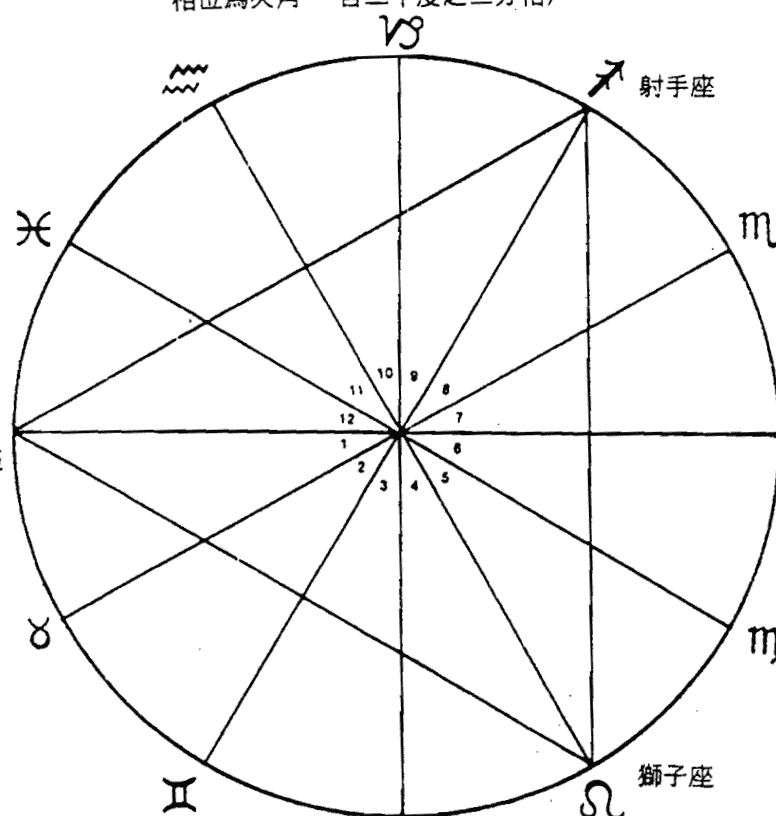
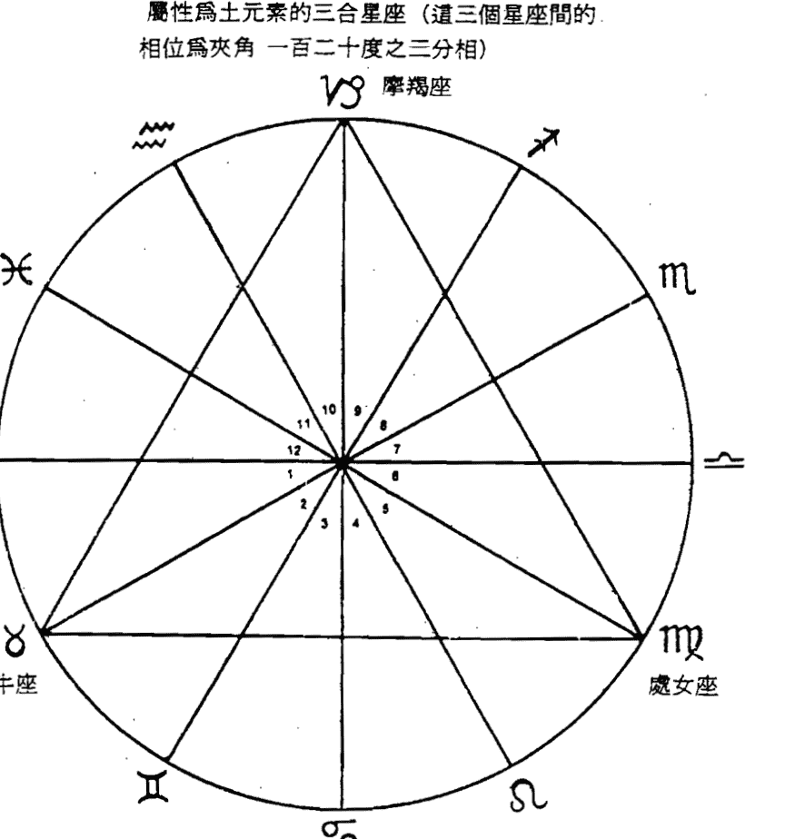
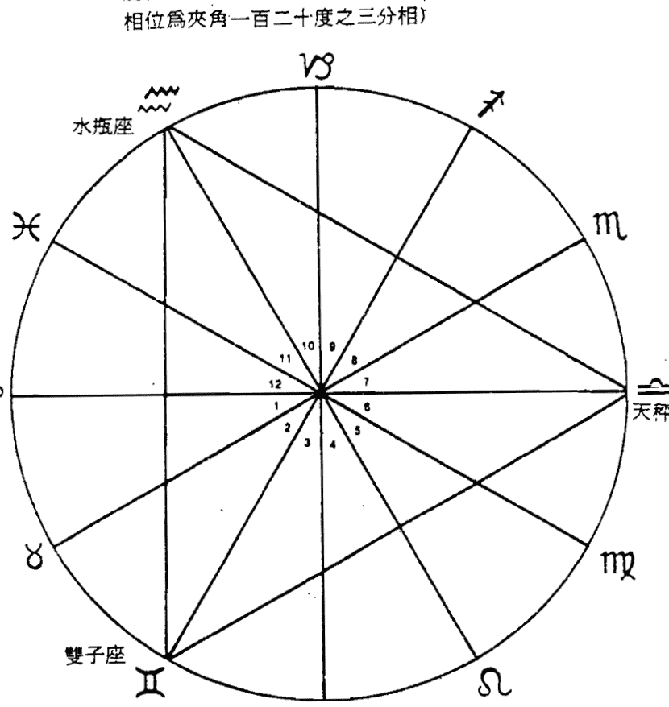
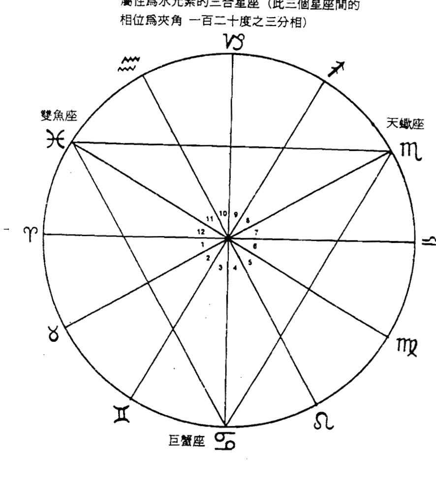
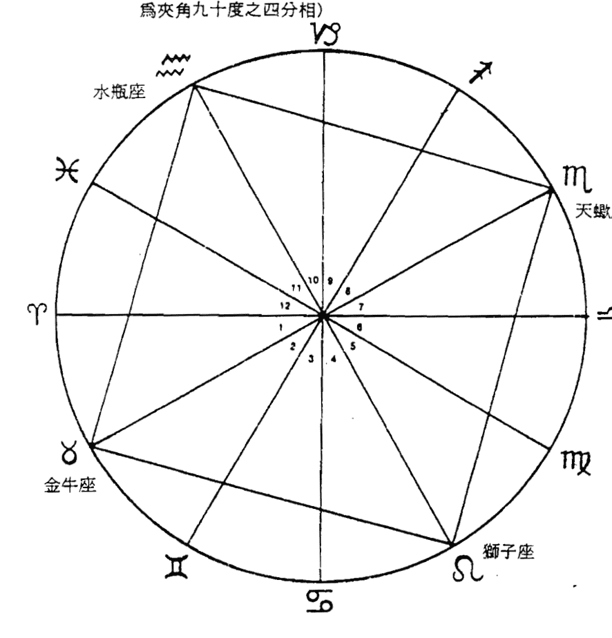
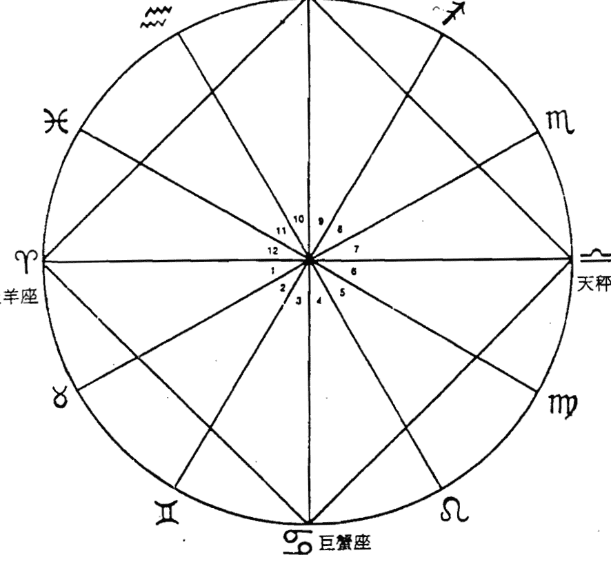
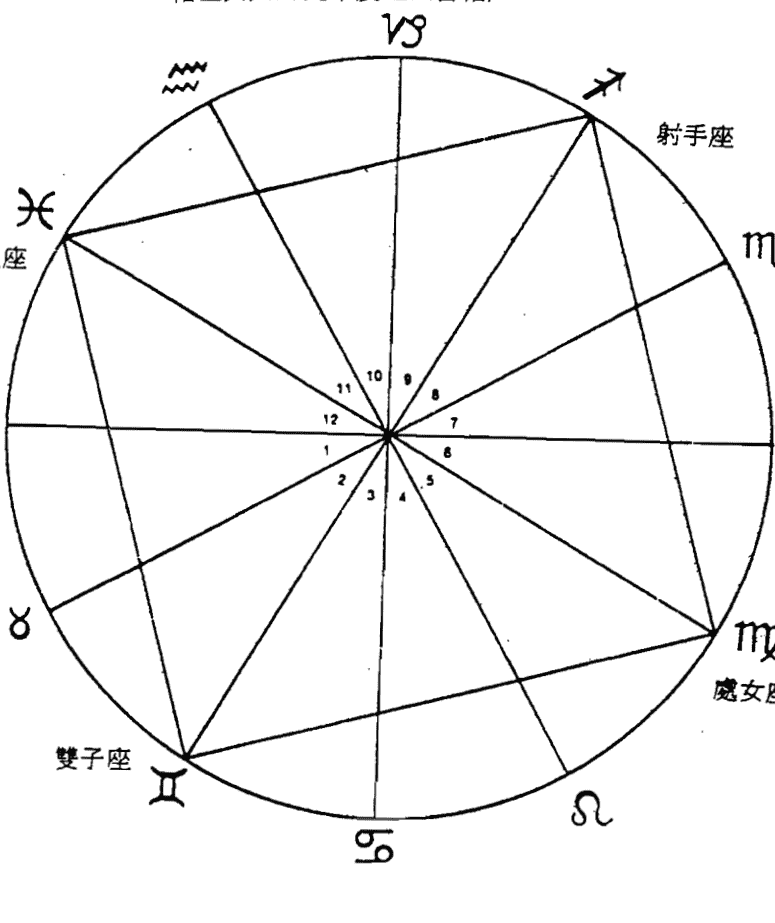
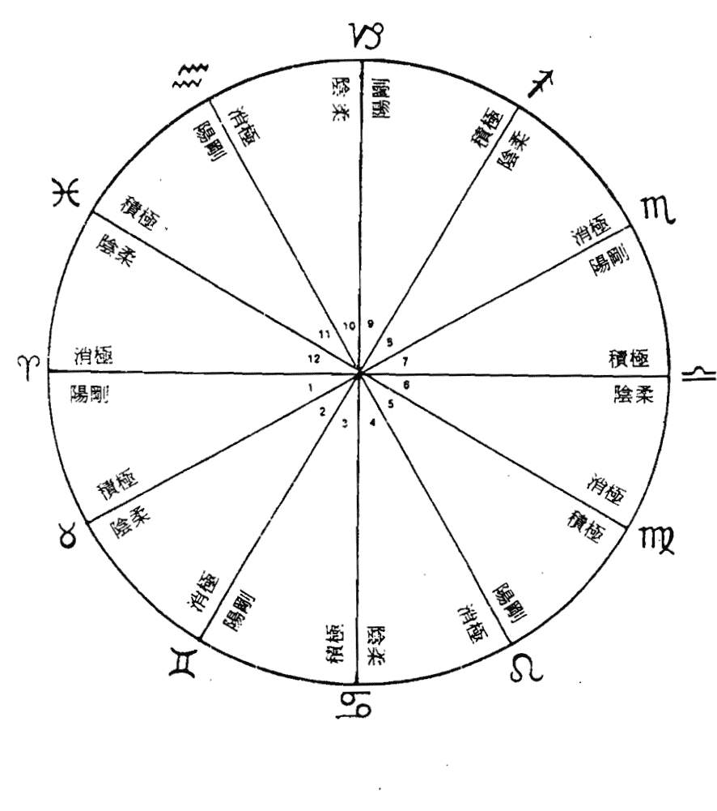
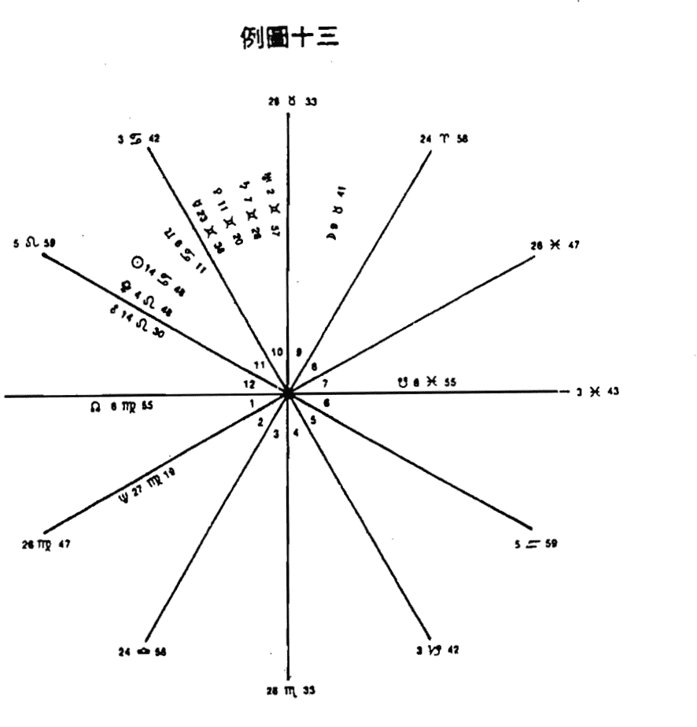

## The Astrologer's Handbook
# 占星玩家手册
# 深度命盘解析

这是一本最广泛深入又有趣的占星手册，从你出生那一刻的九个行星位置，奇妙地透视出多様貌的人生。

无论你是初入门，还是玩家级的占星高手，这本书对你都是无穷尽的宝藏。

★Sakoian & Acker 著 李逸民 译

## 前言

如雨后春笋般大量出现的占星学书，显示出大众对这个主题的高度兴趣。然而，大部分占星学方面的书籍，不论是新近发表的，或者是以前书本的再版，都只将重心摆在占星学本身的历史。或是摆在对太阳星座、上升星座的分析上。有的书本可能还会包括一些行星星座的分析讨论，像月亮星座位于处女座，水星星座位于双子座等等。或者附加一些对每个宫位的特性所做的解释。

市面可能没有一本书不但融合了上面提到的这些项目，并且还加上了相位的讨论。更没有一本书会钜细靡遗的解释各种行星间相位的意义，以及这些相位该如何应用以便对星宫命盘有更详尽及完整的了解。

在分析及了解整个星宫命盘涵盖的意义时，一个很重要的先决条件，便是要能够正确地找出各行星间的相互位置。这本书可说是第一本，为占星学初学者以及从事占星术的人，提供浅显易懂并方便使用的资料。

除了讨论太阳星座、上升星座、各行星星座及十二宫的意义之外，《占星玩家手册》更进一步地叙述了有关相位的要点。以逻辑的方式，并遵循占星学的基础原则，让学习者能逐次地分析并了解不同的相位有何不同的暗示。藉由本书所提供的，爱好研究占星术的读者可以得到分析推论星宫图的宝贵经验。这本书不像其他书一样，只是将各种不同的相位大致上分成两类。像这种仅将相位分为『吉』或『凶』两类的作法，本书并不采用，这本书会将合相、六分相、三分相、四分相以及对相等相位做个别的分类讨论。

这本书会详细叙述每一种行星间的相位所具有的不同色彩的特质，以及这些特质会因为不同相位与相位的组合，及组合成这个相位的是那些行星与行星、升交点或降交点，以怎么样的角度组合等等不同因素，而有所变化。例如：四分相与对相都是被认为是会带来压力、阻力的相位，但是它们所产生的压力或阻力又不尽相同。四分相通常暗示着这个人的努力过程中，所遭遇的阻碍，而对相则通常暗示着这个人会有人际关系方面的问题产生。

其他讨论的主题，则包括在某一特定相位中所讨论的行星的移动方向，会对这个相位的意义产生那些影响。这些相位是夹角越来越小，或是夹角越来越大，以及这些相位中的行星是快要接近到彼此，或是正要离开对方等不同移动方向，都会有不同的意义。另一个影响相位之影响力的重要与否，及其影响力的强弱与否之重要因素，则是这个相位的角度差异容许度的大小。

几乎没有任何一项人类的经验及际遇，是占星学所讨论的范围中所无法涵盖的。我们希望透过这本书，读者能得到启发进入知识能力的世界，而且能进一步地了解到，我们每个人都是生活在一个极大的知觉环境中的各不相同的完整个体。

多年来的经验，证实了占星学的确是极具潜力，并能让我们了解每一个阶段的生命，以朝能进一步使我们的生活变得更加丰富的方法。因此，我们深信这本书将能成为日后的占星学在各大院校中的基本教材。

## 目录

- 前言
- 如何使用本书
- 第I篇 基础占星学
    - 1 占星术初学者须知
    - 2 计算及排列星宫命盘的方法
    - 3 太阳星座及所代表的潜在天赋
    - 4 上升星座与各宫位星座有何意义
    - 5 十二宫位与人和外在环境的关连
    - 6 十大行星在各星座、宫位的代表意义
- 第II篇 各行星间的相位所产生的影响
    - 7 行星影响力的强弱受那些因素的支配
    - 8 行星的影响力在什么情况下会加强
    - 9 行星之间相位解释的基本原则
    - 10 分析各行星间相位所产生的影响
    - 11 概述五种重要的相位
    - 12 两行星间呈现合相时所产生的影响
    - 13 两行星间呈现六分相时所产生的影响
    - 14 两行星间呈现四分相时所产生的影响
    - 15 两行星间呈现三分相时所产生的影响
    - 16 两行星间呈现对分相时所产生的影响

## 如何使用本书

本书的主旨是为了提供占星学的生手，研究占星学的学生，以及从事占星术的人，在分析解释星宫命盘时，所必须具备的资讯。对于那些没有时间，或是不想学习如何绘制正确星宫命盘的人，市面上已经可以找到由电脑软件来帮你绘制正确星宫命盘。由电脑所制造出来的星宫命盘，通常会列印出输入资料那个人，在他出生时刻的星宫图，并详细列出这个命盘上的各种相位，以及各行星所在位置的星座，例如：太阳星座在处女座等。读者便可以依据这些基本的资料，参照这本书，找出这些资料究竟有什么含意。

如果你想要自己绘制星宫命盘，那么你可以依照本书第二章中所详载的步骤，遵照书中的指示来绘制星宫命盘。一旦你得到了你的星宫命盘，不论是电脑绘制出的，或是自己动手绘制的，你便可以开始着手分析解释手中这份命盘了。首先请参考第三章，太阳星座及所代表的潜在天赋，其中有关于你太阳星座的那一部分。

之后你就可以开始研究本书中有关黄道十二宫的章节，了解每一个宫代表了每个人生活中的那一部分。

第四章所论述上升星座所代表的个性特征，将会提供读者该如何计划他每一个阶段生活的详细说明。之后读者可以再参考本书的第六章，找出有关自己出生时刻，各行星是位在那一个宫？那一个星座？以此瞭解这些行星、星座的特征。

在着手分析解释自己的星宫命盘上的各种行星相位之前，读者应先阅读本书的第九章、第十章以及第十一章。要记住，每一种主要相位所许可的角度差异容许度，并考虑是不是忽略了某些相位？如果有一颗行星位于某一星座三十度中的后面几度位置，而另一颗行星则位于另一星座三十度中的头几度的位置时，通常这二颗行星之间的相位较易被忽略。

最后，你便可以开始分析并了解，出现在你的星宫命盘上，每一种相位所代表的意义及所带来的影响。首先，我们必须先知道我们所讨论的五种主要相位是那些？以及这些相位的意义。五种主要的相位包括合相或称一分相，两星间为零度，或者可以说两星位于相同的角度，中国人称之为“合一”。六分相，两星间为六十度，中国人称之为“半会”。四分相，两星间为九十度，中国人称之为“刑”。三分相，两星间为一百二十度，中国人称之为“会”。以及对分相，或称之为二分相，两星间为一百八十度，或者是两星成一直线，其中又名称为“冲”。

首先先找出你的星宫命盘上所包含到的行星以及一些重要的点。然后依照下例次序：太阳、月亮、水星、金星、火星、木星、土星、天王星、海王星、冥王星、北交点，又称之为月中交，月北交或者是升交点。南交点，又称之为月正交、月南交或是降交点。上升宫中国人称为“立命”、中天宫、下降宫、底天宫，找出并纪录下出现在你的星宫命盘上的重要点，及行星中那一个出现顺序在前？然后你便可以参照本书中，有关分析解释行星相位的章节，来了解那些和你的星宫命盘有关的行星，或点的相位的意义。

让我们举例来说明：如果你的星宫命盘上，可以找到由金星和海王星所形成的六分相，你便可以从本书第十三章里的“金星与其他行星的六分相”中，找出标题为“金星与海王星的六分相”的部分来阅读参考。

为了要更进一步地帮助读者了解分析星宫命盘，本书并包含了部分章节来讨论其他可能产生影响的因素。例如：行星的影响力在何时会受到擢升加强，以及行星的影响力的强弱会受到何种支配等。这些因素，在分析星宫命盘时，也应被考虑进去。

这本书上所概括之分析及了解星宫变化之意义的方法，乃为位于美国麻省艾灵顿的新英格兰星象学学校的正式教材。作者法兰西丝·苏克依是该校的督导，而路易士·艾克则担任该校的正式教员。

## 第I篇 基础占星学

# 1 占星术初学者须知

#### 何谓太阳星座

所谓的星宫命盘，是指一张与在你出生的那个时刻，从你的出生地所能观察到的星象分布完全一样的星宫图。
我们通常会以一个三百六十度的圆来代表天球，这个圆形的圆周即是指太阳出现在天空中的路径。事实上，我们知道应该是由地球绕着太阳转的，而这个“太阳运行的轨道”，即是天文学家所说的黄道。
占星学家将这个圆分成了十二个区域，每一个区域为三十度。这十二个区域也就是所谓的“黄道十二星座”或者是一般人所熟悉的“太阳星座”。这十二个区域中的每一个部分，都有一个星座。太阳星座也就是指在你出生的那个时间，太阳运行到的那一个星座。让我们举例说明：如果你是在十月上旬出生的，那么那个时候的太阳刚好运行至黄道十二星座的第七个星座——天秤座，因此你的太阳星座便是天秤座。西方的占星学最常使用的黄道带起点为春分点。当太阳运行至春分点时，通常太阳在每年的三月二十日，运行至春分点，会因为太阳位置的关系而使得这一天的昼夜长短相同。春分点在天文学上的定义为：在地球绕太阳公转的平面上，在黄道与由地球赤道延伸出的天球赤道交接的那个点。我们在地球上所看到的太阳，是沿着黄道的轨道运行的。当然我们知道事实上并非太阳绕地球，而是地球绕着太阳公转。而当太阳由普通的轨道开始，由赤道以南运行至赤道以北的轨道时，便会产生此一交点。在占星学上，太阳运行至春分点的这个时候，我们称为牡羊座零度。由牡羊座零度为起点，便开始了回归线上的十二个星座的次序，这便是西洋占星学最常用的十二个星座，也是我们这本书的重点。在占星学的术语中，尚有不同的名词用来称呼星宫命盘，例如：诞生星图、初生星表、命表、星宫图、星座轮等等。但不论这些称呼如何改变，十二个星座的次序却是永远不会改变的。黄道十二星座依次为：牡羊座、金牛座、双子座、巨蟹座、狮子座、处女座、天秤座、天蝎座、射手座、摩羯座、水瓶座以及双鱼座。一个人出生时仅能属于一个太阳星座，不可以拥有两个太阳星座。两个星座之间的分隔线，占星学上称为星界线。也许我们会听到人家这么说：“我出生时，太阳是位于星界线上。”遇到这种出生时刻的太阳星座非常难以区分时，一定要以本书中所介绍的计算方法，计算并判断那个时辰的太阳星座究竟为何？（请参照第二章所教授的自行绘制星宫命盘之方法，或设法利用市面上的电脑软件来帮助你绘制星宫命盘）为了要确保计算结果的准确性，我们一定要具备下列这些资料：出生的月份、日期、年份、时辰（几点出生的？如果可能的话最好知道是几分出生的）以及出生的地点。在黄道十二星座的每一个太阳星座出生的人，都会受到拥有属于这个星座特有的积极特性以及特有的消极特性所影响。这些属性和人的行为以及人体的部位有关。在每一个人的星宫命盘上都会有这十二个星座的排列组合。而这十二个星座对人体或人类各个不同生活面的影响力，便是由位于这十二个星座区域上的各行星位置，以及黄道十二星座和黄道十二宫的排列关系来决定。

#### 什么是黄道十二宫？

就像黄道面被等分成十二个星座的区域一样，我们同样也有十二个宫位将命盘上的这个圆等分成十二分。每一个宫位都和黄道十二星座之一的星座有很密切的关系：每一个宫位都会有一个不同的星座；也可以说十二个宫位分别代表十二个星座。但不像黄道十二星座一样，是根据地球绕太阳一年一周而来公转，然后从春分点起开始十二个星座的次序。黄道十二宫是根据地球以其南北极连接而成的线为轴心，每二十四小时自转一周而来的。和太阳星座一样，宫位与宫位之间也有类似星界线的一“宫界线”来划分彼此。第一宫（或者通称上升宫位）的起始位置，是指在一个人出生时，从这个人的出生地所观察到的天空中，东方地平线和黄道交接处：在此所出现或升起的第一个星座，即所谓的上升星座。也就是说位于上升宫位（第一宫）的星座，就是指在一个人出生时刻时，由东方地平线升起的第一个星座。因此黄道十二星座的每一个星座，都有可能因每个人不同的出生时刻，而成为当时第一个出现在东方地平线上的上升星座。而一个人的出生时刻，以及他的出生地点，也因此成为决定究竟在黄道十二个星座中，哪一个星座会是这个人命盘上，位于上升宫位的上升星座。

在出生时刻第一个由东方地平线上升起的星座，便是上升星座。上升星座代表着一个人的自我表达方式、性格、能力以及一个人的外貌。上升宫位和一个人的早年环境有密切的关系。

在第一宫之后的第二宫到第十二宫，每一个宫位，都代表着人生中的不同部分中的一些事物。例如：金钱、婚姻、职业、家庭状况、交友情形等等。请翻阅本书第五章，十二宫位与人和人的外在环境有何关连，以进一步了解每一个宫位有何不同意？

这十二个宫位中，最重要的几个宫位被称为基本宫位，或是顶角宫位。这几个重要的宫位包括了，上升宫位：第一宫，或一般人所谓的上升星座。第四宫：底天宫位，子午线西通过在地球下方，和黄道交接的地方是第四宫界。第七宫：或者称为下阴宫位，西方地平线与黄道交接之处为第七宫界。以及第十宫：或者称为中天宫位，或是天顶宫位，英文缩写为M.C.的中天处（第十宫界），是指子午线（由北到南，穿过地球正上方的天顶点而形成的线）和黄道面的交接处。其他的八个宫位则分别穿插在这四个基本宫位之间，而且各个宫位间距相等。

每一个宫位上都会出现有黄道十二星座中的其中一个星座（请参阅图四）。而每一个人的生活形态，便会因为在这些掌管人生不同部门的各宫位上，有不同的星座坐落而有所不同。

如果你是出生于十月八日（太阳星座为天秤座），下午四点那么你的太阳星座便会在第八宫位。

于是天秤座便在第八宫，天蝎座在第九宫，射手座在第十宫，摩羯座在第十一宫，水瓶座在第十二宫，双鱼座在第一宫（通称为上升宫位或上升星座），牡羊座在第二宫，金牛座在第三宫，双子座在第四宫，巨蟹座在第五宫，狮子座在第六宫，而处女座在第七宫。以这种排列方式，我们可以推测你的上升星座应该是双鱼座。虽然这种排列方式，并不是绘制排列星宫命盘的正确方法，但是，这样的排列可以帮助我们检查，我们的星宫命盘中各宫位上的星座是否排列正确。

在读完并且了解了，究竟何谓太阳星座与十二个宫位？并正确地找出自己出生时刻的太阳星座与位于各宫位上的星座排列之后。接下来，你便可以开始翻阅本书的第四章：上升星座与各宫位星座有何意义。找出有各个上升星座以及依顺序排列所得之星座与宫位组合的特性。上升星座的特性可以用来进一步描述主要由太阳星座所主宰的个人特性。由于上升星座是仅次于太阳星座以决定个人特性的重要因素，因此可用来修饰每个人因为上升星座不同，而稍有改变的太阳星座的特性。如果你的上升太阳星座为天秤座，那么你可以参阅第四章中有关上升星座为天秤座的特性，进一步了解自己是受到这个上升星座，以及以它为首的十二宫位上各星座的哪些影响。

另外，其他星座位置的变化，也会影响太阳星座的主要特性。如果你的上升太阳星座为天秤座，那么你可以参阅第四章中有关上升星座为天秤座的特性，进一步了解自己是受到这个上升星座，以及以它为首的十二宫位上各星座的哪些影响。

#### 三合星座与四合星座

通常占星学家会根据黄道十二星座之排列顺序与其地理位置，分别以两种重要的属性进行分类，来归纳这十二个星座。这两种属性的分类方式分别为：四组表现不同气质、性情的三合星座，以及三组主要和个人之基本处事作风有关的四合星座。三合相将十二个星座划分成四组三合星座，每一组三合星座各拥有火、地、风以及水元素之一的元素属性。故名思义，我们可以知道每一组具某一元素属性的三合星座，都是由三个不同的星座所组成的。反过来说，占星学上一共有三组四合星座，他们是依照本位（中国占星家所谓的转宫）、固定（中国之定宫）以及变动（中国之三体宫）这三种不同的特性来划分的；而每一组四合星座，都是由四个不同元素属性（火、地、风、水）的星座所组成的。如果在某个人的星宫命盘上，多数的行星是位在同一属性（特性）的星座上，则这个人的性情与行为模式，便會强烈地反映出该属性（特性）的特质。

# 2 计算及排列星宫命盘的方法
# 3 太阳星座及所代表的潜在天赋
# 4 上升星座与各宫位星座有何意义
# 5 十二宫位与人和外在环境的关连
# 6 十大行星在各星座、宫位的代表意义

# 第II篇 各行星间的相位所产生的影响

# 7 行星影响力的强弱受那些因素的支配
# 8 行星的影响力在什么情况下会加强
# 9 行星之间相位解释的基本原则
# 10 分析各行星间相位所产生的影响
### 11 概述五种重要的相位
### 12 两行星间呈现合相时所产生的影响
### 13 两行星间呈现六分相时所产生的影响
### 14 两行星间呈现四分相时所产生的影响
### 15 两行星间呈现三分相时所产生的影响
### 16 两行星间呈现对分相时所产生的影响

## 例圖五

屬性為火元素的三合星座（這三個星座間的相位為夾角一百二十度之三分相）



每一個星座與星座間一定是相距三十度

## 例圖六

屬性為土元素的三合星座（這三個星座間的相位為夾角一百二十度之三分相）



每一個星座與星座間一定是相距三十度

## 例圖七

屬性為風元素的三合星座（這三個星座間的相位為夾角一百二十度之三分相）



每一個星座間一定是相距三十度

## 例圖八

屬性為水元素的三合星座（此三個星座間的相位為夾角一百二十度之三分相）



每一個星座與星座間一定是相距三十度

將是影響一個人在各生活層面上，表現能力的一大因素。

首先，讓我們先來談談四種不同的元素屬性：火、地、風、水。牡羊座、獅子座以及射手座這三個星座屬於火元素的三合星座，亦稱為火象星座。這三個星座的人通常會表現出某種追求領導地位的欲望。對出生在牡羊座的人來說，這種欲望通常可由羊座人對新事物，一定很堅決地要當第一個嘗試者的這種表現中得到證明。獅子座的人，由於天生具有管理者的能力，因此通常在某一個單位中或某一群體中，會自然而然地成為引人注目的中心人物。而射手座的人，則容易成為宗教上、哲學界、法律界或是教育界中的精神或哲學的領導人物。射手座的人通常對人類社會如何形成的這類看法特別感興趣。

火象星座的人，通常會有獨斷、積極、熱心、具創造力以及陽剛的特質。在十二個宮位中出現火象星座的部分，則由這些宮所管轄的人生部分，便會表現出火元素的這些特性。

擁有地元素的金牛座、處女座以及摩羯座的人，最主要的特性是擁有非常務實的態度。這些地象星座的人，具有善於使用及管理物質、金錢等，這些使人類生活能安定運作的必需能力。那些具有地象星座的宮位，在所管理的事務上，常會表現出務實的態度。

金牛座腳踏實地的特性，可從他們在努力達成這些對人類很重要的物質目標上的才智，和技能上明顯地看出。處女座的事實特性，則可從他們善於聚集以及管理金錢及其他物資上的能力看出。處女座的人，同時也善於維持人類最有價值的資產——我們的身體。而摩羯座的人，則具有組織及管理生意或者公營企業的實際能力。或者說，如果我們以世俗的層面來看，摩羯座的人在建立及組屬於一般的商業事務上，有較強的能力。屬性為風元素的三合星座，是由雙子座、天秤座以及水瓶座所組成的。風象星座的特色是具有人際溝通以及社交關係的聰慧能力。風象星座的人在某些地方，會表現出強烈的意志力以及聰明的特質。在星宮命盤上，出現風象星座的宮位或部分，那麼這個人在那些部位管轄的活動上，便會明顯地表現出善於社交和聰明的特質。雙子座這個風象星座出生的人的特質，會表現在他獲取、利用以及傳播實際資訊的能力上。我們也可以從雙子座的人，常有奇異點子的表現看出此一特性。天秤座的人，這些特質則是由他們會評估，試著平衡，並會對事物做正確比較的態度中看出。天秤座的人擁有強烈的社會意識，因此他們在心理學及一些相關學科上，也擁有天生的才能。水瓶座人的智慧，通常表現自他們對宇宙原理的直覺能力。水瓶座的人，對於所有人類的福祉，也會表現出極度的關懷。擁有水元素的三合星座，分別是巨蟹座、天蠍座及雙魚座。水象星座的特質為著重情緒及情感的領域，並且和生命中較敏感、憑直覺以及更深一層心靈研究的事物有關。水象星座所占的宮位或命盤的某些部分，那些部門的活動，則較容易受到感情的支配來行事。就水象星座的情感特質而言，在巨蟹座的身上，可以觀察到對家庭和家人的濃厚情感。在天蠍座的身上表現出對生活中遭遇的死亡、共同的資產以及更深入的超自然現象等事物，所表現的強烈情感。在雙魚座的身上，我們可以從雙魚座的人，對於造物者的強烈靈感能力以及雙魚座無意識地與他人心靈溝通的能力看出。這些表現也包括雙魚座的人對周遭環境的敏感知覺。這些過分敏感的本能感受，導致雙魚座的人極容易受影響。因此，雙魚座的人特別容易不自覺地受到感情的支配。

## 四合星座

四合星座，主要是根據行事的方式和對周遭環境的應變能力不同，來區分成占星學上所謂的本位四合星座、固定四合星座以及變動四合星座。

本位四合星座為牡羊座、巨蟹座、天秤座及摩羯座。在這四個本位星座出生的人，通常擁有處置立即狀況的直接行動力，和決然果斷的辦事能力。他們對於突發的情況會有很實在的把握，並且有採取立即反應行動的潛力。根據在星宮命盤上本位星座出現的宮位，則這個人對那一部分的活動，便會有積極主動的傾向，並且有創立及管理重要工作的能力。從好的一面看來，這些本位星座的人，擁有一個建設性的主動行動力，但從壞的一面來看，這些人可能會有好管閒事的傾向，並極可能未經詳細的思考，便輕率的行事。

固定四合星座包括：金牛座、獅子座、天蠍座和水瓶座。在這四個固定星座出生的人，在做一件事時，通常較能堅持，並較具決心地來完成一件事。他們是以達到目標為行動出發點的人，由此我們可以知道，固定星座的人對未來比較關心。固定星座的人擁有的優點是他們不變的忠誠以及可靠性，缺點則是固執、墨守成規和不知變通。固定星座出生的人，對某件事一旦下定了決心，便不容輕易被人動搖。出現在固定星座的宮位，便會受到這種力量的影響。

## 例圖十

屬於固定星座之四合星座（此四個星座間的相位為夾角九十度之四分相）



每一個星座與星座間一定是相距三十度

## 例圖九

屬於本位星座之四合星座（這四個星座間的相位為夾角九十度之四分相）



每一個星座與星座間一定是相距三十度

## 例圖十一

屬於變動星座之四合星座（此四個星座間的相位與夾角九十度之四分相）



每一個星座與星座間一定是相距三十度

變動四合星座是由雙子座、處女座、射手座以及雙魚座所組成的。變動星座的特性為對於應付多變的環境及情況，有極豐富的經驗，並且有隨不同環境而改變的能力。在變動星座出生的人，在遇到生活中的一些危急情況時，有很強的應變能力，並且能像變色蜥蜴一樣地融入不同的情況以及周圍的環境。變動星座的人在緊急狀況時，可以變得很有彈性，而且很靈敏。這些能力則是由他們在過去，曾遭遇到的類似狀況中所得來的。變動星座的人，對於過去、比他們對現在或未來更加關心、在意。因此變動星座的人要特別注意，不要陷入回憶中而無法自拔。變動星座的人的優點，是他們表現出足智多謀的特性；而缺點則是他們比其他人容易憂慮、焦躁、緊張，並且無法完全生活在現在。有變動星座出現的任何宮位或任何人生的部門，這個人便會在這些事物上表現出很強的應變能力。

## 陽剛星座與陰柔星座的分類

占星學家將黃道十二星座分為陽剛、積極星座以及陰柔、消極星座。 陽剛積極星座包括所有火象以及風象的星座。這類星座包括黃道十二星座排列順序中，次序為單數的星座：牡羊座、雙子座、獅子座、天秤座、射手座以及水瓶座；相當於是第一宮、第三宮、第五宮、第七宮、第九宮跟第十一宮。在陽剛積極星座出生的人，通常是比較積極主動、自我意識強烈的人，他們會主動採取行動以求結果，而不會只等著讓事情發生。無論這些陽剛積極星座出現在命盤上的那些部門，你在這些部門管轄領域中的行為，將會受到影響而顯得比較主動，並會設法追求自己想要的事物。 如果命盤上有極多數的行星是出現在這些陽剛積極星座上，那麼這個人便會是個在行動上有積極主動傾向，能自我驅策的人。通常這種特性若出現在男性的命盤上，會比較受歡迎。但是如果這種特性出現在女性的星宮命盤上，則女性就會有不符合傳統社會觀念下所認同的女性模範的傾向。 陰柔或消極星座包括所有地象和水象的星座。這些星座則是黃道十二星座中，排列順序為雙數的星座，金牛座、巨蟹座、處女座、天蠍座、摩羯座以及雙魚座，相當為第二宮、第四宮、第六宮、第八宮、第十宮及第十二宮。 這些陰柔消極的星座，通常表示著消極的態度。雖然大多數的時間，他們都會在事情還不需要有任何行動之前，靜靜地、消極地等待。但在某些時候，這些星座出生的人，也有可能會做出強烈激進的行為。因此這些星座出生的人比較消極，並且只會面對臨到他們頭上，不得不反應的事採取行動。他們做事的原則，是希望能被動地吸引他們想要的事情，而不會企圖設法站出來爭取這些東西。 如果命盤上有極多數的行星是出現在這些陰柔消極星座上，那麼這個人將不會表現出積極進取的態度：相反的，他可能會顯現出非常強烈的消極忍受的能力。女性的星宮命盤上如果出現陰柔消極星座，那麼這個女人通常會因此而更具女人味，並且表現出來一般人認為適合女性的作風。但如果男性的星宮命盤上出現多數行星在這些陰柔消極星座，那麼由於這類星座的特質，這個男的，可能會被認為太過柔弱，並且缺乏男性氣概中的侵略性。

## 例圖十二

屬性陽剛／積極之星座：♈♊♌♎♐♒
屬性陰柔／消極之星座：♉♋♍♏♑♓



## 何謂行星間的相位

我們在占星學上所重視的八顆行星，以我們站在地球上觀察的觀點，每一顆星球在宇宙空間中，皆以不同的速度，但在同一平面上，以太陽為中心，繞著太陽不斷地輪迴旋轉。由於這些星體的運行速度不同，因此，我們從地球上觀測，便會發現星球與星球之間，形成了不同的角度。在天文學上，測量這些星球的位置，或星球與星球之間的相對位置的單位，便是所謂的幾度幾分幾秒的角度。而角度的定義，則是計算由兩條交接的線所形成的夾角，在圖形之中所占比例乘上圓的角度定義——三百六十度。我們這本書中所談到的相位（兩星球之間的距離或夾角），則是依據把地球當成圓心，也可以說成，地球是通過我們所要測量相位的那兩顆星球的兩條假想線的交點，和另外兩顆星以假想線連接所形成夾角的角度來決定其相位的。

這種星與星之間的角度關係，便是我們占星學上所說的相位。在幾何學上，角度的定義為交接於圓心上的兩直線所形成的夾角，在圓形中所占的比例。讓我們試著想像天空中的兩顆星，在我們每個人出生的時候，都以地球為圓心，連接而形成許多不同的夾角，而這些夾角的度數，便是我們由地球所觀測到的星球與星球間的角度關係。

在占星學上，有幾個具有非常重大意義的角度，例如：零度、六十度、九十度、一百二十度以及一百八十度，便是占星學上幾個被認為是具有影響力的重要角度。這幾個主要的相位依順序在占星學上被稱為：合相、六分相、四分相、三分相及對分相。如果我們由地球上看起來，兩顆星似乎剛好和地球成一直線，那麼這兩顆星之間的相位便是合相。例如：日蝕就是當月亮位於太陽和地球之間，即是合相的一種。兩星之間理想或完美的合相，應該是指兩星間呈零度角。但是占星學上的每一種相位，都有其許可的角度差異容許度，或者說是仍受此相位影響的正負角度範圍。也就是說每一種相位，都有其許可的角度差異容許度，或者說是仍受此相位影響的正負角度範圍。所以雖然某一相位中的夾角度數，和這個相位定義上的夾角度數有所差異，但只要是實際的角度和規定的角度差並沒有超過差異容許度，那麼由這個相位產生的影響自然存在。在這五種主要的相位之中，我們通常會許有關於相位中兩顆星間的夾角，與相關相位規定的角度，兩者之間有正負六度的角度差異容許度。在占星學上，我們稱之為六度差異容許度，但是如果我們所討論的相位之中，兩顆星之一是太陽或者是月亮時，那麼我們會將相位中的角度差異容許度提高到正負十度。○合相（☌）是一個非常具有力量的相位。這個相位對於一個人的表現，具有強烈並集中的力量，可使人的表現具有不經思考便直接行動，以及自我表現非常戲劇化的傾向。當兩顆星成合相時，通常代表某種獨特心理特徵的產生。如果你想確定一下，出現在你星宮盤上的合相究竟具有何種影響力的話，可以翻閱本書第十二章有關行星間合相影響力的分析，找出特別定出兩星的合相所具之意義。如果你還想更進一步地了解由行星間相位所引發的影響，你可以由本書第九章中，分析與綜合各行星間相位所產生的影響，得到更多相關資訊。

六分相（＊）的夾角為六十度，或者可以說是六分之一圓。黃道十二星座的每一個星座，都是由許多顆星星組成的。每一個星座內星星的位置，是從這顆星和這個星座中第一顆星的相對位置或距離，以幾度幾分的角度單位來測量標定的。

在每一個星座之內，星星與星星之間的距離，以度、分、秒為單位，絕對不可以超過三十度。因為黃道上的十二個星座，每一個星座都不會大於三十度，而在星盤上每一個星座也只有三十度。在六分相中的兩顆行星，通常是分別位於兩個順序不相連，而彼此最接近的星座中。他們在兩宮間所占的角度位置大致相同，並且兩者間的相對距離是在六十度加減六度的範圍內。但是如果兩行星中，有一顆行星的位置是在某一個星座中，三十度角剛開始的那幾度，而另一顆行星的位置則是在另一星座中三十度角的最後幾度。那麼這兩顆行星之間的相位，仍然有可能是介於六十度加減六度的分相範圍內，我們稱這種六分相為隱藏式的六分相位。在這種情形下，這兩顆行星所在的星座是兩個相鄰的星座，而不是像大部分常見的六分相那樣，有一個星座介在這兩顆行星所在的兩星座之間。出現六分相，通常表示會有源源不絕的機會來臨，或者有很多很多的點子，而且如果利用這些機會或點子，將有助於實現個人的目標。例如……

四分相（□）是指兩行星之間的角度關係為九十度。四分相中的兩顆行星，通常是位於兩個順序差三的星座上，並且位在這兩個星座的三十度角中角度大致相同的位置，也就是說兩行星所處的兩星座之間，通常有另兩個星座將它們隔開。隱藏式的四分相位，是指在四分相的九十度加減六度……

三分相（△）是指兩行星之間的角度關係為一百二十度，或者說是這兩顆行星之間的夾角為三分之一的圓。呈現三分相的兩顆行星，通常是位於兩個順序差四的星座中，而且兩者的位置是在所在星座三十度角內，大致相同的位置。也就是說這兩顆行星所處的兩星座之間，通常有另外三個星座的介入。而隱藏式的三分相位，則是指那些當中只有兩個，或者共有四個星座介入這兩顆行星所處的星座中的三分相。三分相的相位，通常會帶來創造力與擴展力。三分相可以說是所有相位之中，最吉利的相位。

對分相（☍），是指兩行星之間的角度關係為一百八十度。對分相中的兩行星，通常是位在所在的兩星座內角度大致相同的位置。而這兩顆行星所處的星座，通常是黃道十二星座中，和彼此相對的兩個星座，而這種相對的星座，通常是在順序上差六的星座，也就是由另外五個星座隔開的兩個星座。如果是「隱藏式的對分相」，則一定是指對分相中的兩行星所處的星座之間，只有另外四個星座來隔開彼此。對分相的出現，表示這個人會遇到不是一定要和別人合作，就是一定要和別人決裂的情況。

在我們判斷出現在星宮命盤上的行星與行星之間，究竟是屬於那一種相位的過程中，一定要記住，我們數的是夾在中間的星座有幾個，而不是中間的宮有幾個。因為一個宮的角度，有可能比一整個星座的角度（三十度）還要大，或還要小。在占星界中最常被採用的普拉西德派（Placidian）的分宮法下，如果是在緯度非常偏北的地方，便可能會發生有兩個完整的星座出現在一個宮位上，或者會有在三個宮位上同時出現某一個星座的情形。

## 2 計算及排列星宮命盤的方法

如果我們稱本書中這些由古代流傳下來的智慧，為占星學的靈魂。那麼正確的計算與排列星宮命盤做為引導，那麼我們就無法利用這項古老的科學了。

千萬不可忽視計算與排列星宮命盤這項工作。在一般情況下，通常為了要繪製、排列一幅準確的星宮命盤，必須花上半個鐘頭到一個鐘頭左右。如果你對成為專業占星學家，有非常高度的興趣，那麼你一定能熟練、專精這項技術。但是，如果你是剛開始研究占星學的學生，或是那些還不了解自己對研究占星學的興趣，到底到達哪一種程度的人，那麼，你可以考慮利用由一占星學家之星學電腦計算公司（ACA）所發展出來的軟體。

使用太粗略的星宮命盤，足以摧毀任何優秀的占星學家。除非你能夠完全地了解命盤上，有那些部分的準確性不足，並且充分地了解這些部分究竟暗示了什麼？不然的話，在繪製星宮命盤時，千萬不可為了省時、省力，而採用那些快速、簡易，而且偷工減料的方法。我們在這本書中所要介紹繪製星宮命盤的公式和方法，叫做阿圭亞制（Aquid）。如果你能確實地依照書中記載的方法來做，那麼一定可以得到一份精確的星宮命盤。

## 製作星宮命盤必須具備的資料

星宮命盤是一幅與你出生那一刻，天空中星體排列位置完全一樣的星宮圖。首先，我們必須要知道每一個行星在星座上的角度位置，從星曆表上可得知在某一特定時間時，各行星在每一星座上的位置，然後再以行星和地平線之間的角度關係標出你的星宮命盤上的星座、宮位以及行星之位置。因此，製做星宮命盤的時候，一定要具備的資料為：精確的出生時刻（幾年幾月幾日幾點幾分幾秒），以及出生的地點（什麼國家？什麼州或什麼省？什麼縣？什麼市？）我們建議有興趣的讀者盡早在事前準備好這兩種資料，以便在繪製的過程中，獲得足夠的時間來做正確的計算。

## 必須使用的參考資料

在製做星宮命盤時，最重要的參考資料是星曆表。星曆表，也就是中國人的曆書，是一部記載了行星在每一年、每一天中，格林威治標準時間（Greenwich Mean Time，簡寫為 GMT）中午以及晚上十二點時，所運行到星座中的位置。為求精確，我們極力推薦讀者使用瑞士製的《蘇黎世星曆表》（Zurich Ephemeris），以及《專科用星曆表》（College's Ephemeris）這兩本書為參考資料。

## 出生地的經緯度

你必須要查出出生地的所在位置、位於地球上之經緯度。市面上有不少可以查閱地點之經緯度的優良參考書籍：由全美國占星學圖書館出版的參考書籍，《美國國內各地之經緯度》與《美國以外地方之經緯度》都是很好的參考資料。此外還有一本比這兩本書更詳盡的參考書籍，《倫敦之地界地圖集與公報》。

## 時差轉換

為了要將出生時間修正為標準時間，我們必須要知道有關時區之劃分、日光節約時間。通常在四月的最後一個星期日將時間撥快一個鐘頭，在十月份最後一個星期將時間調回正常時間。戰爭時期還有『戰爭時間』等影響時間的因素。

## 宮位表

宮位表是以計算出的時間，而非以角度來標定宮位位置的表。達頓的宮位表（Dalton's Table of House）是普拉西德派派下的標準參考資料。這份宮位表很準確，但由於是以時間來標定宮位而非角度，故準確程度只能到小數點下一位而已。如果你希望能得到更準確的宮位位置，你就必須使用在達頓的宮位表一書中介紹的公式，或者借助於電腦的幫忙了。

## 製作與排列星宮命盤的步驟

1. 首先先將所有的資料和參考資料找齊。在下面所介紹的這個例子中，我們要使用由桃樂絲·頓所著的《美國國內各地之時差轉換》，由全美占星學者聯合協會所著的《美國各地之經緯度》，瑞士出版的《蘇黎士星曆表》，以及《達頓的宮位表》。我們採用在一九四二年七月七日上午九點三十分，在蘇省波士頓出生的人為例子。
2. 首先查一查這個出生日期，一九四二年七月七日，是不是剛好是在夏至日光節約時間內或是戰爭時間中？在《美國國內地區之時差轉換》一書中，發現這天剛好在二次大戰的時間內，所以以上午九點三十分這個出生時間，正確的時間應是往前推一小時的時刻。所以，這個人正確的出生時刻應為，美國東部標準時間上午八點三十分。
3. 利用《美國各地之經緯度》這本書，查一查由於出生地的經緯度座標產生的地方平均太陽時差異。

我們查出在北緯四十二度，西經二十二度這個地點上的地方平均太陽時間 (LMT, Local Mean Time)，與此地之時區 (東部標準時區，ESTZ) 的標準時間 (ST)，差值為正十五分四十四秒。也就是說EST上午八點三十分正十五分四十四秒，等於LMT上午八點四十五分四十四秒。在這頁的另一欄中，又可以查得此地的格林威治時間 (GMT)，與此地的平均太陽時間 (LMT) 之間的差值為正四小時四十四分十六秒，也就是GMT下午一點三十分。也有人會先加上所查出的兩個差值，再加上當地的標準時間，以求其格林威治標準時間。在我們這個例子中為：（-15'44"）+（15'44"）+（+4'44'46"）=5（hr） 就是再將EST上午八點三十分加上五小時，所得之下午一點三十分就是此地的格林威治時間。

4 從《蘇黎世星曆表》一書中，標名為SS（S+em -self）的那一欄中，找出出生時刻前一個中午十二點的恆星時間。(Sidercal time，簡寫為ST) 如果你所使用的是《蘇黎世星曆表》，尤由出生時刻 (ST) 為上午十一點三十分，而這個時間的上一個中午十二點是前一天，七月六日的中午。如果出生時間是七月七日下午任何時候，則我們要使用的，便是七日中午十二點的恆星時間。因此對照七月六日中午，我們得到的恆星時間為六小時五十五分二十一秒。

5 有了上面這些基本時間資料之後，我們便可以開始展開我們的計算過程了。我們要把四個時間數據加起來。先讓我們檢查一下，是不是所需的四個數據都找到了。這四個數據分別為：

- a. 在步驟 4 中查到的出生時刻，前一天中午十二點的恆星時間。在這個例子中，六小時五十五分二十一秒。
- b. 由前一天中午十二點，到出生地平均太陽時（LMT）的出生時刻，所經過的時間。在我們這個例子中，出生時刻在出生地的平均太陽時為上午八點四十五分四十四秒。前一天中午十二點到七月七日凌晨，一共有十二個小時！加上由七月七日凌晨，到早上十一點四十五分四十四秒的八個小時四十五分四十四秒，一共有二十小時四十五分四十四秒，而這就是我們要加起來的第二個時間數據。
- c. 恆星時間修正值。得到 b 的時間值後，便可以翻閱《達頓的宮位表》一書，找出由這個時間值所找到之相對的恆星時間修正值。在這本書第五頁的表 A，「恆星時間修正值之平均時間」一表中，分別找出二十小時的平均修正時間，然後四十五分的平均修正時間，最後找出四十四秒的平均修正時間。我們找到這三個時間所對照的恆星時間修正值之平均時間，依順序為三分鐘、十七秒、七秒。這三個時間便是我們要加的第三個時間數據。
- d. 由第三個步驟中所得到之格林威治時間（GMT）與出生地之平均太陽時（LMT）的差值，四小時四十四分十六秒，參照《達頓的宮位表》一書第五頁的平均修正時間，找出由四小時、四分、十六秒所分別對應出的經度產生之恆星時間修正值，這便是我們所要的第四個數據。

現在我們來把由這個例子所得的四個數據加起來：

```
a 中午的恆星時間          06 55 21
b 前一個中午到出生時刻的時間長短  20 45 44
  (12小時 + 步驟三的8小時45分44秒)
c. 20小時45分44秒對照《達頓的宮位表》第五頁所查得的恆星時間修正值
  3 17 ←20小時
  7 ←45分
  . 44秒
d. 由《達頓的宮位表》第五頁所查得的經度產生之恆星時間修正值
  39 4小時 GMT 到
  7 44分 LMT 的
  0 16秒 時間差值
```

```
25個時間的總和   26 103 135
                +2 -120
將秒進位爲分     26 105 15
                +1 -60
將分進位爲小時   27 45 15
                -24
減掉24小時       3 45 15
```

最後所得到的3小時45分15秒，也就是準確度至秒的個位數的恆星時間。

6 由於地球的形狀並不是一個完美無瑕的正圓球體，因此我們還必須要再做一項修正——利用《達頓的宮位表》一書中第五頁中的表B所查到的值，來稍微地修正一下經度。我們找出經度為四十二度時，修正值大約是經度負十二分。所以我們要將經度四十二度二十二分減去經度十二分。故修正後之經度為四十二度十分。

7 兩項為了要利用《達頓的宮位表》一書，查出各宮位之位置的參數值，我們現在都得到了。這兩項參數為：在步驟5最後計算出來的準確恆星時間，以及在步驟7中，所得到的修正後的經度，四十二度十分。這時候，如果書上所登錄的參數值，與我們所求得的參數，並沒有完全相同，我們便得利用平面的級數插入的數學運算。在《達頓的宮位表》的第十二頁，我們發現我們要用的兩個實際參數值，其中恆星時間是介於書中登錄的三小時四十二分五十七秒與三小時四十七分六秒這兩個時間之中，而修正後的經度，四十二度十分，則是介於書中記載的四十二度與四十二度這兩個經度之間。

由於書中這兩個時間的差距為二百四十九秒（三小時四十七分六秒減三小時四十二分五十七秒），而我們真正要的時間和三小時四十二分五十七秒的差距為一百三十八秒（三小時四十五分十五秒），因此，為了要得到我們真正要求的宮位位置，我們首先要將書中由三小時四十七分六秒，經度四十二度所對應的宮位位置，減掉由三小時四十二分五十七秒，經度四十二度所對應的宮位位置，差乘上二百四十九分之一百三十八，再將所得加回由三小時四十二分五十七秒，經度四十二度所對應的宮位位置。

當然，由於我們要的是經度四十二度十分的參數，而非書中的四十二度或四十三度，因此，我們還得利用差距的比例，來做另一個修正。四十二度十分與四十二度差十分，而四十二度與四十三度差一度，或是六十分，所以是我們要的差距比例。所以，我們要將由三小時四十二分五十七秒，四十三度所應對的宮位位置，減去由三小時四十二分五十七秒，四十二度所應對的宮位位置後，所得的差距乘上六十分之十，再將所得加上我們之前因時間差距已修正過的宮位位置。如此一來，我們得到的結果，才是由這個恆星時間，與這個經度配合下，所應對的正確宮位位置。讀者可從前一頁整理後的「獲得實際參數值所對應的宮位位置方法」了解我們得到第十一宮、第十二宮、第一宮、第二宮與第三宮位置的過程。其他宮位的位置，則是由他們相對的宮位位置，加上一百八十度得交的。

## 獲得實際參數值所對應之宮位位置的方法
(例如3小時45分15秒與42'10')

| 项目 | 第10宫 | 第11宫 | 第12宫 | 第1宫 | 第2宫 | 第3宫 |
|------|--------|--------|--------|-------|-------|-------|
| ①小於但最接近實際兩參數之相對宮位位置(3/47/6)(42') | 28☉ 28☉ | 3.1☿ (3/6) 3.1☿ | 5.5♀ (5/30) 5.5♀ | 3/15m | 26.3☽ (26/16) 26.3☽ | 24.5♃ (24/30) 24.5♃ |
| ②與①同經度不對時間的相對宮位位置(3//47/6，42') | 29☉ 29☉ | 4.1☿ (4/6) 4.1☿ | 6.3♀ (6/18) 6.3♀ | 4/3m | 27.2☽ (27/12) 27.2☽ | 23.6♃ (25/36) 23.6♃ |
| ③②—①所得位置差異 | 60 | 33 | 48 | 26 | 54 | 29 |
| ④位置差異×138/249 (只取整數) | 33 | 26 | 26 | 26 | 54 | 54 |
| ⑤與①同時間不同經度之各宮位位置(3/42/57，43') | 28☉ | 3.4☿ (3/24) 3.4☿ | 5.8♀ (5/48) 5.8♀ | 3/30m | 26.3☽ (26/18) 26.3☽ | 24.4♃ (24/24) 24.4♃ |
| ⑥⑤—①所得位置差異 | 0 | 18 | 18 | 15 | 0 | -6 |
| ⑦將⑥×10/60 | 0 | 3 | 3 | 2 | 0 | -1 |
| ⑧所求之由兩實際參數值所應對的正確宮位位置(①+④+⑦) | 28☉33 =28☉33 | 3/42☿ =3☿42 | 5/59♀ =5♀59 | 3/43m =3m43 | 26/47☽ =26☽47 | 24/58♃ =24♃58 |

| 行星 | 各行星在1942年7月7日中午的位置 | 各行星在1942年7月8日中午的位置 | 前兩欄位置的差距 | 位置差距×90/1440 | 各行星在7月7日下午1點30分的位置 |
|------|-----------------------------|-----------------------------|------------------|------------------|--------------------------------|
| 太陽 | 14°/44′ ♋ | 15°/41′ ♋ | 57′ | 4′ | 14°/48′ ♋ |
| 月亮 | 8°/56′ ♊ | 20°/58′ ♊ | 722′ | 45′ | 9°/41′ ♊ |
| 水星 | 23°/34′ ♊ | 24°/37′ ♊ | 63′ | 4′ | 23°/38′ ♊ |
| 金星 | 11°/16′ ♊ | 12°/27′ ♊ | 71′ | 4′ | 11°/20′ ♊ |
| 火星 | 14°/28′ ♌ | 15°/06′ ♌ | 38′ | 2′ | 14°/30′ ♌ |
| 木星 | 6°/10′ ♋ | 6°/24′ ♋ | 14′ | 1′ | 6°/11′ ♋ |
| 土星 | 7°/28′ ♊ | 7°/35′ ♊ | 7′ | 0′ | 7°/28′ ♊ |
| 天王星 | 2°/57′ ♊ | 2°/59′ ♊ | 2′ | 0′ | 2°/57′ ♊ |
| 海王星 | 27°/19′ ♓ | 27°/20′ ♓ | 1′ | 0′ | 27°/19′ ♓ |
| 北交點 | 6°/55′ ♓ | 6°/55′ ♓ | 0′ | 0′ | 6°/55′ ♓ |
| 冥王星 | 4°/48′ ♑ | 4°/48′ ♑ | 0′ | 0′ | 4°/48′ ♑ |

到配合出生時刻，各行星的正確位置。在瑞士出版的《蘇黎世星曆表》一書中，我們可以在第三百一十七頁上，找到每一顆行星，在每天格林威治時間中午十二點的位置。我們在步驟3中，已經知道我們所採用的例子，是在一九四二年七月七日，格林威治時間下午一點三十分出生的，所以我們要用時間差距與距離差距相比例的級數插入法，算出行星在這天下午一點三十分時的真正所在位置。首先，我們必須要知道，每一顆行星在二十四小時這段時間中，所移動的距離（由七月八日的位置一七月七日的位置）。因為我們使用的出生時刻，比七月七日中午十二點，多了一個半鐘頭，也就是行星的位置，比七月七日中午十二點，多移動了二十四分之一點五乘以每日所移動的距離。由於二十四小時等於一千四百四十分鐘，而比中午多出來的一個半鐘頭等於九十分鐘，因此我們真正重要的位置，與書中登錄的位置，或距離差距為一千四百四十分之九十。最後，我們便可以在標準的圖形星宮命盤上，標列出我們配合出生時刻與地點，所計算出來的各宮位的位置，以及各行星的位置。

## 例圖十三



## 命盤上星象重點歸納表

(在一九四三年七月七日上午八点三十分，於北纬七十一度西经四十二度处出生，名为约翰·贾的人之命盘重点)

### 各行星星在所在星座上的位置与所在宫次

| 行星 | 度数 | 星座 | 宫位 |
|------|------|------|------|
| 太阳 | 14° | 巨蟹座 | 第11宫 |
| 月亮 | 9° | 金牛座 | 第9宫 |
| 水星 | 23° | 双子座 | 第10宫 |
| 金星 | 11° | 双子座 | 第10宫 |
| 火星 | 14° | 狮子座 | 第12宫 |
| 木星 | 6° | 巨蟹座 | 第11宫 |
| 土星 | 7° | 双子座 | 第10宫 |
| 天王星 | 2° | 双子座 | 第10宫 |
| 冥王星 | 27° | 处女座 | 第2宫 |
| 海王星 | 4° | 狮子座 | 第11宫 |
| 南交点 | 6° | 处女座 | 第1宫 |
| 北交点 | 6° | 双鱼座 | 第6宫 |

### 十二宫位上的星座

- 处女座出现在第一宫 上升宫
- 天秤座出现在第二宫
- 天蝎座出现在第三宫
- 摩羯座出现在第四宫 底天宫
- 水瓶座出现在第五宫
- 双鱼座出现在第六宫
- 双鱼座出现在第七宫 下降宫
- 牡羊座出现在第八宫
- 金牛座出现在第九宫
- 巨蟹座出现在第十宫 中天宫
- 狮子座出现在第十一宫
- 处女座出现在第十二宫

### 出現於命盤上的相位

#### 太陽與其他行星間的相位

- 太陽與木星呈合相 8°容許度 分離
- 太陽與月亮呈六分相 5°容許度 前行漸近

#### 月亮與其他行星間的相位

- 月亮與火星呈分相 4°容許度 前行漸近
- 月亮與木星呈六分相 3°容許度 分離或漸近
- 月亮與冥王星呈四分相 4°容許度 分離或漸近

#### 水星與其他行星間的相位

- 水星與火星呈六分相 9°容許度 分離或漸近
- 水星與海王星呈四分相 3°容許度 前行漸進

#### 金星與其他行星間的相位

- 金星與火星呈六分相 3°容許度 前行漸近
- 金星與土星呈合相 3°容許度 分離
- 金星與天王星呈合相 8°容許度 分離
- 金星與冥王星呈六分相 6°容許度 分離或漸近

#### 火星與其他行星間的相位

- 火星與土星呈六分相 7°容許度 分離或剛退離
- 火星與冥王星呈合相 9°容許度 分離

#### 木星與其他行星間的相位

- 木星與海王星呈四分相 1°容許度 分離或漸近

#### 土星與其他行星間的相位

- 土星與天王星呈合相 4°容許度 分離
- 土星與冥王星呈六分相 2°容許度 分離或漸進

#### 天王星與其他行星的相位

- 天王星與海王星呈三分相 5°容許度 前行漸近
- 天王星與冥王星呈六分相 1°容許度 前行漸近

#### 海王星與其他行星的相位

- 海王星與冥王星六分相 7°容許度 剛退離

### 宮位上的三合星座與四合星座

十二宮位中一共出現兩個火象星座、兩個地象星座、四個風象星座，和兩個水象星座；一共出現兩個本位星座、三個固定星座，以及五個變動星座。

## 3 太陽星座及所代表的潛在天賦

在解析星宮命盤上各星象所具的意義時，太陽所處的星座，也是一個人的太陽星座，可說是命盤上最重要的影響因素。太陽星座主宰著每個人將如何表達屬於他的基本潛在能力，以及這個人的創造力，將如何驅使他成長，發展成獨立的個性。太陽星座也同時象徵著每個人外表肉體成長的各個階段，以及在不同的成長階段中，這個人應該要熟練的課程。

在星宮命盤上所有其他行星的活動位置，都暗示著一個人的意志力與想法，但決定這個人要如何表達他的意志力與想法，則絕大部分取決於這個人的太陽星座。意志力與想法，是構成一個人意識的最基本成分。由於一個人的意志力與想法，會受到太陽星座的影響而有所修正。因此我們每個人生命中，任何需要意志力進行的所有形式的活動，都會帶有每個人的太陽星座的特徵色彩。以下就介紹十二個太陽星座的特質。

### 牡羊座 ♈

3月21日～4月19日

屬於本位星座以及火象星座

主宰行星：火星、冥王星

主要特質：充滿活力、主動、具進取心

牡羊座是黃道十二星座中的第一個星座，也是一個代表著新起點的星座。羊座人目前的生活，也許正代表著他不斷成長的過程中的又一個新階段。羊座人在表達自己的意思時，通常是採取積極直接的態度。他們最常說的慣用語是：「我是……」

因為它的主宰行星是火星和冥王星，因此羊座人極富創造能力，而且非常熱誠，此外由於牡羊座屬於本位星座之一，所以羊座人喜歡從事新的活動，他們會專注在這些新活動上，一直到對這些活動的新奇感逐漸消退為止。

牡羊座的人通常會有強烈的心理因素，驅使他們藉著行動來證明自己。光是坐在原地推理或思考自己關心的事務，是無法讓羊座人滿足的，他們總是忍不住地要採取某些行動才行。

如果牡羊座的人能記住，在採取實際行動之前，必須要先有所考慮，那麼他們活力充沛的天性，將可使他們有更多的成就。但是由於他們具有衝動天性而且聽不進別人勸告的缺點，因此羊座人有陷入困境的傾向。牡羊座同時也有缺乏耐心的傾向，他們常常無法做完由自己起頭的事，而總是得把接下來的工作，丟給那些屬於固定或是變動星座的人去做。

由於具有強烈的競爭心，因此無論做什麼事，牡羊座的人都會努力當第一個做完的，或是做得最好的人。羊座人會是出色的領導人才，他們追求名聲和他人賞識的積極度，更甚於對財富與舒適生活的追求。然而，由於他們對權力與優越地位的慾望，羊座人有時會表現出極度地攻擊性。並且，在和別人的相處過程上，會有使用武力脅迫而非以理勸導的傾向。如果他們未能擁有必需的智慧與經驗，來支持他們這種對獲得領導地位的渴望，那麼，他們將會顯得非常愚蠢。牡羊座的人一定是最優秀的。但是，牡羊座的人所具有的這種力量，其實是出於他們拒絕承認自己的失敗。也因此，他們永不因失敗而感到畏縮，他們只會不斷地尋找表現自己的新管道。重與體諒。如果能夠考慮到自己的行動所可能導致的重大影響，他們便會知道要如何體諒別人。那些由於太陽在此牡羊座特別活躍提升，而顯得具有非常典型的牡羊座特質的人，會是有強烈的意志力、超凡的自信心以及改造能力的人。

### 金牛座 ♉

4月20日～5月20日

屬於固定星座以及地象星座

主宰行星：金星

主要特質：物質主義、有決心、切合實際

金牛座是一個具有堅定決心及力量的星座。再者，金牛座是屬於地象星座之一，因此牛人似乎生來便具對物質的支配力。地元素的存在，會促使金牛座有能力勝任實際問題。他們會竭力進行生活中較實際的層面，努力獲得精神上所追尋的真理。

金牛座的人喜愛生活中一些具有一定品質的事物，並將他們的注意力擺在對這些物質的獲取之上。他們最常說的慣用語是：「我有……」對於舒適、令人滿足以及可以帶來樂趣事物的喜好，也是金牛座出生的人共有的特性。凡是能滿足這些喜好的事物，對金牛座出生的人而言，都是很有價值的，而且他們會盡力去得到這些事物。一旦他們下定決心，想得到一件東西，就不可能有任何其他的事可以轉移他們的興趣了。對於他們想要的東西，金牛座的人是絕不會注意到任何阻礙的。金牛座的人喜歡金錢，但他們不是只喜歡金錢本身而已，而是更喜歡金錢所帶來的購買能力，這個能力可以幫助他們獲得喜歡的事物。

由於金牛座的守護神是金星，因此金牛座的人對於美麗的事物，尤其是那些不但美，還可以觸摸到的事物，具有高度的鑑賞能力。金牛座的人喜愛高品質的服飾，並且容易被別人的外表所深深打動，他們也可能會利用美貌來達到自己的目的。

對金牛座的人而言，安全感是他們的感情世界與物質世界的中心。金牛座的人判斷某一個人、某一件事情，或是與別人之間交往的關係，究竟對他們有沒有價值、有沒有意義之前，他們是不會輕易放進感情，捲入其中的。然而，由於他們擁有極強烈的忠誠感，因此一旦成為朋友，他們便經常將朋友的痛苦和問題，當成是自己的包袱一般。

## 雙子座 ♊

-   - 5 月 21 日 ～ 6 月 21 日
- 屬於變動星座以及風象星座
- 主宰行星：水星
- 主要特質：理智、多才多藝、不遵循禮教及社會風俗

他們的嫉妒心非常強烈，甚至於可說是強烈到非常不合理的程度。金牛座的人會將他人對他們的感情，當成是他們的一項所有物。而金牛座的這種占有慾，其實是出自他們內心深處，對感情以及物質生活方面，渴望安全感的表現。由於本性使然，在愛情方面，金牛座的人有非常強烈而又敏感的感情，加上他們聰明的資質，因此如果他們的結婚對象條件不夠好，他們就會非常痛苦。至於支配他們這股行動力量的內在動機，金牛座的人並不想了解他們也不覺得自我解析有何重要。上天賦與他們堅強的意志力，因此他們可以在事情發生之前，便做好了周詳的預先計畫，有時他們甚至會為數年後的事定下計畫。因此，為了要完成他們的目標，鞏固他們想要獲得某件事物的決心，金牛座的人會勤奮不懈地努力。當然，他們努力的代價，通常就是獲得成功的果實。金牛座的人有他們自成一套的處事方法，其他的人如果想和金牛座的人建立起平穩的關係，最明智的舉動，便是盡量不要干擾他們、妨礙他們或是試圖改變他們。

出生時太陽星座是這個受水星守護、性屬智慧水象星座的雙子座的人，通常會有敏捷的思考能力與行動能力。雙子座的人常用的慣用語是：「我的想法是……」
由於水星所掌管的事物與傳播、溝通有關。因此，雙子座的人必須要能確認得到的消息，並學習將他們分類。為了要使他們想傳達給別人的訊息能具有意義、能夠被了解，雙子座的人必須要建立起相當好的語文能力及優秀的訊息傳播模式。也因為心中想的事情，總是會變來變去，藉著說話，便可以把想的事情定下來，說話因而成了一種安全的裝備。對雙子座的人而言，說話能力是他們的一項優點，但雙子座的人務必要謹記言多必失，且要注意千萬不要淪為「廣播電台」。
雙子座的人具有強烈的求知慾，而且非常勤學，通常他們都有極高的學習能力。由於他們擁有發明、創造的天分及想像力，因此雙子座的人具有從事寫作、研究工作跟評論寫作等工作所需要的資質。從他們出生開始，他們便希望能受到某些教育。如果他們無法接受適當的教育或訓練，雙子座的人會常常做出讓人不能容忍的事，經常製造出一堆麻煩。但是，反過來說，如果雙子座的人受過很好的教育，他們通常都會成為非常讓人喜愛，而且非常優秀的人。
雙子座的人天生具有雙重性格，因此常常會因為一時情緒的支配，做出一些意想不到的舉動。
雙子座覺得生活中充滿了各種不同的變數，而這種想法讓他們很容易緊張。他們很容易變得情緒低落，除非事情能照他們心裡想的方式進行。不過只要雙子座的人擁有一個以上的嗜好或興趣，那麼他們就會變得非常快樂。
由於雙子座的人，通常都相當有警覺性，因此較不容易有精神上或肉體上安靜下來的時候。也正因如此，當雙子座的人遇到緊急或突發的狀況時，通常較其他人沈穩，而且不容易因此失去控制能力。再加上雙子座的人足智多謀的天性，他們通常還會提出令人意想不到，解決突然狀況的方法。

由於雙子座所掌管的人體部位，包括手和手臂，另外還有神經系統。因此出生於雙子座的人，在他們的雙手正忙碌地去實行腦中主意的時候，會從中得到更多樂趣，而且雙子座的人鬼點子奇多。

雙子座的人應努力設法讓自己獲得心神以及身體的平靜。他們可以開始試著把手放好，不要亂揮，雙腳固定站直、站好，並且試著在吃東西時細嚼慢嚥。這些日常的練習可以幫助他們，使他們就算在憤怒的時候，或是情緒非常焦慮、承受極大壓力時，也不至於失去控制。

雙子座的人大半都很受歡迎，對他們的歡迎大部分來自他們充滿機智的對話，敏捷的精神狀態，善於與人交際；舉止表現有禮貌以及他們對事物的洞察力上。但是雙子座的人並不喜歡任何一個特定的人，或者任何一個特定的地方。因此他們的家居生活中，通常會預留許多空間。在雙子座不斷有變化的生活經驗中，他們對任何事總有不斷的好奇心，並且會持續他們天生對於新知識、新智能的追求。雙子座的人非常喜歡不斷地旅行，以及不同的環境氣氛。

雖然雙子座的人對於物質、金錢方面，並沒有特別的執著，但是雙子座的人會視金錢財富為權力及自由的象徵，因此他們也喜歡金錢。雙子座的人可能會有在花別人的錢時非常慷慨，而花自己的錢時非常小氣這類行為。

從雙子座的人還是小孩子時，家長以及老師便會因為他們表現出來的聰明才智及迷人的魅力而受到吸引，因而無法察覺雙子座小孩的缺點。但是我們應盡早訓練雙子座的孩子，改變雙子座小孩令人討厭的性格，因為這些性格通常在日後很不容易改正。一旦雙子座的小孩長大成人，要想訓練他們或教育他們，就得要靠他們本身意志力的配合了。

雙子座出生的人，是在所有黃道十二星座出生的人中，最不守禮教以及社會風格的人。所以雙子座的人會顯露出與社會隔離，並盡量讓自己在周圍人群中保持與眾不同的態度。他們總覺得一旦實力讓別人了解，周圍的人便會開始要綁住他，而他是絕不肯讓任何束縛給纏住的。他們絕不會因任何人或任何事物而放棄他們的自我主張與個人意識，因此雙子座的人會厭惡現實社會的狀況，而且他們經常會做出不合理法、反抗權威的事情。他們絕不可能因為某個人或某個會議上的決定，而聽從指示做事。但是只要等到他們年紀大些，雙子座的人便會漸漸明瞭與人合作，對於自己的成就。

> 正如丹·羅笛海兒（Dane Rudhyar）所說的，每一口我們吸進體內的空氣，都可能是從別人的肺中所吐出來的。隨著年齡的增長，所有出生於風象星座的人，會漸漸了解每一個個人和所有其他人類共同的命運有所關聯。

如果雙子座的人設法糾正、改進他們的缺點以及欠缺的地方，那麼他們從出生便擁有的優越潛在能力，將可以使他們達到更高的目標。

## 巨蟹座

6月22日，7月22
屬於本位星座以及水象星座
主宰行星：月亮
主要特質：重視家庭生活、敏感、固執倔強

巨蟹座的人大多數擁有屬於這個星座的主要特性——感情非常敏感。巨蟹座的人最常使用的慣用語是：「我覺得……」巨蟹座是一個非常具有水象星座特色的星座。由於巨蟹座的人是在黃道十二星座出生的人當中，最善於處理家務事以及持家的人，因此巨蟹座較偏屬於女性星座。

對於家庭事務或財務管理方面，巨蟹座的人通常會表現出高度保護慾以及防禦性的本性。他們是極度敏感的人，很怕別人的嘲弄或戲弄。巨蟹座形狀像蟹殼的標誌，正代表著巨蟹座的人藉著躲在這種硬殼下，藏身於這層防禦性的保護殼下，來掩飾他們的害羞與敏感，以及武裝他們非常脆弱的身體與心理。為了要避免或逃避感情受創的可能，巨蟹座的人非常不好，因為他們極需要家庭及小孩的陪伴。如果在家庭生活方面無法過得充實圓滿，那麼巨蟹座的人是不會覺得自己有任何成就的。

巨蟹座的人非常渴求安全感，因此只要是能建立起安全感，或者是能保有安全感，他們願意做任何事。他們很少賭博，除非他們能肯定的知道，他們不會動用到那些為了不時之需所存下來的錢。就算他們有很多錢，他們也不會把賭博當成生活的方式、賺錢的工具，因為他們害怕賭博會威脅到他們的安全感。但是如果他們未來生活的安穩與否，要視他是否能冒這種險，那麼他們還是會賭一賭，當然，對巨蟹座的人來說，可能的話，最好是能拿別人的錢來「下注」。但是在某些情況下，巨蟹座的人會對他們的投資非常注意，例如在他們覺得對別人有責任的時候。再者，而且他們也會希望別人對償還他的債務，有著和他對還別人債務時，同樣負責任的態度。

巨蟹座的人不容易讓人了解，在某些時候，他們可能表現出巨人一般的力量，但又有些時候，他們的表現彷彿像小孩子般的脆弱。這種反覆無常的表現，是因為當太陽進入巨蟹座的時候，太陽運行的方向是相反的，它會先停滯在北方空中，然後再往南前進運行。這就像螃蟹在行動時一樣，它們龐大的身體必要先停下來一會兒，才能夠開始改變方向。而在太陽運行至巨蟹座的時候，也是我們地球上一年內日最長夜最短的那段時間。

巨蟹座的人通常是會出現明確的意向，但由於他們的主宰行星是屬性多變不穩的月亮，因此他們可能會在心中已決定了某種目標時，前一分鐘表現出甜美、迷人、外向的樣子，但是下一分鐘，他們可能又會變得很快、內向、疏遠。

巨蟹座的人善於交際，而且他們很少會碰釘子。但是，一旦他們覺得受到傷害，無法和別人共同合作下去，他們就可能會做出一些荒謬的舉動。在這種情況下，巨蟹座的人會變得非常孩子氣且異常固執，而這是巨蟹座的人必須努力設法克服的性格瑕疵中的最大缺點。
雖然表面上看來，巨蟹座的人總是很文雅、很安靜，但是別人很難猜測到他們內心深處的想法。
因為很少人能夠真正完全地了解巨蟹座的人，因此巨蟹座的人通常較不容易得到別人的體諒。

巨蟹座的小孩子天性非常溫和、討人喜歡並且樂於助人。而有幸成為巨蟹座父母的孩子，都可以發現巨蟹座的父母溫情。但是我們要給所有巨蟹座的人一句忠告，他們應該要預防那種令人窒息的愛。對於他們所愛的人，巨蟹座的人總希望能夠讓對方專屬於自己，能夠完全完全地擁有對方。我們也可以這麼說，巨蟹座的人，只要他們一旦開始付出他們的愛，他們的愛便不會中止。有時因為憤恨，他們可以變成殘酷的敵人，但是那並不能中止他們的愛。由於巨蟹座本身便是黃道十二星座中，較具複雜個性的星座，因此當他們付出感情時，他們會付出像母愛般交錯的情感，他們會像母親那般，即使孩子們是如何惡劣地對待媽媽，當母親的卻仍會不斷地付出所有的愛。這種在投入感情方面的偉大表現，正是巨蟹座具有母愛與父愛本性的表現。巨蟹座的人通常比較重視自己的根、自己的家族歷史與血脈的承襲。他們不但很愛自己的國土家園，也很醉心於歷史事蹟。巨蟹座的人會設法避開任何會造成精神上，或者是肉體上不適的事情。這個星座出生的人，有極為明顯的潔癖，喜歡東西排列整齊、保持乾淨，所以他們不喜歡任何會破壞整潔的活動。巨蟹座的人擁有驚人的想像力，因此他們應該要設法避免任何不健康的想法。在適當的時機，巨蟹座的人必須要培養勇氣，堅決的表示接受或拒絕。他們必須要學會如何控制他們喜怒無常、偏狹、膽怯以及過於情緒化的表現。巨蟹座的人絕對不會取笑自己。他們會很自我、任性地追求自我的滿足，但是在他們決心要做某些事時，他們也可能會以一種匿名的方式來表現出他們的無能為力。巨蟹座的人通常比較虛榮浮華，他們喜歡那些可以用來使他們的外貌更美的服飾，以及其他輕浮的裝飾用品。巨蟹座的人很會善用消極抵抗的行為。這種方式一旦使用，可以使他們變得很難接近，因此是一種很有效的方法。基本上，巨蟹座是滿善解人意的，如果你好好地跟他們說希望他們怎麼做，他們就會很輕易地聽從你。但是如果想要用武力來逼迫他們做某些事，他們是絕對不會任人驅使的。他們很討厭由別人告訴他們該怎麼做，因為別人的想法與做法會讓他覺得困惑。因此，他們必須要用自己的做法來完成自己的工作。有些時候，他們會逃避責任，但是如果他們任職的機關團體對他們提出，或者要求他們做某些事，那麼為了要讓事情有圓滿的結果，巨蟹座的人會變得按時、精確並有效率地完成工作。

## 獅子座

-   - 屬於固定星座以及火象星座
- 7月23日～8月22日
- 主宰行星：太陽
- 主要特質：充滿活力、具有權威及力量

獅子座出生的人會給人一種慷慨、高貴的感覺。獅子座代表著人類不斷地嘗試著表達自己，並發掘自己潛在能力的本質。獅子座是由太陽所掌管的火象星座。太陽的主要功能是在於它賦予我們這個世界光、熱以及生命力。我們甚至可以說，太陽是為地球上所有生物帶來生命的主宰。在我們所生存的太陽系中，所有的行星都是以太陽為中心點，生生不息的轉動著。獅子座的人，因為有太陽為守護星，所以會有慷慨大方的天性。他們喜歡生活在聚光燈下；一旦置身在燈光下，他們便有辦法散發出光芒。大部分獅子座出生的人，都很喜歡成為大眾注目的焦點。

由於太陽的眷顧，獅子座的人在需要時，總是可以得到適時的幫助。在眼前似乎找不出任何解決困難的可行方法時，獅子座的人也總能適時地找到脫身的方法或管道。這是由於太陽的光可以滲透、驅逐黑暗的陰影，因此可以幫助獅子座的人重回光亮的地方。

獅子座的人對家庭有堅定不移的愛，並且有根深蒂固的自我獨立性。他們會希望自己的小孩，有著獨立的個性以及不凡的體格。

受獅子座所主宰的人體部位是心臟。因此獅子座的人，不論要在花費時間、金錢或是智力時，都可以很慷慨地付出自己，並且可以做到完全不先考慮到自己的地步。

獅子座的人會不知不覺地被那種「為了要達到目的而使用一些手段是正當的」想法所吸引，甚至被同化。對他們而言，金錢只有在能成為幫助他們達成目標的工具時，才顯得有所重要。

獅子座的人很信任別人，把身旁的人都當成是和自己一樣具有正直、廉潔的天性，因此他們對待別人的時候，便會表現得太過自信、太過誠實，並且會過分坦率地對別人直言不諱。這種性格會使獅子座的人在和別人交往的過程中，遭遇一些困難，而且常會使他們有失去朋友的可能。

他們不喜歡一再重複的話和事情。只要他們一旦抓住事情或是別人談話的重點，他們就會開始覺得不耐煩，並且可能會在別人討論的過程中表現出來，變得很難控制。那些和獅座人持有不同意見的人可能要稍微圓滑一點，因為只要獅子座的人覺得別人承認他們的地位，他們便不會聽從不同的意見。

獅子座的人喜歡別人對他們有正面的看法，喜歡他們；而且只要他們能集中精力來朝這個目標努力，通常是沒有人會不喜歡他們的。他們同時也非常清楚，自己的一舉一動對別人有什麼樣的影響，而且會依照他們所觀察到的反應來努力設法，企圖讓自己的行為對別人產生更好的效果，造成更大的影響。但是這並不是表示獅子座的人知道要反省自己的行為，或懂得要如何分析自己的性格加以改善，使自己更趨完美。

他們認定自己的地位是非常高貴的。由於他們天生就具有強烈的戲劇性，因此他們可以讓自己扮演這個他們為自己設定的高貴角色，而且由扮演的過程中，獲取屬於獅子座的高貴氣質。認同自我的言行，對獅子座的人來說非常重要，自我的認可甚至比良知還要來得重要。不管任何事情，只要是他們覺得對的事，他們就會去做，甚至會不顧社會大眾對這些事認同與否。如果他們是被人或局勢所逼，不得妥協，那麼他們會非常看不起自己的所作所為，甚至於會設法忽視這件事。

獅子座的符號是百獸之王——獅子，象徵著尊貴的地位、權勢力量以及榮耀尊嚴。這個星座是的一個屬於王者的星座，因此獅子座的人在一舉一動上，都會表現出驕傲與尊貴，他們敏銳的目光中，也會不自覺的流露出尊貴的威嚴。如果能夠掌握到權力量，獅座人的自信心便會有驚人的成長，甚至於會給人一種他們身上似乎真的散發出光芒的錯覺。只要獅子座的人覺得自己的地位是有權勢的、職責重要的，他們就不會讓任何事物改變他們的地位所應具有的自信心。

## 處女座 ♍

-   - 8月23日～9月22日
- 屬於變動星座以及地象星座
- 主宰行星：水星
- 主要特質：辨識、分析、應用能力、熱心服務

獅子座的人同時是擔任重要職務或管理方面的優秀人才，他們的創造能力可在工作策略的訂定上表露無遺。如果獅子座的人沒有辦法身居要職，那麼他們就會開始變得容易倦怠、懶惰、失去動力，而且輕浮不穩定。

獅子座的女性，通常是居於她們婚姻生活中較有支配權的一方。她們會像野蠻、兇猛的母獅子一樣地保護自己的子女。別人可以惹到她們身上，但千萬不要想動她們小孩身上的一根汗毛。

獅子座的人具有實際、冷靜明智以及超凡等特質。這些優點，再加上他們天生的熱忱以及上天的眷顧，使他們具有改變公眾意見的影響力。一旦獅子座的人具有決策權，並掌握所有消息的來源，那麼他們絕對是最有力量、最受歡迎及最有才能的領導人物。

獅子座的人擁有不顧一切、甚至有些魯莽的勇氣，但是他們絕對不會參與不公平的競賽，不管別人是以如何誘人的利益來吸引他們。在他們勝利的時候，他們會表現得很寬宏大量，但是在他們被打敗時，他們仍然會表現出不服輸的態度。

> 獅子座最常用來開口的句子為：「我將要……」「我會……」

對那些處女座出生的人而言，生活的重心就是工作。由於處女座的主宰行星是水星，因此處女座的人總是在不停地在追求知識，因為他們認為知識可以幫助他們增進對事情的控制力。經由追求知識的過程，處女座的人會了解到，一個人的見解是用來輔佐，而不是用來主宰這個人的行為，而且知識也無法取代一個人的心智與道德對行為的引導地位。處女座的符號，是一位手中持有一串穀物的處女。這位女士手中的這串穀粒，象徵的是處女座的人由經驗的田野中，所收穫的智慧果實。在工作的時候，處女座的人會有過分拘泥細節、太過小心翼翼的傾向。他們會將大部分的注意力放在小地方上面，小心但有效率地工作著。他們喜歡從混亂中建立起秩序。由於他們重視工作，並且尊重那些努力工作的人，所以他們願意不辭千辛萬苦為朋友找工作，而不願意幫助那些因為不肯工作而求助於他的朋友，即使那只是舉手之勞便能解決的困難。對處女座的人而言，真正配稱為貴族的上流人士，不是那些天生的貴族，而是那些工人中肯努力而成為上流社會中一份子的人。但是由於處女座的人天生過於實際，而且聰明，因此可能會被別人利用，替別人不吝代價地做事。因此，在別人對他們的要求太過分，太不合理的時候，他們必須要以堅定的態度拒絕才對。如果所有的星象都配合得很好，那麼處女座的人，在工作的職務上，會極具效率，非常聰明。但是，有些時候，處女座的人會讓人覺得視野非常狹隘，好像這些處女座的人除了工作之外，便沒有任何其他的事可以談論，而且好像除了他們的工作之外，他們對任何其他的事都沒有什麼興趣。處女座的人在觀察生活中的任何事情時，似乎都是透過顯微鏡來觀察。因此有時候，他們常因為太過專注在瑣碎的小事上面，而無法察覺到由這些小事組合成的大事究竟有何重要性。當然，比較成熟的處女座，是有能力分辨哪些事是重要的，而哪些事是不重要的。一旦處女座的人能學到這種判斷重要性的能力，他們便有可能成為非常完美優秀的學者、有建設性的評論家和編輯人員。處女座的人最常用的口頭禪是：「照我分析的結果看來...」

雖然處女座的人非常聰明，而且也擁有過人的智慧和批評別人的能力，但是他們不應該認為這些都是上天賜給他們的。不論在評估別人或是他們自身的表現及所作所為時，處女座的人都應努力學習絕對客觀，不具任何偏見。

能讓處女座這種工作動力發揮到極致的職業，應該是那些具有服務性質的工作。一旦處女座的人認為他們的工作很有意義而且具有價值，那麼他們會抑制自己，全力奉獻給自己的工作。

處女座所掌管的是人體的健康狀況。因此，處女座的人在他們成長的過程中，通常都會體認到，一個聰明、有智慧的人，是不會容許擔憂、焦慮、煩躁以及操勞過度等情況，而將自己的體力精神耗盡的。

憑著恐懼與不必要的憂慮是造成慢性疾病的原因。出生於處女座的人通常都具有不可思議的疾病抵抗力，只要他們心理能主動產生抗拒病魔的決心，他們的體內就會產生復原的作用，對疾病的治療發揮極大的助力。

處女座的人，體內會自然而然的排斥那些添加化學成分的食品及藥品，而且在他們極端憤怒或者是非常苦悶的時候吃下的東西，對他們的身體會造成巨大的傷害。

## 处女座

由于处女座是三个地象星座之一，因此，处女座的人会非常喜爱加工改良过的物品。他们喜欢精致的食物以及品质良好、质感舒适的衣服。许多流行服饰界的领导人物，都是在处女座出生的人。在购买衣物的时候，处女座的人会小心地审视衣服上的标签，察看这件衣物是否是出自具知名度的服饰公司或设计师手笔。没有任何冒牌的服饰可以逃过处女座人的法眼。但是，处女座的人必须要注意，千万要抑制自己，避免喋喋不休地批评那些对于穿着的标准及衣物质料有着不同要求标准的人的衣物和打扮方式。

处女座的人因为有过度挥霍的不良习惯，因此要存下一大笔积蓄，对他们而言相当不容易。他们需要建立起一套能够帮助他们避免不必要花费的理财计划。即使处女座的人能够改变放纵挥霍的习惯，但如果疏于注意一些小地方的不必要花费，他们的存款还是不会留在账户里太久。

处女座的人容易被像珍珠般美妙动听的话语深深打动。比起那些用直接的话语来对他们表达情感的人，处女座比较爱听好听感性的话。这些较有感情的话，在处女座听来，就好像美妙的音乐一样，可以让他们感动不已。

很多处女座出生的人，对性爱生活都表现得漠不关心。这个星座也有很高比例的人，情愿不要结婚。这是因为他们找不到完全合乎他们标准的完美人选所造成的。

处女座的女性一旦结婚了，通常都是婚姻生活中，较她们的伴侣更握有权力的一方。她们在家里通常都是扮演一家之主的那一方，不但先生及周遭的人全归她们管，就连照顾家人、整理家中大小事务的责任，也是落在她们头上。

## 天秤座 ⚖️

9月23日~10月22日
属于本位星座以及风象星座
主宰行星：金星
主要特质：和谐、合作、衡量

天秤座的守护星为金星，因此天秤座的人具有金星所赋予他们优雅且深具魅力的特质，使他们具有获取别人喜爱，得到别人赞同的欲望。但是天秤座的人，由于受到星座天生特质的影响，加上经验中获得的教训，因此不会仅为了得到别人的赞同认可，就轻易折衷改变自己一贯的原则来迎合别人。他们的经验告诉他们，这种一时的权宜之计，最后通常都会为他们带来被差等的后果。

由于天秤座是本位星座之一，因此天秤座的人会将重心放在眼前的生活，并喜欢带头活动。但是他们会希望由他们带头的活动，能得到大家的合作，而不喜欢由自己一个人一直唱独角戏。

天秤座非常渴望获得别人的友谊及陪伴。但尽管如此，在与别人交往的过程中，天秤座也应记住，不要因为需要友谊，而一味地取悦他人，丧失了自己的个性。婚姻与工作的合伙关系人，是天秤座最重视的。

天秤座的人所参与的主要活动包括社交活动，以及其他可以和许多人接触的活动。此外，一些需要和他人密切合作的工作，比如：法律咨询、公共关系、艺术、表演、音乐等职业，也都很适合天秤座的人。

如果遇到土星在天秤座擢升活跃，则天秤座人会有极强烈的正义感与公平竞争的观念。因此，他们会要求他们的工作伙伴，像他们一样地认真工作。也因为受到土星影响的缘故，天秤座的人并不像一般占星学家所常常形容的那么懒惰。真正天秤座的特质，如果能加以发挥，将会使这个星座的人成为非常努力工作的人，尤其是在他们二十九岁以后，这是因为土星绕太阳公转一周的时间需要二十九年，而土星正是加强天秤座特性的行星。

由于天秤座是风象星座之一，因此这个星座出生的人非常聪明，并且会主动地追求知识，关心新的事物及心灵层面的提升。他们特别善于分析探讨社会现象以及周围发生的事，并且对于心理学方面和人与人之间关系的研究，有着极深厚的兴趣。所以天秤座的人可以成为优秀的咨询顾问，并且会常常主动地提供需要帮助的人有关人际问题、心理问题等的解决方法。天秤座的人也常常扮演替别人居中调停的人。他们常用的惯用语为：“依我衡量的后果……”

由于金星是天秤座的守护神，在它影响下，天秤座的人很少有表达出自己愤怒的时候。不过一旦天秤座人爆发怒气的时候，他们就会像飓风一样，把什么都翻出来讲。他们可能会把你你在五十年前，什么情况下，做了什么样的事，说了什么样的话都搬出来讲。但是就像飓风过境一样，他们的怒气很快就会消失，只剩下了他们为了自己的举动而感到震惊、难过与自责。

## 天蝎座 ♏

| 项目 | 内容 |
| :--- | :--- |
| 日期 | 10月23日～11月21日 |
| 星座类型 | 属于固定星座以及水象星座 |
| 主宰行星 | 火星、冥王星 |
| 主要特质 | 再生能力、足智多谋、神秘 |

从许多方面看起来，天蝎座都可以说是黄道十二星座之中最具力量的一个星座。这是因为天蝎座具有火星以及冥王星两个守护星，如果再加上主宰爆发力的天王星，又刚好在天蝎座上擢升活跃，则情况尤为是。

与其他星座出生的人比较起来，天蝎座的人显得较常经历起伏和改变，而这些改变的程度，则和他们为何做这些改变的动机有关。但是通常天蝎座人所做的改变，都是为了要改善其社会地位。天蝎座的人拥有力量、意志力以及强烈的感情欲望。他们的生活总是在以意志力克服这些欲望的不断挣扎中进行着。

天蝎座的人在爱情方面，会投入极强烈的感情，这是因为天蝎座是个与欲念、性欲有强烈关联的星座。但是天蝎座这种强烈的感情，如果没有好好控制，可能会使他们变成占有欲及嫉妒心强烈，并且有暴力倾向的人。没有其他任何一个星座会像天蝎座这样，有潜力成为天使，但也可能成为恶魔。

天蝎座的人一旦决定要做某件事情，他们便会尽全力去完成这件事，因此天蝎座的人在行动之前，最好先想清楚，自己到底是不是做了对的事情？他们很少会涉足一些较肤浅、无关紧要的事，只要是会使他们投入的，一定是具有意义、会产生重大影响的事情。有时候，天蝎座的人会因为天生的完美主义，而希望将每一个事情都处理得非常完美；因此，他们可能无法放心地把工作交付给其他人处理，一定要自己将每一个细节都处理得非常完美，所以很容易让自己过度劳累。成熟的天蝎座可能会是正义与公理的拥护者，甚至可能会有为了热心拥护正义公理而不惜牺牲生命的举动。虽然牡羊座和天蝎座一样，都拥有火星以及冥王星，这两个守护星，但是天蝎座是属于固定的星座，因此天蝎座的人比牡羊座的人要懂得控制自己的力量，并且具有较大的持久力。天蝎座的人，会不怕吃任何苦，也不会因为需要付出很大的心血、做出很大的牺牲而畏缩不前。虽然天蝎座的人瞧不起别人，甚至于也看不起自己比较脆弱的一面，但是只要别人有需要，他们仍会慷慨热诚地尽全力去帮助别人。但天蝎座的人会希望接受他们帮助的那个人，在得到帮助之后，能自己站起来开始解决自己的困难。有时候，天蝎座的人显得较不善交际，因为他们觉得最好能适当地保留自己内心真正的感受，不要透露给别人知道。因此他们会情愿保持沉默，而不愿意把自己刻意抑制的感情以及不是百分之百真实的感受，透露给其他人知道。对于一些看起来似乎已有显然明证的事情，天蝎座的人仍会因为好奇的天性，而做进一步的追踪调查，想找出是否有任何隐藏在背后的事实。因此，天蝎座的人非常适合从事需要侦察追踪的工作，例如：侦探、科学研究以及一些需要潜心进行调查的事情。

他们也是属于比较具神秘感的人，而且不喜欢别人调查他们的秘密；一旦秘密被人知道，天蝎座的人会非常愤恨。如果置身战场，不论面对何种威胁，天蝎座的人是绝不会向敌方透露己方的军营，但是他们也不会轻易相信别人。如果你拿出棍棒要打天蝎座的人，他们也只会设法增强自己的防御能力而已。

天蝎座人的体型通常是属于比较强壮、健康的体格。天蝎座的人拥有会深深打动人心的双眼，并且会散发出个人强烈的神秘气质与吸引力。

天蝎座的人通常具有准确的直觉，他们有洞察别人内心深处想法的能力，并且有办法探查到别人到底隐藏了那些事情。

一旦天蝎座人的精神能力得到彻底的发挥，他们对于有关自然界的基本原理、创造与再生能力等方面的认知能力，可能会大到无法测量的程度。因此，有时候天蝎座的人可以做到旁人视为奇迹的事。

因为天蝎座的人对于有关自然轮回的事具有一般人没有的理解力，因此他们对死，并没有任何恐惧。天蝎座的人常用的惯用语是：“我想要……”

## 射手座 ♐

11月22日～12月21日
属于变动星座以及火象星座
主宰行星：木星
主要特质：有抱负、爱好自由、喜欢冒险犯难

射手座出生的人有个和他们星座符号类似的个性，就如那支直往标的射出的箭一样，射手座的人有着诚实、坦率的表现特质。同时，射手座的人也非常热爱自由和随性的生活。

射手座的人天生精力充沛，而且喜好交际，他们积极乐观的想法往往可以帮他们完成目标。由于射手座是由象征吉祥的吉星——木星所主宰、守护，因此无论什么时候，只要他们有所需要，就一定会得到适时的帮助或是逢凶化吉。

关心全人类共同的命运与福祉。射手座的人就算没有上学受过正式的教育，他们也会在家里自修，自行获得一些处世的观念、原则与信条。

射手座的人相信宗教上的律法以及人伦道理的地位应被置于个人的喜好之上。但是如果他们对太热忱，有些时候，他们很可能会忽略了个人的生活。

由于射手座的人渴望社会的和谐与社会对他们的认同，因此他们会有诚实、正直与慷慨的行为特质。但是如果他们所居住的地方，是一个标准比较狭隘的社会，他们就会变成心胸狭窄、眼光受限制的人。

虽然射手座的人，一般而言有着非常强烈的理想主义，但是比较不成熟的射手座，可能会成为宗教狂热份子，或者是一心要建立执行信条、教义的盲目崇拜信徒。所以他们应尽力学习，并避免沦为和他们所生存的社会中那些有着较低标准的社会、宗教、哲学团体有着同样想法的人。射手座的人比较粗枝大叶，他们常常会不假思索便做出结论。而且天生属于直来直往、不喜欢拐弯抹角的人，所以他们的行动力可以说是无懈可击的。如果你想要和射手座的人做朋友，建立任何关系，你最好要学着厚脸皮一点，因为射手座的人会不留情面的实话实说。射手座的人对他们的敌人非常残忍，但是如果遭遇到焦虑与不安，他们也会变得非常沮丧。由于射手座的人，有近似预兆未来的洞察力，因此他们可以因为观察、了解目前的趋势，而知道未来会有何种发展。他们对于那些可能会使人类生活更文明的想法与刺激诱因，会特别加以留意。射手座的人常说的惯用语是：“我可以预见……”。射手座的人会希望涉足以前未曾进入过的领域，这是因为他们内心深处强烈地渴望能够试一试他们的羽翼，去经历未曾经历过的事，并经由这些冒险而获得刺激。所以不论是在思考的领域中，或是实际的地理环境中，他们都会设法去做快速长途的旅行。射手座的人有强烈的创造能力，他们也可以从创造力的发挥中获得自我的满足。出生于射手座的女性虽然通常不喜欢做家务事，而且非常独立自主，但是她们仍然是令人愉快，具有魅力的伴侣。

## 摩羯座 ♑

- 12月22日～1月19日：属于本位星座以及地象星座
- 主宰行星：土星
- 主要特质：有野心、保守、有知觉能力及组织力

由于摩羯座属地象星座之一，因此摩羯座人绝不会只因为眼前的生活安稳而满足，他们一直觉得自己必须要有成就、发展才可以。他们一定会努力做到能够拥有自己的事业、产业或者是完成了生意上、政坛上、社会上或教育界中的某种义务才会满足。

摩羯座的人会将他们与生俱来的优秀洞察力，运用在他们建立个人独立性以及优渥的经济环境的奋斗过程上。他们有着和他们星座符号……高山羊一样的个性，非常踏实、平稳。他们喜欢讲法律和秩序，并且会很武断地认为一定要遵守任何规定、任何命令。由于摩羯座是属于地象三合星座之一，因此摩羯座的人喜欢具实际价值的东西。

摩羯座的人比较博学多闻，对许多事情都有所了解，但他们获得信息的管道并不全是经由正式的教育，反而是大部分来自他们自己的阅读以及和别人的谈话内容。这是因为摩羯座的人具有节俭谨慎的美德，因此他们会利用他们能得到的各种东西及资料。不论是看到的、听到的或学到的，但是他们并不一定是从老师那里学来的。摩羯座的人常用的惯用语为：“我可以利用……”

摩羯座的人绝对不会容许任何事情或任何人出现在他们要达到顶端的道路上，阻止他们成功。他们可以不畏艰难困苦地工作，这是因为在他们的想法里，成功就代表着得到充裕的物质生活，因此他们愿意为了这个目标计划而努力工作。在摩羯座人的观念上，他们认为只要他们有所付出，就应该要得到回报。

他们对自己的力量充满自信。摩羯座的人善于处事，并且为人谨慎，在和别人交易的过程中，他们不需要别人施恩给他们，宁可辛劳的工作，也不愿意做任何不正当的事。对于非常棘手的难题，摩羯座的人总是可以找到方法，成功的解决困难，他们对于排解纷争及解决困难非常在行。

摩羯座的人爱好整洁，并且喜欢有条不紊的工作，所以在家里他们会监督其他的人做家务事。摩羯座的人会帮他们的家人安排派详细的家事工作表。

摩羯座的人仿佛是温驯的绵羊一样，但是如果遇到适当的机会，他们会是那种连眼睛都不眨一下就把自己的上司踢下来，并取代他们位置的人。摩羯座的人不会甘愿屈居幕后的，他们懂得如何朝着自己的野心一步一步地向前。

由于摩羯座的人多半非常长寿，而且他们很害怕在他们年老的时候必须要依赖别人生活，所以摩羯座的人很爱钱。因为摩羯座希望在金钱方面能获得安全感，因此他们会养成节约俭朴的天性。因此，有时候摩羯座的人会让人觉得非常吝啬，甚至到贪婪的地步。

他们是那种少年老成，但是年纪大时又是老天真型的人。在儿童时期，摩羯座的人可能会有些健康上的问题，但是只要他们能度过这段时间，他们便一定可以活到非常大的岁数。

## 水瓶座

1月20日/2月18日

属于固定星座以及风象星座

主宰行星：天王星

- 慈善博爱
- 崇尚人道主义
- 独立
- 具有独创力

由于主宰水瓶座的是天王星，因此水瓶座的人会有比较疏离寡欢的天性，甚至有时候会显得非常孤独。有些时候他们会表现出好像在这个世界上，每个人只是为他而活的样子。但是事实上，他们也有很敏感的一面，也非常希望能够让周围的人认识、了解。

出生在水瓶座的人，如同他们星座的符号——一个装在瓶内的水溅向人类、让他们得到生命力以及精神能力的水瓶一样，喜欢结交朋友，重视团体关系。由于天王星是水瓶座的守护星，因此水瓶座的人非常重视友谊，也非常需要朋友的陪伴。一旦水瓶座的人把一个人当成朋友，那么他们就会得到水瓶座坚定不移的忠诚。

由于水瓶座是固定星座之一，因此水瓶座的人会有古怪、不同于常人的特性，而且非常坚决、固执。有时他们会感觉到那些听他们说话的人并不想接纳他们，也不了解他们的想法。因此水瓶座的人会先是由于别人的不了解而感到困扰，接着是他们会试着和人争论，但如此一来，便很容易激起对方的反对，而更加不赞成他们的想法。水瓶座的人会将这些人摒弃在他们讨论的圈子外。

水瓶座的人用的惯用语是：“我知道……”

水瓶座的人做事讲求公平、平等，不会为了安全感而依赖环境或周围的人，他觉得身旁的人都是朋友。

水瓶座的人可能会经历各种不同的感受，但是他们绝对不会有寂寞的感觉。水瓶座的守护星天王星，会助长水瓶座人乐于结交新朋友及和别人交换意见的天性。水瓶座喜欢热闹的天性，总是可以将他们引向人多的地方，再不然，他们身旁也会有被他们吸引而来的人群。

因为水瓶座的人会与同性以及异性成为好朋友，因此就算他们结婚了，他们也不觉得有必要放弃这些朋友。这是因为水瓶座的人拥有风象星座聪明的天性，他们和朋友之间的关系，多半是建立在精神上的交往。

水瓶座的人爱好自然的美景，但是他们更喜欢舒舒服服地享受大自然。他们喜欢物质生活，但他并不贪心。水瓶座的人通常比较讨厌运动，除非他们可以不用自己进行活动，而是在一旁观看。

水瓶座的女性要注意自己容易夸大问题的毛病。虽然别人通常会被她们聪明且具有魅力的表情所吸引，而容易原谅她们。

水瓶座的人表现在外表上的平静只是表象而已，有时他们会感到非常忧虑不安。这是因为水瓶座人，有着非常认真的工作态度，因此他们的心情也比较容易变得严肃、紧张、忧虑不安。如果能和别人合作，或是处于团体的一份子和整个组织一起通力合作，则水瓶座的人很容易发挥出良好的合作精神。在和别人的合作当中，水瓶座人的绝佳记忆能力、创造力、聪明才智以及对自由的热爱、对人道主义的崇拜，才有办法找到发挥的管道。因为他们对于人类问题所具有的关心与怜悯的态度，所以水瓶座的人很容易赢得别人对他们的信心与尊重。他们悲天悯人的态度是无私的，一旦被激发出来，水瓶座的人不但会采取明智的解决方法，他们同时也会是不屈不挠的义工。

## 双鱼座 ♓

- 2月19日～3月20日
- 属于变动星座以及水象星座
- 主宰行星：木星及海王星
- 主要特质：热情且深情、包容力强、具自我牺牲精神

双鱼座是一个非常敏感又感性的星座。出生在双鱼座的人，对人的想法及感受会特别在意，他们会不自觉地吸收他们周遭的人所流露出来的想法及感受。通常双鱼座的人比较没有坚强的意志力，虽然他们很希望自己把事情做对、做好。但由于缺乏意志力，因此他们很容易受到外界因素的影响。双鱼座的人必须要能培养独立性，并且要知道如何以坚定单纯的信念来面对未知的将来。

双鱼座的星座符号是两条绑在一起的鱼，一条往上🐟游去，一条朝下游下，代表着双鱼座的人天生明显的双重性格。对双鱼座的人而言，要他们决定一件事而不能更改，是非常困难的。
双鱼座的人常常会感到疲倦，这就是为什么他们不喜欢从事太容易紧张或太刺激的工作，并且排斥任何运动的原因。双鱼座的人不喜欢和别人争斗，他们也厌恶与别人竞争，因此旁人会觉得双鱼座的人不论在想法上或是行动上，似乎都显得非常优柔寡断。双鱼座的人通常情愿让自己难过、痛苦，也不愿为了自己的权利而与环境抗争。但是，一旦双鱼座人的耐心被磨光了，他们的愤怒也有被激发的时候，这时要使他们平静下来，便会是一件非常困难的事了。有时候，双鱼座的人非常固执，任何人试图和他们讲道理，都只会碰一鼻子灰而已。
木星是主宰双鱼座的两个行星之一，由于木星是一颗吉星，因此在它的守护之下，双鱼座的人会得到它所给予的信心。这股信心会帮助双鱼座的人保持他们的活力，并且让他们明了自己的重要性。

双鱼座的迷人魅力、幽默感以及同情心，往往会为他们带来很多机会。但是，双鱼座人天性中善良、温和的一面，可能会让他们养成习惯，常常眼睁睁看着到手的东西溜走，双鱼座的这项缺点，会让那些比他们有效率的人无法忍受。但是根据双鱼座天生具有的双重性格看来，只要他们愿意，他们也可以同时变成既实在又有效率的人。

双鱼座人性情的变化非常剧烈，他们可以从非常乐观的态度，一下子变成极度悲观的情绪。这种性格，使得双鱼座周遭的人非常难以接受，他们无法理解为什么这些出生在非常感性的星座的人会有这些举动？

通常，双鱼座的人并不会汲汲营营于金钱或物质的取得，虽然在他们年纪比较轻的时候，他们的生活目标可能会是比较属于追求物质的。那是因为双鱼座的人直觉上认为，为了要能成功地追寻自我的性灵，他们必须要能让肉体上的需求不致出现匮乏的情况。双鱼座的人必须要学习如何注意自己的财产，并要小心不要介入别人的所有权之争。

由于双鱼座的人可以在与人交往的过程中，敏锐地察觉出对方内心潜伏的真正情绪，因此双鱼座的人会宁愿表现出与人疏远、冷淡的态度。双鱼座的人一定要设法维持自己的个性，他们总是努力尝试着依照自己心中那般声音虽小但语气坚定的心意去做。因为如果他们强迫自己做不喜欢做的事，强迫自己压抑自己的独特性，那么双鱼座的人将会变得非常不快乐。

双鱼座的人比较不切实际，他们喜欢把自己留在可以忘了自己的梦幻世界之中。如果这种个性能适度发挥，加以控制，并得到适当的引导，那么双鱼座的人便能拥有令人激赏的戏剧天分。由于这种天分的存在，因此双鱼座的人之中，有许多成功的艺术家、诗人、音乐家以至舞蹈家。此外还有许多优秀并具有创造力的舞者是在双鱼座出生的。对双鱼座的人来说，音乐似乎是流在他们血管中不可或缺的东西，双鱼座的人当中，也有许多知名及伟大的歌者。

由于主宰想象力的海王星是双鱼座的另一个守护行星，因此双鱼座的人有极度活跃的想象力。他们很能领会到他人生活中困难艰苦的一面，而且他们也能预见到，那些行为或话语将会在别人身上造成痛苦的影响。双鱼座这个星座所掌管的人体部位是脚部，而这个部位刚好也是传统上被认为与潜意识有关的部位。

是掌管有关对别人的了解的人体部位。海王星会使双鱼座的人对于人类所受的磨难特别敏感。因此，双鱼座的人会希望能设法医疗，并减轻他人的痛苦。许多双鱼座的人会自愿选择前往最污秽不堪的地方工作，或者会接受任何只要能有助于减轻别人痛苦的事。不论双鱼座的人选择那种生活方式，从事那种行业，他们都会设法奉献力量或时间，来帮助那些生病或遭遇不幸的人，并且不会要求任何回报。

双鱼座的人是不自私、可爱、有奉献精神，并且肯为身旁人牺牲自己的人。双鱼座的人渴望能够接触并融入各种不同的生活中，因此他们会把这种感情，转换成对来自各种不同生活的人的热忱与温柔。双鱼座的人对于那些他们所爱、所信任人身上的缺点，是非常盲目的。

双鱼座个性上最大的缺点就是太过宿命论。他们必须要能对真实生活中的自我，才能明白自己到底能有什么作为？没有任何人是受命运所支配的。他们必须要能明瞭命运是掌在他们自己的手上。

如果他们觉得无力了解、对抗比较复杂的事物，那么双鱼座的人便会失去判断力。但是只要他们能够明白这些事物，那么他们极可能会被服务奉献的工作所吸引，整个世界对他们而言就如同一个发光的球体一样，连最平凡的东西，看起来也会闪闪发光。双鱼座的人最常用的惯用语是：「我相信……」

## 4 上升星座與各宮位星座有何意義

本章內容主要是描述，當某一星座作爲這個命盤在東方地平線上所出現的第一個星座時，爲這個命盤所帶來的意義。由於本書的頁數有限，我們無法依每一個宮位及星座的排列組合逐一而詳盡的解釋，因此我們只是重點式地說明了當某一星座爲上升星座時，它所帶來最重要的影響及意義。

根據占星學上最常使用的普拉西德分宮制，每一個宮位與宮位之間相距的角度並不相同，因此便會出現有某個星座占了兩個宮位，或者是十二星座中，有星座沒有出現在任何宮位上的情形。如果某個宮位的大小超過三十度，這時候便可能會出現兩個星座於這個宮位上，但是由於其中一個出現的比較晚，因此便不列在此宮位上，而當某個宮位小於三十度時，便有可能會有同一星座占了兩個宮位的情形發生。即使如此，星座出現的自然順序並沒有更改，只是某些星座出現的時間，碰巧在宮位的排列上無法剛好一個星座占一個宮位罷了。所有上升星座是在牡羊座的人，在他們的命盤上，金牛座一定是位於他們的第二宮，雖然可能有另一個星座也出現在第二宮上。這種情況，是由於在緯度較偏北或偏南的地方使用普拉西德制時，我們沒有辦法讓宮位的劃分剛好配合星座的出現所造成的。

### 上升星座為牡羊座的特性

#### 牡羊座在第一宮

上升星座為牡羊座的人，會反映出具有強烈的精力及原始力量的特質。他們的果斷性及決策力，可以使他們在腦中某個新念頭形成的那一分鐘開始，便立刻行動。上升星座在牡羊座的人不喜歡浪費時間。他們具有強烈的競爭性，並且希望能把所做的每一件事都做得非常完美，牡羊座的人必須要靠行動來證明自己的能力。

#### 金牛座在第二宮

上升星座為牡羊座的人會非常實際，而且會自動自發地配合為了賺錢，而在商業上所採取的方法，或是貿易上所做的決定。但是，上升星座為牡羊座的人，同時具有會將賺來的錢浪費在奢侈品或華麗享受上的傾向。那些可以幫助他們做生意的工具，對他們而言具有重要的意義。

#### 雙子座在第三宮

上升星座為牡羊座的人，喜歡別人瞭解他們的獨特個性以及個人風格。他們總是有聰明而又包羅萬象的點子，而且旁人也都會直覺地認為他們有很多妙主意。上升星座在牡羊座的人喜歡和親友及鄰居討論他們想到的新點子。但是他們必須要注意的一點，就是他們要試著抓住這些點子的重點，才能真正讓這些點子在真實生活中開花結果。

#### 巨蟹座在第四宮

上升星座在牡羊座的人可以從家庭生活中，獲得情感上極大的滿足。他們會毫不猶豫地為了家庭而犧牲、奉獻自己，凡事會以家庭或家人為前題。

#### 獅子座在第五宮

上升星座在牡羊座的人會有著如火般強烈燃燒著的愛。他們會絕對支持自己的孩子，並且以他們為傲。他們會經由藝術方面的活動，來抒發他們經常擁有的創造能力。在各類運動以及其他競賽當中，他們總喜歡當優勝的一方。雖然上升星座在牡羊座的人並不會太熱中於投機事業，但他們普遍擁有很好的投機運。

#### 處女座在第六宮

上升星座在牡羊座的人對工作上的事，是非常小心謹慎的。由他們完成的工作，從各方面看來，都會有一定水準的工作品質。但是由於上升星座在牡羊座的人偏向完美主義，所以他們常常無法在規定的時間內將工作完成，或者是無法在他們的工作熱忱減退時完成工作，因而經常有許多沒有完成的工作。

#### 天秤座在第七宮

上升星座在牡羊座的人，通常會因為事前對所有相關的主要問題或因素未加以周詳考慮，而和人發生爭吵。他們通常會有選擇較溫柔、脆弱的人為結婚伴侶的傾向。他們的另一半，通常都是比較具公關手腕，或者是意圖要在世人面前呈現良好形象的人。

#### 天蠍座在第八宮

上升星座在牡羊座的人通常會和工作合夥人有財務上的衝突，或試圖向對方隱瞞財務狀況。他們也比較容易會因他人的死亡，而有遺孀或是遺產方面的問題。

#### 射手座在第九宮

上升星座在牡羊座的人在宗教信仰方面，會是非常虔誠的，甚至可以做到獻身宗教的地步。但他們的宗教信仰通常是承襲家中長輩的信仰而來。上升星座在牡羊座的人對哲學以及其他高等教育會自然而然地產生興趣。這些人總是不斷地在找尋更美好的地方和更富足的生活，並且會犯有週期性的旅行狂熱的毛病。

#### 摩羯座在第十宮

上升星座在牡羊座的人很有野心，並且會渴望能藉著和別人的競爭中，獲得職業方面卓越的名聲。但是他似乎總是無法培養耐性，來順從那些有權決定他們是否能升遷與否的上司。

#### 水瓶座在第十一宮

上升星座在牡羊座的人有和別人建立並維持友誼的能力，並且能和一群人一起工作得非常融洽，尤其是和年輕人一起。但是，有時候他們的個人主義也會阻礙他們結交朋友。而且他們在結交朋友的時候也可能會顯得心情不定的。

#### 雙魚座在第十二宮

上升星座在牡羊座的人通常擁有一種在表面上並不甚明顯，而且他們本身亦不自覺的超凡智慧。他們對人類的苦難有著強烈的同情心，但是，他們常常會感到孤獨寂寞。這種不自覺的困惑，有時，可能是使他們失敗的原因之一。

### 上升星座為金牛座的特性

#### 金牛座在第一宮

#### 雙子座在第二宮

上升星座為金牛座的人通常會透過他們金錢方面的交易情形，以及他們建立物資財產的狀況，來表現他們的潛在能力。他們喜歡生活中一些高品質的物品，並且可能會從事於某種與創造「美麗」有關的事情。

#### 巨蟹座在第三宮

上升星座在金牛座的人，通常可以利用他們獨創的點子來賺錢，並且靠他們的實際想法聚積財產，他們不會只局限於一種賺錢的方法。

#### 獅子座在第四宮

上升星座在金牛座的人由於有一種類似為人父母的態度，因而在兄弟姊妹以及鄰居朋友之間，總是比較占優勢、比較吃香。在與人溝通方面的運勢，似乎總是上下波動不定。上升星座在金牛座的人，通常會因為工作或者是財務金錢方面的事務而有出外旅行的機會。

上升星座在金牛座的人在家庭生活或者家人之中，通常可以發揮他們的能力。通常，上升星座在金牛座的人會把家裡當成展示會場一般，來展示他們所發揮出的創造力以及他們的地位。對於那些到他們家中做客的人，他們會非常慷慨地來款待他們，並且會非常熱情地對待他們。

#### 處女座在第五宮

上升星座在金牛座的人非常謹慎小心，且具有分析性的思考能力，他們通常會注意到一些細節的地方。對於社交方面的事宜，金牛座的人會表現出他們完美主義的那一面，他們要求每一件東西都要放在適當的位置，每一件事的細節都要小心翼翼的計劃好才可以。在感情方面，上升星座在金牛座的人，可能會有過分吹毛求疵的傾向。這是由於他們事事要求完美，因此處在他們無時無刻的偵察之下，身為上升星座在金牛座的人的男女朋友，常常會有不安的感覺。

#### 天秤座在第六宮

上升星座為金牛座的人，在與他人合作的團體工作上，具有不錯的工作效率。他們在與同事或工作上合伙人的合作過程當中，會力求營造和諧與分工合作的關係，這或許是促使他們經濟上成功的一個原因。上升星座為金牛座的人如果身為老闆，他們一定會是非常公平，而且會對所有雇員一視同仁的老闆。

#### 天蠍座在第七宮

上升星座為金牛座的人，非常喜歡獲得權力以及地位。他們會選擇較有工作幹勁的人做為工作夥伴，因為這些人有優秀的創意能力，並且有達成目標的力量。但是上升星座為金牛座的人需避免自己對工作夥伴的忌妒心、爭鬥心以及占有慾等。和天蠍座的人雷同，上升星座為金牛座的人，在有關合夥人以及公共事務的事宜等，都同樣會有希望精神生活方面能超然脫俗的渴望。

#### 射手座在第八宮

上升星座為金牛座的人會遇到很多有關遺產、保險金以及合夥投資等事務上的法律相關事項，他們比起其他星座的人較常有可能因繼承而獲得財富。由於上升星座在金牛座的人，總想著要往更好、更能獲利的地方發展，因此他們所選擇的生意合夥人，通常都是經濟生活穩定，並且能夠對他們的發展有所助益的人。

#### 摩羯座在第九宮

上升星座在金牛座的人對於宗教以及哲學方面的態度，通常都是非常傳統、非常保守的。但是由於他們對物質生活的重視，使得他們在哲學方面的發展受到限制。他們會在工作上表現出他們人道主義的一面。

#### 水瓶座在第十宮

上升星座為金牛座的人會偏愛那些需要集合眾人分工合作的工作，所以他們常會任職於大型的企業團體，或者是與一群人一同努力。在一般人眼中，上升星座在金牛座的人通常是比较有名氣、比较固定、比较一成不变，但卻又格外是有聰明才智的人。

#### 雙魚座在第十一宮

上升星座在金牛座的人對朋友的熱情與感覺，通常可由他們對朋友的慷慨舉動看出。他們喜歡和朋友一同分享美的事物，而且希望朋友能和他們擁有類似的審美觀。因此如果未能事先仔細考慮，就任意結交朋友，那麼這些朋友可能只會使他們深覺期待幻滅。

#### 牡羊座在第十二宮

衝動與頑固剛復的個性，可能會為上升星座在金牛座的人帶來失敗，而他們天生的勇氣以及堅決斷的性格則會是幫助他們成功的因素。上升星座為金牛座的人，為了要讓對手猜不透他們，常會做出令人意想不到的事。

### 上升星座為雙子座的特性

#### 雙子座在第一宮

上升星座為雙子座的人具有獨創性的想法，並且可能會是那些在團體中居於領導地位的人。他們具有憑空將計畫具體化的本事，並且能將科學的方法運用在這些計畫上。由於上升星座為雙子座的人是以點子多見稱，因此他們最具力量的本錢，便是他們的聰明才智。

#### 巨蟹座在第二宮

上升星座在雙子座的人，可以利用他們與生俱來的應變能力，以及他們對週遭人、事的快速適應力來賺錢。他們常常能察覺到目前市場所需求的東西是什麼，所以他們可以靠提供這些市場需求來賺錢。上升星座在雙子座的人情緒與財務方面事宜通常都有相互關係。他們喜歡把某項東西，某件事物堆在一起，然後盡全力的保護這些東西。

#### 獅子座在第三宮

上升星座在雙子座上的人具有創造性的思考能力，並且能精力充沛地將創意想法付諸行動。他們常會有誇大且引人注目的主意，而這些精神上的創造力，常可透過藝術的方式表現出來。上升星座在雙子座的人喜歡因為享樂和激發創造力的理由而旅行，也比較會為了要探望自己所愛的人而旅行。

#### 處女座在第四宮

上升星座在雙子座的人偏愛，並且常常自己就是那些選擇將自己的職業與工作場所安置在家中的人。他們會盡力為家人服務，並且會是那種在家裡非常嚴謹、一絲不苟而又敏銳的人。上升星座在雙子座的人會不斷地移動，如果可能的話，他們也會為了自己的投資而安排旅行拜訪。

#### 天秤座在第五宮

對於上升星座在雙子座的人，和別人合伙是表現自己創造力的最佳管道。他們容易受到高尚、幽雅且和氣的人所吸引。他們可以從傾聽音樂以及在社交場合中與人做知性的雙向溝通，而獲得他們對美的享受。通常旁人較不易察覺這些人所具有的藝術天分，但事實上，上升星座在雙子座的人都具有心靈上以及情感上的藝術能力。

#### 天蠍座在第六宮

上升星座在雙子座的人，由於天蠍座位在第六宮，因此必須要經由工作以及服務來使自己的精神獲得新生。唯有透過將腦中的概念有效地發揮在實際的表現中，上升星座在雙子座的人才能轉變自我，並且能獲得生活中的一個新起點。

由於雙子座所主宰的是精神方面的系統，而第六宮的位置又是這麼一個高度感性的天蠍座所在，因此上升星座在雙子座的人，健康狀況會因此而受到他們自己對慾望表達的強烈影響。因此這些人有必要學習如何讓自己的心情平穩，以增進自己的健康狀況。

#### 射手座在第七宮

對於選擇自己想要建立的人際關係時，上升星座在雙子座的人會傾向於重視對方的道德、宗教以及哲學觀等方面。他們通常都會擁有幸福的婚姻，並且能與大家維持良好的人際關係。

#### 摩羯座在第八宮

上升星座在雙子座的人會堅持在與別人合作的關係中，一定要獲得公平的利潤，否則他們便無法認為自己是成功的。就算他們有幸能獲得別人的遺產，他們也通常會被遺產所牽涉到的官司訴訟纏身。另外，上升星座在雙子座的人還會藉由購買保險來保護自己。

#### 水瓶座在第九宮

由於水瓶座在第九宮，因此影響了上升星座為雙子座的人在宗教、哲學，以及有關更高的教育等方面事務的看法，他會因而持有較激進、不尋常以及較自我解放的觀點。他們同時也喜歡與投入或置身這些事務的人有所接觸。

上升星座在雙子座的人，對於外國的文化有著強烈的好奇心，他們並會設法利用旅行等方式，來學習這些不同的文化。由於他們總會有突如其來的靈感，因此他們常常可能會在毫無準備的情況下，便展開一段長途旅行。

#### 雙魚座在第十宮

受到雙魚座位置的影響，上升星座在雙子座的人，在有關工作及自己的公眾名聲方面，會有超凡脫俗、愛幻想的傾向，而不總是非常實際現實的。在職業方面，這些人會顯得難以捉摸、難以掌握的樣子。有些時候可能會有一些較特殊的狀況發生在他們的工作上，而且他們的工作方面也可能常常會牽扯到一些神秘的事件。

#### 牡羊座在第十一宮

上升星座在雙子座的人，經常會為了要結交新朋友而努力。他們常常會將老朋友先暫時丟在一旁，自行加入另一個新的集團，然後一段時間後又回到原來的朋友身旁。他們也比較會刻意在交友上組織一些小團體。上升星座在雙子座的人在表達自己的願望及慾望時，總是顯得非常有活力，並且會試著以嶄新且不尋常的方式來達成這些願望。

#### 金牛座在第十二宮

受到金牛座在第十二宮的位置影響，上升星座在雙子座的人比較容易受到已過去的事情影響，而且這種情況並不容易改變。他們雖然覺得自己並不是很固執的人，但其實潛意識中，上升星座在雙子座的人是非常堅持己見的。而這種下意識裡對於物質生活的慾求，便有可能是招致他們失敗的原因。

### 上升星座為巨蟹座的特性

#### 巨蟹座在第一宮

上升星座在巨蟹座的人通常有反覆無常的感情。他們可以投資、消耗大量的精力與能量在自己的感覺上，而且喜歡以既浪漫又戲劇性的方式來表達自己的情感。他們通常具有支持他們這些感情世界的意志力。通常上升星座在巨蟹座的人，都非常關注自己的家庭和有關家庭方面的事宜。

#### 獅子座在第二宮

上升星座在巨蟹座的人，喜歡以金錢來表現他們的力量。他們會把錢花在子女、家人及家庭上。通常他們所賺的錢，是來自於他們工作上所處的權威地位。

#### 處女座在第三宮

受到處女座在第三宮位的影響，上升星座在巨蟹座的人，在演講、撰寫書信文件以及表達心中想法時，通常是非常清晰、精確的。他們的想法大都是非常實際並且容易執行的。這類的人在計畫或組織旅遊、短期的觀光時，會有過分拘泥於細節的傾向。上升星座在巨蟹座的人，通常會對兄弟姐妹以及鄰居抱持著較吹毛求疵的態度。

#### 天秤座在第四宮

#### 天蠍座在第五宮

上升星座在巨蟹座的人會在自己的居家環境中，學習培養自己的藝術、審美以及高貴的眼光與氣質。他們對家中陳設的東西有比較深厚的感情。在他們的想法中，家人就像合夥人的關係一樣，因此他們會堅持對家庭中的每一個成員都要有極嚴格與公平、公正的對待，否則，他們一旦有情緒方面的問題產生，那麼所有的事情都會失去平衡，並且會影響到整個家庭的和平與寧靜。

#### 射手座在第六宮

由於他們能夠慷慨大方地幫助他人，因此上升星座在巨蟹座的人，精神生活很容易經由犧牲奉獻而獲得滿足。

#### 摩羯座在第七宮

上升星座為巨蟹座的人，由於摩羯座位置的影響，因此在對外的公共關係上通常顯得比較害羞，並且在建立和別人合夥的關係時，會小心翼翼地有所保留。這是因為他們不喜歡並且害怕和一大群人相處。他們沒有辦法在人群之中待得太久。對於婚姻，他們抱持非常謹慎的態度。這些人通常比較晚婚，而且可能是為了地位而結婚的。

#### 水瓶座在第八宮

上升星座在巨蟹座的人對於精神、靈魂方面的事情有極大的興趣。許多上升星座是巨蟹座的人都有成為靈媒的能力。對於已逝去的人所遺留下來的東西，他們可能會得到強烈的感應。當遇到朋友去世等不幸時，或與所愛、所關心的人死別，和失去朋友的強烈感覺，常常會比外表上看起來更打擊他們的內心。

#### 雙魚座在第九宮

受到雙魚座在第九宮的影響，上升星座為巨蟹座的人會把宗教當成生命中重要的事情之一；他們的信仰通常會偏向相信一些神蹟或神秘之事。如果他們覺得似乎得到了上天的啟示，那麼他們便可以輕易地解決他們的困難。許多上升星座為巨蟹座的人，寫過許多以感情為重點，並且與神秘、超自然事件有關的書籍。此外，他們也喜歡在海上旅行。

#### 牡羊座在第十宮

上升星座為巨蟹座的人是非常勤奮工作的人。他們所具有的充沛精力必須要透過工作來抒發。對於有關工作或是個人公眾聲望方面的事情，他們會顯得非常的衝動。如果他們在別人的手下工作，那麼他們很容易受到因職位較高的人對他們粗魯，或不公平對待而產生的傷害。

#### 金牛座在第十一宮

上升星座為巨蟹座的人，容易受到地位穩固而且富裕的人的吸引。這是因為他們自己本身，在於積聚金錢和財富資源方面，具有一種不為人知的能力。上升星座為巨蟹座的人，經常有可能會要求一些經濟情況較充足的朋友，來資助他們事前已計畫周詳的財務計畫。

#### 雙子座在第十二宮

由於上升星座在巨蟹座的人很善於隱藏自己的主意，而這項能力更成為他們不為人知的一項利器。因此，雖然為了急於成長，他們會顯得有些衝動，但是他們也能夠做到在消極地和別人討論他們的情感方面問題時，只透露部分感受，而將所有應該藏於內心的保留不說。

### 上升星座為獅子座的特性

雖然上升星座為獅子座的人，可能會自認為自己是具有尊嚴、有能力及堅強意志力的人，但是有些時候，獅子座的人也會流於唐突以及傲慢自大。他們非常堅決地認為只要是自己覺得恰當的事，就一定要表達出自己的意見。所以有些時候，也並沒有被人邀請的狀況下，他們也會自作主張地想要插手管別人的事，並試圖控制大局。

#### 獅子座在第一宮

#### 處女座在第二宮

上升星座為獅子座的人，由於處女座在第二宮的影響，所以對於金錢方面通常會抱持著很週詳及精打細算的態度。由於個性偏愛與別人做一些團隊工作，因此他們通常會把周遭的朋友包括在自己的財經計畫內，或者經常是透過一群人或一個團體來賺錢。

#### 天秤座在第三宮

上升星座在獅子座的人知道如何優雅地表達自己的想法。對於兄弟、姐妹以及周圍的鄰居，他們都會非常友善及公平。他們偏愛奢華的旅行方式。如果上升星座為獅子座的人從事作家一職，他們也會喜歡在文學創作的工作中，找尋一位工作上能幫助他們的夥伴。

#### 天蠍座在第四宮

野獸的自然天性會讓上升星座為獅子座的人經常對家人生氣地吼叫。這種對人怒吼的特權的確# 射手座在第五宫

提供最好的给自己的子女，甚至好到会宠坏他们的地步，对于上升星座在狮子座的人而言，一点也不会皱一下眉头，因为这对他们而言是非常重要的。狮子座的人通常具有艺术气息以及创造能力，而且也很爱炫耀自己这方面的能力。就算要把自己口袋中最后一分钱花光在办宴会上，他们也只会为求得到一个壮观的夜晚而不愿自己口袋空空的窘境。狮子座的人天性爱好运动以及水上旅行。这两项活动通常都可以为上升星座为狮子座的人带来莫大的乐趣。他们尤其喜欢那些能够帮助他们探讨生命中重要意义的宗教，或哲学意味的戏剧或电影。

# 摩羯座在第六宫

上升星座为狮子座的人，对于自己的工作抱着非常严谨的态度。如果任何人胆敢嘲笑他们为了工作而做出的努力，那么这个人就得要小心了，因为他要面对的是一只愤怒受伤的狮子。上升星座为狮子座的人只要一投入工作，他们就一定会尽力工作，而且他们是那种很有工作组织能力的人。

在大众面前，他们是标准的大好人，并且很喜欢自己所创造出来的热心助人的形象。不论是在何种状况之下与人合伙，他们都希望自己是中心人物。这些上升星座为狮子座的人在结婚之后，对于自己伴侣的一举一动以及所参加的任何活动，都蛮横地要知道得一清二楚。这就像是一头狮子王必须随时掌握他皇后的所有动态一样。

也只有王者才能拥有。局外人最好不要插手管上升星座在狮子座人的家务事，否则如果不小心踩到了狮子或他的家人的尾巴，那么可真会吃不完兜着走。上升星座是狮子座的人，通常会喜欢和家人在家中的地下室，或者在阳光室中从事许多家庭活动。私底下一个人的时候，狮子也会需要一个私人的角落。

## 水瓶座在第七宫

受到水瓶座位置的影响，上升星座为狮子座的人虽然知道死亡是每个人终需面对的结局，但是他们会尽量避免去想这类的事。不但是如此，他们还会尽一切力量来避免让自己的生命太早结束。尤其是这类的男性，大部分都会是药不离手的人，当然这些药片可能只是维他命及矿物质罢了。这个上升星座的人，常有可能会遇到一些奇奇怪怪与遗产有关的官司诉讼，并且就算有人要留下遗产给他们，

## 双鱼座在第八宫

基本而言，上升星座为狮子座的人，大都凭借本能来了解人世万物生生不息的道理。基于他们这种想法，所以他们的创造能力便常会有很戏剧性的表现。他们通常厌恶受到传统性宗教的压抑，中古世纪那些为了宗教而参加或发起宗教战争或圣战的君主，多半是这类上升星座为狮子座的人。直到今天为止，仍可以见到狮子座的人为了理想中的宗教而试图进行一些改革运动。

## 牡羊座在第九宫

上升星座为狮子座的人，赚钱的方式通常都是和提供高级的生活水平有关的行业，这些行业通常比较符合狮子座使他们自己看上去更高贵尊严的形象，他们是居于比较偏爱名望与财富的人。

## 金牛座在第十宫

受到双子座的位置影响，上升星座为狮子座的人通常喜欢结交聪明、有智慧的朋友，因为从这些

## 双子座在第十一宫

一些人的想法观念之中，狮子们可以获得有助他们所希望具有的力量之助益。他们会设法学习由结交不同朋友中所得到的不同点，以及朋友带来的智慧。

## 巨蟹座在第十二宫

这个上升星座的人通常会寻找比较远离人群、较具有隐私的居家环境。家庭对他们而言，是带来沉思的空间，以及可让他们追寻自己性灵的场所。虽然从外表上看起来，上升星座为狮子座的人会给人一种就算面对别人的批评，也不会受到丝毫影响的坚强形象，但是事实上，他们具有令人无法置信的脆弱内心情感世界。他们是情绪化而且易受到伤害的，只是他们很少表现出来他们是如何因为别人的拒绝以及外界的挫败，而受到严重的伤害。

# 上升星座为处女座的特性

# 处女座在第一宫

上升星座为处女座的人，对于比较现实实际的事情，具有非常尖锐而且理性的反应。他们非常有系统，知道如何组织自己心中的想法，并且确实知道如何去执行这些想法。他们具有极敏锐的观察力，没有任何微小的细节可以逃过他们的法眼或不小心被他们给忽略掉。上升星座为处女座的人之所以会比别人成功的原因，便是由于他们能很小心地发觉一切容易被他人所忽略的细微之处。他们是标准的完美主义者，坚持无论做任何事都不能有丝毫的缺点，他们坚持质重于量。

## 天秤座在第二宫

上升星座为处女座的人非常容易卷入与别人合伙的生意风险中。他们的合伙人有可能是他们的太太或先生。这些人都有赚取足以为他们本身的生活，带来美丽与美好事物的金钱之能力：虽然他们赚钱或经营的方式很不稳定，因为他们可能会一下子非常节俭，一下子又非常挥霍浪费。

## 天蝎座在第三宫

由于天蝎座位置的影响，上升星座为处女座的人，脑海中的思路永远灵活地运转着，他们不但足智多谋，并且还极具创造能力。在演讲以及与人沟通的时候，他们总是保持一贯坦白简洁的作风。在上升星座为处女座的人的耳中，文辞语句对他们有如音乐那么地具有镇静作用。

# 射手座在第四宫

宽敞以及舒适的家庭是上升星座为处女座的人所梦寐以求的。他们尤其喜欢一个很宽广的场地，并且喜欢能清楚地看清楚所有东西的摆设。虽然对客人非常大方，但是其实处女座的人对自己的家人比任何人都还来得慷慨，他们也比其他人更知道要如何使家中的和睦相处。

# 摩羯座在第五宫

有关于爱情生活或性生活方面，上升星座为处女座的人会抱持着一本正经、规规矩矩的态度。他们会由他们所爱的人身上，或从自己的小孩的身心动态中，感觉出他们对本身的一些期望。凡是牵扯到需要推测的事务，他们就会变分外小心，绝不使自己轻易陷入盲目的计划中。他们喜欢比较严肃或需要思考的娱乐，而且具有吃苦耐劳的能力。

# 水瓶座在第六宫

受到水瓶座位于第六宫的影响，上升星座为处女座的人在处事方面，拥有具独创性的风格。他们对待同事就像朋友一样，并且很喜欢和别人一起合力完成工作。但是如果在他们的工作伙伴当中，有人没有办法坚持到工作完成，那么他们便会因而失去原本对这个工作的兴趣。这一类的人在工作上的表现，通常会被赞为有条不紊的工作者，知道有效执行工作的方法，而且在工作中具有爱心。

## 双鱼座在第七宫

与别人合伙是唯一使上升星座为处女座的人发展新空间的方法。通常合伙人可以帮助他们对他人的了解，以及对于感情事件的体会。许多比较没有组织性的人，都比较容易受到他们的吸引。

## 牡羊座在第八宫

如果一不小心，上升星座为处女座的人便很容易发生一些意外，或者是生一些可能会改变他们一生命运的病。如果他们能获得遗产，这遗产也通常会伴随一些长时间的官司诉讼。只要是有关与别人共有财产的事务，便会常常招惹许多纷争。如果他们懂得采取一些具有决定性的行动，那么他们便能得到许多新的机会。在工作上，他们通常是属于带头领军的人，甚至有可能替别人主持并完成工作。

# 金牛座在第九宫

这个上升星座的人喜爱一切美丽与实用的事物，这是他们的基本哲学。对于有家教以及社会方面的问题，他们多半采取非常入世的态度，同时对于有关于这类方面问题的看法，很少轻易被其他人所左右。不论是金钱财务或是人际关系上，他们也同样秉持着公正处理的态度。

# 双子座在第十宫

通常上升星座在处女座的人所选择的职业，都是那种可以让他们充分发挥利用脑力以及努力，来实现可以使他们出名以及社会大众认同的原始创意。通常他们也比其他人更容易拥有一个职业以上的职业。最常常为这个上升星座的人所从事的职业是有关大众传播方面的工作，这是因为这类的工作，比较容易满足这个星座的人心中渴望被所有人记住他们天分的心愿。

# 巨蟹座在第十一宫

上升星座在处女座的人对待朋友就像对待他们自己的家人一般。不论是对朋友，或者是对他们所属的小团体或组织，他们都可能非常容易投入强烈及深厚的情感。他们的朋友们常常被邀请到这些人的家里来活动。

# 狮子座在第十二宫

一般而言，上升星座为处女座的人都拥有惊人的意志力，但这种力量通常不会很明显，可是一旦受到考验时，便会毫不犹豫地发挥出来。这般深藏不露的强大意志力，是支持他们面对所有逆境的最大支柱。然而太过分的骄傲与不被人知的自我中心等缺点，可能会为他们带来失败。

# 上升星座为天秤座的特性

# 天秤座在第一宫

上升星座为天秤座的人必须要透过与别人合作的过程，才能发觉自己的独特性。他们常常会在与别人一同共事的过程中，经由别人的反应，而观察出自己所表现出来的个性。这些人的一举一动，无不散发出美丽、优雅、纪律、严肃以及公平公正的特质。他们身上最突显的美德，则是他们很能设身处地地站在别人的立场上，以他人的眼光来看待同样的一件事情。上升星座为天秤座的人不喜欢独立，如果他们找不到他人可以依靠，而必须完完全全地靠自己的力量站起来，那么他们便会觉得非常失落困惑。

# 天蝎座在第二宫

在财富累积方面，上升星座在天秤座的人通常有很多不同的赚钱管道，而且总是显得精力充沛。他们有将他人无用的东西，转变成有价值物品的能力。因此，如果能充分利用他们的智慧以及发明的天分，那么他们常常有可能在短时间内赚进一大笔钱。但是必须要注意到的一点是，天秤座的人，通常会将钱花在购买艺术价值高于实际金钱价值的物品上。他们的工作伙伴通常可以帮他们获得足够满足他们这方面花费的金钱。而上升星座为天秤座的人对于手中拥有的这些艺术品，也会毫不吝惜地与朋友或是工作伙伴分享。

# 射手座在第三宫

上升星座为天秤座的人喜欢哲理，有时会以充满幻想的语气来表达自己的主张及想法。这个上升星座的人也非常关心社会上的价值观以及社会大家的行为准则，这是因为他们认为这些事物是带给所有社会大众平和秩序的基本要素。

# 摩羯座在第四宫

显然地，他们可能会与自己的兄弟姐妹各分东西，但上升星座为天秤座的人对自己的兄弟姐妹，甚至于邻居都是非常大方的。他们所参与的短期旅行或是性灵上的充电课程等，都是为了造访自己肉体或心灵上所未参与探索的领域。他们也会是那种不断持续收到远方朋友来信的人，而且会不断与别人维持联系。

由于固执地坚持一定要把固定的东西放在固定的地方，因此上升星座为天秤座的人，通常都是极有纪律，并坚持要把家中物品分门别类的人。但是不论家中摆设再怎么整齐，对他们而言，似乎仍是达不到他们那种一丝不苟的标准，再怎么有计划、有规律也无法使他们满足。因此他们习惯于费心尽力地在家中工作。不论他们的家中是如何的简朴、纯朴，对他们来说，他们仍需要费心将家中一切规律化，这对他们来说，是他们能力所及的社区贡献罢了。

# 水瓶座在第五宫

上升星座在天秤座的人喜欢一对一，令人兴奋的恋情。这个上升星座的人可以从研究一些特殊个性：既具有独创性，而又具有极遵守纪律的心智。但做父母的必须要切记一点的是，尽管小孩子他们希望能尽一切力量来遵守父母订下的规律，但是他们的体能及体力是否真能配合他们的心意？对于艺术以及戏剧赏析方面，上升星座为天秤座的人通常比较注意结构组织方面，他们喜欢既独特而又具戏剧性的作品。

# 双鱼座在第六宫

似乎有太多工作要做，而且工作量超过了他们能有效处理的范围内，那么他们便会为此而困惑甚至手足无措。如果让他们觉得必须要在工作沉重的责任压力下逃脱，他们便会很容易地陷入忧郁症中。这个上升星座的人的健康状况，似乎得全视他们本身的情绪状况来决定。

上升星座在天秤座的人，由于外在环境因素的缘故，所以颇能不自私地献身于服务及劳动工作。不论是对于工作上的同僚或是他们的手下，他们都极具同情心。

# 牡羊座在第七宫

为了要使其他人与他们合作，或者为了要得到其他人的注意力，上升星座在天秤座的人可能会显得非常积极。他们也有同时有能力推动别人，在完全不自觉的情况之下做出他们希望别人做出的行动。因此，凡是身为这些人的工作同伴的人，必须要切记一件事情，如果他们喜欢平平静静的合作关系，他们最好保持高度的活动量，并且勤奋地工作。

# 金牛座在第八宫

虽然上升星座为天秤座的人，具有足够的工作能力来帮助他们自己和工作伙伴赚取金钱，但是他们天生对于美丽事物的热爱，可能会促使他们盲目地将金钱花费在一些无实用价值的装饰品之上。这个上升星座的人同时还具有一种，知道要利用那些别人不知道能利用的资源来赚钱的能力。这个上升星座的人通常会很平静地死去，他们也喜欢平静安详地开始做一件或结束一件事。

# 双子座在第九宫

上升星座为天秤座的人喜欢并且需要那种比较实际，与现实生活有关连，而且容易令人理解的家庭及哲理。许多这个上升星座的人也都偏爱，并专注于著作或讨论有关这类的问题。这个上升星座出生的人当中，有非常多位目前已经成名，以及极有潜力在宗教活动中大放异彩的人士。

# 巨蟹座在第十一宫

由于巨蟹座占据第十一宫，上升星座为天秤座的人对于自己在世界上的名声及地位，会显得非常敏感。他们希望成为别人心目中那种肯负责任、值得尊敬的人。许多这个上升星座者的工作与居家生活都有某种程度的关联，他们也是比较偏向拥有工作或事业合伙人的人。

# 狮子座在第十一宫

受到狮子座位置的影响，上升星座为天秤座的人比较容易寻得外来的助力与安全感。由于他们本身的创造能力多半是经由朋友的帮助所发掘、激发的，因此上升星座为天秤座的人应尽力培养一些具有智慧、创造能力以及有影响力的朋友。

# 处女座在第十二宫

倘若不小心地纠正自己对于一些琐碎小事那种过度的忧虑，及唠叨不休的个性，上升星座为天秤座的人可能会遇到一些挫败。然而他们所具有的优点，却是他们能够注意到别人容易忽略的次要重点，这种能力将有助于他们迈向成功之途。上升星座为天秤座者的工作基础，是非常篤实地建立在他们具有完美计划并有规律的努力之上。

# 上升星座为天蝎座的特性

# 天蝎座在第一宫

上升星座为天蝎座的人具有充沛的体力及坚强的意志力，并且是那种为了达到目的可以拿自己生命做赌注的人。几乎没有任何人可以劝阻上升星座为天蝎座的人放弃某些事情，因为一旦他们下定决心，他们就一定会朝那个目标前进，无论别人如何地劝阻。一旦目标确立，他们便会将巨大、专注的情感投注于其上，他们也有能力发掘出一些能够帮助他们达成目标的隐形帮助。

# 射手座在第二宫

通常天蝎座的人在金钱方面的运势都不错，他们也很清楚如何快速地让手中的钱财加倍地增加。他们会以金钱为工具来拓展他们的活动，而且通常也都拥有足够用来达成他们目标的财力支柱。有些时候他们会是标准的经济学理论家，但是他们也可能常会捐钱给宗教或者是教育团体。

# 摩羯座在第三宫

上升星座为天蝎座的人在表达自己内心想法时，总是格外小心谨慎。如果没有一个非常明确的理由或动机驱使，他们是决不会说出或写下任何不想让人知道的事情。因此天蝎座的人是以擅于保守内心秘密而著称的。由于他们已经事前计划好要如何以他们的文字来造成最大的影响，因此在演讲时，他们可能会是那种很粗鲁，但又单刀直入的人，这便是蝎子们容易将刺露出来的时机了。

# 水瓶座在第四宫

这个上升星座的人通常拥有不寻常而具有特色的居家环境。通常在上升星座为天蝎座者的家庭或家人、家庭环境，都会有某些地方和别人不同。他们也比较喜欢邀请朋友来他们家中，而较不喜欢到朋友家去拜访。

# 双鱼座在第五宫

只要是与心中的情感有关的事情，上升星座为天蝎座的人便会有令人意想不到的情绪化。他们愿意为爱付出一切而丝毫没有想到自己。也因为这样，所以只要是他们所爱的人，不论是他们的子女或情人，都有能力为他们带来梦幻的破灭。通常蝎子们喜欢独居，此外，研究神秘的事物也会给他们带来极大的乐趣。

# 牡羊座在第六宫

针对那些对于其他人而言似乎没有办法可以办得好的事情，上升星座为天蝎座的人似乎永远都很有效率，很有力量，并具有独创性地把难题交涉处理好。由于他们总是有办法比其他上升星座的人完成更多的难题，因此天蝎座为上升星座的人必须要能知道如何驱策自己做事。他们是天生的领导者，但是也是容易流为对属下的员工，或者是对共事的同僚，专横霸道的领导人物。显然他们非常乐于在他人有困难时伸出他们救援的手，但是他们希望他们所帮助的对象能吸收他们的力量，并且能很快地站起来重获力量来自己面对问题。

# 金牛座在第七宫

上升星座为天蝎座的人在选择结婚对象时，会考虑对方是否能为他们带来财力或资助。这个上升星座的人会十分愿意与别人合伙做事，但是他们合作的目的不外是为了要能得到一些实际利益。他们喜欢将金钱花在一些品质良好的可爱物品，除此之外，他们也喜欢将钱花在他们的另一半或合伙人身上，因为如果这些人打扮得体的话，他们也会因而感到骄傲。

# 双子座在第八宫

只要是牵扯到有关于宗教以及哲学方面的看法，上升星座为天蝎座的人便会表现出固执顽强以及情绪化的态度。这个上升星座中有许多人具有成为灵媒的天分，或者预知的能力。但是他们所信仰的宗教却通常是家中人信什么，他们就跟着信什么宗教。大致上而言，上升星座为天蝎座的人都比较偏好水上的旅行。

## 狮子座在第十宫

上升星座在天蝎座的人非常热中于他们的工作，并且会对自己身在社区中的地位而引以为傲。大多数的人都会诚心佩服这个上升星座者的成就。蝎子们也比较容易成为领导人物并取得权力地位。

## 处女座在第十一宫

上升星座为天蝎座的人是那种会为朋友两肋插刀的人，他们特别为需要他们帮助的朋友尽力。蝎子们会从周围朋友的工作中学习别人的长处，并会懂得利用身旁的人所展现出来的有用点子及技巧。

## 天秤座在第十二宫

别人可能很难相信，但是事实上，上升星座为天蝎座的人非常喜欢隐居在比较优雅的美丽环境。他们不为人知的力量是他们与生俱来的公正直觉，以及强烈的公平竞争的观念，而他们潜意识中爱...

# 上升星座为射手座的特性

# 射手座在第一宫

上升星座在射手座的人是天生的乐观主义者，他们通常会针对比较大的目标努力。这个上升星座的人给别人的感觉非常友善，总是兴致勃勃、精神奕奕的样子。但是事实上，他们比较容易将别人的好意视为理所当然，并且许多事都只为自己着想，或仅以自己的参考标准来衡量事情。上升星座在射手座的人有办法影响别人，让他人同意他们所安排出来那一套主要为了他们本身利益的处事方法，这便是这个上升星座所具有的特殊力量。不过不可否认的是，上升星座为射手座的人具有的那种乐天知命的天性，也同样为他们周围的朋友带来不少鼓励。

# 摩羯座在第二宫

有关金钱方面的事务他会抱持一种实际、渴望而又负责任的态度。他们不会任性地随便乱花钱。好奢华的习性，则有可能为他们招致失败。

# 水瓶座在第三宫

受到水瓶座处于第三宫的影响，上升星座在射手座的人会因此而有令人兴奋，并且机智的方法来与他人沟通。这个上升星座的人拥有许多天外飞来的灵感，也知道将这些灵光以实际的方式实现出来。此外，他们非常积极，对于自己的一些想法很坚持，因为他们的想法通常是既实际而又能接受时间考验的。他们同时也是人道主义者。通常上升星座是天蝎座的人与兄弟姐妹间的关系会比较独特、不寻常，他们的兄弟姐妹可能会一下子出现在他们的生命中，又一下子消失在他们的生活圈。

# 双鱼座在第四宫

撇开一些外在的考虑因素而言，通常上升星座为射手座人的家，是他们的最佳避难场所。有时候虽然他们可能会住在一些由机关团体所提供的居住场所，比如提供给神职人员的宿舍、员工宿舍、宗教的集会所，或者是大学的宿舍等等地方。但不论是在那一种情况之下，他们都能安然自如地享受住家所拥有的隐私权。

# 牡羊座在第五宮

上升星座是射手座的人，通常會將許多的精力消耗在有創意的活動上。他們總是有許多的點子，在愛情的領域中，他們比較屬於熱情而又積極主動的人。運動是他們所熱中的活動之一，尤其是像拳擊、摔角或美式橄欖球這一類與競爭、戰鬥有關的運動，更是他們的最愛。在教育子女方面，上升星座為射手座的人喜歡擁有完全或大部份的支配權，有時候，他們對子女也會滿慷慨的。

# 金牛座在第六宮

上升星座在射手座的人通常會從事比較實際的工作，但是他們也很喜歡比較具有藝術氣息的工作。如果他們可以確定努力會有金錢方面的收穫，他們便會很努力地工作。這個上升星座的人通常是身體健康的人，他們不會暴飲暴食，也不會姑息自己。

# 雙子座在第七宮

由於上升星座為射手座的人總是不停地追求他們認為更好的，因此他們很有可能會結很多次婚。

# 巨蟹座在第八宮

上升星座為射手座的人，由於受到巨蟹座在第八宮上的影響，因此對於自己未來的死亡會特別的敏感而情緒化。他們非常希望自己死後，活著的人會記住他們的一切，並且會在自己死前將一切相關事物安排妥當，以便他們的家人能擁有充分的物質保障。與這個上升星座合夥工作的人，通常會因為射手座的人為自己工作的改進而獲利。

# 獅子座在第九宮

雖然外表上上升星座在射手座的人似乎不在乎自己的名譽，不介意別人對自己的看法，但是事實上，在他們深層的潛意識之中，或者在他們的人生哲學之中，他們會渴望在自己所努力的不同領域中，獲得一些令人稱讚的地位。他們喜歡長途的旅行，眼光總是落在遙遠的目標上。

# 處女座在第十宮

在他人的眼中，上升星座為射手座的人擁有顯著的公眾形象，他們給人的感覺是有計畫、有效率、有組織的人，他們的職業形象有時可能會是比較冷酷、疏遠而又吹毛求疵的人。

# 天秤座在第十一宮

上升星座為射手座的人身旁常圍繞著一些比較不尋常、有吸引力，或者是具有藝術天分而又舉止優雅的朋友。由於周遭這些比較穩定而又能帶來幸運朋友的幫助，上升星座為射手座的人常常因而得以順利達成目標。這個上升星座者的結婚對象可能會是他們的朋友之一，或工作上合夥人的朋友，或身旁較有身分地位的朋友。

# 天蠍座在第十二宮

天生的足智多謀便是這個上升星座者手上最有利的籌碼。上升星座為射手座的人比較能夠體會一些容易被別人忽略，但是極有價值的事物。他們也懂得如何發掘並學習他人身上一些較不外顯的才能。但如果試圖隱藏秘密以及不為人知的戀情，可能為會這個上升星座的人帶來災難或不幸。

# 上升星座為摩羯座的特性

## 摩羯座在第一宮

上升星座為摩羯座的人所具有的個性包括：守規律、力圖使一切井然有序、勤奮努力並且又有耐性。這個上升星座的人所做的每一件事情，都是有所目的，並且都是要達到某種他們在事前就設定好的結果。他們給人的感覺比較嚴肅，甚至嚴厲，有時候他們也給人一種有點憂鬱而又謙虛的感覺。

## 水瓶座在第二宮

上升星座為摩羯座的人通常都是在機關或組織中任職，並以獨創而又不尋常的方式賺錢。他們常常會為大型的企業工作。這個上升星座者通常是靠著製造價值不菲的新發明產品，或者是某種設計精巧可以應用在工作上的新技術，來達成他們財務上的累積。

## 雙魚座在第三宮

由於受到雙魚座位在第三宮的影響，上升星座為摩羯座的人心中的想法，或者他們與人溝通的方式等，都會顯得非常神秘而又具有高度情緒化的表現。他們所想到的點子，多半是靠自己的直覺而來的，他們通常會在暗中計畫要如何實現他們心中所想的這些點子。上升星座為摩羯座的人，喜歡單獨進行需要花費智力的計畫工作。

## 牡羊座在第四宮

上升星座為摩羯座的人，對於與家庭以及家人有關的事物，會有較具侵略性的表現。這個上升星座的人，有時會把自己的家裡當成情緒化爭執的戰場，同時他們也偏愛在家中擺設一些比較現代化、機電化的裝置以及家庭用品。

## 金牛座在第五宮

在感情生活方面，通常上升星座在摩羯座的人會顯得比較感性、比較浪漫。對於自己的子女，他們一定會持續不斷地付出愛與關懷。如果上升星座為摩羯座人的子女，能夠有比他們的父母更好的成就，那麼平時便會對子女的表現感到驕傲的摩羯上升星座父母，絕對會感到無比的光榮與驕傲。這個上升星座的父母會希望能給自己的子女一切最好的東西，他們喜歡並懂得如何享受豪華的擺設及美食，並且喜愛藝術、雕塑以及音樂。

上升星座在摩羯座的人，對於組織自己的工作方面具有聰明靈敏的天分，他們也有能力同時處理多項工作。以父親般的態度來對待所有的同事或手下的員工，是他們企業管理天分中的一項潛在性才能。他們常常會想到一些能夠讓工作或公司運作地更有效率的主意。

## 雙子座在第六宮

## 巨蟹座在第七宮

通常上升星座在摩羯座的人與他們的另一半，以及他們的工作夥伴之間，都會有深厚的感情。但是也因為這種深厚的情誼，使得他們的夥伴們會在情感上非常地依賴他們，於是為他們帶來一些大大小小的問題。除此之外上升星座為摩羯座的人，也會為那些他們視為自己家人一般的民眾及朋友，投注下深厚的感情。

## 獅子座在第八宮

由於在上升星座為摩羯座的人的命盤上，太陽所主宰的星座——獅子座位於第八宮位上，因此這個上升星座的人通常有很長的壽命。因為太陽在占星學上的地位為生命的賦予者，以及具有延緩死亡的作用。雖然上升星座在摩羯座的人很慷慨大方，但是對於與別人共有的財產方面，他們也喜歡擁有較大的控制權，如果牽扯到有關分配遺產等問題時，他們也喜歡擁有控制權，由他們來分配。這個上升星座的人有許多都是在保險公司中身居要職的人。

## 處女座在第九宮

由於處女座宮位的影響，上升星座在摩羯座的人具有充滿效率、努力不懈的工作哲理。他們腦中有許多實際的想法，能夠在現實的社會結構中運作良好。只要是他們所崇尚的哲學，他們一定全心全意、毫無懷疑地奉為真理。有不少上升星座為摩羯座的人具有研究的精神，並擁有察覺許多小細節的能力，這兩項才能乃是是由於他們擁有一顆細膩而又正直的心。

## 天秤座在第十宮

上升星座在摩羯座的人泰半喜歡和新人合夥工作。他們與生俱來的魅力以及超凡的職場手腕，常常可以幫他們擄獲那些位居要職，能幫助他們得到工作升遷機會者的好感。事實上，凡是有關職業方面的問題，他們也都會懂得遵守職業道德。這個上升星座的人通常在居住的住區內，擁有良好的聲譽及地位。

## 天蠍座在第十一宮

上升星座為摩羯座的人，喜歡結交那種具有強大力量、天性積極而且具有權力的朋友，這是因為他們欣賞這些朋友有能力處理他們無法完成的難題。這個上升星座的人在執行自己的目標或完成自己的願望時，會憑藉一些來源隱密的媒介。他們比較不喜歡與個性軟弱的人做朋友。

## 射手座在第十二宮

當他們可以遠離競爭的現實世界而獨自一人自處時，上升星座在摩羯座的人會表現得非常具有人生哲理。他們的人生哲理往往可以引導他們並激發他們的思考能力，使他們獲益匪淺。但是如果他們所沒有的，是他們在目前狀況下所不可能完成的，那麼他們所受到的挫折便會使他們陷入失敗的開端。

# 上升星座為水瓶座的特性

## 水瓶座在第一宮

上升星座為水瓶座的人比較特立獨行，具創造天分，非常獨立。他們希望能以一己的某些特殊貢獻來為所有人類的福祉盡力。有時候他們會表現出可愛、友善又具有人道主義的特質。他們希望能別人能真心地愛他們，而不只是崇拜他們。他們比較謙虛，而且不喜歡引來他人過分的注意力。通常藉由與一群比較親密的朋友們所做的團體活動中，上升星座為摩羯座的人可找到自己的力量。

## 雙魚座在第二宮

如果未能小心收斂自己在工作上或者財務方面過分慷慨、寬大的態度，上升星座為水瓶座的人，可能會有太過散漫而且不切實際的表現。可是，從另一方面來看，這種慷慨大方的天性，也常常為這上升星座的人帶來財務上的好運。水瓶座為上升星座的人喜歡生活中美麗、美好的事物，但是他們的審美觀並不會使他們變得貪婪。

# 牡羊座在第三宮

只要是有关他們喜歡的理論或主張，上升星座為水瓶座的人就會變得有侵略性，並且喜歡和別人爭辯。而與兄弟姐妹相處之間，水瓶座為上升星座的人老是喜歡製造緊張，並煽動彼此互相競爭。他們擁有極具智慧的創意，並常常會發明一些新的表達或運用方式。

# 金牛座在第四宮

由於金牛座位置的影響，上升星座為水瓶座的人會熱愛優雅而高尚的居家環境，因此他們的錢常常會花費在為了要創造出一個美麗而又屬於他個人的環境上。在他們的這個私人空間裡，他們喜歡被藝術圍繞。水瓶座為上升星座的人，只有在家裏才能真實地對家人表現出他們的母愛或父愛。

## 雙子座在第五宮

通常上升星座在水瓶座的人，在愛情生活上比較缺乏熱情。他們偏愛知性的追求，因此比較喜歡與那些具有智慧的朋友們建立一種類似兄妹的情誼。水瓶座為上升星座的人對自己所愛的人，通常會比較吹毛求疵。他們的下一代通常也有高度的智力，而且這個上升星座的人產下雙胞胎的機率很高。

## 巨蟹座在第六宮

由於上升星座在水瓶座的人具有族群本能，所以他們喜歡在有很多人，有很多活動的地方工作，並且會視自己的工作夥伴為家人一樣。這個上升星座者的工作，通常與市民或社區生活有關。

## 獅子座在第七宮

上升星座為水瓶座的人，比較容易受到那種權力大、地位較高的異性或工作夥伴的吸引，這些人有時甚至有支配他們的能力。水瓶座為上升星座的人性非常獨立，所以別人對他們的支配是有限度的，他們不會容忍別人的壓抑或限制。他們結婚的對象通常是比較好色而又開朗的人。

## 處女座在第八宮

由於上升星座為水瓶座的人非常關心自己的健康，所以死亡的壓力會使他們非常關注保險問題。只要是置身於一切意外比較經常發生的地方，他們就會不斷保持高度的警覺心和危機意識。通常他們的配偶會懂得利用實際的小常識，或手工工作來補貼提高家庭的收入。

## 天秤座在第九宮

上升星座為水瓶座的人，具有崇尚合諧人生與推廣生命中美麗事物的人生哲學。他們喜歡和自己的配偶或比較親密的朋友一同觀光旅遊。許多上升星座在水瓶座的人會跟外國人，或是出生在不同國家的人結婚。他們比較喜歡和高教育水準而且舉止優雅人結婚。

## 天蠍座在第十宮

我們可以從過去的歷史上發現，許多上升星座為水瓶座的人都曾經是革命份子，因此這個上升星座的人通常會不滿已存在的政權、社會狀況或者不喜歡當時的領袖。上升星座在水瓶座的人不喜歡支配別人做事，但也不喜歡被別人支配。通常經由工作，會為他們帶來新的契機與名望。

## 射手座在第十一宮

上升星座在水瓶座的人喜歡和那些小有名氣、天性樂觀的朋友交往。這些朋友可以激勵他們，讓他們有更大的成就。朋友眾多，是這個上升星座者的特點。他們也會為了要擴展自己的生活，而加入許多不同的組織團體。

## 摩羯座在第十二宮

通常雖然他們不願承認，但事實上上升星座在水瓶座的人，比他們所表現出來的態度要保守得多。遵守規律的優點，可以幫助他們在幕後奮力地工作，雖然有時他們的能力會受到本身不自覺的恐懼所限制。他們是很能守住秘密的人，也常常會進行一些秘密的工作或企劃。

# 上升星座為雙魚座的特性

## 雙魚座在第一宮

上升星座為雙魚座的人比較具有同情心、適應力與靈氣，並且愛幻想。他們的成就，通常都和他們對於周圍事事變化的敏感有關。由於天生具有神秘的洞察力，因此他們能夠深切地了解、認知人類的本性。這個上升星座的人也具有藝術和音樂的天分。

## 牡羊座在第二宮

通常上升星座為雙魚座的人，會因為開發新的計畫而獲利。他們在金錢財務方面的事務投注了大量的精力，但有時他們會因衝動而花錢或有過度揮霍的毛病。這個上升星座的人有忽視逃避現實的傾向，他們總是不斷地在找尋能夠增加他們財務的方法。

## 金牛座在第三宮

由於上升星座為雙魚座的人，總是慢條斯理、深思熟慮的形成他們心中的想法，因此只要一旦下定決定，他們的決定就不容易被外界所動搖。他們心中還會常常想著與金錢或藝術有關的事情。

## 雙子座在第四宮

上升星座為雙魚座的人常常旅行，並且常常改換居所。這個上升星座的人可能會擁有兩個不同的住所。在上升星座為雙魚座的人的家中，通常都少不了一個藏書豐富的圖書館。這個上升星座的人與家人之間的聯繫和關係非常親密，並且常常為了家庭的事情盡心盡力。

## 巨蟹座在第五宮

受到巨蟹座位置的影響，上升星座為雙魚座的人對於有關自己所愛的人，總是非常地感性且情緒化。他們會把所愛的人當成是一幅稀有的名畫那般地珍藏起來。雙魚座為上升星座的人愛好高熱量的食品，因此比較容易出現體重超重的問題。與家人的接觸以及對子女愛心的付出，是上升星座為雙魚座的人最喜愛的事。很多雙魚座的男性在結婚時，都會傾向選擇那些能讓他們想起自己母親的女性。

## 獅子座在第六宮

雙魚座為上升星座的人，雖然個性非常溫馴，但有時可能會在同事及屬下面前表現他們的權力。他們在工作或服務時，會不自覺的成為權威的人士。他們會願意為了自己的職業及工作，做光榮的犧牲。這個上升星座的人常常會因為心理的因素而生病，希望生病能夠為他們贏來別人的注意力。他們比較沒有活力、缺乏生命力，因為海王星影響了他們的第一個宮位，而使得他們的生命力容易消散。

## 處女座在第七宮

上升星座在雙魚座的人，容易吸引那些工作勤奮、有效率，而且態度嚴謹的人與他們合夥。這些人通常會幫他們管理一些比較實際的事務。

## 天秤座在第八宮

雙魚座為上升星座者的合夥人，通常都是對他們的共有財產有貢獻的人。上升星座為雙魚座的人，喜歡和那些有能力發明出賺錢新方法的人一同工作。這個上升星座的人也可能會由保險或遺產中獲得利益。

## 天蠍座在第九宮

上升星座為雙魚座的人通常是宗教或哲理的聖戰者，他們常會為了宗教方面的問題與人爭辯。如果他們不幸被捲入官司訴訟，通常這些官司都是與他們過分熱烈的反對行動或意見有關。

## 射手座在第十宮

上升星座為雙魚座的人因為具有遠見，所以可以成為一位成功的行政主管，但有些時候，他們的想法可能會不切實際。他們比較適合的工作包括：教育工作、旅遊業及宗教方面等工作。以他們在宗教和精神方面的成就，通常他們在這幾種工作環境中都能得到不錯的名氣。這個上升星座的人喜歡別人認為他們是博愛主義者，而且在工作上，他們也有慷慨大方的表現。

# 摩羯座在第十一宮

由於上升星座為雙魚座的人心中的願望，多多少少都是與他們對安全感的渴求有關，所以他們會選擇和那些比較穩定、保守並且有地位的人做朋友。

# 水瓶座在第十二宮

由於上升星座為雙魚座的人會把煩惱說給朋友聽，並且會由於他們要求朋友不斷地給他們同情與支持，所以可能會使朋友與他們疏遠。但是如果往好的一方面看，他們與朋友之間的精神依賴，也可能會為他們帶來幫助。上升星座為雙魚座的人會不自覺地渴望為人類、宇宙全體而服務，因此他們通常有比較深層的道德良知。

# 十二宮位與人和外在環境的關連

由詮釋的觀點來看，黃道十二宮位所代表的正是一個人生活之中分屬不同範疇的各個層面。而且再配合以出現在宮位上之星座及行星的特性，便能揭露一個人的性格端倪及各種生活行為。將這些宮位（生活範疇）作一區隔的線就稱為宮界線。技術上來講，占星學上的宮位所代表的涵意是：黃道十二星座和行星所構成的振動模式與地球磁場領域之間的關係。地球是我們確實生活的所在，而它也決定了其他星象力量在此的實質展現。而宮位也是由太空中黃道带上自東至西的眾星協調而成。在線的切割平面上，我們有了四個各自垂直的宮位角度，也就是由北而南通過天頂點的線，同時也會從天頂點反方向直抵該點，該條大圓線會與黃道垂直交會，形成四個方向的平面互為垂直。當太陽從東方地平線昇起時的地方，我們視為第一宮或稱為上升宮位，而最後一道陽光沒入西方地平線的地方，我們視為第七宮或稱之為下降宮位，而子午線穿過上方天頂點而和黃道交接之處的地方，我們視為第十宮或稱之為中天宮位，子午線面通過地球下方和黃道交接處，就是第四宮，或稱之為底天宮位。這四個成直角的宮位是星宮命盤中最為重要且感應力最強的宮位所在。而這四個等分則為剩餘八個宮所平均切割劃分，每九十度等分成三個部分，亦即三個宮、四個等分總共就有了十二宮。這些宮依反時鐘方向編序，每一等分空間相當於一個圓的十二分之一，依反時鐘方向將各宮置入該宮位內。

在出生時間未知的情況下，太陽被視為第一宮或上升星座。此一類型的星座一般將它視為太陽系圖表，而這也代表了對個人事件的解讀，將完全藉由創造性的自我表現觀點，此點與一般宮考量量環境情況的觀點來解釋並不相同。

表列於此的位在各個宮位的星座和行星是指自然黃道帶上所呈現的情況，有別於個人命盤上的星象情況。自然黃道帶上的排列情形是牡羊座位於上升宮位，而金牛座就居於第二宮，其餘各星座則依固定的十二星座次序排列下來。總而言之，在自然黃道帶上與每一宮對應的星座及其主宰行星和擢升行星，對該宮都會有一定程度的影響，即使其與個人命盤上實際上所顯示的星座和行星不盡相同。

# 第一宮

- 星座：牡羊
- 共同主宰行星：火星與冥王星
- 擢升行星：太陽

第一宮又被稱為上升宮位。解析它的關鍵語彙是『我是』。自然黃道帶上位於此宮位的星座就被稱為上升星座。它是星宮圖之中最重要、最敏感的宮位。它透露出個人對生活的基本態度，他的自我認知，他如何歸類自己的生活經驗，面對外來刺激會有怎麼樣的反應等等。任何位於第一宮的行星，特別是與個人星宮命盤上的上升星座有著合相關係的，對個人的基本特質及他追求知性的感度上會有著合理且充分的詮釋。還有一些其他因素會影響到第一宮的特質：譬如在第一宮內的星座、該星座的主宰行星、任何和第一宮位形成主要相位的行星，及命盤上之上升星座的主宰星的定位星等等。上升星座的主宰星的定位星等等。第一宮及這些眾多的主宰因素，控制了原初的形體相貌與喜惡癮性。因為太陽及月亮所座落的星座與宮位是體能基本類型的指標。體能上的特質正是維繫生活動力的展示，也是個人實力的表現。這也或多或少透露出個人的健康情況與活動狀態，同時也顯現出一些在他們身上的影響。第一宮同時也意味著個人早期的環境及生活狀況，這是因為牡羊作為眾星座之首，有著新生起始的意涵。上升的程度跟黃道帶的春分點有著相同的關係，它也被看作是牡羊零度，在相關星座上被用來當做其他能源的標竿。這個春分點是黃道帶經調後，與其他各能源場比較相對而設的中央點。在牡羊座擢昇的太陽，也展現出勃勃的原創力及生命起始的本質，因為萬物皆自其始而後生，另一方面，它與上升星座及第一宮有著強而有力的關係。火星和冥王星則是牡羊座的主宰行星。火是一個意志堅定、行動力強的星球，而冥王星也是以意志力操控力量的行星，善於克服困難、成就事業的堅韌特性在此顯露無遺。只要他們與上升星座或首宮發生聯結時，這兩個行星內部思考

## 第二宮

- 星座：金牛
- 主宰行星：金星
- 擢升行星：月亮

第二宮掌管的主要部分是個人所需的物質，它處理了關於自我要求的物質資源或個人對維生的需求。第二宮的關鍵語彙是「我有」。取得物質能源滿足，則須仰賴穩定的持續力。在這一方面，第二宮所對應的星座是金牛座。它是所有星座中最為平靜安定的。因為金牛座既是地象星座，也是固定星座，所以它是最守成、最經久安定的四分星座。它可以維繫自己的生存以及穩定地自大地之中取得自我表現的能源。第二宮也意味著個人對金錢的敏感程度，以及他們需要金錢來取得自己缺乏或感覺缺乏的資源的程度。更進一步來說，第二宮代表了個人在處理錢財上所表現的義務觀念與責任感，同時也關係著他們能取得多少資產以及何種資產。

第二宮的星座、主宰行星及相對於主宰行星的定位星，以及第二宮位內的行星的星座位置和相位等，都決定了他們運用物質資源和支配金錢上的能力與意向。這些成因也多少解釋出，在處理資源與金錢的過程時所發生的問題。因此第二宮位的主宰行星的相位，因此也顯得格外舉足輕重。

在此一情形下，由於金星（統治金牛座的主星）及月亮（擢升於金牛星）與自然黃道帶的第二宮位有關，這些行星的特性就為第二宮與生俱來的性格傾向提供了合理的答案。既然取得資源不可避免地需要分工互助的整合，個人在天性上就能培養出友愛兄弟，服務社會的精神認知。他們必得要為那些仰賴他的人提供安全無虞的保障，以實現個人所追求的絕對和平與安全。透過第二宮的體驗，即使天性十分實際傾向的個人，也不能單單只是自私地為自己的慾望而努力，而是盡可能地為最大多數人覓食、安居並教導他們。

## 第三宮

- 星座：雙子座
- 主宰行星：水星

解析此一宮座的關鍵語碼是「我想」。第三宮的天性關乎個人在天性上富有縝密的思考邏輯與現實的經驗邏輯，並且它在發展上是承繼第二宮而來，因此能對於第二宮所取得的資源得以思考出一套管理模式以資應用，並期望能發揮最大的效益。而第三宮在這方面獨到的能力也暗示出，主導他們心智思考與終極關懷的主觀優先次序，以決定個人心理能量應從何發揮？何以發揮？最為恰當。眾所皆知，當我們將思考與關懷焦點聚於某項事件時，個人的形象會格外凸顯，這些屬於個人情感上的反應與行動，會自發性隨著思考架構的轉變起舞。因此，思考模式關係了行動究竟滑向天堂或直墜地獄的結果。而水星所獨具的極端因子也在此加強了主觀思考的偏好，它總是致力將行動落實於釐清現實的紊亂，並期望能有具體的成長。
由於第三宮的相對星座是雙子座，是受水星所統治的星座。這個星座非常擅長吸收資訊，消化與整理，而且他們的心智思考也傾向於務實嚴謹的邏輯，不會天馬行空地胡思亂想。而他本身所具有，有的人際網絡與他所擁有的知識觀念互為交會時，我們便能發現到雙子座對於兄弟姊妹、近鄰以及他周圍大多數人的日常心靈交流極為關注並企圖全力提昇。
位於第三宮天性的思考傾向，主導了個人與各種傳播媒體之間的關係，舉凡期刊、報章雜誌、寫作、小說作品、電話、電視、收音機、演說、多媒體...只要是人類賴以溝通傳達的途徑，無一不在其管轄範疇之內。
第三宮也統轄個人在旅遊方面的表現，我們知道，旅遊意味著擴大生活領域，增廣社交圈子，接觸到的人會因而增多增廣，而藉著彼此的互動，自能對雙方產生微妙的影響。雙子座的子民天生的心靈容量是極為深廣的，即使這並不等於他們都擁有一顆成熟的心靈，不過他們的的確確努力地跨越私我的心靈疆界，藉著更高層次的思考感應連結宇宙的心，這個直覺機能能使個人道德良知與社會公序良俗相呼應。
總而言之，第三宮是心智運用甦醒的開端，但它仍受到個人的現實傾向所主導。這個限制使得第三宮的思考力比起其他心靈宮位略為遜色，但如果一旦缺乏明確的邏輯運用與現實觀照，那麼雙子的思考溝通與想像都有可能會淪為神話。以及對符碼的迷信，也失去了造福人類社會的可能。因此合乎現實的推理與縝密精確的邏輯思考，就成為支撐第三宮發展更高思想時，所不可或缺的前提。他是人類直覺與行動的結合，以合乎現實利益的方式推動人類的文明。

## 第四宮

- 星座：巨蟹座
- 主宰行星：月亮
- 擢升行星：木星及海王星

第四宮主要的管轄範圍包括內部事務，與外在環境情況的精確衡量。在我們取得資源以後，我們建立一套使用管理模式，以保障它的來源，此一原則在規劃家計時最能清楚展現。藉由事物的蒐集、管理、組織與運用，我們也明確地表現了自我的想法。第四宮因而統治了家庭、食物、服裝，以及一切關於治家的必要物品。他們可以因為環境的需要，抽離出自我與偏見，以進行最有效率的管理。而一個紊亂無章的環境，幾乎肯定是心思迷亂，混淆不清，思考狀態失序的同義詞。
第四宮也統治了土地，也就是生活戲劇所賴以演出的舞台，所有人都在地球上的某一固定範圍謀求生計，他們會尋覓一處安適的所在長棲，並稱其為「家庭」。在家庭之中，他們便得以累聚財富物資。無論如何，從心靈及情感層次來思考，家也是我們得以從中取得安適與平靜的地方。而習慣上，我們總是將記憶中的家庭狀態隨攜於心，無論我們身處世界的哪個角落，它形成了心靈狀態底下無意識的凝聚點，並且決定了我們面對外在事物的刺激時，所激發的機械性反應，同時也影響到我們感情的態度。
第四宮所對應的星座，是由月亮統治的巨蟹座，月亮會顯現出女性處事時不自覺的情緒傾向。而大部分這些機械性反應及習慣都建立在孩提時期。而第四宮與生命起源與遺傳輪迴更有密不可分的關係。我們會受我們雙親的影響，我們尚是幼兒、成人，直到我們已為人雙親，直到我們活著嚥下最後一口氣時都無法改變。從身體官能的角度來看，第四宮展現出的是大地最終的安眠之處。

## 第五宮

- 星座：獅子座
- 主宰行星：太陽
- 擢升行星：冥王星

第五宮是發揮創造慾、表現慾的宮位，它展現了個人發展的另一個舞台。個人一旦擁有自我行動的意識，足堪使用的豐沛資源，並且得以駕馭心靈思考，以其為根據行使運用。於是天生便注定要表演完備自我，創造自我的第五宮就遂而形成。
第五宮統管了孩童的心靈與身體，並且必定與一切創造性藝術產生關聯。特別是表演藝術、愛情、遊樂與屬於歡愉色彩濃厚的事務。派對社交、賭博，包括股市投機炒作等，無一不是大有關係。它也保留了該提時代與早年教育的影響、學習、教導、運動以及一切機能性、社會性的活動，皆是發展的專長。這對竭力促使個人發展自我表現風格、建立社會知名度的第五宮而言自屬當然。
既然創造力的展現必須具備意願來執行，對獅子而言，自然會擁有恆久火焰熊燃燒的象徵。
太陽主宰映射至第五宮，熱力不可擋，自我機動力透過太陽無遠弗屆的光芒昭示，燃燒出勃勃的熱力，此一星相的子民充滿了生之喜悅，並且將影響推己及人，賦給自己的至愛。在這種連結之中，新的生命得以創造，生活也因此完滿。
第五宮是一個力量地區，存於宇宙間太陽無所不在的創造能源，驅使個人的天賦發揮最大的能量，成果便衍生而出。在第五宮，人類終究會有機會成為像上帝般的創造者。

## 第六宮

- 星座：處女座
- 主宰行星：水星

第六宮與個人努力工作，不畏艱辛和複雜思考有關，而這些正是為第五宮的創造力提供了實踐與辯證思考的過程。
第六宮、位於該宮的行星、該宮的主宰行星以及各相關相位，皆關乎個人對熱愛工作，服務人群的狂熱，用來執行任務的才華；或者能否有效率地運用心智，以發揮最大的工作效益罷了。

> 發明家愛迪生曾經說過：「發明是百分之五的靈感，加百分之九十五的努力。」

第六宮與生俱來的謙沖本質，使他們如履薄冰地緩緩到達舞台聚光的焦點，並成為最耀眼最顯赫的人物。他們長於以卓絕耐心學習繁複艱難的技巧，以完成人類困難的任務。想要認識整個宇宙的全貌，唯一關鍵是必得要先通曉構成單一原子的細微架構。從微粒內部力量結構的通盤掌握，推論出整體的存在原理，從事這樣的了解與剖析是一項極為龐雜的任務。而為了讓心靈能有規律地訓練，水星要求對生活能有一番通盤的了解，這對擅於發展處理實際事務的處女座而言，天生便有責任完成這項使命。因此，我們可以看得出來，第六宮對學習過程而言，非常重要，而第六宮從個人所受到的教育，教育的種類與程度、比例都會展現在他所從事的工作上，對第六宮而言，學以致用是顯而易見的。學習細節的部分責任，來自於身體健康的正確保養與維護。如此學習時才能有本錢發揮，從這個方向來看，我們可以看出第六宮關係到個人不論健康與否，都會非常注意自己的體能狀況。尤其第六宮對的人控制食物與食量方面也十分重視，其對能遮蔽身體的衣物也極為關切。一個人無論穿著整潔與否，對第六宮而言，都是刻意注意經營的結果，因為穿著是最細緻的溝通語言，通過它的展現也能傳達出水星的影響力。星座之中，前六宮都是以個人為重點，第一宮象徵自我，第二宮影響個人的金錢觀、物質觀。第三宮蘊育出實際的思考方式，第四宮建立出個人執行運作資源的基調，第五宮則長於創造性地自我表現，第六宮則更進一步地透過工作及服務來提昇自我。總而言之，從較細微的角度來看，我們的生活之中，有絕大部分與他人的生活重疊。人與人，

## 第七宮

- 星座：天秤座
- 主宰行星：金星
- 擢升行星：土星

在第七宮之中，展現自我的「我是」，直接與「無我」的觀念抵觸，第七宮的關鍵語碼是「我們」。這一宮位意指人與人間的親密關係，並且在他人回饋的行動上會對自己的行動發生舉足輕重的影響。該宮在本質上是第一宮個人思考的延伸，因此關係到個人能否極力珍惜他的伴侶，不論是婚姻對象的配偶，抑或是其他類的親密關係。金星在該宮的統理風格中建立起愛的網絡，並且相互間和諧、緊密地信賴依恃，使得婚姻與友情都極為幸福美滿。
第七宮管轄了婚姻配偶間的關係，緊密的友誼關係。甚至與公共之間接觸所發展和法律關係、商業上協議、契約關係等。因為土星的影響，第七宮還有著強烈的因果關係，亦即所謂的「業報」，或反映在現世社會的法律間損害賠償關係。而個人給了這個世界什麼？世界就回報他什麼？種瓜得瓜，因果相循。第七宮，它的主宰行星及位於此宮位的行星，都可以透過因果的理論予以解析。
既然金星也與象徵金錢、物質的金牛座有著密不可分的關係，而土星亦擅於處理各項商務仲裁合約，影響所及，第七宮特別攸關商務掌理。事實上，要與人建立商務往來關係，必得要與其他公司甚至社會大眾發生交易行為，因此第七宮統合了商務管理代表及公共關係的發展。

## 第八宮

- 星座：天蠍座
- 主宰行星：火星及冥王星
- 擢升行星：天王星

第八宮是各項資源彙集的宮位，就如同與其對相的第二宮，正是掌理個人財富的宮座，第八宮的關鍵語碼是「我們有一」。第八宮因此便專擅於處理合資而成的財富，繼承的財富或家產、保險與賦稅等。凡透過眾人之力謀取而得的錢財，或者配偶、生意夥伴的金錢皆於其管轄範疇之內。本質上較具私心的火星與天蠍座協力以處理共同財富，不可免的會爆發衝突與爭端，而絕大部分因素都因為某些人想運用團體資產來滿足個人私慾的虛榮。
從歷史上來看，諸如此類的動機與行動，會導致戰禍（由戰神主導）與死亡（由天蠍主宰），而第八宮正是由死亡與毀滅所組成。第七宮意涵了「我們是」的本質，第九宮則代表「我們有」的現實傾向，而對第九宮而言，則確立「我們想」這項原則，相對於第三宮「我想」的本質，第九宮長於處理規條化的集體思考架構，此一傾向也經常表現在哲學、宗教與宗教制度，法律與法律制度上，以及較高制度的學習等。簡單來說，第九宮管轄了架構社會觀念的所有制度，由於這些社會觀念體現於制度之上，文明方得以產生並形成教育。它同時也與教育與大眾出版業有著極為密切的關係，因為藉由著書立說，形而上的思考辯證，哲學的對話才能一代一代地累積傳遞。更進一步來說，第九宮也主宰了由長途旅行所得的見聞與知識，以致個人能從更廣的視野經驗人類的文化。
就如同跟它對向的第二宮，第八宮也精通將物質架構還原成能量，因此體能肉身及與此有關的實際事物會成為個人的關懷焦點。葬禮、慾望及遺產，甚至靈異神秘的事物都是第八宮的掌管範圍，因為第八宮特別關係到微小能量的發揮，個人對身體的展示也格外重視。第八宮對處理抽象玄學以及類似該方面的科學研究，如：高等數學或原子數學也十分在行。透過天王星在天蠍座的擢升，而受冥王星統治的天蠍星對一切神秘經驗特別感到興趣，他們熱衷探索存在的各種難解的異象，有些甚至超出人類五官所能感受之外，他們有時也會與靈媒人士接近。

## 第九宮

- 星座：射手座
- 主宰行星：木星與海王星

第九宮主要管轄了架構社會觀念的所有制度，由於這些社會觀念體現於制度之上，文明方得以產生並形成教育。它同時也與教育與大眾出版業有著極為密切的關係，因為藉由著書立說，形而上的思考辯證，哲學的對話才能一代一代地累積傳遞。更進一步來說，第九宮也主宰了由長途旅行所得的見聞與知識，以致個人能從更廣的視野經驗人類的文化。
既然對於世界資源間的衝突可能會招致毀滅與動亂，對第九宮所表現的集體心靈而言，有效管理個人與團體的共通行動自有其必要。透過較高層次的啟蒙，實踐愛的本質，人類得以與宇宙間的良知互為協調，並且取得精神上的力量，和諧地掌握他們同胞的行為。在經過較高層次的啟發之後，世界上最偉大的宗教於焉誕生。第九宮關係到個人與生俱來獲取知識、發展社會良知的能力。

## 第十宮

- 星座：摩羯座
- 主宰行星：土星
- 擢升行星：火星

第十宮關乎的是所個人以整個社會作為參考架構，來處理個人事端的運作模式。不同於第四宮，單從一己觀點來處理。它主要在執行個人對社會的責任，並且重視個人名譽、公共聲望以及個人在政治權力與經濟架構上所能發揮的力量。第四宮統轄個人天生的經濟與社會思考力時，而第十宮的人則不論身處貧賤或富貴，顯赫或平庸，都不會改變他們對社會發展所具有的使命感。位於第十宮位上的行星及其所形成的相位、第十宮位上的主宰行星和星座等，皆關係到個人是否具有在世界上爭一席之地的力量。第十宮也關係到個人勃勃的企圖心，與戮力完成壯志的超卓毅力，不論他們是否見寵於當權者，他們必定會重視主從間所發展出來的關係。
企圖，分化為毫無節制的權力傾軋，土神將會使個人從權力高峰墜落，而由法律取而代之。
土星的結合也明確地顯示出有組織、能自制、肯努力、具耐心的工作熱忱，舉凡這些特質都是個人用來取得社會地位、經濟地位的途徑。而既然土星是天秤座的主宰行星，天秤座是精於處理公共關係與公平正義等事業，則它的聲譽與地位唯有建立在公平公正的處事上，卓著的聲譽方能長保不墜。
由政治的角度來看，第十宮管轄政治的執行部門，在權力層峰的高官以及公權力機構的總體力量。

## 第十一宮

- 星座：水瓶座
- 主宰行星：天王星與土星
- 攝升行星：水星

第十一宮主要在管轄群體的創造表現，有別於位在對相的第五宮所擅長的個人創造力。
本宮位、位於本宮的行星、星座，以及這些行星或本宮位之主宰行星的相位，均顯現出個人在互助、交遊、溝通與宇宙觀的天性。而他如何從事上述各項活動，也受到第十一宮的左右。因為水星在水瓶座擢升，所以溝通與思考能力就被視為他們的專長，而忠誠與相互間的責任感也不可或缺。
為了追求共通利益必須付出的努力工作，也由土星與水瓶共同掌管的情況下顯現出來。
而唯有在固定每一成員均對特定事物達成思考上的共識時，真正的群體表現才能成功。同時團體也要體認出他們必須以宇宙心的觀點來造就更高的思想，當這個結果完成時，個人的心靈才能得到滿足。較大的群體資源能有效解決社會面臨的大問題，而非人際關係的問題。此外，第十一宮天性上也非常勇於嘗試新觀念，接受新思考。他們企盼能成為與宇宙心靈同步的網路，並且永遠展開雙臂迎接天王星所揭示的新觀念。
事實上，第十一宮在處理友誼與人類互為承諾的關係時，非常重視心靈的自由表達。在第五宮時，個人的自我展示主要在於情感上的自我滿足，不論是直接或間接，它的主要關切都與性有著相互吸引又密切關係。但這方面在第十一宮上，以創造性的團體表現為主，情感的投射也只發生在較高層次的心靈直覺交流，它在情感的歸附上，顯得更為自由，同時也給予對方更多自由。
因為心靈的高度活動，水星、土星及天王星的本質由水瓶共同轄管，水瓶座所關切者總是超乎於個人的事物。他重視的是超出個人的真理，而非個人的自我實踐，如果第十一宮所處理事對人類社會有相當的重要性時，他們就會覺得是最大的滿足。

## 第十二宮

- 星座：雙魚座
- 主宰行星：海王星與木星
- 擢升行星：金星

第十二宮主要管轄人與人間互相接觸時心靈的健康，以及社會群體乃至整體大我的成長與健康，此乃相對於第六宮所顯示出著重個人健康與服務的傾向。第十二宮，及個人星宮圖中與其相關的因素，可以看出個人的情感反應、嗜好、性格。第十二宮掌管了心靈潛意識狀態，無意識狀態的記憶與機械性的反應，而這種反應往往造成一些狀況的發生，這多半是由於非理性、潛意識、尋歡作樂或逃避痛苦的反應所造成。這段過去的情感經驗，可能會使他們自憐，並以藉口做逃避迷避，而不是勇於面對現實。第十二宮的另一個弱點是容易沈緬於過去，營造出對現實的無知或誤解，而他們心靈所想像的世界也經常與現實世界有很大的差距。通常有人將定義為病態心理或瘋狂，第十二宮在生活中經常顯露出自欺的特質。從另外一方面來看，第十二宮也經常在知識的深度與廣度上都有極為深遠的影響。因為所有與雙魚相輔有關的行星，在本質上都與親密的情愛緊密連結，而愛的本質最高表現便是經由金星守衛著雙魚來揭露相通的心意，而木星的位置則意指了對不幸遭遇的苦難者寄予憐憫的懷抱。第十二宮可能也是一個充滿迷思的宮位，因為由海王星管轄，有關思考轉化成各種言論，並闡述出智能與知識，導致種種形象的樹立，第十二宮也經常熱衷於藝術的創造與學習。在比較世俗的衡量下，第十二宮較易和醫院、心靈機構、宗教虔修地以及一些與世隔絕的地方發生關係，尤其這些靈修之處與靈魂的輪迴轉世的研修有著莫大關係。而管轄無意識記憶底層的第十二宮，與一業報一的思考也息息相關。對於我們過去所有行為的記憶，不論是好、是壞、是優、是劣，都會在日後感應這份力量，對我們發生的作用。他也管轄了秘密的敵人，過去為我們所傷的人或傷害我們的人，日後也必會遭到當日相同的命運。 我們是自己的囚縛，唯有有意識地面對我們過去所設的業障並加以改正，我們才能自第十二宮的重重限制之中破繭而出。 第十二宮的任務正是在於測度和了解未知的心靈層面，使個人得以澄清思慮，提煉出更深遠更燭照世情的洞察力，並試著將有建設性的意識自無建設性的意識中萃取出來，用以提昇個人的品質。

## 十大行星在各星座、宮位的代表意義

在星宮命盤中，行星、星座與宮位三者之間的關係，可以用一場戲劇來比喻。行星代表演員，象徵個人性格中的主要心理趨力。而行星所在的星座則象徵演員扮演的角色，也就是一個人用以達到目標所採用的表現方式或模式。行星所在的宮位，無論宮位上的星座為何，則代表事件發生的舞台或背景，顯示影響所及的生活層面，行星之間的相位代表著一種互動關係（也許是良性、和諧，也許並不是），以及在這種互動下會在那些方面表現出什麼樣的舉止行為。相位便是戲劇的情節，代表各特質之間的互動以及互動的結果。既然行星所在的星座位置是表示個人的主要心理趨動力，所以我們便先來談談各個行星在各個星座的情形，然後再個別地來討論各行星在各宮位的情形。

## 太陽位在各個星座時

有關這方面的描述，請參考第三章「太陽星座及所代表的天賦」。

## 太陽位在各個宮位時

太陽宮位，代表了由於個人潛力表現而最受影響的生活層面，象徵個人會如何？以及在那些方面展現潛在能力、發揮自我特質。

### 太陽位在第一宮

太陽位在第一宮位的人，尤其是結合了上升星座時，會表現出強烈的意志、豐富的活力、強烈的自我意識。這個位置同時會帶來充沛的創造力以及領導權力，他們不易被他人的意見或欲望所動搖，而且會表現出對於選擇自身的生活有強烈的決斷力。對於自己的期望也有很清晰的觀點，而且他們具有無窮的活力以及強烈的復原能力，因此有助於他們克服生理的疾病以及各種自然的傳染病。他們的活力使得他們對成功很有野心，他們會辛勤長久地工作，以在旁觀的人眼中做個傑出人。對他們而言，覺得自己特殊是很重要的事情。如果太陽位在第一宮而相位不佳的話，可能會呈現過度自傲、自我中心、強迫性、錯誤的野心以及統御他人的慾望。

### 太陽位在第二宮

太陽位於第二宮的人，代表個人必須學習管理課程才能正確使用物質資源。但這同時也受到太陽所處星座的影響。他們必須學習建設性地使用金錢及財產，採取對生命有益的使用方式，而不只是滿足個人需求而已。太陽所在的星座位置，對於個人獲得及利用財富的方式有重要的影響。舉例來說，如果太陽位於雙子座、第二宮，便容易賺到錢，而且將錢花在智識的追求上。如果太陽是處於獅子座、第二宮，則會以管理能力來賺錢，而將錢用於戲劇藝術及旅遊或社交事務上。但無論在何種情況下，太陽位於第二宮的人都會希望多賺些錢，因為他們有很強的意志力，希望達到財務獨立。

### 太陽位在第三宮

如果太陽位於第二宮位而相位不佳時，人們會認為他們只有透過財富才能得到尊嚴，他們也傾向將自己的意志加諸於他人身上，目的在增加自我的物質財富。此外，他們也會將金錢浪費在昂貴的奢侈品上，目的只是為了表現自我的滿足而已。

## 太陽位在第四宮

太陽處於這個位置代表建立安全家庭的強烈興趣，太陽在這種位置的人，對他的家族遺產非常地驕傲，而且通常具有貴族般的外貌，他們希望家庭能成為充滿藝術、美感及富裕的樣子。當然，生命的首要目標是要在一種向上的鬥爭之中，朝著生命的盡頭持續繁榮，維持促進安全。太陽在第四宮的人對於土地、房屋、生態學、自然資源等會表現出強烈興趣。

如果太陽位於第四宮位而相位不佳時，則會呈現過度的家族驕傲，無法與雙親相處，容易有控制家中事務的傾向。事實上，在此位置的人們通常希望成為家中之長，或者擁有可以自己處理的財產。

## 太陽位在第五宮

太陽處於這個位置的人，會產生一種對生命的熱愛，以及強調創造性、自我表達的自我意志；擅於尋求快樂，希望引人注意、有人欣賞。他們具有高度的競爭性，有從事運動、音樂、戲劇及其他藝術活動的興趣。他們會以最激烈的方式來保護自己，也會和他人一起追求快樂及浪漫。他們具有明快、愉悅的個性，會吸引許多朋友，然而有時候，他們也會表現出純樸的孩子氣及自我中心傾向，如果是較未成長的人則會呈現出缺乏成熟及心思不過細密的傾向。他們的行為可能是喧囂、過度誇張，就像是個第一夫人一樣。

這些人通常會因為盲目的自信而甘冒很大的風險。他們喜愛小孩，對於孩子的成長及教育非常關心。然而，如果太陽處於火象星座，牡羊座、獅子座、射手座的其中之一時，他們的後代子嗣可能很少，或者可能根本沒有。

這些人是熱情的情人，當他們陷入愛情中時，可能會完全地投入，但如果太陽運正好處於金牛座或天蠍座的人，可能會有嫉妒的傾向。

## 太陽位在第六宮

太陽在這個位置會帶來虛弱的身體，飲食的習慣也需要適當加以注意，病後的恢復期也較長久。太陽位在第六宮的人，會透過工作及服務來表現自我，他們通常是完美的工作者，因為他們對自己的工作感到驕傲。他們還需要外界的讚賞，如果缺乏讚賞的話，他們對於雇主及工作同伴會有厭惡感，就會常換工作。這種雇主對職員可能會有命令及威權的傾向，具有這種太陽宮位的職員則會要求許多權利及特權，期望被注意及欣賞。太陽位於第六宮位而且相位良好的人，直覺地會知道如何照顧他的健康，對於健康相關的職業也特別有興趣，例如：護士、藥物學或者醫學行業，而且他都能毫不費力地得到酬勞很不錯的職位。如果太陽受困於此，則會產生相反的情況導致長期失業，這些人的自尊及尊嚴則密切與他們的工作及他們服務的項目相關。

## 太陽位在第七宮

太陽在第七宮的人，善於利用私人關係表現出能力及潛力...如果與其他行星的相位良好的話，他們還會吸引情誼深厚、有能力而且忠實的朋友。婚姻在他們的生命中非常重要，在太陽相位良好時，他們能吸引具有持久情感的忠誠伴侶。如果受困於此的話，可能會有宰制的傾向，不是在本人便是出現在伴侶身上，而這個人也多半習慣強加自己的個人意志在他人身上。太陽位於這個位置，會讓人們學習合作及尊重他人的自我表現。如果太陽相位不差的話，則結婚後的生活仍會持續地成功發展，這種傾向有助於受歡迎程度，與上司相處、自信的態度，太陽在這個位置的人們尤其適合從事公關工作，可望成為良好的銷售人員及宣傳人員。

## 太陽位在第八宮

太陽在第八宮位，表示個人對生命神秘的深層興趣，例如：死亡以及死後的意識復活等，這種傾向在早年也許並不明顯，但到了晚年時會愈明顯。這種人需要直接體驗精神意識呈現在外在環境的真實事件，如此內心才會根植了「永恆唯一上帝」的想法，將其視為所有存在物的基礎。一旦理解到這種意識，他們會便變得無懼，只要他們堅持這一條正義原則，便沒有事物能侵害他們的基本存在。太陽處於第八宮位的人傾向於嚴格的處事態度，這是他們的基本特質，雖然有所失，卻也有所得。生命可能像是戰場一樣，但卻是透過爭鬥，正如詩篇二十三所描述的：「是的，只要我走過死亡陰影的山谷，我將不畏懼任魔鬼。」這當然會呈現出更高層次的方式。在世俗事務上，他們關心稅務、保險和死亡的好處、結合及處理伴侶的財務。

如果太陽在第八宮而且相位良好的話，會表現出遺產及繼承傾向。然而如果相位稍差，則在這些事物上可能會有麻煩或訟事。如果離婚的話，它代表贍養費的安排不利於本人；如果是女性的話，可能表示丈夫將會浪費掉家庭的資源。此外也容易於對生命採用急躁的手段，或者具有「控制或傷害」的態度。

太陽處於第八宮位的人，有時會活著時天分無法被發現賞識，死後才被人重視的傾向。

## 太陽位在第九宮

太陽位在這一宮，代表對精神及宗教目標有積極的興趣，對於教育、宗教、法律、哲學等較高的領域有很高的興致。這種本會心智會高度地發展，而時常閃現的靈感有助於解決問題，能預見未來。

對於國外事務及遙遠地方的文化、藝術形式及傳統也有興趣，通常他們會對國外旅行非常著迷。然而，如果太陽處於固定星座——獅子、天蠍、金牛、水瓶四星座，可能會傾向於留在某一地，除非有強迫性理由非去不可。而如果獅子座處於第四宮時，則這個人可能會傾向於遠離幼時故居到外地居住。

## 太陽位在第十宮

這樣太陽位置通常代表人們對於取得權力、地位的野心，許多政治人物都是太陽處於第十宮，或者與第十宮位有關。太陽在這個位置的人都相當高貴，而且會表現出追求成功的強烈意志。他們渴望別人的尊敬及認可，因此他們會努力地工作，以獲得必需的知識及技巧。他們通常也有強悍的管理能力，但有時候也會混合著偽善的態度。

這些人通常誕生在社會地位較高的家庭，因此他們擁有較高的道德感，並且憎惡任何有損他的尊貴及道德感的事物。他們覺得需要作別人的榜樣，貴族這個字眼最切合他們了。

至於精神生活的表現程度，端視整個星宮命盤的走勢而定。然而，就某種程度說來，他們引領自己生命時，會有較強的道德信譽，雖然這些信譽有可能是小心眼又乖僻的。他們通常希望自己在宗教、教育、法律、或哲學上成為權威，因此，他們對於較大的社會秩序及法律、社會傳統有濃厚興趣。

如果太陽相位不佳，這個人會將他們的宗教或道德觀點加諸於他人身上，他們會有反常的宗教信仰、高等教育上的困難，在外國或與外國人相處上的問題。他們有時會具有謙遜、道德的態度，但有時候也會混合著偽善的態度。

如果太陽相位不佳，可能會呈現獨裁的態度、過度迷戀權力，有使用無恥手段獲得權力及地位的傾向。如果嚴重的話，可能會出現相反的情況，例如被貶降等，尤其是當太陽和土星的相位不佳時更是如此。

## 太陽位在第十一宮

太陽在這個位置會帶來友誼及團體活動的樂趣，對於玄妙事物、科學現象、發明等也很有興趣。如果太陽相位配合得好，將會有許多朋友，而本人也享有很高的尊榮，並擁有重量級人物的協助。通常他們具有強烈的趨力，想透過心智成就及發明來獲得認同，但通常是在朋友幫助下或是運用團體活動的方式。此一太陽位置具有爭取團體領導者的野心。

這個太陽位置呈現強烈人道主義情感以及兄弟之愛，他們會尊重所有人類的尊嚴，喜歡用普遍法則毫不偏袒地來看待事物。

如果太陽相位不佳，可能會有統御朋友或親戚的傾向，有時候是出於自私的目的。同樣的情況下，由於本身的行事動機通常隱秘而別具用心，所以他們可能會被他們的朋友所利用、貶低。

## 太陽位於第十二宮

太陽在此位置的人，在某些方面顯得有些羞怯，喜歡專注於開拓自我潛意識，如果他擁有領導地位，那麼他一定是處於幕後。這些人可能相當寂寞，而且遠離正常人們的接觸。心理學及心理研究特別能引起他們的興趣，他們會在大機構中，如：醫院、收容所或精神及生理休養中心裡工作，在此找到自我表達的方式。服務他人可以使他們得到認同以及充實感。如果太陽位於第十二宮而相位不佳，可能會出現神經質的傾向及過度的羞怯，以及喜歡以私密手法控制他人的慾望。由於無意識中自我中心及追求權力地位的慾望，他們可能會遭遇隱身於暗處的強勢敵人，而自己也可能成為自己最大的敵人。

## 月亮位在各個星座時

在黃道十二星座的月亮則代表個人對於生活情境的直接情感反應形式，月亮的位置還代表個人在家庭中和孩童時所深植的某種態度。它顯示出早期經驗如何影響情感的態度，決定了個人處理家庭生活及與母親、女性的關係。它還顯示了個人對一般公眾的反應，代表對日常事務、家務的態度。月亮的位置亦是飲食習慣及食物偏好的指標。

### 月亮位在牡羊座

月亮處於牡羊座時，會使得個人傾向浮動，而且具有受情感驅使的本質。月亮在這個位置的人非常獨立，而且堅持他們自己的行事方式，不論對錯與否，他們都不理會他人的阻止。他們在情感上有統御他人的傾向，很容易對他人的反應視若無睹。

### 月亮位在金牛座

月亮在金牛座的，代表需要財務及物質的保障，以追求情感上的完整。月亮在金牛座的會顯得非常地強勢，因為金牛座是月亮擢升、最壯觀的位置。月亮在金牛座的人，情感上傾向於穩定及沈著，對於財務及家務具有廣泛的常識。這也是一「綠姆指」（Green thumb）的位置，代表個人需要他人的刺激，才能開展新計畫，但一旦計畫開始之後，又會步伐踏實，保持堅忍的毅力直到完成為止。在舊的事務未完成之前，新的努力通常是不會開始的。
月亮在這個位置，會帶來財富及生活中的美好事物，因此他們通常喜好美好的食物，而且喜歡尋求物質上的舒適。穩固的家務情境對他們的情感保障而言是非常重要的。
如果月亮位於金牛座而相位不佳的人，可能會不願意改變現成的情感態度，通常這種情況代表懶惰及迷戀物質舒適的傾向。

### 月亮位在雙子座

月亮在雙子座代表情感的本質容易游移不定，但也會有高智力及富想像力的一面。月亮在雙子座的人喜歡不斷地說話，有時候會到達使他人厭煩的地步。他們是從不離開電話的人，也很容易將自己的情感理性化，所以他們有時不曉得他們真正的感覺是什麼。另外，他們會時常不安於室，常常更換居所，常常有短期旅行，這些人通常較為神經質。
月亮在此位置的人，傾向於在很短的時間裡做一大堆事情，還會為了許多想法而一時興奮，卻無法持續下去。如果相位配合得好的話，會顯現出實際的能力。在思考實際事務及家務問題的解決辦法上，具有充裕的能力。如果相位良好，則月亮的位置可以將情感訴諸於理性的分析。如果相位不良，情感則會因理性而扭曲，嚴重的情況還會導致過於優柔寡斷、膚淺、易迷惑等等。

### 月亮位在巨蟹座

月亮位在巨蟹座是統治者的象徵，代表情感的深度及強度，對於母親、家庭有強烈的依戀。帶有此一位置的人可能是良好的廚師及管家，而且關心雙親。對他們的情感而言，家庭的保障及婚姻是非常重要的。
月亮在巨蟹座的人對於他人的心情感覺高度敏感，簡直像是心理學家。對他人的意見和反應相當敏銳，可使他們想到些細微，甚至是無意義的訊息。因此，他們傾向退縮及沈思默想。
如果月亮位於此卻相位不佳，可能會出現過度的情感不穩定，以及易對小孩溺愛，而且企圖想控制孩子的生活。

### 月亮位在獅子座

月亮位於獅子座表示個人帶有驕傲情感，具有戲劇才能，通常容易爭取眾人注目位置。此外還有被稱讚及認可的潛在需要。這類人需要浪漫及情愛，他們喜愛小孩、宴會、藝術、運動和各種形式的娛樂等等。由於他們可能是以自我為中心的所以容易固執己見，有時他們會像個第一夫人一樣。
此外他們也傾向於統御他人，尤其是在家務上。他們對於奉承的接受，有時就像孩子般的自負。
自我強化誇張的傾向有時真讓人不堪忍受，尤其是當這些人在自我改變上不加努力又不誠懇時。他們那種需要被愛及愛人的情感是健康的驅力，大多時候會成為一種明朗的性格及建設性的表達方式。月亮在這個位置的人，希望他們的孩子能夠好好成長，而且希望他們的家庭是美麗及充滿藝術氣息的。

### 月亮位在處女座

月亮在處女座的人具有努力、務實及精打細算的本性。在個人衛生及家務方面，他會非常注重整齊與清潔。這些人尤其注重飲食及身體的健康。他們烹飪的手藝相當好，同時也很重視各種食物對身體健康的影響。

### 月亮位在天秤座

月亮在天秤座的人對於他人的態度及反應具有高度的敏感性，尤其是對他的另一半和親密的事業夥伴更是如此。這些人非常厭惡粗俗的事務，他們很容易為了不和諧的人際關係而發怒，而這種個性對他們健康也造成負面的影響，他們的外表及舉止儀態頗具高雅的氣質。而他們的家更是裝潢得美輪美奐，經常舉行各種社交的活動。這些人對他人相當有禮貌、親切、仁慈——因為他們依賴獲得他人的贊同來穩定自己情緒。就負面來說，這種個性會使他們不加思索就採取某種行動或態度，極容易受到他人的影響。
月亮在天秤座的人非常適合作公關，在扮演父母的角色，尤其時母親時，更是稱職。但如果月亮相位不佳，那他們可能會過於依賴他人所給予的情緒支持。極容易受到他人的影響。

### 月亮位在天蠍座

月亮在天蠍座的人由於具有野心勃勃的欲望，因此常會有強烈、極端的情緒反應。月亮落在天蠍座的位置並不甚理想，因為天蠍座是月亮下降、影響力最弱的位置。這種人的性格傾向於嚴肅地看待自己的事情，因此有時候在某些情況下會顯得佔有欲極強、非常善妒。當他憎恨一個人到極點時，他會在適當時機下執行他的復仇計畫，無論如何，他們極不容易忘記過去所受的侮辱。這種善妒及有仇必報的性格傾向是他最嚴重的缺點，因此應該不計代價地來避免這種個性。月亮在天蠍座的人有時會想要對家庭及家庭情境重新改造一番，他們也想到用巧妙的手段來操控他人，為了滿足自己的欲望，他們也會顯得非常頑固倔強。然而只要有明確的目標及良好的動機，他們不用做太大的犧牲便可達成目的。

### 月亮位在射手座

月亮在射手座的人本性相當不切實際，是一個典型的理想主義論者。這種人往往目標遠大但又缺乏對生命的真實體驗。他們會相當依戀，深信父母早年灌輸給他的傳統宗教及哲學的信念。月亮在射手座的人酷愛旅行，喜歡到處遊歷，他們常常會遠離出生地到外國定居。如果月亮相位不佳，這些人的心可能會非常偏狹，而且態度顯得傲慢、自大以及自我本位。同時他們會由於個人不自覺情緒的理由而支持某種社會價值，因此他們對於社會議題的觀點會顯得缺乏具體性。但如果相位良好，月亮在射手座的人是頗為樂觀進取。

### 月亮位在摩羯座

月亮在摩羯座的人本性羞怯、好奇心重，而且極為冷酷，節儉樸素。這種人的生活態度相當嚴肅，而且他們會重視物質價值甚於精神價值。月亮落在摩羯座的位置並不理想，因為摩羯座是月亮運行中受困頓、不利的位置。月亮在摩羯座的人具有雄心壯志，而且工作勤奮，但他們的野心都是含有個人的私慾，希望能藉由社會地位及財富來滿足自己的安全感。他們會為了自己及家人去積極追求財富及權力地位，而這也使得他們有可能掌握較大的社會責任時會自私地謀取利益。這些人本性相當害羞、退怯，對於自己本身的價值很沒有安全感，而且會對實際或是虛構的輕蔑態度過於敏感，他們希望藉由個人的尊嚴及願望的達成來認同自己的價值。
如果月亮相位不佳，這種人會步步為營，不計代價地爭奪權力，而不尊重其他人的感受。

### 月亮位在水瓶座

月亮在水瓶座的人本性相當包容，很能體會人性的需求。有時候他們也會由直覺而頓悟到一些知識。這種類型的人對所有人都很友善，但絕不摻雜個人的情感在內。他們尋求情緒表達的自由，同時也希望能隨心所慾地進入家庭，因此他們極可能會擁有不尋常的家庭關係。
他們家中常會聚集很多朋友，舉辦許多團體活動。如果月亮和其他行星的相位不佳，月亮在水瓶座的人在情緒上會顯得有點頑固倔強，會不惜任何代價地去尋求自由。他們也害怕私人情感的涉入，因為這極可能威脅到他個人的自由。

### 月亮位在雙魚座

月亮在雙魚座的人對於情緒面有超強的感受力，他會像塊海綿一樣地吸乾他人的思緒及情感。而這種不自覺的超強感受力使得這些人在情感上容易遭受傷害，結果他們可能會變得退縮、孤僻以保護自己免於再次的傷害。月亮在雙魚宮的人也頗具靈媒的天賦，但他們通常不會考慮其他的因素，所以單憑直覺或第六感所得的印象其實是不足採信的。同時這些人有極為生動活潑的想像力，所以他們在詩詞、音樂及藝術上常有非常好的創作。大致而言，他們的心腸都很仁慈，因為他們容易設身處地地體會他人的感受。然而，他們也很容易遭受情感上的傷害，可能會有被害妄想。如果月亮相位不良，月亮在雙魚座的人會有神經過敏及精神病的傾向。而且常會有非理性的舉動出現，某些人可能還會過度地羞怯、退縮。

## 月亮在各個宮位時

從月亮在各個宮位中的位置，我們可以知道一個人在日常活動中表示他情感的方式。這可能部分是受到過去潛意識的習慣及經驗所影響，因為從月亮所在的位置可以得知一個人在生活中，對環境及他人的刺激無意識反應為何？而月亮宮位的位置更可提供我們重要的線索，讓我們知道某個人在家中最常從事的活動類型是什麼。

### 月亮位在第一宮

月亮在第一個宮位的人，由於受到個人情緒，早期的童年經驗及家庭事件的影響，所以自我意識及表達能力會顯得特別強烈。他們很少會受他人的影響而改變其對自己的認同。由於這些人的情緒表達及對環境的反應非常善變而且令人捉摸不定，所以他們往往缺乏長程的計畫及目標。他們對事物有極強的感受力，所以會顯得有些神經過敏及靈媒傾向。這類人很容易讓其他人介入他們的私人生活中。他們很渴望獲得個人的認同，而這也使得他們很在意去尋求他人的贊同。所以他們很容易獲得他人的賞識而加以重用。月亮在第一宮的人有很強的母性本能。他們通常會有一張方形或圓形的臉蛋，愛吃任何食物，所以有時候會顯得有點肥胖。

### 月亮位在第二宮

月亮在第二宮位者與月亮在金牛座的人在特質上有點雷同，他們渴望獲得經濟安全以穩固自己的家庭生活。他們須藉由物質上的舒適才能達到情緒上的平衡狀態。他們有極佳的創業能力，尤其是在那些與餐飲、家庭及房地產有關的行業上。他們固守錢財的能力大部分是受到月亮星座位置及相位的影響。
如果月亮是位在固定星座或土象星座的話，那麼他們通常會有一個相當光明的前途。

### 月亮位在第三宮

月亮在第三宮位的人，思緒及語言表達可能會受家務及早期兒童經驗的情緒性因素的影響。這些人常會不自覺地情緒介入。有時他們情緒上的偏見會凌駕於理性之上，所以他們常會認同他人的意見。他們很容易做白日夢及沈醉於幻想之中，所以他們的思緒受到想像力的影響很大。同時，他們的思想及言語表達通常會繞著一些瑣碎的事物打轉。
月亮在第三宮的人有強烈的好奇心，很容易對例行的公事感到厭倦，而且相當好動。他們與兄弟姊妹間的往來頻繁，同時也會把鄰居視為家庭的一份子。

### 月亮位在第四宮

月亮在第四宮位原就屬強勢位置，而第四宮位與巨蟹星座之間的關係更使月亮在這個位置上增添幾分威嚴。月亮在第四宮位的人非常重視家庭，因此，除非能有一個快樂的家庭生活，否則他們是不會快樂的。家庭關係會影響他所有的情緒。父母親當中尤其是母親對他們更是具有影響力。大致上而言，這些人相當喜愛做家事及烹飪，尤其對女性同胞而言更是如此。就事業方面來說，他們

### 月亮位在第五宮

月亮在第五宮位的人，吸引力及喜怒哀樂會相當受到幻想力及情緒上的需求影響。他們情感相當善變，因為他們擁有一個不安定的靈魂。同樣的，在情緒上他們相當依賴、渴望一個羅曼蒂克的終生伴侶。但就負面而言，可能會使家庭受婚外情的事件所干擾。這些人如果同時擁有水象星座的，那就表示他們常常會養育許多孩子，因為月亮在第五宮位的人通常是非常喜愛小嬰兒及孩子的。如果月亮相位不佳，則情緒上的衝動，常會使他們在賭博及玩股票時採取一些不正當的投機手段。

### 月亮位在第六宮

月亮在這個位置，健康狀況受情緒起伏的影響很大，有時可能還會導致憂鬱症或其他的心理性疾病。情緒的狀態也同樣會影響他工作的效率，和跟上司及同事間的友誼關係。如果這些人是雇主的話，通常他公司裡的人事流動率會相當大，而如果他們是雇員的話，通常他們會常常變換工作，除非他的月亮是位於固定星座上。

因為飲食往往是影響健康狀態的主要因素，所以這些人有必要去學習正確的飲食習慣。他們對食物料理相當拿手，所以非常適合朝餐飲業發展。

此外，這些人也相當喜愛寵物及小動物。

### 月亮位在第七宮

月亮在第七宮的人會為了尋求情感及家庭的安全感而結婚。家庭對他們婚姻的影響很大，因為這些人有極為細膩、敏感的心思。他們希望透過這種人際關係來滿足其情感上的需求，而他們也非常易受他人的影響。通常他們的結婚伴侶都和他的父親或母親有點相似；而在職場上，他們很擅長做公關的工作。

### 月亮位在八宮

月亮在第八宮位的人，對不可見的力量有著超強的反應力及感受力，他們可能會對通靈很感興趣，因為他們想要和死去的家人聯絡。

這些人非常關切繼承權、保險以及所得稅的相關事情。而他們的財務狀況也會隨著婚姻而變好或變壞。

因為月亮位於第八宮，正是月亮下降、影響力最微弱的位置，所以這些人的慾念會特別強。如果相位不佳的話，還會變得好色或者是淫蕩，因為第八宮位的主宰行星是冥王星，而且第八宮位又與天蠍座密切相關，而天蠍座所掌控的正好就是性器官。冥王星擢升、最能發揮影響力的位置就是第五宮位獅子座，而獅子座代表的就是豪放、熱情。除此之外，第八宮位與有「慾望之星」之稱的火星也有密切的關聯性。

### 月亮位在第九宮

這些人對於在兒童時期所被灌輸的宗教、社會及道德價值有極為深切的情感依賴。第九宮位木星，而木星的擢升位置則是在受月亮主控的巨蟹座：因此如果再加上木星的主宰行星是正好位於巨蟹座，則月亮在射手座或第九宮位的人，對於家庭生活會急切渴望有其精神道德的價值存在。

這些人因為受到父母偏差的態度與經驗所影響，所以他們精神層面的見識也就容易侷限在某一領域之中。一旦改變了自己原有的宗教觀，他們多半會遭受父母的苛責。如果月亮相位不良，這些人可能會有偏狹的社交圈及宗教理念。除非受到星宮命盤上其他因素的影響，否則他們的信念大部分都來自感覺而非理性，但由於月亮會刺激這些人的想像力，所以他們有很強烈的直覺。

這些人非常喜愛旅行，極有可能會在遠離其出生地的國度定居。他們通常透過非自覺及潛移默化的方式來學習新知識。

### 月亮位在第十宮

月亮在第十宮位的人渴望自己能有傑出的表現，能獲得他人的賞識。這些人多半出身於名門望族，而他們的父母也對他們寄予厚望：尤其母親，更是主要影響他們的人。他們未來的職業也多半受到女性的影響。除此之外，月亮在第十宮位的人在公眾事業上會有相當傑出的表現，而且如果月亮所在的相位良好的話，對那些有興趣從事政治活動的人更是有所助益。

### 月亮位在第十一宮

月亮在第十一宮位的人會熱切地渴望友誼及團體的活動。他們可能會認識許多人，但彼此間的關係未必能持續。這些人的希望、目標以及行動會隨著自己的情緒而擺動。他們會有許多女性的朋友。而他們的家則常常是大夥聚集的地方，透過家庭間的聚會也會讓他們結交到許多朋友。他們的情緒起伏相當受到朋友意見及反應的影響。他們不喜歡孤獨，需要他人的陪伴以獲得情緒上的滿足。然而，有時候他們也需要獨處以穩定自己的情緒。

### 月亮位在第十二宮

這些人的情緒反應及心情起伏，相當受到非意識與過去經驗的影響。他們會有明顯的神經過敏傾向。對於情緒過於敏感的態度再加上不願和他人溝通自己想法的性格，常會使他們變得內向害羞，而且容易在情感上受到傷害。一旦月亮相位不佳，月亮在第十二宮的人可能會有神經過敏及孤僻的傾向，嚴重的話，可能還會因心理上的疾病而必須進入收容所去治療。對這些人施以催眠是相當危險的。如果月亮控制著第五、第七或第八宮位，或是與金星或第五宮位的主宰行星有強烈關係的話，那麼這些人可能會有神秘戀情的產生。

### 水星位在各個星座時

水星在十二星座的座落位置，攸關個人會透過何種模式來表現他們的思考溝通能力。由此我們也可以了解每個人心裡最重視何種事物。主控思考過程的水星就像一面透視鏡一樣，它可以引導出每個人的創造力。水星的位置是相當重要的，因為它可以揭露影響一個人的決斷力及表達能力的心理機制。

水星所處的星座位置還可以使我們清楚地了解到，一個人會將何種事情視為是重要？或者不重要？例如：水星在金牛座的人就會特別注意與金錢有關的事情，或者是某種特殊想法的實用性。

### 水星位在牡羊座

水星在牡羊座人的思考模式非常果斷而且競爭性強。這些人愛好辯論，應變力強，腦子裡能製造許多富創造意的想法。然而當他們在做決定時可能會顯得過於衝動，而太容易以個人主觀的角度來看待任何事物。嚴重的話，這種性格傾向可能會導致剛愎自用態度的產生。
水星在牡羊座的人，對於與他敵對以及任何連續的事物都會感到不耐煩，所以往往他們行動的唯一目的就是做決定，他們不喜歡陷身冗長、無聊的決策過程中。而他們衝動的本性則意味著他們鮮少能固守自己原來的本意，除非他們的星宮命盤上本位星座有不同的指示。
如果水星相位不佳，這些人可能會很容易發脾氣，個性非常急躁。

### 水星位在金牛座

任何具有實用性、物質性以及財務性價值的事物都會影響到這些人的思考模式及決定。雖然水星在金牛座的人缺乏聰明才智和創造力，但他們卻擁有豐富的實用性常識。因此，他們多半有個機靈的商業頭腦，天生就善於從事經營管理的工作。他們往往需要很久的時間才會形成自己的意見，但一旦意見形成之後，他就不願意再做任何變動。同樣的，他們不喜歡與人爭辯，也不喜歡和別人發生不愉快的事，但他們會為了保護自己的生命安全及金錢利益而奮鬥。
水星在金牛座的人只會花心思去考慮那些具實用性價值的東西，所以他們會集中注意力，對於外界的干擾他們一概視而不見。他們不會讓雜七雜八的東西來擾亂自己的專注力。如果水星相位不佳，這種態度會使他們忽略了自己頑固、倔強的缺點，而不知謀求改善。
這些人也頗有藝術的天賦。如果水星相位絕佳，這些人可能還會有數學或物理科學方面的天才，因為金牛座對於形體與結構的敏感度，主要是透過水星才能激發其理解力的。如果相位不好，水星在金牛座的人可能會顯得頑固，主觀意見強，重視物質生活，而且貪欲多。

### 水星位在雙子座

水星正好就是雙子座的主宰行星。如果水星的相位良好，而且所在的宮位很強勢，那麼這些人會有極佳的推理能力，而且表達能力很強。水星在雙子座的人相當多才多藝，而且會以公正、客觀的角度去尋求真理，因為他們所重視的是事實的真相，而非個人的態度或偏見。同時這些人還有能力做深層的科學思考。
普遍來說，他們多半受過良好的教育，精通許多學科，而且有能力用語言或文字來和他人做迅速和精確的溝通。他们通常有超强的语言能力，而这也是他们训练自己的口才及精确表达能力的秘方。

如果水星相位奇差，这些人可能会滔滔不绝地讲述一些琐碎的事物，这会对他人造成相当大的困扰。他们适合从事老师及讲师的工作。

唯有水星在水瓶座的人的创造力才能和这些人相媲美。他们善发明的头脑尤其精于為急切的問题及情境，寻找出新奇而且令人出乎意料的解答。这些人需要受良好的教育才能使他们的聪明才智获得充分的发挥。水星在双子星座的人相当适合从事科学家、电脑专家、秘书、作家、记者、

水星在双子星座的人具有强烈的好奇心，他们想要知道每一件事情。但是他们有时会把自己搞得束手无策，常常会分散自己的注意力，他们缺乏完成一件大事需有的持续力及耐性。严重的话，这种性格可能会使他们變[學無專精]。除此之外，由於这些人会用各种不同的观点来看待任何状况，所以他们常会感到很难做决定，而且这常常更改主意，这会使得其他人倍感困扰。严重的话，别人还可能会為他们冠上「食言君子」的绰号呢！

水星在双子星座的人有一个极为敏感的神经系统，而这也使得他们很难排除外界刺激的干扰，所有周遭环境中的言行举止都会被他们清楚地记在脑海中，而他们则被迫要立即处理这些复杂多样的思绪。这也是他们造就敏捷头脑的方法之一，长期训练的结果，他们的头脑已能自动地同时记录或思考两件事情。然而，一旦这些人长期处复杂繁忙的环境中，他们的神经系统就会变得疲惫、混乱，有时可能还会容易动怒。因此他们也需过一阵子清静、单纯的生活，让自己疲惫的心灵稍微纾解一下。

### 水星位在巨蟹座

水星在巨蟹座的人心智頗受深層情感模式的影響，潛意識的慾望會使得這些人只注重某些事實而忽略其他的，而這會使他們在思考事情時容易產生個人的偏見及主觀的態度。如果水星的相位不佳，這些人有時可能會顯得虛偽而毫不自知。

水星在巨蟹座的人有超強的記憶力，因為他們的情緒多半夾雜著濃厚的感情因素。同時他們也會下意識地去吸取許多資訊，或者在潛移默化中學習新知識。事實上，許多心理過程都是在無意識的層次裡發生的，雖然主要是受到主意識慾望所操控。由於這些人相當容易感染他們周圍朋友的態度意見，所以他們的思維會受感性訴求所影響。他們個人非常地敏感，甚至相信周遭的事情及言語都是針對他們而發生的。

他們所思考的事情大部分都以家庭為主。為人很有商業頭腦，適合從事與食品、家庭消費用品和房地產相關的工作。

### 水星位在獅子座

因為在整個位置上的水星深受太陽的影響，而太陽正是意志力及權力的象徵。他們喜歡在他們專職的領域中被視為權威，而且他們會常常使用一些有力的言語；嚴重的話，這種性格傾向可能會使他們變得過分的傲慢、自大。這些人的自信會使他們積極地面對困難及難題。然而，他們在處理事情時可能會太大而化之，而忽略了細節。他們很容易忽略那些與立即利益無關的事物。因為獅子座是一個固定星座，所以他們會慢慢形成自己的意見，而一旦意見形成後，便不願加以更改。水星在獅子座的人很有耐心來擬定計畫並貫徹目標。也正因為如此，他們往往擁有執行的能力，同時他們也很適合從事教書或兒童心智發展相關的工作。這些人尤其對教書、投資、股票市場、教育和藝術等領域有興趣。水星在獅子座的人可能還會為了娛樂和工作而去旅行。

### 水星位在處女座

水星正好是處女座的主宰行星，因此水星位於處女座的人會用超強的實務推理能力來分析事情。他們凡事要求精確的態度常會使別人覺得瑣碎不堪。他們需要一個井然有序的環境以及有效率的方法與程序，尤其是在他們的工作領域，所以這些人非常適合從事精細的科學研究工作。

如果能够获得良好的教育及特殊技术训练的话，这些人会在事业及财富上有很大的成就。在文字方面的兴趣与能力也会使他们在写作及演说上有杰出的表现，而且熟练许多语言。就大体而言，他们会相当要求正确地使用文法、拼音以及发音。也正因为如此，他们会是优秀的秘书或是报社通讯员。他们不像那些水星位在双子座的人只关心与自己相关的事物，相反地，他们尤其对那些与实际的地位或财务成就有关的事情大感兴趣。这种人相当注重工作，所以可能会有害羞、退怯的特质，另外，他们也不喜欢浪费时间在闲聊中。然而与那些水星位在狮子的人恰恰相反的是，这些人可能会因为过度注重细节而忽略了大主题。

### 水星位在天秤座

水星在天秤星座人相当注意人际关系、心理学等相关的课题。这些人尤其对对他人的思考及行为模式感到好奇，因此他们会对心理学、占星学、公共关系、社会学与法律很有兴趣。良好的沟通以及人际关系的和谐状态对他们而言是相当重要的。他们喜欢在工作场合中拥有心灵相交的好伙伴，而且他们通常很擅长与他人沟通，因为他们很想知道别人到底在想什么。他们强烈的正义感能使他们诚实地与别人做沟通。由于天秤座的主宰行星金星所强调的是和谐感，而天秤座也是土星擢升、加强影响力的位置，强调的是对正义的追求，所以這些水星在天秤座的人在心靈上會顯得相當平衡、誠實。在做決定之前，他們喜歡對一件事情做通盤的考量，但這種想法如果使用不當的話，可能會使他們變得猶疑不決，甚至還會失去大好良機。然而一旦他們做成決定，他們一定是考慮得相當周到，而且又符合公平正義的原則。如果星宮命盤上還有其他有利因素相配合的話，這些人會很適合從事法律事業，諮商、仲裁，以及其他公共關係的工作，如：業務、協調者等等。但是除非有一些行星正好位於固定星座或固定宮位上，否則這些人多半會很不耐煩從事上述的職業。

水星在天秤星座的人喜歡與高尚、優雅以及誠實的人們交往。他們會相當逃避、憎恨粗野的言詞以及不正當的動機。這些人會相當重視別人的氣質、外表以及品格。他們會將不合宜的穿著及粗野的言詞視為是對自己的一種侮辱。雖然他們會以溫柔、體貼的態度來和別人溝通，但他們也相當固守一些相關的原則，還會要求他人也要擁有和自己一樣的紀律原則。

由於天秤座正好是土星的擢升位置，所以這些人會有點頑固，而且對於工作抱持著勤奮的態度。就較成熟的人而言，這種個性可能會使他們變得令人難以了解；但如果就膚淺的人而言，這種性格傾向會使他們缺乏堅定性，因為他們會為了獲得大眾歡迎與認同而附和同伴的意見。

### 水星位在天蠍座

水星在天蠍星座的人擁有強烈的直覺感應，能夠了解一些深奧難懂的事情。而這種感受力會使他們對於人類的動機採取批判的態度，他們會精確地看待事物，但未必是以寬大包容的態度。他們可能會使用尖酸刻薄的言詞，因為他們不願為了顧及他人的感受而使用較委婉的言辭。這些人喜愛明白地表達內心的感受，否則的話，他倒寧願不吭一句話。他們會秘密地進行許多計畫，而唯有在談話的內容與他們的具體目標相符時，他們才會願意與他人溝通。然而，由於他們容易受到強烈的情感因素的干擾顯得舉棋不定，所以只有當私人感情因素介入較少時，他們才會顯得客觀、公平一點。

這些人有強烈的決斷力和高度的智慧，而這也就使得他們能戰勝許多人無法處理的困難。如果水星相位不佳，水星在天蠍座的人可能會顯得詭計多端，善於算計他人，常懷有隱秘不明的動機。

通常來說，這些人很適合從事警探，調查人員以及研究者的工作。就高智商的人而言，由於他們對於負責操控物體的能源內部運轉相當好奇，所以他們極可能培養出一些科學能力，這使得他們能夠洞悉變遷的過程。

如果相位稍差，水星在天蠍星座人可能會過分沈溺在性愛之中。同時他們也有可能不太容易相信別人。

### 水星位在射手座

水星在射手座的人會注意所有與社會思維相關的學術著作，包括宗教、哲學、法律或者是其他與高等教育相關的研究。水星位於射手座是一個較不利的位置，因此這些人容易偏重事情的表象，而非事實真相。雖然他們往往能將一些社會事件解釋得相當透徹。然而，如果不願多花心思去取得確切詳細的資訊，他們極有可能會忽略真理的存在，畢竟正確的資訊是邏輯推理的基礎所在。值得一提的是，射手座恰好與雙子座遙遙相對，呈對相位置，而它與處女座都一樣是受水星所主宰的處女座之間呈九十度的四分相位置。

水星在射手星座的人可能有預估未來的能力，因為他注重事物外在形象的個性使得他能夠了解何種資訊會受到社會大眾的重視。所以他們也能為人們揭開命運與因果報應的神秘面紗。這些人在語言表達方面非常地直接，會明白地將他所思考的事情說出來。他們也極需心靈上的自由，但他們的思想鮮少會脫離傳統概念或是當今的社會道德。因此，他們通常會在社區中受到別人的尊重。

但就另外一方面來說，這種性格傾向如果嚴重的話，可能會使他們變得偽善，因為他們的道德標準可能比普通的社會規範好不到那裡去。要了解，受大眾歡迎的態度未必就是正確的。

這些人會渴望在高等教育，或具社會控制性的公眾機構中鞏固自己的地位，如：大學、教堂或政府機關等等。他們的目的是希望職業的權威、地位，即使代價可能是需要屈從於貪污、腐敗的機構，他們也再所不惜。他們喜歡把自己視為真理的代表，但究竟他們是或不是，還要視水星的相位而定。除此之外，他們還喜歡對他人做道德訓誡，好賣弄自己的學問。

有時候他只會顯著前瞻一些高遠的目標或理想，而忽略那些近在咫尺的事物。如果同時受到海王星的影響，水星在射手星座的人會有愛幻想的傾向。

### 水星在摩羯座

水星在摩羯座的人滿懷雄心壯志、頭腦機靈、重實際、有組織，而且相當希望能透過物質上的成就而獲致地位。這些人很能夠長期專注在某件事情上，而且有良好的組織能力。他們的情緒及處事過程相當有規律，總是能按部就班的達成所預定的目標，而且他們凡事都會設想得相當徹底周到，但他未必能有創造發明的本事。除此之外，他們的耐心及善推理的能力也會使他們在數學演算上有傑出的表現，而這項才華也會延伸運用到商業或科學領域中。水星在摩羯座的人也有極佳的經理能力，可造就許多成功的行政人才。

這些人會接受傳統的教育過程，但他們只把它當作是達到專業目標與改善社經地位的一種手段而已。在政治和社會想法方面，他們較傾向保守主義，而且會支持既有的社會秩序。他們也相當尊重相傳已久的規範與傳統。由於摩羯座和處女座一樣同屬於地象星座，所以水星在摩羯座的人只會注重具有實用價值的思想及理念。

他們會採取實惠的方法而非理想的手段來達成目標，會實用的角度來看待各種事物，而不會受到虛妄的理想主義的迷惑。由於他們有極為敏銳的觀察力，所以鮮少有任何實用的東西會逃過他們的注意。然而，他們嚴肅的態度與嚴格的紀律可能會使自己變得頑固、缺乏幽默感。

如果水星相位不佳，過於注重物質價值的性格會使這些人貪慾過多，容易利用他人來達到物質欲望的滿足。

追求高尚的社經地位是他們生命的唯一目的，而這終極目的在他們心中的地位遠勝於所有的人道與其他的價值。

### 水星位在水瓶座

水星在水瓶座的人具有開放的胸懷，喜歡接受各種新奇的經驗。他們能跳脫個人的角度來看待各種事情，所以他們通常是真誠，不偏狹而又客觀的。要和這些人交往，首先就必須心懷真誠的態度：他們不太在意那些傳統的或廣為社會大眾所接受的觀念，尤其是當這些觀念與事實或自身的經驗相衝突的時候。而這也正是他們創造力源源不絕的秘密。由於具有客觀的態度，這些人不易對任何他們所看到或經驗到的事情感到吃驚或不解，他們能接受他人所無法理解的事物。

由於水瓶座正好是水星擢升、最顯壯觀的位置，所以這些人能夠了解廣存於宇宙心靈之中的理性模式，而個人的心靈不過是一個機制而已。因此，他們能透過與宇宙心靈間的交通而操控高度的直覺本能，凌駕於個人的自我之上。他們的感受力不僅止於身體的外在感官，也由於水瓶座屬於固定星座，他們擁有穩定又專注的心智，因此能從智識的原型領域中接受各種不同的思想。有些人甚至還將心靈本身視為一個能源場，而整個能源域中則充滿了各式各樣的能源模式。水星在水瓶座的人多半會懂得運用精神感應術。

由於上述的性格傾向，所以這些人也會用科學的角度來看待事物運作的過程。他們把真實世界當作是一個小宇宙——一種運作的能源模式。受到土星共同掌控的影響也使得水星在水瓶座的人擁有良好的組織力及專注力，所以他們的數學能力會超乎常人之上，這也是為什麼他們適合從事科學研究工作的原因之一。偏向以宏觀面來看待事物的性格傾向，也會提升這些人的人道主義，而使他們更加重視人性的精神層面，這些人相當適合從事占星學及各種超自然事物的研究工作。水星在水瓶座的人喜歡和其他人打交道；因此他們會樂於從事團體及組織性的工作，他們也會試圖透過友情來尋找心靈上的刺激。

### 水星位在雙魚座

水星在雙魚座的人擁有生動的想像力，能將思維及記憶加以形象化。所以他們會具有高度的直覺及精神感應力。思想很容易受到下意識的影響，尤其是當他們不自覺地陷入周圍的思緒之中的時候，他們做成的結論通常並非透過邏輯推理的過程，而是透過非意識的直覺偏見。這些人多半是在潛移默化中學習新事物，而較不常循序漸近地學習。水星在雙魚座的人和水星在巨蟹座的人一樣，會受到過去經驗中非意識情緒模式所影響。如果水星相位不佳，他們可能會沈在過去的記憶中，而對現今的真實世界感到混亂惶恐。嚴重的話，他們還會發生神經緊張的現象。正由於這些人具有高度的敏感力及豐富的想像力，所以他們多半有詩## 水星在各個宮位時

雙魚座是一個人性情相當多變的星座，搖擺不定的情緒會使他們在思考、做決定及與他人溝通時顯得躊躇、猶疑。他們同時也會有做白日夢及愛幻想的傾向，而他們喜歡保留私人想法的個性也會使他們變得害羞、乖僻。

這些性格傾向可能會造成病態的幻想或者是妄想。水星在雙魚座的人由於過於敏感，所以常會將別人無意的談話視爲是對他的批評。

這人需要學著用客觀的態度來認清事情的真實面：這種性格傾向與水星在巨蟹座的人頗爲相似。

透過水星宮位可以提供我們與生活實際事務有關的一些重要思維資訊，而那些日常事務則包含個人的心靈模式與人際溝通方式，如：演說、寫作等等。它同時也可告訴我們，何種活動領域或許會受到個人思想及人際溝通的影響。

- 演說、寫作等等
- 過於個人思想及人際溝通的影響。

在第二宮位的人可能由商業及財務交往而獲得思維資訊，而水星在第七宮位的人則可透過婚姻、夥伴以及與公眾的溝通而獲得資訊的啓發。

### 水星位在第一宮

水星在第一宮位的人對生命感到好奇，周遭的事物很少能逃過他們的注意。他們的行動與自我表達都是立基於邏輯與推理之上，而且他們通常都具有中上的智商。這些人相當多話，而且喜歡動筆寫東西，因為他們有極為強烈的慾望要表達自己。水星原本就是第三宮位的主宰行星，因此水星在第一宮位的人傾向於透過一連串的行動來表達自己。這些人的創造力與意志力都非常強，所以一般來說，他們的智商都相當高，尤其是當水星位於火象星座的時候。水星在第一宮位的人適合從事作家、醫生、科學家，研究人員、學者、圖書館管理員、秘書等的工作，因為他們天生便具有高度的自我表達能力與高智商。心智上的自我表達——包括思想、溝通以及自我認知的程度，則仍須視距水星最近距離的行星而定。

### 水星位在第二宮

水星位於第二宮位的人會相當重視與商業及金錢有關的事務。他們的價值系統立基於各種具體、實用價值的事物之上。他們的商業能力普遍以在寫作、印刷、出版、廣播、電話訪問、教書及傳播。

### 水星位在第三宮

這些人接受教育的主要目的是為了提升自己賺錢的能力。他們有自己一套的賺錢方法，而且這一套方法也有一定的規律可循。這些人相當適合擔任經濟學教授、商業顧問、商業企劃人員等職務。

除此之外，也有不少人會從事秘書、會計師、圖書館管理員、電話接線生以及作家等等的工作。至於商業上的事務，通常要視離水星最近的那顆行星而定，而且這行星在這些人的財運發展上扮演著居中的角色。

由於第三宮位即相當雙子座，是受水星所主控的，因此一般說來，水星在第三宮的人會具有高人一等的智慧。他們善於與他人交往，而且也極有興趣與他人溝通，由於擁有優越的創造力與智商，他們通常會在寫作與演說上有傑出的表現。這些人喜歡從事短程的旅行，經常與兄弟姊妹、鄰居往來，而且他們會花很多時間在打電話與寫信上。他們擅長為各式各樣的難題尋找出實際的解決方法。

如果水星相位不佳，則可能會因輕率的言談或錯誤不完全的資訊而帶來麻煩。在與他人訂契約、做承諾或協定時會有困難存在。

### 水星位在第四宮

水星在第四宮的人會在家中進行許多心靈與教育的活動。這些人通常是受過良好教育的父母親，他們愛好追溯家族及祖先的歷史事跡。這些人的家常會被當作是工作的場所，因為控制處女座及第六宮的水星恰好就主掌與工作相關的事務。水星在第四宮的人常會收集許多與家族有關的文獻資料，然後花很多時間來與家人做精神上的分享。他們的家可能會成為鄰近地區的交流中心，而且他們也會花很多時間在打電話聊天。這些人通常會有邊吃早餐邊看報紙的習慣。

### 水星位在第五宮

水星在第五宮的人對於房地產、農業、地球科學，如地理以及生態環境的問題相當感興趣；他們可能會在這些領域中從事作家的工作。這些人常會變更住所，或許住在活動房屋中，也可能會過著遊牧民族的生活。如果水星相位不佳，則水星在第五宮的人，可能會與其他家族中的成員產生意見不合的現象。

### 水星位在第六宮

水星在第六宮的人會接受專精的知識及技術訓練，以運用在和他們相關的工作或職業上。他們會以規律又有效率的方式來處理工作的細節部分，他們也會要求自己要迎頭趕上工作領域中最先進的技術與研究。因此，這些人相當適合從事醫療、工程以及科學的工作。由於第六宮相當於受水星主控的處女座，因此水星對這些人的影響力不可謂不大。就像水星在第三宮的人一樣，這些人多半會有超人的智慧。

這些人常會成為著名的編劇家、藝術評論家以及作家。各式各樣的藝術，不論是用來傳遞資訊，或是用來教育、宣導的，都能吸引這些人的注意。他們能透過演說與寫作，而用一種獨特有力的方式來表達自己，他們希望其他人能崇拜他們在智慧上的成就。一些心智競賽的遊戲，如下象棋、玩撲克牌都能吸引他們的興趣，這些人尤其適合從事股市分析以及投資的工作。

這些人會相當關心兒女們的成就，同時也會以他們的成就為傲。由於他們對孩子的教育相當感興趣，因此擔任國小教師工作者也不乏其人。他們的戀愛對象則必須是能夠給予他們心智上啟發與刺激的智慧型人物。

如果這些人的水星相位不佳，那麼他們可能會有不智的投機或智慧型欺騙的行為產生。水星在第五宮的人也會對於風流韻事採取分析、批判的態度。

水星位在第六宮的人會相當注意個人的責任義務、衛生以及合宜的穿著打扮。他們對於周遭環境的混亂會相當敏感，亂七八糟的環境會使他們產生負向的心理效應，甚至還會使他們生病。這些人同時也會有工作狂及完美主義的傾向。

水星在第六宮的人，如果命盤上水星和其他行星之間的相位不佳，將會有健康狀況不良的傾向，而且過分重視微不足道的小事，同時愛好批評他人。

### 水星位在第七宮

水星位在第七宮的人十分注重與他人溝通以及心靈上的結合。他們愛好與夥伴一起工作，他們擅長跟公眾溝通，所以適合從事銷售、公共關係及法律方面的工作。

水星在這個位置的人會關心他人的想法、傾向尋求心智上相知相惜的伴侶。在婚姻方面，他們希望與有智慧、有教養的對象結婚；其他的人際關係也傾向於諸種層面的溝通。

如果水星相位十分有利，則水星處於第七宮位者在仲裁、仲介及諮詢方面頗具才華，而且往往對於心理學也有特別的偏好。

如果水星相位不佳，則會有與他人溝通不良、婚姻受挫及容易與同伴發生誤會、無法信守合約等等的傾向。這樣的人在簽約之前應該先仔細考慮合約協定。此外，由於意見的不同亦會引起婚姻生活的不和。如果水星相位不良，則伴侶可能會不忠實、不穩定，有時會出現年紀比自己小的情況。

水星處於第七宮位時，婚姻對象可能來自於手下的職員、合作夥伴或是親戚當中。

### 水星位在第八宮

水星在第八宮位的人對於科學及神秘事物深表興趣。如果水星在這個宮位，而且又與天王星、海王星、冥王星互呈相位關係，個人將會對研究靈魂學及與死者溝通有所偏好，此外對於合作經濟、納稅、保險、喪葬商品等也特別有興趣。由於第八宮屬於死亡宮位，所以工作的領域可能會與上述行業相關。

水星在此一宮位位置的人希望保有自己的隱私，尤其是那些他們覺得攸關個人權益的重要消息。他們喜歡暗中做計畫，在策略的謀畫上也有專長。這些人喜好神祕及陰謀，喜歡閱讀及寫作偵探神祕的故事。他們具有找出秘密的欲望及能力，喜愛尋找人類行為背後的動機，因為他們想深究事物的底層。

兄弟、姊妹或鄰居死亡對他們而言尤其重要。他們喜好與死亡相關的旅行。他們通常成為秘密訊息或重要文件的保管者。水星處於第八宮，代表可能會有因神經系統失調或呼吸疾病而死亡的傾向。

這類人十分在意他人的舉止及冷淡的言語。如果水星相位不良，他們可能會怨恨他人、言語中懷恨或參與一場報仇的陰謀。

### 水星位在第九宮

水星位於第九宮代表個人對於哲學、法律與高等教育的高度興趣，故而傾向於求取更高的教育及更高的學位。對這些人而言，最重要的事是去了解社會思想、法律、宗教的基本原則及基本原則的演進過程。他們的決定通常都基於倫理、道德和實際上的考慮，就像水星處於射手座一般，此一位置代表重視態度，也重視事實，因為態度會影響人們覺得那些事實是重要的？如何運用那些事實？許多的老師及教授都是水星處於第九宮位者。

這個宮位位置的人喜好旅行，對於外國地區及其文化充滿好奇心。因此，他們是很好的歷史學家及人類學家，他們會跋山涉水去求取他們所需要的重要知識，或者追求宗教訓示及宗教導師。

如果水星相位不佳，可能會出現在智識方面的自大傾向及自負、獨斷的學閥心態。如果水星相位良好的話，尤其是與天王星、海王星、冥王星呈有利的相位關係，可以具有預示未來的透視能力。

### 水星位在第十宮

水星位在第十宮的人會為了成就自己的事業、名望而汲汲於新知的獲得。他們希望接受更多、更高的教育，目的在於為有名聲、榮譽的行業作準備。這個水星位置使得這類人具有良好的組織能力及計畫未來的能力，他們的生涯歷程決非出自偶然，而是源自於刻意的計畫，為的是達成特定的目標。

### 水星位在第十一宮

水星在第十一宮的人對朋友間，及團體間的溝通或交換意見特別有興趣。他們會去尋求能激勵他們心智及增加知識的團體。他們大部分的思想會受到朋友們的影響；這些人和朋友之間呈現教學相長的關係。在找工作上也可以由朋友那兒獲得協助。

水星在第十一宮的人常會受到他人的尊寵。因為第十一宮就相當於水瓶座，是水星擢升的位置。因此，在此宮位的水星會帶來對真理的偏愛、公正的態度以及以原創及客觀的角度來思考事情。這類人通常很喜歡探索科學、天文學、形而上的神秘哲學以及人文主義等，同時也擁有許多興趣相投的朋友。他們的態度很宏觀，也很友善。他們希望與任何人交換想法及溝通，無論那人的背景或生活如何。這種對於每個人都坦誠接受的態度，打開了他們的心靈，使他們對於重大的社會議題具有理解及深刻透視的能力。

反過來，朋友們也會因為自私的動機而誤導了他，使他無法在團體間溝通，或者無力在其中有效運作。

### 水星處第十宮中

水星處第十宮中表示具有能與權勢者、領導者溝通的能力，因此，許多政治謀略家及演說撰稿者都屬於這一類人。進一步而言，由於它會為個人帶來政治上的靈敏反應、演說天分、行政能力以及與公眾溝通的能力，故而適合從事於政治工作，而且是具有完美理念的政治家。此外，這些人多從事大眾媒體、出版、寫作、印刷、數學、演講等職業。

如果水星相位不佳，可能會流於野心過大而顯得詭計多端：通常會表現出自私、冷酷以及不誠實的態度，使得野心逾越了原則。個人的職業及專業教育會受到與水星最接近相位的那顆行星所影響。

### 水星位在第十二宮

水星位在第十二宮，代表一個人的思考，容易受到過去經驗下的潛意識記憶及習慣所影響。他們的抉擇通常是基於感情，而非邏輯推理，因為許多先入為主的印象會無意中浮現而影響了思考。水星在這個位置的人們喜好隱藏其內心的想法及觀念，通常他們羞於且猶豫是否要說出他們心中所想的。如果水星相位良好的話，尤其是與天王星、海王星及冥王星之間的相位，個人將可以透過本能或心智能力，而獲得珍貴的想法及知識。水星在此一宮位代表想像力非常活躍。如果水星相位不佳，則可能會有神經質、心理障礙、迷戀那種與現在無關的過去經驗的傾向，而且很難與外界環境互動，以致於經驗的學習變得相當困難。

許多這類的孩子在早期的教育上會有問題，因而造成日後吸收知識上的困難或其他的心理障礙。

## 金星位在各個星座時

金星在黃道十二星座的位置對於個人私人關係中如何表達情感是很重要的，尤其是愛情及婚姻...此外亦可由此而充分了解個人對於金錢、財產、生理舒適度、社會及美學價值等的態度。

### 金星位在牡羊座

金星統御的是愛情及與他人的接觸關係，金星位在牡羊座的人，通常在情感的自我表達上會有侵略傾向。他們特出的本質讓他們很容易就能與他人激發出熱情的火花，他們在追求自己的利益時絲毫不會拘謹，當追求他人的情感時，會是相當有競爭性的。在女性的情況中，這種侵略性的特質，會鼓勵女性會主動追求男性。而這些人的熱情及浪漫其實是源自於火星，即是牡羊座的主宰行星，它會帶給金星更大的感情活力，然而這些情感可能會是衝動而不穩定的。金星處於牡羊座是不利的，因為牡羊座正好與天秤座遙望相對，而天秤座的主宰行星即是金星，因此金星處於牡羊座的人，會要求別人給予更多的關心且易於傾向於自我中心。如果金星的相位不良，則這個人的態度會變得粗野、缺乏細膩。當金星相位良好時，就具有正面、積極的態度，而且在藝術方面有活潑的創造力。

### 金星位在金牛座

金星在金牛座代表持續持久的情感。對金星在金牛座的人而言，愛情中情感的保障及穩定是非常重要的。他們傾向於追求忠誠以及安定，當他們的情感保障受到威脅時，會表現出占有及嫉妒的一面。他們的觸摸感非常好，喜歡享受與所愛的人之間的身體碰觸，但是他們是以消極的方式來感知，並企圖吸引對方而不是主動追求對方。

金星位於金牛座會帶來對於舒適、豪華、美麗環境、美好食物、富裕的偏好。因此，對這些人而言，得以讓這些東西實現的金錢便顯得相當重要。由於金牛座是月亮擢升的位置，而月亮則是統御家務的行星，所以他們會使自己家中盡量充滿美感及藝術性，個人外表的美貌對他們也非常重要，他們會盡可能使自己看起來既年輕又吸引人。

這類的人即使是嬉皮都會穿戴美麗的珠寶或者是昂貴的衣物。

金星處於此位置，對於物質的價值具有本能的直覺，而且具有購買美麗良好品質事物的能力。

由於這些人傾向喜愛物質化的事物，他們可能會從事處理藝術及豪華商品的行業，他們會為藝術的表現所吸引，如此他們可以直接去形塑這些物質，通常畫家及雕刻家都屬於這類人。

同時，他們也覺得與大地有親密的關係，可以由花朵、樹木及植物那兒得到愉悅及慰藉，他們可能會把園藝或種植花木當作一種興趣。

由於金牛座掌控的是人體的喉部，而金星代表優雅及美感，所以不少金星位於金牛座的人都擁有豐富、悅耳的聲音，許多有天分的歌手常常是金星位於金牛座的人。

### 金星位在雙子座

金星位於雙子座的人會喜歡多采多姿的愛情及社交生活，由於希望體驗不同的經驗以及對人們的好奇心，所以他們很難安於一種持續浪漫的關係中；就像金星處於水瓶座一樣，此一位置使他們想和每個人都成為朋友。由於他們的機智及交談能力，他們會被心靈敏捷及智識高尚的人所吸引，這是由於金星的特質即在於需要足夠的自由。
金星處於這個位置的人會花很多時間在追求愉悅及社交的活動上。文藝活動，尤其是詩歌及笑話，是他們相當喜好的藝術表達方式。
和其他風象星座一樣，他們具有一種厭惡粗野行徑的傾向，擁有愉快的態度，可與兄弟、姊妹、鄰居保持良好的關係，如果金星相位不佳，愛情生活可能會出現不一致及變化無常的情況，而且對於愛情、婚姻、浪漫的評價可能流於膚淺。

### 金星位在巨蟹座

金星處於巨蟹座的人通常對情感感覺都會有深刻的感知。他們極度地敏感顯示他們的感覺是多麼容易受傷害，但他們會讓這種脆弱隱藏於尊嚴的外表下，由於他們的心境容易浮動而且不可預測，他們會特別珍惜財務及家庭的保障。他們將婚姻視為穩定家庭生活，建立家庭的手段。他們渴求坦率的感情，因為如此才會使他們覺得安全而且被愛。他們希望把自己的家佈置成舒適美麗的地方，同時成為社交活動的場合。如果未婚的話，他們通常偏好待在家中：約會時會希望和伴侶先在家中共聚晚餐，然後再出門去娛樂。

金星處於這個位置的女性是屬於家居型的，她們喜好依自己的意思烹調及整理房屋；她們並具有以物質方式呈現的女性特質。由於巨蟹是物質星座，她們會深愛自己的孩子；而此一位置的男性則會十分呵護家庭及孩子。

### 金星位在獅子座

由於巨蟹座是本位星座，這些人有時會在無聊寂寞時，採取主動行為，但是態度會非常客氣。如果金星相位不佳，可能會出現感傷的情緒，不穩定的情感反應及鬧彆扭的傾向。

金星處於獅子座的人通常具有熱情、依戀的情感。他們是天生的情人，為了表達自己的愛意，有時候會表現出誇張的行為。他們渴望在聚光燈下成為眾人的注目焦點。這些人會去舉辦浪費、昂貴的宴會。因為在這個位置的女性希望被他人注意、被他人讚賞，有時候他們會把自己搞得像第一夫人般，以期在社交場合中爭取他人的注意。

由於他們擁有那種誇張情感的能耐，金星在此位置的人會是位好演員。他們熱愛藝術，在畫畫、雕刻及其他藝術上都有相當好的感受能力和天分。

這些人是相當熱心、傑出、開朗而且有情的。他們喜歡小孩，而且天生浪漫，在求愛時充滿了戲劇化的興奮；他們會非常忠於那些值得他們依戀的人。金星在這個位置的人喜歡炫耀他們的伴侶，但如果伴侶未能給他適當的尊重時，他可能表現出占有及嫉妒的一面。

### 金星位在處女座

因為處女座和屬於金星擢升位置的雙魚座相對，因此處女座是金星下降，影響最弱的位置。金星在這個位置的人們容易流於過度分析情感，會過於批評他們所愛的人，使別人覺得他太過自我意識，而且不自覺地會有壓抑及切斷感情的衝動，這種過於挑剔分析的傾向會阻礙對美感的直接感受。

- 如果金星相位不佳，個人可能會出現過度驕傲、輕蔑他人、自私並且過於關心性事。

舉例說來，這些人會透過一瓣接一瓣地來了解玫瑰花的美麗，而無法了解玫瑰的美便在於整體。

金星處於處女座的人會尋找可與其分享工作及智識興趣的伴侶，但這個金星的位置比其他金星位置更易出現未婚的現象。因為他們對於伴侶的要求標準非常地高，所以他們的婚姻，通常是透過工作的關係而發生的。除非金星的相位並不佳，否則通常會與工作夥伴擁有一種趣味相投的關係。他們工作的場所則由於個人對工作環境的重視，而顯得非常有藝術氣息。

這類人對於禮貌、個人外表、衛生相當挑三揀四，他們非常厭惡任何形式的粗魯行徑，他們對於秩序及清淨之美具有本能的喜好，因而會烹煮美好的食物。他們在服裝設計及製衣上也頗有才能，服裝設計師通常便是這類人。在藝術方面，他們具有良好的技巧，但卻缺乏豐富靈感。

他們這種極端挑剔的表現，往往是羞怯、社會劣勢及性劣勢感覺的保護膜；他們冷酷的外在，尤其是對女性而言，往往會妨礙了浪漫愛情的發展，可能會因此而產生寂寞及挫折感。為此，他們可能會轉而全心投入工作及智識的興趣上，或者對於某些動物的愛護。這種自我設限的傾向容易阻礙了社交的接觸，而無法幫助自己走出自己的小空間。然而，如果金星所處的星座良好的話，這類困難是可以克服或大幅改善的。由於處女座屬於地象星座，金星處於這個位置會帶來對舒適的物質環境及高品質美麗事物的偏好，他們認為這樣能帶來地位。通常他們會工作得很努力，以獲取這些事物，有時會以財富及地位來替代私人的情感。

金星處於處女座的人對於病患很有同情心，而且，願意去幫助他人。他們在營養學上的才能可以使他們成為好的醫生及護士，他們也擅於處理因社會失調而引起的心理疾病。這些金星處於由水星統御的處女座的人，有能力將理性與情感調和起來，並以有條不紊及分析的方式來面對這些事物。

## 金星位在天秤座

金星位於天秤座的人，十分重視婚姻及和諧的社會關係。由於金星是天秤座的主宰行星，因此在此位置的金星就顯得十分強勢有力。由於金星通常代表比例平衡的身材以及外貌上的美感，所以金星在這一位置的人們會相當吸引異性，而且有許多結婚的機會。

這些人具有了解他人感覺的能力，也很能享受相伴的關係，他們會去尋求一種和諧緊密的私人關係。由於他們具有對他人體貼，所以會有取悅他人的慾望，希望使自己成為可親的。他們對正義感及愛情、社交關係中的平等對待相當看重，由於他們不喜歡粗野的行為，所以他們對社會行為及禮貌有相當高的標準。他們還是有浪漫多情的，但是由於天秤座是智識的風象星座，他們傾向於在緊密的私人關係中尋求心智上的成長及心靈上的慰藉，而不在乎言語上的表現。就這方面來說，金星處於天秤座的人是非常不同於金星處於金牛座的人，他們並不在意金錢，但是由於喜好美麗的環境和裝扮，故而通常會需要金錢。他們不像金星處於金牛座的人，他們比較喜歡透過個人

奇怪的是，如果金星處於處女座，而與火星、天王星、海王星或冥王星之間的相位不佳，則對其原先著重羞怯及社會規矩的性格有很大的影響。他們會產生鬆散的生活，雜亂不堪、波希米亞人的生活，只有透過深刻的恐懼感，才會使他們發現愛及性的滿足。他們覺得需要性的征服，以證明自己的吸引力。這種反應模式會使該個人在外表及態度上表現出粗野及馬虎的傾向。

## 金星位在天秤座

金星處於天秤座的人，十分具有美學觀點，他們通常對於某種形式的藝術非常有興趣，尤其是音樂。因為天秤座是風象星座，而聲波正是透過空氣來傳導的，故而形成他們培養音樂能力的基礎。相比之下，金星處於金牛座的人，其興趣就較偏向繪畫、雕刻及其他藝術上。

金星處於這個位置的人不喜歡不一致或失序的局面，如果太常遇到這些情況，他們就會顯得神經質又苦惱，容易患病等。因此，他們總是會儘量避免衝突的情況。如果金星的相位稍差，他們與他人的最佳相處狀況將僅止於避免爭吵及不愉快的地步，彼此的關係將欠缺整合性，金星相位不變，可能造成個人對情感及社會價值的標準過於，而形成一種服從的態度，缺乏個人的價值定見。

金星處於此位置的女性希望被深深地呵護，然而，在公眾場合中，男性所表現的社交禮儀及柔和的態度是非常重要的。他們的社交能力非常好，在眾人面前通常能表現得相當優雅。公眾的鼓勵及歡迎對那些表演藝術的人非常有影響。

## 金星位於天蠍座

金星處於天蠍座代表不利，因為天蠍座的位置乃是與受金星統御的金牛座成一百八十度的對立的關係而不是財富來達到地位，但是往往二者會混在一起，因為他們會試圖與富有的人建立有意義的關係。此外，他們也擅於借助和悅的態度以及處理公共事務的能力來謀取利益，適合在商業上的發展。

位置。金星處於這個位置的人，情感及性慾相當旺盛熱情，而且會顯現出嫉妒及喜好隱密的一面。在性及情愛上有驕傲的傾向，如果金星相位不佳，可能出現性方面的偏好，和人的關係反應則呈情緒性，慾望及強烈的情感會妨礙他們了解他人的觀點。因此，他們通常缺乏理性也不夠細緻，對於親密的伴侶可能在彼此關係的維持及浪漫、性事等處理上，有理想化及高標準的傾向：如果他們覺得對象值得時，通常會為了愛而犧牲一切。這些人會將愛情看得過於個人化、嚴肅且缺乏輕鬆及幽默感。但是又希望對方充分表達情感，這種態度可能導致全有或全無的感情觀，如果金星處於此一位的人被拋棄或當愛情幻滅時，他可能變得嫉妒、憎恨、痛苦，覺得自己被背叛了。因此，他們有強烈的愛恨關係，如果愛被濫用或誤用，便可能很快轉變為恨意和冷酷不關心，這些人一切切斷重要的關係後，就不太可能再重修舊好：他們不會讓過去的事情來影響自己。金星處於本位置的人，擁有豐富的感情，使他們具有多采多姿的性格，對藝術的品味傾向強烈的戲劇對比，喜好玄學及深層的神秘事物，也就是對他人內心的高度敏感性。如果是金星在天蠍座相位不佳的女性，她可能是屬於妖婦型的女性，而且善於運用自己的魅力來獲取權力及操控他人。金星處於天蠍座的人還有別的危險，他們會想要主宰、操控緊密的私人關係、婚姻或商業合夥伴的關係。此外會導致情感的色度。然而即使在發生不利的情況下，這些人也不會失去個人的驕傲及情感的尊貴，因此他們的舉止保守，對於自己保持一種神秘又私密的氣氛，除非他們很確定自己的關係。

## 金星位在射手座

金星處於射手座代表在情感，及反應上有理想化及抽象化的傾向。他們相當友善、活潑、社交力強，尼·得海爾這位偉大的心理占星學者，他便在《生命的脈動》一書中指出，黃道十二星座每一座皆是針對前面那個宮的極端的反應而來。這種觀察特別適用於處於射手座的金星，他們會直接表達出內心的感覺，相對於金星在前面的天蠍座，他們則是隱密的及攻心計的。

金星在天蠍座的人，會表現出感情強烈、占有慾等，進展到金星處於射手座時，便會留下苦澀的滋味。因此，他會把情感、舉止以客觀、社會可接受的方式，如倫理、哲學、宗教所規定的。至於人的關係，傳統道德的結構使他們覺得自己的情感行為更加安全。希望能更誠實、更開放自己的情感，更開放對自己所愛的人的反應，或者是相關的對象。

金星處於本位置的人，通常會使伴侶及配偶轉奉自己的宗教信仰或道德原則，以便達到一致同意的行為，他們通常會與相同宗教或哲學觀念的對象結婚，也不畏懼不尋常的情愛關係。

由於是木星主宰著射手座，他們在藝術及裝飾的品味傾向於浪費，喜好華麗的色彩及形式。如果他們負擔得起的話，他們的家中及美學環境表現出皇家、壯麗的氣氛。他們還喜好古典形式之美，例如：希臘建築及交響樂。偏好具有宗教或哲學主題的藝術形式，宗教音樂會深深地打動他們，宗教儀式及盛會也相當吸引他們。

此一位置會透過戶外的遊戲及運動來獲得情感上的滿足，最典型的例子便是那些騎馬或滑雪的愛好者。而有關這類活動的約會也相當地吸引他們，金星這個位置的人喜好到遠方去旅遊，他們通常會與外國人或外國血統、其他種族的人，還有有嗜好、高等教育與高級學習機構有關的人結婚。

女性會尋求具英勇浪漫魅力的男性對象，誇張戲劇化的特質會尤其吸引她們。

如果金星相位不佳，可能會有魯莽的現象而觸怒了他人的感覺，在情愛關係上有不切實際的理想化傾向，且易於將宗教及道德標準加諸於他人的身上。

## 金星位在摩羯座

金星處於摩羯座代表需要物質地位及財富以獲取情感保障的人，通常他們會透過與較高位地的對象結婚，以進一步加強他們自己的地位，此外也可能與富有的對象談戀愛，在約會及求愛方面，他們喜歡那些會帶他們去昂貴餐廳及有名媛娛樂場所的對象，他們的公眾行為表現出自傲及保守。他們不喜歡公開地吐露情感及感受，但會去思考這種表現背後的意義。尊貴的性格是基於他們覺得自己比一般人更為優秀的緣故，當然有時候會被別人視為高傲而產生厭惡。

由於土星主宰著摩羯座，所以金星位在這裏的人會壓抑自己的情感及性慾，就像金星處於處女座一般，但是他們私底下卻未必如此。透過他們寧靜的尊貴及細緻，能夠贏得他人的同情，能吸引他人，此種希臘之美的古典雕刻特質正是金星處於摩羯座的特色。

金星處於這個位置的人，如果早婚的，會找尋成熟年長的伴侶。如果他們晚婚的話，他們選擇比他們年輕的伴侶，如此他們才能有穩定及安全感，雖然不是公然表現出來，但是他們會忠實、穩定地愛他們所愛的人，因為他們在重要關係上非常重視個人的責任。

就藝術方面而言，這些人具有強烈的組合及結構感，就像金星處於射手座一樣，這個位置使他們偏好古典音樂及通過時間考驗的傳統藝術形式，由於他們具有處理有關藝術的商業及經營能力，所以他們可能會成古董交易商、博物館館員、藝術畫廊的主持者。

如果金星在摩羯座的相位不佳，可能會出現情感的冷漠，過於關心財產及物質，精於算計及別有用心的動機會超越感情，婚姻只是金錢及地位，而愛情卻無人可接受。

## 金星位在水瓶座

金星處於水瓶座是相對於金星處於摩羯座的物質主義及冷漠特質，它代表非個人但是友善的情感態度。他們想要和每個人都作朋友，但卻不然是私人間的關係，他們是受歡迎而且可親的，通常有許多的朋友。私人態度方面具有才氣煥發、愉快等不尋常的特質。

這些人對待社會及性道德的態度可能非常不尋常，會脫離社會所施加的標準規則。並不是說他們缺乏原則，他們對於什麼是正義及有意義的事，自有一套自己的詮釋，正如金星處於雙子座及獅子座一樣，他們不喜歡粗魯的舉止，但他們自己未必遵循社會行為的傳統觀念。

## 金星位在雙魚座

愛情的魅力常是突然而偶發的，未必能穩定而持續。他們會覺得在愛情及婚姻中，智識的刺激是相當重要的，而會偏好才氣型或不平凡的對象，或者那些會幫助他們拓展社會視野的對象。愛情的伴侶或是配偶必須既是朋友也是情人，必須了解他們需要各種心理的刺激，而不喜歡無聊的規律生活。這些人不喜歡嫉妒及占有慾，他們會遠離企圖縮減他們社交自由的對象，因此，如果一個人想要與金星處於水瓶宮的人長久在一起，便必須讓他們保持與他人關係的自由。金星處在水瓶座具有折衷主義的想法，他們偏好不尋常的品味，喜好的藝術形式要不是極端現代，便是極端古老，此外還會偏好電子形式的藝術，這是因為水瓶座是由天王星所主宰的，對於人的社會、情感、個人特質有深刻的直覺能力，對於他人的情感狀態有心電感應的能力。如果金星在水瓶座的相位不佳，性的習慣可能會呈現不尋常及雜亂。這些人確實很想維繫自己的情感，但是由於情感受制於忽然的激烈變化，因而出現舊關係破裂及創造新關係的現象，而且通常沒什麼明顯的理由，隱藏的動機通常只是想要更多的個人自由，或新鮮經驗的慾望而已。他們在婚姻或其持續關係上也不能適應得很好，他們可能有頑固的情感態度，因而不能接納別的想法，由於水瓶宮屬於守成宮位，如果金星配合得好的話，對於自己真正喜愛而且尊敬的對象，會出現持久的忠貞。

金星處於雙魚座是處於擢升的狀態，在這裡愛的原則會達到最高的發展階段，他們會為了愛情而結婚，而不會去考慮其他的因素，金星處於這個位置會帶來心靈上的深刻憐憫及同情心。一旦理解萬物之間的一致性，金星處於水瓶座的普遍性，配合上受海王星統御的雙魚座所擁有的同情及情感深度，就會產生對於宇宙萬物的情感融合，個人會在所有的表象中見到永生原則的流轉，將靈魂與萬物合而為一。這類人具有了解他人感受的能力，他們知道別人的立場及感覺是怎麼樣，穿越所有黃道十二星座的體驗使得靈魂具有認識所有類型的人性能力。

金星處於這個位置的人是浪漫而敏感的，除非他們自他人那裡接受到清楚的愛及情感訊息，否則他們會覺得寂寞沮喪，有時候這種失望會引起苦惱，而轉換為宗教表達的方式，或者會造成敏感或心理疾病的傾向。主宰雙魚座的海王星會給金星帶來本能的刺激，使這類人具有援引更高資源於藝術、詩歌、音樂創作的能力，許多偉大的作曲家、藝術家、詩人都是這類人。這種金星位置較其位置在激發藝術創造力上具有更多天賦的能力。

由於他們對於他人的受苦相當敏感，人們可能會因此利用他的同情心，除非區辨能力有所發展。他們極端的情感敏感度表示他們害怕因受拒絕而受到傷害，因此在表達情感上猶疑不定，靜靜地承受單戀之苦，有時他們會因此錯過愛情的機會。他們在情感上相當依賴對方，或是對方在情感上相當依賴他們。

如果金星受困於雙魚座，可能會出現過度的感情，選擇情愛對象時缺乏判斷力，慵懶、過於敏感、過度依賴他人、強烈的情感可能會妨礙對現實的客觀了解。

## 金星位在各個宮位時

金星處於不同的宮位中使我們了解個人是如何透過生活，不同層面，包括：社會的、浪漫的、藝術的方式來表達自我。舉例來說，金星位於第十宮的人會透過工作來表現自己的藝術天分，並且能和工作或職業上相關的人成為朋友，也容易與職業上認識的人結婚。金星所處的宮位位置代表個人如何建立其社交關係、私人關係及情愛關係等等。

### 金星位在第一宮

金星位於第一宮的人，態度優雅、禮貌合宜，而且舉止友善的人。此一位置特別適合在女性身上，因為這會讓他們深具女人味。他們通常有愉快的童年，使他們對生命充滿了信心，金星位於第一宮亦表示他們在社交上是傑出而活躍的。在這個位置的人偏好美麗的衣服，及所有會強化他們外表的事物，他們擁有的社交本能使他們有許多發展商業、愛情及結婚的機會。此外，他也具有在美術、音樂或其他藝術方面的天分。

## 金星位在第二宮

金星位於第二宮代表個人對財富、美麗的資產、藝術品及飾品擺設的愛好。一般來說，他們相信自己所希望得到的事物都可用金錢來購得。他們喜歡追求財富，以達到更高的社會地位。他們期望的愛情或婚姻伴侶，是富有、能夠提供其物質需求的對象。這個金星位置還表現出個人在商業上的天分，尤其是與藝術有關的商業交易。金星相位良好的藝術家，大有機會可以透過其作品來獲利。金星處於這個位置的女性通常會顯得揮霍無度；而本位置的男性則傾向花費大量金錢在取悅女朋友身上。他們經常透過朋友及社交活動來尋求幫助，使得商務安排及地位更形順利，從而獲致財富。

## 金星位在第三宮

金星位於第三宮代表個人對藝術及文化方面深感興趣，尤其在文學、詩歌方面特別有偏好。而且具有良好的溝通能力，不論是透過言語來表達（尤其是透過電話），或是以文字方式來表達，都令人刮目相看。處於金星本位置的人可望成為不錯的藝術家、學者及作家。他們常有來來往往或短距離的旅行，可能是為了遊玩，也可能是為了工作上的需求。金星位於第三宮的人傾向於以知識態度來分析情愛關係及社交接觸，他們通常很容易與其配偶、密友溝通。他們與兄弟、姊妹、鄰居都有良好的關係。社交關係及愛情的開展大多來自於鄰居或鄰里，或是參加知性活動所認識的對象。這些人通常寫得一手美麗的情書及浪漫的詩歌。金星位於第三宮的人也常常透過報紙或期刊來進行情社交及愛情的傳訊。

金星處於第四宮的人，通常家庭觀念很重，而且很重視家務的處理，與家人間的關係顯得相當和諧，除非金星（或第四宮）的相位不佳。他們喜歡在家中與自己的親密愛人共渡美好時光，他們會為對方烹調食物，製造一個溫暖、個人專屬的環境。這些人的家中永遠是裝飾得好好好的，他們會盡可能地使家中顯得美侖美奐。此外亦會顯現出與雙親之間的親密情感，他們生活的許多快樂是來自於此。還會有從雙親那兒得到繼承權的可能。在生命將盡之際，他們會期望周遭充滿了美麗及舒適的事物，他們喜好土地、花園、花朵、美麗的蔬果，對於鄉土自然美更是鍾愛異常。

## 金星位在第四宮

## 金星位在第五宮

金星位位於第五宮的人，具有強烈的快樂導向及浪漫的本質，對於生命會以開朗的態度來面對，心中充滿對萬事萬物的愛。浪漫對他們是非常重要的：如果金星處於第五宮，而且金星相位良好的話，這些人透過浪漫情愛將能得到快樂及幸福。金星位在第五宮的人擁有許多發展戀情的機會。
他們通常很受歡迎，可親又喜好藝術，很有天分，尤其是在表達藝術上。他們的社交及約會活動經常就是與戲劇及音樂表演有關的。
這個金星位置的人對於孩子有深深的愛，會成為有愛心的雙親、老師及孩童心理學家，這些人的孩子常常成為具有藝術天分及外在的女孩。

## 金星位在第六宮

金星處於第六宮的人，有透過工作建立社交活動及情愛關係的傾向，所涉及的工作通常與藝術作品及社交行動有關。典型的情況是熱愛工作，能夠與同事、雇員、雇主建立均衡、友善的關係。喜歡氣氛和諧而且環境優美的工作。金星在這個位置的人通常會和工作時接觸的對象結婚。
這類偏好穿戴美麗的衣物，而且擁有製衣及設計上的天分。情感常常會投注於寵物及小動物上。
健康情況相當良好，但並非很強健。他們如果沒有忽略的話，健康情況會保持不錯才是，在結婚之後，健康亦會有所增進。

## 金星位在第七宮

金星位在第七宮的人，如果金星相位良好，會擁有受人欽羨的社交能力及美滿婚姻。他們極受歡迎，也很體貼他人，同時具有處理好公眾事務的能力。所以很適合從事心理學、銷售、公共關係、表演藝術等方面的工作。
對這些人而言，婚姻及親密私人友誼是非常重要的，他們會為了情愛滿足及快樂而結婚。這些人通常早婚，而且經由婚姻獲致社交關係及財務上的進展。他們透過人際關係來表達情愛，而也以同樣的方式接受愛。
這些人很少涉及法律事務，如果不慎捲入其中，也會尋求庭外和解的方式。

## 金星位在第八宮

金星位於第八宮代表個人會透過婚姻、其他合作關係、社交關係而獲得財務上的利益。通常這個位置代表著繼承，除非金星相位不佳，如果嚴重的話，可能會出現高度感官的特質或者過分重視性，婚姻也可能來自於財務獲利這類動機。
第八宮的位置會出現過於強烈的情感以及嫉妒的嫉妒及佔有慾傾向，因為金星乃是處於天蠍星座的宮位中，也就是不利的位置。

## 金星位在第九宮

透過大學、教堂或者長途旅行，待在國外等等，接觸到婚姻伴侶或其他重要社交及愛情的對象。對於外國人或其他宗教、種族的人有所依戀。他們對於愛情有高度的理想，他們會試著勸誘對方信奉自己的宗教或哲學觀。這些人通常在藝術及文化歷史上有很高的素養，有時候他們會成為這方面的學者，金星處於第九宮通常表示會對宗教音樂及藝術有偏好好。

## 金星位在第十宮

金星位於第十宮代表社會及藝術上的野心，他們也許會選擇與藝術有關的職業，如果他具有藝術方面的才華時，他將會受到大家的認可。他們傾向於與可以提升自己地位及財富的對象結婚，與歷生及有權力者之間也能建立良好及友誼的關係。金星處於這個位置使他們在與異性接觸上相當成

## 金星位在第十一宮

金星位位於第十一宮代表透過團體活動而建立起溫暖的友誼及關係，對朋友的和善代表別人對他們相當和善，因為如此。常常能夠達到自己的希望及願望，金星位位於這個宮位必然有很多異性的朋友，還能與藝術家、音樂家建立起友誼。婚姻伴侶通常是透過朋友及團體活動而認識的，通常兩人都會有相似的興趣，朋友通常會變成愛情的對象，而愛情的對象也會轉變為朋友的關係。

## 金星位在第十二宮

金星位在第十二宮代表喜好寧靜及孤獨，個人及社交接觸通常是隱密的，還會出現隱密的情事，社交方面的差怯可能會導致寂寞或情愛的挫折。無意識的心靈及情感、藝術之間有某種調和，故而可能帶來深刻的藝術靈感。許多個人行為的動機其實都來自於無意識層次，他們對於有麻煩的人抱著和善及同情的態度，自己的情感是很敏感而容易受傷害的，這是由於相應於金星擢升的雙魚座之故。

## 火星位在各個星座時

火星位於黃道十二星座的位置，有助於了解個人受慾望影響而表現出的特殊行為模式。火星所在的星座也代表個人所採取的行為表達方式。當火星相位不良時，個人便會表現出氣憤及衝動的行為，而所在星座的位置可以告訴我們，那將會產生什麼樣的情感衝動行為：舉例來說，當火星處於雙子座時，可能會表現出好爭論的特質。

火星所處的位置能表現出個人的野心，可以透露出他所從事的工作；必須記住的是，慾望會常轉化為野心，例如火星處於它的擢升星座摩羯座時。過於衝突莽撞的行為表現常會引致危險，火星的位置顯示出在個人生活中會出現何種危險及暴力情況。

### 火星位在牡羊座

火星處於牡羊座的人全身充滿急需尋找宣洩出口的活力。他們渴望將內心的原初動力和及自我表達能力轉化為外在的實際體驗。火星處於本星座，代表活力、原創性、勇氣及衝動。想要完成事## 火星位在金牛座
物的自我驅力會導致創造力及許多新計畫的誕生。火星位於牡羊座的人具有領導的能力，他們有一馬當先的慾望，可以帶動激發他人的熱情。然而，他們可能缺乏摩羯座的組織能力及獅子座的長久耐力，因此他們難以維繫他們的興致及熱情，以致於計畫無法貫徹到底。對於火星位於位置的小孩，應教導他們如何完成工作。

這個火星位置也使得他們有異於常人的剛強及獨立表現。他們難以忍受反對或打擾。這類人如果果在行動之前能多加考慮的話，是可以達到成功的境界，否則，盲目的行動只會造成危險及錯誤。

火星在本位置的人們是高度競爭性的，他們喜好從事運動及體能的遊戲，因為如此才可以向對手表現出他們的體力及勇氣。舉例來說，這類人常常是美式足球明星或者田徑選手。他們對於機械方面的工作也有偏好，頗具才能，許多賽車選手及釣魚狂熱者即屬於這類人。

他們的頭部常常會受傷。當他們生病時，容易發高燒，但是也可能從致命的高燒中康復。

如果火星相位良好的話，可能會出現自我中心的侵略性傾向，顯然這類人具有暴躁的脾氣，但他們的憤怒通常是短暫的，而不像那些火星位於天蠍星座的人。他們所要的是多多培養愛及耐心。

丹・洛德海爾指出，火星處於牡羊座的人所表現出的侵略性，是一種掩飾潛意識自卑感的心理反應，是心靈發展的早期階段。因此這類人強烈地希望透過體力及勇氣的表達來證明自己。

## 火星位在雙子座
火星位在金牛座代表對金錢的強烈慾望，這類的人將大多數精力都花在賺取金錢及物質財產上。這個火星位置代表務實性，所以他們把精力都投注於有具體成果的有用工作上。
火星位在金牛座是處於火星運程中的不利位置，因為金牛座正好與受火星所統御的天蠍座遙遙相對，因此火星的活力及行為會受到物質上的阻礙與牽絆。更這個火星位置的人雖然動作緩慢，但是一旦採取行動之後，便有旺盛的決心及毅力，雖然他們並非特別具有侵略性，但如果迫於無奈，他們仍會堅強不屈。
火星處於金牛座的人適合從事工藝、技術及藝術方面的行業，因為他們擅於使用工具而且十分有耐心。他們能創造出美觀而實用的事物，他們通常嗜用固體、持久的材質，例如對金屬方面有先入為主的偏好。他們也容易流於過度依戀金錢及物質。這類人亦會表現出嫉妒及占有慾，尤其是涉及愛情及性事時，火星處於這個位置的人，如因性方面的嫉妒而引起暴力傾向，其強烈程度不亞於火星處於天蠍座的人。

火星位在雙子座代表心智的活動及侵略性，火星在本位置的人具有活躍及善批判的心靈，也具有機械及機器方面的才華。
此一位置的人偏好爭論及智識的競爭，當火星相位不佳時，可能會表現出好辯及浮躁等性格，但他們通常是聰穎且多聞的，但不必有耐性，除非有其他的條件配合。火星處於雙子座的人通常是記者、批評家、雜誌工作者，他們常是停不下來的，所以常常換工作，這類人還可能同時從事好幾份工作，如果火星配合不當的話，言談則會顯得好諷刺又粗魯。

## 火星位在巨蟹座
火星位於巨蟹座乃是處於下降情況，由於巨蟹座與火星上升的天蠍座成相對位置，因此火星處於本位置的人會有強烈的情感。心境及情感的挫折會引致憤怒，如果公開表現出來的話，會引致家人關係的不和，與雙親的關係也可能不協調。這在未來的生命中會形成心理障礙，如果壓抑憤怒的話，也會形成心理問題，可能會造成潰瘍及胃的不適。在家中的關係也可能有過分具侵略性的傾向，家中是個不適合表現過於激烈的場合。然而，火星位於巨蟹座的活力可以善用於建立或促進家務之上，例如：木工或其他的修護工作。許多自己動手做的修理人員便是屬這類人，此外這類人亦有強烈的慾望想擁有、建立自己的家庭。

## 火星位在獅子座
火星處於獅子座會帶來活力、意志力、創造性，由於太多的能力都投注於藝術上，許多戲劇演員都屬於這類人。就像火星處於牡羊座的人一樣，這個位置會帶來積極的開創性，但是更具有穩定性及決心，因為獅子座是屬於固定星座，他們具有自然的領導能力。也因為火星處於獅子座的人很有自信，同時也激發了他人的自信，這類人在最前線，在自己覺得重要的事情上很具競爭性。因為他們強烈的信念和想法，所以常常引起周圍不同意見人的反對。火星處於這個位置亦會帶來堅定、熱情的慾望，雖然火星處於獅子座的人通常會是熱情的戀人，但他們也是嫉妒而具占有欲的。男性則擁有強壯及男性氣概等特質，而且精力充沛又自傲。火星處於本位置的人會相當吸引異性，因為異性能夠感覺到他們的生命力及活力。正如火星處於牡羊座一樣，火星位於這個位置的男性容易於掉頭髮，火星的燃燒本質常常燒掉了髮根。如果火星在此相位不佳，可能會有自我中心及蠻橫的傾向，會想要統御他人，此外還會有相信自己是絕對正確的傾向。

## 火星位在處女座
火星位於處女座會帶來活力與技巧，正如火星處於其他地象星座一般，許多技藝高超的工藝家，就像精密的機械師等，都屬於這類人。火星是統御操作的工具，而處女座則代表健康情況，表示具有醫療工作上的才能，通常外科醫生都屬於這類型的人。

火星處於本位置的人會細心地計畫自己的行動，而且有系統地實行，如果沒有很好的實際動機，他們是不易採取行動的。他們不像火星位於獅子座的人那麼傾向於宰制大事務，火星處於處女座的人傾向於控制細密的小節。他們具有強烈的完美主義傾向，如此便很容易阻礙工作的進行，這類人喜歡喋喋不休熱烈批判別人，尤其特別關心細節的方法及精進度，他們堅持要有組織良好的工作環境。

如果火星在處女座中而相位不佳的話，則可能會與工作同伴、雇工、雇主之間出現意見不合，有時相當強烈而影響了工作的保障，此外在受僱期間也有可能發生意外。火星在此的相位不佳，會引起神經質及易怒的個性。

## 火星位在天秤座
火星處於天秤座代表在社交網路中有強烈行動的慾望，火星在此處處於不利的狀態，因為天秤座是與受火星統御的牡羊座呈遙望相對位置，因此火星的直接行動多少受制於他人的認同及合作與否。

因為天秤座主要是處理伴侶及公眾關係方面，故而火星處於這個位置的人，常常是社會活動的發起者。他們希望能得到注目及欣賞，喜歡與他人一起工作，有旺盛的結婚慾望，認為婚姻會帶來情感的滿足。這類人會尋找有侵略性、有活力的伴侶，他們也有將自己的慾望野心與他人的慾望野心混合在一塊的傾向。

天秤座的優雅及細密，彌補了火星的侵略性及自私傾向，由於如此，所以火星處於此位置並非完全不利。在所有的行星中，火星最需要其他方面的特質來加以柔和及修正，而在本星座裡，金星會帶來社交的優雅特質，土星則會帶來紀律及謹慎，所以他們在正義原則受侵犯時，便會表現出憤怒，即使他們並非受害者時也是如此。因為了解到犯錯的人，本身的道德缺陷，因此他們相當關心道德的原則，同時也會自我要求。

如果火星處於天秤座而相位不佳時，可能會過度嚴格關切社會行為準則，他們認為應該根據已建立的規則來進行遊戲，如果嚴重時，由於意志上的衝突及爭論，反而使得伴侶關係會出現障礙。

## 火星位在天蠍座
火星位在天蠍座，代表個人有力的情感及欲望，這種強烈的情感會使他們在貫徹行動上非常勇敢、徹底，他們可以達到心智成就的最高階段，或者是道德墮落的最小限度，這端視活力投注的智慧有多少，以及動機是什麼而定。 這類人擁有豐富、勇氣、活力，尤其是遭遇困難的情況時。如果他們必須面對死亡以達成目標時，他們也不會畏懼死亡。他們為了捍衛自己的原則，可以奮鬥堅持到最後，歷史上兩百名阻止波斯軍隊入侵的斯巴達士兵便是最典型的例子。火星位於天蠍座會伴隨強烈的性驅力，如果運用失當的話，可能會引致占有慾及強烈的嫉妒心，在這個位置的人常具有全有或全無的態度，所以很難跟他們妥協。由於他們很難保持中立或漠不關心，所以對他們而言，常常不是朋友就是敵人。他們是隱密的，沒有充分的理由不會透露自己的計畫或行動，他們需要學著更疏離及客觀一些。此一位置可能會有粗魯及莽撞的行為，這是因為他們有時候會忽視弱者的感覺。當火星處於天蠍座卻相位不佳時，可能會呈現強烈的憤怒及憎恨。但是這不像火星處於牡羊座式的憤怒，他們的怒意並不易忘記，在這個位置的人會抑制怨恨、壓抑自己的憤怒，彷彿像壓力鍋裡的蒸氣，時間一久便一發不可收拾了，因此他們是屬於最危險的敵人。如果嚴重的話，可能會傾向於在情感上宰制他人，迫使他人臣服，甚至奴役他人。

## 火星位在射手座
火星位於射手座會帶來強烈的宗教及哲學信仰，在這個位置的人對於所信奉的事物非常的狂熱，有時候他們會企圖灌輸他人自己獨斷的想法，因而招致憎恨。由於木星在巨蟹座處於擢升狀態——巨蟹座是統御故鄉的，而木星則是統御射手宮的行星，所以會有強烈的愛國主義情感，他們傾向把自己想成是上帝及國家的忠實護衛者，他們偏好閱兵、軍事檢閱及軍隊音樂。

這類人會出於理想化的動機而採取行動，依照他們的智識，會促進生活環境的社會秩序。舉例來說，他們就像是童子軍領導一般，對於運動及室外遊戲有偏好，像那些喜好打獵的人通常便屬於這樣的人，這類人喜歡冒險和遠距離旅遊的趣味。他們還希望能在法律、宗教、哲學，高級教育上擔任領導角色，但是他們通常會遵循傳統，而且可能有點自以為是。為了達到目的而冒險的慾望使他們將精力及注意力，投在直接的環境上。

當火星相位不佳時，可能會出言詞刻薄，表達意見時欠缺圓滑，無法欣賞他人的意見，好發牢騷，不計代價要得到完全的自由。有時候會傾向認同已得到權力的人、事、物，而形成一種自以為是的態度，認為『有力量便是對的』。如果嚴重的話會轉化為政治、哲學、宗教的狂熱主義，而破壞了正義。

就積極面而言，這些人的態度及行為是直接而開放的，他們在運動及其他競爭上克守公正的原則，但是如果有人以卑劣的手段傷害了他們的尊嚴，他們會激烈地爭取。但是他們通常會將遊戲規則做對自己有利的詮釋。

火星位於摩羯座會為個人帶來充沛的活力，並轉化為職業上的雄心，這個位置比起火星處於天蠍及金牛就座就較不具壓感性了，而是極端的唯物論者，有強烈的欲望想得到他人的認同及高地位。

## 火星位在摩羯座
他們的行為通常組織良好，計算細心，以便能達成具體目的，例如：金錢及事業拓展等。事業成功使其能提供自己、家庭、其他依賴者的物質需求，因此許多努力爭取更高地位的商業經理便屬於此類人士，大多都是火星位於摩羯座或者第十宮，而這類的政治人物則會尋求認同及名聲。

火星在摩羯座處於上升狀態，由於統御摩羯座的行星土星的組織及紀律性，使得火星的活力能夠更有效、更實際的應用出來。正如火星位於處女座一樣，他們所做的每件事都要有個實際的動機歩行，相較而言，火星位於牡羊座的人，則傾向將精力投注於無意義的行為之中，由於摩羯座是屬於本位星座，故而這類人比火星處於其他地象星座或者固定、變動星座的人更具有決策行動的能力，他們不會像火星處於牡羊座的人一樣浪費精力，也不會像處於天蠍座的人一樣情感強烈，他們更能夠有效地運用自己的活力。

一般說來，他們從具有高度的自制及自律，他們掌權者那兒接受命令，貫徹執行得相當好，他們也期望自己的下屬有相同的自律性及遵守精神，許多嚮往軍隊的人便是這一類人。

這些人對於完成工作相當自傲，他們對於懶惰，缺乏野心則充滿了不屑，對嬉皮式的生活最瞧不起，在這位置的雙親希望他們孩子能夠出人頭地，如果他們的孩子有波希米亞人的傾向，或者過著著著消極的生活，則對他們會造成困擾。

如果火星位於摩羯座而相位不佳時，可能會為了地位及財物而利用他人。他們會失去人文的價值觀，而物質性的野心相當強烈，如果嚴重的話，可能會完全不顧他人的權利。火星處於摩羯座典型的負面影響便是表現出狗咬狗的行為，這類人會表現出冷酷的算計、自私及物質主義傾向。然而，如果其他条件搭配得宜时，这类负面的性格可以加以控制。如果火星处于摩羯座而相位不佳，就会有骨折的危险。

## 火星位在水瓶座
火星位于水瓶座代表追求异常，或非正统行为的特立独行欲望，他们会要求依照自己方式行事的自由。他们的行为中具有高度的智识水平以及良好的组织能力，尤其特别适合机械、电子及其他电机工作领域。进一步来说，如果精力投注在正确的方向，只要在有关创造及科学等人道事业上将会有极大的成就，如果能相信团体合作的话，团体合作比个人的努力更能达成高度的成就。

本火星位置具有改革付诸行动的倾向，他们会改良一些原有的做事方式。对于传统观念和方法有所挑战，除非传统符合了逻辑和实际经验，传统只有在值得尊敬之处才为他们所尊重。相较于火星位于摩羯座而言，他们遵守秩序只是由于权威的缘故，因此火星处于水瓶座的人，在威权的方式下不容易把工作做得很好，他们必须有依自己方式行事的自由，并经由自己的错误来学习。然而，他们也有在还没找到更好的方式之前，便先拒绝传统方式的危险，因此，他们行动的结果，不是很有建设性，便是有破坏性，这端视整个星座模式所呈现的智慧及成熟度而定。

在西元一九七一年时，由五月四日至十一月六日，火星都处于水瓶座，在这个时期，运星处于静止位置而逆行运转，这时来到这世界的许多人便成为新生活方式的先锋，他们具有火星位于水瓶座的特殊能力，且與天王星位於天秤座成三位一體，使得社會觀念及必要的行動產生平衡。如果火星位於水瓶座卻相位不佳，會有推翻現有秩序的欲望，而非再製及改進現有秩序。許多革命人士便是於這類人，搭配不當的人需要學習和朋友在團體中和諧相處的藝術。如果火星位於水瓶座相位不佳時，可能會有血液循環方面的毛病。

## 火星位在雙魚座
火星位在雙魚座會帶來無意識心靈的強烈情感，他們可能會在無意識中累積憎恨，壓抑憤怒，會導致神經質的傾向及精神症狀，這類人應學習清除過去的憎恨。

這對火星而言，通常是一個很虛弱的位置，因為雙魚座是變動水象星座，代表缺乏力量。過度的情感感覺會降低自信及決定直接行動的能力，這類人偏好以柔順的方式表達他們的贊同及怨恨。

他們喜歡隱密行動，如此則可避免直接遭遇潛在的敵人，他們會是高度情緒化又愛哭的，他們需要一段寧靜及單獨的時間，以便恢復活力。

在本位置的人最適合需要細緻及直接敏銳的工作，但是他們仍然缺乏力量，除非靠星座中的其他條件來補充，例如：有力的太陽、土星、天王星或冥王星等。本位置有助於藝術及音樂的表現，如果配合得宜的話，對那些從事心理學工作的人非常有用。此外，對在醫院或大型機構工作的人也有幫助。

如果火星位於雙魚座而相位不佳時，將傾向於喜歡宰制他人，因而成為心理或生理性質的個人問題。

## 火星位在各個宮位時
### 火星位在第一宮
火星位於各宮的位置代表個人表現行為及慾望這方面的傾向。它顯示了個人為了達成目標必須將精力及創意投注於那方面，當火星相位不佳時，所在宮位的位置就代表了在那些方面會發生衝突。

火星位於第一宮代表具有豐富活力的侵略性跟傑出的個人，他們的身體常是健壯而結實的，具有強壯及粗獷的外表，他們不願意成為生命的旁觀者，想直接參與其中。他們是衝動的，尤其是火星處於本位星座時，由於火星位於第一宮者相當類似於火星位於牡羊座的人，如果他們在行動前善加學習的話，處於這個位置的人將會達成更佳的目標。

這類人具有野心而且努力工作，他們的競爭驅動力會使他們去尋求認可和公眾的讚賞。

如果火星相位不佳，可能會有自我中心及任性的危險，如果他們覺得自己有能力可以自行其事，他們會毫不猶豫地去做。因此火星相位不佳，代表了不顧他人的權利及感覺，常會出現好戰及暴力的傾向。此一火星位置的人喜歡運動及其他強健身體的行為，他們的外形強健有力，非常適合男性，因為這個位置能使他們表現出強壯的男子氣概。

這類人的生理活力及精力，使他們得以在同一時間完成他一般人的兩倍工作，只要將活力善加利用即可，如果星座中其他的條件表現了智識及自制的能力，他們通常可以達到相當高的成就。

這個火星位置強調個人行為的自由，無法忍受他人的妨礙。行動能力、自信、勇氣會帶來領導地位，但未必具有組織或管理技巧，除非星座其他條件提供了這樣的特質。

如果火星搭配的相位不當，可能會傾向於肢體的爭鬥，進一步來說，情感的衝動會導致忽略了照顧。

火星位於第一宮的人容易發高燒，就像火星處於牡羊座的人一樣：如果火星正好處於火象星座，則他們通常具有紅色的頭髮，而火星在此一位置又處於火象星座的人易於在年輕時便有禿頭的現象。

### 火星位在第二宮
火星位在第二宮代表積極追求金錢及物質的強烈慾望，雖然他們那種商業的冒險心會使他們有賺錢的能力，但是在消費上也很衝動，通常一賺到錢便會花得光光的，因此他們必須細心檢視他們花費的價值及目的。
這類人有自行創業的慾望，而且通常會自行創業，而非加入現有的商業機構中服務。他們具有財務及商業方面的競爭力，希望透過賺錢的能力來證明自己，因此他們常常希望能凌駕在競爭者之上。他們的事業通常與機械方面有關。
他們會為了保護私人財產而爭鬥，當他人拿了不該拿的利益時，他們會變得非常憤怒，另一方面，為了爭取利益或給予好印象，他們也會放棄自己的權益。
如果火星位於第二宮卻相位不佳時，他們會過於關注物質價值，為了獲取物質利益或滿足慾望，可能會出現打鬥、偷竊和其他不誠實的傾向。

### 火星位在第三宮
火星位在第三宮代表有侵略性、活躍的知識份子，心智的資源使他在危機的情況下能思考敏捷，但是也有魯莽下結論的危險。
火星位於第三宮的人言談直接而且有時帶有挖苦的味道，為了獲得或傳遞資訊，他們還會帶些侵略性，許多新聞記者及政治評論家便屬於這類人。必須謹記的是，火星與政治有關連，因為在摩羯宮火星呈上升狀態，此一位置的人通常會與溝通方面的機械在一起工作，例如：電話、印刷出版、郵務等等。和汽車機械及與運輸器材有關的人便屬於這一類。

他們對於日常的活動及短距離旅遊有沖動的一面，如果火星相位不良，他們會覺得其他駕駛人很愚蠢而且常發脾氣，但卻不曉得自己也常常有類似的行為。如果火星相位不良時，會出現好譏諷及好爭論的傾向，故而在兄弟姊妹、鄰居之間的協定、意見、表現、溝通上會出現問題。

### 火星位在第四宮
火星位在第四宮所代表會將許多精力用在家庭里，且有統御家務的欲望，這可能會引起家庭的爭吵，尤其是當火星搭配不良時。他們將大部分的心力投注在家庭環境的營造上，這一火星位置的人通常是喜歡自己動手做的DIY狂熱者，正如火星位於巨蟹座的人一樣。

此外，他們對於環境及生態問題也非常有興趣，如果火星搭配得宜時，他們會努力地改造環境。

火星有時在第四宮會處於下降狀態，火星下降的宮位正好對應在巨蟹座，火星相位不良時，可能會與雙親不睦。這類人需要改進情感的自制力，以便能促成家庭的和諧。只要他們搬離出生地即可，通常良好的家庭關係得以維持。

這些人會積極地積存晚年要花的金錢，他們會由雙親那兒繼承到土地及房屋，然而如果火星相位不利，可能會在財產上有麻煩，個人的房屋也會遭受火災、小偷或其他方式的毀壞。火星相位如果不嚴重不當時，會帶來財產稅方面的麻煩。此一位置能帶來強壯的體格、充沛的活力，而且會一直持續到老年。

### 火星位在第五宮
火星位於第五宮代表那些熱切追求愛及快樂的人，他們對於性及愛情具侵略性及情感時，他們積極的性驅力會使他們迫切地尋找性伴侶。

如果火星相位不良，由於沒有耐心及嫉妒，因而引起的爭吵可能會出現在求愛期間，如果嚴重的話，性的熱情會導致未婚的懷孕。

使用工具的藝術家，如雕刻家一類，通常是火星位於第五宮的人。他們對於戶外競賽性運動非常有興趣，通常可以在運動家的星宮圖中找到例子。

他們通常偏好和孩子、年輕人一起工作，因此擁有領導位置、權力、權威。教練及體育老師便是屬於這類人，如果火星搭配良好時，他們將是很好的老師，可以引起學生的興趣，等到學生的回應，但是如果火星搭配不良時，他們對於下屬有獨裁、威權的態度。

如果火星位於第五宮而相位不良時，他們的孩子可能會出現意外或夭折死亡。

火星位在第六宮
火星位在第六宮代表透過工作來表現活力及技巧，工作通常會涉及敏銳的儀器或機械的運用，而且會消耗或能產生大量的力量，因此這個位置可以在機械工、引擎工、機械師、重裝備操作工、輪胎工、機械工程師的星座圖中找到。外科醫師及有關藥物的工作人員也多半具有這類火星位置，甚至包括準備食物工具及衣物製造者等。
他們通常是辛勤、有活力的工作者，他們對於懶惰、懶於謀生的人非常不耐煩，他們在工作中會展現技巧及精確度，他們的自尊來自工作的完成及成效。
正如火星位於摩羯座擢升一樣，此一宮位代表雇主。那些火星位於第六宮的人會在組織良好、有效率的商業領域中工作，並且可獲致保障及成就。
如果火星在此相位不良時，可能由於過度工作或工作意外而引起健康不良，外傷或脾氣暴躁等。
此外可能還會涉及勞工爭議，與工作者、雇主、受雇者之間有所衝突，有時他具有完美主義的傾向，而且因為過於關心工作的細節，而忽略了重點。

火星位在第七宮
火星位在第七宮，代表積極參與伴侶關係或公眾事務的人，他們的婚姻伴侶會同時是親密朋友及商業夥伴。他們還常常會具有侵略性、積極性的火星特質。
在此一位置的人傾向與他人一起行動及工作，如果火星相位良好，便可以完成許多目標。但是因為他們和夥伴常會有衝動的表現，如果火星相位不良，可能會出現與工作夥伴彼此意見不同，婚姻不合、離婚等現象。他們通常會參與財務上的合作，而如果火星相位不良，便會因此有所爭執。
火星位在第七宮還會帶來侵略性的銷售及公共關係，如果火星搭配不良，在跟他人接觸時，便需要學習策略及外交手腕。因為火星位於第七宮有時會為了自利或競爭性而與他人互動，這是相當不好的傾向。

火星位在第八宮
火星位於第八宮是非常有力的位置，因為這個宮位所對應的正是由火星所統御的天蠍座。
火星在這個位置的人，具有強烈的慾望及情感強度，活力及耐力會投注在貫徹目標上，在與他人的財務共有或合作方面，他們具有侵略性的特質。此一位置會產生有力的性驅力，如果火星相位不佳，加上個人的星宮圖有神秘傾向時，他們對於性的力量會顯得非常有興趣。
高度發展人——尤其是火星位於有力地位時，例如：王天星、海王星、冥王星等可能對於神秘力量、心理力量及死後的靈魂非常有興趣。
在許多情況時，他們可能會與戰爭或其他爭鬥的死亡有關，火星位於第八宮代表意外死亡的可能性，如果火星相位不佳時，可能會出現激烈死亡方式，如果嚴重的話，而且又是發展較差的個人時，可能會有犯罪的傾向。
如果火星相位不良，在遺產、稅、合作財務上可能會發生衝突，這類人可能會根據各類好壞的動機而私下採取行動。

火星位在第九宮
火星位在第九宮，代表個人對於旅遊、戶外運動、宗教、哲學、社會及教育方面有興趣。這類人是天生的改革者，他們會積極追求自己所抱持的理想，如果火星相位良好，他們的心靈發展足以對生命有更廣泛的理解，他們在領導社會改革上是非常重要的。會積極支持服務人類的高等教育、宗教、哲學機構，因為他們會以行動來表現自己的興趣，而非僅僅只是仰慕而已，所以他們的努力通常是很有效的。追求冒險及廣泛的體驗，使他們常出國旅遊，還會探索高層次的哲學及教育層次。有時火星處於本位置的人會參與像國外戰爭退伍協會之類的組織，他們的社會好戰性，會透過這類的組織來表達，由激烈的革命性到反應性的都有，這一個位置還會產生創造「地獄之火及詛咒」之類的福音傳道者。
如果他們了解使自己視野狹窄或太過狂熱，可能會引起對他人的不滿，那些積極提升個人信仰、組織，不能忍受其他觀點的人，通常是火星位於第九宮而相位不佳的人。由於缺乏耐心去了解環境及他人的體驗，因而這種傾向會使他們去詛咒那些意見不同的人。除此之外，他們對於最受歡迎的宗教、政治、哲學信仰會有所認同，如此使得個人有自尊的感覺。

火星位在第十宮
火星位於第十宮代表追求名聲及地位的人。由於他們在追求事業上非常積極，具有高度競爭能力，能達到事業高峰。這通常使他們從事政治及企業管理工程師、軍事專業等方面的工作。
火星在本位置非常有力，因為火星會在相對於第十宮的摩羯座擢升，火星相位如果有利，會帶來實務所需的開創及行政能力，也能產生有建設性、有效率的政治領導者。這類人們追求事業的野心通常會為他們帶來好名聲，當然也可能大大失敗搞得聲名狼籍。
如果火星在此相位不佳時，可能會使用不公平的手段來獲取權力或地位。當醜事爆發時，便會造成聲名大壞及惡運來臨。
如果星座圖其他條件難以補足時，在極端的情況下，可能會變成不顧代價，為了追求事業及野心，不擇手段地奪取並掌握權力。

火星在第十一宮
火星位於第十一宮代表個人將精力投注於友誼及團體活動中，他們的朋友大都是頗具男子氣概，有侵略性的那一型。通常朋友會幫助他們完成工作，達成商業及事業的野心，他們還具有良好的機械才能，有時會是機械裝置的發明者，就心智機靈的個人而言，他們的心力會投注在社會改革這方面。
如果火星相位不佳，對於普通的社會秩序會有所不滿，而有革命的傾向。此一傾向應投注於改進現在，而非推翻現存事物，火星相位如果不良時，可能會出現朋友及團體合作時不一致或爭吵的現象，朋友之間的衝動可能還會帶來自己或朋友的傷害或導致死亡。

火星位在第十二宮
火星位於第十二宮，代表受到無意識心靈影響的慾望及行為。他的工作及其他活動都是在私下或隱蔽地進行，此外更有隱秘行動的傾向，以避免他人的公開反對。他們對於自己的慾望及目標非常善於隱藏，他們也常會有隱秘的性事發生，通常他們都在大機械中工作，如此可以有所偽裝或消弭個人的身分。
如果火星在這宮位的相位不佳，他們可能會有秘謀的傾向。他們會在私下憎惡他人，也會有隱秘的敵人，火星搭配不佳時，會有被禁閉於監獄、醫院、心理機構的危險。有時候也會因政治理由而入獄，這是由於火星在摩羯宮呈擢升狀態之故。這類人對於自己無意識的怒意，應該更為誠實及公開面對才是。

木星位在各個星座時
從木星在各星座中的位置，我們可以知道一個人的道德、宗教、哲學的標準及信念為何？同時我們也可以知道各種不同星座的人是以何種方式來表達他們對於哲學及高等教育的興趣？木星在各星座的位置更可以顯現出一個人在何處會表現出寬大的氣度，以及在何種情形下他會大規模的辦理事情。木星在各星座間的位置也可以指出一個人會以何種方式與他人分享他既得的東西，會如何寬大造福社會大眾，並因此獲得他人的回饋及幫助。採取社會合作的原則，比單獨行事較可使一個人獲致崇高的事業成就。星座的位置不但可以顯示出一個人在何種領域較易獲得金錢物質上的利益，而且還可以看出他是如何能獲得他人精神上善意的回報。由於木星是黃道第十二宮及雙魚座的聯合主宰行星，因此我們也可以從木星在星座中的位置，看出一個人是如何獲得過去善行的因果回報，還有他是如何以慈悲及寬容的態度去對待那些比他更不幸的人們。

木星位在牡羊座
這種人具有領導的才華，並能在哲學、教育及其他精神層面上力圖創新。
木星在牡羊座的人的最大特色就是無時無刻都會展現出單純、富創造力的精神特質。這些人最能領悟也最重視精神層面上的創造力，凡事追求新潮是他們的精神模式。
由於火星及冥王星是牡羊座的主宰行星，再加上太陽在牡羊座擢升而牡羊座又與受木星主宰的射手座呈三分相關係。因此木星在牡羊座的人會採取積極的手段以謀求精神、社會及教育情況的改善。他們相信更新的可能性，希望能創造更好的生活方式。也正因為如此，這些人多半擁有超人的精力及感化力。
雖然積極主動的態度使這些人具有宗教及哲學的領導才能，但也可能使他們變得自滿，過分重視自己。嚴重的話，可能會引發他人的猜疑及憎恨。謀求社會改良的表達方式要視社會上每個人普遍的認知及發展程度而定，也就是說要視其他星座的人的意向而定。木星在牡羊座的人的熱忱自信或許可以引發他人的信心，促使他們採取更進一步的行動。
有時候這些人會有要從事神聖改革運動的慾望，但這些改革運動在他人眼中卻未必是神聖的。這些人對於自己改革的能力深具信心，也正因為如此，他們有勇氣去做別人不敢輕易嘗試的事情。他們是西諺中所說的「走天使不敢走的路」的典型代表，但是他們積極主動的態度也帶來一些正面的成效，雖然無法完全達成原先預定的目標。這的確可以導致社會的進化及發展，因為木星所代表的正是成長的原則。
如果木星相位不佳，木星在牡羊座的人可能會在某些事情做得太過火而導致失敗。他們會顯得魯莽、衝動，而過分重視自己的才能。
粗心大意及過分自信會導致生意及人際關係上的挫敗。木星的相位不佳甚至還會使這些人花錢不知節制——例如：大肆投資資金在不穩定的新企業上。這些人極須培養小心、謹慎及儲蓄的習慣。凡事應該要為自己留個後路，進一步而言，這些人更應該學習為一些未見的困難作準備。

木星位在金牛座
木星在金牛座的人，會將物質資源及金錢運用在正確及有利的事物上。如果這個人在精神層面夠成熟的話，那麼他將體認到所有的資源都是永恆的生存法則所借給我們的，只是希望我們把這些資源用來服務人群，用來謀求社會及物質環境的普遍改善。他了解自己只不過是世界資源的管理者罷了，必須將所有資源明智地與社會大眾共享，尤其是那些與他有關的人們。在這種情形下，金錢及物質資源被視為一種能源，從一個人的手中流到另一個人的手中，不斷謀求生命的維持、進化及發展。
木星在金牛座的人需要培養一種新的價值觀，那就是應該要在較大範圍的社會情境中來看待金錢及物質資源的取得和使用。只要有了這一層的體認，那麼他為了別人的創造才華而付出的資源，將會再度回流至他的手中。因為他給予他人一個表現才能的良機。這將導致更大的生產循環，而社會上的每個人都能受益。
這些人不僅要培養寬大的氣度，更要培養智慧及明辨的能力，如此他們才能將錢財運用在更具建設性及效率的層面上。
木星在金牛座的人喜好追求財富，因為他們認為有了財富才能使他們享受生活中安適及美好的一面。他們常常有極高的品味，喜歡享受美食及奢多的事物。如果木星相位不佳，這些高雅的品味會導致浪費跟墮落，過分重視物質生活而絲毫不在意他人的物質需求。這可能會引發那些不幸人民的憎恨及嫉妒，因為他們合法的物質需求被忽略了。
木星在金牛座的人有耐心，能穩定地朝目標邁進，因此他們相當有做生意的能力。這人能夠長時間經營一個大規模的企業。但是在企業不斷擴張的過程中由於不夠注意一些未見的困難可能會導致財務上的挫敗，而这通常是因为前次事業的成就使他們變得過分自信，或者是追求財富的習慣使他們變得貪婪的後果。
這些人的宗教觀念通常相當傳統，因為他們認為自己應該擁有經濟階級的社會及道德倫理標準。除非有其他星象因素的影響，否則他們是不會去重視那些與財務、實用目的無關的精神價值的。對他們而言，宗教與哲學是沒有價值的，除非具有直接的實用意義。宗教觀念中所蘊涵的階級意識，使他們有一種自我膨脹及認同的感受。這種態度在以事業為取向的金牛座人之中更是顯露無遺，因為他們是社會的上層階層，這些人自以為是的正義感常會招致家人、政治激進份子及年輕人的不滿。但從另外一方面來說，如果沒有木星在金牛座的人去經營企業的話，活躍在其他領域中的人們也無法擁有普遍的社會財富以及就業率，畢竟這些人在經濟方面仍有其不可或缺的重要性存在。如果木星相位不佳，財富地位所伴隨的驕傲自大可能會導致這些人的滅亡，因為擁有較多的財富就認為自己比他人優越的想法是非常危險的。他們必須要瞭解到，是財富的用途而非財富本身才會帶來人們的尊敬！揮霍無度的生活方式可能會使木星在金牛座的人負債累累，無法獲得他人的信任。

木星在雙子座
木星在雙子座的人天性喜愛哲學，而且對於宗教歷史、教育、法律及哲學的重要思想更是有興趣。心靈不斷地擴張為他們開啟了溝通及社會交際的另一條新路線，這對於旅行、寫作、研究以及與新觀念發展有關的行業相當有助益。這些人具有啟發心智發展的強烈好奇心，因此即使他們無法接受正規教育，他們的智慧也超乎平常人，通常他們會將大學時代所受的訓練，當作是一種自我心智改善的方法。
木星在雙子座的人有領悟力來涉獵多種不同的領域。這些人的腦子一天到晚動個不停，喜歡到處旅遊，而且會涉獵許多他們所感興趣的學科。嚴重的話，這種性格傾向可能會導致他們對每件事情都一知半解。然而，廣泛地去嘗試不同的經驗使得這此人能夠將一些瑣碎的社會、政治及歷史資訊整合成一個普遍的原則，因此他們很能夠洞察人類的未來及命運。木星在雙子座的人會是很有深度的社會評論家及歷史家。
由於雙子座、天秤座及水瓶座同屬於三合星座，所以這些人會吸引許多朋友、熟人以及夥伴來增廣自己的見聞。這些社會交際使得他們有機會將心中的創意表達出來。
由於雙子座正好與木星所主宰的射手座遙望相對，因此木星在雙子座是相當不利的。不利的情況可能是這些人擁有廣泛但稍嫌膚淺的知識，或者是本中的知識無法獲得實際經驗的支持。水星在處女座的人透過工作及個人服務的直接經驗來累積精確、細膩的知識。然而木星在雙子座的人卻恰恰相反，他們很有可能會變成一位在象牙塔裡研究的學者，除非有其他的星象因素來激勵他們去體會實際的經驗。
這些人有能力從事教學、寫作及演講的工作，有許多到處旅行的演講都是這一類型的人。木星在雙子座的人能夠藉由印刷、旅行、個人的服務、內銷、傳播工業以及郵購行業來賺錢並且累積商業的利益。

木星位在巨蟹座
木星移轉到巨蟹座的位置時正值它高揚擢升的時期，這表示這些人多半擁有良好的家庭背景，這未必是崇高的社會地位或者是龐大的財富，但是兒童的環境及父母的影響在早期便逐漸灌輸他們仁慈、寬容以及宗教、道德的原則。等他們稍微長大了之後，這些特質便成了這些人格中最基本的一部分了。
這些人的父母通常非常深愛著他們，處處為他們的福利著想，並會灌輸他們對人類基本本能的信任及仁慈。木星追求道德、哲學及高教育的本能這些人的身上展露無遺。因為首位教育他們的是自己的雙親，尤其是母親。木星在巨蟹座的人渴望能建立一個安全、和善、溫暖及舒適的家庭環境。
他們對所有家庭成員都相當友善、慷慨大方。如果木星所坐落的位置良好的話，這些人還可能會將自己的房子供給那些在生活上遭遇困難，流離失所的朋友們居住。因此他們多半會有一個大家庭，有許多人來參與家務。木星在巨蟹座的人有強烈的母性本能，而且有時候還會要照顧全人類的傾向，他們的家也常用來舉行各種宗教、哲學及教育活動。
由於木星在巨蟹座的人相當喜愛美食，所以他們會是很好的廚師。當然他們也很容易吃下過多的食物，或是過分注重味覺而在不知不覺中將自己的身體搞壞了。
這些人對房地產、置房、農耕、食品製造和家具用品等行業相當感興趣。木星在巨蟹座的人是位典型的理想主義者，這種性格傾向常使他們不重現實而愛好空想，除非有其他星球因素影響，否則這種情形很難改善的。
木星在巨蟹座的人常獲得父母親財務上的資助，他們很可能會繼承父母親或其他家族成員的遺產。也正因為如此，他們在晚年會變得較富裕。
就缺點來說，這些人可能會顯得多愁善感，強烈的母性本能會使他人備感壓迫，與父母的關係過於親密，還有很容易沈溺於食物及安全的物質環境中。

木星位在獅子座
木星在獅子座的人有下列幾項特質：心胸寬廣、積極、有自信心。這些人多半精力充沛，體格強健。他們非常慷慨仁慈，但通常會希望別人以讚揚和崇拜來回報。
他們凡事都愛講究儀式，因此他們會特別喜愛宗教禮拜及歌劇。遊行、盛大的晚會活動以及宗教藝術作品也都能吸引他們的注意。同樣地，宗教藝術、雕塑及音樂，還有其他描繪歷史事件的藝術作品也都能吸引他們的注意。他們喜愛豪華的宴會及社會場合。如果夠富有的話，他們尤其喜歡參與那些能讓自己感受到崇高地位及價值的活動。
木星在獅子座的人有領導才能，並能激勵他人的熱忱及自信心。如果木星相位不佳，這些才華可能會使他們感到自滿，因為獅子座最大的缺點、自傲再加上木星自我膨脹的原則，很容易使這些人變得驕傲自負。所以他們必須學著去了解，一個人的偉大是來自於對人類的貢獻及全宇宙人類的相互合作，而非一己之力所能成就的。
木星在獅子座的人相當喜愛小孩子，他對孩子們的成長，尤其是心智發展過程更感興趣。也正因爲如此，他們會是年輕人的良師、益友，能夠傾聽孩子們的心聲。如果木星所坐落的位置良好，他們很幸運將會擁有一堆展現傑出的子孫。
除此之外，他們對於賭博及股票市場的活動也備感興趣，但如果木星的相位不佳的話，不明智的賭博及投機行爲很可能會導致財務上的危機。他們會投資資金於娛樂業、藝術業及體育、教育上。
如果木星的相位非常不利的話，愛情、孩子和投機行業的挫敗狀況將會一直地持續下去。

木星位在處女座
木星在處女座的位置是非常不利的，因爲它正好與木星所聯合主控的雙魚座相對。木星在處女座的人重視工作，而且會以相當現實的方式來服務他人。
然而，處女座重視細節及講究精確的性格，常會與木星大而化之的特質產生矛盾衝突。任何一個人變得驕傲自負。所以他們必須學著去了解，一個人的偉大是來自於對人類的貢獻及全宇宙人類的相互合作，而非一己之力所能成就的。
個人絕不可能為一件大事做面面俱到的地步，因此這些矛盾衝突會造成過度工作或者是某些方面處理不當的情形。所以木星在處女座的人必須學著跟他人合作以減少自己的責任，或者是減輕自己的負擔。
這類人相當重視細節，在面對大量的資訊時，能夠精確地辨別黑白是非。但他們凡事要求盡善盡美的道德觀念卻不是每個人都能做到的。過分重視完美會使得他們顯得有點小題大作，很可能會因此而忽略了工作中其他不同因素的重要性，尤其是人為因素。
如果木星的相位良好的話，誠信的態度會使他們在工作事業上表現傑出，並能與工作夥伴，員工或雇主培養出良好的默契。這些人喜歡在愉悅的環境中工作，並希望能獲得良好的待遇。
這些人認為清潔及秩序是最重要的，這些價值可以說是他們道德理念的基石。他們會看不慣穿著懶散或不擅整理家務的人，除非木星有極大的影響力，才會使他們心理的反應表現出恰恰相反的行為，就像金星對處女座的影響一樣。
他們的宗教及道德理念及是立基於服務的概念，他們認為等高的理想是沒有價值的，除非他們能被運用到實際的層面。這種現實感使他們在社會及宗教觀點上顯得保守、固執，就像木星在金牛座或山羊座的人一樣。
木星在處女座的人喜歡從事與生理、心理健康有關的慈善事業，例如：在醫院或是教育機構中服務。如果環境富裕的話，他們常會捐錢來資助這些教育、醫院機構。
如果木星相位不佳，這些人的工作不穩定，常會一直換工作。他們工作的態度不是很積極，甚至還會對工作環境，工作夥伴或老闆感到不滿意。

木星在天秤座
木星在天秤座的人對於婚姻，合夥關係以及親密的人際關係上，會相當重視道德正義的原則。因為他們會和有對宗教、教育或哲學思想有興趣的人結婚，所以他們認為婚姻是立基於精神價值之上，而人們應為促成社會秩序而相互合作。這種價值遠超過在性吸引力之上，所以他們多半會有一個美滿的婚姻，除非是木星的相位不佳。
這些人的宗教、哲學、教育和社會的思想會受到他們的配偶、其他合夥人以及密友的影響。同樣地，他們也會影響其朋友的宗教及社會思想。他們的宗教觀乃是為了一個祥和的社會秩序。木星在天秤座很能設身處地為他人著想，體諒他人的願望及需求，所以他們通常會受社會大眾的喜愛。這種性格傾向使他們有處理公共事務的能力，適合從事心理學家、中介、外交官、和平使者、處理公共事務以及業務員的工作。
除此之外，他們還有說服他人接受某種思想，或社會方案的天賦本領。所以他們是教會、慈善機構以及其他社會福利團體的最佳募款人員或義工。在某些方面，他們更是宗教、教育或社會哲學的倡導者。
木星在處女座的人必須要瞭解到：精神上的滿足不是單靠一些美麗的理想就能成功的。

如果木星的相位不佳的話，這些人很可能會擅自為他人做一些道德方面的抉擇。為了避免衝突，也為了贏得他人的贊同，他們希望能為所有人做所有事；嚴重的話，這種態度可能會導致很多議題產生雙重標準。這些人可能會許多承諾而無法實踐，只是為了贏得他人的贊同。長期下來，他可能會招致許多人的不滿，別人甚至不管他最初的動機為何。這些人期望獲得他人更多的認同及讚賞。他們很容易馬上與他人建立關係，但這會引起他人懷疑他們是否不夠忠誠，結果可能導致異性友人的變節，他們因為沒有獲得該得的報酬而心生嫉妒、怨恨。如果木星的相位非常不利的話，會因為一些未履行的商業、財務、婚姻或專業事業的承諾而引發他人的控訴。

## 木星位在天蠍座

木星在天蠍座的人會大規模地參與合作事業，租稅、保險及和遺產有關的事務。他們所從事的行業大部分與葬儀禮、房地產、募款、租稅及保險業有關。

這些人對於宗教神秘、超自然層面以及對未見領域的精神感應術備感興趣——尤其如果木星和天王星、海王星及冥王星互成相位，這種情形會更加明顯。他們會非常堅守自己的哲學、宗教理念及標準，還有社會行為的準則，這種固執的態度有時會為自己立下許多強勁的對手。

木星在天蠍座的人喜歡探詢別人的隱私，他們會基於一些隱晦的動機而與人交朋友，還可能會因幫助過他人而獲得贈與。如果木星的相位不佳的話，可能會因為遺產、離婚贍養費、合作事業、保險以及租稅等方面的問題而吃上官司。

股票市場或財務合夥的不明智投資可能會造成損失。這些人還會半玩半認真地參與一些有關降靈及靈媒的事務，他們希望利用超自然的神秘力量來達成私人的目標。

## 木星位在射手座

木星在射手座的人熱愛哲學、宗教、教育、旅行以及外國文化。懷有某些強烈的社會思想，會使得這些人接受哲學或思想教育，用來規範自己的生命。以傳統來說，這可能是指某些宗教信仰的形式，但除此之外，聰明的射手座還會涉及有關於佛洛依德的心理分析或者是馬克思的辯證法等等。

木星在射手座的人不太需要用一套系統來統理自己的行為和生活方式，要采取何種系統形式，端視個人所想接受或改變的社會環境而定。他們會要求自己的行為要符合無私的道德原則，也正因如此，他們常贏得許多人的尊敬及讚揚，甚至還包括他們的對手在內。

木星在射手座的人會具有遠大的、形而上的思想。他們希望知道人類意識的本質，要如何才能成功地適應這個社會，宇宙中的個人目標為何，還有物理界和進化過程背後的最高創造力究竟是什麼？就大部分的情況來說，這一連串的疑問最後都會與宗教信仰和對上帝的崇拜有關。

一旦接受了某套宗教或哲學的價值觀念，他們會極力說服朋友接受同樣一套的思考方式，並且從中獲得滿足與成就感；信仰會幫助他們更能適應這個社會環境。然而，這些人是深沈的思想家，他們會將自己的道德標準公式化，並將道德視為是家庭教育中的一部分。

木星在射手座的人喜歡外國的文化、宗教、種族及各式各樣的社會體系，所以如果費用不成問題的話，他們常常會閱讀許多書籍或者或是到外國做長期的旅行。他們同時也對一些已經成為歷史的社會哲學思想感興趣。宏觀的思維模式會使他們對生命變得較有遠見，甚至能夠預知未來。

如果木星的相位不佳的話，期望所有事情都符合某套原則的態度會使得他們的見識流於狹隘；他們甚至會將那些不符合原則的事物視為是沒有價值的。所以他們多半會有自以為是的態度，歷史上發動宗教戰爭的多是這一類型的人。宗教、國家、社會或種族愛國心只不過是表面的假象罷了，自我中心的性格才是導致這種態度的最主要因素。

如果沒有足夠的心智發展和公正的判斷能力來加以平衡的話，那麼這些人可能會對某些宗教信仰過於迷信。由於在兒童早期就已被灌輸這些宗教信仰，所以這些信仰常被下意識地當作是一種防衛機制，用來對抗外界一些不可預期的、混亂的社會現象。這種性格傾向不論在激進分子或保守分子的身上都適用。

## 木星位在摩羯座

由於摩羯座正好在木星耀昇的巨蟹座的正對面，所以木星在摩羯座的位置可以說是相當不利的。舉例來說，這些人可能會過分拘泥於法律的條文或忽略了其最終的精神。然而如果木星的相位稍稍改善的話，這將會賦予這些人高度的整合力，尤其是在道德行為、商業倫理及高階職務方面更是如此。

木星在摩羯座的人對於政治、教育及道德都抱持著保守、傳統的價值觀。他們會支持既存的社會、經濟及政治地位的價值體系，而忽略了其中的不公平、錯誤及偽善的一面。僵化的社會觀念使他們與年輕人和心懷平等觀的人產生隔閡。

木星在摩羯座的人常會擔負經濟或政治責任。他們會做出小心謹慎而又成熟的判斷，但可能會因此而缺乏想像力、創造力以及改革的能力。

這些人對於權力、地位有強烈的慾望，而私人的野心或者是社會的責任感更會提升這種慾望；這些性格傾向會影響到他們自己的家庭生活、以及個人的情感價值。典型的摩羯座如果擔任行政官員的職務的話，他會將大部份的時間用來交際社會名流，而忽略了自己的家庭生活。這些人在晚年時會顯得較冷酷、簡樸，他們會將意氣風發背後的情感挫折及孤獨感隱藏起來。

木星在摩羯座的人由於具有野心、耐心、管理能力還會明智地使用資源，因此他們常會獲致龐大的財富。由於他們一生汲汲營營於名利，所以他們會特別重視那些能夠幫助他們的名流人物，並能全盤接受他們所灌輸的價值觀念。

木星在摩羯座的人討厭奢侈浪費，如果這種性格傾向過於嚴重的話，他們可能會變得相當吝嗇，對小事喜歡斤斤計較，但對大事則顯得過於鋪張浪費。

## 木星在水瓶座

木星在水瓶座的人認為世上不應有階級、種族及宗教的差異存在。他們堅持所有宗教、社會及道德價值都應是一致的、公正的、民主的。他們希望能與社會上各種階層的人分享生活經驗。

這些人有極大的包容力，他們認為所有人不必一定要過著相同的生活型式，或是擁有相同的價值觀念。每個人在生命進化的過程中都占有一席之地，社會的形成是人人付出貢獻的結果。如果沒有一各種人為這個社會付出心力，要創造一個繁複、進化的文明是絕對不可能的。

木星在水瓶座的人深深地了解到：容忍、尊重以及合作才是維護社會秩序的重要法則。也正因如此，他們常會呼朋引伴來參與各種提升人倫及兄弟之情的活動。他們不相信任何抱有社會歧視，或是盲目愛國主義的態度和法律。

如果木星的相位良好的話，這些人將會對超自然的智慧相當有興趣，諸如：哲學、占星學，以及因果輪迴法則等等。他們也有可能是某些宗教及社會概念的先驅分子。

木星在水瓶座的人擁有寬廣的心胸，容易接受新奇的思想，許多社會改革家及人文組織的領袖都是這一類型的人。

如果木星在此的相位不佳的話，這些人可能會太隨意行事而無法獲得朋友們的信賴。他們會擁護一些先進的、不具體真實的概念，而忽略了自己的責任、義務，還常會耗費自己的精力而迷失了最初的目標。

## 木星位在雙魚座

木星在雙魚座的人相當重感情，他們尤其能體諒他人的處境，並深具同情心。他們擁護弱勢者和不幸的人們：所以他們常會在醫院以及慈善機構中工作。然而，有時候他們無法分辨自己是同情抑或是慷慨大方，所以常會有人存心利用他們的憐憫心。他們必須了解到：幫助他人乃是為了讓他們對自己的生活負責，並記取過去失敗的教訓。除此之外，心靈進化的目的不僅僅是在謀求安定的生活而已，最重要的是要將人們心中的愛、智慧以及意志力激發出來。

這些人深信宗教的神祕力量。如果木星是與天王星、海王星或土星互成相位的話，那麼這些人對於精神領域的事物有極強烈的直覺及心理感應力。他們可能對於超乎自然界之外的真實世界有直覺、親身的體驗。與木星在射手座的人相比起來，他們的精神層次要廣闊、彈性多了。然而，他們的直覺感應力卻未必能逃脫自我中心以及魔法的錯覺。

## 木星在各個宮位時

木星在黃道十二宮的位置，能影響一個人的宗教、哲學及教育思想，並從中透露出人生各部份及活動形式的相關訊息。

在這個領域中，個人會心胸寬大的與社會秩序共處，無私的分享物質及精神上的富裕，並因此得到幸運。換句話說，木星在各宮的位置代表了個體為善不欲人知所得的報償。

木星的宮位位置，代表了一個人思想正面及樂觀的地方，木星所在的宮位主宰著簡單的流向，也就是，當一個人越樂善好施，所得的報償越多。

### 木星位在第一宮

木星在第一宮的人只有樂觀、善交際的個性。木星在此宮的人傾向集中注意力在人生的光明面，他們通常是誠實、值得信賴、友善又仁慈的——因此廣受歡迎和喜愛。他們的樂觀和自信激勵了別人的信心，另外，通常會擁有高貴的舉止及禮貌，尤其是在晚年以後。

木星在第一宮的人，如果相位適當時候能給人在社會、教育、宗教上的領導能力，木星在此宮的人喜歡在宗教、哲學或教育的領域中被視為權威。他們在這些領域中追求更高研究戰果做為使他們尋得一席之地的手段。他們的一生中通常都會有好運氣，似乎神明一直眷顧他們，救助總會在最要緊的關頭來到。

木星在第一宮的人通常有堅強的宗教及道德信仰。如果木星同時和天王星、海王星、冥王星互成良好相位時，就可能對人類的宿命及精神法則有預言性的洞察能力，這個位置常常產生精神領袖。

如果木星相位不佳，就有可能造成發胖的現象，尤其是在晚年的時候。而且也有可能造成自我放縱和對自我重要性的誇大。

### 木星位在第二宮

木星位在第一宮卻相位不佳，則常造成過於誇張，這些人通常傾向於答應太多而做不到。

木星在第二宮的人具有實際的商業能力和寬大的胸襟，並會帶來有關金錢及財產的好運氣，但是如果木星在此相位不佳，則錢財會來得快，去得也快或是利潤只是紙上談兵而已。

木星位於此宮的人通常會忙碌於和房地產、國產品、食品、醫院或其他機構有關的生意，另外還有心理、教育、基金籌募、旅遊和出版業等方面。

如果木星相位不良，則會有把事情太過視為理所當然或過於勉強自己的傾向。他們很明顯的無法預知發生在生意上的偶發事件。如果木星相位極度不佳，則應小心招致債務。

### 木星位在第三宮

木星在第三宮的人具有樂觀、哲學的以及帶東方色彩的心智思想：心靈的擴張形成在教育、哲學、教學、出版、宗教、通訊及旅遊上的興趣，他們的思想也通常與當下文化圈中盛行的思想及通訊模式能夠和平相處。

木星在此位置使得人們熱愛旅遊，除非木星是位在固定星座中，否則人們將花許多時間在各類長短途的旅遊中。這些人對社會的思維及通訊的模式傾向於高度的好奇，尤其是透過各種形式的文字及語言來了解。這些人很可能是很好的分析師，如同一些感覺敏銳的社會和政治評論家。

除非木星相位不佳，否則木星位於此位的人們會與自己的兄弟、姊妹及鄰居之間的關係意氣相投。

如果木星受困於此位，則旅遊時將容易發生意外，這是肇因於過份自信及魯莽，不過，在大部分的情況中，當事人的身體是不會受到傷害的。

### 木星位在第四宮

木星位於第四宮可以說是獨尊榮貴，因為此宮與巨蟹座具一致性，木星在巨蟹座即有尊貴之象。

木星位在此宮帶給人們和諧的家庭關係及安全、舒適的家庭，同時也知道享受社會及教育性的利益。

這一宮也帶給人們下半生的好運氣，他們通常會繼承父母或其他親戚的財產及土地。當木星相位良好時，以宗教及道德的標準來看，他們的家庭是和諧的。當木星也在巨蟹座時，他們的父母在他們的幼年時即提供了宗教及道德的教養。

他們通常生活在大家庭中，而家庭是他們宗教、社會、哲學及教育活動的中心。

如果木星相位很好，則物質及精神的利益將隨著生命的誕生而到來，但是，如果木星相位不佳，則最好離開出生地而定居他處。

如果木星造成嚴重不佳，則家庭的成員會因為他們慣用的大量花費而形成其他人的負擔，受困於此的木星會造成某些人把過時的宗教信念強加限制於其他家庭成員的身上。

### 木星位在第五宮

木星在第五宮的人通常對幼童有強烈的愛心，使他們成為具啟發、激勵性的幼兒教育者及顧問。他們的子孫通常也很成功，而且與眾不同。

他們的子孫常會對哲學、宗教顯得頗有興趣，而且在教育方面也能有長足的表現。

除非木星相位極不佳，否則木星在此位會帶給人們羅曼蒂克式的快樂。

木星在第五宮的人通常會投身於股票市場、各式投資、教育、藝術或娛樂界。如果木星於此相位不良，則可能因為不明智的投機行為而造成龐大的財務損失，就如同木星在第二宮一樣，是因為過於自滿而造成金錢的損失，這是因為木星正是雙魚座的主宰行星。

### 木星在第六宮

木星位於第六宮的人通常對服務業及建築業有強烈的興趣，他們很願意服務他人也希望對社會有所貢獻。

他們還喜歡醫治他人的心理和生理，這使他們成為優良的治療師。天賦也使得他們知道人們的心理及情緒與生理的健康有深厚的關係。

他們的工作，尤其是醫療方面的工作通常都和宗教有關，他們會很喜歡內科診治、精神治療、按摩或是各種形式的自然療法，基督教神學或其他相似的修行在此宮人中是很普遍的。

這些人通常頗受歡迎，或者在工作上受到尊敬，除非木星相位不佳，否則這些人將可以和他們的同事、員工或上司們意氣相投，因為他們對自己的工作很盡責，並很希望把自己的工作做好。

如果木星相位不佳，則懶惰及推委責任給他人的個性就會顯而易見，對工作的態度也變得虛偽，只求回報不問付出。這個宮位受到木星控制的雙魚座遙望相對，木星在此宮顯得龍困淺灘。如果木星受困於此宮，則可能使人們過分放縱而對健康造成傷害。

### 木星位在第七宮

木星位於第七宮的人具有仁慈及友善的一顆心，也常常透過合夥及婚姻的關係得到回報。木星位在此宮帶給人們強烈的正義感，使得他們對自己的交易行為採取誠實及公正的態度，他們也期望得到他人誠實及公正的對待。完美無瑕的道德價值觀通常是因為有著一個幸福及持久的婚姻關係，這些人通常會與擁有財富或高社會地位的人結婚。他們的生意夥伴也是諸事順遂，因為他們有良好的判斷力去選擇好的合夥人。如果木星於此宮而且相位良好，人們會毫無保留的表達無私的愛，他們盼望他人有精神上及物質上的幸福，這種真誠的關懷會帶給他們信賴及友誼上的回報。木星位於此宮也帶給他們法律方面、公共關係、銷售、溝通及談判方面的能力。如果木星相位不佳，個人就會有一些事看的太理所當然的傾向，而且對他人期望太高，如果木星極度不良，就會有過於單純的合夥關係及生意往來，使得人們對於江湖術士和那些沒有實力又愛說大話的人過於敏感小心。

### 木星位在第八宮

木星位於第八宮暗示了會有繼承、保險或合作金融方面的利益，但是如果木星相位不佳，就會引起沉重的遺產稅方面的訴訟。

通常他們會受到殯儀館行業、保險、稅務師或共同基金等工作的吸引。

在宗教方面，會對生死輪迴有興趣，如果木星對天王星、海王星、冥王星的相位良好時，人們會對於唯心論有很大的興趣，有些人甚至可以和其他地區的人有心靈相通的感應。

除非木星相位嚴重不良，否則這些人的晚年會十分平靜，死亡也是因為自然因素。

### 木星在第九宮

木星位於第九宮的人對哲學、宗教及高等教育有極深的喜愛。木星位於此宮的人以一定的道德標準及哲理系統來規劃自己的生活。他們對於編纂有關法律、宗教、哲學或高等教育思想的書籍有著極大的興趣，因此他們將是好老師，而且和高等教育機構有著密不可分的關係。

除非木星相位極差，否則他們總是盡可能追求更高深的學問。當木星相位不良時，他們將沒有機會得到進一步的教育，或者是因為懶或對教育訓練過於草率而虛度了時光。

通常他們會在神職機構中擔任要職或在行政工作中占有一席之地，因為他們對人們有寬大的胸襟及容忍的心。如果木星相位不佳，過於極端的宗教信念將使他們心胸變狹窄。

這些人喜愛四處旅遊，走訪各國，以便研究各國的文化風俗。商業的行為則將與出版業、講演、教學及法律有關。

### 木星位在第十宮

木星位於第十宮的人在自己的職位上將會有超凡卓越的表現，而且通常在晚年才會表現出來。他們的宗教及道德觀，將反應在生意的交易及公共責任上。他們良好的表現使他們有一定的影響力，不過他們的功績將不容易被人察覺和注意。

木星在這個位置使人們對自己的職業有著相當大的野心，也對自己的職業責任有一定程度的忠誠度及可靠性。木星位於第十宮的人們通常會擁有良好的名譽，而且被視為是社會的棟樑。這對那些有意任公職及從事政治的人來說是一個好的星象。它也帶給人們良好的組織及行政能力而使人們在任職經理人及商業行政上有良好的表現。

在高等教育的領域中，他們追求更高高度的信任及責任的負擔，以得到更高一層的肯定。這些人在晚年具有高貴的個人風度。如果木星位於一地象星座時，人們還將擁有出色的商業能力，而且晚年將易於致富。

伴隨著木星於摩羯座時，當事業的野心得以成就時，難免忽略了家務事，而使得家庭關係不美滿。如果木星相位不佳，會變得偽善及自負，而導致不名譽或不好的運勢。

### 木星位在第十一宮

木星位於第十一宮的人將會藉由友誼或團體的力量達到自己的成就。這些人對自己的朋友相當好，而且常常注意到大多數人的福利。因此他們廣受歡迎，而且深深地吸引著對他們寬大且有幫助的朋友。

如果木星相位良好時，他們將與朋友們實在的交換有關精神及道德層面的忠告，但是如果木星相位不佳，這些忠告將不易實現。

這些人將與朋友們保持精神面的契合及相互的關心，使得許多宏大、有建設性的努力得以實現及成功。木星位於這個宮位的人們藉著團體的力量而達成一些博愛又具有人道精神的目標，而且是透過一些宗教、教育及仁愛的組織來實現。

他們的商業活動通常與發明、科學及組織性的努力有關。

如果木星相位不佳，則人們會過度依賴朋友而且有視為理所當然的傾向。他更會忽視了對朋友應負的責任。朋友之間的關係就會建立在別有用心的動機上，尤其是個人的利益。

### 木星位在第十二宮

木星在第十二宮指出人們對於透過隱居、冥想及內省式的修行以達到內心精神面的探索有極大的興趣。神秘論及第六感的觀念是很尋常的，尤其是在木星與海王星、天王星及冥王星互成相位時。木星位於此宮的人，對於有需要的人們有著深厚的同情心。如果相位良好時，人們將對慈善機構慷慨的捐獻以幫助那些有需要的人。他們從幫助他人得到心靈上的滿足感，而且他們常常從事大型慈善機構的幕後工作，例如：醫院、避難所。木星位於此宮的人也具有化敵為友的能力——如果相位良好的話。如果木星相位並不差，則真誠與人性化是特性。如果木星相位不佳，則會有神經質的傾向，或者成為長期受難、不切實際的理想主義者。這些人可能成為那些同情他們的慈善機關，及宗教機構的收容對象或寄食的人。在這種情況下，他們忽視了發展自己創造性工作及生產力的潛能。就像海王星位於此宮位而相位不佳一樣，人們還會有逃避現實、沉浸幻想的傾向。如果木星相位良好時，這些人可能會因為過去的功績，而在遇到危機時得到不知名的支持及資助。

## 土星位在各個星座時

土星每二十九年完成在十二星座中的一次運行，土星在各星座的位置指出一個人要如何負起責任及發展自己的成熟度及進行訓練。

由於土星是摩羯座的主宰行星，所以土星是決定一個人事業的重要因素。透過土星在星座的位置，可找出一個人適合何種工作，和他所願意追求那一種事業的重要線索。人們的土星象徵微弱時，通常無法好好的發展自己的事業。

### 土星位在牡羊座

土星位於牡羊座暗示了個人受環境所迫，為了提供自己日常生活所需而必須擁有創造力、耐力及自動力。為了增進自己的資源，他必須加強自己的意志力及人格的韌性。

## 土星位在牡羊座
土星在牡羊座是下降的，因為牡羊座與天秤座互為對相，而天秤座是土星的擢升星座。牡羊座代表了行為的原始衝動，而土星代表了行為的結果的因果法則，土星在牡羊座走下坡，是因為沒有足夠的時間，使這些結果發生效果。土星位於此星座的人，是很難像別人看他們一樣的看自己，他們永遠在開始一種新經驗的循環，所以他們沒有時間學習自己行為的結果。因此，他們可能會忽視了社會正義的法則及其他人應有的權利。

土星位於此星座暗示，這些人擁有源源不絕的能力，可以在自己的工作中找到新的理論。以那些高度成熟的人們為例，創造力加上後天的訓練，引導出心靈的創造力，而使得他們在自己的領域能夠發展出新的觀念。愛因斯坦就是這種特性很好的一個例子，他的水星跟土星就在牡羊座成合相。

如果土星相位不佳，這些人可能會很保護自己，總是覺得別人與他對立，這種特質使得他們很難與別人相互諒解、溝通及合作。

土星若相位不佳，則暗示了一種以自我為中心以及為自我防衛的衝動，既然這種人只關心自己的野心及安全，他們就很有可能忽視了別人的需求及願望。他們這種只追求自己特定目標的傾向，使得他們無法與他人合作，最後使得自己的成功受到限制。

因此，土星位於此星座的人可能會很缺乏外交手腕，這些人通常傾向於獨斷獨行，只關心自己的需求，而不付出或不向他人求援。他們通常喜歡置身於商業界中，但對於土星位於這個位置的人來說，卻也不是一定的。

土星在這個星座常常造成頭痛或過度憂慮的傾向，這是因為流向頭部的血液受到了限制的關係。

## 土星位在金牛座
土星位於金牛座暗示了人們如果要獲得物質上的享受，就必須努力的工作及接受一定程度的訓練。他們通常對金錢及情緒上的安全感有強烈的需求。如果他們經手的事物還沒有一定的秩序，他們就無法感到安寧。如果土星在這個星座的相位不錯，將使得人們有持續的耐心以及對自己的原則有堅定的信念和實際的商業管理能力等種種特性。

當他們二十九歲時，會開始尋找穩定的事業以確保經濟及身家安全，這也是他們追求福利的方式。他們在自己的行業中是可靠而且持久的，他們通常投身於銀行業、投資、保險以及商業管理。因為他們有節儉傾向，通常購買具有持續價值的東西，而且優先考慮這些東西是否具有有效。他們通常把錢節省下來做為將來急用，或為年老時的安全作準備。他們還必須要發展出一種物質資源的均衡的價值觀。如果土星位於金牛座而相位不佳，則這些人就可能是強又極端的物質主義者，極端的例子就是過度的貪心。反過來說，他們自己所擁有的物質將成為自己沈重的負擔，他們甚至會不讓新的物質相互流動而寧願守成。

## 土星位在雙子座
土星位在雙子座暗示出一個實際受良好訓練、有系統、有邏輯的頭腦。他們擁有接受思考、推理、寫作及解決問題的各種訓練。他們的思想及判斷的基礎是由自己親身的體驗並用在實際的用途。

各種心理方面的訓練，尤其是數學、科學或理想的實踐，通常會促使這些人完成正式的課程學習。這些人喜歡事情都被明確的定義，有組織的分類，以及事先安排好的書面作業。他們還特別喜歡在契約及合同中的明確地下定義。

相互溝通的誠實及可靠度是非常重要的，所以這些人通常會以一些實在東西來展示他們的努力作為終點。

土星在各風象星座中均賦予個人正面的功能，它能增加人的歷練、正義感以及實際性。由於土星在天秤座擢升以及身為水瓶座的主宰行星下，因此帶給了雙子座力量，使它在風象星座中具有三重效果。

許多秘書、速記員、會計人員、作家、老師及研究人員都有這樣的位置。許多置身於工程、生理科學及數學的人也有同樣的土星位置。

如果土星受困於雙子座，這些人就會有展現出過度疑惑的傾向。或者是猜忌、害羞及好批評的處事態度。但是他們將因為各種不同的情況及實際的需求來作調整，以尋求解決問題之道，以一種客觀的實際性來看待生活。

## 土星位在巨蟹座
土星在巨蟹座是不利的，因為巨蟹座與摩羯座互為對宮，而摩羯座受土星所主宰。在家庭中情緒上的孤立可能會導致神經質的反應。他們早期的家庭環境與父母之間的關係，通常很冷漠，苛刻而且必須忍受各種問題困擾。這些人常常會被遺棄在情緒上的恐懼及壓抑中。土星位在巨蟹座的人，很少把家庭的責任看得十分慎重，他個人及他的家庭都強烈的需要被尊重感，這些人在世俗的眼光下隱藏自己的感情，是為了要表現出自己的高貴。情緒上的敏感以及被肯定的需求，有時會迫使他們封閉自己，而這種方式常造成壓抑心中真情的流露。土星位於巨蟹座暗示家庭生活的不安全及不穩定性，當這些人努力的建立自己的家及財產時，可能會有財務上的困境產生。在某些例子中消化機能不良、身體的新陳代謝緩慢，常導致過重或水分過多。而有些人會營養不良，從其骨瘦如柴的外表就可以看出。如果土星相位不佳，就會有情緒上面的過敏症以及過度防衛自己，或者是不尋常的物質占有慾。

## 土星位在獅子座
土星在獅子座，帶給人們對重要性及認同感的需求，以及對自己境有迫切性的控制慾望，因此他們總是希望與權力及領導密不可分，如果土星相位不佳，則會有發展成獨裁的危險及獨斷的自我。

他們以獨裁式的個人權威來尋求安全感，所以他們極需要別人的注意及尊重。

土星位於此星座的父母們，通常對他們小孩有過於嚴厲的訓練。

土星統治著世界正義的原則及世界法則的實際性及鑑賞力，既然這些法則非個人及廣大無邊的特性，就如同土星所主宰的星座……水瓶座所暗示的一樣。如果對現實的看法是正確的，且與朋友之間的關係是成功的，則這些法則的闡釋是排除在對個體的了解之外。但是，土星在獅子座是不利的星座，因為獅子座和水瓶座是對立的，因此，土星所主宰的法則常常被自我主義以及權力的欲望所扭曲。

因此，土星位於此星座常暗示了人們在處理有關親情、情慾、孩子及情緒方面的事務時，應建立一套適當價值觀。

土星在獅子座帶給人們在教育、管理商業及娛樂圈及投機性的投資方面，有專業的素養及興趣。

身體上的不通通常發生在背部的僵硬以及心臟方面的問題。

土星相位不佳時，可能帶來愛情的失意及小孩的問題，或者是事業的損失。

## 土星位在處女座
土星位於處女座的人，傾向於實際、嚴厲以及勤奮工作，他們很重視正確、精準細節及效率，尤其是工作的時候。

如果土星相位不佳，則與同事、雇員、雇主相處時容易表現出過於完美主義的作風。因為他們對於各種規定及法令總是死板板的，所以別人很難與他們相處。他們傾向於驅策別人、自己過度的工作，而且還總是忽略了重點而過於強調細節。他們的工作範圍大都在一些如：藥學、健康研究、科學及記錄保存 — 如：簿記及圖書管理的工作。他們還能從科學的實驗及分析實驗結果中練習他們的耐心及精確度。

## 土星位在天秤座
土星位於此星座的人們是很節慾、悶悶不樂及自我壓抑。因為他們過度工作且負有繁瑣的責任。他們很需要常常小憩一下或練習自己的幽默感。過度的工作及擔憂常使得他們健康欠佳，而且他們很可能有過度緊張及消化系統方面的毛病。

土星位於天秤座帶來一項事實，就是要成就一件有持久價值，或甚至只是延續一個人的生命，都需要人類相互間的合作，而且，要有效果的話，就一定要持續下去。但是要一項合作持續且具可行性的話，就要這個計畫各部分，能夠公正分配而且相互間諮商、協議時都能接受的規則。每一個人都必須要努力完成自己的工作，而且要對所有的人負責。大部分的訓練及責任都必須建立在瞭解人類之間的關係上，並負連帶責任。例如：婚姻關係，生意上的合夥關係，以及親密的交友關係，理由是，土星在天秤座的地位是尊貴的，而天秤座主宰著「相互關係」。

土星在天秤座處理的是相互的責任，它也主宰正規的法律事務，所以土星位於此星座的人常常會成為律師、法官或仲裁者。大致來說，土星位於天秤座管理契約事務，包括婚姻的約定等。這些土星主宰的約定通常是他們沒有和其他人有相互關係時才發生的，而這些人也通常有未盡的責任以及道德方面的負責。因為天秤座是一個具有卓越智慧的星座，而且是一個極重要的星座，如果你的土星位於天秤座，通常很能處理廣泛的商業安排事務，例如：組織性的計畫、法定契約的制定或分配人們合作事項中的工作責任。土星位於天秤座的人組織及計畫能力是顯而易見的。

土星位於天秤座暗示晚年的婚姻，或者是與一個商業鉅子的婚姻，或是與一個職業責任很重的人的婚姻。婚姻的本身常招致過度的負擔、困難的工作以及對耐心的需求。這對土星來說是強而有力的位置。它帶給人們社會意識及社會責任。如果土星的相位不錯時這些人通常能透過與其他人相處的能力而致富，或在社會上占有一席之地。而這種能力常常暗示著擁有的感受力、信賴度、圓滑和組織能力。

## 土星位在天蠍座
如果土星相位不佳，常帶給人們對他人過於嚴苛的態度或有趨策他人工作的傾向。他們可能很缺乏愛、對他人的諒解以及相互間的責任感。他們對法律的字眼有過於狹隘的解釋，而不從法律精神所暗示的正義方面來了解它。他們對正義的觀念常常加上個人觀點的色彩，而使其更為偏狹。土星在天秤座而相位不良，還顯示出一種錯誤的野心，使人們承諾太多，而這些承諾只有他們在過度工作下才能達成。在這些情形中他們無法達成自己的承諾，因此他們對自己因這損失的地位感到忿忿不平。

土星位於天蠍座，暗示了個人在金融事務方面的責任。例如：共同資源、合夥人的金融管理、稅務、繼承、保險以及有關他人財產的事務。他們的商業行為通常是處理有關共同金融、保險以及稅務會計。如果土星相位不佳，常常帶給人們在繼承稅務以及金融方面的衝突，而這些衝突將導致法律上的對立及損失進而形成訴訟。

這些人在工作上通常是完美主義者。還會試著改變和增進自己的地位，如果這種傾向到了矯枉過正的地步，會使他們在別人眼中顯得過於嚴苛、不通人情。

他們對於那些對工作怠惰及工作意願低落的人完全沒有耐心。尤其對那些缺乏勤奮工作精神的人很敏感，就像對他們自己一樣。

## 土星位在射手座
這些人對自己的責任投注了相當程度的情緒。而這常常使他們負擔加重，他們必須學習平靜，有效地處理他們自己的事務。貫徹始終、堅決到底以及有無比的毅力，是土星位於射手座的特性，這使人們有駕御成功的能力，這在其他的星座中是很少見的。這些人十分渴望權威，而且他們總是費盡千辛萬苦完成自己的野心，而不管他們用的手段是否正當。

當這些人受到不公平的待遇時，他們總是心懷強烈的怨恨，他們也可能會對自己堅信的原則有著幻想式的死忠。

如果土星相位不佳，他們會有策劃陰謀的傾向。而且會渴望報復他人，甚至無法忘記以前感情上的傷害，他們在健康方面的問題很可能是便秘或者是結石。

土星位於射手座，暗示了人們對追求哲學、宗教及高等教育的認真態度。他們通常對哲學及宗教系統有著非常堅強及嚴謹的信念，他們會為道德的訓誡作辯護，而且依正義的原則以身作則，他們願意切身實行對真理及建設性價值的追尋。

土星位於射手座，會帶給人們智慧、額外的訓練、貫徹始終的精神以及特別的關注能力。這些人們終其一生所追求的就是專注的態度以及切實的實行。當他們得到榮譽及成績時，他們覺得是因為勤奮的努力所贏得的。

他們對權力及領導慾望的強烈需求，表現在他們希望在高等教育、宗教、法律、哲學的某些領域中被視為權威。他們對一些有智慧的、哲學的、精神方面的成就所帶來的榮譽有極為深刻的需求。

土星位於射手座帶給人們強烈的榮譽感，他們很害怕別人的責難及反對，而且當他們聽到別人說他們不公正之類的閒話時，會感到十分怨恨。個人的榮譽對他們來說極端重要。如果土星相位不佳，這些人覺得自己就是正義的化身，而企圖把自己的宗教及哲學觀念強迫加諸於別人身上，如果他們做得過火時會造成他們十分自以為是。

## 土星位在摩羯座
土星位於摩羯座，暗示了個人對世界性的權力、地位、權威有強烈的野心，這通常透過商業、科學及政治方面表達出來。這些人通常有強烈的需求，渴望在他們的事業中達成重要的成就，而且當他們心中不是胸有成竹時，不會接受任何責任。他們是良好的組織者，在達成自己的野心之前善於找到良好的平衡點。因此，最擅長在沒有風險的情況下謀求名聲地位。從他們身上散發出來的嚴厲、高貴氣質，使他們顯得既嚴厲又冷漠。雖然他們有接受權威人士命令的雅量，可是當他們自己達到權威般的地位時，他們還是會期望他人對他們有相同的服從。因此，他們在商業及政治上的態度很保守，他們認為傳統權力架構存在有其一定的理由，而這不容被那些缺乏權力掌控方面實務經驗的人質疑。

他們早年為了達到成功以及自我滿足所做的努力，促使了他們晚年實際及保守的態度。他們覺得一個人在還不能成功地管理他們自己的事情之前，是沒有資格給別人忠告，或者是負擔更大的政治及經濟責任的。

土星位在摩羯座的人，知道所有的事皆有其價值，而且每個人都應該對這個世界的工作盡一份心力。他覺得每個人都應該努力學習。因此，當他們達到頂峰時，他們就盡力地幫助別人，同時希望對方能自食其力。但是在他們的晚年，他們會傾向遺忘了年輕時候的艱苦奮鬥，和在沒有錢、工具、資源之下白手起家的困難。他們失去了工作的真誠以及意願。如果土星相位不佳，這些人會利用自己既有財富及物質去控制別人。

他們權力及權威的達成，端賴他們心靈的成熟度以及星宮圖中的其它因素。

這些人通常有強烈的家庭驕傲及榮譽感，在大團體中，通常屬於來自被尊重家庭。但是，那些生長在有錢、尊貴家庭，會有對人類價值觀感到麻木的危機。因為他們向來缺乏在沒有物質資源下奮鬥的經驗，這些人常常把一些社會及經濟體系中低階層的人，當做是可以操縱的商品，而不把他們當做是有血有肉的人，如果命盤上顯示出此人承襲了過去精神上的領悟及熱情，這種傾向是可以被彌補過來的。就像在天蠍座一樣，土星在摩羯座的人們能夠達到精神上的高境界，而同時又能兼顧物質主義及私我的深度。

如果他們的童年是貧窮或是他的家庭是不名譽的，土星位於此星座的人會擁有驅策力，去克服困難以及達成建立良好名聲及權力的目標。對這些人來說，生活永遠是一件嚴肅而且需要奮鬥的事，有時候他們缺乏藝術感及美感，總是依照事情的條件及價值來判斷他們的價值。如果對身份地位的欲望太過火，就會把這件事本身變成一種終結，而不是一種對社會秩序有貢獻的手段。如果土星在這個星座的相位良好時，就可能帶給人們誠實和商業上、政治上和事業交涉上的整合能力。如果土星相位不佳，則人們可能會用寡廉鮮恥的手段達到擁有財富和權力的目的，而且甚至可能會變成獨裁者也說不定。他們還會曲解法律上的文字，以獲得不正當的利益。他們使用了這種卑劣的手段，反而會造成他們運氣走下坡或是遭人唾棄以及權力的喪失等。這些人應該避免過於強硬的態度以及信念。

## 土星位在水瓶座
土星在水瓶座，顯示個人有良好的組織性以及心智的專注程度。他們的頭腦是科學的、客觀的，對於真理的關注程度十分卓越。他們能夠完全拋開自我，而以宏觀的眼光來看待自我。不管是對科學或社會，也都能綜觀整個宇宙運行的法則。安慰精神以及穩定注意力，是司天文的女神尤蕾妮亞賦予水瓶座直覺的才能和必然的發展，而土星在水瓶座，剛好帶來了必要的發展。土星位於這個星座的人們有很大的野心，他們努力工作來贏取地位及名聲，特別是在科學發現及科學知識領域的擴展方面。土星位於水瓶座使得人們有結構化及創造性的想像，這是因為他們有幾何學的天分，這也使他們有不錯的數學能力。

如同在天秤座一樣，土星位於水瓶座的相位良好時，帶給人們正義感和人際關係的責任感。土星位於此星座的人們是忠實的，而且對他們的朋友及工作的組織十分負責。他們通常會參與高度結構化兄弟會之類的組織，像共濟會等，他們常可擔任組織的首腦，而且常基於一般性法則而給人們一些忠告。

## 土星位在雙魚座
土星位於雙魚座是一個十分艱困的位置，因為屬於宿命的土星又掉進了一個宿命的星座中。這些人傾向於陷溺在過去的記憶中，而許許多多過分耀目的、可怕的空想，造成了各式各樣的焦慮及神經質，因此造成他們難以應付目前的需要。有時候甚至他們還會幻想出一些根本不存在的人格污辱等問題。

如果土星受困在這個星座，則他們的公共關係就十分重要了。這些人可能是自私、跋扈的，他們希望別人遵守他們的遊戲規則以滿足他們的慾望。

如果土星被困於雙魚座，人們就可能會有傾向於冷漠及對情感麻木的傾向，尤其在人際關係上。他們的個人禮貌可能很正式、孤傲又帶有智慧的氣息，但是缺乏感情。他們對自己智力的自負可是十分危險的。

從光明面上來說，土星在雙魚座能帶給人們感情上的領悟性、謙卑，以及努力幫助那些比他們不幸的人。如果他們的星象圖顯示他們有清楚的頭腦時，他們甚至可以洞察別人的內心世界。

如果土星在雙魚座的相位良好時，他們會有很好的冥想能力，這使得他心靈得以安定，而且可以得到深層的精神領悟。

如果土星受困於此，可能會造成偏執狂、過度的擔憂、焦躁、無法忘懷過去的錯誤及霉運。當這種情況太嚴重時，這種反應可能會造成精神過敏及精神分裂的傾向，而遭到醫院的禁閉或限制。

在一些例子中，這種精神方面的問題還可能會形成生理上的疾病因而住院，尤其是主管健康的處女座和雙魚座位置是相對的。

這些人需要安靜及獨居的生活，以調整他們內在的問題。他們也需要花一點時間來參與世界上的事務，以防止有孤僻的性格傾向。如果土星受困於此星座，他們還要很努力的防止自憐自艾。

無法忘懷過去將會成為他們心靈上的致命傷，毀滅了快樂、創造力以及自己的才幹。土星位於這個位置時需要客觀、批評性的自我分析，他們才可以發掘自我的價值及能力及缺點。最後才能找到排除困難的方法，他們必須學習遺忘過去，並在現在採取建設性的行動。土星位於此宮表示了他們可能在大機構中工作，例如：醫院、避難所、大學或政府部門。

## 土星位在各個宮位時
土星在各宮指出一個人的一生將伴隨著種種的修行。它顯示了現實的情況是需要責任感的，進而能促使他成熟。它顯示出了他如何架構了他缺乏責任感的人生，及他如何表示他的野心。

### 土星在第一宮
土星位於第一宮指示一種嚴厲而且高貴的個人操守，這些人有責任感、正直的心及勤奮努力的工作。當他們心裡不這麼想，就一定不這麼說。他們對觀察膚淺的人冷漠又不友善，但是如果土星位於此宮位的相位良好時，他們有可能是忠貞的朋友，並且在最需要的時候提供了實際的幫助。

土星位在此宮人們有很好的推理能力以及正義感，他們覺得應負起沈重的責任，以至於他們認為娛樂是膚淺的，他們也沒有時間娛樂。他們需要額外的放鬆和良好的幽默感。

如果土星受困於第一宮，他們童年時期顯而易見承受種種限制和困苦。在這些人自給自足、獨立、自由之前都需要努力克服各種障礙。他們還可能變得自私又有物質上的野心。或者是早年在心理上有痛苦的經驗。這種痛苦可能會使他們變得不信任別人，以及過度保護自己。在這些例子當中，他們在自己的情緒外面建築了一道牆，讓別人無法穿越。他們可能因此而疏遠人群，而這種惡性循環常常帶給他們更多的防衛性以及孤獨感。

這些人長時間辛苦工作，透過自己的努力去贏得名譽，因此他們希望用成就來證明他們自己可以擁有權力及地位。他們個人野心的實行所遇的種種障礙，可能會造成挫折甚至是心理的敵意，他們的敵意可能不會形成暴力，而是對人家採取報復或占點小便宜什麼的。

土星位於第一宮剛好位於下坡運勢，因為此宮對應於牡羊座，而土星在牡羊座是呈下坡運勢的，因此這些人必須經常的學習去關愛他人及合作，這樣他們才能得到個人的關愛及成就。當他們還沒有得天秤座和第七宮的特性之前，他們是不能逃離自我限制的。

有時當土星受困於第一宮時，會造成身體上的痛苦及災難。土星在此位置此人有骨瘦如柴的外表，另外還有兩個生理上的特徵：一是身材短小黝黑及深色的眼珠。要不就是非常高，而且骨架粗大。

### 土星位在第二宮
土星位在第二宮顯示了人們很努力，也有野心想得到金錢、物質以及地位。這些人通常要辛勤的工作才得以為生。他們在生意上是很精明的，而且總是能買到物超所值的東西。他們會節省下自己的錢以留作養老金，如果他們太過於節省，可能會變成過於小氣，所以這些人總是很小心的用錢，甚至不肯支付必要的花費。這有時候反而造成他們生意上擴張的阻礙，那是需要錢才能做得到的。

這些人需要了解到如果他們要達到財政上的擴張，金錢就必須流動，金錢必須有流出才會有更多流入。在很多例子當中，他們的過度小心是來自於對貧窮深深的懼怕，而這種懼怕促使他們努力工作以囤積大量財富。

如果土星受困於此，可能會辛苦的工作卻只有很少的報酬。如果土星在此相位良好時，就可能會有金融上的安全以及對金錢與財物取得的容易，尤其是在晚年的時候。土星在這相位良好，通常會使他們在生意上很小心，並有遠大的眼光。大致上來說，土星位於此宮的人，能夠得到有持續價值的土地及財物。

土星位在第二宮暗示了可以從父親、老闆或有權力的人士之處得到金錢，他們可能透過政府工程承包、商業管理、採礦以及建築上賺錢。

## 土星位在第三宮

土星位於此宮的人們通常在出版業、印刷業以及大眾傳播業中工作，他們將是好的會計師、秘書、研究者、圖書館員、作家和老師。他們對於契約中的規定絕對小心，而且他們在簽署文件及約定時也很小心。

他們沒有旅遊的傾向，除非是生意的往來，而他們生意上的活動會用電話上及文字來溝通。

土星位於此宮暗示了心靈上的訓練以及實際性，事情的價值通常是根據用途來定義的，他們的語詞運用向來深思熟慮，他們的數學及科學能力更是受到肯定，因為土星帶給他們思緒過程耐心和井然有序。

如果土星受困此宮，他們可能和兄弟、姊妹及鄰居的關係不佳。土星位於第三宮也可造成擔憂及負面的思想，尤其是在他們抱怨和吹毛求疵的過程中。此外，在他們求學、職業訓練的過程中也常常遇到困難及失望。

如果土星的方位正確時，他們會很努力的工作求得事業上的訓練。

## 土星位在第四宮

土星位在第四宮指示了對家庭負有重大的責任。這些人的父母通常是很嚴格保守的，而且常常造成日後的負擔。

土星位在第四宮，剛好位在有害的宮位，可能會造成情緒上對家庭的孤立。這些人通常需要很努力的達成家庭的安全及提供家庭所需，如果土星受困於此，他們晚年可能會受到很多限制。

他們職業上及生意上的活動通常是圍繞著房地產、建築、契約及農業，或者是家事產品的製造。

土星位於此宮，暗示了對管理家庭、財物及繼承物品的關心。這些人追求、保存這些東西，並用來提供他們自己的晚年的安全。

在他們的晚年他們通常變得喜歡隱居或變得內向，他們也可能被家庭日常所需所束縛。

## 土星位在第五宮

土星位在第五宮指示對小孩有重大的責任，或是在生孩子時可能會遇到困難。如果土星在此宮相位良好時，他們可能頗有組織能力。他們的職業可能屬於投機事業、學校或娛樂方面，土星位於這個位置的人們，可能是很好的投資者或者是保守的股東經紀人。土星位於此宮的人帶給人們藝術自我表現的權力熱及領導慾。他們在政治上及商業上經營，是很有創造性的。

如果土星受困於此，他們可能因為投機性的投資而造成財經上的損失。

這些人通常與年長或成熟的人擁有浪漫式的愛情，或者對愛情失望。這些人對於自我表現太過保守，或者對藝術及音樂的態度保守。自我的意識，常常阻礙了他們獲得快樂和跟別人相愛。他們必須學習放開自我，才能和他人相愛，只有在他們發現如何開放、溫柔地表現自己之後，才能找到快樂的。

如果土星很嚴重的受困於此，他們會變得無法與孩童建立關係，或者對他們太過嚴苛。通常他們會有情緒上的冷漠感以及無法去關愛他人。土星受困於第五宮通常會造成性壓抑及冷感，通常是因為情緒方面的障礙。

## 土星位在第六宮

土星位於第六宮帶給人們努力工作的態度而且很有效率。他們很認真的看待工作，並從中得到特殊的技能及知識。他們通常從工作及服務中承擔重大的責任，而他們對自己的健康也採取比較認真的態度。

這些人會進入有關藥學、食物療法、食物處理、服裝、科學、工程，以及其他需要技能和精確的有關機械的領域。土星位於這一宮帶給人們謹慎及擅分析的頭腦。因為水星對於第六宮的自然統治權，這些人可以使用他們的能力及特殊技能來表達到金錢上的安全。

如果土星受困於第六宮，就可能帶給人們慢性的疾病及較強生命力。通常是因為過度的工作或擔憂，他們可能會因為較差的健康或缺少機會而失業。

如果土星在此宮方位正確，這些人會受到同事、下屬和老闆的尊敬，但是如果土星受困於此，這些關係可能較得不圓滿。

## 土星位在第七宮

土星位於第七宮，是尊貴的表徵。因為第七宮與天秤座相對應，而土星在天秤座是尊貴的，因此這類人對於所有重要的關係，以及公事的處理會有強烈的責任心及正義感。這些人不是晚婚就是與嚴肅、成熟或具有東方色彩的對象結婚。如果土星在此宮相位良好，他們的婚姻會穩定且持續。如果土星受困於此，則婚姻和合夥關係將出現許多問題。

土星位於此宮的人們工作很努力，與他人合作時既誠心又肯分擔責任。如果土星在此宮的相位不錯時，他們會是可靠的工作者，尤其是訂定有契約時。他們可能會對法律有興趣，並且可能有管理以及訂立契約的能力。他們可以藉著與別人合作來建立自己的未來，或發展自己的事業。

如果土星受困於此，就可能會有人際關係上有過度壓抑、好批評以及負面影響的傾向。他們的婚姻對象可能是冷漠、毫無愛意、不合作、受批評以及愛唱反調的。土星受困於此宮也可能暗示著可能背叛通敵或對訴訟不服的傾向。

## 土星位在第八宮

有些時候，他們會被迫接受某種關係或受迫負擔某些責任。

土星位於這一宮指示了人們和合夥人有金融、共同基金、保險、稅務及繼承上的關係。這種關係常常帶給他們責任。這些人必須在物質資源的使用上培養責任感，因為他們必須對他人的財物負責，就好像對待自己的財物一樣。

如果土星受困在第八宮，就可能會有訴訟或者有關金錢、繼承及他人財物方面的問題。這些人可能還會被合法繼承權。如果他們離婚，就會受到贍養費之類的金錢損失。他們也可能會被沈重的稅金所拖累，也會為了防止法律上的困擾而不得不早繳清稅額。土星受困於這一宮也可能意味了將長期臥病在床而死亡。

這些人可能會與貧困的對象結婚，這次婚姻可能是個財務上的負擔。他們也可能因為缺乏資金而妨礙了事業的野心。但是，如果土星方位正確時，也可能因為在這些人對他人金錢及資源的管轄下，透過技巧性的管理而賺大錢。

土星位於此宮可能造成對死亡的恐懼，如果一個人缺乏對精神層面的價值觀，令人痛苦的夢及經歷造成心理上負面影響的情況是很普遍的。

如果土星與海王星、天王星及冥王星互成相位時，可以具有深層的精神洞察力而看透生活的奧秘。

## 土星位在第十宮

土星位在第十宮是有力的，因為這一宮對應於摩羯座，而土星主宰摩羯座。土星在此宮的地位亦是十分崇高的，因此，此位置顯示了強烈的事業野心以及透過事業得到地位，尤其在二十九歲以後。如果土星在此的相位良好，權威、高位、財富及領導權的獲得促使了更加努力工作及道德整合。但是，如果土星受困於此，就會因為野心而向原則妥協的傾向。最後導致運勢走下坡、公眾的唾棄以及喪失高位。土星位於第十宮的人們應特別小心處理自己的原則和不名譽的事件。他們也可能因爲違反一般的法則而付出極大代價。有一件事很重要，就是野心及成功不是終結的目的，他們要求自心底爭取權力的動機。還好，如果他們虐待或凌辱他人，他們就永遠無法達到領導的地位，而且，在困難及不利的情況下，他們的錯誤是可以糾正的。

土星位在第十宮帶給人們眼光遠大的組織及管理能力，因此造就了許多這類型的商業行政人員及政客。如果土星受困於此，他們的事業會充滿障礙、失望及缺少機會。

## 土星位在第十一宮

土星位在第十一宮暗示了對於友誼及團體具有責任感。土星位此宮使得一個人努力去認識重要且具影響力的人，藉以作為地位及事業晉陞的手段。

如果土星受困於此宮，則人們會與自己的朋友相互利用以達個人利益及野心。如果土星的相位良好，則與朋友之間會交換忠貞且良好的意見，朋友也會提供他們知識及智慧增長的機會。土星在此相位良好，可帶給人們正義感，這通常驗證在他們幫助別人發展興趣方面，這就如同他自己幫助自己一樣。

如果他們把對所有人一視同仁的正義原則，如同土星在天秤座的尊榮特質一樣，帶進友誼和團體中，則每個人都可以從團結和組織結構中獲相等的益。

土星位於此宮的人們喜歡和年長、嚴肅且以專業為重的人們建立友誼，這些朋友對他們有成熟性的影響，他們與過去結識的人是很有緣分的。

## 土星位在第十二宮

土星在第十二宮顯示了人們有許多時間是獨居，或者是在大型機構從事幕後工作。他們也可能在心理研究及慈善機構中工作。除非土星和第十宮主宰星的相位良好，否則他們難以得到別人的認同。土星受困於此宮意味著孤獨和沮喪。如果土星嚴重受困於此，則可能會有嚴重的心理疾病或者受到醫院及監獄的監禁及拘留。土星受困於此帶給人們秘密的敵人，並因而使他們走下坡，但是，通常那些敵人不是真實存在，而是假想的。土星位於第十二宮的人應該藉著服務他人或在實際、建設性的工作當中充實自己以驅離他們的心理問題。

## 天王星位在各個星座時

天王星在星座的位置顯示了一個人對自己及人格的追求方式。它顯示出了人們如何與世界的思考建立直覺的關聯，藉此，他們可以接受原始的思想與精神來了解生活，進而解決問題。天王星的星座位置顯示出一個人的希望及目標後所隱藏的動機，尤其是他們心中目標的動機。

它還指出了一個人可能尋找哪一種類型的朋友，以及他屬於那一種思想和風格的團體。因為天王星每隔七年運行黃道十二宮一週，所以每個人只要是在某一個特定的七年中出生，他們的天王星就是在自己的星座中，這七年天王星在各宮的位置不同。因此，天王星在星座中的位置很重要地指出了世代的差異——也就是同一時期的一群人的共同命運。伴隨著其他外圍的星球，天王星的星座位置不比它在宮中的位置重要，尤其是這個星座在劃分個體差異的事務上。天王星在星座的位置是歷史性的，而並非具個人重要性的。天王星在星座的位置也告訴了我們一些現實中的心靈的意圖，以及獨特的工作，它也指示出一個人在過去宿命的限制所能得到的機會及自由，使他可以富創造性地表達自己。

## 天王星位在牡羊座

天王星位在牡羊座顯示了人們的任務是發揚科學的新軌跡以及社會改革。以他們自己的行動方式，來詮釋自由對他們具有的重要性。他們擁有勇氣、大膽、創造性以及富於才智的特性。但是如果天王星受困於牡羊座，他們就可能變得具有爆炸性的衝動、政治的幻想、暴力的傾向，以及對他們過去所遭到的否決不能釋懷。

天王星位在此星座，使人們粗魯及坦率，做為一個新生代，他們需要改變而且拒絕與父母及長輩同住。他們的冒險精神強烈，而且需要不斷的追求經驗以維持他們的快樂。

衝動以及火爆的脾氣，是天王星位於此星座的陷阱。這些人必須學習如何關心別人以及與他人的合作的能力，當個人主義太過極端的時候，會蒙蔽了人們對社會結構的責任。許多生在一九二〇晚期，和一九三〇初期的人們，有天王星位於牡羊座以及冥王星位於巨蟹座的特質，所以他們的生命以及命運被第二次世界大戰所影響而導致分離。

## 天王星位在金牛座

天王星位於金牛座，暗示了一個對金錢及資源的使用有新的想法的年代，這些人喜歡在商業及經濟上追求改革而這兩個領域，是他們期望人道主義實行的地方。他們希望以一種獨立及原始的方法去實踐。他們可以擁有宏大的決心以及固定的目的，但是如果天王星受困於此，就可能造成頑強的固執。

天王星在此呈弱勢局面，因此他們對於自由以及表現的直覺反應受到物質障礙的限制，或者是想要快速改變物質條件時會有困難。與家庭的聯繫不佳也可能令他們沮喪。精神上的衝動，也可能受到保守的商業界和政府的挫敗，而這反映出了現行社會盛行的物質主義。

如果天王星在金牛座相位正確時，可能帶給人們不尋常的藝術及音樂的天分。這些人對應用現代電子科技在管理、會計及商業也會有很大的興趣。

## 天王星位在雙子座

天王星位於雙子座，指示了這個時代的人注定要是一種新思維方式的開山祖師。他們擁有聰明、原始又直覺性的頭腦。他們將是科學上、文學上、教育上、電子科學上，以及大眾傳播媒體上新觀念的先鋒。

天王星位於這個星座的人們，有傾向於永不安定的傾向。以至於使他們很難從頭到尾堅持一個信念。他們需要能發揮自我的原則，使他們自己的信念得以實現。因為好動通常使他們經常外出旅行，以尋找新的社會接觸以及新思想的發掘。天王星位於此星座，顯示了思想上的絕對自由，因為我們以自己的思想創造自己的命運，這帶給了打破標準生活規範的能力，而這是因為對多種活動模式的覺醒。

## 天王星位在巨蟹座

天王星位於巨蟹座顯示了人們藉著表達自己的感情來追求刺激的年代。他們對於家庭及生活具有傳統思想，但他們又追求脫離嚴格的父母權威，想擁有獨立及自由，他們寧願和父母做朋友。但是，當他們在探索自己的領域時無法受到支持時，他們要確信自己能回家。許多生於一九四九年六月至一九五六年六月的年輕人，就是離開家中去追求許多家中不允許自己的自由，而這些人正是天王星位於巨蟹座的人們。

那些天王星位在巨蟹座的人們以一種不尋常的方式運作他們的家庭，他們對現代的建築及獨特風格的高樓有特別的品味。他們會在家中佈置了各種電子器具及目的性裝飾，他們也會把家當作朋友及團體聚會的場所，對社區生活及參與那些非核心家庭的聚會頗有興趣，在很多例子中，他們的朋友可能成為他們家庭的一份子。天王星位在巨蟹座的人們，心思是體貼而敏感的，神祕活動是家庭生活的常景。如果天王星受困於此，他們的情緒就會有些古怪而善變。

## 天王星位在獅子座

天王星位在獅子座暗示了這個時代的人們，追求愛情及浪漫的自由。他們對於求愛及性的觀念是違反傳統道德標準的，他們堅信自由戀愛。天王星在獅子座帶給人們堅強的意志力及創造力，尤其是藝術及科學方面，也給人們原始的領導慾望。天王星位於此星座的人為了有傑出的表現，會追尋獨特的表達方式。他們在藝術、音樂及劇院中發展出新觀念，不遵從他們社會中的標準，他們比較喜歡發展自己的準則。但是，有點危險的是，他們也可能發展成自我主義者，因此，他們應該多關心社會上的事，而不只是自己的。他們會堅持完全以自己的方式做事而拒絕與他人合作。

天王星位在獅子座的人可能是很固執的，他們也很難與他人溝通或妥協。如果天王星受困於此，他們的思想可能是雜亂無章、稀奇古怪而且不切實際的。他們旅遊的時候可能會很混亂或者有遇到危險的可能。他們與兄弟、姊妹及鄰居之間的關係也是不太可靠。

## 天王星位在處女座

天王星位在處女座暗示了人們對工作的理論有實際的思想，尤其在健康、科學及科技上。

當天王星位於處女座，也就是在管理心理及科學的水星主宰下的星座中，造就了許多電子產品的發明，也包括了電腦商業及工業的改革。這時期的人們也以電晶體或類似裝置的方式發展了積體電路。

雖然這些天王星位於處女座的人們還在孩童時期，但他們就已經展現在工業、科學、科技、勞資關係、生態學以及健康看護方面的獨特長才。生於一九六四至一九六八年的兒童，天王星在處女座與冥王星星合相，他們對上述提及的領域將特別有決定性的影響力。這些年代的人剛好首當其衝地遇上傳承人類之重責，以迎接天王星所主宰的水瓶座時代的到來。

這些人對商業有不尋常的天分，以及在工作上有十足的實際應變能力。但是，他們在就業時將遭遇許多變故及斷層。天王星受困於此會造成稀奇古怪的健康問題，這些人可能會對節食的治療效果，和心理控制對健康的影響感到有興趣。

## 天王星位在天秤座

天王星位於天秤座暗示了這個時代的人對於婚姻、合夥及社會行為有新觀念。他們在婚姻關係中追求自由，且視婚姻關係比法律的約束力更為重要。天王星在天秤座的人喜歡嘗試新的生活安排，比如說社區活動及各種形式的社會改革。這個時代的人——將來將會制定「離婚容易結婚難」的法律。大致上說，他們對於正義有新的觀念，且對於現存的法律制度希望能加以改革現代化。這些人對於各種人際關係有熱切的洞察力，而這些人們是以直接或心靈感應的方式來得知他人的動機。天王星位星座也造就了不尋常的音樂天分，通常是透過電子樂器是其特點。如果天王星被困於這個星座，則人們對於婚姻及合夥關係就會難以相處，他們在需要相互負責的關係中也是不可靠的。

## 天王星位在天蠍座

天王星位在天蠍座是尊貴的。天王星是具有激烈變化特性的行星，因此在天蠍座這個代表死亡及再生的星座中具有極大的力量。天王星在天蠍座的人們，必須學著適應他們一生中對舊文明的破壞力，這是新文化誕生的必經之路。那些天王星在天蠍座的人們，在他們年輕時多經歷過二次大戰，這場戰爭使維多利亞女王的時代走入絕對的結束，開啟了一個急速改變的時代。

下一個時期的天王星位於天蠍座開始於一九七五年，這代表了正開始雙魚座時代的最後破壞以迎接水瓶座時代——大約公元二千年。這個時期的人們經歷了人類文明史上最大的巨變。

那些天王星位於天蠍座的人們有強烈的控制慾望，他們堅信決定性的行動，而且不能忍受各種形式的懶惰及懈怠。如果天王星受困於此，他們對改變事物有火爆的脾氣及殘酷的決定，不管那多具破壞性。

這些人可能是才智淵博的，還可能具有機械及科學方面的天分。他們也可能有具強烈神秘力量的傾向，例如：對來生的知識以及超自然力量的特質。

## 天王星位在射手座

天王星位在射手座帶給人們對宗教、哲學及教育的新觀念，天王星位於此位的人們可能是新宗教及教育改革的先鋒。他們有強烈的慾望去進入探索宗教的神秘及科學，例如：輪迴、占星學及心術等。如果天王星受困於此，就可能對古怪的宗教及社會哲學有著教條式的信守，或者期望否定所有的宗教思想，而成為懷疑論者或不可知論者。

天王星位於射手座帶給人們對外國文化的好奇心，所以他們常常基於冒險犯難的精神而突然長途旅行，他們對於別的國家或外國人有特別的經歷，也有採納別國宗教及哲學的傾向。

## 天王星位在摩羯座

天王星位於摩羯座，暗示了這一時代的人對政府及商業權力結構有重要的影響力。他們希望改善自己的地位來確保自己將來的安全，但在他們實行時應特別小心，因為這就像在舊基礎上建築新東西，他們在勉強完成過去的情況下追求建設性的改變。

這些人強烈的野心及期望成功，對於科學及商業有原始的思想，這是他們賴以進展事業及提昇地位的方法，他們也會在創新及不尋常的方法下改善舊思想。如果天王星受困於此，他們可能有過度的野心以及在追求事業進展上過度擴張自我。

## 天王星位在水瓶座

天王星位於水瓶座是正好位於自己的星座中，因此具有強大的力量。天王星位在這個星座的人對於科學及神秘的真相有敏銳及直覺性的洞察力。在高度的典型例子中，他們對於精神力量及宗教觀念的了解是一脈相承的，這些人也可能有科學及發明天分。天王星位於水瓶星座的人有堅強的意志及心理上的獨立性，他們堅持自己作決定及自己下結論。他們獨立及聰明的頭腦傾心於發掘不偏不倚的真理。如果那些昨日的思想無法科學地證實或被確定是事實，他們會毫不考慮地拋棄任何事情，真相的最後方法就是直接經歷。他們對於直接經歷及觀察的能力，可透過洞察能力的開展而延伸為更高等的特質。

## 天王星在雙魚座

天王星位於雙魚座，暗示了對無意識的運作有直覺的能力及科學的好奇心。這些人的宗教好奇帶有神秘論色彩，在形式上是對冥想、東方哲學及瑜伽系統等等有興趣。他透過直覺及夢境接受思想。天王星位於雙魚座的人，基本的動機因素是追求從以往的心理及情緒影響中獲得解放。

# 天王星在各个宫位时

天王星在宫中的位置，透过一个人主张自己人格及自由的方式来暗示他活动的类型。它指示出了何种状况会进入他的生活，例如：匆促、不寻常及兴奋。它也指示出了一个人会选择何种类型的朋友以及与朋友、团体之间从事何种活动。天王星在宫中的位置，也表示出一个人如何表达他的直觉能力及神秘的偏好。

## 天王星在第一宫

天王星位于第一宫，暗示了一个人对个人行为的自由有强烈的驱策力，他们通常拥有不寻常的科学及直觉天分。他们通常在某些方面被认为是古怪、不平常及先进的，因为他们对传统的行为模式不感兴趣，喜欢追求不寻常的友谊及活动。如果天王星受困于此宫，就使人们有无理的倔强，就如同他不顾世俗眼光或他人的权力去追求个人自由。有时，当天王星受困于这一宫，他们的古怪会变成终结的本身，而不是终结的手段。

## 天王星位在第二宫

天王星在此的位置造成了浮躁以及经常性的改变和刺激，这些人发现他们很难接受例行公事而喜欢追求冒险和刺激。他们渴望在团体及组织中的领导权，造就了改革、新思想及先进的心灵概念。这些人追求参与新的、未经历练的以及发明的事物。他们对态度及意图的改变是主观的，他们倾向于犹豫不决在两种极端的观点之间，尤其是天王星受困于此宫。因此，他们的个人行为是难以预测的。如果天王星在此宫方位正确，以及十二宫位星象图的其余部分也能配合时，这暗示了超凡的智力及直觉的洞察力。天王星位于第一宫造就了天才，这些人在自己选择的领域中将有重大的发现。这些人的身材通常高大。如果天王星位于第二宫暗示了不稳定的财务状况，他们对于金钱相当的冲动，赚钱及花钱都相当突然。如果天王星在此宫的相位不错时，他们对赚钱会有不寻常的天分及理论。但是，如果天王星受困于此，他们可能会涉及不实际的财政冒险中。他们可以从有关发明、电子或科学领域的生意中赚到钱。如果天王星受困于此，他们倾向于向朋友借钱，而且可能在债务上有冲突。但是，如果天王星相位良好，他们的钱就可以使用在人道或科学的用途上。

这些人对于自然资源的价值观不同于一般人，他们可能会认为传统的价值观是一文不值的，而另一方面，他们的价值又被一般人所轻视。

## 天王星位在第三宫

天王星位位于第三宫暗示了人们拥有不寻常、直觉性的头脑。他们是思想自由者，他们的意见是形成在直接经验或科学事实的基础上，他们的思想也不受他人意见的影响。他们的价值观是客观及公正，他们总有兴趣探索不寻常的领域，使他们得到处处旅游，在不同的地区来来去去。他们对新思想很容易接受，尤其是直觉性的。因此，很多从事发明及创造的科学家，正是因为天王星位于此宫。他们倾向于向别人说明革命性的思想，但是，除非火星正对此，他们也会对自己的语言及文字有所限制。

这类人所追求的朋友及团体活动是那些提供心理激励及教导进展的。甚至，他们与兄弟、姊妹及邻居的关系也是不寻常且具激励性的。

如果天王星受困于第三宫，他们的将理表现将是浮躁、不切实际和善变的。他们会作各种不同的结论，而时常改变主意。

天王星位于这一宫造就了与神秘论、占星学及科学有关的作家，他们也可能置身大众传播媒体，尤其是电视及广播。

## 天王星位在第四宫

天王星位于第四宫显示了不寻常的家庭生活及家人关系。在一些特定的例子中，他们的父母之中，会有一个在某些方面是非常独特的。天王星位此宫的人对于家，是追求任意来去的。他们房子本身就是相当独特的建筑，房子也拥设了许多小器具及各种电子装置。他们的亲密朋友通常被视为家中的成员，他们的家也常做为团体活动及神秘聚会的场所。他们的居所有可能突然的变迁，尤其是天王星受困于一个不定向的星座时。家庭状况也可能产生很多改变，到了晚年也常会受到不寻常的环境变迁。如果天王星受困于此，他们与家庭成员的相处是困难的，父母及家庭对他们也无法产生约束力。

## 天王星位在第五宫

天王星位于第五宫显示了会涉入突然且不寻常的浪漫中。浪漫的花朵开得快，谢的也快。他们爱情的对象可能是古怪、灵巧且引人注目的。这类人不会固守传统的性道德观，他们倾向于求享乐的刺激，如果天王星受困于此，就可能成为放任主义及杂交。

股票市场的运作可能带给他们命运上极端的改变，不管是好是坏。如果天王星在此宫相位良好时，他们的孩子可能具有特别的天分。如果天王星受困于此，他们的孩子就可能会有特别的问题，如：心理障碍或不正常。这类人可能对新式教育及儿童教养方式较有兴趣。他们会给孩子们充分的自由，但是，如果天王星是受困于此宫，那么给予孩子的自由，将可能太过，甚至造成对孩子的忽视。许多演员、摇滚歌星、广播及电视表演者的个性都是天王星的此宫所赋予的。如果天王星受困于此宫，就可能有倾向於反社会行为或透过不健康的方式享受快乐刺激。天王星在此宫位良好，否则他们的爱情生活是十分不稳定的。

## 天王星位在第六宫

天王星位在第六宫显示了在工作服务上有奇怪和先进的理论。他们有可能对不寻常的疗法有兴趣，例如：声音疗法、顺势药疗及精神疗法，那些尝试各种减肥法的人就可能是天王星位于此宫。电子工程及技术人员、电脑程式设计师以及那些从事与先进科技有关的人通常也是天王星位在此宫。发展新科技的创意使他们在工作上得以快速的进展。

天王星在此宫的相位良好时，暗示了在数学及科学方面的能力，以及实用的发明能力。这类人交朋友透过工作上的团体及活动，如果天王星相位良好时，他们与同事、雇员及雇主之间的关系，将是互相激励的。但是，如果天王星受困于此，这些关系可能是激烈及不和谐的。天王星位于此宫可能也暗示了与工会有关的政治性牵涉。

这类人对与同事、雇员、雇主之间的关系及工作状况是很敏感的，他们有可能对于这些关系不满意而终止这项工作。天王星位于此宫的人希望自由地以他们自己的方式工作，畏惧紧密和僵化的监督。

## 天王星位在第七宫

天王星位在第七宫显示了企望婚姻及合伙中的自由。如果天王星受困于此，将使人们有离异的倾向。他们对于独立的极度需求，妨碍了对婚姻伴侣的长期委托。他们的婚姻原本在新奇突然的情况下发生，而他们的婚姻伴侣可能是具不寻常才华或古怪的，但这端赖天王星的方位。有时这些人憎恨他们的伴侣，因为另一件的锋芒胜过了他们。其他的关系，像亲密的朋友，或者只是表面上的熟人，都可能导致突然的翻脸，因为他们对于朋友的情绪或是情感有敏锐的感受力。

如果天王星受困于此，就可能有诉讼缠身及不良公共关系的危险，而这是因为他们不愿意或没有能力合作。他们突然的情绪、意见及态度，都可能使人困惑及不平。但是，在许多例子中，他们也可能因为无法预测伙伴的行动而困扰了他们自己。

如果天王星受困于此，他们的不可预测也使得那些置身于政治、法律及公共关系的人不高兴，太多无法预见的因素形成了他们主事的困难。大致上，婚姻、合伙以及与公众的关系也给他们带来了许多不寻常的经验。

## 天王星位在第八宫

天王星位于第八宫暗示了对于生活之谜的关切，而不只是限于它的外表。他们对于超自然、心电感应、轮回以及原子学、四度空间物理学之类的科学有兴趣。如果天王星方相位良好，他们对于自然及宇宙之运行似有深入的洞察。这类人可能因为继承、婚姻、生意伙伴、保险、税务及共同基金而突然改变命运，命运的好坏取决于天王星的方位。如果天王星受困于此，就可能因意外而突然死亡。有时有预知死亡的能力。这类人需要练习将性、物质及财富视为超然，因为这个位置正好带来一种认知——精神价值的是唯一具有持续性。生活应被视为一种动态的过程，而在物质的世界中，改变是必然的。

## 天王星位在第九宫

天王星位于第九宫显示了对哲学、宗教以及高等教育有先进的思想。天王星位于此宫的人们通常偏离正统的宗教观点而对占星学、心电感应、神秘论或轮回之说有兴趣。例如，他们对新式教育理论有兴趣，采用渐进的教育观点，视听及电子教学。他们也常有乌托邦式的思想，但实际上还是端赖天王星的方位。

这类人有突然想旅行的倾向，以寻找刺激和冒险。遥远的过去、远方的世界以及乌托邦未来的神秘，深深地吸引他们。因此，他们对天文学及考古学有兴趣。如果天王星受困于此，可能会造成对秘密的仪式及政治社会哲学有狂热的信仰。这些人也可能成为纸上谈兵的哲学家，他们对世界病态的解释不会建立在实际经验的基础上。但是，如果天王星在此宫方相位良好时，就可能促进人道社会秩序的改革。

神秘论、天文学的作家或哲学家，通常是天王星位于此宫。

## 天王星位在第十宫

天王星位于第十宫显示了不寻常的职业及声誉。天王星在这一宫造就了在科学、人道主义及神秘论上的领导者。他们典型的职业是电子、数学及天文学。不管他们选择何种职业，都是理论及实际上的改革者。他们是宽大且激进的，尤其在政治上。他们没有保守主义的倾向。如果天王星受困于此，就有革命的倾向。

这类人有坚强的意志力，而且透过他们对自己职业的贡献展现求取名声的野心。许多科学上及电子上的执行人员，都是有天王星位于此宫。但是，他们的地位及命运的改变也是很突然的。他们地位的突然提升，可能是流于低贱的前兆。如果天王星受困此宫，他们有可能不愿遵从例行公事。这类人需要在工作得到最大的自由，当他们能自行规划自己事业活动时，他们是最快乐的。

## 天王星位在第十一宫

天王星位于十一宫是尊贵的，表示拥有开放的心胸，关心真理和事实，且对于口述及口传的事不关心。他们有绝对的人道主义倾向，对全人类也有四海一家的心态。

天王星位于此宫的人拥有直觉的能力，以及容易接受一般人的法则与则。这通常表示他们对科学或神秘学会产生兴趣。他们通常拥有许多不寻常的友谊，带给他们心理上及精神上的激励。他们喜爱团体活动，特别是有关人道精神及科学性质的。

他们对婚姻及浪漫学爱情关系的一致看法，使他们对这些关系的态度是非传统和放纵的。他们对刺激的企望使得他们不希望被一个关系所束缚。他们对公平的概念，使他们能容忍其他不同的思想与行为。在这方面来说他们是民主的。

如果天王星受困于此，他们的友谊是不稳定的，而且有时反复无常。他们和朋友及团体的约定是不可靠的，而因为没有人希望被利用，所以他们自私的动机很可能害人害己。天王星受困因此宫也可能造成不负责任与不切实际的社会理想。

## 天王星位在第十二宫

天王星位于此宫暗示了他们对于瑜伽术、异想及其他形式的神秘主义有兴趣，与他们达到内在心灵的要求达到一致。

如果天王星在此宫相位良好，就可能发展出过度直觉的能力及洞察力，天王星位于此宫的人们，通常成为朋友倾诉秘密的对象。他们也常加入神秘组织，如果天王星在此相位良好，他们就有能力追求人道主义及科学目标的幕后工作。

但是如果天王星受困于此，就可能变得神经质有幻想主义的倾向。他们在负面心理现象下的游戏态度，限制他们的直觉力自然的发展，可能会造成这类人生中许多的困惑与幻想。

# 海王星位在各个星座时

海王星在黄道带上绕行一周，约需一百六十四年，在每一个星座各停留十三年左右。因此，海王星落在各星座时，会对某一时代，某一群人造成特殊的影响，至于对个人的影响则不太显著。海王星所在的星座，显示这十三年之间，人类利用自己的想像力及创造力所表现出来的文化现象。在不同年代出生的人，受到命运安排，分享同一种精神性的心灵生活。他们的直觉与创造力会表现出该星座的特质。

## 海王星位在牡羊座（西元1861/62～1874/75）

当海王星出现在牡羊座时，会使这一代人在开创神秘宗教思想上有杰出的表现。这些人对于创新、改造精神性的事物有强烈的直觉及欲望。然而他们的缺点，则是会表现出自大与自我主义。

## 海王星位在金牛座（西元1874/75～1887/89）

当海王星出现在金牛座时，会出现许多疯狂于将金钱及资源作最好利用的理想主义者，这一代人想尽办法将他们内心所勾勒的世界以实际的手段展现出来。他们的缺点是先入为主地把金钱与物质的价值看得太重要。

## 海王星位在双子座（西元1887/89～1901/02）

当海王星出现在双子座时，会使这一代人，藉由文学及诗的创作不断努力地来发展心灵的想像力及感受力。这些人有着活泼而且丰富的想像力，并能透过脑中对图像的建构能力，将意识中最不可知的讯息传递出来。他们的缺点是容易被梦想中的世界及其表面的价值所蒙蔽，在现实中的思考及沟通会产生诸多问题。

## 海王星位在巨蟹座（西元1901/02～1914/16）

当海王星出现在巨蟹座时，这一代人会对家庭、家人及土地产生强烈的依赖心。他们非常具有同情心，敏感而且情绪化。有宗教倾向，但却情绪化的方式信仰宗教。如果海王星的影响非常强烈，而且相位绝佳，就会有特殊的精神力量及与灵异界沟通的倾向。许多通灵人就是出生在海王星位于巨蟹座之时。他们的缺点是过分敏感而导致脆弱、易受打击；对家庭及国家的依赖有独占，情绪化的倾向。通灵的能力可能会产生误导的现象，使得星象学的影响泛滥而变得毫无价值。

## 海王星位在狮子座（西元1914/16～1928/29）

当海王星出现在狮子座时，会使这一代人具有优越的音乐、艺术才能。他们对戏剧及其他表演艺术特别有兴趣，他们的创造力大多来自于崇高的精神启发。海王星位在狮子座，会使人在追求爱情时充满浪漫及理想主义。

他们的缺点是在恋爱及求爱时会自我欺骗、妄想。为了追求享乐，花费毫无节制...管教孩子时，缺乏实际、正确的做法。

历史上有名的“三〇年代大风暴”正是当海王星出现在狮子座时，在那段时期里，人们未经思考地做股票投机买卖，因而造成经济崩溃，及进入经济萧条期。

## 海王星位在处女座（西元1928/29～1942/43）

当海王星出现在处女座时，会出现无可避免的损害。这一代人的创造力与感受力会受到不利的物质环境破坏。海王星位在处女座的这段时间，正好是在一九三〇年代经济萧条期，这一代人便是在这恶劣的环境下成长的。经济秩序混乱的表现为高失业率、严重地影响民生，而这方面，正是由处女座所控制。

海王星出在处女座时所带来的负面影响，还包括：易受心理情感引发的精神疾病，心绪经常被零星琐碎之事困扰，以致情绪不稳定。另外，由于他们怀疑或否定直觉的感受及影响，会演变为崇拜物质主义。海王星在处女座时所出现的典型问题，是受苦于不良的饮食习惯：化学添加物首先在食物中出现，也始于这段时期。

## 海王星位在天秤座（西元1942/43～1955/57）

海王星出现在天秤座时，正是大战之后。由于战争使得婚姻关系受到破坏，导致离婚率提高。因为太多破碎的家庭，使得战后出生的年轻孩子对人与人之间的关系失去信心，价值观也因而混乱不一。他们本能地倾向认同社会整体的价值及气氛，负面来说，便成了盲目跟随社会潮流，于是造了整个时代流行着摇滚乐、毒品氾滥及充满幻想玄思的文化现象。以正面观点言，海王星位在天秤座，使年轻的一代对各种社会现象有敏感的直觉：他们对社会责任的理解是以法治的精神为基础，而较少以感性的角度来衡量。这个星座的位置会带来新艺术形成的发展契机。

## 海王星位在天蝎座（西元1955/57～1970）

当海王星出现在天蝎座时，人类正处在利于发展其本质欲望的时期。很少有人能真正在精神层面上体会重生，并开始探询生命的奥秘；大部分的人只会利用性作为手段，以达到商业目的。天蝎座是象征“性”的星座，而海王星则与嗑药有关。这个时期的性道德意识十分开放，导致性传染病扩散得很快；另一方面，藉由嗑药追求灵魂的解脱，也成为一时的风潮。这个时期的人，内心充满强烈的情绪及困惑，潜意识的混乱、不安表现在艺术上，便是迷乱、强烈的摇滚音乐。许多生在此时的孩子，如果他们出生时海王星的位置与天王星、冥王星相连成合相，便会表现出透视的能力，而不得不去体认灵魂重生的重要性。当海王星进入射手座时，也将人类带往一个崇尚宗教及精神价值的时期。人类将再回到上帝的怀抱，社会秩序将逐渐以宗教、道德为依归。音乐、艺术也受宗教意识影响。到国外旅游的次数将会增加，促进不同文化间宗教、思想的交流。

## 海王星位在射手座（公元1970~1984）

人类渐渐会对神秘的、灵异的现象感兴趣。宗教会透过个人内在与上帝的接触而对人产生影响，因而，愈来愈多的人打坐冥想，或相信预言家直觉的判断。由于神秘经验逐渐成为一般人共有的经验，人类内心的秘密及力量将不断地被发现。海王星位在射手座时的缺点是容易流于漫无目的的飘泊，幻想会引导他们走往错误的方向，对宗教盲目的崇拜，轻信不实的预言。然而，在这个时期内，却使人深刻体会“万物皆有神性”的道理。

## 海王星位在摩羯座（西元1984~2000）

当海王星进入魔羯座时，世界各国的政局开始混乱不安，经济制度与政治制度也将受到强烈的震撼。然而，在这些混乱与不安之外，才真正在现实社会中，看见人类心灵情操的具体实践。

人类将不再有闲情逸致追求射手座抽象性的崇高价值。为了求生存，人类必须被迫将精神性灵与现实生活整合。由于双鱼座时代来临之前，人类必须经历不同阶段的考验，因而，在这个时期中能生存下来的人，将能够在精神上达到更高的境界。

> 为了现实需要，新型态的政府组织及政治观念将会出现。在这个时期结束之前，无国界的政府组织将会出现。

## 海王星位在水瓶座

约在西元二千年左右，海王星会进入水瓶座，代表人类真正迈入水瓶座时期。这段期间，建立在人文主义再启蒙基础上的新文明将会诞生。在科学上，新形式的能源及科技将被发现并应用。这

## 海王星位在双鱼座

海王星进入双鱼座之后，将继续维持水瓶座时期以来的长久和平。这段时间内，人类将有机会一探灵魂深不可知的力量，并会发展出更高的音乐、艺术形式，医疗的能力也会向前迈进一大步。水瓶座创造精神的最高理想将在这个时候出现，许多伟大的艺术家及精神领袖也会在此时出生。

这些文明的现象，代表人类将进入圣经中所揭示的千年以上的和平时代，人类的直觉能力和透视能力将有高度发展，在现实实际的生活中，也能发挥不分彼此的博爱精神，互相帮助。

# 海王星位在各个宫位时

海王星所在的宫位，显示一个人表现个人神秘潜能的方面。同时也表示一个人在受到强大力量驱使时，将以何种形式管道表现在现实生活中。只要海王星一出现，这个人便能以无私的爱，牺牲自己，为人奉献。

海王星的位置将决定一个人如何使用图像思考能力，即他的心像能力。它同时也决定此人生活的某一特定范围，将受强烈的预感，梦境、透视能力，及潜意识的直觉影响。海王星的位置也深受前一宫位所指的生活领域影响，两者有宿命般不可分割的关连。当海王星的相位不佳时，会使人在此特定领域中显得特别不切实际，并容易有自我欺骗的倾向。

## 海王星位在第一宫

海王星在第一宫的人对自我及环境有敏锐、直觉的注意力。如果海王星相位绝佳，则可有效地运用他们透析人性的能力，使他们察觉隐藏在人的行动及事件背后的动机。

当某些人的第一宫被海王星占据时，他们会强烈地受潜意识控制及影响。若海王星与其他行星间有好的相位出现，他们会拥有活跃、神秘的想像力，但如果海王星的相位不良，他们则可能有被邪恶力量利用的危险，最极端的情况下，还有可能受邪灵控制。他们必须避免使用酒精与毒品，这些东西会为他们开启邪恶之门。

海王星位于此位置的人，将会吸引一些特别的对象，而其中许多人都与他们过去有很大的关联。

外表看起来总有股神秘的气质，他们的双眼更散发着迷人的光彩。

海王星的缺点，则是会使这些人自我欺骗，不可信赖，对个人目标犹豫不决。当海王星出现在第一宫时会使这些人沉迷于酒精、毒品之中，过着散漫的生活，终其一生可能漫无目的地度过。

他們產生心像的能力非常卓越，特別是當海王星與水星之間有良好相位時。心電感應的能力，也經常出現在他們身上。

## 海王星位在第二宮

海王星出現在第二宮，顯示這些人對於金錢及物質資源的利用有強烈的理想主義。如果海王星與其他行星之間有良好相位，他們很可能為了人道立場及崇高的精神而慷慨解囊，對資源的利用十分活絡而有彈性，不會受困於「物」。如果命盤顯示，這是一個狡猾的人，他會有獲取財富簡易之道的直覺。然而，錢財卻會在神秘不尋常的情況下流失...並且，這個相位暗示著揮霍無度的性格，這些人於是是很難長時間保有他們的錢財。如果海王星使得這個問題變得非常嚴重，則需要謹慎地分辨每一筆花費的必要性，以獲得彌補。

當海王星相位不佳時，會使人變得高瞻遠矚，不切實際，對錢財的運用一塌糊塗，也懶得為生活而工作賺錢。在金錢上這些人可能被人占便宜。一般而言，當海王星在這個位置卻與其他行星的相位不佳時，這些人不得不依賴旁人金錢上的資助，因此，他們需要加強實用主義的觀念。

## 海王星位在第三宮

海王星位在第三宮時，顯示這些人能夠藉由呈現心像的能力，接受來自超自然或宇宙的訊息。心電感應的能力，也經常出現在他們身上。此時海王星的位置，使人對神秘及奇異的事物感興趣；許多撰寫這類書籍的作家，都是海王星位於第三宮的人，而他們也經常會與大眾傳播媒體接觸，這些人喜歡把自己所知與人分享，總是扮演著傳遞訊息的角色。具有此海王星位置的人，須在思考時多留意實用性，在學習過程中，也該接受嚴格的訓練。如果海王星相位良好而能帶來好的影響，這些人所具有的直覺能力便可在實際生活中發生作用，特別當海王星位於地象星座時。如果海王星因相位不佳而帶來不好的影響，這些人便會發生學習困難、心不在焉、好幻想、作白日夢等情況。與兄弟姊妹、鄰居之間可能會產生一些誤解或困擾。當情況不順時，這些人須在簽定合約，與人協商時特別留意，當他們在與人溝通或外出旅遊時，也會經歷某些困難。

## 海王星位在第四宮

若海王星在此位置，但因與其他行星間的相位不佳而帶來不好的影響，將使這些人處於混亂不安的家庭關係中，由於這些人渴望如母親般照顧每個人，因此他們可能會帶著陌生人回家。有關家庭中不可告人的秘密是經常存在的。最糟的情況是這些人在晚上會因情緒而引起嚴重的精神異常，在生命結束前，他們通常是過著隱居冥想式的生活；他們情緒緊張的原因，通常來自於父母或家人。

海王星位在第四宮的人在潛意識的情感裡強烈地依賴著家庭與家人，通常是由於前世的因果，父母的其中一人會有精神異常或是性格古怪。通常這些人會住在水邊，或渴望能住在水邊。

## 海王星位在第五宮

當海王星位在第五宮時，意謂著這些人在潛意識中渴求愛情及個人的自我表現能夠獲得強烈的回應與肯定。藝術與音樂的才能將不斷透過直覺而產生靈感。他們是成功的演員，因而在表演藝術方面的表現卓越，這些人通常對戲劇有強烈的喜好。他們的戀情與性生活將會遭遇奇特的經歷。如果因相位不佳而帶來的是負面影響，則會經歷不為人知的秘密戀情，或在愛情中受害。如果海王星帶來正面的影響，會使人對股票市場的行情有著直覺的判斷力，但這些人必須在投資風險性的買賣時特別小心謹慎。海王星此時的位置亦表示這些人的子女，將有敏感，而直接的感受力。如果海王星的影響是負面的，那麼他們的孩子可能會有嚴重的心理障礙。這些可能會嚴重地演變成排斥親生子女或單身領養生育孩子成為單親家長。有時候，這種情況是由於破碎的婚姻造成的。

## 海王星位在第六宮

當海王星位在第六宮時，使人非常重視工作及服務的精神性意義。第六宮對海王星來講是較不利的位置，會帶來破壞的力量，它使得這些人在工作及身體健康兩方面承受極大的折磨。然而，如果海王星與其他行星之間有良好的相位，他們便能直覺地明白某些有效率、有效的做事技巧。

海王星在這個位置上，使人有關愛寵物及其他動物的天性，有時，甚至擁有與小動物心靈溝通的能力。

如果海王星的相位良好，這些人會對精神治療、藥物治療、健康食品及其他不同形式的醫療方式感興趣。如果相位不好，他們可能會有心因性的精神疾病，或得了不易治癒的傳染病，此時，要特別留意避免使用毒品、酒精及非自然形式的醫治。療養時，必須以日常飲食為主，生病則必須就醫及食用天然的食物。

如果海王星在第六宮的相位不好，在工作方面，則會有失業，對工作感到不安、不可信賴的傾向，不滿意工作環境的條件及人際關係。相反地，如果相位是好的，則會有愉快的工作環境，與同事、上司、屬下有親近的關係。這些人通常會在醫院或大型機構中工作，工作內容則與精神醫療有關。

## 海王星位在第七宮

海王星出現在第七宮，顯示個人與配偶或工作夥伴間的關係強烈卻受運牽制。通常，他們與配偶之間有強烈的精神依賴，對其他人的內心也有強烈的直覺。這種人很容易受旁人情緒及感受影響。如果海王星有好的相位，這些人會以崇高的價值來看待人與人之間的關係，對人持有一份無私的愛與了解。他們對人的了解通常是直覺的。相位很好的海王星，則顯示一樁在精神上完美結合的婚姻。

如果天王星的相位不好，則會在婚姻中發生問題，而原因通常來自於情緒上的困擾。這些人很容易受人影響而被誤導或情緒受困擾，因此他們必須留意周遭的朋友，不可對人太過信任或依賴。

當他們面對工作夥伴及社會上的各種責任時，會顯現出不可信賴或猶疑不定的傾向。最糟的狀況，這些人會任意欺騙人或他們的朋友、夥伴或配偶，是個不誠實的、不可信任的或是容易精神異常。

當海王星相位不好時，也意味著公眾醜聞或法律案件的出現。

## 海王星位在第八宮

位在第八宮的海王星使人具有精神性的傾向，通常是表現在全然的精神主義或與已逝者溝通的強烈慾望。他們的金錢、保險、財產……等，常會為一種神秘、不尋常或詐欺的力量控制。當海王星具有好的相位時，他們會對奇異的事物感興趣，並能藉由透視力自更高的精神領域獲得訊息。如果海王星的相位不好，這些人則可能利用這些神秘的力量為自己謀利。最極端的例子，則會出現施用巫術、妖術的情況。海王星不好的相位，會使他們或是他們有金錢往來的朋友不得不發生財務困難，這可能是由於他們本身或對方詐欺的行為所引起。還可能會出現逃稅，詐取保險金，甚至牽連到死亡的事件。

## 海王星位在第九宮

當海王星位在第九宮時，會顯示出對神秘宗教的興趣。這些人將沈迷於神秘的儀式、瑜珈、精神治療、神秘的異國宗教中。如果海王星有好的相位，則這些人會有強大的靈魂力量，並對未來有預知的能力。

這個位置顯示著令人訝異的直覺能力。如果海王星相位很好，許多有價值的訊息可藉由直覺力獲知。相反地，若相位不好，他們會著迷似地追隨著某些精神領袖，或靈異不可知的現象。這些人會相信他們是精神導師或神祇在萬民中的唯一選擇。他們必須謹慎分辨真正具有崇高精神力量的聖賢與自我迷戀並誇大自己的神棍的不同之處。

具有負面相位的人，通常對實用導向的教育及訓練過程不以為然；他也可能會與配偶一方的家族發生衝突。

## 海王星位在第十宮

海王星位在第十宮的人其直覺力對工作職務的影響很大。對於神職人員、心理學家、精神分析師、天文學教師、通靈人而言，這是個很有幫助的相位。這些人的工作必須在隱密，而且安全不為人干擾的情況下進行，他們同時具有成為精神領袖的能力。

他們的父母之中，有一方會是不太尋常的；他們的職業，不但是不尋常的，也不時籠罩在複雜的情況下。許多演員、音樂家及藝術家的第十宮都是由海王星占據的。

當海王星相位很好時，即使是個人獨自的成就或失敗，這些人也會以坦誠光明的態度賦予意義。但是當相位不好時，在這方面的考慮便不夠踏實，而結果通常是造成他們沒有能力完成工作，或失去工作機會，這些人可能會因為在工作上的表現不誠實或不值得信任，而受人毀謗。然而，這些人的確是應該承受這些不幸的，因為他們會為了自己的野心及自私的動機而不惜欺騙人。

## 海王星位在第十一宮

海王星位在第十一宮時，會出現一種極不尋常，理想崇高的朋友關係。如果海王星的相位很好，這些人會對朋友非常慷慨。他們會幫助人，鼓勵人朝著理想的目標前進，這也是因為他們過去曾經獲得過這種幫助。他們與朋友之間，強烈地在精神上彼此依賴。這些人對於人性的需要非常敏感，也熱衷於參與各種人文關懷的工作；同時，他們也容易被神秘的組織吸引。

如果海王星有不好的相位，則會在朋友關係中出現互不信賴、欺騙的情況，朋友會變為秘密敵人。這種與人之間相互欺瞞的關係，會令他們藉由酒精或藥物濫用的手段，走向自我毀滅。這些人在選擇朋友時，須冷靜的區辨損益之別。此時海王星不好的相位，也會帶來不切實際，或受人誤導而引發的理想主義，可能也會出現豪放不羈的行為。

如果冥王星的相位不好，這些人與朋友相處得不好。

## 海王星位在第十二宮

當海王星位在第十二宮時，顯示這些人對潛意識的內在有十分強烈的直覺。他們對神秘宗教有強烈的興趣；他們追求個人的隱私及隱居的生活，這是追求個人內在心靈深處時，不可或缺的寧靜。通常，這些人對前世有記憶，他們深沉的智慧便是從前世而來的。

如果海王星有好的相位，則會有通靈，分析人的心理及精神治療的能力；他們同時也有詩、音樂、藝術方面的敏感度及能力。如果海王星的相位不好，那麼他們便可能受前世影響而承受精神壓力，因為他們將自己暴露於各種負面的情緒壓力之中，使得他們受著混亂情緒的煎熬，沈迷於冥想，幻想之中，而遠離現實生活。這些人注定長期被困於潛意識中的恐懼。

## 冥王星位在各個星座時

冥王星是所有星體中移動最緩慢的一個，大約需要二百四十八年才能在黃道帶上繞行一週。由於它行徑的軌道異常，因此，它停留在每一個星座的時間由十二年至三十二年不等。冥王星與天王星、海王星一樣，它停留在每一星座時對某一時代所產生的影響，甚於對單一個人的影響。

冥王星所據的星座位置，通常在歷史上具有強烈的重要性，它們帶來的是根源性的大變動，並為人類的生活及文明帶來劇烈的轉變。這些改變可以帶來新生，也可以造成毀滅，然而，通常是兩種極端都同時存在的。在特定的星座中，冥王星帶來了極端的美好與罪惡。冥王星永遠在不斷地創造和變動。

- 冥王星位在牡羊座（西元1823～1852）：牡羊座是十二星座循環之首，它代表的是一種尋找新經驗的開始。冥王星位在牡羊座時，正是美國開國先鋒開拓廣大處女之地的黃金時代，這些人憑著無比的勇氣克服了許多困難，為的是要建立自由而全新的生活方式。從他們流傳下來的西部拓荒故事中可以得知，那是一段不得不以暴力解決困難的時期。同一時間的歐洲，許多偉大的革命運動也正在如火如荼地展開，人類逐漸推翻了傳統的君王政體，宣傳人民的自由與獨立平等。

- 冥王星位在金牛座（西元1852～1884）：金牛座是代表著物質生產與貨幣的一個星座，冥王星位在金牛座正明顯象徵著一段經濟活動擴張的時期，在當時，工業革命正值巔峰，在美國及歐洲，工廠及棉花的生產如雨後春筍般出現，合夥公司的形式也是在這個時期首先出現，鐵路工業便是最明顯的典型。

- 冥王星位在雙子座（西元1884～1914）：雙子座是一個充滿新點子及新發明的星座。冥王星位在雙子座代表的是一個不斷有重要發明，及科學新發現的時代。愛迪生、貝爾……等科學家發現電能及現代社會賴以維繫的電子科技、通訊設備。汽車被發明了，萊特兄弟也架著第一台飛機升空了。科學的技術及知識在這一個時代發展出令人嘆為觀止的新局面。

- 冥王星在巨蟹座（西元1914～1939）：巨蟹座是一個與情緒表達、家庭需求、土地、環境、糧食生產有關的星座。冥王星在巨蟹座象徵的是一個經濟困窘的時代，強烈的國家主義在全世界各處興起，因而導致第二次世界大戰。農業技術發生新革命，化學肥料及殺蟲劑出現了，人們也開始築水壩以灌溉農田，並利用水力發電。正如過去冥王星在摩羯座的時期一般，當經濟與社會的壓力危及家庭及國家的安全時，新的國家觀念便出現了，如美國羅斯福、杜魯門總統主張「新經濟政策」，歐洲出現的「法西斯主義」，蘇聯出現的共產主義。

- 冥王星在獅子座（西元1939～1957）：獅子座是一個領導者表現權力、能量的星座。冥王星位在獅子座時，意謂著原子能將被發現，而首枚原子彈也將會爆炸，因為冥王星正是統治這種強烈能量的主星，而獅子座正有引發它的力量。人類在歷史上首次面對科技成就達到無法想像的境界，同時，也面對了人類文明輕易毀於一旦的恐怖變局。這一般時期開始於第二次世界大戰的尖銳衝突之中。戰爭結束後，許多原在殖民統治下的民族，紛紛獨立。另一種形式的鬥爭，則由美國所代表的資本主義陣營以及由蘇俄代表的共產主義陣營展開了跨國的強烈對立。這一場鬥爭幾乎影響了舉世人類的命運。

- 冥王星在處女座（西元1957～1972）：處女座與工作、健康及科技運用有關。冥王星位於處女座時，代表了一個在就業、醫藥，及工業發展諸方面都面臨革命性改革的時代。電腦為科學、經濟及工業帶來改革：勞工組織也成為有力的政治團體；加工食品大量在市場上出售，工業生產的機械化取代大部分的人力，醫藥的發展也出現驚人的新局面。對人類心智會造成影響的藥物在一九六〇年代初期首次被介紹給社會大眾，人類開始對意識中不可測知的領域興起好奇之心，而這種情況使得年輕的一代發生劇變。因為冥王星是天蠍座的主宰行星，天蠍座是性的星座，而處女座則是有關身體健康的星座，這一段時期人類新生兒的出生得到控制，而新的性道德意識也出現。食品中的化學添加物增加迅速，人類的食物受到污染成為一個主要的問題，因而主張天然食品的聲音也逐漸出現。

- 冥王星位在天秤座（西元1972～1984）：天秤座是一個意謂著公平正義的星座，與人際關係、社會表達及心理學有關。當冥王星位在天秤座時，人類為了避免世界的毀滅，不得不重新考慮他們所應負起的社會責任。在這覺醒的過程中，有關婚姻，法律及公義的新主張將不斷地被討論。如果，個人、國家及國際的關係在這段時間內未能有和諧穩定的局面出現，那麼，劇烈的舉世混亂與爭戰將會在冥王星邁入天蠍座時繼續發生。這段時期內，我們必須學著以法律及仲裁的方式來解決國內、國際間的紛爭，為了挽救人類文明，必須放棄敵對的姿態。

- 冥王星位在天蠍座時（西元1984～2000）：當冥王星位在天蠍座時，舉世的對立將會達到最緊張的局面。「重生或是死亡」將會是這一天來臨時所必須作的選擇，因為冥王星是天蠍座的主宰行星，天蠍座是一個主宰著重生或死亡的星座，除了它以外，沒有任何一個星座具有這種迫人的壓力。雙魚座的時代是否能夠到來，全視這一個關鍵時期，它掌握的是最後一口決定性的喘息——即將結束或是要重新開始。人類的愚昧將耗盡所有的時間，除了面對結果之外，人類將毫無選擇。冥王星自天秤座走向天蠍座時運行的速度是最快的。正如聖經上所啟示的，「除非我把時間縮短，否則人類終將毀滅」。最可怕的天災、飢荒及生物、原子戰爭將在二十世紀結束前的最後二十五年間發生。自一九七五至二〇〇〇年，天王星位在天蠍座，而一九八四年至世紀末，冥王星也位在天蠍座。在這段時期內，人類將被逼面臨最後的抉擇，準備重生，開始迎接水瓶座時代，及西元第兩千年。

- 冥王星位在射手座（西元2000～）：射手座是一個與宗教、法律、旅行及高學位有關的星座。冥王星在西元兩千年左右進入射手座，顯示水瓶座時代的開始，人類正不斷追求靈魂的重生。在此時，將會出現對所有人類靈魂深處更重要而真實的價值。我們目前所知的宗教，將會出現全新的面貌。世人將能與唯一的創造者以直覺相互溝通。新的精神領袖將會出現，教導眾人宇宙萬物生命的唯一真理。新時代的宗教將同時具有過去一切宗教所揭示的最高精神，並且對於生命現象有著完整而科學的解釋。

- 冥王星位在摩羯座：摩羯座與政治、經濟權力的結構、地位、野心及領導者有關。在冥王星位於摩羯座的期間中，新的國家觀念被提出來，最重要的事件，是西元一七七六年的美國獨立宣言。此時期誕生的民主國家體制，開始嘗試著取代君主集權國家體制。當冥王星再度進入摩羯座的領域時，一個對全人類都有幫助的新國家體制將會出現，這個新的體制，將以冥王星位在射手座的期間內所發展出來的新社會、宗教、法律、教育觀點為基礎。冥王星位在摩羯座時，會有一批具有實踐力的新生代在組織，商業界及政治界發展。這一切發展是基於人類必須在自我期許、自我要求及能力所及的範圍內，擁有發展自我潛能的機會。

- 冥王星位在水瓶座：水瓶座是象徵團體活動、心智直覺力的發展、科學及人文主義的星座。冥王星位在水瓶座時，我們見到美國的革命運動，看到美國國會的建立，權力法案的誕生及湯瑪斯·傑佛遜總統的就任。真正民主的美國在此期間誕生了，證明人民在有組織的民主制度中管理政府是可能的。法國大革命也是發生在此時，許多歐洲人終於體會到一般普通人也能擁有自由。當冥王星再度進入水瓶座時，人類在科學上的發展將出現不可思議的成就，舉世的博愛精神也將出現，水瓶座時期最燦爛的一刻將來臨。

- 冥王星位在雙魚座：雙魚座代表的是深層潛意識的活動、神秘經驗及直覺的藝術創作。冥王星位在雙魚座時，代表了一個在文化上出現劇烈轉變的時期。此時會有許多表達著崇高、博愛思想的藝術作品出現。下一代出生於冥王星在雙魚座時的人們，將為人類的文化及藝術展開新視野，它將使人深刻地體會到生命的意義。

## 冥王星位在各個宮位時

## 冥王星位在第一宮

冥王星的宮位顯示一個人在現實生活中，將如何運用他們的意志力為自己及周圍的人帶來重生。由於冥王星受這於命運所帶來的壓力，因此它的宮位顯示，不同的個人將如何受它的影響而產生改變，即眾人的命運與個人的命運是如何相連的。冥王星的宮位同時也顯示個人的神秘主義傾向將朝那一方向發展，並以精神、意志的力量達到目的。

當冥王星位在第一宮時，顯示個人具有高度的自我警覺，並且有發展強烈意志的潛能。如果冥王星恰好出現在太陽升起時，並出現影響強烈的相位，這個人則會有通靈的能力。由於冥王星使人明白構成生命的動力，這種人會對新發明的科技感到興趣。

這些人早年的環境中充滿了艱難與困苦，使得他們年長之後對生活必經的挫折習以為常。然而，卻令他們傾向孤獨，隱藏著內心深處的恐懼，而拒絕與身邊的人溝通。

他們有強壯的體魄，犀利的眼神；僅由外在表現，是絕不可能真正的明白他們的。這些人的行動力很強，但往往在開始進行不久後，便感到與其他人合作的困難，並與傳統觀念互不相容。藉由他們對生命及意識的某種奇特而又深刻的了解，使他們具有不斷自我反省，重生的能力及需要。他們對身體健康狀況非常在意，但他們必須學會，身體是要讓心靈有更多發展與實踐的，而非本末倒置。

冥王星在第一宮，使他們在家庭、婚姻及工作中成為不易相處的人。

## 冥王星位在第二宮

如果冥王星的相位不好，這些人會變得自私而貪心，因而失去朋友或牽涉違法事件。這些財務問題會與稅款、遺產、或保險金有關，而這通常是由於投機的行為所導致的。

具有這種冥王星位置的人所應該學會的基本課題是——人類只是金錢物的管理者，我們必須祛除自私，為了眾人的利益而努力，並要克制自己對金錢的佔有慾。

冥王星位在第二宮時，顯示了一個人具有深刻的洞察力足以瞭解生活種種體驗及表現的基本意義。這種人通常有很強烈的意見，如果他們不能以強烈的方式表達，情願絕口不提。他們絕對不會與人妥協，除非有具體證據顯示他們的錯誤。他們最初的意見將會吸引著朋友及夥伴，後者將幫助他們實現這些想法。這個相位置會帶來豐富的靈感及科學的能力，也會有探知神秘事物的傾向。

這些人所說，所想的通常會有非常重要而嚴重的結果，這是由於他們以非常認真負責的態度來面對自己對事件所掌的重要訊息。他們也可能為某些神秘的理由而私自出遊，經歷某些不尋常的經驗。

如果冥王星有不好的相位，這些人的陰謀會破壞兄弟姐妹及鄰居間的和諧；也會與代表著社會秩序的組織發生衝突與工作夥伴敵對，或引來秘密的敵人。

## 冥王星位在第四宮

冥王星位在第四宮，代表這些人希望在私人關係及家庭中成為主宰者。如果冥王星的相位不佳，這種權威的態度會引起家庭不和。然而，由於他們個人的潛力及能力，使得家庭與私人關係都可以和諧發展。

## 冥王星位在第五宫

得到更好的发展。对土地所具有的神秘依赖，使他们热爱大自然，对于生态学习或生态保育感兴趣；或能藉着各种方法发现土地的秘密，例如：学习地理学，或用水把土地浸淫……等。有时候也会与矿物采集产生关系。
如果冥王星的相位不好，父母其中一人会在他们年幼时过世，因而使他们逐渐对神秘的事物感兴趣，他们的家庭中将存在着某些神秘而怪异的气氛。他们也有可能与家庭成员之间为了争夺权力而产生争斗。

冥王星位在第五宫的人其所具有的创造能力，将透过艺术爱情，或对子女的教养表现出来。当冥王星在此时有好的相位时，将可由高层次的意识中获得伟大的艺术灵感。这些人藉由爱的力量，不断自我重生，这些人的子女也将因而已有强烈的意志力，天分和才智。
如果冥王星在第五宫，而相位不佳那么个人便有可能藉由性泛滥而自我堕落。这些人可能在爱情关系中倾向控制对方，或是被对方控制，而且对于子女的管教也会过分权威及严厉。此时，投机心态可能会带来惨痛的教训。

## 冥王星位在第六宫

当冥王星位在第六宫时，具有改善工作现况或工作技巧的能力。而这种工作可能是种低劣的工作。例如：垃圾场的拥有人，从事废物回收工作的人，或是为政府从事核能研究的人，很可能都是冥王星位于第六宫者。

对于自己的健康状况，这些人须有坚强的信念或正确的饮食、卫生习惯加以维持。他们也许会具有神秘的医疗能力，因此某些藉精神力量进行医疗工作的人常具有此种冥王星位置。

当冥王星在此相位很差时，需要藉由繁重刻苦的工作来改善健康状况。由于他们有着不合群的倾向，因而必须改变他们对工作的态度才能带来保障。在工作中遭遇的困难或欺骗的行为可能会使他们出现精神分裂或牵扯法律纠纷。诚实正直且以帮助人为目的的工作会为他们带来财富、地位和肯定。

## 冥王星位在第七宫

冥王星位在第七宫时，显示这些人的生活将强烈地受到配偶、同伴与人际关系的影响。他们会吸引一些自我意识强烈而又权威的人。这种人急切地追求公正，对其他人的错误反应激烈。
这些人必须学着去了解与人的合作关系是很重要的，并要随时提醒自己留心注意。只要有正面的心态不断努力，一定会使他们达到与人和谐共处的目的。

如果冥王星有好的相位，这些人会了解旁人内心及动机的直觉力，因此这一个相位对于心理学家，律师及法官很有帮助。冥王星位在第七宫时恰巧带来的是破坏的力量，这些人倾向于被比他们强的人控制或控制比他们弱小的人。这些人必须学会公平与人分担带领人的责任与服从命令的责任。

## 冥王星位在第八宫

位在第八宫时，冥王星带来一股强烈而又神秘的力量，使这些人对生生不息的生命及躯体毁灭后依然存在的意识产生兴趣。他们为了与这些不死的灵魂接触，通常会对附体肉身、瑜伽、冥想、轮回、天文学甚感兴趣。也由于他们能警觉地意识到隐藏着的能量来源，使得他们对物理现象，产生物质对象及事情发生的根源能清晰地掌握。

如果冥王星有好的相位，这些人便能藉由更高一层的精神力量克服邪恶。他们也会有能力将别人丢弃不要的资源重新利用。

这个相位带给人强烈的意志力，有时也能带来透视力。通常他们会有个极端非生即死的两极化倾向。生命对这些人而言是极为严肃的，他们只关心一切最重要的事，却对其他杂事缺乏耐心。因此，他们很容易陷入攸关生死的危急处境，导致他们完全改变过去的生活方式或道德意识。如果冥王星的相位很好，在每次剧变中，他们将有坚强的勇气及灵感来向困难挑战。他们的行为通常是秘密地进行着，只在完成的那一刹那才表现出来。

如果冥王星的相位不好，与人合伙投资的钱，或与税款、保险金、遗产有关的问题将会非常严重。他们也可能意图以神异的力量，自私地为己利而谋害他人。

## 冥王星位在第九宫

冥王星位在第九宫，显示这些人对于法律、教育、道德及哲学系统的反省与再生感到兴趣。他们对于整体社会秩序中可能出现的问题有着深刻的洞悉力。他们对于这一类问题有着强烈的直觉，因而能对人类的未来提出重要的预言。如果冥王星的影响非常强烈并有很好的相位，则有成为精神领袖的能力。

他们希望藉由高等教育、旅游或精神事物上的成就来满足自己获得名誉的野心，然而当他野心太过时，则会导致自傲自满及与人争斗的心态。当冥王星的相位很好时，他们的高等教育将可为他们带来非凡的成就。对冥王星而言，这是一个非常有利的相位，因为在此，他们的野心将到道德规范的引导而有正面发展的方向。

这种人对社会不公及权威体制无法忍受，当他们认为现存的体制已经不值得他们看重时，会成为主张革命的一份子。
当冥王星相位不好时，将会导致对宗教过度的幻想，并强加自己的观念在别人身上。如果冥王星的影响非常不好时，还会出现与社会对抗的哲学、美学观念。然而，这些人将不断经历一些深刻的遭遇，逐渐调整他们的观念。

## 冥王星位在第十宫

冥王星位在第十宫的人具有追求成功的强烈意志力及驱策力。这种人会成为现存权力结构中的精神领袖，他们也倾向于科学界及有关灵异，神秘事物的探寻中成为意见领袖，使他们成名。由于这些人能应付复杂的权力关系，并能了解当权者的内在动机，因而非常适于在政界发展。冥王星有很好的相位时，因他们所具有的远见，而能成为优秀的领导人物。
他们改革重建世界秩序的野心，为自己带来了强而有力的朋友及敌人。这些人很容易被误解，并成为受争议的焦点。在事业上的危机可能迫使他们骤然改变职业。
当冥王星相位不好时，独裁与自私的倾向将非常严重。有时候，由于他们所承担的庞大责任，而将自己视为与众不同的人物。

## 冥王星位在第十一宫

冥王星位在第十一宫时，对于改变朋友与人群团体关系最为积极。此时，这些人的动机便成为最重要的一环，因为他们若非帮助朋友，则是在利用朋友，只有这两种极端。如果冥王星的相位很好，而本人动机也很纯正，那么他们便可吸引有权力的朋友及团体，后者将帮助他们在科学及人文方面的发展更为顺利。冥王星在第十一宫并不受重视，这些人必须谨慎地尊重并维护劳人的权利，并发挥自己的意志力与人合作达到共同的利益。如果他们与朋友交往的动机是自私的，那么财务损失，友谊、情感的失去将会随之而来。他们的健康状况、职业及家庭状况并不稳定。然而，倘若他们与人合作，将可能带来成功的关系，并使个人增长知识。

冥王星相位很好的人将有成为成功领导的潜力。他们倾向与神秘的组织发生关系，结交一些怪异的朋友。他们有着犀利的洞察力，如果星宫命盘中其他因素亦能配合，则会出现科学奇才。

如果冥王星的相位不好，代表了他们与朋友之间的关系短暂而且不愉快，钱财也会因过度视享乐而浪费耗尽。

## 冥王星位在第十二宫

冥王星位在第十二宫意味着一个人必须不断在意识中反省着潜意识中的问题，以求得反省与重生。表现出来的则是对心理学及神秘主义方面的兴趣。
当冥王星此时相位很好时，则会有深刻的洞悉能力与透视力；并能带来强烈的同情心，及改善恶运的能力。这些人为人从事深沉的治疗，能了解神秘的无解现象，并有一种非常强烈的直觉能力。他们的下意识能感应到其他人的想法、情绪及动机，然而，这却会使他们逃避人群，寻求自我的私密与宁静，或是背着他们不喜欢的人，偷偷地做事。由于他们的内心被自己的困扰占据着，因而无法接受旁人的想法及道德观念，而这往往使他们无法稳定专注于某样工作。
当冥王星在此相位不好时，会有秘密的敌人出现及精神方面的疾病。这些人必须避免参加降灵会，避免染上毒品，及避免暴露于怪异未知的力量之前。

# 7 行星影响力的强弱受那些因素的支配

由于出生时空的不同，所以每个人的星宫命盘上的各行星位置都不尽相同。针对位于特定位置的某行星而言，该行星的定位星，乃是指该行星所在星座的主宰行星。如果某行星位于本身所主掌的星座，例如火星位于牡羊座，则该行星就没有定位星，或者说自己定位自己。
定位星会对被定位星所在的星座与宫位所主掌的事务有所影响，被定位星及定位星的宫位和星座的位置，也会有微妙的连带关系。
如果两个行星彼此互相定位。也就是说，他们彼此处于对方的星座，例如：天王星在双子座、水星在水瓶座，那么就称为“相容”。相容的状况会给两个运星带来额外的积极力量，以及特殊的才华与能力。它们互相对称，彼此支持对方的功能。
间接的定位乃是指由定位星所引发的一连串支配力量，也就是说定位星又被其他行星所定位，如此继续不断。比方说，如果火星在双子座，则被双子座的主宰行星，水星所定。如果水星位于射手座，则射手座的主宰行星，木星所定位受，如果木星位于狮子座，则木星就被狮子座的主宰行星，太阳所定位。如果太阳位于摩羯座，则被土星所定位；而如果土星也在摩羯座，土星就成为水星、火星、木星与太阳的最终定位星，这是间接定位连锁关系的例子。最后的定位星位于本身所主宰的星座中，这使得它具有特殊的力量，并成为其他行星的最终定位星。

如果在某种情况下，某个行星位于其本身所主宰的星座，并且是星宫命盘中其他行星的最终定位星，则这个运星就具有极端的重要性，它等于是整个星宫命盘的主导。

如果没有任何行星是最终定位星，则表示这个人犹豫不决而无法采取果敢的行动，这种状况只会出现在没有任何运星位于其所主宰的星座的命盘中。

有时候会出现循环式的定位星，例如下面这个例子：位于处女座的火星被水星所定位，位于天秤座的水星被金星所定位，位于射手座的金星被木星所定位，而位于牡羊座的木星又被火星所定位，然后再从位于处女座的火星被水星定位开始。这种模式乃是循环式的连锁关系，没有最终的定位星，这表示这个人总是原地打转而无法抉择。

如果在命盘中有两个以上的行星位于所主宰的星座上，并定位了命盘中一个以上的行星，则它们就共同拥有支配人生生活活动的力量。如果它们有相位的关系，则个人的行为模式就会表现出和谐或冲突的心理倾向。

另外一种特殊的状况是，有两个相容的行星组合成其他行星的最终定位星。在这种状况下，这两个行星便一起对个人的行为具有决定性的影响力。位于摩羯座的木星与位于射手座的土星就是一个例子。如果木星与土星是命盘中所有或大部分行星的共同定位星，它们就会一起成为决定个人决策的力量。择的关键因素。然而，其他因素如：擢升、受困、下降，经常会使得其中一个行星的力量比另一个强，例如：位于摩羯座的火星与牡羊座的土星这种相容的状况。此时火星位于其擢升星座，而土星则位于其下降的星座，那么火星就会凌驾土星，而火星所表徵的欲望与野心也会强烈于土星所表徵的谨慎与保留之上。这两星座则处于四分相的位置，这表示火星与土星有互相互对抗的倾向。有时候两个行星的力量都很弱，例如：当金星位于天蝎座，而火星位于天秤座。因为两个行星都位于其受困星座，而且基本上呈现对相的状态，它们不是互不影响，就是会把本身所不要的负担加在对方的身上。如果两个相容的行星位于两个可以相互配合的星座，例如：月亮在金牛座，而金星在巨蟹座，则其中一个行星还是可以比强势，因为月亮在金牛座是擢升的，因此可能会因为宫位而得到附加的力量。例如月亮位于第十宫，而金星位于第二宫的状况。如果两个相容的行星有相位的关系，则此相位的影响力会比其他状况的相位更强。例如，如果火星在狮子座十度的地方，而太阳在牡羊座十二度的地方，即使这时的三分相是分离的，但是由于太阳与火星相容，还是能加强这种相位的影响力。这样一来，这个人就会得到巨大的勇气及精力。然而，太阳所表徵的权力与领导力多少会凌驾于火星所表徵的行为，这是因为太阳处于擢升星座的位置。如果太阳是其命盘中所有运星中的最终定位星，则追求名声、权力及领导力的欲望会支配其他所有的能力，这些能力会服务于基本的权力欲。这是狮子座的特性，他会强烈而惊人地表现出这种基本的权威性格。太阳型狮子座的特性表现方式，会受到太阳所处的宫位以及相位的影响。这种人可能很自我中心，认为所有人都应该以他为主。然而，他会具有惊人的领导力及组织能力，并且通常会因为他的精力、勇气与自信而名扬天下。有时候他孩子气似的举动，会让人放松戒心，但这只不过是演戏罢了，他的狮子座的本性会再度显露出来。如果月亮是个人星宫图中所有行星的最终定位星，则这种人通常最为顾家而且偏好口腹之欲。他在做决定及采取重大行动时，通常是基于情感因素而非理性的考量，他通常依照由家庭所习得的行为模式来行动。由于非常敏感，他会很注意他人的脸色与周遭的义务。在这种人的命中，女人通常扮演很重要的角色。他们究竟会受到多大的影响，则要看月亮的相位如何，因为月亮会深受任何与其相位强烈的其它行星的影响。由于月亮没有本身特有的属性，它会被其他行星给牵着鼻子走。这种人很容易让自己消极地被周遭的人所影响，呈现出影响月亮最大的那种行星的特性。他们通常会卷入到公共生活之中，但多半是跟从者而非领导者。有时候他们会很害羞，藉此保护自己不受外界影响，就如同蟹会把脚缩入壳中，等到时机许可再移动。如果水星是个人命盘中所有行星的最终定位星，这种人在采取行动以及做重大抉择时，是依据理性思考的。这种人在没有理由的时候绝不做任何事，对他们来说，不知所为而来，是愚蠢且盲目的。然而，有的时候，他们会因为太过坚持要了解每个细节，而无法果决迅速地行动。他们会陷入思辨的泥沼里，而忘记所有正确的知识必须来自于经验及观察。但是他们也会因为智性及科学的生活态度而出色，他们会因为使用精确的知识而获得成功，其他人则只会一味蛮干。他们能够将理性以及对真理的热爱置于个人偏见及情绪之上，因此得以避免像其他人一样陷入情感的混乱状态。他们会整理自己的经验，并根据所能得到的最佳资讯作最理性的判断。这些人会是很出色的作家、教师、研究者及科学家，并且能够清楚表达人生的每个层面。但从负面来看，他们有时会显得冷酷及淡漠，以平活在脱离现实经验的象牙塔中。

如果金星是命盘中所有行星的最终定位星，这类人在作决定及采取行动时，所考虑的是什么才能给人生带来最多爱、美与和谐。社会性的考量在这类人的心中占有最大的份量。他们是出色的艺术家与音乐家，他们也很会处理人际关系，并且喜欢与他人一同工作。他们适合担负需要外交手腕的工作。如果表现得淋漓尽致，这类人可说是天生的和事佬。他能够把欢乐带给别人，他使得世界变得更为美好。他生性浪漫，并追寻美满的爱情与婚姻，金星所表徵的吸引力特质非常强烈，以至使他被大家的热爱所包围。但是他却无法回报每个人，他必须要暂时躲避以重建自己的和谐与平衡。

如果火星是其星宫图中所有行星的最终定位星，这类人会依据行动所带来的最直接可见的结果，来采取行动以及作抉择。这类人是很强的领导者，对于人生的各个层面都能有效地掌握。他们在需要付出大量精力的工作上表现出色。他们总是充满生命力、意志力及勇气。他们会努力把理念付诸实现，因为行动力乃是火星的特质之一。如果火星受到其他更积极运星的影响，例如：天王星、海王星、冥王星，他们就会是很好的医生。然而，由于他们时常爱憎分明，所以常会招来危险的敌人。

如果木星是其命盘中所有行星的最终定位星，则这类人会以社会的、哲学的、道德的以及宗教的考量，来作为抉择与行动的基准。他的行为是以促进大多数人的最大利益为宗旨，因此他比较倾向与人道主义的团体结合。他的想法很积极，因此他常因自信、乐观及意志力而获得成功。他拥有把信念灌输给别人的力量，并得到了别人的支持及合作，这就是木星成功的最大秘密。这种能察觉未来可能性的洞见能力，使他在通往成功的道路上一开始就占了优势。
如果星宫图上土星是所有行星的最终定位星，这类人就会具有惊人的自律性以及把生活中的事务组织得有条不紊的能力。他在抉择及采取行动时，所考量的是能否长期达到安全与稳定。安全性与可行性是他最重要的考虑点。他谨慎而有系统地往前往，在彻底完成现在的工作之前，决不考虑下一个目标。他的成功是由于被信赖及工作努力，在社会中常被誉为坚定而可以依靠的人。他所做的每一件事都有确定的目标，他们耐心又有方法地创建自己事业的地位。
如果命盘中天王星是所有行星的最终定位星，则这类人会有极神秘的创造力。他经常从超意识中挖掘出创造性的灵感，在科学和精神的事务上，是特别突出的领导者。他的行动和抉择通常是在灵光一现之下作成的。他有精神感应的能力，能知道人生将发生什么事以及该怎么做，因为他的感知力能深入其他人所无法到达的意识层面，所以他可能会做出一些出人意料的事，而且看来毫无道理。这样的人需要自我表现的自由空间，也不太在乎别人认为他们离经叛道，因为他们对于自由及创造力的渴望，使他们无暇顾及别人的想法。
如果命盘上海王星是所有行星的最终定位星，这样的人会以令他人无法举措的准据来作抉择及采取行动。他常令人难以理解，因为他的决定似乎毫无实际的理由，他的动机常出于微妙的精神性癖好。这样的人并不是每一代都有的，因为海王星平均要十五年才能移动一个星座，而成为最终定位星的时候必须是在射手座或双鱼座。海王星在一九八四年二月以前都会位于射手座。

如果冥王星是命盘上所有行星的最终定位星，则拥有这类命盘的人会具有内在的精神驱力，他们能够采取需要巨大意志力及内在力量的行动，以达成目标。如同海王星的情况一样，这类人也不是每一代都会出现，因为冥王星比海王星移动得更慢，而得以成为最终定位星则只有其在牡羊座或天蝎座的时候。

# 8 行星的影响力在什么情况下会加强

当行星位于其擢升或主宰的星座时，力量最强。当行星位于其擢升星座时，该行星所表徵的特性会被该星座的特性所强化。也就是说，位于其擢升星座的行星，是处于一种依据自然规律而产生该行星基本特性的环境中。因此，位于擢升星座的行星处于能量的强度和量都最大的星座位置。

行星所主掌的星座，乃是能够让该行星最容易表现其特质的位置，但是这个位置却并不一定能让行星产生力量。

运星的下降星座必然在擢升星座的正对面，当运星位在下降星座时，是最力量最微弱的时候。

行星的受因星座必然在其主宰星座的正对面。行星在这个星座时，基本特性的表现会受到最大的限制。但受困星座并不使行星的力量微弱得如下降星座那样。也就是说，下降星座要比受困星座更具破坏力。例如说，火星在天秤座时是位于其受困星座，但这个位置不完全有害的，因为土星与金星对天秤座的影响，会限制住火星基本的进取性格。另一方面，火星在巨蟹座，是位于其下降星座，会把火星的特性完完全全的去除，这是最不利于火星表现自己特性的位置。黄道十二宫里的星座不仅受主宰行星来诠释，还要依据擢升行星的状况。星座的擢升行星，例如：双鱼座的金星，被称为该星座的擢升主宰行星，若忽略了擢升主宰行星，则只能对星座的意义一知半解。当我们碰到性格发展较强的人，擢升主宰行星对星座的影响力就愈重要，这类人的性格与原初特性呈现弧线演进的关系，在占星术上是以星座的擢升主宰行星来代表。例如说，天秤座的擢升主宰行星是土星，天秤座特性高度发展的人，受到金星的影响与土星一样多，因此他们的正义感、对均衡与比例的热爱、组织能力、企图心以及自律性都很强。

## 太阳在牡羊座擢升

太阳系生命与能量的泉源……太阳，之所以会在牡羊座擢升，是有很充分的理由，因为牡羊座乃是万物循环的起点。代表力量的太阳乃是万物的起因。牡羊座性格很强的人比较受太阳的创生力影响，而较不受火星的影响。他们不像火星——牡羊座性格比较不强的人，是以情感的欲望而求精为动力。被太阳影响的牡羊座，都会自觉到体内有一股永恒创造者的伟大力量，而认为自己是一切事务的中心与焦点。他不会表现出火星的进取性格，而是表现太阳的神圣大能。牡羊座性格很强的人会有很强的水星心态，因为所有的新事物都是从思想中诞生的，这正是太阳能量的直接呈现。正如水星是最靠近太阳的行星，比其他运星接受了更多的太阳能。根据艾里斯。贝里埃的说法，水星是白羊座的神秘主宰者。

月亮帮助地球上所有生物演化成形，必须要有物质实体共同合作，才能发挥功能。由于金牛座是地球的第一个星座，它提供了物质实体让月亮发挥作用力，月亮因此获得力量，并在金牛座擢升。与金牛座相对的是天蝎座，天王星在天蝎座擢升，当评量月亮在金牛座擢升所带来的共感效应时，我们就必须考虑到这一点。月亮与天王星的相位可能会改变人的一生。由于天王星的特性是把理念付诸实践，因此它常被认为是突变的来由。在金牛座擢升的月亮能够使情绪稳定，并产生把理念付诸实践所需要的活力。我们可以把月亮视为造成命盘大变动的启动者，它会因月蚀或天王星的方位而造成紧张状态。

## 月亮在金牛座擢升

月亮位于金牛座的人，常会对某些东西非常执着，而这些东西未必有金钱上的价值。位在金牛座的月亮会创造出强大的能量，使这类人的身体健康异常，并有非常强的活力。他们在做每件工作的时候，都会下定决心要达到结果。

## 水星在水瓶座擢升

超意识或宇宙意识与水瓶座息息相关，如果没有超意识的力量，就不可能表现出水星的心理特性。因此水瓶座是水星力量的来源，而水星便在水瓶座擢升。

水星所主掌的独立推理能力，只不过是无所不在的超意识心灵的一种表现。因此，人类所有的伟大心灵创造力量，都是超意识心灵的作用之功，它能在人心中反映出神的理念，而表现在个人的理性之中。我们的创造性思源都来自一个普遍的超意识心灵，我们只是收到这个频道罢了。在本质上，只有一个神、一个心灵和一个意念，存在于所有受造物之中。个人的意识，只不过是被称为上帝或绝对者的那种普遍创生能力的一种功能罢了。

水星在水瓶座的人，会直觉地受到他们更高自我的刺激，或受内心深处纯粹自我意识的激动。他们通常在灵光闪动之间就能得出问题的答案。他们很有科学头脑，并能藉由对宇宙基本规律的了解而轻易解决问题。他们的思考很独立，比别人更能够详察事物，也不盲从流俗的意见。他们的沟通能力很强，并能带给朋友团体心灵的启发。

## 金星在双鱼座擢升

如果要把特性发挥到极，代表爱与吸引力的金星必须在黄道上运行一周才行。只有当我们能为他人设身处地着想时，我们才能真正体会他人的心情，真的爱他。真正的大爱就是要能体会所有人的感受。只有双鱼座才能做到这种程度。爱，是逐渐发展出来、超越升华的产物。只有尝尽人生百般限，因为双鱼座只不过是一次轮回发展的一个终点而已，还需要再进行下一次的轮回过程，才能再把意识发展得更完全，让新的创生力量更成熟。位于双鱼座时，金星所代表的俗世爱欲，常表现为性吸引力，则会受到神恩的感染，而变得比较属灵性及利他。金星在双鱼座的人常常具有很高的音乐天赋。天籁会从他们的灵魂深处响起。他们所作的乐曲能给听众带来和平、和谐以及圣灵般的感动。这样的人也是很棒的舞蹈家，因为双鱼座主管脚部。他们的声音柔和而优美，唱起歌来就像天使一般。这类人若是画家或是其他艺术家，则他们的作品会非常柔和而明亮。这样的人深富爱心，与基督教的箴训深有共鸣，也通常会终身奉行不渝。

## 火星在摩羯座擢升

火星的进取性格最好运用在有益的工作上。同样地，火星所主掌的欲求，也最好运用在有崇高目标的建设性企图上。就像瓦斯若不装在瓦斯筒里来产生能源就毫无用处，火星的欲望能量若不受土星的节制与导引，也会派不上用场。火星的进取性格若使用在专业领域，则能够为个人与社会创造最大的福祉。

火星在摩羯座的人非常实际而具企图心，他们会把工作做得既好又有效率。他们很想有成就及证明自己的能力，因此他们会不断努力的工作，来博取成就与声望。

## 木星在巨蟹座擢升

巨蟹座主掌家庭关系，巨蟹座的第四宫是父母宫之一。木星代表社会与宗教的思想与伦理，若把意义扩大解释，则巨蟹座就能加强木星的力量，因为母亲乃是人生的第一位老师，对我们塑造自己的人生观有很深的影响。正如第四宫主掌泥土或土地，让万物得以成长一样，母亲也是我们得以成长不可或缺的角色。只有经由万物之母——大地的滋养，木星所代表的丰收才有可能。木星也代表成员之间的相互行为规范。家庭是社会的基本单位，只有先对家庭的成员有爱，才能发展出木星所代表的社会感。由于木星主宰第九宫，代表宗教、哲学以及高等教育，所以家庭只有经由爱、精神的自觉以及互相宽容，才能教育孩子成为未来的好国民及领导者，木星也同时代表了未来以及决定一切的命运。木星在巨蟹座的人很能够同情别人，会把别人当成家人来对待。他们喜爱烹饪及优美的居家环境。他们通常生活在大家族中，他们的家常用以举办宗教或社交性活动。

## 土星在天秤座擢升

土星主掌人际之间的缘起缘灭。土星会因为天秤座而增强力量，因为天秤座主人际关系以及他我与自我的互动。如果只有孤独一人，就不需要制定行为的律法，然而既然我们必须互相依靠，并且身为人类的一员，则为了要能够互相合作，律法就是必要的了。总之，律法关系到空间与时间，是由土星来掌管。如果我们要与他人合作，我们必然要在特定的时间与空间中与他们相遇，我们也必须避免互相伤害生命与财产。这看来很简单明白，却十分重要，因为所有的关系都是由时空所决定的。土星是个好老师——我们只有经由与他人合作，才能学到人生的教训。由于天秤座主掌婚姻，因此婚姻与抚养小孩的责任也受土星的影响。如果只是第五宫的爱情关系，则不会产生同样的法律与道德义务。由于土星在狮子座是处于受困星座，而土星又是水瓶座的主宰行星，因此若有了孩子，这些义务就会产生，而第五宫的关系就会转变成第七宫的关系。第七宫与第十宫有所关联，因为土星既是第十宫的主宰行星，又在第七宫的天秤座擢升。因此，婚姻会让这个星位的人倾向于做专业人员，因为专业工作比较能够尽到照顾家庭的责任，这也是受到四分相位的影响。土星主掌数学与几何学，若与天秤座结合，它甚至还主掌原子、份子之间的几何关系，如同太阳与行星之间的关系，这是因为土星是整个太阳系结构的中心。土星在天秤座上升的人，可能是出色的律师、法官、数学家或工程师，因为他们对于科学及人性都有深刻的了解。他们的组织能力很强，能把生活中的每样事情都处理得有条不紊。他们能和谐巧妙地把事情做得尽善尽美。他们公关能力也很强，因为他们知道什么时候该做什么事情。他们和只知生啃字义的人比起来，更能对正义的概念有所会心。

## 天王星在天蝎座擢升

代表剧变与精力勃发的天王星，在代表死亡与重生的天蝎座擢升。当旧有的东西已失去活力，并成为进步的阻碍时，则自天蝎星获取力量的天王星，就会把这些东西扫除，让新生事物得以茁壮。死亡与重生都必须经过剧变的过程。文明要能够向前迈进，就必须有勇气及坚定的意志力。看表面，会觉得这是灾难或毁灭，但是有智慧的人会认为这只是进化的过程，死亡与重生乃是此过程不可或缺的一环。天蝎座让人具有进步所必备的性格，天王星主掌变革，并释放出能把物质重组的能量。如果天王星正好位于其擢升星座，天蝎座的人，对于探索未知事务有异于寻常的勇气，甚至冒生命危险也在所不惜。他们什么都不怕，有决心又有意志力。命盘中天王星位在天蝎座上升的人现在已经很少了，但新的一代将会在二十世纪七十年代末及八十年代初诞生。这样的人有洞察隐藏在自然中力量的能力，能够不断再造时势以及自身。

## 海王星在巨蟹座擢升

海王星主要掌管情感，其最高的形式乃是世人无偏私的大爱。同样地，母亲对于幼童的情感和生活态度有极大的影响。海王星是海神以及双鱼座的主宰者，因此属水象星座的巨蟹座非常适合。海王星与木星有某种关联，因为木星也在巨蟹座擢升。这两个星座都有宗教及灵性的倾向，两者之间有许多共通点。海王星还主宰一些细微难测的事，由于我们惯于以情感为基础，实在很难清楚地指出习性对感情有是什么细微难测的事。习性对感情有很深的影响，而主宰巨蟹座的月亮也主掌了我们的习性。

木星与海王星共同主宰双鱼座，而金星则在双鱼座擢升。这三个行星紧密相关，代表爱的三个不同层次。金星掌管人际之间的性吸引力，木星属于社会、宗教与道德的层次，海王星则代表对上帝与所有生命超越的爱。这就是为什么海王星与木星都在巨蟹座擢升的原因。

海王星在巨蟹座擢升的人有非常强健的体魄，并且对周遭众人的情绪很敏感。他们可能从事摄影的工作，把所有感应的事都记录下来。他们可以感应到星体的灵力，并且很容易受这种力量影响。

## 冥王星在狮子座擢升

冥王星从狮子座获取力量，因为狮子座代表高度的自我意识。冥王星就像是太阳火场中的黑子，或是太阳中心之火所发出的火星。如果有精神力加以滋润，这颗火星可能会变成熊熊圣火。在人体中，冥王星主管精卵或生殖能力，冥王星所主宰的天蝎座也是管理性器官的。第五宫的狮子座会加强精卵的力量，因为狮子座主掌爱情与性关系。根据东方瑜伽术的说法，即为“库达里尼之火”从背柱底部的“哈卡拉之根”射出，通过脊髓上升，让头部的“恰卡拉”或者“千叶莲”开始活动。这个过程由白羊座代表，因为它与冥王星共同主管头部。冥王星在狮子座的人可以现在最年轻的一代为代表，他们有强大的领导力及高度的自觉，能造成彻底的变革。冥王星也主掌原子能，原子能正是当冥王星在狮子座时被发现的，它彻底改变了人类的命运和这个世界。现在这一代冥王星在狮子座的人，乃是在原子时代成长的第一代人。人类可能毁灭自身及文明的危机，必然使这一代人有迥异于往昔的新世界观，因此这一代人与他们的父母有很大的不同。他们的社会与性观念也与上一代人截然不同，这一代人必须想办法自我拯救，不然将面临毁灭。这就是冥王星在狮子座的强大影响力。

## II 各行星间的相位所产生的影响

# 9 行星之间相位解释的基本原则

在对相位进行解释和统合时，必须按部就班地依循一定的逻辑，一定的系统模式，做最完备的解释统合：

-   1. 考虑各相的意义。例如：四分相代表必须克服的障碍，五分相代表特别的天赋才能。
-   2. 之后考虑与此相位有关的两行星的本性与综合意义。例如：火星与土星的结合代表能量（火星）的掌握应用（土星），这种结合具有建设性或破坏性，必须视这两个星球的结合状态来决定。
-   3. 考虑和这二个行星有关的其他相位。那些相位表现出减轻或加重压力的结果，并且决定了正相的可能性。
-   4. 其次，注意形成此相位的两个行星所在的星座，特别是四分相、三分相、对相和合相。构成此特殊相位的这两个行星所在的星座，赋予了行星的基本意义并影响了相位的运作。例如，在金牛座和巨蟹座之间形成的六分相表示在财务及家事方面有所得，而在白羊座和双子座之间的六分相则提供了形成新点子的机会。同时，注意这些星座是属于何种三合星座和四合星座。两个固定星座间的四分相代表固执的倾向；和风象星座之间的三分相代表智力能力。
-   5. 考虑形成此相位的这两个行星所占的宫位，代表了这些相位所影响的实际事务。例如：第一和第五宫之间的三分相带给创意工作者好运。相反的，第二和第十宫之间的三分相表示可从事这两个行星领域中的相关行业，从而致富。
-   6. 接着考虑形成此相位的这两个行星所主宰的宫位。例如，如果火星主宰第五宫，而白羊座位于第五宫，且在火星和金星之间形成四分相，那么火星和金星的四分相有关的感情困扰将影响到属于这相位人的感情生活。如果是出现在男性的星宫图，将显现出其对爱情生活的失望，因为在与女人的相处方面，他所表现的是残酷与冲动。在同一个例子中，白羊座着重在自我表达，而白羊座所在的第五宫则与吹嘘和浪漫恋情有关。金星，天秤座的主宰行星，处理的是人际关系，代表着吸引力，和谐的爱情。所以在男性的星宫命盘中，金星的四分相代表其与女性相处之间的压力大小。当白羊座在第六宫，第六宫与工作、服务和健康有关，而同样地产生火星对金星的四分相时，表示与女性工作关系中的冲突。有这种相位的男人常常因为突兀及激进的态度而使女同事感到困扰。一般来说，这种情况代表与同事关系的不和谐。
-   7. 考虑相位中两行星的定位星。例如，火星在水瓶座和水星在射手座之间成六分相，则主宰水瓶座的天王星会定位火星，而水星则受主宰射手座的木星所定位，为原本代表实用主义的六分相带来天王星特有的创作力和木星的哲学气质。如果木星在第二宫而天王星在第一宫，火星与水星间
的六分相所代表的本能会表现在赚钱方面（木星位在第二宫的影响）和原创性（天王星在第一宫的影响）上。此外，星座位置和定位行星的相位也会带来一些影响。
-   8. 之后考虑相位中两行星的主宰行星者及宫位的管辖关系：例如，太阳和天王星之间的对相，从金牛座的第三区到天蝎座的第三区。太阳在天蝎座的二十五度，天王星在金牛座的二十六度。在此，太阳位于天蝎座中由月亮统御的巨蟹区，所以月亮的次影响力将结合火星和冥王星的主影响力，来代表情绪上的敏感。巨蟹座的天王星，金牛座中由土星所统御的区，代表谨慎与保守。因此，太阳和天王星之间的对相通常意味着对自由表达欲望的调适困难以及不愿意与别人合作。在这种情况下，这些个人特质可能再加上天蝎座中巨蟹区的多愁善感，以及金牛座中摩羯区的骄傲和固执，使得这个相位非常复杂。
-   9. 最后，考虑这个相位所在的整题相位模式。在 T 三角模式中的四分相和独立的四分相会有不同的解释：大三分相模式中的三分相和独立的三分相也有不同的解释。例如，独立的四分相强调此相位中的两个行星，也许更强调代表尊严和赞扬的行星。相反地，T 三角相位模式中的四分相相位主要在强调对相的两个行星。这个行星可以说是位于一焦点之中，它的形式和宫位是所有问题的解答。T 三角相位模式也跟人际关系的问题有关，因为在这模式中也融合了对相，这正代表了必须解答克服的困难，即四分相位的一般意义。

再进一步举例来说，如果两个九十度对相形成一个大四分相位，那就产生完全不同的情况。

虽然，由于位在焦点位置行星的影响，T-三角相位模式表高度的能量，但是大四分相位即代表完全不同的意义——能量的消灭。这种情况之所以会产生，是因为在大四分相位模式中的所有行星都可以说是位于焦点，所以任何想利用其中某一行星来解决问题的企图，都可能使由其他三颗行星所统御的问题更加恶化。

这三颗行星所影响的形式和宫位，或由这些行星所统御的宫位也可能使这些问题更加恶化。因此，运转危机的变动情况不断出现，使得有这种相位的人，虽然经过相当长时间的努力也无法解决问题。要想解开这个复杂的结构，唯一的方法是必须把焦点放在结构中具有最多良好相位的行星或行星群上。

# 10 分析各行星间相位所产生的影响

## 太阳的相位

所有太阳的相位都多多少少影响了个人在自我、本性以及意志力上的运用。太阳代表天赋的本质以及不可屈服的力量。不管星宫图中的其他方面有多好，如果太阳的相位非常弱，那么此人就不可能享有长寿。他们缺少基本的能量和勇气，所以无法善加利用生命所提供的机会。

## 月亮的相位

和月亮的相位有关的是不自觉的心灵，过去的习惯模式和反射反应。月亮代表阴柔、消极的处事原则，以及对外在刺激会产生反应的那一面。在相当程度内，月亮的相位代表了此人如何对抗其他人的影响。月亮的相位也与记忆力有关，特别是跟感情经验有关的部分。因此，月亮的相位可以看出个人储存资讯的能力。

在男性的星宫图中，月亮代表此人对女性的反应，尤其是有关此人在儿童时期所养成的态度模式方面。在女性的星宫图中，月亮的相位代表女性的基本特质及母性。此外，由于它牵涉到月经的生理周期，所以也是影响健康和情绪周期的重要因素。月亮的相位、主宰的宫位、星宫或所处的宫位位置，代表这个女人将会成为什么样的母亲。在女性的星宫图中，月亮代表母亲的影响力。

## 水星相位

水星的相位和所座落的星座、宫位位置以及它所主宰的宫位，均会影响到个人的思考方式和心灵走向。水星的相位代表个人的主要思考方式及心灵兴趣的主要领域。至于有关心灵沟通、知觉、记忆和思维等方面，水星不具任何影响力，因此必须取决于相位最靠近水星的行星的特色、星座和宫位。

如果没有良好的水星相位，没有人可以登峰造极，因为心灵是其他能力的过滤镜和聚焦片。

## 金星的相位

金星相位、星座位置以及由金星所主宰的宫位，代表了生命中渴望寻求友谊的部分，人与人之间的爱如何表达和美学与艺术的创造力。他们也代表建立人际关系的能力或困难；社交、爱情和性欲的表达方式和对象；以及这类人在那些方面施予并享有爱、欢乐及和谐。在星宫图中金星的力量代表创造美、和谐和物质财富的能力，同时它也代表了这类人在面对深感兴趣的人或事时所散发出的魅力。如果金星相位不佳，意味着这类人的社交行为及渴望获得报酬等方面出了问题，必须加以解决。

## 火星的相位

火星的相位、星座、宫位位置以及由火星所主宰的宫位，代表经由行动所展现出来自我表达的能力，具有建设性或破坏性，以及生命中受这些行动影响的部分。如果火星相位良好，他们倾向于卤莽行事，没有考虑后果。火星相位不佳代表脾气不好，可能突然暴怒。因此必须有建设性地并蓄意地调节火星的能量。在这一方面，如果水星、木星和土星与火星之间呈有利相位，则会有很大的帮助。水星赋予洞识的

## 木星的相位

能力，土星赋予原则，而木星则赋予利他的动机。

在女性的星宫图中，火星代表女人想要吸引的男人类型。在男性的星宫图中，火星代表男人为了吸引女人而表现男性魅力的方式。

火星和个人的欲望本质有很大的关联，大部分的人都会因为自己想要的事物而起动机，但是只有高度成熟的人才具有坚强的意志，决定起而行。

木星的相位、所在的宫位、星座位置和它所主宰的宫位，都是决定个人自我实现的主要因素。

自我实现是经由集体而完成，取得别人的合作。这种合作是建立在共同的社会、哲学和宗教态度以及满足社会集体需要的基础上。合作意味着需要一套道德及哲学标准，而木星的相位正关系着个人的道德及哲学本质，并决定道德与哲学的实践管道。

木星的原则是一体两面的过程。如果没有相当的奉献，个人也无法从社会中获益。一个社群，藉由资源与能力的结合，可以完成更伟大、更精密的工程，远超过个人微薄的能力。木星即代表个人增进人类福祉的方式。如果木星相位不佳，表示个人在接受社会行为规范方面有困难，或者表示个体在接受社会行为规范的动机上是虚伪的。木星的相位表示个人为了实现更大的目标而与他人合作的方式。

## 土星的相位

土星的相位和其所座落宫位、星座以及土星所主宰的宫位一样，都代表个人表现自制能力的方式，以及个人在何处、以何种方式建造生命的结构。如果土星相位并不良好，个人无法在生命中有所成就，因为成功所必要的规律和经验。土星的位置及其相对于其他行星的相位表示个人会在那些方面自我实现并改正过去的错误，因此而获得可贵的经验并弥补个人先天的不足。

如果土星相位极为不良，个人在态度上将表现出自私和固执。这些缺点会阻碍生命的进行和社交活动，并导致不幸及对个人生活的限制。

在星宫图中，土星位置及相位强势的人多是野心勃勃的。他们希望在土星所座落的星座和宫位领域中建立重要的事物以及永恒的价值。

## 天王星的相位

天王星的相位和其所处的宫位和星座位置一样，是个人创意的指针，同时也代表个人行为和表现偏离社会规则的程度，这是因为具有较多敏感的结果。天王星经由在星宫图中的影响力而传达出創意及天才的特質，通常表現在發現新事物的科學能力上。由天王星所統御的事物容易產生劇烈而戲劇化的改變，這些改變有益或有害則根據相位而定。以超感應為基礎的直覺和洞察力，對於造成這些改變和創造不平凡的生活形態具有重要的影響。如果天王星相位不佳，在天王星所影響的各方面，個人將表現出異常、古怪、不可信賴及愚蠢魯莽的行為。天王星所提供的真正自由只有在記取土星的教訓之後才可能擁有：自律是自由的前提，不是以自律為基礎的自由是短暫而且具有殺傷力的。天王星也強調人道主義，通常表現在群體合作，達成目標上。強烈、完整的天王星經由占星學等領域而賦予神秘的能力。

## 海王星的相位

海王星的相位、宮位以星座位置代表在個人生命中超自然或心靈能力所影響的部分。良好的海王星相位賦予個人超自然的情感經驗，而且通常表現在藝術和音樂或戲劇、攝影及電影上。具有良好海王星相位的個人可能具有表演的能力，這是高層潛意識散發精神感應的管道。這項能力通常藉由意象的才能而表現出來。通常這些人都具有透視力，並且能夠輕易地傳達及接受心靈意象。如果海王星相位不佳，自欺及實際的慾望將會經由天王星的相位、宮位和星座位置而影響到個人。

## 冥王星的相位

冥王星的相位和它所處的宮位及星座位置，代表了個人在自我表達方面的更新能力。
海王星代表基本意願和能力的原則，這些原則能夠提昇個人生命中基本模式的實踐層次，或完全改變個人的生命本質，不論好壞。結果須根據運用冥王星力量背後的動機是好或壞而定。凡是與冥王星相位中相關的行星及這些行星所在的星座宮位有關的事件，這個力量都是使這些事件惡化或重新注入活水。
冥王星也經由意志力的影響，而賦予個人、大自然神祕力量的能力。只有當個人成熟得足以利用心靈來集中意志力時，冥王星才能發揮它最大的力量，足以妨礙心智清明的慾望是一大忌諱。
更進一步地說，冥王星代表個人生活受外在力量影響的程度，非個人所能控制。

## 南北交點的相位

北交點的相位決定個人與個人當時所處的一般社會趨勢的關係，以及個人在人生過程對機會的利用，因為北交點帶來各種機會的增加，所以它與木星相當類似。南交點代表個人過去的經驗，以何種方式影響目前的態度和行為。南交點也代表對個人過去行為的影響，因此它與土星相當類似。

## 11. 概述五種重要的相位

## 太陽的各相位

### 合相 ( )

太陽合相強調意志力、創意及積極性。與形成合相星球有關的事物，或者與合相的宮位和形式有關的事物特別受到這特性的影響。合相具有建設性或破壞性，完全視與合相有關的其他相位及合相涉及有害或有益行星而定。

### 六分相 (*)

對於太陽宮位及形式、形成六分相的行星，及六分相統御的宮位、形式等因素所規範的事物，太陽的六分相代表自我表達，心智發展及發揮創意的機會。

### 四分相 (□)

太陽的四分相位代表難以和諧且明智地利用意志力和天賦。由形成四分相的行星及這些行星所在及統御的宮位和形式等因素所規範的事物。通常受到過去濫用力量的影響，而使個人自我表達的能力退化，困難和挫折將從這些部分源源出現。四分相位最後解決問題的方式，多取決於整體的能力。對某些人來說，它是一種刺激，激勵他們完成更偉大的成就，對其他人來說，它卻帶來挫折及放棄。

### 三分相 (△)

對於由形成三分相的太陽、其他各行星及他們所在的形式和宮位等因素所規範的事物，太陽的三分相代表好運及源源不絕的靈感和領導能力。一般而言，這些三分相有利於愛情關係，這類人也適合從事教育與兒童有關的工作，以及其他與太陽有關的行業，如創意工作。

### 對相 (☍)

太陽的對相，通常代表與太陽形成對相各星座的人之間意志力的衝突。有時候，這類人的自我中心和頤指氣使的態度會引起他人的怨恨，而導致自己的挫折。這類人必須面面俱到地考慮各種觀點。對相的結果常會造成衝突，而迫使這類人承認自己和他人的存在。然而，面對糾紛時，他們也可能採取某一觀點或站在某一邊。衝突的本質將取決於太陽與相對行星所在及統御的形式和宮位。

## 月亮的各相位

### 合相 (♃)

在由形成合相的行星，及這些行星所在，和統御的形式、宮位等因素所規範的事物上，月亮的合相代表強烈的感情和主要情緒的影響。家務事、食物和父母的想法也會影響這些事。在這種情況下，個人傾向於根據潛意識的衝動、遺傳模式和早年的生活經驗來行事。在受到合相影響的事物上，女人可能會對這些星象圖中具有合相的人發揮決定性的影響力。

### 六分相 (*)

對於由形成六分相位的行星，及月亮和這些行星所在和所統御的形式、宮位等因素所規範的事物，月亮的六分相代表情感和家庭內部成長的機會。通常女人對於這類人的進步扮演相當重要的角色。母親或一般的家庭關係會帶來一大助益，這種種因素結合起來有助於個人與女性朋友或母親之間的友誼或良性的情緒溝通。

### 四分相 (□)

月亮的四分相代表源於兒童時期的經驗，和遺傳的情感阻滯或挫折，通常以社會或種族歧視的形式出現，這些缺點尤其可能妨礙個人自由地表達情感。有時候他們會在潛意識裡怨恨女人，通常這是與母親發生衝突的結果。尤其如果是土星與月亮形成四分相時，這些典型的感情習慣模式會形成個人幸福的阻礙。

### 三分相 (△)

月亮的三分相代表習慣模式及直覺，可以增進個人社交生活方面的進步，特別是與女人之間的關係，這些三分相通常有助於擁有快樂的童年和成功的家庭生活。
這類人能夠利用他們豐富的想像力以及源於潛意識的自動反應，他們也對其他人所發出的訊號非常敏感。
這些優點是由形成三分相的行星，月亮所在及所統御的宮位和形式，以及由這些形成三分相的行星所規範的事物結合而導致的結果。

### 對相 (☍)

月亮的對相代表人際關係中的情緒問題。通常在心理上，對相具有鏡子般的效果，個人把自己情感問題反映在這面鏡子上，然後再因自己的錯誤而責備他人。
針對形成對相的行星，及這些行星所在及所統御的宮位和形式所規範的事物，必須發展情感上的疏離態度及客觀的精神。

## 水星的各相位

### 合相 (♃)

針對由形成合相的行星、合相所在的形式和宮位，及水星和合相行星所統御的形式和宮位等因素所規範的事物，水星的合相代表此人的心靈具有了解、推理和溝通能力。

### 六分相 (✡)

對於受到形成六分相行星及水星和這些行星所統御的形式和宮位影響的事物而言，水星的六分相代表心智成長的機會。這類人擁有良好的思考和推理能力，尤其善於寫作、溝通和建立新關係。在小組合作的情況下，他們有很多機會來表達自己的意見。

### 四分相 (□)

水星的四分相代表困難和學習，及溝通上的心智障礙。擁有水星四分相的人可能非常聰明，腦筋靈活，但他們容易有偏見，在觀念上有所偏執，在發揮自己的能力時，可能徒勞白費或造成傷害。他們會有過分強烈的懷疑論，好爭辯和知識份子的自尊，這些困難在由形成四分相的行星和這些行星所在及統御的形式和宮位所規範的事務上更顯而易見。

### 三分相 (△)

水星的三分相代表心靈創意的運用。這類人可以快速和諧地思考和溝通，他們的意見通常會受到別人的採納，妥善地運用自己的心靈常為他們帶來生活上的成功。這類人從教育中獲益處，使社會和專業技能都有長足的進步。他們在由形成三分相的行星和這些行星所在及統御的形式、宮位所規範的各領域中，都有傑出的表現。他們非常清楚這些領域中的各項要求。

### 對相 (☍)

水星的對相代表人際關係的困難，源於意見和外觀的不同。他們與別人之間的溝通也會產生困難。這類人很容易與人爭辯及產生混淆，他們必須學習將心比心的精神。與水星成對相的行星、水星和這些行星所在及統御的形式和宮位等因素所規範的心靈外觀，也可以看出這些問題所呈現的不同。

## 金星的各相位

### 合相 (♀)

金星的合相代表個人社交、愛情和審美觀的各種癖性。他們在表達情感時所表現出來的溫柔優雅十分吸引人，尤其是對異性來說。他們非常具有同情心。他們自在而又敏感的特性常常表現在由形成金星合相的行星，合相所在的形式和宮位，以及金星所統御的形式和宮位等因素規範的事物上。

### 六分相 (*)

對於受到金星宮位和形式影響的事物來說，金星的六分相代表審美和社交氣質發展的機會。由於金星所統御的形式和宮位的影響，可以使相關領域的審美觀和情感的表達更細緻，感情更成熟。

### 四分相 (□)

金星的四分相代表社交關係和情感歸屬方面的困難。在愛情上生活上，這類人通常有著不愉快或不充實的經驗。在美學上，他們通缺乏良好的品味。
他們可能不是放縱自己於感官之樂，就是隱藏自己的感情，特別是在與土星形成四分相的情況下。所有由與金星形成四分相的行星，以及由這些行星所在所統御的形式和宮位等因素所規範的事物，都會受到情感表達和社交困難的影響。

### 三分相 (△)

金星的三分相代表愉悅、創意、戀情和藝術方面的表現。他們有助於增進戀情的快樂感受及個人受歡迎的程度，他們也代表行為的美及優雅。他們很容易吸引他們生命中的貴人，而這些貴人大多是由形成三分相的行星所統御的，相對的他們對這些貴人也有安撫的力量。
這些相位強烈暗示音樂和藝術方面的才能，形成三分相的行星代表受到影響的領域，有利的領域也顯現在由這些行星，和金星所在及所統御的形式和宮位上。

### 對相 (☍)

金星的對相代表情緒，婚姻及愛情等關係的問題。這些人可能過分敏感，及過分要求他人對自己付出感情，卻忽視也應該同樣地體貼別人。由於這種態度容易導致失望和痛苦，所以這類人必須多站在別人的立場來想想看。
相關的領域顯示在由金星及其他形成對相的行星所在，及統御的形式和宮位中，也顯示在與金星成對相的行星所規範的事物上。

## 火星的各相位

### 合相 (♂)

在由形成合相的行星所規範的事物上，火星的合相代表直接採取行動的傾向，而這種行動往往會影響到生命中的某些部分，這些部分又受到火星及成合相行星所在，及統御的形式和宮位的影響。火星的合相賦予充分的工作精力。由於這些精力還伴隨著領導能力和勇氣，所以可能是成功的基礎。如果合相有所殘缺，可能導致衝動，無法三思而行。受到火星合相影響的人應該培養和平慈愛的態度，在採取任何行動之前應該深思，如此一來可以避免濫用精力。

### 六分相 (*)

火星的六分相表示火星的精力和意志力得到正面的發揮，經由行動和工作，再加上六分相本質所提供的正確指引，必可完成目標，正如雙子座和第三宮，以及水瓶座和第十一宮所顯示的。這類人擁有許多機會可以從事富建設性的行動，成為累積經驗、智慧的基礎。他們有勇氣和原動力，可以克服任何困難，因此可以在生命中創造出偉大的成功。

### 四分相 (□)

火星的四分相代表行動慾望的挫折，基本上土星性質和四分相，與第四宮和第十宮有關，通常會使具有這個相位的人衝動行事。這些反應可能為自己及週遭的人帶來不幸。具有火星四分相的人必須培養耐心，除了考慮自己的權利和需要之外，也要考慮他人的權利和需要。如果他們能夠明智地發洩自己的精力，就可以大有所為，因為火星的四分相通常伴隨著野心。四分相位代表在火星的精力上加上土星的節制，這種結合可以用做為組織精力的一種方式，而造成有利的結果。受到火星四分相位影響的主要領域，包括由形成四分相位行星所統御的領域，以及由四分相所在的形式和宮位所規範的事物。

### 三分相 (△)

火星的三分相表示火星的精力平順地流入有建設性的管道。這類人熱愛生命，與火星形成三分相的行星所規範的事物，以及由火星所在及所統御的形式和宮位中，都可以發現這個特性。三分相的第九宮射手座和第五宮獅子座的內涵，結合了火星的精力、太陽的創意天賦以及木星的成長刺激、哲學和奉獻精神，這類人除了自然擁有物質成功的條件之外，也能追求更高層次的精神生活。

### 對相 (☍)

火星對相代表人際關係上的問題，主要起因是個人傾向以衝動、具攻擊性的態度來對待他人。他們必須學習愛人，除了以自己的觀點來處事之外，也要考慮別人的觀點。具有火星對相的人，可能有好爭、好鬥及易怒的傾向。這種傾向是只吵嘴，還是可能造成更嚴重的後果，則必須再考慮星象圖中的其他因素。如果使用得當，火星的對相可以在合夥人的關係上加上穩固有活力的行動。有這種相位的人必須了解他人的存在，以及須與他人合作的必要性，拒絕合作可能導致與他人的激烈衝突。

## 木星的各相位

### 合相 (♃)

### 六分相 (*)

對形成六分相的行星所規範的事物，及木星和這些行星所在和所統御的形式和宮位而言，木星的六分相代表心智快速成熟的機會。
六分相的第十一宮和第三宮的含意，表示這些人會有很多朋友，並且透過教育、寫作、旅遊和溝通可以獲益良多。他們與同事合作愉快，和兄弟姊妹以及鄰居的相處也非常融洽。

### 四分相 (□)

木星的四分相表示這些人野心太大，由於慾望太多，可能阻礙了他們生命中的進步。當他們缺乏目標時，他們的事業和名聲也岌岌可危了。
他們應該學習中庸之道，三思而行，尤其是事關由木星和成四分相的行星所規範的事物，以及這些行星所在及所統御的形式和宮位時。雖然他們的樂觀是好的，但也必須先建立穩固的基礎之後再擴張。

### 三分相 (△)

木星的三分相代表好運及生命中得來容易的進步，他們也象徵過去的行為將獲得報酬。雖然如此，這種好運也可能是危險的，因為它使人們失去戒心。
這類人擁有絕佳的天賦，而且如果他們願意選擇的話，他們有很多資源可以利用。他們的資產就在於生命中由三分相統御的部分，以及木星及這些行星所統御的形式和宮位中。

### 對相 (☍)

木星的對相代表這類人在人際關係上會發生問題，因為他們常常對別人要求太多，而且把太多視為理所當然。並不是每個人都欣賞他們那種人人親密的態度，同樣的，並不是每個人都喜歡他們犧牲別人來完成偉大計畫的作法。
這些困難將出現在與木星成對相的關係上，同樣的也出現在由木星和這些行星所統御的形式和宮位上。

## 土星的各相位

### 合相 (♄)

土星的合相代表野心與勤勞，雖然如此，還是有很多必須克服的困難和限制。擁有這個相位的人通常保守而嚴肅，而且普遍因嚴謹的自律受尊敬，雖然他們的拘謹可能會妨礙親密關係的建立。這些特徵明顯地出現在與土星成合相的行星所統御的事物上，也出現在土星和這些行星所統御的形式。

### 六分相 (✡)

土星的六分相代表透過辛勤的工作，和良好的組織所獲得的進度和成熟，這些人忠於他們的朋友、兄弟姐妹、鄰居和組織。這些安定的影響力，最明顯表現在土星和形成六分相的行星所統御的形式和宮位上。

### 四分相 (□)

土星的四分相是所有相位中最困難的，因為它們通常代表嚴重的障礙和限制，可能使擁有四分相的人在追求快樂的野心和慾望上感受到挫折。這類人可能必須加倍努力才能得到其他人輕輕鬆鬆就能獲得的結果，這些困難常會影響他們的事業和家庭。他們必須克服消極的想法，培養積極的態度。雖然土星的四分相代表生命中必須克服的重大問題，它們也能激勵這些人朝更大的目標努力。由四分相位行星所規範的事物，以及土星和這些行星所統御的形式和宮位，都會受到這些困難的影響。

### 三分相 (△)

土星的三分相代表透過自律的創意，嚴肅的哲思外表所煥發出來的好運和持續的成功。這些人高度的道德行為容易激發他人的信心和信任。因此他們通常都擔負著重責大任。他們可以成為好老師、好主管或好經理。受到與土星成三分相的行星所規範的事物，以及土星和這些行星所統御的形式和宮位所規範的事物，都受到這些能力的影響。

### 對相 (☍)

土星的對相代表人際關係上的問題；這些問題則源於消極、拘謹和自私的態度。由於太過嚴肅正直，這類人顯得既不友善也令人無法接近。這種態度容易導致寂寞和挫折，他們必須學習改正這種個性，以避免愁苦和孤立，而使情況更加惡化。由與土星成對相的行星所統御的事物，以及這些行星所統御的形式和宮位都會受到這些困難的影響。

## 海王星的各相位

### 合相 (♀)

海王星的合相代表難以或無法理解的行動。受到超自然力量和直覺的影響，這類人通常都擁有心靈能力。他們通常顯得十分神秘，對一般人來說，他們彷彿是另一個世界的人。
如果合相的相位完美，這類人會感情極深且富有同情心；如果合相的相位殘缺，可能導致容易流於自欺欺人而忽略現實。
這些特徵將表現在由與海王星成合相的行星所規範的事物上，也表現在海王星和這些行星所統御的形式和宮位上。

### 六分相 (*)

海王星的六分相代表，透過利用想像力和直覺所獲得的心靈上和精神上成長的機會。這些人擁有豐富的創意，表現在寫作、溝通、友誼和團體合作上。
他們可能為了理想中的目標而努力工作，這些特徵明顯表現在由與海王星成六分相的行星所規範的事物上，也表現在海王星和這些行星所統御的宮位上。

### 四分相 (□)

海王星的四分相代表相當程度的混淆、組織散亂和具有破壞性。主要起因是潛意識中不自覺的消極念頭。通常這類人常逃避責任，拒絕面對現實。有時候這種態度會表現在酗酒和濫用藥物上，這些人通常容易受到消極心情的影響。
這些特徵主要表現在由與海王星成四分相的行星所規範的事物上，也表現在海王星和這些行星所統御的形式和宮位上。

### 三分相 (△)

海王星的三分相代表經由發揮直覺、想像力所獲得的好運。這類人通常在藝術和宗教領域中具有敏銳的觀察力和豐富的創意，他們可能有相當高深的精神洞悉能力。這些特徵主要表現在由與海王星成三分相的行星所規範的事物上，也表現在由海王星和這些行星所統御的形式和宮位上。

### 對相 (☍)

海王星的對相代表人際關係上的問題，原因是這類人生性喜歡欺騙且不可信賴。這類人很容易混淆，因為在潛意識裡他們的情緒始終受到困擾，而在人際關係上顯得極不可靠。他們可能容易把自己的困難加在別人身上，也可能妄自猜測別人的問題。所造成的結果，是彼此間的誤解和混淆，以至別人永遠不知道自己與這些人之間的關係到底是什麼。這些問題通常表現在由與海王星成對相的行星所規範的事物上，也表現在由海王星和這些行星所規範的形式和宮位上。

## 天王星的各相位

### 合相 (♃)

天王星的合相代表原始、創意和動感的特質。這類人總是在某一方面表現得極不平凡，通常他們對占星術和科學發明有興趣。他們不受傳統的約束，擁有強烈的自主精神。他們友善且極富人道精神，有處事行動的強烈意志和能力，在他們的生命中常常發生突然的變化。這些特徵通常表現在由與天王星形成合相的行星所規範的事物上，也表現在由天王星和這些行星所統御的形式和宮位上。

### 六分相 (*)

天王星的六分相代表心智成長和進步的機會，源於這類人對新觀念的興趣和樂於接受。這些人善於溝通，容易交朋友，對各種團體和組織有興趣，尤其是占星術。他們具有科學精神，強烈的直覺和洞察力，他們常有原創的想法和獨特的見解。

### 四分相 (□)

天王星的四分相代表這些人可能會因為不穩定的個性，以及衝動和魯莽而阻礙自己的進步和成功。他們可能會表現得不可理喻，任性妄為而頑固不通。
他們常常改變心意。由於拒絕忠告良言，他們常常犯下嚴重的錯誤，由於某些愚蠢的行為可能使已付出的心血完全付諸流水。
這些特徵最明顯表現在，由與天王星成四分相的行星所規範的事物上，也表現在由天王星和這些行星所統御的形式和宮位上。

### 三分相 (△)

天王星的三分相代表突然而意外的好運。這類人擁有豐富的創意，做事的方法也非常獨特。由於常常表現出快樂的一面所以他們有很多朋友，也有很多刺激的冒險經驗。

這些優點將表現在由與天王星成三分相的行星所規範的事物上，也表現在由天王星和這些行星所統御的形式和宮位上。

### 對相 (♄)

天王星的對相代表人際關係上的問題，起因於對他人的變幻不定，支使太多以及不可理喻的態度。這種人不可依靠，脾氣不好而且任性，因此很難相處，也很難跟他們合作。由於他們不願意犧牲自己的願望和自由，所以可能會危害到他們的人際關係。這些困難最明顯表現在由與天王星成對相的行星所規範的事物上，也明顯表現在由天王星和這些行星所統御的形式和宮位上。

## 冥王星的各相位

### 合相 (♅)

冥王星的合相代表這類人有改變他們的本性以及自我表達的方式，不論是變得更好或變得更差。他們有強烈的意志力和洞悉一切的眼光，可以透視生命底層的力量。他們具有專心的力量，而這個力量通常會帶來透視力和占星術上的能力。有時候他們對科學也有興趣，特別是在原導力學的相關領域。這些特徵最明顯表現在由與冥王星成合相的行星所規範的事物上，也明顯表現在由冥王星與這些行星所統御的形式和宮位上。冥王星的六分相，代表藉著意志力的運用而來的自我改變和心靈成長的機會，通常這類人對科學和占星術都有興趣。這類人對整個世界可能有極大的影響，而藉著寫作、溝通、友誼和合作的方式表現出來，他們有時候會因為別人想不到的理由而到各地旅行。這些影響主要表現在由與冥王星成六分相的行星所規範的事物上，也表現在由冥王星和這些行星所統御的形式和宮位上。

### 四分相（□）

冥王星的四分相代表這類人為了得到自己想要的一切而不擇手段的作法，會為他們自己帶來困擾。他們不但沒有耐心而且自大狂妄，可能因此而妨礙了成功的可能性。有時候他們會嘗試明知不可能成功的事。在極端的情況下，還可能表現出獨裁者的作風。這些特徵最明顯表現在由與冥王星成四分相的行星所規範的事物上，也表現在由冥王星和這些行星所統御的形式和宮位上。

### 三分相 (△)

冥王星的三分相代表好運和精神上的成熟，這些是妥善運用意志力和占星術的凝聚、變化力量的結果。這類人能夠改進、改革或改變他們的環境。他們是優秀的精神領袖。有很多治療師、先知者和有遠見的人，在他們的星象圖中都有這個相位。這些能力會表現在由與冥王星成三分相的行星所規範的事物上，也表現在由冥王星和這些行星所統御的形式和宮位上。

### 對相 (☍)

冥王星的對相代表人際關係上的困難，源於要求得太多、獨裁及頤指氣使的態度。這類人希望能隨心所欲地改變他人，卻絲毫沒有考慮到別人的願望和權利。很自然地，這種態度會招致別人的怨恨，而使這些人因此享受不到人類溫情的接觸。這些特徵可能導致爭執不睦，通常表現在由與冥王星成對相的行星所規範的事物上，也表現在由冥王星和這些行星所統御的形式和宮位上。

# 12 兩行星間呈現合相時所產生的影響

## 太陽的合相

### 太陽與月亮成合相（⊙☽）

太陽與月亮成合相代表感情與意志的辨別。而情感上的衝動，常會與專心致力於一件事的習慣結合。月亮規範大氣的體系，也就是人體周遭的各種力量，所以一旦太陽的力量大過月亮的原則，就會產生健康上的問題，活力通常因為過度活動與過度刺激而使用殆盡。由太陽和月亮所在及所統御的宮位來說，這種合相也代表經驗的新循環。陰性和陽性角色之間可能時常變換——消極的行動可能突然變成積極，反之亦然。有這種合相的人活潑而有創意，他們的自我完全與家庭、配偶和孩子連在一起。

### 太陽與水星成合相（⊙♂☿）

太陽與水星成合相賦予創意和行動的能力，只要這些行動是由水星規範的，特別是在意見、工作和友誼方面。這種相位顯示出以意志力來貫徹意見和決定。雖然如此，由於這個相位非常逼近心靈和自我，所以它也妨礙了在自我分析方面的客觀程度。這使得擁有這種相位的人很難客觀地來審視自己，或以別人的眼光來看自己。這些人擁有豐富的心靈活力和心靈精力。如果水星在二分一度到四度的軌道內與太陽成合相，據說這樣的水星是「燃燒的」，會造成思考中存有過多太陽能的情況。之後，常會在溝通和思考過程中發生中斷的現象，這樣的情況就好比電腦中的一條線路因負載太多的電力而被毀一樣。當通過的精力超過心靈過程所能負擔的情況時，多多少少會帶來暫時性的心靈盲點。當水星在少於二分之一度或三十度與太陽成合相時，這樣的水星據說是「善良的」。這種位置，雖然也有一些「燃燒」的困難，也是一種「尊嚴」。如果波浪、模式非常完美，太陽能量就能受到水星的規範，而成為心靈完美頻率的攜帶著。換句話說，意志變成了心靈發展的媒介。這就提供了高。

### 太陽與金星成合相 (○ ♀)

這種合相賦予情感的力量和精力，使得擁有這種合相的人大體熱愛生命，雖然他們可能有點自戀，一般來說他們是開朗樂觀的。這合相使他們喜歡趣味和社交活動，它代表自我表白之美與安適。這類人們具有音樂和藝術方面的才能。如果在第五和第二宮沒有任何殘缺的話，有這種相位的人在深思之後必有所得。他們也有能力為他人帶來快樂，這是因為他們天生帶有強烈的感情和浪漫的情懷，特別有孩子緣。

### 太陽與火星成合相 (○ ♂)

這種合相代表意志力，表現在需要力量和勇氣的行動上。它絕對是陽性相位，由太陽和火星所統御的宮位表示強烈活力和才能的領域，與這個合相所在的宮位有相同的內涵。太陽的原則代表表現力量的自然趨勢，火星則代表行動，有這種合相的人積極而又果斷。積極的程度則根據合相所在的宮位和形式，及由太陽和火星所統御的宮位和合相的相位等而定。

### 太陽與木星的合相 (⊙♃)

太陽的意志力和力量的原則經由木星的擴散而表現出來，有這種相位的人可以藉由社交上的影響而達到他們的目標。他們怡人的個性以及慷慨、樂觀的本性為他們帶來好運，他們積極的人生態度使他們能夠利用環境的優點。由於對大眾的關心和熱誠，他們往往能贏得大眾的信賴而為共同的目標奮鬥，所達到的成就比個人所能做的大得多。原因是木星是第九宮的行星以及射手座的統御行星，規範哲學、宗教和各種團體意見的統整。因此，有這種相位的人具有推展計畫的能力，並且能夠接受大眾的看法和目標，最後得到大家的支持。他們能夠利用社會上其他人的渴望，做為自己的野心和自我實踐的橋樑。

### 太陽與土星成合相 (⊙♄)

土星規制的原則，阻礙了自我實踐和野心。這類人無法自在地表現自己，除非他們完全掌握了自己的受限領域。他們所得到的一切都是經由辛勤的工作換來的，他們所得到的都是他們辛苦賺來的。因為長期遭受的挫折，使他們顯得悲傷而且常自貶身價，他們應該妥善利用每一個機會。雖然如此，由於土星也代表充實的原則，這類人也藉由他們的組織能力而獲得相當大的力量。最後，他們的自律將導致個人的實現。

### 太陽與天王星成合相（⊙♅）

在這個合相中，太陽的力量天賦表現在未曾嘗試的經驗領域中冒險犯難，通常是人類知識先驅的科學探究。在這些探究中，很多大自然的力量首次被發現與被利用。這類人能夠運用自己的意志力探索心靈更高深的層次。因此他們能夠經驗，了解和嘗試所謂的「占星力量」，主要表現在做事的新方法上。他們的行動有力，突兀而且果斷。在不了解他們目標的人眼中，他們顯得變化莫測與古怪。擁有這合相的人不一定受到一般限制的約束，他們所使用的方式，及根據的更高法則...或者更正確地來說，是根據對唯一宇宙法則更深入的了解。因此，他們通常被稱為天才。

### 太陽和海王星成合相（⊙♆）

這類人似乎常受到天國音樂的驚嚇，而且這種音樂只有他們聽得到。他們受到來自更高更精微層次的慾望和情感的約束，使得他們不是流於迷亂、自欺，就是受到精神方面的啓示。他們的力量天賦表現在將情感層次與宇宙的生命力整合的能力上，他們更深的意識層次也隨著宇宙生命力而調整。這些意識的覺醒通常表現在藝術上。因此這類人成為神秘主義者，靈媒和先知者，在更成熟的人中，可能成為神派遣下來做為人類的指引者。他們是否受全然的指引，有賴下列各因素決定：第一，這個合相的形式和宮位位置；第二，由太陽和海王星所統御的宮位；與第三，形成合相的其他相位。最重要的因素是顯現在個人整體星象模式中，個人的一般進化狀態。這類人需要表現在水星、土星和天王星等成熟的心智以作為心靈印象的理智刺激。因為具有這種相位的人往往很難分辨真正的啓示與自我慾望的投射，通常自我慾望只是包著潛意識的象徵外衣而出現。海王星由靈或慾望體結合，與表現慾望本質的火星有密切的關係，而且帶來特別呼喚，在與太陽成合相的情況下，造成些微的野心與希望有所成的慾望。在消極方面，這類人可能流於自欺，沈溺在自己的想像中，而無法探究到生命中的現實部分，這對他們自己和別人都沒有好處。具有這種相位的人擁有有力的天賦，他們集中意志力，可以改變自己和周遭的事物。由於有極大的力量可以隨心所欲地運用，這是你們可以看透事物的主因。冥王星規範透視各次元的能力，並將基本活力與宇宙兩者合一，這是所有進化的起因。在人類的有機組織中，這種主要力量表現在繁殖能力上，不論是以精神或肉體的形式都可以表現出來。如果是經由精神形式表現出來，則顯示了潛意識的高深狀態，個人可能成為神聖意志的工具。經由心靈形式，冥王星的轉換力量可以把個人轉變成具有良善宇宙力量的精神存在狀態。對這類人來說，學習把他們的意志和精神意志融合成和諧的狀態是很重要的。如果他們不能做到這一點，他們以往的努力將會反彈回來，造成自己的毀滅。具有這種合相的人擁有極大的力量，如果走得太過極端，可能會變成獨裁。他們必須了解，他們不是宇宙中唯一的力量，每個人的意志和力量都是從宇宙借來的，所以必須與宇宙保持合諧狀態。

### 太陽與北交點成合相（☉☊）

這種合相表示他們出生在日蝕或月蝕前後，它也代表在自然界是一件大事，可能造成重大事件或改變個人的世界，提供自我實現更大的可能性，以及更多的機會以擴張他們的力量和領導才能。這種合相也意味著天生的好運，這是因為以往善加利用生命力量，可以改善個人更大的環境。雖然如此，如果走得太過極端，這種影響可能會消耗個人的精力，造成衰竭和生命力的流失。

### 太陽與上升星座成合相（☉Asc.）

這合相表示有力的個人，基本意識與自我實現模式與生命力互相結合。他們可以駕馭環境和自己，因為他們的行動直接由生命的源頭產生。在這種位置，太陽因為白羊座而受到提升，白羊座因太陽的提升形式和宮位。這類人擁有強壯的身體和直覺，他們很少生病或感到疲倦，除非他們的星象圖和太陽位置嚴重不佳，即使他們病重的時刻，仍然有極大的恢復力。

### 太陽與南交點成合相（☉☋）

這種合相代表個人環境中的主要境遇產生不利因素，限制了他發展的機會和資源，特別是限制了他的領導能力和天賦。在他的道路上充滿了障礙，使他很難完成他的目標，甚至到自毀前途的地步。有這種相位的人無法融入時代的主流，就跟太陽和北交點的合相一樣。這種合相表示個人在前世中為了滿足自己的野心，而不惜犧牲別人為代價。這一次，他們將經歷別人的行動，妨礙自己發展的苦果。雖然如此，這個相位還是賦予個人某些的能力，使他們易於獲得他們想要的東西。

### 太陽與中天宮成合相 (⊙☌MC)

在現在這一刻或所謂永恆的現在，他們與過去、現在和未來的意識都能吻合。因此，做為精神上的存在，他們有極大的、良善的影響力，尤其是那些整體星象圖高度進化的人。高度統整的星象圖是包括與天王星、海王星、冥王星、中天和上升星座形成強相位的所有行星。第六宮和第十二宮的殘缺表示太陽能量失去和諧，而使自己受害。擁有這種相位的人對於他們的事業、職業和名聲有極大的影響力。他們通常是政治人物或知名人士，就某方面來說不是享有盛名就是惡名昭彰，正如在其他相位的本質中所顯現出來的：(1) 太陽和中天，(2) 太陽和中天宮所在的形式，(3) 太陽形式的統御者以及這個統御者的各相位所在的形式和宮位。

### 太陽與下降星座成合相 (⊙☌Desc)

有這種合相的人將他們的力量表現在合夥關係。除非太陽和第七宮兩個都有所殘缺，否則這些人多半都有能幹的婚姻對象和很多親密的朋友，幫助他們發揮自己的力量。因為他們有影響他人和一般大眾的能力，所以他們適合從事公共關係、也可以成為很好的售貨員。

### 太陽與天底宮成合相 (⊙/ Nadir)

這類人善於在家事和家庭上表現他們的意志和力量，他們喜歡討好重要人物。由於太陽的影響力必須經由整個地球體才能表現出來，所以他們必須克服很多物質上的困難，才能完全發揮他們的實力。由於第四宮的太陽嚴重不全，所以他們的後半生才是安全充實的時期。

## 月亮的合相

### 月亮與水星成合相 (☽☿)

這種相位代表與潛意識及推理能力的直接聯繫，這類人清楚地知道自己的情感本質與反應，尤其是對其他人來說。而且他的思想和人際溝通對他的情緒反應也有立即的影響。雖然如此，如果這種合相受到其他相位的影響而嚴重殘缺時，會有情感凌駕理智的趨勢，思考帶有強烈的感情色彩。這類人對別人的言論和批評十分過度敏感。在優點方面，這種合相的人對儲存在潛意識的資訊能夠運用自如，特別是情感本質的經驗更是豐富。這類人對家事和家人非常關心，尤其是食物和健康等問題，因為這種相位與負責飲食的處女座，負責營養的巨蟹座都有關係。

### 月亮與金星成合相（☽♀）

這種相位代表對美和和諧的強烈情感反應，通常表現在他們的藝術能力上。女人會表現出對選擇衣飾和準備食物方面有創意。她們裝飾的才能可以創造成優美的環境，在與其他女人的相處上也表現出絕佳的魅力。這種相位通常表示敏感、機智和多情，除非星象圖中有其他因素妨礙了戀愛關係，否則這些人都能擁有美妙的戀愛經驗，他們的敏感還能使他們成為優秀的外交官。如果這種合相有所殘缺，有這種相位的人容易變得任性，因此很容易遭人玩弄感情或上當受騙。

### 月亮與火星成合相（☽♂）

這種相位代表強烈的感情，就缺點而言，可能造成暴發的忿怒或突然的情緒反應。有這種相位的孩子脾氣很不好。如果這種相位十分完美，強烈的感情可以導致有力的活動和成就；但是如果這個相位受到其他相位的影響而有所殘缺時，可能造成好嫉妒，容易忿怒和感情上的挫折。在任何情況下，有這種相位的人不但感情強烈，行動也趨於激烈。可能與預期相反的是，這種相位的人不一定喜歡環遊世界。他們對家和家庭，朋友以及物質財產的依戀，妨礙了他們的旅遊計畫，尤其是固定星座的這種合相更是明顯。

### 月亮與木星成合相（♃ ♃+）

這種相位代表同情心與慷慨，擁有這種相位的人希望能為他人帶來好運。他們關心社會福利，如果付諸政治行動，必能獲得豐厚的報酬。由於他們容易得到他人的信賴，特別是女人的信賴，所以能得到他人的合作和協助。如果這種相位有所殘缺，可能會造成浪費和自大。這類人也有貪吃的傾向。如果相位好，這種合相代表誠實，正直及商業能力。月亮代表充沛的精力供應，因此月亮有這種相位的人常會有健康的身體。這些人可能認同宗教和教育性的工作。但是如果相位有所殘缺，則可能會造成自大的傾向。除非在星象圖中有明顯的水星和土星原則，否則這些人可能會樹立危險而又邪惡的敵人，因為他們的行事常以感情為基礎，而非以理性為基礎。他們的感情可能使他們變得盲目，而忽視小心的重要以及常識的警告。如果他們能以智慧來引導他們的精力，他們必能勇往直前，完成許多豐功偉業。

### 月亮與土星成合相（☽♑）

這種相位的人在情感上認同物質財產以及對它們的回憶。他們的感情糾纏在過去的回憶上，他們應該把注意力轉移到具有建設性的活動和目標上，而不要一味留戀過去美好的回憶。這類人的個性略顯溫吞，除非星象圖中有其他因素與這個傾向不同，否則這類人的情緒容易低落，生命中缺少歡笑。在很多人的眼中，他們簡直就是掃興的人。這種相位的確賦予這類人腳踏實地的個性和一般的常識，使他們擁有積極自律，努力工作的特性。在這個相位，積極面或消極面是否居於主要地位，必須視形成此合相的其他相位而定。

### 月亮與天王星成合相（☽♒）

這種相位代表直覺、原創力和突如其來的情感衝動。這類人的情緒變化快而特別，而且常常出人意外地做出一些衝動之舉。家居生活可能顯得極不尋常，他們的家可能是招待朋友的地方或各種活動的舉行地點。如果這個相位有所殘缺，這類人可能表現出任性、怪異，非理性而且無法信賴。但是如果相位完整，他們可能會表現出富機智和不尋常的創意。有這種相位的人喜歡追求新奇不尋常的事物，他們的感情生活需要新奇和刺激，如果相位殘缺，可能會表現極端的情緒化行為。

### 月亮與海王星成合相 (☾ ♆)

有這種相位的人容易受到感動，而且在心理上對他人的反應能夠感同身受，他們的感情脆弱富有同情心能夠體諒別人。在另一方面，他們太容易受到環境的影響。很明顯地，這類人具有靈媒般的能力，但是究竟這些能力真實存在，或者只是一時的錯亂心靈，星象圖中的其他因素占有決定性的地位。這些人常常做強烈、類似預言般的夢。他們有豐富的想象力，如果使用得正確，可以增加他們的音樂和藝術能力。如果星象圖受困，強烈的潛意識可能導致這類人終日生活在夢中的世界，只會建築空中樓閣，沒有辦法面對現實。如果相位完好，這種合相代表宗教和精神方面的性向。

### 月亮與冥王星成合相 (☾ ♇)

有這種相位的人有強烈的感情，而且意志力堅強。他們表現出在心理學和占星學方面的興趣，而且對周遭的環境有強烈的支配慾。對其他人來說，他們也擁有相當大的影響力。他們對超自然現象表現出寬容，而且比月亮和海王星合相的人表現出更積極的態度。他們對精神主義及死後的世界有極大的興趣。他們也傾向於讓過去歸於沈寂，並創造出全新的感情經驗。他們無所畏懼，願意冒險。冥王星統御淘汰、死亡和重生的原則，因此他們也追尋生命中極端而劇烈的改變。他們可能以極端的方式來處理家庭問題，為家庭生活帶來突然的改變。有時候他們的率直和過度壓抑會使女人逐漸疏遠。這種合相究竟是表現出創造力的天賦，或情感上的毀滅，其他的相位以及整體的星象佔有相當大的影響力。

### 月亮和北交點成合相（）

擁有這類相的人非常敏感，而且能與當代的潮流和諧並行，因此為自己帶來好運。換句話說，他們在直覺上就能利用當代的潮流。如果太過極端，這種特性可能使他們盲目跟隨潮流，而沒有考慮到可能的後果。他們的熱情使他們到處受歡迎，他們也很有女人緣，在公共事務上能大有斬獲，因此這種相位的人適合從公共關係、銷售、娛樂事業和政治。如果整體的星象圖呈現出這種趨勢，擁有這種相位的人慷慨大方，而且對宗教有興趣。這是一個好的相位，因為擁有這類人的生活環境中有許多困難，使得他們所從事的活動無法與當時的潮流並駕齊驅。換句話說，這類人容易陷入困境，因為他們適應環境的能力不夠，無法在正確的地方，在正確的時間，以正確的方式做正確的事。因此他們經常被迫自立自強，他們無法依賴他人的幫助，在情感上他們是孤獨地對抗全世界。這種孤立導致他們的沮喪，而表現在外表上，因此而讓自己更顯得孤立。記住！笑，世界跟著你笑；哭，只有你一個人哭。這類人天性能夠自制，擅於企劃，工作時非常努力專注，即使是最貧瘠的資源，他們都有辦法充分利用，這種才能使他們能夠擁有固定的成就，與克服逆境所需、有勇氣和決斷力的性格特質。根據某些作家在這個課題上的研究，這是一種宿命的情況，是由過去濫用財富、地位和人緣所創造出來的。這種合相使這類人用他們的感情來辨別他們基本的良心。在正向，它能帶領出好記憶，並且使無意識的心靈覺醒。這類人有著活潑的想像力和較感情化的情緒，富同情心，這種合相對女人比對男人好，因為它在態度上和表面上傾向女性化。這類人通常有張充滿感情，正圓形的臉。他們是易感的，並且生命的經歷以一種感情、個人的方式來體驗。方式深深地觸碰著他們內心，早期童年的經歷比別人更多，這會影響他們後來的人格。他們似乎強烈地認同家和家庭，如果星象圖的其他部分都確實，這更指示了心靈上的傾向。如果這合相是受困的，對生命的反應會是過分主觀和個人的。

### 月亮與中天宮成合相 (☾ ☍ M.C.)

這個合相，除非是受困的，否則應會很受歡迎，同時也是公眾眼中的生命表徵。他們會傾向於喜歡當演員、藝人和政治家。如果合相的相位良好，這類人還可能會仰賴女人來獲取財富和提高社會地位，女人有助於他們目標的達成。他們常常會有合夥關係的職業活動，或是由某權威人士給予責任的地位。有時這種合相常顯示這類人會繼承家族事業，或是職業與家族生活相連。

### 月亮與下降星座成合相 (☾ ☍ Desc.)

這種合相創造了與配偶緊密的情感連繫，其他合夥人和親密的朋友亦然，它也表示對公共關係的敏感。有助於當推銷員，特別是食品和家庭用品的交易。這個合相喜歡從好的婚姻中建立家庭生活環境。在女人的星象圖中更是好兆頭，因為它穩固了女性對丈夫、家庭貢獻。然而，在男人的星象圖中，它給的是對妻子情感家庭了解對女人一般的了解。

### 月亮與底天宮成合相（☾ ♂ Nadir）

在這個位置月亮是強勢的，因它與它所統御的宮頂成合相，創造對家庭父母的情感連繫的傾向。這類人樂於準備和飲食，這類人沒有家和家庭會感到不快樂和不完整。他們還喜歡靠近湖、河或其他有水的地方，有時他們會從這裡搬到那裡，只是為了尋找新的感情經驗，天宮圖中有這種相位者，這種感情是很深的。這類人還擁有在園藝和農耕方面的技巧，和大地之母有種植方面的情感。另外，有時這種相位會使他們在感情上，產生對母親的依賴。

## 水星的合相

### 水星與金星成合相（♂ ♀ ☿）

這個合相指的是在演說和寫作方面典雅的表現，聲調通常是柔和並有韻律音樂感。有這種相位的人會產生文字的天賦和詩的能力，可經由寫作和溝通賺錢。他們以外交手腕與別人溝通，好似他們的行動都經過考慮為了產生最大的美感、平衡和和諧。通常他們致力於合夥關係，這個合相也能產生科學和數學能力，因為天賦給予他們探討事物關係性的能力。

這類人樂於與人相處，能經由他們產生出來的美麗和和諧來改善健康。心靈隨愛而轉，而且這類人，如果星象圖其他部分是對他們的同伴產生善意的。這個相位會與實際的心靈傾向契合，特別是在地相的宮位上。

如果這個合相是受困的，則指示出遊手好閒和浮躁不安的心靈。

### 水星與火星成合相（☿♂）

這類人的合相有敏銳的心靈和豐富的心靈能力，也有參與別人成為合夥因素的傾向。這對成為記者或調查員是好的前景，對用行動來獲得資訊的人也是需要的。這類人具有積極的想法，並且能準確地說出他們所要說的。對於他們決定採取的行動，也具有決斷力。

他們常常表現出對政治和演說的興趣。個人有喜愛辯論的傾向，並會帶來矛盾的議題。他們是具競爭力的，喜歡表現出他們擁有較多的知識和智慧，讓人覺得他們高人一等。他們慣於激烈地表達感情，並特別地指出他們的關心。

當這個合相受困時，他們傾向於介入熱烈的爭執中，並期待能燙熱他們的心靈，讓他們暫時迷失在理性中。

### 水星與木星成合相（☿♃）

這種相位擴展了心智，並給予對哲學、宗教及較高教育的興趣。這類人對他們的心智與技巧的能力充滿信心，認為透過他們流利的演說足以影響他人，這種合相喜愛當老師、傳教士，演說者和政治家那些需要用口頭來贏取別人支持的生涯。

這類人擁有聰明才智，致力於人道主義的促進。反過來說，常常會為他們自己帶來尊敬和認同。他們也喜歡旅行，通常在他們生命中某一段時間會做一個長程的旅行。他們通常會接受好的教育，這把他們領向社會、職業和財務方面的成就。他們受到高度的尊崇，因為他們在他們的職業中贏得了權威與聲譽。

### 水星與土星成合相（☿♄）

雖然不像水星與木星成合相相位的流暢，水星與土星成合他們的思考，讓他們成為準確的人，勤勉、合邏輯又科學。這個合相賦予了強烈的數字和科學能力，在優秀的品質中，前瞻性和小心計畫表現其中，星象圖和其他相位整體的品質將決定什麼樣心理能力的使用。這類在學習和研究的工作上是十分努力而徹底的，摩羯座當他們寫和說，沒有步驟被省略。這個合相產生了清清楚楚浮現在心中的高貴能力，打從這些人了解形式和構造起就是這樣。所以，他們在地理學表現上優異，並且會是個好設計師、繪圖師和工程師。他們傾向心靈的野心，但在獲得認同中他們會遇到間歇性的困難。

在負面，這個合相凸顯了挑剔、過慮和易於沮喪的特質。常常懷疑、疑惑，他們不大喜歡接受非傳統的或他們不能消化了解的主意。那些問題人們總是用傳統的角度去看待。擁有這種特質的人都應接受良好的教育，尤其是在科學領域方面，這才能將他們心智的天賦發揮到極致。如果天宮圖或合相受困，那麼這些人就會變得古怪、浮躁、自大、難以相處而且毫無美德。

### 水星與天王星成合相 （☿♅）

這種結合將表現出心智上的天賦以及創造力。他們具有如閃電般快速的領悟能夠透過直覺的靈光而得到洞察事物的能力，而且常對心電感應或其他形式的神秘主義相當感興趣。他們這種可與所有心靈相通並由此獲指引的能力，使得他們特別偏愛研究占星術的人。這種合相還可創造對科學的興趣，特別是在電子學以及運用社會力所涵蓋的領域。他們經常會成為電子傳播方面的專家。

在精神方面相當獨立，而且不會只因為傳統的因素就接受某種想法。他們必須自己去弄懂改善每一件事，還想不停地去尋找新的或不尋常的事物。因此他們也具有找出問題原始解答的能力。

### 水星與海王星成合相（☿♓）

具此種合相的人有極強的想像力，並且對他們漫不經心的心靈十分清楚。他們最感興趣是神秘主義、靈魂奇蹟以及心理學，他們會閱讀或寫作這些學科的書籍。

如果整體的天宮圖以及其他方面的律動都能配合這個合相的話，他們就能擁有不尋常的超人洞察力，並且成為高層意識的思想散發管道。而心電感應的能力與預測未來的能力，也以一種有利的呈現伴隨著這個合相。

他們還喜歡獨處以利於進入意識層面的心靈國度。這種現象可能賦予他們有詩人特質，或其他緣於鮮活想像力的創造天分。若是天宮圖的其餘部分能配合得宜，攝影師將會是非常適合他們的職業。

如果這個合相受困，那麼他們就會顯得逃避、好欺騙而且不真誠，即使抱持最樂觀的看法以託付的。他們幾乎不和人爭辯，不過仍會沈默地去做他們想做的事，全然不理會負面的忠告。因此，這個合相將會使人具有神秘的色彩。他們也很可能就像居住在自己的夢想國度裡，和真實世界失去聯繫，而因為精神上不按牌理出牌而導致精神異常也是有可能的。

### 水星與冥王星成合相（☿♇）

這種結合的形勢會導致敏銳和足智多謀的心靈。他們具有看穿他人與搜索秘密的能力——只要他們決心對他們想要了解的事追根究柢。這個合相有一種強大的意識力量，和真正的天賦以及善於應變的特質連在一起。這種外觀會傾向於使他們令人不感興趣，並使他們在真正想要時就能看出事物的真相。

他們還有一種特別的能力得以從能量的角度了解真實，而非以物質為對象，因此他們能充分領悟出在他的環境中，能夠創造全面基礎的改變力量。他們對科學感興趣，尤其是原子物理方面的知識。

這種合相結合的外觀也會使人們成為優秀的研究者和偵察者，只要他們對那些隱藏的資訊加以注意的話。他們也會對神秘事物和自然中超物理力的共處產生興趣，因為具此種合相的人能研究這些力量並且和它們溝通。

當這種合相表現出令人痛苦的特質時，他們可能產生心理上的壓倒性力量，甚至出現虛偽的表現。

### 水星與南交點成合相 (☿ ∩ ☊)

這種結合的外觀會產生一種現象，就是這些人的想法不是落後就是超前他們所處的時代。從正面來看，這種合相可以賦予人們心智的創造力以及獨立性格，那麼人們就能跳脫出一般觀點的陷阱。到最後，若是星宮圖的其餘部分可指出良好的心智包容力，就能提昇至正確的境地。從負面的觀點來看，因為他們的想法無法獲得支持，因此就會被強迫放棄實現自己的想法。他們有在正確的時間、正確的地點說出他的想法的機會，但當他說出時，也不會有人去聽。總之，他們也有時會遭到挫折並感到心靈孤獨。

### 水星與北交點成合相 (☿ ∩ ☊)

擁有這種合相的人們，能提出為他們所生存的年代文化中可被接受的想法，因此他們能受到歡迎並被認為是睿智的領導人物，如果天宮圖中其他要素能賦予他們創造思考的能力，他們就能因為引入可被接受的重要新概念而得到印象深刻的強大力。但從負面觀點來看，他們有跟隨潮流趨勢因而少有原創性思考。

### 水星與上升星座成合相 (☿☌Asc)

此種外觀產生罕有的聰明才智。他們的想法比他們的行動還快，並且可以清楚的邏輯方式表達他們自己，基本的知覺與他們的邏輯推想能力緊密地結合在一起。他們可能表現出某種神經質的外表以及脆弱但敏捷的身體。他們主要的興趣在教育、演說以及寫作。若是他被教會如何運用自己的聰明才智，那麼他那特出的心智能力將協助他達到卓越的成就。毫無例外的，他們有嘮叨多言的傾向，若是水星的表現不佳的話，他們的多言可能令人厭煩。

### 水星與中天宮成合相 (☿☌M.C.)

具此種合相的人能以他們原則的思考以及良好的說寫能力，使別人對他們卓越的能力印象深刻。適合的職業是傳播業，所謂的傳播業，例如報業、印刷業，這些都是此種合相的人們最喜歡的職業。他們想得到專業上的功成名就，關鍵就在教育。他們因此將成為好作家、教師、研究者、科學家、圖書館員、秘書、店員以及電話總機。

## 金星的合相

### 水星與下降星座成合相 (☿ ♀ Desc.)

這種結合的人將擁有與大眾溝通的技巧，他們十分適合當公關人員、銷售員、使者以及代理人。他們的社交智慧以及談吐能力都引人注目。因為他們能明白別人話中的重點，所以他們可以成為很好的外交官。由於他們的能力，使得他們之中有很多人轉而對研讀法律以及契約相關事項感到興趣。而在此處，水星將吸引具聰明才智的配偶與夥伴。他們的密友之中也不乏聰慧的人。

### 水星與底天宮成合相 (☿ Nadir)

水星在這個位置表示此合相的人們將出身於一個知識份子的環境，而且會有聰明並且受過良好教育的雙親。他們的家庭也會有其他兄弟姐妹，或與從前的鄰居同住的趨向。而這個家庭常常也會是溝通、服務以及研習知識的中心，在家裡通常會有大量的藏書。

### 金星與火星成合相 (♂♀)

雖然這種結合，表面上被認為是和性有關的主要結合中的一種，但具此合相的人卻傾向於和所有形式的感情問題有牽涉。

火星的慾求天性加上金星的魅力本質，必會顯現出某些形式的創造力，而這種創造力的顯現會透過性或社會或藝術活動來傳達，則視這個合相其餘天宮圖的分配或其他的不同而定。

這種合相賦予了人們易感天性中最主要的部分，因此他們有強烈的生命之愛以及易受感動的熱情。若天宮圖中有其他因素同時具備的話，這種熱情的結果可能會非常具有侵略性，但他們即使有侵略性卻還是能藉由金星的影響力而產生出必然的魅力。

金星的愛情本質因著這種結合外觀而使其實際上變得更為具體——但會到什麼程度則要視火星和金星何者影響力較大，以及對於其他運星、火星或金星是否在他們天宮的位置而定。具此合相的人們應要有一些管道好宣洩他們強大的創造精力。

他們也有會花掉自己的他人金錢的衝動。基本上，他們是慷慨而外向的，但要避免在其財政事務上過於揮霍。

### 金星與木星成合相（♀♃）

這種合相給人慷慨樂觀的性情。除非他們的天宮圖上有其他強烈的反向因素干擾，否則他們都會對他們的同伴誠懇與親切，並對那些需要幫助的人表現得可親、慷慨。他們會為了宗教上的原因，協助不幸的人們而慷慨解囊。他們能為他人帶來歡樂。他們對藝術、審美的能力亦表露在外，而這常與宗教的表現有關。他們之中有很高的比例可能對成為仲裁人具有天分。

從負面觀點來看，這種合相可能帶給他們自己的利益則是過輕鬆舒適的生活，因而造成了懶散的傾向。但在天宮圖中若是存有一強大的土星，則會除去上述的危險並且還會加以利用這種相位正面價值。

### 金星與土星合成相（♃♄）

這種結合表現常在有分的藝術家的天宮圖上被發現。土星賦予金星藝術傾向另一種形式、架構與協調實際表達的能力，以及為了注意細節所不可或缺的耐心。因為土星規範了時間與空間，因此音樂家們可獲得對韻律、和諧與旋律的良好感受力。

這個合相同時也同具備了數學方面的能力，尤其是在有和諧的水星的配合時。此種和諧與均衡的傾向構成了金星的心智層面，當這個層面土星與水星結合時，就形成了對自然法則下和諧活動的敏銳觀察力。

在這個合相天生許多屬性均與天秤座的徵兆有關，因為天秤座受到金星統轄，而土星在天秤座中其影響力又將會提高。因此就產生了正義感、公平競爭以及忠誠的特質。雖然他們可能不如他人那般社會性地外向，但他們表現出來的卻是不變的、意味深長的合作性質與對朋友的忠誠。如果有其他因素表現出慷慨的個性，那麼因為他們在處理困難時實際的作風使然，相對於其他人，他們將會給他們所欲幫助的人更實質的協助。

他們對金錢的企圖心表現在外，甚至會藉助婚姻與合夥手段，來促成他們提昇社會與財政地位的慾望。當這種慾求是透過公平競爭來完成時，和它相涉的每一件事都會蒙受利益，然而，若他們使用負面的手段，那麼此種慾求只會使他們基於金錢目的而結合而已。在利用他人以滿足自己情感上的需求時，他們應抱持慎重的態度。至於這種形勢要如何去利用，則要視天宮圖其他部分的狀況而定。

從負面角度來看，此種相位會導致意志消沈，並有感到不被關愛與不被重視的傾向。

### 金星與天王星合成相 (♂♀)

### 金星與海王星成合相（♂♓︎）

具有這種合相的人對他人具有突如其來的吸引力。他們快樂、活力充沛的個性使他們相當受歡迎。一般來說，他們喜愛社交活動、娛樂、宴會還有刺激的經驗。具此合相的藝術家擁有原創的、個人主義的風格。

因為此種合相受到黃道第七宮的天秤座以及黃道第十一宮的水瓶座聯合的影響，使得具此合相的人有強烈的社交傾向。他們還會將愛情與友誼相互混淆，因此他們的愛情生活常常都是反覆無常的，他們那種強大的瞬間吸引力也常常在突然之間就瓦解掉。

因為他們想將感情一視同仁地分給別人，所以對他們來說，要和一個人維持住愛情十分困難。他們不可能在匆促之下結婚，就算他們在非常急於結婚的情況下也絕不會發生這種事，他們必須歷經長期的婚約狀況之後才能決定這種被別人賦予的關係是否能維持下去。

若是天宮圖上沒有其他因素干擾，例如：對土地徵兆的重視或形勢良好的土星等，這將顯示出他們可能完全地保持謹慎的態度，那麼他們就能透過服務最原始的意義帶給其他人幸福。

這種合相的表面所顯現出來的特質和雙魚座所產生的相同，雙魚座由海王星所統轄，而金星的影響力在雙魚座中會被提高。

從正面角度來看，它能顯示出最崇高且最純潔的精深之愛。在高度發展之後，他們就能擁有對超凡的自然的療傷止痛能力以及精神上的了解。因為他們唯美派的易感與觀察入微的能力，使得他們能因高雅的儀態而帶給他人歡樂與平和。一般而言，他們的感受性都很強，情感上的親密度有深且廣的包容力。

他們可以發散出一種近似催眠力量的魅力，這種魅力導致的結果，是好是壞全視潛藏在它背後的動機而定。在任何情況下，他們都能展現出栩栩如生的想像力，以及不自覺中就表現出來的富創造力的心靈。這種合相使他們傾向於音樂與憑直覺就可獲取靈感的藝術領域。他們喜歡具撫慰作用的音樂，這種音樂在旋律與和聲的音樂性上均是柔和美好的。利用超自然或無形力量的攝影與藝術形式也為他們所偏好，如那些觀察入微的超脫現世的影像。

從負面角度來看，這種強而有力的表徵可能表現出不切實際、造成他人負擔的浪漫夢想家的情況。若他們個性發展不成熟，也可能會與愛情有關的事物懷有易感與不切實際的態度。

這是一種包含著熱情，而且常常由於因緣而引發感情的結合形勢。若個人的天宮圖已經高度發展，那麼這種合相的人將對於那些重生的、彌補型的精神愛顯示出他們的包容力，並且能夠使所有靠近接觸到這種愛的人的心靈提升。

在這種情況下，愛和精神力量結合在一起，而這種意念也被提昇到非常崇高的層次。通常他們都懷有對生命的熱愛，這對異性常常產生熾熱的吸引力。他們想要體驗情感的死亡與重生，最後從中學習到有價值的精神上的一課：愛心必須直接向所有能顯現出生命的精神來源付出，而且不朽的事物，如所有創造力其內在本質的起源，都必須受到崇敬，而不是去崇敬由權力所彰顯出來的物質。這個合相就和所有與金星緊緊結合的其他合相一般，能表現出藝術的天分，在這邊它是藉由戲劇以及音樂劇的方式來表現，例如：歌劇、輕歌劇和音樂等。這個合相的負面效果會隨著其正面效果的提昇而遭致曲解。他們會對性表現出過度的熱情和放縱。不管對什麼事物，也不管是用什麼方式，只要他們已選定它來傳遞他們這種旺盛精力，他們就會產生獨創性的影響力。

### 金星與北交點成合相（♀ ♆）

這種合相會對社交的接觸以及建立適於賺錢、羅曼史、合夥關係、婚姻和友誼的關係上有良好的時間規劃。雖然他們天生具有找尋最適當的時機與最適當地點的能力，他們還是能吸引住那些幸福必備的要素。根據權威人士的說法，這種能力所帶來的好運是由過去的親切和寬大而來的。從負面角度來看，這種合相的外觀會導致與過去每一件歡樂的事產生沒有價值的連結，因此會將時間浪費在無用的社交活動上。

### 金星與南交點合成相（♀ ♄）

具這種合相的人們容易在情感上感到寂寞、遺世獨立。他們對於社交以及尋求愛情十分不懂得察看時機，總是在別人心不在焉或意願低落時去接近他們。總之他們常遭到不客氣的拒絕，接著便產生自卑的情結。

從正面角度來看，愛對他們具有嚴肅而深刻的意義。那是一種想要幫助與接近那些真正需要愛與友誼的人的慾望。而到最後，這終將獲得精神上的報償。

有些人認為這個天體的合相，是之前缺乏愛的重視和幫助他人的宿命論，他們必須學習愛的真諦以及幫助別人。

### 金星與上升星座成合相（♀ ♂ Asc.）

這種合相有上天賜予的美麗外貌，尤其是在女性身上。他們獨特的風格和外貌十分協調、悅人。經由這樣特質的表達能力，他們對周遭能帶來和諧和美觀。

若擁有此合相的人沒有得好的特質，可能會導致自戀傾向及過分醉心於自己的外貌。但是，這種情況從占星術上來看是很弱的，因為這種合相者對美和和諧有強烈的意識，他們也把此特質作為自我表達的工具。

有時他們在社會上會有進取心，那必須是因為火星位在第一宮的時候。

### 金星與中天宮成合相（♂／M.C.）

具此合相的人偏好藝術性專業、大眾關係事業及外交工作。女性通常藉著吸引上司或有權勢的人來升遷。 他們具有社會野心的傾向，他們的地位可望由婚姻來提升，但有時為了達成目的，婚姻會因此而破碎，這種情形，尤其是金星位於金牛座或摩羯座時特別常見。他們也會因在社會上表現卓越或和有權勢的人合夥而賺大錢。

### 金星與下降星座成合相（♂／Desc.）

除非在星宮盤的其他方面呈現被困，這個合相的人是天生受和諧婚姻所祝福的。他們為愛而結婚而且為他的配偶貢獻一切。他們可以仁慈平靜地處理公眾事務。喜好外交、公關、娛樂方面的工作，因為在人群中，他們是受歡迎的。 此合相的人會他人幸福著想，因此也擁有幸福。因為他們人際關係良好，所以這種隨和個性造就他們的成功。機智和外交能力，這都是他們特殊的天分。

### 金星與底天宮成合相（♀ Nadir）

金星在這個位置表示本合相代表家庭和諧之愛。因此這個合相的人家裡將會是具有藝術氣息而且美觀的，即使是簡單的規模。因為婚姻的家庭關係對他們很重要，所以他們會花很多錢在提昇的品質上。也因為對於家庭和父母存著深深的愛，也傾向為了追求美觀的家及家庭式的生活而結婚。此外，也偏愛烹飪。

## 火星的合相

### 火星與木星成合相（♂ ♃）

這種結合擁有充足的活力及熱忱，熱心追求他們認為值得的知識、宗教。這種合相在行動上是自信的——他們不能接受「不」的回答，只要在能力範圍之內，他們所追求的就一定會實現。

這個位置合相，在事業上偏向企業及金融事業，當他們全心投入工作時是近乎狂熱的。

### 火星與土星成合相（♂♄）

許多這個合相的人適合從事軍人事業或與軍人有關的生意。負面表現，則是貪婪、好戰的特性，同時也導致錯誤的偏激理論，他們會喜歡炫耀以及表現壯觀儀式的力量。從正面觀點來看，這種結合擁有辛苦工作的能力、強大的耐力、不會隨機應變，還有在危難處境中仍勇氣十足的特性。這種強烈斯巴達式的特質適合軍人事業，或面臨危險必須處於小心謹慎的處境。不過，他們常怨恨那些倡行輕鬆生活的人。除非在天宮圖上，這種結合處於良好的狀態，否則這個合相所代表的將是氣憤、痛苦和怨恨的特性。負面情形會造成憤恨和暴力結合，這種氣憤是由於土星在活躍和自我表達方面的挫折感。通常他們會忍住氣憤卻突然爆發出來。此合相在苦難的天宮圖中有很多強烈的特質，而會造成組織性的、從容不迫的毀滅，對於也會導致暴戾與專橫的野心力量。當此合相的遭困，可能會造成骨折和其他的皮膚病，而且有肌肉僵硬及失去彈性的傾向。

### 火星與天王星的合相（♂♅）

有這個位置合相的人可能喜歡刺激和參與活動。他們反對種種束縛，是典型自然的革命家或任何組織活動的領導者，而且是為了帶來激烈、突然的社會轉變。他們無法忍受枯燥的生活，而經常由危險不尋常的行為追求刺激。除非天宮圖上有其他方面的特質，勇氣和果斷是他們主要的特色，但是他們缺乏耐性。也因為常處於緊張狀況，所以應該學著放鬆，為了再次運用活力而放鬆！

有此合相的人可從激烈的活力表現得到情緒上的滿足，包括：賽車、直昇機、火箭、槍砲或在大群人中發現爆炸等。

他們喜歡修理玩弄機器及電子儀器，嗜好是機械和科學方面，若此合相陷入困境，先入為主的偏見將是意外事件的危險因素。興奮的刺激有時會導致駕駛太過凶莽，具有此合相的人，應該避免開車和操作機械時的粗心。

本合相的特色也包括對航空的濃厚興趣，尤其是空中信號。除非在天宮圖上出現較強的水星和土星。否則他們的特質是屬於科學家，而非技術師。他們會買入硬體設備但不需要具備理論基礎，除非這個合相天生就具有強烈的心靈吸引力。如果相位良好，他們還能擁有療傷的能力。因為天生的心靈活力和耐力，他們對不可思議的超自然力量也有興趣。這個合相的人欲望和負擔帶來高尚的精神成就，但目標較傾向不切實際。這種不夠現實，太過浪漫的傾向會使他們走上錯誤的方向。他們的行為常常因不自覺的突發奇想而隨便作決定，有時會因此而遭遇不幸，要小心。

具有這種合相的人喜歡運用詭計、秘密行動，而且常常充滿神秘感。富浪漫及突發奇想的感情欲望常常表現出來。有部分的人會有不忠的表現，或者直接不忠於自己，通常這種情況端看這個合相的宮座而言。

另外他們可能會因為吸毒或傳染病等影響健康。

### 火星與冥王星成合相（♂ ♇）

這個合相的外觀給人活動力很強的感覺，他們可以把保留的精力爆發出來，具有超越常人的耐力，擁有比普通人更多的見識來完成事情。

在面對危險時，他們有充足的勇氣和意志力來克服，甚至面對死亡也不退縮。無論這份力量是受人肯定或是有破壞力，都要視天宮圖一般的趨勢而定。

不管是火星的慾望本質，或冥王星的意志本質都是判斷的因素。若火星較強，這個合相則會偏重個人的性慾、貪婪及自負，具有潛藏的危險性及破壞性。若冥王星的意志本質高度發展，會使慾望獲得控制。如果控制得當，重生的強大力量會使精神上的領導和諧成為可能。

對於天宮圖上較沒有發展的人，這種合相會降低天生的暴力以及偶爾的犯罪傾向。

### 火星與北交點成合相（♂☋）

與火星和北交點成合相的人，傾向在環境下和人們和諧相處，因而得到支持及合作機會。然而，就如諺語所說的：「如果每個人都錯了，就沒有人是對的。」這種合相的人過於熱心的行為會導致自我毀滅，例如：他們氾濫的愛國心可能會誤導他們成為戰爭的犧牲品或代理人。

### 火星與南交點成合相（♂☋☾）

從正面來看，這種合相的人喜歡爭論軍事行動的價值或群體行為。如果對這種傾向感到不好時，也會停止。有時他們會成為獨善其身的人，不管他人的想法或作法，只照自己的決定行事。負面來說，他們的行為及慾望常和社會的水準呈現不協調，還可能在錯誤的時間及地點反對其他人而造成敵對的情形。並且，他們很可能氣憤的責罵並感到挫折。

### 火星與上升星座成合相（♂ Asc.）

屬於本合相的人天生擁有侵略和壓迫感的特質。他們喜歡使自己受人注目，而且在環境中有顯著的表現。

### 火星與中天宮成合相（♂☌M.C.）

具有這種合相的人天生有極高的抱負，他們想在世界和專業生活上變得更重要。他們的精力直接來自正確的目的，而這個目的使長遠的目標更遠遠。有高度競爭、關心的地位，並且會為達到頂端而戰。

### 火星與下降星座成合相（♂☌Desc.）

他們常在政壇上出現，不論是法人組織或政府機關。這種合相的人傾向專業和機械、工程有關的工作，還傾向愛好軍方事業。

這個合相的外表使他們在公眾前的表現，與同伴一起時都相當富有進取心。因此，在和別人合作時會花很大費用。若是天宮圖受困，這種合相的人也將和他人無法達成共識，無法應付競爭和支配繁忙的合作狀況。

### 火星與底天宮成合相（♂、Nadir）

這類合相會用強烈的行動和欲望證明他們喜愛家庭生活。這是因為火星落在巨蟹座時，會產生對家的不和諧情形。火星強烈的好鬥心不能和家庭生活協調，更不用說是多愁善感以及成熟的愛了。家的和諧及美滿很可能是因为感情上的緊張及痛苦所造成的戰場。另外，火星和底天宮的結合讓他們變得粗魯。

在人際關係方面，他們不易表達出情感，尤其是在婚姻上。在一個或兩個團體中部份的強烈欲望會導致衝突。

## 木星的合相

有此合相的人常和工業結合，而且是和土地有關的，例如挖礦或建築。火星的能力在家裡可以用在自己動手做方面的工作。

### 木星與土星成合相（♃♄）

除非和天宮圖上的其它因素互有矛盾，否則這種合相的人會因為沈重的責任感而外表較嚴肅，而且他們是保守又實際的。

為了擴展事業，他們必須克服嚴厲的障礙，並常常要為金錢煩惱。若有心變得富有，只有靠永久的忍耐力了。假如有工作資源，則所經營的事業、公司會維持它的價值。相同地，無盡的辛苦、艱難危險的工作也和這個合相相結合。

長期挫敗會使他們的樂觀漸漸消失。有時木星在土星上運轉的影響會使他們在困苦時期得到保障，但是，木星擴大和土星相反的本質之間會有衝突產生，甚至其他星球的影響對這兩個行星都無效，他們傾向對社會爭論顯得寬容。

若木星在土星之前，又因為太早急於努力，可能會有暗藏危機及挫敗的情況，若是相合，可能會更困難。每次木星比土星先過子午線，這種情況就會發生。若土星在木星之前是較令人喜愛的：土星會立即建立基礎架構，受到良好訓練以及辛苦工作受到讚賞。

### 木星與天王星成合相（♃♅）

木星會立即建立基礎架構，受到良好訓練以及辛苦工作受到讚賞。

### 木星與海王星成合相（2°58'）

此種合相的人常能創造出不平凡的機會與成功，這樣的利益多來自新理論的介紹和經常從朋友中得到消息的來源。

這種組合的人可能會有突發性的旅行。他們還會因學業或成為了商業利潤的訓練而有機會大開眼界，而經常是在科學方面。

許多人對新鮮、進步及玄奧式的宗教，如「新思潮」（New Thought）、「正面思考的力量」（Power of positive thinking）、瑜伽或占星術都有興趣。他們不會遵循平凡的商業程序、教育方針或宗教信仰。但是，他們的所思所為都是新穎而富智慧的。

這個合相的人對朋友很慷慨，也會鼓勵別人做有價值的事或不平凡的事。在政治上，他們喜歡做先鋒，也是新政治哲學的倡導者。

這個合相被賜予豐富的想像力，而且在藝術、音樂、哲學和宗教方面都可找到出路。若是天宮圖上提供了他們需要的原動力，讓實際功能得以發揮，本合相的人擁有極大的敏感度以及感情的心靈傾向。高度的宗教狂熱和對星星領域的神秘專注為其特徵，同時常對神秘宗教儀式及宗教心靈形式有強烈的喜好。傾向理想主義，除非天宮圖有其他的改變，否則他們是不會具備實際的常識或自我約束的能力。

如果此合相受到其他行星影響而受困，他們會無法適應現實生活，而像是住在一個自我幻想的世界中，雖然他們心存善念，但是他們的允諾不可靠也不實際。

### 木星與冥王星成合相（♃ & ♇）

此合相被賜予達到目標的決心，這個目標可為自己及他人帶來改善。他們對提昇力量和高意識靈感會強烈的投入，喜歡瑜珈術、冥想、精神治療、第六感和預言之類。不斷的精神重生給這種合相提供了領導特質，引導出評論方面建設性的力量。他們適合做法官和行政人員，因為他們在社會上對人的行為和動機都具備敏銳的見識。

### 木星與北交點成合相（♃ & ☊）

這個合相的人有不平凡的能力，他們可以和流行的社會、文化和宗教態度達到協調，並且是受歡迎又幸運的傢伙。

他們可以毫無疑問地接受沒有經由批判分析的相反價值觀，若是太容易成功，未來將有失敗的危險。因為太容易到手的，他們會把一切視為理所當然，但這並不見得是適當。

### 木星與南交點成合相（♃☋）

這個合相與木星、土星合相很相似。如果時機不佳，他們的努力可能會受阻。他們和社會道德或盛行的社會風俗可能會起衝突，進而引起爭論。但如果是詳細公正的價值觀，他們還是會接受。他們在追求更高的教育和反對當今的宗教機構方面會遇到阻礙。

### 木星與上升星座成合相（♃ASC）

這種合相天生給人樂觀和自信的感覺，如果運用適當，可以激起他人的自信心及善意。他們喜愛宗教和哲學方面的興趣，有時企圖扮演宗教領袖的角色，或者開始組宗教團體。經由宗教、法律、教育，和哲學，可能為自我表達找尋出路。他們愛好旅行，除非木星位於固定的宮位。若是此合相被困，有時會造成巨大的妄念。還有，這個合相的體型較碩大，因此晚年可能會體重過重。

### 木星與中天宮成合相（♃ MC.）

這個合相看起來是傑出的，這是因為他們通常以誠實、善良的態度處事，進而造成他們的升職、公信力良好，有好的聲譽。若他們出生在較差環境，也不妨礙他們爬到重要的職位。成功的方向多半是在內閣官員的專業、法律、教育或商業方面，因為這種合相的人喜歡受人重視或在政壇經營事業。過度的野心和慾望也會導致痛苦。

### 木星與下降星座成合相（♃ Desc.）

他們看起來會因為婚姻與友情而帶來好運。這種合相的人在人際關係的能力很好，尤其是買賣、娛樂和外交方面。他們也喜歡成為合法的專業人員，以及代表宗教和教育組織的人。人們對他們都會有禮地回應，因為他們對別人是仁慈且真誠的。若是此合相受困，他們就會成為自私的動機而變成偽善的人。

### 木星與底天宮成合相（♃ Nadir）

這個合相的人喜愛從事房地產或與建築有關，以提高房價的事業，他們也傾向從事農業或和種植有關的生意。

這種合相的人通常住在大家庭裡，除非有其他因素影響，否則和父母的關係都不錯，家的位置通常與宗教和教育活動一起。他們的後半輩子是成功，舒適甚至是富裕的。

## 土星的合相

### 土星與天王星成合相（♄ & ♅）

這個合相給予他們天生直覺的智慧，產生實際的表達能力。

除非已經習慣，否則他們是不按牌理出牌的，這是因為天王星的自由特質壓過土星的具體想法。

同時，土星的現實與實際使天王星變得古怪而且過於草率。通常他們終會得到自我約束的教訓，因而表現出甘願接受責任的真正自由態度。

他們也有建設性想法的創造力，這種創造力表現在試驗時期就能建立堅固的基礎。
若整體天宮圖完全平衡而且合相的相位良好，他們將會有好的發展。他們的創造力從過去豐富的經驗而有所發展。此合相對數學和科學及占星學等其他的超自然學說的學習都有幫助。他們被賦予了系統的、數學方面的理論能力，以致於常有新發現和成功。
當受困時，這個合相會有倔強及獨裁的態度。因而產生突然的意外和惡兆，會對他們造成安全上的危機。他們容易在悲觀主義及不真實的樂觀主義之間躊躇，因此擁有這類合相的人應該小心的做事。

### 土星與海王星成合相（♄ & ♆）

若在全盤的天宮圖上相位良好的話，這個合相具備了穩重、專心冥想的力量以及機敏的天賦。
當情況良好時，他們也擁有精神上的成熟與基於實際經驗的憐憫情結。
他們可以使用海王星實際的靈感，所以不會太過不切實際。由土星所賜予的靈感形成，而且帶來具體的表達能力，這個合相的人十分愛好藝術與音樂。他們還以說是專業的保證，也很適合做些幕後活動。若是合相受困，就會涉及詐欺的事件。如果相位良好，他們會天生善於行走，走得姿勢又輕快，又能走得很遠。

土星和海王星的合相受困會造成沮喪、焦慮、病態的想像力。或許可能是指心靈或想像力的濫用。若第十二宮是混亂的，牽涉在內，則有可能進精神病院。當這個合相受困時，他們應該避免吸毒和感情的牽連，心靈特殊的壓迫現象。

### 土星與冥王星成合相（♄ ♇）

這種狀況有時被稱為魔力的局面，因為它有引導玄奧力量經過結構系統的能力。這種力量促使冥王星結合這個合相的自然力，並驅使土星在處於被冥王星控制下具有強大的抱負心。他們的想法和作為可以影響世界。善於使用自然科學知識，找出更好、更有效率的方法，並在環境中運用他們的資源與力量。他們在計畫和工作上表現得嚴肅和神秘。若這個合相受困，他們會受制於神秘的敵人或有自私的動機以及權力的慾望。不論好壞，他們都會有深遠持久的環境影響，雖然他們的影響是需要耐性、努力、辛苦工作才能看得出來的。

### 土星與北交點成合相（☊）

這種相位使他們保守小心地順應流行的社會、宗教與道德價值。大體上忠於時間的規範，以建立權威地位。因此他們的個人抱負雖很高，但付出的代價與努力倒是不需要太多就能達到可被接受建立權威地位的標準。

### 土星與南交點成合相（♄ ⚳）

這種相位實際上形成的機會相當的有限，然而，在此種相位出生的人，往往具有自我嚴格要求而且固定難以變更的個人習慣。再加上勃勃的野心，這些特質和他們致力於發揚普及的社會文化態度顯得相當格格不入，為了使他們的特性之間能相互調和，他們必須克服先天上離群孤立的本質，藉由不斷學習相互合作的觀念與方法，來解決他們本身所面臨的問題。就積極面來看，他們總是藉著自身不斷的努力，來達到自己所設定的目標，絕少依賴外力的幫助。他們有自己的一套行事方式，而且很能吃苦，當他們投入心力奮發工作時，就算是再大的外界阻力，也無法對他們產生任何的影響。一群在不為人知的領域中默默耕耘且毫無怨尤的專家，便是他們最佳的寫照。

### 土星與上升星座成合相（♄ Asc.）

在這種狀態下出生的人，本身具有一種特質，就是能讓人覺得他們相當的可靠。再加上他們在處事上總背負著非常強烈的責任感，因此他們往往被賦予解決疑難雜症的重責大任。在要事的處理之上，最能反映出他們受人仰賴器重的程度。

然而，他們自然散發出的嚴肅、保守的氣質，以及因為內斂，不善交際所建構出的自掃門前雪、自利的形象，再合之以斯巴達式、剛強堅毅的待人處事方式，卻也常常讓人產生一種刻板印象。認為他們鐵定是相當難纏而且又不管別人死活的傢伙，因而他們總是被列為不受歡迎的黑名單之中。

從另外一個角度來看，他們相當注重個人的隱私，在自我的防護之下，對人往往不能坦誠佈公，總是抱著有所保留的態度，因而相當容易遭人誤解，給人一種傲慢而且非常不友善，難以接近、難以交心的感覺。如此惡性循環下去，距離會愈來愈大，鴻溝也會愈來愈深，自然也就愈難磨滅對他們那種不公平但卻根深蒂固的嫌惡想法。究其原因便不難發現，實際上人們總是忽略他們本身具有相當害羞的特質，而且也並不明白他們相當排斥無意義的社交應對。即使受到再大責任感的驅使，也無法讓他們提起任何的興致來。

### 土星與中天宮成合相（♄ M.C.）

一般而言，由於受到這種相位的影響，在生命的早期，他們會經歷一段相當艱困的苦難時期。而他們的身材也呈現出兩種非常極端的類型，若不是相當高眺，便是相當矮小猶如侏儒一般。大致來說，骨瘦如柴是他們身材的特性。

### 土星與下降星座成合相（♄ & Desc.）

在這種相位出生的人，喜歡持續不斷的創造建設，以及穩定不變的合作關係。雖說他們在待人處事上總是相當的不直率，而且對於一般小事也相當斤斤計較，然而，他們在調節人際衝突的課題上，卻表現出極大的興趣以及天分，因而他們所從事的工作，多半傾向於法定的專門職業。最常見的莫過於擔任政府部門的公共代表或是一般企業組織的公關人員，負責協調與民眾間的問題。

而此種合相最令人感到苦惱的，便是他們往往會有一段不美滿的婚姻，甚至會為了自身的地位以及名利而利用婚姻以為手段。此外，在此種合相出生的人，大都具有晚婚的傾向。

### 土星與底天宮成合相（♄ Nadir）

由於土星位於巨蟹座，因此在這種相位出生的人多半帶有幾分傷害性，尤其顯現在與家庭生活有關的方面，他們往往表現出冷淡拘謹的態度，不難了解到家庭問題所加注在他們身上的責任及壓力有多麼重大，他們所面臨的家庭問題，除了單親家庭所造成的沈重負擔之外，親子之間的疏離與不睦亦是另一個主要的因素。除此之外，這種合相所帶來的影響，更造成了家庭與工作間無法取捨的兩難狀態，因而導致衝突不斷上演。

## 天王星的合相

### 天王星與海王星成合相（♅ & ♆）

這種合相大約每一百七十一年會形成一次，相當於人類文明在宗教、心靈上以及科學、物質上產生主要演進所需花費的時間。隨著光陰的流逝，那些在精神、智慧上具有重大突破與發展的靈魂人物，便逐漸化身為時代的巨擘。不但引進了嶄新宏偉的哲學觀，也一手創建了具體的政治和社會結構，甚而推動了人類永無止境的進化與成長。而此種合相的發生，也就隨著時間的腳步，藉由這些人的手，不斷註記記錄下來。

在本身的星宮命盤之中擁有此種合相的人，具有調合自然界力量和自身潛力的能力。也就是說，他們所具備的直觀能力，足以適應任何自然界神奇微妙的巨大變化。任何在自己的命宮中發現到有此種合相存在徵象的人，即使只是一點存在的蛛絲馬跡，也將會受到此種巨大力量的影響。除此之外，受到行星運行結果的支配，他們的運勢及特質也將視其合相所在相位的優劣而有所不同。

大致而言，他們多半具有相當敏銳豐富的想像力，一些少量的創造力與洞察力，以及關於情感上與心智上的感受力，尤其是在那些由行星運行，星象徵兆與本命宮所支配的事件上，由於受到此種合相的影響，這些特質將會更為顯著和突出。

此外，由於受到第九、第十、第十一以及第十二星宮聯合運行、交互作用的影響，於此種合相出生的人多傾向於精神上的奉獻與神交，因而他們多與一些秘密的心靈團體或是宗教組織有所牽扯。

天王星，是摩羯座的守護星，位於第十星宮之中，而第十星宮主宰許多與事業發展以及個人發展有關的事項，因而我們不難發現他們大多會因一些獨特的發明而得以獲致成功的地位。這也足以解釋為什麼許多科學家的星座都是屬於摩羯座，實在是因為他們不但受到土星重原則規範的影響。

更也具備天王星所主宰之原創性的特質。此外，受到海王星的神秘力量所驅策，許多偉大的宗教便在那些受到神明啟發的人士，以及未先知的預言家手中紛紛成立。他們將他們所受到之神靈感召的神秘經歷，化為文字流傳後世，逐漸形成一套獨樹一幟的宗教信條，以及依據木星守護的射手座的精神為中心所建構的倫常系統。

這種合相之所以和宗教產生關聯的原因，我們可以用海王星和木星共同主宰射手座所產生的徵象來做解釋。在此種合相之下出生的人，受到海王星和天王星的影響相當的大，在海王星—第十二星宮的主宰所支配之下，他們的事業較具有一種神秘的氣息，而在天王星—第十一星宮的主宰所主導之下，他們具有較多於常人的進取心與對於團體的貢獻力。一般而言，他們相當容易受到玄奧神秘的哲學意念所感召，因而較喜歡探索未知的世界以及那些不可思議的神秘領域。

綜上所述，我們可以非常清楚地得到一個結論，當此種合相的影響力徹底發揮到極致的時候，所彰顯出來的，便如同神的智慧與慈愛所形成的萬英結晶。

### 天王星與冥王星成合相（½° D）

此種合相大約每經一百一十五年會形成一次。任何在自己的星宮命盤中發現具有此種星相的人，都會顯現出一種積極創造革新的革命意圖。他們多半不能忍受被時間淘汰的東西，對於任何過時落伍的腐敗思想，他們只有一個目標，便是全盤推翻，再重新創建一個全新的、健全的社會體制，這就是他們與生俱來的責任與使命。

若是再更進一步的分析，我們可以發現此種合相所代表的意義，便是渺小的單一個體，個人意志與浩瀚的宇宙造物主之全人類意念所交互作用而產生的現象。假使這些個體能夠獲得高度的進化與發展，他們就能透過各式各樣意見表達的管道，化身為人類進步而奮戰的勇士，積極改善人類所生存的環境，創造更為美麗的新世界。透過此種合相所賦予他們的天賦能力，他們將可完成一套言簡意賅且淺顯易懂的法律，以為在文明演進的過程之中，遭遇無法避免、層出不窮又亟需解決的問題時，作為引經據典之用。我們可藉由他們在科學、心理學以及形而上學等領域中的傑出表現，更加清楚他們那些天賦本能的優越性。

透過那層偉大的突破與體認，他們帶著他們的自覺意識回到他們本身思想的發源處，再以其為根基而向外發揚。這層體會，將能使他們更加接近與了解他們本身精神意念的起源，並且據此可更加堅定與促進他們所背負之革命的使命。

這種合相具有許多天蠍座徵象的性質，尤其是在天王星擢升以及冥王星主導天象的時候更為顯著。因此我們不難發現此種合相本身所存在的意義，以及它在處理死亡與再生現象的方式，皆呈現相當玄奧神秘的色彩。或者我們可以說，是它讓毀滅的過程與途徑更加清晰，也是它解除被禁錮已久的生命並使之再度重生。它，不純粹只是破壞，更是建設之神的化身。

相反的，若是他們的自制能力較差，或是本身未受到良好教育的訓練，以致於使得此種合相處在壓力的壓迫之下，則他們很有可能在合相的誘引之下，利用本身既有的力量，專為己利而奮鬥，而不只為蒼生而努力。

### 天王星與北交點成合相（♊️☊）

在此種合相下出生的人具有某種程度的機運，他們往往很有可能因為自身周圍某些社會狀態的突然變遷，而從中獲利。舉例來說，若是此種合相出現在第十星宮之中，他們就很有可能藉由新式電子科技的發展，而由工作中創造利益。除此之外，他們本身相當能適應外界環境的變化，然而，若是他們對於由盲目衝動的狂熱所造成的最後結果並未給予適度的關切與考慮，那麼他們也相當容易因為無法預測的社會變遷而致面臨被淘汰的命運。

### 天王星與南交點成合相（♊️☋）

和上述的合相相反，在此種合相之下出生的人，不但無法由變遷的環境得到利益，反而會因為某些社會或是科技的改進而遭受傷害。舉例來看，若是此種合相出現在雙子座中的第四星宮之中，則他們很有可能因為高速公路的建設而被迫搬家，或是面臨到財務損失的狀況。尤其在那些一生之中曾經遭遇過重大戰爭或是革命活動的人身上，我們常可發現此種合相，在他們的星宮命盤中出現的迹像。而由其他行星運行的結果所加諸於此種合相之上的種苦難，將會使得他們一生的命運更加複雜與多舛。

### 天王星與上升星座成合相 (⚛ ♀ Asc.)

由積極面來看，他們是上天所決定的命運之子，一生註定要憑藉著個人之力，為保存傳統中值得維護的價值觀，而努力對抗那些盲目追求流行與社會改革的無情攻擊。

在此種合相下出生的人，通常擁有異於一般常人的體格，一般來說，他們的身材多半相當高。

除了體格之外，他們也具有超乎一般人的快速反應與適應能力。因此他們大多崇尚個人式的英雄主義，對於不尋常的領域，諸如科學或是具神秘性質的課題，也表現出極大的探索興趣。此外，他們的直觀能力相當準確，而且他們更具有開發較高層級知識的潛能，洞察力也較常人犀利，假使其他的行星運行填補了較佳的相位，則此種合相會引導他們進入占星術的研究領域。

總括來說，他們相當的喜歡冒險，並且對於新鮮、不尋常、具挑戰性的生活心生嚮往。然而，他們卻也相對的承受了相當大的緊張壓力，這種緊張狀態，在合相受到破壞時尤為嚴重。

除此之外，因為受到天王星運行的影響，有時他們會表現出某些程度的自大與傲慢。他們常有一種油然而生的不可一世感，認為其他的人將會在他們優越的智能下俯首稱臣。由於這些特質，往往使得他們相當渴望擁有極大的個人自由供其發揮。相對的，這些特質也往往使得他們無法忍受生活方式遭到任何的外在干涉與阻礙。

由於他們具有相當卓越的智識與能力，因此他們常常成為革命活動、社會哲學與新式科學思想的發起人與領導者。然而，若是天王星的運行受困，則他們將會因為他們的特質而被標上「怪人」的稱號，這種封號雖然會頑強的纏著他們，但他們經歷一段低潮之後卻很容易時來運轉。當然，這些打擊無法避免的將會帶給他們一些教訓，使他們能夠改善他們的處事態度，並且使他們的胸襟更加開闊，忍受力更加增強。

### 天王星與中天宮成合相 (♂ ☌ M.C.)

此種合相的主要特徵在於工作或是公眾聲望有所牽涉的領域，將會顯出不凡的運勢。若是這種合相具有良好的相位，則命宮中具有此種合相的人，在他們的職位上將可藉由他們本身的創造力以及利用不斷進步的科學方法，而獲得名譽以及更高的地位。在這種合相的影響之下，他們所從事的職業多半傾向於與科學、電子學、物理學有關的工作，以及如占星術等具玄奧神秘性質的職業。

另外，對天王星的運行而言，其他的相位將會導致他們的聲譽或是職位的突然變動。

假使合相受到某些程度的破壞干擾，他們便很容易對一成不變的工作失去耐心。甚而為了某些無謂的理由，竟起而反抗他們的上司，這也就不難理解為何他們的職位會有所變動了。在這種情形之下，若是他們本身是自己的老闆，或他們在自己的工作崗位上有某種程度的自由可讓他們適度發掘，他們就會比目前更為快樂自在。由政治的角度來看，這種合相具有相當的革命徵兆，除非在他們的星宮命盤中有其他矛盾的關鍵要素，否則，他們絕對也會為自身的自由而起來奮戰。

### 天王星與下降星座成合相 (♅ & Desc.)

此種合相具有極端的個人主義特質，而且他們也相當渴求婚姻自由，以及更為融洽親密的相互關係。一般而言，他們較無法忍受穩定的婚姻關係，這些可從許多占星學家所觀察到的現象以為佐證，這些占星學家發現到這種合相常常出現在離過婚之人的星宮命盤上。若是他們想要非常成功的婚姻，他們彼此之間必須相互了解，而且還需要懂得互相忍讓的道理。對大多數具有此種合相的人而言，「邂逅——短暫的迷戀——關係破裂」是他們戀愛與婚姻的一般模式。

### 天王星與底天宮成合相 (♅ & Nadir)

這種合相在人際和與大眾接觸交友的方面所呈現的是相當不穩定的訊息，絕大多數需視其他影響天王星運行的相位而定，具有神秘感的人物或是科學偏愛對他們而言，能夠產生吸引力的可能性較大。除此之外，他們也傾向於將自己的丈夫或妻子視為自己的朋友，而不將其視為自己的配偶。

受到這種合相的影響，他們的家庭狀況多呈現不尋常或是不斷變化的情形，父母或者是家庭本身在某些方面會顯現出異常的狀況，例如他們可能會被迫突然遷居，在另一方面，他們家中的擺設多充斥著現代便利的器具，電器用品或是其他古代、來源不尋常的用具。除此之外，他們常常將家當作團體聚會的場所，不論是公開的俱樂部活動，或是神秘的組織集會，皆可在家中舉行。而由於對於電子和科學的興趣是他們共有的特質，因此擁有地下室作為工作站或是器材室的家庭，將更可滿足他們的需求。

更進一步的分析，若是此種合相受困，他們的家庭生活將會掀起一些短暫的紛爭或分裂，例如家庭中父母親的失和。然而相反的，若是此種合相良好，則他們將會擁有十分幸福融洽的家庭生活，以互利共享的親子關係。

## 海王星的合相

### 海王星與冥王星成合相 (♆ ⊕)

這種合相在所有的相位之中，可算是最為微妙難懂的一種。它不但牽涉了對人類社會基本價值觀的改變，也與那些關於宗教、哲學方面態度的轉變有關。甚而人類對於本身自覺意識的了解，以及宇宙之所以存在的最終目的，都有另外一番不同的解釋。

這個相位也可視為朝代交替、國家興亡、文化起落與社會變動的轉換點。它的出現多半帶有一些測試的意味，因為其出現的時機，多半正好與哲學或是文化受到考驗的時間相互一致。「適者生存，不適者淘汰」是一般的通則，若是經得起這些挑戰，這些文化將可繼續存在與擴張，然而，若是它們無法通過時間的試煉，它們就會被其他具有較佳條件的結構所取代。

然而，此種合相亦顯現出一種舊式思想毀滅的預兆。這種預兆對於整個社會而言，會產生相當巨大以致於崩潰瓦解的效果。因而使得經歷與這些變動與危機的人們，承受到此種無法避免的侷促不安與煩躁壓力。

由另一個角度來看，這種合相也表現出一種積極的含意。對那些心智極度發展的個體而言，若是他們的星宮命盤中存在此種合相的跡象，則代表他們將被賦予一項神聖的使命。就是它帶領全人類邁向更新更高一層的意識境界。只有當所有個體將他們之間的歧見消除之後，一致的共識，才會激發他們為全人類、全世界服務的熱忱。這項調和與發展，也相對的促進了全人類的改革與重生。我們可以將之定義為「全人類共同體認，共同發揚的慈愛」。

假使我們要更適切的表達這種相位所代表的意義，那麼首先我們就必須體認到一個相當重要的事實，那就是凡是在此種相位下出生的人，都必須忘記「自己」這個渺小的個體，轉而投注所有力量，奉獻他們的心智意念，去為所有的人類謀福祉。

另外，我們知道合相對於個體的影響力還須視其相位所在的命宮而定。由此出發，我們可以進一步的分析，此種合相的命宮受到海王星和冥王星主宰的意義，而除了透過命宮所在，此種合相也可經由所處相位行星運行的情形，以及處理與生命有關的事件，來發揮其影響力。

天王星、海王星和冥王星總是象徵高頻率的形勢高漲，然而此種表徵也不時受到其他行星運行所散發出的傳遞波所影響。尤其是當它們彼此之間形成合相時，這種徵象更加明顯。而由另一方面來看，此種形勢亦反映一個個體的命運是如何和宗教、國家以及文化的整體命運相互整合的。

命宮中具有這種合相的人，由於受到這種合相的影響，他們的性格會促使他們不斷調整自己的行為，以使他們能夠被社會所接受，而成為相當受歡迎的人。除此之外，他們還具有一種直觀的能力，而這種能力可使他們在最恰切的時間做出最正確的表現。

從負面的角度來看，這種性格使他們不論是處在何種場合，只要是目前社會所允許的事，皆一概接受而不予推辭。因而很容易因為一時疏忽而陷溺太深，終究為這種性格所拖累。在行為為社會所接受的前提下，他們往往由於過於放任自己而使自己終而成為酒精的俘虜。由此我們可以得到一個結論，對他們而言，適當的運用一些識別力，而不是盲目的全盤接受所有的社交行為，知所進退，知所節制是相當重要的。

若是誤用這種相位所賦予的特質，則此種相位將會展現另一種面貌，不斷的誘引他們走向罪惡的深淵，使得他們一直陷溺而至無法自拔，最後在尚未意識到危機時，便已遭受毀滅的結果。

### 海王星和南交點成合相 (♆ ⚳)

這種合相往往並不能使他們具備一些受人歡迎的特質，反而由於受到合相的影響，使得他們不自覺的一些個人習慣以及相當直觀、敏捷的反應力，總是和目前的社會趨勢格格不入。甚至當他們的機運來臨時，他們也常常因為時間安排的錯誤以致於總是和好運失之交臂。雖然如此，正也因為他們具有這些特質，因而使得他們在社會潮流中往往能保持個人的獨立思考以及清晰的識別能力。所謂旁觀者清，他們總是憑藉他們優越出眾的直覺與機智，而免於捲入那些盲目從眾的漩渦之中，做出一些愚蠢的荒唐事。

除此之外，對他們而言，這種合相尚顯現出一種不好的徵兆，這種徵象往往使得他們辛勤努力得到的工作成果，在他們能力所能控制保護的範圍之外被陰謀剽竊，或是陷入不幸的境遇中而被奪取。

然而，即使處在相當艱困的情境之下，為了努力達成精神目標，他們仍舊願意化身為溝通的管道，以幫助那些陷溺的人們。這項使命對他們而言雖然緊要，但他們依然以之為己任而奉行不輟。

### 海王星與上升星座成合相 (☾ ASC)

這種合相所造成的影響，使那些在命宮中具有這種合相的人，大多擁有明確的直覺以及注重心靈修養的崇高素質。他們彷彿就像是生存在另一個世界裏的人類，受海王星所在相位的支配，脫離實際的現實社會，生活在他們所建築的夢幻國度裏。然而對其他的人來說，他們這些基於不自覺的反應以及直觀的知覺所產生的行為，是相當難以理解的。

若再更進一步的分析，假使海王星運行到較佳的相位，而且土星和水星的力量也相當的巨大，他們就可相當輕而易舉的藉由他們敏銳的感受力，由那些在特定狀況下，一般人所難以了解、難以察覺的蛛絲馬跡之中，展現他們對現實優越的掌控力。

此外，他們通常都具有一種相當特殊的吸引力。他們的那種魅力，絕非造作，而是自然而然所散發出來的氣質，他們還有一雙朦朧而且深邃的眼睛，透過那種神秘的眼光，就足以催眠所有在場的人士，而他們所擁有的那些豐富的想像力與創造力，更是透過他們的文學才能與修養表露無遺。

### 海王星與中天宮成合相 (☾ M.C.)

具有這種合相的人大多數都是很有成就與名望的人。然而他們絕對不是那種，可以從事一成不變工作的人。海王星所賦予給他們的那種如夢似幻的神秘特質，使他們擁有豐富的創造力，單調、機械式的工作由他們做起來，怎麼看都顯得不搭調。他們肯定無法從那些例行工作中獲得任何的快樂與成就，唯有那些具有啟發創意性質的軟性工作，才能讓他們自由伸展發揮他們與生俱來的想像力和禁慾的特質。

一般而言，他們較喜歡從事諸如：音樂家、演員、畫家、攝影師、電影工作者以及心理學家等發揮內心神妙境界的工作，不論他們所從事的是哪一種行業，或多或少一定具有一些玄奧神秘的特性。也許在一般大眾的眼中看來，他們在人群之中顯得相當孤獨，但是實際上，一般人是無法洞悉他們的內在世界以及處世動機的。

假使他們的星宮命盤之中，此種合相相當發達的話，他們將終生註定要執行命運所交付給他們的任務，而當他們登高一呼，在他們的身邊，必定會出現一群支持他們的得力助手，那些人對他們在實體上以及精神上的鼓舞，將使得他們的目標更加容易達成。

相反的，若是此種合相嚴重受困，則他們相當有可能因為醜聞、毀謗或是一些不名譽的事件而阻礙了他們的發展之路。最常見到的，莫過於因為酒精中毒、藥物上癮或是其他一陷入就無法自拔的事件，而使他們喪失那些讓人信賴的條件與特質。

此外，他們必須特別注意，不要輕易的牽涉那些暗中策畫的陰謀，尤其是當他們並不清楚掌握整個事件的前後始末與關鍵要素時。最重要的原因在於，一旦海王星出現在相位之中，那麼，所有再隱密的秘密，都不再是那麼隱密了。

### 海王星與下降星座合成相（Desc.）

這種合相主要意味著與婚姻、合夥關係有關環境要素的表徵。受到這種合相所在相位的影響，他們的婚姻與合夥關係也將呈現兩種極端矛盾的結果，若不是相當的完美，彼此之間達到心靈契合的程度，便是顯現出一方欺騙另一方，或是兩造之間相互朦騙等一團混亂難解的情形。

就本相位而言，他們非常不喜歡受合約或是其他法定原則的束縛，基本的理由在於，他們認為，任何法令都有許多漏洞，因此大家可利用這些表面上看不出來的小洞，採取一些難以偵察到的權變措施，以至於使得這些法律失去規範的效果，因而形同虛設。他們相信，若要使彼此之間的關係達到相當圓滿的結果，所憑藉的絕不是法律條文，而是彼此之間的互信互賴。

此外，具有此種合相的人，行為非常容易造成對方的困擾，而其本身也相當容易受到對方行為的影響。然而，在良好的星宮命盤守護之下，這種合相往往賦予他們一種直覺的感受力，這種能力使他們可以輕易的察覺他們的合夥人或是其他一般大眾所展現的企圖、欲望與動機。這種感受力同時也使他們展現一種卸除武裝後，溫柔的吸引力。總而言之，不論他們的感受力用在自私或是利他的目的之上，最終的決定者都不是他們，而要視整個星宮命盤和海王星所在的相位而定。

### 海王星和底天宮成合相（♆ ♄ Nadir）

這類合相帶有幾分與海王星擢升至巨蟹座時相同的性質，就是它助長了主宰家庭生活的精神力量。一般而言，這種合相所代表的意義在於，調合培育萬物的大地與自然定律的神祕狀態。如果海王星的運行受到一些阻礙，他們的居家環境很可能會受到一些特定狀況的影響。舉例而言，他們的房子可能會出現鬧鬼的情形，或是帶給他們一些奇怪且不舒適的感覺。不論這些結果是否出自他們本身的想像，都已無關緊要，重要的是，這些情形對他們的生活確已產生相當大的影響。他們很可能因為如此而在家中舉槍自殺，或是因而將家中佈置成心靈或靈異活動的場所。一般來說，他們的房子很有可能存在著一些極不尋常的東西，而不只是那麼單純、眾所周知的在衣櫃中發現一副骸骨之類的事情而已。

對於居家地點的選擇，他們則多傾向於住在海邊或是其他接近大量水的地方，而那些星宮命盤具有苦難徵兆的人，則多半在慈善機構、療養院或是醫院之中度過他們的餘生。

## 冥王星的合相

### 冥王星与北交点成合相 (♂ ⊕)

命宫中具有此种合相的人，通常被赋予一种精密的洞察力，可以看透任何流行的社会趋势。此外，合相也提供给他们生存所必须的驱策力和意志力，使他们能够藉由潮流的变迁而从中获利。此种合相所产生的影响，和海王星与北交点成合相所产生的影响，即在这些合相的作用之下，他们都具有预知潮流趋势演进的能力。然而，此种合相由于受到冥王星的主宰，他们更能深思熟虑与精打细算之后，妥善利用他们的天赋能力。无论如何，这些能力在他们的运用之下，皆可得到进一步的发挥，至于究竟他们是否将这种能力作为利己或利他之用，仍需视冥王星所在相位以及星宫命盘整体运行的情形而定。

接下来我们再由负面的角度观察，这种合相也显示出一种危险的预兆。假如他们过度利用他们的能力来操弄社会力量，就很有可能适得其反，忽略了安全考量而受到伤害。随着他们本身所牵涉到社会环境的比重增加，他们愈有可能因为操弄过头而无法自拔，终而陷入罗网以至毁灭。这些因素以及接踵而来的危机，将使得他们愈来愈难应付他们生活周遭的事务。而这些状况将在何时出现在他们的生命中，则尚需视冥王星的命宫所在以及主宰者为谁而定。

### 冥王星與南交點成合相 (P ♇ ASC.)

這種合相的形成將導致命宮中出現此種合相的人，無法改變他們本身的意念來配合目前流行的社會趨勢。這種總是在錯誤的時間以及錯誤的地點做出不適切行為的特質，往往使他們引發眾怨其而遭至誤解。這些人在命運的安排之下，被迫在天怒人怨的狀況下，必須憑藉自己本身的力量來保衛自己、改造自己。然而，在他們能力所能控制的範圍之外，他們還需時常面對一些外在社會事件的考驗，而這些挑戰，往往大到足以毀滅他們的工作成果，甚而危及到他們的個人安全。從積極面來看，這種合相所帶給他們的種種危機，還助長了他們獨立自立、隨機應變以及在困境之中求生存的能力。值得研究的是，根據一些占星家與哲學家的觀察，此種合相在過去曾經顯現出某種徵象，證明他們曾經不管他人的死活而發動一項大規模的變革。有趣的是，現在他們已經淪為環境的受害者，必須不斷學習如何應付那些他們能力所不足以應付的考驗。

### 冥王星與上升星座成合相 (P ♇ Asc.)

當這種合相出現在最高的相位之時，他們將被賦予一種相當神奇的能力，使他們可以將有形的事實化為無形的能量，進而加以整合與分析。他們將具有如X光般犀利的洞察力，不但可以洞燭機先，還可以在一般人尚不了解的情況之下，知覺到宇宙神奇力量在世間運作的情形。這種直觀的能力和天王星或海王星與上升星座合成相位時所產生的影響雷同。但是在這種合相之下，這些能力更能藉由自主意識的加強以及慎思熟慮的結果，而得到更大的發揮空間。

由這種合相所引申出的含意，便是意志力與持久力，這層意義源自於自然界再生能力的啟發，由於這層體認，他們通常相當明瞭救贖自己的靈魂與提昇精神品質的重要性。此外，他們也相當清楚這些需要，是必須運用他們意志力才能達成的。

也正是因為他們總是將他們的注意力全部放置在生命體較高層次的運作上，全心全意的為提昇人類心靈境界而努力。因此，他們有時讓人覺得他們相當遙遠而且難以捉摸。他們時常試圖將周遭環境中所發現的一些現象，拿出來仔細改造一番，然後再利用他們本身所能掌握的力量，對這個環境發揮他們那種既微妙又巨大、難以仿效的影響力。實際上，他們是具有侵略性的一群人，然而，他們的爭鬥方式卻不能和火星所主導的戰爭相提並論，他們多半採用一些神秘、超乎實質肉體的精神工具，來達成他們那種神聖艱難的目標。

假若冥王星在運行時出現了一些受困的徵兆，則受本合相影響，他們會表現出一種相當任性、固執己見的特質。雖然如此，他們本身所具備的那種較高境界的意識型態，將會幫助他們在做出任何決定之前，能夠保持一種在精神上的客觀而且超然公正的立場。使他們可以抗拒那些邪惡的誘惑，而避免做出一些自私自利的行為。此外，若是土星和水星在他們的合相之中運行到相當有利的位置，則這種合相的影響力發揮的更為徹底。一旦這種合相形成，他們將被賦予一些必需的指示以及心智能力，使他們能夠更有效的利用他們與生俱來的力量，為世界做出更有意義、更具建設性的貢獻。不論是對於其他的生物體，亦或是對於他們自己，他們的所作所為，多傾向抱持與個人無關，而是與全人類有關的奉獻態度。而他們這些精神上的崇高素質，在某些特別的人身上，將表現得更加明顯，主要的原因在於，他們在各方面的高度發展，使他們能夠相當容易的接受合相的影響，並且做出更適切，更有建設性的回應。然而，影響他們，決定他們要將合相所授予的力量用於何處關鍵要素，仍舊在星宮命盤所顯示的整體方針，隨著星宮命盤所顯現的各種創新性的發展，他們將受到自己命宮的指示，而把他們的力量伸展在無私的精神目標上，或是用在自私具毀滅性的黑暗所在。整體來說，那些沒有明確目標，或是將力量用錯地方的人，多半只是因為無法對合相所給予他們的指引做出正確的反應而已。一般而言，那些具有冥王星與上升星座成合相的人，都會不斷地修正他們對整個世界所建構的形象。尤其是針對那些受到天蠍座存在的命宮所主宰的一些事件，改變看法的次數會特別頻繁。

### 冥王星與中天宮成合相 (P ♇ M.C.)

這種合相賦予那些命宮中出現此合相的人，一種不斷改造本身職業以及公眾地位的傾向。除非他們整個星宮命盤的影響力相當薄弱，否則他們這種傾向，如果不能使他們獲得名聲，就會使他們身敗名裂，成為一群惡名昭彰的人。雖說如此，但是他們確實是具有相當才能的人，他們總是運用他們相當老練的技術，來完成他們工作上的任務。

他們所從事的職業多半是與科學或是與探索神秘領域的工作有關，諸如：魔術、占星術、物理學、動力物理學等，都是他們相當有興趣鑽研的科目。除此之外，他們還具有一種非常直覺而且玄奧的能力，可以凝聚所有人的意志，結合所有人的力量，來影響所有人的生活。若是他們將這種能力妥善運用到無私的方面，則他們將可為全體人類創造幸福。然而，若是他們的出發點只是為了自利，他們的這種行為將很容易導致各式各樣政治活動的迫害，因而使得人民生活更加困苦，猶如處在地獄一般。

對於那些在心智能力上格外發展的人而言，他們將背負一種精神上崇高的任務，他們將擁有控制整個社會的能力，並且為了這種力量的重生與創新，因而必須在某些領域之中不斷的藉由各種活動的執行來吸取教訓，追求進步。至於那些領域的決定，將透過冥王星命宮的支配力以及其他相位的情形，而給予他們冥冥之中的指引。

其次，從一些跡象看來，可以發現這種合相也會產生如同冥王星與上升星座成合相時所造成的影響。他們將具有一些透視宇宙如何利用其奇特力量來運作的知覺能力。此外，此種合相還會在心靈上提供他們所必須的原動力，並且賦予他們足夠的洞察力，使他們能夠圓滿完成做為精神領袖所

### 冥王星和下降星座成合相（P ♇ Desc.）

在這種合相的影響之下，他們往往具有一種主導成改造的合夥關係的傾向，若非如此，他們就會碰到一個具有這種企圖的合夥人。假使這種傾向過於強勢而無法控制，很容易便會引起彼此之間的衝突與摩擦。此外，他們常常具有一種強烈的滲透力，可以輕而易舉地識破他人的意圖，洞悉其他人的特性。同樣的，他們的毫無保留與毫不作，相對的也使其他人很容易看穿他們。

對他們而言，他們非常需要身邊有個人陪伴，因此，在這種合相之下，他們會為了獲得更加親密的婚姻關係或是合夥關係，而頻頻努力。這些為改造彼此關係所必須執行的手段，將使得他們以前的好朋友可能變成嫉妒心相當強的人而處處與他們爭風吃醋，當然相反的情形也有可能發生。

若是將此種合相所有可能造成的影響做仔細的分析與表達，他們便很有可能會在合相的引導之下，使他們原來的關係提升至更高深、更親密的領域。至於他們的婚姻或是合夥關係在最後究竟會產生何種變化？相位究竟是如何運行？對他們究竟會產生什麼影響？並沒有絕對的答案。這些結果，是必須視在天蠍座、白羊座和獅子座出現的那些命宮，以及具主宰力的冥王星，和天蠍座、白羊座、獅子座等所共同作用產生的徵象而定。此種合相所要表達的意義在於對改造居家生活的需要。至於家庭生活變動情形的發生，則往往是根據天蠍座、白羊座和獅子座所出現的命宮，再加上合相所衍生的各種相位所給予的指示來進行。這種變革，最常見的莫過於家庭關係的變動，甚而對象縮小至更為特定的對象，例如雙親之間關係的改變。我們可由觀察他們生活變動的最後結果，來判定是否冥王星的能量已做了最正確無誤的發揮。如果答案是肯定的，他們的生活便會促使他們更加提升他們精神力量的層次。在這種合相的影響之下，將會使他們的家庭產生如同海王星與底天宮成合相時所出現的狀況，他們的房子可能會變成一個靈異活動的場所，或是可能出現一些極端不尋常的東西。除此之外，這種合相通常能調節自然資源的分配，而且往往與地球內部能源的發現有關。舉例來說，在開採鈾原礦之人的命盤上，無疑的必會發現冥王星出現在第四命宮的跡象，此種合相多半出沒在那些從事與地質學有關工作的人身上，例如許多探勘專家都具有此種相位。

## 北交點的合相

### 北交點與上升宮成合相（☊ Asc.）

這類合相賦予他們一種可以根據流行趨勢隨時改變他們個人特質的能力，但是此種能力雖然使他們到處受人歡迎，卻也使他們顯得相當無知及膚淺。他們處事待人總是非常不直接，而且往往只憑表面來評斷是非，可以肯定的是，他們絕對不會去做任何可能導致錯誤的事。他們的一切行為，至少都會以一般大眾都可接受的標準來作為衡量的指標。

### 北交點與中天宮成合相（☊ M.C.）

命盤中具有此種合相的人，大多具有調和適應社會趨勢的能力，他們往往都非常清楚自己的這種才能，也都能妥善的將它利用在實現工作野心以及提升公眾地位的目標之上。除此之外，他們還十分幸運，在工作上總能遇到居重要地位的貴人，給予他們許多在學習及升遷方面的協助。他們的優勢在於，他們總是有能力在最準確的時間內做出最正確的決定。

假如星象圖的其他部分所能造成的影響力很薄弱，那麼他們的生活將會產生不均衡的情況。

### 北交點與下降星座成合相 (☊ Desc.)

這種合相出現所代表的意義，顯示他們可以經由合夥或是公共關係而得到好運，若是此種合相處在較佳的相位，則婚姻關係也很有可能為他們帶來好運。此外，在他們的相位之中，尚存在著南交點與他們的上升星座所形成的合相，雖然這種條件使得他們可在盲目的社會趨勢中保持個人獨立清醒與超然灑脫的態度，但是他們對於自己的合夥人與一般大眾那種追求時尚的處事方式，卻也能夠相當客觀的看待。他們這種體會與了解，往往使得他們彼此之間的關係愈來愈融洽。需要特別注意的是這種合相所蘊含的反面意義，他們很容易陷入那些利用社會條件達到目的的人所故意設下的圈套，而受到他們無情的擺佈。

### 北交點與底天宮成合相 (☊ Nadir)

要原因在於，他們可能被賦予，超乎他們的智識與能力所能處理的力量與責任。這種情形不但會對他們本身造成危害，對其他的人也會產生相當重大的影響。這種合相最大的特點在於它是幸運的象徵，即使是當星象圖受困，它至少也能保護他們免於在大災難之中毀滅。

## 南交點的合相

### 南交點與上升星座成合相 (☋ Asc.)

在此種合相之中，家庭要素是主要的影響媒介，他們往往可藉由家庭的幫助，而得以品嘗成功的果實。由於合相的主宰，他們永遠都不必擔心有一天會失去擋風避雨的地方，即使只是短暫的時間，他們的頭上也總是會存在著一片屋瓦，為他們頂著天，為他們擋掉災難。假使他們的星宮命盤之中沒有存在任何其他事件指揮支配的要素，他們便可以由父母或其他家庭成員的身上，獲得一切他們所想要的利益。

尤其是近幾年，若是他們能夠妥善安排他們的時間，好好應對他們生活周遭以及現今社會所發生的事件，那麼時間的選定與控制，將會為他們帶來意想不到的好運。

只有此種合相的人，絕對不會為了順應社會要求而改變他們既有的生活方式，意思是即使他們的行為並不為現今社會所接受，他們也不會想要改變他們的行為模式，而使之與社會要求一致。追究主要的原因，在於他們的個人主觀意識相當強烈，至於他們被不被社會認同，受不受人家歡迎，對他們而言，一點影響力也沒有，他們所在乎的就只是做他們自己而已。然而也正是因為如此，有時他們在公眾場合之中仍然是一副嚴肅冷漠、不苟言笑的樣子，他們這種在禮貌上的怠忽，往往使得那些重視社交、笑臉迎人的人感覺相當的不自在。由於他們時常壓抑自己的情感表現，因而他們的心情時常很容易出現週期性的變動，令人更加難以捉摸。

至於他們的身材，大多都相當矮小，使得他們由外表看來猶如侏儒一般十分不起眼，然而他們偶爾也是會具有一些演說的能力與特質的。

### 南交點與中天宮成合相 (☋ M.C.)

此種合相通常藉由工作上的不順遂顯示其所帶給他們的不幸，受到合相的影響，他們總是不能好好把握事件發生的良機，因而常常喪失他們原本所應得到的肯定。尤其是當土星在此合相中運行，或是在此合相中居於不利相位之時，情況更為嚴重。

除此之外，他們長久養成的習慣總是使他們無法適應目前的潮流趨勢，因而連帶使得他們始終無法得到他人的肯定與認同，而他們對於機會較差的掌控力，也往往使得他們總是錯失與貴人相遇的機會，以至於工作始終無法進展。

若是從正面的角度觀察，這種合相卻也賦予了他們不屈不撓的精神，使他們可以藉由努力的工作，而得以獲得長期性的成功。但是需要注意的是，他們辛勤工作所得到的成果，卻總是時常被其他人所剝奪，因而形成為人作嫁的結果。

### 南交點與下降星座成合相（☋ Desc.）

對於合夥關係以及人際關係的形成而言，此種合相所透露的是一種不好的預兆。由於同時受到北交點與上升星座形成合相的影響，他們多半具有感情洋溢、喜歡社交的特質。而這些特質卻常常使人望而卻步，不願與他們深交。其主要的原因在於，他們的過於熱情，往往使人覺得他們別有用處而且缺乏誠意，而他們的頻於交際，也總是讓人覺得他們只不過是在裝模作樣，玩家家酒而已。然而，當他們在處理合夥事宜以及公眾事務時，通常會展現他們嚴肅而且老謀深算的一面。有時候合夥人對他們來說不但沒有助益，反而被他們視為包袱，而有時候他們也會覺得那些與他們來往的人只不過是想要利用他們，來獲得想要的資源罷了。

### 南交點與底天宮成合相（☋ Nadir）

這種合相將使他們在生活之中，承受相當沈重的家庭壓力，任何與家庭有關的事務都是他們所需背負處理的責任。有時候對他們而言，甚至連父親母親也都成為他們的包袱，由於他們總是被家庭負擔所侷限，因而始終無法掙脫出來伸展他們的抱負。

## 兩行星間呈現六分相時所產生的影響

## 太陽的六分相

### 太陽與月亮的六分相 (○六合☽)

這種相位顯示出一個與異性建立友誼與溝通的能力和機會，特別是能夠看出婚姻或友誼是否和諧，以及在友人之中受歡迎的程度，與眾人之間的良好關係。

除非在星宮命盤中有其他相抵觸的因素存在，否則，這一類人是天生的好爸爸、好媽媽。他們與自己家人或者另一半的家人總有著非常深厚的情感。他們的這種傾向，亦可延伸為鄉土、國家的熱情與忠貞。

### 太陽與火星的六分相（○六合♂）

這個六分相與一個人的勇氣、精力有關，利用人天生的意志，可以發展事業、累積智慧、知識。
這類人通常有特別的能力可以開創一番事業，他們可以成為優秀的領導者，並有能力與各種朋友，相關組織或不同的團體進行溝通與合作。
積極一點來說，這種創造力可以在所有由太陽與火星所佔據及主導的宮位星座中發現。尤其當它們的行進更加強化六分相時，有組織力的行動會常出現。
頑強的意志力是這一類人具有的特徵，他們總是正義的鬥士，凡是各種值得完成的事，他們總是義不容辭、精力充沛，直到大功告成為上。對他們而言，沒有所謂的阻力存在。
如果星宮命盤裡的其他因素能夠配合，特別是當六分相在風相或變動星座中出現，這人就可以擁有清晰深刻的洞察力。在面臨危險時，他們會勇往直前，在承受痛苦及嚴苛的考驗時，他們會咬緊牙關，頑強不屈。

### 太陽與木星的六分相 (○六合♃)

這個六分相涉及一個人樂觀的天性與寬大的胸懷。這類人在生活上通常是被保護的一方，嚴重的傷害很少降臨在他們身上。如果傷害非來不可，也總會有某個緩和和傷害程度的因素出現。他們通常有種能力可以找出具建設性的方法來解決問題。

他們的行為同時可以為其他人和他們自己帶來幫助。具有信仰宗教的傾向，容易獻身給精神與哲學思想上的追尋。由於他們樂觀的天性與自信，所以他們從來不會失去生活的目標，總能夠完成他們計畫中想要完成的。

這種人心地非常仁慈，會對那些需要幫助人或運氣不如他們好的人伸出援手。身為父母，他們的仁慈及處處為家人著想，使得他們成為家庭中重要支柱。

這一個六分相意味著心智能力的發揮，因此這一一種人通常懂得享受充滿玄思及精神性的生活方式，他們喜愛平凡充滿意義的生活遠甚於榮華富貴。

他們特別喜愛旅遊，但幾乎毫無例外地，他們的旅遊絕非只是換個環境，改變一下生活的步驟，他們總會藉機學習各種異國風土民情，他們非常喜歡結交各類朋友，尤其是喜歡來自不同國家的人，分享不同的經驗。

### 太陽與土星的六分相 (○六合♄)

這個六分相與一個人的耐性及對自我的控制力有關，這也同時意味著他的思考清晰而且精確。
這種人做事講求實際與方法，他們在機構及公司中通常會成為其中的領導者。為了達到自己的抱負野心，他們會傾力工作，但是，在買賣交易中，他們的踏實與信用是不需懷疑的。雖然他們有時會變得固執、堅持己見，但卻永遠是個忠實的朋友。
他們通常對政治具有極大野心，同時，也具有這種能力。他們是慣於肩負責任的人。他們的謹慎與小心，將可以使他們維持健康的身體，並保有辛苦得來的成就。

### 太陽與天王星的六分相 (○六合♅)

這個六分相與創造力、直覺性有關，這種人強烈的意志力以及靈敏的心智，令他們足以完成許多旁人無法做到的事情。他們是群眾運動的領導者，是發明家、思想家、改革家。他們獨特的特質不時散發著自信鼓勵著狂熱，他們天生的戲劇感使他們處處得到肯定，成為眾人注目的焦點。
心胸寬大，是人道主義者，也由於穩健，堅毅的個性，使得他們受到歡迎。通常他們對玄奧的事物有興趣，特別是像占星學一類，因而常會是神祕組織或人文組織裡的成員。

### 太陽與海王星的六分相 (○六合♆)

這個六分相，可令一個人在藝術、宗教、神祕主義方面的創造力和興趣得到提昇。這種人有特別活躍的想像力，也有種特別的能力能把想像中的種種轉化為現實。一般作家、藝術家、音樂家多具有這種六分相。有時候，這種人也可能將注意力集中於現實的實際面。譬如說，他們會對豪華美麗的皇宮感到興趣，對於財富或權力的取得顯得熱中....。由於他們對於人的快樂及各種人所承受的痛苦，有著極敏銳的感受力及不可測知的神祕洞察力，使得他們無時不以和善的面容待人。他們同時也是酷愛動物的人。

### 太陽與冥王星的六分相 (○六合♇)

這個六分相可以帶給人意志方面無窮的力量，源源不絕的資源，使得這種人能夠不斷地自我反省，再自我肯定，並由複雜的環境條件中，審視並且堅定自我的意志。一種細微不可測知又強大的精力，可以由這種人身上持續流散出來，這使得他們有著常人所沒有的細微不可測知又強大的精力有的耐力。即使當他們已經耗盡心力了，仍然不斷向宇宙神祕不可知的能源中心吸取能量，以補足所需。這一類人會對於瑜伽術、藥物等等，或對神祕力量之源及控制力量之謎深感好奇。

### 太陽與北交點的六分相，與南交點的三分相（○六合☋△♌）

這一類太陽的六分相包括太陽與南交點的三分相。因此，凡是論及這種六分相時，必須同時考慮此一三分相。

### 太陽與南交點的六分相，與北交點的三分相（○六合♌△☋）

與前一種情況類同，此一太陽的六分相包括北交點與太陽的三分相，因此，凡是論及這種六分相時，必須同時考慮此一三分相。

他們也會依據客觀的文化水準取向，在音樂、戲劇、藝術等方面作出受人注目的藝術評論或報導。

這一類人通常能把自己的工作與社會主流的走向相結合。他們有能力把社會人群中的價值規範作妥善的運用。一般說來，他們可以成為社群中的領導人物，因為他們懂得社群中人們的道德標準，價值取向，也能夠因此取得人們的信任與支持。

這種相位與前一種太陽與北交點的六分相，與南交點的三分相幾乎沒有什麼不同，僅有的差別是兩者強調的天宮不同，然而他們同樣具有過人的聰明，來指引他們的作為。
在傳統的社會習慣與行為模式的限制內，他們依然能有突出、精采的創造力足以表達自我。

太陽與上升星座的六分相，與下降星座的三分相（○×Asc.△Desc.）

這種相位最大的特點是個人意識和自我表達配合極佳。他們個人的意志發展非常完整，尤其在智能發展方面，並且有著豐富的創作精力，並能恰如其分地表達出來。
他們在各種個人的關係中表現得非常熟諗，並有戲劇化、創新的表達。譬如在婚姻關係中，工作伙伴的相處中以及與一般人交往的關係中，這種相位特別透露出美好姻緣的預兆。

太陽與中天宮成六分相，與底天宮成三分相（○×M.C.△Nadir）

具此相位的人，在表達個人想法方面非常有技巧，特別是在職位及專業的要求下，更能有傑出的表現。他們在自己所隸屬的公司、機構或家庭之中；特別能有熱情、創新及戲劇化的表現。
他們在政治方面的表現也深具技巧，並能表現並表達自己卓越的行政能力，及扮演領袖角色的潛力。

## 月亮的六分相

### 月亮與水星的六分相（ ☽ ✧ ☿ ）

這個六分相顯示一個人較偏好回憶過去愛好的部分，也是重實際層面的傾向，由於他們的心智和感情常是一致的，因此，這種人的動力極佳，每能將想法化作行動實踐出來。

像是健康保健或減肥這類的計畫，他們總能夠逐步地實踐。這種人於個人的衛生非常謹慎且重視，他們幾乎就是整齊和清潔的最佳典型。

他們負責的事業工作，總是能夠運作良好。家庭方面，也能有良好的溝通，他們的想法會朝實用及受益的目的上發展。這種人，通常對做生意很有概念，他們在應付生活中細微瑣事上，也顯得非常有效率，鮮少有浪費時間的情況出現。

他們會有意識地注意其他人的感受及想法，因此，他們能夠清楚地分辨何時該表現得圓滑一點。一般說來，他們很能控制自己的情緒，能以簡單且有直接的方式傳遞想法，因此在與旁人溝通方面，十分得心應手，他們可以成為傑出的演說家及作家。

### 月亮與金星的六分相 ( ☽ ♀ )

這個相位對於所有利於婚姻及家庭美滿的因素都有正面的加強作用，除非星宮命盤中有其他相衝突的因素之外，具有這種六分相人一定有個美滿的好姻緣。

具此相的男人，與女人會有融洽而完整的美好關係，女人則特別具有傳統婦女的美德，對愛情忠貞不貳，性情甜美、怡人，並且十分戀家。

他們的想像力豐富，有藝術家般的才能，通常是非常好的廚子、成功的家庭主婦。

本相位具有的聰明悟性，使得這類人在社交關係中無往不利，與朋友、鄰居，或俱樂部成員的關係都十分良好。他們會與家人維繫著親密的關係，尤其在兄弟姊妹之間更是如此。這種人有非常具影響力的天性，他們迷人的丰采，使得自己成為受異性歡迎的對象，同樣地，也受到同性朋友歡迎。

### 月亮與火星的六分相 ( ☽ ♂ )

這一個六分相給人豐富的精力及強烈的情緒力量，可以幫助他們有恆心毅力地實踐至目標達成。

### 月亮和木星的六分相（☽♃）

他們會傾向於進入以累積財富為主要目的的公司工作，或者傾力改善家庭或個人的經濟狀況。為了保護他們的家庭及所屬物，這些人會有攻擊性。另外，有這種分相的女人身體狀況十分良好健康。現。用於家中的金錢及一切資源，對他們而言，只是讓家永保美麗、溫馨、祥和的方法之一。強烈的宗教傾向，使這類人虔誠地相信自己為了信仰所做的一切是不容懷疑的。知足、樂觀及一種溫和可愛的性情常是這種人的特徵，並且，還是導致他們成功的主因。他們的正直、誠實及真誠和善待人的態度，也會帶來生意上的成就。一般來說，他們所做的生意包括資產、食物、房屋及日常使用的各種東西。由於他們深知，能為人帶來舒適與滿足的東西是什麼，因此，他們懂得如何選擇那些賣得出去的商品。由於他們與家庭的緊密關係，這些人只在必要時才會外出旅行。然而，一旦他們來到別的國家，又成為受人歡迎的有意味人物。他們擁有豐富的想像力，尤其當他們同時具有其他分相的配合，心智上有獨特的能力時，便能帶給他們創造力、洞悉力，以發掘生命中各種美好的事物。就像傳說中的綠姆指一樣，他們所到之處，無處不盛開鮮豔、繽紛的花朵。

### 月亮和土星的六分相 (☽×♄)

无论在工作上，或家庭里所需的耐性及必要的实际。它也标示出一个人在这方面的表现是有组织力、正直、俭朴的。他们永远能够把自己的财务处理得有条不紊。由于他们适合担任高层的主管，甚于扮演鼓动创新世界的角色，因此，这类人是扮演守成者的最佳人选，要他们冲锋陷阵是不智之举。有时候，这些具有多种优秀的特质，倘若是天宫图中没有其他因素来配合补足，他们的一生将过得平凡而缺乏灿烂的光彩，而且可能会承受挫折之苦。

### 月亮与天王星的六分相 (☽×♅)

这种人对于过去发生的种种，很少记在心里。这个分相使人有快速的情绪反应，且能客观地认同其他人的反应。具这种分相的人，对一成不变生活中所浮现的微小机会，都能直接表达原始的反应，并能把握这个新机会带来的好处。他们有一种神奇的特质，懂得为平淡无奇的生活注入新意、乐趣及无限的兴趣，因为他们拥有独一无二的想像力。他们的家，通常是家人娱乐，共同进行各种活动的场所。制造这种欢愉和乐的局面，是为了让家人之间永远保有如朋友般友善的关系。有时候，扮演母亲角色的人，会是个不简单的人物。由于家人相处的机会，跟一般家庭不同，做母亲的必须与家中其他女性进行女人与女人的沟通，一般情况下，家中的大小女人之间会有像朋友一样亲密情感。

### 月亮與海王星的六分相（☽♆）

這個分相毫無疑問地指向一種精神性的潛能。這類人在尋找賺錢的機會，或是個人的發展時，會以直覺來判斷。這種神秘主義的傾向，促使他們加入宗教團體及探究神奇宇宙的團體。此一分相已將想像力發展至超自然的領域。

每當他們要作一個決定時，潛意識通常會給他們極重要的提示。在潛意識中，他們儲存了長久累積的各種訊息，必要時，便可以提供源源不絕的靈感。

他們對情緒的變化有敏銳的感受力，與旁人的溝通能以心領神會的方式，而不必透過意識層面刻意的表達。通常，他們和家人的關係非常密切，然而彼此卻未必能意識到這種依賴關係。

### 月亮和冥王星的六分相 (☾ ✵ ♇)

這個分相的人有一種觀念，他們認為「思想即是一切」。他們的意志力會以一種建設性的方式引導他們的想像力。透過這個，他們會調和自己的現實物質生活及精神方面的情感生活：這一種不斷省思、重組生活中多種矛盾的能力，使得他們永遠精力充沛，身強體健。這種分相也意味著經營手腕的增強及私生活的美滿。

這些人懂得如何把生活中糾纏不清的結解開，終止舊的情緒，開展另一個新的，就好像他們懂擺脫生活中沒有用的習慣和態度，尋找對他們有幫助的新生命。

### 月亮與北交點的六分相，與南交點的三分相 (☾ ✵ ☊ △ ☋)

這一組合相，最能夠看出一個人在日復一日的工作中，能有效率地控制時間，處理大大小小的事情時，也能與當下的環境、社會習慣配合的相當好。這種人擁有符合社會一般人期待的行為舉止，使得他們成為受歡迎的人。如果家庭背景不錯的話，還可以為他們帶來好運。

### 月亮與南交點的六分相，與北交點的三分相（☽*☋△☋）

這一個組合裡，可潛意識與意識的平衡。這類人的自我意識，與潛意識中的情緒、情感……，能有平衡的關係。

在一個男人的星宮命盤裡，這個相代表著他和女人之間的關係融洽和諧，意味著美好姻緣。這個相位也表示他們能與工作夥伴或一般人合作愉快。

### 月亮與中天宮為六分相，與底天宮成三分相（☽*M.C.△Nadir）

這種相位帶來和諧美滿的家庭生活。這類人在工作中，能與上司、部屬相互配合，他們願意調整自己的腳步，去接受並負責例行的公事。

## 水星的六分相

### 水星與金星的六分相（☿*♀）

### 水星與火星的六分相 (☿*♂)

這一個分相可帶來思考、演說及寫作上的優越技巧。特別是文學方面的作品，可以有出版的機會。擁有本相位的人，常在藝術或與藝術相關的學術成就上，有良好的表現。他們懂得博人好感的溝通方式，有極高明的外交手腕。雖然，這一個六分相仍受星宮命盤裡其他因素很大的影響，但具此相位的人，多少有傾向於平穩的性情。這個相位會給人很好的音質，他們的聲音能有撫慰人的特質，因而適合歌唱。有許多作詞作曲家具有這種相位。

這個六分相可帶來心智方面的精力及嚴謹的思辨能力。最大的特色是他們性格中的果斷。這種人絕對說一是一，不會有模稜兩可的情緒，他們對自己的作為有明確的計畫，是非常有效率，有生產力的工作者。同理，他們傾向於把自己的想法落實。總之，這個分相的人，有很強的辦事能力，能夠把每一件事辦得妥當。

這種人能夠有效的讓人明白自己的觀點，他們說話清晰、明確而且直接。除了在科學及工程領域的才能外，他們還會是弈棋及橋牌局中的策略贏家。

### 水星和木星的六分相 (☿*♃)

### 水星和土星的六分相 (☿♄ sextile)

這種人非常喜歡讀書，因此在學校的課業表現非常優異。他們在表達自己想法時，會顯得特別有興緻，他們是出色的作家，演講家，及教師。他們家經常舉辦讀書會研習會。他們也懂得如何用語言來鼓勵及幫助那些生病及遭遇困難的人。他們樂觀積極的性格，成為生命的基調，這種性格，也為他們帶來充滿意義的生活方式。一個人的心靈願意接受多少，他的生命也就因而擁有多少。這也就是為什麼，這些人的生命會充滿豐富的人、事、物。這個分相顯出一個人喜好秩序、紀律。由於他們在組織能力方面所具有的才幹，使他們在工作及職務方面表現得很好，這是第六、第十宮同時發揮影響的結果。他們在作決定之前，通常會謹慎思考，其他方面，如溝通、演講及寫作也是一樣。他們是很好的演講家、作家及教師。他們性格上重視的準確度及紀律，也會加強對健康及衛生條件的重視。他們通常在數學方面有過人的才華，若有其他條件配合時，他們還會具有科學研究的能力。這種人很少會放棄任何機會，他們的一言一行，甚至於一個想法的背後，一定存在某個特別的目的。

### 水星和天王星的六分相（☿♅）

這個分相指出一個人具有敏捷，直覺及創造力的心智，同時，他們也有很好的記憶力。由於此相位可帶來占星學及玄學方面的興趣及能力，它也使得這種人具備科學方面的卓越能力。通常，在高科技領域，如電子科技、物理、大氣能源等方面工作的人，都會具備這種分相。一般而言，凡對土星有正面效果的分相，在這些領域都會有不錯的表現。

這種人懂得為自己打算，而且非常獨立。只要稍加鼓舞，他們很快就能找到解決問題之道，符合邏輯的推理很快就能取代潛在意識，然後，意識層面可以收到合理的結論。這些人常會以戲劇化且忠於自我的方式來表達自己。

### 水星與海王星的六分相（☿♆）

這個六分相帶來內在的直覺及豐富的想像力。在理性的意識與情感的潛意識面之間，會有和諧且良性的溝通。他們有精確細緻的理解力，有時候，甚至會有靈異的透視能力。我們常可在他們身上發現心電感應、交流的情況，他們對旁人的情緒及想法也都能明確地感受。

攝影師或是其他需要想像力及創造力的工作者，均能受惠於這種力量。對於從事幻想性文學創作的作家，也有幫助。對財務及軍事策略來說，這也是個極好的六分相，因為，策略者通常能預測敵人的動向。他們會秘密地進計畫，躲開一切阻礙與敵對，然後達到自己的期望。

### 水星與冥王星的六分相 (☿*♇)

精細的洞察力，使得他們具有了解事物外在結構以外，內在的因素及能量。他們的這種能力可能會表現在各個領域上，全依星座圖上的配置而定。但通常會在科學、物理、神學方面有所表現，或是與第八宮位相關的領域如：保險業、稅務、繼承方面。這些人會以權威、有效的方式表達自己，他們強烈的意志力會引導他們的心智不斷地深入他們有興趣的領域。他們的性格也同時具有創造力，及智能方面的原則力。

### 水星與北交點的六分相，與南交點的三分相 (☿*☋△☊)

這個組合相能使人無論在作計畫或與人的溝通上都能與時尚的文化價值配合。他們對於整個社會正在轉變的風潮及過去的傳統都能有廣泛的了解，這種能力使得他們在說服別人接受他們的想法時，顯得輕而易舉。

### 水星與上升星座的六分相，與下降星座的三分相（☿*Asc.△Desc.）

這個組合相能使心智的自我表達變得簡單而容易，他們能讓別人明白他們的想法及他們對事實的理解。

溝通上的順暢，使得誤會爭鬥的可性減到最低，如此一來他們能與兄弟、姊妹、朋友及伴侶合作無間。這種人能夠與人合作完成他們客觀上同意的所有事情。

### 水星與中天宮成六分相，與底天宮的三分相（☿*M.C.△Nadir）

這個組合相對於籌劃工作或私人活動的才能很有幫助。這種人能與位高權重，像他們的雇主之類，相處融洽，也懂得與他們作有效的溝通。因此，他們能夠讓這些重要人物接受他們的想法。同時，他們能與家人溝通協調，在工作與家庭之間取得平衡與和諧。

## 金星的六分相

### 金星與火星的六分相（♀♊）

這個六分相顯示一個人具有快樂、充滿精力的特質。特別顯示在性生活方面的協調融洽，婚姻關係中夫妻兩人也有情感表達上和諧的關係。他們非常樂於與人交往，個性活潑而且有生命力。這個分相對藝術家特別有幫助，尤其是雕刻家或是其他利用工具來完成作品的藝術家。對從事藝術作品的買賣事業也有幫助。這種人到處受歡迎，也使得他們經商順利。這些生意成功的人，可以變得富有。他們常透過婚姻伴侶而獲得情緒上的認同，有時候甚至是會議上的幫助。

### 金星與木星的六分相（♀♐）

這個分相代表的是樂觀而且合群的傾向，它通常能帶來好運和安逸舒適的生活。藝術方面的才能以及美好的言語表達，也是它的特徵。這種人對於宗教藝術會有較濃的興趣，與藝術交易有關的買賣或家的布置裝飾也是他們所喜歡的。他們有好品味，也了解一般人的喜好是什麼，因此往往能有所成就。他們會經由婚姻的伴侶，工作夥伴獲得精神上、人際關係上及金錢上的支持。由於他們樂於交友，也懂得如何與人相處，使得他們不但受歡迎，還有許多朋友。雖然他們總是待人親切大方，這個分相卻未必代表著他們對人有深刻的了解，除非此分相同時有土星及海王星的配合。

### 金星與土星的六分相 (♄×♀)

在星宮圖中，這個分相最足以表示藝術方面的卓越技巧，這些星球的三分相及合相也同樣有此效果，土星為金星唯美的審美觀帶來更堅毅固執的詮釋。這種人對他們的朋友及愛人非常忠心，對自我情感的表達也是嚴肅又專心一致。如果在第七宮的其他分相中沒有出現違背的因素，他們將難有穩定而持久的婚姻。

許多天秤座的優點，都可以在這個六分相裡找到，因為二星會凸顯天秤座的優點，而金星則是天秤座的主星。

他們會為了別人的快樂或是責任感，而願意犧牲自己的快樂。我們常看到優雅有教養的表現即是證明。他們在社交場合裡，會表現得正式且有禮。

### 金星和天王星的六分相 (♀×♅)

這些人能夠從專業領域中賺得錢財，而且常有很好的經商手腕。由於他們的節儉，及在錢財方面正確的判斷，他們永遠不會因此而吃虧，一定可以得到他們應得的。

### 金星與海王星的六分相（♀♆）

這個六分相可帶來耀眼奪目、活潑生動的情緒表達。這種分相之人，將會因此而受歡迎，並擁有許多朋友。他們也可能具有藝術及音樂的原創力。他們會喜愛音樂及藝術、也最有可能對一些新興的電子科技藝術產生興趣。賺取金錢的方法也很不尋常，通常是經由合作或一群人共同努力而來。他們們經營的生意，也是不尋常的，與藝術、科學、電子技術都會有關。在電視、廣播電台及錄音公司工作的人，會具有這個分相。這些人常常會閃電般地墜入愛河，然後又閃電結婚。他們要求及精神上自由放任，反對一般人觀念裡的戀愛模式。在友誼、愛情及婚姻裡，他們大多有好運氣。這個六分相帶夾藝術家細緻、豐富的想像力，通常以音樂及意境極高速的自然藝術形式表現。它包含了許多雙魚座所具備的優點，因為金星會強調雙魚座的優點，而海王星是雙魚座的主星。情感同情心會傾向宗教家型無私無法的表達方式，使得他們對人充滿慈悲及體諒。他們身上常可見一種崇高的感覺，因為他們渴望一種脫俗非凡之美。他們在與人交談時，永遠溫和而優雅。他們喜歡與神秘且具靈性性格的人交往、做朋友及結婚。他們追求完美的愛情。如果他們的星宮命盤很脆弱，那麼便會變得懶惰，並且過分仰賴旁人的溫懼及幫助。

### 金星與冥王星的六分相（♀♇）

這個分相帶來強烈的感受力及精準的理解力。他們了解愛情所產生的各種力量，能幫助其他人了解如何將親密關係再往上提昇一層。原始的創作力及創作的原動力會隨這分相而來，特別是表現在音樂及藝術方面。

具有這個六分相的人在結婚之初，會宿命地以為自己的婚姻是無法抗拒的命運。

他們了解和諧與平衡的重要性，因而，在創作之時，不但會看重這個原則，甚至會以此為主題，加以描述。當水星、土星及天王星的影響力強大時，這個分相會帶來科學面的能力。

### 金星與北交點的六分相，與南交點的三分相（♀☊☋）

這個組合分相會帶來和諧的社交關係及優雅的舉止。一般而言，這種人知道如何利用自己的優點來贏得社會的認同。

無論在婚姻關係、社交活動、工作場合、大眾關係、金錢往來方面，他們都能把握最好的機會。

這個分相對經商最有幫助，因為這種人有能力隨時走在時代尖，懂得經濟起伏的潮流。

## 火星的六分相

### 金星與上升星座的六分相，與下降星座的三分相（♀ ※Asc.△Desc.）

這組分相可為個人的自我表達帶來幫助，他們的表達討人喜歡，同時還有優雅的舉止，這可以為他們贏得社會的認同，為婚姻及工作帶來好運。
這類人是天生的外交官，有時又被稱為和平的製造者。他們討人喜愛的表現，總會得到正面的反應。如果星宮命盤中的其他因素配合良好，還會表現出藝術及音樂的才能。

### 金星與中天宮成六分相，與底天宮成三分相（♀ ※M.C.△Nadir）

這個組合分相會為職業及工作，帶來好的外交手腕，為家庭生活帶來和諧與愛。無論在婚姻、家庭及職業方面，都能有令人滿意的結果，與父母關係，也會十分親密。
這是一個愛美的分相，這些人會種植玫瑰或其他花朵，讓他們身處之地美麗而令人愉悅。他們的家，總會佈置很有品味，有藝術氣息。有時候，他們的工作會與藝術作品有關。

### 火星與木星的六分相 (♂ ♃)

這個分相可帶來工作方面自我的表達，自我的成長上所需的恆心及精力。當他們開始進行一項工作時，這些人會非常樂觀、進取，絕不輕言失敗。在現實條件許可下，他們是慷慨大方的。他們的家教傾向，也是講究實際的。他們也會為了不幸及無權無勢的平凡人熱心奔走。他們也經常為傳教一類事情而盡力，特別能與年輕人一起工作。這種人很少會是懶惰的，所以他們能得到學位，也能賺得到物質上的享受。

### 火星與土星的六分相 (♂♄)

這個分相會為需要熱誠的工作及體育的訓練，帶來好的表現。他們性格裡特別具有忍耐力及不屈不撓的精神，工作上也能力求精準。操縱機械的能力，通常是他們謹慎工作態度的實質表現。這種人能以最實際、最有效率的方式發洩精力。土星可以控制金星的衝動性格，而金星可以克服土星懼怕的個性，如此可帶來勇氣。這兩個行星所形成的六分相未能產生吸引人的特質，這種人對生命的態度，有如斯巴達人般的強悍有力，他們常給人冷酷、嚴肅的印象。

### 火星和天王星的六分相 (♂ ⚹ ♅)

這個分相象徵迅速、精確的行動力，也能帶來意志力及勇氣。許多天蠍座的優點都可以明顯地在火星引導，同時伴隨著天王星出現的情況下發現。他們所完成的獨一無二的壯舉，可帶來聲望及地位。有時候，他們會抱著一種不去做就活不下去的想法，這種強烈的意志力對於必須承受的身體而言，的確是過分了些。

### 火星與海王星的六分相 (♂ ⚹ ♆)

在所有的情況下，這些人佔有權威的地位，而且清楚的知道自己要的是什麼。由於他們永遠充滿精力，使得他們時時投入辛苦的工作，而且永遠以原始的動力在支持他們完成工作。

通常在機械、電子、科學方面的嗜好會伴隨這個分相出現，對於從事飛行有關職業的人，更是有幫助。

這個分相帶來超越身體的精神能量，可用於治療或玄靈方面的工作，有時候他們會有超凡人的透視能力，或是強烈的個人魅力。

這種人很懂得隱藏自己的痛苦與困難，從不表現出來，因此能夠躲開阻礙及敵對的一方。就像水星與海王星的六分相，這個分相也利於謀略之士，尤其對軍備戰略方面的策劃。對於表演藝術者，如：舞者、演員等，需要細緻且賦予想像力在他們身上的表演人及電影導演、攝影家等，同樣也都有所幫助。

這些人通常都很坦率，而且也懂得控制自己的情緒。他可以輕易看出旁人的虛偽，絕不會受騙。

這些人通常會倡導一些特別的運動方式或是相關的思想，瑜伽術即是一例。

### 火星與冥王星的六分相 (♂ ∠ ♇)

這個分相帶來不可思議的能量、勇氣及意志力。在意識或潛意識的狀態下，他們會運用自然界的力量作各種改變，以幫助自己。

所有冥王星的分相都會引導出一種不斷反省重組的改變，使得他們的注意力、領悟力更加提升。

這個分相提供了機會讓所有由天蠍座人主導的事務，都能提升更高的層次。

由於火星主導身體的肌肉系統，因此這個分相的人會對運動方面產生興趣，這運動極有可能是瑜伽術，因為它也是另一種引導重生的方式。

### 火星與北交點的六分相，與南交點的三分相 (♂ ∠ ☊ △ ☋)

### 火星與上升星座的六分相，與下降星座的三分相（♂ÒAsc.△Desc.）

這個組合相能讓人擁有一種能力，知道何時是最佳的行動時機，為自己求得更好的進展，也增進了他們與社群的友好關係。他們的行為會為他們贏得社群秩序的認同及幫助，他們也有辦法為自己的困難找到協助之源，並藉此重新作一個全面的改變。

### 火星與中天宮成六分相，與底天宮成三分相（♂ÒM.C.△Nadir）

這個組合相對於兼顧職業與家庭兩方面所需的整體性行動有幫助，他們在職務上晉升的機會，也同時會為家庭帶來更多的和諧與美滿。有時候，家是他們追求工作表現時不可或缺的基礎。

## 這個分相有益於行動的引導者

它能夠幫助人們具有激發合作意願的能力，在婚姻關係中、職業上的合作夥伴、及群眾組織中都能有所表現。時機成熟時，旁人會為他們帶來展開行動的機會，相反時也是如此。

這些人通常坦白又直接，在自我表達與人際關係中則顯得霸道。但這些卻能為他們帶來旁人的認同及尊重。

## 木星的六分相

### 木星與土星的六分相 (2※⊤)

這個分相使得這些人在處事方面，足以平衡向外擴張及向內聚合的兩種傾向。在商業的經營上，他們會同時利用土星性格的機警、節儉與組織力，以及木星性格的積極、熱情及擴張力。因此，他們可以按部就班地完成計畫，盡忠職守，並贏得尊重。處事上，他們是誠實、正直的。他們對傳統的哲學及宗教有濃厚的興趣。這種人樂於幫助他人，當他們給予幫助時，常是伴隨著智慧及鑑別的眼光。然而，他們也同時期望那些接受幫助的人能夠自己幫助自己。這些人嚮往穩定的家庭生活，也通常扮演著支柱的角色。他們也希望自己能在政界展露頭角，會把眼光放得很遠大，並會朝向目標努力。如果其他因素沒有違逆，他們可以成為很好的律師。

### 木星和天王星的六分相 (2※♅)

這個六分相使人有能力，完整地利用新條件。通常他們會對新興的宗教儀式或涉及玄異事件的宗教有興趣。如果星宮命盤中的其他部分皆能配合，他們會有先知先覺的觀點，及對未來有強大的洞察力。這種人可以成為很好的占星學家，因為這個分相會帶來預視的特徵。具有此分相的人，對待他們親近的人非常和善，而且非常樂觀，因此他會有許多志同道合的好朋友。他們喜歡家庭中有娛樂的氣氛。他們傾向於利他主義，在人道組織中很活躍，他們也許會是研究超自然問題的組織成員。他們在開放、樂觀的心境中期待著希望，於是幸運之神常在他們的意料之外突然降臨。藉由新興的工業或與先進的科技相關的行為，會使他們獲得財富。

### 木星與海王星的六分相 (2 ✳ 6)

這個分相帶來一種神秘、開闊以及仁慈卻不一定是實際的氣質。他們會有活躍的想像力，最好能以宗教、哲學，及藝術的管道表達。然而，由於他們具有強烈的情緒起伏，使得那些由木星和海王星所主導的宮位，將會受到各種情緒的控制。由於這個因素，這些人可能會缺乏紀律，也缺少對一般人觀點的了解，將很難落實他們利他的博愛精神，除非有好的水星及土星能補充他們不足之處，否則，他們常會多愁善感或是滔滔不絕地訴說。對這個分相較負面的描述則是，他們有能力將自三天生的複雜情緒提升至一種無邊際的博愛利他主義，能帶給那些不幸的、需要幫助的人很大的安慰。他們會自朋友及親人處獲得很多幫助，即使他們自己從來沒有明確地意識到這種情況。有少數極端的例子，會追求宗教的庇護，以避世隔離塵俗，修院一類的地方將會他們的去處。

### 木星和冥王星的六分相（2*♃）

這個分相給人機會透過哲學、學術研究及宗教的體驗，不斷提昇精神心靈的層次，同時也為改善人類生存條件所需做全面的努力。他們會透過祈禱及藥物，尋求強有力的精神力量。當他們所作為對所有人有大幫助時，上天會賜予他們豐富的自我表達能力。如果星宮命盤的其他因素能配合時，他們會具有智慧及洞悉事物本質的能力。此分相也象徵在為宗教、哲學及行善作犧牲時，同時能有完整、豐富的表達能力。冥王星會強化木星所帶給它的優點，使它有力、有效，而且不斷擴展。

### 木星與北交點的六分相，與南交點的三分相（2*♃△☽）

為了與時代潮流及主流的機構妥協、配合，並取得他們認同時所需的一切忍耐力，可以由這個組合相獲得。這種人通與傳統的宗教十分接近。他們能夠掌握最好的機會，在經濟及職位晉升上可以得到助益。

個人適宜且傑出的表達及受人歡迎的特質，可由此組合相獲得。由於這種人的慷慨，對生活樂觀的態度，使他們可以獲得旁人的幫助。在婚姻及工作、合作關係與群眾的關係上，這種人是無往不利的。由於他們有能力鼓勵人們心中的熱情，因而會是個很好的領導人。

木星與上升星座的六分相，與下降星座的三分相（2＊Asc.△Desc.）

木星與中天宮的六分相，與底天宮的三分相（2＊M.C.△Nadir）

這個相位可同時帶給人事業方面的成功、地位名聲及私人、家庭生活的美滿。職位的晉升與社會名望，會使得家庭生活更為提升。

這些人在事業表現上是坦白而慷慨的，因而特別能夠獲取居高位人的好感。他們對身負家庭責任的態度，有如對宗教般堅定，相信必須不斷地奉獻。

## 土星的六分相

### 土星與天王星的六分相

這個分相對於一個人在落實原始想法所需的努力有所裨益。它展現真正的自由，能在自我約束及不違背良心的情況下卸下責任，享受解放後的自由。他們能交到忠心又值得信賴的朋友，在需要幫忙時，朋友們都能提供有用的意見幫助他們切實地解決問題。

他們在團體或組織中的活動，深受影響此分相的第十一宮影響，由天王星及土星主導的水瓶座的優點，在此都可見到。這個分相極具數學及科學的才能，同時也帶來統合、規劃新穎觀點的能力。他們在政界、商界的優越表現便是明顯的證據。

### 土星與海王星的六分相

這個分相會帶來保守秩序的能力，仍將焦點集中在有想像力的工作，他們會由實際的規範中發掘靈感。醫療方面的工作也不錯，土星會帶來專心投入工作的特質，使得海王星的靈感及妙想有所節制。他們在關於玄學及靈異方面的努力也會展現實際、有用的成果。

這個分相也會帶來精湛的戰術及策略能力，因為他們具備了與眾不同的洞悉能力。這種人很懂得隱藏自己的痛苦與困難，從不表現出來，因此能夠躲開阻礙及敵對的一方。

### 土星和冥王星的六分相

這個分相給人組織及控制意志力的能力。

這些人有機會藉由自我約束及辛勤的工作不斷給自己重生的機會。心智發展較高的人，會對神奇力量的組織及運用產生興趣，例如：魔術。這個分相還可帶來物理及數學方面的天分。這種人不輕易表現出自己的目的。

除非星命盤所呈現的要旨與此相同，否則，這個分相不會發生太大的影響力。

### 土星與北交點的六分相，與南交點的三分相

這個分相，對於職務上需求傳統社會習俗及秩序認同的人特別有用。這些人的努力，很容易會獲得肯定，尤其是那些社會上的保守勢力或機構。

### 土星與上升星座的六分相，與下降星座的三分相（♄ *Asc.△Desc.）

這個組合相帶給這種人嚴肅的氣質。由於他們的正直、可靠及責任感，令他們獲得工作夥伴及大眾的尊敬與支持。重紀律組織也是這個組合相的特質。這種人絕對堅守原則，對公平正義有強烈的認同感。雖然他們會被看成冷酷，無人性的人，但由於上述原因，他們仍是受人尊敬的。

### 土星與中天宮的六分相，與底天宮的三分相（♄ *M.C.△Nadir）

這個組合相為這種人帶來同時穩定家庭生活及發展事業的能力，透過他們的遠見及紀律，持續不斷的努力。

他們的性格是在既定的組織限制中，能夠腳踏實地一步步往上攀爬。這種人的組織力及勤奮，可為他們贏得上司的青睞，使他們獲得晉升的機會，同時，也能為家庭生活提供更多的保障。這些人通常能夠延續父母及先人遺留的傳統。

## 天王星六分相

### 天王星与海王星的六分相 (☿ × ♆)

這個六分相，象徵理想主義的傾向。由於它在球體上行進的時間相當漫長，幾乎是以影響一整個世代，這意味著它可以為這個世代的人們提供一個機會發展精神性事物，並創造更接近烏托邦的生存的環境。

除非天王星和海王星之間出現相位，否則，這種效果便不會產生。天王星和海王星必須占相位的一端，真正的干才，甚至是天才便會出現。

一般而言，這個分相會產生對神奇玄秘事物的追求興趣，會有參與兄弟會的傾向。六分相通常指射心靈精神方面的傾向。在此處，這種人則是對神奇、玄秘的事物有研究與撰寫的興趣。

他們在藝術方面有明顯的才能，特別是一些可反映想像力高度發展的成就。他們對音樂都有愛好，及擁有許多複雜意識活動的經驗。

### 天王星與冥王星的六分相 (☿×♇)

具有這種分相的人，會應用及發現自然的精神，大氣中的複雜及電流中的法則，則可以發展他們科學及精神心靈的成就。他們通常是以瞬間的直覺感受，來擴張及應用現有的知識，以改善現狀或是開創革命性的改變。他們在科學與精神領域有許多新的發現，會不斷地尋求更高深的知識，並探尋直覺被揭發的歷程。

### 天王星與北交點的六分相，與南交點的三分相 (☿×☊△☋)

這個組合相指出，一個人有參與並在大眾意見更換的瞬間，獲得利益的直覺能力。換句話說，這種人充分地掌握群眾的動向。這種人可以成為成功的社會改革家，他們不但有慾望，且有能力改變社會的價值觀。他們會以令人驚奇的效果及不尋常的方式引導群眾的想像力。

### 天王星與上升星座的六分相，與下降星座的三分相 (☿×ASC△Desc.)

這個分相會讓人成為一個擅長於自我表達，並能與其他人建立不尋常關係的人。由於他們原始的表達方式，使他們立於群眾之外，並且成為其他人追隨的對象。在人際關係上，他們具有一種直覺，並懂得喚醒旁人的合作精神。即使是不尋常的事情仍可以託付他們。有時候，他們的婚姻對象或工作夥伴會以獨樹一幟的方式出現。

### 天王星與中天宮的六分相，與底天宮的三分相（☿*M.C.△Nadir）

這個分相會使這種人在自己選擇的職業上，具有特殊的才能，也能夠取得權勢者的支持。朋友們會對他們職務的晉升有幫助。若有其他類似的影響因素時，這個組合相會出現成功的政治人物。具這種組合相的人，對自己私人生活領域的安排頗有創意，他們喜歡在家裡招待朋友。父母的一方或兩者會表現得很不尋常。

## 海王星的六分相

### 海王星和冥王星的六分相（♆*♇）

### 海王星與北交點的六分相，與南交點的三分相（♆✖♆△♄）

這個分相會維持一段不可思議的漫長歲月，尤其是在我們現處的這一個時期，這是由於冥王星體以離心的行進方式，與海王星行進軌道造成這一段特殊的交會。這兩個行星在西元一九七三年，五月這一個日期之後，仍將持續至少三十年的時間在六分相的關係。因此，這個分相對於舉世的因果反應及命運的影響遠大過對個人的影響。它象徵著我們的文明世界將邁入更高層次的精神發展階段。

在歷史發展至今的關鍵時刻，我們能擁有這個六分相，實在是幸運極了。這一個原子世紀，可以為全人類帶來更多的繁榮及幸福，否則，它將意味著文明的毀滅。人類必須在此時，以權力表達對全宇宙的愛（海王星），並充分地、有創造力地運用冥王星令人畏懼的潛能，在這方面，科學的發展已為我們提供很大的空間。我們的未來，全仰賴於人類的家庭是否能即時反應這兩顆距離我們地球最遙遠的星球高頻率的震動。

在個人的星宮命盤裡，海王星或冥王星必須同時與其他星球呈稜角關係，並被其他星球所形成的分相強烈影響，這種組合相，才會表現出靈異、直覺、科學、美學方面的能力。

這個組合相會帶給人以直覺來調和現存的社會規範及組織，並對它們產生敏銳、細緻的影響力。

這種人能以直覺來引導大眾的情緒、意見及行動。他們對文化潮流的了解，使得他們會依照自己的意願，控制這些潮流的影響力，但這往往是透過微妙的逃避，而非公開地挑戰。

### 海王星與上升星座的六分相，與下降星座的三分相 (♆ * Asc.△Desc.)

這個組合相為他們帶來敏銳，且吸引人的人格特質，由於他們的特質，使得他們容易獲得旁人的幫助。高度發展的心智，會造就仁慈及精神空靈的人格特質。然而，對某些人而言，這些只表示他們與旁人之間精神的相互感應，由此，他們可相互影響對方。這些人對於任何涉及人際關係的因素都相當敏感，因此，他們會以最適合的方式，冷靜地回應每一種狀況。他們甚至能在別人開口之前，便可預知他們想說的話。

### 海王星與中天宮的六分相，與底天宮的三分相 (♆ * M.C.△Nadir)

這個組合相，使人有敏銳的注意力，還可以發現影響他們職務或潛能的潛在因素，也能敏感地察覺上司及掌權之人的各種反應。他們會利用他們領導人的地位，微妙地影響政策的改變，以防止反對的意見，讓其他人默認他們的決定。

他們在人際關係中所表現的敏感度，使得家庭和諧，並且能有一致的想法。有時，他們會住在海邊或離水不遠之處。

## 冥王星的六分相

### 冥王星北交點的六分相，與南交點的三分相 (♇* ☊△☋)

這個組合相可使人有能力利用社會潮流、習俗、事件及組織制度改變時所產生的影響力。他們對於社會制度及文化價值背後的原動力有獨到的透悉力。對於從政者而言，這個分相會帶來很大的幫助。

這種人知道該如何去調解、引導社會中的希望與懼怕。至於這些技巧是用於他們自私的要求或是為了利他而為，須視星宮命盤的其他因素而定。

### 冥王星與上升星座的六分相，與下降星座的三分相 (♇* Asc.△Desc.)

這個組合相意味著對個人及他人意識的警覺性。因此，這種人可以用漸進的方式進入意義重要的人際關係，以對更廣大的社會環境產生明顯的影響力。

他們具有專心的能力，若有類似的組合在星宮命盤裡出現，這個分相則可以帶來透視力及靈魂的洞察力。他們會準確地行動，無論是個人的行動或是與人合作，皆能如此。

### 冥王星與中天宮的六分相，與底天宮的三分相 (♇*M.C.△Nadir)

這個組合相指出他們有相當不錯的工作能力，他們會為他們所選擇的職業不斷嘗試發展的可能，也較容易獲得上司的支持及合作。

對於如何安排私生活，也有堅定的看法。他們會支配一種和諧但不斷產生變化的影響力讓私生活領域更美滿。

# 14 兩行星間呈現四分相時所產生的影響

## 太陽的四分相

### 太陽與月亮的四分相（⊙□☽）

這個不幸分相的影響力，並未如太陽與其他星球之間所呈的四分相來得特別。然而，這個分相的確在意識層面形成衝突，通常意願會與潛意識及從小養成的習慣不相容。自我的表達會受到這些舊習慣的阻擾，而這種不和諧或許會造成他們情緒上的不安。他們的家庭及私生活也會阻擾他們的創造力及自我表達，他們早年的家境會令他們不知如何瞭解異性，不知道該如何與他們相處。

### 太陽與火星的四分相 (⊙□♂)

具有這種分相的人，由於過分好動及任性的舉動，使他們成為自己最糟的敵人。由於他們的行動帶著沮喪及憤怒的情緒，使得他們的自我表現處處受阻，不得不以強迫的方式來達到自己的目標。他們這種傾向會招致旁人的憤怒，別人會認為他們性急而又自大。具有這個分相的人，必須試著控制自己的情緒，在行動之前，要仔細的考慮，並且在學習機智的反應及外交技巧的同時，必須訓練自己控制脾氣及暴力的習慣。他們必須學會，只有耐性才能幫助他達成願望。有這種相位的人浪費太多精力在爭吵上。如果這個分相出現在變動星座上，則會表現出任性、衝動的脾氣。出現在本位星座，則會表現出固執、嫉妒。若出現在固定星座，則會表現出暴躁的情緒，不斷將精力浪費於毫無意義的活動上。

### 太陽與木星的四分相 (⊙□♃)

這種人自我表現上會出現放肆的言行，這是由於他們錯誤的考慮造成的後果。這些人急於在短時間內完成許多目標，卻缺乏周詳的計畫及有效的方法。

### 太陽與土星的四分相 (⊙□♄)

他們的自我想像會有些不切實際且過度誇大，因此，在他們企圖擴大自我表現的範圍時，會遭到挫折，並因而沮喪。而這會使他們傾向於本位主義，以對抗外在環境的限制。這種人必須學習土星的美德——耐性，並建立一個可塑性高的自我。不斷自我訓練，以慢慢達成自我實現的目標。這要花費相當的時間及努力，但卻會帶來成功。

當涉及由太陽及木星占有或主導的星座及宮位時，這個分相還可能造成誇大及虛偽的傾向。這種人要嚴防愚蠢的樂觀，及自我發展時不當的努力方向。他們會表現出不知節制的慷慨，而通常缺乏明確的動機。缺乏喘息的時刻和急於改變或外出旅遊的慾望是不利於他們的。

這個分相會為個人表達造成阻隔，這種人通常會有艱困而單調的生活。除非有其他好的分相給予幫助，或者在木星與太陽之間呈現一個好的分相，才可以消除這個負面的影響。

經常威脅到工作及愛情的困難，可以透過辛勤的工作及嚴苛的自我約束克服。凡事必須辛苦經營才會得到結果，沒有不勞而獲的好運氣。長期且頻繁的挫折感，會使他們看起來非常悲觀。

由於這個分相所帶來的壓迫，這種人往往被宰制著，並被迫要接受各種艱苦的磨練，凡由太陽及土星所影響或控制的星座、宮位，所必須面對的困難，都是他們可能面臨的。如果它們的影響強烈，會形成即使他們非常堅強，仍會為他們強悍好戰的外表留下酸楚的內心。他們也可能表現出剛烈正直的性格，這種人解決問題的方法太過於墨守成規，他們必須要學習更加樂觀。這種人的子女可能身心健康狀況不會很好，尤其是第一個孩子，還可能會受到某些傷害。他們經常會感到疲倦，可能會生病、骨折、蛀牙或者有慢性疾病。

### 太陽和天王星的四分相 (⊙□♅)

這個分相會造成奇異古怪的行為及愚蠢的舉動，這種人的想法非常有創意，卻有些不切實際，否則便是他們缺乏足夠完成目標的耐心，經驗、紀律及訓練。使他們習慣一鼓作氣地做事，不會按部就班地完成。他們對自我的期許，由於受到不願遵守制式規矩的習慣阻擾，往往沒有辦法達成。在緊要關頭，他們會因為緊張的情緒而作出不夠理性的反應，使得他們長時間的努力毀於一旦。由於他們對自由的渴望及自負，使得他們輕易拒絕許多好的意見。他們可能成為團體或組織的領導人，特別是那些信奉博愛精神的團體。他們也會有很多的朋友，通常這些友人會是熱情擁護他們的人。當他們因為不正義的事而激起戰鬥的心時，他們會是個熱烈而好戰的對手。雖然這種傾向並非時時出現，然而不幸的是，他們會出現在這種人最艱困的關鍵時刻。因而，他們努力所應獲得的報酬，常會因此而損失。

## 太阳与海王星的四分相（⊙□♆）

这是一个自视甚高的分相，如果他们有神秘主义的倾向，甚至会自以为是上帝眷顾的唯一人选。
他们之所以如此坚信，其实是来源于潜意识中对自我的欲望。
当星宫命盘表现出高智慧，谦逊又符合现实的实用主义倾向时，这些人确实有可能成为某个重要的人。若水星与土星能产生正面的影响，则可以为这个四分相化解许多问题。
另有非常明显的特征，是在于他们奇特的感情欲望及罗曼蒂克的倾向。他们的恋爱方式，自柏拉图式的爱情至最低下的肉欲享乐皆有。不为人知的神秘恋情及丑闻，会不断地困扰着他们。
而他们想象力通常会发展得太过分了，使得他们沈迷在自我毁灭的举动中，仍以想像来满足自己。性格理会发展出严重的无助感，对事实的认知因而也受到扭曲，然而，这些问题只在星宫命盘显出其他类似的特质时，才会表现出来。
他们会以逃避的方式来免去责任、负担及自我约束，如果土星能有好的影响，则可以避免。
必须要提高警觉以避免涉及假藉神意而办的宗教仪式及神秘的礼拜，以情绪化方式与这种人沟通的人，必须谨慎客观地审视他们的动机与性格。
尽可能避免不够稳当及不聪明的财务判断，天底下不会有一夜致富的美事。

## 太阳与冥王星的四分相（○ □ ♇）

这个四分相会带给权力无限的潜能，这种人会把自己的意愿强加在他人身上。他们希望能够控制别人，因此不但具有强迫人的力量，也有主宰人的权力。这种欲望应该向内发展才对，他们坚持己见的态度，会导致旁人的愤怒。他们对待异性，也可能有过度暴力的倾向。

在这个四分相内所包含的星座与宫位，则是会受此四分相控制的对象。

## 太阳与南北交点所成的四分相（○ □ ☊ ☊）

这种分相的人，会透过对社会上重大事件的意见来表达自己。有时当他们需要积极时，反而会退缩；或应该保守时，反而太过冲动。

他们生存的环境及社会，往往会阻碍他们的自我表现及创造力。他们会觉得自已在社会上及爱情关系里适应不良。

## 太阳与上升、下降星座成四分相（○ □ Asc., Desc.）

## 太阳与中天宫、底天宫的四分相（⊙□M.C.; Nadir）

这种人会以一种和谐的方式强迫自己表现行为。由于他希望能控制旁人，却又不容易让别人了解自己，他与群众、配偶、工作伙伴之间会产生许多麻烦。如果他想要赢得其他人的肯定，则必须牺牲自己的自我。

这个四分相会造成这些人与掌有权力的人之间的冲突，包括他们的上司、老板、政府机关或是他们的父母。他们会倾向于与阻挠对峙，以实现自己的野心，同时，他们的社会地位也可能因此而出现危机。他们必须牺牲个人自我表达的机会，以谋得事业成功及群众的认同。
某些情况下，这个分相代表着权力的欲望。这种人也会在家庭里或私人关系中感到冲突的存在，他们可能会觉得家不是令他们感到舒服的地方，而私人的问题往往会使职务上的问题更加恶化，反之亦然。

## 月亮的四分相

### 月亮与水星的四分相（（（））

这个分相会使潜意识倾向于干扰意识的理性思考，使两者之间产生紧张关系。这种人的想法太过执着于过去所发生的事，使他们缺乏客观性，心胸也不开阔。他们的心被太多无谓的琐事及反复无常的情绪占去，使他们不能专心思索更有价值，对他们更有帮助的事，多愁善感的倾向会混淆清晰理智的判断。有些人会不停地诉说毫无结果的事情，浪费每一个倾听者的精力。他们会拿家人或私人的各种事情作谈话的素材，不停地以言语轰炸他人。特别对于固定星座的女性们而言，这种倾向更是明显。这种人对待朋友，富有同情心，而且忠于所爱的人，但他们却不太能与其他人沟通，往往遭人误解或毁谤。

这个分相会造成神经及消化系统的毛病，或是内分泌及中枢神经失调。

### 月亮与金星的四分相（）

这个四分相会在私人生活领域中，制造财务及社交方面的问题。这个影响，几乎都来自于爱情及婚姻方面的问题。这些人对另一半太过於信任，以至处处受欺压、被占便宜。他们甚至会有不明智的恋情发生，而且往往有性关系涉入。有时候，这个分相显示这种人会迟婚或甚至不容易结婚，除非他们有土星特质的帮助。

由於他们感性及情绪化，一旦当他受人操控摆佈时，很容易在情感上遭到伤害。他们的不愉快及情绪的压力通常与童年经验及家庭生活有关。

这些人在金钱方面运气不佳，或是有不够谨慎的判断。

### 月亮和火星的四分相（）

这个分相表示情绪化且善变的天性，这种人会轻易地沮丧或发脾气。他们太过於压抑自己，凡事都保留太多，以致于常以情绪化的方式来爆发脾气。

他们在作任何打算时，都显得过於独立了，他们希望由自己决定自己的一切，厌恶任何人的干涉。他们会有许多私人的问题，却与父母意见不合。然而，在工作的表现上，却有着相反的情况，他们会拥有地位、野心、名声。由于他们冲动、暴力的倾向，使他们不易与女人相处。酒精对他们特别危险，更容易引发情绪失控。

这个分相会使人身體不适，特别会有肠胃方面的毛病。他们会压抑自己的怒气，当愤怒累积在体内时，极易造成由情绪因素引发的身体不适。这方面的特征也许并不明显，但如果有更强的影响因素出现，就有强化它的作用。由于他们冲动、暴力的倾向，使他们不易与女人相处。酒精对他们特别危险，更容易引发情绪失控。

情况下，体内过量的内分泌，会使他们身体虚弱。

此外，可能会在其他国家遭遇不幸。如果星宫中未能带给他们勇气，则容易有懒惰的习惯。如果他们非常富有，这个分相则可带来安逸、奢侈的生活。有时，这种人还会有夸大的幻想。

### 月亮和土星的四分相（□ ☾）

这个四分相会造成不愉快及令人忧郁的生活情况。除非星宫命盘中有其他相对的因素，否则，这些人会对生命抱持凄凉悲观的想法，并缺少情绪性的活动。他们早年与家庭或母亲之间的关系很可能受到很大的压抑，长久以来不敢表现自己的情绪。记忆中长期的愤感压抑，阻碍了他们追求眼前的幸福。其他人也会因为他们不友善的外表而远离。他们是受挫、灰暗、低沈的。因而，他们会孤立自己，为自己制造出不幸与孤独的循环。

由于月亮和土星移动的速度相近，土星与月亮之间所形成的四分相会在人的一生中持续很长一段时间，为他们的生命带来漫长的黑夜。有时候，这个四分相的人会因为尖酸、严苛的性格，或成为殉教人士。

这些人应该要强迫自己忘掉过去的不幸，积极而自信地迎接每一天。只有这个办法能让他们拥有乐观的自我期许，并能鼓励他们建立自信及结交朋友。

这个四分相会使男人不知该如何与女人交往，因为他们会觉得自已在异性面前非常害羞而且笨拙，而通常这种情况会导致很不好的结果。这些人是他们自己最可怕的敌人，不但对自己没有信心，也不愿意信任他人。

### 月亮与天王星的四分相（⛢☽）

这个四分相会带来强烈而又不凡的想像力及异於常人的才干。然而，他们却常表现出不可理喻的固执，情绪的变化也令人捉摸不定。有时，当他们对某件事情感到厌倦，会毫不犹豫地抛开它，选择另一个更具挑战性，更令人兴奋的工作。

他们一生中，会出现一些来自外在环境的不幸、意外、疾病……等。这些不幸会与社会、天然灾难或家庭的不稳定有关。他们经常搬家，家庭可能因此会有各式各样的困扰而造成分裂。

他们周围的亲人、朋友会破坏他们的兴致，反之亦然。他们会不断地追寻新奇的事物，并不断地带来各种精神上的刺激与活动，认为时时必须更新自己对世界的观点。这个强烈的欲望，使他们情愿放弃过去的一切，不断追寻能够令他们更兴奋，更觉刺激的新领域、新机会。

### 月亮和海王星的四分相（☽♆）

这个四分相代表着迷惑及沈溺於幻想，脱离现实的倾向。

他们私人的生活不但混乱而充满疑惑，家里也是弄得一团糟。这个四分相意味着情绪的氾滥，因而最易耽溺于毒品、酒精之中。

这些人有类似灵媒或精神分析学家的说话方式，这种倾向会被低水准的星象扭曲，结果可能造成对礼拜仪式的迷信，对崇高力量的妄想或不切实际的欲望。

如果其他星宫命盘中的因素也同时发生影响，这些人会出现精神异常的现象。他们的意识中的自我会被潜意识取代，一切判断皆由结果来推想。这些人必须慎防接触精神至上的思想。

这些人很有可能会继承一笔财富，从此成为社会的寄生虫，最好还可能演变为道德意识的丧失。这个四分相还可能造成一种凡事不在乎的性格，这种人几乎不曾要求其他人给予他们任何帮助以突破难关。

### 月亮和冥王星的四分相（）

这个四分相会造成性格上具有强烈的情绪，再加上喜好对人作精神分析，使得他们周围的人，特别是女人，感到非常不自在。

他们强烈地希望能够忘掉过去，或摧毁一切限制他们的人、事、物。

他们对自己的家庭及父母会十分难鲁，而且从不愿忍受其他人带给他们的阻碍。如果家人尝试要改变他们的决定，则必然会带来冲突，引起他们的怨怒。

这个分相会带来透视的能力，这种倾向有时会造成他们对物质世界的轻蔑及厌恶。这些人会为了琐碎的细节而生气，他们希望自己的所做所为都是重要的，独一无二的。当事情进行速度不符合他们的要求时，他们从来就没有耐性等待。

他们会有强迫他人行动的倾向，许多人会为他们的生命寻找各种激烈变动的可能，或喜欢以激烈的手段解决问题。

### 月亮与南北交点的四分相（）☐☐☐）

这个分相使人在情绪上排斥社会的潮流走向。各种事情会不断带给他们解决上的麻烦，有时，甚至影响他们的私生活。

凡与女人稍有牵扯关系的事件，他们就很难获得社会的认同或满足他们自己的期望，很可能会为自己招来旁人的排斥或厌恶。

### 月亮与上升、下降星座的四分相（）☐Asc., Desc.）

这个分相使人害怕或不知该如何自我表达，付诸行动。这也会为他们的人际关系带来困扰，包括同事和配偶。

他们未能意识到的旧习惯，会阻碍他们的行动力，使他们缺乏果断的表现，如此，常会困扰亲近他们的家人或同事。

为了克服这个分相所带来的问题，这种人必须随时注意自己的各种旧习惯，采取行动时的动机及心态还是否有身体的移动是否会困扰其他人。

### 月亮与中天、底天宫的四分相 (☽□M.C.; Nadir)

这些人很容易与父母、家庭发生情绪上的问题。有时候，这些私生活领域的问题，会阻碍工作上的表现及升迁及社交生活顺利与否，他们也会对家庭及工作产生情绪性的不满足感。

## 水星的四分相

由于情绪不稳将会引起上司、父母及家人的不满。由于月亮主宰的是潜意识的一面，因此他们将很难明白自己受此四分相影响的程度。

### 水星与火星的四分相 (☿♂□)

### 水星与木星的四分相（♃□2）

这个四分相是会带给人损害的，因为这些人的想法虽然丰富，却太过於宏大而无法落实。除非土星能有强烈的影响，使他们的想法不需要太多有用的条件便可以实践，否则，这些人虽有很好的组织力，却必然不切实际，而且无法与现实协调。

这个分相还会带来身体上的毛病，神经系统的问题、头痛及精神崩溃都常出现。造成这种问题，是因水星与神经系统和健康宫位相关联，火星与掌管大脑的第一宫有关系。

为了克服这个四分相的缺点，这种人必须更有耐性，谨慎地与人沟通，学习当个好听众以明确了解其他人的看法。他们必须牢记，自己的判断并非绝对正确，即使他们的理由是千真万确，但也許他们忽略了其他因素。有时，他们没有办法顺畅地表达自己的看法。这时候，就必须试着把自我看得淡一点，不要太过紧张於自己的意见是否能被接纳。

这种人缺乏幹练及机智，公众关系很差。在未周详考虑各种因素及观点之前，他们会轻率地下判断。易怒的情绪，使他们的考虑永远是片断不足的。因此，他们欠缺对事情全盘了解的能力，无法作出正确的决定，他们还好争吵、辩论。

这种人在听人说话时，常动不动就发怒，还会以恶毒的字眼回应对方。 这个四分相能使人心智活络，充满活力，并且有过度反应，易怒、好争斗、好结党羽的倾向。

他们通常都太急于成就某种大事，总是承诺多过於他们的能力所及。这些人的乐观是不顾现实的，但同时又认为只有傻子才会鲁莽行事，不願后果。在哲学及宗教方面，他们的认知及感受常会自相矛盾。

他们总是慷慨大方的，同时，也有自己的主张，但在思考时，却缺乏基本常识，而且不懂得拿捏分寸。他们会轻率地在错误的时机，向错误的人吐露自己足以自豪的点子。他们在与人签订契约时必须非常小心，因为他们很可能被一个不能信赖的人说服去购买或出售财产。

### 水星与土星的四分相 ( ♀ □ ♄ )

有时他们会喜欢从学术或玄奥事物的探究，他们可能会放弃平凡稳定的生活方式，只为了完成这些研究。

他们会倾向於以夸大的言辞，美丽的装饰来吸引旁人的注意，还会有自傲及自我吹嘘的毛病。

这个分相的人会过分担忧，有时会压抑自己的想法或太依赖於传统的思考方式。他们会对不重要的细节加以关注，也缺乏想像力。更悲观的是，当他们真有自己的看法时，却由於悲观的思考方式，使他们不肯认同及接受。

受教育的过程对他们而言是一段艰辛的体验，因为他们被迫要去相信所谓约定俗成的事实。他们复杂的心智活动就被抑制了。

具有这个四分相的人，会有心胸狭窄，固守严苛的条件等特徵。由於害怕改变，较年长的人，会在面临社会进步的改变时，坚持既有的秩序。他们这种人在预见危险或失败是会十分焦虑。同时，他们也会有嫉妒的倾向。

总体而言，他们对生命是悲观的，如果他们位居权贵，便不会看重旁人的观点。

如果有其他因素的配合，他们的不坦白会是经过深思熟虑的结果。在文字书信往来及契约签订方面，也可能会为他们带来麻烦。

### 水星和天王星的四分相 (♂ □ ⚹)

这个分相的人，拥有活泼、具创新心智，却因为怪异及不切实际的想法，造成他们紧张的性格。基本上，这些人非常轻率，不是缺乏现实面的考量，就是自己没有经验及能力落实它。

这些人个性很倔强，不会接受任何人的意见。一个人可能在一天之内改变主意两次，却不是因为任何人的影响，而是他自己的主张。他们会突然下一个判断，或找寻疯狂而不平凡的点子，然後，就自满地结束了他们的思考，不顾现实的状况。

他们会以笨拙的技巧发表自己的意见，自满自信地企图改变他人想法。有时候，这些人会自以为是天才，但事实绝非如此。如果他们真的有过人的才能，也必须学习克服顽固及自大的毛病，才可能会有展现才华的机会。

### 水星与海王星的四分相 (☿□♆)

这个四分相会使人精神恍惚，不著边际地空想，在对事情细节的考虑上缺乏组织力。这些人会不自觉地给人一种不能信赖的感觉。

有时候，他们的潜意识会调皮地扰乱意识的运作，当意识佔了先机使他们意识清醒时，潜意识就会让他们忘记事情或犯点小错，这通常就是他们压抑自我情绪的结果。

他们可能会对神秘不可知的事物产生兴趣，如果星座命盘的其他因素配合，可能会使他们成为这方面的天才。

对于自己感到困惑不安的事情，这些人总会以沈默的方式面对。并非他们只刻意表达有自信的讯息，而是他们天性使然。

他们在与人沟通方面的困难，是来自於过分顺从的性格，或是他们的想法太过於抽象、神秘，使得大部分的人不能明白他们。除此之外，这些人往往能够看穿别人的行为及动机，这是因为他们具有一种能力，能够理性冷静地分析心灵潜意识面的活动。海王星为他们带来透析的能力，水星则带来了解的能力。至於这些能力是用於狡猾的阴谋，或是建设性的帮助他人，则视星宫命盘上其他因素的影响而定。

虽然只要他们愿意，土星就会带给他们现实感，但这些人有时还是会以逃避一途来解决精神上的问题。

### 水星与冥王星的四分相（♂□♇）

这个四分相可具有敏锐的透析力，用以看清现实。这些人不会婉转地表达自己的意思，他们在思考及说话时，是绝对严厉的。他们这种倾向比具有金星与火星四分相的人更为刻意，他们说话的口吻，就像法官判刑一般不容否定，硬是要把不确定的事说成是绝对的，而丝毫不管其他人会有什么反应。因此，他们经常会以沉默来防止争辩的发生。

### 水星与南北交点的四分相（♂□☊☋）

这些人习惯保持沉默，不到他们采取行动的前一刻，不会把他们的想法说出来。有时，他们会对其他人疑神疑鬼的，或在必须直接坦诚的时候，反而狡猾地运用策略。他们有控制别人想法的欲望，为的是更确定自己的观点是正确的。性格上强烈的意志力，会被错误引导或运用。这种情况下，会造成极端的毁灭，因为这一个奇妙的力量所造成的影响，是不知不觉的，同时也是无边无际的。

因此会引起别人的误会。

由于他们会在不恰当的时间及场合开口说话，因而很难获得社会的认同。他们对周遭环境的种种，也多抱持着否定的观点。

### 水星与上升、下降星座的四分相（☿□Asc.,Desc.）

这个四分相会使个人与同事、伙伴及社会的沟通发生困难。这些人无论是以书写或演讲的方式表达自己的想法，都会因笨拙而怪异的手法，使得别人误解或不赞同他们。这情况会为婚姻及工作关系、社交关系带来阻碍。

### 水星与中天、底天宫的四分相（☿□M.C.,Nadir）

这个四分相会在与家人、父母、房东、上司的沟通之间形成阻碍。由于在工作中好的沟通是成功的重要基础，因此，这个分相对于工作所造成的困扰最为严重。如果工作与心智活动或写作有关，影响则更为强烈。

## 金星的四分相

### 金星与火星的四分相（♀□♂）

这个星座会带来情绪上的困扰，特别是在爱情中及与异性的关系中。他们会因为要得到性的满足，而利用异性或被异性利用。他们在社交场合的言行缺乏技巧及品味。他们的欲望非常强烈，因此除非星宫中有足以制衡的条件，否则便需要有所节制，放纵的激情会为他们带来伤害。具此分相的男人，会因为粗鲁的举止而侮辱女人，而具此相的女人，则会用经常性的情绪而惹男人气。尽管这些人是敏感的，他们却不一定会注意到别人的感受，与家庭的关系也并不亲密和谐，通常得不到满足。

### 金星与木星的四分相（♀□♃2）

具有这个分相的人很容易耽溺於个人的享受之中，他们奢侈、懒惰，喜欢高尚优雅却无意义的社交。最後这一项，常被用作掩饰自己坏情绪的手段，只要是他们不愿承认，或坦白地表示的困难，就以此伪装，这个分相最大的危机便是他们以伪善来掩饰自己的情绪。

所有由金星、木星控制及占有的星座及星宫所主导的事物、特徵，皆是这个四分相过分沈迷的对象之一。有时候，这些人的困难及不为人知的秘密，会以损失金钱或失去婚姻，工作伙伴的途径解决。

拥有这个分相的女人，会幻想自己是美丽的，有社会地位的，并且会想办法走到舞台中央。若再有其他邪恶的人事物影响，这个分相会导人堕落并且背叛道德、宗教的规范。由於这些人太轻易地把一切视作当然，也因此不会珍惜事物真正的价值。

### 金星和土星的四分相（○□♂）

这个分相会带来忧郁的气质。情绪通常会带来干扰，造成羞怯或是拘谨的言行。这些人会有点坏运气，而这影响会他们失望、挫折，情感上也不能得到满足。这种情况会令他们对社会不满，当来自於社会的影响愈多时，他们会更加排斥，於是在他们想法中永远存在这一种悲观的循环。

这些人有时候会为了得到财富、权力及名声而刻意经营。或者，年轻人会为了获得财富与社会地位，而与老年人交往，结果通常是不欢而散，很难不发坏影响力。

作为艺术家，这些人会具有某些技巧，却缺乏创作能力，除非星座宫位盘上其他因素能提供驾驭的能力。

助。偶爾，這個四分相會帶來艱困的物質條件，他們的幸福快樂會被過多的責任破壞，父母會成為他們的負擔，或帶給他們很大的精神壓力。若有其他因素影響，他們會變得殘酷又善妒。這些人很難獲得平靜與快樂，若不是生活環境艱困，便是他們自己對於微不足道的不幸老是有強烈不安的反應。

### 金星與天王星的四分相（♀♅）

這個分相往往為這些人的生活帶來短暫、突如其來的吸引力。這個分相所帶來的迷戀，在它存在的期間，將會使他們感到興奮。然而，他們不穩定的情緒及善變的性情，使得他們很快便轉移迷戀的對象。

如果這個分相出現在變動星座中，則他們會顯出暗暗不定的性情；如果是固定星座，則會有固執的性情，並且拒絕接受任何人的意見，任何決定只圖滿足自己情緒需求。如果是出現在本位星座，他們則會在社交方面表現過度活躍，使得他們很難穩定下來，或尋找自己真正的情感。

有時，他們會分不清友情和愛情的區別。他們希望對每個人友善，卻會在出現性的慾望時，發現僅僅維持友誼是不可能的。他們可能會不願意為了穩定的婚姻關係，而犧牲了個人的自由。因此，這個分相相當顯示離婚的傾向。

這種人對於興奮感的渴望及異國經驗的嚮往，並不能和實際穩定的生活方式協調。這個分相可能會導致混亂而扭曲的性關係，但情況只發生在第五宮出現在此，或其他星宮足以配合的條件下。如果他們不能替自己的慾望找到發洩管道，可能會造成精神異常。

### 金星與海王星的四分相 (○□※)

這個四分相會因潛意識及想像力，造成情緒上的困擾。他們過去在情緒及性方面的問題，會一直深植在潛意識中，因而，這個分相還帶有種宿命的意味。

逃離現實的傾向，會使他們活在想像的世界中，以抵抗生命中殘酷的現實。這種癖好會導致他們對酒精、毒品上癮。

他們通常不知該如何表現自己的影響力。可能會因曖昧關係及金錢方面的而帶來醜聞。他們會以性為手段來攻擊人。婚姻幸福也會因不坦誠，不直接而產生危機。

他們的想像力足以對性產生具體的影響，引起激烈的情緒，因而，這個分相可以引發種複雜的情緒。依據每個人星宿盤不同的配置，他們可能會壓抑這方面的傾向，或在私生活中無節制地放縱自己。

他們會害羞、退縮，卻同時有不為人知的戀情正在進行。極端的情況下，他們在性方面十分放蕩墮落，可能還會是同性戀。

它積極的一面，是藝術方面的才能及對美學的敏感度。除非土星能有很好的影響力，否則他們的才能不能實際發揮。他們有時候會太過於敏感，情感容易受傷害，甚至沒有真實的理由，也能對他們造成傷害。他們可能也會有懶散的生活習慣。他們會因為同情心而被人利用。在錢財及愛情方面，他們必須運用好的判斷力，不能輕易就被花言巧語所欺騙。某些人會太過於理想化，不斷地追尋不可能存在的關係。還必須謹慎面對那些不切實際的神秘主義，或怪異的宗教信仰。

### 金星和冥王星的四分相 (☆□D)

這個分相的人會有強烈的情緒及性方面的問題。有時，這會帶來很不好的影響。這些人往往被強烈的性慾望操縱，這些激情因為過分強烈而不能控制或適切地引導，這會造成他們在愛情上無可避免的問題。例如，一個女孩可能會因為男友進入軍隊，而失去了他。當金星與海王星成四分相時，社會的條件或非個人的因素會破壞個人的幸福及情感上的滿足。因為天蠍座與金牛座自然的對立，這個分相會導致對富裕物質的慾望。愛情與性關係可能會作為追逐財富的手段，最極端的情況會因而懷孕。婚姻也可能是為了求得經濟上的安全感，而非由於深刻、不變的愛。

### 金星與南北交點的四分相 (♀ ☍ ☊)

這個四分相還會帶來強烈的藝術傾向及表現力，這可以為他們昇華一部份的情緒壓力。這個四分相的人，可能會與奇妙的事物牽扯上關係，如魔術之類作為博取異性的好感的手段，或影響他人以獲名聲、財富。他們也會有秘密的愛情發生。

### 金星與上升、下降星座的四分相 (♀ ☍ Asc., Desc.)

這些人情感的特質及表達方式通常不能符合社會價值、約束和規範。他們會是那種在教堂裡打情罵俏，或在喪禮中格格發笑的人。對於婚姻及財務方面的態度，更是違背社會倫常。

### 金星和中天、底天宮的四分相 (♀ ☍ M.C., Nadir)

這個分相會使個人在自我表達上產生情緒上的困擾，在與人產生關係時，也感到不自在。他們與配偶之間的誤會，會引發婚姻的危機。這個分相還會令人過分敏感，男孩子會因而帶有娘娘腔的味道，有時候，他們會不懂社會禮節，表現得輕率、魯莽。是平凡的、世俗的，對兩者產生厭惡的情緒。家庭及工作的表現，會減低他們對社會及愛情的滿足感，他們也很容易與父母發生誤會。有些人還會把辦公室及自己的家佈置得很沒品味。

## 火星的四分相

### 火星與木星的四分相 (□□2)

這是一個具破壞力的四分相，因為具有這個分相的人，會利用團體的力量，甚至社會公眾的核準，誇大地表現私人的意願或滿足自己的慾望。

好戰人士的星宮命盤中多會出現這個四分相。這些人會為宗教而戰鬥，博取社會的認同，同時也滿足自己的暴力傾向。武器彈藥的製造商，也會有這個四分相，因為他們企圖以破壞與暴力來獲利。這個分相還會造成對資源浪費及濫用的習慣，而且大多是花別人的錢買來的。

這些人還會信仰某些社會價值，介入具爭議性的社會及政治事件當中。

凡由火星與木星影響，控制的星宮、星座，都會有極端主義及浪費成性的毛病。他們會有偽善

### 火星與土星的四分相 (♂♄□)

這個分相的人具有艱苦、苛刻的性情。這些人的行動屢屢受挫，使他們有悲觀、怨恨的心態。這種人的氣質中便帶有微慍的味道。他們的野心經常被阻礙，人際關係也不好，特別是與配偶、工作伙伴的關係。某些情況下，過度的嚴苛及自我約束，會為健康帶來危機。這個分相的影響有時候是藉由身體的勞動、暴力、意外事件，骨折來表現。在工作上也須承受嚴格的磨練。他們的職業常會與政治、軍事有關。

這些人的舉動並未能有良好的規範及適切的引導。土星會為行動帶來限制，但並不控制或引導，只要是這兩個星體之間所呈的分相，無論影響是正面還是負面，皆會有此特徵。許多人無法完成他們已經開始進行的工作，因為他們缺乏一個持久不變的目標。

在工作上，這個分相會帶來艱苦、髒亂，甚至危險的客觀環境。有時候，工作上的危機還可能致死。這些人還有某種程度的冷漠。他們是自私自利的，除非能同時獲得好處，否則他們不會對旁人伸出援手。

### 火星與天王星成四分相 (♂ □ ♅)

這個分相會引起衝動、不顧後果、危險的，突如其來的行動。他們對於自以為是的優點，表現得太過於衝動；凡由天王星和火星控制、引導的星座及星宮所涉及的事物，皆是他們渴望獲得興奮感的來源。

這些人有反對朋友意見的癖好。他們在設計機器及電子用品時，必須非常謹慎，因為一定有發生意外的危險，更甚者，還可能致死。在一些極端的例子中，特別是男性，會為了尋找刺激而開快車，嘗試危險的運動或遊樂。這些人，還必須小心乘飛機的安全性，因為這也可能帶來傷害。

善變的情緒及衝動，必須要小心防止。任性及自我中心也會是他們的特徵。他們需要這一點與人合作的意願及耐性。有時，由於這個分相具有兩個天蠍座的含意，因而會發生戰鬥，或是在突如其來的暴力中死去。

當某些特殊狀況出現時，這些人能夠有承擔風險的能力。他們的行動力因為缺乏確定的目標而無法持久。他們也同時擁有理想主義的性格，然而，他們卻沒有耐性等待革命把既有的秩序推翻。

### 火星和海王星的四分相 (♂ □ ♆)

火星和海王星的四分相通常暗示著對於個人行動的慾望與其隱藏的動機或自我欺騙之間的矛盾。擁有此相位的人可能熱衷於某種理想或幻想，但在實現這些理想的過程中，卻可能缺乏必要的紀律與耐心，或是他們的行動背後潛藏著不為人知的意圖。這也可能表現為一種強烈的、但方向不明的能量，導致精力分散或在不恰當的時機爆發。

這個分相擁有由潛意識層面而來，奇特的情緒化的慾望。潛意識進行的腳步，通常不能與現實的狀況配合，因而會負面地影響這些人的行為表現。這些人的慾望是否被壓抑，或是能夠得到發洩，決定了這個分相可能帶來的慾望。如果他們被壓抑了，則會出現心理的焦躁不安，原因可能是性或精神方面的問題，更有甚者還會產生幻覺。如果能夠發洩出來，他們可能會有酒癮、毒癮或性濫交的問題。情況若緩和一點，這些人會在行為表現上顯得困惑退縮，或是隱密地採取行動。承受很大痛苦人，則會有叛逆、欺騙、不坦的表現。這個四分相，與金星與天王星或海王星的四分相類似，都會帶來異常的性傾向，但他們的精力亦可發揮在藝術、舞蹈、戲劇、音樂方有所表現。這些人會有自我欺騙的傾向，因為他們不能夠完全明瞭自己的意圖是什麼。因此，他們也會不斷為了他與旁人的關係而感到困擾。解決問題的方法是試著控制自己的想像力，因為毫無抑制的想像力會引發他們的慾望，並帶來困擾。占星學家的星宮命盤中常可見到這個四分相，因為它會鼓勵海王星表達它神秘深遠的力量。心理學家的星宮命盤，毫無疑問地也具備此四分相，因為它可以把握精神力量，用於分析他人潛意識的問題。這個四分相所帶來的強烈情緒，非常需要適當的引導來幫助這些人發揮力量。

### 火星與冥王星的四分相 (♂ ⊼ ♇)

這個四分相會因為過度強烈的個性而引發危機。除非星宮命盤中其他因素能夠調和，否則，這些人會以蠻力去爭得他們慾望的對象，而缺乏仔細的計畫，交涉的禮貌及愛。

這個四分相會為一個好的命盤帶來無比的勇氣，但有時候也會出現一種寧死不屈的固執態度。

這些人應該記住，要不斷地審視自己犧牲、付出真正的目的為何？他們完成偉大事業的慾望可能只是為了滿足自我，而這種急切的慾望卻可能造成愚蠢而無意義的傷害。

命盤中帶有痛苦經驗的人，會輕易地發怒，變得暴力。極罕見的情況下，當火星與土星帶有厄運時，這個四分相會導致殘酷，犯罪的傾向。但對一般具有此分相的人，只會有普通的敵意，但他們在性方面卻常有過度衝動的傾向。

他們的意志力非常堅定，但卻幾乎都缺乏方向感。如果有其他的因素配合，他們還可能因暴力而致死。

這些人通常會被暴力的場面吸引，例如：戰爭、革命及暴動。他們會有獨裁的傾向，這是因為他們認為自己的意見就是對的。

對心靈境界期待很高的人，會在慾望與意志之間產生衝突。當有理智、紀律及社交能力的特徵時，便能造就出偉大的成就。

### 火星與南北交點的四分相（♂□☊☋）

這個分相指出，一個人的行動與興趣所在，會與當前的社會標準格格不入。這些人會在不恰當的時間、地點興致勃勃地對人說出自己的意見。處處與環境中的人、事、物發生衝突，為他們帶來壞運氣。別人會因而感到受干擾，而這些人則會感到挫折、困惑。

### 火星與上升、下降星座的四分相（♂□Asc., Desc.）

這個分相的人，在私人及公家的場合裡，會衝動地表現自己。這種傾向會為婚姻及合作關係帶來危機，而且在任何情況下，他們通常是不受歡迎的人。這種挫折感可能會帶來憤怒及妄想，他們會認為必須與人對抗才能達到他們的目的。命盤中帶有苦難特徵的人，會好逞威風或傾向以暴力手段來達到目的。這個分相會帶來負面的影響，這可以靠修養自己的脾氣，有禮貌的言行舉止，及時時反省自己是不是太過於自滿等方法來克服。

### 火星與中天、底天宮的四分相 (♂□M.C., Nadir)

這個分相代表著這些人會不知如何與父母、家人、房東、上司、老闆相處。

他們工作上、家庭中會充滿紛爭。因家庭裡喋喋不休的爭吵，會影響他們工作的情緒，反之亦然。

因此，家庭與工作中的問題，也會破壞他們的其他活動。這些人必須學會多用腦，少憑感覺做事。

他們也有可能與政府或合法的機構發生糾紛。有時候，他們會被迫加入軍隊，或與軍事活動扯上關係。

## 木星的四分相

### 木星與土星的四分相（2□ₕ）

這個分相會帶來財務方面的困擾，也會因為缺少機會或運氣不好，而在工作上吃虧。

他們在計畫實行長遠目標的時候，常會有錯誤的判斷，特別是在與金錢相關的情況。有時候，當土星影響力比較強時，他們會顯得遲疑，而不敢去把握眼前的大好良機。或者，他們會在毫無準備的情況下，貿然行動，這兩種情況都會為他們來厄運。

如果木星強烈而土星微弱，這些人會缺乏訓練及經驗。如果土星強，木星弱，他們會辛勤的工作，但卻缺乏自信及興趣去尋求旁人的幫助。

通常他們的時機不對，不是處在對的時間及地方。同時，他們也很難完成他們所承諾的事情。他們必須知道，完成一個長期的目標，所需要的穩定、步驟，但也不能忘記要能隨機應變。

他們要小心防備過分強烈的野心可能會為他們帶來陷阱，同時也要注意，要隨時提醒自己應付的責任是什麼？

他們通常任職於不重要的管理單位，經常會變成例行公事的奴隸。他們認為生命是單調無聊的，因而還會帶來憂鬱及挫敗。

他們會因為工作，家庭或其他問題而受到壓力，因此限制了向外發展及行動的自由。

在宗教方面，他們也有所困擾。他們會太過於強調正統性，太過於保守，太過於重視物質需要，也太過於關注自己的需要。總括來說，他們對自己在宗教、哲學、教育方面的價值判斷，表現得非常固執。

### 木星與天王星的四分相（22°）

這個分相暗示著對宗教、哲學及教育方面，有獨特而富創意的觀點。他們可能會發展出一套自己的信仰體系，並且熱衷於分享這些想法。然而，他們可能過於理想化，缺乏實際的執行力。

他們渴望自由與獨立，可能會挑戰傳統權威，並尋求新的方式來表達自己。這種傾向可能使他們在科學、技術或改革領域有所成就。

但他們也可能變得不切實際，過度自信，導致計劃失敗或財務損失。他們需要學會平衡理想與現實，並避免過度冒險。

### 木星與海王星的四分相（2□□）

這個分相強烈地表示過度的情緒化及不切實際，虛華、無秩序，有如宗教般的理想主義。

這種人會在現實生活發生危機時，依然專注地在空中築起他們心中的城堡。

他們渴望擁有異國的特殊經驗，像是到很遠的地方旅行，或沉溺於神祕不可知的事物中。

由於這個分相具有徬徨的特質，所以他們不會在自己出生的地方久留，而會毫無目的地遊走。

而這種情況可能是具體的活動，也可能是精神上的神遊。

而傾注全力，但轉眼又將它拋在腦後。

他們喜歡向一切不可能挑戰，對於誇大，光怪陸離之事也勇於嘗試。

這個分相的人對事情不會深思熟慮，因為在事情發生之前他就把優缺點看明白了，但這會令他們失去行動的興趣，許多人會因而失去獲得財富的機會。

他們會沈迷於怪異的宗教信仰、祭拜儀式和具高度危險性的玄妙事物中。

許多所謂的「天師」、「聖者」會具有這個分相，他們口中宣稱要拯救人類，事實上只餓得飽他身邊的弟子。

喜歡在各地流浪的「吉普賽人」，也會有這個分相。

所以，不可以輕易地將責任託付給這種人，他們是不值得信賴的，而他們也常因此有罪惡感。

他們會不斷外出旅行或探險，這是由於這個分相不喜歡停滯休息的特徵。

### 木星与冥王星的四分相（2□□）

他們是仁慈而富同情心的，但卻不知該如何有用地付出他們的愛心。通常，他們只是情感脆弱，但卻沒有驅使自己付諸行動的傾向。他們會輕易地承諾，結果卻做不到。極端的例子，看起來他們明顯地是在欺騙人。有些人會把話說得很悅耳，沒什麼意義的事情，會說成是一件很有意義的事。但他們通常缺乏自我約束力及做事的能力，以完成他們口中說出的事情。除非命盤中有相反的因素出現，否則便會出現懶惰和自我迷戀的情況。如果這些人擁有財富，那麼更可能擁有一個只充滿理想的生命，並且最終將會一無所有。他們會毫無節制地吃東西，過多的體重、汗水，會使他們自覺笨重，看起來也的確很笨重。

這個分相的人會在宗教及哲學方面具有獨裁主義，並反叛當前的社會秩序及規範。他們希望能重組教育機構或宗教體系，並重新建立各種新的觀點。他們會為自己製訂法律，除非遵從社會的法令有更大、更重要的意義。由於社交關係對他們而言幾乎毫無意義，除非不得不去應付人事問題，否則他們絕不會理會。他們有一定的自傲與固執，無論他們的判斷是否公正，他們的性格會使他們成為不受歡迎的人。他們希望成就律大事業的慾望，會使他們在追求幸福的路上處處受阻。

### 木星與南北交點的四分相 (2 ☐ ♀ ♃)

這個四分相會造成一個不和諧的情況。這些人在宗教、教育及社會方面的觀點，無法與他們生存環境的主流相配合，他們很難適應社會裡制度化的規定。

### 木星與上升、下降星座的四分相 (2 ☐ Asc., Desc.)

這個分相使這些人的社會生活處處受阻，因為這個分相使他們對他們表達自我的技巧拙劣。他們被看做是自誇、傲慢的人。他們希望一次能夠完成許多事情，但野心卻太大了，這使得他們工作過量，或是辛勤的努力得不到結果。

### 木星與中天、底天宮的四分相 (2 ☐ M.C., Nadir)

這個分相的人會誇大的描述未來工作上可能的成就，及家庭的美滿、舒適。他們在家庭的花費，常多過於他們能力所能負擔的，並且擁有他們能力不足以實現的野心。

## 土星的四分相

### 土星與天王星的四分相 (♂□♀)

這個分相帶來保守與激進兩種傾向的衝突，這要取決於土星與天王星何者占優勢。

如果土星強，這些人會想辦法維持現狀，並反對社會上、政治上的變革。如果天王星勢力較強，他們會傾向於對抗現有的秩序。然而，無論是那種傾向，他們都會堅持己見。

如果他們反對變革，他們為尋求安全感所依賴的對象，將會突然地消失。如果他們支持變革，仍會因缺乏經驗及現實的考慮而導致失敗。

這個分相會帶來獨裁的傾向，即使主張自由與競爭的人，也會對於反對他們意見的人加以施壓。

他們有不穩定的傾向，說的與做的常是相反的。自我中心主義及偽善非常明顯，他們表現固執的怪異方式會帶給別人困擾，也會使他們變成不受歡迎的人。因此，他們的朋友通常不多。

他們經常會放棄自己的職務，因而會使他們墮落，不幸及意外很可能會發生。他們的性情，通常不太討人喜歡。一般而言，他們還缺乏基本常識及普遍的適應力。

### 土星與海王星的四分相 (♄□♆)

這個四分相有病態的意味，它會帶來恐懼、焦慮、精神衰弱及恐怖，這些問題全部是由潛意識所引發的。如果其他因素同時產生影響，可能會導致精神病或自我封閉。

這些人可能會被不好的精神性事物影響而犧牲了自己，因此，對於各種神秘的精神體驗必須要謹慎，例如那些會引起幻覺的毒品，或是神靈顯現的法會。

大部分的情況，這個分相會表現出對於不熟悉及低劣事物的恐懼。這些人會對一生的際遇及現實的責任感到困惑。有時候，他們會有逃避責任的慾望。雖然他們也會辛勤的工作，但卻缺乏效率。

有些情況下，他們會以狡猾、迂迴的手法達到目的，或者，他們會引誘潛在的敵人，並且陰謀製造醜聞。他們的朋友還可能是毫無同情心及責任感的人。

這些人的宗教信仰會特別怪異、獨裁、嚴酷。他們會有類似殉教的舉動，並藉由承受苦難的歷程追尋解脫。由於這些行動的意義都是不為人知的，而其他人也會趨而避之，使他們更覺得孤獨而自慚。這種無止境的循環，將會不斷地帶給他們精神上的折磨。

### 土星與冥王星的四分相 (♄□♇)

這個分相暗示著對權力、控制及轉變的強烈慾望。這些人可能會在事業上表現出堅強的意志力及組織能力，但也可能變得冷酷、獨裁。他們能夠在危機中展現出韌性，但需要學會平衡野心與道德。

他們可能會經歷重大的生活轉變，這些經歷使他們成長，但也可能帶來內心的衝突。他們需要避免濫用權力，並學會與他人合作。

### 土星和上升、下降星座的四分相 (♄□Asc., Desc.)

這個分相影響個人的自我表達及人際關係。這些人可能給人嚴肅、保守的印象，在社交場合中感到不自在。他們可能難以建立親密的關係，或是在婚姻中遇到阻礙。

他們需要學會放鬆，並培養更開放的態度。通過自我反省及改善溝通技巧，他們可以克服這些挑戰。

### 土星與南北交點的四分相 (♄□☋)

某些情況下，與他們交往的人會扮演命令者的角色；相反的，他們也會是下達命令的人。這種人有控制並且改變他人生活方式的慾望，他們對權力的慾望非常強烈。

這種人會有陰謀及深思熟慮的傾向，可能是犧牲者，也可能是策劃者。極端的情況下，這種人會利用神秘的力量以達到目的，因而，他們可能會成為犧牲者或是開創者。這些人會以嚴苛的態度來尋求事業上的成就。他們自我的凝聚力非常強烈，經常是以沈思、靜坐的方式達到這種境界。

具有這種分相的人，常自以為肩負著世人的重擔。社會長期的變動，使他們感到失望及負擔沈重。某些深奧、神秘的因素阻礙了他們的表現。這些表現，則與土星及冥王星所影響的星座、宮有關。

這個分相顯示，這些人在期盼與他人建立友誼及表達溫情時，常受到阻礙。他們的處境可能會很艱困，果真如此，他們便與社會缺乏互動。一般人會認為他們冷酷並且對人不理不睬。他們只有少數親近的朋友，同樣的，也不容易找到適合的對象，或者婚姻可能會出現危機。

### 土星與中天、底天宮的四分相（♄□M.C.; Nadir）

這個四分相會破壞事業的發展，家庭的幸福及各方面的運氣。他們會認為自己肩負了太多家庭，特別是指婚姻及工作上的責任，使得自我的發展受到限制。有時候，他們沉重的負擔是來自於父母親，他們可能會擁有要求嚴厲的父母。家庭負擔迫使他們辛勤工作，上司及房東也可能是要求嚴厲或不講理的人。

## 天王星的四分相

### 天王星與海王星的四分相（♆□♅）

這個分相代表著一個年代的人，都將接受命運的安排而活在一段特別混亂的時代裡，這裏指出...

### 天王星與冥王星的四分相 (♂□♄)

生在一九五〇年代的人。這些人會有情緒及精神上的困擾，然而，這種慾望只發生在天王星與海王星各佔據直角的一個星宮，並強烈地呈四分相時，對於一般人並不會產生影響。

上述影響的強度及在四分相之間所包含的星宮，將可以顯示出不同的個人受到混亂的影響是在那些方面，及其如何影響。同時也必須考慮由天王星及海王星所主導、控制的星座、星宮，所具有的特質，如：怪異、突然、逃避及悲觀……等。

這些人會有精神緊張、任性的傾向，也會有堅定的意見及想法。他們可能會參加秘密組織，或暗中策動陰謀，也會有很高的理想，但卻不切實際。這個影響，同樣也須視其他因素的配合而定。若與靈媒或玄異之事接觸，將會帶給他們困擾，他們需要費神解決這些事情所帶來的混亂及衝突。

這個相位代表著這個年代的人，將活在激烈動亂的時代。就像出生在西元一九三〇年代的人，他們的生活會因為戰爭、革命、經濟瓦解，甚至天災而受到干擾或四處流竄。這個四分相對於個人的影響程度，須視海王星及冥王星是否恰好各據直角的尖端，及其他星體之間的星相。被這個分相強烈影響的人，會是任性又與眾不同的，並有激烈的政治意見，認為革命

### 天王星與南北交點的四分相（/op□ ☍☊）

這個分相使得這個人對自由的嚮往，和不願輕易承諾的性格，會與社會的價值相互衝突。他們喜好世俗以外的新事務，嘗試與創新，因而引起舊社會勢力的不滿，所以他們通常運氣不佳。

### 天王星與上升、下降星座的四分相（/op□Asc.，Desc.）

這個四分相包含許多層面的影響，須視其他星體和冥王星、海王星之間的呈相及他們各自控制主導的星座和星宮，以決定何種影響較為明顯。

這個分相的人有改造秩序的強烈傾向，而他們的動機與理想是值得肯定的。他們自出生以來便要不停地解決眼前發生的各種問題，令他們認為自己從不知道年輕的無憂無慮是什麼滋味。這些人還會對性的力量有強烈的研究興趣，這個分相恰好出現在歷史上許多性暴力存在的時期。

這個分相的人，會由於不輕言承諾的傾向，造成不合常規的舉止，在他們的言行當中，也會出現突發性的干擾。他們會有離婚的傾向，因為他們不會為了維持婚姻關係而犧牲了個人的自由。
他們怪異的言行，也會阻礙人際關係的發展。

### 天王星與中天、底天宮的四分相（⊕□M.C.，Nadir）

這個分相意味著這些人缺乏完成例行公事的能力。他們對權威抱持著敵意，無論是對父母、主管、老闆或是政府皆然。他們經常換工作及搬家，而且並不一定都是有個像樣的理由。
他們對家庭責任會感到厭倦，甚至把家當作是他那一群狐群狗黨瘋狂作樂的場所。典型的嬉皮

## 海王星的四分相

### 海王星與冥王星的四分相（E□D）

這個四分相象徵一個世代的人必須生活在社會混亂的時代，每個人不同的命盤直接影響到這個

### 海王星與南北交點的四分相（♮□☽♇）

這些人在腐敗的社會、政治環境中，可能會同流合污，也可能成為犧牲者。這個分相所帶來的各種影響，通常是在不自覺或潛意識中產生。他們還會對宗教、文化思想及他們身處的環境不斷地反省。

這個分相會使得這些人的神秘主義傾向，與社會上世俗的、實際的習慣及社會既有的組織發生衝突。

社會會把他們看成不切實際的夢想家，或是以顛覆思想影響社會傳統價值的人。他們很容易在人群當中感到孤獨，或是被朋友同事誤解。他們的心智會因為充滿幻想，而與周遭人事隔絕，於是他們通常會有笨拙或疑惑的反應。

### 海王星與上升、下降星座的四分相（♮□Asc., Desc.）

這個分相會使這些人在社交關係與自我表達方面感到困惑，並處處受到壓抑。有時，他們會有想逃避的想法，他們寧願活在自己幻想的世界裡。
能被欺騙。 與配偶及工作夥伴的關係中，這個分相會令他們成為不可信賴、不坦誠的人。相反，他們也可

### 海王星與中天、底天宮的四分相 (☐M.C.; Nadir)

這個四分相使得這些人在工作職責上的表現不被信賴，在私生活中又充滿困惑。他們的家顯得 骯亂，生活也毫無秩序，還會出現飲酒及吸毒的景象。

工作上不負責任及欺騙的傾向，會表現出懶惰、浪費時間的行為。僅在少見的情況下，他們會 刻意欺騙或推卸責任。他們為了逃避家庭及工作的責任，還會經常做白日夢。

## 冥王星的四分相

### 冥王星與南北交點的四分相 (☐☐)

這個分相帶來一種企圖改革社會、文化規範及組織的期盼。因此，這些人在面對既存的秩序時， 會感到不安，而這也更加深了他們的厭惡感。視命盤中的其他因素而定，這個分相可能帶來輕微的

### 冥王星與上升、下降星座的四分相（♇ Asc., Desc.）

敵意，也可具有攸關生死的嚴重性，但均會被社會視為危險的革命份子。

這個分相會使個人的行為具有侵略性，也使人厭倦各種社會關係，包括：婚姻、工作伙伴……等。

這種人會有離婚的傾向，也會與各種法律訴訟扯上關係。他們希望能改造他人，但自己往往才是急需改變的對象。他們強烈的控制慾望，會引起怒氣又緊張的人際關係，及意見方面的爭辯。這種人也可能受到具有類似性格的人控制，這就是只有鑽石才能切割鑽石的道理。

等。

### 冥王星與中天、底天宮的四分相（♇ M.C., Nadir）

這個四分相使得這些人企圖改變現在秩序的慾望與上司、父母、家人、政府官員發生衝突。當這些人與上司發生爭執時，很可能只是因為他們認為自己知道一個解決問題更好的途徑。或者他們希望在決策過程中能擁有更多的權力。當他們革命的意圖指向政府及社會機構時，他們會引起官員們的敵意。當他們握有權力時，又會出現獨斷獨裁的作為，也將帶來許多紛爭。

# 15 兩行星間呈現三分相時所產生的影響

## 太陽的三分相

### 太陽與月亮的三分相（⊙△☽）

這個三分相指出一個人各方面的表現，與他們的潛能、天性、或家庭背景、過去養成的習慣皆能配合。這些人往往有好的體力，他們的身體健康、精力充沛，疲勞也能很快解除。

這種人在陰陽兩面能取得平衡。由於這個分相具有內在的和諧，因而非常吸引異性。他們在各種社會關係中能表現出最恰當的一面，這個分相能帶來積極樂觀及自信。

這些人會與家人及父母相處得很融洽，除非太陽、月亮、第四、第七宮受到了不好的影響，使得這些關係變得複雜。他們非常喜歡小孩子，也能與他們相處得很好。

### 太陽和火星的三分相 (☉△♂)

這種三分相可以為人帶來勇氣、意志力、領導才能，通常具有決策的能力。這個三分相對男性最有幫助，因為它能增強人的野心及自信，而這些都是習慣上被歸為男性特質的。通常，強健的體能也會伴隨著這個三分相而來，他們可以長時間地不斷從事消耗體力的工作，同時也對運動很有興趣。然而，即使他們的特質是由正面的三分相造成的，他們仍會具有鬥爭的性格，而且熱中於自己的事情更甚於其他人的。他們對誠實及美譽非常重視，由於這些人從不會把困難看作是真正的困難，因此，他們喜歡向高難度的工作挑戰。他們的經驗及運用精力的絕妙技巧，使他們天生就是具備著完成高難度工作的能力。這些人永遠懂得如何把抽象的想法轉變為現實的，具體可實現的。這個三分相與火象星座有強烈的關係，太陽是獅子座的主星，也會增強牡羊座的特質，火星則是牡羊座的主星，而這個分相本身又具備了獅子與射手座綜合的各種特質。火星位於太陽的右側，意指太陽所具備的潛在能量，會帶來創造力及靈感，使得這些人不但能夠有恆地把工作完成，還能有非常好的表現。

### 太陽和木星的三分相 (⊙△♃)

由於太陽是獅子座的主星，而且會增強牡羊座的特質，這個三分相同時也與火象星座有強烈的關係，就如同太陽與火星的三分相。木星是射手座的主星，因此也為這個三分相帶獅子座與射手座綜合的特色。

此時，第九及第五宮被同樣重視著。這個三分相的恆心、樂觀及外向，因而被導向宗教、哲學、法律、社會、社區生活而不似太陽與火星的三分相，一般被侷限在個人身體的活動上。這些人的樂觀及利他主義，為他們贏得自信，旁人也樂於與他們合作，這意味著好運及成功將伴隨而來。

凡事只要與他們基本的快樂和安全有關，一定會得到神力的護佑，這使得他們從未完全絕望或沮喪，他們在幫助人時也毫不吝惜地付出。

這個分相的人是誠實的，他們的行為總是以道德、宗教為標準。他們能預見未來，能看到神意所引領的路。某些人會遠離他們已涉入廣及眾人的事業，轉而追求在書中沈思的生活，或與親密的朋友共度平凡的一生。

### 太陽與土星的三分相 (⊙△♄)

這個三分相有誠實、實際、謹慎及保守的特質。這種人不會浪費精力或資源，他們認為每一樣東西，每一點付出，都是為了達到一個有效的目標。他們有很好的組織力，也特別能夠專注於眼前的工作。這些人往往是需要歷經辛苦的磨練，藉

這種辛苦的體會，才能滿足他們的各種期望。他們有很好的組織力，也特別能夠專注於眼前的工作。這些人往往是需要歷經辛苦的磨練，藉

即使在經濟不景氣，生活困難的時候，他們生活所需也不會有所短缺，這是由於他們強烈需求安全感的性格早已未雨綢繆了。他們永遠有耐性做好每一點滴的準備，絕不輕易冒險，因此，他們總是能夠活到很大的歲數。

### 太陽和天王星的三分相 (⊙△♅)

這個三分相帶來個人的魅力，靈魂的透析力、領導力及創造力。他們的能力，是能夠把宇宙自然的秩序不斷發展與擴張的。如果三分相恰巧配合得好，則會出現難得一見的天才或具有特別直覺能力的人。這些人對科學及奇幻的事物充滿興趣，許多很好的占星學家都具有這個分相。

這種人對自己的意願非常堅持，並總是想嘗試各種新的經驗。他們熱中於改革運動，喜歡從事新發明，想各種奇怪的點子。他們有人道主義及博愛主義的傾向，這是由於他們明白普遍存在於每一個人身上的精神是至為珍貴的。

### 太陽與海王星的三分相（⊙△♆）

這個三分相，如同太陽與天王星的三分相，具有直覺的能力，不同的是這種人的直覺天生是在情緒方面特別具有感受力，而且常以心神領會的方式進行，而前一種分相的人，則多將直覺力集中於個人的心智。他們的直覺力，通常表現在藝術、音樂、宗教、神秘主義及對其他人精神心靈的引導及影響上。這些人特別有博愛精神，能超越個人的、身體的及性方面的慾望為人類犧牲奉獻。境界達到最高時，他們能幫助周圍的人提昇精神的層次，並為他們減輕身體病痛。除非他們能有足夠的土星及水星重實際的特質，否則這些人將只是個夢想家。但這個分相仍是具有實際的一面，這些人在作生意及股票買賣上具有一種先知先覺的天分。同時，他們對於生活中每一點細微的瑣事，都能敏感地察覺，因而這些人總能夠在最佳的時刻、地點，對最佳的人選說最適當的話。

### 太陽與冥王星的三分相（⊙△♇）

這些人的意志力及專注於事物的精力非常不凡。他們具有重組反省，提升及改變生活中各種現

況的能力。如果星宮命盤指出他們在精神方面有高度發展的傾向，他們可以是積極、熱情的領導者。他們對眼前的局面能有所透析，這使得他們清楚地知道在何時何地，才能最有效地運用精力及資源。他們對瑜伽或其他自我靈修的活動特別有興趣。透視力及直覺力也是常見的特殊能力。這些人所具有的精力，可以說是超越一般人的，在自我表達方面，他們會有暴烈及具創造力的表現。

這個組合相使得這種人能在實踐自我意願及表達自我時，與社會普遍的價值觀及主要的機構相互配合、協調。在任何情況下，都能確保他們努力付出所得到的結果一定是和諧、有正面效果的。他們擁有不錯的領導能力，而這通常是由於他們受眾人歡迎及喜愛。這個分相對於政治人物，及公眾人物特別有幫助。

### 太陽與北交點的三分相，與南交點的六分相 (⊙△Ω×ξ)

這個組合相為人帶來重要性、自信心及積極樂觀的性格。這些人具有意志力及豐富的精力。他們寬大的度量，可爭取旁人的合作意願。

### 太陽與上升星座的三分相，與下降星座的六分相 (⊙△Asc.×Desc.)

這個分相對於婚姻及各種合夥合作關係也有幫助，這是因為太陽的力量會為他們帶來和諧的人際關係。

### 太陽與中天宮的三分相，與底天宮的六分相（⊙△M.C.*Nadir.）

這個組合相可帶來領導才能，並使他們在職務上的表現受到更多的肯定。這對於運用策略，社交生活及與權貴人士的關係有所幫助。事業上的成功，也影響私人生活，成為家庭美滿的基石。

## 月亮的三分相

### 月亮與水星的三分相（☽△☿）

這個三分相帶給人好的記憶力，他們的潛意識與表面意識能相互協調，共同合作…有關人及家人的事情，他們能有建設性的意見，例如：健康、減肥計畫……等。這個分相最大的特色，是具有對普遍人事物的理解能力，對於日常生活的大小事物，他們常能準確地推理，並且能與人充分溝通。他們頗有經商的能力，特別是與食品或與家庭日用品有關的經

### 月亮和金星的三分相（）

這個三分相可帶來溫和、可愛的性情，具有這個三分相的女性，特別討人喜愛，因為它具備了傳統女性美好的特質，像是：美麗、溫順……等，對其他人也充滿同情及愛護的心，這些人總是能帶給人安慰的。這些人會具備一些藝術方面的才能，至少，在烹飪、家庭佈置或個人的儀表上會顯出他們的品味。如果他們與海王星之間呈一正面的分相，這個三分相將表現出卓越的音樂或藝術天才。這個分相對歌唱家、演員很有幫助，因為金星主導金牛座，而月亮又可增強它正面的特質。這個三分相會使他們的聲音悅耳、動聽。

### 月亮與火星的三分相（）

這個三分相的人，有情緒化的傾向，精神活動的能量豐富。在工作及家庭兩者的發展，他們有很好的表現。他們能流暢地表達，是很好的談話者，透過郵遞、電話或其他通訊媒體來維持的生意，也會有很好的成就。
強烈的進取心。他們的情緒反應激烈，然而卻能有效地控制，或運用在有用之處。這些人會為他們所認定的真理而奮鬥，他們能夠憑著意志力及行動實現願望。強健的體魄及精力，使他們能不斷累積許多經驗，更進一步地使他們的想像空間更為豐富。

### 月亮與木星的三分相（☽ △ ♃）

這個三分相會帶來利他主義及為宗教而奉獻的特質。因為他們有寬大、仁慈的心，所以無論何時，都會盡力幫助他人，他們同時也擁有無拘無束的想像力。這些人為了維持私生活的和平與快樂，會為家庭、父母、親人奉獻。這個特質是受到月亮所控制的巨蟹座影響，而木星更進一步突顯其優點。

### 月亮與土星的三分相（☽ △ ♄）

這個分相會帶來財富！無論是繼承遺產而得，或是他們自己努力而來，都是有可能的。

這些人非常謹慎而保守，他們是誠實的，而且對一般的人事物理理解力特別強，他們具有組織的能力，在必要為長遠目標犧牲時，他們都能默默忍受。他們是儉樸的，在做生意方面，也有獨到的洞悉力。
這個分相本身並不會使他們成為新契機的開創者，然而，他們卻能在既成的或繼承而來的事業中再創高峰，這個分相有助於他們從事與土地、房屋有關的買賣。
有時候，嚴厲、苛刻、重紀律的特徵會隨之而來，使得這些人不太重視身體上的安逸與舒適。
他們非常重視個人的榮譽，並有強烈的責任感，因而對義務責任多能甘之如飴。

### 月亮與天王星的三分相（☽ △ ♅）

這個分相具有原創及主動的想像力，從事新興行業時，也有特別好的能力。他們的活力激出光亮的火花，不斷引起其他人的注意，總是能想出各種新奇的點子。
他們的家庭，父母及私生活的情感也與一般人不同。這種人會不斷追尋新奇的經驗；他們無法忍受永遠處於舊習慣、舊制度之中。

### 月亮與海王星的三分相（☽ △ ♆）

對精神性事物，他們具有特別的能力，同時也對宇宙星象及神異的事物有興趣。
他們的氣質中有強烈的神經質及靈異的傾向。依星宮命盤上的其他因素而定，這些人會對未來

### 月亮與冥王星的三分相 (☽△♇)

發生的事有預知能力，或能直覺地感受其他人的心意。他們對於心理學及人的精神現象，或其他相關的課題特別有興趣。對環境高度的敏感，也是這個分相的特質。

這些人的想像力非常細緻，如果能與金星配合，則會出現卓越的藝術天才。然而，對某些人而言，缺少了土星、火星、及水星的配合，便缺少了落實想像的能力，終只是個幻想家而已。

這個分相具有高密度的情緒，並有不斷反省以調整自己情緒的能力，對於因環境而引發的情緒問題，他們也會以同樣方法解決。他們的情緒完全受意志力控制，並以強烈的方式爆發。這種人有強烈的意志力、勇氣，足以克服所有的困難以達到物質及精神上的成就。

通常他們對於隱藏在表面現象背後的因素，有特別的直覺能力，他們在面對外在人事物及處理實際的工作時，會充分運用自己的意志及想像力，因為他們清楚地知道，惟有靠自己的意志力，才能使自己的想法具體落實，並具有權威。

### 月亮與北交點的三分相，與南交點的六分相（）

這些人懂得精確地掌握潮流的轉變，並從其中找到自己有利的點，掌握機會，以獲得優勢。

### 月亮與上升星座的三分相，與下降星座的六分相（）

這個組合相能使個人的情緒充分調和，並且知道如何反應社會潮流的轉變。

### 月亮與中天宮的三分相，與底天宮的六分相（）

這些人對於其他人的情緒表達，他們也能敏感地察覺，是否能產生好的影響及有用的效果。

這個組合相能為人帶來事業的成功，因為他們具有與公眾協調的能力，並能夠容忍上司、主管情緒化的反應。

他們對安全感的需求，使他們努力於建立一個安定、和諧的家庭生活。他們對於家人情緒能敏銳地感受，因此有助於家庭生活的和諧。

## 水星的三分相

### 水星與火星的三分相（☿△♂）

這個三分相在精神方面具有充沛的活力。由於他們的心智具有高度的承受力與深度，因而能夠從事特別嚴謹的研究工作。至於他們的潛力可發揮至何種程度，則需視他們運用時間的技巧。土星若有好的相位，或其他星球能夠配合，就能為他們帶來他們所需要的專注力。當這個分相單獨存在時，雖不能造就研究專業理論的學者或科學家，但仍會令他們傾向於從事與科學有關的行業，譬如：買賣機器設備等。他們通常對機械、工程有濃厚的興趣，這種對具體事物的興趣及能力來自於火星所具有的野心及競爭力。這種人的溝通方式及說話方式具有一定的戲劇性及權威感，因而非常適合擔任播報員及評論員的工作。對寫懸疑小說的作家，這種分相更是有幫助，這是受火星所包含的天蠍座特質的影響。由於他們希望能成為公眾意見的主導者，這些人常投入政界、法律界，或其他足以提供他們機會成為意見領袖的專業領域。

### 水星与木星的三分相 (♂△♃)

这个三分相特别有利于在大学、研究所接受或教授高等教育的人。水星控制心智中的逻辑推理能力，木星则主导掌管高等教育的宫位，而这个三分相本身又有第五、第九宫的关联。它也有利于发行报纸的人、驻外国的特派员、作家，特别是那些撰写与宗教、哲学及与第九、第三、第六宫相关的内容。

他们有包容性，并且能很快地掌握事情的来龙去脉，他们说起来，充满了自信与自在；由于他们能够把自己的想法具体化，并且能够有效地说服他人，因此他们会是很好的演说者、政治人物或其他公众人物可受这种三分相之帮助。

这个分相也同时象征诚实与正直，这种人总会习惯性地以道德标准来反省自己的所思所为。因此，这个分相也有益于那些从事法律工作的人。

他们对朋友很大方，并喜欢在家里招待朋友。除此之外他们的家，同时也是长时间苦思苦读的地方。这些人会拥有数量可观的藏书，他们会努力使自己成为亲友同乐及研读学问的场所。

### 水星与土星的三分相 (☿△♄)

这个三分相可带来很强的组织力。对于数学家、科学家，或其他从事精准、系统化心智活动的人，这种分相可以帮助他们减少或不会犯错。这个分相具有精巧的手艺，通常我们在工匠、手工艺工作者身上发现这个三分相。这种能力，使他们足以应付各种需求系统化与组织化的工作，他们还可以成为很好的管理者，或从事政策的规划研拟。

这些人会是很好的学生，因为他们有着完成繁重功课的耐心及能力。虽然这个分相不会带来创新的能力，但却具有很强的实践能力及表达能力。

这个分相也有利于作家及教师，它比起水星与木星的三分相更注重写实的一面，更仔细注意细节，这个分相还会带来好记性。

这些人会是很忠实的朋友，但却绝不会对人逢迎谄媚，由他们口中说出的赞美，都是有凭有据的。

### 水星和天王星的三分相 (☿△♅)

这个分相可以带来一种与直觉类似的特别能力。他们看起来非常仁慈，这是由于水瓶座双重的影响——天王星是水瓶座的主星，而水星又强化水瓶座的特征。这些人在对新思想的探究与理解上有过人的能力。他们天生就对难以捉摸的能量有独到的理解力，而且通常会被科学及玄异之学所吸引。每当他们注意力在宇宙频道时，这是他们天生的倾向，就会出现特别的直觉力。在某些特别的领域中，他们是天才，但对他们毫无兴趣的事情，便又平凡无奇。这个分相对研究占星术的人特别有利，它能使他们明白玄异不可解的宇宙隐约存在的秩序。他们从不会被传统限制，即使对于大家一致公认的事情，他们也会独立地作自己的判断。因此，他们会抛开所有的人，独自活在未来。他们总是能把自己原创的见解，戏剧化地表达，并有很好的记忆力，这个分相也有利于演说家。这个分相同时有利于从事电子，或商业科技电子，例如电脑等工作的人。他们具有特别的能力，对职务会有很大的帮助。

### 水星与海王星的三分相 (☿△♆)

这个三分相具有直觉能力及读出别人心事的能力。如果他的星宫命盘有其他因素配合，还会具有预知未来的能力。

这些人的一切想法都以清晰完整的视觉方式呈现，他们只透过心智的运作，便可以看见实物及事情发展的每一点细节及步骤，仿佛他们亲身经历一般。

由于海王星主导视觉图像的形成，因此这个分相的人对事的直觉预知能力都会以视觉图像显现。又因为水星聪慧的天性，使得这个三分相会比海王星其他星相，更明白这些图像所透露的讯息。

这个三分相，具有艺术及音乐才能，尤其是在作曲方面，当它与金星配合时，这个特征更为显著。因为他们具有逼真的想像力，所以常可写出精彩的故事，或成为杰出的摄影家或电影制作人。

在撰写神秘的主题方面，可以成为很好的诗人或作家。

这些人的感觉精准而细致，对于粗鲁粗糙无法忍受。

他们的成功，不是与人公开对抗而得，而是一步步地渗透瓦解敌方的防卫。因此，如果这些人同时具有其他星宫、星象配合，将在财务、政治、军事战略方面成功。这些人可能透过大众媒体，不断以渗透影响大众的潜意识，以形成新的价值观。

### 水星与冥王星的三分相 (☿△♇)

这个三分相指的是一种足以透过宇宙能量之间的交互作用来理解现实现象的心智。太空物理学家就需要有这种能力，因为他们必须解释太空中的结构与秩序是如何建立及运行的。但通常具有这个分相的人，不会将他们的能力用于这个抽象的领域，宇宙秩序对他们而言还是太过于精微了，若没有配合的星宫星象，他们的能力只会表现出对事物根源的洞察力。

这些人会对科学及玄异之事感兴趣；当某个人从事与核子能源有关的工作时，会在他的命盘中发现这个分相，而此时土星及天王星也必须处在适当的位置。

这些人的专注力很强，并能将自己的意志力充分发挥。因而他们能够不断发展自己的心智能力，及与人沟通时的态度及方式。这个分相有利于作家，研究人员，与写作或阅读神秘、悬疑的小说也有相关。

### 水星与北交点的三分相，与南交点的六分相 (☿△☊ ※ ☋)

这个组合相使人具有了解社会潮流、观念及制度规范的天分。因此，这些人能够透过与人沟通而维护，甚至获得利益。这个分相有利于那些从事大众传播工作的人或新事物的倡导人，因为他们

### 水星与上升星座的三分相，与下降星座的六分相 (☿△Asc. ※ Desc.)

这个三分相具有感性、敏感的心，并且聪慧机智。这些人能够毫无阻碍地表达自己，并说服旁人相信他们的想法。也就是藉由这个方法，他们才能获得帮助以实现他们的目的。由于他们优秀的表达能力，使他们拥有好的社会形象，及交际手腕。
他们与配偶、工作伙伴及朋友的关系非常融洽，不仅相互信赖，还能够相互帮助。这个分相还会为他们带来高智力，使他们有好的学业表现，或是成为有名的学者、研究人员。特别是在水星与其他星体之间也有很好的星相时，这种智能的表现，更为突出。

### 水星与中天宫的三分相，与底天宫的六分相 (☿△M.C. ※ Nadir.)

这个组合在事业发展与智能表现两者间，建立起一种不寻常的关联，这种人会研究或撰写与他的职务有着紧密关系的报告，使他们有强大的后盾支援，可与上司充分沟通，并能接受他们的意见。
他们习惯在家中作各种专业研读，通常也会有可观的藏书；除了希望在工作上落实他们的研究成果外，他们也希望家人能分享他们在各专业领域的所学及研究成果。这个组合相能为他们私人生活的能力可以帮助他们获得广大群众的支持。对利用媒体来宣传自己政治理念的政治家特别有帮助。

及事业发展建立很好的沟通桥梁，使两者之间和谐平衡。有时，他们的亲戚也会扮演协助家庭工作的角色。

## 金星的三分相

### 金星与火星的三分相 (♀△♂)

这个分相具有情绪化的举动及艺术的倾向。这种人喜好玩耍，通常在性方面特别吸引人，除非命盘中有相对立的因素。他们知道如何表达自己的情绪，才能够同时对人好，而且与异性相处时也感到毫无拘束。

因为火星控制第一宫，金星控制第七宫，而使这个三分相具有第五宫之含意，意指：婚姻及爱情的幸福美满。

金星的敏感受了火星的影响而能表现后更为有活力，由于火星乐于付出，且较为主动积极，使得金星能有力地表达自己。因而，这些人不但天性讨人喜爱，更能把自己好的一面充分地表现出来。

这个分相能带来艺术音乐及戏剧方面的创作才华，并有强烈的自我期许及创作的精力。

### 金星与木星的三分相 (♀△♃)

这个三分相具有乐观、乐天及喜好交游的特征。它有利于音乐及艺术的表现。这些人对宗教艺术很有兴趣，有时会藉由艺术来赞扬宗教精神或其他昂扬的精神。

相反地，如果受到较弱的星宫影响，特别是当这些人不必辛苦工作而拥有大笔财富时，这个分相的特征会演变为懒惰。如果星宫中有出现艰苦的象征，这些人便需要背负许多十字架，金星与木星的三分相，会隐忍因苦，不断地散发美丽、温暖给人。但由于这个分相本身并不能发挥很强的影响力，因此他们可以轻易地表现出对宗教艺术的情感。他们具有悦耳动听，又能抚慰人的声音。如果月亮位于这个三分相之中，这种人便具有成为演歌家的潜力。

这个分相最可贵的美德，便是将喜悦传达给他人。他们非常有同情心，同时，也有优雅的仪态举止，非常受人喜爱。

木星即代表第九宫，因此这个意味着第九宫的三分相会使这些人从事与艺术有关的教育事业，例如老师或出版商。又由于金星、木星也同时会强化双鱼座的特质，他们也会对医疗机构或类似的慈善机构热心参与。

婚姻及家庭生活和谐美满，他们若经营与艺术，家具、厨具、装潢有关的事业，会有很好的表现。

### 金星与土星的三分相 (♀△♄)

响力，所以它的特征是否能表现出来，还需视星宫命盘里的其他因素。

这个三分相会带来平衡感、秩序，在艺术音乐方面，也有不错的表现。这个分相也常出现在艺术家的星图里，他们对时空的结构与律动有很强的感受力。这个分相也常出现在建筑师、设计者、数学家……等，他们的工作通常与“结构”有关，并须兼顾美感及实用的目的。

这些人具有生意的敏锐度，这是因为土星是摩羯座的主星，金星是金牛座的主星，这两个星座也是三分相。

土星是水瓶座的主星之一，而金星又是天秤座的主星，土星的特征因而又被增强。这些星体星宫之间的关系意味着当这些人拥有强烈的现实感时，也会具有风向星座的聪明及天秤座的公正与和谐。

金星会增强双鱼座的特征，再配合水瓶座、摩羯座及天秤座的影响，使得这些人能够真实，而实际地了解那些不幸的人的需要。而且，他们会积极地帮助别人自救、自助。

他们是忠实的朋友，也会是很好的婚姻伴侣，这是由于土星的影响，使他们能够维持长期而稳定的关系。这两个星体在此时的表现，可说是极为可贵，它不但保留了金星的美丽与和谐，也拥有土星的稳定、踏实。

即使是受三分相正面的影响，这些人还是有过於严肃或退缩的可能，而会被误解为冷漠或不负

责任。然而，当这些人与他人继续交往之后，这些误解终会获得澄清，关系也会逐渐转好。

### 金星与天王星的三分相 (♀△♅)

这个三分相带来一种好动、喜爱玩乐的天性，永远有不断的惊奇出现，并看重生命中光明的一面。它带来的天性，使这种人很适合从事表演艺术。这些人会不断发生令人兴奋的恋情及婚姻，有奇特的朋友，同时也很受欢迎。在钱财方面，也会出现突如而来的好运。

这些人所从事的艺术性工作，也会与一般人迥异，他们的工作通常与电子媒体有关，例如：收音机、电视或录音等。

因为这些人快乐的天性，使得他们能吸引富人及重要人物的注意……这种人所散发的快乐气氛，正是其他人所追寻的，如此一来，便可为他们带来好运。

他们具有吸引力，能受到异性的喜爱，在爱情方面不会有太大的阻碍。

在星宫命盘中，这个三分相间接带来深刻的灵魂，然而，它本身并未明显地造成深沉、复杂的人格。

### 金星与海王星的三分相 (♀△♆)

这个三分相强烈显示罗曼蒂克的天性。它会带来音乐、艺术及诗歌方面的才能，有时候，还可以造就出一位天才。然而这些人却与现实生活脱节，除非星宫命盘有其他相反的因素出现。

他们会拥有不寻常的恋情，与爱人在不寻常的情况下相遇，似乎一切都是命运安排下的结果，而且当事人还会对恋情的出现有预感。

这些人仁慈而且有同情心，非常乐于助人，但他们给人的帮助，却可能有些不切实际。

这个三分相具有双倍的双鱼座特征，使得这个星座所有的神秘的美感都会在此出现。由于这些人深深明白情绪所造成的困扰，使他们多少带着点忧郁。人格发展比较成熟的人，还能以他们的温柔、安慰的力量，帮助他治疗心灵的创伤。

### 金星与冥王星的三分相 (♀△♇)

这个三分相象征着强烈的美感、情绪化及崇高的精神力量。

这个三分相具有细致且强烈的高密度的情绪，使得他们的爱能以最崇高的形式表现出来，他们的爱能不断地反省并重新产生新的精神力量。他们的恋情及婚姻似乎隐约由天注定。一见钟情的情况，是经常会出现的。由于这些人的情绪会产生强烈的力量，因此，他们亲近的亲人及朋友，必须具有某些特别的性格。

他们是非常罗曼蒂克的，而且总是以一种强有力，并且积极的方式表达，这使得这个三分相比

金星、海王星的三分相更有方向感，比金星、天王星的三分相更有持久的力量。虽然此时金星与冥王星呈现三分相，但是两个星体依然产生强烈的性欲望。与三分相的影响较有关系的是它的表达能力所造成的正面影响。因为他们能洞察现实的根源及爱的力量，而能使他人或他们自己产生好的改变。通常，他们自己或是婚姻伴侣会在相处的过程中，不断朝著更和谐的关系而改变自己。

### 金星与北交点的三分相，与南交点的六分相 (♀△☊ ※ ☋)

这个组合相具有非常好的社交能力及表现力。在一切的社交场合里，他们的言行总能与情境配合得完美无缺。因此，他们受欢迎的程度是可想而知的。然而，倘若星宫命盘中未出现深刻的价值感，那么他们对周遭人事的关怀，很可能是假装的。

### 金星与上升星座的三分相，与下降星座的六分相 (♀△Asc. ※ Desc.)

这个组合相会带来优雅的言行举止。尤其对女人特别有利，因为它可以为她们带来美貌与吸引力。这些讨人喜爱的特质，温文有礼的举止及他们对周遭人事的警觉性，使他们受到肯定，也为他们带来爱情、姻缘及旁人的帮助。因为这些人重视旁人的欢乐，因此，他们也能为自己带来欢乐。

## 火星的三分相

### 火星与木星的三分相 (♂ △ ♃)

这个三分相显示出充满精力及耐力的行动力。这些人受到木星的影响具有哲学的、人文主义的倾向，又受到火星的影响，而有具体而建设性的行动足以落实他们的理想。他们会以切实有用的行动来帮助比他们不幸的人，而不只是施予同情心而已。他们会实践自己所信仰的价值。因为受到双重火象特质的影响，这个三分相会带来燃烧般的热情。火星主导牡羊座，木星主导射手座，而这个三分相本身与射手座的第九宫又有强烈的关系。因

### 金星与中天宫的三分相，与底天宫的六分相 (♀ △ M.C. * Nadir.)

这个组合相表示，这种人会运用自己的美貌、吸引力、社交能力，赢得上司或主管的喜爱，使得他们的职务及野心能够持续发展。家庭的和乐，更能有利於他们发展事业。具有这个分相的表演艺术家，也会小有成就。

### 火星与土星的三分相 (♂△♄)

而这些人能够由他们积极主动的行动中获得更多的智慧。 对所有出现火星及木星的星宫及由火星及木星主导的星座而言，凡涉及之事，都会受到这个三分相特征的影响。

这个三分相意味着此生有好报应，这是由于他们过去曾为了帮助许多人而付出精力。 这个三分相与第十二、第八宫的密切关系，也证明了这种人有能力将过去不好的条件转变为积极正面的行动。

火星会强化摩羯座的优点，而木星则会强化巨蟹座的优点，两者同时发挥影响力，可使这些人更具野心，并能为他们家带来坚实的基础。

热爱运动、冒险及旅行也是这个分相的特征。 另外传道、宗教方面的事务，也是他们的兴趣。 这种人喜欢在社会工作、宗教团体或心理谘商等工作中与年轻人接触。

这个三分相具有摩羯座所有的优点，土星是摩羯座的主星，而火星则会强化它的特征。 这个相位显示有能力从事艰难的、严肃的、有目的的工作。 他们的精力不但不会浪费在无意义的事情上，反而尽可能地会以最少量的精力，发挥出最有效用的影响。 这个分相的人同时具有强烈的意志力及耐性。 由於土星会带来精密的数学能力，使得这些人在机械方面多有长才，特别是讲求精准的计算与运作步骤的情况。 他们有强烈的野心，也愿意忍受各种痛苦以取得更高的地位，或完成不平凡的使

命。他们擅长政治斗争，无论是在政府机关中或商场上皆然，希望在军队中求发展的人很可能具有这个三分相。

这个三分相使这些人的行为充满原创力及丰富的可能性。这些人拥有意志力，并且会下定决心去做自己想做的事。他们不眷恋旧的价值及过去的生活，而能接受一切新的事物。这种反省的能力是由於天蝎座对这个分相的双重影响所致。火星主导天蝎座，天王星又会强化天蝎座的优点。这些人能够运用原始力及技巧达成工作上的目的及野心，同时他们也希望成为团体中的领导者。

### 火星与天王星的三分相 (♂△♅)

他们能将抽象的逻辑，有技巧地运用于现实事物中。这个分相也能为他们带来想像力及准确操作机械的能力。对那些从事电子机械方面工作的人特别有帮助。

这些人要求独立及个人的自由，他们喜好冒险，并会远离生活的常轨，外出寻找各种不寻常的体验。

这些人长期处于精神紧张的状态，虽然这是由三分相造成的影响，但他们仍会因此而受到阻碍，

他们需要透过自我控制及情绪的平衡，来减缓这些精神张力。

### 火星与海王星的三分相 (♂△♆)

这个分相的人具有特别充沛的精神力量，能用于治疗人的创伤及灵异的事物。这些人能预感危机即将出现，并想办法防止它，他们敏锐的感受力可以洞悉旁人虚伪的动机。这个分相的人，会坚决并且不动声色地做他们想做的事，因而他们能巧妙地躲开敌人，不受牵绊的情况下达成目的。他们喜好敏锐地观察，对神秘的事物，或类似瑜珈的体能训练会感到兴趣。具有艺术方面的天分，特别是与身体的运动有关的表演艺术，例如舞蹈。他们同时也会有很好的饮食卫生习惯。这些人对周遭环境的气氛特别敏感，并且知道什么时机该说什么话。这个分相对化学家有利，尤其是液体、有机化学。

### 火星与冥王星的三分相 (♂△♇)

这个三分相具有发展成熟的意志力，及反省自己、反省一切行为的能力。他们的意志力与权力，可随时性随着深刻的洞察力及现实主义。

某些人，会对先进科技产生兴趣，例如：…大气能源的转换、应用……等。当这些人的人格发展更完全时，他们可以利用宇宙神秘的力量来帮助人。

如果情况需要，他们会毫不留情地护卫他们认定的真理。他们没有丝毫畏惧，更不会被恐惧、危险击退。有些人对生命有着积极热情的态度，把生活看作是源源不绝的生命泉源，而绝不是静态的现实情况而已。

通常，他们有强健的体格，且有特别旺盛的精力。他们能够不断地从更高的精神泉源，取得精力及勇气，再重新出发。

### 火星与北交点的三分相，与南交点的六分相 (♂ △ ♇ ※ ☋)

这个组合相使人在恰当的时机作出恰当的行动，以符合价值观范。因此，这些人会成为受欢迎的领袖人物。这个组合相对政治人物，及其他公众人物最有利。他们也具有处理因社会不同潮流及组织所引发问题的能力。

### 火星与上升星座的三分相，与下降星座的六分相 (♂ △ Asc ※ Desc.)

这个组合相带来强健的体格及意志力、决断力。这些人的力量及坚定的目标，使他们受到信任，

并获得其他人的帮助。他们领导充满活力的生活方式，反应迅速直接，而且成就非凡。

尤其对男人特别有利，因为这个分相强化了传统男性的特征，特别有强大的力量及企图心。

火星与中天宫的三分相，与底天宫的六分相 (♂ △ M.C. * Nadir.)

这个组合相为人带来更大的野心及决断力，使他们的职位晋升，事业的发展获得更多有利的条件。在自己所选择的工作中，他们会辛勤地努力，因而获得上司的信赖，同时使私人的家庭生活得到更多保障。

## 木星的三分相

### 木星与土星的三分相 (♃ △ ♄)

这个三分相最足以显示一个人负责任的性格，它带来诚实，正直的特征，也同时具有经商、财务及管理的才幹。

这些人在面对特别重大的责任时，通常能有很好的表现，他们不但倾力付出，还能有远见，及## 木星與天王星的三分相

這個三分相對政治人物及公眾人物非常有利。這些人能成為優秀的主管及政府官員。他們能受到大眾的肯定及尊敬。

這個三分相對律師及法官也很有幫助。土星會強調天秤座的長處，而這個星座正是最公正客觀的象徵，另外，土星也是摩羯座的主星，這個星座暗示著他們所從事的工作與政府有關。木星主導射手座及第九宮，法律之於它，更是深根柢固的價值觀。這個三分相是有第五、第九宮的和諧關係。

這些人通常是嚴肅的、尊嚴的，性情、情緒也很平穩。他們的宗教觀傳統又正統，除非最外圍的三個星球具有強烈的影響力，才可能有例外出現。這個三分相使他們的生活更加穩定。他們是受眷顧的一群人，唯一的差別只在提供照顧的人不同，及照顧的方式不同。

這個三分相具有創作的能力及熱情，這些人會對宗教性的事物感到興趣，但卻不是循著傳統的路走，而是其他奇異、激進或玄妙的宗教。他們因為前世行善而在此世得到好的報應，好運常是意外到來，他們可能會繼承一筆遺產或突然身處於極利於自己的情況下。

這些人的樂觀、直覺及靈感會使他們占有旁人不會注意到的好機會。

他們崇尚個人的自由，厭惡一切限制。通常他們樂於追尋刺激，但這仍需視星宮命盤的配合。

他們經常突然外出旅行，通常是探空路、海路。他們在國外時，會有不凡的際遇。

這些人在俱樂部、秘密集會或社會、宗教團體之中，可以成為活躍的領導人，特別是在關於特異自然界的集會中，像是秘密的薔薇十字會（秘密冶金）或共濟會。政治方面，他們主張自由主義或是改革派的支持者，而能成為領導者。受人尊敬及愛戴，則是因為他們吸引人的主張及理想造成的。

如果說其他行星也有好的相位，便能增強木星及天王星的影響，此時，將會出現真正的天才。

### 木星與海王星的三分相（♃ △ ♆）

這是一個強烈神秘主義的分相，凡對精神層面有影響者，這些人都會自然地接受。但是，除非水星、土星或天王星的影響力強大，否則他們的直覺能力，多半會對情緒及情感相關之人事發揮作用，而很少能洞悉旁人的內心。

這些人喜歡龐大的典禮、戲劇、神秘的及宗教的音樂。他們喜歡被一種令人敬畏的情緒籠罩著，沈醉、迷失在有如大海般的宗教氣氛之中。然而，即使在這兩個星體之間的星相有三分相，他們仍缺乏一個宗教心靈所需要的價值判斷力。除非星宮命盤中具有代表智慧的因素，否則他們很容易受騙。

這些人對於來到他們家中的一切人都非常慷慨，並且細心照料每個人，他們希望能照顧那些認同他們生活方式或依賴他們的人。這些人往往在連自己都意識不到的情況下，受到其他人的幫助。

### 木星與冥王星的三分相 (♃△♇)

這個分相最極端的表現，便是有如愚公移山般的精神。這些人的精神活動，靠著意志力的引導，不斷地增強力量及影響力。

這些人透過沈思來凝聚具重生的力量，並藉此集中注意力，把他們的意念轉換為具體的成果。由於木星是射手座的主星，這是一個火象星座，而冥王星也是牡羊座的主星之一，而且對另一火象星座獅子座有強化作用，因此，這些人具有超越平常人的創造力，也能使得他們能為了更好的理想改變自己的生活及周遭環境。他們深刻的洞察力，能準確地判知各種情況下所出現的錯誤，並且知道必須如何做才能糾正錯誤。

他們還會希望以富有情調的方式，或居住在近水的鄉村。

通常他們會參與宗教、慈善機構或與性質類似之相關的組織及進修學習團體。但是使他們也只是習慣於四處參與不同的人群，寧願保有自己放縱不羈的生活。

在所有分相當中，這個三分相算是擁有最寬廣的世界了，它擁有一個無邊界的想像空間，在其中，宗教、藝術、音樂、詩歌、戲劇的生命遠比世俗的瑣事來得活躍多了。這個分相似乎擁有太多的「好東西」：木星與海王星兩者皆有寬廣胸襟的特徵，又同時主導並強化相同的星座；這個三分相還跟木星、射手座及第九宮三者有關聯。

如果出現一個缺乏力量的命盤，這個三分相便可能造成懶惰，自我放縱的性格，成為社會的寄生蟲。但在人格發展完全的人身上，便可見到真正的對宗教的熱情，慈愛的光耀及寬大的胸襟，有如聖靈般的崇高人格。

### 木星與北交點的三分相，與南交點的六分相 (♃ △ ☊ * ☋)

這個組合相表示，這些人所具有的道德、宗教觀與他們生存的社會價值能夠相互配合。由於這個原因，使得他們容易在教會及社會組織裡受到肯定。他們因為能夠適應社會潮流，才能受到歡迎及獲取利益。

### 木星與上升星座的三分相，與下降星座的六分相 (♃ △ Asc. * Desc.)

這個組合相能帶來積極、勤勉、有建設性的生活態度。這些人以自信、熱情及親切的態度，有建設性的生活，獲取他們的信賴。這個組合相還可帶來美滿的婚姻，工作中和諧的合作關係，及良好的公眾形象。

### 木星與中天宮的三分相，與底天宮的六分相（♃△M.C.*Desc.）

這個組合相表示這些人對工作的態度非常積極而且富建設性，這可以使他們很快地在工作上受到肯定。他們的誠實及誠懇，會令上司對他們產生好感，間接地也使他們對工作產生更大的抱負，這個分相對於從事法律或神職工作的人最有利。事業上的成功也為家庭生活的安全、幸福帶來更多保障。這些人非常愛家，並會盡力為家人著想。

## 土星的三分相

### 土星與天王星的三分相（♄△♅）

這個分相具有洞悉宇宙運行邏輯的直覺能力。這些人明白因果循環的道理，因此，會隨時在心中記著這個道理。強烈的意志力同時伴隨著將熱情的理想轉換為改革現實的能力。這個分相對於數學家、科學家、占星學家、靈異學家特別有利，這些人可以準確的系統的科學方法來控制潛在的能量。

強化天蠍座的特點，使得這個分相能處理許多人聚集而成的資源與力量。土星對天秤座的強化，可帶來做事的技能及社交手腕。

因為土星是摩羯座的主星，天王星是水瓶座的主星，這使他們能在群體中工作。同時，天王星也有處理人際關係的能力，這是因為他們了解人的動機。

他們有組織的天分，清晰的見解及洞察力，使他們成為優秀的政府首長及大企業的主管。

### 土星與海王星的三分相（♄ △ ♆）

這個三分相帶來一種能力，使這些人能私下進行著不為人知的計畫及工作。因此，這個分相相對調查員，及其他從事秘密工作的人特別是政府的情報員很有幫助。軍事謀略人員、將官及探究奇異事物的人也因受此分相幫忙，讓這些人對挖掘旁人的秘密很有一套，也很會解決難解之謎。無論線索有多麼不起眼，很少能逃過他們的眼睛。

他們會參與一些秘密社團：也有特別的透視能力及洞察力。他們以心智造成具體影像的能力，這是由海王星所控制的特徵，精準地將他們預見的未來呈現出來。這個分相有利於電影製片者，因為海王星主導影像的製作，而這個三分相的第五宮，則是控制與娛樂有關事物，另外土星會帶來經營管理的才能。

### 土星與冥王星的三分相 (♄△♇)

由於他們能夠長時間地集中注意力，這些人能夠透過沈思解決問題，並有效地運用他們的直覺。他們也擅長於分析股票市場，或投資事業中隱約不易發覺的重要因素。這方面的能力，有賴於他們特別的第六感，尤其當第五、或第六宮出現在這個分相中的時候。

這個分相和土星、天王星的三分相一樣，對因果循環的邏輯有深刻的了解，因為這些人必須去面對自己及周遭人事無可改變的命運。

這個三分相將會因為離太陽較近的星球，與土星或海王星之間成正面相位而增強影響力。否則，這個三分相所造的影響，並不會使這些人與其他人相差太大。

這個三分相會使這些人有能力了解宇宙中神秘力量的組成及運作原則，並且進一步地運用這些原則，意識及潛意識同時進行。它對從事相關於物理學、宇宙天文、魔術、神祕事物或沈思冥想的技術學說……等工作的人有幫助。如果土星及冥王星與其他星體之間也都有好的星相，同時，普遍都與超自然有關聯，那麼這種人便可能對於生命的自然律，及宇宙有深刻而廣泛的理解。

這種人有強烈的意志力，並會不顧一切地朝目標努力。因為這種傾向同時也有組織的才能伴隨而來，使他們成為領導者及負擔管理責任的人。他們的工作穩健而紮實，使得他們自己及其他人皆得到徹底的，不可能動搖的改變。通常他們會有特別的使命感或宿命觀，使得他們驅使自己去達成目標。這是最深刻、深奧難解的分相之一。

對一般普通人而言，這個分相不會鮮明地表現出它的特徵，除非土星或冥王星呈棱角，而其他行星也在這個組合中扮演重要地位。

### 土星與北交點的三分相，與南交點的六分相 (♄△☋☌)

這個組合相表示，這些人非常謹慎而保守，並能仔細地分解社會、道德或經濟行為的每一點細節。因此，他們被看作是保守、舊式的人，然而，他們卻能因此獲得社會既存組織及老一輩的社會中堅份子的認同，他們的保守態度受到肯定，也能夠有所成就。他們傾向於將自己安頓在安全有保障的社會機構裡，這個分相特別有利於那些代表保守勢力的政治人物或公眾人物。

### 土星與上升星座的三分相，與下降星座的六分相 (♄△ASC.*Desc.)

這個組合相給這些人帶來尊嚴、謹慎的態度，保守的舉止，並且不容許他們稍有輕率的言行。由於他們的誠實正直，使他們得到旁人的尊敬，雖然他們在其他人眼中顯得冷漠無情，而由於踏實的作風，也使他們能與工作伙伴信賴合作，以達成共同目標。這些人的責任感是值得信賴的，除非命盤中有相呼應對立的因素出現。

這個組合相雖可使婚姻關係穩定而持久，但它本身並未提供結婚的機會。

### 土星與中天宮的三分相，與底天宮的六分相 （♄△M.C.*Nadir）

這個組合相帶來發展事業的抱負心。這些人會持續不斷地辛勤地工作，以達成他們為自己職務表現所定下的目標。在工作表現上，他們是值得信賴的，而且也會表現出組織及管理能力，因而，總是可以得到上司、主管的肯定，並獲得晉升的機會。這個組合相能使人緩慢而穩健地攀爬上事業的高峰。若是命盤中其他因素也能相互配合，這個分相對於政治人物更有利。

辛勤工作所獲得的成功事業，會使家庭更有保障，更安定、美滿。

## 天王星的三分相

### 天王星與海王星的三分相（♅△♆）

這個三分相象徵著高度發展的心智能力，因為這個分相歷時相當長久，它足足影響了一整個世代。

概略而言，出生於西元一九三九年到西元一九四五年的人會受到影響，對於單一的個人，反而沒有明顯的影響。除非天王星或海王星稜角關係，或與其他行星之間有強烈的分相出現，在這個情況下，會出現真正的天才。它使這些人註定會仰賴神秘或超自然的力量。

這個世代的人，會漸有透視能力的傾向，並能逐漸發展直覺能力。因此，佔星學、瑜伽術、魔術、超自然等的活動，會成為社會時尚。許多人會去參加教授或宣揚這類活動的組織。這個世代的人會在理想國度的想像中尋求庇護，它的目的便是將人類的文明精神帶往更高一層境。

### 天王星與冥王星的三分相 (♅△♇)

這個三分相，象徵在某一世代的人身上，會出現一種改革人類社會的動力，並帶來新世界秩序，這些人強烈地依賴科學及超自然的力量。

他們煽動著人們，不斷地進行激烈的改變，而其中大部份是透過科學及超自然力量來達成的。

他們無法忍受一切反對意見及阻礙改革的各種情況，新文明的開展將透過這些人的共同努力才能達成。我們會注意到另一種更高形式的能量產生了，神秘的直覺能力也揭開面紗。然而這個分相並不會對單一的個人造成顯著的影響，除非天王星或冥王星星稜角關係，並有強烈的星相。

對於死亡及死後的重生，靈魂的重生漸有更深入的體會與了解。這個分相受到天蠍座雙重的影響，因為冥王星是天蠍座的主星，而天王星又能強化天蠍座的特質。因此，天蠍座所具有的精神力量及神秘特質，都會在這個分相中找到最完全的表現。

### 天王星與北交點的三分相，與南交點的六分相 （♅△☊*☋）

這個組合相表示，這些人有能力在社會價值及制度的改變中，隨時掌握有利的機會。這人甚至有機會或新形態社會的領袖；政治方面，他們較可能成為自由主義者。他們在瞬間轉變中，通常能掌握最好的時機，把握最有利於自己的條件，這是因為這人能迅速地適應新的環境，並追尋新的機會。

### 天王星與上升星座的三分相，與下降星座的六分相 （♅△Asc.*Desc.）

這個組合相使個人以一種原始、強烈、堅定的形式表達自我。這些人通常有高大的身材，並會留給人深刻的印象。通常他們會出現某些直覺及預知的能力。這些人是天生的領袖人物，因為他們能夠激發群眾的熱情，並獲得他們的認同與支持。他們還可能在令人意外的場合中，介入一段友誼或情事當中。

## 天王星與中天宮的三分相，與底天宮的六分相 （♅△M.C.*Nadir.）

這個組合相象徵事業的成功，有時候名聲也會來自於這些人對公司的特殊貢獻，名聲總會隨時到來。這個分相有利於科學家、占星學家、神秘主義者，特別是那些從事相關於電子工業的人。家庭生活及家庭的狀況，會隱含著一些原始而不可得知的氣氛。家裡也會為了某些目的，而有一些特別設計的機關或建築。

## 海王星的三分相

### 海王星與冥王星的三分相 (♆△♇)

這是一個非常不尋常而神秘的分相，因為它會對整個世代產生影響，因此，它的影響力會造成整個時代人共同的價值觀。只有當海王星或冥王星的星相出現強烈的角度，或是處在某一稜角上的位置；或者是當海王星與冥王星與其他行星出現強勢的星相時，才會在個人身上看出顯著的影響。這個三分相使這個世代的人普遍傾向於認同神秘主義，預知的能力及直覺能力。他們會對科學理論產生興趣，對靈異之說也感興趣，特別是轉世輪迴或死後復生一類的事情。

### 海王星與北交點的三分相，與南交點的六分相（♆ △ ☊ * ☋）

這個組合相帶來一種直覺能力，是以洞悉主流的社會價值觀念及引發轉變的過程。因此，這些人明確地知道該怎麼做才能受惠於圍繞著他們的各方勢力。他們配合著時間的轉換不斷調整自己，並透過這種能力為自己爭取更多成就及認同。

### 海王星與上升星座的三分相，與下降星座的六分相（♆ △ Asc. * Desc.）

這個組合相使得這些人對生活有種敏銳的感受力，有時還可能具有透視能力，或者至少會擁有很強的直覺。這些人希望自己能表現出神秘而吸引人的特質，他們的雙眼通常是最具魅力的。他們能與周圍環境的緊密結合的能力，也同樣發揮於人際關係中，這種直觀的能力，使他們感受到其他人的情緒，如此一來，便利於他們贏得肯定、信賴。這個分相可使他們與配偶之間產生完全的信賴。

### 海王星與中天宮的三分相，與底天宮的六分相（♆ △ M.C. * Nadir）

這個組合相使這些人具有特別的直覺，能有效地運用在工作中幫助他們解決問題，也讓他們能探知上司或主管的情緒、心事。

## 冥王星的三分相

這個組合相特別有利於藝術家、音樂家及演員，因為它能為他們贏得大眾的肯定。它也有助於親近而直接的私人關係，與父母之間相互信賴。這些人的家多少會顯得奇異或有類似藝術作品的特殊風格，而他們也有可能住在水邊。

### 冥王星與北交點的三分相，與南交點的六分相（♇△☊ sextile☋）

這個組合相使這種人能夠在改變中的社會及政治體制中擔任領導人，這種人能夠影響群眾的思想，這個分相利於公眾人物、政治家及社會改革者。

### 冥王星與上升星座的三分相，與下降星座的六分相（♇△Asc sextile Desc.）

這個組合相使這些人具有強大的專注力，敏銳的注意力，這種注意力還可能具有透視力及強烈的直覺。他們能將自己的意志力集中於一個目標，並能忍受最艱難的工作。這個分相給人一種沈穩而敏銳的特質。

### 冥王星與中天宮的三分相，與底天宮的六分相（♇ △ M.C. * Nadir.）

這個組合相具有追求事業成功及領導人地位的強烈慾望。這種人會不斷地改善他們工作的技巧。他們了解「權力」是什麼，也知道應該如何應付具有權力的人。對管理者而言，這個組合相可為他們帶來力量，遠見及直覺。總之，他們強烈地想要成功。

事業上的成就也會使得家庭生活、關係得到更進一步的改善。

而家庭與事業最終可能會成為這些人從事超自然或科學方面研究的基礎。這個組合相有利於從事科學、政治及玄學活動的人。

## 北交點、南交點的三分相

### 北交點與上升星座的六分相，與下降星座的三分相（☊△Asc.*Desc.）

### 南交點與上升星座的三分相，與下降星座的六分相（☋△Desc.*Asc.）

這個組合相顯示對現存社會潮流及制度的高度警覺性。這些人知道可才能適當地表達自我，也能適時地作出與它配合的舉動，因而能獲得社會的支持及認同。他們會盡可能避免衝突，除非命盤中有相互對立的因素存在。

### 北交點與中天宮的三分相，與底天宮的六分相（☊△M.C.*Nadir.）

### 南交點與中天宮的六分相，與底天宮的三分相（☋△M.C.*Nadir.）

這個組合相使得這些人對相關於他們事業、家庭、社會形象的社會潮流、習慣及制度特別注意。因此他們總能與主流的價值觀念維持和諧的關係，也能夠在事業、家庭方面不斷尋求發展及改善。

這個組合相有利於政治家或其他公眾人物，它可以為這種人帶來良好的社會關係及群眾的支持。

### 北交點與下降星座的三分相，與上升星座的六分相（☊△Desc.*Asc.）

### 南交點與下降星座的三分相，與上升星座的六分相（☋△Asc.*Desc.）

這個組合相具有一種特別的能力，是以有效利用流行的風潮及言論。這種能力可被利用於社交關係，工作中的合作關係，推銷商品……等。這些人永遠走在潮流的尖端，不但知道此刻發生的事，也知道什麼樣的東西才能迎合衆人的口味。

### 北交點與底天宮的三分相，與中天宮的六分相（☊△Nadir.*M.C.）

### 南交點與中天宮的三分相，與底天宮的六分相（☋△M.C.*Nadir.）

這個組合相具有一種特別的能力，可以引導社會流行的事、物、觀點，運用在事業及家庭中。他們能使家庭及事業兩方面相互配合及支持。

這個組合相也是有作生意的才幹，這些人迎合人們的口味，因而能賺得金錢，再進一步提升家庭生活。

## 兩行星間呈現對分相時所產生的影響

## 太陽的對分相

### 太陽與月亮的對分相 (☉☍☽)

這個對分相普遍表示著意識與潛意識的衝突，與異性相處時，通常會感受到壓力，無論在婚姻、家庭、愛情、財務方面都會出現問題。衝突會影響這種人的健康。他們可能會不停地忙碌，一直處在精神緊張的狀態下或是有精神失調的現象。在各種事件中，他們主要的動力無法調和發揮功能，因此，這些人的精力，時而旺盛時而蕭條，非常不穩定。

這些人也不知道該如何扮演好父母親的角色，而這通常是由於童年晚期不好的經驗。他們必須要學著忘掉過去，因為過去已經阻礙了他們此刻的發展與成長。這個分相影響的範圍較廣，而非只是某項特別的影響。它與心理層面一切問題皆有關聯，而非特別表示某種能力或某個問題。它對星宮命盤的影響，會藉與太陽及月亮相關的星座或星宮間接表現在出來。如果有一個行星與太陽或月亮之間出現三分相，並與月亮或太陽呈六分相，便可以有效減緩這個對分相的張力，可以為此對分相無處發洩的能量，提供一個表現的管道。如果這個對分相與另一個行星一組合四分相，則這個分別與太陽、月亮成四分相的行星，將會成為這種人各種問題的關鍵點，因此，也必須藉由此來解決問題。這些人在定下遠大的目標時，不可以不考慮過程中的細節及必須付出的辛勞。

### 太陽與火星的對分相 (☉☍♂)

這個分相具有爭鬥的傾向，有時還可以導致肢體的衝突。這些人具有侵略性，也會吸引那些有侵略性的人注意。他們對權力的欲望，帶領著他們接近其他同樣為權力慾而鬥爭的人，結果又出另一場戰爭。他們不以正當的理由說服人，不以社交手腕爭取認同，反而以高壓統治的方式控制其他人，因此容易與人發生衝突。

此，他們會帶來各種不愉快，並且非常粗魯、野蠻。這個對分相所影響的是那些生活事件，將由與太陽、火星有關聯的星座、星宮來決定。這種人對人的看法永遠只是黑白兩面，他們傾向於接受黨派觀念。這些人對人際關係的處理太過衝動，缺乏冷靜區辨的能力。在性方面，有時候他們也表現得過分衝動，或稍感嫉妒便引發爭執。因為他們持續地過度勞心，才使得他們有衝動的表現。

### 太陽與木星的對分相（◎☽♃）

這個對分相出現的情況是這些人太過於樂觀，對其他人的肯定也過多而不切實際。他們會輕易地承諾，卻無法實現自己的諾言，這會使他們名譽受損。當他們試著向人表達自己的宗教觀及哲學觀時，會給人帶來困擾。他們還會表現出大與傲慢，也常會對人作出不切實際、或不真實的要求。在與人交往、溝通時，他們必須盡可能地保持踏實的心態，傾向於誇大虛浮的作為及言行，也需要有所節制。

### 太陽與土星的對分相（○ ♀ ♂）

這個對分相會阻礙這種人的自我表達，在他們試著與人接觸時，會顯得冷漠。他們保守及固執的性格，使他們交友及戀愛受到挫折。有時候，這些人不得不肩負來自朋友、家庭及工作的沉重負擔。他們的自我表達會因缺乏自信、不合群，或對旁人的壞印象而受到阻撓。為了達成目標，他們必須艱苦地奮鬥，克服種種困難。這些人多半有些排斥孩子，或在與孩子接觸時，會發生不好的事情。他們通常很晚婚，或甚至不會結婚；而他們的父母可能非常嚴苛，或者會對他們造成沈重的負擔。這些人的牙齒不太好，也不能發揮很好的作用。此外，培養幽默感也很重要，並在自己的生活中尋找更多的樂趣。

### 太陽與天王星的對分相（○ ♀ ♅）

這個對分相使這些人因為個人的意志，過度的敏感及獨立性而不易與朋友同事相處。他們堅持以自己的主張來做事，引起許多人的不滿，他們總會莫名其妙，毫無理由地改變心意。他們容易緊張，挑剔而且易怒，因此很難與人相處。當他們意圖誇大一些平凡無奇的事，只是為了引起興奮並引人爭辯。由於他們捉摸不定的行為，異常的觀點及堅持自己一時興起的意見，使得其他人不知該如何與他們相處。他們通常以為自己有過人的才智，即使他們的確有不凡的見解，卻無法聰明地發揮影響力，他們實際上並不如自己所想像般地聰明。由於他們缺乏耐性，而且反覆無常，因而他們很難持續朝目標努力。他們通常很難獲得實現自己想法所需的完整教育及經驗。

### 太陽與海王星的對分相（○ ♆ ♂）

這個對分相使這種人經常為了感情、宗教及人與人之間的關係感到困惑。他們對人的看法常會有所扭曲，過去的經驗會使得他們產生情緒上的困擾，因而對人產生偏見。因此，他們要儘可能以客觀的態度來面對人。由於他們非常重視情緒，因而全透過想像力把與人之間的關係美化。這種傾向，使得他們容易受騙。又因為他們本身就不可靠，也會在無意中欺騙了人，對愛情他們更充滿想像。在現實社會中，他們依然能陶醉在自己喜愛的事物中，無視於現實的壓迫，因此使他們產生一種頭戴光環的清高之惑。有時候，會被神秘不明的力量所誘惑，他們必須避免與靈異現象接觸。誠懇地敞開心胸、光明正大地面對他人，也是很重要的。

### 太陽與冥王星的對分相 (☉ ♇)

這個對分相的危機來自於這些人自我壓抑的天性，他們會不斷地對環境抱怨，或挑剔周圍的人。這些人在表達自己的看法時，顯得非常激動，特別是他們企圖以自己的看法來改變世界時。當其他人反對他們的意見時，衝突會立即發生。這個分相象徵著這些人唯有藉著不斷的自我反省才能獲得重生，更進一步建立和諧美好的關係。這種人的表達方式直接而且帶有壓迫感，會使人感到恐懼及困擾，因此這些人很難得到旁人的支持與幫助。在情感及性方面，他們會過度衝動。他們必須避免與戰爭、政治社會改革扯上關係，因為這些情況會為他們帶來危險。

## 月亮的對分相

這種人的表達方式直接而且帶有壓迫感，會使人感到恐懼及困擾，因此這些人很難得到旁人的支持與幫助。在情感及性方面，他們會過度衝動。他們必須避免與戰爭、政治社會改革扯上關係，因為這些情況會為他們帶來危險。

### 月亮與水星的對分相 (☽ ☿)

這個分相使人切切契契地說著平凡瑣碎的事，因而在人際關係上產生困擾，女人特別容易因為這個毛病而被她們周圍的朋友排斥。潛意識的情緒會帶來干擾，使他們無法明確客觀地表達自己的看法，他們的意見也都太過於主觀。他們還非常容易緊張或變得興奮，健康會因為不好的飲食衛生習慣而變壞，相反地，也可能會有潔癖，但無論是那一種情況都顯得極端。這些人會把金錢花費在不重要的東西上，通常是些裝飾用的飾品或衣服，也可能是他們花費無度，衝動地用於各種生活必需品。在談及家庭及鄰里間的瑣事時，他們似乎很難把話說明白，這些人對家人過度的關心反而成為對方的困擾。

### 月亮與金星的對分相 (☽ ⚹ ♂)

這個對分相會帶來過度敏感的情緒並且會使人產生自卑感，結果反而會造成情感及物質生活的問題。有時候，這些人有沈醉於自我幻想世界的傾向，並且會過度重視物質生活的享受。這個分相受到金牛座雙重負面影響，在性生活方面過度放縱，飲食也不知節制，特別嗜於甜食及高卡路里的食物。有時候這些人的家庭生活會受到姻親的干擾，可能是丈母娘與女婿或婆媳之間的問題等。如果這些人能夠將注意力移轉到其他興趣上，將可以減少對物質生活的重視。

### 月亮與火星的對分相 (☾ & ♂)

這個對分相象徵著輕浮的情緒，這些人會因為受到些微干擾，特別是在家庭中發生的干擾，而讓情緒失控任意發怒，結果破壞了社交關係及家庭的合諧。男人如果有這個分相會對女人太過於粗魯，女人則可能缺少溫柔婉約的女性特質。過量的酒精會為他們帶來危險，他們在飲酒之後會變得更好鬥。這些人需要學會平靜自己的心及自我控制。他們的衝動會造成魯莽的行為和過多的花費，還會帶來財務危機或龐大的負擔。他們甚至會任意地花用其他人的財產，這種情況當然會引起衝突。他們與父母之間常會意見不合，特別是母親，而婚後，這種情況仍會繼續存在。這些人很難忍受例行化的工作，因此不易長期擔負某項責任。由於他們的渴望和尋求，所以易形成毫無意義的人際關係，放蕩不羈的生活，有時還會出現暴力或是其他嚴重的問題。他們的家人可能會在戰爭或暴力事件中死去，他們必須謹慎預防自己的家發生火災。若是他們有一個受困的命盤，則還可能出現欺騙或犯罪的傾向。

這個對分相的人會被過分衝動的仁慈心給操縱。他們在付出愛心時，缺乏判斷力及區辨力。與其他人之間的衝突是因為他們處處受人欺騙，或是承諾了太多根本無法實現的事。這些人還會有懶惰及自我迷戀的傾向。過度飲食也會使身體疲倦或肥胖、揮霍無度、浪費及缺乏秩序、凌亂。有時候，他們會顯得感傷，而這通常跟宗教有關係。通常他們過度浪費的習性會造成家庭不合，這種情況也可能是因為關於宗教的爭辯而引起的。這些人常因為過分認同自己過去的價值觀及行為模式。他們通常視此為安全的保障，而阻礙了自己的進步、發展。

### 月亮與土星的對分相 ( )

這個分相象徵著這些人毫無發展可能的親密關係，或是被父母牽制而感到的沮喪。他們的父母通常要為孩子們在童年時期被灌輸的固執價值觀而負責。在人際關係中，這些人少有情緒的波動，也顯得悲觀。有時候，他們正式而僵硬的舉止會令人感到厭倦。他們喜歡批評周遭的人，並依照自己過去的經驗來應付人，自然地也就會更感到失望。這些人的生活及自我表達，會因為父母的責任或家庭責任而受到限制，無論是因為具體或是想像的因素。財務問題也會阻礙他們的生活。他們可能不易交到朋友，或者家人不喜歡他們所交往的朋友。他們的想像力容易受到這個對相的限制，由於他們表現出冷漠無情的情緒，使其他人不知該如何回應他們。對家庭與事業兩者的責任會出現對立衝突，上司或主管會無意中提及他們的父母，因而使得這些人與上司的關係起變化。

### 月亮與天王星的對分相 (☽ ⊼ ♅)

這個對分相帶來孤僻及不穩定的性情，他們經常突然改變心情及態度，使人產生困擾。這些人帶來說話的親人及朋友會因為他們不足以信賴，及不可捉摸的個性，對他們避而遠之，緊張的情緒也會給人帶來干擾。這些人通常能很快地與人熟識，但關係絕不會持久。他們的家庭生活並不穩定，可能會不斷地搬家。為了追求刺激與冒險，而浪費了他們太多的時間與精力，使他們無法對家庭盡責，到最後還會導致家庭破裂。照顧孩子的無聊例行化工作，會迫使母親放棄她的職責。男人則缺乏對愛人、妻子、家庭的責任感，女人會由於反覆無常的情緒，而對男人任意發怒。這些人必須小心避免接觸一些對自己靈魂沒有幫助的精神性事物。

### 月亮與海王星的對分相（ ☽ ∥ ♆）

這個對分相，使這種人傾向於把自己內心的情緒投射到其他人的身上。他們與其他人之間，常會有一種潛在的精神感應力量，使他們深受影響，卻不知問題是來自自己或是對方。這個分相具有強烈的感應度，他們會留意周圍環境的一點一滴。因此，他們便有必要學會如何選擇對他們有幫助的朋友。他們可能因為交友不慎而有吸毒的危險，對於過度誇大而不切實際的發財夢，也要小心防範。與玄異或精神現象過分密切地接觸，也可能帶來危險。他們私人生活會充滿困惑或缺乏秩序，原因可來自於懶惰及不負責任的態度，或是精神上承受了過去許多痛苦。其他人會利用這些人重情緒情感的特質而玩弄他們。常出現精神失調或情緒緊張的現象。不夠堅強的人，很容易就成為社會的寄生蟲。

### 月亮和冥王星的對分相（ ☽ ∥ ♇）

這個對分相顯示一種控制，影響之下，有這種相位的人會不斷重組家庭、交朋友。這些人與其他人相處時，會表現強烈的憤怒，使得其他人很難感到輕松。

## 水星的對分相

### 水星與火星的對分相

他們會為了金錢及共有的財務而與人爭吵，可能會為了遺產而與家人爭吵，這些人也會因為受到家人干擾而引發其他爭辯。這個分相也會對愛情抱著激烈而嚴肅的態度。這種習性，會使得他們不受歡迎。這個分相使人易與人衝突，而引發言語上的爭辯。此時，他們要冷靜地想想爭吵的負面作用。這些人愛挑毛病、尖銳、好批評並固執地運用精確的字句及想法。此外，他們的任性，會使他們變得過分挑剔，或完全不明白對方的觀點。他們的想法都太過主觀，並且自以為是，這些人很難會面臨考慮問題。只要有人批評他們的想法，就有如消滅他們的人格一般。他們的慾望及情緒，時常會限制理性的思考。此外，他們有緊張、過度敏感的特質，比較缺乏教養的人，還會以卑劣的文字批評別人。他們的話通常是尖酸刻薄的。而這種傾向，自然會造成他們與家人、朋友、同事之間的衝突，破壞和諧的關係。他們也會為了共有的財產而爭吵。

### 水星與木星的對分相（☿ ♃）

這些人會為了承諾太多自己無法達成的事而引來麻煩。他們喜歡說話和呼朋引伴地玩樂，不著邊際地作白日夢也是這個對分相的特徵。這些人必須在思考、計畫及說話時多用點注意力，留意細節的部分，才能受人認同跟尊敬。在宗教方面，會出現某些問題，因為他們若非迷戀傳統教派，便可能對宗教產生狂熱。另外，因為他們實在不值得信任，所以最好不要替他們作保。他們若是繼續攻讀更高的學位，也會研讀宗教、文化或哲學等，缺乏生活所需要的現實技能。在這種時候，他們更可能會有避世的傾向。這種人自以為是聰明的，但他們都很容易慌亂，而在與人爭論時，無法把自己的想法說得完整，因為在壓力之下他們會變得健忘。他們從來就藏不住秘密，而且總是在最不恰當的時機，把自以為是的見解誇大的宣揚。

### 水星與土星的對分相（☿ ♄）

這個對分相使得這些人傾向自我防衛及多疑。在命中註定必須經歷苦難的人，甚至會變得詭計多端的卑鄙小人。這些人很容易感到挫折及焦慮，由於他們的觀點傾向負面黑暗的一面，使得他們無法發覺隨手可及的好機會。有時他們會對人嘮叨及批評，因而不會有許多朋友。他們希望自己的才能能得到肯定，但卻面臨許多阻礙、嫉妒會使同事之間不和；溝通的問題，過分的保守或嚴厲的態度會扭曲他們的社會地位及工作表現。在艱困的情況下，他們會變得心胸狹窄。這些人會有呼吸及神經系統的疾病，抽煙尤其是造成病痛的首因。

### 水星與天王星的對分相（☿♅）

這個對分相帶給人極端又怪異的想法。這些人會有不一致的想法，卻固執地堅信自己的意見。即使他們自己可在一瞬間改變，卻不容任何人改變他們。他說起話來，顯得笨拙又不夠機智，除非星宮命盤中有其他相反的因素。他們自大而又好奇想，他們會自以為是天才：或者更糟糕的，當別人認為他們怪異而不切實際時，他們更自以為是難得一見的奇才，這些物質都會使他們不易與人維持友誼。他們很難在團體中與人相處，一方面是由於他們認為自己的意見應該被重視，成為依循的標準；另一方面，他們也不願意順從其他人。他們會草率地判斷，除非能與土星有好的相位，否則這些人也會情緒緊張。長時間掌理某一件事情對他們而言，幾乎是不可能的，除非有個持續讓他們感到興奮的刺激存在。這些人喜歡同時進行許多事情，但是除非有個強烈的土星特質，否則，沒有一項是可以完成的。正因為這個原因，所以他們被視為不可信賴的。

### 水星與海王星的對分相（♊️ & ♓️）

這個對分相，使這些人對其他人的想法及動機有高度的敏感度。由於他們在潛意識中能強烈地感應到他人的想法，因而會導致善意或非善意的欺騙行為。這些人會秘密的進行策略，讓其他人不知不覺中接受他們的想法。這些人如果能夠直接一點，會帶來更多成就的。為了更嚴密的計畫，他們會放棄某些期望，這種情況反而容易引起旁人的誤會。如果星宮命盤指出這些人單純而缺乏心機，那麼可能造成他們對旁人的錯誤認識。與人的關係若產生衝突，他們會採以文字或言語來隱瞞真相，以求緩和衝突。他們必須慎防洩露機密。高度的敏感，使得他們很難忽視環境帶來的影響，如會使他們不能專注於重要的工作。他們會覺得無法控制自己的想像力，特別是關於人的想像。

### 水星與冥王星的對分相（☿ ♆ ♇）

這個對相，使這些人有著高度緊張的情緒，因為他們覺得自己身處在一個充滿著潛在危機，而又必須秘密地進行許多事的局面，進行秘密工作的人通常有這個對分相。這些人能夠採取許多確切而不為人知的秘密。某些特別的例子，可出現實際從事間諜工作的人，但這些人都會因此遭遇危險，甚至於導致死亡。

## 金星的對分相

### 金星與火星的對分相（♀ ♂）

這些人說話可能會十分嚴厲且極端，或者其他人會對他們嚴厲又極端。他們可能會從事與科學有關的研究。同時，他們也會有質問他人或不信任他人的傾向，結果通常是遭受批評或惡劣的人際關係。這個對相常常會因為『性』的問題而引發情緒問題，進而影響與人的關係。這些人非常敏感，並且很容易因為別人稍微不友善的言辭、態度而受傷害。這個分相會依兩個行星表現的強弱而有兩種特質出現。如果金星較強，這些人中特別是女人會成為受虐待的一方。如果火星較強，這些人則可能會利用異性來滿足自己性的滿足感，卻忽略了對方的感應及需要。通常，這些人與配偶之間除了共同對性的強烈的需求外，無其他共同之處。這是因為火星是第一宮的主星，而金星是第七宮的主星，因此強烈的欲望及吸引力便成為他們之間的主要關係。他們對於運用共同擁有的財產或經營事業，無法產生一致的意見。如果夫妻因為某些原因而長期分離，造成彼此無法滿足及不愉快，這個分相會導致婚姻的破裂。

### 金星與木星的對分相（♃♀）

這個對分相使人因為表現出過度的嬌弱，而令周圍的人感到厭煩。有這個分相的人，會過分投入一些沒有意義的社團和俱樂部。懶惰、自我迷戀、重享受、鋪張浮華，都是它的特徵。尤其是女人會喜好幻想，自以為非常受人喜愛。有時，他們會以為別人理所當然地都應該為他們做事，特別是當他出生在富裕之家時。這些人不懂得自我節制，而且喜歡誇耀有關宗教的情緒，但是當需要真正幫助人時，他們的權力地位也會適時發揮作用。這些人從不懷疑任何人，特別是當他們認為別人正在為他們做事時。婚姻的問題會來自與宗教有關的事。

### 金星與土星對分相（♂ ♀ 6）

這種人希望自己是眾人矚目的焦點，從不願當個沉默者。這麼做可以使他們得到希望受到的肯定。另外，他們會過度飲食，而且特別喜好甜食。還會為了豪華的享受而白白浪費掉金錢。這個對分相通常會帶來低落的情緒及艱困的經濟狀況。這些人感覺生命是艱難痛苦的，而且是冷酷而無希望的。他們通常感到失望，這是因為土星掩蓋了金星快樂和美的特質。他們天性冷漠，因為承受著龐大的負擔，又屢遭受挫折。這些人的婚姻生活非常不快樂，通常他們結婚是因應經濟因素的考量，而完全沒有愛情，他們的配偶不負責任，不幸而且貧窮，嚴厲而又易怒，年紀又比他們大很多。他們的工作既不是他們所喜歡的，薪資也不高。或者他們的員工自私又貪婪，使得這些人會有財務上的困難。這些人很容易被朋友誤會，或是他們的朋友大多比他們年長許多。因為這些人表現得太過保守，使他們不易與人相處，也不受歡迎。婚姻方面可能會晚婚，或不會結婚。他們的父母因為貧窮、冷漠、嚴苛而帶給他們不幸，或者會在他們未成年時，便強迫他們擔負沉重的責任。

### 金星與天王星的對分相（♀ ⊕ ♅）

這個對分相表示著不穩定的性情，在異國風情的刺激下，他們會不顧一切地追求各種欲望的滿足。他們非常可能會有數次的婚姻，最後以離婚收場。這種人會不斷有迷戀的新對象，而每一次也都瘋狂而忠貞，情願付出一切。然而，這些戀情在開始不久後，又告結束。這種情況就好像這些人受制於他們無法明白無法掌握的強烈情緒。他們情緒化地堅持自己的想法，絲毫不理會任何人的反對意見，好的意見，也因此被他們忽略了。這些人不懂得要妥善花用金錢，常任意地為了與朋友共同享樂浪費。他們強烈的慾望使他們走向不穩定而不幸的人生，特別是在與人的關係中產生很大的危機。他們崇向並且需求個人的自由，配偶、朋友、工作夥伴……，任何人都很難讓他們安於穩定而必須肩負各種責任的生活；因此，其他人只好選擇放棄一途，讓他們過自己選擇孤獨的，遠離人群的生活。不幸地，他們可能為了滿足慾望和及時的享樂而結交一些不好的朋友，或跟不好的人在一起，結果會導致他們的墮落。

### 金星與海王星的對分相 (♀ ⊗ ♆)

這個對分相顯示，這些人的情緒及情感，強烈地受到潛意識的操控。在金錢方面、婚姻生活、社交生活或藝術創作中，這些人時常會是自己最大的敵人。他們潛意識的欲望會為他們帶來各種美好的想像，他們對現實生的理解也因此被扭曲了。有時候，懶惰及自我迷戀的習性使他們墮落，沈迷於病態而又不正常的享樂之中，例如：酒精、毒品。這種長期處於幻想中的情況，會耗盡他們的金錢，使他們生活於惡劣不堪的環境，或阻礙他們表達自我。

### 金星與冥王星的對分相 (♀ ⊗ ♇)

他們的秘密戀情會不斷地持續，因為受到海王星影響，可以掩飾得很好，直到醜聞曝光。受到性的誘惑，可能使他們介入危險關係或成為受害者。極端的情況，會出現同性戀的傾向。如果婚姻關係出現在這些複雜的關係中，這個分相會導致婚姻破裂，但是相對於金星與天王星的對分相，公開的爭吵、對立，這椿婚姻會逐漸地瓦解。這個對分相會導致這些人介入一些反道德的性關係，或強烈不可控制的情緒之中。由於他們不可控制的激情，而不得不得不因为恋情或性而发生问题。情绪会扭曲意志及源源不绝的精力。这些人常会吸引一些自己不喜欢的人。有些情况下，他们会利用性或怀孕来获取金钱。
这个对分相还会带来婚姻危机，原因是他们对配偶独裁专制的态度，或是对方的专制态度引起他们的不满。他们会试着改变他们所爱的人，而不是改变自己。
他们在税务、保险和合伙生意或遗产方面可能会产生问题。因果循环的因素，会实际地在他们生活中带来影响，通常是透过特别的性体验，或是抽象的灵感。他们因对爱情感到失望，而会有自杀的机率。

## 火星的对分相

### 火星与木星的对分相（☿♃）

这个对分相有浪费的倾向，特别会浪费别人的金钱。
通常这些人非常外向、友善，但是必然只对于他本身感兴趣的物件，才会有这些好的态度。
他们只会为了自己物质上的利益及精神上认同的价值而牺牲、奉献。

他们会主导持续而热情地宣传自己的哲学观及宗教观，旁人会因而感到厌烦，他们既无法得到认同，以满足自己自我肯定的欲望，便会投身于某些不再需要获得认同及支持的伟业。
这个分相会为勇士们带来好运，他们可以不停顿，而又充满期待地四处探险。极端的情况下，会出现欺骗、贪婪。
这个分相不利于沈思，也不利于需要肩负责任的工作。这些人会过分吹噓强调自己的重要性。
他们常被看成浪费成性、不可信赖的人。一般而言，这些人缺乏稳定、持久和有纪律组织的能力。

### 火星与土星的对分相（♂♄）

这个分相具有愤怒、沉重的性情。他们时常会感到挫折，而且必须以暴力、激烈的行为才能克服他们害怕受人否定的自卑感，并把自己的长处及领导者的权威表现出来。因为有火星对第一宫的主导，使这些人有行动力，又因为土星强化了天秤座的第七宫特质，使得他们又有受人压迫的倾向。
这些人的事业野心，会被厄运及掌权者磨蚀。他们与父母的关系并不好，特别是父亲那一方，因为他们的父母会给他们带来压迫感。
由于火星会强化摩羯座的特质，土星又是它的主星，使得这些人为了追求地位，会采行某些具破坏性的手段，在过程中不断挑战对手。或者，他们会成为这种行为的受害者。
因为合伙事业以共有的财产而产生的问题，会使他们与人们之间的关系趋近紧张。这些人极不友善，而且拒绝帮助别人，同样地，别人也不愿意帮助他们。在极端的情况下，会出现残暴或犯罪的事实，也可能与军事活动发生关系。

### 火星与天王星的对分相 (♂♅)

这些人有强烈表达自己的冲动，很容易与人争吵，常见暴躁易怒的坏脾气。这些人反抗一切例行化的事情，无法持续地努力于一件事，然而，当他们专注于一项工作时，却能倾注全力，这个分相最大的问题是他们缺乏节制力。
由于天蝎座的双重影响，会有因暴力致死的危险，这因为火星控制天蝎座，而天王星也对它有强化作用。在战争中，当他们企图向前推进，或改变局面时，会使他们与敌方发生激烈的暴力冲突。
这些人固执地、强烈地欲求个人自由，使得他们无论在哪一方面都难以沟通。他们绝不听从任何与他们意愿违背的话：必须经由惨痛的教训才能让他们有所觉悟。具有这个对分相的年轻人会加入革命的行列，特别当星宫命盘有相配合的因素存在时。
这些人的热情会引导他们走向危险及动荡不安的生活。不经考虑的行动，会使朋友变成敌人。
他们是非常难相处的人，因他们在任何情况下都坚决独断独行。
他们的生活会有猛烈突然的转变，他们改变的愿望会毁灭现存的一切，而未曾仔细思考毁灭之后该何去何从。这些人的欲望会不断困扰着意志，另外要注意这个分相因电子或机械而带来的危险。

### 火星与海王星的对分相 (♂ ∥ ♆)

这个对分相具有敏锐而难以控制的欲望。火星冲动而暴力的倾向在潜意识中会不断发挥作用，使得这些人不能明白自己言行举止真正的目的是什么？
这个对分相最大的危机是情绪化的特质，如果没有能与火星或海王星相配合的行星如金星、天王星、土星等带来稳定的力量，强化他们的意志力，这些人潜意识的欲望及依此而产生的行为，将缺乏有意识的理性判断，结果造成他们彻底的失败。
他们的行为有时候会秘密地进行，极端的情况下会出现狡猾、欺骗的行为。这些倾向并非刻意造成的，而是他们自然的反应，这是因为海王星控制潜意识及代表自我放纵的第十二宫。
有时候，不正常的病态性欲望会影响他们的家庭及工作表现。这些人寻求情绪上特别的满足，但却对现实生活的需求造成阻碍。他们必须远离酒精及毒品，这些东西会使他们陷入堕落之中。
如果星宫命盘出现的特征表示他们是受人喜爱、尊敬的好人。那么，这个分相表示他们过度压抑自己的欲望，因而会引起多种精神疾病。会出现精神异常或是原因不明的身心失调症。如果其他因素吻合，这个与第六、第四、第十二宫相关的对分相，还会导致离奇的死亡。
对宗教及精神性事物有兴趣的人，将会体验非具体的视觉经验及对宗教特殊的感应力，通常这也是由于潜意的强烈需求才会出现这些特殊的经验。

### 火星与冥王星的对分相（♂ ⚸ ⯓）

与不诚实或是会利用他们同情心的人交往会为他们带来危险。海王星是黄道上唯一的弱点，这个相位的人在各方面受到海王星弱点的折磨。由于海王星的控制，这些人会受到伤害，而火星又使这个伤害加剧。原因是海王星所影响的是人的潜意识，而这些人却没有控制能力。同时受到海王星及火星的影响具有很强烈的危机，因为火星的特征是对行动力缺乏理性的思考。
火星与冥王星的对分相（♂ ⚸ ⯓）这个对分相在个人的欲望、行为，由火星控制与个人意志由冥王星两者与行动力及基本的改革有关系。火星的欲望来自于私人，而天王星及冥王星的欲望则来自于宇宙的力量，环境中变动的趋势及个人更崇高的意识及精神力量。
人格发展完全的人，会出现一种推理的模式，基于对整体利益的考量，个人的欲望或是精神性的意志较能强烈地发挥影响力。这个对分相来的诱惑是利用冥王星所具有的集体力量，来满足火星具有的个人私欲。极端的例子，会出现暴力倾向的专制人物。这些人必须学着正确运用他们的能力，因为他们的行动会对自己及其他人造成不可议的影响。
在战争时期，这些人将会现身牵涉入身体搏斗之类的战事中，并有致死的危险。然而，死亡也可能藉由战争中的其他因素导致，或经由革命、犯罪、自然灾害造成。

## 木星的对分相

有这个对向的人会成为暴力行为的行凶者或者受害者，还有控制或改造其他人的倾向。这个合相自然状态下会引发冲突及愤怒，在极端的情况下才会引发暴力与犯罪的行为。

### 木星与土星的对分相（2°½）

这个对分相通常在职业、婚姻、私生活、朋友、宗教及团体之中产生人际关系方面的问题。他们几乎都必须肩负重大责任，在每一种关系中的地位，须视他们与其他人沟通的成效而定。
有时候，他们必须在时间、能力及资源不足的压力下，完成工作。财务及工作上的问题是由他们粗略的计划及时机判断错误而造成。
除非星宫命盘中有相反的因素，否则，他们会缺乏想像力，并且过度严厉与保守。这将为他们带来枯燥、平凡的生活，因为他们能力不足、运气不佳、缺乏机会，事业野心很难有所成就。
他们不喜欢自己的工作，只是把它看成非尽不可的责任。有时候他们必须服从上级的命令，从事一些枯燥的工作。在这些情况下，他们不得不牺牲自己的喜好，为了把工作完成而忍受无谓的折磨。否则，他们就不得不放弃一切，走自己的路，被迫与比他们更有财力、影响力的组织对抗。由此可知，既存的社会结构为这些人带来强大的压力。有时候这些人坚信这些既存的秩序才是唯一的标准，因而变得心胸狭窄、封闭固执。他们的信仰严苛、保守，而且对不同的信仰充满敌意。
在攻读更高学位时，他们很可能会遇挫折，或是他们会觉得自与学校体制格格不入。一般而言，他们必须度过一个孤独而艰困的一生，即使他们所求的只是平凡的目标。
他们不够积极，也很容易受到挫折，父母会对他们造成压迫或是折磨。这个分相会带来一些法律纠纷，出国远行时，也可能会出现问题。

### 木星与天王星的对分相 (2° 10′)

这个对分相表示这些人为了求得金钱、宗教及社交方面的发展，不断地做着愚蠢的尝试。通常他们会耗去大量的钱财与精力。这些失败多是由于缺乏计划及远见所导致，并会使他们本身或投资者的钱财耗尽。但仍需有星宫命盘中其他因素的配合，才会造成巨大的破坏。
譬如同火星与木星及天王星呈四分相时，便会出现悲惨的结局。这种人太过于乐观，或是太过于自信，也太相信一夜致富的美梦。
这个对分相虽然理想高远，但却可能成为所有分相中最危险的一个。它无拘无束在想像空间遨游，却无法与现实的接轨。

### 木星与海王星的对分相（2♂♀）

它也会使这些人在宗教上不喜欢依照传统的集会仪式，他们这种叛逆的行为会受到批评，并造成人际关系的冲突。这些人反对传统的宗教、教育制度、哲学观及法律制度，他们坚持相信一套与众不同的价值观。
这个分相使人喜好四处游历，这些人随时可能会因一时兴起而踏上探险之途，却在清醒后，发现自己身染疾病或丧失钱财。
他们与人相处时非常轻率、粗鲁，因此易与人冲突，并且不受欢迎。对这个分相的人最好的描述，是美丽的肥皂泡泡被针轻轻一扎，瞬间就消失了。这些人承诺了太多他们根本无法完成的事，在别人眼里，他们是不切实际或不诚实的人。
这些人不会刻意说谎，但他们却时常心不在焉或对人承诺他们无法完成的事。简单地说，他们不可信赖也不切实际，除非星宫命盘中有其他相反的因素，才会出现别的状况。即使如此，他们仍带有盲目地不切实际的特征，这是因为木星与海王星的影响。极端的例子中，会出现对宗教暗示有夸大不实的幻想。
这个对分相会产生何种具体影响，须视每个人命盘中水星及土星的位置而言。通常这些人相信宗教上的神秘主义，但他们的信仰通常会遭到毁灭，他们的理想主义很少能为人带来实际的帮助。
他们虽然慷慨大方，却缺少判断力。
这个对分相有时候会造成多慈善感的情绪，这可能会造成其他人的困扰或使人感到尴尬。
对宗教的沈迷，会不断以各种仪式、礼拜向想像中的救世主或被理想化的人物祈祷。他们会自以为是圣灵的代言人，因此藉由对圣灵的膜拜来寻求心灵的寄托。
他们会梦想到遥远的地方去旅游，有如通往朝圣之途一般。
这个对分相的人易于因瓦斯、烟、毒及酒精而引起危机。也因为他们缺乏现实感，故不利于与金钱发生关系。

### 木星与冥王星的对分相 (280)

有这个对分相的人，通常会企图强迫别人认同他们的宗教或哲学信仰。他们认为，在精神上改造每个人是自己的责任。因为其他人可能不会认同他们的想法，因此冲突总是会发生的。
如果他们对财富及权力有很强的欲望，则可能运用欺骗的手法达到目的。他们的野心会表现在物质或精神方面。对权力的欲望，会造成他们与其他人相处上的困难。
傲慢与骄傲使得他们不受欢迎，如果情况严重，还可能使这些人永远受人排斥。

## 土星的对分相

### 土星与天王星的对分相（180度）

这个对分相使这些人的想法不断改变，不可预测。他们很少实现自己的想法，他们的哲学观虽是理想主义，但实际表现却一败涂地。对个人自由的欲望，令他们不愿意给人任何承诺，自然地，他们也不会有很多朋友。这个对分相就出现在苏联这个国家的命盘中。
如果这些人握有权力，他们的部属会对他们抱怨，甚至背叛。如果他们是别人的部属，则会沈迷于位高权重的幻想中。
这些人的生活缺乏安全与保障，因为他们丝毫不注意周围环境可能出现的问题，因而环境也会突然地打击他们。他们不懂得谦虚，对所有与自己观念不同的意见，一概不愿意接受。虽然他们愿意辛勤地努力，却缺乏好的计画、一般常识、耐性及持久力，又不愿遵守纪律，性情则是暴躁又易怒。

### 土星与海王星的对分相 (♄ ⊼ ♆)

这个分相使得这些人不轻易相信人，时常有病态、愁眉苦脸的模样。由于潜意识及过去的经验使他们莫名其妙地产生恐惧，并因此不敢信任他人。他们的保留与不安，也同时会引起别人的怀疑。他们也可以渐渐形成坦白与光明状态，因为与别人之间产生的冲突，通常可以透过敞开胸怀的讨论而化解。极端的情况下，这些人会变得狡猾不诚实，或被狡猾不诚实的人给欺负。有时候，他们会利用不为人知的手法达到目的，也可能受到别人陷害，而这些情况，都将影响一般人对他们的看法，丑闻很可能在此时发生。

### 土星与冥王星的对分相 (♄ ⊼ ♇)

这个对分相受到命运安排，会有不幸的际遇。这些人会成为对人施以压制、严酷暴行的人，或是变成这些行为的受害者。这是由于他们的背景与命运带来很多不可能改变的困难，因而将打击他们的自信，并危及他们的安全。这个对分相会出现受害者或牺牲者，有时这些人不得不被庞大、不可动摇的组织所同化。精神方面的问题根深蒂固，很难获得解决。
土星会为他们带来霉运，在贫民窟、艰困的蛮荒地带长大，或被折磨大的孩子，受战争之害或被冤枉入狱的人通常都会有这个对分相。然而，它的影响并不十分显著，除非这个对分相法越呈棱角关系的宫位，同时土星与冥王星也受到其他行星的压制。
有时候，这些人注定会离奇的死亡。这些人的自我表达与自我发展会受到抑制，而这个对分相的人必须藉由艰苦的工作及训练，才能获得重生。

## 天王星的对分相

### 天王星与海王星的对分相（♂ ⊕ ♆）

这个对分相历时许久，它会使一个世代的人处在动乱的社会之中。命运迫使他们在宗教、社会，及政治的严重对峙局面中选择一方，不得不认同所属的党派。
大部分的人受了这个分相的影响，会毫不认同社会趋势及他们所属党派的价值规范。
如果这个对分相很难应付，或是与其他行星有强烈的相位出现，会出现特别的，敏感的直觉。
这些人必须小心地运用自己的精神能力，特别当海王星与冥王星也带来负面影响时，更要小心注意。当所有星体位于一个平面上时，会造成伤害。

### 天王星与冥王星的对分相（♂♀♇）

在暗示噩运的星宫命盘中，这个对分相会导致精神方面的疾病，他们藉由酒精及放纵的性生活来逃避。可能出现极端主义、严厉不理性的态度，沈迷于幻想。他们的情绪会受到意识与潜意识直觉能力的影响而有不稳定的现象，这个对分相必然会出现精神方面的问题。
这个对分相使某个世代的人生存在社会与政治的动乱中。这些人受到命运的安排，注定要碰到政治上的剧变——战争、革命及暴动。
理想主义会以各种方式呈现出来，通常是透过极端的政治社会制度呈现。这些人对超自然的现象感到兴趣，但除非能有好的引导，否则便会造成危机。受这个对分相影响很大的人，必须要避免极端主义、冲动的脾气及激进的行为，否则将会带来暴力及危险。
这些人一生中可能会遭遇到经济危机、战争、革命、产业革命，并且由于这些改变暂时没有稳定的工作。
这个对分相的影响并不明显，除非天王星及冥王星之间出现棱角，并有强烈的星相。大部分的人，都将自然、无意识的受这个时代的命运操纵……这种命运也会藉由天王星及海王星所引导的星座及宫位来影响他们。

## 海王星的对分相

### 海王星与冥王星的对分相（♃ ♇）

这个对分相会对某一世代的人造成普遍的影响，但是在两行星之间出现棱角或强烈地星相时，会对个人发生显著的影响，这些人将会与同一时代的人有非常大的不同。
他们还有神经质及玄思的癖好，会造成情绪及精神上的压力。
情绪与意志的冲突会使潜意识的欲望及对权力的需求之间产生张力，至于这些压力会以什么表现出来，则需视海王星及冥王星所控制的宫位及星座决定。
这个对分相会带来不同种族、宗教及社会的问题，并造成各种冲突。

# 解释名词

上升点（或宫）：这是东方地平线与黄道的交会点。也就是第一宫，或上升星座。

相位：由两个星体（或点）与地球之间相连的假想线所构成的角度。

合相（一分相）：由地球看来，两个星体几乎或正好出现在同一直线上。

分宫线：将两个宫分开的界线。分宫线指的是某一宫与它下一个宫之间的界线。所以第七条分宫线，指的是第七宫与第八宫之间的界线。

下降点（或宫）：这是西方地平线与黄道的交叉点，同时也是第七宫和第八宫的分宫线。

黄道：由地球围绕太阳运行的轨道所形成的平面，并向外延伸至整个天体。对地球来说，黄道是太阳在一年的时间内行径的路线。

星宫命盘：根据一个人出生的确切时间及地点，推算出当时天体中各个星体的位置而画成的图表。

宫：根据地球每日的运转而划分的十二个区段。每一个宫都代表着大约两个小时内通过地平线的黄道带。这些宫以先后顺序命名，由第一宫起至第十二宫止。每一个宫分别统辖现实生活中的某个部分及黄道带上某个特别的星座。

子午线：天体中一个大的圆圈，它分别通过地平线及天顶的南、北两点。也就是直接呈现在观察者眼前的整个范围。

中天点（或宫）：子午线与黄道的交会点。

底天点（或宫）：黄道上恰好与中天点相对的一点，又称作第四宫线。

南北交点（升降交点）：一个行星运行的轨道与黄道的两个交点。一个是行向北移动时通过黄道的点，另一个是当行星向南移动时，通过黄道的点。在占星学中，月亮的南、北交点有着重要的意义。

对分相（二分相）：这表示两个行星之间形成一百八十度的角度。当两行星之间呈一百八十角度时，两个星座在黄道面上占有相当的度数，正好处于对立的位置。

四合相：将十二个星座区分为三组，每组有四种星座。三个四合相分别代表三组特征——宣扬、守成、开创，并与每一组星座的基本活动的模式有关。

六分相：两行星之间是六十角，或是六分之一圆的关系。行星之间呈六分相，使两个星座分隔，并有相当的度数，正负容许度达六度。

四分相：两个行星之间呈九十度角直角，便两个星座之间有三个星座隔开，并各据有相当的度数。

太阳星座：黄道带是十二个传统星座。它们是牡羊座、金牛座、双子座、巨蟹座、狮子座、处女座、天秤座、天蝎座、射手座、摩羯座、水瓶座、双鱼座。

三分相：将十二个星座分别四组，每组有三个。这四组星座分别象征土、水、火、风四种原素，它们表示四种性情的倾向。

春分点：黄道与赤道的交点。这个交点每一年出现一次，是在太阳自由向北移动时，通过赤道的那一刻。

天顶（顶点）：在观察者正上方，天体的顶点。

黄道带：以黄道为中心线在空中形成的带状区域。它区分为十二个部分，每一个部分有三十度宽，代表著黄道面上的十二个星座。

# 国立中央图书馆出版品预行编目资料

占星玩家手册 : 深度命盘解析 / Frances Sakoian, Louis S. Acker作 ; 李逸民译, -- 初版. -- 台北市 : 方智, 民84
面 ; 公分. -- (神秘馆 ; 3)
译自 : The astrologer's handbook
ISBN 957-679-304-1 (平装)
+   1. 占星学
292.22
84005989
ISBN 957-679-304-1

# 占星玩家手册

# 深度命盘解析

# © 神秘馆®

# F I N E   P R E S S

# 方智出版社

+   作 者 / Frances Sakoian & Louis S. Acker
发 行 人 / 赖又
出 版 者 / 方智出版社股份有限公司
地 址 / 台北市南京东路三段50号6F之1
电 话 / (02)508-7756 (代表号)
传 真 / (02)508-7758
登 记 证 / 行政院新闻局局版台业字第4361号
总 监 / 一三二二八一 方智出版社股份有限公司
封面编 / 林慧芳
校 对 / 吴美姿、吴丽萍、黄慧娟
美术编 / 洪雅琴、沈怡君、林淑华
原著作 / THE ASTROLOGER'S HANDBOOK
原出版者 / HarperCollins
+   版权代理 / 博达著作权代理有限公司
法律顾问 / 萧显源律师
1993年1月 十四版
定价 500元