The request was rejected because it was considered high risk樂在其中。這也算是對自己交了成績單了。

近年來，我將心思全情投注在研習占星堪輿之學，此乃緣起於與胡因夢的一次心靈交流。她以占星推論我的過去與未來，並一再用堅定的口吻勸勉我一定要學習占星學，並說這幾年就是我學習占星學的最好年份，要我千萬不可錯過時機。後來，在我學成以後，我查證自己的星盤，驗證了胡因夢所言正確，原來我的本命天王星純凶，但在前兩年因與木星呈吉相位，所以只要有心，便會將這門學問學得很不錯的。

我常常自嘲，自己一生中最能保持勤學不倦和認真學習的精神，大概就是這段學習占星堪輿的日子了。在這段時間裏，連女兒亭亭都被我的態度所感動，帶動了她的勤學細胞。

跟胡因夢深談後不久，我更幸運地遇上了占星大師丁長青老師。感謝丁老師不藏私地將一生的天地時空之學的研究心得，傾囊相授，開啟了我人生過去前所未知的天地宇宙另一個世界觀。這也讓我省生了不得不與更多人分享學習心得的衝動，然後我在好友戴寶圓的穿針引線下，認識了梁美媚編輯，成就了這本書的誕生。

在2008年金融海嘯之後，出書已成了一件很不容易的事。因此，這本書能順利面世，我必須感謝圓方出版社的支持。其實，我與圓方都有一個共同的心願，就是在此紛亂的世界裏，希望《占星看天下》能為大家帶來人生新希望。

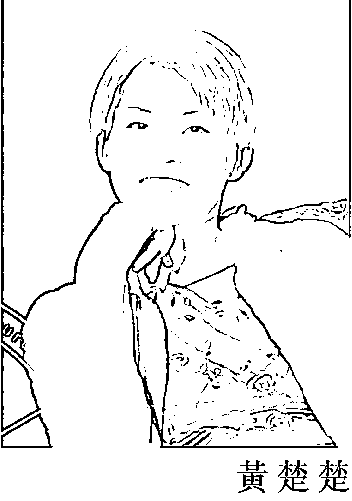

## 黄楚楚

## 前言

遠古人類為了生存而掌握天時變化，開始了人類的歷史，從而開始了具備科學元素的占星學。很多人一直以為占星學是源自西方的學問，其實是錯誤的。法國著名占星家伊麗莎白·泰西埃在她的《大預測》一書中就記載着，西方在西元12-14世紀，才吸收了中國的宮位制度，為西方占星學增添了新的基本元素，相對中國早在6世紀就建立了宮位制度，遲了好幾個世紀。中國歷代王朝，由秦、漢至唐、宋、五代，在考慮祭祀、國政、軍事、農耕、天災等等的問題時，都會先參考天星的呈相，所以這套學問最早乃被視為帝王之學。在漫長的歷史歲月中，帝王之家驗證了天文與人文的關係，作為統治國家的決策方向。歷史發展至21世紀的今天，占星學的運用，要能論斷吉凶，對人生才會有實質的幫助。實際上，人生故事的悲歡離合，的確可以在星盤上找到答案，同時可以給我們趨吉避凶的啟示，所以，占星學是一套可以開闊我們人生視野的學問。不過，世事沒有絕對，因此我們必須打破宿命論，希望從星盤中找到讓自己成功的方法，重新了解和認識自己，幫助自己活出更快樂的人生。

人類存在宇宙之中，雖然渺小，但對個人的一生管理，既是考驗也是責任。人處於天地之間，仿如小宇宙置身於無垠無邊的大宇宙之中，空間無限，發揮也無限。只要善用占星，從星盤上找出正確的目標和方向，然後努力實踐，則任何惡劣的命運也可以被改寫為璀璨的人生。

## Chapter 1 占星學 — 古代帝王之術

- 01 占星學的起源
- 02 占星學的發展
- 03 占星學的存在價值

## Chapter 2 從星盤看世界

- ◦ 世運為我所用

## Chapter 3 從天王星看全球經濟趨勢

- ◦ 天王星

## Chapter 4 知命造運 — 借鏡名人的經驗

- ◦ 在吉相位上努力
- ◦ 奧巴馬
- 01 令歷史性的一刻誕生
- ○ 比爾蓋茲 65
- 02 成就世界首富之路 66
- ○ 李嘉誠、王永慶 75
- 03 打造事業王國的力量 76
- ○ 李小龍 95
- 04 啟示了成功與落幕 96
- ○ 成龍 109
- 05 被上天寵愛的孩子 110
- ○ 林黛 129
- 06 一念之差的悲劇結局 130

## Chapter 5 附錄 — 解說星盤前必需熟讀 145

- ○ 解說占星學 147
- 星盤的含意 148
- ○ 星座的故事 157
- 解讀星盤中的啟示 158

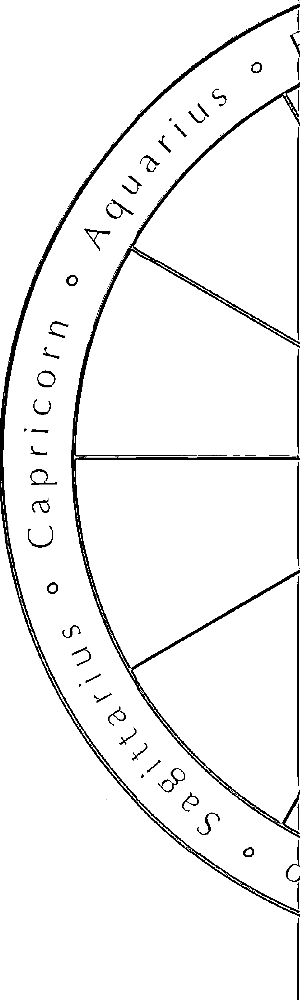

## 占星学

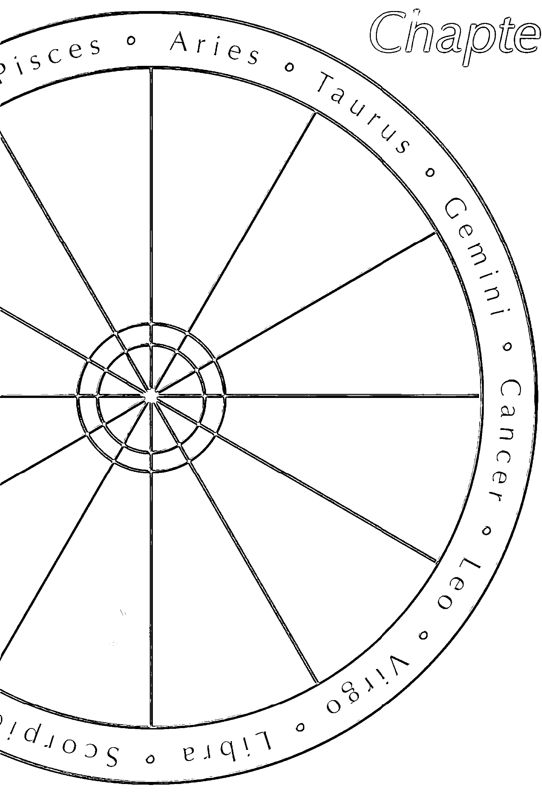

## Chapter 1 古代帝王之术

### 01 占星學的起源

21世紀的生存之道，是人與人之間的激烈競爭，我們必須重視趨勢和要懂得掌握潮流，才可以在商業化的環境生存。從母親孕育新生命開始，講究的人，甚至認為胎教就是人類競爭的起點，所謂不可以輸在起跑點上的戰戰兢兢。可想而知，今日的文明，並沒有為我們帶來比較輕鬆的生活。時空推到上古時期，物種的存活要經過物競天擇的天演之道。達爾文的「進化論」說明了生物的存活，是依照「適者生存，弱肉強食」的自然生存法則。這種殘酷的競爭，即使在現在的文明世界依然存在，我們真的要承認，要活下來，本身就是不容易的事。我們要尊敬生命，她的偉大在於我們要有為生命奮鬥不懈的精神。

#### 歷史的開端

但是，遠古人類未進入物競天擇之前，是與天競，也就是說，他們先要了解天時運行，才能適應四時的變化，他們要靠天吃飯，所以敬畏天。任何學問的開端，就是掌握四季的變化，要能適應天氣的變幻莫測，才能生存下來。先民要掌握的是預測天機，與天地融合，順應天時，讓生命代代延續，這不止在中國如此，世界四大文明古國的發展之初，同樣是要靠智者觀測天象、揣測星辰轉移的涵義來治國安民。先民在這種不斷的經驗累積中找到一些規則和定律，再將經驗傳承，而這些寶貴的經驗，也就成為了日後人類生活的時序。

依此時序的掌握，神農氏才能順應天時，教民春耕、夏耘、秋收、冬藏，為人類創造了物質的文明。根據《尚書·堯典》的記載，到了堯、舜的時候，就設有天文官羲和，負責敬順天地四時的變化，觀察日月星辰的運行，然後據此創制曆法。有了曆法，就有了時間的觀念，以及後來人類產生了歷史。天地四時的變化，受制於日月星辰的轉移，也影響着人民的生活節奏，於是帝堯頒布曆法，告訴人民要如何應對四時寒暑變化，何時要栽種蔬果稻米、什麼季節可以狩獵捕魚、何時添衣、何時避暑……目的很單純，當時的人，只求四時溫飽，衣食無缺，帝王只要做到風調雨順，就能國泰民安，百姓就容易教化。由於太平盛世是朝代興衰的關鍵，這種治國理念，在不同年代，都應該是一國之君共同的治國願望。但無論如何，對於並非生於農業社會的我們，很難體會曆法對先民的利益存亡有多重要。

#### 最古老的天星學著作

> 《易經·繫辭傳》：「仰則觀象於天，俯則觀法於地，觀鳥獸之文與地之宜，近取諸身，遠取諸物，於是始作八卦，以通神明之德，以類萬物之情」

正說明了天象、星辰就是中國天文發展的起源。《易經》是中國最古老的天星學著作，八卦也就是古代的天文座標圖。我們再將眼光放回今天。無論在哪一個國家，對於當政者，民生問題也一定是施政的大前提，民生要安定，才會有穩定的政局。過去在老天最大的年代，堪天是治國的重要參考；今日在工業文明的年代，市民對於政府的表現，可以反映在施政滿意度之上。現代人活於21世紀，時代背景改變了，面對的生存發展條件不同了，也就很難想像堪天輿地對治國的功能有多重要。古代視觀測天象為治國的科學，有別於現代人純粹將它視為玄學的偏頗觀念。

#### 九五之尊的統治術

中國歷代王朝，秦、漢、南北朝、唐、五代等君主，都將中國古占星學全面地運用，甚至可以說是相當的仰賴，無論在祭祀、國政、軍事、農耕和應災等方面，都會先參考天星的呈相。這套學問亦被視為皇帝禁臠，所以《尚書·堯典》所記的官制，一定都設制天文官吏常居帝王之側，堪天輿地，實錄天文，順應天象的變化，建立制度，以占星學為帝王之學。這在《天文志》中有詳細的說明。司馬遷的《史記·天官書》更實錄了帝王重視占卜問事，只須觀測星體呈相，就知道國家有沒有內亂，要何時出兵；遇木星、土星相會，就是國家有危機出現；火星呈凶有旱災，勿動，水則變謀而更事……就是所謂「以紀吉凶之象，聖王所以參政」。整本《天官書》詳細記載了觀測星相以供帝王領導統御之用，這也是人類歷史的一部分。以此觀之，占星學一開始的發展就具備科學元素，可見古人也具有科學精神；因為科學最基本的原則，就是掌握自然的定律，一切有跡可尋，再用統計學作取捨依據，得出來的學理才具有說服力。

中國的帝王稱為天子。星辰的變化，被視為天象要傳達天命的訊號，只有九五之尊才可以與天地溝通。古代帝王要有「通天」的本領，那絕對是嚴肅的事情，因為天子的一個決策將關乎國家的興亡，這也是引動我對三千多年前占卜的好奇：巫師將占卜的結果刻在甲骨文上，有沒有可能也是科學的行為，只是後人不明其中學理而已？這方面希望將來有更突破的解答。

世人視這套天文學理和占卜學問為「玄學」，但史實證明了這套學問與朝代更替種種歷史大事息息相關，所以我們不應隨便地將它單純看成為一種迷信。因為古代天文官的職司除了觀測星象，發現了時間，編制曆法外，更重要的職責是：占卜祭祀，預言人間禍福變化，批算帝王流年運勢，匡正朝廷施政，提供軍事謀略建言，故天文占星之術與當時的政治決策有着密不可分的關係。正因如此，天文官在朝廷中地位很高。

在古代，天文曆法足以影響一個朝代的興衰，所以歷代的帝王身邊都有一位可倚重的國師建言獻策，甚至輔佐帝王得到天下。著名的例子有：二千多年前的西周姜子牙；一千三百多年前的唐太宗依靠著名的天象家袁天罡推算大唐的國運；以至三國時的諸葛孔明、漢朝的張良、明朝朱元璋仰賴的劉伯溫等，都是為開國之君運籌帷幄以得天下的功臣。這是不是可以解釋為君者知時令，洞悉天文，掌握先機，就知道如何順天者昌？

歷代帝王帶領着人民經歷了無數次的巨大轉變，他們的領導決斷、多少的偉大決策與施政，正是出自天星給他們的指引！縱然我們不盡知道，但許多事實的呈現，卻不能被後世否認。

### 02 占星學的發展

占星學在中國唐朝是一個全盛時期。占星學最偉大的創制和突破，是我們早在6-8世紀就建立了宮位制度，這對後來的西洋占星學影響很深。依據《天官書》的內容，雖然當時所用的28星宿名稱有別於今天的用語，但占卜論斷的依據，與今日的西洋占星卻沒有分別。

#### 占星學與天文學的關係

天文學與占星學，很少人知道它們是本為一體兩面的兄弟，占星學的學理流着的是天文科學的血脈，只是在17世紀時理性主義抬頭，才將它們一拆為二。天文科學崇尚於天象實錄的觀察與紀錄，而占星學則走向人生哲學的研究，所以它們是在相同的學理和架構下各自發展。天文研究是專注於詳細實錄星空的純科學，而占星學則是依照天文科學呈現的內容，在真實的太陽系中，觀察太陽、月亮、水星、金星、火星、木星、天王星、海王星、冥王星，依據星體的運行，以及星度的纏、合、刑、衝、會的相互影響，推算人事的吉凶變化。

在一切文明誕生之前，原始人類甚至還沒發展語言，要在荒野生存，只好仰望星空。慢慢地，人類從累積的經驗印證出，當星體出現某種呈象，人事就會有吉凶的感應——這是先民在與大自然搏鬥中，可以仰賴的所在。於是他們結繩記錄，統計星體與人間的變化，從而找到生命的答案。他們深信「天垂象，見吉凶」，就能對人類的無知有所提示。如果我們從科學角度上理解，乃因星體具有引力，兩星間彼此會產生力量的干擾。

講到科學是什麼？就是數量化的思考。科學家都是先假設，經過實驗，統計到一定的數量，才會產生真理；如果中途發現數量累積不起來，就必須重新再假設，再驗證，累積到一定的數量，才會被當時認可，這也是科學精神。事實上，我們現在所看到的占卜問事的古人案例，也是經過千千萬萬的案例統計後的結果。而占星學發展到了近代，因為天文知識的發達、科技的進步，已經可以更精準計算星度到度、分、秒，當然就更豐富了占星學的內容，所以現在有各式各樣的新學問、新領域誕生，例如工商占星學、愛情占星學、心理占星學、夢占星、卜卦占星、時盤占星等。

人類一直對無垠的宇宙存有好奇，才會有文化的產生，可以說它是開啟人類智慧的根源；而星相正是宇宙中極重要的一部分。

#### 中國占星學的全盛時期

話說回來，中國占星學的發展，到了唐代是最鼎盛的時期，因為在魏晉南北朝之際，印度占星學的東傳與中國的相結合。當時觀星就像全民運動一樣，上至王侯貴族，下至文人雅士，都在瘋占星，占星學於是成為當時很時髦的學術研究。在唐朝之初，皇帝還沒想到要在民間禁學，所以也有點鼓勵發展的意思，在皇宮內院和城交區域都廣建了天文台，天文官吏的編制也增編至千餘人，是歷代最多的。我們從大詩人杜牧自作的墓誌銘可看出端倪：「余生于角，星昴畢于角為第八宮，日疾厄宮，亦曰八殺宮，土星在焉，火星繼木……」足以證明，中國的占星學早在唐朝（約為6-8世紀）就有了宮位制度。唐代的杜牧26歲就中進士，是出身世代官宦之家的才子，也是當時一位很具影響力的詩人政治家，所以他在唐文宗時，歷任監察御史，這是何其重要的官職。如果連杜牧都參與占星學的研究，我想我們可不可以被說服用更客觀的態度，來了解過往中國在占星的發展上所創造過的輝煌一頁？實際上，唐代的占星觀念比較正確，而且已經走向一套可依循的制度，例如宮位制度的建立、吉凶的論斷法則。

> > 余生于角，星昴畢于角為第八宮，日疾厄宮，亦曰八殺宮，土星在焉，火星繼木……

法國著名占星家伊麗莎白·泰西埃在她所著的《大預測》一書中的第4章「星辰的起源、形成與發展」中就記載，西方在西元12-14世紀，才吸收了中國的宮位制度，為西方占星學增添了新的基本元素。故此，現代人一直以為占星學是由西方傳入東方，實在是一種誤解。

#### 中國占星學由盛轉衰

我們知道中國的五術存在着許多偽學，但我覺得，真偽的分別，其實只是思維方式不一樣，得出來的推論自然不同而已。然而占星學的發展，一開始就屬於天文科學，所以只要立基點正確，就能經得起驗證和考驗。正因如此，當歷代王朝在史料中記載國家的占星實例，發現天與地的感應竟然異常吻合時，便開始警覺這套學問，絕對不能讓民間研學，以免危害國家安全；為保社稷，只好實施民間禁學，因為一個能救世的學問，同樣也可以用來進行破壞、顛覆。結果，天子這一念之間，便為中國日後占星學埋下由盛轉衰的伏筆。

> 《舊唐書》有一段敕令：「司天台占候災祥，理宜秘密……自今已後，監司官吏不得更與朝官及諸色人等交通往來，委御史台察訪」。由這段記載就知道，在唐代，任職天文官的官吏是被禁止和其他朝中大臣來往的，而設置監督查報的系統，怕的就是洩露天機，會有密謀造反的事發生。原來古代的國防機密是藏在天象裏，有關這類的敕令在史書中的記載還不少。

有了前朝的警語，到了宋代，天文學禁於民間，就更加嚴厲。在《宋史·太宗本紀》有這樣一段內容：

>「試諸州所送天文術士，隸司天台，無取者黥配海島」。

可見在宋太宗的時候，占星學是科舉考試的必考科目，所以各地的父母官要掌握其管轄地區內的科舉考生，凡有懂得天文占星的，一定要送往中央應試，如果被錄取了，就隸司天文官，享有種種特權。這和清朝一樣，在大清律例明文規定，欽天監（清朝天文官的稱號）的官員，如果犯法，是可以得以輕判。不過，如果這些應考的考生，沒有金榜題名而名落孫山的話，下場可就悽慘：宋太宗為了讓天文只限於帝王所用，便在落榜者臉上刺青，然後將他們永遠發配邊疆，不得再回中原，以確保占星學不會流傳到民間。

在這裏讓我先講一個小插曲：各位知道為什麼少數民族都喜歡在臉上刺青嗎？原來，那些飽讀詩書的落榜生，流落到了蠻荒之地，就像「神」一樣了。因為他們上知天文，下知地理，各方面都比當地的族人強。他們並傳授了族人各式各樣的知識，所以族人對他們的崇拜之情油然而生。族人都疑惑，這些不知從哪裏來的人，為什麼這麼厲害，是因為他們的臉上有特殊的標誌嗎？所以便爭相模仿起來，也在自己的臉上、身上刺青，覺得那是神聖和智慧的象徵。

聰明的人都會想到，宋人為什麼要那麼老實呢？宋朝文人會占星學，隱瞞不說不就行了嗎？只要不讓人知道，不考取功名總可以吧！可是，要蒙騙地方官員，並不是那麼容易的。諸朝天子都有完備的監控系統，自宋太宗起，好像個個都精明縝密，在當時的封建制度下，一切權利在君王手裏，所以遊戲規則是：天子的命令就是法律；為了防止有漏網之魚，於是頒布一項嚴厲的規定，那就是「召天下伎術，有能明天文者，隸司天台……匿不聞者，罪論死」。所以懂得天文占星者，也就不會有人敢冒生命危險隱瞞着不去應考，若被發現了，那可是會被砍頭的；如果按照規定去應試，好歹考上了也就一生榮華富貴，這是值得去放手一搏的。所以宋朝以後，天文學就真正成為王家所獨有，民間已近絕迹。

由於天文占星之學，確實具有特殊的治世功能，在歷代的帝王之家已驗證了它的參考價值，所以由唐而後的各朝天子，繼續將天文視為王家禁臠的學問，而種種禁令，每當改朝換代，只有更變本加厲地限制民間學習。到了明朝，國家實行中央集權統治，明太祖朱元璋認為，如果占星學掌握在反對者手中，國家就沒有機密可言，也有隨時讓國家處於被顛覆的可能，所以他更加嚴厲禁止民間學習占星學，將占星學只限於世襲，於是明朝而後，占星學在民間就真的完全絕迹了。

#### 中西占星學一體化

我們沿用已久的《黃曆》，正確的名稱應該叫《皇曆》，原來它是一部明朝的曆法書，包括有關占星學的學術記載。對此朱元璋也不放過，下令凡一切與星學有關的資料，都只限朝廷可以頒布，版權為國家所有。我們只要翻開當時的《皇曆》，就會看到書後備註着：「版權所有，翻印必究，偽造者依斬」的字樣。由此可見，明朝是多重視占星學，而且認為那是家天下的獨門治國秘密武器。

占星學成為世襲之後，就變成是小圈子的遊戲了。一旦特權階級出現不知長進之人，就會串通作弊，官官相護，做學問不認真，尸位素餐，只佔職位而不做事，荒廢測天之職，彼此互相抄襲糊弄上級，自然測天的技巧逐漸退步，所以，中國的占星學也就由明朝之後開始落後於西方的發展。到了清朝，在一次國際測天的賽事中，中國淪落到最後名次。自此，中國的占星學便改為以西洋新法為主體，這也是中西占星學融為一體應用的開始，也是一個新時代的產生。

中國的古占星學有了西洋新法的傳播和校正，就有新的火花出現，特別是清初樸學的盛行，興起了重新考證古典書籍的學風，可以說文風鼎盛，學術研究活躍於世，加上在占星天文的比賽中，清廷慘敗，為了要迎頭趕上西方，於是反而採取了開放的態度，解除了民間禁學的規定，同時廣納人才，在新舊學問上重新定義，以求全新起步，於是將正統的星學書冊收錄在《四庫全書》中，諸如：《星宗大全》（又名《果老星宗》、《天步真原》、《乾象典》、《天學動機》、《中西星要》等等，官方重新將書冊發行於民間。此舉措一開，也才讓世人看到，中國的天文書籍原來是如此發達與完備。

#### 中國占星學的斷層

可惜，到了滿清末年，朝廷腐敗，國力積弱，列強入侵，國家正處於內憂外患、民不聊生的境況，所以有識之士，一定以救亡圖存、國家安危為優先考量，如太平天國的崛起、百日維新的實施、孫中山先生的推翻滿清，建立民國；而後至近代史中，民間致志於五四運動的倡導，國共爆發內戰，海峽兩岸分治。

The request was rejected because it was considered high risk*本星盘乃根据Astrology星盘绘制

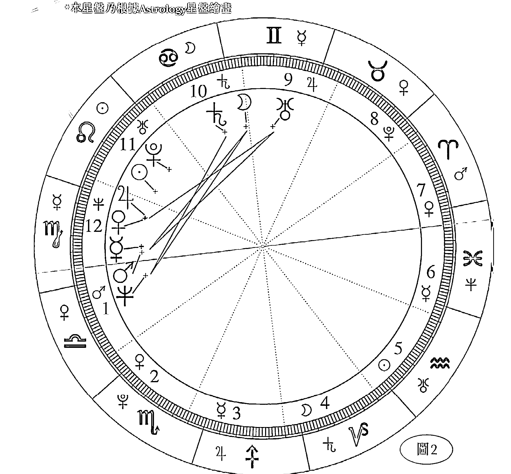

命盘中最吉的两颗星是冥王与太阳。并没有红色线。

| 十二星座 | 牡羊 ♈ | 金牛 ♉ | 双子 ♊ | 巨蟹 ♋ | 狮子 ♌ | 室女 ♍ | 天秤 ♎ | 天蝎 ♏ | 人马 ♐ | 摩羯 ♑ | 宝瓶 ♒ | 双鱼 ♓ |
| :--- | :--- | :--- | :--- | :--- | :--- | :--- | :--- | :--- | :--- | :--- | :--- | :--- |
| 守护星 | 火星 ♂ | 金星 ♀ | 水星 ☿ | 月亮 ☽ | 太阳 ☉ | 水星 ☿ | 金星 ♀ | 冥王星 ♇ | 木星 ♃ | 土星 ♄ | 天王星 ♅ | 海王星 ♆ |

20年，就是做人生规划的大好时机。我们不能说这样的人没有成功机会，只能说这是大起大落的命运，因为大运星的吉离开吉相位时，困难便会接踵而至，但是乐观一点想，如果懂得预早做防范，结果也不一定是全然负面的。

另一个比较特别的星盘是命盘上完全没有代表凶相位的红色线（见图3），但命主却患有小儿麻痹症。吉星都集中在两个宫位中，但流年运势同样引动他人生的起伏。

无论是谁，站在宇宙的高度，星盘的呈相，代表的是一生的成败结果，但我们的人生是活在过程之中，如果能够更了解自己，做了对的努力，其实也不须太在意自己的命盘是红线多，还是蓝线多。懂得找到能与自己凝聚最大力量的吉星，依此方向全力以赴，结果就有可能像比尔盖兹（Bill Gates）般，虽是烂命一条但能创造命运，成为世界首富。

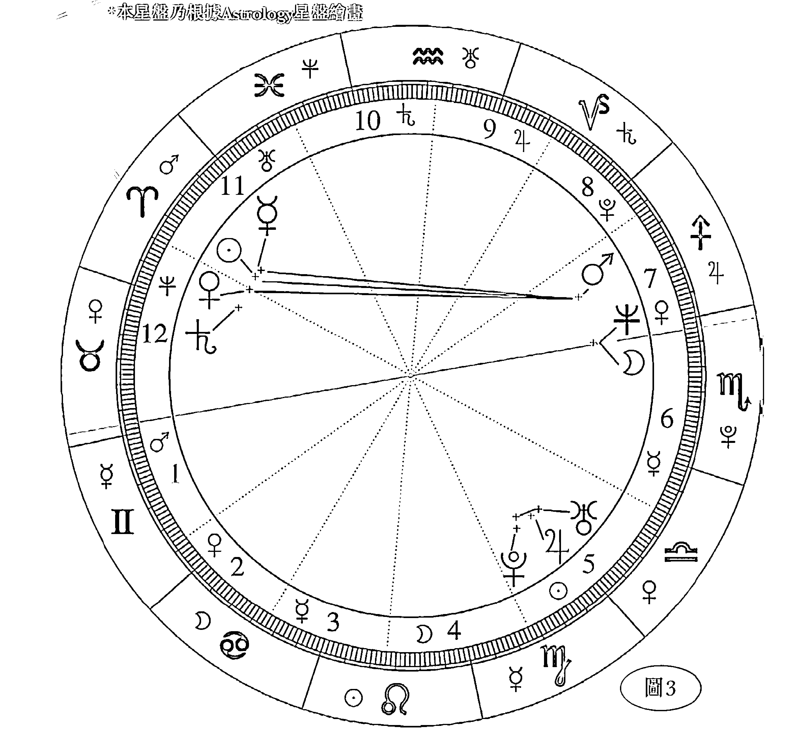

完全没有凶相位的星盘。

| 十二星座 | 牡羊 | 金牛 | 雙子 | 巨蟹 | 獅子 | 室女 | 天秤 | 天蠍 | 人馬 | 摩羯 | 寶瓶 | 雙魚 |
|----------|------|------|------|------|------|------|------|------|------|------|------|------|
| 守護星   | 火星 | 金星 | 水星 | 月亮 | 太陽 | 水星 | 金星 | 冥王星 | 木星 | 土星 | 天王星 | 海王星 |

#### 走出宿命论主义

我相信占星学是一门可以带给人类希望的学问，她不完全是玄学，她有绝大部分是经过长时间验证为科学的理论，也许这本书只能叙述其中千言万语的万分之一，但我衷心希望那万分之一已足以成为击溃宿命人生观的力量。

祝福大家，更希望——每一个人都会珍惜自己。

#### 命理造运

## Chapter 4 借镜名人的经验

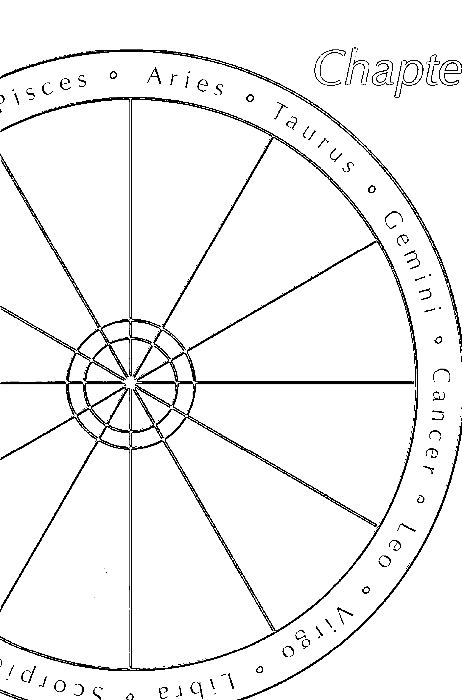

### 在岗位上努力

### 要出人头地只需坚持

对于生命是如何创造出来的，尚未有确实的答案，但那绝对不是偶然。

我们对于自己是如何来到这个世界，不曾放弃过好奇。科学家循考古途径去追寻线索，发现人类经过了300万年的进化，由非洲南猿，进化到巧人，到直立人，到早期的人类，才到现在的现代人类。也许，大家会觉得，为什么到了现代人类，进化过程就停止了？其实，人类进化的重要部分，是我们头顶上的那颗脑袋。科学家也是用人类的脑容量增长的趋势，决定人类的进程。

### 寻求改变，以图存活

在学术上，大脑的定义是泛论智慧。我们应该要去试着理解，任何一种生物，甚至小如细菌，也能存活了几十亿年，那绝对不是靠运气，而必须要努力才能达到生存的目的。现在的商业文明，成功的诀窍在于创意、创新的特质，其实，任何并非来自基因的能力，都可以称为创新，而这种成功之道，不是现在独有的。生物学家证实，生物在生命受到威胁的时候，就会寻求改变，以图存活。这跟以占星学观察人性是一样的。

在星盘上有四大相位——会、合、刑、冲，这是星盘论定吉凶的重要依据。每一个星座和宫位，都有30度。

#### 会——0度的吉凶

0度是会，就是两颗星在8度之间，星星相会，代表一件事被这两颗星融合加强了它的力量，也就是说，吉者更吉，凶者就是在痛处洒盐。

#### 刑——90度的妥协

90度是长痛，但可以忍受，那是在不对等的环境下的妥协忍耐，如父母、长官的责难，因为身份不对等，所以不敢起正面的冲突，大部分的人处理方式都是敢怒不敢言，相对也是因为对方是父母，是长官，他们要对我们不利，也不至于会做到赶尽杀绝的地步。所以，如果星盘上的刑相位纵使是长痛，也只是小痛，而不至于有太大的伤害。大多数的人生处于这样的相位上，只会发挥惰性，只要可以忍下便任由问题潜伏，能用积极态度面对解决问题的人并不多。我的占星经验也是这样告诉我，要在90度的相位给人建言，愿意主动去改变的机率低到几乎是零。也许在这里就可以显示出人性的弱点了。但是，我要奉劝大家，山不转，路转，是比较好的处理方式。

#### 冲——180度的冲突

180度是冲的相位。在中国人的文化中，讲犯冲，就是这样的相位。直接的冲撞，是一时的短痛，但也是重大伤害的大痛，例如夫妻、合作伙伴的关系，因为双方是对等的地位，所以一旦出现冲突，一言不合，是可以大打出手伤人，不会有太多顾忌。在这样的相位所代表的意义是，事情已经发生了，如果是生病的情况，那是立即呈现病征；换句话说，当事情发生在180度的时候，就表示已经到了一定要处理的生死存亡时刻，所以人生的重大转折也是在这里被推动着，逼着我们去改变。危机就是转机，也是这个意思。

在佛学的角度，《金刚经》里的不思善，不思恶，也同样希望劝勉打开我们的心胸，有容为大。世界上没有绝对的好，也没有绝对的坏，每一个相遇都是因缘促成，是福是祸没有定见。所以，人生在遇到正冲的时候，也不要心生恐惧，重要的是，要有改变自己的勇气。其实，如果可以从星盘预知可能发生的灾难，我们便可以趋吉避凶，避免遭受苦难，不是可以让人生更加美好吗？预知未来，调整自己的脚步，只要你愿意改变，一切都会有所不同。

#### 合——120度的吉相

120度是吉相位，例如，在星盘上的宫位位置是子女与高等教育的宫位。试想想，如果父母有难，子女是义不容辞、自动自觉会帮忙的。这是不请自来的幸运。古时中国人深信：一命，二运，三风水，四积阴德，五读书。前四种因素是属于先天的部分，但后天的努力，就要靠考取功名，才有改变命运的机会，所以这也是鼓励人只要有上进心，机会就比别人多。

### 先天注定，后天努力

自我们来到这个世界上，就被教育要做一个成功的人。从小父母的栽培也是为着我们将来能够出人头地做准备。人人渴望成功，但却很少人知道成功的重要关键，乃在于找到正确的努力的方向。究竟是谁决定了你一生的命运？那一定不是你生在富裕的家庭，可以少奋斗30年的事；或者生长在匮乏的环境，就表示完全没有机会了。若用星盘剖析，一定可以找到一条康庄大道，也就是你人生最容易成功的道路，这也是占星学存在最大的意义。每个人都有属于个人独一无二的星盘，观察星盘，你可以更客观认识自己。我们不应像原始生物，要受到外在的力量推挤，才去主动改变。

生物学家证实，人类的进化是受环境所逼。话说200万年前，我们的老祖先面临如现在地球暖化一样的大自然气候改变的危机，当时环境突然恶化，变得比较干燥，森林减少，粮食也不足，人类必须要设法改进生存的技巧，适应新的环境，所以发明了石器，用粗糙的石头磨成锋利的工具，猎杀动物，取得肉食；也用石刀切下动物的皮毛，制成皮裘，用作冬天保暖身体。这些都可以被视为当时社会的创意文化。据说大象变得聪明，也是在受到猎人的枪击之苦后，才慢慢改变基因，懂得如何逃避威胁。但是，我们是万物之灵，生活在高度文明的社会中，以我们的聪明才智，不应该要等到生命受到威胁的时候才作改变。创新是受环境所逼的生存之道，但更聪明的做法，就是通过观察，将别人的经验当成自己的人生经历。事实上，人类的进化历程，也是这样演进的。

### 借镜名人，增益自我

我经常告诉自己，要坚强地活着，坚强也代表积极面对人生。在现今高度竞争的商业社会，生活压力是让人最沮丧的地方，但是我希望大家可以彼此鼓励。也许你并不富有，生活也不如意，甚至长期受到委屈，或是根本没有人了解你，但我们仍然应该珍惜我们可以来到这个世界的机会，就凭这一点，就值得我们为自己奋斗。

一直以来，成功人士在我心中的定义，绝对不是财富的拥有者，而是可以超越自我的许多感人的故事里的主角。因为我们每个人都要让自己精彩，人类相对于宇宙的浩瀚，也许就如同细菌般的渺小，要用放大镜才找得到自己。但是细菌可是存活在这地球上最原始的生物，由数十亿年前就出现，它们生生世世生活在恶劣的环境之中，但是它们却懂得要随着环境的变迁而要创新求变，好像大肠杆菌不断努力地与环境搏斗，为的是不对生命放弃。我们是自称为高等生物的人类，自然更加要积极面对人生。

在吉相位上努力

以下列举一些名人案例，希望可以藉此启发我们有更多的生存创意。我们也可以由此发觉当中一些知名人士，他们的人生命盘是凶多吉少，但却因为他们能够坚持在唯一的吉相位上做努力，所以有了很大的成就。

### 黑白马

Black Horse Online

-   政治
-   文学
-   哲学
-   历史
-   经济
-   艺术
-   法律
-   教育
-   科学
-   技术
-   ...

Discovery

### 命令 写在 宝瓶 座的 他
历史 性的 诞生

2008年11月4日，巴拉克·奥巴马（Barack Hussein Obama）当选为美国历史上首位黑人总统，他乐观进取的特质，造成了风靡全美的奥巴马现象。

奥巴马在2009年1月20日就任为美国第44任总统。他能否带领美国走过金融海啸后的新局面？在这里，我们可以用占星学预知多少他的未来。

当今现实世界的规则是以结果论英雄，所以奥巴马的当选绝对只是挑战的开始，全世界都在期望他的辩才无碍不只是在竞选时让人惊艳，而是作为世界经济火车头的舵手，他真的能为当前的国内外经济困局带来改变。

奥巴马简而有力的竞选口号——Change（改变）真的实践了他的“梦想之路”。用他的星盘解读（见图4），应该是他天生命落于宝瓶座的命宫及受着天王星的影响，令奥巴马实践了他的梦想。

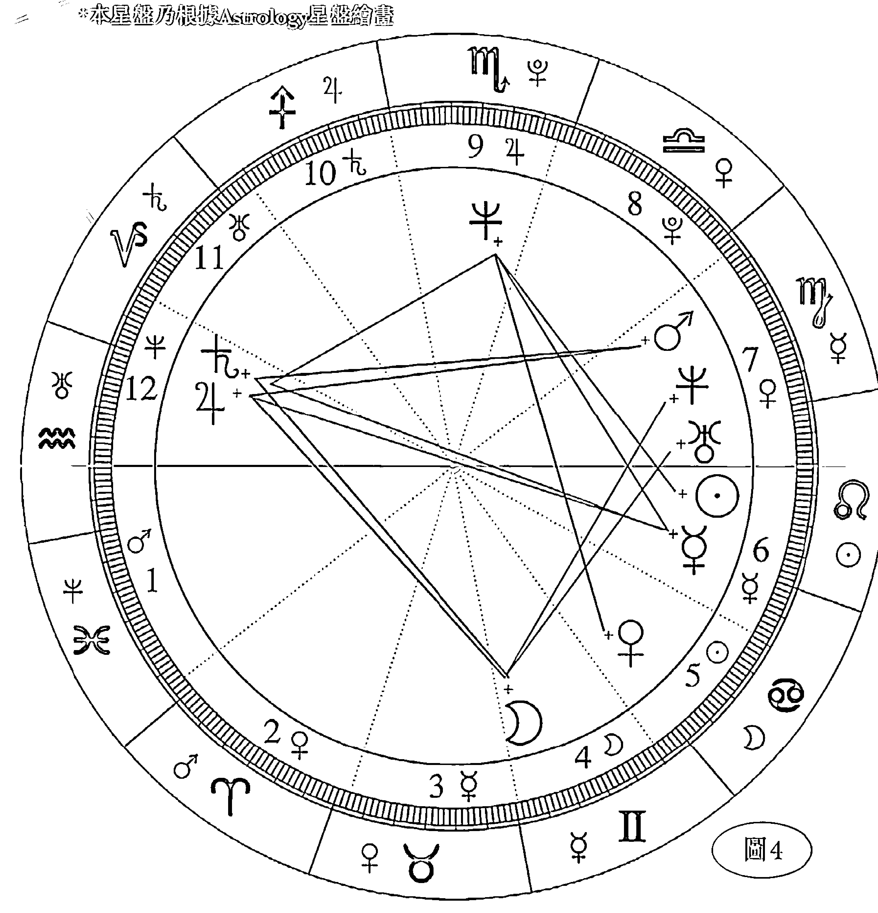

#### 图4

| 十二星座 | 守护星 |
| --- | --- |
| 牡羊 ♈ | 火星 ♂ |
| 金牛 ♉ | 金星 ♀ |
| 双子 ♊ | 水星 ☿ |
| 巨蟹 ♋ | 月亮 ☽ |
| 狮子 ♌ | 太阳 ☉ |
| 室女 ♍ | 水星 ☿ |
| 天秤 ♎ | 金星 ♀ |
| 天蝎 ♏ | 冥王星 ♇ |
| 人马 ♐ | 木星 ♃ |
| 摩羯 ♑ | 土星 ♄ |
| 宝瓶 ♒ | 天王星 ♅ |
| 双鱼 ♓ | 海王星 ♆ |

### Barack Hussein Obama

宫落于宝瓶座的改革，以及代表天王星勇于实现理想的特性，让他有别于一般人，从小立志改变世界。

由于受天王星特质的影响，因此他会认真地将小时候的“我的志愿”当成一回事；他将从小立志要改变这个世界的渴望，用在2008年的美国总统大选上，选民真的被他的热忱感动，而让历史性的一刻诞生了。美国人打破了233年来美国人黑白种族间的藩篱，把票投给了他，这是150年前林肯打赢南北战争，解放黑奴后，直至现在，奥巴马才是真正将黑白肤色的优越符号融合一体的时代开始。

奥巴马的天王星落在狮子座，狮子是王者，太阳是她的守护星，所以奥巴马的理想能在政治舞台上发光发热。这个特质在他的星盘中是可以预见的。但是因为他的太阳纯凶只有红线，他在竞选时最让他发挥迷人风采的演讲魅力，用在日后的施政执行力上，也许“做”会比“说”逊色。再加上2009年的流年木星也直冲他星盘上代表领导能力的太阳。这将会使得他在选举时所主张的三大主轴：美军自伊拉克撤军、降低能源依赖、实行全面健保，都将会让他遇到严重的困难，特别是撤军问题。

#### 乱世总统

由于奥巴马本命星盘的太阳纯凶，故此他个人的行事作风，容易因为他过于乐观的性格而错估形势。他的命盘告诉我们，他天生就不是当太平官的命，这也许正是他会在美国国力大为衰退的时候当选，也正好吻合他本身的星盘呈相。至于他的个人运势，则要到流年木星三合本命时的2011年才会步入顺遂。但他身为美国总统、世界重要的领袖，他的个人运气必然会牵动国运，继而影响全世界。正如后来从政治占星学衍生的工商占星学也套用此理——公司星盘也可以用老板的命盘，用转盘方式推论公司运势。

根据星度，冥王星在2009年进入摩羯座，这代表一个划时代的意义。人马座是奔放、自由、开放的年代。所以在1980年代，冥王进入人马座时，当时的美国总统是列根（Ronald Reagan），他在当政时的开放主张就完全吻合人马座的自由市场导向。但是，无限扩充自由的定义，就如冥王是代表绝对的一百，人马是完全不受约束，结果我们看到了，在信仰绝对放任的意识形态下，美国的金融秩序终于在2008年栽了个大筋斗，这也同时连累全球一起为30兆美元的市值消失而买单。于是到了2009年大运进入摩羯座的时代，象征收敛、保守、有秩序的管理、一个必须脚踏实地的世代便顺势踏着“衰退”的脚步悄悄到来。正因如此，美国人才会选择倾向于社会主义的奥巴马作为领导者。

仔细阅读奥巴马的财经政策，其实只有一个宗旨，那就是扶贫济弱；他会落实向那百分之五的富人征重税，有可能会否定前朝布殊所要签署的自由贸易协定。奥巴马的振兴美国经济方案，也与中国英雄所见略同，同样是用扩大内需、着手大型基础建设为手段，这与摩羯座所代表的土木工程、大地经营、压缩内心需求、大政府的展现等等不无关系。

### Barack Hussein Obama

#### 艰辛的总统之路

夹持着高达百分之八十二的支持度，奥巴马在竞选演说中一再强调，他会用“速度”与“胆识”去解决严峻的经济难题，他赞成凯因斯（John Maynard Keynes）的论点，当经济萧条时，单靠货币政策是发挥不了效用的，政府必须采取的救亡行动，就是要以大规模的赤字支出政策，用来对抗失业危机。比照美国国运星盘（见图5），虽然流年木星三合国家本运，但国家宫位，即是第一宫却受刑于行走速度比较慢的土星，以土星2.5年走30度计算，美国国运要到2009年10月，土星离开了室女座后，一切才可能从土星的压制松绑出来。在这之前，美国的压力主要来自外交的挫败、国会的不予配合，继而影响到领导人的施政产生变数，所以星盘呈象，天王星与金星相冲土星，奥巴马的困难在于国会与他不同步调，这表示总统空有正确的观点，国会如果延宕通过法案，将会是阻碍美国快速复元的主要原因之一。

对于投资者来说，也许你会因为美国股市止跌而对市场重新产生信心，但是在这里要提醒大家，2011年年底之后的美国股市风险会增加，银行融资收紧，直到2012年年中前，市场都潜存大幅波动之危机。以美国整体国运的起伏来看，2013年年底至2014年会是三合之年，流年土星与流年木星都在加持金星与天王星相会，如果与奥巴马的星盘比对，则表示他在未来4年的任期内，会是一位辛苦的总统，即使美国国运在他即将卸任时好转，但是他并没有比较轻松，事实上可以说他的总统之路走得十分艰辛。

无论如何，美国现正处於经济大萧条的艰困年代，难得的是，从星盘看奥巴马，虽然他对舆论的评价十分在意，但庆兴他的抗压力没有问题，只要他能妥当处理好自己的情绪，他是具备在这一刻担当美国总统的必要条件。因为他的梦想之星土星同时也是他的实践之星，只要他保持行动力与亲民的作风，再配合服从性高的团队组合，便能落实执行他所主张的正确和务实的政策。

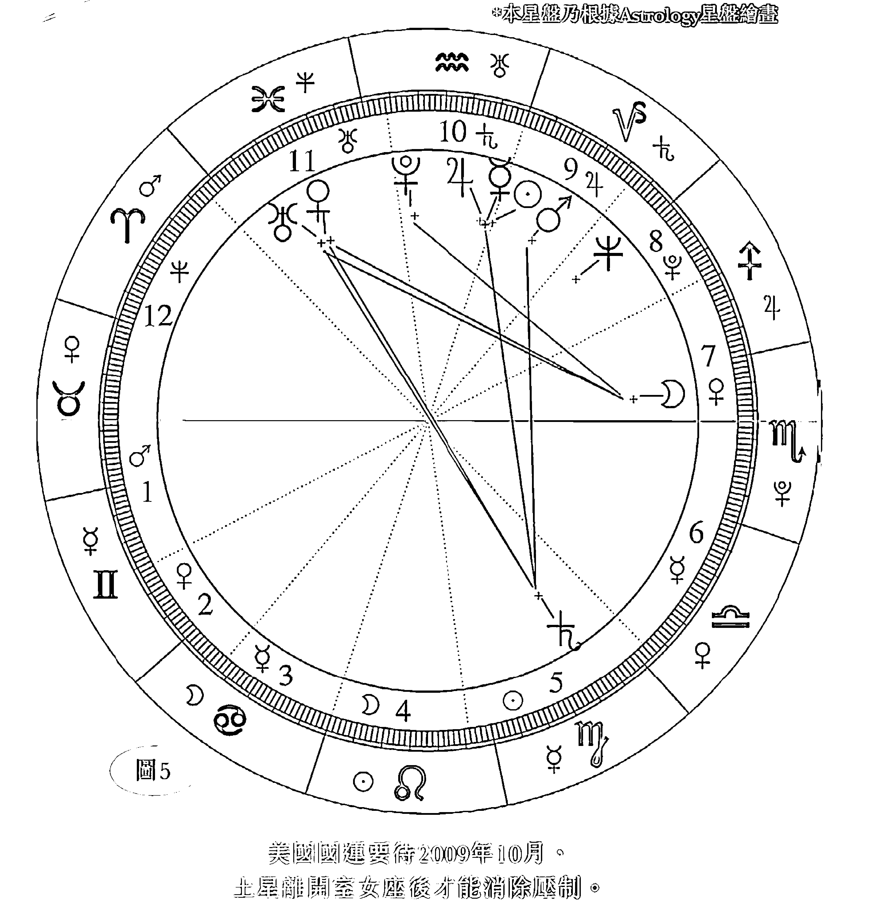

美国国运要待2009年10月，土星离开室女座后才能消除压制。

| 十二星座 | 牡羊 | 金牛 | 雙子 | 巨蟹 | 獅子 | 室女 | 天秤 | 天蠍 | 人馬 | 摩羯 | 寶瓶 | 雙魚 |
|----------|------|------|------|------|------|------|------|------|------|------|------|------|
| 守護星   | 火星 | 金星 | 水星 | 月亮 | 太陽 | 水星 | 金星 | 冥王星 | 木星 | 土星 | 天王星 | 海王星 |

#### 全球经济重新洗牌

2008年，冥王星终于离开了过度虚浮扩张的年代，人马座的自由化、市场化、全球化，到现在全球泡沫化，终于在这场惊天动地的繁华梦碎后，由摩羯座把人类拉回现实之中。土星代表全球经济结构性崩解后，也要从结构重新建构，人马座的一场长达二十馀年的多头市场，在冥王进入摩羯座后，全球财富的彻底重新洗牌，必然是会从基本结构、意识形态、游戏规则、有效控制管理等方向重新出发。此外，目前这场金融风暴是在人马座累积了20年的能量才爆发的，而冥王也将在摩羯座停留10至30年不等的时间才会离开。由此推断，虽然大众期望全球经济可以在未来两三年内得到好转，但从星度的合理性去判断，这是不是已暗示了这个可能性很低？

生命是一个过程，但常被人类忽略。想要跳过过程，从一个结果直接到达另一个结果，那是不可能的事。用天文科学解释人事变化的合理性，是不是同时也可以验证真理？

### 比尔盖茨

Bill Gates

#### 发挥自己的潜能
成为世界首富之路

撰写此文时，比尔盖兹（Bill Gates）已连续蝉联了13年世界首富。

让我们来看一下他的星盘（见图6）。你会发现，他的命其实不太好，因为他的命盘里除了只有一条吉相位（蓝线）外，其馀都是凶相位（红线）。但是这样的烂命一条，为何会如此成功？

一般来说，许多大老板的培养，都需要有到处碰壁的命运，因为他们到处求职不顺遂，才会逼于无奈，兴起创业的决心。事实上，当人生没有太多选择的时候，我们反而会好好掌握一个得来不易的机会。当然，盖兹不属于这类的代表人物，他在创业的路上是幸运的。

##### 发挥自我潜能

比尔盖兹的成功，他之所以有今天的地位，

*本星盘乃根据Astrology星盘绘画

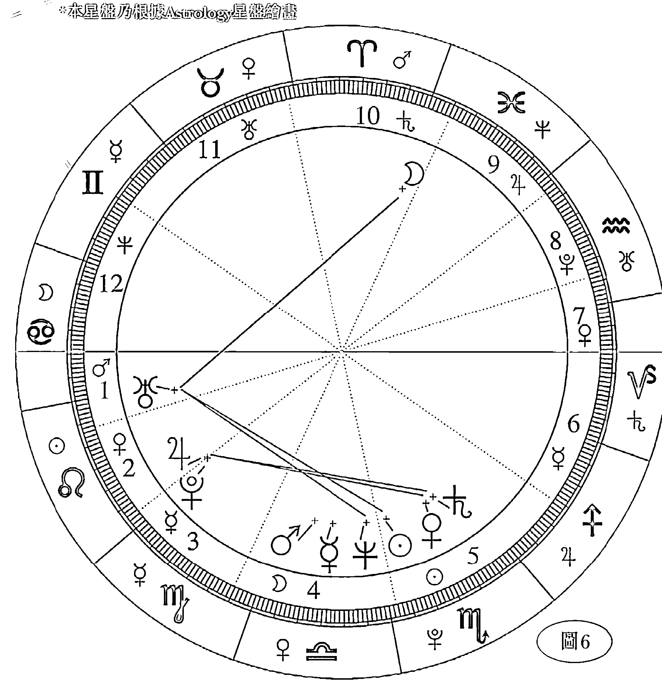

此尔盖兹的星盘中，是“凶（红）多吉（线）少”，但他却能掌握唯一的吉相位，在电脑科技行业中创立王国。

| 十二星座 | 牡羊 | 金牛 | 双子 | 巨蟹 | 狮子 | 室女 | 天秤 | 天蝎 | 人马 | 摩羯 | 宝瓶 | 双鱼 |
|----------|------|------|------|------|------|------|------|------|------|------|------|------|
| 守护星   | 火星 | 金星 | 水星 | 月亮 | 太阳 | 水星 | 金星 | 冥王星 | 木星 | 土星 | 天王星 | 海王星 |據他自己說，並不是因為他是天才，而是他發掘了自己的潛能。但是，如果我們相信偉大的科學家愛迪生的名言——「天才是百分之一的靈感，加上百分之九十九的努力」，那麼也只有像比爾蓋茲這樣的人，潛能就是用血汗激發出來。

從比爾蓋茲的星盤上唯一的吉相位來看，是天王星與月亮形成120度造就了他。天王星在占星學代表創意、科技，在行業中代表電子、科技、航天工業。而天王星又落在他的命宮中，所以由此看出他確實是與生俱來就擁有電腦科技天分。他說自己不是天才，這只是謙虛之詞罷了！事實上，他天生就有比別人較多的創造電腦科技程式的天分，只是他較人幸運的地方，是剛好他的興趣所在也是他人生路上的最佳選擇。他13歲立志要開創個人電腦軟體和設計電腦程式作為其人生職業，加上他的執着堅持，成功的機率因而大增。

吉相位的解釋，並不是表示個人不須付出努力，就能不勞而獲，而是指循吉相位的方向發展，會是助力大於阻力，亦即是一分努力，會有兩分收穫的意思。

天王星也代表堅持理念和理想，具有與眾不同的獨立性意思。所以，小時候的比爾蓋茲應該是比較喜歡自己獨處，與一般孩子並不太一樣吧！因為他會執着於自己的理想，做事講求原則。

這種人如果沒有當上老板的話，就會很容易為了理念不合跟老板起爭執的，所以他不會是一個很聽話的員工。不過，人才不都是讓老板難以駕馭的嗎？

論工作行業，除了電子業外，比爾蓋茲也適合從事餐飲業，因為月亮代表飲食，如果可以給他一點建議，電腦科技結合飲食王國，是他可以考慮整合的計劃。

### 冥王星的影響

對於這位擁有世界一級財富的富豪來說，一切的物質生活對他來說，都應該不會欠缺，但是他可是要多注意自己的身體健康，因為他先天的體質並不能說好，必須要靠後天的保養，特別是他腹部、小腸的部位，而後牽動到大腸也是他身體最弱的部分。如果流年土星和流年木星相刑衝，那是要更加要特別小心的年份，例如在2009年，我會建議他為身體幾個器官做一些檢查。以他的體質，他的小腸會較容易長出軟性的腫瘤，如果不予理會，日子久了，也許就會變化成惡性的硬塊。但是對他健康最不利的是冥王星，她會為他帶來健康上的困擾和疑慮，尤其最易衝擊他的腹部健康。

冥王星代表的是再生能力。我們都會有類似的經驗，就是有時候生病了，拖了幾天不去看醫生，病就好了。這就是冥王星的再生能力對我們的正面影響，但是重大疾病也是因為這個原因形成的。因為當你感覺不舒服的時候，正是星體與相關的器官呈180度的時候，你馬上就會有身體不適的感覺，但是當我們拖延到星度都移開了，那種不適的感覺就會消失，但這並不表示問題就消失了，反而是將毛病隱藏了起來，但是如果我们知道自己的弱点，就可以防患于未然。

相对来说，比尔盖茨的太太梅琳达的先天体质就比他健康些。不过她比较需要特别注意内分泌系统相关的疾病，由星盘中看出，这也是让她担心的地方。在管教子女方面，比尔盖茨是绝对的放任自由，但梅琳则是适度的严厉。作为他们的子女，压力不算小，压力会让他们有太多的想法，不过，孩子最好学着做自己，才会得到快乐。

## 星盘涵盖生命的一切

在一个星盘中，不仅可以看本命，也可以用转盘观看身边的任何一个人，因为星盘就是涵盖生命的一切，所以藉由比尔盖茨的命盘，也可以用来推算他的妻子、子女、父母、岳父母、孙子、媳妇、朋友、同学、叔伯阿姨、同事、下属、长官、合作伙伴等；再远一点，也可以推算出父母的朋友、兄弟姐妹、妻子的上司、儿子的女朋友、老板的妻子……举不完的例子。總之，只要是人際關係上和你有關的人物，星盤都有一顆是屬於他們的星體。

轉盤是解盤的最高階學問，但並不是很多占星師會採用，因為轉盤有它一定的複雜性，在這裏提出來，只是想告訴讀者：我們的一切都可以在星盤中找到答案。

##### 退休的巨人

比爾蓋茲打造了一個前無古人的電腦王國，在20世紀稱霸一時。現在的他，則是以慈善事業為重，他與妻子成立了一個超過210億美元的基金會，用作資助全球健康及學習範疇的慈善活動。但是，在觀察了他的星盤後，我會建議他，他雖然擁有龐大財產，也慷慨樂施，支持公益慈善事業，但是對於他個人的財富部分，其實最佳的管理者是他自己，因為他擁有很好的理財能力，所以如果金錢捐出去以後，他若能多參與相關的財務運作，是比較理想的做法。也許他也洞悉到將財產留給子孫不是最好的安排，所以他對自我財產的樂善好施，對他的子女來說確實是一件好事。

也許大家會好奇，世界級的超級富豪，五十多歲這麼年輕就退休了，他的生活會如何安排呢？其實，他最喜歡的就是呆在家裏，把最多的時間留給他的孩子。

### 李嘉诚、王永庆

#### 純吉的冥王星落在事業宮

當我要寫這篇文章的時候，電視每天傳來的消息，是接二連三地全球股市像吃了瀉藥一樣，兵敗如山倒地一洩千里。踏入2008年，從自然災害到人禍拖累，中國的那場極冰凍雪，似乎預告了全球將要面臨整年的寒冬刺骨，這讓華爾街上再驕傲的人也失去了信心。

人類穿越了18、19世紀的工業革命，發展至現在21世紀，人性的貪婪讓世界繁華富足，但與此同時，經濟的發展也對地球的生態環境造成難以修復的傷害，其破壞力上山下海，甚至衝破了大氣層。現在的北極熊必須要長泳60英里覓食，地球愈來愈熱，但諷刺的是，人類的經濟則在炎夏中過著寒冬。

歷史，一直以來都是在漸變中走過，但生命的無常卻讓每個人有所體會，是人類的麻木不仁嗎？或是先知真的少之又少！美國科羅拉多州博爾德市的國家冰雪資料中心幾年前就提出警告，如果人類再不認真面對全球暖化的問題，北極的融冰將會在2050至2100年發生，到時候會有20個沿海城市受到水位上升的威脅，但在2008年年初，他們卻將發生年份修正為2030年，屆時北極將會由冰天雪地變成為汪洋一片。在此刻人類依然故我的同時，北極的冰架崩解了，2050年的預言超乎人類的想像提早到來。

我觀看着正在播放的電視新聞，一連7天道瓊斯工業指數都在跌……跌……剛開市6分鐘便跌了678點，跌破8000大關，這不再單純是金融危機，而是信心崩潰的危機，恐慌會讓人由理性跌入情緒失控的漩渦。

#### 當前的危機

讓我們整理一下當前要面對的問題：
- 全球暖化問題持續升溫
- 資源過度開發
- 物種快速滅絕
- 全球人口激增
- 生活環境全面受到污染
- 油價波動
- 物價上漲
- 失業人口增加
- 自然環境的變遷——海洋溫度升高帶來無法抵擋的海嘯、洪水、乾旱，各地災難頻傳，海水淹沒了美國的紐奧良，美國次按風暴也摧毀了全球的經濟，世界正在失控中。人類走到這一步，是不是已經到了歷史的轉捩點？這讓我們不得不在此時此刻認真思考如何面對未來，想想我們的子孫，他們未來要面對的是一個怎麼樣的世界，我們留給他們的又是什麼？

二次世界大戰後，經濟發展是全球的主軸，大家都把精力放在掙錢上，想要白手起家，一夜致富是許多人的夢想……於是我們看到近二三十年來的社會價值，可以在一大堆的創業、理財、管理的書籍中找到。直至2008年10月，全球金融海嘯爆發，過去所建立的一切經濟榮景似乎在摧毀中，但樂觀一點想，相對地，是不是也意味著摧毀後的再造也在同時進行呢？

掌握巨變，創造福果
現在的天象，冥王逆行到人馬座，在2009年即將順行進入摩羯座，並一直要到2025年才會離開。在這段時間裹，我們的世界將會來一場巨變。面對處於困境的未來，人人顯得平等，這個世界的公平，也告訴了我們每個人都有相同的責任，無論貧富貴賤，地球的問題是每個人都要去面對的。這次的全球金融大海嘯幾乎波及每一個人，現在我們也許是我們一起要反省的時刻。全球化的另一個定義，就是全球人類同坐在一條船上，若非如此，美國加州的房市泡沫化，為何會影響到冰島的貨幣崩潰？美國作為全球金融帝國的地位，這次真正飽嘗到過度追逐利益的苦果。處於當下，時代的轉變是禍也是福，問題在我們是否懂得掌握。

#### 亂世出英雄

在華人的社會裹，有兩位備受推崇的超級企業家。他們同時處於非凡的年代，卻創造了超級的企業版圖，一位是被尊稱為「超人」的李嘉誠，另一位是被譽為「經營之神」的王永慶，他們都只有小學畢業，幼時家境困頓，卻可以白手起家，成為超級富豪。在這世界變革的年代，他們奮鬥的故事，的確值得我們借鏡。解析他們的星盤，也許成功人士的先天特質和後天努力，與天象有着相互呼應的默契。

1950年，李嘉誠用敏銳的直覺判斷二次世界大戰結束後，新一波的經濟即將復甦，人口增加，勢必會對塑膠製品需求大增，他認為塑膠時代已來臨，所以他在这个時間點上，當大家還裹足不前的時候，他成立了「長江塑膠廠」，為未來龐大的事業紮下基礎，事實上，他在此階段已然成功登上了「塑膠大王」的位置，而現在更是統領市值超過2700億港元的企業帝國總舵手。

無獨有偶，台塑集團創辦人王永慶也具有同樣的眼光，他在1953年也投資了台灣的PVC塑膠業，成立「台塑高雄塑膠廠」。台塑經歷了半個世紀後，現在已銳變成全球PVC的龍頭，並打造了全亞洲最大的石化王國，營收突破2兆台幣，是台灣最大的製造業。

#### 李嘉誠

李嘉誠自創業以來，經過了五十多個年頭，經歷過二次石油危機、文化大革命、亞洲金融風暴等的衝擊，他的企業橫跨55個國家，從未有投資虧損紀錄。他的投資訣竅是：掌握了消息，機會來的時候就能馬上行動。

先看一下李嘉誠的命盤（見圖7），是不是兩個三合相位很棒地將他的本命與工作、財富、家庭形成一股能量？其中貴人相助之星、業務能力之星、領導統御之星、擴展與創造力之星，都成三合互相加持，所以他能在14歲投身商界，當時月薪只有20港元，後來因為工作能力高，19歲被晉升為總經理，22歲自行創業。現在財富超過2700億港元。

##### 創業能力極高

大家要知道，在做生意的領域上，營業能力好，就等於賺錢的能力強，李嘉誠的天王星與太陽、金星、土星，呈三合相，表示他創造業績的能力極高，原因是

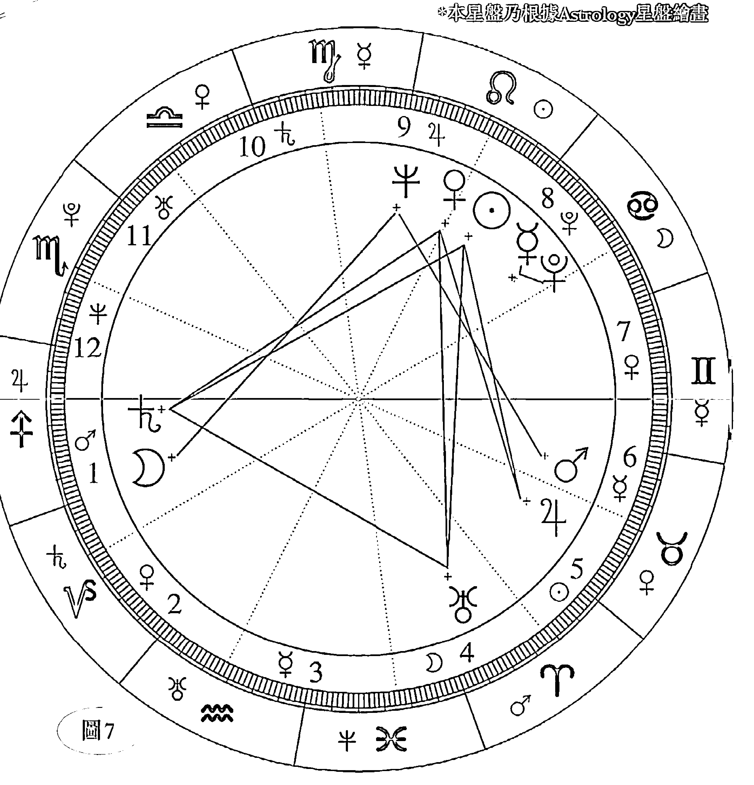

### 圖7
李嘉誠命盤中的兩個三合相位。標示出他擁有成為一代富豪的潛質。

| 十二星座 | 牡羊 | 金牛 | 雙子 | 巨蟹 | 獅子 | 室女 | 天秤 | 天蠍 | 人馬 | 摩羯 | 寶瓶 | 雙魚 |
|----------|------|------|------|------|------|------|------|------|------|------|------|------|
| 符号     | ♈    | ♉    | ♊    | ♋    | ♌    | ♍    | ♎    | ♏    | ♐    | ♑    | ♒    | ♓    |
| 守護星   | 火星 | 金星 | 水星 | 月亮 | 太陽 | 水星 | 金星 | 冥王星 | 木星 | 土星 | 天王星 | 海王星 |

他用理想、創新的想法（就是那顆天王星），結合知識，發揮所長，這同時也符合他相信知識可以改變命運的理念，這些在當時屬於創意的構想，都因為他有天王星純吉（全藍線）的關係，而被引動的太陽代表領導能力，以及理念得以實現。在這裏要說明一下，一個人是否適合當老板，要看本命星盤的太陽是不是吉相位，而土星可以代表房地產、建築業，以及企業管理，所以驗證了他後來成為地產大亨。李嘉誠重視公司的組織管理，這使他日後能夠擴大經營；金星在某一派的說法代表幸運之星，所以亦同時加強了他事業發展的順利。如果要問先天命格很好的人，他的星盤會是什麼樣子，那麼李嘉誠的星盤可稱為典範。無論他是不是出身豪門，主要是日後必定會因為大三角的三合引力，加強了成功的力量。

##### 時代變遷造就開創機遇

時勢造就的英雄，應該有什麼星體呈相呢？在李嘉誠的星盤上就顯得有跡可尋，他的冥王與水星相會在他的財富宮位。

冥王就是大時代變遷的星體，水星是他的事業，解讀得出的答案剛好吻合李嘉誠具開創時代財富的敏銳度，以及時代的變遷也為他開創了發展的機會。他的冥王與水星無吉凶，同時說明，李嘉誠能有今天的成就，並不完全靠幸運，而是要經過個人努力才會有收穫。再看看他的大財來自他的事業，但開始時卻步步維艱，1950年在他創業的時候，流年木星與流年土星都刑衝到本命的土星及事業的宮位，由此可知他在創業初期的辛苦，但是後來他可以在多個領域拓展事業的版圖，這跟他命中多星純吉與吉多有關。

不過，要找出對他最有利發展的項目，就要用星體在他星盤的吉相位解讀，星盤的吉星都落在營建、土地開發、基建、地產、衛星、無線電通訊、高科技、電力等所代表的星體上，其次是金融、娛樂、廣播電視、餐飲、百貨超市、酒店業。看起來，是不是包含了各行各業？原因是李嘉誠的幸運是吉星多，又呈三合架構出互助的能量，但在星盤中仍見有凶相位的行業，是較不宜從事的，如製造業、文化出版；至於他近年有意要發展的石油產業，如果以星體相位論斷，石油之星也是他財富的幸運之星，因為相關的星體直接落在他的財富宮位，而代表他事業的星體也正是石油之星，所以可以預見他的未來計劃，與他成功的方向將會一致。

##### 流年運勢備受刑衝

不過，我在前文提過，這個世界是公平的，再好的命，也會受流年運勢的影響。李嘉誠在過去五十多年的投資經驗中，能保持東方不敗的紀錄，主要是他的冥王星屬吉，代表他在一生的事業經營上能有效地作好風險管理，那是因為他本命的幸運給他的保佑。例如在1974年石油危機發生時，流年木星在雙魚座，與他的事業之星與財富之星三合，所以三合的力量讓他安然度過世界性的危機。但是以他星盤上十星的位置分佈，相對2008年的流年木星，則對他的事業發展不利，星度走到年中，大環境的改變，也許讓他感到錯愕。但無論如何，要他多費心思的年份卻是2009年，原因是，流年木星在寶瓶座刑衝他星盤的木星、火星、太陽、金星、海王星，當中包括他的本命星；如果將星空的語言換成人世間的事物，也就是說，李嘉誠要注意的事情包括：外國運勢、投資、事業盈利、工作運程、交友、感情生活等。可以預測，李嘉誠的煩惱不是在2008年風雲正起之時，而是在2009年全球金融海嘯發生後的第二年，他因為本命事業星體受刑流年木星，而在流年三合位置又沒有吉星分佈，所以據他的星盤推算他的運勢起伏的話，極有可能他會在2009年深深感受到事業上的壓力，而他希望進軍的石油工業，2009年就不是很適合的年份了。

在前文之中，我一再強調，占星學存在的最大的意義是能為生命預早作準備，若能預知問題將會發生，就能有充裕的時間提早防患於未然，那麼到了受刑的年份與事件，就能安然度過。占星學的趨吉避凶是一門科學，因為洞悉天象而對未來更加了解。成就大事要天時、地利、人和的配合，用在這裏作為全新的理解，那代表歷史的成功並非偶然，而是要在出擊之前做好萬全準備。

#### 王永慶

文章寫到這裏，已是台北清晨，正準備要介紹王永慶的星盤，卻聽見收音機傳來新聞，王永慶在2008年10月15日，上午9點38分，因心肺衰竭，病逝於美國新澤西州，享壽92歲。這個突如其來的消息，好讓人覺得人生無常，我趕快翻查這一刻的時盤，天上會有人事的感應嗎？

##### 守護星與美國相刑

王永慶的命宮在室女座（見圖8），其守護星是水星純凶，在占星學中，水星守護着室女座與雙子座兩個星座，然而此時盤的雙子剛好走到代表死亡的疾厄宮，水星與代表美國的木星相刑，是不是與王永慶在他鄉逝世相吻合？再回到他本命的疾厄宮中，木星純凶，也代表他在國外，尤其在美國會多生意外。雖然比對他的本命星盤，流年木星在10月份並沒有對他造成不好的影響，但是如果用日月與他本命的守護星計算星度，則日月是對他不利的，因此，如果他在這段時間留在台灣，沒有出國，或是去了他原先準備要去的越南，則水星與木星就不會被引動與世間人事形成關係，也許王永慶就不會過身了。而且以他本命而論，他應該還會帶領台塑集團與其家族再走一程。以他的身體狀況，據他們的友人說，王永慶本身很重視養生，除了日常生活的飲食由三太太（三娘寶珠）細心照顧外，他經營的長庚醫院、長庚生技公司，都給予他最佳的醫療保健建議；他每三個月會進行一次體檢，所以以他的身體狀況，根據科學數據估計，是有可能活到120歲的壽命，但人世間的一切似乎又再一次的證明不是人為可以掌控的。

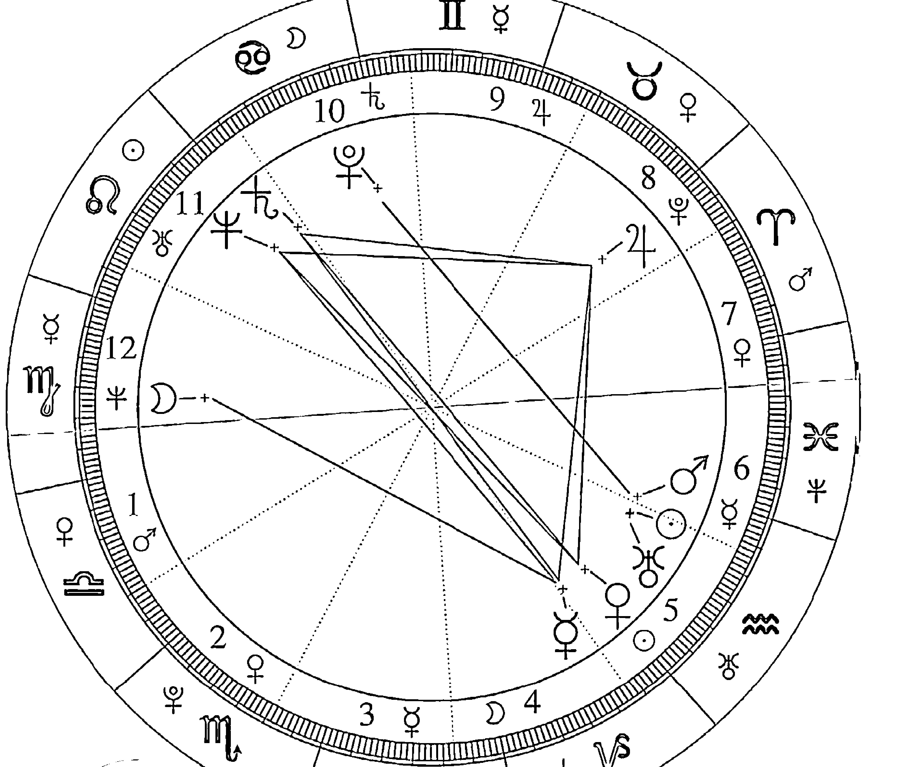

### 圖8
命盤中的水星顯示王永慶會在外國生意外。若能解命的，一切便會有扭轉的機會。

| 十二星座 | 牡羊 | 金牛 | 雙子 | 巨蟹 | 獅子 | 室女 | 天秤 | 天蠍 | 人馬 | 摩羯 | 寶瓶 | 雙魚 |
|----------|------|------|------|------|------|------|------|------|------|------|------|------|
| 符号     | ♈    | ♉    | ♊    | ♋    | ♌    | ♍    | ♎    | ♏    | ♐    | ♑    | ♒    | ♓    |
| 守護星   | 火星 | 金星 | 水星 | 月亮 | 太陽 | 水星 | 金星 | 冥王星 | 木星 | 土星 | 天王星 | 海王星 |

##### 篳路藍縷的創業之路

王永慶的創業經過，是累積了一連串的失敗才有日後的輝煌成就。連他自己都形容那是一條篳路藍縷的道路。要比較王永慶與李嘉誠的星盤，王永慶的大三角也是兩個，但卻是代表凶相位的紅色，所以在他的經商過程中，可以看到一路的失敗：1941年，他開辦的碾米廠首嘗敗績，終於要關門大吉；次年開設磚廠也不成功；又過了一年，他轉行做木材生意，因為缺乏經驗，結果血本無歸；直到1953年，他投資了PVC塑膠業，才改變了他的一生。

王永慶發跡在台灣最艱困的年代，由賣米開始白手起家，「台塑」在他54年的執掌下，創造了橫跨塑膠、石化、煉油、紡織、電子、生化科技、運輸的事業王國，領導10萬員工，每年營收超過2兆台幣。在他的星盤上，天王星的改革開創，與他的太陽、火星相遇，三合他的冥王星，代表毅力的堅持將理想付於行動，依循他事業發展的軌跡；當海王星進入寶瓶座的時候，他回應世界潮流，發展電子業；當天王星在雙魚座的時候，他已先人一步，嗅到現代人對健康養生的需求，成立「長庚生技」，開創生化科技的新趨勢。雖然目前這個項目的投資仍在長年虧損中，但是他卻有所堅持，也許這就是成功企業家用魄力實現自信的過人之處。

##### 經濟成長的代價

王永慶在全球石化工業的發展相當成功。他在台灣整個六輕計劃，將沙州變成了陸地；他在麥寮進行填海造鎮，打造石化工業的王國。他為工業發展所作的貢獻，實在功不可沒，但在此同時，以六輕一年排放6700萬公噸的二氧化碳量，石化業在促進經濟成長的背後，同時對環境造成了嚴重的污染，這卻是每個人要共同承擔的代價。

面對全球暖化、環境污染的問題，我們應該要察覺到，那是比追逐財富更迫切要處理的課題。冥王星在人馬座數十年，那是一個樂觀進取的年代，所以講求的是全球化的概念，數大便是美，木星的涵意是擴張發展，但是過度開發的另一面也代表地球的過度被人類消耗；到了冥王星進入摩羯座的世代，一切都應放慢腳步了，重新一步一腳印地思索未來，而且在未來十幾二十年的發展，也意味著將會有新思維來領導。「慢」的步伐將會是領導新潮流的重要概念。

王永慶的生命也許與他所代表的世代一起畫下句號了。未來的企業要能永續經營，必定要掌握新世代來## 企業舵手的共通處

王永慶與李嘉誠的共同特質是，兩人的事業宮有關的星體都有一顆純吉的冥王星，那代表他們具有對大環境的高強創造力，以及大環境的變遷也會為他們的事業帶來機會；冥王也代表石油，證明這兩位企業家對事業的成功方向，有着與生俱來的敏銳嗅覺；冥王星本身對時代的演變有着重要的影響力，因為影響時間長，所以她是世代之星，以她現在的位置來看，她將在2009年進入摩羯座，所以可以預見即將會有一個全新世代的來臨，同時也代表企業改革年代的到來。

摩羯座的守護星是土星，土星的涵意是秩序與責任，暗示着企業家對土地，甚至對地球的責任，是他們想要永續經營時必須要思考的重點。當前面對2008年的全球金融海嘯，為什麼最受衝擊的是已開發的國家，是有錢人，是百年老店的業績下滑？一場全球性的經濟危機，沒有一個國家可以倖免，這似乎應驗了經濟被壓抑的天象。樂觀的經濟學家分析，經濟要到2009年年底才會回春，但觀看冥王進入的是摩羯座來看，也許會悲觀一點，不過，經濟的重新洗牌，是不是也表示世界歸零後，也有了新的機會？

無論是李嘉誠，或是王永慶，在這裏要強調的並不是他們的財富，而是他們創造了對世界的影響力，例如他們的投資眼光帶動經濟的發展，以及他們在開發生產的背後，對環境生態造成的影響，是更值得讓人深思的課題。

### 李小龍

#### Bruce Lee

### 星盤中的吉與凶位

### 啟示了成功與落幕

李小龍，一個自稱絕不會說自己是天下第一，但也絕不會承認是第二的強者，閃耀在世界的舞台，他活了32年的短暫生命，對武術與電影的影響，一直至今未曾泯滅。李小龍是崇拜者心中的偶像，他也是唯一入選為《時代》雜誌評選為20世紀英雄與偶像的華人。可是，這樣的少年得志，他快樂嗎？

我們來看一下他的星盤（見圖9）。不用專業的解盤分析，大家首先試着用感覺去看，第一眼的感受是什麼？是不是不太舒服，有一種說不出來的壓力、撕裂、殺氣、混亂？重疊又重疊的紅色大三角相位，刺眼非常？

#### 不易調適的內心恐懼

李小龍自許要成為天下第一。從他的12宮就可以看到，他內心的壓力有多大，這樣的壓力，驗證了他在離世前幾年，朋友發現他有精神失常的狀況，原因是，只要引動了火星，萬箭齊發，則金星、冥王星、木星、土星就會被牽動着，從而落井下石，加強火星帶來的不幸。假如他不能自我調適，就會心生恐懼。除此之外，他的12宮內都是凶星，水星代表他會借助藥物緩和情緒，但是他依然被死亡的恐懼弄得難以入眠。

有一派學說，將12宮視為福報與前世的宮位，而且從這裏可以看見一個人的前世因果與神明的因緣。不過，我傾向於用科學的角度去分析，將12宮當做是一個人儲存潛意識的地方，而所謂的過去，也就包括今天之前的任何時間，當然也可以包含前世。

#### 飽受前生記憶的干擾

做夢是人在不須面對真實生活的發洩管道。所謂「日有所思，夜有所夢」，一些白天被壓抑下來的行為和思想，會伴隨着我們入夢，因此，心理學的研究，也就發展出夢占星的學說。我們看過許多名人的星盤，他們的12宮都不好，也許名人都要犧牲享受睡眠去成就大業。但從李小龍的星盤去看，他多夢，而且還會夢到很多奇奇怪怪的景象，由此可以窺視到他前世的記憶一直在他腦海裏揮之不去。有些人的星盤是12宮純吉或無星或簡單，這樣的人內心牽絆的雜音干擾較少，所以會比較快樂；人有煩惱，是因為有記憶，屬於記憶的星體是月亮，凶相位是負面的記憶承載着痛苦生命的痕跡，吉相位則表示這個人的感情豐富。李小龍的月亮在他潛意識的宮位，又是凶相位，這代表他內心的不愉快記憶令他精神層面的生活並不快樂。

#### 生命中最大的負擔

李小龍英年早世，也許是他在潛意識裏的預感。他一直很害怕死亡，尤其是意外死亡，他的擔憂是千絲萬縷的瓜藤效應，牽一髮而動全身，就像是連續劇一樣，一幕接一幕地加強恐懼的效應，這也是因為他受到前世不愉快的經驗所影響，所以當一個挑戰掀起，其餘的就會一浪接一浪地衝擊着他。李小龍生命中最大的負擔是他的內心情緒，這種負擔轉變成壓力，有了壓力後心生恐懼、不安……是自然而然的事。現代的預防醫學在探討人類的健康時，發現身、心、靈是一體的，也就是說，身體要健康，先要有健康的內心，有了身心的健康，才能具備對靈性層次追求的能力。由這樣的邏輯推論，李小龍的內心並不健康，也許就是導致他身體出狀況的原因。假如他當年懂得尋求心理治療師的協助，他的壽命應該不止於此。

觀察李小龍的星盤時，讓人不舒服的地方是，180度的相位相纏又互相重疊，再與90度成三角相位，表示外來的衝擊，讓他亂了陣腳。雖然他的外在形象是強者，但從他的12宮的凶相可以看出他內心的脆弱，也許由他的背景可以理解他的自大來自於自悲。他從小體弱多病，173公分，不算高的身材，體重只有64公斤，他有一雙長短腿，1000度大近視，也許是因為本身先天條件不足，所以他要下定決心練就登峰造極的功夫，也只有這樣才能讓他感到安心，才能消除他心中的恐懼。

翻查李小龍的資料，他的嗜好是練武、閱讀、哲學研究、冥想、跳恰恰舞。從星盤中看，有關他的喜好，也與12宮有關。李小龍的內心混亂，冥想可以讓他安定，而且由於受到前世記憶干擾，他一直想要探討人生的哲理，閱讀自然是一種尋找答案的方式。代表武術的星體是火星，冥王星代表死亡，他的火星與工作的宮位有關，故此，他因為工作練武而死亡，應該就是將星體呈象直接翻譯成人世之事最精準、最直接的解釋。

#### 離奇的死亡

1973年7月20日晚上10點後，他被發現死在女星丁佩的家中。對於他的離奇死亡，大家一直想要把神秘的面紗揭開。雖然香港政府簽發的死亡原因是「死因不明」，但在2006年2月，美國芝加哥驗屍官James Filkins在西雅圖舉行的美國科學院周年會議上，正式宣佈有關李小龍的死因報告，在這之前的各種傳聞，例如說他是因為藥物過敏致死、服用大麻、不當的練武方式、被下毒謀害、患有腦瘤……都是錯誤的，因為美國醫學界在1995年就確認李小龍實際死於顛癇猝死症（Sudden Unexpected Death in Epilepsy）。

其實，占星學對於癲癇症，或者是對於任何一種疾病的成因或致死的可能性，都有一套標準化的統計要求。如果以李小龍先天有沒有癲癇症來看，木星與天王星相差了可容許度的8度之外，所以在占星的領域上，並不能認定他有癲癇症，因為他的星盤不符合癲癇症的基本構成要件。他的遺體被驗出含有大麻，雖然我們找到代表沈醉於事物上的海王星，但那是呈吉的，這表示他也許有吸食大麻的習慣，但並未成癮，所以不至於對他產生什麼後遺症；傳聞中他有腦瘤，這也吻合占星學的標準答案，而且他的腦瘤有可能是惡性腫瘤。至於在醫學上的理論，患有腦瘤的人是否會引發癲癇，那就是屬於醫學研究的領域了。

#### 生命之根本結

讓我們將時光倒流，回到1973年3月李小龍的星盤和流年木星的關係上（見圖10）。當年流年木星的位置在寶瓶座8度，驟眼看去，不用解盤，也能感受到天象仿如一支利箭，引動了主管死亡的冥王星，星盤上的工作事業以及本命同時受到最嚴重的刑衝，所以這個月份他將要面對人生中的意外關卡，若能過關，就能繼續存活。他的死亡可以說是因為流年不利引動的，但是每一件事都必定有其過程，所以，當我們仔細去看，就知道其實由當年4月開始，他就處於凶險之中，我們再看他在同年8月（圖11）、11月（圖12）的星盤，就可以發現流年木星對他的不利，一直要到1974年1月才遠離他，他的不幸之處，在於流年凶相位的影響時間很長。從星盤分析，他是死於意外，也就是非本命的壽命；而造成這樣的意外死亡，與他的工作事業有關，但最根本的死結，卻是他長期的內心壓力。所以，我相信香港政府當年在他的死亡證明文件寫上「死因不明」是有原因的，而並非要隱瞞什麼。

體弱多病的李小龍自創截拳道，成為一代宗師，揚名國際，一生為武術與電影作出卓越貢獻，尤其他將中國武術搬上國際舞台，為中國人爭光，功不可沒，但是盛名也對他造成傷害。他的許多圈中好友透露，他在死前的幾年，精神就有些異常，時常無法調適自己，這就是他快速成名的壓力，他的體力和精力透支過度，所以便要依賴藥物提神。從星盤分析，李小龍為成名承受了太大的壓力（見第12宮），他並不因為成名而快樂，相反，盛名甚至成為他的負擔。

#### 超越金錢價值的成就

在李小龍的生命中有兩條吉相位，太陽代表電影事業、領導魅力，剛好落在他的命宮中，表示他選擇電影作為終身事業是正確的方向，因為太陽和冥王呈120度吉相位，就是說他工作時會全力以赴的意思。冥王是極端的0與100，凶相位是0，也就是說，凶相位是零的發揮，吉相位則做到最好。因此，李小龍做到100分的淋漓盡致，他在當時華人社會低迷的電影環境中，主演了幾部功夫片，便振興了整個電影市場。另一顆海王星所代表的意義，是他對自己的事業並不在意於功利層面，而在於發展個人理想。也許就是這種做事精神，感動了我們，也讓他超越了金錢價值的成就。

### 為生命加油

我們用名人的案例，目地不是歌功頌德，而是希望我們可以學習站於不同角度上，了解別人的故事背後還有些什麼是我們可以借鏡的地方，為自己的生命加油打氣，因為只有拿開光鮮亮麗的外表看待事物，才能發現生命的真正內涵。

### 蔣成龍
Jackie Jiang

### 05
一直受大運星保護的
被上天龍愛的孩子

70年代，李小龍用一身敏捷的身手，將「功夫」這個概念，承載着中國文化的思潮，成功偷運到西方的世界。他立志要為自己編織一個舉世知名的明星夢，讓他的故事璀璨而令人難忘。可惜，英雄的生命卻是如此短暫，整個故事在1973年走向最淒美處，然後畫下句號，讓每個人感到心痛。

跟李小龍有着相同的夢想者，就是現在擁有着無數中外頭銜的成龍。他在李小龍猝然過世後，崛起而成為了另一顆閃爍星星。由80年代開始，成龍用他個人創新的詮釋方式，付予「功夫」一個嶄新的內涵，奠定他日後成為「電影皇帝」的地位。

兩個不同年代的英雄形象，同樣耀眼於世界舞台，但彼此卻有着不同的人生際遇。李小龍的不幸人生與成龍的幸運際遇，同樣是要經過千錘百鍊的意志與決心。但人生起伏的時來運轉與挑戰衝擊，一樣離不開天星在度移時必然產生的影響，只是李小龍他可以戰勝意志，以及挑戰身體的極限，但卻疏忽防範生命的重要關卡，這讓強者如他也要倒下來。

#### 上天的寵兒

相較之下，成龍則像是被上天寵愛的孩子，自他生下來的那一刻開始，他的命宮與事業宮的守護星已在他星盤上為他作好安排，在冥冥之中，他有着比別人更多的幸運。自1978年開始，他一直受到大運星——天王星、海王星、冥王星輪流保護着，當其中一顆大運星離開了會合的相位時，另一顆大運星又會隨之而來，或者相繼一定會有流年木星與土星助長他的事業與本命的運程，這應該算是天生幸運，再加上他本人的後天努力，於是造就了他今日的成就。（見圖13）

在一般算命中，很多命理師都會為人批算大運。而在占星的領域，所指的大運就是用三王星論述。三王星運行的時間很長：天王星繞一周天需要7年，海王星繞一周天需要13.7年，冥王星繞一周天是20.7年至30年不等。換言之，如果三王星對一顆星體有好的影響，好運的時間會很長，就是一般大家所說的「行大運」，但相對來說，若三王星會帶來負面影響，則受刑衝的時間也會很久。

事實上，占星師很少會用大運星去為人占卜命運，原因是，當說到倒楣的事，因為時間太長，會讓命主失去了希望；試問有多少人聽到自己會走10年、20年衰運，仍會積極地面對以後的日子？

況且，如果是牽涉重大災難，便可以用流年木星，在可能發生災害的某些年份內，計算星度的吉凶，而由於時間的範圍縮小了，也就加強了它的精準度。例如，運用大運星的相位，計算出某人在7年內會有車禍關卡，命主豈不是要提心吊膽7年？但假如我們運用流年木星推算，就可以比較準確計算出在哪一年、哪一個月份要特別小心車禍事件。

如果要更準確些，還可以用月亮和太陽的相位推算出，在哪一年的哪一個月份中的哪一天，尤須格外小心。我想這是比較人性化的算命方式。

因此，除非是遇到在星盤上十星全凶的人（全紅線），我們才會用大運星為他做人生的規劃，目的是希望他掌握了大環境對他有利的大運年，把握到有利的時機，就可以趁勢而起。原因是，大運星的時間長，能影響10年、20年，於是如果對一件事可以堅持一段長時間的努力，則一分的幸運，加上九十九分的努力，一樣會有機會成功。

即使十星全凶，那也只能說是屬於大起大落的運勢，並不能斷定一個人一生注定失敗，只要運用大運星的相位關係，一樣可以為他找到人生的機遇。這個世界上只有兩種人，一種是懂得掌握機會，另一種是錯失機會的人。

在占星的領域，人生的格局有先天與後天之別。先天的是命格，這是最常見的算命內容，但後天是選擇，這也是生命最有趣的地方。

知命造運，就是找到星盤上最吉的地方，然後依循這個方向去努力，這也是命運掌握手中的意義所在。占星學的發展一直能夠與時並進，也是來自於這種生存的精神。人類處在不同的時代中，存活於無邊際的星空之下，領悟到自己應該用更開闊的心胸、更靈活的思維去進化生命，那是在超越自我障礙的勇氣後，才會產生的成功價值。

#### 走對了的人生起點

成龍從影三十多年，少年不讀書，也不在乎自己不識字。6歲被父親送到于占元中國戲劇學院學藝，這是改變他一生的地方。這樣的人生起步，正符合他少年學藝的吉相位（見圖14），因為火星代表技術，與他的事業三合，也就是說，他要事業有成，就要靠技能，而非靠學識，所以小時候不讀書並不影響他長大後的發展，只要他能具備技能，尤其是武術的才能，就以技藝起家，以武打名。

能成就個人的事業。

### 大環境造就事業發展

成龍跟李小龍一樣，有着相同的先決條件，事業的發展是大環境所造就的機會。他們同樣適合從事將電影與武術結合為一的工作。冥日火三合，讓成龍佔盡了日後事業的優勢，當然這也是在他名成利就後，要分析他的成功條件時，回首往事才會有的領悟，他的成就建立在他艱苦的童年，當時物質匱乏是大前提，他父親不得已地讓他到戲劇學院學藝。可是，當時誰會想到，這樣的人生安排，對他來說原來才是最好的培育方式。

冥王是成龍一生中最吉的一顆星，它同時守護他的事業與朋友的宮位。其實，占星師在解盤的運用中，對星盤上的十星要作如何解釋，並不是自由心證，憑空想像而來的，而是根據西方的占星字義匯集——《The Rulership Book》，在一定的依據下，將星體與宮位、星座、相位的關係加以解釋。所以，同樣是冥王，在不同的星度，會有不同的解讀，而占星學解盤的難度也在這裏，因為論斷吉凶的判斷，是星體的分析，而不僅是性格的描述而已。就像成龍，他的成就是誤打誤撞，因為家境清寒，自己又不喜歡讀書，父親也只能依他喜歡的武術為他安排去處，但假如他生長在富裕之家，大家覺得他有可能被栽培成為國際巨星嗎？也許太好命，反而是他生命中的障礙。

### 警察故事掀電影熱潮

成龍從影三十多年，也不是一開始就一帆風順。1975年，他主演新天地公司的兩部片子，票房收入慘淡。直到1983年執導《龍少爺》之後，才掀起電影史上的另一波熱潮，之後連串的警察故事一路順遂，到1990年的《飛鷹計劃》，都是3000萬以上的票房紀錄。

原來，他喜歡拍攝警察的故事，跟他與冥王相應有關。冥王在神話故事的解釋是蠍子藏身在暗處，在弱肉強食的世界裏，牠會一直忍耐，一旦不能再忍，牠會全力反擊而獲取勝利，而當牠躲在暗處的時候，暗中觀察的行為，與情報員、警察的調查、偵察工作十分相近，所以冥王在占星學上有代表警察的意思。

在成龍的星盤中，冥王與太陽有關，表示他的電影題材喜歡採用警察故事為主要的元素，吉相位表示這樣做會成功，冥王又與火星呈120度，亦表示電影中的武打動作會受到觀眾喜愛。

演藝事業的舞台是最殘酷的，因為觀眾一直都是喜新厭舊，難以討好的對象，要在演藝界大紅大紫很難，要紅個十年八年更難。論時間與空間的競賽，成龍能在過去30年間，攻佔了國際電影版圖，並能在時間的淘汰賽中屹立不搖，成為電影界的楷模，地位舉足輕重，這與他努力不懈固然有關，但在他的本命中，他運勢中大運接連地帶給他幸運，也是原因之一。

#### 終身不棄的慈善事業

近幾年，成龍很重視慈善事業的推廣，這跟他事業宮前有一顆代表慈悲、奉獻的海王星有關。他自己也說，年少輕狂時賺到錢就是玩樂，但是當他步入中年，他開始反省自己。他能有這樣的轉變，是因為受到海王星的影響。三王星對我們的感應是，分別觸碰我們人生不同的身心靈的領域。天王星是一種理想的實現，有了這顆星的激勵，我們內心會很想作出方向性的重大改變，所以有些人會突然放棄一切，做了180度的調整，這是由外而內的反省。海王星則是剛好相反，那是由內而外的自省後，想要徹底改變自己。冥王星則是受大環境的變動，逼使我們不得不改變，有被動的時不予我的意味，以及在逼於無奈下，我們才要面對變動；但如果冥王與星體呈吉相位，那就是時來運轉的時候了，例如某些人能發上一筆國難財，就是類似的意思。

成龍的星盤，三合的位置剛好是他事業的宮位。1983年開始，是他要在電影事業往上爬升的時候，而三王星的運行狀態，是天王星在人馬座將要進入摩羯座之時，恰好與他的事業呈吉相位；接下來的幸運是海王星、冥王星，兩者仿如跑接力賽般加持着他在事業上的幸運；隨之，在2000年後又是另一個良性循環開始，直到2030年，這樣的循環還在。2030年以後，因為他會一直被三王星引動它生命中的海王星，所以慈善工作應該會是他直到老年都不會放棄的事業。

我們不難預測，世界上能終身享有輝煌成就的人，是萬中無一，我們必須要有一點幸運，才能展現長才。相對來說，也是只有俱備才華、才能，將機會牢牢地抓住，才能創造成功。成龍的幸運是，他的機運造就了他成功的環境，但是他個人的努力也珍惜了這份上天給予他的厚愛。

### 善待自己，延續光輝

不過，在這裏還是要從星盤的呈相給予他最客觀的建議：他先天的體質，骨骼、牙齒和皮膚是他最脆弱的部分，但是最需要保健的卻是他的大腦，將來的腦部退化有可能會為他帶來困擾，但若有事先的預防保健，就能將情況改善。

古代帝王積極尋求長生不老的仙丹，那是因為當他們擁有全世界之後，就會眷戀現實中美好的事物。我不知道名成利就的人是不是每個人都有帝王的心態，若真如此，就必須要「善待」自己的身體了。

從星盤上看，成龍並不十分注重自己的健康，對於身體，他甚至採取放任、傷害的態度，那是因為他對健康的看法有別於一般人，也許是他身體的先天自我修護能力太好吧！這也是讓他沒有養成養生觀念的原因。但是隨着年齡的增長，他那大而化之的性情便要改變一下了，有些意外的受傷其實是可以避免的，但因為他的不在乎，所以才會令自己受到傷害。

他的獨子房祖明在成龍的星盤上，證實了他的音樂才華。不過，如果祖明堅持要走自己奮鬥的路，那就辛苦了，建議他不如與父親的事業結合，會更有效地展現他的理想。其實，若果人生可以有更好的選擇，為什麼要固執己見呢？善加利用身邊的資源，會讓自己少艱苦奮鬥20年，這也算是惜福吧！

### 一生中的最佳情人

事業與家庭都得意的成龍，多年來時有聽聞他的花邊新聞，但也許他並不知道，這類負面傳聞，對他的事業只有傷害。

他一生中最好的情人，就是他的元配妻子林鳳嬌；他與太太的遠距離夫妻關係，讓孩子與母親更緊密相連，這可以從他子女宮的月亮得到了證明，過去如此，現在如此，將來也是如此。他要能發現這點，才能創造和諧美滿的家庭生活；他天生將事業放第一位的價值觀，也讓他錯失了太多家庭生活。

名利與親情也許無法放在同一個天秤上測量，但是在歲月中錯失的東西往往最令人遺憾，因為無法用物質彌補的心靈損失，才是最讓人痛苦的所在。

成龍自己承認，他曾經犯過全天下男人都會犯的錯誤。究竟這樣的錯誤能不能被原諒？因為他天生就喜歡美女，美對他是一種強烈的吸引力，也許因為他的身分和地位，這樣的錯誤終於被社會接納了。可是，在占星學上應作如何解釋？那可是科學得多。

星盤的吉凶原則，是有既定的依據的。所謂的吉事，就是做了一件事後，無論對錯，沒有後遺症者，謂之吉；如果一件事，即使是好事，事後會產生後遺症的話，則占星學便會論斷這件事就是凶相。因此，如果客觀地從星盤論述此事，成龍並沒有小老婆的命，因為大老婆用深厚的感情，限制了他小老婆長期的發展，所以，成龍若有花心的時候，最明智的處理方式，就是維持一段短暫的關係；以此推論，如果有一個女人甘願做他的小老婆，在他身邊苦苦守候，終究是會失望收場的。

#### 小女兒的人生挑戰

在子女方面，如果不是人為的控制，成龍是可以有兒女成群的，但是土星的壓抑，就讓他在生兒育女上呈現只有一個兒子而已。至於他在婚外情所生的女兒，在他命盤上也早有她的代表位置——他命盤上的海王星就是代表這位小女孩。她遺傳了父親的明星氣質，但有些叛逆，在管教的過程中，母親必須多花心思教導，但叛逆的正面解釋是具有與眾不同的才華，所以，如果這個叛逆孩子可以獲得適當的引導，她的獨特潛質便會被激發出來，讓她散發出極度迷人的吸引力。成龍多了一個女兒，對他來說，並不是壞事，但對這個孩子來說，卻是比較辛苦。其實，對孩子比較好的自我認知方法，就要讓她主動多些關懷親生父親；相反，物質的獲得反而要隨緣些。此外，母親最好能夠讓她從小明白汲取知識的重要，讓她努力地培養學問，這也是對她的人生發展最實際和最正確的建議。人生在世，每個人都有自己必須要面對的挑戰，這就是人生有趣的地方。

### 回饋社會延續大愛

驕傲是幸運的人最大的天敵。我們知道感恩上天所賜的機緣，是因為我們擁有謙卑的內心。近幾年來，許多成功人士在退休以後以回饋社會為事業，中外皆然，蔚然成為潮流，這種情況都是受到海王星現在位於寶瓶座26度有關。

寶瓶座代表電腦科技產業；在過去十多年中，電腦科技成為世界經濟的主流，也是與天王星和海王星陸續進入寶瓶座有關。海王星處於目前的位置，讓這些科技業的龍頭心生退休與奉獻的想法，這是可以理解的。大運星除了影響一個人的大運運勢外，同時也主宰著世界的流行趨勢，所以，可以預測到了2011年，當海王星完全進入雙魚座後，這種慈悲風潮將會更明顯地成為主流的社會價值。

2011年，慈悲的星體進入了奉獻、犧牲象徵的星座，環保意識抬頭，人類將對過度的物質化生活開始反思，不僅純粹追求生存，而是要求高素質的生活環境，而環保本身就是一種大愛精神的延伸，所以，若用星體預測未來社會的發展，電腦科技的年代將會在2010後正式告別，取而代之的新世代，就是生化科技時代的來臨。

人類達到長壽的目的之後，進一步追求的就是以科學研究讓青春留住，這是醫學進步到現階段必然的發展。

成龍的人生與普遍人士一樣，都受到身邊事物的影響。20世紀90年代，由電腦科技龍頭人物主導着世界的潮流，到了21世紀，比爾蓋茲等鉅子提早退休，投入慈善事業，奉獻個人經驗，與人分享個人的財富，感動人心，也影響了後者效法，成龍是其中之一。這是很好的事，有了這樣的感召，雙魚座的年代會讓人類過得更好。

### 吴佳林 设计 Lin.Jia.Wu.

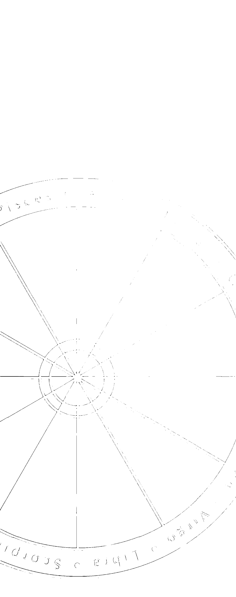

### 命中注定的天賜良緣
一念之差的悲劇結局

中國五術有着五千多年的傳承，有所謂「一命，二運，三風水，四積陰德，五讀書」的老生常談的五種改變命運的方法。

一命要作何解釋？指的就是命運。老天爺從天上扔下一盤棋，考驗我們要如何下這盤棋，它的公平在於人在同一個起點上，沒有人有絕對優勢，各人各憑本事，運籌人生的佈局，只要願意努力，在生命中便可以發生任何可能。占星學的發揮，在這裏的意義，便是讓我們掌握了流年運勢的起伏，懂得對運勢趨吉避凶後，就可以為自己增加些幸運，減少些傷害，以致可以決勝到終點。正因為人生的起點不圓滿，生命的過程才有了追求圓滿的企圖心。

### 改變命運的方法

五種改變命運的方法，為何將五術之法摆在前面，可見其重要性是有優先順序的。積陰德和讀書都是要用上較長的時間經營才有的成果，積陰德其實就是要廣結善緣，中國人都相信好心有好報的因果定律，所以一個人一生中有沒有貴人相助，可以用來驗證自己過去是否樂善好施。講到讀書，自古至今，眾多的成功案例已累積為經驗法則；經驗告訴我們，這是最有效改變命運的方法之一，所謂「十年寒窗無人問，一舉功名天下知」。一個明顯的例子，就是可舉當今台灣的前總統陳水扁，他出身於三級貧戶，因為很會讀書，考上台灣大學法律系，再以優異成績畢業後積極從政，從此改變了自己的命運，也改變了他上一代和下一代的命運。雖然現在看來這也許不是好事，因為終了他的8年總統行事作風與個人價值觀的偏差，最後淪落到成為階下囚，不過那是屬於另一個討論的議題了。

風水之說，可以說是五種方法中最偷懶、最短線的操作，它利用無形的運作模式，在空間上定出太極，吸元運，收天光來氣，配合天星的觀測，使時空結合，創造好運，所以整套堪輿的內涵就是時空的科學。利用這樣的吉凶轉換的風水法，可以改變一個人的運氣，用對了就是最有效的知命造運之法，不過，這些都必須要經得起成效的驗證，以辨真偽。改變了風水之後，如果沒有為人生帶來幸運，這就是失敗的「作品」，風水如同醫學一般科學，操作後只有兩個結果：有效或無效，這是每位風水師必須要面對的考驗。

#### 勿讓今天變成明天的遺憾

中國人將整個五術架構在趨吉避凶的原則之上。點為什麼這麼重要，讓中國人強調了超過5000年？究其原因，生命不能重來，我們每天都在決策當中度過，這是每個人所要接受的挑戰，一念之間，可以讓我們掌握到機會，也可以讓我們錯失機緣。更重要的是，我們不要讓今天做的事，成為明天的遺憾與後悔，但是，誰沒有迷惑的時候呢？這時候，占星學的運用就可以讓我們站在一個最高點透視全局，這是我們遇到迷惑、無助、混亂的時刻可以借助的力量，因為只有當我們擁有清晰的頭腦，才會有智慧的判斷。我們要懂得如何選擇在對的時間做對的事，避免讓人生的憾事發生，才有可能達到自我設定的人生目標。

在這裏想要跟大家分享一首歌的歌詞，歌詞的內容應該可以代表以下我要介紹的人物的遺憾心情。讓我們也試着揣摩體會，他的遺憾究竟有多痛與無助！

### 這是由洪淑觀作詞的《你離去》 ：

> 你離去的那一天，全世界都關了燈
我的心開始流浪，帶着你給的創傷
你離去的那一天，天空也紅了眼
該怎麼告訴你，你還在我心裏
再多時間不能抹去
全世界的悲傷，都落在我肩上
就算用一輩子也不能遺忘
能不能再回到從前，再從頭好好愛一遍
不管多久，不管多遠，我要你再一次回到身邊
能不能再回到從前，擁有你最美麗的靈魂

> 我只要能夠，我只要能夠，再一次將你擁入懷中
為何無法挽回，才懂你對我的好
為何到了最後才知道
所有走過的路，不管痛苦與煎熬
只要是你給的一切我都想要

我想，這首歌的歌詞應該可以作為已故一代影后林黛的丈夫龍繩勳對愛妻的深情寫照，以及他對失去林黛的終生遺憾。

### 非凡的事業，美麗的愛情

林黛在電影事業的成就非凡，她能在短短幾年的時間贏得無人可以超越的閃爍光華，她曾獲4屆亞洲影后的頭銜。

感情上，林黛在1958年於美國哥倫比亞大學邂逅了眾人心中的白馬王子——前雲南省省長龍雲的兒子龍繩勳。1961年，這對讓人稱羨的金童玉女締結連理。1963年，她在紐約誕下兒子龍宗瀚。林黛的經歷有如童話故事一般的幸福，故事發展到此，對於林黛來說，應該是讓她感覺到人生一切美好的事物都眷顧着她吧！

這位在事業、愛情、婚姻都讓人羨慕到無以復加的巨星，為何會選擇在1964年7月17日，在跑馬地的家中打開煤氣及服食安眠藥自殺身亡，讓自己美麗的生命結束，讓深愛她的丈夫頓時掉進黑暗的世界，讓可愛的兒子失去母愛的權利，還有讓成千上萬的影迷心痛不捨？若林黛能夠看到這樣的結局，若生命可以重來，讓時間倒流到當時，她也許不會讓此悲劇發生。但千金難買早知道，一點都沒錯，很多讓人後悔的事，就是在做的時候不會想到後果。前文說過，生命不能重來，這是我們要謹記在心的事。

### 180度的人生大事

在這個世界上，沒有一個人跟自己是百分百相同的。在星盤上，1宮代表自己，7宮代表夫妻宮，它們是180度的關係。在占星學上，180度是衝的相位，可以解釋為合作夥伴，但也可以解釋為敵人，這決定於彼此是否會發生衝突；若在和諧的狀態下，那是資源共享的關係宮位，但一旦發生爭端，它不會像90度的「刑」，對立時的下手還會留有情面；180度的不和諧是直接撕殺的凶相位。所以，大家必須切記，婚姻絕對不可兒戲，它是人生的大事。

### 互補不足的吸引力

對於這一點，老祖宗說得一點都沒錯。許多中國的傳統智慧流傳下來的，都只是結論，而缺少了對過程的分析，讓後人難以理解，以至今我們疏於重視。從談戀愛說起，男女之所以會發展成為親密關係，是因為遇到與自己截然不同的吸引力，才會認為對方魅力無窮；一個人面對異性而激發了觸電的感覺，就是因為找到自我人格特質互補的滿足，簡單的說法就是被新鮮感所吸引，但這只是在戀愛階段才會被認為是最重要的因素。一旦婚姻成立，新鮮感就不再是幸福的關鍵，因為彼此必須要學習適應對方，要放棄自己的某部分，挪出空間來接納對方成為自己生命的一部分，所以要成就幸福婚姻，單純有愛是不足夠的，更要懂得去經營兩人的關係。

在這前提下，學會妥協是十分重要的，所以中國傳統的習俗，男女雙方要結婚，兩人是否相愛並不是首先要考慮的條件，因為他們認為夫妻日後若能和諧相處，必然可以日久生情，所以先合八字才是最重要，而在合八字的過程中，也可以從兩人的命盤中找出未來的夫妻相處之道；此外，媒人要在事先作一個提點，讓雙方注意彼此個性上的禁忌，才不會踩到婚姻的地雷，這也許正可以為古時候的婚姻多能白頭偕老作最好的解釋。將這樣的經驗用於現代，婚前男女雙方用占星合盤，找到婚姻經營的方法，確實是可以為幸福加分；夫妻合盤並不代表兩個十星相同的人結婚才是好姻緣，而實際上這樣的機率也微乎其微，況且，根據統計，十星相同的兩人成為死黨知己的比例比較高，這是基於物以類聚的原理，但男女間的化學作用就偏偏是互補不足的吸引力，所以當他們走到婚姻的階段，相處的磨合才是愛情真正的考驗。

### 一念之差

林黛自殺，她結束的不止是自己的生命，同時是她丈夫、兒子一輩子的幸福。這對活着的親人來說，是最殘酷的折磨，而且在她過逝後，她的丈夫龍繩勳成為千夫所指的罪人。責備與悲傷整整壓在他心口43個年頭，但儘管眾多不利於他的傳言，說他花心、疏忽，都暗指他要為林黛的死負起責任，但他卻選擇在自己有生之年，一直保持沉默，將一切的指責都全盤承受，直到他在2007年離開人世。龍繩勳用他的一生說明了一切：他深愛着妻子，在43個斯人獨憔悴的歲月裏，他將兩人的愛巢原封不動地保持在林黛生前的模樣，甚至當年他為了要進入臥房搶救林黛被他踢破的房門，也讓它43年來保持着原貌，這裏是不是也透露了他的內心其實多想將時空凍結在當時的重要時刻，以見證他對愛妻一直以來的情深不變？

我想，如果當年林黛對丈夫的愛曾經因針鋒相對而存有懷疑，那麼時間已經為她作了最好的愛的見證。事實在林黛過世後，龍繩勳一直住在舊居，獨自養大兒子，終生未娶，這可以在林黛星盤上的夫妻轉盤，看出龍繩勳對她的愛是專一認真、忠誠不二的，他們的婚姻本身不可能有第三者，只可惜林黛本人並不知道，遺憾的是她還將一家人的幸福帶到悲劇的命運去，她當年的一念之差，竟然改變了整個故事的結局。

### 命中注定的天賜良緣

在林黛的星盤中（見圖15），7宮夫妻宮落在獅子座，代表她有嫁入豪門的機會，太陽的位置在她的心靈宮位，這可以解讀成，龍繩勳是她心目中的理想對象，這也是前世注定的因緣。但是因為林黛的12宮純凶，土星是壓抑，月亮是情感與情緒，所以關鍵是林黛的先天性格，她的心靈容易因敏感而被傷害，這也許與她有過顛沛流離的童年生活有關，但是她與龍繩勳的婚姻卻能給她一生中最缺乏的安全感。日與月是三合相位，但前提是，他們必須多些溝通，讓彼此的互信更堅定，讓他們之間的聚少離多，變得更甜蜜，因為太陽與天王星也是三合相位上。可惜，他們的婚姻並沒有走到這條吉相位，所以，命中注定的天賜良緣因為不懂得掌握，林黛沒有讓婚姻走到三合吉相位，而令太好姻緣變成悲劇結局。

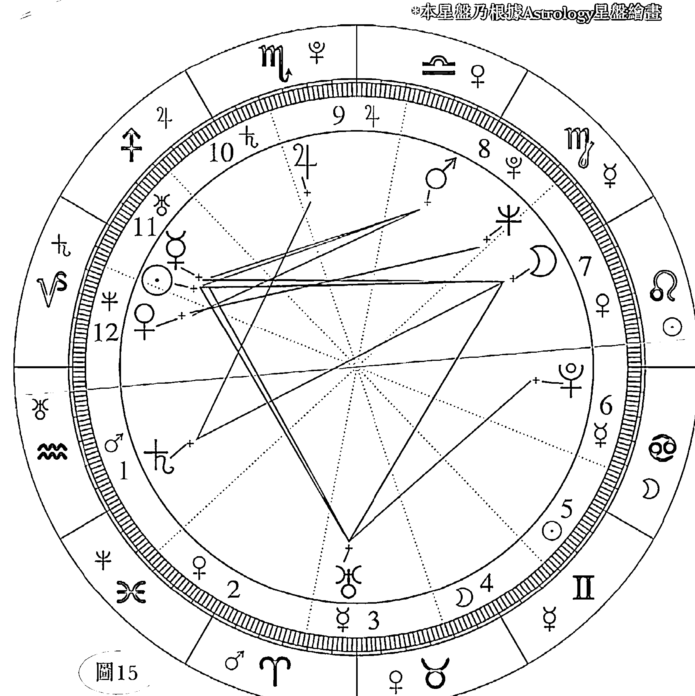

圖15

| 十二星座 | 牡羊 | 金牛 | 雙子 | 巨蟹 | 獅子 | 室女 | 天秤 | 天蠍 | 人馬 | 摩羯 | 寶瓶 | 雙魚 |
| :--- | :---: | :---: | :---: | :---: | :---: | :---: | :---: | :---: | :---: | :---: | :---: | :---: |
| 守護星 | 火星 | 金星 | 水星 | 月亮 | 太陽 | 水星 | 金星 | 冥王星 | 木星 | 土星 | 天王星 | 海王星 |

緣，卻因為兩人不懂得經營的重點，以致當他們在面對彼此的信任不足時，同時又處於新婚初期需要彼此學習適應與了解的時候，常常會因口角摩擦，破壞了原本的濃情蜜意。婚前兩人一點一滴所建立的愛的記憶，也會因為婚後摩擦增加，繼而對對方的愛產生懷疑，讓兩個原本相愛的人因誤解而不停爭執。

### 錯失了的婚姻吉相位

以林黛的星盤分析，她的婚姻是幸福美滿的吉多於凶，但為何她卻為了與丈夫的一個爭吵而走上了絕路？那是因為他們走到婚姻中唯一的一條凶相位。土星代表林黛先天的脆弱心靈，與7宮中的月亮刑衝，也就是說她因為太愛對方，這反而成為她生命的死穴。她先天性格的情緒化，讓她比較容易陷於悲觀思想和鑽牛角尖，所以她的土星純凶，在她命格上就容易帶有厭世的想法。婚姻是她的最大的依靠及安全感的來源，但致命傷也在這裏，一旦這個部分潰堤，她會徹底被打倒，完全沒有招架能力。所以，如果林黛及龍繩勳在婚前可以多了解這點，他們的婚姻就能避免觸碰到一些危險禁忌，也許他們就可以走到婚姻的吉相位上，那絕對肯定是一段美滿幸福的姻緣。事實上，這也是全天下的有情人在終成眷屬後要引以為鑒的地方。

### 火星純凶的自誤誤他

我們看過許多讓人惋惜的人生故事，他們個人成就非凡，但並不代表他們的生命活得成功，原因是，名成利就靠的是意志力、毅力、才華、機運，但是生命的經營要運用的是人生的智慧。林黛的一生，最大的缺點是她缺乏溝通能力，尤其是與丈夫的語言暴力，是火星純凶，這說明了她的表達是直接、不加修飾地傷害對方，星盤也透露了引發他們夫妻爭端的一方是林黛自己，而她的12宮金星、太陽、水星都與火星相刑，代表她會因為對丈夫不滿、家庭關係、子女管教、個人事業發展、家庭經濟錢財管理等問題，而與丈夫爭吵，所以一顆星凶，牽一髮也可以動全身，而這些星都與12宮代表自殺的宮位有關，所以林黛很容易就會牽動起輕生的念頭。

占星學讓人可以趨吉避凶，方法是點出了命主的缺點，然後建議他要作出改變。以林黛的命盤，只要告訴她要改變說話的方式，要三思而言，言詞盡量溫柔婉轉，那麼，當她不再用言語傷害別人時，自己也就不會受到傷害了。

### 自我超越改變命運

人生可以從不同的角度去解讀，也會因為對生命態度的不同，而產生截然不同的結果。宿命論的人會跟着天性的路走，看見自己的星盤的命宮純凶，婚姻不好、事業凶險、子女宮有冥王相伴，就認命放棄；其實這樣的生活態度，不用算命也知道一定是命苦一輩子。但是，所有能讓人動容的成功、奇蹟、自我超越，都是因為態度改變了命運。

我認為，就是因為人生要努力，我們才要借助占星了解自己，讓自己坦然面對生命不足的部分。只要願意改變，我們的人生就會有不一樣的天空；天生好命之人也不一定都是一帆風順，而不用面對挑戰的。

總之，每個人各有屬於自己的生命棋盤，雖然所遇到的障礙各有不同，但幸運之星必定會在每個人的星盤上閃爍光芒，只等著你去自我發掘。當然，趨吉避凶後，我們也可以選擇從星盤上的凶相位迂迴而行。

### 讓自己主宰生命

我們看林黛的星盤，她可以說是天生的好命之人，但是她因一念的偏激行為，讓自己成了悲劇人物。所以，我們一定要相信，自己才是生命的主宰，命運並沒有命中注定這回事，星盤如果可以轉動心念，我們的世界將會不同。

## 附录

### Chapter 5

### 解說星盤前必備閱讀

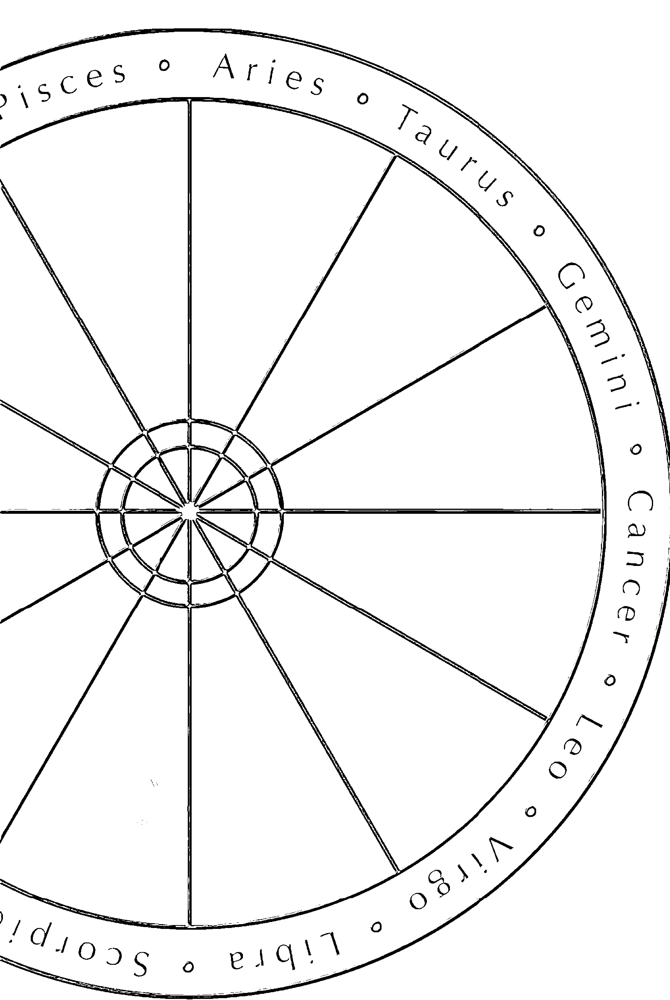

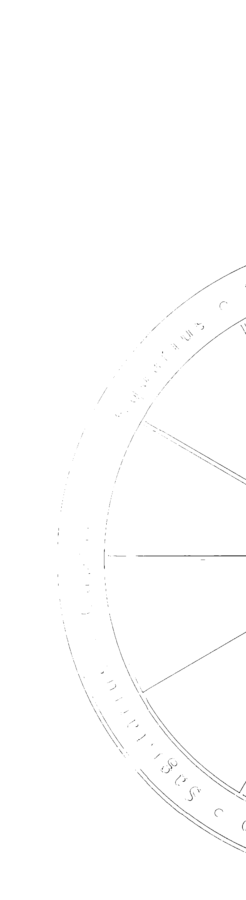

## 解牛说上古生肖学

## 星盤的含意
掌握命運必須了解

- 對於占星學是一門科學的論述，中西方都有詳細的典章書籍的記載。影響中國占星學甚鉅的是司馬遷的《史記·天官書》，書中十分完整地將歷史上重要的天文觀測記載下來。自堯、舜、禹時代開始，將中國占星學發展的歷程蒐錄其中，由原本的只重視農耕，到後來被天象的神秘所吸引，資料豐富，引人入勝。西方在第一次世界大戰之後，著名的倫敦占星學分會（The Astrological Lodge of London，簡稱ALL）成立，1926年發行《Astrology Quarterly》季刊，它一直是西方占星界的重要刊物之一，是一本獲得高度評價，對占星學貢獻甚鉅的期刊。也因為這本刊物的誕生，使得占星學不再被誤解為純算命（fortune telling）的學問，而是經過多方學術的研究後，讓占星學發展到哲學、心理學、人類學的範疇。

- 1958年6月21日英國占星學會（The Astrological Association of Great Britain）成立，更刻意地將占星學朝向科學的路線發展，致力於統計學、深層心理學方面研究。

- 目前最大的占星組織是1938年成立的美國占星家協會（American Federation of Astrologers），目的是鼓勵占星學所有科學性的研究，以及推廣和普及占星知識。

- 堪輿之學的最高秘笈是天星擇日，正確應該是擇「時」。那是源自13世紀，元朝征伐阿拉伯地區，戰勝後在當地搜羅了不少天文儀器和占星書籍，影響中國採用回歸年制的曆法計算。朱元璋滅元後，任命吳伯宗對阿拉伯占星學進行翻譯，所以建立了一套完整的學問，內容涵蓋本命的論述、時事的分析、天星擇日，結合天地引動的選擇吉時出兵，對後世占星學的概念，有着深遠的影響。

## 星盤的含意

- 星盤結構：包括最外圈的12星座、第2圈的12宮位，以及10顆星體間的關係，再與流年10星做比較，便能就三方四正的概念推算運程起伏，是為完整的占星學。而太陽星座（坊間的12星座占星學）只是完整占星學的一小部分，其功能也有限，在占星學的理論中，吉凶判斷的依據是星與星之間的關係比較，以及以「會」、「合」、「刑」、「衝」為論斷吉凶原則。

- 如果人生如戲，戲如人生，相位是引動吉凶判斷的重要依據，如同《The Only Way to Learn Astrology》所比喻，把行星當做是演員；星座如同是行星要扮演的角色，代表先天性格；宮位則是角色演出的情景，代表後天環境；星體猶如在星座與星體所扮演的演員角色；而相位是演員演繹戲中角色的方式。故此整個星盤結構是環環相扣的關係，就成為我們人生大戲的劇本。

- 占星學與天文學500年前是一家，占星學要以天文學的學理為發展的基礎。其分別在於，研究天文是採用以太陽為中心的日心系統，而占星學則是採用以地球為中心的地心系統作為觀測點。

- 不同的占星學派對相位的採取角度都不同。本書所採用的是強勢的大相位，指的是000度（會）、090度（刑）、120度（合）、180度（衝）四種，俗稱三方四正。「合」是吉相位，以藍線表示；「刑」與「衝」是凶相位，以紅線表示；「會」是遇吉則吉，遇凶則凶，有加強的意思。本書所採的度數容許度是加減8度，在占星的世界中，星體本身無吉凶，吉凶的產生乃是來自星體與星體的相位比較。

- 太陽星座之所以盛行，是因為只有太陽星座不需查星曆表，也不需具備天文知識，可以輕鬆自學，也因為在學習上沒有負擔，所以普遍會將太陽星座視為占星學的入門知識。

10 星座是宇宙方位的代名詞，與東南西北的定位同義，再則她距離地球實在太過遙遠，以致她的引力對地球而言，可以很肯定的說是完全毫無感應，因此黃道12星座方位是：牡羊座（戌）、金牛座（西方酉）、雙子座（申）、巨蟹座（未）、獅子座（南方午）、室女座（巳）、天秤座（辰）、天蠍座（東方卯）、人馬座（寅）、摩羯座（丑）、寶瓶座（北方子）、雙魚座（亥）。

## 星盤的含意

11 只有太陽系的星體，因為距離地球較近，當星體位移時，會與地球方位產生變化，科學上也證明了，星體的引力作用會對地球人類產生影響，如月亮運行影響潮汐漲退；狼人之說，乃是因為體內血液變化與月圓有關，當人變得亢奮衝動時，便會容易犯罪；太陽黑子會干擾地球電波傳導；地震的發生與木星、天王星與冥王互成90度角有關，歷史上有134次這樣的紀錄。

①②星座屬性有二分法、三分法和四分法。

## 二分法：

- 陽性星座：牡羊座、雙子座、獅子座、天秤座、人馬座、寶瓶座
- 陰性星座：金牛座、巨蟹座、室女座、天蠍座、摩羯座、雙魚座

## 三分法：

- 基本星座：牡羊座、巨蟹座、天秤座、摩羯座
- 固定星座：金牛座、獅子座、天蠍座、寶瓶座
- 變動星座：雙子座、室女座、人馬座、雙魚座

## 四分法

根據自然元素：火、地、風、水四象分類。

- 火象：牡羊座、獅子座、人馬座
- 地象：金牛座、室女座、摩羯座
- 風象：雙子座、天秤座、寶瓶座
- 水象：巨蟹座、天蠍座、雙魚座

## 星盤的含意

### [1][3]十二宮位

- (1) 命宮：第1宮代表個性、外表氣質、身材外型、人格特質。

- (2) 財帛宮：第2宮代表價值觀、收入、感情善惡、欲望、理財方向。

- (3) 兄弟宮：第3宮代表基礎教育、短期訓練課程、交通、表達能力、兄弟、平輩、心智。

- (4) 田宅宮：第4宮代表飲食習慣、家庭生活、不動產、父母、私人領域。

- (5) 子女宮：第5宮代表子女、娛樂、休閒、創意、戀愛運、投資。

- (6) 奴僕宮：第6宮代表工作、醫療、可醫治的疾病、職業、寵物、部屬。

- (7) 夫妻宮：第7宮代表合作夥伴、夫妻、婚姻狀況、競爭對手、敵人、人際關係、親密關係。

- (8) 疾厄宮：第8宮代表死亡、遺產、稅務、鬼神、性欲、命理。

- (9) 遷移宮：第9宮代表法律、高等教育、國外運勢、哲學、旅遊。

- (10) 官祿宮：第10宮代表創業、老闆、長輩、終身成就、社會地位、名譽、父母、事業。

- (11) 福德宮：第11宮代表社團、朋友、應酬、政黨、選舉、願望。

- (12) 相貌宮：第12宮代表潛意識、夢境、宗教、內心世界、犧牲奉獻、退休、業力。

## 14各星座司職的範圍：

- (1) 太陽星座：外在的表現。

- (2) 月亮星座：情感的歸屬所在。

- (3) 木星星座：持續力的展現。

- (4) 土星星座：責任感的代表。

- (5) 天王星星座：對真理的認知。

- (6) 海王星星座：追求理想的渴望。

- (7) 冥王星星座：感情執着在乎的堅持。

- (8) 水星星座：影響思維表達能力。

- (9) 火星星座：行動力反應敏捷的判斷。

- (10) 金星星座：表達愛好情感的方式。

## 星盤的含意

15 占星師在解盤的運用中，對星盤上的十星要作如何解釋，並不是自由心證，憑空想像而來的，而是根據西方的占星字義匯集——《The Rulership Book》，在一定的依據下，將星體與宮位、星座、相位的關係加以解釋。所以，同一星在不同的星度，會有不同的解讀，故《The Rulership Book》對於解盤時了解星體的含義是很重要的工具書。《占星看天下》重點不在教大家解盤，日後另有專書詳述此部分。

16 運用占星學推算人生，區分是12宮位與12星座在10星運行下的144的10次方的可能，得出的精細度是計算機都無法計出來，因為4分鐘會是一個區別，再加上地理位置不同，更可以再進一步細分下去。紫微斗數大致只能區分51萬8400種變化。

## 星座的故事

## 解讀星盤中的啟示

### 了解神話故事的含意

人類在沒有文字之前，幾千年的思維要如何流傳？東西方的文明，都是由神話故事承載着先人的事跡。也許我們對在童年裏聽到的「女媧補天」有過懷疑，但神話傳說確實是聯繫古今價值傳承的媒介。

遙不可及的天文、星辰，如何化成五術學理，運用到人事的趨吉避凶上？天與地之間的連結起源，無可否認，很多都是來自一則則的神奇傳說與神話故事。因此，21世紀的人類價值觀與文化思想，其實與愛神的恩賜、太陽神的威嚴都不可分割。

一個不可否認的事實是，神話是一個民族文化原始的意象，而其深層的結構，是一種代代相傳的價值觀與倫理規範。遠古人類沒有文字，靠的是口耳相傳地將生命智慧延續。於是神話故事、歌謠、詩歌，便成為了記載文明歷史的最佳工具。

我們談到占星學與人類文明不可分割。占星學的發展基礎，一直以來是以天文科學的學理為架構的基礎。科學與文化的結合，是先人在占星學中，運用智慧最好的示範。在占星學結構中，星座解釋就源自神話故事的聯想，不過，要在每一則動人故事的背後，或者在一個美麗傳說中，我們要找到解答生命的啟示，卻沒有既定準則。但經驗是由錯誤中累積而來的。

下文是12星座神話故事的概述，希望可以幫助讀者自我領悟解讀星盤的靈感。

### 牧羊座

牧羊座的神話故事是在說，賴波特之子菲立瑟詩蒙受了不白之冤，被判死刑。臨行刑前，有一隻金色的公羊將他和他的妹妹救出。但公羊卻因為疏忽大意而將菲立瑟詩的妹妹摔到大海淹死了，結果只有菲立瑟詩安然獲救。菲立瑟詩為了表達對公羊的感謝，便將公羊獻給宙斯當祭品（在神權時代，能成為祭品是神聖的榮耀）。宙斯於是將公羊化成天上的星座。

牧羊座由神話故事所衍生的含意，包括：主動、積極和行動力的正義象徵。牧羊座是行動的星座，但是具有衝動的特性，致使她熱心助人的優點，往往因為她的粗心大意而將事情搞砸，甚至傷害自己與別人。因此，在星座含義中，牧羊座也有被犧牲的特質，「烈士」是對她最好的形容。

所以牧羊座的基本意義包括：開創者、勇敢、熱忱、處事果斷明快、態度積極、具有旺盛的企圖心。缺點是：虎頭蛇尾、粗魯莽撞、爭先草率、自私自大。

解讀星盤中的啟示

### 金牛座

金牛座的神話故事是，素有風流見稱的眾神之王宙斯愛上了歐羅巴（後來化身為歐洲），他為了隱瞞天后海拉的耳目，便將自己化身為白牛背馱着歐羅巴偷情，宙斯回復原形後，則將化身的大公牛放在天上，成為金牛座。

因為這個神話故事的緣故，金牛座常常被人誤解為好色之徒。其實，金牛是風流，但會堅守本分。

金牛座象徵的意義，是來自「牛」的特性，所以她是忍耐力、堅持保守、圓融穩定的代表。由於她屬於陰性星座，她也受被動、消極特性的影響。

金牛座的人會因為過於實事求是，而容易錯失良機。在投資理財上，有一種說法，如果投資氣氛已濃厚到連金牛座的人都入市了，那就表示到了全民皆股的情況，換言之，就是預警市場已到了拋售的時機。

### 雙子座

雙子座的神話故事是，全能的神宙斯，他被斯巴達王后的美貌深深吸引，於是化成天鵝與她約會，不久，王后生下了雙胞胎兄弟，兄長波個克斯擅長劍術與騎術；而弟弟卡斯托則擅長拳擊，兩人 在戰場上是合作無間的親密戰友。當弟弟死後，兄長傷心不已，宙斯便將他們的形象掛在天上，成為雙子星座。

星座神話故事衍生的象徵含意是：多才多藝、雙重性格、多變不穩定，但也是才智雙全，是一個人的心智能力、記憶力的代表。

### 巨蟹座

巨蟹座的神話故事是，宙斯的風流終於讓天后海拉無法忍受。她的猜忌與焦慮，使她禁不住要對宙斯與人類所生的私生子海力克斯施加詛咒，令他失去理性地弒殺妻子，犯下重罪。海力克斯為了彌補自己的罪行，便接受天后海拉提出的12道難題考驗。其中一項是，他必須殺死亞密莫涅水湖中的大水蛇，天后一心要海力克斯戰敗，便派遣巨蟹幫忙，但巨蟹卻在打鬥中被海力克斯踩死。於是，天后便將巨蟹化為天上的星座。

故此，巨蟹座也代表海拉的焦慮、猜忌、向丈夫的情婦報復的負面情緒，也就是說，巨蟹座與情感、感情的事物有關，而一個人充沛的情感也蘊藏在此。

由此引伸，巨蟹座性格強烈的人，並不是一個容易被取悅的人。其主要特性是，內心情感豐富，但不輕易接近陌生人，不過，一旦認定對方是自己人，便會傾向積極付出。所以，她也是多愁善感、家庭觀念重及母性的象徵。

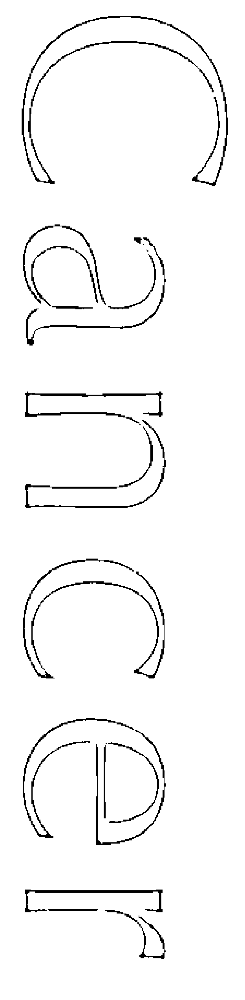

### 獅子座

獅子座的神話故事是，天后海拉一直不滿宙斯的風流，一再向其私生子海克力斯施加報復，一共出了12道難題要海克力斯接受考驗。第一道難題便是要他與森林中的人獅激戰，但結果獅子被勒死，宙斯便將獅子化為天上星座。

獅子座的含意，來自獅子乃是萬獸之王、具有王者風範的代表。獅子不時會大聲吼叫，是因為要消耗飽食後的過剩精力，這也是獅子座的人會用嘶吼宣洩鬱悶情緒的原因。

太陽是獅子座的守護星，太陽的萬丈光芒，也代表誇張特質。由於本身條件優越，有時難免會表現過於樂觀、浮誇。不過，在神話中的太陽神阿波羅，其地位僅次於宙斯，亮麗耀眼的外表是他的最佳武器，他不僅是美男子，也是奧林匹克的勝利者。因此，阿波羅代表光、力量、聖潔。

> > 解讀星盤中的啟示

### 室女座

室女座的神話故事是，農神之女被冥王捉走而使大地枯萎。於是，眾神懇請宙斯與冥王協商，釋放農神之女回到人間，讓大地回復生機。冥王答應了宙斯的要求，農神之女得以重返家園，而她往返冥界與人間的寒暑變化，便產生了四季。

室女座的特性是一個追求完美、至真、至善的心靈，她受時序的感應，成為一位務實的默默耕耘者。因此，有關勤奮、貞潔、細心、服務等形容詞，都可以與室女座連上關係。但是，也有可能因為她的心思如秀髮般纖細的特質，而給人難以捉摸的感覺。

### 天秤座

天秤座的神話故事是，正義女神手持天秤，來到人間肩負法官的職責，為人間做善惡的裁決。但當時人類的慾望高漲，罪案不斷。慈悲的女神為了挽救人類免於墮落罪惡深淵，一再與眾神爭執，但依然得不到人類的覺悟悔改，於是正義女神在絕望中決定重返天上。

由神話故事衍生的星座含意，便是有正義女神化身的意思。她同時具備美麗女神維納斯的特質，以及仲裁者的象徵。公平、公正、中庸等相關的字眼，都可以用來代表天秤座。

### 天蠍座

天蠍座的神話故事是，海神與亞馬遜女王生了一名兒子——歐力昂。歐力昂是一個自大粗魯的巨人，常自誇是天下最強的強者，因而引發奧林匹克諸神的憤怒與忌恨。於是天后海拉便派遣毒蠍子埋伏在石洞中，最後毒蠍成功暗刺歐力昂致死。毒蠍受到諸神稱讚而成為天上星座，而獵人歐力昂死後也成為獵戶星座，位置剛好在天蠍座的正反面，也就是說，天蠍座與獵戶座兩者處在一個永遠老死不相往來的敵對狀態，當天蠍升起，獵戶便西沉。

在整個故事裏，天蠍能夠毒死世上最強的人，乃在於天蠍的埋伏與計謀。所以，天蠍代表的是強者的剋星，也標示着為達目的，不擇手段的城府。可以說，天蠍座是一個令人難以理解與洞悉的星座。

天蠍所代表的個性是沉着、專情又無情，但卻執着於感情的善惡，所以，當天蠍的愛人是最幸福的情人，也是最危險的失戀者。天蠍的強烈佔有慾，是愛之慾## Scorpio

其生，恨之欲其死的極端態度，得不到便是容易走向玉石俱焚的報復。

天蠍的優點是無人可比的一針見血的洞察力，所以她是一個具有神秘氣息的星座。她所象徵的情緒包括：熱情、力量、專制、妒忌、憎恨與復仇。

## 解讀星盤中的啟示

### 人马座

人馬座的神話故事是，相傳象徵不朽與高貴的人馬獸——凱倫，是一位文武雙全的大學者，他博學多才，飽讀各類知識，又擅長狩獵，更是精研醫術與預言，亦不吝於將所學傳承他人，於是深受人類尊敬。但不幸地，凱倫在一次戰役中被毒箭刺傷大腿而死亡，全能的神宙斯為了痛惜凱倫之死，將他化為天上星座。

這個神話故事啟發了我們對人馬座的認識，有關凱倫的特性——高貴、博學、哲學、學習、允文允武、腳傷、崇尚自由、人與獸的半獸半人的獸性與人性，都是正確的聯想。

人馬座最大缺點是，具有如野馬奔馳草原的野性，過度追求大自然無拘無束的生活，而給人不負責任的感覺。神話中，凱倫因自大而輕忽細節，被暗箭刺傷大腿致死，這正好提醒了人馬座的人，失敗大多來自於過度自信。她也是12星座中，失敗次數最多的星座。人馬座象徵着哲學、道德、理想、教養高等特質。

### 摩羯座

摩羯座的神話故事是，相傳牧羊神潘恩擅長演奏橫笛。在一次音樂饗宴中，潘恩為諸神演奏時，引來了怪獸前來聆聽，這突如其來的打擾，嚇得諸神倉皇逃跑，只剩潘恩繼續沉醉在自己的樂聲之中。當諸神都已經化魚逃入河中，潘恩才驚覺不妥。但是，由於她在情急中逃走，因而誤入淺水，以致她上半身還保留着羊身，只有下半身浸入水中的部分化為魚身；宙斯看見這怪模樣覺得有趣，便將摩羯座化為天上星座。

由這則故事可以得知，埋首苦幹、專注認真，可以是摩羯座的特質。所以，摩羯座是代表責任、使命、秩序的星座。但是沉醉於自我的旋律，延伸至過度埋首於工作之中，便是他不了解大環境變化的最大弱點。

摩羯座的正面象徵是：穩重、辦事能力高、責任心重、可信賴、專注、秩序；但負面的解釋，也代表了頑固、憂傷、冷漠、墮落、遲緩與困難。

### 寶瓶座

寶瓶座的神話故事是，傑尼梅特斯是諸神公認的美男子，在一次天神酒宴中，因侍女未能參加，宙斯便邀傑尼梅特斯代替，自此以後，傑尼梅特斯便長待宙斯身邊，成為天上星座。

由於傑尼梅特斯所斟的酒是代表眾神的睿智之源，因此寶瓶座的含意是，代表神的預知力（推理）和發明（科學）的智慧，配合寶瓶座本身屬於風象元素，風為氣，也同時象徵人類的智慧與思維，所以她也代表人類的智能。

寶瓶座特性強的人，一生都會致力於為理想而奮鬥，擇善固執，所以容易給人離經叛道、異於常人的感覺。他可能是一位天才，但不一定具備在商業社會中成為人才的條件，因為他的價值不在於商業利益的考量，而只是忠於個人理念的實踐。

寶瓶座的象徵意義是：科技、新知、發明、改革、一個人的希望、人類的天性。但自我矛盾時，也會產生背叛、反叛、謀反、革命的行動。

### Quirini

## 解讀星盤中的啟示

### 雙魚座

雙魚座的神話故事是，維納斯與邱比特兩人，有一次被巨人泰風追逐，兩人為了逃生，雙雙跳入幼發拉底河中，化為魚身逃走；兩人為了免於被河水沖散，便以皮帶互相綁在一齊。後來宙斯為了記念這件事，便將這兩條魚化為天上星座。

維納斯是美神，邱比特是愛神，這則神話所暗喻的意義，就是雙魚座代表了美與愛的象徵，同時也代表藝術與感情並重。但是，兩神的逃離行徑，反映出雙魚座的逃避本性，願意隨波逐流的隨緣性格。

故此，由神話推演的雙魚座象徵，包括：藝術、舞蹈、同情心、慈悲關懷、慈善事業、逃避、內心最深處的感情、混亂、捕魚、海洋、宗教信仰。

## 占星看天下

作者
黃楚楚

策劃/編輯
梁美媚

美術統籌
Ame

出版者
圓方出版社
香港筲箕灣耀興道3號東匯廣場9樓
電話：2976 6553
傳真：2597 4003

發行者
香港聯合書刊物流有限公司
香港新界大埔汀麗路36號
中華商務印刷大廈3字樓
電話：2150 2100
傳真：2407 3062
電郵：info@suplogistics.com.hk

承印者
合群（中國）印刷包裝有限公司

出版日期
二〇〇九年三月第一次印刷

版權所有・不准翻印
All rights reserved.
Copyright ©2009 Forms Publications (HK) Co.Ltd.
ISBN978-988-18118-2-0
Published in Hong Kong

占星學的存在價值，在於它能從每個人的星盤中找出吉凶星相 — 知命。當我們掌握到趨吉避凶的啟示，便可以打破宿命的觀念，重新認識自己，擴闊人生視野，為自己找到成功的方向，讓自己活得更充實、更燦爛、更有創意 — 造運。

作者黃楚楚是資深傳媒人，她在書中引用了不少名人案例，當中包括全球矚目的美國新總統奧巴馬、電腦巨人比爾蓋茲、港台商界超人李嘉誠及王永慶、影壇傳奇人物李小龍、國際超級巨星成龍等等，他們的成功背後，不一定是吉的星盤呈相，但他們卻能憑着個人的努力扭轉命運，成為舉足輕重的知名人士。這多少能給我們帶來一些啟發。

作者對現代人未能知命，或是知命而不能造運感到惋惜和不捨，撰寫本書的主要目的，乃是希望透過占星學問，與讀者一起探討如何追求更美好的人生。