DOROTHEUS OF SIDON
CARMEN ASTROLOGICUM
The Coordinated Translation
Benjamin N. Dykes, PhD
班杰明·戴克 博士 英文编译
陈红颖 Rose Chen 中文译

占星诗集

古典占星学研究
现代占星学应用
心理占星学指南
医疗占星学基础

DOROTHEUS OF SIDON
CARMEN ASTROLOGICUM
The ‘Umar al-Tabarī Translation

西頓的都勒斯
占星詩集
(烏瑪·塔巴里譯本)

Benjamin N. Dykes, PhD.
班杰明·戴克 博士
英文編譯
陳紅穎 Rose Chen
中文譯

## 致谢

我要向以下朋友与同事致谢：
名字以字母顺序排列：

- 克里斯·布伦南 (Chris Brennan)、
- 奥内尔·多塞 (Oner Dosel) 以及
- 埃杜阿爾多·格拉馬格利亞 (Eduardo Gramaglia)

## 第一册　成長與生命狀態

- I.1：七個行星的黃經與黃緯、星座的三方性及三分性主星	097
- I.2：行星的旺宮	100
- I.3：論出生的難易與母親的困難	100
- I.4：論命主的成長	101
- I.5：論優先的宮位	102
- I.6：七個行星的力量	103
- I.7：命主的成長，會順利成長抑或難以長大成人	104
- I.8：生男生女的小時	106
- I.9：再論成長	107
- I.10：論命主及母親為奴或為自由身	108
- I.11：若命主為奴隸，會經歷多少主人	111
- I.12：命主的成長與生活狀況	112
- I.13：論父母	114
- I.14：論父親點	118
- I.15：論母親點	119
- I.16：與父母有關的主題	119
- I.17：命主父母的死亡，及何者先於伴侶死亡	122
- I.18：命主能否繼承父親的資產	123
- I.19：命主的母親會有幾位子女	124
- I.20：論手足	126
- I.21：手足點	126
- I.22：論手足之情	127
- I.23：兄弟姊妹的數量	127
- I.24: 命主的好運、資產與疾病	132
- I.25: 論行星分配的好運與壞運	133
- I.26: 從本命盤論好運與資產	135
- I.27: 論幸運的優先順序	142
- I.28: 幸運的程度與資產的多寡	143
- I.29: 從高位跌落與災難	147
- I.30: 論星座的陽性和陰性、東方和西方、日間和夜間	151

## 第二冊 論婚姻與子女

- II.1: 論婚姻	155
- II.2: 論婚姻點	158
- II.3: 論女性的婚姻點	158
- II.4: 婚姻點	161
- II.5: 命主會有幾個妻子	166
- II.6: 日間與夜間的結婚點	168
- II.7: 同性間的性關係	170
- II.8: 論子女	172
- II.9: 論子女的數目	172
- II.10: 論子女點	173
- II.11: 生產點	175
- II.12: 兒子點或女兒點	175
- II.13: 女兒抑或兒子的數目較多	177
- II.14: 三方處的相位	179
- II.15: 四分相	182
- II.16: 論行星的對分相	188
- II.17: 行星的六分相	192
- II.18: 土星與其它行星的會合	193
- II.19: 木星與其它行星的會合	194
- II.20: 火星與其它行星的會合	195
- II.21: 太陽與其它行星的會合	196
- II.22: 金星與其它行星的會合	197
- II.23: 水星與其它行星的會合	197
- II.24: 論行星所臨之宮位	198
- II.25: 月亮所臨之宮位	198
- II.26: 太陽所臨之宮位	199
- II.27: 土星所臨之宮位	199
- II.28: 木星所臨之宮位	201
- II.29: 火星所臨之宮位	202
- II.30: 金星所臨之宮位	204
- II.31: 水星所臨之宮位	206
- II.32: 土星所臨之處非自己的廟宮	207
- II.33: 木星所臨之處非自己的廟宮	208
- II.34: 火星所臨之處非自己的廟宮	209
- II.35: 金星所臨之處非自己的廟宮	209
- II.36: 水星所臨之處非自己的廟宮	210
- II.37: 行星所臨之處非自己的廟宮	211

## 第三冊 論釋放星與居所之主：壽命的主管星與徵象星

- III.1：釋放星與居所之主	217
- III.2：論釋放星	230

## 第四冊 流年推運、疾病、死亡與過運

- IV.1：論流年推運	241
- IV.2：論疾病	250
- IV.3：論死亡	259
- IV.4：太陽回歸盤中行星的過運	264
- IV.5：尖軸宮	273

## 第五冊 論問題

- V.1：前言	277
- V.2：扭曲星座與直行星座的判斷	278
- V.3：轉變星座的判斷	279
- V.4：孿生星座的判斷	280
- V.5：日間星座與夜間星座的判斷	280
- V.6：月亮所受的傷害	280
- V.7：論建造	285
- V.8：論毀壞建築物	286
- V.9: 論租賃	286
- V.10: 論買賣	289
- V.11: 論購買土地	290
- V.12: 論購買奴隸	291
- V.13: 論購買動物	292
- V.14: 論釋放奴隸	293
- V.15: 向統治者或他人尋求幫助或饋贈 (或其它)	294
- V.16: 論寫信或教導他人知識與寫作	295
- V.17: 論婚姻與性	296
- V.18: 訂婚的女人以及與丈夫爭吵公然離家的女人	301
- V.19: 女人懷孕但已胎死腹中	302
- V.20: 論合作	303
- V.21: 論債務與償還	305
- V.22: 旅行	306
- V.23: 回程	308
- V.24: 購買與建造船隻	311
- V.25: 建造船隻的開始盤	311
- V.26: 船隻下水	312
- V.27: 書籍、報告或信件的抵達	317
- V.28: 逮捕與監禁	318
- V.29: 論事項已經發生及正在或即將發生的狀況	321
- V.30: 論關於病人的問題	322
- V.31: 所有事情的開始盤	323
- V.32: 病人的情況	324
- V.33: 命主的資產	325
- V.34: 爭論與訴訟中針鋒相對的敵手：孰勝孰敗	325
- V.35: 是否離開國土	330
- V.36: 偷竊、失物以及是否能失而復得	331
- V.37: 論逃逸	346
- V.38: 論驅魔	357
- V.39: 欲恢復健康或飲用瀉下的藥物，或其它關於以嘔吐或瀉下的藥物來恢復健康	357
- V.40: 欲使用鐵器或解剖刀切開身體或切開靜脈放血	358
- V.41: 若眼部發炎或被遮蔽，或欲以鐵器治療時	359
- V.42: 論疾病，以下引述吉特里納斯·沙德瓦利的法則	359
- V.43: 論遺囑	368
- V.44: 論月相、龍首、龍尾及其與買賣以及價格的關係	369
- 附錄A：與賓格瑞版本的對照（略）	373
- 附錄B：都勒斯擇時主題對照表	373
- 附錄C：諾勒斯的《摘錄》	374
- 詞彙表	395
- 參考文獻	428

## 圖示目錄

| 编号 | 描述 | 页码 |
| :--- | :--- | :--- |
| 圖 1 | 《詩集》裡的特殊點 | 045 |
| 圖 2 | 星盤 #1，手足 (I.23, 14-21)，根據手抄本C | 048 |
| 圖 3 | 星盤 #1，手足 (I.23, 14-21)，現代版 | 049 |
| 圖 4 | 星盤 #2，資產與榮華富貴 (I.26, 5-6)，手抄本C | 050 |
| 圖 5 | 星盤 #2，資產與榮華富貴 (I.26, 5-6)，現代版 | 050 |
| 圖 6 | 星盤 #3，資產與榮華富貴 (I.26, 5-6)，手抄本C | 051 |
| 圖 7 | 星盤 #3，資產與榮華富貴 (I.26, 5-6)，現代版 | 052 |
| 圖 8 | 星盤 #4，資產與榮華富貴 (I.26, 7-8)，手抄本C | 053 |
| 圖 9 | 星盤 #4，資產與榮華富貴 (I.26, 7-8)，現代版 | 053 |
| 圖 10 | 星盤 #5，資產與榮華富貴 (I.26, 9-11)，手抄本C | 054 |
| 圖 11 | 星盤 #5，資產與榮華富貴 (I.26, 9-11)，戴克的現代版 | 055 |
| 圖 12 | 星盤 #5，資產與榮華富貴 (I.26, 9-11)，賓格瑞的現代版 | 055 |
| 圖 13 | 星盤 #6，資產與榮華富貴 (I.26, 12-14)，手抄本C | 059 |
| 圖 14 | 星盤 #6，資產與榮華富貴 (I.26, 12-14)，現代版 | 059 |
| 圖 15 | 星盤 #7，資產與榮華富貴 (I.26, 15-16)，手抄本C | 060 |
| 圖 16 | 星盤 #7，資產與榮華富貴 (I.26, 15-16)，現代版 | 061 |
| 圖 17 | 星盤 #8，資產與榮華富貴 (I.26, 17-19)，手抄本C | 062 |
| 圖 18 | 星盤 #8，資產與榮華富貴 (I.26, 17-19)，現代版 | 063 |
| 圖 19 | 星盤 #9，壽命的配置 (III.1)，根據手抄本B和C | 065 |
| 圖 20 | 星盤 #9，壽命的配置 (III.1)，現代版 (恆星黃道系統) | 065 |
| 圖 21 | 星盤 #10，壽命的配置 (《詩集》III.2)，根據手抄本C | 067 |
| 圖 22 | 星盤 #10，壽命的配置 (《詩集》III.2)，戴克的現代版 | 069 |
| 圖 23 | 星盤 #10，壽命的配置 (《詩集》III.2)，賓格瑞的現代版 | 069 |
| 圖 24 | 三分性主星的活躍度 (《詩集》I.28, 1-8) | 071 |
| 圖 25 | 都勒斯的代表因子及三分性主星 | 075 |
| 圖 26 | 小限法的宮位 | 085 |
| 圖 27 | 土星的過運引動土星本身 | 088 |
| 圖 28 | 土星的過運引動天蠍座 | 088 |
| 圖 29 | 都勒斯的三分性主星 (戴克版本) | 098 |
| 圖 30 | 宇宙誕生圖行星的廟宮 (I.1, 13) | 099 |
| 圖 31 | 優先的、吉祥或忙碌的宮位 (《詩集》I.5) | 102 |
| 圖 32 | 星盤 #1，手足 (I.23, 14-21)，手抄本C | 129 |
| 圖 33 | 星盤 #1 (I.23, 14-21)，現代版本 | 129 |
| 圖 34 | 星盤 #2，資產與榮華富貴 (I.26, 2-4)，手抄本C | 135 |
| 圖 35 | 星盤 #3，資產與榮華富貴 (I.26, 5-6)，手抄本C | 136 |
| 圖 36 | 星盤 #4，資產與榮華富貴 (I.26, 7-8)，手抄本C | 137 |
| 圖 37 | 星盤 #5，資產與榮華富貴 (I.26, 9-11)，手抄本C | 138 |
| 圖 38 | 星盤 #6，資產與榮華富貴 (I.26, 12-14)，手抄本C | 139 |
| 圖 39 | 星盤 #7，資產與榮華富貴 (I.26, 15-16)，手抄本C | 140 |
| 圖 40 | 星盤 #8，資產與榮華富貴 (I.26, 17-19)，手抄本C | 141 |
| 圖 41 | 外行星的東出與西入 (《詩集》III.1，比魯尼 § 481) | 220 |
| 圖 42 | 內行星的東出與西入 (《詩集》III.1，比魯尼 § 481-482) | 220 |
| 圖 43 | 星盤 #9，壽命的配置 (III.1，手抄本B和C) | 223 |
| 圖 44 | 星盤 #9，壽命的配置 (III.1，現代版本，恆星黃道系統) | 224 |
| 圖 45 | 上升點的配置（《詩集》III.1, 36-40） | 225 |
| 圖 46 | 上升點的配置（《詩集》III.1, 41-67） | 227 |
| 圖 47 | 星盤 #10，壽命的配置 (III.2，據手抄本 C) | 233 |
| 圖 48 | 星盤 #10，壽命的配置 (III.2，現代版本) | 233 |
| 圖 49 | 上升點的配置（《詩集》III.2） | 234 |
| 圖 50 | 扭曲與直行星座（戴克補充） | 279 |
| 圖 51 | 租賃的四尖軸（《詩集》V.9, 1） | 288 |
| 圖 52 | 買賣的四尖軸（《詩集》V.10, 6） | 289 |
| 圖 53 | 購買土地與開墾的四尖軸（《詩集》V.11, 1） | 290 |
| 圖 54 | 釋放奴隸的四尖軸（《詩集》V.14, 5） | 294 |
| 圖 55 | 婚姻的四尖軸（《詩集》V.17, 1） | 296 |
| 圖 56 | 金錢借貸之四尖軸（《結果》III.28, 1） | 305 |
| 圖 57 | 旅行之四尖軸（《詩集》V.22, 1） | 307 |
| 圖 58 | 訴訟的四尖軸（《詩集》V. 34） | 326 |
| 圖 59 | 竊盜的四尖軸（《詩集》V.36, 20） | 334 |
| 圖 60 | 由外行星代表竊賊的年紀（《結果》III.45, 13） | 345 |
| 圖 61 | 由內行星代表竊賊的年紀（《結果》III.45, 15） | 345 |
| 圖 62 | 逃逸的四尖軸（《詩集》V.37, 1） | 347 |
| 圖 63 | 關鍵日（《詩集》V.42, 14） | 361 |
| 圖 64 | 治療病人的四尖軸（《詩集》V.42, 33） | 364 |
| 圖 65 | 購買的月相（《詩集》V.44, 48） | 370 |
| 圖 66 | 看見星座 | 381 |
| 圖 67 | 聽見星座 | 381 |

## 出版序

### 追溯占星知识的源头

韓琦瑩 Cecily Han
SATA星空凝視文化事業 發行人

自埃及的托勒密一世國王（統治於西元前305-283年）在亞歷山大城建造大型圖書館時期，埃及已有造紙技術。輕盈的莎草紙取代了笨重的泥板，文字的應用也已深入日常生活，引來各種文具商和抄寫員，促進了知識的傳播。埃及更成為優秀學者與科學家薈萃之地，也激發了活躍創意，約於西元前一世紀時出現了希臘占星學——天宮圖式的占星學。

希臘占星發明者不是憑空想像而建構占星系統的，他們引用的資料，是從西元前三千多年起，在美索不達米亞地區的各個民族記載存在泥板上的星象資料。其中最具代表性的是巴比倫人，他們從西元前十六世紀開始，以標準記錄形式彙整一系列星象與獨立事件的關聯，成為巴比倫天文占星大全。西元前597年，巴比倫攻陷猶太王國帶回大批菁英作為俘虜，反而讓猶太人有機會一窺這些觀星資料。之後波斯人於西元前539年攻陷巴比倫，這些資料又被波斯人所獲，爾後再傳到當時波斯的領土埃及，以及北印度（現在的巴基斯坦）。所以這些資料在東方被翻譯成為梵文，在西方就被翻譯成埃及文或希臘文保存下來，成了希臘占星學的基礎內容。

為何希臘占星被稱為天宮圖式占星學呢？因為從美索不達米亞流傳下來的占星資料係以一種星象對應一個獨立事件，被稱為預兆占星，主要觀察天象推知世運。直到西元前七至五世紀，才開始有本命占星的概念，主要的內容是以出生日期的日、月與其他行星在黃道位置所組成，還未考慮恆星，也沒有提到ASC、MC、宮位等位置。而天宮圖式的占星學開始以本命占星為重，加入了ASC、MC、宮位以及更多細膩的內容，成了新穎複雜的天宮圖占星學系統。

不像現代人用盡各種怪招想出名，希臘占星學的發明者發表著作卻未留下自己的名字，反而以智慧之神赫密斯，或是法老王與祭司的名字——尼切普索與佩多西瑞斯 (Nechepso & Petosiris) 等名發表，據推測可能的原因，是要讓這門知識連結到古老的埃及神話，增添神秘性與歷史感。然而，這些著作也都佚失了，他們的主要占星理論，只能從之後的希臘占星家的著作所保存的內容看到。

西元一世紀初，羅馬詩人馬可·馬尼利亞斯 (Marcus Manilius) 撰寫了《天文學》(Astronomica)，這是一部倖存下來的最古老的占星著作，完成時間是在西元14年羅馬奧古斯都大帝死後幾年。本書幾乎完整地應用了黃道十二宮、恆星和後天宮位，但行星幾乎未被提及，且馬尼利亞斯的書籍並非十分普及。

另外有幾位留下片段著作的占星師：

斯拉蘇盧斯 (Tiberius Claudius Thrasyllus，逝於西元36年)，為羅馬帝國的第二任皇帝提比略斯大帝 (西元前42-西元37年) 的宮廷占星師，他著有「皮納克斯表」(Pinax Table)，雖然為後代的占星家所熟知，但很可惜僅有一個章節的內容被保存下來。

斯拉蘇盧斯的兒子巴爾比斯 (Tiberius Claudius Balbillus，逝於西元81年)，也擔任幾位繼任的羅馬皇帝的宮廷占星師。巴爾比斯曾寫下著作《占星學》(Astrologumena)，但也只留下片段的內容。

維替斯·瓦倫斯 (Vettius Valens，西元120-175年) 在《占星選集》中還引用了克里托德穆斯 (Critodemus)、圖克 (Teucer) 的著作，但完整內容並未流傳下來。

由上可知，與都勒斯約同時期 (賓格瑞推測都勒斯的年份約為西元75年) 的占星作者，多數只有片段內容，或者著作本身即非顯現占星學的完整架構 (如馬尼利亞斯的著作未提及行星)。而都勒斯所撰寫的占星五書《五經》(Pentateuch)，在新薩珊王朝，與托勒密的作品成為首批翻譯為波斯文的著作。《五經》內容大部份都出現在赫菲斯提歐 (Hephaistion) 西元五世紀初的作品中。西元八世紀後期，占星家塔巴里將古波斯文的《五經》翻譯成阿拉伯文，亦即現在這本書——《詩集》。因此，都勒斯的著作幸運地被保存下來。書中案例的年份是從西元前7年至西元44年不等，除了在巴爾比斯書中的兩個天宮圖之外，這些案例是已知以書寫形式所保存的最古老天宮圖。

著作影響後世甚巨的托勒密 (Claudius Ptolemy，西元二世紀)，在他所身處的時代他的著作並非廣為流傳，他的觀點也並非主流，反而是比他早了一世紀的都勒斯，他的作品呈現了西元前一世紀發明的天宮圖占星學系統，具有實證的案例，才是當時希臘占星學的主流之作，也是迄今現存的古典文獻中歷史最悠久、內容最完整的著作。戴克博士整合了希臘、阿拉伯及拉丁文的文本，並修訂了賓格瑞教授的英文譯本，經過細膩的比對還原出占星學源頭知識的巨作，SATA十分榮幸能成為另一種語言的傳承者，讓《占星詩集》繼續以中文保存下來。

## 英文编译者中文版序

本杰明·戴克博士

在古代有许多书籍会通过诗的形式教导重要的主题。西元一世纪末期，西顿的Dorotheus以五册希腊诗集教导占星学，而这本著作后来成为历史上最具影响力的占星文献之一。

直到几十年前，Dorotheus著作最原始的样貌还是个谜。但大卫·平格里（David Pingree）在1976年将仅存的阿拉伯文版本翻译成英文，随后占星师们开始以全新方式认识Dorotheus的占星学。我们如今可以看到，波斯及阿拉伯时期的占星师所实践的本命、择时以及卜卦占星大多源自Dorotheus。

然而平格里的翻译艰涩难懂，它十分需要专业占星师解释其中的技术，并且与其它新近翻译的文献进行整合。有鉴于此，我又重新翻译了Dorotheus著作的阿拉伯文版本。

很高兴星空凝视占星学院（SATA）能出版中译本，让更多华人读者了解Dorotheus以及他的伟大著作。《占星诗集》能够帮助当代占星师们学习更多的古典占星技巧，而星空凝视占星学院中亦有学养甚佳的老师们协助你们深入了解本书。在此我特别感谢学院在翻译出版中译本的过程中尽心尽力的付出，我相信你们也会对此铭感在心。

## 推荐序

秦瑞生
天人之际占星学会顾问

西方传统的神秘学，如占星学、炼金术，大都传说源自三重伟大的赫密斯（Hermes Trismegistus）。但他是何许人也？生在什么时代？有何重要著作？人们从未见过详细的论述或具体举证。唯相信有这号人物及其思想学说的人，笼统地宣称：占星学就是根据天上星体运行来预示尘世间人事吉凶的学问，它着眼于大宇宙与小宇宙的对应，即「天上如此，地下亦然」（As above, so below）——人们一般认为，这就是他所遗留的赫密斯文书的主旨要义。不久前逝世的罗伯特·修密特（Robert Schmidt，1950-2018）努力搜集古希腊化时期的占星文献，进行翻译、整理、注释，对当今希腊占星学（Hellenistic Astrology）贡献甚为巨大。他完成的一项独特的论断系统，命名为赫密斯系统（The System of Hermes），或许源于他特别对赫密斯文书的认同之故。

西元一世纪以来，似乎已见现今天宫图（Horoscope）形式的占星学出现，如当时罗马宫廷占星师斯拉苏卢斯。根据詹姆士·H. 霍登《占星学历史》第25-31页所述，他们的著作都已提及ASC、MC及一些论断法则的应用——可惜仅见断简残篇，没有完整的面貌。幸好这种遗憾并未停留太久。

西元一世纪至四世纪之间，西方占星学重要的扛鼎著作陆续出版，已出现完整具体的天宫图占星学，采用整个星座宫位制（Whole Sign House System）或有等宫制之遗绪。

### 一、本命内容：

- 1. 行星分成自然吉星和自然凶星。
- 2. 星座按地、水、火、风四大元素分类，也分成启动、固定、变动三种模式。
- 3. 宫位分成吉宫和凶宫，四个敏感点ASC、MC（ASC起算第十个星座／宫位）、DSC、IC。
- 4. 行星随发光体太阳及月亮而有昼夜区分，日间盘的火星、夜间盘的土星易呈现凶象。
- 5. 行星位于星座的强衰，庙、旺、三分性、界为强，而陷、弱则为衰。
- 6. 行星彼此之间的注视——相位（会合、六分相、四分相、三分相及对分相），而没有注视——不合意（Aversion）易带来不幸灾难（有关相位尚有许多细节，此处暂时不谈）。
- 7. 行星与发光体太阳及月亮之间的相对位置，如东出／西入，是否能被看见，顺行、停滞或逆行等现象。
- 8. 行星应与吉星和其定位星有相位（即容纳或互容），不宜不合意或定位星甚衰。
- 9. 行星不宜逢凶星压制（Overcoming，又译：支配），即它起算的第十宫内不宜见凶星。
- 10. 发光体太阳及月亮或行星能拥有护卫星（Spear-bearing），则显示格局佳。
- 11. 希腊点（Greek Lots）——后来衍化成阿拉伯点（Arabic Parts）——的大量应用。
- 12. 恒星（Fixed Stars）。

### 二、大运流年（常用的）

- 1. 出生后各行星管辖的年岁 (Age of Man)
- 2. 黄道释运法 (Zodiac Releasing)
- 3. 每个行星均等管辖十年九个月 (Decennial)
- 4. 小限法 (Profection)
- 5. 太阳回归法 (Solar Return)
- 6. 界行向运法 (Direction by Term) / 主限向运法 (Primary Direction)
- 7. 过运 (Transits)

希腊占星学的这些原本内容经中世纪阿拉伯时代的增益——特别是在卜卦和世运方面，而有新的技术与词汇，返回欧洲后改采象限宫位制。十八世纪后又陆续增添天王星、海王星和冥王星，甚或小行星如凯龙星，相位吉凶改以相位形式为主，非行星为要，也增添一些次相位或小相位。二十世纪后现代心理占星颇为火红，但如去掉十八世纪后增添的东西，希腊占星学所发展出的古典占星学仍颠扑不破。上述整理的本命／大运流年技术已是1800年前的具体内容，它们于占星复古运动后光华再现，验证其技术颇令人信服，占星先贤的智慧绝对不容小觑。

在希腊化时期有四本是古典占星学界公认的经典之作，按出版时间序如下：

- 1、西顿的Dorotheus的《占星诗集》又称《五经》（因以五册形式出版）。
- 2、克劳帝尔斯·托勒密《占星四书》(Tetrabiblos) 以四册出版发行。
- 3、维替斯·瓦伦斯《占星选集》(Anthology)。
- 4、费尔米库斯·马特尔努斯 (Firmicus Maternus)《论数学》(Mathesis)。

除了《论数学》仅在拉丁文地区较风行、影响力较小外，其他三本都是旷世巨作。其中托勒密被视为占星学之父，主因是他试图建构占星学的合理科学基础，承袭了亚里士多德「宇宙中心为地球」的观点，提出均轮和本轮行星运动理论，这大致可以解释行星逆行的怪异现象，他也因而赢得赞赏。另行星具有四种纯质料——湿、热、干、冷的本质：木星、金星、月亮为热、湿，具生产性，故为吉星；土星为干、冷，具破坏性，火星为干且热过度，也具毁灭性，故土星和火星为凶星。又他将希帕恰斯（Hipparchus，约西元前190-120）所发现的岁差现象运用在黄道，即所谓回归黄道（Tropical Zodiac）的模型中，其自然季节变化相当契合地球的四时递变。西方占星学一直采用传承自托勒密的回归黄道，至今都没改变过。托勒密对占星学的贡献，就是以天文学的基础观察行星在天空中有秩序地运动，使占星学具理性基础和稳定运作的原理。他的《天文学大成》（Almagest）虽是天文学发展史上相当重要的著作，却说是为占星学而准备的。

但就占星学的技术层面而言，内容丰富且验证性令人惊艳的，当属Dorotheus和瓦伦斯的两本著作，尤其前者流传更为广泛，影响最为深远。读者可细读本书序言所谈及的相关脉络，它几乎是古典占星学著述的主要源头。我们再补充巴西女占星家塞利萨·贝兰赫尔（Celisa Beranger）整理的源流表，它发表在她的网页Espaco do Ceu所载文章A Astrologia de Dorotheus de Sidon（https://www.espaco-do-ceu.com.br/a-astrologia-de-dorotheus-de-sidon/）之中。图表中相关时代及人物及年代可参阅修密特的Campanion to the Greek Track Part III。

Fonte da mesopotâmia (?)

Hermes-Nechepso-Petosiris ≈ Vuigata Helenistica

Nigidius Figulus

Geminus

Manilius

POROHEUS OF SIDON

Thrasylus

Anubio

Critodemus

Manétho

Antiochus of Atens

Julius Firmicus

Paul of Alexandria

Firmicus Maternus

Anônimo of 379

Hephaestio of Thebes

Heliodorus

Rhetorius

本杰明·戴克博士近十五年翻译出版的前期中世纪古典占星诸书，向来是我推荐给学员们必读的书籍，尤其是想追寻或掌握占星学重要观念和技术源流者，绝对会从中受益无穷。他出版的每一本书的前面序言，都以尽责态度努力爬梳该书流传的脉络及重点，书后附录常勾稽比对诸书议题的章节，所下的功夫甚为扎实。

Cecily Han相当有心地推广古典占星学，她所经营的SATA占星学院成就斐然，在仍属冷门、小众的市场，不计成本地翻译许多重要占星古籍，嘉惠许多学子。她的使命感相当令人敬佩。

本书译者Rose Chen毕业于台大外文系，对古典占星、印度占星、塔罗，甚或中国术数的大六壬、八字、三元玄空风水，皆极熟稔，任教SATA多年，颇受研习者认同与喜爱。这本重磅级的原著，交由她来翻译适得其所，整本书读起来相当流畅，值得大力推荐。

## 中文译者序

陈红颖 Rose Chen

一下笔写本文就忍不住要说，“占星诗集”这本书实在让我又爱又恨，爱的是其内容堪称占星界的独一无二的宝藏，就如戴克博士所说：“Dorotheus不仅有名，我们甚至可以说，若无他的著作，西方占星学大部份的内容（无论是波斯文、阿拉伯文、希伯来文或拉丁文的文献）根本无从存在。”我能成为如此重量级作品的中文译者，实在荣幸之至。

然而恨的是，这本书花了我将近十八个月的时间翻译，当中不仅多次修订，与博士沟通往来的信件如雪片纷飞般来来回回，与Cecily老师、负责审订与编辑的Zora老师的频繁讨论更不在话下。翻译“占星魔法学”像诗般的祈祷文已经够难了，而“占星诗集”是由一句句简短的法则所构成的，藏在细节里的魔鬼更是把我折磨得咬牙切齿，有好几个痛苦的时刻，都让我开始怀疑自己的中文跟英文水平！！

然而，回过头来看这段经历，却成为我人生中极为宝贵的学习过程。透过这个机会，我深刻地看到古典占星核心的判断法则流传至今的脉络。虽说戴克博士所翻译的阿拉伯文版本也并非是百分百Dorotheus的原著了，但我们现在常用的本命解析方法，例如特殊点、三分性主星的应用，以及古典占星专有的流年预测法，例如主限向运法、界主星配置法、小限法，还有许多择时占星的法则（大多数亦成为卜卦占星的法则），这些技术最早的源头都可追溯至Dorotheus，其中又历经希腊、波斯时期及阿拉伯时期不少名家的诠释与增补，只要想到此，我的内心就会产生一股激动，不由得对这些为占星贡献毕生精力的名家致上最深的敬意。若不是他们对占星智慧如此地热爱与孜孜不倦，我们后世又何以有幸看到这些心血的结晶，又何以能透过占星学来洞悉生命的智慧进而自我提升！

如同戴克博士的其它著作，书中的绪论与部分章节一开始的评论都是不容错过的。藉由他的整理与诠释，我们才能充分地理解每条法则背后的意义。翻译的过程中，偶然会发现博士的英文版本中有未被修改的错误，博士对此都会表达感激之情，有疑问之处也都会得到他快速的回答，由于SATA的译编审老师们对古典占星已有相当程度的学养，有些疑问竟让博士再进一步审视原始的翻译，因此读者在文中会见到博士补充之处，是他因着我们的疑问而修改原译文，或对文中表达不充份之处作出进一步解释。换句话说，中文版的读者要比英文版的幸福许多，书本内容是再次精炼而成，补足已臻完美的英文版未尽之处。

古代文献的法则虽然字字珠玑，但有些法则却也让人摸不着头脑，甚至博士也无法解答。例如第五册讲述由星座描述窃贼外型的章节中提到：

> > “狮子座代表窃贼的头发略带蓝色或为红色，肤色偏红，头发平直，外表英俊，上肢比下肢来得强壮，双腿较细，个性急躁粗犷，眼神锐利，神情如掠食性动物般敏锐，其中亦有人为摔跤手并因此知名。”

我狐疑地问他：头发带蓝色是什么概念，博士坦言他也不明白，古典文献关于颜色的描述常见如此不明所以，相同段落也被希腊名家赫菲斯提欧在其著作《结果》(Apotelesmatics) 中引用，但他则写为蓝带绿，或黄带红 (bluish-green, yellowy-red)。但让我怀疑起古人也有类似今日的染发技术，可以让一个人的发色有这么大的变化。除了这些难以想象的细节外，我也看到本书有些有趣的主题。例如第二册的“同性间的性关系”，第五册的“论婚姻与性”以及“与丈夫争吵公然离家的女人”，这些主题不仅贴近现代人的生活（与丈夫吵架而离家的戏码古今皆然），甚至还述及非常私密的性生活。因此，从本书我们不仅学习到古典占星的法则，也间接了解到古希腊时期的文化与民风，也许他们的物质生活不似现代人，但其它领域的生活，包括情欲等非常隐私的部分，与数千年后的我们并没有太大的区别，这也正是占星法则源于生活，因此能恰如其分地应用于生活的最好明证。

最后仍要衷心感谢不遗余力将古典占星中文化，且给我这个机会的Cecily老师，有着火眼金睛、同时也是SATA里专业的审订及编辑的Zora老师，还有所有SATA团队的成员，使我能够到达人生中最具意义的里程碑，也希望我的付出能起抛砖引玉之效，让更多占星爱好者重视古典文献，不再将其视为武断不实用的过时理论！

## 绪论

很高兴推出最新译作《占星诗集》（Carmen Astrologicum），此书由西元一世纪¹著名的希腊占星师Dorotheus所著，而我手上的版本可以说是我所翻译过历史最长、保存最久的文献。此书曾在西元八世纪时由乌玛·塔巴里（Umar al-Tabari）从古波斯文翻译成阿拉伯文，我亦参考了他的版本，后文将简称阿拉伯文版本为《诗集》。这本译作集结并整合了希腊文、阿拉伯文及拉丁文的版本，可以说是第一本「重新建构」Dorotheus思想的著作。

大致而言，《占星诗集》有五册，讨论以下主题：

- 第一册：基本的占星判断法则，以及针对出生、养育、父母、手足、荣华富贵与幸福等主题的本命占星解析。
- 第二册：论婚姻与子女本命主题的判断法则，并以菜单式列出行星在始宫（及其它宫位）、行星的相位、所在的星座等各种组合的判断。
- 第三册：寿命的计算（主要为界行向运法）²。
- 第四册：论疾病、死亡以及各种流年的推运方法（太阳回归法、小限法与过运法）³。
- 第五册：所谓的开始、事件或卜卦占星（通常被列为「择时占星」）。

## 第一章

## Dorotheus的生平、诗篇与传承

我们对Dorotheus的生平所知甚少。从I.26的星盘中，可推测他最早生活在西元一世纪罗马皇帝图密善（Domitian）的统治之下，又可能是涅尔瓦（Nerva）和图拉真（Trajan）在位时。曾有人说他是埃及人⁴，也有人说他是埃及国王⁵；类似的传说还有他的儿子是赫密斯（Hermes）⁶，甚至是许多占星法则的起源者——埃及国王三重伟大的赫密斯或赫密斯·特利斯墨吉斯忒斯（Hermes thrice-great或Hermes Trismegistus）⁷。这些与埃及的关联，或许是因为Dorotheus在埃及工作，或他采用了埃及赫密斯的文献内容——这在当时是合理的，与几十年后的托勒密和也曾在亚历山大港工作的瓦伦斯（Vettis Valens）是同样的情况。但平格瑞（Pingree）指出⁸，费尔米库斯（Firmicus）称他为西顿（Sidon，现在的黎巴嫩）的Dorotheus⁹，就如他称另一位占星师为义大利的米开尔（Michael the Italian，Michaelis Italici）¹⁰是一样的语法。但这究竟是指Dorotheus出生抑或生活于西顿，就不得而知了。《诗集》中曾提到，Dorotheus四处游历，为的是寻找埃及和巴比伦占星法则¹¹的精华，如同蜜蜂在花丛里寻寻觅觅，为的是将花粉炼成花蜜¹²。在这些法则中，他特别提出太阳回归盘中¹³，发光体应注视该年小限的星座（或小限主星所在的星座？），也曾提到月亮与代表慢性疾病的特殊点在同宫会合的法则¹⁴。但除此之外，我们所知甚少。

Dorotheus以教诲诗的方式呈现他的作品，与卢克莱修 (Lucretius) 在《物性论》(De Rerum Natura) 中诠释伊比鸠鲁派的宇宙观与人性论类似，这类教诲性的诗体在古代颇受欢迎。这类的诗体称六韵步诗体，是指一行字里有六个「韵脚」或是特定的格式，以不同的方式来做分隔。以下为Dorotheus的六韵步诗，保存在赫菲斯提欧 (Hephaistion of Thebes) 的《结果》(Apotelesmatics) III.9, 1 中（与《诗集》V.17, 1对应）：

> > ἄνδρα μὲν Ἥλιον καὶ ἀνερχόμενον σκοπὸν ὥρης
> 受太阳神与冉冉上升的星座所眷顾的人们
> The man by Helios and the rising Marker of the Hour

这句话其实出自《五经》(Five Books或 Pentateuch)：事实上，当我提到诗文为Dorotheus的原创时，我会在诗文上加上引号，或直接写引自《五经》。许多六韵步诗的章节得以保存下来，且大部份出现在赫菲斯提欧的引述中。另外还有其它希腊文献的来源，或多或少都有其价值。以下依重要性由大到小的顺序将来源一一列出：

- 11 | 第一册，‘引言’，4-5；IV.1,7；IV.2,21以及V.1,3-4。
- 12 | 如此诗意的句子让我我相信它应出自《五经》，而Dorotheus也如所言到处旅行。
- 13 | IV.1,7。
- 14 | IV.2,21。

- 直接引用《五经》的诗文 (大部份出现在赫菲斯提欧的引述中)。
- 赫菲斯提欧引用Dorotheus诗篇前的摘要文。
- Dorotheus的《片断作品》(Fragments)，即出现在其他名家的作品中，Dorotheus针对《五经》的内容所作的摘要文。平格瑞称之为《片断作品》，并将其列在他对《诗集》的翻译之后。不过这些片断大部份都出现在赫菲斯提欧的作品中，且赫菲斯提欧的三本著作都已翻译付梓。我也将其它的片断列在本书之后。
- Dorotheus的《摘录》(Excerpts)。为Dorotheus的摘要或引用文，其手稿由平格瑞所确认，并以希腊文列在平格瑞和伯内特 (Burnett) 所编著的《亚里士多德之书》(Book of Aristotle) 拉丁文版本 (1997年) 中。所有《摘录》内容也以英文列在本书的附录C中。
- 其它可证实来自Dorotheus的参考来源或摘要，大部份都是与《诗集》比对后才知道的：包括瑞托瑞尔斯 (Rhetorius)、阿努毕欧 (Anubio)、迈克西莫斯 (Maximus) 的资料等等。

除了以上所列，还有其它无数的阿拉伯和拉丁文献与Dorotheus相关，还有现在的这本书。

一些从古代留存至今的重量级伟大作品，以独特的方式保留并展现了希腊化时期深刻的论述与法则，其中包括托勒密的《占星四书》，瓦伦斯的《占星选集》(Anthology) 以及费尔米库斯·马特尔努斯的《论数学》15。若再加上Dorotheus的著作，所有希腊化时期的占星学可說盡在其中，儘管仍有其它一些針對特定星象的定義保留在像普菲力 (Porphyry)《四書導論》 (Introduction) 的短篇作品中。尤其都勒斯《詩集》第五冊大篇幅討論的擇時、卜卦以及事件占星¹⁶，這些都是其它著作未曾提及的：可以說沒有都勒斯，希臘化時期占星學的架構就不夠完備。此外，其他作者在歷史上的傳承也都不及都勒斯對後世學者的影響來得深遠。托勒密對於本命占星的論述甚少，因為他拋棄了大部分宮位的意涵而聚焦於尖軸或尖軸度數；瓦倫斯的論述也很少被後世學者採用¹⁷；費爾米庫斯則是在西方拉丁世界以外就默默無名。然而都勒斯的著作卻在新薩珊王朝 (西元224年—651年) 被列為波斯占星家應翻譯的第一批作品，從那時開始，他的論述就以不同的外表貫穿整個回教統治時期的所有阿拉伯文占星學著作，之後又被翻譯成拉丁文，進而影響中世紀的歐洲。事實上，也就是在薩珊王朝期間，又或者是在倭馬亞 (‘Umayyad) 和阿拔斯 (‘Abbāsid) 哈里發王朝期間，都勒斯的擇時占星文獻大量地以問題的形式被重新改寫而成為「卜卦」占星。所以以上述所提的原創作品中，若沒有都勒斯，就不會有 (或很少有) 擇時占星；甚至可說，若沒有都勒斯，至少在西元八世紀之前，是不太可能存有卜卦占星這個支派的¹⁸。

如上所提，都勒斯的影響力並不僅限於羅馬帝國。西元224年，波斯的薩珊王朝推翻了帕提亞王朝 (Parthians，譯註：又稱安息王朝) 並建立新帝國 (部份學者認為，是與帕提亞的貴族建立的一個邦聯)。新的帝國將翻譯科學文獻列為持續努力的目標。因此，根據占星家諾巴赫特（Abū Sahl al-Fadl b. al-Nawbakht）¹⁹所稱，薩珊王朝的第二位國王沙布爾一世（Shapūr I）（約240年—270年在位）下令將《五經》以及赫密斯、托勒密、雅典的菲德拉斯（Phaedrus）²⁰和印度的法瑪西伯（Farmāsib）等人的著作翻譯成古波斯文。而瓦倫斯《占星選集》的內容（準確來說，其實只有小部份）也是眾多被翻譯的著作之一。

都勒斯的著作在西元三世紀被反覆翻譯的同時，內容也有了增補與變化，例如西元381年才有的星盤（III.1）。不過變化的幅度並不像賓格瑞所稱的那麼大。其中的改變包括：

-   1. III.1，第29句以下，西元381年的星盤案例與討論。
-   2. III.1的其它部份²¹。
-   3. IV.1, 14-15，很明顯（也很怪異）為瓦倫斯針對太陽回歸計算法的論點，出自《占星選集》第三冊（修密特[Schmidt]，第10頁；賴利[Riley]，第97頁）。
-   4. IV.3, 28參考了一位不為人知的、名叫凱希爾（Kayrsil）（年份不明）的占星師對於天底的三分性主星的說法。
-   5. 參考九分盤（navamshas）或所謂九分部（ninth-parts）的方法，但这非希腊时期的方法，而是印度占星的方法 (V.6, 29)。

因此，除了III.1的某些部份之外，已知的增补包括两句话、对一个人说法的引用以及一个词。除此之外，宾格瑞也错误地认为有两段内容被更动（虽然第一点的确仍有争议），内容如下：

-   1. 他认为月亮及其主星的内容来自瓦伦斯的看法 (V.6，第19句及以下)。但这部份其实是都勒斯的原创，这可从III.2，第7句及以下，还有宾格瑞自己确认的《片断作品》中证实《片断》V.5, 16-17)²²。
-   2. 宾格瑞认为III.2的星盘日期与相关讨论的年代为西元281年，但从行星的位置及使用的方法来看，星盘的日期应在西元44年，和著作中其它星盘的日期相近。虽然土星的位置是错误的，但宾格瑞的日期与解析中的两种征象不符，已然是另一张无关的星盘 (详见后文第四章星盘#10)。

最后，《诗集》V.42，第1句及以下部份与疾病有关的内容据说是来自吉特里纳斯·沙德瓦利 (Qitrinūs the Sadwālī)。宾格瑞认为应是来自上述的诺巴赫特所提的雅典的菲德拉斯。这不是不可能，但在书中其它部份，都勒斯除了以「巴比伦人或埃及人」、「其他人」或传奇的「赫密斯·特利斯墨吉斯忒斯」为其引述的来源外，便无其他特定作者。我並未看到有其它的內容引述自菲德拉斯，沙德瓦利究竟為何意也並不清楚²³。無論如何，從希臘文的《片斷》中可判斷所有內容均出自都勒斯的著作，不管源頭究竟是否來自「菲德拉斯」。

我們可再花點時間討論瓦倫斯（或許是沙德瓦利）的影響，因為經過波斯時期的發展，文獻中或當代學者間存在著各式各樣啟人疑竇的說法。首先，有來源（以阿拉伯文書寫）告訴我們波斯時期的著作Bizīdaj實際上為翻譯自瓦倫斯《占星選集》的古波斯文版本，其上還有波斯學者布哲米赫 (Buzurjmihr)²⁴的解釋與評論。然而，我最近翻譯了薩爾《論本命》(Nativities)的阿拉伯文版本，其中明顯引述自Bizīdaj的內容實際上均翻譯自都勒斯，但由誰翻譯、又從哪個版本翻譯仍未知。這中間存在太多不確定性，甚至許多波斯學者都無法分辨瓦倫斯及都勒斯的差異。這同時也說明，除非當代學者能翻譯更多Bizīdaj的內容，否則我們無法輕易相信早期的說法²⁵。

另外，納迪姆對於都勒斯有著許多吊人胃口且不正確的描述：他將《詩集》稱為《五經》，對內容的描述算是精確，並提出職業或行動的內容包含在第三冊中。但之後他卻說還有第六章（與之前的內容是分開的），還有一個第七章討論卜卦及本命，甚至還有一個第十六章（！）討論太陽回歸法。這著實費人疑猜，雖然納迪姆知道古波斯文版本包含了職業的內容，卻又提出這些多出來的章節，這讓都勒斯的著作更難理解。

現在將焦點移到都勒斯對於阿拉伯時期的影響。西元八世紀後期，占星家塔巴里將古波斯文的《五經》翻譯成阿拉伯文，也就是（僅存的）現在這本書——《詩集》。但都勒斯同時以多種方式影響後代。首先，第五冊有大部份（論開始）被改編成卜卦占星的內容：例如籌劃開始商業交易的法則，被改寫成問題的形式：「若開始一項商業交易，是否能成功？」²⁶第二，薩爾的《論本命》（於2019年出版）包含許多明顯出自古波斯文的都勒斯內容，但不存在於塔巴里的阿拉伯文版本當中；因此，都勒斯的本命內容極有可能以不同的版本流傳於世，或隱含在波斯學者安達爾札嘎（al-Andarzaghar）的著作裡，但Bizīdaj亦包含都勒斯的內容是毫無疑問的。第三，西奧菲勒斯（於2017年出版）也接觸過都勒斯的著作，不過應該是散文形式的希臘文版本，內容比塔巴里所翻譯的古波斯文版本更為完整，但應該不是最原始的《五經》的內容。這一點有點可惜，以希臘文為母語的西奧菲勒斯住在黎凡特（Levant）附近的希臘語區域（儘管在七世紀中期被穆斯林統治），因此我們期望《五經》被傳承下來並為他所知，但顯然並非如此。

之後，塔巴里的《詩集》似乎在九世紀時消失無蹤，僅有兩部手抄本倖存。同樣的，Bizīdaj的大部份內容，還有同期的古波斯文文獻也佚失。除了上述的希臘和拉丁文文獻外，都勒斯的生平以及明顯被引述的章節僅散見於少數幾部著作中。

## 第二章

## 近代歷史與新版本的由來

德國學者維克多·史岱格曼（Viktor Stegemann）引起人們對都勒斯的再次關注。他所著作的《都勒斯語錄集》（*Die Fragmente des Dorotheus von Sidon*，海德堡，1939年），確認了134篇他認為是都勒斯原創的內容，而這些長短不一、被編組的內容是從赫菲斯提歐、伊本·伊茲拉（ibn Ezra）、金迪（al-Kindī）及拜占庭時期多位名家的作品收錄而來的。另外他也確認了59篇非都勒斯原創的內容。但如同該時期許多人一樣，他的職業與生活被二戰弄得天翻地覆，並在二戰結束後九年（1948年，享年四十六歲）猝死，死時無任何成就，著作也來不及完成。

史岱格曼之後，再無學者研究都勒斯，直到1976年，美國學者大衛·賓格瑞（布朗大學）以阿拉伯文與英文出版了他自己的《詩集》，並歸功於史岱格曼。賓格瑞的譯本主要依據史岱格曼未知的兩部手抄本（史岱格曼的資料也是有限的），再加上賓格瑞手抄的阿拉伯文內容，並附上他的英文翻譯及對句子的編號。前文曾提及，他書中的附錄包括許多《片斷作品》以及古代文獻中提到都勒斯的部份——其中有許多段落就是史岱格曼確認而來的。

賓格瑞的翻譯可說是劃時代之舉，在那之前，除了《占星四書》和《論數學》（布拉姆[Bram]譯，1975年，是品質較差的版本）之外27，幾乎沒有其它的占星文獻被翻譯成英文。遺憾的是，當時鮮少有占星師讀過賓格瑞的作品，一方面是因為他的翻譯艱澀難懂，另一方面也因為他缺少註解。這樣的困難也造成了第三冊星盤裡的技術性問題。

另一個出乎意料的問題是，我在2016年與同事布倫南發現，賓格瑞有部份句子或語彙並不存在於阿拉伯文版本當中。《詩集》中有列出特殊點的公式，賓格瑞卻逕自加上夜間盤須減掉幾個30度的錯誤內容：由於計算的方向在夜間盤已然相反，他的說明反而讓原來的指示無效。賓格瑞可能認為加上這些內容能讓讀者更加清楚。但由於他所加入的內容是錯誤的，再加上他並未向讀者說明來龍去脈，導致都勒斯的原始內容被誤解。這部份我會在第三章特殊點詳細說明。

往事已矣，1976年後賓格瑞又出版了瓦倫斯和赫菲斯提歐著作的翻譯，但他的版本仍存有爭議。之後新的譯本相繼出現，例如羅伯特·修密特、詹姆士·霍登 (James Holden)、埃杜阿爾多·格拉馬格利亞 (Eduardo Gramaglia) 以及我本人的譯本。有了這些譯本，再加上現代對古典技術的廣泛知識，我們都能回答有關《詩集》的問題。現在大家所看到的這個版本，部份重要的內容來自《結果》（尤其是第三冊，由格拉馬格利亞所翻譯）、我所翻譯的薩爾著作的阿拉伯文版本，還有霍登的瑞托瑞爾斯著作譯本。接下來我們來談談手抄本裡的內容及我的考證。

至於手抄本，我所使用的與賓格瑞的並無二致（亦無其它手抄本出現）：

-   C：伊斯坦堡，葉尼·卡米 (Yeni Cami) 784, 3a-70b（日期不明）。這個版本是完整的。
-   B：柏林，BSB Or.Oct. 2663（整個文本），十九世紀。這個版本內容只有一到四冊。

版本C是最早出現的，因為有幾頁有被撕裂的痕跡，只好用膠布貼著——而那些被膠布貼住的地方，正好是版本B的空白處。所以B可能是抄錄自修復好的C。

賓格瑞在他的譯本中（頁碼為xvi）列出一些從古波斯文翻譯成阿拉伯文的字彙，非常有幫助（但翻譯品質參差不齊）。細節羅列如下：

| 《詩集》裡的字彙 | 位置 | 古波斯文 |
|-----------------|------|----------|
| Bahrām, Kaywān | 多處 | (分別為) 火星、土星 |
| Dūshīsah or Dhūshisah | V.42, 57-58 | 「邪惡」 (دش, dush) 或「壞脾氣、嚴厲」 (دفش, dhūsh) |
| Dwāzdah bahrī / bahrā (دوازده بحری / بحری) | V.6, 6 V.36, 6 V.42, 1-2 | 十二分部 |
| Fashā rashīnat (فشا رشينات)²⁸ | V.6, 26 V.34, 25 V.40, 6 | 等同於在後面或續宮或上升之後 |
| Hāwandrūziyyah (الهوندروزية) | V.2, 4 | 整個晚上和白天或二十四小時 |
| Haylāj (هيلاج) | III.1-2 | 為主星 |
| Jārbakhtāriyyah (جرختارية) | V.32, 2-3 及5; V.33, 2-3 | 時間主星的分配 |
| Kadkhudāh (كدخدای) | III.1 及 III.2 | 為命的「居所之主」 |
| Khard (خرد) | V.36, 36 | 「智慧」（但在阿拉伯文通常為「純潔」之意） |
| Nawbahrah (نوبهرة) | V.6, 29 | 九分部 |

除了上述之外，賓格瑞亦確認以下字彙，但對我而言卻是錯誤或較不重要的：Abākhtar（「北方」），出現在V.7, 1，波斯文為「北方」之意。但手抄本C卻拼成‘abāhīr (اباحير)’，雖然也是北方之意，但它是從字根「海」而來，因為地中海就在埃及和其它阿拉伯區域的北方。

Daftar（「書、記錄」），出現在V.36, 56和60。這是常見的阿拉伯詞彙，也有一捆書或檔案之意。

我的譯本儘量使用最新的版本與資料來源，以明確表達塔巴里的翻譯，但我又不想太貼著塔巴里的意思來翻譯，因此除了作一些更正外，同時也說明這些更正在手抄本裡的正確意思；至於沒有更正的部份，因為我仍想保留塔巴里的原意，所以僅在註釋上提出不同的含義。整本書中亦提供許多來自《結果》、都勒斯的《片斷作品》和《摘錄》、薩爾的阿拉伯文版本等等不同的解讀與引述。除此之外，我也提供了個人的評論（縮排的方式）以及手抄本上沒有的表格（其上都會標示我的名字，也會列出是根據《詩集》何處）。最後，我將冊數及章數結合在一起編碼，而句數則以粗體字標示：例如I.1，1代表第一冊第一章第一句。

以下是我在文中使用括號的方式：

[ ] 方括號是我認為文意對讀者而言要怎麼理解。例如，英文有個習慣（從拉丁文來的），月亮和金星都可以「她」來代表，但在阿拉伯文中，月亮卻是陽性的。因此若阿拉伯文同時提到月亮和金星，會以陽性代名詞代表月亮，此時我就會以[月亮]來代替，以避免讀者混淆。我也會用括號的方式列出章節，讓讀者更清楚文字引自何處，但塔巴里的譯本並沒有嚴格的標示。另外一種狀況是，當句子無法辨識或語意不清時，我會標出[不明確]。

< >尖括號代表我認為塔巴里應加上而未加上的內容，這通常來自其他手抄本或是根據語意的表達。

有兩種情形。第一是文法上或字意上必須加上的。例如，當行星注視 (look at) 另一顆行星時，阿拉伯文會去掉介詞，變成「當行星看 (look) 另一顆行星時」，此時我會加上介詞 <at>。第二種情形是，當原文出現疑義或在占星學理上不正確時，在參照其它來源後，我會再加入關鍵的字句，甚至有時加上「不」就能讓意思更為清楚，此時我就會解釋加上這些字句的原因。1.21, 3中就有這種情形。最後其實還有一種情形，就是某些字句明顯佚失，此時我就加上〈佚失〉。

（譯註：上述為戴克博士針對由阿拉伯文的文獻翻譯至英文的做法，但由於從英文翻譯成中文時，囿於文法之不同，無法照著他標示之處照實翻譯。同時為了讀者更方便閱讀，除了不明確或佚失的狀況，此中文版本將不再標示英文版本方括號[]與尖括號<>之處。）

另外讀者應該要了解，我對賓格瑞對句子編號及區分章節的方法並不全然認同。例如I.13中，手抄本沒有標示出標題，卻明顯起了新的主題。但賓格瑞仍繼續將其視為I.12的一部份，因此我的編號有部分與他不同。有鑑於讀者或許會將我的譯本與賓格瑞比對（我之前的作品也使用賓格瑞的編號方式），我將這些差異列在附錄A（譯註：中文版略），以便讀者快速查詢。

## 第三章

## 特殊點

我在第一章曾提到賓格瑞的譯本中對特殊點有錯誤的理解。此章節我將列出《詩集》裡的特殊點並釐清錯誤，讀者藉此可先得到一個整體的概念，之後在閱讀不同章節時，對特殊點能有更清楚的認知。

首先，我們要知道《詩集》、《結果》以及《摘錄》中的特殊點有哪些：我發現有二十三個（請見圖1）。有些特殊點出現在《詩集》和《結果》（確認出自都勒斯）中，但有兩個特殊點牽涉到星座和宮位，描述的方法也不盡相同。例如，死亡點的公式為月亮到「第八宮」（《詩集》）或「第八個星座」（《五經》）²⁹。而資產點的公式為第二宮主星到第二宮（《詩集》）或「第二宮本身」（《結果》）³⁰。我認為這兩個特殊點的公式都是從星座零度開始起算，但金星—七宮的特殊點不應從第七個星座，而是從下降的尖軸度數起算。

| 特殊點 | 公式 (日間盤) | 出處 |
|--------|---------------|------|
| 1 幸運點 | 太陽—月亮，上升 | I.28, 11 |
| 2 精神點 | 月亮—太陽，上升 | I.9, 1 |
| 3 情慾點 | 幸運點—精神點，上升 | 《摘錄》, XVI, 6 |
| 4 父親點 | 太陽—土星，上升或火星—木星，上升 | I.14, 2 I.14, 5 |
| 5 母親點 | 金星—月亮，上升 | I.15, 1 |
| 6 手足點 | 土星—木星，上升 | I.21, 1 |
| 7 手足數目點 | 水星—木星，上升 | I.23, 1 |
| 8 資產點 | 二宮主到二宮 | I.29, 17 |
| 9 生計點 | (可能是木星—土星，上升) | I.29, 29 |
| 10 婚姻點 (男性) | 土星—金星，上升 | II.2, 2 |
| 11 婚姻點 (女性) | 金星—土星，上升 | II.3, 1 |
| 12 婚姻點³¹ | (不確定) | II.4 |
| 13 娛樂和婚姻點 | 金星—七宮的度數 | II.5, 4 |
| 14 結婚點 夜間/日間 (男性) | 太陽—月亮，金星 | II.6, 1 |
| 15 結婚點 夜間/日間 (女性) | 太陽—月亮，火星 | II.6, 5 |
| 16 子女點 | 木星—土星，上升 | II.10, 1 |
| 17 生產點 | 火星—木星，上升 | II.1, 2 |
| 18 兒子點 | 木星—太陽，上升 | II.12, 1 |
| 19 女兒點 | 月亮—金星，上升 | II.12, 2 |
| 20 友誼點 | 月亮—水星，上升 | 《摘錄》 XVI, 6 |
| 21 遠征點 | 土星—月亮，上升 | 《結果》 II.19 |
| 22 奴僕點 | 水星—月亮，上升 | 《結果》 II.20 |
| 23 慢性疾病點 | 土星—火星，上升 | IV.2, 11 |
| 24 死亡點 | 月亮—八宮，土星 | IV.3, 16 |

圖1：《詩集》裡的特殊點

此外，只有部份特殊點有明確說明夜間盤須將公式反轉，這是古代文獻中常見的問題。我個人認為除了一些從行星到星座/宮位的特殊點外，所有公式都應該反轉。因此無論日夜間盤，資產點的公式皆為二宮主星到二宮。

至於特殊點的計算方法是很直接了當的，所有阿拉伯文獻的描述也幾乎如出一轍。但賓格瑞的版本卻加入了原本不存在的內容，導致錯誤的計算。我無意誹謗，也認為他出於好意，但他並未告知讀者他這樣做的原因。我知道有些讀者因此以為自己獲得了什麼「神祕」的指示，能一窺特殊點特別的計算方法，沒想到這其實只是賓格瑞錯誤的翻譯而已³²。

以下為 I.15, 1 有關母親點的阿拉伯文：

> وحساب قرة الأم المولود الليلئ من القمر إلى الزهرة وبالنهار من الزهرة إلى القمر
> وزد عليه درجات الطلل والقى من ثلثين ثلثين، فحينئذما انتهى فثم قرة الأم「要計算母親點，夜間盤是從月亮到金星，日間盤是從金星到月亮，然後再加上上升點的度數，以30°為一個單位，將［其］從上升投射：當計算結束後，即為母親點所在。」

這句話的意思是，夜間盤以黃道的順序從月亮開始，計算月亮到金星之間的度數。然後再將這個數字與上升點度數相加。最後，由於每個星座為30°，將該數字從上升開始以每30°為一單位的方式往前投射，直到把數字算完：計算結束的地方，即為母親點所在。

以下的夜間盤中，月亮到金星的距離為26° 00'。若我們將它加上上升的度數天秤座 15° 13'，將得到 41°,13'。然後從上升天秤座零度開始，將該度數以每30°一單位的方式（或以每一星座的方式）往前投射：天秤座為30°，所以只剩下11° 13'，因此母親點為天蠍座 11° 13′。

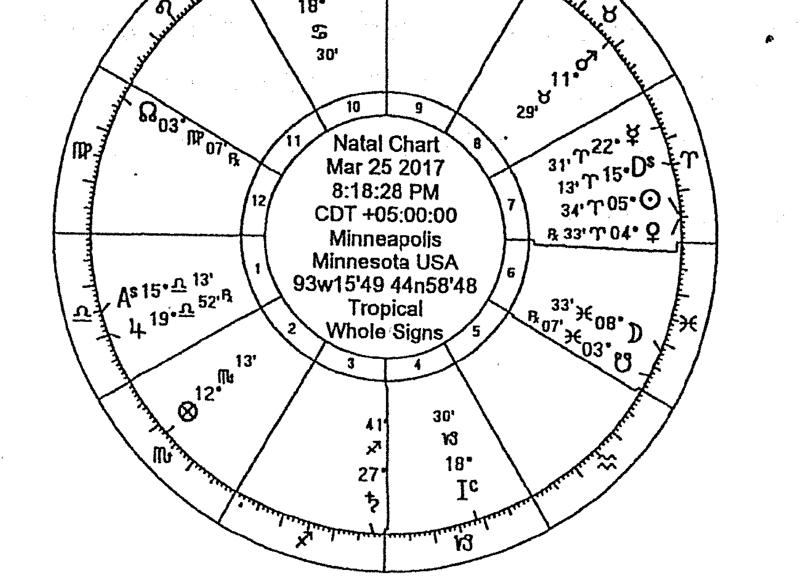

若再早約一個小時，這張星盤會變成日間盤，那麼我們就要從金星起算，以逆時鐘的方向來到月亮位置，加上15° 13′（或當時上升的度數），最後再以30°為一單位的方式來投射計算。

因此，整個過程是很直接了當的，但在賓格瑞的譯本中（I.14, 1），他翻譯為：

> 「要計算母親點，夜間盤是從月亮到金星，日間盤是從金星到月亮。[夜間盤] 再加上上升點的度數，或 [日間盤] 從上升以 [一次] 30°的方式將 [其] 減掉；計算結束的地方，即為母親點所在。」

再次強調的是，這公式一開始是正確的，但接下來我們卻看到：賓格瑞 (a) 以括號加入不必要的字，(b) 加入原本不存在的動詞「減掉」，(c) 加入原本沒有的日間盤跟夜間盤的說明，(d) 刪掉原本有的動詞「投射」。若我們真的依照這些指示，一半的特殊點將會是錯誤的。這個例子中，夜間盤的母親點是對的，但針對日間盤我們卻反轉了原來的計算方法：先從金星算到月亮，但之後還要從上升減掉此距離。多出的減法抵銷了日間盤本來就不同的計算方法，原本所求的日間盤母親點最後卻變成了夜間盤的母親點。

## 第四章

### 《詩集》裡的星盤

以下為《詩集》所使用的十張本命盤：

| 戴克 | 賓格瑞 | 儒略曆的日期 (戴克) |
|------|--------|-------------------|
| #1 : 手足 (I.22, 14-21) | #6 | 西元29年5月2-3日 |
| #2 : 資產與榮華富貴 (I.26, 2-4) | #8 | 西元43年5月2-3日 |
| #3 : 資產與榮華富貴 (I.26, 5-6) | #3 | 西元13年1月25-27日 |
| #4 : 資產與榮華富貴 (I.26, 7-8) | #5 | 西元22年3月29-30日 |
| #5 : 資產與榮華富貴 (I.26, 9-11) | #7 | 西元36年4月2日 或 西元66年3月31日-4月1日 |
| #6 : 資產與榮華富貴 (I.26, 12-14) | #2 | 西元12年10月31日？ 西元72年10月27日？ |
| #7 : 資產與榮華富貴 (I.26, 15-16) | #1 | 西元前7年3月28-29日 |
| #8 : 資產與榮華富貴 (I.26, 17-19) | #4 | 西元14年11月26日 |
| #9 : 壽命 (III.1, 29-67) | — | 西元381年2月26^33 |
| #10 : 壽命 (III.1, 17-40) | — | 西元44年10月2日 |

除了第九張是從薩珊王朝時期誤植的星盤外，其餘大致皆可回推至(當然或多或少有些不確定)都勒斯時期。這些可說是已知名家作品中最早的星盤了。我將在此章節討論星盤的日期並提供現代的版本。大部份星盤的日期確定是沒問題的，但還是有部份仍需再作商榷。

賓格瑞是以日期來為這些星盤編號的，而非出現的順序。這樣做的風險是，若有一張星盤的日期錯誤（至少有一張是），那麼整個順序就錯了。另外，其中有兩張星盤他並未編號，因為他認為這兩張是被誤植的。

### — 星盤#1 —
### 手足 (1.23, 14-21)

這張星盤並沒有問題，日期可推斷為儒略曆西元29年5月2日11:30AM。注意到上升是在上方，表示占星師是面向東方來起這張盤的（這與現在的習慣，南方或天頂是在星盤上方有所不同）。《詩集》裡的星盤都以這樣的方式呈現，而這也幫助我發現了《詩集》中一兩個抄寫上的錯誤。

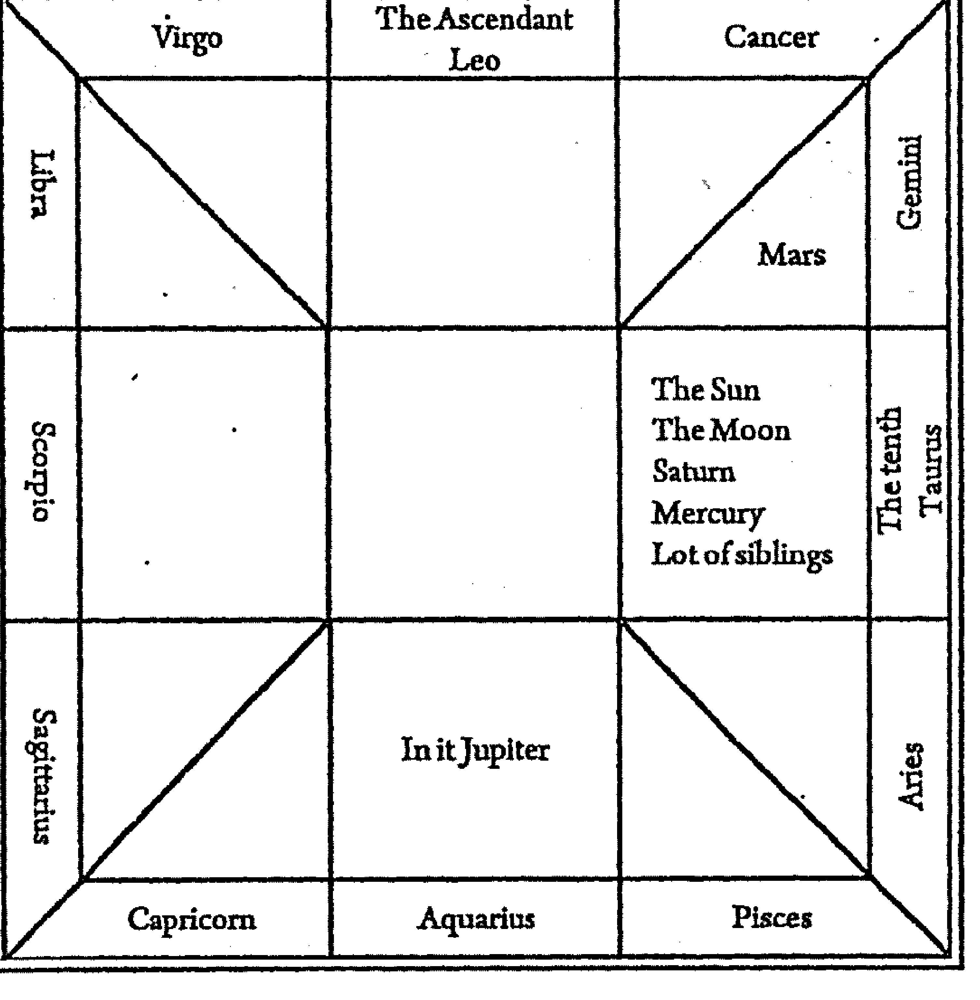

圖2: 星盤#1，手足 (1.23, 14-21)，根據手抄本C

### — 星盤 #2 —
### 資產與榮華富貴（I.26, 2-4）

這張星盤中外行星與太陽之間的配置，是不存在於西元前15年到西元75年的這段期間的。但如果將火星改為天蠍座，那麼這張星盤的時間就應該是在儒略曆西元43年5月2日或3日1:30AM，地點是黎巴嫩的西頓。都勒斯有可能錯誤地將火星計算為水瓶座，但我認為這應該是抄寫上的錯誤。更有可能的是，手抄本C（或其來源）認為上升是在左邊，所以火星是在六宮。但實際上上升是在上面，所以火星應該是在九宮。但不論是六宮或九宮，火星都是衰弱的，都勒斯的解析仍然有效。

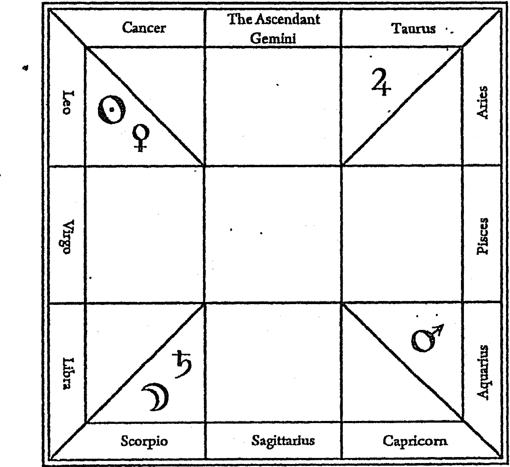

圖4：星盤 #2，資產與榮華富貴 (I.26, 2-4)，手抄本C

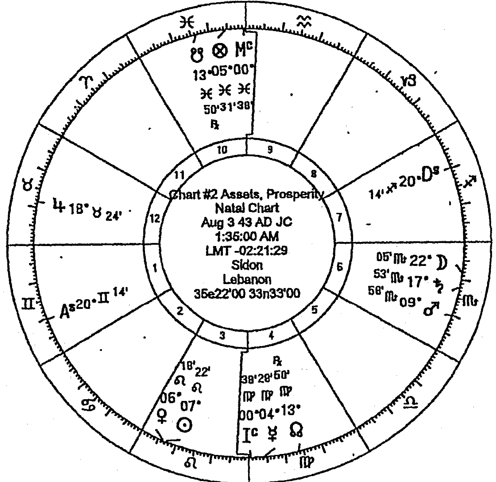

圖5：星盤 #2，資產與榮華富貴 (I.26, 2-4)，現代版

### — 星盤#3 —
### 資產與榮華富貴 (I.26，5-6)

我從月亮在射手座的位置，很快就推算出這張星盤的時間，是在儒略曆西元13年1月25日到27日10:00AM。這張星盤唯一的錯誤是，金星應該是在摩羯座而非雙魚座。這比較像是計算上的失誤，而非抄寫上的錯誤，同時也並不影響星盤的解析。

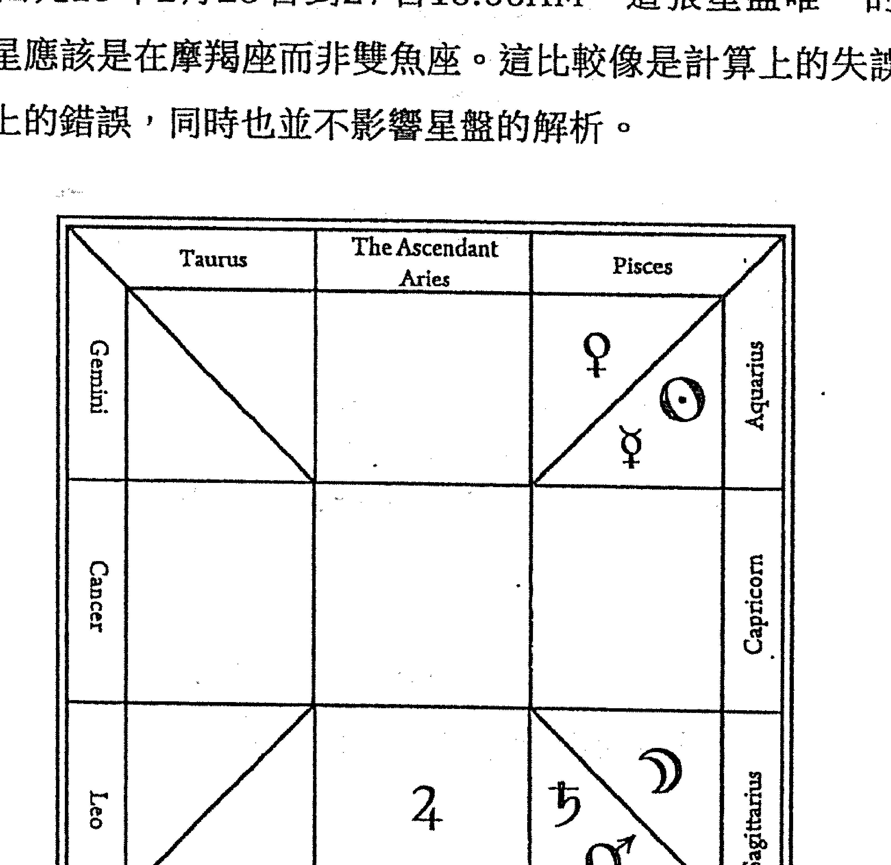

圖6：星盤 #3，資產與榮華富貴 (I.26, 5-6)，手抄本C

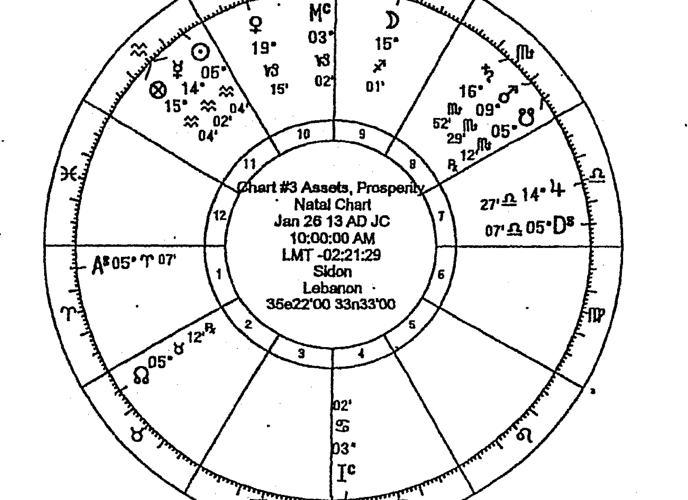

圖7：星盤 #3，資產與榮華富貴 (I.26, 5-6)，現代版

### — 星盤 #4 —
### 資產與榮華富貴 (I.26, 7-8)

這張星盤大概可以推算在儒略曆西元22年3月29或30日12:00PM。手抄本C中並未列出火星，金星不知為何被放在一個不可能的位置，土星也應該是在水瓶而非雙魚座。由於解析中提到土星是在衰弱且下降的位置，但與木星三合，而非在續宮的位置、與木星不合意，這讓星盤與解析之間產生了差異。若以計算的角度來看，這算是小的錯誤，畢竟土星的確會在13天後進入雙魚座，但與木星不合意卻讓星盤的解析大不相同。此外，上升的度數也會因為這樣變成在木星的前面，無論從象限或整宮來看木星都變得更為活躍。

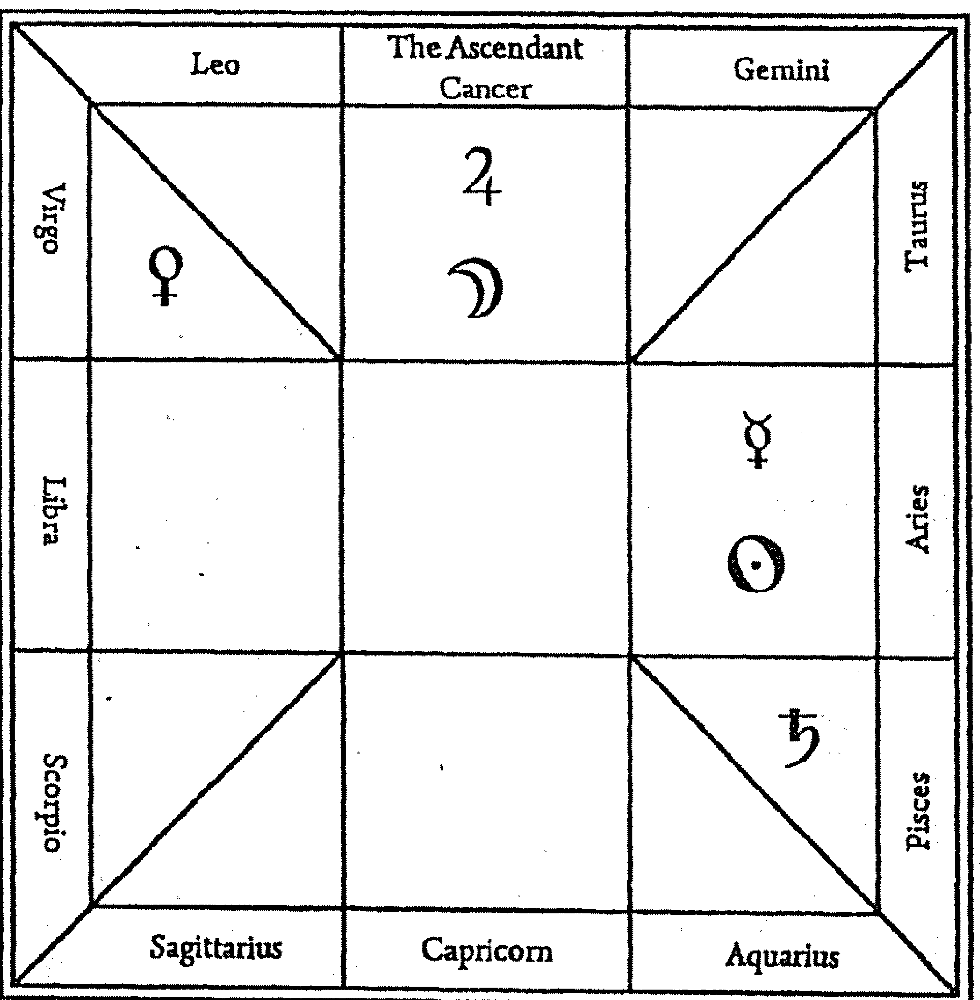

圖 8：星盤 #4，資產與榮華富貴 (I.26, 7-8)，手抄本C

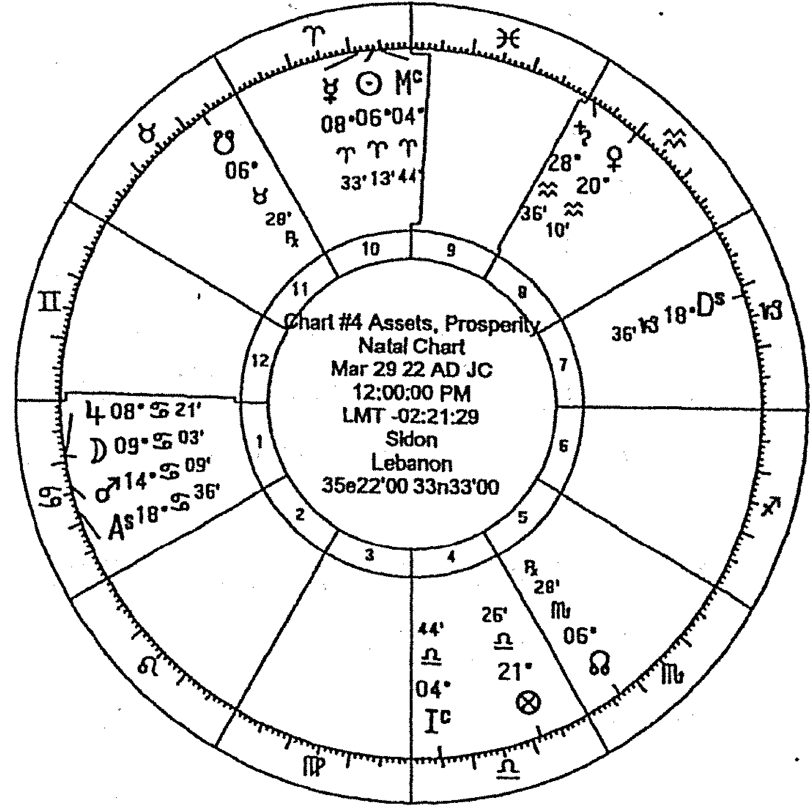

圖9：星盤 #4，資產與榮華富貴 (I.26, 7-8)，現代版

### — 星盤#5 —
### 資產與榮華富貴 (I.26,9-11)

這張星盤的問題是，有兩個可能的日期，且都很符合解析的內容，但兩個日期差距30年。這個問題的準確答案可能會影響《五經》裡的日期。下圖為手抄本C的星盤：

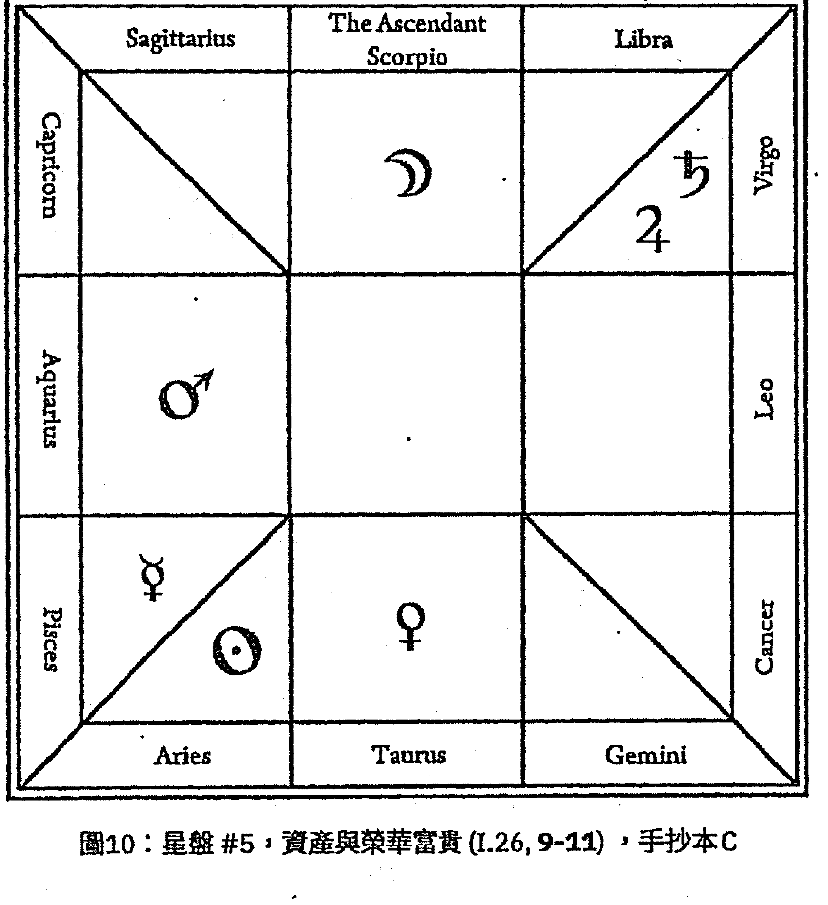

最符合行星配置的日期是在儒略曆西元66年3月31或4月1日8:00PM，星盤中唯一不在正確位置上的是木星。木星應該在牡羊座與太陽會合，然而木星卻未出現在解析裡。雖然像木星這樣的外行星竟然沒有被提及是一件很奇怪的事，但只有這個日期是符合解析中其它行星情況的，此時只好先將木星排除。

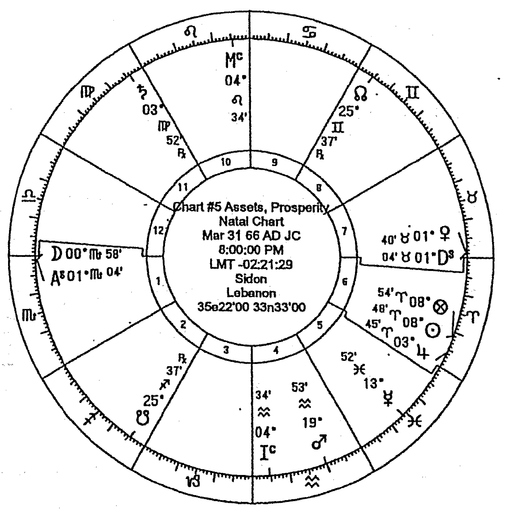

圖11：星盤 #5，資產與榮華富貴（1.26, 9-11），戴克的現代版

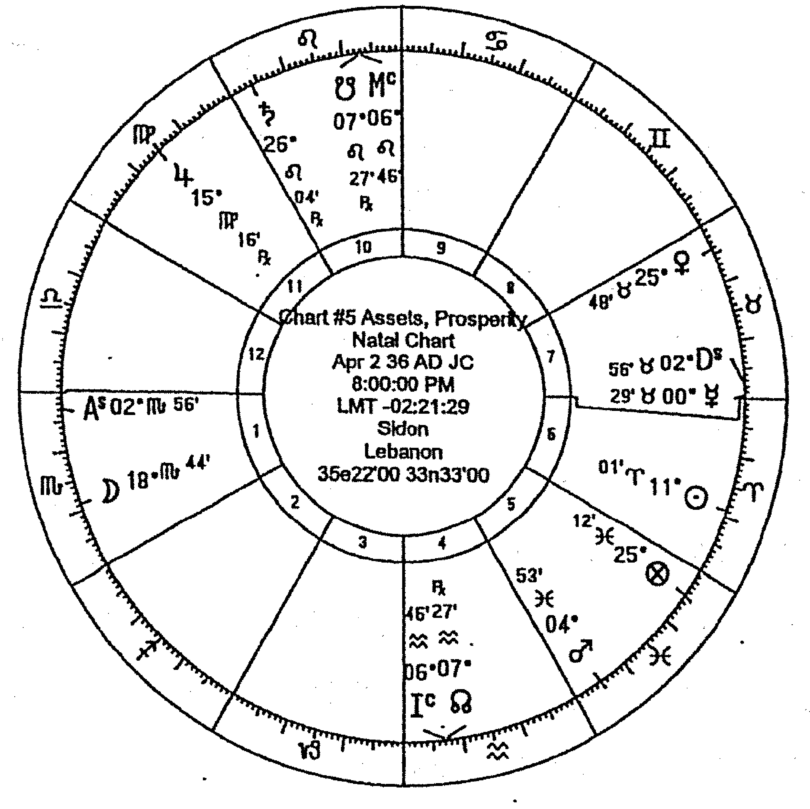

圖12：星盤 #5，資產與榮華富貴（1.26, 9-11），賓格瑞的現代版

賓格瑞則認為正確日期是在儒略曆西元36年4月2日8:00PM。此時有三顆行星不符合解析：土星（獅子）、水星（金牛）和火星（雙魚）。火星與土星與正確的星座只差幾度，而水星通常容易錯誤，可被忽略。

賓格瑞版本的兩個論點是有道理的，其一是根據時間的範圍，其二則是根據準確度。第一，這個時間與其它星盤的時間相近，屬於都勒斯生平的範圍；第二，雖然有三顆行星在錯誤的星座，但其中兩顆慢速行星與正確的星座只差5°，也是可以接受的差異。

有關第二個論點準確度，誰都會希望愈準確愈好，而西元66年的日期確實是較為準確的。若木星是在其它錯誤的星座，有可能是抄寫上的錯誤：畢竟解析中並無談到木星，我們也無從判斷都勒斯原始的版本究竟為何。尤其星盤 #4 中，金星所在的星座在天文學的計算中根本是不可能的。

要反駁第一個有關時間範圍的論點較為困難，且會影響第二個論點的答案。其中有兩個要素：西元66年的日期對都勒斯而言是否太晚，以及著作中星盤之間的差距應該要多久「才算」合理。

要記得都勒斯解析星盤的前提是個案的年紀必須夠大，才得以評估一生（至少四十歲）；此外，都勒斯本身也要年紀夠大才能夠解析星盤（例如四十歲以上），更別忘了他還寫了《五經》這本書，雖然書中的案例也許是他年輕時所收集的。因此若最晚的星盤（#10）是在西元44年，都勒斯有可能是在西元84年左右著作《五經》。若我認為的西元66年的星盤是正確的，都勒斯就有可能是在西元106年才著手著作。此時賓格瑞可能會回應，106年也太晚了，但這個回應有可能只是因為他太相信西元36年這個時間了。事實上沒人知道都勒斯究竟生活在哪個時間範圍，因此不應該先入為主地認為西元106年太晚。

然而，另一個認為西元66年太晚的理由是，這與其它星盤的間隔太遠了：例如比星盤#10還要晚22年。但這又如何？星盤#10還比最早的星盤（#7，西元前7年）晚了51年：若都勒斯能活到西元84年來解析星盤#10的話，星盤#7的主人可能已經過世了。但有誰說過都勒斯都是在個案活著時解析星盤的？而星盤#7（西元前7年）與星盤#6（西元12年）之間差距19年又該如何解釋？這中間難道他就沒有再解析任何星盤了嗎？誰規定星盤之間的差距就「應該」要緊密才行，尤其其中有一些星盤又是名人的星盤時？

事實上我們並不知道都勒斯是如何選擇這些星盤的，他認不認識這些個案，這些個案出生於何地，都勒斯是從較早的文獻得到星盤或是他自己計算的，這些個案在被解析時是生是死，又在何時過世等等。唯一可以確定的是，若都勒斯是在四十歲著作《五經》的話，那麼最準確的星盤（也是最晚的）是在西元66年，而他著作的時間則有可能是在西元106年左右。若依照賓格瑞較不準確的西元34年的日期，星盤#10則變成最晚的星盤（西元44年），《五經》的著作則可能是在西元84年。

### —— 星盤#6 ——
### 資產與財富 (1.26，12-14)

這張星盤最主要的問題是，行星的配置與解析裡的重要內容並不相符。月亮與木星確實是在風象星座會合且活躍的，但文字中卻寫道水星和土星是在下降或衰弱的位置上，但以整宮制且上升巨蟹座來看，水星、土星不可能在天蠍座同時又是下降或衰弱的。所以若不是上升是錯誤的，就是水星、土星的星座是錯誤的。不幸的是，無論上升在哪個星座，風象星座都有可能在四尖軸之一，因此很難找出上升的位置。有些人可能會認為土星和水星應該在射手座，但在西元前50年到75年之間，土星在射手座，木星在天秤座的配置並不存在。更重要的是，除非都勒斯使用的是象限宮位制，否則土星、水星不可能在相鄰於木星、月亮的同時，前者是下降的後者卻又是活躍的，然而我們並沒有證據證明都勒斯使用的是象限宮位制。

賓格瑞提出這張星盤的時間是在儒略曆西元12年10月31日10:00PM，如圖。火星是在處女座而非獅子座，而金星也即將在一天之內進入天秤座。然而土星、水星仍然不在下降的位置上。至於我推斷的時間是在儒略曆西元72年10月27日10:00PM。火星仍在獅子座，金星則在射手座，但問題還是相同。此時恐怕要採取更極端的說法才能合理化這些差異——例如可能是計算再加上抄寫上的錯誤，才導致許多行星都在不正確的位置上。若要符合解析上的內容，就得接受多張星盤的可能性。

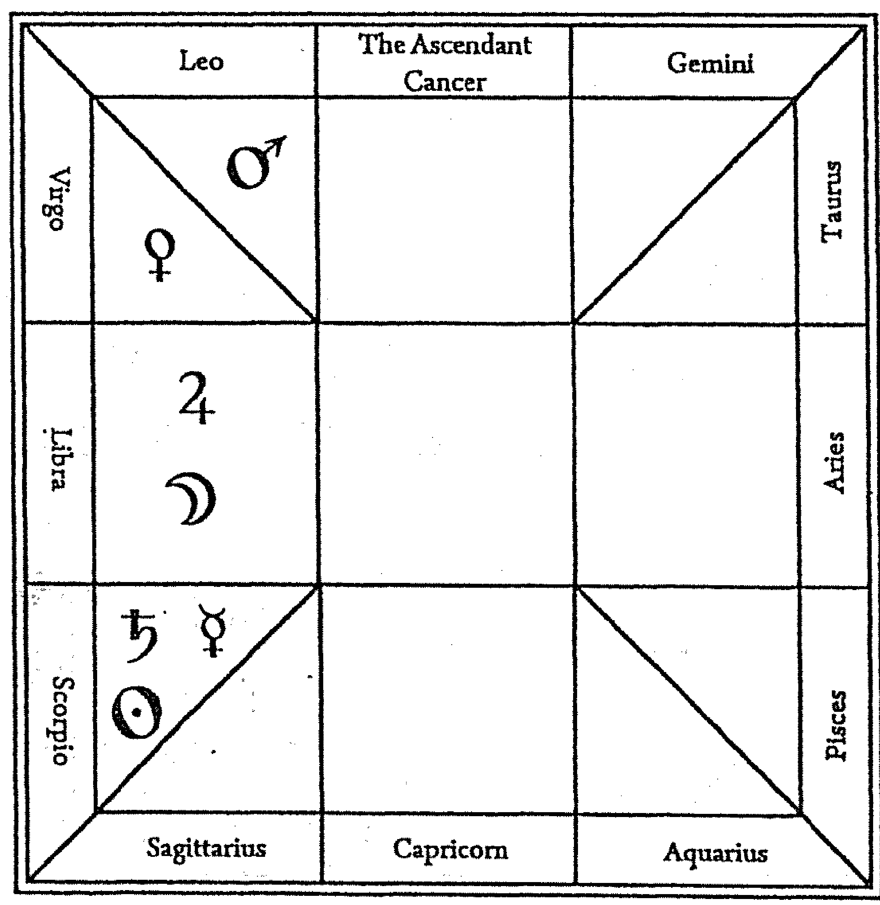

圖13 : 星盤 #6 , 資產與榮華富貴 (1.26, 12-14) , 手抄本C

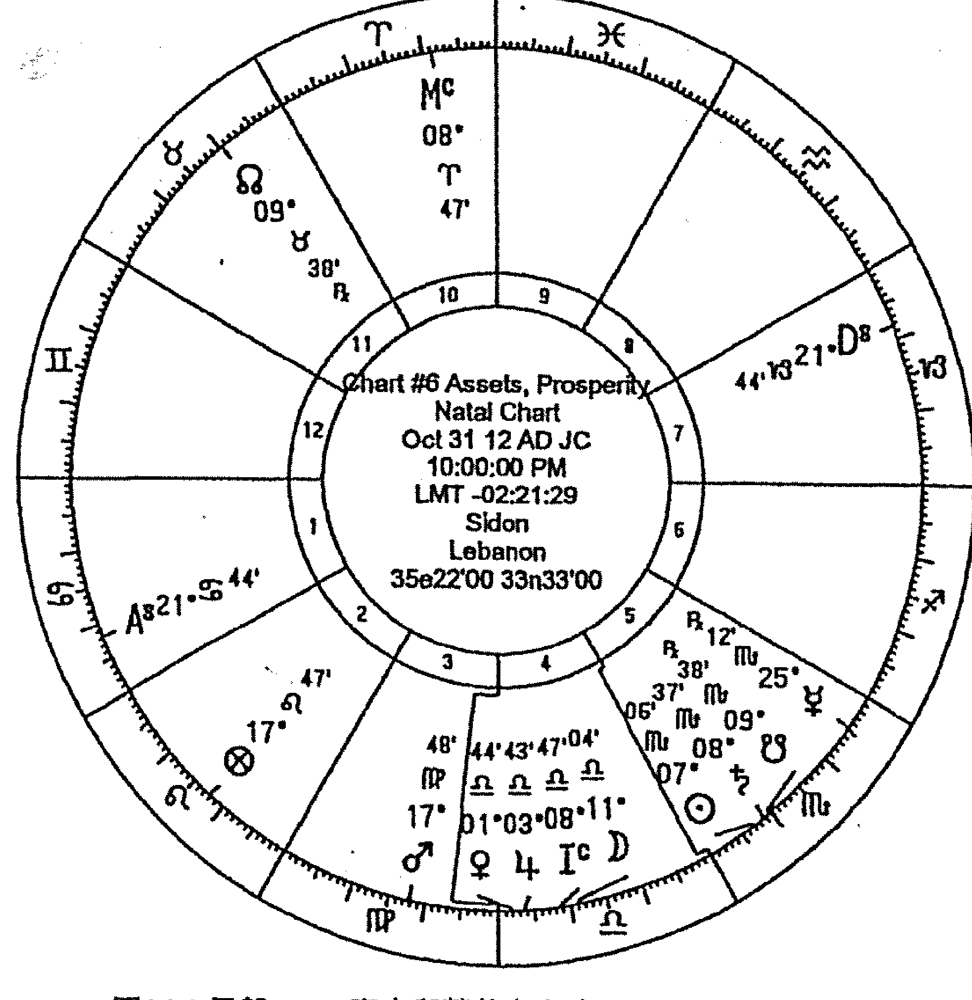

圖14 : 星盤 #6 , 資產與榮華富貴 (1.26, 12-14) , 現代版

### — 星盤 #7 —
### 資產與財富 (I.26, 15-16)

這張星盤應可確定時間是在儒略曆西元前7年3月28日 10:00AM。唯一的問題是水星和金星都在不對的星座上。但這種問題很常見，至少水星和金星對太陽而言都在正確的相對位置上。

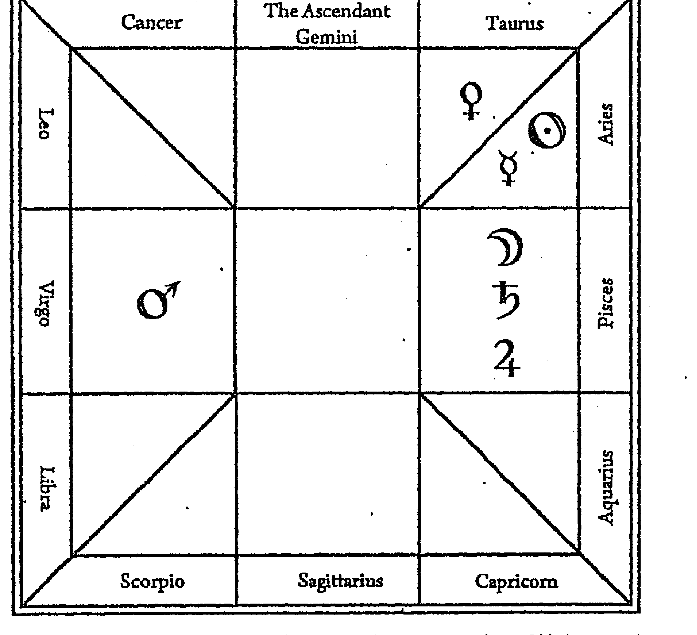

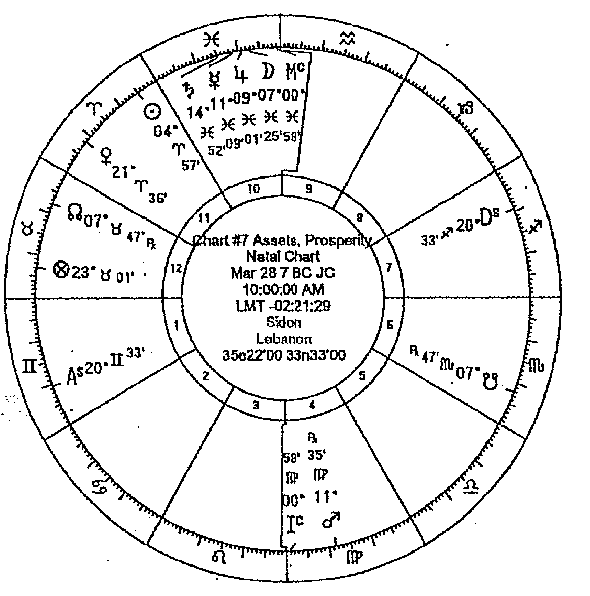

圖16：星盤 #7，資產與榮華富貴 (I.26, 15-16)，現代版

### — 星盤 #8 —
### 資產與財富 (I.26，17-19)

賓格瑞處理這張星盤的方法非常好。星盤中月亮必須位於尖軸與風象星座，水星和土星必須是下降的，而火星則須以某種方式傷害父親的資產，金星和木星亦同時位於尖軸。這個時間為儒略曆西元14年11月26日12:00AM。我們可以看到圖中的星盤仍然相當準確，不過都勒斯所認為的木星和土星的位置，分別比實際數值稍前與稍後。另外，我們看到火星在二宮，的確會傷害資產。這部份再次解釋了類似星盤 #2 中抄寫上的錯誤，而這裡則是將火星誤放在續宮。另一方面，因為五宮為四宮衍生的第二宮，有些人可能會認為五宮的火星傷害的是父親的資產，所以都勒斯才將火星誤放在五宮。然而都勒斯若是從之前的文獻取得這張星盤的，也有可能這張星盤一開始就是錯的。

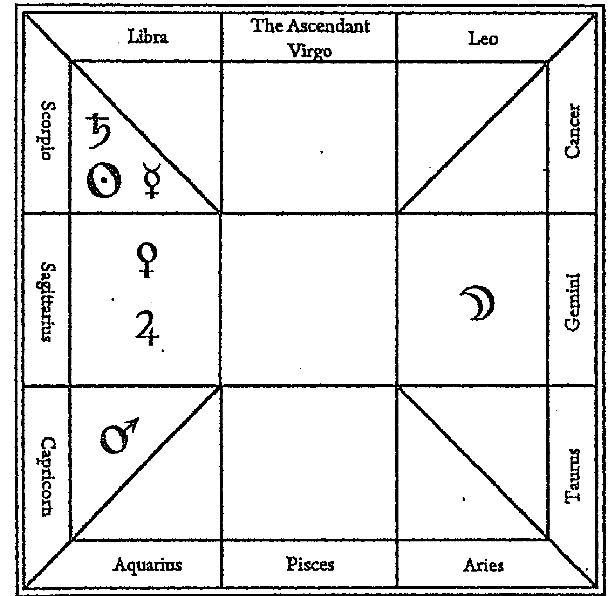

圖17：星盤 #8，資產與榮華富貴 (I.26, 17-19)，手抄本C

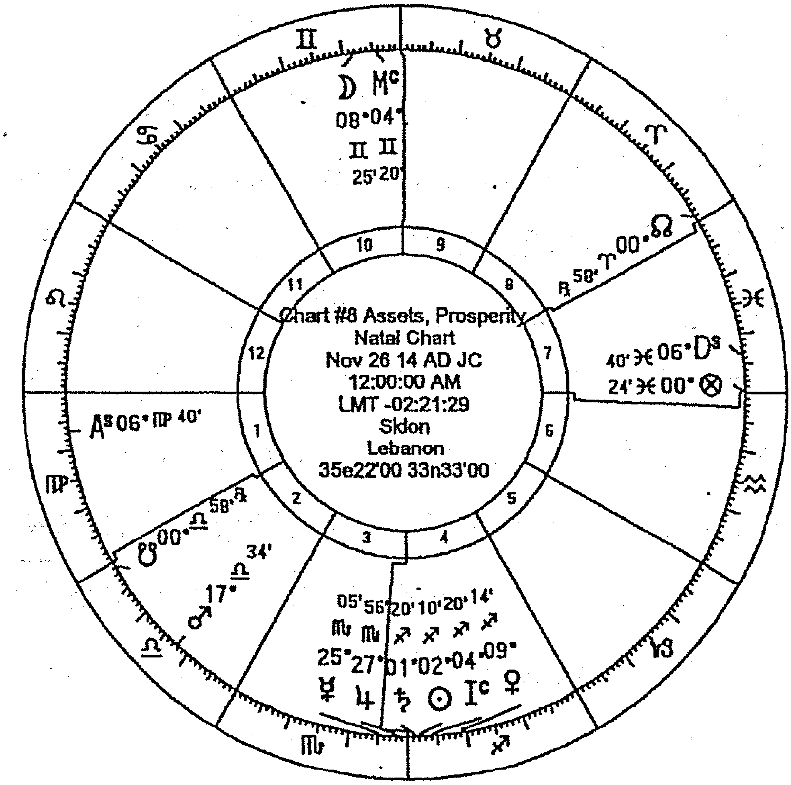

圖 18 : 星盤 #8，資產與榮華富貴 (1.26, 17-19)，現代版

### — 星盤 #9 —
### 壽命的配置 (III.1, 29-67)

這張星盤之所以特別有兩個原因。第一，文字的解析中有明確告知時間（波斯曆），甚至也告知是拜占廷帝國曆法（戴克里先皇帝，Diocletian）的年份。根據這些資訊，這張星盤的時間應為儒略曆西元380年2月27日接近日出之時，但若用恆星黃道系統來計算，時間為儒略曆西元前381年2月26日，其中只差一年又一天。這中間的差異可能是古代文獻中經常見到的，與純數和序數之間的混淆有關（尤其是阿拉伯文獻）。

以下方形的星盤來自手抄本 C。我們可以明顯看到行星的度數有些奇怪甚至是錯誤的（例如金星和太陽的度數應該對調，火星則有抄寫上的錯誤）。至於手抄本B則將月亮（雖然沒有度數）放在天秤座，符合2月27日月亮的位置。不過還要提出一個論點，即手抄本C中，都勒斯將月亮寫在靠近天秤座的位置上，這有可能是因為空間太小，無法寫下更多的訊息，但他應該是指月亮即將進入天秤座。然而月亮的度數是19°，而26日當天的上升確定是在18°，故月亮應該是在處女座。也就是說，真正的日期應該是儒略曆西元381年2月26日。若根據摩蘇爾（Mosul）等靠近現代敘利亞的城市以及牡羊座的赤經上升時間來看，星盤所在的緯度大概是36°30′（不過由於其它星座的赤經上升時間長短不同，故也無法依此確定）。另外，這張星盤是依恆星黃道系統繪製的（依照法岡-布萊德利[Fagan-Bradley]的歲差系統），但文字解析裡的內容卻顯示行星的度數與星盤有1°的差異，表示薩珊王朝占星師所使用的歲差系統（ayanamsa），比法岡-布萊德利的還要多1°。

這張星盤之所以有趣的第二個原因是，它揭示了薩珊王朝所使用的天文數據。首先，這張星盤若以恆星黃道系統繪製將更為準確，且其歲差系統與法岡-布萊德利系統十分相近（如上述）。第二，37的內容亦顯示這些天文數據是如何建構及使用的：

-   這張星盤是依第四氣候區繪製的。所謂氣候區是指以緯度但非平均的方式將世界劃分成七個部份，第四區經常代表「巴比倫」地區。但42中，該區域牡羊座的赤經上升時間（19°12′）與傳統的天文計算資料不符：代表薩珊王朝針對七個氣候區所使用的天文數據是不同的，又或者他們的天文數據可以精算到每個緯度或更窄的緯度帶。根據薩珊王朝的赤經上升度數，該區域應該是在北緯36° 30'；可惜的是，若依現代的方法計算，金牛座在該緯度的赤經上升時間仍與文獻所記載的不同。

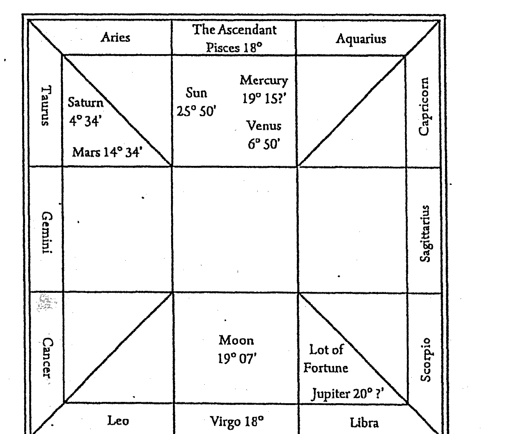

#### 圖19：星盤#9，壽命的配置 (III.1)，根據手抄本B和C

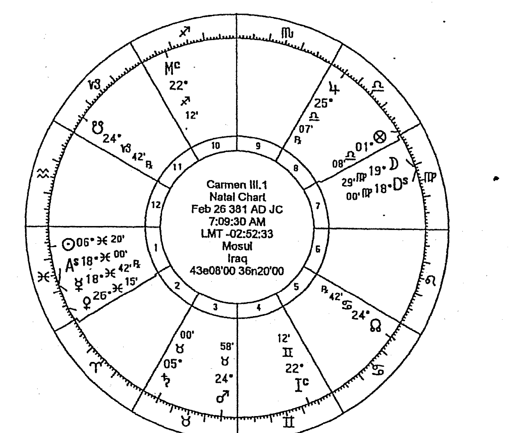

#### 圖20：星盤#9，壽命的配置 (III.1)，現代版 (恆星黃道系統)

更驚人的是，薩珊王朝已將各個氣候區、各個緯度及星座的赤經上升時間精準列出，甚至還加上各區間的分數。這樣的例子在文獻中比比皆是，每個行星的位置附上特定的赤經上升時間，計算時可快速加減。相較於將每個星座分成30等份、並認為每個度數的赤經上升時間相同的傳統方法，薩珊王朝的方法當然讓星盤的內容更加準確。第五章有更多相關的解釋。

最後，將赤經上升的時間依比例換算成年份（例如，某某事件會在2.5年後發生）時，他們還能利用特定的表格，例如1/5 (0.2) +1/10 (0.1)為0.3，甚至還有1/13這樣的比例（56）。由於一年中不同的時期可代表不同的天數，他們的計算方式可快速地換算出特定的天數。

### — 星盤 #10 —
### 壽命的配置 (III.2，17-40)

這張星盤的日期也存有爭議。賓格瑞將日期定為儒略曆西元281年10月20日，並認為這是波斯時期誤植的內容，而非出自都勒斯。這也許是因為賓格瑞認定第九張星盤是波斯時期的產物（霍登亦認為是這個原因³⁴），因此第十張星盤也是。不過霍登認為這張星盤的確出自都勒斯，日期為儒略曆西元44年10月2日。我認為霍登是正確的。

³⁴ | 霍登，2006年，第35頁，註釋83。

## 第五章
### 《詩集》 I.28 的赤經上升時間

在《詩集》 I.28，1-8中，都勒斯根據同區分的發光體 (sect light。譯註：原譯「區分內發光體」) 三分性主星的活躍度來判斷榮華富貴。他以尖軸為始點，每15°為一個區間，而每區間由高至低代表某程度的榮華富貴。前三個區間代表由高到中等的富貴 (0°-15°，15°-30°及30°-45°)，而在下個尖軸前的剩餘區間則代表最低的程度。不過在7至8的敘述中，他澄清度數並非以黃道度數平均劃分，而是根據赤經上升度數。這代表每個區間會因為星座的不同而有或大或小的分別，我們無法僅以目視就能確認每個區間的位置，必須要透過計算才能得出。

本圖假設某人位於北緯45°（使用該緯度之數據），並藉由赤經上升時間表計算得出。從圖中我們可以看到，黃道的前15°應在雙魚座10° 06'結束，但由於圖中的上升星座為扭曲或短上升星座，赤經上升時間較短，15個單位的赤經上升時間讓度數落在雙魚座後面的度數，即21° 42'：在黃經上離原上升約20°的距離。其它區間的算法亦以此類推。也就是說，位於牡羊座較早度數的木星，雖然距離上升的黃道距離約40°，但以赤經上升時間計算卻落在第二區間。反過來說，若為直行星座或長上升星座（尤其是處女座或天秤座），這些區間在黃經上將會比15°小更多。

與直接用三角函數，或稍後將會介紹的利用軟體「前進」的方法相比，使用赤經上升表格來計算這些區間所得到的結果仍不夠精確。赤經上升表格的數據是針對整個星座而言的，若要計算每一度的赤經上升時間，通常會直接除以30。例如：某星座的赤經上升時間為37，每度的時間即為1.233個赤經上升時間（37 / 30° = 1.233）。由於天空是弧形的，無論是從扭曲星座進入直行星座或者相反，其過程都是循序漸進的：即行經的度數並不會因為星座的轉換而有立即顯著的差異。星座前面與後面的度數所對應的數據是有些許差異的，因為它們會逐漸變大或變小。因此，當我們將赤經上升時間除以度數時，所取得的只是平均值，若是計算小的區間，誤差還算小。但無論如何，圖上的區間所產生的誤差僅約1°內。

在《詩集》III.1所展示的波斯星盤中，波斯人的計算方法比上述更為精確。上述的例子中，每個區間的度數都是個別計算的。但注意到，上升及區間三涵蓋了整個雙魚座與牡羊座：若要找出區間三的最終度數，也可將雙魚座和牡羊座的赤經上升時間相加，然後再從45個赤經上升時間減掉其加總，如此所得到的結果會比個別計算更為精準。在《詩集》III.1中波斯占星師就是以此方法計算的，而他的表格似乎還包括每個緯度的度數，更提高了計算的精確度。

利用赤經上升表格的計算有個可惜的地方是，它僅能計算地平線（上升與下降）的度數，而無法計算中天或天底的度數。至於為什麼，這個方法的名稱直接給了答案。它稱為赤經上升時間，而非赤經中天時間。至於西方位於下降點以上的行星，我們須使用表格上相對的星座。由於這個方法需要經驗與訓練，所以稍後我會再介紹，藉由電腦軟體的時間（例如小時）動態功能來計算的方法，而這個方法簡單到人人皆可上手。

#### 軟體「前進」的方法

實際上都勒斯這個方法為某種主限向運法，係由赤經上升計算出星體之間的距離，並預測星體或相位何時以主限或周日運動來到地平線或中天。由於天空每四分鐘移動一個赤經度數，若某段區間為赤經15°，換算成時間則為60分鐘（15 * 4 = 60）。若利用軟體的動態功能，依每一小時的速率前進，我們即可確認每個區間的起始與終點。

1.  在軟體的動態功能中打開本命盤，並注意隨著尖軸移動的行星。
2.  讓星盤的時間前進1小時，所有經過尖軸的行星將位於區間一。
3.  再讓星盤的時間前進1小時（總共2小時），所有經過尖軸的行星將位於區間二。
4.  再讓星盤的時間前進1小時（總共3小時），所有經過尖軸的行星將位於區間三。

舉例來說，假設木星為上述星盤的第一個三分性主星，星盤的時間為6:00 AM。欲知木星是否位於區間一，我們可讓星盤時間前進1小時（7:00 AM），觀察木星是否通過上升點：若是，則木星在區間一；若否，則不在。這個例子中木星並非位於區間一。現在再讓我們前進1小時（8:00 AM），觀察木星是否通過上升點：此時木星的確通過上升點，因此木星位於區間二。但若木星未通過，我們可以再前進1小時，觀察木星是否通過上升點。

由於電腦可以自動計算每個尖軸的三角函數，這個方法可運用在四個尖軸上，來觀察三分性主星是否位於其中一個有利的區域。另外，由於星座的赤經上升時間在極端的緯度上會變得極多或極少，某些星盤顯示榮華富貴的有利區間範圍相對較大，因此這個方法在某些地方可能無法適用。不過從以上的案例得知，都勒斯認為三個星座約為45個單位的赤經上升時間，這代表位在較為北緯的地方、上升為扭曲星座的人，會比上升為直行星座的人（這三個區間範圍相對較小）具有更大的機會符合榮華富貴的這項法則。從另一個角度來看，正因為扭曲星座上升速度較快，在此類星座上升時出生的人也相對較少。

## 第六章
### 《占星詩集》裡的三分性主星（第一、二、四冊）

占星師都知道都勒斯在星盤的解析中對三分性主星著墨甚多³⁶，在《詩集》中甚至還說「每件事」都可透過三分性主星而決定（I.1, 8）。當然他的意思不會這麼表面，否則《五經》裡的內容可以縮短許多。不過他的確認為三分性主星是重要的，雖然我不記得文獻中他究竟曾和誰討論並解釋其重要性：三分性主星究竟代表什麼，又有什麼作用？在本章中，我會以《詩集》裡的多篇章節來闡述並回答這些問題（參考以下表格）。

三分性主星的起源與行星喜樂有什麼關聯，一直以來都是個引人入勝的主題。在我完成本命占星的課程前，我想先向讀者介紹布倫南的優秀評論，內容是根據2012年我們共同完成的研究37。除了三分性主星是如何衍生的之外，它們代表什麼含義呢？

都勒斯所列出的案例中，有九個是我認為非常重要的三分性主星的類型，另外還有三種相對沒那麼重要。範例中三分性主星（特別是前兩個主星）會與一般性的代表因子共同解析。例如，太陽在自然徵象上常類比為父親，而太陽的三分性主星亦可代表父親，因此除了三分性主星的作用外，也必須考量其與自然代表因子的差異。但我們可能因此而落入某種陷阱，不少現代占星師就面臨著這樣的風險：將所有的因素都丟入同一個鍋子裡，像「燉煮」食物般不停地攪拌，然後再看什麼味道會先跑出來——通常會把所有味道歸類為「好的」或「壞的」的評斷。幸運的是，《詩集》中有許多連貫性的語彙與觀念來協助解決分辨上的難題。以下表格將九種主要的及三種次要的三分性主星羅列出來，同時加上相應的主題與在內文中出現的位置：

| 代表因子 | 主題 | 出處 |
| :--- | :--- | :--- |
| 上升 | 成長 | I.4及I.7, 9 |
| 月亮 | 母親 奴隸 | I.13, 11-15 及 18-22 I.10, 1-238 |
| 月相 | 奴隸 | I.10, 24-33 |
| 太陽 | 父親 | I.13, 1-10及16-22 |
| 火星 | 手足 | I.23, 11-19 |
| 金星 | 關係 | II.1, 1-5; II.3, 19-22; II.4, 3-6。 |
| 木星 | 子女 | II.8及II.9 |
| 幸運點 | 成長與榮華富貴 | I.4, 8-9 I.28, 34-35 |
| 同區分的發光體 | 榮華富貴³⁹ | I.24; I.26; I.27, 1-4; I.28, 1-9。 |
| 天底 | 疾病 死亡 | IV.2, 17-19 IV.3, 25-28 |
| 第七宮 | 死亡 | IV.3, 18 |
| 婚姻點 | 婚姻 | II.4, 4 |

圖25：都勒斯的代表因子及三分性主星

讀者可輕易透過以上表格讀取相關內容，我這裡只先簡單介紹《詩集》中自然代表因子與三分性主星的不同之處：

自然代表因子：主題、人物或動機（例如愛）的本質上／根本上的價值、自尊或適切性。

三分性主星：持續的協助與支持（尤其有「增加」或「減少」的功能）、保護與存在。

許多占星師將各種尊貴力量類比為多種社會關係，三分性主星通常與兩種事情有關：自我權威的重視⁴⁰，以及家庭、朋友與同盟等各種類型的支持。其中我認為家庭與家人般的朋友最為重要，尤其在古代社會，家庭代表支持與成功的機會，沒有家庭就代表無法從外部獲得支持與成功。因此，即便當事人的能力或資質良好，但若缺乏支持要何以有效發揮才能？又或者當事人有能力保護或保持能力的穩定嗎？自然代表因子或許狀態良好，但若缺少有力的三分性主星，就代表當事人缺乏支持，自然代表因子所代表的事項亦無法獲得協助、保護或持續顯現。三分性主星顯示當事人在一生中，特定主題或自身狀態是否有增加或減少、獲得保護或缺少保護、存在或不存在等狀況，以及特定主題如何影響當事人。我們先從太陽及父親的主題開始討論，同時參考我所整理的關鍵字與相關概念。

太陽與父親。《詩集》中的確清楚陳述了太陽與父親有關：

「從太陽可得知父親的尊嚴，從其三分性主星知道他的生活水平」（I.13,1）。「生活水平」（عيشية）這個詞不盡然是指他的職業或工作，而是他的生活質量、生活形態與方式。這已然道出三分性主星與時間、過程與經歷的關聯。因此，若太陽的狀態良好，就能正面描述父親在社會價值、資源或地位方面的基本水平。若太陽的狀態不佳，也會負面地影響父親的尊嚴與健康（I.13, 6-8）。

以太陽的狀況為基礎，若其三分性主星的狀態良好，將會「增加」父親的吉象，提升他的地位（I.13,2,9）；若三分性主星的狀態不佳，將會「減少」父親的資產，無法提供「保護」，甚至造成傷害與災難（I.13, 4,6）。

這樣的方式是先針對太陽做基本的解析，然後再以三分性主星判斷父親的資源能否增加或受到保護。三分性主星不僅對父親產生影響，父親畢竟是命主的至親，命主也會受到影響：若三分性主星受到傷害（或太陽也同時受到傷害），父親的資產將會被「揮霍」（I.13, 17），亦即資產無法受到保護或保全；倘若全部都受傷，命主甚至會被家族拋棄，因此無法受到父親的關愛與支持（I.13, 20）。

上述關於父親的描述包含了所有三分性主星的基本概念，不過仍然有其它的用法。接下來除了討論這些用法外，也將考慮如何將三分性主星應用在時間的預測上。

自然代表因子：價值、尊嚴、適切性。《詩集》中有多章提及自然代表因子在本質上與其代表的人事物的價值有關。例如，上升代表命主的身體與是否能受到良好照顧（I.4, 7; I.7）；月亮為母親的社會價值（I.13, 13-15），亦為家庭的基本狀態（I.10, 1）；太陽為父親的自尊與生活 (I.13, 1)；出生前的新月或滿月為家庭的價值與狀態 (I.10; 24-31)；金星為配偶基本的合適度 (II.1, 4)；同區分的發光體則永遠代表生活的基本要求與生計本身。

#### 「增加」與「減少」

三分性主星的首要作用在於增加或減少代表因子主管事項的質與量，而且是以一種持續的方式。若上升的三分性主星狀態良好，將會提升生活的質量 (I.4, 2)，若狀態不佳，則降低 (I.7, 9)。若上升及三分性主星受到傷害，則轉而檢視幸運點及其三分性主星，將其作為最後確認能否幸運地獲得照顧的指標 (I.4, 8)。月亮 (以及同區分的發光體) 作為家庭的代表因子，若狀態不佳，三分性主星卻能創造天壤之別的情境，例如雖然貧窮卻自由，抑或墮落到奴役的深淵 (I.10, 1-2)。在其它主題上，三分性主星同樣能影響一個人的生活品質，將其提升或拉下：例如配偶是壞人或是出身低下，是否帶來恥辱或悲傷 (金星，II.1, 4-5; II.3, 19)；子女帶來的是財還是禍 (木星，II.8, 12)；命主是隨心所欲過生活、享受高的社會成就，還是必須歷經千辛萬苦、困難重重 (同區分的發光體，I.24, 1-7, I.26相關的描述，I.26, 14)，此時木星與三分性主星的相位能減輕問題 (II.3, 30)。若從數量的層面來看，三分性主星能增加或減少手足 (火星，I.23, 12-13)、子女 (木星，II.9, 7 及 10) 或資產 (同區分的發光體，I.24, 1-7) 的數量。最後，天底代表疾病與死亡，傳統上有不吉利的意味，但三分性主星能讓死亡變得更為可怕或較為祥和，或讓死亡的品質有著極大的差異，例如不名譽或不明原因的死亡，或受人緬懷甚至享有厚葬的尊榮 (IV.3, 25-28)。

#### 「保護」

《詩集》提到三次「保護」及「保存」來說明三分性主星的功能。太陽的三分性主星若狀態良好，能保護父親的資產 (I.13, 6)，上升的三分性主星能保護命主的生命 (I.4, 2)，而幸運點的三分性主星若能注視幸運點，命主的資產就得以保存（I.28, 34-35）。同樣的，木星及火星的三分性主星分別保護了子女與手足，至少他們的生命得以倖存（II.9, 15; I.23, 12-13）。最後，我們可以說同區分的發光體的三分性主星若狀態良好，命主的生計與生活方式將受到保護與保存，至少能夠過著「穩定」的生活（I.24, 8）。

「協助」與「支持」。瓦倫斯曾提到三分性主星有「支持」與「基礎」之意41，《詩集》亦採用協助與支持的概念，即便不是直接使用同樣字眼。《詩集》I.28, 9 對此觀點有一種特別的應用，即若僅有不同區分的 (contrary-to-sect。譯註：原譯「區分外」) 發光體的三分性主星位於吉宮（且同區分發光體的三分性主星不在吉宮），命主只會過著中等的生活，他的格局是有限的，無法超過他自身所能達到的水平，無法得到任何協助。《詩集》強調，同區分的發光體的三分性主星應注視月亮、上升或同區分的發光體自身（I.27, 1-2），其代表的支持並非停留在抽象的層面，而是直接透過行星的連結給予。都勒斯在這段文字中表達了月亮比上升來得重要，因為月亮在廣義上代表養育與家庭地位，而不僅限於命主的身體與存在（I.10, 1-2）。最後，三分性主星所給予的幫助也隱含了對主管事項的准予：木星的三分性主星若狀態不佳隱含著沒有子女（II.8, 4），金星的三分性主星若狀態不佳則暗示無法成家（II.4, 5-6）——也就是說，即使你遇到合適的人（有好的金星），卻缺乏助因結成連理，兩人之間的和諧度也會減少。

都勒斯更進一步強調並確信，三分性主星所扮演的支持的角色是透過與特定行星的強力連結來完成。上面提到他希望同區分的發光體的三分性主星能注視月亮、上升及同區分的發光體本身。但他同時也## 第七章

## 有关寿命（第三册）

据纳迪姆⁴⁵所言，《五经》第三册或其古波斯文版本的内容包含了职业以及寿命释放星或居所之主 (house-master)。「释放星」系象征命主生命或生命力量的行星，用于主限向运法中（第三册亦提及界行向运法）预测生命的终止或其它危机。阿拉伯文版本亦跟随古波斯文的称呼，称之为 *hilāj* 或 *haylāj*，之后拉丁文则以 *hyleg* 表示。「居所之主」亦为释放星之一，不同的占星师有其不同的应用方式。阿拉伯文同样沿用古波斯文的名称，称之为 *kadhudhāh*，而拉丁文则为 *alcochoden* 或 *alchocoden*。III.1 和 III.2 称释放星为生命的「征象星」，居所之主则称为生命的「主管星」，对生命最有「主导权力」。读者可参考瓦伦斯（《占星选集》III.1）和托勒密（《占星四书》，罗宾斯译）来比较他们对于这个主题的方法。

遗憾的是，《五经》中针对这个方法的内容大部分已佚失。III.1 中有绝大部分的内容可能是由后代的波斯学者补充的。在 III.1 的开头，我针对行星进入与离开光束下的理论补充了我的观点。上述第四章中我也讨论了其中的一张星盘。另外，III.2，1-16 直接讨论了释放星与居所之主，这有可能是都勒斯原创（虽然内容略为简短）。17-44 则大幅讨论星盘案例，虽然宾格瑞认为是其他学者的补充（参考之前的论述），但 III.2 在结尾的确有提供些许判断的法则。

## 第八章
### 《诗集》中的年度预测系统 (第四册)

《诗集》的 IV.1 和 IV.4-5 完整体现了都勒斯的年度预测系统，这方面与《占星四书》IV.10 有点类似。与第三册相同，第四册展现了都勒斯年度预测系统⁴⁶的精髓：

- （仅仅或主要使用）寿命释放星经过界的配置法
- 年度小限法（分别有年主、月主甚至日主星⁴⁷）
- 太阳回归法
- 过运法

在 III.1-2 中，配置法的计算方法附有图表，且小限、太阳回归和过运应一起使用，但可惜的是，有关太阳回归的章节仅有两个句子提供如何计算行星位置与上升点，但如何解析却付之阙如。第一句 (IV.1, 4) 应该是都勒斯的观点，但第二句 (IV.1, 14-15) 则是根据瓦伦斯的方法所补充。因此接下来我们仅能讨论小限法与过运法。

第一部份是上升的年度小限法，以太阳回归日起算。与其他占星名家不同的是，都勒斯是以整宫制推算，而非以30°48'为单位来推算⁴⁸。零岁时，上升「本身」即为当年的小限，之后以一年一个宫位的方式往前移动。小限所到之星座即为年度星座，其主星则为小限的年主星：有许多不同的方式诠释该年的星座与年主星，包括其在本命与太阳回归盘的位置与状况（可再结合稍后提及的过运法），来预测当年可能发生的事件。图26为每一年小限法的宫位，虽然只显示到五十九岁，之后仍可以此类推直到命主死亡。

在确认年主星之后，我们会先分析该行星在本命盘的自然征象与状态，并观察该行星当时的过运⁴⁹。若行星状态良好、东出、远离光束下、顺行、行进速度快，代表行星的主管事项是有建设性或有助益的（可能即将发生）⁵⁰；若行星状态不佳、西入、在光束下、逆行、行进速度慢，则会伤害或阻碍主管事项⁵¹。但这些都应基于本命盘原本所承诺的来判断。

行星的过运虽然重要，但年主星的过运更加重要。不过在讨论年主星的过运之前，我们先观察年度星座本身，它如何被引动，年度星座内的本命行星又如何被引动。

年度星座本质上是脆弱的：它就像家一样需要照顾与保护。最好的情况应该是当发光体之一（尤其是同区分的发光体）以三分相来注视时——在太阳回归盘中也应如此；若否，那么年主星应在自己的尊贵位置上（太阳回归盘也应如此）；若无尊贵力量，且年主星又位在「敌人」的宫位上（应该是指其陷宫或弱宫），那么其主管事项将会极不稳定⁵²。然而年度星座有可能被过运所伤害，尤其是来自对面星座的过运：这样的过运应先判断该行星的吉凶，再加上其它行星的连结⁵³。所有年度星座中，最重要的为尖轴的星座：当行星的过运以主相位或合相来到尖轴星座，行星的状态就会对星座造成影响（相位的类型亦然）⁵⁴。

若年度星座中有颗本命行星在内⁵⁵，照理来说这个行星应立即受到影响，但《诗集》认为仍应有过运前来引动——又或许，过运的行星会显示影响将如何产生。这颗宫位内的行星有可能是（1）被自己的过运，或（2）被其它行星的过运所引动。

（1）被自己的过运引动——当太阳回归盘中，行星来到年度星座（通常我们会说行星「回归」），或与年度星座形成主相位⁵⁶时。举例来说，当小限来到双子座，宫内有颗火星：若太阳回归盘中的过运火星一样位于双子座，或以主相位注视火星，火星就被自己所引动。以吉凶程度来看，与本命位置三分是最好的，然后是支配本命的位置，然后是被本命位置所支配，最糟的是对分本命位置⁵⁷。这些配置是指行星与自己的关系，显示当下处境是如何提升或降低本命的状态的。

（2）行星亦会被其它过运的行星以星体或相位所引动⁵⁸：这会产生综合的影响。先解析过运行星的自然征象是如何对本命行星造成影响的。举例来说，若水星位于年度星座，我们准备引动水星。当过运土星与本命水星产生连结，将会对水星类型的事物产生土星类型的问题（例如悲伤）⁵⁹，但影响程度则视相位类型而定（土星三分水星比四分水星来得好）。同样道理，若小限来到本命月亮的位置，土星过运本命月亮将带来身体上或其它月亮所象征的事物上的负面影响⁶⁰。

因此，无论都勒斯对太阳回归盘的观点如何（若有的话），《诗集》认为太阳回归盘本质上为过运对本命盘的影响，同时应先检视年主星、年度星座以及年度星座内的行星。有鉴于此，我们可以说这些论述为都勒斯对于过运的基本理论，并应与 IV.4 的描述相结合。

首先，无论是太阳回归盘里的过运或整年的过运，本质上都像是一种触发器。它们能提升或降低本命盘原本就承诺的事物。因此，它们是相互关联的：行运的解析须建构在本命上，两种解析须互相关联，而非独立存在的事件（请见以下）。

第二，如上所述，过运行星会以两种方式来触发或引动（或许还有第三种）：引动自己的本命位置，或引动其它位于小限星座的行星。谈到引动自己的过运，请参考图27。假设土星在金牛座（内圈标示），而金牛座为年度星座，这一年中土星就非常敏感。土星可以藉由过运从任何注视本命土星的位置引动他自己，图中我已标示出三种过运的位置（外圈）。若过运土星在双子座，将会与自己的本命位置不合意，亦无法直接引动自己。若土星在摩羯座，他就可以三分相注视自己，而三分相的性质能产生较具建设性的影响。但若土星在狮子座，四分相的引动就会带来困难。除了因为四分相是困难相位，同时本命土星也会对狮子座形成十宫压制（decimate）或支配狮子座：因此若过运的土星来到狮子座，他就会被本命的自己所伤害。

再假设本命土星位于射手座，年度星座为天蝎座。本命土星无法注视天蝎座，基本上无法对其造成影响。但若当年过运的土星来到狮子座，那么他就会毁坏天蝎座，并以土星型、类似四分相的方式伤害天蝎座及在内的任何行星。若本命水星在天蝎座，水星（水星在小限宫位内）则一样会被土星以土星型、类似四分相的方式伤害。但过运土星并不会在这个小限引动其本命的（射手座）意义，因为本命土星并无注视天蝎座。若本命土星与天蝎座或本命水星有所连结，过运的土星就会对本命所承诺的事项产生即时的效应。

目前为止我们已经定义了两种引动方式，但我们还未谈到何时应观察过运。《诗集》似乎只对回归盘中的过运有兴趣，但往后的占星家与后代的实践均显示，即使回归盘中的行星位置已显示出当年所有可能会被引动的主题，但整年的过运仍会引动个别事件。

最后一种过运引动的方法较为抽象，却为现代占星所常用。目前为止我们所谈的都是都勒斯在 IV.1 的内容，即过运必须与小限法一起运用。但在 IV.4 中，他以菜单式的方法列出各种过运的意义，此时并无提到小限法。IV.4 似乎是说，太阳回归盘中任何行星的过运都应解析，其中也包括过运来到四尖轴，但此时就会产生谁先谁后的问题：都勒斯是否认为所有的过运都同等重要（与 IV.1 矛盾）？又或者他已预先假设读者都知道小限或年主星相关的过运应优先解读？例如，假设土星如上图所示位于金牛座，但金牛座并非年度星座。当土星的过运一样来到摩羯座或狮子座时，由于和小限没有关联，是否还会对本命盘造成影响？另一个问题则是「宫位」(place) 的混淆。行星的「宫位」可能是指行星座落的位置，但也有可能是行星的主管星座。

《摘录》对于过运的行星来到另一个行星的「宫位」时，明白表示是本命行星所在的位置。IV.4, 17 提到月亮来到火星的宫位时，《摘录》XXXIV 明确指出为本命 (fixing，之后翻译为固定盘) 火星所在位置。所以月亮的过运并非经过牡羊座或天蝎座，而是来到火星本身所在位置或与之形成相位。这一问题因此得到轻松解答。

至于谁先谁后的问题，IV.4, 2-3 和《摘录》XXXI, 1 皆坚定认为，每个行星与自身的连结都是重要的。而修密特解释 (1995年，第3页)，这是指「每当」行星回到本命的位置或与本命位置形成对分相之时。然而这些章节又随即谈到过运的行星引动其它行星，不禁让我们猜想是否这颗行星适为年主星或年度星座内的行星。它有可能是指与小限有关的宫位，但由于这些章节从未提及小限或年主星，因此结论仍有待厘清。

我私自认为都勒斯应该会认同以下过运的优先顺序：

- 太阳回归盘的过运来到年度星座及在内的本命行星（无论行星来到其本命位置，或由其它行星的过运来引动）。这是《诗集》既有的内容。
- 太阳回归盘的过运来到/年主星的本命位置。《诗集》并未明确提及，但其隐含的逻辑正是如此。
- 年主星在太阳回归盘的过运。这是《诗集》既有的内容。
- 任何行星在太阳回归盘的过运，来到任何本命行星的位置（包括自己），尤其是合相与对分相。《诗集》未明确提及，但有明显的暗示。
- 一年中所有的过运：年主星来到年度星座、年主星本命位置。其中亦包括年度星座内的本命行星的过运，来到那些本命的位置。这部分《诗集》并未明确提及或暗示。

## 第九章 问题与开始（第五册）

第五册阿拉伯文的标题，若直接翻译，为问题（questions）(أسئلة) 的意思。但这个词还可延伸为「困难」、「疑问」或「询问」之意。当我们向占星师询问该如何解决问题时，占星师应回答何时、是否或该事件将如何发展。所以这个标题事实上有些含糊，但有些人可能就直接视其为问题或「卜卦」占星。然而 V.1, 2 解释道，阿拉伯文的这个字对应希腊文的 katache：即「开始」(البداية) 之意。都勒斯更进一步说明，所谓开始与「每件事情开始的状况」有关，或「事情的开始将如何发展，包括中间的过程与结果」。

我想这些论述都已明确说明开始的本质，同时也暗示开始、择时或问题（卜卦）之间明显的界限。当我们想到开始或择时盘时，通常会认为是指选择特定的时间开始某个行为，并认为这与卜卦的「问题」不同：所谓卜卦或问题是指在当下询问占星师有关某件事情的未来，即使事情已然开始。照这样的逻辑，「为我挑选旅行得以顺利的时间」为择时或开始盘，而「我是否能顺利出行」则为卜卦盘。换句话说，择时盘为未来选择开始的时间，卜卦盘则为当下的问题寻求建议。

但事情并非如此简单，当我们刻意为即将展开的事项选取时间并起出星盘时，其中的征象往往也能解答当下的问题。从古典文献来看，这也解释了为何许多阿拉伯文献（例如萨尔或马谢阿拉的著作）中有关卜卦的内容与《诗集》中择时内容如此类似：这是因为它们根本就是根据择时的内容加以改写而成的。不过，择时与卜卦占星的差异还不止如此。举例来说，许多卜卦盘是针对正在进行或还没开始的问题（「我会被开除吗？」），或有多种结局的问题（「我是否能继承财产？」），或问事人接受建议后采取行动，以确保获得某种结果的问题（「这样做值得吗？」、「这样做可以吗？」）。又例如，假设你下个月必须旅行，但「下个月何时旅行较佳？」（择时）以及「下个月旅行是否顺利？」（卜卦）之间又有什么不同？这两个问题都像烫手山芋，占星师都必须谨慎思考才能回答。但根据《诗集》V.33（或《结果》III.41），这个问题也许不该藉由择时或卜卦占星来解决，而是应该藉由本命盘！另外，有些择时盘必须要在卜卦盘确定事项会成功后才会进行，另外还有为已经发生的事件所起的「事件盘」，以及意念推测盘 (thought-interpretation) 等分别。

以上的讨论可在我的著作《心之所向》（The Search of the Heart）与《选择与开始》（Choices & Inceptions）的绪论中见到，亦可参考赫菲斯提欧的《结果》第三册。之所以再次在《诗集》中提及，是因为第五册的标题常引发择时与卜卦间的差异以及「谁先谁后」的争论。我认为事先计划的择时或开始盘的概念形成较早，特别为其书写的文献也是较早完成的（《诗集》第五册便是）。但由于择时与卜卦之间有许多相似之处，因此不能排除占星师在实践择时后，把其中的概念转化成卜卦占星的可能性。有鉴于此，再加上人类的处境实在复杂，卜卦的问题太过多元，我希望能以《诗集》的两段文字提醒读者，都勒斯自己认为占星师在回答问题前应做的几种思考：

> 「这着实是模棱两可的问题，因为不会有人知道奴隶究竟何时逃跑：因此只能就奴隶的主人得到男性或女性奴隶已经逃跑的讯息的时间来起盘。」（《诗集》V.37, 69，论逃逸；亦参见《结果》III.47, 51）

> 「……注意来人向你提出询问的时间……，或这位女性离家的时间……」（《诗集》V.18, 1 和 6，论妻子是否返家；参见《结果》III.11, 2）

论逃逸的这段文字直接告诉我们，我们不可能永远都有正确的时间起出想要的星盘。此时都勒斯倾向使用奴隶逃跑的开始盘，即以奴隶逃跑的当下所起的星盘，若能取得，就以该开始盘进行分析。但万一奴隶是在半夜里逃跑，或委托人（主人）当时人在远方，稍后才得知奴隶逃跑的讯息呢？这样的情況下，都勒斯就会使用得知讯息的时间。有趣的是，此时这张盘既是开始盘亦是卜卦盘。若为开始盘，则为主人采取行动寻找奴隶，并希望占星师告诉他结果的开始盘。与此同时，它亦可视为「讯息与谣言」类的卜卦盘：「这个讯息代表什么，会演变为何？」此时它不尽然能预测行动的结果，而是针对我们的认知作确认，了解逃跑这件事的来龙去脉，以及花时间精力寻找奴隶是否值得。它也可以是「我是否能找回奴隶」的卜卦盘，若结果不利……想，主人可直接打消尋找的念頭。

另一段妻子離家的內容也與上述類似。《詩集》和《結果》（不同版本但同樣內容）認為占星師可依妻子離家時間起一張開始盤。但我想都勒斯應該是指丈夫在場目睹妻子離去，並非如上述主人與逃跑的奴隸一般，需要他人告知妻子的離開。但也有可能丈夫並不知妻子離開的確切時間：也有可能過好了幾個禮拜了無音訊，丈夫才意識到妻子已離開他——此時占星師應在意識的當下起盤，妻子離開的開始盤變成了丈夫詢問的卜卦盤。

## 第十章
### 占星專有詞彙

以下為《詩集》中常用的詞彙。透過粗體字的標示可快速在本書最後的詞彙表找出對應的定義。

- 轉變星座 (Convertible) (منقلب) : 同「啟動星座」(movable) (或較不精準的「基本星座」(Cardinal) 。即牡羊座、巨蟹座、天秤座及摩羯座。
- 「雙體」宮位 (Double place) (زوجی) 。同果宮 (cadent) 或下降 (falling) ，但為何稱為雙體（或稱為「成對」(paired) 卻不得而知。也許是有古波斯文的背景在內。
- 躍升 (Elevation) (صعود) 。同入旺 (exaltation) 。
- 下降 [宮位] (Falling [place]) (سقوط) 。同果宮 (cadent) 或下降 (falling) ，但無法確定以整宮還是象限宮位制來界定。《詩集》中可能只是描述行星「衰弱」(decline) 的特性（與希臘時期定義較為相似）。不過，由於薩爾使用阿拉伯文的「衰弱」（decline）（حَرَج），我盡量在翻譯中也采用這個字以維持一致性。也就是說，當下降這個字用來形容一般狀況（例如家產的「衰弱」）或在《摘錄》中以希臘文出現時，我將一律翻為「衰弱」。

- 閃亮，發出自身的光芒（Glow, being in one's own glow）（ضوء نفسه，ضوء）。《詩集》中通常是指行星是否位於光束下（自身的光芒是否能被看見），但也常被用來形容月亮的盈虧。例如，漸盈的月亮光芒是增加的。不過，在許多的句子中，它也可能是指同區分的發光體。

- 閃亮行星（Glowing one）（المضيء）。同同區分的發光體（sect light）或發光體（luminary）。

- 均分線（Line of equality）（خط الاستواء）。正確的定義是指天球赤道，但《詩集》卻稱之為黃道線，這種用法亦可從《結果》中的同樣章節及《五經》所確認。

- 分配（Share）（حَظّ）。最明顯的用法為「區分」（sect）的同義字，《詩集》中明確的例子有六例（另外還有三例較不明確）。但還有三例確定是指尊貴力量（dignity），另外四例的用法較為普遍且不明確。

- 三方處（Triplicities）。同三分性（triplicity），有時是指三分相（trine）。阿拉伯文獻中，當談到星座的三方性質或三分性主星時，經常见到單數與複數的名詞互換。

- 孿生星座（Twin）。等同於雙元或雙體星座（雙子座、處女座、射手座、雙魚座）。

## 赫斯占星學
### 第 1 册

論本命：成長與生命狀態

#### 奉至仁至慈的真主之名：主啊，我讚頌您的慈憫

> (譯註：由於本書是根據戴克博士譯自塔巴里譯本的英文版本，猜測此處及往後的宗教用語採用的是伊斯蘭教的讚頌方式，故譯文以伊斯蘭風格為主)

1 第一本為埃及都勒斯論本命之書。2 他從先賢的著作中汲取內容並加以檢驗與完善，最後傳於其子赫密斯。 3 他致贈此書時說道：兒啊，我的作品與論述乃關於占星學是如何為人們揭示從出生到死亡之命運，若主意欲，我將清楚地向你闡述這些內容，以讓你理解並對此深信不疑。4 兒啊，我遊歷了許多國家，從埃及到巴比倫（位於幼發拉底河之口），其間看過多少奇人異事。5 我收集了許多古聖先賢的心血與名言，如同蜜蜂穿越樹林與花間，只為收穫最甜美的蜂蜜。

##### I.1：七個行星的黃經與黃緯、星座的三方性及三分性主星

1 首先，我兒，應了解七個行星的黃經與黃緯位置，如何分配¹ 四尖軸的度數，以及星座的三方性。

2 所謂星座的三方性如下：牡羊座、獅子座和射手座屬同三方性；金牛座、處女座和摩羯座屬同三方性；雙子座、天秤座和水瓶座屬同三方性；巨蟹座、天蠍座和雙魚座屬同三方性。

3 此外²須了解星座的三分性主星。4 牡羊座及其三方星座：日間盤的三分性主星為太陽、木星和土星；夜間盤為木星、太陽和土星。5 金牛座及其三方星座：日間盤的三分性主星為金星、月亮和火星；夜間盤為月亮、金星和火星（水星亦是處女座的三分性主星之一）³。6 雙子座及其三方星座：日間盤的三分性主星為土星、水星和木星；夜間盤為水星、土星和木星。7 巨蟹座及其三方星座：日間盤的三分性主星為金星、火星和月亮；夜間盤為火星、金星和月亮。

|      | 日間 | 夜間 | 伴星     |
|------|------|------|----------|
| ♈ ♌ ♐ | ☉    | ♃    | ♄        |
| ♉ ♍ ♑ | ♀    | ☽    | ♂ (和 ♀) |
| ♊ ♎ ♒ | ♄    | ☿    | ♃        |
| ♋ ♏ ♓ | ♀    | ♂    | ☽        |

圖29：都勒斯的三分性主星 (戴克)

8 我告訴你，所有事項皆由三分性主星預示與決定。9 而且⁴所有人世間的苦難也皆由三分性主星所決定——甚至日月蝕也能預示何事將於何時發生，事件又將以何種姿態展現。10 若日蝕歷經的時間為兩小時，則一小時代表一年；至於月蝕所代表的，若歷經的時間為兩小時，則一小時代表一個月。11 若日蝕發生在牡羊座，我們可說羊群即將有災難；若為射手座，受影響的則為替我們工作或非工作類的馬匹；若在獅子座，則為掠食性動物；以此理延伸至其它星座之特質。

12 我兒，我亦了解行星所屬星座各自為何，赤經上升的扭曲星座與直行星座又分別為何⁵。

2 | 此段見《結果》1.6。
3 | 《結果》I.6引自《五經》的內容中並未特別將處女座獨立出來，不過在這裡是很合理的假設。
4 | 此句見《摘錄》XXIX。
5 | 有關赤經上升，見V.2, 3及其後內容。

###### — 〔行星之廟宮〕 —

13 再來，應了解行星的廟宮：巨蟹座為月亮之宮，獅子座為太陽之宮，摩羯和水瓶兩個星座為土星之宮，射手和雙魚兩個星座為木星之宮，牡羊和天蠍兩個星座為火星之宮，金牛和天秤兩個星座為金星之宮，雙子和處女兩個星座為水星之宮。

###### — 行星喜樂的星座 —

14 土星⁶在水瓶座喜樂，木星在射手座，火星在天蠍座，金星在金牛座，水星則在處女座。

##### I.2：行星的旺宫

1太陽在牡羊座19°躍升(他的旺宮)⁷; 月亮在金牛座3⁸; 土星在天秤座21⁹; 木星在巨蟹座15°; 火星在摩羯座28°; 金星在雙魚座27°; 水星則在處女座15°。2 而躍升星座的對面為它們的弱宮。

##### I.3：論¹⁰出生的難易與母親的困難

1當¹¹母親生產時，若命主為男性，太陽、月亮和上升皆在陽性星座時，命主將順利出生、免於恐懼，他的母親在生產時亦無災無難。2 若命主為女性，太陽、月亮和上升皆在陰性星座時，你亦可說同樣的好話，她將順利出生。3 但若與上述相反，則暗示困難與毀滅，尤其土星（困難、緩慢的行星）在尖軸，且為陰性星座時：情況會更糟，因為土星的力量是邪惡的，會帶來出生的困難。4 若火星在尖軸，尤其位在陰性星座時，可說這位女性的生產將十分快速，也不會有任何困難，因為火星帶來釋放與分離，她可能會在沐浴中或在路上等類似的情況下生產。

5 觀察星座為直行或扭曲星座。6 若月亮在扭曲星座並為凶星注視，預示這位不幸的女性將入險境。7 若凶星皆在扭曲星座而月亮位於尖軸，同時注視兩個凶星時，預示女性的生產將遭逢危難。

> 7 | 此句見《結果》1.8。
8 | 都勒斯的引用為「大約在第3個度數」，實際上是指2°。
9 | 都勒斯的引用為「大約在第21個度數」，實際上是指20°。
10 | 即為「命主的」。
11 | 1-5請見《結果》III，附錄A, 1-5。

8 同樣，若凶星皆在尖軸，兩個發光體（太陽和月亮）卻未注視上升，亦預示邪惡與困難。

##### I.4：論命主的成長

1 現在來談論命主的成長。2 若見凶星在尖軸¹²，要謹防過分擔憂命主之性命，而判斷命主是否會死亡也須謹慎，此時應再檢視上升的第一、第二及第三個三分性主星：若其中一個具尊貴力量並位於尖軸（或等同尖軸的有力宮位），命主性命將蒙主應允與保護而得以延續。
3 若三個三分性主星皆位於有力的宮位更佳。4 若有兩個位於有力的位置，其所預示的力量將能夠貫徹始終，且第一個三分性主星若在有力的宮位更佳。5 若三者皆位於與上升四分或三分的有力宮位，且彼此注視¹³，則為絕佳的徵象。6 若三者又注視一個或兩個發光體，對它們而言更加有力。
7 即使土星或火星（或兩者）位於上升，但上升的三分性主星位於使其有力的宮位，不在光束下，並顯露自己的光芒，命主將順利成長。
8 但若上升的三分性主星位於苦難星座¹⁴，六宮或三宮¹⁵，此時須採用幸運點¹⁶的三分性主星。9 因為若該三分性主星注視幸運點，或位於吉宮，日間盤注視太陽，夜間盤注視月亮時，亦為得助。
10 若木星在上升，或位於上升的三方星座中，或落在接續上升的宮位，命主得以成長。11 若月亮和水星皆位於上升，木星位於地底的尖軸，預示命主的生命將托靠主（祂超絕萬物！）得以延續。12 若日間盤中的土星、水星和木星位於尖軸，預示命主將順利成長。13 若日間盤的土星在尖軸並具自己的三分性，托靠主，命主亦得以成長。

##### I.5：論優先¹⁷的宮位

1 謹記我即將提到的宮位，某些宮位比其它宮位更優先、更具力量。2 最具力量的宮位為上升、中天，再來是跟隨中天的宮位（即上升起算第十一個宮位），接下來是上升起算第十一個宮位的對宮（即上升起算的第五宮，亦稱為子女宮），然後是上升的對宮（為婚姻的星座），接下來是地底的尖軸，接下來是上升起算的第九宮。
3 除了這七個公認的優先宮位外，還有比這些宮位略差的宮位：上升起算的第三宮（因為被稱為月亮的喜樂宮¹⁸）、上升起算的第二宮，以及上升起算的第八宮（死亡的星座）。4 上述的第一個宮位是最具力量的。
5 除了上述宮位以外，還有最差的兩個宮位，即第六宮與第十二宮。

##### I.6：七個行星的力量

1 現在解釋七個行星的力量。2 吉星位於自己的宮位、具三分性或位於躍升¹⁹的宮位，則為吉祥、有力量與增加的。3 同樣，凶星位於自己的宮位，其凶性會較輕微與減低。

4 此外土星在夜間盤、火星在日間盤²⁰將傷害命主，且火星在陰性星座、土星在陽性星座時更甚²¹。5 最好兩者皆具尊貴力量。

6 若行星位於光束下且西入，其力量會消失而變得無力²²。

7 若行星逆行，會為命主或其它事項帶來麻煩與困難。

18 | 這裡的描述有點奇怪。都勒斯並非指三宮之所以為凶是因為它是月亮的喜樂宮：他應該是指雖然三宮是果宮，但因為是月亮的喜樂宮，因此是凶宮中最好的宮位。見4其餘的內容及I.10, 28。
19 | 即入旺。
20 | 塔巴里則認為相反，應為土星在日間盤、火星在夜間盤為凶。但如此便與傳統觀念矛盾：土星在夜間盤為凶是因為他為不同區分的（火星在日間盤亦為同樣道理），因此我在此做了更正。
21 | 因屬性不符而為凶，但薩爾（《導論》[Introduction]第3章, 117-18）的觀念則相反，並且更有道理：土星在陰性星座、火星在陽性星座為凶，因為土星為日間行星，與陽性星座屬性相符，火星則與陰性星座相符。實際上，薩爾的《論本命》章節5.2, 4直接表示火星在陰性星座為佳。
22 | 這特別是指外行星，因為外行星較太陽西入，更加容易進入焦傷的範圍；若為內行星，則須視其是順行而離開光束下，或是逆行而進入光束下。

##### I.7：命主的成長，會順利成長抑或難以長大成人

1. 現在解釋命主是否能順利成長，成長的過程中是否有不盡人意之處。
2. 若真能依照以下描述進行判斷，就不會有任何困難。
3. 觀察前述七個有力宮位，即四尖軸、上升星座同屬之三方性宮位與十一宮23。
4. 若命主為日間所生，而日間行星落在這些宮位之一，命主可順利成長。
5. 若命主為夜間所生，而夜間行星在這些宮位之一，命主同樣能順利成長。
6. 若有吉星位於上述宮位之一，對命主的成長將有助益。
7. 若行星與上升點差距15°，即使它在上升起算的第二宮，仍可視之為在一宮並考慮其力量24。
8. 但若超過15°，該行星對上升即無力量，對命主的成長無法產生任何影響。
9. 若上升的三分性主星在太陽光束下而被隱藏或入凶宮，代表生命力減少，尤其當第一與第二主星都處於同樣狀況之時。
10. 若土星與火星同時傷害月亮，尤其又當月亮位於尖軸，兩顆凶星同時以緊密的25對分相注視月亮或上升點時，將不利於命主的成長。
11. 這是生命折損的徵象，要千萬小心。
12. 若月亮位於上升起算的第七宮，與吉星不合意，凶星又在尖軸時，母親所生之子女將難逃死亡的命運26。
13. 同理，若月亮在天底，土星和火星以對分相注視她，或與其同在時，對命主的成長亦有破壞性。

###### — 嬰兒的遭遇與被棄 —

14 若月亮如上所述²⁷，但具自己的三分性，且吉星以三分相注視凶星，命主得以存活，但無法由親生父母撫養成人；他將被拋棄而由陌生人撫養成人，或成為奴役終生被使喚，難以獲得幸福²⁸。

15 我將解釋被奴役與被拋棄之分別；但無論如何，若月亮位於兩顆凶星之間，其中一顆凶星又對月亮投擲光線時，命主會短命²⁹。

16 若月亮減光，代表命主患有慢性疾病，生命亦會縮短。

17 但若吉星會合月亮，命主可得其救助；若為凶星會合月亮，命主性命堪憂。

18 若月亮與凶星同位於尖軸或續宮，又有吉星注視月亮，命主得以長大成人，但仍會遭雙親拋棄。

19 欲知是雙親的哪一位會做出此事³⁰，當發現太陽注視凶星時，說明是父親討厭命主而想要拋棄命主。

20 若為月亮受凶星所傷，則為母親欲拋棄命主。

21 若月亮與太陽同時為凶星所傷，則父母二人都想要拋棄命主，命主亦知自己是被拋棄而離家的。

22 若日間盤的火星位於尖軸或續宮，月亮與其對分，月亮卻不在自己的宮位或任何尊貴力量的位置上，抑或火星如此注視太陽時，命主即便年幼也將被拋棄。

23 若夜間盤的土星以同樣方式注視太陽與月亮時，命主將同此遭遇。

###### — 其他關於命主的成長 —

24. 若有一凶星位於上升，另一凶星與上升對分，同時月亮位於中天或七宮時，命主將難以長大成人。

25. 若月亮位於凶星的界上，凶星位於尖軸，月亮與吉星無相位，命主將命運多舛。

26. 切莫忽略日間盤太陽的三分性主星或夜間盤月亮的三分性主星，因為這兩者暗示命主的成長是否順利以及其它……<佚失>31。

27.〈……〉若有吉星注視凶星，惡運得以減輕。

28. 若命主的尖軸、吉宮內或上升的三方星座皆無吉星落入32，且凶星注視太陽和月亮，或注視新月或滿月，這些都是可怕的徵象；它33受剋亦為邪惡的，若月亮和金星受剋情況更糟：因為金星和月亮皆代表母親相關事項34。

29. 若真為如此，代表命主及母親皆身處惡劣的情況，除非有一吉星35注視上升和月亮：上升代表命主，而月亮和金星代表母親。

##### I.8：生男生女的小時

1. 欲了解生男生女的時刻，若月亮在陽性的十二分部（twelfth-part），則生男。

2 若太陽、上升和月亮皆位於陽性星座，即便出生的小時為偶數，仍會生男。
3 若太陽在上升且為陽性星座，出生的小時為偶數，則生男。
4 若上升為雙體星座且為陽性星座，宮內又有一陽性行星，即使出生的小時為偶數，仍生男。
5 若上升內有一陽性行星，七宮內又有另一陽性行星，即使出生的小時為偶數，仍生男。
6 若月亮在陽性星座，太陽亦是，而上升主星為木星，則不管上升是何星座，同樣生男。
7 依下述計算十二分部：若為陽性星座，2.5天³⁶為男，2.5天為女；若為陰性星座，2.5天為女，2.5天為男。

> （戴克補充：我認為此處應指行星小時，而非我們一般使用的標準小時。畢達哥拉斯[Pythagoras]的哲學認為奇數為陽，偶數為陰，但都勒斯似乎認為星座的屬性比行星小時的屬性更為重要。因此若這些地方位於黃道的陽性部份，即便行星小時為偶數，仍將生男。）

##### I.9：再論成長

1 論命主的成長，應檢視幸運點和宗教點³⁷。2 若月亮與其中之一會合，或以三分相注視其中之一，對命主的成長是有益的徵象，代## 1.10 : 論命主及母親為奴或為自由身

1 若命主長相美麗、四肢健全、牙齒生長順利。2 若月亮與這兩點皆不合意，則與上述相反。
1 欲知命主為奴或為自由身，首先應檢視月亮。2 若月亮位於十二宮或六宮，月亮星座之三分性主星又不在吉宮，命主將為奴。3 在月亮狀態不佳的情況下，夜間盤中月亮的三分性主星及³⁸伴星³⁹ (或日間盤中太陽的第一及第二個三分性主星) 位於吉宮，暗示命主生來為自由身，但父母是貧窮的⁴⁰。
4 若月亮位於星座末度數，命主母親的社會地位是低下的，除非有木星與月亮會合。5 若月亮不在自己的星座而在凶的星座時，困難將能化解⁴¹。6 若金星與月亮會合，且在金星的星座⁴²時，邪惡之事將會消失。
7 若凶星位在月亮的四尖軸，日間盤的火星或夜間盤的土星注視太陽和月亮，又無木星的相位時，命主自由人的身份將會消失而成為奴隸。8 此時若月亮在陰性星座，命主的命運將更為惡劣，若金星又受剋則雪上加霜。
9 要注意的是，若太陽和土星位在六宮、十二宮、八宮或四宮，可判斷命主的父親狀況不佳。
38: 原讀為「或」，與同句中的太陽作比對。
39: 應是指第二個三分性主星而非伴星，括號內有關太陽的敘述更為明確。
40: 這是指我們不只要觀察月亮，亦要觀察日間盤的太陽，來綜合判斷父母的血統與社會階級。請見1.13。
41: 這句話邏輯不通，但無法明顯判斷出哪個字是錯誤的。我認為應可讀為「……除非木星和月亮會合 (即使未位於她自己的星座)，因木星能化解困難」。
42: 手抄本C作 "her"，但手抄本B作複數 (「她們的宮位」)，意味著月亮或金星的星座都可以。
10 若太陽和月亮位在吉星的界上，並受到所在星座主星的注視，可判斷命主父母的狀況良好，可享長壽，彼此感情融洽。11 若太陽和月亮又為幸運點主星，或在尖軸，則錦上添花。
12 若月亮在尖軸或在尖軸的下一個宮位，但有凶星往下注視她43，即使使命主為自由身，仍將受到傷害。13 若有一凶星與月亮會合，另一凶星又往下注視她，命主的尊嚴將受到更嚴重的傷害。
14 同樣，若月亮（命主為夜生人）在第七個星座或第四個星座，與凶星呈相位，可判斷命主是貧窮的，被奴役，或生活將遭遇諸多痛苦44。
15 若幸運點在六或十二宮，預示命主須服務他人。16 若幸運點主星在六或十二宮，且不在自己的界上，亦可同論。
17 若月亮（命主為夜生人）在陽性星座，上升在陰性星座（或日間盤中太陽在陰性星座，上升在陽性星座），命主將過著奴隸般的生活。18 亦應觀察太陽、月亮和上升三者的界主星為陽性或陰性（陰性行星為土星、金星和月亮；陽性為太陽、木星和火星）45。
19 若月亮與凶星會合，與吉星不合意，預示命主將成為奴隸。
20 若有一凶星在尖軸，或火星注視月亮，且月亮即將與土星會合（或土星在尖軸，月亮即將與火星會合），預示命主將成為奴隸。
21 若月亮在星座末度數且受土星或火星注視，預示命主可能會被拋棄；他的出生可能會有困難。22 但若有木星或金星注視月亮，他仍能順利出生，但成長在陌生的家庭46。
43: 即支配。
44: 這裡是指同區分的發光體（月亮亦代表母親，見I.13, 18-22）雖然在尖軸但往星盤下方移動，或位在星盤的底部。
45: 手抄本B和C的空白處都有以下記載：「原始版本的土星為陰性行星、火星為陽性是錯誤的」。土星被形容成陰性行星的確不尋常，但這非唯一的例子（或至少還有其它對此含糊不清的描述）：例如以下的I.23, 21、薩爾《論本命》章節6.1, 9）、西奧菲勒斯的《論各類開始》(On Various Inceptions) 章節5.5以及《臾那星占書》(Yavanajātaka) 第1章, 115條文。
46: 見以上I.7, 14。
23 若上升的三分性主星在果宮，且月亮又受凶星對分，太陽在凶宮，命主與父母將為奴隸。

###### — 出生前的新月或滿月及其三分性主星 —

24 建議檢視新月（出生在新月者）⁴⁷的度數，以知道新月所在星座的三分性主星（若為滿月，則要了解滿月所在星座的三分性主星）。25 然後檢視這兩個星座：是否有行星來注視？
26 若第一個三分性主星在凶宮，第二個在吉宮，受奴役的人們可望被解放。
27 若第一個三分性主星在吉宮，第二個在凶宮，可說命主早期是自由的，但在晚期將經歷貧窮、低賤、受奴役的生活。28（凶宮為六、十二、八及三宮，但月亮在三宮則為例外，因三宮為月亮的喜樂宮。）⁴⁸
29 若新月或滿月的第一及⁴⁹第二三分性主星在凶宮，其後出生的命主將終生難逃被奴役的命運。
30 若兩個三分性主星皆在吉宮，命主終生都為自由身。
31 若有一凶星與新月或滿月同星座，另一凶星又注視著新月或滿月，可告知其悲慘的命運，不幸將緊緊跟隨著他。
32 若新月或滿月所在度數的界主星在凶宮，或位在上升起算的第七個或第四個星座，預示命主將身為奴隸或生活貧苦。33 若有吉星注視新月或滿月，且界主星位於吉宮，但新月或滿月位於凶宮且有凶星注視，命主的父親將獲得尊敬，但母親將受到鄙視。
47: 這裡應該是指出生前的月相，而非真的在新月出生的人。
48: 見以上I.5, 3-4。
49: 原讀為「取」。

###### — 論重獲自由 —

**34** 若在奴隸的本命盤中發現木星在尖軸（位在摩羯座以外的星座），無論與凶星或吉星會合，命主將能從奴役中被釋放或解救。**35** 若木星注視月亮（不管從何宮），或月亮⁵⁰未受剋，能解除命主被奴役的困境。
**36** 若奴隸的本命盤中金星在尖軸，未與凶星形成相位，為命主將被釋放⁵¹的徵象。**37** 若金星與月亮會合在七宮，亦可論斷命主將能重獲自由。
**38** 若太陽、水星和月亮在尖軸，或太陽和月亮屬同三方性星座，命主將被釋放。
**39** 若月亮在金牛座或巨蟹座，未與凶星形成相位，或有吉星與凶星同時來注視，命主將被釋放。
**40** 若本命盤中有木星與幸運點會合，或與幸運點四分，命主被奴役的厄運將會遠離。**41** 若木星注視幸運點，但兩者於所在位置受剋，命主將被釋放，卻仍須為他人服務，過著奴隸般的生活。
**42** 若本命盤的木星在上升起算的第八宮或第二宮，命主會過著奴隸般的生活。**43** 若木星在六宮或十二宮，命主的命運將更為悲慘。

#### I.11：若命主為奴隸，會經歷多少主人

**1** 欲知命主將經歷幾位主人（若命主為奴隸），可檢視自日間盤太陽至幸運點的三分性主星之間有多少行星在內，代表會有幾位主人。
2 若為夜間盤，則觀察月亮到幸運點⁵²之間，有多少行星在內，代表會有幾位主人。
3 同時檢視：若月亮在地平線上，奴隸的宮位（即六宮）與十二宮之間有多少行星在其中，則代表命主會經歷多少主人。
4 若月亮在地平線下，則如上所述觀察十二宮到六宮間的行星。
5 若有行星位於雙體星座，則將數字加倍。
6 欲知命主的父親將經歷多少主人，則觀察太陽到其三分性主星之間有多少行星在內，即為幾位主人。
7 並觀察月亮及其三分性主星之間的行星來判斷母親經歷幾位主人。

#### I.12：命主的成長與生活狀況

1. 且⁵³應檢視月亮在出生後第三天的狀態、其旺宮主星、與哪些行星會合、其廟宮主星，以及受哪些行星注視⁵⁴。
2. 月亮所在星座為命主，若受吉星注視，代表命主成長過程順利，享有好的運勢。
3. 若月亮位於凶宮並受凶星注視，命主將多災多難。
4. 同時檢視月亮在第三天所在星座的主星及界主星：若皆位於吉宮、發出自身的光芒或有吉星注視，命主將過著平凡的生活，即非幸
5. 但若與上述相反，命主將多災多難。
6. 若月亮的十二分部與凶星會合或受凶星注視⁵⁶，亦為命主狀況不佳的徵象。
7. 若月亮與所有行星不合意，無行星注視著她⁵⁷，且月亮不在上升，亦未注視上升，則命主一生將受盡痛苦，難以得償所願。
8. 若月亮增光，火星以對分或四分相注視著她（或月亮與火星會合），或月亮減光並受土星注視，則命主一生清苦。
9. 且⁵⁸若月亮在北方的區域增光，命主將在人生晚期獲得好運；若從南方區域增光，即將來到北方區域，同時向上升起時，命主一生都能享受好運。
10. 須知月亮最佳的狀態為增光，在天空中朝向北方升起，代表命主的幸福與勇氣。
11. 並檢視月亮起算的第十宮，若有吉星在內，命主將獲得榮耀與幸福；若為凶星在內，將減少命主的幸福並造成傷害。
12. 若月亮受剋且有土星位於月亮的十宮⁵⁹，代表痛苦與邪惡。
13. 若凶星不在自己的廟宮，又不在吉宮內，將對命主造成極大的傷害；若有吉星位於月亮起算的第十宮，在自己的星座上，命主將衣食無缺⁶⁰，此言不虛。

#### 1.13 : 論父母

##### — 父親 —

1. 且⁶¹若欲知命主父親的狀況，可檢視太陽及其三分性主星：從太陽可了解父親是否受尊重，從三分性主星⁶²可了解父親的生活狀態。
2. 因此若三分性主星為吉星（或凶星），且在吉宮，太陽的力量又強，在自己的星座上，代表父親是富裕且備受尊崇的。
3. 太陽最好能位於吉星的界上，這代表與此同時命主能從父親那裡繼承財富與名譽。
4. 但若凶星與三分性主星會合，父親的資產將會縮減，或象徵傷害與災難。
5. 若太陽與三分性主星落在凶宮，則父親的社會地位低下，飽受貧窮之苦。
6. 且⁶³若太陽在吉宮，但三分性主星在果宮，命主父親是受尊重的，但卻無法保全他的資產，因為太陽的狀態就是如此⁶⁴。
7. 除上述之外，若太陽又位在凶星的界上，父親將無法獲得榮耀，因為這是為他人服務的徵象。
8. 除此之外，若又有凶星注視太陽，你將發現⁶⁵命主的父親體弱多病。
61: 從這裡到11，見《結果》II.4（修密特，第16頁）。要注意雖然大部分的占星師使用夜間盤的土星為父親的象徵星，日間盤的金星為母親的自然象徵星，但從此處以及《結果》II.4來看，都勒斯只看太陽與月亮。另外下文18及其後的句子也顯示出同區分的發光體相關但令人不解的描述。
62: 參考瑞托瑞爾斯第97章（霍登，第146頁，不過霍登有三次誤以為是「火星」所加入。在薩珊《論本命》章節4.2,5中，薩珊王朝的占星師安達爾札嘎的內容讓我確認了我的解讀。
63: 此段見瑞托瑞爾斯第97章（霍登，第146頁），他將此段結合成一句。另見薩珊《論本命》章節4.2,11。
64: 換句話說，太陽顯示既有的社會地位，但三分性主星顯示父親有生計或生活上的困難。
65: 瑞托瑞爾斯則是說「這會讓父親生病或受傷」。
9 且⁶⁶若太陽在凶宮，三分性主星在吉宮，命主的父親將漸入佳境，經歷困境的人將絕處逢生。
10 且⁶⁷若太陽第一個三分性主星在吉宮，第二個主星在凶宮，父親將在命主生命的早期過著舒適的生活，然而卻無法維持到終老；若第一個三分性主星在凶宮，第二個在吉宮，情況則相反⁶⁸。
66: 見瑞托瑞爾斯第97章（霍登，第146頁）。
67: 見瑞托瑞爾斯第97章（霍登，第146頁）。
68: 此處告訴我們三分性主星可描述父親在命主生活裡的狀況，而非命主出生前的狀況。

##### — 母親 —

11 同時⁶⁹檢視月亮⁷⁰來了解母親的狀態——須考量月亮的位置、所在的界、她的左右方、是否在南方以及是否與龍首或龍尾聚集：因為若月亮朝南方下降或位於蝕點，或在果宮，或在凶星的界上，母親將飽受厄運侵襲；若又受凶星注視則雪上加霜。
12 若月亮在吉星的界上，但往南方下降，或在某個星體⁷¹內且有上述的凶象或衰弱，命主的母親雖然將受到尊敬⁷²，但仍恥辱、低賤或使其蒙羞的事情傷害她。
13 此時⁷³若月亮在地底的尖軸，母親將罹患慢性疾病，或受不名譽之事的傷害。14 尤其若月亮在西方的尖軸或在地底的尖軸，在凶星的界上，月亮所在星座的主星落果宮，母親將過著被奴役的生活。
15 且⁷⁴若月亮在尖軸，又逢土星或火星與其四分、對分，或以星體會合，母親將死於非命。
69: 此段見《結果》II.4（修密特，第17頁）及瑞托瑞爾斯第97章（霍登，第146頁）。
70: 或月亮的狀態是否不佳；稍後將提到月亮及其三分性主星（見18及其後的句子）。
71: 有可能是「星群」——但這是個一般性的術語，瑞托瑞爾斯理解為被凶星注視。這裡的狀況與上述7-8相同，即太陽在吉星的界上，但被凶星所傷。
72: 因為位在吉星的界上。
73: 13-14見《結果》II.4（修密特，第17頁）。但瑞托瑞爾斯第97章（霍登，第146頁）的解讀不太相同：月亮受凶星對分，且幸運點在果宮（雖然結果相同）。
74: 同樣，瑞托瑞爾斯第97章 (霍登，第146頁) 的解讀不太相同：若月亮又與凶星連結將死於非命。但現在這句話包含了前一句提到的在尖軸的情況。
16 且⁷⁵若太陽及其三分性主星在凶宮及果宮，不在自己的⁷⁶星座上，父親將無法死得其所。17 若又逢凶星以四分或對分相注視⁷⁷，或與凶星會合，命主將敗壞父母所有資產⁷⁸。
75: 此句見瑞托瑞爾斯第97章 (霍登，第146頁)。
76: 瑞托瑞爾斯似乎理解為太陽及其三分性主星，因此這裡的「自己的」泛指這些行星。
77: 同樣，瑞托瑞爾斯理解為太陽及其三分性主星。
78: 瑞托瑞爾斯寫為「遺產」，這顯示僅僅或主要針對父親而言；鑑於下文18-22的複雜性，這一點值得注意。

##### —— 夜間盤與日間盤的太陽和月亮 ——

18 且⁷⁹若為日間盤，月亮及其三分性主星狀態不佳，但太陽及其三分性主星狀態良好，代表壞事僅發生在母親身上⁸⁰。19 同樣，若為夜間盤，太陽狀態不佳而非月亮⁸¹，則壞事將發生在父親身上。
79: 我特意將 18-22 與上一段分開是因為這些內容似乎來自同一邏輯，雖然部份論點是怪異的。在此都勒斯似乎想區分發光體在日夜間盤的差異。雖然此段的敘述不夠完整，他似是想表達，日間盤的太陽與月亮僅代表命主的父親與母親，但夜間盤中，月亮同時代表命主與母親。原因是——此段未明確提及但有暗示——夜間盤的月亮不僅為母親的徵象星，亦為命主的同區分發光體：此時月亮的狀態對命主有更廣泛的影響。因此在21中他說夜間盤的月亮代表命主及母親，但在18及22中他強調日間盤的月亮僅代表母親 (在20的結尾我認為應讀為「而在夜間盤中，月亮」)。此處亦可參考1.27, 1-2，其中同區分發光體的三分性主星應與月亮連結：也許是因為月亮為家庭背景與社會地位之徵象星，會影響命主的生計，如1.10, 1-2所述。
80: 即壞事僅影響母親。
81: 或者更直接的翻譯是「若太陽代替月亮」：即情況若相反，太陽的狀態不佳但月亮的狀態良好。可惜此句仍無法釐清重點：此段應強調日夜區分將如何影響人們，但由於每張星盤的太陽仍然代表父親，因此將太陽與月亮的處境對調是無法說明其中的差異的。
20 在⁸²日間盤中，若太陽及三分性主星在下降的宮位⁸³且與凶星連結，可論斷命主及父親一生多災多難或有邪惡之事；父親可能會拋棄命主或將他逐出家門，或命主在斷奶之前就夭折（因父親的緣故），即與父親無緣：因為日間盤的太陽及三分性主星代表父親，而⁸⁴月亮及其三分性主星代表命主及母親。
21 若夜間盤的月亮及其三分性主星落凶宮，預示命主及母親將困難重重。22 若日間盤的太陽與上述相同，則預示父親同此狀況，因日間盤的太陽及其三分性主星僅代表父親，月亮僅代表母親。
82: 此段見瑞托瑞爾斯第97章（霍登，第147頁），他的敘述更為簡單：日間盤中若太陽及其三分性主星皆入凶宮並為凶星注視，命主將被父親憎恨與拋棄。
83: 或「衰弱的星座」或「下降的星座」。
84: 此處應加上「夜間盤中」。見以上附註。

##### — 其它太陽與月亮的考量 —

23 若太陽、月亮及它們的⁸⁵三分性主星在凶宮，可論斷其所代表的人物均會陷入困境或過著貧苦的生活；命主無法順利成長，並被父母所傷害⁸⁶；但此時若有吉星在尖軸，則在吉星的週期⁸⁷結束前，厄運將遠離他。
24 若太陽在吉宮內閃耀，同時受凶星及吉星注視，父親的財富將有所損失，命主的資產也將減少。25 若為月亮處於上述狀態，則上述情況將發生在母親身上。26 然而若四宮尖軸的主星狀態不佳，上述的凶象將更為嚴重，因為四宮主亦象徵父母。
27 若太陽在下降的宮位，又受凶星注視，父親將為奴隸，若為月亮，則母親為奴隸，終日因貧窮而煎熬。28 若上升主星如上述處境，且在下降的宮位，命主將生而為奴或為五斗米折腰，被親人拋棄且成長於苦難的環境。
85: 原為單數（僅指太陽）改成複數（指太陽和月亮的三分性主星）。
86: 但根據動詞形式，也有可能為「命主將傷害父母」。
87: 這裡很有可能是指行星小年，依1.25中所描述，應可讀為「期間」。

#### I.14：論父親點

1 切莫忽略父親點。2 父親點計算如下：日間盤中計算太陽度數至土星度數的距離（夜間盤為土星到太陽），從上升點加上此距離，以30°為一單位從上升將之投射。3 再看所落之處及其主星所在之處：若主星位置良好，父親相關事項均為吉，並可從其⁸⁸所在宮位知道父親的狀態（須注意不可落入六、八、三及十二宮，因為這些均為凶宮）。4 亦可由此知道父親的性格⁸⁹。
∴ 但若土星在太陽光束下，則計算火星到木星的距離，再從上升的度數加上此段距離，如上述從上升點投射，最後的落點[即為]父親點⁹⁰。
6 並檢視父親點所在星座的主星：若主星未注視著父親點，或主星位於自己廟宮的下一個宮位，或父親點所在星座的對宮主星在父親點之上⁹¹，命主將會被送給父親以外的人。

#### I.15：論母親點

1 然後計算夜間盤中的月亮到金星，日間盤為金星到月亮的距離，再從上升的度數加上此段距離，從上升開始以30°為單位將之投射：最後的落點即為母親點。

#### I.16：與父母有關的主題

##### — 父母非相同國籍 —

1. 若太陽和月亮在轉變星座 (convertible sign，譯註：即啟動星座)，且上升也在轉變星座，命主的父母將不屬於同一國籍92，尤其若太陽和月亮遭凶星注視，或與凶星會合，或與凶星呈四分相或對分相。
2. 若兩個發光體不互相注視，亦未注視上升，或其中之一在地平面下，另一個在地平面上與凶星會合，或上升為轉變星座且無行星在內，尤其凶星與發光體之一會合者，亦為父母非屬同一國籍之象。
88: 原文此處無明確指代，根據上下文補充為「父親點」。
89: 原文此處無明確指代，根據上下文補充為「父親」。
90: 原文此處無明確指代，根據占星邏輯補充為「父親點」。
91: 原為「注視」。我認為此句亦包括父親點主星位於對面的星座。有關命主被收養或非親生父親所撫養的問題出現在許多文獻中。像這樣有關對宮的主星的說法出現在三個地方，語句結構均相同，同時也與養母或地下關係的論述相同。薩爾的《論本命》（章節4.14, 27 和4.16, 19）及瓦倫斯的《占星選集》（II.32）則記錄父親點對宮的主星位於父親點上。其象徵的意義很明確：非親生父親卻佔據了父親的角色。瓦倫斯還加上父親點及母親點的主星在對宮的論述：同樣有父親在遠方或非親生父親之意。《詩集》II.4, 36中的婚姻點也有相似的結構，若對宮主星在婚姻點上，或婚姻點主星在對宮：代表關係一開始是不合法的，但後來變得合法。（類似的還有西奧菲勒斯的「皇家點」《宇宙始源》第3章，11），形容這樣的情形象徵「另一個國王」（即陌生人或另有其人之意）將會代替現在的國王治理王國）。因此我將手抄本中的「注視著點」改為「在點之上」不僅符合占星學邏輯，同時也有上述名家的理論支持。另外還有其它段落雖然一開始的論述正確，但後來卻不符合邏輯：包括瑞托瑞爾斯第97章（霍登，第147頁），以及薩爾《論本命》裡相同的兩句（章節4.14, 31 及 4.17, 10）。例如，瑞托瑞爾斯提出父親點對面的星座，但接下來卻說「若父親點的主星在點之上或與點會合」——此處是多餘的，不僅與占星邏輯不符，也轉移了父親點對面宮位的焦點。
92: 依循瑞托瑞爾斯第98章（霍登，第147頁）。但也可理解為廣義的「血統」或「家系」。

###### — 父母的離異 —

3. 若太陽在第七個星座，命主的父母會離異，其中一方會離開伴侶。
4. 若太陽位在凶星的界上，父親的資產將被揮霍殆盡。
5. 若月亮在此處境，則母親將呈現上述現象。

6. 若火星和土星會合太陽，或與太陽四分或對分，又無吉星的相位，父親的資產將被揮霍，並與伴侶分開。
7. 若月亮如上述處境，父母在命主年幼時就會離異，其中一方會離開伴侶，無論是生離或為死別——命主必將成為孤兒，而且是窮困的孤兒。

8. 若土星在尖軸（最差的情況是在七宮的尖軸），又無木星的相位，且木星在果宮時，父母是離異的。
9. 同樣情況亦發生在火星在尖軸，又無金星的相位時。

10. 若兩個發光體其一從西邊的星座下降（即位於第六個星座），另一個從十二宮來對分時，亦代表父母的離異。

11. 若發光體在上述兩個宮位之一，且彼此會合，即新月之時，父母亦有離異之象。

12. 另一種父母離異之象為父親點與母親點會合在同一宮位。
13. 且凶星的相位亦代表父母會離異。

14. 同樣的狀況亦發生於本命盤的發光體之一未注視其伴侶，亦未注視上升之時。

15. 若兩個特殊點位在彼此分開的星座，凶星又從別的星座傷害它們二者，父母之間的感情亦將生變。

#### — 四宮的尖軸 —

16. 且應觀察四宮的尖軸。

17. 若金星和月亮注視四宮尖軸，可論斷命主的母親好事不斷，狀態良好。

18. 若太陽、木星和土星注視父親的宮位，父親將獲得尊敬，整體狀態良好。

19. 若它們一起注視，則可論斷父母雙方皆為良善、富裕、具影響力之人。

20. 若火星和土星以對分相或四分相注視四宮的尖軸，或皆位於宮內，無吉星救助，父母將遭逢多重困難或為奴役之身。

21. 若月亮的宮位為四宮的尖軸，一般而言母親將遇邪惡之事；若為太陽，則為父親。

#### 1.17: 命主父母的死亡，及何者先於伴侶死亡

- 1. 若欲知父母當中何者會先於伴侶死亡，應檢視他們的特殊點：何者與凶星會合，或受凶星以對分相或四分相注視，所象徵之人將先死亡。
- 2. 若火星與左側的太陽呈四分相，父親會先於母親死亡，母親將成為寡婦。
- 3. 若火星位於太陽起算的第二個星座，亦作此論。
- 4. 且太陽與凶星四分，或受強勢的凶星對分，父親將先於母親死亡。
- 5. 若月亮如上所述，則母親將先於父親死亡。
- 6. 若有凶星注視兩個特殊點，且吉星並無注視，此時檢視兩顆發光體，找出何者先進入地底的尖軸——並非藉由行星本身的運行，而是藉由天空大圈的旋轉。
- 7. 若太陽先進入，父親將先死亡；若為月亮，則為母親。
- 8. 若兩個發光體同時被凶星四分或對分，此時可觀察新月或滿月：此可預示何者將先死亡。
- 9. 若太陽在地平線下且凶星注視上升，父親將先母親而死；若為月亮，則為母親。
- 10. 同時檢視月亮的連結。

11. 若土星對分火星，或火星位於右側四分土星，父親的資產將被毀壞。

12. 此時若欲討論他們的死亡時間，可從特殊點清楚得知。
13. 當土星過運至父親點上，且木星在尖軸時，命主可在父親死亡後繼承其資產。
14. 當土星和火星同時過運至兩個發光體所在的星座時，父母皆將離世。

#### I.18 : 命主能否繼承父親的資產

1. 若欲知父親的資產是否將由命主繼承，日間盤可檢視太陽與土星來了解父親的資產狀況。
2. 若兩者皆位於吉宮，具尊貴力量，命主將繼承並完整保留父親的資產。
3. 若火星未以四分相注視，亦未與太陽會合，太陽的狀態可稱良好，因為火星代表資產的揮霍。
4. 若有吉星注視太陽與土星，或只注視太陽，命主將繼承並完整保留父親的資產。
5. 但若非如此，火星又在尖軸（尤其是日間盤），土星又不具尊貴力量，它將在父親生前及死後敗壞父母的資產。
- 6. 另外，若太陽在六宮或十二宮，亦為敗壞父親資產之象。
- 7. 但若得木星注視，可減輕命主上述的擔憂。
- 8. 若為母親的資產，可檢視金星和月亮及兩者的主星：若為外來的，入凶宮，太陽又在下降的宮位，且它們不在凶宮而光線被隱蔽，命主將出身於貧苦的家庭，他亦將過著艱困的生活。
- 9. 若父親點的主星在凶宮，又受凶星從四宮及七宮注視，父親將死於非命。
- 10. 若父親點的主星在凶宮，太陽的主星及太陽皆未注視上升，父親亦無法善終。
- 11. 若木星由上往下注視土星，父親將遭受子女的傷害。
- 12. 且若土星對分木星，預示父子間存在著困難與傷害。
- 13. 但若土星位於木星的三方星座，父子之間的感情是深厚的，子女亦將繼承父親的資產。

#### I.19：命主的母親會有幾位子女

1. 欲知命主母親在命主出生之前已生育幾位子女，可檢視上升及其三分性主星，並檢視哪個主星最強勢。
2. 若兩者之中強勢者位於上升，則可論斷命主為第一位子女；若它位於中天，可說他是第四位或第一位子女；若位於七宮，則為第七位或第一位子女：因尖軸代表第一位。
3. 若主星皆位於下降的宮位，則有可能無法分配序位。
4. 且若主星位於上升右側的區域，在地平線上，則從主星到上升之間的星座代表母親在命主出生前已生育幾位子女。
5. 若有凶星位於其間，可說該行星代表流產，或子女生來有胎記或缺陷。
6. 若為吉星在其間，且吉星順行，閃耀自身的光芒，可說子女數目將超乎預期。
7. 若三分性主星在地平線上，則檢視自上升至主星之間的星座；其餘檢視的方法已如上所述，見者即可掌握。
8. 若上升及中天之間無凶星亦無吉星在內，命主為第一位出生之子女；若他非第一位子女，代表之前的子女有不幸的狀況而未計算到（流產或諸如此類），或在他出生前即死亡。
9. 若有凶星在內，則命主之前的子女無法得益，且將死亡。
10. 觀察上升到地底的尖軸之間：若有行星在內，可稱其為命主出生後的子女。
11. 若該行星為凶星，代表命主之後的子女將死亡。
12. 若無行星在內，即可說母親在命主出生之後不再生育。

#### I.20 : 論手足

1. 此章將講述手足相關的事項。
2. 須知道月亮在獅子座或射手座，或上升在這兩個星座之一，手足的數目為稀少的。
3. 若水星在火星的界上，注視月亮或上升，會對手足造成傷害。
4. 若上升為天蠍、巨蟹或雙魚座，命主母親為多產的。

#### I.21 : 手足點

1. 欲計算手足點，計算土星度數至木星度數的距離，從上升點加上此距離，再從上升投射出去：最後的落點即為手足點。
2. 若有行星位於其上或注視於它，可由此得知手足相關事項。
3. 若手足點位於荒地星座，對手足是不利的（荒地星座為獅子、處女、摩羯座，而水瓶座為中等偏下的，數量多的為巨蟹、天蠍及雙魚座，因為它們為水象星座；其餘的星座則為中等的）。
4. 此時若木星和金星注視手足點，對手足相關事項是有利的徵象。
5. 若以四分相注視，手足事項仍可得益。
6. 但若火星和土星以四分相或對分相注視，將傷害手足，或手足減少甚至死亡。
7. 若凶星是從三方處來注視，凶象不至於太嚴重。
8. 若有吉星從三方處注視手足點，為吉利的徵象。

#### I.22：論手足之情

- 1. 欲知手足之間是否有情份或其它事項，可檢視手足點的三分性主星。
- 2. 若主星從三方處注視手足點，手足間有濃厚的情份；若以四分相注視，代表手足之情是中等程度的。
- 3. 若以對分相注視，彼此將具敵意或分離。
- 4. 若無注視，手足間將有人被放逐。

#### I.23：兄弟姊妹的數量

- 1. 計算水星度數至木星度數的距離，從上升點加上此距離，再以30°為一單位從上升投射出去。
- 2. 得出最後度數後，檢視注視此點的行星數目：命主即會有該數目的兄弟。
- 3. 若金星和水星從吉宮注視此點，且位於陰性星座，則為姊妹；若在陽性星座，則為兄弟。
- 4. 若兩者之一在陽性星座，另一個在陰性星座，則手足男女皆有。
- 5. 若這些行星從凶宮注視手足點，手足狀態不佳，或體弱多病——或成為敵人，是邪惡的，手足之間將意見不合或引發爭論。
6. 若土星、火星、月亮及太陽均不在自己的星座上，可確認手足將遭受毀滅。
7. 若這些行星有的在自己星座或主管位置上，命主與手足之間將無情份，或關係不緊密，或手足對命主並無助益，因為凶星的徵象不會完全顯現。

8. 同時觀察上升起算的第三宮來確認手足事項。
9. 若三宮為雙體星座，或其主星位於雙體星座，代表多樣的手足關係，例如情婦的兒子，即手足中有些為命主父母所生，有些為父親與他人所生。

10. 並以上述方式觀察手足事項：土星和太陽為兄，木星和火星為中間的手足，水星為弟；月亮為姊姊，金星為妹妹。

11. 亦可從火星觀察手足事項。
12. 若火星的第一及第二三分性主星皆位於凶宮，代表手足數目不多。
13. 若其中之一在吉宮，另一個在凶宮，命主會有手足，但卻得面臨手足先他而死的憾事。

14. 見以下案例。
15. 命主為男性，中天在金牛座，其內有太陽、月亮、土星、水星及手足點，而火星在雙子座，木星在水瓶座，上升在獅子座。
16. 手足事項的徵象星為土星和水星，因為這兩個行星為火星的三分性主星。
17. 由於它們運行在地平線上，我觀察兩者至上升之間的區域（若在地平線下，則觀察上升至兩者之間的區域）。
18. 從中得知命主將有五位手足，因為從金牛座（兩個三分性主星所在星座）到獅子座（即上升）中間有三個星座，且其中之一為雙體星座，因此多加兩位。
19. 但若兩個行星並非位在同一星座，應做如下區分：視哪個行星為東出並在強力的宮位，再從其起算；若兩者力量相近，應優先考量第一個行星。
20. 類似問題皆可以此案例之方法予以告知。
21. 手足點位於中天：由於中天為陰性星座，其內有土星，命主的姊妹將會死亡；又因為太陽在內，兄長亦會死亡；水星在內，弟弟將會死亡；但由於該宮位有木星注視，可解救手足於死亡的命運。

22. 亦有學者指出，日間盤可視有多少行星在地平線上，夜間盤有多少行星在地平線下，來判斷手足的數目。
23. 若木星從右邊三方處注視月亮，手足點與木星會合，命主將有比他年長之手足。
24. 若為太陽如上述注視月亮，命主的手足亦比他年長。
25. 若水星在上升，可論斷命主無年長的手足；若真有年長手足，則手足恐將遭逢不測。
26. 若月亮離相位於土星（尤其為夜間盤），命主將無法從其兄長得益，因兄長恐將早死，但兄長生前良好的名聲得以於死後留存。
27. 若月亮離相位於火星，亦可同上論斷。
28. 若月亮離相位於金星，命主將有姊妹，而命主亦喜歡金星的活動，相比年輕之時，命主晚年的資產與醫療狀況更佳。
29. 若月亮離相位於水星，命主不會是第一個子女，但生來個性溫和聰明，博學多聞，並因此獲得讚譽。
30. 並視星座屬性來判斷命主精通何種學問。
31. 若太陽位於上升，對手足事項並非好事。
32. 若火星和土星位於上升或中天，或在接續上升或十宮的宮位，對手足事項最為不利，命主或許將見到相似之事發生；命主不會有手足，或手足無法存活於世，或對命主所有事項懷有敵意。
33. 若火星在十二宮或在地底的尖軸，或在七宮的尖軸，對手足事項是不利的，尤其若上升主星或月亮的主星又會合火星，或火星注視水星。
34. 更嚴重的情況是，若火星為上升及月亮的主星，並位於上述的位置，手足之間將互懷敵意。
35. 但若火星位在水星的星座或注視水星，手足之間將會有衝突，甚至將敵意擴散至其他人，釀成更大的災難，尤其火星又注視月亮或手足點時。

##### — 手足的得與失 —

36. 若欲知手足為命主帶來的是利益還是災難，可檢視幸運點。
37. 若幸運點與手足點會合，命主將受益於手足；在手足死亡後繼承其財產。
38. 若幸運點的主星會合手足點，或手足點的主星（或上升起算的三宮主星）與幸運點會合，命主亦可從手足獲益。

##### — 手足的死亡 —

- 39. 並觀察何者將見證手足的死亡。
- 40. 檢視兩個特殊點（兩個手足點），自特殊點所在度數起算，至土星以四分相、對分相投擲光線所及的度數，或土星的星體所在度數即為命主見到手足死亡的時間，尤其又遭逢火星注視或在特殊點的宮位停滯時。
- 41. 因火星在該處停滯為邪惡之象，若無木星注視時則雪上加霜。
- 42. 且若土星和火星（在特殊點的宮位）注視水星，弟弟將遭遇死亡；若為金星，則為姊妹；以此類推。

#### I.24：命主的好運、資產與疾病

- 1. 在此可看出命主的運氣、資產或何時有好的運氣、地位有所提升。
- 2. 若為日間盤，可檢視太陽及其三分性主星；若為夜間盤，檢視月亮及其三分性主星。
- 3. 若第一與第二三分性主星會合在吉宮，或各自在吉宮，命主從人生早期到晚年的成就、地位及財富將不斷提升。
- 4. 若第一個三分性主星在吉宮，第二個在凶宮，命主在人生早期就獲得成就，卻在晚期遭受破壞。
- 5. 若第一個三分性主星在凶宮，第二個在吉宮，命主在人生中段的運勢為佳，但無法維持，好運將面臨反轉。
- 6. 若第二個三分性主星在地平線下或凶宮，第一個在吉宮，命主將遭受一些災難（但不至於所有的災難齊來）；有些痛苦無法避免，生活仍遭困頓。
- 7. 若兩者皆在其人下降的宮位，命主將一生困苦，尤其又逢凶星以四分相或對分相注視，且凶星在尖軸——命主將終生為無法飽食、尋衣蔽體所苦。
- 8. 若三分性主星在太陽光束下，且位於土星的宮位，命主的好運將無法持久，資產亦無法累積，空有知識卻行動力不足。

#### I.25：論行星分配的好運與壞運

- 1. 若木星在狀態不佳的本命盤中位於尖軸，可將厄運驅離十二年；若在接續尖軸的宮位，亦可阻擋厄運，直到木星來到不幸的宮位。
- 2. 若金星在尖軸，她可阻擋厄運八年。

---
**腳註**
93 | 此句見《結果》II.4 (修密特，第17頁)。
94 | 我已重新整理此句，因為部份內容是重複且多餘的：「……從西邊的星座下降，另一個從十二宮來對分，同樣若其中之一從西降之處下降（也就是第六個星座），另一個與其對分……」
95 | 即六宮與十二宮。
96 | 即出生前的月相；可假設滿月在這裡亦適用。
97 | 薩爾（《論本命》章節4.14, 29) 補充，「無吉星救助」。
98 | 見II.15, 6和II.16, 3。只有第一句強調資產，但兩者皆談到父親迅速死亡（這畢竟是此章的主題）。我亦補充II.18, 2（《結果》II.5，修密特，第18頁亦提及），它談到土星與火星會合，尤其若在尖軸，首先將造成父親的死亡。
99 | 此段與薩爾《論本命》章節4.20, 28-30中的論述差異甚大，有可能是另一種不同（且令人疑惑）方法。若單將13與薩爾《論本命》章節4.18, 8來比較，薩爾的方法較像是主限向運至父親點。
100 | 這似乎是指在隨後的過運（可能還有太陽回歸盤）中，土星和木星皆在尖軸。
101 | 1-8大致參考薩爾（《論本命》章節4.18, 1-6）。
102 | 不過在3-4中，都勒斯似乎較偏好使用太陽。
103 | 也可能是「他」。
104 | 此句語焉不詳。
105 | 這裡不確定是指四宮或七宮，還是四分相或對分相。
106 | 這裡應該是指「幸運點主星」，但也可能是太陽的「三分性主星」。另外，西奧菲勒斯《宇宙始源》第3章，24) 提到(1)父親點主星及太陽主星皆與上升不合意，且(2)太陽本身亦與上升不合意。
107 | 即十宮壓制或支配。
108 | 此句原文在文法及占星學上是有疑義的。文法上來看在這是指被傷害之人，因此可翻譯成「父親傷害子女」。但就占星學理來看，木星支配土星因此具有主導地位，而土星代表父親：意味子女對父親是有影響力(或傷害)的。
109 | 12-13見《結果》II.4 (修密特，第17頁)。
110 | 據《結果》這是指土星在七宮，木星在上升之時。
111 | 依手抄本C。而手抄本B則讀為「復仇」，符合接下來句子的含意，但薩爾（《論本命》章節3.13, 16）的確包括疾病。
112 | 這是塔巴里的版本。但薩爾著作中與之對應句子（《論本命》3.13, 17-18）則為「因為凶星代表邪惡」。
113 | 手抄本B:「他的父親或母親所生，或與他人所生」。手抄本C:「他的父親或母親或母親以外之他人所生」。
114 | 此段見瑞托瑞爾斯第107章。
115 | 瑞托瑞爾斯明確指出第一及第二主星（即分出順序），而死亡是指因為暴露在危險的環境中。
116 | 此星盤採用回歸黃道系統。時間應為儒略曆西元29年5月2日或3日11:30AM，地點為黎巴嫩的西頓。
117 | 因此有五位手足。
118 | 也可能是「他」。
119 | 此句語焉不詳。
120 | 這裡不確定是指四宮或七宮，還是四分相或對分相。
121 | 這裡應該是指「幸運點主星」，但也可能是太陽的「三分性主星」。另外，西奧菲勒斯《宇宙始源》第3章，24) 提到(1)父親點主星及太陽主星皆與上升不合意，且(2)太陽本身亦與上升不合意。
122 | 即十宮壓制或支配。
123 | 此句原文在文法及占星學上是有疑義的。文法上來看在這是指被傷害之人，因此可翻譯成「父親傷害子女」。但就占星學理來看，木星支配土星因此具有主導地位，而土星代表父親：意味子女對父親是有影響力(或傷害)的。
124 | 12-13見《結果》II.4 (修密特，第17頁)。
125 | 據《結果》這是指土星在七宮，木星在上升之時。
126 | 這一章節在薩爾的書中有三種說法，但這三種與此段互見差異：《論本命》章節3.8, 2-6；3.11, 10及3.13, 23-29。請參考我以下的評論。
127 | 《詩集》和薩爾的章節3.8, 2-6皆提及「兩個手足點」，應是指土星—木星點以及I.23, 12中檢視手足數目的特殊點。此處合理的地方是，後者代表手足的數目，若受剋則手足的數目將會減少。然而，薩爾在章節3.13, 23-29提到幸運點或手足點：我認為較不合理，因為幸運點泛指一般的狀況，若幸運點受剋，不一定是手足的死亡（有可能為其它事項）。薩爾的章節3.11, 10僅簡單提及「特殊點」，有可能就是手足點。因此我認為在此應為手足點，或手足數目點。
128 | 此處與薩爾的章節3.11, 10一致。但他在章節3.8, 2-6提及逆行前的停滯，解釋了為何他在章節3.13, 23-29提到「兩者皆」（即土星和火星）逆行。
129 | 薩爾的章節3.11, 10並無此句，其它段落的內容也與《詩集》有所不同。我認為薩爾章節3.8, 2-6的版本最為完整：他提及三種也許相關也許無關的事項：(1) 若太陽回歸盤中有凶星與水星會合，手足將會死亡；(2) 若本命盤中兩個凶星或其一與水星位於同一星座，手足亦會死亡（亦有可能指太陽回歸盤中水星的位置，換句話說，即水星的過運來到本命凶星所在位置）。(3) 若「他」（可能是水星，如《詩集》及章節3.13, 28所示）以四分相或對分相注視特殊點，亦代表死亡（同樣也可能是指在太陽回歸盤中）。
130 | 此句在《亞里士多德之書》III.3.4及薩爾《論本命》章節3.2, 28)的敘述不太相同，這兩者皆說姊妹將與其他女性有性行為(薩爾是說妹妹)。然而，《亞里士多德之書》及薩爾的來源是相同的，兩者接下來都沒有討論水星，而是討論與火星、土星的連結對姊妹的影響。因此也許此處並非翻譯的差異，而是來自兩種不同的法則：其一有關年長的手足(《詩集》)，另一個則聚焦於姊妹(《亞里士多德之書》、薩爾)。
131 | 這裡似乎是指，「上述所有壞事」。
132 | 《詩集》在此使用的特殊點與《結果》II.6(修密特，第19頁)相同。但薩爾(《論本命》章節3.13, 14-15)則依循瑞托瑞爾斯第105章使用手足點和友誼點或情欲點(philia)。不過，西奧菲勒斯(薩爾《論本命》章節3.4, 8)則與《詩集》使用相同的特殊點：參考我出版的西奧菲勒斯著作中的附錄A，摘錄#11。

若土星在角軸，為本命盤的強勢主星（即若土星為日間盤太陽的三分性主星；或夜間盤月亮的三分性主星），可阻擋厄運三十年；但若無上述條件，土星將無助益。

- 若要水星阻擋厄運，他必須在角軸，且同上述土星的狀況，此時他的影響力為二十年。
- 若火星具備上述條件，則他可阻擋厄運，影響力為十五年。
- 若日間盤的太陽在角軸且具三分性尊貴時，可阻擋厄運十九年；但若為夜間盤則不適用。
- 若月亮在角軸且在陰性星座，她可阻擋厄運二十五年；若在陽性星座，則為二十五¹⁵¹個月。

#### I.26：從本命盤論好運與資產

現在將以案例清楚解釋如何判斷命主的資產與好運¹⁵²。

命主上升為雙子座，其他行星位置如圖所示（譯註：見圖34）。

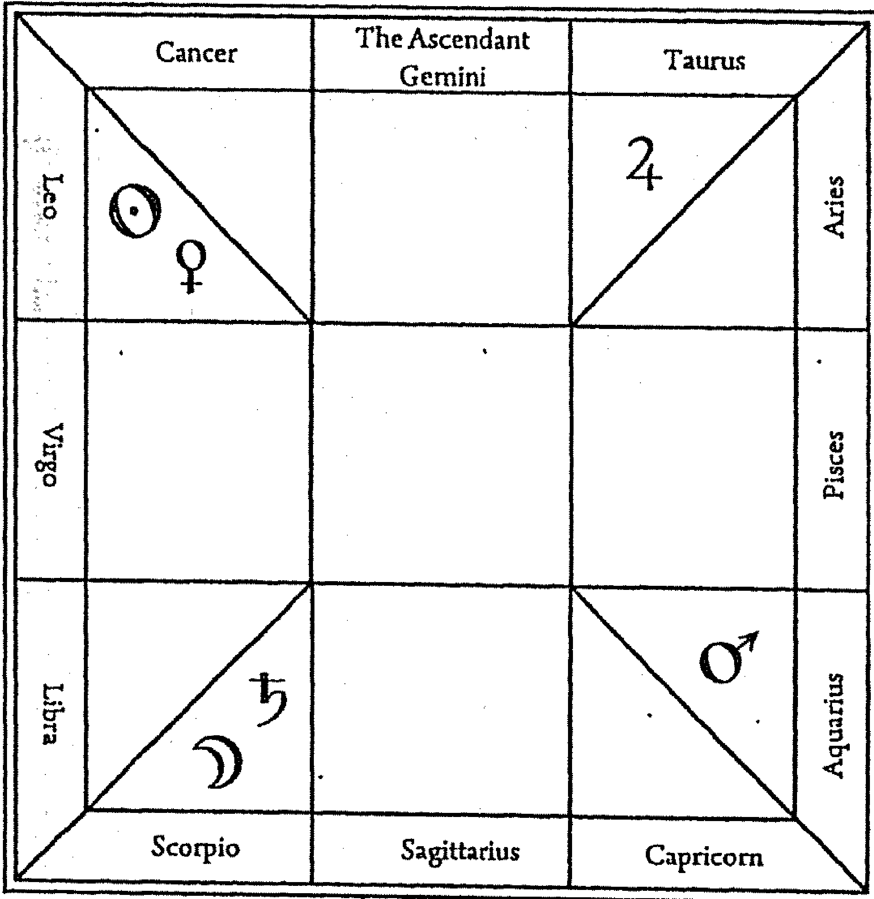

圖34：星盤 #2，資產與榮華富貴 (I.26, 2-4)，手抄本C

此為夜間盤，與好運相關的行星為火星和金星，因兩者為月亮所在星座的三分性主星，但皆位於下降的宮位：因此命主為貧窮的，難以溫飽且受盡折磨。命主證實我所言不假。

此為日間盤 (譯註：見圖35)，出生當下牡羊座從深海出現在東方地平線上，太陽的三分性主星為土星，其次是水星。土星位於西方尖軸的接續宮位，水星在中天尖軸的接續宮位(幸運的宮位)，因此命主可遠離貧窮，諸事順利，事業成功，資產豐厚，地位高貴，地位與好運蒸蒸日上。

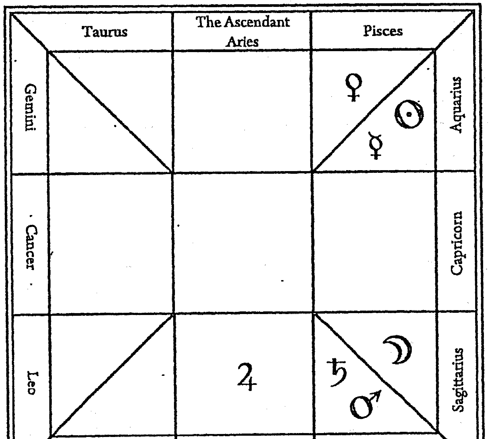

圖35：星盤#3，資產與榮華富貴 (1.26, 5-6)，手抄本C

此為日間盤（譯註：見圖36），其中最重要的¹⁵³三分性主星為太陽，其次為木星，而兩者皆位在尖軸，且為躍升的¹⁵⁴，因此命主受到國王與達官貴人的讚揚。因土星為第三個三分性主星，雖然遠離尖軸，但位於木星的星座並受木星的三分相注視：因此他獲得了國王的稱讚。

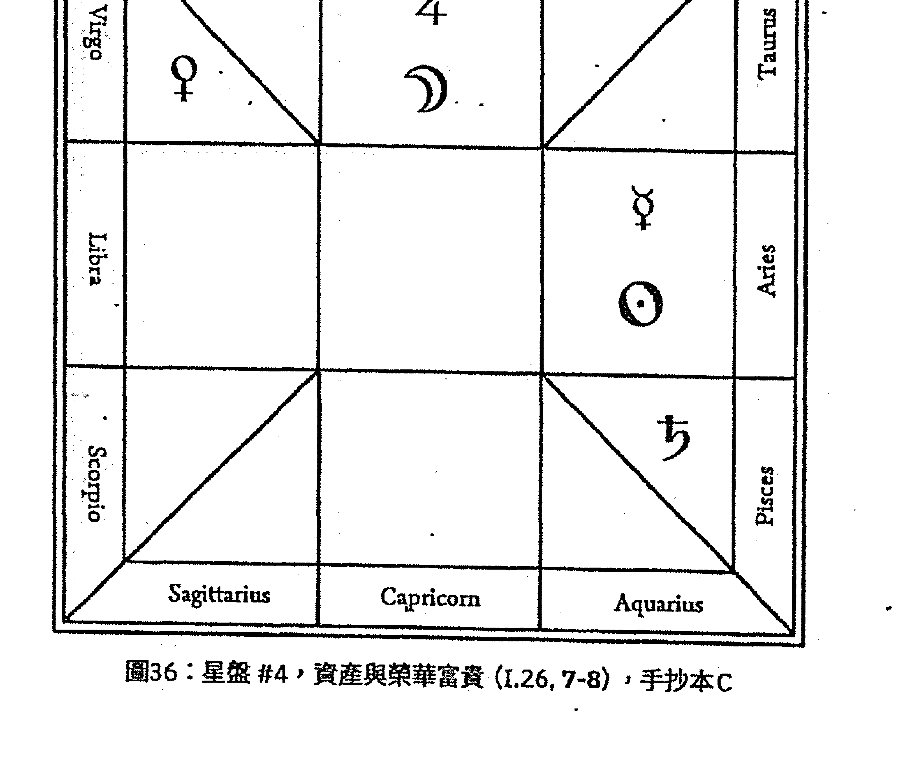

另一張星盤（譯註：見圖37），從地平線上昇起的是天蠍座，且為夜間盤，其它行星的位置如圖所示。月亮的三分性主星為火星、金星、月亮。由於三個主星都在尖軸，命主在貴族與統治階層當中具有影響力，直至金冠、銀冠戴在他的頭上，且廣受稱讚。

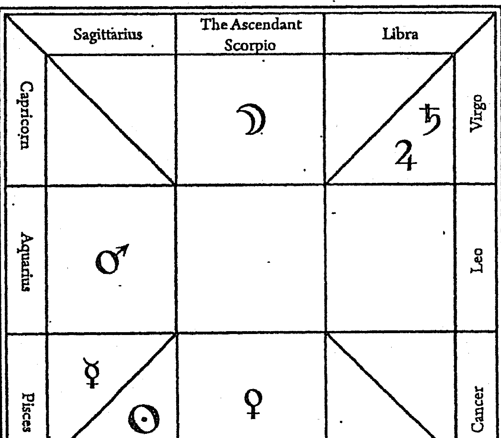

圖37：星盤 #5，資產與榮華富貴 (I.26, 9-11)，手抄本C

此為第二個星盤（譯註：見圖38），為夜間盤¹⁵⁵，月亮的第一個三分性主星為水星，其次為土星。由於兩者皆位於下降的宮位，並在地平線以下¹⁵⁶，命主沒有資產。但因為木星亦代表命主的資產¹⁵⁷，木星與月亮會合在尖軸，他仍可獲取些微的資產，僅供日常生活所需，但命主為無足輕重之人，一生困難重重。

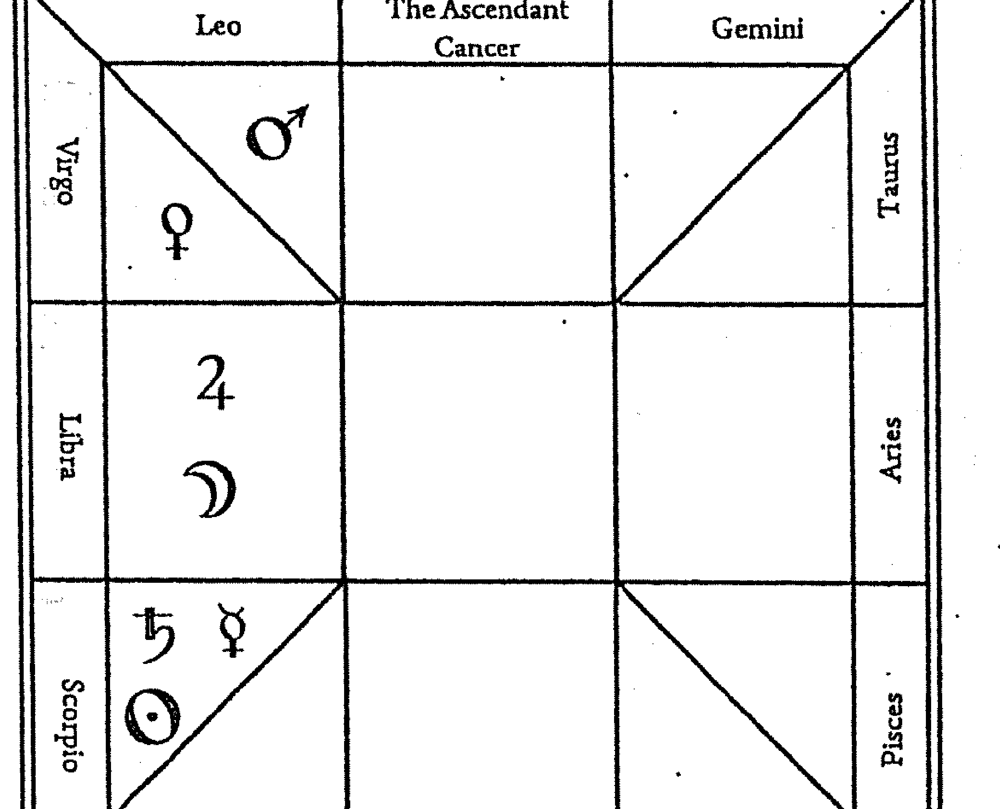

圖38：星盤 #6，資產與榮華富貴 (I.26, 12-14)，手抄本C

此為日間盤（譯註：見圖39），上升為雙子座，太陽為其本身的第一個三分性主星，其次為木星，第三為土星；三者均位於吉宮。命主財銀滿貫，但晚年運勢較差：因地底的三分性主星（從而得知晚年及死亡的情況）為金星，而金星是下降的，並在受苦的星座^158。

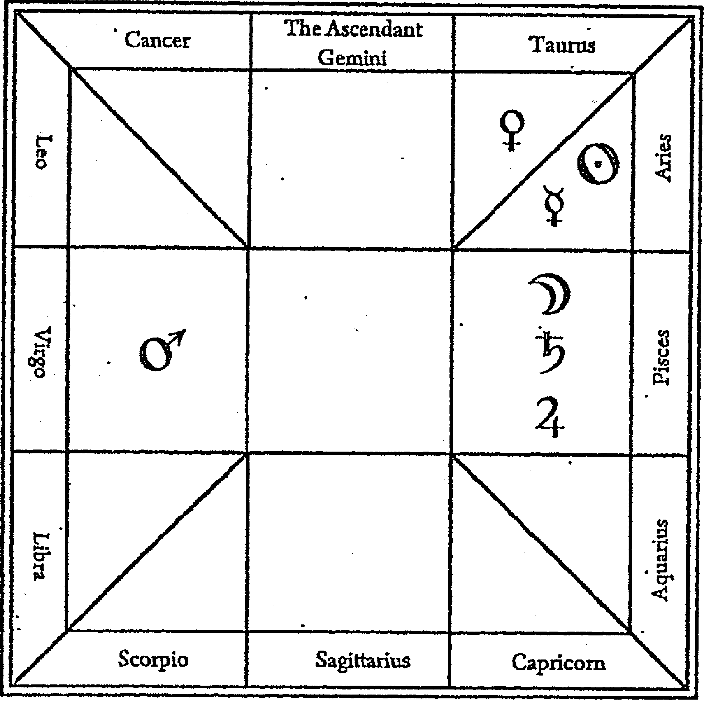

圖39：星盤#7，資產與榮華富貴（I.26, 15-16），手抄本C

此為夜間盤（譯註：見圖40），月亮的三分性主星依次為水星及土星，兩者皆在下降的宮位。火星代表父親資產的敗壞與揮霍，而月亮的三分性主星（在下降的宮位）亦顯示貧困，使命主終日不得溫飽。以上為水星與土星的徵象，但由於木星和金星皆在尖軸，命主出身在家教良好且虔誠的家庭，受人尊敬，兄友弟恭，往來無白丁；但因為月亮的三分性主星之故，將家道中落。

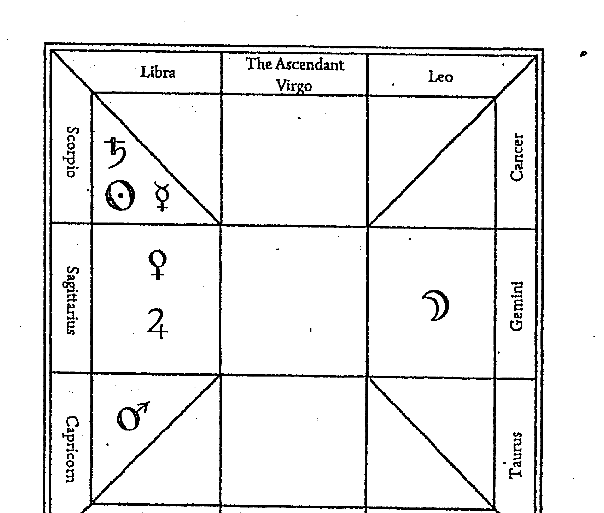

若能仔細檢視所述星盤與我的解析，托靠主（祂超絕萬物！），你將通曉各個步驟。

#### I.27 : 論幸運的優先順序

若要論幸運與否，應優先檢視發光體的三分性主星是否位於吉宮，是否會合、四分、對分月亮，或在月亮的三方處161。若三分性主星未注視上升、月亮與發光體，而發光體的主星亦然，則對命主為可怕的徵兆。若木星、金星和水星亦不在這些位置，情況更加嚴峻，還預示壽命短暫，尤其若土星和火星在此位置。但若吉星在此位置，且在自己或躍升162的宮位、具三分性、不在光束下、順行，且三分性主星注視上升，但未注視月亮，命主將過著平凡、好壞參半的生活。

##### — 尖軸與續宮主星 —

亦163應檢視上升和中天的主星，以及資產宮位（上升起算的第二個宮位）的主星。若這些行星在自己的宮位並與吉星而非凶星會合，且在尖軸或續宮，可論斷命主受幸運眷顧、步步高昇、受人稱讚景仰、過著富裕的生活。若上述行星不在吉宮，亦不在凶宮，命主將過著平凡的生活。若上述行星在下降的宮位，則依序檢視七宮主、八宮主、十一宮(幸運的宮位)主、五宮主及四宮尖軸的主星164。若這些主星不在尖軸而在下降的宮位¹⁶⁵，在夜間盤中未注視月亮，在日間盤中未注視太陽，命主將為求得溫飽所苦，若有凶星在尖軸則更為辛苦。

#### I.28：幸運的程度與資產的多寡

##### — 同區分發光體的三分性主星 —

現在將陳述幸運與資產最佳的狀況。檢視同區分的發光體所在星座的三分性主星。若三分性主星在四尖軸之一，在尖軸的15°內，可論斷命主擁有最佳的運勢與資產。若在第二個15°，相較上述的程度，命主可擁有次佳的運勢，因為越靠近尖軸，命主越能享有最大的成就與最佳的運勢。若三分性主星在第三個15°，命主將默默無聞，擁有中等的運勢與資產。若三分性主星位於上述度數之後、下個尖軸之前，命主是貧困的且為惡徒。須以赤經上升計算以上度數，因為雖然每個星座皆為均等的30°，但由於有些星座為扭曲星座，有些為直行星座，故赤經上升時間並不均等。扭曲星座的上升速度較快，直行星座較慢——又由於較北的區域為長四分，南部較短，中間的區域為中間值，故不同地區與氣候區亦有不同的上升速度¹⁶⁶。若日間盤中太陽的三分性主星位在凶宮，但月亮的三分性主星在吉宮（夜間盤為相反），命主雖然無法享有上述的好運，但仍可保有最低限度的幸運、快樂與資產，因此即使命主十分努力，所增加仍然有限；僅可勉強獲得應得之部份。

###### — 幸運點 —

- 若兩個發光體的主星位於凶宮，則檢視幸運點，雖然不同於上述方法，但仍可指示命主生活是富裕、平凡抑或困苦的。此時167若為日間盤，則計算太陽到月亮的距離，再從上升點加上此距離（夜間盤的公式相反）。然後檢視計算後的落點是在吉宮或凶宮，被何者（吉星或凶星）所注視，幸運點主星及所在宮位。若對幸運點有充分的理解與洞見，且不被混淆者，就能清晰地作出論斷。若幸運點主星從凶宮注視幸運點，對命主是不利的；在下降的宮位亦然（無論是否注視幸運點）。若幸運點及其主星在六宮或十二宮，或受凶星注視，或它168位於太陽光束下，就無法產生力量與影響。若日間盤的火星與幸運點會合，或以四分相或對分相注視幸運點，對命主亦無益處。若幸運點的主星未注視幸運點，但主星位於幸運的星座169或五宮，命主將出生在幸福170、富裕的家庭，尤其若主星又注視幸運點時。若幸運點主星在太陽光束下，則無能力賦予幸運。

**19** 極佳的情況是，日間盤的土星能注視幸運點，同時木星或太陽亦注視幸運點（夜間盤則為火星、金星和月亮注視時）；而水星的注視都是適合的171。**20** 若幸運點主星在自己的宮位、三分性、躍升172或界上更佳。**21** 若173幸運點主星在下降的宮位，金星和木星亦然，則為不利的徵象，而出生於如此配置之人將成為惡徒，若月亮又未注視吉星，將更為邪惡。**22** 此外若凶星在尖軸或在續宮，命主將跌入厄運的谷底並受到傷害。**23** 若幸運點主星受剋，但吉星在吉宮，對上升及月亮形成證據（testifying，譯註：證據不僅可指相位，也可指在某處有必然尊貴。詳見詞彙表），且吉星又東出，命主將擁有中等的資產與平凡的生活。**24** 因若木星狀態良好，命主可從達官貴人獲得好處，為其工作而受益，並因此得到資產；若為金星處於上述狀態，命主可從女性獲得好處；若為水星，命主可從商業活動、知識、計算受益；若水星木星會合，則將受國王或團體的信賴。**25** 若幸運點主星在吉宮，狀態良好，並受吉星從吉宮注視，與凶星無相位，命主將為國王的人馬且為擁有許多土地的自由人174，亦為達官貴人中最具權力之人。**26** 但若上述行星與幸運點主星如上所述，但凶星對它175形成證據，命主將從好運的高峰跌落。

| 171 | 見以下36 有關幸運點本身。 |
| 172 | 即入旺。 |
| 173 | 此段見《結果》II.18（修密特，第55頁）。 |
| 174 | 或者為「貴族」。 |
| 175 | 此處我認為是上升點，但由於文法上為複數，也有可能是指吉星、幸運點及幸運點的主星。 |

##### — 一 吉凶星、幸運點及二宮一

**27** 且176若凶星在尖軸，吉星在續宮，月亮離相位於凶星、入相位於吉星，命主早期生活落魄、受人蔑視，但之後將獲得財富與幸福。**28** 若吉星已改善了上升與中天的狀態177，凶星在七宮卻未注視吉星178，命主將聲名大噪，事事如意，但很快會從幸運與豐盛的狀態跌落。**29** 若 [1]179幸運點在凶宮，或 [2] 凶星以聚集、對分或四分相注視幸運點，或 [3]幸運點主星未注視幸運點，或 [4] 其主星西入、被遮蔽，或 [5] 其主星位於敗壞的宮位或自己的弱宮，且 [6] 未注視夜間盤的月亮（日間盤的太陽），且 [7] 無吉星注視其主星，可論斷命主多災多難，生活困頓，尤其若發光體的三分性主星的狀態亦如上述。**30** 若180 土星和火星位於幸運181 的星座，尤其在資產的宮位（上升起算的第二宮），但未在自己所分配的領域內182（火星為夜間行星，土星為日間行星），命主的財富與地位都將一落千丈。**31** 若凶星在地底的尖軸亦可如此論斷，但若凶星彼此對分亦無木星的相位，則更加凶險：因為這代表逃逸、死於非命或地位大幅跌落。**32** 若火星位於中天尖軸以降的續宮，命主會從富裕的生活狀態跌落，因為若十一宮有凶星在內，更代表破敗與衰弱；但若為吉星在十一宮，則能迅速獲得資產。

| 176 | 此段見《結果》II.18（修密特，第55頁）。 |
| 177 | 這裡應是指吉星就在上升或中天。 |
| 178 | 若吉星在上升或十宮，當然能注視到七宮內的凶星。 |
| 179 | 這些編號為戴克為方便起見所加入。 |
| 180 | 此段見《結果》II.18（修密特，第55頁）。 |
| 181 | 原讀為「資產」，參考此句後面的部份而修改為此。但薩爾（《論本命》章節2.7, 8及2.17, 5）僅提到資產的宮位。因此如《詩集》所云，應讀為「好運的宮位，尤其……資產的星座」，表明十一宮亦能提供資產——以下的32更證實如此。 |
| 182 | 即它們的「區分」。 |

- 若幸運點在吉星的界上，且在吉宮並受吉星注視，命主將能憑藉自身的資源累積豐厚的財產。
- 若幸運點的第一個三分性主星未注視幸運點，但第二個三分性主星有注視幸運點，命主雖會揮霍資產但仍能保留部份。
- 但若以上兩者均未注視幸運點，但幸運點受吉星注視，命主將因外國人獲得良好的生活，同時受到尊敬與讚揚；但若同時受吉星及凶星注視，命主的生活將好壞參半。
- 對日間盤而言，若日間行星注視幸運點（夜間盤幸運點受夜間行星注視），可證實擁有好運與豐盛的資產；但若與上述相反¹⁸³，則命主將生活困苦，須歷經絕望¹⁸⁴與長期的等待始有所得。

| 183 | 即日間盤的夜區分行星，以及夜間盤的日區分行星。 |
| 184 | 見以上19關於幸運點主星的論述。 |

#### I.29：從高位跌落與災難

- 若土星在尖軸之一會合月亮，即便是國王之子亦會從幸運與富裕的狀態跌落。
- 若又遭火星注視，更為不幸。
- 但若有木星會合在尖軸，他的資產與幸運能保持一段時間，但即使有木星注視，他仍將從高位跌落。

##### — 二宫及其主星 —

建議應檢視上升起算第二宮的星座：若有凶星在內，或與其對分或四分，可論斷資產的減少，生計由盈轉虧。此時^185若金星為二宮主星，災難與衰敗將來自命主對女性的欲望。若為水星，則災難來自書籍與計算。若為木星，則來自貴族或國王的危害，或來自蘇丹的工作^186或國家。若為火星的宮位，則因為士兵、<佚失>、憤怒、搶劫、火災等等火星的自然徵象。若為土星的宮位，則災難來自年長之人或奴僕、被釋放之人、無法獲得表揚之人、因管理^187而陷入困難之人，或來自建築物或墓園^188。若為太陽主管的宮位（獅子座），災難來自父親、父親的女人、母親的男人、宗教^189或借款。若為月亮的宮位（巨蟹座），且月亮不在吉宮，災難來自己母親或母親的親戚，或父親的女人。

同時^190檢視星座的屬性（轉變、固定、雙體或水象、四足、人性或土象），及其主星為吉星或凶星；若二宮主星落在凶宮且為凶星，則為凶兆，但若為吉星入凶宮，命主將過著平凡的生活。若為吉星入吉宮，雖有凶星注視，困難仍可被驅離。若二宮主星在凶宮且傷害二宮^191，或另一個凶星注視二宮或在其中，命主將為生計惶惶不可終日，難以快樂，或備受悲傷、苦難之事所侵襲，即便是國王也將徒勞無功，因欲望不得滿足而痛苦：而他的資產將因微不足道之事而耗盡。

同時應檢視月亮：若月亮在吉宮（二宮狀態如上所述是良好的），並注視二宮，運行數據增加 (increasing in calculation。譯註：詳見詞彙表) 且增光，並三分太陽，火星未注視月亮，命主將為知名有為的領導，為城市或國王爭光而備受讚揚且具影響力。若月亮如上所述，但運行數據減少、減光，將減少以上吉象，命主難以正面地發揮管理能力，亦無法因此而獲得讚揚。

##### — 資產點與生計點 —

且¹⁹²檢視二宮主星所落何處，並從其計算至二宮¹⁹³，從此¹⁹⁴可明確判斷命主的生計。檢視此點及其主星的狀態，何者注視它們，亦可清楚判斷命主的生計。因此若其主星在吉宮，受吉星注視，可論斷命主生計良好。若其主星為凶星，並受另一凶星注視或會合，命主的生計將困難重重。若其主星為吉星且東出¹⁹⁵，在尖軸且在自己的宮位，命主將過著榮華富貴的生活。但¹⁹⁶若原本為西人，在第七天¹⁹⁷轉為東出，命主仍可享有富貴的生活，但無法獲得名聲，亦無人知道他的富貴。

| 192 | 此段見《結果》11.18（修密特，第55-56頁）。 |
| 193 | 然後再從上升點投射。 |
| 194 | 即特殊點所在的宮位。 |
| 195 | 手抄本B的內容是遺漏的，但手抄本C的內容不僅清晰可讀，與24相似，且符合占星學理。 |
| 196 | 見《摘錄》IV。 |
| 197 | 以手抄本B為主。手抄本C為「九天」，為阿拉伯文常見的點的錯誤。《結果》11.18（修密特，第56頁）及《摘錄》確認了「七天」。 |

- 檢視位於此點之上的行星。
- 此時¹⁹⁸若資產點在吉宮，其主星亦然且東出，命主可長期保留其資產。若資產點主星在吉宮但在太陽光束下，命主資產雖可保留但僅為一小段時間。若此點在凶宮，命主的資產將無法增加，亦無任何成果。
- 若上述相關行星逆行，但行星力量強，命主將會苦惱而胆怯。但若在配置不佳的本命盤，則他的狀態或將徹底被破壞。
- 同時須充分了解生計點¹⁹⁹。

##### — 吉、凶星在尖軸與續宮 —

- 若木星在尖軸或在接續尖軸的宮位，首先可說命主將順利成長。（但若有一凶星在內，則預示困難）。若有凶星從上注視著他²⁰⁰，或為象徵破壞的行星，則可確定命主將困難重重；即使父母離異，仍可如此論斷。但即使父母因行星的徵象離異，命主仍可繼承財產，因為木星在狀態不佳的本命盤中若仍位於上述宮位，可減輕傷害並化解不幸；即便生活狀態不佳，仍可因木星而獲得某些好處。若金星在尖軸或在接續尖軸的宮位亦同，只不過她的力量不如木星，除非是有關女性的事項：他將因她們而享有資產與生活上的歡愉。
- 若上述兩個吉星均在此強而有力的位置，命主將在其國家或群體獲得成就，因為他將有廣闊的人脈，敵人也會變成朋友並對他友好。

| 198 | 此段見《結果》II.18（修密特，第56頁）。 |
| 199 | 此處幾乎確定是以上19-22所討論的特殊點。薩爾（《論本命》章節2.5,17-23）提及，日間盤為木星到土星的距離（夜間盤相反），並從上升投射。阿布·馬謝（見《古典占星介紹》IV.2）稱之為「生活點」，亦指「生計」或「賺取物資的方法」。瑞托瑞爾斯第57章（霍登，第58頁）認為「生活點」與都勒斯的另一個特殊點——資產點（二宮主星到二宮）是相同的。 |
| 200 | 此處可理解為支配。 |

- 若殺手火星及破壞者土星位於以上木星和金星所在之處，預示命主的成長將受到阻礙，即便命主對所有人作出貢獻，亦無法獲得感謝與讚揚，或無過節之人卻將憎恨他，最後還會見到大眾因他而擔憂與悲痛。若命主為國王，其家族及王國將與其疏遠，命主也將跌入動盪、衝突與欲求不滿的生活中。出身中等階層或低階層的命主亦可如上述論斷，其家族將憎恨他，命主亦對他們毫無情份。若土星在尖軸或續宮，命主將憂心重重、令人生厭、長相醜陋、厄運連連且禍及家人。若為火星，雖然代表勇氣，但命主將為工人或為目光短淺202之人；但若有木星和金星注視土星和火星，可減輕傷害。
- 此外203檢視命主出生之時，何者先抵達上升或月亮所在之處；從該行星可清楚判斷命主的幸運、資產及社會階級204。

#### I.30：論星座的陽性和陰性、東方和西方、日間和夜間

- 牡羊座、獅子座及射手座為陽性星座，為東方及日間星座；它們的日間主星為太陽，夜間主星為木星，兩者的伴星為土星。
- 金牛座、處女座及摩羯座為陰性星座，為北方205及夜間星座；## 都斯占星學

### 第2册

#### 論本命的婚姻問題

日間主星為金星，夜間為月亮，兩者的伴星為火星（水星在處女座具尊貴力量²⁰⁶）。

雙子座、天秤座及水瓶座為陽性星座，為西方及日間星座；日間主星為土星，夜間為水星，伴星為木星。

巨蟹座、天蠍座及雙魚座為陰性星座，為夜間及南方的²⁰⁷星座；日間主星為金星，夜間為火星，兩者的伴星為月亮。

第一冊終，讚頌主，主以仁慈行使祂的意志，將好運賜予祂的僕人，並以信仰行使祂的意志，消解僕人的惡意；主為至高、至尊、公正與至慈的。
祈主賜福祂所選之先知，賜福一切祂的使者。

206 | 見1.1,5。
207 | 這裡應為「北方的」。

奉至仁至慈的真主之名，並祈主助佑

第二冊為都勒斯論婚姻、子女與行星判斷之書。開篇先論婚姻，他說道：

##### II.1：論婚姻

###### — 金星的三分性主星 —

- 1 先檢視金星：她的位置及第一、第二與第三個三分性主星分別為何：若三分性主星與金星會合、在尖軸¹或在金星的三方處為吉兆，因金星能充分代表婚姻相關事項²。
- 2 若金星的三分性主星與金星會合、在尖軸或接續尖軸的宮位、閃耀自身的光芒且順行，對婚姻相關的事項而言為好的象徵，孩子的父親³肯定也是幸運的。
- 3 但若金星的三分性主星在凶宮且在下降的宮位、受剋、在太陽光束下、在西方的區域，則預示相反的徵象，亦即困難的婚姻：命主將終身不婚，或對象為奴僕、妓女、不名譽且年老的、年紀過輕的，或命主為出租妓女之人(我曾見過如此案例: 命主出租他的女人並因而蒙羞)。

> 1 | 此句可能是指在金星的四尖軸，即金星起算整宮的尖軸宮之一。
> 2 | 此句給人的第一個印象為，金星原本就為婚姻的自然徵象星；但我認為此句實指若三個三分性主星都與金星有強力的相位連結，則金星可獲得全力的支持與幫助。
> 3 | 此句雖然看來是指命主的父親 (擁有美滿的婚姻與小孩方面的幸運)，但它可能是指命主本人不僅婚姻美滿同時子女眾多: 亦見以下II.4, 9。

- 4 若⁴金星的三分性主星在凶宮，但金星與吉星會合並落在同一宮位，且狀態良好，命主可娶得合適之女子⁵。
- 5 但若金星的三分性主星皆在中間⁶，命主將因女人而遭逢變故且蒙羞，因女人嚐盡憂慮與傷悲。

###### —— 金星 ——

- 6 若金星與木星會合且在吉宮，命主可娶到合適之女子。
- 7 若⁷金星在下降的宮位，受日間的火星注視，而木星以及金星的三分性主星位於中天⁸，命主的對象將為妓女並受眾人嫌惡：因為木星代表社區裡的名聲，卻因金星的邪惡⁹蒙羞。
- 8 若金星在凶宮但受木星注視，而火星以及金星的三分性主星位於中天，此時火星的相位代表性欲強的女子。
- 9 若有凶星與金星會合，或往下注視金星¹⁰或與其對分，命主會嫁娶不良¹¹的配偶（男性或女性），命主將因女性過著晦暗動盪的人生，尤其月亮受剋時更是如此。
- 10 若水星位於金星的星座¹²又逢土星注視，命主將娶奴僕或外國人；命主¹³為女性亦然。
- 11 若¹⁴木星與金星會合，命主將與為人稱道的女性有性關係，尤其¹⁵若木星又注視月亮時：命主將與自己的女主人，或與達官顯貴的女人¹⁶有性關係。
- 12 若土星和火星從另一¹⁷個區域注視月亮（夜間的主管行星），命主將與自己的女主人或達官顯貴的女人發生性關係；命主若為女性亦然。
- 13 若¹⁸日間的金星位於上升或中天，在太陽光束下，且火星在尖軸或與婚姻點¹⁹會合，命主的妻子將來自低下階層、國外或為貪婪的女人。
- 14 若婚姻點受到水星和金星注視，命主的妻子會是歌手或舞者。

###### — 第七個星座 —

- 15 若²⁰凶星注視婚姻的星座（上升起算的第七個星座），七宮的主星為下降的，或因凶星的相位或不佳的位置而受剋，亦預告婚姻的失敗。
- 16 若²¹七宮主為土星，傷害來自父親或中年人士，或來自死亡。
- 17 若七宮主為木星，婚姻將受國王與富有之人，或國家命令²²的傷害。
- 18 若為水星，災難和傷害將來自法律或口舌之災，或妻子為奴僕，或命主以偷竊的方式獲得女子。
- 19 若為火星，代表有瑕疵、不名譽的婚姻²³；若有水星與火星會合，則是邪惡的，因為命主將親手殺害自己的女人，被迫濺血。
- 20 若為金星，命主將因女性遭受如火災般的傷害而不得安寧，或婚姻充滿此類的災害。

##### II.2：論婚姻點

- 1 同時須檢視我稱為婚姻點的地方。
- 2 計算土星到金星的距離，再從上升的度數加上此段距離，即以30°為單位從上升投射出去，最後的落點為婚姻點。
- 3 檢視是否有行星在此點之上，或與此點四分，它們皆為婚姻的徵象。
- 4 並檢視是否有凶星或此點的尖軸，位於六宮或十二宮²⁴：此為導致婚姻悲傷的宮位，無任何益處。

##### II.3：論女性的婚姻點

- 1 若命主為女性，則計算金星到土星的距離，再從上升的度數加上此段距離。

> 23 | 但蔑阿（《論本命》7.1, 79) 則提到外國人和旅行（兩者皆為火星所代表）。此處的不名譽應與接下來提到水星的內容有關，與《結果》II.21相符；《結果》則說火星亦為通姦。
> 24 | 我認為此處指同時符合兩種狀況 (1) 凶星在婚姻點的四尖軸 (或在婚姻點上)，以及 (2) 特殊點或這顆凶星在六宮或十二宮。此時婚姻點在果宮，且後續的「悲傷的宮位」亦符合六宮或十二宮。

###### — 婚姻點四尖軸的行星 —

- 2 若有行星在此點之上，或與此點四分，它們皆為婚姻的徵象。
- 3 若行星為火星，命主將有連續的婚姻，或像妓女般周旋在男人之間。

###### — 土星—金星點的主星 —

- 4 若婚姻點主星在七宮且為土星²⁵，命主的丈夫為老人²⁶；若土星在自己的宮位²⁷，丈夫將為祖父或叔伯母舅輩，或與命主有親戚關係之人。
- 5 若命主為奴僕，丈夫即為自己的主人。
- 6 若婚姻點的主星為火星，命主將嫁給不知名的人²⁸，或從事火星的工作之人。
- 7 若婚姻點的主星為木星，命主將嫁給在社區或城市內享有聲譽的知名人士。
- 8 若金星為婚姻點的主星，命主的丈夫為盡做金星²⁹之事、飲酒作樂之人。
- 9 若為水星，會為婚姻帶來欺騙與諸多爭執，尤其又遭火星注視時。

## 一 金星 —

- 10 無論是男是女，只要金星在凶宮，經常預示不名譽的婚姻。
- 11 若木星注視金星（無論從何宮注視），命主能從女性受益；若木星注視的同時又有凶星注視，凶星的傷害得以減輕。
- 12 若命主為女性，可作類似的判斷，即從男性獲益。
- 13 若金星位於雙體星座或雙像星座，命主不會只有一段婚姻。
- 14 若火星臨金星主管的宮位，金星又位於火星主管的宮位，命主將有不光彩之事，沉湎酒色，道德敗壞；若火星與金星會合，或對分、四分金星，亦作此論。
- 15 若金星與水星和火星會合，命主將不會有穩定的婚姻或感情，見異思遷，朝三暮四。
- 16 承上句若三者會合在中天，或金星在中天，但受火星和水星注視，命主將與別人³⁰的女人建立關係。
- 17 若注視金星的行星東出³¹，代表關係是公開的。
- 18 若木星又注視其中一個位於中天的行星，則能改善以上狀況，木星的相位代表命主受益的原因。
- 19 若金星的三分性主星在中天，預示她的淫亂行為將為人所知，使命主的聲譽蒙羞。
- 20 若木星在凶宮與金星會合，但在尖軸或接續尖軸的宮位³²，並注視金星的三分性主星，婚姻將不至於一塌糊塗。
- 21 若木星如上句所述，但在凶宮，命主將因此蒙羞或因淫亂之事而招致惡名：因兩個吉星皆在下降的宮位，象徵因墮落而導致衰敗。

> 30 | 根據薩爾《論本命》章節7.7, 46) 的理解所補充。
> 31 | 即將離開或已離開光束下。
> 32 | 此處不合邏輯。應為木星在尖軸宮或續宮注視位於凶宮的金星。而且以下句子又另外解釋木星與金星同在凶宮的狀況。

##### II.4：婚姻點

- 1 若婚姻點與金星對分，或與上升對分，或在凶宮，同時金星在陽性星座且東出，由於陰性星座為夜間的分配 (shares of the night) ³⁵ 星座，金星為夜間的分配行星，因此在上述配置出生的命主終其一生將難以與女性交往。
- 2 因為日間行星喜東出，夜間行星喜西入——此為不變的道理³⁶。
- 3 若金星的三分性主星未注視中天與金星，男性命主將無法獲得幸福的婚姻。
- 4 若婚姻點的三分性主星未注視婚姻點、金星及中天，命主將終身無法結婚。
- 5 若金星的三分性主星在星座末度數或在凶星的界³⁷上，或位在地底的尖軸，不在自己的星座上，遭凶星注視，命主將終生無法結婚³⁸。
- 6 但若金星的三分性主星在自己的星座上，命主會有婚姻。
- 7 若金星在上升起算的七宮內，預示女性將引起傷害、麻煩與災害，命主的婚姻是不穩定的，或與貧窮、身為奴僕或來自國外的女性發生性關係；命主將因金星在尖軸的緣故而有婚姻，但也因與上升對分而因女性受到傷害。
- 8 若金星在凶宮又與吉星³⁹無相位，且遭土星注視（土星又與木星不合意），命主將難以成婚，同時與低下或無益處的女子發生性關係。
- 9 若金星在自己的宮位，命主將有婚姻，並得以生育許多子女。
- 10 若金星在轉變星座，在自己的星座上，且在有力的宮位⁴⁰時，命主一生將女人不斷，尤其金星又受其他行星注視時⁴¹。
- 11 若⁴²金星在地底的尖軸，命主將承受喪妻及喪子之痛。
- 12 若地底的尖軸為轉變星座（尤其巨蟹座或摩羯座），則更加邪淫，命主將不斷與低下的女子或妓女發生性關係，因此招致債務。
- 13 若土星與金星會合，或金星在土星的界上，或受土星注視，對婚姻是有害的，因為命主將與寡婦或年老的女人結婚，或妻子曾有過不愉快的婚姻，或妻子過於年輕，為低下的奴僕，或為求生計而不知廉恥的女性（若命主為女性亦可同樣描述丈夫及子女）。
- 14 若金星與火星會合，或在火星的界上，且受火星以對分相注視⁴³，若命主為女性，將有可能與他人通姦，或因子女而悲傷（若命主為男性亦可作此描述，因為命主本身有可能是無法生育的)⁴⁴，這些都來自火星與金星的會合或對分。
- 15 若木星和金星在太陽光束下，代表不為人知⁴⁵的婚姻，尤其若在荒地星座時：命主將娶寡婦或無法生育的女子為妻。

###### — 親戚間的婚姻 —

- 16 若月亮在自己的宮位或躍升⁴⁶，與金星會合且受木星注視，命主將與自家⁴⁷的女性結婚。
- 17 若⁴⁸金星和月亮對分、四分或會合在同一星座（在凶宮），代表婚姻的傷害；若兩者皆在尖軸，命主將與自己的姊妹或有親戚關係的女性⁴⁹結婚。
- 18 若月亮和金星會合在地底的尖軸宮⁵⁰，受木星注視，命主將與親戚結婚，且一定能在晚年⁵¹喜獲麟兒。
- 19 若婚姻點的主星在婚姻點上，或注視著婚姻點或月亮⁵²，命主將與親戚——兄弟⁵³或姊妹的女兒結婚。
- 20 若土星會合金星⁵⁴，在金星或土星的星座，且位於上升，命主將與女兒或姊姊發生性關係；若月亮同時與土星和金星四分，命主將與母親的姊妹發生性關係。
- 21 若金星未受月亮注視但受火星以四分相注視，命主將娶他喜愛的女人為妻，但會以各種方式因女人而敗壞家產 (若命主為女性，將為同性戀)。
- 22 若金星在外來的宮位或在轉變星座⁵⁵，且受月亮注視 (或與月亮會合)，女性將有很強的性慾並為性愛付錢給男人⁵⁶——若同時受土星注視更甚。
- 23 若金星和火星位於對方的星座 (或界上⁵⁷)·，代表邪淫；同樣，若金星和火星會合，或以對分相、四分相注視對方，且⁵⁸兩者在東方：其荒淫將眾所皆知。
- 24 若在西方，則為秘密隱藏的；但若受太陽注視將會變得更為明顯，更加為人所不恥：此為受到太陽傷害之故。
- 25 若婚姻宮的主星為水星，水星位在六宮或十二宮，西入，或在四足星座上，且婚姻宮的星座亦為不幸的 (為四足星座)，命主在年輕時就難以成婚；即使結婚，妻子的存在⁵⁹將是短暫的，因為這樣的人常因生活困頓而難以結婚。
- 26 若婚姻宮的主星位於吉宮，命主將與不孕或來自國外但單身的女性產生性關係，且難以與女性保持穩定的關係，或因女性而過著動盪不安的生活。

###### —— 土星—金星點及其主星 ——

- 27 若婚姻點的主星在太陽光束下或在地平線下，遭凶星注視，且主星注視其主管之星座，命主將與妓女或奴僕有性關係，或與人盡可夫之女子產生性關係。
- 28 但若婚姻點主星閃耀自身的光芒，注視著其主管的星座，並位於尖軸宮或接續尖軸的宮位，又有吉星注視著它及它的星座，命主將娶冰清玉潔的女子，因美德而受人讚譽，命主也將享有高尚的生活。
- 29 若婚姻點主星為木星，命主將因達官顯貴而獲益，且與女人有關。
- 30 若為土星，則因女性的父親或親戚的財產而受益（無論何者，都將歸於命主），或接手被解放的奴隸⁶⁰之財產。
- 31 若火星為婚姻點主星，命主將因來自國外且從事火星工作的人而受益，或因軍隊而受益。
- 32 若婚姻點主星為水星，則因女性的計算或言語而受益。
- 33 若為金星，命主將受到讚揚，且因女性或女性事務而受益。
- 34 若婚姻點主星為水星⁶¹，在凶宮且受吉星注視或與吉星會合，命主將會娶有美德的良婦為妻，但也會因為水星所在的宮位而受苦。
- 35 若婚姻點的主星在吉宮，但遇凶星注視或會合，命主將因女性而終結⁶²痛苦的生活，或因女性收穫幸福與利益⁶³。
- 36 檢視婚姻點的第七宮：若其主星在點之上，且婚姻點的主星在婚姻點的⁶⁴第七宮，命主的婚姻將是隱秘的，且先秘密地與女人發生性關係後才結婚，而該女子也會因此而懷有子女⁶⁵。

> > 44 | 火星代表不孕。但我認為火星較是指通姦的部份。薩爾並未提及無法生育或子女之事（《論本命》章節7.2, 70-71及7.7,9-10）。
> > 45 | 此處亦可能為「隱密的」、「不分辨的」或「虛弱的」。我認為也有可能是指年輕時短暫的婚姻，最好能遺忘不再提起。
> > 46 | 即入旺。
> > 47 | 即自己的家族或家庭。
> > 48 | 見《摘錄》II,1。
> > 49 | 字面上的說法為「命主女人的親戚」。
> > 50 | 按手抄本B；手抄本C在膠布上則有「宮位」的字樣。
> > 51 | 因為地底的尖軸代表晚年。
> > 52 | 這裡的情況太過廣泛反而意義不明確。薩爾一方面根據此段所述作廣泛的解讀（《論本命》章節7.3,105）；但另一方面，他作出了更具意義的解讀：月亮在婚姻點上，或四分、對分婚姻點（章節7.2,10）。
> > 53 | 按賓格瑞的解讀。
> > 54 | 薩爾的《論本命》（章節7.2,12）中，土星亦為婚姻點主星。
> > 55 | 更可能是同時滿足這兩個條件。
> > 56 | 或「費用」。我並不確定是誰付費給誰。
> > 57 | 按薩爾《論本命》章節7.2, 72及7.7, 11) 補入手抄本C被覆蓋的文字。
> > 58 | 原為「或」。
> > 59 | 此處可理解為「生存」，即她的壽命。
> > 60 | 即被解放的奴隸。
> > 61 | 此處亦見《結果》II.21。
> > 62 | 此處亦可能為「終結」或「使…完美」。
> > 63 | 此處亦可能為「因女性而使生活痛苦終結，或因女性而獲得幸福與利益」。
> > 64 | 原文可能脫落「第七宮」或「對宮」。
> > 65 | 此處可能指女子在婚前懷孕。

##### II.5：命主會有幾個妻子

###### — 配偶的數目 —

- 1 欲知命主會有幾個妻子，可檢視中天到金星之間有多少行星在內，即為妻子的數目；若其中有土星，則預示婚姻的冷漠與困難；若有火星且無吉星注視著他，則為死亡。
- 2 若命主為女性，欲知她會有幾任丈夫，則計算中天到火星之間（若火星就在中天，則計算中天到木星）有多少行星在內，即為幾任丈夫。
- 3 若金星從中天下降，命主與妻子之間的感情將極不穩定；若命主為女性，且火星在九宮66亦同此論。

###### — 幸福與婚姻點：金星到七宮 —

- 4 須謹記此特殊點：計算金星到第七個星座度數67的距離，再從上升點加上此距離，即以30°為單位從上升投射出去，最後的落點為幸福與婚姻點。
- 5 檢視此特殊點的主星為何，與何行星會合，又受何行星注視：若遭凶星注視或會合，命主將娶不名譽或品行不良的女子為妻。
- 6 若此點的主星在凶宮，且金星在太陽光束下，並遭凶星注視，大致而言命主將終身未娶。

###### ——結婚的時間⁶⁸——

- 7 結婚的時間為木星的過運來到此特殊點所在的位置⁶⁹，或與其四分、對分或三分時，或過運的木星來到金星的三方處⁷⁰，或與金星四分、對分時⁷¹——若土星在此時並未以對分相或四分相來注視，命主就會結婚：因為若遭土星注視，命主將會變得冷漠，除了災害，什麼事也不會發生；若真的結婚，婚姻也不會持久。
- 8 當木星的過運來到金星所在的宮位時，是適合結婚的時候⁷²。
- 9 若該年小限來到此點所在之處，命主會結婚——且土星未如上述來注視時，因為土星會使命主變得冷漠。
- 10 但有時土星的過運仍會帶來婚姻，若命主的根本盤⁷³中，土星在有力的宮位，且為代表婚姻的特殊點主星，並注視著點⁷⁴，尤其若同時有木星的相位來幫助時，因為木星和金星代表好的女子。
- 11 若已知命主與多位女性交往，當過運的金星來到或注視她所在的宮位，為命主結婚之時；但此婚姻並不適合且不長久。
- 12 火星亦然，若過運的火星注視金星，且過運的金星注視火星（如我所描述的），婚姻是短暫的。

> 66 | 即第九宮。
> 67 | 即下降點。
> 68 | 此子章節，尤其8與11，參見《結果》II.21（修密特，第70頁）。
> 69 | 由於緊接上一段落，此處大概是指1-3所述的金星—七宮（或金星—下降）點。但它更像是土星—金星點（與阿布·馬謝在《占星學全介紹》[The Great Introduction to the Science of the Stars] VIII.4所認為的一致）。亦見II.6太陽—月亮—金星點或太陽—月亮—火星點。
> 70 | 即三分相。
> 71 | 薩爾（《論本命》章節7.4, 1）亦提及與金星會合，如以下8所述。見以下附註。
> 72 | 薩爾（《論本命》章節7.4, 3）寫作金星星座的「主星」，這個說法挺有趣。而奇怪的是，塔巴里在此處單獨以一句話來談與金星的會合，卻沒有在第7句中談到（我們原本預期會談到），因此薩爾的說法的確值得考慮。
> 73 | 此處根據薩爾（《論本命》章節7.4, 5）翻譯。
> 74 | 手抄本B遺漏了注視特殊點的部份。

###### — 比對盤 —

- 13 男女雙方的適合度可從彼此上升是否落在對方的尖軸宮之一或相同來判斷。
- 14 若兩個發光體（或其中之一）在上升或中天⁷⁵，雙方是適合彼此的。
- 15 同樣，若金星的星座為對方月亮的星座，或月亮的星座為對方金星的星座，尤其兩人的月亮彼此形成三分相，雙方是適合的。
- 16 但若發光體注視著對方的發光體，卻有凶星在同一星座內⁷⁶，代表傷害與失和；但若發光體注視對方的發光體，且有吉星在同星座，或吉星在對方的尖軸宮，或雙方的兩個特殊點（宗教點⁷⁷）在同一星座，則預示和諧與穩定的婚姻。

##### II.6：日間與夜間的結婚點

- 1 欲計算日間與夜間⁷⁸的結婚點，應計算太陽到月亮之處，再從金星的度數加上這段距離，即以30°為單位從金星投射出去，最後的落點即為結婚點。
- 2 若過運的木星與此點對分或四分，為結婚的時間。

> 75 | 這裡是指發光體之一（或兩個發光體）在對方的上升或中天。
> 76 | 此處語意不清。薩爾（《論本命》章節7.5, 9）僅提及，一方的太陽（也許兩個發光體或同區分發光體？）若在對方的幸運點上（反之亦然）是有利的；因此若為凶星則應該是有害的。
> 77 | 精神點；亦見以下1.9, 1。
> 78 | 雖然阿拉伯文並無指出「日間和夜間」，但薩爾的《論本命》章節7.4, 8 及阿布·馬謝的《占星學全介紹》VIII.4確實是如此描述的。但阿布·馬謝是由上升投射，而非金星。

###### — 配偶的死亡 —

- 3 若結婚點⁷⁹ 位在上升的對宮或在地底的尖軸，逢凶星注視，命主將目睹妻子的死亡。
- 4 若金星的三分性主星在西方的尖軸或地底的尖軸，亦代表妻子的死亡⁸⁰。
- 5 同樣，若命主為女性，應如上述自金星檢視男性的婚姻一般，自火星檢視女性的婚姻⁸¹。
- 6 若金星位於西方的或地底的尖軸，對於男性而言預示妻子的死亡或不穩定的婚姻⁸²。
- 7 同樣，若火星位於西方的或地底的尖軸，對於女性而言預示丈夫的死亡。
- 8 若金星西入⁸³，與凶星會合或形成相位，代表妻子的死亡。
- 9 若木星從金星的十宮或三方處⁸⁴注視金星，且⁸⁵ 金星在十二宮或六宮，命主將娶適合的女子為妻，但妻子將死亡，或因妻子之故擔心受怕與悲傷。
- 10 至於死亡的時間應如我在父親及兄弟⁸⁶的章節裡教導的方法來檢視。

> 79 | 此處似乎為1的太陽—月亮—金星點。
> 80 | 見II.4, 5。
> 81 | 此處似乎指 (1所提到的) 特殊點計算公式改為太陽-月亮-火星；而下一句則顯示，我們應使用火星 (或許還有火星的三分性主星)。甚至還有可能是月亮—太陽—火星點，如此一來陰性行星 (月亮) 就會在公式的最前面。
> 82 | 見II.4, 11。
> 83 | 此處可能是指正在進入太陽光束下，或即將沉落於西方。
> 84 | 此處可能是指以優勢的四分相或三分相來支配她。
> 85 | 原文為「或」，此處按薩爾 (《論本命》章節7.6, 10) 翻譯。
> 86 | 見I.17 及I.23, 39-42 的案例。

##### II.7：同性間的性關係

- 1 現在我將解釋同性的性關係及其徵象(無論命主為男性或女性)。

###### — 水星的法則 —

- 2 若金星在水星主管的宮位，水星在凶宮，命主將不愛女人而是喜歡年輕的男性。
- 3 若婚姻點與水星會合，水星在陽性星座且在尖軸，命主將渴望年輕的男性，不願與女性發生關係。
- 4 若火星在水星主管的宮位，水星又在火星主管的宮位，命主將渴望男性；若火星與水星對分或四分亦然。

###### — 金星的法則 —

- 5 若金星在情感與慾望較強的星座（即牡羊、摩羯、雙魚及金牛座），且金星在太陽光束下，與土星和火星會合，則會做出所提及的失德之事。
- 6 若金星在上述星座，遭凶星（土星和火星）之一從上方以四分相注視，亦同此論。
- 7 若命主為女性，金星在西方的尖軸對分上升，月亮位在上升，命主為對女性有情慾的同性戀；若命主為男性，則對男性有慾望——尤其若金星又在獅子和處女座，或在凶星主管的星座時。
- 8 若凶星注視著她⁸⁷，則更甚。
- 9 若金星在太陽光束下，情況將更為嚴重與扭曲。
- 10 若金星在土星的星座，土星在金星的星座，在西方的或地底的尖軸，或在六宮或十二宮，命主較女性化，並與他人做出女性會做的事。
- 11 類似的還有，若金星是下降的或位於凶宮，凶星在陰性星座且在尖軸宮，命主較女性化，體力也較差，並做出女性的行為。
- 12 若兩個發光體皆在陰性星座，則更甚；若發光體之一在陰性星座，又遭土星或火星注視時亦然。
- 13 若命主為女性，金星在摩羯、水瓶、牡羊、金牛、雙魚座，且疾病點與兩個發光體同在陰性星座，則為女同性戀；若命主為男性，疾病點與兩個發光體在陽性星座，命主難以對女性做出應做的事。
- 14 若金星在這些星座並與凶星會合亦同論，若水星受剋更甚。
- 15 若逢木星注視，則能化解或隱藏這些困擾。
- 16 若月亮在雙魚、金牛或摩羯座，水星與火星會合，女性命主將因通姦而惡名遠播，尤其若金星又在上升或中天時。
- 17 若女性的星盤中，兩個發光體在陽性星座，金星亦在陽性星座，在尖軸宮，且彼此對分（或四分），則會對女人做出像男人的事。
- 18 若金星在女性的星盤中<佚失>。
- 19 若兩個發光體三分彼此，會加乘男性與女性交媾之事，或女性會與眾多男性產生性關係。
- 20 以上為有關婚姻的章節。

> 87 | 有可能是慢性疾病點（IV.2, 11）。但薩爾（《論本命》章節7.7,27）使用婚姻點，應較為準確。
> 88 | 按薩爾的理解所加入。
> 89 | 或「合法化」。
> 90 | 薩爾（《論本命》章節7.2,78）還加入牡羊座。
> 91 | 在兩本手抄本中，這句話看起來像是跟著上面的句子，但瑞托瑞爾斯第 66 章（霍登，第121頁）和薩爾（《論本命》章節7.2,80和7.7,19）則是分開的句子。
> 92 | 瑞托瑞爾斯第 66 章（霍登，第121頁）僅提及男人將會是大膽的，若命主是女性尤甚。薩爾則直接依循這個較為普遍的句子（《論本命》章節7.2,80和7.7,19）。

##### II.8：論子女

- 1. 檢視⁹⁴木星的三分性主星：若前兩個主星皆位於吉宮，離開光束下，代表育有子女且因子女而受益。
- 2. 若前兩個主星一個在吉宮，一個在凶宮，命主會有子女，但會伴隨困難、哭泣與哀傷。
- 3. 並以第一冊所述之方法檢視三分性主星，可得知何時或人生哪個階段可享有天倫之樂，或遭受苦難與不安⁹⁵。
- 4. 若木星的前兩個三分性主星位於下降的宮位，在太陽光束下，將無子女之福，尤其若木星也是下降的且在太陽光束下。

##### II.9：論子女的數目

- 1. 並且⁹⁶如以下所述計算子女的數目。
- 2. 檢視木星的三分性主星，若其中之一在有力的吉宮，且在地平線上，則計算該主星到上升之間有多少星座在內，該數目為子女的數目。
- 3. 若木星和金星在其中，數目要再增加；若為其它行星，其數目亦會增加。
- 4. 若這些星座中有雙體星座，則該星座的數目要再加倍。
- 5. 若其中有火星或土星，則代表夭折，尤其若火星或土星又在凶宮。
- 6. 但火星或土星在吉宮，子女數目會增加，但子女會被拋棄，尤其凶星若在西方的或地底的尖軸星座時。
- 7 若^97木星（主管子女事項）的前兩個三分性主星，其中一位位於中天，可論斷命主有四個或一個子女；若在西方的尖軸宮，則為七個或一個（尤其若西方的尖軸宮為牡羊座）。
- 8 若木星的前兩個三分星主星遠離^98中天的或地底的尖軸宮，則從上升起算至該主星，中間的星座數目為子女的數目。
- 9 其餘則如以上描述來檢視。
- 10 若木星的三分性主星在多產星座，子女的數目將比上述還多（至於數目則如論手足的章節所示^99）。
- 11 若月亮和金星位於摩羯、巨蟹座或它們的三方星座之中，則視何者所在的宮位較為卓越，讓其成為子女的徵象星。
- 12 但若月亮和金星皆未在上述這些三方星座之中，則檢視木星及其三分性主星。
- 13 若子女的徵象星在上升或中天，或在代表幸運的宮位^100，命主可在年輕時就享有子女之福。
- 14 若位於上升起算的第二宮或在婚姻的宮位、八宮或在地底的尖軸，則子女會在命主的中年或晚年出生。
- 15 若子女的徵象星及木星在吉宮，在太陽光束下，命主雖有子女但會夭折。

##### II.10：論子女點

- 1 子女點：計算木星到土星的距離，再從上升加上這段距離，即以30°為一單位從上升投射，其最後的落點為子女點，並檢視其主星。
- 97 | 此段可與之前的I.19, 1-2論手足相比較。
- 98 | 這通常是指「不合意」，但我認為此處應該是指果宮。
- 99 | 見之前的I.23，尤其15-19。
- 100 | 即十一宮。
- 2 之後檢視子女點及其主星之間（或主星到子女點之間）有多少星座在內，星座數目即為子女的數目。
- 3 若有凶星在內，代表子女的死亡。
- 4 若太陽或月亮與子女點四分或對分，太陽會增加兒子的數目，月亮則增加女兒的數目。
- 5 若無行星注視子女點，將對第一個子女不利，可能會流產或很快夭折。
- 6 且101若子女點位於尖軸宮或吉宮，對子女事項為吉兆。
- 7 但若在六宮或十二宮，命主將膝下無子女，並為此焦慮和哀傷。即使有子女，子女將無法在其身邊而遠在他方。
- 8 且102無論子女點在何宮，若無行星以四分相或對分相注視，命主將會渴求子女。
- 9 但若有行星與子女點對分或四分，可生育許多子女。
- 10 若子女點在荒地星座，則子女數目稀少。
- 11 若與土星會合，代表不孕或子女數目稀少，或因子女而飽受痛苦。
- 12 若木星和水星在吉宮可享子女之福，但若在荒地星座（雙子、獅子、處女、摩羯、金牛座的前段、天秤座的中段、牡羊和射手座）103則將難有子女。
- 13 若在水瓶座，則是中等的；而若在巨蟹座及其三方星座104，則可育有多位子女；天蠍座亦可帶來多位子女，但也象徵子女的毀滅。
- 101 | 此段見《結果》II.22（修密特，第70-71頁）。
- 102 | 此句見《結果》II.22（修密特，第70-71頁），其中特別指出若行星與「子女點和下降點以及其四尖軸」不合意。
- 103 | 薩爾（《論本命》章節5.1, 8）的引述與此處一致，但並不正確，否則大多數的人都會是不育的，只有少部分人是多產的。另外，之前的I.21提到，荒地星座為獅子、處女、摩羯，多產星座為水象星座，其餘則介於中間。瑞托瑞爾斯（第106章的論手足）認為，荒地星座為雙子、獅子、處女、射手和摩羯座；第108章中一樣提到這些星座但去除了處女座。之後的薩爾（《論本命》章節1.38）列出：多產星座為水象星座，介於中間的為金牛、雙子、天秤、摩羯、水瓶，荒地星座為獅子、處女及射手座。而薩爾在《導論》第1章,23-24中則同樣認為，多產星座為水象星座，荒地星座為牡羊、獅子和處女座。以上可明顯的看到，多位名家對此並無一致的說法。
- 104 | 按薩爾（《論本命》章節5.1, 8）加入括號內的內容。
- 14 若有行星對分或四分子女點，為多產之象。
- 15 同時檢視子女點所在星座是否為荒地星座：若是，亦代表子女稀少。
- 16 若土星在子女點上，對子女為凶兆，命主將為不育的或子女數目少，或因子女而擔心受怕，飽受折磨。

##### II.11：生產點

- 1 謹記以下的特殊點。
- 2 計算火星到木星的距離，再從上升點加上此段距離，即以30°為一單位從上升點投射出去，最後的落點即為此點。
- 3 若過運的木星來到此點，或與其對分或四分，為子女出生之時。
- 4 若過運的金星來到此點，將有子女。
- 5 當小限來到木星和金星所在之處，將有子女。
- 6 若過運的土星來到此點，亦有子女出生¹⁰⁵。

##### II.12：兒子點或女兒點

- 1 計算木星到太陽的距離，再從上升點加上此段距離，即以30°為一單位從上升點投射出去，最後的落點為兒子點。
- 2 計算月亮到金星的距離，再從上升點加上此段距離，即以30°為一單位從上升點投射出去，最後的落點為女兒點。

###### — 不育或少子 —

- 4 若土星對分水星，代表子女的死亡。
- 5 若金星遇土星來對分，又無木星的相位，命主將不育或少子。
- 6 同時¹⁰⁶若土星注視月亮，且月亮在轉變的度數（戴克補充：轉變的度數應是指位於轉變星座的任何度數）並與另一凶星會合，或另一凶星以四分相注視月亮，命主將無子嗣¹⁰⁷。
- 7 若之前所述的兩個子女點遇凶星之一以四分相來注視¹⁰⁸，象徵子女的死亡。
- 8 若子女點在十二宮或六宮且遭土星注視，亦象徵子女之死亡。
- 9 若木星在地底的尖軸或在七宮之軸，與凶星會合，或遭凶星對分或四分，亦為子女死亡之兆；若木星失去光芒¹⁰⁹更甚。
- 10 若太陽與土星在同一星座¹¹⁰，太陽代表子女出生時將遭遇不測。
- 11 若木星是下降的，代表子女¹¹¹的毀滅。
- 12 若土星傷害金星又與木星無相位，命主將因子女而憂傷，雖有子女，但無法享天倫之樂，或難以生育。即使生育，也將因生產而哀傷——尤其若土星同時注視月亮與金星¹¹²。

###### —— 結論 ——

- 13 此處我更進一步解釋。
- 14 本命盤中若木星和水星不受剋，可論子女數目是多的。
- 15 若木星和水星在井內113或衰弱的114，將不會有子女，即使有也將天折，父親將飽受喪子之痛。
- 16 同時以中天115來論子女事項116：檢視中天受何者注視，其主星為何，其星座的種類又為何，注視中天的行星又在哪個宮位，跟隨中天的行星又為何：由此可確認生兒或生女。
- 17 檢視五宮（主管子女的星座）及其主星，例如主星在何宮位，是吉星抑或凶星，在本命盤中的力量：若其主星是下降的，又無木星和金星注視五宮，且有凶星注視五宮，命主命中將無子女；即便生產，子女將夭折或壽命短暫。
- 18 但哪怕僅有一吉星注視五宮，你都不要對子女之事絕望，命主將會有一些子女。
- 19 若有一吉星注視五宮，其主星117在吉宮注視著中天，不但子女的數目眾多，且都非常優秀。

##### II.13：女兒抑或兒子的數目較多

- 1 此時118欲知究竟是女兒抑或兒子的數目較多，則檢視以上所述位置119及其主星。
- 2 若所在星座為陰性星座，其主星亦在陰性星座，可說是女兒；但若為陽性星座，其主星亦在一個120陽性星座，則為兒子。
- 3 若所在星座為陽性，其主星在陰性星座（或相反），則可論斷兒子和女兒皆有。

###### — 其它法則 —

- 4. 若凶星在尖軸宮注視月亮，命主將不斷拋棄自己的子女，將他們趕出家門。
- 5. 檢視121懷孕的情況。
- 6. 若過運的木星來到火星之處，或以對分、四分或三分相注視火星，女性命主會懷孕。
- 7. 若月亮在尖軸宮，且在均分之日（即日夜等長之時）的度數（戴克補充：此處應是指牡羊座0 °及天秤座0°。費爾米庫斯亦曾提過類似的法則，指月亮在二分星座，即牡羊座及天秤座，不過他應該是指整個星座而非某個度數），命主無論男女皆不育。

##### II.14 : 三方處的相位122

###### — 本命盤中行星從三方處注視其它行星 —

###### — 土星的三分相 —

- 1 若123 土星從三方處注視木星，且木星在吉宮，象徵豐盛的資產、土地、樹林及清真寺，命主或許為政府部門的首長，與父親相處融洽，或為管理社區或土地資產之人，並因外國人受益，或受有名望之人的信任與尊敬。
- 2 若土星從三方處注視木星和水星，命主為謹慎之人，對隱藏或神秘事物具豐富知識，管理國家或國王的事務，為信仰虔誠之人，或撫養非親生子女，或無法從自己的子女受益，子女將早死或與他分離。
- 3 若為火星來注視，則將奪走上述的好處，為命主帶來災難、名聲受損與無盡的折磨。
- 4 若為土星以三分相注視火星，且不124乏木星和水星的注視，命主將為富裕、博學多聞之謀士125，有力量且為大城市的知名人士，或過著像國王般的生活，但將目睹年長手足的死亡。
- 5 若日間的土星從三方處注視太陽，命主將過著優渥的生活，因他將會是知名的、受讚揚的或有領導欲之人，且將擁有與父親有關的126好運；若兩者皆位在陽性星座則更加優秀。
- 6 若為夜間的土星，命主將過著舒適的生活，但他與父親的資產將被奪走。
- 7 若土星從三方處注視月亮，命主將從國王或類似國王身份之人處獲得極大的利益或尊貴，並受到讚揚——尤其若月亮增光；若減光，則會減少許多上述的吉象。
- 8 若土星從三方處注視金星，命主將過著舒適的生活，享有美譽，但仍將因低下階層之事而傷及名聲，且他的婚事將會延遲。
- 9 若土星從三方處注視水星，命主為冷靜、理智、思想不搖擺、意志堅定之人，精於計算與文字，過著優渥的生活。

###### — 木星的三分相 —

- 10 若¹²⁷木星從三方處注視火星，命主將具領導力、能管理各項活動且博學多聞，因領導軍隊而獲益並受尊敬。
- 11 若木星從三方處注視金星，命主將面貌姣好，或因女性及感情而居高位。
- 12 若木星從三方處注視水星，命主為聰明機警、理智且真誠¹²⁸之人，或受親戚與同儕之喜愛，令人愉悅，受尊敬與讚揚，不斷為大城市或國王工作，其中有些則通曉天體運行之學問。
- 13 若木星從三方處注視月亮，命主將備受讚揚並具有一定的身份與地位。
- 14 並以我所敘述的方式檢視命主的好運何時會到來：有些將為領導或首領，有些為意見領袖，有些為商業巨擘，有些則領導軍隊，尤其月亮又增光時。
- 15 若木星從三方處注視太陽，命主將享有幸運的生活，有妻有子，位高權重。

###### — 火星的三分相 —

- 16 若129火星從三方處注視太陽且命主為夜生人，時主星為火星130，命主的地位將有所提升，或許成為有權力的國王。
- 17 若木星在三方星座或在尖軸宮（譯註：從前文來看，應該是指在火星的三方星座或尖軸宮），命主將成為領導者，位高權重；若月亮又從吉宮131前來注視，命主為握有生殺大權的勇者，但命主將容易變更住所，對他人的指控也將很快受到懷疑，對自己亦無信心，尤其若火星在陽性星座132。
- 18 若火星從三方處注視金星，命主將不虞匱乏，過著富裕、穩定、婚姻美滿、努力不懈的生活，但命主也會沉溺與女性的性生活，做出禁忌之事。
- 19 若火星從三方處注視水星，命主在工作上為管理者，擅於處理衝突，透過磨練而累積力量133，但他的處境並不會因衝突或知識變好或變壞134。
- 20 若火星從三方處注視月亮且月亮減光，或其135為夜生盤中月亮的三分性主星，命主將擅於管理的工作，所求之事均能迅速獲成功；若有木星同時注視兩者，命主將成為權威人士，享有好運與強勢的領導力。
- 21 但若命主為日生人且月亮增光，則預示身體的疾病。

###### 其它三分相

- 22 若136太陽從三方處注視月亮，則檢視行星的力量與其它相位，再以上述方式論斷。
- 23 若137金星從三方處注視月亮，命主為英俊快樂之人，但婚姻較不穩定，只想著不倫之愛。
- 24 若138水星位於月亮的三方處，命主將聰明機警、有學識。

##### II.15：四分相

###### 土星的四分相

- 1 接下來139討論四分的相位。
- 2 若土星從上方以四分相往下注視木星，將減少命主的資產與所求之事，並招致壞的結果。命主的行動將備受阻礙，對父母亦造成傷害。
- 3 兩種四分相都會讓父母的資產遭受損傷及毀滅，若兩者交換位置亦然。而土星在木星上方、木星在左方四分土星，傷害更甚。
- 4 但若為木星往下注視土星，傷害將會減輕。然而除了少數家庭以外，父母的地位將無法有所提升，命主的資產也將受到限制，既不富裕亦不貧窮。

> 136 | 參見《論數學》VI.6,1。
> 137 | 參見《論數學》VI.7,1-2。
> 138 | 參見《論數學》VI.8,1-2。
> 139 | 此章節參見《論數學》VI.9,2-16。

若土星四分火星，土星在火星的第十個星座，命主將體弱多病且少有機會接受治療，常受發燒感冒所苦。父親的資產將被毀壞，命主也將目睹手足的死亡。

若火星是較高的行星（在土星的十宮），土星的位置較火星低（在火星的四宮），父親將先於母親死亡¹⁴⁰。命主也無法長壽，且會敗壞父親的資產，因嫉妬父親而破壞他的生計¹⁴¹。

若太陽受土星的四分相注視，並在土星的第十個星座，父親的遺產將會被敗壞。命主亦與親人易有衝突，情感不真誠¹⁴²，工作上狀況連連，疾病不斷，飽受奴役之苦，因生計而無比辛勞，默默無名。

若為土星往下以四分相注視太陽，命主將受到誤解¹⁴³或逃逸，受死亡的威脅，受母親家暴¹⁴⁴，患麻瘋病（疾病中最為邪惡的），或腹部冰冷直至產生疾病，身體寒涼，工作上亦提不起勁。

若土星四分金星，命主將受女性拋棄，被拒絕，好運擦身而過，壞運緊緊跟隨。

若為金星往下注視土星，命主將身體虛弱、時運不濟，但仍能遇到適合的女性，其地位將高過於命主，因自身的成就而受到尊敬，並與命主的父親相處愉快。

若土星從水星的第十個星座四分水星，將為命主帶來動盪的人生。命主的地位低下，工作上萎靡不振，並擅於欺騙。樂於當別人的副手¹⁴⁵，卻因此受到傷害，或生來口齒不清或為聾啞人士。

若水星往下注視土星亦不佳¹⁴⁶，但情況比上述所提輕微。

> 140 | 馬特爾努斯則理解為火星會殺死母親（VI.9, 6）。
> 141 | 字面上的說法是「食物、食品、滋養品」。
> 142 | 或個性友善親人。不過此描述並不合理，應讀為「不真誠」。
> 143 | 根據《論數學》VI.9, 10翻譯。
> 144 | 馬特爾努斯並無提及母親。
> 145 | 此處不合邏輯，幾乎不能反映正確的解讀（《論數學》VI.9, 13）。更好的說法是，命主仍會從事服務他人的工作，同時卻憎恨他人。
> 146 | 或「為不適當/不適合」。

若土星四分月亮，將傷害星盤的主人；若土星在月亮的十宮，命主將有行走的困難，罹患慢性疾病，從事任何工作都沒有信心，敗壞母親的資產，其中亦有些對父親懷有敵意。

但若月亮位於土星的十宮，命主將遭遇各種突然的不幸，罹患疾病，少有資產；但月亮若在陰性星座，雖可論命主將受惠於女性，但女性將與命主敵對並想傷害命主，命主亦難享有子嗣。

###### — 木星的四分相 —

若木星四分火星且往下注視火星，命主是正直、堅定、富有同情心之人，因協助王室而受到尊敬，在國內為知名人士，甚至代理國王的事務，地位步步高升。但命主仍將敗壞父親的資產，為子女之事而感到挫折，因事實上他們子女稀少。

若為火星往下注視木星，命主將因生計而苦苦掙扎，歷經千辛萬苦，因蘇丹的原因而招致他人的誹謗與衝突。

若木星與太陽四分，且太陽在木星的第十個星座，命主的父親是高貴的，但命主的資產會減少，且將離鄉背景，或族人對他懷有敵意，或遭受強而有力的敵人無情地攻擊。

但若木星在太陽的十宮，命主和他的父親皆為正直良善之人，有巨大的影響力，與國王有良好的交情，享有榮華富貴與崇高的地位。

若木星與金星四分，在金星的右方，命主將為熱愛群眾之人，因女性而得益，因富得貴，對主（祂超絕萬物！）虔誠，重視承諾。

若金星往下注視木星，則歡愉處將產生邪惡，愛好女色成為他的瑕疵，熱愛他人的稱讚，可享有快樂與清廉的聲譽；但他（工作上）的作為仍會受到阻礙，他的行動容易被視為犯罪。即使不是為非作歹之人，仍能享受因邪惡之事所帶來的利益。

若木星與水星四分，往下注視水星，命主將為作家，博學多聞，或為計算師，受他人（親人）149的保護，過著良好的生活。

但若水星在右方四分木星，命主雖為大方之人，但事事受挫；即便家裡有好事發生，他仍將受其困擾，或在工作中尖酸刻薄，對他人不心存感激。

若夜間（與日間）的月亮與木星四分，命主與母親可過著良好的生活，受他人尊敬、愛戴與陪伴，命主享有好的名聲，在有權勢的階層中聲名遠播並備受讚揚。

若為月亮位於木星的十宮，命主為做大事之人，受人讚揚，比軍官更受尊崇，但有一段時間他的工作會減少、無所事事。

### # — 火星的四分相 —

若150 火星在左方四分太陽，對父親事項而言為惡兆，命主的靈魂會更為邪惡，資產會遭受損失，直至他曾經掌控的一切都陷入困境。命主將會變得恐懼、疑惑、作不實的指控，或視線不佳，懷有錯誤的見解；若命主為日生人，傷害更為嚴重，甚至招致死亡與毀滅。

但若火星在太陽的十宮，命主在人生的早期是快樂的，但在晚期卻體弱多病，厄運突然降臨，生活動盪不安（戴克補充：即便是火星支配太陽，但太陽在早期仍會發揮吉象，但後期則被火星的壓制所影響）。

若火星在金星的十宮，對命主將造成極大的影響，因這將製造混亂與邪惡，命主將因女人而致病；同時火星若在轉變星座，命主將是女性化的，或荒淫無度；婚姻上將娶奴僕或失德之女為妻，或與妓女縱情聲色（若命主為女性，將為妓女或對男人做壞事的女人）。

若金星在火星的十宮，上述事項仍會傷害命主，但較為低調不為人所知，命主最後亦會悔改。

若火星往下注視水星，命主將獨排眾議、為所欲為，亦將因此處處受挫，在爭鬥、勞動及一切作為中受到傷害，因親人或秘密被揭露而遭中傷；若命主為日生人則傷害更甚，若為夜生人情況將較為輕微。

若為水星往下注視火星，即好戰者151在左方四分水星，命主為有文化之人，但性格多變152，會篡奪他人的財產，或因為沒有仔細看管而失去對財產的掌控權，父親將視他為邪惡之人而與其爭辯，導致命主無自己的思想，或命主會與親戚不合；他的個性喜獵奇153，或成為惡毒之人154，貪圖錢財，一生只為追求金錢。

若火星注視月亮且在她的右方155，命主母親將會是寡婦，命主的生計與資產會有損傷，母親或手足將死於非命或經歷激烈的悲傷，其中亦有受瘋狂所苦而進入禮拜堂者，或受視線不清與心智混亂之苦，尤其火星又在土星的界，月亮在水星或火星的界時：有時界的力量也會有所影響。

但如果火星在左方四分月亮，月亮往下注視火星，母親的社會地位是低下的，生計上是困難的；命主本身則將敗壞家產，生活難以安定。

> 151 | 即火星。
> 152 | 或「阻礙」。另一個可能的詞有自大的含義，但放在這裡不符合語法。
> 153 | 或「不可能」、「不可思議」之事。應指《論數學》命主是擅於欺騙的，喜歡以荒誕的故事愚弄他人。
> 154 | 或「憤世嫉俗」。
> 155 | 即火星支配月亮。

###### — 太陽與月亮的四分相 —

若156太陽與月亮以及四尖軸形成四分相157，兩者皆受吉星注視，命主可享榮華富貴，榮耀加身；但若遭凶星注視，將為生存而惶惶不安。

若月亮與木星有所連結且注視木星，但逢凶星注視，月亮的配置又如上述所言158，命主將為高貴之人，但仍會陷入困境，遭他人159嫉妒與詛咒；若木星未注視月亮，毀滅性的凶星卻注視著她，命主將歷經千辛萬苦。

###### — 金星的四分相 —

若160水星與金星四分，無論是何者往下注視另一方，皆代表命主博學多聞或精於工藝，並因其作為而為眾人所知，但也因為與女性的關係161而招致惡評。

若月亮與金星四分，且月亮往下注視金星，命主為富裕之人，若為男性則易因女性而受譴責。

但若為月亮在左方四分金星，金星在月亮的右方，將為命主帶來諸多好處，身體健康、生活富裕、臉色紅潤、面容姣好、乾淨清潔且口才迷人；但與女性的關係卻不太穩定；另外命主的母親將為貞潔且動作敏捷¹⁶²之人，命主的女人也會是美麗的——但並非忠誠之人，會覬覦丈夫以外的男人。

###### — 水星與月亮的四分相 —

若¹⁶³水星與月亮四分且在月亮的十宮，命主將言之有物，口才便給，有理性；但有可能因自己國家的事物而苦惱；若有凶星往下注視水星與其四分，命主將因語言或著作而遭逮捕甚至受牢獄之災。

但若水星在月亮的十宮¹⁶⁴，命主為膚淺¹⁶⁵、愚蠢或愛開玩笑之人，或難以取悅、內心與言語皆無法信任¹⁶⁶之人。

##### II.16：論行星的對分相

###### — 土星的對分相 —

若¹⁶⁷土星以對分相注視木星，對命主的生活與工作是不利的，並因子女而受苦。

若土星在上升，木星在西方，命主的生命初期是悲慘的，但晚期是快樂的。

若土星以對分相注視火星，命主的生活將面臨千辛萬苦，飽受悲傷、疾病、傷害與損失，子女稀少，到處樹敵並遭受譴責，與親戚亦爭戰不休，父親早死，壞事連連。

若兩個行星位於潮濕的星座，命主將會受困於河流或海水（之類），因潮濕而染上疾病，傷害身體健康。

若在四足星座^{168}，命主將被野獸所傷，或在人生晚期遭毒物侵襲。

兩者彼此四分^{169}，亦會面臨同樣處境，或命主將由盛轉衰^{170}，至死方休；若兩個凶星又注視月亮且無木星的相位時更甚。

若兩者位於尖軸宮，命主將遠離親人與國家，並死於異鄉，或家道中落，甚至受人奴役。

但若兩者位於接續尖軸的宮位，又彼此對分，命主將生無可戀，或墮落不堪，尤其土星又在陰性星座時。

若兩者位於下降的宮位，雖不至於如此邪惡，但命主仍會衰弱悲傷；但若有太陽^{171}注視，則能化解傷害。

若土星以對分相注視太陽又無木星的相位，命主的父親不但在生活上困難重重，受慢性疾病所苦，資產亦會遭受嚴重損失；若父親死亡，命主亦會迅速敗壞父親的資產，且父親會死於非命，命主將會跌入罪惡的淵藪，尤其土星又在陰性星座時。

若土星以對分相注視金星，命主將荒淫無度、下流無恥，且無法結婚——若有機會成婚，亦會娶低下的歌手、外國人、有慢性疾病之人、奴僕或體弱多病之女為妻，或無法從金星事項獲得快樂。

若土星以對分相注視水星，命主將有口吃，沉默少言，或為口齒不清之人，尤其水星又在無聲星座（即巨蟹、天蠍或雙魚座），且^{172}在太陽光束下，又注視月亮時。

若火星注視水星，在免去邪惡之事的同時亦帶來困難。命主有深入理解的能力、認真且因理解力而受益，成為有知識、聰慧、不被問題難倒的人；有鑒於此，命主也較其他手足¹⁷³受到喜愛，因即使是手足中最小的，年長的手足也會先他而死，他會成為手足的領導，而父親也將先於母親死亡。

若土星以對分相注視月亮，象徵命主母親的資產將被敗壞，亦象徵隱藏的痛苦與疾病，悲傷與惱怒。

若無吉星注視它¹⁷⁴，母親的身體將有缺陷，生計¹⁷⁵亦會遭遇困難。

若土星在四足星座，代表掠食動物的傷害。

若在人性星座，則該類的困難將會傷害命主。

若為潮溼星座，則命主會因為水或潮溼而受到傷害，因潮溼¹⁷⁶而導致疾病。

若無吉星的相位，命主將罹患慢性疾病或眼盲，或因生計離鄉背井。

> 168 | 此處應為野獸星座（《論數學》VI.15,7）；四足星座應是指下一句。
> 169 | 此處應為四足星座（《論數學》VI.15,8）。
> 170 | 或「衰弱」。《論數學》則認為既包含從高處跌落，也包含身體上的傷害或衰弱。
> 171 | 或金星和木星（《論數學》VI.15,11）。
> 172 | 按《論數學》VI.15,17，此處應可理解為「或」。
> 173 | 按《論數學》VI.15,18所補充；手抄本C有部份被覆蓋，手抄本B則遺漏了。
> 174 | 文法上來看，此處可能是指土星或月亮，但由於兩者是對分的，若吉星與其一不合意也會與另一個不合意。
> 175 | 我不確定此處是指母親的生計（或生活方式），或是命主的生計。
> 176 | 《論數學》VI.15,22讀為「有害的體液」；以體液質的理論而言，所有的體液都屬於液體。

###### — 木星的對分相 —

-  <木星對分火星佚失>¹⁷⁷
-  <木星對分太陽佚失>¹⁷⁸
-  <木星對分金星佚失>¹⁷⁹
-  <木星對分水星佚失>¹⁸⁰

若181木星以對分相注視月亮，月亮在西方，運行數據增加182，命主的生活方式將引人注目並享有良好的名聲，個性有主見，不依循他人，尤其若月亮的度數少於木星時183。

若月亮的度數較木星多則不利，這代表生計的損失，困難亦隨之而來，與好運擦肩而過。

> 177 | 《論數學》VI.16,1提及，命主的生活較不穩定，並將遭遇財富的損失。此外朋友將對命主懷有敵意，並因衝動的行為導致危險。亦見《波斯本命占星》第四冊（Persian Nativities VI），II.8,10-11。
> 178 | 《論數學》VI.16,2提及，父親的資產將有損失，命主的名聲也將由盛轉衰，不受他人喜愛，夜生人尤其如此。亦見《波斯本命占星》第四冊，II.8,16-17。
> 179 | 《論數學》VI.16,3-5提及，命主將獲得升遷、成就、好運及富裕；但仍會被朋友背叛，與朋友有分歧，或交到不知感恩的朋友。亦見《波斯本命占星》第四冊，II.8,22-23。
> 180 | 《論數學》VI.16,6提及，命主將口才便給，但人們仍會背叛他、與他產生矛盾，或他人因嫉妒向國王中傷他。手足亦將死亡，或與手足有所衝突。亦見《波斯本命占星》第四冊，II.8,28-29。

###### — 火星的對分相 —

若184日間的火星以對分相注視太陽，命主父親將死於非命，命主的視力將會退化，崇高的地位也將下降，苦難亦隨之到來；若命主為夜生人，工作將會減少，資產也將被揮霍殆盡。

若火星以對分相注視金星，命主的心性不定，子女與婚姻也將受到傷害。

若火星在轉變星座185，命主將因女性導致衝突與災難。

若火星以對分相注視水星，命主將不知謙遜，擅於說謊，飽讀詩書或精於巫術，或傷害他人來求取生計；命主的資產稀少，且會遇到適合的女性186；雖不斷有人將事項與責任托付於他，但他卻逃避應負之責187，因而招致仲裁與衝突；領導也將降恐懼與災難於他，或命主將被迫離開家鄉，尤其若水星位在土星的界，或在自己的界與星座上。

若火星以對分相注視月亮極為不利，因命主的將難以獲得維持生命的物資¹⁸⁸，生活上也將災難不斷，甚至有人還未結婚就死亡，或死於非命¹⁸⁹；他將永遠無法獲得滿足，手腳不是被截斷就是被捆綁。

> 181 | 此段參見《論數學》 VI.16, 7-8。
> 182 | 《論數學》 VI.16, 7則提及增光或滿月的「光」。因此「西方」在此是指在黃昏時出現在太陽的西方，即在月亮增光的階段。
> 183 | 此處似乎是指木星以對分相護衛月亮，木星位於月亮即將經過的位置；但這也許應該在夜間盤或月亮在尖軸宮時等等，才可作此論。
> 184 | 此子章節參見《論數學》 VI.17, 1-5。
> 185 | 馬特爾努斯則特別指出摩羯座或巨蟹座。
> 186 | 此處應為「不會遇到」；馬特爾努斯則無此項描述。
> 187 | 《論數學》中是指他將拒絕返回被托付之物，因此造成下一句所說的受到法律的仲裁威脅。
> 188 | 此處應是指「物資」或「生活必需品」。
> 189 | 原文為「未結婚就死亡」或「死於非命」。

###### —— 其它對分相 ——

-  <太陽與月亮的對分相佚失>¹⁹⁰

若¹⁹¹金星以對分相注視月亮，命主將無法享有美好的婚姻，亦無法生兒育女（即使有子女，亦會死亡），而命主將因為女性而失去名譽或受傷。

若¹⁹²水星以對分相注視月亮，代表來自眾人的衝突、苦難與非議，命主也將為害怕發言之人。

##### II.17：行星的六分相

i 論¹⁹³六分的相位：如三方處相位¹⁹⁴的方式論斷，但其力量較為微小。

##### II.18：土星與其它行星的會合

若¹⁹⁵土星與木星會合，命主會有許多土地，為國王或貴族管理房產，他人亦委託其管理資產，且受當地的人尊重，若火星未注視他。

若土星會合火星，命主的個性良善，但有財務的問題，或智力遲鈍，生活窘迫，體弱多病，體內的黑膽汁質失衡；父親先母親死亡，而命主將敗壞父親的財產；由於年長的手足早死或重病，命主須承擔長子的責任；或導致悲傷、依賴、困境與生理缺陷。

若有木星注視，將能減輕或化解上述的困境，命主亦有能力承受這些困難。

若土星會合太陽，命主將敗壞父親的資產，人生晚期的生活將動盪不安；若為夜生人更甚，無論土星東出抑或西入，對於父親與手足，尤其命主而言皆如此。

若太陽的度數比土星更少，上述的情況將更加嚴重，因父親將死於非命，或有等同上述情事發生，好運將擦身而過，或因潮濕或虛弱致病；命主將喜歡建造房子，或許藉此為生累積資產，但仍無法逃脫悲慘的命運。

若太陽位於自己主管的星座或土星主管的星座，父親將受到尊敬且生活輕鬆，但命主會對父親懷有敵意，或有等同上述情事發生。

若土星會合金星，命主將娶不適配、有缺陷的女子為妻，或與不能生育或患有慢性疾病的女性發生性關係，因而受到譴責與輕視；命主也將難有子女（若論子女，兒子的數目是比較少的），亦難以與女性享有穩定的關係，或婚姻關係冷淡；若命主為女性亦同此論。

若土星與水星會合，命主將有口吃或口齒不清的問題，少有作為，但他會是個沉穩¹⁹⁶、聰明、有內涵的人。

> 195 | 此篇參見《論數學》VI.22, 2-18。
> 196 | 至少外表看來如此；至於內在，則是嚴肅、頑固、不快樂的（馬特爾努斯）。

若土星與月亮會合，命主將毀壞母親的名聲與工作，母親身體虛弱；因母親的資產而遭受巨大的損失，或身體虛弱，母親的身體亦是虛弱的。

若命主為日生人，月亮增光，逢吉星注視，則能驅逐厄運。

若命主為夜生人且月亮增光（或減光），與木星和金星呈相位，則上述事項將會更加嚴重¹⁹⁷。

## ## II.19：木星與其它行星的會合

若¹⁹⁸木星與火星會合，命主將擁有領導力與資產，在大城市或社區中為知名人士，或為團體中的指揮官且非常忙碌。

若兩者其一位於自己主管的星座，命主將擁有權勢、意志堅定，活躍在軍事等領域中。

若木星與太陽會合，在太陽光束下，所有的好處都會減少。

若木星東出，命主將享有幸運且富裕，比父母更有成就，得與子女享天倫之樂。

若木星與金星會合，命主將出身於受人尊敬且富有的家庭，對人們熱情慷慨，善良慈悲，眉清目秀，被領導者與貴族視為朋友，樂於行善且好求讚揚；因女性或信仰而獲得權力與資產，並擁有美好的婚姻，亦有利於子女。

若有凶星在兩者之間¹⁹⁹，命主所到之處將獲得人們的喜愛；女命亦同。

若木星與金星在有力的宮位會合，且受月亮和火星注視，命主將以醜陋不名譽的方式替親人說項²⁰⁰。

> 197 | 應該是夜間的月亮若為減光，即便逢木星和金星注視，情況仍會變得更糟（馬特爾努斯）。
> 198 | 此章節參見《論數學》VI.23, 1-7。
> 199 | 按《論數學》，此處應為「無」。
> 200 | 此處應為錯誤的，《論數學》的說法是：命主將因親人而受人責罵與非難。

##### II.20：火星與其它行星的會合

-   1 若火星與太陽會合，命主的父親將會早死：若火星又在尖軸宮或在接續尖軸的宮位，對命主更為不利，命主將會受盡苦難，或為善妒之人，敗光父親的財產；或從事鐵與火的相關行業，想法混亂、不穩定。
-   2 若火星與金星會合，命主將因女性而有爭議、災難或損害。
-   3 若火星在轉變星座，命主將會與壞女人發生性關係，並因女性而引發爭議，或有其它傷風敗俗的性關係（若為女命，亦將因性關係而傷害名譽）。
-   4 若火星與水星會合，命主將謊話連篇，但也可能為聰明、理性、知識豐富、愛好文化、喜好爭論之人。
-   5 若木星注視火星，命主將受到讚揚；若為金星，命主對子女將寵愛萬分。
-   6 若逢土星注視，對命主是不利的，因命主會成為被他人憎恨的對象，並且身體有缺陷。
-   7 若水星和火星會合且在光束下，在尖軸宮，且火星注視金星，命主為蓄意說謊、朝三暮四之人，或為盜賊的首領，以行惡來獲得快樂。
-   8 若逢木星注視，命主的邪惡能受到抑制；若逢土星注視，命主將受到懲罰。
-   9 若火星與月亮會合，命主的壽命會減短，或死於非命，罹患慢性疾病，或因鐵器而受傷，對命主的母親造成諸多傷害。
-   10 若火星與月亮位於尖軸宮，命主在工作上將輕率魯莽，不聽從指示而導致傷害。

##### II.21：太陽與其它行星的會合

-   1 若太陽與金星會合，金星在夜間盤西入，在日間盤東出，命主將受到讚揚與歡迎。
-   2 若水星與太陽會合（無論水星東出或西入），命主將為有風度及擅於書寫之人，因文采與智慧而居高位，或成為將領，對他人有助益。
-   3 太陽與月亮的會合佚失

##### II.22 : 金星與其它行星的會合

-   1. 若金星與水星會合，命主在工作上是受歡迎的，熱愛休閒娛樂，與眾多女性交往，有文化並擅於言詞、出口成章，但他會因與女性發生性關係而歌唱讚美，且事實上他對奴婢有著異常的喜愛與熱情。
-   2. 若金星和水星在上升會合，命主上述的才能則更為卓越穩定；若又逢木星注視，命主將因女性而獲得利益與尊貴的地位。
-   3. 若金星與月亮會合，命主將有強烈的欲望，寵愛子女，快樂且幸運，然而命主的婚姻將不穩定，覬覦其他的女人，其中亦有遭遇女性的不忠誠對待者。

##### II.23 : 水星與其它行星的會合

-   1. 若水星與月亮會合，命主將因聰明才智而受到稱讚，獲得成就，但也有可能是個騙子，對任何事難以堅持到底。
-   2. 若有吉星注視兩者，將減輕凶象並為其母親增加吉象，但母親也將因男性而失去名譽。
-   3. 若月亮的度數多於水星為吉象，因為若月亮度數較多，能將其離相位的行星之能力交付出去——鑒於月亮為最接近地球的行星。

##### II.24 : 論行星所臨之宮位

-   1 除了以上的內容，應檢視行星的宮位及尊貴力量，了解赫密斯 (至高無上，三方尊崇的埃及國王) 的箴言。

##### II.25 : 月亮所臨之宮位

-   1. 若月亮在上升或中天而狀態良好，發出自身的光芒，但遭凶星注視，將減少命主的幸福與生計；但若為吉星注視，則增加命主的幸運。
-   2. 若夜間的月亮在自己的廟宮、界或躍升，在尖軸宮或接續尖軸的宮位，是極佳的徵象，命主為家喻戶曉、交遊廣闊、文化水平極高之人，命主及母親都能享有高壽。
-   3. 若遭凶星會合或注視，命主的希望將被斷絕，終日汲汲營營，永遠得不到滿足。
-   4. 若有吉星注視且無凶星傷害，命主將成為有權力的領導者、指揮官。
-   5. 若吉星與凶星同時注視月亮，命主仍會遭受苦難，手足死於非命，但命主亦能獲得尊貴的名聲與地位。
-   6. 若月亮在西方 (即在婚姻的宮位)，命主的母親將早逝，命主的生計也會衰敗，或旅行到遠方，或為了妻子兒女而哀傷。
-   7. 若月亮在地底的尖軸宮且遭凶星注視，命主將罹患致命的隱疾，或遇嚴重的衝突，為了妻子兒女而憂傷。
-   8. 但若有吉星注視著她，命主將因邪惡之事受益。

##### II.26：太陽所臨之宮位

-   1 若太陽在上升或中天，在自己主管的星座或陽性星座，是卓越的徵象。
-   2 若有吉星從十宮注視太陽，命主將位高權重，備受讚揚；若太陽在中天，亦同此論，但命主手足數較少。
-   3 若太陽在婚姻的宮位，命主的父母與手足將會有隱藏的危機。
-   4 若水星與太陽會合，命主將有豐盛的資產，尤其水星西入時。
-   5 若太陽位在自己廟宮以外的地方且遭凶星注視（尤其遭火星以對分相或四分相注視），命主將受火災或暴死的威脅，或受邪惡欲望的驅動，惡名昭彰、四處叫囂、引發爭論，或成為野獸的食物；若月亮亦同時受剋，情況將更為嚴重；但若受吉星注視，則能減輕凶象。
-   6 若太陽位在地底的尖軸宮，命主將從高處跌落，父親的資產也將減少；但若所在宮位之主星或其旺宮之主星往下注視著他，能減輕凶象。

##### II.27：土星所臨之宮位

-   1 若日間的土星在上升、自己的廟宮或任何主管的位置時將不會造成傷害，因為命主將成為土地的主人或建築的管理者。
-   2 須視命主的生活狀況再作此論斷，且命主亦有可能體弱多病，在即將獲取。
-   3 若土星在他的敵人之廟宮，傷害更大，命主的聲譽將一落千丈或子女數目稀少。
-   4 若為夜間的土星，則上述的情況將更為嚴重，命主將身陷困境，受疾病所苦，長相醜陋，言語粗鄙，偷偷摸摸，個性扭曲，行事卑劣；或膝下無子，在親戚間不受歡迎。
-   5 若土星在上升，木星在婚姻的星座，命主年長的手足將會受到傷害，而命主則會落入敵人的手中。
-   6 若土星在上升，火星在西方與其對分，則凶象更甚，命主及其父母將死於非命。
-   7 若土星在上升且金星在西方，命主的女人將會面臨死亡的威脅。
-   8 若土星在上升且水星在西方，命主的雙親將會早死。
-   9 若土星在中天，將傷害命主的生活與幸運長達三十年，尤其是夜間的土星在固定星座時，因其凶象將是持久固定的；若土星在雙體星座，凶象可望離去，但他的幸運也將無足輕重。
-   10 若土星在中天與火星會合，命主將無法善終，除非有吉星在西方的星座上。
-   11 若土星在天底的尖軸宮，子女和手足將會受到毀滅，或子女及手足是稀少的；命主的身體也將過重，體弱多病，受海水或液體或四肢冰冷所苦，不得善終，並被敵人奪取所愛之事物。
-   12 若水星與土星會合，對他的子女、奴僕傷害更甚，命主的好運與資產將被敗壞。

##### II.28: 木星所临之宫位

-   1 若木星在上升，命主將有美滿的婚姻與孝順的子女，兄友弟恭，名聲遠播，尤其若命主是日生人；若為夜生人，則以上吉象會減低。
-   2 若木星在陰性星座，母親的狀況將會強過父親；若在陽性星座，則父親會好過母親——若又在雙體星座，命主將因雙親而知名。
-   3 若木星在上升且土星在西方，年長的手足將會受到傷害，父母亦然，且命主所愛將會被敵人擁有；但命主仍會有好的名聲並受人讚揚，居禱告之所或國王之所，並受大眾信任。
-   4 若火星在木星所在宮位的第十宮（即中天），或在接續十宮的宮位中，將減少上述吉象，或最終對命主造成傷害。
-   5 若木星在上升且火星在西方，命主的狀況將會好過敵人，比敵人受到幸運的眷顧；若金星又注視木星更佳，若月亮也在其中，則地位更為崇高。
-   6 若木星在中天，命主將聲名遠播，地位尊貴，擁有幸運與子女，尤其是在日間盤中。
-   7 若與火星在吉宮且在自己的分配時，命主將為軍隊的將領或指揮，享有名聲，備受讚譽。
-   8 若逢金星注視，命主因女性而增加好運，命主也將成為有名且受人稱讚之人。
-   9 若為水星從吉宮注視木星，命主則為知書達禮之人。
-   10 若木星在西方的尖軸宮，命主要在晚年才能獲得良好的生活與地位並得以安享晚年（若木星在自己的廟宮或旺宮更佳），但早期仍須經歷千辛萬苦，目睹妻子與手足的死亡（尤其有凶星注視或會合時）——命主將有一技之長，在國王或權貴家裡工作，或為資產的管理者，並從而獲取權力，名聲也將提升，即使在身後，他的佳話仍能流傳於世。
-   11 若西方為轉變星座，命主將遠行或為逃避責任之人，不受國王的喜愛；而他也會敗壞父親的財產，尤其又有凶星注視著木星時——我所見類似的情況是，命主為首領或指揮者，卻不屑自己的資產而離開；或沉迷於奴婢或國外的女子或社會地位低於他之人。
-   12 若木星注視金星、水星和火星，且月亮又會合木星，命主將沉溺於酒色，過著動盪與辛苦的生活。
-   13 若木星在西方且受金星注視，兩者又注視月亮，命主為博學多聞或預知未來之人。
-   14 若木星在地底的尖軸宮，命主將受益於隱藏之事，並被提升，擅於管理他的資產；父母的情況良好，但婚姻受挫，或到晚年（或中年）才得以結婚生子，至於人生中期則常與好運擦身而過——但之後運勢會慢慢上升，事事順利。

##### II.29：火星所臨之宮位

-   1 若火星在上升且命主為日生人，命主將經歷痛苦，好事多磨；命主的個性惡劣，子女稀少，憤世嫉俗，沉溺酒色，為非作歹（女命亦同）；若遭土星注視則更甚，但若有木星注視則為吉象，可強化他，讓他受到喜愛。
-   2 但若火星在上升，發光體在西方，另一個發光體則在地底的尖軸宮，且木星是下降的，雙親將會早死，命主會被逮捕，但不會監禁太久，或罹患慢性疾病；或命主根本無法長大成人。
-   3 若為夜間的火星位於上升，在陰性星座，且逢木星注視，則情況較好：命主將為聰慧之人，前途光明，具膽識與勇氣，能面對困難的挑戰。
-   4 若火星在資產的宮位，命主的財產將會被敗壞；若有吉星注視，則部份被敗壞，部份仍能留下。
-   5 若夜間的火星在中天（或在接續中天的宮位），命主將面臨衰敗的命運並倉促離開自己的土地。
-   6 若火星在轉變或雙體星座，命主會返回自己的國家，尤其若有吉星注視時；但若遭凶星注視，父親的資產將被破壞，尤其受太陽注視時。
-   7 若命主為夜生人，傷害較能減輕，尤其若有木星注視時，因木星能減少命主怠惰的習性與惡劣的個性，並藉由增加命主的理解力來促進理性。
-   8 若火星與月亮會合在中天或在地底，命主的資產或商品將被破壞；但若有吉星注視，命主將賠償其損失。
-   9 若火星與上升對分為凶兆，命主將因此受到傷害，逃離他的國家或墮入罪惡的深淵；若火星又不在自己的分配或廟宮內更為嚴重，命主將遭逢困難、火災或背叛——至於究竟為何者則視火星所在星座的屬性。
-   10 若有木星注視火星則可緩解，命主將有致命的危險，但可獲得解救。
-   11 若火星在西方且注視太陽或月亮，命主將離開雙親，誤入歧途。
-   12 若火星在西方，月亮增光且注視火星亦為凶象，命主將經歷嚴重的傷害與苦難，在旅途途中或因其它事項歷經險境，甚至在重傷中被逮捕。
-   13 若無木星救助，上述凶象將益發嚴重（若為夜生人凶象得以減輕）。

##### II.30：金星所臨之宮位

-   1 若金星在上升或接續上升的宮位且為東出，閃耀自己的光芒，命主將為人稱道、有魅力、常有女性相伴，其名聲將在國王或達官貴人間流傳，亦聞名於大城市或社區之中；其中亦不乏有與富有女性發生性關係者（但命主並未因此受益或地位被提升），或有獻身於宗教，堅守節操者（此為常見狀況）；另外亦有善舉被表揚、頭戴王冠、個性良善、愛好詩歌之人，尤其若受月亮注視時。
-   2 此時若金星又受火星和水星注視，命主將沉溺於感官的享樂並為之歌頌。
-   3 若遭土星注視，命主將與年紀較大且名聲不佳的婦女發生性關係。
-   4 女命亦同此論。
-   5 若金星在上升且在雙體星座，命主可能會受兩個父親、兩個母親來命名，或本身有兩個名字。
-   6 若金星和水星在上升或中天，或在地底的尖軸宮且東出，命主為情節高尚之人，因個性和善與博學多聞為大眾津津樂道。
-   7 若金星又在陰性星座則更佳；在轉變星座，亦錦上添花。
-   8 若金星在上升或中天，或注視月亮，命主將娶親戚為妻。
-   9 若金星和水星在中天，火星在西方，父親的資產將被敗壞，命主所獲取的財產也將因資助以及對知識的渴望被揮霍殆盡，或親近禮拜之所：為了受到表揚與提升地位。命主也會因女性而產生衝突或舉止失當，或因他人受傷而被補，或被餵食毒藥，而終日惶恐不得安寧。
-   10 若逢木星注視，則凶象得以減輕；但若無木星注視，命主將備受折磨，居無定所，消耗資產；若為女命，則將與達官貴人發生性關係並因此賺錢受益。
-   11 若金星在上升，土星在西方，命主的女人將會對命主下毒，命主因而致死。
-   12 若金星在上升且土星在十宮，命主為個性迷人、自稱主人、信仰主之人，他比父親更能獲得尊貴與權勢，他將於四處遊歷見識後歸國，並因女性而負債；若無凶星注視，命主將有子女（子女的徵象則如之前章節所述）；若為女命亦同此論。
-   14 若金星在中天或在地底，或在幸運的宮位而喜樂，命主將受人讚揚，為人喜愛；若有凶星注視，則會減損金星的力量。
-   15 若為女命，金星在中天且為陽性星座，命主將為淫亂之人，尤其若有火星或水星注視（命主為同性戀，對女性做出男性之事）；若月亮又從陽性星座注視金星更甚。
-   16 男命中若金星在中天且在陰性星座，命主個性較不討喜，有著女人的性格，無男子氣概；若又逢土星注視，命主將更加虛弱，在金星事項上難以成事。
-   17 若金星在西方，命主將得以善終，但婚姻會有危機，尤其若金星不在自己的廟宮，且無木星的相位時。
-   18 但女命中若金星在此宮位，則比男命為佳，因為命主不會以奇怪的方式做出金星的行為。
-   19 但男命中若月亮與金星會合在西方，命主會較女性化，並娶人盡可夫的浪蕩女子為妻。
-   20 若金星在地底且在陽性星座，且命主為日生人，將因女性而受恥辱；若土星或火星又來注視，命主將目睹妻子的死亡。
-   21 若金星在轉變星座，則上述事項不會只發生一次，而是許多次。

##### II.31：水星所臨之宮位

-   1 若水星在上升，命主將喜歡各式各樣的人事物，同時擁有許多子女，為聰明機智、遠近馳名、熱衷教學與討論之人。
-   2 若水星在中天或在接續中天的宮位或在接續上升的宮位，且為轉變星座時，命主的名聲將在受稱道的國家與人民之間宣揚。
-   3 若水星在雙體星座，命主為訓練師，從事教育的工作，或為他人子女的管教者。
-   4 若水星在陰性星座，命主將因女性而獲得尊貴的地位。
-   5 水星若在中天或上升，命主將為富人、作家或以計算維生之人。
-   6 若水星與金星會合，命主可成為詩人或擅於演講之人，並受眾人讚揚。
-   7 若水星與木星會合，命主的演講能激勵人群，取得凌駕眾人的權力與地位，或為禮拜場所、王室、城市或城邦的領導，尤其水星又在轉變星座時。
-   8 但若水星在太陽光束下，命主雖具謀略，但低調且行事隱密，不易透露內心所想。
-   9 若水星在西方，對命主的手足或子女是不利的，且會為命主挑起訴訟或招來非議，尤其水星又在雙體或轉變星座上，或受火星注視時；若水星在地底亦同此論。
-   10 若水星在地底，閃耀自身的光芒，與凶星或吉星會合，命主將為心地善良、有理性、不輕易承諾的謹慎之人；但若遭凶星注視，除上述之外，命主還可能是個巫師，或為盜賊、邪惡之人，或為關注毫無價值之事的人。

##### II.32：土星所臨之處非自己的廟宮

-   1 若土星位在木星的廟宮，命主狀態良好並受到尊重，但會撫養一位非親生之子女，為一家之主，熱愛他的妻子，喜愛達官貴人，生活無憂無慮；若在木星的界上亦然。
-   2 若土星位在火星的廟宮，命主在自己與他人的工作上都會遇到困難。
-   3 若土星位在金星的廟宮，對婚姻是不利的，因為命主會娶太過年輕或年紀大的女子或妓女為妻，或因女性而遭遇困難與悲傷，其中亦有人因為淫亂而招致毀滅。
-   4 若土星在水星的廟宮，命主為沉默的、喜歡安靜之人，但他會是聰明的，對神祕事項有豐富知識之人，但也可能因此而招致災難，或為口才遲鈍、口齒不清之人。

##### II.33：木星所臨之處非自己的廟宮

-   1 若木星位在土星的廟宮，命主可免於匱乏，但也不會受到讚揚與尊敬；他會偏好秘密行事或從事輕鬆的工作，但與他的實力不符，且心胸狹窄。命主亦不會追求權力或名譽，對名利從不掛念，但會在命中註定的時刻遭逢苦難。
-   2 若木星位在火星的廟宮，命主可望成為指揮官、領導或天文學家。
-   3 但若木星在尖軸宮注視同在尖軸宮的月亮和太陽，命主將受到讚揚；若兩個發光體又在陽性星座，命主將成為海軍或陸軍的指揮，掌管生殺大權。
-   4 若木星位在金星的廟宮，命主將成為王室及其工作人員的管家，靠著達官貴人生活。另外也常看到命主與貴婦發生秘密的性關係，並因此獲得資產與好名聲，貴婦也將給予他充分的支持。命主也可從事管理女性資產的工作，或管理為她們工作的人員。
-   5 若木星位在水星的廟宮，命主將為社區的法律工作者，或從事任何需要計算的工作。命主亦具有聰明才智，並因此受到讚許，成為他人求助的對象。

##### II.34：火星所臨之處非自己的廟宮

- 1. 若火星位在土星的廟宮，命主將為和藹可親⁽²⁴⁸⁾、有勇氣、急公好義之人，但他也會敗壞父親的資產，年輕的手足將會死亡。
- 2. 若火星位在木星的廟宮（或界上），命主將成為國王的朋友，受王室的喜愛；此時若木星注視火星，木星亦在自己的廟宮，命主將晉升為貴族或軍隊的指揮，掌管步兵與騎兵；命主亦有可能成為城市的領導，位高權重。
- 3. 若火星位於金星的廟宮（或界上），命主為荒淫、貪戀女色之人，或傷害自己的親人，沉溺在扭曲的性關係中；亦有殺害自己的女人，或目睹自己的女人死亡的情形。
- 4. 若火星位在水星的廟宮或界上，命主為天資聰穎之人，有可能貪戀女色，但也可能是喜好靜心冥想的理智之人。命主亦有可能以禁忌的手段斂財，或認真⁽²⁴⁹⁾工作卻難以求得溫飽。

##### II.35：金星所臨之處非自己的廟宮

- 1. 若金星位在土星的廟宮（或界上），命主將為不育之人，或與手足的女人發生性關係；若命主為奴僕，將有機會重獲自由，並與自己的女主人發生性關係。
- 2. 若金星位於木星的廟宮（或界上），命主將因女性或為女性工作而獲得權力與財產，其中亦有人成為女性的管家並因此致富，過著愉快的生活；或對信仰十分虔誠，對自己的女人萬分寵愛。
- 3. 若金星位於火星的廟宮（或界上），命主是個熱情洋溢之人，但異性關係複雜，因而導致爭議、傷害與困難。他將與別人的女人或助理、名聲不佳的女性或奴婢發生性關係，而這些女性亦無法對他從一而終。
- 4. 若金星在水星的廟宮（或界上），命主的生活將因女性或女性相關工作而獲得幸福，但同時也因此而產生爭議。其中亦有藝術⁽²⁵⁰⁾家或擅長繪畫⁽²⁵¹⁾者、製作精美工藝品之人、香水販賣商。

##### II.36：水星所臨之處非自己的廟宮

- 1. 若水星位在土星的廟宮（或界上），命主將為聾啞人士或有口吃之人，或沉默寡言，不知人生方向，或懂得冥想自省，對人類事項深入探討並從中獲得喜悅，或嫻熟於宗教經書，深諳占星學，能預測未來。
- 2. 若水星位在木星的廟宮，他將心懷敬畏，成為國王或貴族的傳道者或管理者；為演講與法律事務的教育者；或為城市與國王提供勞力或服務者。
- 3. 若水星位在火星的界（或廟宮），命主為愚蠢、無足輕重之人，或為騙子、不知廉恥、不信仰主、倒行逆施、荒淫之人；其中亦有犯偽造罪、與巫師為伍、作出保證²⁵²詢求指示之人；或有欠債不還、遭人仇視、不忠不義、名聲不佳之人。
- 4. 若水星位在金星的廟宮（或界上），命主為愛開玩笑、受人喜愛或開心之人，行事迅速且持續，其中亦有博學多聞之人、詩人、歌手、從事染色之人、擅長棋類遊戲之人；若水星又在尖軸宮，離開太陽光束下，命主將為詩人，或有理智，能獲取財富，為他人所需要。

##### II.37：行星所臨之處非自己的廟宮²⁵³

- 1. 若土星位在月亮的廟宮，命主將敗壞母親的資產，趁母親在世時竊取她的財產；母親將為黑膽汁質所造成的四肢冰冷或其它內疾所苦，使她必須到禮拜之所發願祈求²⁵⁴。
- 2. 若土星臨在太陽之宮，父親為受人讚譽之人，命主的生活將不虞匱乏，但父親將因潮濕而受苦或不得善終²⁵⁵。
- 3. 若火星位在月亮的廟宮，命主天資聰穎，為生計汲汲營營，卻仍無法獲得穩定的工作求得溫飽，或受慢性疾病之苦或死於非命；或物質生活不充裕，為體弱多病之人（日生人更甚）。
- 4. 若火星位在太陽的廟宮，命主將敗壞或竊取父親的資產。其中亦有從事火或鐵相關的粗重工作來維持家計者。
- 5. 若火星和土星位在太陽和月亮的廟宮，命主的生活是匱乏²⁵⁶的，或將死於非命。
- 6. 若月亮位在土星的廟宮（或界上），命主將歷經千辛萬苦、難以找到工作或工作不順利，為身體虛弱、不名譽之人。
- 7. 若月亮位在火星的廟宮（或界上），命主為勇氣十足、意志堅定、奪取他人財產、不顧真理與正義之人，其中亦有許多成為軍隊或戰事的指揮或首領。
- 8. （亦須檢視行星的區分及與吉星的相位：因為吉星可化解凶象）。
- 9. 若太陽位在火星的廟宮（或界上），命主將受重病所苦，但仍能享受充裕的生活，在工作上是個有能力、能自我驅動且有權勢的強人。
- 10. 若太陽和月亮位在木星的廟宮（或界上），若兩者皆是如此²⁵⁷，命主將以正當手段取得富貴，卻與兄弟的女人、甚至自己的母親發生性關係；女命亦同此論，易與親近的男性，如母親或姊妹的男人發生性關係。
- 11. 若月亮位在金星的廟宮（或界上），命主將為面容姣好、受人喜愛、眼神良善、舉止得宜、進退有禮之人，尤其若位於人性星座時；但命主將為放蕩之人，並因而享受榮華富貴，亦鑑於此原因，他在享有富裕生活的同時被不名譽所苦。
- 12. 若太陽位在金星的廟宮（或界上），命主為預言家，遠見卓識、富有洞察力、博學多聞，或擅於天文與占星；但他的體質偏淫，且常憤憤不平。
- 13. 若月亮位在水星的廟宮（或界上），命主為聰明之人，可成為作家，並從工作獲取利益，但命主將同時喜愛男人與女人，且少有子女。
- 14. 若太陽位在水星的廟宮（或界上），命主為意志堅定、自我驅策之人，為保守秘密、個性忠誠而沉默寡言之人，但命主將為疾病或潮淫所苦。
- 15. 托靠主，以上所述的廟宮和界的徵象若有重複^258，其論斷將更為確定與準驗。
- 16. 第二冊終。讚美全知的主。

## 都勒斯占星學
### 第三册
論釋方星與居所之主
壽命的主管星與徵象星

#### 奉至仁至慈的真主之名，祈主助佑¹

##### III.1：釋放星與居所之主²

戴克的評論：文獻中的1-7與《亞里士多德之書》II.1-II.2大致雷同，與薩爾的《論本命》章節1.22, 1-8亦有緊密的連結（故應一起閱讀）。此處翻譯的困難在於部份內容為佚失的，只能參考《亞里士多德之書》與薩爾的著作來補充，我甚至還參考了比魯尼（al-Bīrūnī）的著作 §§ 481-482，他的論述更為直接了當。以下用來解釋焦傷的圖示即是從比魯尼的著作而來（而非來自《詩集》）；至於其中所提及的內行星的容許度，比魯尼與薩爾認為，東出行星的容許度為12°，西入的為15°，但此處我仍依照《詩集》裡的數據。

這一冊的內容主要是根據行星與太陽相關的能見度，來探討行星是否「有資格」成為本命盤的居所之主：當外行星符合條件時，即可成為本命盤³的居所之主，此時我們自然也會認為內行星亦應如此，但比魯尼認為這些資料自成一體，與居所之主並無關聯。我認為這些資料僅僅是關於東出與西入的一般性理論，並在此處應用為挑選居所之主的標準之一。至於這套理論是否為都勒斯原創則為未定之天。赫菲斯提歐汲取了不少都勒斯的內容，但在《結果》III.4, 5-6談論這些數字時，並未如都勒斯般對內行星和外行星有所區別。因此我同意賓格瑞的看法，此章節的內容（包括居所之主的界定）有可能出自波斯占星家之手。

從各個角度來看，此章節的內容的確令人感到混亂，許多行星的描述是不完整的。其主要觀點是，每顆行星進入或離開太陽光束下都有自己的容許度（請見下圖），根據不同的行星容許度，可判斷行星究竟何時進入或離開太陽光束下。傳統上認為行星在七日內抵達容許度的最大範圍即可。例如土星西入於太陽光束下的容許度為15°，假設土星的黃道度數位於太陽之後且其中相差22°，此時土星即可被視為西入的：由於太陽一天行進約1°，故七日後太陽與土星將相距15°(22－7＝15)。

然而，文獻中卻針對東出的木星和土星提出另一個奇怪的數字，即九日內木星及土星成為東出的晨星。因此若木星或土星位於太陽東邊且相距太陽僅約6°，可視為東出的行星，因為九日後木星或土星將完全離開太陽光束下(6＋9＝15)。為何太陽東邊的木星與土星會另外加上這九天的法則，而這個法則能否應用在其它行星上，文獻內並未提出說明。我注意到西奧菲勒斯（《宇宙始源》第2章，2）在對應的章節中的確只使用七天，並未提及其它特別的度數，因此可判斷這篇內容可能以不同的方式被多方解讀。

- 1. 開篇他談到：檢視土星、木星和火星是否為東出的，或是否處於兩次停滯之一。
- 2. 若三者在太陽光束下但與太陽同度數，則不能視為西入的⁵。
- 3. 若三者在出生前九天（或出生後九天）位於上述位置，或在此三顆行星的界上，則為本命盤的主管行星。
- 4. 所謂東出行星是指在太陽之後，西入則為太陽之前。
- 5. 若土星和太陽相距15°，太陽與木星之間相距15°，太陽與火星之間相距18°，金星與太陽相距19°，只要是這些行星在太陽之後相距這些度數，則可說它們擁有東出的力量。
- 6. 若有行星在太陽光束下，這顆行星將無法被看到。
- 7. 且水星東出、西入的度數與金星的度數相同。
- 8. 檢視出生時刻起第三天月亮的位置：位於哪個行星的界上？
- 9. 若該行星為吉星，且其主星位於吉宮，並從適當的位置以三分相注視月亮，且月亮在尖軸宮或在接續尖軸的宮位，則可論斷命主事項是吉祥的。
- 10. 若月亮所在之界的主星為凶星，且它在尖軸，且幸運點與月亮對分，則可毫不猶豫地論斷本命盤的凶象。
- 11. 若界主星為吉星（或凶星），僅位於吉宮來注視月亮，則吉凶參半。

圖41：外行星的東出與西入（《詩集》III.1，比魯尼§481）
圖42：內行星的東出與西入（《詩集》III.1，比魯尼§481-482）

# 一 比較太陽與月亮一

- 12. 檢視太陽與月亮會合，月亮每完成一半¹⁶的路徑，以及太陽與月亮對分（滿月）之時：若月亮在上述停駐點之一，則月亮的界主星對命主將具主導性。
- 13. 若月亮的界主星不在尖軸宮，亦不在接續尖軸的宮位，則檢視上升的界主星，此時上升點的度數將具權威性。
- 14. 若兩種情況在本命盤中出現¹⁷，則檢視廟主星：若它東出且在吉宮，則該行星將較具權威性。
- 15. 若廟主星在太陽光束下，則檢視其定位星為何，並檢視定位星所在宮位是陽性星座抑或陰性星座。
- 16. 若太陽的界主星在吉宮，則該主星將主管釋放星¹⁸。
- 17. 若太陽在七宮或八宮，且為陽性星座，則太陽的界主星將具主導性，但若在陰性星座則不同，此時太陽被重覆陰性化：第一次是因為他所在的星座，第二次則是因為他在十二宮位中的位置¹⁹。
- 18. 若太陽位於上述的處境，則檢視月亮的狀況。
- 19. 若月亮在地平線上，位於中天或接續中天的宮位，在陰性星座，則月亮的界主星將具主導性——若它（譯註：即月亮的界主星）不在太陽光束下。
- 20. 若月亮在西方的尖軸宮或在接續的宮位，無論在什麼星座，月亮即為釋放星，其界主星將比其它行星更具主導性；夜間的月亮亦同此論。
- 21. 若月亮在下降的宮位，夜間的太陽在地底的尖軸宮²⁰或第五宮，太陽的界主星對命主將具主導力——若該行星不在太陽光束下。
- 22. 若夜間月亮的界主星在太陽光束下，須同時檢視太陽：若太陽在五宮或四宮，太陽將負擔主導的責任。
- 23. 若太陽與月亮皆在下降的宮位或是虛弱的，即便能散發自身的光芒，兩個發光體仍是無力的，且其中一個是虛弱的²¹，此時則檢視上升點的度數。
- 24. 此時若上升點的主星（戴克補充：應該只是廟主星，《結果》.II.26亦說若日、月不適合，則以上升主星代替），在太陽光束下或下降，可論斷命主的毀滅²²，他將無法順利成長。
- 25. 但若有吉星在上升，且與上升點差距15°²³，則可將此行星視為釋放星之一。
- 26. 若釋放星為月亮且在巨蟹座，與其界主星四分或三分，命主可順利成長；太陽若在自己的星座亦同此論——但若太陽不在自己的星座上，則檢視太陽的界主星以及廟主星。
- 27. 同時計算太陽是否位於牡羊座的前面幾個度數²⁴，並受其界主星及廟主星注視，若如此則該行星可成為徵象星。
- 28. 若火星與木星皆在尖軸宮或在接續尖軸的宮位，或在上述位置²⁵，或在自己的廟宮、界、躍升²⁶、三分性、區分時，則為吉象，即本命盤中最具主導性的是落在自己廟宮、界、形象（image。譯註：即外觀）、躍升或擁有三分性之處的行星。

###### 壽命釋放星的配置 (distribution) ：案例一

- 29. 或許你想要看到實例，故我現將清楚地示範經過實證的壽命與年數的計算方法。
- 30. 命主生於戴克里先曆九十六年，米爾 (Mihr) 月²⁷的第二天，當天第一又二分之一小時²⁸。
- 31. 首先須找出命主出生的時候釋放星所在何處，是否在五個宮位內（譯註：一般指上升、第十宮、第十一宮、第九宮及第七宮）：除了上升之中有太陽在內，其它宮位並無行星在內——上升為五個宮位中最具優勢之處。

圖44：星盤#9，壽命的配置（III.1，現代版本，恆星黃道系統）

- 32. 接下來使用命主的上升度數計算，將此度數在命主出生時所在的氣候區進行向運（direction）。
- 33. 此時土星在金牛座4°30′，並向雙魚座5°29′投擲六分相的光線。
- 34. 上升點在18°，若從上升點計算至土星光線的所到之處，上升點是無法觸及的³⁰。
- 35. 再來火星在金牛座24°50′，向雙魚座25°31′投擲光線。

# 一 當上升點來到火星的六分相一

- 36. 接下來欲知道上升在幾年後會與火星的光線連結。
- 37. 先從表格查出所在地的氣候區中，上升星座的18°為十二星座的哪一部分，結果為352° 30′，將此度數另外寫下。
- 38. 接下來查詢火星投擲光線至雙魚座的24° 50′又對應何處，以赤經上升時間計算後為356° 48′，減掉上升點的352° 30′，還剩 4° 18′。
- 39. 因此可論斷上升點將於4年又1/5年又1/10年³²，與火星的六分相連結。
- 40. 由於金星在此界上，化解了火星所帶來的困難與恐懼，對命主不會造成致命的傷害，困難也會擦身而過：當吉星與凶星的光線同時存在時，吉星將化解凶星的傷害；但若只有凶星的光線，則命主來日無多。

###### — 當上升點來到金牛座的金星界上 —

- 41. 之後，當上升離開牡羊座將來到金牛座第一個界上，為土星所在之處。
- 42. 經仔細計算後，發現所在氣候區牡羊座30°的赤經上升時間為19° 12’。
- 43. 我欲從其中再減掉上升點的赤經上升時間。
- 44. 但由於上升點的赤經上升時間多於牡羊座的19° 12’，因此無法相減，於是再加上一個圓周的度數（即360°）後減掉上升點所對應的352° 30³³，剩下26° 42’。
- 45. 因此可說上升將於26年又1/2年又1/5年³⁴後離開牡羊座。
- 46. 此時上升點很明顯與凶星產生了連結，若無吉星投擲光線至此界上，命主將遭逢嚴峻的困難：甚至在上升度數還未與凶星連結時³⁵，困難——包括死亡——就已然降臨。
- 47. 這個時間點將在26年又1/2年又1/5年。

###### — 當上升點來到土星的星體 —

- 48. 接下來欲知道上升與土星的星體產生連結的時間。
- 49. 應查閱所在地的氣候區中，土星所在的4° 30’對應十二星座的赤經上升時間為何，結果為22° 21’。
- 50. 由於度數少於欲減掉的度數，因此再加一個圓周的度數（即360°）後減掉上升點的赤經上升時間352° 30′，剩下29° 51′。
- 51. 故上升將於29年又9/10年後與土星的星體產生連結。
- 52. 然而，由於太陽的光線投射在土星所在的界內，將減輕土星所帶來的傷害。

---
**脚注说明：**
²⁴⁸, ²⁴⁹, ²⁵⁰, ²⁵¹, ²⁵², ²⁵³, ²⁵⁴, ²⁵⁵, ²⁵⁶, ²⁵⁷, ²⁵⁸：原文中标记的脚注序号。
⁵, ¹⁶, ¹⁷, ¹⁸, ¹⁹, ²⁰, ²¹, ²², ²³, ²⁴, ²⁵, ²⁶, ²⁷, ²⁸, ³⁰, ³¹, ³², ³³, ³⁴, ³⁵：译者或编者添加的注释标记。

###### 當上升點來到金牛座的土星界 —

當上升來到金牛座22°時，即會觸動火星^37。查閱表格內所在地的氣候區中，金牛22°對應十二星座的赤經上升時間為何，結果為35° 24′。由於數字太小，無法減掉欲減掉的度數，因此再加上一圈的度數，得出的總數為395°24′。之後再減掉上升的352°30′，剩下42°54′。此時可論斷在42年又1/2年又1/3年又1/13年，上升點將來到火星所在的界上³⁸。

###### — 當上升點來到火星的星體 —

以下為上升點來到火星所在度數的計算方式。查閱火星在金牛座24°50′的度數對應所在氣候區的赤經上升時間，結果為37°43′。由於數字太小，再加上一圈的度數，得出的總數為397°43′。之後再減掉上升的352°30′，剩下為45年又1/6年，又1/10年的一半，此時上升點將與火星連結³⁹。由於金星亦以六分相投擲光線至此處，化解了火星的不幸，火星將不足以毀滅命主；由於是金星，因此無論她以何種相位投擲光線至此處，傷害將與命主擦身而過。之後在上升點來到巨蟹座之前，再無任何光線傷害命主，因此可略過金牛座與雙子座的度數：當中並無凶星注視，直到來到巨蟹座時。

###### — 當上升點來到巨蟹座的火星界 —

當上升點來到巨蟹座的開端時，將受到土星的注視。於是計算如下：以所在的氣候區尋找十二星座中雙子座30°對應的赤經上升時間，結果為71°25′。由於數字太小，再加上一圈的度數，再減掉上升的352° 30′，剩下78° 55′⁴⁰。此時可論斷當上升點進入巨蟹座第一個界的開始⁴¹，而觸及土星的六分相時，為78年又2/3年又1/4年⁴²。1/2年又1/4年。

###### — 當上升點來到巨蟹座土星的六分相 —

接下來計算它與土星的度數連結的時間。在表格中查詢所在的氣候區中土星巨蟹座4° 30′對應的赤經上升時間，結果為76° 20′，加上一圈的度數後，減掉上升的352° 30′，剩下83年又1/2年又1/3年⁴³。由於太陽從三方處投擲光線至土星所注視的界上，太陽化解了此段期間的困難，但命主仍會在上升點觸及火星⁴⁴時而遭受毀滅。

###### — 配置法的建議 —

在計算這些度數之餘，仍應檢視⁴⁵ 月亮的行進度數才適當：因為月亮的度數若與凶星產生連結亦代表困難，尤其若無吉星前來注視時：若有吉星注視，則能化解困難與死亡。

同時應檢視行星的過運以及當年的太陽回歸盤，因為或許它們呈現凶象並會毀壞命主的生命——但並非人人皆然。但我仍會在特定時期檢視兩者，並努力確認其影響力。

另外也要注意光線所在的黃緯度數：即使有行星以對分相來注視，但若經計算後發現其中一個行星在南緯，另一個在北緯，此時就無法投擲光線，亦無法形成對分相（即不會造成困難）⁴⁶。

亦要注意太陽和月亮，若發現兩者⁴⁷在六宮、八宮及十二宮，且遭凶星注視，當兩者的度數與凶星連結時，代表生命的毀滅。

若兩者在不幸的宮位⁴⁸，但無凶星傷害，當凶星投擲光線到與它們的度數相同的地方時⁴⁹，困難仍會到來，但將與命主擦身而過，不至於造成毀滅。

##### III.2：論釋放星

現在⁵⁰解釋何謂釋放星（生命事項的徵象星）以及居所之主（生命事項的管理星）。日間的釋放星為太陽，夜間為月亮，接下來是上升點所在的度數，然後是幸運點；若命主出生於新月到滿月之間，則接下來為新月的度數，若命主出生於滿月到新月之間，則為滿月的度數（每個月的第十五天，若在夜間力量更強）⁵¹。

- 日間的太陽和夜間的月亮最好能在尖軸宮，尤其在上升內。
- 若又受其界主星所注視（或廟主星、躍升⁵²主星、三分性主星或形象主星），即符合標準，將毫無疑問地成為釋放星。
- 但若界主星或上述其中之一（廟主星、三分性主星、旺主星或形象主星，但以界主星為主，其次是三分性主星）不來注視太陽或月亮，則太陽或月亮不適合成為釋放星。
- 檢視光線的投擲：檢視釋放星投擲光線至哪個行星（無論是兩種四分相、兩種三分相、兩種六分相、合相或對分相），該行星即為居所之主⁵³。
- 若為日生人，太陽在上升，度數在地平線上，並受其上述之一個主星注視，此時太陽足以成為釋放星。
- 若太陽在中天或十一宮（幸運的宮位）亦然。
- 夜生人則以此方式檢視月亮。
- 若日生人的太陽是下降的，受凶星刑剋，但月亮在有力的宮位，則月亮將比太陽更具主導力。
- 若夜生人的月亮是下降的，但太陽在上升，則太陽亦同此論。
- 亦可以同樣方式檢視幸運點，以及新月或滿月的位置。

發現可能的釋放星後，檢視太陽和月亮的界主星。若它們54皆為下降的，且未注視釋放星，則候選的行星無法真正成為釋放星。

若有凶星投擲光線至釋放星的度數將可造成傷害，造成傷害的時間為該凶星管理配置的期間或光線時55。

若太陽從上升對分火星，為父親資產將被揮霍的徵象，尊貴之人將讓命主陷入恐懼與悲傷，命主的性命將受損害，或腿部受傷，而傷害發生的時間為火星管理釋放星的光線56時。

###### — 案例 —

此為日間盤，故先檢視太陽，但太陽是下降的。再檢視月亮，月亮亦為下降的。另外我發現幸運點及滿月亦在下降的宮位。由於沒有候選者足以成為釋放星，所以只好將上升點視為釋放星57。

而上升點的界主星為火星，在地平線上，在東方的區域內（如圖可見58，上述四個候選釋放星的位置與幸運點所在宮位）注視著上升點，並從上方投擲光線至上升點的界上；火星因投擲光線至上升的宮位及界上而獲得主導力，若非投擲光線至此宮位以及界上，則不具如此力量。

圖47：星盤#10，壽命的配置（III.2，手抄本C）

圖48：星盤#10，壽命的配置（III.2，現代版本）

###### ——火星—火星的配置期，天蠍座6°-7°——

界（註：即上升點所在的界）內還有1度，由火星主管。此時火星主管這個配置的期間與光線，直到上升度數完成在此界的移行、離開火星的光線，未接觸其它光線，所以此段期間火星代表與火有關的傷害與疾病將會發生。雖然火星在吉宮，仍無法改變火星的徵象：由於月亮亦注視於它59，困難將變得更加嚴重。此時若無太陽的光線來到他的60光線及上升之間，切斷火星的力量，情況將更為嚴峻。

###### —— 金星—火星的配置期，天蠍座 7°–11° ——

接下來上升點的配置會來到金星的界，直到11°。由於火星剛離開，金星剛進入，應將兩者力量混合⁶²。此時命主將會受到父母的疼愛（因為兩者皆位於吉宮）⁶³，但傷害仍會影響著他⁶⁴。

###### —— 水星—火星的配置期，天蠍座 11°–19° ——

接下來到19°之前為水星的界，這段期間命主的知識與文化將有所增長。

###### —— 木星—火星的配置期，天蠍座 19°–24° ——

當命主進入青春期時，上升的配置也來到了木星界⁶⁵，此時他將因良好的教養而受稱讚，或因好的口才而受益，或遇到貴人引薦⁶⁶。雖然木星是逆行的，同時並未注視月亮和上升，仍未減少吉象⁶⁷：一般而言若有行星如此，力量都會有所減弱，吉象都會被減少。若木星能在更好的宮位，毫無疑問對命主是更有益的。

###### 土星—金星的配置期，天蝎座24°-30°

接下來上升點的配置將來到土星界，此處金星亦投擲四分相的光線至天蝎座的27°：因此土星與金星將一同管理此段配置期^68。土星代表工作的停滯、疾病、離開家鄉、痛苦與延遲，而這些情況將因火星在土星之上^69而更加嚴峻。此時若無木星注視土星，凶象將更為嚴重^70。土星所在宮位將使命主母親在此期間過世^71，但也因為土星的徵象^72，命主得以繼承財產；命主也將娶寡婦為妻，並在第三年生育一個小孩（但生命是短暫的，很快就死亡）^73；所以命主將因金星而嚐到娶妻生子的喜悅，卻因土星而經歷子女死亡的哀傷。

###### 木星或木星—土星的配置期，射手座0°-12°

接下來上升點的配置將來到射手座的第一個界，即木星的廟宮及界上。由於該處為木星的廟宮與界，因此這段配置期將單獨由木星管理，無其它行星的影響，木星的力量也被強化^74。此時本命盤⁷⁵將展現領導力，受眾人景仰，地位得以躍升。由於土星位在第十二度，代表壽命的終結，在第十二度後命主將再活48個晚上，因為土星位於較前面的度數⁷⁶。

欲知每個行星將如何增強或削弱命主，可檢視行星的過運，有何行星從左方或右方注視釋放星、上升的界、上升的界主星，以及界內行星。

同時仔細檢視光線是從吉星、凶星抑或兩者同時而來的：若只有凶星而無吉星，結果是慘烈的。

檢視何行星以相位向它（譯註：指配置期的界）投射光線或位於其中，以及它⁷⁷於所在的氣候區中進入此配置要經過多少赤經上升的度數。

檢視有何者向注視或會合它的行星及配置的主星投擲光線⁷⁸，並將兩者的吉凶性、所在宮位力量、與行星形成的相位、區分、所在的界及星座綜合在一起進行判斷。

《都勒斯占星學》第三冊終。一切讚頌全歸真主，祂應受讚頌。

## 都勒斯占星學

## 第 4 III

#### 論流年推運

奉至仁至慈的真主之名²

##### IV.1：論流年推運³

- 當命主出生時，該年的年主星即為本命盤的第一宮之主星。
- 之後從上升開始，一個星座代表一年，依序計算，直到欲了解的年份為止：該宮位（譯註：即星座）的主星即為當年的主星。
- 檢視該星座的主星：是吉星抑或是凶星，在本命盤的位置如何，星相⁵又是如何？
- 並檢視年度開始時，何者位於本命盤的這一星座之中來判斷命主該年的運勢（年度的開始為太陽回到命主出生時所在度數的時刻）。
- 若該年的星座主星西入，命主將遭遇困難；若主星在太陽光束下且逆行，亦同此論⁶。
- 若主星在太陽光束下，但運行數據增加（非減少），將有益命主，而且是適當的，因為＜佚失＞⁷。
- 且古巴比倫及埃及學者曾說道：若太陽或月亮未⁸從其所落星座的三方處注視那個星座⁹——年主星必須位在自己主管的宮位：如此才確實不會作惡10。
- 若年主星位在敵人的宮位11，邪惡之事將更為嚴峻，命主將因此致病，遭受困難與財產的損失（除非主另有安排）。

###### **— 年主星狀態不佳時 —**

若如上所述（註：即年主星狀態不佳）且火星為掌管該年的行星，命主的判斷或意見將會是錯誤的，想法也會飄忽不定；他也會有血光之災，受鐵器所傷或流鼻血，或受其判斷或邏輯所傷；疾病或嚴重的傷害將侵擾他，或他會旅行到毫無用處、沒有利益的地方，而且還被流放他鄉。

若土星為掌管的行星，而且土星在地平線上，對資產是不利的；命主將受寒氣所傷，肺部發炎，受外傷；他的資產也會蒙受損失，或身體被叮咬12；手上的工作也會受到邪惡之事所干擾，諸事不順13——總而言之身心俱疲。

若木星為掌管的行星，命主對財富較無欲求，資產雖會減少，但並非由他人所奪取，亦非自願放棄；即便如此，他仍能感到快樂，或因父親的國家或子女而受益。

若金星為掌管的行星，命主將因女性的關係而遭受傷害、衝突或名譽受損。

若水星為掌管該年的行星且在太陽光束下，命主將因商業貿易或合作夥伴、寫作與計算、奴僕或下屬而受到傷害。他的心願將無法達成（除非主另有安排），或因未做過的事而受責難，又或許即便有財產與利益置於眼前，他卻不願接受。

## ## — 誤植的內容：瓦倫斯的太陽回歸法 —

(瓦倫斯14稱：當太陽回到命主出生的位置時，檢視該年的主星注視何處15，並16檢視太陽進入17本命位置的當下，其上升位置及從東方升起的星座為何。同時檢視月亮所在位置與星座，並計算太陽回歸盤的月亮回到本命位置的時間18，此時上升的星座即為該年度的上升星座。)

###### — 年主星狀態良好時 —

此時¹⁹若年度星座的主星為火星（即年主星）且東出，命主的行動將會迅速獲得成功，他的才智也會變得更加敏銳。

若土星為年主星且東出，並閃耀自身的光芒，命主將成為土地的主人，並從事播種、耕種，開始新的項目²⁰以及挖渠造河。

若木星為年主星並閃耀自身光芒，離開光束下且東出，命主將受達官貴人讚揚，所從事之工作都將完成，地位躍升於貴族之上；若論及子女，子女可望繼承父親的資產。

若金星為年主星且東出，命主將因女性而享受到快樂、性的愉悅及諸多好處。

若水星為年主星且東出，並在適當的宮位，命主將因智慧、見識、他人的讚揚以及主的襄助而獲得資產及諸多好處。

###### — 年度星座內的本命行星 —

現在我將詳細說明當流年觸及本命盤中行星所在星座的狀況。

若年度星座為本命土星所在的星座，而且回歸盤的土星就在該星座，或從該星座的三方處、四分處或第七宮²¹注視本命位置，命主將飽受批評，受到忽視與傷害，人民和國家亦將與他為敵，甚至引來蘇丹的憤怒與仇視²²。

若流年來到地底或西方的尖軸宮，而且土星就在該星座或如上述般注視該星座，命主將遭受人們的敵視## — 小限來到本命的四尖軸 —

若流年來到上升，同時有木星和金星注視它²⁴時，命主將擁有好運並受人尊敬，生活愉快，娶妻生子。若上升受土星和火星注視，將減少命主的資產與幸運，命主將因親人而悲傷。

若流年來到第四或第七個星座，其中有土星在內（或土星從該星座的四宮或七宮來注視時²⁵），為悲慘的徵象，命主將因財產遭受極大的痛苦與悲傷。此時若火星又與土星會合，慘狀更甚，命主將遭受血光或火燒之災，受熱病所苦，從高處跌落，毫無獲益，看起來就像瘋子一樣。

若流年來到本命盤的第十個星座，同時有一顆凶星²⁶在內或注視著該星座，命主將被各種厄運或困難所傷害，他亦無法得主賜福。

###### — 年度星座的第七個星座 —

檢視流年（小限）來到的星座以及它的第七個星座：何者從七個星座注視著它²⁷？若土星和火星（或兩者之一）在第七個星座，對命主絕無好處。但若為金星和木星在內且狀態良好，命主將獲得提升。上述方法亦可作用於每月的星座：若有凶星注視著它或在星座內，對命主將無益處。若得吉星注視，則可化解凶星的傷害。但若無吉星注視，凶星將會在該月傷害命主的母親。

###### — 每月主星 —

現在我來說明每月的主星讓你清楚了解。欲知每月主星，可從太陽所在的星座的度與分，計算到命主出生時月亮所在的度與分，再從上升投射此段距離²⁸：最後的落點在哪個星座，其主星又是七顆行星中的哪一顆，該行星即為命主出生時的月主星。

若月主星在太陽回歸盤中位於適當且喜樂的宮位，發出耀眼的光芒，在本命盤中的狀態亦然，對命主是有益的。但若月主星在本命盤的宮位是適當的，現在卻落入凶宮，則此段時間內²⁹ 命主的情況將介於中間。但若月主星在本命盤中位於無益的宮位，現在亦落入無益的凶宮，對命主是不利的，他將遭受極大的不幸；此時若未被木星³⁰注視，月主星又在太陽光束下時，則雪上加霜。

若月亮為月主星，則檢視月亮在哪一側³¹。若月亮升起且運行數據增加，那是適當的；若月亮下降且運行數據減少，命主的狀況在此段時間內將介於中間；若月亮減光且運行數據增加，對命主是不利的；若月亮增光且運行數據減少，對命主最為不利。除上述外，還須檢視其它行星的證據³²。

若太陽為月主星，且太陽在一天當中的行進速度增快，則是適當的；若減速，對命主是不利的。除上述外，還須檢視其它行星的證據。

###### — 每日主星：兩種方法 —

欲知每日主星，可檢視當日太陽與月亮的所在³³。再來，計算太陽至月亮的距離，從本命盤的上升投射該段距離後，再視最後落入的星座為何，該星座的主星則為日主星³⁴。

此外³⁵有另一種方法計算每日主星：將命主出生的第一天³⁶到欲知日期之間的年數，以每年為365¼天的基準換算成天數。之後將總天數以7天作為一個單位，每7天由七個行星之一³⁷所主管：從位於上升之內的行星³⁸開始起算，再由接下來的行星主管。因此第一個步驟為：將總天數以49天作為一單位，再視無法成為一單位的剩餘的天數為何：由上升星座的主星主管剩餘天數的第一個7天，下一個星座的主星則主管第二個7天³⁹，以此類推，直到無法再依此方法計算為止；此時可從那個行星⁴⁰得知該日的主星為何者以及月亮所在的星座。因為倘若月亮位於當日的星座內，且本命盤中有凶星在該星座，命主將受疾病或邪惡所侵襲。同樣須檢視星座是否呈現凶象：若那時有凶星注視該星座，或本命盤中的土星或火星位於那一星座內，且該星座由凶星所主管，但是逢過運的吉星注視，則命主所從事的事項將好壞參半；反之則相反。同時檢視月亮的狀況，觀察其是否受吉星或凶星注視：若受吉星注視，但比15°來得早⁴¹，當日對命主而言是辛苦的，但到了夜晚則可獲得寧靜，在隔天恢復正常。

##### IV.2：論疾病

接下來我將說明慢性疾病的判斷。

###### — 第六個星座及其主星 —

檢視本命盤中上升起算的第六個星座，了解它屬於七個行星中的哪一個以及該星座的屬性（是人性星座、四足星座還是掠食動物的星座），之後檢視該星座的主星及其屬性與特質。若第六個星座及其主星皆被土星所損傷，且兩者的性質皆屬潮濕的，命主將遭到潮濕與寒冷疾病的侵襲，罹患關節上的毛病，並受慢性疾病的折磨。若為火星主管的星座，命主將因鐵器、火燒而受傷，或被野狗、掠食性動物所咬傷，有些人還會被長矛所刺傷，也會受到各種苦難的折磨。若火星是明亮的，閃耀自身的光芒，傷害將更加明顯——但若火星隱藏在太陽光束下，則易有身體上的疼痛或急性腹痛的症狀，也會有腸胃的疾病，而且還會因此而死亡。亦應知曉星座的部位⁴⁵及其特質。若為木星主管的星座，命主將喜好飲酒，但也會因此而引發疾病，肝臟也會腫大。若為金星主管的星座，疾病將源於沉迷女色，而疾病的痛苦將使命主瘋狂，他的理性（與羞恥心）也將因沉迷女色而喪失；若金星在陽性星座更甚。若為水星主管的星座，命主的聲音及口才將受到損傷，不僅說話困難，聽力也是微弱的，喉嚨也難逃厄運。若為太陽或月亮主管的星座，或為火星主管的星座，命主將罹患慢性眼疾，太陽亦會令命主罹患心臟疾病，月亮則為脾臟的疾病。

###### — 慢性疾病點 —

另外⁴⁶有古代學者計算日間的土星到火星的距離，或夜間的火星到土星的距離後，再從上升投射此段距離，當計算結束後檢視其落點所在星座及其主星，並觀察該星座主管的身體部位⁴⁷，來判斷會罹患慢性疾病的身體部位。牡羊座為頭部，金牛座為頸部，雙子座為肩膀，巨蟹座為雙手及胸部，獅子座為軀幹及心臟，處女座為腹部及脊椎，天秤座為腎臟（以及到臀部之間），天蠍座為生殖器、睾丸和肛門，射手座為大腿，摩羯座為膝蓋，水瓶座為雙腿，雙魚座為雙足。古代學者中亦有人透過月亮來論身體健康。他們⁴⁸ 說：若凶星以四分相或從第七宮⁴⁹ 注視月亮，(同時他們也會檢視本命盤的上升、金星和水星，並檢視它們是否遭凶星所注視)，應觀察月亮所在星座的特質以及是否為四足星座、人性星座或水象星座，同時檢視該星座所主管的身體部位來論斷會罹患慢性疾病的位置。

###### — 疾病在身體何側 —

欲知慢性疾病為何以及它將發生在身體的右側或左側，可檢視第十個星座至上升星座。若有七個行星之一在內，則為右側⁵⁰；若無行星，則為左側。

###### — 天底的三分性主星 —

應⁵¹ 檢視從上升起算的第四個尖軸宮，及其日間與夜間的三分性主星究竟是何行星。實際上第一個三分性主星被認為代表死亡，第二個主星則代表慢性疾病。因此可檢視此一主星以及上述的慢性病點（火星至土星⁵²）。我們已採納這個作法，希望你能知曉並傳達給遵循智慧之路的人⁵³。

###### ── 發光體的星座相位 ──

所有古巴比倫及埃及學者稱，若月亮和慢性疾病⁵⁴點在上升起算的第十一個星座，火星在第八個星座，將會傷害命主的身體，所有的部位將會受到傷害。若上述為土星而非火星，命主將從高處或隆起之處墜落；若該星座⁵⁵為潮溼星座，災害將源於水，或水中的生物將會吞噬命主。若凶星隨著太陽和月亮升起之後上升，或凶星與太陽和月亮會合，且凶星的度數大於太陽與月亮的度數，＜佚失＞⁵⁶；其中最凶的為火星，除了世界的真理——主之外，再無其它能阻擋火星的激烈攻擊。

###### ── 視力的損傷 ──

若火星在太陽或月亮所在星座的第二個星座，命主的視力將減損，甚至失明；若太陽與月亮位於命宮，且有凶星在太陽與月亮從西方沉落後下降，視力受到的損害將更為嚴重。若太陽與月亮在西方，且凶星在尖軸宮亦可同諭；若為滿月更甚⁵⁷。滿月的太陽亦為凶；但若得木星注視太陽，命主仍可保有些微視力。若土星和火星於太陽和月亮之後升起，且太陽與月亮皆在第七個星座，若論眼疾，則可論斷命主的眼睛將罹患慢性疾病。若月亮從第七個星座⁵⁸注視火星，且時值滿月，或火星在月亮之後升起，疾病將傷害命主的眼睛。若火星與太陽同在自上升起算的第七個星座（即婚姻宮），且火星被木星注視，亦同此論。若火星與太陽同在上升的星座亦然。若太陽與月亮同在上述的星座，亦同此論。若太陽在月亮之後升起，或月亮偕太陽上升，且火星位在兩者之間時亦同此論。若月亮與土星皆在射手座，疾病將傷害命主的眼睛。若月亮在射手座，且遭土星從第四宮或第七宮注視⁵⁹，亦同此論。須知以上法則乃基於根本盤的徵象，而非太陽回歸盤。若太陽回歸盤中的月亮被兩個凶星圍攻，命主雖心懷恐懼，但（依主的旨意）災禍不會降臨於他，他亦可免於一切疾病的痛苦。故我才說應以根本盤的徵象來論斷，托靠主。若凶星從第四宮或第七宮注視⁶⁰太陽與月亮，命主的眼睛將受慢性疾病所傷。

###### — 再論疾病發生在身體何側 —

若日間的太陽受到傷害：慢性疾病將傷害命主身體的右側，右眼及右手。若夜間的月亮受剋於凶星，疾病將傷害命主的左側、左眼及左手⁶¹。

###### — 更多慢性疾病的徵象 —

若月亮與造成慢性疾病的凶星會合，或月亮從第四宮⁶²注視凶星，即便接受醫生的治療或向主祈禱，命主仍無法逃離病痛的折磨，直至死亡降臨。檢視太陽與月亮的十二分部的位置：若遭凶星注視，命主的身體將受慢性疾病的折磨。

###### — 對眼睛造成傷害的度數 —

古代學者亦確實有以下論斷：若月亮位在傷害眼睛的星座與度數，且遭凶星從第四宮或第七宮注視⁶³，或凶星與月亮會合，命主的眼睛將渾濁不清⁶⁴，或失去視力，甚至失去眼睛。

獅子的鬃毛，獅子座18°。蠍子的尾刺，天蠍座23°。蠍子的頭與眼，在天蠍座的8°、9°和10°。弓箭的箭頭，射手座的第三度⁶⁵。昴宿星團 (Pleiades)，金牛座6°到第九度。巨蟹座第九度⁶⁶。若減光的月亮位於上述位置之一且受凶星注視，命主將失去視力。若月亮閃著滿月的光芒，命主的眼睛將患有慢性疾病，但不至於全盲。

###### — 其它疾病或受傷的徵象 —

若火星在命宮或第七個星座內，且火星從第七宮⁶⁷注視月亮（月亮減光則更為嚴重），命主的壽命是短暫的，且會受瘋狂所襲擊。若月亮在金牛座或四肢截斷的星座（戴克補充：由於金牛座的星座符號並未看到身體，故有四肢截斷的象徵），且火星在命宮的某個部位⁶⁸，從月亮的七宮注視月亮，命主的四肢之一將受鐵器所切割，該部位將因此產生問題。若火星位於命宮起算的第五個星座⁶⁹，同時又受月亮從第七宮注視亦同此論。若木星在第七個星座，而月亮與火星會合在命宮，命主將受瘋狂所襲擊而失去理性，對自己的所作所為將毫無自覺。此時若土星在命宮或在第十個星座，且月亮在第七個星座亦同此論，若月亮又會合火星更甚。若它們如上述情況，且吉星在它們之後上升，吉星將因此而受傷害，尤其若又在陰曆月的第一天，即新月出現時。若太陽與月亮在同一星座，火星位於兩者中間，土星亦注視兩者且在它們之後上升，命主將失去理性。若太陽和月亮位於第八個星座更甚。但若有吉星同時注視太陽與月亮，或在太陽與月亮之後升起，命主可望逃離這樣的痛苦。

此時⁷⁰若月亮和木星位於命宮，同時⁷¹受火星從第七個星座注視，命主將失去理性。若減光的月亮在太陽光束下且剛離相位於位在尖軸宮的凶星，命主將不具力量，而且還體弱多病（若同時有另一顆凶星注視月亮則更甚）。此時若月亮離相位於土星，命主將罹患腹部或腸道的疾病，且受寒氣的攻擊，痛苦將無止息；其中亦有人將罹患脾臟疾病，沉溺於飲酒，有腹部疾病，咳嗽不止。若月亮離相位於火星，腹部將會出血，醫生的治療亦無法⁷²對他有益。若為女命，除上述疾病外，亦會受其它疾病的侵襲，例如腹部腫脹，所有的子女夭折，胎死腹中⁷³，或累積過多的黑膽汁。若月亮離相位於吉星，但隨後與一顆位於⁷⁴其所在星座30°⁷⁵的凶星連結，命主的上半生身體健康，但下半生將受腫脹或疾病所苦，難以逃脫。若土星和火星在第十二個星座⁷⁶且同時注視月亮，但木星並無注視月亮⁷⁷，命主將飽受病痛折磨。

---
**脚注：**
²⁴ | 可能是指木星和金星的過運。
²⁵ | 即四分相或對分相。
²⁶ | 熱克另外補充，可與以下43比對。
²⁷ | 即哪個行星從對面的星座注視年度星座。《詩集》並未說明是本命盤抑或太陽回歸盤的行星，但我猜測應是指太陽回歸盤。
²⁸ | 我的理解為先計算本命太陽與月亮之間的距離，再從太陽回歸盤的上升投射：此方法保存了陰曆月與本命盤中月相的精神，而每年第一個月主星也將因太陽回歸盤上升的不同而有所差異。我的猜測是，根據太陽與月亮之間的距離找出第一個月的星座，接下來的月份則以接續的星座代表。然而西奧菲勒斯的《宇宙始源》卷5章3中，似乎也是根據此篇的內容，但他是計算過運的太陽與太陽回歸盤的月亮之間的距離：隨著太陽不斷往前行，它與太陽回歸盤的月亮間距會漸漸變小，從上升投射之後所得到的度數反而會慢慢往後退，這與古典占星的法則是抵觸的。若將原文中「月亮所在的度與分」後的逗點移除，亦是同樣的結果，因為那看來就會是計算太陽回歸盤的太陽（或一年中太陽進入每個月的星座時）到本命月亮之間的距離，但可惜的是，西奧菲勒斯第6章中源自尼切普索（Nechepsō）的方法，計算後的度數一樣是往後退的。阿布·馬謝（《波斯本命占星》第四冊，IX.1.40）似乎也是依照《詩集》的方法，計算每個月過運的太陽與本命月亮之間的距離，再從本命的上升點投射。最後，我發現瓦倫斯（《占星選集》V.4）亦提出另外一個類似尼切普索的方法：計算過運的太陽到太陽回歸盤（「迴轉盤」 [the turning ‘ektropē]）的月亮，但瓦倫斯說夜間盤才如此計算（我認為他應該是指太陽回歸盤為夜間盤時，而不是本命盤為夜間盤）；若為日間盤，則計算過運的月亮（譯註：即回歸盤的月亮）到本命太陽之間的距離，再從上升（應該是指太陽回歸盤的上升）投射。但這些方法若以每個月為基礎來計算，所得的度數會是倒退的，而瓦倫斯日間盤的方法則會造成每個月的度數跳來跳去的狀況。我認為合理的方法為：將本命發光體之間的距離從太陽回歸盤的上升投射，接下來的星座則各自代表接續的月份——而非計算太陽進入每個星座的時間。
²⁹ | 即在該月份；亦見52。
³⁰ | 原文此處空了一格。
³¹ | 指月亮在東升或西降的一側。
³² | 指月亮的相位及與其他行星的關係。
³³ | 指太陽與月亮所在的星座。
³⁴ | 此處的「日主星」即每日的時間主星。
³⁵ | 原文此處空了一格。
³⁶ | 或為「生日的一開始」。
³⁷ | 字面上的意義為「七個行星中的每一個」。
³⁸ | 或應為上升的主星，即60中以及阿布馬謝所確認的。
³⁹ | 同樣，按阿布·馬謝及類似法達的時間主星系統，此處應依循迦勒底順序，而非星盤的黃道順序。
⁴⁰ | 我認為此處應有部份內容佚失。從這理到63所談論的是每日與月亮星座的對應，然而若每日是以行星順序計算而非星座順序，月亮又如何能剛好出現在當日的星座內？
⁴¹ | 指月亮在該日星座中運行的度數小於15度。
⁴² | 指每日主星系統中，次要主星（日主星）與月亮所在星座的關係。
⁴³ | 指每日主星的計算結果。
⁴⁴ | 指身體部位與星座的對應關係。
⁴⁵ | 指黃道十二星座對應的身體部位。
⁴⁶ | 原文此處空了一格。
⁴⁷ | 見下文12中的列表。
⁴⁸ | 原句令人混淆而且尚未完結，但它所討論的是檢視本命凶星以四分或對分相所注視的星座，並分析該星座的特質以及主管的身體部位。亦參考《摘錄》XXII。
⁴⁹ | 即對分相。
⁵⁰ | 若面向東方 (在北半球)，從上升和中天之間若有行星在內即為右側。
⁵¹ | 此段見《結果》II.14 (修密特，第51頁)。
⁵² | 應該是土星至火星（日間）。火星至土星為夜間的公式，亦為另一個相關特殊點的日間公式。古典占星對於該特殊點有不同的說法，其一是在奧林匹奧多羅斯（Olympiodorus）[對保羅第 22章的評論] 以及瓦倫斯（V.1）著作裡的說法，他們認為土星—火星點為控訴點，而火星—土星點為受傷點或疾病點。但如《結果》II.14（修密特，第51頁）以及上述內容所稱，都勒斯將土星—火星點視為慢性疾病點。
⁵³ | 瑞托瑞爾斯《占星摘要》第61章（奮登，第113-114頁）補充，若第二個三分性主星被凶星注視或狀態不佳，與吉星不合意，亦代表疾病或受傷。
⁵⁴ |「慢性疾病」幾個字是按薩爾的《論本命》章節6.3.7.5所加入的。
⁵⁵ | 此處應該是指第八宮的星座。
⁵⁶ | 此處幾乎可確定是在討論對視力的傷害：見24。
⁵⁷ | 此句刪除了原文句尾的「就像太陽和月亮」。
⁵⁸ | 此處應是指對分相，但都勒斯也有可能是指從西方。
⁵⁹ | 此處應是指土星的四分或對分相，但也有可能為上升起算的第七宮或第四宮（或下降和天底）。
⁶⁰ | 此處應是指凶星的四分相或對分相。
⁶¹ | 我認為應該相反：日間的太陽為右側，月亮為左側；夜間的月亮為右側，太陽為左側。否則若如原文所示，太陽與月亮將永遠代表右側與左側。
⁶² | 此處應是指第四宮或天底，而非月亮的四分相。
⁶³ | 此處應是指凶星的四分或對分相，但也有可能是指下降或天底。
⁶⁴ | 字面上的意思是「變成藍色」，即青光眼。
⁶⁵ | 即射手座3°。
⁶⁶ | 即巨蟹座9°。
⁶⁷ | 即對分相。
⁶⁸ | 指火星在命宮內的某個度數。
⁶⁹ | 即從命宮算起的第五個星座（相位為五分相）。
⁷⁰ | 原文此處空了一格。
⁷¹ | 原文此處空了一格。
⁷² | 原文此處空了一格。
⁷³ | 原文此處空了一格。
⁷⁴ | 原文此處空了一格。
⁷⁵ | 指該行星所在星座的30度位置，即星座的末端。
⁷⁶ | 即第十二宮。
⁷⁷ | 即木星沒有以吉相位注視月亮。

若土星注视水星，命主将为哑巴，失去理智，无说话能力，有口吃或口齿不清。

若土星和金星在十宫（或月亮在十宫），且火星注视两者时，命主将无性能力而成为怪异的男人。

若为女命，她将无法结婚，即使结婚，亦无法生儿育女。

若火星和土星同时注视金星和月亮，命主的阴茎和睾丸将受铁器切除。

若为女命，命主将不孕，无法生儿育女；若火星和土星皆在命宫起算的第六个和第十二个星座更甚。

若木星注视两者，命主将在礼拜场所从事事奉真主的工作，成为清真寺的教长等等，以宗教为生⁸⁰。

若木星位于金星主管的宫位，或水星位于金星主管的宫位，或水星与木星会合⁸¹（若两者位于双体星座则更为不幸），但遭凶星注视，命主将无男子气概，而被以「水星」或月亮⁸²的名字称呼。

若⁸³月亮位于所在星座的第三十度（译注：29°0′到29°59′之间），受土星从四宫⁸⁴注视，命主将为侏儒，为同侪里身材最矮小者。

若土星和火星在同一星座，月亮位于两者中间，命主将得麻疯病，饱受疥疮与痈疮所苦。

> 78 | 萨尔《论本命》章节6.3.1, 26亦有同样论述，应从塔巴里或都勒斯的其它版本汲取而来。此外，69-74这一组论述出现在萨尔的6.8, 1-5，与《论数学》VII.25, 2和10有着紧密的关联。至于此句，我认为应该不是指在十宫内，而是土星从行星的第十宫来压制或支配，如萨尔的内容所示。
> 79 | 此处似乎仍是指月亮和/或金星受到支配，如萨尔所论。《论数学》VII.25, 10同样认为火星和土星的会合将代表去势的神父：见以下73。
> 80 | 木星增加了宗教与社会责任的意涵。
> 81 | 萨尔《论本命》章节6.3.1, 5中还加上「同时位在金星主管的宫位」。
> 82 | 此处是指雌雄同体(hermaphrodites)，但原始是指异教徒加利(Galli)，他被去势后成为祭司，崇拜自然女神西布莉(Cybele)（但我不认为这与月亮有关）。(译注：hermaphrodites 这个字是由Hermes[希腊文的水星]以及Aphrodite[希腊文的金星]所组成[herm - aphrodite]。而自然女神西布莉为地球的女神，因此月亮的连结可能与此有关。)
> 83 | 亦见《结果》II.14 (修密特，第51页)。此处都勒斯似是说月亮在天底代表矮小，月亮若在下降会合太阳及土星亦然。
> 84 | 此处应是指从天底注视，而非位于行星的第四宫所形成的四分相。

若月亮位在牡羊座或金牛座而且与火星和土星会合，命主将受肢解性麻疯病⁸⁵和丹毒所伤害，身体亦将肿胀不堪。

###### — 疾病发生的时间 —

并以理智用心检视代表疾病的行星：若该行星位在东方⁸⁶，则疾病将发生在命主的前半生。若在南方，则在生命的中期。若在北方，则命主会在成年时期罹患慢性疾病。

同时检视那颗行星：它见于东方⁸⁷或是西方？若见于东方，则更为不幸；若见于西方，则较为理想，因命主可在童年时期加以治疗而转为吉祥。

##### IV.3：论死亡

###### — 第八个星座及其主星 —

接下来我将说明死亡的论断。首先⁸⁸，许多古代学者对于死亡曾说道：应检视命宫起算的第八个星座：确认星座的属性、特质，例如是否为水象星座、干燥星座、人性星座、四足星座或掠食性动物星座。

再来检视第八个星座的主星（确认为何者）⁸⁹，接下来则是七个行星中的何者注视着第八个星座。

若第八个星座的主星为土星，而且土星位于外来的宫位⁹⁰，他们便以此论断命主将客死异乡。若土星在潮湿星座，他们说命主将死于水里，或成为海中怪物或鱼的食物。若土星位于土象星座，命主将死于山顶。若太阳与土星会合，命主将从高处跌落而死亡。

若第八个星座的主星为火星，命主将遭遇抢劫后被杀害，在战争中死于敌人手里，被火烧，或被陆地上的动物咬死，或被掠食动物吃掉。若太阳会合火星，命主将招致国王或伟大之人的愤怒而被降罪，因此被杀害或被钉死在木桩上，或被腰斩，或遭狮子、老虎、熊等其它野兽夺去性命。

若第八个星座的主星不在自己的宫位上，命主将死于流亡或客死异乡。但若第八个星座的主星在自己的宫位上，命主将因女性、毒药或误饮药物而死亡⁹¹。

若水星为第八个星座的主星，命主将死于国王的愤怒。

若有凶星自第八个星座注视，该星座主星又受克且无吉象，亦不在自己的宫位上，命主将死于旅途上。若第八个星座主星在自己的宫位上，命主将死在自己的土地与家中，且死时有族人在身旁。此时⁹²若第八个星座及其主星为吉星但受克，命主将如上句所述般死亡——但死得较为安祥。

###### — 死亡点 —

亦有学者认为应计算月亮到第八个星座的距离，再将此距离从土星投射，无论其落点为何处，应检视该星座及其主星：再论对命主是吉是凶。

###### — 向下降点降落的行星 —

亦有学者认为应检视向七宫始点降落的行星——并非指行星的行进⁹³，而是观察两者中谁最先西降⁹⁴，来论断命主死亡的原因(托靠主)。

###### — 第七个星座 —

学者中亦有人认为应检视第七个星座及其三分性主星：由它来论断命主的死亡。

若火星降临在第七个星座且火星为其主星，命主的脖子将会被剑刺穿。若火星在太阳光束下，命主受痛苦袭击的地方将为身体另一个部位。

- 若月亮降临在第七个星座，命主将死于火灾⁹⁵。
- 若第七个星座及其主星均受克，主星及月亮又同时注视命宫，命主将自杀。
- 若⁹⁶火星在第十个星座但不在尖轴宫内，且月亮在第七个尖轴宫受凶星注视，命主将被敌人或强盗所杀害。
- 若有凶星在第七个星座后升起，或从第七宫注视它⁹⁷（若凶星在尖轴宫则更为严重），命主将不得好死。

###### — 天底的三分性主星 —

- 学者中确实也有人认为须检视第四个尖轴宫及其三分性主星，如前所述⁹⁸。
- 第一个三分性主星代表死亡，第二个代表慢性疾病。
- 若两者位于本命盘的凶宫，以正常逻辑判断，命主将死于非命。
- 若第一个三分性主星在四宫或七宫，命主在死亡时将无他人在场，亦无人知道他的死亡；一位名叫凯希尔 (Kayrsīl)⁹⁹ 的学者如是说道。

###### — 更多有关第七个星座 —

- 若象征慢性疾病的行星在第七个星座，命主将受慢性疾病所苦；若该行星又注视命宫，对命主而言更加不幸。
- 若第七个星座的主星为凶星，在太阳光束下，命主将因奴仆而死亡，或死因不明。
- 若行星见于东方100，命主的死将众所皆知；若行星为逆行的，命主将因无益的治疗而死亡，死前还得受病痛长期的折磨。
- 同时观察星座的特质：若为人性星座，命主将因人而死；若为水象星座，命主将因水而死；若为四足星座，命主将因四足动物而死，或遭野兽吞食。
- 若月亮与凶星会合，或凶星<佚失>101，另一颗从七宫注视月亮，命主将因受伤而死亡。
- 若月亮在离开太阳光束的同时进入新的星座，且<佚失>102从四宫或七宫处注视太阳，但未注视月亮，命主将会自杀。
- 若日蚀103发生在第七个星座（月亮已离开注视太阳的度数）104，命主将死于火灾或水灾，且有一群人和他一起死亡(须检视星座的特质)105。

100 此处可能是指先太阳「东出」但还未停滞。
101 此处可能如《论数学》VII.23, 2所说，凶星之一与月亮形成四分相。
102 此处可能是指八宫主星。
103 原为「若特质/宝石遮蔽了太阳…」，但读起来很不寻常。或许是抄写时误将稍后的「特质」放到此处。
104 括弧标出的地方是我觉得不合逻辑之处，在萨尔的版本（《论本命》章节8.2, 68-69）亦是遗漏的。若日蚀发生在第七宫，月亮不可能「注视着」太阳，因为月亮就在太阳所在的度数上。因此我认为可能是 (1) 都勒斯是指月蚀在七宫，这样月亮才能注视太阳，或 (2) 月亮遮蔽了太阳，但已经越过了与太阳对分的度数。此句正好与 21 中月亮独自在第七个星座代表死于火灾呈对比。
105 例如在水象星座，死亡就与水有关（萨尔）。

若第七个星座的主星位于凶宫或在第十宫，且凶星与月亮会合，命主将从高处跌落而死亡。

若七宫的特殊点¹⁰⁶主星与运气点 (Lot of luck) ¹⁰⁷会合，而凶星向其¹⁰⁸投以邪恶的眼光，命主将因朋友而死亡。

若金星在第七个星座而月亮位于放逐的位置（译注：即外来的），且凶星会合月亮，命主的死因将与拥有多个丈夫的女性有关，且她的丈夫都已死亡。

上述若为木星而非金星，命主的死亡将与子女有关，或因为赋予¹⁰⁹他的名声，或受到赞扬，遭他人嫉妒而死亡。

若非金星而是火星，则因手足而死亡。

若为太阳，则因母亲或父亲而死亡¹¹⁰。

若是月亮而非金星，则因母亲或父亲的女人而死亡。

##### IV.4：太阳回归盘中行星的过运

###### ——根据本命行星的相位讨论过运行星来到不同的星座——

戴克的评论：此章的内容有错置的状况，因此我做了一些更改，并参考修密特在1995年的翻译（《论过运》[Transits]，第2-3页）——它翻译自马尔西阿努斯（Marcianus）编号为 Gr. 335（现在为 645）的文献第137页及其之后的内容，而马尔西阿努斯的论述与以下提及的《摘录》相当类似。

此章的重点是比较本命的行星注视某星座，与之后该行星的过运来到该星座时的差异111。例如2中提到某行星的过运来到与其本命对分的星座；8则讨论某行星的过运来到与其本命三分的星座。可惜的是，阿拉伯文版本中（希腊文亦是）对于「三分相」与「三分性」并没有清楚的划分，因而造成不少混淆。

针对3，我亦做出一处重要的改变：并非每个行星的过运回到其本命位置时都是不利的，原文应该是指「若凶星」回到其本命位置时。不是只有我做了这个改变，因为《诗集》、马尔西阿努斯以及《摘录》都提出同样的论点。就占星的学理而言这样才合乎逻辑，尤其鉴于都勒斯在4-8一直尝试解释吉星与凶星的区别，因此我认为这样的改变是必要的。另外，在IV.1, 27中，过运的木星与本命的木星会合确实是有利的征象。

综合来说，2 讨论的是过运的行星来到与其本命位置对分的星座，3 为过运的行星座合其本命的位置，7 为过运的行星与其本命位置四分（尤其被本命位置所支配），8 则区分了吉星与凶星的过运与本命位置三分时的不同。6（希腊文版本）则提到，当凶星的过运来到与其本命位置三分的星座，会比来到与其本命位置四分的星座来得好。

4-5 的出现在这里并不适当，但与修密特翻译（第2-3页）的某些句子类似；于是我先不做任何更改（因为在《摘录》XXXI中的确是有出现的，只是形式有所不同）。

∞ ∞ ∞

现在¹¹²我将说明七个行星中的每一个行星转动¹¹³至其它行星所在的宫位。

当七颗行星中任何一个行星的过运来到其本命位置所注视的第七宫¹¹⁴时，都会带来不幸。

若过运的行星¹¹⁵来到其本命位置，亦为不吉。而¹¹⁶更加不幸的是，若过运的火星来到本命木星和太阳所在宫位（日间），以及过运的土星来到本命月亮所在宫位（夜间）。上述中，若本命的凶星亦在该宫位内将更为严峻：命主的身体将会受到伤害，并与父亲产生冲突。

若¹¹⁷过运的土星和火星与其本命所在星座三分，比它们在本命盘中位于过运星座起算的第四或第七宫¹¹⁸来得理想。

若¹¹⁹过运的凶星在右方四分¹²⁰，将无任何好处；但若为吉星，反倒是适合的，可治愈命主的身体。

若过运的吉星在其三方处¹²¹亦为佳，命主将获得幸运；若过运的凶星在其三方处，对命主亦无伤害。

112 1-4 见修密特，1995年，第3-4页以及《摘录》XXXI。
113 此单字常用来表示「回归」。要注意到修密特1995并未明确提及回归的概念，因此可能只是生命中任何时间点行星的过运。
114 亦即对分相。本命盘中若木星在金牛座，就会与天蝎座对分：因此过运木星来到天蝎座是不幸的（但我认为凶星将更加不幸）。
115 同样道理，我认为此处应该是指「凶星」而非所有行星。见以上的评论以及IV.1, 27。
116 此句见《摘录》XXXII, 1。
117 此句见《摘录》XXXII, 2。
118 同样，若过运的凶星来到某星座，该星座最好能与其本命位置形成三分相而非四分相。因此若本命火星在牡羊座，将同时四分巨蟹座并三分狮子座：此时过运的火星来到狮子座就比来到巨蟹座好。
119 此句见《摘录》XXXIII，不过其中提到的是吉星协助凶星（而不是吉星本身与本命位置四分时）。
120 这似乎是指过运的行星以优势四分相支配其本命星座：对本命星座而言是右旋的四分相，但对过运的行星而言则为左旋的四分相。因此若火星在牡羊座，当过运的火星来到摩羯座是不利的，因为它支配并伤害了它本命的位置。但若本命的木星位于牡羊座，当过运的木星来到摩羯座是有利的，因它支配并帮助了其本命的位置。
121 亦即与本命位置形成三分相（若依循上一句的逻辑）。吉星会自动带出吉象，凶星（稍后在句中提到）亦不至于为凶。修密特则解释为，当过运的凶星三分其本命位置时会变得「迟钝」（blunted）。

###### — 其它法则 —

由于122日间火星的三分相（译注：原文为「三分性」[triplicity]，参见注122），或夜间土星的三分相，对命主已至为不利123，本命盘中若两者又在凶宫将更为不幸。但124若命主已年过三十，土星所带来的灾难或不幸可望得到化解。

若土星和火星在尖轴宫之后上升125，命主除了受尽折磨，亦将不断面临冲突。

此时若本命的土星和火星未126在自己的宫位，之后过运的土星和火星亦无益于命主；若太阳回归盘中过运的吉星在本命盘中位于不利的宫位，将会带走该年命主应得的好运。

###### — 过运的月亮 —

若127太阳回归盘的月亮回到本命的宫位（译注：原文为「来到她自己的宫位」，在此根据《绪论》第八章说明翻译：指本命盘月亮所在位置。以下皆同），命主的心情将是正面愉快的128。

但若太阳回归盘的月亮来到转变星座129，将在该年夺走命主原来享有的好运130。

此时131若月亮来到本命月亮、金星或木星所在宫位，命主的心情将会是愉快正面的。

若月亮来到本命太阳的宫位，在生日过后命主将事事顺利132。

若133月亮来到本命火星的宫位，除非有吉星注视月亮，否则灾难将快速降临到命主身上。若134月亮来到本命火星或太阳的宫位，而本命的太阳和火星位于那个宫位135，命主将有血光之灾。

若136月亮来到本命金星所在的宫位且无凶星与月亮会合，命主将在该年因淫乱而败坏家产，下流无耻，贪得无厌且恶名昭彰。

若土星与月亮会合，(戴克补充：此处有三种可能：第一，回归盘的月亮来到本命的土星，但所在星座恰为月亮或土星[不确定是哪一个]的三方或三分性星座；第二，回归盘的月亮来到本命土星的星座，而过运的土星亦回到其本命星座[较不太可能]。第三，可能如同第6句，回归盘的月亮来到本命土星的位置，而过运的土星亦同时三分其本命位置或来到其三分性星座。)命主在该年将受到寒冷的侵袭。

122 这个长句在两本手抄本中原属于8，但我将它独立出来。此句由于「三分相」与「三分性」的混淆，实在令人费解。目前为止所讨论的皆是行星与其本命位置的相位，而日间的火星及夜间的土星与其本命位置三分确实对命主无益，然而手抄本的9却出现「主星」这个单字，意味著三分性主星，此句因此变成了「因为日间的三分性主星为火星，夜间为土星……」，但并未提到是哪个星座的三分性主星，在此也不合逻辑。因此我将「主星」这个单字删去，让整个句子变得较为清楚易懂，虽然一开始读起来仍像在提供某种解释而显得怪异。我认为8-9可能是指一般性的法则：(1) 当过运的吉星三分其本命位置时一般来说能抑制凶象；(2) 若凶星为不同区分的行星是不利的，且(3) 若在凶宫将更为不利。
123 至少是指火星和土星的过运来到太阳、月亮和木星的本命位置（修密特，1995年，第3页）。
124 此句见修密特，1995年，第3页。因为土星的行星小年为30，若命主已经历土星回归或年满三十，土星的伤害就会变小。修密特的翻译针对火星亦有类似的说法，也就是四十五岁过后。
125 修密特，1995年，第3页翻译为凶星在尖轴宫时。
126 此处的补充（「未」）能让本句符合占星逻辑外，亦是从修密特，1995年，第3页的翻译比对而来。重点在于本命的状态会影响过运的行星。修密特的翻译是，(1) 若凶星在本命的状态不佳，那么其稍后的过运（尤其是困难相位）将会更加严峻；但(2) 若凶星的本命状态佳且位于吉宫，其过运所带来的伤害则会显得「迟钝」。还有，(3) 若吉星在本命的凶宫，其过运亦不太有利。修密特所翻译的希腊文版本与《诗集》最大的不同在于《诗集》遗漏了第二点。
127 此章节见修密特，1995年，第5页。
128 注意到这句与15后段有相似之处。在修密特的翻译中，当月亮回到其本命位置时，命主会有(负面的)想法浮上表面；此说法亦见于他的资料第23页(源于瓦伦斯)。如果这个说法是正确的，此句应该是命主因为想法多变而心情不稳定。
129 按修密特，1995年，第5页所补充。但我认为此处若要与15有所区别，应该再加上「注视本命盘的凶星」，或「来到本命凶星所在的宫位」。
130 按修密特，这是因为命主的行动会一个接着一个，暗示生活与行动的不稳定。
131 此句见《摘录》XXXIV, 2。
132 但修密特的翻译为「对结盟是有利的」。
133 此句见《摘录》XXXIV, 1。
134 此句见《摘录》XXXIV, 3。
135 按修密特，此处基本上是指当月亮来到太阳或火星本命所在的位置时，三个行星以会合或相位产生的任何一种结合。
136 19见《摘录》XXXVI。

若太阳回归盘的土星回到其本命星座时¹³⁷，命主将获得幸运。

-   22 若太阳回归盘的月亮来到水星的宫位，命主将会从事水星特质的事项¹³⁸。
-   23 若月亮来到本命的命宫，将毁坏命主的生命¹³⁹。24 且¹⁴⁰若月亮来到本命第十宫的尖轴，该年命主将会从事公开的活动，但要视吉星或凶星如何注视月亮而定。25 若¹⁴¹月亮来到本命第七宫的尖轴，命主将在奋战后战胜敌人，获得战利品。26 且¹⁴²若太阳回归盘的月亮来到第四宫的尖轴，命主将涉入他欲隐藏保密的活动中；此时命主若想建立遗嘱，则是适当的时机。

###### —— 过运的土星 ——

-   27 若¹⁴³太阳回归盘的土星和火星来到本命木星的宫位，它们将破坏木星的益处。
-   28 若¹⁴⁴太阳回归盘的土星和火星来到本命金星的宫位和水星的宫位，它们亦将夺走金星和水星的好处。
-   29 若¹⁴⁵太阳回归盘的土星来到本命火星的宫位，将伤害¹⁴⁶命主的心脏而夺走他的性命，他的灵魂也将受到扭曲。

137 | 原文的字面说法为“若土星回到他原来的星座，在这个流年……”。修密特的翻译为，若土星（又或者是月亮？）具三分性力量，命主将因下属而受益。
138 | 也就是说，若水星状态良好或与吉星会合，则为吉象；反之则相反。
139 | 修密特翻译为“它提升了灵魂”。
140 | 此句见《摘录》XXXVII。
141 | 此句见《摘录》XXXVIII。
142 | 此句见《摘录》XXXVIII。
143 | 此句见修密特1995年,第1页。
144 | 此句见修密特，1995年，第1页与第4页。
145 | 此句见舒密特，1995年，第1页。
146 | 此处依据手抄本B翻译，手抄本C的原文可能为“破裂”的误读。修密特的翻译（第1页）为：它将命主脑怯懦弱——听起来的确像是灵魂“破裂”。

## — 运的火星 —

-   30 若¹⁴⁷太阳回归盘的火星来到本命土星的宫位，命主的灵魂将获得提升与磨炼而战胜他的敌人。
-   31 若太阳回归盘的火星来到本命金星的宫位和木星的宫位，将在该年夺走命主的好运。
-   32 若¹⁴⁸太阳回归盘的火星在太阳光束下，命主在该年将受发烧或热病所苦，他的理智也会崩坏；若命主的父亲仍在世，命主将因父亲而哀伤，他在工作中的威严¹⁴⁹也会受到损伤，国王的威严亦会受到伤害。
-   33 若¹⁵⁰太阳回归盘的火星来到本命月亮所在宫位，命主的身体将受病痛折磨；之后他会成为有智慧的人而战胜敌人，但仍须经历努力与辛苦。

147 | 此章节见修密特，1995年，第4页。
148 | 此句见《摘录》XXXIX, 1。
149 | 字面上的说法是“事项”。
150 | 此句见《摘录》XXXIX, 2。

## — 运的木星 —

-   34 若¹⁵¹太阳回归盘的木星来到本命土星所在的宫位，将在该年化解土星的伤害，命主得以获得资产与幸运。
-   35 若¹⁵²太阳回归盘的木星来到本命火星所在的宫位，对命主是适当的，除了增加他的资产，他在该年亦会战胜敌人（火星来到土星所在宫位亦然）。
-   36 若木星来到与本命火星或土星四分的宫位，对命主同样是好的，金星对二者的过运亦然153。

151 | 此章节见修密特1995年,第2页。
152 | 此句见《摘录》XL。

###### — 过运的金星 —

-   37 若154 金星来到土星的宫位，命主将一切顺利，就如火星来到土星的宫位一般。
-   38 若太阳回归盘的金星来到本命木星的宫位，将不利于女性的事项，该年命主亦将经历哀伤与冲突。
-   39 若太阳回归盘的金星来到本命火星的宫位，将能化解命主的愤怒，但命主却无法战胜任何人。
-   40 若太阳回归盘的金星来到本命水星所在宫位，将能提升155 命主的工作。
-   41 若太阳回归盘的金星来到本命月亮所在宫位，命主在工作上虽然为人正直，却仍因女人而声名败坏。
-   42 若金星来到本命太阳所在宫位，命主的生命将受到伤害，他亦将因与女人的关系而遭受苦难的折磨。

## — 运的水星 —

-   43 若^156^水星来到本命吉星所在宫位，是适当的；若来到凶星的宫位，则不利。44 若水星既无吉星亦无凶星注视，命主的工作将无法获得进展，但能化解灵魂中的哀伤与邪恶。
-   45 若^157^水星来到木星宫位，对所有的工作是适当的，若命主欲被引荐至国王处将更为有利。
-   46 若水星来到本命火星所在宫位，命主的心将会受到各种背叛的折磨。47 若^158^太阳回归盘的火星来到本命水星所在宫位，命主将会说谎^159^，或说服自己做出无益的行为，或提防、敌视朋友；其中亦有人将遭到奴仆窥视，灾难也将伤害他的资产。
-   48 若水星来到本命金星所在宫位，命主将事事顺利，好运不断。
-   49 若水星来到本命月亮所在宫位，命主将身体健康，关节上的疼痛也会消失不见。

###### — 发光体、凶星与尖轴宫 —

-   50 若^160^太阳、月亮与凶星同宫，对于一切都是不利的。
-   51 若^161^凶星位于尖轴宫，亦为诸事不利。

##### IV.5 : 尖轴宫

1 现在162我将说明尖轴宫的相关事项。2 四个尖轴宫中，可以上升（第一宫的尖轴）来评价命主，第十宫的尖轴可论断子女及工作事项，第七宫则论断女性及婚姻事项，而第四宫则论断老年生活及寿命事项。3 而身体及资产可从配置法的度数或类似方法163来判断。

4 仔细检视164四尖轴。上升代表青少年时期的事项。太阳由此处从海上冉冉升起，为世人揭开眼前的黑暗165，亦照亮了主送给受造物的信差之眼。

5 经过青少年时期后，应检视第十宫的尖轴及其代表事项，此时命主血气方刚，阴部长出毛发，并热衷男女之事。

6 第七宫的尖轴则代表老年事项，命主对男女之事已无力享受，精力也如太阳下山般一点一滴消失，命主的眼睛也将昏暗无光。

7 从第四宫的尖轴判断死亡的来临。

8 若有行星在这四个尖轴闪耀，命主将可获得好处；若行星是昏暗的，对命主则无益处。

9 赞美并感谢主，都勒斯第四册的论流年到此完结。10 接下来为第五册，论问题。

## 都勒斯占星学

## 5

## 第 III

---

#### 论月亮¹

#### 奉至仁至慈的真主之名，我之成功惟仰赖大能真主的助佑

##### V.1：前言

1 本书为埃及之王都勒斯所著五本书中的一本。2 前四本主要谈论本命盘的解析，其中包括命主从出生到死亡所遭遇的好事与坏事，事情是困难或是顺利。而这本书，也就是第五册，旨在讨论事情的开始，即各种事项开始的条件，是否能赖以行事，其初期、中期到末期发展又是如何，进展是困难还是顺利。3 书中他亦提及，他依循一些巴比伦与埃及学者实践的足迹，因他们是首批研究星体的知识与计算、大圈的循环、七颗行星的意涵²以及十二星座的赤经上升之人，而他汲取他们著作的精华集结成此书，并将其作为终生努力成就的目标。4 他说他在研读（星体的知识）之时，将这些学者的理论去芜存菁，找出一致性的法则录成本书，并在追随先贤的道路上以此作为自己的典范，“我已将它写在此书中，好比蜂蜜寻找最芳香的花果，以采集最甜美的花蜜”。另外他在开篇中加入了完整的介绍，说明七颗行星与十二宫位的力量以及其最适当和最衰弱的状态。

##### V.2：扭曲星座与直行星座的判断³

1 他说：每当开始一件事项时，应检视上升星座为直行或扭曲星座、转变或双生星座，并视当时位于上升的行星来判断结果是好是坏。

2 因此⁴，你应开始了解星座的特质，扭曲及直行星座又分别为哪些星座：以下我将作出解释。

3 直行星座有巨蟹座、狮子座、处女座、天秤座、天蝎座及射手座。这是因为以历日的小时——白天与黑夜的小时是均等的，每小时对应赤经为15⁰⁵——计算，这六个星座每一个的上升时间大约为两个小时或再多一些。

4 扭曲星座为摩羯座、水瓶座、双鱼座、牡羊座、金牛座和双子座，因为以历日小时计算的这个六个星座的上升时间，是少于两个小时的。

5 此时检视事件的开始盘上升星座属于直行抑或扭曲星座。

6 若⁶上升为扭曲星座⁷，事情的进展将会是困难、缓慢、辛苦的，充满波折与压力。

7 接下来检视七个行星所在的宫位。若事项开始时的上升为扭曲星座，但有吉星在内，或有吉星注视上升，可化解压力，在主的应允下获得成功的助力。

8 若上升为直行星座，但有凶星在内或凶星注视着上升，事情将遭到延迟或过程将充满辛苦与困难。

9 若同时有凶星及吉星位于上升或注视上升，则事情的进展将介于中间，好坏参半。

3 | 此标题原本出现在5之后，但那会将赤经上升的内容分成两个篇章。很明显标题应放在此处，因此我把标题移上来。此章节可参见《结果》III.1, 1及《摘录》LIII。
4 | 2-9 参考《片段》V.1, 5 – V.4, 1, 1-8。
5 | 此处是指我们平常所用的时间，即24小时中，白天和夜间的小时长度是相等的（而非占星或魔法学中不均等的行星小时）。由于赤经为360°的天球赤道会在24小时内通过中天，故每小时经过15°的赤经（360 / 24 = 15）。这里的直行与扭曲星座是指在北半球，若为南半球，如图所示，是相反的。
6 | 其后为《结果》III.1, 1中所保留的都勒斯原始的句子。重点在于 (a) 直行星座本身可让事情快速顺利进展，而扭曲星座本身则会让事情的进展变得困难而缓慢(6)。但 (b) 若直行星座受凶星所伤，事情的容易度就会降低(8)，若有吉星帮助扭曲星座可降低其困难度(7)。亦可参考《摘录》LIII和LX。
7 | 原误为“直行星座”，按《结果》改成“扭曲星座”。

##### V.3：转变星座的判断

1 若⁸上升位于转变星座，事情将在结束前中断或在其它时间重新开始。

##### V.4 : 孪生星座的判断

1 若⁹上升位于孪生星座，事情在结束前又会发展出另一项不同的事情，且在后项事情完成后，前项事情才会完成；只要事项开始时上升为孪生星座就会发生此类情事。

##### V.5 : 日间星座与夜间星座的判断¹⁰

1 接下来依照我的说明检视日间星座与夜间星座。2 日间星座为：牡羊座及其三方星座（狮子座和射手座），以及双子座及其三方星座（天秤座和水瓶座）。3 夜间星座为：金牛座及其三方星座（处女座和摩羯座），以及巨蟹座及其三方星座（天蝎座和双鱼座）。

4 若为日间进行的事项，上升及月亮若在日间星座将最为有力，若为夜间的事项，上升及月亮应位于夜间星座：这样的配置才是最优秀的，尤其对旅行或登船而言更是如此，这预示事情的开始是容易、幸运且适当的，托靠主（祂超绝万物！）。

##### V.6 : 月亮所受的伤害

1 接下来他提到月亮的状态以及她所受的伤害——此时应避免开始任何工作或事项，直到月亮及其主星的状态是适当的。2 我将解释

###### 月亮是如何受到伤害的：

3 当¹¹发生月蚀时——尤其若月蚀发生的星座亦为本命月亮所在星座，或与本命月亮所在星座形成三分相时。

4 若¹²月亮在太阳光束下，即月亮完全被太阳遮盖而不复见，则月亮是受伤的，但对欲从事盗窃、背叛、祕密，或任何隐藏的、不想被公开的事项是有利的。5 因此事主希望从事的事项能保持隐密，可在月亮被太阳的光芒遮蔽之时开始，这样对他是有利的。若事项开始于月亮离开太阳、从太阳的光束下出现时，则该事项将更为隐蔽。（译注：此句并不符合占星原理，若月亮离开太阳光束下，并不适合进行隐秘之事。但戴克博士表示，由于没有其它著作可供比对，因此无法确认此句是否正确。）

6 月亮¹³位于火星或土星的十二分部。

7 月亮¹⁴位于均分线¹⁵的中间并开始往南方下降。

8 若¹⁶月亮与太阳对分是不利的，有兴讼的可能，而年轻¹⁷的一方将被征服或遭挫败。

9 月亮与凶星会合或受凶星注视。

10 月亮在黄经或黄纬上逐渐离开太阳¹⁸。

11 当月亮行进速度最慢的时候（即月亮运行数据减少，一昼夜的行进距离少于12°时），月亮的行进有如土星的行进：将为此时开始的事项带来困难与缓慢。

12 月亮行进至学者所称的“燃烧途径”（均分线的中间，位于天秤座和天蝎座）。

13 若¹⁹月亮在星座度数的最后²⁰，即土星或火星的界上；星座最后几个度数的界比其它的界所带来的不利影响更为严重。

14 若²¹月亮由权威的尖轴（译注：即第十宫）向第九宫降落且位于双体宫位（译注：即果宫，见本书《绪论》第十章），此时开始的事项将会变得无效或无法保持同一状态，其进展也会充满变化与动荡。

15 应充分了解月亮受伤的条件，且不可于此时开始任何事项。但若事情无法等到月亮状态适当时再进行，则应将木星或金星放置在上升或权威之宫²²。

16 须检视行星的状态与位置，若行星位于太阳光束下或逆行，或位于凶宫，同时又是双体宫位（由尖轴宫降落）时，行星将无法拥有太多的力量。

17 若行星与凶星同度数会合或遭凶星以三分相、四分相或六分相注视，或位在同一星座，则象征无法成事。

18 若行星位于学者所称的“黑暗星座”²³时，行星与其光芒亦为无力的。

19 另外24应遵照哲学家25瓦伦斯的方法检视开始盘，并谨记他的原则：他检视事项的方法是一致且精确的。20 他说道26：应检视每件事项的开始盘中的太阳、月亮、两个发光体所在星座之主星、上升以及中天。

21 若27在事项的开始盘中，月亮位于上升或中天或其它的尖轴宫，且月亮所在星座的主星位于双体宫位或离开尖轴宫而下降，此时事情的开始虽然顺利，但结果则是坏的，并有伤害及意外发生。22 因月亮为事项的根本征象星，而月亮的主星则为结果的征象星：因此若月亮的主星位于适当的位置，但月亮在凶宫，那么事情的开始是困难的，结果却是适当的，托靠主（祂超绝万物！）而获得利益。23 若月亮的主星位在有力的宫位，月亮却在双体宫位，代表事情的开始是困难、缓慢、毫无益处的，结果却是适当的，并将依他所期望而完成。24 若月亮及其主星皆位在有力的宫位，事情的开始及结果皆能如愿。25 若月亮及其主星皆在双体宫位，事情不仅开始不顺利，而且结果甚至更糟。26 若28月亮的主星位在接续尖轴的星座（即在尖轴之后升起的星座）29，事情的开始将被延迟，要经历缓慢的过程才会有结果。

27 应检视月亮：上一个离开的行星为何？ 28 若月亮离开的行星为吉星，对任何开始的事项都是适当的，但这对于欲离开某个权威、离开家乡或逃离主人而言为例外：这些情况应在月亮离开凶星时才有利，且[不不确定]³⁰对它们不具力量。29 同时应检视九分部³¹的主星以及月亮即将连结的行星：依此方法检视事项的开始与结果时，须由幸运点主星来判断开始，并由月亮即将连结的行星来判断结果，方是正确的。30 实际上他亦将在逃逸者与盗窃的章节中讨论这个主题³²。

31 他说道：应检视月亮及月亮所在星座的主星、月亮即将连结的行星，月亮的位置、她所连结之行星的状态以及它们相对于尖轴宫的力量是如何的：两者实为事情进展的征象星³³。

32 若月亮与两颗凶星会合在同一星座且被它们挤压在其中³⁴，但同时有吉星以四分相注视月亮，将可解救事主免于不幸与危难。

33 若月亮所在宫位的两个三分性主星为吉星，而且无凶星与月亮对分，但吉星与凶星同时以四分相注视月亮，则事主可从困境中获得解救，然而从第一个不幸获得自由后却又落入另一个不幸——之后事主仍将获得解救，托靠主（祂超绝万物！）。34 若³⁵月亮逢吉星以三分相注视的同时又遭凶星以四分相注视，亦可同论。

35 在开始每件事项之前应检视上升及月亮：若月亮在地平线上，尤其在夜间，月亮是最强的；若为日间且月亮在地平线下，则上升是最强的。

36 以上为本书开篇的内容。至于人们在开始事项之前所应注意的，他将在另一章节讨论，其中包括七个行星与十二宫位的力量，以及（七个行星及十二宫位之中）主管相应事项的代表因子，而事主又应在何日何时着手进行事项。

##### V.7：论建造

1 建造³⁶建筑物最希望（开始建造之时）月亮运行数据增加且增光，且在带（即均分线）³⁷的中间往北方上升（戴克补充：此处指巨蟹座附近北赤纬的位置并在北黄纬上升。因此相对天赤道及黄道而言都是向上升的，符合建筑的意象），并与木星或金星会合，抑或木星或金星从有力的宫位注视月亮。2 若土星与月亮会合或从有力的宫位注视月亮，建造的过程将会遭遇困难、中断或进行缓慢，充满辛苦与麻烦。3 若火星与月亮会合或从有力的宫位注视月亮，建筑物将遭大火吞噬或伤害。

##### V.8：论毁坏建筑物

1 此时³⁸应在月亮从最高点离开，往最低点³⁹的方向前进时开始进行。2 同时须检视吉星和凶星的力量，因为吉星代表容易与成功，凶星代表缓慢、困难与辛苦。

##### V.9：论租赁⁴⁰

戴克的评论：此章节在何人做何事的讨论上令人感到混淆，部份是因为在阿拉文中，“租”（rent，lease）的意义难以分辨是“租入”还是“租出”。如同在英文（拉丁文亦同）中一样，一个人可以租用自己没有的东西，或租出自己所拥有的东西——但阿拉文并没有介词“出”（out）来辅助文意。此外困难还在於人们有许多方式租赁努力或工具，以及报酬要如何计算。一般而言，上升代表之人似乎为拥有金钱或土地的一方并希望完成某件事，而七宫之人拥有土地或努力（或工具），为受雇的一方。例如，上升可能是拥有土地的地主，需要雇用奴隶、佃农或一般的自由人来耕作：他可能直接付钱给工人的主人或老板，或者与佃农协商。然而有关树木却又出现不同的情况：上升代表之人可能想要成为农产品的批发商或经销商（举例来说），但自己并没有土地：此时他可能会花钱请他人种植农作物，然后再把农作物转卖掉。无论在

38 | 此章节见《结果》III.7, 11。
39 | 在《结果》中，此处是指黄钟向南移动。
40 | 此内容更完整的翻译可参考《判断九章》（The Book Of The Nine Judges）§ § 4.10-4.12。

哪一種情況下，上升都代表付錢希望完成某事的人，與提供努力與工具的七宮代表之人締約。這種說法與薩爾的阿拉伯文資料內容一致，七宮代表「所尋求」或「被需要」的事物，英文也稱為「詢問事項」(quaesited)。

另一個令人混淆之處為「數目」(amount) 或「固定數目」(fixed amount) 的說法。這一計量的詞彙與古代的土地稅有緊密的關係，但究竟如何使用並不明確。塔巴里究竟是指土地本身的數目，或土地稅的責任比例，或僅僅只是議價的數字？不過這也許並不重要，因為這些都可以歸納成人們之間的交易是誠實（吉星）或不誠實（凶星），合約與數目是否公平、有益（十宮）以及最後的結果如何（四宮）。欲知此章節完整的內容，西奧菲勒斯對都勒斯的內容有更好的註解，請參考《軍事行動開始盤研究》(Labors concerning military inceptions) 第25及26章。

∞ ∞ ∞

-   1. 若欲租賃某物或以固定數目將其從土地上交出——無論涉及居住，還是樹木或葡萄園、房屋或諸如此類，上升代表為此雇用勞工或以它們作為固定數目的一方，七宮代表擁有土地或作物之一方，十宮為價格或數目，而父親之宮則代表交易的結果。
-   2. 若凶星位在上升，欲雇用勞工、租用上述事物或以它們作為固定數目的一方將毀約且無法有所收穫。
-   3. 若他欲雇用勞工或參與此類情事，可能會以欺騙或邪惡、不道德的方式進行交易。

-   4. 若⁴¹凶星位在七宮或注視七宮，上述事物的主人將毀約且無法定額交出上述事物，亦無法將其用於出租。
-   5. 即使可以完成此交易，仍有不道德、卑鄙或背叛的情事發生。
-   6. 若凶星位在十宮或注視十宮，雙方將無法順利進行交易，交易的數目也會發生問題⁴²。
-   7. 若凶星位在四宮或注視四宮，則雙方的交易——即使順利——也會產生壞的結果，事主將由此遭遇損失與意外。
-   8. 當然月亮的離相位與入相位以及她的狀態亦代表這些狀況。

##### V.10：論買賣

-   1. 欲⁴³販售與購買商品，應檢視月亮的位置：月亮入相位之行星代表買家與價格，離相位之行星代表賣家，而月亮本身則代表買賣的商品。
-   2. 之後再檢視月亮以及月亮離相位或入相位之行星。
-   3. 若凶星與月亮會合或與月亮離相位或入相位的行星會合，或凶星注視於它⁴⁴，則月亮所代表的事物，或月亮離相位或入相位之行星所代表的事物，將遭遇問題與困難。
-   4. 若上述為吉星而非凶星，托靠主，事主將可愉快地進行月亮或那行星所代表的活動並獲得成功。：

-   5. 現在45我將詳細說明如何以四尖軸來論這項主題。
-   6. 上升代表買方，七宮代表賣方，十宮代表價格，而父親之宮則代表買賣之商品。
-   7. 如以上第一個檢視月亮的方法檢視這些宮位：若有凶星或吉星位於或注視尖軸，將對該尖軸宮的事項帶來傷害或利益。

##### V.11：論購買土地

-   1. 欲46購買土地應從父親之宮檢視土地的狀況，並從權威之宮（即第十宮） 檢視土地上的樹，第七宮檢視土地上生長的草、大麻或蔬菜，並從上升檢視土地的開墾。

圖53：購買土地與開墾的四尖軸（《詩集》V.11，1）

-   2. 若父親之宮在水象星座，土地將靠近河流、大海或在水多的地方；若為雙生星座，則土地的狀態不會只有一種而是有兩種，既有高山也有平原⁴⁷。
-   3. 此外應以我所解釋的方法檢視其它尖軸宮內吉星或凶星的力量。

##### V.12：論購買奴隸

-   1. 欲⁴⁸購買奴隸，若月亮在牡羊座，奴隸將不安於室而逃跑並與主人產生衝突。
-   2. 若月亮在金牛座，所購買之奴隸將能適應辛苦的工作，有耐心，身體強壯，個性順從，全心投入且具謙遜的靈魂。
-   3. 若月亮在雙子座最後幾個度數亦是如此⁴⁹。
-   4. 若購買時的月亮在巨蟹座，奴隸將為身體虛弱、懶惰、狡猾、[不確定]⁵⁰之人。
-   5. 若月亮在獅子座，所購買之奴隸將可受掌控，手藝高超，表現出色⁵¹，品性良好且出身佳。然而他的脾氣會是暴躁的且食量是大的，舉止是輕浮的，而體內及肚子容易產生毛病。另外他還有偷竊的行為。
-   6. 若月亮在處女座，所購買之奴隸將異於常人⁵²，可成為監護者並承擔重任，成為主人的輔佐者。

47 | 此分句是按《結果》III.16, 9補足缺失的部份。
48 | 有關黃道十二星座 (1-12)，見《結果》III.16, 4-5。
49 | 《結果》則是指最後的外觀。
50 | 《結果》讀為「擅於欺騙的」，但原文也有可能讀為「喜歡訓斥、責怪他人的」。
51 | 即工作效率比其他人佳；或表現優秀或與眾不同。
52 | 或「卓越」；《結果》讀為「聰慧」。

-   7. 若月亮在天秤座，所購買之奴隸的表現將備受認可，對工作有獨到見解，為宗教與法律^53的專家。
-   8. 若月亮在天蠍座，所購買之奴隸會是個盜匪並將逃逸無蹤。
-   9. 若月亮在射手座，將會因為不好的理由購買奴隸，奴隸雖願受控制，但自恃甚高、目中無人。
-   10. 若月亮在摩羯座，購買之奴隸將謊話連篇，個性反覆，逃逸成性。
-   11. 若月亮在水瓶座，購買之奴隸將熱愛工作、為人正直——因水瓶座為人性星座之故。
-   12. 若月亮在雙魚座，購買之奴隸將喜歡造謠生事，心懷鬼胎並誹謗主人。
-   13. 若購買奴隸時的上升位於上述月亮所在的星座，亦有相同情事。
-   14. 上述為上升或月亮在各個星座，無吉星亦無凶星注視或會合上升及月亮時的狀況。
-   15. 同時應檢視七顆行星的狀態，其力量將比星座更為重要。

##### V.13 : 論購買動物^54

-   1. 欲購買動物須注意：若動物已受馴養並在使用中，應在上升為牡羊座時進行；若月亮同時在牡羊座更佳。
-   2. 若上升及月亮皆位於金牛座亦為適合的時機。
-   3. 若動物未受馴養且不曾被使用，則應在上升為獅子座的最後幾個度數（月亮亦同），或在射手座最後幾個度數（月亮亦同）時進行55。

###### V.14：論釋放奴隸

-   1. 首先56依上述的方式檢視月亮的狀態與她所在宮位：若如本書開篇所提57，她清除了所有受剋的情況，則是適當的。
-   2. 然後觀察月亮的離相位與入相位：若釋放奴隸之時，月亮正離相位於吉星而入相位於凶星，對奴隸而言成為自由身反而不如保持奴隸之身來得佳。
-   3. 但若與上述相反，結果亦為相反：若月亮離相位於凶星而入相位於吉星，對奴隸而言是好的，他將免於邪惡與麻煩，隨之而來的是幸運與快樂。
-   4. 亦58應檢視四尖軸的狀況。
-   5. 上升代表主人，七宮代表即將被釋放的奴隸，權威之宮代表釋放的原因，而父親之宮代表事情的結果。
-   6. 並觀察59：若月亮在第七宮與凶星會合，奴隸即使恢復自由身，仍將重返奴隸的身份。
-   7. 再觀察其餘的尖軸宮：以我之前解釋的方式檢視這些宮位的狀態，托靠主（祂超絕萬物！）。

###### V.15：向統治者或他人尋求幫助或饋贈（或其它）

-   1. 尋找⁶⁰月亮位於上升或與上升四分（或三分），同時月亮運行數據增加且閃耀自身的光芒之時；或上升的主星為順行而非逆行的，並與月亮位在同一星座，月亮又入相位於上升主星之際。
-   2. 若月亮位於或注視她主管的宮位，同時水星又與木星會合時更佳⁶¹。
-   3. 若欲尋求協助，而水星與土星會合或從有力的宮位注視土星，事主將無法得到好的消息，亦無法獲得所尋求之物。（戴克補充：此處不一定是指水星

60 | 此段參見《結果》III.25（全部）。
61 | 《結果》中為月亮與水星、木星以及金星形成整星座相位。

壓制土星，很可能只是指水星位於土星的四尖軸，但無論哪一種，水星都代表尋求協助，與凶星的土星連結，所以事情終究不會順利。
-   4. 但若尋求協助之時水星會合金星，而且是向女性尋求，或該事項為事主喜歡或娛樂之事，事主將會得到好消息。
-   5. 若有事求助於國王、達官貴人或指揮官，但木星逆行或遭土星注視，此時實為不利。
-   6. 若有事求助於商人、學者、有知識之人或計算的專家，應在水星有力的時刻進行。
-   7. 若有事求助於年紀較大、出身不佳、犯罪之人或奴隸，應在土星有力的時刻進行。

###### V.16：論寫信或教導他人知識與寫作

-   1. 應^62在水星與月亮會合，且月亮不與凶星會合亦不受凶星注視時進行此事。水星必須東出，不在太陽光束下且不能逆行。而月亮必須如上述般清除了所有的傷害。

###### V.17 : 論婚姻與性⁶³

-   1. 從⁶⁴太陽、上升以及月亮離相位的行星來檢視男性的狀況；從金星、七宮及月亮入相位的行星來檢視女性的狀況；權威之宮可描述兩人的相處是喜是憂、是吉是凶；父親之宮則代表事情的結果、男方給予女方的事物、嫁妝或其它。

2. 結婚時若發現太陽受剋但金星與木星會合（或木星注視金星）⁶⁵，對男方而言代表婚姻無法維持太久，男方將遭遇不幸，但女

> > 63 | 原阿拉伯文可以指婚姻，但較多的情況下是指性。這不僅確實與25及隨後句子討論的懷孕問題有關，而且當文中提到某相位形態（configuration）對婚姻之外的「其它事項」有利時，也暗指此意。不過在《結果》中並無發現此雙重或模稜兩可的含義（III.9）。這個觀念可能來自伊斯蘭文化（或更早時期）的「暫時的婚姻」，即男女雙方為了性而簽立婚約，但這段婚姻只維持一段時間，當中他們可以盡情享受性關係。
> 
> 64 | 第一段見《結果》III.9, 1-4。
> 
> 65 | 第一段見《結果》III.9, 1-4。

-   3. 若火星或土星與金星會合（或注視金星），女方將動輒得咎，飽受痛苦與辛勞，兩人的婚姻很快就會走向分離一途。
-   4. 結婚時若發現月亮受剋，婚姻將會帶來不幸與困難並傷害男女雙方。
-   5. 若吉星與水星會合（或注視水星），代表兩人很快會有子女。
-   6. 若月亮和金星皆在轉變星座，對婚姻並不適合，女方將不守忠貞、有通姦情事、常背著男方與他人上床。
-   7. 若月亮位在轉變星座，婚姻本身對男女雙方都不適合，兩人無法和諧相處，婚姻亦不會長久。

###### 月亮所在的外觀66 —

-   8. 接下來67我將清楚解釋月亮在十二星座的狀況。
-   9. 結婚時若月亮在牡羊座，對婚姻是不利的。
-   10. 若月亮在金牛座且在前幾個度數或最後幾個度數，對婚姻是不利的，這代表女方將會背叛男方；若月亮在金牛座的中間度數，對婚姻是適合的。
-   11. 若月亮在雙子座且在前半部，對婚姻是不適合的；若在後半部則適合。
-   12. 應避免月亮在巨蟹座時結婚。
-   13. 若月亮在獅子座則適合結婚，不過男方與女方都將無法保存對方的資產，甚至還會將其敗壞殆盡；雙方也會對他人的資產造成損失。
-   14. 若月亮在處女座，對男方娶寡婦68而言確實是適合的；但娶的若是處女則不適合。
-   15. 若月亮在天秤座將不利婚姻，但若是訂婚或尋找妻子則是適合的。
-   16. 若月亮在天蠍座的第一個度數69是適合的；但若在星座的末尾則不適合，因為兩人的婚姻不會長久。
-   17. 若月亮在射手座，可代表許多事物，對有些事項是適合的，但對於婚姻則會造成延宕，故不適合在此時結婚。
-   18. 若月亮在摩羯座（前面的度數），不適合結婚；但若在中間或後面的度數則是適合的。
-   19. 若月亮在水瓶座是不適合結婚的。
-   20. 若月亮在雙魚座，女方會有很大的問題並不斷激怒丈夫；但對於進行其它事項而言是適合的。

###### 有关金星 —

-   21. 論及70婚姻亦須檢視金星的狀態，若金星與凶星會合（或遭凶星注視）則不適合結婚；若金星位於吉星主管的星座且木星注視金星和月亮71則為大吉。
-   22. 更佳的結婚時間為木星由上往下注視金星（亦即金星位於左方四分木星）72且金星在月亮的第十宮之際：此時木星將對分月亮，

這代表兩人在婚姻中將喜獲子女，因此適合結婚；對進行其它事項而言亦為適合的。
-   23. 若月亮、木星和金星以三分相彼此注視，亦適合結婚，尤其三者又落在多產星座的三方處73更佳。
-   24. 若金星與凶星三分，在婚姻中雖然得以享有生兒育女之福，但必須等到回歸盤的吉星來到 (或注視) 這些凶星的本命位置始可生兒育女。

###### 婚後的關係 ——

-   25. 論及74婚姻理當檢視男女雙方的本命盤：若雙方的本命盤權威之宮皆有一顆吉星在內，雙方可在發生性關係的同一年生兒育女。
-   26. 若他們的權威之宮為多產星座，托靠主 (祂超絕萬物！)，女方將可在第一次發生性關係時懷孕。

###### 婚後的關係 ——

-   27. 婚姻的要素在於和諧的情感，因此應檢視星盤中和諧與愛的象徵。
-   28. 若男方或女方的本命盤中有吉星在同一宮位，代表雙方對彼此深切的愛意。
-   29. 同樣，若兩個男性或兩個女性的本命盤中有吉星在同一星座，代表兩者之間有著如兄弟姊妹般的情份與和諧的感情。
-   30. 若75論男女之間的敵意與仇恨以及兩者之中誰位於主導地位、誰聽命於誰，可視其中一人的本命盤中苦難之宮76是何星座。
-   31. 若能在上升位於我所描述的星座（即月亮落入其中有利婚姻的星座）⁷⁷時結婚，且無凶星位於或注視上升，對婚姻是有利的。
-   32. 若⁷⁸金星位於陽性星座且木星位於陰性星座時結婚，婚姻對男方的助益將大於對女方的助益。
-   33. 反之則相反（即金星在陰性星座且木星在陽性星座時）：婚姻對女方的助益將著實大於男方。
-   34. 而⁷⁹月亮增光且運行數據增加時力量是最強的。
-   35. 若在凶星與月亮會合或位於上升時結婚，男女雙方將常有爭議難以妥協，兩者之間將產生隔閡與嫌隙。
-   36. 若⁸⁰女方本命盤的月亮與伴侶的月亮對分，即一方的月亮在牡羊座，而另一方的月亮在天秤座時⁸¹，兩者之間將產生隔閡與嫌隙，經常意見不合且難以妥協。
-   37. 若⁸²太陽和月亮為對分，代表雙方有敵意。
-   38. 若⁸³雙方本命的月亮皆位於地平線上，雙方會在分開後嘗試⁸⁴複合，關係中的良善與愛意將讓雙方相互妥協。

77 | 見以上8-20。
78 | 此段參考《結果》III.9,28。
79 | 此句為以上31的延續，並且可能與《結果》III.9,25相關。
80 | 此段見《結果》III.9,26。
81 | 應是指任何對分的星座；牡羊和天秤只是其中的一例。
82 | 《摘錄》III和《結果》III.9,25在此處則讀為滿月，即太陽與月亮對分之意。但《結果》III.9,26亦提及男女雙方本命盤的月亮是對分的，並稱這兩種觀點均源自都勒斯。
83 | 此處根據《結果》III.9,27。《結果》似乎認為月亮在地平線上的一方會想要複合或妥協。
84 | 此處應可理解為「他們將會」複合，但原阿拉伯文的文法上有嘗試或努力之意（即便結果是複合）。

##### V.18：訂婚的女人以及與丈夫爭吵公然離家的女人

-   1. 欲^85知女方是否會回到丈夫身邊，及男方是否能受益於女方或與女方愉快相處（以及其它事項），應檢視提問^86當下太陽與金星的位置。
-   2. 若太陽在地平線上且位於權威之宮或吉星主管的星座，而金星逆行且西入，則女方將會回到丈夫的身邊，並從返回的第一天起永遠順從丈夫而不倦怠，丈夫也將因為女方得到助益、獲得幸福。
-   3. 若太陽位於前述的位置，但金星從尖軸宮下降、位於雙體宮位，男方須費盡千辛萬苦追求與其有婚約之女性，但之後她將為他帶來助益與幸福。
-   4. 若太陽和金星在有力的宮位內會合亦同此論。
-   5. 若金星順行，離家的女方將被迫回到男方身邊並因此產生隔閡與分離，男方又會在兩人分開後後悔；同樣的情形也將發生在已訂婚的女方身上。
-   6. 若女方離家時金星位於權威之宮或吉星主管的星座上，太陽在地平線下或位於雙體宮位（即下降的宮位），則可說男方較為弱勢而女方較為強勢。
-   7. 若^87女方離家或爭吵時月亮與太陽對分，須經歷困難與痛苦女方才會回到男方身邊。
-   8. 若女方離家時月亮已離開與太陽對分的相位並即將經過太陽^88，女方將忽然返家而回到丈夫的身邊，無須經歷困難與痛苦。
-   9. 若^89女方離家時金星逆行或在西方停滯，她將帶著善意快速返家，並為離家感到後悔與極度的羞恥。
-   10. 若女方離家時金星離開太陽光束下並西入，她亦將如上述情形返家，並為離家不斷地感到後悔。
-   11. 所有婚姻的案例均須檢視月亮所在星座⁹⁰。
-   12. 若雙方皆受剋，將爭吵不斷，對任何事都難以有共識且無法妥協，最後分手離婚；同性間的情誼亦可如此判斷⁹¹。
-   13. 應檢視這些事項中吉星的力量：若吉星位於強而有力的、適宜的宮位，所有歧見、爭議與邪惡之事終將遠去，托靠主（祂超絕萬物！），兩人之間將產生善意、和諧與幸運。

##### V.19：女人懷孕但已胎死腹中

-   1. 欲⁹²引產應在月亮減光並往南方下降⁹³，而且火星和金星分別以四分相和三分相注視上升及月亮時進行。
-   2. 若上升和月亮在陰性及直行星星座更佳。

90 | 此處似乎是指「雙方本命的月亮」。
91 | 見以上V.18,29。
92 | 此章節見《結果》III.12 (全部)。
93 | 指黃緯（《結果》）。

##### V.20 : 論合作

-   1. 欲與他人在工作上或資產上建立合作關係，或在任何其它須與他人合作的情況下⁹⁴，月亮應位於上述適合婚姻的星座，亦應清除所有的傷害。
-   2. 接下來檢視：若上升及月亮位於牡羊座將不利合作，合作關係將無法持久，雙方將忽然產生隔閡而分離。
-   3. 若上升及月亮位於金牛座，不應與有影響力之人合作，亦不應與低位階之人合作，否則雙方將產生分歧，合作的事項將無法善了。
-   4. 若上升及月亮位於雙子座，有利合作，雙方將互蒙其利，兩人的關係也將保持忠誠與和諧。
-   5. 若上升及月亮位於巨蟹座，雙方將有背叛或令人擔憂之事發生，兩人亦會互相詆毀。
-   6. 若它們位於獅子座，雙方將可互蒙其益並相互稱讚。
-   7. 若它們位於處女座，對合作是適當且有益的，雙方將受理智之人的讚譽，受眾人之喜愛，並將獲得可觀的商業利益，合作關係將帶來愉快與豐盛的收穫。
-   8. 若它們位於天秤座，合作將無任何獲益。
-   9. 若它們位於天蠍座，雙方將產生衝突與歧見，互相欺瞞與詆毀。
-   10. 若它們位於射手座，雖然有利合作，但彼此態度專橫又傲慢。
-   11. 若它們位於摩羯座，合作是開心愉悅的。
-   12. 若它們位於水瓶座，合作將有不幸與傷害。
-   13. 若它們位於雙魚座，合作將會有傑出卓越的成果，因此是適合的。
-   14. 若無吉星和凶星會合或注視上升和月亮，上升和月亮將如上述般翔實地顯現合作的特徵。
-   15. 若土星注視或會合上升或月亮，雙方將意見不合，兩人之間的感情將降溫，進展也將停滯，而且爭吵不斷，常有麻煩、分離與動蕩，工作進度遲緩。
-   16. 若火星從有力的宮位注視上升和月亮或與它們會合，亦與上句大致相同，合作將充滿紛爭與異議。
-   17. 此時若木星以三分相注視上升或月亮或與它們會合，合作將有利可圖並受人稱讚及尊敬，但權力較小之一方將在合作中遭到背叛；而他們之中尊貴更高、影響力更大的一方，將在合作結束後獲得三分之二的利益：因為原本就幸運或有影響力之人理應比其他人更容易獲得好處。
-   18. 若案例中有吉星以三分相注視上升或月亮或與它們會合，對合作都是適合、有利的。
-   19. 但若吉星以四分相、對方相或六分相注視它們，雖然對合作亦是適合的，但所得利益將比三分相來得小。

##### V.21 : 論債務與償還

- 欲96償還債務應如此檢視：上升代表擁有債務權力97並希望對方還錢之人，七宮代表欠債之人（債務人），月亮及水星亦為欠債之人的狀況。

- 若月亮與吉星會合或受吉星注視，同時凶星之一又傷害月亮，債務人將返還債務，隨後再次欠債。

- 若98水星與土星會合，償還債務時將有混亂或欺騙之情事。

- 若水星與火星會合或水星從有力的宮位注視火星，債務人將償還債務，但雙方將因債務而產生爭吵或衝突。

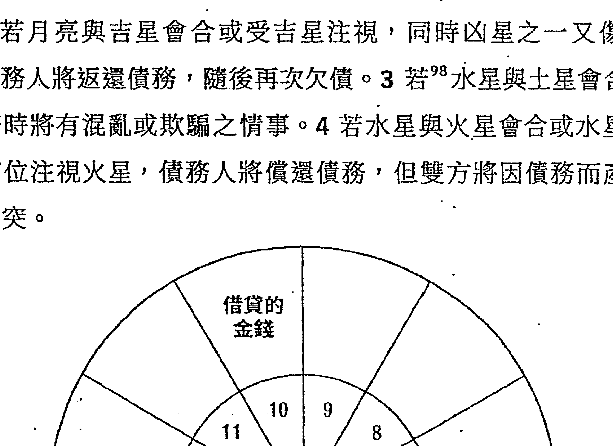

- 若99月亮在太陽光束下，則依我描述過的方式（就月亮的狀態與位置而言）來判斷，同時檢視太陽的狀態、位置以及他是否免於凶星的傷害。

- 若100月亮位於燃燒的位置（即月亮位於帶——也就是均分線——的中間並往南方前進時）101，或月亮位於獅子座、雙子座或射手座的前面度數，或上升位於這些度數上，此時不適合進行任何借出102。

- 欲進行借貸，應在月亮位於獅子座、雙魚座、水瓶座、天蠍座或射手座而且減光103之時，同時木星、金星和水星應注視上升或月亮。

- 若三者同時104注視上升與月亮，則力量更強。

99 | 參見《摘錄》LIX。  
100 | 此段見《結果》III.28, 4-6。  
101 | 也就是從位於天秤座的秋分點往天蠍座移動；通常為天秤座15°到天蠍座15°之間，但《結果》理解為黃緯的南緯。  
102 | 「借出」是按《結果》所補充的。  
103 | 按《結果》引用都勒斯的說法，月亮的速度也應減慢，或運行數據減少。  
104 | 字面上的意思為「一起」。  
105 | 見《結果》III.30, 1。  
106 | 此句見《結果》III.30, 4-5。  
107 | 此句見《結果》III.30, 7和9。

##### V.22：旅行

- 欲105旅行或離開自己的家鄉，可檢視代表旅人的上升，而前往之地則由七宮代表，旅行的目的或所求之事由權威之宮代表，結果則由父親之宮所代表。

- 啟程106時應選擇月亮運行數據增加，而水星離開太陽光束且不與凶星會合時。此時月亮亦不應位於自上升起算的十二宮或六宮，而上升主星及月亮的主星不應在太陽光束下，亦不應下降。

- 若107月亮位於自上升起算的六宮或十二宮，旅途上將遭遇眾多困難與勞苦。

- 若108月亮運行數據增加，事主將如願抵達目的地，一路順暢。

- 若109吉星位於上升，旅行將轉為順利。

- 若吉星位在七宮，他將在抵達目的地後受益。

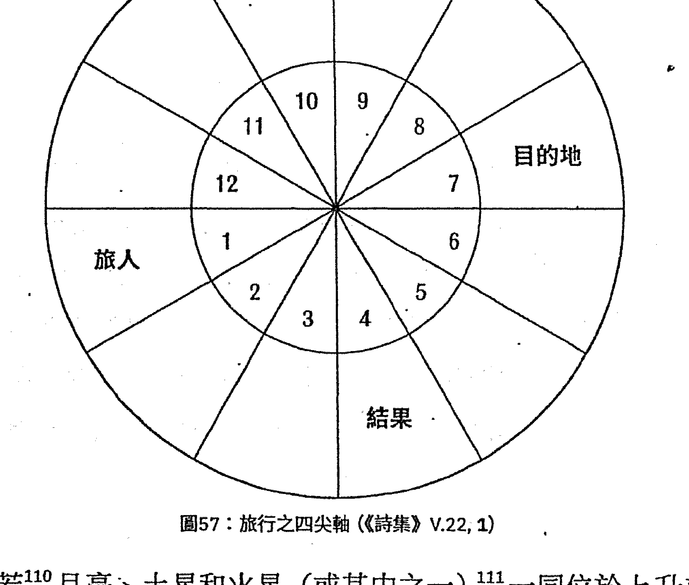

- 若110月亮、土星和火星（或其中之一）111一同位於上升或在七宮，他在旅程中將遭遇莫大的痛苦，患上難以治療的疾病，還經歷損失、爭吵與對立。

108 | 此句見《結果》 III.30, 2。  
109 | 此句見《結果》 III.30, 4, 6 和 8。  
110 | 見《結果》 III.30, 7-8。  
111 | 我認為此處的重點應是指月亮與凶星會合，而非單指月亮位於上升。

- 若112上升主星或月亮的主星處於停滯的狀態，旅行的時間將會延長，事項將被延宕或遭遇困難。

- 若113有吉星對分、四分月亮，且月亮與其連結（譯註：即形成入相位），此時啟程是適合的。

- 若為凶星對分或四分月亮，此時啟程將至為不利。

##### V.23：回程

- 欲114知返回自己的國土、家鄉與家園之行程是否匆促，途中是否遭遇困難或延遲，又應在何時返回，可檢視太陽的對分相與四分相。

- 若木星和金星位於這些位置，事主可迅速安全地返家。

- 若是凶星位於這些位置，回程將有所延誤且速度緩慢，他將於凶星離開這些位置，且月亮與啟程時所在的位置對分（或四分）時踏上回程。亦可等到太陽回到啟程時所在的位置或與該位置對分時踏上回程，但必須清除任何對太陽的傷害。

- 若115啟程時月亮與凶星四分（或對分）且無吉星注視月亮，或月亮入相位於凶星，或凶星之一對分月亮，則代表事主在回程時將遭遇千辛萬苦，甚至無法返回。

- 若無凶星以對分相或四分相注視月亮，但有吉星注視太陽和月亮（除非月亮與凶星之一連結，這代表事主將因此遭受巨大的不幸與痛苦）——事主將因吉星注視太陽和月亮之故而返回國土與家園。

- 若月亮的右方及左方星座有凶星在內116，月亮將在中間遭受凶星的壓力，事主會在回程中遭遇巨大的痛苦與傷害；此時若無木星注視，傷害將更為嚴重（若得木星注視月亮，可減輕不幸與災難）。

###### — 第二宮與目的地 —

- 欲知117 回程的狀況是快速且從容不迫的還是緩慢且路途遙遠的，必須檢視事主抵達目的地時的星盤。

- 應檢視抵達時上升宮位的星座及第二宮（資產之宮）：若第二宮的主星逆行，代表事主將匆促返回，而這是不利的——因事主無法因該旅行而受益，亦無法完成工作，達到旅行的目的。

- 若第二宮的主星停滯，事主回程的速度是緩慢的且將長期滯留。

- 若第二宮主星曾經停滯但已結束停滯而轉為順行，事主回程的速度為適中的，但能完成其目的與預期的工作。

- 若第二宮的主星位於上升或權威之宮，事主在回程時將不受疾病侵擾118，亦將免於不幸。

- 若第二宮的主星位於父親之宮，事主恐將在回程時死亡119。

###### —— 從出發的時刻判斷回程的狀況 ——

- 當120 事主踏上121 渴望的土地或家鄉，月亮正與土星會合，一般而言這代表緩慢或財產的巨大損失，也可能事主仍在外地遊歷或待在異鄉。

- 若此時月亮與水星會合而火星與兩者對分，則回程中將遭遇打擊、骨頭斷裂、損傷或其它種類的傷害。

- 若122 水星和土星以對分相注視月亮，不僅回程時的速度緩慢、路途遙遠，事主也藏有背叛、偷竊與邪惡之心，或成為他人懷疑的目標123，因而被逮捕、監禁，財產也將被毀壞。

- 若124 火星在射手座會合或注視月亮，代表打擊、骨頭斷裂、受傷或其它種類的傷害將發生在異國的旅途上。

- 另外125 檢視受剋的月亮所在星座的本質。

- 若所在星座為獸性星座，且傷害月亮的凶星也屬於126 獸性星座，事主將遭受供騎乘的動物或掠食動物的襲擊。

- 若為人性星座，傷害將來自人類。

- 若127 旅行開始於水星會合月亮之際，木星又以三分相或四分相注視兩者，旅行所為事項將會是順利的，結果也將令人滿意，而回程亦非常順利，健康無虞。

120 | 此句參考《摘錄》XLVIII, 2。  
121 | 兩本手抄本的內容皆是如此，但全句較像是踏上旅途那一刻的開始盤，而非抵達目的地的事件盤。因此我建議此處應改成「離開」。  
122 | 此句參考《摘錄》XLVIII, 2。  
123 | 或指控的目標。  
124 | 見《結果》III.30, 71。  
125 | 此段大致見《結果》III.30, 18-19（但內容仍然有不小的出入）。  
126 | 或可讀為「位於」。  
127 | 參考《摘錄》XLIX。

##### V.24 : 購買與建造船隻

- 欲購買或建造船隻，應在木星或金星位於父親之宮且注視上升及月亮之時進行。

- 若木星和金星位於父親之宮，其星座的特質最好是潮濕的（屬水象星座）或有海中生物的象徵，或為木星和金星主管的宮位。

- 以上情況下，上升位於金牛座，且上升內有月亮更佳——或上升為雙子座、巨蟹座、處女座、射手座或摩羯座（在末端）（譯註：摩羯座開端屬土象，末端屬水象），且月亮亦在上升內更佳——若為摩羯座，其開端與末端都是自由的。

- 若上升為雙魚座且月亮在內亦是適合的。

- 但最好的星座仍是我所提的金牛座，雙魚座次之，雙子座再次之，摩羯座的末端再次之。

##### V.25 : 建造船隻的開始盤

- 此時最好的時間應為：太陽與吉星三分，而月亮增光、運行數據增加，且她所行經的黃緯與黃經度數俱增並在吉星的界上。

- 應避免在月亮和上升受剋於火星的時間進行：因為這代表事情的結果將因火災、憤怒或不當操作而失敗或變得不幸。

- 若開始時月亮位於水瓶座，且太陽與火星對分或四分月亮，或他與月亮位於同一星座，厄運將發生在海上並傷害船隻，船上的財物與人員盡毀，船隻將受火災襲擊，可怕的不幸及極大的恐懼將降臨在人們身上，人們將會為了活命132而將財物丟入海裡。

128 | 此章節見《結果》III.30, 20-22。  
129 | 因手抄本C被撕裂，此處看起來像是只有一個字，但可能是指「免於凶星傷害」。  
130 | 此章大致見於《結果》III.30, 16-17。  
131 | 文法上來看可能單指火星，但我認為都勒斯應是指火星和太陽兩者一起。（不過手抄本C為「月亮位於」一個星座但又插入連接詞「和」，暗示有其它行星與月亮在同一個星座）

- 若月亮未在水瓶座而是在與海有關的星座，而火星與太陽如上述所云（與月亮四分或對分），則船隻及船上的人員（及所有船上的財物）將會被淹沒、毀滅，沉入深海裡。

- 若月亮不在水象星座而是在乾燥的星座，且遭太陽及火星注視（如上所述），船隻將在海岸上破損，或因誤觸岩石或礁石133而破損，甲板將在海上破裂，船上的一切也會因為某些原因134而毀壞。

- 若月亮未在乾燥的星座，船隻在海上可能遭海盜襲擊，雙方發生激戰，船隻因而沉沒，人財俱毀。

##### V.26：船隻下水135

- 若136月亮未注視凶星或吉星，且位在牡羊座的前10°內137，並在地平線上138，船隻的啟航將會是順利且適當的。

- 若月亮在金牛座，航行中將會遇到大浪；此時若凶星注視位於金牛座的月亮，船隻將因大浪而毀滅。

- 若月亮在雙子座的8°，船隻將能順利抵達目的地並可獲利；但從目的地回程時會有滯留及速度緩慢的情形。

- 若月亮在巨蟹座，海上即使有大浪也不會傷害船隻，船隻將是安全的，人員可因此受益。

- 若月亮在獅子座，船上有部份人員將受厄運侵擾；若月亮受剋，厄運更難以根絕。

- 若月亮在處女座，從目的地返回的速度既不慢也不快。

- 若月亮在天秤座的初度數到10°之間，對陸上或海上旅行而言都是不利的。若是超過10°，則可以進行陸上及海上的旅行。

- 若月亮在天蠍座，船隻可免於海上的災難，但船上的人員仍會因為與自己靈魂相關的事139感到恐懼。

- 若月亮在射手座，災難與不幸將來自海上的大浪破壞船隻。

- 若月亮在摩羯座的9°之後，旅行是適合的；但船上的人員仍將因為與自己靈魂相關的事感到恐懼。

- 若月亮在水瓶座，船隻在回程時將遇到意見不合、速度緩慢與滯留的情形，但結果仍會是好的。

- 若月亮在雙魚座，厄運與災難將會降臨。

- 以上為無吉星亦無凶星注視月亮時的情況。

- 另外140還有其它事項須留意。

- 要注意，月亮在地平线下且受吉星與凶星注視是不利的。

- 若月亮在地平线下與土星會合且土星停滯，土星與月亮位於同一星座時，船隻在這一刻下水，巨大的痛苦與厄運將會降臨，人們將面臨不尋常的恐懼，海上的大浪將侵襲船隻。

- 若月亮在地平線上而土星停滯，且土星以三分相注視月亮，船員會為了活命必須將船上所有物資丟入海底，在歷經折磨與極大的勞苦後終可得救，即使141月亮在地平线下亦是如此。

- 若月亮在地平線上而土星並未停滯，且以三分相注視月亮，可怕的事件仍會發生，人們將歷經生死邊緣的恐懼——但除了恐懼之外，船隻及人員狀況較好，不至受到嚴重的傷害——此為土星未停滯的狀態。

- 若土星如此又與水星會合142，恐懼與可怕的程度將會增加；若有吉星注視土星，則厄運較為和緩、容易承受，尤其若吉星位於土星的右方注視土星143並位於強力的宮位時。

- 正像144我所述土星在這些位置時的情形一樣，若土星位於上升且145月亮並未注視土星時亦同此論。

- 若146土星所在星座與事主本命盤的土星星座相同，而該星座又在開始盤的上升，或開始盤的土星與本命盤的土星星座三分、四分或對分，情況將更為嚴重、可怕。

- 若147為火星處於上述土星的狀態，且火星在地平线下、月亮在地平線上，而火星又傷害月亮，雖然災害來得更猛烈，但情況仍較土星為佳；恐懼與厄運不再如土星般來自海上或海浪，而是來自爭吵與衝突，船上的人員將因意見不合而互生敵意，或敵人來自海上。

- 此時人員將受到嚴重傷害，例如四肢斷裂、血流不斷等等。

- 若水星與火星會合，則困難與恐怖的狀況更甚。

141 | 《結果》並無此句。若與16對比，應為「此為月亮在地平線上的情形」。  
142 | 即會合停滯的水星（《結果》）。  
143 | 亦即支配土星。  
144 | 此句見《結果》III.30, 53。  
145 | 字面上的意義為「以及若」。  
146 | 此句見《結果》III.30, 53。  
147 | 此段見《結果》III.30, 54-55。

- 若148 土星、火星和水星從同一宮位或不同宮位注視月亮（月亮在地平線上），將招來難以逃避的可怕厄運，且無法從中脫身。

- 若火星與水星連結亦同。

- 若149 火星與土星其中之一注視太陽，另一個注視月亮，人們將被巨大的恐懼、可怕的厄運所傷害；若火星或土星以對分相注視，傷害將更為嚴重。

- 若150 太陽及月亮未呈現凶象，且月亮在地平線上，木星又以四分相151注視月亮，這對船隻入水或啟航是適合的，他們的行動將會安全、輕鬆與順利，希望獲得的物品或交易亦會托靠主不受阻礙，人們各取所需。

- 若木星注視月亮之時，金星剛好與木星會合，或金星從其它星座注視月亮，所進行之事項將得到增進且極為有利。

- 另外152無論水星會合吉星抑或凶星，都將增加真主所裁決的吉象或凶象降臨之力153。

- 若154 月亮在地平線上且金星獨自注視月亮，海浪與厄運將不會妨礙他們達成目標，且他們將因受到祝福而獲得利益；但這與木星和金星同時注視月亮的情況不完全相同，金星獨自的力量還是較弱的。

- 若155 月亮和金星會合在同一星座且在地平線下，但金星在光束下，海浪將不會妨礙事項，船隻也將如願地平安抵達目的地。

148 | 此段見《結果》III.30, 56。  
149 | 此段見《結果》III.30, 57。  
150 | 28-29，見《結果》III.30, 58。  
151 | 此處是錯誤的，都勒斯的原意是指木星的另一個稱號「四面宙斯（four-sided Zeus）」，而非四分相。  
152 | 此句與《結果》III.30, 52和55相似。  
153 | 或者也許是「增加他的力量」。  
154 | 見《結果》III.30, 59。  
155 | 此句見《結果》III.30, 60。

- 若156木星和金星同時注視太陽和月亮，而月亮又與水星會合，可謂下水或啟航的最佳時刻，沒有比此時更適合的了157。

- 若158凶星位於上升而吉星與月亮會合，或與前述相反（即凶星與月亮會合而吉星位於上升），船隻將遭遇海上的災難，但船上的人員將從恐懼中獲救，託靠主，憑主裁決。

- 若159月亮位於尖軸宮且未受吉星或凶星160注視，而月亮又位於本冊開篇所提適合的星座上，託靠主，此時可謂吉時。

- 若161月亮和上升同時與吉星及凶星不合意，未受吉星與凶星的注視，則可在上升和月亮位於我所提及的星座時進行入水或啟航。

- 若162欲將船頭163下水，則開始盤的時間為將船隻被鬆開並推入水中之際；人員上船的開始盤則以人員將其中一隻腳放上甲板的時間為準。

- 若船隻與人員抵達目的地，則應檢視船隻與人員到達的時間，若兩者為相同的164。

###### — 乾燥與潮濕星座 —

- 檢視陸上或海上旅行的開始盤：(1)165若為陸上旅行，而月亮位於七宮且不在乾燥星座，但凶星在乾燥星座或注視著它們（譯註：指乾燥星座），以及 (2) 若為海上旅行，月亮不在水象星座或其所在星座的本質與水無關，但凶星在水象星座或注視於它，則此時進行陸上或海上旅行是不適當的，可憎之事與勞苦將會降臨。

- 若166月亮並未167受剋，且吉星位於乾燥或土象星座或注視這些星座，此時旅行是適合的，將不受厄運所傷（即使有所傷害，程度也會比上述輕微）。

- 若無法判斷旅行之人的生死，亦不知他們的歲數168，若在此時啟程，即使遇到困難，其傷害也較上述為輕。

###### — 陸上與海上旅行 —

- 最能造成傷害的凶星為：陸上旅行為火星，而水上或海上旅行則為土星；若木星和金星又未注視它們，情況將更為嚴重。

- 對月亮而言最嚴重的情況為位於凶星的界或外觀，且受凶星以對分相或四分相注視，但木星和金星（或其中之一）未注視月亮之時。

##### V.27：書籍、報告或信件的抵達

- 當有書籍、報告或信件抵達時，可檢視此人本命盤的水星：若有吉星注視水星或水星（與發光體一起）注視吉星169，或水星所在的星座中並無凶星在內170，這樣的行星配置（如所描述般）代表書中或信中的內容是好的。

166 | 我認為此句是指陸上旅行。  
167 | 「未」字為戴克所補充。  
168 | 亦即沒有他們的本命盤或太陽回歸盤。  
169 | 此處可能是指信件抵達時的過運行星與本命水星的相位。  
170 | 此處可能是指水星的過運至本命的宮位。

- 當聽到書籍或信件抵達的消息時，可檢視太陽和月亮的狀態：若它們清除了凶星的傷害，且月亮與水星會合於上述清除了凶星傷害的星座，而吉星又與它們同星座或注視著它們，則本命盤的主人收到的書籍、報告及信件內容將會是令人開心愉快的。

- 當書籍、報告或信件抵達時，若月亮位於上述的星座，但與凶星會合，且她既未與吉星會合亦未受吉星注視，此時收到的書籍、報告或信件的內容將會是麻煩、不幸並帶來傷害的。

- 若水星位於吉星主管的宮位（星座）且東出，同時逢吉星及凶星注視，報告的內容會是安全的。

- 確實也有學者持另一種觀點：他們說應檢視木星和金星的過運。

- 當它們的過運來到（本命盤中）發光體所在星座或與發光體四分的星座，或（過運的）木星與金星來到未受凶星傷害的星座，而水星亦不被凶星所傷，並注視木星和金星：此時命主收到的書籍、報告或信件內容將會是輕鬆愉快、有助益的。

- 若為土星或火星（或二者同時）的過運來到本命發光體所在之處，或與該位置四分，且與水星會合（或水星注視凶星），此時命主收到的書籍、報告或信件內容將會是不好的；若命主又在此時旅行，傷害將會降臨。

##### V.28：逮捕與監禁

- 若某人因國王降罪，或奴隸得罪主人而被逮捕，可檢視當下的月亮。

- 若被捕時月亮在牡羊座，他將很快擺脫監禁獲得自由。

若月亮在金牛座，刑期將會被延長，監禁的原因則是被人圖謀財產，他的財產也將會被奪走172——他的肉體則在受盡折磨後被解救。

若月亮在雙子座且在三天之內無法獲得釋放，刑期就會被延長。

若月亮在巨蟹座，刑期會被延長。

若月亮在獅子座，監禁的原因將來自有權力與影響力之人，且在被釋放之前刑期會被延長。

若月亮在處女座則好壞參半，但多數對他是有益的，他亦能在其中獲得樂趣173。

若月亮在天秤座，帶著腳鐐之人174將獲釋放。

若月亮在天蠍座，刑期將被延長，而他將長期患病，但最後仍將獲得釋放。

若月亮在射手座，刑期將被延長。

若月亮在摩羯座，他將從監禁中被釋放。

若月亮在水瓶座或雙魚座，腳鐐將終生掛在他的腳上，他只能無止盡地忍耐，至死方休。

當然175以上僅為月亮落在這些星座時所顯現的徵象，但凶星的位置以及它們與月亮形成的相位仍會大大改變這些徵象。若木星與月亮會合或位於上升，或注視月亮和上升，犯人可迅速獲得釋放；金星若在同樣的位置亦然。若水星和木星會合月亮或注視月亮，他將更有機會獲得解救且更快速地被釋放，托靠主（祂超絕萬物！）。但若火星會合或注視月亮，他將被毒打而受傷，或在監獄中飽受火燒、折磨與傷害，或被鐵器所傷，痛苦萬分。若土星會合或注視月亮，苦難將被延長且糾纏於他，他將飽受折磨與痛苦才能解脫。若水星、土星和火星同時會合或注視月亮，他將在牢獄中遭受毀滅。

在176犯人被監禁之時可檢視本命的177上升是否有行星在內，又受何行星注視。因為上升確實對帶著腳鐐之人有著與月亮大致相同的影響：若月亮減光，將對他有利178；若月亮增光則對他不利——月亮增光是指月亮被太陽釋放（即月亮在兩者會合於同星座度數後被釋放）。之後月亮會繼續前進，離太陽越來越遠，直至來到與太陽對分的第七個星座，此時與上述新月的情況相似，帶著腳鐐之人將飽受困難與傷害，但最終仍可獲得釋放179。

若180月亮與水星連結且水星西入，代表他將從監禁中被釋放。若月亮正離開均分線的中間181並與水星和金星182一同往南方前進，代表他可迅速獲得解救。

若183土星和木星同時以三分相注視月亮，腳鐐主人184在刑期被延長之前將無法逃脫，但會帶著稱讚與利益被解救。若月亮與土星和木星位於同一星座185且火星同時注視月亮186，代表腳鐐的主人187無論是生是死都將迅速脫離監禁。

從188中天的尖軸到父親之宮的尖軸之間被稱為「下降的區域」，即行星西降之意；從父親之宮的尖軸到中天的尖軸被稱為「上升的區域」，即行星東升之區域。因此若月亮位於下降的區域（即月亮正在西降）同時又被火星所傷，犯人將受到不公平的待遇，刑期也將延長；若月亮位於上升的區域（即東升之區域），他將獲得解救。

若月亮在西方的區域且遭火星以三分相注視，但木星同時以四分相注視月亮，腳鐐的主人將從鐐銬與監禁中解脫獲救。若土星與月亮會合（無論在哪個區域）且木星從第十個宮位189或以其它的四分相注視月亮，代表他可從鐐銬中解脫。

若火星以四分相注視月亮且土星亦以三分相190注視月亮，他將長期受腳鐐所禁錮，獲救的同時也會遭受困難與勞苦。若火星以三分相注視月亮而土星亦以四分相注視月亮，腳鐐的主人將經歷動盪與掙扎，而後他將打破腳鐐與枷鎖，以逃跑的方式從中解脫。

務必191檢視父親之宮的狀況，它甚至比其它尖軸宮更為重要，因為它能解釋所有結果。

##### V.29：論事項已經發生及正在或即將發生的狀況

檢視月亮的入相位及離相位，以及離相位與入相位的時間。

若詢問之後不會發生的狀況192與將會發生的狀況，或某人希望之事，或絲毫未開始的事項隨後會發生什麼狀況，都可藉由月亮入相位的行星，以及離相位於哪顆行星的四分相而得知。若詢問傷害、疾病、監禁或逃離家園與國家（是否能成功逃離），則檢視月亮離相位的行星。因為入相位確實代表即將發生的事情，而離相位則代表已經發生、過去的事情。

##### V.30：論關於病人的問題

詢問193有關病人的問題時，若月亮正離相位於吉星，代表病人即將痊癒。

若詢問之時月亮正離相位於火星，疾病將來自難纏的熱症，或身體應該是被鐵器所傷害，或血管受鐵器切開或被放血。若月亮增光更能確認以上所述，且病情更加嚴重。

若月亮離相位於土星，病人將因熱病而顫抖不已，或飲食中藏有致病的因子，對腹部或身體造成傷害；或脾臟腫大，導致嚴重的疾病；或因傷口或嚴重的潰瘍導致四肢難以動彈或脫落；或體內的黑膽汁過剩導致腸子阻塞而嚴重發炎；任何疾病都會傷害病人許久。

##### V.31：所有事情的開始盤

在開始每件事情時，應檢視眾星中主管該事項的行星。若事情開始時，雖有吉星注視月亮和上升，但主管該事項的行星位於太陽光束下或受剋，或未注視上升，而且位在凶宮：這件事將難以成功，且無任何益處。

若欲購買土地，或為某人執行管理的工作194，應檢視土星和木星的力量。若為取物、贈禮、訴訟、介入某事、合夥、建立緊密的關係、交友、經商或學習等等活動，則檢視水星的力量。若為婚姻或性195、娛樂等金星的事項，則檢視金星的力量。若為戰爭、武器或類似事項則檢視火星的力量。若為蘇丹196或國王的事項，或向國王謀事，則檢視木星的力量。若欲彰顯或使人們關注而非隱藏某事（非作奸犯科），除了檢視太陽的力量外，亦應檢視木星：因每件事項中，若有木星注視，可將事情引導至好的方向。金星亦有幫助，但對事項的助益是有限的，除非木星會合或注視著她。金星的能力主要作用於兩人之間的事197，或食物、香水等類似事項。要確認木星在每件事項開始時狀態是適當的，因為木星能使事項更為妥當並增加好運，化解或驅散邪惡與厄運。

##### V.32：病人的情况

若198欲知生病之人的狀況，擔憂他的病情及是否會死亡，可在生病時檢視其本命盤，來了解病人的狀況：吉星所在星座為何，凶星所在星座又為何？

若月亮在行進的過程中來到本命凶星所在星座，或本命凶星以四分相註視過運的月亮，但無吉星註視本命月亮以及過運月亮來到的星座，此時開始的疾病將會是可怕、難以擺脫的；與此同時，若時間的配置星（除了199界主星之外）亦來到該星座200，對命主的傷害將更能夠確定，且更為嚴重。

若命主的時間配置星來到該星座或其它星座（受本命火星和土星註視的星座），此時開始的疾病將會是可怕、難以擺脫的。

若時間的配置星註視開篇201已詳述的星座（主管著身體不同部位），命主將會遭受嚴重疾病的侵襲，而你會知道疾病的傷害將會發生在身體何處。

若202月亮位於雙體星座（尤其是雙子座及雙魚座），土星和火星亦與月亮會合在同一星座，且月亮被擠壓在二者之中203，當時間的配置星來到與土星和火星形成相位的星座時，命主的手腳將受痛風之苦。

##### V.33：命主的資產

欲204知命主的資產何時增加或減少，可檢視上升起算的第二個星座，亦稱為本命盤的「資產宮」。一生中每當時間的配置205來到該星座，而該星座又有凶星在內，則當時間的配置來到凶星所在的度數206，或與這些度數形成對分相或四分相時，為命主資產減少之時。若為吉星在這些度數上或注視這些度數，當時間的配置來到吉星所在的界207時，則為命主資產與生活水平提升之時。

每段208時期皆應檢視月亮：若月亮的過運與行進來到本命盤中凶星所在星座，此時若無吉星注視該星座，且凶星位於它們原本在本命盤中的位置（或與之形成四分相或對分相），或注視著月亮，命主將在那些時刻經歷痛苦、難過、憂慮和困擾。若過運的月亮來到其本命所在星座，同時又有吉星在內，且過運的月亮來到該星座時未受凶星注視，或受吉星以三分相注視，此時命主將會因為衣服或其它事物而獲得快樂、收益與好運，不會經歷上句所描述的傷害，還會益發愉快幸福。

##### V.34：爭論與訴訟中針鋒相對的對手：孰勝孰敗

欲209知相關事項，應檢視詢問之時的上升：上升代表詢求協助者與爭論210的發起者。

若上升位於穩定的星座，代表詢求真相之人所言不虛，對爭論亦不會輕言放棄。

若上升為雙體星座，代表詢求真相之人三心兩意，在爭論的中途就萌生退意。

若上升為轉變星座，代表爭論將無法完成或沒有結果211。

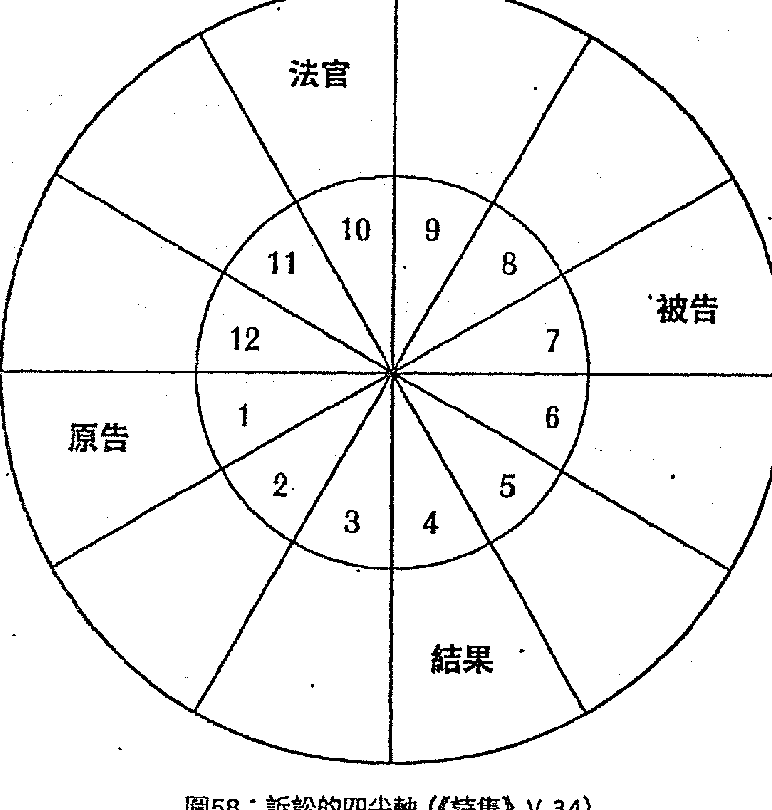

若212火星注視或會合上升，詢問人將因爭論而悲傷及蒙羞。

若水星與吉星會合於上升（或注視上升），詢問人將從對手處獲得金錢或貨物，並因此放棄與對方的爭論。

若土星注視上升或會合上升，則詢問人將因爭論的原因及爭論本身而遭受損失213。

若214在詢問爭論的時刻，凶星注視著中天，爭論將無法有結果，案件也將由第一位法官轉由第二位法官接手，判決的內容也會因為衝突與恥辱而充滿缺陷與令人不悅的意見，而兩造的證詞也將被法官215拒絕並退回。若土星位於中天的尖軸宮，法官將因自己的不公不義而招致失敗、傷害與憎恨。若有吉星位於中天，法官將會是正義的，他的判決也會是公平的。

從216第七個星座可觀察到對手的狀況。若凶星注視或位於該星座，對手將會遭受損失、困難與傷害。若水星與凶星會合於（或注視）該星座，對手將製造不公並為達到個人目的而提供虛假的證詞。

欲217知爭論的結果及後續，可檢視父親的星座（即地底的尖軸宮）。

###### — 上升主星及七宮主星 —

若218上升主星、中天主星219或七宮主星東出，且與父親之宮220的主星位於同一星座，勝利將屬於該行星主管的尖軸之享有者221。若該尖軸宮之主星在太陽光束下，並與父親之宮的主星會合，則該尖軸宮代表者將因如此的配置而被擊敗。

若上升主星以及七宮主星皆東出，同時與父親之宮主星會合，雙方的歧見可望消弭而獲得和平。若上升主星以及上升對宮的主星皆會合父親之宮的主星，且都在太陽的光束下，則雙方將爭論不休，結果也遲遲難以判定，難以取得共識。

吉星代表成功或勝利以及公平的審判。凶星——若它西入且不在自己主管的宮位上，但位於尖軸宮且運行數據增加——則代表該尖軸宮所象徵之人將失敗；若凶星位在自己主管的宮位，並位於尖軸宮且運行數據增加222，則該尖軸宮所代表之人將因不公的審判，或透過賄賂、強迫、偏袒而獲得勝利。

###### —— 支援與同盟 ——

另外223自第七宮起算的第二宮代表對手獲得的支援。若中天主星及上升主星會合在同一星座或同在上升，或中天主星注視上升或上升主星，法官為詢問人的同盟者而與他站在同一陣線。若中天主星及上升對宮的主星如上句上升及其主星一般，法官將支援對手並為對手尋找理由開脫，對手因此得以獲勝。

###### —— 月亮 ——

此外224有關這些主題 (即詢問人及其對手，審判本身，還有爭論、求愛、勝負，以及其餘我曾解釋的主題) 亦須檢視月亮。若月亮如本書開篇所形容的受剋，或月亮在進入太陽光束下之前就先與凶星產生連結，且月亮位於尖軸宮之一或隨尖軸宮之後上升的宮位（即接續尖軸宮的星座）時，該尖軸宮或其續宮所代表的人將會失敗，因該爭論而遭受不幸並悔恨不已。

###### — 債務的訴訟 —

當225雙方爭論的原因源於債務或資產，並向法官提出訴訟之時，若月亮增光，則月亮代表債權人（即將錢借給對方之人），而太陽代表債務人，即應為此債務負責之人。若月亮減光則為相反，因此月亮代表債務人，太陽代表債權人。因為如此，應檢視太陽和月亮——何者較強，何者較具優勢和力量，何者又緊密地注視上升。若借出金錢者的代表因子為其中較強者，勝利將屬於債權人；若貸入金錢者的代表因子較強，則債務人將成為勝利者。

###### — 幸運點 —

另外226有關這些事項應檢視幸運點：因為若幸運點位於上升，或在自上升起算的第二宮，勝利將屬於詢問者。若幸運點位於上升對面的星座，或在自第七宮起算的第二宮，則勝利將屬於被問及者（譯註：即對手）。若幸運點的主星位於父親的尖軸宮，且注視著上升以及上升的對宮，則雙方將會自願合解。若幸運點的主星位於中天，且同時注視上升及上升的對宮，雙方仍會妥協，但妥協須視法官的喜好與命令而定。

###### — 更多關於上升主星及七宮主星 —

若227上升主星和第七個星座的主星位於同一星座，在它們的外觀228上（戴克補充：應是在彼此的外觀上，雖然接近，但彼此叫囂），雙方將會彼此憎恨。

若229上升主星及上升對宮之主星所在星座為水星所主管，雙方的爭議將會因為子女或類似子女的人物而引發。

若星座為金星所主管，爭議將會因為女性、姊妹、女兒或類似的人物而引發。

若星座為火星所主管，爭議將會因為姊妹或手足的子女而引發。

若為土星和太陽所主管，爭論將因父親、祖父或類似的人物而引發。

若為月亮主管的星座，將因母親或與母親有血緣的親屬而引發。

若為木星主管的星座，將因兄弟或朋友而引發。

##### V.35 : 是否離開國土

若詢問某人是否會離開家鄉與國土、離家旅行或因統治者的命令（或其它原因）而被驅離，須看開始盤的月亮。

若月亮剛離相位於吉星，而吉星之一位於上升或注視上升，他可望重返家鄉與國土。

若月亮正離相位於凶星，且上升及月亮受剋，他將遭受厄運與困難，亦無力返鄉230。

##### V.36：偷竊、失物以及是否能失而復得

###### — 失而復得的證據 —

此時應檢視231：當詢問被偷竊或遺失的物品之時，兩個發光體彼此以三分相注視，失物可快速被尋回，不費吹灰之力。但若太陽以四分相注視月亮，失物將在一段時間之後才能被尋回，且過程困難重重。竊賊會將失物從原本放置的地方轉移到另一個地方。若月亮和太陽彼此對分，物品仍可被尋回，但將耗費時日，困難重重。

若月亮會合某一行星且位於該行星主管的宮位，這對問題是適當的，因為失物將被尋回。若太陽注視該宮位及該行星，則更加適當，失物應可被尋回。

若月亮的十二分部位於上升或中天，或與太陽位於同星座，或與月亮的主星或東出的行星位於同星座，被偷竊或遺失的物品將可被尋回。

若月亮在上升對宮的星座下降，或位於自其起算的第十二宮232，失物將無法被尋回（戴克補充：這是指開始盤的第六宮，因第六宮對第七宮而言是「下降」的宮位，而且也是自第七宮起算的第十二宮）。但若開始盤的太陽以三分相注視月亮，失物仍可被尋回，因為主賜予的陽光能去除所有的罩紗，照亮並戰勝所有的黑暗，托靠主。

若月亮位於學者（精於天象的大師）所稱的「燃燒途徑」233，詢問人對物品將不再有掌控之權，即使最後能取回，過程也將費時費力。

若兩個發光體皆位於地平線下，被偷竊或遺失的物品將消失無蹤，他將永遠失去其掌控權。

若太陽會合或注視幸運點，他將迅速取回被偷竊或遺失物品的掌控權。若月亮會合或注視幸運點，但太陽並未注視月亮，或月亮與幸運點會合234，他將可取回被偷竊或遺失物品的掌控權，但過程緩慢且困難。若發光體並未會合幸運點或未235注視幸運點，物品的主人將無法取回被偷竊或遺失物品的掌控權，他亦不應去尋找，因這是徒勞無功的。

若月亮位於上升，他將迅速取回被偷竊或遺失物品的掌控權——只要發光體在上升，失物皆可被尋回：因為上升能給予優越的能力。

若月亮位於太陽光束下且減光，可確定他將無法取回被偷竊或遺失物品的掌控權，若要取回掌控權，須視天意。

若兩個發光體與上升對分236，他須經歷緩慢、辛苦、衝突、羞辱以及爭吵的過程，才能取回被偷竊或遺失物品的掌控權。

若太陽單獨位於上升，他將能取回被偷竊或遺失物品的掌控權，除非上升及太陽一起位於水瓶座、雙子座或天秤座：因為這三個星座代表困難。

星座為太陽的三方星座之對宮237。18 若太陽在這三個星座升起238，對取回失物是不利且不適當的。

19 若已知失物主人的本命盤，而物品被偷竊或遺失之時，太陽位於上升且月亮正好落在本命的吉星所在星座，他將可取回失物的掌控權。

###### — 竊盜的四尖軸 —

20 古代學者239亦由四尖軸觀察竊盜之事：若問及竊賊或失物，上升代表被偷竊或遺失之物品，中天為物品的主人（亦即物品被偷竊而尋找之人），而竊賊之事可檢視上升的對宮，竊賊的藏匿處（亦即藏匿失物之處）則檢視地底的尖軸宮。

21 若有吉星位於或注視上升，他們說詢問人可望取回被偷竊或遺失物品的掌控權，即物歸原主或原處。

22 若有行星位於中天，且所在星座正為該行星所主管，可判斷尋找失物之人的言語誠實不虛。

23 若中天的星座並非由位於中天的行星所主管，且該行星在星座內不具任何尊貴力量，則尋找失物之人的言語實為虛假的。

24 若地底的尖軸宮位於雙體星座，他們說取走失物的不會240只有一人，而是有其他同黨。

25 若地底的尖軸宮不在雙體星座，而是在轉變星座，取走失物的只有一人，沒有其他的同黨241。

26 若地底的尖軸宮為陽性星座，取走失物的人為男人；若為陰性星座，則為女人。

27 若地底的尖軸宮為潮溼星座，失物所在的地方靠近海邊、水井、泉水、溪流、河流、溝渠或有水的場所。

28 若父親之宮為四足星座，失物位於羊所睡的稻桿中、動物的庇護所、動物的圍欄內或任何動物棲息之所。

29 若地底的尖軸宮為人性星座且逢木星和金星注視，失物所在的地方為乾淨且適當的。

30 但若非木星和金星，而是火星注視著該尖軸宮，失物位於火場、鐵匠的火爐或類似之處。

31 但若非火星而是由土星注視該星座，竊賊會將失物交給奴隸，而收取失物的奴隸則將失物藏在黑暗的屋內，或骯髒空曠之處，或在高的、潮溼的或骯髒的地方。

###### — 地底尖軸的宮內行星 —

32 若242 土星注視著地底尖軸宮的星座243 且木星位於宮內，奴隸不會收取竊賊所給予的失物，而具社會地位的人將接收它。

33 若非木星而是火星在內，他們說，從竊賊手中接收失物者類似奴隸，但現今是自由的人。

34 若非火星而是金星在內，且位於星座的第一度到20°之間244，則為具資產及社會地位之女人從竊賊手中接收失物。

35 若金星位於地底尖軸星座的最後10°內，他們說女僕（或從事類似工作者）從竊賊手中接收失物。

36 若非金星而是水星位於地底的尖軸宮內，且水星位於星座的前10°內，則從竊賊手中接收失物的為聰明、受人尊敬或稱讚之人，或出身貧窮但今日擁有財富245之人。

37 若水星位於星座最後10°內，從竊賊手中接收失物的將為奴僕或從事奴僕工作的人。

###### — 尋找失物 —

38 若246 太陽注視幸運點，他們說詢問人將能迅速取回遺失或被偷竊物品的掌控權。

39 若為月亮而非太陽注視著幸運點，詢問人可取回遺失或被偷竊物品的掌控權，但過程是緩慢的。

40 若發光體並未注視幸運點，亦未注視上升，詢問人將經歷千辛萬苦才能取回失物。

41 而且他們說若月亮與太陽形成四分相或三分相，或與上升形成對分相，則詢問人能抓住當時逃逸的奴僕或偷走、丟失物品的人。

42 若太陽（承上句）與月亮形成三分相、四分相或對分相，且太陽位於上升、中天或會合幸運點，或注視上升、中天、月亮與幸運點時，詢問者確定可取回失物的掌控權。

43 若月亮位於星座最後幾個度數，在第三個形象247上，放置遺失或被偷竊物品的地方將會不停地被轉換。

###### — 從月亮所在的界得知失物的狀態 —

44 欲知248遺失或被偷的物品狀態以及失物究竟為何，可透過月亮來觀察。

45 詢問盜竊之事時若月亮位於土星的界上，而土星位於中天或在其旺宮，失物是有價值的，或為耕種、建築或賺錢的工具。

46 若土星不在這些位置，而是在地平線下，物品則是骯髒、破舊、無價的。

47 若土星位於從尖軸下降的星座（即他位於這些星座內）249，或位於牡羊座（即他的弱宮），則物品是被鄙視、骯髒、破損的。

48 若土星位於從尖軸下降的宮位且注視月亮，失物則是粗糙、不平整的。

49 詢問時若月亮並非在土星而是在木星的界上，失物則為金製或銀製品、閃閃發亮之物、絲綢布料或有價值的東西。詢問人將無法取回失物的掌控權，因失物已落入權貴之手。

50 若月亮並非在木星而是在火星的界上，被偷之物則以火加工而成，或被藏在烤爐或鐵匠的熔爐內等類似的地方。

51 若火星與水星一同注視月亮，上述所提藉由火或烤爐製作之物是專業、適當且精美的。

52 若月亮位於火星的界上但未受火星注視，而是被金星和水星注視，則上述藉由火或烤爐製作之物會有染料、石頭、護身符或各式寶石裝飾。

53 詢問時若月亮位於金星的界上，失物為金或銀，抑或為寶石、昂貴的石頭、精美的衣服、美麗的布料，抑或是由多樣的閃閃發光的染料所裝飾的物件、香水、女性的裝飾品、具有甜味與潮溼的特質之物，抑或為具光澤並受女性歡迎的物品。

54 詢問時若月亮位於金星的界上，且金星與月亮會合於陰性星座，則所偷走的為女性用品。

55 若火星又注視金星，則被偷之物為某種不具光澤但加工精細的物品。

56 詢問時若月亮位於水星的界上，被偷之物為書、厚重的帳本250、學者的記錄、男女皆需要的物品、旅行中會使用的貨幣，以及由模具鑄造的東西。

###### — 由月亮所在星座得知失物的狀態 —

57 以下251說明的星座代表特徵須與上述月亮所在的界一起判斷：混合星座與界的知識將能獲得更多資訊；只要仔細觀察就能作出最好的判斷。

58 此時檢視：在詢問被偷或遺失之物時，若月亮位於牡羊座，失物為布料、衣服或戴在頭上、臉上的裝飾品。

59 若月亮在金牛座，失物為金或銀，或戴在脖子上的裝飾品，或作為捐贈、獻給清真寺以及神明的物品。

60 若月亮在雙子座，失物為貨幣或支付時會使用的物品，或裝載書本的容器，或為神明製作的偶像。

61 若月亮在巨蟹座，失物為昂貴的、具水的特質252。

62 若月亮在獅子座，失物為金或銀，或為銅製品。

63 若月亮在處女座，則為女性的飾品或貨幣。

64 若月亮在天秤座，失物是由混合的物質所製成，或為身體所製作的物品，或購買時需要天秤稱重的東西，或手部的裝飾品。

65 若月亮在天蠍座，則為金、銀、銅或具光澤的物品。

66 若月亮在射手座，失物的顏色是多樣的，或為某種石頭，或為人們所渴望並競相追求的、位居眾人之上253的物品。

67 若月亮在摩羯座，失物則如上述月亮在巨蟹座般或類似的物品。

68 若月亮在水瓶座，失物則如上述月亮在獅子座般或類似的物品。

69 若月亮在雙魚座，失物則如上述月亮在射手座般或類似的物品。

###### — 由月亮得知失物狀態的其它法則 —

70 若254 月亮增光且運行數據增加，被偷之物為新的東西；若月亮減光且運行數據減少，被偷之物為老舊不堪的。

71 詢問時若上升位在雙體星座，被偷之物則為兩樣東西，或為將兩種東西關聯在一起的事物；若月亮在雙體星座亦同此論。

72 若欲知被偷之物的數量，可計算月亮所在度數與水星所在度數之間的數目為何（有多少星座在兩者中間）：若為偶數，被偷之物的數量則為該數目或不止一個；若月亮和水星之間的星座為奇數，則被偷之物只有一個。

## — 竊賊是誰？ —

73 若255問竊賊是誰，先檢視此刻的上升。

74 若上升逢兩個發光體注視，竊賊為屋裡或家中之人256而非外來之人。

75 若發光體之一注視上升，另一個遠離上升且未注視上升，竊賊則非家鄉之人257，但為曾經到訪、為居民所知之人。

76 若兩個發光體皆未注視上升，竊賊為從外地來的外國人，是居民不曾見過、也未曾到訪過的人。

###### — 由行星描述竊賊 —

77 欲258知竊賊的穿著及其形象、膚色，可檢視詢問時位於上升對宮的行星。

78 若上升的對宮並無行星在內，則檢視由中天下降的星座（亦即自上升起算的第九宮）：若有行星在內，該行星可描述竊賊的樣貌、膚色以及穿著。

79 若該宮位為空宮，無行星在內，則檢視從上升下降的星座（亦即自上升起算的第十二宮）：若有行星在內，該行星可描述竊賊的樣貌、膚色以及穿著。

80 若該宮位亦為空宮，則檢視詢問時月亮即將連結的行星：由該行星描述竊賊的樣貌。

81 若詢問時的月亮並無即將連結的行星，則檢視月亮剛離相位以及即將抵達的行星（戴克補充：這裡可能是指月亮換星座時即將連結的行星，即雖然月亮已經空虛，但只要轉換星座，就會「抵達」某一行星）：由這兩個行星描述竊賊的樣貌。

82 若由木星描述竊賊的樣貌，竊賊的膚色為白色，身材微胖，目光炯炯有神，眼白佔整顆眼睛的比例較少，滿臉捲鬚，神色從容自若。

83 若由土星描述竊賊的樣貌，竊賊的長相醜陋，膚色黝黑，眼光緊盯地面（his gaze directed to the ground），精神渙散，眼睛細小，身材瘦弱，思想扭曲（crooked in sight），有黃色的斑點，四肢毛髮濃厚，眉毛連結在一起，為騙子或病態之人，而他的神色鬼祟、城府深，為深思熟慮之人。259

84 若由火星描述竊賊的樣貌，竊賊的膚色偏紅，留著淡紅色的直髮，目光敏銳，臉形圓潤，自由自在260，擅長說笑話，異想天開，陰晴不定，眼神銳利，專做傷人或奪人財物之事。

85 若由金星代表竊賊，竊賊的長相迷人，頭髮濃密261，有美麗的眼睛（黑色部分比眼白還多），臉頰白嫩，皮膚白裡透紅，身材微胖，形象良好，舉止得宜。

86 若由水星描述竊賊的樣貌，竊賊的身材瘦弱，骨架適中，有才能，雖為禿頭，但有美麗的鬍子，膚色偏黃，思想扭曲262。

87 若由太陽和月亮代表竊賊，並有行星會合或注視太陽和月亮，則可如上述般由該行星描述竊賊的樣貌。

88 若太陽和月亮未注視行星，與其它行星不合意，也就是與其它行星之間皆無相位亦無會合在同一星座，此時若由太陽描述竊賊的樣貌，他的身材是微胖的，膚色偏紅，眼睛混有黃色。

89 若由月亮描述竊賊的樣貌，他的外表是迷人的，膚色白皙，臉形圓潤。

###### —— 由星座描述竊賊 ——

90 同時263 應檢視星座的特質：若行星與星座徵象互相對應，就能更適當地描述，而愈精確了解星座的特質，則愈能知道如何檢視。

91 星座的特質與形象可描述竊賊的樣貌與行為，行星亦是如此，因此你可綜合星座以及行星的位置來描述。

92 牡羊座代表竊賊為多才多藝之人，他的四肢毛髮濃密，體格健壯，目光低垂，頭頂光禿，蠻橫霸道264，神色愉悅，具幽默感，髒話連篇。

93 金牛座代表竊賊有著尖尖的鼻子、寬闊突出的額頭265、紮起的頭髮，形象多變而難以確認，對神祕事務、欺騙、兩面手法很有一套；他還有著大鼻孔，粗脖子，肥大的身軀，黝黑的眼睛，比一般人還短的眉毛，偏矮的身高。

94 雙子座代表竊賊身材高大，肩膀寬闊，形象良好，其中亦有人身材矮小而強壯，臉形圓潤，前額寬闊，頭髮捲曲，思想扭曲且具破壞性，擅長以謊言與詐術誘騙他人，且行動敏捷。

95 巨蟹座代表竊賊的肩膀寬闊、骨架粗壯，他的頭髮是直的，臉色陰沉，皮膚黝黑，牙齒凌亂，身材高大，就比例來說下肢較長。

96 獅子座代表竊賊的頭髮略帶藍色或為紅色，膚色偏紅，頭髮平直，外表英俊，上肢比下肢來得強壯，雙腿較細，個性急躁粗獷，眼神銳利，神情如掠食性動物般敏銳，其中亦有人為摔跤手並因此知名。

97 處女座代表竊賊的身材比例勻稱，不會壯如猛獸，也不會骨瘦如材，他的形象良好，具忠誠度且誠實，其中亦有人擅於書寫，並因其才能而獲利或為他人所需要。

98 天秤座代表竊賊的外表英俊，皮膚白皙，四肢勻稱，彬彬有禮，擅長弦樂器與歌唱，通於音律與詩歌，長相俊俏，工作態度良好，語言精準，但他因受到金星力量的影響，將喜好漁色，對女性有強烈的慾望與熱情。

99 天蠍座代表竊賊有著濃厚的頭髮，頭髮是紮起來的，眼睛並非黑色而是深藍色，臉形圓潤，額頭窄小，[不確定]266，雙腿修長，雙足強而有力，肩膀寬闊，他的氣質或形象就像會盜用他人錢財之人，既不謙虛亦不謹慎，不經允許就濫用權力，惡名昭彰。

100 射手座代表竊賊有著長的大腿、粗壯的小腿，後面比前面好看，蓄著或短或長的直鬍鬚，膚色偏紅，聰明機警，優雅；他喜歡四處遊蕩，擅長射箭與手工藝，賺多少花多少，慷慨，其中亦有喜愛騎乘動物之人，或為禿頭、沒有頭髮者。

101 摩羯座代表竊賊為小腿偏細、[不確定]267、身材削瘦的男性，他的臉看起來像山羊，個性猶豫不決，直鬢，看來精明幹練，但目光低垂，想法不會輕易隨著外境轉變，無論外表或思想都是輕浮的。

102 水瓶座代表竊賊的骨架適中但有力量，貪色又貪財，蓄著瀟灑的鬍鬚，飲食精緻，對食物與個人清潔格外講究，花費較多；他的一條腿會比另一條長且強壯。

103 雙魚座代表竊賊有著寬闊的肩膀，頭髮濃密，頭跟臉部較小，兩頰削瘦，眼睛黑色部分的比例比眼白多，行走時東倒西歪，因慾望過多而觀點扭曲268。

###### 竊賊的地位與年紀

104 欲269知竊賊的地位與年紀，可由行星及星座的徵象綜合判斷。

105 若有吉星注視描述竊賊的行星，竊賊是有社會地位的；若該行星遭凶星注視，則竊賊為奴隸或女僕，或從事服務他人的工作。

106 若由金星描述竊賊，竊賊為女性，或為了女性偷竊。

107 若由水星描述竊賊，竊賊為幼童或青少年。

108 若由火星描述竊賊，竊賊為年輕人。

109 若由木星描述竊賊，竊賊為成年人。

110 若由土星描述竊賊，竊賊為年紀大的人。

111 除上述之外，應檢視行星所在的位置，與本書開端的敘述綜合判斷270。

112 若行星為東出的，竊賊是年輕的；若行星為西入的，竊賊的年紀較大。

###### —— 窃贼是否為初犯 ——

113 至於土星、木星及火星271，若其行動緩慢（也就是處於第一次停滯期時），竊賊才剛進入初老的年紀；若處於第二次停滯期，亦可依此判斷272；若這些行星位於太陽光束下，代表竊賊的年紀是老的。

114 若行星即將離開太陽光束下，也就是即將轉為西入或東出，則東出代表年輕人，西入代表老人。

115 若為土星即將離開太陽光束下或轉為東出，可加入行星東出後所在的位置綜合判斷他的年紀：也就是竊賊為成年人，但其歲數既非年輕也不老。

116 若代表的行星為東出的水星或金星，竊賊為年輕的女性或男性；若為西入的水星或金星，則為成年人273。

117 若代表的行星位於自己的旺宮，竊賊為四肢健全之人；若為弱宮，則為四肢不全，或有缺陷274之人。

118 若代表的行星接近自己的旺宮（或弱宮），亦可如上判斷。（戴克補充：此處的接近旺宮有兩種可能。其一是接近其旺宮度數，其二是即將轉換星座而進入自己的旺宮[或弱宮]）；若行星與位於旺宮或弱宮的行星連結亦可同論275。

119 若276代表竊賊的行星在七天內會進入太陽光束下，竊賊為累犯。

120 若有火星注視該行星，則竊賊曾入獄受刑，因竊盜而受盡磨難。

121 同時檢視幸運點：若它未受凶星注視，竊賊為初犯。

###### — 物品如何被偷竊或丟失？ —

122 若277由土星描述竊賊，而土星注視月亮和上升，竊賊是以欺瞞詐騙的手段偷走物品的。

123 若由木星描述竊賊，竊賊原本無意偷竊，但因某些原因進入屋內後萌生了竊意278，亦即進屋後他發現了機會279，萌生行竊的念頭。

124 若由火星描述竊賊，而火星注視上升和月亮，竊賊用外力破壞或挖開物品所在房間的牆壁，或藉由破壞鎖、仿造鑰匙、從天窗進入的方式進入屋內。

125 若為金星，且金星注視上升和月亮，竊賊藉由與屋主的對話或友誼而進入屋內，因屋主的信任而得以行竊。

126 若為水星，且水星注視上升和月亮，竊賊肯定藉由謊言、騙術或耍小聰明進入屋內，且行竊的用意在於為屋主製造麻煩。

##### V.37：論逃逸

1 若280有男性奴隸或女性僕逃跑，或有犯人逃亡，欲知其主人是否能將他們找回，可由上升和月亮來論逃逸者，而太陽和中天則為尋找逃逸者之人的狀況，亦即他們的主人。

2 若上升和月亮位於轉變星座（且為日夜等長的星座）（譯註：即為牡羊座與天秤座），逃逸者的距離已非常遙遠（在陸上或海上）²⁸¹。3若上升位於雙體星座，逃逸者並非獨自上路，而有另一人同行。4若上升為扭曲星座，逃逸者十分迷茫，並且已從原來的方向遠離或逃入洞穴²⁸²裡。5若上升為直行星座，逃逸者並未遠離原來的路徑，亦不感到困惑，直到他抵達目的地。

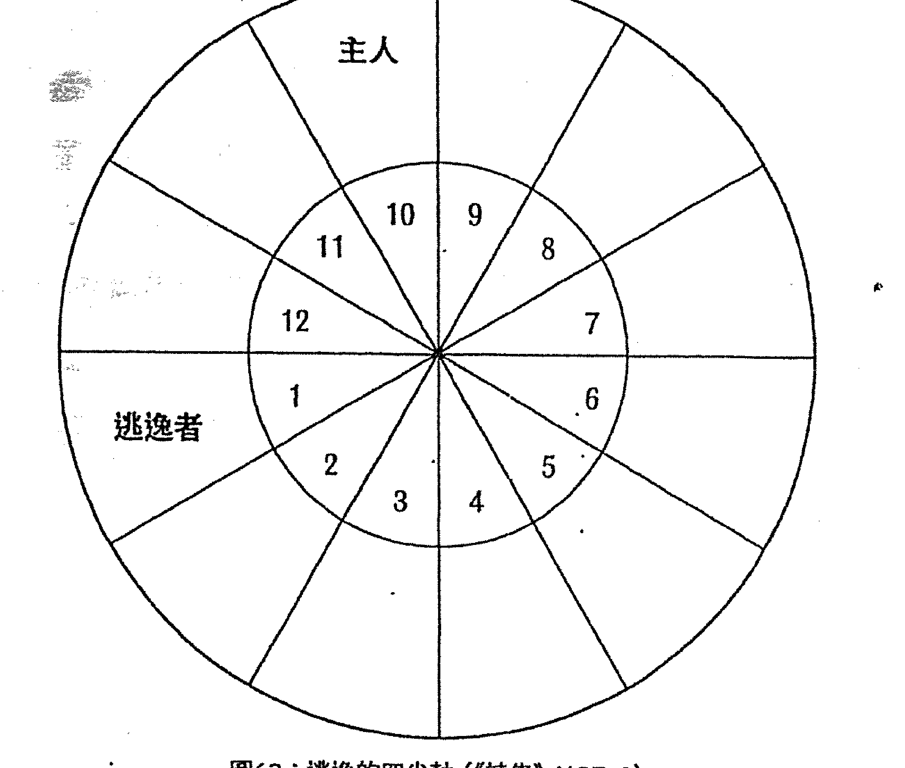

6 若月亮並未在均分線²⁸³上，而是位於雙體星座的第一個度數²⁸⁴到15°之間，代表這是逃逸者第一次逃跑，但之後他會成為慣犯。7

若月亮位於該星座剩餘的15°內，代表逃逸者為累犯。

###### — 逃逸的方向 —

8. 若²⁸⁵月亮位於上升，逃逸的方向已轉至東方；若月亮位於中天，逃逸的方向則轉至南方；若月亮位於上升的對宮，為西方；若位於父親的尖軸宮，則為北方。

9. 若月亮並未在上述的尖軸宮內，而是位於中天與上升之間的星座上，逃逸的方向已轉至東方；若月亮位於中天與上升對宮之間的星座上，則逃逸的方向已轉至南方；若月亮位於上升對宮與父親尖軸宮之間的星座上，則逃逸的方向已轉至西方；若月亮位於父親尖軸宮與上升之間的星座上，則逃逸的方向已轉至北方。

###### — 途中的磨難 —

10. 若²⁸⁶月亮與停滯的火星連結，或停滯的火星注視月亮，逃逸者將會在抵達的國家殺害他人，還因此被逮捕或被以武力制服，並將被送回主人身邊。

11. 若上句並非火星而是土星，逃逸者則會做出可疑和欺騙之事，並因此而被逮捕。

12. 若土星停滯且與月亮連結，逃逸者將上吊自殺。

13. (此時若有吉星注視月亮，逃逸者將一路無事)。

14. 若土星並未停滯且與月亮連結，逃逸者在途中已將偷竊之物破壞且丟棄，而他將被逮捕送回主人身邊，逃逸的途中也將經歷許多磨難或被監禁。

15 若逃逸時吉星位於或注視上升，或吉星與月亮會合，逃逸者將確定能擺脫奴隸的身份。

16 有關這個主題最幸運的吉星為金星，若金星注視上升或月亮，或金星會合月亮或位於上升：此時逃逸者將被拯救而非逮捕——即使被捕而送回主人身邊，主人對他仍和顏悅色，進而增強其控制權。

17 若月亮增光，追捕者的速度將無法跟上逃逸者，所以他不會被逮捕；若月亮減光，逃逸者將會被迅速逮捕。(戴克補充: 根據《結果》，此句是在討論月亮增光與減光的情形，但我並不確定是否如此。也許都勒斯原意並非如此，而是指月亮的速度。)

###### — 發光體與凶星 —

18 若^{287}太陽位於上升的對宮，且土星位於隨太陽之後西降的星座（即自上升起算的第八宮），主人將在逃逸者被捕之前死亡。

19 若凶星之一位於中天或與太陽會合，尋找逃逸者之事將無法順利；即便主人逮捕到逃逸者，隨後也會遭遇傷害與困難。

20 若逃逸時月亮位於上升的對宮，而火星位於上升對宮之後的星座（即自上升起算的第八宮）且無吉星與月亮形成相位來幫助，逃逸者在途中將會經歷千辛萬苦，並死於這些災難。

21 若月亮位於上升的對宮，但非火星而是水星位於月亮之後的星座，且火星以三分相注視水星，逃逸者在途中將遭厄運，而最後的結果是死亡。

22 若月亮位於太陽光束下，無法發出自身的光芒，同時火星亦注視月亮，逃逸者在途中將遭遇毀滅，例如遇到火災或被鐵器殺死。

23 當月亮位於太陽光束下，且減少自身的光芒288時，檢視她所在星座的特質：因該星座象徵逃逸者死亡的原因。24 若所在星座為人性星座，則將被人所傷。25 若星座特質為可騎乘的四足動物，則將受野獸所傷。26 若月亮減光，應檢視她所在星座的特質。27 若位於土象星座，建築物將會倒塌而將逃逸者活活壓死。

###### —— 月亮受剋 ——

28 若月亮位於上升的對宮且在太陽光束下，並逢土星由潮濕星座290注視，逃逸者將因水災而溺斃。29 若土星又與水星會合，逃逸者將會自殺。30 若木星和金星會合於上升的對宮或注視月亮，托靠主，可解救逃逸者免於這些傷害——尤其若木星和金星閃耀自身的光芒並具力量。

31 若月亮與火星在黃經上會合291（戴克補充：此處應是指月亮與火星連結，但火星必須是順行的），此刻逃逸的人將在途中遭到毒打或禁錮。32 若月亮與火星在黃緯292上有所連結，而且木星注視火星，則月亮與火星的連結將會讓逃逸者在途中嚐盡毀滅的恐懼——但也因為木星注視月亮而免於被毀滅（戴克補充：此句可能描述三個條件：(1) 火星於第七宮沉落，且(2) 月亮位於續宮或在火星之後西降，且(3) 木星注視月亮）。33 若月亮與凶星位於任一尖軸宮293，此刻逃逸的人之手腳將在途中被砍斷，死於非命。

34 若月亮位於中天，且火星位於月亮右方的另一個星座294，而土星位於月亮左方的另一個星座，則月亮將被擠壓在其中，或兩者以相位擠壓月亮295，此刻逃逸之人將被絞殺而死。35 若火星位於月亮的左邊且土星在月亮的右邊，而月亮被擠壓其中，此刻逃逸之人將在途中被釘在十字架上而死亡。36 若月亮位於中天的尖軸宮、上升的對宮或父親的尖軸宮，且太陽位於月亮左方或右方的星座，火星位於相對於太陽的另一方，月亮被兩者擠壓在中間，此刻逃逸之人將被活活燒死。

37 若月亮位於太陽光束下，且太陽所在星座之主星並未注視月亮296，主人將在逃逸者被逮捕前死亡。

###### — 逃逸者返回 —

38 若297逃逸時上升及月亮（或298月亮星座的主星）位於轉變星座，逃逸者將會返回主人身邊並順從於主人。
39 若月亮同時注視吉星與凶星（無論它們在同一星座或在不同星座），逃逸者將被逮捕，尤其若凶星與月亮形成四分相或對分相時——更確切地說，當月亮來到凶星之處時，逃逸者就會被逮捕。
40 承上句，若逃逸者那時未被逮捕，每當月亮來到凶星之處時，他都將受到苦難與傷害。
41 若月亮和上升皆受剋，又無吉星注視上升及月亮，此刻逃逸之人將難以返回；即使返回，也將飽受厄運與苦難的折磨。42 但若有吉星注視上升及月亮，且該吉星位於固定星座，而上升及月亮與凶星不合意，逃逸者勢必會被解救，而他的主人亦將改變心意不逮捕他。

43 若注視月亮和上升的吉星不在固定星座，而是位於轉變星座或雙體星座，則逃逸者將返回或被逮捕，但他的主人不會因為其逃逸而對他作惡或感到憤怒，怒氣也會被化解。

44 若太陽注視上升和月亮，此刻逃逸或偷走財物之人將被其主人所逮捕，財物也將物歸原主。

45 若火星注視上升和月亮，逃逸者將迅速被其主人逮捕。

46 若土星注視上升和月亮，逃逸者將不會被主人所逮捕，即使被逮捕，其過程也將是緩慢的且困難重重。

47 若逃逸時木星位於上升的對宮，主人的怒氣將可減輕或被化解，亦不會為難或傷害他。

48 若金星位於上升的對宮，代表逃逸者正位於敬拜神明的地方299。

49 若上升的主星位於所在星座的第一個外觀或注視著它300，代表逃逸者並不在人們認為的地方，亦不在遠處而在近處。

50 若有逆行的行星與上升的主星會合，且從其所在之處注視它所主管的宮位，代表逃逸者不在遠處而在近處。

# ## — 月亮和上升的星座 —

51 接下來301我將說明，在無行星會合或注視上升及月亮的情況下，上升及月亮所在星座與逃逸事件的關係。52 應檢視：若上升為牡羊座，或月亮位於牡羊座（也就是在這個時刻逃逸），且上升位於牡羊座、雙子座、獅子座、射手座或雙魚座，主人可迅速逮捕逃逸者，甚至逃逸者將自願回歸投降[302]。

53 若逃逸時的月亮位於牡羊座，而上升位於上述以外的星座，即便尋找之人準備充分[303]，態度積極[304]，亦無法逮捕逃逸者。

54 若逃逸時的月亮或上升位於金牛座，尋找之人將獲得勝利，但過程將令人疲憊不堪，困難重重且進度緩慢。

55 若月亮或上升位於雙子座的15°之前，尋找的人若無法在逃逸後兩天內逮捕逃逸者，逃逸者將順利潛逃至遙遠的地方，永遠不會被逮捕，而他存活的消息將會傳回主人耳裡（戴克補充：須兩天之內逮捕可能是因為雙子座為雙體星座，因此有雙重的性質，即前半部有扭曲星座的性質，故事情進展的速度較快；後半部則有直行星座的性質，故事情進展較為緩慢。換句話說，若要改變事情必須要在幾天內完成，否則將難以改變）。

56 若上升位於雙子座其餘的15°，逃逸者將迅速被逮捕[305]。

57 若逃逸時的上升及月亮位於巨蟹座，主人將會在敬拜神明之所逮捕逃逸者，但過程將十分緩慢。

58 若逃逸時的上升及月亮位於獅子座的前半部，逃逸之人將會返回；但若是位於獅子座的後半部[306]，逃逸者將藏匿於位高權重者之處，而主人將礙於這位掌權者，必須花費大量的時間與精力才能將逃逸者逮捕。

59 若上升和月亮位於處女座，逃逸者的動作迅速敏捷307，經常轉換地方，因此尋找之人必須歷千辛萬苦，才能逮捕逃逸者。

60 若上升或月亮位於天秤座，尋找之人將獲得勝利，但在那之後逃逸者將因畏懼主人的憤怒而再次逃走。

61 若上升和月亮位於天蠍座，尋找之人可迅速地在敬拜神明之所308逮捕逃逸者，逃逸者也有可能自願投降而返回。

62 若上升和月亮位於射手座，此時尋找之人若無法在五天內逮捕逃逸者，則尋找之人將死亡，在死之前都無法知道逃逸者的去處，亦無法逮捕逃逸者。

63 若上升和月亮位於摩羯座，逃逸者將不停轉換藏匿之處，尋找之人必須耗費大量的時間並歷經重重的困難才能逮捕逃逸者。

64 若上升或月亮位於水瓶座的前10°309內，尋找之人將獲得勝利。

65 若上升和月亮位於其餘的度數，尋找之人將無法尋得逃逸者，亦無望取得勝利。

66 若上升或月亮位於雙魚座的前面幾個度數310，尋找之人將無法逮捕逃逸者。

67 若上升或月亮位於其餘的度數，尋找之人將可獲得勝利。

68 若月亮位於雙體星座的前半部，逃逸者為初犯；但若月亮位於雙體星座的後半部，逃逸者為累犯，而他也會坦誠不諱。

69 (這個主題有其模糊之處，因為人們通常無法知道逃逸的正確時間：只能檢視主人聽到男性或女性奴僕逃逸的消息時所繪製的開始盤。)

###### — 無法歸類的內容 —

戴克評論：論逃逸的內容可說在第69句告一段落，與《結果》亦是對應的（除了以下第76句之外）。而70-79則來自手抄本C的第60b頁（第20行）到61a頁（第7行），之後就直接跳到第67a 頁（第1行），重覆78-79 的內容後又繼續，直到第84句。有些句子具明確的主題，但與《結果》的內容並不一致；有些句子則較具有一般性且主題不明。這些句子可分類如下：

- 70-75: 開始盤的一般性建議。
- 76: 論逃逸，其內容很明顯地與《結果》III.47, 97，即論逃逸的最後一句是一致的。
- 77: 討論什麼樣的開始盤是不利的；可能與76相關。
- 78: 討論逃逸者或竊賊，但內容並不明確。
- 79: 討論什麼樣的開始盤是成功的，但沒有前後文。
- 80-81: 論海上旅行。
- 82: 論逃逸。
- 83: 論新月與滿月。
- 84: 論水星會合凶星。

然而，若將第81句和第82句與《摘錄》LXIX相比，可發現81-83可能自成一個章節。

70 同時由月亮的連結檢視這些主題：若開始某一事項時，月亮先與吉星連結後再與凶星連結，事情的開始是順利的，但結果是不佳的。71 若與上述相反（亦即月亮先與凶星連結後再與吉星連結），事情的開始是困難的，但結果是好的。72 若有行星位於上升星座的前面10°內，此刻開始進行的工作或事項將會是輕鬆的。73 若有行星位於上升星座其餘的度數內，此刻開始的事項將會遭遇延遲與困難。74 若木星位於上升且月亮與土星或火星有所連結，此刻開始的工作在開始時將會是順利、容易的，結果卻是困難與不佳的。75 若行星的配置與上述相反，則情況亦相反。

76 若月亮位於太陽光束下，此刻逃逸的人將不會被其主人逮捕；即使被逮捕，過程也是緩慢的。

77 所有在此刻進行的事項，其開始盤都是不佳的。

78 若月亮與凶星在同一度數會合，且位於上升或其它宮位，尋找之人將無法尋獲逃逸者，亦無法追回被偷或被損壞的物品。

79 任何在此刻進行的事項都會成功。

80 ……或311登船開始海上旅行是不利的，代表登船之人將會遭遇困難與恐懼。81 若時值新月或滿月，且凶星與兩個發光體形成對分相，而水星又與傷害發光體的凶星會合，則此刻登船航海之人的船隻將會沉沒，船上的人們與物品將全數被毀滅。

82 ……且在此刻逃逸之人將會在途中迅速死亡。

83 因為新月與滿月確實會毀壞任何人與事，尤其若事主又剛好是在新月或滿月出生時。

84 若水星與凶星會合，水星會加強凶星帶來傷害與厄運的力量。

##### V.38：論驅魔

1. 欲驅趕³¹²佔據房子的惡魔或其它不明靈體，抑或有發現類似徵象³¹³（不明的敲門聲或惡魔），而你³¹⁴欲使用藥物或咒語驅逐，抑或以宗教方式、藥物、其它魔法淨化某場所或住所，此時須使上升或月亮位於牡羊座、金牛座或雙子座。
2. 開始時應避免上升和月亮位於巨蟹座和獅子座。
3. 若上升和月亮在處女座和天秤座是適合的。
4. 若兩者位於天蠍座是不利的。
5. 若位於射手座和摩羯座是適合的。
6. 若位於水瓶座是不利的。
7. 若兩者位於雙魚座是適當的。
8. 最適合也最有力的時刻為木星和金星與月亮會合或位於上升之時。

##### V.39：欲恢復健康或飲用瀉下的藥物，或其它關於以嘔吐或瀉下的藥物來恢復健康

1 若³¹⁵因飽食難安而求治療，或欲使用鼻劑或其它藥物，或因頭部疾病而欲減緩疼痛，應在月亮減光且位於牡羊座或金牛座時進行：因為這兩個星座位於上升的區域且確實十分有力（譯註：它們與頭部有關）；若月亮又逢吉星注視更佳。

2 欲飲用瀉下的或讓胃舒緩的藥物，或注射藥劑316，或飲用任何能減輕腸胃負擔的藥物，最適合的時刻為月亮位於天秤座或天蠍座之時，因這兩個星座是隱藏的且被稱為下面的區域；若月亮同時又逢吉星注視更佳。

##### V.40：欲使用鐵器或解剖刀切開身體或切開靜脈放血

1 欲317切開靜脈或刺絡拔罐，或從事類似事項（以鐵器切開身體），應避免上升或月亮位於金牛座、處女座、摩羯座、雙魚座：因為這對該事項是不利的。

2 同時318應避免在新月時進行，直到月亮與太陽相距超過13°而離開太陽光束下。3 亦應避免月亮從對分太陽之處離開而減光，因為這也是不利的。

4 同時319應謹慎避免火星的傷害，不可使他位於上升或與月亮會合或注視上升或月亮。5 若在火星與土星同時注視上升或月亮之際以鐵器切開身體，該療程對此人將毫無助益，或者很快他又得再一次接受同樣的治療。

6 接受320治療最佳的時刻為，當月亮減光且無凶星位在隨月亮之後上升的宮位（也就是位於月亮之後）321。7 使月亮與上升會合金星，抑或使木星或金星注視上升且月亮位於上升之內，並清除了凶星的傷害。

8 另外^322應避免在月亮或上升位於主管身體某部位的星座時，以鐵器或解剖刀切開該部位。

9 若^323在月亮位於轉變星座或雙體星座時開始該事項是不利的，除非有吉星會合或注視月亮。

##### V.41：若眼部發炎或被遮蔽，或欲以鐵器治療時

1 你^324應在月亮運行數據增加且增光，而木星或金星會合月亮或注視月亮時進行。此時火星不能注視月亮（須清除火星對她的傷害）：因火星對運行數據增加且增光的月亮傷害最甚。

##### V.42：論疾病，以下引述^325吉特里納斯·沙德瓦利的法則

1 他說^326：欲知疾病的發展以及結果，應檢視發病時的上升、月亮、上升主星、月亮所在星座的主星、月亮所連結的行星（為何）以及月亮的十二分部。

2 若發病時327月亮的主星及上升的主星離相位於吉星，而吉星注視上升、月亮以及月亮的十二分部，且月亮又與吉星連結，此刻的開始盤預示病人將會恢復健康，並能迅速治好疾病，托靠主。3 但若火星或土星位於上述的位置，代表疾病將會持續很長的時間。4 若代表疾病的主星為火星，病人將受熱病的傷害；若為土星則為長時間的疾病，病人將為結核病、寒冷以及身體的腫脹328所苦。

5 若329土星和火星傷害月亮，但未傷害上升，疾病會傷害他的身體。6 若兩者皆傷害上升卻未傷害月亮，則疾病將傷害他的靈魂，擊潰他的理智，使他無法分辨是非，或因其它類似的不幸而傷害他的靈魂。7 若土星和火星傷害上升，且兩者皆未逢吉星注視，則病人將被疾病毀滅，而疼痛處則為月亮星座及上升的星座所主管的身體部位。8 若凶星位於該星座或與其對分，則痛苦將加劇。

9 欲知330病人是否能從疾病中獲救，可由檢視行星的相位得知。

###### ——關鍵日與度數——

10 欲331知病人的後續，何時變得痛苦或輕鬆，可檢視月亮的狀況。11 當月亮來到凶星所在之處或遭凶星注視（即月亮實際的行進或過運），對病人而言為最痛苦的時刻，疼痛將會加劇。12 若月亮來到凶星所在之處或與凶星形成相位，且月亮位於凶星的界上，為病人痛苦的時刻。

###### 疾病判斷

情況最嚴峻的時候。13 但若月亮位於上述位置及界時病人倖免一死，則隨後當月亮來到吉星所在之處或有吉星注視月亮之時³³²，他的疼痛與疾病的症狀將會減輕。

14 實際上³³³ 月亮在7天後將在原位置的左方形成四分相，9天後在左方形成的三分相，14天後形成對分相，18天後在原位置的右方形成三分相，21天後則在右方形成四分相，而第28天後則回到她原來的位置³³⁴。15 當月亮來到上述的天數相應位置時，可準確判斷病人的情況。16 因此每當月亮在這些天來到上述的位置，同時凶星會合或注視月亮時，病人的痛苦將會加劇而難以承受。17 但當月亮在這些天來到這些位置時，若有吉星注視或與會合月亮，則病情可減輕。

18 以下^{335}我將指出判斷病情時應優先考慮的時刻，即月亮來到與發病時位置相距10°及40°之處時：當過運的月亮來到與原來位置相距10° 及40°之日，是判斷病情時應優先考慮的。19 若月亮來到這兩個位置的同時，亦有吉星來到或注視該位置，托靠主，病人將可從疾病中獲得拯救而復原。20 但若在月亮來到這兩個位置時，凶星亦來到或注視這兩個位置，他的疼痛將會增加，甚至因疾病而毀滅。

21 若與月亮連結的是火星，且疾病的開始盤為日間盤，病人的疼痛將會加劇而難以承受。22 但若開始盤為夜間盤且與月亮連結的是土星，（病情）亦同此論，病情將變得更為嚴重。

23 若^{336}疾病開始盤的上升或月亮位於轉變星座，病情並不嚴重——甚至他將可恢復健康——但疾病有可能再次復發。24 若疾病開始盤的兩個發光體皆在地平線以下，疾病是可怕的，但不能單憑此就判斷病人會被毀滅和死亡。25 此時還須檢視凶星的相位，以及兩個發光體與吉星、凶星是否有所連結，藉此了解病情以及病人未來的發展。

26 此外^{337}在這些稱為「判斷日」的日子中，若月亮來到開始盤中土星所在的位置，病情會變得更嚴重，病人將不斷感到寒冷而顫抖，過於虛弱而臥床，神經也會抽動痙攣不已。27 若月亮來到火星的位置，病情亦會加重，並突然遭受猛烈的高燒襲擊，疾病將由過度的熱所引發，也許還有流血的症狀；此時不一定要讓血液流出，或去處理血液的問題³³⁸，因為病人並不會³³⁹因此而受益。此時病人將大量流汗，直到症狀平息³⁴⁰。

28 若³⁴¹疾病的開始盤中，月亮運行數據增加且與太陽或火星位於同一星座，當過運的月亮在原來位置的左方形成四分相或與其對分時，病人恐將遭遇毀滅與死亡。29 若月亮四分或對分其原來的位置時遭受到土星的注視，但她的運行數據增加，則病人將托靠主獲得治療並痊癒。30 若月亮在會合或注視土星之時運行數據減少，就不能與上句同論，且月亮亦無法因為土星的相位而受益。31 若疾病的開始盤中月亮會合太陽，但月亮正離開太陽，那麼當月亮回到原來的位置或與其對分，且有吉星注視或會合月亮時，病人在當天將會痊癒，托靠主（祂超絕萬物！）。32 但若月亮在此情況下會合凶星（或凶星注視月亮），則病人無疑將在當天死亡。

###### 由四尖軸判斷疾病

33 亦³⁴²可由四尖軸判斷病情。34 上升代表醫生，中天代表病人，上升的對宮代表病因（是什麼疾病），而父親的尖軸宮代表治療與療程，托靠主。

35 若發病時凶星位於上升之內，醫生對病人的治療將不會起任何幫助，無論付出多少努力或開什麼藥劑：醫生的任何行為都會帶來傷害。36 但若吉星位於上升，醫生將對病人有極大的幫助，他的處方效果也是令人滿意的。

37 若有吉星之一位於中天，托靠主（祂超絕萬物.！），病人所接受的治療將是有益的。

38 若有吉星之一位於上升的對宮，則病人無須服用任何藥物或接受其它的治療，他不會患有令人擔憂的疾病，總之治療是輕鬆容易的。

39 若見凶星之一位於上升且^343^吉星之一位於上升的對宮，即使治療病人的醫生既親切又專業，病人也無法從他的治療受益，而該醫生的名譽也會被下一位醫生承接。

###### 從本命盤判斷病情是否會加劇及死亡

40 欲知病人的病情或是否會死亡，在得知病人本命盤的情況下，可檢視過運的月亮在行進的過程中來到本命土星所在之處的時刻。
41 此時若發病盤中的土星亦在其^344^過運中會合或注視月亮，病人將受嚴重疾病的威脅。

42 若過運的月亮來到本命火星所在的星座，且火星亦會合或注視月亮，疾病將由強烈的熱所引發，病人將陷入恐懼之中。

43 若過運的月亮來到本命土星或火星所在的星座，且兩者之一會合月亮而另一個注視月亮，病情恐將急轉直下、更加嚴重。44 若過運的月亮來到本命凶星所在之處的同時亦觸及一顆吉星，且該吉星的過運亦來到本命月亮所在星座或注視本命的月亮^345^，病情雖會延長且加劇但仍能獲得救助，托靠主。

###### 7日或9日計算法以及發光體

45 若^346已知病人的本命盤，可先判斷其為7個月內出生或9個月內出生。(戴克補充：這是區分病人為7個月內出生或9個月內出生的，雖然我們很難想像沒有現代醫療的幫助，7個月就出生的早產兒將如何存活。)46 並從出生當日計算到發病之日有幾日；若病人為7個月生者就除以7，為9個月生者就除以9。47 若如上述相除後無任何餘數，代表病人的一生已完成，生命來到了終點而即將死亡。48 埃及人的一年為365天^347，若將其除以7則餘數為1：即7個月內出生者，截至生病之日前，每一歲可計為1日；若為9個月內出生者，截至生病之日前，每一歲可計為5日^348。49 以當年的歲數來計算相應的存活日，會比將所有的天數轉換成存活日來得容易^349。

50 另外^350可檢視本命的太陽和月亮所在的位置，並計算兩者中間經過多少星座（包括兩者所在之星座），並將此數字謹記在心。51 之後將生病之前已經完成的日子除以太陽和月亮相距的星座數字。

52 最後若無數字剩下，代表疾病非常嚴重，命主將無恢復或被解救的希望。

###### 其它建議

53 若351生病時過運的月亮來到本命自上升起算的第六宮（事實上此宮位被稱為疾病之宮），或來到自上升起算的第八宮，或父親之宮，或本命月亮所在的星座，病情並非不嚴重、可被輕忽的，而是嚴重可怕的。

54 若過運的月亮來到上述的宮位且月亮注視著吉星，疾病可望化解，托靠主，命主得以獲得解救。

55 但若為凶星注視月亮，命主恐將遭受死亡352的威脅。

56 最可怕的是若發病時月亮來到本命的致命行星53所在星座：所謂致命行星為本命父親尖軸宮的第一個三分性主星（因為父親之宮的第一個三分性主星代表死亡，第二個主星則代表疾病）。

57 有一些三分性主星被稱為是「邪惡」的：若日間的開始盤中三分性主星為日間行星354，而夜間的開始盤中三分性主星為夜間的行星，則這些行星為邪惡的。

58 因此若父親之宮的三分性主星並非如上述般邪惡，它只會代表疾病或慢性的疾病。

59 另外最令人害怕的是，若過運的三分性主星或致命行星與月亮會合或注視月亮時。

60 論355疾病亦要檢視本命及開始盤中太陽和月亮的位置。

61 若月亮離開太陽後繼續往前，來到其本命位置的左方形成四分相，或她即將來到開始盤中太陽所在之處，疾病可望化解，病人將得以快速恢復³⁵⁶。62 但若月亮在左方四分其本命位置之前，無法來到開始盤中太陽所在之處，代表疾病會持續一段較長的時間，病人須經歷長時間的辛苦後才能復元。

##### V.43 : 論遺囑

1 欲³⁵⁷ 立遺囑，應在³⁵⁸ 上升和月亮位於轉變星座時開始進行，因為這代表遺囑的內容或立遺囑之人的心意將會改變。2 他應該在月亮的黃緯度數³⁵⁹ 增加、運行數據減少³⁶⁰ 且增光時立遺囑，同時月亮應自黃道中間往北方前進，並即將與停滯的行星產生連結，但該行星不能在太陽光束下。3 若該停滯的行星在太陽光束下，它代表迅速的死亡，但若該行星與太陽並不在同一星座，則它將離開太陽光束下，如此就不會有迅速的死亡。4 應³⁶¹ 避免火星會合月亮或位於上升³⁶²，或與上升四分、對分，或注視月亮或上升時立遺囑：若在此時立下遺囑，即使遺囑的內容不會改變，病人也將死於疾病，且遺囑在病人死後將不會被執行，後人將反對、改寫或偷走這份遺囑。

5 若^{363}上述中為土星而非火星，即土星會合月亮或上升，將會延遲立遺囑的時間，此事將在原訂之日後才會完成，但遺囑的內容在他生前或死後都不會遭到反對^{364}。

6 若^{365}上述中為金星或木星而非土星，應讓它們與月亮會合或位於上升，這代表遺囑的主人壽命未盡，且他將會再更改遺囑。

##### V.44：論月相、龍首、龍尾及其與買賣以及價格的關係

1 龍首被稱為往上揚升的而龍尾則被稱為往下墜落的。另外學者所稱「隱藏」的星座是指從獅子座到摩羯座（也就是黃道上下降的區域），而水瓶座到巨蟹座則為上升的區域^{366}。

2 因此應檢視^{367}：若月亮位於上升的區域^{368}且運行數據增加，買家將以超出物品本身的價值的昂貴價購買。3 若月亮位於下降的區域且運行數據減少^{369}，此時買家將會以低於物品本身的價值的便宜價購買。

4 亦^{370}應檢視月相。5 當月亮離開太陽光束下，來到太陽的左方與其形成四分相時，買賣雙方將可誠實與公平地交易，買方可以等同物品價值的價格購買，不多也不少。6 若月亮從太陽左方的四分相來到對分太陽的位置時，對賣方是有利的，對於在此時展開訴訟者亦然。7 若月亮從對分太陽的位置來到太陽的右方與其形成四分相時，對買方是有利的，而被告亦為誠實可信的。8 若月亮從太陽右方的四分相來到太陽所在的位置時，則誠實且公平交易的一方可從中獲利371。

9《都勒斯占星學》第五冊終，全系列亦到此完結。10 以真誠之心讚美主，祈主賜福祂所選之祂的崇拜者，以及一切祂的先知與使者。

11 以上字句皆忠於原始的內容，我已竭誠心力確認，因主而有所成。

## 附录 A
与宾格瑞版本的对照（略）

## 附录 B
都勒斯择时主题对照表

由于都勒斯在第五册的择时内容并未清楚地依照主题分类，为了读者方便，我提供以下简易的分类表作为参考：

| 一般性原则与建议 | 原则 : V.2 – V.5
月亮 : V.6
结果 : V.29
总论 : V.31 |
| --- | --- |
| 建造与毁灭 | 建筑 : V.7 – V.8
造船 : V.24 – V.25 |
| 合约关系 | 租赁 : V.9
买卖 : V.10
购买土地 : V.11
购买奴隶 : V.12
购买动物 : V.13
释放奴隶 : V.14
合伙关系 : V.20
债务 : V.21
价格 : V.44 |
| 请求 | 请求与礼物 : V.15 |
| 婚姻与关系 | 婚姻与性 : V.17
分手 : V.18
堕胎/流产 : V.19 |
| 旅行 | 总论 : V.22
启程 : V.35
回程 : V.23
启航 : V.26
海上与陆上旅行 : V.26 |

| 书信、教学与学习 | 写作与教学 : V.16
书信与报告 : V.27 |
| --- | --- |
| 入狱 | V.28 |
| 疾病与驱魔 | 附身 : V.38
复元与原因 : V.30
复元 : V.32
医疗 : V.39
手术 : V.40
眼睛 : V.41
关键日、复元 : V.42 |
| 资产 | V.33 |
| 诉讼与冲突 | V.34 |
| 窃盗 | V.36 |
| 逃逸 | V.37 |
| 遗嘱 | V.43 |

## 附录C
都勒斯的《摘录》

翻译 © 2013 埃杜阿爾多·格拉馬格利亞
編輯 © 2017 班杰明·戴克

戴克的評論：以下69個希臘文作品《摘錄》片段，是由大衛·賓格瑞在梵蒂岡希臘文手稿 (Vaticanus Graecus) 1056號 238-241頁中發現的，並確認出自都勒斯。賓格瑞及伯內特將該內容列在《亞里士多德之書》(1997年) 的附錄A中，而我最近則將此書翻譯為英文的《亞里士多德之書》，並收錄於《波斯占星學》第一册 (Persian Nativities I) (2009) 當中。這些確定源於都勒斯的句子大多數散見於以下七個來源中：

- 《詩集》(即本書)
- 以希臘文及拉丁文書寫的都勒斯的《片斷》(Fragments)，列於賓格瑞在1976年出版的《詩集》的最後。
- 《亞里士多德之書》(見上述)，為阿拉伯文著作，受到都勒斯及瑞托瑞爾斯的深遠影響。之後在十二世紀由雨果 (Hugo of Santalla) 翻譯成拉丁文。賓格瑞及伯內特在他們出版的該書拉丁文版本中提出，原著應為馬謝阿拉所寫，但我現在認為其內容應出自安達爾札嘎。他是一名波斯占星家，但我們對他幾乎一無所知¹。
- 赫菲斯提歐的希臘文著作《結果》(西元五世紀)。羅伯特·修密特於1994及1998年分別將其前兩册翻譯出版，而由格拉馬格利亞翻譯、由我編輯的第三冊則於2013年出版。
- 瑞托瑞爾斯的希臘文著作《占星摘要》（西元六至七世紀），由霍登在2009年翻譯成英文。
- 薩爾·賓·畢雪的《論本命》，此書與他的其它著作由我從阿拉伯文翻譯成英文並於2017年出版。
- 威尼斯的馬爾西阿努斯希臘文手稿645號（Venice, Marcianus Gr. 645）（原編號335號），編列於《希臘占星文獻總目》（Catalogus Codicum Astrologorum Graecorum）第二冊，第195-198頁，並由修密特於1995年翻譯出版（第1-6頁）。

《摘錄》的內容除了 XVIII, 3 外，幾乎是以散文的方式書寫。正如格拉馬格利亞所提出的，除了 XVIII 及 XIX 之外，所有片段皆以*hoti*（that，等同於英文的「他說道」[he *said that*...]）開頭；其文法以及介副詞的使用，例如*gar*（since，「從」），亦清楚說明作者是從其它更為完整的來源所擷取而來的——不過究竟是從原始的希臘詩或其它來源則不得而知了。

**I 1** 若²土星為第二宮的主星，命主將因老年人、奴僕或已獲自由身的奴隸，或聲名狼藉之人而受苦，或因田野、農事、基地或墳墓之事而受到傷害。**2** 若為木星，將因國王的憤怒、傑出之人或國家之事而受苦。**3** 若為火星，將因軍人、戰爭的資源³、戰爭、掠奪、暴力、過錯、火災或搶劫所傷。4 若為太陽，將因父親⁴、祖先、皇家之事、借貸或國家之事受苦。5 若為金星，則傷害來自女人，或因女人之事受苦。6 若為水星，則因管理、會計、文件、家計管理或物品交換⁵而受累。7 若為月亮，起因⁶為母親或母親的母親。8 同時檢視第二宮星座的性質是雙體星座、野獸星座或人性星座。9 若凶星為其主星（亦即第二宮的主星）且位於凶宮，則傷害更甚。

### II 1 若⁷月亮與金星會合，或彼此以四分相或對分相注視，女人之間將會產生嫉妒，因此總體而言她們將帶來混亂。

2 換句話說⁸，月亮和金星皆可代表妻子。

3 進一步來說⁹，若月亮和金星與土星會合，或位於土星主管的宮位且注視土星，將帶來失敗的婚姻，命主將鰥寡孤獨或被奴役，或與奴僕、年紀大者結婚，或有不名譽的婚約；有時亦可能帶來令人恥辱的婚姻或孤兒之間的婚姻。

### III 1 此外¹⁰，若太陽與月亮對分，婚姻將充滿矛盾。

### IV 1 若¹¹代表財富的行星在太陽光束下，但即將在七日內升起，將可帶來秘密的財富，不為人所知。

### V 1 若行星東出12，可讓事情顯現；若西入，則將掩蓋、隱藏。2 若行星東出且受太陽注視，則關注13與披露14將更為明確，因為太陽為事物顯現的原因，也代表任何公開的事物，他將一切帶到在陽光下。

### VI 1 行星15可主管特定人士16、事物以及特殊點。若行星位於下降或地底的位置，代表迅速的改變以及提早死亡，尤其又有凶星注視行星時。

### VII 1 若賦予行動的行星位於太陽光束下，可讓下屬以及那些接收命令的、領取工資的無名低下之人聽命行事。

### VIII 1 若行星位於自己主管的宮位，界或擁有三分性，代表能自我管理17，具自己的力量18以及顯著的事項。2 若行星位於自己的旺宮，代表傑出、卓越與非同凡響。3 具旺宮力量的行星代表國王或權威人士：因此，若賦予行動的行星亦在自己的旺宮，將受托從事王室的工作，與國王同處，並因此享有利益。

### IX 1 從上升到中天的象限可類比一個人的國家；從中天到下降的象限則類比其它國家。

### X 1 當火星、金星和水星與中天或上升不合意時，所有行動將遭遇挫敗與厄運。

### XI 1 若行星位於另一個行星主管的宮位，其作用是混合的。

### XII 1 木星可理解為好名聲與顯耀；土星則為污穢、虐待、疲倦及困境。

### XIII 1 第三宮及第九宮代表海外生活。
- 2 吉星位於這兩個宮位將富有成效並帶來豐厚的利益；凶星則帶來傷害、損失並永居海外。

### XIV 1 第三宮代表手足或與命主親近之人。
- 2 若凶星在內則傷害將來自這些人與敵人。

### XV 1 吉星在西方降落處或地底，行動是虛弱的，即使是好事也不明顯，除非它們所在之處為其喜樂的宮位（此時可預示極端的好運或榮耀地死去）；若為凶星在這些宮位則代表疾病、流放、傷害與苦難。

### XVI 1 當行星的星相（phase）與所在宮位均屬於良好狀態時，命主應與其代表的人們成為好友。
- 2 若為木星位於良好位置，與土星和火星並無形成四分相或對分相，可與國王或富人成為好友。
- 3 若為金星，則可與優秀的女性成為朋友，若金星位於雙魚座更是如此（因為她位於自己的旺宮）；若金星位於土星主管的宮位，命主將對年紀較大的女性較為關心；若位於水星的宮位，則將與女性暗通款曲，並暗地裡隨意與她們同床共枕^27。
- 4 若水星位於良好位置，且未被土星和火星傷害，但與木星和金星形成證據，命主可與博學多聞之人、學者、商人、銀行家及學習赫密斯藝術者——例如運動員、摔跤手、教授法律之人——成為朋友；若水星位於土星主管的宮位，則這些人將較為年長；若位於火星的宮位，則為年輕人、軍人或國家領袖。
- 5 若凶星位於良好位置，在自己主管的宮位且注視吉星時，有時亦可產生友誼，然而這樣的友誼並不穩定，亦不安全。
- 6 同時^28 應檢視友誼點（Lot of friendship）（即月亮到水星的距離，再將此距離從上升點投射）與情欲點（Lot of Erōs）（日間為幸運點到精神點之距離，再將此距離從上升點投射；夜間的公式相反）；這兩者的主星將代表與什麼樣的人成為朋友。

### XVII 1 若火星^29 支配水星，朋友將對命主造成干擾、傷害或對命主無禮，且大多數的時候對命主是有敵意的。
- 2 相反，若水星支配火

> 27 | Lathraios, euodos hupnos (字面上的意思是「隱藏地、輕易地同寢」)。格拉馬格利亞：此處《結果》是將 lathraios (隱藏的、背叛的) 與Lathria——即阿芙羅狄蒂 (她常與祕密的戀情或姦情有關) 連結。因此，「暗地裡……同床共枕」等同於「未被發現的/祕密的戀情」。
> 28 | 參見都勒斯的《片斷》II.E, 3。
> 29 | 所有《摘錄》中有關該主題的內容可參見都勒斯的《片斷》II.E, 12以及《結果》II.23 (修密特，第73頁)。

- 3 以下是擁有良好友誼的星盤³¹，

……當月亮位在同一星座，且有一顆吉星位於另一人的月亮上或以三分相注視著她；此外當雙方的幸運點位於同一星座，或其中一人的幸運點位於另一人的月亮上，或以三分相注視另一人的幸運點或月亮；同樣，若兩人的太陽位在同一星座，或其中一人的太陽位於另一人的月亮上，或以三分相注視月亮；另外，若其中一人的中天位於另一人的月亮之上，反之亦然；若雙方的月亮位於彼此的第十二宮或第六宮；或其中一人的月亮位於另一人的六宮，而另一人的月亮位於第一個人的十二宮；或雙方的發光體（譯註：指同區分的發光體）彼此注視（若位於聽見的星座更佳）。

## XVIII 1 看見星座³²是指相對於每一條回歸線而言距離相同的星座；聽見星座則是相對於二分點軸線而言距離相同的星座。
- 2 若有凶星位於上述的星座將會帶來恨意與感情的匱乏。
- 3 此外，位於同一條帶上³³的行星是和睦的，赤經上升時間相同的星座亦然³⁴。
- 4 光照³⁵的時間從牡羊座到處女座是增加的，從天秤座到雙魚座則是減少的（譯註：原文如此，但實際上這裡指的是：從牡羊座到處女座白天比黑夜時間長，從天秤座到雙魚座白天比黑夜時間短）。
- 5 若月亮位於光照時間增加的星座，對友誼是有利的。
- 6 這樣的星座即為下達命令的一方，而月亮位於光照時間減少星座之人，則為接受命令的一方。

#### 圖66：看見星座（《摘錄》XVIII, 1）

#### 圖67：聽見星座（《摘錄》XVIII, 1）

#### 論友誼的開始^36：

### XIX 1 欲^37 開始一段友誼，兩個發光體須彼此形成適當的連結，同時只應與吉星呈相位。
- 2 同時^38 應找出締結友誼的對象的對應行星。
- 3 若開始友誼的對象為軍人，則應關注火星（火星的星相、位置與證據應是適當的）；若對象為人民的領導，應關注太陽；若為國王，則為木星；若為農夫，則為土星。
- 4 當^39 上升的年度循環^40 來到對方月亮所在的星座，即該年的上升星座與對方的月亮星座相同（或在不同星座，但剛好互為聽見星座或看見星座）^41，可望在該年收穫最偉大的^42 友誼。

> 36 | 此標題出現在第239頁的背面。
> 37 | 都勒斯的《片斷》II.F, 5。
> 38 | 此句及下句見都勒斯的《片斷》II.F, 7。
> 39 | 見都勒斯的《片斷》II.F, 3-4。
> 40 | 此處應為上升小限在詢問那一年來到的星座。
> 41 | 見《摘錄》XVIII, 1。
> 42 | Megistēn philian. 格拉馬格利亞：此句的含義可能是「與有力人士交往」。但也可能是最好或最偉大的友誼形式。

#### 論海外旅行^43

### XX 1 第三天^44的月亮代表海外生活。
- 2 若^45月亮在第三天與火星會合，或與火星形成四分相或對分相^46，或月亮落在火星主管的宮位，且月亮與火星形成星座相位，這些都可成為帶來海外生活的原因，若火星位於尖軸宮則可能性更大。
- 3 若火星剛好位於自己主管的宮位且東出，並與東出的木星形成相位，海外生活是能帶來利益且有幫助的；但若在下降的宮位且在陌生的（alien，譯註：即外來的）星座，海外生活將會遭遇危險，而危險的來源則視星座的特質而定。
- 4 若受土星注視，將會在國外待上很長的時間。
- 5 另外，回歸星座（tropical signs，譯註：即巨蟹座與摩羯座）亦會帶來國外的生活，因此若發光體和凶星位於回歸線時，亦代表海外生活。

### XXI 1 此外，若火星所在宮位的主星^47位於陌生的星座，也會帶來海外的生活。
- 2 若該主星遠離光束下，位於吉宮以及人性星座且受吉星注視，或本身即為吉星，海外生活是有幫助且幸運的；否則將會在國外受苦受難。
- 3 欲知海外生活將會如何，亦須檢視九宮主星的性質；包括九宮主星所在宮位、星座以及與其有所連結之行星。
- 4 若^48第九宮位於獸性星座或四足星座，而且其主星在下降的宮位並受到傷害，命主最
- 5. 若⁴⁹月亮剛好就在九宮但與凶星會合，或與凶星形成四分相或對分相，海外的生活將會是危險的。
- 6. 若命主的壽命短暫，他將死於國外，而他的遺體在死後會被送往其它國家；若命主是長壽的，他將在凶星的影響期結束後⁵⁰返回本國。

### XXII 1 古人⁵¹亦有從月亮論身體，從上升、金星和水星論靈魂的說法。
- 2 若為詢問疾病的開始盤，並在其中發現上升、金星和水星受到傷害，可判斷病人將受腦部發炎之苦⁵²。

### XXIII 1 若凶星位於接續月亮的位置，同時位於中天及第八宮⁵³「的中間」⁵⁴，則代表跌落與毀滅，至於以何種方式則視星座的特質而定。

### XXIV 1 東方⁵⁵的宮位⁵⁶代表年輕時期，是忙碌、有生產力的；南方為中年時期；西方為中年之後的時期；北方則為老年時期。
- 2 若行星位於陌生的宮位且未注視自己的主管星座，它們的效用^57^會在國外完成^58^；但若位於或注視自己主管的宮位，則在自己的國家完成。

#### 論藥物^59^

### XXV 1 可在金星受剋時製作毒藥^60^、女性的魔法^61^以及建造喝酒的場所；水星則與書寫^62^，錯誤的指控以及奴僕有關。

### XXVI 1 地底的尖軸宮與消失有關：若在此發現帶來終點^63^的行星，將代表默默地死亡。

### XXVII 1 太陽光束下的星相將讓命主遭遇陷阱、背叛與隱藏；相反，在太陽光束之外的星相將帶來能見度，無一事能逃過覺察。

### XXVIII 1 逆行的行星可將事物帶回^64^。

### XXIX 1 蝕相所發生的宮位^65^將為所有的人帶來災害^66^。

> 57 | Apotelousin.
> 58 | 注意到這裡有兩個條件：行星是外來的且與自己主管的宮位不合意。
> 59 | 此標題出現在第239頁的背面或第240頁的前面。Pharmakeia 可代表一般的藥物，也可以特別指毒藥或巫術。
> 60 | Pharmakeia.
> 61 | Gunaikomageia.
> 62 | 從上下文來看，此處可能是指符咒，也可能是雕刻或繪製的護身符。
> 63 | Tēn teleutēn. 較直接的說法為「完成的事項」，但也「暗喻」死亡。
> 64 | Palindromia. 見《結果》III.47, 53，但赫菲斯提歐認為這說法來自普羅達哥拉斯 (Protagoras) 。
> 65 | Ekleiptikoi. 也就是蝕相發生時所在黃道的位置；見《詩集》1.1, 9。
> 66 | 參見修密特，1995年，第3頁。

### XXX 1 固定盤67中行星的位置68是靜止不動的，但它們籍由過運——即入座 (ingress) 69——與初始70的行星位置形成相位形態：例如三分相、四分相以及對分相。

### XXXI 1 當71行星的過運與其本命位置對分時是困難的時刻。
- 2 若回到本命的位置亦為凶。
- 3 若72土星或火星的過運與本命太陽或木星對分時更甚，將招致許多可怕的事：若土星與固定盤的月亮73對分時亦然。
- 4 當日間盤74中的太陽或木星過運回到本命的位置，或與本命的位置對分，同時又遭本命或過運之火星傷害時，對命主是不利的；若為夜間盤，則土星傷害月亮時亦然。

### XXXII 1 不僅75過運火星的星體進入76固定盤的太陽和木星77，或與太陽和木星對分會造成傷害，反之亦然：即過運太陽和木星的星體進入固定盤的火星位置，或與火星對分，命主亦將遭到危害，若上述過運的行星為停滯的，則更加凶險。
- 2 不過78，在以上所謂的「進入」79之中，若凶星自初始盤80之外——即籍由進入——與產生災害
- 3 若過運與本命之間是不合諧的，將會造成極端的困難。

> 67 | Pēxis. 格拉馬格利亞：也就是本命盤。
> 68 | Epochē.
> 69 | Epembasis.
> 70 | 格拉馬格利亞：亦即本命的位置。
> 71 | 此段參見《詩集》IV.4,2及之後的句子。
> 72 | 《詩集》裡的描述較為合理。亦即，過運的火星對於日間的本命木星或太陽會造成傷害，而過運的土星則對夜間的本命月亮造成傷害。
> 73 | 亦即本命的月亮。
> 74 | Thema.
> 75 | 此句參見《詩集》IV.4,4及之後的句子。
> 76 | 這個動詞 (epembain) 在此篇為入座 (epembasi) 的意思，因此有可能是指過運的行星進入行星所在星座，而非只是其星體來到行星所在的度數而已。
> 77 | 見《摘錄》XXXI以及在《詩集》IV.4,4與其對應的句子，明確指出這是日生人的太陽/木星。
> 78 | 參見《詩集》IV.4,6。
> 79 | 在此同樣為「入座」的意思。
> 80 | 本命盤。

### XXXIII 1 凶星⁸¹的右旋相位⁸²已證明能讓傷害更為嚴重；但若有吉星前來幫助，這樣的相位形態能帶來富裕、榮耀與美德。

### XXXIV 1 當⁸³過運的月亮來到固定盤的火星位置將帶來難以預期的危險，尤其若木星和金星皆未注視她時。
- 2 當過運的月亮進入⁸⁴木星和金星且未逢凶星的注視時，可提振心情、帶來喜悅。
- 3 若⁸⁵過運的月亮進入火星或太陽的位置，而此刻的太陽或火星亦位在固定盤的月亮位置時，身體將因鐵器或其它傷害而濺血。

### XXXV 1 若固定盤的吉星或其過運位於不具優勢的宮位，將會是虛弱的。

### XXXVI 1 當⁸⁶過運的月亮來到固定盤的金星位置時，若過運的火星亦與月亮（戴克補充：可能是與本命的月亮）會合，將引動基希拉女神⁸⁷ (Kytherean) 的能量；但若為過運的土星則無法引動。

> 81 | 見《詩集》IV.4,7。
> 82 | 也就是本命的凶星在過運行星的右方形成四分相來支配過運的行星。
> 83 | 見《詩集》IV.4,17。
> 84 | 見《詩集》IV.4,15。
> 85 | 見《詩集》IV.4,18。
> 86 | 參見《詩集》IV.4,19。
> 87 | 阿芙羅狄蒂的另一別名，亦代表金星的特質。

### XXXVII 1 當^88月亮來到中天時可讓事物變得顯著。
- 2 亦可從開始盤的月亮觀察竊賊^89或逃逸者的下落。

### XXXVIII 1 當^90月亮來到西方降落的宮位時將引發來自敵人的傷害；若進入地底的宮位時將籌劃某種陰謀，或暗中處理應保密或隱藏的事項。

### XXXIX 1 若^91火星進入^92與太陽之間的相位時，意味著火災或燃燒；也為父親帶來壓力。
- 2 若火星進入月亮時，將為母親帶來傷害，也代表身體的傷害與損失。

### XL 1 當^93過運的木星進入本命火星時可傷害敵人，增加商業的交易^94並獲得利益。

### XLI 1 當^95過運的水星進入本命的木星時，有利於會見統治者或領導。
- 2 另一方面，當^96土星的過運進入本命的水星時，將帶來背叛、陰謀、來自朋友與敵人的爭鬥；常見的還有家中的奴僕在行竊後逃逸，尤其會減少收入，增加行動上的阻礙。

> 88 | 見《詩集》IV.4, 24。
> 89 | Klopé。
> 90 | 見《詩集》IV.4, 25-26。
> 91 | 此段見《詩集》IV.4, 32-33。
> 92 | 也就是火星星體的過運，甚至包括進入太陽所在星座（epembasis）時；下一句亦然。
> 93 | 見《詩集》IV.4, 35。
> 94 | Praxis或「工作、活動」等等。
> 95 | 見《詩集》IV.4, 45。
> 96 | 參見《詩集》IV.4, 47及修密特，1995年（第4頁），其中是指火星而非土星。

### XLII 1 若過運的太陽進入金星將引發有關性⁹⁷的事項。

### XLIII 1 當⁹⁸凶星來到四尖軸時是最為可怕的，因為上升代表生命，中天代表行動、生兒育女以及榮譽；下降代表老年及婚姻，而地底代表基礎、田地及所有祕密⁹⁹事項。

### XLIV 1 首先¹⁰⁰，應觀察那顆分配¹⁰¹時間的行星的進入，無論是普遍性的還是特定性的¹⁰²：因為行星的進入與此段時期的結果¹⁰³有很大關係，無論是行星來到它們在固定盤中所主管的位置¹⁰⁴，或來到巡行法 (circumambulation) 中其所主管的期間¹⁰⁵。
- 2 偉大的托勒密亦在其著作的第二冊、第三冊及第四冊談論此內容。

### XLV 1 當¹⁰⁶月亮在病人躺下的時刻¹⁰⁷來到凶星的星座，而該星座在固定盤中剛好有吉星在內，則可稱病人雖病得很嚴重，但最終仍能脫離險境。
- 2 而若月亮在躺下的時刻剛好來到第六、第十二、第八或第四宮，或月亮原本就在這些星座 (固定盤中)¹⁰⁸，且這些宮位又被凶星所傷，病人將無藥可救。

### XLVI 1 若水星為土星所傷將招致欺騙與背叛。
- 2 此外，亦須注意借入資產的人，因為水星亦代表國內交易、安全、合夥與商業。

### XLVII 1 月亮的四分相與對分相——即使包含吉星，亦為不利的。
- 2 但若月亮來到與其四分或對分的位置，將帶來好的活動，因為它們都代表著有利的開始時間。

### XLVIII 1 當月亮與土星連結時，不僅代表緩慢與阻礙，亦代表傷害與損失；若與此同時無吉星注視月亮，其所代表之人將不會歸來。
- 2 若為土星及水星傷害月亮，則將有奸巧詐之事情發生，且它們將造成入獄或疾病。

### XLIX 1 當月亮與水星會合，逢木星以三分相或四分相注視，將可帶來福利、快速、優惠及禮物。

### L 1 接續月亮的星座被稱為是危險與流血的。
- 2 準確來說，應注意月亮與該星座——及與該星座四分及對分之星座——的連結，才能評論未來之事。

### LI 1 當月亮來到本命木星或金星的位置，或與木星和金星形成三分相或四分相的同時，只有本命及過運的吉星注視月亮112，將為命主帶來禮物或善行；若月亮進入自己主管的宮位或吉星主管的宮位更佳。

### LII 1 當行星與上升或月亮呈四分相，或進入上升或月亮的位置時，常帶來幸運或不幸的結果113：吉星帶來幸運，凶星則代表不幸；有時行星的過運來到或四分所問之事的代表行星時亦同此論。

### LIII 1 回歸星座114是不穩定的；直行星座可讓事情及早完成115，是幸運116且穩定的117；扭曲星座則為祕密的、暴力的，但也是持續的、困難的；雙體星座則預示所問事項的結果將是一分為二的。

### LIV 1 當118月亮來到與太陽對分的位置時將導致失和、爭議與戰爭。

### LV 1 月亮在各類活動中都佔有一席之地，若論行動，除了中天之外，亦可從她得知一二。
- 2 月亮119切莫與中天不合意，否則事件將提早結束，無法圓滿，尤其若兩顆吉星都不在尖軸宮時。
- 3 以上的觀察由來已久。

> 112 | 我的理解是月亮與本命及過運的凶星不合意。
> 113 | *Apotelesmata*.
> 114 | 見《詩集》V.2-V.4。
> 115 | *Tachutelestos*.
> 116 | *Eubolos*, 字面上的意思是「幸運地擲中靶心」。
> 117 | *Aplanēs*, 字面上的意思是「不遊蕩」。
> 118 | 見《詩集》V.6, 8。
> 119 | 參見《詩集》V.6, 14。

### LVI 1 月亮120可代表開始盤中首先發生的事；月亮的主星為最後發生的事。

### LVII 1 在所有的情況下121，月亮的主星若位於上升之後的宮位，將使事情進展緩慢，尤其若月亮位於與太陽形成的最後的月相時。

### LVIII 1 若122月亮離相位於凶星，入相位於吉星，僅對逃逸的奴隸有利。

### LIX 1 若123月亮的主星注視月亮，無論是逃逸者或失竊之物皆可尋回；債權人亦將收回所借出的債務。

### LX 1 直行星座代表法律的爭議124是簡單而誠實的；扭曲星座則為欺騙與邪惡的。
- 2 亦須檢視行星的證據：是否受吉星或凶星所注視。

### LXI 1 中天125永遠代表所問事項的行動126。
- 2 因此127，應檢視中天及其主星與行星的連結，這將顯示採取什麼樣的行動。

#### 論販售與購買

### LXII 1 月亮^128 已經^129 離相位的行星為賣家；即將入相位的行星為買家；月亮本身代表販售的物品。
- 2 從^130 另一觀點來看，上升為買家，下降為賣家，中天為價格，而天底為物品。

### LXIII 1 當^131 過運的月亮行經星座的最後幾度時，代表交易的地方或事情將有所變化。

### LXIV 1 若行星位於自己的旺宮或中天的位置，其所代表的事物或人將為誠實且評價高的，尤其是木星和金星；土星亦是誠實的，但同時也是骯髒或老舊的。
- 2 若在壓抑或下降的位置，事物將會被貶損^132。

### LXV 1 若行星位於壓抑的宮位（譯註：即弱宮），其壽命是短暫的；但若於旺宮，生命將充滿活力^133。

### LXVI 1 逆行的行星與回歸星座對於旅行的歸程而言是適當的。

### LXVII 1 在^134 開始盤中，與月亮聚集的行星顯示事情的開始或結果是否會較好：若月亮先與吉星聚集後再與凶星聚集，事情的開始是令人滿意的，但後續的發展將令人失望。另一方面，若月亮位於上升且在上升星座的前15度內，代表事項可快速完成；但若於第二個15度內，完成的速度較為緩慢。

LXVIII 1 若月亮位於太陽光束下，它的隱蔽對竊賊與逃逸者是有益的。

LXIX 1 當月亮與太陽聚集或為滿月時，凶星所代表的人將更具破壞性，在其影響下，逃逸者雖然不會被發現，但將不得善終。

135 | 見《詩集》V.6,4 及 V.37,76。136 | 見《詩集》V.37,81-82。

## 詞彙表

以下詞彙表彙集了目前為止我所翻譯的文獻中，古典占星各支派所使用的專有術語。有些術語還提供了希臘文或拉丁文的來源。定義中粗體字的部份代表該術語亦收錄在本詞彙表之中。

- 自……遠離 (Absent from)：詳見不合意 (aversion)。
- 意外事件 (Accident) (拉丁文accidens)。「降臨到」或「發生到」某人身上的事件，但是不必然然是壞事。
- 進程增加 (Adding in course)：詳見進程 (Course)。
- 前進的 (Advancing, advancement) (拉丁文 accedens)：行星落在始宮 (Angle) 和續宮 (Succeedent) (但究竟是適用於整星座宮位制[Whole sign]還是象限宮位制[Quadrant division]則並不明確) 且最好是以周日運動 (Diurnal motion) 的順時針方向往四個尖軸或標樁 (Stakes) 之一前進。反義詞為退縮的 (retreating) 和 撤離的 (withdrawing)。詳見《古典占星介紹》III.3 及《緒論》 (Introduction) §6。
- 吉宮 (Advantageous places)：兩種宮位 (houses) 系統中的一種，它顯示出某些特定宮位中的行星或宮位所主管事項在星盤中更忙碌或更有益 (III.4)。第一種是七吉宮系統，它以《蒂邁歐篇》 (Timaeus) 為基礎並記載於《占星詩集》中。它僅僅包括那些與上升星座 (Ascendant) 形成整星座 (whole-sign) 相位 (aspect) 的星座，並認為這些位置對當事人有益，因為它們注視上升星座。而第二種是八吉宮系統，它來源於尼切普索 (III.4)，包括所有的始宮 (angular) 和續宮 (succeedent)，指出了對於行星本身而言活躍並且有益的位置。
- 生命時期 (Ages of man)：托勒密將標準的人的一生劃分為數段生命歷程時期，每段時期由不同的時間主星 (time lords) 主管。詳見VII.3。
- 友誼星座 (Agreeing signs)：將星座分成幾組，每組內的星座相互之間具有某種和諧的性質。詳見I.9.5-6。
- 壽命主 (Alcochoden)：拉丁文對Kadukhudhāh的直譯，亦稱為居所之主 (House-master)。
- 異鄉人 (Alien)：拉丁文alienus。詳見外來的 (Peregrine)。
- 最強主星 (Almuten)：從拉丁文mubtazz翻譯而來，詳見勝利星 (Victor)。
- 始宮 (Angels)、續宮 (succeedents)、果宮 (cadents)：將宮位分為三種類別，以此判斷行星在這些類別中呈現的力量與直接表現的能力。始宮為第一宮、第十宮、第七宮和第四宮，續宮為第二宮、第十一宮、第八宮和第五宮，果宮為第十二宮、第九宮、第六宮和第三宮 (詳見下文果宮[cadent])。但是在卜卦中，確切的宮位位置取決於判斷時使用整個星座宮位制 (whole sign) 還是象限宮位制 (quardrant house)，以及如何使用它們，尤其當古典文獻提到始宮或尖軸 (pivot，希臘文kentron，阿拉伯文watad) 的時候指的是 (1) 整個星座宮位制的上升星座 (Ascendant) 以及其他尖軸星座，或是 (2) ASC-MC兩軸線所在度數，或是 (3) 以尖軸度數所計算的象限宮位制的始宮位置。詳見I.12-13、III.3-4及《緒論》§6。
- 映點 (Antiscia，單數形式為antiscion)：意思為「陰影投射」，就是指以摩羯座0°至巨蟹座0°為軸線，所產生的反射度數位置，例如巨蟹座10°的映點反射位置為雙子座20°。詳見I.9.2。
- (偏心/均輪) 遠地點 (Apogee [of eccentric /deferent])：意指行星在其均輪 (deferent circle) 的軌道上與地球相距最遠的位置；從地球上看，則為這個位置投射在黃道上的度數。詳見II.0-1。
- 拱點、拱點線 (Apsides, apsidal line)：意指地心天文學中，從行星均輪 (deferent) 軌道上的遠地點 (apogee) 連結至近地點 (perigee)，並通過地球中心的一條直線。
- 入相位 (Applying，application) ：意指行星處於連結 (Connection) 的狀態下，並持續的運行以確實完成連結。當行星聚集 (Assembled) 在同一星座或是以整個星座形成相位 (aspect)，卻未形成緊密度數的相位連結關係時，僅是「想要」去連結。
- 上升 (Arisings) ：詳見赤經上升 (Ascensions)。
- 上升位置 (Ascendant) ：通常是指整個上升星座，但也經常會特別指上升位置的度數，在象限宮位制 (quadrant house) 中，也指從上升度數至第二宮始點的區域。
- 赤經上升 (Ascensions) ：係指天球赤道上的度數，用來衡量一個星座或是一個界 (bound) (或其他黃道度數間距) 通過地平線時，在子午線上會經過多少度數。這經常會使用在以赤經上升時間作預測的技巧上，以計算向運 (directions) 的近似值。詳見附錄 E。
- 相位 (Aspect) ：若作為動詞，詳見注視 (look at)。若作為名詞，意指兩個事物之間的相位形態 (configuration) (例如兩個行星之間或行星與星座之間) ：詳見六分相 (sextile)、四分相 (square)、三分相 (trine)、對分相 (opposition)。亦參見連結 (Connection) 和聚集 (Assembly)。
- 聚集 (Assembly) ：係指兩顆以上的行星落在同一星座中，並且若相距在 15 度以內則更為強烈 (在阿拉伯文獻中偶爾亦可指新月時太陽與月亮的合相，不過這種情況下另一個術語相會 [Meeting] 更常被使用)。詳見 III.5。
- 不合意 (Aversion) ：係指從某個星座位置起算的第二、第六、第八、第十二個星座位置。例如，由巨蟹座起算時，行星落在雙子座為巨蟹座起算的第十二個星座，因此為不合意於巨蟹座的位置。這些位置之所以不合意，是因為它們無法與之形成古典相關聯。詳見 III.6.1。
- 黃道起始點 (Ayanamsha) ：係指恆星黃道占星學中，黃道上的某個點或度數作為黃道的起始點。二分點 (equinoctial point) 則為回歸黃道的兩個黃道起始點。
- Azamene：同「慢性疾病度數」(Chronic illness)。
- 凶星 (Bad ones)：見吉/凶星 (Benefic/malefic)。
- 禁止 (Barring)：見阻礙 (Blocking)。
- 舉止 (Bearing)：拉丁文habitude。源於雨果的術語，係指任何可能的行星狀態與相互關係。這些內容可以在III與IV中找到。
- 吉/凶星 (Benefic/malefic)：係指將行星分成幾個群組，代表一般所認知的「好事」的行星（木星、金星，通常還有太陽與月亮）與「壞事」的行星（火星、土星），水星的性質則視狀況而定。詳見V.9。
- 善意的 (Benevolents)：詳見吉星/凶星 (Benefic/malefic)。
- 圍攻 (Besieging)：同包圍 (Enclosure)。
- 雙體星座 (Bicorporeal signs)：同「雙元」星座 (common signs)。詳見四正星座 (Quadruplicity)。
- 阻礙 (Blocking，有時稱「禁止」[prohibition])：行星以自己的星體或光線阻礙另一顆行星完成某一連結 (connection)。詳見III.14。
- 護衛星 (Bodyguarding)：詳見儀隊 (Spearbearing)。
- 界 (Bounds)：係指在每個星座上分成不均等的五個區塊，每個界分別由五個非發光體 (non-luminaries) 行星所主管。有時候也稱為「terms」。界也是五種必然尊貴 (Dignities) 之一。詳見VII.4。
- 燃燒途径 (Burnt path) : 拉丁为via combusta。係指当行星（特别指月亮）落在天秤座至天蝎座的一段区域，会伤害其代表事项或无法发挥能力。有些占星家定义这个区域係从天秤座15°至天蝎座15°；另一些占星家则认为位于太阳的弱宫 (Fall) 度数——即天秤座19°，至月亮的弱宫度数——即天蝎座3°之间。详见IV.3。
- 半日时 (Bust) : 係指从新月开始计算的特定小时，在择时或采取行动时，一些时间被视为有利的，而另一些时间则是不利的。
- 忙碌的宫位 (Busy places) : 同吉宫 (Advantageous places)。
- 果宫 (Cadent) : 拉丁文cadens，即「下降的」。通常有两种含义：1) 一颗行星或一个宫位位于相对尖轴的果宫（即位于第三宫、第六宫、第九宫或第十二宫），或2) 相对于上升位置 (Ascendant) 的果宫（即不合意于上升位置，落在第十二宫、第八宫、第六宫或第二宫）。详见 I.12、III.4及III.6。
- 基本星座 (Cardinal) : 同「启动」星座 (movable signs)。详见四正星座 (Quadruplicity)。
- 核心内 (Cazimi) : 详见在核心 (In the heart)。
- 天球赤道 (Celestial equator) : 係指地球赤道投射至天空的一个大圈，为天球三种主要的坐标系统之一。
- 月相点 (Centers of the Moon) : 亦称为「驻点」或「基点」。係指阴历月中月亮与太阳形成角度时所在的点，代表天气变化或下雨可能的时间。详见《世界占星学》第一册。
- 胆汁质 (Choleric) : 详见体液 (Humor)。
- 慢性疾病度数 (Chronic illness [degree of]) : 某些特定度数因为与特定的恒星有关，会显示慢性疾病的征象。详见VII.10。
- 清除 (Cleansed) : 拉丁文 mundus。理想的状态下是指行星与凶星 (malefics) 不合意 (aversion) 之時（但有的占星師亦接受與凶星形成六分相[sextile]或三分相[trine]？）。
- 披覆 (Clothed)：等同於一顆行星與其他行星聚集 (Assembly) 或形成相位 (Aspect/regard)，從而分享了（或「披覆」上）另一顆行星的特質。
- 光線集中 (Collection)：係指兩顆行星已形成整個星座相位關係，卻無法形成入相位的連結 (connection)，而有第三顆行星與兩者均形成入相位關係。詳見III.12。
- 焦傷 (Combust)：詳見燃燒 (Burned up)。
- 命令/服從 (Commanding/obeying)：係指一種星座的分類方式，分為命令或服從星座。（有時會應用在配對盤[synastry]上），詳見I.9。
- 雙元（共有）星座 (Common signs)：詳見四正星座 (Quadruplicity)
- 行星的混合 (Complexion)：第一種情況為行星的元素與特質經混合之後產生某種效應。第二種情況則是，基於某種中和理論，行星的元素特質經組合後會產生偶然的力量，進而與其他行星產生互動。
- 授予 (Confer)：詳見交付 (Handing Over)。
- 相位形態 (Configuration)：星座之間彼此注視 (look at) 或連結 (connect) 而形成某種幾何關係。
- 星座相位 (Configured)：形成整個星座相位 (Aspect) 的關係，而不必要形成以度數計算的相位關係。
- 行星會合 (Conjunction.[of planets])：詳見聚集 (Assembly) 與連結 (Connection)。
- 會合/妨礙 (Conjunction /prevention)：係指在本命盤 (Nativity) 或其他星盤中，最接近出生時刻或星盤時刻的新月（會合）或滿月（妨礙）時月亮所在位置。以妨礙為例，有些占星家會使用月亮的度數，而另一些占星家則使用妨礙發生時落在地平線上的發光體所在度數。詳見VIII.1.2。
- 連結 (Connection)：當行星入相位至另一顆行星 (在同一星座以星體靠近，或是以光線形成整星座的相位 [configured] 關係)，從相距特定的度數開始直到形成精準相位。詳見III.7。
- 征服者 (Conquer)：拉丁文 vinco。一般而言等同於勝利星 (victor)，兩者源自相同的拉丁文字根。
- 轉變星座 (Convertible)：同「啟動星座」。詳見四正星座 (Quadruplicity)。但有時行星 (特別是水星) 被稱為可轉變的，因為它們的性別 (Gender) 會受到它們在星盤中所落位置的影響。
- 傳遞 (Convey)：詳見交付 (Handing over)。
- 敗壞 (Corruption)：通常指行星受剋 (詳見IV.3-4)，例如與凶星 (malefic) 形成四分相 (square)。但有時等同於陷 (Detriment)。
- 建議 (Counsel)：拉丁文 consilium。詳見管理 (Management)。
- 進程增加/減少 (Course, increasing/decreasing in)：在應用時，這係指一顆行星的運行比平均速度更快。但在幾何天文學中，這與行星本輪 (epicycle) 的中心位於均輪 (deferent) 上的哪個扇形區 (sector或nitaq) 有關。(行星位於本輪上的四個扇形區中的哪一個也會影響它的視速度 [apparent speed]。) 在緊鄰行星近地點 (perigee) 的兩個扇形區中，行星看上去以更快的速度移動；而在緊鄰遠地點 (apogee) 的兩個扇形區中，行星會看上去以較慢的速度移動。詳見II.0-1。
- 扭曲星座/直行星座 (Crooked/straight)：係為一種星座分類方式，有些星座升起較快速，較為平行於地平線 (扭曲的)；另一些星座上升較為慢速，且接近於地平線的垂直位置 (直行的或筆直的)。在北半球，從摩羯座到雙子座為扭曲星座 (但在南半球，它們是直行星座)；從巨蟹座到射手座為直行星座 (但在南半球，它們是扭曲星座)。
- 跨越 (Cross over)：當行星從精準連結 (Connection) 的位置，開始變成離相位 (Separate)。詳見Ⅲ.7-8。
- 光線切斷 (Cutting of light) : 係指三種狀況妨礙了行星產生連結 (Connection)，分別為由後面星座出現的妨礙 (Obstruction)、在同一星座的逃逸 (Escape)、禁止 (Barring)。詳見Ⅲ.23。
- Darijān : 係指一種由印度人提出的不同的外觀 (Face) 系統。詳見Ⅶ.6。
- 外表 (Decan) : 同「外觀」(Face)。
- 十宮壓制 (Decimation) : 支配 (overcoming) 的另一種說法，尤其指「優勢四分相」(Superior square) (亦即自某宮位或星座的第十宮注視的四分相)。
- 赤緯 (Declination) : 等同於地球上的緯度相對於天球赤道 (Equator) 的位置。位於北赤緯的星座 (自牡羊座至處女座) 在黃道上向北延伸，而位於南赤緯的星座 (白天秤座至雙魚座) 向南延伸。
- 降落 (Decline, declining) : 希臘文 apoklima。等同於整個星座宮位制的果宮 (cadence)，但或許在有些阿拉伯文獻中是指象限宮位制 (quadrant house) 的果宮。
- 運行數字減少 (Decreasing in number) : 詳見運行數字增加/減少 (Increasing/decreasing in number)。
- 均輪 (Deferent) : 係行星自身的本輪 (epicycle) 運行的軌道。詳見Ⅱ.0-1。
- 下降 (Descension) : 同「弱」(fall)。
- 陷 (Detriment) : 拉丁文 detrimentum，阿拉伯文意為「敗壞」(corruption)、「不良的」(unhealthiness) 或「對立的」(opposite)。係指行星廟宮 (Domicile) 對面的星座。天秤座為火星入陷的星座。詳見Ⅰ.6與Ⅰ.8。
- 右旋 (Dexter，「右方」[Right]) : 詳見左旋/右旋 (Right/left)。
- 直徑 (Diameter) : 同「對分相」 (Opposition) 。
- 尊貴 (Dignity) : 拉丁文為「有價值」 (worthiness) 。阿拉伯文Hazz，代表「好運、分配 (allotment)」。指行星 (有時也包含南北交點[Node]) 所分配主管與負責的五個黃道區域位置，通常會以以下順序排列：廟 (Domicile)、旺 (Exaltation)、三分性 (Triplicity)、界 (Bound)、外觀 (Face/decan)。每項尊貴都有它自己的意義、作用及應用方式，並且其中兩種尊貴擁有對立面：與廟相對的是陷 (Detriment)，與旺相對的是弱 (Fall)。其配置狀況詳見.I.3、I.4、I.6-7、VII.4；類比徵象的描繪詳見I.8；應用廟與界作推運預測的方法詳見VIII.2.1、VIII.2.2f。
- 向運法 (Directions) : 係為一種預測推運的方法，托勒密定義此方法係依照半弧的比例推算，較使用赤經上升 (Ascensions) (譯註：為希臘時期一種較為粗糙的向運法) 更為精準。但此方法在推進的方式上仍有些紊亂，原因在於推進的天文計算方式與占星師對星盤的觀察之間存在差異：就天文角度來說，在星盤上的一個點 (徵象星[the significator]) 被認為是靜止的，而其他行星 (允星[promittors]) 及它們以度數計算的相位 (或者是界[Bound]) 會被放出，就好像是天體以主限運動 (Primary motion) 持續運轉一樣，直至它們抵達徵象星的位置。而徵象星與允星之間相距的度數則會被轉換為生命的年歲；但從星盤觀察時，看起來像是徵象星沿著黃道的逆時針順序被釋放 (Released) 了，因此它可以經過不同的界的配置 (Distributes)，或與允星星體會合或形成相位關係。以赤經上升 (Ascensions) 推進採用的即為後一種觀點，儘管結果是一樣的。後世有些占星師認為，在古典的「順行」 (direct) 推進之外，也可以使用逆行 (converse) 來計算徵象星/釋放星到允星間的距離。詳見VIII.2.2、附錄E與甘斯登 (Gansten) 的著作。
- 忽視 (Disregard) : 同「離相位」 (Separation) 。

- 配置法 (Distribution)：系指释放星 (Releaser，经常就是指上升位置[Ascendant]的度数) 推进 (direction) 经过不同的界 (Bound)。配置的界主星 (Lord) 称为“配置星”(distributor)，而释放星以星体或光线遇到的任何行星则被称为“搭档星”(Partner)。详见VIII.2.2f与《波斯本命占星》第三册。
- 配置星 (Distributor)：系指由释放星 (Releaser) 推进 (directed) 所至位置的界主星 (Bound Lord)。详见配置法 (Distribution)。
- 日间 (Diurnal)：详见区分 (Sect)。
- 区间 (Division)：就宫位制 (house) 的理论而言，系指任何将每一象限 (quarters) 再分割成三个宫位的象限宫位 (quadrant house) 系统。亦与以等式 (equation) 来分割宫位的系统同义，而与数字 (number) 宫位系统为对立的概念。
- 场域 (Domain)：系指建立在区分 (Sect) 与阴阳 (Gender) 基础上的行星状态。详见III.2。
- 庙 (Domicile)：系指五种尊贵 (Dignity) 之一。黄道上的每个星座皆有其主管的行星，例如白羊座由火星主管，因此火星就是白羊座的庙主星 (Lord)。详见I.6。
- 卫星 (Doryphory)：希腊文 doruphoria，同护卫星 (Bodyguarding)。
- 双体星座 (Double-bodied)：同“双元星座”。详见四正星座 (Quadruplicity)。
- 龙首尾 (Dragon)：详见南北交点 (Node)。
- 后退的 (Drawn back)：拉丁文 reductus。等同于落在相对尖轴的果宫 (Cadent) 之中。
- Dodecametorion：同“十二分部”(Twelfth-part)。
- 十二体分 (Duodecima)：同“十二分部”(Twelfth-part)。
- • Dastūriyyah : 同仪队 (Spearbearing)。
- • 东方 (East) : 拉丁文oriens。系指上升。一般而言是指上升星座，但有时则指上升度数。
- • 东方/西方 (就象限而言) (Eastern/western [by quadrant]) : 系指行星位于四尖轴度数所划分的象限 (quadrants) 方位。东方象限为上升 (Ascendant) 及中天 (Midheaven) 的度数之间以及下降 (Descendant) 和天底 (Imum Caeli) 的度数之间。西方象限则为中天和下降的度数之间以及天底和上升的度数之间。
- • 东方/西方 (就太阳而言) (Eastern/western [of the Sun]) : 系指相对于太阳的位置，通常称为“东出”(oriental) 与“西入”(occidental)。它主要有两种含义：(1) 行星位于太阳之前的度数从而先于太阳升起 (东出)，或行星位于太阳之后的度数从而晚于太阳降落 (西入)。但在古代的语言当中，这些词汇也指“升起”(arising) 或“沉落”(setting/sinking)，以类比太阳升起和沉落：因此有时它们指的是 (2) 一颗行星脱离太阳光束 (Sun's rays) 而出现，或是隐没沉入太阳光束之中，无论它位于相对太阳的哪一侧（在我的一些译著当中将此称为“与升起有关的”[pertaining to arising]或“与沉落有关的”[pertaining to sinking]）。占星作者们并不总是对它的含义加以澄清，而且对于东西方的确切位置，不同的天文学家和占星家也有不同的定义。详见II.10。
- • 偏心 (Eccentric) : 作为形容词可形容“偏离”地球的中心；同时也是均轮 (deferent circle) 的同义词，即行星运行模型中大圈（它亦有偏心的现象）。
- • 黄道 (Ecliptic) : 系指由太阳沿着黄道带运行的轨道，此轨道也被定义为黄纬0°的位置。在回归黄道占星学中，黄道（以及黄道带星座）的开端位于黄道与天球赤道交会处。
- • 择时 (Election) : 字面含义为“选择”(choice)。为采取某个行动或避免某些事情，而刻意选择一个适当的起始时间。但占星师通常指的就是所选择的时间的星盘。
- • 元素 (Element) : 一组四种基本性质 (火、风、水、土)。用来描绘物质与能量的运作方式，也用来描绘行星与星座的微象与运作形态。它们通常由另一组四种基本性质 (热、冷、湿、干) 中的两种来描绘。例如白羊座是火象星座，性质是热与干的；水星通常被视为拥有冷与干的 (土象) 的性质。详见 I.3、 I.7和第五册。
- • 空虚 (Emptiness of the course) : 中世纪的定义是，当行星无法在它当下的星座内完成連結 (Connection)。希腊占星的定义是，当行星无法在接下来的30°内完成連結。详见III.9。
- • 包围 (Enclosure) : 系指行星两边都有凶星 (Malefic) (或相反，皆为吉星[Benefics]) 的星体或光线形成容许度内的相位或整星座相位。详见IV.4.2。
- • 本轮 (Epicycle) : 系指行星在均轮 (Deferent) 上所运行的圆形轨迹。详见II.0-1。
- • 偏心匀速点 (Equant) : 托勒密天文学中，在外层空间进行测量的数学点。在偏心匀速点观察，行星以恒定不变的速度运行。详见II.0-1。
- • 偏差值/等式 (Equation) : (1) 就天文学的理论，系指将行星的平均运行/位置 (mean motion/position) 加上该数值后即可转换成真实运行/位置 (true motion/position)。每个行星的偏差值都已经过计算并可在行星偏差值列表中找到。(2) 就宫位制的理论，它是指以某种特定计算与等式所产生的象限宫位制 (quadrant house)；同义词还有区间 (Division)，而与其相对的则为以数字 (number) 来分宫的整星座宫位制 (whole-sign houses)。
- • 中心差 (就行星而言) (Equation of the center [planetary theory]) : 系指从行星的偏心匀速点 (equant) 上所观察到的本轮 (epicycle) 的中心点 (亦即行星平均的位置 [mean position])，与从地球上观测到的真实的位置 (true position) 所形成的角距。
- • 中心差 (就太阳而言) (Equation of the center [solar theory]) 系指平均的太阳 (mean Sun) (我们认为太阳应该在的位置) 与真实的太阳 (true Sun) (我们实际测量到的位置) 所形成的角距。
- • 天球赤道 (Equator [celestial]) : 地球赤道投射到天空中的大圆圈。纬度的投影称为赤纬 (Declination)，经度的投影称为赤经 (right ascension) (自天赤道与黄道[Ecliptic]的交会点——白羊座开始起算)。
- • 逃逸 (Escape) : 当一颗行星想要与第二颗行星連結 (Connect)，但是在連結未完成时，第二颗行星已经移行至下一个星座，所以第一颗行星便转而与另一颗不相关的行星連結。详见III.22。
- • 本质 (Essence) : 拉丁文 substantia。此乃延伸自亚里士多德的哲学论，系指行星或星座的基本特质，而这些特质能引发特定的效应（例如火星的本质代表火灾、铁器、战争等等）。而这一术语常被翻译成相对较不精确的“物质” (substance) 一词。
- • 必然(尊贵)/偶然(尊贵) (Essential/accidental) : 一种常见的区分行星状态的方式，通常依据必然(尊贵) (Essential，详见I.2) 高低与其他状态，例如相位 (aspect) (偶然尊贵)。多种偶然尊贵状态详见IV.1-5。
- • 旺 (Exaltation) : 五种尊贵 (Dignity) 之一。行星 (或者也包含南北交点[Node]) 在此星座位置时，其所象征的事物将会特别具有权威并得到提升，入旺有时专指落在该星座的某个特定度数。详见I.6。
- • 极佳的宫位 (Excellent place) : 经常是指上升、中天和第十一宫这样的吉宫 (advantageous places) (也有可能就是特别指这三个宫位)。
- • 外观 (Face) : 五种尊贵 (Dignity) 之一，系从白羊座为起点，以10°为一个单位，将黄道分为36个区间。详见I.5。
- • 照面 (Facing) : 系指行星与发光体 (Luminary) 之间的一种关系，当它们各自所在的星座之间的距离与它们的主管星座 (Domiciles) 之间的距离相等时，例如狮子座（太阳所主管的星座）在天秤座（金星所主管的星座）右侧 (Right)，当金星西入 (Western) 且相距太阳两个星座的位置时，则称金星与太阳照面。详见II.11。
- • 弱 (Fall) : 系指在行星入旺 (Exaltation) 星座对面的星座。详见I.6。
- • 衰弱 (Falling) : 拉丁文 *cadens*。即果宫 (cadent) 之意，但究竟是就象限宫位制 (quadrant division) 的活跃度而言还是整星座宫位制（整宫制中亦称为降落[declining]），则并不明确。
- • 从……远离 (Falling away from) : 等同于不合意 (aversion)。
- • 熟悉的 (Familiar) : 拉丁文*familiaris*。这是一个很难定义的术语，它指的是一种归属感与紧密的关系。(1) 有时它与外来的 (peregrine) 相反，一颗熟悉的行星即为某个度数或宫位的主星 (Lord)（换句话说，它在那个位置拥有尊贵[dignity]）：因为尊贵代表归属。(2) 有时它指一种熟悉的相位 (Aspect)（或许特别是六分相[Sextile]或三分相[Trine]）：在星盘中，所有熟悉的宫位都与上升位置 (Ascendant) 形成整星座相位。
- • 法达 (*Fardār*) : 详见法达运程法 (*Firdāriyyah*)。
- • 阴性 (Feminine) : 详见性别 (Gender)。
- • 野生的 (Feral) : 同“野性的” (Wildness)。
- • 图形 (Figure) : 由一个相位 (Aspect) 所暗示的多边形。例如，一颗落在白羊座的行星与一颗落在摩羯座的行星虽然没有真正形成四分相 (Square)，但它们暗示了一个图形，因为白羊座、摩羯座与天秤座、巨蟹座一起形成了一个正方形。详见III.8。
- • 法达运程法 (Firdāriyyah，复数形式为 firdāriyyāt)：为一种时间主星 (Time lord) 法，以每个行星主管不同的人生时期，每段时期再细分为几个次要时期。
- • 坚定 (Firm)：当指星座时，即固定 (Fixed) 星座，详见四正星座 (Quadruplicity)。当指宫位时，同“始宫” (Angles)。
- • 固定星座 (Fixed)：详见四正星座 (Quadruplicity)。
- • 固定盘 (Fixing)：希腊文 pēxis。详见根本盘 (Root)。
- • 外国的 (Foreign)：拉丁文 extraneus。通常等同于“外来的” (Peregrine)。
- • 吉象 (Fortunate)：通常系指一颗行星的状态通过第四册中所述的某一种举止 (Bearing) 而变得更好。
- • 吉星 (Fortunes)：详见吉星／凶星 (Benefic/malefic)。
- • 摆脱 (Free)：有时指清除 (Cleansed) 凶星 (Malefics)；也有时指脱离太阳光束 (Sun's rays)。
- • 性别 (Gender)：系指将星座、度数、行星与小时分为阳性和阴性两个类别。详见 I.3、V.10、V.14、VII.8。
- • 慷慨与利益 (Generosity and benefits)：系指星座与行星之间的好关系，详见 III.26 中的定义。
- • 吉星 (Good ones)：详见吉星／凶星 (Benefic/malefic)。
- • 有利的宫位 (Good places)：同“吉宫” (Advantageous places)。
- • 管辖星 (Governor)：系指针对某些主题或征象有显著影响或主导权的行星（例如蚀相的管辖星）；一般而言亦视为某种胜利星 (victor)。
- • 大年、中年、小年 (Greater, middle, lesser years)：详见行星年 (Planetary years)。
- • Halb：可能是区分 (Sect) 的波斯文，但是通常是指喜乐的状态 (rejoicing condition)。对于日间 (diurnal) 行星而言，须与太阳同（上或下）半球；对于夜间 (nocturnal) 行星而言则位于太阳对面的半球。例如日间的土星在地平线上（因为此时太阳在地平线上）。详见III.2。
- • 交付 (Handing over) : 系指一颗行星以入相位去連結 (Connection) 另一颗接收 (Receiving) 它的行星。详见III.15-18。
- • Hayyiz : 场域 (Domain) 的阿拉伯文，通常是加上性别区分状态的 Halb。详见III.2。
- • 六角位 (Hexagon) : 同“六分相” (Sextile)。
- • Hilāj : “释放星”的波斯文，同“释放星” (Releaser)。
- • 盘踞 (Hold onto) : 雨果使用这个词形容一颗行星落在一个星座 (Sign) 或在一个星座内过运 (Transit)。
- • 卜卦占星 (Horary astrology) : 即询问 (Questions) 在较晚的历史时期的名称。
- • 行星时 (Hours [planetary]) : 系指将白天与夜晚的小时分配给行星主管。白天（夜晚也是一样）被划分为12个小时，每一个白天或夜晚都由当日的日主星主管第一个小时，然后再以行星次序让行星依次主管随后的每个小时。例如，星期天由太阳主管日出后的第一个行星时，再来依次为金星、水星、月亮、土星等等。详见V.13。
- • 宫位 (House) : 将星盘划分为十二个区块，其中每一个宫位象征一个或多个人生领域。有两种基本的宫位体系：(1) 整星座宫位制 (Whole-sign)，即每一个星座为一个宫位；(2) 象限宫位制 (Quadrant house)。但在涉及尊贵和主管关系时，“宫位”等同于“庙” (Domicile)。
- • 居所之主 (House-master) : 在拉丁文文献中通常称为寿命主 (alcochoden)，来源于波斯文kadukhudhāh。即寿命释放星 (releaser)的主星之一，最好是界主星 (Bound Lord)。详见VIII.1.3。但这个词的希腊文同义词 (oikodespotēs) 在希腊占星文献中有多种应用，有时指庙 (Domicile) 主星 (Lord)，有时指上面提到的寿命行星，也有时指整张本命盘 (Nativity) 的胜利星 (Victor)。
- • 体液 (Humor) : 系指身体内的四种体液（来自古代医学之定义），依据体液的平衡决定身体健康与否以及气质 (Temperament)（包含外观与能量的均衡）。胆汁质 (choler) 或黄胆汁质 (yellow bile) 与火象星座及易怒气质 (choleric temperament) 有关；血液质 (blood) 与风象星座及乐观气质 (sanguine temperament) 有关；黏液质 (phlegm) 则与水象星座及迟钝气质 (phlegmatic temperament) 有关；黑胆汁 (black bile) 与土象星座及忧郁气质 (melancholic temperament) 有关。详见I.3。
- 寿主星 (Hyleg) : 详见释放星 (Hilāj)。
- 天底 (IC) : 详见下中天 (Imum Caeli)。
- 下中天 (Imum Caeli) : 拉丁文系指天空最低的部分。即子午圈下半部投射在黄道的度数；在象限宫位制 (quadrant house) 中为第四宫的始点。
- 在核心 (In the heart) : 通常在英文文献称为cazimi，行星位于太阳核心内，即当行星与太阳同度数（根据萨尔·宾·毕雪和瑞托瑞尔斯的说法），或行星与太阳在黄经上相距16分以内。见II.9。
- 运行数据增加/减少 (Increasing/decreasing in calculation) : 当行星在黄道上真实的运行/位置 (true motion/position) 比其平均位置更靠前时，就必须将其平均运行/位置 (mean motion/position) 的数据加上偏差值 (equation)，即运行数据增加。而当减去偏差值时，即运行数据的减少。详见《占星汇选》IV.3,6。
- 运行数字增加/减少 (Increasing/decreasing in number) : 系指行星每日运行的速度（或至少是指行星的本轮[epicycle]中心的运行速度）看起来是加快（或减慢）的。当行星从近地点（perigee）向远地点（apogee）前进时，由于离开地球愈来愈远，其运行速度看起来是减慢的；若行星从远地点向近地点前进，则因距离地球愈来愈近，其运行速度看起来是加快的。
- • 指示者（Indicator）：当出生时间不确定时，某个度数可用來指出本命上升位置（Ascendant）的近似位置。详见VIII.1.2。
- • 内行星（Inferior）：系指在地球至太阳轨道间的行星：金星、水星、月亮。
- • 凶星（Infortunes）：详见吉星/凶星（Benefic/malefic）。
- • Ittisāl：同“連結”（Connection）。
- • 喜乐（Joys）：系指行星落在“欢喜”（rejoice）的地方，可以有所表现或是表现它们的自然象征意义。喜乐宫位详见I.16，喜乐星座详见I.10.7。
- • Jārbakhtār：系源于“时间的配置者”（distributor of time）的波斯文，同配置星（Distributor）。详见配置（Distribution）。
- • Kadukhudhāh：系源于“居所之主”（house-master）的波斯文，在拉丁文中通常译为alcochoden。
- • Kardaja：系源于梵文kramajyā。系指类似《天文学大成》（Almagest）的天文表中每一行之间的间隔。每一起始于一个数值（称为“论据”[argument]），而人们可从中找寻对应的数值来调校行星的位置。每一个论据之间的数字差或间隔就是一个kardaja。单一的天文表中可能会根据不同的理论或准确度等等使用不同的数字差。有些文献中的天文表则依照正弦函数来定义间隔的数字差。按哈希米（al-Hāshimī，1981年，第143页）的说法，当行星来到本轮的最低扇形区（Sectors）时（靠近地球而開始逆行時），其hardajas為「快」的。但這亦可能是指當行星在均輪上來到最低扇形區、靠近近日點（perigee）時。

- Kasmimi：詳見「在核心」（In the heart）。
- 王國（Kingdom）：同「旺」（Exaltation）。
- 賞賜與償還（Largesse and recompense）：係指行星間的交互關係，當行星在其入弱（Fall）或在井（Well）中的位置而被另一顆行星解救，隨後當後者入弱或在井中時，前者回報以恩惠。詳見III.24。
- 帶領主星（Leader）：拉丁文dux，等同於某個主題的徵象星（Significator）。阿拉伯文的「徵象星」的意義是，以指出通向某事物的道路來指示某事物：因此某一主題或事項的徵象星「帶領」占星師去找出答案。該詞彙為比較小眾的拉丁譯者所使用（例如雨果和赫曼）。
- 逗留（Linger in）：拉丁文commoror。雨果使用這個詞形容一顆行星落在一個星座（Sign）或在一個星座內過運（Transit）。
- 寄宿之處（Lodging-place）：拉丁文hospitium。雨果使用它作為宮位的同義詞，特別指佔據宮位的星座（Sign）。
- 注視（Look at）：拉丁文aspicio。係指行星或宮位形成六分相（sextile）、四分相（square）、三分相（trine）或對分相（opposition）的星座相位（configured）或相位（aspect），詳見III.6與整星座宮位制（Whole signs）。而連結（Connection）係指以較為緊密度數或容許度所形成的相位。而行星、宮位無法看見或注視到彼此的情形則稱為不合意（aversion）。
- 往下注視（Look down upon）：為支配（overcoming）的同義詞，尤其是指十宮壓制（decimation）。
- 年主星（Lord of the Year）：係指小限（Profection）的廟主星（Domicile Lord）。依據波斯的學說，太陽與月亮不會成為主要的年主星。詳見VIII.2.1、VIII.3.2及附錄F。
- 主星 (Lord)：係指定一顆行星主管某種尊貴 (Dignity)，但有時直接用這個詞代表廟主星 (Domicile Lord)。例如，火星是牡羊座的主星。
- 詢問主星 (Lord of the question)：在卜卦盤中，詢問事項 (Quaesited) 的宮位 (House) 之主星。但有時它指的是客戶或提出問題的詢問者 (Querent)。
- 特殊點 (Lot)：有時會稱為「特殊部位」(Parts)。係以星盤中三個組成部分的位置計算出的比例所對應的位置（通常以整個星座去看待這一位置）。一般來說，會按照黃道順序計算其中兩個組成部分位置的間距，然後再以第三個組成部分的位置（通常是ASC）為起始點，將這個間距向前投射，即得到所計算的特殊點的位置。特殊點既可以用在星盤的解讀中，也可以用在預測中。詳見第六冊。
- 幸運的/不幸的 (Lucky/unlucky)：詳見吉星/凶星 (Benefic/malefic)。
- 發光體 (Luminary)：係指太陽與月亮。
- 凶星 (Malefic)：詳見吉星/凶星 (Benefic/malefic)。
- 惡意的 (Malevolents)：詳見吉星/凶星 (Benefic/malefic)。
- 管理權 (Management)：這一通用術語係指一顆行星如何藉由代表某一主題來「管理」這個主題。最典型且最簡單的方式為行星在彼此之間藉由入相位 (applying) 來「交付」和「接收」管理權。詳見III.18。
- 陽性 (Masculine)：詳見性別 (Gender)。
- 最大中心差 (Maximum equation)（就太陽而言）：係指中心差 (equation of the center) 的最大值，在平均的太陽 (mean Sun) 與拱點線 (apsidal line) 垂直時產生。
- 平均的運行/位置 (Mean motion/position)：係指假設行星以勻速運行時，在偏心勻速點(equant)所測量的運行或位置。與之相對的概念為真實的運行/位置 (True motion/position)。
- **平均的太陽 (Mean Sun)**：為一整年中環繞著地球運行、平行於真實的太陽 (true Sun) 的一個虛構的點。平均的太陽代表我們期望太陽以完美的圓形軌道繞行地球時的所在位置。它將與真實的太陽在遠地點 (apogee) 與近地點 (perigee) 交會。
- **相會 (Meeting)**：新月時太陽與月亮的合相，亦即在星體上產生連結 (connection)。
- **憂鬱質 (Melancholic)**：詳見體液 (Humor)。
- **中天 (Midheaven)**：係指由上升星座 (Ascendant) 起算的第十個星座，也指天球子午線 (celestial meridian) 所在的黃道度數。
- **首長星 (Minister)**：為管轄星 (Governor) 的同義詞。
- **啟動星座 (Movable signs)**：詳見四正星座 (Quadruplicity)。
- **Mubtazz**：詳見勝利星 (Victor)。
- **變動星座 (Mutable signs)**：同「雙元/共有」星座 (common signs)。詳見四正星座 (Quadruplicity)。
- **Namūdār**：同「指示者」(Indicator)。
- **命主 (Native)**：係指出生星盤的所有者。
- **本命盤 (Nativity)**：確切的詞義就是出生，但占星師用來稱呼以出生時刻繪製的星盤。
- **九分部 (Ninth-parts)**：係指將每個星座分為九等份，每個等份為 3°20'，每個等份由一顆行星主管。有些占星師會在週期盤 (Revolution) 判斷中加入此方法做預測。詳見VII.5。
- **貴族 (Nobility)**：同「旺」(Exaltation)。
- **夜間 (Nocturnal)**：詳見區分 (Sect)。
- 南北交點 (Node) : 係指行星向北黃緯運行時與黃道的交會點 (稱為北交點[North Node]或龍首[Head of the Dragon])，以及向南黃緯運行時與黃道的交會點 (稱為南交點[South Node]或龍首[Tail of the Dragon])。通常只考慮月亮的南北交點。詳見Ⅱ.5與Ⅴ.8。
- 北方/南方 (Northern/southern) : 係指行星位於黃道帶的南北緯上 (相對於黃道位置)，或是指行星位於南北赤緯 (相對於天球赤道)。詳見Ⅰ.10.1。
- 不容納 (Not-reception) : 係指一顆行星落在它所入相位 (Applying) 之行星入弱 (Fall) 之處。
- 數字 (Number) : 就宮位制而言，係指整星座宮位制 (亦即每個宮位都配有一個數字)；這與象限宮位制 (quadrant houses) (以區間[division]或等式[equation]來分割宮位) 為對立的概念。這個術語亦使用在計算行星位置時，詳見運行數字增加/減少 (Increasing/decreasing in number)。
- 斜升 (Oblique ascensions) : 通常用於赤經上升 (Ascensions) 時間或主限向運法 (Directions) 的預測推算上。
- 妨礙 (Obstruction) : 係指當一顆行星前移至第二顆行星 (想要與其完成連結[Connection])，但落在較後面度數的第三顆行星卻逆行 (Retrograde) 先與第二顆行星完成連結，再與第一顆行星完成連結。詳見Ⅷ.3.4。
- 西入 (Occidental) : 見東方/西方 (Eastern/Western)。
- 門戶洞開 (Opening of the portals/doors) : 係指天氣變化或下雨的時間，可由特定的過運 (Transit) 來判斷。詳見Ⅷ.3.4。
- 對分相 (Opposition) : 係指整星座宮位制 (Whole Sign) 或以度數計算的一種相位 (Aspect)，形成此相位的兩顆行星彼此落在相距180°的星座上：例如，落在牡羊座的行星與落在天秤座的行星形成對分相。
- 最優宮位 (Optimal place) : 詳見極佳的宮位 (Excellent place)。
- 容許度/星體 (Orbs/bodies) : 拉丁文稱「容許度」(orb)，阿拉伯占星師稱「星體」(body)。係指每個行星在星體或其位置兩側產生能量或影響力的範圍，以此決定不同行星間交互影響的強度。詳見Ⅱ.6。
- 東出 (Oriental) : 詳見東方/西方 (Eastern/Western)。
- 支配 (Overcoming) : 係指一顆行星落在自另一顆行星起算的第十一、第十、第九個星座（也就是在優勢的六分相[Sextile]、四分相[Square]或三分相[Trine]的位置），然而落在第十個星座被視為更具支配力或更具優勢的位置。詳見IV.4.1及《波斯本命占星》第三冊之《緒論》§15。
- 擁有光 (Own light) : 係指 (1) 一顆行星為與星盤同區分 (Sect) 的（見V.9），或者 (2) 一顆行星脫離太陽光束 (Sun's rays) 並且尚未與其他行星產生連結 (Connection)，因此它閃耀著自己的光芒，沒有受到其他行星的披覆 (Clothed) 影響。
- 特殊部位 (Part) : 詳見特殊點 (Lot)。
- 搭檔星 (Partner) : 係當推進的釋放星 (directed releaser) 配置 (distributed) 經過不同的界 (Bound) 時，其星體或光線遇到的行星。但在某些源於阿拉伯文的譯作中，指某位置的任何一顆主星 (Lords)。
- 外來的 (Peregrine) : 係指行星在所落位置上五種尊貴 (Dignity) 全部都不具有。詳見I.9。
- 近地點 (Perigee) : 行星均輪 (Deferent) 上最接近地球的位置；從地球上觀察，它位於黃道上的某個度數；它與遠地點 (Apogee) 相對。詳見II.0-1。
- 不當的 (Perverse) : 拉丁文 perversus。雨果偶爾使用這一詞彙指代 (1) 凶星以及在整星座宮位制 (Whole-sign) 下不合意 (Aversion) 於上升位置 (Ascendant) 的宫位 (Places) : 確切地說是第十二宮和第六宮，或許還有第八宮，也可能還有第二宮。
- 黏液質 (Phlegmatic) : 詳見體液 (Humor) 。
- 缺陷度數 (Pitted degrees) : 同「井度數」 (Welled degrees) 。
- 尖軸 (Pivot) : 同「始宫」 (Angle) 。
- 宫位 (Places) : 同「宫位」 (House) ，且更為常見 (也更為古老) 的說法是指整間星座制 (Whole-sign) 宫位，即星座 (sign) 。
- 行星年 (Planetary years) : 在不同的條件下，行星象微著不同的年數。詳見VII.2 。
- 部份 (Portion) : 拉丁文 pars, portio 。一般而言等同於度數，但有時也指度數所在的界 (bound) 。
- 佔有 (Possess) : 雨果使用這個詞形容一顆行星落在一個星座 (Sign) 或在一個星座內過運 (Transit) 。
- 駐紮點 (Post) : 標樁 (stake) 或始宫 (angle) 。有時亦翻譯成點 (centers) ，例如月相點 ( centers of the Moon) 。
- 月駐點 (Posts of the Moon) : 詳見月相點 (Centers of the Moon) 。
- 妨礙 (Prevention) : 詳見會合/妨礙 (Conjunction/prevention) 。
- 主限向運法 (Primary directions) : 詳見向運法 (Directions) 。
- 主限運動 (Primary motion) : 係指天空以順時針方向自東向西運動。
- 小限法 (Profection) : 拉丁文 profectio ，即「前進」 (advancement) 、出發 (set out) 。為流年預測的一種方法，以星盤的某個位置 (通常是上升位置[Ascendant]) 為始點，每前進一個星座或30°，即代表人生的一年。詳見VIII.2.1、VIII.3.2及附錄F 。
- 禁止 (Prohibition) : 同「阻礙」 (Blocking) 。
- 允星 (Promittor) : 字面含義是某事物被「向前發射出去」。係指推進 (Directed) 至徵象星 (Significator) 的某個點，或徵象星釋放 (Released) 或推進所到達的某個點 (取決於觀察推進的角度)。
- 推進 (Pushing) : 見交付 (Handing over)。
- Qasim/qismah : 見配置星 (Distributor) 與配置法 (Distribution)。
- 象限 (Quadrant) : 係指天空被地平線及子午圈——亦即上升－下隆 (Ascendant-Descendant) 以及中天－天底 (Midhaven-IC) 的兩個軸線所切分的四個部份。
- 象限宮位制 (Quadrant houses) : 係指將天宮圖劃分為十二個區間，它們與十二星座交疊，並被賦予不同的人生主題，也以此衡量力量 (例如普菲力制[Porphyry]、阿拉恰比提爾斯的半弧制[Alchabitus Semi-Arcs]或雷格蒙坦納斯制[Regiomontanus])。舉例來說，如果中天 (MC) 落在第十一個星座，從中天至上升位置的空間便被分隔成幾個區間，這些區間會與星座有重疊的部分，但兩者的起止位置卻不相同。詳見 I .12與《緒論》 § 6。
- 四正星座 (Quadruplicity) : 係指一種星座的分類方式，以四個 (fourfold) 具有共同行為模式的星座作為一組。啟動 (movable，或基本[cardinal]，或轉變[convertible]) 星座的共同特質為快速形成新的狀態 (包括季節)，這些星座為牡羊座、巨蟹座、天秤座、摩羯座。固定 (fixed，有時也稱堅定[firm]) 星座的共同特質是事物會穩定且持續，這些星座為金牛座、獅子座、天蠍座、水瓶座。雙元 (common，或變動[mutable]，或雙體[bicorporeal]) 星座的共同特質就是轉變，且同時具備快速變化及固定的特質，這些星座為雙子座、處女座、射手座、雙魚座。詳見 I .10.5。
- 詢問事項 (Quaesited/quesited) : 係指卜卦占星 (Horary) 中，所詢問的事項。
- 詢問者 (Querent)：係指在卜卦占星 (Horary) 中，提出問題的人（或代表提問者的那個人）。
- 詢問/卜卦 (Questions)：占星學的一個分支，針對所詢問的單獨的事項起星盤作答。
- 容納 (Reception)：當A行星向B行星交付 (hand over) 或入相位 (Applying) 於B行星時，尤其是當它們之間有尊貴力量 (Dignity) 的關聯，或是來自不同形態的友誼星座 (Agreeing sign) 形成三分相 (Trine) 或六分相 (Sextile) 時，B行星的行為即為容納。例如，如果月亮入相位於火星，火星就會接收或容納她的入相位。詳見III.15-18及III.25。
- 反射 (Reflection)：當兩顆行星彼此為不合意 (Aversion) 的關係時，有第三顆行星可集中 (Collect) 或傳遞 (Transfer) 它們的光線。如果它將光線集中，那麼它就會向別處反射光線。詳見III.13。
- 逆轉 (Refrenation)：詳見撤回 (Revoking)。
- 關注 (Regard)：詳見相位 (Aspect)。
- 釋放星 (Releaser)：係為向運法 (Direction) 的關鍵點，通常為兩個發光體、上升位置、幸運點、出生前的新月或滿月五者之一。在判斷壽命時，釋放星通常為上述五者之中的勝利星 (victor)。
- 遠離的 (Remote)：拉丁文為remotus。同「果宮」(Cadent)。詳見始宮 (Angle)。但另見《判斷九書》§7.73，烏瑪·塔巴里（或是雨果）在此闡述了「在果宮」與「遠離的」兩者之區別，可能譯自阿拉伯文的撤離 (withdrawing) 與衰弱 (falling)。
- 提交 (Render)：係指一顆行星向另一顆行星或位置交付 (hand over)。
- 退縮的 (Retreating)：係指行星落在果宮的位置。詳見III.4、《緒論》§6及始宮 (Angle)。
- 逆行 (Retrograde)：係指相對星座與恆星而言，行星看起來是後退或是順時針方向移動的。詳見Ⅱ.8及Ⅱ.10。
- 太陽回歸盤/月亮回歸盤 (Return, Solar/Lunar) : 同「週期盤」(Revolution) 。
- 反覆 (Returning) : 被燃燒 (Burned up) 或逆行 (Retrograde) 的行星得到另一顆行星交付 (hand over) 。詳見Ⅲ.19 。
- 撤回 (Revoking) : 當行星欲以入相位連結 (Connection) 時，卻停滯或即將轉為逆行 (Retrograde)，因此無法完成連結。詳見Ⅲ.20 。
- 週期盤 (Revolution) : 有時稱為一年的「迴圈」(Cycle) 或「轉移」(Transfer) 或「改變」(Change-over) 。以定義來說，係為太陽回歸黃道的特定位置之時刻的上升位置與其他行星過運 (Transit) 所至的位置：以本命盤為例，即為他準確地回到本命盤中的位置的時刻；以世運占星為例，通常指太陽回到牡羊座0°的位置。但通常判斷週期盤需合併其他預測方法，例如配置法 (Distribution)、小限法 (Profections) 以及法達進程 (Firdāriyyah)。詳見《波斯本命占星》第三冊。
- 赤經 (Right ascensions) : 指天球赤道 (celestial equator) 上的度數 (如同地理經度)，特別是以此計算子午線所經過的度數去推算赤經上升 (Ascensions) 與向運法 (Direction) 之弧角。
- 右方/左方 (Right/left) : 右方 (或稱「右旋」[dexter]) 指就一顆行星或一個星座而言，較靠前的黃道度數或相位 (Aspect)，到對分相 (opposition) 為止。左方 (或稱「左旋」[sinister]) 就是位於黃道上靠後的度數或相位。舉例來說，如果行星落在摩羯座，它的右方相位會在天蠍座、天秤座和處女座，它的左方相位會在雙魚座、牡羊座和金牛座。詳見Ⅲ.6 。
- 根本盤 (Root) : 指一張星盤是另一張星盤的基礎；根本盤特別描述了事物所具有的某些獨特之處。例如，本命盤 (Nativity) 為擇時盤(Election) 的根本盤，因此在確定擇時盤時，一定要讓它與本命盤調和。

- 安全的 (Safe) : 指一顆行星未受到傷害，尤其是沒有與凶星 (Malefics) 形成聚集 (Assembly)、四分相 (Square) 及對分相 (Opposition)。詳見清除 (Cleansed)。
- 年主星 (Sālkhudhāy/sālkhudāh) : 來自波斯文。同「年主星」 (Lord of the year)。
- 血液質 (Sanguine) : 詳見體液 (Humor)。
- 灼傷 (Scorched) : 詳見燃燒 (Burned up)。
- 次限運動 (Secondary motion) : 係指行星順著黃道的逆時針方向運動。
- 區分 (Sect) : 希臘文 hairēsis。係指一種將星盤、行星及星座區分為「日間」 (diurnal/day) 與「夜間」 (nocturnal/night) 的方式。若太陽在地平線上即為日間盤，反之則為夜間盤。行星的區分方法詳見 V .11。陽性星座 (例如牡羊座、雙子座等) 為日間區分，陰性星座 (例如金牛座、巨蟹座等) 為夜間區分。
- 扇形區 (Sector) : 將均輪 (Deferent) 或本輪 (Epicycle) 劃分為四部分，用於確定行星的位置、速度、可見度及其他特徵。詳見 II .0-1。
- 看見 (See) : 請見注視 (look at)。
- 看見、聽見、聽從星座 (Seeing, hearing, listening signs) : 這些星座相似於命令/服從星座 (Commanding/obeying)。詳見 I .9.6 所附的兩張圖，它們是亞歷山大的保羅的版本。
- 離相位 (Separation) : 係指當兩顆行星已經以相位 (Aspect) 或是聚集 (Assembly) 完成連結 (Connection) 之後逐漸分開。詳見 III .8。
- 六分相 (Sextile) : 係指以整星座制 (Whole Sign) 或以容許度計算的一種相位 (Aspect)，形成相位的兩顆行星彼此落在相距60°的星座——例如牡羊座與雙子座。

- 分配 (Share) : 通常等同於尊貴力量 (dignity)，有時亦指區分 (sect)。
- 輪值/轉移 (Shift) : (1) 等同於阿拉伯文nawbah，即「區分」(Sect)，不僅指日間和夜間的交替，也指夜間或日間時間段本身。太陽是日間時段或日間區分的主星，而月亮是夜間時段或夜間區分的主星。(2) 在世運占星學中則為轉移 (阿拉伯文的intiqāl)，指木土大會合每約200年 (回歸黃道) 或220年 (恆星黃道) 就從一組三方星座轉移到另一組三方星座。
- 星座 (Sign) : 將黃道劃分為十二個30°區間，以它們曾經大致重合的天文星座命名。在回歸黃道占星學中，十二星座以黃道與天球赤道的交會點 (即太陽位於二分點的位置) 為起始點。在恆星黃道占星學中，星座的起始點依據其他法則確定。
- 徵象星/代表因子 (Significator) : 係指 (1) 星盤中的某個行星或位置代表某個主題的事物 (無論是透過它的自然特徵，或是宮位位置，或是主管關係等)，或是 (2) 在主限向運法 (Primary Direction) 中所釋放 (Released) 的點。
- 國王徵象星/代表因子 (Significator of the king) : 在世運的始入盤中，代表國王或政府的勝利星 (victor)。
- 左旋 (Sinister) : 即「左方」(Left)。詳見右方/左方 (Right/left)。
- 奴役 (Slavery) : 同「弱」(Fall)。
- 君權 (Sovereignty) : 拉丁文regnum。同「旺」(Exaltation)。
- 儀隊 (Spearbearing) : 係指行星的相互關係，某些行星能保護其他行星，應用在決定社會地位與顯耀度上。詳見III.28。
- 四分相 (Square) : 係指以整星座制 (Whole Sign) 或以容許度計算的一種相位 (Aspect)，形成相位的兩顆行星彼此落在相距90°的星座——例如牡羊座與巨蟹座。
- 標樁 (Stake) : 同「始宮」(Angle)。

- 月下世界 (Sublunar world)：以古典宇宙觀來看，此為在月球下的四大元素 (Element) 的領域。
- 續宮 (Succeedent)：詳見始宮 (Angle)。
- 太陽光束 (Sun's rays, Sun's beam)：在較早期的占星學中，等同於相距太陽15°距離，因此一顆在太陽光束下的行星在黎明或黃昏都無法被看到。但後來將其區分為燃燒 (Burned up) (距離太陽大約1°至7.5°) 以及僅僅在光束下 (距離太陽大約7.5°至15°)。
- 外行星 (Superior)：係指比太陽更遠的行星，包括土星、木星和火星。
- 至高地位 (Supremacy)：拉丁文regnum。雨果以此指「旺」(Exaltation)，戴克在翻譯中有時使用它代替更確切的「君權」(Sovereignty)一詞。
- 配對盤 (Synastry)：係比較兩個或兩個以上的星盤，以此判讀適合度，經常應用在情感關係或朋友關係上。詳見《亞里士多德之書》III.7.11、III.12.7。
- Tasyīr：阿拉伯文的「派遣」(dispatching)、「發送」(sending out)。同「主限向運法」(Primary directions)。
- 氣質 (Temperament)：係指元素 (Element) 或體液 (Humor) 的綜合（有時也稱為「氣色」[complexion]），由此可判斷一個人或一顆行星的典型行為模式、外觀和能量水準。
- 證據 (Testimony)：自阿拉伯占星學開始，這便是一個定義不太明確的術語，可以指 (1) 一顆行星在某個宮位或度數擁有尊貴力量 (Dignity)，也可以指 (2) 行星在它所落位置（或在其他行星所落位置）擁有尊貴的數量，或者指 (3) 行星與某個位置聚集 (Assembly) 或形成相位 (Aspect)，或者 (4) 泛指行星以任何一種形式與當下的卜卦盤相關聯。例如一顆行星為上升位置 (Ascendant) 的旺 (exalted) 主星，同時又注

- 四角形 (Tetragon)：同「四分相」(Square)。
- 意念推測 (Thought-interpretation)：在解答具體的卜卦盤 (Question) 之前，用來辨別詢問者 (Querent) 心中所想的事項主題的方法，通常使用勝利星 (Victor) 判斷。詳見《心之所向》。
- 時間主星 (Time Lord)：依據一種古典預測技法，一顆行星會主管某些時間段。例如，年主星 (Lord of the Year) 就是小限法 (Profection) 的時間主星。
- 傳遞 (Transfer)：係指一顆行星離相位 (Separate) 於另一顆行星，並與其他行星連結 (Connect)。詳見III.11。
- 過運 (Transit)：一顆行星 (以星體或以精準度數的相位[Aspect]) 經過另一顆行星或敏感點，或經過某個星座 (即使是與某些相關的點形成整星座[Whole sign]相位的關係)。在古典占星中，並非每個過運都會產生顯著徵象。例如，時間主星 (Time Lord) 的過運或落在小限 (Profection) 星座的整星座尖軸 (whole-sign angles) 的行星之過運，比其他行星的過運更重要。詳見VIII.2.4及《波斯本命占星》第三冊。
- 轉換 (Translation)：同「傳遞」(Transfer)。
- 穿越 (Traverse)：拉丁文*discurro*。雨果用這個詞形容一顆行星位於或正在以過運 (transiting) 經過一個星座 (Sign)。
- 三角形 (Trigon)：同「三分相」(Trine)。
- 三分相 (Trine)：係指以整星座制 (Whole Sign) 或以容許度計算的一種相位 (Aspect)，形成相位的兩顆行星彼此落在相距120°的星座——例如牡羊座與獅子座。
- 真實的運行/位置 (True motion/position)：係指將行星平均運行/位置 (mean motion/position) 加上各種偏差值 (equations) ，計算得到的從地球測量的行星運行或位置。

- 真實的太陽 (True Sun) : 係指從地球上觀測太陽位於黃道的位置。

- 輪替 (Turn) : 係為運程預測術語，指不同的行星輪流成為時間主星 (Time Lord)。詳見VIII.2.3中提到的一種輪替的用法，以及《世界占星學》第二冊中關於世運輪替的闡述。不過它偶爾也泛指在一張星盤中行星們如何扮演某一特定角色：例如如果上升主星為土星，代表X；如果為木星，代表Y；如果為火星，代表Z；等等。該詞也可能是指行星週期相關的方法，它們在其中扮演時間主星的角色。

- 迴避 (Turned away) : 同「不合意」(Aversion) 。

- 轉變星座 (Turning signs) : 就兩果的用法而言，這等同於啟動星座：詳見四正星座 (Quadruplicity)。但也進一步特指回歸黃道系統中的巨蟹座和摩羯座兩個黃道星座，因為這是太陽從它的赤緯極值掉轉方向的位置。

- 十二分部 (Twelfth-parts) : 係指將一個星座以2.5°的間隔再細分，每一個間隔與一個星座對應。例如雙子座4°的十二分部即巨蟹座。詳見IV.6。

- 兩部分星座 (Two-parted signs) : 同「雙體星座」(Double-bodied sings) 或「雙元星座」(Common signs)。詳見四正星座 (Quadruplicity)。

- 在光束下 (Under the rays) : 係指行星與太陽相距大約7.5°至15°之間，無論是在太陽升起之前升起或是在太陽沉落之後沉落，它都無法被看到。有些占星家為不同的行星細分了不同的間距 (更具有天文學的精確性)。詳見II.10。

- 凶象 (Unfortunate) : 通常係指一顆行星的狀態通過IV中所述的某一種舉止 (Bearing) 而變得更糟。

- 不幸的 (Unlucky) : 詳見吉星 / 凶星 (Benefic/malefic)。

- 直立的 (Upright) : 形容中天一天底的軸線落在第十宮與第四宮，而非第十一宮與第五宮，亦非第九宮與第三宮。

- 燃燒 (Via combusta) : 詳見燃燒途徑 (Burnt path)。

- 勝利星 (Victor) : 係指在某個主題或宮位 (House) (I .18) 上或是以整個星盤而言 (VIII.1.4) ，最具權威代表性的行星。另見《心之所向》，戴克在其中分辨了找出主管一個或更多個位置的最權威行星 (「主管」位置的勝利星) 的步驟，以及找出滿足特定條件的候選者清單之成員 (諸多位置「之中」的勝利星) 的步驟。

- 空虛 (Void in course) : 同「空虛」 (Emptiness of the course)。

- 井度數 (Well) : 係指行星落於某個度數會使它的作用變得模糊不明。詳見VII.9。

- 西方 (Western) : 詳見東方 / 西方 (Eastern/western)。

- 整個星座宮位制 (Whole sign) : 係指最古老的分配人生主題的宮位系統，以及相位 (Aspect) 關係。以落於地平線的整個星座 (即上升星座[Ascendant]) 作為第一宮，第二個星座為第二宮，以此類推。同樣，也是以整個星座的關係去判斷相位關係：例如落在牡羊座的行星會與落在雙子座的行星形成整星座相位，如果兩者之間形成緊密度數的相位影響會更強烈。詳見I .12、III.6及《緒論》 § 6。

- 野性行星 (Wildness) : 係指一顆行星於所在星座與任何其他行星都未形成相位 (Aspect) 關聯。詳見III.10。

- 撤離 (Withdrawal) : 同「離相位」 (Separation)。

- 天文表 (Zij) : 源自波斯文的阿拉伯文，係指藉以計算天體位置或其他數據的表格。托勒密的《天文學大成》 (Almagest) 可被認為是一種天文表。

## 參考文獻

Al-Bīrūnī, Muhammad bin Ahmad, *The Book of Instruction in the Elements of the Art of Astrology*, trans. R. Ramsay Wright (London: Luzac & Co., 1934)

Al-Nadīm, Muhammad b. Ishaq, trans. and ed. Bayard Dodge, *The Fihrist of al-Nadīm: A Tenth-Century Survey of Muslim Culture* (New York and London: Columbia University Press, 1970)

Brennan, Chris, *Hellenistic Astrology: The Study of Fate and Fortune* (Denver: Amor Fati Publications, 2017)

Burnett, Charles, and David Pingree eds., *The Liber Aristotilis of Hugo of Santalla* (London: The Warburg Institute, 1997)

*Catalogus Codicum Astrologorum Graecorum* [CCAG], Vols. I-XII (Brussels: Henri Lamertin 1898-1936)

Dorotheus of Sidon, *Carmen Astrologicum*, trans. David Pingree (Abingdon, MD: The Astrology Center of America, 2005)

Dykes, Benjamin trans. and ed., *Introductions to Traditional Astrology: Abū Ma'shar & al-Qabisi* (Minneapolis, MN: The Cazimi Press, 2010)

Dykes, Benjamin trans. and ed., *Persian Nativities* vols. I-III (Minneapolis, MN: The Cazimi Press, 2009-10).

Dykes, Benjamin trans. and ed., *The Book of the Nine Judges* (Minneapolis, MN: The Cazimi Press, 2011)

Dykes, Benjamin, trans. and ed., *Astrology of the World I: The Ptolemaic Inheritance* (Minneapolis, MN: The Cazimi Press, 2013)

Dykes, Benjamin, trans. and ed., *The Astrology of Sahl b. Bishr Vol. 1* (Minneapolis, MN: The Cazimi Press, 2017)

Hephaistio of Thebes, *Apotelesmatics* vols. I-II, trans. and ed. Robert H. Schmidt (Cumberland, MD: The Golden Hind Press, 1994 and 1998)

Hephaistion of Thebes, trans. Eduardo Gramaglia and ed. Benjamin Dykes, *Apotelesmatics Book III: On Inceptions* (Minneapolis, MN: The Cazimi Press, 2013)

Holden, James H., *A History of Horoscopic Astrology* (Tempe, AZ: American Federation of Astrologers, Inc., 2006)

Hugo of Santalla, *Liber Aristotilis* (published by Dykes as *The Book of Aristotle*), in Dykes, trans. and ed., *Persian Nativities I* (Minneapolis, MN: The Cazimi Press, 2009)

Maternus, Firmicus, *Mathesis*, trans. and ed. James H. Holden (Tempe, AZ: American Federation of Astrologers, Inc., 2011)

Maternus, Julius Firmicus, *Matheseos Libri VIII [Mathesis]* (Stuttgart: B.G. Teubner, 1968)

Pingree, David and E.S. Kennedy eds., *The Astrological History of Māshā'allāh* (Cambridge, MA: Harvard University Press, 1971).

Pingree, David, “Māshā'allāh's (?) Arabic Translation of Dorotheus,” in *La Science des Cieux: Sages, mages, astrologues*, Res Orientalas Vol. XII (1999) pp. 191-209.

Pingree, David, trans. and ed., *The Yavanajātaka of Sphujidhvaja* Vols. I-II (Cambridge, MA and London: Harvard University Press, 1978)

Ptolemy, Claudius, Tetrabiblos vols. 1, 2, 4, trans. Robert Schmidt, ed. Robert Hand (Berkeley Springs, WV: The Golden Hind Press, 1994-98)

Ptolemy, Claudius, Tetrabiblos, trans. F.E. Robbins (Cambridge and London: Harvard University Press, 1940)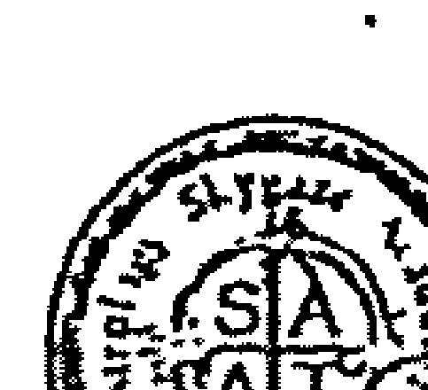

### 西頓的都勒斯：占星詩集（烏瑪·塔巴里譯本）

### Dorotheus of Sidon: Carmen Astrologicum

### The ‘Umar al-Tabarī Translation

-   英文編譯 | 班傑明·戴克 (Benjamin N. Dykes)
中文翻譯 | 陳紅穎.
審 譯 | 韓琦瑩、郜捷
編 輯 | 郜捷
責任編輯 | 李少思

-   版 權 | 郜捷
行銷企劃 | 李少思
總編輯 | 韓琦瑩
發行人 | 韓琦瑩

出 版 | 星空凝視文化事業有限公司
發 行 | 星空凝視文化事業有限公司
銀行帳號 | 【台灣】玉山銀行(808) 成功分行收款帳號：0510-940-159890
收款戶名：星空凝視文化事業有限公司
【大陸】招商銀行上海常德支行收款帳號：6232620213633227
收款戶名：魚上文化傳播(上海)有限公司
訂購服務 | skygaze.sata@gmail.com
地 址 | 11049 台北市信義區莊敬路186號
服務信箱 | skygaze.sata@gmail.com

美術設計 | 張曉君
印 刷 | 佳信印刷有限公司
總經銷 | 星空凝視文化事業有限公司

初 版 | 2021年3月
定 價 | 980元
ISBN 978-986-98985-1-5
有著作權·翻印必究

國家圖書館出版品預行編目 (CIP) 資料
西頓的都勒斯：占星詩集（烏瑪·塔巴里譯本） / 班傑明.戴克 (Benjamin N. Dykes) 編譯；陳紅穎譯. -- 初版.
-- 台北市：星空凝視文化事業有限公司，2021.03
432面；15X21公分
譯自：Dorotheus of Sidon : Carmen Astrologicum: the ‘Umar al-Tabarī translation
ISBN 978-986-98985-1-5 (平裝)
1. 占星術 292.22