# 占星學

台灣唯一獲得倫敦占星學院專業資格文憑之占星師 魯道夫

## Astrology A-Z

占星學是與生俱來的，而瞭解占星學或許可以幫助我們理解什麼樣性質的種子發展成為成人的自我意識當中的一部分，以及那些我們不知道的部分。

心理占星大師 霍華．薩司波塔 於《占星學的功與用》序

繼《占星全書》後，另一本占星玩家必備的隨身工具書。

想要瞭解排盤時各種名詞的代表意義？想要知道到底什麼是占星常用術語？

本書收錄超過500則占星學家必知的占星名詞，並採中英對照A to Z方式排序，按圖索驥，瞭解更多占星名詞的意義後，你也可以成為占星高手！

## ★作者序

在我學習占星的過程當中，常常發現有許多英文單字，在字典當中無法找到適合的翻譯，他們可能是來自於拉丁文，可能在占星學上有其他的意涵，例如「Term」或「Face」，直接翻成中文大家都知道是「期限」、「臉」，可是在時辰占卜占星學當中，卻代表了某種行星與星座的守護關係。這些英文單字往往讓人學習占星的過程遇到不少的挫折，那時候我常想如果有一本占星專用字典就不用這麼痛苦的猜測，不過這卻不是這本書誕生的理由。

事實上《占星進階辭典》這本書的誕生，是在寫作「占星全書」時的意外插曲，當《占星全書》的編輯工作進入尾聲時，我和編輯們仍為了許多原文翻譯頭痛，在結束占星全書的編輯工作之後，有人認為占星學的專業術語如此之多，進入進階的占星學階段是不是會需要一本占星字典呢？於是才會有這本「占星進階辭典」的誕生。

這本書針對占星學的愛好者在進階階段時，一些常會遇到的問題以及英文占星術語提供解釋，更針對一些較少見特殊的技巧，包括時辰占卜占星學、心理占星學、龍頭圖、小行星等做出更詳細的解釋，希望對於占星愛好者在提昇自己的占星判斷能力上有所幫助。

要感謝許多朋友長期在網路上與部落格上給予我的支持，感謝我的學生給予我的建議與幫助，以及我在倫敦占星學院的老師同學們給予我的幫助，謝謝春光出版社的編輯們為這本書所付出的努力，最後要向支持我的家人們說聲謝謝，感謝你們對我的關懷與付出，謝謝。

魯道夫 3.Jun. 2007 於倫敦

## 占星進階辭典
Astrology A-Z

## 目錄 Contents

- A …………………… 5
- B …………………… 22
- C …………………… 27
- D …………………… 43
- E …………………… 59
- F …………………… 67
- G …………………… 80
- H …………………… 84
- I …………………… 122
- J …………………… 128
- K …………………… 136
- L …………………… 137
- M …………………… 143
- N …………………… 150
- O …………………… 153
- P …………………… 156
- Q …………………… 184
- R …………………… 187
- S …………………… 190
- T …………………… 204
- U …………………… 209
- V …………………… 210
- W …………………… 217
- Z …………………… 219

## Acceleration 時間加速值

在繪製星盤的過程當中計算天頂與上升位置時，由於占星師採用以恆星為測量天體座標的標準，而相同的恆星每次回到相同地點上空的同樣位置所需的時間為：23小時56分4秒，這與我們所使用的一般時間24小時有著一天將近4分鐘左右的差異，為了將我們所記錄的出生時間換算成更精確的恆星時間，以便求得正確星體的所在位置，我們必須考慮這（恆星時間與一般時間）每天4分鐘的差異所造成的影響。於是，我們在計算星圖時，每1小時會增加10秒的時間加速值，每6分鐘則增加1秒的時間加速值。

## A.D. (Anno Domini) 西元

我們所使用的「西元年份」，在歐美世界的記錄方式簡寫作A.D.，事實上是拉丁文「Anno Domini」的簡寫，「Anno Domini」意思是耶穌基督的出生年，這個紀元方式，以西洋傳統當中所認定耶穌基督的出生年份做為紀元的開始，而在耶穌基督出生之前的年份計算則用B.C.做為代表；「Before Christ」意思是基督出生之前。

## Admetos 阿德密多司

在占星學當中，阿德密多司是漢堡學派（Uranian Astrology）所使用的虛星（實際上不存在的星體）之一，其符號為代表堅定不移、固執與狹隘的觀念，也同時與死亡有關。在希臘神話當中，阿德密多司是一位希臘城邦的國王，在阿波羅（Apollo）來到人間執行一年的任務時，殷勤的款待阿波羅，而獲得許多的恩惠。

## Affliction 受剋

在占星學當中當行星進入弱勢（Detriment）或失利（Fall）位置，或是當行星與其他行星形成強硬相位的對分相、四分相、半四分相、十二分之五相等，若行星的黃道位置與一些具有破壞特質的恆星合相也稱為受剋。

- 强硬相位（负面相位）
  对冲相，180度

## Age 時代

「Age」一詞在占星學當中 有著特殊的定義，故以「時代」在做為其中文翻譯，用來稱呼一個歲差移動大月的特性。請參考我們常聽到的水瓶時代（Age of Aquarius）以及大月（Great month）大年（Great year）。

## Age of Aquarius 水瓶時代

占星學認為春分點繞完黃道一圈為 1 個大年（Great Year），占星學以春分點在天文學上 1 黃道位置劃分 12 大月，大月（Great Month）可以影響整個時代精神，一個大月是 2160 年。春分點預計在西元 2369 年進入水瓶時代，但有占星師認為大月的影響前後七百多年，因此認為水瓶時代的影響從西元 1762 年就開始了。

## Air Element 風元素

鍊金術與西方神秘學認為世界由風、火、水、土四大元素組成，四元素又有另外四個氣候性質（冷、熱、乾、濕）來搭配。風元素的性质是熱與濕，此一元素組成世界的觀念也存在於占星術的宇宙觀，進而與星座分類產生關聯；與風元素有關的在黃道上為風相星座，在個人命盤上則有風相宮位。

## Air Signs 風相星座

黃道上三個與風元素有關的星座：雙子座、天秤座、水瓶座。占星學認為風相星座與智性的發展以及溝通思考有關，心理占星學家將其與容格精神分析的四種類型當中的思考類型（Thinking Type）作連結。心理占星師認為風相星座代表著三種不同的視野與溝通層面；雙子座的視野屬於個人的觀察與傳遞訊息的媒介，將內在與外在的訊息作交換；天秤座的視野屬於二維的平面，點對點的觀察，而天秤所代表的溝通也是一對一的平等溝通；而水瓶座的觀察則是屬於全面俯視的觀察，其溝通的方式跳脫了時間與空間的限制。

## Air House 風相宮位

在個人星盤上與風相星座相對應的宮位，包括了對應雙子座的第 3 宮、對應天秤座的第 7 宮與對應水瓶座第 11 宮，又稱作人際宮位（Relationship Houses）。在命盤上若行星集中於風相宮位，則具有類似風相星座的強烈重視人際關係、互動與溝通的性質。如風相宮位當中沒有任何行星，且同時沒有任何行星落於風相星座，則此人在溝通與思考還有人際關係上需要付出更多的努力。

## Androgynous Planet 雙性行星

在過去占星師們，將行星或星座以陰陽性來區分，太陽、火星、木星、土星都是屬於陽性行星，月亮、金星則是陰性星座，而占星師認為水星同時具有陽性與陰性的特質，於是處於媒介的地位，擁有溝通陰與陽的特質，故稱水星為雙性行星。

## Angule 角

在占星學上指的是星盤上的4個重要基本點，上升點 (Ascendant)、下降點 (Descendant)、天頂 (Medium coeli)、天底 (Imum Coeli)，在出生圖當中行星與4個點產生合相時稱為合軸星 (Angular Planets) 且會帶來明顯的個人特質。

## Angular Houses 起始宮

星盤上起點位於上升點、下降點、天頂、天底等位置的4個的宮位，分別是第1、4、7、10宮，在傳統占星學當中認為行星進入起始宮當中具有強勢的影響力，又稱開創宮位、角宮或始宮。

## Angular Planet (Angularity) 起始宮行星

當行星在上升點、下降點、天頂、天底等位置前後8度產生合相的行星，有時也指在4個角宮中的行星，又稱合軸星。起始宮行星在占星學的星盤判斷當中占有相當大的影響力，一般來說若在上升、下降與天頂、天底軸線附近所出現的起始宮行星，對人的個性的影響力，不會小於太陽、月亮在上升點或天頂所帶來的特質。

## Applying Aspect 入相位

當某一行星在移動當中，正好進入另一顆行星及將要產生相位的容許值當中，例如：月亮在雙子座1度，太陽在射手座9度，月亮此時正好進入了與太陽對分相 (180度) 的角距容許值8度當中，由於月亮正慢慢的與太陽拉近形成正相位 (容許度0度) 的距離，稱為入相位。在傳統時辰占卜占星學當中行星的相位往往只考慮「入相位」與「正相位」。

## Aquarius 水瓶座 (寶瓶座)

黃道上的第十一個星座，基本的定義包括「友誼」與

- Arc 圓弧
- Archetype 原型
- Apogee 行星遠地點

## Archetype 原型

最早發明這個名詞為容格，他定義原型為與生俱來的思考、行為的潛在模式，這些模式與神話或寓言故事當中的角色情節有關，可以在許多時代事件與人的身上觀察到；原型廣泛的被心理占星學派所應用，例如：水星與小精靈或不願長大的孩童（小飛俠）這個原型有關連，心理占星學大師麗茲·葛林（Liz Greene）的許多作品都涉及有關於占星與原型的討論。

## Arc 圓弧

占星學上通常指行星運行的橢圓軌道當中的某一段，例如：太陽弧（Solar Arc），是指從地球位置觀測太陽在黃道上，1天運行的一段距離，大約從0.57-1.01度左右，以此距離應用的推運法稱為「太陽弧正向推運」。

## Apogee 行星遠地點

指的是一顆行星或星體在運行軌道上與地球距離最遠的「點」。在占星學上被應用的最廣泛的就是莉莉絲暗月（Lilith），指月亮軌道上距離最遠的行星遠地「點」，事實上並沒有這個星體的存在。

# 阿拉伯點
Arabic Parts (Arabic Points)

阿拉伯點（Arabic Parts）在今日的占星學中逐漸被遺忘了，這一門學問來自於神秘主義的思想，打從托勒密（Claudius Ptolemaeus）之前就存在著，不過在近代由於許多占星學家們急著想要變成科學家，而把這一門有趣的思想給打入冷宮，以致於在今天除了幸運點之外我們很少在出生圖上看到其他的阿拉伯點。

## ① 阿拉伯點的來源

阿拉伯點事實上並不是由阿拉伯人發明的，不過阿拉伯人確實對這一門學問做出很大的貢獻，在占星術的歷史當中我們瞭解到，若非阿拉伯人在歐洲的黑暗時期保存了古典時代的占星典籍，今天我們想學占星術，可能得去學印度占星術或是中國果老星宗。

阿拉伯人將他們的宗教與神秘學思想融入了占星學當中，所以特別重視這些具有神奇效應的虛設點，阿拉伯占星家阿布馬謝（Abu Ma'shar）將阿拉伯點做出了整理之後大約有200多個點，代表著不同的事情：例如：婚姻、死亡、灌溉、旅行、航行等。不過這些點到今日只剩下不到一百個，最常用的甚至不到五個，分別是幸運點、婚姻點、疾病點、死亡點。

- 阿拉伯點 Arabic Parts

## ② 阿拉伯點的定義

這些點都不是實際的星體，他們藉由行星之間的度數加減而取得這些位置，你一定很好奇，為什麼行星之間的度數可以這樣加減呢？根據占星師們的研究他們是用來研究，兩顆對同一事件有相關連的行星之間的距離，再從一個相關連的宮位或某個特殊點來投影，例如：幸運點 (Part of Fortuna) 是一個觀察人類的身心靈的點，包含了精神與肉體上，以及有形與無形的價值，這時候計算太陽和月亮之間的距離，又從上升星座來開始投影。有些阿拉伯點分成白天出生與晚上出生有著不同的計算方式，那是因為傳統占星學中，對於不同的星座或宮位白天與夜晚有著不同的守護行星。例如：太陽是白天最強勢的星體，所以在計算白天出生的人的幸運點時會計算從太陽出發到月亮的距離，再將這一段距離的度數從上升星座開始投影，找到這個在命盤當中對人影響重要的點。形成了如下的算式

| 幸運點 |
| :--- |
| 上升的絕對黃道度數+月亮的絕對黃道度數-太陽的絕對黃道度數 |

相反的因為月亮是夜晚的強勢星體，對於太陽下山之後的人來說，受到月亮的影響比較明顯，於是他們的幸運點的計算方是就是計算月亮出發到太陽的距離，再將這一段距離從上升星座開始投影，找到晚上出生的人的幸運點，這個點因為以月亮為主所以又被稱為精神點，其算式如下

| 精神點 (夜晚出生的幸運點) |
| :--- |
| 上升點+太陽絕對經度-月亮絕對經度 |

## ③ 阿拉伯點的解讀方式

阿拉伯點的解讀方法其實相當簡單，我們判斷一個點的好壞，從其落入的星座是否符合該點的性質，以及該點是否與其相關的行星或相關宮位的守護星產生吉相位。例如：婚姻點落入天秤座就算是較好的位置，若落入牡羊座則似乎差了一些，再來觀察婚姻點是否與日、月、金星、木星、第7宮守護星有吉相位，若沒有則較差但是也好過與凶星產生凶相位。

目前常見的阿拉伯點的應用有2種，1是在流年的應用，特別注意流年當中是否有凶星與幸運點、宿命點、精神點、死亡點，產生了對分相或四分相，用來提醒對方注意災害與不測的發生，許多案例顯示，當火星、天王星、冥王星嚴重的衝突著幸運點的流年時，常常暗示著災難的發生。阿拉伯點的第2種應用是應用在擇日上頭，若你要選擇結婚日期，就可以選擇在有日、月、吉星與婚姻點產生吉相位的時刻；如果你想要展開生意，那麼就選擇吉星與生意點所產生吉相位的時刻。

阿拉伯點的研究蘊含了古老的占星知識，首先你必須瞭解每一個星座的強弱、性質與吉凶；每1個宮位的特殊定義與在傳統占星學中的吉凶；每1個行星、相位的吉凶。雖然今日有部分占星學家加入了現代行星與現代占星觀念來看待，但是卻仍屬少數，畢竟會使用阿拉伯點的占星師，多半是應用在卜卦占星學與擇日占星學的範疇當中。

## ④ 阿拉伯點的計算方式

阿拉伯點的計算方式需要將所有計算的星體或宮的起始點換算成黃道上的絕對度數（0-360度），然後進行計算，例如：某人的上升在獅子座五度月亮在牡羊座12度太陽在雙魚座6度，其幸運點（Fortuna）就是上升點+月亮絕對經度（若小於太陽的絕對經度則再加上360）-太陽絕對經度。

- (1) 找出上升點在獅子座5度，絕對經度=125度
- (2) 找出月亮在牡羊座12度，絕對經度=12度
- (3) 月亮的絕對經度+上升點的絕對經度=137度
- (4) 找出太陽在雙魚座6度的絕對經度=336度
- (5) 用上升+月亮的絕對經度-太陽的絕對經度
- (6) 137度不足以減去336，所以先+360度=137+360=497：497-336=161度，對照表找出最接近且小於此數字的星座是處女座的150度，所以幸運點在處女座，其度數為161-150=11，得知幸運點在處女座11度。

## 絕對黃經對照表

| 星座名稱 | 絕對度數 | 星座名稱 | 絕對度數 |
| :--- | :--- | :--- | :--- |
| 牡羊座 | 0 | 天秤座 | 180 |
| 金牛座 | 30 | 天蠍座 | 210 |
| 雙子座 | 60 | 射手座 | 240 |
| 巨蟹座 | 90 | 魔羯座 | 270 |
| 獅子座 | 120 | 水瓶座 | 300 |
| 處女座 | 150 | 雙魚座 | 330 |

> ◎ 依照太陽為上升點所尋找到的阿拉伯點包括了：幸運點、商業點、愛情點、激情點、拓展點、宿命點（災害點）。可以利用下面的算式來計算，並且依上面的方式解讀。

| 白天出生者的幸運點（Part of Fortuna） | 上升點+月亮絕對經度（若小於太陽的絕對經度則再加上360）-太陽絕對經度 |
| :--- | :--- |
| 商業點 | 上升點+水星絕對經度-太陽絕對經度 |
| 愛情點 | 上升點+金星絕對經度-太陽絕對經度 |
| 激情點（激動點） | 上升點+火星絕對經度-太陽絕對經度 |
| 拓展點 | 上升點+木星絕對經度-太陽絕對經度 |
| 宿命點 | 上升點+土星絕對經度-太陽絕對經度 |

> ◎ 若以月亮所在的點為上升點時可以找到當作上升點來尋找月亮的位置之外，還可以反過來以月亮為上升來尋找其他行星的位置，特別是精神點被當做是晚上出生的人的幸運點：

| 精神點（夜晚出生的幸運點） | 上升點+太陽絕對經度-月亮絕對經度 |
| :--- | :--- |
| 信仰點 | 上升點+水星絕對經度-月亮絕對經度 |
| 男孩點 | 上升點+金星絕對經度-月亮絕對經度 |
| 女孩點 | 上升點+木星絕對經度-月亮絕對經度 |
| 買賣點 | 上升點+幸運點-精神點 |

> 同樣可以依照上面的方法在不足以減掉度數時加上360度。

> ◎ 若以水星所在的點為上升點時，可以找到服務點、瞭解點：

- 服務（僕人）點＝上升點＋月亮絕對經度－水星絕對經度
- 瞭解點＝上升點＋火星絕對經度－水星絕對經度

> ◎ 以金星為上升點可以找到如下：

- 母親與朋友點＝上升點＋月亮絕對經度－金星絕對經度
- 農耕點＝上升點＋土星絕對經度－金星絕對經度

> ◎ 以火星為上升點可以找到如下：

- 遊戲點＝上升點＋金星絕對經度－火星絕對經度
- 爭吵點＝上升點＋木星絕對經度－火星絕對經度

> ◎ 以土星為上升點可以找到：

- 父親點＝上升點＋太陽絕對經度－土星絕對經度
- 繼承（財產點）點＝上升點＋月亮絕對經度－土星絕對經度
- 疾病＝上升點＋火星絕對經度－土星絕對經度
- 兄弟姊妹＝上升點＋木星絕對經度－土星絕對經度
- 水上旅行點＝上升點＋巨蟹座 15 度－土星絕對經度

> ◎ 其他還包括：

- 死亡點＝上升點＋第 8 宮起始點－月亮絕對經度
- 同伴點（白天出生）＝上升點＋木星絕對經度－土星絕對經度
- 同伴點（晚上出生）＝上升點＋土星絕對經度－木星絕對經度
- 婚姻點＝上升點＋第 7 宮起始位置－金星絕對經度
- 離婚點＝上升點＋金星絕對經度－第 7 宮的起始位置

## Apollon 阿波羅星

阿波羅星是漢堡占星學派所使用的虛星之一，這些星體事實上並不存在，阿波羅星意味著快速擴張與繁殖。阿波羅是希臘神話當中的真理、醫療之神，同時也是太陽神，在漢堡學派的定義當中，真相與科學以及擴張、繁殖，都與此星有關。

## Aries point 牡羊點

近代占星師認為位於開創星座 0 度，是宇宙能源進入地球的柵口，而這 4 個點分別是牡羊座 0 度、巨蟹座 0 度、天秤座 0 度、摩羯座 0 度，當一個人命盤當中有行星落入這 4 個點時，該星因為獲得強力的能量支援，成為領導此人與外界互動的動力，若進一步發揮甚至可以使此人有著令人矚目的表現。

## Aries 白羊座（牡羊座）

黃道上的第一個星座，開創的火相星座，基本的定義與自我、衝動、競爭挑戰有關。心理占星學上白羊座與自我意識以及優先、第一和競爭有著強烈的連結，在占星學上白羊座象徵符號為羊角，而火星為白羊座的守護星。

## Ascendant 上升點

黃道與東方地平線的交界，每 4 分鐘移動一度大約每 2 小時換一個星座，在現代占星學的定義當中，上升點被視為是自我的呈現，當我們在與外界互動當中所呈現的那一面，以及影響我們是如何與外界社會互動，心理占星學常將上升點與容格的人格面具作比## Ascendant Axis
上升軸線

指星盤上連接上升點與下降點的軸線，在占星學當中這條軸線上的行星，具有強烈的個人特質表現，同時這條軸線的星座也表示了自我與他人之間的互動模式。在占星學中同樣重要的還有 MC、IC 軸線。

## Ascendant Sign
上升星座

上升點所在的星座，被視為我們與外界互動的模式，與我們給外界的人格印象，一個太陽在獅子座的人很可能因為他的上升在巨蟹座而給人較為害羞的感覺。而上升點的星座就是一般人所熟知的上升星座，又稱做「Rising Sign」。

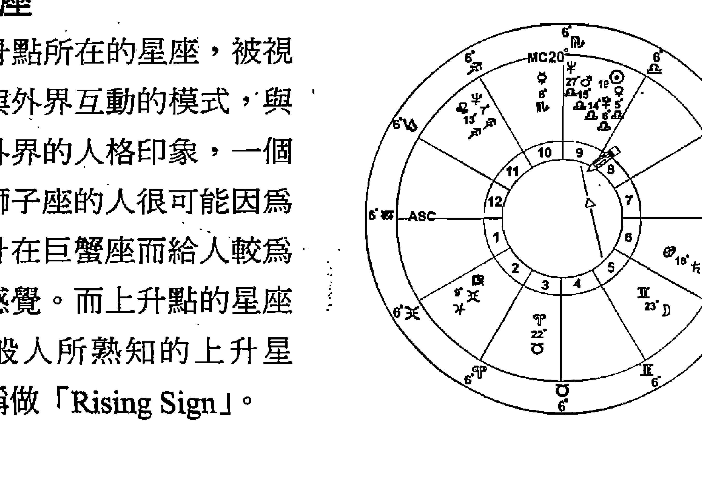

## Aspect
相位

行星與行星或是命盤上的上升點、基本點、或特殊點之間的形成特殊度數的角距，常見的相位包括了 0 度（合相）、30 度（半六分相）、45 度（半四分相）、60 度（六分相）、90 度（四分相）、135 度（八分之三相）、150 度（十二分之五相）、180 度（對分相）等，而相位也有前後的容許誤差又稱為角距（Orb），例如：月亮雖然沒有和太陽真的相距 0 度，但是在太陽的前後 10 度時會被某些占星師視為合相。在過去相位被分成了主相位（合相、對分相、四分相、三分相、六分相）、次相位（半六分相、半四分相）等，又因好壞的主觀因素分成正相位（三分相、六分相與半六分相）與負相位（對分相、四分相與半四分相），合相則因為不好不壞需視合相的行星而定，現代占星師傾向將相位的影響的力道與模式，分成影響力道溫和且小的柔和相位（Soft Aspects）包括了三分相與六分相，和影響力道激烈而且大的強硬相位（Hard Aspects）：包括合相、對分相、四分相、半四分相、八分之三與十二分之五相位。

## Aspect Grid
相位表

記錄星盤上行星與行星或特殊點之間所產生相位的表格，占星師習慣將用相位表將行之間產生的相位記錄下來，作為解讀星盤時的依據。在占星的學習與研究當中具有輔助的功能，也有些占星師不使用相位表，而將相位直接記錄於星盤上。

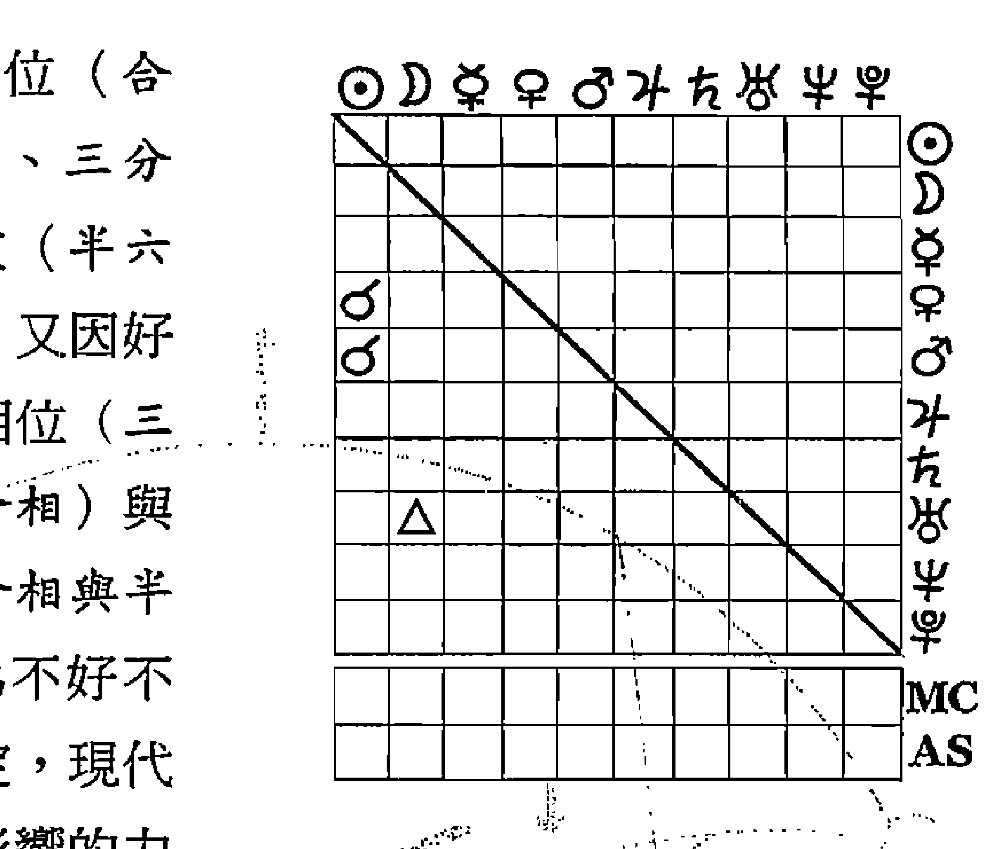

## Aspect Patterns
圖形相位

由三顆以上行星和命盤上的基本點或特殊點之間互間的相位，他們可能是兩交會的對分相所組成的大十字，或是三個三分相所組成的大三角等。許多人受到傳統占星術的影響常將圖形相位視為某種命盤格局。但心理（人文）占星學認為圖形相位展現的是一種更整合的生命能量模式，而非宿命格局。

### ☆占星進階辭典
Astrology A-Z

— Asteroids 小行星 — ACG占星地圖 — Astro-Economics 占星經濟學 —

## Asteroids
小行星

位於太陽系圍繞著太陽但體積又不足以構成行星條件的星體，大多數在火星和木星之間的小行星帶，占星學上常用的有凱龍星、穀神星、灶神星、婚神星和智神星。小行星對部分占星研究者來說，充滿了未知與神奇的吸引力，而耗費許多時間在繁瑣的解釋當中。但也有占星學家們認為，小行星等星體的宮位相位的解釋往往一再重複，命盤上早已經顯示的個人生命主題，故而在研究小行星的宮位星座與相位的同時，別忘記這個小行星對這個人的影響，是否早已經被其他行星所代表。

## Astro.Carto.Graphy
(A*C*G)

占星地圖

為20世紀美國占星師金·路易斯（Jim Lewis）所發明的占星地圖技巧，利用天上星體與地球之間投影的關係，製作出一張行星在某一時刻運行的軌道圖，被廣泛的應用在移民占星學技巧當中。

## Astro-Economics
占星經濟學

是一門研究天體循環與世俗循環的經濟運作有關的學問，又稱為「財經占星學」，但早期占星家們似乎比較喜歡稱自己為占星經濟學，強調此門學問並非只關注於財經預測，而強調於行星循環與地球上的生產力與經濟活動相關的研究。

### 占星進階辭典☆
Astrology A-Z

— Astro-meteorology 氣候占星學 — Autumnal Equinox 秋分點 — Anti-Parallel 對立平行相位 —

## Astro-meteorology
氣候占星學

氣候占星學是運用占星技巧來預測氣候變化的一門學問，尋找星體運行與自然災害氣候變化的關連，通常包含在世俗占星學與占星經濟學的研究當中。早期的氣候占星學便是奠基於占星經濟學與世俗占星學的研究基礎。

## Autumnal Equinox
秋分點

當太陽通過回歸黃道上天秤座0度時，正好是一年當中第二次日夜平分的時刻。因時值北半球秋天而稱為秋分點。同時也有人認為正因為太陽經過秋分點時晝夜平均，也因此人們將這附近的星體連結起來成為天秤座的圖案象徵著平分的晝夜。

## Anti-Parallel
對立平行相位

對立平行相位與平行相位同屬於天球赤道相位（Declination Aspect），對立平行相位的定義是：當某兩顆行星同時在天球座標上的南緯和北緯的相同度數運行時就稱做對立平行相位，例如：當月亮運行在天球的北緯6度而火星運行在天球的南緯六度時，就形成了對立平行相位，類似於對分相，帶來了相對的互動關係。

> 心象占星學大師
梅蘭妮·瑞哈特
(Melanie Reinhart)

（下方模糊文字，内容不清晰，可能为占星学相关补充）

## Barren 貧瘠的

「Barren」一詞有貧瘠的意思，傳統占星學中認為南交點與土星有相似的限制與不幸的意涵，故稱南交點為「Barren Node」。同時傳統占星學認為進入第 5 宮與第 11 宮的太陽、火星、土星、天王星稱為不孕行星，認為他們在這樣的位置對於生育狀況或孩童的成長有負面影響，於是稱為貧瘠行星（Barren Planets）。此外若一個人的上升點與第 5 宮位於雙子、獅子、處女座容易造成少子與不孕，於是稱呼雙子、獅子、處女這三個星座為貧瘠星座（Barren Sign）。

## Balsamic Moon 香酯月（消散月相）

月亮與太陽的 315-360 度的時刻距角，正好介於新月之前月光消散的時刻，在占星學的定義為適合用來結束舊的事物，以便未來展開新循環的時刻。出生圖當中如果月亮與太陽的距離正好處於消散月相時，暗示此人這一生的人生體驗為學習放下與忘卻過去的事。

## Beholding 互視

黃道上兩個形成 180 度的星座稱為互視，例如：白羊與天秤、金牛與天蠍等，因為他們看得見彼此，現代占星學家認為同一條軸線上互視的星座擁有共同的生命主題，卻藉由不同的方式表現。例如：牡羊、天秤的共同主題是「自我肯定」，卻因為星座性質而有不同的表現，牡羊表現出自我的態度來肯定自己，而天秤希望從他人眼中找到自我的肯定。

## Benefits 吉相

傳統占星學當中將行星分為吉星、凶星與吉相位、凶相位，吉相這個詞包含了吉星與吉相位，行星與行星或基本點特殊點之間形成三分相或六分相被視為吉相位，而木星與金星為吉星，同時被視為吉星的包括了太陽月亮與北交點，這個觀念在時辰占卜占星學當中仍被遵守著，但現代的占星師認為行星與相位並無吉凶之分。

## 六分相，60度

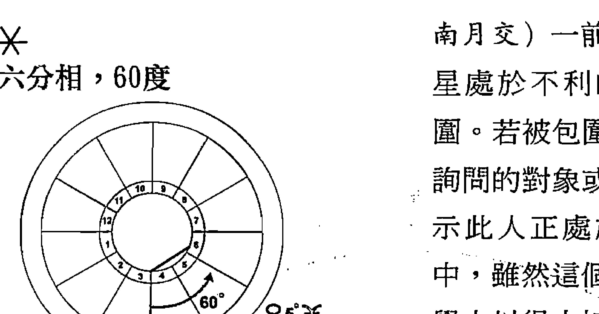

為吉星、凶星與吉相位、凶相位，吉相這個詞包含了吉星與吉相位，行星與行星或基本點特殊點之間形成三分相或六分相被視為吉相位，而木星與金星為吉星，同時被視為吉星的包括了太陽月亮與北交點，這個觀念在時辰占卜占星學當中仍被遵守著，但現代的占星師認為行星與相位並無吉凶之分。

## Besiege 包圍

傳統占星學認為當一顆行星被兩顆凶星（火星、土星，南月交）一前一後包圍時此行星處於不利的位置，稱為包圍。若被包圍的行星代表著被詢問的對象或是某個人，則表示此人正處於危險的威脅當中，雖然這個觀念在今日占星學中以很少被提起，這個概念在時辰占卜占星學當中仍被遵守著。

## Bestial Sign 獸類星座

黃道 12 星座當中具有動物型態的牡羊、金牛、巨蟹、獅子、天蠍、魔羯、雙魚等星座為獸性星座。與圖形為人的雙子、處女、水瓶的人類星座相互對應，一般認為獸類星座的動物性與受到原始的慾望情感較為強烈。

## Bi- 雙倍相位

如果你看到某個相位的英文前面出現「bi」，表示他是某個相位的兩倍，例如：五分相的距角為72度，所以倍五分相的距角就是72x2=144，在占星學當中「Bi-Quintile」倍五分相與「Bi-Septile」倍七分相較為常見，但由於今日占星師多以不使用「Septile」與「Bi-Septile」，所以我們不在此討論，僅討論倍五分相「Bi-Quintile」，當兩個行星之間形成了144度，其定義與藝術創意有關。許多占星師認為五分相與倍五分相需要長時間的生命歷程來發展這樣的藝術創造力。

## Bicorporeal Sign
二元性星座

黃道上具有二元性定義的星座包括了雙子座（兩個人）、射手座（半人半馬）、雙魚座（兩條魚）。托勒密將處女座歸為二元性星座，一般認為是來自古老的處女座形象正義女神，一手握著一個小孩。

## Birth Chart
出生圖

依據一個人出生的時間地點所繪製的星盤，又稱「Natal Chart」。占星師認為出生時刻的星盤記錄著出生時該地上方天空的星體位置，這些星體位置對人的命運與性格有著明顯的關聯，不同的占星哲學觀產生的不同的占星師對命盤的看法，傳統的占星師認為出生圖就決定了一個人的命運與格局，而心理占星師與人文占星師認為出生圖可以解讀一個人的個性，可以視為一個人的生命藍圖從中找出其發展潛能。

## Birth Data
出生資料

繪製出生圖所需要的個人出生年月日時間地點等資料。出生資料的周全與否關係到星圖的正確，在台灣由於受到中國命理僅使用時辰的影響，往往會導致星盤繪製的時後無法求得正確的出生時間，這時候就會需要校正星圖來找出正確的出生時刻的上升與天頂位置。

## Birthplace System
出生地分宮法

又稱為「科赫分宮法」（Koch），是由19世紀德國占星師華特科赫博士（Dr. Walter Koch）所創，和普拉西度宮位制（Placidus Houses System）相似的部分是結合了時間與地點的分宮制，並將出生時的天頂沿著白晝的黃道運行，逆推回上升星座的時間，從中訂出第11宮與第12宮的位置，這種分宮法結合了出生地的縱座標的計算。這種分宮制算是另一個滿流行的分宮制，許多北美的占星師或德國占星師喜歡使用科赫分宮法，而科赫分宮法中，天頂所代表的自我人格也顯得格外重要，但只適用於緯度低於60度的地區。

## Birth Star
出生恆星

使用恆星的占星師們會將一個人命盤中與基本點或行星有所接觸的恆星視為出生恆星，認為這些被行星或基本點特殊點接近的恆星對個人產生重要的影響力。目前的占星學當中恆星的使用並不廣泛，但出生恆星的研究往往會帶出驚人的星盤解釋。

## Bowl
碗型出生圖

美國占星學家馬克·艾德蒙·瓊斯（Marc Edmund Jones）依據出生圖上行星的排列方式歸納出幾種類型，碗型的出生圖，所有的行星都集中在 180 度內，傾向自給自足與經驗主義者，認為與處女、天蠍等星座有關聯。

## Broken
破出

由於星盤上的行星為逆時鐘運行，當行星冒出下降點時被稱為破出，傳統占星學認為此行星具有強烈的影響力，因為這樣的位置，象徵著行星正好要衝出地平線嶄露頭角，發揮他的影響力，但破出的概念在現代占星學當中並不被重視。

## Bucket
提桶型出生圖

瓊斯圖形之一，出生圖上絕大部分的行星位於 180 度的半圓中，只有一顆行星個落在另外一個半圓，此落在另一個半圓的行星被視為手把，是引導個人前進的目標，此人容易將畢生精力投注在這顆行星所落在的宮位與該行星相關聯的事件上，一般認為該類型與射手座有關。

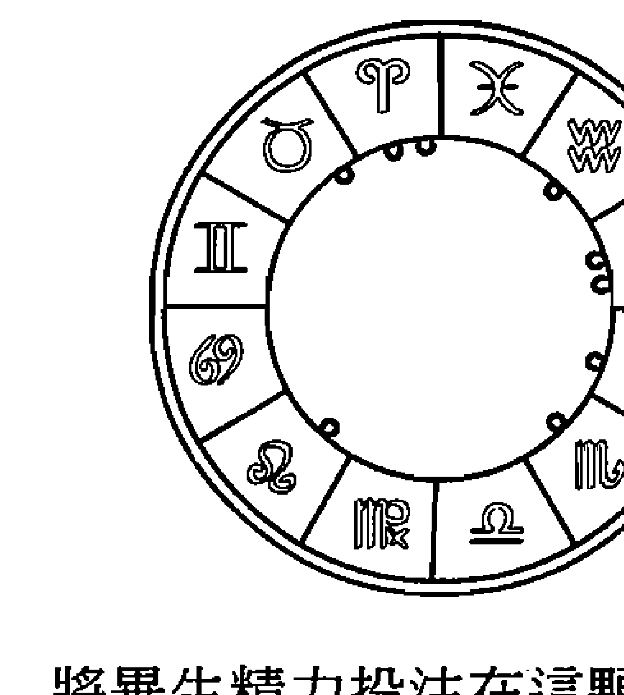

## Bundle
集團型出生圖

瓊斯圖形之一，出生圖上所有行星都集中 120 度範圍內，形成一個小集團，反而導致命盤當中剩下三分之二的星座與宮位處於空白狀態，根據研究這個人的生活形態容易專注在某個層面，同時一般認為這個類型與摩羯座、巨蟹座有所關聯。

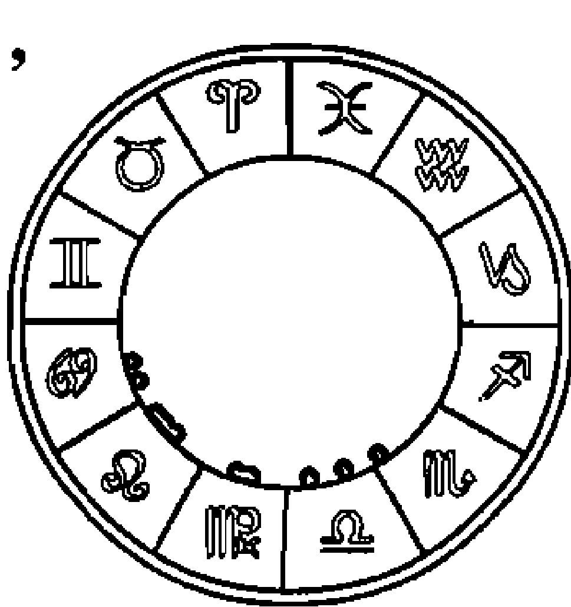

## Cadent
降宮

在命盤上第 3 、 6 、 9 、 12 宮，又有人稱為「果宮」與黃道上的變動星座相對應，所以又稱作「變動宮位」，在拉丁文中「Cadent」有墜落失去的意思，傳統占星師認為這些宮位的影響力較小，但根據法國占星學家高葛林（Michel Gauquelin）的研究並非如此，相對的行星在果宮上且靠近 4 個基本點時常有驚人的影響力。

## Campanus Houses System
坎式（坎普士）分宮法

13 世紀占星師喬凡尼（Giovanni di Campani）所創立的分宮法，又稱「Campane System」，他的計算方式將包含東方地平面到天頂的「主垂圈」（Prime Vertical）劃分成 12 等分，在以南北極平於赤道為軸心投影到黃道上，但這種計算方式很快就被穆勒（Johannes Muller）所改變，成為著名的瑞久蒙塔努司宮位制（Regiomontanus Houses System），又稱「芮氏分宮法」。

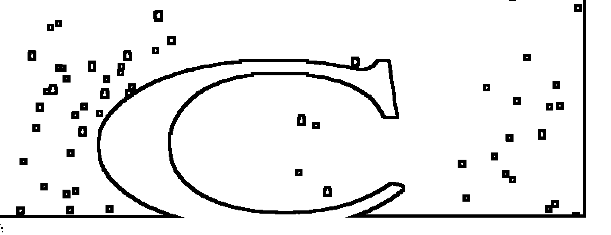

## Cancer
巨蟹座

黃道上的第 4 個星座，開創的水相星座，基本的定義包括家庭與母親及飲食的關係，心理占星學當中認為巨蟹座與安全感的需求，強調自我情緒的表現，同時象徵著養育以及被養育的互動。在占星學的符號上巨蟹座的符號是蟹鉗的縮影，也有人解釋為母親的乳房。巨蟹座的守護星為月亮。

## Capricorn
摩羯座（山羊座）

黃道上的第 10 個星座，又稱山羊座，開創的土相星座，基本的定義包括實際、嚴肅、追求成就等，從心理占星的角度來看自我在眾人面前的呈現、組織架構、重視實際執行、成就與社會地位。在占星學符號上摩羯座符號代表著羊頭魚身，而摩羯座的守護星是土星。

## Cardinal (Sign) 開創星座 (基本星座、本位星座)

黃道上與太陽經過春分點、夏至點、秋分點、冬至點為起點的行星，分別是白羊座、巨蟹座、天秤座、摩羯座 4 個星座。因正處於季節的開始所以又稱開創星座 (又有人稱基本宮、基本星座或本位星座)，而從心理占星的特質來描述這四個星座又因為對於自我的關注多過他人，所以稱本位星座相當的貼切，對占星學不夠瞭解的人認為，巨蟹與天秤對人付出的態度無法聯想到關注自我？事實上，巨蟹對自身情緒與內心感受的敏感，以及天秤以主動付出期待他人認同的態度是自我關注的表現。

## Cardinal cross (Grand) 開創大十字

當行星在 4 個開創星座形成交會的大十字圖形相位時，稱為開創大十字，擁有開創十字的人對於追尋自我相當的敏感，因為他們同時希望表現自我 (白羊座) 又希望他人能夠照顧到他的情緒需求 (巨蟹座) 同時希望與他人保持互動 (天秤座) 又希望能夠受到社會大眾的認同 (摩羯座) 因此而分身乏術。此外也有占星師用「Cardinal Cross」統稱 4 個開創星座，而非開創大十字。

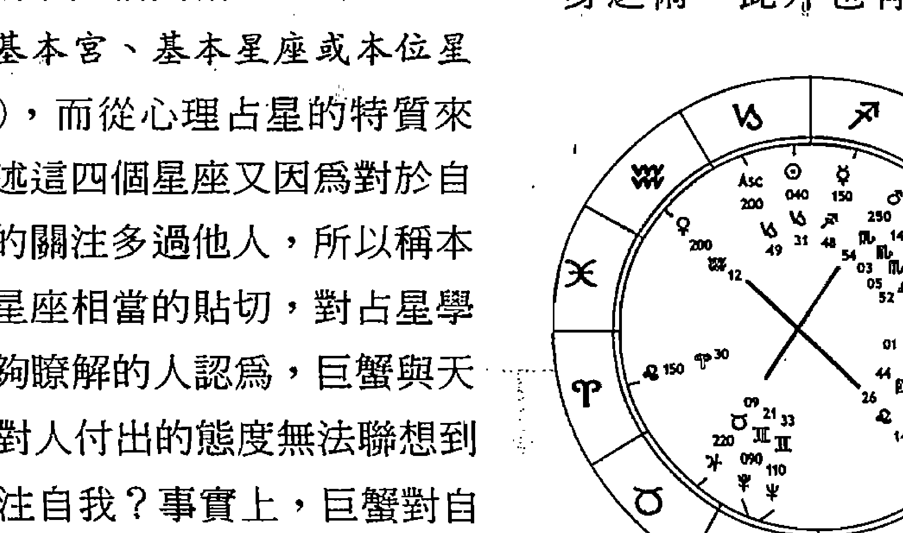

## Cazimi 燃燒

在傳統占星學中當一顆行星與太陽在天球座標的緯度相聚 0 度 17 分之間並且產生合相時被視為是一種行星過度燃燒的象徵，該行星的影響效力減弱，這個規則在時辰占卜占星學當中仍被應用，「Cazimi」一詞來自阿拉伯文。

## Celestial Bodies 天球的星體

在占星學上為行星恆星小行星等實際星體的統稱。用來包含在占星學當中天體中的星體，無論是恆星、行星、衛星、小行星等，都可以用「Celestial Bodies」來稱呼，避免以「Star」或是「Planet」這樣的稱呼來忽略了其他的星體在占星術中的影響力。

## Celestial Equator 天球赤道

在占星學的座標系統當中用來測量天球緯度的標準，事實上天球赤道是地球赤道在天球上的投射，如同一個龐大的圓圈繞過天球的中間，由天球赤道到天球南北極的距離是相等的。測量時也和地球的座標測量一樣稱為南緯和北緯。

## Celestial Latitude 黃緯

天球座標系統的緯度當中由天球赤道起為零度一直到天球南北極的 90 度，如同地球座標的緯度計算，用天球的南緯北緯來標示星體的位置，而另一個座標系統就是黃經標示著星體在黃道上的位置，星體的天球緯度觀測在占星學曾經被重視過，後來沒落了，直到近年來又再度又占星學家對於天球緯度開啟新的研究。

## Celestial Longitude
黃經

天球座標系統的經度，由牡羊座起為零度一直到雙魚座的最後 1 度為 359 度，與黃緯搭配作為標示星體的位置。搭配著黃經與黃緯，由這個座標我們可以得知星體運行的確切位置，而記錄在星圖上然後做出解釋。

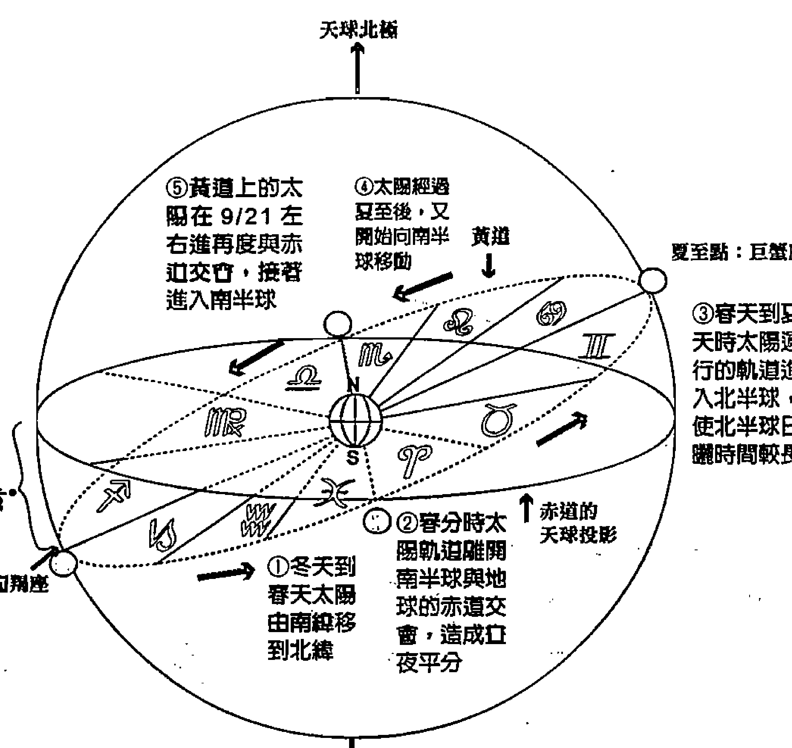

## Celestial Sphere
天球

一個想像的球體包裹著地球，並以地球為中心，南北兩個端點分別是天球的南北極又稱天極（Celestial Poles），從地球來看所有的星體都包含在其中，他們的位置就用黃經與黃緯來表示。

## Centaurus
半人馬星體

半人馬是希臘神話中的幻想生物，但在天文學當中有某些介於小行星與彗星的星體就用半人馬的名字稱呼，最常被占星家所應用的如：凱龍星（Chiron），佛魯斯星（Pholus）等。其中又以凱龍星最被重視，認為它與人們的靈魂傷痛和自我治療的過程有著緊密的連結，而其他的半人馬星體在占星學的意義也陸續有許多占星學家投入研究。

## Changeable Signs
變化性質星座

傳統占星學中認為有 6 個星座會因為他們在上的天體位置（例如在天頂或下降天底等不同位置）而改變性質，這 6 個星座分別是金牛、雙子、獅子、處女、射手及摩羯，注意這與我們習慣稱的變動星座不同，變動星座的英文名為「Mutable Signs」。

## Chaldean Order
迦勒底秩序

希臘時代的宇宙觀，做為星體之間運動並以星體與地球之間的假想距離為基準，從近到遠分別是月亮、水星、金星、太陽、火星、木星、土星。這個秩序也間接的影響到中世紀占星學裡頭一些吉凶的判斷。

## Chart
星圖

星圖標示著星體和他們在黃道上的座標以及相互之間的角度關係。

# 穀神星
Ceres

穀神星體在西元1801年被義大利人發現，它是目前小行星帶當中最大的星體。穀神星來自於羅馬神話當中的刻瑞斯（Ceres），也就是掌管作物收成的農業女神，我們在處女座的神話當中聽過她的故事。在穀神星的星座代表著我們是如何被養育長大的，以及我們將會如何養育或照顧他人，而所在的宮位表示母性本能的顯現。

## ◎ 穀神星在白羊座
透過實際的行動與嘗試的教育方式來獲得成長的養分，這樣的人透過親身體驗來瞭解生活的許多事情。他們也會督促著他們的子女去嘗試任何事情。

## ◎ 穀神星在金牛座
穀神星在金牛座的人透過接觸、觀察等感官行為來探索世界，他們也被教育成為重視物質以及事物是否存在為判斷的標準。

## ◎ 穀神星在雙子座
這些人透過知性的交流，與朋友的互動，溝通聽說讀寫來成長，他們不斷的與身邊的人交換所得到的資訊，他們也會鼓勵他們的子女這麼做。

## ◎ 穀神星在巨蟹座
這些人在母親的保護下成長，使得他們不斷的透過保護他人或被保護的觀念在成長，當身邊沒有人或是飢餓時特別容易讓這些人感到不安。

## ◎ 穀神星在獅子座
這些人的成長過程需要許多的掌聲，他們總是被注意著，成長於這種環境的人多半顯的有些自我中心，然而他們也會這樣去鼓勵他們的子女，卻要求子女以他為中心。

## ◎ 穀神星在處女座
一分耕耘一分收穫，還有許多的座右銘和嚴格要求伴隨著這些人的成長，被灌輸在他們的思想當中，天下沒有不勞而獲的事情，他們會去批評督促那些不夠努力認真的人事物包括他們的孩子。

## ◎ 穀神星在天秤座
這些人被灌輸著生活與藝術上的美感，他們總被要求要注意他人的需求，注意環境是否舒適，這樣環境下成長的人也會教導孩子要有禮貌與注重生活的舒適與美感。

## ◎ 穀神星在天蠍座
無論他們的父母是不是故意的，這些孩子總有機會在很早就接觸到性或死亡，對於這些事情的好奇成為他們成長過程當中最重要的一件事情，他們也不排斥和他們的子女提早討論性愛與死亡。

## ◎ 穀神星在射手座
穀神星在射手座的人被灌輸著知識至上的觀念，他們從小就被訓練的相當有探索與研究精神，對於世界上有形無形的事物感到好奇，他們也會鼓勵子女這麼做。

## ◎ 穀神星在摩羯座
他們的童年生活多半是一連串的「不准」「不可以」組合起來的，父母習慣用最簡單的權威控制，使得他們也傾向用這種最簡單的方法來對待子女。

## ◎ 穀神星在水瓶座
他們的成長經驗可能相當特殊，充滿了驚奇與意外，甚至容易感到孤獨與被遺棄，不過很快的他們就懂得如何走出自己的路學會獨立，卻不知道如何和他人再親密關係中共存。

## ◎ 穀神星在雙魚座
穀神星的雙魚座帶來了慈悲與愛的教養方式，他母親或長輩們或許教導他要如何去愛其他人，去關心其他人，最常用的方式是透過宗教的思想，雖然他們也相當的敏感脆弱，但他們同樣會用無限的關懷來養育子女。

## 穀神星所在的宮位

### ◎ 穀神星在第 1 宮
穀神星在第 1 宮將其母性的本能，與照顧人的天賦融合在自己的身上，擁有這樣位置的人有教育或照顧他人的傾向，而所在的星座顯是他如何表現這樣的關愛。

### ◎ 穀神星在第 2 宮
就如同月亮在金牛座一樣，不夠的銀行存款和沒有填滿的冰箱會讓這些人抓狂，他們需要這些事物來滿足安全感，但他們也樂於替他們的子女安排富足的生活。

### ◎ 穀神星在第 3 宮
穀神星在第 3 宮傾向於知識的教育，他們重視精神上的學習與成長，他們毫不吝嗇的和身邊的人分享著知識就如同母鳥在哺育小鳥一般。

### ◎ 穀神星在第 4 宮
這些人傾向照顧自己的家人，他們有時會顯的有些排外，對於不認識的人他們無法分享自己所擁有的食物與一切。

### ◎ 穀神星在第 5 宮
他們重視到許多事情不只養還要育，孩子的教育的問題和心靈的成長是他們所關注的，他們傾向給小孩一個更愉快更有創意的的成長空間。

### ◎ 穀神星在第 6 宮
就如同處女座一樣，這些人自我要求的相當嚴格，但是和他們一起工作的人容易被他們關心照顧，他們也就由工作的行動來指導他人，並且樂於分享工作上的經驗。

### ◎ 穀神星在第 7 宮
一開始這樣的人與他的伴侶有著完全依賴或者完全被依賴的傾向，他們要瞭解到事物必須的互動，給予和接受都是必須的，最後才能夠達到平衡的互動關係。

### ◎ 穀神星在第 8 宮
這些人擅長吸取他人的資源特別是利用他人的物質來達到自我成長的目的，有時候被人視為喜歡利用別人的自私鬼，這些人對性愛和神秘事物也有著特別多的需求。

### ◎ 穀神星在第 9 宮
精神上的成長是這些人生活當中的重點，他們不斷的透過吸收他人的智慧而成長，他們喜歡研究宗教哲學和出門去旅行，透過這些互動讓他們感覺到成長茁壯。

### ◎ 穀神星在第 10 宮
這些人能夠吸引長者的照顧，相反的其他想要彼此人照顧的人也會被吸引過來，穀神星在接近天頂的位置就有這樣的能力，這些人總是將他人看小孩一樣需要照顧。

### ◎ 穀神星在第 11 宮
受到第11宮的影響這些人特別喜歡灌輸他人人道主義的精神，人與人之間必須互助合作，而他們也不斷的參加類似的團體來幫助自己成長。

### ◎ 穀神星在第 12 宮
穀神星在第12宮的人特別需要吸取浪漫的養分，他們不斷的陶冶自己的美感與精神生活，他們也不會吝於幫助他人，事實上對於貧困世界的體驗是真正幫助他們成長的關鍵。

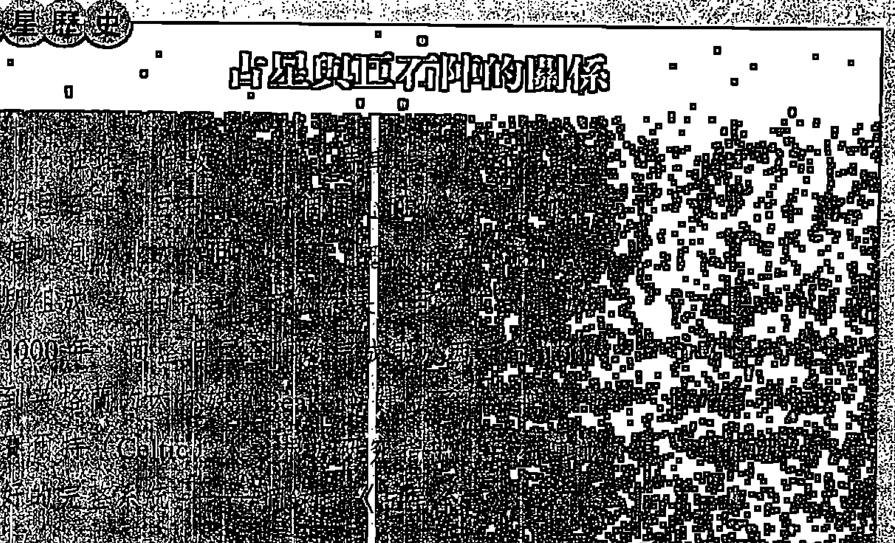

# 星圖系統
Chart system

星圖有許多繪製的方式，在過去星圖的繪製如同我們看到中式算命的紫微斗數的命盤一樣是方形的，今日占星師習慣使用圓形的星圖。

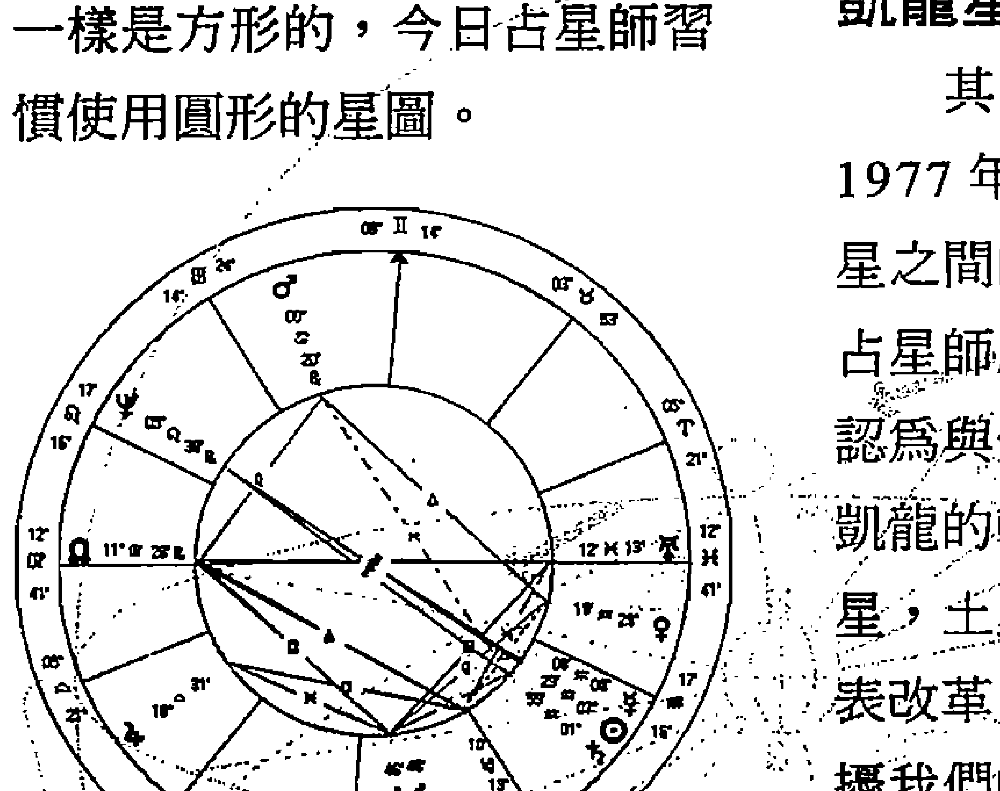

# 出生圖的守護星
Chart Ruler

上升點所在星座的守護星，就是一張出生圖的守護星又稱命主星。在占星學當中出生圖的守護星往往是太陽與月亮之外另一個代表此人的象徵，出生圖守護星所落在的星座與宮位還有與其他行星的相位，也會對此人的性格與命運產生某一定程度的影響。

# 凱龍星
Chiron

其符號為凱龍星在西元1977年被發現位於土星天王星之間的半人馬星體，開始被占星師廣泛的應用，凱龍星被認為與傷痛和醫療有關，由於凱龍的軌道穿越了土星與天王星，土星代表限制，天王星代表改革；土星也代表著力干擾我們的地方，這正好就符合了凱龍星的解釋，它來回於限制與改革之間幫助我們不斷的成長，並提醒我們靈魂傷痛所在的位置，建議我們該如何面對。

# 新月
Crescent Moon

月亮與太陽的角度介於45-90度之間，象徵著新的生活或事件循環的開始的第一個發展階段，出生圖上有這樣的人是來探索世界的，他們的適應力強，但對事物的看法更為主觀，有時會造成內在情緒的衝突。

# 燃燒
Combust (combustion)

在傳統占星學中凡是行星與太陽接近0.5-5度之間稱為燃燒，行星的效力相對減弱，這個規則在時辰占卜占星學當中仍被遵守著，而今日占星學家則認為除了水星與太陽合相時容易受到「Combust」影響之外，其他行星並不受影響。

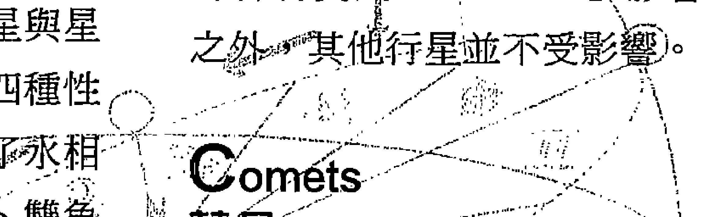

# 冷
Cold

傳統占星學中將行星與星座分成冷、熱與干、濕四種性質。屬於冷的星座包括了水相星座的巨蟹座、天蝎座、雙魚座，以及土相星座當中的金牛座、處女座、摩羯座，這6個星座會因為同時具有冷的特質而相通；相反的與熱的特質的風相和火相星座不合。另外，土星與月亮也都具有冷行星的特質。這樣的性質觀念如今只有在學習時辰占卜占星學當中才會應用得到。

# 彗星
Comets

彗星在傳統占星學當中被視為凶星，又叫做掃把星，認為彗星的尾巴帶有毒氣且帶來厄運，今日占星學認為彗星往往會帶來令人震驚的狀況出現卻不一定是凶兆。彗星的研究在占星學當中可以觀察彗星所出現的黃道座標來作為判讀的依據。

# 中點重組星盤
Composite Chart

將兩張或兩張以上的星圖，運用漢堡學派的中點技巧，找出兩張圖中的行星與基本點的中點，例如 A 的火星在牡羊座 10 度而 B 的火星在巨蟹座 10 度，兩人火星的中點在中點組合圖上就會落入金牛座 10 度（位於兩者火星的中點），以這樣的方法而重新繪製出一張星圖，可以觀察兩人關係或團體的運作方式，以及兩人或團體的目標給人的觀感與行動模式。

# 合相
Conjunction

當行星與行星或基本點之間相聚 0-8 度左右稱為合相，許多占星初學者常誤以為合相是一種吉相，事實上從古至今合相在占星學中，都並不全然是指好的相位，在傳統占星學當中與火星、土星、南月交點的合相都屬於凶相，而與金星、木星的合相則可視爲吉相，而今日的占星學認為產生合相的行星性質會交會影響，例如：金星與土星合相時，土星會約束金星的歡愉，而金星會柔和土星的嚴肅。

# 共同守護星
Co-Ruler

又稱為「Join Ruler」在現代行星發現之後，傳統上除了太陽之外，每一個行星守護兩個星座的關係開始出現變化，占星師們將這些發現的現代行星列入星座的守護星行列當中，有些占星師同時使用傳統守護觀念與現代守護觀念，並且將這些共同守護的行星稱為共同守護星。天王星與土星為水瓶座的共同守護，海王星與木星為雙魚座的共同守護，冥王星與火星為天蠍座的共同守護，也有些占星師將小行星列入共同守護的行列，但並沒有定論，例如：凱龍星有占星師認為他和水星共同守護處女座，也有占星師認為凱龍星和木星共同守護射手座。

# 宇宙生物學
Cosmobiology

由奧地利占星師費豪 (Dr. Friedrich Feerhow) 所創造的名詞，認為宇宙之間的生物都受到宇宙之間星體所影響，此名詞後來被漢堡占星學派所廣泛應用，成為漢堡占星學派的專用名詞。

# 界線
Cusp

星盤上宮位的終點與起點的分界線，界線在占星學當中佔有相當重要的地位，任何位於界線上的行星都被視為對該宮所管理的事情具有強大的影響力，同時有占星師認為當行星落在界線之前 5 度時可以視為對下一宮發揮一定程度的影響力。

# 丘比特
Cupido

羅馬神話當中的愛神又稱做「Eros」，但在占星學當中漢堡占星學派所使用的虛星之一，事實上「Cupido」這個星體並不存在，也僅有漢堡占星學派的占星師使用，它象徵著群體的關係婚姻關係和家庭關係，我們可以從其符號當中看出木星與金星組合的意味。

# 週期
Cycle

星體自某一起點出發到下一次回歸到同樣位置稱為一個週期，占星學上有兩個週期定義，一是星體繞行完黃道一圈稱為一個週期，又稱作恆星週期 (Sidereal Cycle) 從地球上來觀測太陽繞完黃道一圈為 365.25 天、月亮約 27-29 天、水星約 365 天、金星約為 225 天、火星約為 687 天、木星約 11.86 年、土星約 29.5 年、天王星約 84 年、海王星約 165 年、冥王星約 248 年。另一個占星學常用到的週期，稱為合相週期（Synodic Cycle）是指兩顆行星相會、合相直到下一次產生合相的期間，我們所熟知月亮的朔、望、新月、滿月就是一個太陽與月亮的合相週期，另外常用的合相週期還有木星與土星的木土循環週期，以及它外圍行星彼此之間的週期，在世俗占星學研究當中占有相當重要的地位。

> 占星學的先河巴比倫人

占星學的起源，最早可以追溯到西元3000年前美索不達米亞（Mesopotamia）平原上的巴比倫文化（Babylonian Culture），而巴比倫的文化主體是由居住在這個區域的蘇美人（Sumerian）與阿卡德人（Akkad）所建立，這群人也是最早擁有「黃道」概念的民族。巴比倫人將天球上太陽經過的軌道區分為12 個區域（也就是今日黃道12 宮的原始型態），對巴比倫人來說黃道最重要的功用就是計算日期，也就是日曆的功用，黃道上的12 個區域就如同我們今天慣用的12 個月一樣。——摘錄自《占星全書》

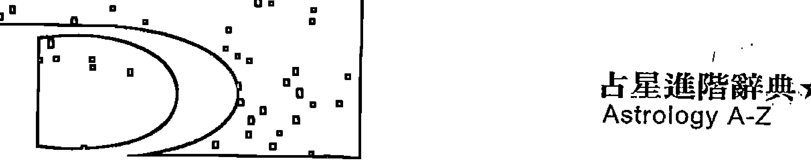

# 每日移動
Daily Motion

在星曆中常會看到星體每日移動速度的表格，用來方便徒手計算行星移動的速度以確保星盤上的行星位置精準度。同時也應用在作為預測命運的推測法當中，例如：「太陽弧正向推運」這一門方法，就應用太陽的每日移動速度來作為每一年的推測的計算基準。

# 關係圖
Davison Chart (Davison relationship chart)

又習慣簡稱為「Relationship Chart」，占星師羅南德·戴維遜（Ronald Davison）依據兩個人出生時間的終點與地點的中點來繪製一張關於星盤。被應用在觀察伴侶關係或合作關係的一門技巧，但許多占星師認為「Davison Chart」能夠提供的幫助有限，所以並不普及。

# 暗月
Dark Moon

在占星學當中暗月有著許多不同的名字，又稱做莉莉絲（Lilith），又指的是月球軌道上距離地球最遠的那一點，在神秘占星學中象徵著個人內心中的黑暗面。莉莉絲在傳統的占星學界並沒有被重視，但研究業力占星或神秘主義占星學的占星師則十分重視莉莉絲所代表的心靈的黑暗。

# 日光節約時間
Daylight Savings Time (DST)

在某些特定地區（通常為緯度較高的地區）的特定時刻（通常為夏季日照時間較長的時刻），因為日照時間較長為了節約能源（或其他因素）而將時鐘撥快一小時，目前歐洲國家在3月到10月的期間就會將時鐘撥快1小時進入日光節約時間，在二次大戰時英國還曾經實施雙倍日光時間，將時鐘撥快2小時，美國各州則有不同的規定，目前台灣地區自西元1980年起已無實施日光節約時間。在計算星圖時必須注意出生的時刻是否是日光節約時間，必須減去1小時，日光節約時間又稱夏令時間（Summer Time），例如：英國所施行的格林威治的日光節約時間可以稱作「Greenwich Day Time (GDT)」或是「British Summer Time (BST)」，許多占星軟體上都會自動調節日光節約時間，但是占星師仍需要再次確認，許多軟體會把台灣沒有實施夏令時間的西元1980年自動調整成日光節約時間，造成占星師的困擾。

台灣地區日光時間表
| 年       | 日期       |
|----------|------------|
| 1945-1951| 05月01日~09月30日 |
| 1952     | 03月01日~10月31日 |
| 1953-1954| 04月01日~10月31日 |
| 1955-1956| 04月01日~09月30日 |
| 1957-1959| 04月01日~09月30日 |
| 1960-1961| 06月01日~09月30日 |
| 1974-1975| 04月01日~09月30日 |
| 1979     | 07月01日~09月30日 |

# 十度區間
Decanates

傳統的占星技法中，認為一個星座可以每10度分成一個區間，一個星座有3個10度區間，其中從0-9度為原本的星座守護，而10-19度則由黃道上同一個元素的下一個星座守護；牡羊座的3個10度區間為：牡羊座0-9度為牡羊座本身守護；牡羊座的10-19度為獅子座守護；牡羊座的20-29度則為射手座守護。

# 十分相
Decile

產生十分相的兩個行星相距36度，是屬於微小相位之一，同時也是開普勒（Johannes Kepler）的研究當中重視的角度，十分相暗示著存在於內心當中的衝突所引發的困難，但目前少有占星師在命盤的解讀上使用十分相。

# 天球赤道相位（傾斜相位）
Declination Aspect

自天球赤道起為0度往天球南極或北極各自延伸90度的黃緯座標系統當中，太陽系行星運行大多在赤緯的正負27度內。根據行星在黃緯上的度數所產生的相位，當兩顆行星在同一個赤緯度數時稱為「平行相位」，一南一北卻又同樣度數時形成了對立平行相位，其性質與合相及對分相類似。

# 度數盤
Degree Dial

度數盤是漢堡學派常用星盤繪製方式，最常用的有90度盤與45度盤，將一個圓盤分成90度或45度，依照行星在黃經上的度數繪製在相對應的度數上。以45度盤為例，是將一個圓劃分成45個刻度，在計算繪製的過程當中從傳統的牡羊座零度開始到金牛座14度，就繞行完45度度數盤的一圈，到了金牛座15度時，又回到了45度度數盤的0度，依此類推，45度度數盤的應用最主要是在觀測行星之間是否產生以45度為……

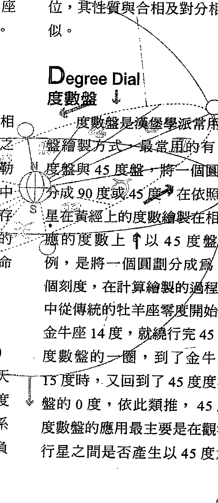

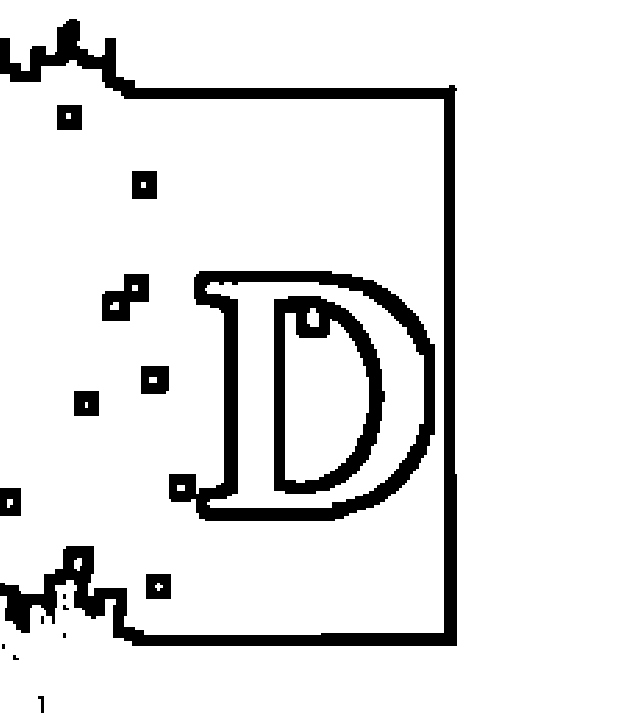

# 下降點
Descendant

又可簡稱為「Dsc」，黃道與西方地平線的交界，為第七宮的起點，傳統占星師認為下降點可以代表著我們的伴侶，同時認為下降點代表著弱勢的地位與不良的健康與身體。但現代占星師認為下降點象徵著自我與他人之間的互動模式，也代表著婚姻及合夥關係。同時認為行星在下降的影響力並不亞於行星在天頂或上升的影響力。

# 弱勢
Detriment

傳統占星學當中當行星處於其守護星座或宮位的對宮時，稱該行星為弱勢位置，當太陽或命主星（上升點的守護星）處於弱勢時，同時暗示了個人身體的虛弱與不良的品行。但現代占星師認為，弱勢行星是因為其所在的星座不易發揮其特質，例如守護牡羊座（第一宮）的火星進入天秤座（或第七宮）無法發揮他的強勢自我風格而有弱勢的傾向，並非代表不良的品行或虛弱的身體。

行星的弱勢星座表

| 行星名稱 | 星座名稱 |
|---|---|
| 太陽 | 水瓶座 |
| 月亮 | 摩羯座 |
| 水星 | 射手座 雙魚座 |
| 金星 | 牡羊座 天蠍座 |
| 火星 | 金牛座 天秤座 |
| 木星 | 處女座 雙子座 |
| 土星 | 巨蟹座 獅子座 |

# 順行
Direct Motion

因地球自轉的關係，當行星在黃道背景上由東向西稱為順行，在星盤上行星則是呈現順時鐘方向運行，反之則為逆行。在傳統占星學當中順行的行星被視為是正常的，可以發揮效力的，與逆行星的無法發揮影響力或帶來負面影響力的性質相對應，但在今日逆行星有另外許多不同的解讀方式，請參考「Retrograde」。

# 散播月相
Disseminating Moon

月亮與太陽的距角介於225-270度之間，指事物或生活的循環當中，呈現在成果出現之後開始向外擴散發揮其影響力的一段時期。人文占星學派認為，此一時期的出生的人喜歡展現他們過去所學的經驗，傳遞知識與信仰，但有時會想法太過複雜，容易造成自身的困擾。

# 支配星
Dispositor

占星師認為行星所在星座的守護星對該行星產生一定的影響，故稱此守護星為支配星，某些占星師同樣以支配星稱呼每個星座宮位的守護星（Ruler），當你看到中文的支配星時必須確定其所指的是「Ruler」或是「Dispositor」。

# 分離相位
Dissociation Aspects

當合相行星並非處於同一個星座，或三分相行星並非處於同元素星座，或是對分相行星並非處於同一條軸線的星座時，稱這些相位為分離相位。在傳統占星學中嚴格地認為這樣的情況下相位的條件就不成立，但現代占星師則稱之為分離相位，且認為分離相位有3種解讀方式，其中之一認為分離相位僅具有感受的氛圍而實質影響力較弱。

## Diurnal 每日的（日間的）

這一個詞在占星學當中相當的重要，我們常會在許多書中看到這個詞最常看到的「日間弧度」（Diurnal Arc）他是行星從日出到日落的時間內在黃道上所運行的弧度。「日間的運行」（Diurnal Motion）...

## Direction 正向推運法

在占星學當中對於未來預測的方式可以分成：實際天體觀測及象徵性的星盤移動兩種方式；實際的天體觀測包括了稱為「Transit」的行星過運以及「Progression」的推運方法。「Direction」的方式是以一張星盤上所有的星體或部分的星體象徵性的移動（通常是一度）來作為未來一個時間單位（通常是一年）的運勢預測。所以從方法的上來說，包括傳統的「一次推運」（主限法）、「太陽弧正向推運」或「基数推運」、「一度正向推運」等。

# 龍頭圖與龍頭黃道 Draconic chart and Draconic Zodiac

西元1951年占星師賽根（Cyril Fagan）提出以北月交（North Node）作為黃道起點的概念，作為一種新的出生圖判讀方式，而引發了許多迴響其中龍頭圖（Draconic Chart）最被廣泛應用。龍頭圖被近代占星師所應用作為心靈成長指引與業力關係解讀的重要工具。

## ◎ 龍頭圖的計算

根據費根的理論，將命盤中的北月交點視為牡羊座0度，依此為根據重新計算星盤上其他星體位置的座標位置，所重新繪製的星盤，例如北月交點位於金牛座10度，而太陽在金牛座16度月亮在雙子座10度，則以北月交點當作牡羊座零度，重新計算出太陽的位置時太陽就成為牡羊座6度，而月亮的位置則成為金牛座0度。目前市面上許多的占星軟體都有繪製龍頭圖的方式。

## ◎ 龍頭圖的解讀

龍頭圖是近代占星學的一門重大發現，由於在占星學當中龍頭（北月交）多半被視為與靈魂的成長歷程有關，若從業力占星師的觀點來說，南北月交則與我們前世經驗的累積有關，從這兩個觀點來理解龍頭圖，我們就可以清楚的掌握到，龍頭圖是一張判斷我們今生靈魂成長的藍圖，從龍頭圖的行星重新排列之後，我們會發現一張與我們熟知命盤有點類似（行星的宮位與位置相似）卻又全然不同（星體所在的星座全都改變了）的星盤，一個太陽在巨蟹座的人很可能在龍頭圖當中發現自己的太陽跑到了他最無法認同的水瓶或雙子。從業力與前世今生的角度來看，我們可以從龍頭圖的行星位置當中來挖掘過去的我們的靈魂所累積的經驗所要提醒我們的今生課題。

解讀龍頭圖並不困難，許多業力占星師甚至直接的說這就是你前世的命盤，事實上也沒這麼簡單，我們可以用解讀一般星盤的態度來看龍頭圖，它同樣是你的星盤，但更特別的是專屬於你靈魂成長的星盤，我們可以透過龍頭圖的上升點（Asc）位置來解讀我們靈魂的成長目標，例如一個人的龍頭圖上升是水瓶座時，此人的透過水瓶座的自我改造、爭取自由、與重視共同目標與朋友，來貼近他今生的靈魂成長，同時這些事情也可能會替此人帶來一種具有因果業力的感受，此外這個人也可能以水瓶座的實事求是與科學精神來看待所謂的因果與業力。

而龍頭圖的太陽與月亮象徵著深藏在我們內心的寶藏，他是一種深刻的價值觀或莫名體認，這些體認一可以說是我們靈魂想要前進的方向，另一種說法可能是前世的體驗，或許你是一個慈悲且浪漫的雙魚座，但是你總是覺得路邊乞討的人有手有腳的不去工作不值得同情，當你觀察你的龍頭圖時你可能會發現你的太陽或月亮可能跑到了處女座去了，這代表一種被隱藏起來的認同價值，或者前世的經驗讓你對此乞討的行為深深的感覺不以為然。甚至我們可以比較龍頭圖與出生圖會發現，有許多我們莫名其妙不甚瞭解的事情或行為，原來來自於我們的靈魂所設定的前進目標，或者你要用因果一點的說法，早已經在前世就決定了，其實我們也會常常從龍頭圖當中觀察出一些自身命盤當中相當重要的顯示或是被我們忽略的暗示。

就拿美國總統小布希為例，他的出生資料是1946年7月6日上午7點26分於康乃迪克州（Connecticut State）的紐哈芬市（New Haven）出生，若我們依照一般的方式繪製出他的星盤會得到上升在獅子座7度，天頂在牡羊座24度，太陽在12宮巨蟹座13度，而月亮在第3宮天秤座16度如下圖：

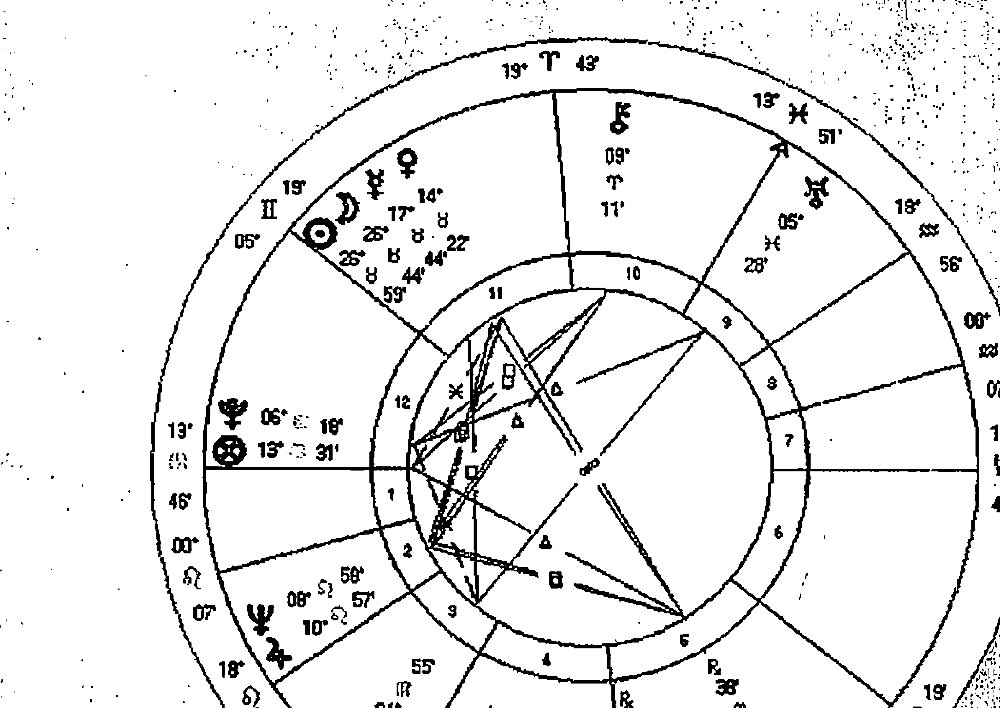

當我們以他的北月亮交點作為牡羊座0度時，我們重新繪製一張龍頭圖會發現，原本位於巨蟹座的太陽因為距離北月交很近的關係成為了牡羊座23度，而原本的上升成為金牛座16度，原本在天秤座的月亮成為巨蟹座7度，如下圖：

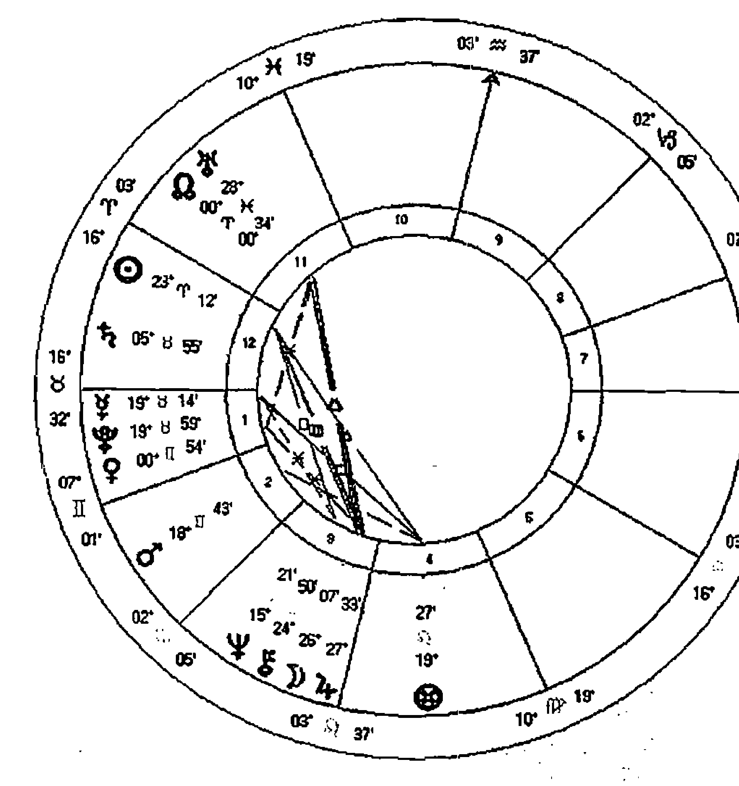

我們從這裡約略的可以感受到，小布希那種對於生命、宗教的看法也非常貼近上升在金牛座那種保守且強烈抗拒開放的態度。雖然太陽仍然在12宮但是已經從巨蟹座變成了牡羊座23度，或許這麼說你仍感受不到龍頭圖的特殊，這時候我們可以來觀察若把小布希龍頭圖上的行星位置移動到他的本命盤，我們就可以看出一些小布希的靈魂指引或者用業力占星一點的說法，小布希的前世影嚮。

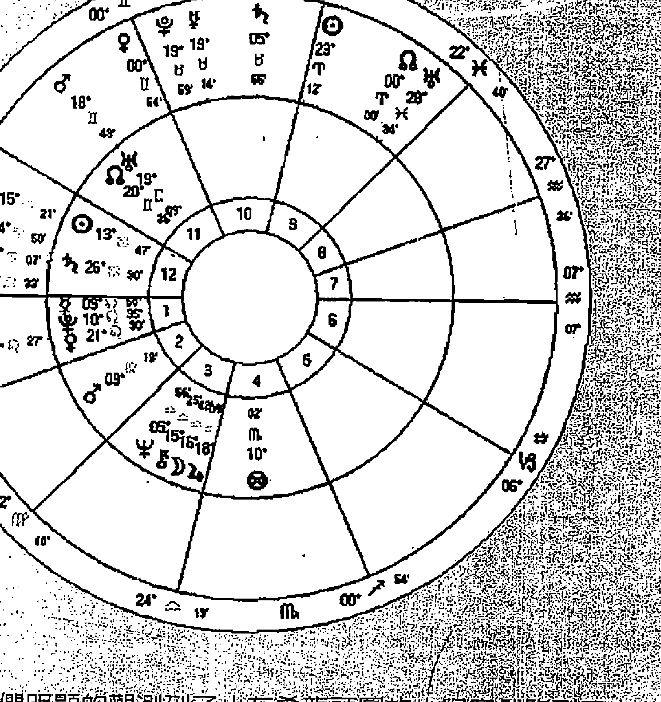

這時候我們明顯的觀測到了小布希龍頭圖的太陽竟然跑到了本命盤的天頂牡羊座，的確符合小布希給人那種自信又自大的誇張態度（不可否認本命上升獅子也有關聯），而且龍頭圖的牡羊座太陽的確有那種無論大家怎麼罵，他還是我行我素的當他的美國總統，也依然受到許多人的支持與龍頭圖月亮跑到 12 宮本命土星所在的位置，象徵著他內心當中的不安容易被擴大檢視，而龍頭圖火星竟然與天王星在 11 宮雙子座結合，在在的說明了這位美國德州牛仔總統為什麼會在接待外賓時頻頻出糗，他認為友善的動作，被許多人當作是不尊重或是傻氣的行為。或許用東方的前世因果關係來看，我們確實可以說小布希上輩子可能有燒好香，才會保佑他這輩子就算眾人罵，還可以當總統當的這麼愉快。

## ◎ 龍頭圖的合盤應用

龍頭圖合盤可以說是龍頭圖最精彩的應用，也是許多深信前世今生的占星愛好者最適合學習的一門課題，按照業力占星學的說法，龍頭圖紀錄著許多前世今生的因果關係，或者說前世經驗的累積，從剛才我們觀察小布希的龍頭圖與本命盤的合盤，就可以視作是一個人自身前世（或過去業力福報）對今生的影響。同時這樣的技巧我們可以應用在親子、伴侶關係上，甚至有許多人你認為你和他一拍即合，像是上輩子早已熟識的朋友時，或許也可以從龍頭圖當中找出一點互動的關係，無論是你的龍頭圖與他的本命盤或是他的龍頭圖與你的本命盤的互動都可以看出點業力的影響。例如許多婚姻伴侶在命盤上我們並沒有看出一些特別具有象徵意味的交集時，往往用龍頭圖就可以觀察出那種平時看不出的業力影響。

我們就拿小布希的案例來繼續作為討論，在這裡我們並不討論他的婚姻關係，我們要討論小布希和他另一位關係特殊的合作伙伴的龍頭圖關係。就在小布希決定攻打伊拉克的時後全球一片譁然，許多國家都極力反對，特別是歐洲國家抱持著要由聯合國處理的態度，這時候就只有英國首相布萊爾（Tony Blair）支持小布希的決定，並且和小布希站在一起甚至出兵相挺，這一次的決定造成了布萊爾政治生涯的最大風暴，他的支持率頓時下降到最低點，同時就連他所領導的工黨內許多重要政府首長也出面反對，不惜辭職阻止布萊爾出兵，甚至釀成後來逼退他辭去首相與工黨領導人的角色的風波，從此反對他擔任首相的聲浪不斷延續直到西元2007年5月他正式宣布將辭去首相職位。我們可以說為了支持小布希的決定，布萊爾不惜賠上了政治前途。

我們這裡暫時撇開國際強權與政治經濟的因素的左右不談，就從小布希與布萊爾的命盤與龍頭圖的關係來看這兩位全球強權的領導者之間有什麼樣的互動，若我們簡單的從他們的命盤來觀察，小布希的太陽在巨蟹座13度，正好與布萊爾位在金牛座15度的太陽形成六分相，暗示著他們在所追求的目標上可以彼此協助（六分相）。而小布希位在天秤座16度的月亮，與布萊爾在水瓶座11度的月亮形成了一個寬鬆的三分相，從心理占星學上的解釋來看，他們能夠瞭解和接納彼此的需求和情緒上的不安，並且互相接受，彼此的上升星座也形成了六分相，任何一對好朋友擁有這樣的相位，顯示出極為融洽的互動。

若我們進一步觀察他們的龍頭圖，若將小布希的龍頭圖套在布萊爾的命盤上我們會發現，布萊爾上升的火星（競爭、征戰）與小布希龍頭圖的金星（價值觀、情感、利益）產生合相，這個合相發生在代表個人對外表現的上升點附近，代表小布希所傳達出來的價值觀與利益很容易的打動了布萊爾對於戰鬥競爭的特質（火星合上升），同時小布希龍頭圖的水星與冥王星與布萊爾的太陽合相，同時小布希龍頭圖的太陽又再一次的和布萊爾的水星合相，顯示他們對於彼此的溝通與認同毫無問題，且小布希無形之中可以對布萊爾的決定與意識發揮深刻影響力（冥王星），更特別的是小布希龍頭圖的火星正好三分布萊爾在第10宮（個人名聲）的月亮，這暗示著布萊爾容易被小布希刺激進一步的引發他對政治前途上的不安。

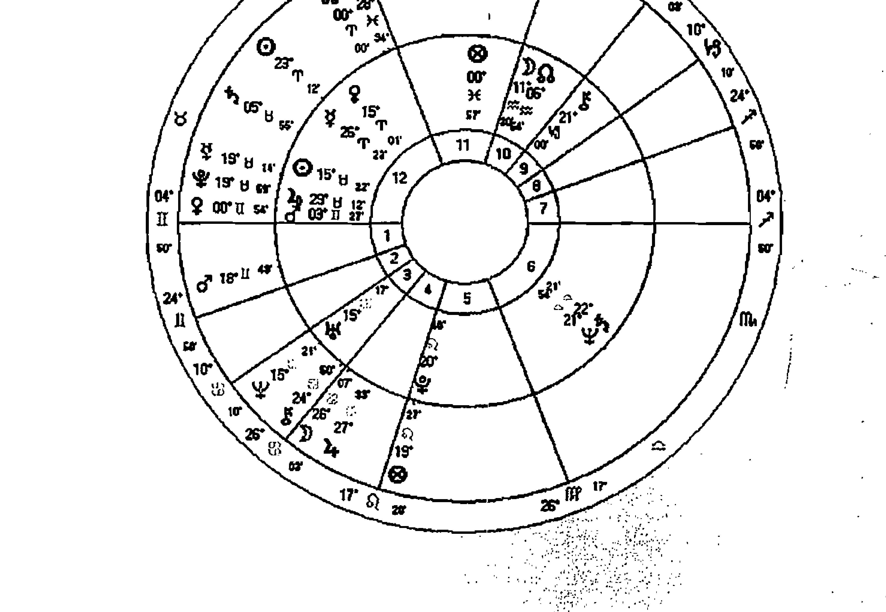

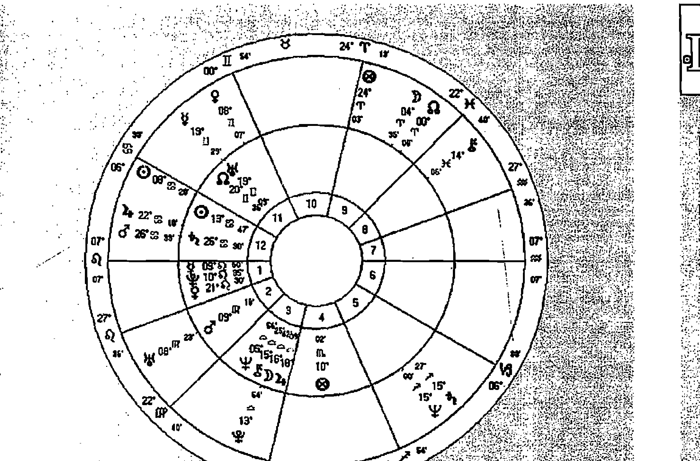

我們若反過來看布萊爾的龍頭圖與小布希的命盤時則會發現，布萊爾位於巨蟹座8度的龍頭圖太陽正好與小布希的太陽合相，顯示兩人的追求目標更為一致，布萊爾龍頭圖的火星、木星同時與小布希的土星合相，在小布希最脆弱最擔憂的層面（土星），布萊爾給予了信心（木星）和實際行動（火星）的支援，進一步的安撫了小布希的不安，他們的天王星與火星的合相更讓小布希放大膽的去進行這個震驚全球的行動。在這個案例中龍頭圖解釋了許多我們在命盤當中不容易發現的關係互動，當我們從命盤當中找不到一段關係強而有力的互動時或許可以試著使用這樣的技巧來發覺一些潛在的關係。

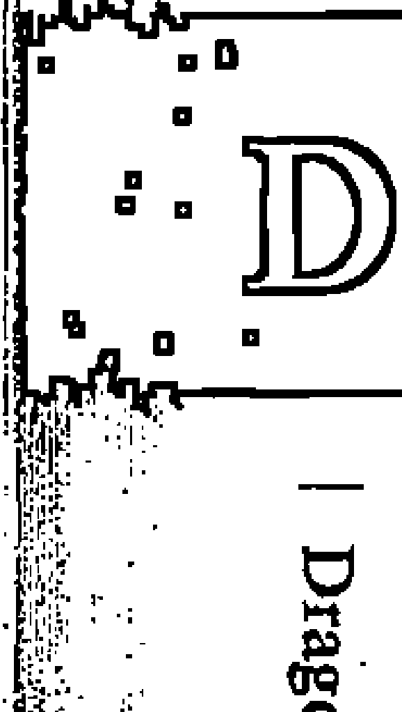

## Dragon's Head 龍頭

又稱北月交（North Node）是黃道和月球軌道的北邊交點，現代占星師視北月交為精神與心靈成長的途徑，心理占星師認為北交點所在的星座與宮位的主題，代表著我們生命當中的重要課題，但卻因為我們好逸惡勞的個性不願去執行，一旦我們去執行北交點的課題，將會發現生活的美好。傳統占星師認為北月交具有木星的效應，印度吠陀占星學與中國的七正四餘稱北月交為「羅喉」，但其定義與現代歐美占星師的觀念大不相同。

## Dragon's Tail 龍尾

又稱南月交（South Node）是黃道和月球軌道的南邊交點，現代占星師認為南月交為我們所習慣適應感到舒適的地方，業力占星師覺得這是我們前世留下的印記所在。心理占星學認為南交點是我們熟悉的環境與狀況，卻也讓我們沈溺於舒適的環境當中不願意朝著成長的路前進。傳統占星師認為南月交具有土星的不幸特質。龍尾在吠陀占星學與七正四餘中又稱「計都」，但定義與歐美占星師對南月交的觀點大不相同。

## Dry Sign 乾性星座

傳統占星學中星座可以分成乾、濕與冷、熱，火相星座與土相星座的性質都屬於乾性稱為乾性星座，在時辰占卜占星學當中這層定義向當重要。乾性星座的火相與土相能夠透過這種特質產生互動，為在這兩種元素星座的行星可以因為同樣具有乾性的特質而產生對彼此的認同。

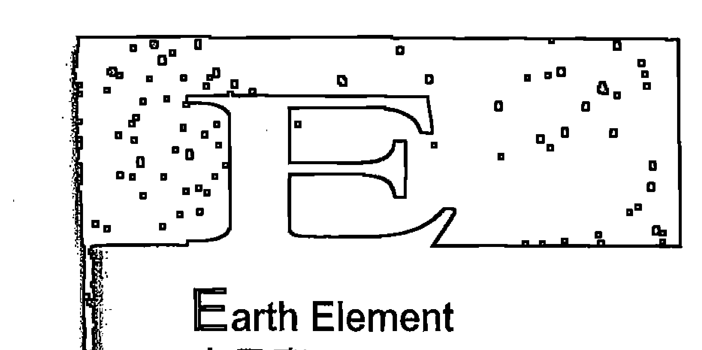

## Earth Element 土元素

鍊金術與西方神秘學認為世界由風、火、水、土四大元素組成，四元素又有另外四個氣候性質（冷、熱、乾、濕）來搭配，土元素被認為是乾且冷的星座，在占星學中與其相關連的為土相星座和土相宮位。

## Earth Signs 土相星座

包括金牛座、處女座和摩羯座，傳統占星學當中土相星座具有憂鬱實際重視物質的特質，心理占星學認為土相星座的實際態度與每天生活的物質層面的生產建構、規劃管理有關聯，並與容格四大類型的的感官類型結合。

## Earth Houses 土相宮位

在出生圖上與土相星座相對應的宮位分別是第2、6、10宮，又稱物質宮位（Substance Houses），一個人的命盤當中有強烈的土相宮位，會引發此人對於生命抱持著實際的態度，但是也可能引發過度重視物質的憂慮；若命盤當中缺少土相宮位又同時缺少土相元素時，那麼此人的性格較為不切實際，也不重視物質生活。

## Eastern Houses 東方宮位

東方宮位指的是命盤上靠近上升點的宮位，從天頂到天底分別是10、11、12、1、2、3宮，但也有占星師以東方宮位來稱呼第一宮。行星若偏重在東方宮位的人較為自我取向，無法接受他人的意見。最典型的案例就是美國總統小布希，他命盤中所有的行星都集中在星盤的東方，與他自信莽撞且不聽從他人勸告的

## Eclipse 蝕

天體觀測當中，一發光星體被另一星體經過時遮蔽產生陰影稱為蝕，在占星學上最被重視的莫過於天體當中兩大發光體的蝕，日蝕（Solar Eclipse）與月蝕（Luna Eclipse）是占星學上重要的指標，無論對於世俗與個人都有強烈的影響。根據現代占星師研究日蝕的影響力可以長達3年以上，而月蝕的影響力從6個月到3年不等。詳細內容請參考日蝕（Solar Eclipse）與月蝕（Luna Eclipse）。

## Ecliptic 黃道

以地球為中心來觀測，因為地球公轉的關係，太陽會呈現在天球上恆星固定背景的移動，所移動的軌道稱為黃道。「Ecliptic」所指的黃道特別強調了太陽軌道的意味，之所以會稱為「Ecliptic」也與「蝕」（Eclipse）這個字有關，因為新月或滿月時刻若太陽月亮都同時在這一條軌道上的話就會生日月蝕。

## Eighth House 第八宮

占星學上星盤上的第8宮，與黃道上的第8個星座天蠍座相互呼應，傳統占星學中有性、死亡、他人的物質金錢之意涵，從此延伸為遺產借貸等關係，心理占星學認為第八宮與個人無異是有關連是介於情緒出口與心靈黑暗面和集體無意識的位置。世俗占星學中與稅務、外匯利率、公共安全有關。

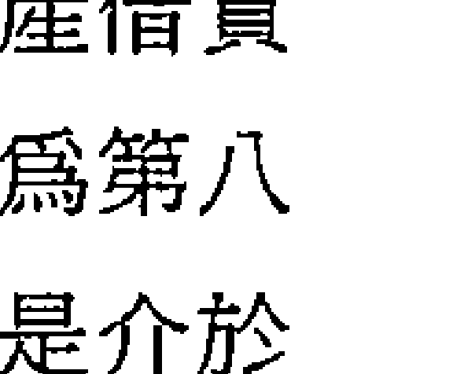

## Electional Astrology 擇日占星學

依據天體運行的狀況選擇有利事物開始或進行的時刻的占星學問。所指的就是以占星的方式選擇一個對事件最有利的日子，最常見的如同選擇婚禮的日子，或是選擇公司成立的日子，這一點與出生圖占星學剛好有異曲同工之妙。由一個人的的誕生來看一個人的命運，而擇日則是選擇一個能夠帶來美好未來的時間來做這件事情，「Electional」這個形容詞來自於選擇（Electing）。擇日占星學的大體上相當的簡單，只要從對方所提供可能的日期當中製作星圖，然後來觀察何者對這件事情有利，雖然時辰占卜占星師們常常使用擇日占星學，不過我們並不會把時辰占卜的細則應用在這裡，擇日占星學大致上比較類似出生圖，不過因為應用在不同層面也有一些細節。在幫人選擇日期時，記住沒有絕對完美的擇日圖，我們只能在特定的時間內選擇符合對方要求的時刻。關於擇日占星學的詳細內容在本人著作《占星全書》中有更詳細的介紹。

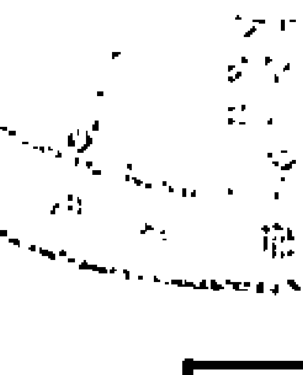

## Elements 元素

西洋古典哲學與神祕學相信世界是由元素構成的，分別為火、土、風、水四種元素，這個觀念也被深刻的應用在占星學當中。占星師們將黃道上的星座區分為屬於火元素的：牡羊、獅子、射手；屬於土元素的金牛、處女、摩羯；屬於風元素的雙子、天秤、水瓶；與屬於水元素的巨蟹、天蠍、雙魚。而每一個元素都有其氣候性質，例如：火元素為乾與熱，土元素是乾與冷，風元素是濕與熱，水元素是濕與冷。關於冷、熱、乾、濕四種特質對四元素星座的影響請參考「特質」（Qualities）一詞。

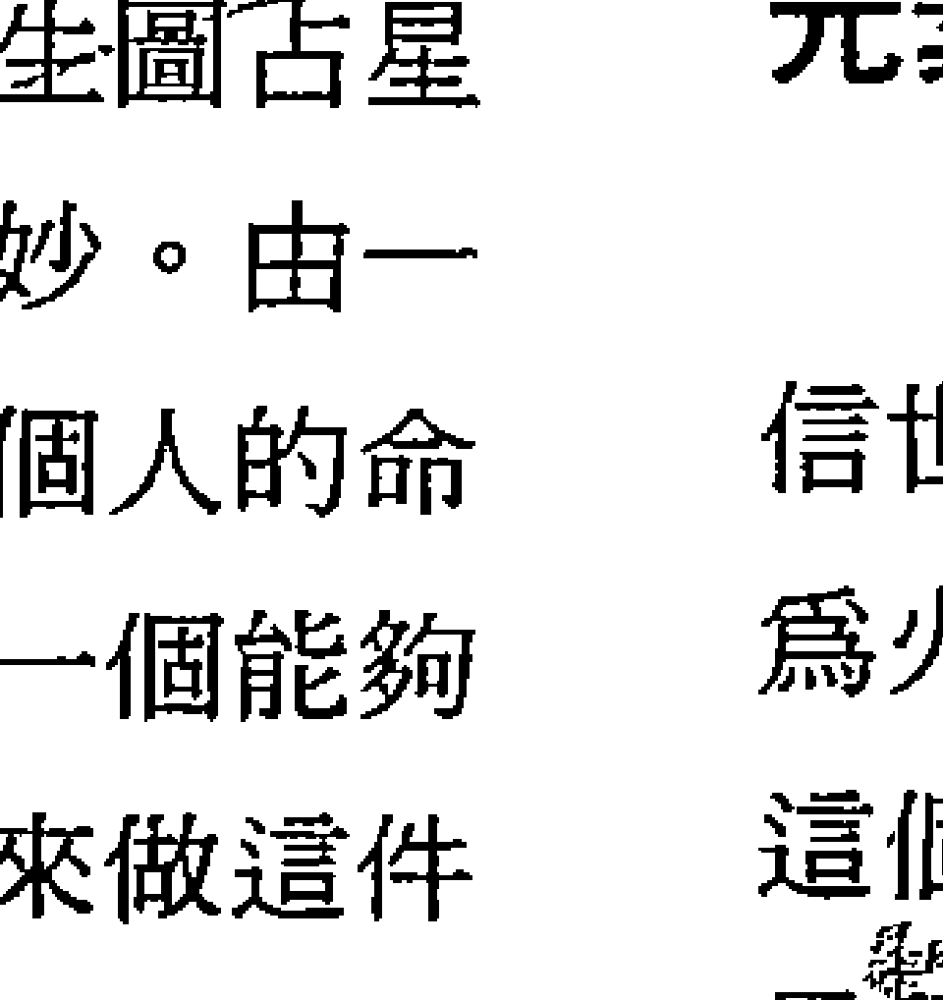

## Eleventh House 第11宮

星盤上的第11宮與黃道上第11個星座水瓶座相互呼應，在傳統占星觀念中當象徵著朋友、社團，心理占星師認為第十一宮代表著與他人合作來達成的共同目標，以及超越自我的目標（願景）。在世俗占星學上與民意機關、地方政府、社會團體，政治改革有關。

## Elongation 距角

以地球為中心作為觀測點，來觀測行星在繞行軌道上與太陽之間的角度。多數的行星與太陽之間沒有距角的限制，但是水星與太陽之間的距角不會超出28度，而金星與水星的距角不會超出46度。

## Ending houses 結束宮位

在占星學中又稱4、8、12等宮位為水相宮位（Water Houses）或感覺宮位（Feeling Houses）。在星盤當中若大部分行星落入這一類宮位，象徵著此人的感受力強，重視內在的情緒與精神的發展，但是缺點可能是太過虛無飄渺，且容易有頻繁的情緒的困擾，或容易受到他人影響；相反的若命盤當中沒有行星落入這些宮位，又加上沒有行星落入水相星座，此人的感受力與同理心較差，對於事物的看法總是不帶情感。

## Ephemeris 星曆

記載星體運行的曆書作為繪製星圖的依據。在過去星曆被視作是占星師的重要工具，著名的星曆包括了瑞士星曆與美國星曆，並以中午時刻為標準的「正午星曆」以及以凌晨時刻為標準的「子夜星曆」。在今日，由於電腦普及且大多占星師多半使用軟體繪製星圖，於是星曆的重要性顯的沒落，目前網路上可以找到的「瑞士星曆」，是子夜星曆的一種，其網址是 http://www.astro.com/swisseph/swepha e.htm。而英國大多數的占星學院則使用正午星曆，例如《The American Ephemeris For The 21 st Century 2000 To 2050 At Noon》這本書僅能在專業的占星書店或透過購書網站找到。

至今等宮制是對初學者最方便、最簡單的宮位制，因而較為普及。英國大多數的占星學院也都採取等宮制，作為初級占星教學的依據，並避免使用不同的宮位以致產生討論上的混淆。

## Equator 赤道

將地球均分成南北兩邊的想像大圓。赤道是地球地理位置座標的重要標線，每年太陽最經過赤道的時刻就是春分與秋分點的均分點時刻，這時位於南北半球高緯度的人們可以感受到日夜均分，相對的，位於赤道附近的人，較無法察覺隨著季節的晝夜變化。

## Equal House System 等宮制

以上升點為基準，在黃道上每30度划分成一個宮位使得每一宮都相等，等宮制也是占星學上最早出現的宮位劃分法，後來的占星學者因為不同的想法而提倡不同的分宮法，卻都很少影響等宮制的地位。

## Equinoxes 均分點

由於地球的地軸傾斜，使得太陽並非照射在某一個固定緯度上，使得地球上有不同的晝夜長短變化，除了赤道地區的人們外，地球上的其他人無法感受到一年當中真正的「晝夜均分」。所謂的「均分點」時刻，是每年春天與秋天太陽會正好照射在赤道上的時刻，此時地球上大部份的人都可以感受到晝夜大致相等。

## 均分点星座

指太阳通过北半球春分点的白羊座及太阳通过北半球秋分点的天秤座。在占星学中当太阳经过这两个星座时刻，正好是昼夜均分的时刻，于是占星师们又称这两个星座为均分点星座。

## 神秘占星学

强调神秘主义色彩的占星学，结合占星与灵修、通神学、神秘学、炼金术等具有哲学思想的占星学，虽然其特色为广泛应用暗月、南北交、阿拉伯点、小行星与特殊点，但是更值得注意的是其思考背景涵盖了丰富的神秘哲学色彩，此外神秘占星学在占星的定义上与一般的占星师有著不同的看法，例如：行星守护与行星宫位星座的意涵等概念。

## 事件图

在占星学的研究的范围当中，不仅限於人的星盘，当事件发生时，也可以依据事件发生的时间、地点而绘制星盘作为解读的依据。依据事件发生的时间地点所绘制的星图，就称为事件图。例如：政治占星学当中某国的成立、某届政府的成立、或是公司的成立、股票的上市等事件，或者是自然或人为事件，例如：地震或刑事案件等。

## 擢升

在占星学当中，认为某些行星进入特定星座与特定度数时处於最有利的状况称为「Exaltation」，「Exaltation」在中文有许多不同的称呼，例如：可借用中国命理的入庙、庙旺、得地、强势等说法，有时会与行星进入守护相混淆了。我在之前的著作当中常用强势来称呼「Exaltation」，但有读者反应这样常常会和守护的关系搞混，所在本书我们固定称「Ruler」为守护，称「Exaltation」为擢升，他们同样都是会让行星产生强势的位置。

从心理占星学的角度来看，行星在这些星座与角度中可以有效发挥其基本特质。在传统的占星学则指出，有某些星座具有使特定行星产生强势的能力，甚至在特定的角度更能显示该行星的强势，如下页表所显示：太阳进入牡羊座为擢升，特别在牡羊座19度时最为强；而月亮在金牛座为擢升，特别当月亮处於金牛座3度时为最强。在传统占星学中判断行星的力度强弱，可以推测一个人命运的好坏，或事件的吉利与否，行星的力度较强的情况包括：进入其守护(Ruler)或擢升(Exaltation)，其次还有「四元素守护」(Triplicity)与「期限(六度守护)」(Term)「面(十度守护)」(Face)；而与「Exaltation」相对的称为「落陷」(Fall)。

大部分的占星师不将晚近发现的天王、海王、冥王三行星列入擢升与落陷的关系当中。而有些现代占星师则因为加入了近代被发现的行星，而更动了擢升的关系。事实上现代行星的擢升星座各有许多不同的看法，光是海王星的擢升星座就有三种不同的看法分别是：巨蟹座、射手座甚至处女座。表中括弧裡列出的只是其中常見的說法，而且目前並無定論。至於凱龍星（Chiron）我採取研究該星多年的占星大師梅蘭尼·瑞因哈特（Melanie Reinhart）的說法，至於南北交我們較少見到被列入擢升的位置當中。但中世紀占星師阿布馬謝（Abu Biruni）的說法認為北月交在雙子座擢升而南月交在射手座擢升，而大部分的時辰占卜占星師仍遵循著傳統的擢升星座分配。

## 傳統的行星與擢升星座關係

| 星座 | 行星 |
|---|---|
| 牡羊座（19）(指特別在牡羊座 19 度) | 太陽 |
| 金牛座（3） | 月亮 |
| 雙子座 | 無 |
| 巨蟹座（15） | 木星 |
| 獅子座 | 無 |
| 處女座（15） | 水星 |
| 天秤座（21） | 土星 |
| 天蠍座 | 無 |
| 射手座 | 無 |
| 摩羯座（28） | 火星 |
| 水瓶座 | 無 |
| 雙魚座（27） | 金星 |

## 現代的擢升關係（下表括弧內的資料表示占星學界並無定論，僅供參考）

| 星座 | 行星 |
|---|---|
| 牡羊座 | 太陽 |
| 金牛座 | 月亮 |
| 雙子座 | 北月交點 |
| 巨蟹座 | 木星（海王星） |
| 獅子座 | （冥王星） |
| 處女座 | 水星（凱龍星） |
| 天秤座 | 土星 |
| 天蠍座 | （天王星） |
| 射手座 | 南月交點（海王星） |
| 摩羯座 | 火星 |
| 水瓶座 | （水星） |

## 面（十度守護）

在傳統占星學與時辰占卜占星學中，將黃道 12 星座的每個星座切成 3 個面，每一面 10 度，總共有 36 個面，在依照固定的行星排列順序放入每一個面當中，依序為火星、太陽、金星、水星、月亮、土星、木星，自木星後又重新回到火星然後開始另一個循環，也可稱為十度守護。在時辰占卜占星學當中，若行星回到了屬於它的面（十度守護）則表示小小的吉利。例如：金星雖然在牡羊是弱勢，但如果進入牡羊座的 20-29.59 度或是巨蟹的 0-9.59 度時都算是進入屬於金星的面，算是小吉相。

## 落陷

在傳統占星學中若行星處於其擢升星座（Exaltation）對面的星座則稱為落陷，認為行星在這些位置時會帶來凶兆，若該行星與個人息息相關，則會影響此人的命運或帶來壞的品行，例如：有人認為月亮在天蠍座的人往往命運悲苦。現代占星師認為，該行星特質在這些星座無法順利發揮，或是負面的特質會被擴大。而心理占星師認為每一個行星進入一個星座都有好與壞的一面，不必太過拘泥擢升或落陷的關係。而關於晚近發現的 3 個行星，多半占星師不討論它們的擢升與落陷的關係，但仍有一些占星師有不同的見解，所以我們舉出一些例子。

## 傳統的落陷關係

| 行星 | 星座 |
|---|---|
| 太陽 | 天秤 |
| 月亮 | 天蠍 |
| 水星 | 雙魚 |
| 金星 | 處女 |
| 火星 | 巨蟹 |
| 木星 | 摩羯 |
| 土星 | 牡羊 |

## 現代行星的落陷位置
(仍無定論僅舉例說明)

| 行星 | 星座 |
| :--- | :--- |
| 天王星 | 金牛座 |
| 海王星 | 摩羯座 |
| 冥王星 | 水瓶座 |

## 感覺宮位

在占星學中又稱 4、8、12 等宮位為水相宮位或結束宮位或感覺宮位等。請參考「Ending House」的解釋。

## 感覺型

容格（Carl Gustav Jung）的四大人格特質之一，心理占星師將他與水相星座相互對應。認為命盤當中許多行星落入水相星座的人，其水相星座強勢符合感覺型的人格特質，習慣用感受與情緒來看待事件，命盤當中行星較少落入水相星座的人，比較不能夠用情感和情緒來看待事情，有時也會變得較冷漠無情。

## 陰性行星（女性行星）

一般將月亮與金星視為陰性行星並且認為與女性有關，有些占星師認為海王星也算是陰性行星，水星被視為同時具有陰陽性的行星，托勒密（Claudius Ptolemy）則有不同的看法，他認為行星可以依據其守護的星座改變陰陽性，例如：火星在守護牡羊座時為陽性，但是在守護天蠍座時可為陰性。

## 陰性星座

星座依據其陰性陽性而有所區別，土相星座與水相星座就是所謂的陰性星座；金牛座、巨蟹座、處女座、天蠍座、摩羯座和雙魚座都是陰性星座。一般認為陰性行星對於事情的態度較為被動，性格較為內向。

## 第5宮

在星盤上第5宮與黃道上第5個星座獅子座相互呼應，傳統占星學認為第5宮與子女、娛樂、賭博、戀情有關，第5宮在心理層面上代表著個人目標與創意能力、個人創作、藝術創作、個人喜好有關；世俗占星學中也與運動、娛樂、兒童政策有關。

## 命運之指

又稱上帝之指或「Yod」，指的是有顆行星同時與另外兩顆行星形成 150 度角，這種圖形有點像是一支箭頭，有人則套用猶太教中的「上帝之指」（Yod）來形容這樣的角度。由於 150 度角（亦即十二分之五相位）是一個敏感的位置，而同時承受兩個 150 度角的行星就是「手指」的部位，又稱「端點行星」（Apex Planet），也就是敏感的位置所在。

## 最終支配星

若一顆行星其所在星座守護星，落入另一個星座將會受到另一個星座的守護星影響，依法找到最後可能會出現一個守護星落在守護自己的宮位，此時這層關係稱為最終守護星，例如：火星落入射手座受木星守護，木星落入金牛座受金星守護，金星又落入獅子座受太陽守護，而太陽也同時在獅子座守護自己，此時太陽為火星、木星、金星的最終守護星，占星師認為若命盤上出現最終守護星，則需要注意最終守護星強烈的影響力。

## 财务占星学

研究天体与世俗经济变化、股市金融行情、公司营运状况到个人资产财务状况的占星学，都可以列入财务占星学的范畴当中，其研究层面涵盖世俗占星学与个人占星学，根据英国占星协会的规定，除非本身具有财经专业背景否则不能给予客户财金占星方面的咨询。

## 火元素

西方古典哲学与神秘学认为火元素是构成世界的四大元素之一，神秘学当中认为火元素具有乾与热的特质，与水元素的湿、冷特质完全相对，在占星学当中与火元素有关的为火相星座和火相宫位。

## 火相星座

火相星座包括了牡羊座、狮子座和射手座，传统占星学认为火相星座散发能光与热带来热情与积极的态度，心理占星学当中认为火相元素与自我的认知目标与成长有关，更把火相星座与容格四大人格类型当中的直觉型作为连结，意指火相星座的人对于事务的态度较为直观，喜欢主动出击并以直接的感受回应一切事情与问题。

## 火相宫位

在星盘当中与火相星座对应的火相宫位分别是第1、第5和第9宫，又称作自我宫位（Self Houses）或生活宫位（Life Houses）。占星师认为火相宫位强的人较为自我，且知道如何主动出击去开创自己想要的生活。而命盘当中若同时缺乏火相宫位与火相星座的人则对人生的目标较为徬徨，不容易找到生活的方向感，习惯以他人的目标或喜好为依归。

## 第一宫

星盘中从上升点算起的第一个宫位，在传统占星学中，代表自我、外型、健康与活力，从心理的层面来看，第1宫象征着自我的呈现、个人在性格与外在形体上的特质，给予外界的印象等，在世俗占星学当中象征著国家整体的表现，以及这个国家给予他人的感受。

## 上弦月

当月亮与太阳的距离从90度到135度时是上弦月，在占星学当中又称第1象限月，此阶段事物或生活当中呈现著扩张的力量。命盘当中日月关系处于这个阶段的人，相当有自信，但有时会因太有自信，看不见自己的缺失而招致失败，必须知道谦虚与节制。

## 固定星座

金牛座、狮子座、天蝎座和水瓶座等4个星座，在占星学当中称作固定星座，他们的出生时多在气候特征最为明显的阶段，例如：金牛座出生于北半球的春天，百花齐放的五月份；狮子座出生于仲夏。然而从心理层面上来看，这4个星座的人性格特质相当明显，有著自己喜好且固定的生活模式，不喜欢主动出击更不喜欢面对改变，往往有著较为固执的缺点。

## 固定大十字

当4颗以上的行星或基本点在命盘当中落入4个不同的固定星座，且彼此之间同时形成对分相与四分相时，称为固定大十字，这种人由于性格固执，不易与接受新的事物而容易受到困扰。也有占星师用「Fixed Cross」称呼固定星座。

## 恒星

古人認為作為黃道背景的星體並不會移動，故稱為恆星與行星(Planet) 有所區別，有時又簡稱「Star」，在傳統占星學當中恆星佔有重要的地位，對於學習時辰占卜的占星師來說，恆星仍是相當重要的指引，威廉·李利（William Lilly）制訂了 50 多個恆星的定義，並且認為當一個人的上升點或太陽、月亮、天頂，甚至是行星與這些恆星交會時就會產生作用，而每個恆星所帶來的影響又不同。當出生圖當中如果上升星座、天頂、或是有任何行星靠近這些恆星（正負 1.5 度），表示你受到這個恆星的影響。

-   ◎壁宿二（Alpheratz）
位在白羊 14 度 18 分，帶著受榮耀、榮譽以及受歡迎的表現，帶來了天生尊貴的表現，不過也容易使人緊張且沒耐心，卻也是一顆對於婚姻有幫助的吉星。

-   ◎妻宿三（Hamal）
位在金牛 7 度 40 分，在過去象徵羊角，根據托勒密（Claudius Ptolemy）的說法此星具有火星與土星的象徵，具有暴力傾向和攻擊性，象徵著危險，但也可能是一個團體的領導者與保護者。

-   ◎大陵五（Algol）
位在金牛 26 度 10 分，據說是最邪惡的一顆星，象徵著暴力與不幸，帶來電擊般的傷害，一般來說會帶給人們致他人於死的殘暴本性。

-   ◎昴宿星團七姊妹星團（Pleiades）與宿六（Alcyone）
位於雙子座 0 度 00 分，帶來盲目與活躍的能力，托勒密認為可以用月亮與火星的會合來解釋有野心，混亂，樂觀，卻也象徵著活躍的智能帶來混亂，也帶來對農業有幫助。

-   ◎畢宿五（Aldebaran）
位於雙子座 9 度 47 分，帶來了野心的實現與榮耀的特質，賦予人們重任，一種能夠撬動別人的言語與行動上的力量，但也會帶來生病和暴力危險。

-   ◎參宿七（Rigel）
位於雙子座 16 度 50 分，帶來了成功的條件以及尊貴的特質，不過卻容易遭人背叛，使得成功不容易維持，通常做事也不夠完美。

-   ◎參宿五（Bellatrix）
位於雙子座 20 度 57 分又有「女戰士亞馬遜之星」之稱，此星帶來了高度的文化與教養，也能夠迅速下決定且落實計畫而帶來了成功的機會，但卻容易在過程當中樹敵，最後導致毀譽參半。

-   ◎五車二（Capella）
位於雙子 21 度 51 分，是一顆吉星帶給人成為公眾人物的能力，及名譽、財富、社會地位，特別是具有水星的求知精神與與海王星的神祕奇怪特質，古代又稱此星為「小山羊」。

-   ◎參宿四（Betelgeuse）
位於雙子 28 度 45 分，擁有敏捷的行動與快速的思考，容易帶來善變的特質與緊張、焦慮，但仍是一顆吉星，容易造就出傑出的運動員，根據德國占星學家艾伯丁（Reinhold Ebertin）的研究，此星帶來榮譽和名譽。

-   ◎天狼星（Sirius）
位於巨蟹 14 度 05 分，是天空中最亮的星之一，帶來了忠誠、榮譽與名望，卻也可能過度的燃燒自己付出一切，當他與火星在上升星座結合時更是如此，在天頂與木星會合時，造就無數的重要影響人物，在第 8 宮時與行星結合時代表死後的榮耀。

-   ◎北河二（Castor）
位於巨蟹 20 度 14 分，與北河三相當接近也就是在古代代表著雙子的其中之一的「Castor」，帶來智慧與冒險、榮耀，卻容易在瞬間失敗或生病，上升或有行星在此的人相當頑皮，也有可能發展出暴力傾向。

-   ◎北河三（Pollux）
位於巨蟹 23 度 13 分，同樣屬於古代的雙子座之一，代表著勇敢、大膽、冒險、重視義氣、具有創造能力，卻同時卻感到痛苦，在上升與火星會合時帶來了開創的力量與殘暴。

-   ◎南河三（Procyon）
位於巨蟹 25 度 47 分，是一顆吉星代表著財富與名望，也代表占星學，通常替人帶來急躁的個性，也容易引發失敗，與上升太陽結合時都帶來了勇氣與幸運。

-   ◎柳宿增三（Acubens）
位於獅子 13 度 38 分，是一顆帶來不穩定的恆星，帶來了活躍的能量，卻容易用在錯誤的方向，傳統占星學認為這個位置暗示著說謊與犯罪。

-   ◎軒轅十四（Regulus）
位於獅子 29 度 50 分，自古以來軒轅十四就一直有帝王之星的稱呼，代表著尊貴的象徵，誠實、正直且帶來勇氣，同時也帶來了野心與暴力，此種暴力通常會表現在報復的時候，但也同時具有負面的影響，特別與火星、土星結合時，容易帶來疾病與眼睛的傷害。

-   ◎太微右垣五（Zosma）
位於處女座 11 度 19 分，並不是一顆吉星，帶來了恥辱、不道德、擔心和害怕。

-   ◎五帝座一（Denebola）
位於處女座 21 度 37 分，在古代此星位於獅子座尾巴，雖然帶來勇氣，但是他們常有不同的見解，容易與人發生爭吵，行星或上升與此星結合會帶來思想與言語上的激動，但有利於事物改革。

-   ◎太微左垣一（Zaniah）
位於天秤座 4 度 31 分，是一顆討人喜歡的星，帶來了親和力與可愛純真的個性，象徵著榮譽、帶來和平與談判的可能，常帶來很棒的指揮人員或銷售高手。

-   ◎角宿一（Spica）
位於天秤座 23 度 50 分，帶來溫和的性情受人歡迎，聰明吸收知識相當的快速，帶來成功的機會，不過在性格中帶些不公平。

-   ◎大角（Arcturus）
位於天秤座 24 度 14 分，帶來透過旅行的自我覺醒與探索，暗示著榮譽與財富、名望繁榮的生活。在上升時顯示對朋友的忠誠。

-   ◎氐宿增七（South Scale, Zuben Elgenubi）
位於天蠍座 15 度 05 分，是古代天秤座的一邊又被稱為南秤，別忘記他們也暗示著天蠍座的爪子，並不會帶來幸運的幫助，暴力謊言與犯罪衝突等，帶來健康的壞預兆。

-   ◎氐宿四（North Scale, Zuben Eschamali）
位於天蠍座 19 度 22 分，北邊的秤子與北邊的爪子，相較於另一邊帶來的困難與厄運，這一邊帶來了榮耀與永恆的名譽，極高的野心、財富以及愉快的生活。

-   ◎心宿一（Antares）
位於射手座 9 度 46 分，天蠍座的心臟部分，好鬥、堅持、固執，帶來了勇氣與決心，可是卻也帶來暴力、邪惡、死亡的預兆。由於具有天蠍的固執與衝勁，適合軍事相關與研究人員。

-   ◎織女星（Vega）
位於摩羯座 15 度 19 分，根據托勒密的說法此星具有金星與水星的特質，帶來了藝術細胞，不過也可能帶來藝術家的不切實際與自命不凡的性格，但在上升與天頂時帶來了成功與名望與財富。

-   ◎牛郎星（Altair）
位於水瓶座 1 度 47 分，帶來了自信、勇敢與強壯，無比的雄心壯志，活在忠誠與榮譽當中，卻也帶來了像是流血事件危險等。

-   ◎牛宿二（Deneb Algedi）
位於水瓶座 23 度 33 分，具有木星與土星的特質，雖然不是很強的一顆星，但如果在天頂時可能帶來權威與公正的效應，像是團體領導者或是司法人員。

-   ◎北落師門（Fomalhaut）
位於雙魚 3 度 52 分，相當有名的一顆恆星，他帶來了名氣與才氣，象徵著金星與水星的力量，帶來強而有力的幸運與善變的性格，多半有利於從事藝術工作。

-   ◎室宿一（Markab）
位於雙魚 23 度 29 分，實際位置位於飛馬座，帶來了善於計算的頭腦、榮譽、財富，但也同時帶來危險容易受到武器或爆炸的傷害。

### 推薦參考書

-   《Fixed Stars and Their Interpretation》 by Reinhold Ebertin
-   《The Fixed Stars and Constellations in Astrology》 by Vivian E. Robson

## 幸運點

「Part of Fortune」的簡稱。請參考本書阿拉伯點的內容（見第11頁）。

## 第4宮

對應黃道上第4個星座巨蟹座，傳統占星學認為與家庭、家族、根源有關，同時也與母親有關，心理層面上代表著個人的情緒表達、情緒出口等，近代占星學認為第4宮與第10宮都可能代表父母的其中一方，而非傳統占星學認為的4宮代表母親，10宮代表父親。有時4宮可能代表父親而10宮代表母親。在世俗占星學上第4宮與人民、國土、反對黨、海洋漁業政策有關。

## 滿月

每當太陽與月亮在黃道上相對星座形成對分相時就是滿月的時刻，近代占星師認為新月與滿月的能量強大，足以影響世俗與個人的事件，因此常將新月、滿月時刻應用在流年的推測技巧當中。而滿月也是人文占星學的重要月相之一，此刻常是事件成果展現的階段，而出生於滿月時刻的人較為客觀，擅長於事物的傳播，個性上喜歡參考他人的意見，但當他人意見與自己的相法相左時，也相當容易引發內心衝突。

## 多產星座

在面對與生育有關的問題時，時辰占卜占星學當中將所 有的水相星座視為多產星座，特別是當第5宮起點落入這些星座當中時，對懷孕生子方面的問題有利。相對的星座為貧瘠星座分別是雙子座、獅子座、處女座，當牽涉到生育問題時，若占卜盤的第5宮落入這些星座象徵生子的機率非常的低。

## Galactic Centre
銀河中心
又稱「GC 點」，從地球的角度觀測銀河系的中心位於目前位於射手座 26 度 50 分，占星師認為任何行星或是特殊點若與「GC 點」合相，都可能強烈發揮其特質，冥王星在西元 2010 年之前都會與「GC 點」產生合相，其強烈的特質將影響世局的變動。

## Galaxy
銀河
地球所處的太陽系正是銀河系的一部份，銀河（Galaxy）一字源自於希臘文的「Gala」意思為牛奶（Milk），英文又稱銀河為「Milk Way」。在天空中我們可以觀測到銀河如同一條銀色的絲帶貫穿夜空。

## Gate of Birth
生之門
古典占星學與神秘占星學中對於巨蟹座的稱呼。

## Gate of Death
死亡之門
古典占星學與神秘占星學中對摩羯座的稱呼。

## Gemini II
雙子座
黃道上的第三個星座，變動的風相星座，在占星學當中具有溝通、媒介、傳遞、思考、兄弟姊妹、心理層面的意涵，代表著自我與他人的溝通或心靈內外的溝通。雙子座的符號如同羅馬數字的 2（II），象徵著神話故事當中代表雙子座的孿生兄弟，其守護星是水星。

## Geocentric
地球中心
以地球作為觀測天體的中心點，目前絕大部分的占星師採取這樣的角度來繪製星圖，並進行星盤研究，星盤的繪製上多半會標示這張圖是採取地球中心或太陽中心的繪製方式，但也有部分占星師採取以太陽為中心的觀點來研究占星學，相關內容請參考「太陽中心」（Heliocentric）一詞。

## Gibbus Moon
凸月（上弦月）
月亮與太陽之間的距角在 135 度-180 度中間所呈現的上弦月，突出而飽滿。現代占星師重視月亮與太陽之間的相位，同時藉由月相來描述一個人的人格特質或事件的狀態，凸月時刻是事物即將開花結果的重要時刻，在此階段將會面對一些調整與修正。

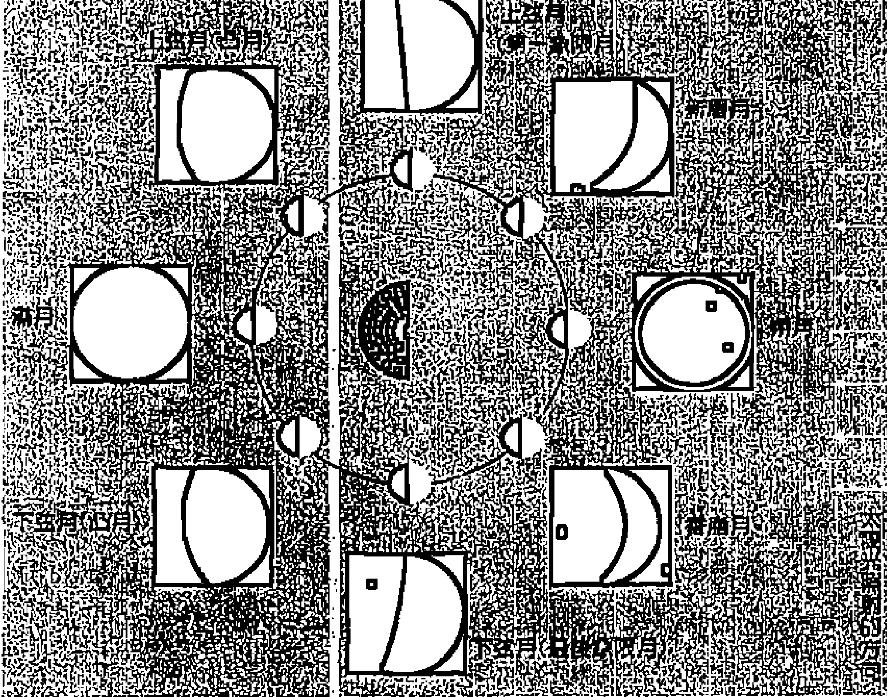

## Glyphs
符號
占星學上繪製星盤時所用的專用符號稱為「Glyphs」，例如：太陽用圓圈與中間一個點來表示，而月亮則以新月來表示。占星學的符號往往具有神秘學的符號意涵，例如：圓圈代表魂魄，弧形或新月型代表媒介與精神，而十字往往代表物質。

## Goat
山羊
摩羯座的暱稱。

## Grand Cross
大十字
當 4 顆以上的行星，分別佔據同一性質（Quality）的星座且相同時兩兩互形成對分相與四分相，稱為大十字，又依據星座性質可分為開創大十字、固定大十字與變動大十字等，大十字的確會帶來許多困擾與衝突，特別是內在性格上的問題，這種人需要花許多力氣在人格整合上，在人生的道路上也比其他人有更多困難。大十字的位置通常落在 4 個屬性不同，性質卻相同的星座。

## Grand Trine
大三角
大三角是占星學上常見的圖形相位，當三顆行星在彼此之間同時形成三分相時，稱為大三角，大三角的相位圖形，暗示著這三顆行星彼此接受互相接納融合，通常替一個人帶來某方面的天賦，某些不需要努力就能夠發揮的東西，但缺點往往是此人無法意識到自身在這方面的努力與天賦，或是如意滿足於自身在某方面的表現或滿足於現狀，容易產生懶散或對事情不太認真的態度。

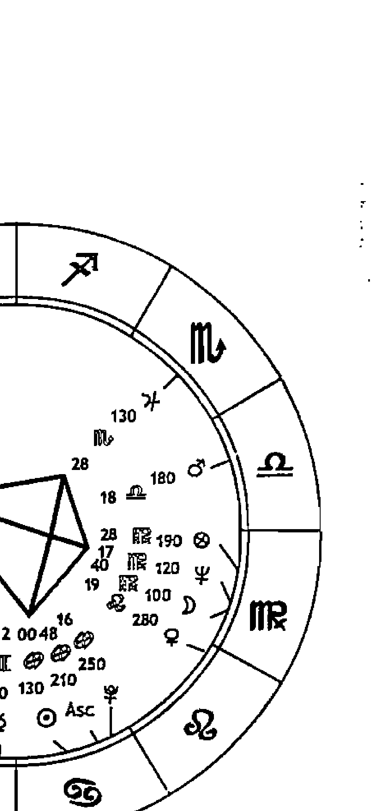

## Great Month
春分點
在歲差的移動當中繞行完黃道 12 星座稱為一個大年（Great Year），每經過一個星座稱稱一個大月（Great Month）大約是 2160 年，占星家相信每一個大月都能夠帶來該星座與其對宮的時代特質。其中每個大月又以「時代」（Age）來稱呼，如同我們所熟知的「水瓶時代」（Age of Aquarius）。

大年又大約是 25920 年。目前占星學上通常習慣用「The Precessional Year」來稱呼大年，避免與希臘時代或其他時代的大年觀念產生混淆。

## Greenwich Sidereal Time 格林威治恆星時間
Greenwich Mean Time 格林威治標準時間簡寫為 GMT
恆星時間為計算星圖的基準，目前絕大多數星曆的恆星時間都以格林威治恆星時間為主。相關內容請參考「恆星時間」（Sidereal Time）。

## Great Year
大年
在占星學的演進過程中，隨著宇宙觀的不同大年有著不同的定義，希臘時代認為一個大年是 36000 年，每 2 個大年組成一個循環，而今日大年的觀念則是根據春分點的歲差移動來計算，當春分點在歲差移動當中繞行完黃道 1 週稱為 1 個大年，又稱作「歲差年」（The Precessional Year），一個大年又大約是 25920 年。目前占星學上通常習慣用「The Precessional Year」來稱呼大年，避免與希臘時代或其他時代的大年觀念產生混淆。

## Hades
黑蒂斯
希臘神話當中冥界的統治者，也成為漢堡占星學派的所使用的虛星之一，代表不愉快的事物、錯誤、無用處的或是被人們深深的遺忘的事情，同時包含了貧窮、貧乏、古老的或被廢除的事情。

## Hard Aspect
強硬相位
包括對相、四分相、半四分相、八分之三相、十二分之五相等，在現代占星學當中稱為強硬相位，在傳統占星學中這些相位有凶相位的定義，但今日占星學家認為強硬相位代表著強大的能量，促使事件的發生，卻不一定代表吉凶。

## Harmonic Chart
泛音盤
英國占星學家約翰艾迪（John Addey）所發表的占星技巧，其理論為音波的共鳴特質，弦樂器會藉由不同的共鳴產生泛音，約翰艾迪認為星盤的 360 度，也可以視為一個完整的波，藉由這個完整的波，尋找不同倍數的泛音共鳴，而根據數字在西洋神秘學的特性當中，發展出了不同的泛音盤，也就是讓命盤產生不同層次的倍數頻率波動，3 倍、4 倍、5 倍直到 12 倍或更多，藉此我們可以看出波動後的行星是否會移動到新出現的波峰與波谷，或改變與其他行星相對的相位。

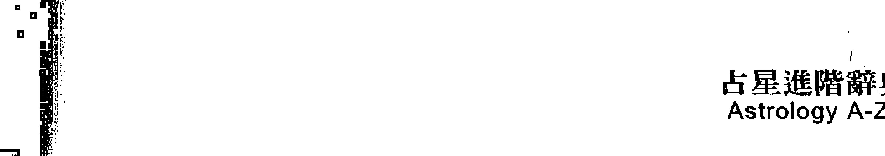

漢堡學派是現代占星學中的重要分枝，艾佛瑞·威特（Alfred Witte）可以說是此學派的重要領導者，在占星的思想上艾佛瑞的研究受到克卜勒（Kepler Johannes）的影響很大，克卜勒一方面被尊崇為現代天文學重要啟發者，另一方面他在現代占星學上占有重要地位。科學與物理的觀念對占星學的影響一直是艾佛瑞所希望探討的，在他先前的著作中他討論了行星的顫動，認為宇宙之間的物質包括行星與行星之間都會受到這樣的顫動影響而產生波動，這樣的想法對 20 世紀的占星學有著莫大的影響。

一次大戰結束後艾佛瑞開始在漢堡教授占星學，他的思想與研究從此開始擴散，西元 1925 年艾佛瑞與一群在漢堡地區從事占星研究的占星師們組成了「占星聯盟『漢堡學派』」（Astrologen-Verein "Hamburger Schule"），這個組織就是漢堡學派的前身，一直到西元 1947 年「漢堡學派占星研究會」的成立（Astrologische Studiengesellschaft Hamburger Schule E.V.）才奠定了對 20 世紀占星學影響深遠漢堡學派，艾佛瑞的對占星學的看法，開始對歐美地區展開重大的影響。

原先艾佛瑞不斷的研究克卜勒的占星看法，包括許多微相位的研究，到後來他放棄了這些思想轉而開始研究行星中點的影響。艾佛瑞認為行星與行星之間在黃道上的中點，以及某些角度上承受了較大的共鳴，這樣的想法也獲得另一位德國占星師萊恩霍德·艾伯丁（Reinhold Ebertin）的認同，他在西元1930年發表了他的研究，將這樣的思想發揚。之後漢堡學派的占星研究被帶到美國，受到許多占星學家的研究與探討，不斷的發展之下成為一門有系統的學習，其主要的精神在探討宇宙之間的星體與生物的共鳴，也因此他們稱這門科學為「宇宙生物學」（Cosmosbiology），主要的精神在於行星中點的研究，從這個觀點發展出了90度星盤等革新技巧。

漢堡學派的重要貢獻除了行星中點、90度星盤之外，還包括了22°30'這個角度的使用以及新的分宮制「子午線分宮法」、赤道上升點的應用，或利用數學上的恆等式來討論或表示行星之間的關係，探討個人星盤上的敏感點以及太陽弧推運的使用，更特別的是漢堡學派在星盤上加入了8顆他們認為對於命盤觀察有助益的「超海王星系行星」，而這8顆行星並非真實存在著。

### 推薦參考書
-   《The Combination of Stellar Influences》 by Reinhold Ebertin
-   《HANDBOOK OF TECHNIQUES FOR THE HAMBURG SCHOOL》 by Brummond & Rudolph
-   《URANIAN ASTROLOGY GUIDE PLUS EPHEMERIS》 by Sylvia Sherman & Jori Frank-Manske
-   《RULES FOR PLANETARY PICTURES, The Astrology of Tomorrow》 by Alfred Witte & Herman Lefeldt
-   《Rapid and Reliable Analysis》 by Reinhold Ebertin

## Heliocentric 太陽中心
大多數的占星圖以地球為中心作為觀測計算的標準，但也有少數占星師研究以太陽為中心的星圖，故會在星圖製作時標示「Heliocentric」與一般星圖的地球中心「Geocentric」作為區別。「Helios」是希臘神話當中的太陽神，後來為阿波羅取代，但在希臘文中「Helio-」一詞仍用做為「太陽的」字根。

## Heliocentric Chart 太陽中心星圖
以太陽中心作為觀測基準所繪製的星圖。大多數的占星師不會使用這樣的圖，因為太陽中心占星學的解釋與一般占星學有所不同，但有部分的占星師在研究地球上的世俗事件（特別是氣候與經濟問題）時，會參考以太陽為中心的太陽中心圖，來觀測行星之間的關係對地球的影響。

## Heliocentric Astrology 太陽中心占星學
研究以太陽為中心作為計算觀測標準的占星術，多半使用恆星黃道而非回歸黃道，並且星盤上出現地球，而沒有月亮、太陽的符號，在於占星的基礎立論上與一般占星學有著顯著的不同。

## Hemisphere 半球
在占星學中星圖當中任何180度的軸線拉起時都可以將星盤分成兩個半球，但觀測的時常以上升點和下降點、天頂和天底這2條軸線將星盤分成上半球、下半球（依據上升、下降軸線），以及東半球、西半球（天頂、天底軸線）。

# 時辰占卜占星学（又称卜卦占星学）
Horary Astrology
时辰占卜占星学（Horary Astrology）是占星学当中一门深奥的技巧，在中文译名上更常被翻译为「卜卦占星学」，或是「时间占星学」，无论哪种翻译方法我们都可以看出这一门学问与时间的占卜息息相关。还记得在占星历史上提到从托勒密（Claudius Ptolemy）之后，种子时刻的观念引起出生图与时辰占卜的纷争吗？在过去的占星学历史当中，我们看到学习时辰占卜占星学的占星师，与重视出生图的占星师们，分别持着两种不同的意见，这样的分歧虽然到今天仍然存在着，但大部分的占星师反而倾向两种都学、两种都看，当有人来寻求占星师关于命运的问题时，多半使用出生图（事实上光用时辰占卜也可以回答问题），而针对问题时倾向用时辰占卜法。

时辰占卜占星学一直存在着，在历史上甚至与出生图有着抗衡的地位，占星学因为这两者而发光发热，历史上最著名的时辰占卜大师就是先前提过的威廉·李利（William Lilly），他不但预测许多次的事件，也将他的占卜法则写成了《基督教占星术（Christian Astrology）》一书，此书成为后世学习时辰占卜法的经典，在威廉·李利之后由于信仰与宗教的问题，在过去时辰占卜法被埋没了好一段时间，特别在从20世纪开始，学习出生图占星师们，不断的借用心理学的词汇与论点甚至思想来丰富其解释时，或披上科学的外衣。时辰占卜占星学仍因为其神秘主义的色彩，被排挤在一旁，被认为是迷信。

直到西元1984年英国占星师奥莉薇雅·巴克利（Olivia Barclay）重整时辰占卜占星学，她有系统地教授时辰占卜占星学并且授予学位，整个学程大约需要两年的时间，通过资格认证之后才可以向职业占星师协会（APA）注册，称为「资格认可时辰占卜占星师」（Qualifying Horary Practitioner）简称「QHP」。也有其他学院授予两阶段的学位，分为两个等级：第一阶段为传统占星师资格（CTA），第二个阶段为传统占星师文凭（DTA）。部分的英国占星师，都具同时有出生图占星师与时辰占卜占星师的资格，但并非每一位占星师都务必拥有同样的文凭与资格。

在今日，时辰占卜占星学已经与择日占星学、世俗占星学结合在一起，除了解答问题之外，还用来帮人选择适当的成立日期或结婚日期，甚至用来解读政治或预测世间的发现等。在时辰占卜占星学当中威廉·李利的作品仍然是必读的经典作品，但目前似乎没有中文的译本，在这里我们简单的介绍时辰占卜占星学的一些基本法则，希望对于对于有兴趣的占星研究者有帮助。

## 1. 时辰占卜法的基本概念
时辰占卜占星术的基础与传统占星学相似，占星图的绘制方式相同。一般的占星图取决于个人的出生时间，但时辰占卜的时间地点取决于，问题被提出的时刻与占星师所在的地点。如果询问者亲自拜访，那么我们依照提出问题的时间来绘制一张时辰占卜图，如果采取通信的方式则视占星师打开邮件（电子邮件）的时刻。记住，一个问题只能问一次，在事情发生新的变化前不能问第二次。

## ◎ 時辰占卜法的宮位劃分與代表意義
一般來說，繪製時辰占卜圖的法則與出生圖的法則相似，但是許多時辰占卜占星師在繪製占卜圖時仍採用先前提到的瑞吉蒙塔奴斯分宮制（Regiomontanus Houses System），這一點許多老師教授時辰占卜占星時都相當強調，所以當你在使用時辰占卜占星圖時，別忘記將你占星軟體中的分宮法改成瑞吉蒙塔奴斯分宮制（Regiomontanus Houses System）。而宮位的代表意義不變，第1宮是指詢問者第2宮指的是金錢等，必須熟記這樣的概念，而宮位三分法的起始宮（1、4、7、10）、承繼宮（2、5、8、11）、下降宮（3、6、9、12）的概念也要記住。

## ◎ 時辰占卜法的行星界定與吉凶區分
時辰占卜占星術有許多的規則必須去理解或死記，和解讀出生圖的傳統占星學或是近代的心理占星學或是漢堡學派不同的是，時辰占卜占星術的規則很死，非黑即白無法改變，行星分成所謂的吉星、凶星，天王、海王、冥王等現代行星，很少被考慮在卜卦占星學的問題當中。

這一點對大部分用心理詞彙來解讀出生圖的占星師來說很不習慣，除了月亮因為代表詢問者之外，太陽、金星、水星、木星就是吉星，火星與土星就是凶星。天王星、冥王星在世俗占星學中都代表動亂、混亂，海王星則具有類似金星的效應卻被視為不吉不凶。但是大部分的卜卦占星師不使用天王、海王、冥王。至於其他包括南、北交點也必須被注意，北交點代表幸運，南交點代表不幸。而阿拉伯點當中有幾個點，常被拿來使用幸運點（特別當問題與金錢、財產有關時）、精神點（作為晚上出生人的幸運點）、婚姻點等。

## ◎ 時辰占卜法的相位界定
正面相位與負面相位的界定也很分明，不像是現代占星學認為的負面相位具有刺激的作用，在時辰占卜法中，負面相位就是凶相位，甚至沒有其他吉相位可以改變。合相的吉凶視行星而定，一旦與凶星結合就是不吉利。如果代表詢問者與被詢問者的行星（會在後面解釋如何界定）成合相，則表示對事情有吉利的發展，兩人的目標一致或是適合結合。而三分相屬於幸運的角度，代表著時機與機會。六分相同樣代表機會，但必須此人付出努力來爭取。半六分相則表示這些不順利的吉相位（吉中藏凶）。

四分相代表緊張壓力與事情的困難。對分相代表分離、失敗、困難與不信任，特別當代表詢問者的行星有著許多對分相時，他多半不會聽從占星師的解釋與預測。至於其他的小相位則很少被使用。而十二分之五相更需要小心注意，象徵一種被低估的狀況，有時甚至代表疾病與死亡。

而時辰占卜法相位的容許度判斷和出生圖不同，行星與行星之間的相位並不是由相位本身的大小來決定，而是由行星的影響力以及行星移動速度的快慢來決定。首先要清楚正相位、出相位與入相位的概念，正相位是指兩顆行星形成相位的角度相同沒有太大的誤差，如果相差1、2度又叫做「緊密相位」，而入相位就是指兩顆行星當中移動快速的行星正接近與另一顆行星形成相位的位置，也就是說相位已經在容許度中且將要形成正相位。而出相位是指移動較快速的行星離開正相位且慢慢的遠離。通常正相位代表事情將要發生，出相位則代表狀況即將消失。

將兩顆行星的容許度除以 2，就是這 2 顆行星形成相位的容許值。土星與木星 10 度（左右 5 度），火星、金星、水星 6 度（左右各 3 度），太陽、月亮 16 度（左右 8 度）。例如，要判斷火星是否和月亮形成相位時，就要將 16 + 6 = 22 除以 2，等於 11 度再將這 11 度除以 2 表示左右各 5.5 度的範圍才會受到影響，之外完全不受影響。

## ◎ 黃道上的重要位置
在時辰占卜法當中黃道上的 12 宮並沒有多大的改變，但是要記住之前所提到的恆星位置所帶來的影響，特別是與命運、吉凶、健康、死亡、婚姻等問題，以及注意所謂的緊要度數的位置這一點將在下一章中作詳細說明，這些特殊位置替時辰占卜法的解釋增添了更多困難度。

## ② 時辰占卜法的判讀
（1）時辰占卜法的法則大多細膩而且繁瑣，在此我們舉出一些重要的法則。

-   ※ 必須判斷這是否是一張能夠被解讀的圖，這是所有解讀時辰占卜的第一條黃金律，在出生圖當中所有的圖都能夠被解讀，但是在時辰占卜當中有許多跡象顯示這張圖就算解讀也是無效。
-   ※ 出生圖的上升星座度數為 0-2 度包括了 2 度 59 分等，當上升星座在這 3 度時，多半表示問這個問題還太早，無法做出判斷，必須等待事情的進一步發展，才能夠利用時辰占卜法來判讀這個問題。
-   ※ 當出生圖上的上升度數是 27-30 度時也會是一張無法解讀的星圖，但表示此圖所問的問題為時已晚，事情的發展已經確定且很難改變。在 27-30 度當中有一個例外法則，就是詢問的人如果正好是 27-30 歲，那麼這張圖就具有意義可以解讀。
-   ※ 當土星在第 7 宮時也不能判讀，有趣的是第 7 宮多半代表占星師本人，當土星在第 7 宮時暗示著占星師的狀況不佳，不適合判讀，當然這個規則有兩個例外，第一個例外是占星師本人的太陽與上升是水瓶座與摩羯座，則視為正常。第 2 個例外則是此人問的問題與第 7 宮有關（婚姻法律問題），且他合的對象其中一方（妻子或關係人）正好是摩羯座與水瓶座。有些占星師甚至在上升星座為摩羯座和水瓶座時也列入不判讀的星圖之一，這樣的說法見仁見智。
-   ※ 如果此時月亮到離開這個星座前沒有和任何行星產生相位時，這張圖也不能被判讀，這種狀況在傳統占星學中稱為「月無相」（Moon in Void of Course），是指此時月亮一直到進入下一個星座之前的路徑當中，且沒有產生重要的角度（合相到六分相等），占星師認為這段時間為月亮失效，又有人翻成「月亮空亡」。在傳統占星學當中解釋為月亮所代表的詢問者無法與他人產生互動，所以此時的判讀星盤將不具效力。
-   ※ 當月亮經過黃道上的燃燒區（Via Combusta），這張星圖也不能被解讀。

不能判讀，騷動區指的是天秤座 15 度到天蠍座的 15 度，傳統的時辰占卜占星師認為這個區域象徵著不吉利，除了月亮之外如果有凶星進入也代表著生病與意外傷害的發生。

※ 也有占星師認為如果月亮在 27-30 度時，不適合判讀這張星盤，因為代表著此事仍有太多的變化，且通常與詢問者無法主導或參與這樣的改變。

(2) 判詢問者與被詢問者的代表象徵星星，在時辰占卜法當中判定詢問者的代表行星是相當重要的一件事情，他影響著整盤的解釋，通常月亮代表詢問者。但也不能忽略上升星座的重要性，上升星座的守護星同樣也代表著詢問者，兩者同樣重要，也必須瞭解到在時辰占卜當中使用傳統行星，也就是太陽到土星的守護。所以在近代所稱的水瓶座由天王星守護必須改為土星，天蠍座由冥王星守護必須改回火星，雙魚座由海王星守護必須改為木星。再次強調天王、海王、冥王在個人的問題當中，只代表環境與世代的影響。例如：當問題被提出時上升星座在牡羊座，則火星與月亮成為詢問人的代表；如果上升星座在雙魚座，則木星與月亮成為詢問人的代表。

(3) 與上升點成為合相的行星代表著這個人的思考特質與行為，例如金星在上升點附近，代表著這個人對這個問題持溫和且偏向樂觀的看法。

(4) 決定與問題相關的宮位，並且尋找象徵星，這一點必須注意，將會影響占星師的判斷是否正確。

※ 最基本的如果問題僅與詢問者有關，例如：我該不該買這間房子？此時與房子有關的第 4 宮就是必須注意的重點。

※ 詢問的問題與他人有關時，這時候第 1 宮仍然代表著詢問者，而相關人則必須尋找他們與此人的關係，例如：一位妻子來詢問關於丈夫的事情，此時這張圖的第 7 宮代表丈夫，而第 7 宮的守護星代表「被詢問人」，一位姊姊來詢問關於妹妹的事情，則該圖的第 3 宮代表著妹妹，而第 3 宮星座起始點的守護星代表著姊姊。以此類推兄弟姊妹、同學鄰居為第 3 宮，子女為第 5 宮。父母為第 4 宮，伴侶、同事為第 7 宮，部屬為第 6 宮，上司為第 10 宮。

如果不屬於這些關係，通常可以用第 7 宮代表，例如，某人想知道對方是否在欺騙他，而此人與部屬於上述的關係卻有著平等的位置，則以第 7 宮代表，而第 7 宮的守護星就代表此人。要注意一點，占星師們不能用這樣的圖回答與詢問人關係太遙遠的問題，例如，某人來問下一屆美國總統會是誰？這時候這樣的問題我們必須以其他的圖，例如，該年的春分圖與美國的出生圖或是接近選舉的牡羊座 0 度圖來回答。

※ 如果問題與他人的生活有關，那麼必須以代表對方的宮位為第 1 宮，然後找出相關連的宮位，例如：一位媽媽詢問女婿的合夥投資是否會賠錢？那麼我們得先找出女兒的宮位為第 5 宮，以此為第 1 宮再找出第 7 宮代表女婿，這就是原本星圖上的第 11 宮，這時候再從第 11 宮開始找出代表合夥投資的第 8 宮，與此宮的守護星來判定吉凶。這樣的過程看似複雜其實不難。

## ★占星進階辞典
Astrology A-Z

※ 當月亮同時代表詢問人與被詢問人時，傳統的時辰占卜法通常會讓月亮去代表被詢問人，而由上升星座的守護代表詢問人，不過月亮仍能夠提供某些關於詢問人的資訊。這種情況通常發生在一位爸爸來問與他女兒有關的問題時，上升星座在雙魚座，而代表女兒的第 5 宮落在是巨蟹座，這時候月亮本身具有詢問人的特質（那位父親），但同時也代表了那位女兒，這時候占星師必須放棄改由代表雙魚座的木星來代表這位父親的象徵星（詢問者），而讓月亮能夠成為代表女兒的象徵星（被詢問者）。

(5) 相關行星與其他行星，當一個問題被提出時，我們通常注意與這個問題相關的行星，那就是月亮，然後代表詢問人與被詢問人的象徵星，與此問題有關的象徵星，就如同前一個問題好了父親來問女兒的愛情，上升星座雙魚座所以木星是父親的象徵星，第 5 宮是巨蟹座所以月亮是女兒的象徵星，而女兒的愛情就必須從女兒的第 5 宮，也就是命盤上的第 9 宮的星座來代表如果是天蠍座，則火星與這件事情也有關聯，當然也不能忽視該宮當中的行星所給予的提示。

此外，一般象徵愛情的金星也當然與這張圖有關，不可以忽略它提供的小小資訊，最後必須注意與這些行星形成相位的行星所代表的意涵，例如，木星是否帶來好運？土星是否帶來厄運？至於其他行星就可以排除在外（通常剩下不到幾顆），但為了避免太複雜的圖影響我們的判讀，無論這些行星之兼有著多麼重要的相位，一旦他們沒有和問題相關的行星產生連結，就不用去注意他們。

### 案例
一位母親前來詢問女兒是否能夠考上大學並且該選擇哪一個科系。當一位占星師拿到這張圖時（女兒的出生圖，如下圖），必須先檢查這張圖是否符合判讀的標準，也就是說上升點的度數是不是在 0-3 度和 27-30 度，這張圖的上升點在天秤座 19 度，之後判斷月亮是否在燃燒區或是在 29 度，這張圖的月亮在巨蟹座的 21 度所以沒有問題。之後判斷土星的位置是否在第 7 宮，這張圖並沒有（對摩羯座和水瓶座的占星師來說就算有也沒有影響，而我就是其中之一。）

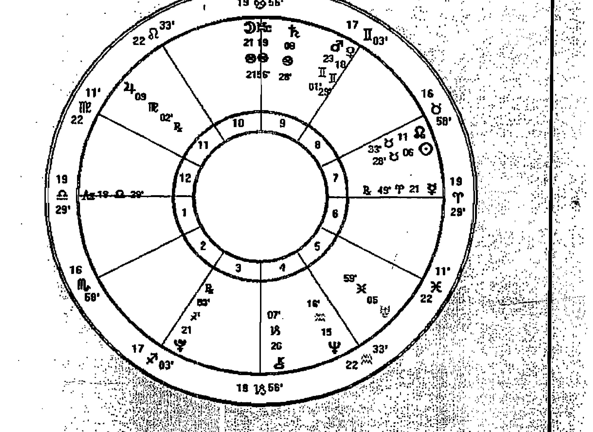

之後我們就要開始界定位在這張圖中的象徵星，上升點在天秤座，所以金星和月亮代表詢問人的象徵星（這位母親），而女兒則由土星代表（第5宮在水瓶座），這時候要找出代表女兒的研究所的宮位，我們知道研究學問與大學由第9宮代表，則從第5宮開始當作上升點找出第9宮，則回到了這張圖的上升點天秤座，這時候金星成為這張圖的關鍵，也可以讓它脫離與象徵這位母親的關係。此時代母親的就只有月亮了。

| 詢問者象徵星 | 金星、月亮 |
|---|---|
| 被詢問者象徵星 | 土星 |
| 問題象徵星 | 金星 |

接下來我們判斷與這個問題有關的行星，首先水星掌管的思考與學習必須被考慮，而與金星產生相位的行星都必須列入考量，這時候我們發現金星與水星產生六分相與太陽產生半四分相，與火星產生合相，與冥王星產生對分相與海王星產生三分相（由於是現代行星，在卜卦占星學的問題當中，我們對他們的影響力持保留態度）接下來象徵女兒的土星與太陽、木星都形成了六分相，與北月交形成了六分相。月亮則與水星形成四分相木星形成半四分相。所以在這張圖中代表著女兒的土星與女兒研究所的金星是我們關注的焦點，月亮的相位是我們該注意的事情發展，而水星提供了相當程度的資訊，但卻不是焦點。

關於是否能夠順利進入大學這件事情，我們注意到金星與水星的六分相，表示有這樣的能力，與火星的合相則代表在考試時因為匆忙而發生的錯誤，使的考試結果並不如預期的完美。代表女兒的土星並沒有受到負面相位的影響，可是月亮卻連續的受到四分相與半四分相，我們可以猜想面對考試的壓力，也使得她有著不好的表現，特別在這裡母親所給予的壓力被突顯出來。

在這個問題當中代表女兒的上升點附近（原本的第5宮）有海王星，雖然不是傳統行星但提供了一個小小暗示，宗教、藝術、哲學可能是這位女兒還有興趣的目標，而屬於女兒的第9宮起點（就是這張圖的上升點）落入了天秤座，法律、哲學、藝術都有關係，可見得這位女孩選擇的範圍可能在文、史、哲、藝術方面。

### ③ 時辰占卜法的特殊規則

在這裡我們無法一一的介紹如何詳細的判讀時辰占卜圖，但只要熟知傳統占星術對行星宮位相位的定義，以及時辰占卜法的基本法則和判斷的基礎，就能夠開始練習時辰占卜法，但是有許多時辰占卜法的特殊規則我們不可以忽略，這些規則都是以前的占星師們的經驗傳承，瞭解這些事情將會對你在時辰占卜的準確度上有著更大的幫助。

(1) 月亮的角度以及即將出現的角度，代表事情的所產生變化，在時辰占卜法當中月亮占有相當重要的影響力，不僅代表著被詢問者，也代表著事情的「變化」，當月亮本身與凶星（火星、土星、天王星、冥王星；記住後二者也可以不考慮）形成凶角（對分相、四分相、半四分相）表示事情處於不利的狀況，但是

我們接著必須判斷，月亮接下來的將會形成的相位，直到他離開這個星座之前的最後一個相位。來判斷未來的發展，通常如果月亮在離開這個星座前的最後一個角度是與吉星產生正面相位，表示事情可已有好的發展，如果月亮接下來的相位是凶相位特別是與凶星產生負面相位，那麼事情的發展趨向負面，這時候如果月亮離開此星座前最後一個角度是好的，那事情還有希望好轉，反之，事情只會惡化。

(2) 判斷行星的強勢弱勢，我們必須判斷詢問人和被詢問人象徵星，還有月亮的強勢弱勢，如果詢問人與被詢問人的行星處於弱勢那麼事情的發展是不利的，如果事情關於雙方的競爭或交涉，則可以藉由哪一方象徵星的較強而判斷對誰有利，或是當問題關乎某個人的健康時或狀態時，他的象徵星強弱也暗示著事情的好與外。

### 傳統行星的強弱判斷

| 行星 | 守護星座 | 下降星座 | 強勢星座 | 弱勢星座 |
|---|---|---|---|---|
| 太陽 | 獅子座 | 水瓶座 | 牧羊座 | 天秤座 |
| 月亮 | 巨蟹座 | 摩羯座 | 金牛座 | 天蠍座 |
| 水星 | 雙子座/處女座 | 射手座/雙魚座 | 水瓶座 | 獅子座 |
| 金星 | 金牛座/天秤座 | 天蠍座/牡羊座 | 雙魚座 | 處女座 |
| 火星 | 牡羊座/天蠍座 | 金牛座/天秤座 | 摩羯座 | 巨蟹座 |
| 木星 | 射手座/雙魚座 | 雙子座/處女座 | 巨蟹座 | 摩羯座 |
| 土星 | 摩羯座/水瓶座 | 巨蟹座/獅子座 | 天秤座 | 牡羊座 |

(3) 傳統行星的強弱判斷，行星的強弱在前面的篇章中已經提過，在這裡只針對傳統行星再說明一次。當象徵星位在守護星座或強勢星座時，對於事情或此人有利，而在下降星座與弱勢星座時則對此人不利。

(4) 十度法：傳統的時辰占卜法當中還有一種10度法(Decanates)，用來觀察行星的強弱，或是找出同樣對事情有影響的行星，也就是每個星座的前10度(0-9)由本身的守護星掌管，例如牡羊座的0-9度由牡羊座和火星掌管，第2個10度(10-19)由下一個同樣元素的星座和他的守護星掌管，

### 十度法列表

| 星座 | 0-10度的守護 | 10-19度的守護 | 20-29度的守護 |
|---|---|---|---|
| 牡羊座 | 牡羊座/火星 | 獅子座/太陽 | 射手座/木星 |
| 金牛座 | 金牛座/金星 | 處女座/水星 | 摩羯座/土星 |
| 雙子座 | 雙子座/水星 | 天秤座/金星 | 水瓶座/土星 |
| 巨蟹座 | 巨蟹座/月亮 | 天蠍座/火星 | 雙魚座/木星 |
| 獅子座 | 獅子座/太陽 | 射手座/木星 | 牡羊座/火星 |
| 處女座 | 處女座/水星 | 摩羯座/土星 | 金牛座/金星 |
| 天秤座 | 天秤座/金星 | 水瓶座/土星 | 雙子座/水星 |
| 天蠍座 | 天蠍座/火星 | 雙魚座/木星 | 巨蟹座/月亮 |
| 射手座 | 射手座/木星 | 牡羊座/火星 | 獅子座/太陽 |
| 摩羯座 | 摩羯座/土星 | 金牛座/金星 | 處女座/水星 |
| 水瓶座 | 水瓶座/土星 | 雙子座/水星 | 天秤座/金星 |
| 雙魚座 | 雙魚座/木星 | 巨蟹座/月亮 | 天蠍座/火星 |

牡羊座的 10-19 度就由同元素的下一個星座獅子座和他的守護太陽掌管。第 3 個 10 度則由同元素中第 3 個星座掌管，例如牡羊座的（20-29）度就由射手座和木星來掌管。

例如，某次占卜中金星是象徵星，且金星走到水瓶座的 25 度時，因為水瓶座的 25 度是由天秤座和金星守護著，所以這時候這顆金星的力量救被增強了。而這個發法有時也可以判斷上升點的共管行星，例如上升點在處女座的 18 度，我們知道水星是詢問人的象徵星，但是也可以用十度法，找出處女座下一個同元素的星座是魔羯座，而守護魔羯座的土星也可能提供了這個問題的暗示。

(5) 日曆法：與上一個法則類似，但是這個法則較少人聽過，稱為日曆法則，他的規則較為奇怪是從牡羊座零到 10 度開始每十度為一個區域，分成 36 區，再將這 36 區依照火星、太陽、金星、水星、月亮、土星、木星的順序排列，木星之後又從火星開始循環，來尋找守護的行星，也因此牡羊座的第二個十度的守護仍然是太陽，但是第三個十度則是金星，而金牛座的第一個十度的守護則成為水星。同樣的可用來判斷行星的強弱，這樣的方法較少人使用但仍可做為參考。

(6) 行星是否被包圍：行星強弱的判斷同時還受到許多不同的影響，例如如果某一顆行星同時被火星與土星夾在兩旁，那麼這顆行星形同被「包圍」了，這時候這顆象徵星所代表的事情處於負面的狀態。

### 日曆法列表

| 星座 | 0-10度的守護 | 10-19度的守護 | 20-29度的守護 |
|---|---|---|---|
| 牡羊座 | 火星 | 太陽 | 金星 |
| 金牛座 | 金星 | 水星 | 月亮 |
| 雙子座 | 木星 | 火星 | 太陽 |
| 巨蟹座 | 金星 | 月亮 | 水星 |
| 獅子座 | 土星 | 木星 | 火星 |
| 處女座 | 太陽 | 金星 | 月亮 |
| 天秤座 | 月亮 | 土星 | 木星 |
| 天蠍座 | 火星 | 太陽 | 金星 |
| 射手座 | 水星 | 月亮 | 土星 |
| 魔羯座 | 金星 | 水星 | 月亮 |
| 水瓶座 | 金星 | 水星 | 月亮 |
| 雙魚座 | 水星 | 月亮 | 土星 |

(7) 注意特殊位置南北月交、恆星、緊要度數、幸運點與其他阿拉伯點。

- 在時辰占卜占星學當中，必須注意南北月交的位置。在心理占星學或是現代的占星學眼光中我們儘量減少南北月交的負面效應，但是在時辰占卜當中我們無法這麼做，就如同在時辰占卜當中我們沒有辦法說土星代表學習和考驗，沒辦法，他就是代表「厄運、陷阱、壞人」，不能夠做其他的解釋。
- 在時辰占卜法中北月交點如果與上升點、天頂或象徵星形成合相時象徵著好運，事情可以獲得掌控或是趨向好的發展。而南月交則有類似土星的厄運效果，但重點是必須與上升、天頂、象徵星產生合相，一般來說南北月交的其他相位不列入考慮。

◎ 恆星的會對時辰占卜的星圖產生重要影響，特別當他們與上升點和天頂結合的時候，會帶來影響，我們注意到特別再觀測政治占星學與世俗占星學的星盤時恆星通常發揮很大的作用，但是仍有些占星師不考慮恆星的影響，而通常在觀察出生圖時也很少使用。

◎ 緊要度數在時辰占卜法當中緊要度數扮演著重要的角色，在當代占星大師哈馬克・宗達（Hamaker-Zondag）所著的《Handbook of Horary Astrology》當中提到緊要度數源自於印度占星術當中的月亮 28 宮位，事實上印度占星術當中將黃道劃分成 27 個宮位，不過仍可以證明這個概念被時辰占卜法的占星師借用過來，從牡羊座 0 度開始每 12 度 51 分 25 秒劃分一個宮位，於是產生了 28 個區段，分別是

開創星座（白羊、巨蟹、天秤、摩羯）的 0 度，
12 度 51 25
25 度 42 50
固定星座（金牛、獅子、天蠍、水瓶）的 8 度
34 15
21 度 25 40
變動星座（雙子、處女、射手、雙魚）的 4 度
17.05
17 度 08:30

而經過歷代的改變，又將這些度數簡化為開創星座的零度、13 度、26 度，固定星座的 9 度與 22 度，變動星座的 5 度與 18 度。並且有一度左右的容許值，畢竟這些簡化的度數並非原本的度數。當象徵星，特別是月亮在緊要度數時通常暗示著事情有了危機，這一點必須注意。但也有占星師們認為緊要度數，象徵著敏感位置，提供了事情的發生與變化，特別當月亮或象徵星經過時帶來緊張。在傳統占星術中這些重要的點也用來解讀在出生圖上象徵著特別敏感的位置，當流年的行星過運或是推運圖當中的行星經過時就會產生事件的發生。

◎ 另外對於象徵星與月亮來說有兩個重要的度數必須注意，其中之一是 0 度，也就是所有星座的開端，除了上升點之外，如果月亮與其他象徵星在 0 度時表示事情進入全新的開始。另外一個度數是 29 度，當月亮或象徵星位於 29 度象徵著及將要進入下一個星座，這時候暗示著整件事情會有重大的改變，特別當月亮或象徵星進入強勢宮位時代表事物的好轉，當月亮或象徵星進入弱勢宮位是代表事物的惡化。

此外每 1 宮的 15 度暗示事情的穩定，特別當上升或象徵星位於這些位置的時候，可以做此解釋，例外的是如果問題指的是一個糟糕的狀況是否會持續下去，那麼 15 度就顯的不妙，暗示著狀況的持續。如果一個描述互動狀況的問題被提出時，月亮與象徵星落在固定星座的 15 度，那表示事情顯的僵化，無法產生變化。

◎ 先前我們提到的阿拉伯點仍在時辰占卜中被使用，這當中特別是幸運點，不過他真正被使用的機會不多，多半只有在與金錢有關的時候，其次是婚姻點，至於疾病點與死亡點有些時候會被提出來。必須注意的是阿拉伯點在時辰占卜得觀點當中，其影響效果甚至低於北月交。

(8) 解讀象徵星的相位，在時辰占卜法當中，行星的相位有著重要的暗示，特別是詢問者與被詢問者的象徵星，當象徵星彼此之間形成相位時，但表兩者已經展開接觸。反之，如果月亮與任何一顆象徵星處於無相位時，那麼所代表的這個人將不會采取任何行動，這也是為什麼當月亮處於失效的無相位時根本無法解讀那張圖。

※ 注意事情牽扯到詢問者與被詢問者兩人的關係或問題時，例如結婚、交易、談判、爭執等，例如他會答應我的求婚嗎？或是我能不能買這個人的房子呢？或是其他種種牽扯到兩個人互動的問題時，注意兩顆星的相位，如果兩顆行星之間沒有相位，則協議很難達成，如果是合相或是三分相那麼就有好的結果，如果是對分相與四分相那我們幾乎可以判定出局。

※ 除了上述的內容注意行星的互融，這一點粗心的占星師常常會忘記，當兩顆行星交換其守護星座的時候我們稱為互融 (Reception)，在時辰占卜法當中互融可以視為合相，更可以將原本弱勢的行星藉由互融而獲得力量。除此之外，如果互融的正好是詢問者與被詢問者象徵星那麼對於整件事情會呈現有利的發展，在沒有負面相位干擾下，雙方可以有良好互動並達成協議，如果詢問者或被詢問者的象徵星與另一顆行星產生互融也可以是為這第三顆行星代表著第三股勢力的介入，可以透過他達成斡旋，當然如果互融的其中一顆行星有著非常糟糕的相位那麼就根本發揮不了作用。

※ 注意在兩顆行星形成三分相或是合相時是否產生分離相位，也就是說在不同元素當中，暗示著互動性有些弱。

※ 當詢問者與被詢問者的象徵星出現吉利的入相位時，表示兩個人正要達成共識，表當兩顆行星之間出現了出相位時，表示兩人已經接觸過了，但似乎對問題的幫助不大。

※ 當兩顆象徵星沒有產生相位時，表示兩人尚未取得共識，或是兩個人並沒有接觸，這時候占星師必須注意是否有某顆星（通常是快速的內行星最常見的是月亮），與此兩顆象徵星在時間上一前一後的產生相位。

※ 時辰占星法稱「光的轉移」(Translation of Light)，舉例來說，金星與火星分別代表詢問者與被詢問者，原本金星和火星沒有連結，但這時候水星在未來的移動中（或月亮）先與金星產生相位，緊接著與火星產生相位，這時候光的轉移就形成了。這個轉變暗示著第三者的幫忙替兩人達成協議，也要注意在轉移當中這個第三者必須先後與兩個象徵星接觸，如果先是與金星產生相位，但後來遇到了木星然後在與火星產生相位時就表示事情又多轉了一手，影響的效力可能會不佳，甚至帶來更多的變數。

### ☆占星進階辭典
Astrology A-Z

(9) 行星逆位的解讀在時辰占卜當中有著相當特殊的解讀方式，一般來說行星的逆行有著如同失效的解釋，特別是吉星的逆行無法發揮效力，而凶星的逆行使情況顯得更加糟糕。特別注意的是行星是否處於逆行當中或是靜止不動，我們在討論行星逆行的時候提示過，當行星要轉變運行的方向之時（開始順行或開始逆行前後），會有一段時間靜止不動，我們必須翻開星曆，察看是這顆逆行的行星是不是處於靜止狀態（Stationary）特別是木星與土星容易處於這樣的狀態很長一段時間，或是正在逆行當中，如果是靜止狀態表示此人（詢問者或被詢問者）不願意接受改變。

- 但是在一些特殊的問題上如果象徵星逆行，可能有不同的暗示，例如在尋找失落物品的問題上或是離家出走的案例上，被詢問者或詢問者的象徵星，或是該物品的象徵星，呈現逆行時，就表示他們會被找回或是他們會回家。同樣的方法也可判定再有外遇的丈夫或分手的情人是否願意回頭。

- 逆行的象徵星如果是事件的話，很可能是說事情會回到舊的狀況，至於什麼樣的舊狀況就只有被詢問人知道了，通常對於有關於新發展的問題不利。如果問題關於舊情人或外遇的丈夫是否回頭，那麽象徵星或金星的逆行就代表是，而如果問一段剛發展的友情是否能更進一步，那麽逆行的象徵星與逆行的金星就可能說不。通常也暗示著象徵星的那一方不願意接受新的變化，特別在固定星座新的變化可能會被取消。

### 占星進階辭典☆
Astrology A-Z

- 逆行的象徵星如果是被詢問者暗示著兩種可能，第一問題的人並沒有對占星師解釋清楚狀況，通常有所隱瞞，這時占星師無法做全面的判斷，第二這個被詢問者被的想法與行動壓抑著。通常我們可以藉由逆行象徵星所在的宮位來判斷出到底是什麼事情沒有被告知，或是被壓抑著。

### ④ 時辰占卜法提示的時間與方位

經過長時間的發展與研究，在時辰占卜法有一套推測事情發生的時間和尋找與事物相關的方位，或地點和距離。

- （1）時間辰占卜法推論時間的方式如下：
  先找出象徵詢問者的行星或月亮，看何者最有可能即和被詢問人象徵星（或事件有關的象徵星）在未來發生的相位，除非問題是重回就愛或找回失物的問題，否則通常是白費力氣。如果月亮或象徵星再離開此星座前接下來沒有任何相位將形成，恐怕就表示這件事情的時間我們無法預測。
  找出月亮（或詢問者象徵星）與被詢問者象徵星（或事件象徵星）形成下一個相位所需要的度數，例如月亮在雙子座2度，與位在獅子座10度的被詢問者的象徵星，形成下一個相位（六分相）的距離8度。
  利用下表找出該被詢問人象徵星（或月亮）所在的星座性質與宮位來推算時間。

| 星座性質 宮位位置 | 陰宮 (1,4,7,10) | 承續宮 (2,5,8,11) | 下降宮 (3,6,9,12) |
| :--- | :--- | :--- | :--- |
| 開創星座 | 多少天（小時） | 多少週 | 幾個月 |
| 變動星座 | 多少週 | 幾個月 | 多少年 |
| 固定星座 | 幾個月 | 多少年 | 數年（非常漫長） |

就用剛剛的例子，如果月亮的位置在第 10 宮，雙子座 2 度與被詢問者的象徵星距離下一個相位有 8 度，那麼我們得找出表格中變動星座與第 10 宮的交會（月亮的位置），顯示出多少週，而距離度數是八度，暗示著這個問題將會在八週內完成或出現預測的變化。

- （2） 方位與地點距離：關於時辰占卜的方位我們可以從月亮與代表物品或被詢問人的象徵星星座和宮位來推測失物有兩種法則，第一種較為傳統。

### 方位法1

- 牡羊座：東方，丘陵、乾燥的地方、新開發之地，運動場
- 金牛座：南方偏東，田野、草地、儲藏室、庭園
- 雙子座：西方偏南，學校、鄰居家，鄰近鄉鎮，車站
- 巨蟹座：北方，有水的地方，廚房，主臥室，母親的住所
- 獅子座：東方偏北，娛樂場所，豪華且重要的地方
- 處女座：南方偏西，醫院、工廠，運動場，放置工具的地方
- 天秤座：西方，臥房、客廳、梳妝台，法院
- 天蠍座：北方偏東，垃圾桶、廁所、濕地、令人不愉快的地方
- 射手座：東方偏北，大學、高地、寺廟
- 摩羯座：南方，政府機關、地下室
- 水瓶座：西方偏北，集會場所，會客室、朋友家
- 雙魚座：北方偏西，修道院、水族館、海邊，隱密的場所

### 方位法2

根據失物的或被詢問者的象徵星所在宮位來判斷：

- 第1宮：東方
- 第2宮：東北東方
- 第3宮：東北方
- 第4宮：北方
- 第5宮：北北西方
- 第6宮：西北方
- 第7宮：西方
- 第8宮：西南西方
- 第9宮：西南方
- 第10宮：南方
- 第11宮：東東南
- 第12宮：東南方

其實就是將占卜盤當作一個羅盤，上升點代表東方，天頂代表南方，下降點代表西方，天底代表北方，然後來判斷失物的方位。在確定方位之後接下來時辰占卜法可以提供大概的距離，這是根據哈馬克・宗達 (Hamaker-Zondag) 所著的《Handbook of Horary astrology》的方法，根據經驗其實蠻有用的。

如果你想做複雜的計算那麼，失物象徵星在 1、4、7、10 宮時，表示失物就在那人的身邊，或是他該在的地方的附近，例如家裡等或是辦公室。如果在 2、5、8、11 宮的話範圍稍大，得花點時間去此物品或此人可能出現的地方（常去的地方，常被使用的地方）。如果是 3、6、9、12 宮時較為難找。

確定距離時必須找出詢問者的象徵星的所在位置與度數，並且利用星曆找出該行星所在的緯度是在南緯或北緯，再找出代表遺失物品（第 2 宮守護星）或失蹤者的象徵星（子女、寵物第 5 宮守護星）長輩父母（第 4 宮）兄妹（第 3 宮）伴侶（第 7 宮）的度數。用這兩個度數以大減小。

舉例來說，詢問者的象徵星在水瓶座 15 度，代表走失寵物的第 5 宮守護星在雙子座 21 度，兩者以大減小之後找出度數為 6 度。

然後將找出來的度數乘以下表的距離。

| 行星所在位置 | 緯度零度(太陽) | 北緯 | 南緯 |
| :--- | :--- | :--- | :--- |
| 角宮 | 非常近 | 1.5公里 | 3公里 |
| 承續宮 | 0.75公里 | 3公里 | 4.5公里 |
| 下降宮 | 1.5公里 | 4.5公里 | 非常遙遠 |

假設在剛才案例中象徵星在水瓶座位於承續宮且位於北緯的位置，那麼將度數 6 × 3 = 18，可以推測在 18 公里內找到寵物。

另一種方法較為簡單，先找出詢問者的象徵星度數，再找出被詢問者或是失物（人）的象徵星度數，同樣的以大減小，然後依據月亮所在的星座計算出距離，月亮在起始星座時計算出來的度數乘上 2，月亮在固定星座時，計算出來的度數乘上 1/2，月亮在變動星座時，計算出來度數乘上 1/4。單位則是英哩（一英哩等於 1.61 公里）。

例如：如果月亮在天秤座，而詢問者象徵星位在獅子座 5 度，失物的象徵星位在水瓶座 3 度，5 - 3 = 2，再將 2 乘上 2 英哩 = 4 英哩或換算成公里為 6.45 公里。

### 時辰占卜法中的行星與星座提示

吉星，但當行星與太陽合相時被稱為燃燒無法發揮好的幫助，但是如果太陽本身是象徵星或象徵星靠近太陽，則視為吉兆。太陽代表的人可以是為成年男性或獅子座，代表的地點如戲院、或重要地方。

### ◎ 月亮

月亮：吉星，在時辰占卜當中代表詢問者的想法或狀況，如果我們要考慮一張時辰占卜星盤時，月亮可同時代表詢問人，月亮的所有相位都要被考慮，他可能代表女人、母親、或是巨蟹座的人，也可能代表海邊與水邊。月亮是時辰占卜當中最重要的一个指標，關於他的星座、宮位與相位都相當的重要。再與遺失的物品尋人有關的問題上，月亮也可以代表失物或失聯的對象。

### ◎ 水星

吉星，不過影響效力不佳通常得視其相位況而定，帶來的幫助有溝通與傳遞運輸，常代表學生、記者、仲介、司機、運輸人員，雙子座或處女座，當然也可以代表任何近地點上的交通工具和通訊器材，代表的地點包括商店或電話庭、車站等，逆行的水星通常代表改變想法通常是反悔、交通不順，不誠實的人，但也可以解釋為被退回的文件，找回來的文件等。

### ◎ 金星

金星：吉星，具有很吉利的暗示，具有美化事物的影響力或帶來和平喜悅的效應，通常可以代表女性、少女、情人。代表的事物包括愛情、金錢、貴金屬。代表的地點包括美術館、銀行、美容院、花園，逆行的金星不利於新的情感，但也代表重回舊愛，也可能代表懶惰的因素。但在時辰占卜占星學當中也可以從文字層面來解釋為，回頭的情人、失而復得的情感或金錢或貴重金屬。

### ◎ 火星

凶星，帶來破壞能力，通常暗示著傷害、分離、意外，不好的結局。代表男子或是牡羊座天蠍座的人，代表的事物包括刀劍武器軍事人員、工人，代表的地點包括工廠、運動場，或者相當熱的地方。逆行的火星代表著不吉利大量失血、容易帶來意外。

### ◎ 木星

木星是吉星，代表了誠實正直慈悲等條件，帶來了幸運與幫助，代表著射手座與雙魚座以及具有社會地位的人事，代表的地點大學、廟宇、教堂、圖書館、法院等。也代表著長途旅行的交通工具如飛機等，時辰占卜占星學當中逆星的木星帶來無效的幫助。

### ◎ 土星

凶星，帶來破壞與限制的能力，常常導致事物有惡劣的結局與發展，事物的拖延也隱藏也和土星有關。代表老人、水瓶座與魔羯座，政府官員、壞人。地點包括政府機關、山區等，逆行的土星則使得狀況更為惡化。

### 牡羊座（火星）

- **外型特性：** 脾气急躁、肌肉结实精瘦、有冲劲有活力、常代表新生儿或新进入某行业的人
- **職業：** 军人、运动員、外科医生、与火有关的行业、与拓展业务有关的工作
- **國家城市：** 英格兰、葡萄牙、波兰、拿波里、南法
- **物 品：** 尖锐物品、刀具、军用品

### 金牛座（金星）

- **外型特性：** 肩膀厚实、身材结实壮硕、行动稳重、个性温和、声音悦耳、重视美食与生活和金钱的人
- **職業：** 与美术音乐有关的工作，与金钱有关的工作，与农业园艺有关的工作
- **國家城市：** 瑞士、爱尔兰、德国、荷兰
- **物 品：** 饰品、贵重物品、金属、乐器、金钱、皮包

### 雙子座（水星）

- **外型特性：** 行动灵敏、手脚修长、说话急促、善变、急躁、传递讯息的人、同学、同伴
- **職業：** 运输、通讯、传播、经销、销售、商业
- **國家城市：** 美国、比利时、威尔斯、哥伦比亚、伦敦
- **物 品：** 电话、手机、报刊、交通工具

### 巨蟹座（月亮）

- **外型特性：** 圆脸、上半身较大、个性温和、女性、母亲、会照顾人的人
- **職業：** 农业、餐饮旅馆、园艺、看护照顾、养育、与水或海洋有关
- **國家城市：** 苏格兰、中国、西非、加拿大、纽西兰、巴拉圭、阿姆斯特丹、纽约
- **物 品：** 日常用品、银制品、食品、餐具、与水有关的器具

### 獅子座（太陽）

- **外型特性：** 有自信、行动夸张、有威严的人、父亲、有社会地位的人
- **職業：** 演员、创意人员、投资人、老板
- **國家城市：** 法国、意大利、东非、罗马、布拉格
- **物 品：** 金子、化妆品、娱乐事业用的到的物品、运动器材

### 處女座（水星）

- **外型特性：** 精瘦、急躁、啰嗦、要求严格的人、工人、下属、服务人员
- **職業：** 与工业制造业有关、公务员、行政人员、服务业、秘书
- **國家城市：** 希腊、土耳其、巴西、西印度群岛、埃及、巴黎、波士顿
- **物 品：** 办公用品、学习用品、度量衡用品、机械、工具

### 天秤座

- **外型特性：** 温和、迷人、有魅力、眼神柔和、腰部引人注意、伴侣
- **職業：** 司法人员、与流行服饰化妆有关、音乐美术、评论人员
- **國家城市：** 奥地利、日本、南太平洋、西藏、哥本哈根、维也纳、里斯本
- **物 品：** 化妆品、流行饰品、珠宝、法律文件

### 天蠍座（冥王星、火星）

- **外型特性：** 阴沈、神秘气息、眼神锐利、不容易瞭解的对象、性感的人
- **職業：** 医学、化学、金控投资、心理学家、高阶主管
- **國家城市：** 挪威、叙利亚、北非国家、纽奥良、华盛顿
- **物 品：** 化学物、神秘物、机密文件、与死亡和性有关的物品

### 射手座

- **外型特性：** 高大手脚修长、急躁、乐观、活泼、旅行者
- **職業：** 大众传播、航运空运、神职、大学教授与学生、与国际事务或国际贸易有关、外交
- **國家城市：** 西班牙、澳洲、匈牙利、阿拉伯、巴基斯坦、科隆、布達佩斯
- **物品：** 飛機、舶來品、進出口物品、宗教用品、大學書籍、教學用具、外文書籍

### 摩羯座

- **外型特性：** 嚴肅、較實際年齡成熟穩重或老態、骨感、較為實際的人、老人、行政管理人員
- **職業：** 行政管理、公務人員、企業經營者
- **國家城市：** 印度、墨西哥、阿富汗、阿爾巴尼亞、布魯塞爾
- **物品：** 石頭、時鐘、舊物品、古董

### 水瓶座

- **外型特性：** 怪異、男性臀部大、女性肩寬、活潑友善、同伴、同志、社團朋友
- **職業：** 社工人員、高科技行業、創意行業、自由工作者
- **國家城市：** 瑞典、芬蘭、蘇聯、北歐國家、漢堡、莫斯科
- **物品：** 精密機械、電子儀器、科學儀器、電器製品、電腦

### 雙魚座

- **外型特性：** 雙眼迷濛、溫柔、慈悲善良的人、讓人不解的人
- **職業：** 藝術行業、創意設計、與美術有關、與宗教有關、與水或海洋有關
- **國家城市：** 埃及、中亞地區、歐洲、南亞
- **物品：** 藥品、毒品、化學物、液體

### 推薦參考書

- 《Horary Astrology Rediscovered》 by Olivia Barclay
- 《The Horary Textbook》 by John Frawley
- 《Handbook of Horary Astrology》 by Hamaker-Zondag
- 《Christian Astrology》 by William Lilly

## Hindu Zodiac

## 吠陀黃道

吠陀占星學當中使用觀測的恆星背景亦又稱作恆星黃道，與歐美占星師習慣使用的回歸黃道有著明顯的差異。回歸黃道以太陽經過春天的晝夜均分點時，作為黃道上牡羊座的開始日期；而吠陀黃道則以太陽經過星空上的牡羊座實際位置作為牡羊座的開始日期，同時需要注意的是，吠陀占星術的黃道還有另一個月亮黃道稱為「Nakshatras」。

## Horoscope

# 星圖（天宮圖）

占星學所使用的星圖稱為「Horoscope」或「Chart」，「Horo」一字在拉丁文當中有時間的意思，「Scope」的字根則有觀看觀察的意思。但今日「Horoscope」也成為占星術的另一個稱呼，所以占星師更習慣以「Chart」來稱呼星圖以避免混淆。

## Horizon

## 地平線

在占星學當中，Horizon 多半是指星盤上指連結上升點與下降點的軸線，當行星位於這條軸線的上半部時表示行星位在可以觀測的天空當中，當行星位於軸線以下時表示行星沈入天底。傳統占星學認為地平線以上的行星較能發揮影響力，而地平線以下的行星影響力弱。而心理占星學認為，若命盤上較多的行星在地平線上方時，顯示此人重視外界的互動，若較多的行星落入地平線之下時，則此人重視自身的內在心靈世界。

# Houses

# 宮位

占星術當中將黃道依據某些點（通常為天頂與上升）再次分割成 12 個宮位，稱為 House，每一個宮位掌管著生活當中的不同層面。

| 宫位 | 传统占星中掌管的层面 | 现代意涵与心理意涵 |
| :--- | :--- | :--- |
| 第一宫 | 自我、生活、精力、外型 | 我所呈现的自我 |
| 第二宫 | 金钱、物质、拥有物品 | 价值观、物质安全感、能力 |
| 第三宫 | 兄弟姊妹、邻居、短程旅行 | 学习、沟通、思考 |
| 第四宫 | 母亲、家庭、房屋 | 情绪出口、安全感、家庭关系（双亲） |
| 第五宫 | 娱乐、赌博、爱情、子女 | 创造力、创意、自我目标 |
| 第六宫 | 仆人、下属、工作、健康 | 琐碎的事物、日常事务 |
| 第七宫 | 婚姻、合约、法律 | 对待他人的态度、与他人的关系 |
| 第八宫 | 死亡、遗产、税务 | 他人的金钱、权力控制、内心黑暗面 |
| 第九宫 | 国外、宗教、高等教育、海外旅行 | 信念、崇高的精神、自我的发展 |
| 第十宫 | 父亲、政府、社会地位 | 社会地位、公众形象、双亲之一 |
| 第十一宫 | 朋友、社团 | 自我的超越与改革 |
| 第十二宫 | 潜意识、隐藏的敌人 | 心理的无意识层面 |

## House Division
分宫制

划分宫位的方法，常见的有普拉西度制（Placidus）、柯氏分宫法（Koch）、等宫制（Equal）、坎式分宫法（Campanus）与芮氏分宫法（Regiomontanus）。不同的分宫法会造成不同的命盘解读，每一位占星师都有其偏好并不一定代表哪一个就是最准的，建议初学者可以多做观察，再确认自己喜欢的宫位制之前可以使用等宫制。

## Human Signs
人类星座

黄道上将具有人类形象的星座称呼为人类星座，包括双子、处女、水瓶等，与黄道上具有动物形象的兽类星座作为区别。一般来说认为人类星座较具有处理事情上理智的特质，而兽类星座受到情绪与感官的左右较为强烈。

## Humid
湿

传统占星学将星座分成乾、湿与冷、热的性质，性质属于湿的星座包括了风相星座与水相星座。在卜卦盘中对于天气的预测，若象征星落入属性湿的星座，暗示着当天的天气潮湿。传统占星师认为而属性为湿的风相与水相星座与属性为乾的火相星座、土相星座无法产生共识。

## Hypothetical Planets
虚星

实际上并不存在的星体，在占星学的发展过程当中，常有许多占星师会使用一些实际上并不存在的星体来作为命盘当中的诠释应用：例如暗月莉莉丝（Lilyth），或汉堡占星学派（Hamburg School）所研究出来的虚拟星体。

> 古典时期的占星术
西元前4世纪，亚历山大大帝统治了整个地中海地区，进而促进整个区域的文化融合，巴比伦的占星术影响波斯、埃及与希腊人的宗教与哲学，也促使占星术快速进入希腊的世界。西元前280年左右，巴比伦人贝罗索斯（Berossos）在柯斯（KOS）岛著书立说授徒，使得占星成为一门显学，并揭开其神秘面纱。例如，受到人类个体就是一个小宇宙观念的影响，占星术逐渐走出宫廷，从原来的帮君国解释天意的功能，转向发展出个人占星图的绘制与解读。这也就是今日占星学如此广受喜爱的起因。——摘录自《占星全书》

## Imum Coeli (或拼為 Immum Coeli)
天底

簡寫為 I.C. 星盤當中第4 宮的起點，與天頂呈現 180 度相對，在占星術中 I.C. 與第四 宮有根源、雙親、家庭的意 涵。在過去天底的地位並不被 重視，因爲占星師認爲行星落 入天底無法產生影響力，在心 理占星學當中，天底被視爲是 進入內心世界的入口，也是一 個人表達情感與安全感的位 置，也暗示著童年的家庭經 驗，相對的天底的研究在心理 占星學當中顯的相當的重要。 而天底也被業力占星師認爲是 一個重要的位置，代表著自己 從何而來，過去靈魂的狀態 等，甚至有業力占星師認爲天 底也與死亡有關。

## Inconjunct
非結合狀態

許多人認爲「Inconjunct」 是兩行星間呈現 150 度十二分 之五相（Quincunx）的別名， 事實上，「Inconjunct」必須 從字面解釋「in-」可視爲 「非」、「無」、「不」的意 思，「結合」（Conjunct），包 括了 30 度的半六分相與 150 度的十二分之五相都被視爲非 結合狀態，同時「Inconjunct」 不一定應用在相位上，當在討 論星座或宮位時，其相距 30 度與 150 度的星座與宮位也可 以視爲是非結合星座或非結合 宮位，以金牛座來說，其非結 合宮位就包括了白羊、雙子、 天秤、射手，這些星座往往會 替金牛座帶來調節的刺激與些 微的緊張狀態。

## Increasing light
亮度增強

在傳統占星學當中，當行 星與太陽合相稱爲行星的亮度 增強，被認爲行星從太陽當中 獲得了能量，例如，月亮在新 月（日月合相）至上弦月（日 月對分相之前）期間，都可以 視作月亮的亮度增強。

## Inferior Planets
內行星

指運行軌道在地球與太陽 之間的行星亦即水星和金星， 注意不要把內圍行星（Inferior Planets）與內行星（Inner Planets）的定義搞混。 「Inferior Planets」的判斷基礎 是以地球的軌道爲主，在地球 軌道內圍的行星稱爲內行星。 而內行星泛指心理占星學 中與個人行爲有直接關聯的水 星、金星、火星等。

## Ingress
入境

占星學上對「Ingress」的 定義包括一個行星、恆星或是 特殊點（節點、交點），正進 入某一星座、宮位或象限的開 端。例如每年春分點太陽進入 牡羊座就一個占星學上入境的 明顯例子，或者當某一行星在 流年時刻剛好進入了你命盤的 某一個宮位也稱爲入境 （Ingress）。占星學上認爲任何 一種入境的狀況都會導致該行 星發生強大的影響力。

## Ingress Signs
入境星座

占星師習慣稱呼太陽進入 春分點的白羊座，夏至點的巨 蟹座，秋分點的天秤座，冬至 點的摩羯座爲入境星座，這4 個星座分別代表黃道上4個象 限與4個季節的開端。入境星 座也就是我們稱呼的開創或本 位星座。

## Ingress Chart
入境圖（進宮圖）

在世俗占星學當中占星師 習慣用太陽進入春分點（牡羊 座 0 度）、夏至點（巨蟹座 0 度）、秋分點（天秤座 0 度）、冬至點（摩羯座 0 度）的星盤來預測接下來一個 季節的世俗事件。

## Inner Planets
內行星

其定義是與個人特質有關的行星（不包含太陽、月亮），分別為水星、金星、火星。在這裡特別需要與（Inferior Planets）稍微做一個區分，內圍行星（Inferior Planets）因為具有天文學上使用地球軌道劃分界線的意味在，所以被稱為內行星。此外「Inner Planets」有時也稱為「個人行星」（Personal Planets），而為了方便稱呼，有些占星師會把太陽、月亮一併包含在這個稱呼當中。下表可以幫助你瞭解占星學中行星的分類。

| 行星與日月 | 軌道的區分 | 心理占星學的分類 | 傳統現代 |
| :--- | :--- | :--- | :--- |
| 日 | 恆星 | 個人行星 / 發光體 | 傳統 |
| 月 | 衛星 | 個人行星 / 發光體 | 傳統 |
| 水星 | 內行星 (Inferior Planets) | 個人行星 / 內行星 | 傳統 |
| 金星 | 內行星 | 個人行星 / 內行星 | 傳統 |
| 火星 | 外圍行星 (Superior Planets) | 個人行星 / 內行星 | 傳統 |
| 木星 | 外圍行星 | 社會行星 / 外行星 | 傳統 |
| 土星 | 外圍行星 | 社會行星 / 外行星 | 傳統 |
| 天王星 | 外圍行星 | 外行星 | 現代 |
| 海王星 | 外圍行星 | 外行星 | 現代 |
| 冥王星 | 外圍行星 | 外行星 | 現代 |

## Interception
截奪

被截奪星座（Interception Sign）在非等宮制（例如，使用普拉西度制）的星盤當中，因為依據上升與天頂之間的角度來劃分宮位，因此在高緯度地區有些星座的上升時間較長，使得在劃分宮位時會有兩個（有時甚至三個）宮位落入同一個星座，這時候會造成另外1或2個星座包含在同一宮當中，形成相當大的一個宮位，這些被包含的星座稱為被截奪星座（Interception Sign）。被截奪星座往往被傳統占星學認為是不具效力的位置。而與被截奪星座有關的包括了截奪宮與截奪行星。

## Intercepted House
截奪宮

而這一個包含兩個以上星座的宮位稱為截奪宮（Intercepted House），占星師認為這個宮位，由於包含三個星座的性質，具有複雜的特性需要特別注意。往往被截奪的星座的特性無法順利表現出來，卻在相關的領域（該宮位）的事件上引發一些內心當中的衝突，特別是這一宮當中沒有任何行星時，這些能量無法明顯表現，無法被我們輕易的意識到，以至於造成一些困擾。

## Intercepted Planet
被截奪行星

若有行星位於被截奪的星座當中稱為被截奪行星（Intercepted Planet），常聽到有人說截奪宮內的行星算是失效無力，因為其處於一個無法表現的星座當中，但事實上並非如此，任何行星就算是弱勢，也不可能失效。占星師認為被截奪行星並非失效，而是能量被暫時鎖住。被截奪的星座的特質，也因為這一顆行星的出現而有嶄露頭角的契機。
因為這一層關係使得占星師們認為，被截奪行星相對的在命盤當中占有相當重要性，常常是個人生活經驗當中體驗相當深刻的部分，通常需要經過一番衝突與掙扎，才會將這一顆被截奪行星與被截奪星座的特性展現出來，一經展現出來，威力將會相當驚人。我們注意一些星盤上被截奪的行星，如果同時出現強硬相位時，被截奪行星就成為個人生命當中重要主題之一的意涵就更為明顯，事實上，我常常發現被截奪行星同時與其他行星形成對分相、四分相，甚至是T型三角的機會相當的高。占星師認為截奪行星將會需要一段長時期的醞釀，才能夠展現出他的驚人威力，而非失效。我們來看看接下來關於若望保祿二世（Loannes Paulus PP.II）的討論就可以看出，為什麼我們認為截奪行星並非失效。

看看前教宗若望保祿二世的星盤（上圖），就會發現他出生的時候太陽、月亮、金星、水星等星群，一股腦兒的全落在被截奪的金牛座，同時與北月交及獅子座第2宮的木星、海王星形成T型三角，我們在這篇文章當中暫時將焦點放在被截奪的金牛座與他的星群上，如果照那些似是而非的說法，說被截奪的星座失效，那麼教宗在11宮的日、月、金、水就全都失效了。

首先第5和第11宮是教宗的截奪宮與截奪星座，首先我們觀察教宗若望保祿二世可以發現，他對於道德的保守、強力的回應（金牛座），在世紀改革浪潮（11宮）的洪流當中，強力地維持著傳統天主教精神（金牛座），甚至不惜冒著受人批評的風險，在關於離婚或對於罹患愛滋病的天主教徒是否能帶保險套或同性戀族群，面對（11宮）問題仍舊採取的強烈保守姿態（金牛座），我們可以看出11宮當中的「金牛座」已經在這些批判當中被突顯出來。我們雖然可以視為這是全天主教的問題，但畢竟教宗必須承擔他的言論所造成的影響，勢必因此造成他內心的衝突。

同時，他在任內努力地修補與東正教、猶太人、回教徒的關係，並且締造和平的契機，獲得大多數人的肯定，這也是11宮的友誼所掌管的事物，我們能說在11宮當中影響強烈象徵和平與和諧的金星（領導整個金牛座星群）失效嗎？不，事實上這一顆金星效應相當的強大，大到我們不能忽略。

## Interval 差距 音程

「Interval」在占星學當中有兩個不同的意思，第一個意思為差距，在計算星圖當中若使用占星學院系統，依據格林威治中午時間的星曆表來計算的話，我們往往需要算出出生的格林威治標準時間（GMT）與格林威治標準中午時間的差距，這個差距稱做「Interval」。

「Interval」第二個意涵被應用在泛音盤當中，因為泛音盤的基礎來自於波動的差距，因此我們借用樂理上的音程來稱呼「Interval」，在這裡「Interval」指的是泛音盤當中的音程差距數字所代表的意涵，也就是我們所使用的泛音盤——將所有行星與基本點的黃經度數所乘上的倍數，在第4泛音盤當中「Interval」就是4的定義，包括艱苦困難的意思。

## Intuitive Type 直覺型

容格四大心理類型之一，心理占星學將其與火相星座結合。當一個人命盤當中有許多行星落入火相星座時，強勢的火相星座賦予此人直覺型的人格，象徵著此人熱情積極，喜歡主動面對問題與挑戰。當命盤當中沒有行星落入火相星座，同時也沒有行星落入屬於火相宮位的1、5、9宮時會缺乏自信、比較沒有主見。

## Joint Ruler Joint Rulership 共同守護關係 共同守護星

指傳統占星學中同一顆行星所守護的兩個星座之間的關係，或現代占星學中2顆行星共同守護一個星座的關係。

## Jones Patterns 璞斯圖形

美國占星學家瓊斯（Marc Edmund Jones）研究出生圖當中行星的排列組合，發現的幾個特殊圖形所強調的生命型態分別是碗型（Bowl）、提桶型（Bucket）、集團型（Bundle）、火車頭型（Locomotive）、翹翹板型（See-Saw）、散落型（Splash）、擴散型（Splay）。

| 守護行星 | 星座名稱 |
| :--- | :--- |
| 水星 | 雙子座 處女座 |
| 金星 | 金牛座 天秤座 |
| 火星 | 牡羊座 天蠍座 |
| 木星 | 雙魚座 射手座 |
| 土星 | 摩羯座 水瓶座 |

婚神星是第3顆被發現的小行星，約在1804年的時候被發現，其直徑約240公里，繞太陽公轉週期約4.36年，這顆小行星的形狀相當不規則。「Juno」是天后希拉的羅馬名字，在神話故事中她是婚姻與家庭的守護者，於是婚神星的星座暗示著此人會想要怎樣的伴侶，而婚神星所在的位置帶來此人為了什麼而結合。

# 婚神星所在的星座

-   ◎ 婚神星在牡羊座
    婚神星在牡羊座的人，希望擁有主動且積極的伴侶，他們希望對象是自我且相當活潑的，他們願意主動的扮演兩人世界的領導者。
-   ◎ 婚神星在金牛座
    他們渴望一個生活穩定的伴侶，傾向於重視對方的能力與財富，當然我們也不能忘記金牛座對於身體的要求，他們的伴侶不太可能是對性生活沒有興趣的人。
-   ◎ 婚神星在雙子座
    他們需要能夠溝通的伙伴，特別是他們的另一半必須能夠和他們在思想上有所激盪，他們喜歡聰明的人，最好伶牙俐齒、能夠陪他們八卦聊天。
-   ◎ 婚神星在巨蟹座
    他們重視對方的情感層面，希望對方擁有許多母性的本質，善體人意、樂於照顧別人，在這種情況下我們不得不說，這是另一種型態的戀母情結。
-   ◎ 婚神星在獅子座
    這些人期待的伴侶是活潑、樂觀能夠散發活力的人，最好能夠讓眾人都眼睛一亮，再不然也要具有幽默風趣的特質，能夠在眾人面前吸引大家的注意。當然這樣的伴侶最好得是某領域的強者，尤其是事業、學業或是人際關係方面。
-   ◎ 婚神星在處女座
    處女座的細心與認真的特質也會表現在對伴侶的要求上，他們希望對方能夠擁有嚴肅的性格，對於那些注重外在或是好逸惡勞的人，他們可能連碰都不會碰。
-   ◎ 婚神星在天秤座
    他們要求的另一半必須具有柔和的特質，最好能夠懂一兩項才藝，琴棋詩畫就算不能夠精通也要懂得欣賞，他們期待對方為自己的生活帶來藝術與美感。
-   ◎ 婚神星在天蠍座
    天蠍座掌管性，沒錯，這是他們的首要條件，一定要在性生活上配合的來，否則免談；他們期待對方具有神秘特質，最好能夠有震懾人的吸引力。
-   ◎ 婚神星在射手座
    他們很可能會為異國文化所著迷，而因此與外國人結合，再不然對方必須是見識廣的人，如果能夠說出些人生大道理，又具有行動力的話，那麼他們將會深深的著迷。
-   ◎ 婚神星在摩羯座
    他們要求的伴侶條件，簡直像是在找生意伙伴或是公司經理，他們重視對方的組織能力，對於社會名利的野心，以及實事求是的態度，至於感情他們似乎不太要求。
-   ◎ 婚神星在水瓶座
    婚神星在水瓶座的人需要一個特別的伴侶，這個伴侶恐怕不是常人就能夠想像的，他們希望對方能夠擁有獨立的個性，口才華洋溢，就算是有些怪癖他們也不會在意。
-   ◎ 婚神星在雙魚座
    雙魚座的婚神星帶來夢幻的期待，他們的對象恐怕很渺小或者是根本不存在，於是只要他們愛上的人，就會想要把他們變得完美，這對另一半來說是相當疲憊的一件事。

# 婚神星所在的宮位

-   ◎ 婚神星在第1宮
    在第1宮的婚神星帶來了良好伴侶的特質，他們認真且嚴肅地看待結合這件事情，這也會成為他們的生活中心。他們期待的伴侶能夠幫助他們成長且更瞭解自己。
-   ◎ 婚神星在第2宮
    可以想像的是這個人的婚姻很少建立在真正的愛情上，他們重視伴侶能不能夠帶給他們穩定的生活，再決定要不要和他們結合，這樣的婚姻建立在物質生活上。
-   ◎ 婚神星在第3宮
    他們重視婚姻生活當中的溝通與成長，特別是兩個人的觀念要能夠交流，否則會讓他們對婚姻相當的失望，這些人要的不是金錢、不是財富、也不是愛情，很可能只是像友誼一樣的感覺就好。
-   ◎ 婚神星在第4宮
    這些人很少願意與外國人結合，因為那會使他們遠離家園，他們婚後的居住地最好能夠離原本的家很近，或者就乾脆住在家里，或者是根本不結婚，把生命都給自己的父母與家庭。
-   ◎ 婚神星在第5宮
    這些人重視婚姻當中的愉快，他們認為就算是婚姻也要像是一場表演或一場遊戲，頗有及時行樂的感覺。在他們的婚姻當中還有另一個重點就是小孩，這是他們婚姻當中不可或缺的要素。
-   ◎ 婚神星在第6宮
    這些人常在工作場所裡遇到另一半，或者在結婚前，也一定要全然瞭解伴侶的工作態度，因為他們認為認真工作的人才值得信賴，可是在這樣的關係當中，某一方很可能就得做牛做馬不停忙碌。
-   ◎ 婚神星在第7宮
    婚神星進入了婚姻宮，強調的是雙方的和諧與平等，對於傳統的婚姻價值的堅守，使得他們不輕易打破誓約離婚。
-   ◎ 婚神星在第8宮
    這些人在對婚姻的看法讓很多女權主義者敬謝不敏，他們常常將對方視為自己的財產或是提款機，甚至有可能是為了這一點才結婚的，對於性愛上也有相當程度的需求。
-   ◎ 婚神星在第9宮
    他們希望能夠有一個一起討論人生問題的伴侶，對方與此人的精神就算不契合也要能夠激盪出火花，他們喜歡和對方四處旅行，甚至很有可能因此而嫁到國外去。
-   ◎ 婚神星在第10宮
    這些人常希望藉由婚姻來提昇自己的社會地位，就算不是和上流社會結婚也要求對方門當戶對，再不然就是選擇一個即有未來增值機會的潛力股，先辛苦一陣子當作是投資。
-   ◎ 婚神星在第11宮
    這些人可能在社交活動或是所參加的團體當中找到伴侶，他要求的另一半是具有活躍的社交能力，並且具有開明的思想，婚姻的基礎最好能夠建立在豐富的友情上。
-   ◎ 婚神星在第12宮
    他們極為相信命運，有時候遍尋不著適當的伴侶，越是去尋找越容易失望，就在某天這個伴侶會突然出現，似乎是冥冥中的安排。

> 心理占星學大師：倫敦占星學院創辦人 —— 蘇・湯普金（Sue Tompkins）
> 在我的觀念中占星家的工作是盡可能地去發現事件狀況的內在真實性，占星學在發展個人與群體的意識上幾乎沒有限制，並且能在每一種情況下發光，想要能做到這一點，學占星的學生們必須熟知星盤上的基礎語言：元素、行星、宮位和相位。

## Jupiter 木星

太陽系中最巨大的行星，傳統占星學當中屬於帶來幸運的吉星。現代占星學對木星的基本定義包括信念、態度、信仰、宗教哲學、高等教育與國際事務等。心理上的意涵為個人的成長與信念。一個人木星所在的星座與宮位是他的信念與信仰的所在，同時也可能是他生活中較為幸運的部分。在醫療占星學當中，木星與肝臟有關，木星在占星學中守護射手座，且與海王星共同守護雙魚座。

## Jupiter-Saturn Cycles 木土循環

在近代世俗占星學中重視研究木星、土星、天王星、海王星、冥王星等外行星的合相循環，對世界經濟政治文化所造成的影響，其中又以木星、土星循環最被重視，認為對世局影響最深刻，又稱木土循環。從木星與土星產生合相開始，經歷過木星、土星四分相，對分相，再一次的四分相，直到下一次木星、土星又合相這樣的循環需要20年。這20年就稱做一次的木土循環。每20年一次的木星、土星循環象徵著未來20年政經文化的發展方向，是世俗占星學研究的重點與基礎。

> 心理占星學大師 倫敦占星學院創辦人 麗茲・格林（Liz Greene）

## Karmic Astrology
業力占星學

探討靈魂、業力與前世今生關係的占星學，西方的業力占星學並不如我們所想的如此宿命，大多數的業力占星師強調出生時刻是靈魂進入肉體的時刻，同時出生的星盤留下了印記，讓我們可以從當中找出我們在前世（或其他世界），當中提醒自己的今生課題，業力占星學重視4、8、12宮的探討，南北交點以及小行星的使用。

## Keplerian Aspects
克卜勒相位

由占星師克卜勒（Johannes Kepler）所研究的相位，這些相位在占星學當中多被稱為次要相位，包括倍五分相（144度）、十分相（36度）、半十分相（18度）、十二分之五相（150度）等相位。除了十二分之五相與倍五分相目前有占星師使用外，其餘如十分相等並不常被使用。

## Kite
風箏

圖形相位之一，由一個大三角以及一個對分相的行星形成，這個對分相的行星稱為「把手」，必須同時與三角的另外兩顆行星形成六分相，有風箏圖形的人擅長於處理問題與挑戰，懂得利用自己的長處與優點來克服困難，在面對壓力時也能夠從容以對，自然會讓他們有更傑出的表現。

## Kronos
克諾索司

「Kronos」是農神與時間之神的希臘文，拉丁文即是我們稱為土星的「Saturn」，漢堡學派（Hamburg School）將「Kronos」這個名稱用於他們所創造的8顆虛星當中，代表了至高的權力，具有豐富的經驗的人與事。

## Last Quarter Moon
最後象限月（下弦月）

當月亮與太陽的距角介於270-315度之間時，習慣稱為下弦月，占星師則因為這階段的月亮進入太陽、月亮合相循環的最後一個象限，代表事物結束前的最後一個修正階段。出生於這個時刻的人具有傳播知識的傾向，以及優秀的組織能力，懂得為事物或理念作修飾。

## Leading Planet
領導行星

在瓊斯圖形的火車頭型（Locomotive）的定義為行星必須平均且不間斷的分布在星盤上至少9個宮位，當中順時鐘方向最接近東方的行星稱為領導行星（Leading Planet），這一顆行星將會帶來強烈的驅動能力，促使個人朝目標前進。

## Leading Sign
領導星座

占星師又稱開創星座的4個星座為領導星座。由於這4個星座分別是每個季節開始的時刻，季節的特質由這4個星座引領出來，所以稱4個開創星座作為領導星座。從心理占星學來看，這4個星座都有強烈的自我傾向與領導特質。

## Leo
獅子座

黃道上的第5個星座，固定的火相星座，其基本定義為戲劇表演、與娛樂、賭博有關，在心理層面上獅子座與自我目標、自我中心、自我實現、創造、娛樂等事物有關。獅子座的符號是獅子尾巴，而獅子座的守護星是太陽。

## Libra
天秤座

黃道上的第7個星座，開創的風相星座，在占星學上天秤座與婚姻、法律、合約有關，在心理層面上代表著對等關係、人我互動、伴侶關係等。天秤座的符號是一個看似天秤的希臘文字Ω其下方加上一橫，而天秤座的守護星是金星。

## Local Mean Time
區域標準時間

在19世紀之前時區與標準時間還沒被制訂的時候，各國與地區使用太陽時間作為該地的標準時間。當使用軟體來做星盤繪製時，許多20世紀之前的星盤的時區都會套用「Local Mean Time」作為時區，又簡寫為「LMT」。

## Locomotive
火車頭型

在瓊斯圖形當中，行星平均分布在出生圖中的240度區間，且不間斷，留下120度左右的空白，瓊斯認為該類型的人具有強烈的動機與動能，整個星群被順時針方向最接近東方上升點的領導行星影響，並認為與牡羊、獅子座有關聯。

## Local Space Chart
地方星圖

在一張地圖上，依據特定時間與地點的行星運行路線，將其投影繪製在該地區地圖上，使用在移民與旅遊占星學當中，依照不同的行星性質，所行進的方向會對此人產生影響，例如：金星溫和舒適的特質，若一個人前往其地方星圖上金星線經過的地方，就能夠感受到金星的舒適。關於「Local Space Chart」的應用在本人著作《占星全書》當中有詳盡的介紹。

## Long Ascension
長上升星座

因為地軸傾斜的關係，包括巨蟹座、獅子座、處女座、天秤座、天蠍座和射手座停留在高緯度地區的東方地平線上的時間較長，故稱為長上升星座，其影響在使用不等宮制繪製星圖時，容易產生「截奪宮」（Intercepted House）的出現。

## Longitude
經度

經度是座標系統的標示方法之一，在占星學當中經度有兩個意思，首先在繪製星圖時表示出生當地的經度，此外也表示在天球座標系統當中，黃經的度數如，牡羊座20度這樣的方式標示。經度的單位依序是度、分、秒。

## Lord of a House
宮主星

又稱「守護星」（Ruler），指的是某一宮的起點星座的守護星，宮主星的所在星座、宮位、相位在占星學中，被視為可以影響其守護宮位的相關事件。例如：在一個人命盤當中象徵著社會地位的第十宮（亦即天頂）起始星座的守護星所在的位置，就顯示著此人適合在哪一個領域發展他的職業，此守護星的相位吉凶也會影響到此人的社會地位名聲。

## Luminaries
發光體

在占星學中太陽和月亮被稱為發光體，即使今天我們知道月亮本身並不會發光，其亮度是反射太陽所散發出來的光芒，但在占星學仍因為可以觀測月亮的光芒，所以將太陽與月亮稱為發光體。

月亮、太陽稱為發光體，認為這兩個發光體是星盤當中與個人最為重要息息相關的星體。

## Luna
月亮

「Luna」是拉丁文當中的月亮，而「Lunar」是其形容詞，在占星學這門古老的學問當中，有許多以「Lunar」開頭的字彙，其實是指與月亮有關的占星主題或技法，就算在英語世界的占星或天文研究者，在稱呼這些與月亮有關的主題時，也是直接沿襲其中世紀占星術當中的拉丁文稱呼，而非以現代英文來稱呼，例如：我們稱呼月蝕為「Lunar Eclipse」，而不是稱作「Moon Eclipse」（完全沒有人這樣稱呼月蝕）。

## Lunar Cycle
月亮週期

月亮週期泛指月亮繞行完黃道一圈，或是月亮與太陽之間的合相、月相循環或是月亮與任何一個基本點或特殊點的循環。每一次行星過運月亮回到出生圖月亮位置時，也可以視為一個月循環。這兩種月亮週期在占星學當中，都可以作為運勢觀測的重點。

## Lunar Eclipse
月蝕

天文學上指出地球與切入月球與太陽的軌道當中，會造成月亮在短暫時刻出現消蝕的現象，稱為月蝕。占星學上我們會看到星圖上太陽與月亮呈現對分相，並且在南北月交附近，占星師認為月蝕在流年的影響當中可以長達3個月以上。現代占星學上將日蝕、月蝕視為預測重要事件發生的依據時刻。

## Lunar Mansions
(Lunar Zodiac)
月亮黃道

吠陀占星學當中所使用的月亮軌道，將黃道區分成為28個月亮星座，又稱做「吠陀月亮黃道」(Nakshatras)，與歐美占星術中，月亮直接使用太陽黃道的方式不同，雖然歐洲占星師在過去並沒有使用吠陀月亮黃道的紀錄，但在中古世紀占星術當中受到這個觀念的影響而產生了「轉折點」(Critical Point)的概念。基本上轉折點就是一種吠陀黃道的變相使用，雖然不使用其名稱，但仍在吠陀月亮黃道變換星座時稱為轉折點。

## Lunar Node Cycle
月交點循環

月交點在黃道上的運行與行星的方向不同，在黃道上月交點的前進方向是逆行的方向進行，就是從牡羊座到雙魚座然後到水瓶座，每繞完黃道一圈為18年又7個月。由於月交點的循環速度緩慢，近年來在世俗占星學的研究上也將除了研究土木循環之外，也將月交點的循環以及月交點與外圍行星之間的互動列入研究的重點。

## Lunar Return Chart
月亮回歸圖

一種流年預測的占星技法，利用每一次月亮回到出生圖月亮位置的時刻來繪製命盤，預測未來一個月亮循環當中（直到下次月亮回到同樣位置）的運勢。這個技法由於簡單並且在解讀時就如同解讀命盤，而不需要特殊的判讀技巧因而被廣為流傳。

## Lunation
月相循環

每一次月亮與太陽合相開始，到下一次月亮與太陽再一次產生合相結束，這當中的時期稱爲月相循環週期（Lunation Period），又有人稱作「合相月循環」（Synodic Month）。月相循環被人文學派視爲研究重點，同時人文占星學派將月相循環的解釋概念延伸到許多占星技巧（例如，相位解讀與世俗占星學的預測方式）的應用上，成爲人文占星學派的一大特色。

### Magnetic Ascendant
磁升點

根據現代占星學家莊喬（Edward Johndro）的研究他認爲黃道與主垂圈的西方交會所產生的點稱爲「Vertex」，又稱這個點爲「Magnetic Ascendant」，認為此點具有改變生命轉捩點的意涵，也常被業力占星師所使用，但他們對「Vertex」的定義不盡相同。相關內容請參考宿命點（Vertex）。

### Malefics
凶兆（凶星）

傳統占星學當中對於不吉利的行星與相位都以「Malefics」來稱呼。土星、火星都被稱爲凶星（Malefics），而部分占星師將天王星、海王星、冥王星視爲凶星，而凶相位則包含了對分相、四分相、半四分相、八分之三相位等。

### Major Aspects
主相位

根據托勒密（Claudius Ptolemy）的定義，主相位包含了合相、對分相、三分相、四分相、六分相，他認爲這5個相位在星盤上的影響相當重要。這5個相位是中世紀大多數占星師所使用的相位，而克卜勒（Johannes Kepler）將半六分相與十二分之五相加入主相位的列表當中，但今日在主相位的認定上，大多仍採取托勒密的定義，而將半六分相與十二分之五相歸爲次要相位。

## Mars
火星

太陽系的第4顆行星，其基本意涵包括行動、自我實現、自我保護、防衛、攻擊。心理占星學認爲火星與生存意志有關，進而也與性慾產生連結。傳統占星學將火星視爲凶星，認爲火星與戰爭屠殺等流

## Masculine planets
阳性行星

傳統占星學將太陽、火星、木星、土星視為阳性行星，認為這三顆行星具有男性的特質，在卜卦占星學中，若象徵星與阳性行星有關時有可能暗示著其象徵對象為男性。但是在中世紀占星學當中，阳性行星也可以依照其在黃道的星座或星盤上的宮位來做判斷，但其方式過於複雜今日以少有人使用。而晚近發現的現代行星當中，一般認為天王星與冥王星是阳性行星，而海王星是陰性行星。

## Masculine Signs
阳性星座

占星學上將火相星座與風相星座包括：白羊座、雙子座、獅子座、天秤座、射手座和水瓶座，視為阳性星座。阳性星座象徵著主動與情緒高昂的特質，與陰性星座被動、憂鬱的特質成對比。

## Mean Node
平均（月）交點

在占星學上計算月亮交點的方式有兩種，一種為過去電腦不普遍時，計算月亮交點只取平均值的方式，稱為「Mean Node」，在計算技巧更為精確的時代，發展出計算實際月亮交點的位置，我們稱做「實際（月）交點」（True Node），目前兩種方式都有占星師使用。

## Medical Astrology
醫療占星學

醫療占星學研究天上星體的運行對人體健康所顯示的徵兆，目前多應用在自然療法當中身、心、靈的調和應用。但根據英國占星協會的規定，不具有醫護資格的人，不能從事醫療占星的診斷工作，目前在台灣雖沒有類似的組織與規範，但在從事醫療占星並在回答與健康或醫療有關的問題時，仍建議採取保守的態度。

# Medium Coeli
天頂 (Mid Heaven)

簡稱「M.C.」又稱「Mid Heaven」。所在地於子午線和黃道在空中的交點。在占星學中天頂與上升星座是計算宮位的標準，在許多非等宮制的分宮法當中天頂為第10宮的起點。天頂在占星學上的意義為個人的社會地位與名譽、職業傾向。傳統占星學認為天頂象徵著父親，但近代占星學認為天頂與天底都可能是雙親的其中一方且因人而異，需要占星師仔細的判別。同時天頂在世俗占星學當中代表政府、執政黨、與國家元首。在占星學中天頂與天底的軸線與上升點和下降點的軸線為命盤當中的重要軸線，這4個點被視為是命盤上的基本點。

## Mercury
水星

太陽系最接近太陽的行星，其基本定義包含：思考、學習、自我與他人的溝通、兄弟姊妹等。在心理層面上水星象徵著自我意識的表達、自我意識與無意識的溝通管道等。在醫療占星學上水星與手、肺部、神經系統有關。在世俗占星學中水星象徵著新聞、教育、通訊與交通。

## Meridian
子午線

子午線又稱「經線」，一個貫穿天空最高點、地平線上南北兩極點的假想大圓，做為地球上縱向座標的基準線。經度與緯度在占星學上子午線是

### Midheaven Axis
天頂軸線

在占星學當中天頂軸線是指連結天頂與天底的軸線，分別是第10宮與第4宮的起點，這一條軸線在星盤上占有重要的地位，若行星在此軸線上，則此人會受到該行星明顯的影響，特別在人格特質當中會有明顯的線出來，而另一條與天頂軸線同樣重要的為上升軸線，是連結上升點與下降點的軸線。

### Midpoint
中點

漢堡學派（Hamburg School）所發展出來的技法，將兩行星或基本點（特殊點）之間黃經相加以二的位置，找出其中的位置，進而由此位置做為起點每45度在找出另8個中點。漢堡學派認為任何1顆行星或四角宮的起點，或北月交運行到另外兩顆行星的距離中點時，會產生強烈的影響力。若金星位於月亮與火星的中點，漢堡占星學派的以數學公式表示，記為Ve=Mo/Mar，認為此時無論此人的金星位於哪個星座或是合宮，都會沾染上強烈的月亮與火星的色彩。同時漢堡學派也認為，流年時任何一顆行星、四角宮的起點、北月交，經過這8個行星中點，就會產生相當敏感的反應。

### Midpoint Tree
中點樹

將一張星盤上互相產生中點的行星與特殊點，以樹狀的結構圖呈現出來，以便觀察這些行星互動關係的圖，在這張圖當中所有因為中點計算而產生關聯的行星都會被連結在一起，而使我們可以看出行星之間的整合與互動。中點樹又稱「宇宙圖形」（Cosmic Picture），這個名詞由漢堡占星學派大師艾伯丁（Reinhold Ebertin）所創造，但是中點樹（Midpoint Tree）是比較廣為人之的同義詞。

星師多半給予次相位比較小的角距容許度，與較微弱的影響力。

### Minute
分

分不僅是時間的單位，同樣也是角度的計量單位，在角度的計算方式當中每一度有60分，每一分有60秒。占星學的星盤計算的行星位置與上升天頂位置常常要求精準到分，因為僅有度數在做流年推測時仍有可能產生誤差。

### Minor Aspect
次相位

次相位或稱次要相位，在占星學中常見的次相位包括了包括了半六分相（30度）、半四分相（45度）、五分相、（72度）八分之三相（135度）倍五分相（144度）、十二分之五相（150度），此外還有現今較少人使用的七分相（51.26度）、九分相（40度）、十分相（36度）等，占

### Modern Planets
現代行星

指西元1781年之後陸續被發現的行星，包括了天王星、海王星和冥王星。其中冥王星雖然在西元2006年的國際天文學大會中被降格為矮行星，但仍不影響冥王星在占星學中的定義與解釋。現代行星由於移動速度緩慢，在占星學的行星過運當中有著重要的影響。值得注意的是時辰占卜占星學當中，完全不使用這 3 個現代行星。

### Modes
型態

占星學中將星座依其特性分為開創、固定和變動三個型態。這三種型態有時又被稱做「性質」（Qualities），開創型態的星座強調優先的特質、固定星座的性質不易改變，而變動星座的性質反之無法捉摸，不過需要注意的是「性質」一詞在傳統占星學中又另有所指。

## Moon
月亮

在占星學當中月亮是重要的個人指標，象徵著日常生活、飲食、母親和童年等，心理層面上包含了個人需求、情感、情緒反應等；在世俗占星學中月亮與人口、農業有關；在醫療占星學中月亮與乳房、消化系統有關聯。雖然月亮是地球的衛星，不過在占星學當中稱行星時，有時也會把月亮包含在其中。

### Moon Void of Course
無相月

在傳統占星學與時辰占卜占星學當中，認為當月亮在某星座經過某個主相位之後，若再離開該星座之前不再產生任何主相位，稱做無相月，意思是指沒有任何事情會發生。在時辰占卜當中無相月時刻所提出的問題，象徵著無解、徒勞無功，而擇日占星學當中也認為，無相月時刻所作的任何決定不會具有任何影響。

# Mundane Astrology
世俗占星學

研究天體運行對世俗事務所顯示出徵兆的占星學，是最古老的占星學，傳統的世俗占星學專門研究國家政治局勢與征戰，而近年來世俗占星學將範圍擴大到政治、經濟、文化甚至氣候的個別事件。

### Mutable Cross (Grand)
變動大十字

當行星與基本點或特殊點分別處於 4 個變動星座分別同時呈現對分相與四分相時，稱為變動大十字，這樣的個性容易受到多變與不穩定的困擾。同時需要注意有占星師用「Mutable Cross」稱呼 4 個變動星座。

### Mutable Signs
變動星座

占星學上認為太陽經過雙子座、處女座、射手座和雙魚座時刻，為季節交替的時刻，故稱這 4 個星座為變動星座，其性質為多元、多變，且容易接受改變，擅長調節自己跟上環境的變化，其缺點為不穩定、善變、無法堅持到底、沒有毅力等。

### Mute Sign
安靜星座

傳統占星學認為當水星進入水相星座時會阻礙溝通，有時甚至會造成聽障與瘖啞，所以稱這些星座為安靜星座。而有些占星師認為安靜星座也同時包括了變動星座的雙子座、處女座、射手座與雙魚座等，認為這四個星座同樣容易造成無言、安靜的現象。

### Mutual Reception
互容

在占星學當中，當兩行星雙雙落入對方所守護的星座，稱為互容，例如：當守護牡羊座的火星進入金牛座，而同時守護牛座的金星進入火星所守護的牡羊座或天蠍座時，就是互容的狀況。互容在占星學上具有合相的特質，也就是兩者的性質與能量相互影響，如金星、火星的互容，金星會削減火星的衝勁與攻擊性，火星也會削弱金星的柔弱與幽雅。

- Mutable Cross 變動大十字
- Mutable Signs 變動星座
- Mute Sign 安靜星座
- Mutual Reception 互容

## Naibodic Arc
耐波德弧

在太陽弧正向推運當中，因為應用到太陽每日運行的度數，多數人以 1 度計算，但中世紀占星師耐波德 (Naibodic) 所計算出來的平均太陽每日運行度數為 59 分 08 秒，於是我 們將這度數稱為耐波德弧度。有的占星師在計算「太陽弧正 向推運」時用耐波德的弧度的 度數來進行正向推運的計算， 這個計算方式又稱「基數 (推 運) (Radix Method) 法」。其 他應用在太陽弧正向推運的度 數還有 1 度或依照每日太陽實 際的運行弧度 (0 度 57 分到 1 度 01 分) 作為計算的標準。

## Natural Astrology
自然占星學

研究天體運行、自然變化 以及氣候變遷關係的占星學， 也算是世俗占星學的一部份。 近年來在自然氣候的占星學研 究上包括了以日蝕、月蝕圖的 研究以及新月、滿月圖的研 究，以及研究外行星循環對於 地球氣候所產生的影響等，這 一層影響甚至應用到財經占星 學當中的農產預測，同時也有 許多占星師以太陽中心圖來做 為自然預測的判斷，其理論為 行星之間的引力、太陽黑子以 及太陽風暴的關係作為主要立 論。

## Neptune
海王星

太陽系的第 8 顆行星，在 占星學中海王星象徵著藝術、 幻象、理想化的境界，且與宗 教、犧牲、將力量弱化或想法 單純有關。在心理層面上，海 王星象徵著模糊的意識狀態， 以及理想的境界。而世俗占星 學當中認為海王星與宗教、藝 術、影像、景氣繁榮或景氣擴 張有著密切的關聯，同時也有 占星師認為地震與海王星有著 密切的連結。在醫療占星學 上，海王星多半被認為是暈 眩、體力虛弱、病毒感染、藥 癮、毒癮、藥物中毒、瓦斯中 毒或是與精神虛弱或是精神狀 態不佳有關。

## Ninety Degree Circle
90 度盤

漢堡學派 ( Hamburg School) 所研究出來的另一種 占星技法，概念是將一個區分 成 3 個區塊 (如圖)，分別代 表了開創星座 (牡羊、巨蟹、 天秤、摩羯) 在圓的左手邊， 固定星座 (金牛、獅子、天 蠍、水瓶) 在圓的下端，圓的 右邊區塊則是屬於變動星座 (雙子、處女、射手、雙魚)， 再將這 3 區塊各自分成 30 個 刻度，整個圓就有 90 個刻 度，因此稱為 90 度盤。

### Ninth House
第9宮

星盤上的第9宮與黃道上第9個星座射手座相互對應，包括個人成長生活領域的擴張，宗教信仰、個人信念與哲學，以及與國際相關的事物，在世俗占星學當中，第9宮與大學系統、航空航運、宗教事物有關。

### Nodal
交點的

在占星學中「Nodal」往往是指與南北交點或其軸線有關的事物。例如：「交點圖」(Nodal Chart) 是指在占星學當中某些占星師使用北交點作爲黃道的起點，也有使用北交點作爲上升點的觀測方法，這些方法都稱爲北交點圖，最常見的包括了龍頭圖(Dracomic Chart)，以及胡柏占星學派(Huber)的北交點圖，都是知名的交點圖的應用。

### Node
交點

一般而言「Node」是指兩條軌道的交點，在占星學當中我們所熟悉的月交點，就是月亮軌道和黃道的交點，稱做「月亮交點」(Moon node)。有時在占星學當中我們直接以「Node」來稱呼南、北月亮交點而不做他想。事實上任何兩條行星軌道的交會點在占星學中都可以稱做「Node」，但以「Node」稱呼月亮交點在占星學界中似乎已經是一種約定成俗的習慣。

### Novile
九分相

兩顆行星或行星與基本點特殊點之間相距40度的相位，意指兩個形成40度的行星所在的兩個宮位所代表的事物必須同時進行，而所在的星座則暗示著，完成這件事情所必備的兩個法則，但這個相位目前少有占星師使用。

## One Degree Method
一度正向推運法

正向推運法的計算當中，有多種不同的計算方式，有以「耐包德弧」的0度59分08秒的爲主的基數正向推運，或是根據出生當日實際太陽運行度數的太陽弧正向推運，有一種計算方式更爲簡單的爲1度正向推運法，每觀測1年的運勢就將星盤上的所有行星都向前移動1度。這些方式都是采取行星在星盤上的象徵性移動(非實際的天體運行)作爲推測運勢的方式，有人習慣直接稱呼這個方法爲一度法，但很可能會和中世紀以天頂移動作爲預測方式的一次推運(主限法)產生混淆，所以在這裏以一度正向推運法稱之。

## Opposite Signs
對立星座

在黃道上相距一百八十度的兩個星座，占星師認爲這樣的星座佔據同一條軸線，其特

## Opposition
對分相

兩行星或行星與基本點特殊點之間成一百八十度的角度，稱爲對分相。傳統占星學

## Orb
角距容許度（容許度）

「Orb」原意有軌道的意思，在占星學當中專指形成相位的角距容許度數，又簡稱「容許度」。在容許度的範圍內該相位算是成立，但每一個占星師都使用著不同容許度。有些占星師依照相位影響力的不同給予不同的容許度，有些占星師認為不同的星體要給予不同的容許度，甚至依照出相位與入相位來給予不同的容許度。時辰占卜占星師大多使用威廉·李利（William Lilly）在「基督徒占星學」中所列出的標準，其角距容許值更為複雜，且必須觀察不同的行星的不同容許值，然後將兩者的容許值相加，如果兩行星的容許值在此範圍內就可以算是形成相位，例如：A 星的容許值是前後 5 度，B 星的容許值是前後 3 度，那麼將兩者相加後，若兩星得相位容許值在 8 度之內，就可以算是相位形成，在右表中列出兩種常見的容許度範圍以供參考。英國占星學院、倫敦占星學院、心理占星中心的標準角距容許度依相位強度來分別。

# Outer Planets
外行星

又稱「Superior Planets」通常指軌道在地球以外的行星包括了火星、木星、土星、天王星、海王星、冥王星等，但「Superior Planets」這個詞較具有天文學上的意涵而不具占星學的意涵。通常心理占星師稱「Outer Planets」特別專指近代發現的天王星、海王星、冥王星，是為了與社會行星（木星、土星）和個人行星或內行星（水星、金星、火星）做區別。

| 主相位 | 角距容許度 |
| :--- | :--- |
| 合相 0 度 | 16 度（前後 8 度） |
| 對分相 180 度 | 16 度（前後 8 度） |
| 三分相 120 度 | 16 度（前後 8 度） |
| 四分相 90 度 | 16 度（前後 8 度） |
| 六分相 60 度 | 8 度（前後 4 度） |

| 次相位 | 容許度 |
| :--- | :--- |
| 八分之三相 135 度 | 4 度（前後 2 度） |
| 十五分之五相 150 度 | 4 度（前後 2 度） |
| 半四分相 45 度 | 4 度（前後 2 度） |
| 半八分相 30 度 | 4 度（前後 2 度） |

| 行星 | 角距容許度 |
| :--- | :--- |
| 太陽 | 17 度-15 度之間（前後 8.5 — 7.5 度） |
| 月亮 | 12 度-10 度之間（前後 6 — 5 度） |
| 水星 | 7 度（前後 3.5 度） |
| 金星 | 7 度-5 度之間（前後 3.5-2.5 度） |
| 火星 | 7 度 30 分-7 度（前後 3.5-3.25 度） |
| 木星 | 7 度-5 度之間（前後 3.5-2.5 度） |
| 土星 | 7 度-5 度之間（前後 3.5-2.5 度） |## 智神星
Pallas

智神星被發現於西元 1802 年，一顆直徑 524 公里的小行星，「Pallas」其實就是我們所熟知的雅典娜（Athene），這是羅馬人對她的稱呼，對於羅馬人來說她是智慧女神，對於希臘人來說她不但是智慧女神更是戰神，只是雅典娜偏向與戰術與謀略的使用，而非另一位戰神艾瑞斯（Ares，羅馬人稱瑪斯（Mars），火星）所使用的暴力與殺戮。在占星術中這顆小行星的星座象徵著智慧的謀略、處理事情的態度，而其所在的宮位代表著擅長處理的事情。

## ① 智神星所在的星座

### ◎ 智神星在牡羊座

此人習慣以行動來解決問題，他們喜歡速戰速決，直接了當是他們解決問題的方式，如果遇上麻煩，他們會直接朝問題走去，一口氣解決掉所有問題，卻往往忽略掉許多細節。在事物的安排上他們顯得較為主觀。

### ◎ 智神星在金牛座

受到金牛座的影響，他們需要花很長的時間來解決問題或安排處理事情，通常他們習慣從物質與金錢層面下手，而且很有耐心地確認問題真的被解決了。而安排事物的先後順序時他們也以物質為優先考量。

### ◎ 智神星在雙子座

智神星在雙子座的人喜歡玩弄小聰明，就如同他們喜歡那種一次解決兩個問題的遊戲一樣，事實上真的解決問題了嗎？經驗上告訴我們，並沒有。他們只是拖延住時間而已。

### ◎ 智神星在巨蟹座

他們習慣用情緒與情感的方式來解決問題，安排起事情來完全是隨情緒改變，有時候哭鬧就是他們的最佳武器，他們認為只要動之以情就可以解決問題，當他們發現這招無效之後，就會轉身逃走躲回自己的家裡。

### ◎ 智神星在獅子座

他們絕對不肯乖乖的解決問題，因為這是他們大顯身手的好機會，他們會用最具有戲劇效果的方式來安排事情，或來解決問題。如果和他們發生衝突或關聯的事情很少能夠和解，除非，和解是引人注目的方式。

### ◎ 智神星在處女座

這些人傾向把問題看得很仔細、很嚴重，通常他們很會安排工作的先後順序，也很懂得該如何處理問題，不過那種神經質又慌恐的態度常讓周圍的人受不了。

### ◎ 智神星在天秤座

天秤座替這些人帶來聰明的想法，讓其他人幫自己解決問題最快，當問題出現時他們會傾向把問題丟給其他人，或是在安排事情時讓其他人幫忙做決定，而他們只要照著做就好了。

### ◎ 智神星在天蠍座

這些人善用極端的方式來解決問題，他們有著最神祕和恐怖的手段，如果問題出現他們喜歡私下安排事情不讓他人發現，他們也習慣使用計謀或藉由他人之手來解決問題。

### ◎ 智神星在射手座

他們傾向於解決人生的大問題，只問大是大非，那些雞毛蒜皮的小事就不要來煩他們，他們也沒有耐心處理細節問題，通常他們安排的計畫只看得見遠大的目標。

### ◎ 智神星在摩羯座

這些人擅長組織作戰，他們知道藉由組織的力量可以將事情發揮到最完美的狀態，於是他們喜歡指導別人來和他一起解決問題，他們也很擅長安排與計畫，而且執行起來一點也不馬虎。

### ◎ 智神星在水瓶座

智神星在水瓶座的人解決事情的模式絕不平凡，他們會用最天才的方法來解決，常常造成震撼效果，但當他們安排細項時也很凌亂，且讓人無法瞭解他們的邏輯為何？但還是感謝他們的天才，因為他們都能夠成功的解決問題。

### ◎ 智神星在雙魚座

他們擅長解決問題嗎？很可能並不，除非他們有一顆很棒的火星，否則他們常常利用模糊焦點的方法來解決問題，至於在安排事項上面？我想還是算了吧！最好讓人來替他們安排。

## ② 智神星所在的宫位

### ◎ 智神星在第1宫

他們擁有超強的執行能力，擅長解決問題，並且安排事情，不過都只在一個前提之下，那就是這些事情必須與他們有關。若是這個人的智神星與上升結合那又另當別論。

### ◎ 智神星在第2宫

這些人擅長處理金錢問題，也擅長做財務的安排與規劃，他們對於這些事情相當在行，不過替別人做財務規劃這件事情恐怕很難，除非這能替他們帶來財富。

### ◎ 智神星在第3宫

他們擅長處理所有與溝通有關的問題，溝通的技巧、溝通的方式，他們也擅長安排行程或是決定遊玩的地點等。如果兄弟姊妹和朋友需要他們的幫助，他們也會義不容辭。

### ◎ 智神星在第4宫

他們擅長處理家庭關係，這對他們來說就好像是家常便飯一樣，他們總是能夠順利的解決家人的爭執。對於房屋買賣的計畫上，他們也有相當獨到的見解。

### ◎ 智神星在第5宮

他們喜歡解決愛情問題和孩子的教育問題，如果在娛樂場所或是運動場上有所爭執的時候，他們也是不錯的調解人。他們是天生的康樂股長，擅長安排娛樂活動。

### ◎ 智神星在第6宮

智神星在這個宮位帶來最棒的職場達人，他們不但擅長解決工作上的問題，在安排工作的流程上更是完美到無話可說。每當部屬有問題時他們也能夠輕鬆的解決。

### ◎ 智神星在第7宮

此人擅長解決伴侶關係的問題，對於合作之間的細節，他們都能夠安排的很恰當，他們也總是能夠輕易的看出他的問題所在，也樂於替他們解決問題，但是他們不一定的會去解決自身的問題。

### ◎ 智神星在第8宮

他們有能力去解決最難解的問題，許多神秘的事情包括：犯罪等，都能夠在他們敏銳的知覺下破解，他們可是最佳的犯罪謀略者，只要他們願意就能夠把罪惡的事情處理的天衣無縫。別忘記，他們也是處理他人金錢和財務問題的高手。

### ◎ 智神星在第9宮

他們能夠解決的問題多半是精神性的、思想性的，對於其他的問題他們可能會一籌莫展。不過如果他們去從事外交事物或是教育事業的話，智神星在第9宮的能力就能夠發揮的更為貼切。

### ◎ 智神星在第10宮

他們擅長解決企業當中的問題，對於組織當中的人事問題特別拿手，例如：勞資糾紛或是公司內部的爭執，這方面的能力也可能讓他們成為企業的領導者，他們對於事業發展的安排相當的完美，成功絕對在他們的計畫之中。

### ◎ 智神星在第11宮

他們擅長處理人事問題，但是這多半傾向於社交場合所發生的問題，或是團體與團體之間的衝突，他們也擅長規劃社團的活動與運作的方向。

### ◎ 智神星在第12宮

智神星在第12宮會把解決問題的能力隱藏起來，他們更關注許多其他人沒有關注的社會問題，孤單地奮鬥努力，但有些時候他們卻也能夠成為幕後的英雄。

## Parallel 平行相位

行星在同一個天球緯度上運行稱為平行相位，當太陽的天球座標位置在北緯5度時，而金星也同樣的在北緯5度時，就產生所謂的平行相位，其意義類似於合相，會使兩顆行星的性質相互影響。平行相位與對立平行相位的使用，近年來開始被一些占星師重視。

## Partile Aspect 正相位 (度數相位)
Platick aspect (區塊相位)

在古典占星學當中，行星的相位觀測可以從兩個角度來判斷，一是應用兩星之間的距角來作為判斷，此種判斷方式就稱做「度數相位」（Partile Aspect）；而另一種方式是以行星所在星座的屬性來作為判斷，這種方式稱為區塊相位（Platick Aspect），例如：當兩個行星分別在29度巨蟹座與2度天蠍座形成90度的四分相時，從「Partile Aspect」來看，他們是傳統占星學中的凶相四分相；但是從「Partile Aspect」來看時，兩者的星座同屬水相星座，所以屬於吉相位。不過目前這兩種相位的判斷方式，僅在時辰占卜占星學中被使用。

「Partile Aspect」在後來演變成另一種定義，當兩顆行星形成的角距容許值非常的小誤差角距接近0度，形成符合正相位的角度時，我們也稱之為「Partile Aspect」，甚至有些占星師認為這個條件必須同時符合兩顆行星的緯度也相同才能稱為「Partile Aspect」的正相位。

## Part of Fortune 命運之鑰

又稱福點、幸運點，是最常被占星師們使用的阿拉伯點，特別代表著肉體或有形的寶藏，幸運點所落入的宮位是生命當中可以挖掘寶藏的地方，可以得到好處的地方。由於這個點也代表身體，在傳統占星學當中，如果與其他行星產生凶相位，容易暗示著身體的殘缺，特別在流年如果有嚴重的凶星與幸運點產生衝突，暗示著容易出現意外。

## Pholus 佛魯斯

半人馬星體之一，佛魯斯在希臘神話中是著名的人馬（請參考射手座的神話），佛魯斯被部分占星學家重視，認為他與混亂的狀況有關，佛魯斯所在的宮位與星座，往往暗示著一個人生活當中較為混亂的層面。在流年當中如果有佛魯斯星與命盤的行星或上升天頂軸線產生強硬相位時，常會帶來此時期生活的混亂狀態，這也是來自於他在神話故事當中的形象。

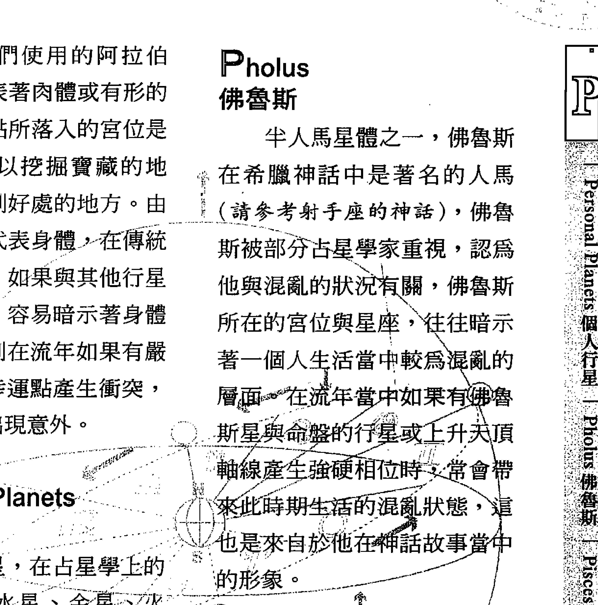

## Personal Planets 個人行星

個人行星，在占星學上的明確定義為水星、金星、火星，三顆與個人性格行為息息相關的行星，有時占星師會以內行星（Inner Planets）稱呼，雖然我們知道在科學的定義上，太陽與月亮不算是行星，但有時為了方便成會便把他們歸類為個人行星的範疇當中。

## Pisces 雙魚座

黃道上的最後一個星座變動的水相星座，其基本定義為感性的、慈悲的、犧牲的、具有強烈的藝術性格。在心理層面上，雙魚座代表著打破自我與他人界線的無我境界，由這一層定義來發展雙魚座的慈悲精神，同時雙魚座也常代表一種失去自我的渾沌狀態。雙魚座的符號為兩個相背對的括弧由一條線串起，象徵著黃道上的兩條魚和連結著他們的繩索。雙魚座的傳統守護星為木星，而現代守護星為海王星。

## Placidus Houses System 普拉西度制

占星學上較常用的分宮法，由17世紀義大利僧侶所計算出來，是目前世界上最流行的宮位劃分法，由17世紀義大利數學家普拉西度 (Placidus) 所提出，主要是以天底到上升星座，以及上升星座變成天頂所需的時間來劃分宮位，以地心為主軸計算，每2個小時畫出一個宮位，並以上升星座作為第1宮的起點、天頂為第10宮的起點，藉此找出第2、3、11、12宮的起點。普拉西度制屬於時間與出生地結合的計算方式，用這種分宮制就會出現上述的「劫奪宮」，而使得某個星座內的行星失去影響力。

## Planetary Hours 值時星

在傳統占星學中，每個小時由一個傳統行星守護，其順序分別是土星、木星、火星、太陽、金星、水星、月亮，這也是英文與拉丁文當中星期日至星期六各個名稱的由來，星期日 (Sunday) 的第一個小時正好由太陽 (Sun) 守護。

## Planets 行星

占星學中行星的定義來自於巴比倫人，他們稱行星為天體中的流浪者，凡是能夠以肉眼觀測到的規律移動星體，都被稱為行星。所以在占星學中太陽、月亮、水星、金星、火星、木星、土星、天王星、海王星和冥王星為行星，與天文學的定義不同，天文學上太陽為恆星、月亮為地球的衛星，水星、金星、地球、火星、木星、土星、天王星、海王星為大行星，冥王星在西元2006年的國際天文學會大會當中被降級為矮行星，但並不損及其在占星學中所代表的意義與地位。

## Pluto 冥王星

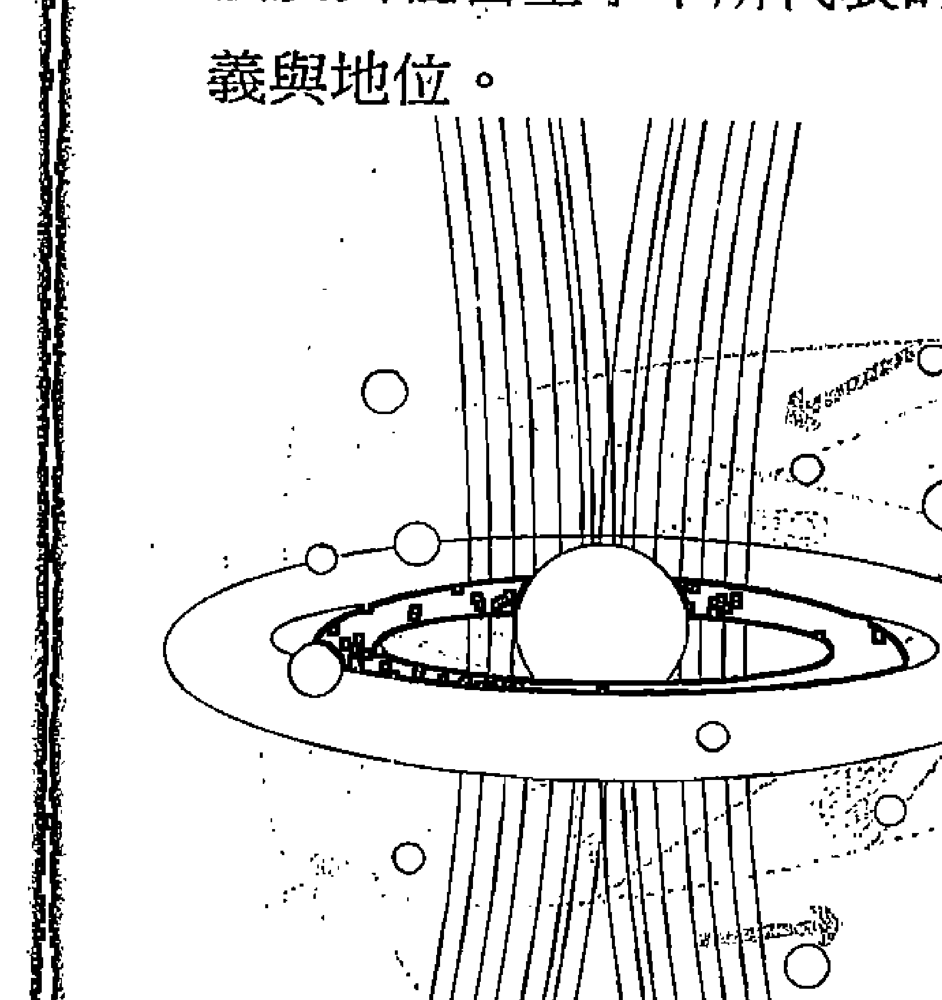

「Pluto」是希臘羅馬神話冥府主神的羅馬名稱。在西元1930-2006年之間，冥王星被視為太陽系的大行星之一，但西元2006年的天文聯合會修正天文學的行星定義，之後將冥王星降為矮行星，但在占星學當中仍將冥王星視為所使用的重要行星之一。在占星學當中冥王星具有掩埋、重生、劇烈蛻變以及被隱藏的事情（多半與傷痛有關）的意思，心理的層面上象徵著最原始的生命力量、求生意志與生命的延續、性愛。在星盤當中冥王星所在的宮位與星座，代表著被我們所遺忘的事情，以及容易帶來傷痛與引發內心黑暗面的部分。世俗占星學認為，冥王星常帶來令人恐懼的蕭條、大量的傷亡或戰爭等不愉快的事情。

## Political Astrology 政治占星學

在世俗占星學當中，專門研究天體運行與國家運勢之間關係的占星學。政治占星學的研究可以透過國家誕生時的星盤研究，或國家領導者的星盤作研究，也可以就一年四季入境圖的作研究，以日、月蝕或新月、滿月圖作研究等。另也可以以國與國之間的星盤互動等來瞭解政局的變化。詳細的內容請參考本人著作《占星全書》當中關於世俗占星學的部分。

## Precession 歲差

又稱為均分點歲差 (Precession of the Equinoxes)。在巴比倫時代，3月21日的春分點(Spring Equinox)也正好是太陽跨入白羊座的時候，這也是為什麼他們以太陽進入白羊座的30天作為第一個月，巴比倫人以這30天作為第1個月的原因是「春分點」(Spring Equinox)的關係。但這個律則在希臘羅馬時代卻出現了大問題，希臘羅馬的占星學家發現，晝夜平分點那天的太陽並沒有落在白羊座，反而移動到了雙魚座，這才發現到黃道帶背後的恆星群原來並不是固定的，而是以非常慢的速度移動著，這種移動的現象就稱為「歲差」(Precession)。

天文學家們經過多年的研究也發現到，地球自轉軸以2萬6千年的週期在轉動，西元前1萬4千年天空的北極是織女星，在3千年前天球的北極是天龍α星，春分點則落在牡羊座。到了今日從天文學的觀測來看，天空的北極是北極星，而春分點則已經落在了雙魚座的中間。

但是對古代的占星學家來說，春分這一天牡羊座的起始點，是定義行星位置的重要座標，如果不斷地移動在判定行星位置上，就會有相當程度的困擾。於是大約在西元前1世紀左右，希臘的占星與天文學家們決定，仍維持著將每年3月21日春分時刻，晝夜平分點太陽位置作為黃道上牡羊座的起始點（這時的晝夜平分點及太陽的位置已經是在接近黃道上雙魚座的的位置），並且維持著巴比倫時期的方式，從這個點開始將黃道劃分成為12個平均的等分，維持著原有的命名，並且將這樣的黃道系統稱為「回歸黃道」(Tropical Zodiac)。由此占星學分裂成為使用恆星黃道的印度學派，與現今使用回歸黃道的歐美占星學。

## Prime Vertical 主垂圈

從觀測者的角度來看，天球上通過地平線正東方、正西方和該地天空中最高點的大圓稱為主垂圈，又稱「卯酉圈」，是測量座標的方式之一，主垂圈常應用在分宮制度的計算上，中世紀所盛行的坎氏分宮法就是應用主垂圈作為劃分宮位的依據。

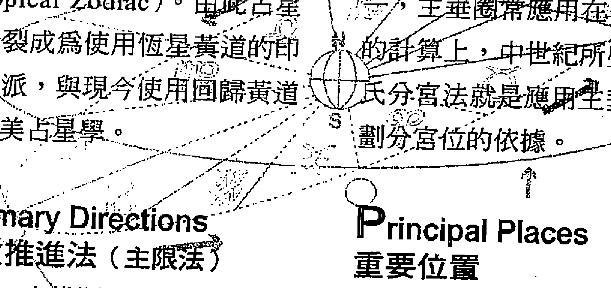

## Primary Directions 一次推進法（主限法）

一次推運法是中世紀相當流行的流年推運技巧，以出生後天頂上升的宮位移動與行星之間的關係，來推算1個人來年或未來的運勢變化，最常見的簡化方式是，以天頂每移動1度來觀測出生後每1年的運

## Principal Places 重要位置

在傳統占星學上認為發光體（太陽、月亮）以及第1宮的守護星，通過第11宮、第7宮、第9宮、第11宮為吉利的象徵，稱這些宮位為重要宮位。傳統占星學甚至認為一個人的命盤當中若日月與1宮守護星未落入這些位置的人，成不了大器，無法取得重要的社會地位或成為君王。

## Progressions 推運法與 Progressed Chart 推運圖

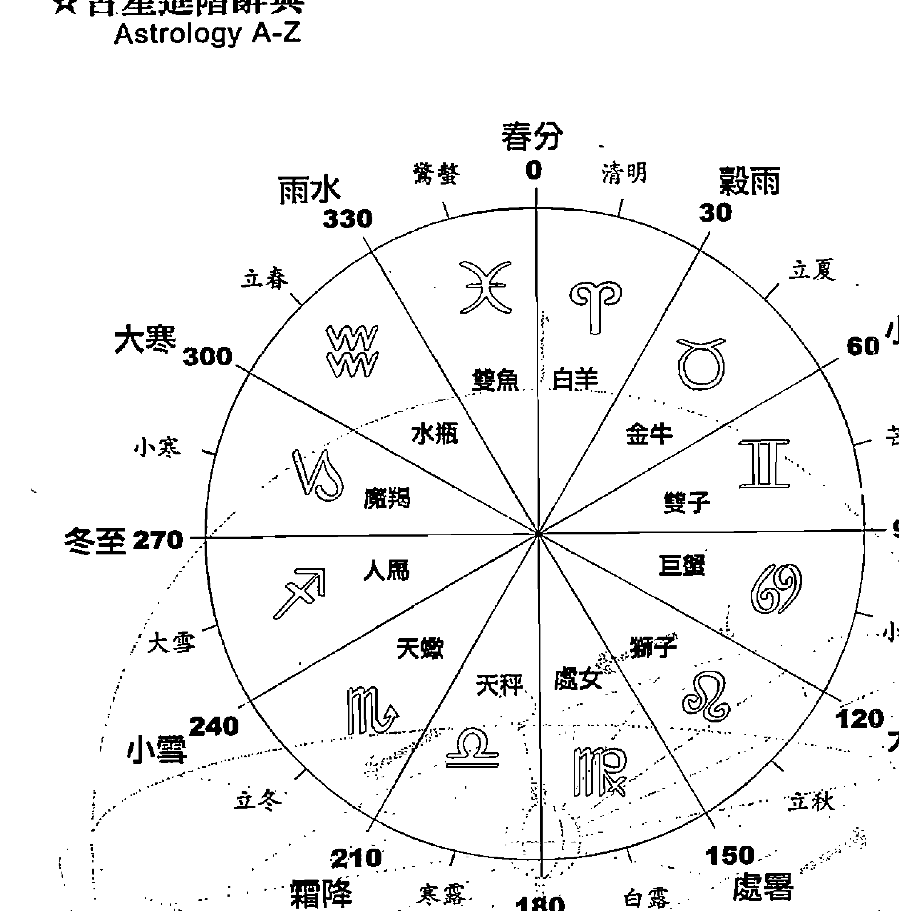

以各種流年推運方式所計算的星圖，同時又稱「Progressed Horoscope」。目前占星學界常見的幾種推運方式包括了，二次推運 (Secondary Progressions)、三度推運 (Tertiary Progressions)、次要推運 (Minor Progression)、逆向推運法 (Converse Progression)，目前占星學界除了二次推運法之外其他的方式都少有人使用。

二次推運法：以出生第2天的星盤作為預測第2年運勢的基礎，依此類推，30歲的運勢預測就看出生後第30天的星盤。三度推運法：以出生後1天的星盤，來預測出生後1個月亮回歸週期（大約是28天）的方式。次要推運法：以出生後每1次月亮回到星盤上相同位置時刻的星盤，來作為預測未來1年的依據：所以出生後第10次的月亮回歸可以用來預測出生後第10年的運勢。逆向推運：以出生前1天的星盤來作為出生後1年的運勢推測基準。目前占星學界中明確的定義稱為「Progression」的推運圖，是以實際天體的運作來推測未來的運勢的方式，與正向推運 (Directions) 當中，以象徵性行星的移動（例如：將行星移動兩度來觀測兩歲的運勢，而非實際天體的行星移動）有所區別。但在中文當中我們常將這兩種推運方式混為一談，以致於在翻譯名稱時也將「Directions」的方法稱為推運。此外，必須注意的是，從方法的分別上原本稱為一次推運的方式常被歸類為象徵性移動的正向推運法當中。

> > **十九世紀英國占星大師艾倫・雷歐 (Alan Leo 1860-1917)**

# 心理占星學 Psychological Astrology

心理占星學是近代占星學的主流，從心理學及科學的態度興起之後，占星學的神祕性質與命定論，被大多數抱持著科學精神的人否定，受到容格（Carl Gustav Jung）的研究與啟發，占星家（及部分心理學家）開始轉而利用星圖來探討人類的心理。心理占星學派的占星師基本上有兩個大主流，分別是採用容格式心理分析的心理占星學，以及以義大利心理學者阿薩鳩里（Roberto Assagioli）理論為基礎的「胡伯學派」。

容格所展開的占星學研究，被視為是占星心理學的濫觴，而倫敦占星學院的第一任院長查爾斯·卡特（Charles Carter）在西元1928 年發表的心理占星學百科，討論行星與心理學的互動，算是心理占星的第一步，這就是近代心理占星學的由來，但在此時占星仍尚未擺脫宿命論的色彩，一直要到人文占星學派的創立者魯德海雅（Dane Rudhyar），提出了人們本身的自由意志在星圖中扮演了決定的角色，並開始研究占星學當中關於無意識心理的部分，才算是心理占星學系統化發展的真正開始。

雖然心理占星學有許多流派或不同的名稱，但基本上要討論的是同一件事情，利用心理學的詞彙與概念來解讀心理因素。但不是所有的占星師都真的脫離了命運的判斷了嗎？答案是否定的。觀察今日的心理占星學家們，仍然將重點放在性格分析的論斷與命運的推算上，只是加上了心理諮商般的意見，鼓勵性的用語，或替人們找尋潛能開發的機會，早期的代表如同人文占星學派（Humanistic Astrology）的魯德海雅，而心理占星學派的大師麗茲·葛林（Liz Greene）霍華德·薩斯波塔斯（Howard Sasportas）也在這方面多有研究，目前由麗茲·葛林所創立的倫敦心理占星學中心（Center of Psychological Astrology，簡稱CPA）的課程就是此學派的重要代表，要拿到該學院的證書並不簡單，你必須取得該中心的占星學文憑，同時也要取得心理諮商師的文憑，才算完成該中心的學業。

前面所提到的大部分心理占星學者，多採用容格的分析心理學，而瑞士人胡柏夫婦（Bruno & Louise Huber）則另闢蹊徑，他們採用的則是義大利心理學家阿薩鳩里的理論基礎，他們傾向阿薩鳩里的心靈整合方式，藉由整合意識、無意識以及更高層次的超意識狀態，來使人們瞭解自己的生活與生命歷程。雖然胡伯學派並不是目前心理占星學的主流，但對於心理占星學確有著不少的新見解，例如：將整張星盤看作是一個生命時鐘，且使用獨特的星盤相位圖形解讀，以及截然不同的推運觀察法，在心理占星學上也有著相當特殊的成果，他們出版許多關於胡伯心理占星學派的書籍，並成立了占星心理學院（Astrological Psychology Institution，簡稱API 或Huber School），分別在瑞士與英國設有學院，有興趣的朋友不妨上網找尋他們的網站來研究。

事實上，心理占星學的影響相當的廣闊，更由於心理學的詞彙大量地在我們的日常生活當中流竄，例如：情緒、意識、無意識或潛意識、自我，使得占星學家們有意、無意或無可避免地開始使用這些共同語言，為何是有意、無意或無可避免呢？當然心理分析命盤## 心理占星学 Psychological Astrology

当占星师拿起命盘，开始解释这个人的个性的时候，不可避免地用了性格、人格、无意识这些词汇，听起来好像每一个占星师都是心理占星师，这是无可避免的状态。而对容格有研究的占星师就会更往容格的理论去钻研，不过他们多半不会把这些询问者听不懂的词汇拿出来吓他们，最多用潜意识和恋母情结这些词，就能达到让人觉得占星师很神的地步。这就是有意地展现心理占星学真的很「心理学」。

今日也有部分的占星师开始检讨心理占星学，他们认为心理占星学盗用容格心理学的术语，却忽略了容格心理学对占星学的实质看法，例如：玛姬·海德 (Maggie Hyde) 女士的《容格与占星学》一书就提出了这样的反思，却也引起了心理占星师的群情激愤，许多占星师激动地表示，这本书对心理占星学的批判根本是断章取义。不过我倒是建议大家去阅读这本书，并且用自己的脑袋思考一下海德女士的论点带给你什么启发？

## ① 容格心理学的几个基本概念

要了解容格式的心理占星学，我们得从容格的心理学基础开始谈起，在容格的占星学当中，他所谈的心 (Psyche) 已经不再局限于心智，在拉丁文当中「Psyche」还同时有灵性与灵魂之意，在容格的人格概念中有三种不同的层次意识、个人无意识、与集体无意识。

在容格的观念当中，整个人格的中心是自性 (Self)，居于中央被所有的意识、无意识、自我等环绕着。自性把一个人心理层次的所有原型、意识、无意识表现都结合在一起。自性 (Self) 是整合、完整的原型，它把所有的原型、情结，以及它们在意识中的显现，都吸引到它的周围，形成一个和谐、统整的现象，所以又称完全的自我，这一点与「Ego」的意识层的自我不同。

意识的中心是自我 (Ego)，在意识层次的心理作用包括了如：推论、感情、思考、记忆，这些都是由意识的知觉、记忆和感觉组成，形成个人的认同。意识与无意识是相对的概念，简单地说意识是我们所知道的事物，无意识则是所有我们所不知道的一切。

在自性 (Self) 与自我 (Ego) 之间，存在着个人无意识 (Personal Unconscious)，个人无意识包括了那些不被人认可被遗忘的记忆，也就是说这些事情原本也存在于意识当中，但是却被遗忘或掩埋了，弗洛伊德 (Sigmund Freud) 认为个人无意识来自于童年的创伤或性心理的异常发展，但容格抱持着不同的看法，他认为生活当中的许多事情都可以变成个人无意识。

个人无意识当中，这是比较靠近「自我」(Ego) 而成为「情结」(Complex)，情结这一个字词是容格所创立的，他指的是人格当中独立的次人格，它们拥有自己的能量与驱力，当这些次人格被刺激时就会产生某些思想或反应行为，这种情况特别容易发生在自我较为脆弱的时候，我们常听过的恋母情结就是指一个人对于与母亲有关的事物反应相当敏感，特别需要母亲的照顾或是寻求类似母亲的女性伴侣。

比较接近「自性」(Self) 有着集体无意识 (Collective Unconscious)，它指的是全人类所共同拥有的特质，对于事物的共同反应，存在于这里。全人类的集体无意识，就像是藏在海底下的冰山一样，不可测得，我们可以在许多神话当中寻找到集体无意识的痕迹，不过这个学说也是容格的学说当中，最倍受批评和讨论的部分。

集体无意识由「原型」(Archetype) 构成，原型存在于意识之外是一种抽象的概念，简单的说，就是各种人类所共同拥有的经验，且一再地的重复出现在不同的文化与神话当中，在宗教、神话、梦境、幻想、习惯、思想当中，我们都能够找到原型。容格曾经提出许多原型的概念，最有名的就是「阿尼玛 / 阿尼玛斯」(Anima / Animus)，除此之外还包含了面具原型、阴影原型、父亲原型、母亲原型、圣童原型、智慧老人原型、智慧老妇原型、恶精灵原型、再生原型等，它们位于个人无意识与集体无意识之间。

介于「情结」(Complex) 与「原型」(Archetype) 之间，分别是「人格面具」(Persona) 与「阴影」(Shadow)，「Persona」一词原本来自于希腊戏剧表演中，演员所戴的面具，象征着演员所扮演的角色，在容格的人格面具当中，我们扮演着顺应社会需求的表现，例如：勇敢的年轻人、温柔的少女、称职的父母等，用来符合外在社会所赋予一个人人生舞台上的角色，这个面具所指的就是你所要显示给他人所看的面具，且在不同的时候、不同的地点会有不同的面具出现，面具甚至不一定符合社会的需求，有些时候也因为因应社会的刺激而产生出反叛的角色。人格面具相当的重要，它的存在就如同皮肤的功用一样，减轻外界对内在自我(Ego)的冲击。

阴影(Shadow)是人格当中不愿意被看见的部分，这个多半代表着不被社会认可的个性，例如：残忍、邪恶或恶拙的性格，因为这些特质与社会的要求并不符合，所以我们把他们丢弃，甚至到了无意识界当中，而事实上这些阴影仍不断地在影响着我们，带来了恐惧，或是投射在他人身上，形成我们憎恨他人的原因，但容格认为阴影同时也是生命力与活力的来源，基本上不可以忽略它的存在而必须去正视与面对。

阿尼玛(Anima) 与阿尼玛斯(Animus) 用最简单的一句话来说「阿尼玛是男性内在的女性人物」，而阿尼玛斯则是女性内在的男性人物。通过这样的投影，我们去寻找类似的另一半，不过事实上在容格的理论当中，阿尼玛与阿尼玛斯有着更深层的意味存在，他们是一个人个体化（完成自性的整合）过程的重要关键，在容格和他的追随者的眼光中，必须把它们两个当成是一组的角色，相互辉映。与阴影相同的是，它们被用来补充人格面具的心灵结构，但是存在于比阴影更深层的无意识，并且它们没有好坏之分，只有阴性（阿尼玛）与阳性（阿尼玛斯）之分。

当人面对外界时候，一些被排斥的事情与个性就会被阿尼玛与阿尼玛斯所吸收，例如：妈妈对一个打算涂口红的小男生说「不行，男生该有男生的样子，你不可以涂口红会被别人笑」，这时候表面上小男生听了妈妈的话，放下口红不再涂口红，但这个冲击所造成的...

## ② 容格学说在心理占星学的应用

在容格及其追随研究者的眼光中，认为一个人的心灵就是一张地图，每一个人在个体化的同时，就如同一场冒险，重复着一段又一段的神话之旅，或梦幻当中的英雄事迹，也在重复着炼金术士们追求长生不老的过程，而心理占星学家们，也把一张星图当作是这张心灵地图，这张星图所表示的就是完整的自我，也就是最接近容格的自性（Self），这也是我们的最终目标，成就一个完整的个体。

### ◎ 星座在心理占星学上的意义

每个人有每个人不同的个体化过程，这当中不同星座的影响，带给人不同的途径与不同的能力，每一个元素都有着他的独特的能力，这些独特的能力应用在将个体化的阶段，在容格的论述当中也正好将人们分成了四种心理功能：感觉、思维、情感、直觉，于是心理占星学家们将这四种心理功能与四种元素相互搭配，找出了火元素等于直觉积极外向，风元素等于思维寻求了解，土元素等于感觉去感受实体的存在，水元素等于情感受内在主观意识与心理意象的影响很深。

也开始意识到外界直接对内在自我的冲击，于是接下来的阶段因而产生处女座。

处女座是对于狮子座的需求产生回应，在这个阶段人们再次利用感官的能力来探索，这一次不仅是外在，同时也是对内在的探索，因而产生观察、比较、分析与批评。他们同时间持续承受着自我与外在的冲击，努力地想要让自己符合外界的标准，也使得他们开始判断自己，并将不符合社会规范的事情从自我中排挤出去，从容格的心理学理论当中，我们知道这些事情，都逐渐被阴影与阿尼玛、阿尼玛斯及个人无意识所吸收，也开始在自我个体化的过程当中逐渐被天秤座影响。

天秤座为了反映在处女座阶段所想要避开的社会批判而压抑的行为，于是有了另一张显著的人格面具产生，并致力于自我意识当中那些被批评为负面的部分，有时这张面具呼应着社会，有时则以反叛角色出现，外界的人对天秤座阶段的人最具有影响力，也使得他们的中心从自我转移到他人，风元素带给他们思考如何与这世界呼应，阿尼玛与阿尼玛斯也在此阶段开始投射在他人的身上。

由于天蝎座也代表性，亦是人们寻求内在另一半的过程之一，同时也因为过多压抑与排除负面特质的影响，自我无意识的作用加大了，人们开始恐惧诸如：死亡——被天蝎座用他的感觉与经验来体会，但越是如此问题就越多。

到达射手座阶段，火元素的直觉与行动促使着他们去寻找问题的答案，所谓的真理，探索与研究的阶段就在这时出现，通过这些行动人们不断地成长与茁壮，到达摩羯座阶段时他们已经拥有十分强大的力量与权力，他们本身也乐于运用这些能力去创造属于他们的世界（事业），与外界的接触又再次带来不同的人格面具，同时土元素的感官，让他意识到物体经过长久的使用开始衰败，引起他们的忧虑。

就在此时他们进入了下一个阶段水瓶座，在水瓶座时已经熟悉摩羯座所建立的领域，且对于外界十分熟悉，他们与外界互动更加频繁，且思考着如何避开衰老与败坏的问题，通过不断地思考这个问题并且实验，推动着他们朝生命的最后一个阶段走去，双鱼座的领悟显示着在水瓶座的思考找到了答案，通过所有过去的经验，他们体验到自身与宇宙的呼应，而完成了个体化的阶段，并且再次进入下一个阶段。

除了这些基本的解读之外，丽兹·葛林（Liz Greene）更强调占星家们要从每个星座的背景神话下手，来了解星座符号背后所暗示的人生含意，例如：牡羊座的性格与人生，与希腊神话中杰逊王子取金羊毛的故事有着紧密的连结；通过了解每个神话的背后意涵，我们更能轻易掌握心理占星学的解释技巧。

### ◎宫位在心理占星学的意义

心理学占星师除了用将心理功能套用在元素上，将个人的生命探索历程套用在黄道上之外，也将命盘上的宫位视为是个人人格的形成要素，以及自我觉醒的历程，个人存在的与展开觉醒的等步骤通过第 1 宫来表示，而「自我」这一层意识的中心，则通过了第 5 宫来表现，由知识、感觉、记忆和经验所形成的个人认同，第 9 宫则代表了自我觉醒的历程，通过这个历程，人们发现更多内在自我的存在，通过思想的成长来形成个人的人格，也是自我整合的重要一环。第 3 宫则代表着对外界的探索与吸取知识，第 7 宫则是与他人的互动与共同生活、第 11 宫则代表着与团体的互动。

意识层面从第 2 宫开始展开，首先意识到的，就是需求的满足以及反映在自身的感觉，而与他产生关联的第 6 宫代表着集体意识，这个意识是受到外在环境的影响，就如同容格所说的包括所有传统、约定、风俗、偏见、规则以及人类共同的标准，至于第 10 宫代表着个人呈现出符合他所处的时代与地点的形象，这当然就是一张相当重要的人格面具。

而无意识的层面是心理占星学的特质，传统上第 4 宫、第 8 宫、第 12 宫是如此难以解释的宫位却通过心理占星表现得淋漓尽致。在心理占星学当中第 4 宫代表，通过情感与情绪反应来表达的无意识层面，而第 8 宫几乎是整个个人无意识的重点，我们在第 8 宫诠释个人的无意识，刻意被遗忘的事情、个人所拥有的特殊情结、也包括了许多的原型阴影、阿尼玛、阿尼玛斯等，都由第 8 宫来诠释。而第 12 宫则是代表着容格的重要发现，集体无意识（或称集体潜意识），所有的人类记忆、神话、梦想都累积在这里，而由于整个无意识层面相互影响，第 4 宫的情绪反应揭露的只是冰山的一角，反映着下层的个人无意识和更下层的集体无意识，而位于中间第 8 宫的情结与阴影，则通过与第 1 宫、第 5 宫、第 10 宫的互动，接收被排挤的负面特质，并与集体无意识互动，然后通过情绪反映表现出来。

在宫位的观察上，我们还可以有下列的解释：第 2 宫与第 8 宫分别代表个人意识与个人无意识的互动（第 2 宫将受到压抑的部分交给第 8 宫），第 2 宫的自我意识通过与外在的互动朝着第 10 宫的意识面前进，但这当中为了避免第 5 宫所代表的自我受挫，第 10 宫又将一部分的负面特质，经由情绪的内化交给第 4 宫，再由第 4 宫通过本身第 4 宫、第 8 宫、第 12 宫的互动，形成了情结与原型。

### ◎ 行星在心理占星学的意义

在心理占星学中，行星代表意义相当的复杂，因为这仍是一门相当年轻的学问，有待于学者的研究，有人认为太阳代表自性（Self），月亮代表情绪与无意识，水星代表人格面具，因为它决定个人在他人的形象，及其外在社会价值观与在集体中的情况，还有在社团生活中承担的角色。金星代表阿尼玛，火星代表阿尼玛斯，木星代表自我，因为它代表一个人可以改变的人生观和哲学取向，土星代表阴影，因为它拥有调节的力量。这样的说法确实符合某些部分的容格学说，但是却很难自圆其说。若太阳代表了自性（Self），那么岂能符合自性当中完整自我的定义，月亮确实可以代表部分情结与无意识的情绪反应，但是水星代表人格面具亦指代表了水星的变化能力，这些论述都仍需要我们加以思考，并不能够照单全收。

## 心理占星学 Psychological Astrology

在当代心理占星学研究上，应用容格的心理分析且较为有系统的心理占星学者，分别是哈马克·宗达格（Hamaker Zondag）、丽兹·葛林（Liz Greene）与史蒂芬·艾若育（Stephen Arroyo）。

哈马克·宗达格认为行星象征着心理的机制，或是带来趋力影响无意识中的原型，他认为太阳代表着自我、自性应是由整张星图代表，月亮代表着趋力与无意识的情绪性行为，水星代表着天生行为模式的表现与自我呈现，金星代表着与人际关系的趋力，寻求渴望被他人认同，而火星反之寻求对抗他人，代表对外的行为。但金星、火星这两者又同时代表性的伴侣，木星则代表着追求宗教与精神提升的趋力，土星代表着与自我情结抗衡的控制力量与自我压抑。天王星象征着无意识的改变趋向，具有反抗情结以及阉割情结，海王星具有将事物理想化的趋向，而冥王星则与权力情结有所关系，也是一种使人发现自我弱点与改革的重要关键。

而英国心理占星学中心的创立者丽兹·葛林博士也有一套不尽相同的看法，她认为意识面是由月亮、太阳、天顶所代表，而无意识面则是由土星代表，而对于阴影她认为土星的影响重大。但基本上心理占星学有别于传统的占星学观点，将火星、土星、天王、海王、冥王星都视为是一种帮助人们迈向整合自性的一种趋力，而不是将他们视为凶星。此外，丽兹·葛林利用分析心理学的神话与心理原型理论，结合应用在行星的解释与整体星盘的解读当中，更是近年来欧洲心理占星学派的主流，此两个学派都较倾向于心理学中容格的理论。

这些心理占星论述都颇为中肯，但也尚未揭示容格的学说的真正意涵，心理占星学的发展还有许多成长的空间，如果你有兴趣，心理占星会是一个值得研究的占星领域。

推荐参考书

- 《Chart Interpretation Handbook: Guidelines for Understanding the Essentials of the Birth Chart》—— Stephen Arroyo
- 《Astrology of Personality: A Reformation of Astrological Concepts and Ideals in Terms of Contemporary Psychology and Philosophy》—— Dane Rudhyar
- 《Psychological Astrology: A Synthesis of Jungian Psychology and Astrology》—— Karen Hamaker-Zondag
- 《The Inner Planets: Building Blocks of Personal Reality (Seminars in Psychological Astrology, Vol 4)》—— Liz Greene, Howard Sasportas
- 《Dynamics of the Unconscious: Seminars in Psychological Astrology (Seminars in Psychological Astrology, Vol 2)》—— Liz Greene, Howard Sasportas
- 《The Development of the Personality (Seminars in Psychological Astrology, Vol 1)》—— Liz Greene, Howard Sasportas
- 《Aspect Pattern Astrology》—— Bruno & Louise Huber（胡伯学派）
- 《The Planets and their psychological meaning》 Bruno & Louise Huber（胡伯学派）
- 《Life clock》—— Bruno & Louise Huber（胡伯学派）
- 《Jang and Astrology》—— Maggie Hyde（中文版《荣格与占星术》远流出版社出版，由于作者本人学习卜卦占星学，所以本书内容较偏向为心理占星学的综观与反思。）

## Quadrant
象限

星图中由上升点起，每三个宫位为一个象限，在黄道上也可以这样应用，从白羊座到双子座为一个象限依序类推。

多半应用在星盘的时候观察1至3宫的象限为自我需求的呈现，4至6宫的意涵为情绪与自我表达，7至9宫代表与他人的互动，10至12为与公众以及宇宙的互动。

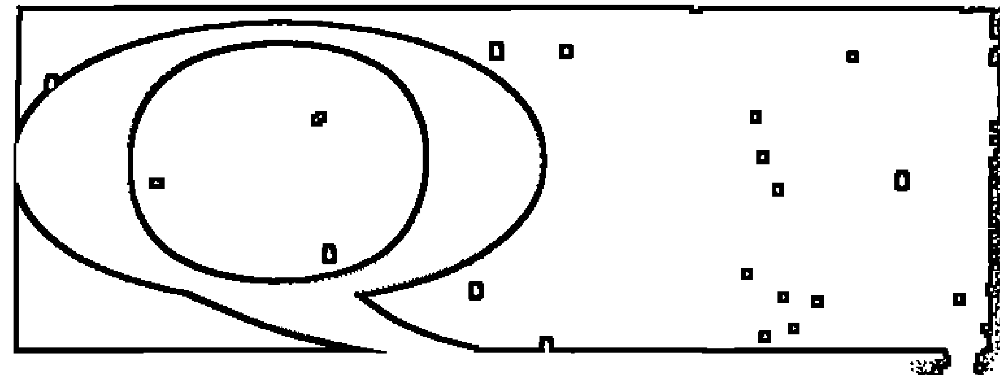

## Quadruplicity
星座性质三分法

将星座依其型态（Mode）每四个一组分为基本宫（开创星座）、固定宫（固定星座）和变动宫（变动星座）三组。

其英文字「Quadruplicity」意思是4的意思，代表每一组都有4个星座，但在中文上若直接翻译可能无法传达原意所以称为星座性质三分法。

## Quadrant Method
四分制

在许多分宫法当中，以上升为第一宫起点，并且拉一条轴线穿过星盘到达与其180度的点为下降点及第7宫的起点，由此将命盘分成2等分，再将天顶视为第10宫起点，并拉出一条轴线到其相对180度的点为天底与第4宫的起点，将星盘分出了4等分，最后将其余星图的空间以投影的方法分出12宫。

## Qualities
特质

今日占星学当中常讲的性质往往是型态（Mode）的意思，也就是基本、固定、变动的区分方法。但在传统占星学当中，性质又指每元素星座所具有的气候性质，冷、热、干、湿。火相星座同时具有干燥与热的性质，土相星座具有冷与干燥的性质，风相星座具有热与潮湿的性质，水相星座具有潮湿与冷的性质。在卜卦占星学当中，星座的特质被视为是判读的重要依据。例如：询问关于气候的问题，象征星若出现于火相星座意味着气候干且热，若出现于水相星座则暗示又湿、又冷的天气。此外若与情感或人际关系有关的问题，两人的象征星若出现了没有共同特质的星座，就表示他们无法认同，例如：火相星座与土相星座可以藉由彼此都有「干」的特质而获得认同，而火相星座与风相星座因为都同时拥有「热」的特质而取得共鸣，但是火相星座与水相星座完全没有任何的特质与互动，若在卜卦占星学的问题当中，两人的象征星分别出现在火相与水相星座时产生的彼此认同度恐怕不高。但是这种特质的区分在现代占星学的应用当中并不常被使用。

## Querent
询问者

在时辰占卜占星学当中，提出问题的一方称为「Querent」，通常是由第1宫来代表提问题的这个人，而第1宫的守护星所落入的星座与宫位，以及其他行星的互动可以显示出询问者目前的处境。

要特别注意的是，若询问者所问的问题与自身无关，则重点不必摆在上升的守护星，而要注意与问题有关的象征星。

## Quesited
询问主题

在时辰占卜当中被提出的问题或是成为问题本身的人及事件。例如：一个人前来问他的女儿是否能够考上大学时，询问主题就是女儿与女儿高等教育，这时候代表关键的行星包括了月亮、金星（女儿）、水星（学习）、第5宫的守护星（同样代表女儿）、以及第## ☆占星進階辭典 Astrology A-Z

1宮（因為從第5宮算起的第9個宮位代表女兒的大學學習），這些行星都可以成為象徵星。

## Quincunx
十二分之五相

兩行星或行星與基本點特殊點之間形成150度的相位，又有人稱補十二分相、或「Inconjunt」。傳統占星學當中認為此相位與財產、健康、不幸及與死亡有關的相位，而心理占星學認為這個相位與刺激還有心理上的盲點有關，認為人們無法正視問題而有愧疚感，並促使自己不斷的修正態度，但也有占星師認為合盤當中出現這樣的角度，有利於增加雙方的互動。

## Quintile
五分相

兩行星或行星與基本點、特殊點間成72度的距角，代表著創意與藝術特質。五分相並非占星學的主要相位，不過特別在研究一個人的藝術與創作特質的時候，五分相與倍五分相（144度）都十分被重視，五分相與倍五分相雖然具有創作與藝術特質，但也都有延遲才能表現的意涵。

> 人本占星學派創始者
丹・魯德海（Dane Rudhyar 1895-1985）
並非事件發生在人們身上，而是人們引發問題，當個人受到一個特殊事件時，是因為他需要這些事件來幫助自己，他往往可藉此（讓自己）變得更為完整。

## Radical Chart
基礎圖

在占星學當中基礎圖常是指出生時刻的出生圖，以此為基礎來做流年推運或合盤的工作，故稱基礎圖。

## Rectification
出生時間校正

占星學的星盤計算需要精確的出生時間來繪製星盤，差距離個幾分鐘可能就會成為不同的星盤影響解讀，但如果出生時間不正確，例如：在台灣大多數的人的出生時間都以時辰作為單位，而無法精確的推算出星盤正確的上升天頂位置，這時候就需要做出出生時間校正（又有人稱做生時校正、星盤校正、或套用中國命理稱為定盤），不同的占星學派有不同的生時校正方式，最常見的是依據生命歷程中事件的發生時間點，來與推運或太陽弧正向推運運的盤做呼應，來校正出正確的出生時間。

## Regiomontaneous System
芮氏分宮法

在中世紀相當流行的分宮制，是15世紀的占星家穆勒（Muller）所創，而瑞久蒙塔努司（Regiomontanus）則是他的拉丁文名字。主要的計算方式是以天球赤道與東方地平線的交會為起點，在赤道上每30度做一個劃分共畫出12個點，再將這12個點以南北極平於赤道為軸心，投影到黃道上找出12宮的位置。這個分宮法是從坎式分宮法中蛻變而來的，由於在中世紀盛行，並且在時辰占卜大師威廉・李利（Willian Lilly）的書中使用，於是許多時辰占卜占星師至今仍堅持使用這種分宮法。

## Relationship Chart
關係圖

又稱「Davison Chart」或「Davison Relationship Chart」，屬於中點組合盤計算方式的一種，占星師羅南德・戴維遜（Ronald Davison）依據兩個人出生時間及地點的中點來繪製一張組合星盤。在合盤技巧當中使用「Davison Chart」的人並不多。

## Relocation Charts
地點置換圖

一個人的星圖是依據其出生的時間與出生地作為判斷，但是當一個人移居到其他地方時，我們可以將出生時間更換到其他地點，重新繪製出生圖，所以其出生命盤的行星位置不變，但是宮位可能做了一些調整，這也可以觀察出一個人移居到另一個地方時性格的改變，是移民占星學當中的重要工具。「地點置換圖」在本人著作《占星全書》中有更詳細的介紹。

## Retrograde
逆行

以地球為觀測中心時，一般而言行星呈現由東向西的前進方向，但因為行星軌道與地球和該行星運行的相對速度，有時行星會呈現一段時間由西向東的方向前進，稱為逆行。逆行在占星學上有著特殊的地位，傳統占星師認為逆行使得行星發揮弱勢的影響力，業力占星師認為逆行的行星是一個明顯的前世印記，代表著前世未完成的課業。而心理占星師認為逆行的行星代表一個人在早期的發展之後所停頓的事物，最後會在這個人準備周全之後重新涉入這個領域當中。

## Returns
回歸

在占星學當中星體的移動是循環的，例如：月亮每28天左右會繞完黃道一週回到同一個位置，太陽每一年會回到黃道的同樣位置，當行星回到出生圖上相同的位置稱為「Return」，用來作為未來一個行星循環的流年預測方法，最常使用的幾個行星回歸包括太陽回歸、月亮回歸、土星回歸。而「Revolution」是占星學上「行星回歸」（Returns）的另一種說法。

## Rising Planet
上升星

在星盤中與上升點合相的行星稱為上升星，其行星特質容易在個人身上突顯出來。上升星在星盤當中佔有相當重要的地位，其影響力不低於太陽與月亮對個人所帶來的影響，在心理占星學當中上升星會是這個人與社會互動時，想要強烈帶給他人的感受。此時行星的基本意涵所帶來的特色，大過於行星受到星座與宮位的影響。

## Rising Sign
上升星座

上升點所落入的黃道星座稱為上升星座，由於在天象觀測的時候會發現黃道上的12個星座會一個接著一個的從東方的地平線上冒出來，而占星師相信一個人出生時，從東方正要上升的星座會影響此人的命運與特質。在心理占星學當中上升點所在的星座代表著我們給予外界的印象，是一種社會化的互動過程的演變。

## Ruler
守護星
## Rulership
守護關係

在占星學中每一個星座或宮位都有其相關聯的守護行星，稱之為「Ruler」或「Dispositer」，或「Lordship」。同時在傳統占星學當中，當行星進入其守護關係的宮位與星座時都代表著相對的強勢。若進入守護星座或宮位對面的星座或宮位時，就代表著該行星影響力減弱。守護關係依照傳統與現代可以分為：
- 牡羊座與第1宮的守護星為火星
- 金牛座與第2宮的守護星為金星
- 雙子座與第3宮的守護星為水星
- 巨蟹座與第4宮的守護星為月亮
- 獅子座與第5宮的守護星為太陽
- 處女座與第6宮的守護星為水星
- 天秤座與第7宮的守護星為金星
- 天蠍座與第8宮的守護星為冥王星（同時擁有共同的傳統守護星為火星）
- 射手座與第9宮的守護星為木星
- 摩羯座與第10宮的守護星為土星
- 水瓶座與第11宮的守護星為天王星（共同守護星為土星）
- 雙魚座與第12宮的守護星為海王星（共同守護星為木星）

## Sabin Symbols
莎比恩符號

20世紀初期，美國占星師瓊斯（Marc Edmund Jones）與靈媒艾西・偉勒（Elsie Wheeler）的共同創作，企圖找出每一個黃道度數的特殊意涵，並以詩文來形容此度數的特性。此方法後來被魯德海雅（Dane Rudhyar）進一步詮釋與推廣，莎比恩符號是占星學研究中較為細膩特殊的部分。

## Sagittarius
射手座

黃道上的第九個星座，變動的火相星座，其基本性質包括：宗教、哲學、高等教育、擴張領域、成長、國際事務、長途旅行等。在心理層面上意味著世界的探索（藉此延伸出旅行、國際事務、與教育等特質）與自我的發展，射手座的符號為箭頭，在占星學中守護星是木星。

## Satellitium
星群

在星盤中，若有3顆以上的行星同時形成合相稱為星群，而「Stellium」為星群的美式英文拼法，占星師認為星群為命盤上相當重要的一個指標，有星群落入的宮位成為此人生命當中的重點生活層面，也代表著此人生活當中的重要生命主題。星群的解讀方式有幾個可以掌握的重點，首先整個星群的守護星是哪一顆星落入哪1個星座與宮位，將會引導整個星群的力量前進，其次注意整個星群中順時針方向的並最接近東方地平線（上升星座）的第1顆星，也同時具有引導的功能。

## Saturn
土星

太陽系的第6顆行星，在傳統占星學當中土星為距離最遠的行星，傳統占星學認為土星是一顆帶來厄運的行星；在現代占星學當中其基本定義包括：保護、限制、冷漠、經驗、長壽等；心理層面上的定義為壓抑、恐懼、擔憂與過去的不愉快經驗；在世俗占星學中土星與權力機構、管理機構、大型組織有關，在醫療占星學上土星與骨骼、牙齒和皮膚都有關係。

## Scorpio
天蠍座

黃道上的第八個星座，固定的水相星座，其性質包括事物的結合、死亡與重生、激烈的轉變等。在心理層面的意涵當中暗示著心頭的黑暗層面，自己不願意面對的傷口與醜陋的事件，同時也與控制欲望和生存意志有關。天蠍座的符號為蠍子尾部的刺針，其守護星在傳統上為火星，同時冥王星是天蠍座的現代守護。

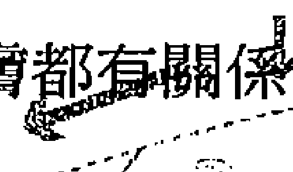

### ## Second House 第2宮

星盤上的第2宮與黃道上第2個星座金牛座相互呼應，傳統的第2宮被簡稱為金錢宮，同時也代表金錢、個人價值觀以及獲得資源和能力的方式，同時也有占星師認為第2宮使我們具有形體，所以也與我們的肉體有關。在意理上，象徵著一個人的自我價值、物質所帶來的安全感；在世俗占星學中第2宮象徵著一個國家的財政狀況，金融系統的運作等等。

### ## See-Saw Shape 跷蹺板型

瓊斯圖形之一，所有的行星形成兩個180度對立的集團，中間的空白間隔需要至少120度，擁有這類行星圖的人在決定事情之前考慮周詳，就如同蹺蹺板兩邊的重量，始終試圖取得平衡，這樣的人也習慣平衡事物，喜歡從事件的兩端來看待，找出最適當的平衡。根據研究指出常與天秤座和雙魚座有關。

### ## Secondary Progressions 二次推進法

以出生後1日的行星位置來推算預測出生後1年運勢的方式，稱為二次推運法，是在電腦普及之前最為普遍的流年推算方式。

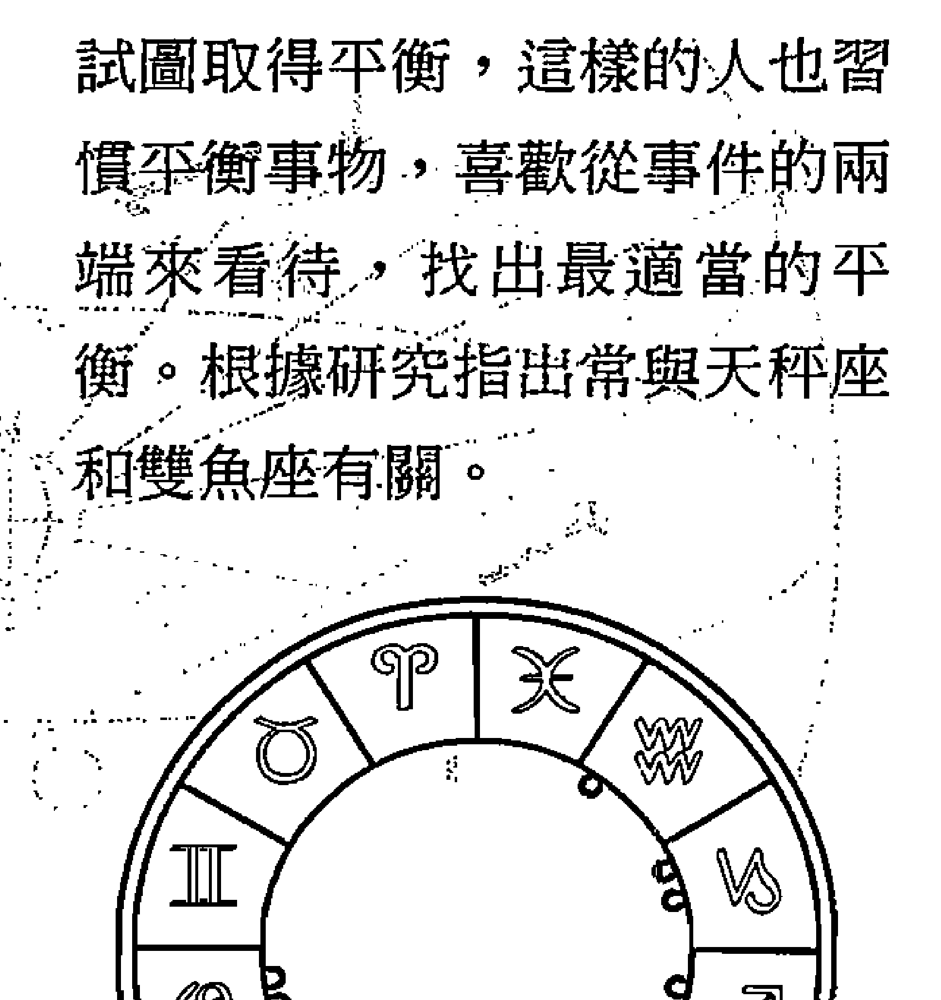

### ## Semi-sextile 半六分相

當星盤上兩行星之間或行星與基本點特殊點之間形成30度的相位時，稱為半六分相，屬於次相位，傳統的占星學認為半六分相是吉凶參半，心理占星學認為此相位帶來輕度的刺激條件。人文占星學派認為半六分相是一種人與我之間不同之處的初步體驗，這種體驗容易在後來變成衝突。半六分相與半四分相在近代占星學當中並不十分被重視，在時辰占卜占星學當中甚至不被使用。

### ## Separating Aspect 出相位

兩顆行星火行星與基本點特殊點之間，經過形成正相位（0度角距）之後，開始分離稱為出相位。大部分的占星師認為，若一個相位是出相位的時候，其影響力會開始減弱，因為出相位代表著事情已經發生過了，那麼需要注意的焦點就不必放在這裡，在時辰占卜占星學當中，除非要回顧過去發生的狀況，否則出相位甚至可以不必討論，只會考慮入相位與正相位。

### ## Semi-Square 半四分相

當星盤上兩行星或行星與基本點特殊點之間形成45度的相位，稱為半四分相，屬於次相位，傳統占星學視半四分相為凶相，而心理占星學研究發現此相位與引發衝突意外有關。半六分相與半四分相在近代占星學當中並不十分被重視，在時辰占卜占星學當中甚至不被使用。

### ## Septile 七分相

當星盤當中兩行星或行星與基本點特殊點之間形成51度26分的相位，屬於次相位，是與業力有關的相位，也有人認為七分相暗示某件當事人必須深入探討的課題，同時注意該宮位所帶來的困擾，而七分相的2倍102.51度與3倍154.48度等角度，也有同樣的影響力。值得注意的是七分相目前僅有少數占星師使用。

## Sesquiquadrate
八分之三相

在星盤當中星與基本點、特殊點之間形成135度的相位，稱為八分之三相屬於常用的次要相位之一，傳統占星學視半四分相為凶相，而心理占星學研究發現八分之三相與半四分相都與引發衝突意外有關。人文占星學派認為八分之三相可以觀察兩顆行星中；移動較快的行星移動方向，而區分其緊張狀態的變化。

## Seventh House
第7宮

星盤上的第7宮對應黃道上的第7個星座天秤座，傳統的定義為婚姻伴侶以及法律合約關係。心理占星學將這一宮視為我們與他人之間的平等互動，所以在個人星圖當中掌管伴侶生活、本人與他人的對等互動以及和他人的合作關係，在世俗占星學中代表外交、敵國或邦交國。

## Sextile ✡
六分相

在星盤當中兩行星或行星與基本點特殊點之間形成60度的相位稱為六分相，是主要相位之一，傳統占星學中認為六分相帶來吉利，而心理占星學研究則認為此相位與機會、技巧、應用、友誼有關。但值得注意的是，雖然六分相是主要相位，但通常被視為影響力稍弱的的主要相位，這也是為什麼多數占星師在主要相位當中，給予六分相的角距容許值比其他主要相位來的小，多半只給到前後4度。

多名詞前面冠以「恆星的」這個詞，表示是以恆星背景作為測量的基準。

## Short Ascension
短上升星座

從東方地平線上升起時間較快的星座，包括摩羯座、水瓶座、雙魚座、白羊座、金牛座和雙子座。在使用某些不等宮制的宮位劃分時，短上升星座常常就會成為被截奪的星座。相關內容請參考「截奪」（Interception）。

## Sidereal
恆星的

地球上的時間測量單位，通常定基於地球與太陽的相對關係（一年或一天），或人文的制訂關係，占星上許多衡量的距離需要以恆星背景做為基準點，為了與一般的時間單位或度量單位做區別，故常有許多。

## Sidereal Month
恆星月

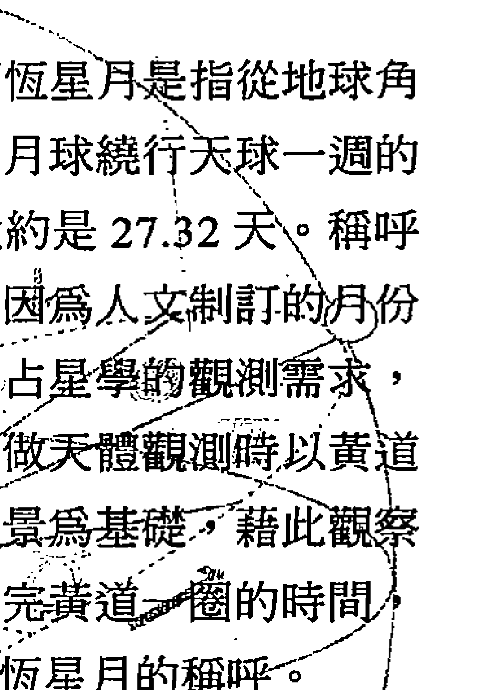

一個恆星月是指從地球角度來觀測月球繞行天球一週的時間，大約是27.32天。稱呼恆星月是因為人文制訂的月份無法符合占星學的觀測需求，占星家在做天體觀測時以黃道的恆星背景為基礎，藉此觀察月亮繞行完黃道一圈的時間，作為一個恆星月的稱呼。

## Sidereal Time
恆星時間

我們平時所依據的時間，為地球對太陽自轉一天的時間作為24小時的依據，這個時間又稱太陽時間，但在計算星圖的過程當中，我們使用以黃道背景的恆星做為基準，每轉回到同一個點為一天，恆星時間以及我們所使用的太陽時間，每天會有接近四分鐘的差距。所以在計算星圖的時候必須將我們所使用的太陽時間換算成恆星的時間，以求得星體在天空的實際位置。

**Sidereal Zodiac**
**恆星黃道**
以實際天體恆星背景上的星座為主的黃道帶，但占星學上所稱的恆星黃道仍與天文學的黃道不相同，恆星黃道多半為印度吠陀占星學所使用，而歐美占星師使用回歸黃道。恆星黃道與回歸黃道會因為恆星移動的歲差的關係而產生巨大的差別，例如：3月22日出生的人，對於使用回歸黃道的占星師來說仍然是牡羊座，但對於使用恆星黃道的占星師來說這一天出生的人屬於雙魚座。同時必須瞭解，吠陀占星師對雙魚座的看法與西方占星師對雙魚座的看法有著明顯的差異。

**Sign**
**星座**
占星學上專門指黃道上的12個星座，是用來區分行星在黃道上運行座標，一般人稱呼的「Sign」多半是指一個人太陽所在的星座，但占星師使用「Sign」這個字時並不一定就是指太陽進入這個星座，而是單純指黃道上的一個區塊。

**Significator**
**象徵星**
象徵星有許多定義，首先指與某件事物有關聯的行星，例如：貴金屬與金星有關，而與交通有關的為水星等。在時辰占卜占星學上，象徵星依據問題與詢問者而改變，例如：通常稱第1宮的傳統守護星為象徵星，因為它代表前來求助的詢問者。但如果問題與前來求助的詢問者無關時，象徵星就可能是其他宮位的守護星。

**Sixth House**
**第6宮**
星盤上的第6宮與黃道上第6個星座處女座相互呼應。傳統占星學認為第6宮掌管健康、下屬、僕人等；現代占星學的第6宮有了較多的變化，對於個人而言，代表著每日的工作、身體與健康、規律的生活等；對於世俗占星學而言則代表工業、勞工階級、疾病與公共衛生系統等。

**Social Planets**
**社會行星**
木星和土星在現代占星學當中稱為社會行星，這個定義與內行星（Inner Planet）及外行星（Outer Planets）皆作為對人生活當中不同層面影響的分類。對於個人內心互動的稱為內行星，影響我們與外界社會互動的稱為社會行星，由於外界社會與時代變遷所帶來影響的稱為外行星。

**Soft Aspect**
**柔和相位**
柔和相位是近代占星學的相位分類法當中的一種，占星師將三分相、六分相定義為柔和相位，傳統占星學認為這樣的相位被視為是吉相，但從人文與心理占星學的角度來看，柔和相位的影響力道比較弱且溫和，不像是強硬相位一樣容易導致事情的發生，卻也容易帶來讓人不舒服的狀況。

**Solar Arc Direction**
**太陽弧正向推運法**
太陽弧正向推運法，近年來在歐美占星學界非常受到歡迎，推運在於以出生後的星盤來預測未來的運勢發展，最常見的如：以出生後第2天的行星位置暗示第2年的命運的作法，稱為二次推運（Secondary Progressions），而太陽弧正向推運是以二次推運作變化。二次推運以第二天行星的天體實際位置為主，但是外圍行星（木、土、天、海、冥）等星在此預測當中就幾乎不會移動。

於是占星師們將太陽每一天移動的度數，作為所有星體的移動標準並作為推運的法則，這些法則所套用的則都是象徵性的移動，而非實際的天體移動，這些法則又稱做正向推運法（Direction），有所謂的1度法正向推運法，利用太陽每天接近1度的運行，套用在所有行星的移動上，接著因為耐波得算出太陽平均每天只移動0度59分08秒，而這個方式稱為「基數推運法」。最後因為人們可以精準的計算出每天太陽的運行度數因季節而有所不同，從夏天的0度57分11秒到冬天的1度01分不等，這個方法就稱為太陽弧正向推運，在這個方法當中星盤上所有的行星與上升天頂，都按照出生當日太陽的日間弧度（Diurnal Arc）來移動，依照出生日期的不同日間弧度可能從0度57分到1度01秒不等，以此作為來年運勢的推測，例如：某人出生當天太陽的日間弧度為0度58分，這時候要觀察他1歲時候的運勢，就將他命盤上所有的行星（包括上升天頂）都移動0度58分，若要觀察他10歲的運勢，就將他星盤上所有的位置都移動9度40秒（0度58分乘以10），就可以用來觀測他10歲的運勢。

太陽弧正向推運的好處在於，不像二次推運，星盤上的移動，緩慢看不出變化。而且經過許多案例的研究，太陽弧正向推運法有相當的準確程度。

## Solar Eclipse
日蝕

當新月週期，月亮正好位於黃道與月球軌道交點（南北月交）附近時，月亮也正好在太陽與地球的中間，當月亮經過太陽的位置時，就會生日蝕，占星學中認為日蝕帶來重大影響，可以反映出這幾年社會上需要注意的議題與容易發生何種令人震驚的事件。

太陽回歸法是流年預測方式的一種，在占星學的觀念中，行星的運行是循環的，太陽每經過一年會回到黃道上相同的位置，於是就依照每年太陽回到出生時刻的正確位置時間（大約是生日左右），計算出一張星圖，利用這張星圖判讀下一次太陽再回到同樣位置的運勢，就是太陽回歸法，太陽回歸可以說是相當簡單的流年運勢推測方式，只要是會解讀命盤的占星愛好者就可以約略解讀出太陽回歸的盤。一般認為太陽回歸的影響週期從生日前三個月開始，到下一個生日後三個月正式結束。「Solar Revolution」則是太陽回歸法的別名。

## Solar Return
太陽回歸法

太陽回歸法是流年預測方式的一種，在占星學的觀念中，行星的運行是循環的，太陽每經過一年會回到黃道上相同的位置，於是就依照每年太陽回到出生時刻的正確位置時間（大約是生日左右），計算出一張星圖，利用這張星圖判讀下一次太陽再回到同樣位置的運勢，就是太陽回歸法，太陽回歸可以說是相當簡單的流年運勢推測方式，只要是會解讀命盤的占星愛好者就可以約略解讀出太陽回歸的盤。一般認為太陽回歸的影響週期從生日前三個月開始，到下一個生日後三個月正式結束。「Solar Revolution」則是太陽回歸法的別名。

## Splash Shape
散落型

瓊斯圖形之一，在出生圖當中行星散落在許多星座上，10顆行星平均散佈在命盤的各個角落當中，且行星形成集團的機會不多，正好與集團型的人性格完全相反，這樣的人相當能接受外來的刺激，頭腦也較為靈活，但可能缺少專注力，而且他們通常會有許多不同的想法與靈感，卻不一定能夠實行。

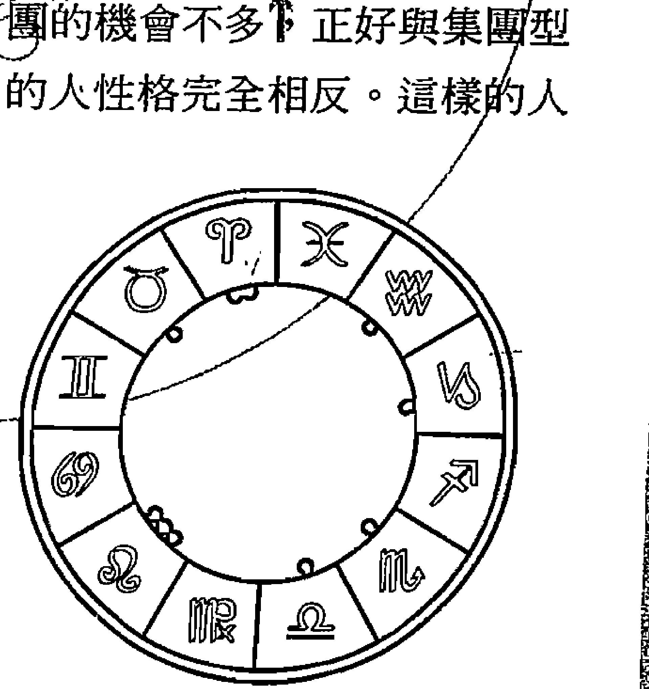很重視全方位的知識，展現個人的興趣廣泛，卻不易專心，被認為與雙子座和射手座有關。

## Splay Shape 擴展型

瓊斯圖形之一，與散落型十分相似，但是行星需要至少要有三分相且呈現兩個以上的集團才能稱為擴展型，這種人相當具有個人主義，認為自己是一個特殊且獨一無二的人物，不喜歡被歸類、被貼標籤，也不喜歡受約束，一般認為擴展型與水瓶座有關。

## Square 四分相

兩行星或行星與基本點特殊點之間形成 90 度的相位，在傳統占星學上認為四分相為破壞與阻礙的凶相。心理占星學則認為，這個相位具有壓抑挑戰的能量，通常是由性質類似但目的或方向不一的事件所引發的困擾。

## Standard Time 標準時間

以格林威治標準時間為基準，訂出的各國之間的標準時間。以格林威治為基準，每 15 度經度為一個標準時區 (Standard Time Zone)，時差一小時，向東遞增向西遞減，全球共有 24 個標準時區，但仍會因為政治和地理因素而有所調整。

## Sub-Rulership 次守護關係

某些宮位、星座與行星上呈現次級的守護關係，在傳統占星學中有所謂的元素守護、十度守護、六度守護等，例如：金星並不守護雙子座，但是當金星進入雙子座 22 度時，進入了他的六度守護，傳統占星學認為這時候金星屬於小小的吉相，並且稱這樣的星座與行星關係為次守護關係。但也有少數占星師認為一個星座或宮位同時擁有傳統守護與現代守護星時，所呈現的守護關係為次守護關係。

與物質的生產擁有有關，第 6 宮則與規律的工作態度有關，第 10 宮則與組織管理有關。一個人命盤當中若沒有行星落入土相星座又沒有行星落入物質宮位時，暗示此人較不重視物質生活。

## Succedent Houses 續宮

又稱固定宮位，指星盤上與金牛座、獅子座、天蠍座、水瓶座相對應的第 2、5、8、11 宮。這些宮位在星盤上出現在每一個象限中的角宮之後，這些宮位就代表負責管理角宮所發展出來的事務，並且堅守著；出現在續宮的行星暗示多半都有固定與堅持不變的意味。

## Substance Houses 物質宮位

在占星學中，命盤與黃道上金牛座對應的第 2 宮、與處女座對應的第 6 宮以及與摩羯座對應第 10 宮通稱土相宮位。土相宮位具有土相星座世俗與物質生活的特質。第 2 宮

## Sun 太陽

太陽系的中心，在占星學上視為重要的發光星體之一，傳統占星學中太陽象徵著男性、君王、自我、父親、丈夫等，在現代占星學當中太陽代表自我、自我呈現、精力、活力；心理層面上常描述著個人追求的事物，對於想要成功的憧憬；在世俗占星學上代表國家元首；在醫療占星學當中代表著心臟、背部、脊椎、脾臟。

## Sun Sign Astrology 太陽星座占星術

只以個人的太陽星座來進行性格與預測的討論。對占星術不了解的大眾只以太陽所在的星座來討論性格與運勢。由此發展出了媒體上廣泛所見的星座運勢。但通常只以個人的太陽星座來作為運勢的推測，占星師稱為太陽星座專欄，對於認真看待占星術的占星師來說，使用這兩個詞的時候

## Sun Sign Column 太陽星座專欄

都有點貶抑的意味，認為這樣的認定，過度簡化了占星學的豐富內容。

## Superior Planets 外圍行星

以地球軌道為界定，在地球軌道之後的行星包括了火星、木星、土星、天王星、海王星和冥王星都稱為外圍行星，會有人把它跟外行星（Outer Planets）搞混。事實上外行星在占星學當中指的是天王星、海王星、冥王星等。而外圍行星多半只是以軌道來區分，除了在占星學的天文學裡與占星計算當中使用之外，這個詞並沒有非常深刻的占星學定義。

## Synastry 合盤

將一張星盤上所記載的符號重疊在另外一張星盤上進行判斷，透過2張（以上）星盤之間星體的相位與互動關係，來觀察2個人（以上）的關係，但今天「Synastry」在占星學當中，常被拿來泛指全部的合盤技巧，甚至包括了中點組合盤的技巧。木星與海王星的合相循環，與土星、海王星的合相循環都影響著世界經濟的起落。

## Synodic Cycle 合相循環

星盤上的兩個行星（或行星與基本點）從合相到下一次合相的週期稱為合相循環。合相循環特別在世俗占星學、自然占星學與財經占星學當中特別被重視。世俗占星師認為我們可以從合相循環當中預測政治經濟文化的變遷，同時財經占星學與自然占星學的研究者認為，外行星合相循環與自然環境的變遷有著特殊的連結。有些占星師認為這可能是星體之間引力的結果，也有占星師認為這是太陽黑子與風暴週期與行星循環的規律，而非是引力的影響。財經占星師就認為

## Tables of Houses 宮位表

在採非等宮制時，為了方便劃分宮位、繪製星圖，每一種制度都會有一份宮位表做為參考使用。星盤的宮位劃分有時需要應用到微積分與球面三角的計算，但並非每一位占星師都有能力利用球面三角與微積分，計算出正確的上升與天頂角度，所以宮位表在電腦普及前對占星師來說相當的重要。同時，普及的宮位表會使某種宮位制相對的變得有影響力，例如：著名的時辰占卜占星師威廉・李利（William Lilly）在他的鉅著《基督教占星學》當中使用芮氏宮位制，並且附上了宮位表，使得芮氏宮位制在當時流傳的十分普遍，甚至現代學習時辰占卜占星術的占星師們仍遵循著這個方法，只使用芮氏宮位制。

## Taurus 金牛座

黃道上的第 2 個星座，固定的土相星座。占星學上認為金牛座與物質、金錢有關，且追求實際與穩定的生活。在心理層面上金牛座暗示著擁有物質所帶來的安全感，以及對於能力（力量）的獲得。金牛座的占星符號為牛頭的簡化，而金牛座的守護星是金星。

## Tenth House 第10宮

星盤上的第 10 宮與黃道上的第 10 個星座摩羯座相互對應，傳統占星學認為第 10 宮包含：光榮的、國王、貴族等統治者以及成功。威廉・李利認為第 10 宮與母親有關，現代占星學認為其基本特質包含組織、外界社會、社會地位、公司、個人職業、對於社會的付出等。在世俗占星學上則代表政府與執政黨。

## Term 六度期限（六度守護）

在占星學當中當你看到「Term」這個字的時候需要注意，一般來說它是專用術語或名詞，但在時辰占卜占星學上，每個星座與行星也有一種稱為「Term」的互動，稱為「六度期限」或「六度守護」，將每個星座的 30 度等分成 5 等分，每 6 度為一個「Term」，除了太陽、月亮之外，其他 5 個傳統行星在每個星座當中，都出現一個適合它的期限，當行星進入屬於它的六度期限時為小吉相，類似之前所說的「十度守護」（Face）。

## Third House 第3宮

在星盤上的第 3 宮與黃道上的第 3 個星座雙子座相互呼應。占星學中基本意涵為溝通、自我表達、學習、兄弟姊妹、鄰人、交通等。在世俗占星學上則代表政府與執政黨。星學中代表通訊、教育系統、與鄰國鄰近地區的關係。

## Transits 行星過運

又稱做「過運法」，是目前最為簡便的流年預測方式，依照當下時刻的天體行星運行，對應在個人星盤的位置來推算運勢的方法，與推運法同樣，屬於以實際星體運行推測命運的方式。但是很少有占星師僅使用行星過運來作為運勢推測的方式，甚至許多現代占星師認為，行星過運至少必須搭配本命盤的「二次推運」（Secondary Progressions）或「太陽弧正向推運」（Solar Arc Direction）等方式作為運勢的推測，才能維持其準確性。

## Trans Neptune Planets 超海王星行星

漢堡學派（Hamburg School）所創造的虛星的稱呼，有時也稱為「超冥王星行星」（Trans Pluto Planets）。這些星體事實上並不存在，有些符號是來自於第一次大戰前，人們尋找天空中第九顆行星（今天的冥王星）時所給予的名字，最後被漢堡學派的占星學者們拿來使用，並假定他們的存在，也設計了這些行星的運行軌道等。

## Transpersonal Planets 超個人行星

在占星學當中認為天王星、海王星和冥王星，這三顆行星的影響往往也是超越個人、影響整個世代，於是常稱呼這3顆行星為超個人行星。天王星、海王星與冥王星這三顆行星在占星學當中擁有的共同名稱包括了：外行星（Outer Planets）、現代行星（Modern Planets），在中文當中又習慣簡稱「三王星」。

## Trine 三分相

兩行星或行星與基本點、特殊點之間形成120度的相位。在傳統占星學上，三分相是一個吉相；在心理占星學中三分相具有包容、融合、接受的意涵，占星師認為這樣的行星角度所產生的共鳴多半是正面的，也能讓行星發揮較具建設性的影響力，但有時也會為當事人詢問者帶來盲點與惰性。

## Triplicity 四元素守護

將黃道上的星座依據所屬的元素每3個一組，分成火相星座、土相星座、風相星座和水相星座。但在時辰占卜占星學當中「Triplicity」是指依照星座四分法的分類，每個元素都有其日間守護的行星與夜間守護的行星，我們稱為四元素守護：火相星座白天由太陽守護，夜間由木星守護；土相星座白天由金星守護，夜間由月亮守護；風相星座白天由土星守護，夜間由水星守護；水相星座不分日夜都由火星守護。

## True Node 實際（月）交點

在過去，月亮交點的計算相當的籠統，電腦化之後精確計算的月亮軌道與黃道之間的交點稱為實際月交點，而稱過去概略計算的方式為平均（月）交點（Mean Node）。選用何種月交點沒有一個標準，就連遵循傳統的時辰占卜占星師有時候也選用實際月交點來作為判斷的依據。

## Tropical Zodiac 回歸黃道

當所守護的行星進入以太陽回歸春分點，亦即是北半球春天晝夜平分當天，作為以牡羊座0度起點為基礎的黃道，稱為回歸黃道，是目前西方占星學所使用的黃道，有別於印度的吠陀占星學所使用的接近實際天體的恆星黃道。關於回歸黃道與恆星黃道之間的關係，請參考歲差（Precession）一詞。

## T-Square T型三角

圖形相位當中，當兩顆行星成為對分相，第3顆行星同時與對分相的行星形成2個四分相時稱為T型三角（T-Square）。

## Twelfth House 第12宮

星盤上的第12個宮位與黃道的第12個星座雙魚座相互呼應，在占星學上代表著被遺忘的事情、安靜的角落、隱藏的角落；心理占星學認為這

## Unaspected Planet 無相位行星

行星與其他行星或基本點、特殊點之間沒有產生任何的主相位時，就可以判定它是無相位行星。隨著現代占星學使用的星體增加，無相位行星出現的機率不多，該行星與所在的星座、宮位所代表的意義，將會在這個人的性格上明顯的呈現，卻也常是這個人的人格當中，無法依靠個人力量整合的部分，帶來相當嚴重的困擾。

## Uranus 天王星

太陽系的第7顆行星，在占星學上定義為超越的、改革的、反叛的、混亂失序的、具有人道精神與理想主義的，與電磁和高科技有關。在心理層面的意涵是超越固有傳統的、超越自我的，且從這一層的意思引發了改革與革新的意涵。

## Venus 金星

太陽系的第2顆行星，是傳統占星學的吉星，代表喜事、女性、金錢與貴重金屬。現代占星學上金星與和平、協調、美感、戀情、藝術、喜歡的事物有關聯；心理層面上與個人價值觀有著密切的關聯。心理占星師認為金星具有和緩與削弱其他行星性質的意涵。在占星學中金星守護金牛座與天秤座。

## Vernal Equinox 春分點

在北半球當太陽在春天呈現晝夜均分的時刻為春分點。西方占星師以太陽進入此點作為牡羊座0度黃道的起點。春分點又稱做「Spring Equinox」，在西方占星術中春分點具有重要的意涵，由它作為黃道牡羊座零度的基準點就可以看出，這個位置在占星學中具有領先的意味。

## Vertex 宿命點

由占星師莊佐（Edward Johndro）所研究的主垂圈與黃道在西方的交點，因此多落入於星盤當中代表人我關係的西半邊。使用宿命點的占星師認為這是星盤上除了上升點與天頂之外的第3個重要的點。占星師認為宿命點與個人的宿命當中不可抗拒的人事物有關，也有占星師認為此點常在強調人際關係上所發生的事件，特別常被人使用在合盤上，常有宿命的意涵這也是為何「Vertex」在中文常被翻成宿命點的原因。也有占星師認為宿命點具有將願望實現的意涵。不過「Vertex」的使用與小行星或莉莉絲的使用一樣，在占星學當中都常引發爭論。

# 灶神星 Vesta

「Vesta」是火星與木星之間的小行星帶中，體積第3大的；但它卻是小行星中最亮的，在無光害影響的環境下，用肉眼即可觀察。「Vesta」是希臘羅馬神話當中的家庭女神，在希臘文中她稱為赫斯蒂亞（Hestia），原本是12主神之一，卻願意將位置讓給酒神而專心守護家庭。在小行星的占星術當中灶神星所代表的宮位意指我們集中火力就可以有最佳表現的地方，不過卻提醒我們同時得注意在這方面花太多的時間，必須休息，否則將會產生健康上的危機。而其所在的星座表示我們如何專心致力於某件事務。

## 灶神星所在的星座

- 灶神星在牡羊座：這些人具有衝勁但是火力不足，所以他們總是得立即採取行動，用最快速的方法完成否則他們很有可能會引擎熄火。
- 灶神星在金牛座：這些人在集中精神上必須花上很長的一段時間，但是他們也很有耐心，甚至是固執，一旦做上癮之後就停不下來。
- 灶神星在雙子座：這些人很難集中精神，他們只有在溝通的時候最為專注認真，其他的時候恐怕很難，他們做事的方法傾向一次去完成許多事情。
- 灶神星在巨蟹座：灶神星在巨蟹座的人對於家裡的事情最為認真，他們必須趁著心血來潮、情緒不受影響時集中火力，一旦情緒受到影響，他們就容易一事無成。
- 灶神星在獅子座：這些人總喜歡誇大自己的認真程度，他們喜歡其他人的配合，特別在表現自我時，他們顯的最為認真。
- 灶神星在處女座：他們認真起來相當可怕，總是有許多的細節要注意，而他們也都有能力把一些雞毛蒜皮的小事都挑出來，雖然認真但是進度往往會被拖延。
- 灶神星在天秤座：他們在做事情的時候需要伙伴的支援，如果是孤單一人會讓他們沒什麼自信，一旦有了搭檔，他們就能夠順利的完成工作。
- 灶神星在天蠍座：一旦讓他們嗅到不對勁的神秘氣息，他們就會變得相當認真，他們喜歡挖掘真相，或是找出隱藏的事情，這會讓他們全身都充滿了鬥志。
- 灶神星在射手座：他們似乎也是很難集中火力的人，因為最能夠讓這些人專心的事情叫做自由自在，有時因為他們的興趣太多、太廣泛，宗教、真理、國際事務都會讓他們產生興趣，而無法集中火力。
- 灶神星在摩羯座：這些人對於計畫成功的未來，以及如何組織一個團體這些事情，都相當的有興趣，他們能夠在這方面有所發揮。
- 灶神星在水瓶座：灶神星在水瓶座的人把朋友都看成家人，並會努力的守護著他們，他們對於友情這件事情看的相當的重。
- 灶神星在雙魚座：這些人總是花太多的時間在幻想上，有些時會為了完成遠大的夢想，他們願意犧牲奉獻自己去幫助其他人。

## 灶神星所在的宮位

- 灶神星在第1宮：只要是他們想做的就一定能夠完成，但是這些人總是把時間完全都放在實踐夢想了，有些時候必須停下腳步來休息。
- 灶神星在第2宮：特別是與金錢有關的事物或工作，會讓這些人徹底的奉獻出時間，他們寧願犧牲自己的一切以換取金錢的穩定，如果不能夠適當的休息恐怕也無福消受。
- 灶神星在第3宮：這些人總是忙進忙出，傳遞著他們認為重要的訊息，並且為了鄰居或是兄弟姊妹而忙，有些時候必須靜下來，找個沒有人的地方好好的休息。
- 灶神星在第4宮：家庭就是灶神星在第四宮的宿命，他們將所有的精力都奉獻給家人而忽略了自己，最好能夠為自己規劃一些外出的行程或課程，暫時離開家裡幾小時當作充電休息。
- 灶神星在第5宮：這些人會為了情人和子女而不停的忙碌，生活當中總是為了這些事情而擔憂，必要的時候必須和朋友一同出門，參加一些新鮮的活動。
- 灶神星在第6宮：此人是天生的勞碌命，他們常將自己賣給工作和微薄的薪水，他們很可能在老闆和部屬中求生存，想要面面俱到最後就是很辛苦的把自己榨乾，如果還不懂的找時間休息，那麼過勞死的機率就很高了。
- 灶神星在第7宮：灶神星在第7宮的人為了身邊的伴侶而忙碌，如果他們單身那就很可能是為了事業上的伙伴或最親密的朋友忙碌，也因此他們犧牲了自己的空間，如果不懂得多給自己一點私人的時間與空間，恐怕很快的就會疲乏了。
- 灶神星在第8宮：為他人做嫁、處理他人的財務問題、或是「性」這件事情，都容易成為這個人的忙碌目標，如果不懂的停下來做些其他事情，這些人的人生恐怕會是黑白的。
- 灶神星在第9宮：這些人熱中於研究與學習，或是旅行，在這些事情上他們投入大量的精力，這些雖然都是好事，但也必須要有所節制。
- 灶神星在第10宮：他們將所有的精力都放在事業上，為了老闆賣命，拼死拼活的只為了換取老闆的滿意，這些人也不懂得何時該休息，可能會忙碌到病倒為止。
- 灶神星在第11宮：這些人總是不斷的在替朋友著想、為他們付出，但是有些時候也必須擺脫他們換取一點私人的空間，這樣才不會迷失自我。
- 灶神星在第12宮：這樣的人將太多的心思放在沈思、冥想或是貢獻給他人上面，如果不懂得停止、稍做休息的話，他們能夠幫助的人恐怕很有限。

## Via Combusta 燃燒區

在時辰占卜占星學當中，從天秤座 15 度到天蠍座 15 度被稱為混亂區，當月亮經過這個區域顯示凶相。其理由眾說紛紜，有占星師宣稱，因該區恆星的性質不利於太陽與月亮這兩個發光體；也有占星師認為天秤與天蠍有利於土星與火星這兩個凶星，所以當月亮經過此處時並非代表月亮處於脆弱的位置，但顯示著月亮被嚴重的干擾而顯得煩躁危險，通常是暗示詢問者過於急躁、焦慮所帶來的不愉快時間。在時辰占卜占星學中，月亮經過燃燒區是一種無法判斷星盤的徵兆，像時辰占卜大師威廉·李利（William Lilly）所作的占卜中常忽略這個限制。

## Virgo 處女座

黃道上的第 6 個星座，變動的土相星座，在占星上的基本定義是重視細節的、實際觀點的性格。心理占星學上認為處女座代表著人們再次利用感官的能力來探索內外在的差異，因而產生觀察、比較、分析與批評，也產生衝擊。處女座在占星學上的符號為女子的頭髮，守護星為水星。

## Vulcan 工神星

「Vulcan」是希臘神話的工匠之神，在占星學當中，此星也被漢堡學派（Hamburg School）運用為虛星的名稱之一。這個符號結合了神秘學的火元素符號以及火星的符號，代表著活力、強大、充滿著能源的狀態，特別是當太陽與這顆星結合時，將會帶來極度活躍的能量。

## Waning 下弦月

月亮在滿月過後開始消蝕的週期，大約就在陰曆的 15 號過後一直到隔月的 1 號左右，這一段時間月光逐漸黯淡。在人文占星學派的研究當中，下弦月階段代表著事務的開花結果以及傳播直到結束的階段；而在擇日占星學當中下弦月的時刻不適合開始一些你希望越作越大的事情，例如：開張，而適合在這時候開始作一些你希望早點完成的工作。

## Water Element 水元素

在西洋神秘學與古典哲學中認為，世界由風、火、水、土等元素構成。水元素在神秘學當中具有濕與冷的特質，與火元素乾與熱的特質相對應，占星學上與水元素有關的為水相星座與水相宮位。

## Water Houses 水相宮位

在星盤上，與黃道巨蟹座相對應的第 4 宮，與天蠍座對應的第 8 宮，以及與雙魚座對應的第 12 宮稱為水相宮位。水相宮位又稱為結束宮位（Ending Houses）或感受宮位（Feeling Houses）。占星師認為水相宮位強的人纖細敏感，具有較強的同情心與同理心；然而在一張命盤上若沒有任何行星落入水相星座同時又沒有任何行星落入水相宮位時，此人在事務的判斷上較少用感受與情感，容易讓人覺得無情。

## Water Signs 水相星座

巨蟹座、天蠍座和雙魚座為占星學上的水相星座，傳統占星術認為水相星座與生產繁殖有關；現代觀念認為水相星座感受性強；心理層面上水相星座因為感受力強在情緒的起伏## Waxing Moon 上弦月

從新月起到滿月之前，月亮光芒逐漸增強的週期，稱爲上弦月。一般認爲大約是陰曆的3號過後並見到新月的光芒起，才能開始算是上弦月的週期。在人文占星學派的理論當中，上弦月週期是事務與個人孕育成長的階段，所關注的多半在自身的範疇當中；而擇日占星學當中認爲，上弦月週期有利於事務發展與壯大。

## Western Houses 西方宮位

從第4宮起到第10宮稱爲星盤上的西方宮位。在命盤當中西方宮位較爲強勢的人，重視自我與他人的關係，也期待從他人身上獲得回應，其目的是想要從他人的眼中來發現自己，或者希望藉由吸取他人的經驗來使自己成長。

Waxing Moon 上弦月 — Western Houses 西方宮位

> 占星歷史 近代占星學的發展

17世紀時占星家們仍爲了「時辰占卜占星術」與「決疑占星術」的不同觀念而爭論。其中攻擊火力最猛的包括義大利僧侶普拉西度（Placidus de Tito）與自由城的莫蘭（Morin de Villefranche），兩人都提出了嚴厲的指摘，認爲時辰占卜占星術是一個與占星毫無相關的言語占卜，和巫術沒有兩樣。的確，從決疑占星師的眼光來看，時辰占卜與個人命運毫無時間的連結可言。當時知名的占星師威廉·李利（William Lilly 1602-1681）就是典型的時辰占卜占星大師。

——摘錄自《占星全書》

## Zenith 天頂

乃座標系統當中，天球的頂點的稱呼，「Zenith」是同地平面算起，當地天空的最高點。不過在現代的占星學中很少用「Zenith」來稱呼天頂，這一詞倒是在古典或中世紀的占星著作中較常見到，有時候泛指星盤上第9宮與第10宮的區域。

## Zuse 宙斯

宙斯是希臘神話當中的眾神之王，在占星學當中他是漢堡占星學派（Hamburg School）所使用的虛星之一，這些星體多半實際上並不存在，其意涵爲燃燒的能量，以及行動的領導者，具有創造與開創能力，被控制與被計劃的能量。

## Zodiac 黃道帶

以太陽軌道（黃道，Ecliptic）爲主向南與北延伸9度，爲黃道帶。古人將這條軌道上的星座以熟知的事物命名，包含許多動物名稱在其中，故「Zodiac」又有動物圈的意思。在占星學中，黃道帶遵守著托勒密（Claudius Ptolemy）的規範劃分成12個區域，也就是12星座，同時要注意西方占星師所使用的回歸黃道與今日天體上黃道的恒星背景已經有很大的差異。

Zenith 天頂 — Zuse 宙斯 — Zodiac 黃道帶

### 索引

- **一画**
  - 一度正向推运法 (One Degree Method) - 153
  - 一次推运法（主限法）(Primary Directions) - 167
- **二画**
  - 90度盘 (Ninety Degree Circle) - 151
  - 二元性星座 (Bicorporeal Sign) - 24
  - 十度区间 (Decanates) - 44, 101
  - 十分相 (Decile) - 45, 136, 147
  - 人类型星座 (Human Signs) - 23, 120
  - 入境 (Ingress) - 123
  - 入境星座 (Ingress Signs) - 123
  - 入境图（进宫图）(Ingress Chart) - 123
  - 十二分之五相 (Quincunx) - 6, 18, 69, 84, 122, 136, 186, 143, 147
  - 二次推运法 (Secondary Progressions) - 168, 169, 192
  - 七分相 (Septile) - 24, 147, 193-4
  - 八分之三相 (Sesquiquadrate) - 18, 84, 143, 147, 154, 194
  - T型三角 (T-Square) - 207-208
- **三画**
  - 上升点 (Ascendant) - 8, 12, 14-16, 17-18, 22, 38, 46, 50, 55, 59, 63, 72, 73, 86, 87, 94, 97, 98, 102-105, 112, 119, 138, 145, 146, 152, 184, 189, 210
  - 上升轴线 (Ascendant Axis) - 18, 146
  - 上升星座 (Ascendant Sign / Rising Sign) - 12, 18, 25, 55, 73, 75, 93, 94, 96, 145, 164, 189, 191
  - 小行星 (Asteroids) - 17, 20, 29, 31, 32, 40, 64, 129, 136, 156, 210, 211
  - 下降点 (Descendant) - 8, 18, 26, 46, 87, 112, 119, 145, 146, 184
  - 土元素 (Earth Element) - 59, 61, 177, 179
  - 土相星座 (Earth Signs) - 27, 39, 58, 59, 68, 121, 184-185, 201, 204, 207
  - 土相宫位 (Earth Houses) - 59, 201
  - 山羊 (Goat) - 27, 82
  - 大十字 (Grand Cross) - 19, 28, 71, 82, 149
  - 大三角 (Grand Trine) - 19-20, 82, 136
  - 大年 (Great Year) - 6, 83
  - 子午线 (Meridian) - 86, 145-146
  - 九分相 (Novile) - 147, 152
  - 上升星 (Rising Planet) - 189
  - 土星 (Saturn) - 8, 10, 15, 16, 22, 23, 28, 31, 38, 39, 40, 41, 46, 53, 57, 58, 66, 67, 72, 75, 77, 90, 92, 94, 96-99, 101-103, 108, 115, 124, 128, 135, 136, 143, 144, 154, 164, 165, 181, 182, 189, 190, 191, 197, 202, 203, 207, 216
  - 三分相 (Trine) - 18, 19, 23, 47, 55, 82, 91, 98, 106, 107, 143, 154, 197, 200, 206
  - 工神星 (Void of Course) - 216
  - 下弦月 (Waning) - 137, 217
  - 上弦月 (Waxing Moon) - 72, 81, 123, 218
- **四画**
  - 互视 (Beholding) - 22
  - 巨蟹座 (Cancer) - 14, 16, 17, 26, 27, 28, 33, 38, 39, 45, 50, 51, 52, 55, 57, 65, 66, 68, 79, 80, 96, 97, 100, 101, 103, 110, 114, 116, 123, 130, 139, 157, 162, 177, 190, 212, 217
  - 天球赤道相位 (倾斜相位) (Declination Aspect) - 45
  - 天球的星体 (Celestial Bodies) - 29
  - 天球赤道 (Celestial Equator) - 29, 45, 187
  - 天极 (Celestial Poles) - 30
  - 天球 (Celestial Sphere) - 29, 30, 45, 60, 139, 162, 166, 167, 187, 195, 219
  - 中点组合星盘 (Composite Chart) - 40
  - 分离相位 (Dissociation Aspects) - 47, 107
  - 日周弧度 (Diurnal Arc) - 48, 198
  - 日周的運行 (Diurnal Motion) - 48
  - 日周守護星 (Diurnal Ruler) - 48
  - 元素 (Elements) - 6-7, 44, 47, 58, 59, 61, 65, 70, 101, 102, 107, 177, 178, 179, 184, 201, 207, 217, 218
  - 火元素 (Fire Element) - 61, 70, 177, 178, 217, 218
  - 火相星座 (Fire Signs) - 17, 39, 58, 70, 121, 128, 137, 144, 184-185, 190, 207
  - 火相宫位 (Fire Houses) - 70, 128
  - 太陽中心 (Heliocentric) - 80, 87, 150
  - 太陽中心占星學 (Heliocentric Astrology) - 87
  - 太陽中心星圖 (Heliocentric Chart) - 87
  - 天底 (Imum Coeli) - 8, 31, 59, 87, 112, 119, 122, 145, 146, 164, 184
  - 內圍行星 (Inferior Planets) - 123, 124
  - 內行星 (Inner Planets) - 107, 123, 124, 154, 163, 197
  - 木星 (Jupiter) - 8, 13, 15, 16, 20, 23, 31, 40, 41, 46, 53, 57, 58, 66, 67, 69, 74, 77, 90, 92, 94, 96, 98, 100-103, 107-109, 124, 126, 128, 135, 144, 154, 155, 164
  - 木土循環 (Jupiter-Saturn Cycles) - 41, 135
  - 天秤座 (Libra) - 7, 13, 14, 17, 21, 28, 33, 46, 51, 52, 55, 64, 66, 77, 94, 97, 98, 99, 100, 101, 102, 103, 110, 113, 117, 123, 128, 130, 137-138, 139, 144, 153, 157
  - 火車頭型 (Locomotive) - 127, 137, 138
  - 月亮 / 月亮的 (Luna / Lunar-) - 140
  - 月亮週期 (Luna Cycle) - 140
  - 月蝕 (Lunar Eclipse) - 60, 140, 150, 166
  - 月亮黃道 (Lunar mansions (Lunar Zodiac)) - 119, 141
  - 月交點循環 (Lunar Node Cycle) - 141
  - 月亮回歸圖 (Lunar Return Chart) - 141
  - 月相循環 (Lunation) - 141-142
  - 凶兆 (凶星) (Malefics) - 39, 143
  - 火星 (Mars) - 8, 13, 15, 16, 17, 20, 22, 23, 31, 40, 41, 46, 54, 55, 57, 66, 67, 68, 69, 72, 73, 74, 75, 90, 92, 94, 96, 98, 99, 100, 101, 102, 107, 124, 143-144, 146
  - 天頂 (Medium Coeli / Mid Heaven) - 5, 8, 27, 46, 87, 139, 145, 146, 167, 184, 187, 219
  - 天頂軸線 (Mid Heaven Axis) - 146, 163
  - 中點 (Midpoint) - 40, 85, 146, 188
  - 中點樹 (Midpoint Tree) - 146-147
  - 分 (Minute) - 147
  - 月亮 (Moon) - 148
  - 心理占星學 (Psychological Astrology) - 170-183
  - 天蠍座 (Scorpio) - 191
  - 六分相 (Sextile) - 18, 22-23, 194
  - 太陽弧正向推運法 (Solar Arc Direction) - 197
  - 太陽回歸法 (Solar Return) - 199
  - 太陽回歸法的別名 (Solar Revolution) - 199
  - 太陽 (Sun) - 201-202
  - 太陽星座占星術 (Sun Sign Astrology) - 202
  - 太陽星座專欄 (Sun Sign Column) - 202
  - 六度期限 (六度守護) (Term) - 65, 205
  - 天王星 (Uranus) - 209
  - 水相星座 (Water Signs) - 217
  - 天頂 (Zenith) - 220
- **五画**
  - 水星 (Mercury) - 145
  - 水元素 (Water Element) - 218
  - 水瓶時代 (Age of Aquarius) - 6
  - 水瓶座（寶瓶座） (Aquarius) - 9-10
  - 白羊座（牡羊座） (Aries) - 17
  - 占星地圖 (Astro*Carto*Graphy (A*C*G)) - 20
  - 占星經濟學 (Astro-Economics) - 20, 21
  - 包圍 (Besieged) - 23, 102
  - 出生圖 (Birth Chart) - 22, 24, 38, 88
  - 出生資料 (Birth Data) - 24
  - 出生地分宮法 (Birthplace System) - 25
  - 出生恒星 (Birth Star) - 25
  - 半人馬星體 (Centaurus) - 31, 38, 163
  - 出生圖的守護星 (Chart Ruler) - 38

### 六劃

| 中文 | 英文 | 页码 |
|------|------|------|
| 西元 | AD (Anno Domini) | 5 |
| 行星遠地點 | Apogee | 10 |
| 吉相 | Benefics | 22-23 |
| 合相 | Conjunction | 18,40 |
| 共同守護星 | Co-Ruler | 40,128,189-190 |
| 宇宙生物學 | Cosmobiology | 41 |
| 宇宙十字 | Cosmic cross | 207-208 |
| 宇宙圖形 | Cosmic picture | 146-147 |
| 多產星座 | Fruitful Signs | 79 |
| 死亡之門 | Gate of Death | 80 |
| 地球中心 | Geocentric | 80-81,87 |
| 地平線 | Horizon | 119 |
| 共同守護星 | Joint Ruler | 40,128,189-190 |
| 共同守護關係 | Joint Rulership | 40,128,189-190 |
| 地方星圖 | Local Space Chart | 138 |
| 次相位 | Minor Aspect | 18,147,193-194 |
| 世俗占星學 | Mundane Astrology | 148 |
| 安靜星座 | Mute Sign | 149 |
| 互容 | Mutual Reception | 149 |
| 自然占星學 | Natural Astrology | 150 |
| 交點的 | Nodal | 152 |
| 交點圖 | Nodal Chart | 152 |
| (月) 交點 | (Moon) Node | 144,207 |
| 行星 | Planets | 164 |
| 地點重置圖 | Relocation Charts | 188 |
| 回歸 (行星回歸) | Returns | 188-189 |
| 行星回歸 | Revolution | 188-189 |
| 守護星 | Ruler | 40,128,189-190 |
| 守護關係 | Rulership | 40,128,189-190 |
| 次守護關係 | Sub-Rulership | 201 |
| 外圍行星 | Superior Planets | 124,202 |
| 合盤 | Synastry | 54,202-203 |
| 合相循環 | Synodic Cycle | 135,203 |
| 行星過運 | Transits | 48,205 |
| 回歸黃道 | Tropical Zodiac | 21,119,207 |
| 西方宮位 | Western Houses | 218 |

### 七劃

| 中文 | 英文 | 页码 |
|------|------|------|
| 角 | Angle | 8 |
| 牡羊點 | Aries Point | 17 |
| 坎式 (坎普士) 分宮法 | Campanian System | 27 |
| 坎式 (坎普士) 分宮法 | Campanus Houses System | 27 |
| 冷 | Cold | 39 |
| 每日移動 | Daily Motion | 43 |
| 赤道 | Equator | 63 |
| 凸月 (上弦月) | Gibbus Moon | 81 |
| 吠陀黃道 | Hindu Zodiac | 119,141 |
| 克卜勒相位 | Keplerian Aspects | 136 |
| 克落索司 | Kronos | 136 |
| 角距容許度 (容許度) | Orb | 154 |
| 灶神星 | Vesta | 211-216 |

### 八劃

| 中文 | 英文 | 页码 |
|------|------|------|
| 阿德密多司 | Admetos | 5 |
| 受剝 | Affliction | 6 |
| 阿拉伯點 | Arabic Parts (Arabic Points) | 11-16 |
| 阿波羅星 | Apollon | 17 |
| 東方宮位 | Eastern Houses | 59 |
| 均分點 | Equinoxes | 63,64,118,166 |
| 均分點星座 | Equinox Signs | 63,64,118,166 |
| 事件圖 | Event Chart | 64 |
| 命運之指 | Finger of Fate | 69 |
| 固定大十字 | Fixed Cross (Grand) | 71,82 |
| 固定星座 | Fixed (Sign) | 71,148,184 |
| 幸運點 | Fortuna | 11-16,79,162,163 |
| 泛音盤 | Harmonic Chart | 84 |
| 非結合狀態 | Inconjunct | 122 |
| 直覺型 | Intuitive Type | 128 |
| 最上升星座 | Long Ascension | 139 |
| 命運之輪 | Part of Fortune | 162-163 |
| 社會行星 | Social Planets | 197 |
| 物質宮位 | Substance Houses | 201 |
| 金牛座 | Taurus | 204 |
| 金星 | Venus | 210 |
| 宙斯 | Zeus | 219 |

### 九劃

| 中文 | 英文 | 页码 |
|------|------|------|
| 風元素 | Air Element | 6 |
| 風相星座 | Air Signs | 7 |
| 風相宮位 | Air House | 7 |
| 相位 | Applying Aspect | 9,91,92,107,154 |
| 相位 | Aspect | 18 |
| 相位表 | Aspect Grid | 19 |
| 秋分點 | Autumnal Equinox | 21 |
| 番茄月 (消散月相) | Balsamic Moon | 22 |
| 星圖 | Chart | 31 |
| 星圖系統 | Chart System | 38 |
| 界線 | Cusp | 41 |
| 度數盤 | Degree Dial | 45 |
| 每日的 (日間的) | Diurnal | 48 |
| 星曆表 | Ephemeris | 62-63 |
| 面 (十度守護) | Face | 67 |
| 春分點 | Great Month | 83 |
| 星圖 (天宮圖) | Horoscope | 119 |
| 亮度增強 | Increasing Light | 122-123 |
| 差距 / 舊程 | Interval | 127-128 |
| 風箏 | Kite | 136 |
| 科氏宮位 | Koch House | 25 |
| 型態 | Modes | 148 |
| 耐波德弧 | Naibodic Arc | 150 |

### 九划

| 中文 | 英文 | 页码 |
| --- | --- | --- |
| 佛鲁斯 | Pholus | 163 |
| 行星时间 | Planetary Hours | 164 |
| 政治占星学 | Political Astrology | 165-166 |
| 星座性质三分法 | Quadruplicity | 184 |
| 星群 | Satellitium | 191 |
| 星座 | Sign | 196 |
| 春分点 | Vernal Equinox | 210 |
| 南交点 | Barren Node | 22 |
| 计都 | Keta | 58 |

### 十划

| 中文 | 英文 | 页码 |
| --- | --- | --- |
| 时间加速值 | Acceleration | 5 |
| 时代 | Age | 6 |
| 原型 | Archetype | 10 |
| 跃出 | Broken | 26 |
| 迦勒底秩序 | Chaldean Order | 31 |
| 神秘占星学 | Esoteric Astrology | 64 |
| 财务占星学 | Financial Astrology | 70 |
| 恒星 | fixed Stars | 71 |
| 格林威治标准时间 | Greenwich Mean Time (GMT) | 83 |
| 格林威治恒星时间 | Greenwich Sidereal Time | 83 |
| 时辰占卜占星学 | Horary Astrology | 88-118 |
| 宫位 | Houses | 119-120 |
| 宫主星 | Lord of a House | 139 |
| 冥王星 | Pluto | 165 |
| 重要位置 | Principal Places | 167-168 |
| 特质 | Qualities | 184 |
| 逆行 | Retrograde | 188 |
| 射手座 | Sagittarius | 190 |
| 恒星的 | Sidereal- | 195 |
| 恒星月 | Sidereal Month | 195 |
| 恒星时间 | Sidereal Time | 195-196 |
| 恒星黄道 | Sidereal Zodiac | 196 |
| 柔和相位 | Soft Aspect | 197 |
| 南交点 | South Node | 58 |
| 宫位表 | Tables of Houses | 204 |

### 十一划

| 中文 | 英文 | 页码 |
| --- | --- | --- |
| 气候占星学 | Astro-Meteorology | 21 |
| 贫瘠的 | Balance | 22 |
| 贫瘠行星 | Barren Planets | 22 |
| 降宫 | Cadent | 27 |
| 黄纬 | Celestial Latitude | 29-30 |
| 黄经 | Celestial Longitude | 30 |
| 黄道 | Ecliptic | 60 |
| 得利 | Exaltation | 65 |
| 阴性行星 (女性行星) | Feminine Planets | 69 |
| 阴性星座 | Feminine Signs | 69 |
| 符号 | Glyphs | 81 |
| 现代行星 | Modern Planets | 147-148 |
| 个人行星 | Personal Planets | 163 |
| 推运图 | Progressed Chart | 168-169 |
| 推运法 | Progressions | 168-169 |
| 基础图 | Radical Chart | 187 |
| 芮氏分宫法 | Regiomontanean System | 187 |
| 莎比恩符号 | Sabian Symbols | 190 |
| 夏令时间 | Summer Time | 43 |
| 宿命点 | Vertex | 210 |
| 黄道带 | Zodiac | 219 |

### 十二划

| 中文 | 英文 | 页码 |
| --- | --- | --- |
| 散落型 | Splash Shape | 128,199 |
| 起始宫 | Angular Houses | 8 |
| 起始宫行星 | Angular Planets (Angularity) | 8 |
| 提桶型出生图 | Bucket | 26 |
| 巢团型出生图 | Bundle | 26 |
| 关键点 (基本星座、本位星座) | Cardinal (Sign) | 28 |
| 关键大十字 | Cardinal Cross (Grand) | 28 |
| 凯龙星 | Chiron | 38 |
| 周期 | Cycle | 41 |
| 顺行 | Direct Motion | 47 |
| 散播月相 | Disseminating Moon | 47 |
| 干性星座 | Dry sign | 58 |
| 第8宫 | Eighth House | 60 |
| 第11宫 | Eleventh House | 62 |
| 距角 | Elongation | 62 |
| 结束宫位 | Ending Houses | 62 |
| 等宫制 | Equal House System | 63 |
| 第5宫 | Fifth House | 69 |
| 最终支配星 | Final Dispositor | 69 |
| 第1宫 | First House | 71 |
| 第一象限月 | First Quarter Moon | 71 |
| 第4宫 | Fourth House | 79 |
| 黑蒂斯 | Hades | 84 |
| 婚神星 | Juno | 129-134 |
| 区域标准时间 | Local Mean Time | 138 |
| 无相月 | Moon Void of Course | 148 |
| 海王星 | Neptune | 150-151 |
| 第9宫 | Ninth House | 151 |
| 双神星 (专文) | Pallas | 156-161 |
| 象限 | Quadrant | 184 |
| 第2宫 | Second House | 192 |
| 第7宫 | Seventh House | 194 |
| 短上升星座 | Short Ascension | 195 |
| 象征星 | Significator | 196-197 |
| 第6宫 | Sixth House | 197 |
| 第10宫 | Tenth House | 204 |
| 第3宫 | Third House | 205 |
| 超海王星行星 | Trans Neptune Planets | 205-206 |
| 超个人行星 | Transpersonal Planets | 206 |
| 第12宫 | Twelfth House | 208 |
| 无相位行星 | Unaspected Planet | 209 |

### 十三划

| 中文 | 英文 | 页码 |
| --- | --- | --- |
| 图弧 | Arc | 10 |
| 碗型出生图 | Bowl | 25-26 |
| 新月 | Crescent Moon | 38-39 |
| 暗月 | Dark Moon | 43 |
| 情感宫 | Feeling Houses | 68 |
| 情感型 | Feeling Type | 68 |
| 虚星 | Hypothetical Planets | 121 |
| 业力占星学 | Karmic Astrology | 136 |
| 最后象限月 (下弦月) | Last quarter moon | 137 |
| 经度 | Longitude | 139 |
| 阳性行星 | Masculine Planets | 143 |
| 阳性星座 | Masculine Signs | 144 |
| 普拉西度制 | Placidus Houses System | 164 |
| 岁差 | Precession | 166-167 |
| 询问者 | Querent | 185 |
| 询问主题 | Quesited | 185-186 |
| 扩展型 | Splay Shape | 200 |
| 处女座 | Virgo |  |

### 十四划

| 中文 | 英文 | 页码 |
| --- | --- | --- |
| 对立平行相位 | Anti- Parallel | 21 |
| 图形相位 | Aspect Patterns | 19-20 |
- 弱势 Detriment 46
- 日食 Eclipse 60
- 满月 Full Moon 79
- 银河中心 Galactic Centre 80
- 银河 Galaxy 80
- 汉堡学派 Hamburg School 85
- 截夺 Interception 124-127
- 领导行星 Leading Planet 137
- 领导星座 Leading Sign 137
- 磁升点 Magnetic Ascendant 143
- 对立星座 Opposite Signs 153
- 对分相 Opposition 153-154

### 十五划

- 摩羯座（山羊座） Capricorn 27-28
- 彗星 Comets 39
- 强硬相位 Hard Aspect 84
- 狮子座 Leo 137
- 标准时间 Standard Time 200
- 标准时区 Standard Time Zone 200

### 十六划

- 燃烧 Cazimi 29
- 谷神星 Ceres 32-37
- 燃烧 Combust (Combustion) 39
- 择日占星学 Electional Astrology 60-61
- 实际（月）交点 True Node 207
- 燃烧区 Via Combusta 216

### 十七划

- 湿 Humid 121
- 发光体 Luminaries 139-140

### 十八划

- 双性行星 Androgynous Planet 8
- 双倍相位 Bi- 23-24
- 龙头图 Draconic Chart 49-57
- 龙头黄道 Draconic Zodiac 49-57
- 龙头 Dragon's Head 58
- 龙尾 Dragon's Tail 58
- 双子座 Gemini 80
- 双鱼座 Pisces 163-164

### 十九划

- 兽类星座 Bestial Sign 23
- 关系图 Davison chart (Davison relationship chart) 43
- 日光节约时间（夏令时间） Daylight Savings Time (DST) 43-44
- 关系图 Relationship Chart 187-188
- 跷跷板型 See-Saw Shape 192

### 二十划

- 琼斯图形 Jones Patterns 128
- 医疗占星学 Medical Astrology 144-145

### 二十一划

- 续宫 Succeedent Houses 201

### 二十三划

- 变化性质星座 Changeable Signs 31
- 变动大十字 Mutable Cross (Grand) 149
- 变动星座 Mutable Signs 149