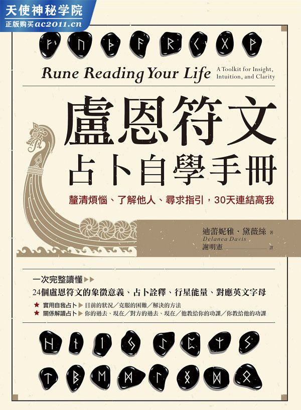

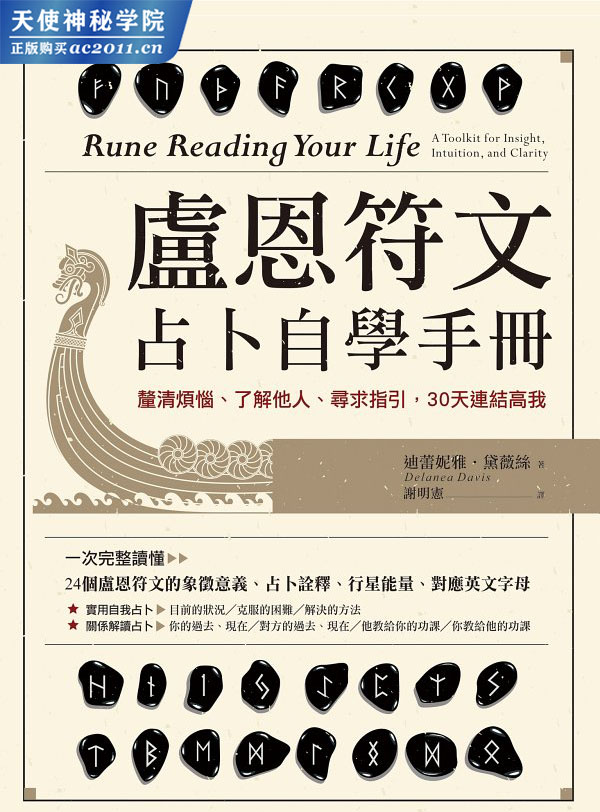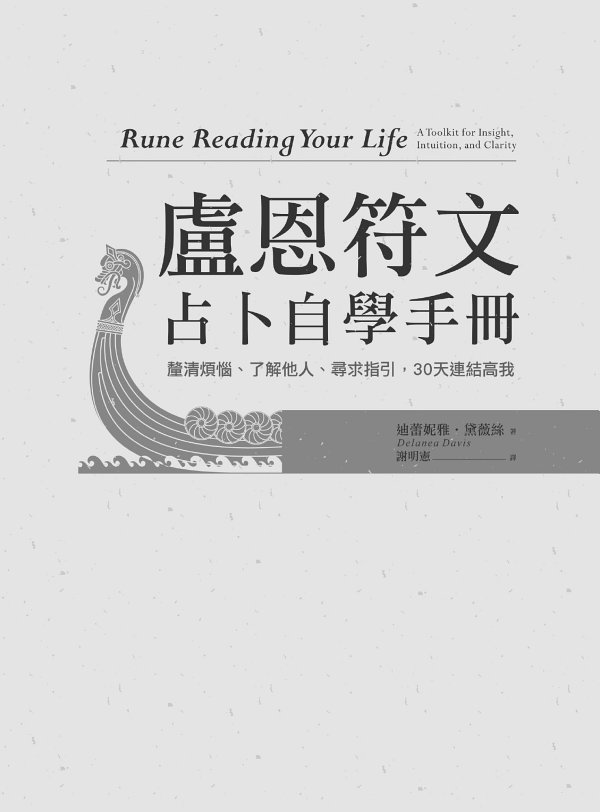

# 【推荐序】
透过卢恩，开启内在指引系统

本人深感荣幸能为本书写序。千年以来，有不少关于卢恩符文的研究。这些符号的古老运用能帮助我们觉察宇宙的内在运作，从而使我们了解此生的目的和做出选择的能力。本书将告诉你卢恩符文的历史，以及如何运用这些符号来解开那些无法透过逻辑推理得知的事物。

父权社会的兴起藉由文字带给我们逻辑的礼物，但这份礼物是有代价的。线性思维成为主要的功能，它重构了人类的心智，并使集体意识产生革命性的剧变。然而，我们 98%的脑并不使用语言、逻辑和信念。线性的心智构成我们 2%的脑，但它的功能却是去组织 98%的脑（我们头脑的关联部分）透过其他方式所搜集来的资料。由于我们只使用这个高功能的超级计算机的 2%，于是我们人类集体丧失了感受的智能——感受周遭世界的能力。

卢恩符文可作为沟通的大门，协助我们了解感受的智能所知道的事物，从而帮助我们超越那单靠逻辑所能达成的可能性。每天练习这些象征符号是增强我们的精微体（subtle body），并使我们专注于每天随时出现在身边的同步事件（synchronicities）的好方法。

关于感受的智能，我最喜欢的一个例子是古代的玻里尼西亚人。他们不使用现代的工具来渡海，而是划着独木舟，凭直觉与大自然（海浪、洋流、云、风和星星）连结来远渡重洋。他们不必用眼睛看就知道接近陆地了，因为他们已经与整个大自然融为一体。这个天赋一代又一代流传下来，最后成为他们的集体意识。这能力也代表他们完全驾驭了神圣的阴性本质。

古代卢恩符文的使用，正是这种神圣阴性本质的集体意识觉醒。迪蕾妮雅会写出这本书与世人分享她对于卢恩符文的洞见，绝非偶然，因为她同时具备应用神圣的阴性本质和阳性本质的强大能力。她能将这些能力运用在外在世界的创造上，这就是所谓的女神之道。

我是在研究所的远距心理学课程结识迪蕾妮雅的。当时她正在创业，她的目标是透过教导正念和灵修来提升企业环境的意识。她成功地将她的讯息在阳性倾向的企业结构和体系中进行交流的勇气和能力，着实令我惊叹不已。

心理学课程结束的数年后，我去康乃狄克州拜访她。就在那几天，迪蕾妮雅向我介绍了卢恩符文，引起我莫大的兴趣。透过塔罗牌或其他神谕来接收讯息，对我来说并不陌生，但使用卢恩符文还是头一遭。我们促膝长谈关于卢恩符文和其他全面性的法门，于是我们成了好朋友。

拜访她的最后一天，我在她的办公室进行灵气疗程。疗程中接收到的通灵讯息改变了我的一生。离开康乃狄克州时，我已完全脱胎换骨。我永远感谢迪蕾妮雅和当天那些帮助我走上疗愈之旅的人们。

这次的经历使我想起我所谓的「女神特质」，亦即阳柔并济。事实上，我们都知道它的存在。它并不是我们需要去学习的东西，相反的，我们只要忆起它就行。

我们不断在地球上玩着二元性的游戏，并与之协同运作。从究竟上来说，这个二元性不外乎阳性能量和阴性能量之间的消长。这些力量的统一，能促使我们认识到整体。一旦学会这些能量的和谐之道，我们便能发现伟大的力量。

那些在集体意识中已根深柢固的社会体系，使我们很难以这种方式找到和谐。因为阴柔的力量早已被遗忘。随着父权社会的兴起，女神被殖民化了。而所有的殖民化都是一个样：想把阴性变成像阳性一样。殖民化乃是为永恒的服从而设计，但那非凡的神圣阴性本质是不可能被压抑的。压制神祕的阴性力量，最后导致了女性群起对抗男性。然而在寻求女性平等权的同时，女人却也被社会化而失去了阴柔的特质，反而成为反映阳性力量之倒影的一面镜子。

女人所听到的讯息是，我们不仅必须做男人所能做到的一切，还必须做得比他们更好。我们决定凡事都务必亲力亲为，而不是在接受中找到自己的流动性。如此一来的结果是，大多数的女人都累坏了。我们认为阴柔的力量是没有价值的，但我们仍存在于它的阴影面之中。因为从根本上来说，它就是我们。我们看见阴性的阴影面表现为批判、欺骗、聊八卦、悲观、沮丧和沉默。

如果阴性的本质不被认可，那么直觉、合作、群体、觉知、接受性和爱（我们总认为应该舍弃这些特质才能在职场中出类拔萃）也就得不到认可。身为女人，这使我们处于失去与内在力量的接触而成为行尸走肉的风险当中。

随着社会的价值往阳性的方向移动，我们从整个平衡中移除了感受，而增加了表面上的效率和有效性（此乃工业革命的两大主要目标）。时至今日，我们仍受困在这个魔咒之下。在企业的环境中，你表现的阴柔特质越少，就被认为是更有价值的。我们都已变成展现阳性能量的高手。

健康的阳性面聚焦在作为上，它是在这世界采取行动，它是逻辑、目标倾向、主动、保护、独断、竞争和专注于外在的。尽管阳性的本质对创造来说至关重要，但作为完整的人，少了阴性的本质就会失去平衡。当今人类已经学会推动、战斗、强迫实现自己的欲望，而战争就是这样产生的。

然而，其实还有另一条路——女神之道。

本书提及的女神弗蕾雅（Freya），是爱、美丽、丰盛和天命的代表。她将萨满的教导带到古斯堪地那维亚的传统中，并显露出巨大的勇气和迷人的感官。她实在是太强大了，只要她一现身，众神都会觉得受到威胁。为了弱化她的力量，她被污名化为放荡的女神。至今，人们仍沿用这种可耻的策略。让一个女人闭嘴并剥夺其力量，最可靠的方法之一就是在身体或情感上去攻击她的性欲，而这种行为摧毁了文化。

事实上，阴性面是狂野、自由、神祕又强而有力的，同时也代表着感官的满足、接受性、觉知和直觉。身为女人，我们与月相及大地之母有着直接的连结。我们天生就随着宇宙的法则而流动，并对地球的健康有直接的影响力。我们也容易感情冲动，而这正意谓着我们具有利用情感（流动的能量）来引导能量的力量。我们的感官能量，是在这世界创造和物质显化中最强而有力的工具。

若要唤醒内在的女神，就必须取回我们的阴性本质。

当神圣的阳性力量和神圣的阴性力量相遇时，女神的能量就显现了。简言之，这股全能的力量是源自于内在神圣的阳性能量和阴性能量的融合。这股原始的力量成为自我主宰的基础，同时这些能量的和谐之流也支持了物质世界中的显化。就这样，我们获得了那些用过去无法理解的方式来显化的能力。

这本书来得正是时候，因为我们正觉醒于古老的女神之道，她正在崛起之中。她要你别再忽视你的直觉，并且要欣然接受你那与生俱来的智慧。她要你运用自己的呼吸、想象力和感受，来发现你与万物连结的深度——进入那未知，并勇敢地接收。

为了接收，我们必须臣服，而臣服需要对自己和整个宇宙怀有信心。臣服是最终极的灵修。当你放下抗拒而随顺一切时，你便会接收到那些必须听见的讯息，它们将引导你走向与至高的美善一致的道路。而卢恩符文有助于你在让「方法」出现的同时，能提出正确的问题来了解「原因」和「内容」。这就是信任宇宙、神或我们的本源连结的一种具体实践。

使用卢恩符文是发展直觉的方法。它能培养我们的随顺、接收，以及与那看不见之物（神圣阴性力量的真实化身）一起运作的技巧。女人天生就具备与黑暗、无形的事物一起运作的能力。黑暗中什么都没有，但从黑暗中却出现了万物。

你会在本书中读到关于迪蕾妮雅在静心方面的经验，以及她如何在需要指引时让影像在心灵之眼中成形。透过练习，你也能开始听见自己的内在指引系统在向你显露什么。

请用童真的求知欲和好奇心来阅读这本书，让你的想象力与本书的内容一起互动。利用卢恩符文帮助你打开内在的指引系统，运用它们来爱自己和了解自己。

一切必要的知识早已在你之内，你的指尖具有神圣阴性力量的魔法。众神和诸位女神，祝你们阅读愉快。

——莎拉．戴夫斯（Sara Daves）

直觉目标教练

[SaraDaves.com](http://SaraDaves.com)

# 卢恩符文索引

| 符文 | 原始日耳曼名 | 代表意义 | 对应字母 | 页数 |
|  | 恩索兹 | 信号 | A | 228 |
|  | 伯卡纳 | 成长 | B | 230 |
|  | 科诺 | 敞开 | C, K, Q | 232 |
|  | 达格斯 | 突破 | D | 234 |
|  | 耶瓦兹 | 移动 | E | 236 |
|  | 菲胡 | 丰盛 | F | 238 |
|  | 盖伯 | 伙伴 | G | 240 |
|  | 哈格拉兹 | 扰乱 | H | 242 |
|  | 伊莎斯 | 静止 | I | 244 |
|  | 耶拉 | 收获 | J | 246 |
|  | 拉格斯 | 流动 | L | 248 |
|  | 美纳兹 | 自我 | M | 250 |
| 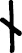 | 纳奥帝斯 | 约束 | N | 252 |
|  | 欧皮拉 | 继承 | O | 254 |
| 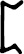 | 佩索 | 起始 | P | 256 |
|  | 莱多 | 旅程 | R | 258 |
|  | 索威罗 | 完整 | S | 260 |
| 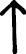 | 帝瓦兹 | 战士 | T | 262 |
|  | 乌鲁兹 | 力量 | U | 264 |
|  | 温究 | 喜悦 | V, W | 266 |
|  | 苏里萨兹 | 门径 | TH | 268 |
| 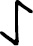 | 爱瓦兹 | 臣服 | Y | 270 |
|  | 奥吉兹 | 保护 | Z | 272 |
|  | 英瓦兹 | 生育 | NG | 274 |
| 空白 | 无 | 未知 | 无 | 276 |

# 本书架构介绍

大家好，欢迎来到古卢恩符文的智慧！卢恩符文是帮助我们了解自己、今生的有缘人和周遭世界的绝佳工具。数个世纪以来，卢恩符文既是一种字母，也是一种获得高超观点的沟通工具。它提供我们一种方法，让我们能停下来思考眼前发生的事，从而看见那热切地想带领我们的内在指引。

身为乐于在职涯的前期与中期指导他人的连续创业者，我经常听到人们说：「我不知道自己要什么」、「我不知道该思考什么」或「我不知道什么能让我更快乐」。当我们在生活的喧嚣中迷失了自己，就可能在无意中逐渐成为别人期待的样子，而不再保持自己真正的样貌。我们许多人拚了老命去符合或超越父母、朋友、爱人、甚至子女的期待；不过一言以蔽之，这可是会累死人的。

随着时间过去，我们可能会感到孤立或筋疲力尽。不知怎的，我们越努力就越感到失落。这正是我们已经与真实的自己完全失去连结的迹象。事实上，要找回自己比你想象的容易。我们只需要学会重新连结内在的声音。这个声音知道我们是谁；它拥有一切的答案；它记得小时候的我们，梦想长大后想要成为什么。

如果这些话令你感觉心有戚戚焉，那么这本书就是为你而写的。随着对卢恩符文的认识，以及发现用它们来「译码」你自己的方法，你会很快地开启自己与那全知的「内我」（all-knowing Inner You）之间的直觉连结。只要用三十天来发展和加强这个连结，你就可以轻松地认识你自己；更重要的是，保持真实的自己。藉由自信和坚定的信念，你会走向更真实且更有意义的人生。

接下来三十天，你可以用卢恩符文来做下列的事：

．厘清你的人生优先事项。探索这类问题：你有足够的时间陪家人吗？你有足够的时间休息和放松吗？你有足够的时间让自己玩乐吗？

．怀着自信更快地做决定。你逐渐不再问别人什么才是对你最好的，而是发现没有人比「你自己」更了解什么是对你最好的。

．与别人沟通你需要什么。许多人都重视社会的和谐，导致我们有时候会避免说出自己的感受和需要以维持表面的安定。一旦我们想起内在真正的自己，我们就更容易说出自己的真相，而不去担忧负面的结果。

有些人把卢恩符文当成人类与圣境（那里的高等力量会跟我们分享智慧和安身立命之道）之间的管道。我的创造性和灵性的那一面喜欢这种说法；然而我内在的科学家也有理性的解释，认为卢恩符文是一种使批判性心智分开注意力的方法，好让那不受限的创造性心智能看见因日常的劳碌而错过的其他选择。

总之，只要你试着去使用卢恩符文，便能产生正面的效果。至于其中的原因是什么，其实并不重要。请你自行判断，并依你个人的经验来下结论。卢恩符文只是你获取洞察力和自我内省的众多方法之一。

我希望你在接下来的三十天中，好好地认识你内在的自己，并学会活出真实人生所必要的一切，而不担忧自己或他人的批判。毕竟，我们生而为人就是来学习和成长的。

有些人用看的方式会比较容易理解和记住内容，有些人则是用听的。我鼓励你思考一下哪一种学习方法对你最有效。

你是听觉型的学习者吗？听觉型的学习者通常具有以下特征：

．用说的能更有效地沟通。

．比起阅读，会更喜欢用听的。

．比起事物的外貌，更容易记住事物的声音。

．会想象声音和语气。

．透过自言自语来记住事物。

或者你是视觉型的学习者？视觉型的学习者通常具有以下特征：

．用写的能更有效地沟通。

．比起听，会更喜欢用读的。

．比起听到的，更容易记住读到或看到的东西。

．会用图像和场景来想象。

．会透过观想场景来记住事物。

如果你是视觉型的学习者，那么书本就很适合你。本书提供你解读卢恩符文作为自我引导的工具时所必须学习的一切。

如果你发现自己是听觉型的学习者，别担心，你可以下载我的 Runa Reading 应用程序。你可以阅读或聆听当中的内容。该应用程序也能让你在完成本书的三十天旅程后，继续朝你的自我发现之道迈进。

本书共分为四个部分：

## 第一部分：认识卢恩符文

本书的第一部分将让你了解卢恩符文的出处，以及如何运用它们来改变你的人生。首先我会谈到卢恩符文与神话的关系，接着我会结合古老的洞见和我自己的直觉想法，告诉你如何将卢恩符文运用在现代世界。我同时也鼓励你用自己的直觉来探索卢恩符文，并确定哪一些你能与之产生共鸣。

在本书的这一部分，你将尝试一些解读卢恩符文的不同方法。你将透过一些是非题来利用卢恩符文作为你的指引，以及从一组卢恩符文中任意抽取一个符文来引导你的一天；同时你也会在日历上记录你每天抽到的符文签，以便观察你的模式并回答那些发人深省的问题。

本书附赠一组卢恩符文卡片，你可以剪下来作为你的符文签。你也可以自己制作或购买一组卢恩符文。我会提供你制作卢恩符文及其材质的各种建议，你可以选择自己最感兴趣的那些建议来制作。倘若比起实体，你更喜欢数字化的卢恩符文，那么你可以下载 Rune Read Your Life 应用程序作为你的符文签。

我已经对卢恩符文进行过广泛的研究，因此我写的这本书是很实用的。关于卢恩符文和古斯堪地那维亚人方面的学术性观点，我颇认同这一领域专家们的看法，其中有一些我也列在书末的建议阅读书目中。

## 第二部分：三十天的练习

当你尝试过不同的解读方法，并预览过卢恩符文的一些内容后，便可以展开你个人的三十天转化练习。在这过程中，你透过日志的撰写来帮助你更深入地了解自己。你看世界的眼光将会有所改变，那些深藏的回忆、期盼和遥远的梦想也会浮上台面。对某些人而言，这是个平和的过程；但对其他人来说，它可能是灵魂层次的觉醒，因此生活中的事物都必须有所改变。不论是什么，就让它们出现吧！不管发生什么，都要相信自己能处理得很好。只要是注定该学习的，我们就会在潜意识和超意识（灵性）的层面上学到必要的内容。

在这三十天中，你也会开始更看清楚各种情境，并且更容易了解人际之间复杂的交互影响。你会很轻松地发现，眼前你所认为的逆境，其实是一种隐藏的祝福。所有的事物都有功课在里头。即使是最严重的风暴，也会安然度过。迟早，无论你周遭发生什么事，你都更容易保持冷静，内心知道明天会是更好的一天。

此外，你也会以全新的层次来理解人际关系，特别是那些考验你的人。在彼此的互动中，你会理解他们自己的过去和人生考验是如何起作用的，尽管你无须对他们过去的创伤负责。你将学会看出哪些事情是他们自己的问题，而不会将它们看成是针对你而来。毕竟，我们都是来人间学习的，每个人的旅程都各不相同。对我们的成长来说，不带评判地接受事实是最重要的。

最后是练习设定每一天的意图。这部分是去思考今天要怎么过，并决定要带给它什么样的能量，然后声明你要以什么样的特质来呈现老板、同事、父母、夫妻或朋友的角色。如果你一觉醒来就感到「心绪不宁」（如同奥黛丽．赫本在电影《第凡内早餐》中说的那样），那么这一天你可以请求温究（wunjo）或喜悦；又或者你必须在某个限期内完成工作，那么拉格斯（laguz）或流动可以助你一臂之力。无论你需要什么，卢恩符文或其组合都能帮助你启动能量，让你带着完美的自信展开新的一天。

## 第三部分：卢恩符文的现代意义

本书的第三部分会针对每一个卢恩符文做现代的解释，并提出三个「停下来反思」的问题。在此，你有两种选择：你可以阅读这一部分关于所有二十五个卢恩符文的内容，然后再针对一个个符文进行「停下来反思」的提问；或者，你可以将这一部分作为帮助你在第二部分撰写日志时的参考。你可以自行决定要怎么做。

不论你采用哪一种方式，我都鼓励你回答一下这部分的「停下来反思」的问题。这些问题是为了引发你更深的洞察力，它可以透露出比单单阅读符文意义更多的内涵。这些问题能让你回顾过去、前瞻未来，以更了解你人生道路上的状况。如果你是谈话型的人，那么跟信任的朋友或谘商师交谈可能会对你有帮助；如果你比较重视隐私或喜欢用写的，那么我建议你在日志里写出你的答案。我建议你撰写日志，如此一来，你便可以记录自己的故事，留下一份描述你的灵性成长的历史纪录。

## 第四部分：向前迈进

本书最后的部分提供你如何将所学习到关于卢恩符文的内容，整合到日常生活中的建议。

有些人活在过去；有些人在焦虑未来。配合卢恩符文的使用，我们可以练习并掌握处于此刻的技巧。当我们完全处于此刻，我们就活在当下。我们专注地沉浸在自己正在做的任何事情中。我们会注意到微细的事物，例如树的形状、阳光照在脸颊上的温暖、或春天花朵绽放时的芬芳。我们在这些小事情上发现喜悦。当我们学会完全处于此刻，我们就恢复了童真般的天真无邪和快乐幸福。不费任何功夫，我们轻松地把过去留给过去，不带恐惧或怀疑地让未来自然呈现。

你今日的生活、童年、以及从小到大的每个阶段，这整个一切构成了你人生故事的美丽织锦。将它们都写下来，你会为那正等待现身的真实版本的你而惊讶不已。

如果你是用卢恩符文来为他人解读，那么你可以将符文的现代意义读给他们听，问他们要如何将这些意义应用在他们所问的生活领域中，然后用「停下来反思」的问题进行更深入的对话。你会发现，当你为别人解读时，这些讯息也会引起你的共鸣。自我发现的发生有许多种形式，而透过帮助别人了解他们自己，我们也会更加了解自己。

卢恩符文是今日的我们的一部分，正如数个世纪前它们也是我们的一部分一样。你很快就会体验到，卢恩符文会促使你用令人兴奋又有趣的方式来探索自己，并鼓励你与生活中的人们进行非常不同的对话。

你准备好要启程了吗？我为你和你即将体验的一切感到雀跃。我们出发吧！

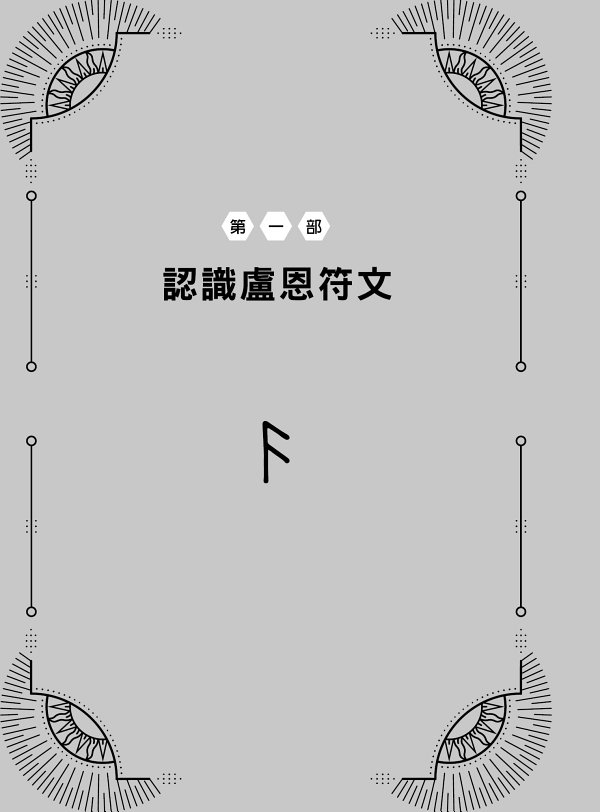

## 1　世界的现况

我知道什么样的人会来读这本书。你是个万能又有爱心的超人。我要告诉你的是，你真的太神奇了。也许你跟我一样，每天都得尽心尽力地去符合家人、同事、朋友和其他重要的人的要求。你得支付帐单、打扫家里和整理庭院。如果够幸运的话，也许你偶尔还有时间做一下按摩。每个人都指望你搞定一切，解决所有的问题。你有着神奇的能力，能同时做很多事情。不论别人是否开口要求，你总是能把每一件事做得又快又好。

就算我们是单身人士，还是必须做很多事情。我们每天筋疲力尽地躺在床上告诉自己：「也许明天我就会有更多时间来完成我想做的事。」但我们的手机一早就响个不停。我们立刻又进入迅速行动的模式，一次又一次地忙个不停。当今世界的步调越转越快，别人对我们的期待也持续在升高，而我们也总能应付得过去。可是……这一切是为了什么？虽然我们惊人的能力可以利益他人，但我们自己呢？我们付出了什么样的代价？

身为万能超人的我们，真的累了。我们其实默默地知道，我们比以前更焦虑了，尽管我们不太愿意承认。「我应付得来。」我们总是这样告诉自己和他人。我们用许多时间尽自己最大的力量，但有时还是感觉被打败了，彷彿自己付出的一切还不够。当今的研究显示，几乎十个成年人之中就有一人罹患忧郁症，并且女性罹患忧郁症的机率是男性的两倍。很惊讶吗？毕竟，我们现今生活的世界与我们呱呱坠地时的世界有着天壤之别。

我们最大的挑战，不是来自要求严苛的老板、脾气欠佳的同事、无法取悦的父母或有时很难搞的朋友，也不是源于身体多出来的十公斤赘肉，或洗衣间里那些堆积如山待洗的脏衣服。事实上，我们最大的挑战是摆脱自己那喋喋不休又负面的头脑。我们的自我怀疑悄悄地在蔓延着，我们不清楚自己要什么和自己是谁，然后就退缩了回去。这个过程影响了我们与自己和他人的关系。我们脑袋里的小小声音告诉我们的事情，是我们永远不会告诉任何人的。于是为了湮没这个声音，我们便尽可能地保持忙碌来过日子。

我们也许会寻求朋友或谘商师的建议，也许不会。问题只在于，我们的内在应该是我们最感到自在和平静的地方，而不是把它搞成一个骚乱不安之处。不过，好消息是，我们可以利用一个古老的工具来改变内在的喋喋不休，让它从令我们感觉糟糕的负面话语，变成给我们打气加油的美妙旋律，从而使我们觉得自己是无敌又厉害的超人，而我们确实如此。

这个古老的工具就是卢恩符文，包括那些彼此互相关联的象征意义。在解释卢恩符文及描述它们丰富的历史之前，我们先来探讨一下象征的心理学。

## 2　象征的心理学

在人类的早期，象征就具有透过一个简单的符号或图像来进行广泛沟通的力量。纵观整个历史，象征都在必要的时候发挥了团结众人、传递想法和传达警示的作用。现今的数位时代，当我们想要或期待迅速获得信息时，象征依然像过去一样有用。

已故的苹果公司董事长、执行长及联合创始人贾伯斯就很了解这一点，他聪明地选择在 iPhone 的互动触控荧幕上使用图示。使用直觉上就很容易懂的图示，让数百万的使用者不需要看使用手册，就能对这种新形式的数位沟通上手。象征和图示超越了时间和语言的障碍。想一想表情符号使用之普遍，以及打「嗨」这个字时，附上的表情符号是笑脸或眨一只眼时所造成的感受差别。

瑞士分析心理学家荣格写了许多关于我们如何根据日常周遭所看到的象征来进行潜意识关联的研究。荣格在他知名的著作《人及其象征》（Man and His Symbols）和《红书》（The Red Book）中表示，我们甚至不知不觉中就在进行象征的诠释和分析。他广泛地研究世界各地的神话、艺术和图像学，从而为人类心理学发展出他称之为「原型」的象征体系。他的研究促成一项很棒的成果，那就是「原型象征研究档案库」（Archive for Research in Archetypal Symbolism）的建立，该档案库记录超过一万七千个年代溯及公元三千年前的图像和象征。

象征对我们有什么用处呢？答案是，象征可以带来情感和能量。它们不仅有告诉我们某些事情的力量，同时也有让我们感受到某种东西的能力。古埃及人用生命之符（ankh）来代表太阳和永恒的生命。他们相信，生命之符的力量能帮助亡者来生的呼吸，因此将它放在坟墓里。古埃及人为下葬仪式创造了铜制的生命之符，他们当时是什么样的感受呢？想一想一个能传达到来生的象征符号的力量吧。

另一个著名的象征符号是犹太教的六芒星（或称大卫星），它代表天与地的连接，以及创造物和对立面的统一。不仅是犹太传统，对于研究卡巴拉的人来说，这也是一个神圣的符号。卡巴拉是古老的灵性智慧，其祕法早于世上的宗教。对那些认为六芒星是有意义的人而言，这个象征符号可以唤起神圣性以及与神的连结。

对早期的基督信仰者来说，「耶稣鱼」（ichthys）是具有重要密意的。它的希腊文是ΙΧΘΥΣ，意思是「鱼」。这个密意是源于一个事实：对基督信仰者而言，这个希腊文其实是由其他词汇的首字母所组成。ΙΧΘΥΣ的每一个字母都对应着一个希腊文，整个意义翻译过来就是「耶稣基督，神的儿子，救世主」。时至今日，一些基督信仰者也会自豪地在保险杆上贴耶稣鱼贴纸，以表示他们对耶稣的信仰。我的一位大学同学就有耶稣鱼的刺青。这个象征符号一瞬间就向世人传达了基督的信仰。

这些只是成千上万个象征符号中的几个例子，它们都经过时间的考验，其意义相对来说没什么改变。它们不用长篇大论就能表示很多的意思。如同你即将发现的，卢恩符文的象征符号也具有同样的力量；在接下来的三十天向内的旅程中，你就会开启这些力量。

我们不可抗拒地受到象征的吸引是有原因的。象征具有普遍意义和个人意义。看见彩虹的图案时，你立刻联想到什么？今天早上，我在我的「快乐九重天」（Cloud 9 Online）静心应用程序组发了讯息做简单的调查，人们对彩虹的图案产生以下的联想：

黛博拉：「所有人之间的彩虹桥（在人间和天堂）。」

林恩：「（灵性的）高等维度。」

萨布丽娜：「所有肤色和文化的集合。」

布莱德：「水和光相遇的魔法：生命和意识。」

瓦尔：「同志游行。」

亨利：「正面性。」

看见彩虹图案时，我会立刻想起一九七九年我生平第一次看的电影《大青蛙布偶电影》（The Muppet Movie），当时我只有四岁。电影一开始的场景是科米蛙坐在森林中的一块木头上，弹着斑鸠琴、唱着那首「彩虹连接大地的地方」。看着大荧幕的影像，听着迷人又充满希望的歌词和旋律，那一刻对我来说实在太神奇了。彩虹图案将我带回到那一刻，并使我会心一笑。那么，看见彩虹的象征时，你会想到什么呢？

此外，象征也有助于我们释放情绪。当我们看见一个象征符号，并能对它产生个人的联想，我们的理性就退到一边去了。此时，那忙个不停的头脑将停止过度分析周遭的世界，从而使我们进入更有创造力和平静的境界。比起批判性思考，一个简单的象征符号更能在感受方面帮助我们。

说到象征和图像，你想到什么图案和联想呢？把它们画在下方的框框里。

你画的这些象征使你产生哪些感性和理性的联想呢？

现在……好玩的要开始了！

## 3　卢恩符文的历史和神话根源

卢恩符文是几个世纪前构成古日耳曼语系字母的象征符号。事实上，「卢恩」（rune）一词是源自哥德文的 runa，意思是「祕密」或「神祕」。卢恩符文就这样被当成书写的文字和神圣的工具来使用。人们相信，这些古老的象征符号能帮助卢恩符文解读者预知未来的事件，从而趋吉避凶。

卢恩符文的象征符号总共有二十四个，每个符文都对应着一个或数个英文字母，并且有一个日耳曼语的名字。由于卢恩符文是口传下来的，因此它们究竟有多古老仍有不同的说法。有些文献表示，它们可追溯至公元一百五十年；其他的文献则表示，它们已有三千两百多年的历史了。北欧的冰岛经常可以看到不同形式的卢恩符文，在洞穴的墙壁上也可见到它们的踪迹。你会发现，在不同的学术文献中，每一个卢恩符文都不仅只有一个名称、形式和意义。卢恩符文的译意、发音和形貌，会随着时间产生起伏变化。为了便于说明，我将按照最契合我的版本，向你介绍卢恩符文的名称、形貌和简略的意义。

对于比较倾向科学头脑的人，可以把卢恩符文想成是引发个人联想的工具。从心理学家的角度来看，联想指的是我们在心中将自己的所见所闻与过去的经验建立连结。这个「联想」的概念，可以直接追溯到哲学家柏拉图和亚里斯多德，以及他们早期写的关于记忆串连的著作。现代的科学告诉我们，我们的经验会在脑中建立影响我们思考、感受和反应方式的神经路径。

对于比较喜欢神祕事物的人，可以把卢恩符文当成是连结那超越人间的能量和力量之源的神圣工具。今天，我们会将这个力量想成是来自于我们的指导灵、守护天使、高我或我们所定义的神。

现今我们对于卢恩符文的认识，大部分都来自于中世纪《艾达史诗》（Eddaic poetry）所描述的古斯堪地那维亚神话。本书使用的卢恩符文组可追溯至九世纪至十三世纪的斯堪地那维亚，亦即所谓的老弗萨克（elder futhark）系统，而弗萨克这个词正是最前面六个符文（fehu, uruz, thurisaz, ansuz, raido, kanu）的字头组合起来的发音。在拉丁字母遍及整个欧洲之前，这些符文是当时欧洲最广泛使用的字母。在卢恩符文流行的顶峰时期，它们被雕刻在珠宝、器具、雕像、武器和墓碑上来改运、护身或纪念某人或事件。当时上战场用的刀剑经常会刻上卢恩符文，人们也会在房子的外面交织几个符文制成「家徽」，以祝福和保佑居家平安。

除此之外，人们也会用卢恩符文来治疗疼痛或骨折之类的病痛，同时也广泛地应用在助产和一般的治疗上。治疗者会将这些象征符号画在患者的物品或身体上，或是画在可以刮成粉末溶入液体的材质上，以便制成给患者服用的灵丹妙药。

最后，使用卢恩符文的还包括那些精通符文知识、魔法和治疗的卢恩法师（vitki）。在冰岛的维京时代（大约是公元八○○年至一○六六年），王室仰赖卢恩法师透过卢恩符文召唤古斯堪地那维亚的神祇来寻求预言、保护和运气。

从神话的观点来看，卢恩符文是众神之父奥丁（Odin）送给我们的礼物。由安东尼．霍普金斯等人演出的现代电影《雷神索尔》、《雷神索尔 3：诸神黄昏》，以及由法兰克．维尔克配音的动画连续剧《复仇者联盟：正义出击》中，奥丁获得这些神奇的卢恩符文来作为他发挥原型力量的方法。由于奥丁是勤学不倦又善于言辞的神祇，因此他也成为人们祈求逻辑、沟通和治疗时的召唤对象。据说，他曾经为了换取广大的智慧而牺牲了自己的一只眼睛。

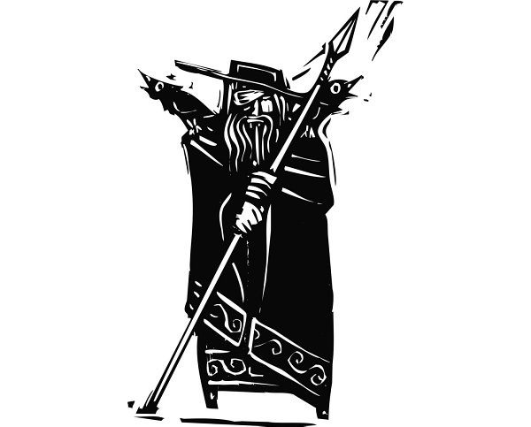

奥丁

在荣格心理学中，原型力量代表从人的情境中发现的行为模式。为了简化这个概念，看看下列的描述有多少符合你认识的某个人？

「她真是个天使。」

「他真是个风流鬼。」

「她是个热心的老妈子。」

「她总是扮演牺牲者的角色。」

「他像个烈士。」

「新上司是个女王蜂。」

这些全都是原型的例子。透过一个简单的语词，我们就能了解某人在某种情境下的行为模式。天使的原型流露的是一种甜美、天真无邪的能量；牺牲者的原型想要博取同情；女王的原型具有盛气凌人、控制欲强的能量；老妈子的原型是即使没人请求帮忙也会自以为是地多管闲事。

那么，原型又是如何与卢恩符文产生关联的呢？卢恩符文根据连结人间和天界的能量而分成三个群组，每个群组各有八个符文。这三个群组分别由三位古斯堪地那维亚的神祇作为代表：提尔（Tyr）、海姆达尔（Heimdall）和芙蕾雅（Freya）。这三位神祇的精采故事，就交织在我们许多人都极为熟知的关于索尔（Thor）、奥丁和洛基（Loki）的故事中。

从原型的角度来看，奥丁代表领袖，索尔代表护卫，洛基代表骗子；还有提尔代表战士，海姆达尔代表守望者，芙蕾雅代表女神。对这些守护神的概括性认识，将有助于我们使用卢恩符文寻求指引时，能了解其所代表的原型能量。

我们就先从神祇提尔开始。

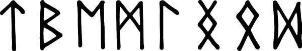

提尔群组的八个卢恩符文

奥丁之子提尔来自原初两大神族中的亚萨（Aesir）神族，他被视为正义和法律之神。身为终极战士的他，有时也被称为战神。发生战争时，人们都会召唤骁勇善战的提尔。事实上，这个称做帝瓦兹（teiwaz）的符文 ，就代表提尔的名字，其意义是战士。斯堪地那维亚的战士会将这个符文刻在自己的武器上，以激起如提尔般的勇气。

尽管提尔断了一只手，但他不愧为终极战士。根据神话的说法，提尔会失去一只手乃是与洛基的怪物儿子猛狼芬利尔（Fenrir）有关。神话中说，当芬利尔还是只幼狼时，亚萨神族让他跟他们生活在一起，并且可以在他们的神界阿斯嘉特（Asgard）自由地走动。随着芬利尔日渐长大，众神开始对他庞大的身躯和力量感到不安，于是一致认为现在该是拴住他的时候了。可是芬利尔的力气大得很，没有任何锁链能拴住他。最后，众神只好请侏儒世界的小矮人打造一条具有法力的绳索来绑住这只猛狼。

芬利尔同意让众神将这条绳子套在他的脖子上，不过有个先决条件：他们得派一位神祇并且把手放进他的嘴巴里，以表示彼此的互相信任。勇敢的提尔二话不说便将自己的手伸进猛狼的嘴巴里。绳子套上后，法力开始起作用，它变得越来越紧。芬利尔想要挣脱，可是他越是挣扎，绳子就收得越紧。芬利尔越来越火大，最后为了报复，他咬掉了提尔的手。提尔为了保护其神族的安全，壮烈牺牲了他的一只手。因此提尔也代表一个现实，有时为了生存和安康，流血牺牲是必要的。这则故事教导我们，痛苦往往是成长和新的可能性出现不可或缺的一部分，无论这痛苦是内在或外在、是自己或别人引起的。

提尔群组的八个卢恩符文提供的是「信心」。

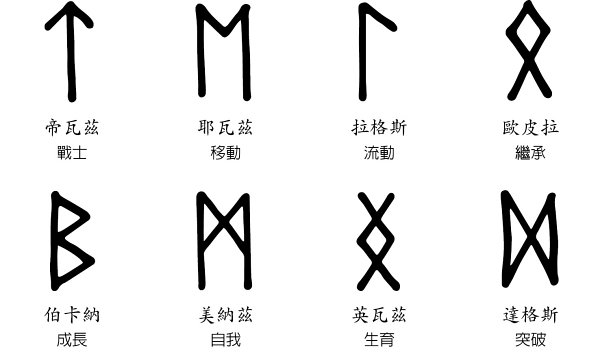

提尔群组八个符文的名称和意义

除了战士的原型外，提尔也具有审判者、保护者和复仇者的原型能量。提尔群组的八个卢恩符文能帮助你面对最具威胁性的人和情境，因为它们具有无私和牺牲的本质。提尔不会为了战斗而战斗；相反的，他知道为了保护及让整个世界更美好，秩序是必要的。在今日的世界，提尔将会是执法官员、立法者或法官。

有意思的是，现在的漫威电影将提尔的诸多战士特质都加到索尔的身上。事实上，在神话中，索尔比较象是农渔业的神祇，提尔才是真正的战神。好莱坞对于索尔的描写似乎有点过于自由挥洒了。

接下来是神祇海姆达尔。

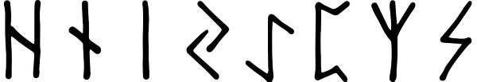

海姆达尔群组的八个卢恩符文

海姆达尔这位沉默的神祇也是来自亚萨神族，他是阿斯嘉特神界的守望者和警卫。他由九个母亲抚养长大，她们互为姊妹。众神很重视海姆达尔的远视和遥听的超能力，包括他偶尔提出的忠告。

海姆达尔是个高大又神圣的神祇，他一直坐在连结神界和巨人国的彩虹桥上，为任何的风吹草动保持警戒。他从未离开过他的岗位，也很少睡觉。要集合众神时，他就会吹响他的黄金号角加拉尔（Gjallarhorn）。他有预见未来的天赋，当诸神的黄昏（Ragnarok）来临时，他就会用他的号角来警告众神。诸神的黄昏是指众神不可避免的末日。

海姆达尔忠诚又可靠。身为索尔的朋友和洛基的敌人，他曾建议索尔如何从巨人索列姆（Thrym）的手上夺回他的神鎚谬尼尔（Mjolnir）。索列姆盗走了索尔的神鎚，引起巨人族可能入侵的危机。然而，索列姆根本没打算要入侵阿斯嘉特；美丽的女神芙蕾雅才是他的目标。索列姆趁索尔睡觉时盗走他的神鎚，想要以它作为娶芙蕾雅为妻的交换条件。

索尔和洛基想说服芙蕾雅嫁给巨人，但始终没有成功，于是索尔转向海姆达尔寻求意见。藉由眼观四面、耳听八方的能力，海姆达尔知道何时该火速采取行动、何时该暂停，以及何时应该什么都不做。而这次的状况，海姆达尔建议索尔假扮成芙蕾雅来欺骗索列姆。索尔赌上自己的名誉，心不甘情不愿地按照海姆达尔的建议去做了。结果计划奏效，索尔顺利取回他的神鎚。

海姆达尔群组的八个卢恩符文提供的是「清晰」。

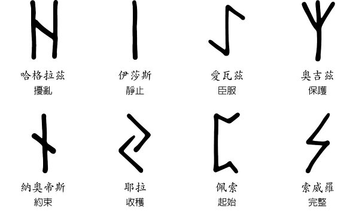

海姆达尔群组八个符文的名称和意义

除了护卫者的原型能量外，海姆达尔也带有远见者、聆听者、隐士和顾问的原型。海姆达尔就像最忠诚的朋友，他会听你说话并给予建议，永远都为你着想。他的八个卢恩符文将帮助你以最清晰的方式评估状况，好让你能用最佳的方式来应对它们的发生。

如果你看过伊卓瑞斯．艾巴在漫威电影里饰演的海姆达尔，千万别被那吓人的外表骗了。事实上，海姆达尔是个温柔的守望者和聆听者。

最后同样重要的是我们的女英雄——美丽的女神芙蕾雅。虽然神话领域是以男神的故事为主，但芙蕾雅却是不容忽视的。因为她为这世界带来了强大又具培育力的原型能量。

强大又美丽的芙蕾雅

（图：George Peters Designs）

在古斯堪地那维亚的神话中，芙蕾雅是最为突出的女神。她来自华纳（Vanir）神族，他们的体形明显比奥丁和索尔的亚萨神族来得娇小。整个华纳神族被认为是属于繁殖、性感和昌盛的神祇。这些谁不想要呢？

如同诗歌和中世纪的传说所描述的，芙蕾雅是爱、美丽、丰盛和命运的女神。她就像希腊女神阿芙萝黛蒂（Aphrodite）一样，被公认是最美丽的女神，拥有众多的仰慕者。她非常有爱心，人们相信她具有神祕的力量，可以帮助向她祈求的妇女们解决心事和生育方面的问题。

此外，芙蕾雅也是接引许多阵亡将士英魂的神祇。战争过后，芙蕾雅会到战场上，带着最勇敢的将士的灵魂回到天界，而她会在天界照顾他们及其家人一直到末日。因此，芙蕾雅不仅与生命和爱有关，她与死亡和战争也有关系。在此，我们可以看到埃及女神伊西斯（Isis）和希腊女神波瑟芬妮（Persephone）的影子；前者是天堂和地狱的代表，后者则有一半的时间待在冥界。

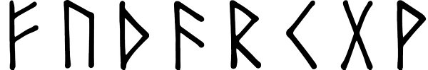

芙蕾雅群组的八个卢恩符文

许多神祇都想得到芙蕾雅，但她却嫁给了经常旅行并让她长期独守空闺的欧德（Od）。欧德和奥丁是不同的神祇，切勿混淆。当欧德不在身边时，芙蕾雅会得到许多仰慕者的关注和礼物，这能带给她暂时的快乐。然而，这种短暂的喜悦维持不了多久，紧接着芙蕾雅只感到失落和忧伤。据说当她漫步在大地上寻找欧德时，会流出玫瑰金的眼泪。

芙蕾雅的美丽是她的力量，不过也带来了负担。尽管大多数神祇都很喜欢芙蕾雅，但她的美丽和力量也引来一些神祇的嫉妒和残忍的对待，他们会说她水性杨花又耽于享乐。某些古老的文献确实有这样的说法。不过我认为这是洛基和其他男神扭曲了事实，他们其实是对她的美丽、温暖和优雅所带来的力量感觉到威胁。

芙蕾雅群组的八个卢恩符文与「爱」和「感情」相关。

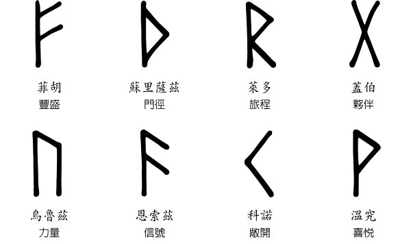

芙蕾雅群组八个符文的名称和意义

当你看见这八个符文的代表意义，芙蕾雅的复杂故事及其相关的原型能量就活了起来。遇到心事时，芙蕾雅的八个符文都能指引你。除了具有性感女神的能量原型外，芙蕾雅也散发着天使、母亲、救援者、神祕家和伙伴的原型能量。

我认为芙蕾雅是女神中的女神，因为她除了代表我们对他人的爱之外，也代表我们对自己的爱。

下方表格总结了各个群组的神祇、卢恩符文和原型之间的关系。

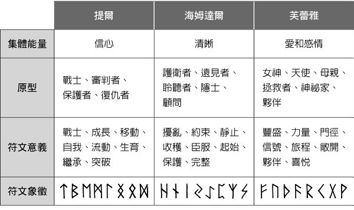

## 4　现代世界的卢恩符文

现今，卢恩符文有着极少众的追随者，它们不再被当成字母来使用，而是成为一种神圣的沟通方法，以及透过所谓的吸引力法则来影响外在结果的显化工具。吸引力法则说的是，你可以藉由聚焦和期待正面的事物来吸引正面的结果；同样的，你也会由于聚焦和期待负面的事物而招来负面的结果。换句话说，你对宇宙投射出什么，它就带给你什么。

举例来说，卢恩符文  英瓦兹代表生育、家庭和性能量。我们可以用它来引发延续和连结；有些人则会利用它来帮助怀孕。无论英瓦兹在历史上的意义是什么，只要我们相信它有助于生育，它就会产生力量。

为了在事业发展的交涉方面创造一块沃土，我选择在我其中一家公司国际经验设计（EDI）的标志上使用卢恩符文英瓦兹。整件事的来龙去脉其实挺有意思的。当我在写草案给帮我做新标志的平面设计师阿德南和阿山时，我强烈感觉我们的 EDI 标志需要一个图形或图像。任何时候只要我对某件事有感觉，我就会立刻采取行动，并启动我聆听直觉的本事。

每当我想从内在的源头寻求神圣的指引，我就会闭上眼睛，然后提出我的问题。通常我会在心中看见一个意象，或是得到立即的回覆。因此当我闭上眼睛开始问：「国际经验设计的标志会有图形吗？」我立刻在自己的心灵之眼中看见一个巨大的、黑色的 Y，在我的内心这就表示「是」的意思。然后我接着问：「我可以看一下那个符号吗？」我立刻看到了  的图形。我心想：「太酷了！是卢恩符文耶！」而这个符文代表的是生育，真是太完美了。

不过，我是个具有研究精神的人，因此我通常会再做第二次确认。于是我拿出符文袋，闭着眼睛捧着它们问道：「请告诉我，国际经验设计的标志要用哪一个卢恩符文？若不需要任何符号的话，就请让我抽到空白符文。」

你猜怎么着？我第一次就抽到了  ！我甚至没有任何的惊讶，因为此时我已经跟卢恩符文密不可分了。我只是大声笑了出来，说道：「当然了！谢谢你！」从过去到现在，我一直很感谢我有卢恩符文作为自我引导的工具。就这样，我的公司标志诞生了。

国际经验设计公司标志

幸好，我的合伙人亨利是个大方的人，他将公司标志的事交给我全权处理。由于亨利在纽约的雪城长大，因此我指示平面设计师使用雪城大学校徽的彩通色（Pantone colors），包括了深橘色和深灰色，现在我们的公司标志就含有这些颜色。这么一来，我便得以将我对卢恩符文的喜爱与亨利对家乡的热爱结合在一起了。

二○一七年十一月，在公司成立九个月后，业务开始蒸蒸日上。我们的销售达到里程碑，维持成功的经营已不成问题。有趣的是，对我来说，这九个月就像怀孕生子一样。EDI 需要九个足月才能长大成熟。虽然最初几个月，我们都心怀希望又乐观，但对于在二○一七年年底达成业务目标并不十分有把握。后来我们签了第一个国际级的大客户，从那时候开始，源源不绝的生意就不断地流进 EDI。我完全肯定，公司标志中的英瓦兹符号，其能量确实对我们的成功做出了贡献。

关于卢恩符文，无论你接受的是以科学为根据的解释，还是以神祕或能量为根据的解释，都没有关系。只要每天固定使用卢恩符文，你便会牢记于心，并将每日的意图付诸实现。卢恩符文提供有趣的方法让我们与内在自我对话，从而使我们尽可能地活出全然觉知和觉醒的生活。我们越相信卢恩符文是智慧之源和连结真我的加速器，我们与那知晓一切的高等根源的连结就会变得更有力量。重点是，从早到晚要养成一种习惯，停下来提出必要的问题以做出最好的决定，好让你能朝着真正想要的方向迈进。

随着时间推移，你会发现自己不再需要实体的卢恩符文组。我现在只要闭上眼睛提出问题，便能在心中看见一个或多个卢恩符文，完全不必动用我的符文袋。只要开始经常使用卢恩符文，你也可能毫不费力地练就这种本事。

## 捕捉你对卢恩符文的第一印象

在进一步熟悉卢恩符文以及了解它们的现代意义之前，我们先来捕捉你对每个符文意义的第一印象。在接下来的段落中，我们会给你看三个不同的卢恩符文。这个练习是要捕捉你对每个卢恩符文的直觉联想，因此关于它们的意义，你知道得越少越好。

检视一下这个练习的每一个符文，然后闭上眼睛，在心中观想每一个符文。如果在观想上有困难，你可以想象自己在黑板或沙滩上画它们。写下你看见每个符文时，心中浮现的词汇、语句、感觉或意象。

准备好了吗？

看见下面这个符号，你心中浮现什么词汇或语句？也许你会觉得它是一个字母。写下你对它的第一印象。

闭上眼睛观想这个符文时，它带给你什么感觉？

这个符文叫苏里萨兹，其意义是门径。让「门径」这个词在心中沉潜一下。你看到什么意象？把它画下来：

我们来试另一个符文，看你对它会有什么样的联想。看见下面这个符号，你心中浮现什么词汇或语句？

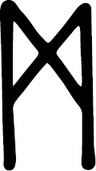

闭上眼睛观想这个符文时，它带给你什么感觉？

这个符文叫美纳兹，其意义是自我。让「自我」这个词在心中沉潜一下。你看到什么意象？把它画下来：

最后，在看整个卢恩符文组之前，我们再来试一个符文。看见下面这个符号，你心中浮现什么词汇或语句？

闭上眼睛观想这个符文时，它带给你什么感觉？

这个符文叫欧皮拉，其意义是继承。让「继承」这个词在心中沉潜一下。你看到什么意象？把它画下来：

现在，翻开本书的第三部分，查阅一下苏里萨兹、美纳兹和欧皮拉的现代意义。接下来，用你自己的话来描述每个符文的意义。它们与你自己的第一印象有什么异同？

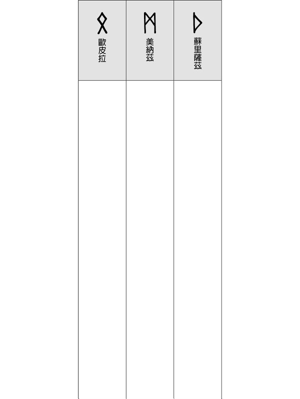

现在，我们来研究一张整组卢恩符文的插图。

## 卢恩符文概览

下面这张图是老弗萨克的二十四个卢恩符文。随着时间推移，这个符文表演变成二十七个符文，后来又演变成三十一个符文。但现今我们最常用的是最初的二十四个符文，另外再依个人喜好增加一个空白符文。

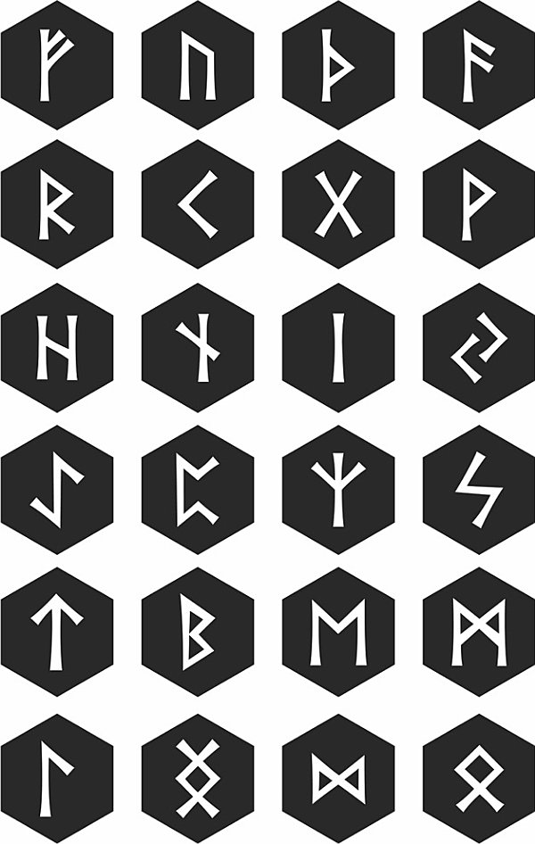

评估一下每个符文。哪一个或哪些符文最吸引你？原因是什么？其中有哪些是你觉得眼熟的？把它们画下来，并注明它们吸引你的原因。

现在，翻开本书的第三部分，查阅一下你所画的符文的意义。这些意义与你的生活现状有多大的关联？把你的观察写下来。

有些卢恩符文可能与我们现今看到的一些图案感觉很相像。如果你喜欢体育，你可能听说过在美国举办的名为「雷格纳接力系列」（Ragnar Relay Series）的长途接力赛。雷格纳接力赛是由六至十二人组成一队，在二十四小时内从一个城市到另一个城市，接力跑完三百二十公里。若你曾参加过这个比赛，你一定知道在晚上九点至早上五点这段时间，会有一段八公里（或更长）的路程，必须戴着头灯在漆黑的夜晚中跑完。即使队车就跟在你后面，晚上跑步的感觉还是挺阴森可怕的！有人说身体只要休息五小时，便能从中程长跑之类的剧烈活动中完全恢复体力。雷格纳接力赛就是很好的证明。

现在，我们来检视一下雷格纳接力系列的标志。仔细看它的标志，并与卢恩符文比较，你觉得它像哪两个符文呢？如果你不熟悉这个标志，可以先上谷歌搜寻一下。

耐吉（Nike）的标志呢？把它转一下，你觉得它像哪个卢恩符文？

你在雷格纳接力系列的标志上看见代表保护的  和代表旅程的  了吗？它们是这个比赛的完美象征，因为你得徒步完成三百二十公里长的艰辛旅程。事实上，不论是白天或晚上，跑者在不熟悉的地方跑步都需要一点保护，以避免发生意外或受伤。在耐吉的标志上，你看见代表流动的 了吗？哪一个运动员不希望在训练和适应时能处于流动的状态？

这些品牌背后的营销智囊是刻意想借助卢恩符文的力量吗？或许是；或许不是。我个人相信，无论我们这辈子是否听说过卢恩符文，我们对它们都有一种熟悉感，因为我们都曾在细胞和灵魂的层面见过它们。我们确实认识它们，并且很可能是前世的记忆。

## 了解卢恩符文的讯息

我们都有聆听内在智慧说话的能力，即使我们没有发起这个对话。当我们对卢恩符文表现出兴趣时，我们就在能量上启动了与这些符文活生生的连结，如此一来，我们就调准到它们的独特频率，而每个频率都有高层次的指引，不论我们是否请求它。

二○一四年十月十三日，我在康乃狄克州的海边捡拾我的第一套卢恩符文石。当时我并未意识到那天刚好是我母亲的六十岁冥诞。我小心翼翼地在海边搜寻，挑选了二十五块扁平的石头。那是一次非常放松的内省经验。每当我需要休息和充电时，最喜欢去的地方就是海边，海边的石头可以让我直接放松下来，并使我充满快乐的回忆。

我把那些石头带回家，并保持它们的原样整整三百六十五天。我真的无法解释其中的理由。一整年，我就是不想对它们做些什么。再次地，二○一五年十月十三日，我在不知道当天是什么日子的情况下醒来，强烈感觉这一天我必须独处。

我出门健行，接着有一股冲动想去买我的第一本关于解读卢恩符文的书籍。我在一间书店坐下，喝着热咖啡，目不转睛地看着卢恩符文。我读着每一个符文的代表意义，不到几分钟就全部记起来了。虽然这是我第一次见到卢恩符文，但那感觉就好像我是忆起它们似的。

差不多快读完整本书后，我觉得有必要去手工艺品店买颜料，以便制作和加持我的第一套卢恩符文石。我必须在那一天做这件事。所谓加持某物，就是与这项物品建立个人的连结，例如小孩子第一次收到泰迪熊玩偶，他抱了抱它，便与这玩偶建立了关系。对我来说，亲手在石头上绘制卢恩符文，同时集中精神在每一个符文的意义上，就是我用自己的能量加持符文石的方式。

我是回到家后在绘制这些符文时，才想起今天是母亲的冥诞。我笑了起来，心想：「妈，感觉我们好像一整天都在一起。今天真是太棒了！」

我使用这第一套卢恩符文大约一年。我随时都把它带在身边，每当我觉得想抽一支符文签时，就会把它拿出来。后来我也开始帮别人抽符文签，有时是帮认识的人抽，有时则是帮完全不认识的人。

坦白说，刚开始时还满别扭的。不过，我很快就明白：我只需请当事人在心中想着要问的事情，然后抽一支符文签，看它的意义是什么。接下来，当事人会把我说的话跟他们的状况连结起来，并向我说明他们所获得的个人意义。

卢恩符文就象是我随身携带的安心毯。不知怎的，只要有它们在身边，我就会感到安心。终于有一天，当我把手伸进装着卢恩符文的小丝绒袋里时，我感觉有东西碎裂了。我把它们倒出来，发现有几颗符文石莫名其妙地碎掉了。

刚开始我想为此寻找合理的解释：是我把袋子掉到坚硬的平面上了吗？还是有重物压到了它们？由于我的符文石是放在笔记型计算机的保护袋里，我的笔记型计算机应该能轻易地防止重物压到它们才对。于是我闭上眼睛问：「这些碎掉的符文石有什么重要的意义？」

我心中立刻浮现一个答案：「你应该再制作一个新的。」

好的，我明白了。

既然我已经对海边的石头有一点了解，于是我决定去捡密度更高、非沉积岩的新石头。后来我担任罗得岛一家公司的顾问，一周有几天必须到那里出差，而我会在日出时走出饭店，到纳拉甘西特海滩寻找扁平的黑石头，我知道它们会比我在康乃狄克州海边捡的石头坚硬得多。

在海边寻找黑色的小石头是很特别的体验，我会一边走一边把捡来的石头放进口袋里。途中，我忽然觉得白色石头也挺好的，所以我就把黑色石头装在右边口袋，白色石头装在左边口袋。

在捡了一百多颗石头后，我心满意足地准备着手绘制新的一套卢恩符文石。我觉得搜集和选择每一颗石头是很重要的事，因为这样可以创造一个回忆，并与这些石头建立紧密的关系。

有意思的是，在我为自己绘制新的一套符文石之前，我已经先为别人绘制并加持了三套，因为制作和教授卢恩符文是我工作的一部分。

一旦你与卢恩符文建立起连结，就会发生很有意思的事。你会开始四处发现它们，并可能在看见它们时接收到直觉的讯息。类似这样的一次最重要的体验，就发生在我在罗得岛时的最后某一天。虽然我已完成石头的搜集，但我却在海滩上发现一颗白石头，上面有天然形成的卢恩符文哈格拉兹 ，其代表意义是扰乱。由于这颗石头太显眼了，我把它捡起来，拍成照片贴在我的脸书上，并注明它代表着扰乱。我很好奇接下来会发生什么事。以下是当时我贴在脸书上的内容：

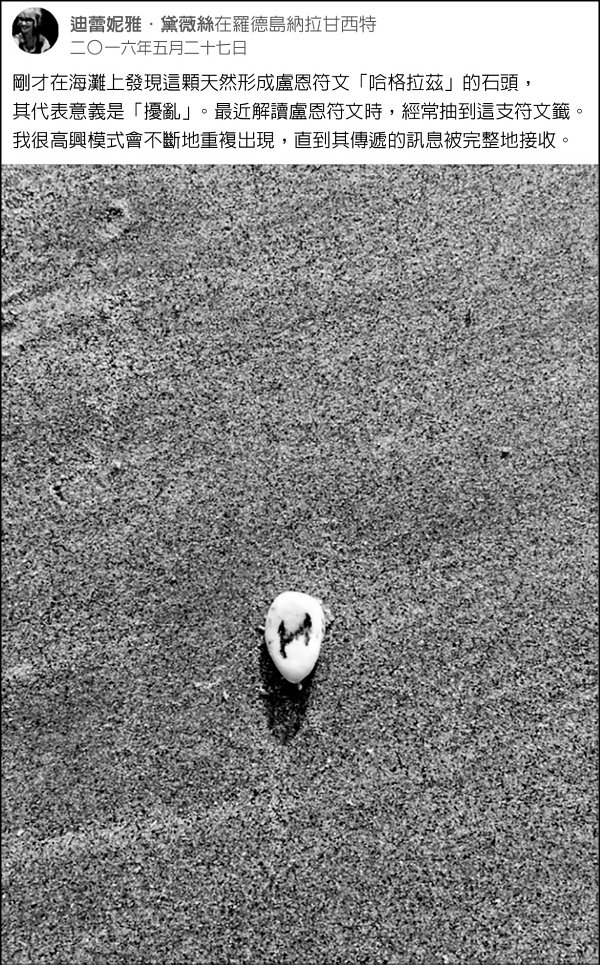

当代表「扰乱」的符文出现，就意味着即将发生可能带来翻天覆地和不可避免的损害事件。不过，扰乱的力量越大，那么当一切稳定下来后，其成长和重生的潜力也就越大。我很好奇到底会发生什么事呢？

三个小时后，我在一家咖啡馆处理工作，我有一位客户的公司就在附近。这位客户是很有远见的执行长，他将毕生积蓄全投资在自己的公司，不分昼夜地勤奋工作以实现他的梦想。忽然，这位执行长飞奔到咖啡馆来找我，说道：「把东西收拾好，我们现在要赶快走！」

我说：「发生什么事了吗？」

「没时间解释了，我们得马上走！」

「好吧，」我说：「可是要去哪里呢？」

「去普洛敦维士。联邦调查局对我发出了拘捕令。」

看吧，才刚说到翻天覆地，事情就发生了！

驱车前往普洛敦维士的过程如梦幻一般。我开着车，这位执行长菸一根接着一根地抽，而我也卷入了他惹出来的这个大麻烦中。他因多项重罪被起诉，并为这即将到来的麻烦请了辩护律师。然而今天状况急转直下。除了联邦调查局，普洛敦维士的地方检察官也将他起诉。

接下来的日子简直就是一场风暴。我的事业合伙人丽塔也跳进去协助处理一个非常折磨人又令人激动的状况。时间分秒必争，我们必须火速成立跨领域的危机处理小组：危机沟通、执行长家人的社会支持、律师和风险管理顾问（我称他们为昂贵的「花钱请来的朋友」）。你得在后果越来越严重的状况下，迅速地将这组人马结合起来。

事情发生在阵亡将士纪念日的礼拜五小周末，而地方检察官要求这位执行长必须在星期二主动投案，因此我们有三天的时间为可能成为全国热门新闻的事件做好准备。最好的情况是让这件事只在该州的报纸和电视上报导。但不管怎样，我们还是必须通知大约二十位投资人和处理员工的问题，执行长的家人和家族也需要某种程度的沟通。而这些，我都参与其中。

这是我最辛苦的一次工作经历，更甭说情绪上的折磨了，毕竟这位执行长是多年来的家族好友。事实上，在处理这些事的过程中，我把那颗代表扰乱的白色石头给了这位执行长，并且告诉他，就在这一切发生的当天，我在海边发现了它。其间他曾一度崩溃，哭着向我和丽塔吐出实言，其实早在几年前，一位具有直觉能力的通灵人就告诉过他，他在四十岁左右会坐牢，并且家庭会破碎。那人曾经很详细地预言目前正在发生的事。

「我早就该注意她的警告，」他边哭边说：「我本来有机会做不同的选择，可是我没这样做。我为什么不听她的话呢？」

对于接下来要发生的事，我们已经无能为力，而我和丽塔也无法多说什么来安慰他。经过大约一年的软禁后，这位执行长被轻判一年零一天的有期徒刑。事实上，许多人即使得到温和或严重的警告，还是会继续走目前的路。人总是从痛苦和折磨中获得最大的学习。

你可能会认为，这件事会让我吓得不敢再碰卢恩符文。但事实是，我从对卢恩符文的着迷，变成对它肃然起敬。

讽刺的是，在这位执行长被逮捕的七个月前，我曾为他做过卢恩符文解读，并给他很明确的警告。我在二○一五年十月二十八日帮他抽了三支符文签，并用电子邮件将解读的内容寄给他。我以拉尔夫．布鲁姆（Ralph Blum）的《卢恩符文之书》（The Book of Runes）作为指导，为他做出以下的解读：

．目前的状况： 美纳兹代表「自我」。一切都从你开始。现在唯有清明和改变的意愿才有效果。要注意什么正在来临、什么正在逝去。这是你成长和改正的时刻，它对于你的进步至关重要。活在这世间，但不要完全属于它。对这世间传递给你的讯息保持开放和接受。尽可能活在当下做你的每一件事，因为那些是你喜欢做的事。要小心，别被价值和成就的观念蒙蔽了眼睛。

．克服的障碍： 爱瓦兹代表「臣服」。当道路上出现障碍时，我们都倾向将它推开或击垮。然而有时候，更高层次的看法和观点会看似延迟或离题，但它其实是有益的。过于热切或焦急反而会事与愿违。采取行动之前，要先考虑该行动的后果，如此才能藉由正确的行动来避免困境。困难和麻烦会带来成长。让事物流动，并如实地承认挫折。一旦你臣服于万物迁变的自然秩序，事情就会变得不费吹灰之力。

．解决的方法：颠倒的  拉格斯代表「流动」的反面。它警告你别过度使用自己的力量和做过多的努力。依你的直觉保持平衡是至关重要的。请进入内在，并展现你具接受性的那一面。

．总结：让自己「是」（be），别一直「做」（do）。几个阶段的静止不动，将有助于你再次充满能量好让来日走得更快。必要时，让自己过几天完全不做计划的日子。虽然这与你的本性相违，但是当你被某事卡住时，就应该这样做。想蛮干把事情「搞定」，只会导致你做出仓促的决定，所以最好还是等头脑清醒时再做决定。别做对自己不利的事。当你的高我进来，就让它主导。你的身心只是在达到与你的高等意识相同的境地。

在那之后，我又为执行长抽了几次符文签，而颠倒的  拉格斯也不断地重复出现。这位执行长把自己逼上了绝路，然而我相信，他的内心深处知道这种急转直下的状况会让他完蛋。他的高我透过卢恩符文在跟他说话，但他凡人的那一面并不愿意倾听。当我们的直觉想要与头脑沟通时，我们偶尔都会出现这种挣扎。卢恩符文只是在我们的头脑（凡我）和直觉（高我）之间架起一座对话的桥梁。凡我深陷在恐惧和自我的泥淖中，高我则是全知的，并且其观点永远着眼于我们最高和最棒的利益之上。

从以上的故事可以知道，将接收到的讯息记录下来是很有帮助的。我们第一次收到讯息时，有时会无法听从或按照它的话去做，但我们有可能在日后觉得那是可行的。

## 卢恩符文的注意事项

有几个卢恩符文看起来非常相似。解读符文时，你可能要仔细检视才能正确分辨它们。

首先是代表伙伴的 （盖伯）和代表约束的 （纳奥帝斯）。要注意，盖伯是笔划对称的符文，形成一个完美又平衡的 X；纳奥帝斯的笔划则不对称，并且有一点歪斜。

再来是代表完整的 （索威罗）和代表臣服的 （爱瓦兹）。要注意，索威罗有点像英文字母 S，并且略为朝上；爱瓦兹则是有点像英文字母 z，并且略为朝下。在制作卢恩符文前，你可能会想先练习画每一个符文，以便将来能清楚地分辨和解读它们。在某些文献中，索威罗也会画成这样： 。

此外，请注意代表生育的 （英瓦兹）。我个人比较喜欢  这个符号，但也有人把英瓦兹的符号画成 。如果你是买现成的卢恩符文套组，这两种画法都可能出现。

你可能会发现，在卢恩符文的图中，除了二十四个卢恩符文外，还有一个代表未知的空白符文。有些人在解读卢恩符文时会使用这个空白符文，有些人则否。我个人喜欢使用空白的卢恩符文，不过我发现它其实很少出现。空白的卢恩符文所代表的观念是：有些事物超越了我们现在的理解、还不知道或还无法被预见。这个观念很符合我的想法，所以我把空白的符文也加了进来。你直觉地感觉怎样是对的，就怎样做吧。此外，我也曾在外面贩售的卢恩符文套组中，看见它们把空白的符文画成 。

如果抽出来或抛出来的符文是颠倒的，许多传统的解读者会将它视为「暗枝」（merkstave），代表该符文交杂着黑暗的意涵。由于我认为所有的神圣指引都来自于纯粹的爱和光明之境，因此不论从科学或灵性的立场来看，我都难以接受那种交杂着「黑暗」意涵的观念。

我们使用卢恩符文是为了发展清明和自信，但威胁性的讯息无法令我们安下心来，也无助于我们了解朝旅程迈进必须采取的步骤。我们的灵性指引和高我像个宝贝孩子似地对我们说话，其话语会令我们感受到无止尽的支持和被爱。听完这些亲密的对话后，我们应该只会感受到被呵护和启发，即使它鼓励我们走的下一步有点吓到我们。当卢恩符文在我的心灵之眼中直觉地浮现时，我看到的符文都是正面的。

基于这些理由，当抛出颠倒的符文时，我也不会做出截然不同的解释。对我来说，抽出颠倒的符文只可能解释为你对符文给出的建议有所抗拒，彷彿符文是在对你说：「也许这些话你不喜欢听，但……」因为你认为它的建议不值得考虑。

为此，我建议你把每一个卢恩符文正面的样子都记起来，以便它们被抽出来或抛出来是颠倒或横向时，你仍可以认出它们。至于那些本来就对称的符文，则没有颠倒可言。例如，盖伯正面的样子是 ，横向也是 ；英瓦兹是另一个不论正面、横向或颠倒都保持对称的符文：  或 。

最有趣的是索威罗，我看过它被画成  和  ，两者都可以说是正面。

随着时间的积累，你会对符文呈现暗枝的原因发展出自己的解释。关于这一点，只要你感觉对就可以了。没有什么方法是错的，因为这个高等的指引是用你自创的系统来读取的。

## 5　选择一套卢恩符文，启动你们的连结

小学学习阅读和书写时，我们会先练习画每个字母。我发现画卢恩符文非常容易使人平静下来。我平时很少焦虑，但当我为某事感到焦虑时，我会随手画几个卢恩符文的组合。我发现这与静心有异曲同工之妙，能令我完全放松下来。

请利用下图的水印，花几分钟时间描摹每一个符文。留意你描摹时出现什么样的感受。从最吸引你的符文开始描摹。

## 建立使用符文的个人习惯

个人的习惯是日常生活的一部分。早晨开始新的一天之前，我们可能有先喝杯咖啡、看社群媒体上最新动态的习惯。对于事情运作的方式和时机，我们可能有某种习惯；甚至准备上床睡觉时，我们也有特定的习惯。卢恩符文的运用也不例外。请你在下列关于卢恩符文的操作方面养成自己的习惯：

．选择你的第一套卢恩符文组

．加持你的卢恩符文

．保存你的卢恩符文

．净化并加持卢恩符文

我们先从选择你的卢恩符文开始。为自己选择正确的卢恩符文组是很重要的一步。你越是感觉自己与符文组紧密相连，你就越可能将它们纳入你的生活中。

首先，想想看你喜欢哪一种材质的卢恩符文。卢恩符文可以画在任何平坦的表面上。以下是卢恩符文常见的一些基本材质：

．石头：从海洋、河川、大地或对你有重要意义的地方捡来的石头。

．金属：模压或凿刻的铜板。

．木材：用各种树木的细枝裁切成小圆片。

．黏土：你可以自己制作和烧制。

．水晶：抛光或滚圆，有各种颜色和种类。

接下来决定你是要自己制作，还是买现成的卢恩符文。我个人有强烈的偏好喜欢自己制作。因为卢恩符文越是个人化，你与它们的连结就越深。倘若你决定自己制作，那么材料你可以用买的，也可以自己去搜集。

如果你要自己搜集材料，那么石头、木材和黏土都很适合制作卢恩符文。如果你选择的是石头，你可以用刻磨机凿刻或用颜料彩绘；如果你选择的是木材，你可以用雕刻的或使用烧烙笔；如果你选择的是黏土，你可以用雕刻的或用颜料彩绘。

如果你喜欢自己买材料来制作，那么你可以在网络上订购一套二十五个素面黏土扑克筹码和一支油性彩色笔，然后将卢恩符文画在扑克筹码上。我的工作坊就是采用这种简单的方法，十分钟便可以制作完成，省时又省力。

下图是一套完整画在黏土筹码上的卢恩符文。

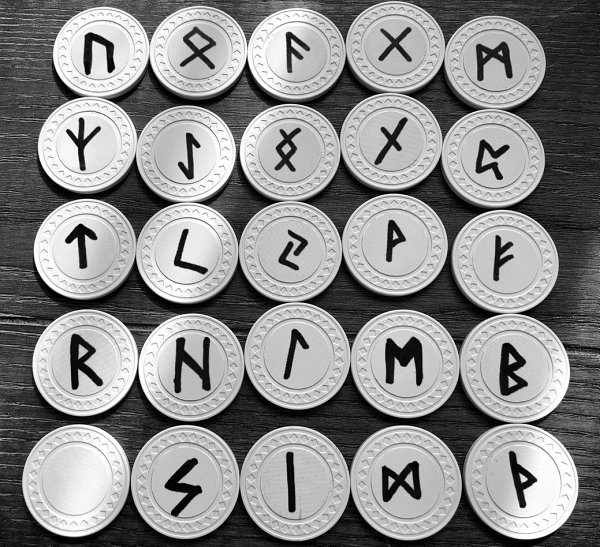

黏土扑克筹码上的卢恩符文

你也可以去当地的手工艺品店。我的艺术家朋友萨宾娜用多种颜色的玻璃筹码制作她自己的第一套卢恩符文。下图就是她的符文组。

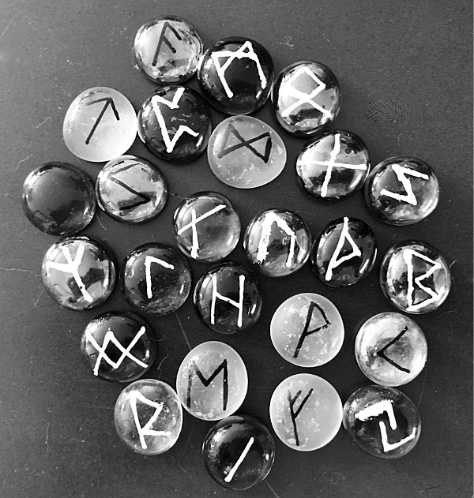

玻璃上的卢恩符文

如果你喜欢高质量的材料，那么 Pelham Greyson 是很棒的选择，这是康乃狄克州北斯托宁顿的石材和水晶大型零售商和批发商。若你不是住在当地，你也可以上网（网址：[www.pelhamgrayson.com](http://www.pelhamgrayson.com)），顺便看一下他们所贩售的滚圆宝石。用扁平、抛光过的石材来制作卢恩符文是最理想的。但要注意的是，石材的体积越大就越容易损坏。

若你选择的材料是抛光过的水晶，就要挑大约五美分硬币的大小。因为如果超过二十五美分硬币的大小，当它们掉落或抛在坚硬的表面上时，就很容易碎裂。

我最近用 Pelham Greyson 的抛光水晶制作了两套卢恩符文组。挑选制作符文用的水晶本身就是一种体验。下图是我最近制作的卢恩符文石，长度大约三．八公分且裁成筹码的形状。这种材质其实小一点会更好。

紫水晶上的卢恩符文

黑玛瑙上的卢恩符文

大家都知道紫水晶有使人平静和放松的效果，它能引发创造力和逻辑思维，解读卢恩符文正是需要这种频率。众所周知，黑玛瑙能促进精神集中和专注，它能在保持理智的状况下连结你的头脑和灵性，而这也是解读卢恩符文的重要基础。

我用几个方法做过实验，在许多种材质的表面上凿刻卢恩符文。为了方便操作，不论你选用的是什么材质，我都建议你买尖头的油性彩色笔来画卢恩符文。虽然彩色笔有许多种颜色，但使用白色彩色笔在深色的石头或水晶上画符文，看起来会特别亮眼。画完符文后，可再喷上手工艺品店卖的压克力喷剂之类的透明漆。

若你不擅长自己制作卢恩符文，那么你可以在网络上或是一些身心灵用品店买到它们。依据材质的不同，一套卢恩符文组的价格大约在十美元至五十美元之间。我个人很喜欢粉红石英的材质。粉红石英被认为是心之石，当它被刻上卢恩符文，便可以产生平静、慈悲、疗愈和各种使你感受到力量的效果。我在丹佛的身心灵用品店看过手工雕刻在桦木上的卢恩符文组，那是我见过最昂贵的，一套售价八十美元。

接下来是加持你的卢恩符文。如果你是自己亲手制作，那么你与那些材料和卢恩符文就已经有了连结。不过，再次采取加持的步骤是很重要的，这么做能够加深你与卢恩符文的连结，并使你能开始读取那些透过它们传达给你的更高层次的智慧。

加持符文的方式不是仅有一种，以下是我个人必定会用的一些方法：

．将所有的符文摊开在桌面上，正面朝上。将符文一个接着一个拿起来放在手上，然后查出它的名称和内涵，并大声说出来。例如：「这是卢恩符文恩索兹，对应的字母是Ａ。抽到这个符文，我会将它解释为……」然后大声念出它的内涵。将那些最引起你共鸣的词汇或句子标示出来。当你觉得准备好了，就换下一个符文，直到全部二十四个符文都加持完毕。

．把卢恩符文放在你的枕头下睡三天。心中要有这样的意图：藉由将它们放在枕头下，你释放了卢恩符文所带来的古老智慧，并在能量上与每一个符文建立连结。

．每天使用它们，不论去哪里都把它们带在身边。

有些人可能会质疑加持卢恩符文的重要性。但是我会说，这一切都取决于你的想法。事实上，你会读这本书，就表示你在直觉上受到了卢恩符文的吸引，并且已经与这些符文产生某种关系了。如同我之前提到的，我第一次看到这些符文及其代表的意义时，几乎就同时完全了解它们了，而我可没有照相般的记忆力。我猜想这也可能发生在你身上。

有一个有趣的诀窍是：你可以在小睡片刻或睡觉之前，看着卢恩符文和它们的意义。因为研究显示，我们会更容易记住睡前复习的东西。

关于卢恩符文的保存和携带，你可以选择更传统的方式，例如把它们装在一个小束口袋里，这挺合适的。有些人可能喜欢把卢恩符文装在玻璃盒或木盒子里，然后放在家中安全的地方。在使用卢恩符文的头几年，我总是把它们带在身上。我觉得它们是我的一种延伸，因此我将它们装在手工缝制的束口袋里。这个束口袋是我的朋友吉娜去中国旅行时帮我带回来的。

现在我的家里有许多套由各种不同材质制成的卢恩符文组，我把它们放在盆栽里、挂起来当装饰品、或放在壁炉上展示。几乎每个地方都看得到它们的踪影。

有些人选择将卢恩符文包在特别的布里。他们会打开这张布充当毯子，然后按照仪式将这些符文抛在上面。这不是我的做法。但如果你觉得这很适合你，你当然也可以这样做。

重点是，关于卢恩符文的保存方式，你要建立自己的习惯和传统。例如它们是可移动或静止的，或是你觉得是否需要在一个特殊的「舞台」上解读符文。

最后，你可以选择某种清理和净化符文的方式。如果你相信物体就如同我们人类一样，会受到能量频率的影响，那么在你使用它们之后，可能会想用某种方式来净化这些符文石。净化它们是为了清除那些随着时间吸附来的浊气或不舒服的能量。这么做就象是为电子用品更换新电池一样。透过清理和净化，我们便可以扩大符文石的力量。

以下是清理、净化和加持卢恩符文的一些方法：

．将所有的符文摊开在桌面上，正面朝上。闭上眼睛，观想每个符文被纯粹又明亮的白光净化。在心中保持这个意象片刻，并在心中发出这样的意图：「这道疗愈的白光正在清理和净化我的符文。」

．手中一次握住几个符文，放在流动的水下冲洗。想象清凉的水冲走它们吸附的所有残缺不全的能量。

．把你的符文放在窗台上，或外面任何能直接照到日光或月光的地方，让太阳或月亮的自然恢复力重设及加持你的符文。

．焚烧干燥的鼠尾草，直接用它的烟薰你的符文。大声说出或在心中默念你正在清理和净化它们。

要注意的是，你可以自行决定全部采用、部分采用或完全不采用这些仪式。你甚至可以创造你自己的仪式。你可以决定，你是唯一可以触碰你的符文的人；你也可以决定，任何人都可以触碰你的符文。你也可以选择在某个特别的地方带着它们一起睡觉。总之，你感觉怎么对，就怎么做。这里没有所谓的错误方法，因为在你与你的符文之间创造出魔法的，是你的做法背后的意图和能量。

## 开始：启动和练习解读符文

在深入符文的解读之前，我们先帮助你进一步熟悉这些字符，以便启动你与卢恩符文之间的连结。

看看下列用卢恩符文拼成的句子。在破译之前，你能凭着直觉解释它们吗？你可能莫名地对这些字符有着某种熟悉感。

你感觉到什么？准备好之后，请利用第三部分的卢恩符文索引来破译这些句子。

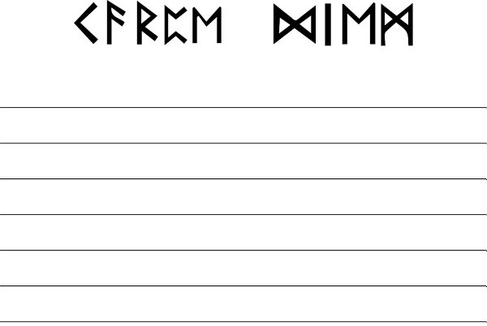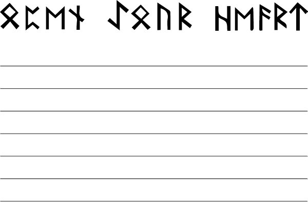

再次看看完整的卢恩字符，你觉得其中哪些符文特别吸引你？将它们写下来。

查阅一下这些卢恩符文的意义。其中有哪些意义特别引起你的共鸣？理由是什么？把你的想法写下来。

现在，我们来制作你自己的卢恩符文字母组合。写出你的英文姓名缩写字母所对应的卢恩符文。

我的姓名缩写是 D. A. D，所以我的卢恩符文字母组合是：

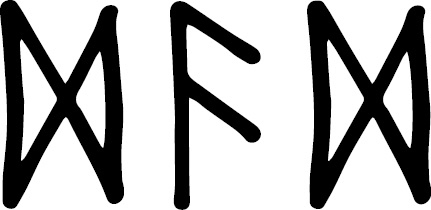

这个字母组合是达格斯—恩索兹—达格斯，其意义是突破—信号—突破。当我思考它与我这辈子的关联时，我想到的是，我的人生就是面对和克服一连串的挑战，并且这些挑战一次比一次大。而我越是觉察并接受我所接收到的信号和指引，我就越容易坚持不懈；我越是开放，我就越感谢这些改变我人生的顿悟（aha）时刻。

尽管我并非一直都能觉察到，但我这一生都得到人和灵性的指导，它们一直在传送给我直觉的信号。其中一位重要的指引者是我的母亲。当我有心事时，她总是陪在我身边并给予我特别的支持，尽管她在我二十三岁时就已撒手人寰。

母亲去世后，她开始传送信号，让我知道她就在我身边。她用各种巧妙的方式引起我的注意，尤其是当她觉得我迷失了方向时。她必做的动作是，把我家里的灯泡弄熄。不到一个礼拜，家里就坏了四、五、六个灯泡。我是经过一段时间后才看出这个不寻常的模式。最后我发现，每当我感到事与愿违（感觉失落、感觉不够真诚地活出自己的人生）时，就会发生这种事。而这时候，我最需要的就是母亲的意见。

到了三十五岁，我才在自己万念俱灰时跟母亲说话。我会哭着问她：「妈，我需要您的帮助。请您告诉我该怎么做？」不知怎的，我会立刻知道她要说什么；我几乎可以在心中听见她那实际又鼓舞人心的意见。于是我了解到，不论我面临的挑战是大是小，母亲一直都支持着我，并帮助我完成必要的突破。

现在，几年过去了，我已能开放地接受来自任何人、时、地的信号。结果，我的突破变得更加频繁，却没有那些经常伴随着突破而来的痛苦。

根据你的卢恩符文字母组合，你要如何总结你心中的人生故事呢？

把你的故事写下来：

这些符文联想的训练，能在你与卢恩符文发展关系时，帮助你练习如何运用它们。抽符文签时，你会用到两边的脑：左脑能帮助你用文字思考、忆起事实和应用逻辑；右脑使你能观想、想象和启动你的直觉。当我们以这种方式提升两边的脑，我们便能达到新层次的清明和自信。

现在，我们就从解读你自己开始，来练习各种解读卢恩符文的方法。

## 6　让卢恩符文引导你的方向

你可以把卢恩符文想成是一种动态的个人导航系统，随时准备好为你指引方向。虽然断断续续地使用卢恩符文也能为你带来好处，但最好还是将它融入生活中，养成每天都使用它们的习惯。你可以利用卢恩符文来设定你当天的焦点，或是在睡前用它们来结束这一天。你也可以在有疑问的时候随时利用它们。

拥有一套卢恩符文组有助于提醒我们，在做出反应或跳到结论之前可以先暂停一下。因为我们许多人的生活步调极为快速，很容易在个人或职场生活中落入「先做了再说」的陷阱。然而，把卢恩符文放在一个常规的地方（例如床头柜、办公桌上或背包里），你才不会忘记利用它们来过着更清楚明了和泰然自若的生活。

利用卢恩符文来引导自己时，你问的问题可以很广泛，也可以很具体。你可以简单地问「是」或「不是」，也可以问诸如「这个状况我需要知道些什么？」之类的高层次问题。你可以寻求关于如何处理某个困境的指引，也可以寻求洞察你的人际关系。总之，你可以问任何你想问的事，并了解其结果。你越是经常使用卢恩符文，你与它们的关系就变得越强大。你会开始发现某种模式，同样的符文会不断出现来吸引你的注意。

除了问问题外，你也可以告诉符文你需要什么。如果你准备好展开新的尝试或计划，那么你可以画 （佩索）来导入起始的能量；如果你正在旅行，那么你可以向 （奥吉兹）祈求保护的能量；如果你感到焦虑而需要让心冷静下来，那么你可以把代表静止能量的符文 （伊莎斯）拿出来带在身上。代表突破的卢恩符文 （达格斯）是我最喜欢的符文之一，我经常在静心时看见它。当它出现时，我就会非常确定我当下在事业或创意方面所面临的任何困境，其实是引导我在思维方式上做出重要的转变。我知道目前看似困境的状况，将会把我带到比我之前想象的还要更好的结果。

最近我要与潜在的投资者开一场关于医疗级的静心应用程序会议，过去一年半来，我和我的团队一直致力于开发这个应用程序。当时我们准备好在希腊雅典与一位擅长减重的医生合作进行医学试验。我刻意拿出三个符文   ，分别代表生育、收获和流动，以便在第一次会议时（幸运的是当天刚好是新月）播下这些能量的种子。我发出意图：第一次的会议将迎来更多的会议，并且大家会达成有利于双方的共识。

有意思的是，一个月前就安排好的这个会议，居然在开会前十五分钟临时取消了。我们的律师给我们加油打气，使我们不至于心灰意冷。不过，对于会议临时取消一事，我并不感到沮丧，因为我已经学会对自己说：「事情总是会为我做最好的安排！」我有信心，会议将来还是会进行，并且新的时间点甚至会更好。

因此当这个会议在另一个新月重新举行时，我的想法获得了证实。由于我有三个强而有力的卢恩符文（生育、收获和流动）护身，我信心满满地走进会场。当时我穿的衣服没有口袋，所以我将它们妥当地塞进胸罩里，如同那些懂得卢恩符文的企业家们偶尔也会做的一样。

要更加熟悉卢恩符文，有三个简单的方法：

．「是」或「否」的解读。

．每天抽一个符文进行开放性的提问。

．抽三个符文来了解状况。

## 「是」或「否」的解读

刚开始使用卢恩符文，最简单的方式就是问一个基本的「是」或「否」的问题，然后抽一个符文出来。你可以这样问：

「我可以相信这个人吗？」

「现在是换工作的好时机吗？」

「这段感情适合我吗？」

「我有看清楚这个状况吗？」

当你有疑问或犹豫不决时，「是」或「否」的解读是非常有帮助的。今年稍早之前，我陪着一位非常亲近的朋友，当时他正在解决一些个人的问题。那一天我已经陪伴他很久了，可是我想在支持朋友与成就我内在的艺术家之间取得平衡，而后者需要在家独处的时间。尽管这样做会让我感到不安，但我还是向他道别，然后开车回家。才开了两分钟车程，我就出现非常不舒服的感觉。我心里纳闷着：「哎呀，这是怎么回事？」彷彿我内在有某种东西在说：「转头回去。」我突然被那种感觉占据了。一时之间，我感到强烈的矛盾，不知如何是好。

于是我把车停到路边，然后拿出我的符文袋。我闭起眼睛拿着符文袋，大声地问道：「我回去陪朋友，对我才是最好、最有益吗？」我抽出一个代表保护的符文 （奥吉兹）。此时，我关心的不是我抽到什么符文，而是我抽到的符文是正面向着我，其代表的意义是「是」。事实上，我又对那个答案感到怀疑，这是从未有过的事。因为最近几次静心，我得到的指引都是要我多花时间独处，而不是陪伴他人。于是我用另一种问法再问一次：「所以，我现在应不应该回家？」然后我再抽出一个符文。这次抽到的符文背向着我，其代表意义是「否」，也就是说，我不该回家。我偏不信邪，于是再问第三次：「你的意思是说，我现在应该转头回去安慰我的朋友吗？」然后我抽了第三个，也是最后一个符文。这次抽出的是代表起始的 （佩索），并且符文的正面向着我。于是我有了明确的答案：回去陪朋友。

「好，好，」我说：「我知道了。」

由于我把车子停在黑暗的乡间道路旁，看起来好像遇上什么麻烦似的，于是一辆警车开到我的旁边，我们彼此都摇下了车窗。

「你还好吗？」年轻的警察问。

「没事，」我回答：「我只是不知道该去哪儿，但现在我知道了。」

「好吧，祝你有个美好的夜晚。」话一说完，他就开着警车慢慢消失在夜色中。

我抽到代表保护的卢恩符文，然后警察就出现了。难道这是巧合吗？如果是，那么你开始使用卢恩符文之后，这种巧合会一直频频出现。后来我按照指引，又回到朋友家。朋友看到我，彷彿又活了过来，脸上充满了感激。我在沙发上坐在他的身边，内心感到很安定。因为我知道，此时此刻我就是应该待在这个地方。我能平静地全然处于当下。

为了让这个方法用得更顺手，在问重大的问题之前，你可以先从问一些较无关紧要的问题开始。步骤很简单：

1. 把卢恩符文拿在手中。如果你使用的是符文卡牌，那么在你把心静下来的同时，可以对它们进行洗牌数秒或数分钟。

2. 闭上眼睛。做几个深呼吸，让自己放松下来。问你的「是」或「否」问题。你可以在心中默念，也可以大声说出来。问题问得越具体越好。

3. 眼睛不要看，抽出一个符文。如果你使用的是符文石，那么看看你的符文是正面向着你，还是背面向着你？如果你使用的是符文卡牌，就看看它是正向的，还是颠倒的？

4. 如果符文是正面向着你，就代表它对你的问题的回答是「是」；反之，则为「否」。

5\. 注意你得到答案时的感觉。

你对得到的答案感到放心吗？我经常是如此的。我内心有个东西总是会说「没错！」来认可那个答案。只有少数几次，我得到的回答令我感到讶异或震惊，但它们会让我深入地检视我对于利害关系的感觉。如果我想要的答案是「是」，但却得到「否」的回答，就代表有比我的感受更多的东西存在。接着，我会与它共处并沉思一番，然后带着不同层次的自知之明离开。

对我来说，这个「是」或「否」的方法从来没有失误过。你越是经常问「是」或「否」的问题，你就会对使用卢恩符文作为个人的导航更具信心。

#### 每天抽一个符文进行开放性的提问

你是否曾经一起床就心情不好？听到闹钟响起，想到要去上班、有一大堆要处理的工作、或不得不解决那些令人讨厌的事情时，你是否感到心烦意乱？如果一天的开始是焦虑或担心，那么这些感觉就会笼罩着你一整天。毕竟，受到人性的影响是我们常有的事。

又或者，我们早上起来就忙得团团转，感觉什么事都得疯狂地追赶：搞定小孩的事、泡咖啡、夹在交通尖峰时段的车流中等等。

抽一个符文进行开放性的提问，是一种按下重设键来清除负面思维、或是在面对新的一天之前按下暂停键来集中焦点的方法。卢恩符文是帮助你天天练习的好工具。每天早上抽一个卢恩符文并阅读它的内涵，你就会获得当天必须聚焦在什么上面的建议。

当你与卢恩符文的连结越来越紧密，你将会发现符文出现在你的心中。当我闭上眼睛进入状态，然后提出问题，我会立刻在心中看见一个符文。事实上，早在我认识卢恩符文之前，我就在自己的心灵之眼中见过它们了。

大约四年前，在我的心难得静下来的时候，我的心中会闪过一个这样的符号：

在看见这个符号几个月后，我问我的合伙人丽塔是否知道它是什么。丽塔是具有直觉天赋的人，并且擅长灵性疗愈。我们是在二○一三年的一场周末灵媒工作坊认识的。当时我还在别家公司努力爬升，在康乃狄克州一家被《财富杂志》评为前一百大的公司里带领一个研究团队。虽然我喜欢那个工作，公司给的红利也颇为可观，但我总觉得少了些什么。我不清楚自己的人生目的，于是展开了我的灵魂追寻。

我踏出大胆的一步，在那一年的七月成立一家名为「至日策略合伙人」（Solstice Strategy Partners）的有限公司，但我不知道为什么会取那个名字。「至日」这个词是凭空想出来的。当人们问我为什么取这个名字时，我会回答：「我也不晓得；但我就是知道它的名字是这个。」

此外，我也不晓得这家公司要做哪一种生意。我知道它会做某种谘商的工作，但我同时也感觉到有其他的东西仍在慢慢发展中。

结果，两个月后，我认识了丽塔。丽塔天生就具有直觉能力，但她的天赋是在那个时候才开始真正发挥出来。在我们第一次交流时，她告诉我：「我们将会一起合作事业。」我连想都没想就回答说：「我知道。」几个月后，至日策略合伙人就成立了。

现在回到看见  的事。当时我问丽塔，她知不知道那个符号是什么。她放空了一会儿，当她进入另一个时空时经常会这样。然后她说：「卢恩符文……你会研究卢恩符文。我看见你在解读卢恩符文。」

我问：「什么是卢恩符文？」

她说：「我不知道，我也是刚刚才听到这个词。你会想起它们，是因为你已经知道它们了。」

尽管当时我完全相信她的天赋，但我尚未拥有自己的直觉能力，于是我说：「好吧。」但我心里想：「我绝不可能在近期内做卢恩符文的解读，那对我来说太遥远了。」说得跟真的似的！

那次谈话后，我在网络上搜寻了一下卢恩符文，终于找到我一直看见的那个符号 ，叫做索威罗，字面上的意思是「太阳」，其代表的意义是完整。我惊呆了，因为我的至日策略所使用的标志就是一个发光的太阳。

至日策略合伙人的标志

我想起自己当时为什么非得取「至日」这个名字不可，这其中有太多无法忽略的巧合。

接下来几年，至日已经发展成人们获得疗愈和恢复完整的商业场所，这同时也是我们所有人走上的终极旅程。丽塔为成千上百的人做谘商，帮助他们度过从离婚到转换职业的人生巨变；我则是教导企业主及其管理团队，使他们能成为更有意识和更具沟通能力的领导人。

有意思的是，我们从不担心会失败（至今也一样）。我们两人都是着眼于全球的变化，辞去高薪工作跳进企业界的。这个召唤实在太强烈了，没有任何事物能阻止我们。二○一四年，我们在我们的第一个网站上大胆地宣布，我们将在二○二○年影响十亿人的生命。虽然我们这两个从事灵性工作的人当时还不晓得该怎么做，但我们心知肚明，如果我们不设定目标，就永远不会有达成的一天。

至日（现在叫做「快乐九重天」）已经发展成一家健康科技公司，里头有二十位我们称为「灵魂家人」的神奇超人。自从二○一八年我们推出第一个名为「医心」（MediMind）的静心应用程序后，就陆续为医院开发医疗级的静心应用程序来治疗慢性疼痛。我们负责的工作是，藉由教导人们如何透过静心来自我疗愈精神和肉体上的痛苦，以解决目前鸦片类药物所造成的危机。由于我们有这方面的技术，我们知道要达成十亿人的目标是可能的！我们只是需要多一点点的时间。

快乐九重天的创意团队，二○一八年三月

由左至右：瓦尔里．罗杰斯（Valerie Rogers）、萨布丽娜．约翰（Sabrina John）、黛博拉．林恩（Debra Lynn）、迪蕾妮雅．黛薇丝（Delanea Davis）、亨利．艾丁格（Henry Edinger）、林恩．哈特威尔（Lynne Hartwell）、约翰．欧德鲁姆（John Odlum）、丽塔．麦克雷（Rita MacRae）、布雷福德．提尔登（Bradford Tilden）。

图：KYLE PICKARD

在丽塔分享她的所见之后几个月，我才开始接受卢恩符文。不过重点是，在我了解卢恩符文是什么之前，它们已经对我说话好几年了。卢恩符文在我发展直觉能力的道路上扮演核心的角色。尤其在我们进一步扩展事业后，它就变得越来越重要。

从今天开始，每天找时间抽一个卢恩符文来回答一项开放性的问题。就像刷牙一样，把每天抽一个卢恩符文变成你的日常习惯。想想看你要如何问你的开放性问题。以下是一些典型的例子：

「今天我必须聚焦于什么？」

「我应该注意什么？」

你也可以问得更具体一些，例如：

「今天上班我需要什么样的洞见？」

「关于我的健康，我需要看清楚什么？」

在每天例行性抽出一个符文时，我个人比较喜欢问类似这样的笼统问题。如果有某个符文令你感到熟悉，请把它记下来；同时也要注意，你在检视它时出现什么样的想法或感觉。

当一切就绪时，请进行以下的步骤：

1. 把卢恩符文拿在手中。如果你使用的是符文卡牌，那么在抽卡牌之前，请先洗牌。

2\. 闭上眼睛。做几次深呼吸，让自己放松下来。在心中默念或大声说出：「今天我必须觉察什么？」然后抽一个符文石或卡牌。

3\. 你抽到什么符文？将它画下来。

4. 翻开本书的第三部分，查阅一下你所画符文的意义。根据你查到的意义，这个卢恩符文与你的生活现状有什么密切关联呢？

你可能会想把那个符文放在口袋里，作为你记住当天必须聚焦于什么的提醒物；或者，你也可以把它画在你一整天都看得到的地方。我个人喜欢把它画在手背上，就在我的左姆指下方。

我同时也建议你用以下其中一种方式，将你的卢恩符文经验记录下来。第一种方式是，回答本书第三部分中每个符文所附带的那些「停下来反思」的问题。你可以在抽完符文后回答这些问题，也可以按次序只阅读每个符文的意义，然后回答这些问题。觉得哪一种做法最适合你，你就怎么做。

另一种方式是，当你感觉准备好了，就可以开始写三十天的日志，本书第二部分会指导你怎么做。刚开始的七天，你会如同前面所描述的抽一个卢恩符文；接下来的七天，则会练习为了了解状况而抽的三个卢恩符文。你可以用本书的卢恩符文意义作为起点，但同时你也要对卢恩符文所引发你的想法、感受或情绪保持开放，并将你的观察记录下来。

此外，你可能会发现同样的符文一再地出现。当这种情况发生时，我们应该要特别留意它的讯息。对我来说，我认为这表示我尚未将那个符文的意义完全内化，或尚未完全听从它的建议。这就是某些符文会一再地出现，直到它们的讯息被接收为止的原因。

除了反思和写日志外，我建议你将每天抽到的符文制成图表，如此一来，你将更能觉察你所接收到的讯息。我经常会抽到 （美纳兹）。美纳兹代表自我，它提醒我们，万事万物都是从我们自身显化出去的。吸引力法则永远都在运作着。不论我们的思想和行为投射出什么，它们都会回到我们的身上。每当我听见学员说：「我的运气真好，这辈子有这么棒的人在我身边。」我总会提醒他们，这不是运气，而是物以类聚。

你吸引来的，正是你投射出去的。如果你是所谓的正向、「高频率」的人，你就会吸引来其他正向、高频率的人；反之，如果你倾向于发出低频率，你就会吸引来比较负面的人。美纳兹提醒我，我是强而有力的显化者。如果我期待某事发生，它往往就会发生。为了让梦想成为事实，你必须相信，梦想或某件好事必然会在预期的时间到来。你的任务是去搞清楚你要「什么」，至于「如何达成」就留给宇宙去处理吧！

在日志中记下你每天抽到的符文，这样你就可以清楚地看出某种模式。我喜欢在抽出卢恩符文后，写下它对应的英文字母及其代表的意义，如下方表格所示：

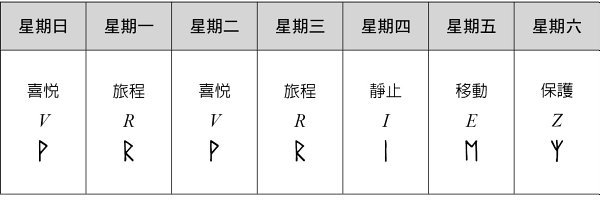

## 抽三个卢恩符文来了解状况

另一种使用卢恩符文的方式是，想想看你觉得生活中有哪一方面需要指引。举例来说，也许你想洞察你与某位朋友的关系，或是你正在考虑转换工作跑道。那么，你就抽出三个卢恩符文，然后依序由右到左水平摆放，如下所示：

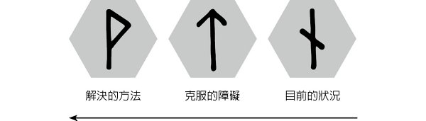

第一个符文（摆放在「目前的状况」位置）提供你整个状况的概要。它告诉你「情况是怎样」。

第二个符文（摆放在「克服的障碍」位置）标示出，如果你想要最好的结果出现，你可能需要将哪些事情纳入考量。它告诉你「必须做什么」。

第三个符文（摆放在「解决的方法」位置）为你指出可能的结果，尤其是指如果你听从来自第二个符文的建议。它告诉你「什么是可能的」。

要注意的是，这种解读必须由右往左，这是历来的传统做法，也是我所乐于遵循的。

以下是我最近帮一位亲近的朋友做的卢恩符文解读。当时她和她的未婚夫正带着她的三个小孩，在假日搭五小时的列车去拜访未婚夫的家人。我想象她的身影，然后请卢恩符文指示关于她的新混合型家庭的状况。

我再次以布伦姆的书作为指导。卢恩符文的指示如下：

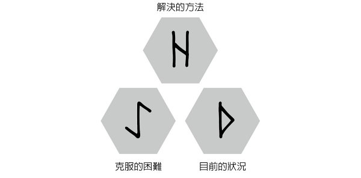

．目前的状况：苏里萨兹或门径请你了解你的限制，并觉察到做重要决定的时刻已经近了。在采取行动前，先暂停一下并思考什么对你来说是最重要的。

．克服的困难：爱瓦兹或臣服意味着做正确的事来坚持下去的重要性。要保持弹性的姿态，并了解从过去的状况中，你成长了多少。如果出现延迟的状况，也不要感到气馁。爱瓦兹意味着结束和新的开始。期待过去的某个人事物出现，好让你能在这次一劳永逸地解决它。

．解决的方法：哈格拉兹或扰乱表示有意想不到的事发生，因此，这次最好不要做任何长期的计划。这件事会引发重要的改变，使你能放下过去、获得重大成长的空间，并给予你尚未认识的自由感。

当我告诉朋友这些解读的内容时，她立刻就想到，她与前夫的子女监护权之争即将开庭。过去五年来，她和孩子们都承受着极大的压力。在发生一连串改变人生的事情后，我的朋友搬回到从小长大的故乡。在那里，她可以得到父母和兄弟姊妹的支持，也可以确保孩子们不会受到她那精神失衡的前夫的伤害。

在正常的情况下，双方事先都同意共同监护是最好的。然而她知道，为了孩子们的幸福，不能让前夫有共同的决定权。而这就表示她必须上法院，由法官来决定孩子们的命运。

卢恩符文解读说的是她那耽搁了三年的事。三年来，她的前夫不断在最后的法律协议上从中作梗，这令她感到相当沮丧。她认为这些事情如果一直悬而未决，她的人生将无法继续向前。她殷切期盼的这个开庭日，正标示着她人生某个篇章的结束。她非常想结束这个篇章，好让自己能好好地享受接下来的人生。

由于本书付梓时，朋友的状况还在进行中，因此我们不晓得对于解决的方法来说，代表扰乱的 意味着什么。因为它表示她将会有无法掌控的意外转折出现。虽然它暗示着会有某种程度的情绪痛苦，但那将会是一种宣泄，最后使她能放下过去，并拥抱更好的未来。

你准备好要自己试试看了吗？请按照以下的步骤进行：

1\. 把符文袋拿在手中或洗牌。

2. 闭上眼睛。做几次深呼吸，让自己放松下来，同时想着你生活中哪一方面需要洞见或指引。在心中默念或大声说出：「关于这个状况，我必须知道什么？」然后抽出三个符文，如左所示摆放好。

3. 查看每个符文的意义，然后将你读到的内容应用到你所问的状况中。这些符文带给你什么样的洞见？

把卢恩符文的符号记录在下面六边形框框中：

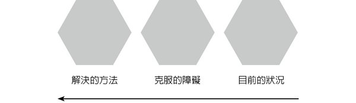

###  停下来反思

．你问的是关于生活中的哪种状况？

．「目前的状况」的符文如何分析你的现状？

．「克服的障碍」的符文鼓励你接受什么样的心态改变或行动？

．「解决的方法」的符文对你提出哪些建议？

当我使用这个三符文抽签法，总是能得到清晰和新颖的观点。这就好比你给了你的高我一支麦克风和舞台。只要你把舞台准备好，你的高我永远有充满意义的东西要告诉你。

## 特效助力：卢恩符文力量组合

另一种使用卢恩符文的方式是，当你在特定的日子需要额外的支持时，将它们组合起来。以下是一些深得我心的卢恩符文组合，但你也可以创造自己的力量组合。

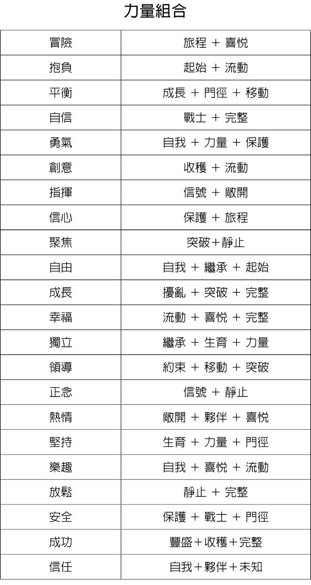

如果你想在特定的日子唤起某种情感或精神状态，那么你可以选择对应的卢恩符文组合，然后在那一天将它们放在口袋里随身携带。

我特别喜欢我为「领导」创造出来的力量组合：

． 约束：提醒我们要考虑到我们所想要的结果，而不是不经深思熟虑就做出反应。

． 移动：鼓励我们更向前迈进以获得进步。

． 突破：意味着我们感受到的成长之痛，往往能带给我们更大的觉知和智慧。有句老格言说：「无法置你于死地的伤痛会使你更强大。」不论是处于领导的位置或在日常生活中，这句话都千真万确。

通常我的公司发生意料之外的事情时，我都不会感到气馁；相反的，我会采取中立的态度，心想：「任何事都有第一次，而我从这件事当中学到了什么？」现在当公司做了亏本生意或遇到延迟的状况时，我知道会有更好、更轻松、更有趣的东西出现。

当你开始以这种更加不偏不倚的方式来看待人生时，每一件事都会更轻松地流动。先前你认为是坏的或负面的事情，也许是宇宙在为你进行乾坤大挪移，好让更好的结果发生。透过时间、些许耐性和卢恩符文，我们就会知道这一点。

你也可以试着创造结合式符文（bindrune），亦即把两个或两个以上的符文结合成一个来增强它们的力量。以下是两个结合式符文的例子：

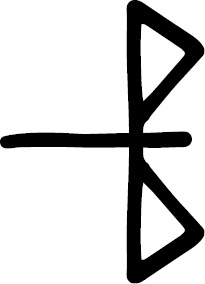　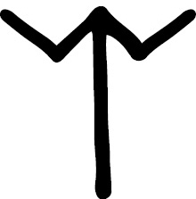

第一个结合式符文至少有五个不同的卢恩符文，第二个结合式符文至少有四个，你能看出它们吗？你觉得这些组合对你有什么意义？

## 卢恩符文与天体的连结

近来的一次静心，我探索了卢恩符文与太阳系的天体和星座之间的关系。虽然卢恩符文和占星术看似属于截然不同的系统，但我非常相信一切都是互相关联的。因为万事万物（包括人）都是由相同的本源能量所构成。卢恩符文、天体和星座都是强化我们内在力量的可行系统，并且只要你想要的话，一个贯通所有系统的连结就会存在。这一切只在于你所设定的意图。

做卡巴拉静心时，你必须用心力画出不同组合的希伯来文字母作为一种祈祷，以显化诸如良好的健康或天使的支持之类的正向结果；同样的，你也可以用卢恩符文来汲取太阳、月亮或太阳系行星的力量。卢恩符文可以形成一道打开天体能量的大门，并将那些能量导回我们的生命，使我们能在最需要力量之处得到更大的力量。

我是在一九七五年六月的一个满月出生的，因此月亮的能量一直令我着迷。我喜欢在满月期间静心，然后写日志。任何时候，只要可能的话，我也会根据月亮的周期来预约会议或安排生活。新月为新的计划、生意和人际关系创造最佳的起始能量，满月则为循环和计划的完成建立舞台。

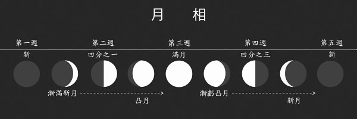

月亮的周期

渐满的月亮带来扩展和成长的能量，渐亏的月亮则引发释放和缩减。

接下来的表格说明了哪些卢恩符文是被用来吸引月亮、太阳和每个行星的特定能量。

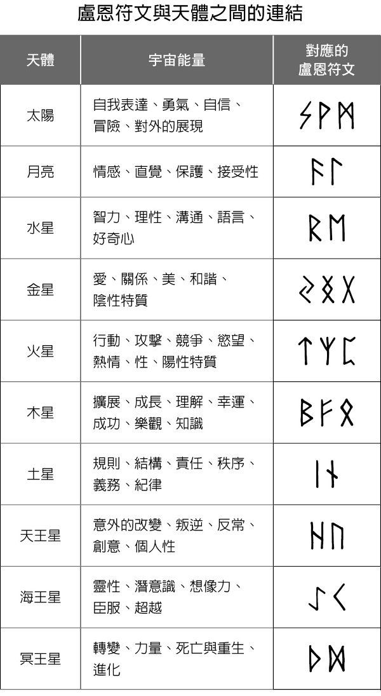

现在，我们试着做一个以观想为基础的静心，来试验一下卢恩符文结合宇宙能量所增强的能量。这个静心使不使用实体的卢恩符文都可以。

首先，想一件在生活中对你有所要求的状况或挑战。它可能是要求你要有采取行动的勇气（火星）、完全真实的自信（太阳），或是在人际关系中更加敞开心扉的能力（金星）。当你选择好你的状况和对应的天体后，把对应的卢恩符文记忆下来，接着尝试做以下的静心：

1. 找一处能让你放松，并且至少十分钟都不会受到打扰的舒适地方。你可以坐着或躺着，但腿和脚不要交叉。将眼睛闭上。

2. 深吸一口气，整个过程的时间是从一数到七。憋住气，从一数到四；把气完全呼出来，从一数到八。这样重复做五次。

3\. 观想一个充满闪烁星星的夜空，然后继续舒适地呼吸。

4. 把你选择的天体观想出来。接着再观想每一个对应的卢恩符文，以明亮的白光呈现在那个天体的表面上。

5\. 当所有的卢恩符文都观想出来了，让它们在你心中留驻，此时你的眼睛仍然是闭着的。

6. 当你觉得准备好了，观想每一个卢恩符文的白光从天而降，直接贯穿你的头顶。

7. 感受卢恩符文的能量从你的头顶慢慢地移动到你的脸、脖子、胸膛、手臂、躯干、腿和脚。

8. 做此观想时，你要有你的整个存在是与天空和大地紧密连结在一起的感觉。留意卢恩符文和天体的能量进入你的身体时，你出现什么样的感受。

把你的经验记录下来。要尽可能将你身体和情绪上的所见和感受都详细记载下来。

静心专注的天体：________________　　日期：________________

对应的卢恩符文：________________

我选择这个行星和对应的卢恩符文是因为……

我看见……

我感觉到……

我现在更能觉察到……

#### 改善人际关系的卢恩符文

除了使用卢恩符文来厘清关于你自己和生活中的状况外，你也可以利用它们来了解你的人际关系。当我们身处于某件事之中，往往会因为太接近了，反而看不清楚它过去、现在和未来的状况与障碍。身而为人的我们，通常不是把事情浪漫化，从而过于聚焦在我们的期待上而忽略其缺点；要不就是花太多的注意力在什么是错误的，并把正确的视为理所当然。

我们许多人经常会征求朋友或家人的看法，但即使是那些最替我们着想的朋友，他们也有自己看世界的感知过滤器。他们会根据自己的生活经验来评估我们的状况，并可能将他们认为最好的投射在我们身上。虽然朋友和家人的意见是出自于爱和保护，但却往往带着固有的偏见。

事实上，我们所能得到最好的建议是来自于内在，人际关系方面的问题也不例外，而卢恩符文可以为我们打通这个管道。当你想要洞察自己的能力、未来的潜力或冲突的解决方法时，你都可以利用「是」或「否」抽签法、单一符文抽签法或三符文的状况分析法。但如果想要更加深入，你也可以使用所谓卢恩十字阵的五符文抽签法。

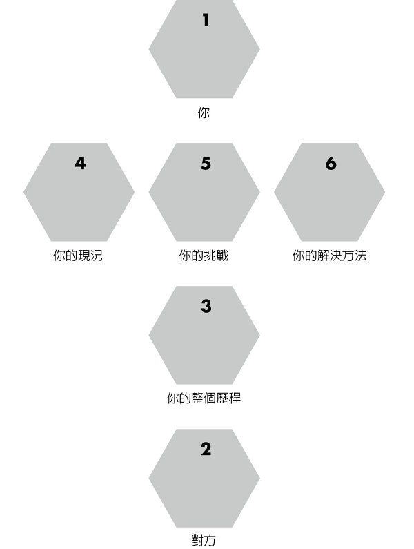

卢恩十字阵的解释方法有许多种，但如同任何事情一样，你的解读背后所设定的意图决定了它对你的意义。不过，我个人是这样解读的：

．过去

．现在

．事情的核心

．影响的因素

．挑战

．解决方法

如果某个地方感觉不够清楚的话，你可以再抽一个卢恩符文来获得更多的信息，只要你感觉想这么做的话。

## 7　帮他人问事的卢恩符文

你可以把卢恩符文当作一种问事的工具，来帮助朋友、家人或需要新观点的青少年。传统上，这种使用卢恩符文的方式叫做解读。有些人可能会认为这听起来好像是算命，但实际上，卢恩符文解读是让你为某人创造一个安全又神圣的环境，以探索他们对于生活中发生之事的感受的一种方法。

如同为你自己一样，你也可以请别人参与以下的卢恩符文运用：

．「是」或「否」的解读

．单一符文抽签法

．三符文抽签法

．卢恩十字阵

你可以请当事人闭上眼睛，然后问他们：「请用简单的几句话说明你生活中的哪方面需要更高层次的指引？」

当他们把卢恩符文拿在手上时，请他们观想一下他们的状况，就彷彿他们现在正在重新经历它，让任何与该状况相关的自然情绪流露出来。

当他们准备好，请他们抽一个、三个或五个卢恩符文。我喜欢让当事人亲自去抽符文签，但这只是我个人的喜好。如果你觉得能碰触符文签的只有你自己，那也没关系。

他们每抽出一个符文，你就按照前面说明的方式摆放好。首先，向他们解释整个摆法的意义；接着，向他们说明每个符文在解读中占据的位置所代表的意涵。解释完之后，听听当事人的回应。

解读完卢恩符文后，接着进行你们的对话。你可以问：「根据我刚才所说的，有哪些让你心有戚戚焉？」或者是：「这与你生活中发生的事有什么关联？」

接下来，仔细倾听当事人对新观点敞开的心声，包括他们的理性面和创造面。几乎在所有的情况下，当事人都会从你的解读中发现某种意义的思路，并找出方法与个人关联起来。试着别以任何方式带领或主导当事人的方向，因为这是他们处理、发现意义和思考卢恩符文所启发的想法的时刻。

为别人解读符文时，我喜欢用一张空白纸来记录符文的阵式。我会记下日期、阵式中每个符文的名称，并标示出解读的重点，好让当事人能留下纪录。通常卢恩符文的解读讯息量会很大，当事人很难一次全部接受，尤其是触及到情感方面的问题时。

当你帮别人解读时，如果别人想知道不包含在该次符文解读中的其他信息，你随时都可以再另外抽一次符文来回答他们的问题。

## 问自己「五个为什么」

你越是使用卢恩符文，你就势必会开始注意到模式。你可能会发现，你在一周内不断重复抽到相同的一个、两个或三个符文，这表示你可能错过了某个重大的讯息。一旦发生这种情况，就用以下的提问挑战自己：「为什么这个符文会不断出现？我要从中学习什么？」

其中一个做法是我称之为「五个为什么」的练习。这是我在审核焦点小组或指导他人探索超越表面的理性思考的更深感受时，所使用的一项技巧。多问自己几次「为什么」，可以让你了解你的感受背后更深层的意义，并且这个意义可能会令你惊讶不已。

以我的例子来说，我非常喜欢代表喜悦的 （温究）。手工制作符文首饰时，我总是喜欢雕刻或画这个符号。每天抽到它或是看见它出现在我的符文牌阵时，我总是会高兴得大喊：「我爱温究！」

那么，这是什么原因呢？如果你问我一次，我会说：「因为我喜欢乐趣。那些认识我的人经常说，我比他们认识的其他人更有生活乐趣。」这是真的。但除此之外，还有很多的原因。那么，问我自己五次为什么我喜欢抽到温究，我们会了解到什么呢？让我们来看看：

．为什么？因为它让我开心。

．为什么？因为喜悦的概念让我想起自己是过圣诞节的孩子。

．为什么？因为身为成人，我活在一个充满压力和责任的世界，遇到许多不快乐的人，而这些是我身为孩子时觉察不到的。小孩的生活非常单纯，充满悠闲的时光和快乐。

．为什么？因为我父亲和奶奶把我保护得很好，不让我知道家外的世界发生了什么事。我不知道我有一个缺乏自理能力的母亲，而她在与希望渺茫的精神疾病和酗酒问题搏斗。

．为什么？他们是出自于爱才这么做的，我为此感激他们。

令人难以置信，对吧？我不是活在过去的人，因此我不会花时间去想童年时母亲偶尔会住进精神病院的事。回想童年，我只会想到爬树（我是典型的男人婆）；在周五晚上拿著录音机在电视旁录制混音带；在后院做毯子堡垒；阅读百科全书；还有一九八三年的平安夜，我的教父和教母送我椰菜娃娃，我竟然开心到哭了！这些是我童年最精采的回忆。

回想童年，我想到的都是关于创意、大自然、音乐和无条件的爱。虽然母亲不在身边，但当时我觉得什么事都是可能的。由于大人的说法都一致，所以我总是相信任何事都是可能的。我大部分的回忆都是快乐的，这都得感谢我的家人，他们在我早年最易受影响的时期给了我爱和保护。

现在，换你了。看一下所有的卢恩符文，选一个现在最吸引你的符文。它可以是之前曾经吸引你的那个符文，也可以是另一个。然后问自己「五个为什么」，并将答案写下来。

最吸引我的符文是：

为什么：

为什么：

为什么：

为什么：

为什么：

## 符文抛

另一种进阶的卢恩符文使用法叫做符文抛（rune cast）。这种方法不是抽符文，而是双手捧着符文，然后静下心来，心中想着你需要指引的事情。我喜欢在每一个新年的开始做符文抛。我会捧着卢恩符文，然后问：「新的一年我需要知道些什么？」

接着，放开手中的符文让它们落在桌子上或一张布上。如果你喜欢大自然，你也可以让符文落在沙滩上或土地上。此时你会发现，有些符文是正面朝上，有些是正面朝下。先把所有正面朝下的符文收起来。当只剩下正面朝上的符文时，运用你的直觉将它们分成不同的群组。每个群组就是一个「阶段」（chapter）。至于每个阶段将涉及到什么，你的直觉会引导你。

我每次做符文抛，每次的群组和阶段数目都不一样。譬如今天早上我为自己做了一次符文抛，问的是关于生孩子的问题。这是一个对我来说相当敏感的话题。身为一个高度以事业为主，并在四年前流产过的四十三岁女性，这些年来我一直在事业和生孩子之间挣扎。我要冒险放缓帮助世人疗愈的天职，来追求自己当母亲的梦想吗？还是我要放下当母亲的愿望，继续走在疗愈自己和教导他人疗愈的美妙旅程上？

这是我们许多人经常会遇到的两难之境。如同每个人一样，我感受到社会的压力，还有我的生理时钟说：「赶快做决定……你的时间不多了。」可是我的内心又有如同耳语般安静的声音在安慰我说：「别担心，一切都会很好的。」在这种敏感又重要的情况下，我求教于卢恩符文。

二○一八年，我为生孩子的事做了一次符文抛，得出的结果如下图所示：

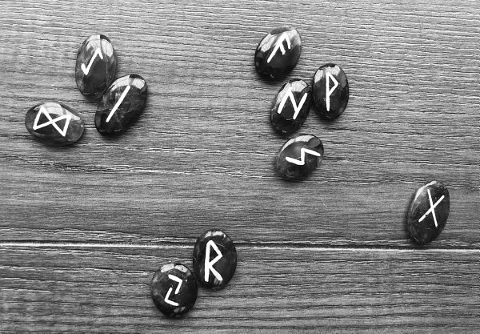

我直觉地认为有四个群组或阶段。故事由左上方开始，然后沿着顺时钟的方向下来：

．过去：臣服、静止、突破

．现在：信号、扰乱、喜悦、完整

．要求：伙伴

．结局：旅程、收获

过去是臣服、静止和突破。这与我过去关于生孩子的事有什么关联呢？结婚后的头几年，好的时候很好，糟的时候很糟。我走进混合型的家庭，成为三个孩子的继母，他们分别是十岁、十四岁和十六岁。由于我是在一个有母亲、父亲、继母和继姊妹的和谐家庭中长大，因此我相信我的新家人也会接受我，并且我至少想生两个自己的小孩。其实我在继母的角色上有调适的困难，使我在怀孕方面的努力延宕了下来。四年后衡量了各种因素，我选择做试管婴儿，因为我认为这是成为人母最快的方法。

尽管试管做得很成功，但八周后我就流产了。继子们并不知道我怀孕的事，因此保守这个祕密让我的失落之痛更加剧烈。直到我亲身经历了这件事，我才晓得有多少女性遭受这种流产的痛苦，而这需要好几年的时间才能疗愈。

防御（臣服）和僵化（静止）正是我当时的感受。这件事中断了我与丈夫的连结。我深感愤恨，因为他已经有生儿育女的经验，并且每天都能感受到子女们的爱，而我却觉得自己象是闯入者，在家里几乎是个陌生人。夹在继子们的青春期和我的失落的考验之间，我说服了自己，我不适合当母亲。

就在那个时候，我辞去工作，并开始我的第一个事业，而这个事业就好比是我生的孩子一样。当时我以为这就是被揭示的真相（突破），但事实是，那个突破在几年之后才会出现，并且需要极大的勇气和信心跃入那伟大的未知中，才能获得我所迫切需要的洞察力。

现在是信号、扰乱、喜悦和完整。如今，我住在距离丈夫家四十公里远的小「创造屋」里。我和我养的流浪猫狗在这里住了一年半后，已经能够进入我的创造之流。除了写作之外，我还带领两家成功的公司。我的直觉（信号）达到颠峰的状态。而我与卢恩符文的连结，以及它们为我开启的能量管道，使我凡事都能获得指引。

迈出脚步挣脱出来，并且自己一个人生活，彻底颠覆了我的人生（扰乱）。然而，透过一连串的卢恩符文谘商和灵魂功课，我知道自己必须改变环境来了解自己、疗伤和成长。我可以继续深陷在自己的故事里，感觉自己好像是个隐形人、一个失去孩子又没人了解的多余继母；或者，我可以踏出推进的脚步。我知道，我需要时间和空间来疗愈这些伤口。

随着时间过去，疗愈出现了。我重新认识了自己，并且发现我多么喜欢自己的样子。在星期五的晚上跟自己在一起是很有趣的事。我养成每天静心和写作的习惯（其中有许多天是凌晨四点就开始了），感觉我的灵魂在心中歌唱（喜悦）。我就是在这量子跳跃中，出现了写这本书的想法。现在，我感觉自己前所未有的完整和圆满（完整）。我在许多方面都比以往更加快乐。

我的丈夫不再是我婚姻的伴侣，我们之间的连结已经深化为灵性的关系。我们共同拥有并且一起经营我的公司。此外，我与他的孩子的关系也成为我所重视和感恩的事物。他们已经成为非常棒的人；我喜欢看着他们展开双翼，体验这个世界。

除此之外，我与我的指引者的连结也达到前所未有的强度。最重要的是，我全然地爱自己、尊重自己。虽然我还是一个喜欢给予、充满爱又慷慨的人，可是我知道在照顾别人之前，我得先照顾好自己的需要。有时候我多么希望自己能带着现在已有的工具，回到我人生中那段艰难的日子——它们原本可以更轻松地度过的。然而，灵魂的旅程只知道一条道路，那就是从当下这一刻开始。

那么，关于生孩子这件事，我需要的是什么？用卢恩符文的话来说，就是伙伴。这件事无法靠我自己一个人做到，但我也无法以失去自我和身分的方式来做这件事，就如同我在恋爱中所习惯做的那样。我可以是人生过得很精采的母亲，而不是让自己的生命停滞不前。这不是一个只能二选一的决定，虽然今日社会的许多人都认为我们女人必须在职业和母亲之间做选择。现在已经不是如此；再也不是这样了。对于当代有进取心的人来说，已经不是如此了。我们现在可以全部拥有！

这一切的最后结果是什么？卢恩符文让我知道，就像你一样，我在自己的人生旅途上（旅程）生活和学习人生功课。我一直采取所有必要的步骤，并付出让回报（收获）到来的努力。尽管我可能还无法看见我的灵性和情感的努力的具体成果，但是我相信，奖赏终会到来。

这个收获最后会让我真正怀孕并生下小孩吗？我真的不知道。不过我完全心平气和。因为我知道，一切都是它现在该有的样子，未来也是以它该有的样子展现。我感觉完全的信任。我知道没有什么好担心的，也没有什么应该采取的意外行动；不论该来的是什么，我只是全然接受这一切的到来。我不断处于喜悦和完整的状态，一切都感觉神圣。

## 8　符文抛的架构

如果你觉得把卢恩符文抛在空白板上，并按照直觉将它们分组实在太抽象了，那么你可能会喜欢用某种架构。有时候在做符文抛时，我会想象自己看着一个时钟，并按照时间的顺序来看那些阶段：首先，我会解读处于七点到十点位置的阶段，它代表那些反覆出现的终身主题；接着，我会解读十点到十二点的位置，它代表前一年的概述；然后，我会解读十二点到两点的位置，它代表现在的生活；接着是两点到五点的位置，它代表接下来的三个月到半年；最后是五点到七点的位置，它代表未来的一年。万一有符文落在中间的位置，我则将它视为人生功课的领域（参见下图）。

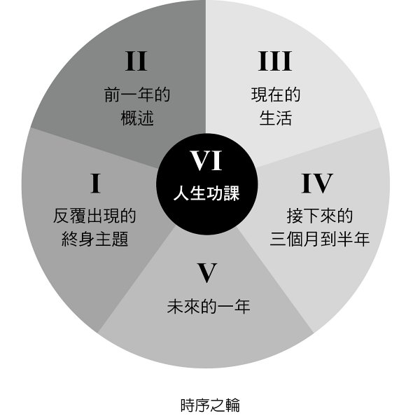

这个架构非常直接，因为它提供你应用每个符文的意义，并将它关联到你人生某个时期的两个维度。

做个实验，看看什么感觉最对味。倘若你使用的是本书附赠的卡牌，那么请试着将它们正面朝下，排成四列六栏。把手放在每张卡牌上方，然后翻开那些吸引你的卡牌。某些卡牌可能会令你感觉温暖或刺刺麻麻的。运用你的直觉，享受其中的乐趣！

## 卢恩符文的创新

卢恩符文的解读不必侷限在古斯堪地那维亚的方法。由于我经常用卢恩符文作为一种让自我学习更加有趣的教导工具，我喜欢用除了符文石和木制筹码之外的新解读法来做实验。以下是我最新的一些方法。

#### 「芙蕾雅」启发卡

我创造一套由二十四张卡牌组成的启发卡，作为送给亲朋好友的礼物。每一张卡牌都总结了某个卢恩符文相关的简短讯息。不同于抽符文签，你可以将这些六角形的卡片洗牌一下，然后抽出一张卡片作为当日的启发。每天早上，我会洗着卡牌并问：「今天我需要什么讯息？」然后我会抽出一张牌，并将它大声念出来。我会把卡片摆在壁炉架上，以便提醒我当天应该专注在什么上面。

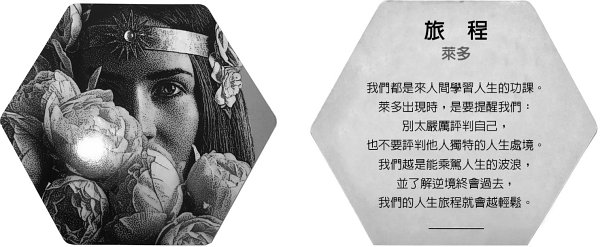

我发现这些卡片对于那些还没每天使用符文、但想要有一个快速方法的人很有吸引力。

#### 卢恩方块

好玩的东西来了！某个下雨的周日，触觉型的我还是抗拒不了本地的手工艺品店，买了事先切割好的木头方块和一个十五美元的烧烙工具，用来制作四个卢恩方块的套组。事实上，它们就是卢恩符文骰子。

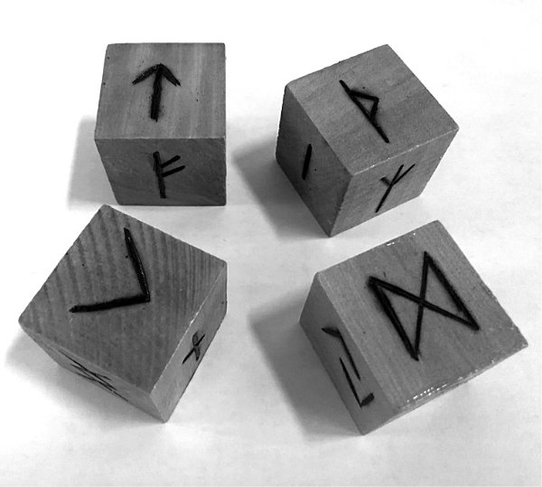

烧木头的味道使我想起五岁时爷爷的木工房。你可知道味道最能触发人的回忆吗？我发现烧木头和木屑的味道特别能使人的心安定下来。

由于一个木块有六个面，因此我喜欢把每个木块各刻上两个代表提尔群组、海姆达尔群组和芙蕾雅群组的符文，分别如下所示：

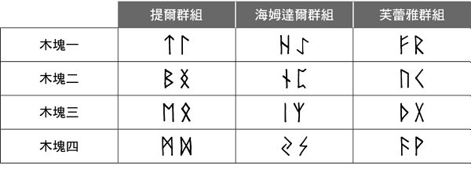

卢恩方块的用法是，把它们放在手中，接着询问诸如「什么智慧能适用于这个状况？」之类的问题。

以下是我向卢恩方块询问的一个例子：

「关于这本书和我的整个卢恩符文平台，我能分享什么样的智慧？」

我掷出的四个方块如下所示：

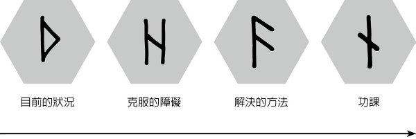

你可能会发现，我这次选择由左至右来解读它们，因为我觉得应该这样解读。要记住，卢恩符文唯一真正的规则就是你自创的规则。创造你自己的仪式是最好玩的！

以下是卢恩符文告诉我的内容：我带着某种包袱，以致我的脚步慢了下来，并造成前方道路不必要的困难。我必须觉察自己该放下什么才能让眼前的道路更好走。由于害怕放下包袱会引发扰乱，因此我紧抓着包袱或额外的责任不肯放手。但事实上，放下包袱所引发的暂时性扰乱，会让更好的事物在新创造的空间中成长。了解这一点是很重要的。

一旦我能够克服这个恐惧，丰盛便会以爱和从各种限制中解放的形式满溢出来。我在这一切中所要学习的功课是：在反应之前要先弄清楚我想要的结果。以这个例子来说，如果我最终的目标是长时间待在我的「创造屋」里，并利用众多的闲暇来写更多的书，那么我就必须愿意在我经营的两家或一家公司中退后一步。也就是说，让新的领导人来取代我的位置，并交出我目前手上这两家公司的大部分控制权。

我的直觉反应是：真吓人！但我知道这是我必须聆听的讯息。我知道，我处于接收我所想要的一切的险境中；我所要做的是，弄清楚并专注在我最想要的东西上，然后别自己从中作梗（还有摆脱头脑的思考），好让这一切能迅速流进来。

有时恐惧会妨碍我们了解和确定我们到底想要什么。我们可能会担心自己永远得不到，或者会害怕得到之后所引发的生活变化。此外，我们可能会过于想要未来的确定性，导致因为害怕未知而变得麻痺。我们越能自在地让生命以自然的步调展现，我们就会越快乐。你很快就会知道，当你把卢恩符文组合起来，你就会看清你的真相。

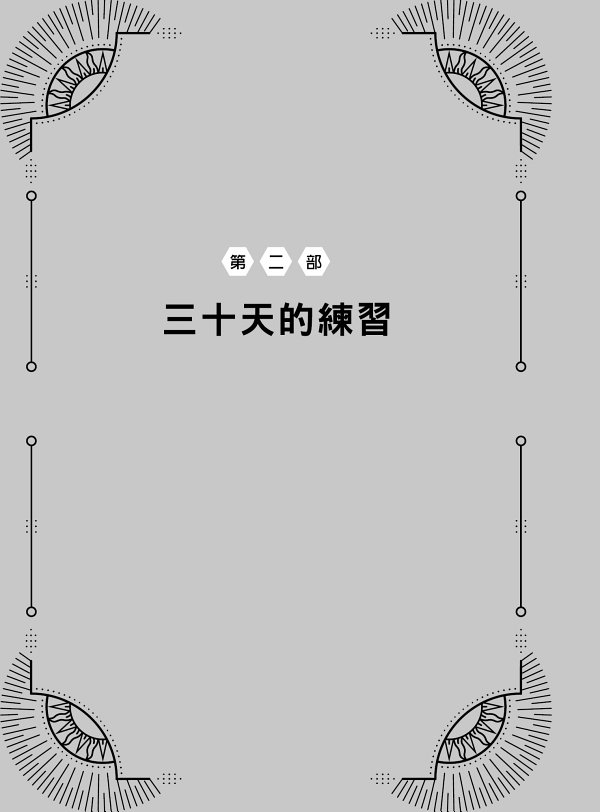

现在，让我们一起展开三十天的旅程，每天练习解读卢恩符文，更进一步认识你自己。

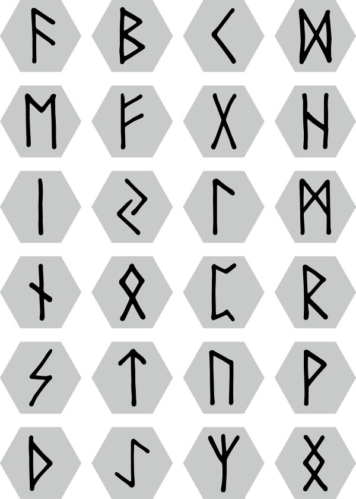

接下来三十天，你每天都有抽一个或多个卢恩符文的作业，并配合日志的书写。这三十天的旅程分成以下五个阶段：

## 第 1～7 日：养成每天练习的习惯

第一周，每天早上抽一个卢恩符文，并把它的意义和你在生活中的应用记录下来。此外，你也会用卢恩符文来回答「是」或「否」的问题，并将结果写在日志上。

## 第 8～14 日：了解状况

第二周，继续每天抽一个卢恩符文，同时也做三符文的解读来分析你过去和现在的生活状况。

## 第 15～21 日：了解他人

第三周，继续每天抽一个卢恩符文，同时加入人际关系的解读来洞察你人生中的重要关系。

## 第 22～28 日：显化结果

第四周，继续每天抽一个卢恩符文，并根据你生活中所需要的能量来选择卢恩符文，同时记录其结果。

## 第 29～30 日：旅程的反思

最后的两天，你将思考哪一种卢恩符文的解读方式最深得你心。你将重新浏览你到目前为止所写的日志，以便思考你在这三十天中对自己了解了什么。请务必给自己至少两小时的时间来重新浏览你的纪录，并留意这四周以来你自己出现了什么变化。

每天使用卢恩符文并记录你的体验，最终目的是要训练你的身、心、灵能够一致。这些练习能强化你了解更多关于情境、他人和你自己的本能。我将这种能力称为直觉，但你可以随你自己的意思来思考它。

至于这个练习的记录，请随意使用本书第三部分中每个符文所对应的「停下来反思」的问题。这些问题是要在你面对空白的纸却写不出东西时，推你一把的。如果你比较喜欢没有提示的开放式记录，那也可以。总之，你感觉怎样对，就怎样做。

在这三十天的尾声，你会发展出你个人如何使用卢恩符文，以及何时解读它们的偏好。在此过程中，你会知道在需要指引时与你的高我直接连结的方法。

在使用卢恩符文的某些时候，你会发现，就像我一样，你根本不需要实体的卢恩符文或是我所写的那些现代意义。你可能会发现，当你闭上眼睛，你就会开始看见卢恩符文。因此，你要尽量记住每个符文的代表意义。

所以如果你问：「我今天需要觉察什么？」而你看见了代表旅程的 （莱多），那么你可以接着问：「今天，旅程对我有什么重要性？」然后注意你第一个出现的念头。实时出现的印象总是正确的。如果你的第一个联想是你的事业，那么你就问自己：「旅程跟我的事业有什么关联？」同样的，看看你出现了什么。我喜欢把自己的直觉印象写下来。因为这些印象就像梦一样短暂迅速，很容易就忘记了，毕竟它们并不是来自于我们理性的头脑。

如果三十天后你还是需要实体的卢恩符文及其现代意义，那也不必苦恼。只要按照自己的步调，你想使用实体符文和现代意义多久都可以。把卢恩符文和这本书想成是小孩学骑脚踏车的辅助轮，它们会教导你如何每天全天候地与你真正的自己连结。当你与真正的自己直接连结了，它一辈子都会跟你在一起。

图：George Peters Designs

## 在开始旅程之前

在展开这三十天的旅程之前，请先回答以下问题。

你希望在接下来的三十天中学习到什么？

是什么吸引你用卢恩符文作为自我发现的工具？

你愿意每天花十五至三十分钟来全然体验卢恩符文吗？在每一天的哪个时候？哪个地点？

## 三十天的概要

接下来的三十天，把你每天解读的卢恩符文记录在下面的表格中。记录内容包括符文的符号、其代表意义和对应的英文字母，并注意是否有符文重复出现。

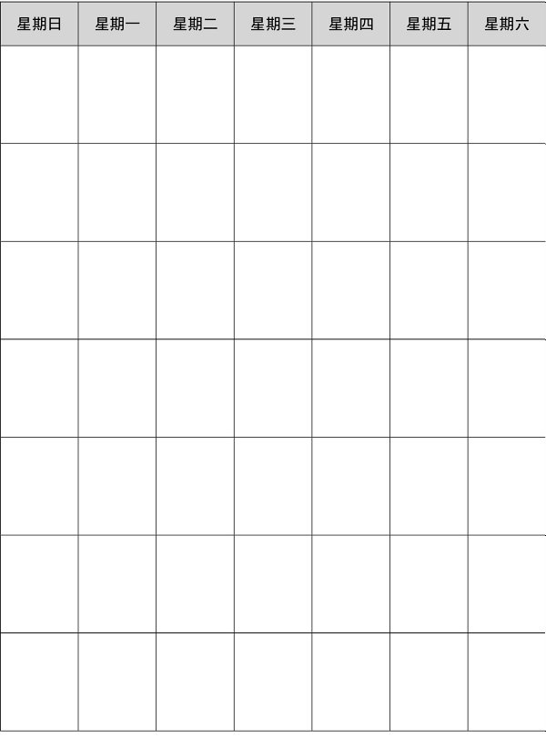

这一个月来，有哪些卢恩符文重复出现？

这些重复出现的符文对你有什么特别的意义？

它们对应的英文字母是否可以拼出字来？

你另外还发现了什么？

## 9　第 1～7 日：养成每天练习的习惯

## 第一日：今日焦点

问自己：「我今天需要专注于什么？」然后抽一个符文。

符号：_________　代表意义：________________　对应字母：_________

这个符文与你今天生活中发生的事有多大的关联？

## 第一日：「是」或「否」

你今天有什么「是」或「否」的问题？

抽一个卢恩符文，并记录你得到的答案是「是」（符文正面朝上），还是「否」（符文正面朝下）。

❐ 是　　❐ 否

这个问题为什么对你来说很重要？

#### 验证

发生了什么事？卢恩符文的指引是否正确或有帮助？

## 第二日：今日焦点

问自己：「我今天需要专注于什么？」然后抽一个符文。

符号：_________　代表意义：________________　对应字母：_________

这个符文与你今天生活中发生的事有多大的关联？

## 第二日：「是」或「否」

你今天有什么「是」或「否」的问题？

抽一个卢恩符文，并记录你得到的答案是「是」（符文正面朝上），还是「否」（符文正面朝下）。

❐ 是　　❐ 否

这个问题为什么对你来说很重要？

#### 验证

发生了什么事？卢恩符文的指引是否正确或有帮助？

## 第三日：今日焦点

问自己：「我今天需要专注于什么？」然后抽一个符文。

符号：_________　代表意义：________________　对应字母：_________

这个符文与你今天生活中发生的事有多大的关联？

## 第三日：「是」或「否」

你今天有什么「是」或「否」的问题？

抽一个卢恩符文，并记录你得到的答案是「是」（符文正面朝上），还是「否」（符文正面朝下）。

❐ 是　　❐ 否

这个问题为什么对你来说很重要？

#### 验证

发生了什么事？卢恩符文的指引是否正确或有帮助？

## 第四日：今日焦点

问自己：「我今天需要专注于什么？」然后抽一个符文。

符号：_________　代表意义：________________　对应字母：_________

这个符文与你今天生活中发生的事有多大的关联？

## 第四日：「是」或「否」

你今天有什么「是」或「否」的问题？

抽一个卢恩符文，并记录你得到的答案是「是」（符文正面朝上），还是「否」（符文正面朝下）。

❐ 是　　❐ 否

这个问题为什么对你来说很重要？

#### 验证

发生了什么事？卢恩符文的指引是否正确或有帮助？

## 第五日：今日焦点

问自己：「我今天需要专注于什么？」然后抽一个符文。

符号：_________　代表意义：________________　对应字母：_________

这个符文与你今天生活中发生的事有多大的关联？

## 第五日：「是」或「否」

你今天有什么「是」或「否」的问题？

抽一个卢恩符文，并记录你得到的答案是「是」（符文正面朝上），还是「否」（符文正面朝下）。

❐ 是　　❐ 否

这个问题为什么对你来说很重要？

#### 验证

发生了什么事？卢恩符文的指引是否正确或有帮助？

## 第六日：今日焦点

问自己：「我今天需要专注于什么？」然后抽一个符文。

符号：_________　代表意义：________________　对应字母：_________

这个符文与你今天生活中发生的事有多大的关联？

## 第六日：「是」或「否」

你今天有什么「是」或「否」的问题？

抽一个卢恩符文，并记录你得到的答案是「是」（符文正面朝上），还是「否」（符文正面朝下）。

❐ 是　　❐ 否

这个问题为什么对你来说很重要？

#### 验证

发生了什么事？卢恩符文的指引是否正确或有帮助？

## 第七日：今日焦点

问自己：「我今天需要专注于什么？」然后抽一个符文。

符号：_________　代表意义：________________　对应字母：_________

这个符文与你今天生活中发生的事有多大的关联？

## 第七日：「是」或「否」

你今天有什么「是」或「否」的问题？

抽一个卢恩符文，并记录你得到的答案是「是」（符文正面朝上），还是「否」（符文正面朝下）。

❐ 是　　❐ 否

这个问题为什么对你来说很重要？

#### 验证

发生了什么事？卢恩符文的指引是否正确或有帮助？

## 10　第 8～14 日：了解状况

## 第八日：今日焦点

问自己：「我今天需要专注于什么？」然后抽一个符文。

符号：_________　代表意义：________________　对应字母：_________

这个符文与你今天生活中发生的事有多大的关联？

## 第八日：了解状况

想一想目前生活中某个需要厘清的状况。

这个状况是：

把卢恩符文拿在手中，心里想着这个状况，然后抽出三个符文，并将每个符文由右至左记录下来。请务必将每个符文的代表意义也写在下面的六边形框框里。

根据你抽出的卢恩符文，你对这个状况有什么样的洞见？

## 第九日：今日焦点

问自己：「我今天需要专注于什么？」然后抽一个符文。

符号：_________　代表意义：________________　对应字母：_________

这个符文与你今天生活中发生的事有多大的关联？

## 第九日：了解状况

想一想目前生活中某个需要厘清的状况。

这个状况是：

把卢恩符文拿在手中，心里想着这个状况，然后抽出三个符文，并将每个符文由右至左记录下来。请务必将每个符文的代表意义也写在下面的六边形框框里。

根据你抽出的卢恩符文，你对这个状况有什么样的洞见？

## 第十日：今日焦点

问自己：「我今天需要专注于什么？」然后抽一个符文。

符号：_________　代表意义：________________　对应字母：_________

这个符文与你今天生活中发生的事有多大的关联？

## 第十日：了解状况

想一想目前生活中某个需要厘清的状况。

这个状况是：

把卢恩符文拿在手中，心里想着这个状况，然后抽出三个符文，并将每个符文由右至左记录下来。请务必将每个符文的代表意义也写在下面的六边形框框里。

根据你抽出的卢恩符文，你对这个状况有什么样的洞见？

## 第十一日：今日焦点

问自己：「我今天需要专注于什么？」然后抽一个符文。

符号：_________　代表意义：________________　对应字母：_________

这个符文与你今天生活中发生的事有多大的关联？

## 第十一日：了解状况

想一想目前生活中某个需要厘清的状况。

这个状况是：

把卢恩符文拿在手中，心里想着这个状况，然后抽出三个符文，并将每个符文由右至左记录下来。请务必将每个符文的代表意义也写在下面的六边形框框里。

根据你抽出的卢恩符文，你对这个状况有什么样的洞见？

## 第十二日：今日焦点

问自己：「我今天需要专注于什么？」然后抽一个符文。

符号：_________　代表意义：________________　对应字母：_________

这个符文与你今天生活中发生的事有多大的关联？

## 第十二日：了解状况

想一想目前生活中某个需要厘清的状况。

这个状况是：

把卢恩符文拿在手中，心里想着这个状况，然后抽出三个符文，并将每个符文由右至左记录下来。请务必将每个符文的代表意义也写在下面的六边形框框里。

根据你抽出的卢恩符文，你对这个状况有什么样的洞见？

## 第十三日：今日焦点

问自己：「我今天需要专注于什么？」然后抽一个符文。

符号：_________　代表意义：________________　对应字母：_________

这个符文与你今天生活中发生的事有多大的关联？

## 第十三日：了解状况

想一想目前生活中某个需要厘清的状况。

这个状况是：

把卢恩符文拿在手中，心里想着这个状况，然后抽出三个符文，并将每个符文由右至左记录下来。请务必将每个符文的代表意义也写在下面的六边形框框里。

根据你抽出的卢恩符文，你对这个状况有什么样的洞见？

## 第十四日：今日焦点

问自己：「我今天需要专注于什么？」然后抽一个符文。

符号：_________　代表意义：________________　对应字母：_________

这个符文与你今天生活中发生的事有多大的关联？

## 第十四日：了解状况

想一想目前生活中某个需要厘清的状况。

这个状况是：

把卢恩符文拿在手中，心里想着这个状况，然后抽出三个符文，并将每个符文由右至左记录下来。请务必将每个符文的代表意义也写在下面的六边形框框里。

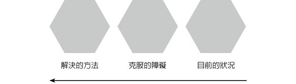

根据你抽出的卢恩符文，你对这个状况有什么样的洞见？

## 11　第 15～21 日：了解他人

## 第十五日：今日焦点

问自己：「我今天需要专注于什么？」然后抽一个符文。

符号：_________　代表意义：________________　对应字母：_________

这个符文与你今天生活中发生的事有多大的关联？

## 第十五日：了解他人

想一想你人生中某一位现在对你很重要，或过去一直以来对你很重要的人。

这个人的名字是：

把符文袋拿在手中，观想这个人站在你的面前。接着请求卢恩符文指示，为什么这个人在你的生命中占有重要的地位。然后抽出六个符文，并依序将它们记录在下面的六边形框框里。

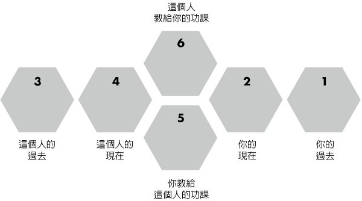

你对这个卢恩符文阵的第一印象是什么？它带给你什么样的感觉？

关于你自己，卢恩符文告诉了你什么？

关于这个人，卢恩符文告诉了你什么？

你教给这个人的功课是什么？

这个人教给你的功课是什么？

你还有哪些想法和感受？

## 第十六日：今日焦点

问自己：「我今天需要专注于什么？」然后抽一个符文。

符号：_________　代表意义：________________　对应字母：_________

这个符文与你今天生活中发生的事有多大的关联？

## 第十六日：了解他人

想一想你人生中某一位现在对你很重要，或过去一直以来对你很重要的人。

这个人的名字是：

把符文袋拿在手中，观想这个人站在你的面前。接着请求卢恩符文指示，为什么这个人在你的生命中占有重要的地位。然后抽出六个符文，并依序将它们记录在下面的六边形框框里。

你对这个卢恩符文阵的第一印象是什么？它带给你什么样的感觉？

关于你自己，卢恩符文告诉了你什么？

关于这个人，卢恩符文告诉了你什么？

你教给这个人的功课是什么？

这个人教给你的功课是什么？

你还有哪些想法和感受？

## 第十七日：今日焦点

问自己：「我今天需要专注于什么？」然后抽一个符文。

符号：_________　代表意义：________________　对应字母：_________

这个符文与你今天生活中发生的事有多大的关联？

## 第十七日：了解他人

想一想你人生中某一位现在对你很重要，或过去一直以来对你很重要的人。

这个人的名字是：

把符文袋拿在手中，观想这个人站在你的面前。接着请求卢恩符文指示，为什么这个人在你的生命中占有重要的地位。然后抽出六个符文，并依序将它们记录在下面的六边形框框里。

你对这个卢恩符文阵的第一印象是什么？它带给你什么样的感觉？

关于你自己，卢恩符文告诉了你什么？

关于这个人，卢恩符文告诉了你什么？

你教给这个人的功课是什么？

这个人教给你的功课是什么？

你还有哪些想法和感受？

## 第十八日：今日焦点

问自己：「我今天需要专注于什么？」然后抽一个符文。

符号：_________　代表意义：________________　对应字母：_________

这个符文与你今天生活中发生的事有多大的关联？

## 第十八日：了解他人

想一想你人生中某一位现在对你很重要，或过去一直以来对你很重要的人。

这个人的名字是：

把符文袋拿在手中，观想这个人站在你的面前。接着请求卢恩符文指示，为什么这个人在你的生命中占有重要的地位。然后抽出六个符文，并依序将它们记录在下面的六边形框框里。

你对这个卢恩符文阵的第一印象是什么？它带给你什么样的感觉？

关于你自己，卢恩符文告诉了你什么？

关于这个人，卢恩符文告诉了你什么？

你教给这个人的功课是什么？

这个人教给你的功课是什么？

你还有哪些想法和感受？

## 第十九日：今日焦点

问自己：「我今天需要专注于什么？」然后抽一个符文。

符号：_________　代表意义：________________　对应字母：_________

这个符文与你今天生活中发生的事有多大的关联？

## 第十九日：了解他人

想一想你人生中某一位现在对你很重要，或过去一直以来对你很重要的人。

这个人的名字是：

把符文袋拿在手中，观想这个人站在你的面前。接着请求卢恩符文指示，为什么这个人在你的生命中占有重要的地位。然后抽出六个符文，并依序将它们记录在下面的六边形框框里。

你对这个卢恩符文阵的第一印象是什么？它带给你什么样的感觉？

关于你自己，卢恩符文告诉了你什么？

关于这个人，卢恩符文告诉了你什么？

你教给这个人的功课是什么？

这个人教给你的功课是什么？

你还有哪些想法和感受？

## 第二十日：今日焦点

问自己：「我今天需要专注于什么？」然后抽一个符文。

符号：_________　代表意义：________________　对应字母：_________

这个符文与你今天生活中发生的事有多大的关联？

## 第二十日：了解他人

想一想你人生中某一位现在对你很重要，或过去一直以来对你很重要的人。

这个人的名字是：

把符文袋拿在手中，观想这个人站在你的面前。接着请求卢恩符文指示，为什么这个人在你的生命中占有重要的地位。然后抽出六个符文，并依序将它们记录在下面的六边形框框里。

你对这个卢恩符文阵的第一印象是什么？它带给你什么样的感觉？

关于你自己，卢恩符文告诉了你什么？

关于这个人，卢恩符文告诉了你什么？

你教给这个人的功课是什么？

这个人教给你的功课是什么？

你还有哪些想法和感受？

## 第二十一日：今日焦点

问自己：「我今天需要专注于什么？」然后抽一个符文。

符号：_________　代表意义：________________　对应字母：_________

这个符文与你今天生活中发生的事有多大的关联？

## 第二十一日：了解他人

想一想你人生中某一位现在对你很重要，或过去一直以来对你很重要的人。

这个人的名字是：

把符文袋拿在手中，观想这个人站在你的面前。接着请求卢恩符文指示，为什么这个人在你的生命中占有重要的地位。然后抽出六个符文，并依序将它们记录在下面的六边形框框里。

你对这个卢恩符文阵的第一印象是什么？它带给你什么样的感觉？

关于你自己，卢恩符文告诉了你什么？

关于这个人，卢恩符文告诉了你什么？

你教给这个人的功课是什么？

这个人教给你的功课是什么？

你还有哪些想法和感受？

## 12　第 22～28 日：显化结果

## 第二十二日：今日焦点

问自己：「我今天需要专注于什么？」然后抽一个符文。

符号：_________　代表意义：________________　对应字母：_________

这个符文与你今天生活中发生的事有多大的关联？

## 第二十二日：显化结果

你今天发生了什么事？

你想要显化什么样的结果？

二十四个卢恩符文能量或能量组合中，何者是你今天受益最多的？

现在，把你前面所选的符文拿出来放在手中，接着念以下的咒语来启动它们：

今天我召唤〔说出卢恩符文的日耳曼名〕的能量来帮助我处理〔描述你的状况〕。藉由召唤这个能量，我拥有所有必要的支持、保护和自信来显化最好的结果。

然后把这些符文石带在身上一整天，或是把符文或符文组合画在你整天都看得到的地方。

## 第二十三日：今日焦点

问自己：「我今天需要专注于什么？」然后抽一个符文。

符号：_________　代表意义：________________　对应字母：_________

这个符文与你今天生活中发生的事有多大的关联？

## 第二十三日：显化结果

你今天发生了什么事？

你想要显化什么样的结果？

二十四个卢恩符文能量或能量组合中，何者是你今天受益最多的？

现在，把你前面所选的符文拿出来放在手中，接着念以下的咒语来启动它们：

今天我召唤〔说出卢恩符文的日耳曼名〕的能量来帮助我处理〔描述你的状况〕。藉由召唤这个能量，我拥有所有必要的支持、保护和自信来显化最好的结果。

然后把这些符文石带在身上一整天，或是把符文或符文组合画在你整天都看得到的地方。

## 第二十四日：今日焦点

问自己：「我今天需要专注于什么？」然后抽一个符文。

符号：_________　代表意义：________________　对应字母：_________

这个符文与你今天生活中发生的事有多大的关联？

## 第二十四日：显化结果

你今天发生了什么事？

你想要显化什么样的结果？

二十四个卢恩符文能量或能量组合中，何者是你今天受益最多的？

现在，把你前面所选的符文拿出来放在手中，接着念以下的咒语来启动它们：

今天我召唤〔说出卢恩符文的日耳曼名〕的能量来帮助我处理〔描述你的状况〕。藉由召唤这个能量，我拥有所有必要的支持、保护和自信来显化最好的结果。

然后把这些符文石带在身上一整天，或是把符文或符文组合画在你整天都看得到的地方。

## 第二十五日：今日焦点

问自己：「我今天需要专注于什么？」然后抽一个符文。

符号：_________　代表意义：________________　对应字母：_________

这个符文与你今天生活中发生的事有多大的关联？

## 第二十五日：显化结果

你今天发生了什么事？

你想要显化什么样的结果？

二十四个卢恩符文能量或能量组合中，何者是你今天受益最多的？

现在，把你前面所选的符文拿出来放在手中，接着念以下的咒语来启动它们：

今天我召唤〔说出卢恩符文的日耳曼名〕的能量来帮助我处理〔描述你的状况〕。藉由召唤这个能量，我拥有所有必要的支持、保护和自信来显化最好的结果。

然后把这些符文石带在身上一整天，或是把符文或符文组合画在你整天都看得到的地方。

## 第二十六日：今日焦点

问自己：「我今天需要专注于什么？」然后抽一个符文。

符号：_________　代表意义：________________　对应字母：_________

这个符文与你今天生活中发生的事有多大的关联？

## 第二十六日：显化结果

你今天发生了什么事？

你想要显化什么样的结果？

二十四个卢恩符文能量或能量组合中，何者是你今天受益最多的？

现在，把你前面所选的符文拿出来放在手中，接着念以下的咒语来启动它们：

今天我召唤〔说出卢恩符文的日耳曼名〕的能量来帮助我处理〔描述你的状况〕。藉由召唤这个能量，我拥有所有必要的支持、保护和自信来显化最好的结果。

然后把这些符文石带在身上一整天，或是把符文或符文组合画在你整天都看得到的地方。

## 第二十七日：今日焦点

问自己：「我今天需要专注于什么？」然后抽一个符文。

符号：_________　代表意义：________________　对应字母：_________

这个符文与你今天生活中发生的事有多大的关联？

## 第二十七日：显化结果

你今天发生了什么事？

你想要显化什么样的结果？

二十四个卢恩符文能量或能量组合中，何者是你今天受益最多的？

现在，把你前面所选的符文拿出来放在手中，接着念以下的咒语来启动它们：

今天我召唤〔说出卢恩符文的日耳曼名〕的能量来帮助我处理〔描述你的状况〕。藉由召唤这个能量，我拥有所有必要的支持、保护和自信来显化最好的结果。

然后把这些符文石带在身上一整天，或是把符文或符文组合画在你整天都看得到的地方。

## 第二十八日：今日焦点

问自己：「我今天需要专注于什么？」然后抽一个符文。

符号：_________　代表意义：________________　对应字母：_________

这个符文与你今天生活中发生的事有多大的关联？

## 第二十八日：显化结果

你今天发生了什么事？

你想要显化什么样的结果？

二十四个卢恩符文能量或能量组合中，何者是你今天受益最多的？

现在，把你前面所选的符文拿出来放在手中，接着念以下的咒语来启动它们：

今天我召唤〔说出卢恩符文的日耳曼名〕的能量来帮助我处理〔描述你的状况〕。藉由召唤这个能量，我拥有所有必要的支持、保护和自信来显化最好的结果。

然后把这些符文石带在身上一整天，或是把符文或符文组合画在你整天都看得到的地方。

## 13　第 29～30 日：旅程的反思

## 第二十九日：今日焦点

问自己：「我今天需要专注于什么？」然后抽一个符文。

符号：_________　代表意义：________________　对应字母：_________

这个符文与你今天生活中发生的事有多大的关联？

## 第二十九日：检视你的进步

现在，你已埋首于卢恩符文的使用以更加了解你自己、你的状况和重要的关系，想想看哪一种解读方式最吸引你。

你已经学会并练习了以下的解读方式：

．每天抽一个卢恩符文

．「是」或「否」的解读

．了解状况的三符文解读

．了解关系的五符文解读

．用卢恩符文来显化

哪一种解读方式最契合你？

理由是什么？

哪一种解读方式最不契合你？

理由是什么？

你有试着用其他方式来使用卢恩符文吗？

你在静心或梦中见过卢恩符文吗？

你发现了什么模式？抽卢恩符文时，有哪些特定的符文不断地重复出现？

如果有的话，这些模式对你来说意味着什么？

## 第三十日：今日焦点

问自己：「我今天需要专注于什么？」然后抽一个符文。

符号：_________　代表意义：________________　对应字母：_________

这个符文与你今天生活中发生的事有多大的关联？

## 第三十日：检视你的进步

现在，你已埋首于卢恩符文的使用以更加了解你自己、你的状况和重要的关系，想想看哪一种解读方式最吸引你。

你已经学会并练习了以下的解读方式：

．每天抽一个卢恩符文

．「是」或「否」的解读

．了解状况的三符文解读

．了解关系的五符文解读

．用卢恩符文来显化

哪一种解读方式最契合你？

理由是什么？

哪一种解读方式最不契合你？

理由是什么？

你有试着用其他方式来使用卢恩符文吗？

你在静心或梦中见过卢恩符文吗？

你发现了什么模式？抽卢恩符文时，有哪些特定的符文不断地重复出现？

如果有的话，这些模式对你来说意味着什么？

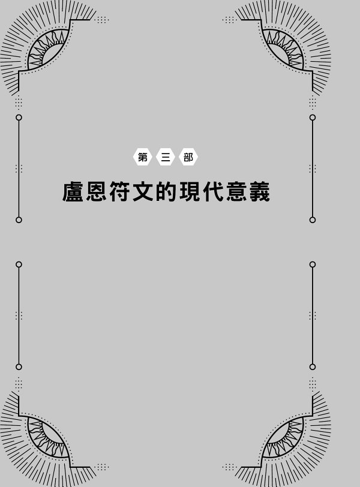

# 卢恩符文索引

| 符文 | 原始日耳曼名 | 代表意义 | 对应字母 | 页数 |
|  | 恩索兹 | 信号 | A | 228 |
|  | 伯卡纳 | 成长 | B | 230 |
|  | 科诺 | 敞开 | C, K, Q | 232 |
|  | 达格斯 | 突破 | D | 234 |
|  | 耶瓦兹 | 移动 | E | 236 |
|  | 菲胡 | 丰盛 | F | 238 |
|  | 盖伯 | 伙伴 | G | 240 |
|  | 哈格拉兹 | 扰乱 | H | 242 |
|  | 伊莎斯 | 静止 | I | 244 |
|  | 耶拉 | 收获 | J | 246 |
|  | 拉格斯 | 流动 | L | 248 |
|  | 美纳兹 | 自我 | M | 250 |
|  | 纳奥帝斯 | 约束 | N | 252 |
|  | 欧皮拉 | 继承 | O | 254 |
|  | 佩索 | 起始 | P | 256 |
|  | 莱多 | 旅程 | R | 258 |
|  | 索威罗 | 完整 | S | 260 |
|  | 帝瓦兹 | 战士 | T | 262 |
|  | 乌鲁兹 | 力量 | U | 264 |
|  | 温究 | 喜悦 | V, W | 266 |
|  | 苏里萨兹 | 门径 | TH | 268 |
|  | 爱瓦兹 | 臣服 | Y | 270 |
|  | 奥吉兹 | 保护 | Z | 272 |
|  | 英瓦兹 | 生育 | NG | 274 |
| 空白 | 无 | 未知 | 无 | 276 |

接下来，我将对卢恩符文进行概述，包括它们的名字、意义、关联和用法。

每一个符文我都会附上它的原始日耳曼名。如同先前说过的，有些卢恩符文不是仅有一个名字而已。为了简便，我只提供我觉得最喜欢的原始日耳曼名。

我也附上每个符文名字的基本发音。古英文和中古英文的学者们可能会对这些发音有不同的看法，但同样的，我提供这些资料是基于实用目的，而不是学术研究。

此外，我也列出每个卢恩符文的代表意义。其他许多卢恩符文相关书籍为每个符文提出更多的复杂解释，分析佚名者的《艾达史诗》和十三世纪冰岛作家斯诺里．斯图鲁松（Snorri Sturluson）所写的诗词的意义。学者可能会认为那才是解释卢恩符文的恰当方式，但我的目标不是要分析历史，而是提供你一个可理解又适用于今日的解释，不必过度依赖那些可能不完整的文献。就像古老的俗话说的，历史是赢家写的。我们不知道我们所不知道的。在解释和重述历史时，人人都有自己的过滤器。话虽如此，我对于告诉大家每个符文的现代意义感到很自在，学术的解释就留给学术吧！

最后，为了提供每个现代意义更深一层的理解，我分享了每个符文与占星术的行星和星座的天体关系。卢恩符文的正统派可能不同意将这两种看似截然不同的体系混为一谈，然而我发现，这个天体的相似处带给每个符文更多的思考维度。

如果你对于将卢恩符文的现代意义应用在生活中感到有困难，这个部分提供了「停下来反思」的问题，促进你将这些意义应用在你所询问的状况中。倘若你发现这些促进是有用的，可以将它们记录下来——如果你想这么做的话。

## 1　恩索兹（Ansuz）

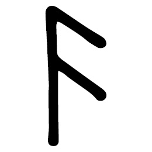

对应字母：A

发音：AWN-sooz

代表意义：信号

天体关联：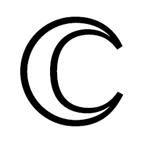 

恩索兹与月亮连结。月亮具有唤起我们的直觉、潜意识心灵和养育冲动的力量。这个符文与最感情用事的巨蟹座有关。

现代意义：我们的直觉用许多方式跟我们说话——透过作梦、预感、闪过的念头、灵思乍现，或甚至透过其他人。我们每天都被信号和征兆包围着，但如果我们没觉察到周遭的方方面面，很容易就会错过它们。

这个符文邀请你连结自己的直觉管道，好让你在人生中能更游刃有余。要更加觉察那些看似突如其来的念头、想法和灵感。这种使用自身的神圣指引系统的感觉，就象是卫星导航一样。我们的高我不断地向我们传送讯息，来为我们指出那条阻力最少的道路。

你越是对这些传送给你的直觉讯息保持开放，你就会收到更多的讯息。今天找个安静的地方独处十分钟。闭上眼睛，做三次深呼吸。练习向你的高我请求讯息，问：「今天我需要知道什么？」或是：「我该如何解决这个歧见？」

你可以问任何问题，而答案将会以某种形式出现。对问题的回答方式保持开放。要相信你得到的第一个回答就是正确答案，因为它来自最好的来源——你的内在。

###  停下来反思

．你的脑海中，最新闪过的念头是什么？

．闭上眼睛，问自己：「那代表什么意思？」

．你相信自己的直觉吗？相信或不相信的原因是什么？

#### 总结

我们都具有本能的直觉能力。恩索兹的出现是在鼓励我们注意身边出现的信号和征兆，并看出它们往往是来自神圣智慧之境的讯息。

## 2　伯卡纳（Berknan）

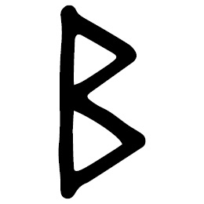

对应字母：B

发音：BEAR-kana

代表意义：成长

天体关联： 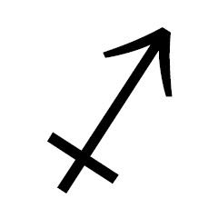

伯卡纳与木星连结。木星召唤的是幸运、成功、乐观、扩展和学习的能量。这个符文与最幸运的射手座有关。

现代意义：生而为人，难免必须经历出生、成长和死亡。然而，每个人的成长步调（包括精神、肉体、情感和灵性上的成长）都因人而异。有时，我们会低估自己的成长，并高估他人的成长。

当我们低估自己的成长，我们会不必要地严厉批判自己，而忽略了我们克服过多少的困难，毕竟，我们都是从这个过程中学习的。但我们不会赞许自己走过多少路才达到今天的境地。

当我们高估他人的成长，我们会对他们没达到我们的期待而感到失望。不论是哪一种情况，我们都评断了自己和他人。或许我们忽略了，我们都走在旅途上，我们都是随着经历而成长。我们无法强迫自己或他人成长。

我们必须了解并接受我们现在的处境。每个人都有各自的独特旅程，而不是对事情应该是什么样子加上自己的期待。

###  停下来反思

．过去五年来，你在人生的哪些方面成长最多？

．哪些经历促成你的成长？

．想一位过去或现在令你感到失望的人。你能在心中用不同的方式表达那个失望，并了解那个人已经尽了他最大的力量吗？

#### 总结

有时，我们最重要的成长是来自于痛苦的经历。伯卡纳的出现是在提醒我们，我们是来人间学习和成长的。我们可以接纳所有的经历，甚至包括那些艰辛的经历，并将它们视为帮助我们前往下一个学习层级的挑战。

## 3　科诺（Kanu）

对应字母：C，K，Q

发音：KA-new

代表意义：敞开

天体关联：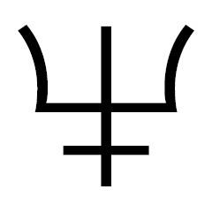 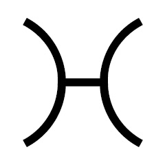

科诺汲取的是来自海王星的能量。海王星与理想主义、灵性、臣服和超越有关。这个符文与最有智慧又最充满爱的双鱼座有强大的连结。

现代意义：你的眼前即将打开一扇门，它将带来新的可能性。但如果你不加以觉察和聆听，你可能会错过这个机会。当我们要走下一步时，我们往往会执着于自己所认为的事情必要的开展方式。然而我们这样做时，却可能无意中阻挡了那些实现我们想要的结果的其他路径。

举例来说，如果你对目前的某段关系感到不开心，那么你可能会认为，除非完全结束这段关系，否则你不会感到快乐和满足。然而，你潜在的需求可能是你想要别人尊重你。一旦了解这一点，你可能会发现，此时你应该说出来并建立你与他人的界限，而不是离开在不知情的状况下跨越你的界限的那些人。

要留意你生命中想改变的是什么，并探索其中的原因。对宇宙给予你请求之物的方式保持开放，如此一来，你便有更多的机会得到你想要的东西。开放，留意，活在当下。一个新的开始以你从未想过的方式在等待着你。

###  停下来反思

．当新的机会出现在你面前时，你的感觉怎样？

．你希望生活中的哪一件事情能够改变？

．那个改变可能以哪三种可能的形式出现？

#### 总结

科诺的出现是在鼓励我们，让自己的心对某个意外的邀请或事先没想到的事物保持开放。当我们是友善的并对新的可能性开放，有时就会出现神奇的事。

## 4　达格斯（Dagaz）

对应字母：D

发音：DAH-gaz

代表意义：突破

天体关联：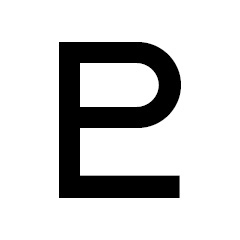 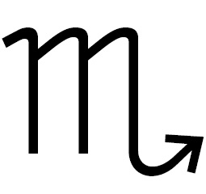

达格斯与冥王星有强大的连结。冥王星与力量、改变和重生有关。在占星学上，它对应的是最爱憎分明又充满肉欲的天蝎座。

现代意义：经过尝试错误和一连串的走走停停之后，你走到了完全清楚明了的边缘。随之而来的是某个重要的东西，它可能以个人或事业成就的形式到来，或可能是一个新的、更好的你的开端。

它可能是一个创造性的突破、事业或学业上的努力之事，或者是一段亲近的个人关系的重大改变。虽然通往你想要之物的道路可能既漫长又颠簸，但你经历的那些奋斗过程将会非常值得。在自我怀疑和恐惧的时刻，继续向前进吧！要知道，宇宙永远为你的最高和最大的利益而运作。厘清你想要的是什么，并对它的到来有信心。

现在应该做个深呼吸、放轻松，让一切自然呈现。你距离你所渴望的解决之道只有数步之遥。信任这个过程，并了解此刻你就在你应该在的地方。

###  停下来反思

．一直以来，你最挣扎或深陷其中的一件事是什么？

．在这样的事态下，可能发生的最糟糕的事是什么？

．可能有其他你没想过的结果吗？那可能是什么？

#### 总结

你所渴望的解脱和解决之道就在不远处。达格斯提醒你，当你不再抓捕蝴蝶时，蝴蝶就可能停在你的鼻梁上。轻松地等待，让那个突破走向你吧！

## 5　耶瓦兹（Ehwaz）

对应字母：E

发音：EH-waz

代表意义：移动

天体关联：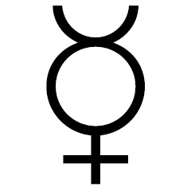 

耶瓦兹与水星有关。水星能促进旅行、沟通和思想。这个符文与具有双重性格的双子座有所连结。

现代意义：如果你对生活中的某方面（例如感情、事业或健康）感到拖延或停滞不前，那么就是该做出重大改变的时候了。

现在是进步和前进的时机。这可能必须从实质上的移动（例如旅行或更换住处）开始着手。此时，宇宙比以往更想要支持你。但你必须相信，更好的人生在等待着你，同时你已准备好踏出第一步来让轮子转动。

首先，从说出你准备好做出改变开始。要具体的说出你必须在生活中的哪一方面做出改变。然后，踏出第一步。即使是小小的一步也行。整个动力必须由你开始。接着，你所要求的真正改变就会到来。

###  停下来反思

．你在哪一方面感觉停滞不前？

．如果你有一根能让这一方面变得更好的魔杖，你会怎样改变它？

．今天你能踏出什么样的一小步来走向这个结果？

#### 总结

耶瓦兹邀请我们接纳生活中的移动变化。它提醒我们，我们有力量显化出我们真正想要的生活。放下现状，对可能性开放吧！

## 6　菲胡（Fehu）

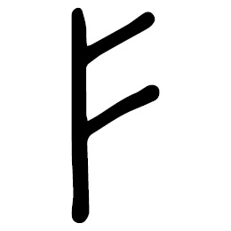

对应字母：F

发音：FEH-who

代表意义：丰盛

天体关联：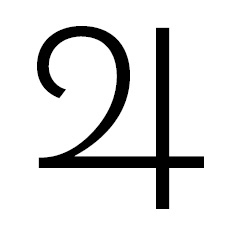 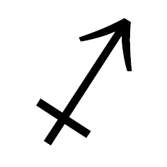

菲胡与木星连结。木星召唤的是幸运、成功、乐观、扩展和学习的能量。这个符文与最幸运的射手座有关。

现代意义：通常我们会因为自己所拥有的东西、身边的人或住的地方而感到安全。我们的幸福感来自于我们的财产和社会所定义的「富裕」。许多人强调外在的财富，而不是内在的富足感。

然而，外在的财富（例如我们开的车、戴的珠宝或住的房子）可能是短暂的。今天拥有的东西，明天可能就没了。我们可能「什么都有了」，但内心仍感到不满足。

现在该是探索你的内在、重塑你对财富和财产的看法，以真正反映出你内在的真实财富的时候了。也许对别人来说，你是一个养育者、保护者、艺术家或行为榜样。内在的你永远不可能遗失或被拿走。向内看，并清点你与生俱来的那些天赋。留意你所有的天分。你的生命充满了丰盛。随着你对财富定义的改变，将焦点放在所有使你变得特别和独特的事物上，你的生命就会变得更加满足和喜悦。

###  停下来反思

．对你而言，「财富」的意义是什么？现在你觉得富有吗？理由是什么？

．你有哪些天分？

．哪一个天分使你感觉最为特别？

#### 总结

菲胡的出现是在提醒我们，财富的衡量有许多种方式；无形的财富能使我们有一种满足感，而这是累积再多财物也无法带给我们的。沉思一下真正有价值的东西。

## 7　盖伯（Gebo）

对应字母：G

发音：GEH-boe

代表意义：伙伴

天体关联：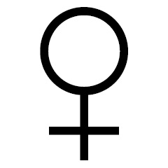  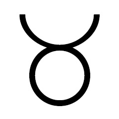

盖伯与金星有关。金星以其阴性能量、唤起浪漫、爱情和美丽而为人所知。这个符文与最平衡的天秤座和最稳定的金牛座有所连结。

现代意义：一个新的结合即将发生在你身上。这个结合需要你的合作，才能实现你在人生的这个阶段所追求的喜悦。尽管你可以靠自己完成你诸多的渴望，但现在该是让那位被你打造的心墙禁锢住的某个人表现的时候了。刚开始这可能令人感觉不舒服，但这并无大碍。在你人生旅程的这个阶段，你没必要孤军奋斗。这个结合的对象可能是一位新的好友、新的事业伙伴或情人，而不论是哪一种情况，都要对它保持开放。

这个结合会有其自己的能量，完全不同于你过往的任何关系。不要将它与过去的经验进行比较或评断。随着你的成长，你会变得越来越扩张。关系再也无法定义你是谁，相反的，它们只是来改善你的人生。

让你的光明由内而外地大放异彩。注意你吸引了哪些人进入你的生命，并让新的关系建立起来。你已经为此做好准备了。

###  停下来反思

．对你来说，伙伴关系的意义是什么？

．你与某人的伙伴关系能以何种方式改善你的生活？

．想到你与某人合伙或共同协力完成某个目标时，让你有什么样的感觉？

#### 总结

盖伯邀请我们放下「一切事情都必须靠自己完成」的限制性信念。在必要时求助并接受别人的援手是没问题的。

## 8　哈格拉兹（Hagalaz）

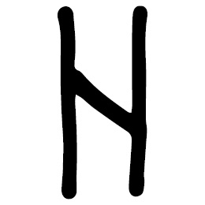

对应字母：H

发音：HA-ga-las

代表意义：扰乱

天体关联： 

哈格拉兹与天王星有强大的连结。天王星会引发突然的改变、创造力、独立性和反常行为。这个符文与最有意识和最具人道主义精神的水瓶座有关。

现代意义：当我们错过了「现在该是人生做出某种改变的时候」的微妙暗示时，宇宙有时会替我们创造这种改变，好让我们能进入下一阶段的学习。

你的道路出现了扰乱，但不必害怕。这即将发生的改变，是出自于你想要有一个更好的人生的潜意识渴望，即使你尚未构思你所想要的内容或方式。你可能会因为担心它出现的方式而压抑这个渴望。放下这个担忧吧！一章的结束标示着新一章的开始，随之而来的是光明、希望和无限的可能性。

你以某种方式被爱着、支持着，只是这些方式超出了你的所见、所触和所知。要相信，当这扰乱的浪潮出现时，它是为了你的最高和最大的利益而来。结果是，你会感到更加快乐和完整。改变是不可避免的，要用开放的心来接纳它，并知道改变的结果将会是美好的。

###  停下来反思

．目前为止，你人生中遭遇的最大挑战是什么？

．这个经历教导了你什么？

．遇到困境时，你能做哪三件事来让自己在突然的变化中稳定下来？

#### 总结

哈格拉兹鼓励我们要对尚无法看见的未来有信心，并且要相信，那个在这神祕改变的另一边等待着我们的结果，对于涉入其中的每一方都将会是最好的。

## 9　伊莎斯（Isaz）

对应字母：I

发音：EE-saw

代表意义：静止

天体关联：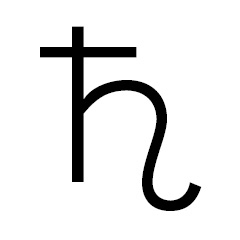 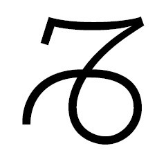

伊莎斯与土星有强大的连结。土星与克制、时间、功课和责任有关。与这个符文相关的星座是最沉稳又最坚持不懈的魔羯座。

现代意义：此刻需要静止。放下你因为停下脚步而产生的所有不耐烦或沮丧的感受。人总是倾向于一直往前冲冲冲，但有时我们真正需要的是拔掉插头，然后静止下来。灵魂的充电和恢复精神，也需要配合肉体和情感上的休息。

当生活中的某个事物突然或意外中止时，我们可能会很难相信宇宙和自己。在这种情况下，我们很容易就落入受害者的心态。我们可能会说：「为什么我会发生这种事？我到底做了什么事而遭到这种报应？」然而，随着时间的推移，我们可能会了解到，原来这个中止是为了获得最好的结果。

重要的是我们要提醒自己，无论哪个时刻，我们总是没有完整的信息或智慧来解释某个事物会中止的原因。重点是要相信这个中止是我们所需要的，因此它一定是为了让我们拥有更美好的明天。接纳这个暂停，并好好休息吧！

###  停下来反思

．当你大声说出「静止」这个词时，你看见的第一个词语或意象是什么？

．你对静止的联想是正面的，还是负面的？为什么？

．生活中那些可以由你掌控的障碍，其中哪一个是阻挡你邀请更多静止进入你的生活的最大障碍？

#### 总结

伊莎斯的出现是在提醒我们，一切事物永远处于神圣的秩序中，即使我们感觉四处碰壁时也是一样。今天让自己处于宁静当中，并享受必要的休息和它所带来的复甦。

## 10　耶拉（Jera）

对应字母：J

发音：YAR-ah

代表意义：收获

天体关联：  

耶拉与金星有关。金星以其阴性能量、唤起浪漫、爱情和美丽而为人所知。这个符文与最平衡的天秤座和最稳定的金牛座有所连结。

现代意义：收获是关于我们拥有什么，以及身为人类和灵性生命的我们所拥有的无限潜力的一种理解。收获将我们与生活中的美好和丰盛连结起来——我们的环境、我们的家和我们的人际关系。收获提醒我们仔细思考自己所拥有的一切，并且每天找出时间进行反思。它同时也让我们开始看见什么是可能的，并了解我们可以过得更丰盛。

感恩是接收更多事物的钥匙——更多的爱、更多正面的体验、更多的喜悦。如果我们能花时间感谢我们所拥有的、分享我们所拥有的，并且每天找出几个理由来表达感恩，如此就没有不可能的事。

享受你的辛劳和努力工作的成果。你值得拥有你目前所有的一切，而随着你继续感恩这个丰盛，就会有更多的丰盛到来。

###  停下来反思

．说出你感恩的三件事物。

．你生活中有哪一种丰盛是你可能视为理所当然的？

．有什么事物是你非常想要，但也许是不必要的？

#### 总结

耶拉的出现是在邀请我们停下来反思我们所拥有的一切，并放下所有我们想要获得而尚未拥有之物的渴望。辛苦的努力已经完成，好好享受那早已在你身边的丰盛吧！

## 11　拉格斯（Laguz）

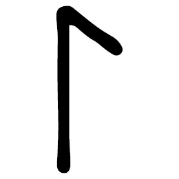

对应字母：L

发音：LA-gooz

代表意义：流动

天体关联： 

拉格斯与月亮连结。月亮具有唤起我们的直觉、潜意识心灵和养育冲动的力量。这个符文与最感情用事的巨蟹座有关。

现代意义：现在是你开始上轨道的时候了。现在所有的事物都将走向你，并轻松又优雅地透过你来移动。灵思乍现、疑难解答或问题的解决之道都毫不费力地呈现在你眼前。障碍消除了；困难解决了；冲突消失了。要特别全天候地觉察你的所言所思。你的言语、心态和行为的表现必须与你渴望的结果一致。相信所有的事都是可能的，它就真的可能发生。

当我们达到这种流动的自然状态，所有的事物就会上轨道。我们忘记了时间，快乐地沉浸在眼前所做的事情上。对某些人来说，流动能使他们有无限的创意；对另一些人来说，流动能使他们全然地专注。对我们所有人来说，流动启动了创造。它让我们在想要的时候，显化我们想要的东西。

如果今天你很难进入这种心流状态，那么就改变一下场景。去你从未去过的地方旅行一天，并找出诸如艺术、音乐或大自然之类的美好事物。这些美好的事物能引发流动。今天就开启你的流动，看看会有什么新的想法或表达出现。

###  停下来反思

．你的生活中哪个时候曾经体验过自然的流动？

．对你来说，流动的感觉像什么？

．你生活中的哪些情况最需要流动？

#### 总结

拉格斯的出现是在提醒我们，虽然创意和清明会自发地流经我们，但我们仍可以请求我们的日子能轻松、喜悦、优雅地呈现。设定这个简单的意图，并享受这趟旅程吧！

## 12　美纳兹（Mannaz）

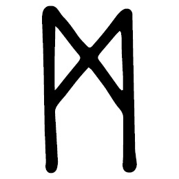

对应字母：M

发音：MAH-naz

代表意义：自我

天体关联：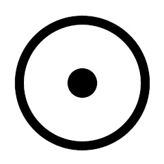 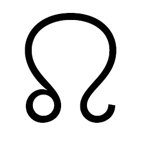

美纳兹与太阳连结。太阳主掌生命力和独立性。这个符文与最忠诚的狮子座有关。

现代意义：人生有时可能既复杂又令人难以招架。你的生活步调这么快，又要为这么多事情负责。你经常将别人的需求摆在自己之上，以至于你的内心忽略了自己。你可能会觉得对自己好是没必要的，但这并非事实。你非常重要。你值得对待自己像你对待别人一样的好。当这种情况发生，它是你重新回归中心并且喘息的机会。

从今天开始，你要觉察你的人生想要什么和需要什么。在这些短暂又安静的独处时刻，认真地问自己，对你来说，幸福的意义是什么。在你能够对外表达并采取行动之前，你必须自己先回答这个问题。

此一了解来自于你内在的自我。今天，允许你将自己摆在第一位。首先，你要知道自己想要什么，要有大声将它说出来的勇气，然后去追求它。你值得拥有你所想要的。现在该是你将一些美好的爱返还给自己的时候了。

###  停下来反思

．对你来说，幸福的意义是什么？

．什么是你能掌控的？什么是你无法掌控的？

．如果你有一根能让任何改变都变得更幸福的魔杖，你会想改变什么？

#### 总结

美纳兹的出现是在温和地提醒我们，花一点时间照顾自己，好让我们能够休息和充电。去享受按摩、在森林里散步，或吃一个粉红杯子蛋糕吧！今天做点特别的事来庆贺和赞赏自己。

## 13　纳奥帝斯（Naudiz）

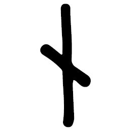

对应字母：N

发音：NOW-deez

代表意义：约束

天体关联：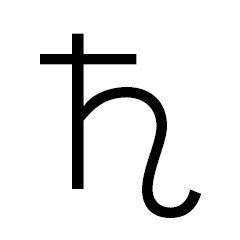 

纳奥帝斯与土星有强大的连结。土星与克制、时间、功课和责任有关。与这个符文相关的星座是最沉稳又最坚持不懈的魔羯座。

现代意义：有时候在敏感或意外的状况下，我们的反应和言语会做出违心之论，而没考虑到我们说出的这些话会对他人造成什么样的重大影响。我们可能会在理性的场合里过于感性，或在感性的场合里过于理性。言语是有力量的，认识这一点非常重要。这个符文邀请我们在激动时做出回应之前，有必要先停下来想一想我们所想要的结果。

当你面临涉及他人的艰困状况时，你可以考虑使用一句让自己暂停下来的话语，例如：「我需要一些时间好好想一想。」这么做能让你脱离那个状况，并深呼吸思考一下你接下来期望出现什么样的结果，然后你就可以根据这个期望做出你的回应。在采取行动之前，只要你能让自己有一段静止和厘清的时间，你就有能力唤起和谐，而不是纷争。

###  停下来反思

．有没有一个例子是你匆忙地做出反应，导致你在事后对自己的所言或所行感到后悔？如果换成现在，你会怎么做？

．什么状况或什么人会让你不假思索地做出反应，而不是做出深思熟虑的回应？

．在你做出反应之前，你会用什么话语来让你暂停下来脱离那个状况？

#### 总结

纳奥帝斯的出现，是在要求我们暂停下来设身处地为他人想一想。在说出伤人或适得其反的话之前，先考虑对方的处境。今天，怀着慈爱与优雅来选择你说话的用语。

## 14　欧皮拉（Opila）

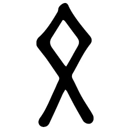

对应字母：O

发音：OH-pila

代表意义：继承

天体关联： 

欧皮拉与木星连结。木星召唤的是幸运、成功、乐观、扩展和学习的能量。这个符文与最幸运的射手座有关。

现代意义：我们是谁以及我们表达自己的方式，源自于我们祖先的根。我们选择往回看多远，会对我们今日的外貌、心态和情感性格产生极大的影响。

在自我怀疑或缺乏信心时，我们可能会想起过去的经验来解释我们目前的缺陷或信心不足。我们可能将这一切归咎于物质上的限制，例如我们的体重、财力侷限或遭遇逆境时所产生的情绪障碍。

如果我们往回看得更远一点，回到法老王、预言家和女祭司的古代，我们就可以连结到我们与生俱来的权利中那些最光荣又最受敬仰的部分。在 DNA 的层面上，我们都属于这些东西。我们每个人都与神有一个独特的关系。我们都拥有无尽的美和知识；我们的爱与成为爱的能力超越了时间。

展望最究竟的你时，想一想你希望自己可以成为什么样子，并且知道你已经是那个样子了，而且不仅止于此。

###  停下来反思

．想到「继承」这个词时，你心中浮现的第一个人、地、物是什么？

．你已经从家族世系中有意识地继承了哪些东西？

．你一直深受历史上哪位名人的吸引？理由是什么？你从那个人身上看见现在的自己的哪些东西，即使只是些许而已？

#### 总结

欧皮拉的出现是在提醒我们，抬起头来，为自己的每一部分感到骄傲。走进所有使你变得引人注目的一切。你所拥有的一切已经是你的了，永远都是如此。庆祝美丽的自己吧！

## 15　佩索（Perth）

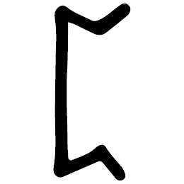

对应字母：P

发音：pearth

代表意义：起始

天体关联：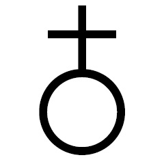 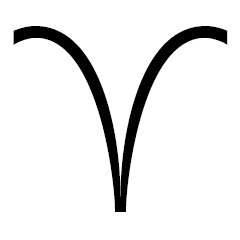

佩索与火星有强大的连结。火星唤起干劲、侵略和阳性的能量。这个符文对应的是最主动又最安静不下来的牡羊座。

现代意义：现在是朝向你一直打算做出的改变迈出第一步的时候了。被动地等待某个事物来推动你前进，并无法产生你所寻求的改变。你必须采取主动和果敢的态度，才能让宇宙将你想要的事物带给你。你不必有完全成熟的计划，或知道它实际上会如何呈现。你不必知道所有的细节，但你确实必须做点什么。即使是最小的一步，也将引发改变。

如果你因自我怀疑或恐惧而不敢迈出步伐，那么现在该是你放下它们的时候了。若是财力的侷限耽误了你，那么就要知道，获得你想要的东西不是只有一种方法而已；若你担心的是你想要的改变可能会伤害到其他人，那么我们鼓励你在人生的这个关头想想你自己。改变并没有所谓「正确的时间」或「错误的时间」。万事万物都按照神的安排，在它们该出现的时刻出现。

别再想了，现在是采取行动的时候了。你是受支持和被爱的。确定你已经准备好，然后纵身一跃吧！

###  停下来反思

．哪些事情是你知道你现在就想改变的？

．在你能掌控的事情中，有什么是你想改变的？

．今天你可以踏出哪一步来展开这个改变？

#### 总结

佩索的出现是在推我们一把，让我们采取决断的行动。首先，我们的心和头脑必须搞清楚我们所想要的改变。然后，我们必须踏出勇敢的第一步。纵身一跃吧！相信宇宙会处理好其他的事。

## 16　莱多（Raido）

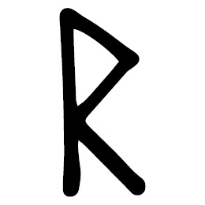

对应字母：R

发音：RA-dough

代表意义：旅程

天体关联：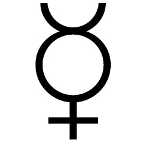 

莱多与水星有关。水星能促进旅行、沟通和思想。这个符文与具有双重性格的双子座有所连结。

现代意义：每天早上醒来，我们可以朝旅程前进，也可以停留在原地。我们可以选择生活、欢笑、爱和学习的光明路途，也可以选择站在阴影的道路上一动也不动，只把焦点放在那些错误的事情上。当我们选择光明的路途时，我们是成长和扩展的，而这正是每个人来到人间的目的；当我们选择黯淡或黑暗的道路时，我们就否定了自己灵魂成长的能力。

不管选择的是哪一条路，我们每个人都走在自己独特的旅程上。我们越是接纳人生的起起伏伏，生命就越轻松地流动。旅程中，使我们挣扎不已的最困难阶段，往往是我们学习和成长最多的。

这个符文邀请你接纳这一切，并看见随着旅程的每一步而来的人生功课。

###  停下来反思

．你认为自己是悲观的人，还是乐观的人？为什么？

．想想有什么状况曾经造成你的痛苦，但事后回顾却发现学习到许多？

．目前为止，你在生活中克服过哪些最大的障碍？

#### 总结

我们都是来人间学习人生的功课。莱多的出现是在提醒我们，别太严厉地批判自己，也不要批判别人的独特旅程的现况。我们越是能顺势而为，并且知道黑暗时刻终将过去，我们的旅程就会越轻松。

## 17　索威罗（Sowilo）

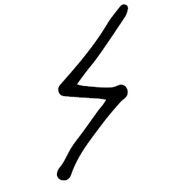

对应字母：S

发音：SO-will-oh

代表意义：完整

天体关联： 

索威罗与太阳连结。太阳主掌生命力和独立性。这个符文与最忠诚的狮子座有关。

现代意义：我们每个人都是带着与灵性保持一致的目标，在人间展开我们独特的旅程。当我们与灵性保持完美的一致性，我们就与宇宙、我们的高我和我们的神圣创造者连结。当我们处于一致的状态时，我们会感到平静和满足。这是我们身为灵性生命的自然状态。

接着，人生严酷且意外地向我们走来。当我们感觉愤怒、悲伤、被拒绝或寂寞时，这就暗示我们已经偏离了灵性，并且中断了灵魂的连结。我们拚命努力地熬日子。

然后……我们睡觉。我们藉由睡觉来重新设定能量。早上醒来，我们呼吸新的空气。我们知道，我们又成功地熬过一天；我们又走了一哩路；我们又克服了另一个障碍。在与灵性一致的状态下，我们又展开新的一天。

如果你今天感到情绪低落，就做一下静心或小睡一会儿。透过静心和休息，我们能将自己带回到完整和一致的感觉。你越是练习将自己转回完整性，你就越容易与灵性保持一致并感觉到完整。

###  停下来反思

．对你来说，成为完整的意义是什么？

．你对生活中的哪些方面全然感到满足？

．你觉得自己生活中的哪些方面需要成长？

#### 总结

索威罗的出现是在提醒我们，我们每天都可以在灵性上重新设定。早上一醒来，注意那宁静的一刻，并尽量保持那个宁静状态。随着练习和意图的聚焦，你能保持与灵性一致，如此一来，你便能找到你所寻找的平静。

## 18　帝瓦兹（Teiwaz）

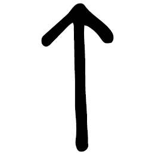

对应字母：T

发音：TEE-wawz

代表意义：战士

天体关联：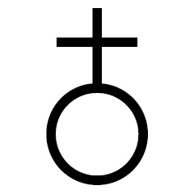 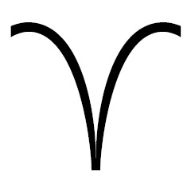

帝瓦兹与火星有强大的连结。火星唤起干劲、侵略和阳性的能量。这个符文对应的是最主动又最安静不下来的牡羊座。

现代意义：让身心安静下来是你必须掌握的技巧。学会在对话、做事或放松时完全处于当下，将大大增进你情感的幸福。懊悔过去，抑制了你当下所能感受的喜悦；担忧未来，产生了恐惧，并可能阻碍我们向前迈进。

释放你内在的战士吧！战士是完全处于当下的。她静静地扫瞄她的周围，注意身边的任何动静。她既不期待，也不担忧。她的内在和外在都是平静的。就算有什么状况发生，她也已准备好行动。她的力量来自于她能够单纯地存在。

在心中将自己视为战士——自信、处于当下、力量强大。放下所有杂念纷飞的念头，或同时做多件事情的倾向。聚焦在眼前的一刻，并注意你的感觉有什么不同。这需要练习，但这是你能掌握的事。拥抱你内在的战士吧！

###  停下来反思

．过去有哪些状况使你感到后悔？

．未来有哪些状况使你感到担忧？

．用「我是……」起头，创造一句「内在战士」的肯定语。今天一整天都重复说这句肯定语来帮助你释放这些懊悔和恐惧。今天当你觉得自己没有处于当下时，就重复说你的内在战士肯定语。

#### 总结

帝瓦兹的出现是在鼓励我们，停下来注视和聆听我们周围的事物。放下过去的懊悔和未来的担忧。活在当下。保持觉察与平静，以增强你的所见、所感和所知。

## 19　乌鲁兹（Uruz）

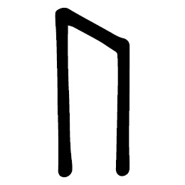

对应字母：U

发音：OO-rooze

代表意义：力量

天体关联： 

乌鲁兹与天王星有强大的连结。天王星会引发突然的改变、创造力、独立性和反常行为。这个符文与最有意识和最具人道主义精神的水瓶座有关。

现代意义：你的力量很深厚。你已经在生活中克服了许多挑战，从而使你变得更为强大、稳定且更有能力。通常我们都是在遇到某种挑战时，才有机会看见自己实际上是多么的强大。

这个符文邀请你回顾一下你的来时路，以及你人生中所有锲而不舍的经验。回头看一下你已经走了多远，然后将你学习到的智慧分享给此时感到害怕或脆弱的其他人。

这世界需要你继续建立你的力量、说出你的真相，并教导其他人做同样的事。我们可以让逆境击垮我们，也可以利用逆境来使我们变得更强大。这一路上，你都选择让自己变得更为强大。现在你开始了解，力量是一种自我养成的天赋。

今天，为你克服过的种种困难给自己一个拥抱吧！并将你的人生经验分享给需要的人，好让他们也能变得更强大。

你拥有你所需要的一切力量，并将永远坚持不懈。

###  停下来反思

．你怎样定义力量？

．生活中，你克服过的最大困难是什么？

．那个经验教导了你什么？

#### 总结

乌鲁兹的出现是为了让我们想起自己内在的力量和实力。透过试炼，我们的力量才能获得测试和增强。召唤乌鲁兹，你便能度过一切难关。

## 20　温究（Wunjo）

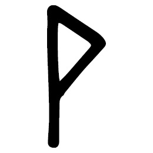

对应字母：V，W

发音：WOO-yo

代表意义：喜悦

天体关联： 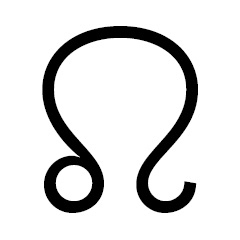

温究与太阳连结。太阳主掌生命力和独立性。这个符文与最忠诚的狮子座有关。

现代意义：我们每天都拥有体验喜悦的能力。喜悦是存在的自然状态，在这种状态中，我们感受到全然的喜乐。体验喜悦时，我们会感到深深的满足。我们完全处于当下，没有过去的懊悔或未来的担忧。我们对当下的一切感到自在。

然而，我们许多人有各种阻止我们去感受喜悦的心理障碍。我们可能因为养儿育女、财务负担、职场或校园的冲突、或人际关系不和谐的压力而感觉陷入泥淖。我们可能会认为我们不可能在感觉压力或感觉喜悦之间做选择；但我们确实具有这种能力。

举例来说，塞车的时候，你可以选择沮丧气馁，也可以选择打开收音机享受这意料之外的时光，静静地坐着欣赏一些音乐。

从今天开始，将喜悦视为一种选择。你不必等待喜悦的发生；你可以随自己的意愿，在任何时候体验到喜悦。今天遇到困难的时候，闭上眼睛问自己：「此时的喜悦在哪里？」工作遇到压力时，你手上的热咖啡可以成为喜悦的一刻吗？走出户外感受脸上的阳光能带给你快乐的一刻吗？

去觉察咖啡或阳光带给你的快乐。拥抱这个感受，并邀请你内在的喜悦。喜悦其实是一种选择。

###  停下来反思

．说出三件带给你喜悦的事物。

．感觉喜悦时，你是在身体的哪一部位感受到它？

．你要如何将更多这种喜悦的时光带进你的日常生活？

#### 总结

温究的出现是在鼓励我们，别把事情看得太严肃。在所有的状况中找到笑点。看着镜子，对美丽的你微笑。当个傻瓜！让你的内在小孩笑出来、唱出来和玩起来。

## 21　苏里萨兹（Thurisaz）

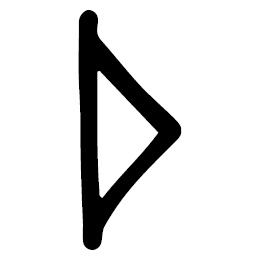

对应字母：TH

发音：THOOR-eh-saws

代表意义：门径

天体关联：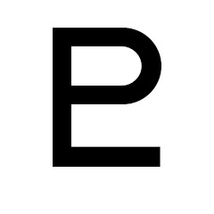 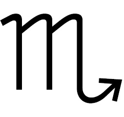

苏里萨兹与冥王星有强大的连结。冥王星与力量、改变和重生有关。在占星学上，它对应的是最爱憎分明又充满肉欲的天蝎座。

现代意义：一个新的开始即将发生，必要的改变也将随之而来。在你能展开下一个人生篇章之前，请先放下生命中那些不再适合现在的你的事物。

要诚实地面对你在新的人生篇章中想要什么。告别负面的模式、旧有的创伤和自我限制的信念。随着眼前这一章的结束，将它们都抛到脑后吧！这个放下的举动为你的情感和灵性的扩展创造了空间。

这也可能是你实现你与他人在灵魂层面的约定的时候。换句话说，某些陪伴你走到今天的人，可能不会再继续陪你走下去了。这是个苦乐参半的事实。但某些告别是必要的。随着你的扩展和成长，它们终究对你有好处。

你是来人间生活、学习、爱，并成为最幸福的你。透过放下那些不再适合我们的事物，我们才能为新的开始挪出空间。

###  停下来反思

．你渴望在生活中的哪方面做出脱胎换骨的改变？

．有哪些旧有的创伤是你紧抓着不放但必须放下的？

．当个人的转变发生时，在整个过程中，你可以找谁谈话来获得稳定和支持？

#### 总结

苏里萨兹的出现是要我们注意，将情绪的储藏室清理干净，丢掉那些对我们不再有用的东西。现在该是继续走向那在前方等待着你的更快乐、更觉悟的人生的时候了。

## 22　爱瓦兹（Eihwaz）

对应字母：Y

发音：EYE-wawz

代表意义：臣服

天体关联：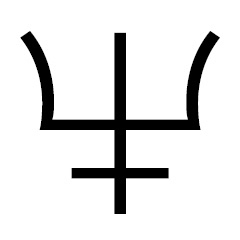 

爱瓦兹汲取的是来自海王星的能量。海王星与理想主义、灵性、臣服和超越有关。这个符文与最有智慧又最充满爱的双鱼座有强大的连结。

现代意义：此时坚持、耐性和锲而不舍是很重要的。要知道，所有的事物都需要时间；生活中最重要的东西是急不得的。虽然你往往必须看见进展，才会相信「事情正在发生」；但是你要信任现在是让事情自然呈现的时候，而不必施予任何形式的压力。

要抑制自己干涉或阻止某事发生的冲动。有时最好的行动就是没有行动。你今天采取的决定或行动，事后当你看得更多、知道得更多时，看起来将会非常不一样。此时有太多移动的组件，它们共同形成一个对你有最大利益的计划。

现在暂停一下，不要做出突如其来的举动。在行动之前，先暂停、等待，让更多的事物自然呈现。你会知道何时才是行动的时机。

###  停下来反思

．现在生活中有什么事情使你想要（也许是仓促地）采取行动？

．等待行动有什么不利的因素？为什么？

．你能区分当下反应，以及给事情适当的时间呈现之后再做出回应之间的差别吗？

#### 总结

爱瓦兹提醒我们，现在要坚持到底。但在你说或做任何事之前，先看清楚整个状况。给它时间，并只有在更多的细节明朗化之后才采取行动。

## 23　奥吉兹（Algiz）

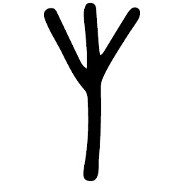

对应字母：Z

发音：ALL-heez

代表意义：保护

天体关联：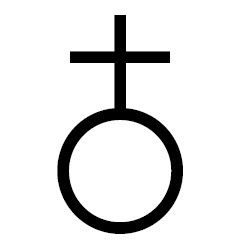 

奥吉兹与火星有强大的连结。火星唤起干劲、侵略和阳性的能量。这个符文对应的是最主动又最安静不下来的牡羊座。

现代意义：你最大的利益已经在物质界和灵界得到关切和考量。现在该是你放下生活中关于这方面的忧虑的时候了。你并不是孤军奋战，即使有时候你可能感觉如此。现在是清点你所有的祝福的理想时刻，并且了解到，有多少次你担忧着可能出现的负面结果，但它们一次也没发生。

今天创造一句个人的咒语，例如：「事物永远为我运行」或「没什么好怕的，永远有人支持我」。这一整天都重复这个咒语。当你大声说出你的咒语时，要感觉自己的脆弱感逐渐消失了。

你拥有一切必要的保护，不必忧虑自己的幸福安康。

###  停下来反思

．你在什么状况下会感到危险、不安或忧虑？

．就这件事来说，你会忧虑到什么程度？

．在极度忧虑的时候，生活中你可以找哪些人来支持你？

#### 总结

我们最担心会发生的事，其实很多都不会发生。奥吉兹提醒我们，我们那未经锻鍊的心灵制造了多少的恐惧。你是安全的；你是受保护的。要相信，事情的运作永远都会为你带来好的结果。

## 24　英瓦兹（Ingwaz）

对应字母：NG

发音：ING-waz

代表意义：生育

天体关联：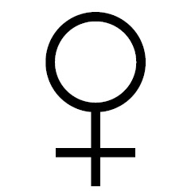  

英瓦兹与金星有关。金星以其阴性能量、唤起浪漫、爱情和美丽而为人所知。这个符文与最平衡的天秤座和最稳定的金牛座有所连结。

现代意义：发生令人意外又惊奇之事的时刻已经到来。你人生新的篇章即将展开。一个偶遇或简单的对话，就足以引发你人生的重大事件。在工作方面，它可能显化为新的职业选择或事业合作的机会；在个人方面，它可能燃起一段新的恋情或特别有意义的友谊。此外，它也可能代表想出新的创意，或真的怀孕生子。

把所有未解决的事或尚无结论的计划做一个决定，好让你在新的机会出现时，能迅速又决断地采取行动。你踏出的每一步都是肥沃的土地。今天让自己处于准备就绪的状态，以接收和回应那些即将到来的好消息。

###  停下来反思

．想到「肥沃的土地」这个词时，你心中浮现的第一个东西是什么？

．你想建构什么样的新计划、心态或经验？

．当你展开这个新尝试，你的人生将如何变得更美好？

#### 总结

英瓦兹的出现是在提醒我们，几天或几小时内就会有新的事物出现。我们已经完成所有必要的工作，现在是回报来临的时候了。对即将到来的事物保持开放，并做好全然的准备。

## 25　未知（空白）

空白的符文代表未知，意指结果尚未明朗化，所以无法告诉你未来的状况；或者是，此时你不知道未来的状况才是对你最好的。要有耐心。当时机成熟时，你就会知道更多。

如果在做每日的符文指引时抽到未知，那就再抽一次。

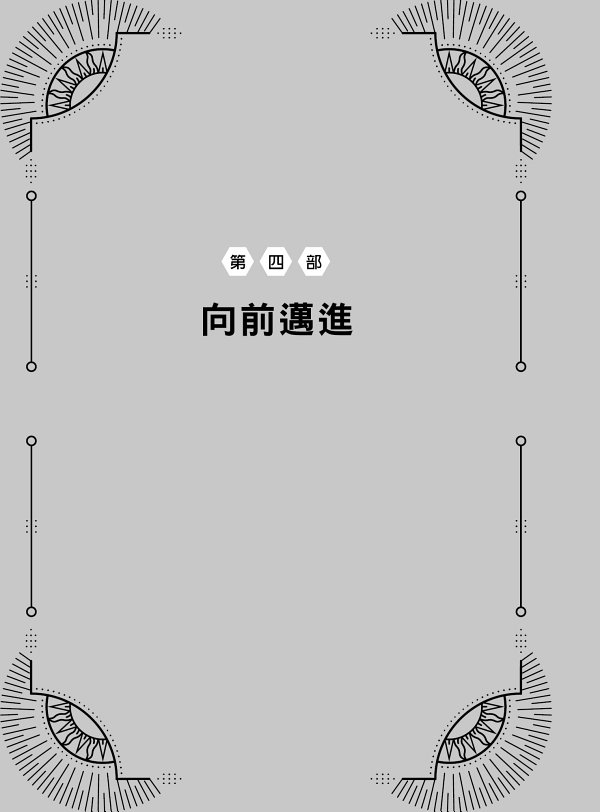

现在，你已经每天都在使用卢恩符文。当你毫不费力地使用你那创造的、直觉的一面，以及你那以事实为根据、理性的一面时，你就会知道自己的左脑和右脑有多么强大的力量。透过检视你人生的重要时刻、困难的处境和重要的人际关系，你已得到极有用处的洞见。现在，你已经养成每天练习的明确习惯，并且学会从任何状况中抽离、暂停和评估，你再也不会认为事情都是针对你而来，或视自己为环境下的受害者。

此外，你也有了让自己安定下来的新方法。你对生命有更多的了解，更重要的是，你更了解自己了。当我们是出自于对自己的了解，那么在表达真实的自己时，我们会最有自信和把握。当我们知道我们已经拿回自己的东西时，我们就会明白，我们能克服道路上的任何阻碍。我们会毫无畏惧地承认自己的感受和渴望，并且有勇气将它们大声说出来，而不害怕被拒绝或有所损失。

生活中，我们都喜欢得到他人的爱和支持，但我们能给自己最有力量的礼物是，无条件的爱自己和自我价值感。别人可能不断地告诉我们，我们又棒又讨人喜欢，但我们必须自己亲自看见、感受和了解，它才能成为事实。

卢恩符文能建立我们的凡我与高我之间的连结。每天利用卢恩符文来与自己对话，迷雾就会逐渐退去，然后我们走进觉知，走进清明，走进自己。

过去这几周，你很可能聚焦在人生的某个特定领域，譬如感情或事业。你现在完全看得一清二楚了吗？如果还没有，你可能会希望每天继续练习，或全天候使用卢恩符文来实时获得问题的答案。倘若你觉得关于那个领域，你应该知道的都已经知道了，那么你可以考虑把焦点转移到另一个领域。透过书写简单的日志，你可以开始「下一个三十天」来继续追踪卢恩符文的指引。

你也可以召唤芙蕾雅的能量来处理你的心事和感情；召唤海姆达尔的能量来获得清明和考虑周全的洞见；召唤提尔的能量来获得勇气和自信。别忘了，他们的故事之所以流传数百年就是要提醒我们，我们的内在都具备芙蕾雅、海姆达尔和提尔的力量。既然我们的英雄和女英雄都必须面对及克服逆境才能达成他们的愿望，我们自然也不例外。

另一种让卢恩符文进一步融入你的生活的方法，是教导朋友如何使用它们。或者有人征询你的意见时，你可以透过符文签的启发，提供朋友高层次的建议。如同我先前提到的，你可能闭上眼睛就能在心中看见符文，而不必用到实体的符文。每个人的过程都不一样。

## 和卢恩符文爱好者一起探索

如果你渴望知道更多关于卢恩符文的资料，并想与其他爱好者一起探索卢恩符文，我建议你使用社群媒体，因为卢恩符文在网络上已有一批忠实的追随者。

先从脸书开始。以下三个私密社团使我获得启发和学习：

．版主怀尔德．杭特（Wylde Hunter）的 Runes for Runesters。如果你想知道更多关于古斯堪地那维亚人的历史和传统，这个社团是很棒的选择。大约有七千位社团成员共同分享他们关于卢恩符文的知识和热情。在此社团中，你可能会遇到我所谓的正统派，他们并不认为卢恩符文与创新可以同时并行。不过，人各有所好。大家都是在这个社团学习并自得其乐，但里头可是卧虎藏龙呢！

．我也很喜欢 All Pagan, Norse & Heathens。虽然这个大约有两千位成员的社团比较小一点，但很有亲切感和一家人的感觉。他们会贴上他们刚出生的「小维京人」照片，或请大家为受伤或生病的人祈祷。版主李．梅林斯（Lee Mellings）把社团经营得有声有色。

．另一个很酷的社团是 Norse Rune Writing/Translating，大约有一万五千名成员。版主奎恩．福尔曼（Quinn Forman）非常用心地管理这个社团，以确保大家都能尊重彼此的态度和文化差异，因为私密社团往往会有不当的言论出现。当成员有东西需要翻译时，他们也经常在此发出贴文。

在 YouTube 上，你可以观看学者杰克森．克劳弗德（Dr. Jackson Crawford）的影片，他是科罗拉多大学的教授和古斯堪地那维亚的专家。克劳弗德的频道开播两年以来，已累积超过八万五千名忠实的追随者。他同时也是很棒的节目主持人和作家。如果你喜欢学术方面的事物，找杰克森就对了。

此外，马克．金德斯（Mark Kinders）在 TEDx 一场关于卢恩符文的演讲也很精采。金德斯是奥克拉荷马大学公共事务部门的副主任，他在演讲中探讨了在北美洲发现的卢恩符文雕刻图案。他同时也是美国卢恩符文研究协会的副会长，该协会是致力于在欧洲和北美推广卢恩符文学术研究的非营利组织。

## 建立你自己的卢恩符文圈

或者，为了持续你正面的动力，你可以考虑跟一群和你一样想活出真正的生命的积极又有助力的朋友，共同组成一个卢恩符文圈。与转向内在寻求神圣的指引同样重要的是，我们必须藉由互相加油打气，鼓励彼此坚定地走在自我实现和幸福的道路上，来为我们这些志同道合的人建立一个典范。因为我发现我认识的那些最幸福的人，最后都是被嫉妒他们的自由和光芒的人击垮的。不过，芙蕾雅可以解决这方面的问题。

组织每个月聚会一、两次的卢恩符文圈，你就创造了一个诚实又开放的安全空间，而不必担心他人的评断。为了测试本书，我与六位杰出人士组成我自己的卢恩符文圈，他们都是我的知心好友和灵魂的姊妹。这些令人赞叹的人都是企业家。尽管周遭有许多墨守成规、爱唱反调的人，但他们还是在商业界毫无畏惧地追求自己想要的人生。

我的卢恩符文圈的部落成员如下：全人的企业教练、女性力量和冲突解决教练、直觉作家兼画家、沟通谘商师、夫妻共同经营一家拥有六百名员工的公共事业公司的女老板、我称之为「最后一年当别人员工」的刚崭露头角的企业家、洗车公司的老板。我们会在隔周的星期五，透过视讯分享关于我们抽的符文签出现的模式，以及我们正在显化哪些惊人的结果之类的事情。我们乐于彼此互相支持，好让我们能从旧有的创伤中得到疗愈，并成长为神圣的存在。

另一种持续动力的方法是下载卢恩符文解读应用程序，它提供你简单的方法来抽每一天的符文；你可以透过简便的数位抽签，寻求卢恩符文的指引。此外，你还可以直接在应用程序上写日志来追踪你的旅程。如果你想要为自己的卢恩符文圈扩展人气和结交新朋友，你也可以与那些志同道合的女神们见面。

不管你做什么，我都鼓励你继续学习、成长、指导和分享。我希望这三十天的旅程能为你带来清明、自信和幸福。愿你的下一个三十天会更好！

图：George Peters Designs

# 后记

我刚开始撰写《卢恩符文占卜自学手册》时，我那只十岁大的萨摩耶犬柯迪（我亲暱地称牠为「我的第一个孩子」），每天都会陪着我写作。清晨四点，柯迪会跟着我起床，在厨房陪我煮一壶咖啡，然后跟着我进到家里的办公室，挨在我脚边陪我打字到天亮。萨摩耶犬是源自于白狼的最古老的知名犬种之一，牠们非常聪明、淘气又爱叫。柯迪就是这样子，而这让我更喜欢牠。我会告诉人家，柯迪的标语是「我喜欢干么就干么」。我老爸则会说：「柯迪就跟她妈一样。」哈哈，或许吧！

柯迪在二○一九年生病时，牠的检验报告尚无定论，但兽医认为牠可能是胃癌或肠癌，或者两者都有。我简直不敢相信。在每天的祈祷和静心中，我都很放心牠不会有事的。尽管如此，我们还是开始让牠接受积极性的化学治疗。前四个月左右，牠的反应还不错。接着，不到三天的时间，牠的病情就急转直下。

「不可能。」我心想：「我静心时一直都与柯迪的灵魂连结，牠告诉我牠没事的。」

在牠生命的最后一个早晨，我们在壁炉旁的沙发上坐着，柯迪的头靠在我的大腿上。我深深地感受到牠对我的爱。时间彷彿静止了。我进入静心的状态，并请求再次连结柯迪的灵魂。牠充满爱意地告诉我，牠是我的灵魂伴侣，牠会以我想要的任何形式回到我身边。我告诉牠，我多么珍惜我们十一年来在一起的日子——我们的远足、驾车旅行和一大早的时光。我想要牠成为另一只萨摩耶犬再回来。牠毫不犹豫地告诉我，牠会「马上回来」。牠继续告诉我，牠不害怕，在我身边牠觉得很幸福。我抱着牠，感谢牠为我的生活带来喜悦。

在柯迪离开的同一个星期，小科诺在一百二十公里外的城镇成为受孕的胚胎。如你所知，「科诺」这个符文代表对新的可能性开放，它鼓励我们让生命自然呈现。科诺现在已经四个月大了。在我打这些字的同时，牠就在我的书桌旁边睡觉。科诺是以年轻强壮的新身体回来的柯迪。灵魂是全知又无限的。看着科诺的眼睛，我知道牠就是柯迪。

我比以前更相信，当你心中有爱，并且相信你的愿望都可以成真，那么任何事情都绝对是可能的，只要你有信心的话。

要敞开，信任，相信。

怀着爱与感恩的

迪蕾妮雅

# 致谢

谨以此书献给生命曾遭受精神疾病影响的人们。我的人生受到梅莉莎（Melissa）和戴安妮（Dianne）这两位母亲极深的影响，而她们被上瘾症打败了。然而每一次的失落，都为我带来深刻的个人成长和灵性成长，从而使我想要帮助别人解决他们的痛苦，并发现我们每个人都拥有的天赋和祝福。每个人来到这世上都是有目的的。愿本书能启发你去发现自己的目标，并将你无尽的爱分享给世人。

本书十分之一的版税将捐给美国安全基金会（Safe America Foundation）。该机构为非营利组织，其宗旨在于提升意识及减少诸如毒品、人口贩卖、自杀等社会问题的威胁。

# 建议阅读书目

Blum, Ralph. The Book of Runes: A Handbook for the Use of an Ancient Oracle. New York: St. Martin’s Press, 1983.

Davidson, H. R. Ellis. Pagan Scandinavia. New York: Thames and Hudson, 1967.

DuBois, Thomas. Nordic Religions in the Viking Age. Philadelphia: University of Pennsylvania, 1960.

Dumèzil, Georges. Gods of the Ancient Northmen. Berkeley: University of California, 1973.

Farnell, Kim. Runes: Plain and Simple. Charlottesville, VA: Hampton Roads Publishing, 2006.

Findell, Martin. Runes: Ancient Scripts. Los Angeles: Getty Publications, 2015.

Flowers, Stephen. Runes and Magic: Magical Formulaic Elements in the Older Runic Tradition. New York: Peter Lang, 1986.

Fries-Mandrake, Jan. Helrunar: A Manual of the Runic Magick. Newburyport, MA: Red Wheel/Weiser, 1997.

Lindow, John. Norse Mythology: A Guide to the Gods, Heroes, Rituals, and Beliefs. Oxford, UK: Oxford University Press, 2001.

McKinnell, John. Meeting the Other in Norse Myth and Legend. Suffolk, UK: Boydell and Brewer, 2005.

Melville, Francis. The Book of Runes: Interpreting the Ancient Stones. New York: Wellfleet Press, 2016.

Mountfort, Paul Rhys. Nordic Runes: Understanding, Casting, and Interpreting the Ancient Viking Oracle. Rochester, NY: Destiny Books, 2003.

Page, R. I. Runes: Reading the Past. Berkeley: University of California Press, 1987.

Pollington, Stephen. Rudiments of Runelore. Little Downham, UK: Anglo Saxon Books, 2008.

Rydberg, Viktor. Teutonic Mythology: Gods and Goddesses of the Northland. Urbana-Champaign: University of Chicago Press, 1906.

Thorsson, Edred. Futhark: A Handbook of Rune Magic. San Francisco: Red Wheel/Weiser, 1984.

——. Runecaster's Handbook: The Well of Wyrd. San Francisco: Red Wheel/Weiser, 1999.

——. Runelore: The Magic, History, and Hidden Codes of the Runes. San Francisco: Red Wheel/Weiser, 1987.

###### BC1094

#### 卢恩符文占卜自学手册：
厘清烦恼、了解他人、寻求指引，30 天连结高我
Rune Reading Your Life: A Toolkit for Insight, Intuition, and Clarity

作者／迪蕾妮雅．黛薇丝（Delanea Davis）

译者／谢明宪

责任编辑／田哲荣

协力编辑／刘芸蓁

封面设计／斐类设计

内页构成／欧阳碧智

校对／蔡昊恩

发行人／苏拾平

总编辑／于芝峰

副总编辑／田哲荣

业务发行／王绶晨、邱绍溢

营销企划／陈诗婷

出版／橡实文化 ACORN Publishing

地址：10544 台北市松山区复兴北路 333 号 11 楼之 4

电话：02-2718-2001　传真：02-2719-1308

网址：[www.acornbooks.com.tw](http://www.acornbooks.com.tw)

E-mail 信箱：acorn@andbooks.com.tw

发行／大雁出版基地

地址：10544 台北市松山区复兴北路 333 号 11 楼之 4

电话：02-2718-2001　传真：02-2718-1258

读者传真服务：02-2718-1258

读者服务信箱：andbooks@andbooks.com.tw

划拨账号：19983379　户名：大雁文化事业股份有限公司

印刷／中原造像股份有限公司

初版一刷／2021 年 6 月

定价／420 元

ISBN 978-986-5401-65-8

ISBN 978-986-5401-66-5(EBUP)_V1

版权所有．翻印必究（Printed in Taiwan）

RUNE READING YOUR LIFE: A TOOLKIT FOR INSIGHT, INTUITION, AND CLARITY by DELANEA DAVIS Copyright © 2020 by DELANEA DAVIS

This edition arranged with NORTH ATLANTIC BOOKS through Big Apple Agency, Inc., Labuan, Malaysia.

Traditional Chinese edition copyright © 2021 Acorn Publishing, a division of AND Publishing Ltd.

All rights reserved.