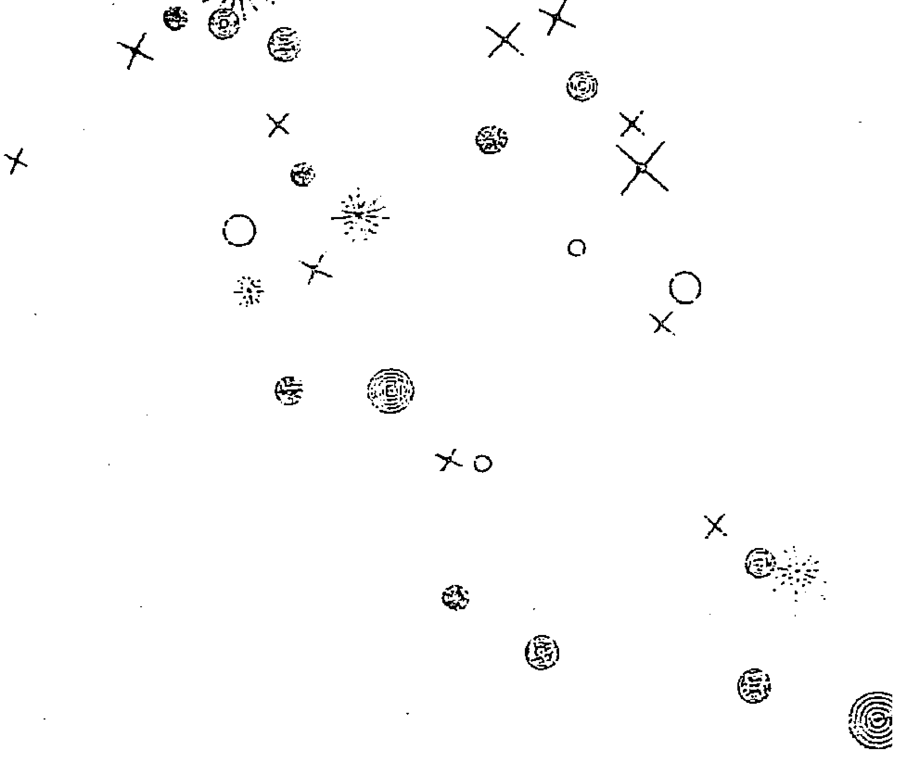
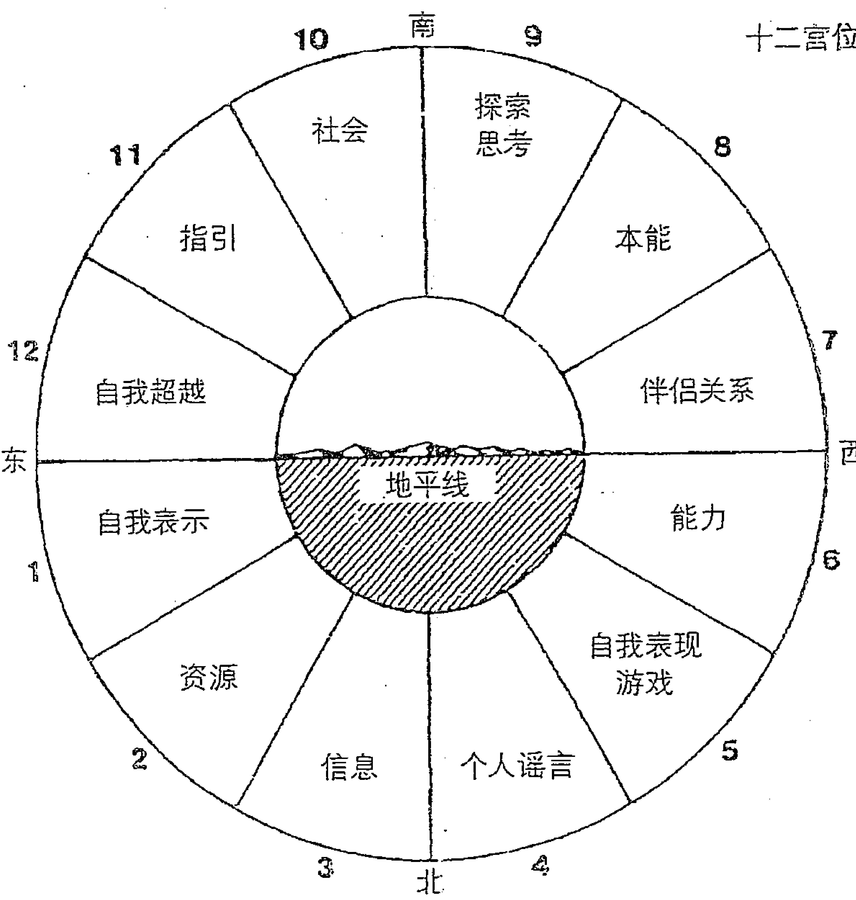
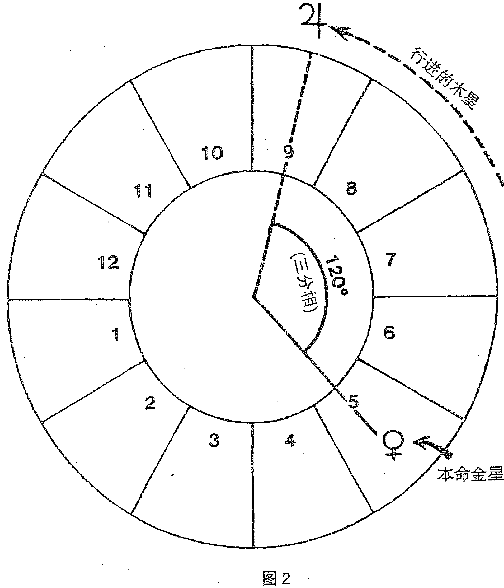

# 变幻的天空

# 作者简介

斯蒂芬·福里斯特（Steven Forrest），生于1949年，进化占星学的创始人之一，当今世界最有影响力的占星大师之一。1971年毕业于美国北卡罗来纳大学宗教学专业。1984—1988年间，出版了《内在的天空》《变幻的天空》和《昨日的天空》三本占星经典著作，奠定了他早期在占星学界的地位。迄今为止，斯蒂芬出版了12部占星著作，在世界占星学界享有很高的声誉。他是屡获国际占星大奖的世界顶尖占星师，充满智慧与人文情怀。

# 译者简介

付凌宇（Cora），占星师，星象作者。中国传媒大学毕业，进入若道星文化从事占星学相关工作，并接受了系统的现代占星学教育。2013年8月在北京参加ISAR（国际占星研究协会）职业占星师资质认证项目并通过考试，成为国内第一批获得ISAR认证的中国占星师（CAP）之一。目前为占星咨询师及自由撰稿人。新浪微博：@DreamerCora 微信公众号：lingyudiantai（“聆宇电台”的全拼）

# 译者序

## 翻译缘起

现代西方占星学，在国内被越来越多的人所熟识，是最近几年的事。我身边有许多同学、同行、朋友们，都在积极地为占星学在中国的发展付出努力。这种努力，即便不是“完全无私的”，至少也是真真切切地受惠于这门关于生命的学问之后，希望它的光芒有机会被更多人了解，从而让更多人的生命从中受益。而在我们现在所处的这个时代环境下，无论国内还是国外，占星学仍然是受到普遍误解的一门学问，这跟我们人类认识自己、认识宇宙的根本态度有关。相信随着越来越多的占星同仁们的努力，随着人类整体意识的发展，这种现状必定会慢慢改变。因为人类历史的发展历程屡屡向我们证明，真理可能阶段性地蒙尘，但不可能永远被埋没——何况占星学的有效性，是那么显而易见的一件事。

我能在一个还比较年轻的时候，就接触到这门帮助人发现生命的学问，并有机会接受系统、完整的现代占星学教育，这一直是我觉得非常幸运的事，常感恩在心。所以也希望有所回馈。用斯蒂芬老师爱用的一个比喻说就是，“在这条（占星学的传播与发展的）链条上加上我的一环”。而参与到这推动占星学的传播与发展的进程中，跟许多有着共同兴趣的伙伴一起努力，也让我的十一宫的北交点，得到很多鼓励。

我是在2012年初的时候，通过立品的试译而最终确定接下这本书的翻译工作。当时与立品图书约定的交稿时间是2012年6月，即用半年的时间完成翻译。但由于我个人的工作效率和其他方面的一些原因，这个交稿的时间一拖就被我拖了两年多。虽然在跟斯蒂芬老师的一些沟通中，获得了他的体谅，但心里还是感到很惭愧。在此首先要对一直期待这本书出版的朋友们和立品图书负责这本书的编辑们说声抱歉。

关于我翻译这本书的缘起，其实并没有什么特别，但偶然中或许也有它的必然。这要从2011年初说起，那个时候，我还在若道星文化做全职的笔译及文章编辑工作。那时国内的占星学生态，可以说已经有了不少“星星之火”，一些较为知名的占星学（或已具备较强专业特征的星座研究的）团体或个人，都在不同的人群和平台中各具影响力。同时也已经出现一些持续两三天到十天左右不等的、面授的小班课程，一般被称为“工作坊”。但那时，至少是在大陆地区，尚没有为一般大众打造的、系统完整的占星学教学出现。与之对应的，占星学中的许多专业术语的译名，也没有统一的标准。

然后在2011年5月份时，若道占星开始了第一届“职业占星师资质课程”的全年网络课。我那时作为负责组织翻译及校对课程教案的员工，在接受了专业占星学教育的同时，也熟悉了大量概念、术语的用法和译法。这成为我后来有机会翻译《变幻的天空》这本书的一个重要铺垫。到2011年底时，立品图书的编辑闫亮找到我，说要给斯蒂芬老师的这本书《变幻的天空》寻找译者——由于若道占星的创始人之一大卫·瑞雷老师所著《灵魂的目标》便是通过立品图书出版，而大卫老师在北京的第一场工作坊也是由立品主办，所以我和闫亮彼此都有一定的了解并始终保持着联系。所以她在想要为这本占星学书籍寻找译者的时候，就想到了我。我那时很明确地表示我有兴趣，可以说是毛遂自荐。她于是从书中摘出几页给我试译，试译的结果她觉得可以，于是就确定了由我来翻译这本书。

在接下了这本书的翻译工作后的两年多近三年的时间里，我的生活的各个方面，也出现了很多变化，包括从若道占星辞职而成为一名独立占星师。这个充满变动的过程带给我很多成长，也伴随着很多痛苦和教训。而这本书的翻译，作为贯穿这两年多的一个工作，也承载了我的许多记忆和情绪，成为一段生活的象征。

关于翻译这本书的缘起，就说到这。下面我会为大家总体介绍这本书的内容和结构，帮助大家提前了解这本书的全貌，以便更有效地进行阅读和学习。然后我会对书中所使用的一些术语的译法，做些简单的说明和澄清。

## 全书内容简介

首先大家可以从目录中看到，这本书不算“前言”和“附录”，共分为“四个部分”。

第一部分可以说是全书内容的思想与原则的奠基，包括第一章至第三章的内容：

第一章是“谁在掌控”，这部分的内容一言以蔽之，是在阐述一种“以人为本”的、让占星学服务于人的自由意志的占星理念。这一章明确了作者使用占星学的基本原则立场，也为书中所提出的各种预测方法提供了“指导思想”。

第二章“快速回顾”，是带领大家对本命占星的内容做简单的回顾，包括行星、星座、宫位、相位系统的简单介绍和关键词描述。这部分的内容，具体应参考斯蒂芬老师的《内在的天空》。

第三章是“预测之本”（Root Prediction），也可以翻成“根本性预测”。这一章旨在说明，掌握出生星图本身所呈现的信息，是进行占星预测的基础。所谓“预测之本”，即是指出生星图。

第二部分详细介绍占星学预测方法——“行进”（Transits），包括第四章至第七章：

- 第四章是“行进的定义”，介绍行进的定义及作用，特别是指出了使用行进时要注意的一些基本原则。这一章是“行进”这一部分的原理和方法总结，后面三章则介绍了行进在不同层面上的三种应用角度。

- 第五章“老师与把戏师”，具体介绍了不同的行进行星的功能和影响。“老师”（Teachers）和“把戏师”（Tricksters）都是人格化的说法，“老师”代表一颗行星发挥其正面意义、帮助我们成长的那一面，或是我们对这颗行星的能量的正向回应；“把戏师”则代表一颗行星表现出其负面特质、妨碍我们成长的那一面。这两个人格化的代称会在全书中反复出现，也进一步表达了作者的“反宿命论”立场。

需要提醒的是，在这一章中，斯蒂芬老师只对运行较慢的木星、土星、天王星、海王星和冥王星使用了“老师”和“把戏师”的称谓，并相应地分了两种情况来讨论。而对同样在这一章中加以介绍的行进的火星、金星、水星、太阳和月亮，则没有赋予它们“老师”和“把戏师”的角色，而是强调它们的“触发”功能。因为作者只将那些移动缓慢、能够为一段较长的时间“定下主题”的占星要素称为“老师”和“把戏师”——所以在第三部分也就是“推进”部分里，我们会看到有一章是“更多的老师与把戏师”，那便是介绍在推进系统下，移动缓慢、能够书写长期生命主题的占星要素。

- 第六章“宫位的周期”，介绍了行进的行星经过某个宫位的一般性解读方法，以及十二个宫位各自代表了怎样的进化过程。

- 第七章“人生的周期”，介绍了移动较慢的木星、土星、天王星、海王星和冥王星的运行周期，以及由这些相对稳定的运行周期导致的、我们在特定的年岁会经历的特定的人生转折。这一章介绍了适用于“所有人”的、具有普遍意义的“人生的周期发展规律”。斯蒂芬老师在书中称这种规律为“生物心理剧本”（Biopsychic Script）。

第三部分详细介绍占星学预测方法“推进”（Progressions），包括第八章至第十章：

- 第八章“什么是推进”，介绍了推进的一般性原理及功能，重点介绍了“次限推进”（Secondary Progression），同时也简要介绍了其他六种推进方法。

要特别提醒的是，从第九章开始，书中所出现的“推进”，均指“次限推进”。也就是说，行进和次限推进，是作者主要使用的两种占星预测方法，也是本书的重点。

- 第九章“更多的老师和把戏师”，具体介绍了推进的太阳、水星、金星、火星、上升点、天顶的功能和影响。与前面的第五章形成某种呼应。

- 第十章“推进月亮”单独介绍了推进月亮的功能和使用方法，并分别论述了推进月亮经过十二个宫位和经过十二个星座的含义。

第四部分教导如何将前面所有的内容加以整合，应用于实践当中：

- 第十一章“放在一起”，给出了将前面所有的内容整合到实际应用中的具体方案，是非常重要的“干货”。

- 第十二章“艺术家、传教士、疯子”，是以艺术家梵高短暂又富有戏剧性的一生为例，来具体“演示”了如何应用书中所介绍的方法，来描述一个人的一生。

- 第十三章“天气工作”，是对全书内容的一个总结，是“收尾”。

从这个内容梳理就可以看出来，斯蒂芬老师在本书中是尽可能以一种“逻辑化、条理化”的方式来组织全书内容的。书中不仅提供了知识性的描述，也阐明了作用原理和使用规律——是一本被当成“教材”来用的书。

需要说明的是，虽然在国内，斯蒂芬老师更多地被看作“进化占星学”的代表人物。而“进化占星学”，通常被认为是以“轮回转世”的观点为基础的占星学。但本书中，并没有任何涉及到“前世”或“轮回”的内容（想了解这部分内容请参考斯蒂芬老师的另一本书《昨日的天空》），虽然也会出现“此生的进化”这样的字眼，但也都是立足于我们当下的人生，试图探讨让我们更好地走过这一生的可能性和方法。所以，无论你对“轮回说”持怎样的态度，都不会影响到你对本书的阅读，也不会影响你利用书里所介绍的方法和占星理念去帮助自己做出更好的人生选择。

在这本书中，斯蒂芬老师一方面使用了非常通俗易懂的语言来跟读者交流（并配以大量生动的名人实例），另一方面，也保持了内容的专业性和结构的逻辑性、条理性。所以，相信只要是有基本的本命占星基础的人，要读懂这本书都不会太困难——也能够从这本书中获益。

另外，给读者的两个提醒是：

- 1）本书中斯蒂芬老师用的分宫制为 Placidus，因为书中的案例分析会涉及到宫位，使用不同的分宫制有可能导致情况跟书中所描述的不同，特此说明。

- 2）本书的“第三部分”和“第四部分”，准确地说是从第九章开始，出现的所有“推进”都是指“次限推进”。这一点作者在第八章中已经有过交待，不过考虑到或许有读者不是按顺序阅读本书的，那么可能会漏掉作者在这个问题上的说明而在阅读后面的内容时出现概念上的混淆，所以在这里先提出来一下。（在前面的“内容简介”中也有提醒。）

# 翻译说明

## 1. 术语统一译法问题

占星学术语的译法的确定，历来是一个非常重要的问题。我跟《昨日的天空》的译者路瑶（Lucia）做了一些调查并商量后，共同确定对以下术语统一译法如下：

- 1）五个主要相位（Major Aspects，也称“托勒密相位”）

| 英文 | 译法 |
|---|---|
| Conjunction | 合相 |
| Sextile | 六分相（没有使用“六合”的译法） |
| Square | 四分相（没有使用“刑”的译法） |
| Trine | 三分相（没有使用“拱”或“三合”的译法） |
| Opposition | 对分相（没有使用“冲”的译法） |

另，除了这五个主要相位之外的次要相位，在书中只出现过一次，是150度相位。为跟上述主要相位保持命名逻辑上的统一，使用了“补十二分相”的译法（其实也可译为“十二分之五分相”），而没有使用更加通俗的译法“梅花相位”。

- 2）两种常用的预测方法

| 英文 | 译法 |
|---|---|
| Transits | 行进（没有使用“行运”的译法） |
| Progression | 推进（没有使用“推运”的译法） |
| Secondary Progressions | 次限推进（没有使用“次限推运”的译法） |
| Secondaries | 次限 |

## 2. “关键词”的选用

接受过专业占星学训练的学生会知道，理解并掌握某种占星学象征符号（行星、星座、宫位、相位）的“关键词”，是占星学习中非常重要的一部分。而有些英语词汇，一直没有特别固定的、被广泛认同和采用的译法。在这里我列出了这本书中常出现的、比较容易有争议的几个关键词的翻译，供读者了解、参考：

- 1）Tension，作为“对分相”的固定关键词，译成了“张力”而不是“紧张”或“压力”。

- 2）Harmonization 或 Harmony，用于表达“三分相”的状态时，译为“调和”；用于表达“天秤座”或“金星”的状态时，译为“和谐”。

- 3）Assertive / Assertiveness，作为“白羊座”的固定关键词，大部分情况下译成了“果决的”/“自我决断力”，个别地方用了“坚持自我”。

- 4）Integrity，作为“摩羯座”的固定关键词，译为“操守”而不是“正直”或“完整”。

此外，还有一些是斯蒂芬老师比较喜欢用的对某颗行星的固定称谓，不属于翻译的问题，但也在这里提醒一下，比如“红色的星球”是指火星；“戴着指环的行星”是指土星（因为土星之外的“土星环”非常明显）。

# 关于“进化”

斯蒂芬老师作为进化占星学的倡导者，在这本书中虽然并未提及“轮回转世”相关的内容，但是大量使用了“进化”这个词。“进化占星学”，即 Evolutionary Astrology，也有翻译成“演化占星学”的，其实都是一个意思。“进化”或“演化”，听起来都有些神秘的味道，我觉得它们都准确地实现了对这个概念的“表意”功能，但却可能给大众带来一些误导，至少是距离感，也就是“不接地气”——就像“灵性”这个词一样。

作为一个在身心灵圈子“耳濡目染”多年的人，我对“不接地气”或是把一些东西“神秘化”这件事，不是很喜欢。因为这一方面会阻碍人们去接触一些本可以对他们的人生有所帮助的东西；另外，将一种力量或作为其象征的人事物神秘化之后，可能滋生出的幻想和自欺，对个人的生命发展是有害的。这可以说是一个问题在两种极端上的表现，也是我在身心灵领域所观察到的一些很真实的现象。这对一门学问的传播和发展是不利的，对大众则是一种遗憾，因为每个人都有接触到真知的权利，因为那确实是一些非常宝贵、非常好的东西。

所以，其实我个人会比较少使用“进化占星学”这样的字眼，这是出于一个占星学传播者的非常实际的考虑，我不希望有人因为这个“标签”而觉得跟这门学问之间有距离，或是将它神秘化——特别是将它放到一个高于自己对生命的真实体验的位置上。

说到“进化”，我认为那本就是存在于我们每个人身上的一种渴望，是“生”的渴望，是试图活出圆满与意义的渴望。即便不了解“进化占星学”，即便不懂占星，我们的灵魂依然是在不断的“进化”中走完这一生。只是，我们未必真的做到了“进”化（即便我们希望），我们也可能是在退，或不知道拐到哪个岔道口里去。Evolutionary，只表达了随时间展开与变化的过程，但并不保证变化的“方向”，即不一定是特指“变得更好”。从这个意义上说，将 Evolutionary Astrology 翻译成“演化占星学”，在意思的表达上，或许确实是更加贴切的吧。

但另一方面，进化占星学的核心特征之一，就是它指出了我们今生的灵魂进化意图/目标——这是它的基本理论逻辑和实践逻辑。从这个角度上说，使用“进化”一词，显然暗示了这种“方向性”的存在。

如果我可以自己为它选择一个名字，我会就叫它“个人成长占星学”，或者再加上“每个人都可以用的”。

说这些话，一方面是希望能够澄清“进化”这个词可能带来的不必要的误解；另一方面，也是因为我觉得，这样的态度，或许跟斯蒂芬老师要在这本书中表达的核心思想保持了某种精神上的一致。

国内尚没有专门论述占星学预测技巧的书籍，希望这本书的问世，可以为占星学习者们提供些帮助。

特别感谢立品图书的编辑闫亮和草原，多亏她们的督促和耐心编辑，让这本书得以更快出版，并呈现出一个更好的样子。

最后，感谢我在占星学上的启蒙恩师大卫·瑞雷老师，以及若道星文化的创始人蒋颖女士，他们是我在占星学习道路上的最重要的引路人，也是生活中亲爱的朋友。如果没有他们，就没有今天我跟占星学的一切缘分。也感谢在翻译这本书的过程中给我支持和帮助的其他朋友们。

祝大家阅读愉快。

# 前言

多年前当我开始学习占星学时，那些散发霉味的旧书总是认为占星学有惊人的威力：我将能够预知未来。对于一个缺乏安全感的小孩来说，这件事激动人心的程度不亚于知道超人家的电话号码。那些时机不对的事从此将与我无缘，比如手里拿着一个巧克力甜筒的时候却遇上了社区里的“坏小子弗雷德”，或是在我推门走进那家比萨店之前的10分钟，我暗恋的小心肝玛丽刚刚离开。有占星学为我的未来保驾护航，我觉得自己是一往无前的。

至少当时我这么想。

问题是把对生活的选择权交给占星似乎行不通，至少不是那么可靠。有时候我的预测准得不可思议。但在其他一些时候——当我自信满满、泰然自若地走进那家比萨店时，却正好碰到弗雷德和玛丽手挽手迎面跟我撞个满怀。那些书上说的并不都是对的。

占星预测的准确程度确实可以达到令人难以想象的地步，但它不可能永远准确无误地告诉你，是谁推开了那家比萨店的门。具体的事件是外在世界的逻辑，而占星学使用的是不同的语言。那些“神准”的占星预测，并不是在诉说“明摆着”的事实，是你的意识令它们得以显现，而非这个物质世界。

占星无法预测你哪天出门会撞车。它也不能事先让你知道你会在哪天结婚、哪天死亡，或是你新买的电视机哪天能送到。这类的占星预言是伪劣、不可信的，不是我们在《变幻的天空》这本书里所要讨论的内容。现代预测占星学能做的是，告诉你有关你的生命韵律的信息以及你的情绪状态，由此，帮助你处理外在生活中的事件，以最为幸福、和谐、有效的方式经验你的人生。如果它能帮你省下撞车后的维修费，或是让你少打几瓶点滴的话，那就更好了。

预测占星学带我们往比出生星图更远的方向又迈出了一步，在我的上一本书《内在的天空》中，我们所讨论的内容范围限于对出生星图的解读。那时我们关注的是个体的性格动力。现在，在《变幻的天空》这本书中，我们的讨论将延伸至另一个维度：贯穿我们的一生，星图中的能量是如何循环起落、交叠变幻的。我们将找出个性动态发展变化的轨迹，确定能量示现的高峰和低谷；看星图中的故事如何一步步展开，星图中所蕴含的种种征象如何从仅有的可能发展为真实的生活现实。

但是我们不认同随时间变化的行星能量能够代替你作决定。它们或许会影响到你的情绪状态，或许可以帮助你认识自己正在面临的自我发展上的挑战。但是它们不会制造事件。你的生活由你自己创造。

虽然宿命论也被看作是占星学历史的一部分，但它之于现代占星学的意义，就好比用水蛭吸出“毒血”治病之于现代医学的关系一样。现代占星师指出的是问题，而非答案。“算命”这一古老的行当，充其量不过是占星学杂物箱里的一件老古董，是很久以前犯下的一个错误，现在已经陈腐发霉，布满蛛网，却仍然有蛊惑人心的力量。

事实上，就在最近，这个老古董还着实给了我一些惊吓。

当时我正做客广播电台脱口秀节目。就在直播快要开始的时候，主持人递给我一篇文章，是她的父亲从当地的报纸上剪下来的。我大概浏览了一下，不禁脸色惨白。说得好听点，那是一篇批评占星学的文章。而我必须对这篇文章进行反驳，他们只给了我几分钟的时间来准备。

真正让我感到害怕的是，我根本无从反驳。这篇反占星学的文章无懈可击，将我逼入了死胡同。我被将了一军。

那篇文章引起了“异常现象科学调查委员会”（CSICOP，Committee for the Scientific Investigation of Claims of the Paranormal）的担忧。这个组织在1976年由一群科学倡导者成立，旨在揭露占星、通灵和其他“封建迷信”的骗局。这篇文章的起因是1984年的盖洛普民意调查，调查结果显示“相信占星学”的年轻人的数量比1978年时增长了1/3。委员会对此相当困扰，无法坐视不理，于是他们决定采取行动：他们给美国和加拿大的所有日报报社写信，要求他们在“每日运势”前加上一个特殊说明来警醒读者，告知大家占星预测是毫无科学根据的。调查委员会主席保罗·库尔兹对此有如下表述：“就像我们想到吸烟就知道它有害健康，占星专栏也应该有一个符合它内容属性的合适的标签。”

我害怕什么？

因为广播马上就要开始，我必须在节目上捍卫占星学——然而我发现我同意科学调查委员会所说的！他们是对的：那些运势专栏大多并不可信。就像我马上要对收音机前的听众所说的那样，那些印在报纸上的星座运势都是一成不变的陈词滥调，而且基本上是错误的。它们用一些僵化、机械的观点来解释占星是如何作用于人们的生活的，在我看来这是对全世界严肃占星师的伤害。因为写这些运势的人是如此轻松地误导了大众，完全扭曲了这门伟大艺术的本质。

现在全世界约有四亿天秤座的人（译注：本书写于20世纪80年代，当时全球人口接近50亿）。如何让一个有着正常智力的人相信，这四亿人中的每一个都像运势中所写的那样“可以在今天修补伴侣关系中的裂痕”？很可能没有伴侣。我完全同意科学调查委员会所说的——这些写运势的“算命先生”是在误导大众。如果那就是占星学，我们还是离它远一点吧。

科学调查委员会和我是奇怪的盟友。

我们的蜜月期恐怕持续不了多久。我同意大众有权了解更多关于占星学能做什么、不能做什么——不过我猜关于如何澄清这个问题，我和科学调查委员会的观点就无法再保持一致了。他们使用了这样的描述：“以下占星预测仅供娱乐消遣，无可信科学依据。”而我会这样说：“占星学是人类最古老又最精确的心智地图。然而，它并不能准确地预言事件。行星扣住了你人生一半的牌，另一半在你手里。你在星象的大幕下做出的具体选择，决定了你生活中真实发生的事件。”

我们是自由的。那些死板、宿命的预言不可能圈住我们的人生。再凶险的征象，只要我们具备足够的创造力、智慧和真心的自我欣赏，它都有可能转化为我们生命的养分——而再耀眼夺目的星图配置，也禁不起懒惰这只蛀虫的腐蚀。

“迷信”的面纱长期遮蔽了现代预测占星学的真正目的——它的目的不是“预言事件”，而是帮助人们做出更好的选择。占星预测能够勾勒出一个人正在攀援跋涉的心理地貌并阐明其本质；它就像一个有力的盟友，在永无止境、不可预知的浩瀚路途中协助我们，去创造未来。

现代预测占星学所描述的并非命运，而是存在于真实世界中的自由。这自由加冕的世界，受限于种种严苛的现实条件，却又被奇迹笼罩着。

这本书将教你如何做出准确的占星预测——这些预测经得起任何形式的检验。不过这本书不会告诉你会在什么时候拿到下一张超速罚单。现代预测占星学的目标是燃起觉醒与自主选择之火，而不是用板上钉钉的预言来将这团火浇灭。我们所预测的是内在的地势形态，而非外在。

占星学是一门手艺，就像任何手艺一样，它并不存在什么固有的神秘属性。只需想象力加上一点耐心，你就能够对它熟练应用。我写这本书的目的，就是为实践占星预测这门手艺提供一个清楚的介绍——这是我在20年前刚刚开始学习占星学的时候就希望能够看到的一本书。《变幻的天空》并不是一本理论著作，它是立足于现实世界、寻常生活的一本书，我希望是如此。这本书中的一切论述和方法都经过了我自己的占星学实践的检验。就我在占星学上的知识和经验而言，这本书中的观点和准则都是正确的。不过，我只能通过我自己的眼睛去看这个世界。如果你眼中的世界跟我所看到的有什么不同，那么，相信你自己的眼睛！没有任何一个人能为占星学下定论。

《变幻的天空》只是通向古老的神秘锁链上的又一环，这链条可回溯至新石器时代拜月者清澈的眼神，回溯至远古时代大地女神聪明的孩子。占星学的故事源远流长，在埃及、中国和中美洲的大地上蔓延流转，生生不息。它们冲刷着希腊群岛多石的海岸，毕达哥拉斯曾在那里漫步驻足。基督降临于双鱼时代的开端，有占星师“在东方的天空看到了属于他的星星”，从而预言了他的降生，他的门徒们则将占星学中“鱼”的符号当成他们自己的图腾。占星学渗透在人类理性传统的源头之中，现代天文学、物理学和心理学的发展都曾受到占星学的影响。在文学和语言中，在艺术和音乐中，也都有占星学的影子。尽管超自然科学调查委员会断定占星学是无稽之谈，但占星学确实促成了人类社会步入20世纪以来许多领域的重要发展。近年来，许多杰出的占星师在为占星学寻找有力的科学依据。

在本书后面的章节中，我们尊重占星学在过去的成果，但我们不会被其束缚。占星学不是宗教。事实上，你们将在此书中读到的很多内容，归功于现代心理学，它是孕育于占星学的众多叛逆少年之一。

如果你对占星学完全不了解，只是刚刚开始在这条漫长的锁链上寻找你的栖息之地，或许你可以先读读我的第一本书《内在的天空》，为即将开始的探索之路做些准备。那本书是关于出生星图的，会为你介绍占星学的基本符号象征体系。虽然我已经努力让这本书适合初学者阅读，但它描述的是“随时间作用于出生星图的力量”，是在第一本书基础上的、本系列图书的第二本。

我和我的妻子计划很快合著第三本书——是从占星学的角度来解读关系的一本书，但那是另外一个计划了，在此不表。

斯蒂芬·福里斯特  
查珀尔希尔，北卡罗来纳州  
1984年冬至

## 第一部分

## 创造未来

## 第一章

谁在掌控

1960年10月，当行进火星经过马丁·路德·金的上升点时，他因在佐治亚州的亚特兰大领导了一场静坐抗议而被逮捕。他展示出了极大的勇气，拒绝交付保释金，拒绝承认自己的行为构成了“犯罪”，于是他被关进了监狱。几个月后，欧内斯特·海明威也经历了同样的行进，他将一支上满子弹的猎枪对准了自己，然后扣下了扳机。

一个是自杀，一个是公民的不服从。一个是自我毁灭，一个是非暴力抵抗。这其中有什么共性？火星的“意义”又是什么？

在历史上，火星是战神。它象征着存活的意志，是在人类灵魂深处熊熊燃烧的原始的、纯然的生命之火。这团火在我们每个人的心中暗自闷烧，推动着我们去克服日常事务中的各种障碍，以及战胜那些在自我最深处的静谧空间里如幽灵般潜藏的巨大黑暗。

这种诠释能够帮助我们理解马丁·路德·金对抗种族歧视的英勇行为，但是欧内斯特·海明威选择结束自己的生命，又作何解释？

海明威的自杀，放到古往今来的算命先生们眼中，将是非常合乎情理的一件事。因为在对星图的解读持宿命论观点的人看来，火星声名狼藉。他们称火星为“凶星”，并将它与暴力、危险和心胸狭隘联系到一起。这种看法是错误的吗？并不完全是，但真相远没有这么简单。火星确实有它面目可憎的一面，但是这丑陋的一面是我们每个人在任何时刻都有可能表现出来的。我们每个人都会有冷血、残暴、背信弃义的时候，无论是对别人还是对自己，也不管我们是不是愿意这样，但这只是火星能量的一面，它的另一面是勇气。

我们会选择哪条路——勇气还是毁灭？在面对可能到来的挑战时，我们会勇敢地捍卫自己，还是夹着尾巴逃掉，并把房门紧紧关上？这两类行为都是“火星式的”。它们都是这颗红色星球引动了我们出生星图中的某个敏感点时，可能出现的一贯反应。我们会如何应对呢？我同情过去的占星师们。他们觉得有义务对这个问题进行解答，但这是一个不可能的任务。我们可以把行星在一百万年间的运行情况都研究个遍，却依然无法靠近那个谜底丝毫。传统的占星预测，在很关键的一个原因面前败下阵来：行星不会代替我们做出选择。我们自己的决定创造了我们的生活。欧内斯特·海明威是可以选择活下去的。马丁·路德·金也可以落荒而逃。

> 火星设下舞台，但是不同的人写出各自的剧本。

### 不确定性

“你将会遇到一个高个子、黑肤色的家伙。”对于占星学的嘲讽总是包含这样一些煞有介事的论断，并且说这话的人，通常是一个满口牙齿都掉光的吉卜赛老妇人。然后我们就笑了，我们也完全有理由笑。但是当你在这个吉卜赛老妇人面前坐下，然后她准确地描述了你如何在一年前辞掉了工作，随后又继续预言你将在三年后离婚，这时你可能就笑不出来了。我们开始害怕，继而抗拒，然后或许是认命。最要紧的是，我们感到面对命运的无力，就好像有一些奇异的、超出我们理解的神秘力量在掌控我们的人生。“她确实不可能知道我辞掉工作那件事……我搞不懂……我太太最近好像真的对我有点疏远了……”

算命者的成功，并不能仅仅用碰运气来解释。他们能给出准确结果的概率，比盲打误撞的概率要大很多。他们当中技巧最娴熟的人或许能够说对一半的内容，这已足够唬住任何人。50%的准确率，多么令人吃惊。但是那其余的50%呢？这些占星师也常常会出错。

无论他所说的最终结果是对是错，一个看看你的星图就告诉你，你的婚姻即将破裂的人，都是在侮辱占星学，也是在侮辱你。那些星图中的符号是无法让人满意的。你不是一个木偶，那些年复一年在你的星图上穿行而过的行星，并没有给你的四肢系上绳子。那些老旧的观念，导致了你对占星学的严重误解，并在人们心中引起了不必要的担忧和恐惧。占星学的力量在于提出问题，而不是给出答案。它抛出一个个谜题，而每一个谜题，都有许多种解法。有些解法能够令我们活得更加快乐、投入，其他一些则只会让我们搬起石头砸自己的脚，在存在主义的阴沟里越陷越深。这其中最坏的结果或许就是用猎枪爆掉了自己的脑袋，这可以是个比喻，或者不是。我们会选择哪种解决方法呢？这要取决于我们对待生命的独创性、我们的决心，还有勇气。换句话说，我们是自由的。

自由，是充满魔力的两个字。每一个人都想要自由。每一个人都提倡自由，渴望自由，声称愿意追求自由。但自由到底是什么呢？大部分时候，自由被等同于快乐和安宁。事实上，“不确定性”或许才是自由最好的同义词。而不确定性，是另一个充满魔力的词汇，但却不像自由那样讨人喜欢。人们普遍对不确定性避之唯恐不及，就像在寒冷冬季的早晨避开路面上混着烂泥的冻结的水坑。然而不确定性也被收入了占星学的象征体系之中。没有一个占星师能够断定一个人下一步会如何行动。占星师或许能够描述命运的舞台是如何搭建的，在那一时刻可能要面对什么样的问题，以及盘主如果选择在命运的巨轮碾来时“躲为上计”，等待他的会是什么。同样，占星师也能告诉我们，如果我们对所经历的生活做出积极的反应，那么我们能够从中学到什么，以及每一种选择背后所蕴藏的崭新的可能，诸如此类。但你下一步会怎样做？没有人能够回答。

相信命运还是自由意志？当然，老派的占星学观点是宿命论的精髓。“土星正在接近你的太阳，准备好迎接厄运吧。”那么现代占星学会持相反的意见吗？全都是自由意志的结果？不，至少不完全是这样。占星学接纳这个悖论的两面。某些特定种类的事件确实是“命中注定”，其他一些则充满不确定性，未知的选择尽数敞开。举个例子，当火星经过你的上升点时，我们比较有把握的是，你将经历一段心理上的紧张期，你的勇气将遭遇挑战。这很大程度上可归为“命运”一栏，但你会如何回应——像马丁·路德·金那样拿出钢铁般的意志与困境作战，还是效仿欧内斯特·海明威扣动你命运中的那把猎枪，将自己的生活爆成碎片——这个问题的答案，就如同明天赛马比赛的结果一般不可预测。

是问题，而非答案：这是准确理解预测占星学的核心所在。我们必须尊重人类的自由，并将它整合到我们对于占星学的符号象征体系的理解中去。我们必须这样做，不是为了保持某种更好听的、更让人宽心的哲学立场，而是因为人类的意志具有强大的力量，大到足以塑造他们自己的未来。简而言之，任何精确的占星预测最终必然要以一个问题作结。书写我们的人生剧本的，不是行星，而是我们自己。不确定性正是与这种自由相伴而行。

### 三个层面

生命是一个广袤浩瀚的整体，充满神秘和反讽意味。大部分试图将它掰开揉碎来分解其构成的努力，在最好的意义上是激发智力的头脑锻炼，最坏的结果则是徒劳的自我欺骗。任何这样的分析系统，无论我们称之为宗教还是科学，衡量它的标准都只能是它在现实层面上产生的实际效用，而不是看它是否代表了终极真理。那终极的普遍真理或许能够被见证，但不可能被精确地描述。使用任何言语或方法都显得力有不逮。至少在我看来是这样。

有种观点将一个人的经历划分为三个层面，这看似武断，却对于我理解预测占星学大有助益，非常实用。它说的是，我们的生命过程是在三个不同的层面上展开的。第一个是最明显的，即物质层面，它包括我们的全部所作所为，和一切我们可能称之为“现实”的事物——去欧洲旅行，关系的开始和结束，以及“遇到高个子、黑肤色的家伙”之类。

第二个是情感和心理层面。这个面向的实质内容是想法和感受，是我们对第一个层面发生的客观事件所可能产生的所有内在的、主观的反应。比如辞掉工作，这是一个事实，是一个发生在第一个层面上的经历。但是我们对这一事件的感受是怎样的？恐惧？欣喜？向往着攀登新的高峰？感到不安全？这是第二个层面的事。

最后，在第三个层面，我们迎来了有关意义和目的的问题。我们可以把这个层面称为灵性层面，虽然我们在理解时不一定非要把自己想象成是特别“有灵性的”。有种办法能够帮你体验到第三个层面——想象你正回顾那些发生在许多年前的事。你最终发现那些事件的意义是什么？它们是如何让你成为了现在的你？我们将在第三个层面获得一种觉知，了解到所经历的事件是如何被嵌入了我们的整个发展模式之中。通常，这样的自省能够让我们重新调整对某些事件的记忆，在其中加入一定的自我觉察，而这些觉察，是当时的我们所无法体会的。“妈妈很少抱我们，但是当我们表现得乖巧懂事时，她就会给我们糖吃。”在那个时候，我们一有糖吃就很高兴。20年过去了，第三个层面的意识开始觉醒，我们或许会逐渐了解到，在我们的强迫性暴饮暴食的模式中，“爱 = 食物”的等式扮演了怎样的角色。这个时候我们好像能够站在自身之外，去理解我们的生命模式——这是第三个层面，或说灵性层面的要旨。

对于第三个层面发生的事，占星预测的准确度是惊人的。这也是它的真正目的和根本力量。首先，占星学是对于意义的研究，而意义只发生在灵性层面。占星师这一层面上的预测可以达到100%准确，虽然在实践中涉及的象征意义常常是难以置信的错综复杂，人的因素总会导致一些错误。我在这个时候需要学习的是什么？这件事在我的整个生命发展蓝图中有什么更加深远的目的？20年或30年之后，我会怎样看这段时光？这些是我们在第三个层面要问的问题。如果我们想从这个角度来理解我们的生命，那么没有什么比全面地掌握占星学的符号象征系统更有帮助。

回到第二个层面，即情感和心理面向，占星预测技巧的准确度一落千丈。它仍然有重要的意义，但比起我们能在第三个层面所进行的精准描述，还是差了一些。一个人在面对那些灵性议题的时候，会有什么样的感受？不同人的反应可能非常不一样。比如，这里有一个涉及土星的占星事件，这总是一个确定的信号，说明它所带来的灵性功课，需要你以务实、自律的态度对客观现实做出反应。或许对某个人来说，他能以一种焕然一新的坚决、自尊和果敢做出回应。而另一个人经历到的或许是匮乏感，以及随之而来的挫败与绝望。这些功课本身存在于“命运”的目录里，但那些情绪反应是由我们自己创造的，我们也必须为之承担起个人的责任。但是这个由土星触发的实际事件的性质是什么呢？这不是我们在占星学的第二个层面所要讨论的问题——在这里我们只关注感受和态度，而不是“实际发生了什么”。

第一个层面，即物质层面，是可预测性最差的。面对流变的星象影响，个体会以怎样的外在行动来回应呢？当然了，这部分上取决于在第二个层面升起的感受，这些感受本身是无法预测的。但即便这些感受是我们能够把握的，关于人们可能做出何种反应，仍然存在着巨大的不确定性。火星经过海明威的上升点，这给他带来的灵性上的功课（第三个层面），包括重新注入的勇气，以及要作为肉体和精神的实体生存下来的意志。这是非常清楚的。他内在的情绪反应（第二个层面）或许是冷酷又决绝的——显然这跟火星经过马丁·路德·金的上升点时的情况是一致的。但是海明威经历了不同的情绪过程。我们无从了解他在结束自己生命那一刻心里是怎么想的，但是我们可以猜测，他对他的处境感到无望，恐惧、愤怒和毁灭性的暴力冲动将他淹没了——毫无疑问，都是火星的东西，但是跟可敬的马丁·路德·金所表现出的火星特质非常不同。但即使是现在，我们还停留在第二个层面。要向第一个层面——物质层面——探索，我们必须去想象海明威都有可能做什么。他有没有可能狠狠地踹他的狗，而不是自我了断？或者他会不会跟妻子大打出手？当然，所有这些行为都有可能。他的自杀行为绝非他的“命运”。至少，从占星学的角度上讲，我们必须认识到这是他个人的选择——只是成千上万种选择当中的一个。

试图预测一个人在面对一个灵性课题时会采取怎样的行为反应是徒劳的。我们可能时不时会侥幸撞对，但大部分时候，我们可能是错误的。去预测一个人会有怎样的感受会相对容易些，但即便是在这个范畴，还是常常会有意外的结果出现。人们在压力下所能表现出的足智多谋与灵活应变的能力，常常大大超出了我们的想象。只有在探讨人们所面对的灵性问题的本质时，我们能得到的预测结果的准确度才是可靠的——而值得注意的是，也是在这里，我们能够最大程度地帮助一个人在自知和幸福中获得成长。对第一个层面——行为层面——的执迷，是占星学发展历史上的一大悲剧。即便在这方面有再多胜利，相较因此而损失的机会，似乎仍是得不偿失——其可悲程度就好像阿尔伯特·爱因斯坦决定去做一名棒球运动员。

### 概率场

数个世纪以来，传统占星师一直被一个致命的错误缚住手脚。他们以为未来是已经决定好的。他们将我们这一辈子看成是由一系列预先注定好的事件串起的旅程。在第一个转折点，你出生了；在第23个转折点，你结婚了；在第25个，你有了一个孩子，这个孩子的降生也是一早注定好的。如此命运的巨轮持续滚动，直到第82个转折点，你踩到了命中注定的那块香蕉皮，了却此生，再睁眼时已经进入下一个轮回。人生中的一步接一步，是一次又一次的命中注定，你的一生就这样展开。你能做的只是袖手旁观，凑个热闹。

就像吉卜赛人的那些令人印象深刻的预言，这种关于生命的简化模型有两个根本的缺陷。一个是，它没有解释为什么每当我们在人生的岔路口驻足流连时，我们实际上是能够感觉到自由和不确定性的。此外，这个模型也并不是真的能对事件做出很好的预测。那些“高个子、黑肤色的家伙”并未真的出现；而有许多婚姻在被一大群占星师下了病危通知后，还毅然存活了很长时间。

不过，算命先生们总还是能说对一些东西，那么真实的情况到底是怎样的？在一件事发生前，占星学到底能够告诉我们多少？要回答这个问题，我们首先要抛开认为未来已经注定的观点，取而代之以更有效的观念。

想象一个中年商人有酗酒的问题，但他一直能够将自己的生活控制在一个平稳运行的状态。然而很突然地，经济危机爆发了。他的生意遭遇了巨大的冲击，最终失败了。他开始头疼，日渐衰弱。他的妻子跟别的男人跑了，还带走了孩子。在他52岁生日那天，银行没收了他抵押的房屋，他成为一个无家可归的人。接下来会发生什么？你会怎样预测？当然我们很容易想象他的生活被酒精与绝望日益吞噬，如同一片落叶，打着转儿掉进臭水沟里。他的未来跟上面所描述的分毫不差，确实有很大的概率。但这靠得住吗？他的自毁与堕落是已经书写好的命运吗？当然不是。这个商人完全有可能将自己从泥潭中拽出来，加入匿名戒酒会，找到新工作，开始新的生活——说不定他在废墟之上建造起的新王国，要远比他曾经失去的那个对他更有意义。这样的一条发展路径不如前一种猜测容易实现，但无疑这种可能性是存在的。是什么决定了这个男人会选择哪一条路？你可以说那是“上帝保佑”，或说那是自由意志。无论那种力量是什么，它在本质上都不属于占星学的范畴。它的源头在占星学之外的地方——如果我们希望占星预测是准确的，就绝不能忽略那个变量。

概率场，是一把钥匙，它能破解将预测占星学与黑暗的中世纪早期捆绑在一起的谜团。未来不再是命定且不可更改的，取而代之的是一种更具挑战的观点，同时也更加切合我们活出日常生活的每一天的真实感受。未来是由不断变化的、彼此交织的选择模式组成的。未来是可能性。只要我们的意愿足够强烈，我们就能使它可能或不可能发生。那个商人正走向那个存在主义的垃圾箱，这是他正在走进的那个对他起主导作用的“概率场”。如果他想被送到拘留所里去戒酒，那么他要做的只是无意识地走。但是还有其他线索被编进了有关他的未来的画卷中。这些线索具有魔力，不可预知。它们与自我更新和疗愈有关，比如拿起电话求助的能力。只要他有捱过困境的勇气和谦卑之心，这些线索就可以帮他找到出路。

预测占星学能够帮助我们区分对我们有利的和不利的概率场，但它在另一个方面的价值更加难以估量：这种占星学将帮助我们化敌为友，将不利因素转化为我们自身成长的盟友。当阻力最小的那条路对我们有害时，我们完全可以选择别的方向，这不是我们的定数。没有什么能够强制我们踏上自我毁灭的旅程，除了我们自己的懒惰，而懒惰是一种广受欢迎的消遣。人们对于阻力最小的选择总是趋之若鹜，这是为什么算命先生们的预测结果总还不赖的一个原因。传统的预测占星学里隐含了这样一个潜意识的假设，那就是，人们几乎总是会选择那些最容易走的路。这种对于人性的看法是悲观的、有害的，但很多时候也是对的。不幸的是，如果我们的目标是预测人们将会做什么，我们最有效的经验法则或许正是假设他们都会依循阻力最小的路线行事，这样我们很有可能有51%的概率是对的。但如果我们的目的是帮助人们成长，我们就必须改写这个假设。如果我们的目标是助人，我们就必须认识到，将负面的概率场转化为正面的概率场，是人类意志与生俱来的天赋能力。

- 预测占星学的全部目的，就是帮助人们了解，如何将人生的概率曲线，扭转到最能给个人带来幸福、成长和满足感的方向。

火星经过一个人出生星图中的上升点，从传统的观点看是一个不祥的占星事件。在欧内斯特·海明威的例子中，这种看法无疑得到了印证。如果海明威在自杀的前几天去找过一位传统占星师做咨询，会发生什么呢？他会被告知，他正迎来一段艰难的日子，有可能出现血光之灾，在这个短暂又充满冲突和压力的紧张时期，他最好将舱门封住。对于一个正处于当时那种心理状态下的人来说，这样的预言无异于落井下石。

但如果海明威向一位真正的现代占星师咨询，又会怎样呢？他会听到什么？那是非常不一样的内容。占星师会告诉他，他即将面临一次根本上的精神挑战。将出现一系列的事件和态度，汇聚在一起考验他的勇气、他的生存意志和他做人的基本尊严。而他的任务是以毫不退缩的决心和自控能力挺过这几天，直到火星移动到不那么敏感的地带。占星师会提醒他，在接下来的这段日子里，他很可能因意气用事而做出一些具有破坏性的事，或是有暴力行为，发生此类事件的概率曲线正处于一个比较高的水平上。只有他的勇气可以将那条概率曲线扭转到一个更加健康的方向。选择权在他手上：他可以正视他真正的敌人——他自己的恐惧，并站稳自己的立场；或者他也可以让火星能量与自己为敌，将枪口对准自己。

这样的一个占星师能够挽救海明威的生命吗？我们不知道。人们永远是自由的——选择成长或选择爆掉自己的脑袋——无论他们接收到怎样的信息。不过我们可以很有把握地说，第二个占星师的话能够帮助这个人对自己的痛苦保持觉知，而第一个占星师的话只能让他更想朝自己开枪。

读下去，学着自己使用占星学。这个了不起的工具是你的天然盟友。它不会奴役你或限制你。让星座和行星指引你，但让它们温柔地指引你，不要把它们当成暴君唯命是从，而是将它们视为可信赖的朋友。让占星学帮助你、照亮你，成为你的自由的一部分。学着从此刻的喧嚣和骚动中听到隐约从未来泄露出的神秘耳语。学着做一个编织大师，将那些生命线索织进你人生的挂毯，时刻注意到那些转瞬即逝的细节，同时也对模式的形成过程和那些更大的蓝图及规划了然于胸。把预测留给算命先生和吉卜赛人吧。让他们去发表预言。让他们去追逐那些能够被预见的事件，去对宿命论卑躬屈膝。我们的任务不是预言事件，而是创造它们。

## 第二章

### 快速回顾

杰姬是个活泼外向、快言快语的人，她无论走到哪里都能很快让人意识到她的存在。在任何社交场合，只要给她十分钟的时间，她那张嘴都能给她带来5个朋友和3个敌人。她的丈夫保罗则恰恰相反。他跟陌生人在一起时会感到很不自在，习惯了保持安静。他觉得自己是很难被注意到的一个人。

有一个房地产开发商扬言要将这对夫妇的居住地附近的一片树林夷为平地。杰姬和保罗反对这个项目，他们计划在下一次的镇议会会议上提出抗议。杰姬感到可以一展拳脚，异常兴奋，迫不及待地想让大家听到她的声音。保罗则一想到要在会议上发表演讲就非常紧张，他发现自己陷入了反复出现的白日梦当中，不断幻想自己带着一本假护照偷渡到了巴西，这令他十分痛苦。这两个人面对当众演讲的是同一件事，但是对他们俩来说这件事的意义完全不同，这是由不同个体的本性决定的。

占星学的运作也是一样。行星的力量在出生星图中穿行而过，模塑了我们生命中的事件，日复一日，年复一年。但是要理解那些事件的意义，我们必须首先理解出生星图，理解出生星图自身所呈现出的个性。对于杰姬来说那些事件会有这样的意义，而对于保罗来说它们的意义会是另外一个样子。

我在上一本书《内在的天空》介绍了占星学中34个基本的“词汇”——十二星座、十二宫位和十大行星。理解它们是解读出生星图的第一步，是为占星学的学习打基础。在这本书中，我们开始在地基之上添砖加瓦，去讨论那些在你的成长过程中对你的出生星图产生影响的占星学事件。

《变幻的天空》适合初学者阅读，但是如果你对占星学的知识一无所知，建议你仔细阅读以下几页的内容。你将会对出生星图有一个大致的了解。在此后的章节中，我将假设你已经对这些基础内容非常熟悉。

### 三个符号象征系统

#### 行星符号

- ☉－太阳
- ☽－月亮
- ☿－水星
- ♀－金星
- ♂－火星
- ♃－木星
- ♄－土星
- ♅－天王星
- ♆－海王星
- ♇－冥王星

#### 星座符号

- ♈－白羊座
- ♉－金牛座
- ♊－双子座
- ♋－巨蟹座
- ♌－狮子座
- ♍－处女座
- ♎－天秤座
- ♏－天蝎座
- ♐－射手座
- ♑－摩羯座
- ♒－水瓶座
- ♓－双鱼座

图1 行星和星座的符号

占星学的语言由3个相关联的象征符号系统组成。这3个符号系统各不相同，分别描述了生命的不同面向。

首先，是行星。这10个天体描述了心识本身的结构，将灵魂分成10个独立的组成部分。它们提供了一张关于人类意识的基本结构的蓝图。我喜欢将行星想象成我们的精神电路图：它们显示了我们是怎样被“组装”的。

在星图解读的过程中，行星回答了“是什么”的问题，因为它们指出了心识的哪部分正在被讨论。

在行星的蓝图中：

- 太阳代表了自我的形式、自我形象、基本的生命活力。
- 月亮代表了情感、情绪、直觉和本能。
- 水星代表了智力、灵活性和信息的传递。
- 金星代表了关系、审美和压力的释放。
- 火星代表了坚持自我、自我捍卫和领地权。
- 木星代表了机会、信仰和幽默感。
- 土星代表了自律、胜任和现实的考验。
- 天王星代表了个性化、革新和对循规蹈矩的反抗。
- 海王星代表了自我超越、慈悲和想象力。
- 冥王星代表了自我更新和对“干一番大事”的渴望。

星座是占星学的象征符号中的第二大基础系统。实际上，一种比较好的开始认识它们的方式是，简单地把占星学中的星座（sign）看成是天文学中的星座（constellations）。举个例子，你可能在一个没有月光的晚上出门散步，看到火星像一枚红宝石般闪耀在天蝎座或射手座的群星之间。以这样的一种观察视角，我们将行星置于更大的空间框架之内，而我们所处的地球也在这个浩瀚空间中旋转不止。

占星学中的星座（sign）和天文学中的星座（constellation）“几乎”是一回事。由于地轴运动的复杂性，占星学中的白羊座现在位于天文学中的双鱼座和水瓶座的交界处。关于这个问题，如果你想更加彻底地了解其天文学意义，可以去看《内在的天空》一书的第四章。在这里，我们只要知道星座定位了太阳、月亮和行星在银河系大背景中的坐标，帮助它们在数以千亿计的星体中确定了自身的位置。

与行星不同，星座代表了具备不同目的和内置策略的基本生命过程。每个人身上都有十二个星座的特质在共同运作，虽然在不同人身上，不同星座所扮演的角色的重要性和本质都有所不同。每个星座都能够以特定的资源和目标为不同的行星提供支持和动力。

记住，星座总跟“想要什么”有关，所以涉及到事物的优先顺序和价值判断时会存在一些潜在的设定。行星告诉我们“是什么”，而星座补充了另外两个关键问题：“为什么”和“怎样”。

白羊座追求勇气和意志力。它的策略是冒险和挑战。

金牛座追求安宁。它的策略是建立自然状态和安全感。

双子座追求信息。它的策略是好奇和交流。

巨蟹座追求进行深层情感探索所需要的安全感。它的策略是滋养者角色下的自我保护。

狮子座追求自我表达。它的策略是表演。

处女座追求完美。它的策略是分析和建设性的批评。

天秤座追求和谐。它的策略是礼貌、忍耐和对美的热爱。

天蝎座追求深度。它的策略是洞察力、自省和健康的怀疑精神。

射手座追求体验。它的策略是打破常规。

摩羯座追求效果。它的策略是操守、实际和自给自足。

水瓶座追求个性。它的策略是独立和对权威的质疑。

双鱼座追求自我超越。它的策略是想象、爱和对意识的探索。

占星学的第三个符号系统是宫位。我们很快就会讲到它们的意义，但是首先让我们从物理的角度来理解。宫位真的非常简单：它们是占星学上用于描述行星在地平线之上还是之下、在东方还是西方的术语——是通过将地球周围的空间分割为十二个部分来实现的。举个例子，当我们说某颗星“在第十宫”，这只是用占星学的语言说明这颗星在地平线之上很高的地方，就在正午偏东一点的位置。

用图形来说明这些概念要比使用文字描述来得容易。请看图2，这是一张典型的出生星图的简化版。那条水平的线代表地平线；一切位于地平线之上的，是出生那一刻可见到的天空的样子，地平线之下的一切，是在地球下方的、看不见的区域。（要注意，跟通常的地图不同，星图中左边是东方，右边是西方。）地平线的东端叫做上升，西端叫做下降。在一天的时间内，太阳或任意行星能够达到的最高点被称作天顶，最低点称为天底。

比较显眼的是12个被编号的“扇形区域”。它们就是宫位。第一宫总是在紧靠着东方地平线之下的位置。宫位序号的排列呈逆时针方向，第一宫后面是第二宫，第二宫后面是第三宫，一直到第十二宫围成一个圈。

图2 星图示意图

这个图中最外面的一圈，是十二星座。想象这个圈绕着十二个宫位以顺时针的方向每二十四小时旋转一圈，就像太阳、月亮以及其他行星那样。在这张星图所显示的这一时刻，水瓶座正从东方地平线上升起。换句话说，上升点在水瓶座。很快，随着十二星座的旋转，整个水瓶座都会转到东方地平线之上，然后上升点换到双鱼座，接着是白羊座、金牛座，一直排下去。在一天的时间里，每个星座都会从东方地平线上升起一次。

每个星座占30度，是整个圆周的1/12。每个宫位的宽度则不同，与季节和出生地的纬度有关。但是一个事实是不变的：宫位“静止不动”，而星座会“绕它们旋转”。

看图2的右侧，你可以看到第七宫和第八宫。两个宫位之间的那条线叫做宫头，在这里，第七宫和第八宫之间的这条线是“第八宫宫头”。注意这个宫头处对应的星座是处女座。同时宫头上的注释写着18° ♍，它的意思是八宫头的位置在处女座第18度（一个星座一共有30度）——如果一个小孩在这个时刻出生，那么他的八宫头和处女座18度就永远锁在一起了。实际在一张星图中，你总会看到十二个宫头所对应的星座和度数的注释。

星图的物理结构我们就介绍到这。那么宫位是什么意思呢？它们有非常实际的意义。宫位代表了12个不同的行为“领域”，是行星—星座的组合展现其能量的地方。比如，有的宫位代表事业，有的代表亲密关系，有的描述了交流的过程，等等。

在占星解读中，宫位回答了“在哪里”的问题，完成了已经由行星和星座展开的拼图。

第一宫代表的行为领域，是建立社交人格或个人的“风格”，目的很简单，就是让人们知道我们在这。

第二宫代表的行为领域，是证明给自己看，以适当的精神和物质资源来支持自我的身份。

第三宫代表的行为领域，是讲话、聆听和调查。

第四宫代表的行为领域，是回到内在，在我们的生根处创造一个避风港。

第五宫代表的行为领域，是通过游戏和创造进行自我更新。

第六宫代表的行为领域，是履行义务，习得技巧。

第七宫代表的行为领域，是建立支持性的伴侣关系。

第八宫代表的行为领域，是处理我们作为人类的基本本能，包括性、死亡和生命的奥秘。

第九宫代表的行为领域，是与不熟悉的、外来的事物相遇，定义我们的根本价值。

第十宫代表的行为领域，是通过公开声明和职业身份的确立，扮演自己在这个社会上的角色。

第十一宫代表的行为领域，是确立长远目标，并形成结盟以支持这些目标。

第十二宫代表的行为领域，是从过去中解脱，允许自己进入生命的新篇章，或进入奥秘。

占星学词汇表中的这34个基本“词汇”彼此间无穷尽的相互作用，是本命占星学的核心。《内在的天空》一书中对它们的讨论要详尽得多。在这里只是对先前的知识做一个简单的概述，便于大家理解本书中后面的内容。

### 出生星图

星座、行星和宫位在一张真实的出生星图中是如何显示的？请翻到33（XX）页（这个图不是在本章而是在下一章出现的），你可以看到19世纪的军事家乔治·阿姆斯特朗·卡斯特的星图，他在1876年的小大角战役中被印第安酋长坐牛击败。占星师马克·潘菲尔德从南北战争时期的一份占星学杂志中发现了这张星图，并将其收录于他的出生星图手册《占星名人录》（An Astrological Who's Who）当中。在下一章靠后的部分，我们将对卡斯特的星图做一些细节上的分析。现在，我们要深化我们对占星时钟的物理结构的理解。

我们已经知道星座和宫位在一张星图中是如何显示的。那么太阳、月亮和行星呢？

看看卡斯特的星图中太阳的符号——是一个圆圈中间有一个点。它位于星图中的第十二宫。第十二宫在星图的左边（东方），所以我们知道当卡斯特出生时，太阳在他的出生地的东方。当时是早晨。第十二宫紧挨着代表地平线的那条水平线，在其上方，说明在他出生的那一刻，太阳还没有升到高处，是在天空中很低的位置。就在太阳刚刚升起不久，卡斯特有了第一口呼吸，他的出生星图很清楚地说明了这一点。

差不多同样的道理，星图也告诉了我们其他行星的位置。图1列出了它们的符号标志。在卡斯特的星图中找到这些符号，就可以确定在他出生那天，每颗行星的位置。水星（☿）在第一宫，正要升起。金星（♀）在天空的高处，在第十宫。冥王星（♇）隐没在看不见的地方，在距离地平线之下很远的第四宫。在太阳的旁边我们能看到一个12° ♐ 46′的注释，这是告诉我们在他出生时，太阳在射手座的12度46分。（1度有60分。）如果他出生的时间精确地后移一天，那么太阳仍然会在第十二宫，但是它所落星座的度数会有细微的不同。

从另一个方面看卡斯特的星图。环绕在最外圈的，是星座和度数。就像我们在讲解图2时已经知道的，这些注释告诉我们每一个宫头在星座圈上对应的位置。举个例子，当卡斯特有了第一口呼吸时，射手座20度（20° ♐）正从东方升起。这个度数就是他的上升点或说第一宫宫头的位置。你可以在地平线的左端看到这个注释。（要记住在星图中左边是东方！）同样地，第三宫宫头的注释是6° ♓，说明第三宫的起始处跟双鱼座的第6度对应。

在卡斯特的星图的右下角，是一个三角形的表格，里面充满了一些符号。它们代表了相位，或说，是行星彼此间形成的关键的几何角度。举个例子，占星师们很早就发现成90度的行星之间的能量会彼此干扰。同样，关于这个主题的更详细的介绍可以从我之前的那本书中找到，不过如果你刚刚开始对占星学感兴趣，可以通过下面的图3来简要地了解不同的主要相位都有哪些作用。

### 相位表

| 相位 | 符号 | 间隔度数 | 过程 |
| --- | :---: | :---: | --- |
| 合相 | ☌ | 0° | 融合；结合 |
| 六分相 | ⚹ | 60° | 激发；刺激 |
| 四分相 | □ | 90° | 摩擦 |
| 三分相 | △ | 120° | 调和；增强 |
| 对分相 | ☍ | 180° | 张力；两极化 |

图3 相位表

在实际情况中，两颗行星精确地间隔某一角度是比较少见的，但其实只要大约成一定的度数，相位的影响力就是存在的。至于对度数的要求有多严格，即相位的容许度的规定，不同占星师的看法会有很大出入。要记住很重要的一点，一个相位的度数越精确，它的影响力就越大。根据一般的经验，我建议使用的容许度是：除六分相（60°）外，所有相位都使用7度的容许度，六分相使用5度的容许度比较合适。如果是涉及到太阳和月亮这两颗至关重要的星，我们可以将容许度扩大一到两度。

在卡斯特的星图中，木星（♃）在天蝎座8度16分（8° ♏ 16′），第十一宫。海王星（♆）在第二宫，水瓶座10度23分（10° ♒ 23′）。这意味着它们之间的角度是92度多一点——还在四分相（90°）的容许度之内。现在来看看星图右下角的相位表，找出木星和海王星的符号。顺着木星那一列往下，与海王星那一行相交，你可以看到一个小小的正方形，那就是四分相的符号。同样地，这个表格中的其他符号也都代表了这个星图中某两颗行星间的特定角度关系。

### 天空的地图

永远不要忘记出生星图就是天空的地图。占星学可不是什么过时的心理学理论。虽然它被打上了看似神秘莫测的远古印记，但它作为探索人类意识的模型其价值仍是无与伦比的。但通过这些符号了解我们自己的生命，这只是一个开始。占星学所诉说的是超越了诗意与神秘主义的人类与宇宙的联系。在占星学中，这份联系是具体的、直接的、易于说明的。它是真实存在的，即便是在最为严苛的意义上。

所有的出生星图都是天空的地图。它们显示了在一个人出生的那一刻，行星在天空中的位置。如此而已。但透过这些简单图形散发出的隐隐微光，我们却能看见奇异的反映、命运的暗示、祝福的画面和及时的警告。天空和我们的心灵实为一体。这就是占星学所要传达的信息。

## 第三章

### 预测之本

一天晚上你在杂货店的门口偶遇一位女士，你跟她是在半年前的一次聚会上认识的。她笑着问你最近怎么样，你也报以微笑，跟她说“挺好的”。

你说谎了吗？你跟她提起你的偏头痛了吗？还有你的感冒刚刚有点好转？你写了一半的小说？或是你出门前刚跟你妈妈大吵了一架？如果你真的把你的近况一五一十地告诉她，你的整个晚上可能就耗在这儿了，而且你们两个都会觉得无聊透顶。这当然就是为什么我们要说“挺好的”——也是为什么我们要加快回家的脚步，以免再碰上那些不相干的人。

生活是复杂的。每分钟都有成千上万股能量在我们身上汇聚，共同作用，此消彼长，不断平衡、强化着我们性格的基本特征。占星学能够反映这些能量，并帮助我们去理解它们、更好地利用它们为我们的生活带来的机会。这是它最为强大的地方。但是如果我们要去问星图，最近怎么样，它永远不会简洁而礼貌地回答：“挺好。”我们最好准备好花一些时间去倾听——那些偏头痛、感冒、未完成的小说等等，都是答案的一部分——并且星图传达给我们的信息可能会推翻我们对生活习以为常的假设，把我们撞出心理的安全地带，迫使我们一步步走向那令人兴奋又充满崎岖坎坷的自我发现之路。

时间分分秒秒地过去，日复一日，年复一年，我们的心境在不断变化。生活的焦点也在不断转移。今天你全心投入工作，昨天你刚刚参加了一位亲戚的葬礼，明天你要去学滑雪。这个月你专注于灵性意识的提升，你做冥想，跟随老师学习瑜伽，路过麦当劳时会扬起下巴，露出鄙夷的神情。下个月就全都是炸薯条和摇滚乐。然而在生活纷繁变化的表象之下，总有些贯穿始终的脉络。生命中存在着某种难以解释的一体性和连贯性。在所有的变化之下，有一种无比浩瀚、包罗万有的存在，它包含了生命中全部悲喜的狂欢，拼接、编排了生命中的每一个场景，将它们融合成一个单独的、多维的整体。在灵性上，我们可以称这个整体为灵魂。心理学上，它被称为自我。但是在占星学中，这个伟大的统一体就是出生星图。没有了它，占星学上的一切力量就失去了作用的对象，就不会有预测占星学。换句话说，没有耳朵，音乐便不存在。

出生星图是占星学的预测之本。它呈现了关于一个人的生命的宏伟计划，描绘了在日常生活的起起落落背后的灵性目标，指出了要达成这些目标我们可以利用的资源和策略，并警告我们如果一个人只想得到简单的答案，懒惰度日，可能要承担多么糟的后果。任何事件或可能性的显现，如果不是由出生星图本身就能够“预测”出的，则不可能对个人产生任何持久的影响。事实上，这样的事连发生都不太可能。

- 彻底掌握出生星图中符号的象征意义是成功进行占星预测的基础，了解出生星图所携带的信息从来都是做好占星预测的第一步。

对出生星图的忽略或许是人们在学习预测占星学时所犯的最常见的错误。人们常常好高骛远，没学会走就想飞——这不可避免地会让预测结果显得异常不靠谱。一位年逾古稀、戴着厚厚的啤酒瓶底般的眼镜的古文教授，不会因为火星进入他的远途旅行的宫位，就去攀登勃朗峰（译注：西欧最高峰），他也不应该这样做。我们必须时刻记住我们在给什么人做预测，尽我们最大的努力去理解和尊重他的需求和目标。勃朗峰或许只是一个比喻，这位教授在实际生活中需要翻越的“大山”可能跟他要去参加的一个国际会议有关，他想在会议上就他的论文发表演说，但是他必须克服当众演讲的紧张和飞机恐慌症。

这位教授在实际生活中面对的情境到底是怎样的？如果我们不认识他，我们永远无法回答这个问题，这也不是占星学所要做的事。这更像是算命。但是我们若能将他的本命星图纳入考虑，结合他与生俱来的那部分特质进行预测，我们的解读便有更强的针对性，能够直指人心；我们便能帮助他扩展生命，促进他的成长。对于一个出生星图中太阳合火星在白羊座的女士来说，攀登勃朗峰这件事可能让她感到热血沸腾，因为这个事件与她最基本的天性产生了共鸣。但是我们的老教授可能是一个太阳合土星在第四宫处女座、上升巨蟹座的人，对他来说，害羞和自我限制的大山已经足够他攀登了。

在这本书接下来的内容中，我们会讨论许多可用于分析生命的成长和变化模式的具体的占星学预测技巧。其中有些方法跟空间中实际存在的作用于我们的力量相关——这是我们可以称之为“宇宙天气”的那部分。其他一些同等重要的是出生星图自身固有的、内在的发展韵律。所有这些我们都会一一讲解。它们都有巨大的威力，都影响着我们的生命潮汐的起伏涨落。但离开了对出生星图的掌握，这些关于预测的方法便一文不值。这就是为什么说，出生星图，是预测之本。

### 调频收音

当你坐着阅读这本书时，你的身体实际上正沉浸在一片能量波动的海洋之中。你被各个波段的看不见的射线所淹没。几百光年之外的脉冲星和中子星所发出的 X 射线穿过你的身体。铀衰变释放出的伽马射线不断地从地心涌出。从太阳沸腾的心脏迸发而出的紫外线穿透你周身的细胞。更不要说那些人造的辐射——由 WABC、WHFS、WXYC（译注：WABC、WHFS、WXYC 都为广播电台的名字）所制造的极具穿透性的能量。想要隔离这些影响？是可以，但你得想得到才行。除非我们在海滩呆了几小时后发现皮肤在紫外线的照射下起泡了，否则，一般情况下我们根本不会注意到这些能量的存在。为什么？因为我们没有调频去接收这个信号。我们的知觉不会对这些波段的能量做出回应。如果我们想听广播，我们必须有一个收音机。

占星学的运作也是同样道理。当满月发生在特定星座的某一位置时——比如射手座的最后几度——某位女士可能手舞足蹈而另一位女士已经安然入睡。看看她们的出生星图，我们就能很快知道为什么。满月发生的那个射手座度数在第一位女士的上升点。而对第二位女士来说，这个位置一点儿也不敏感——射手座的这个度数在她第六宫的一个不易被察觉的角落，同时跟她的出生星图中的其他要素没有任何重要相位。也就是说，对于第一位女士来说，她的“信号接收频道”被调到了射手座的末尾几度，第二位女士则没有。从占星学上讲，这就是为什么同一行星作用下的两个人可能会出现完全不同的表现——一个无所事事地消磨掉了一个平凡的周末，另一个却伪造身份来到了加德满都。

如果你的收音机调到了 89.3FM，这就是你能够听到的频道。所有其他的电台仍然在发射广播，但你就是注意不到它们。出生星图就像是有缺陷的收音机，只对某些频道情有独钟。它们能收集到细微的行星能量，但只限于特定的波段。其他的就好像不存在一样。

真实的情况还要更加复杂。某种意义上讲，每一个星图都被所有波段的能量所影响，但它们的力量常常是如此微小，出于实际的考虑是可以忽略的。在一个充满电锯轰鸣声的屋子里，没有人会被蚊子嗡嗡的叫声打扰。

举个例子，当天王星经过双子座时，一个出生星图中太阳和三颗行星都在双子座的人会变得非常活跃，甚至抽风一般。这是因为他本身就“处在那个波段上”。当天王星经过摩羯座或巨蟹座时，这个人所受到的影响就要微小得多了。这个时候行星对他的影响力还是存在的，但是绝不会如前者那般给他的生活带来关键性的转折。与此类似，如果一个人的出生星图中有好几颗行星落在第四宫，那么关于这个宫位的主题——家、家庭、深入内在的工作——对她来说就是非常重要的。那些第四宫内的行星代表了一些等待被激发的潜在的力量。当一颗行星移动到她星图中的这个区域时，人生中的重大步骤就会展开，一些重要的事就会发生——这段重要的经历将对她的人生产生持久的影响。而假设有另一个人，他的第四宫内没有任何行星，那么当同样的星经过他的第四宫时，便很可能什么都不会发生。也就是说，这个人星图中的这部分被激发的潜力要小得多。这段时间行星对他的影响依然是存在的，我们也可以从占星学的角度加以分析。但是我们首先应从这个人的出生星图所指出的、生命的整体发展模式中，去判断该影响力重要性的大小。

如果出生星图本身被调频到了某个特定的议题，那么能触发该议题的行星影响便会被戏剧性地放大。

还有另一个跟我们“调频接收”占星影响力的能力有关的重要维度，在传统的占星学教材中常常被忽视。假设有这样一位女士，土星在她的出生星图中的地位至关重要——土星落在摩羯座，合上升点，同时对分太阳。换句话说，土星形影不离地跟着她，触手伸至她生活的每一个角落。她可能会以强有力的态度来面对生活，积极进取、自强不息，学习务实、忍耐、自给自足。或者她也可能走上一条低阶的道路，变得悲观、抑郁，就像算命先生们会说的那样。无论是哪种情况，土星都是她生命中的“主考官”——他那双严厉的大手，笼罩了她的全部生活，在她的生命里一手遮天，无时无刻，不留余地。无论这颗戴着指环的星球有怎样的一举一动，她都在它的波段上（译注：土星之外有一圈围绕着它的“土星环”，土星环是太阳系行星的行星环中最突出与明显的一个，本书中出现的所有“戴着指环的”行星，都是指土星。）。哪怕是土星每一天的细微移动，她都能敏感地做出反应。为什么？因为无论土星做什么，她都在听。

还是这位女士，她可能有一个出生星图中土星很弱的丈夫。他是欢天喜地、活力四射的太阳狮子，友善的天秤座月亮落在第一宫，除此之外金星的位置也很招人喜欢。他的土星落在第八宫，没有任何重要的相位。他没有任何行星落在摩羯座——与土星共振的星座——所以即便是这个波段的信号也被屏蔽了。换句话说，他的占星收音机几乎收不到土星的信号。当土星经过他的出生星图的某个敏感区域时会发生什么呢？如果你觉得他不会受到任何影响，那你便犯了一个严重的错误。几乎可以确定他是会受到影响的。事实上他的生活很可能受到剧烈的冲击。但从长远来看，这段经历对他的人生发展或许不起关键作用，而同样的情况换了他那位土星型的妻子则会是另一番样子。对她来讲，土星是“必修课”，而对他来说只是“辅修”，就好像他在高中不得不忍受微积分，但到了大学就可以将那些数学符号抛在脑后了，因为他读了新闻系。

他们在土星来袭时会有怎样的实际行为，我们无从知晓。在回答这样的问题时，占星学只为我们打出了一半的牌，剩下的牌在我们自己手上。我们能够确定无疑的是，这位女士终其一生都将有土星常伴左右。我们可以说他们是老朋友了——至少也是老冤家。然而跟她不同，她的丈夫跟土星可没啥交情，土星那种冷硬孤独的气质令他很不适应。福也好祸也罢，他的妻子能够更强烈地感知土星的运动。除非她封闭了对生命的觉察，任由自己滑向抑郁和自怜的深渊，否则她会认识到这是她生命中至关重要的转折，是她移动命运大山的时刻。如果把人比作一台计算机，那么她的情感和心理模式都已被编码成能够对土星做出强烈回应的程序。这与她的丈夫完全不同。为什么会这样？因为她的出生星图——她的预测之本——已经被设定成就是要面对这方面的挑战，她需要做的只是积极应对。

当她的丈夫面对土星的冲击时，又会发生什么呢？他跟其他任何人一样有选择的自由。他可以将命运的概率曲线塑造成他喜欢的样子——他也可以听之任之，自暴自弃，成全算命先生的负面预言。我们能够知道的是，土星的功课对他来说确实困难得多。与他的妻子不同，他的程序设定里没有这一条。仿佛一夜之间，生活便将一座现实的大山压到了他身上。困难多了，平顺少了；要求多了，希望少了。他比以往任何时候都更加孤独，摆在他面前的是铁面无情的是非题，无法蒙混过关，他不能再像往常一样，用他擅长的迷人微笑做掩护，闪进黑白之间的灰色地带，粉饰太平。土星的影响之于他的意义，与他妻子的完全不同。他得费些力气才能适应。虽然从最终的意义上看，土星事件对他的妻子的影响更大，但在面对土星作用的那个当下，他所感受到的冲击的力度，却可能大过他的妻子。对于她来说，土星压境是对她早已熟悉的问题和模式的一次强化。但对他来说，这却是从天而降的陌生经验，打他个措手不及——即便最后发现这股能量的后劲与他的妻子所经历的不可同日而语，但它在当时带来的震惊与触动却可能不容小觑。

通过这两种情况的例子，我们能够看到出生星图作为预测之本其不可回避的重要性。无论是土星还是其他行星的运动，都不能脱离出生星图做单独的解释。对个体的了解永远是我们的第一步。在此基础上，我们才能明了一个人所经历的事件对他/她的意义。

从这些例子中我们可以再提取出三条预测占星学的一般性原则。将这些要点以及后面的章节中会给出的技巧方法充分消化吸收，你的学习将更有效率，占星预测对你来说将变得容易。

- 一颗行星在出生星图中的地位越重要，它能给这个人的生命带来的持续性影响便越是戏剧化。
- 如果一颗行星在出生星图中占据了主导地位，那么它在个人出生之后的运动，也会令这个人感受更强，因为他/她被设置成，在面对该行星相关的议题时，能够更加本能地做出创造性的反应。
- 若一颗行星在出生星图中重要性微弱，但它移动到了个人星图中的某个敏感区域，那么即便从长远看来这次影响的发展性意义并不显著，但它带来的情感冲击可能是更强烈的，因为这个人要面对自己所不熟悉的、全新的挑战。

现在让我们将前面所讨论的内容整合到一起，来看一个具体的例子。看这些原理在实际生活中是如何起作用的。

姓名：乔治·阿姆斯特朗·卡斯特  
生日：1839 年 12 月 5 日  
出生地：新拉姆莱，俄亥俄州

图 1 乔治·阿姆斯特朗·卡斯特的星图

我们大部分人对卡斯特将军的印象，来源于那场令他声名狼藉的小大角战役。在那场战役中，他低估了印第安酋长坐牛的军事谋略以及他带领下的苏族人和夏安族人的战斗力，犯下了严重的军事错误。他率领下的 260 名骑兵陷入了印第安人的埋伏并遭到屠杀，这或许是美洲印第安人在这场旷日持久的战争中取得的决定性胜利。嘲笑卡斯特是容易的，我们可以把他想象成单细胞动物，一个草包。成王败寇，这是历史的评价。但让我们透过更锐利的镜片来审视他的人生，来还原他真实的样子——他也是一个人，像我们每个人一样，只是可能更容易搬起石头砸自己的脚。让我们来看看他的星图，看在他赔上自己性命的那一天，是哪些占星因素在起作用。

如同很多活得极不寻常的人一样，卡斯特将军也有一张极不寻常的星图。他是一个“三倍射手”，也就是太阳、月亮和上升点都在射手座。我们在《内在的天空》一书中已经说过，这三个位置是星图中的“三大巨头”。将它们放在一起，便构成了一个人的个人特征的骨骼。太阳显示了这个人的核心身份，月亮揭示了潜在的情感需求和动机——个人的灵魂。最后，上升点——以及第一宫——指出了这个人如何将所有这些材料加工到日常人格的流水线中，对外表现出来。正是因为这个原因，我们会将上升点称为一个人的面具。像卡斯特将军这样太阳、月亮、上升点位于同一个星座，是很极端的特例。显然，他就是为了收集丰富的生命体验才来到这个世界上，带着速度和从不减弱的强度——这是射手座的基本发展策略。他的射手座资源是丰盛、信心和热情，判断力和深思熟虑则要靠边站——如果他屈从于射手座阴影面的诱惑的话。

卡斯特的太阳和月亮在第十二宫，为整张星图增添了灵性方面的内涵，至少这可能暗示着他在人生旅途中需要面对的一课是，学习超越由他的小我和自尊严格定义的身份，以及这种对于超越的诉求给他的生命带来的两难处境。这是否意味着卡斯特私下里是一位灵性导师呢？不。我们必须记住，宫位只是生命活动的领域。我们在每个领域内的处境是好是坏，取决于我们自己。如果卡斯特成功驾驭了这一领域，那么他的自我超越会是有目的的、自发的。反之，他只能被动接受外力施加给他的考验，这也是为什么中世纪时人们称第十二宫为“灾难宫”的原因。当然，这个人身上存在美好的种子。他可以是一个活在五彩斑斓的梦幻世界的神秘主义哲学家，当他独自享受宁静时可能就是这样的。但他也有可能把生活搞得一团糟，比如喝得酩酊大醉后在视线不良的弯道上闭着眼睛横冲直撞。

上面所提到的后一种特质被第一宫的水星（语言功能）强化了，但同在第一宫的火星（进攻性）则起到了更加重要的作用。所以，他的“面具”是一个反应机敏的战士，刚猛粗暴，随时准备好了战斗。暗示着爆炸性和冲动的天王星，落在迷离的双鱼座，与他的太阳和月亮形成紧张又不稳定的四分相。土星与太阳、月亮合相，确实会起到一些平衡作用，这通常会带来审慎持重的特质。但不幸的是，可怜的土星显然遇到了它的对手。面对一个三倍射手，火星与天王星又在火上浇油，即便是那颗戴着指环的行星，能起到的作用也不过是提供一些高度发展的策略意识。

看到这里我们很可能沾沾自喜地摆出一副巫师的样子，摇头晃脑地下结论说卡斯特的星图就是一个大灾难。即便最终从结果上看卡斯特将军的结局确实令人扼腕叹息，但这不是我们能够做如此定论的理由。就算我们不尊重他这个人，我们也应该尊重他作为一个人，其生命中所包含的令人惊叹的无限可能性。他可能已经学着从自己的暴躁和极端中跳出来，用远见和幽默感，来平衡自身激烈的性格。他可能已经对自己个性中潜藏的危险有了更清晰的认识，如果他没有沉浸在自己的骄傲中忘乎所以的话。但显然他没有做这样的选择，于是被生命中的一条最基本的法则下了判决：凡是你没有意识到的，必将被你经历到。导致卡斯特将军在小大角战役中一败涂地的，不是占星学，而是出于顽固的恐惧而拒不向生活学习。

在 1876 年 6 月的那一天，当卡斯特将军带领着他的军队奔赴地狱时，天上的星星在说什么呢？其时，土星和火星都正在经过他的出生星图中非常敏感的地带。在中世纪，这两颗星都是“凶星”，它们的同时作用是非常不吉利的。换做现代占星师可能不会那样悲观，但肯定也能迅速意识到卡斯特已经来到了一个人生的重要关口。他现在面临一个选择，除非他能在自我意识水平上有一个飞跃，塑造自己命运的概率曲线，否则他便是正在踏上一条不归路。

土星——两颗行星中运行较慢的那一颗——为整个事件搭起了舞台。它正经过双鱼座 9 度——出于某些原因，这是卡斯特的星图中异常敏感的一个点。土星正在合相卡斯特的出生星图中的天王星，同时四分他的太阳和月亮。这说明什么？就像我们在本书的下一部分会详细说明的，土星的经过总是暗示着某种与现实的对抗。上一代的占星作者格兰特·莱维（Grant Lewi）曾将其比喻为“宇宙工资单”，意味着在它的影响下，你能得到的，都是你应得的，无论好坏，丝毫不差。我们可以做梦，可以自我安慰，可以用不实的想象编织一张网来保护自己——但一旦土星来到我们的出生星图中的敏感点，这些心理上的空中楼阁便会轰然倒塌。有着“射手座三巨头”的卡斯特将军，可能认为自己有不死之身。他确实曾是常胜将军，鲜有失手。但在小大角一战中，现实（土星）与他过度的自我膨胀（射手座的太阳和月亮）产生了冲突（四分相）。他一意孤行的冲动（天王星）也参与其中（土星与天王星合相）。

土星停留在这些相位的容许度内的时间，要持续好几周，那么在 1876 年 6 月 25 日这一天触发事件的是什么？毫不令人吃惊，答案就在战神火星上。火星那一天位于巨蟹座 20 度，与卡斯特的出生星图中的行星能形成两个高度紧张的相位。这颗火星四分卡斯特的冥王星，对分它自己在卡斯特出生时所处的位置——卡斯特的本命火星。它们共同书写了故事的走向。

在卡斯特的出生星图中，冥王星落于白羊座第四宫——第四宫是代表“英雄”和“阴影”的领域。强势的冥王星落于此，并且是在一个属于战士的星座，很明显这个人有着强烈的好战天性和掌控欲。现在与攻击性和领地权（火星）有关的摩擦（四分相）又给他带来了新的压力，让这座火山里的岩浆愈加翻滚沸腾。火星对分出生星图中的火星，令他的凶猛暴戾达到了一个顶点，而土星带来的现实压力下的挫败感可能进一步扰乱了他的阵脚。卡斯特的出生星图中隐含的毁灭力量被推向极限，一定有些什么要裂开。这会是他的自我意识的一次重要突破吗，还是算命先生的又一次胜利？

卡斯特有可能做不同的选择吗？火星已经让他的肾上腺素激增，他正自信满满地率领自己的部队迈向那片死亡山谷，他还有救吗？当然了。他完全可能冷静下来，及时醒悟，撤军回营重新部署，派一队侦察兵先去摸摸情况。这是完全有可能的，甚至这样做才符合逻辑。但从占星学的角度上，我们要问几个更重要的问题：此时的占星因素给他的影响有什么灵性上的目的？这个人应该从中学习什么？

土星是要教他关于现实的一课，而土星四分太阳和月亮，我们能够知道这一课的内容是关于现实有时是如何与个人的盲点和个人偏好发生冲撞。想象一下，当卡斯特离灾难越来越近，只是这时如果突然有一声土星的撞击清楚地掠过他的脑海：“这里到处都潜伏着愤怒的苏族人和夏安族人。他们的首领是一个巫医，可能是一个非常有谋略的军事家。这些印第安人是在捍卫自己的家园，为家人的性命而战。他们知道我们来攻打他们了。我正带着我的人马来到河边的一个可疑的拐角处。现在，如果我是坐牛……”

现在加入火星的影响。它正经过卡斯特将军的第七宫，对分他第一宫的本命火星。第七宫传统上讲是“婚姻宫”，但实际上这一宫位的意义要更加丰富。它涵盖了那些我们视为与自身对等的任何人，以及我们与之结成某种相对稳定的关系的人。在一些中世纪占星学的书籍中，第七宫也被描述为代表“公开的敌人”。这是非常准确的。那些长期让我们无法忽视的“势均力敌的对手”，成为驱策我们努力的动力，逼我们拿出实力追求卓越，这是一种典型的第七宫的联系。任何有过长期伴侣经验的人都能对婚姻宫的这一面向心领神会。

面对火星的影响，卡斯特要怎样做才符合成长与进化的需要呢？作为对土星带来的现实考验的延伸与具体化，火星在这里清楚地传达了这样的信息：“卡斯特将军，你遇到对手了。本命火星在第一宫的你，是一个强大的战士。但是现在站在你对面的，是另一颗火星，另一个意志，与你不相上下，并且已经准备好应战。你不需要投降，但是你最好不要低估你的对手。尊重他，不要犯错误，你有一半的胜算。”

显然卡斯特忽略了这些警告，刚愎自用地率军迎向那场已为他们准备好的腥风血雨，让他的军队也伴随着他的狂妄自大一起陪葬。占星学只是提出问题。人们给出自己的回答。就像我们每一个人一样，乔治·阿姆斯特朗·卡斯特是自由的——然而可悲的是，这只能是一句令人颤栗的墓志铭了。

在第一章的最后，我们问了这样的问题，如果欧内斯特·海明威在自杀前一个礼拜向一位现代占星师咨询，会是什么样的结果。现在我们想象一下这如果是发生在卡斯特身上会怎样。他会意识到“占星天气”正在对他步步紧逼吗？可能结果是一样的。真相只有在被听到时才是有用的，而听到它不是一件容易的事。如果他在自己不管不顾的骄傲和荣誉感里面陷得太深的话，他很可能无法敞开他的心去听别人的意见，哪怕只是占星师的短短几句话，这样无论占星师的分析多么有说服力，他还是会进入那个山谷，走向惨败。但如果他不像我们以为的那样鲁莽自负呢？如果他已经就要领悟生命在这个阶段要给他上怎样的一课呢？如果他已经处于智慧和蜕变的边缘，就要迎来意识的飞跃呢？占星师的警告会不会成为那个起决定性作用的推力——推动历史朝另一个方向展开？我们无从知晓，但这些问题，才是现代占星学的血液和灵魂。

卡斯特命丧黄泉。他的选择已经做出，无法更改。但我们的生命还在继续，也就因此存在于一个充满奇迹的空间里。过去的时光已经在我们身后冻结，然而在我们的前方铺展开来的不是命运，而是由各种概率曲线交织缠绕而成的谜样的网，等待着我们去检验、选择、塑造。很多人已经无数次在生命的岔路口做出了正确的选择。但是也有很多人在他们自己的小大角战役中一败涂地，我们被自己的骄傲怂恿，成为我们自己释放压力的牺牲品。或许当我们像那样伤害过自己几回，才能渐渐咽下自己的骄傲，开始寻求盟友——朋友、宗教、心理治疗、精神领袖——都有帮助。占星学所起的作用也是一样的。

让我们继续咀嚼这门古老的语言，一开始你可能会觉得很另类，然而又有一种奇特的熟悉感。在《内在的天空》这本书中，我们学习了如何诠释预测之本，破译出生星图中的符号密码。现在让我们走得更远，不仅看这幅长长的画卷如何在我们的整个人生中展开，也看它在每年每月、每分每秒的细节图景。我们的占星学盟友为我们准备了聚焦更加锐利的功课。现在就让我们听它说。

## 第二部分

## 行进

## 第四章

### 行进一：定义

地球就像是游乐园的旋转木马上一匹小马，以大概每秒钟 18 英里的速度围绕木马的中心旋转。它每 365 天绕太阳一周，轨道接近圆形。在这个太阳系的旋转木马上，只有两匹小马走得较快——水星和金星。其他行星的运行速度要慢得多，它们距离太阳越远，运行速度就越慢。火星——速度仅次于地球——约两年半绕太阳一周。在火星之后是木星，它走得更慢，绕太阳一周要 12 年。向这架旋转木马的外缘看去，我们视线模糊，那是我们遥不可及的神秘地带。但据我们现有的知识，冥王星是距太阳最远的那匹“小马”，所以也是走得最慢的。它行程漫长、步履迟缓，绕太阳一圈要两个半世纪。

如果我们可以站在太阳上看这架旋转木马，或想象得更好一些，可以坐在宇宙飞船里，从太阳系之外的浩瀚星际中的某处看它们，所有这些行星的运行轨迹，我们都能看得一清二楚。然而实际情况是，我们观察这些行星的视角并不那么稳定，我们是坐在旋转木马的某一匹小马上去看其他木马，这就给观察带来一定的混乱。我们自身的运动与其他行星的运动叠加起来，让它们在自己的运行轨迹上呈现出时而加速、时而减速甚至停滞不前的状态，而这一切似乎没有规律可循。虽然太阳系的结构和运作真的十分简单，但我们人类还是要花一两万年的时间去搞清楚它到底是怎么一回事，这丝毫不奇怪。

每一个夜晚，我们仰望天空，可以看到火星在群星编织的天幕中一点一点地向前移动，突然它停下了脚步，转身往回走。与此同时，金星赶上了火星，后来居上，与火星逆向前行。火星走走又停了，又开始掉头尾随金星，现在它们的运行方向相同。然而金星的速度更快，火星渐渐落后。它们都在逼近走得更慢的木星。金星首先超过了木星，火星还在后面追赶。出人意料的是，金星停步，开始逆行，回身投奔木星的怀抱，当它与木星再次会合时，正好火星赶了过来。一次大冲撞？不，它们之间的距离不会让碰撞成为可能。但这种行星能量的结合却很有可能给地球上的某个人带来巨大的心理冲击。在这里我们遇到的是一个火星、金星和木星的三倍合相，如果这个合相落在你星图中的某个敏感度数，你可要系好安全带。

从地球上观察到的这种行星的移动，是预测占星学中的重头戏，我们称它为“行进”。在接下来的几章，我们会给出详细的讨论。（要学习如何观察行进，请参见附录 1。）

- 行进是站在地球的角度观察，行星围绕太阳所做的真实的物理运动。

就像我们每天晚上可以观察到行星在星空的背景下移动，我们也能够记录行星在以出生星图为背景时的移动情况。这个技巧——行进——是预测占星学的核心技术。

还有其他一些预测技巧。每张出生星图中都存在着自身发展的特定韵律，它们跟天上行星的运动无关，这些规律被称为“推进”，是本书第三部分的主题。现在，我们先来学习观看天空中行星的舞蹈。要做到这点，我们需要回到我们进行占星研究的最基本工具——我们的眼睛上来。

很多人声称“不信占星”，但令人吃惊的是，他们中的很多人都承认满月会让他们感到某种惊恐——满月是占星学中有关情绪和非理性的古老象征。在此月相的影响下，人们的情绪反应或多或少都会有所增强，很多人对此都深有体会。比较流行的说法是，满月会带来一些浪漫的风流韵事。在实际观察中，它似乎也会引发忧郁、狂躁、精神错乱。就好像情感的闸门在此刻被打开了，各种情绪奔流而出、一泻千里；是好是坏就难说了。甚至还有一些科学研究可以证明月亮能够影响我们的情绪：在 1966 年，杜克大学的伦纳德·拉维兹发现，精神分裂症患者的电势变化，即正电荷或负电荷度数的变化与月相的变化密切相关。正常人在临床观察中也有类似的变化，但没有那么明显。拉维兹的发现间接支持了这个占星学上的古老假设，即古人所相信的满月能够让疯狂的人愈加疯狂，给他们制造特殊的紧张与混乱，这确有其事。

月相是讨论行进事件时最明显和不容置疑的例子。它们的影响存在于每一个当下，无时无刻不在作用于我们的生活，换句话说，这种力量为我们的情绪涂上底色，为我们的经历奠定基调。显然我们的老祖宗们对这片天空的认识比我们要深刻、清晰得多，他们很快觉察到了满月对于集体情绪的影响——或许这个发现就像一颗种子，整个占星学的艺术—科学体系的参天大树由此生根。相比对月相影响力的认识，出生星图的观念出现得晚很多。意识到人们在满月时会变得更加紧张不安，和发现生于满月之时的人比一般人更加神经质，显然前者更容易。

每个月都会有一次满月。有时候它只是不留痕迹地经过，不会给我们带来个人方面的影响。但也有一些时候，它就像克格勃悄悄潜入了我们的家，在我们早餐的咖啡里加进一些荷尔蒙。为什么有的满月能给我们带来很大冲击，其他一些就让人没什么感觉？答案在我们的出生星图里。虽然行进可能更容易被观察到，但把握出生星图本身所传达的信息，才是为占星注入了真正的生命力。就像我们在上一章中看到的，出生星图就像一台“收音机”，只接受特定波段的信号。如果我们调频到双子座中部的度数——比如说出生星图的月亮在这个位置——然后正巧有一次满月就发生在这个度数，那么我们性格中非理性的一面可能会有一次集中爆发，这种躁动又喧闹的情绪氛围可能会持续笼罩我们好几天。而一个月后，当满月发生在巨蟹座中部，我们可能又成了冷静自制的铁面判官，想尽各种办法要“制服”我们上房揭瓦的巨蟹座朋友。

天上的电影每天都在放映，出生星图却始终如一。出生星图所揭示的生命模式是错综复杂的，蕴藏着我们生命中的全部可能性——我们的人际关系、社会使命、为人处世的风格、审美方位、子女家庭、灵性观照等等——所有这些都在我们的出生星图中有所显示。无论天空的投影在出生星图这块幕布上映现出怎样的剧情，星图中固有的模式始终都摆在那里。出生星图呈现了人类灵魂参差多态的复杂面向，但我们不可能将这些四散纠缠的灵魂谜题同时破解。某一个月我们可能打起十二分精神处理工作上的问题，几周后，我们在工作上进入“自动反应模式”，这时我们开始将注意力放到婚姻或孩子上。为什么呢？是什么将你生命的指针先是拨向了金星，然后又指向木星，牵引着你将能量用在不同的地方？答案在行进里面。

- 行进调节着出生星图中原有的问题，并进行定时，将活跃的问题变成客观事实。

预测占星学是一座错综复杂的迷宫，存在着很多精细微妙的分析技巧。但我们的首要任务，总是对这门复杂的象征语言抽丝剥茧，让我们行进的路线图变得清晰有序、井井有条。如果我们能够遵照一些既定的步骤谨慎处理，行进信息就能从星图中一跃而出，变得活灵活现。这很像在一丛开得繁茂的杜鹃花中寻觅一只色彩艳丽的蜂鸟。一开始斑驳的颜色混杂在一起，我们无从辨认。不久你终于辨识出了它的形貌，将它从身后的大背景中剥离了出来，然后你就再也不会忽略它。行进也是这样从出生星图的大背景中跳脱出来，但是你要按部就班、充满专注地仔细审视才能发现它。一旦我们定义了我们的基础词汇表，你很快就会学到该怎样做了。

顺便说一句，对一些占星书籍中给出的现成的行进解释，要有怀疑精神。如果你清楚地知道自己在做什么，那样的资料会是有用的，但是在学习行进的初期，去看那些工具书式的解读，你会大失所望——那看起来就像是一堆杂乱无章的说明罗列在一起，彼此之间充满矛盾。为什么？因为它们违背了占星预测的首要法则——忽略了出生星图。

### 触发点

在对行进的理解中，相位扮演着至关重要的角色。如果你对相位的理解还很模糊，那么回头去看看我们在第二章中给出的复习材料。简单地说，相位就是出生星图中行星之间所成的几何角度——若是讨论行进的话，就是出生星图中的行星和行进行星之间的角度关系。它们反映了心灵的不同“配件”之间的关系的基本性质。

举个例子，图 2 所显示的行进的含义是，一个人的攻击性、领地意识（火星）与他对现实状况做出清晰评估的能力（土星）相融合（合相）了。在这里，我们发现火星在几个星期内在黄道上划下了一段不小的弧度。但在这条弧线上只有一个点，让这颗红色的星球与出生星图中的土星完美结合，形成准确的合相。此后，随着火星继续前行，这两种心理功能可能形成一种存在张力（对分相）的状态，或是相调和（三分相）。如果你的记忆一下子跟不上，第二章中给出的相位表可以给你一些快速的提示。

图 2

行星总是能刺激我们的意识水平进入一个更高的层次。星图中的故事等待着光阴来讲述。以行进天王星为例，当它与出生星图中的行星形成相位，与此相关的主题会进入我们的意识领域——或许一些戏剧化的事件也会相伴出现。换句话说，行进行星是引爆事件的触发点。其触发事件的具体性质取决于相关行星本身的特质，以及行星所形成的相位。我们以美国的第一位女性宇航员萨丽·赖德为例，来分析一个行进的例子。我不知道她的具体出生时间，所以无法给出她的星图，但是我知道她的出生日期是 1951 年 5 月 26 日。由此我们可以知道，她的太阳和火星合相在双子座的前几度。因为没有具体的时间，所以我们不知道这个合相落于星图中的哪个宫位，但是我们能够确定的是，她一生的发展主题围绕着好战崇武的阳性能量展开，这是她的生命进化的基本动力，让她在不断迎接外在挑战、直面恐惧的过程中发展出勇气和力量。换句话说，冒险是她的灵丹妙药。合相发生在双子座，加入了另一个层面的解释：她的冒险活动要求脑部能量的高度专注，同时也是她渴望惊奇、挑战常规的意志的反映。

是不是一个占星师看看她的星图就能断定有一天她会乘着航天飞机冲进外太空呢？当然不是。但是他多半能预见到类似的事发生在她身上，也会从她充满冒险意味的星图中提取出她生命中的基本动力，并且他肯定也会注意到，在 1983 年年中的几个月，她的太阳和火星的能量会被极度强化，这也就是她乘航天飞机升空的历史性时刻。

为什么？因为天王星在那时正经过射手座的前几度。或许这段时间你除了睡觉就是打电动，而你的妈妈又织了几条毛衣。但对于萨丽·赖德来说，行进天王星来到这个度数足以把她震到天上去。行进天王星对分她出生星图中太阳与火星的合相，触发了相关主题的显化。并且因为天王星绕太阳一周要 84 年的时间，所以这个行进一辈子只可能发生一次，肯定会在某些方面引发剧变和带来重要突破。

那么具体地，我们应该如何来分析这一行进呢？首先，我们来看是出生星图中的哪部分被行进激活了。在这个例子中，是双子座的太阳—火星合相。第二步，去思考行进星本身的含义——天王星是个性的象征，通常会带来爆炸性的、难以预料的事件以及对过去的颠覆。第三步，去理解行进中所涉及的相位的本质——在这里我们看到的是对分相，它与张力、两极性有关，常常代表那些存在于我们自身之外的、外部世界的压力和挑战。到这里，我们对这一行进的分析就可以告一段落了。

关于这个行进对萨丽·赖德的具体意义，只有她自己最清楚。我们只能作为旁观者，去推测她的内在发生了什么变化。我们能够知道的是，在 1983 年夏天，她迎来了自我个性发展与成长的严峻挑战——她将自己作为一个独特、完整的人类个体的潜能推向了一个极致。天王星的出现让这一切不言自明，因为它总是与个性发展方面的挑战有关。由此我们还能够知道，在这次天王星历程中，萨丽·赖德所面对的敌人是历史本身，不仅仅是与她的个人目标相对立的社会偏见，也包括她自己对这些偏见的内化认同。我们怎么知道这些呢？还是天王星透露了消息。天王星的行进常常带出自我和社会之间紧张对立的关系。所有这些放到第一位女性宇航员身上其意义是非常明显的：声讨和谴责性别歧视是容易的，但要根除它却难得多。对分相告诉我们，所有这些挑战给她带来了巨大的压力，并且这些挑战来自外界，是环境造成的。而出生星图作为预测之本，则告诉我们她如果想成功战胜这些挑战，就要在压力之下保持警惕，拿出勇气，反应敏捷，并且充分运用自己智力上的优势——因为行进天王星正在冲击她的出生星图中双子座的太阳—火星合相。

我们如果去查看 1951 年 5 月 26 日，萨丽·赖德生日那一天的星历表，会发现没有行星落在射手座前几度的位置。然而当天王星行经那部分的天空时，却为她定义、坚持自己的个性创造了一个机会，并且这次机会带来的影响将伴随她的一生。虽然在她的出生星图中这部分的区域看起来是空的，但绝非不重要。通过对分相这个有力的媒介，射手座这个部位的度数与星图中最能量聚焦点——太阳——联系到了一起。

还有一些度数也与萨丽·赖德的太阳有关，虽然原因各异。双鱼座和处女座的前几度与她的太阳成四分相，能够通过制造摩擦来释放太阳的潜能。水瓶座和天秤座的前几度与她的太阳相得益彰，能够带来能量的加强或调和，这是三分相的力量。白羊座和狮子座通过六分相位发挥作用，以激发的形式为太阳提供助燃剂。当然合相也是很有力的，但这是很明显的了——它带来能量的融合。除此之外，还要算上被我们称为“次要相位”的副手们，它们的效力相对较小，但也起到一定作用。看下面的图 4，它显示了太阳的所有主要相位的触发点。

要知道太阳只是星图中的一个要素。除了太阳之外还有九颗行星，以及各宫宫头，还有其他一些更加抽象的由数学计算得来的点，比如月亮的南北交点。如同太阳一样，上面提到的各要素，除了它们自身所处的位置之外，都还能在星图中找出与它们对应的 7 个主要相位的触发点。当一个行进引动了这些点中的任意一个时，都可以相应地激活出生星图中行星的能量，就好像行进行星直接经过该本命行星一样。我们的占星收音机的构造真的很复杂！

- 从每一颗本命行星出发，都能延伸出一张覆盖整张出生星图的网。这张网密密麻麻地布满了高度敏感的相位“触发点”，每个触发点都等待着行进行星的激活。

如果你已经感到头晕目眩了，千万要挺住。有一些步骤可以帮我们从这么多行进中筛选出真正重要的那些。星图中的触发点比行星要多得多，不可能所有的触发点同时被引动，所以我们并不是时时刻刻都需要对这张网中的所有脉络追根究底。再一次说明，行进的作用是调节出生星图中的故事随时间展开的情况。就像我们无法同时处理生活中的每一个课题，无法面面俱到一样，所有的触发点也不会在同一时间被触及。无论你相不相信，行进的存在，让我们要对出生星图的把握更加容易了。

还是要说，我们的首要任务是找到规律，建立秩序。虽然理论上讲每张出生星图上都会有几百个触发点，但能激活它们的行星只有十个。在给定的任意时间下，总有一些行星所经过的区域是不那么敏感的，这样它们的运动就可以放到一边暂不考虑，如此我们就筛选出了一些真正有意义、值得考虑的行进。但即便是对这些行进，我们还是可以通过一些方法加以整理，区别对待。

我们不能对不同的行进“一视同仁”，它们有的能反映生命的血肉和骨骼，有的只是衣裳。区分这之间的不同并没有你想象得那样难，我们所要做的只是：

### 看行星走得有多快

#### 快慢之差

就像我们这一章的最开始讲的，太阳系的旋转木马上各行星的运行速度有着严格的“规矩”：行星离太阳越远，走得越慢。无一例外。远距离的行星在空间中移动的速度要慢得多，而它们踏过的路途也更为漫长。这会带来非常有戏剧性的结果。水星，我们之前讲过的，离太阳最近的行星，以每秒钟 30 英里的速度运行，只要 88 天就可以绕太阳一圈。而处于最外环的冥王星，拖着沉重的步子缓慢前行，速度只有水星的 1/10，每 248 年才能跋山涉水走完全程。

行星在出生星图上的移动速度当然与它们实际在天空中的运行情况没有太大差别，只是因为我们也坐在地球这匹小马上来看整个旋转木马的运动，而地球的运行速度是每秒钟 18 英里，所以令行星在出生星图中的移动看起来稍稍复杂了点。

到此为止，一切都还显得清晰有序。但是我们现在要来面对一个小状况。金星绕太阳一圈要 225 天，地球是 365 天，火星要用 687 天。问题来了。到下一颗行星木星时，它绕太阳一周的时间是 12 年——一个大飞跃。在此之后，行星运行的周期又呈现出了井然有序的递增趋势。土星是 29 年，天王星 84 年，海王星 165 年，最后是冥王星 248 年。换句话说，如果不要求那么精确，我们可以粗略地认为行星的运行周期是成双倍递增的，这是天然存在于行星之间的清晰规律，唯一例外的是从火星到木星，后者的周期约为前者六倍。

在相当长的一段时间，这个差距的由来是个谜。我们现在有了一种解释。在火星和木星之间，有容纳得下另一颗行星的空间，但是这里并没有其他行星，取而代之的是行星间的冰雹——不计其数、成千上万的小卫星，它们中的大多数都非常微小，但是也有一些大到可以算得上是“迷你行星”，我们称之为“小行星”。某些小行星确实在占星学中有一定意义，但通常不是特别重要，而且也不是我们这本书所要讨论的主题。在一些更为浪漫的年代，这些小行星也曾被认为是行星大爆炸的残留物。这种观点非常有想象力，但是毕竟没有人能够确切地知道一颗行星是怎样爆炸的。近年来的理论认为，小行星并不是过去某颗行星的碎片，它们只是宇宙中自然存在的物质颗粒，因为木星的引力太过巨大，这些碎片也很难再结成更大星体，只能四散涡旋。

虽然在占星学中小行星的地位与行星不可同日而语，但它们的存在仍然在帮助我们理解行进方面起到了重要作用。它们代表了占星学上的内行星（“类地行星”）和外行星（“气态巨行星”与冥王星）之间的界线。从占星学上讲，它们之间的差别主要体现在速度上，这引出了预测占星学中最基本的法则之一：

- 一颗行星移动得越慢，它的行进给个人带来深刻影响和复杂意义的时间就越长，因此，它带来的最终影响也就越大。

行进水星可能在某几天通过四分之一容许度到达你的金星，比如在周一的时候开始起作用，到周六就结束了。这个行进是有意义的，但重要性有多大呢？人生中那些根本的变化或重要的领悟从来不会无缘无故地突然发生。或许我们会觉得那有时就是一瞬间的事儿，但如果我们仔细回顾，往往会发现我们在过去年岁里的长途跋涉，都是在为这一天的到来添砖加瓦——我们可能已经用了好几个月甚至好几年的时间来迎接这瞬间的冲击，而这正是外行星施加影响的节奏。它们奠定命题的基调，我们在一段时期内的生命活动便以此展开——所谓“人生的篇章”就是这样一笔笔写下。与木星、土星、天王星、海王星和冥王星的长期行进相比，那些来去匆匆的短期行进只是小打小闹。实际中的情况是更加复杂的，但把握上述原理能够帮我们在学习初期建立秩序。我们不能彻底放弃那些运行速度较快的行星，但我们应学着暂时忽略它们以确定重点。

- 移动缓慢的外行星行进给个人的长期发展确立了目标和意义，安排了环境和时机。

这是否意味着太阳、月亮、水星、金星和火星的行进都只是不重要的琐事？完全不是。内行星的行进在行进体系中有着重要的地位，只是它们的意义跟外行星不同，完全忽视它们是不可取的。它们的运行速度决定了它们不可能像外行星那样为一个人生命发展确立长期主题，但这也让它们拥有了另一类身份，在某种意义上更加妙趣横生。它们能够决定由外行星确立的长期主题何时从可能性的世界中凝结而出，进入客观的物质世界。

- 移动较快的内行星的行进能够触发有主题的外行星显现的潜力场运行。

外行星停留在一个重要相位的容许度内的时间约为几个月。木星通常是这里面走得最快的，有时候经过一个相位只需要几周的时间。冥王星最慢，经过一个敏感区域的时间可能长达三四年之久。而所有这些行星，由于逆行的原因，都可能不止一次地经过星图上的某个触发点，这样相位持续起作用的时间就更长。当长期行进对一个人产生影响时，这个人在这段时间里会逐渐形成新的观点，掌握新的技巧或拥有新的智慧，至少是有机会如此。但通常这些影响需要经由一些阶段性的“通关仪式”才能在一个人的意识中扎根。这些通关仪式通常会以不同事件的形式出现在这个人的生命中，让长期行进的整体影响渐渐浮现、日趋完整。要确定这些阶段性事件出现的时间，以及弄清如何成功地对它们加以利用，是内行星行进告诉我们的事。如果说外行星是电影的导演，那么内行星就是执行制片——它们负责处理更加实际、细节的事务，将外行星已经定下的基调和主题落实到具体的环节。

举个例子，当航天飞机升空那天，行进水星正经过萨丽·赖德出生星图上的太阳—火星合相。它成为一个触发点，将智力、警觉和适应性（水星）融入她的基本身份当中。同样的行进过去在她身上已经发生过很多次，但最多不过是让她在那几天变得更加聪慧机敏一些。然而在1983年6月18日这天，它却扮演了更重要的角色。为什么？因为在这天，水星所触发的不仅仅是它自身的能量——它加入了天王星的长期行进当中，发出了一声简单的口令：“走！”同样的逻辑也适用于对卡斯特将军的分析。小大角战役时，行进土星正四分他的太阳和月亮，对他那一阶段的人生篇章定下了基本主题。火星扮演了触发器的角色，让特殊的那几天成为更大周期中关键的“通关仪式”。在他的例子中，其关键性是致命的。

### 逆行是怎么回事？

闭上你的左眼，伸出你的食指，置于眼睛前方与眼睛保持一臂的距离。然后将左眼睁开，闭上右眼。你会发现什么？你的手指似乎跳到右边去了。双眼交替闭上再睁开，你会发现你的手指在左右来回摆动。现在想象你的手指在以极难察觉的微小速度自左向右漂移，这时发生了什么？基本上跟刚才的情况一样。你的手指最明显的运动还是左右摆动——它先右移三厘米，然后倒退两厘米，然后再右移三厘米，如此反复，渐渐向右移动。

行星的运行也是同样的道理。在6个月的时间里，地球在它的运行轨迹上走完了一半的路程，冥王星实际移动的距离不到1度，然而我们肉眼所看到的却不是这样。我们所见到的冥王星似乎前进得更快，但在接下来的6个月里，它又会大幅后退。就好像当地球沿着其一半的轨迹运行时，我们睁着左眼；当它移动到另一半的轨迹上时，我们换了右眼。我们在观察这些移动缓慢的外行星时双眼交替着睁开，所以我们眼中看到的行星是在后退反复中前行，而这跟行星的实际运动无关。当地球自身的运动导致我们所看到的行星是在后退时，我们说这颗行星在逆行。当它们的运动看起来正常时，我们说它们是在顺行。当它们看上去静止不动，即将开始由顺行变为逆行或由逆行变为顺行时，我们说它们停滞了。

出生星图中行星的逆行代表该行星能量对外流露的管道部分上被逆转了。这颗行星所象征的心理功能被内化、私人化，深深渗透到这个人的个性之中，但可能是以不易对外表达为代价的。在行进中，逆行有类似的含义。逆行行星的行进通常意味着一段相对平静的成长期，这个阶段的发展与突破通常都发生在一个人的内在世界，是态度上的转变。

- 当行进行星在触发点的位置上逆行时，该行进所揭示的发展变化将独立于外在的事件和环境，向内展开。

这个原理放到实际情况中是有例外的。它更多的是在说明一种趋势，而非不可更改的定律。变化完全发生在我们的内心世界，而没有一点外在表现，这样的情况是极少的，就好像发生在外部的事件也很难不给我们的内心带来某种触动。我们还必须考虑到那些与逆行行进同时发生的其他行进。举个例子，行进火星可能经过一个人的下降点，与此同时行进土星正逆行经过她的金星。这个土星的行进暗示这段时间她会从现实的角度去评估（土星）她的关系（金星），逆行说明这些评估活动倾向于私人的、主观的。然而，火星进入她的“婚姻宫”，以一种外显的、可见的方式让一切升温。似乎发生了一些事，逼迫着她表态，即便她的主观感受是“还没有准备好”或“事情来得太快”。生活就是这样的，行进也是如此。有时逆行的行星还不想站出来，但其他行进会要求它表明立场。

行星的停滞也不能忽略。当行星静止不动，即将开始顺行或逆行时，意味着有些事已经迫在眉睫、呼之欲出。如同出生星图中的停滞行星代表一个性格中特别有力量的面向——或许这是特别难处理的顽疾——行进行星的停滞通常会令正在发展中的事件变得更加戏剧化。

在我们将所有行进理论中的线索加以整合之前，还有一个一般性的原则需要掌握。这是一个明显存在的问题，与相位的容许度有关——即是说，在多大范围内一个相位是起作用的。回到图3，萨丽·赖德的出生星图中太阳在双子座5度。当她乘坐航天飞机升空时，行进天王星在射手座6度——刚刚经过准确对分的位置一点点，这时这个行进相位还是起作用的。事实上，行进天王星与准确的触发点相差几度时，相位的影响力依然存在。在行进中，不存在“开关”。就像我们生命中的事件大都不是一蹴而就的，行进也是逐渐地、潜移默化地对我们的人生施加影响——这些影响缓慢地逐日累积，而它们的消逝如同夏日的夜晚那样漫长。

这个一般性原则是：

- 行进的相位越精确，它的影响力就越强。

容许度不可能被精确地定义出来。试图这样做就好像要严格定义“现代是从何时开始的”或“我在哪一天开始长大”。一个常用的经验法则是，运行速度较快的行星距触发点6度以内都被认为该行进在容许度之内。对于移动较慢的外行星，使用4度的容许度就可以。如果有人跟你持有不同的意见呢？微笑着表示赞同，然后该做什么做什么。他们也是对的。这个问题只关系到我们打算在自己的实践中使用怎样的标准。因为行进通常是复杂的，所以我个人倾向于使用较小的容许度，这样我便能筛选出那些最重要、最紧迫的行星配置。换句话说，我使用一张网眼大的渔网捕鱼，这样能被我捞到的便都是大鱼。如果你爱吃小鱼，那就把容许度定得稍微大一些。

我们现在都学了什么？将所有这些整合起来是我们在本书后面的章节里要做的事。现在，我们还是要先理清在这片变幻的天空中交织缠绕的基本符号线索。就像对于出生星图的学习一样，我们必须先学词汇，再学造句。如果您不知道如何将所有这些知识应用到实践中去，也不要担心。我们很快就会介绍到这部分的内容。现在，让我们来快速回顾一下我们刚刚学习的在一个特定的行进内影响力是如何走向高峰又日渐衰落的。

假设土星在接近一个触发点，当它距离该触发点约6度时，它的影响开始被感觉到，然后随着度数的逐渐精确影响越来越大、越来越显著。移动较快的行星的行进安排好通关仪式，分阶段地引发不同的事件，令这个时期的生命主题逐渐清晰。当形成准确的行进相位之后，随着土星的继续移动，该相位的影响力将逐渐减弱。一场危机过去了。或许它就这样干干净净地结束了。但如果这时土星放慢了脚步，停下，准备开始逆行，那么再一次地，一场危机又要降临——关于这个主题的序幕再次拉开。逆行的土星，会令这个人头脑中发生的一切以更加安静、主观的方式铺陈开来。这段时间他会“静待时机”——或者是打算这样做。此时内行星的行进依然能够触发事件，但此刻的他会更加犹豫，对自己所面临的全新的心灵课题感到有点不确定。周遭的环境可能会给他压力，但是他的态度是内省的，他的心是沉静的。他会很想采用迂回的拖延战术来面对当下的迷局，而事实上这通常也确实是在这一阶段更好的选择。然后随着土星的相位越来越精确，他会再次迎来一个能量的高峰，但是这次能量聚焦在他的内心世界。土星继续逆行，土星的影响逐渐减弱。直到土星再次停滞、恢复顺行，所有行进带来的事件将以更加活跃的态势加速在外在世界显露。当土星再次经过触发点形成准确相位时，该段行进的能量将迎来最终的大爆发。

事件发展到高潮。

上面这一段所描述的是一幅整齐的图景，或许比现实生活中的情况简单。这只是一张简明地图，让我们了解了外行星行进的大致纲领。大部分情况下，这个模板都是适用的，虽然内行星的烟雾弹有时会让这幅画变得模糊难辨。另外还有其他因素的影响。比如，你同时迎来了土星和海王星的行进，但是它们两者起作用的高峰期稍有不同。最后，就是纯个人因素了。有时，出于我们在占星上无法预知的原因，一个人会对某一行进为他安排的课题做好了特殊的“准备”。这样的一个人通常能够对行进期间的事件做出迅速、果断的回应，能够在行进期间的一开始便主动促成相关事件的发生。而另一些情况下，一个人可能特别抗拒行进给他的提示，将真正的成长一拖再拖，直到最后那一刻——或许他到头来也没有真正有所收获，只是浑浑噩噩地度过了一段充满嘈杂紊乱的时光，将一段宝贵的行进彻底浪费掉了。这部分完全是个人因素在起作用，无法从占星上做出解释。还是那句话，我们是人，不是机器。

### 曲终人散后

一段行进结束之后呢？后事如何？这个问题很关键，却常常被传统的占星学教科书忽略。我们很容易认为行进行星移过相位的容许度之后，该行进便就此尘埃落定，它的影响力也不复存在。但实际上，真正的影响才刚刚开始。或许一颗行星会暂时离开我们的出生星图，但是它带来的影响会在我们的身上打下一生的烙印。如果我们对行进提出的主题有意识地做出有力的回应，我们内在的一些东西将被永远地改变。我们将不再是行进刚开始时的那个人。我们在行进期间收获的领悟和技巧将伴我们走完一生。

读这些字对你来说不费吹灰之力。你甚至根本意识不到你的阅读过程。你读到的是文字传达出的含义，而不是这些字句的构造。但你不是一生下来就如此。很多年前，你可是花了很多工夫去掌握阅读的技巧。甚至在此之前你已经付出了更多的努力——在生命的前十年你都在学习掌握语言的基本原理。你为此付出的所有挣扎与努力现在都刻在你身上，只是你已经意识不到它们了。这些能力现在被你视作是理应拥有的，是你作为一个受过教育的成年人的某部分本质的体现。行进起作用的过程也是这样。

- 一旦一个人对行进做出积极的回应，他由此而获得的新的力量和洞见便永远植入了他的个性之中，留待未来环境要求时可以毫不费力地自动发挥作用。

如果我们对行进理论的搭建少了最后这一笔，行进的意义将是空洞的，我们便不过是被行星的力量推着走的木偶人，但生命是一个进化的过程。以记忆为媒介，我们的生命每一秒都在发生质变，我们总是向着更有知识、更有觉察的方向进化，不断超越。行进会引发事件，比如结婚或职业上的突破。一件事发生了，我们会记住它，这不仅仅是指能够回忆起那些外在的细节，更重要的是，那些经历在我们身上引起的变化会深刻地印在我们心里。

我们应该通过行进来发掘对我们的人生有意义的、持续的影响，而不是痴迷于预测那些昙花一现的外部事件，令自己受困。如此，我们将铸造永恒。

## 第五章

### 行进二：老师与把戏师

我们在《内在的天空》里已经学习过，太阳、月亮和行星代表了不同的心理功能。与弗洛伊德的“自我—本我—超我”的模型类似，它们提供了一张描述人类心智运作结构的地图——这张地图适用于所有人，全人类通用。所不同的是，占星学的模型比弗洛伊德的理论要精确得多。弗洛伊德将人类意识分成了3个“隔间”，而占星学家看到了10个。假如我们好奇某位女士会如何展现她对自我的坚持和领土权，我们马上会去看她的火星——代表了上述心理功能的行星。她的火星落在什么星座？哪个宫位？有什么相位？它在整张星图中扮演了怎样的角色？很快关于这颗火星的完整图景就浮现在我们眼前了。火星落在白羊座，意味着“战神”，也就是她的自我决断力是由代表战士的星座驱动的——真够劲！但这颗火星落在她的第四宫，与土星和月亮对分——这个战士是内敛克制的，把自己隐藏了起来。现在将我们的视野放宽：她星图中其余的部分是怎样的？这位女士的太阳落在双鱼座第二宫，上升摩羯座——这个架构与她热烈的火星可不太搭配。星图中的整体模式呼之欲出：她的剑是锋利的，但她却把这把剑藏在了自己柔软的丝质衣袖里。她内心火势凶猛，却是向内燃烧。

然而刻板印象永远是我们在进行星图解读时的敌人。这位女士的火星是有生命的，像所有生物一样，它会变化和成长。我们不知道她会如何解答这颗红色星球摆在她面前的题目，至少我们无法通过占星学的方法得知，但我们或许可以告诉她当火星的能量如何运作时她会是健康快乐的，相应地，警告她不要被火星的阴暗面搅扰以致搞垮自己的生活，这些告知本身就是对她的帮助了。在她人生的各个阶段，这些洞见都是有用的。为什么？因为我们在讨论的是出生星图，而出生星图中行星的影响将贯穿她的一生。我们对于这些行星能量的反应模式或许已经成形，但是行星所预设的基本生命主题——那些策略、资源、阴影——从我们一出生就已经存在了，并将陪伴我们直到生命的尽头。

在行进中，所有这些都变了。我们看的还是那些行星，行星所代表的还是相同的含义，但我们关注的不再是原来的焦点。我们的注意力从一般到特殊、从抽象到具体、从整个生命到组成它的分分秒秒。如果将出生星图中的行星比作我们的妻子或丈夫，那么一颗行进行星便是一位情人，给我们带来了片刻的震撼和冲击，然后又渐行渐远。这位情人或许会教给我们一些生活的道理，也可能让我们遍体鳞伤。但不管怎样，他或她走出了我们的生活，至于我们从这场经历中得到了什么——是变得更加有智慧还是更加困顿——都是我们自己的事了。

我喜欢将行进行星人格化——把它们想象成是情人或老师——这对我来说很有效。或许古希腊和古罗马人把行星称为“神”也不是那么离谱。某种意义上，每颗行星都有一个人格。有时就像我们一样，常常一半是天使，一半是魔鬼。究竟行进行星的哪一面会触及我们？这取决于我们自己。

不管怎样，在我们对行进的解读过程中，了解行进本身的含义总是我们的第一步。

让我们一个一个来看这些把戏师和老师。让我们先从移动缓慢的外行星开始，它们是“主题孵化器”。就像我们在上一章中看到的，它们定下了生命主题的发展框架，为我们在一段较长时间内的生命故事铺上了情节的暗线。如果我们能与它们保持亲近，去了解它们的秘密，摸透它们的脾气，那么任何内行星行进带给我们的挫折和损失都不过是一些不和谐的小音符，在整首充满欢腾与祝福的交响曲中显得那样微不足道。

### 木星老师

- 符号：♃
- 运行周期：12年
- 礼物：有能力展望未来，能够把握住新的机会和潜在的可能。
- 挑战：如果有比你已知的更好的事物出现，它们是全新的、积极的，并且在你的能力范围之内，你是否能够认出它们，并且创造条件抓住机会？

向未来扩张——当行进木星经过出生星图的某个触发点时，这就是它的宣言。对中世纪占星师来说，木星是“最大的吉星”。在他们眼中，木星所到之处总是沐浴着一片最耀眼的幸运之光。真实的情况要更加复杂一些。这个我们会在“木星把戏师”部分进行讨论，但这颗星确实能够把机会领到我们跟前。问题是，当机会来临时，我们是否能认出它来？要充分利用木星的行进，我们必须顺应想象力的指引。一些新的可能性就在我们周围。它在哪？什么变化已经发生了？我们是怎样低估了自己？当木星来到我们星图中的某个触发点时，我们性格中的一些面向——通过行星、宫位、星座和相位来确定——将被治愈和更新。这种治愈有可能是通过危机来实现的，这常常被一些传统的占星师忽略。破产、离婚、某位严酷的家长的去世——这都是我亲眼见证的所谓“幸运的”木星行进下发生的轶事。如果我们已经习惯生活中持续存在的负担和限制，那么有一天当我们肩上的这些重量突然消失，我们可能反而会感到空虚，好像生活失去了方向。好运气是一个“双面人”，可能会对我们露出慈祥的微笑，但也可能是一副凶神恶煞的嘴脸。我们需要学习认出它的不同面目，同时抓住它带来的礼物——在一切都还来得及的时候，如此我们才能让伟大的木星成为我们的老师。

阿尔伯特·爱因斯坦在希特勒的反犹太主义之火就要烧到他的衣襟时，看到了墙上的笔迹，抓住机会从德国逃到了美国——其时行进木星正对分他的太阳。尤比·布莱克，美国著名的黑人拉格泰姆（译注：美国流行音乐形式之一）钢琴家和作曲家，在1914年行进木星合相他的太阳时，在种族歧视的密不透风的阴云中捕捉到了一丝空隙，成功地发表了自己首部印刷作品。特德·特纳（译注：全美最大的有线电视新闻网CNN的创办者）在行进木星对分他的太阳时，从人造通讯卫星的发射中看到了一片全新的、未开垦的处女地，从而为他打造覆盖全美的电视网络帝国奏响了序曲。这些人都是木星老师的好学生，在木星的教诲下成功地拥抱了生命中的可能性，投入全新的人生篇章之中。但事情并不总是这样，木星还有另外一张面孔，我们应尽最大努力不要让它出现在我们的生活中。

### 木星把戏师

陷阱：诱使我们变得懒散、愚蠢，沉浸在自负和傲慢中，或对尚未到手的成功洋洋自得。

谎言：别担心，一切都会自己好起来。

木星把戏师用以打击我们的武器不是挫折和不幸，而是我们自我创造的内在敌人。如此一来，不用木星插手，我们的挫折和不幸已经自给自足了。在木星行进的影响下，我们可能觉得自己很幸运。我们可能也确实是幸运的，但或许没有我们想象得那样多。我们可能变得懒散松懈，忽略了在日后会给我们带来麻烦的重要“细节”。飞扬跋扈、目中无人、过度膨胀、轻敌……这些都是我们在木星的诱骗下可能会有的表现。就好像狱卒不小心将监狱的钥匙掉在了牢房门口，这时我们需要做的就是马上伸出手去，把钥匙抓在手里，开门逃跑，但我们决定先品尝一会儿即将获得自由的美妙。我们不是偷偷存下了一块巧克力吗，为的就是在像这样激动人心的时刻能够有滋有味地享受一番。那串钥匙摆在那里是多么令人心魂荡漾啊，再多欣赏它们一会儿吧，同时品味着口中巧克力的香滑，不要着急……

广为人知的约翰·德罗宁毒品搜捕丑闻就发生在行进木星合相他的土星的时候。他的过分自信（木星）与现实（土星）相碰撞。回溯到许多个世纪之前，当行进木星四分查理曼大帝的天王星时，他的后卫部队在朗塞瓦尔峡谷被巴斯克人包围并屠杀——这段历史后来被写进了著名史诗《罗兰之歌》，进行伏击的巴斯克人被神化为摩尔人，这也是作为把戏师的木星干的好事。当查理曼大帝对于自由和个性的感知（天王星），遭遇了过度的自信（木星），便出现了一场危机（四分相：摩擦）。当行进木星合相本命木星时，亨利·大卫·梭罗向爱伦·休厄尔求婚，遭到了拒绝——这又是自信过度的结果。

不管是作为老师还是把戏师，木星对我们的人生影响都是强大的。特别要记住的是，没有任何相位或星座能够确保让木星发挥老师的作用，只有我们自己的意志能够决定木星最终是否能给我们的人生带来积极的影响——我们不仅要正向思考，同时还要避免落入骄傲和自大的陷阱。

### 土星老师

- 符号：♄
- 运行周期：29年
- 礼物：有能力认清现实，并对现实状况做出有效而果断的反应。
- 挑战：你能否将希望和恐惧都放到一边，以自律、耐心和实际的策略去处理具体的问题——以及如果必要的话，你能否独自面对？

那些跟土星有关的日子通常被传统占星师描述成恐怖的炼狱历程，令人避之唯恐不及。我必须承认，有时当我发现土星正一步步靠近我的生活时，我真希望有人来替我“受难”。但当我回顾它的造访时，往往发现这颗戴着指环的行星给我们的生活带来的比其他行星都要多。它悄无声息地沿途留下它对我们的馈赠，每一样都珍贵无比，比如成熟，比如自尊。无论我们在内心已经学到了多少东西，收获了多少成长，总有一些时候我们必须将内在的力量通过具体的、外在的形式展现出来——这就是土星行进要做的事。土星关乎现实——我们怎么想不重要，重要的是怎么做。它的行进总是要求我们：在现实世界采取行动。当土星接近你的出生星图中的某个触发点时，首先去看的是你的哪个部分（也就是说，哪颗本命行星）被激活了。然后思考：我的生命中跟这部分有关的哪些行为，我心里明明很清楚它们已经跟不上我成长的脚步，却还是继续把时间耗在上面，让它们给我的发展拖后腿？然后暂时把缅怀往事、伤春悲秋和自我怀疑的情绪抖抖干净，拿出一个现实、有效的方案来改造自己，并且贯彻到底，即使在这个过程中你只能孤军奋战，没人给你鼓励，也没人为你喝彩。

著名的、为期5年的“葡萄种植工人大罢工”的领导者、工人运动领袖凯萨·查维斯，他意识到的现实是，人们的愤怒和想要放弃的情绪，正在威胁他的非暴力理想。受莫罕达斯·甘地的启发，他禁食25天，用自己的实际行动再次感染了他的追随者们——此时行进土星正合他的太阳，被提升的自律精神（土星）与他的自我形象（太阳）融合到一起。特蕾莎修女以她在加尔各答为穷人们所做的贡献而闻名，而她是在行进土星相合她的金星时，意识到她必须离开修道院，去实践她对上帝的爱，她的金星理想在这一刻受到了启发。乔治·卢卡斯的《星球大战》给一整代人的集体意识带来了不可磨灭的影响，是一部具有划时代意义的电影——而这部电影上映时，行进土星正与乔治·卢卡斯的出生星图中创造神话的冥王星成合相，这促使他将那些天马行空的构想和高超绝妙的灵感具体化。

### 土星把戏师

- 陷阱：当现实情况似乎“对我们不利”时，诱使我们滑入绝望和沮丧的深渊。
- 谎言：你赢不了的。

在所有行星敌人中，土星把戏师最让人感到苦涩。它在我们的人生道路上筑起一道高不可攀的墙，将绝望和自怜注满我们脆弱的心房。我们怔怔地盯着那堵高墙，在心里跟自己说这下彻底没戏了，不可能过去的，认命吧。当我们被这只恶魔的大手紧紧钳住时，我们往往会忽略一个事实——这堵墙是很高，但它并不宽，我们可以绕过它，只要我们愿意调整路线，适应改变的环境。从外表上看，你还是你，但内在已经有些东西发生了变化。这样的改变是必要的，但会令人害怕。土星一向擅长编织与现实的冲突，无论它正扮演一个老师还是把戏师。而作为把戏师的土星，它惯用的伎俩是，抓住我们自身顽固、缺乏变通的弱点，来打压我们的信心、削弱我们的生命力；让我们被自己制造的愁云惨淡的假象所吞噬，从而失去了积极面对现实的能力。土星把戏师之所以屡屡得逞，是把握了人性的一个简单规律——我们要在哪方面做出真正的改变，一开始总是不太容易——很多人就是这样在比赛的一开始就弃权认输了。土星的手段就是让我们误以为已经来到了死胡同，前面再无路走。它以这样的方式让我们忘记了一个事实——我们是有翅膀的，无路可走的时候就去学习飞翔。

我们在第三章的后半部分看到了卡斯特将军由于在现实面前缺乏灵活性而导致的悲剧。小大角的惨剧发生时，行进土星正四分他的太阳和月亮。查理曼大帝在朗塞瓦尔峡谷一战中兵败如山倒，那时行进土星正四分他的天王星，另外我们之前提到的，行进木星当时也四分他的天王星，令情况更加复杂。当行进土星经过查尔斯·曼森的上升点时，他的手下谋杀了莎朗·塔特——他一手创造的现实已然失控，在他面前顷刻坍塌（译注：查尔斯·曼森是美国历史上的杀人魔头，他创建了带有邪教性质的杀人组织“曼森家族”。莎朗·塔特是好莱坞60年代的著名女演员、著名导演罗曼·波兰斯基的妻子，她于1969年被“曼森家族”的成员残忍地杀死在家中。查尔斯·曼森被捕后被判终身监禁。）。在所谓“精神问题”的压力下，托马斯·伊格尔顿退出了副总统的竞选，那时行进土星正合相他的木星。是土星把戏师夺走了他的发展空间、自信心和对未来的希望（木星）吗？我们不能那样说，但上述情况肯定是他在生命中的这个困难时期需要特别警惕的问题。

### 天王星老师

- 符号：♅
- 运行周期：84年
- 礼物：有能力将真正的个性，与家庭、朋友和社群对我们的期望与幻想区分。
- 挑战：你能否顶住压力不从众；面对非议和拒绝，或任何你已经在不知不觉中内化的社会习俗时，你都能伸张做自己的权利吗？

在某些社会传统里，天王星被认为是掌管占星学的行星。我想这种判断是非常准确的。占星学和天王星有一部分的目的是相同的——打破那些限制我们完整、健康地表达天性的事物，带来自由与解放。在这里，当它作为他人施加给我们的压力而存在时，社会是罪魁祸首。从我们出生的那一刻开始，我们就被置于一个巨大的、包罗万象的规范体系当中，周遭的环境无时无刻不在告诉我们要如何扮演一个人的角色。什么是成功？什么是失败？与陌生人视线接触的时间不能超过多久？你们之间应保持多远的距离？诸如此类，数不胜数，我们生活中的每一个细微面向都染上了这个社会的口味。我们没有必要站在社会的对立面，去指责所有这些规范都是有害的，这样做是愚蠢且不理智的。文化的存在是一种奇迹，我们应该对此感激。但有些关于人应该怎样生活的规范是违背我们的天性的，如果我们想要活得健康、快乐、完整，我们就要将之清除掉，而这样的清除正是天王星行进所带来的转化的精髓。

要洞悉天王星行进的秘密，关键是要明白，虽然它常常给我们的人际关系带来一些摩擦的静电和火花，但摩擦本身是次要的。我们真正需要关注的是，在过去的生活里，我们是如何让虚伪的假面占了上风，将真实的自己挤到了角落。天王星通过一个步骤又一个步骤，一场又一场战役，一次又一次领悟赐予我们自由。天王星是带来最多变化的行星，而这位老师的最大敌人就是站在变化对面的——习惯。我们内心都有某一部分是拒绝改变的。我们对于已经习惯的模式甘之如饴，改变令人感到不自在。想象你和一位老友之间有着这样的一些小插曲：她喜欢犯罪悬疑故事，而你因此取笑她，还发誓说你绝不会将时间浪费在这种无聊的东西上。某一天，你发现自己在等公交车的时候竟然捧着一本侦探小说，读得津津有味。你会很快向你的这位朋友坦白你跟她的“臭味相投”吗？你会在心里想，说这个干嘛，怪傻气的。那不说就不说，这没什么。但有一天你的这位朋友到你家来玩，你有意把那本书藏到了卧室里，放在她看不见的地方，这又是为什么呢？被人撞见一个与过去不一样的自己会有些尴尬。与历史和文化的较量，这无疑是天王星带来的挑战，但要认出外界的敌人总比意识到内在的敌人要容易。如果我们想让天王星做我们的老师，就必须认出并战胜我们内在的敌人——我们对现状的甘心沉溺，以及从维持现状中获得的满足感。

凯萨·查维斯给我们提供了一个非常好的例子，让我们看到一个人在面对特别恶劣的事件时，是如何顶住来自社会的压力，保持自己的个性和立场。当时行进天王星正对分他的太阳，加利福尼亚的一些经营农业的利益集团试图策划对他的刺杀，最终被他的工会运动成功打击而没有得逞。在前面的章节里我们也看到了同样的行进是怎样给萨丽·赖德带来了个人的突破与解放——对于她来说，她要反抗的是根深蒂固的关于女性的文化偏见。早在吉米·卡特当选总统之前很久，他曾在他的家乡佐治亚州普莱恩斯的教堂里，发表过一次慷慨激昂的演讲，支持黑人参与教堂的集会活动。在1965年夏天的南部农村，这样的态度和立场可不会为他迎来多少赞誉。是什么引发了他对于传统的挑战呢？行进的天王星合相他的太阳。

### 天王星把戏师

- 陷阱：诱使我们屈服于从众本能，因为这是务实的办法，因为回报可观，也因为其他选择都是不可能实现的。
- 谎言：你不能同官僚作无望的斗争。

被天王星把戏师摆一道，将给我们的人生带来悲惨的影响。这颗行星84年才走一圈，它的行进可真是名副其实的“一辈子只有一次”。如果我们把它挥霍掉，它将永不再回来。

在人生的大部分时候，我们只是沿着既定的航线缓慢前行，每走一步都有可预期的结果，每个结果都是我们做好的决定。就好像走在一条狭长的过道里，我们没有改变路线的可能。我们决定要一个孩子，未来20年对子女的养育图景便很自然地在我们的面前展开。我们拿的是电力工程的学位，要找一份心理治疗师的工作就不太容易。但是当行进天王星来到某个触发点，这给我们一个信号——那条狭长的过道已经走完了。这一刻我们自由了，即将踏入一间各个方向都有门的屋子。如果被激活的触发点本身特别重要——比如行进天王星合相出生星图中的上升点——我们此刻的挑战便是重塑自我。为什么？因为我们旧有的生活态度已经被燃烧殆尽。我们在那一部分该做的都做了，现在我们已经准备好将过去的那些年岁留在身后，带着激情和创造力进入一个全新的生命阶段。如果我们成功了，我们将重拾青春。但是如果我们因为其他人的不支持或自身的恐惧而裹足不前，我们将一直被困在过去的牢笼里活着，却好像活得跟自己没什么关系。

喜剧演员理查德·普莱尔在职业生涯的早期，一直试图走一条符合社会规范的表演路线，保持“端庄得体”的个人形象。他其实喜欢那些荤段子，有点“重口味”，但很长的一段时间里，他都被天王星把戏师的那一面给蒙蔽了，认为自己除了循规蹈矩地演出外没有其他选择。1967年10月，冲突到达了顶点。他在拉斯维加斯的阿拉丁酒店进行一场17天的现场表演时，将更符合自己本性的一面自然流露了出来，结果因“淫秽言论”而被当场解约。当时行进天王星（他的真正个性）对分（张力、危机）他的上升点（外在表现）。虽然这段经历标志着他演艺生涯的重要突破，但也给他带来了痛苦。从占星学的角度上，我们得问这几个问题：他一开始在拉斯维加斯是怎么做的？他不能用一种更加和谐的方式实现风格的转变吗？理查德·普莱尔的真正自我和他给别人的印象之间的冲突戏剧化地向我们展示了天王星把戏师可以给我们的生活带来的痛苦。

### 海王星老师

- 符号：Ψ
- 运行周期：165年
- 礼物：有能力从生命的戏剧中，体验到宁静、灵感和超越。
- 挑战：你能否有意识地去改变意识的状态，敞开心灵去觉察我们所说的“神”或更深层的自我？

当我们讨论海王星的行进时，很难不使用神秘主义的语言。这是典型的“梦幻般的”时光——我们很难将梦中生动逼真的画面表达出来，甚至事后回忆都觉得困难。人类心灵的深度和复杂程度，远远超出我们通常对“性格”一词的理解。我们的灵魂之源与那片神秘主义的国度有着千丝万缕的联系。梦境从何处而来？艺术灵感呢？还有那些片刻显现的洞见？这些看似从虚无中诞生，却能让我们的生命焕发生机的事物，通常不能以逻辑的方式来理解。

当海王星来到星图中的某个触发点，就好像从那片隐秘的心灵水域中升起了一座灯塔。它提醒我们，我们的外在人格已经变得过于死板僵硬，我们成了小我的奴隶，被它牵着鼻子走。我们的内在和外在日趋分离；我们像机器人一样在一条偏离了内心的道路上一路狂奔，离灵魂越来越远。海王星的来临，让我们能够听到内心的呼唤，与灵魂重建联系——趁我们还没有彻底分裂。

海王星接近触发点时，我们首先要做的就是：忘了你要做的。放松就好。没有什么是我们一定要做的，虽然我们可能会觉得心神不宁或过度敏感。事实上，做事，恰恰是海王星老师不提倡的。我们的任务只是去感受，去“跟自己和解”。当海王星撩动琴弦，你要记住：你才是关键。你的内在已经逐渐认清了你在现实生活中为自己营造的各种幻象，然而，那个外在的你还是要作出一副歌舞升平的样子，假装那些旧的模式依然有生命力。这个时候要倾听你内在的声音，让它们引导你。想象，做梦，放空自己，都是可行的法子。无论你具体面对怎样的问题，解决的办法都在小我之外，它们从你内在的更深处升起，带给你瞬间的顿悟。如果你想接近它们，必须停止给那个陈旧的、疲惫的自我继续打气，并且去听。

怎样能做到呢？冥想。花些时间独处，沉思，进入更加接纳和包容的意识状态。允许我们的深层自我去游戏，通过艺术和幻想展示自己。也许我们会去寻求心灵辅导。也许我们会迷上占星学，避免陷入让我们能与无意识沟通的符号系统。我们要将所有的陈词滥调和确定性清除，避免陷入思维定式。为什么？因为如果我们想用杯子盛新酒，就得先把旧的倒掉。或许奇迹无法被创造，但我们可以为它的出现腾出空间。

佩吉·佛莱明在1968年的冬季奥运会上的表现惊为天人。她用海王星式的优雅与魅惑征服了全世界，夺得了花样滑冰的金牌。海王星带来的纯粹的灵感在她的周身涌动，并散发到外部的世界——当时行进海王星正经过她的上升点（外在表现：“风格”）。当行进海王星三分本命太阳时，迈尔斯·戴维斯在纽约开始了作为一名爵士乐手的职业生涯。灵感（海王星）强化了（三分相）他的自我形象（太阳）。当行进的海王星合相本命太阳时，托尔·海尔达尔（译注：挪威海洋生物学者、探险家）选择了这样一种方式让自己充分享有一段安静的沉思时光：他乘坐着的“康提基号”皮艇，在太平洋上漂流了100天。海王星，古代的“海神”，常常用来比喻“意识的海洋”——在托尔·海尔达尔的例子里可谓名副其实。通过海王星与太阳的联系，他将这片意识的海洋融入个人身份之中。

### 海王星把戏师

- 陷阱：诱使我们用包装精美的理由自我欺骗、自我放逐，在逃避中走向毁灭。
- 谎言：人生苦短，及时行乐。

作为把戏师的海王星狡猾又阴险，它会灵敏地捕捉我们性格中的任何弱点，见缝插针。就像高超的柔道大师，等着我们采取行动，然后有效地借力打力，把矛头转向我们自己，不费吹灰之力地将我们撂倒。他利用我们的愿望，也利用我们的恐惧——那些深深扎根于内心并且通常不太理性的情感。我们将这些情感深埋在心中，直到有一天海王星靠近某个触发点，轻轻拍打着围洪的堤岸。这个时候，如果我们有足够的智慧来识破这个把戏师的阴谋，我们会想办法疏导这些情感，以新的方法将它们重新消化，让我们的外在人格跟上我们的内在自我的行进速度。这是可行的办法，至少理论上如此，但这把戏师有其他的诡计。他知道那些情感在过去没有以任何方式与现实世界产生过直接的联系，它们不知道怎样在与外在世界的相处中找到自身的位置。它们稚嫩、不成熟，并且渴望被释放。海王星吃定了它们，就像一个老妓女，一边吐着烟圈一边等着载满一船年轻军校学生的轮渡靠岸。

渲染，是这位把戏师最擅长的武器。他喜欢将我们的需要和恐惧大肆渲染。他抓住真相的一小部分，然后将它放大、扭曲，编成有说服力同时又对我们的生活极具杀伤力的谎言。他擅长蛊惑，总是把咒语施在那些最不入流的事物上，让它们身价倍增，让我们为之神魂颠倒、趋之若鹜，干尽傻事。当海王星来到我们的出生星图中的某个触发点时，在做每件事之前一定要从现实的角度认真考量。如果你发现自己有了一个“令人激动的想法”，先冷静3天再做决定。海王星经过时，反思比行动要好得多——这个把戏师正是竭力让我们忘记这一点。他喜欢引诱我们过度使用酒精或药物，这使得我们更容易被非理性的激情所淹没。他也很喜欢用自毁式的情感和性关系上的纠缠令我们自我消耗，为的是同样的目的，而自豪感是他无时无刻不在煽动的情绪。一旦我们用非理性的激情去支持我们被扭曲的自我，我们便被这个把戏师牢牢控制在掌心里了。

尤比·布莱克15岁时，在一家妓院里弹钢琴。身处温柔乡，处处是诱惑，然而这样的环境并没有干扰到布莱克的创造力的发展。这位把戏师确实给他下了猛药——在那段时间，行进海王星同时三分他的太阳，合相他的木星，四分他的天王星。而约翰·德罗宁就没有这么顺利了，当他的毒品交易被联邦特工秘密录音时，行进海王星（自欺）正合相他的水星（交流和警觉）。把戏师胜一局。

### 冥王星老师

- 符号：♇
- 运行周期：248年
- 礼物：能在生命中找到一个利他的使命，从而意识到自己的终极目的。
- 挑战：你能否意识到自己内在的愿景或生命赋予的礼物，并且有勇气甘愿和他人分享？

我们知道，冥王星是占星学中的最后一颗行星，它代表了我们能够想象出的最遥远的、最难企及的意识状态。我们沿着成长的阶梯向上攀爬，在这个过程中变得越来越睿智，越来越懂得爱，越来越擅长展示独一无二的自己……然后呢？到底谁会在意这些？所有这一切到头来有什么意义？这是冥王星的问题。在人类历史的滚滚长河中，在不计其数的被遗忘的苦难中，在被时光尘封、无人铭记的光辉胜利中——你的存在有什么意义？当冥王星行至你的出生星图中的触发点时，你最好已经对这些问题有了答案，并且你的回答最好是真诚的。面对这位冷血老师的严酷审视，只有绝对真诚才能让你有生还的可能。

臣服是让冥王星成为老师而不是把戏师的关键。但向什么臣服呢？答案说起来容易做起来难：我们必须臣服于我们在这个世界上的使命。我们必须全然地将自己融入某种更伟大的目标当中，并放开我们天然存在的对于小我的执着。由此我们将进入一种超个人的意识状态，我们将不再对小我的狭隘追求紧握不放，而是更多地认同于全人类的目标和历史的发展脉络。

行进冥王星不一定会将我们放在报纸的头条新闻上，它确实可以这么做，我们接下来会看到这样的例子。然而对我们中的更多人来说，它的动作是悄无声息的。通过不露声色地作用于我们每一个人，它影响到全人类在文化或历史层面上发生改变的根基。国会做出怎样的决定，老百姓会觉得与自己无关。但是在某个炎热的星期二的晚上，在从达拉斯到休斯顿的一辆公交车上，就那么极短的一会儿工夫，一个年轻人跟邻座的陌生人聊起了武器控制的问题。这个陌生人随后跟一位朋友分享了这次谈话的内容，这位朋友又把他听到的告诉了一个他在飞往芝加哥的飞机上偶然碰到的人。这个人第二天要跟总统一起打高尔夫球，而总统先生最近恰好对武器控制问题相当有兴趣……那个开往休斯顿的公交车上的年轻人正在经历冥王星的行进。当然，他不会了解他启动了一个怎样的事件循环，这没关系，不管怎样他已经对这个行进做出了强有力的回应。

为什么这样说呢？因为他有勇气冒着一定风险跟一位陌生人表达自己在涉及道德原则的问题上的看法。

一位女士为了创办一家公益机构来保护和救助那些在家暴中受害的女性，耗尽了自己的所有精力和财力。她为什么要这样做？“只是因为她想用她的生命做些什么。”这样的观点能让我们一下子想到冥王星的行进。或许在她所生活的那片土地上，此类机构的存在是非常必要的。冥王星在暗中操纵，把她“放”到了那儿。环境中出现了超出她控制的事件，推动她采取行动。这样一个冥王星式的机会，她可能只有若干年后再来回顾时，才会真正懂得它的意义。又一次，就像那辆开往休斯顿的公交车上的年轻人一样，是否理解并不重要。关键的是这位女士放下了自己对于单纯的个人需求的本能关注，将自己投到了更广阔的、更加无私无畏的生命框架之中。

重生和转化是与冥王星行进相关的两个重要关键词。这样的概括是非常准确的，不过我们可以更深入地来看这些概念。

冥王星让我们重获新生的方式是，让我们对生活的关注焦点，从日常的个人事务提升到道德法则和远见卓识上。由此，我们的星图中被冥王星触发的部分，其潜在的动力结构便得到转化。在这个重生的过程中，我们会亲历自我的偏执、错觉和痴心妄想，看到它们是如何紧紧捆住我们，拽着我们以更加自我中心的方式去回应生命提出的问题。

拨动了大众心弦的布鲁斯·斯普林斯汀（译注：美国70年代以来的摇滚巨星），当行进冥王星经过他的太阳时，他与哥伦比亚唱片公司签下了第一张唱片合同。他的个性（太阳）被转化成为一个文化、历史层面的社会符号（冥王星）。同样的行进发生在吉米·卡特身上时，他被提名并最终当选总统。跟布鲁斯·斯普林斯汀一样，卡特的个人愿景被放大和提速到一个足以影响历史进程的程度。

亚伯拉罕·林肯的太阳在水瓶座，所以他天生就对水瓶座——天王星的个人解放理想有所感应。当行进冥王星对分他的本命天王星，他无法控制的环境（冥王星和对分相）给他对于个人权利的看法（天王星）带来了压力，逼迫着他采取行动：萨姆特堡被袭击，南北战争爆发，林肯发表了《解放奴隶宣言》，还黑奴自由。

### 冥王星把戏师

- 陷阱：诱使我们向充满独裁、僵化和权力游戏的小我的世界低头，让我们的视野变得狭隘，在愤世嫉俗、绝望和虚无主义中孤立自己。
- 谎言：把自己放在第一位。

在所有的行星敌人中，冥王星把戏师或许是最心狠手辣的一个。他会用一种异常邪恶的方式，腐蚀人类精神家园的根本。其他的行星把戏师会用谎言来对付我们，冥王星却是用真相给我们最重的一击。冥王星会以超出我们承受极限的速度，在太短的时间让我们看到太多的真相。然后他就两手一插站在旁边冷冷地看着我们将自己撕成碎片。他给的真相是什么？“这是一个广袤、冰冷的宇宙，在这里唯一确定的一件事就是死亡。”我们在这一立场上接手了我们自己的人生，并制定出两条律法，它们是冥王星把戏师没有说出来，却种在我们心里的种子：“把自己放在第一位”和“趁热打铁”。我们于是变得小肚鸡肠、投机取巧，恐惧和焦虑占据了我们的生命，让我们看不到超越自我的可能，而这才是冥王星的问题的真正答案。

回到之前以冥王星为师的那位女士，我们想象她在不可控或不可理解的力量的作用下来到了这个国家，这样她便有了一个机会去创办一家为家暴受害妇女服务的机构。这些力量是以什么形式存在的？我们不可能知道那些具体的细节，但冥王星喜欢将个人抛进历史、文化的洪流中，让人们不由自主地在其中挣扎翻滚。或许那位女士的丈夫在一家钢铁厂工作，这家工厂后来在外资企业的倾轧下倒闭了——他失业了，他们全家于是搬到了现在居住的大洲，开始新的生活。如果冥王星想让她去洛杉矶，那么冥王星可以用任何方式达到这个目的——不管它想做老师还是把戏师。但是一旦这个女人来到了这片大陆，她的生活便掌握在她自己手里。或许她能够自我超越，意识到现在摆在她面前的需求和机会。如果是把戏师赢了呢？她可能对生存这件事感到深深的绝望，痛悔不该搬到西部来。生活的残酷和无常让她身心交瘁，她觉得自己被耍弄了。她于是将自己封闭起来，心肠变得冷硬，终日担惊受怕、小心翼翼地生活。她再也看不到存在于自身的富足和生命中多元的美好，她精神崩溃，像掉进一个利己主义的黑洞。

面对冥王星带来的崩溃，心灵通常会在两种应对方式之间做选择——消极或主动——两种都会导致痛苦。消极的情况是，这个人在空虚和无力感的煎熬下逐渐沉沦，对“命运”缴械投降。而选择主动抵抗的话，冥王星带来的绝望会以愤怒的形式呈现出来。绝望的灵魂拼死也要夺回存在的意义，这时这个人会试图凌驾于他人之上，用暴虐和征服来突显自我的力量，而一些愚昧和软弱的人则变成了他们砧板上的鱼肉。

阿道夫·希特勒是后一种情况下的典型例子。在整个第二次世界大战期间，行进冥王星都在四分他的太阳。徒劳的感觉（冥王星）激怒了（四分相：摩擦）他的自我（太阳）。随着战争接近尾声，冥王星这个把戏师移到了他的土星上——他的自我强化（冥王星）撞到了现实（土星）这堵水泥墙上。

莫罕达斯·甘地是所有以冥王星为老师的例子中最令人敬佩的一个。但在他生命中的某个时期，冥王星也以把戏师的身份狠狠地袭击过他。当甘地的非暴力抵抗的思想在整个印度蔓延时，恼羞成怒的英国士兵在阿姆利则无故屠杀了很多男人、女人和孩子。以非暴力来面对暴力的道德原则受到严重考验。作为把戏师的冥王星（狭隘和愤世嫉俗）正在四分甘地的太阳（他的根本身份），诱惑他抛弃自己的精神理想。但是他挺住了，杀人犯们制造了全球闻名的丑闻，剩下的历史我们都知道了。

以上就是老师们和把戏师们——围绕我们的星图缓缓移动的外行星所编织的主题。全面了解它们带来的礼物和谎言是我们进行有效的占星预测的前提。即便我们不考虑内行星短暂、迅速的触发作用，外行星所提供的信息也已经能够比较清晰地描绘我们在几年之内的生命路线的大致走向。但是漏掉了内行星的行进，我们便无法掌握具体事件发生的准确时间——外行星主题展现的通关仪式——是它们将长期主题具体化。

这个损失不会带来致命的后果，但也没有必要。内行星的行进可以辅助我们理解长期行进在如何扮演老师或把戏师的角色，这是非常有帮助的。比如你正经历一个土星的行进，这意味着在这段时间你要尽最大努力去保持耐心、自律，以现实的态度面对工作，不过“这段时间”有8个月之久。当然知道这些是很有用的，但如果我告诉你，在这8个月中，某个月份的第三周是特别关键的——某种意义上这似乎更有用。在几天的时间里用非正常的“模范标准”约束自己是一回事，想要几个月一直如此就是另外一回事了。

那现在就让我们详细看一下能够快速起到触发作用的行星。

### 火星

- 符号：♂
- 触发事物：勇敢地、有意识地在当下运用意志的力量；努力作为一个身心灵的整体生存下来；正当地、有策略地行使个人意志和表达进攻性。
- 失灵：因害怕而僵住，自毁行为，或是无意义的攻击行为，比如选择那些无关紧要和相对容易打败的对象作为攻击目标。

火星的行进是特别强有力的触发器，它能为外行星所描绘的故事大纲加上富有戏剧性的情节，而火星所带来的最重要的指示是果断行动。我们必须直面恐惧，对于任何阻碍我们达成合理目标的路障，我们都应毫不手软地狠狠打击。战火炙烤着你的神经。细腻朦胧的情感和心思没有了用武之地。这不打紧，敏感和内省跟这颗红色的星球没多大关系。有效的行动就是一切。我们做我们必须做的，舔伤口放到以后。你想跟你的另一半谈谈，并且你预感不会有一个皆大欢喜的结局？如果行进火星来到一个跟这件事相关的敏感地带，那么现在就是你行动的时候。屋顶一直漏水怎么办？你必须克服自己的恐惧，爬上梯子，登上屋顶的斜坡，快速修整那些松动的瓦片，反正问题是不会自己解决的。当火星到来，我们能做的就是深吸一口气，然后做那些必须做的事。或许我们会把事情搞得一团糟，但仅仅是或许。而如果我们不行动，糟糕就是必然的，并且积累到最后的爆发，往往会带来更大的破坏性。

失灵的火星行进就像一只双目呆滞、口吐着白沫冲你狂吠的德国牧羊犬那样令人“赏心悦目”。我们简直要崩溃了。生活中可能出现可怕的变故，我们可能要承受肉体或情感上的痛苦——它们冷不丁地就一巴掌抽在我们的脸上，可能是通过某种意外事故，也可能是让一些人跟我们对着干。这样的论述或许经不起严格推敲：“如果我洗碗时划破了手呢——这可是任何人都可能碰上的事儿！”很诱人的逻辑。或许有时是对的。但仔细想想，为什么你就是在那个特殊的日子里把手划破了呢？行进火星正在对分你的金星吗？你是不是刚刚跟恋人或生意伙伴在一些问题上起了争执？你是不是也把这股火气带到了你准备清洗的那些刀子盘子上？

正确释放合理的愤怒肯定是火星行进期间要做的功课，但通常这个过程会开始得早一点，我们需要先去搞清楚什么才是导致我们愤怒或让我们感到自我受挫的原因。线索要从出生星图里找。行进火星触发了什么？有什么是我们一直压抑的？邻居家的小狗在我们的院子里留下的“小礼物”真的能让我们那么怒不可遏吗？还是说让我们感到愤怒的真正对象是别的什么——这个真正的原因令我们如此恐惧，以致我们宁愿对着住在隔壁的人歇斯底里，以便来释放那部分压力。这样的问题将引导我们度过与火星有关的时光，但前提是我们有勇气问。否则的话，我们要么会“内爆”，感到自己是“受害者”，变得抑郁；要么便是引爆我们的生活，用无知、傲慢、怯懦在生活中制造一波又一波的灾难。

下面这些讨论行进火星的例子都跟勇敢行动有关。萨丽·赖德在行进火星四分她的土星的时候登上了航天飞机。勇气（火星）与她的个人限制（土星）产生了摩擦（四分相）。尤金·塞尔南，也是一位宇航员，他在行进火星四分他的月亮时，将双子座9号飞船驶到了地球轨道上。然后在6年之后，当行进火星三分他的月亮时，他又驾驶阿波罗17号成功登月，到达月球上靠近利特罗火山口的陶拉斯山基地。托尔·海尔达尔开始他著名的康提基号探险时，行进火星正对分他的太阳。恐惧（火星）向他的自我身份（太阳）提出了挑战（对分相）。行进火星三分本命水星、六分本命木星时，皮尔里少将成为第一个站在北极上的人。在火星的和谐相位的作用下，勇气（火星）提升了（三分相）他的智力（水星），刺激了（六分相）他生命中自然存在的丰盛。火星激发下的勇敢行为不胜枚举。

但负面的例子也能列出许多。我们在第一章看到了欧内斯特·海明威在行进火星经过自己的上升点时自杀了。我们在第三章也看到了当行进火星对分乔治·阿姆斯特朗·卡斯特的本命火星、四分他的本命冥王星时，他是怎样在本该谨慎小心的时候却被狂妄自大冲昏了头，结果在小大角一役中一败涂地。在菲德尔·卡斯特罗（译注：古巴前领导人，于20世纪50年代领导古巴革命，推翻了巴蒂斯塔政权，成立古巴共和国）身上，我们能看到火星的两面。这颗红色的行星守护着他的上升天蝎座（译注：在古典占星学中，天蝎座由火星守护，在现代占星学中则是冥王星守护天蝎座；占星师通常两颗守护星都会参考），所以他会对火星的行进特别敏感。在与巴蒂斯塔独裁政权斗争了很多年之后，他在1959年1月耀武扬威地进军哈瓦那，当时行进火星正在四分他的太阳。后来，当火星合相他的太阳时，他似乎没有这么英勇了，他犯下了愚蠢的错误，允许苏联在他的国境内部署核导弹。他为此付出的代价是，美国在这场臭名昭著的古巴导弹危机期间，封锁了古巴的港口。而如果卡斯特罗当初能够拒绝苏联的要求的话，所有这些都是可以避免的。

最后一个例子：在行进火星四分太阳时，智利总统萨尔瓦多·阿连德在一场由美国中央情报局授意的可耻的政变中被谋杀，他的政权被一个残暴的独裁政权所取代。他只是单纯地成为了这颗红色行星的无辜牺牲品吗？我不排除这种可能性。但我知道，有太多的情况是，我们自己的疏忽和侥幸心理，为火星的灾祸创造条件。阿连德有可能以更有决断力的方式回应他面对的压力吗？如果那样的话，他是否就能挽救自己的性命和智利的民主制度？鉴于目前的情况，我们永远不可能知道了。

### 金星

- 符号：♀
- 触发事物：认识到休息和重整旗鼓的机会；意识到可能出现的来自他人的帮助；巩固与盟友的关系。
- 失灵：被哄骗得懒散迟钝；纵容自己；利用自己的圆滑、造作和魅力来操纵别人，以满足自我的需求。

如果说避开把戏师的陷阱有时令人感到疲倦，那么去身体力行地遵循老师的教诲显然会让人精疲力尽。虽然老师会奖励我们的努力，而把戏师只会掠夺和嘲弄我们，但不管哪种情况下我们的情感资源都有被挤压到极限的时候。幸好在我们人生中的大部分时候，我们只是让日子“缓缓流过”，外行星并不总是会挑逗我们星图中的重要触发点，这对我们保持心灵的安宁是好事。即便当外行星行进正在起作用时，我们在炮火的猛烈攻击下也有喘息的机会。当中场休息的宁静时光到来时，我们必须及时地认出它们。我们需要这些休息的时间就像需要睡眠一样。如果我们没能好好利用它们，错过了给自己补充燃料的机会，那么当压力再度来袭时，一颗疲惫的心会让我们更容易受到那些把戏师的蛊惑，掉入他们的圈套。要怎样才能意识到这些重整旗鼓的机会呢？看金星的行进。

金星是和平女神。如果我们能够跟她合作，那么她所触发的行进便能为我们提供恢复和痊愈的机会。有时候她会让我们在现有的环境中根本不可能积极主动地采取任何行动，以此来达到这个目的。球现在在另一个半场，我们不如干脆先休息一下，等球回来再说。也有些时候，金星会向我们展示她的另一个古老身份——艺术女神。她可能会通过美来帮助我们恢复活力，实现自我修复。去听一场歌剧，在家里听音乐，清晨在带露水的绿草地上漫步，或者更好的是，在一个悠闲的下午画画水彩画，或是漫不经心地弹那把旧吉他。

作为爱的女神，金星优雅的眸子还透露出另一个秘密：我们并不孤单。金星行进时我们必须将目光转向我们的盟友、朋友、伴侣、亲切的陌生人……为什么？部分上只是为了获得舒适。一个拥抱、一句关怀、一个鼓励——这些行为或许不会直接带来实际的价值，但它们确实能镇静我们的情绪，促进我们的自我恢复。洗脑和审讯的专家都深谙此道：当他们试图摧毁一个人的精神时，让他与世隔绝是一个屡试不爽的办法。不论我们正在经历一段多么艰难的时光，金星的行进总是能暂时打破我们的孤寂，如果我们愿意接受的话。接受是关键。此时你身边的盟友们为你带来的不仅仅是抚慰。很多时候他们还能带来智慧、看问题的新视角和我们没有意识到的解决问题的办法。举个例子，我们可能花了好好几个小时翻箱倒柜地找一份文件，但其实我们把它放在车上了，而我们的朋友看到了我们把它落在那里。或许这些盟友要告诉我们的事会令我们害怕，或许这些话只是不那么好听。无论是哪种形式，金星的行进都在提醒我们，我们没有拿到所有的拼图。如果我们希望完成它，我们最好后退一步，深吸一口气，去接受来自他人的爱和帮助。

一个金星行进是怎样被浪费掉的呢？一种情况是我们还没有认出它来，就让它白白溜走了。我们放了太多担子在自己身上，把自己搞得手忙脚乱，即使有一个对我们非常有利的休息机会摆在面前也视而不见。另一种情况是我们太过骄傲，拒绝接受他人的帮助，将自己困在房间里，不停地找那份被我们丢在车上的文件，直到抓狂。这都是我们对金星行进的消极回应方式，我们拒绝帮助自己，我们自己给自己造成伤害。也有更加令人心寒的可能：如果我们放任自己过度沉溺于金星带来的闲散时光，我们可能正不知不觉被引上一条自我毁灭的道路。一周的辛苦工作进行到一半时，金星可能为我们带来了一个空闲的夜晚，让我们可以享用一杯红茶，放松一下。我们却可能跟朋友彻夜狂欢直到天蒙蒙亮时，才带着一身酒气和烟味回到家里，短暂地休息一会儿便拖着更加疲惫的身躯浑浑噩噩地去上班。我们也可能愚蠢地滥用金星的行进赋予我们的磁性和魅力，将获得真正的帮助的机会，挥霍在仅仅为了增强自己的存在感而进行的操纵他人的注意力的战役中。行进经过，我们没有抓住机会将我们的船移到飓风平静的风眼里去，却只是对着镜子搔首弄姿，琢磨着怎么为每一缕头发制造出最完美的弧度。我们将逃生的机会白白浪费掉了，而当我们意识到这一点时，飓风已经呼啸而来，我们辛苦弄好的头发被毁了——我们的船也沉掉了！

阿尔伯特·爱因斯坦的相对论在1905年夏天公开发表。它是如此严重地挑战了我们对于宇宙的基本理解，科学界对此的反应非常极端。关于爱因斯坦的理论的可靠性的争论持续了14年，如果他没有支持者的话，这些争论可能还要持续14个世纪——这些人给他的支持，不可能是他单凭一己之力就能创造的。一个英国的天文考察团来到南半球，他们要在这里观测日食，为的是验证是否在太阳引力的作用下，靠近日食中变黑的圆盘部分的星光会发生弯曲。如果是的话，那便证明爱因斯坦的理论是正确的。反之他便是错的。当然，最后事实证明爱因斯坦是对的，他的名字变得家喻户晓，跟“天才”同义。

从占星学上看那段时间他身上发生了什么呢？要带来如此重大的突破，仅有金星是不行的。跟其他移动迅速的内行星一样，金星只起到了触发器的作用。在发生日食的那段时间，行进冥王星（影响历史的能力）和行进木星（胜利和机会）都在爱因斯坦的上升点（外在人格）上燃烧，在这块时空的背景幕布上埋下了巨大的潜能，就等着发令枪响，让大戏开幕。当英国考察团到达南半球，开始布置仪器，为观测做准备时，行进金星加入了冥王星和木星的行列——也来到了爱因斯坦位于巨蟹座前几度的上升点。当日食发生时，行进金星刚刚经过爱因斯坦上升点几度——金星以它的合作策略，激活了冥王星和木星的影响。

爱因斯坦以一种极为幽默的方式向我们展现了金星的另一面。他当时是如此渴望自己的理论被证明是对的，一片心焦，对于即将到来的名气一点心理准备都没有。考察团并没有立刻公布他们的发现，而是将结果压下了几个月，在这段时间进行了仔细的检查与核对。日食发生在1919年5月，到11月时，考察结果才被正式公之于众。令爱因斯坦措手不及又惊惧交加的是，他“一夜成名”了，他宁静、低调的生活永远离他而去了。此时行进冥王星依然在他的上升点，强化并加速了他的自我表达，但行进金星（个人魅力）已经移动到了他的本命太阳（身份和自我形象）对分（张力）的位置。他种下的种子结出了果实，金星带来的名气则是无心插柳。

### 水星

- 符号：☿
- 触发事物：敞开思维面对新的可能；积极主动地运用智力和逻辑；求知的意志受到激发。
- 失灵：因拒绝吸收新的信息而产生迷惑，思维运转太快太强超出控制；神经紧张，不停地聊天，思考不深入且抓不住重点。

当外行星老师和把戏师们将关卡设在我们面前时，有一样商品就变得特别有价值——信息。外面的世界无限复杂，或许我们用一辈子也无法穷尽它的奥妙与神奇。只要我们还活着，便存在一个我们为自己构筑的“第二个世界”，一个内在的、主观的世界。它是外在世界的模型，但在细节上与之不同。这个内在世界与真实情况的差异程度，取决于我们对于不实信息的接受和内化程度，以及我们对有用信息的缺失程度。我们通常都愿意相信我们存在于一个真实的世界，然而事实是，那第二个世界，我们自己建造的那个主观世界，才是我们真正生活的地方。想象杰克和吉尔（译注：“Jack and Jill”，英语儿歌里的人物，泛指少男少女）约好一起去看电影。杰克觉得吉尔情绪不太对，以为她在生自己的气。然而真相是，吉尔对他感到非常满意，但是她的头疼病犯了，她又不想告诉杰克这件事，怕扫了约会的兴。杰克觉得吉尔故作平静的样子更加证明了她在生气，于是开始自我防卫，变得咄咄逼人，而这让吉尔感到头更加疼了。事态开始朝着越来越不可控的方向发展。所有这一切只是因为他们两个基于自己对外在世界的主观模型，选择了自己的态度和行为，而他们各自的模型，在这个例子里，跟客观事实一点关系都没有。

我们怎样能把两个世界很好地结合在一起呢？这个过程艰辛且没有终点。虽然这样做的好处是显而易见的，但我们经常不听话。我们必须让自己求知若渴，打开头脑去接受改变和对已知事物的重新定义，去经验更多。我们必须警惕头脑的本能倾向——它喜欢将大量能量倾注在对旧有世界模型的保护上，而不是将它们用于开发前所未有的新模型。当水星行进激活我们星图中的触发点时，意味着我们在将主观世界与客观现实相统合的乐章中，迎来了一个精神上的渐强段落。

当水星失灵时，我们的头脑开始超负荷运作。我们变得神经质。我们不停地聊天。我们原地打转却没什么收获。我们为什么如此惊惶失措呢？通常是因为我们在抗拒某些重要的新观念，我们绝望地死死抱住我们关于世界的旧看法，拒绝将自己融入一幅更加清晰、成熟的生命画卷之中，也拒绝发现我们在这幅画卷中的新位置。心智在这里惯用的把戏就是不停地说话。即便根本没有人在听，对话也在我们的内在持续进行。就好像通过语言和重复，我们就能维护我们对于环境的过时的、错误的判定，谬误就能变成真理，这种强迫性的言语催眠也是有效果的。外在的真相不会改变，但我们常常成功地忽略它们，为自己判了刑，罚自己再次踏上与现实错位的旅程，一面出尽洋相一面担惊受怕。

我们中的很多人都读过卡洛斯·卡斯塔尼达（译注：秘鲁裔美国作家和人类学者，以写作“巫师唐望的教诲”系列书籍而著名）的书，他在书里讲述了他与唐望这位亚奎族印第安巫师一起工作的经历。在卡斯塔尼达的学徒生涯开始之前，他头脑中关于生命的画面，显然符合一个60年代初的学院派人类学者的典型思维——线性，有逻辑，“合情理”。当他在1961年6月23日开始了与唐望一起进行实地考察工作后，他遭遇了一种对他来说完全异类的、全新的人生观。就像我们可能会猜测的那样，这个过程中有水星的参与，但它只是一个触发器，去引动那些正在他的星图中酝酿的深刻得多的事件。它们中的一些，我们只有在掌握了推进的意义之后，才能理解。但即便只考虑行进，也有很明显的迹象显示，一些基本的、神秘莫测的变化正在发生。冥王星（对历史产生影响的能力）正在与卡斯塔尼达的海王星（对于更高层实相的经验）相融合。海王星本身被高度激活，它与它在出生星图中的位置形成了一个六分相（激发）。并且，一个非常特殊的土星事件，显示了一场与现实的对抗。这是我们将在第七章里详细探讨的内容——这颗戴着指环的行星恰好绕星图走了整整一圈。在这种混合了许多变动性的不稳定状态里，加入水星的影响。它对分了卡斯塔尼达的太阳，从而触发了他人生中的这个重要转折点。在这里，水星通过呈现出一种全新的，并且是位于更加复杂的水平上的信息（水星），给他带来震惊，将张力（对分相）置于他的身份的基础（太阳）上。面对唐望关于这个世界的看法，卡斯塔尼达在接受和拒绝之间摇摆不定，在这个例子当中，水星的触发作用和失灵时的表现都有了反映。

### 太阳

符号：⊙

触发事物：以自我直面世界。

失灵：固执的骄傲、自私和保守腐蚀了进步的机会，令外在或内在的生活都难以取得进展。

太阳的行进或许能让我们看到出生星图最纯粹、最未经扭曲的样子。太阳所照亮的部分都会在我们的意识中得到强调。虽然就像其他九颗行星一样，太阳有属于它自己的特殊的意义——自我身份的结构，然而这个概念所涵盖的内容是如此之广，关于它的阐述简直可以自成一个体系。就像在天文学中太阳和行星有着显著的差异，在占星学中，它也有着独一无二的地位——它代表了生命的原始驱力。这股力量被导入其余九颗行星所代表的精神“管道”，被它们接收，进一步刺激它们以各自的方式健康运作，赋予它们生机。当行进太阳接触我们星图中的某个触发点时，就好像我们生命力的全部强度都集中到了这个特殊的生命面向。那为什么我们还是说太阳起到的仅仅是触发器的作用呢？它看起来要更加“厉害”，跟前面说到的那些老师和把戏师什么的简直不相上下。确实原本可以是这样，只是我们忽略了一个重要的事实——太阳的运动速度太快了，无法像移动缓慢的外行星那样为事件构筑深度，带来复杂的意义。它绕星图一圈只需要一年的时间。它停留在相位的容许度内的时间最多也就几个礼拜。

看待太阳行进的最好方式是把它想象成一个伟大的天空探照灯。它发射出超高强度的自我意识的光束，穿过覆盖我们整个出生星图的、层层交织的触发点之网。任何被这束光线扫过的地带，都将暂时成为自我的中心，这部分的需求会得到集中表达，我们注意的焦点也将落于此。在太阳行进的作用下，自我掌控大权，结果可好可坏。举个例子，假设一个太阳行进激活了我们的出生星图中的木星。可能一直以来我们都令这部分的行星能量保持在一个健康合理的运作状态上。我们充分地经验这个世界，没有骄傲自大，但内心笃定，对自己很有信心。然后，当这个太阳行进作用于我们的木星时，我们的生命空间变得广阔，脚步也轻快了许多。我们采取了一些积极的行动，生活也用丰厚的礼品奖励了我们。另一版本则是，我们本来就有妄自尊大的毛病——“木星病”的一种。当太阳又来“帮凶”时，我们的骄傲自满就像纸包不住的火，终于烧成燎原之势，我们不小心便成了“过街老鼠”。另一种可能是，我们患有另一类木星病——自我发展不足。太阳的到来让这个问题大白于世。我们终于对那些一直“压迫”我们的人表达了我们心中的激愤，或许让所有人都有了一次机会，来尽情参观我们一直藏在身上的火药桶。

亨利·大卫·梭罗是在他的生日前后，开始了他著名的瓦尔登湖隐居生活（也就是说，在行进太阳与本命太阳合相期间）。一直在他的内在暗自沸腾的身份危机（太阳）浮出水面，要求在行动的世界有所表达。

### 月亮

符号：☽

触发事物：未整合的、被压抑的或被误解的情感需要得到表达并被纳入意识之中，回归完整。

失灵：情绪化泛滥；性格中阴郁和幼稚的面向暂时控制了我们的行为。

月亮的行进很少会在外部世界引发什么戏剧化的情节，它们通常不会带来具有持续影响力的事件。前面我们介绍过区分行星行进作用的法则：移动缓慢的行星编织主题，移动快速的行星触发事件。根据这个原理，月亮作为移动速度最快的一颗行星，它的行进基本没有时间为我们的生活带来多么深刻的意义。月亮停留在某个相位的容许度内的时间大约只有12个小时，这为我们获取深刻的领悟带来了足够的难度。那么我们能否忽略月亮的行进呢？如果我们关注的是给一个人的生命带来重要发展的阶段，那么答案或许是肯定的。但如果我们想要观察每分每秒都在发生的个人成长的微观结构，对月亮行进的了解便是必不可少的。月亮的行进揭示了在日常生活中的每一天，无意识对自我的影响、灵魂对个性的影响。我们知道，月亮是情绪的象征。而情绪就像一根电话线，将我们与那些被压抑的、碎片化的心理成分联系起来。仔细观察月亮的行进，可以帮助你找到你在对成人世界做必要的妥协时“弄丢的”那部分自己，与它保持联系。

你是否因为太忙碌而没什么时间坐下来感受快乐？当月亮经过你的本命木星或金星时，你可能会在洗碗或倒垃圾时下意识地哼起小曲儿。为什么？因为你正在将一种你从未完全接受的情绪整合进你的意识。这个模式始终都是一样的：自我和情感倾向于彼此违背。月亮的任务就是让它们重归于好。

有关月亮的名人案例不太好找。月亮的影响从来都是在主观层面起作用，它在乎的不是发生了什么，而是发生的事对我有什么意义。从本质属性上讲，月亮是非理性的，常常会让我们性格中幼稚、孩子气的一面暴露无遗。你可以搜集那些发生在你自己身上的例子。月亮经过你出生星图中的所有触发点只需要一个月的时间，观察在这个周期里各个行进对你的影响，不要让意识和潜意识之间的鸿沟有机会变大。密切关注你的感受，特别是当你觉得它们好像在拉着你，逼迫你进入某种心情——这是月亮在出生星图中的活动的可靠指示器——然后去发现这种心情和行进的月亮之间的关联。很快你便能牢牢掌握占星学中最神秘又最瞬息万变的力量的运作规律。

## 第六章

行进三：宫位的周期

目前为止，我们的讨论还没有涉及到宫位。是因为宫位在占星预测中的作用相对不重要吗？完全不是。事实上它们的地位至关重要。与出生星图中宫位的含义相同，在行进分析中，宫位所提供的重要信息依然是：行星在某星座的能量是在何处动态呈现的？如同宫位一贯的含义，它们代表了生活中的各个领域——工作、婚姻、家庭，等等。

图1 十二宫位

图1所显示的，就是我们每个人的出生图中都有的十二宫，每个宫位中都有一两个关键词，标明了此宫位的含义。

那么行进是如何对宫位产生影响呢？（在本章的最后，我们会将解读的过程逐一展开，步步拆解，但是现在，让我们先看一个简单的例子。）假设行进火星与你的本命水星成合相，我们在前面的章节里已经知道，这样的行进会在你本已强有力的交流风格（水星在白羊座）中融入（合相）某些独断的气息。这是我们尚未将宫位的象征意义考虑其中时所做的判断。现在，我们可以将各方信息进一步整合，获得更精准的理解。这种言语上的独断是在哪里展现出来的呢？要回答这个问题，就要知道该合相发生在哪个宫位。是在第十宫吗（代表事业和公共地位）？如果是这样，那么这一行进与你的公众生活相关。你有可能在工作场合跟人起口角，或者在市议会上肆无忌惮地发表个人意见。要是合相发生在你的第二宫呢（代表个人所占有的资源）？现在场景转移了：被强调的不再是事业领域，我们意识到现在被火星能量触发的是一个特别敏感的地带——你的自信心。在受此行进影响的那几天里，可能周遭的某些情形令你必须站出来为自己说话，证明给自己看，但一定要避免对人颐指气使、盛气凌人。

如果我们能将行星视为老师，以一种对自身更为有利的方式来塑造命运的弧线，让一段行进为我们所用，那么行进的相关宫位所指示的便是我们的努力将在何处获得报偿。但如果我们对命运玩弄的把戏缺乏足够的警惕，那么当行进来袭，我们可能会像生了一场病——此时宫位告诉我们的便是那些症状都出现在哪。

除了合相，所有的行进必然涉及两个宫位。本命行星会占据一个宫位，行进行星要引动本命行星，与之形成主要相位，最近也要相隔60度，所以行进行星必然与本命行星在不同的宫位。由此，大部分行进都关系到两个有着明显不同、不相关的领域。在该行进期间，这两个领域的内容彼此联结，时间可能是几天，也有可能是几年。

我们来看图2。一位女士的出生星图中金星在第五宫。如果她要活出生命赋予她的所有潜能，成为她能够成为的全部，那么她必须学习如何令自己的创作才能（金星）得以具体展现（宫位）——在有关自我表达、表演和享乐的那部分生活面向（第五宫）。换句话说，她的金星特质、她对和谐与平衡的感知能力应该通过她的行为得到自然流露和有效的反应。我们假设她在现实生活中对自己的星图进行了有力回应——她成为了一名艺术家，一个画家。在某个夏天，行进木星进入了她的第九宫（“远途海外旅行”），同时与她第五宫的金星成120度的三分相。我们该如何理解呢？会发生什么？可能出现一些跟第九宫主题相关的机会（木星），提升了她在金星方面的潜力（三分相）。比如她得到一笔去意大利学画画的奖学金。她能从中获益吗？只有当她视木星为老师，能够意识到机会来临并迅猛抓住，她才能享用老师带给她的奖励。如果她纵容木星释放出自己的黑暗面，那么她可能会让机会从指缝中流走——三分相的温和加上木星的过度乐观，可能会让她对机会不够敏感，说不定她觉得这样的奖学金唾手可得而不知珍惜。无论是哪种情况，第九宫的可能性会跟第五宫的金星相关联，这种影响将持续几周的时间。在那之后，联结的钩子会逐渐松开。

### 周期模式

周期是指在一段时间内循环重复的固定发展模式。举个例子，当一个婴儿出生时，他或她便进入了他或她作为人类的生命周期。这个孩子会逐渐长大，进入成年，经历中年，然后步入老年，最终迎向死亡。这些是生命老化的必经阶段，除非受到意外事件的干扰，否则无人能够逃过这一历程。我们无从知晓一个人将如何展开不同阶段的生命画卷，那有着无限可能，但是不同阶段呈周期性的发展变化这个事实是不变的。与此类似，每颗行星都有其沿轨道运行的周期，在黄道上遵循着一定的路径移动，经过不同星座或说阶段。双鱼座后面是白羊座，白羊座后面是金牛座，等等。行星必须按照这样的顺序通过每个星座。逆行或许增加了行星运行模式的复杂性，但这点复杂性只是浮于深沉湖水表面的零星涟漪。那些基本的模式，就如同我们的肉身必会衰老、死亡一样，是不可撼动的规律。在第七章中，我们会详细探讨行星的周期。而现在，我们必须先了解一个更加基本的观念：宫位本身代表了任何生命过程中固有的最基本的发展周期。当我们跟随某一颗行星穿过十二宫位，我们所能观察到的周期模式与任何其他行星的运行规律并无大异。当然了，水星的行进是在思维和智力的层面上将这些不同的发展阶段表现出来；而海王星的行进，是在精神或灵魂的层面上展现出来——虽然代表的功能与水星不同，但发展阶段和水星是一样的，就像在人的一生中，头发一定会越长越长那般确定。

在《内在的天空》一书中，我们是在以一种静态的观点来讨论宫位，每个宫位都被认为代表了一个特定的区域。如果你的出生星图中有行星落在某个宫位，那么该区域的主题必将与你相伴终生。尽管从乐观的方面说，随着年龄的增长，你对这部分生命旅程的驾驭会越来越得心应手、游刃有余。这种观点并没错，但前提是我们的讨论仅限于对出生星图的分析。一旦踏入预测占星学的范畴，一切就变了。任何一个宫位，无论在出生星图中是否有行星落入其中，都至少能在我们的人生经历中扮演一些临时的角色。行进行星穿过空宫时，会暂时激发该宫位的能量，将出生星图中并没有明显显示的一些机会和挑战带到我们面前。那个害羞鬼，或早或晚，都不得不面对当众演讲时满屋子人的围观。在一些时刻，一个恶棍也会为了正义挺身而出，否则他将感觉不到尊严的存在并唾弃自己。这样的事件或许不会对一个人的整个生命模式产生多大的影响，这不是我们所要预测的根本，但它们确实会发生。它们的意义何在呢？通常来讲，空宫的使命就是为接下来发生的、与出生星图关系更加密切的事件做必要的布景安排。它们是发展周期中的一环，它们带来的经验教训，会让一个人为此后发生的与自己的生命关系更加密切的事件做好准备，帮助他驾驶着生命之船航行到更加富饶的地带。

这里有三个至关重要的原理需要牢记：

- 行星周期性地穿过不同宫位的过程中，生命的12个重要主题将以一种积累的、发展的形态呈现在我们面前。
- 如果当行星经过某一宫位时，我们对其触发的事件做出了有效的回应，那么，我们便为该行星进入下一宫位时将带来的问题做好了应对的准备。
- 如果我们对某一宫位的行进课题没有做出有效回应，那么宫位周期的展开过程便在那个部分被破坏了，进而导致其后生命阶段的表现变得孱弱无力——负面影响到底会有多大，取决于我们在上一个宫位有多少该做的功课没有做。

这三个观点是我们理解宫位在占星预测中的作用的核心。可以这样想：一位女士生来具有成为一名杰出小提琴家的潜力。然而，仅仅存在潜力，并不能保证她必然成为一名小提琴家。当她还不是个小提琴家，甚至还不会拉小提琴的时候，她必须先长大，成功经过人类生命周期中最初的几个发展阶段。比如，她必须学会对自己身体的控制，她必须学习读书认字，她必须发展出一定的自信心，诸如此类，等等。每一个阶段都是必不可少的，每一个阶段都要经历过，每一个阶段都存在着失败的可能——如果这种失败动摇了成长的根基，那么她将没有希望展示出她与生俱来的天分。宫位运作的道理也是一样。第二宫的成功并不能保证第三宫也成功，但却为第三宫的成功创造了可能。

让我们从另一个角度来看宫位，与我们在《内在的天空》那本书里所做的不同。它们不是彼此孤立、需要分别穿越的领域，而是有着内在联系、环环相扣的最基本的生命周期的不同阶段。

### 第一宫

阶段：开始；出现；复兴。

过程：发明；即兴发挥；创造。

盟友：勇气。

序列流产：在压力下崩溃，随之而来的是成为惊弓之鸟，自暴自弃。

（注意：第一宫之前是第十二宫，对第一宫的理解不能脱离前面第十二宫的背景。在你读完后面对十二个宫位的全部介绍之后，应返回来将这一部分再读一遍。）

此刻意识是一面空白的墙壁，上面什么都没有，只有将新的环境或现实创造出来的热切渴望——它们要是独立的、空前的，不是对过去任何事物的延续。处于第一宫时我们有必要“自私”一点，以自我和意志的力量为导向。第一宫象征着一段自由被极度强化的时期，而自由的另一个名字叫不确定。我们并不是特别清楚自己在做什么，但是我们感到强烈的冲动，时不我待，必须行动起来。在生命的这个阶段，我们意识到自己的力量，但通常我们也不太清楚该如何使用自己的力量。一个新的开始正在我们的生命中逐渐成形。我们已经抓住了老虎的尾巴，接下来我们能做的就是死不放手，相信直觉，遵循它的指引自发地行动。永远记住，在第一宫，行动就是一切。我们正在为新一轮生命经历的循环播下种子——建立一个新的身份——有关这个新身份的一切，只有在我们依次走过接下来各个宫位的过程中，才会逐渐显现。

一天早上你醒来的时候，感到有些不对劲。睡眼惺忪之时，你好像看到诡异的黄色灯光在眼前闪动。你睁开双眼。天光大亮。你置身于一间富丽堂皇的中世纪风格的卧室里。有一个人毕恭毕敬地走到你跟前，对你说：“早上好，陛下。”噢，这是怎么回事！你记得自己上床睡觉时还是芝加哥一家饭馆里的女招待，但是你醒来时却成了英国女王！这时你该做什么？即兴表演！假装你就是，骗过众人的眼睛。你要对你就是女王这件事表现得深信不疑。为什么？因为这就是现在发生在你身上的事实。去适应这个新的现实可能会让你觉得不对劲或感到紧张，但适应不了的结果则是不可想象的。如果这时你开始喋喋不休地念叨说自己是芝加哥的女招待，还没等你说到《迷离时空》（译注：《迷离时空》，Twilight Zone，美国五六十年代非常受欢迎的幻想题材剧集），你可能就要被送到伦敦塔（译注：Tower of London，最早是宫殿，后来成为监狱，特别是关押上层阶级囚犯）里关10～20年。或许过一会儿你有时间认真想想到底发生了什么事，但现在事态紧急，不容许有片刻的犹豫。你所有的能量都必须直接指向你为了适应新环境而进行的自我改造。这就是任何行星周期走到第一宫时所呈现的状态。

创造“新的自我”是我们在第一宫时自然而然要做的事，然而我们在做这件事时的感觉可能不太自然。不要再去想站在餐桌前给人端茶倒水的事了。你现在可是女王。西班牙国王提出了结盟的计划，正在等你给出答复。这将是愉快的一天，愉快得令人颤栗。

### 第二宫

阶段：巩固；保持；动量。

过程：贯彻到底；构筑内在和外在的资源；获得信心。

盟友：坚信。

序列流产：失去勇气，随之而来的是退回到过去。

第一宫的经历就像是在坐过山车。所有的一切发生得如此之快，让我们没有任何时间深思熟虑。我们忙得团团转，还要随时临场发挥。这是一段无比充实的时光。当我们进入第二宫时，便已是尘埃落定的时节。我们在新的模式中已经越来越如鱼得水。做英国女王开始成为一件很自然的事，然而我们突然品尝到了恐惧这一奢侈品。丧失勇气的威胁铺天盖地向我们压来。“我的天啊，我对自己做了什么？！！！”面对我们的新身份，我们感到自己像个闯入者。我们开始质疑自己，感觉很糟，对未来不确定。这时我们常常会怀念起过去生活中的安全感，即使是安全地过着悲惨的生活。“我是多么怀念凌晨四点起床去给客人们煎鸡蛋的日子啊！”有时我们的自我怀疑，会让我们强迫性地渴望抓住一些能够帮助我们证明自己的东西，比如金钱和声望。无论发生了什么，我们必须继续走下去。昨日已逝，覆水难收。我们对过去再依依不舍，那扇门也已经在我们的身后关上。我们必须将已经开始的事贯彻到底。怎么做到呢？去建造自己的资源库——无论是内在的还是外在的——与我们的新环境相适应。有时候，称第二宫为“金钱宫”的传统观念在这里是适用的，我们通过整顿自己的财务状况来适应新的生活方向。其他时候，那些能够巩固我们身份的资源会以顾问或资助人的形式出现。或者也可能是内在的资源，比如通过掌握新的技术或工具而带来的心态上的转变。在第二宫，坚信和信心是关键——我们必须以令人信服的方式，战胜怀疑的阴影，证明给自己看。

### 第三宫

- 阶段：勘察；信息收集。
- 过程：开始对环境有所觉察；搜索；问问题。盟友：好奇心。

序列流产：过度扩张，随之而来的是浪费精力，没有重点。

如果我们成功通过了第二宫，我们会对自己的身份感到理所当然，并且拥有权威感。我们已经向自己证明了自己，现在我们开始对我们所处的环境感到好奇，渴望沟通和学习，也渴望传授。在这一阶段，不安分和精神活动成为主导特征。第三宫带来典型的奔波忙碌的日子，充满了新观点、有趣的陌生人，还有到处看世界。

虽然通常我们只是觉得生活中的事情一下子多了好多，让人应接不暇。但我们的高层自我其实明白，我们现在正乘坐一辆马力十足的信息快车，在高速公路上飞驰，明确方向和意图是当务之急。但是方向在哪呢？旧的套路已经行不通了，那是我们在第一宫做的事。在清晰的答案浮现之前，意识能做的唯一理智的选择就是：随机投放，每样都试试。这种策略是有效的，但它的危险是，我们的头脑可能过度延伸以致神经衰弱。如果我们不幸中招，我们到头来只不过是在用漫无目的的聊天和强迫性的、没有重点的活动来让自己不那么焦虑。

### 第四宫

- 阶段：战略性撤退；沉潜于自我深处。
- 过程：与意识的根源相调和。
- 盟友：感受。
- 序列流产：沉溺于自我的情感世界，随之而来的是精神上的瘫痪。

在第三宫，我们用信息来定义世界。进入第四宫，定义它的是感受。我们转向内心，探寻自己的心灵之根。问题是，我们有可能在内在的迷宫中走得太深，忘记了还要生活。即使我们在第四宫的行进是健康合理的，我们现在仍然必须进入一个缓慢拖沓的、自控的精神分析过程。

在这个阶段，我们将对之前三个宫位积累下的记忆进行仔细检索。“英雄”和“阴影”——我们在《内在的天空》里接触过的那些膨胀的愿望和恐惧——在这里进入意识。与家庭的深刻联系常常在这个时候被唤起——这同样反映了“寻根”的主题。我们正重新构建自我的神话，虽然我们不一定能意识到。一个由你的基本价值观、愿景和灵感所构成的星系正冉冉升起，它将为我们在接下来八个宫位的活动奠定基调、提供动力。

要成功通过这一阶段，我们需要保持平和安静。某种意义上，我们必须从这个世界上撤退，将我们在前几个阶段经历的喧嚣躁动降到最低水平。无论如何，第四宫的道路从外表上看都是朦胧不清的，但在我们的精神世界的版图上，这座城池却有着至关重要的意义。

### 第五宫

- 阶段：自我展现；自我揭示；补给心灵燃料。
- 过程：偶尔快乐地庆祝自己的生命。
- 盟友：自发性。
- 序列流产：纵情享乐，自私自利，随之而来的是迷失在幼稚的个人戏剧的迷宫里。

在第四宫，与深层自我的联系让我们获得滋养与补给，现在我们急不可待地想要展示我们成为了什么。在第五宫，我们开始创造——不仅是指艺术创作，还包括展示生命中那些华丽和充满乐趣的部分。这是为自己庆祝的时刻。怎么庆祝？通过某种创造活动，将我们在第四宫探索到的心灵的内部地形，以可见的、外显的方式呈现出来。突然我们出现在跑车上、帆船上，或是手里多了一本醒目的法国美食攻略。

这个时候，经常会有新朋友或新恋人走进我们的生活——我们的“玩伴”——来帮助我们打破对于过去的痴恋。不要幼稚地以为“玩伴”这个词意味着我们与这些人的关系缺乏深度。在第五宫，乐趣是关键，是我们必须重新认识的东西。只有充满乐趣的自发性行为，才能打破由习惯和常规所构筑的坚硬外壳，将新鲜的血液输入我们全副武装的自我。虽然我们与这些玩伴的关系常常是短暂的，但他们却在我们的生命中起到了重要的作用——在他们的鼓励下，我们能够自发地、不自觉地展示自己。他们帮助我们去做那些儿童凭本能就会去做的事——通过玩耍，为“成年”做心理上的准备。这些人扮演了啦啦队长的角色。如果我们接受他们的帮助，他们将为我们的生命力助产，拉我们离开第四宫的子宫，送我们到“童年”的阶梯上翩翩起舞。

### 第六宫

- 阶段：掌握技能；服从于更高的目的。
- 过程：令自己有用。
- 盟友：胜任的能力。
- 序列流产：感到无能，随之而来的是苦役和愤恨。

第六宫的旅程，与本质上是自私导向的第五宫的经验相背离。再一次，我们感到不安，试图在更大的框架内搭建生命的意义。我们现在迫切需要从我们在前五个阶段学到的东西中提取有意义的职责。我们十分渴望展示自己有能力在一个更高的水平上胜任。

第六宫反映的深层危机是：纯粹的自利已经不能继续为我们的生命提供支持，那是一个太过狭隘的世界。我们开始意识到，要维持自我的身份和尊严，离不开与他人的依存关系。我们从第五宫的自恋偏见中醒来，通过让自己变得对他人有用，来建立持久的关系。我们也可能失败，令自己陷入苦役，怀着想要学习爱的心，收获的却是愤恨和耻辱。这种建立关系的策略，从很多方面来讲都是原始的、粗糙的，但它为我们在下一个阶段的通行打下了基础。为什么这样说？因为在这个过程中我们得到了两样礼物，而正是它们令成年人之间有可能维系相爱的关系——谦卑和责任感。

在这里我们感到某种变数，有些什么是不确定的，就像一出戏的大幕刚刚拉开。通常第六宫和第二宫之间存在着某种呼应——再一次地，我们对自身的终极价值感到不确定，充满疑问。一般来讲，进入这个阶段时要准备好辛苦工作和自我牺牲，因为我们开始学着将我们在前半个宫位周期中所学到的东西与这个世界分享——冲破通向后半个宫位周期的关卡。

### 第七宫

- 阶段：合作；互相依赖；意识到“对方”。
- 过程：选择并建立长期关系。
- 盟友：爱。
- 序列流产：对另一个人上瘾，随之而来的是失去自己。

后半个宫位周期开始了。我们在第六宫埋下的伏笔现在变得清晰：从这里开始，自我导向的狭小格局已经不能满足我们的需求。现实中的其他部分——通常是以其他人的形式出现——开始为我们的成长提供营养。在第七宫，我们认识到我们无法单凭一己之力取得更大进步。我们卡住了。我们在前六宫获得的洞见或许是好东西，但它们已经不能再为我们建造生命的大厦添砖加瓦。我们现在能做什么？我们必须学习如何去爱。

新的伴侣将进入我们的生活——已有的关系则将面临仔细检视与重新评估。我们创造——或重新创造——与伴侣长期关系的纽带。他们将是我们今后的生命旅途中可以依靠的人，他们将陪在我们身边，为我们提供可靠的支持、理解，以及我们永远不可能独自获得的关于自我的深刻洞察。我们在这个阶段要面对的人与第五宫的“玩伴”不同，他们没有那么“炫目”。你会觉得他们是平凡的，然而却让人感到熟悉，甚至在你们相识之初就有这种感觉。与第五宫的关系相比，此阶段的关系会更让人有安全感——不需要那么多的试探与反复确认——不会对日常生活中的柴米油盐感到不好意思，比如像决定谁倒垃圾谁洗碗这种事。

首先要认识到，我们确实需要诚实、平等的关系，而我们在第六宫经历过的“卑贱感的危机”让我们能离开第五宫自我导向的围城，为我们面对第七宫的关系做了准备。第二步，是学着找出我们的天然盟友。他们是谁？我们中的大部分人总是不断地坠入情网，然后每每在回想自己当初的选择时感到百思不得其解。通常在事后我们会意识到，当我们对伴侣关系有主观上的需要时，便将这种感觉安在了我们身边恰好存在的某个比较“容易”的对象上。在第七宫，我们必须正视这个问题。成功通过这个阶段的精要是，发展出清晰客观地看待他人的能力，不要因为我们自己的需求和恐惧而将对方的样子扭曲，也不要因为过于依赖和沉迷而失去自己。我们不是不能在此阶段的关系中体验到心动的浪漫，但本质上我们要在这里学习的是尊重、接纳和真正的沟通，还有不可避免的妥协。

### 第八宫

- 阶段：融为一体；情感激烈化；清洗心灵空间。
- 过程：处理心理暗流。
- 盟友：诚实。
- 序列流产：抗拒、否认、恐惧，随之而来的是精神抑郁。

与在第四宫的情况类似，我们的意识再一次转向内在，在潜意识的迷宫里寻求新生和自我确认。但这次的迷宫更加幽深难测。铺展在我们面前的，是一张由我们内在的不同面向交织缠绕而成的蛛网，它是极端个人的，同时又具有普遍意义。我们进入了本能统御的领地，而触碰到本能常常让我们变得阴郁、情绪化。被我们在前七个阶段轻松“忽略”的事物现在来敲我们的门了，并且来势汹汹。这时的我们，比以往任何时候都更能意识到自己的深层动机和细微心理。

就像占星师史蒂芬·阿若优指出的，八宫之路就像一场炼狱，这也恰恰是第八宫的内涵之一。我们将在这里被净化。走到了生命的这个阶段，我们的自我变得强大，或许强过头了。我们不再是刚开始那几宫里的那个弱不禁风、充满不确定感的生物，现在自我拥有了一种危险的能力——不仅能够用谎言骗过自己，而且能够成功维系一个谎言。这个问题并不总能在第八宫被治愈——我们可能抗拒那些深邃的内容，反而跌入抑郁的泥潭。关键是将个性与它在潜意识里交错蔓延的复杂根脉进行重组，在这个过程中，我们最大的盟友是勇气，有勇气对自己诚实，也有勇气去面对要发展出更深刻的成熟所必须经历的成长的痛苦。

所有本能的心理过程都会在这一阶段以一种情绪化的方式浮上台面。比如，我们在第七宫建立的那些爱的联结现在变得更加深刻，并将经受考验。如果它们成功地存活下来，我们将在对方的生命里打下烙印，于是我们与性本能的力量相遇并发现它的真正意义。我们也会本能地意识到在逐渐老去的生命里，我们走到了哪个位置，进而对我们必将面对死亡的命运有了根本的理解。有时我们会在这个阶段经历身边的人的死亡，提醒我们已经没有时间可以再浪费在跟自己做游戏上。通常我们会在这个时候触碰到潜藏在我们灵魂深处的隐秘面向，它们向我们传递了超越感官物质世界的信息，让我们本能地意识到我们通过眼睛看到的并不是这个世界的全部。第八宫的主题通常都是如此：你已经准备好了品尝智慧的味道，但你必须用勇气来交换。

### 第九宫

- 阶段：扩张；探索；教育；高瞻远瞩。
- 过程：打破常规。
- 盟友：新奇感。
- 序列流产：教条苛刻，随之而来的是呆板和无聊。

在电影《矿工的女儿》中，由茜茜·斯派塞克扮演的洛丽塔·琳恩被指责是愚蠢的。她任性地回嘴道：“我不是愚蠢，我只是不知道。”当我们离开第八宫幽闭阴森、步步紧逼的氛围后，我们踏入了第九宫宽阔的场域。再一次，我们经历了一个“有深度的”宫位的洗礼，我们的意识从中吸足了养分。在第四宫，我们与潜意识里更加个人的那部分建立了联系，这引领着我们在第五宫迎来创造力和自我展示的大爆发。现在，在经历了更有爆炸性的、更让人欲罢不能的第八宫的试炼后，从我们体内生长出了一种对于开阔视野的渴求。生命的意义是什么？我存在于这个世界上的终极目的是什么？什么是对，什么是错？我们或许不知道答案，但是我们想消除无知。

在第八宫残酷的自我审视之后，无聊常常左右了我们的心情。我们厌倦了心理分析，厌倦了在精神迷宫里没完没了地打转。我们渴望接触更加宏大的世界，渴望活出生命的本质——我们也会对此感到恐惧，改变总是令人不寒而栗。

如果我们的行程顺利，这将是我们充分探索这个世界、让生命得到扩张的一段时间。我们很可能去旅行。我们也常常在此进行自我教育。我们几乎总是能在这一阶段邂逅一些令人着迷的人，他们是我们的正常圈子之外的人——“外来者”——将新奇的、富有挑战性的事物带到我们面前。在第八宫，我们清理了那些在前几个阶段被忽视、被积压的心理残渣。现在，进入第九宫，我们准备将那些残渣创造的老旧的行为和思维模式打破。令一切焕然一新是这个宫位的精髓。我们需要更加广阔的视角。现在是我们重新领略未知的时候。我们的任务，简单说就是让生活给我们惊奇。

### 第十宫

- 阶段：获得权力；宣示身份；走向公众。
- 过程：连接自我和社会。
- 盟友：正直。
- 序列流产：虚伪，随之而来的是被限制性的身份绑架。

接受了第九宫的教育之后，现在的我们准备更直接地参与社会。我们拥有技能。我们也有一个可提供支持的人际关系网络。我们有一套价值体系。现在我们应该“有一份工作”，或是为我们的身份添加一些社会化的、面向公众的注解。通常这一阶段强调事业的发展，但第十宫的内容并不仅限于职业，它涵盖了社会这个词的全部含义。

你是谁？这就是第十宫提出的问题，但我们要明白这个问题是基于什么视角提出的。对于这个问题，我们的好朋友可能有一个答案，但是现在提出这个问题的是作为一个整体的社会。虽然通常来讲事业问题是第十宫的焦点，但我经常见到有人在经历第十宫的行进时结婚。他们建立关系时或许正受第七宫的影响，但他们的婚礼是一个对社会的公开声明——是第十宫的内容。面对任何需要社会关注才能成全其意义的行为，我们都应立即将注意力放到第十宫。不管在这个过程中当事人获得了社会的赞誉、认同，还是挑战了社会规范成为叛逆分子，这都没有关系，被公众看到才是关键。现在是花开的时节。那些我们在第一宫时萌生的、私人的、内在的灵感，现在必须绽放在所有人面前，摆出姿态，接受品评。

### 第十一宫

- 阶段：自我指引；目标设定；战略性结盟。
- 过程：寻找路径。
- 盟友：明确划分优先级。
- 序列流产：举棋不定，随之而来的是随波逐流。

我们在之前的宫位中所遵循的个性发展周期到这里达到了一个顶峰。第十一宫代表了一个完成的阶段。很久之前，回溯到第一宫时，我们为自己设下了目标，但那时我们还很难清楚地定义这些目标，它们只是一些直觉与灵感。现在，我们已经在第十宫建立了公众身份，我们感受到了自身完整性，具备了自知。我们在第一宫的即兴表演现在有了更加具体明确的脚本；我们清楚自己要扮演的角色，也能胸有成竹、从容不迫地表演。

未来在我们的眼前展开，某种意义上，我们的梦想正照进现实。在主观上，我们不一定觉得是这样——第十一宫给人的感觉并不梦幻——但实际上你正在一步步靠近梦想，这就是正在发生的事儿。如果在第一宫我们只敢给自己种下小小的梦想，那我们在这一阶段收获的果实，可能也只是一些干瘪酸涩的小青果。如果我们在一开始就有宏愿，并且在通过前面几个宫位时都不屈不挠地坚持，那么现在就是收获掌声和奖赏的时候，也是做出关键决定的时候。接下来该往何处去？我们现在拥有了权力，要如何使用？曾经“成长”就是我们的全部使命，我们将所有的能量贯注于此。现在我们终于成熟，修成正果，多少双充满期待的眼睛在望着我们，我们该将此生的承诺落于何处？做出决定，确立目标，拿出策略。“现在你已经拿到了博士学位，接下来呢？”

回答必须发自你的内心。只有我们自己能够确定哪些目标和价值在我们的生命中有着压倒一切的分量。分清主次，是我们在这一阶段必须发展出的能力。荣誉和名声有多重要？家庭和事业的平衡点在哪？关于这些问题的回答绘出了一个生命地势的高低起伏，这就是我们在第十一宫要做的选择。

战略性的结盟在这里扮演了重要角色。我们自己定下目标，但要实现目标常常需要他人的协助。通常，协助来自那些与我们志同道合的人。无论我们在这一阶段遇到什么人，第十一宫都代表接受指引及给出指引，这引领着我们越来越接近我们在第一宫开始的那个目标的完整实现，那个我们满腔热情、带着一片赤子之心种下的愿望。

### 第十二宫

- 阶段：消融；臣服；自我超越。
- 过程：放下。
- 盟友：感受到永恒。
- 序列流产：对改变和心灵的赤裸状态感到恐惧，随之而来的是痛苦、迷惘和逃避。

如果伟大的宇宙设计师走的是一条平庸的通俗心理学路线，那么占星学中只有十一个宫位就够了。循环的周期可以在此处终结。我们创造出一个自我实现的身份，拥有健康的人际关系网，适应自己的性别角色，自如地融入社会并发挥创造力，由此已经做成了我们一开始就打算做的事，“了解了生命的意义和目的”。还要怎样呢，通俗心理学家不会再给出任何答案了。但锻造生命的宇宙意志演绎着不同的法则，它魔法的衣袖下还藏着最后一道暗门，还有一个宫位等着我们去经历。

在我们历尽千辛万苦，终于创造出那个自我实现的身份之后，我们必须将它放下。我们必须了解，我们走过前面十一个阶段的最终目的只有一个，那就是为我们的觉知带来一些永恒的质的改变。所有的外在事物都是幻相，它们本身毫无意义；它们的用处仅仅在于，促使我们发生改变。

真是晴天霹雳！在第十二宫，自我稳稳踩在脚下的华丽地毯被一抽而空。曾让我们觉得天大的事原来尽是虚妄，像个大笑话。我们曾为之奋斗的光荣梦想、我们如此苦心经营换来的报偿、我们在第十一宫终于收获的生命果实，现在被撕得粉碎，丢在臭水沟里无人问津，无人哀悼。这是怎么回事儿？我们已超越了我们在第一宫时为自己设定的目标！我们现在实现了那个目标，它对我们的意义也就不复存在。为什么？因为相比得偿所愿，追求的过程更加重要。

“得到”的那一刻，你将从云端摔到地面，这是第十二宫的铁律。对自我来说，这是最残酷的时刻。

我们一定就是自我吗？如果是的话，那么古典占星学中称第十二宫为“灾难宫”也没什么问题，但这不是我们的全部。我们还是对自我所演出的戏剧进行观察的那个意识体，我们能够反思，从经历中凝结智慧……然后，当这些生命故事的意义被我们咀嚼、消化、吸收，它们的使命就完成了，我们要做的就是忘记。如果我们能够从自身内在感受到永恒，那么第十二宫将是一段充满丰盛的旅程，“自其始，有所终”（译注：出自罗伯特·布朗宁的《Rabbi Ben Ezra》一诗）。但如果我们试图挽回颓势，紧抓着自我的神话不放，那么在第十二宫陪伴我们的将是痛苦和迷茫。

我们现在站在一个循环的完结之处。我们需要私人空间。现在与外界的互动很可能让我们感到不知所措，甚至做出傻事。我们的心在别处，被拉回灵魂的深渊。盛极之后，繁花凋落，尘归尘，土归土。但在大地深处，在生命之树的根部，有什么正蠢蠢欲动，在呼吸，在萌生……

（注意：现在你已经读完所有十二宫的内容，请回到开头，再将第一宫的介绍看一遍。从占星学上讲，生命的道路不是一条无尽延长的直线，而是一个盘旋上升的螺旋。）

### 宫位的实践

我们在前面所看到的有关宫位周期的内容在实际运用中受两方面因素的影响：一是从其中经过的行星的本性，二是该行星的移动速度。行星的本性能够告诉我们，我们性格中的哪部分正在面对宫位所提出的课题。举个例子，假设土星进入你的第十二宫，这意味着你身上土星那部分功能已经不再有用。你的自律已经成为你的负担，你对于现实的僵化的理解已经给你的发展带来限制（土星相关）。那些旧模式已经对你无益——它们进入了自身周期的第十二个阶段——但你可能已对它们感到非常习惯，觉得理所当然，会不假思索地跳入那些自动化模式之中。

除非你能意识到并脱下那双已经不合脚的鞋子，否则你就是土星把戏师的俘虏。他始终念叨着“你不行”的谎言——如果你不做出改变，他就是对的。你的纪律感已经被扭曲，你对于现实的认知存在漏洞。或许你工作太拼命，对自己要求太严格，看到一面墙就恨不得撞个头破血流，却忽略了它并没有挡在你前进的路上。墙还立在那里，但是你行走的路径已经变了。你必须允许自己暂时臣服，从多个方位了解土星那部分功用对你的意义，认识到在这方面有一些你一直很信任的行为模式已经被损耗殆尽，灰飞烟灭，现在是对它们重新理解、重新定义的时候了。

土星走得很慢，要29年才能走完所有的宫位——这就引出了宫位实践中的第二个关键因素：速度。我们在第四章中已经知道，行星移动得越慢，它的行进给个人带来深刻影响和复杂意义的时间就越长。同样的规律在它们从宫位中经过时也适用。移动缓慢的行星逐渐拉开人生不同阶段的序幕，创造出生命的基本主题；移动较快的那些行星则作用于生活的表层，促成事件的发生，令主题编织者所传达的信息得以具体显露。

纵然人生漫长，土星最多也只能绕所有宫位走三圈而已，所以它的每一次经过都非比寻常。冥王星就更慢了。对于一个有着正常寿命的人来说，冥王星在他的一生中只能接触到四个宫位——知道是哪四个宫位，以及何时进入各宫位，能够为我们描述一个生命意义（冥王星）的最大框架发生了怎样的变化；而织就个人命运巨毯的一针一线，必定总是隐隐透出这个框架的骨骼脉络。

与外行星沉缓的调子相比，内行星就像在黑夜中闪烁起舞的萤火虫。月亮在黄道上轻松地转一圈只需要一个月，平均通过每个宫位只需要2天半的时间。

一天，我们感到（月亮）被注入新的活力，准备好开始一些新计划（第一宫），两三天后我们将已经着手的事务继续贯彻（第二宫）。随后的几天我们开始变得不安分，对周遭的事物充满好奇（第三宫），然后暂时退回到归隐与内省的状态（第四宫）。在度过了平静的星期三和星期四之后，我们满血复活，准备在这个周末去找些乐子（第五宫）。而星期一带来了职责和义务（第六宫）。星期三我们跟一位老友共进午餐（第七宫）。随后的几天我们退回到内心的角落，回味被那位老友激起的复杂情感（第八宫）。一些心结被打开——至少是部分上——我们现在渴望延伸生命的广度，经历一些不一样的事儿——月亮在第九宫，我们在这个晚上抛弃了最喜欢的电视节目，在镇子里做了一次长长的、随性的散步，这令我们的头脑清醒许多。我们搞明白一些事，获得新的视角——2天后，月亮来到第十宫，我们给一家报社写信，反映我们所居住的镇子附近的有害废弃物排放问题。然后，依然怒气难消的我们加入了一个抵制环境污染的公益组织（第十一宫）。最后，月亮在第十二宫时，我们开车撞到了树上，在车身上留下惨烈的刮痕——这让我们意识到，废弃物的排放确实是个严重的问题，但我们会如此大动肝火，根源在于对那位老友的未处理的愤怒。意识到这点会让人觉得难为情，但我们很快就会充满期待地迎向新的自我……（又来到第一宫）。

如果你不出意外地度过一生，你将经历大概900次这样的月亮周期。每一次上演的故事都不同，然而如同任何行星周期一样，各个阶段的核心主题是一致的。变化的只是你的自我觉知水平以及由外行星行进创造的生命意义的大背景。在刚才这个例子中，与老朋友吃饭叙旧这件事被赋予了特别重要的意义。为什么呢？或许木星和天王星刚刚进入你的第七宫，标志着你将从更广阔的视角（木星）来看待你的亲密关系（第七宫），并以反叛的态度对之重新定义（天王星）。你的生命正酝酿着巨大的可能，恰逢月亮赶到，一触即发——月亮完整走过十二宫的那一个月，都在为那两颗进入新宫位的行星提供表达的机会——它们的运行周期要漫长得多，而它们开启一个新阶段的意义也更为重大。

### 宫位的触发点

每个宫位都是一个由高度活跃的触发点交错而成的网络。当有行星碰触到这个网络中的任一结点，便按下了宫位能量的启动键，能够反映并阐释该生命阶段的意义的事件就会发生。触发点有三类：与其他宫位中的行星形成相位的点；该宫位中的本命行星的位置；最后一类非常关键的触发点是宫头本身。必须弄清楚这三类触发点的含义，我们才能结束对宫位的象征意义这部分的探讨。

第一类触发点——相位触发点——是我们在第三章和第四章讨论的主题。就像我们在这一章一开头说的，宫位只是为我们已经知道的一切赋予更多精确性，它们帮助我们确定那些运动变化中的行星配置是在何领域展开的。现在我们已经更加深入地了解了宫位的含义，由此我们也能丰富对行进相位的解读。

现在回过头去看本章的图2。行进木星正要经过这位女士出生星图第九宫内的一个相位触发点——这个点与她第五宫内的金星成120度三分相。或许行进木星再往前移动一点点，就会来到她星图中的另一个触发点，一个与她的上升点成三分相的点。也就是说，当木星经过她第九宫的这块区域时，几乎同时也引动了她的上升点，并且是通过一种和谐的方式给予支持。行进木星在她的第九宫继续深入，可能还会四分她本命第十二宫的巨蟹座月亮。然后，木星可能六分她第十一宫的海王星，创造出富于九宫色彩的木星事件，而这些事件暂时呼应了她十一宫的海王星为她奠定的永恒的生命主题——她基本人格中的此部分面向从而被激活。一张星图中十颗行星，每颗行星的存在，都同时定位了星图中其他7个相位触发点的位置，从而辐射出一张遍布整个星图的网络，所以每个宫位内都包含很多这样的敏感区域，这很容易理解。

一个人的出生星图中的很多宫位都会有行星落入，所谓的本命行星。这些本命行星被它们所落的星座塑造，并通过其所在宫位象征的领域来发挥作用，这是我们在《内在的天空》一书中试图阐明的基本“信息单位”。十个这样的“信息单位”汇聚在一起便生成了属于一张星图的独一无二的个性。它们其中的每一个都富含深意，是你生命中的重要矿藏或雷区。它们赋予了其所在宫位以特殊的重要性，于是行进行星是否能成功通过该宫位领域，便成为星图主人能否活出幸福、完满的人生的关键因素之一。很明显，当一颗行进行星接触到那个点——无论是直接经过，还是经由主要相位建立联系——它都拨动了一根命运深处的琴弦。我们该如何解读此类事件呢？首先，我们要把握“信息单位”本身的含义。其次，理解激活了这个“信息单位”的行进行星的性质。第三步，看是什么相位把这两颗行星关联到了一起——它们之间正在发生的作用的本质是什么。第四步，观察行进行星正经过哪个宫位——激活本命“信息单位”的事件发生在哪里？

在我们刚才的那个例子里，行进木星正经过那位女士的第九宫。我们看到在这个行进期间，木星和她本命第十二宫内的巨蟹座月亮形成四分相。让我们以此为例来示范我们在上一段提出的行进解读原则，看看这是怎样进行的。

### 第一步：分析“信息单位”

月亮在第十二宫巨蟹座。抛开全盘单独去看星图中的任一部分始终都是危险的，但为了举例，我们姑且先这么做。从这位女士的出生星图看，她的情绪及主观功能运作的主要驱力是为深层的感受和回忆创造安全的滋养环境——巨蟹座的“自主的精神分析”。这个过程表达的场所是我们称之为第十二宫的生命领域——永恒的、超越自我的、灵性的面向。她的性情很明显包含了神秘、浪漫的元素，同时还有强烈的退隐和自我保护倾向。

### 第二步：理解行进行星的性质

木星。作为老师：有信心，新视野，能抓住机会并大胆跃入未来。作为把戏师：由自负和骄傲导致自毁堕落。

### 第三步：理解将行进行星和“信息单位”联系起来的相位的含义

四分相：摩擦，冲突，代表“天敌”的相位，彼此威胁又需要对方的存在，令自己不断成长，以达卓越。

### 第四步：理解行进行星正经过的宫位

第九宫：扩张，探索，教育，高瞻远瞩。当木星经过宫位循环的这一阶段时，我们进入一个更新与重燃热情的时间，同时能够意识到之前未曾预料的诸多可能和潜在机会（木星相关事物）。这位女士此时有机会去旅行、学习、扩展哲学视野、打破旧常规，她的精神领域将拓宽到一个新的层次（第九宫的地貌）。

那么发生了什么呢？还是那句老话，另外半副牌握在她自己手里。这诸多可能在她的生活里具体呈现出的样貌和她对这些事件的确定反应是占星无法预见的。我们知道的是她在下个行进期间迎来了第九宫木星的绝佳机会——这个机会令她那颗落在第十二宫巨蟹座的害羞、内向的月亮惊恐万分，比在一个雷电交加之夜在一间发生过谋杀案的房间里独自看一部希区柯克的电影还要吓人。换句话说，木星给她送上了一份大礼，这份大礼与一直锁在她的月亮碎片里的所有问题产生了摩擦（四分相）。在其他人眼中或许是天上掉下的馅饼，却让她的心头布满阴云。她得知她在6个月前参加的一项比赛中拔得头筹。奖励呢？一次免费的印度游。她一直对瑜伽和冥想钟爱有加。但现在，在所有的欢呼和祝贺声中，她从心底那个安静的、幽闭的角落听到了担忧的声音：外国人……跟陌生人打交道……危险……古怪的文化……我为什么要参加那个比赛呢？如果她去了，她的巨蟹座月亮将被迫面对与行进木星相四分而产生的摩擦和冲突，向着进化的目标做出飞跃，超越那些存在于她本性之中可能给她生命的全然发展带来限制的弱点。这是老师做的事。但也可能是把戏师胜出，安抚她、哄骗她，让她相信自己的退缩是合理的，于是她就让这次印度之行从她的指缝间溜走，就好像做了一个自己从不相信会实现的梦。

我们需要认识的第三类触发点是宫头本身。宫头，顾名思义，就是各个宫位的起始处，是它们的“入口”。一般来讲，对于宫头的限定是非常严格的，通常就指那1度左右的大小。在实际应用中，取的范围会相对大一点，差不多以宫头的准确位置为中心前后共3度的弧度内，都可算作宫头。举个例子，比如，你的第三宫从金牛座13度39分开始（要记得60分=1度）。当有行进行星来到距这个点约1度半以内的范围时，也就是到达金牛座12度9分，它便开始激活第三宫的活动和事件了，这种影响是非常强有力的。宫头是一个宫位里最敏感的区域，换句话说，宫位之旅是伴随着一声巨响启动的。在实践中，宫位内的相位触发点或许会对这一原则有所修正，但一般规律是，每个宫位彼此独立的内部能量构造，在宫头处趋于最高峰，然后逐渐减弱。留意行进行星进入某宫位的时刻，这是此阶段最富戏剧性和最有典型特色的事件发生的时刻。

在宫位的内在能量构造中，还有另外一个模式也能够被观察到，虽然这条规律不如“宫头法则”那样可靠。通常，行进行星通过某宫位时，会在接近该宫位末尾处制造第二波活动的高峰，就好像灵魂突然意识到已经没有时间了，未处理完的事情迫在眉睫。事件，特别是某种意义上的“实现”，被加强了。一个宫位的结束正如它的开始一般，锣鼓喧嚣。

这就是宫位。在下一章我们将来到行进部分的最后一个环节——了解行星个体的内在周期，然后我们将驶入一片新的领地。

来点鼓励，我们现在正在学习的是一门新的语言，就像我们在《内在的天空》那本书里做的一样。再次强调，我们的第一步是学习掌握词汇和语法，在此基础上我们才有条件组织自己的语句。如果你觉得还没有准备好将我们所学的这些内容用于实践，不要担心。你已经上路了。预测占星学是将许多片段拼成一幅拼图。我们必须先认清每部分片段的形状，然后才能将它们组合到一起，从而揭开谜底。如何综合是我们后面会接触到的主题。

## 第七章

### 行进四：人生的周期

你会预测一个5岁的孩子将迎来“事业高峰”，或久卧病床却仍然记得伍德罗·威尔逊总统（译注：美国第28任总统，生于1856年12月28日，卒于1924年2月3日）就职典礼的老婆婆会走桃花运吗？这样的预测忽略了这个人在他的人生周期中所处的位置，所以，通常是不奏效的，并且令人啼笑皆非。

在上一章中，我们将占星学中的宫位与正常的人类生命周期类比。青春期后面是成年，就好像第九宫后面是第十宫。这都是固定的发展模型，虽然我们在各个阶段所做的选择由我们自己决定。

但生命本身的周期是什么样的？我们从呱呱坠地开始一步步迈向未来，这个过程的真实情形是什么？

- 占星预测必须被放到人类生命周期的语境下来看待，它的一部分意义必须参考与个人的实际年龄相关的确定现实才能得出。

这条原则很重要，但在实际应用中必须掌握好分寸。时代在变，我们的选择和生活模式已经不像一个世纪以前那样能够被预先设计。50岁的男人可能有风流韵事，70岁的老太可能遭遇性方面的问题。年龄对一个人行为的限制已经不像之前那样明显。现代占星学必须考虑到这些社会变化，但也要同时把握每个人人生阶段的真正本质。在占星预测的所有要注意的面向中，很少有像这一条这么重要的，也很少有像这一条这么容易被占星师的个人偏见和狭隘观点所扭曲的。

常识，加上从我们自己的人生中活出来的实实在在的经验，在这里是强有力的工具。如果你正在阅读这本书，你至少已经度过了你的童年期。如果你已步入老年，那么几乎整个人生地势的高低起伏已被你看透，你所处的位置对于你理解不同人生阶段的模式是非常有利的。我们这些中年人则必须部分参考自己的人生经历，部分通过想象和与那些更为年长的人的私交来补全。

我们还在个人经验之上附加了人类几千年以来积累的所有智慧——有关生命周期的智慧常常以老生常谈和流行俗语的形式代代相传。“可怕的2岁”“青春期逆反”“中年危机”“二次童年”（译注：指老年的智力衰退时期）。生命不是陈词滥调可以代表，但是这些俗语确实都传达了一些埋藏在每个个体独一无二的生命经历中的普遍规律。

通过占星学我们可以对这些理解进行更加深入的挖掘，不仅仅是赋予了每一则俗语更多的生命力和丰富性，还能够精确地定位我们经历这些不同的人生拐点的时间。要理解占星学理论的这条脉络，我们必须给我们日益完善的行进地图再加一个要素。我们必须了解行星运行过程中固有的周期规律。不是土星与出生星图的关系，而是土星在演化过程中与它自己的关系。举个例子，假设一个人出生时土星在狮子座。他的“本命”土星当然就在这儿，但是他的“行进”土星将继续通过所有的星座，与它自己在出生星图中的位置形成一系列的相位，最终回到它一开始起步的地方。

### 行星的周期

由于个体本命星图的不同，大部分行进事件有可能在一个人生命中的任何时期发生。举个例子，移动缓慢的海王星可能在一个人17岁时就与她的本命金星对分——她出生时这两颗星就快要成一条线了；17年足够形成这一相位。另一个人可能要到54岁才会经历同样的行进相位——在她的星图中，海王星要走更远的距离才能到达那个特定的金星相位触发点。而第三个人可能永远不会经历这一行进。为什么呢？因为海王星绕太阳（或星图）一周要用164年。这样长的运行周期使得一个人活到足以书写此类人生故事时，特定的海王星相位才有可能出现。只是时间不够了。由于这个原因，不同行进的发生带有一定的“随机性”。

有一类特殊的行进是例外，它们也是解开人类生命周期之谜的钥匙。即使我们不知道海王星何时会对分一个人的金星，我们却能够准确地知道它何时会与它自己对分。换句话说，我们知道行进海王星何时对分本命海王星。为什么呢？很简单，因为我们知道海王星走过整张星图所需的时间——164年。那么用一半的时间，它也就来到了整个旅程的中点处——与它在出生星图中的位置形成对分相。即便我们不了解一个人的星图是什么样子，我们只要知道他今年83岁这个简单的事实，就能够推断出行进海王星正在对分他的本命海王星。同样的道理，我们可以知道当一个人41岁左右时，行进海王星正四分他的本命海王星。为什么呢？因为41年是海王星整个运行周期的1/4，所以我们就知道此时海王星在出生星图上已经走了90度，或说绕整张星图走过了1/4的路程。既然所有行星的运行都符合一定的周期规律，所以同样的逻辑对所有行星都适用。结果就是，以时间为序，人生中的某些年纪会对应特定的事件，将这些对应关系汇集到一起，便织出了一幅关于人类生命周期的占星地图——这幅地图对我们每个人都适用。它所呈现的是基本的人生戏剧，是“所有人”的生活，是我们只要出生就会被写入的基本的生物心理剧本。在这个剧本的基础上，我们观察到更加个人的，也因此是更加随机的，由其他类别的行进所显示的发展周期。

“所有人的”生活为我们提供了一幅高度复杂的占星地图。像往常一样，我们最好先挑出其中最重要的元素，然后再去处理细节。

我们面临的情形是：有十颗行星，每颗都有自己的周期。随着一颗行星绕星图转动，它一开始与自己在出生星图中的位置成合相，然后是六分，然后是四分，然后三分，然后冲，到此并没有结束。这颗行星将绕着星图的另外半圈走回来，回到它开始的地方。在这个过程中，它又形成了另一个三分相，然后是四分，然后六分，直到最后再一次形成合相，接下来又是再一次的六分，如此循环往复。我们在上一章中讲到过，在一般人的一生中，月亮大约要这样走900圈，火星大约45圈，海王星要慢得多，能走过半圈已属罕见。冥王星就更慢了。

理解一颗行星的周期并不困难，但要同时把十颗行星的周期搞清楚，有时候这件事似乎更多地给我们带来头疼而不是智慧。

简化是必须的。生命中的哪些转折点是真正意义重大的？现在摆在我们面前的，是与我们一开始介绍行进时遇到的类似的困境——要把它们搞清楚就好像要去数一群蚊子的个数一般（一头牛身上有多少根毛）。是行星移动的快慢差别拯救了我们，在这里这条法则再次救我们于水火。当我们处理有关人类生命周期的问题时，移动较快的行星——太阳、月亮、水星、金星和火星，还是可以被忽略的。为什么呢？因为它们的运行周期太短了。即便在10年的时间里，它们也能绕星图好几圈了。这些行进或许能够告诉我们这个周末感觉如何，但是对于这一年在我们整个人生发展历程中具有什么意义，不会给出任何指引。换句话说，对于一个研究几个世纪以来的全球气候变化的人来说，偶尔一两天的反常天气不能说明任何问题。

那么剩下的就是木星、土星、天王星、海王星和冥王星——移动较慢的行星，是它们编织出了所有人的生活之网。老师和把戏师，它们沿可预测的轨迹与它们在出生星图中的位置陆续形成关键相位，带来挑战和戏剧故事、悲欢离合和人生百态，塑造出了我们人生周期的基本模式。

每一颗行星都有它自己的韵律，因各自运行周期的不同而呈现出不同的态势，当某颗行星的影响到达“巅峰”时，其他行星通常相对平静。在我们人生中的大部分时候，当木星站在舞台中央，土星还在后台静候。当天王星抓住我们的视线，冥王星已经隐退到星图中的某个阴暗角落。它们的周期长短各异，大部分时间里它们都是各走各的，不会统一步调。然而，我们还是能够发现在某些特殊时期，不同行星的周期节奏能够彼此重叠、相互影响。这样的事件，就像我们很快会看到的，会带来危机以及转机。我们可以失去生命的丝线，或者抓住机会纵身跃入崭新的、充满更多快乐的未来。

移动较慢的行星围绕着我们旋转，在出入那些敏感地带时掀起涟漪，与其他伙伴彼此间时而呼应、时而错落，此消彼长，此起彼伏，直到我们进入生命的第八十多个年头。我们将在那里迎来一场壮观的行星大会聚，形成一种与我们出生时的行星环境相映衬的景象。（见图1。）虽然有些人能够活过这个年纪，但是很多人活不了这么长，这就引出了一个令人难以回避的观点——从占星原型的角度说，就在我们八十多岁迎来这场盛况空前的行星庆典时，我们的整个生命周期也画上了一个句号。我们的离去正如我们的到来，伴随着一声巨响。

### 图1

| 行星 | 运行周期（年） | 说明 |
| --- | --- | --- |
| 木星 | 11.88 | 7圈 = 83年 |
| 土星 | 29.42 | 3圈 = 88年 |
| 天王星 | 83.75 | 1圈 = 84年 |
| 海王星 | 163.74 | 半圈（冲） = 82年 |
| 冥王星 | 245.33 | 1/3圈*（三分） = 82年 |

* 冥王星的运行周期比较复杂（具体见下文）。

不同的行星周期有着不同的含义，它们分别指示出一个性格中不同面向的演化阶段。不过每颗行星在运行周期中都会依次与它在出生星图的位置形成特定相位，这无疑是它们的相同之处。当形成合相时，我们总是能够发现这颗行星对我们的影响加强了。我们的内在有些东西开始萌芽。形成六分相位时，这颗行星的能量运作与发展被赋予了惊人的活力。我们开始以一种全新的方式领略成熟，并且能够感受到内心激荡着崭新的——通常也是无法控制的——力量。这时的我们就像是生猛的小狮子。

当四分相出现时，年轻的狮子遇到了他的对手。我们碰了壁。我们的活力要经受考验。我们必须开始适应现实——除我们之外还有其他狮子，比我们更加强大，跟我们打着不同的算盘。来到三分相时，我们再一次感受到了能量和机遇，但经过四分相期间发生的事件的调和，此时的能量和机遇将以一种更加成熟的形式表现出来。在三分相之后是对分相。在对分相时我们与现实本身的挑战相遇。我们将自身扩展到外部世界的复杂领域，去建造、延伸、征服。在合相时开始萌发的种子，现在枝繁叶茂。年轻的狮子现在站在他所能获得的权力的最高点。他必须去挑战森林之王；现在不做就永远别做。也许他胜利了，也许他会失败，一切取决于他的准备。换句话说，一切成败取决于他对前半个周期的生命课题的学习情况。

接下来我们进入到渐亏周期（译注：指后半个周期）。渐满周期（译注：指前半个周期）典型的向外拓展的能量开始消散。攻城略地不再是我们的目标。我们不再试图在世间留下我们的印记，让世界记住我们。现在我们渴望回家。在渐亏阶段，心识回归于循环开始的地方。它在返回，或许是胜利的凯旋，或许不是，但总是伴随着一系列深刻的追问：我的旅程意义何在？从长远看我该如何利用我的人生？我能从我的经历中学到什么？如果渐满周期代表了行动，或向外部环境的扩展，那么渐亏周期则象征了反省，或将我们的经历整合进我们已有的记忆和想法中的过程。渐亏周期的能量并不比渐满周期的能量弱，但它相对不容易被观察到，它被用于处理渐满周期的事件，将它们编进性格的程序。一开始，这个整合的过程进行得很顺利（渐亏三分），不过我们要当心在顺境中昏昏欲睡，忘记或篡改那些曾给我们带来威胁的东西。随之而来的是一段冲突期，渐亏四分相。我们感觉到“错位”。我们拒绝依照发生的事对自己重新定义。如果这是一些完全的抗拒，那么渐亏四分相给人的感觉可能就像是一场与现实的恶斗，最后你输掉了战役。接下来是渐亏六分——这是一段充满兴奋与刺激的时光，新鲜的体验被整合进我们的生命，赋予我们活力。接着这股力道，我们顺势返回合相的起点。一颗新的种子被种下，永不停歇的周期循环再度向外开启，它是崭新的，抑或是重复的，取决于我们是否在上一个循环中做好了该做的功课。

每一颗行星的周期都可以按照这个渐满到渐亏的范例加以理解，这为我们理解相位增加了一个新的维度。以四分相为例，它仍然是四分相，其基本的含义，即摩擦，是不变的。但是现在我们知道渐满四分相的冲突是在我们将自我意志推入外部世界的过程中产生的。在渐亏四分相阶段，冲突则存在于我们所创造出的新环境与我们老旧的自我形象之间，我们的内在心理状态没有跟得上我们已经取得的外在成就。换句话说，在渐满相位阶段，我们与我们的环境互动。在渐亏相位阶段，我们与我们从环境中学到的进行互动。

海王星和冥王星移动得如此缓慢，我们在一生的时间里，只可能经历到这些相位中的少数几个。正因为相对稀少，所以每一个海王星或冥王星的相位都是重要的。木星的移动要快得多，仅用12年就可以完成一个周期的循环，将7个主要相位一一历遍。所有这些相位都是有意义的，但若将它们全部纳入考虑，这幅生命地图就太过复杂，让人无从下手了。因为我们这本书的主要目的是传递实用的技巧而非理论，所以一定的拣择是必要的。这些年来，我发现某些特定相位在我们的情感和个人发展上有着举足轻重的意义，其他一些似乎在时间的大背景中逐渐隐没。我们将把焦点集中在那些真正重要的相位上。大体而言，合相总是意义的发电站。考虑到木星的运行速度，我们只考虑它回到出生星图的位置时的影响（合相），这是每12年1次的木星能量的高峰期。同样的逻辑也适用于土星，每29年迎来它的巅峰。在能量的强度上次于合相的是对分相，然后是四分相。对于天王星，我们将考虑的范围扩大，将会把合相、对分相和四分相都包括进来。而海王星，它的运行周期是164年，常常一个人走到生命的尽头它还没有进入渐亏阶段。也因为它的移动是如此缓慢，它的每一个相位都能充分构建出深刻而复杂的意义。每一个都需要被仔细查看。同样的逻辑也适用于冥王星，它很难在人的一生中走到对分相的位置上去。

在我们挨个讨论每颗行星的周期之前，还有一个问题需要注意。行星的运行轨迹接近圆形，但并不是正圆。严格地讲，它们是椭圆，即“被拉伸的”圆。因此，它们在沿自身轨迹运行的过程中，走过其中某部分所需的时间要比走过其他部分的时间长。这一现象带来的影响在木星和土星上表现得并不明显，但对于天王星、海王星和冥王星来说，就非常值得关注。这种移动速度的差异性带来的最实际的结果是，我们不能仅仅简单地通过将行星的轨迹分成两份或三份来判断不同相位的发生时间——这样做基本上也差不多，但不够准确。针对具体的某个人，要确定这些外行星何时到达它们运行轨迹中的关键拐点，有必要去查一下星历表——星历表是一本书，它记载着所有行星在长达几十年的一段时间里，各自在黄道上所处的位置。使用我们书中列出的数据进行近似计算只能提供一些引导和参考——它们接近真实情况，但只代表平均值。

下面让我们一个个地探讨这些行星周期，然后将它们按照时间顺序粘合在一起，看看它们之间的相互影响是怎样创造了我们基本的生物心理的旋律，而我们又在这些人类共有的旋律基调上即兴演出了我们个人的对应曲目，修饰了编曲。

### 土星

#### 身份的周期

- 周期长度：29.42年

传统的占星师在提到土星时，经常使用“限制”这个词。对于这颗戴着指环的行星来说，这个评价从逻辑上讲是准确的，但是在情感上会造成误导。我们会不假思索地将限制看成一种令人厌恶的存在主义的路障。然而真相是，限制常常对我们有益。想象你在午夜时分开着车行驶在雨中的乡间小路上，此时看到路标会让你感到安心，因为它帮助我们意识到我们是谁，我们该往哪个方向走。这精确描述了土星周期的目的——通过让我们面对一系列的限制，去阐明、定义、强化我们的身份。只有当我们屈从于土星把戏师的淫威，相信了“你不行”的谎言时，结果才会是令人痛苦的。

小宝宝萨莉某天早上醒来，突然意识到一个深刻的现实：“我是个女孩。”某种意义上，这是个限制，就像身为一个男孩也是一种限制。她发现了关于她的一个路标。除非通过外科手术来改天换地，否则她是个女孩的事实基本上不会改变；男性经历对她关上了大门，禁止入内。她为此而难过吗？或许。但她更可能是高兴的。她对女性特征的感知成为构筑她个人身份的一道壁垒。理解了这些基本的限制，她感到更加放心、更加被清晰地定义。此后她还会意识到其他限制：她的种族、她的国家、她的宗教。每一个限制都在为她确立自我身份添砖加瓦，每一个限制都是一个路标，也是这颗戴着指环的星球的礼物。随着她日渐成熟，土星安置的路标将更加明确具体，将她的身份定义得更加清晰，对她的限制更加彻底。“我是一个女权主义的素食者，支持军备控制的民主党人。”路标越多，限制越多。当然，这个过程会不断继续，直到她死去。每一天，她都将自己的界限修正得更加精准，但这个过程中也会出现峰值。在一些决定性的时刻，她必须在一些基本的层面上对自己进行重新定义，她在这么做的过程中可能会将那些已经作废的定义一股脑丢弃。

这样的土星大事件会出现两次，称作土星回归，标志着土星周期高潮的降临，而土星周期可以认为是所有占星学周期中最为基本的一个。这些“回归”发生在土星绕星图走完完整的一圈（或者绕太阳一圈），回到它在出生星图中的位置时。第一次土星回归发生在我们的29岁，第二次发生在58岁。这两次土星回归将我们的人生划分为3个土星周期阶段，为我们解码所有人的传记提供了第一把钥匙。

在第一个土星周期，我们处于描绘我们的个人身份的过程。在这个阶段，我们的路标是有关我们自身人格的洞见。这些路标存在的目的是指引我们最终走向成熟。它们是关于我们可能是什么的梦想。在此周期的初期，那些梦想是不现实的，充满光辉灿烂的、不可能实现的神话语言——“你是谁呀，蒂咪？”“我是超人！！！”一个4岁的孩子扮演着一位他心目中的英雄，这可不是浪费时间，他是在为他长大以后要担负起何种责任的设想建立基本的神经回路，但是16岁时再玩这个游戏就会遇到一些困难；他的梦想要更加贴近现实。超人是没指望了，但是“我要成为一个摇滚明星”是一个说得通的梦想，如果这能让他感到振奋的话。成为一个“摇滚明星”或许不是他真正的归宿，但在他的第一个土星周期中段，这个梦想是他最好的路标。

最终，梦想必须与现实达成交易，而现实是一个臭名昭著的冷酷买卖人。超人不存在。每一个摇滚明星背后，是成千上万为生存而苦苦挣扎的音乐人。当土星回归，签订买卖协议的时候到了。或许那个满腔热血的年轻的“摇滚明星”，决定做一名音乐教师。他妥协了，但他年少愿景的内核并没有被破坏。

当土星回归时，现实迎面逼近，让我们清醒，给我们挑战，要求我们长大成人。通常来讲，这是一段艰难的日子，是我们完成从青少年到中年的转换过程中会出现的典型的“身份危机”。即使我们的梦想已经变得成熟，其中可能仍然会有青春期幻梦的影子：我们想要拥有名望、财富、完美的婚姻、开悟。并且即便我们已经与那些东西失之交臂，望尘莫及，我们也总是用一些免责条款来让自己感到舒服一些：我们还是会说，“等我长大以后……”。土星回归的到来让这些免责条款土崩瓦解。那是从灵魂深处感到的震惊：“我的天啊，我就要30岁了。”我们被长大，我们在深处的某部分知道就是这样，却不知道怎么办才好。

土星并不是要我们终止梦想；重点在于，既然我们现在长大了，我们必须找到一个方法去令我们的梦想成真。从个人角度、事业角度，以及哲学意义上，土星回归都是做出承诺的时候。对什么做出承诺呢？对那些符合我们的梦想的、真正的可能性——要实现这些可能性，需要自律、诚实的自我评估、合理的妥协，以及接受现实。

第一次土星回归后，我们还是会做梦，但现在我们的梦想经过了调和。我们并不是向实用性低头了，而是我们与现实世界达成了协议，带着决心与耐心盖下封印，现在我们准备好向着生命的下一个重要阶段迈进。占星师们将这个阶段视为第二个土星周期，但大多数人只是简单地叫它人到中年。

那些成功经过土星回归洗礼的人，他们的生命依然能够保有一种强度；他们依然有使命感，能听到理想的召唤。为什么？因为他们已经建立的成年人身份是他们在年少时为自己设定的路标的反映，虽然经过了修改和部分妥协，但仍然能够被认出来。如果说第一个土星周期的目标是人格的建立，那么第二个土星周期的目标则是天命的达成。这些成功的舵手们已经准备好了：他们让土星成为他们的老师。那个幻想自己成为吉他天王的十几岁的男孩经过勤学苦练，现在在一所大学教音乐；那个在过家家游戏里扮演护士的小女孩学了生物专业，现在成为神经外科领域的权威；那个读海明威的小朋友完成了两部尚未出版的小说，现在是畅销书作家。这些人身上值得称道的地方太多，不过要解释他们的成就，最简洁的方法或许是，琢磨一下这个单一又简单的观点：他们不讨厌星期一。为什么这样说？因为他们已经为自己创造的成年生活反映了他们青春岁月的精神憧憬。他们在“星期一早晨”所面对的，与他们的真实身份紧密相关。他们在活出他们对自己的愿景。

不能成功通过土星回归的考验的可怕之处在于，它是如此容易被掩盖在“成熟”和“实际”的面具之后。我们看着30岁的枪口指向我们，然后就跪下了。我们投降了。“我曾有过梦想，但是现在就那么回事吧。”一条条纹路开始爬上我们的脸，提醒着经年累月的风霜带来的压力，这是一个绷紧了弦的人，随时准备扛住命运的下一次打击。现在梦想对我而言已成了不切实际的、堂吉诃德式的痴人妄想，或者只剩下对夏威夷度假、拉风的保时捷或激情艳遇的向往。青春在我们的意识中开始成为一种混合了怀旧愁绪与愤世嫉俗的奇特的化合物，而我们的中年速写是眼看着整个生活坍塌下来时表现出的高贵的无能为力。“我曾经忧患天下，现在只想自求多福。”这是土星把戏师的至理名言，也是我们的道理名言，如果他成功地在这个节骨眼儿上戏弄了我们的话。

那些还处于第一个土星周期的年轻人，对这些在土星回归的压力下崩溃的人，常常投去轻蔑的眼神，说他们空洞、乏味、庸俗。那些步入中年后仍然能让梦想散发活力的人则常常对这些人抱着更同情的态度：我们知道土星回归是怎样让一个人听到魔鬼的耳语。我们知道这个把戏师要夺走我们的活力有多么容易。那些令土星成为老师的人不会那么容易评判，他们更容易理解。

第二次土星回归发生在58岁时，和第一次有很多相同之处。再一次，我们来到一个转折点。再一次我们必须进行换挡，将生命的列车驶进一个新的阶段。再一次我们的整个有机体面临挑战，需要去接受现实。在第一次土星回归时，我们的挑战是从青春期过渡到成年期。现在，第二次土星回归，我们要从成年步入老年。等等，我们真的在58岁就变“老”了吗？27岁还是“青春期”吗？不是这样。这都只是一些便利的标签，目的是将每个阶段的精神实质具体化。重点是第三个通常也是最后一个土星周期在58岁时开始。种子在那时候被种下——当它开花结果时，我们已经成为“村里的老者”，享受着这个阶段的生活，就像我们享受前两个周期那样。

但花朵不会自己开放。那个终日抱怨、苦大仇深的老爷爷或老婆婆，咒骂着现在，活在被涂上浪漫油彩的、伪造的旧时光里，他们没有完成第二次土星回归的功课。我们在这里的目标是朝着我们人生的后1/3来一个华丽转身，学习接受那些在此阶段生活所要面对的新规则。在第一个土星周期，我们活在我们的人格里。自我发现是那时我们生活里的天然重心。我们会花很多时间凝视镜中的自己。在第二个周期，那些实践也没有消失，但是我们的重心转移了。我们开始关心天命和我们自我发现的产物。获得成就成为此阶段的核心。我们工作。我们或许组建了一个家庭。如果我们发展顺利，我们将成为某种社会身份的象征。然后第二次土星回归来临，第三个土星周期开始：现在怎么样呢？“天命”之后是什么？我们离生命的尽头越来越近，但体内还翻滚着不死的生命力。我们必须将这股能量施于何处？我们肯定还不想去养老院待着。

第三个生命周期关乎灵性或永生。我指的不是万分惊恐地在临终之时皈依了基督教。我们的任务是将能够证明我们存在的证据放下。我们必须将我们学到的尽数传授，将我们获得的智慧传递下去。为什么？因为这是让我们能够真正安心的自然之道。从一个更加广阔的意义上，我们可以说我们正在准备死亡，虽然这样的论调听起来阴郁晦暗，有些煞风景。那个小提琴制作大师现在开始寻找合适的学徒，决定交出他的绝活。那位天才的精神治疗师出版了她的著作。那位富有的企业家捐助了一笔基金。祖父母开设了一个银行账户，为孙辈的教育攒钱。所有这些故事讲述的都是薪火相传，这就是第三个周期的本质。是出于利他主义的动机吗？不，不是利他，而是利己。我们在一天天变老，早晚有一天，死神会与我们狭路相逢。我们必须开始放下我们已经创造的，不是通过囤积来享受它，而是通过拱手传给后来人。就像神话中古印度的吠陀国王所做的那样，时候到了，我们需要退出王位，将我们的王国交到我们的子女手中，让我们的注意力从瞬间转向永恒。

这里有许多失败。许多人害怕变老，他们的恐惧扭曲了印刻在他们的基因和染色体中的智慧。“我的天啊，我就要60岁了！”这是土星把戏师巴不得看到的。那位商人离开了跟他相伴30年的结发妻子，买了鲜红的时尚跑车，然后被一个28岁的女人伤透了心。如果我们一心抗拒年华的老去，而不是接受，那么最后这一段路将凶险万分。

关于土星回归，有什么真实案例可讲吗？这是如此戏剧性的一段时光，不难找到相关的例子。

穆罕默德·阿里因为拒绝在越南战争中服兵役，而被强制剥夺了重量级拳击冠军的荣誉。他花了很多时间去打下一场一场的比赛，重新赢得自己在排名表上的位置，最后他终于有机会跟当时的拳王乔·弗雷泽一较高低。阿里打这场比赛时恰逢自己的土星回归——他输了。后来他继续为夺回拳王的桂冠而努力，但那个时候，他面对的是现实冰冷的墙壁。他曾经的气焰减弱了，他坚持不懈、埋头苦练，最终赢回了拳王的称号。卡洛斯·卡斯塔尼达在土星回归期间撞到的则是一面不同的墙壁——他遇见了唐望，那个将他对现实的单调认知深刻撼动的亚奎族印第安巫师。他必须从“青春期”中走出来了，不然就是放弃他的天命。他选择了天命的路途，但是从他的日记里仍可以看到，他在这个关键的生命周期里所表现出的习惯性摇摆不定。有时候土星回归的通关仪式包括一些很艰巨的工作，我们需要严肃地给自己的成年叫价。对很多人来说，这就像是完成一篇博士论文。对于戴安娜·罗斯（译注：美国著名黑人流行女歌手）来说，是在电影《布鲁斯歌后》中成功诠释了歌手比利·霍丽戴这一角色，令她摆脱了芭比娃娃的形象。对于导演乔治·卢卡斯来说，是带来了他的第一部有重要影响力的电影《美国风情画》。据传说，佛陀是在29岁时，离开了父亲的王宫，去森林里寻求开悟，也是土星回归。

崔斯坦·琼斯是一位作家兼探险家，他勇于冒险的英雄事迹可以列出一张很长的单子，大部分都是他一个人驾驶着自己的小帆船完成的。比如，他曾经花了近2年时间，独自驾船深入格陵兰岛附近寒冷的北冰洋海域，陪伴他的只有他的狗尼尔森。在他的第二次土星回归期间，他遭遇的限制对一个像他这样的人来说是无比戏剧性的：他截肢了一条腿。他有怎样的反应？当我写下这些文字的时候，他正驾着他的三体船“迈出号”环行世界，他以这种方式吸引人们关注他创建的残疾人组织，帮助残疾人克服障碍，鼓励他们去进行属于自己的探险。在60岁时，这个了不起的威尔士人成为一个活生生的例子，告诉我什么是对第三个土星周期的健康回应。他找到了传递他的火把的方法。

### 天王星

#### 个性的周期

- 周期长度：83.75年

天王星似乎与人类之间存在着一种特殊的亲缘关系。这颗行星在占星学中象征着天才、个性、对限制的反抗，以及傻子般的一意孤行，由此看来，它更接近我们人类的脾性，而不像那些与我们共同生活在这个星球上的其他朋友，比如狗熊、水獭、金鱼。就像是要与我们生死相许一般，天王星绕太阳一周的时间是84年，这与一个人的生命长度非常接近。就好像伟大的宇宙意志授命天王星，让我们在有生之年将它的周期中的每一个相位都经历一遍，把握每一次机会去突破限制、获得自由——每个种类的相位，我们一辈子只能经历一次。

自由是天王星的首要内涵。社会对我们进行训练和修剪，教授我们礼仪和技能、语言和道德规范。我们应该感激这一切。但苹果里也有蛀虫。这种情况屡见不鲜：我们成了社会的傀儡，直接的经验被装腔作势和赶时髦所取代，真实的人类境遇被替换成存储在记忆里的机械反应。天王星是解药，在我们的内在吹起造反的号角，让我们能够质疑权威，诚实地表达义愤，撒了欢儿地胡作非为。

在14岁时，行进天王星与它在出生星图中的位置形成渐满六分相位。我们第一次瞥见了真正的天王式的自由，我们初露头角的个性被这个相位所蕴含的激发的能量填满。第一次面对这种能量的爆发会让我们困窘难堪，对此我们的父母一定会拼命点头。青春期的进程在推进。性驱力将我们一下子抛进复杂的社会化情境中，极大地加速了我们个性的发展。我们无准备地成熟了，需要去学习。在这里，关键的功课是与家庭分离。如果此时父母足够敏感，他们一定会有意识地给予孩子一些特别的尊重，让孩子感到被认真对待，因为天王星的六分相位真正标志着“孩童时代的完结”。

下一个天王星的转折点，渐满四分相，发生在21岁：我们意识到社会的重要性。我们日益突出的个性与我们所意识到的文化强加给我们的限制之间，出现摩擦。在这个阶段，我们已经准备好去认识一个事实，完全地反社会是自讨苦吃。在天王星的四分相期间，那些充满孩子气的自命不凡和牛脾气销声匿迹了，我们开始去适应那个我们跟其他五十亿人（译注：此书写作时全世界人口数约为50亿）共享的现实。这里有些极度危险的情况。如果走得太过，灵魂可能受到挫伤，剩下一个因循守旧、无精打采的年轻人。又或许幼稚的火焰拒绝学习成熟，在犯罪堕落与浑浑噩噩中耗去光阴，最终走上一条自毁的道路。

三分相在28岁时出现，为土星回归打头阵。个性现在已经更加成熟，为了第二年向中年身份的飞跃整装待发。我们感到我们的人格开始能在社会现实中和谐运作，并且无论我们降生于何种社会环境之中，都能够成功地运用习俗惯例和文化符号的隐喻表达自己。此时传说中“尴尬的少年时代”的背影渐渐远去，除非我们溜进了自己的瓦尔登湖，就像亨利·大卫·梭罗在经历这个天王星相位时那样。

星相位时所做的那样。

在这个“个性的周期”里，天王星所能形成的所有相位中，对分相是最重要的。它大约出现在一个人42岁时，与传统上的“中年危机”相呼应。在对分相制造的极端张力下，我们就是厌倦了总是听别人告诉我们什么该做、什么不该做。我们感觉后半辈子就在眼前——这把我们吓得从屁股下面的座位上弹起来，非采取行动不可。在天王星的鼓动下，我们的体内充满了想做什么就做什么的欲望，求变为要。我们的个性已然成熟：它在寻求表达。如果我们被一份与我们不相干的工作拴住了，或困于一段感觉就像是小孩子过家家一般的婚姻，那么这些束缚你的生命结构很可能在这个阶段被炸得粉碎，给你的生活带来天翻地覆的变化。“我就是我”，这是这段令人无比纠结又倍感兴奋的岁月的精神实质。在这样的影响下，蒂莫西·利里步入了他的LSD（译注：一种致幻药物）实验的初期阶段，也一步步地与哈佛大学心理学教授的身份挥手告别。特德·特纳将他一手打造的媒体帝国交予别人手中，投入了帆船比赛事业，驾驶着他的“勇敢号”帆船赢得了美洲杯帆船比赛的冠军。

现在天王星的渐亏周期开始了。我们的个性更加偏重内省，“演出”自己的戏剧的冲动减少了。发生在56岁时的渐亏三分相带来一段更加柔和圆熟的时光，经历过的悲欢起落开始在我们的生命中凝固、结晶。我们很清楚自己是谁，与自己的天性相处得更加融洽，或许这是目前为止天王星周期里我们感到最舒适自在的时候。我们在为第二次土星回归积蓄力量，以2年为期。那句可爱的意大利式的敬称，“有肚子的男人”，现在很适合我们，不管你是男是女。无论你是瘦得像根手指还是自豪地挺着大肚腩，我们现在走到哪都带着一股天然的权威感。我们的个性已经在这个世界上扎根，即便登上《小姐》或《GQ》（译注：《小姐》为老牌女性时尚杂志，《GQ》为著名男性时尚杂志）封面这样的事也不能令我们动心了。

天王星的渐亏四分相在63岁时出现。这个行进会带来真正的震惊。再一次，自我跟社会之间出现摩擦。我们觉得自己正在被“移除”，给年轻人让路。通常我们会觉得身体不行了，守不住自己的地盘了。要对这个相位带来的挑战做出积极的回应，一个人必须对自己的个性进行重新定义，并且在这个过程中降低自己对于社会认同的依赖。我们完全可以带着满满的个人计划，充满激情地迎接退休，这是对天王星所提出的问题的健康回答。这里的答案不止一种，但都需要我们仔细检视自己的动机，清除掉那些想要收集社会奖励给我们的“小红花”的念头。

在70岁时到来的渐亏六分相位预示着我们所谓的“黄金年代”，这时我们通常会爆发出新的活力。“火爆的老爷爷”，“精神抖擞的老太婆”，这都是这个阶段会在我们的个性中显露的人格原型。

最终，在84岁时，我们回到了我们开始的地方，合相。从象征意义上讲，这代表了生命的终结，虽然也有一小部分人通过了这个阶段，获得了某种重生，进入一个新的天王星周期。那个周期有什么含义，我得向那些已经过了耄耋之年的老人们请教了。合相本身代表了个性的完成。我们走完了整个轮回，功德圆满。该经历的我们都经历了。一个美丽而优雅的老人，将完整的人生画卷合在身后，带着高贵的灵魂和包容的心，面对自己的个性有绝对的从容自在，不需要向世人证明任何事，不需要吸引任何人的眼球，对所有人都怀着仁慈与尊重，但也会以顽皮的幽默感回应任何的虚伪与矫饰；走向死亡的事实带来了平静，于是对任何事都没有了紧抓着不放的渴望，甚至是对回忆也没有，这就是天王星回归的灵魂，也是生命的目标，至少是在心理层面上。能顺利到达的人很少，但是他们的存在确实激励着我们所有的人。

拉格泰姆作曲家尤比·布莱克，就是一个好的例子。他在八十多岁时迎来了第二春。哥伦比亚唱片公司为他发行的专辑《尤比·布莱克的八十六年》大获成功。不仅仅是他的艺术才华令人赞叹不已，他本人也成为人类不朽的尊严和幽默感的象征。

天王星的反面教材可以参考伊朗的独裁者阿亚图拉·霍梅尼，他在这一行进期间令两伊战争升级，以致儿童都要带着自动武器被送到前线去。他的天王星式的自我，真正个性的阴影，如浓烟滚滚的火山，在暴怒下失去了控制。那些极端自我中心的老家伙们，整天喋喋不休地念叨着自己哪里又不舒服了，批评周围的人的道德和作风问题，这就是失败的天王星合相。在阿亚图拉身上，我们看到这种失败通过一个历史性的事件，被放大到影响全世界的地步。天王星——天才的老师，或独断又愚蠢的把戏师——绕着我们的恒星旋转着，周而复始，永无止境。

### 海王星

#### 灵性的周期

周期长度：163.74年

海王星的运行周期之长限制了它所能制造的转折点的个数。除非我们能活到110岁，否则渐亏的主要相位我们都无法经历到。从实际角度出发，82岁时发生的对分相代表着人的生命周期的完结。除了对分相，我们只能考虑渐满的六分相、四分相和三分相。根据我们的一般原则，行星移动的速度越慢，它们的行进持续的时间越长，就越能带来深刻而复杂的意义，也就越有力量，所以我们马上就能知道，无论海王星触发了我们身上的哪一部分，这颗行星悠哉的步子都保证能让那一部分显现出异常深刻而复杂的样貌。

就像我们在《内在的天空》一书中学到的，海王星是代表意识本身的行星。在本书的第五章，我们介绍了海王星老师：他让我们敞开心扉，去聆听内在的声音，或我们内在神性的声音。超越、宁静、对灵感敞开，这些都是他的礼物。但是把戏师也不闲着，我们在第五章中也看到了。他用魅惑和虚夸蒙蔽我们，骗我们走上一条逃避的路，在道德的腐坏和心智的衰退中迷失自己。

人格不是我们的唯一，这就是海王星要传达的信息。在我们之上有一个神秘的世界，一个真实的世界，这个世界是对我们敞开的，我们只要知道如何转动钥匙。而了解钥匙的秘密在于认识到我们的意识可以去到那些我们的小我去不了的地方。在这里我们需要在态度上进行一些微妙的转变，转变我们习以为常的自我导向的处事方式，利用海王星式的技巧，将这些转变带入存有。这些技巧的存在有多种名字——冥想、祈祷、催眠、发呆、放空。当海王星到达它漫长周期中的一个触发点时，意味着我们已经准备好朝着广袤的宇宙视野迈进一步。或者那片广袤已经准备靠近我们——在将自我搁置的情况下，这两种情况其实并无区别。不论是通过哪种途径，我们已经准备好在意识上进行一次量子式的飞跃——如果我们失败了，那就是一段在严酷现实的教训下与逃避和愚蠢为伍的困顿日子，是把戏师的黑暗礼物。

海王星给了我们足够的时间去分辨老师的教诲和把戏师的诡计。与土星和天王星不同，海王星的移动速度之慢，所触发的议题之模糊，常常令海王星式的转折点的持续时间长达2年以上，有时甚至是3年。我们下面按时间顺序所给出的年龄，是指海王星行进的影响力最强时的年龄。记住，我们即将做的这些阐释也适用于该岁数的前一年和后一年。

海王星的渐满六分相位发生在我们28岁时，与天王星的渐满三分相重叠，并且通常覆盖了第一次土星回归的初期阶段。从占星学上讲，二十几岁的尾巴显然是个危机涌现的时节。我们在那个时候要做很多决定，无论是从实用角度还是从哲学角度，它们决定了我们成年生活的样貌。海王星在土星和天王星的大锅汤里加入了灵性成熟的调料，至少是有这种可能。通过六分相位带来的刺激（excitation），一种对于更广大人生视角的渴望在我们的体内升起。有些人开始进行心理治疗。有些人放弃了年少时对于教堂的反感，回到了信徒的大家庭中。有些人开始练习瑜伽。这个时候常常会出现一个外在的触发事件，提高了我们对神秘事物的敏感度。在卡洛斯·卡斯塔尼达的例子中就是这样。他在海王星的六分相位期间第一次遇见了巫师唐望。

海王星的六分相位可能带来的最大危险是，它会在我们内在引发一种在遗忘中逃避现实的冲动。在这里，把戏师对我们施加催眠术，他凝望着我们的眼睛，将那个“喜欢喝酒的孩子”变成一个不折不扣的酒鬼。或者那个容易轻信的年轻人跟随了一位来历可疑的上师，被甜美的许诺迷惑了双眼。六分相一向象征了令人晕眩的能量，强有力但容易过度。

很多年匆匆过去，我们才迎来又一个海王星相位，这一次，它又跟天王星的转折点同时出现了，赋予了这段时光特别重要的品质。这次海王星形成的是渐满四分相，在我们大约41岁时能量最强——紧接着就是42岁时，天王星强有力的对分相所昭示的“中年危机”。如同四分相一贯的做派，它给我们正在成长的灵性敏感度带来了摩擦。我们现在是饥渴的，热切渴望着去直接经验上帝或真理或更高的真实。我们要看到证据，并且天王星的能量会让我们质疑那些灵性上的权威人物所给出的哄小孩子的简单回答。怀疑的种子被种下；信念可能被摧毁或是跃升到一个新的层次。四分相要求我们付出努力。有一种力量迫使我们把信念拿出来接受检验。要承受这一切，我们必须让信念成长，通常是通过一些“伟大的工作”。凯萨·查维斯，在海王星的渐满四分相时，将自己的非暴力精神理想推行到了极致，那正是1968年农场工人联盟的葡萄工人大罢工期间最黑暗的日子。他完全可以放弃，但他没有这么做，而是挺了下来，将自己内在的力量推到了一个新的高度——他从2月13日开始禁食，一直持续到3月10日，鼓舞了他的追随者们，也重新唤醒了自己的力量。三周后，他过了41岁生日，此时的他更加深刻、更加有智慧；在成功驶过这段充满挑战的航线后，他迎来了一个美妙的开始。

这个周期的下一个阶段是海王星的渐满三分相，发生在大约55岁时，是天王星的渐亏三分相出现的前一年。作为另一个被中世纪的占星师们认为“吉利”的相位，海王星的三分相确实意味着灵性上的和谐有可能从我们的内在升起，让我们充满宁静。必定如此吗？不是的。三分相带来的危险是，我们可能不知不觉地就让它在睡梦中溜走了，从而错失它为我们提供的机会。在天王星和海王星的双重三分相的影响下，这几年的光景通常会呈现出一抹柔和的色调，也就是“有肚子的男人”的阶段。危险之处是，它们可能太柔和了。困倦和乏力感搞得我们昏昏欲睡，再时不时来上两口价钱不菲的苏格兰威士忌。或许这听起来也不是太糟——如果不是后面紧接着就是第二次土星回归的话。我们在昏昏欲睡之时，以每小时七十五英里的速度，撞到了墙壁上。如果此阶段的驾驶合格，你就能利用这些年为马上到来的土星重头戏做好准备。现在是必须为第三个土星周期建立灵性基础的时候。现在就做，还比较容易。趁着压力还没降临。帮助、内在的指引、“天使”——所有这些，在三分相的支持下，都是可以获得的……如果我们醒着的话。

弗朗西斯·奇切斯特爵士，英国的飞机和游艇驾驶方面的先锋，给我们理解海王星三分相的神秘力量提供了一个有用的例子。在1957年，当他经历这个相位时，他被诊断出肺癌晚期。必死无疑。他选择加入一个灵性导向的“自然疗法”医院，然后奇迹般地康复了，又活了大概10年。

癌症是恐怖的。当听到自己只能再活6个月，这感觉能有多“柔和”？通常，海王星的三分相没有这么尖锐。这更像是四分相的感觉。然而，我们必须记住，“所有人的”生活只是我们的人生经历的骨干——覆盖在这些较为广大的模式之上的，是与我们自己的星图独有的内在逻辑相关联的其他周期。当弗朗西斯·奇切斯特爵士被诊断出肺癌时，除了海王星的三分相，还有其他事情正在发生；行进天王星正在给他的本命火星（勇气、恐惧、生存本能）制造摩擦（四分相）。这将行进的情境复杂化了，也让我们对于“普遍意义上的”海王星三分相是如何在特殊的个体身上起作用有了更加精细的理解。

行进海王星与本命海王星的对分相发生在我们83岁时，正是我们在前面介绍过的伟大的行星会聚期的中段。再一次地，这代表了一段人生的终点。期中考试来了。这个身体不是我，这个人格不是我，我是一种意识。这就是此时穿过我们的觉察的感受。灵魂独立于我们体内的生化过程而存在，这是海王星老师要告诉我们的。但如果把戏师得逞了，那么深层自我的防洪闸门可能被无防备地打开，人格将淹没在一片由毫无关联的意象碎片交织成的汪洋中。自己造成的衰老，是海王星对分相的黑暗面；我们的目标是智慧。

有一次我看了一段采访瑞士神秘主义心理学家卡尔·荣格的影片，那是在他去世前不久制作的。那时，他刚刚进入海王星对分相的初期。采访进行得干净利落，荣格清楚明白地用他的德式英语回答那些复杂的理论问题，他的头脑非常清晰。只有被问到一个问题时他迟疑了。那个采访的人问他，“荣格教授，你现在相信上帝吗？”荣格将目光移向别处，想了一会儿，然后说，“现在吗？很难回答。我知道，我不需要相信。”

对荣格，也是对所有那些成功航行过这个海王星的最后转折点的人来说，“超越（beyond）”的存在已不再是一种推测，它就像夜里的微风拂过面庞那样真实可感。如同我们一直在说的，如果我们的航行是成功的，那么当我们跨过这扇门，我们并不是拉响了一个警报，而是踏入了神奇。

### 冥王星

#### 天命的周期

周期长度：245.33年

冥王星以乌龟般的速度在黄道上踱着步子，用我们一生的时间，也很难让它形成一个对分相。这让我们只有可能经历到4个冥王星的转折点——六分相、四分相、三分相和相对罕见的对分相。每个相位都会影响我们3~4年，给了我们足够的时间去做有意义的事。那些积极响应冥王星的召唤的人，将在它的席卷下，被带入一个超越了纯粹对于个人事务的关注的世界，一个更为宏大的集体的或历史的框架中。而那些持着狭隘的观点、抱守残缺的人，常常会被精神上的疾厄所淹没，无论做什么最终都会感到无可逆转的空虚与徒劳。冰冷的冥王星一贯所做的就是，用它极具穿透力的目光凝视着我们，他将我们更大的天命紧攥手中，以此来考验我们能否超越我们自身个体性的局限。

冥王星运行轨迹的复杂性让我们很难将它的不同相位的出现时间跟特定的年龄关联起来。在它248年的周期中，绝大多数时候它移动得非常缓慢，一个人要到40出头的年纪才有机会经历它带来的第一个挑战——六分相位。冥王星现在移动得比以前快了——我说“现在”，是指20世纪后半叶。生命加速了。比如，对于1950年前后出生的人来说，他们在经历冥王星的六分相位时恰恰也是土星回归的时候，这比“所有人的”日程要早。这些人会觉得好像青春期刚刚结束就品尝到了“中年危机”的滋味。为什么呢？因为冥王星的运行轨道是一个非常扁的椭圆，所以它的运行速度是所有行星中变化最大的。出于一些哲学家和神学家们最能够理解的原因，生活将这些互有差异的时间框架编入了人类的生物心理剧本，让每一代人在基本的冥王星主旋律下谱出自己的变奏。

不管冥王星的六分相位何时出现，解读它的基石都是激发。但这里的激发是以一种新的方式发生的：“所有人”被刺激着去在这个世界上留下自己的印记。他有一种强烈的渴望要做一番大事，而与此同时他也会体会到人生的荒谬，并被由此而引发的挫败感困扰纠缠。“就只是这样吗？”把戏师回答说，“是的，就这样了”——于是我们便被关进狭隘的、无意义的存在的躯壳，将六分相位的能量白白耗费在工作中、朋友间、亲密关系里的权力争斗上。即便我们的心站在老师那一边，这个相位也仍然会制造出一种“要么现在，要么永远不”的氛围。被六分相位不绝于耳的嗡嗡声点燃，内心有一个声音在力劝我们去“做些什么”，而这个“什么”一定不止于买一辆新车。就像是一块石头被扔进池塘里，它一定会在公共领域激起涟漪，标志着我们在一个更广大的世界中存在。

关于如何才是对这个相位的有力回应，凯萨·查维斯为我们提供了一个清楚的例子。著名的加利福尼亚州葡萄工人罢工就是在他的冥王星六分相位期间开始的，让默默无闻的他一跃留名青史。莫罕达斯·甘地在经历这个相位时，他所带来的精神鼓舞让印度人近于癫狂，英国政府最终不得不采取措施——将他请到了伦敦。

“拼，拼，拼”，冥王星的渐满四分相在我们的耳边反复叮咛。它会在何时形成准确相位取决于我们所处的时代，需要查星历表才能确定。这个相位出现的平均年龄是62岁，但是在我们这个年代这个相位的出现会早很多。比如，对于出生于20世纪中叶的人来说，在接近40岁的时候就会经历到这个四分相了。这个相位所引起的冲突能够激发极大的能量——把握它的诀窍是，去认识到，如此巨大的能量必须被有效地控制。它必须被赋予一个使命。如果让这团冥王星的火焰仅仅为小我的一己私欲服务，而不是为更大的目标助燃，将会引发巨大的麻烦。四分相之下，压力陡增。生活对我们嘶吼着，一刻不停地对我们提出要求——但用的是一种不同的语言。要成功通过这轮考验，一个人必须学习一种新的存在主义的词汇，跳出自我中心的意识范畴，投入自我转化的臣服之旅，利益众生。为什么这样做？不是因为“这是对的”，而是因为“这样感觉才对”。无论我们是否能够意识到，在四分相时，我们的幸福更多取决于我们为社会所做的贡献，而不是我们自己的地位或收入有多大改善。这个冥王星的使命不需要多么惊天动地。我们不需要成为凯萨·查维斯或莫罕达斯·甘地，但我们必须经历某种理想主义的通关仪式，明确我们的进化方向，与年轻时的狭隘动机说再见，投入够反映我们后半生的意义追寻的、更加广阔的生命框架中去。

杰拉尔丁·费拉罗（译注：美国首名女性副总统候选人）就是被这个四分相的冲击波推到了自己的天命的轨道上。在这股力量的影响下，虽然有重重阻力，但她还是被提名为美国副总统候选人。就像我们经常从冥王星这里观察到的那样，有些超出她的控制或理解的事在她的背后发生了，将她写进历史的进程。在一些不这么戏剧化的情形中，我们常常看到冥王星的这个相位会让人们参与到教会或社会机构的志愿者工作中去——或者，如果把戏师占了上风，生命的画面将是一片愁云惨淡，一切似乎都没了意义。

在四分相之后到来的三分相，预示着一段平顺的时光。如果我们在之前的冥王星转折点上打下了牢固的根基，我们现在就是乘着马拉雪橇驶在我们天命的跑道上，被集体或历史的力量推动着加速前进。查理曼大帝在经历这个三分相时，在欧洲人更大的天命的驱动下，被加冕为神圣罗马帝国的皇帝。通常，这个相位出现在人生末期——是发生在八十多岁时的行星大会聚的一部分。再一次，我们这代人的生命似乎是“被推着走”的——生于20世纪中叶的人在接近60岁时就能经历到冥王星的三分相了，而把对分相带来的张力留给了八十多岁的行星大会聚。

冥王星的对分相有什么意义呢？这可是一个我们的大部分祖先都没有经历过的相位。在两个世纪前，冥王星的移动速度跟现在一样快——但那时有多少人过得上自己的60岁生日呢？所以冥王星的对分相是一个我们必须自己去发现的谜，这个问题的答案不仅仅反映了“所有人的”状况，也呈现出这个时代的特征。张力是主题。当冥王星终于站到了它在出生星图中位置的正对面，某种意义上，审判之日降临了。生命用咄咄逼人的目光盯着我们，盘问道，“你做了什么了不起的事吗？你记得你有哪些超越个人的自豪和满足吗？你在身后留下了怎样的足迹？”这些问题，对于正在阅读这本书的大多数人来说，是有一天必须要回答的，不是面对旧约中的上帝的那种审判，而是站在我们这个时代的严酷法庭上去拷问我们自己的良知。这些问题不易回答，充满挑战——在这个地球上留下足迹的人类的百千万代之中，只有很小比例的人曾经面对它们，或将要面对。

### 木星

#### 机会的周期

周期长度：11.88年

木星是太阳系中除了太阳之外，体积最大的大块头。在所有移动缓慢、能够对人的生命起塑造作用的行星中，它是距离地球最近的，虽然两者之间也差了不少距离。直觉告诉我们，有这么一个大家伙在离我们这么近的地方出没，一定会给我们的生活带来显著影响。木星确实就是这样，它可以撼动我们的房梁。但这颗庞大的行星有一个悲剧性的缺陷，这个缺陷剥夺了它的一部分深度，让它的行进无法像冥王星或前面其他几颗行星的行进那样带来深刻、复杂的影响。这个缺陷就是速度。以老师和把戏师的标准来看，木星在星图上的移动可谓快马加鞭，走过一圈仅需要 12 年。这听起来好像是很长的一段时间，但这让木星在每个相位容许度内停留的时间只剩下了 5 个月。在这样长的一段时间里也还是可以有真正的意义发展出来，就像我们很快会看到的，不过跟其他外行星艰难迟缓的步速比起来，木星移动的速度之快让它没有足够多的时间让我们的内在生活发生转变。

木星回归，换句话说，木星的合相，是我们唯一需要考虑的相位。木星的其他相位当然也有其重要性，但我们这一章的目标是理解人类的生命周期，我们的策略要求我们从浩如烟海的占星学信息中仔细筛选出有效的内容。即使我们将考虑的范围限定在木星回到它在出生星图中的位置的情况，在普通人一生的时间里，木星也会带来七次这样的转折。如果像我们对待天王星那样，再把四分相和对分相加进来，那我们将被信息的洪流吞没，我们会失去方向。

传统上，木星被看作“最大的吉星”，代表幸运。木星把戏师则有一张不同的面孔，就像我们在第五章中所看到的那样。他会让我们陷入骄傲、懒惰和自负的圈套。这是掌管机会的周期的行星，但机会是需要被抓住的，有时它会从我们的手中溜走。不需要把木星想得多糟；它能为我们的生命带来丰富的可能。关键是要明白，没有行星能对我们做什么。我们与行星一起工作，就像打乒乓球，结果由双方共同决定。

“幸运”是个经不起推敲的概念，仔细检视之下常常站不住脚。时不时地我们会听到某些人中了大乐透，但更常见的情况是，当我们看到“幸运”，我们同时也看到由辛勤工作、愿景和坚持不懈组成的一段长长的历史，是它将这个“幸运”的人在对的时间带到了对的地点。木星和下面这两类故事都相关：木星的行进通常明显昭示着什么时候鹅会下金蛋，但它也标志着我们何时准备好了去收割通过努力换来的成果，并为能带来更多满足的自我表达模式铺路。诀窍是学着从木星回归中榨取出每一盎司的机会，而不是让这颗行星将我们自身的缺点放大，以致功败垂成。

木星回归时，迎接好运的舞台被搭建起来。机会就在那里，等着被抓住。但即便如此，最好不要把这想成是一个礼物，这更像是一次试唱。我们获得了一个机会，而不是一个保证。那个踌躇满志的女演员从一个有名的制片人那里获得了一次试镜的机会，然后将试镜的前一晚都花在“庆功”上，那她第二天的试镜很可能会黄。她正在经历木星回归，人类档案馆里又多了一个关于“本来可以如何”的故事。在这个阶段，丰盛的获得必须被指导，并用判断力和谦逊加以调和。好高骛远也可能成为我们在这里的绊脚石。我们必须学会辨认出通向机会的大门，并在它们尚未关闭时冲进去。一旦穿过这扇门，条条大路尽在眼前。

弗朗西斯·福特·科波拉在经历木星回归时获得了人生中第一次执导电影的机会，那是一部名为《痴呆症》的不太有名的电影。他成功踏进了机遇之门，他的坚持给他带来了回报。他确立了自己作为电影导演的身份。当下一个木星回归到来时，他执导了《教父》，奥斯卡小金人到手。伦纳德·尼莫伊在 1966 年 6 月经历了木星回归，他当时还只是个默默无闻的小演员。几周后，到了 9 月，《星际迷航》的第一集开播，他以一种诡异怪诞又一本正经的方式饰演了瓦肯星科学官斯波克，这一角色让他被历史记住。木星的大门在一个意想不到的方位为他打开了。尼莫伊非常机敏地跃过了这扇门，虽然据报道说，被贴上斯波克这一角色形象的标签让他感到很有压力，但他对这次木星回归的成功把握，在随后的 20 年里都在不断地为他增添财富和机遇。威廉·夏特纳，《星际迷航》中斯波克的柯克船长的扮演者，他只比尼莫伊大 4 天。所以，他们的本命木星位置相同——夏特纳也在《星际迷航》开播前不久刚经历了木星回归。他也把握住了机会，改写了自己的命运。弗朗西斯·奇切斯特爵士的例子或许最能说明木星回归完全丰盛的一面。在 1960 年，受到木星回归的影响，他与一位朋友打赌，看谁能驾驶一艘小艇穿越大西洋，赌注是半个硬币（约 35 美分）。他的朋友同意了。几个月后他们出发了，奇切斯特赢了比赛，也赢了那半个硬币。

那么把戏师又是如何耍手段的呢？人们通常将木星看成一个散播慈善的使者，但我怀疑很多犯下愚蠢的驾驶错误从而导致致命交通事故的人，他们星图中的某些敏感点或许正受到木星的触发。开车时做的傻事是个好例子：无论是对于木星还是一辆汽车，我们所投下的赌注一般都比我们当时以为的要高。繁盛的景象让人飘飘然，让我们以为自己是战无不胜的。要收获木星回归的奖赏，我们需要拓宽自己的生活半径，有计算地冒险，绝不冒没必要的险。最重要的是，我们必须警惕对自己估计过高，以致狂妄自大，这通常会带来尴尬，甚至更糟。亨利·大卫·梭罗在 1840 年 11 月时经历了木星回归，他向爱伦·休厄尔求婚，惨遭拒绝。

### 生命蓝图

这就是“所有人”的生命，是印刻在我们身体的细胞和神经的突触里的基本生物心理剧本。它告诉我们什么？那就是，生命本身是一个拥有可预知阶段的周期。我们每个人在心理上都要面对一系列可以预见的危机和转折点，正如我们在肉体老去的过程中也都要经历相似的标志性事件。无人能免。除非是非自然死亡，否则你既不可能逃脱经历这些步骤，也不能加速它们的到来。生命周期存在的时间与人类存活的历史一样久远，它将我们这个地球上存在过的每一个人或尚未降生的人的个人传记，都编入了一则独立存在又亘古不变的故事中，直到第一个人类的孩子在外星球的另一个世界苏醒。

那我们的自由呢？我们注定要永远重复演出这古老的剧本吗？这个生物心理的剧本告诉了我们很多，但是那些它没有告诉我们的东西，才给这微积分一般冰冷的“所有人的”生活注入了活力。这些存在主义的台阶中的每一个都是问题，而非答案。我们每个人会做出不同的回应。举个例子，就像我们在前面看到的，凯萨·查维斯回应他的冥王星六分相位的方式是，领导农场工人通过罢工来争取公平的工作条件。六分相位的刺激效应不仅给了他一呼百应的号召力，也赋予了他使命感，让他能够成功控制和引导冥王星的惊人能量。完全一样的、会带来领袖魅力的相位也在查尔斯·曼森的星图上生效了，当时他的追随者们制造了可怕的塔特和拉比安卡谋杀案。我们也看到，在整个第二次世界大战期间，阿道夫·希特勒的星图上也是这个相位被激活了。是什么导致了他们不同的表现？答案不在占星学的范畴里，而在我们自己手里。“所有人”并不存在，这只是一个抽象概念。存在的人，是做出各自不同选择的人。

我们如何将这个生物心理的剧本应用到我们具体的占星预测实践中去呢？再一次，我们先将实际情况中的解读策略放一放，现在是学习基础词汇的时候。在这里我们还是要将一些基本法则牢记于心。如果我们想让关于“所有人”的知识为我所用而不是帮倒忙的话，先看看下面两条互动原则：

- 任何具体行进的意义都部分上取决于它出现的时机——与生命周期中固定阶段在时间上的对应关系。
- 叠加于生命周期中固定的各个阶段之上的，是由每个个体的行进所编织成的独一无二的一张网，它深刻影响着每个固定阶段的意义。

下面以行进的天王星对分某位女士的本命水星的情况为例进行说明。在仔细看过她的“预测之本”（出生星图）之后，我们要遵循几个特定的步骤来对她的行进进行拆解——这些步骤我们在第四章已经阐述。在她生命的这个时期，天王星式的个性的爆发为她的智力和自我表达风格（水星）添加了张力（对分相）。社会压力将她推向一个方向，她内在的声音则将她推向另一个方向。这样的论述很大程度上是准确的，无论是 17 岁还是 93 岁。

了解这位女士正处于生命周期中的哪个位置，可以让我们的故事更进一步。这个天王星的行进发生在她接近 29 岁时，是她的第一次土星回归刚刚到来的时候。这个信息增加了我们的筹码，她到达了一个转折点，如此一来，所有占星学上的细节都变得生动立体、跃然纸上。为什么？因为虽然天王星的行进通常都不是起决定性作用的那一个，但在那个例子中却在为她的决定调色，而这个决定会影响到她未来 30 年的人生。换句话说，我们的生物心理剧本，影响了我们对天王星—水星之间的互动的解读。具体是怎样的呢？她正在经历从青春期到成年的身份转换（译注：指第一次土星回归）；这是生命周期自身所携带的固有主题在她身上的体现，其他的一切都必须放在这个背景下去理解。天王星—水星的相位给她在那个周期转折点下的经历添加了什么成分呢？某些跟她的青春时代相关的表达习惯（水星）已经到了一个需要改变的时机（天王星），但她周围的人对她的那些习惯习以为常，并要求她继续保持。她为了捍卫自己真实表达的权利而进行的这场战役，成为她步入成年的通关仪式之一。在天王星的和声的深刻影响之下，她的土星回归染上了一层叛逆的味道——如果她想要成功航过土星回归的水域，她必须特别警惕自己对眼下面临的问题给出因循守旧的回答。通常，反叛不是土星回归带来的主要课题，但在她的例子中，充满自由精神的天王星能量在为她松绑。

顺便一说，这位女士的名字叫戴安娜·罗斯，当她在电影《布鲁斯歌后》中首次作为演员亮相时，占星学的戏剧在她身上成为现实。她抛弃了她亮闪闪的青春美少女形象，通过饰演蓝调女歌手比利·霍丽戴跨出了天王星式的一步，将自己的成年人身份传达出去（水星），令所有脑中还抱持着她漫画式的青少年身份的人大吃一惊（天王星）。于是，一个基于她个人出生星图的、在特定的时间出现的行进，与我们普遍的生物心理剧本互相作用，创造出一个独一无二的通关仪式。我们不可能抛开这两者中的任何一方去单独理解另一方。事实上，将这两方面因素分开，本就只是为了方便学习所采取的策略。在实践中，主题和变奏是合一的。

到这里我们对行星行进部分的论述就全部完成了。如果你感到困惑不解，请不要担心，也不需要觉得你应该回头过去复习前面的内容看看是不是漏掉了什么。只管继续读下去。在后面，当我们进行到这本书的最后一部分，我们将探讨如何将所有这些材料组织成一个协调统一的整体。现在这个时候，最好将占星预测想象成一个拼图游戏。我们首先要做的是将匣子倒空，研究每块碎片，将天空的蓝和森林的绿区分开，然后我们才能进行实际的建构工作。现在，我们还处于建造我们的拼图大楼的初期，我们刚刚就是在看这些碎片。

这些碎片教导了我们什么呢？虽然我们探索了大量细节问题，但前面几章内容的本质是很简单的。首先，我们知道了出生星图本身是预测之本。我们在开始考虑行进之前应该先彻底地理解出生星图。其次，我们学到了行进并不会“为任何人做任何事”，人们可以自由地对行进做出创造性的回应。再次，我们学习到行进可以被划分为两大类：短期的和长期的。其中长期行进是为生命定下大主题的“老师”或“把戏师”，短期行进是创造我们日常生活情境的“触发器”，正是通过这些具体的生活情境，我们才真正将生命的大主题经历。最后，我们了解到某些特定的长期行进总是在特定的年岁出现。这些特殊的行进所创造的主题具有普遍意义，它们会在一些可预测的时间降临到我们每个人的头上。这个潜在的生物心理剧本影响了我们对它们的回应，以及其他行进对我们的意义。

如果你把这些都记住，就干得很不错。

## 第三部分

推进

## 第八章

### 推进一：什么是推进？

种下一颗橡树种子，给它充足的水分、肥沃的土壤和阳光，再撒进去一点点好运气。会发生什么？一棵橡树苗会破土而出。一个世纪以后，它将成为森林中最高耸的那一棵，俯视其他所有树木。现在来画一幅画，画出这棵橡树 100 年以后的样子，但我们要在今天画，此刻除了一颗正在发芽的种子，什么都没有。我们要如何进行呢？我们知道橡树大概长什么样子。我们了解那些树叶的形状、树皮的纹理。我们可以猜想一个世纪以后这棵树的样貌，但只是推测。我们画下的，只是根据现在我们已知的普遍事实所做的对未来的推断。或许在 20 年后，这棵树被一道闪电击中。它活了下来，但树干底部却留下了一道深深的伤口。或者它被盛行的西风打压，所有的枝杈都朝一侧生长。或者它被干旱摧残，或被酸雨侵蚀。所有这些影响，在我们看着这颗橡树种子的时候，都是无法预见的。时间的流逝才将它们带到眼前，它们出现在这颗橡树种子与环境相互作用的过程里。我们坐在画架前，手里握着画笔，面前是一棵新生的橡树，对于它将要面对的各种环境因素我们只能想象——但即便如此，我们所能描绘出的这棵橡树的未来，大体而言会是准确的。或许在细节上与实际情况存在差异，但没有人会把我们所画的这棵树认成斑马或菊花。为什么？因为种子的本质决定了花的本质。理解前者，至少能够粗略地描述后者。

这就是我们所说的推进这门占星学技法的实质，这是一个独立的预测体系，与行进并驾齐驱但作用方式不同。推进为我们配备了一把利器，去洞穿种子本身的发展逻辑——在这里，我们所说的种子，就是一个人的出生星图。这与行进非常不同，对比鲜明，行进显示的是环境因素。如果说行进代表了那些生命中的闪电、西风、干旱和洪涝，那么推进就是每个人类个体的“橡树种子”里的基因密码。它们告诉我们何时伸展枝桠，何时开出花朵，何时结出种子。

这难道不是更像“生命周期”吗，就像我们在上一章看到的那样？不完全是。虽然我们确实发现某些推进就像某些行进一样，在出现的时间上具有普遍性，也就标记了更多的“所有人”的“转折点”，但大部分的推进是更加个人化的。还是要说，它们就像基因密码，不过它们要让我们理解的那个种子，并不是具有普遍意义的人类个体，这个种子是独一无二的。它所描述的基因密码并不适用于“所有人”，而是专属于一个“太阳在第三宫水瓶座”或“太阳在第七宫射手座、月亮在第十二宫金牛座”的人。就像有的人的基因决定了他年纪轻轻就秃顶了，而另一个人的基因能让他拥有一头雪白却茂密飘逸的长发；有的人的占星学程序设定的就是，他会在 45 岁时自然而然地进入一种为事业打拼的紧张状态；而另一个人却在同样的年纪，受内在的发展逻辑的牵引，选择了出世的生活。怎么会这样呢？起作用的不是行进，而是在这个人的出生星图中如波纹般逐渐展开的进化韵律，推进正是帮助我们测度这一韵律的工具。如同我们对行进的使用一样，通过推进我们也可以拿出一个人生命中的任何一个时期来分析——无论过去、现在，还是将来。它们在实践中的工作原理基本相同，只是与行进相比，推进所测度的对象更加根植于我们的内在。

- 推进揭示了每个个体内在固有的成长的“基因密码”，它符合个体出生星图内部所蕴含的发展逻辑，独立于个体的外部环境而存在。

一旦我们理解了推进，我们的预测系统就完整了。我们拥有橡树本身。那就是出生星图。在第二部分中，我们学习了行进是如何预报了这棵橡树所必须服从的“宇宙天气”。现在，通过推进，我们要来拆解这棵橡树自身所隐藏的生长日程，破译它内在的发展密码。

就像你们确实知道的，预测占星学这座由象征符号构建的迷宫足以把人搞得晕头转向。它比分析出生星图更加艰难，就像读大学要比上幼儿园更加难一样。有必要理清条理，步步为营。这就是为什么要把这本书的最后一部分单独拿出来，专门去讲如何制定有效的解读策略（译注：指本书目录中的“第四部分”）。但在推进这里，我们确实有一个秘诀：我们在行进那一部分所学到的所有内容，几乎也同样适用于推进。掌握了其中一个，也就离掌握另一个不远了。在这两个系统中，行星都是绕着星图走的，它们会激活那些被构建在“预测之本”中的潜能，敲击能形成相位的触发点。随着它们的移动，我们将关注的焦点首先放在自信上，然后是职责，然后是性的议题，如此这般。我们在前面七章中所学到的所有规则在这里都依然有效。只有关于行星移动快慢差别的法则的重要性降低了，这只是因为在推进中所有行星移动的速度都很慢。事实上，就是因为它们的移动速度都太慢了，所以只有其中走得较快的那些能够吸引我们的注意。至于其余的那些，它们对我们的意义，不过就像逐渐远去的冰山之于一只蜉蝣。

- 如果不考虑行星运行速度的差异，那么行进理论中的所有基本法则也都适用于推进。

就算这是你第一次听说推进，如果你很好地理解了本书的上一部分，那么本部分的内容你也掌握了一半。虽然这两种预测技术起源不同，在理论层面上也有不同的意义，但当我们真的将它们整合进同一张星图时，行进和推进将踩着同样的拍子翩翩起舞。

### 象征时间

行进是真实的事件。当行进天王星经过你射手座的上升点时，这颗星是真实地在物理上占据了天空中的那个位置。一旦我们接受了占星学基本的前提假设，即天上事与人间事并行相应，那么行进的存在就是有一定逻辑的。而要理解推进，我们必须抛弃这个逻辑。行进是我们观察到的，推进则是我们计算出的。推进不像行进那样能够代表真实的天文现象；面对推进，我们离开宇宙的逻辑，一头扎进原始的、发霉的意识本身的逻辑。我们进入内在的宇宙，统辖它的不是实际时间，而是象征时间。

你或许会感到吃惊，在帮助我们对所面临的问题做出回答这方面，以象征时间衡量的推进和通过实际时间起作用的行进一样有效。虽然推进的语言或许是象征性的，但它反映了我们意识中的一些非常真实的东西。

这种象征的原理是什么？实际上推进分好几种，每种的计算方式都不同。它们都有一个共同的理论前提：用一段较短的时间去代表一段较长的时间。一个人出生之后的十个“长单元”里所发生的真实存在的事件，能够从他出生后的十个“短单元”内所发生的天文事件中反映出来。比如，在次限推进里，长单元是一年，而短单元是一天。如果你想要计算一个人在 35 岁生日时的次限推进，去看看星历表，找出在他出生后的第 35 天各行星的位置，那就是他的次限推进。在这种情况下，一种自然的行星韵律——地球绕地轴的旋转——被等同于另一种自然的行星韵律——地球在自己的轨道上的运行。换句话说，一天，在象征意义上，被等同于一年。

虽然我们会简要地介绍其他系统，但次限，或说“一天代表一年”的推进方法，跟行进一起，是占星预测的主力。现在让我们走得更近一些。

### 次限推进

一天等于一年，从字面上看起来荒唐透顶，但占星师们不是要你从逻辑上去理解。这只是一种象征性的描述，在这个层面上有意义。我们所有人在生活中都反复使用过此类推理。比如，我们会说，“照人类的标准来看，罗孚已经活了 70 岁了”。每个听到这句话的人立刻能够明白这只狗并没有真的活那么久，但是以人类生命周期的比例来说，它的寿命已经用完那么多了。我们设定一个长的时间单元（人类的生命周期）等同于一个短的时间单元（犬类的生命周期）。一方的阶段变化能够从另一方的阶段变化中得到反映，即便这两个周期的长度非常不同。某种意义上，我们给这只狗的生命做了“推进”。在一个更简单的层面上，我们也可以这样说，“乔迎来了个人的文艺复兴”。这也是推进——我们在乔的生命和人类文明的生命之间画了一组平行线，用一方的阶段变化来反映另一方的阶段变化。这就是象征的逻辑，并非占星学独有。

将同样的推理延伸开来，我们就得到了次限推进。当占星师们说一天等于一年时，他们真正想表达的是存在于这两种行星的自然韵律间的对应关系。再一次，一个周期的阶段变化反映出另一个周期的阶段变化。链条最顶端的一环，是认识到天上的周期与个人的周期相呼应，这无疑是一切占星学理论的基本出发点。一旦我们接受了这个前提，推进就是可以起作用的——以一种非常抽象的方式。

实践是检验真理的唯一标准。推进有效吗？很快你就可以自己做出判断。

我自己的经验表明，虽然行进是基于真实的天文现象起作用的，它作为一个更加“符合自然规律”的系统，似乎更有说服力，但推进的效力与之不相上下。没有推进的预测占星学，就好像一架要穿过层层云雾的飞机没有安装雷达。你可能会注意到这里有一棵橡树，那里有一片羊群，但绵延崎岖的群山，可能就在你的机翼轻松划过之时，被一带而过了。

日等同于年。你出生一个星期后天上行进行星的位置，对应了你过7岁生日时它们在你的推进星图里的位置；它们在你出生后第40天的位置，对应了你过40岁生日时它们的推进位置，以此类推。通过这种方式，整个人生的推进被压缩进婴儿期的头两三个月的行进里，所有这一切都在暗示推进展开的速度堪比蜗牛爬行。移动缓慢的行星——行进理论里的老师和把戏师们——用几个星期的时间可能只移动了1度，而这1度如果是在推进里则代表了它们几十年的位置变化。因为一切占星预测的基础，归根结底是行星的位置有变化，所以这些变化超级缓慢的推进说明不了什么问题。它们是能够起到些细微的作用，还是完全没有意义，都还有待商榷。在占星实践中，我们一般不考虑它们，除非是在一些非常特殊的情况下。

那些老师和把戏师们，没了用武之地。曾经在行进中让它们所向披靡的法宝——缓慢的速度——在推进的舞台上，成了剥夺它们重要性的罪魁祸首。我们只剩下了内行星——水星、金星、火星，再加上太阳和月亮。它们移动得足够快，用几个星期的时间，就能在星座、宫位和相位上有明显变化。这些行星，再加上两个点——推进的上升点和推进的天顶——就组成了推进理论的阵营。

### 它们具体的象征意义是什么？

在推进中，这些移动较快的行星还保留着它们基本的含义，跟我们在《内在的天空》那本书里提到的一样。在本书的第四章中我们了解到它们在行进中扮演了触发器的角色，激活那些已经由木星、土星和其他外行星设定的戏剧段落。现在，在推进中，它们的角色升级了，不再仅仅作为触发器起作用。现在，在推进中，移动较快的行星成了老师和把戏师，实至名归。

- 在推进理论中，移动迅速的内行星是老师和把戏师，移动较慢的行星则由于位置变化太不显著，变得不重要。

为了适应新的行星尊贵序位，我们必须在我们的人生剧本中赋予这些曾经的“触发器行星”以更为核心的角色。水星依然是智力和信使的象征，但是现在它的身份已经不是笨重的外行星的秘书或助理研究员。在推进中，它象征着一个人正在进化中的对世界的认识——换句话说，它代表了这个人的一切决策过程的基础，而这个基础也在人的一生中不断变化。同理，推进的金星象征一个人在关系方面的进化中的态度、需求和挑战；也比我们赋予行进金星的地位重要得多。在这种情况下，每颗行星的基本概念没有改变，但是因为它们在推进中移动得很慢，所以它们有时间产生深刻而复杂的意义，这令它们具备了老师和把戏师的资质。

要理解推进行星的含义，有一个基本法则非常好用，那就是，先将各行星在出生星图中的一般功能拿出来，再在前面加上“进化中的”几个字。比如，出生星图中的太阳代表身份。推进的太阳就是一个进化中的身份。所有的推进行星都可以按照这种方式来理解。

就像我们在本命占星中所学习到的，一个人的金星在第六宫处女座这个信息，可以让我们很大程度上知道他在关系中需要什么，以及自私、顽固和粗心大意将把他带入何种陷阱。现在，在推进中，我们将深化对这一配置的理解。我们会知道，这样的一颗金星最终会走到天秤座，进入第七宫。出生星图还是那张出生星图，但是在自然发展的生命历程中，这个人的进化指向了天秤座和第七宫相关的需求与主题——这是确定无疑的，就像正在萌芽的橡子早晚要搞清楚怎么让橡树叶子长出来。为什么？因为对于一颗进化中的第六宫处女座的金星来说，它的基因密码包含了天秤座和第七宫的发展主题——这是任何行进“天气”都无法改变的。

跟行进行星一样，推进行星也会在绕星图移动的过程中，与不同的触发点形成相位。比如，一个人出生星图中太阳的位置让他有机会经历到推进太阳与本命天王星的合相。（并不是所有出生星图的配置都能够让这个相位的出现成为可能——因为推进太阳走得太慢，大概只有1/5的人能够经历到这个特定的太阳——天王星的相位。）当它出现时，我们就知道这个人进化中的身份正与一系列明显带有天王星色彩的事物发生冲撞。他所面临的挑战是，他要与过去做彻底的决裂，特别是冲破内在的保守力量的桎梏，将习惯性的、自我设限的模式丢弃。在推进的太阳位于合相容许度内的这段时间里，通常有4～5年，我们可以有把握地说，将出现戏剧性的转变，这个人周遭的机遇模式将被永远改写。“变数”出现，难以置信的天王星事件发生了。从那些根深蒂固却又老旧不堪的生活方式中，五光十色、不可预测、不同寻常的逃生通道被挖掘出来。在第四章中，我们看到了当行进的天王星对分萨丽·赖德的本命太阳时，她乘着航天飞机被发射到了太空轨道上。现在我们在这个关于她的拼图游戏中再补上一片。她正在经历的不仅是一个爆炸性的天王星行进，与此同时她的推进太阳还在合相她的本命天王星——典型的“双重重击”。她的进化中的身份已经准备好与过去来一个天王星式的割裂。有趣的是，当双子座9号绕地球运行时，同样的推进相位也出现在宇航员尤金·塞尔南的星图上。

再一次要说，推进的解读规则本质上与行进的相同。首先，我们要把握预测之本本身的内涵。看看是出生星图中的哪部分被推进激活了，在那里存在着什么潜能。水是不会燃烧的，不管用什么样的火焰去点。其次，要去了解推进的性质。我们是在讨论一个进化中的决断力（推进火星）吗？还是他进化中的外在面具（推进上升点）？或者是她进化中的关系需求（推进金星）？第三，我们要看推进行星和本命行星所成的相位。个性的这两个面向之间正在展开的过程的性质是什么。占星学中象征意义的使用是如此丰富多样，关于我们所要得出的结论是没有任何限制的——没有限制是指，除非我们自己给自己的同情心、同理心和想象力圈定了界限。这个年轻男人乐天派的外在面具（推进上升点在射手座）进化到了一个与他内在的神秘本质（第四宫双鱼座的海王星）产生摩擦（四分相）的阶段吗？那个女人的勇气和个人决断力的自然发展（推进火星）现在来到了一个可以增强（三分相）她要干一番事业的决心（本命土星合天顶）的位置上吗？这就是推进的力量，让我们能够识别出一张星图中与进化相关的基本危机和机会，它们被编入了每个个体的基因密码，由此我们能够预测出我们每个人，就像一棵橡树般，何时要伸展我们的枝叶或者放慢整个生命的步调，为漫长的冬日蓄能。

### 逆行的推进

常常有这种情况，一个人出生时他的某颗个人行星正在逆行——沿黄道向后移动。于是推进中的这颗行星一开始也在逆行。另一种情况是，假设一个人出生的两周后，某颗行进行星开始逆行，那么当她长到14岁时（一天等于一年），推进中的这颗行星将会停滞，然后调头逆行，或许在她的余生里就这样一直逆行下去。

火星的行进通常每天走3/4度。所以，在推进中，通常它每年走过的也是这个距离。然而，当行进火星趋于停滞时，它要用好几天的时间逐渐让脚步慢下来，直到最终完全停止，然后缓缓地积累动量，为转向相反的方向蓄势待发。在天上，这样一个转变的发生需要一到两周的时间。若转译为推进的缓慢笨重的节奏，这个转变可能会进行10年，导致推进火星的“熄火”。如果这颗火星是在出生星图的某个触发点上熄火了，进化中的勇气必须做好战斗的准备，迎接他的将是一场持久战。

即使推进行星的停滞不是发生在一个触发点上，仅仅是逆行和顺行之间的转换也意义深远。可以确定的是，那颗行星所代表的生命职能将有一场“潮流的逆转”。比如，推进金星进入逆行，暗示着社交属性相对安静下来，也许是从活跃的往来联系中撤离——如果预测之本显示了这种可能性的话。若是推进金星由逆行变为顺行，则意味着相反的发展过程——社交圈的敞开和扩展，能够以一种新生的从容态度来与人建立亲密，也许让一个原本不善交际的人开始表现得温文尔雅、人情练达。还是要说，具体如何很大程度上取决于预测之本种下的种子。同时我们还必须留意这个转变所占用的时间跨度是多长，比如说是多少年。要理解推进行星停滞的影响，我们必须站到生命之外，训练我们自己从几十年而不是几个月的角度进行思考。就像大陆的漂移，它们的影响是深远的，但对于那些居住在这块大陆上的森林中的猫头鹰和老鼠来说，意义不是很大。

### 推进相位的容许度

一个推进相位的度数要有多精确时我们才能感觉到它？这是一个极为复杂的问题。对于一切跟相位容许度有关的问题，教条式的回答总是错的。真正的问法是：这个影响什么时候大到让我们再不能放心地忽略它？对于除月亮之外的所有行星来说，极端缓慢的速度让它们需要用长达几年的时间来逐渐积蓄力量。当所形成的相位度数最精确时能量达到最高峰，然后相位的影响力会再通过许多年的时间逐渐消退。我个人使用的容许度是，形成准确相位的度数前后各1.5度。对于推进太阳，我会将容许度再开大1度。我一点儿都不认为这些数字本身有什么神奇之处。在这些度数上并不存在任何“开关”。我毫不怀疑我们实际能够感觉到的推进的影响，在空间和时间上的范围，都比我们给出的这个相对狭小的容许度下的要大。我们做这个选择只是因为超出这个容许度时，它们的影响相对较弱，通常会被其他占星学事件的影响盖过，而退出现场的中心。

出于实用考虑，使用1度半的容许度（太阳为2度半），来区隔出推进行星与触发点所成相位的影响力最活跃的区域。

在这些容许度的限制下，推进行星仍然有足够的时间起作用。比如，推进的太阳大概一年走1度，则若用前后各2度半的容许度，当它经过一个触发点时其活跃性大约能够保持5年，而在最中间的那一年，相位的影响力最强，能量达到顶峰。推进的火星的活跃时间与太阳的差不多长，它所使用的容许度比太阳小，但它本身的运行速度也比太阳慢。金星和水星的推进速度更快，大约在容许度内的敏感地带停留2年左右。推进的上升点和天顶也拥有类似的活跃期，虽然我们在下一章就会讲到，上升点的情况会更加多变。对于那些有可能逆行的行星——水星、金星和火星——这些相位的活跃期有时会被拉长好几年，而这或许最有力地说明了我们为什么不选用更大的容许度：这样我们就可以将注意力放在一个若干年大小的跨度上，去构思“人生的各个阶段”。但当我们张口就是几十年，“人生的各个阶段”将变得面目模糊，最终只剩下“人生的大概”，我们的预测就失去了情感上的冲击。再一次，猫头鹰和老鼠是不会关心大陆漂移问题的。

### 其他推进技巧

推进家族成员众多，令人眼花缭乱。到目前为止，我们只介绍了次限推进。这个将一天等同于一年的方法或许是所有推进技巧中使用最广泛的一个，在这本书余下来的篇幅里我们都会将注意力放在这上面。从现在开始，当我们说到“推进”，我们都是指“次限推进”。虽然其他技巧也有关注的价值，但我要提醒大家，应避免同时使用两种或两种以上的推进系统，这是给自己找麻烦。就像你们即将看到的，同时应用多种推进有可能制造出这样一种局面，就像7个冥府的大门同时被打开，暴露在不同的触发点上——对于占星师来说，困惑会一下子淹没了解。

每种推进技巧都有它的支持者。每种似乎都管用，至少是在某些时候管用。每种都是从一个有着细微不同的假设出发，回答有着细微不同的一系列问题。我个人发现次限是所有推进技巧中最广泛有效的一个。因为我写这本书的目的就是提供实用、奏效的占星预测系统，所以我只打算介绍那些我在自己的占星实践中每天都会使用到的技巧——行进和次限推进。接下来的内容并不是要大家详细学习其他每种推进系统，这更像是一个菜单，说不定你在消化了主菜之后还想尝点甜点。

- 主限推进（Primary Progressions，通常被称作“directions”）：这个系统在一个世纪之前非常流行，但是现在已经退出了历史舞台。主限的数学原理非常复杂。天顶和其他宫头的度数大约变化1度，被等同于我们生命中的一年。行星的移动非常微小。主限之所以还会在很多占星学教材中出现，主要原因或许是人们总是想知道为什么次限叫做次限。过时了。

- 三限推进（Tertiary Progressions）：一个人出生一天后，天上行星的实际位置，对应这个人在一个太阴月（lunar month）时的三限推进星图中的行星位置。顺便说下，这里的太阴月不是指两个新月间的那段时间，而是行进月亮绕星图一圈回到它在出生星图中的位置时，所用时间的平均长度大约是27.32天。这个周期长度被称作“回归月”（tropical month）。那么你在243个太阴月大小的时候（大约20岁），你的三限推进行星在什么位置呢？从你出生那一天开始，向后数243天，查那一天的星历表——你所看到的行星位置就是你的三限推进。与次限相比，三限移动得很快，这意味着它是非常有活力的推进系统，充满爆竹声和五颜六色的焰火。有些占星师把宝都押在三限上。我自己在实践中并不常用。这就是三限，如果你觉得它很复杂也不用担心，有时候我看它也是一样。（译注：“lunar month”通常指“朔望月”，即“阴历月”，也就是作者在本段所说的“两个新月间的那段时间”，但此处作者用“lunar month”所指的是“行进的月亮绕星图一圈回到它在出生星图中的位置”的这段时间，即后面所说的“回归月”。为区分上述概念，这里将“lunar month”译为“太阴月”，而没有使用它的常用译法“朔望月”；但中文里有时也会将“朔望月”等同于“太阴月”。特此说明。）

- 小限推进（Minor Progressions）：再一次，这个推进技巧也建立在回归月的基础上。在这里，出生二十个回归月之后的实际行星位置即是20岁时的小限推进。换句话说，是一个月，而不是一天，被等同于一年。跟次限极端缓慢的步伐相比，小限推进，就像三限一样，动作神速。我发现这种推进方法出奇准确，但它的变化速度之快，令它无法从一个整体的角度，去呈现生命的从容不迫的、交响乐似的发展过程——这是次限推进的长处。如果你们开始在实践中练手了，我推荐这种方法。

- 太阳弧推进（Solar Arc Progressions）：“太阳弧”是次限推进的一个变种。它是令所有行星，都与次限推进中的太阳移动相同的距离。假如次限中的太阳推进了32度，那么也令水星、金星、火星还有其他那些也移动这个距离。在这个预测系统中，即便是外行星的推进也很明显。比如，我们会说你的“太阳弧冥王星”如何如何。这是太阳弧的一个非常大的优势，因为这带来了多得多的可以移动的点。所以虽然这个系统走得还是“很慢”，但它所能显示的事件密度很大。我的观点是，太阳弧既然是基于太阳的运动发展出来的，那么它擅长处理的也是太阳相关的问题。换句话说，它能告诉我们很多有关自我及自我形象方面的信息。这很不错，但我们人性中的其他很多面向被遗漏了。虽然我意识到下面我打算提出来的这个观点，传统上并没有这样的用法，但我还是觉得，可以用“月亮弧”来测度情感的发展，用“金星弧”来测度关系的发展，依此类推——先计算出这颗星在次限推进中移动的距离，然后将这个弧度大小加到出生星图中的其余每颗行星上去。

- 1度1年推进（Degree-for-Year Progressions）：每过一年，每颗行星的度数增加1度。比如，假设你出生星图中水星在双子座1度，那么在你20岁生日时，你的推进水星的位置就是双子座21度。这个方法用的人很多，但是我个人持怀疑态度。“度数”是一个人造的概念，它没有任何自然上的支持。我认为1度1年的推进方法之所以可行是因为它模仿太阳弧——太阳在一天之内移动的弧度只比1度差一点点，所以这两个系统的结果几乎是一模一样的，特别是在相对年轻的人身上时。1度1年的主要好处是，你不需要计算。或许把它想成“懒人版”的太阳弧会很有帮助。

- 12倍推进（Duodenary Progressions）：这个方法跟“1度1年”推进很类似，但是它的理论原理更加符合自然规律。我们知道黄道被划分为12个星座；在12倍推进中，我们再进一步地划分——每个星座被分成12个单元，每个单元占2.5度。每过一年，行星推进一个单元。

还有其他的推进系统，但这些是最常见的。每种都能像我们所介绍的那样来使用——你也可以倒着推！去推算出生之前的天或月或度数或其他什么，将行星推进到早前的度数上，这样的操作也是被认可的，它们被称为反向推进（converse progressions），也有其拥趸。

你是不是感到头晕脑胀了？我也是。这个时候我们心里几乎是本能地生出一种渴望，那就是去问，到底哪个系统才是“对的”，其他的就不予理睬了。这是行不通的。每种推进至少在某些时候都能给出准确又惊人的结果。我偏爱次限是因为它的可靠性似乎更加稳定。如果你愿意的话也可以去研究其他几种。它们也是这张拼图中的一部分。在占星学中，或许再也没有其他哪个领域能够给予人类的智力如此大的实验空间了。作为基础的出生星图和行进——它们是经验主义的；对于它们我们所做的不是推算，而是观察。那种与大自然的基本结构的联系，有助于占星学立足于现实。而推进，是人为的技巧，是头脑的发明。并且就像大部分人类的发明一样，它们是非常强大的。问题是，我们自己是不是足够强大到可以控制它们呢？去用推进，但要小心。不要受制于它们。在理论上，所有这些技巧都是有价值的，但在实践上，我能给你们的最好的建议是，一开始只将注意力放在次限推进上。与行进一道，它为我们配备了一个自我了解的系统，在这里，生命中每一点微妙的经验、每一个谜团、每一个悖论，都能通过一个可掌握的符号系统来加以阐明。

## 第九章

### 推进二：更多的老师与把戏师

占星师（神秘地）：你的推进海王星正在与本命灾难宫内的金星形成一个补十二分相。

客户（忧虑地）：那是……不好的吗？

上面这样的对话已经上演了几个世纪。占星师神秘兮兮地盯着星图，说着一些令人费解的字句，无助的客户只能眼巴巴地坐在一边，充满紧张地等待最终的判决。谁能从这个过程中获益呢？只有施虐狂和受虐狂。只有那些无可救药地甘当小绵羊的人和那些不扮演恶狼的角色就难受的人。虽然很不幸的是，占星学的这一脸谱现在依然存在，但它已经日渐消亡。人们已经不再满足于用完全抹杀了个人重要性的行星能量来绘制自己的命运。现代占星师不是先知，他们更类似于天气预报员，告诉你这一天是要刮风还是下雨。大部分时候，这个天气预报员说的都是那么回事儿，但是你可以选择穿雨衣，或在雨中裸奔然后患上肺炎，随你的便。

在第五章中，我们提出了老师和把戏师的观点——来描述每个行进外行星“好的”一面和“坏的”一面。现在我们要对推进行星做同样的处理，创造性地理解和运用每种行星能量，免得作茧自缚，丧失了学习的机会，给自己制造麻烦和难堪。每一个推进，就像行进一样，是在创造某种特定的个人“天气”。这很大程度上是可以预测的。在这个基础上，我们进入自由的领地，也就踏入了未知。如果天气预报说要刮风下雨，那么老师会让我们准备好相应的行头，而把戏师则会让我们不加防范还笑呵呵地跑上街，或者吓得躲在床底下，就好像天气预报说的是一场龙卷风，并且有35%的概率爆发核灾难。

老师和把戏师。我们在这里到底是在说什么呢？头脑喜爱神话；英雄和大反派的故事总让人心动不已。说“水星把戏师”或“金星老师”有调动情绪的效果，这样的描述能够撞击我们的心灵，让意识警醒。因此，老师和把戏师的比喻让我们同占星学更加亲近，让我们所接触到的占星学有趣又有效。同样地，我们还是必须要小心，不要用我们自己编织的行星能量的神话来欺骗自己。老师或把戏师不是“明摆在那里”的光明或黑暗。它们是属于内在的。你是你自己的把戏师，也是你自己的老师。行进或推进标志了你内在的发展步骤。它们可以载着我们乘风破浪，或像一个放错了位置的家具一样把我们狠狠绊倒——一切都取决于你所做的选择和承诺。

你内在的老师不会颐指气使，不会武断教条。他只说生命的语言，说无穷的变化。你内在的老师提倡变通与成长，教导我们保持实践精神，敞开自己去面对有建设性的批评。老师希望你信任存在于你的经历之中的自然韵律。他乐于帮你破除旧的行为模式、旧的信条，及已经不合时宜的信念和态度。他赞赏不一致——未来和过去的不一致、死和生的不一致、成年和童年的不一致。对于老师来说，只有真相是神圣的——是我们永远在靠近，却永远无法完全获得的东西。他是你灵魂的一部分，这部分深信，我们生命中的每段经历都是被喜悦和恶魔所拥抱的，能够赐予我们教训和礼物。如果这位老师有什么座右铭，那就是：“你看到的，永远不是全部。”

他的对手是把戏师，是你灵魂中憎恨改变的那一部分。当你充满防卫地死守着过去不放，将固步自封当成一种荣耀，不再学习，你就是在做让把戏师高兴的事。把戏师是狡猾的，但他也是懒惰的。你可以比他更精明，如果你不上他的贼船的话。要战胜他，你必须充分意识到一种可能，那就是，你是错的。你必须跳出你的自我为你勾勒的世界，在那里你常常扮演着一个不幸的受害者，被超出你控制的困境网罗其中。你必须让内在的老师指引你看到新的画面，那里有一个更加清晰的世界。在那个世界里，你可能有一瞬会觉得自己很卑微，但这也带你跨过了死水般的过去，在你面前铺开一条更加真实、光明的通往未来之路。

在推进这部分我们将引入一组新的老师和把戏师。了解这些力量并接受他们狂野炽热的友谊，将为你锻造强大的同盟。如若不然，你将搅动那些蛰伏在你内在阴暗角落里的邪恶力量，成群结队的骗子和小偷们会倾巢而出，一个比一个两面三刀，每一个都对你的弱点和缺点了如指掌，每一个都拼了命地要把喜悦和火焰从你信念的灯塔上盗走。

真够吓人的。

不要现在就把书合上，把戏师们反正怎么都在那。占星学只是起到帮助的作用。熟悉这些，让老师来帮你，你会比现在更幸福。我们在谈论的不仅仅是占星学；我们在说生活。我们走在街上，与偶然出现的陌生人有瞬间的目光交流。敞开心去看。他们是谁？这里包含了人类交响乐中的每个音调，但有些是令人悲伤的。有些人机械地迈着步子，有些人昂首阔步如同高贵的野兽，有些人背负着恐惧与疲惫望向身后，有些人从不回头。也有人照耀了你，就好像他们的脸上有整个宇宙。说“成功者”或“失败者”会令这支交响乐沦为一支广告曲。我们的目的不是给任何人贴标签。恰恰相反。认为人是不定型的，有能力改变自己——这个观点是进化占星学的基石。你在街上看到的那些洋溢着快乐的脸和充满魔法的眼睛，属于老师带领下的灵魂；那些黯淡阴沉的行路人则是把戏师的牺牲品。或许一个最幽深处的秘密是，在任意时刻，这两者中的一个都可能变为另一个。这两者间的不同跟是否懂得占星学有关吗？当然没有。这两者的区别在于一个承诺，承诺流动与成长，承诺坚定不移地直面那些正当存在的、不可避免的活着的伤痛——去抓住老师赠予的那些有关更新和重新定义的礼物。如果占星学能带来任何帮助的话，那就是提供了一个指导，把生命的老师介绍给我们——以及贴出把戏师的通缉照，剩下的就靠我们自己了。

### 太阳老师

- 符号：
- 礼物：有能力改变基本的价值观和优先序位，由此一个人进化中的内在生命的发展过程，将能够通过他或她的实际行为反映出来。
- 挑战：你是否强大到可以改变你的身份的基础，给自己自由去成为那个你从来不是的人。

一个朋友给你打电话。他的妻子刚刚离开他。次日他又被老板解雇了。正当他准备把自己埋在酒瓶子里时，他接到一个大学的老同学从都柏林打来的电话，要给他一份新工作——在爱尔兰。他接受了。他觉得一切恍如梦中，想要跟你喝杯咖啡。他说他正在经历“剧变”。你也同意。但真的是这样吗？

2年后，他回美国来度假。你又跟他喝咖啡。他的生活回到正轨。他爱他的新工作。他再次结婚。离开餐厅的时候你感到很温暖，开心地对自己说：“他还是一点没变啊。”你是对的。他确实没有变。他还讲同样的笑话，穿同样风格的衣服。他与他的新太太之间的关系像极了跟之前那个离开他的女人之间的关系。尽管新生活如火如荼，他的本质却几乎未受影响。

这样的事件可以从占星学的角度来理解——可能是行进的天王星触发了它们——但是这跟推进太阳没有关系。在下面这些例子中，是身份的基础在发生变化。那个害羞的小绵羊辞去了她秘书的工作，跑到意大利去当滑雪教练。那个充满干劲的商人成为一名瑜伽士。那个酒鬼把酒戒了。这些都是“事件”，但是它们意味着一些更加深刻的发展变化，是出现在性格的根本上的，就像地震反映了地心深处的运动。

推进太阳作为一种预测工具，其唯一问题是，它做任何事我们可能都要等很久。很多年过去，太阳的影响深埋地下。因为每年只走大概1度，所以即便是对于一个寿命比较长的人，推进太阳在他一生的时间里也只能走过整张星图的1/4——只能接触到星图中1/4的触发点。我们必须对它的影响保持警惕，因为当这个沉睡的巨人醒来时，产生的将不仅仅是事件——整个游戏的规则都将发生改变。

进化中的身份——这就是推进太阳的意义。“个人的神话”从来都不是静止不变的。它总是在被它追逐的经验所影响。这个过程是逐渐发生的，但不可阻挡。当推进的太阳经过某个触发点，新的意识升起，让自我形象从根部开始动摇。几乎可以断言，这些意识的出现将伴随着多姿多彩的外部事件。记住，推进太阳停留在一个相位容许度内的时间是4～5年，这就很容易理解为什么这会是一个非常复杂的过程。意识的微光一点点升起，这一点光亮促成了一些事件的发生，这些事件又反过来深化了最初的那点意识，由此又让外部事件得到进一步发展，所有这些都在为影响力的构筑添砖加瓦，迎接推进太阳形成最精确相位时的重大高潮。随后，是一段时间的休养生息，将新的洞见整合进自我身份并使之稳定下来。附加于这一过程之上，其他的行进和推进各司其职，使基本的太阳事件更加丰富，就像波涛汹涌的浪尖划开更深沉、更缓慢、更广大的真正的海洋的波浪。

推进太阳经过不同星座和宫位的过程，可能是占星学所反映的最深层的生命韵律了。单凭这一条线索，你就可以简单勾勒出一个人大概的生命发展戏剧。将它与我们第七章所介绍的生物心理剧本联系起来，你就至少勾勒出了整个人生传记的骨架。通过观察推进太阳何时进入一个新的星座或宫位，你不仅仅是在将人生划分为不同的章节，“卷”这个词更加合适。在正常人的一生中，以推进太阳如此缓慢的移动速度，它只能接触到三个星座和三个宫位。当它从一个星座换到另一个星座时，那些模塑一个人的选择的潜在价值观和动机在发生根本变化。当推进太阳经过一个新宫位的宫头，个人的环境和典型行为转移到一个新的舞台。无论是这两种情况中的哪种，新建立的模式会持续活跃大概30年的时间。

比如，一个男人的本命太阳位于处女座6度。因为推进太阳每年移动的距离接近1度，所以我们就知道在他25岁前后时，太阳会推进到天秤座，并且如果要保持神智健全和快乐，他必须放弃一些自我质疑的处女座特质，在自我形象中加入一些天秤座的动机与价值观。“人们喜欢我。”“我有创造力。”“某种程度上，美存在于我的本质当中。”如果他能完成这样的转变，生活的大门将在一个全新的方向为他敞开。如果不能的话，他便错过了机会，或许沦为一些天秤座阴影的猎物，比如犹豫不决、承诺恐惧、放荡。选择权在他。这个例子中的男人是迈克尔·杰克逊，他的推进太阳进入天秤座时，他的专辑《颤栗》大获成功，使他横扫1984年格莱美奖的诸多奖项。

简·方达的推进太阳在1967年底离开了保守的摩羯座领地，进入了叛逆的水瓶座。她很快被卷入时代的浪潮，成为反越战的代表人物。在1970年，当美国入侵柬埔寨和肯特州立大学的反战抗议学生被国民警卫队杀害时，她的推进太阳已经在水瓶座内走了几度——准确四分她的天顶。她进化中的自我形象（推进太阳）与她已经建立起来的公众角色，一个性感无脑的好莱坞符号（她的本命天顶），形成摩擦（四分相）。她必须做出选择。自从推进太阳进入水瓶座，与天顶的四分相便开始酝酿，但是此时，在能量达到顶峰的这一年，方达迎来了这支乐曲的最强音。哪方会胜出呢——她进化中的身份还是社会施加的压力？

一方面我们知道推进太阳变换宫位或星座，代表一个至关重要的全新开始，同时我们还必须密切注意推进的太阳通过宫位触发点而与本命行星发生的关联。我们展开分析的步骤始终是，首先理解出生星图中的影响要素的性质，然后意识到进化中的身份现在必须以一种新的方式将那种影响整合进来。一束缓慢发射的、极具穿透力的自我觉察之光将星图中的那一部分照亮，注入能量，要求这部分迅速进化，以便符合更加成熟的人格的需要。

斯蒂芬·霍金是天才的英国天体物理学家。在1963年，当他21岁的时候，他被确认患上了“卢伽雷氏症”（导致肌肉缓慢萎缩）。他陷入绝望，停止攻读博士学位。几年后，随着他的推进太阳与乐观的木星形成一个完美的三分相，他遇见了简·怀尔德，然后娶了她，并且又回到了自己的研究工作中。他的进化中的身份（推进太阳）触发了他发现机会的天赋（本命木星），从而得到支持和加强（三分相）。他恢复了对生命的信念（还是木星）。

当伊丽莎白·库伯勒·罗斯那本颇具影响力的《论死亡和濒临死亡》出版时，她的推进太阳正对分她的本命木星。与斯蒂芬·霍金不同，她的进化中的身份来到一个与她性格中更加快乐、更加欢快的那一面产生张力（对分相）的时刻。这是一个很好的例子，可以说明将任何行星看作“好的”或“坏的”都是危险的。木星，这颗通常被传统占星师认为会带来有利影响的行星，常常粉饰太平，否认生活中的苦雨凄风，从而将我们推入麻烦的漩涡。库伯勒·罗斯显然是来到了成长途中这样的一个关键时刻，要维护她个性的尊严（推进太阳），她必须涉入禁忌，深入地看死亡的过程，这个工作一点儿也不木星。她相信她的路，这是处理推进太阳的问题的精要，于是她为自己打开了一扇门，也帮助了成千上万处于这一过程中的人。

在很多算命先生那里，推进太阳与土星之间的相位恶名昭彰。我们不需要这样负面。土星会带来挑战，但如果我们克服了挑战，这些相位就能帮助我们建功立业，成就我们的尊严与高贵。土星要求卓越与极度的纪律。当推进太阳触动了这颗戴着指环的行星，如果我们表现良好，那么我们的毅力、实力和专注力肯定会有一次大丰收。我们创造出外在的结构（土星），让人们能够由此看出我们内在成就了什么。在经历推进太阳合相本命土星时，佩吉·佛莱明在1968年奥林匹克运动会上夺得花样滑冰比赛的金牌，乔治·卢卡斯的超级大片《星球大战》上映。在这些事件中，进化中的身份（推进太阳）都与一个新水平上的成熟、自信和权威感相融合（合相），途径是将自己的肉体和灵魂都抛入对一份伟大事业的追求中——经典的土星策略。

### 太阳把戏师

- 陷阱：诱使我们在自我认知中过度地把自己当成中心，忽略了更大的心灵层面的需求，践踏他人的权利，将自我的气球吹到悬不可及地大。
- 谎言：你是宇宙的中心。

将所有行星揉成一团，得到一个巨型的“超级行星”。将这个超级行星放在一个巨大的天平的一端，把太阳放在天平的另一端。天平会向太阳倾斜。再放上一个超级行星，一个一个加上去，你需要再放上七百多个这样的超级行星，天平两端才会平衡。太阳的重量比围绕着它运转的太阳系的重量大太多太多了。如果不是行星存在动量，每颗行星都会极速冲向太阳系的心脏，被太阳制造的不可抵挡的重力——把它们从天空的幕布上扯下来——太阳会漫不经心地吞掉它们，就像你把一颗花生米扔进嘴里。

心智的运作也是一样。太阳的身份是灵魂至高无上的中心。它的“重力”（译注：这里是双关，“gravity”一词在英文中是“重力”，同时也有“重要性、严重性”的意思）将一切截然不同的行星功能组织为一个协调统一的整体。然而危险始终存在，太阳可能成为杀死太阳系的凶手，让整个太阳系崩溃如一个瘪掉的气球。心理平衡，也就是幸福，取决于是否每颗行星都保持了自己独立的动量，以允许个性去经验它天然的完整性。换句话说，我们不仅是我们的自我。

当我们让推进太阳成为把戏师时，存在于自我和更大的自己之间的平衡就被打破了。只有私欲一手遮天。一开始，这种失衡会带来些许飘飘然的晕眩。我们感觉到“被完美地置于中心地位（perfectly centered）”，对自己充满肯定，有能量，有活力，似乎战无不胜，这种不可一世通常不会持续太久。或者我们制造出灾难的后果，活脱脱上演“骄兵必败”的剧情——或者我们得到的与我们以为自己想要的一丝不差，正应了那句话，“如果上帝想惩罚你，他会给你你想要的。”要迎接推进太阳带来的挑战，我们需要让自己在整体上向前迈进，创造出新的身份模式，来反映我们已经提升到更高水平的成熟度。把戏师的诡计很简单，就是让自己脱离了感受、基本的价值观和灵性上的敏感，独自上路。就像一支冒进的军队太快地闯入了敌军的领地，这样得来的进步很快会化作泡影。冬天来了，与直接对抗现实中的敌人相比，饥饿更加冷酷无情。

斯蒂芬·金，畅销的恐怖小说作家，曾经默默写了很多年却一无所成。当推进的太阳开始四分他的本命火星时，他在创作一部特别暴力的小说。这部作品显然反映了符合这个相位特征的内在的紧张状态，因为这本书讲的是一个被命运抛弃的十几岁的女孩用自己的超能力摧毁一个镇子的故事——很明显的火星味儿。有一天金内在的压力爆发了，他将未完成的手稿扔进了垃圾堆。他的妻子将那些稿纸捡回来，要他坚持写下去。他写完了这本由他命名为Carrie（译注：中译名多用《魔女嘉莉》）的书，卖了400万册，让他开始踏入历史上最富有的作家的行列。他的进化中的身份（推进太阳）与如何正确使用意志力的议题（火星）发生抵触（四分相）。显然，把戏师差一点儿就赢了。他是怎么做的？用毫无希望的感觉、无能为力的愤怒和挫败感将自我填满，另一方面让他对那些不涉及到太阳的、在更广大的意义上与他的经历相关的事视而不见，比如，他很喜欢写作并且有丰富的想象力这个事实。他有没有可能自己将那叠手稿从垃圾桶里捡出来呢？我们不可能知道了，但这个故事让我们看到我们内在的老师和把戏师之间的较量是多么的激烈。

### 水星老师

- 符号：☿
- 礼物：用新想法和新观点取代那些熟悉却过时的对于世界的印象的能力。
- 挑战：你能否准许自己在明天看得比今天更清楚？

盖瑞·祖卡夫在他那本名为《像物理学家一样思考》（The Dancing Wu Li Masters）的书里对“新物理”给出了精彩又清晰的介绍。他将原子比喻为一座十四层高的大楼，在这个大楼的中心是一颗盐粒，在中心之外、靠近这个空间的边缘处，是一粒尘埃，剩下的空间什么都没有。换句话说，你和我，几乎都没有实体可言，存在的只是魂魄。一到两个世纪之前，科学家们认识到，我们所看到的色彩，只是倾泻在我们身上的不可见的能量光谱中极微小的一部分——如果我们的眼睛能调频到不同的波段，我们将能“看到”雄鹰羽翼上的热度，却对它翱翔其上的彩虹永难察觉。后来，阿尔伯特·爱因斯坦为我们描绘了这样一幅宇宙的画面：当我们的速度增加到非常高的水平，时间会慢下来，物体的形状会扭曲，质量增加。这些都不符合常识。这跟我们实际经历到的世界没什么关系。为什么？因为我们实际经历到的世界是一个心理结构——不是全部的真相，而只是对我们有用的一个版本的真相。当我们说到“真实”，我们真正在说的是我们的头脑所持的一系列态度。谎言一经认可，也就成了“真实”。

头脑在我们每个人身上的作用方式都是相同的。我们带着好奇向外探寻，检验世界，感受世界，采集印象，然后我们将这些印象归入一个范式，并赋予其意义。这个范式，或说世界的模型，为更多的实验、更多好奇心的延伸奠定了基础。那些实验有时会支持这个模型，有时会给它带来挑战。那些带来挑战的时刻会令这个过程出现粘滞。我们喜欢那些旧的模型。我们的存在依附其上。丢下它们会令我们感到迷茫又窘迫。我们可以选择更容易的方式，对那些不和谐的新的信息输入视而不见，假装我们的旧模型依然能够完美运作，同时为了保持这样的姿态，选择性地放映关于世界的电影，只看我们想要看到的，否认其他的一切。就像印度人讲的，“当小偷遇到圣人，他看到的只有钱袋”——只是在这里那个小偷就是我们自己，钱袋是宇宙的。

我们在《内在的天空》中介绍过，水星代表了我们构造出一个适用于我们个人的关于世界的模型的能力。它是关于心智的行星，是说者也是听者，是问问题的人。当我们将视野拓展到预测占星学的领域，我们认为对世界的模塑是一个无止境的试错过程。推进水星象征我们进化中的看待生命的心理图景，而这个心理图景是随着我们的人生经验的增多在被逐渐深化的。它代表了那些我们期望看到的钱袋以及我们注意到那些带着这些钱袋的圣人的可能性。

理解推进水星的窍门是，当它来到一个触发点时，说明你已经准备好看得更清楚。有些根本性的新观念正试图从你的头脑中破土而出，但是要吸收它们，你必须去质疑那些长期以来已经被你假定为是真理的东西。水星老师的建议是，你必须怀疑一切，尤其是你自己。你就像是那些认为地球是宇宙中心的中世纪天文学家，为了支持自己的观点，一直把时间浪费在构造一个“球面里面还是球面”的模型上。就像那些天文学家，你也需要一个哥白尼为你提供一个绝对简单、绝对出乎意料的新观念，去拨乱反正。唯一的不同是，你必须从自身之内去发现哥白尼的影子。

突破会在哪里出现呢？答案在另一个问题中：推进水星触发了出生星图中的哪个部分？如果是金星，那么关于世界的新模型与我们对待关系的态度或创作灵感相关。如果触发了第十宫的火星，推进水星则意味着有关事业发展战略的新洞见。换句话说：抓住预测之本，这永远是我们的第一步。我们可以走得再远些吗？是的——通常推进水星经过的星座和宫位揭示了这个突破的性质。如果正经过水瓶座第七宫呢？那么洞见很可能来自伴侣或要好的朋友，特别是有“水瓶气质”的那些独立且富有革新精神、愿意推翻既有假设的人。认出他们，对他们针对当前2～3年内的问题所提出的观点努力保持开放——这是水星在相位容许度内停留的大概时间。那些朋友是老师的特使。无论他们了解与否，他们手中握着你想要打开的那个财宝箱的钥匙。如果推进水星经过的是处女座第一宫呢？那么就不要期待特使光临了，那些洞见必须从你的内在独自（第一宫）升起，要辨认出它们，你必须以勤勉、自律的态度分析（处女座）所处的形势。

演员本·金斯利出生时，水星正在摩羯座停滞，将要开始逆行。在他的前半生，推进水星一直保持着逆行的姿势。当他20岁时，这颗行星再次停滞了，然后开始顺行，逐渐回到它在他出生时占据的那个位置，这样的事只发生在少数人身上——推进的“水星回归”。它标志着，吸收新观念和新技巧的能力将以超高的强度发挥作用，类似于婴儿在出生后的第一年里敞开头脑接收新事物的状态。金斯利是如何回应的呢？他在由哥伦比亚影业公司出品的电影《甘地》中，以其不可思议的高超演技生动诠释了莫罕达斯·甘地的形象，带给我们震撼与鼓舞。他的水星的发明创造才能和智力如灯塔般光芒四射。

在1923年，一个名叫华特·迪士尼的21岁的插画家，离开堪萨斯州来到好莱坞。他身上只带了四十美元和一个他起名为《爱丽丝在卡通国》的动画电影的一些草图。当时推进水星对分他本命的海王星。一个目光短浅的占星师可能告诉他说，他的头脑（推进水星）在张力之下（对分相）就像要炸开，他将被不真实又充满魅惑的妄想（海王星）所填满。另一个占星师可能预言迪士尼将被一份愿景所鼓舞（海王星），并且这份愿景虽然似乎与常识相冲突（对分相），但他还是要信任它，因为他的精神生活的整个进化推力（推进水星），现在就取决于他能否证明自己对于自己的创造力和灵感（还是海王星）的信心。

哪位占星师是对的呢？事后回顾，我们知道第二位占星师说出了真相。但这并不应该成为我们忽略另一个事实的理由，那就是第一个占星师的预言同样容易成真。推进水星对分海王星可以造成头脑的错乱，令一个人走上疯狂又不切实际的道路，然后被炸得粉身碎骨。一个现代占星师可能会将两种可能性都描绘出来，让今天的华特·迪士尼认识到，他的想象力现在到达了灵感的最高峰，他应该运用他自己的常识，剔除掉那些常常伴随着这种内在的兴旺出现的不现实倾向、非理性的豪情壮志和夸张渲染。换句话说，占星师要说：“华特，这是属于你的天气报道。现在请去穿你想穿的衣服吧。”

### 水星把戏师

- 陷阱：诱使我们将应该用于学习和令事物明晰的能量用到合理化、防御和顽固不化上。
- 谎言：你已经看到了全部。

对于健康的头脑来说，对世界的模型仅仅是路边的车站。我们建造一个模型。它与我们所经历的现实非常吻合。我们使用它，直到一个更好的理论出现——通常是因为新的事实被吸收，暴露了旧画面的缺陷。这个过程不断在持续。一个又一个理论指引着我们，然后像上周的《杜恩斯比利》（译注：美国著名的讽刺连环漫画）一样被扔掉。至少，这是水星老师的做法。他本能地知道“事实可以证明一切”，所以他不相信作为人类智力的推测产物的一切理论。它们或许有价值，但完全相信它们总是危险的。

水星把戏师利用我们对于抛弃那些已不适用的旧前景的恐惧，他也利用我们在用确定交换不确定、用信心交换怀疑时的本能的犹豫。他是我们身上更喜爱老旧理论的那部分。他试图通过说服我们相信我们已经足够有智慧，来破坏水星健康的观察和实验过程。他的谎言是“你已经看到了全部”。他的诡计是令我们相信保持态度的前后一致是一种美德。在所有人性的弱点中，最让他开心的，就是我们总是试图藏匿那些让我们心潮澎湃的观点。

如果说固执僵化是把戏师的同盟军，那么事实本身就是老师最好的盟友。如果我们将自己局限在有限的视野里，经验通常都会证明我们是错的。白人种族主义者早晚会遇到被证实比他们更富聪明才智的黑种人。黑人种族主义者会发现这世界上也有不少没有评判、值得信赖的白种人。真相经得起层层检视，“谎言”则不。那么把戏师要如何存活呢？他将一切合理化！他推理，争辩，威胁，乞求——当这些策略都宣告无效时，他就只是喋喋不休，直到他相信了自己那些显而易见的谎言，直到那些跟他争论的人都已如此疲惫、困惑，对于跟他进行真正的交流感到绝望，于是缴械投降——然后他会将他们的屈服理解为认同。他得到了什么呢？他只获得了让自己在明天跟今天一样愚蠢的权利——这就是他宝贵的一致性。

这个水星把戏师的性格很不讨好——但是记住，他是你我身上的一部分，存在于所有在这个世界上生活过的人身上。

当你的推进水星来到某个触发点时，监督你自己。你是不是说得太多了？那些如同“即时回放”般的辩白是不是听着很空洞？有什么是你不想知道的？你的出生星图可以帮你找到答案。使用我们在“水星老师”那一部分大致给出的技巧：你星图中的哪部分正在受推进水星的影响？它具体位于什么星座和宫位？敞开自己去探寻这些符号背后的意义，如果你够勇敢，你将看到一些你从前不可能了解到的事，虽然它们有时会让你如遭雷击。为什么？因为你还没有准备好看得那么清楚。不要让水星把戏师的顽固剥夺了你这次机会。他会把你的智慧盗走，只留下满嘴空话。

阿亚图拉·霍梅尼宣布伊朗共和国成立时，他的推进水星正在三分本命木星。他进化中的关于世界的心理图景（推进水星）强化了（三分相）他的信仰和乐观主义精神（本命木星）。表面上听起来不错，但我们必须时刻提醒自己去捕捉这些公式化的语言背后的东西。木星可能让我们过度膨胀，做起春秋大梦。这是它的阴暗面。木星的确信和热忱鼓动了阿亚图拉进化中的世界观，与上一个例子中的华特·迪士尼一样，他走了一步险棋。很明显机会是存在的，但也有可能因为狂妄自大而跌个人仰马翻。一个进化占星师不会预言推进的结果，只会向你汇报一些天气情况：“你的头脑此刻灵感迸发，充满能量，但事情可能并不像你想象得那样激动人心。要当心。”

### 金星老师

- 符号：♀
- 礼物：有能力通过建立关系、“艺术”创作和有意地释放紧张来获得心灵的平衡。
- 挑战：你能否敞开你的心来接受爱，以及表达创造力或情感？

禅宗大师用这样一个问题问住了他的学生：“用一只手击掌是什么声音？”头脑错愕不已；就像站在视角之外去画一幅画，这个问题打破了这个世界运作的规则。在中世纪时曾有学者争论，上帝能否建造两座中间不存在山谷的山峰。所有这些难题，都是在要求我们构想出一个脱离了关系参照的宇宙。而我们无论如何都无法做到。两只手才能击掌。只要存在两座山就必然要有一个山谷，因为它是这两座山之间的关系。真相是，对于关系的觉察是人类意识的基础。没有这份觉察，我们所经验到的宇宙的构造便会四散瓦解。

在出生星图中，金星象征着人类意识中辨别和建立关系的那部分，虽然我们必须记住关系不仅存在于人与人之间，还存在于色彩、形状和声音之间。这是关于和谐的行星。出生星图中的金星显示了哪种类型的经历最能给我们带来平静——方法是让我们感到自身是整体的一部分，就像一根彩线被织入生命的挂毯。这种感觉很大程度上来自于建立令人满意的人类关系网络，从中确定自己的位置。换句话说，金星是浪漫之星，象征着一切意义上的友谊与合作的联结，但是要全面理解它，我们必须更加深入。面对一个完美的落日敞开你的心，对这份美做出内在的回应。在逐渐暗下去的深蓝背景上的千丝万缕的橘色和红色光晕中，让自己被催眠。发生了什么？你的金星启动了。你的精神世界向外延伸，对着更加宏伟的生命画卷敞开了。你正在感知的不仅仅是一轮落日，而是落日与你的关系。所有的情感由此生发。你正在体验的，是由你和那些变幻莫测的色彩单独编织成的一卷画，你们都是其中连续的丝线。这个过程对意识有什么影响呢？当我们与超越我们自身的世界发生关系并从中感受到自己的存在时，我们感到宁静——这是金星老师的标志。

需要感受到自身跟生命中其他部分的连接，这是金星式的需求，这种连接的需求会贯穿我们的一生，但连接的形式会随时间发生变化。一个女人可能在少女时代是社交上的花蝴蝶，但在四十多岁时却选择搬去佛蒙特州的偏远山林过独居生活。她的金星需求现在通过落日、兜兰花和住在公路边的几个好朋友而得到满足。发生了什么？她的关系动机在成长，随着时间的流逝和经验的累积而变得与往日不同。用占星学的说法就是，她的金星推进了。或许推进金星从忙碌的第三宫走到了深居简出的第四宫，或是从对经历如饥似渴的射手座进入了擅长独处的摩羯座。无论是哪种情况，曾经滋养她的现在令她感到空虚乏味，她曾经无法理解的事物现在令她感到丰盛且别有洞天。

当我们考虑推进金星时，始终要记住，你常常在坠入爱河时变得诗兴大发。在人类大脑的电路系统中，刺激我们与他人建立联结的力量同样可以激发我们对美的创造。激活这部分电路的能量同样有助于我们放松下来，也有助于我们允许那些美丽的事物来抚慰我们的心灵、激发我们的灵感——在我们向新情人炫耀我们的新诗之后，我们或许会一起坐下来凝望正在升起的月亮。

和谐是主旨。无论我们是在享受我们与爱人之间的爱意流动，还是在我们要与那轮黄色的月亮之间体验到的类似的流动，或是坐在画布前描绘想象中的风景，我们都在让注意力与某种超越了我们自身个性的东西取得联系——我们是在被金星老师所指引。

要获得这种滋养，我们必须将防御软化。自我必须消融，必须有意识地放松下来。还记得上一次你跟你的伴侣或最好的朋友起争执吗？记不记得风平浪静之后你们第一次认真看着对方的眼睛、深情相视的美妙感觉？那就是金星。让我们有智慧去意识到自己对于敞开和平静的内在需求，就是老师的工作。

当推进金星进入一个新的宫位，我们结成关系的行为需要经历剧变，在新的舞台上展现出新的表达风格。面前有一片新的大洋需要穿越；旧的航行技巧现在已经帮不上我们。华特·迪士尼的出生星图中金星位于第五宫。他的自我表现行为（第五宫）染上了金星的调调——创作成为他维持身心安康的必要条件。在1928年，当他26岁时，他的推进金星进入他的第六宫——他的创作来到了一个转折点。我们知道，如果他对这一推进做出有力回应，那么他即将掀开的新篇章将带有一种第六宫的性质——强调辛勤工作、专业化、责任义务的增加、技艺的打磨。我们同样知道，虽然这颗推进金星会在他的第六宫内停留好几年，但宫位的转换通常会在一开始便引出一个戏剧性事件，就像一种预兆，为后面将要发生的一切打头阵。在迪士尼的例子里，这个事件是一部名为《威利号汽船》的卡通片的上映——米老鼠诞生了。

推进金星所形成的相位的持续时间，比它通过一个星座或一个宫位的时间都要短，通常影响力要持续2～3年的时间。这些时期代表了我们在关系生活中的适应期。以这样的方式思考会很有帮助：一段关系必须存在于一个人的整体与另一个人的整体之间。换句话说，我们不可能真的将一个人的“爱本能”和“创造力”从他更大的个性进程中隔离出来。

从占星学上讲，你的爱或创造力并不仅仅通过你的金星或第五宫或第七宫来展现——你通过整张星图来爱、来创造。当金星来到一个触发点，你心灵中跟这个触发点相关的那一部分现在就要开始学习如何交换爱，以及如何将自身整合进你的创造过程并互相促进。举个例子，亚西西的圣方济各（译注：天主教方济各会和方济女修会的创始人），在推进的金星合他本命火星时，开始向公众布道。他的进化中的爱的能力（推进金星）现在与他的勇气和开创性（火星）相融合（合相）。他本来就懂得爱，他本来就了解火——但这二者之间存在着一堵墙。在这个推进相位的催化作用下，那堵墙倒塌了，他有能力去表达带有他独特印记的爱，并在这方面呈现出前所未有的热忱和干劲。

众所周知，对于爱的体验会随时间的沉淀而愈加深刻。一个深爱着妻子30年的50岁男人，他的感觉肯定不同于初次约会的十几岁少年。通常我们会用“成熟”这个词来解释；从占星学的角度上，我们则会说这位年长男士的推进金星在星图中接触过的触发点比那个小伙子的要多很多。现在这个男人的爱不单单体现为他的浪漫情怀（金星），或许还包含了他的智力（水星）、他的个性（天王星）、他的独处和自律（土星），等等，取决于推进金星都形成过哪些相位。通常，当我们的生命走到尽头时，金星总共推进的弧度，将足以宽至与每颗行星都至少形成过一个主要相位。最终整张星图都被唤醒，来为爱服务。

类似的金星进程也在影响着创作生涯。灵感的爆发可能在任何年纪出现，通常是强烈的金星行进或推进在起作用。但通常一个艺术家最伟大的作品会在生命的晚期到来，那时推进金星已经经过了很多触发点从而积累了足够的能量，令创作可以从整体上反映一个人的想象。

### 金星把戏师

- 陷阱：诱使我们掉入操控和虚伪的陷阱，令关系拥有暂时的和谐却虚假不可靠。
- 谎言：真诚就是一切——如果你能装得很真诚，就大功告成了。

上面这句“谎言”出自喜剧演员乔治·伯恩斯之口，是金星把戏师的典型骗术。某种程度上，金星跟他人协调的能力是我们每个人与生俱来的。我们都能看到他人，与那个个体建立共同的语言以及一定程度的互相信任。在这个过程中，真诚是必不可少的。我们必须努力做到真实，以帮助另一个人了解我们是谁，我们能给出什么，以及我们想要什么。我们将内在生活的一部分拿出来与人分享，详细说明我们能够奉上什么礼物——同时，或许是无意识地，警告对方我们身上哪些地方是危险的。如果这个过程由真诚主导，那么双方都会获益，将人与人在相处中所不可避免的伤害降到最低，这是金星老师的教导。

把戏师有其他的计划。他（或她）想方设法扭曲关系建立的自然过程，侵蚀它们的根基，令故事纠结缠绕最终服务于一个低级的结局。他抓住了别人的天性，然后利用这些信息在对方的头脑中打造一个关于自己的幻相。为什么这样做？为了得到他想要的！通过表现得符合对方的需要，把戏师成功取悦了自己并操纵别人来喂养他那个饿红了眼的自我。

把戏师的饥饿的本质是什么？这取决于推进金星激活的触发点是什么类型。一位女士有一颗第五宫的海王星。推进金星以六分相位将之激活，她成了把戏师的手下败将。她进化中的爱的需求（推进金星）激发了（六分相）她对于梦幻（海王星）恋情（第五宫）的渴望。她成了男人们的情场杀手，所到之处只余下一颗颗破碎的心，而这终究令她自己也感到索然无味。为什么？因为她不会允许那些男人对她的了解比她对他们的了解更多。这只是影子跟影子之间的舞蹈：互相剥削又互相操纵。

关于金星象征创造力的那部分呢？把戏师同样可以在这里耍花招，它诱惑我们做取悦大众的表演，只为得到点好处便背叛我们的本性。而这种症状也不是特别为艺术家准备的。任何人都可能栽在他手上。即便我们披着创造力的外衣——把戏师可能仅仅出于一己私欲而将我们打扮得醒目。老师则相反，他会很高兴改变我们的着装风格，以便它反映出我们内在真实的样子——于是我们能够吸引来志同道合的人，同时向那些跟我们不对路的人发出清晰的信号。这体现在生活的方方面面，从如何装饰我们的家到我们所讲的笑话，都是创造和自我表达——都可能屈于把戏师的淫威而沦为一场算计。我们“装得很真诚”，人们很买账——我们也就失去了真正的创造和真实的关系所带来的更深刻的满足感。

关于把戏师的危害，有一个令人毛骨悚然的例子，出现在声名狼藉的“约克郡屠夫”彼得·威廉·萨特克里夫的星图中。他宣称相信自己肩负着“杀死妓女的神圣使命”，从1975年到他被逮捕的1981年初，让萨特克里夫得手的有13名女性——其中只有8名是妓女——他残暴地将她们杀害并分尸。我们永远无法仅仅通过一个单独的推进就对一个事件做全面的占星分析，但在这个“开膛手”的例子中，我们明白无误地看到了金星把戏师的手。当可怕的杀人事件开始上演时，推进金星正在六分他的本命水星。在他怒火中烧的这些年里，推进金星后来又与他的另一颗行星形成了六分相，这次是反社会的天王星。在他的出生星图中，水星、天王星和太阳在双子座第七宫形成了一个三倍的合相（译注：即三颗星合相在一起）。在推进金星的这些六分相的影响下，萨特克里夫天生的与人接触的饥渴（强大的第七宫）被他的进化中的建立关系的能力所刺激和激发（六分相）——以一种病态的方式。把戏师得手了。在他犯下罪行期间，另一股金星力量也在起作用，这是更具决定性的力量——他的进化中的身份（推进太阳）与他的个人魅力（本命金星）相融合（合相）。所有这些都不是谋杀的标志——事实上，算命先生们会断出风流情事——但是他内在的把戏师将能量扭曲了，彼得·威廉·萨特克里夫成为象征人类邪恶面的符号，描绘了当金星失去约束、能量被误用时，灵魂将被它抛入多么黑暗的深渊。

### 火星老师

- 符号：♂
- 礼物：有能力果断行动；主动出击，捍卫自己的合法领地，宣示那些我们理应拥有的东西。
- 挑战：你是否有足够的勇气活得像个“精神战士”——还是袖手旁观，让生活押着你走。

“精神战士”——开启了这个观念你便解开了推进火星之谜。它们是一回事。然而，传统的观点并不是这样。对于昨日的吉普赛占星师来说，这颗红色星球的推进就像一个诅咒。作为“战争之神”，火星意味着冲突、伤害和痛苦。这再恰当不过，但我们必须更进一步。火星是挑战之星，这种挑战是简单明了的：在这个时而残酷、充满竞争的世界上，你能否为你自己的生存负起责任？

开创、战略、对抗——这些无疑是火星词汇表中最主要的几个，但对火星老师来说，它们都是次要的。更为核心的是拥有一个精神战士的态度——内在的转化，而不是表面烟花。对于精神战士来说，必须首先面对的“敌人”永远都存在于自身之内，而非来自外界。这敌人是我们的恐惧、我们的漫不经心、我们的妄自尊大，是一切模糊我们的意志、令我们暴露在本来可以避免的伤害中的东西。一旦我们征服了内在的敌人，外在的敌人便偃旗息鼓了。真正的战斗——与我们自己的精神的战斗——胜利了。剩下的就是将内在的胜利通过行为表现出来。当推进的火星来到一个触发点，说明到了行动的时候，并且是果断地、自信地行动，并带着权威。最重要的是，这种行为必须扎根于一清二楚的自我评价，并反映一个坚定的、清晰明确的意图。如果我们外在的努力失败了呢？没有关系。胜利依然属于我们。我们或许输掉了战役，但即便是在失败中，我们的精神也在获取力量。这就是战士的秘密，也是他宠辱不惊的关键。

一个下着毛毛雨的星期天下午，你睡过头了。醒来的时候你感到无聊、头痛、无精打采，集中不起精神。你本来计划要打扫房间，但你低迷的能量水平模糊了这一想法。你吃了早饭。你心不在焉地翻了一遍报纸。你从房间的这头跳到那头，对眼前的一片狼藉感到愧疚不已，但仍然拒绝去面对这一切。你抱起一本小说让自己安静下来，看了四十页，又把书合上。你喝了一杯酒，然后后悔。到城外走走？不。回几封邮件？还是不。几乎是要与你自己的意志作对似的，你又将注意力放回到报纸上。最后，在绝望之中，你搬出了吸尘器，打开收音机，开始工作。十分钟后，你的满腹忧虑烟消云散。你感到更加快活，更加强大，不那么想发疯了。你找到了一个方向——你的火星忙活起来。

将这个剧本的比例放大到我们重要的存在主义的房间打扫的水平上，你便抓住了推进火星的影响。每当这颗行星接触到某个触发点，你一定会提升你对生活的参与水平。这需要能量。如果你加足了汽油，推进火星将带给你一段令人兴奋又报酬丰厚的时光。项目启动了。障碍被克服。意图更清晰。

而你若选择赖在床上，那股能量将向内积聚，变成毒药。西格蒙德·弗洛伊德曾说，抑郁是愤怒的内化。从占星学的角度上，我们可以做一个更加一般性的评论。抑郁通常源自被内化的、没有聚焦的意志——换句话说，是火星的问题。如果你没有领会这位老师带来的讯息，不采取行动，那么你将要忍受一个抑郁的、涣散的星期天下午——只不过随着推进的火星经过不同的触发点，这种状态要持续好几年。

与推进火星相关的勇敢传说不胜枚举。当推进火星与本命木星合相时，尼尔·阿姆斯特朗成为第一个登上月球的人。他进化中的勇气（推进火星）与他对自信心、信念和胜利的感觉（本命木星）相融合（合相）。当推进火星合相本命天顶时，孤独的探险者崔斯坦·琼斯从冰岛的雷克雅未克起航，开始了他为期2年的传奇般的北极之旅——归来后的他成为挑战人类意志力极限的代表。他进化中的勇气进入了公众视野（天顶，第十宫）。700天与世隔绝的高寒生活，磨砺了他的内在品质——他随后写的那些有关他的冒险生涯的书籍也扩展了他的公众面向（第十宫）。

火星式的勇气不总是表现为如此外显的冒险事件，虽然我们中的很多人确实是以运动或身体上的行为来对这颗红色的星球做出回应的。当推进的火星合相本命金星时，37岁的艺术家乔治亚·欧姬芙嫁给了摄影师阿尔弗雷德·斯蒂格里茨。她进化中的勇气将要迎接有承诺的爱带来的挑战。弗朗西斯·奇切斯特爵士面对肺癌绝症——活了下来——多亏火星老师的指导。他进化中的勇气（推进火星）与他对于超出个人控制的力量的觉察（本命冥王星）发生对抗（译注：“opposed”，这里为双关，同时指“对分”相位）。他拒绝死亡，搬进了英国的一家“自然疗法”医院，然后又活了好多年——3年后他还有足够的体力去参加单人横渡北大西洋的航海比赛，那时推进火星四分他的太阳！

### 火星把戏师

- 陷阱：诱使我们找替代物来发泄怒气，陷入恐惧、否认和受害者心理中。
- 谎言：宁教我负天下人，休教天下人负我。

13岁的约翰尼正在上初中，有一次他在学校厕所里被几个爱欺负人的坏小子把钱包给偷了。于是他回家之后，找了个发脾气的由头，把他的弟弟揍了一顿。被打的小比利冲出屋子，狠狠地摔门。门上的玻璃被震碎。比利一溜烟儿地跑了，也不顾妈妈正生气地叫他回来。约翰尼躲了起来。妈妈给正在上班的爸爸打电话，告诉他这些事——并挖苦他说换一块新玻璃要让他本来就不够花的那点薪水更加紧张了。爸爸在回家的路上，拐进一家小酒馆借酒浇愁，结果跟人打了起来。所有这些都是那几个偷钱包的坏小子的错吗？好吧，或许是。但他们中有3个人的父亲都是爱打人的酒鬼，这3个父亲小时候也被他们的父亲虐待过，而他们的父亲也曾被父亲虐待……

暴力喂养暴力，恐惧喂养恐惧，牺牲品牺牲更多的牺牲品，在不断回溯中，我们的分析最终消失于宇宙大爆炸时的那一声巨响。古老的癫狂。人类灵魂的阿喀琉斯之踵。它在婚姻中注入毒液，在友谊中投放毒药，在人类文化的多样性之间添加仇恨。如果我们的世界最终会沦为一片受辐射的沙漠，如果这个地球上的各个国家和民族伸出手来不为合力搞建设而是扼住了彼此的喉咙，那么就将这地球送到火星把戏师手上吧。10亿年后这个了无生气的灰白色地球会被某种造物偶然发现，它们的物种足够和平以至能够存活下来——这就是把戏师的目的，也是他的奖赏。

当推进火星激活一个触发点时，你有一个机会去打破这个永无穷尽的链条。你可以去做那最不牢固的一环，拯救你自己，阻挡身边的人所带来的破坏——最重要的是，不让这种癫狂进一步传递到人类的未来中去。要怎么做？抑制住愤怒吗？不——罕有被超越的愤怒。通常“被超越的”怒气只是延迟了爆发的时间，事后被发泄在一些倒霉的靶子上——我们踢一只狗或得上溃疡。处理推进火星的秘密是，首先，准确意识到你在愤怒什么；其次，高效率地采取行动，有策略地清除问题。无论哪边失守，把戏师都会大开杀戒。

把精神战士牢记心间。真正的敌人永远是我们自己。约翰尼15岁了，他将一缕头发染成了橘红色，还在耳朵上打了孔。推进火星正四分本命太阳的妈妈暴跳如雷。如果老师赢了，她会很快平静下来，意识到她的敌人不是这个孩子的装扮，而是她对他的不合理的控制欲。她进化中的对于自身权力的感知（推进火星）正在与她的自我（本命太阳）发生摩擦（四分相）——她性格中的这两个方面都需要更加成熟。如果把戏师胜出，她会滥用她的权力，强迫约翰尼改变。而他会反抗，如此一来他们的关系中便留下了一道伤疤。

如果火星老师占了上风，约翰尼的妈妈也不会因内疚而陷入抑郁和沉默——她会积极地处理这个问题，与约翰尼谈话，听他讲话，从其他“战士”那里收集支持。她不会剥夺约翰尼按照自己的选择打扮自己的权利，她会让他知道，虽然她尊重他的自由，但她害怕风格上的不同会在他们两人之间制造一条带来痛苦的鸿沟——她会从他那里寻求保证。她辨认出了她真正的敌人。剩下的只是把戏师的障眼法。

另一方面，在诚实的自我检视后，有时我们会发现，问题不完全来自我们自身。如果是这种情况，那么我们必须去对这个世界施加影响。这永远是精神战士的最后一步棋，因为此类行为有着内在固有的危险性。那会暴露自我，让我们袒露于各种伤害之中。一个战士走出这一步时是决绝的，但绝对不轻松。把戏师在这里的花招是，让我们被自认为有理的愤怒、慷慨激昂的观点和逞强所绑架——以此来让我们跌跟头，在明明派出一名外交使节就可以搞定的情况下，却让海军陆战队出动了。

作为一个15岁男孩的母亲，约翰尼的妈妈仍然对他的健康成长负有一定法律上的责任。当她知道他不仅染了头发，还加入了一个自行车盗窃的帮派，并且拿钱去买可卡因时，她知道她必须做些什么了。

3个不同的问题，3种不同的反应。她明白他想要怎样的头发是他自己的事，所以她对此不发表意见。虽然她确实不喜欢橘红色的头发，但偷自行车和玩弄危险药物则触犯了她自己定义合理行为的底线。她是怎么做的？把戏师对她悄声耳语，说这还不简单，“给他剃个光头，送到军校去”。老师的行动会更加谨慎，总是能够察觉到那些被扭曲的恐惧和欲望所带来的影响。这个女人很好地回应了推进火星与本命太阳间的四分相。她与她的儿子进行了对抗。她对他解释自己的感受。她让他知道，一方面她理解他已经长大，可以开始为自己的人生做决定了；然而她仍然感到对他负有个人的责任。她的良心不允许她对偷自行车这件事保持沉默。或许她会平静但清楚地声明，如果偷盗事件继续下去，她是会报警的。

但在儿子尝试可卡因一事上，约翰尼的母亲意识到自己无法给出果断的一击。她是一个精神战士，正因如此，她知道自己的局限。她没有做无用的恐吓，也没有越界。她告诉他他使用药物令她担忧，同时也清楚地告诉他原因。她请求他停止使用可卡因；她知道要求是徒劳的。她也请他讲出关于这件事他的看法，以免有些角度或原因被自己忽略了。如果偷自行车的事件继续下去，约翰尼的母亲可能会报警。而如果约翰尼继续使用可卡因，她只会努力保持开放的交流。只是这样吗？为什么不采取更多措施？因为她了解自身权力的界限。选择必须由约翰尼自己来做。

当查尔斯·曼森的推进火星正在三分他的出生星图中第十宫的水瓶座月亮时，女演员莎朗·塔特和拉比安卡夫妇被谋杀。出生星图中的这个月亮配置暗示着感到自己被放逐，站在社会的边缘之外冷眼旁观。位于第十宫说明，曼森会感觉到一种将这样的月亮能量展现在公众面前的需要。如果他能对自己的出生星图做出健康的回应，那么他或许会成为某种类型的社会改革者。然而事实是，他进化中的暴怒（推进火星作为把戏师的一面）增强了（三分相）那些疏离和被排拒的感受（水瓶座的月亮），结果在他的鼓动下，有人会去谋杀那些象征着社会成就的成功人士。把戏师赢了，在那古老的癫狂铸造的锁链上锻造出新的一环。

### 推进轴点

上升点和天顶是出生星图中两个关键的“轴点”（angles）。在推进中，它们起作用的方式与行星相同。不同之处仅在于计算的方法。要确定它们的位置，我们首先还是按照一天代表一年的方式来对太阳做推进。然后我们要计算此时的太阳距离它在出生星图中的位置移动了多远。换句话说，如果一个人出生时太阳在双子座15度，而他的推进太阳现在到了巨蟹座22度，那么他的太阳推进的总数是37度。然后我们将这个推进的太阳弧度加到本命天顶的度数上。假设他的本命天顶在水瓶座3度，那么加上37度之后——他的推进天顶的度数就是双鱼座10度。如果这样说让你感到有些迷糊，请看图1。

在处理数字的时候，有一个简单的小窍门就是，将它们转换为星座和度数。

- 37度便成为一个星座又7度。（记住一个星座总是包含30度。）在我们这个例子中，往天顶的水瓶座3度上面加37度，我们可以这样想：加上一个星座以后是双鱼座3度，再加7度就是双鱼座10度。

还要记住，既然太阳每年推进约1度，那么太阳推进的弧度应该总是约等于这个人的年龄。可能会有一两年的误差，但如果这两个数据非常不同，检查你的计算。

要确定推进上升点的位置，我们要去查宫位表（跟附录1、2相关的都删掉），在我们刚刚计算出来的新的推进天顶度数的那一列里，找到这个人出生地的纬度所对应的那一行。其中所显示的上升点的度数就是我们要确定的推进上升点的度数。

天顶的推进总是与太阳同步——每年1度，多一点或少一点。推进上升则不是。它的移动速度会出现较大差异。我们可以用一个懒人方法来确定推进天顶的位置，只要将这个人的岁数加到他的本命天顶的度数上就可以了。这样算出来的结果会非常接近准确的结果，特别是对于那些年纪还不到30或40岁的人。而如果用同样的方法来确定推进上升，可能会出现好几度的误差。你必须按照步骤计算才行。

不过我们中的一些人可不是为了计算而生的。如果你是这些人中的一个，这些工作就交给电脑来做吧。这样你就可以全心投入更富诗意的（也是要求更高的）星图解读的任务中去。

现在我们已经能够确定推进上升点和推进天顶的位置了，那么它们是什么意思呢？让我们挨个分析。

#### 推进上升点

出生星图中的上升点代表我们的风格——我们为自己创造的自画像，常常不是有意为之的，是他人对我们的印象。它是我们的面具，虽然这跟虚假或虚伪没什么关系。我们必须以某种方式呈现自己，而这种呈现永远不可能将我们个性中的所有微妙之处完全展现。当我们与自己的上升点和谐共处时，我们会感到舒适，我们的风格在为我们效力。我们能够安住于自身，无忧自在。那些老套的故事里所讲的，农民家的小伙子紧张地约会一个女孩，扭捏地移动双脚，眼睛盯着自己的鞋——这就是一个别扭的上升点。与一个健康的上升点相反，它会让我们觉得自己很笨拙。华而不实，装腔作势——这是另一种可能出现的对一个自然的上升点的扭曲。这回不是笨手笨脚的农民孩子了，我们看到一个“花花公子”，油腔滑调中散发着操控，透露着空虚。我们感到如同置身于1869年的亚利桑那州墓碑镇，好莱坞风格：外观完美，里面什么也没有。

对推进上升点来说，一切取决于我们是否足够灵活，能够避免让我们的风格流于刻板。那个日渐老去的大学教授，在每门课上都会讲已经被他牢牢记住的那些笑话，使用一成不变的“教学建议”，穿他那件1957年买的运动外套——他是把戏师的牺牲品。为什么？因为他仍然以他在25年前的风格来行动。他被卡在了旧的模式里，至少外表上是如此，所以他或许会觉得自己看起来很好笑——但他没有做出改变，而是退缩到了自我防御的角落。严防死守来保卫我们的风格，就好像它很重要——这就是把戏师的游戏。老师会让我们能够流动和拐弯，应时而变，这更是指我们精神上的季节更替。

当推进上升点从一个星座移到另一个星座，我们进化中的风格进入了一个深刻的变更期，也意味着深刻的危机。对于我们中的绝大多数人来说，这种情况在我们的一生中只会出现两到三次。它是什么意思呢？这说明被我们牢牢记住的日常行为惯例（旧的推进上升点）不再适用于我们创造出来的环境了。它们需要被舍弃，给新的让位，但我们对那些旧常规是如此习惯。我们对它们习以为常，就好像是看一件我们喜爱的旧衬衫，已经被虫蛀得破烂不堪，就要从我们的背上滑下来的那一件。我们需要一种新的风格。推进上升点刚刚进入的星座指明了这个新风格的特质。

当玛丽·居里安静地进行着她的实验研究，行走在发现镭的路上，她的推进上升点仍然在巨蟹座，她出生时上升点的星座。在她三十多岁时，她获得了诺贝尔奖——她的上升点推进到狮子座。她进化中的风格需要去适应她无意间为自己创造的公众声望，她只是自然而然地做了那个巨蟹座上升点要做的事——安静地研究。一种特质会很自然地由另一种进化而来。在伊丽莎白·库伯勒·罗斯的上升点推进到双子座那一年，她出版了她里程碑式的作品《论死亡和濒临死亡》。她的风格必须进化到演讲者、教师、工作坊带领者的角色上面去——都是双子座干的事。当我写这本书时，我自己在大琴座阿尔法占星服务公司（Alpha Lyra Astrological Services）的一位合伙人，伯尼·阿什曼，就在经历推进上升进入双子座。并不意外地，他刚跟一家加利福尼亚的出版社签下了合同，要写一本关于占星咨询技巧的书。

在一个正常的生命历程中，推进上升会先进入到出生星图的第二宫，然后是第三宫。由于星图中各个宫位的大小不同，并且上升点推进的速度也会变化，所以我们无法通过任何经验法则来确定推进上升点变换宫位的时间。推进上升点的每一次换宫都代表一个对所有人适用的转折点，但是不同于我们在第七章所描摹的可预测的行进，这些转折出现的时间点，会在一个相对不那么严格的生物心理剧本的框架内浮动。

当推进上升点进入第二宫时，随之而来的是一段令人不安的自我评估期。我们突然对我们所戴的人格面具有了超常的觉察，从而生出一种奇怪的抽离感。我是谁？我的价值到底在哪？我在糊弄谁？这些问题从自我的核心之处涌而出。彼得·汤申德，天才的摇滚创作人，“谁人”乐队的灵魂人物，因为长期吸食药物已将自己的身体推到了可承受的极限的边缘。就在推进上升点刚刚进入第二宫时，他联系到了苏格兰的外科医生梅根·彼得森博士，借助她革命性的神经电疗疗法，他被“从化学上的自我毁灭中拯救出来”。如此符合第二宫特征的自我怀疑的危机帮助了他，让他的个人风格朝着更好的方向变化。他对于拥有金刚不坏之身的自我感觉瓦解了——从一种自我毁灭的生活方式中走了出来。

当推进上升点进入第三宫，我们通常已经步入中年而愈渐成熟。这常常预示着“焕发新生”。我们的好奇心（第三宫）复苏了。我们想要去探索，去活动，去学——或许还要去教。伊丽莎白·库伯勒·罗斯那部具有划时代意义的作品即将出版时，她的推进上升点不仅仅是来到双子座，还同时进入了第三宫，让通关的力量加倍——标志着她生命中的一个具有决定性意义的新开端。

对我们中的大部分人来说，在第一宫、第二宫和第三宫之内都有大量敏感的触发点散落其中，它们通过不同的相位与行星发生联系。当推进上升点接触到这些触发点中的任何一个，我们必须将那颗与之相关的行星的功能，整合到我们进化中的个性风格当中。与推进太阳很像，推进上升点将一束自我觉察之光聚焦于那颗行星，令对它的经验能够被更紧密地编进我们的日常生活。在实践中太阳和上升点之间的区别常常很模糊，但理论上讲，太阳的推进涉及到将一些新的元素整合进我们存在的本质，而对于推进上升点，这种整合更多地与外在的问题相关——外表和行为。无论是哪种情况，身份的根基都在发生变化，如果我们想要把握人生中的某一篇章在整个生命发展历程中的重要意义，那么它们都是不能被忽略的。

当戴安娜·罗斯献上她的银幕处女作《布鲁斯歌后》时，她进化中的风格（推进上升点）与她迷人的美感（本命金星在双鱼座）发生抵触（四分相）。她已然来到她生命中的一个关乎存在的地带，在这里她的风格必须改变。原有的风格已经不再能够反映她是谁。在她的双鱼座金星将她俘虏之前，她必须加以阻止（四分相）。她意识到自己的个人风格需要调整，给出了有力回应，令一些人大吃一惊——并以一种更加成熟的方式继续自己的人生。

布鲁斯·斯普林斯汀经历了一个类似的占星情境，但有一个很重要的不同：推进上升点与本命金星所形成的相位是三分相而不是四分相。不同于抵触和摩擦，我们在这里要考虑的是增强与调和——以及在熟睡中让机会从指缝中溜走的危险。那是1972年。斯普林斯汀是个不折不扣的“本地明星”，在酒吧里表演。在经历这个推进时，哥伦比亚唱片公司发掘了他，力捧他，与他签下一张唱片合同。他进化中的风格（推进上升点）现在可以增强（三分相）他早期作品中阴郁激烈的情感（本命金星在天蝎座）。于是一夜之间，他作为艺术家的身份更加毋庸置疑。他的金星敏感现在通过一种和谐的方式被整合进他的个人风格——这种整合在他的个人举止中也体现出来。人们现在非常看重他，他光辉灿烂的事业真正开始了。

#### 推进天顶

天顶本身代表了我们的公众身份。它与上升点的不同之处在于，它远没有那么个人化。天顶是我们的社会功能的符号化代表。通常这个功能与我们的职业密切相关——特别是当这份职业能够给我们带来快乐时。然而职业是个太小的桶，盛不下天顶所有的水。这个轴点不仅代表了税务局看我们的身份，同时也包括了比如这样的描述，“我要投票给琼斯”或“我支持核冻结”。任何有助于那些不认识我们的人在头脑中定义我们的身份的事物都跟天顶有关。我们所从事的工作是其中的一大块，但不要被传统占星学的书籍所误导，而认为你赚钱的差事就是天顶能告诉你的全部了。此处有更为辽阔的风景。

很自然的是，随着我们年龄的增长，我们与社会的关系也在进化。测量此类进化的程度和标定这个进化过程中不同转折点的时间，便是推进天顶的职责所在。它象征着我们进化中的公众身份。如同推进上升点，推进天顶的移动是缓慢的，在正常人的一生中它会经过2～3个星座和宫位，并接触到其中大量的相位触发点。如果我们允许推进天顶做我们的老师，我们进化中的公众身份便能够反映我们的天性和价值当中持续发生的变化。如果我们内在的把戏师赢了，那么我们就会卡在一个已经跟不上我们内在成长的公众角色中。无聊被安插进我们的生活，将我们麻木在日复一日的例行公事当中，通常此时我们会被一种漫无目标的感觉所笼罩。

无聊不是把戏师折磨我们的推进天顶时所制造的唯一问题——所有曾经在一份令人不快的工作中呆过很久的人都会很快点头。任何曾经感到被这样的一个角色所累的人都知道这有多么令人颓丧。然而反过来，如果我们不断调整我们的公众角色，使之能够适应我们内在生活模式的变化，那么我们就能在我们是谁和不认识我们的人如何看我们之间保持一份和谐——老师便会给我们奖赏。于是我们的工作成为盛开的花朵，而我们的个性本身则是树根和枝干。我们内在的把戏师只好饿着肚子睡觉去。

当推进天顶进入神秘的双鱼座，乔治·卢卡斯的电影《星球大战》上映。他成为代表幻想、创造力和想象力（双鱼座相关）的公众符号（推进天顶）。在相同推进的影响下，卡洛斯·卡斯塔尼达遇见了唐望，开始了他在这木方面的学徒生涯。他成为一个公众符号（还是推进天顶），为他的诸多读者带来一个明显是双鱼式的、充满神奇和看似不可能之事的宇宙。佩吉·佛莱明在1968年法国格勒诺布尔的冬奥会上夺得花样滑冰比赛的金牌时，她的天顶刚刚推进到富有艺术气质的天秤座几个月——再一次我们看到一个公众身份上的基本变化与关键的推进相吻合的例子。崔斯坦·琼斯独自起航开始他的北极探险时，他的推进天顶正在进入白羊座——他进化中的公众角色现在成为勇气与热爱冒险（白羊座）的化身。

推进天顶的宫位变化也非常重要。在大约我们人生的前1/3的时间里，推进天顶会缓缓地通过我们的第十宫。通常在此期间，我们的公众角色很大程度上在被我们出生时所处的文化所定义。我们是“学生”，是“劳动者”，是一般的“办公室职员”。在这里不要被那些令人心动的光环给骗了，同样可能有一类“摇滚明星”“男神女神”或“运动员”。关键是，仍然是社会在发号施令。

当天顶向着第十一宫宫头推进时，态度上的根本变化正在酝酿。第十一宫是个个人目标之宫——我们的目标和我们的个性在此处交汇。我们已准备好被公开认出我们到底是谁。

大部分占星学事件中都有一个共同的要素：一个反应。我们可能给出好的或差的反应，但是总是会做出反应。把戏师或老师，总有一个要出手。在我的经验里，推进天顶进入第十一宫则遵循着不同的规则；我们或者给出好的反应，或者根本没有反应。这是潜力的释放——找到我们或许会称之为天命的那种东西的可能性。如果你的预测之本中包含了很多有关天命的线索——第十宫被强调，受摩羯座影响大，关键的聚焦器冥王星——那么这个推进就代表了一个重大的“不成功便成仁”的时刻。如果你的星图是比较安静的，那么这段时间的流逝或许几乎是难以察觉的，主要表现为一种模模糊糊的“长大了”的感觉。

杰里·布朗成为加利福尼亚州州长时，推进天顶正经过他的第十一宫宫头——他的公众身份以一种显耀的方式反映了他的个人目标。我最喜欢的有关这个宫位变换的故事要回溯到一千多年以前。如果我们手上的查理曼大帝的星图是准确的，那么当他的推进天顶进入第十一宫时，他被不自信的感觉占据了。他试图寻找一位老师，并且找到了一个名为阿尔昆的学者祭司。这个梅林般的人物（译注：梅林，传说中亚瑟王身边的大魔法师，这个名字后来被用于指代巫师）似乎在查理曼大帝的意识塑造方面，以及他形成对于个人天命的感觉方面，扮演了举足轻重的角色。这个国君与老巫师的联系，将他进化中的公众身份（推进天顶）融入他对于个人方向和优先序列的感知之中（第十一宫）。

推进天顶进入第十二宫时，一般我们的中年已经完结。通常这个时候我们会渐渐地将生命能量从公众领域中撤出。退休是这个变换过程中的一个可能的基调，虽然推进天顶进入这一宫位并不意味着昏昏欲睡或老糊涂。与进入第三个土星周期很像（见第七章），这个天顶的推进意味着“薪火相传”。是时候将我们所积累的散播出去了，无论是物质上的或内在的，将它们与后辈共享。伊丽莎白·库伯勒·罗斯再次为我们提供了一个例子。《论死亡和濒临死亡》一书的出版令她得以将自己的智慧与大众分享时，不仅仅是她的推进上升点进入新的宫位和星座，她的推进天顶也正在进入第十二宫。

在第十宫、第十一宫和第十二宫内，遍布着“是非之地”——星罗棋布的触发点，任何行进或推进行星走到这里时，都会与我们性格中的一些基本结构进行强有力的互动，从而点燃成长之火。有时这个过程的发生几乎毫不费力——我们只是流入新的角色之中，这是在三分相或六分相的支持下。另一些时候，生命要加给我们的部分会通过张力和挑战嫁接到我们身上，当出现四分相或对分相时。

当布鲁斯·斯普林斯汀签下他的唱片协议时，就像我们刚刚说的，他的推进上升点正三分本命金星。现在我们可以针对他的这一生命阶段加入另一个层面的理解——他的推进天顶同时也在六分他的木星。他自己天性中的丰盛和自信（本命木星）刺激并支持了他进化中的公众身份。理查德·普赖尔在推进天顶三分本命天王星时迎来了他人生中的第一个重要年份（1966）。他性格中天然存在的疯狂因子和发明创造力（本命天王星准确六分上升点，从而天王星能量被加强）支持并加强了（三分相）他在职业生涯（推进天顶）上的突破。

托马斯·伊格尔顿，乔治·麦戈文在1972年的竞选伙伴，提供了一个较为艰难的天顶相位的例子。当他的推进天顶四分本命太阳时，他曾被诊断为“心理不稳定”的消息被曝光出来，导致他作为乔治·麦戈文的副总统候选人的资格被撤消。他进化中的公众角色与他的真实身份发生碰撞。在20世纪70年代早期，有心理治疗史这件事，与美国人对其政要所持的态度是不可调和的（四分相）。分相）。必然要有所舍弃。在他的例子里，是他的公众生涯。伊格尔顿真的必须退出吗？从占星学的角度上，提出这个问题很合理。四分相并不必然会颠覆我们的生活。我们知道它们可以制造出巨大的冲突，这冲突会将一切付之一炬，只留下我们真正个性的内核。可以确定的是伊格尔顿的公众身份发生根本变化的时候已到，它已经离开他的内在生命太远——这是这个四分相的真正含义。或许在占星学的指引下，伊格尔顿能够在竞选之前便确定自己的职业道路和政治生命是难以保全的，从而避免惨败的结局。或者他可能预见到了逐渐积累的矛盾——并迅速掌握主动，通过向别人阐述他在经历个人危机之时所做的决定，来寻求帮助，从而证明他神智健全，而不是相反。这会有用吗？不得而知。从占星学上我们能够确定的就是他面临一段紧张期。但会是一场失败吗？只能说或许。

还剩一个老师没有讲，以及如影随形的把戏师一名。推进月亮：月亮是变化的象征。它在预测占星学中的地位是如此重要，我们将在下一章中单独处理。

## 第十章

### 推进三：推进月亮

月亮是占星学之母。几百万年之前，当人类智慧第一次将目光投入那片夜的深邃，是月亮在那里，施加幻术，撩弄风姿，令人迷醉。她有圆缺的变化，能带来惊奇，照亮黑暗，这使得月亮迅速成为站在光之太阳神身边的神秘女神。破解月相所传递的信息成为祭司的绝活，祭司们很快发现比月相变化携带更多信息的，是月亮的移动。首先她会以新月的姿态出现在人马座的星群里。在一个月之后的下一个周期，同样的新月会出现在山羊座，然后是出现在宝瓶座的恒星之间。月相在星空间移动，总是行走于相同的古老路线，又总是在更新与重组，创造永不停息。

月相吸引了我们的祖先的注意，但月亮的速度揭示了一些更为根本的信息：月亮是可预测的。她总是沿着相同的路径划过星空：黄道。又过了很久我们意识到那些缓慢“游荡的星星”也将它们的漫游路线限制在黄道上，再往后，我们发现太阳也是这样。

每隔四周月亮会绕你的星图完整地游历一圈，撞击每一个触发点，行过每一个宫位。每2～3天它会进入一个新的星座。它形成一个相位，达到精确度数，然后离开相位容许度，都在一天之内。在行进方面，月亮的移动速度之快剥夺了它的重要性。它不可能有时间建造移动缓慢的行星特有的、巨大的意义的蜂箱。月亮的行进确实有其意义，就像我们在第五章末尾所介绍的那样，但这种影响不可能深刻到能够塑造一个人的生命的程度，它的意义只在于创造不断变化的心情，由此令无意识可以与意识在日常水平上保持联系；它的存在是必要的，但不会像老师与把戏师那样工作。

当我们对月亮做推进，而不是研究它快速的行进，会发生什么？就像其他行星一样，它戏剧化地慢了下来。一天变成了一年，一个新的预测巨人诞生了。再一次，我们发现我们在等待番茄酱从冰冷的瓶子里滑出来；再一次，我们有时间去沉思——围绕着推进提出的问题去建造现实的、存在主义的动量。在天空中，月亮周期的展开需要约四周的时间；在推进中，这个周期的长度要扩展到将近30年。记住：在推进中，一天成为一年。27天的可见月亮周期在推进时间里被转换为27年。推进月亮通过每个星座或宫位要用去2～3年的时间。经历一个相位要耗时几个月。我们有足够的时间去进行思考——及选择。

即便是以推进的步速在爬行，月亮仍然是快的——以推进的标准来看。它巡航的速度比距离它最近的竞争者水星最快时的速度还要快五倍。这给占星师带来的一个非常实用的附带结论是，推进月亮几乎一直在做事。很难想象一次占星解读中不涉及推进月亮的内容。推进月亮的速度的一个更加重要的作用是，它令推进月亮能够充当触发器的角色，促成由其他推进或行进因素所指示的那些事件的发生，很像我们在行进理论那部分中讨论过的，移动快速的行星和移动缓慢的行星之间的关系。

- 推进月亮触发了那些演变缓慢的占星配置的影响，就像行进水星（快速）能够触发行进天王星或行进土星（缓慢）所携带的潜在可能性。

就像我们将在本书的第四部分看到的，在预测占星学的实践中，行进和推进之间的界限常常变得模糊不清。推进月亮可能很好地触发外行星行进的影响。两个系统是一起运作的。

推进月亮的速度之快令它足以实现触发器的功能，它的速度之慢又令它能够担任老师或把戏师的角色。它也是我们要探讨的最后一个占星要素，在此之后我们会将所有已经学过的内容合并到真实的预测系统中——这是我们在下面几章的目标。

#### 推进月亮的意义

在一张星图中，月亮象征着感受。它代表我们的心，也就是，个性中情感的、主观的根基。传统占星师马上会说月亮是“女性的”，因为它所呈现出的一些特质传统上认为是与女性相关的——滋养、敏感、羞怯。（太阳，由于它的自我导向和积极的天性，理所当然地被同一群占星师视为“男性的”。）你可以使用这些词汇，如果你对此感到舒服，但一定不要忘了每一张星图都包含太阳和月亮。我们每个人身上都包含一些我们或许会称之为“男性的”以及“女性的”面向，并且我个人对一些占星学教材中所强调的，诸如“在男性的星图中……”或“在女性的星图中……”这样的差别对待，持高度怀疑的态度。每个女人都必须发展她的太阳，每个男人都必须发展他的月亮。文化压力或许会让这个过程变得有些复杂，但在一个健全的人身上，两种功能都在运作并且能够和谐共处。

推进总是暗示着进化。在之前的章节中，我们介绍了一个实用的窍门来定义推进行星的影响。只要简单地将它们在出生星图中的功能做简短定义，然后在前面加上“进化中的”即可。于是，在所有占星学要素中，水星代表了我们的智力。所以推进水星就代表了我们进化中的智力。太阳是身份。推进太阳就是进化中的身份。像这样的小公式很有用，但它们不可能描述出故事的全貌。要获得那个层面的知识，你需要对每个推进要素做更加复杂的理解，并且最重要的是，你需要仔细检视它们在如何对你自己的生命施加影响。仍然要说，这样的经验法则常常可以帮助我们聚焦我们的想法，因而能够激发我们自己的创造力和主动性。

当我们把这个小窍门用到推进月亮上，得到的是什么呢？“进化中的感受。”“进化中的心。”这些回答四平八稳，却也不会有太多启发。推进月亮当然跟感情有关，它大驾光临星图中的某个敏感地带时通常有欢笑或泪水相随。无论推进月亮触动了我们生命中的哪部分，它都占据了我们的心。在那段时间里，这些事物令我们感到刺激、困扰、烦恼，或许还有颤栗。

当《星际迷航》里的斯波克先生评价道，“你们人类真是情绪化”，他说的或许是事实。在太阳系的所有行星中，地球的卫星——月亮——相对于地球自身大小的比例而言，大得离谱。居住在另一个世界的外星占星师们要对付的他们自己的卫星，他们的月亮（情绪！），其影响很可能比我们的要小得多——并且有可能同时受到几个卫星的影响，因为行星的卫星通常不止一个。推测地外占星学是个让人着迷的话题，但对我们来说：只要记住，潜藏于大多数人类决策之下的是强有力的情绪暗流，就已足够。我们被设计成这样，我们做我们觉得应该做的事，然后逻辑只被用于构建策略。我们跟随心之所向：即便它要带领我们去做的是研究数学或记账，我们也绝不能忽略这个事实：那个选择要做这件事的决定，或许不是基于冰冷的、没有人味的逻辑。对于那个做决定的个人来说，这关乎于心。

星图中的月亮代表那类我们对之怀有永恒渴盼的情感输入。就像占星师史蒂芬·阿若优所概括的那样，月亮显示了我们在哪里会感到舒适。占星师诺埃尔·泰尔将它描述为“支配性需求”。比如，出生星图中月亮在金牛座时，我们在一个安全、稳定、自然的环境中会感到舒适。我们有一种将自己置于那样的情形中的支配性需求。若月亮在白羊座，一切则不同了。现在我们看到的这个人，令他感到舒服的环境对于金牛座来说无疑是不舒服的——充满冒险、友善的竞争、克服万难后的胜利。那才是他/她需要如此方能感到满足的情感输入。

类似的推理同样适用于推进月亮，但与本命月亮不同，它所指出的支配性需求的持续时间是短暂的。我们或许可以称之为了时的心血来潮——只要我们能够认识到，这些突然的冲动与我们内在的基本心理和灵性过程有密切的联系。当月亮推进到某个触发点，我们所处的心境会让我们暂时投入更多情感于由该触发点所象征的事物中。举个例子，当推进月亮与金星成相位时，跟我们的心密切相连的，是生命中属于金星的那些面向——友谊、婚姻、创造力。当它接触到土星，我们的支配性需求会暂时变得务实。我们处于一种“努力振作”的心境之中——或者土星的黑暗面被暂时放大，让我们的心中充满绝望和沮丧的感受。当推进月亮碰到天王星，我们感到心血来潮的叛逆。碰到海王星，我们的心会寻求宁静和沉思——或者我们也可能在电视机前呆坐两个月。换句话说，推进月亮显示了我们感觉想要做什么。在预测占星学里，它充当了情绪的风向标，总是与我们心中的风同向。

- 无论何时，推进月亮都显示了我们的心在何处。

还是像斯波克先生指出的，“人类真是情绪化”。一旦推进月亮告诉我们哪里是我们的心之所向，我们也就知道了我们的注意力很可能也在同一个地方，而那个区域正在被新的发展与活力所搅动。通常推进月亮会让占星师头脑中的大量预测上的影响因素聚焦，指出现在我们在情感上最为重视的部分。抓住这个部分，你就抓住了问题的核心。缺了这部分，就算你的解读从理论上讲再滴水不漏，它们都会令人感到空洞单薄，偏离重心。月亮这位占星学之母，是我们所要介绍的象征符号的链条上的最后一环。通过将“人心”这一环接上，她转动了插入门锁中的钥匙，开启了我们探寻已久的宝藏。

#### 推进月亮经过的宫位

当我们年轻时，我们习惯以学校里的年级来划分我们的人生“篇章”：“我上四年级的时候……”“我上大二的时候……”随着我们日渐成熟，年岁似乎变得越来越短，我们的人生篇章相应地被拉长。一年的时间已经不足以覆盖一段完整的经历。我们需要更多时间。常常，我们发现我们在以2～3年为一个章节对记忆分门别类。这样一个单位似乎代表了个人历史的一个基本“定量”，足够长到让我们“把事情了结”，也足够短到让头脑能够容纳对它的想象。这个时间长度——2～3年——与推进月亮通过星图上的一个完整的星座或宫位的时间一致。换句话说，推进月亮为个人经验的历史搭起了框架。其他的行星周期与这个月亮的周期是重叠的，并且通常能为我们的人生制造更富戏剧性的转折，但推进月亮的周期是令我们感受最深的，也是通过它，我们在心理上组织起我们的情感的历史。

- 随着推进月亮经过星图中的星座和宫位，一个人的生命经验的篇章得以确立。

星座的周期，宫位的周期：有时它们之间的界限是模糊的，因为事件（宫位相关）是由认识（星座相关）孵化而来，或说认识不可避免地会导致事件。记住，星座和宫位分别代表了本质上不同的经验场所——星座是心理的，它们在你的头脑中，而宫位是经历的，它们是你踏足的领域。当分析推进月亮经过某一星座的影响时，要牢记，此时事件是第二位的。这个个人需要学习一些东西。当月亮推进一个宫位时，行动被强调。个体需要对他或她所处的环境做出调整。我们的知识增长了，意识改变了，这跟讨论星座时的情况一样，但是现在那些发展变化是由事件带来的，跟涉及到星座时的情况不同。

通过观察月亮在星座和宫位这两个周期中分别处于什么位置，你便为自己配备了一件强有力的武器，它是占星学中所有预测工具里最有活力、最可靠的工具之一。它简单、清晰，并且充满威力。

让我们简单看一下月亮经过十二个宫位各自的情况，并辅以一些真实案例让我们的理解能够更加生动。若想对宫位周期的含义进行更详尽的探索，可回去参考第六章。虽然那一章只是一般性地介绍了宫位的象征意义在预测占星学中的使用，但它却是为了帮你们理解月亮绕星图移动时的感觉而量身定做的。事实上，我在那部分写下的大部分内容，都是通过观察自己的推进月亮而学到的，观察它通过我自己星图中十二个宫位的过程，可以帮助我真正地感受（月亮！）各宫位的意义。随后我将那些情感上的认识归纳成对于其他行星周期的理论化的理解。

推进月亮在第一宫：我们正在开始一个新的经验周期，为我们人生接下来的30年打下基础。任何我们现在启动的事——所有的新习惯、新承诺、新态度——都为未来的30年播下种子。第一宫就是这样；它总意味着新的开始。我们现在的每一口呼吸都是重要的。我们脚下的每一步都在将我们与全新的未来绑在一起。然而我们并不知道我们在做什么！从情感上讲，这种不确定是我们必须理解的。在第一宫，我们在改进我们的人格使之焕然一新。一个旧的经验周期在第十二宫结束了。我们必须重新开始。

如果月亮正在你的第一宫内推进，你需要成为一个关于开通的利己的大师，学着聆听你的直觉，让它告诉你怎样做感觉才对——然后沿着那条路走下去，无论你会在周遭的人群中激起多大的涟漪。不要让任何人或事将你拴在只会阻碍你发展的过去。你已经准备好去迎接一些新的东西。去感受你的道路，然后追随它，要当心自我膨胀，但更要当心不要让机会溜走。

当月亮推进第一宫时，华特·迪士尼推出了米老鼠，同时也将自己的人生推上了过山车，这辆过山车载着他一路狂飙直到生命的尽头。玛丽·居里第一次获诺贝尔奖时，也在受同样的月亮推进的影响，有类似的结果。较为阴暗的例子是，查尔斯·曼森也在推进月亮经过第一宫时开启了一个新的周期——塔特和拉比安卡谋杀案发生，他也踏上了漫长的牢狱生涯。

推进月亮在第二宫：你能否做到有始有终？这是生命现在对你提出的问题。处于这个阶段时，你进入一个新的周期已经有三四年的时间。有些喧嚣已归于沉寂。你现在有时间去感到恐惧，有时间去问自己，是否真的有能力将已经启动的计划完成。一切取决于找到勇气，将新的开始贯彻到底。你必须证明给自己看。你现在极其需要一些胜利，让你重新坚定自己的信心，消除那些觉得自己是个冒牌货的感觉，在这个推进月亮阶段非常典型。为自己创造些胜利吧！做进一步的承诺，面对更大的挑战。你可能比你现在想象的更好，更强。得去冒险。让自己坚信。如果有什么是你欠缺的，最有可能的是资源。你正在经历一个新的周期。接受这个事实。好好收拾自己，准备去打一场持久战；打造你的资源根基，来供养你全新的发展模式。财务状况现在可能是个问题，但也可能是其他形式的资源，比如专业技能、能带来帮助的人际关系、一辆轿车或一艘船，或站在你肩上的一只亮绿色的鹦鹉——任何能强壮你的信念，让你对你所创造出的新人格更加有信心的东西。

当推进月亮进入第二宫时，穆罕默德·阿里战胜索尼·利斯顿，拿下世界重量级拳王的桂冠，他向自己证明了自己。在拳击场上，他出了名的“如蝴蝶飞舞，如蜜蜂蜇刺”为他赢来喝彩，但月亮在这个位置暗示着他内在远没有他表现出来的那么自信。他得过奥运会冠军，但他真的会因此认同自己吗？

在同样的月亮影响下，马龙·白兰度复出饰演《教父》中维托·柯里昂一角，献上了惊人的表演。之前很多人认为他已经“过气”。他能否再现他早年的奇迹与风光？

推进月亮在第三宫：现在的你更加自信。你已经准备好去开阔视野，为你新发展出来的性格舒展拳脚。你所寻求的是信息。你心中充满了好奇与躁动。少了一些笨手笨脚，少了一些因自我怀疑和不安全感而导致的与人隔绝，你开始建立关系，通过与他人的交谈来寻求知识和理解。推进月亮经过第三宫时，常常是开展调查与学习的时候。地理上的流动性在这个时期很常见。你可能会去旅行，与新的环境和不同类型的人建立联系。在帮助我的客户理解这个推进的含义时，我常常使用“买一辆新车”这个比喻——结果是他们常常目瞪口呆地告诉我他们确实就是刚刚买过。无论你有没有买新车，重点是将懒惰和保守驱逐出境了。现在是你一头扎入生活、从周遭的世界中学习的时候。

罗伯特·皮尔里对他第三宫的推进月亮做出了激烈的回应，他带领一支狗拉雪橇的探险队到达了北极。在同样的月亮推进影响下，“谁人”乐队的彼得·汤申德开始迫切地渴望为自己的药物依赖找到一个答案。由苏格兰的外科医生梅根·彼得森博士所实践的神经电疗技术激起了他的好奇。他后来说，是她的帮助，将他从“自毁”中拯救了出来。她就是他的答案，但是他必须自己启动这个寻找的过程——在第三宫的月亮推进的压力下，这个启动发生了。

推进月亮在第四宫：东跑西颠的生活过一阵子就会令人感到厌倦，并且无所建树。当你的推进月亮进入第四宫，是时候退出来，静静地自我盘点了。每个宫位的大小都不同，所以我们无法精确地给出推进月亮通过各宫位所需的标准时间，但粗略估计，此时距离你开启一个新的推进月亮周期已经过去了7年。你的“小型轮回”在向着成熟发展，而要找到它所追求的成熟，新的个性必须去面对它自己的行为的根。你可能让自己的生命过分扩张了。减少无关的纷扰。把音量调小，回归自己的生活。跟自己进行一次长谈。安下心来——这场对话会持续2～3年的时间。你已经准备好与你的个人的神话相遇。你的理想是什么？你到底想从生命中得到什么？你一直以来在如何愚弄自己，或是让别人愚弄你？现在你可能发现自己与家庭之间的距离被拉近了——或是家庭的现代版本，密友圈子。无论是哪种情况，重点是对个人之根的建立和再确认。人们在这个时候搬进新家是常有的事，或是以某种方式让原来的家焕发出新的活力。我们身上的“筑巢本能”变得强烈——我们在孵的蛋，是当推进月亮在第一宫时我们重新创造的个性经过打磨后的成熟版。

当月亮推进到第四宫时，穆罕默德·阿里被要求服兵役。他遭遇了他自己，他感到参与越南战争违背了自己的良心。反战的代价是他的拳王桂冠被强制收回，拳击执照被吊销，他由此被暂时抛出那段生命中极为喧嚣的日子。3年后，同样的推进影响出现在简·方达的星图里。那是在美国入侵柬埔寨和肯特大学惨案（译注：1970年5月4日，美国俄亥俄州肯特州立大学的上千名学生抗议美军入侵柬埔寨时，与在场的国民警卫队发生冲突，导致有学生死亡及受伤）发生的时候。就像穆罕默德·阿里一样，她也与自己的良知进行了对质，并坚守了立场。

推进月亮在第五宫：在上一个宫位里安静面对自己的过程中，你体验到了生命中更加深刻、剧烈、尖锐的部分，现在的你已经准备好以一种比从前老练得多的方式表达自己。现在是你创造个人标志的时候。绘画、写作、唱歌、跳舞——如果你是有艺术气质的人，现在通过这些渠道来展现自己会令你变得更加强大、快乐。不是我们中的所有人都是艺术家，但每个人都可以表达自己，这就是这个月亮阶段的要点。如果你是一个运动员，把你的能量放在运动上。如果你生性居家，那就去装饰你的房屋。如果你是生意人，要相信自己的想象——现在是它最能发挥威力的时候。你必须拾回玩耍的能力。这听起来简单，但实践起来常常充满挑战。如果你现在缺少什么，或许就是快乐。找到它，抓住它！

在第五宫的推进月亮的影响下，米开朗基罗完成了梵蒂冈西斯廷教堂的天顶画——被很多人奉为他最伟大的杰作。当推进月亮从他的第四宫出来，他准备好向世界展示他的灵魂——第五宫的精髓。

推进月亮在第六宫：头悬梁，锥刺股。这段日子充满艰苦的工作、责任义务和不遗余力的努力。传统占星师喜欢从外在劳动的角度来谈第六宫。这种观点就其所能达到的意义而言是足够准确的，但在这段时间，我们的外在劳动跟内在劳动相比常常显得微不足道。这通常是一段卑微的日子。这是你评估自己的弱点的时候——这总是让人受益匪浅，却很少令人感到愉快。你在学习谦卑（humility）——但不要通过错误来学习耻辱（humiliation）。你没有被捆绑。你不是任何人的奴隶。你可以改变任何限制你发展的行为或环境，但希望和真正得到是两回事。自律和坚持是必要的。接受你对他人的责任，但更重要的是，对你自己负责。要言而有信，并且做对的事。用新技术和新技能给自己加分。打下专注、诚信和乐于接受批评的性格根基。与第二宫相呼应，你必须再一次证明给自己看。效果是主旨。

宇航员尤金·塞尔南通过驾驶阿波罗10号进入月球轨道，证明自己熟练掌握了推进月亮在第六宫的功课。毫无疑问，这次飞行需要很长时间的密集准备，以及在航行期间的绝对自律和高度专注——显然都是六宫课业。或许一个更加辛辣的事实是，真正实现了登月的是随后的那次阿波罗任务。尼尔·阿姆斯特朗（译注：驾驶阿波罗11号成功登月的美国宇航员）于是继克里斯托弗·哥伦布和雷夫·埃里克森（译注：挪威探险家，被认为是第一位登上北美除格陵兰岛之外地区的欧洲人，比哥伦布发现新大陆早500年）之后被载入史册，而尤金·塞尔南则被降格为瓦斯科·达·伽马一类的角色（译注：开辟西欧直达印度海路的葡萄牙航海家）。但不变的是，他完美地扮演了他的角色，没有让自我妨碍任务的执行，这才是推进月亮在这个宫位阶段的重点。

#### 推进月亮在第七宫

这通常是一段富有戏剧性的日子，你现在已经准备好将你重建的人格加诸亲密关系之上。这个推进有个不利婚姻的坏名声，但若说它“预示着分手”，这种说法是有害的，也不够准确。一段关系，无论是否涉及到性，都存在于两个流变的人类整体之间。如果伴侣双方有一个变了，那么关系也会变。当月亮推进到你的第七宫，你必须重激活和重建你跟伴侣的沟通线路。要诚实。剔除既定程式和习惯，专注于关系的更新。除非你的伴侣特别擅长读心术，否则他/她不可能知道你身上发生了什么变化。所以大声地讲出来。自己表态。在这件事上坚持不懈。如果失败了，你们的关系经不起变化的考验，那么至少你败得清清楚楚、明明白白。会有新的人出现在你的生活中，他们通常会带来帮助，有时也会令情况更加复杂。对这些人保持敞开——他们的出现是要让你明白些什么，一旦你理解了，你的生活会因此改变。

当推进月亮在第七宫时，后来被唤作理查德·阿尔珀特的拉姆·达斯，作为蒂莫西·利里的伙伴出现在公众视野，参与了他对于致幻剂的疯狂研究。后来他们一起被哈佛大学心理学系解雇，成为20世纪60年代中期美国集体意识中象征叛逆（推进月亮在水瓶座！）的精神符号，名噪一时。

#### 推进月亮在第八宫

地牢的门敞开了，幽灵和巫师、魔鬼和骗子张牙舞爪地从里面飞出来。他们中间是狂暴的天使，渴望将你内在的力量提升到一个新的维度，但受不了你的癫狂。当推进月亮来到这一宫，你遭遇了你性格中不那么吸引人的一些面向。这个过程不愉快也不轻松，但是如果你敞开自己，你将得到治愈。当我们理直气壮地将注意力放到其他一些事情上时，那些没有被完全意识到的饥渴和恐惧一直都在心灵的垃圾桶里持续累积。在你不知不觉时，那些饥渴和恐惧一直在对你的生活施加影响，你能模糊地感觉到它们若隐若现的身影，暗中扭曲着你的行为。这个月亮推进是要告诉你，那些心灵垃圾桶已经满了，是时候清理垃圾了。让自己安静下来。退回内心。在这个推进月亮位置的影响下，我在我自己身上和客户身上都观察到这样一个模式：只要让我们一个人待着，那种郁郁寡欢的心情很快就会被单纯的平静所取代。在这段时间，我们确实很容易感受到一种对于亲密和与他人联结的深刻需求。去满足这种需求，但是不要做过头。至少有一半的答案，必须在你自己手上。学着信任你的“求偶本能”，跟随它的指引，这是第八宫中非常重要的一部分内容。但最重要的还是，你需要面对你自己。

亨利·大卫·梭罗在推进月亮来到第八宫时，开始了他瓦尔登湖的旅居。前加利福尼亚州州长杰里·布朗在同样的推进月亮影响下，进入了耶稣会修道院。他们两个的表现都符合这个推进的特征——对于安静的自我检视的迫切需要。

#### 推进月亮在第九宫

伸展你自己！月亮推进到你的第九宫时，如果你的心能说话，它会捶着它的讲坛，告诉你生命属于那些将它活出来的人，你唯一的错误就是你让自己感到无聊。在中世纪占星学中，这里是“越洋的长途旅行”之宫。这个推进并不总是与旅行本身挂钩，但旅行在这里是一个绝佳的比喻。你需要打破旧有的惯例和模式。你比你的环境所能反映出的要更加有趣。为此做些什么。把握机会。去学习那些让你着迷的东西。去你神往已久的马丘比丘（译注：秘鲁印加古城遗迹）。像哲人般思考！思索生命的意义！在电影《哈洛与慕德》中，鲁思·戈登有一番话跟上面所说的意思非常接近，她是以此作结的：如果你不这样生活，“那么你在更衣室里将没有任何事好谈。”如果你的月亮推进到这一宫，那么我能给你的最好建议就是，找到这部影片，从头到尾看两遍。

月亮推进到吉米·卡特星图中的第九宫时，他竞选佐治亚州州长并成功当选。他打破了生活中的旧常规，敢于进入到未知的、陌生的存在主义的领地中。你是要闯入政坛还是加入背包客的行列都不要紧，关键是：你需要给自己足够的信任，去做一些你从来没有尝试过的事。在这个推进月亮阶段，对你来说，最大的愚蠢就是让自己无聊。

#### 推进月亮在第十宫

我们人类是社会动物。一百万年以前，我们只有群居性和智力这两种美德，它们也是将我们同剑齿虎区分开的仅有屏障。大自然奖励我们社会性，人类中大部分真正的隐士在很久之前就被剔除出了我们的基因库，成了老虎们的盘中餐。如今，对于我们中的绝大多数人来说，神智健全意味着要融入社会。我们或许并不总是社会主流的一部分——我们中的一些人融入了各种各样的亚文化。但那也是融入。它仍然会赋予我们一个要扮演的角色和一种归属感。当推进月亮进入你的第十宫，是对你与社会的关系进行彻底检查和重建的时候。你或许需要一份新工作，或者对旧的进行改造。你可能会更多地参与到某种“正当的理由”中去。你可能会结婚或者离婚，宣布自己是同性恋或共和党人或基督徒或共产主义者。关键是，你需要重新定义和澄清你在所有其他社会动物眼中的位置，对于他们来说你更多是一个符号，而不是他们熟悉的人。然后接过玫瑰，或接受批评。考虑到人类文化的多样性，很可能两样你都要面对。

新闻记者杰克·安德森因水门事件的相关报道而在1972年春获普利策奖并登上《时代周刊》封面——当时推进月亮正通过他的第十宫。杰里·布朗决定离开他待了许多年的耶稣会修道院，也是受了同一推进的影响。原因何在？因为他想要更多地参与社会生活。

#### 推进月亮在第十一宫

所谓的“时辰已到”。瓜熟蒂落，收获的时节。始于二十多年前的性格发展周期现在正抵达顶点。去索要属于你的东西，最为核心的是，坚持你有权因你所做的而被认可。无论你当初选择要在哪个社会阶层刻下你的名字，你现在都可以在那里争取属于你的一席之地。扩张你的圈子。与那些人生道路上的同路人，分享你所拥有的，并让他们知道你是谁。月亮推进到第十一宫不是害羞或韬光养晦的时候。设立目标，确定优先序列，有策略地思考。什么是对你真正重要的？把这点搞明白，因为很有可能你现在身边充斥着各种机会，而你不可能将它们全部揽入怀。你已经成为你在许久之前就打算成为的那个人。你所经历的一切赋予了你深度，与现实的碰撞在你的身上留下疤痕，但旧时在第一宫诞生的朦胧梦想终于固结成形。彼时之感觉已成此刻之真实。无论输赢，你的牌都已掀开，牌面朝上。

之前我提到过当月亮推进到伊丽莎白·库伯勒-罗斯的第十一宫时，她的著作《论死亡和濒临死亡》一书出版。在这个象征着成熟化的推进配置下，出现这样的“惊世之作”，并不是多么罕见的事。关于这个推进的一个较为黑暗的例子来自詹姆斯·奥利弗·休伯特，他也带来了他的“杰作”。当推进月亮进入他的第十一宫时，在他那张能量内收得令人恐惧的星图里，一直悄悄酝酿的仇恨和癫狂在一夜之间爆发了。他闯进一家位于加利福尼亚州圣伊西德罗的麦当劳餐厅，杀死了差不多24个陌生人。他扭曲的成长历程达到了一个顶点，他的生命结束于警察的枪子下。

#### 推进月亮在第十二宫

放下。你已经来到了一个循环的终点。接受一切。你内在的某些部分正在经历溃败，但是不要担心——一旦你知道它是彻彻底底失败了，你便会更快乐、更智慧，也更加强大。经过这2～3年的时间，你将迎来新生。现在，你的任务是将一切横亘在你和你的新开始之间的事物清除干净。有什么曾经是你的机遇，此刻却将你奴役。有什么曾经甜如蜜糖，如今却充满苦涩。承认那些转变，将过去放下，否则你就是在打一场注定会失败的战役；你所努力争取的战利品，是继续被奴役和享受痛苦的权利。在上一个宫位，你被要求明确优先方位，在什么才对你真正重要这个问题上做出抉择。如果你完成了任务，没有被光环、赞誉和同侪压力遮住双眼，那么进入到第十二宫对你来说将是一件顺理成章又简单明了的事。如果是另一种情况，你还对那些过于幼稚而无法带到下一个循环周期中去的附属物和身份认同念念不忘，那么那些组织结构现在将被从你身上连皮带肉地撕扯下来。再一次地，我们在经历一场撤退。找到那个你人生的旋转木马一直在围绕其运行的那个深处的中心。找到它，然后安住在那里，那里是安全的。冥想，祈祷，放松身心，凝视蜡烛上的火焰——信任你内在正在发生的过程。信任它，即使那已超出了你的控制。信任它，如果别无选择已是唯一的理由。

查理曼大帝，一千年前伟大的战士国王，在经历这个推进时，内心迸发出对自己的性格的巨大不满，他感觉到自身的匮乏——典型的推进月亮进入第十二宫的感受。他四处征询建议，在公元781年的春天或夏天，他找到了那位神秘的凯尔特祭司阿尔昆。阿尔昆传授了他天文学、数学、医学、修辞学、音乐——传统世界的经典知识。19年后，他当初超出自己理解的远见开花结果了：他被加冕为神圣罗马帝国的皇帝，令欧洲前所未有地接近统一。

#### 推进月亮经过的星座

星座是意识的过程。当推进月亮进入一个新的星座时，我们结束了由一组星座情绪所主导的人生篇章，开始了以另一组星座情绪为特征的人生阶段。换句话说，我们的心态发生了变化。自然而然地，心态的摇摆会导致行为的变化，但推进月亮所在宫位的变化主要影响行为，星座的改变对行为的影响是次要的。

就像我们在《内在的天空》这本书中所学到的，星座的轮盘每二十四小时围绕地球旋转一周。在一天的时间中，每个星座升起，经过最高处，落下，从我们的下方经过，然后再升起。换句话说，在一天的时间里，每一个星座都会经过每一个宫位。在生命诞生的那一刻，天空的赌博轮盘被按下了停止键，至少是在占星学的意义上。某个星座在那一刻正在升起，它就成了新生儿的上升星座。还有一个正在头顶高悬，那就是他的/她的天顶。对这一个体来说，出生星图中的特定星座和特定宫位之间的固定关系就被确立起来。只要这个孩子还活着，那么他有一个射手座的天顶，摩羯座在第十一宫宫头，诸如此类。把这个问题彻底搞清楚是很有帮助的，因为一个人出生星图中的特定宫位和星座之间的关联，提供了一个关于月亮推进的基本洞见，事实上对行进和其他推进来说也大体如此。

> 对于我们中的每个人来说，一套特定的态度和动机（星座）永远与某类特殊的行为或情境（宫位）结合在一起。

总有足够的空间让你去成长、成熟，但如果你的第七宫（建立关系的行为）的宫头落在白羊座（获得勇气的过程），那么贯穿你的一生，你所经历的各种各样的伴侣关系总是会将你身上的白羊特质引发出来。起初，你可能让自己忍受一个专制的伴侣的暴政，在溃疡或慢性头痛的折磨下日渐消瘦。一旦你搞清楚状况，你可能就开始坚持自己的主张了，但或许是通过摔门或是扔盘子。然后，你可能会开始了解如何有建设性地利用合理的冲突。这都是白羊座的材料，但有一个非常宽的范围可供选择。用《内在的天空》中所使用的语言来说就是，你可能会陷在这个星座的阴影里，也可能到达目的地，或是欣赏两者之间的风景。如何选择完全取决于你自己，你的选择不是占星学可以预测的。

随着月亮绕着你的出生星图推进，你的星图中基本的星座和宫位的组合会被刺激而引发行为。我们将星座和宫位这两个符号系统分开，是为了将它们呈现得更清楚，但是在预测占星学的实践中，一定不要把一个星座或宫位看作是彼此隔绝而独立存在的。在任何一张单独的星图中，某个特定的星座都跟某个特定的宫位打包成为不可分割的整体。我们不可能抛开其中的一个去解读另一个。

以下是推进月亮具体经过每个星座的观点和实例。要更加详尽地了解每一部分的内容，就去看一下《内在的天空》，要记住的是，那里面所叙述的一生的功课（本命占星）现在通过月亮推进显现出来，在一段2～3年的时间里成为情感的聚焦点。

#### 推进月亮在白羊座

你在学习勇气。没时间被动服从。捍卫你的领地。也要扩张你的疆域，前提是让这一切以一种符合你的原则的方式进行。你可能感到怒不可遏。相信这愤怒，但要小心。它代表了你要成就你的内在任务所需要的能量，但是既然我们在谈论一个星座带来的力量，那么这种能量就纯粹是心理意义上的。换句话说，它可能跟外在现实的关系并不那么大，或说尚未显化。要小心愚蠢的、被错误引爆的情绪炸弹。你现在是一个“精神战士”。想象一下：有一种新鲜的、原始的、尚未聚焦的权力感正在你的体内升起，你想要用它来做什么呢？看看推进月亮所在的宫位，那里就是你的战场。现在你要将一切你能感觉到的恐惧吞进肚里，索要属于你的东西。

穆罕默德·阿里因为拒绝服兵役而失去重量级拳王的桂冠之后，他靠双手打回江山。最后，当推进月亮进入这个代表公羊的星座时，他重新赢得了冠军。在尤比·布莱克的例子里则没有这么多惊涛骇浪，他发表了他的第一支乐谱，以此来申明属于他自己的东西，从而打破了一战期间美国音乐界的种族主义藩篱。

#### 推进月亮在金牛座

现在你的心情不再跟与自我相关的事物捆绑在一起，而是更加随心而动。你需要将你的意识转向和平而宁静的方向。持续了两三年的战役现在结束了。放松。去林间漫步，在溪水边找块石头坐下来。让自己安静。观照你的身体——它很累，战争让它充满紧绷。释放焦虑。舒活身体。忘掉礼仪和规范。学着在一天的繁忙工作结束之后将鞋子脱下。好吃好喝。你可能会长胖几斤，不过放轻松，当推进月亮在两三年后进入癫狂错乱的双子座之后，这些肉会以迅雷不及掩耳的速度掉下去。

很多时候，当月亮进到金牛座时，意味着一段巩固期。计划堆到一起。付出的努力有了回报。彼得·汤申德终于找到了能够表达他的音乐理念的合适的人——在他的推进月亮进入金牛座时，他组建了“谁人”乐队。

#### 推进月亮在双子座

现在灵活性是关键。你已经变得太过僵硬死板，活得昏昏沉沉，未来一眼望得到头。把自己敞开。修复你感受惊奇的能力。听、说、读、写，这些是你的“瑜伽”，在其中注入灵魂和诗意。调适你在这个世界上的精神天线。如果某个想法或经历让你感到有趣，去研究一下。不必担心你是否看起来像无头苍蝇一般。坚持下去，你将跃入一片神奇。你现在在收集材料，这也是你唯一真正需要考虑的事。在月亮周期的这个阶段，没有总体规划这回事。不管你有多大年纪，要知道你已经暂时回到了童年，让这一观念引领你进入丰富与好奇的海洋。

这正是查理曼大帝遇到阿尔昆时所经历的占星心情，我们在之前讨论过这个例子。当J.R.R.托尔金完成他的史诗巨著《指环王》时，他的推进月亮也在双子座。

#### 推进月亮在巨蟹座

当月亮经过运行周期中的这个星座时，你的想象力和主观性达到一个顶峰。推进月亮进入巨蟹座让你注意到，你的心需要被关注。当月亮经过其他星座时，有时会让生活错乱不堪，有时你个性的精神的或智力的面向必须被强调。这没有错，但也确实造成了损耗。总有一个时候，你必须坐下来，倾听你的感受。月亮在巨蟹座是平静的时刻。让镜花水月散去。享受时间。品茶。当猫咪蜷在你的膝上发出呜呜的叫声时，给它挠挠痒。隔绝外部的刺激——你已经获得的内部刺激已经足够你消化几年了。现在安全感是一个问题，这主要是因为要保护这种安全感，我们需要拥有不理会外面世界的自由。让你的环境安稳下来，让尘世的喧嚣收声，只是听……

就是在这种心情的推动下，亨利·大卫·梭罗在瓦尔登湖隐居下来。也是同样的感觉激发了小号手迈尔斯·戴维斯录制了他的第一张唱片——一曲爵士乐的传奇从他内向的灵魂中飞舞而出。约翰·德罗宁因涉嫌走私可卡因而被逮捕时，他的推进月亮就在巨蟹座。是否他对于安全感的渴求压倒了他考量现实的摩羯常识呢？

#### 推进月亮在狮子座

为自己庆祝！你的情绪现在被放大了。你已经准备好以更加炫目的方式展示你自己。你需要被欣赏，被注意。不要因为害怕“太自我”而让自己背上心理负担。尽情玩耍。让你那可怜巴巴的自我喘口气。带着幽默感去做任何你想做的事。“我的神啊！我可真荒唐！”这就是精髓所在。不要让自己那么一本正经。来点戏剧性不会死人的，前提是即便你坐在前排看演出时大嚼爆米花，你还是能让自己的某一部分保持优雅。这个推进会让那些自大狂吃点苦头——不恰当的表现欲会让他们出丑。但愿尴尬能帮助他们增长自知的智慧。这个推进也会给另一类的自大狂带来教训——那些“灵性范儿”的人——他们总是在月亮进入狮子座时把自己当成别人的上师，出尽洋相。再一次，我们只能祝愿他们学到狮子的必要一课：一切自我本质上都是荒唐的，只要你存在于这个世界上，你就必然跟一个自我挂在一起，不如一笑而过。

凯萨·查维斯便在推进月亮位于狮子座时表达了自己。他领导加利福尼亚州的葡萄种植工人反对商业种植园主，成为史上著名的工人大罢工领袖。演员本·金斯利在电影《甘地》中为我们献上了他高超的演技，也是受此推进的影响。

#### 推进月亮在处女座

你的心情现在换挡了。狮子座自我庆祝的特性被替换掉，取而代之的是对自己过错和缺陷高度自觉的态度。不过不要把时间浪费在自我苛责上。那不是这个月亮推进的重点。不要把自己批得体无完肤，而要利用这种能量来建造自己的一砖一瓦。你当然是疯狂的。你当然神经兮兮、贪婪成性、渴望权力、不可信任、虚伪矫情。欢迎上船！这就是人性的制约，为你身上的各种故障编制目录于事无补。从中挑出一个，然后对症下药，这才是处女座的要义。卷起袖子去改变一些坏习惯。完善你的技巧。如果你不将这种情绪能量挥霍在漫无目的的自我批评上，那么它很可能带给你一段非常高产的日子，让你能够对很多事情做好准备，完善自我，一步一个脚印地收获成长。

尤比·布莱克在这一推进月亮的影响下打磨了他的作曲技巧，当时他在一家妓院演奏钢琴。这期间你并不总是能够收获荣耀与光辉，但成功穿过处女座充满玄机的过道，将为你接下来激动人心的发展搭好舞台。

#### 推进月亮在天秤座

这是一颗友善的月亮。你现在一心结交新人，想要与人分享你的想法和经验，与他们交换意见。按照大自然的设计，我们头脑中关系的回路与个人的优雅气质的回路是同一条。要学习关系，我们必须去吸引他人，而要吸引他人我们必须有吸引力。你已经准备好呈现出你更加让人感兴趣、更加优雅迷人的那部分。穿衣打扮的问题现在冒出来。如果你已经对此十分关注，则要当心陷入虚荣。我们需要美化的不仅仅是肉身。如果你常常对自己的不修边幅引以为傲的话，也要当心那是否是虚荣的另一种表现。要更多地意识到他人。你施加给别人的影响是怎样的？如何能让他们对你更加敞开，在跟你相处时感到更加舒服？在西班牙语中，“优雅（gracia）”一词包含了两个含义——“优雅”和“幽默”。当你的推进月亮在天秤座时，活出这样的优雅。享受生活中美的一面——美、艺术、社交、品质——但要带着轻松自如去享受它们，并从心底意识到生命的巨大喜感。

凯萨·查维斯带领的葡萄种植工人罢工接近尾声时，正值他的推进月亮进入天秤座，和平缔造者的星座。伦纳德·尼莫伊，让他的制片人万万没有想到的是，他在《星际迷航》中对瓦肯星科学官一角的演绎，不流露情感却又充满令人难以抗拒的魅力，让我们所有人为之倾倒。

#### 推进月亮在天蝎座

这绝不是一段无忧无虑的日子，罕有人能轻松度过，月亮进入天蝎座预示着激烈的内在冲突。作为“最情绪化的月亮情绪”，天蝎将逼你探入自我的深处，去到生命的秘密之处，有时是恐怖之地。真相无法回避。覆盖于你最隐私的心理过程之上的幕帘被揭开。性欲，在它最广义、最与人类感官密切相连的意义上被加强。你感到饥渴，虽然通常这种饥渴似乎无法通过任何人类的体温得到缓解。对于死亡的意识悄然升起。屡见不鲜的是，这一月亮推进暗示着实实在在地对抗某个亲近之人的死亡。你正在将心智中无意识的那部分整合到你的人格之中，而这部分之所以会成为无意识，是因为它们太难直面。但是现在的你更加强大，已经准备好看得更透彻。但即便如此，也要当心不要一叶障目。一架强大的望远镜或许可以让你数得清一英里之外的一只松鼠身上的毛，但你可能也因此错过了它头顶的彩虹。

弗朗西斯·奇切斯特爵士在推进月亮进入天蝎座时被诊断出肺癌。他活了下来，但他也被逼着去面对了自己的死亡。杰拉尔丁·费拉罗（译注：美国首位女性副总统候选人）在同样的影响下经历了父亲的死亡。皮特·威廉·撒特克里夫，恶名昭彰的“约克郡屠夫”，在推进月亮进入天蝎座时实施了他杀人狂欢中的最后一批谋杀，被逮捕并判决——他内心的魔鬼通过他的行为展现得淋漓尽致。

推进月亮在射手座：有一种开阔、丰盛、不顾一切的情绪在你心中升起，并将持续2~3年的时间。现在你的反应，与刚刚结束的月亮在天蝎座时的内在激烈背道而驰。一夜之间，宇宙为你呈现出一个新的维度。你面前的一切都更加生动、更加真实。这种感觉令人颤栗，让你迫不及待地想要在生活中大展拳脚，抓住机会。任何形式的外来事物都让你着迷。相信那种感觉。你的生命需要呼吸到新鲜的空气。敢于变化，冒险尝试，乘上热气球。你正在学习如何打破思维和情绪感受上的定式。你携带着一些情绪上的记忆，现在需要将它们打碎。让自己淹没在无限的体验里，做一个全新的你。

小说家厄休拉·勒古恩在推进月亮进入射手座时，创作了她的获奖作品《地海三部曲》的绝大部分。她的想象力在一个充满冒险的新环境中大展拳脚，创造了一个充满魔法和惊奇的世界。她笔下的巫术世界向我们展示了当月亮推进到射手座时我们必须努力让自己达到的一种情绪状态。如果你还没有感到鼓舞，那么你需要将步子再放开一些。

推进月亮在摩羯座：这是严肃的时刻，不是沉重，不是悲惨，不是跌宕起伏的情节——只是严肃。清楚地看到你自己，以及你所创造的这个世界。摩羯座和巨蟹座是对分的星座。巨蟹象征纯粹的感受。在摩羯这里，我们看到光谱的另一端：自律，它平衡了感受。在所有推进月亮的星座中，这里最贴近现实。月亮女神对现实可没什么好感。你现在很有企图心。你觉得需要通过自己的成就或能力而被认可。这是一段野心勃勃的时光，虽然这野心必然会与你的内在生活相关联。在这段时间活出绝对的操守。一旦野心脱缰，背离了内心的声音，你便放出了一头猛兽。说出自己的感受很重要。在这种力量的影响下，我们特别容易让自己陷入不必要的孤独——如果是这样，那不仅会是痛苦的，还很危险。

当吉姆·琼斯的推进月亮在摩羯座时，他一手炮制了骇人听闻的琼斯镇集体自杀事件，震惊了世界。对于权力和被尊重的渴望，让他在过去数年里愈加陷入疯狂。摩羯座的推进月亮为他放上了最后一根稻草。一个积极的例子是，这推进所带来的严格自律的能量，让花样滑冰运动员佩吉·佛莱明在1968年的冬季奥运会上的表现堪称完美，令人叫绝。

推进月亮在水瓶座：打破常规！当推进月亮进入水瓶座，你在情绪上渴望叛逆与自由精神。你一直太纵容别人对你的感受指手划脚，现在是反抗和探索你的个性的时候。做实验。对一切进行思考。不要害怕来自任何人的反对声音。有些埋藏在你内心深处的、无可救药地非理性的、爆炸性的东西，在呐喊自由。那个声音试图点醒你，去活出属于你自己的人生。听从它的召唤。如果你害怕这个声音被人听到，被那些你赋予他们太多权力的人听到，你便是给自己埋下了一个地雷。早晚有一天，城墙会倒塌，而你所囤积的愤怒、叛逆和反崇拜心理将喷薄而出，失去控制。如果你让这样的事发生，不仅你自己会感到疯狂与失衡——你也会不必要地伤及无辜。许多次无关痛痒的小地震比来一次伤亡惨重的大地震要好得多。

迈克尔·杰克逊个性中充满革新精神的一面被激发出来，就是在推进月亮进入水瓶座的时候——在1984年初，他以独树一帜的风格受到音乐界的认可，成为当年格莱美奖的宠儿，创造了个人所获奖项最多的纪录。约翰·贝鲁西（译注：美国著名喜剧演员）也在这个月亮推进中展现了他不同寻常的一面。他的桀骜不驯最终引火自焚，他因注射过量毒品而误将自己杀死。

推进月亮在双鱼座：放松下来，信任现在这种常常有点超现实味道的感觉。对它笑笑，因为不管怎样它也会让你笑的——只是那个惹人发笑的对象或许出乎你的想象：那正是你自己。现在生活看起来就像一部卡通片，二维的、类型化——并且搞笑。一个宇宙的大笑话。双鱼座被奉为“神秘的”星座，某种意义上确实是这样。在这里意识与它的真实本性相遇了：就在你双耳间的浩瀚空间里。但我们常常会将“神秘”一词等同于“恭敬的”或“内向的”——这些特质可跟双鱼没什么关系。在这里我们被要求去经历基本的生命的一体性。我们醉眼迷离地打量着这个世界，脑子里充满问号。这个月亮推进通常是一段友善的时光，但却面目模糊。藉由别把自己当回事——也藉由清楚地透过他人的伪装看到自己的伪装，如对镜自视——我们为开启白羊座的新情绪做好准备。就好像我们的深层自我在向我们传达一个简单又令人震惊的消息：把你个性的黑板抹干净。你知道的每一件事——以及其他每个人知道的每件事——都令人愉快又歇斯底里，大错特错。

当推进月亮在双鱼座时，杰里·布朗听从了内心的召唤，进入了耶稣会修道院。这样的灵性动作非常符合双鱼的特点，前提是我们要认识到，灵性过程的本质在于，创造一个这样的有利位置：它存在于意识之内，自我之外。用自我重要性的幻觉鼓吹小我，则会带来完全相反的结果。我曾听一位西藏喇嘛这样谈自我：“开悟是终极的失望。”他非常理解双鱼座。

菲德尔·卡斯特罗在推进月亮位于双鱼座时开始了解放古巴的革命。他与其他81位战友一起，在1956年12月从奥连特省登陆，很快大部分人就牺牲了，只余下12名幸存者。他最终取得了胜利，但他就这个推进月亮带来的事件给出了一个非常基本的观点：我们在面对“现实检验”时还很脆弱，还不足以在国际环境中做出有力的承诺。双鱼座代表一段时间的反省，而非行动。这一两年需要熄火，将你手上的火药和鞭炮，留给随后到来的白羊。

## 第四部分

综合

## 第十一章

### 放在一起

对后面的内容跃跃欲试？回去看看前面！如果抛开前面的十章而贸然进入接下来的领域，那就像是在一个雾蒙蒙的万圣节之夜踏入一片伸手不见五指的鳄鱼池。你是一定会迷路的，结果就像在一片流沙之中游泳。我们要开始用预测占星学的语言说话——要说话，我们必须拥有词汇。那就是这本书的前三部分的目的：词汇课。现在我们已经准备好开始造句，我们将已经学到的关于预测占星学的一切放到一个有秩序的系统里。

回想一下：你最近一次感到人生真的很简单是什么时候？如果你跟我们中的大多数人一样，那你可能必须要好好想一想了。就算是在“无忧无虑”的童年，每一天都还有新的挑战和未知。到我们进入成年的时候，会有成千上万的无法控制的、自相矛盾的奇怪念头将我们撕裂，互相冲突的责任义务压迫着我们，我们被愤世嫉俗的态度诱惑，被上帝或性或文学或金钱所欺骗，我们的生命四散蔓延，变得就像难民手中的面包皮上的黄油一样稀薄。这些观察为我们引出了所有占星预测的一个基础：

- 生命的现实正如我们所经历到的那样复杂，这清楚地揭示，简单明确的占星预测几乎一定总是错的。

“明年是对你非常好的一年！好运连连没有一点晦气。投资什么都能赚得钵满瓢满。”如果有人这样为你预测，可以高兴一下——但不要相信。类似地，如果有人盯着你的星图倒吸一口凉气——要警惕，但一定不要感到绝望。再一次回想：你最近一次遇到这样的事是什么时候，它糟糕到无可救药，你甚至不能从中学到哪怕一点点坚强、智慧和慈悲？你上一次度过没有任何压力和冲突的完美的一年是什么时候？生活就不是那个样子的；如果占星学要成为生活的精确隐喻，那么它也就不能画出这么没脑子的一幅画。

### 你的王牌

海王星老师。土星把戏师。一个人在水星快速经过上升点的时候被解雇，另一个是在一周后经历金星行进时。推进太阳逼近与本命天王星的四分相。推进月亮在第三宫从白羊座进入金牛座。水星、金星和火星的所有的行进。生物心理剧本。预测之本。有力的回应，软弱的回应。意义层面上的发展。情感或心理层面上的发展。可能的行为过程。尤比·布莱克在类似的情况下会怎么做？简·方达呢？或是查理曼大帝？或欧内斯特·海明威？《变幻的天空》中关于推进水星的解读，跟丹恩·鲁伊尔或丽兹·格林或罗伯特·汉德或其他占星作者的解释有什么不同？

这足以让你头疼欲裂。

不要去摸阿司匹林。预测占星学是吊诡的，但并没有像我们在前面几段——或前面几章——所暗示的那般难以捉摸。你拥有一张王牌。抛开所有那些我们已经了解的关于行进和推进的必要而又令人困惑的技术细节，那张王牌就会一跃而出：那些真正重要的预测因素的移动速度是如此缓慢，大部分时间它们都处于触发点之间的位置，可以被安全地忽略。这在占星实践中的意义是，在给出的任何时间下，你的解读工作都应聚焦在3~4个主要的配置上。学会将它们挑拣出来，你对预测占星学的掌握就已经成功了一半。

- 一个人一生中的每个10年里，都有一些主要的占星转折点在起主导作用。在一开始就将注意力限定在这些关键的转变上，能帮助占星师在预测时把握全局并理清思路。

这一章接下来的大部分内容旨在帮助你在进行占星预测时，有策略地思考。具体情况都各有不同，但有很多指导思想和经验法则，可以协助你确立占星解读的优先序位。

在我们着手细节之前，有一个好消息。我们已经看到了你有一张王牌。但这不是全部。你还有……

### 藏在袖子里的牌

有太多占星师没有打出这第二张牌，他们为此付出的代价就是，他们的解读干瘪又抽象。你藏在袖子里的那张牌就是你自己的人性。让那些符号触碰到你。不要只是理解它们。你也必须去感受它们。怎样做呢？这并不困难。不要被不熟悉的语言愚弄了：在词语的面纱之后，是由平凡的日常经历所组成的无限神秘的世界。当你谈论推进金星，去回忆你最近一次放弃一个珍藏的旧的爱情理想，允许自己以一种全新的、更加深刻丰富的方式去爱一个人的时候，是什么感觉。那就是真正的金星。

你能拥有的最好的占星图书馆就在你的头脑中——也在你的心中。堆积在它里面的书架上的是你的记忆、你的经历、你的快乐和你的心痛。这个图书馆的唯一问题是，这里面所有的书籍都使用了错误的语言：英语（译注：指我们日常接收信息所使用的语言）。要打出藏在你袖子里的这张牌，你必须将它们翻译成占星学的语言。为什么要这么麻烦呢？首先，一旦经过翻译，那些内在的经验就可以被准确地概括给别人——占星学可以保护你不掉入以己度人的陷阱，错把自己现有的问题当成其他所有人的问题。其次，在翻译那些经历的过程中，你也在用一种人类能够设计出的最为精确的情感的语言来令它们明晰化。最后，占星学本身是与大自然的发电机相连通的，因此能够为你天性中的洞察力供电，使它能够远远超出你正常情况下仅靠自己的力量所能达到的任何水平。

直觉？这就是我们在说的吗？是的——前提是你不是用这个词来代表一些超脱尘世的东西。木匠会直觉地知道那颗钉子是否能承载置于它上面的重量。精神治疗师能够感觉到，与父亲相关的议题将统领她与面前这位来访者的工作。这些直觉的源头是什么？是仅凭经验得来的吗？是一些神秘主义的通灵功能在发挥作用吗？是这两者的某种结合吗？不管它是什么，就是这个“某种东西”成为你在进行占星预测时，藏在你袖子里的那张牌。你至少已经活到了能够读懂这些字的年纪——那么几乎可以确定你是对生活有一些直觉的，就像木匠能够直觉到那颗钉子的状态。打出这张牌！做好智力上的工作——这是绕不开的。认识那些老师和把戏师。吸收接下来所有这些关于解读策略的内容。然后倾听你的心——并将它告诉你的讲出来。

### 策略性概述

每个人都有不同的缓解压力的方式，所有方式对选择它的这个人来说似乎都是足够地有效。一个女人感到紧张、焦躁。她找到一位咨询师，开始了为期一个月的咨询，这似乎对她有些帮助。她的丈夫有类似的感受。他又开始有规律地慢跑，这样跑了一个月之后，他的紧张有明显缓解。他们有一位朋友注意到自己在与孩子相处时脾气很暴躁，她有一个月的时间不吃糖和乳制品，很快她也感觉好多了。她有个熟人极其信赖做按摩。她的丈夫则喜欢打开一罐啤酒——那就是他的心理治疗。他们的女儿这个时候会去跳舞。他们的儿子会拿出几个礼拜的时间全心投入到科幻小说的阅读中。

占星解读也是一模一样的。存在很多不同的思想流派，许多富有智慧、心思敏感的人占据着这道光谱的每一个不同的波段。就像你或你的叔叔阿姨或其他所有人一样，作为个人的我只能通过我自己的眼睛来看这个世界。我希望这本书有用；我希望它成为一本预测占星学的实践指南。要达到这个目的，我记录下了我在我自己的实践经验中发现的一系列始终有效、可靠的策略和技巧。如果你是一个初学者，我建议你在一开始紧密地贴着这些路标行走。它们或许对你来说并不完美——但它们可以令你不必像离开水的鱼那样扑腾不止，而这就是当初我自己在努力将这些玩意儿搞明白时的模样。

即便你是更加老练的占星师，有自己清晰的想法，我想你依然可以从这一章余下的部分学到一些东西。或许我也可以从你那里学到些什么。

让我把我的牌亮出来：我偏爱秩序，下面要介绍的方法是有秩序又有条理的。（但我确实知道一些非常混乱的占星师也能做出很棒的占星推断。）我偏爱将那些充满危机和压力的时间编码为那种个人成长的关键阶段。我偏爱相信生命的目的与成长和改变相关。（但我也意识到很多在这点上跟我意见完全相左的人似乎也过着令人满意的生活。）我偏爱相信，很大程度上，我们用我们自己的态度和期待创造了我们所经历的现实。（但我也见过极端的好运或灾祸毫无征兆地降临到人们头上，找不到明显的原因。）

### 四张网

提前警告！

占星学的象征符号就像一片鬼影幢幢的广袤森林，充满由荆棘和深色松树组成的稀树草原，以及水流湍急的河道。迷失方向很容易。我确实知道一些曲径通幽的小路，也知道一些诡秘的林间空地和洞穴的位置在哪。在我自己的探索之旅中，我也曾有不止一次与红着眼睛的灰熊狭路相逢。跟随我的步伐，我会将我所学到的——传授。然后跟随你自己的心，或许你会发现我从没见过的、或许是永远也不会见识到的，更为广阔的天地。

在占星学符号的黑暗森林里：谁住在那？谁是那里的居民？我们假设森林里的动物有不同的型号大小，我们现在想要在每个类别中捕捉一些有代表性的动物。我们撒下有不同分量和网眼的网，然后等待。我们设下的第一张网是一张用很粗的绳索编织成的巨大的网。我们将它放置好，静静观察。来了一只老鼠。它从那张网中轻松穿过，好像它根本不存在一样。但是我们真的捉到了一只灰熊。我们的第二张网要轻一些，灰熊可以轻而易举地将它撕烂，就像撕碎一张潮湿的卫生纸。但紧接着来了一只狐狸，我们把它抓住了。我们的第三张网更轻，网眼也更小。很快我们捉到了老鼠和许多小鸟。最后，我们设下那张最精巧的网——然后发现蚊蝇虫蚁也为森林贡献了新鲜的生命力。

试着将同样的方法用于处理预测占星学的象征符号。用四张网对星图进行层层过滤——我们会在下面将它们详细给出。分量最重的那张网兜不住太多东西，但它能抓住一只存在主义的灰熊。那就是真正起根本作用的行进和推进的“转折点”，在一生的时间里只会出现几十个。一旦你吸收了第一张网里面的内容（如果有的话！），就可以用第二张网过滤星图。你抓不到蚊子，但你现在肯定也不想为蚊子操心。第二张网抓到的肯定也是老师和把戏师，但不是真正的巨兽，只是狐狸。

现在不要急着铺第三张网。想一下你用前面两张网抓到了什么。好好消化它们。占星新手可能需要先把后面的两张网放一放，集中精力消化吸收前面两张网的内容。在这两张网中，有你把握人生的某个阶段的轮廓所需要的所有基本材料。不要把自己搞晕了。在你还没有将已经到手的信息的意义嚼烂之前，不需要制造更多的象征素材。特别是，不要陷入一个常见的陷阱，以为第三张网的内容可以帮助你理解前两张网的内容。那是绝对行不通的，这就引出了另一个基本原则：

- 第一张网赋予第二张网意义，第二张网赋予第三张网意义，第三张网赋予第四张网意义，始终是这个顺序。

现在你已经准备好架起第三张网——给老鼠和小鸟。我们捕捉的依然是老师和把戏师，但只是那些身材比较小的。并不是说有些行星天然地就比其他一些更有影响力；我们的意思是，每颗行星都能撞击到一些极度敏感的触发点，由此带来急风骤雨般的变化——或是扫过星图中相对不太重要的区域，驶入相对沉寂的世界。我们在这里讨论的依然是老师和把戏师，但它们在重要性序列里排在靠后的位置，在那些我们称之为“微调”的时刻发挥作用。

最后，将第三张网的猎物编入由前两张网得出的丰富的主题素材，再设好第四张网，我们就完成了对占星森林的考察。不要想当然地认为我们在这个环节捉到的猎物可以被轻松忽略。你有试过努力忽略一只绕着你嗡嗡作响的蚊子吗？第四张网不能贡献任何主题探索方面的价值，也无助于我们理解那些塑造一个人灵魂的机会和阻力的重要模式。它能够提供的是触发器：就像我们之前学习的，移动速度快的占星影响因素的作用在于，将那些我们从其他网中发现的更加深刻的材料促成为实际的事件。

要对某个占星学情境进行完整的调研，必须经过这四张网的筛选。然而，有些调查在不那么完整的情况下反而是更加清楚并更有效的。如果广播里播放的天气预报太长，有时你就会走神，到最后也没搞清楚明天到底会不会下雨。占星学的天气预报也是完全一样的。只有当你真的觉得需要搞清楚所有的细节和微妙之处时，再把四张网全部摆出来。否则，可以不必全用，并且绝对不要犯这个错误——在还没有将前三张网架好之前就拉出了第四张。那就像是担心位于极北之地的格陵兰岛的天气，却因为没带雨伞而被自己家乡的一场雨困住。

让我们分别近距离查看这四张预测之网。考虑到清晰简明的需要，我会直接将跟每一张网有关的行进和推进配置列出来，并给出在本书之前的部分中出现过的可供参考的相关章节。要使用这份表单，首先要用你在之前的章节中所学到的知识，去找出那些正作用于你星图中的触发点的行进和推进。然后对照下面的表单对那些配置进行筛选，以确定你正在经历的占星学事件将要被归入这四个中的哪一个类别。

#### 第一张网

- 1. 推进太阳更换星座或宫位（第九章）。
- 2. 推进月亮经过第一宫（第十章）。
- 3. 除月亮之外的任意推进行星或轴点与本命上升点、天顶、太阳或月亮形成合相、四分相、对分相（第九章）。
- 4. 行进土星、天王星、海王星或冥王星与本命上升点、天顶、太阳或月亮形成合相、四分相、对分相（第五章）。
- 5. 任意一次土星回归（第七章）。
- 6. 行进天王星对分本命天王星（第七章）。
- 7. “行星大会聚”（第七章）。
- 8. 推进太阳与任意本命行星或轴点形成合相、四分相、对分相（第九章）。

#### 第二张网

- 1. 推进月亮所在的星座或宫位（第十章）。
- 2. 推进太阳与任意触发点形成三分相或六分相（第九章）。
- 3. 除推进月亮之外的任意推进行星或推进轴点，与除太阳、月亮、上升点和天顶之外的任意敏感点形成合相、四分相、对分相（第九章）。
- 4. 除推进月亮之外的任意推进行星或推进轴点更换星座或宫位（第九章）。
- 5. 行进土星、天王星、海王星或冥王星与除太阳、月亮、上升点和天顶之外的任意敏感点形成合相、四分相、对分相（第五章）。
- 6. 行进木星与本命太阳、月亮、上升点或天顶形成合相、四分相、对分相（第五章）。
- 7. 行进天王星、海王星或冥王星更换宫位。

#### 第三张网

- 1. 行进土星、天王星、海王星或冥王星与任意敏感点形成三分相或六分相（第五章）。
- 2. 除推进月亮之外的任意推进行星或推进轴点与任意敏感点形成三分相或六分相（第九章）。

- 3. 上面没有提到的行进木星的任意相位（第五章）。
- 4. 除了土星回归、行进天王星对分本命天王星和“行星大会聚”之外的所有跟“生物心理剧本”相关的内容（第七章）。
- 5. 行进木星或土星更换宫位。

#### 第四张网

- 1. 行进太阳、月亮、水星、金星或火星与任意敏感点形成的任意相位（第五章）。
- 2. 推进月亮与本命行星形成的任意相位（第十章）。

这就是为占星师的根本目的服务的四张网：在由象征符号创造的意义的潮水中，始终守护住一份秩序和视角，让占星师能够顺流而动，帮助他乘风破浪而不是被潮水淹没。让我们回答几个理论问题，然后应用一些具体实在的指导准则和程序步骤，来让我们目前已经掌握的材料变得有血有肉。

### 时间跨度

想象一下，你认识未删节版的韦伯斯特大词典中的所有单词，但是对语法和句法一无所知。语言这东西对你来说似乎依然高深莫测。这就是你现在在探索预测占星学的道路上所处的位置。如果你感到天旋地转，放松。你的表现或许比你想象的要好。那四张网可以帮助你将一切安排得有条理。下面即将给出的指导准则也有这个作用。

占星学的复杂性带来了一个难题。让我们再尽可能清晰地说明一个问题，然后看一看总体的解决方案。

这个问题简而言之就是，在星图中，触发点的数量多得让人头皮发麻。有上升点和天顶，还有十个具有占星学意义的行星，算上太阳和月亮。每一个都跟它的7个触发点形成相位，通过三分相、六分相、四分相和对分相，拉出一张覆盖整张星图的大网。这意味着每张星图都包含了84个看不见的触发点，以及明摆着的与那12个关键位置形成合相的点。这样星图中就有了96个门铃，等待行进或推进行星将它们按响。

原谅我还要再给出一些数字。行进太阳绕星图一圈所需的时间是一年整——在这段时间里它会与那96个触发点中的每一个一一过招。平均每4天就要碰到一个。月亮每个月会经历相同的循环——在正常人的一生中，它会与这96个触发点中的每一个接触大约900次。再加入水星、金星和火星，你就能明白是什么状况了。那些移动快速的触发行星从来不休息。它们当中总是至少有一个落于星图上的敏感地带，制造着每一天的日常事件，而正是通过这些事件，移动速度较慢的行进和推进的意义在我们面前清晰展现出来。如果我们将触发行星在几周的时间内所形成的所有相位都列出来，将需要好几页纸才能写完。

这就是问题所在了。那么该如何解决呢？

我们的研究对象是多长的一段时间？一天？一个月？一年？10年？我们的选择决定了我们要在星图中铺多少张网——这让我们能够对所要预测的情况的复杂程度有所控制。如果我们打算对一段长达几年的时间段进行分析——真正属于老师和把戏师的时间框架——那么我们必须牺牲掉第四张网。为什么？因为在这样长的时间跨度里，移动快速的行星所形成的相位真可谓成百上千，这是我们大脑的信息处理系统所无法招架的。

类似地，有时候我们想要后退一步去看看画面的全貌。这整个一生的主要篇章是什么？那就完全是第一张网的内容了。在此类分析中，不仅是第四张网，就连第二和第三张网也要被牺牲掉。

在另一个极端，我们发现同时使用四张网将满足超精细的微调需要。这样应用占星学当然是合理的，但当我们着手这样的分析时，我们必须将我们的注意力限定在短期的时间段上——罕有超过一到两周的。即便在这种情况下，我们也必须将第四张网的网眼放宽。忘掉月亮的行进。它们是如此地数不胜数，除非我们将我们的分析限定在一天之内，否则根本用不到它。同样，清晰起见，我们最好只考虑触发行星形成的合相、四分相、对分相，放弃那些相对柔和、戏剧性较弱的三分相和六分相。再次提醒，我们的任务是有策略地处理那些象征符号，需时刻意识到我们是多么容易被它们吞噬。

在我自己的占星实践中，我的客户数量非常庞大。所以，我基本上每隔一两年见一个人一次，对到下一次会面之间的这段时间做一个解读。因此要讨论第四张网的问题是不可能的。通常，我连第三张网的内容也不会提到。我的原则始终是对少数关键的行进和推进尽可能地深挖，而不是追求更多的数量而做肤浅的探讨。这只是我个人的风格。有些占星师与更少量的客户打交道，会与他们有规律地碰面，并对第四张网做深入的挖掘，很像定期的心理治疗的风格。在我的个人生活中，或是在跟我妻子的相处中，我发现第三张网和第四张网的猎物并不会因为没有充分的会面时间就消失了。换句话说，如果月亮在悄声低语，我们可能会拿出极少的一点时间来加以讨论。就像我会形成我自己的风格，你也会发展出你的风格，部分是基于你天生的偏好，部分是基于你对自己的实际评估——你能够将多少占星学事件组织成一个协调的整体而不让自己的脑袋炸掉。

无论你最终的选择是什么，这里有两个不变的占星学法则都笼罩着你的决定：

- 当你去关注那些微小的事件时，你的视野会收缩，你对于全局的感知会变得模糊。
- 当你能够清楚地把握全局，相应地你也会丢失给具体事件确定时间时的精确度，而生命的大全景正是通过每一天的具体经验才得以呈现。

这些原理不仅仅是关于占星学的，它们与这样一个事实有关：占星学不能存在于真空当中。如果不是有一个人以他的头脑去解读这些符号，如果脱离了这个前提，那么讨论占星学上的影响力就没什么意义。而一旦一个人启动头脑去看去想，他对于客体的观察和理解就会受到他自身的智力和视角的限制。在20世纪初，物理学家沃纳·海森堡证出，你可以知道一个电子的位置，或者你也可以知道它的质量和能量——但你对其中一项知道得越多，你对另一项知道得就越少。类似的“测不准原理”似乎也存在于占星学中——你可以知道今天会发生什么，你也可以知道这10年会发生什么，但随着你对于其中一方了解得越来越多，你对于另一方的了解也会必不可避免地减少。认真评估你的目标，然后做出选择。

### 作用阈限

假设你想要捉一只狐狸——但并不是随便哪只都可以。你想要一只大个的。你对小狐狸没兴趣。跟往常一样，我们取出第二张网。但现在请仔细看看。这张网有一个特点是你之前没有注意到的：它可以做轻微的调节。你可以令上面的网眼扩大或缩小一点，取决于你想捉住什么。怎么做呢？通过调节相位容许度的大小。就像我们在《内在的天空》中所学到的，关于相位的容许度并没有严格的规定。有两颗行星差六七度就准确形成一个代表矛盾关系的四分相——但这个度数是不是应该更加紧密，那样这两颗星之间的摩擦水平也会呈几何倍数增加。什么时候我们可以宣称我们“正式”发现摩擦已经到达一个很激烈的程度？换句话说，什么是我们的作用阈限？这个问题的答案是相当主观的。你必须自己做决定。如果你只想抓大狐狸，那就把作用阈限调大一些：只考虑距离准确成相两度之内的相位。如果你也想捉些小狐狸，那可以将容许度放大——7度或8度，如果你想的话。

就我个人来说，我倾向于在所有的预测工作中使用较小的容许度，特别是针对老师和把戏师的。跟往常一样，我的首要目标是削减星图中的信息，只保留最基本的。使用较小的容许度有助于这种清晰化的处理，虽然这会让我们损失对微妙细节的把握。对于起触发作用的行星来说，容许度大一点也会很有效。一个经验法则是，行进或推进行星移动得越慢，其作用阈限应该设置得越高。

下面是我在我的工作中所使用的容许度。初学者可以这样用，然后再发展出你自己的标准。

### 图1

| 项目 | 容许度 |
|---|---|
| 推进太阳 | 2.5度 |
| 所有的推进要素（除了月亮） | 1.5度 |
| 推进月亮 | 5度 |
| 行进木星 | 5度 |
| 行进土星 | 3.5度 |
| 行进天王星 | 3度 |
| 行进海王星和冥王星 | 2度 |
| 所有其他行进 | 6度 |

要记住，这些容许度并不是硬性的规定。一定不要盲目地抓住它们不放。也要记住，如果推进水星差两度就跟你的太阳准确四分，你或许已经能够感觉到了。另一方面，如果同样的推进水星差两度就六分你相对暧昧不明的海王星，那么可能相对来说其他的占星因素会让你有更加戏剧化的感觉。将那个相位的容许度再缩小1度左右，然后试着听它在说什么。对于那些更加细微的影响，它的作用阈限当然要更高一些。

### 发现模式和主题

曾几何时，你必须学着看见世界的模式。现在，如果你想成为预测占星学方面的行家，你必须学着看到符号的象征意义中的模式。你最初是怎样了解世界的模式的？通过看！而这也恰恰是你要了解占星学的模式所要做的：你需要盯着它们看一会儿。去经验，去实践，去关注——这就是方法，无可替代。但是我可以给你们一些指导，或许可以加快这个过程。

指导原则一：用第一张网将星图过滤一遍。停下来。放松。在你进行下一步之前，仔细想想有什么是你已经发现的。

即便闭着眼睛你也知道能被第一张网捉到的很可能是一只灰熊。想象一下，整个礼拜你都被背痛折磨，国税局在找你的麻烦，你的伴侣已经闷闷不乐好几天，你的汽车开着开着坏掉了——但昨天你意外获得了7.5万美元的遗产！总的来说，这是很不错的一周，不是吗？那笔遗产就是一只灰熊，那些被第一张网捕捉到的东西。其他的都是第三张网或第四张网的战利品——它们肯定有影响，但在这个例子中被那只灰熊全部压倒了。我们的第一条指导原则在视角选择方面具有重要意义：它让我们不会失去全局观。

有时候第一张网什么都捕不到。这种情况下你有两个选择，两个都是有效的策略。第一个是直接启用第二张网，看看那样能发现什么。第二个策略——也是我比较喜欢的——是将第一张网从时间上向过去或向未来延伸出一点点距离。这样或早或晚，你会遇到一两只灰熊。这些际遇通常都是生命中真正至关重要的转折点。那些在这样的重大关头之前或随后发生的次要事件，大部分都能很好地从余波或序曲的角度得到解释——我们在痊愈、重组、加固，或者是在为一个我们或许没有完全意识到的新的开始做准备。

一个最简单的例子——至少是从作解释的角度上——是当你发现你正凝视一头大灰熊的眼睛的那个当下。那个事件——比如是推进太阳进入射手座——模塑了你对于由其他网发现的一切事物的感受。尽可能彻底理解这个观点，然后看看在这个中心事件之前和之后各2年的时间里，其他一切行进和推进是如何染上了这个太阳推进的意义。这会如何表现呢？可能是通过支持的方式——比如，可能是推进月亮进入第九宫，将你的心（月亮）置于有着射手座味道的“海外远行之宫”。或许同时还有行进土星（自律）与你位于第六宫（义务）的金星合相。与前面的推进月亮不同，这个事件会给射手座的推进太阳带来紧张。你进化中的身份可能正朝着一个更富自由精神的阶段转变——但与此同时，你在身边较亲近的关系（金星）中将遭遇更多来自伦理道德和责任义务方面的压力（土星）。两个彼此矛盾的主题显露出来。哪一个都不能被忽略。但是第一张网必须优先考虑。知道推进太阳进入射手座，会为我们解读土星行进添加一抹色彩，这个角度是我们单纯去看这个事件本身时所无法获得的：那些关系中的责任义务必须被尊重，但是它们也必须被重新定义以适应自我的进化需求。这就是在这个特殊的占星情境中，土星与金星关联的真正含义。

常见的是，你从你的网中发现不止一只灰熊。那样就有两三个不同的重要转折点重叠在一起——通常是一段多姿多彩的日子。分别理解它们中的每一个，然后动脑想：如何能将它们装配在一起？其中是不是有的比其他的更快发生？它们是彼此支持的吗？如果是的话，是怎样支持的？它们之间有矛盾吗？是什么样的矛盾？有没有共通之处？你可以想象以某种方式其中的一个可以对另一个起到平衡作用吗？极少有这样的情况，某只灰熊在告诉你向左转，而另一只想让你向右转，它们之间看不出明显的可调和的希望，如果是这样，应用下面这个经验法则：优先考虑那个移动得较慢的配置。它是两头熊里较大的那只。然而，当你考虑这个最后的选项时，你应该把它看成是要你将一条受伤的腿砍掉那样的问题，看你还愿不愿意这样做——它可能是一个合理的策略，但也是万不得已的一招。真正的占星学的艺术在于整合，而不是切除。通常，正是将存在主义的矛盾双方的内容都加以吸收，占星学的力量才能完整地显现出来。

永远不要违背第一条指导原则。相信它可以帮你瞄准问题的靶心，带你安全绕过误解的陷阱，防止你错把一时过眼的云雾当作层峦的山脉。

### 指导原则二：在用过第一张网后，再用第二张网过滤整张星图，仔细地将你在这张网中发现的内容并入你已经从第一张网中分析出的模式。

你更愿意被哪个逼到墙角，灰熊还是发疯的狐狸？就我个人而言，我会迅速爬到一棵树上，不管身后追着我的是什么。对于第二张网的处理也是一样——第一张网抓住了所有的熊，但是第二张网也可以让你抱住高高的树权不放，几乎跟第一张网一样凶猛。如果你只想以最宽泛的方式描述生命中很长一段时期的大致轮廓，那你可以忽略第二张网。否则，把握第二张网的内容对我们理解任何预测情形都是必要的。

我们在第二张网中发现的材料支持、平衡，并且澄清了第一张网给出的重要主题，但前提是我们已经彻底了解了第一张网的内容——如果我们还没有抓住全局，那么第二张网的行进和推进只能让我们更加混乱。当你着手处理第二张网的议题时，绝对不要只是问，“这是什么意思？”而应问，“鉴于我已经发现的模式，这个推进配置的意义是什么？”

第二张网中的行进和推进确实自有其意义——只是当我们将它们放到一个大背景中去看的时候，我们能了解到的要多出许多。举个例子，如果有些人的推进月亮正经过她的第七宫，我们能很确定的是她的心（推进月亮）最近被关系议题（第七宫）所吸引。发生在那里的事（宫位的象征意义）现在正在掌控她的情感生活。如果她的推进月亮还在白羊座，我们可以再补充一下，她最近需要在关系中学习的心理上的一课（星座的象征意义），是以正当的坚持自我和诚实的对抗（白羊座的目的地）为主要内容的——并且如果她没能领会这堂课的内容，我们可以预料的是她会经历许多没来由的情绪爆炸（白羊座的阴影）。这都是对于单个预测要素的简单直接的分析，就好像那是发生在真空中的一样。这样的解释很可能是准确的，并且或许能帮助那位女士抓住她的问题所在。但让我们看看，加入第二条指导原则的逻辑之后，这些占星符号会变得多么生动……

还是这张星图，在上面覆盖第一张网。发现任何灰熊了吗？是的——我们例子中的这位女士今年29岁。因为土星周期差不多就是29年，于是我们知道不管她的星图中其他部分看起来如何，她正在经历她的第一次土星回归。她正从青春期中破茧而出，进入中年，试图通过一些看得见的通关仪式将她刚刚显现出的成熟品质（土星）具体化。她可能感到孤单，也可能没有，但我们能够确定的是，从她的内在来说，这是一段有些孤僻的日子。她必须靠自己的力量去经验变化，以自己的视线指引自己，她可能会跟别人合作，但绝不能允许自己扮演他人的孩子的角色。在土星回归的压力之下，她会严重意识到年龄的危机、生命的短暂，以及好好活下去的必要。在这一切之下，是陷入崩溃、向命运缴械投降的危险——这个占星学事件的把戏师版本。

现在，在土星回归的前提下来解释她的推进月亮进入白羊座第七宫，记住我们的基本原则，通过第二张网得到的材料的意义，有一部分需要依靠第一张网中正同步发生的新情况来解释，无论那是什么。这件事实际上没有听起来那么难。试一下——我们的例子中的这位女士正在经历一个重要的生物心理事件，一个孤独的土星时刻，在此她试图将所有蒙住她眼睛的事物留在年少的过去。你觉得处在这个进程之中可能给她目前的关系（第七宫）带来什么影响？或者说，土星事件在怎样给推进月亮的事件施加压力？忘记占星学。打出藏在你袖子里的那张牌：你的人性。或许她正在一段婚姻中坚持自己的独立性（白羊座），争取她个人的追求自我发现的权利。离婚吗？不一定。在烟火爆竹都被点燃之后，她的婚姻很可能有所改善。这是怎样发生的呢？或许她的丈夫无意间试图让她停留在青春期的人格中，觉得她新生的严肃性和力量感给自己造成了威胁，抗拒她挣脱老旧的行为模式的努力。如果是这种情况，他就代表了她白羊座第七宫的挑战。如果她能起身应对这个挑战，她的婚姻就会被提升，依然能够保持新鲜活力。逃跑不会有任何成就。将自己的软弱归咎于丈夫也是一样。同样的还有摔门和絮絮叨叨。这都是把戏师的诡计。她内在的老师希望她将自己身上刚刚发掘出来的个性、孤独感和自我决断力，狠狠刺入亲密伴侣的意识，让他们有所觉察，以这种方式将土星的影响明晰化。她第二张网中的推进月亮成为她第一张网中土星回归的表达手段——并且通过把握住第一张网的内容，我们深化了对于第二张网的理解。

现在忘记土星回归。如果同样的白羊座推进月亮发生在推进太阳进入第五宫时会怎样？我们还是有一只灰熊，但披着一张不同的皮。我们所讨论的这位女士现在进入了一个重要的存在主义的转折点。在很长一段时间里，她的推进太阳呆在第四宫里，在那里她的进化中的身份（推进太阳）常常被隐藏在她自己的心灵深处（第四宫）——还有可能被埋藏在与家或家人相关的事务里（还是第四宫）。现在她已经准备好踏上第五宫的玩乐、交际和创造性自我表达的疆域。她的伴侣对此会怎么想？很有可能的是，无论他多么希望自己能够支持她，他内在的某些东西都会因为她的行为变化而受到震动。存在于他们的婚姻（还有她与密友间的友谊）中的模式必须被改变——而这样的改变罕有不伴随着压力发生的。她生命中的伙伴们不再理解她。这不是他们的错，也不是她的错。“错”这个词，在这个例子中，属于白羊座的阴影，是要避免使用的。本质上讲这是一个沟通的问题。她必须坚定果敢地与她的丈夫和朋友们相处，告知他们她刚刚发展出了新的玩心和创造力，让他们知道，在跟他们的互动中，她原本需要隐私和稳定性（第四宫）的那些地方，她现在渴望的是冒险和情感强度（第五宫）。最重要的是，她必须坚持住，给自己也给她爱的人一些时间去适应——推进月亮可能要在白羊座第七宫停留长达3年之久。

这两个例子中，情感的焦点（推进月亮）都在于学着以更加白羊座的方式面对第七宫的环境。这是第二张网的事件本身能够为我们提供的解读方式。在这之外，这两个例子是有明显差异的。在第一个例子中，这位女士要在关系中捍卫她土星式的对于被尊重的需求；在第二个例子中，她为自己争取玩耍和创造的权利。在这两种情况中，有些基本要素是不变的——她必须为她的亲密关系网络重新布线，从而为自己创造成长的空间——但是在这层核心意思之上，这两个解读版本的味道相差甚远。就是在第一张网和第二张网的相互影响中，人的现实处境浮现出来，占星符号的真正力量开始显露。

### 指导原则三：对于你所要处理的时间跨度，坚定不移。

占星学中的“测不准原理”这个时候就要开始发挥作用了。如果我们撒下第三张网，我们肯定能够捕到一些老鼠和小鸟——但我们要花在它们上的时间，必然没有研究前两张网的熊和狐狸时那么多。如果我们加入第四张网，问题的复杂程度会呈指数增长。随着我们的注意力越来越多地放在那些细微的占星学事件上，我们对于全局的感知会不可避免地减弱。要尽可能彻底明白这点：你可以对短期内每一天的日常事件有精确的分析——代价是在一些更大的进化议题上失去清晰的把握——或者你可以拥有大的架构，像一张蓝图一样清晰地铺陈开来，前提是你要牺牲掉那些实际上构成了我们的生活的细节网络。怎么选择才是对的？它们同等正确。这取决于你的兴趣在哪里，以及第三条指导原则：你必须做一个决定，并且坚定不移地遵循它。

如果你选择尽可能多地理解全局，那就把第三张网和第四张网忘掉。老鼠、小鸟和昆虫只会让你作茧自缚，更加迷惑。你已经捕获了要分析3～5年时间段里的人生重要主题所需的一切材料。它们都在第一张网和第二张网中等着你。用放大镜仔细检查你在那里发现的东西，试着挑出每一个含义的细微差别、每一组互相影响的因素、每个矛盾之处、每个联盟——然后跳到第四条指导原则。

如果你选择近距离聚焦的解读方式，你得空出你的第三张网，或许还有第四张——但别着急。即便你只对某个下午的事件感兴趣，你也绝不能完全对那些灰熊和狐狸视而不见。记住我们的“测不准原理”的来源——它不只是占星学上的；它源于人类意识和占星学的象征符号之间的相互作用。就像我们的眼睛一样，我们的智力也必须在长聚焦和短聚焦之间做出选择。我们需要在我们的心理限制的框架内，现实地工作。

如果你选择了近距离聚焦的工作，这其中的诀窍是，你得始终把灰熊和狐狸置于头脑的背景里。让它们逐渐褪去，但不要让它们完全离开你的视野。无论你的目标是什么，前两条指导原则都是前两条指导原则。始终要用第一张网全盘过滤，然后是第二张。将你从中得到的东西好好消化吸收。将它们登记在案，但不要逗留其中。比如，你可能记住了一个第一张网的事件——土星回归——当你正在详细推敲一个木星合相第十宫的水星的短暂行进时。在这个第三张网的事件中，一个带来机会的时间（行进木星）出现了，与这个人的沟通技巧（本命水星），以及在事业或社会地位相关的背景下去表达这些技巧（第十宫）发生关联。这个事件本质上相对较不重要，会持续两到三周的时间。但是它触动了你记忆中的一些事。想想那个关键的土星回归！公众身份和自尊是那里的大事——而这个木星行进的小角色恰好被嵌入了那些更大的问题之中。无论在木星的影响下正在发生什么，这个人肯定已经到了经验它的成熟时机——第一张网中的土星事件给出了保证。那么我们要开始对土星回归展开一番深入的讨论吗？不用——如果我们正在进行的是近距离聚焦的工作的话，是不必的。我们只要在我们的解读中强调木星事件——并且相应地，降低对其他第三张网行进的关注，那些与灰熊和狐狸的背景没有什么联系的。

适用于不同网的时间段是多少？不要教条，但是有这样一些经验法则可以参考：

- 对于几十年或更长的时间：只考虑第一张网。
- 对于3～5年的时间段：加入第二张网。
- 一年：加入三四个最明显的第三张网的事件。
- 6个月：第三张网的全部；第一张网和第二张网开始退到背景中。
- 一个月：继续让第一张网和第二张网隐退到背景中；加入第四张网中的全部合相、四分相、对分相（除了行进月亮相关的）。
- 一周：第四张网的全部，包括行进月亮所经过的宫位的情况，但不包括除此之外的其他所有行进月亮事件。
- 一天：第四张网的所有事件。

### 指导原则四：思考、感受、谈论、推测、游戏、开玩笑、抛弃精明世故、带入激情、讲故事——以及最重要的，享受其中。

符号解读是一门艺术，差不多就要被丢失的一门。那种似乎带着魔法的能力，将占星师与占星学学生分开。瞥一眼那些象形符号，马上，一抹微笑从经验丰富的占星师的脸上闪过。想法喷薄而出，相连，再相连，就好像他/她的意识刺入了这个陌生人内在生活的私密结构之中。注意力高度集中。智力在煎熬。星图解读的过程是全心投入的——但在所有之上，一个引人注意的观点跳了出来：那个占星师非常地乐在其中。

对于好的占星师来说，工作似乎总是一种享受。这不是一种虚伪的说辞。恰恰相反——这个观点是指导原则四的本质。占星学就像生命本身一样严肃，但有效的解读和在游戏中释怀的精神是分不开的。说解读那些符号很有趣，毫无疑问是正确的。更准确的说法是，符号解读必须是有趣的，否则它便不起作用。就像孩子一样，占星师必须游戏。他/她必须培养自发性——如此才能将深层自我的智慧融入到解读过程当中。

要如何做呢？代入画面。比如当你看到一个令人沮丧的土星行进，一个画面在你的脑中升起：一头驴追逐着悬挂在它面前的胡萝卜，然后讲出这个画面。就像讲一个故事一样。进入到那个故事里。为它兴奋。不要担心你看起来天真幼稚或不谙世故。感受它。如果没有自然升起的画面，就试着创造一个。加入虚构的成分。或者去看古希腊神话或伊索寓言或圣经或《柳林风声》（译注：英国经典童话）或者其他什么都行。用画面将你的头脑填满——并加以利用。为什么要这样做？因为童真的热情和原型的意象相结合，会为你打开潜意识的入口。只有潜意识可以真正开启一个象征符号的封印，因为这是我们身上唯一聪明到可以同时玩转所有球的部分。

老师、把戏师、四张网、数不清的触发器、预测之本——你如何能在理清所有这些材料的同时还能游戏？这是个好问题。但有一种情况是类似的：你的足尖在承受压力，胳膊在摆动，路面也不平坦——那你怎么能够在走路的同时还能享受沿途的风景呢？在两种情况下，答案都是：经验。占星，就像走路一样，是一种你必须去习得的东西。每个过程——走路或解读占星符号——不可否认其中包含了智力的成分，并且如果我们对这部分不够清楚，我们会摔跤。但是哪一个过程都不能被完全称作“智力的”。

开始学习预测占星学跟你开始学习走路的情况是一样的——先去把它搞明白。去看看那个2岁大的孩子第一次真正走上街头时，刻在她脸上的专注和快活。当你第一次踏上星图之旅时，当你开始研究你的出生星图中的那些老师和把戏师时，那时的你看起来可能跟她很像。纯粹的智力活动，绞尽脑汁——就像那个孩子一样。但同样你也会进步。

你正在阅读的是一本系统教授方法的书。它充满了新的词汇、被着重强调的概念、预制的解读策略，以及实践中的指导原则。简言之，头脑素材。我这样写是因为我知道这是你在学习占星学的过程中绕不过去的第一步，也就是：在智力上消化所有基础符号的意义。无论你多么有游戏精神或直觉多好，如果你连简单的金牛座是什么意思都不知道，那么当一个人将一张星图放到你面前，你也讲不出太多东西。

学习占星学，这并不简单。如果是在一个更好的世界，它可能会被放到大学课堂中，人们会把它视为跟心理学、物理学一样的严肃学科来对待。最终，它也会像这些学科一样复杂——或者，更恰当地说是，就像心理学和物理学一样，对于占星学的研究最终也会隐没在对于生命的本质和意义的终极追问中。不过，尽管占星学是如此复杂，但每一个人都可以读懂《内在的天空》以及现在你手上的这本书。有了这两本书，你就可以开始让这门古代的艺术科学中的一些东西为你所用。即便只是一点点的占星学知识，也能给你带来益处——特别是如果你享受那些知识的话，那么就利用这些知识，去撬开那把锁在你潜意识的丰富宝藏上的锁吧。再次重申，你在使用占星符号的过程中所得到的快乐，不是虚假的副作用。相反，就占星学来说，快乐是一个途径。要在开启人类智慧的大学里读一个占星学的学位，你必须勤学苦练，去识记别人的观点，就像任何其他领域的学习一样——但你还必须通过其他一些课程，比如“即兴讲故事的101堂课”“重拾天真”。如果我的读者中有怀疑论者，那么他们会喜欢我这最后一句，但这也是我所坚持的：那些被规则严格控制的、坚守成人律令、精于世故的人，将很难与潜意识的简单与自发性有亲密的连接，而这正是要成为一个好的占星师所应具备的素质。至少在我看来是这样。

当你描述你用那些网捕捉到的行进和推进时，倾听你自己的声音。建立联系。自由联想。也不要沉默。大声说出来！与一位朋友分享这个过程。你或许会发现，如果你能够放松下来，带着游戏的心情，那么你大声说出的对于那些符号的知识将比你所想象的还要深刻。试着将你所看到的变成语言——让它们成为生动有趣的语句。从第一张网中拿出一个行进或推进来谈——一头灰熊。进入它的细节。这让你想起《一千零一夜》中的一个故事吗？那么也讲讲这个故事。然后，用第二张网过滤星图。你抓到了什么？三只狐狸，每一只都在跟另外两只吵架。每一只都去说说，也说说它们之间的分歧。第二只狐狸的某些特质是否让你想起你刚刚讲过的《一千零一夜》里的那个故事中的某个角色？非常好：你建立了一个联系。现在第二只狐狸有了一个名字，这个名字将它和那只灰熊牢牢拴在了一起。就像在文学中一样，在占星学中，这种隐喻的一致性会令焦点清晰，同时唤起高强度的情绪。占星学不是生活——就像其他任何一种艺术一样，它只是生活的影子，只是一个神话。所以用点巧妙的对策！让它成为一个神话，就像那些古老传说一样，令人震惊、毫不遮掩、慷慨激昂，能够唤醒超越语言范畴的真相。怎么做呢？首先要吸收预测占星学的技巧。接下来，学着信任那些符号。然后要记住，去感受你所谈论的东西。最后，遵循指导原则四——去游戏！

## 第十二章

### 艺术家、传教士、疯子

占星符号只有那么一小撮，但具体到每一张星图上，宇宙有无限的创造力。除了比较罕见的情况——两个婴儿同时出生在同一地点之外——每个人的星图都是属于他/她的独一无二的，就像一曲完美的咏叹调那样不可复制。类似地，每一个时刻都拥有独特的星象天气，被行进行星不停变化的舞步所塑造。除此之外，推进为每一张星图提供了属于它自己的“内在天气”，独立于外在的影响力而展开。换句话说，每一个占星学的案例都是与众不同的，并且很大程度上，每一次占星解读都是一个创造性的行为。我们能够获得一些指导原则，或是发现一些模式，但是如果符号象征的全部力量都被释放出来，每一个准确的预测都会像一张脸或一个指纹那样不可复制。

对于你们这些正在读这本书的人来说，所有这些独特性和复杂性所带来的主要影响就是，如果你选择了真的去使用占星学，早晚你必须离开那条前人踏出的老路，朝你自己的方向迈进。你可以从这本书中学到一些常用的解读方法，就像我也曾向他人学习。那些解读方法经得住时间的考验，也能面对诚实的评估。但最终，你必须超越任何零碎的、预先建造的解读程式。你必须踏入那片未知领域，创造性地拆解行进和推进给一张星图带来的交互影响，这张星图是前所未有的，它正在经历的那些行进和推进也是前所未有的。有了我们在前一章所描述的四张网，以及对占星学符号象征的一般了解，付出努力你就能在这部分达到成功。但早晚你必须合上书本，信任你自己。

这一章剩下的部分将用于呈现一个预测解读的样本。你在下面读到的内容，几乎不可能直接套用在除盘主之外的其他人身上。我的目标只是让你看到作用中的行进和推进，并且给你一些运用那四张网的实践经验。

### 文森特·梵高

图1是著名的19世纪画家文森特·梵高的星图，他一生激情四射又穷困潦倒，成为被埋没的艺术天才的悲剧原型。梵高出生于1853年3月30日，当地平均时上午11点，荷兰宗德尔特。他有一张极具爆发性的星图，承诺了他丰富多彩、充满戏剧性的一生——同时也是对疯狂的失衡和无节制的警告。

跟往常一样，我们的第一步是研究星图本身。就像我们在第二章了解到的，出生星图是预测之本。行进或推进可能创造出的事件，都是在出生星图中已有预兆的。

篇幅所限，我们对梵高的星图的探索，会比较简略。幸运的是，虽然他的星图在很多方面都充满困难，但从占星学上讲它也是相当明白直接的。太阳和月亮都在火象星座——分别是白羊座和射手座。这个组合暗示着极大的性格强度、生命力、决心——以及爆发情绪核战争的风险。这个男人身上储备着强大的纯粹的意志力。问题是，他能将它们引导到一些伟大的工作中吗？他对于那个“伟大的工作”的心理需求清楚地反映在太阳和月亮所落的宫位里。两个都落在工作导向的宫位，这意味着梵高炽热的灵魂能否稳定下来，取决于他能否为自己建立某种有意义的公众角色（太阳在第十宫），通过这一角色，他能表达他渴望通过技艺和才干服务他人的情感需求（月亮在第六宫）。

姓名：文森特·梵高  
生日：1853年3月30日  
出生地：宗德尔特，荷兰

图1

瞥一眼相位表，你会发现一个明显的事实：这位艺术家位于第十宫的白羊座太阳——显然是星图中的首领——是完全没有相位的。就像一根倒下的高压电线，它兀自跳跃着，发出噼啪的响声，失去控制，跟哪儿都连不上——除非梵高可以运用强大的意志力，来驾驭这股盲目的能量，将其导入某种带有稳定性的第十宫任务中。

迅速检索这位艺术家的“三大巨头”（译注：指星图中的太阳、月亮和上升）之后，我们注意到他的上升点落在巨蟹座——于是出现了一个不协调的音符。与太阳和月亮所落的星座不同，巨蟹座带来了内向和敏感的主题。这对于月亮在第六宫的面向是一种补充，因为这暗示了一种提供服务或滋养的渴望，但除了这点相似之处，这个上升点更多带来的还是令人迷惑不解之处——也令整幅画面的含义更加复杂深刻。巨蟹座的蟹子充满防卫地潜伏在它的蟹壳里，或是挥舞着它的大钳子，或是按兵不动，取决于环境中的威胁有多严重。要了解文森特·梵高不是件容易的事。他的外表（上升点）是难以捉摸的——大部分时候虚实难辨，给人距离感，其他一些时候则温暖又贴心，但依然难以定位。而在这一切背后，烈焰在沸腾，给这个人的“气场”中添加了一丝急迫甚至是某种危险的味道。根据《内在的天空》中介绍的公式，梵高是一个战士（太阳在白羊座），有着吉卜赛人的灵魂（月亮在射手座），戴着隐形人的面具（上升在巨蟹座）——很有趣的组合，但这样讲并不保险。现在让我们更近距离地观察这张星图，牢记我们此前学习到的方法。

如果我们进一步研究这张星图，我们会发现火星和金星合相在第十宫双鱼座。还是这个宫位，在靠后的位置，接近白羊座的末尾，我们还会发现水星。这强化了我们之前的判断：超出3个星体出现在“事业宫”，再次暗示了清晰、稳定的公众身份对于保持他的心理平衡能起到核心的作用。月亮与木星合相在第六宫，也进一步发展了同样的主题。还是工作。从这个角度看：占星学的10大星体中有6个落在星图中的两个工作指向的宫位。这是一个异常醒目的强调，它将这个人此生的进化要义描述得具体清晰了：他需要将他四处弥散的激情和生命强度模塑成一种使命感。什么使命呢？每一颗行星都握着一块答案的拼图。很明显，帮助他人是一个占据很大比例的动机（上升在巨蟹座；第六宫被强调）。要想获得完全的满足，他的工作必须是富于挑战并有一定竞争性的（火星），是有艺术特质的（金星），并且涉及到沟通交流（水星）。他会成功吗？这个问题，当然，永远不是通过他的星图能够断定的。

有三颗行星落在梵高的第十一宫，都在金牛座——冥王星、天王星和土星。这么多能量聚集在一个宫位中，已经会令这个宫位变得重要，无论那些行星是什么。设定目标，制定策略，明确优先级——是梵高的关键进化议题。要支持这种对于未来的明晰感，这位艺术家需要去跟志同道合的人结成有意义的同盟关系。他能做到吗？这仍然是不确定的。如果他成功了，那么我们就可以看到随着时间过去，那三颗位于第十一宫的行星给他的性格和环境带来的积极影响，将与日俱增。他能够更加清楚地意识到自己的生命所携带的更宏大的使命（冥王星）；他会在革新和独立精神中日渐茁壮（天王星）；他会获得自律和能力（土星）。如果他没能领会他的第十一宫群星的功课，那么这些星体的影响也会发展壮大，但却不是以一种能带来助益的方式。冥王星会化为一种浸满毒液的关于“人生终将徒劳”的虚无感，天王星会突然迸发为愚蠢的对着干或只是单纯的作怪，土星会腐烂成孤独和绝望。作为占星师，我们能确定的只是，随着他的人生画卷的不断展开，能否对那三颗行星进行有力的回应，将对他的幸福与否起到越来越关键的作用。他必须了解的是，对于一个像他这样的人来说，能否幸福取决于是否可以臣服于某些伟大的使命（冥王星）、艰苦的工作（土星），以及依循自己内心的灯塔去行动的勇气，不管那盏灯会将他引到哪里（天王星）。

剩下的只有海王星了。它位于属于它自己的星座——双鱼座——在第九宫。这是什么意思呢？当今在世的人中，还没有人经历过海王星在双鱼座。就像我写的，这颗行星的运行周期有165年，所有当时受海王星在双鱼座影响的人都已离世，而下一拨要受其影响的人，他们的父母那时候都还没出生呢。可以肯定的是，海王星在双鱼座赋予了梵高异常生动的想象力。那就是在绘画上诞生印象派运动的一代，手持画笔的男男女女们描绘的不再是客观现实，而是意识观察现实的主观过程。海王星所落的宫位呢？第九宫，关于我们眼中现实的全景，我们透过怎样的镜片来对生活一探究竟。梵高是通过海王星的眼睛在看——理想主义地，充满同情地，带着不折不扣的主观性。这会带来高尚的品格——但也会带来难以控制的想入非非和不切实际的浪漫主义。仅凭几段话来判断一张星图毕竟有失偏颇，但至少现在我们对于那个3月的早晨荷兰上方的天空有了一个大体的了解。通过巡视梵高的出生星图，吸收“预测之本”的内容，我们做好了准备去迎接占星预测工作将带来的挑战。有如此暴烈的天性，加上对于给世界留下印记的渴望，任何行进或推进如果暗示他将在当地的邮局默默无闻地工作很久，都应立刻引起我们的怀疑——单凭预测之本就可以将它驳回。类似地，对于这样一个粗鲁又敏感、神秘莫测又缺乏个人约束的拧巴的混合体，任何占星师若要预言一段“寂寂无名的清闲岁月”都很可能是错的。为什么？因为这个占星师违背了预测占星学的基本原则——他忽视了本命星图中的信息，因此在分析行进和推进时无法看清全貌。

所以，这就是文森特·梵高，一个战士，有着吉卜赛人的灵魂，戴着隐形人的面具。让我们看看，当生命的老师们和把戏师们激活了他的出生星图中的不同面向时，发生了什么。

就像我们在第九章中所学到的，在所有的预测要素中，推进太阳是最强有力的。虽然在梵高的短暂一生中，它只跨过了37度，但它的移动为他的人生发展模式确立了框架。扫一眼他的出生星图便知晓了太阳的移动轨迹——以及他的人生轨迹。在他出生时，太阳在白羊座9°39′（白羊座9又39/60度）。在它前方有一系列的合相触发点。首先，在走过16度的弧度之后，推进太阳会遇到水星。再过大约4年之后，它会进入金牛座，几乎与进入第十一宫同步发生——在梵高的星图中，金牛座和第十一宫开始的位置差不多是重合的。这个转换会在什么时候发生？我们必须经过计算才能得到精确的结果，但粗略地说，推进太阳每移动1度，对应了人生中的一年。也就是说，差不多在梵高20岁的时候，他的推进太阳会离开白羊座和第十宫，那时他肯定会进入一个新的人生阶段。几乎是马上，推进太阳会遇到位于金牛座初度的冥王星。约6年之后，推进太阳会与天王星合相，然后，在梵高37岁前后，他的推进太阳将与土星合相。这跟这位艺术家的生命走到尽头的时间基本重合，所以我们不必继续往下推算了。他在那个时间的死亡肯定不是占星学能够预测到的，但既然确实在那个时间发生了，我们的分析也就可以在那里结束。

其他的第三张网的要素呢？它们不也很重要吗？大部分都肯定是重要的，就像我们在下面会看到的那样。但是推进太阳是生命故事的支柱，我们对于文森特·梵高的人生履历的广阔视角，有很多来自于他星图中推进太阳的短暂却富于戏剧性的移动。

让我们从推进太阳的第一个重要的合相开始：它与水星的相遇。这发生在他16岁时。那时梵高还很年轻，他在对占星要素做出回应时的自由性，尚未像之后的年月里那样明显。但毕竟，推进太阳的运动总是至关重要的，即便是在童年时期。肯定有一些重要的东西在酝酿。是什么呢？要从回顾预测之本开始。水星位于白羊座第十宫。那里有一个潜能，等待着被激活。那个潜能跟通过某种紧张而又强有力（白羊座）的方式在公众视野（第十宫）展现出来的学习和变化（水星）的过程有关。随着推进太阳将它所代表的自我意识的光柱照向这位年轻艺术家的意识的这个维度，我们一定可以期待他的公众地位（第十宫）发生一些重要的变化。一段高强度的学习（水星），达到了他的压力水平的顶点（白羊座）。一个现代占星师会给这个男孩这样的建议，告诉他要相信自己的智力（水星），要他认识到，虽然他还很年轻，但他现在有一个机会去学习一些技能，这些技能将为他一辈子的事业发展提供支持——机不可失，失不再来。

实际发生了什么呢？在我们这个时代，如果一个16岁的孩子的星图中出现这样的征象，这可能指向学校功课方面的事，或是要选修一门有助于将来事业发展的课程。在19世纪，人的青春期比现在的要短。梵高的父母认定他已经不用再上学了，是时候让他开始赚钱谋生。他们联系了梵高的森特叔叔。森特叔叔是位于海牙的非常成功的古皮尔艺术公司的合伙人。年轻的梵高被安排去帮公司打点生意，这样他在艺术方面的兴趣可以有一个实际的释放出口。他离开了家，开始学习艺术世界里商业的那一面。他满腔热情、勤勤恳恳地对待这份差事，基本上完成了一个成功的转型。

木星落于射手座后面几度，在梵高星图中的第六宫——当推进太阳合相本命水星时，它也三分了本命木星。这是一个第二张网的事件，但因为这个三分相与一个属于第一张网的合相同时发生，所以我们要将它也纳入我们的解读中。于是，在梵高早年的这个时间节点上，两个重要的太阳事件凑到了一起。伴随着水星能量的发展，这位艺术家进化中的身份（推进太阳），被工作中（第六宫）的机会（木星）暂时地加强并支持（三分相）。有一个机会砸到了他面前，去欧洲最成功的艺术品公司工作，因为他跟一个能够帮他打开这扇门的人取得了联系。木星传递了预测之本中所承诺的第六宫的幸运——梵高抓住了它。

没有哪个占星要素是在真空中运作的。当这些推进太阳的事件发生时，还有另一个第一张网的事件也在发生。推进火星正合相梵高的本命太阳。他的进化中的勇气（推进火星）与他的第十宫白羊座的身份熔合在一起。在工作场合的自我决断力是目标，但忽略了这一事件的主观面向也是不明智的——对这位年轻人来说，这是一段让人高度害怕（火星）的日子。客观现实要求他在职业领域“勇往直前”，但他有那样的勇气吗？一个进化占星师此时将十分振奋地告诉这个男孩：一个机会等待着他去抓住，但他需要下定决心（火星）去成事——如果他成功了，那么这个决定带给他的将不仅仅是一份工作。它将成为引燃他的天命模式的火花塞。

检查这个节点，我们发现了另一个第一张网的事件：梵高的推进天顶也在合相他的本命太阳。他正在进化中的与社会的关系（推进天顶）到达了一个至关重要的转折点。他的社会角色（推进天顶）反映他的实质（本命太阳）的时机已到。显然，他到了一个需要在职业上有一些开创性作为的时候。

梵高带着与生俱来的激情投入到在古皮尔公司的工作中，一往无前并自得其乐。毫无疑问，有这样一个强大的第十宫，他直觉地感到他的个人幸福与事业成就紧密地联系在一起。可以推测，那时的他应该很高兴将童年时代甩在身后，朝他未来的人生进发。本命水星被推进太阳激发，他学习神速。在海牙待了4年之后，他付出的努力有了回报：他获得了晋升，被调到古皮尔在伦敦的分部。

梵高在1873年5月到达伦敦——他的推进太阳也在同一时期来到他的第十一宫宫头。他人生之书的“第一卷”被合上，新的篇章开始了。几个月之后，他的推进太阳离开白羊座，进入金牛座。又一次，一个模铸命运的转折点出现了，这一次是在动机（星座！）方面。然后不到一年，他又迎来了人生中的另一个里程碑——在1874年秋天，推进太阳和本命冥王星形成一个完美的合相。要记住，所有的行进和推进都有“容许度”——当梵高到达伦敦时，这个推进太阳和冥王星的合相肯定就在发挥作用了。一旦到达容许度的范围内，它就开始积聚势能——并在到达能量峰值后持续作用约2年的时间。从占星学的角度说，这位艺术家是在一个极其重要的时间点来到了伦敦。有如此强有力的推进太阳事件接踵而至，我们必须相信这是一个货真价实的新开端。

我们要如何拆解这诸多因素的混合体呢？在这种情况下，任何程式化的解读都不可能是准确的。推进太阳进入第十一宫的含义，部分上受到它进入金牛座的影响，而这两者又必然都跟冥王星主题互相作用。将每一个事件单独拿出来进行解读是一个有效的策略——前提是要记住，在我们张口之前，将它们整合到一起。否则，我们便会忽略这一配置的唯一性和特殊性。

推进太阳变换星座或宫位，是一个综合性的事件，我们必须总是从两个不同的视角来考虑它。首先，它意味着一个立刻发生的变化。一个人的心理或环境的基本要素转换到一个新的模式上。这个变化总是会以一些事件为标志，回头去看这些事件时，会发现它们是个体即将进入的新阶段的象征。第二个视角要更加宏观——个人人生的新阶段要开始了，而要花几十年的时间才能让这一阶段发展圆满。在第二个视角下我们明了，无论那些具有象征意义的事件有多么重要，推进太阳经过一个新的星座或宫位的意义，都不可能经由它们得到充分表达。就像我们生命中大部分的课题一样，推进太阳来到一个新环境中的意义，也需要花些时间来消化学习。

梵高结束了第十宫的人生阶段，开始了第十一宫的周期。到他来到伦敦时，他进化中的身份已经通过表达自己而得到了满足，这些表达是以一种符合社会定义的、能够被社会接纳的方式（第十宫的领域）进行的。现在，随着推进太阳进入第十一宫，这个身份将更多地表达他个人的目标和需求（第十一宫的领域）。他将要终结在古皮尔公司的传统职业道路的种子，在此刻被播下，虽然他还是继续为这家公司工作了3年的时间。另一方面，随着他的太阳推进传统意义上的朋友宫，他的意识的焦点扩大了，将自己的身份认同于更广大的群体或社会运动。事业，在其狭隘的意义上，失去了一些塑造他的行为的力量。

推进太阳变换星座，也给梵高人生的这一时期增加了转折点的意味。他出生时太阳在白羊座，无论他活到多大岁数，他都会保留一个白羊座的身份根基。太阳推进到金牛座并不会改变这一点——但它确实会给他白羊的行为配上一套金牛的动机。他对于稳定的渴望增加了，同样还有一种对平静的饥渴。他爱上了他的房东的女儿，显然想要娶她——但是当他鼓足勇气去表达他的爱慕之情时（别忘了他的上升在巨蟹座！），他被粗暴地拒绝了，继而变得消沉抑郁。他刚刚产生的金牛的需求，对于一个稳定的家庭环境的渴望，被否定了。

或许梵高在金牛座太阳的历程中最重要的一个变化是，他开始倾心于大自然之美。他的这种意识在未来10年里都不会开出繁盛的花朵。就像我们在《内在的天空》里学到的那样，对于大自然的爱是金牛座的基石。这位艺术家刚刚萌生的金牛式的审美触角需要许多年的时间才能充分发展出来，那时他已进入艺术创作的成熟期，但我们在这里就能看到一切的根源，在他只有20岁时。

那么推进太阳与冥王星的接触要怎么解释呢？在最好的意义上，冥王星会带来无私的胸怀，渴望“做一番大事”的抱负。在最坏的意义上，冥王星会让一个人的意识被徒劳感和空虚填满。当梵高开始了在伦敦的生活，他进化中的身份与冥王星提出的关于生命的终极问题碰撞到一起——我们可以知道的是，他可能陷入绝望，要么就是将个人生命延伸至更加广阔的集体意识的动机框架之中。艺术批评家和传记作家伊恩·邓洛普在描述这位艺术家这一阶段的人生时，使用了这样的语言：“……他越来越痴迷于宗教问题，以及人活在世上的究竟目的。他开始觉得作为一个艺术品商人走完一生并无特别的启迪，或别具意义……（他）只是当一天和尚撞一天钟，对待工作的激情不再。”冥王星的黑暗面在对文森特·梵高起作用，将他推到了一个十字路口，他将要做出选择，或是沉浸在绝望之中，或是去探寻更为宏大的哲学图景——而推进太阳刚刚变换了星座和宫位的事实，又让这一时期的暴风骤雨变得更加猛烈。他旧有的生活——他对世界旧有的看法——土崩瓦解了。必须有些代价。

渐渐地，宗教占据了梵高的头脑。他开始有遁世倾向，“大部分时间都待在小屋子里……跟另一个气质忧郁的年轻人一起阅读圣经……”冥王星的压力在累积，虽然推进太阳正在经过它与这颗黑暗行星合相的峰值位置。最终，在推进太阳离开冥王星差不多1度半的时候，梵高被古皮尔公司解雇了，因为他在交易的旺季也总是抑制不住想要离开画廊的冲动。那一天是1876年4月1日——他23岁生日的2天后。那段时间其他占星方面的压力也很明显。行进的冥王星在第十一宫，正六分他的上升点，刺激（六分相位）他产生了一种强烈的渴望，要为自己设定一些更加崇高的目标（第十一宫）。与此同时，行进的海王星正在合相他本命的冥王星，带来了一些类似的影响，或许增加了某种不真实的注脚。行进的天王星（冲动）正四分（矛盾）他的本命土星（现实的考验）。这些是第二张网和第三张网的内容。当我们将注意力扩展至第四张网，我们可以看到为什么4月1日是危楼崩塌的那一天。行进的太阳当时正合相本命太阳——梵高天生的白羊式的爆炸性能量被增强了。然后加上触发点的作用：行进的水星来到他的天顶。一般情况下，这并不是一个重要事件，通常最多也就是跟上司的一场小对话。在这个例子里，由于已经有如此多的精神能量在积聚，所以这场“与上司的小对话”成为这位年轻艺术家的人生转折点。

让我们从预测之本的角度来看看这个至关重要的冥王阶段。梵高是一个高度理想主义的人（月亮与木星合相在射手座），同时有对于自身天命的深刻感知（有四颗星落于第十宫；两颗星在第六宫）。然而，他的行事风格是仓促的，带着泛滥的激情和缺乏引导的表达（白羊座的太阳空相；强烈的火元素影响）。综合考虑所有这些因素，我们有理由推测，他要维持心理平衡，就需要将宝押在一份稳定的、有意义的事业上。梵高是这样一类人，对他来说保持一种结构感是必要的：否则，他内在固有的爆炸性会将他摧毁。

那么从1873年到1876年发生了什么呢？他的推进太阳变更了宫位和星座，并且合相冥王星。他所有的老旧结构在一夕间全部坍塌。在动机层面，他离开了白羊座，进入到金牛座的领地。在环境层面，他舍弃了第十宫安逸的束缚，进入了第十一宫令人不知所措的自由中。在这一切之上，冥王星的力量按下了所有他正在苦苦搜寻的哲学的按钮。就在此时，在他二十多岁时，梵高开始精神失常——但也由此激发出他惊人的创造潜能。

这位艺术家本能地知道，要恢复正常，他需要找到一个社会角色——但是处于此阶段，这个角色必须含有一种冥王星的特质。冥王星的黑暗教鞭驱动并强化了他天然的理想主义本性，他变得越来越痴迷于宗教，立志成为一名牧师或传教士。在被古皮尔公司解雇不久，天王星三分了能给他的工作带来幸运的木星（译注：梵高的出生星图中木星落在与工作相关的第六宫），他受雇于伦敦郊区的卫理公会教派的一名牧师，成了他的助理牧师。与此同时，他的推进上升点正行至一个关键区域：它正在进入第二宫，暗示着自信心方面的深刻危机，同时它还四分了天王星——这暗示着梵高进化中的外观风格（推进上升点）正与他的真实个性（本命天王星）相冲突（四分相）。自我怀疑，加上被天王星—上升点的推进困难相位所强化的极端和冒进，两者的结合带来了一个不稳定的、充满不确定性的时段。有来自家庭的压力（天王星！），而他个人的不安全感又令事情更加复杂，最终梵高屈服了，他离开了英国，离开了那个教会，接受了一份在荷兰的书店的工作——还是由他的森特叔叔安排的。这位艺术家的心不在工作上。他的时间都用来涂鸦和发呆。3个月后，他离开了。

想要成为一名传教士的渴望依然噬咬着他。在家庭的援助下，梵高花了2年的时间为进入神学院而学习。不幸的是，他的心也不在学术研究上。他的家庭教师评价说，很难对这样一个“一心向往救苦救难”的人生气。但是无私奉献并不能帮梵高掌握拉丁文动词的变形，他开始寻找替代方案。

有两个至关重要的第一张网的占星学事件此时正在酝酿。第一个是行进的土星正在碾压梵高的太阳。从1878年年中到1879年年中，现实（土星）碰撞到（合相）他的野心勃勃的身份（本命太阳在白羊座第十宫）。这个配置总是暗示着直面现实，可以说是一段靠着思路清晰、公平地妥协和勤苦耐劳能够迎来幸福和持续成长的日子——对文森特·梵高来说，这场战役在他的事业领域打响。潜藏在那些积极的可能性之下的，是试图用痛苦和绝望欺骗梵高并将之摧毁的土星把戏师。很明显，一个进化占星师会建议他在这段时间去做些什么，去采取一些严肃的、具体的步骤——最重要的是，不要在哀伤和挫败感中越陷越深。

第二个在此时萌芽的第一张网的重要事件，是一个即将展开的太阳推进。梵高的推进太阳，在1878年年中时，大约还有两度半合他的本命天王星。那时这个高度戏剧化的相位还有两三年的时间才到达能量顶峰，但是我们已经开始看到放大至夸张的冲动、孤僻、愤世嫉俗——以及天才——典型的天王星的影响。预见到这个至关重要的发展趋势，占星师会提醒梵高不要被他天生的鲁莽个性打败，帮助他意识到，他进化中的身份（推进太阳）将与独特的个性火花（本命天王星）相遇，但此刻，在土星的影响下，他需要自律，需要驾驭勤奋和耐心这两辆马车，为更长远的发展做准备，积聚精神势能，待时而发。

土星先一步登顶。意识到进入神学院是个不可能实现的梦想，这位艺术家很现实地知难而退了。他下决心报名参加比利时的一所传福音的学校所开设的为期3个月的课程。他的母亲当时这样说，“我总是为文森特要去哪里或要去做什么而担惊受怕，他的古怪个性、他奇特的想法和人生观，会把他的一切都毁掉。”她天王星式的分析显然非常准确；梵高不受老师的欢迎，没有通过课程。他被失望的痛苦吞没了。为什么？因为失败吗？不——因为梵高拒绝接受学习和自律的现实，而这在行进土星合相他的太阳时，是一个致命的错误。

福传委员会同意再用几个月的时间来重新考虑他们的决定。与此同时，他们同意这位艺术家去一个叫做波里纳日的矿区传教布道，那是一个环境艰苦、毫无组织、到处都是矿渣的地方——要他自费。梵高在这个典型的土星风景画一般的地方劳动了6个月，自始至终都在经验土星合相他的太阳。同时，推进太阳正在缓慢靠近他的天王星——他日后将爆发出的力量，在他这段时间的铅笔画中已经初露端倪，虽然没有任何迹象表明梵高在画它们时是认真的。不管怎样，在1879年7月，土星过他的太阳的漫长行进接近尾声之时，委员会再次给出了负面意见，梵高作为一个传教士的使命结束了——再一次，他强烈渴求的、一个有意义的社会角色带来的支持（本命第十宫的太阳！）轰然倒塌。

现在这位艺术家的意识，开始被推进太阳与天王星逐渐形成的合相所支配。在所有对这颗行星的有力回应中，个性都会在跟从众压力的斗争中胜出。一个人内在的天性会捍卫它自己，如此用不了多久，这个人就会失去约定俗成的生活方式所提供的支持，从而品尝到真正的孤立带来的惊恐。对任何人来说，这都是一个令人害怕、充满紧张的时段。像文森特·梵高这样的人，需要文化上的支持来平衡其堂吉诃德式的草率鲁莽，这样的一次天王星能量的影响对他而言是危险的。此时如果他找一位现代占星师做咨询，他得到的建议将有很多是关于要放慢步调，屏气凝神聆听内心深处的声音——而更多的可能是关于匹夫之勇会如何戴着个性的面具，将人们引入天王星把戏师的手掌心。

在所有的社会支持都被剥去之后，梵高回到了波里纳日，漫无目的地游荡。在这段时间他写道，“身不由己地，我成了……家中的那种没希望的、不靠谱的人物……我想对我来说最好的也是最明智的选择就是离开，保持一个恰当的距离，这样我就可以不再为你们所有人而活了。”典型的天王星用语。家庭失败。教会生涯失败。排山倒海的抑郁将他吞没——就在这种被抛弃的状态下，他身上真正的天王星式的个性穿透迷雾发出了真实的声音。在1880年，他写道，“我对我自己说，无论发生什么，我都会振作：我要重新拾起我在绝望之时丢弃的那只铅笔，我将继续画画。似乎从那一刻开始，一切都为我而改变了。”在1880年10月，推进太阳与本命天王星几乎形成一个精确的合相，同时编织好运的行进木星经过他的本命太阳，这时梵高离开波里纳日前往布鲁塞尔，在那里他见到了其他一些艺术家并获得很多指导。他的真正天命开始冲破文化和家庭期待积累的厚茧——如期而至。

不过，推进太阳还要在合相天王星的容许度内停留两年多的时间。更多的台阶、更多的领悟——以及更多的危险——都摆在文森特·梵高的面前。并且，还有一个第一张网的事件也在酝酿之中：土星回归。在生物心理剧本的无情铁律中，这位艺术家的人生走到了一个要从青春迈向成熟的时间点。再一次，梵高的热情和能量遭遇到来自现实的碰撞。

在1881年夏天，他回到了家乡宗德尔特，试图与家人和睦相处。他继续用功画画，尽管比例失调的老毛病依旧非常顽固。他非常刻苦，对自己毫不留情，于是有了进步。到目前为止一切都很顺利。就像我们在第七章学习过的，在土星回归期间，我们对于成年后的未来的愿景，将通过自律和努力变为现实。梵高正迎来一个好的开始。接着，在夏末，他的刚刚守寡的年轻表姐来到他家做客。他爱上了她。她丝毫没有察觉到他对她的迷恋（还是上升巨蟹），当他终于向她告白，她感到了惊吓。她给出的回答是，“不，不可能，绝对不可能！”推进太阳与天王星的接触强化了他天生的冲动倾向，将他朝失衡的方向推得更远。这位艺术家拒不接受“不”这个回答。他不屈不挠地对这个女人展开了热烈追求，在她回家之后给她写了无数封情信。一度他真的跑去阿姆斯特丹看望她，但见到的只是她的父母——她躲进了楼上的卧室里，拒绝下楼。整件事让梵高的父母感到非常尴尬，伤了亲戚们之间的和气。他们恳求他们的儿子接受表姐的拒绝，但是梵高拒绝接受现实，于是他将自己置于一个被无尽的痛苦和挫败感吞噬的境地，这就是一个部分上失败的土星回归所带来的。

随着挫败感的积累，这位艺术家和他的父亲之间的关系也变得越来越紧张。终于，在1881年的圣诞节，在梵高29岁生日之前、土星回归早期，他拒绝去教堂做礼拜，他父亲的愤怒彻底爆发了——他把他的儿子赶出了家门。梵高在海牙游游荡荡，他形容那时的心情是“就像一个手脚都被绑住的人躺在漆黑的、深深的井底，彻底地无助。”

在这一时期他遇到一个女人，一个叫西恩的妓女。她身体不好，受贫困折磨，有孕在身，并且还要照顾一个生病的女儿。梵高被同情的潮水淹没了。他让这个女人住进家里，没有多久，便表示要娶她——很明显的天王星式的行为，足够离经叛道。他们二人相遇时，梵高的推进月亮在第六宫——激发了他想要帮助别人的深深渴望——但很快他的推进月亮进入了第七宫（婚姻宫），他们的关系开始变得严肃。梵高和西恩的交往，自始至终麻烦不断，但却是他的情史中最接近修成正果的一段关系。

在土星回归接近尾声时，这段关系的现实，撞碎了梵高那日益失衡的头脑所创造出的迷人童话。在1882年6月，在发烧三周之后，他进了医院并被告知感染了“所谓的‘淋病’，但很轻微”。他依然与西恩为伴，没有任何明显的责备，他跟西恩在一起又生活了几个月，给土星回归画上了句点。在1883年9月，他对现实大失所望，历经幻灭的他来到位于荷兰北部的一处荒原，那里聚集了很多画家。

文森特·梵高的土星回归结束了，他现在步入了中年。他已经经过了一个人的生物心理剧本中最为关键的几个转折点之一。他学到了什么呢？如同大部分的土星经验，那是一段艰难的日子，但也卓有成效。从消极的一面看，他爱上了一个不可能得到的女人——他的表姐——剧情的发展没有悬念，他的家人与他断绝了关系。无法接受土星回归带来的必然孤独，他又一头扎进与一个妓女的爱情，落得身心俱创。所有这些痛苦都源于一个明显的土星式的问题：这个艺术家无法将他的愿望、恐惧和梦想与现实区分开。在积极意义上，当土星回归结束时，文森特·梵高终于能够无所畏惧地全然奔赴他作为一个艺术家的天命。其他的一切都退下帷幕。推进太阳与天王星的接触为他带来新的视角，土星供给他自律和努力。

是成功还是失败呢？看你了。就像大部分带来发展的事件那样，梵高的土星回归和他涉及天王星的推进，其影响互有交叉。害怕，但坚决地，他走进了他的中年。

从1883年到1886年的这段时间，几个强有力的推进在文森特·梵高的星图中酝酿。推进火星四分了他的上升点，他进化中的自我决断力和进化中的愤怒与他天生沉默内敛的面具（上升巨蟹座）产生了巨大摩擦。他想要以一个艺术家的身份在荷兰北部站稳脚跟的努力以失败告终，部分上是因为他的不合群，跟其他的艺术家、赞助人和代理商处不来。他在职业上坚持自我的需要（推进火星在第十宫）与他内向的天性发生冲突。他在1883年的圣诞节期间回到家里，无力地修补着与家人的关系，部分上是出于经济上的走投无路。尽管家人给了他温暖和接纳，梵高在这段时间却充满敌意和暴躁，感到自己被冒犯了。这个充满战争意味的推进四分相，将这个人个性深处的白羊座阴影面激活了——那些能量本该用于学习如何在行动时采取正当的策略来捍卫自己，结果却被浪费在对一些凡俗琐事的没有意义的争执上。把戏师赢了。

其他两个推进展开得比较和谐。梵高的推进太阳正接近六分他位于第九宫的双鱼座海王星，同时他的推进金星正在经过他的本命天王星。所有这些变化都为梵高进化成一个艺术家提供了巨大的助力。

在双鱼座的海王星里，锁着绘画上印象派运动的种子，是对描绘意识而不是描摹现实的渴望。在推进太阳的六分相位下，1880年代中期的那些年份见证了，真正的海王星的视觉潜力是如何与梵高的进化中的自我身份合而为一。虽然他离群索居的生活方式让他接触不到多少印象主义的哲学理念，但他这么写道：“如果我的手指是准确无误的，那么我应该感到绝望……真正的艺术家……画的不是事物本来的样子，不是用那种解析式的枯燥方法来精描细绘，他们……是在感受。”渐渐地，他作为一个艺术家的眼光成型了。

与此同时，梵高的推进金星与天王星会面，正如4年前的推进太阳。太阳推进的重点是，他的自我形象（推进太阳）对于一个人的真实个性（天王星）的吸收——他开始把自己当成一个艺术家。现在，金星经过天王星，焦点不再是他的整体身份，更多是在他的进化中的艺术感觉上。它们也准备好了去吸收他的天王星的个性。这与推进太阳六分海王星的影响相结合，联手开启了梵高艺术天分的成熟期。在1885年初，他完成了《吃土豆的人》，这通常被看作他的第一幅真正意义上的名作。艺术批评家和传记作家伊恩·邓洛普这样形容这幅作品：“或许正如一些人所认为的，它是梵高的化身，一幅丑陋、病态的画，黑暗、阴郁、尴尬、消极、充满情绪。”抛开这些字眼中的苛刻，它们点出了占星上的一个要点：梵高终于开始通过艺术表达他自己。他作为一个艺术家的进化历程（推进金星）终于和他的梦想家的个性（本命天王星）融合在一起（合相）。他已经准备好开始他真正的工作。其他的一切都仅仅是命运的序言。

推进金星过天王星还有关系方面的内涵，通常暗示着分离、深刻的变化，以及反常的事件。梵高活出了所有这些可能性。在推进金星的合相日益紧密时，他和西恩终于分道扬镳。在1884年，他跟一个比他大的女人发展出一段不伦恋，她企图服用番木鳖碱自杀的行为将整个事件推向了高潮。最终，在1885年3月27日，他的父亲死于心脏病，这件事粗暴地终结了梵高的又一段暴风雨般的恋情。后面这两件事在情绪上都反映了当时推进月亮在第八宫的事实——第八宫是传统的“死亡宫”。在他父亲去世时，行进的天王星也在对分本命金星，制造出某种占星学上的双重打击。跟往常一样，在天王星—金星所预示的可能性框架下，起触发作用的内行星的行进，具体标注了他爸爸心脏病发作的那一天。在梵高的出生星图中，他有一个位于双鱼座末尾度数的金星和火星的合相。他的父亲去世时，行进的金星和火星在相同的位置再次形成合相——又一次双重打击。

随着推进太阳与海王星的六分相位越来越紧密，梵高开始研究艺术，先是在安特卫普，然后是巴黎，这是他第一次来到巴黎。他与其他印象派画家的作品有了直接接触。在此期间，他迷上了色彩。邓洛普这样形容梵高在巴黎的那两年：“他抵达了一个画家的黑暗；他留下了一个画家的光和色。”在这座“光之城”里，他还上了钢琴课，他感觉到色彩和音乐之间是有关联的。一个朋友这样描述：“在课上梵高一直在拿音符对照普鲁士蓝、深绿、深赭色……那个善良的人（他的老师）还以为他是个疯子。”这个课没有继续上下去，但从梵高对音乐、光和色彩的着迷中，可以窥出海王星柔软的、谜一般的能量对他影响有多深。

海王星黑暗的一面也在抚摸他。这颗“神秘的”行星在为他注满灵感和想象力的同时，似乎也让他越来越不稳定，他已经明显有些精神失常。用他在艺术学校的某位同学的话来说，相对他同时代的人，他似乎是“破碎的”。虽然他是这样别扭的一个人，一段非常重要的关系还是在这段时间开始了——他遇到了艺术家保罗·高更，这两个人成了朋友。在两性关系上，我们对他这一时期的事迹所知甚少，除了在他给妹妹的信中摘出的只言片语：“我依然在继续着最不可能的、不恰当的恋情，由此我成为一个规矩的羞辱者和破坏者，别无其他。”还是海王星。到梵高离开巴黎时，海王星把戏师在他的精神上又留下了另一个伤疤：他开始了传说中的酗酒。在一封给高更的信中，他说自己“近乎酒鬼”。在这种充满灵感又极不平衡的状态下，梵高登上一列开往法国南部的阿尔勒的火车，开始了被很多人视为最重要的艺术才华爆发期的日子，他在那段时间所做的，被认为是一个人能在29个月里做到的极限。

说他开始坠入地狱也非常准确。

梵高卓越的天分启动了，从占星学上看有什么迹象呢？我们将会看到，这位艺术家去往阿尔勒的旅程，被好几个高强度的行进和推进所标记，但重要性排名最顶端的，是推进太阳的移动。当他在巴黎坐上火车时，太阳推进到金牛座13度44分——仍然以1度半的出相六分他的海王星，但远比这重要的是，距离合相他的本命土星只差两度多一点。这个有无上权力的第一张网的事件，将在这个艺术家的余生里，掌控他的态度和环境的纹理。

土星！这个传统占星师口中的恶魔——肯定是一颗充满挑战的行星，即便我们所持的占星观是完全现代的。当他的推进太阳压过土星时，梵高的进化中的身份（推进太阳）需要与牢固的金牛式的现实考验（本命土星在金牛座）相融合（合相）。他需要让自己发展出前所未有的现实态度与自律品质。要全心投入某项伟大的工作——这是在预测之本中就有清晰提示的，现在这个议题进入舞台中心。随着他的推进太阳吸收了这颗戴着指环的行星的气质，梵高的发展明显进入一个逼仄狭窄之地。要让生活继续，他必须心甘情愿接受现实，并在其限制下有策略地、有效地工作，以务实的态度去处理诸如金钱、健康、关系、时间这些事。如果他失败了，那么这些经历会带来毁灭性的结果，因为他的进化中的身份（推进太阳）撞上（合相）了现实（土星），任何他一直在与自己玩的伪造的、浪漫的、自夸的游戏最终都会让他栽跟头。

我们结合星图看他之前的经历可以知道，文森特·梵高对推进太阳的移动变化总是有强烈反应。当它合相水星时，他离开家开始了一系列紧张的学习和旅行——水星的领域。当它同时变换宫位和星座并且合相冥王星时，他开始了他的蜕变，从一个看起来似乎快乐、受欢迎但无趣的年轻职员变成一个阴郁的、厌世的宗教狂热分子。当推进太阳接触天王星时，他叛离了宗教、家庭和社会，意识到了自己作为一个艺术家的真正身份——天王星的领域。当推进太阳经由六分相激发他的海王星，他开始在画作中挥洒色彩和光，这些图像反映了意识对现实的观察的海王星化。现在，推进太阳正在朝土星挺进，他能成功学到这颗戴着指环的行星的功课吗，还是会将自己毁掉？

当然，这个问题从占星学上无法得到回答。梵高或别的什么人会如何演绎这张有无上权力的、狂野的意志力之牌，只有历史可以揭示。然而，到目前为止，我们确实在他的行为反应中看到了一些模式。在每一个推进太阳的事件中，梵高的选择，就他作为一个艺术家的发展来看，都是健康的；但对于他在其他方面的发展，都是自毁性质的。这一模式还会持续吗？再一次要说，这个问题是要由历史来回答的，而不是占星师。我们很清楚，以这个艺术家自负的、不切实际的作风，土星的推进会挑战他的自我形象，把他逼到墙角。史无前例地，他必须改变自己去适应现实。一个进化占星师可以做的全部，就是劝告他诚实、自律，以及有必要对环境做出现实的评估——而很有可能，一个算命先生能做的，就是用可怕的预言进一步折磨他的心灵。

梵高登上开往阿尔勒的火车时，已是一个不同的人。在巴黎的这两年间，他作为一个艺术家的身份进一步得到淬炼。好几个占星学事件都对此净化过程有所贡献。我们已经探讨过推进太阳六分海王星所带来的压倒性的影响。另一个第一张网的事件——行进的天王星对分他的本命太阳——进一步帮助他将自己的真实身份与他人的愿望和期待剥离开来。他在巴黎没有大红大紫，不是“俱乐部成员”，但是他站到了人群之外，开始看那个被自己的心灵之眼所照亮的世界。天王星的“双塔”——天才和疏离——在他体内高高伫立。行进的土星在那段时间也经过他的第一宫，现在正在离开那个敏感的区域。这个重要的、富于建设的行进所带来的自律和一定程度的谦卑，为梵高提供了支持，令他能够很好地利用在巴黎的这段时间，钻研新的技艺，不断学习，并为新的个性表达方式构建了基础。

在1887年春天，梵高的推进月亮离开他的第九宫，到达他的天顶——一个重要的第二张网的事件。第九宫的推进月亮主导了他在巴黎的生活，在这一时期，他投身于扩展、延伸和学习，典型的第九宫的活动。贯穿他人生的这个阶段，推进月亮都在双鱼座，这也加强并支持了富于想象力的海王星能量——诱惑着他一步一步消融掉自己的生活。当推进月亮到达他的“事业宫”的宫头，梵高直觉地知道他受教育的阶段结束了，现在是他进入公众视野（第十宫）的时候了。他在巴黎又逗留了几个月，但是当推进月亮移出了懒散的双鱼座，进入火爆的白羊座，他卷起了铺盖。很真实地反映了月亮对心境变化的影响，他的态度突然就变了。6个星期之后，巴黎已成过去，他开始了在阿尔勒的生活，一个白羊式的新开端横空出世。

第三张网和第四张网的事件帮助我们明晰了1888年2月的那一天（译注：指梵高离开巴黎的那一天，应为1888年2月20日前后）的转折点属性。其中最为重要的是，推进金星现在进入到与梵高的双鱼座海王星六分的容许度之内。这意味着什么？在这位艺术家此前的人生中，推进金星曾紧随推进太阳经过他的本命天王星——起初，他的自我形象（推进太阳）吸收了天王星的个性；然后，他的艺术家的身份（推进金星）也做了同样的事。类似的逻辑也适用于推进太阳和金星先后六分海王星的情况。在巴黎，梵高以一种海王星的方式看待自己（推进太阳），完全被色彩、声音和光吸引住。现在，随着他短暂一生中最富灵感的阶段的到来，他的艺术家的身份（推进金星）已经准备好将海王星的视线纳入其中。这是一个第三张网的事件，但也是一个很好的例子，告诉我们有时需要去调整一般性的解读准则，使之符合特殊个体的具体情况。对一个艺术家来说，任何推进金星事件的重要性都被加强了，因为这个人的天命很大程度上会受其审美发展的影响。

我们还观察到一个第四张网的三重唱，触发了所有这些行进和推进所积累起来的张力和潜能——它们本身通常是无关紧要的——但事实上推动了文森特·梵高在那个巴黎冬天的早晨来到那个火车站。行进的太阳在第九宫，传统占星学上讲的“迁移宫”。行进的水星正合相他的天顶。火星在第四宫更加内敛的疆域中被埋藏了好几周，现在它移动到了带来创造表达的第五宫宫头。同时，这颗红色的星球还通过一个对分相触发了他不稳定的白羊座水星。假若从更高层级的网中看不到对于相关可能性的暗示，那么这些次要行进中的任何一个都是无关紧要的。事实上，它们是“不带来结果的”，就像躺在一个炸药工厂里的一本关于火柴的书。

保持洞察：不要被这些细节淹没而忘记了这段时间里第一张网的主干事件——梵高的推进太阳正在碾压他的土星。这个毫无通融余地的、明明白白的影响，已经能够被鲜活地感觉到，现在它渗透在这个艺术家的每一次呼吸里，牢牢抓紧他的注意。梵高一到达阿尔勒，便投入到土星式的疯狂生产中，这个势头一直没有减弱，直至29个月后他离开人世。伊恩·邓洛普这样描述这个阶段：“文森特直觉地意识到，他已经找到了自己，多年的学习开始带来回报，他不再倚赖支撑物，比如他的透视框架，或用炭笔画在画布上的草图。他只是……将自己置于他的主题和涂料之前……”梵高本人对自己的艺术激情的爆发则形容得更加平实。“我很努力，”他写道，“就像一个马赛人吃马赛鱼汤那样。”推进太阳老师，至少就这一点而言，在彻底内化土星的功课：停止担忧、怀疑和拖延，只是去做！很少能找到比文森特·梵高在这一阶段的表现更好的例子，来说明一个强大的土星所带来的不加修饰的荣耀。他以一种残酷又狂热的态度献身于艺术，并且在后来，当他周遭的一切似乎都陷于崩塌的时候，这种态度也没有消减，反而更加激烈。

黑暗的种子也很明显。太阳与土星接触所带来的压力，与推进月亮在白羊座的激烈相结合，将这个人紧张的精神推到一个危险的水平上。要如何释放？当然，很大一部分会通过画画得到升华，但是也有一些其他的、更加海王星式的出口是为这个被压抑的爆发所准备的。在一封写给他弟弟的信中，梵高描述了他在完成一幅油画的过程中所体验到的巨大的精神压力，通常是户外的高温、昆虫，还有风，日复一日。结尾时，如同不祥的预兆，他写下了这些字句：“从那以后，唯一能缓解痛苦并让注意力转移的事……是通过大量地喝酒或抽烟把自己击昏。”他也成了当地妓院的常客，虽然这段时间身体健康的恶化，明显带来了至少一定程度的阳痿。

1888年10月23日，在梵高离群索居了几个月之后，他在巴黎时的好朋友、艺术家保罗·高更，也搬到了阿尔勒。梵高对他的到来极度兴奋。行进的太阳正进入他的爱玩乐的第五宫，同时行进的金星（友谊）正与它自己的本命位置成三分相。梵高崇拜高更，视他为自己的前辈。“我总觉得我的艺术观念与你的相比平庸极了，”他写道。从高更自身的原因来说，他从来不是一个才美不外现的人，他将梵高的自卑玩弄于股掌之间。现在，要记住梵高是一个有着射手座月亮的第十宫的白羊——一个火爆的人。无论面对的是谁，甘拜下风对他来说都是不自然的。有一个白羊座的太阳，他天生地、本能地具有竞争性。同时记住他的太阳是空相——这种竞争性对他来讲是难于理解和控制的，甚至是不被承认的，这会令局面更加紧张。加上一个棘手的第一张网的事件：行进的天王星（爆炸性）正开始与梵高的内向的面具（上升巨蟹座）发生摩擦（四分相）。再加上一个重要的触发器：在高更到达阿尔勒的那一天，梵高的推进月亮与他的本命太阳形成了一个准确的合相——他的进化中的情感（推进月亮）与他天生的、无主的竞争性（空相的白羊座太阳）相融合（合相）。梵高炽热的心，不稳定如同一小瓶握在尼安德特人（译注：一种在大约12万到3万年前的冰河时期，本来居住在欧洲及西亚的人种）手里的硝化甘油。

一开始这两个人之间的竞争转化成了创作上的生产力。由于大部分时候在户外工作，并且创作的主题不同，他们能够井水不犯河水。然而空气越来越紧张。高更得知他的一幅作品以五百法郎的价格售出——这无疑让穷困潦倒的梵高的自尊心受到很大打击。此外，高更经常在青楼出没——对比梵高明显在加重的阳痿，这又是一个打击。冬天在靠近。在户外画画变得不可能。高更和梵高逐渐被逼进某种会带来幽闭恐惧的亲密中。一度，在某个咖啡馆，梵高将一杯苦艾酒泼到了他朋友的脸上。至少有那么一回，高更打算离开阿尔勒。但是有些东西将这两个人绑在了一起。关于梵高的推进太阳临近土星，一个现代占星师会建议他在这段时间谨慎对待自己的依赖。土星时光不必然是孤独的，但是它们的确要求自给自足。然而梵高死守着高更，就好像一个用手指甲紧紧抓着悬崖边缘以期不会掉下的人。有一次，梵高质问他的朋友要怎样，高更回答说他计划离开阿尔勒——梵高于是从报纸上撕下一角，上面写的是：“那个凶手逃跑了。”可见他们两个已经多么密不可分。

斧子在圣诞节的2天前落下。行进的天王星正好四分梵高的上升，扯开了他迷惑人的巨蟹座面具。天王星还对分了他的水星，给他的心智活动的过程增添了一分令人晕眩的极端倾向。落在火爆的白羊座的推进月亮，与太阳的距离仍在两度之内，依然在增强并煽动着这个艺术家的愤怒和竞争意识。木星回归正在发生——通常会带来庆祝的理由，但也总是诱惑我们演得过火。推进太阳挤到距离梵高的土星1度半之内的位置，同时他的推进金星精确六分他的海王星，触发了那股激动人心的——但也是非理性的能量——的释放高潮。点燃导火索的是一个典型的第四张网的事件：暴力、冲动的火星，梵高的太阳星座的守护星，在1度内四分他的土星。他所拥有的那一点不多的自控力（土星），正被一阵匆匆闪过的坏脾气（行进的火星）擦伤（四分相）。

发生了什么呢？这时两人之间的关系已经高度紧张，高更在12月23号晚上出门散步，梵高跟着他，但是高更给他的脸色很难看，梵高于是回到他们的家里。精神压力巨大的他此刻火冒三丈，他右手拿着一块剃刀的刀片，左手捏住左耳的耳垂，割了自己。传说他割下了整个耳朵，更有可能的是他只割下了耳垂。不管是哪一种，都让他血流如注。他将那块被割下的耳垂用报纸包裹起来，戴上一顶很大的贝雷帽来遮掩伤口，然后来到一家妓院，希望能在那里见到高更。他没有找到高更，便将那个包裹交给一个叫瑞秋的妓女，然后回了家。

地狱之门坍塌了。警察被叫来。他们发现梵高昏迷了。梵高被带到医院。高更直到第二天早上才回来，他叫来了梵高的弟弟，然后自己便动身去了巴黎。梵高在医院住了两周，1889年1月7日，他被允许回家。然而，耳朵的痊愈不代表心的痊愈。文森特·梵高，从来也不是人群中最稳定的那类人，现在则跨过了我们用以区分我们自己和那些我们称之为疯子的人的界线。关于他自毁式的精神失常，有大量理论可以提供原因。有些将之归因于癫痫病的发作。其他一些则认为是酗酒的影响，梵高钟爱的劣质苦艾酒中所天然含有的毒性，让情况更加复杂。有的说这是精神分裂症。也有人指出他的堕落跟多年前他从西恩那里染上的性病有关。占星学上的解释并不是要与这些观点中的任何一个一争高下，这些解释都从各自的立场出发，成为梵高当时正面对的进化的、灵性的和心理的议题的象征。他能活在真实的世界里吗？——这个太阳—土星的问题给他的压迫与日俱增。

随后，在2月份，梵高又有三次“精神崩溃”——不管它们本质上是什么。天王星（不稳定性）依然在对分梵高的水星（思考过程），并四分他的上升（对外表现）。推进太阳继续缓慢地靠近土星。推进月亮依然在白羊座扫荡，将非理性的火焰发泄在第十宫——所有领域中最公开的地带。然后另外一个触发器也到了：行进的火星进入白羊座，逼近梵高被围攻的本命太阳。在社会地位（第十宫）方面的麻烦（火星在白羊座）与他的身份（本命太阳）发生碰撞（合相）。阿尔勒当地保守的居民，开始对他们这位新邻居的行为感到提心吊胆。孩子们嘲弄他。他的房东逼他搬家。在2月底，一张请愿书在流传，要求把他关押起来。

天王星正四分他的上升，社会压力（天王星）试图逼他的社交人格（上升）低头。

在1889年2月27日，梵高被带到医院，没有任何反抗。

时间又过去几周，这段时间里梵高的病又发作过几次，最后他自愿离开阿尔勒，将自己送入圣雷米的精神病院。他曾对一位把他当朋友的牧师这样说：“我不适合管理我自己或我的事务”——后来他则提出要加入法国外籍军团的疯狂想法，这就是他的清醒和疯狂的混合。他进入精神病院的那一天——1889年5月8日——行进的太阳合相他的土星，呼应了推进太阳移向那个相同的位置所带来的深刻得多的影响。现在这两者之间，只有1度多一点的微距。

圣雷米精神病院的生活让这位艺术家变得稳定了一些。他又开始工作了，他在夏天经常冒险外出去画柏树。但是他依然受到疾病的困扰，他被诊断患有间歇性癫痫病。他曾对他的妹妹说他害怕出门，在广阔开放的空间里孤独感（土星！）会将他牢牢抓住，这让他恐惧。虽然在圣雷米的那一年里，他画了150幅画，但他却觉得自己变得愚笨迟钝了，并且害怕“失去能量”（还是土星）。通常，当推进月亮经过一个宫位时，我们能够观察到的活跃度爆发的位置，一个是这一阶段的开始，再一个就是这一阶段即将结束的时候。当然，如果这个宫位的末尾几度还有一两个触发点在那里，那么这种情况出现的概率就特别大了。推进的月亮进入梵高的第十宫时，梵高正迎来他在巴黎最后的日子。现在，差不多是3年之后，这个关于情感的生活篇章（推进的月亮）终于接近尾声了。我们可以预期一些有关公众认可或社会活动（第十宫）的高潮期的到来，特别是月亮还接近了这个艺术家的位于白羊座尾部的敏感的水星。诚然，他身处精神病院的客观现状，会限制他在公众视野内的发展，但并不会将它们完全扼杀。在1890年1月，有篇文章称赞梵高是一位没有被承认的重要艺术家，这篇文章被刊登在当时享有盛名的艺术刊物《法国信使》上——正是在推进的月亮合相他本命第十宫的水星时。几个月之前，一个将要于1890年在布鲁塞尔举办的展览，邀请他展出他的一些作品。现在这个展览开幕了，那篇文章为他的画吸引了很多关注，并不都是赞美的声音——事实上，一个组委会成员对待他的作品的态度非常粗暴无礼，这甚至把另外一位艺术家，图卢兹·劳特累克都激怒了，要跟这个委员决斗。这件事没带来什么实质后果，但就是这种白羊座第十宫的丑闻开始将梵高包围住。在那个展览上，他的一幅画以四百法郎的价格售出。在春天，他又有十幅画在另一个享有盛誉的展览中展出，再一次，它们获得了大量关注。不幸的是，推进太阳现在距离合相土星只差不到1度的一点点距离，梵高又一次承受着病发的痛苦，有史以来最严重的一次。他在1890年的整个3月和4月的大部分时间里，都处于一种“呆滞”的状态。当他的神智恢复清醒后，他决定离开圣雷米，然后在5月中旬，他将行李打包动身上路。在他的艺术家同伴卡米耶·毕沙罗的建议下，梵高来到了位于巴黎西北部的奥维尔小镇，让加歇医生来照顾自己。加歇医生是神经疾病方面的专家，他自己某种意义上也是个艺术家，“知道如何跟性格有障碍的人相处”。行进的木星正在六分他的太阳，这次搬迁似乎是一个吉兆。一开始，梵高对加歇医生并不放心，他觉得加歇医生给他一种“非常古怪的印象”。不过很快，这两个人之间产生了信任。在6月4日，梵高写下：“我们已经是好朋友了。”

奥维尔很适合梵高。一个河边小镇，周围是山区和绵延的麦田。月亮在白羊座推进的最后几周为他提供了燃料，加上此时正处于推进太阳合相土星的影响力最高峰，梵高以空前的决心投入工作。他的精神能量——和精神搅动——由于另一个第二象限的事件的上演，而被进一步增强：推进的火星正在接近合相本命水星。进化中的自我坚持（推进火星）和他的精神态度（本命水星）相融合（合相），暗示着强大的驱力，但也为鲁莽和暴力提出预警。梵高在奥维尔只住了70天。在那段时间里，他完成了70幅油画，以及30幅以上的素描和水彩——异常高产，其中大部分都美得令人心颤。如此工作让他从身体到精神上都付出了代价。他在7月23日给他的弟弟写了一封信，这封信没有被寄出，他在其中这样描述自己付出的努力：“我已经豁上了性命，有一半的理智已经搭进去了。”

就在他写下这些文字前不久，推进的太阳终于到达了与他的土星精准合相的位置。对梵高来说，调整对于自身形象的认识（推进太阳）去适应现实的要求（土星）所带来的挑战，达到了一个高潮。他将如何应对？有一次在与加歇医生谈到另一个艺术家的作品的构图问题时，梵高莫名其妙地挑起了一场愚蠢的争吵，这一举动让他远离了一些重要的支持。更严重的是，他的弟弟，他的经济依靠，正在经历财务危机——这个新情况，对于这个脆弱的、心力交瘁的艺术家而言，肯定就像是被土星的套索紧紧地勒住了脖子。

在7月初，梵高的推进月亮离开了白羊座，进入金牛座，马上触发了跟他的冥王星的合相。回想多年前，当推进太阳来到同一个位置时，梵高进入了他阴郁、绝望的宗教狂热期。现在，随着推进月亮经过相同的区域，我们或许可以预期同样缩影在情感层面的再现，虽然是以一种温和得多，也短暂得多的形式。同时，在结束了白羊座的激昂之后，月亮推进到更加平静的金牛座，可能很容易带来某种“失望”的体验，甚至伴随着一些抑郁。一个进化占星师会建议梵高慢下来，去关注自己的身体，“停下来闻闻花香”，去逐渐认识到白羊座式的情绪战役已经结束了。他在情感上全副武装的备战状态，一种不再有必要也不再恰当的心态，让他没法放松，而这是他十分需要的。

在1890年7月的最后一个星期天，推进火星距离合相梵高的水星只差不到1度的距离。推进太阳超过与土星精准合相的位置仅仅8分。躁动的、易爆的天王星正行进到一个几乎精确地四分他的上升点的位置。引燃了一切的，是推进月亮精确——到分钟地——合相本命冥王星。梵高的心中（推进月亮）可能充满了对于人生目的的宏伟的、广阔的展望（冥王星老师），以及相信自己有能力去经受眼下暴风雨考验的信心。但是当这个人感到疲惫，几近放弃时，把戏师也能很容易地跟他说上话，说服他相信生命从根本上来说是徒劳的、无意义的，也是不可能的。心中满是冥王星的黑暗，文森特·梵高走进那个7月的薄暮里，用一把借来的左轮手枪对着自己的胸膛开了一枪。子弹进入他身体的位置，就在心脏下面。他用外套盖住了伤口上的鲜血，踉踉跄跄地回到他当时居住的小旅馆。晚饭时间他没有出现，旅馆主人于是有所觉察，来到他的房间打探。加歇医生立刻就被叫来了，一起来的还有警察。梵高平静地躺在床上，正在抽一支烟斗。

第二天早晨，梵高的弟弟，提奥，在他位于巴黎的办公室接到了消息——梵高拒绝透露他的家庭住址——他在那天的晚些时候到达了奥维尔。梵高见到他的第一句话是，“又没打中”——冥王星的黑色幽默。这两个人调换了过来，梵高似乎头脑非常清楚，也看不出正在承受肉体上的痛苦。后来，他对提奥说：“悲伤永远不会结束。”他对生存的渴望已经熄灭。午夜时他失去了意识，大概凌晨一点左右，在他弟弟的怀里，文森特·梵高离开了这个世界。

他是自大的。他是愚蠢的。他浪费了自己的生命。杯子有一半是空的。

他留下了一笔美的遗产，会让全人类为之激颤，直到太阳将地球上的生命都烤焦。杯子有一半是满的。

一个个体会怎样从我们之间穿行而过，其中的奥秘非语言可以尽述。写墓志铭不是占星学的目的。占星学是生活的工具，是帮助我们将人生看得更清晰的镜片，是我们与我们内在的把戏师进行无止境的搏斗时，可以信任的盟友。

从占星学的角度说，其他的都不重要。梵高的智慧超越了他所在的那个时代，占星学也无法使之重现。只有他的艺术流传于世，而关于他的故事的线索，就像一门失落的语言中的古老字符，将在太阳、月亮和星星的指引下，被谨慎地解释。

## 第十三章

### 天气工作

阿姆斯特丹是一个寒冷、潮湿的城市。猛烈的西风穿越北海的荒芜，刮来潮气，在雾蒙蒙的街道间吹着口哨。对于一个习惯了美国北卡罗来纳州的温和气候的人来说，晚秋季节的荷兰让人不轻松。下火车才十分钟，我就感冒了。一个月后，我怀疑我患上了肺炎。

那是1973年。我当时24岁，在路上，害着浓稠的思乡病，在光荣梦想和学徒的漂泊生涯之间徘徊。我坐到了阿姆斯特丹火车站，带着我的背包，和一张欧洲火车通行证，没有任何计划。抛开天气带来的不适，这却是我一生中最幸运的几次盲打误撞之一。几个月前，这个城市新建的梵高博物馆刚刚对外开放。那个地方的一切现在还历历如昨：一个巨大的通风建筑，有很多楼层向上叠加，每一层都环绕着该层中部的一个中空的空间，看起来就像一个宽阔的垂直通道向上展开。每一层都密密麻麻地摆满了艺术品，在中央空间的底部，有一只笼子，里面是色彩斑斓的鹦鹉。我一层一层向上爬，被眼前的一切惊得目瞪口呆。我看着这位艺术家的人生是怎样通过他的一幅幅画作铺展开来，看着他是如何被自己的癫狂和天才耗尽生命，这个过程自始至终都伴随着那些笼中之鸟的刺耳叫声，仿佛在疯狂抗议着什么。整个气氛令人心慌，不过这也是梵高的画给人的感觉。

在阿姆斯特丹看过那些叹为观止的藏品之后，很难想象还能给其他博物馆剩下些什么。但梵高的作品似乎到处都是。我去过的每一个重要的美术馆似乎都存有至少一两件他的作品。生活在20世纪的一个危险是，我们对数字的感觉越来越麻木。我们知道，梵高被囚禁在精神病院期间画了150幅画，还有他在生命的最后十周的时间里画了七十幅画，但我们或许并不真的了解这些数字到底意味着什么。然而当你从那些画布前走过，一排又一排，每一幅都是想象力和技艺的结晶，这种无与伦比的强度所带来的震撼，让那些数字的意义变得真实。我们开始能够理解这个人的成就。加上他37岁就去世，贫病交加又精神失常的事实，让这个故事呈现出一种几乎是英雄主义的成分。如果这是一本小说，我们会对它嗤之以鼻，因为听起来太不真实。

梵高就像一个有缺陷的超人——由于我们人类偏爱在人死之后将其神化，而对他生前是如何被我们放逐熟视无睹，我们很容易对他的传记中的一些事实有所曲解，以致于觉得他的人生似乎富于传奇色彩而令人羡慕。

但这是一个将自己的耳垂割下来的人！这是一个曾经喝松节油自杀的人！这是一个给所有靠近他的人带来痛苦的人！

黑暗和光明。癫狂和清明。痛苦和快乐。这不仅仅是文森特·梵高的故事，这也是你的故事、我的故事，是我们所有人的故事。每一个剧本都不同，但是以某种难以言喻的方式，每一个角色都是相同的。人性如是：疯狂，暴力，自私。启迪，爱，超越。最重要的是：奥秘。

在那口深不可测的人类奥秘之井中，占星学放下一个灯笼。它揭示了什么？只有影子。只有更深的黑暗。

我们在实践的这门技艺到底是什么呢？驱散那些总是围绕在占星学四周的所谓“神秘学”的烟幕。忘掉科学家们的抗议，任何他们的测量网络覆盖不到的，他们就宣称那是假的。抖落宿命论和大男子主义的寒雾。放下知识和了解。撕掉一切，只留下生命最天然的原始本质：一个片刻接着一个片刻的意识。秒。毫秒。觉察的微观结构：感觉，作局，反作用。那就是占星学的领地。那就是我们试图在我们的出生星图里，在我们的行进星和我们的推进星中发现的地图。就像将激光的光柱直接打在蒙上了黑夜面纱的古老峡谷上一样，占星学不能给予我们任何解释。它只是将那堵难以穿越的墙上的纹理和缝隙照亮。它能让我们清楚地看到。至于如何清楚地理解，我们必须自己去找答案。

而要真正清楚地理解，是一个堂吉诃德式的幻想。最终，你可以期待的最清楚的理解，只是一个存在于你头脑中的画面。阿尔伯特·爱因斯坦曾经将宇宙比喻为一个我们无法拆开的怀表。我们看到指针的转动。我们构筑理论来解释表的工作原理。但是我们永远不会真的知道！老师们和把戏师们也是这样：有的只是理论。只是结构。只是对表的滴答声的一个解释。

占星学的目的是帮助你看见。其他的，都是你自己的选择。就像井里的灯笼和黑暗峡谷里的激光，占星学可以照亮你的人生——但是它不能代替你去活。

举个例子，当水星推进到合相你的本命天王星的位置时，我们知道的是，你的进化中的智力正面临一种脚下的地毯被抽走的情况。是以什么方式呢？这很大程度上取决于到目前为止你都做了些什么。老师们教了你什么？把戏师们又怎样愚弄了你？这个水星与天王星的关联到底意味着什么，一定程度上取决于你已经为自己构造了怎样的未来——在过去。这部分内容是占星学无法告诉我们的。通过占星学我们能够真正了解的，只是你所面对的议题有一个怎样的轮廓。

社会——我们的父母、朋友、电视机——让我们确信存在某种特殊的“真理”，它构成了我们关于现实的心智图像的稳定基础。然而现在，随着你的想法的自然进化（推进水星），那个“真理”被摧毁了。那个角度不再管用。在你最深处的隐秘自我——你的“内心深处”（本命天王星）——你已经隐约在怀疑还有更深层的真理。但是当谎言崩塌，它会拉垮整栋大楼。没关系！反正你已经准备好去建立一个新的模型了。你需要它。到现在为止，旧的观点并没有给你带来什么损害，但如果你继续持这样的态度，那么在这个更需要智慧和成熟的人生阶段，你就是在限制你自己。

水星带来的突破本质上是什么呢？占星师还能帮你问出更加清晰的问题。涉及到的星座和宫位是什么？还有其他什么行进或推进在同时发生？预测之本，也就是出生星图本身，大致显示了哪些要点？这些内容从三个维度上完善了这幅画面，明晰、补充、提炼了这一时期的基本主题。但是这能告诉你这个时期对你个人来说意味着什么吗？不，那要看你自己。那你要怎么发现它的意义呢？只有活出来才知道。

要活出老师们的教诲，需要的不仅仅是关于行进和推进的知识；那需要勇气。那要求我们足够谦卑，允许生活修正我们的错误认知——还要求我们足够坚毅，去保卫我们心中的真理，哪怕所有人都认为那些真理只能证明我们的执迷不悟。我们必须既是山也是柳树，要灵活，当我们需要力量的时候可以坚强应对——而如果生活要求我们那样做，我们也可以顺势而为，能屈能伸。我们一刻也不能放松警惕，不过如果有可以休息的机会我们也要抓住——然后在睡觉的时候睁一只眼睛。我们的心境的气象和环境的气象必须完美、有效地统一。我们必须要刺穿每个幻觉，但这是令人欣慰的。当机会闪过的时候，我们必须像一只红眼的猫看到老鼠一样，将自己冻结住。我们必须等待，像一块石头一样定住，等待对的时间——然后，像猫一样，让我们身体里的每一个细胞在瞬间发射出去，就好像那只老鼠是银河系的这个旋臂里的最后一片希望。

无限的警觉，完美的专注，信心，还有谦卑，无懈可击的行动，以及永远可靠的灵敏。能意识到生命的严肃，同时也意识到宇宙的幽默，那就是跟随行星老师们的道路所需要的。选择其他的呢？把戏师也早已等待在那里，摩拳擦掌，跃跃欲试。

#### 我们可以做什么呢？

从记得梵高开始。

就像我们一样，梵高过着一种矛盾的生活。那样炽热的天性，让他成为一个极端主义者。他的被强调的上半球，让他的内心活动会比大多数人的更加外显。这两个因素令他的故事更加生动，有更加强烈的对比效果。他的人生之所以能够提供占星学方面的教导，不是因为他跟我们非常不同，主要是因为他有那样的个性，这让他会将内心深处升起的几乎每一个冲动，都演绎出来。除了这一点，他就是我们中的一员——一半是天使，一半是魔鬼，是不可预测的智者和白痴的混合体。

他的人生成功吗？只有无可救药的浪漫主义者才会这么想。这个人将他所接触到的一切都毁了个遍，最终落得用一颗子弹结束自己孤独又可怜的生命。

梵高是一个失败者吗？阿姆斯特丹的博物馆里的一个小时也可以推翻这种观点——除非你认为人的一生可以被一本心理学教科书所解释。

要理解文森特·梵高，以及我们自己，我们需要使用超越成败的更加微妙的分类方式。占星学老师们为我们描述的宇宙，是在我们之上的。像那样完美是不可能的，或许那很激动人心，但总是遥不可及。同样，把戏师们的宇宙，是假象，也是一种抽象。也没有人真正活在那样的世界里。没有人能那样毫不松懈地坚持愚蠢、懒惰、邪恶地生活。把戏师们为我们描绘的生活画面，只是一种过度的警告，是写在墙上的字。

占星学不是生活；它是生活的隐喻，是一种象征。生命是一个片刻接着一个片刻的意识，在你的灵魂、头脑或随便你要叫它什么的线路网络之间燃烧着。作为一种象征，占星学代表了现实，在代表中总存在扭曲。不可避免。能够最完美地象征生活的只有生活本身，这个象征物的压倒一切的复杂性是将我们领向占星学的第一步。我们想要简化，愿意为因简化而产生的一点扭曲付出代价。其中的窍门就是要理解每一种象征系统中所存在的扭曲的本质。然后我们就可以修正它——或至少知道可能在哪个部分出现意外。

占星学不是唯一会给它所代表的对象带来扭曲、同时又有效的象征系统。某种意义上，所有用以诠释世界的象征系统都是这样。拿传统的前量子力学来说，这也是一个很受欢迎的象征系统。作为一种隐喻，它是有效的，但它将我们的经验塞进逻辑的模型里，致使我们低估了非理性，或说“不可测量”的事物的意义，这是我们在前面说过的。早晚，这些扭曲的部分会跟我们算总账。“非理性”会在一个人最意想不到的地方咬他一口。

占星学的扭曲之处是什么呢？它会如何让我们对人生的真相产生偏颇的认知？答案很简单，但是理解它却是正确使用这套象征系统的必要条件：占星学“相信”完美。在任何情况下，占星学的象征符号敢于说出那个理想典范。它挑战我们去够到不可能，去完美地使用每一个时刻。在那个理想的世界里，每一个完美的时刻都为下一个完美的时刻打下了基础，就像一条翡翠项链，它们按照理想的几何形状被完美切割，无限延续。

如果有人偷懒了，想要投机取巧，会怎样呢？换句话说，如果我们真的搞砸了，完全屈服于把戏师，会怎样？我知道我自己时不时就会这样。我猜你也是。从占星学上讲，那个时候链条就断了。一切就崩塌了。这里的困境是，你和我都不是占星学的象征符号，我们对于各种不完美习以为常。我们每天都在面对这些。我们，比那些象征符号强的地方是，能够学着自我修正，在跌倒之后重整旗鼓，继续生活。

或许想象力是关键。常常我们过着一种与我们通过行为所缔造的人生非常不同的生活。当然，当我们被内在的把戏师愚弄了，我们会受到伤害，并且我们会本能地想象这些事件的发生能够让我们更加警醒。或许就在那个想象的过程中，我们部分上改正了我们的错误。也有可能，当我们将幻想和我们实际上制造的混乱加以比较，我们对这些教训的理解会更加深刻。这个充满缺陷的世界，与象征符号所描绘的那个更加清晰的宇宙是那么地不同，在这里，我们学着成为幸存者，就算是失败和困窘也要化作智慧。这种更新的能力，如果被正确地运用，便可以将把戏师们变为老师，让我们带着更多力量继续前行。

在处理行进和推进时，永远不要忘记象征符号自身固有的扭曲性。在每个例子里，它们都能提供一幅清晰明了的关于什么应该会发生的画面。就像一个漠然的、中立的神，它们精确地描述了你将要学习什么。并且在这个层面上，它们从不出错。作为解读者，我们的任务，是将那个占星符号所描绘的理想世界，联系到我们实际经历的这个世界中。我们必须令它们起作用——就是说，我们必须从促进人类成长的角度来驾驭它们。要达到这个目的，我们需要煽动希望和想象力的火焰。我们必须认识到，没有什么根本性的错误可以摧毁我们自我更新的能力。占星学是人类大脑的产物，但是生命……生命在我们之上。生命这个奥秘中有一些空子，那是任何占星师都不能解释的奇迹、恩典、魔法。抛开那些未知数，占星学是一个危险的系统——这是一本危险的书。为什么？因为描述完美意味着，占星学要求我们去超越可能性的界限。

信任这些符号，但要小心。让它们引导你。它们的尖锐有时候会刺痛你，但如果你是强大又诚实的，它们绝不会背叛你。每当你让自己安居在舒适的谎言里，每当你不去尽力达到你可以成为的样子，它们就会暗中破坏你的胜利。它们会激励你、难为你、诱骗你、羞辱你——让你由此成长。有时候，它们会将你提升至一个超越你目前所在的位置上。你会瞥见潜藏在日常经历的混乱表象之下的规律。相信它们，但是绝不要让它们阻碍你去接触赤裸裸的人生现实。学着聆听那些符号，但也要学着让它们保持缄默。

最重要的是，记住：占星学的符号本身是没有力量的。它们只是符号。它们只是天气报告。

你——魔术师，人生的主人，时间的塑造者——是天气。

# 附录

诗篇120

我曾试图描述天堂  
别动  
让风说话  
那就是天堂  
让神宽恕我  
所创造的  
让我爱的人宽恕  
我所创造的  

——埃兹拉·庞德

## 附录一

### 如何查询行进？

做行进方面的工作是很让人愉快的。它几乎跟翻书一样简单。你只需要两样工具：一张出生星图和一份星历表。关于后者的内容，可以参考后面的“推荐阅读”部分。

打开星历表，找到你想要看的那一天，然后读出那一天的行进行星的位置。仅此而已。星历表这本书做得就像日历一样，一个月接着一个月。会有不同的版本，但是基本上不管是什么版本，只要瞥一眼就能明白它的设计安排。

你可能遇到的唯一的一个限制就是，星历表所给出的，是每隔二十四小时的行星位置。在大多数情况下，这已经足够精确了，特别是对于那些运行得较慢的行星来说，它们在二十四小时内的移动量微乎其微。偶尔，你可能需要计算一颗行进行星在某个二十四小时之内的一个特定时刻的准确位置。这在大部分情况下是有些吹毛求疵了，不过如果你想做个实验，你可以从附录二的“便捷方法”中学到必要的步骤。

老师和把戏师的星历表：XXXX～XXXX

在后面的几页，是一些简化的星历表。它只显示了移动较慢的行星：木星、土星、天王星、海王星和冥王星。这里给出了它们在每个月第一天的位置。大部分情况下，这些“老师”和“把戏师”在一个月内的移动距离是非常微小的，你可以很容易地推测在一个月内的某个时间，它们走到了哪里。它们所处的星座，只会在每年的1月份，和它们从一个星座换到另一个星座的时候，才会显示。其余的月份，出于让表格看起来更清晰的考虑，只列出行星在那个星座内的度数。

这个经过简化的星历表，并不能代替完整的星历表。它没有显示移动较快的行星的重要触发行为，但是这个简化的版本，依然可以让你大致了解星历表的全貌。

很重要的一点是要注意：这张简化的星历表中所列出的行星位置，并不是按照四舍五入得出的结果。如果表中显示一颗行星的位置在白羊座1度，意思是这颗行星处于白羊座0度0分到白羊座0度59分之间的某个位置，换句话说，是在白羊座的第一度里的某个位置。同理，金牛座30度，意思是金牛座29度0分到金牛座29度59分之间的某个位置，也就是位于这个星座的第三十度里。

（图片略）

## 附录二

### 如何计算次限推进？

与行进不同，在次限推进的部分，我们开始接触到计算——那种被数字噬咬的感觉，仿佛让你回到为数学抓狂的中学时代。如果你已经知道如何计算出一张出生星图，那么推进的计算对你来说就是小菜一碟。否则的话，你就该认真考虑一下了。

首先，是一个心理小测验，来看一下你是否应该继续读完这一部分。你愿意在一个11月的阴雨天里，跟一条响尾蛇共享一个泥坑，胜过维护账目的收支平衡吗？在计算税款的时候，你是否会有这样的幻想反复发作，想要使用一个假名字，或是逃到厄瓜多尔的山区去？如果答案是肯定的，那么这部分内容不适合你。跳过这些内容，去看“如何能什么也不用算”，你会更开心的。

还有人愿意留下吗？如果你想继续，但有些犹豫不决，振作起来。你的面前还有一个选择。如果你只是把计算看作是必须忍受的苦差，并不喜欢它，那么下一个部分的内容，“次限推进的懒人方法”，是为你准备的。那里不涉及到真正的运算，只有一些思考和计数的内容，并且你也可以从中得到相当准确的结果。

最后，如果跟数字打交道会让你觉得很舒服，即便你不是爱因斯坦，那么在通读“次限推进的懒人方法”之后，专注在最后一部分“精确化”上。有这部分内容，加上一个口袋计算器，并且集中注意力，你便可以学会如何计算次限推进，跟用电脑算出的一样准确。

接下来，你需要一些工具。首先，要有星历表，能看到你出生后紧接着那几个月里，行星在每一天的位置。换句话说，在看行进时，你需要的是关于当下这一年行星位置的星历表；而在看推进时，你需要的是早些时候的星历表。除非你所使用的星历表包含了几十年时间里的信息。其次，你还需要宫位表。如果你手上还没有这些参考书，那么去“推荐阅读”部分寻找一些建议。然后你还需要一个口袋计算器，你能找到的最便宜的那种就行，这能让你在处理某些较大的数字时更加游刃有余。有了这些工具，加上一张你准备进行推进的出生星图，再加上一些耐心，你就胜券在握了。

### 次限推进的懒人方法

就像我们在第八章学习的，次限推进的计算原理是一天等同于一年。也就是说，如果你想要计算你出生后第23年的次限推进，你要做的就是，算出在你出生的23天后，行星们走到了哪里。这一步是很简单的：只要在星历表中往前推那些天数，然后读出行星的位置就可以了。那就是你现在的次限推进的度数——相当接近。

但是情况会变得复杂，当我们意识到我们想要知道的是行星在我们出生23天之后的准确位置。如果你出生在1958年6月3日，正午，太平洋标准时间，那么我们想要知道的是，在1958年6月26日太平洋标准时间的正午，行星们的位置，也就是过了整整23天之后。

星历表中所给出的6月26日那天的行星位置，是格林威治标准时间的正午或者午夜的行星位置。如果我们想要得到绝对准确的结果，需要一些计算上的微调。但这个“如果”可不得了。星历表给出的是每隔二十四小时的行星位置，在这个时间间隔里，行星们的移动距离是非常微小的。对于每一个推进行星来说——移动迅速的月亮除外——我们直接从星历表中读出的位置，在处理大多数问题时，是足够精确的。即便是对于月亮，简单地按日期观察也可以让我们大致了解它处在什么位置，虽然月亮位置的误差范围较大，我们可能无法确定它在某一个星座或宫位的准确度数。如果我们想快速解决问题，这个不确定性是可以忍受的，作为减少计算痛苦的代价。

所以问题是：你多大？在星历表中，从你出生的那一天开始，你有多少岁，就向前数多少天。读出行星在那一天的位置。那就是你的次限推进。

如果我们再多花点工夫，就可以让我们通过懒人方法得到的结果，其准确程度几乎比得上我们在下面的“精确化”部分中所得的结果，在那个部分我们的任务会更加艰巨。

方法如下：

首先，将你的出生时间转换为GMT（格林威治标准时间）。这样可以确保你所用的时间和星历表所用的时间是一致的。做这个转换之前，先要弄清是否涉及到夏令时。如果你出生的时候有使用夏令时，那么从你的记录的出生时间中减去一小时，便将夏令时变回了当地标准时间。然后，要得到GMT，就再在这个出生时间上加上合适的小时数：

- 如果出生时间是PST（太平洋标准时间），加上8小时。
- 如果出生时间是MST（美国山区标准时间），加上7小时。
- 如果出生时间是CST（美国中部标准时间），加上6小时。
- 如果出生时间是EST（美国东部标准时间），加上5小时。

如果是一个出生在晚上的人，将其出生时间加上这些小时数以后，可能导致他的GMT出生时跨过了午夜，进入第二天。如果是这种情况，那么就将这个新的日子作为他的生日。那就是你要用来计算次限推进的那个日子。

在我们的那个例子中，假设你出生在1958年6月3日正午，PST，那么加上8小时之后是晚上8点，GMT，仍然是在6月3日这一天。经过整整23天之后，得到的准确时间是，1958年6月26日晚上8点，GMT。在星历表中读出这一天的行星位置，你就得到了23岁的次限推进，几乎是准确的。要得到更加精确的结果，检查你的星历表的第一页，确定它给出的是格林威治标准时间的正午还是午夜。这个信息会放在一个比较显眼的位置，通常是在星历表的封面或者第一页。我们假设这是一本显示正午时间的星历表，那么你读出的那些行星位置，就是1958年6月26日GMT正午的行星位置。我们关心的是，在8小时之后，也就是GMT晚上8点，行星的位置。

在这里粗略的估算就足够了。8小时是24小时的1/3。（你可以放心地对任何小时或分钟上的小数进行四舍五入。）要得到你出生后的整整23天之后行星的准确位置，我们需要将这些星历表中的行星位置稍稍往前推。推多少？是星历表中所显示的，这一天到下一天的行星位置间隔的1/3。比如水星，在26号GMT正午的位置是，巨蟹座13度40分。在27号正午，水星位于巨蟹座15度42分。不需要进行计算，只要读出这些数字就可以了。也就是说，水星在这个特定的二十四小时的区间内，移动了约两度的距离。取这个距离的1/3，也就是大约2/3度。所以水星在GMT下午8点的位置，差不多是巨蟹座13度40分再加上40分（1度的2/3），于是得到巨蟹座14度20分。不过我承诺给你们的是“懒人方法”，在这里我是将整个过程拆解细化了，放慢了速度。如果你不想的话，是没有必要这么精确的。从实践角度考虑，只要知道在你出生后整整23天时，水星的准确位置比星历表中所显示的位置要前移一点点，已经足够了——也就是说，知道水星那时的准确位置应该在巨蟹座14度左右，就可以了。稍加练习，你可以很容易地从星历表中直接看出这个结果。

月亮的移动速度之快会带来一些特殊的问题，虽然我们的处理步骤差不多是一样的。我们再来看1958年6月26日那天的星历表。月亮从26日到27日的这24个小时里，走过的距离，最接近的整数倍度数是多少？它的1/3是多少？将这个估算出来的结果加到月亮在26号那天的度数上，这样你就得到了一个具有相当准确度的月亮推进的位置。

这个方法得到的次限推进的行星位置，反映的是基于一个人的生日的那一年的状况。因为除月亮之外，所有推进行星的移动速度是非常慢的，所以这些计算结果的有效范围，是在当下这个生日前后各6个月的时间里。如果你想看更远的未来，那么就重复上面的步骤，去看下一个生日前后的那一年。这个推理的步骤，只要你做过一次，再继续推就非常简单了。你已经从星历表中找到了对的月份，你也知道要加上或减去的小时数是多少，你已经估算出了在单独的一年里行星推进的距离，不用再费多少力气，你就可以马上得到这若干年里行星推进的距离。

在处理推进月亮的问题时，一个很重要的经验法则是，它每个月的推进距离是1度。如果生日是在6月份，在当下这个生日，推进月亮位于射手座17度，那么在7月，推进的月亮就在射手座18度，8月在射手座19度，以此类推。再次说明，这种方法不是绝对精确的，但是已经很够用了。

要计算推进的天顶，要从观察推进太阳的位置开始。从出生星图到推进星图，太阳的位置变化了多少度？假设太阳被推进到了双子座12度，但是在出生星图中太阳的位置是金牛座9度，那么太阳总共被推进了33度的距离。将这个度数加到本命天顶的度数上，得到的就是推进的天顶度数。比如，如果本命天顶的度数是狮子座19度，那么加上33度以后得到的是，处女座22度——就是推进天顶的度数。

对于推进上升点的计算，总是我们的程序中的最后一步。打开你的宫位表，找到以你刚刚计算出的推进天顶打头的那一列。然后沿着这一列向下找，找到这个人的出生地点所在纬度对应的，那一行宫头度数列表。在这里读出推进上升点（也就是第一宫头）的度数，到此你的计算工作就全部结束了。

### 精确化

如果你聪明过人，略过了前面的“懒人方法”，那么回过头去再仔细读一下。详细的原理都写在那里了。在这一部分，我们要做的只是将结果进一步精细化。

在我们刚才的例子里，我们是假设你出生在1958年6月3日，PST正午。现在我们稍微做点改动，让情况更加复杂，也更加真实。令你的出生时间为中午12:47，PST，转换为GMT就是晚上8:47。我们现在想要将你的出生星图推进到你的第23个生日。我们向前数了23天，看到的是星历表中1958年6月26号，GMT正午的时间（这是一本显示正午时间的星历表！）。我们想要知道的是，8小时47分钟后，那些行星的准确位置。方法如下：

- 1. 第一步：拿出你的口袋计算器。
- 2. 第二步：将8小时47分钟全部换算成分钟。（8小时相当于480分钟，再加上47分钟是527分钟。）
- 3. 第三步：用527除以1440（一天的分钟数），得到0.3659722。将这个数字记下来。
- 4. 第四步：找到1958年6月26日这一天太阳的位置，以及第二天太阳的位置。它移动了多少距离？将这个距离的度数换算成分。（也就是，假如太阳移动了1度2分，那么就记下62分。）
- 5. 第五步：用0.3659722乘以62分，约等于22.69分。
- 6. 第六步：将这个数加到星历表中所显示的，1958年6月26日的太阳度数上。得到的结果就是在你的第23个生日时，推进太阳的精确位置。
- 7. 第七步（让人心碎的来了）：针对水星、金星、火星和月亮，重复第四步到第六步的步骤。

关于推进的天顶和上升点的确定方法，我们在前面已经讲过，现在我们只是知道了更加精确的太阳的推进距离，所以我们能够得到的推进的天顶和上升点的度数，也会更加精确。

我们再来看一下星历表中的月亮从1958年6月26日到6月27日移动了多远的距离。我们说它移动了13度24分的距离，换算成分就是804分。接下来将这个距离除以12，得67分。这就是推进的月亮每个月走过的平均距离。这个数字可以用来确定，在这一年中，除了出生月份的其他月份，推进月亮的位置。比如，如果我们要求确定12月初的推进月亮的位置，那是你生日后的6个月之后，所以就在你生日那天的推进月亮度数上，加上402分，或者是6度42分。怎么得到这个数字的？推进月亮每个月走67分，6个月就是402分。

如果你想得到的结果是极端准确的，那么就把其他的推进行星也按照相同的逻辑处理，虽然从实践上看，追求那样的精确性其实有些画蛇添足了。

## 附录三

### 术语表

风元素（Air）：四元素之一；风元素象征着警觉、清明的感知能力与智力。

轴点（Angle）：第一宫、第四宫、第七宫和第十宫的宫头；地平线或子午线的两端。

上升（Ascendant）：地平线的东端，或指正从那里升起的星座；整个第一宫。

相位（Aspect）：行星之间或行星与轴线之间形成的几种关键角度。

相位表格（Aspect Grid）：将一张出生星图中的所有相位都显示出来的表格。

占星学的天底（Astrological Nadir）：见“天底”（Nadir）。（这个词在原文中出现在P11，我直接译为“天底”了，这个词条我认为可以删去。）

生物心理剧本（Biopsychic Script）：人的生命发展的潜在韵律，由行进行星跟出生星图形成的相位所创造；以时间顺序连接的占星学事件。

出生星图（Birthchart）：一张天空图，描述了在一个人出生的那个时刻和地点，所观察到的天空样子。

基本／开创（Cardinal）：三种星座模式之一。基本星座包括白羊座、巨蟹座、天秤座和摩羯座。其特征是积极主动，有开创性和决断力。

合相（Conjunction）：指相隔0度的两颗行星所成的相位；象征着融合或相撞击的过程。参见“容许度”（Orb）。

宫头（Cusp）：一个宫位的起始处。实际上是一个有些模糊的区域，其范围是，由准确的宫位起始处向它的两边各延伸约1度半的距离。

下降（Descendant）：地平线的西端，或位于那里的星座；整个第七宫。

前进／顺行（Direct）：一颗行星在黄道上的正常前移。参见“逆行”（Retrograde）、“停滞”（Stationary）。

土元素（Earth）：四元素之一；土元素象征着耐心、务实、现实主义、稳定。

黄道（Ecliptic）：太阳、月亮和行星在恒星背景下环绕地球的可见路径；即Zodiac。

元素（Element）：火、土、风、水。四种基本的心理过程或意识方向。

星历表（Ephemeris）：一本书，其中列出了在较长的一个时期里，在每天的一个确定的时刻下，行星们的位置。

火元素（Fire）：四元素之一；火元素象征着意志的发展。

固定（Fixed）：三种星座模式之一。固定星座包括金牛座、狮子座、天蝎座和水瓶座，其特征是稳定、意志坚强、顽固。

符号（Glyph）：占星学中用于速记的手写符号，比如太阳的符号是◎。

行星大会聚（Great Convergence）：在一个八十多岁时，多个行星周期都来到了一个能量的峰值处。参见“生物心理剧本”（Biopsychic Script）。

半球（Hemisphere）：任何一张出生星图中都有4个半球。地平线将星图分为上下两个半球，子午线将星图分为东西两个半球。

半球偏重（Hemisphere Emphasis）：指行星集中在出生星图中的某个半球里。

地平线（Horizon）：一张出生星图里的水平轴，它的两端是上升和下降。

宫位（House）：一张星图中，在以水平线划分上下两部分的基础上，共划分为12个区域。它们分别代表了人生中的12个基本领域或说活动场所，我们的心识进入其中并有所经验。

子午线（Meridian）：一张出生星图里的垂直轴，它的两端是天顶和天底。

天顶（Midheaven）：黄道上位于地平线之上的位置最高的点；近似正午时太阳的位置；第十宫的宫头或整个第十宫。

次要相位（Minor Aspect）：除了合相（0度）、六分相（60度）、四分相（90度）、三分相（120度）和对分相（180度）之外的相位。

角度中的分（Minute of Arc）：1度的1/60，通常简称为“分”（minute）。

模式（Mode）：星座能量的三种表达方式，基本（开创）、固定和变动。

变动（Mutable）：三种星座模式之一。变动星座包括双子座、处女座、射手座和双鱼座，其特征是可变的、善回应的、流动的。

天底（Nadir）：黄道上位于地平线之下的位置最低的点；近似午夜时太阳的位置；第四宫的宫头或整个第四宫。

对分相（Opposition）：指相隔180度的两颗行星所成的相位；象征着两极化或存在张力的过程。参见“容许度”（Orb）。

容许度（Orb）：两颗行星之间的实际度数，与精准形成某个相位所差的度数在某一个范围内时，可以认为这两颗行星形成了该相位，即该相位是起作用的，这个可接受的度数差距的范围限定就是容许度。容许度是主观的、可变的，但通常取7度左右。

行星（Planet）：任何在黄道平面内以可预测的路径移动的天体；占星学上所讲的行星，也包括太阳和月亮。

三大巨头（Primal Triad）：太阳、月亮和上升，三者共同构成了人的个性的“骨架”。

推进（Progressions）：一类人为创造的预测方法的总称，其中行星会以与它们实际运行的速度不同的速度，绕出生星图移动。

逆行（Retrograde）：指行星在天空中明显地“向后”移动的状态。参见“前进／顺行”（Direct）。

预测之本（Root Prediction）：指出生星图本身；任何重要的事件都不可能单独由行进或推进创造出来，除非它们已经在出生星图中有所预示。

守护关系（Rulership）：特定的一个星座和一颗行星之间的明显的相近特质，这种特质可以清晰地将它们二者一同代表。

次限推进（Secondary Progression）：一种推进方法，其基本原理是，以出生后的一天代表出生后的一年。

六分相（Sextile）：指相隔60度的两颗行星所成的相位；象征着激发的过程。参见“容许度”（Orb）。

恒星时（Sidereal Time）：一种天文学上的精确时间计量系统，在创建一张出生星图时会用到。

星座（Sign）：黄道上的12个基本分区之一；地球绕太阳运转时，它们的位置关系变化周期中的某个阶段；一种基本的心理过程。

孤星（Singleton）：单独落在某个半球的行星。

至日（Solstice）：一年中夜晚最长的一天（冬至），或夜晚最短的一天（夏至）。

四分相（Square）：指相隔90度的两颗行星所成的相位；象征着摩擦的过程。参见“容许度”（Orb）。

停滞（Station/Stationary）：当一颗行星在黄道上看起来是静止不动的，接下来即将逆行或顺行，那么就说这颗行星停滞了。

逆行停滞（Stationary Retrograde）：行星即将开始逆行前的停滞。

顺行停滞（Stationary Direct）：行星即将开始顺行前的停滞。

星群（Stellium）：有三颗或更多的行星聚集在一个星座或宫位里的情况。

宫位表（Table of Houses）：一本书，基于球面三角的复杂计算，显示了不同恒星时下和不同纬度下宫头的位置。

老师（Teacher）：一种人格化的说法，用以代表我们在经历重要的行进或推进时，对于行星能量的正向的、成长导向的回应。

行进（Transits）：指行星在天空中实际的、物理的移动；表现在星图中是绕出生星图移动，并在此过程中与出生星图中的不同触发点发生作用的过程。

把戏师（Trickster）：一种人格化的说法，用以代表我们在经历重要的行进或推进时，对于行星能量的负面的、限制个人发展的回应。

触发器（Trigger）：用于指代具有如下特征的一类行进或推进，它们移动速度较快，经由它们的刺激，那些在较长时间里被缓慢积累起来的影响会得到具体的释放。

触发点（Trigger Point）：出生星图中任何敏感的点；星图中跟行星或轴点能够形成相位的点。

三分相（Trine）：指相隔120度的两颗行星所成的相位；象征着协调的过程。

水元素（Water）：四元素之一；水元素象征着主观性、情感、深度，以及爱的能力。

黄道（Zodiac）：太阳、月亮和行星围绕地球运行的可见路径；十二星座。