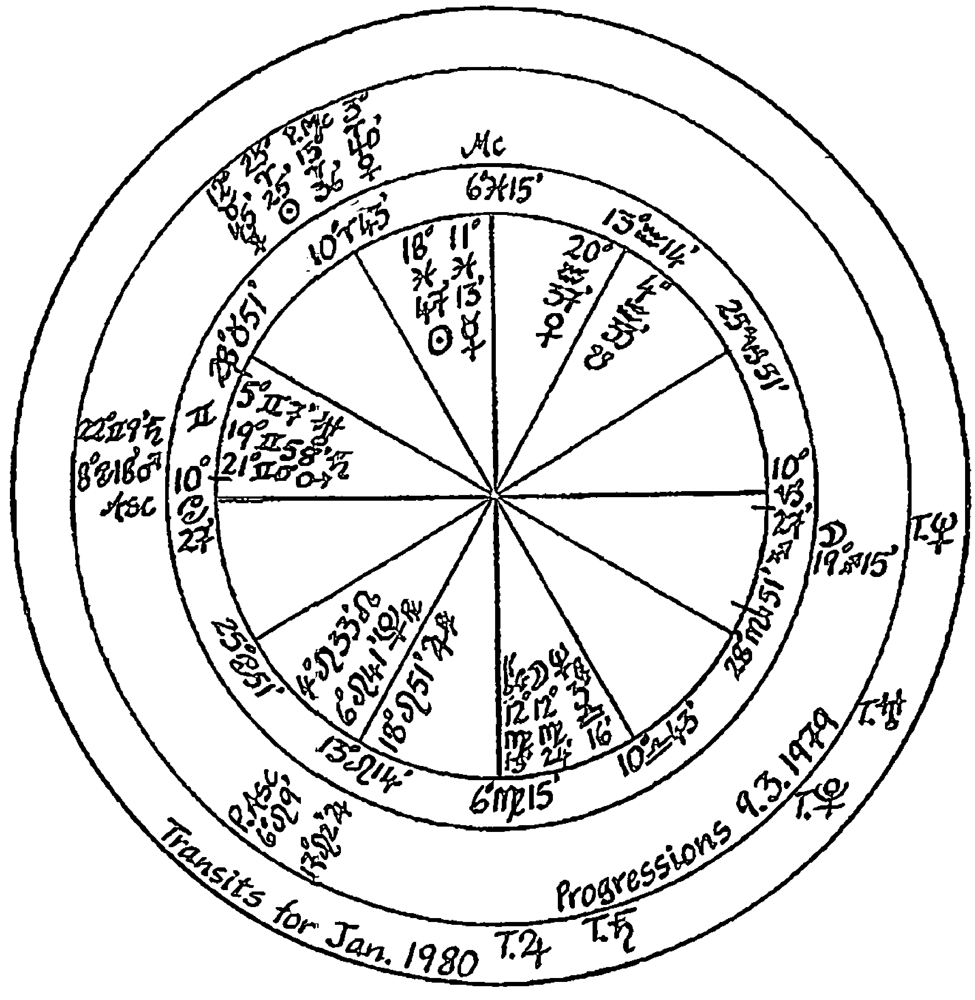
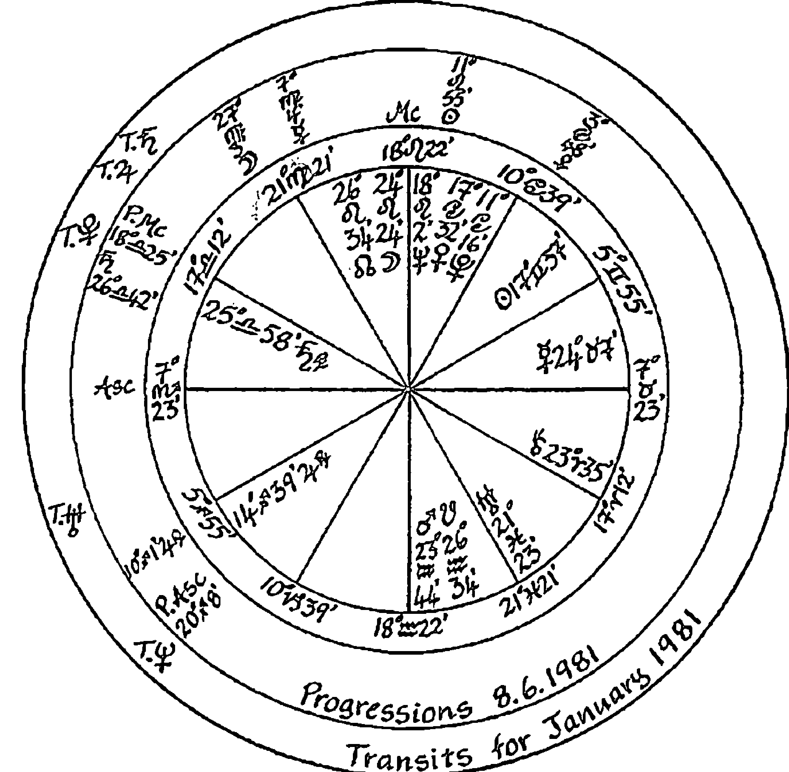
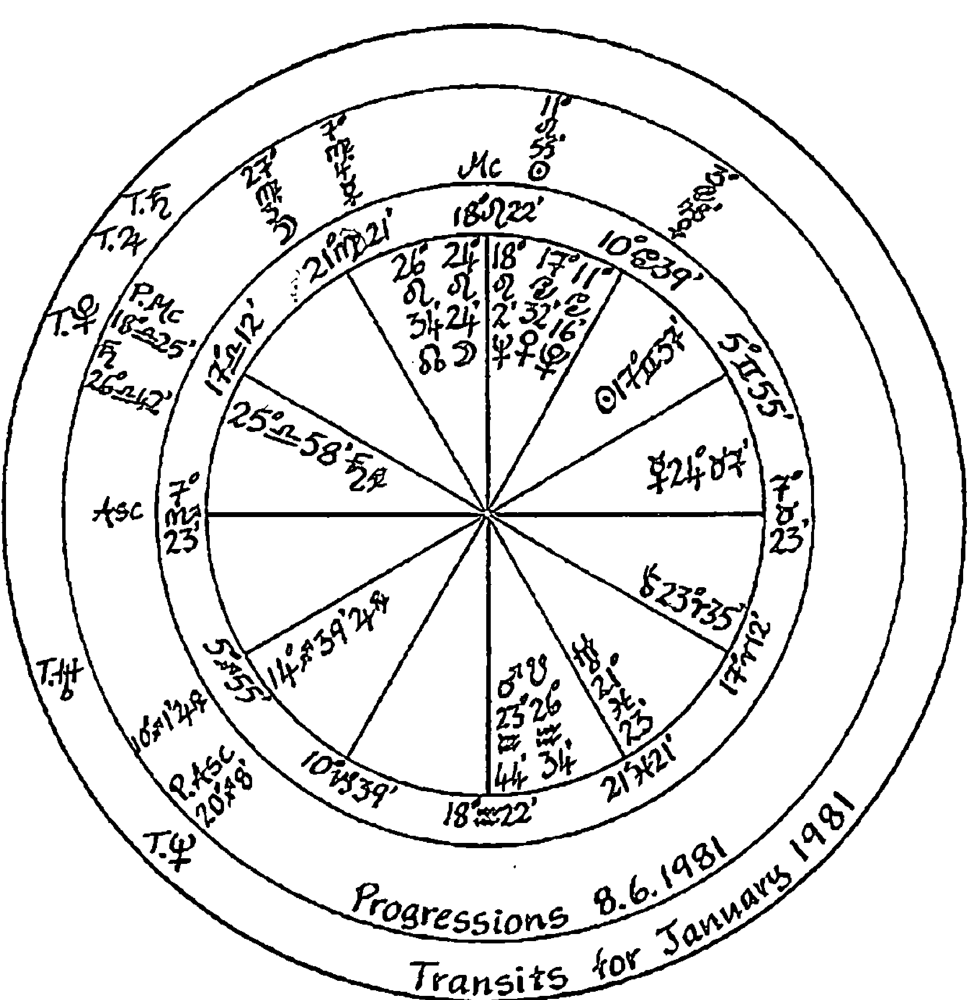

# 变异三王星

## 推薦序

## 在所承受的經歷中找到意義

完成翻譯《變異三王星：天王星、海王星、冥王星的行運、苦痛、與轉機》（The Gods Of Change: Pain, Crisis and the Transits of Uranus, Neptune and Pluto）之後，我和許久沒有見面的蘇湯普金老師見面，談到這陣子的生活體驗以及她計劃中的台灣之行。我在半年前意外的接下這本書的翻譯，同時經歷了一些重大的選擇與人生變化。這些發生在自身或周圍的事件，竟然與書中的個案經歷相似。

湯普金老師和我都同意，每個人生活中所選擇的經歷都是一個必要的旅程，我們選擇旅行的地點、工作的內容，結婚或者分手，並在其中成長。但是有一些選擇，卻不是我們在意識之下所做的決定，我們甚至認為那是意外或宿命，薩司波塔斯老師在《變異三王星》當中告訴我們，他認為這是我們更高層自我所做的決定，目的是要我們體驗完整的人生，並藉此成為我們真正想要變成的那個人。

薩司波塔斯老師在英美占星學界享有盛名，台灣的占星喜好者對他的《占星十二宮位研究》定不陌生，而在占星學院就讀時，我在湯普金老師與梅蘭妮瑞哈特老師的推薦下接觸這本書，改變了我對命運以及三王星的看法。翻譯這本書讓我更仔細咀嚼與品味薩司波塔斯老師的智慧話語，也因許多經歷契合書中的描述，竟也有一種療癒的感受，正如書中所提到的意義治療，如果我們能在所承受的經歷中找到意義，將能夠給我們力量支持我們堅持下去。

《變異三王星：天王星、海王星、冥王星的行運、苦痛、與轉機》是薩司波塔斯老師的經典著作，在英美更是每一個學習占星的人認識天海冥三王星的指定讀本。感謝春光出版社願意出版這本經典讀本，讓華人占星喜好者有機會深入了解三王星所帶來的深刻意涵，也謝謝燕慧還有Brian對這本書所貢獻的心力，希望本書能夠帶給大家在占星與成長過程的幫助。

AOA國際占星研究院創辦人 魯道夫
2013年五月・倫敦

## 譯者序

## 曙光之前，我們何不暫且擁抱黑暗

如果我們可以回歸於大自然生成的原則，我們的成長就有如植物一般，從種子萌芽開始，然後長成應該有的樣貌。這種內外的成長機制使我們不由自主的與外在世界產生相互的對話，如植物之於陽光、水、空氣，甚至是暴雨冰雪的領略。當這種自然的生成過程受到扭曲、擠壓、忽略到一定的程度，它會在某個時間點爆發，讓我們意識到它們的存在。而這些如作者霍華·薩司波塔斯所強調的「內在能量」之於外在世界的投射中，我們強烈意識到的部分稱之為「危機」，而意識不到的部分就如我們所稱之的「命運」。

個人在天王星、海王星、冥王星於天際運行的過程中所感受的危機，是一段我們必須慢慢匍匐前進的過程，需要一段時間去接受其中的震撼（天王星）、迷惘（海王星）與失去（冥王星）。由於行星移動的緩慢、加上順行逆行的交替，它們往往影響我們數個寒暑。此時我們往往看不見未來，就像塔羅牌的倒吊人一樣在晃蕩游移中彰顯我們的不安與焦慮。但是在在此過程中我們必須傾聽與尊重內在的聲音，我們必須經過一段時日的動盪、痛苦與瓦解，繼而在所有摧枯拉朽之後的荒原中找到重建的力量。而往往更是在時往事移的行運過後，生命經過了時間的掏洗，我們才能留下最簡單質樸的部分，當我們從灰燼中爬起時，已不再是原先的樣貌。

然而，我們也不一定要在行運結束後去才試圖去詮釋這些危機，一段不愉快的行運，往往是毫無警覺以及準備的結果。我們可以早先發現「心靈成長的意圖」與危機之間的關聯性；危機本身想要訴說的個人歷史、生命的原型、以及希望的個人成長。因為作者薩司波塔斯並不相信行星會對我們做些什麼，或者促使我們去做什麼，他認為行運行星並不是事件發生的原因，它們只是象徵著我們的心靈能量，影響著我們在生命中會遭遇的或吸引到的事物。在危機與困難中，我們可以去了解為什麼我們引來此種事件，而這些事物想要展示什麼給我們？或是教導我們什麼？我們可以用心傾聽這些能量的聲音，理解、轉化，並且去探索如何有建設性的去運用這能量。

作者在書中強調我們面對危機的態度，也就是說，我們是用選擇或是被強迫的方式去面對三王星所代表的「解構」原則。如果我們壓抑內在所需要的成長，逃避、忽略而不願做任何改變，我們就會製造某些情況迫使自己改變。從憤怒、否認、與神的討價還價、沮喪，一直到完全接受這些行星所帶來的危機與改變，轉化的階段才得以開啟，我們也才有機會回歸生命最初的完整。

此書的翻譯過程感謝魯道夫老師，特別是Brian Fung的協助。

陳燕慧

## 作者序

我在此要向瑪莉詠·羅素和依蓮·坎貝爾致謝，感謝他們讓我堅持下去，也謝謝我的經紀人芭芭拉李維，在海王星行運時期，非常專業的處理了突然出現的複雜合約問題。謝謝丹尼斯·海德與羅伯特·沃克在困難的時刻給我的支持，還有麗茲·葛林、瑪姬·羅賓森和許多給我建議和鼓勵的朋友。最後我要給予克麗斯汀·莫多克最特別的感謝，謝謝她的友誼以及在本書的後期給予的編輯與協助，讓寫這本書成為一個更愉快的經驗。

## 導論

> 你的痛楚不過是因為束縛你的窠臼被打破了。
>
> 紀伯倫（KAHIL GIBRAN）

生活並非總是帶來愉悅，想要活得深刻，卻不願感受痛苦、危機、停滯、或極大的動盪幾乎是不可能的事。儘管上述事件無可避免，但是痛苦與危機，在成長與演變的過程中所扮演的重要角色，總是無法讓人一目了然。有人在無法突破的困境中完全崩潰，但是也有許多人從衝突與騷動中轉變並獲得新生，並且更有活力。他們重新回到生活中，對於過去曾經忽略的潛在可能性許下了承諾，並對我們或許會稱為「恐懼」的事物重新定義，同時也大幅提昇了對他人的敏銳感受。

中國古人有一個相當有智慧的字眼叫做「危機」——是危險與轉機兩個字詞的結合。一個危機可以被視為是一場災難，像是那些我們盡力避免的恐怖事件，但卻也能將它視為某一個轉折點，一個極為重要的發展階段，有如一個新事物發生的可能性，一個放手並改變的機會點。

想要避開痛苦，並且渴望事物能夠回到危機發生之前的狀況是人類的天性，但是我們也有可能把這樣的時機當作發展與成長的機會，使我們更加認識自己與生命。有些事物會死亡，但同時新的事物會誕生。每一件事情都會改變，舊的事物會被帶走，但不同的事物或許會出現。

問題並不在我們如何避開痛苦、危機與改變，而是我們如何去了解、並更有建設性的運用這種時刻。整合心理學的創立者羅貝多·阿薩鳩里（Roberto Assagioli），稱此為「與無法避免的事物協力合作¹」，要活得完整，意味著必須體驗並接受光明與黑暗、歡樂與痛苦。無可避免的，在我們的生活當中，有時會有阻礙甚至極度的痛苦，但卻沒有任何事情可以阻止我們尋找成長的機會並從中學習。我總會問：「人們為什麼要來找占星師？」有些個案只是單純的好奇，像是某個朋友跟他們分享自己做過星盤諮詢，然後引發他們想去瞭解能夠從占星諮詢中得到些什麼。有些人的動機則是相信星盤可以幫助他們，引導自己更有效的發揮自我的潛能與資源。但根據我的經驗，大多數人是因為身處於危機當中而來的。他們打電話給占星師，因為急著想知道生活到底怎麼了，他們感到無能為力，而常用來解決問題的辦法發揮不了效用，甚至讓他們感覺失控。他們的伴侶關係一團混亂、工作出現危機、他們沒辦法忍受自己的孩子、無法忍受父母、罹患致命的疾病，或是親密的人突然離去，使得他們陷入憂鬱症或失去活下去的意義。有些人找上我，則是希望我能夠施展魔法，讓一切立即變好。其他的人，則用更實際的態度看待占星師，像是一個諮詢師或導遊，一個可以幫助他們在所面對的事物中找到意義或關聯的人。

¹ 阿薩鳩里引用皮耶羅·費魯奇（Pierro Ferruci）：What We May Be（Wellingborough, UK:Turnstone Press,1982）p.113.

大部分的痛苦時刻、危機、崩潰以及改變，都與行運的土星、凱龍、天王、海王和冥王星互有關聯，當這些行星涉及到推運時也是如此。這些行星各自帶來不同的困境，不同特性的傷痛、考驗或嘗試。土星所代表的試驗在本質上不同於天王星所帶來的危機，在感受上，海王星的迷惘相異於天王星的動亂，而冥王星則是用令人印象深刻的獨特方式企圖粉碎我們。無論最後它把你磨碎了或是拋打出光亮，都是要我們記住一句箴言：生命堅強得跟石頭一樣。

有時這些行星當中的兩個或三個甚或全部結合在一起，在非常接近的時間經過星盤上重要的位置，這就好像宇宙結夥來對付一個人一樣。但無論這些行星帶來哪些獨特的衝突、傷痛、矛盾或兩難，這些行星都有著共同點：它們不打算讓我們維持原貌。

戴恩·魯迪雅曾說：「並不是事件發生在人們身上，而是人們出現在事件中。一個人遇上了一個特殊事件，正因為他需要這些事件，來完整實現自身的潛能。²」很明顯的，我們面對痛苦與危機的態度，將影響我們經歷這些時刻所使用的方法。如果我們相信危機僅只是恐怖事件，而我們盡全力只想把時光逆轉、儘快逃離現況，那麼我們很可能只會深陷危機更久。相反的，如果我們和古代的中國人一樣，相信危機是一個讓新事物誕生的機會，我們會更盡力、更有建設性的利用這段時間。就算是在劇烈的騷動與絕境中，有些人依然可以幸運的找到危機與成長發展的關聯及意義，幫助他們度過困境。而其他人則需要花很長的時間，才能在不幸中領略深意，或者看見新生活的機會出現。可惜的是有些人卻始終無法走出危機，因為他們堅持的方向是朝向過去而非未來，渴望和過去一般生活而拒絕新生活，因此難以獲得智慧。

² 戴恩·魯迪雅（Dan Rudhyar）：The Astrology of Self-Actualization and The New Morality（Lakemont Georgia C S A Press,1970），p.27.

我們對待這些生活階段的態度，不僅影響我們通過這些考驗的方式，同時也影響著身為占星師的我們如何與個案溝通。如果我們傾向於用負面的眼光看待這些時光，我們如何去幫助他人發現所處階段的意義？如果我們的模式是避免變動或衝突，我們便可能直接或間接的鼓勵個案也這麼做。我們將會試著讓所有的事情都「更加美好」，並且在不自覺的狀況下，試著儘快的搶救他們，我們剝奪了他們面對危機時，所可能引發的力量與轉化。

這本書的重點聚焦在行運天王星、海王星、冥王星所有相關的改變與危機，以及他們所帶來發展與成長的潛在可能³。我會盡可能的深入探討，那些從我的占星諮商中蒐集來的一些案例，以及最後一章的三個案例⁴。這本書可以單純做為詮釋行運外行星的指引，但我希望也可以更進一步的，幫助讀者們得到一些如何化危機為轉機的洞見。

霍華・薩司波塔斯
倫敦・1988

³ 儘管凱龍經常出現在象徵痛苦與危機的占星因素當中，但我並沒有足夠的體驗來論述，因此除了第十章的案例探討之外，本書將不包含行運凱龍的部分。關於該行星更深刻的討論推薦讀者參考梅蘭妮・瑞哈特（Melanie Reinhart）之著作《凱龍的創傷與療癒》（Chiron and the Healing Journey）

⁴ 本書在討論到個案時將會使用化名以確保個案之隱私。

## 第一部 與命運之必然共舞

### 1 尋找人生意義

> 為那看不到自己生活意義的人哀悼，
> 他既無目標，也毫無目的，
> 那麼也無須在生活中堅持下去，
> 很快的他就會迷失。
>
> 維克多·弗蘭克（Viktor Frankl）

容格曾說：「意義對於那些必須容忍的事情，甚或所有的事情，都有舉足輕重的影響。」意義支持著我們活下去，如果我們能夠在長期困頓的容忍過程中，找到一些意涵、關聯或目的，那麼我們就多了一些機會，用建設性的態度去面對痛苦與危機。

對此，我們在維克多·弗蘭克的著作《活出意義來》¹中找到了絕佳的詮釋。在此書中，法蘭克描述在1943～1945年間在納粹集中營度過的日子，那些歷史性的事件對許多西方人來說是意識上的分水嶺，它們根本的質疑了道德與不道德行為、善良與邪惡、仁慈的神存在與否的觀念。從他的個人經驗中，他不經意的發現，那些從集中營惡劣環境下倖存的受難者，往往是那些能在必須面對的事物中找出意義與目標的人。

¹ 維克多·弗蘭克（Viktor Frankl）：《活出意義來》（Men's Search for Meaning）New York:Washington Square Press, 1984.

有些人從「神正在測試他們」的信念中找到生命的意義，也有人則是找到更具體的個人動機才得以生存下去：「為了能夠再次見到我的家人，我得活下去。」而法蘭克則是靠著另一個迫切理由：「我要活下去，才能夠告訴其他人集中營裡究竟發生了什麼事。」這個念頭為他帶來一些力量，幫助他度過集中營的恐怖日子。法蘭克如此寫道，當他覺得自己撐不下去的時候，當苦寒的風吹得更緊的時候，當他挨餓生病的時候，當他被迫行走好長的距離，腳底長滿了水泡寧可死去的時候，他卻看見一個幻影。他看見自己站在一個舒適通透、光線明亮的教室當中，擠滿了傾聽入神的聽眾們，聽他闡述集中營裡的心理學。這個幻影支持他活下去——替他所必須承受的痛苦，帶來了意義與目的，為了告訴全世界那時究竟有多恐怖，他必須活下去。那時法蘭克察覺到了一些他永生難忘的事情，這些觀察成為他日後建立心理治療學派的「意義治療法（logotherapy）」的哲理立論基礎。當受囚禁者失去（自己的）對未來的信念時，他同時也失去了精神上的支持，他放任自己衰弱，受制於心理與精神上的腐敗……他完全的放棄了²。尼采說，那些知道自己為了什麼而活下去的人，才能夠忍受任何的狀況。如同法蘭克在殘酷的生活歷練中所找到的體驗，如果我們能夠在痛苦的事件中找到一些意義，哪怕我們只是假設可能會有些什麼意義，我們或許可以找到讓我們更誠實，甚至更有勇氣去面對危機的奧援。生活所帶來的最終意義是承擔起責任，去找到問題的正確答案，並且去完成每個人都會持續不斷面對的挑戰³。

² 同前揭書p.95.

³ 同前揭書p.98.

#### 自我的內在與出生圖

我認為找到生活意義的其中一種方式是，相信我們都有一個更深層的自我或內在自我，正在指引著、揭示著、調整著我們的成長與發展。就好像是一個蘋果的種子「知道」它應該成為一顆蘋果樹而非一株梨子樹。我們有一部分的自我知道自己應該成為什麼人，又該追隨著哪一條路途來達到這個目的，諸如：個體化、自我覺察、自我實現等概念，便描述了這些「我們應該成為的哪種人的成長途徑」。皮耶羅·費魯奇（Pierro Ferruci），在《人的可能性》一書中描述他的觀點，我們總根據某些內在的設計而展開我們的生活：

事物似乎總有一種發生的方式，本質上最適合於事物本身：它們演變成它們原本就應該變成的模樣。亞里斯多德稱這種過程的完成狀態為「生命現極」（Entelechy）——指的就是最完整與完美的實現先前的潛在狀態。無論是蝴蝶破蛹而出、瓜熟落地，或是核果長成一株橡樹。這過程明確的證實了和諧的性質與潛藏在其後的智慧……根據東方傳統的宇宙自然法則，我們每個人都因為要完成一個獨特的生活型態而被召喚來到這世界。而每個人都應該要去發現這個獨特型態，並配合著去實現它⁴。

出生圖揭示了每個人的種子天性，像一張地圖或導覽，顯示著我們思想中深層的核心自我，這是也是它獨特的用處。麗茲·葛林（Liz Greene）認為出生圖述說著關於我們是哪一個種類的種子，無論是菩提樹、酪梨或是芽球甘藍。諮商占星師克麗絲諦娜·羅絲（Christina Rose）則比喻當我們看著一張出生圖時，就像是看著一袋種子前方貼的照片，我們可以從照片中看出種子成長之後應當是什麼樣子。在《行星的推移：揭露生命的週期》（Planets in Transit:Life Cycles for Living）一書中，羅伯·漢也提出了類似的觀點：

⁴ 皮耶羅·費魯奇（Pierro Ferruci）：What We May Be（Wellingborough, UK:Turnstone Press,1982）p.163.

我有一個無法在此證實的信念，那就是每個人都有一個積極建構宇宙的創作核心，存在於我們的內心當中。無論是從虛無的狀態逐漸創造出的每個部分，或是在靈魂與肉身結合之前，便已經達成了根據某些遊戲規則而進行的協議。在這個構想當中，你的星圖不是要告訴你有哪些事情會發生在你身上，而是顯示出你的意圖的一種表徵。如同占星師齊波拉·杜賓斯（Zipporah Dobyns）總喜歡說的：「性格就是命運」。⁵

儘管麗茲·葛林用不同的名稱來稱呼，但卻都相互呼應著這種生命中有一個深層自我，引導著我們發展的念頭：

從我對於我的心理分析個案與占星客戶的觀察中，當某些界限被打破而產生報復，或者在關係當中沒有得到尊重或付出時，有些「事情」的確存在著，有的人稱呼命運、天意、自然法則、業力或者無意識，這些帶來一些不只是個人需求的，同時也在未來的生命

⁵ 羅伯·漢（Robert Hand）：《行星的推移：揭露生命的週期》（Planets in Transit:Life Cycles for Living） Gloucester, Mass Para Research Inc.,1976, p..5

歷程中將所需的「必要知識」。我不會假裝知道「這件事」究竟為何，但我準備毫無羞愧的稱呼它「命運」。⁶

#### 種子的成長進程

出生圖是時間線上一個凍結的時刻，是一張在出生時刻、出生地上空天際的圖像。但事實上，在出生的那一刻，行星並沒有因此而停止運行，它們持續的前進著，當它們持續移動的同時，有的會繞完一整圈，然後回到出生那一刻的（黃道）位置，也可能經過另一個行星在出生圖上的黃道位置，或者它們會彼此產生四分相（黃道上產生九十度角的兩個位置），或者它們會產生對分相（黃道上產生一百八十度角的位置），或者與出生圖上位置形成其他角度。行運是指當下在天空中的行星黃道位置與出生時行星的黃道位置的相對關係，推運是另一種出生圖的更新版本，它描繪一種出生後行星以象徵性的移動方式來影響本命盤。出生圖揭示著我們是哪一種種子，但是出生圖的行運與推運則告訴我們種子的成長進程，是不是有些事情準備好要綻放了？是不是有些事情準備要發展了，有些種子可能只需要一週就發芽，有些可能要好幾個月或好幾年來發展。

我們每個人都活在一種持續的綻放過程中，而我對行運與推運的看法是，它們顯示了深層的自我（引導以及顯示自我發展的部分）在生命的每一刻為我們所做的盤算。內在自我激勵著心靈的各種面向，而星圖則在人生所有的發展特定階段中，顯示出我們將會完成的、或是邁向新階段的依據。行運與推運揭示著內在自我想要替自己帶來的事件，那些深刻的自我意圖要我們聚焦的發展與努力。為了要配合我們內在的成長與生命呈現，我們必須聆聽自我內心的變化，如果我們這麼做，我們將會觀察到行運與推運，就像是一種從我們心靈當中伸展開來的迫切感受與天性。

然而我們無法否認的事實是，行運與推運常與那些看似意外發生在我們身上的事件時機相符合。儘管如此，我仍然相信這些事件是與內在改變同步性發生的外在表現反應。換言之，內在自我或許會利用外在的事件來推進那些我們所需要的那些改變，其用意在讓我們成為應當要變成的那個樣子。我先前引述羅伯·漢的論點，關於出生圖呈現了創造性內在自我的原本意圖，而他同時對行運與推運也有下列的看法：

> 行運與推運都暗示著這種原始意圖在不同層面的運作。即使我偶爾會用上一些比較通俗的用詞……但我並不相信行星會「造成任何事情」的發生，它們只是原始意圖所顯現出來的象徵，其中一部分的意圖是你的意願，這一部分是你所意識到的意圖。另一部分，卻不知從何而來，你或許會稱之為宿命、命運，或者超越你能控制的狀況。但是這些還出自於你的內在，只要你能有意識的去了解它。而占星學的一部分功能就是讓個案有意識的去看見這樣的運作。⁷

如果我們沒有去傾聽或尊重內在自我所計畫的成長模式，我們就越有可能去吸引外在的情況進入到我們的生活當中，來迫使我們改變或者調整。舉例來說，行運中的天王星與本命金星的合相，替我們帶來了一種伴侶關係模式的轉變，如果我們跟隨著內心世界的調整，或許就會察覺到這改變，並且能夠去做該做的事情，表示我們對生命的下一個發展的尊敬。但是如果我們感到害怕或不願意接受天王星透過金星所帶給我們的迫切感受，這個行運可能就透過外在的事件顯現，並且強迫我們改變。在這樣的案例中，我們的伴侶可能離去，或是關係陷入混亂，迫使我們在這個生活領域中去作一些必須的調整。換句話說，內在自我經常會透過事件運作，將這種它所期待某個生命階段的成長，帶入我們的意識當中。

我再一次引用羅伯·漢的精闢論點，關於行運所代表的心靈象徵與我們引入生活中的外在事件之間的關係：

> 在我的觀點當中，行運最終是象徵著自我內在全然的改變——也就是心理上的改變，但是只有當你將「心理轉變」的一般定義擴大時，才符合這個行運的象徵。然而，你可能感受到這種「向內的」轉變——無論是在傳統意義上的心理變化、或是來自於社會互動、或發生在你自身之外的事件。而「事件」也可能透過讓人生病來呈現，而這些都是你的內在能量，在不同生活層面上所感受到的投射。這是一個必須了解的重要概念，因為若你不了解你為何捲入了一個特定事件，你就會在無意識的狀態下運作，因此也無法去掌握狀況。⁸

麗茲·葛林在《命運的占星學》一書當中，對一個她稱之為「命運」的奇特智慧提出觀點，而我將此稱之為「內在自我」：

> 那看似最獨特也最令人矚目的是，像是約定好似的，將另一個人或一個狀況，在一個特定的精確時間點，引導到一個人跟前使之相遇，並且似乎對於內在與外在，對於精神與肉體，個人或群體，上方與下界的影響份量相同，它可以用神的姿態出現，也可輕鬆的換上惡魔梅非斯特的面具。而我覺得，為了給我們的個案最好的協助，當我們越是了解這事（命運），我們越不應該在這之上邀功。⁹

#### 在行運與推運當中找到意義

我們確切的了解到，行運與推運帶給占星師對於客戶在某一種生活體驗或某一段成長階段的深刻洞見與重要意義。以這些方式來檢視星盤，是一種清楚簡單的方式，且能揭露個案自己已經準備好、想要有意識的整合、探索或轉化的個人本質。而心理占星師的主要工作是，對個案展示占星師本身與個案的內在自我是站在同一邊的。透過建立這一條連線，或者與個案自我的一致，占星師可以對個案做出最佳的引導，讓個案與他的自我合作，或者推動自我所想要帶來的事物，或者讓個案意識到自己內在的人格。

義大利心理醫師羅貝托·阿薩鳩里（Reberto Assagioli）創立了心理綜合學，這一門超越個人心理層次的心理學支派，稱呼發展過程當中必須經歷的下一個步驟為「目的」10，這個「目的」反應了內在自我在任何時刻的意圖，而且也將會以某些形式被連結到個案當下所涉入的事情，與他的生活當中的問題。這種關聯——或者有時候我們稱呼它們為「呈現出來的問題」，同時也會反應在個案的行運與推運圖當中。當檢視星盤的行運與推運時，為了幫助個案能更了解深層自我在某個特定時間對於個人的盤算，占星師可以問自己三個問題：

1. 有哪些事物試圖從呈現的問題當中浮現或誕生？
2. 個案的自我試著帶來哪一種原型特色？
3. 在接下的階段當中，自我試圖要替他自己帶來哪些事情？

儘管法國哲學作家巴斯卡（Blaise Pascal）聲稱「別期待樹枝明瞭整株樹的意義」，但相對的，維克多·弗蘭克對我們自身了解內在自我運作的能耐，寄予稍多一些期待。他認為測試小兒麻痺疫苗的大猩猩無法明瞭他們所處的週期性試驗，但人類並不同。我們較為發展的大腦，允許我們去退一步，並仔細思考為什麼這件事情會發生。11透過出生圖以及推運行運的系統，我們製作了一套象徵性的地圖，這地圖能幫助我們探究那些由我們所創造的、或吸引到生活當中，無論是正面或負面的經驗所蘊含的意義。

有時內層自我的意圖相當的明顯，但其他時刻，自我把我們推向痛苦與危機的理由卻不夠清晰、直接。我並不相信內在自我設計我們進入痛苦，只是為了得到虐待的樂趣。內在自我並不是這樣運作的。內在自我的用途在於督導與指引我們的發展與整個生命呈現，也因此，無論內在自我帶給我們什麼，就算包含了騷動、傷痛、混亂，也應會對我們原本要變成的那一個目標有所意義。

深層的自我或許會要求我們經歷一段痛苦與危機的時刻，好讓我們發展那些若不經過挑戰，就沒有辦法擁有的特質與性格。換句話說，若我們從成長與人生歷程的長遠的角度來觀察挑戰，或許能帶來具有創造性與建設性的結果。同時如果我們在成長的過程當中走岔了路，那些痛苦與衝突或許是幫助我們重新找回答該成就的自我的必需品，或重新回到應走的成長路途的必須過程。痛苦可以扮演一個傳訊者，告訴我們事情並不如預定的安排。如果有那麼一段時間我們並沒有對自我誠實，如果我們持續忽視著最基礎的需求或我們天性的原貌，那麼這種失調的結果可能帶來疾病、緊張與痛苦。無論我們選擇聆聽與否，身體上的症狀或其他生活中的困境是奉了自我的命令來襲擊自己，好讓我們知道在成長的過程的某個地方出了差錯。

有些人很高興的活出或表現出星盤當中的某些部分，但同時卻因為某些他們覺得不開心的理由去壓抑星盤當中的其他部分。在英國占星學會的心理治療中的占星應用課程當中，身為占星師以及心理治療師的比亞塔·畢雪（Beata Bishop）強調了否認星盤或壓抑我們部分的天性的後果。她的一位女性個案有太陽獅子座、月亮牡羊座、天頂射手座與雙魚座上升，她有能力活出她的海王星與雙魚座那一面，但是當遇到她的火元素獅子、牡羊、射手衝動時卻有問題，這一個部分的天性是比較外向且堅決的。在她的雙魚上升這一面，她不斷的為了他人的事務而把自身的需求擺到一旁，以家庭與丈夫為重心。當行運天王星來到射手座合相她的天頂時，星圖中被她忽略的火元素部分很清晰的透過一些觀察得到的症狀表現出來，這些症狀包括的極度的恐慌、惡夢與陷入焦慮。比亞塔的推理會讓每一個使用占星作為諮商工具的人認同，她說：「在我看來，當人們過得不像他們的星圖時，或沒有活出星盤當中的重要特質時，衝突的後果很容易轉而透過身體的病痛來呈現。我先前案例的女士在白天恐慌、晚上恐懼的徵狀，相對的仍然輕微，因為狀況可能更糟糕。」12

這位女士的身體與精神上的徵狀，是為了讓她了解她沒有接觸到自己真實天性的一種方式。痛苦與不適的結果引導她尋求幫助，如同內在自我必須藉由這種策略來傳遞訊息。在她過日子的方式當中，有些必要的事情必須做到。我們無法否認她的痛苦應該非常的劇烈，但也因為這必要的極度不適，而使她展開自我療癒的過程。在接下來的章節中，我們會更仔細觀察如何用壓力與危機來轉化我們自身，特別是天王星、海王星與冥王星在行運過程中所扮演的角色。

#### 從破壞到突破

> 上天是那麼的近，卻難以了解，
儘管如此，哪兒有危險，保護的力量就會出現。

弗里德里希·荷爾德林（Friedrich Hölderlin）

無論我們將它歸咎於命運或者深層自我的運作，天王星、海王星與冥王星都在行運中挑戰我們，並且促使我們的自我意識崩解，好讓我們可以再一次用新的方法將自己拼湊回來。但在我們開始討論這些行星行運的特色之前，我們必須給予「自我意識」更明確的定義，同時我們必須進一步瞭解，自我意識在童年時期的發展。

自我意識通常被定義為，思想當中對自身感覺到和意識到的那一部分。換句話說，自我意識就是我們感受到的那一個「我」，那種「當下的我」的感受。我們誕生的時候，「我」的概念並不清晰，在子宮裡我們處於一種沒有自我意識的狀態，更沒有那種被分離出來的獨立個體的覺察。我們認為自己就是一切，我們就是整個宇宙。

誕生，意味著取得一個身體，一旦我們察覺到我們有一個身體的同時，我們也察覺到所有的界線。我的身體的界線在某處，而你的身體界線從另一個地方展開。這稱為「肢體的自我」。隨著時間流逝，我們建立起「精神上的自我」，那是一種「我所擁有的思想」的感受。或許有時人們會分享自己的思想與情感，但一般而言我們所想的、所感覺的，並不等同於全世界的想法與感受。「自我意識」——或者說我們在身體、思想、感受上被分離的這一個「我」，一旦被建立起來，將會擴張並包含越來越多的特質。

我們逐漸認為自己是美麗、聰明而且得人喜愛，或者愚笨、無能且不完整。我們有許多不同的迫切與渴求，其中一部分我們覺得可以被接受，而允許它進入我們的意識當中，而另一部分的渴求卻通常因為我們的環境不允許我們擁有，使我們害怕承認它的存在。於是我們不再認為自己就是一切，我們原先的廣泛認同，逐漸被限制在某些性質與特徵上，並將其他的特色排除在外。我們的自我意識，是由那些被我們願意承認的部分所組成的，是一種完整的自我侷限的版本。

我們的自我意識是這樣畫分界線的：界線裡面的所有事物，我們將其定義為「我自己」，分界線之外的所有事物則「不是我」。最常見的分界線就是皮膚，皮膚以內的是我，皮膚以外的不是我。在分界線以外的事物或許「屬於」我，我的車、我的家庭、我的房子、我的工作，但卻不是我。¹

但是皮膚的界線並不是我們所採用的唯一的分界，就算在皮膚內我們也劃分界線，某些發生在我們體內的事物，我們願意讓它進入自我意識當中，有一些則被阻隔在外。我們或許會接受那個得人喜愛且仁慈的自己，卻否認殘忍且具有破壞性的自己。有些人則完全相反，他們認定是自己冷漠、殘酷的，而否認自己柔軟且敏感的那一面。所以就算是在皮膚的分界線內，我們制定了更多的分界線，更多的是我與非我的區別。容格精神分析師們會稱呼這是一條自我與陰影的分界線，或是一條自我可以意識到的與自我無法意識到的界線，又或者是一條我願意讓他人看見的與被我藏在黑暗當中的界線。

在占星學當中，土星是與分界有關的行星，而且象徵著那區分我們與其他人的皮膚。從最正面的觀點來看，土星幫助我定義自己並帶來穩定、專注，用一種特殊的模式與架構支配著我們的能量。透過土星，我們學會訓練與承諾。土星也是那條劃分的界線，區分著我們願意承認並且可以成為我們身分的天性，與那些我們想要禁止進入我們意識中的部分。在這一層意涵上，土星象徵著自我渴望架構化的驅動力，以及自我防衛的機制，那是一種我們那被簡化的自我身分，用來建立並試圖穩定每日運作的動力。這樣的能力也讓土星用負面角度去拒絕新的事物，並強迫自己去保護我們過時與僵化的思維、感受、行為。

任何熟悉軍事策略的人都知道分界線就是邊境，同時邊境也很有可能成為戰線。邊境是發生戰爭的地方，無論是在我們與他人之間，或是在我們自己承認的天性面向與被自我否認存在的面向之間，每當我們建立邊界，我們也製造了邊界兩旁發生的戰爭與衝突的可能性。²

天王星、海王星、與冥王星對邊界具有破壞性，從這個角度來看，他們具有「反土星」的特質。當這些行星的行運影響本命盤時，它們會威脅到我們存在的自我身分認同，因為它們的能量會摧毀自我意識所建立的邊界。它們會侵蝕我們與他人之間的邊界，同時讓我們再次察覺本質性的融合，並與完整的生命互相連結（海王星最貼近這個描述）。或者更象徵性的，他們會摧毀那個介於我們意識到與我們無法意識與否認部分之間的邊界，因此，我們的意識被迫去接受那些之前我們曾否認的心靈觀點。土星將會掙扎的維持過往的日常生活，並確保事物的不變，但最後土星仍將失敗。無論我們選擇改變，或者被要求改變，行運中的天王星、海王星、與冥王星挑戰著我們原有的生活模式，並強迫著我們去重新劃定自我身分的邊界。

#### 耗散結構理論

1997年的諾貝爾化學獎，頒給了提出耗散結構理論的比利時化學家伊利亞·皮勾金（Ilya Prigogine），他的研究科學化的展現了壓力與危機，在形體轉變當中扮演了重要的角色，這是一個中國人在很早以前就瞭解的道理。中文的「危機」一詞是由危險與機會兩個字所組成，皮勾金的結論證明，生活中的破壞與激變也同樣帶來新事物的誕生。³皮勾金研究了物理學當中的開放系統，一個開放系統是指任何一個與外界環境有著持續能量交換的系統，他們被賦予相當大量變動的特色，他們相當容易受到影響也容易接受其他不同的能量進入。人類所創造的如鄉鎮、城市、全體與組織幾乎都是開放系統。

例如一座城鎮，並不是孤立且封閉於其他生活之外的事物，工業的城鎮使用來自鄰近地區的電力與原物料，並且將能量以不同的狀態送回環境當中。因為你我都會因為與環境做互動而改變，而我們原先察覺的意識，也會被心靈的無意識內容入侵，因此自我意識的身分也是一組開放的系統，也適用於皮勾金的理論。

根據皮勾金的研究，假設變動與擾亂進入了一個開放系統當中，並保留些許的限制，系統的自我調節特性仍允許其整體的功能持續運作，並且保有本性。換句話說，系統可以承受某種程度的阻礙與干擾，仍不會故障。同樣的，來自於內外在無可避免的干擾，可能週期性的動搖我們生活，若假設干擾不是極大，那麼自我意識的內部均衡天性，能讓我們在不需要做出現行生活的巨大改變之下進行調節，我們做了一些微調而且幾乎維持不變。

然而當一個增強且超越一定程度的波動與干擾，來到了一個開放系統當中，他們會導致系統進入一種「創造性的混沌」之中，那些過去存在的，先前可以運作的都無法維持過去的原貌。系統因為被迫消化或接納一個劇烈的破壞力影響，無法保有老舊的模式，危機因此誕生。如果這套系統終究要去運作，那麼就必須建立一些新的事物秩序。換句話說，系統的故障，反讓整個系統有機會用其他方法重新組織、自己突破。這就是成長的動態本質，也是轉化的本質。

同樣的，當我們的生活發展平順時，沒有理由要我們去改變。通常是在事情全盤發生錯誤時，在我們因為耽擱了生命某一個重要階段而受苦時，或者當狀況難以處理、混亂到無法忍受的地步，才會使我們認真的去思考改變。或者因為過去存在的生活架構徹底的崩潰，使得我們無法維持日常作息，可能是一段曾經與我們的身分緊密連結的關係的破裂、伴侶的去世、子女的死亡、父母的離世、被解僱了，甚至是當我們深信的哲理無用，或者面對致命的疾病時。儘管不是每個人都會被同樣的理由影響，受到影響的程度也不一，但是這些干擾通常會帶來我們生活的轉化。當生活困難到無法維持一如往昔時，動亂帶來了對我們生活、生活態度、動機與價值的重新檢視與評估。

耗散結構理論與行運（或推運）天、海、冥可能帶來的影響，兩者之間的關聯相當明顯。我曾說過土星與形體、邊界還有架構有關聯，從這個角度來看，天、海、冥是土星的敵人，他們代表著「解構」的原則，破壞既存的架構，所以新的事物可以取代原有的事物。從某一層面來說，土星代表著自我意識的內在平衡原則中，那種維護保存既有的渴望。相反地，天、海、冥（每個都有自己獨特的方法與特色）帶來波動與嚴重的擾亂，它們讓我們遇到障礙，我們因此可以突破困境，展開新的生活。

有時他們所帶來的混亂，並不使人愉快，例如：疾病、沮喪等等。但是干擾也有可能是一種正面的特質，例如：結婚、戀愛、買房子、得到了改變生活態度的知識，突然的成功、升官或得獎。這些外顯的正面事件其實也帶來與負面事件一樣程度的壓力，無論哪一種確切特性的波動干擾，無論天、海、冥如何運作，這些他們所帶來的轉變、衝突、矛盾、緊張和傷痛，都帶來某些程度的改變。

---
⁶ 麗茲·葛林（Liz Greene）：The Astrology of Fate（London: George Allen and Unwin,1984）,p.6.
⁷ 羅伯·漢（Robert Hand）：《行星的推移：揭露生命的週期》（Planets in Transit: Life Cycles for Living）Gloucester, Mass Para Research Inc., 1976, p.5.
⁸ 同上。
⁹ 麗茲·葛林（Liz Greene）：The Astrology of Fate（London: George Allen and Unwin,1984），p.8.
10 摘自皮耶羅·費魯奇：What We May Be, p.163.
11 維克多·弗蘭克（Viktor Frankl）：《活出意義來》（Men's Search for Meaning）p.140.
12 比亞塔·畢雪（Beata Bishop）1986年6月21日在英國占星協會所授予的課程 Mapping the Psyche: The Use of Astrology in Psychotherapy.
¹ 肯·偉伯（Ken Wilber）：No Boundary（Boulder, Col., and London: New Science Libray, Shambhala, 1981），p.4.
² 同前揭書pp.5-14.
³ 瑪麗蓮·福格森（Marilyn Ferguson）：The Aquarian Conspiracy（London Granda,1981），pp.176-83.

改變並非總是容易的，身為人這種習慣性動物，我們把大多數的力氣花在試圖避開痛苦與危機上。容格學派的心理分析師莎莉·尼可拉絲（Sallie Nichols）指出，大部分的人都不喜歡失去我們所連結的事物，就算是一顆蛀牙或一根頭髮。⁴更不喜歡失去那些可衍生出我們身分意涵或與「我」有關的事物，例如：一段關係、工作、收入、想法與原則。

瑜伽大師馬哈里希·馬黑須（Maharishi Mahesh Yogi）曾說過一個故事，關於一對夫妻從一個小屋搬到華麗的皇宮之後，仍然念著他們曾熟悉的溫暖小屋。一個舊習慣、負面的自我形象、或是溝通分析當中所提及的「生活劇本」，這些我們存在於心靈當中的過時裝飾，或許實際上並不是真的對我們的生活有多大的幫助，卻就像是那些曾經圍繞在身邊的人與物品一樣，我們只是很難放下。

伊莉莎白·庫布勒羅斯（Elizabeth Kubler-Ross）在她對絕症與死亡的研究工作中指出，大多數的病患在接受即將面臨的死亡前，必須經歷的五個階段。她的發現與人們在經歷困難的行運天、海、冥的反應相去不遠，因為這些行星威脅著要將我們撕毀，並且重新建立——它們帶來了一種自我意識的死亡。和庫布勒羅斯的個案拒絕面對他們即將死亡⁵相似的是，我們或許也會多方嘗試抵抗這些行運帶來的影響。她大部分的病患在獲知他們獲得絕症的反應是「不，不是我！這不是真的！」、「一定有什麼地方搞錯了，我的病例應該是跟別人資料的弄混了。」所以第一階段的反應是否認。同樣的，當天王星、海王星或者冥王星開始讓我們感受到他們的影響時，我們察覺到周圍的危機，但我們通常會盡可能的去忽略這件事情。我們應用一個稱之為「選擇性察覺」（selective perception）的策略，選擇不要去看到危機發生的地方。

好幾年前，我替一對夫妻做星盤諮詢，我將他們分開諮詢，丈夫在上午，妻子則安排在下午。先生的太陽在第七宮天秤座，而行運天王星正經過這個地方。同時行運天王星也四分他妻子巨蟹座太陽，在與他的諮商過程中，我詢問他的婚姻關係，他說一切都非常好，可以說再好也不過了。但是到了下午，她的妻子則是以這樣的抱怨展開這場諮商：「好吧！我很確定你知道我為什麼會在這裡，我已經受夠了這段婚姻。」很遺憾的，這樣的選擇性察覺十分尋常。

庫布勒羅斯所觀察到大部分病患的第二個階段反應是「憤怒」。「不，不是我！」的哭訴這時被「為什麼是我？」給取代。為什麼不是發生在巷子口那個每天抽兩包煙，同時每晚喝掉六大杯啤酒的老王身上？他們對於自己的生命來到了終點的這個事實感到憤怒。那些他們對未來的期待，事業上的計畫，他們所建立的關係通通都來到了終點。最常展現出來的傾向是將憤怒轉移到周遭人事物上，抱怨著醫生的無能，怪護士沒有一件事情做得好，床不夠舒服等事情。而那些面對人生重要危機邊緣的人們也經歷著相似的階段，他們開始對任何與這狀況有關的人感到憤怒，把罪過推給他們。有些對著老天爺、宇宙發怒，對任何讓他們陷入如此動盪的相關的行星生氣。現在就有一票人正邊走邊抱怨著冥王星對他們幹了哪些好事。

在否認與憤怒之後病患會來到一個庫布勒羅斯標示為「講價」的階段。當病人不再否認他們的嚴重病況，也表達了對老天、生命、醫師、護士等人的憤怒，以及狀況依然沒有改變時，他們開始跟疾病「討價還價」，例如：如果我承諾馬上改變我的態度，在往後的生活中都均衡飲食，我的健康可不可以改善？或者，如果我好起來，我會將我的生命奉獻給上帝或教會。試圖延後死亡是她的病患表現出來的另一種「講價」行為，如只要讓我活到我兒子的婚禮，或在我可以再次的登台演唱之前不要讓我死掉。有時顯著的飲食或生活態度的改變會讓這種「講價」產生效果，讓病患得到療癒。但是對大部分的病患來說卻都太遲了。

「講價」是一種避免危機的嘗試，用一種支付贖金的方式，希望狀況能夠有所轉圜，希望時間能夠回到所有麻煩出現之前。我們都熟悉一種小孩的狀況，假設一個十四歲的女孩期待媽媽能答應她晚上可以去參加舞會，媽媽很可能會回答「十四歲？去這樣的場所還太早。」簡單的說，媽媽的答案是「不」。小女生第一個反應可能是「否認」，像是「我不管，我一定要去。」媽媽會不斷的回覆「想都別想！」來很快的結束小女孩的「否認」階段。接著小女孩會生氣，她會說「我恨妳，妳是最差勁的媽媽，妳從來都不讓我做我想做的事情。」而媽媽卻不會被這種「憤怒」影響並依然否決。最後小女孩開始用討價還價的方法，就像是試著用其他方式來避開危機，她會說「要是我洗一星期的碗盤，不再跟哥哥吵架，然後從今天起保持房間整潔，妳能不能讓我去參加舞會？」

那些處於動亂、痛苦或騷動當中，有著天王星、海王星、冥王星的困難行運的人們，時常採取「講價」的手段。他們思索著逃脫的方法，例如「好吧！親愛的，如果我答應從今以後當一個忠誠的老公，再也不要捻花惹草，妳可不可以不要離婚。」如果他的計謀或挽回失效，而且無法避免騷動的發生，他們可能又回到了否認與憤怒的階段，或者他們進入了第四階段——沮喪。

庫布勒羅斯區別出了面對死亡的人，所經歷的兩種不同的沮喪：「反應式沮喪」以及「預備型沮喪」。「反應型沮喪」是一開始的階段，發生在病患覺察到他們對自己的疾病束手無策時，他們的症狀會變得更糟，同時更為虛弱且無能力。他們停留在一種迷失的狀態，就像是一個因為得了子宮頸癌必須摘除子宮的女士，可能覺得她再也不是一個女人了。或者一個生意人病得越來越重，他努力工作了大半輩子，想要透過供家裡吃住，來證明自己身為男人的價值，並從工作當中到了相當程度的身分認同，而現在他越來越瘦弱無助，到了必須放棄那樣身分認同的時候了。一個能夠理解的朋友或家庭成員，可以幫助人們走過這段「反應式沮喪」的時期，就像是剛才舉例的女士，知道就算沒有子宮她仍然很有魅力、也有身價而獲得安慰，她也可以從其他走過相同經歷，卻仍迎向美好人生的人身上學習。那個男士知道自己的自我價值不是透過他能夠賺多少，或者他有什麼用處來判斷。又如社工人員能夠處理像是負擔家計的人生病所造成的直接影響，並替那些母親住院無法在家，以及遇到財務困境的家庭找到協助。在處理偶發的病痛纏身時，反應型沮喪是有用的。

「預備型沮喪」十分不同，這是悲痛的人們為了準備他們的死亡以及與世界分離之前需要經歷的。「準備型的悲痛」包含了為了未來的哀傷，為了即將去世的人所無法做的事情、無法過的日子而感到哀傷與後悔。病患即將要失去每一個人與每一件事物，現在是為了失去的未來而哀傷，為了他再也見不到的人們而悲痛的時刻。對於「反應型沮喪」的人來說，試著讓他們覺得身體好轉，保證他們的子女與家人，在他們缺席時仍能得到照顧，這對他們的處境是有幫助的。但是再三保證或鼓勵他們去朝向人生的光明面的作法並不適用於「預備型沮喪」的人。為了要達到接受死亡的可能，臨終前的人必須經過這一段沮喪，這段時間他們需要與他們的傷痛和深刻的失落感共同相處。

這不僅適用於面對身體上的死去，同時也可應用在任何舊有生活模式死去的危機上，那些哀悼是一種恩澤，悲痛是協助去除舊物騰出空間給新事物過程中的一部分。這替即將進入下一個生命歷程階段的我們做準備。經歷挑戰性的天王星、海王星、冥王星行運的人，以及知道自己正眼看著生活崩解的人們都需要時間去替過往的事物哀悼。

最後，在傷心與悲痛之後，「接受」出現了。如果瀕死的個案有足夠的時間，並且得到幫助通過之前提到的階段，他們通常會來到一個對即將面對的死亡順從的階段。他們發洩過了怒氣、和不公平的感受。他們替過去與未來感到悲痛，而現在他們有能力安靜的與無可避免的死亡相遇，這個階段並不是那種絕望的放棄，或者那種「又有何用」的放手。沒錯，他們已經放棄了掙扎，但是感受並不是絕望而是安祥的接受。庫布勒羅斯的一個個案將此形容為遠行之前的最後休息。並不一定會是一個高興的階段，但卻是完整而平靜的階段。病患的手握著醫生的手，安靜的坐在一起，聆聽來自外頭鳥兒的吟唱。同樣的，我們之中那些正在體驗天、海、冥的挑戰或破壞的人，最終也會來到一個接受這些行星所帶來的危機與改變的階段。

當觸及這個階段時，精神分析師同時也是作者的詹姆士·希爾曼（James Hillman）會說，我們的感受終於成功自由的流向了我們的命運。接受與一個事件的結合，如同他所說「與愛的必要結合」⁶。危機被接受了，而接受的同時或許伴隨著一個體會，那些我們曾經經歷過的，是生命成長與歷程的必要部分，苦澀的眼淚結晶成智慧的鹽。

「接受」讓療癒的魔法可以生效。我並不是說要達到這個階段很簡單或者在一夜之間就發生了。天王星、海王星與冥王星的運作並不是那麼令人放心，人們也不容易察覺那種看似詛咒的傷痛、崩潰、混亂與改變發生時會帶來什麼值得的代價。然而痛苦、衝突與緊張正好就是「轉化試圖要展開」，若拒絕它們，我們是在轉化當中作弊，若接受他們，轉化的步驟就會開啟。⁷

### 3 詮釋行運的實用規範

在實際的占卜當中，務必檢視過整張本命盤，才能夠了解某些特殊的行運如何帶來影響，也因此那些關於行運的「占星解讀書」有其本質上的限制。但是就算有限制，他們仍然可以當作指引，用來刺激我們去思考行運如何呈現的可能性。在書寫這樣的內容過程當中很難不去使用日常用語，例如我或許會說天王星帶來混亂或者海王星要我們調整，或者冥王星扯我們後腿等等。但是我不相信行星會對我們做些什麼，或者促使我們去做什麼，行運行星並不是事件發生的原因，他們象徵著那種心靈能量，會去影響我們在生命中會遭遇的或吸引到的事物。在我們開始檢視天王星行運的特點之前，我們需要設定一些實用的規範，也請記住這些規範，好讓我們能夠詮釋這些外行星。

#### 關於距角容許度

我們應該給行運行星多少的距角容許度呢？占星師們有著不同的建議，但我的經驗告訴我，在觀察行運天王星、海王星、冥王星時應該要給予較為寬鬆的距角容許度。在行運外行星的合相、四分相或對分相本命盤的行星時，我們通常會在精確正相位前五度開始感受到影響力，有些時候甚至更早。這時候場景便開始佈置起來了，如果我們花時間去貼近我們內在的感受，我們會察覺到一些擾動，或許一種躁動、無聊或挫折感。或者我們察覺到內在對改變的渴望，對新事物誕生的需求，這些感受象徵著前兆，而事件可能會在相位角度更接近時發生。而行運行星的三分相與六分相，我則會稍微減低影響的距角容許度到正相位的三度或四度之前。

我相信我們可以在行運外行星達到正相位之前做好準備，假設，如果我們知道一個重要的天王星行運即將來臨，我們可以聆聽自身想要改變的部分，並開始去探索或體驗進入我們生活當中的新事物。我們不必完全摧毀現存的生活架構，但是我們必須騰出空間好讓新的事物進入。如果我們去感受並且用這種方式與即將來臨的行運合作，在正相位發生的時刻，它的能量不會趁我們不注意時逮到我們，其張力也不會大到我們無法承受。相對的，如果我們無法意識到我們應付出的改變，也沒有為了新的整合做任何準備，那麼行運的相位會在他們達到正相位時帶來最強大的力量，結果我們改變的渴望將爆發得無法控制，而且用最極端的方式來呈現，或透過外界的事件與其他因素來迫使我們改變。

貝蒂·朗斯特（Betty Lundsted）特在她著作《行運：生命時光》（The Time of Your Life）中，在行運星盤中使用了十度的容許度，她的依據十分合理：

行運象徵著成長的時期，如果我們想要利用行運的週期來成長，那麼我們要從行運的種子被種植的那一刻開始。許多學生常在行運結束了才去試圖去詮釋它，並且在成果結果紛紛冒出時才開始想要應用先前的詮釋。而令人不愉快的行運，往往是我們沒有早點注意困難行運的影響下的後果。因此我使用在行星正相位前十度的容許度的方式，好讓能量能夠被知識與了解轉化。¹

崔西·馬克斯（Tracy Marks）也有相同的論點：

> 如果我們不希望老天燒掉我們的房子，毀掉我們的車子，把我們的伴侶情人送上別人的床，只為了讓我們注意到生活中有事情發生，我們必須要求自己積極的去活出行運，我們必須在一開始的時候就根據行運的能量去調整自己。並且去探索如何有建設性的去呈現這能量。²

羅伯·漢則傾向用一種較為精緻的方式來丈量行運的時間點，大致上是觀察內行星如何去觸動外行星的行運。例如：當行運天王星正與你的本命月亮產生四分相，你觀察到影響的時間，則會是在行運太陽或火星（推運也可以）這樣的內行星、也運行到與行運天王還有你的本命月亮產生相位的時刻。讀者若想對羅伯·漢的方式有更完整的認識，建議閱讀他的著作《行星的行運》的第二章³。

我們通常會持續的感受行運行星的影響，一直到行運行星離開正相位之後兩三度，然而我們必須把接著將要討論的行星逆行考量進來，外行星行運影響的判斷才夠完整。

#### 行星逆行

行星逆行一詞指的是行星在黃道上朝著星座順序相反的方向移動。除了日月從來不會發生逆行之外，所有的行星都會沿著黃道的方向前進（順行），然後在後退之前，會看起來停下來一段時間（停滯週期）。在逆著黃道星座順序運行一段時間之後，行星最後會再次的暫停運行，呈現停滯狀態，然後再次回復到順行的方向。

在詮釋天王星、海王星與冥王星行運的時候，我們必須將他們的順行、停滯與逆行都列入考量。當這些外行星對本命行星產生正相位時，我們通常記得要在相關聯的生活層面上做出改變，但是當行運行星停止前進並且開始後退的時候，我們改變和調整的努力被阻擋了，在這個時刻我們想要改變的渴望與需求也可能開始降低。當行星再次的改變方向並且朝著正相位移動時，阻擋會移開而改變則更為順暢。當行運外行星在改變方向之前，會先產生停滯狀況，會有一段時間靜止不動，如果停滯狀況發生在與本命行星產生正相位的一度之內，我們將會強烈的感受到這一顆行星帶來的影響。

#### 行運行星的特質

在討論天王星、海王星與冥王星對本命盤行星的行運時，我將三分相與六分相歸為一類，並稱呼他們柔和或者和諧的行運，而將合相與對分相、四分相這些主要強硬角度擺在一起，並歸類於困難或壓力行運。然而我建議讀者們用更有靈活的觀點來看待對這樣的分類。有時行運天王星對本命盤行星三分相，可能會刺激到本命盤中有問題的部分，也因此讓人覺得有壓力。相對的某些天王星的合相、對分相與四分相或許不難處理，在一些情況下他們甚至令人有享受的感覺。同時行運海王星與冥王星的三分相可能與合相、四分相或對分相一樣具有挑戰性。

要判斷行運外行星與本命盤行星合相時產生的影響，我們必須考量本命盤行星在出生圖當中的原有相位，假設行運天王星所合相的火星，四分木星同時對分土星，這一個行運非常有可能去啟動劇烈的衝突。但是如果行運天王星所合相的火星，僅只是三分本命木星與六分天王星，那麼這個合相的衝突性就會減低。

從內在的心理層次來看，外行星所帶來的四分與對分非常的相似，但是我們通常是透過外界強迫我們改變或外界阻擾我們改變的事件來體驗對分相。而接下來的幾個原則在我們在詮釋行運外行星四分與對分相時值得注意。

1. 在行運過程中，受到影響的行星的相關領域，將產生一種改變與更新的過程。
2. 相較於行運的三分相與六分，四分相與對分相將帶來更為強烈的改變渴望，往往也伴隨著更多的變動。
3. 內在的衝突可能出現，一部分的我們要求改變而另一部分卻抗拒著。在行運的對分相時，抗拒可能會透過外在因素而來（有時行運的合相、四分相也會），但我們可以將其視為是內在的不確定感受與矛盾搖擺的反應。事實上也可能相反，在對分相時（包含某些四分相與合相），外在的偶然因素替我們帶來改變與干擾。但是我主張外在因素反應著我們所忽略的那種內在對改變的需求。

儘管我沒有討論十二分之五相（150度相位）與半四分相（45度）與補八分相（135度），但是和合相、四分相與對分相一樣，我在行運的詮釋當中會使用這些相位。這些相位的影響並不十分的強烈清晰，但是他們可能帶來重要的影響，特別是十二分之五相位。我用同樣的態度看待半六分相（30度）與五分相（72度），並將他們與行運的三分相還有六分相歸為同一類。

#### 本命相位的觸動

當行運外行星與本命行星產生相位時，將會啟動這個本命行星在本命盤中與其他行星產生的任何一組相位。當你在參考本書的行星相位說明時請牢記這一點。例如：若你出生的時候，火星在牡羊七度、四分土星在巨蟹十三度，當行運天王星與本命火星產生四分相時，儘管行運天王星距離與本命土星的正對分相還有六度的遙遠距離，天王星也會開始對本命土星產生影響。因為行運天王星（與本命火星產生四分相時）同時會帶出本命火星與土星的四分相，因此在詮釋行運天王星對本命火星的影響時，我們必須把本命火星四分土星也考慮進來，同時也考慮行運天王星即將與本命土星產生對分相的影響。因為土星與火星在本命盤的相位關聯，將使天王星與火星相位所連結的隨性加速的特質更難被處理或接納。而這個影響將會一直延續到天王星結束與火星的四分相以及土星的對分相為止。

#### 中點的行運以及行運對於推運的影響

外行星行運至本命盤內的中點位置是很重要的，它們經常呼應了重要的事件以及危機與改變的時刻。假設在本命盤中，太陽位於火星與冥王星的中點位置上，當某一個行運的行星通過太陽時，將同時觸動火星與冥王星的準則。在本命盤中帶有四分相與對分相的中點特別具有影響力，當某一個行運行星通過這樣的中點時，這個本命的四分相或是對分相將會被突顯出來。而當行運發生於兩顆行星的中點，此中點位置雖然在本命盤中並沒有任何相位，這樣的行運仍然是值得關注的，例如：如果天秤座五度是金星與土星的中點，當某一顆行運行星通過天秤座的這個度數時（無論是否有本命的行星落於此）都將觸發到金星與土星。⁴

與此相似的情況，我們不能低估行運外行星經過推運圖的行星位置對我們生活所帶來的衝擊。在後面的詮釋部分，我討論的是行運外行星對本命盤行星所帶來的影響，但是我們也可以將這樣的詮釋廣泛的應用在行運外行星對推運行星產生影響的時刻。

#### 行運與宮位

天王星、海王星或冥王星的行運通過一個宮位時，象徵著改變、阻礙、突破和危機出現在與那個宮位相關的事物上。一個外行星的行運通過一個宮位時，象徵著改變、阻礙、突破和危機出現在與那個宮位相關的事物上。

⁴ 更多關於中點的論述可以參閱Mike Harding 以及Charles Harvey 的精彩著作：Working with Astrology: A psychological guide to midpoints, Harmonics, and astro-cartography (London: Arkana, 1990).

⁶ 詹姆士·希爾曼（James Hillman）：Betrayal，Spring 1965, Zurich and New York（Spring Publications），pp.57-76.

⁷ 瑪麗蓮·福格森（Marilyn Ferguson）：The Aquarian Conspiracy（London Granda,1981），p.80.

¹ 貝蒂·朗斯特特（Betty Lundsted）：The Time of Your Life（York Beach, Main:Samuel Weiser,1980），p.10.

² 崔西·馬克斯（Tracy Marks）：The Astrology of Self-Discovery（Reno,Nev.:CRC S Publications,1985），p. 124.

³ 羅伯·漢（Robert Hand）：Planets in Transit（Gloucester, Mass: Para Research Inc.,1976）.

⁵ 伊莉莎白·庫布勒羅斯（Elizabeth Kubler-Ross）：On the Death and Dying（New York: Macmillan,1969）.

⁴ 莎莉·尼可拉絲（Sallie Nichols）：Jung and the Tarot（York Beach, Marine: Samuel Weiser Inc, 1980）p.52.

The request was rejected because it was considered high risk

### 普羅米修斯與天王星的後作用力

如果我們壓抑天王星的驅力，我們便會心存憤怒，然而如果我們順著天王星的驅力而為，受到我們威脅或是妨礙的人，極有可能對我們怒氣目向。不管如何，我們都必須付出代價，即便我們確信自己做了正確與崇高的事，但是挑戰既有的權威仍將招致罪惡與懲罰。普羅米修斯的故事中便說明了這個論點。

普羅米修斯是泰坦族之一，是「先知」之意，具有事件發生之前的預知能力。當宙斯與泰坦族開戰時，普羅米修斯預見宙斯的勝利，因而決定與宙斯並肩，迎戰自己的族人。剛開始祂與宙斯是堅實的盟友，彼此互惠受益，祂協助雅典娜自宙斯的頭部誕生，雅典娜教導普羅米修斯天文、數學、醫藥、建築以及其他珍貴的知識做為回報，最後普羅米修斯成為極有智慧的人。

然而問題接踵而來，隨著時間的經過，普羅米修斯逐漸對於自己所意識到的不公平感到焦慮，為什麼神可以獨佔知識以及生命中所有美好的事物。為了改善普羅眾生的生活，祂將所學傳授給人類，普羅米修斯試圖讓神與人類更為平等之舉觸怒了宙斯，拒絕人類擁有火的恩賜，以此懲戒。當時普羅米修斯反叛有理，祂從奧林帕斯山眾神手中盜火給人類，宙斯為了報復，將普羅米修斯鎖鏈在高加索山的岩石上，每天有一隻禿鷹飛來啃食祂的肝臟。

普羅米修斯代表我們都有的天王星所代表的發展與提升的驅動力，為了變得更好而改變現狀。普羅米修斯象徵我們想要克服動物性根源以及純粹直覺本能的那一個層面，藉以提升目前的狀況。

在這個故事中，宙斯象徵著我們有一部分的心理層面是抗拒改變的，以及為我們的成長與發展所付出的代價，宙斯不想要失去祂的秘密與特權，因為普羅米修斯意圖如此，因此遭受懲罰。

這樣的動力也作用在天王星的行運過程中。在此過程中，我們的意識上可能有所突破，某種領悟可能改變我們看待自己或是生命的方式。然而這領悟在最初，通常不是那麼令人感到愉快的。例如：假設你總是認為自己是寬容仁慈的人，你可能會突然理解，在你正面性格之下，實際上是忌妒、怨恨周圍看起來比你快樂或是成功的朋友。你並非是自己所認為的好人。這個領悟可能帶來讓人不安的震撼——這便是由於你的覺知所招致的懲罰。

或者，你可能突然清楚看見存在於你的潛意識中的一種自我的負面形象，這個形象讓你無法去享受生命，你理解到許多年以來，在潛意識中你一直存有自己不如他人的想法，而現在你可能必須面對無意義的自我否定、喪失機會、耗費光陰的結果，或是有許多次，因為低落的自尊，而干擾或是阻礙了你的發展。無可否認的，意識到負面的自我形象是件好事，因為這個察覺，最後可以使你改變破壞性的模式。然而，實情是什麼？當你領悟之後，伴隨而來的是你的生活可能馬上變得比較快樂或是比較成功嗎？即便是某種令人愉悅的突破，使意識到達某種新的層次，我們也可能會對過往感到悔恨、惋惜、罪惡或是困窘。改變有其衍生的代價。

不論其他人有沒有因為我們在生活中做出天王星式的改變而攻擊我們，我們還是必須處理自我內在的罪惡感，而我們的這個部分，將因為打破既有的模式，而預期遭受懲罰。某位來參與讀書會的女士，當時天王星的行運正經過她七宮的宮頭，她決定結束現有的關係，以便與最近遇到的另外一個人開始交往。雖然她十分確信這是正確的決定，但她還是感到有罪惡感，並且預期會產生某種痛苦的結果。她擔心被她拋棄的男人會因為她的決定而崩潰、生病甚至於自殺，她設想新的關係失敗，最後只留下自己單獨一個人。

有時候懲罰的罪惡感與恐懼存在於我們的潛意識中，我們甚至意識不到我們期待被報復。不幸的是，無論我們意識不到的是什麼，它都會悄悄的找上我們。如果我們對自己的行為無從理解，我們就會不知不覺的建構或是吸引潛意識中的預期。例如：如果你為了展開另外一段關係而中斷了現有的關係，你的潛意識相信你必須為你的行為感到痛苦，因此可能使你做出某種危及到新關係的行為。然而，如果你意識到你的某一部分，期待著天王星對於既有秩序的反叛所帶來的懲罰，那麼你可以多關注自己——檢視以及探索自我的罪惡感與羞愧，你可以更清楚地看到自己並非是無識的讓自己因為天王星的行為而遭受懲罰。

### 神的意旨

我們都有一個核心的自我，引領、規範、展望我們的發展，我們的自我會營造出成長與演變所需的情況與環境。然而，大部分的時間，我們對於自我的這部分毫無意識，它自然運作不需要我們的理解。但是在天王星行運的過程中，我們有可能一瞬之間意識到自我的運作，面紗被掀起，更大的生命藍圖映入眼簾。由此願景，我們看見真正的意義、隱藏於生活中隨時都可能發生的事情背後的真實，以及自我想要驅使我們的方向。為了呼應內在的核心自我，天王星的觀點指出我們需要採取何種步驟，以及需要採取何種行動。假使在行運的過程中涉及到天王星時，即便是在危機與困難中，我們最好能夠了解為什麼我們引來此種事件，而這些事物想要展示什麼給我們，或是教導我們什麼。

例如：有位找我做諮商的男士，當時行運的天王星合相他的木星落在代表職業生涯的第十宮，由於他上班的公司剛剛破產，他因此被遣散，但是他清楚的認為自己遭到資遣有特定的意義：他一直對這個工作感到不太快樂及不滿意，而現在他被迫去面對資遣的結果，必須開始尋找比較符合自己需要的工作。他所經歷的瓦解，通常都是與天王星有關，然而他也可以理解事情為何會發生。另一位參與讀書會的演員有類似的情況，當時行運的天王星落在他的八宮，四分相他在五宮的太陽。之前，他享受許多年的成功以及固定的工作，但是他的「運氣」似乎在這個行運的過程中翻轉了，因此，他就是無法敲定任何的演出工作。然而，與其陷入意志消沉的苦澀中，他告訴我，他知道為什麼這種事會發生在他身上，他一直想嘗試寫作，而這次好運的逆轉，讓他有機會開始從事寫作。就像那個被遣散的男士一樣，這位演員經歷了許多人或許會認為的阻礙，但是他能夠將這些困難解讀成為了某種更大的目的。而相反的，當我們所面臨的危機是呼應了海王星或是冥王星的行運，我們可能會比較難以理解，這個危機與我們所必須面對的事物之間的關聯性或是目的。

我們不僅擁有一個更深層或是核心的自我，在規範著我們的發展，許多占星師與哲學家也相信，整個宇宙是根據某種偉大的計畫或構思而呈現，意即存在著一種更高層次的組成核心，充滿著創造性的智慧，在引領、展望所有生命的演化。依此概念，戴恩·魯迪雅（Dane Rudhyar）將天王星等同於「宇宙意旨的力量」，在行運的過程中，有時天王星將我們的意識與此更高智慧的運作連結，使我們得以一窺祂的目的與意圖，使我們意識到人們所謂的「神的意旨」。在天王星的影響下，我們認為我們所領悟到的「真理」（Truth）就是神的真理。因此，我們有可能採取我們所相信的、符合神或是宇宙意旨的行動。我們認為，不僅是個人的意志堅持追隨某種特定的途徑或是意圖，而是神的意旨要求我們如此。如同的魯迪雅的描寫：「這個脫胎換骨之人，已經成為宇宙意旨釋放其能量的核心焦點」1。

很明顯的，相信自己是為了行使某種更高的全知威權的某些個案，輕則流於傲慢自大、自我膨脹；重則產生精神疾病的行為，歷史記載無數的暴行與不公義，都是由自以為是的個人與國家，以神的意旨之名所造成的。然而我們不應屏棄所有宇宙意旨的觀念，各種不同文明與時代的神秘主義者與導師反覆宣稱，宇宙存在著一種遍及所有生命、更高層次的統一性原則，就如最近的研究顯示，許多科學家不再與此論點爭辯。二十世紀的物理學家弗里喬夫·卡普拉（Fritjof Capra）（本命水瓶座，天王星金牛座落在十二宮合相上升）以此觀點，談論所有生命的相互連結：

> 現代物理學顯示宇宙基本的一體性，指出我們無法將世界分解為各自獨立存在的小個體，當我們觀察事物，自然界並不以任何單獨的基本結構顯現，而是以一個統一的整體、各部分之間複雜的相關網絡呈現。就如同海森堡（Heisenberg）所言：「這世界因此呈現著一種有如事件般的複雜脈絡，之中連結著各種不同的選擇、重複或是組合，如此決定了整體的本質結構」²。

卡普拉的陳述中相信宇宙意旨的神秘觀念，將宇宙整體連結在一個複雜的關係網絡中，沒有任何事物可以單獨的被理解，唯有透過與其他事物之間的關係。在某種深層的面向中，我們彼此相連，所有靈魂與生命的存在都是無可避免的彼此交織。

倘若我們的心智是彼此連結的，就不難認同耶穌會教士與哲學家皮埃爾·泰亞爾·夏爾丹（Pierre Teihard de Chardin）所提出的觀念：「某種真理，一旦被察覺，即便只是出現在一個單獨的心智中，最終總會深植於整體人類的意識中」³。英國科學家魯伯特·謝德瑞克（Rupert Sheldrake）提出相似的論點，他相信有一種看不見的組織場域（他稱之為「形態發生場」），將物種中的每一個個體彼此牽連，只要物種中的某個個體學到了某件事，這個物種的形態發生場就會產生變化，而有可能使同綱類的物種也跟著適應⁴，這個概念再次驗證群體心智的概念。

天王星的行運能夠激發我們連結的能力，讓我們了解宇宙意旨的運作，使我們瞥見它的意圖與方向。當這些發生時，我們可能成為某種管道或是媒介，經由我們，蔓延在集體心理的新觀念或是趨勢得以彰顯。顯然，並非每個人都以此種方式受天王星影響，但是在我的個案中有許多人，當他們經歷此種意義重大的行運過程時，變成了某種媒介，透過他們，新的概念因此流傳。我立即想到兩個例子，一位是金星在天秤座，三分相天王星雙子座的電影導演，當天王星行運至他本命天王星的對面時，他開始在音樂錄影帶中實驗新的技巧，他不僅以他獨創性的技巧贏得喝彩，也在此媒體中開創一種全新的潮流。另外一個例子是一位水星合相火星落雙魚座，四分相本命天王星雙子座的女士，當天王星行運至射手座，四分相她的水星／火星的合相時，她向教育機構引介某種新的概念，而自此被採用並發揚光大。

不論我們是否相信宇宙意旨或是群體心智的概念，毋庸置疑的是天王星的行運經常激發很大的政治意識，有人在經歷重要的天王星行運的過程中，創想新的體制或是概念，透過這些，他們相信將改變或是改革事物存在的秩序。或是他們推展某種根源與理想，而挑戰社會僵固與老舊的結構。因此天王星激發的並不只是個人或是內在的成長改變，而是某個社會階層的改革。

我們已經建立了一些天王星行運的詮釋方式，現在我們可以更仔細的檢視行運天王星所行經的行星與宮位。

### 5 天王星行運入各宮及與其他行星的互動

#### 天王星／太陽

當行運天王星與太陽形成三分相或是六分相時，通常不會有太明顯的感受，儘管如此，卻也暗示著某個時間點，我們順應自我的內在需求，用我們以前不曾使用過的方式，去發展並拓展自我。我們會想要開展、探索、體驗生活，因此可以順應這個動力，利用行運天王星與太陽形成柔和相位的機會。例如：當我們遇到某個人、有一份新的工作、或是某種新的進修課程時，可能就是我們改變的時機。行運天王星落入的宮位、太陽所在的宮位、以及獅子座守護或是包含獅子座的宮位，都將會是可能擴展的領域。如同所有行運天王星與太陽產生的相位，為了汰舊換新，我們可能必須移除某些生活中既存的架構，而需要破壞到何種程度，大部分是以本命的太陽在星盤中的相位而定。如果本命的太陽與土星或是外行星沒有太多強硬相位，天王星行運與太陽形成柔和相位的過程中，生活的整合或是改變，應該不會太難。

然而，行運天王星與太陽形成的合相、四分相與對分相，通常會帶來比較明顯的變化。如果我們是喜歡變化或是刺激的人，會比較容易掌握行運的過程；但是如果我们對於未知或是不曾嘗試過的事物感到恐懼，那麼即使我們對生活感到不滿意，但還是想儘可能的保持現狀，那麼行運天王星與太陽的強硬相位，將會使人感到非常的不舒適。行運的過程，通常伴隨著不安的感覺，我們可能感到煩躁，或是受限於生活環境，我們也可能因為自己的不滿而責備他人：「如果我的丈夫、妻子、老闆、父母是其他人，我就不會有這種感覺。」就某方面而言，這也許是事實，但不全然是我們周遭的人需要改變，需要改變的人是我們自己。我們需要關注自己感到不安與不滿的部分，並且在我們的生活中挪出空間，讓新的事物發生，此時，核心自我想要改變，如果我們否認這個傾向，就有可能吸引外在的破壞，迫使我們改變。或是用極大的能量來抑制需要改變的傾向，最後我們可能感到疲憊、身體不適、或是抑鬱。困難的天王星／太陽的行運，並不需要將我們生活的架構全數推翻，但是為了尊崇行運所暗示的新的成長，我們可能必須做一些重要的調整或是改變，而所涉及的宮位，將指引我們去體認需要改變的生命領域。

太陽也是父親的象徵，行運天王星與太陽的相位有時意指我們與父親之間關係的改變，大部分會根據本命盤中太陽的相位。如果本命盤中的太陽有重要的相位，當行運天王星與太陽形成三分相或是六分相時，與父親的關係可以有一個正面積極的突破機會，可以改善彼此溝通的方式，之前相關的負面模式也得到新的理解與包容。然而，行運天王星與本命太陽的合相、四分相或是對分相等強硬相位，更容易暴露出父親與我們之間早已存在的問題。在我的個案當中有此相位的人，感覺自己必須去反抗父親、去挑戰壓抑自我的權威或父親對自己的期望。與父親做切割，去尋找自我與自我權利的時機已到。

行運天王星與太陽形成相位的過程也代表尋找「內在父親」的象徵，也就是負責與掌握自己生命的能力，這將會是一段難以回應他人的需求的時期，特別是當這些需求與我們所意識到的自我需求不相符時。我們可能發覺自我需要他人為我們調整，並非是我們去配合他人，行運天王星與太陽的相位喚醒我們自身的力量，可能因此強調了這份力量與權威人士之間的抗衡，並且反抗那些以前可以控制與影響我們的人。

如果一個女性不曾掌握自身的權力，或是發展果決的面向，這是一個開始的契機，運用這段行運的過程，去強化自我認同與表現。她也可能透過在此時認識或是遇到的男性，體驗這種影響。例如，她可能遇到一個在本命盤中有強烈天王星傾向的男士，或是正在經歷重要天王星行運的人，這位男士可能英勇無懼、生氣盎然，帶著全新的能量或是全新的世界觀進入她的生命，透過這位男士對她的影響，引導天王星進入她的生命領域。在一些案例中，可能會有某位女士，當行運天王星經過她的太陽時，她發覺某位與她有關係的男士，正在經歷重要的改變或是瓦解，由於這位男士的經歷，使她的生命也跟著改變了。

無論性別為何，當天王星與太陽產生困難行運的過程中，我們可能不是一個和平好相處的人，我們變得激動、古怪、不可預測以及煩躁不安。我們想要消除窒礙感，掙脫傳統或是過去環境的限制，我們忙著吸收新觀念以及對於生命的新觀感，倘若我們可以接納這股新的能量，儘可能平和的完成需要的改變，即便這些行運並不是輕鬆的過程，卻代表著邁向自我展現的重要一步。

#### 天王星／月亮

當太陽指出我們如何表達個性與力量時，月亮則是與我們的情緒和感情有關，以及我們對他人的直覺反應或是回應的方式。月亮同時也描述了家庭的生活環境，任何與母親或是滋養有關的事物，以及我們與女性之間的關係。當行運天王星與本命月亮形成相位時，也就是天王星暗示著這些領域的改變或是瓦解。

隨著行運天王星與月亮形成三分相或是六分相，通常我們會比較容易去處理與天王星相關的變化，也就是我們的感覺可能被喚醒或是加深，我們比較容易去接受新的情感經驗。無論性別，在這個時期都有機會去體驗內心更大的情緒反應，以男性來說，有時候是因為遇見了某位女性，而引起了這種情緒性反應。在女性的星盤中，行運天王星與月亮的和諧相位，暗示著更為明顯的女性自我認同，例如，在許多我所看過的個案中，有些女性在天王星三分相或是六分相月亮時，初為人母。

同樣的，如果我們在行運天王星與我們的月亮形成和諧相位時搬家，可能是一種更好的改變，即使在剛開始，這個變動似乎是混亂並且是令人感到不安的。行運天王星／月亮的三分相或是六分相，同時也可能突顯我們與母親之間的關係，有一種積極正面的突破，理解彼此的能力變好，我們可以與我們的母親和睦相處，而不會感覺到被她侵犯或壓抑，此時最好能夠脫離或與她分開，這樣才可以更看清楚彼此之間的關係。然而，當天王星與月亮產生困難行運時，可能會導致與母親之間的問題，倘若我們的自我認同與母親連結過深，為了建立某種更清楚、獨特的自我認同，此時我們可能必須反抗她。行運天王星與月亮的合相、四分相或是對分相，同時也可能描述著我們母親的生命，正在經歷某種瓦解或是改變的過程。

有些年輕的母親，在天王星／月亮困難的行運過程中，可能因為身為母親的侷限與限制而感到沮喪，她們可以藉著表達自我的其他面向，找到出口而獲益。對於年長的女性來說，這個行運可能呼應更年期的改變，象徵她們可以找到新的方式，去表現月亮渴望照顧或是滋養他人。行運天王星與月亮有相位的男性，可能吸引有天王星特質的女性，因而改變他們的經驗或是價值觀。或是他們可能親近某位即將要經歷重要轉變或是重新評價自我的女士，進而直接影響了他們的生活。行運天王星與月亮產生相位的孩子，將透過與母親之間的關係，自然而然的受到影響，而這些母親自身也可能正在經歷某種挑戰或是瓦解。

隨著行運天王星與月亮產生合相、四分相或是對分相，我們可能會經歷某種非常震撼或是困擾的情緒狀態。如果你是不容易哭泣的人，你可能突然因為極小的刺激而崩潰大哭，此時你的的感覺不僅讓別人感到吃驚，也讓自己感到詫異。某些有天王星／月亮困難行運的人，深受精神崩潰或是失去自我控制的情緒困擾，害怕先前控制得宜的情緒突然湧上意識，粉碎他們的自我矜持。天王星的行運與本命的月亮形成強硬相位的人，在這段時期可能有必要去尋求一些建議或是諮商，某個我們可以與之探討此種突發性感覺的人。例如，有某位女士在行運天王星與月亮合相時來找我，她的本命盤中的月亮四分相冥王星，最近她產下第二胎，並且發現自己得到嚴重的產後憂鬱症。本命月亮與冥王星的四分相，是一個描述黑暗或是極端情感特質的相位，而受到行運天王星與月亮相位的觸發。她對於自己與新生兒的毀滅性幻想，感到有罪惡感，然而透過這些感覺的敘述，可幫助她對於正在經歷的事，得到極大的理解與客觀性。

月亮揭露了我們早期許多關於母親與環境的經驗，而在天王星與月亮的行運過程中，一些早期的模式，可能以現在的狀況重新浮現。有位來找我做諮商的男士，當時行運天王星引出了星盤中本命的月亮與土星的四分相，他的母親是一位嚴厲、傳統的人，並不輕易回應他的情感需求。而當行運天王星觸發到這個相位時，他發現自己再度陷入了相似的關係中，一位不了解他、也不以他需要的方式與他相處的女性。透過現在的伴侶關係，天王星曝露了童年時期就已經存在的問題，而探索的時機已到，不僅是關於他對於目前伴侶的直接感受，也包括他與母親之間未被解決的情感問題。

當天王星與月亮產生困難的行運時，在所涉及的宮位所代表的生命領域中，我們可能會感到焦躁不安、心神不寧（本命盤中月亮所在的宮位、行運天王星所落入的宮位、以及以巨蟹座為起始星座的宮位或是包含巨蟹座的宮位），我們可能想要突破環境的限制或是阻礙。然而此時，更適合去檢視我們的挫敗與不滿的感覺，太快採取行動去滿足這些渴望或許並不是明智之舉，特別當我們感到限制或是勉強時，特別容易破壞現有的模式。在做任何重大的改變之前，我們需要花時間去檢視想要逃離、破壞既存關係或生活架構的欲望。如果我們的發展或是成長確實是被我們所處的環境阻礙，我們必須掙脫限制，去實現天王星的渴望。

然而我們也許會發現，並非是外在的環境阻礙我們，障礙可能

---
**腳註：**
1. 戴恩·魯迪雅（Dane Rudhyar），cited in Arroyo：*Astrology, Karma, and Transformation*（Reno, Nev.: CRCS Publications, 1978），p.41.
2. 弗里喬夫·卡普拉（Fritjof Capra）：*The Turning Point*（London: Fontana, 1982），p.70.
3. 皮埃爾·泰亞爾·夏爾丹（Pierre Teihard de Chardin），cited in Marilyn Ferguson：*The Aquarian Conspiracy*（London: Granada, 1981），p.52.
4. 魯伯特·謝德瑞克（Rupert Sheldrake）：*A New Science of Life: The Hypothesis of Formative Causation*（London: Blond and Briggs, 1981）.

是源自於內在，我們將擴大對生活的內在恐懼或是擔憂，並投射於外在環境中。我們指責他人限制了我們，而實際上，是我們害怕、猶豫用新的方式去發展自我。在此個案中，需要改變的並非是外在的環境問題，而是必須去面對自我內在的抗拒，在此時，與其急著去破壞現狀，更值得深思的卻是害怕承諾與承擔義務的深刻恐懼。

我們可能透過外在事件，體驗天王星與月亮的困難行運，這個過程明顯的超出我們的掌控範圍，撼動我們的生活，或是對我們的安全感造成威脅。某段關係可能突然結束，或是我們可能被迫搬家，甚至兩者同時發生。即便以上種種似乎完全是命運的操弄，但我們更應該花一些時間去評估，是否在我們將任何相關的破壞引入生活之前，我們就已經有所察覺；我們將自己沒有察覺到的改變慾望向外投射，透過外在媒介的傳遞，又回到我們自身。這些可能與我們所察覺到的、發生在我們周遭的劇烈變化有關，當我們分析這些情況，卻還是找不出這些事件相互的關聯性時，於是我們將我們的渴望隱藏。極有可能，核心自我認為這些劇烈的改變有其必要性，因為這樣我們才可以發展某些特質，而如果我們一直維持生活的現狀不變，這些特質將不會被發展。

#### 天王星／水星

如果我們祈求的是心靈的祥和寧靜，行運天王星與水星形成相位時將無法如願，即便是行運天王星與水星的三分相或是六分相也一樣。此時我們的思想將會改變，心智比較容易接受接踵而來的新觀念，我們可以善加運用這個行運的過程，去學習、研究新的事物。舊有的思想與慣性思考模式被新的態度、洞察力取代，我們將更能以不同觀點看待生命。在此行運過程中，直覺運作順暢，對於某些長期窒礙與困擾我們的問題或困難，可以找到振奮人心的解決方式。而這些問題的解答與解決方式，皆在無意之間，浮現腦海。

當天王星三分相或是六分相水星時，我們將因為研究我們所居住的城市、城鎮，或是國家而獲益。在此過程中，我們或許會發現可以激發我們心智與興趣的人、地方、群體、社會與活動。此時，我們可能被天王星的事物吸引，任何從占星學、形上學、生態學到科學與電腦科技相關的事物，我們敞開心胸接受流行的新觀念潮流，並且可能成為推動與傳播的代言人。而周遭環境也已準備好接收我們需要傳遞的訊息，這是一個有利於啟動新計畫、意見與行動的行運，如果我們在此時從事與寫作、任何一種形態的公開演說、或是教學相關的事物，我們的思緒將運轉流暢，因為新的洞察力與觀念而充滿活力。

行運天王星與水星的合相或是強硬相位是一段振奮人心的時期，但也可能比三分相或六分相帶來更多的問題。在這個時期，我們的心智可能因為過度活躍或是不穩定，使我們感到緊張不安，無法輕易進入任何狀況。如果我們原是沉著、有條不紊、習慣步調和緩的人，行運天王星與水星的強硬相位可能讓我們感到有些不安，精神失去平常的穩定，我們覺得自己似乎也失去了控制，在此行運過程中，某些人甚至產生痙攣、抽搐、神經性的疾病。此時替高漲的精神能量尋求積極性的出口，藉由某些事物緩和內心快速的節奏，對我們是有幫助的。某些鍛鍊身體的實體課程、運動或是瑜珈，也可以釋放過剩的心智活動，幫助我們放輕鬆。

我們可能受到某些觀念與見解的強烈影響，因此失去平衡，雖然某些觀念可能十分有益，但我們也可能為之沉迷，因此，有必要謹慎克制，也許與某個我們可以信任的人討論我們的想法以及感覺，幫助我們釐清我們的想法中，哪些是有益的，哪些是極端或是不平衡的。即便如此，經歷天王星／水星行運的某些人可能會耽溺沉迷於某種概念，而相信某種強大、無從掌控的力量，他們相信靈光閃過的真理，並且必須加以實現。等到這個行運經過之後，我們回顧此段過程，可能感到迷惑，是什麼讓我們深陷其中？是什麼控制了我們？有時我們只能透過「錯誤」才能學到。

我們的某些想法可能過於偏激、不合常理，這些觀念可能有其創意與價值，然而，我們需要檢視、驗證我們的感受或是受到影響的強烈程度。倘若我們持續小心並且以常理行事，在這段時期，對於我們所深信的理想與原則，我們就能夠努力不懈的堅持下去。

在天王星／水星行運時期，我們不需要堅持自我的想法與表達方式，當天王星三分相或是六分相水星時，我們已經準備好接收新的觀念；另外一方面，外在環境也能普遍的接納我們新的洞見與觀念，而也許普遍的現實並非如此。當行運天王星四分相、對分相或是合相本命盤的行星、形成強硬相位時，我們還沒準備好、來得及反應之前，他人或是外在的力量便強行的挑戰或是改變我們當時的想法與信仰。特別是對分相，我們感覺便有如天王星是從外在衝著我們而來，想要瓦解生活的框架與結構。然而，如果我們在此行運過程中招致這種情狀的發生，可能就是內在自我需要更多的成長與發展，而藉由他人以及外在的媒介來撼動我們。相反的，這也可能暗示某個時期，我們有許多其他人無法了解或是接受的原創性見解與直覺，無法瞭解我們的人可能會認為我們的觀念太受爭議、不實際、怪異或是過於前衛。

水星與我們的兄弟姐妹以及親戚關係有關。當行運天王星與水星形成三分相或是六分相時，透過兄弟姐妹或是親戚，可能使我們產生正面積極的改變或是影響，而與他們有關的某些新的興趣、計畫或是研究，同時也可能引發我們的興趣。不過，當天王星與水星形成強硬相位時，可能產生爭吵、分離與歧異，雖然在某一方妥協之前，可能需要一些時間才能達到某種形式的妥協與調整。若是我們與某個兄弟姐妹或是親戚的連結過度緊密，而犧牲了個人的思想與人生觀的發展，這時也許有必要和他們劃清界線或反抗他們，才能順利的發展獨立的身分認同。

行運天王星與水星的任何的接觸，都暗示著這是心智與思考比以往更具力量的時機，並且可能對自我與他人都會產生影響。在此時期，我們可以透過正面而非負面的創造，建設性地運用我們的心靈力量與想像。正如某個古老諺語說的：「能量遵循思想的脈絡」，這是事實。

#### 天王星／金星

行運天王星與金星產生相位，在愛、關係、創造力的領域中帶來改變與瓦解，我們的價值觀可能因此改變，我們所認為的美、吸引力或是渴望可能與過去不同。在這段時期，可能改變或開啟創造性自我的表現方式。

當行運天王星與金星產生三分相或是六分相時，這些狀況通常以比較溫和或是平順的方式發生，這是一個活絡已變得重複乏味的既存關係的好時機，像是打破慣例與你的伴侶去新的地方，嘗試以往沒有做過的事。倘若我們過去太過依賴某人，我們可以運用此行運，了解自我的主權，利用此時探索、發展關係以外的自我興趣以及認同。無論我們是否已有歸屬，我們可能會遇見另外一個令人興奮激動的人，帶給我們新觀念、興趣以及新的人生觀。新的關係可能與性有關，雖然當牽涉到天王星時，可能是享受兩人心靈上的契合，而不必然是表現在性需求層面上。也許身體的吸引力的確存在，但順應了肉體的欲望，便無法以心靈交會的方式去探索新的關係。

在我的經驗中，任何天王星與金星的行運所產生的相位都有利於創造力的表現。如果我們以往不曾發展我們的創造力，這個行運是個探索自我的良好時機，如果我們已經參與某種藝術活動，這是一段實驗新的技巧、媒介與表現方式的機會點。然而，如果是強硬相位，我們的創作則有可能被認為過於震撼、極端、不符合常規，或是前衛。

行運天王星與金星產生的合相、四分相或是對分相，可能與三分相或是六分相一樣令人興奮，但同時也比較具有破壞性、震撼力或是挑戰。如果我們在既存的關係中一直處於不安與挫敗，而沒有付出太多行動去改善情況，這個困難的行運將暗示著分離或是分歧。當行運開始起作用，壓力累積到某一個程度，我們終於為累積的挫敗發聲或是付出行動。如果我們不做一些事去改變現狀，外在的環境可能代替我們行事，也許是我們的伴侶中斷或是結束這個關係。我們容易認定天王星與意外事件的發生有關，然而，我相信雖然天王星的行運可能明顯的與關係的突然結束有關，但是未被解決的問題和困難，可能已經存在於表面下蠢蠢欲動好幾年，然後，當天王星最終「觸及」到金星時，便以戲劇性或是斷然的行動表現出來。

這些看似混亂、令人不悅，但卻經常發生。在此行運中，我們可以用更具建設性與創新的方式去理解與處理問題，當挫折浮出表面，嚴酷的挑戰一段關係時，天王星提供了一個機會去檢驗現狀，是什麼處理得不夠恰當？或是什麼未被表達？天王星可以做為一種刺激，去探索可為伴侶關係帶來新氣息的其他方式。如果我們與伴侶關係非常緊密，天王星不一定會讓這段關係結束，而是要求其中一方或是雙方更加確立彼此的獨立自主性。

天王星對我們來說是一種顛覆。如果我們過於依賴，它要求我們更獨立；如果我們的模式是逃避承諾、或是深厚忠誠的關係，天王星／金星可能暗示著我們需要或是渴望一夫一妻制的時機。天王星鼓勵我們去嘗試未曾嘗試過的事，學習如何以新的方式與他人連結。

即便是懷抱正向的意願與意圖，天王星／金星的困難行運也可能意味著關係的結束。我看過許多個案在這個行運過程中結束關係，其中的一方或是雙方，在之前便已經認定他們應當、也必須分手。我們深深地意識到此段伴侶關係需要結束或是改變，我們才可以展開新生活，而如果這段關係繼續維持現狀，便無此可能。我們對於所失去的仍然感到悲傷，然而天王星幫助我們調適，它刺激我們的心理層面，讓我們可以看見一個階段的結束，或是開展另一個階段的必然條件。

我曾為一對已經交往七年的伴侶分析星盤，當時行運的天王星正對分相這位男士本命的金星，同時這位女士行運的天王星四分相她本命的金星，兩人的緊張關係已經累積好幾年，行運天王星使兩人的不安與挫折浮出台面。他們已經嘗試各種方式，為關係注入新血以維持下去，但這些意圖最後都宣告失敗，當他們各自的天王星行運過程中的某日，他們彼此相視，然後坦承：「是分手的時候了。」兩人的星盤中，天王星同時與金星產生相位，象徵某個彼此都能夠了解是需要分手的時候，兩人都不知道下一步是什麼，也都能意識到他們將為放棄的事物感到悲傷惋惜，但是對於所做的決定，都絲毫不感到懷疑。

關係的雙方在同一個時間經歷行運天王星與金星的關聯，並不是經常發生的個案，有此行運的一方也許會想要結束或是改變關係，但是他或是她的伴侶也許並沒有相同的想法，甚至可能是相反的情況：你的行運天王星觸及到金星，卻是你的伴侶離開了你，或是想要改變現有的關係。有沒有可能，當你誠實的自我檢視，你可能會發現長久以來，你不斷的否認或是壓抑你的伴侶挫折不安的表現。這個行運所造成的瓦解也許只是一時的，你或是你的伴侶有外遇，或是想要獨立，甚至也許只是想要隱避一段時間，而當這個行運經過以後，你們在新的基礎上重歸舊好，重新建立起新的關係。

行運天王星與金星產生強硬相位並非就意味著關係結束。倘若你已經有一段時間沒有伴侶，此行運也可能暗示某段關係即將進入你的生命，雖然帶著天王星「無法預知」的影響，而這段關係是否能持續到行運結束，也無法確定。

#### 天王星／火星

天王星會激發並強化所有在行運過程中所碰觸到的行星，當它三分相或是六分相火星時，我們可以預見一段比平日更充滿活力與能量的時光。這並不只是一段窩在室內看電視的日子，而是走出戶外尋找積極的出口與計畫，藉此抒發增強的能量與生命力。例如，開始從事某種例行性的運動，尋找某個努力的理由，參加某個令你感興趣的課程，找一座山爬，藉著挑戰與延伸自我，你可以運用這股行運天王星與火星的和諧相位得到極大的益處。

當行運天王星合相火星，或是與它形成四分相、十二分之五相位或是對分相時，對於與時俱增的能量或是刺激可能比較難以掌控，我們可能比平日更為不安、焦慮、憤怒與缺乏耐心，一般我們平時不在意的小事，突然變成衝突爭鬥的焦點，我們比較容易站在自己的立場，強烈的憎恨他人的介入或是阻撓我們的事。憤怒與受阻礙的行動有關——如果我們想要繼續我們的生活，但是受到外在事件的阻礙，或受限於自我的內在，我們會因此感到憤怒，此股動力會強而有力的在此行運的過程中運作。倘若我們需要主張自我以及開展我們的生命，卻忽視了這個相位的渴望，火星會反過來以生病或是身體機能障礙的方式攻擊我們。同時，如果我們使用大部分的能量來壓抑我們需要的改變與行動，我們的能量將所剩無多，不足以帶領我們的生活。在行運天王星碰觸到火星的過程中，如果我們為抑鬱所苦，可能是我們不願意去開始我們需要做的事。

在這段時期我們需要沉迷於某些事，某些令我們抓緊不放以及感到興奮的計畫或是發洩途徑，從事這些事我們可以移轉多餘的火星能量。火星代表堅持自我的渴望，當天王星觸動火星，漸漸對生活產生衝擊，倘若如此，我們可以找出方法，將火星導向積極性或是創造性的出口，即便是天王星行運與火星最困難的行運，也表示我們的成長與展現將加快步程，並且是往前跨出重要一步的時機。

天王星／火星行運的強硬相位與意外事故、不幸的事件產生連結。各種原因導致這種可能性，天王星／火星的組合可能讓人變得十分莽撞——我們倉促行事，著力過猛，結果在過程中被自己的腳絆倒。如果我們因此帶著沉重的憤怒、焦慮、挫折，我們的確會比處在真正冷靜鎮定的時候，更容易引來意外的發生。如果我們放慢腳步，直接面對並審視我們的憤怒，在它們累積達到危險的程度之前，我們也許可以避免某些不幸的事件。

天王星與火星困難的行運過程中，伴隨著各式各樣的感覺與情緒。以正面來看，我們的生活充滿興奮熱情，但負面的是我們大部分的時間可能都是處於憤怒、病痛、不平衡、或是沮喪的狀態，而比較可能的狀況是，我們擺盪在兩種極端之中。然而，這個行運確實使我們與自我的意志、權力、力量、生命力更為緊密的連結。行運天王星所落入的宮位，本命火星所在的宮位，牡羊座或是天蠍座守護或是占有的宮位，都將顯示著我們以新的方式甦醒的生命領域。

#### 天王星／木星

當天王星的行運與木星產生相位時，我們的世界觀與生命哲學可能與過去不同，我們對於未來的一切感到一種新的可能性與興奮感。這些想像有些可能成真，有些可能被證明是不切實際或是過於夢幻，但是當天王星與木星的行運過程結束後，我們的生命觀必然產生相當大的改變。

當行運天王星與本命木星產生三分相或是六分相時，隨之而來的新機會或是突破，經常象徵著某個階段的成長與擴張。幸運來自意外之財、優渥的工作、或是商業機會、有益的新朋友、發現對生命具有更大意義的興趣與哲理。同時在這段時期，旅行可能帶來刺激與收穫。整張星盤都需要加以考量，但是，我們會待在離家近的地方或是遠走他鄉？天王星與木星和諧的行運，通常表示一個嘗試新冒險的時機，承擔一些危險，跟著你的預感，將自己擴張至平常的界限之外。我們可以透過尋找最好、最極限的自我，相信我們所能夠完成的事物，建設性的運用這個行運。倘若我們低估自己，或是懷疑自我能力範圍之內可以成就的事，我們就因此浪費了行運天王星三分相或是六分相木星所藏的可能性。

行運天王星與本命木星產生合相或是強硬相位，同樣暗示著改變與擴張的可能性，但是與三分相或是六分相相較之下，可能更容易產生一些問題或是阻礙。在這段期間經常會產生心智上的焦慮，我們可能感覺到需要去挑戰或是突破所有我們相信或是阻礙我們的哲理。這也是最能突破傳統的相位，在此種心境中，我們可能已經準備好要投入任何可以立即致富或是功成名就的事情中，或是投效於我們認為蘊含著存在意義關鍵的任何事。天王星激發了木星想要更為擴張或是延伸生命的渴望，然而困難的行運所帶來的機會也許過於極端、不夠堅實、或是不夠明確。某人提供一個令你感到興奮激動的新建議，但幾星期之後便不了了之，在你還沒有足夠的時間為此感到沮喪之前，另一個新的、也許同樣不確定的事又突然來到你的面前，倘若沒有將整張星盤做全面考量，並不容易預測這個行運最後的結果。

然而，我們必須小心避免過於匆忙草率的投入某件事中，我們可能規劃某項新的計畫或是商業投資，藉此我們相信將會改變我們的人生，並且賦予我們所夢想的一切。這些想像或許有些價值成分，但是我們卻有點介入過深，我們太快就衝過頭或是期望過高，在這段尚未被我們的信念與想像沖昏頭的時期，我們最好暫時聽一聽信任的朋友的建議與意見，他們可以提供我們更平衡或是更清楚的觀點。

就如同行運天王星與木星產生的三分相或是六分相，這兩顆行星在形成合相、四分相、對分相的行運過程中，可能使我們的人生觀因此徹底改變。一般來說，這是一個很好的時機去學習某種課程，藉以拓展、豐富自我，然而，在艱難的行運過程中，我們可能會被某種極端的宗教、教派或是異教崇拜所吸引，而佔據了我們所有的生活。當行運天王星與木星產生相位時，我們的行事不會輕易半途而廢，例如：我們拋棄所有一切，啟程前往印度；或是我們全心全意的相信，現在我們對於每個人的每件事都有了解答。我們的一些新觀念與信念可能言之有理，但是我想再次強調，重點是我們陷入過深，我們以激進的方式追求或是宣揚我們的信念，可能會使他人產生反感，自然而然的遠離我們，並且擔心我們已經全然的失去平衡。如果可以的話，這個行運的力量應該用某種克制的力量以及一般常識來加以制衡，倘若不這樣，我們也許會發現，我們的熱情被誤導，而我們的奉獻被錯置。

當天王星與木星產生合相、四分相或是對分相時，我們可能對旅行著迷，雖然我們不該期待事先安排好行程的旅行——我們將會有某段令人興奮的時光，任何事都可能發生。這段期間的旅行可以啟發我們，或是我們可能被某個獨特的地方吸引——某個異境之地。無論如何，當我們回到原點時，已然不是當初的那個人—— 倘若我們還會回頭的話。

#### 天王星／土星

行運天王星與土星產生相位，是新舊的交會，而相位的本質將暗示這種交會是和諧的或是令人感覺不安的。行運天王星與土星產生的三分相或是六分相，通常指出我們已經準備好將新的事物整合至我們的生活中，我們可以保留舊有的精華，漸進而溫和的挪出空間給新的觀念、信仰、目標、人事以及興趣。雖然我們可以試圖壓抑這些改變，但是如果我們真的如此，只是在逃避這段期間應該有的自我成長與展現。舊有、制式的事物正在等著改變，而這也是強迫在上位者運用新的思維模式的適當時機，不論是何種情況下，我們都可以變成某種溝通橋樑，將根深蒂固的傳統觀念與創新不曾嘗試過的方法連結。

當行運天王星與土星產生合相、四分相或是對分相時，同時也暗示著新舊交替的時機點，兩顆行星的接觸通常會衍生更多問題、具有破壞性甚至是爆炸性（特別當有火星的介入）的結果。在許多情況中，我們會感到非常不安，並且受夠了我們生活中的某些層面，而不得不在這些領域中做出激烈的轉變。倘若我們是為了土星的理由，也就是為了安全感、忠誠、責任感、或是某種身分地位的需要，而留在一段關係或是某個工作中，我們將會被天王星的力量影響或是逼迫，而去改變這些情況。我們的信念從舊的事物移轉到新的事物，為了去探索我們生命的不同可能，我們願意冒險並破壞已知的事物。

即便我們生活的架構已經有缺失或令人感到不滿意，某些人在天王星／土星激烈的行運過程中，還是覺得很難冒險去放棄已經熟悉和建立好的事物。即便我們另一方面想要掙脫限制，我們依然固守已知與現存的事物，然而當行運天王星與土星產生強硬相位時，最後我們就是無法保有原有的一切不改變，而能安然的度過這個行運。我們只能試著保有原有事物中最好的部分，並且挪出空間給新的事物，來避免全然的破壞，或是我們可以試著修補已經毀壞的部分，並且改善不滿意的狀況。但是如果我們想讓事情變得更好的企圖無法如願時，為了能夠挪出空間給天王星所帶來的各種改變，我們可能不得不丟棄沉悶的舊事物。

當天王星的行運牽涉到土星時，可能帶來殘酷的感覺，因為它威脅到我們生存面向中最大的安全與安定感，這些經常發生於行運天王星與土星產生對分相時，但合相或是四分相也可能發生。就像是一場大地震，將我們生活的結構震塌，並且讓我們腳下踩著的每寸土地都陷落消失，我們也許真的是命運的受害者，某些外在無可避免的事發生在我們身上，至少很明顯的並不是我們自己招引來的事。然而，如果我們能夠理解到天王星代表一種核心自我，它產生的劇變必定是源自於某種原因。即使我們不相信是某種更深層的自我在引導我們的展現，如果我們在這其中，能夠尋求到某種意義的話，還是可以運用更有創意與成功的方式來處理這些狀況。最終我們可能會發現，天王星與土星的困難行運是唯一能夠激發我們自我發展的催化劑。

在大多數的情形中，當我們在生命的過程中，引來某些災難或驟變時，坦誠的去分析自我，可以找到自我所扮演的角色。倘若行運天王星與土星的接觸確實帶來這種外在的騷動，我們可以花一些時間去審視最後導致事件發生的前幾年之間，我們心裡真正的想法，如果我們有所察覺，將會因此而受惠。如果我們一直感到乏味、不安與挫敗，卻不了解這些感覺，或者沒有對此採取任何行動，我們可能會在下意識中，造成某些破壞。我們會喜歡用發生在我們身上的事去責怪他人，然而，如果最後我們可以了解，造成我們生活崩解的領域中，我們扮演哪一個部分，我們就可以用非常建設性的方式來運用這個行運。

天王星與土星的行運挑戰著我們過於防衛、嚴苛與限制的領域。我曾分析過一位男士的星盤，本命土星落在代表社群的十一宮內，他一輩子都非常害怕在任何群體面前開口說話，當他想發言時，就只能退縮呆坐在原地。當天王星的行運與他十一宮內的土星產生合相時，他終於鼓起勇氣打破原有的模式，在某個他參與的社團眾人面前，起而發言。同樣的，我們也可以在不同的狀況中探索新的方式，建設性地運用這個行運，倘若過去我們總是說「不」，而現在我們可以試著說「好」；相反的，如果我們的模式總是說「好」，現在我們可以試著說「不」看看結果會是如何。由於天王星特質的緣故，我們無法每次都能夠預知我們將如何表態。

當天王星逐漸靠近本命的土星產生合相、四分相、或是對分相時，我們會發現自己開始反抗某位權威人物（父親、母親、老師、上司或是政府官員）。我們對事物的看法與他們相左，並且我們會比平時更加難以壓抑自己的意見，或是單純的做為一個旁觀者，讓事情以我們反對或是不贊同的方式持續。然而在這個時期，用太直接的方式去反抗他人也許不是最明智處理方式，我們所反抗的人，極有可能用與我們一樣堅定的決心，反過來捍衛他們自身的地位。

天王星與克洛諾斯（土星）爭戰的結果促成阿芙羅黛緹（金星）的誕生。當我們處於天王星／土星困難行運的過程中，我們可能需要想辦法去傳達我們的想法與信念，但是又不至於威脅或是趕走我們想要說服的人。如果在這段時期，我們挑戰了某位權威人物，也許帶入一些金星的能量——某些交際的手腕，會有所助益。如果這樣還是無法改善情況，我們可能必須訴諸於最後的方式，由於我們正處於天王星／土星艱難的行運過程中，固守我們原則的意識強烈，並拒絕退讓。倘若交際的手段失去效果，而我們最後的方式也無法達成想要的結果，我們可能毫無選擇只好採取比較激烈的方式，便是——打包離開。

#### 天王星／天王星

在思索天王星的行運與其原來的位置產生相位之前，我們必須先檢視何謂一般人所知的「天王星的循環」。天王星繞行一周回到本命的位置大概需要八十四年的時間，過程中與本命的位置形成不同的相位，當它移動到本命位置的對面（對分相）之前，它會與本命位置先產生其他的相位：六分相、四分相、三分相，而在行運天王星與本命天王星對分相之後，在它回歸到原來的度數與星座之前，它將再一次的與本命天王星依序產生三分相、四分相與六分相。

「天王星的循環」象徵著所有人在特定的年齡或是生活的某些階段中，所經歷的發展模式。蓋爾·希伊（Gail Sheehy）在她的書《通道》（Passages）中稱此為「成年生活中可預期的危機」（the predictable crises of adult life）1。始於天王星行運的六分相，結束於行運的合相，我們將檢視行運天王星與其原來位置產生的主要相位中，所牽涉到的各種挑戰與危機。在所有的情況中，最直接受到影響的生活領域，將會顯示在本命天王星所在的宮位、行運天王星所落入的宮位、水瓶座為起始的宮位、或是包含水瓶座在內的宮位。

##### 行運天王星六分相本命天王星

在天王星的循環中，行運天王星有兩次六分相本命盤中天王星的位置，第一次大約在十四歲時，而在接近七十歲時兩者會再度產生六分相。我們將從第一次的六分相開始討論，這個時間，正好也是行運土星與土星原來的位置形成第一次對分相的時期，這兩個行運發生於青春期的開始，當我們從家庭的孕育中走出，邁入更大社會環境的生命階段。

青春期就好像是另一種誕生，一個人的童年結束了，重生成為一個青少年，配合本命的天王星與原來的位置的碰觸，明顯的生理與心理的改變，宣示了青春期的到來。以女孩來說，月經已經來潮或是即將開始，骨盆腔變大，陰毛長出。以男孩來說，精子可能出現在尿液中，肩膀變寬，臉上與陰部長出毛，睪丸與陰囊下垂，陰莖變大，聲音變得低沉。

青春期的特徵不僅只是表現在生理上的改變，也表現在一個人的社會文化角色的轉變。我們就要用自己的雙腳在世間立足，支撐我們的系統從父母轉換到同儕，並且即將去探索自己與他人之間不同的行為方式。為了尋找某種認同，我們可能花上好幾個鐘頭凝視鏡中的自己，試著搞清楚自己是誰，以及我們想要成為什麼。我們可能將自己視為後浪，挑戰某個老舊權威的價值與道德觀。然而，我們陷在生理的成熟與社會的不成熟之間不安的落差中，此時我們的身體表現出成年人的功能，但是很少人真心認為我們已經在社會中扮演了一個完整有用的角色。

行運天王星六分相本命的位置所產生自由解放的影響力反映在青春期，讓我們可能去解決童年時期的負面模式。到了青春期，舊有的問題再度浮上台面，例如：若在我們出生之後，在性格形成的階段中，我們的生命缺少安全與信任感，這些深層的恐懼與不安全感，將會在青春時期、當我們獨自在世間冒險時凸顯出來。但是此時我們年紀稍長，我們有機會與幼年時期所遺留下的模式達成和解，與某位導師建立一個正面的連結，他／她給予我們童年時期所缺乏的某種理解與關心，也許這就是幫助我們去療癒成長帶來的傷痛所需要的，彌補我們早期生命中所缺乏的或是不被允許的。當我們年紀漸長，我們學到更多技巧與能力，使我們在內心產生某種力量與信念，這是在童年時期，不論是不是因為疏忽，而被所父母壓抑的部分。

到了大約七十歲左右，行運天王星再度與本命的天王星產生六分相，蓋爾·希伊稱這個時期為「深思熟慮的七十歲」。根據她的研究，最快樂與最健康的七十歲老人有兩個基本的相似點，兩者都表現出正面運用發生於此時的天王星行運：一是他們參與某些活動並且尋求某些管道，因此他們可以有其他的獨立追求，卻同時負擔了某些工作或是與社會有所連結；二，他們依然計畫著未來，至少是七十歲之後的五年2。第一種情況的天王星，參與並成為團體的一部分，團體中的每位成員本身都有他／她自己獨特的服務功能；第二個研究發現，符合行運天王星大部分的相位，對於改變所意識到的想像與可能性：即便我們已經七十歲了，我們還是可以轉變。

老年正是一個良好的時機，去投入我們「想要」做的事，而不是我們或是其他人認為我們此時「應該」做的事。我們大概已經用掉生命大部分的時間，專注於外在或是表面的成就，而現在我們有機會停歇下來想一想，去評估、反思、理解至目前為止，我們所完成的或是尚未完成的事。我們將可以重新評估與塑造，現在我們最重要的價值、目的與目標，因為我們對於世界的責任與義務已經不是最重要的了。這是我們生命中一個適當的時機，去思考什麼對自己有意義，個人的需求與渴望是什麼，什麼是我們存在的目的，我們想要用剩餘歲月做些什麼。隨著行運天王星六分相它本命的位置，即便已經七十多歲了，我們仍有可能將舊物清除，走出一條新的道路。

##### 行運天王星四分相本命天王星

人的一生中，這組行運會發生兩次，第一次發生在二十歲初，然後再次發生在我們六十歲初。以天王星與四分相的本質而言，這是人生定位與價值產生重大改變的時期。

第一次天王星六分相本命天王星的行運，預告了青春期的到來；而當天王星與其本命盤中原來的位置產生第一次的四分相時，卻是標示著青春期的結束，並完全的邁入成年初期。大約十四歲，也就是天王星的六分相時，我們渴望擁有更大的自主權，但是實際上我們可以獨立而為的事還甚少。我們可能反抗挑戰我們的父母，但是我們可能還是與他們生活在一起。當我們二十歲初，天王星四分相天王星時，我們還是（有意識或無意識的）想要擁有自主權，但是此時，我們終於可以往前邁出第一步。

也許這個行運最普遍地的表現，就如同蓋爾·希伊所言的「連根拔起」或是離開父母的房子3。離家去追尋自我的這件事（始於青春期之初）變得更為必要與急迫，在這個時期即便我們並沒有激烈的反叛，但是仍然是重大成長與快速改變的時機。相較於過去，我們更被期待在同儕中佔有一席之地，建立更清楚的性別認同，並且找到能夠用來定義自我的某些工作或是職業。簡而言之，我們被期待比過去更為自己負責。

天王星與意識形態及學說論述有關，當天王星在我們二十歲初，四分相本命的天王星時，同時也引燃我們想尋找某種信仰的欲望。此時許多人會去尋找並參與某些團體或是志業，某些可以賦予我們生命意義與方向的事。天王星激發我們想要擁有更大的獨立自主權，而某一類團體具有特殊的吸引力，也許是它們的觀念或是價值觀與我們父母的有極大的不同，探索與我們家庭不同的世界觀是尋找自我認同的一部分。

也許有些人完全不會如此叛逆或是獨立向外發展，我們可能順從父母的價值觀與期待，並順理成章的過著他們已經替我們設想好的生活方式，被動地接受父母的世界觀。肯定的是，我們可以因此避開危險；但是負面的是，我們放棄了去探索自我身分認同的機會、發現獨立於他們之外的自我。而大部份的狀況是，我們所設法想要逃避的這個階段的危機，將會在往後的生命中再度爆發，而這個時間大約會是在三十五歲到四十二歲之間，當天王星行運至本命盤中原來位置的對面時，因為早晚我們都必須去面對事實，度過這種認同危機，而這也正是發現自我必然的過程。

第二次天王星的四分相發生在我們六十歲初，與第二次的土星回歸的時間相距不遠。此時我們最關注的是年齡的問題，許些人在此時已經放棄了成長，蓋棺論定，耽溺在「一切難道就只是這樣」的心境中，緊握著過去、失落、與他們已經錯失的機緣不放。然而，幸好並非每個人都是如此，根據研究顯示，許多人在他們四十多歲中期到五十多歲時，擔憂著年華老去；到六十歲時，便不再擔心了4。因為，他們已經接受衰老的事實，並繼續手上的工作，充分的利用他們所剩餘的時間。

在二十歲初，第一次天王星／天王星四分相時，讓我們離家，去追尋自我。而六十歲初，第二次的天王星／天王星四分相也與切割有關，只是兩者並不相同。六十歲時所從事的工作，象徵著何者對我們是重要的、何者不是的區分。我們可能開始放下（或是不再那麼困擾）以前對我們意義重大的問題或是焦點，但是這並不代表我們認為一切都不重要而莫不關心，相反的，它讓此時依然重要的事，變得更為重要。藉著去分辨什麼對我們具有意義，在這個時候我們可以發現自己對我們認為值得專注的事，更充滿熱情與活力。

對於這個時期的大多數人而言，所謂卸下過去重要的事物，最明顯的是從全職的職業中退休。與事業、個人社會上的成就相關的問題不再是首要了，對許多人來說，停下或是放慢工作的步調造成可怕的缺口，我們被迫去面對生命基本的存在恐懼之一，也就是「失去架構」。面對比以前更多的空間與更少的責任，我們只剩下賦予生命新的意義的職責。

最適應退休生活的人是那些事先就已經規劃、或嘗試過退休生活的人。甚至當我們還在職場時，我們可以利用閒暇之餘，去開發某種技能、手藝、或是資源，可以在之後幫助我們填補退休後所產生的落差。不管男性或是女性，在六十歲初期，都需要找到可以參與的事物。如果我們事先規劃，我們就比較可能以最建設性的方式去運用第二次天王星／天王星的四分相，而不用真的等到天王星四分相本命天王星時，才開始去尋找工作或是家庭範圍之外有趣的活動與課題。如果我們已經預設了退休後的空窗期或是一個完整成熟的家庭，我們可以將自己事先調整好，為了呼應此時天王星的本質，證明最有價值的部分是我們自我獨立追求的方式，同時另一方面還可以服務社群。我們可以找到想做的事，甚至這些事不必需要伴侶的共同參與，社會或是人道的團體組織，或是任何從觀鳥俱樂部到教會與政治，相較於過去家庭與事業的領域，這些都可以提供我們某種成就與參與。

##### 行運天王星三分相本命天王星

這個行運在我們的生命中將發生兩次：第一次發生在二十八歲左右（正好與第一次土星回歸的時間相同），然後再次發生是在接近五十六歲時。當第一次天王星／天王星三分相時，我們可以重新審視評估過去所做的選擇，我們所建構的事物可能適合早期發展的階段，但是它們是否符合我們目前的心境？如果過去我們所做的決定，或是選擇的生活方式，讓我們感覺受限，此時可以去做必要的調整。在這個階段中，通常有一種想要擁有更多的感覺，一種「我們已經成熟了，而我們的未來是什麼？」的想法。對許多人而言，這意味著人生的轉捩點；對其他人而言，也許沒有造成那麼劇烈的改變，但還是需要去修改或是增加先前所選擇的責任與義務。

行運天王星三分相本命天王星與第一次土星回歸，此時兩者結合的效應，明顯地出現在與我諮商的客戶中。已婚的人質疑這段婚姻是否是他們真正想要的，單身的人決定他們不再保持單身，而他們最關心是星盤上是否有結婚的跡象，沒有孩子的女性開始考慮擁有，已經花了好幾年照顧孩子的母親渴望替自己做一些其他的事——重拾書本回到學校或是開創一番事業，男人質疑他們的職業選擇，想要知道星盤上還暗示著什麼其他的工作。

當行運天王星在我們二十歲初四分相本命天王星時，我們可能全然的反抗父母的價值觀與期望，然而當行運天王星三分相本命天王星、土星回歸、再加上我們就要邁入三十歲，我們也許會改變看世界的角度。令我們感到訝異也可能有點沮喪的是，我們的父母所相信的那些對我們有價值或是好的事，現在看來真的有點道理。有沒有可能是在我們脫離家庭環境的過程中，丟棄了太多東西，也許它們不盡然都是錯誤的。此時，我們再一次認真去分辨父母的遺傳——什麼是該保留的，什麼是該丟棄、並用我們自己所相信的真理取而代之。我們開始去審視過去不願意承認的自我面向，這些神秘的與父母相似的特質，是以前我們在母親或是父親身上看見的，但是絕對不是屬於我們自己的。

這些質疑與靈魂的探索可以造就豐富的成果，我們比以前更加貼近自我，而我們對生命所做的選擇與調整也可能因此比較持久。但是如果此時我們放任事情的發展，並且逃避土星與天王星的行運所暗示我們的內在探索，這些問題至少不會懸盪太久，幾年後，當天王星行運至我們出生盤中原來位置的對面時，我們將承受天王星所引發的更沉重的打擊。

第二次行運天王星／天王星的三分相大約是在五十六歲時發生。理想上，這是我們可以做自己的時候，去做我們「想做」的事，而不只是我們認為「應該」做的事。如果我們已經努力成功的度過中年初期的危機，這個階段可能是我們感到最快樂的時間之一。配合天王星與原來位置的三分相所象徵的自由與擴展的預言，這個行運可能呼應著對個人未來與性格的正向改變，我們可以比較自由的去表達自己的想法。男性比較容易去表達他們的需要、承認他們的感覺；女性對於自己的力量與自我的主張感到更有自信。大體上，我們都有比較多自我的空間與時間，我們已經有足夠長久的時間去更了解，我們真正是誰、我們需要與想要的是什麼、以及我們如何取得。

運用這個行運最有創意的方式已經不是固守在某一點、只從一條老路子就想要得到認同與滿足——這是個背離、試驗、擴展的時機。如果妳是一個年老的女性，仍然只是想在一個建立多年的家庭中扮演一個母親，妳並沒有偏離你的正常軌道，而只是停留在原地，為了一個已經不太符合妳的實際與實用的狀況而努力。

在職場上的男女兩性都需要清醒地面對他們都將退休的事實，在這個行運的過程中做好準備——開始發展被埋沒與忽視的資源與才能，尋找某些興趣與活動，可以填補退休後的空虛，這是你幾乎可以隨心所欲的階段。如果你發現自己面臨到非自願性辭職的困境，至少你可以試著停下來，走出這個困境，畢竟你還有很長的路要走；也就是說，如果你已經準備好去冒一點險，更進一步的去探索未知，就不需要害怕去嘗試那些一直想做但是沒有勇氣去做的事。如果你已經考慮了很多年想要自己做一個小生意，這也許是創業的最後機會；如果你對自己的崗位感到厭倦，但是你想要待在同一個職場，你可以找機會換到新的部門，或是去發現目前的工作讓你感到有趣的地方。天王星同時啟發我們去關注超越個人以外的擴展，我們可能會發現為社群工作以及參與服務他人的活動所得到的極大快樂與目的。如同第一次行運天王星／天王星的三分相，第二次的三分相不只是一段被動反應這個相位的時期，它也許是一段人生的回顧檢視、也是計畫未來的時期。

##### 行運天王星對分相本命天王星

行運天王星對分相原本位置的時間是從三十八歲到四十五歲之間。出生於一九三〇、四〇、五〇年代的人，會在三十八歲到四十一歲之間早一點經歷這段行運；出生在一九〇〇年到一九二〇年的二十年之間，以及在一九六〇、七〇、八〇年代出生的人，會在四十一歲到四十五歲之間晚一點經歷這個行運。而大約在四十二歲左右，行運土星也與原來位置產生對分相，也就是說天王星與土星在這段時間同時被觸發。在某些情況中，天王星與土星這兩個行運正好與行運海王星四分相本命海王星、行運冥王星四分相本命冥王星的時間相同，難怪這個時期被認為是生命最關鍵的轉捩點之一。

這個人生階段被認為是「中年危機」，除了提供無以計數電視故事與電影劇本的主題以外，它也非常廣泛的被涵蓋在占星學的文本，以及學院與大眾心理學的書中。簡而言之，這是一段將我們自己拆解之後，以不同的方式，再一片片組裝回去的時期。我們有某一部分的本質，還未整合進入我們意識的覺知中，而這些是長久被我們忽略或是沒有去面對、需要被承認與檢驗的部分。認真地去面對這段時期的衝突與危機，也許可以增加下半輩子的成就；逃避這段時期所需要的自我觀照，將會導致之後的問題。這些問題不會消失，它們隱藏起來等到另一個天王星或是土星的行運時再度浮現，一般來說，在四十二歲的年紀去面對你的中年危機，遠比五十六歲或是六十歲時容易。

在這階段中有更多層面的心理問題產生，不再年輕的殘酷事實讓我們開始思考，從過去到現在我們已經完成的事、或是尚未完成的事。二十歲前後（第一次天王星／天王星四分相）時，我們可能自己有一種想像，想要成為一個成熟穩健的成年人，現在我們有機會將這個想像與我們實際的成就做比較。如果我們目前的實際狀況與我們的期望之間有很大的落差，可能會讓我們落入抑鬱的深淵。如果早期的期望理想與現在的現實之間有所差異，這個行運暗示著此時我們應該去調整目標，使之更為實際。也許我們無法如同我們所希望的，位居某個大企業的最高層，也許我們的標準需要向下修正，即便如此，這個行運是去尋找人生第二個風浪的機會，盡我們最大的能力、運用我們所有的資源，乘浪而行。

即便我們已經實現了人生早期的夢想與理想，現在我們可能會自問：「那又如何？」應該是屬於我們的幸福與成就，總是與我們擦身而過。這時候是重新審視我們的狀況，並且做一些改變的時機，我們的成功是讓我們能夠自由的從事其他的興趣，或是忍痛的將自己想要的事物擱置一邊，才得以達到現在的地位。我們可以投入新的計畫或是途徑，去完成那些，無論我們目前的成就有多高都無法滿足的自我。

我們青春歲月已經結束了，我們的體能已經不復二十一歲時，無論我們的夢想是否已經實現，我們還是有一種無能為力或是失落之感。這種情況可能會驅使我們，焦慮不安的去尋找可以填補這個空缺的任何事物。也許迷失在一段新的關係中、或是與某個比自己年輕的人發生外遇，也許可以將我們從坑洞中解救出來？也許我們可以讓自己儘量保持忙碌，才沒有時間去感覺那種痛苦或是空虛？也許一天多跑三公里可以有效的達到目的？這些方法可能有效。

---
1 蓋爾·希伊（Gail Sheehy）：《通道》（Passages）New York: Bantam Books, 1972.
2 蓋爾·希伊（Gail Sheehy）：《探索者》（Pathfinders）New York: Bantam Books, 1981, p.65.
3 同前揭書p.37.
4 同前揭書p.314.

但都只是暫時的。如果我們逃避現在的感覺，這些感覺在之後將會再度浮現，並且給與我們更沉重的打擊。如果我們避開任何成長階段與過程中的必要改變，我們會遇到某種心靈上的阻礙——最後我們會困在死胡同中，被老舊、嚴格劃分的界限阻礙。外遇或將生活填滿也許可以暫時延緩或是抑制「中年的憂鬱」，只是這樣無法解決任何問題，比較有創意可以解決這個危機的方法是——直接面對這個痛苦與黑暗，徹底釋放：讓這個危機發生，看看它會引領我們到何處。

如同其他的行運，在最初的階段，我們會對逐漸走下坡的自己與長久以來所扮演的身分角色感到悲傷，但是這些都必須捨去才可以發展新的自我。而下一個階段是去檢視尚未開發的自我、那些過去被你否認或是隱藏的本質面向。

我們也許可以審視那些我們不甚喜歡的內在情緒與特質——羨慕、忌妒、貪婪或是我們恐懼、依賴、競爭的那一面。承認我們本性中的這些面向，意味著將這些實際存在的特質納入我們的自我中，以此擴展我們對自己的定義。與其相信一個既定好的自我樣貌，壓抑自我去符合傳統的規範與可接受的標準，我們可以看見的是自己全部的面貌，好壞兼具。這並不意味著要向外表現我們的「黑暗面」，而是與更多的內在重新連結，而在這個過程中使我們變得更為真實與完整。

當我們自我觀照時，也可以看見我們本性中的積極面向，這些還需要被發展或是整合，與自我所意識到的個人特質融合。以前如果我們的生活非常單一化，在這個中年的過渡時期，被我們埋沒或是忽略的部分有機會被重新開發與發展。例如如果你的上半輩子都是腳踏實地的在過日子，主要關心的是如何謀生與如何在社會上立足的實際問題，這個中年危機將啟發你更加重視精神或是神秘的本質；相反的，如果你已經花了二、三十年的時間，終日沉思努力想要得到解脫或是得到精神上的啟蒙，你可以發現行運天王星與本命天王星的對分相喚醒你的是對於賺錢的興趣以及在物質的世界中替自己掙一點東西的慾望。總而言之，也就是在我們的本性中尚未被支持鼓勵、尚未是動力主要來源的部分，現在變成是重要的領域與新的渴望。雖然在擴展自我的過程中，包含熱切的展開之前尚未被發展的特質，當行運天王星與原來位置的對分相結束之後，這項工作並未結束，而另一段旅程的首要工作便是使它更為完整與真實。

中年時期個性的改變，普遍的包含心理學中所謂的「跨性別」的議題，也就是說男性開始去探索傳統上與女性慾望有關的內在特質，而女性的專注力轉向傳統被歸類於陽性驅動下的議題與領域，而這份需求更值得深入探索的是什麼。

以男性而言，他們已經奉獻了大半生，獲得社會上的成就，現在他們將開始質疑自己在這方面所投注的大量時間與精力。當一個人只有專注於外在的功績與社會上的成就，通常意味著他將內在的感覺、私密性的需求、關係中的親密與成就感排在第二順位。男性可以藉著多關注婚姻生活、花多一點時間陪孩子而更增加建立關係與親密感的能力。但是很明顯的，轉而關注妻子與家庭並不都是觸動感情層面的第一選擇，有時他會選擇向外發展，某個外遇對象使他開始留意自己情感與情緒的部分，或是因為妻子的離開與外遇事件的震撼，使他開始審視並質疑自己建立關係的能力。

在這段中年危機（或有時被稱為中年期）的過程中，男性也可以將他的注意力轉向內在創造與想像的領域，他可以體會花大量時間在工作上，無法充分的滿足創造與自我表達的需求。解決問題的方式是去尋找另一類的工作，或是試著調整的日常作息，他才可以有更多空間與能量去發展新的興趣，以及建立創造性地表達方式。

女性可能以完全相反的方式來度過中年危機。倘若她的注意力一直是專注於關係、伴侶與小孩的需求上，此時她所關注的並不只是參與身邊幸福安康的生活，而是被另一種嶄新的自我實現的動力與渴望騷動著。例如：如何在社會中發揮一己之力的需求，並且以具體的方式贏得讚譽？自我的發展與成長是如何？她的生育年限就要終止了，她的孩子也漸漸長大，未來也不太需要她了……她該怎麼辦？也就是在這個關卡中，她可以踏出將改變她下半輩子重要的一步。是不是可以回到校園去擴展心靈或是技能？有沒有可能重新回到職場，看看還可以從事什麼職業？這些可能都不是容易或是毫無壓力的選項。但是與其逃避這些問題，如果她現在去面對自我與他人，並且冒險將生活做些改變，往後她有更大的機會得到快樂與成就。如果這樣，她便是蓋爾·希伊所說的「探索者」（pathfinder）。當然也許這樣的結果（很明顯的至少）並不是她的選擇，但是當她的婚姻或是關係產生裂痕時，她可能就必須被迫如此，而可能別無選擇的變成一個更為完整與獨立自主的人。相對的，對於其他在二十或三十多歲時就已經在社會上有所成就的女性，對於她們來說，中年危機可能意味著將她們的專注力從事業與成就中移轉，並且花多一點時間在關係或是親密生活中。

無論個人的狀況為何，天王星對分相本命盤中原來的位置意味著需要停下來思考，我們如何去規劃目前的生活，如果我們過去太過偏頗於某一個層面，而犧牲了其他方面的表現與成就，現在便是做些改變與重新調整的時機。

##### 行運天王星合相本命天王星

行運天王星有可能在我們出生後不久便與本命天王星合相。例如：倘若我們是出生在天王星逆行的時期，幾個月後當它恢復順行，便會經過出生時的位置；或是我們也可能出生在天王星順行時，然後它先逆行回來經過本命天王星，之後再度順行二度經過本命天王星，在我們出生後的第一年之內。無論是哪一種狀況，天王星與本命的位置在生命初期的合相，在我們的心靈中形成某種深刻的分裂與劇變，在我們的潛意識中留下的信念是——生命的無可預測。或是在我們內在的某處埋藏了一種預設立場：只要我們有了一個工作、一段關係、一個家庭等等，便隨時會遭到破壞。早期經驗的影響是如此深遠，即便我們並不記得剛出生幾個月內發生的事，然而所發生過的事依然影響著我們內在信仰與模式的建構，直到成年。

然而占星學家所謂的天王星與本命天王星的合相，通常是指「天王星回歸」，大約是發生在八十四歲時，天王星完整的繞完星盤一圈，希望到了那時，我們的身心狀況足以讓我們去經歷這個行運所象徵的最正面積極的改變。天王星的循環代表著生命主要的循環或階段已經完成，可以另外展開新的旅程，我們已經完成大部份的社會責任，已經以某些方式為大眾工作服務，也許我們已經建立了家庭或是傳承了我們的知識與經驗給下一代。無論如何，我們已不被期望去從事這些工作，剩餘的時間，就是我們被照顧的時候了。朋友、家庭或是政府將會協助我們處理日常需求與凡俗雜務，可以讓我們有時間去從事其他的事務。

但是從事什麼呢？此時是一個去思索普遍的存在與生命意義的良好時機，也就是說，這裡有一部分的時間是讓人去沉澱。我們學到了什麼？（如果可以）我們會如何重來？現今的社會是怎麼了？當然還有死亡議題的思考。往後呢？我們有沒有其他的生活方式？死亡不僅是需要思考與預測，也需要準備。如果我們對於死亡還沒有適當的準備，此時是將我們的生命安排好，讓我們可以平靜離開的時機。這並不是說我們明天就要離開了，我們可能還有好幾年的生命，而我們也可以好好規劃，畢竟我們經歷的是一個重要的天王星行運，還有時間去嘗試更多的事。德國文學天才約翰·沃爾夫岡·馮·歌德（Johann von Goethe）在八十歲過後，當行運天王星接近他落在三宮中的水瓶座天王星時，依然持續寫作；米開朗基羅（Michelangelo）在天王星回歸天蠍座落於十宮時，仍舊在聖彼得大教堂工作；社會名流愛麗絲·羅斯福·朗沃思（Alice Roosevelt Longworth）當行運天王星合相她本命落在十一宮的處女座天王星時，依舊活躍於華盛頓的政壇。

#### 天王星／海王星

海王星在每一個星座大約停留十四年左右，因此許多人大約會在相同的時間經歷天王星／海王星的行運。例如：從一九四二年到一九五六年海王星落在天秤座，每一個在此期間出生的人，海王星都落在這個星座。一九六八年，當天王星進入天秤座，展開七年在此星座的行運，對於出生盤中所有海王星落在天秤座的人而言，在這段行運期間，天王星最後都會與他們本命的海王星產生合相。海王星落在金星所代表的星座——天秤座，描述著將愛理想化的傾向，並將天秤座的特質——和平、公正與和諧，視為神聖之物。天王星喚醒海王星在天秤座的影響是顯而易見的——彌漫於社會中的理想主義浪潮、現實的生活的觀點受海王星落在天秤座的和平與愛的特質啟發。再加上海王星力量所延伸出的特質，例如：毒品與音樂，因此天王星在集體層面中觸發了落天秤座的海王星。天王星也運用海王星的特質將愛與和平的渴望情緒，昇華到意識形態中。一九七四年天王星結束了天秤座的行運，愛與和平運動漸漸失去它最初的影響力（同時冥王星的行運進入天秤座，開始與所有本命盤中落在天秤座的海王星產生合相，海王星落天秤座這一代人的理想與幻想，即將以另一種方式受到影響）。

天王星／海王星的行運，非常明顯的與某些發生在集體層面、影響到許多人的潮流有關。然而這個行運也影響著我們每一個個人，特別是對於周而復始、蔓延在社會中的新運動與時尚潮流敏銳的人。行運天王星落入的宮位、本命海王星的宮位、雙魚座為起始的宮位、或是包含雙魚座的宮位，將會是我們最受到影響的生活領域。

所有天王星／海王星的行運皆會喚醒並活化海王星所象徵的事物。海王星可以在各種不同層面中運作，但是實際上會以何種方式表現，卻是因人而異。對於某些人來說，天王星／海王星的行運激發了他們的創作靈感與心靈的覺醒，產生嶄新的、令人躍躍欲試的夢想與願望。對於其他人來說，這個行運使他們開始生一種無法解釋的怪病、不同程度的去嘗試藥物的使用、不可抗拒的對於奇妙、神的事物或是各種特異的觀念與信仰著迷。這個行運的表現方式，不僅僅是依據海王星在本命盤中的相位而定，也與個人的覺知與心理的成熟度而定。一般來說，行運天王星與海王星的三分相或是六分相比合相、四分相或是對分相的作用溫和，也比較容易被掌控。

海王星可以改變每天現實生活中的一般認知，讓我們感受到另一種層面的經驗。當行運天王星與海王星產生相位時，這種能力就會被激發。天王星／海王星的行運可能與「極致經驗」相同，當我們慣常的自我界線消失後，我們與周遭或是萬物產生共鳴，最後融合成為一個整體。我們打開心胸，並將愛散播出去，這是正面的經驗。但是存在著一種被海王星全部席捲的危險，而失去個人的健康或是私人的界限。在極端的例子中，我們可能會相信我們是上帝的使者，為了拯救世界而來，在這種膨脹的狀況下，我們可能在行運過後才了解，我們所作的決定或是選擇是極端的或是被誤導的。

行運天王星與海王星的合相、四分相或是對分相，可以引發極大的海王星力量，使我們被強烈的渴望情緒掌控。在這段期間，身體的運動可以幫助我們落實，讓我們的身體可以包容並引導海王星膨脹高漲的感覺。而在我們採取任何劇烈的行動或是生活的改變之前，最好是與我們可以信賴的朋友、相關的人（最好是另一個世代人）討論我們的計畫。

本質上，天王星喚醒我們的覺知，讓我們的心境很快地轉換。在天王星／海王星的行運過程中，可能某些人會轉而借助毒品，讓他們可以逃避現實的生活，或是藉此進入意識的昇華狀態。一九六○年代末到七○年代初，當行運天王星與本命盤中天秤座的海王星產生合相時，藥物的實驗逐漸增加，在天王星的影響之下，我們堅定我們的信念，不管傳統與道德。這個世代中的某些人，公開的挑戰法規，宣稱迷幻藥的正面價值：他們選擇迷幻藥。在許多例子中，神經系統不足以承受此種藥物所造成的生理與心理上的變化，導致某些人的心智因此失常。

那個年代所造成的後果，至今仍然提醒著所有經歷天王星與海王星行運的人：特定的藥物（迷幻藥、海洛因、古柯鹼或是鎮定劑）也許是一種顯然容易又快速、可以讓我們逃離現狀並改變我們意識狀態的方法，但是終究，尋找比較自然的解決方式是比較安全的做法。在天王星／海王星行運的期間，冥想、療癒、或是其他方式的自我探索與自我發展，是比較有效的改變與成長的媒介。

同時在此行運的過程中，我們可能深切的渴望逃離沉悶、規律與平淡的事物。創作者可能改變他們慣有的藝術表現形式，天王星引發海王星想要被席捲的衝動，無論是某種熱烈的愛，帶我們到達嶄新的狂喜境界；某種宗教或是神秘感覺的昇華；或是完全沉迷於某種可以開啟天堂大門的新概念與哲理；在這段期間，某些人沉迷於魔法或神秘學。在這個行運中，我們必需要再次運用一些辨識力與普通常識，讓這個行運更富有建設性。戀愛可能是美好的，但是如果我們期待我們所愛的人，可以滿足我們圓滿人生的一切所需，我們將會感到失望。宗教、心靈、神秘渴望的探索是生命本質的一部分，但是我們需要確定我們所參與的團體與哲理是健康的。同時值得記住的是，在此行運的影響下，這樣的感覺也可能被「關掉了」。而一般來說，在我們許多的情緒反應中都存在一種不可預期、緊張不安的感覺。

但是如果說我們可以退一步、客觀地看待天王星／海王星困難的行運，是說比做容易——我們的心思可能全部被佔滿，而無法保持客觀或是自我的察覺。如果是這樣，我們可能別無選擇，只好全然的投入於這種體驗中，譬如：投入於從此之後我們就會幸福快樂的戀愛中；堅決的相信保證一年之內就會得到啟蒙的哲理或是技巧；或是潛心研究魔法與超自然。最後，我們可能發現自己的幻想破滅、大失所望、失去平衡，甚至得到精神性疾病。然而適當的理解這類經驗，可以讓我們學習到許多事，而如果我們一直敏感小心的行事，是不可能獲得的。

#### 天王星／冥王星

冥王星在天空中移動非常緩慢，所以同一年（或是前後兩、三年）出生的人，大約會在相同的時間經歷天王星與冥王星的行運。當這個行運發生時，朋友與我們週遭的人將與我們一起面臨類似的議題與挑戰。

當天王星此種有力量的行星引發了冥王星的能量時，無可避免地將改變某些模式。在這段期間，如果我們堅守老舊的模式，拒絕承認生活中需要改變的事物，天王星／冥王星會用它的方式去迫使我們改變，無論我們的意願如何。行運天王星落入的宮位、冥王星在本命盤中的宮位、天蠍座作為起始的宮位、或是包含天蠍座在內的宮位，會是最明顯受到影響的生活領域。行運天王星與冥王星的三分相或是六分相的作用，相對於合相、四分相或是對分相，通常較為溫和也比較容易處理。但是為了評估天王星／冥王星的行運，冥王星在本命盤中的相位也需要被仔細的考量。當天王星在行運中觸及冥王星時，它也將引發所有本命盤中與冥王星有關的星盤配置。

天王星／冥王星的行運同時也象徵那些影響我們的生活、和我們不可脫離的社會、經濟或是政治力量。我們可以試著反抗這個行運對我們所造成的影響，但是並沒有什麼用。我們的社會與經濟的情況、或是我們政治信仰需要某種改變，雖然可能需要在好幾年過後，我們才能夠誠實的承認，這段期間的經歷有何種價值與正面意義。

在天王星／冥王星的對分相與四分相的情況中，我們可能感受到的是，外在的力量在驅使這類的改變：是與我們相遇的人或是觀念在擾亂破壞現狀。但是天王星／冥王星行運的感受並不只是來自外在的影響，天王星是一顆帶來洞察力與啟發的行星，當它與冥王星（代表重生與轉化的行星）相互作用之下，我們的心中可能突然渴望讓我們的人生往前邁進：我們清楚看見了是什麼阻礙我們成長，並且可以將它們排除。也許我們一直都有意識到，需要去面對生活中的某種議題，並早就該去做一些改變，天王星就像是催化劑一般，將這種感覺帶出意識並且付出行動。

天王星啟發性的特質讓我們得以察覺到個人的特質，以及根深蒂固、使我們深陷其負面、重覆模式的內在情結。冥王星連結著童年遺留下來、至今仍然深刻影響著我們的情感糾結。例如：如果你的母親在你小時候將你遺棄，因此讓你有一種信念與期待，任何你所親近或是依賴的人，最後也會離你而去。於是生命自然會順著這個根深蒂固的信念發展：之後你會發現自己無意識的引來那些符合這種負面期待的人；你可能會重覆的選擇這種最後會離開或是遺棄你的人；或是你可能過於恐懼某個人會離開你（就如同是你母親的離開），於是你想要控制或是操弄彼此之間的關係，而最後迫使此人離開你。當天王星行經冥王星時，它將深入我們的無意識中，帶來嶄新的深刻理解。

冥王星也可能與源自童年時期的憤怒與暴怒有關。在嬰兒時期，我們的生命必須仰賴他人的照顧，並提供我們的需求，如果他們沒有適當的滿足我們，我們不僅會感到沮喪，並且對我們能否生存感到恐懼。同時，我們也會對那些讓我們失望的人感到憤怒，而當時，我們可能將這些感覺壓抑下來，但是這些憤怒的情緒卻深埋在我們的內在。當天王星行經冥王星（特別是合相、四分相或是對分相）時，嬰兒時期的憤怒會被重新燃起，並且可能投射給身邊不能確實滿足我們所需的人。雖然這種情緒使人不愉快，但是在這個行運的過程中，我們有一個機會，去重新發掘以前被我們否認的部分自我。因為，當我們與早期的憤怒切割時，我們同時也遠離了我們內在的能量與力量之源。重新擁有這些嬰兒時期被埋藏的憤怒，可以與這些被壓抑的感覺中所蘊含的能量重新連結，這樣我們可以釋放被困在嬰兒時期的情緒中的能量，並重新整合到我們的心靈，更建設性的融入我們的生命中。於是，我們不只是感覺到更完整，也更具有生命的活力。天王星／冥王星的行運也可能引導我們去挖掘內在的寶藏，重新發現未被表現出來的正面特質與資源。

當行運天王星與冥王星產生相位時，不只是牽引出無意識的模式、早期的傷痛與憤怒，有時也可能以身體的疾病顯現。以前被隱藏的或是表徵之下的某種疾病或是症狀，可能在這個行運期間發作；或是過去尚未痊癒的疾病可能復發。雖然這是我們不願意看見的事，但是只有當疾病或是衰弱狀況出現時，我們才可以進行治療。在這個行運的過程中，我們也可以發現長期慢性病痛的創新療法或是解決之道。

天王星／冥王星可能影響到我們性慾的表現，如果我們有被壓抑的感覺或是慾望，天王星會喚醒我們從不知道、卻早已存在的內在情慾。我們可能對某種突發的情慾感到不知所措，然而，天王星沒有其他作用，它只是揭露出長久以來深埋在我們內心的事物。另外一方面，如果我們過去一向縱慾過度，這個行運可能將我們的性衝動，轉換或是昇華導向於其它的出口。

最後，我們應該記得在希臘神話中，冥王星是死亡之神。當行運觸及冥王星時，我們可能必須以某種方式來面對死亡的議題：某個我們認識的人可能過世，或是我們可能會有瀕臨死亡的經驗。這些事件本身都不是令人愉快的，但是它們可能使我們嚴肅的去思考存在的意義，以及我們這輩子到底要些做什麼。無論我們喜不喜歡，所有天王星／冥王星賦予我們更深入探究自我的機會，透過全然的投入，我們可以非常有建設性的運用這個行運。

#### 行運天王星的宮位

##### 第一宮

星盤中的上升點與個人的出生與新的開始有關。當天王星經過上升並進入第一宮時，使人有如重生一般，一個人的生活方式（有時候甚至是外貌或是服裝風格）都可能改變。如果我們尚未實現上升星座的特質，天王星使我們展現本性中的這個層面；如果我們已經實現了我們的上升，天王星將會使我們探索上升星座其他可能的表現方式。例如：某位上升星座落在射手座的男性，他經常旅行以此方式來表現他的上升星座，而此時他可能發現與射手座有關的其他面向，例如寫作或是哲學研究。

此時自我會強烈的意識到被壓抑或是未發展的部分。害羞的人會察覺到自己的自信，這個部分是他們原先不知道自己所擁有的特質；而本來是腳踏實地的人領悟到一個與其本性相當不同的價值與渴望：他們願意（或是被外來事件的逼迫）放棄他們穩定安全的需求，而走向新的方向。本來是思考型的人，突然發現某個廣大而嶄新的情感領域；而那些原本被情感與情緒主導的人，發現他們最好能夠退一步、站在更客觀超然的立場。無論上升落於何種星座，這個行運通常會顛覆自我意識，賦予我們一個機會去探索滿足生活的方式。

當長期被壓抑或是漠視的自我，突然被意識到時，剛開始可能是以尷尬、不平衡、或是失去控制的方式被釋放出來。例如：假使過去你總是傾向為了他人而委屈自己，當天王星經過你的上升時，你可能變得極端相反，不再將自己放在第二順位，一時之間，你會沉迷於新發現的自信，現在換你發號司令了，沒有人可以阻止你，你將所有的約束與限制丟棄，並且要求所有的人配合你。但是當天王星逐漸地離開上升進入一宮之後，你沉靜下來，開始學習如何聰明並有技巧的運用你的自信的能量。同樣的，如果你一直是個務實又小心翼翼的人，在這個行運的時期，當你發現了一個內在精神性的生活領域時，你可能將原本謹慎實際的特質拋到九霄雲外，甚至為了可以一天沉思二十小時而辭去工作。在你能夠開始去整合這些天王星的特質，融入生存的其它層面之前，可能需要花一些時間。

無論上升的星座為何，這個行運帶來焦躁不安。我們可能會在半夜醒來，滿腦子充斥著想法與覺知，瞬間的能量意外的觸發我們，我們感到興奮、刺激、變化莫測、狂亂奔放，做出讓自己與他人都感到驚訝的行為。很明顯的，在整個行運過程中，這種熱度不會一直持續，而是以突發的方式表現，首先它會發生在天王星經過上升時，然後當它在一宮與星圖中的其它行星產生相位時。當天際中有另外一顆行星（或是推運的行星與四個軸點）與行運天王星產生相位時，我們也可以清楚的感覺到它的作用力，例如：當行運的火星合相、四分相、或是對分相行運天王星時，它將會觸發並釋放行運天王星的作用力。當行運天王星將要離開一宮並進入到二宮時，我們也同時會感覺到突然再現的天王星能量，就好像天王星決定用最後的機會，改變我們的個性與滿足我們生活的方式，在即將影響星圖中另一個新領域之前。

與其他所有的行運一樣，當我們在描述這個行運時，必須考慮年齡的問題。例如：當一個小孩的天王星行運至一宮時，他可能比較容易從外在的因素來體驗天王星的影響力，通常藉由父母的行為：他們可能搬家、離婚、或是生下另一個孩子，這些都可以干擾到他既有的生活架構與日常習性。年齡大一點的孩子與青少年，在這個行運影響下的表現，可能不只是一般的任性、叛逆與固執。年輕人在此時，經常會面臨重要的關鍵時刻：他們離家、上大學、大學畢業、結婚、生子、或是發現某種徹底改變他們的人生的新哲理或是政治體系。之後，這個行運可能與離婚、換工作、意識到自己過去不曾發現的性格面向或是個人獨有的特點。年紀大一點的人，當天王星經過上升進入一宮時，會幫助他們擺脫原有的思考與行為模式，在某些個案中，它預告著死亡的來臨——從某種舊有的形態中解脫，轉換成另一種新的存在次元——雖然星圖中其他的行運，也必須有此驗證。無論是什麼年齡，這個行運意味著某種外來或是集體性的影響，它劇烈的改變人生，例如：戰爭的爆發或是政治的改朝換代。無論我們身處於人生的哪一個階段或是時間點遇到這個行運，可以確定的是：從此以後我們的世界觀、與外界接觸的方式將完全不同。

##### 第二宮

天王星進入第二宮位，最明顯的影響是財務狀況以及與我們相關的金錢、物質領域的變動。意即是我們的價值改變，可能是收入增加、意外之財、或是意想不到的所得來源；有時候命運正好相反，使我們的收入減少。許多人在行運天王星通過他們本命盤的二宮時來找我諮商，他們辭去不感興趣或是毫無意義的工作，為了能夠開展新的事物，而這些新的事物可以激勵他們並給予他們更大的滿足，即便這種改變也代表必須接受微薄的薪資。此時，我們賴以為生的方式可能改變，許多人不滿意自己只是為他人工作，因此開始創業；或是他們已經受夠了朝九晚五的工作，而轉而成為自由工作者或是兼職的工作方式。如果過去我們在經濟上一直是依賴著某個人，這個行運通常會使人有賺錢的慾望並且自力更生。

無論行運天王星經過哪一個宮位，我們都是透過選擇或是被迫的方式去體驗天王星的能量。當它進入二宮時，雖然我們可能在理智上想要維持現狀，但是一些外來的事件可能危及到我們的財務根基，或是迫使我們必須轉換工作。當然這些都令人難以接受，特別是如果我們的自我價值感與安全感是來自於工作或是財務狀況，這個領域的損失將會引起我們極大的恐慌與焦慮。但是某些積極的面向也會由此產生，也許是我們的核心自我要求我們透過這個領域的生活、以新的方式去成長與發展。我們可能開始去尋找能夠讓我們感覺到自我尊嚴的其他方式，而這些方式與我們賺錢的能力無關；或是我們可能被迫去發展新的技能，如果我們不是面臨危機，便不可能去發展的技能。以某位女士為例，她生長於一個富裕的家庭中，之後與一位成功的生意人結婚，當天王星行運至她的二宮時，她丈夫的事業面臨危機，她被迫去尋找人生中的第一份工作。在這個過程的最後，不僅讓她重新評價以前對於金錢與地位的態度，同時也讓她獲得新的自我認同與價值感。

如果我們從來就不需要過度擔憂金錢、財產安全感的問題，現在我們可能需要開始關注這些議題。相反的，如果我們過去追求的是財務穩固與優渥的生活，在這個行運過程中，也許會產生不同的價值，其中之一便是，金錢與安全感不再是我們主要關注的焦點。我們所珍視的事物奠定了我們生活的根本，如果我們認為安全感是有價值的，我們就會選擇安全感；如果我們認為自由是有價值的，我們就會選擇自由。根據天王星的慣例，當它行經第二宮時，我們會為了某種價值體系而放棄另外一種價值，為了能夠選擇而去顛覆我們全部的根基。

第二宮同時也描述著與生俱來的才能與資源。當天王星進入二宮時，就是運用我們潛能的時機，看看有什麼是被我們忽略的，或是以前被我們擱置一旁的，現在可能值得去探索或是發展的能力。我們可能對目前從事的工作感到焦躁與沉悶，而想要找一個有趣一點的方式賺錢，然而任何天王星所行運的宮位，我們都極容易在這個領域劇烈過度的表現，並且天翻地覆的將它們改變。而當天王星行經二宮時，我們可能會對自己的工作、對於辦公室或公司運作的方式感到挫折，而衝動的立即遞上辭呈。對於這股衝動，基本上我的建議是先自我克制——至少在剛開始時；在打包離開之前，先想辦法讓現有的工作更新鮮有趣。如果做不到，很明顯的可能就必須徹底改變，另謀他職，無論是在相同或是不同的領域。比較明智的做法是先待在原有的工作中，直到找到新工作為止，如果可能的話，儘量不要讓自己處於失業的狀態。同時我們也必須記得，每一種行運天王星經過二宮的狀況皆有些不同，當我們給予這方面的建議與判斷之前，整張星盤都必須予以考量。

##### 第三宮

無論天王星行運至哪一個宮位，都會帶來新的體驗。當它進入第三宮，代表新的學習與知識。這段期間我們所學習與研究的事物將深刻的影響我們，我們聽到的演講、讀的書、與朋友或是同事的談話，不僅能夠徹底的改變我們對於某個特殊議題的看法，而最後同時也改變我們的生活。

我們容易接受新的觀點、趨勢或是現今的潮流。我們在半夜醒來，腦海中縈繞著新的洞察與覺知，或是任何時刻突然閃過的直覺或是靈感，有些可能是實用、有益的，有些則需要再深入思考與分析。當天王星行經三宮時，需要注意之處是我們的想法可能過於激進、前衛或（特別是）不切實際。

天王星讓我們瞥見他人看不見、尚未準備好去正視的事物。當我們試著與朋友、老師、父母、或是同事解釋我們的新概念或是理解時，可能會招來冷漠的目光；另外有些人則可能感到震驚，或是感到被威脅。如果我們慢慢的變通、書寫、或是修飾我們的概念，也許會比較容易讓他人接受。遇到這個行運的年輕人，可能面臨教育的中斷，例如：可能因為轉學而必須重新適應新同學與新環境，或是他們可能感到非常的焦慮，而想反抗現行的教育制度或是傳統的學習方式。如果有這種困難行運的孩子或是青少年，將他們的經歷，與他們信賴的長者討論與分享，通常會從中獲益。

因為天王星會使我們變得相當固執，因此在這個行運的過程中，我們可能認為我們發現了關於某人或是某事的真相，我們眼見的絕對是事實，沒有妥協的空間，並且極力的捍衛我們的觀點，無論有多少人反對我們。天王星不僅讓我們變得固執，也讓我們變得不可預測與古怪，幾星期後，當我們夜半醒來，有了新的覺知，並且戲劇性的改變與反轉之前的觀點，而我們又會熱烈的擁護這個新觀點，直到天王星再次顛覆我們的想法為止。

這個行運改變我們對於周遭生活的認知，我們可能對生活感到枯燥或不滿意，而相信只要我們搬到另一個地方、不同的城市、甚至是其他的國家就會安撫我們的焦慮。然而在搬家之前，比較有意義的是——善加利用眼前的環境，去尋找我們尚未利用或是探索的面向，在目前所居住之地，盡量接觸新的人們或是擴展現有的朋友圈、社群或是興趣。如果上述都不可行或是不令人滿意，那麼轉換環境確實是行運天王星入三宮令我們內心想做的事。然而，在有些例子中，這種搬遷並非出於個人的意願而是不得不如此，例如：我們的家庭搬遷，我們必須與他們一起離開；或是因為工作而必須搬家；或是我們的伴侶換工作或調職。在這個行運過程中產生的種種狀況，可能意味著：為了我們下一個階段的成長與發展，搬家是必須的；或是在新的環境中有某些經驗正等著我們去歷練，而如果我們不離開現有的環境，是不可能有所獲得。或者天王星也可能讓我們意志堅決，拒絕被迫搬遷，行運天王星與星圖中其他行星所產生的相位，可以幫助我們釐清解決這種狀況的最好方式。

許多我看過的星盤中，當行運天王星經過三宮時，經常呼應著親戚、兄弟、姐妹、或是鄰居正處於重大轉變或是混亂的時期，而他們在這段期間所經歷的事物，也可能直接的影響到我們。

##### 第四宮

當我們生命的最深處產生一股能量，或是當某種爆炸性的內在能量，釋放了我們個性中被隱藏或是壓抑的那一面，我們可能正在體驗天王星經過天底進入四宮的過程。某種深層本質的改變正在發生，這不會是一段壓抑或是犧牲自我的內在需求，想要維持和諧或使他人快樂的時期。我們需要傾聽並尊重我們內在的聲音，留給自己一些空間，並且自我覺醒。

有些人可能並非如此，特別是對於那些習慣於固定、可預期的行為模式的人。但是，在這個行運的過程中，我們需要成長與改變的空間，這是毋庸置疑的。

我替許多行運天王星在此位置的人解讀星盤，大多數人表示強烈的需要去展現他們內心的感覺，其中有一個人，甚至比喻這個行運有如是內在的煙火。我們的內在衝動，對我們造成極大的壓力，因此，在這個時候我們別無選擇只能呼應它們。有這個行運卻沒有感覺或是尊重這種內在壓力的人，皆無法全身而退，而被迫改變。雖然，他們並沒有意願去覺察或是遵從這股內在的衝動，然後改變生活或是行為；外來的影響卻選擇在這個時間去引起這種改變。

第四宮與我們的家園有關，當天王星行運至此，我們無法讓生活中的此領域維持不變。最簡單的詮釋是，在這裡的天王星意指重新裝潢房子的時機——改變房子的色調、重新擺設傢俱、汰舊換新等等，我們甚至可以更仔細考慮搬新家。當天王星行運到星盤的這個領域時，大部份人都相當高興能變換住家環境，因為他們對於熟悉或是成長的現有環境感到焦慮與枯燥——現在住的房子太小或是太大，或是地區不對，搬家是理所當然的事。然而有些例子是，因為天王星的因素，可能使你不得不搬家，如果是此種狀況，我們就必須對於所失去的熟悉事物感到哀傷。但是，我們將會逐漸地瞭解，這些改變的必要，因為它們激發出我們在原來的環境中無法被發展的內在特質。

隨著天王星入四宮，可能瓦解家庭的結構——新成員的出生或是加入、成年的孩子離開家庭、同居的成員經歷某種重大的改變或是變動、家庭分裂等等。相較於行運海王星與冥王星，對於天王星的行運過程中所產生的負面事件，我們通常比較能夠慢慢地意識到某種深刻的意義與目的——天王星也許會帶來巨大的變動，但它同時激發我們的直覺力，而在我們腦海中的那一個部分，可以察覺到關於什麼是我們必須面對或是忍受的事。然而，海王星與冥王星行運至四宮，有時候可能呼應到非常毀滅性的經驗，通常我們比較能夠快速的調整天王星帶來的改變，在經過一段必然的哀傷之後，與天王星本質相關的直覺性的謀略，會幫助我們一步步地重拾自我，重新建立新生活。

第四宮顯示原生家庭之於我們的影響，我們童年的狀況與天生的傾向。這些因素構成我們的「劇情」、模式、與信念——關於我們是何種人以及對於生命的期待。例如：本命盤中土星落入四宮的人，可能指出一個不快樂、痛苦、或是艱困的成長歲月，這些遭遇留下心靈的創痛或傷痕。由於這些童年不愉快的經驗，造就了我們不值得被愛的觀念；或者在我們的意識或潛意識中懷著一種恐懼——害怕我們晚年的生活將忍受同樣的惡果。當天王星行運至四宮時，舊的劇情與模式將會被觸發——我們會引來一些狀況，使它們再度浮現；我們領悟到自己將童年的議題再度搬上現在的家庭中上演。至少天王星行運至四宮顯示了一個時機，讓我們開始更積極地去處理童年的議題；行運天王星帶來的直覺性的洞察力，能夠讓我們更客觀地檢視我們的模式與劇情，使我們更清楚的瞭解到它們是如何造成的，以及如何一直影響著我們。天王星可以讓我們從反覆的束縛中解放，首要揭露這些模式、探索它們的來源，再來處理它們，終究可以從不愉快的結果中得到最大限度的自由。

第四宮也敘述著我們對父親或母親的經驗，視兩者之中何者較為「符合」這個宮位位置^5。如果我們認為第四宮是指父親，當天王星行運至星盤中的這個位置時，可能顯示他的情況或是狀態的改變；或是我們可能會發現此時我們可以用新的方式理解他，或是與他相處，打破兩人過去關係的舊模式或是界限。

^5 某些占星師將第四宮歸於母親，而將第十宮歸於父親；也有占星師認為第四宮代表父親，第十宮代表母親。我相信所謂「塑造孩子的父母」（花比較多時間陪伴孩子，並且負責教導孩子如何適應社會的一方），最適合歸於第十宮；而所謂「隱藏性的父母」（比較少陪孩子，並且對孩子來說比較神秘或是不甚了解的一方）應該歸為四宮。一般來說，母親是塑造孩子的一方，因此我將她歸類於第十宮；而孩子對父親的感覺通常較為隱密或是不熟悉，因此我將他歸類於第四宮。在實際的諮商中，透過與客戶的對談過程，我可以分辨父母哪一方比較適合於哪一宮（關於此主題更進一步的論述，請參照我的《占星十二宮位研究》（The Twelve Houses: Wellingborough, UK: Aquarian Press. 1985）, p. 56-7.

天王星行運至四宮讓我們有機會找到可以引領我們生活方向的力量。我們發現了某種內在的力量以及過去我們個性中所缺乏的內在獨立意識。而現在我們有了新的方向感與目標，這個行運擁有其他行運所沒有、可以撼動我們生存根基的潛能。

##### 第五宮

當天王星行經第四宮時改變了我們的根源；現在，當天王星行運進入五宮時，我們剛剛被釋放的心靈可以更完整地展現。蘊含在第五宮的衝動，是去展示我們個人獨特的部分，行運天王星增加這個宮位的脈動，帶來探索新的自我意識的時機。在這段期間，如果我們過於謹慎或是壓抑，我們會錯失良機，去更深入的發掘我們真正是誰並且能夠做些什麼。

天王星不喜歡枯燥乏味，當它行運至五宮時，將會激發我們對生活的熱情與參與感，在這段期間，我們發現了令人興奮的新嗜好或是興趣或是受其吸引。當人們處於這個行運期間時，一般來說，我會鼓勵他們順應自己的渴望，去參與閒暇之餘或娛樂性質的追求。這種追求，不僅可以讓我們享受生活也可以提供一個可以表現內在本質的媒介。然而，我們是否應該過於沉溺於嗜好與興趣中，或是我們可能需要有所節制——整晚熬夜玩新電腦或是貪婪的研讀占星學可能都令人感到興奮滿足，但是明天早上的工作怎麼辦？我們是否過於耽溺於個人的嗜好或是娛樂，而使我們周遭的人開始感到被忽略了。而且最重要的是這些嗜好的安全性如何？我通常不會過於放心地去鼓勵人們參與賭博與賽車的新興趣，由於天王星的本質，謹慎小心是需要的。

從事藝術創作的人會在這個領域有所突破，或者開啟我們以前未被開發的創作潛能。如果我們對於慣用的創作方式感到厭倦，我們可能會想要去實驗不同的媒介與技巧，有些嘗試可能失敗，有些可能開啟了新的意想不到的表達方式，除非我們去嘗試，否則我們不會知道結果。

愛情來自於第五宮的領域，假使我們對於目前的愛情關係感到焦躁與不滿，天王星會將這些感覺表現出來。除非我們可以為原有的關係帶來新意，否則我們的心境想要接受其他的事物，我們可能遇見再度喚醒我們情慾生活的人，或是引介我們過去從沒嘗試過的事情，為我們的生命帶來全新的一頁。然而在天王星的行運過程中，新的關係是否會持續下來，仍然不得而知，這個新關係可能使我們離開一段舊有的關係，但是一旦這個目的完成了，這份關係可能也就不再存在了。

我們可能與過去不會吸引我們的人建立關係，或是這段關係本身是獨特的或非傳統的，無論天王星行運至何處，在那個領域中我們表現出與傳統價值相異的行為，或是不同於個人過去的行為模式，令他人與自己都感到詫異。

第五宮代表創造性的自我表達，與我們的子女與親子關係有關。當天王星行運至此，由於初為人父母，我們的生活可能就此改變（這種狀況的發生可能出乎意料之外，因此，此時還不希望為人父母者，需要做事前的預防措施）。我們與孩子之間的關係可能產生某些改變，孩子可能離開家，或是經歷特別的叛逆期、或是失控階段。天王星需要我們釋放我們掌控孩子的企圖，這樣他們才可以自由的去尋找自己的認同。最困難的是在賦予他們最大的自主權，與陪伴他們、給予他們必要的規範之間，找到兩者的平衡點。

##### 第六宮

天王星行經第六宮帶來工作以及健康領域的改變或是中斷破壞。假使你目前的工作很枯燥，或是沒有足夠的挑戰，天王星將會改變這些狀況，但是不一定是轉換職業。首先，我們可以藉著帶入新的方案、計畫、刺激，或是轉換至原有公司的另一個部門、分支機構，設法使現在的工作充滿活力。假使無法這樣汰舊換新，那麼可能就是另謀出路的時機了。

天王星行經第六宮，在某些狀況與職業轉換相呼應，我們轉換到令我們感興趣的職業，這是去接受任何一種訓練，讓我們可以具備新技能的良好時機。無論天王星行運至何處，在這個領域中，我們想要去冒險，並且願意嘗試。雖然比較明智的做法可能是在我們找到替代的方案、或是擁有足夠的訓練可以展開新冒險之前，先保有原來的工作。我們可能接受一個在傳統的標準中，被認為是不正常的、或是某種具有「天王星」特質的工作，例如：科技或是電腦領域的事業。某些人參與了公眾合作的冒險，無論是何種工作，我們都需要能夠自由地表達自己的風格與原創性。

當天王星行運至六宮時，我們可能被迫換工作——我們可能被解僱、裁員，或是僱用我們的公司破產、或重新改組。在這種情況下，其中可能蘊含了某些隱藏的意義與目的——如果我們認為我們的工作枯燥無趣，卻沒有努力去改變這種狀況，那麼有可能是我們自己引來這種外在的破壞（藉由核心自我的暗示），讓我們去面對必要的改變；如果我們過度投入或是認同我們的工作，卻忽略了生活的其他領域，這種破壞是用來彌補此種不平衡。雖然長期性的失業可能變成一種嚴酷的考驗，讓我們感到精疲力盡，但是經過一段時間的休息，可以讓我們有機會去重新評估生活的優先順序，以及重新思考哪一種工作最符合我們的本質。

天王星行經第六宮影響了我們的健康與身心之間的關係，讓我們改變飲食、養成定期運動的習慣、或是去嘗試一些可以增進身心健康的治療方法。我遇過許多天王星行經六宮的人（有些人是生平第一次）對於健康與治療產生興趣。同時，由於第六宮描述著身體與心靈的連結，情緒的問題與心理的困擾也可能以生病或是疾病的方式表現出來。我們的健康狀況很明顯的也影響著我們的心情與感受，假使我們在這個行運期間生病，可能表示我們的身體正試著告訴我們：必須開始調整生活方式了。

##### 第七宮

天王星行運至七宮觸動關係的改變，最明顯的是我們可能想要中止目前的關係，這股衝動並非突然產生，而可能是醞釀已久。當天王星通過下降點進入七宮時，對於令人不滿意的關係，我們無法再壓抑我們的埋怨與挫折，這些情緒極可能爆發，使我們付出行動。我們可能想要完全的結束關係，期望或知道有更好的人正在等著我們；或是我們覺得可能自己一個人生活是最好的狀態。無論如何，我們相信我們目前的關係已經不再具有意義，我們強烈的想要改變的意念，遠勝於維持已經知道或已經擁有的現狀。

在某些情況中，我們也可能留在伴侶的身邊，努力的改善彼此之間的關係。這必須擁有極大的勇氣，因為我們必須忍受另外一個人，並且說出我們的不安與挫折。如果過去我們一直在調整自己並且為了他人而妥協，現在是換成是別人必須調整的時候；然而如果我們總是扮演控制的一方，天王星可能要求我們，讓伴侶擁有更大的權力，並且學習如何更與人配合、更具有變通的彈性。

隨著天王星進入七宮，我們可能需要更多空間與自由，並且在目前的關係中，去探索獨立的自我。這個行運也可能讓我們遇見有趣或是激起我們熱情的人，這樣的相遇令人印象深刻，彷彿我們過去彼此相識。如果我們已經有了十分美滿的關係，這個新的誘惑將令人陷入兩難：我們應該維持目前的關係；或是為了新的關係而冒險放棄一切。如果我們正處在一段不穩定與不圓滿的關係中，新的人似乎就是我們夢想中的答案，並且成為導因，帶來需要的轉變。

如同天王星／金星的行運或是天王星行運至五宮的情況，這段新的關係是否會持續仍然有待爭議，它的目的可能只是喚醒我們脫離常規，並且激勵我們去尋找與他人連結的新方式，然而，並沒有任何一種明確的做法，可以決定最後的結果。雖然我們可以檢視天王星在未來一年的行運所產生的相位本質，而得到一些暗示，例如：當天王星進入你的七宮，你為了新的事物而結束現有的關係，假使在三、四年之內，天王星將會與四宮內的本命金星形成四分相，在這個行運過程中，這段關係可能無法持續。如果天王星在行經七宮的過程中，並沒有形成太多的困難相位，在此期間所建立的新關係將更可能持續。

綜括我們所討論的，當天王星行運至七宮時，極有可能將破壞我們目前的關係，雖然不盡然如此，但是天王星需要我們重新檢視現有的伴侶關係，並且去處理需要改善之處。天王星不要我們完全的停留在責任義務的意識或是未知的恐懼中，天王星想要的是真實而不是虛假，當天王星行經七宮時，假使我們想要維持一段不圓滿或是矛盾的關係，最好設法為這段關係注入新的生機；而如果我們尚未有伴侶關係，在這段行運過程中，將讓我們建立一段關係。我們現在遇見的人，可能具有徹底改變我們生活的影響力，這也是一段良好的時機與不同人交往，以及造訪我們尚未去過的地方。

在這個行運的過程中，有時他人會離開或是拋棄我們，也就是透過這個生命領域，促使我們改變。明智的作法是，去檢視在事件的發生過程中，我們可能扮演了何種角色：我們是否已經有一段時間感到焦慮與不快樂，但是並沒有去處理它，我們是否下意識的促成他人離開我們，好讓我們獲得想要的自由或空間。假使兩人中的一方感到被這段關係禁錮或是困住，而我們卻一直沒有去面對這些感覺，我們的核心自我很有可能會促使他人去實現我們恐懼、或是不願意自己去做的事。為了去發展被我們忽略的自我，我們也許需要去體驗這種分離。雖然對於失去的關係我們必然感到哀傷，並且必須接受因為他人的離開引起我們憤怒與被背叛的感覺，但是很快的，我們也許就能夠找到這些必經過程的意義或是關聯性。

下降點暗示著我們未被自我察覺的本質。因此，我們通常比較容易認同我們的上升點，而透過他人吸引下降點的特質。例如：假使我們的上升點是牡羊座，而七宮的起始星座是天秤座，因此，獨立、堅定、以及力量（牡羊座特質）可能比較符合我們的需要；卻比較不善於與他人妥協，以及維持和諧與平衡關係（天秤座）的自我特質。我們通常會吸引在某方面表現出我們下降點星座特質的伴侶，在這個例子中，我們向外尋求具有明顯天秤座特徵的人，而不是自己將這些特質展現出來。而當天王星經過下降點時，可能喚醒我們的下降點特質，發展下降點星座的相關特質，有助於平衡我們過度表現上升點的傾向，使我們更為變得更為完整。一般來說，第七宮同時也描述著我們如何參與公共、社會的事務，當天王星行經星圖中的這個領域時，我們可能就是改變他人的人，傳遞新的觀念或是新的生命觀給他人。有些情況中，我們的行動可能被認為太過震撼，或是被社會傳統慣例認為太過激進而遭到譴責。

##### 第八宮

親密關係的需求是我們原始欲望之一，當我們還是孩童時期，我們的生活仰賴他人的愛滋養與照顧；成年後，我們也許可以自己生活，但是我們仍然透過愛與關係，尋求自我的完整。第七宮描述的是我們遇見的是什麼樣的伴侶，但是第八宮更進一步的描述在親密關係中，我們會是什麼樣的人——門關起來以後，會是什麼樣的狀況。第八宮指出我們與他人之間的交換：在關係中我們的付出與回饋，這些可以是指金錢、共同投資以及資源；第八宮同時也可能是與我們有緊密關係的人之間的情緒與情感。當天王星行經八宮時，我們將經歷這個生命領域的改變與瓦解。

在這個行運過程中，我們的伴侶或是合作夥伴的財務狀況可能改變。他／她的事業可能突然擴張，或是他／她可能得到一筆意外之財。但是同樣的，我們的伴侶或是合作夥伴也可能遇見財務困難的狀況，而在過程中威脅到我們的安全感。我們不僅必須根據第八宮的行運天王星與我們星圖中的行星所產生的相位，並且同時必須根據我們的伴侶或合作夥伴本身星圖的狀況，而判定會發生的可能狀況。

這個行運也可能是商業合作關係的建立或是改變（我們還是必須考量行運天王星的相位）。假使天王星與我們星圖中的行星產生的是和諧相位，合作關係改變的結果可能是有利的；但是，假使行運天王星與本命盤的行星產生困難相位，這種改變可能比較令人擔心——不能保證是好的結果。

然而人們不只是互相分享金錢與物質資源，在這個行運過程中，我們的生活可能強烈的被我們本身、或是伴侶夥伴的情緒或是心理上的變化所影響。一位女士當天王星行經她的八宮時來找我諮詢：她的丈夫的職業是演員，由於長久失業而比過去更經常待在家裡，他漸漸變得焦躁、易怒、沮喪而更難以相處——並非是她過去所理解的丈夫。天王星行經她的八宮改變了她的丈夫，而衍生的問題，正挑戰、考驗著她們之間的關係。

我們可以回顧之前天王星行經四宮的狀況，當天王星進入八宮同樣也需要我們去檢視被隱藏起來的自我。此時，我們與他人之間的問題，顯示了童年時期（或是前世——如果你相信業力以及化身的理論）的深層模式與情結。在你小時候，伸出手尋找母親時，她卻一直將你的手推開，因此使你對生命與自我產生某種特定的信念：你可能認定自己是不被愛或是沒有價值的；你可能會產生一種概念——只要你提出要求，就會遭到拒絕。可能有段時間，為了想要減少被拒絕的痛苦，你告訴自己：反正你真的不需要任何人，但是之後，只要有任何人不能滿足你的需求，你就像小孩子般的發脾氣。天王星行運至八宮，暴露了這種根深蒂固的情結、劇情或是生命的註腳。

星盤中的第八宮是要我們去學習如何與他人更緊密融合的領域。在此領域中，藉由「我」的死亡，而重生成為「我們」，例如：性行為是以身體來表現此意涵，兩個人幾乎完全的結合，成為一個個體。當天王星行運至八宮時，我們有機會用不曾使用的方式，向他人敞開自我。例如：假使過去我們很難以性表達自我，或是在他人面前，徹底地釋放自己，此時可能是突破的時機。已婚的人可能可以為他們的性關係帶來新意，無論我們是已婚或是單身，我們可能會遇見某個拓展我們性領域的人。

第八宮不只是關於他人的價值，同時也與死亡有關，當天王星行經這個宮位時，我們可能面對死亡的議題。在某些情況下，我們可能（突然或是意外的）經歷親近的人的過世，因而可能喚醒我們，讓我們意識到自己生命的有限或珍貴短暫。我們可能轉而專心研究死亡或是業力與化身的哲理；或是引發我們的欲望——想要去了解隱藏在生命運作背後的力量與法則；我們可能對非傳統的神秘學或是魔法產生興趣。然而，如同天王星的慣例，任何一種極端或是怪異的事物，都會引起防衛。而在此行運期間，我們也有可能突然獲得一筆遺產。

##### 第九宮

在第九宮，我們尋求可以駕馭人生的指引與目標。它描述著我們追求人生的意義、探索理想與觀念，作為日常生活選擇的基礎。當天王星行經這個宮位時，我們的世界觀與生命觀不再固定不變。在此行運中，我們的人生哲學以及對於宗教的態度與信仰可能徹底改變，虔誠的基督徒可能開始質疑基督教的基本教義，首次面對信仰的危機，以這種方式彰顯天王星的「反叛」——無法再領受教會的權威。堅定的無神論者可能發現神的存在，或是突然體驗到關於生命意義的神秘啟示或是真知灼見。無論如何，我們過去的信仰體系，將會受到新的想法與概念挑戰，而這些新的想法概念並不合乎舊有的框架。這些可能在一夕之間發生：我們可能半夜醒來，而有了新的視野、參加一個演講、讀一本書、而改變了我們的思想，或是更明確的改變了我們的信念；或是遇見某個智者動搖我們的心念，雖然我們的世界觀可能不再與過去相同，但是我們也可能如威廉·布萊克（William Blake）所說的：「從一粒沙中看世界。」思維的改變不容忽視，當我們的信仰改變了，我們的價值觀也隨之改變；而當我們的價值觀改變時，我們對於人生所做的抉擇也將與過去不同。隨著天王星行經第九宮，我們的人生方向將會徹底改變。

我遇過許多客戶在此行運過程改變他們研讀的課程，這符合了第九宮另一個關注的焦點——對於高等教育的興趣。有些人從科學轉而研讀藝術；有些人從藝術轉向科學，我們最初可能是個哲學系學生，最後完成的卻是電腦科學的學位。在這個過程中，我們可能以非傳統的方式，去完成我們的教育，或是選讀某些課程，這些課程具有某些方面的獨特性。我們可能變成校園的異議份子，為大學／學院的教育體系或政治制度的改變而抗爭。我們可能有新的想法、概念、與洞見可以貢獻於我們所選擇的知識科目、或是其教育領域。

旅行也屬於第九宮的領域，當天王星行運至此，可能帶來意外的或是獨特的長途旅行的經驗。我們可能只是到某個國家旅行一個星期，結果卻住了下來；或是我們在旅行期間遇見了某個狀況，卻戲劇化的改變了我們的生活。旅行的行程可能被打斷——我們前往某個目的地，結果卻到達另外一個地方；或是我們造訪的地方本身就是一個獨特的異域。無論如何當我們歸來時，已經與出發時是截然不同。

我們無法預測天王星的影響，而它的影響也將使人產生不穩定的行為。當它行運至九宮位時，我們未來的計畫可能突然被中斷或是改變：我們最初設定了某個目標，但是最後的結果卻截然不同。我們可能在任何的時刻，突然靈光乍現——腦海裡出現一個畫面或是領悟，告訴我們，我們的人生應該做什麼，以及我們因此所選擇的人生方向。有些靈感與想像可能是實用與遠大的，但是有些則能是誤導我們或是過於離譜。行運天王星在第九宮與本命星盤所形成的相位，可以幫助我們確定我們的領悟是否可靠。如果行運天王星與水星、木星、或是海王星形成困難相位，最好是謹慎的處理我們的突發奇想。然而，在此行運過程中，我們的信念與信仰異常強烈，而沒有人可以說服我們放棄。但是值得思索的是，追求真理與人生的意義有許多不同的方式，每一種都對大眾有貢獻，若是將個人的特定真理視為絕對，那麼只會將自己推向死胡同。幸好，由於是天王星的影響，我們可能不會長久堅持於一種信仰，而會有其他的突發事件，嚴酷的挑戰我們進退不得的現狀。不要忘記天王星可能使人頑固，但是它也是可改變的。

##### 第十宮

當天王星行經九宮時，我們整體的世界觀以及我們所追求的人生意義，產生重大的變化。當天王星進入第十宮時，將這些改變的結果表現出來，特別是改變我們在社會中的角色。我們對於生活的意義與價值改變了，因此，我們可能不願意像過去一樣在守著原本的行業，我們感覺到某種召喚，必須去從事某項職業，同時也激勵我們去尋找某個符合我們目前興趣的工作。

某些經歷這個行運的人此時開始創業，有些人則開始投入某種特別的職業生涯與具冒險性的事業，有時會意外的獲得新的工作機會，這些工作有趣而吸引人令人難以拒絕。假使有天王星行經十宮的客戶提到轉換職業的渴望，我通常不會與他們爭辯，天王星是一顆強而有力的行星，因此，此時可能是一個適合改變的時機。然而，我會與他們一同探討留在原有工作崗位的可能性，同時預留一些改變的空間——是否他們可以引進新的計畫或是刺激，讓目前的職位更活潑有趣；是否可以說服上司，給他們更多自由，可以用他們滿意的方式去克盡職責：可能是一方面擔負額外的責任，卻同時擁有更大的自由以及自主權（天王星的口號）的鼓勵，藉此安撫我們工作上的焦慮。

如果我們無法瞭解此時工作的狀況需要改變，那麼我們便可能被迫改變。在某些個案中，這個行運呼應了企業的裁員或是倒閉，但是由於這些偶發事件使我們被迫改變方向，進入一個新的領域；或是我們的工作可能讓我們感到枯燥乏味，但是對於處理這些感覺的任何實際作為感到猶豫不決。因此，我們逐漸無法忍受這些責任，並且愈來愈討厭被支使，累積壓力直到造成無可避免的衝突，最後我們不是自己遞上辭呈、火速離開，就是被辭職。

無論天王星行經至哪一個宮位，在那個領域中，我們都想掙脫限制以及陳舊過時的模式。天王星落在代表社會傳統規範的第十宮，可能表現出想要挑戰社會既有的價值與期待，在此行運期間，我們不在乎去震撼他人，最後我們反抗體制或是過時不公的律法，或是我們可能成為某種傳播媒介，為集體帶來新的觀念或是趨勢潮流。

隨著天王星行經十宮，同時也帶來父母親的議題。無論第十宮是意指父親或是母親，天王星行運至此，通常會表現出想要掙脫他們的掌控或是影響的渴望。我們可能用過去不敢表現的方式反抗他們，反對他們的意見，隨性而為，不管他們是否喜歡。為了區隔自己與他人對自己的認同，我們可能必須去挑戰他們對於我們的想像與期待。我們也可能去突破我們與父母的關係，例如：過去我們可能與我們的母親難以相處溝通，但是在此行運的過程，我們對她產生新的看法，因而改善彼此之間的關係。最後，在許多個案中，天王星行經十宮讓我們與父母或是其一方之間產生了重大的改變與分歧——無論是正面或是負面，都直接影響到我們的生活。

##### 第十一宮

天王星行運十一宮的過程中，我們的人生目標與目的（特別是關於社會層面、社會貢獻、以及超越我們自身之外的意識）可能產生重大的改變。過去的目標似乎不再有價值或是過於侷限狹隘，我們發現過去從不相信是重要的目標與野心：過去不甚在乎金錢與安全感的人想辦法增加物質的享樂，而那些過去總是實際務實的人，可能在生活中較不實際的領域，突然找到其他的興趣。

當天王星行經第九宮時，我們找到新的意識形態與信仰體系，挑戰、擴展我們過去的生命觀。當天王星行運至十一宮，可能同時（真正十一宮的方式）發現過去我們不感興趣或是一無所知的社群或是組織。此時，通常是參與社團的良好時機，我通常會鼓勵天王星行運至十一宮的人，嘗試去參加各種社團活動。我們可能與「具天王星特質」的社群合作——促進社會改變的人道團體或是政治組織，過去我們可能不太關心社會的議題，但是此時我們熱烈的感覺到需要去參與其中。然而，在此行運過程中，思想或是目標過於激進或是極端的團體，也可能讓我們遭遇到困境，特別是如果落在十一宮的行運天王星與星盤中的其他行星產生緊張相位時。

隨著天王星行經第十一宮一段時間後，最初對於新的組織或是人生方向所感到的興奮與熱情，必然漸漸消退。我們可能認為我們已經找到某個團體、根源、或是方式可以解決所有的問題，但是如果我們的期望過高、過度膨脹、或是不切實際，最後我們就會失望。另外一方面，如果我們已經參與某個團體，當天王星剛入十一宮時，我們可能對於組織的運作方式感到失望，或是逐漸地不認同它的目標。其他團體中的成員可能認為我們過於頑固與挑戰性，最後我們與他人在某些特定原則中（可能是針對我們認為需要整體做改變的這一點）相互抗爭。

無論天王星行運至何處，皆帶來分歧與破壞。而十一宮的領域，不僅意指目標與社團，同時包含友誼在內。在此過程中，我們將許多朋友汰舊換新，這些新朋友的思想與生活方式與我們現在的視野較為契合。某個朋友可能是一個媒介，為我們帶來新的概念與觀點，因而改變了我們的生活。只要我們的行為、態度、對於團體與朋友的選擇，不要太過於不切實際或是極端，通常我們可以信任此時天王星所帶來的視野的改變與啟示。

##### 第十二宮

第十二宮在傳統中描述著我們潛意識中的運作，然而卻深刻的影響我們的選擇、態度、與人生方向的模式、衝動、渴望以及強制力。我們的意識所觸及不到的、或是沒有被承認的事物都被儲藏（甚至是被「禁錮」）在十二宮。當天王星行運至此，使我們意識到某些潛意識中的情結以及欲望，例如：如果你潛意識的害怕被拒絕，當天王星行運至十二宮時，你將引來一些狀況迫使你去面對、學習這種恐懼。總而言之，在這段時期天王星揭發許多隱藏性或是潛伏在我們心裡幽閉處的事物，進而改變我們。

當天王星行運至十二宮時，某些自我察覺到的事物，也可能會令人感到恐懼不安。但是這個行運同時也可以幫助我們與正面、有益的自我連結。表現在十二宮的潛意識，不只是隱藏著過去的負面模式或情感，它也蘊含著我們尚未開發的正面潛能。這是一個良好時機，從事心靈的探索與更深刻地挖掘這個水象宮位，透過心理治療或是其他相關的管道或是技巧，我們以此配合天王星想要展現我們過去內在的渾沌或是不可觸及的事物。

在這個行運過程中（通常以意外與非尋常的方式），過去的人事（也可能是前世）會再度出現在我們的面前，賦予我們一個機會去解決與之相關而未加以完成的議題。他們也可能真的出現在我們的門前，或是間接的出現在我們的夢中或是幻想中，無論是哪一種方式，我們的過去回來問候或是糾纏我們，也許是尚未解決的事，或是與曾經熟識相愛的人重逢的喜悅。面對過去以及算舊帳可能是清理也是療癒，為之後天王星經過上升進入一宮的重生做準備。

當天王星行經十二宮時，我們與他人正常的界線被瓦解，這可能是一段心靈的察覺與啟示的時期，一段十分理解的他人感覺的時候。某位朋友可能遠在千里之外，但是我們突然準確的意識到他／她正在經歷的事，或是我們前一晚才夢見某個人，而隔天他就來敲門或是按電鈴。某些心靈的洞察力可能令人困擾，有些則比較正面或是具有啟發的特質，難以定論其可信度，雖然我們還是可以藉著分析行運天王星行經十二宮的過程中與我們的星盤中的其他行星所產生的相位，來收集正確性與事實的軌跡。我們也對集體氛圍中的潮流趨勢比較敏銳，我們可能突然預知世界哪一個角落將有麻煩產生，或是神秘的預見哪種新的時尚風格或是運動將廣泛流行，有些人可能成為一種媒介，為集體帶來改變與新的觀念。

十二宮與醫院、監獄、博物館、圖書館或是慈善性質的機構組織有關，假使我們已經與某個機構合作一段時間了，當天王星行經十二宮時，可能意指對我們在其中所扮演的角色感到不滿意，或是不滿意其組織結構的運作，我們可能想要促進組織結構內部的變動改革，而極有可能與其相關的權威者發生衝突。倘若此類組織機構在我們的生活中並非佔有極大的份量，隨著天王星行經十二宮，可能將有所改變，我們可能想要奉獻我們一些時間，去服務照顧其他不如我們幸運的人。

許多人描述天王星落十二宮是一段比平時更為焦躁不安、更力不從心的時期：他們想要改變生活，但尚未有能力實現；或是不太清楚從何處或是如何開始。當然，改變正在醞釀中，但是可能必須等到天王星最後經過上升進入一宮時，才可能完全實現。同時，我們可以在生命週期即將結束的階段，去處理末尾的工作，為新的開端建立基礎。

## 第三部
行運海王星

### 6
海王星的危機

> 我們的命運，存在的本質與根源，
皆歸於無限，而那是唯一的去處。

威廉·華茲華斯（WILLIAM WORDSWORTH）

英國浪漫詩人威廉·華茲華斯所寫下的詩句，概括了海王星的本質——超越獨立的自我意識與更大的整體融合。雖然我們經常提到「自我的追尋」——也就是以自己選擇的特質與成就，找到獨立的自我認同與定義。而海王星正好相反，海王星代表的是自我迷失的渴望，消融、超越獨立自我的界線。而在徹底了解何謂自我消融或是自我超越的意義與細節之前，我們必須先回顧何謂「自我」。

「自我」簡單的定義是——做為一種獨立個體的意識，也就是說關於「我」的意識。成為「我」意味著我們可以定義自我：我們是此而非彼；此界線之內為我，其餘則為他人。然而，我們並非天生擁有自我或是「我」的意識，在母親的子宮中時，我們並沒有意識到我們是獨立的個體，我們與母親合而為一，而母親對於我們來說是整個世界。因此，我們認為自己就是整個世界，我們就是萬事萬物，有如佛洛依德所謂現實中的「無根」感。但是當我們出生以後，我們逐漸辨識自我與母親、環境之間的差異，我們逐漸地意識到自我與他人以及周遭環境的分別與距離：「這是我，而那是非我」。

我們不僅區分自我與他人的差異、認同我們個性與本質中特定的部分，同時也否定並摒除心理層面中的其他面向。也就是說，除了我／他人的分別，同時有一道界線界於自我（我們可以察覺到的「我」）以及我們本質中的其它面向（我們意識不到或甚至不知其存在的「我」）之間。例如：我們可能認為自己仁慈而充滿愛，而否認或壓抑自己負面並具有破壞力的那個部分。因此我與非我所涉及的不只是我們與他人之間的分別，同時也將我們區分成兩個部分：我們能夠察覺並且願意認同的自我，以及我們察覺不到或是不願意承認的自我。

海王星是一種界線的消融，經由行運的過程中，海王星模糊、消融我們與他人的界線。例如：在海王星行運太陽時，我們可能迷失自我，或是體驗到生命的完整性。然而，海王星同時也瓦解內在意識與無意識之間的界線，排山倒海的淹沒我們意識中的自我認同。如果我們認為自己是堅強、有自信、能力足夠的人，在海王星與太陽的行運過程中，我們可能發現自己本性中困惑、軟弱、無助的那一面。海王星就像是一種溶劑，逐漸稀釋著過去所聚集的能量，不論是小心謹慎建構而來的生涯規劃、關係、堅持的信念，或是我們對自我與外界的態度。海王星不只逐漸消融自我／他人的界線，也消融自我意識／潛意識之間的界線。

#### 整體性與個體性

在行運海王星侵蝕界線的影響下，我們對於生命整體有更深刻的體悟，也提升我們對於生命萬物的覺知共鳴。生命本質的一體性本就難以領略，對於處於西方社會的我們來說更是難以理解，因為我們一直以來所接受的信念是：「你是你；我是我」；如阿倫·瓦特（Alan Watts）所謂的「我一邊」／「你一邊」的現實分界¹。然而東方與西方的神秘主義者皆論及現實的另一種層次，意即「任何事都不是孤立的存在」；佛學言：「一即一切；一切即一」，此概念也呼應十三世紀基督教神秘主義者艾克哈（Meister Eckhart）的論述：「一個外表多樣化的人，卻只有一個本質」。雖然在表面上「我」顯然與「你」不同，有如桌子與椅子的差異，然而在最深層處，我們都一樣分享著基本的生存或是存在。為了再次找到萬物根本的整體性並與之再度連結，海王星象徵了想要消融絕對的個體性與分離感。

某些二十世紀的物理學家一致定論：「神秘主義中，關於生命本質一體性的領悟，並非完全缺乏科學的依據」。十九世紀的物理學家認為，宇宙是一個包含各種部分的組合，每一個部分都各自單獨存在於時空中。在此假設下，他們將整體宇宙切成各式各樣的碎片，予以測量、定義、以及編號，每一個部分都可以被貼以標籤，歸到適當的位置。這些物理學家以過時的牛頓的概念，認為世界是一組機械裝置或是機器，有著各自單獨可拆解的微小部分，就像是一個時鐘。但是隨著更先進的科學方法與設備的發明，最後他們可能會遇到問題。

問題在於當科學家開始研究次原子粒子，而這些超微粒子是原子的構成，他們訝異地發現這些電子無法具體安定於時空中。如果構成原子的粒子無法固定，何以原子是實體而可以予以測量；而如果原子並不以離散的實體方式在作用，人或是原子構成的物體，何以被定義為各自分開獨立的個體。

我們所認為單一獨立的微粒子，似乎比較像一種波的模式，向宇宙四方、無止盡的擴散出去。英國物理學家理查·德普羅瑟（Richard Prosser）相信這些波相互消抵，除了在一個極微小的區域中，而在此區域中我們發現微粒子，「從某種意義上來說，萬物無所不在，只有在特定的一點中被彰顯出來」²。英國科學家大衛·波姆（David Bohm）推論宇宙必須被理解為：「一個單一、不可分割的整體，其中分開獨立的各個部分並沒有根本的位置」³。

超個人心理學家肯尼思·厄爾·維爾博（Kenneth Earl Wilber II）簡要地總結二十世紀物理學的重要發展：

總而言之，量子物理學家發現，現實不再是壁壘分明的事物與界線的總和，或者應該說，我們曾經以為是各自不同的事物，卻是相互的交錯混雜。基於某種特殊的原理，宇宙中的每一物、與其他的每一個事物、以及所有宇宙其他的萬事萬物似乎皆互相牽連。這個現實世界，已不像是一組各自孤立的撞球，而比較像是一個單一體、巨形物與宇宙場，阿爾弗雷德·懷特海（Alfred North Whitehead）稱之為「宇宙的無縫外衣」⁴。

即便是物理學家也重新認定，過去只有神秘主義者與藝術家才有的見解：「在生存的最深處，我們皆相互關聯」。

海王星象徵著在生存的本質中有一部分的自我，想要去消融阻礙我們與其他生命融合成為一體的界線與分界。因此在某個程度上，我們必須放棄我「自我」——獨立的自我意識。行運海王星可以帶來某種精神或是高峰的體驗，在其中我們暫時超越了正常「你一邊」／「我一邊」的現實，而瞥見普遍性與無界線的自我。當海王星活躍在我們的星盤中時，這些意識上的踰越可能隨時隨地發生，雖然它們經常與特定的感覺或是活動有關，例如：沉浸於大自然中的寂靜時刻、聽見特別的音樂、自我冥想、或是處在人群中時，等等。

我們的內心通常渴望精神的成長與擴張，但是只有在生命的某段期間會特別強烈。在海王星的行運過程中，我們逐漸對於目前的生活與成就感到不滿意與不快樂，因此對宗教與神秘的事物產生某種渴望——我們可能已經擁有令人欽羨的外在物質水準，然而我們仍然想著：「那又如何？這就是一切了嗎？」追逐外在享樂與外在的成就皆無法令人感到圓滿，因此，我們的將注意力轉向內心，去追求內在精神世界的意義與圓滿。導師（Gurus）或是宗教團體可以帶領我們踏上內在的精神之旅，但是就如同印度神秘詩人卡比爾（Kabir）提醒我們，倘若我們不留神，這也可能是個陷阱：

> 聽說水裡的魚渴了，我笑了。
你無從領略，最有生命力的事物，就在你的屋內；
因此，你從一個聖地行走另一個聖地，眼神充滿困惑。
卡比爾神告訴我們真理：到任何你想去的地方，加爾各答或是西藏；
倘若你遍尋不著你的靈魂，對於你來說，世界將不會是真實的。

#### 自我迷失

自我的消融並非簡單的意指無邊無際的狂喜經驗。失去自我的界線有時就像是從接縫處崩解——我們無法掌控想要覺察或是不想覺察的事物，於是我們過去設法排除的自我，可能會干擾到既有的自我認同。我們對自己感到困惑，也不再知道自己究竟要什麼。海王星渴望回到最初的極樂狀態，因此也可能使我們逃避現實、產生自殺的衝動、以及引誘我們迷失在藥物酒精或是任何隨之而來的人事中。

這種自我的挫敗是一種卑微的經驗，當海王星在我們的星盤中產生重要的行運時，我們經常會發現自己處在一種身不由己的狀態中。我們可能會憤恨神讓我們承受這些困境，或是我們可能乞求祂幫助我們。有些人可能會譴責政府，認為是政府造成我們的問題，但是無論是撻伐政府或是乞求上蒼，海王星的行運經常迫使我們去承認「就在那裡」、並且是凌越於我們的更大力量。我們這才發現，自我並非是真正的主導，有時候我們必須屈服於某種更高的意志。海王星的行運經常要求我們犧牲或是釋放我們所重視的生活面向或是認同——可能是我們渴望或是需要的人事。但是宇宙、命運、或是我們「更高的自我」（無論你想要如何稱祂），不願意滿足我們迫切的渴望，因此學習釋放是海王星的功課。在某些海王星的行運過程中，我們可能發覺世界日益崩解，我們腳底下的地毯被抽走了——一向理所當然依靠的結構與支撐崩潰或是被拿走了，我們感受到力不從心與生命的慈悲。當這些發生時，我們很難從崩解的經歷中，設想出正面的意義，他們就有如是一種詛咒而不是更高層的力量，為了我們的生命而運作或是讓我們更加成長。我們想要堅持，想要將時間逆轉，讓事情回到最初的樣子。然而，無論我們如何努力嘗試都無法維持現狀，「而只有到最後，我們真的放棄或是釋放了，才可以創造一些可能性，幫助我們度過難關，並且進入人生的下一個階段。」希臘英雄奧菲斯（Orpheus）必須記取教訓，而祂與尤麗狄絲（Eurydice）的愛情故事是一個例證，說明了當海王星在我們的星盤中產生重要行運時可能會發生什麼狀況。

#### 奧菲斯的困境

奧菲斯是與海王星有關的神話故事中的英雄、音樂家、與詩人，祂動人的歌聲令草木哭泣、岩石也為之融化，祂的音樂鼓舞眾人、啟發人們的意識、觸動人們普遍、永恆性的情感與情緒。關於他的神話故事始於結婚當日，祂娶了夢想中的女子尤麗狄絲，而祂應該是極為幸福快樂，只是好景不常：立下終身誓言後，尤麗狄絲與一些朋友一起散步，踩到蛇被咬身亡，原本應該有的歡樂頓時變成一場悲劇。在海王星的行運過程中，人們可能會有此種經驗：即將成真的美夢轉瞬間竟變成一場災難；而看似悲慘的狀況，卻可能是塞翁失馬焉知非福。海王星是一種界線的消融，在它的影響之下，即便像狂喜與痛苦如此涇渭分明的界線也會變得模糊。

奧菲斯無法接受這樣的悲劇，他拒絕相信摯愛消逝的定局，想要用談判的方式贏回妻子。就如同大多數遭遇悲劇而中斷生活的人一樣，他希望讓時間倒流，回到悲劇發生以前。因此，他以琴聲讓守護地府的三頭犬克柏洛斯（Cerberus）沉睡，並設法進入冥王與冥后波賽鳳（Persephone）的疆域，乞求祂們讓尤麗狄絲與他一起回到地面世界。冥王與冥后波賽鳳是極為嚴厲的統治者，任何死去來到地府的人通常皆無法再回頭，但是奧菲斯悲傷的字句與歌聲打動了祂們，讓祂們打破慣例，網開一面。這是另一個描述海王星的力量可以消融嚴苛與僵化界線的例證。

冥王與波賽鳳答允奧菲斯帶著尤麗狄絲重返人間，但是規定奧菲斯在到達地面之前，都不可回頭看尤麗狄絲。於是奧菲斯牽著尤麗狄絲的手，引領她離開地府，但是就在他們即將踏上地表的亮光前，奧菲斯忍不住回頭凝視了摯愛的雙眼，於是她與他幸福圓滿的寄望一起消逝在無盡的黑暗裡。即將到來的救贖與重生轉瞬消失在他眼前，眼看近在咫尺的完滿又悲劇性的落失了。

是什麼原因讓奧菲斯回頭？他確實被警告過不要回頭，也幾乎就要得到到心中的渴望，也許是他有一絲的不信任：「如果他們愚弄我呢？跟在我後面的人不是尤麗狄絲，而是他們找其他人代替她。」他不信任冥王與冥后，並且開始質疑、分析自己的處境，最後使他陷入絕境。在海王星的行運過程中，我們經常會衝動並傾向去追求某種途徑，於是我們開始朝著那個方向走，然後我們會遇到阻礙，使得過程中斷。我們也可能想要確切的保證，我們所遵循的方向最終會引領我們達到目的，但是海王星並不能保證如此，它需要我們奉獻自我，但不確定將會得到何種回報。

奧菲斯再次孤身一人，他的談判計謀失敗了，再也無法否認尤麗狄絲的逝去。用盡一切卻必須去面對妻子的死亡，而如今唯一剩下的就只有去接受不可逆轉的事實。就這樣，他已經沒有選擇，只得面對一直不願面對的事——坐下來好好的悼念尤麗狄絲。他一直嘗試著扭轉現況，還未曾真正承認自己的悲傷與痛苦。

結果，他選擇流浪到酒神狄奧尼索斯（Dionysus）飲酒作樂的狂歡慶典附近療傷，這裡我們再次面對海王星的兩個極端——酒醉者的極樂狂喜與奧菲斯的深沉哀痛。酒神的女信徒們見到奧菲斯坐在那裡鬱鬱寡歡，便邀請他與她們同樂，我們也經常如此對待抑鬱的朋友，催促他們趕快從低潮中走出來，邀請他們參加各處的歡宴，結交新朋友等等，我們會說：「這樣對你最好，這樣可以幫助你走出來。」眼見朋友不快樂，令我們無法心安，部分是因為他們提醒我們生命中曾經失落的痛苦。但是奧菲斯拒絕參與歡宴，無論生理與心理上他都只想待在原處。這些飲酒的信徒們於是對他產生憤怒——他們只想要狂歡，當然不想聽見奧菲斯的哀悼，去提醒他們人世間的痛苦。於是他們決定殺掉奧菲斯，他們一個接一個拿起長矛擲向他，但是奧菲斯唱的歌與悲曲過於哀傷感人，使得擲向他的長矛在觸傷到他之前便已先落地。最後酒神的信徒們想到，如果他們用力嘶吼，這些拋擲出去的長矛聽不見奧菲斯的音樂就不會落下來了。最後，這些長矛擊中標的，奧菲斯亡。

我們會想：「可憐的奧菲斯，命運竟然如此。」但是在這個故事中，表面上悲慘的命運，其實正好相反。奧菲斯的死，意味著他將與他所失去的尤麗狄絲在地府中重聚，他們可以手牽手，倘佯在冥王黑帝斯的疆土中，盡情地凝視彼此。奧菲斯的冤死表面上看起來是另外一樁悲劇，最後卻是「塞翁失馬，焉知非福」，幸福變成痛苦，而痛苦成為至福。在海王星的影響之下，這種掩飾混淆了我們的明確判斷。

奧菲斯的死可以被認為是一種現實，但是也可以被解讀是個人重大改變的象徵。他竭心盡力想要贏回尤麗狄絲，卻是徒勞無功，就只有釋放並且接受失去她的事實（即便不是奧菲斯想要的結果）才能帶來轉變，使他能夠得到安寧與慰藉。在這個過程中，奧菲斯學到海王星行運的教訓：「有時候就只有當放棄尋求問題的解答時，問題才可以獲得解決。」同樣的，我們都有資源耗盡、正常處理問題的方式都不管用的時候，也就是在那個時候，我們才可能創造出一種形勢，讓我們可以找到新的方式去解決問題（正常的手段都用盡了，才可能想到的方法），或是向我們的困境低頭。容格（Jung）曾這樣這樣描述我們生命中的這種時刻：

為了強迫個人發揮最大的潛能，潛意識通常會製造某種不可能的形勢，否則沒有竭盡所能而半途而廢的人，而無法成為完整的人，也無法完全的實現自我。一個人需要某種不可能的情況，使人必須放棄一己的意志與智慧，無所為的去相信非個人的成長與發展力量⁶。

只有當自我再也無能為力、當我們想要使事情變得更好的正常方法都失敗了，才可能出現其他的救贖。在海王星行運的過程中，我們可能有一段時間，必須陷在某種不樂意的狀況中，直到某種解決方式或是答案出現。我們的老方法不管用，所以就只能夠等待。

> 信仰、愛與希望都在等待之中……因此，黑暗必將變得光亮；而靜止也將成為漫舞⁷。

#### 與奧菲斯一樣境遇的客戶

數年前一位雙魚座的男士與我諮商，他有一個非常符合海王星的職業——演員。當我們做諮商時，行運海王星落在射手座，並且與他本命的太陽剛剛結束最後的四分相。他的故事象徵著一個行運海王星的不穩定作用。

由於外行星的運行緩慢加上順行又逆行的關係，海王星的行運可以持續數年，它可能順行、逆行然後再次順行的方式與本命某顆行星產生某個相位。以這位客戶喬的例子來說，第一次行運海王星四分相他的太陽雙魚座時，過程相當順利。他自戲劇學校畢業不久，就被一個頗有名望的導演納為班底，並且在一個萬眾注目的作品中飾演一個很好的角色。喬過人的天賦顯而易見，當行運海王星第一次四分相他的太陽時，他贏得許多戲劇表演的獎項，他的事業似乎就此穩定了，但是就如同喬發覺的，在海王星的行運過程中，我們無法太過於肯定任何事。

當海王星逆行再次與他的太陽產生四分相時，沒有特別明顯的原因，他的事業就停頓下來了，幾個月過去都沒有接到任何好的角色，即便找到屬意的角色，隨即就會出現非他可以控制的狀況或事件，阻礙他的野心，並且奪去原本似乎是穩當的機會（海王星往往透過神秘、外在的環境的運作，逐漸削弱我們潛意識中的目標與方向）。第一次行運海王星與他的太陽產生四分相時，讓他初嚐功成名就的滋味；而海王星逆行第二次與太陽產生的四分相，卻把一切都收走。當有海王星的介入時，很難確實保有任何事物。

當逆行的海王星恢復順行，第三次四分相他的太陽時，他得到一個重要的電視演出的角色，很快的他的名字又被提起，而他的照片出現在各種媒體雜誌的首頁。然而之後，海王星再度逆行、即將回到本命太陽的度數時，他發現自己再度面臨另一個空窗期。

就像塔羅牌中的倒吊人一樣，海王星讓喬懸盪在既非成功也非失敗當中，如果此時他想得到外在的認同、身價或是自我價值（太陽），他的運氣顯然並不好。海王星讓他學會，他無法從任何外在的事物中得到自我的認同感——如果他可以得到，必然是從自我的內在尋得。

事實上，整體經驗使他將注意力從外在轉向內在，去尋求自我的實現。同時喬遇見一位導師，透過冥想與其它的靈修，幫助他開啟自我意識。在他失去工作的這段時間，他成為導師的司機，並且盡力替他效勞。透過冥想、引導、修行打開他的內心世界——這些都是海王星的特徵。即便海王星的行運打亂了他的事業，在他其他的生命領域中，喬尋得自己所不知道的生存面向。然後就在這個行運即將結束時，喬發現引領他達到新的高度意識與精神成長的導師，面臨到嚴重的酗酒問題。

就像奧菲斯一樣，喬的命運起起伏伏，命運的承諾與背叛反覆循環，他無法依靠外界，即便是他的導師也一樣。但是透過這一切，他設法建立自我的內在價值感與身分認同。喬的故事令人想起原始部落的啟蒙儀式：受啟蒙者在沒有外界的支援之下，被強迫在黑暗的洞穴或是森林中獨處一夜，必須面對被遺棄的極度孤寂，但是即使通過考驗，他也會發現所有可以支撐他的一切已然不復存在，外在的一切可以被拿走，但是從自我內在所發掘到的事物是卻是可以保留的——這就是海王星賦予喬的禮物。

#### 酒神狄奧尼索斯（Dionysus）的儀式

行運海王星可以使人感受與酒神相關的事物。狄奧尼索斯是希臘的酒神與詩人，祂結集信眾一起狂飲迷醉，在葡萄酒飄然放鬆的作用下，使他們很容易自我放棄——被銷魂與狂喜的感受淹沒而渾然忘我，他們放棄了清醒與迷醉的界線與規範。他們沒有停下來思考自己的車子是否還停在黃線上，或是回家煮飯的時間是否到了。海王星消融界線，鬆懈對自我的嚴格管控，讓過去被埋藏的心靈覺醒。因此，海王星與土星完全相反，因為它鬆解了土星所劃分的界線。在星盤中有強烈土星以及摩羯座元素的人，通常最懼怕海王星——他們不喜歡放棄已知、安全或是已建構的事物，因為他們害怕一旦放棄了，就再也無法使它們回復原貌。

潘賽斯（Pentheus）是底比斯（Thebes）的國王，個性保守而理性，在他的領土之內，最重要的是遵守法規紀律。他不認定狄奧尼索斯是神，對他來說，狄奧尼索斯就像個野人，披著動物的皮毛，後面追隨著一群瘋狂的女人，當然非神的化身。在充滿壓力的海王星行運過程中，我們可能會發現我們的世界正在瓦解——過去建構我們自我意識的結構、支柱與援助正在流失。就像是潘賽斯，我們難以承認這種瓦解是為了更深入核心自我的目的，或最終會有利於我們的發展。它感覺就像是一種詛咒，而非正面的作用。

狄奧尼索斯被泰坦神族（Titans）亦即土星的族人撕成碎片、受到骨肉肢離的痛苦。在其中一個故事版本中，祂的姐妹雅典娜（Athene）拾起狄奧尼索斯的心給了宙斯，宙斯允許將祂的心與靈魂，再次投生於其母塞墨勒（Semele）的體內而重生。有趣的是在這個神話故事中，智慧女神雅典娜是狄奧尼索斯的姐妹，雅典娜的理智與狄奧尼索斯瘋狂的智慧截然不同，卻暗示著兩者之間深遠的連結，形成一種必要的互補。就如同狄奧尼這個名字在古希臘語是「出生兩次的人」的意思（宙斯從塞墨勒的肚中搶救出不足月的嬰兒狄奧尼索斯，將他縫在自己的大腿中，直到足月才將他取出，這是祂從宙斯的大腿裡第二次的出生），而在我們的生命中也同樣經歷著死亡與重生的生生循環。在海王星困難的行運過程中，我們也可能四分五裂、失去那些賦予我們身分認同的事物，但是我們的心——我們的本質留下來了，只要我們的本質還在，我們就可以重生。這裡的分崩離析意味著自我的死亡，但同時卻是以新的方式創造了自我重塑的可能性。

#### 正反兩面的模糊界線

海王星的行運抹去我們意識的界線。負面的意義是，我們可能無法控制我們的想像力，我們開始看見不存在的事物，並且相信不曾發生過的事；我們可能迷失在白日夢與幻想中，並與現實世界脫節；我們的專注力減弱，過去我們行事游刃有餘，現在卻缺乏效率。我們也可能難以掌握被行運海王星所影響的行星，例如：當行運海王星與月亮產生相位時，我們的情緒可能陷入狂亂而產生問題；當海王星引動火星時，我們可能會出現莽撞粗魯的行為。

海王星模糊了界線並且將事物的意義混淆，在它的影響之下，容易產生欺騙與虛假的問題，在海王星的行運過程中，我們可能欺騙他人。有位女士在海王星與金星行運的期間，為了移民的目的，草率的與某位男士結婚了，對於該國移民局的立場來說，這個婚姻看起來是真實的，實際上卻是虛有其表；另一位行運海王星與本命水星產生相位的男士，服務於朋友的公司，但是這個公司經營的目的顯然是為了得到銀行的貸款。然而海王星的行運，也可能意味著我們自己被他人欺騙成為受害者（特別是對分相）。某位海王星與太陽產生對分相的女士，發現她的未婚夫一直對她隱瞞工作的狀況；某位海王星與月亮產生對分相的男士，不知道他的妻子與鄰居有了外遇。

海王星比較正面的意義是自我界限的擴張，可以激發我們創作的想像力，我們更容易接受所謂的「想像的世界」與「虛構的世界」——存在於原型、普遍的意象、概念和感受的意境中。透過某種創作管道，我們可能成為傳播媒介，將這些意象傳達給他人。

¹ 阿倫·瓦特（Alan Watts）：*The Book on the Taboo Against Knowing Who You Are* (London: Abacus, 1977).

² 闡述自Peter Russell：*The Awakening Earth*（London: Routledge and Kegan Paul, 1982），p.127.

³ 同前揭書p.127.

⁴ Ken Wilber, *No Boundary* (Boulder, Co., and London.) : New Science Library, Shambhala, 1981, p.37.

⁵ Robert Bly (ed): The Kabir Book: Forty-Four of the Ecstatic Poems of Kabir (Boston: The Seventies Press, 1977), p.9.

⁶ Sallie Nichols: *Jung and the Tarot* (York Beach, Maine: Samuel Weiser Inc., 1980), p.222.

⁷ T. S. Eliot, 'East Coker', in *Four Quartets* (London: Faber and Faber, 1959), p.28.

### 7 海王星行運入各宮及與其他行星的互動

#### 海王星／太陽

太陽代表我們擁有的、身為一個獨立個體的意識。當行運海王星與太陽形成相位時，它消融自我認同的界線，並且要求我們放棄或釋放已有的自我意識，以便接納新的事物。海王星／太陽的行運產生的三分相與六分相，通常以較為溫和的方式進行這樣的改變，賦予我們一個比過去更具有愛、開拓性或是創造性的全新的自我。然而在這個行運的過程中，我們應該謹慎、避免盲目的樂觀——如果我們開始相信，我們已經找到沒有任何人可以粉碎的平靜與幸福，而遲早我們會突然醒悟，這一切都只是泡沫。

行運海王星與太陽的合相、四分相、或是對分相可能會帶來相似的幻覺，但是通常是指一段時期的困惑與自我懷疑。在這之前，我們對生命與日常的行事充滿了自信，但是此時我們對於自己的力量、價值、或是身分認同不再那般確定。這種感覺可能是由外在的事件所引起——某人晉升的職位是我們渴望的；或是我們失去了重要的工作或關係；生病或是某些其他的原因可能使我們必須放棄工作、或是失去平日的活力。然而，在許多情況中，並沒有明顯或是外在的事物引起心中莫名的不安，但是我們的內心卻感到失落而無法像往常那般繼續生活。

在海王星與太陽強硬的行運過程中，可能難以診斷出健康的問題——我們感到筋骨痠痛、虛弱倦怠，但是醫生找不出病因來解釋這種狀況。多休息、多吃維他命或是增加運動量，可能會有幫助，但是無論我們如何試圖讓自己的身體變好，在這段期間，我們可能還是無法避免健康的衰退。海王星／太陽的強硬行運，使我們的自信、思路與力量逐漸衰弱，並且也可能使我們的自我與正常的行為方式完全無法運作。但是海王星有它的目的——為了到最後，我們可以用新的方式重新建立自我；為了新事物的誕生，某些事物必須死亡。雖然這份理解可能無法減緩此時我們的痛苦、沮喪、或是幻滅，但是以此觀點檢視海王星／太陽的行運，可以幫助我們找到這些經歷的意義。倘若我們可以在受苦的經驗中尋得意義，我們就可以用比較建設性的方式去運用這個行運。

這一切都是說起來容易，做起來難，因為在緊張的海王星／太陽行運過程中，「絕望」可能是其中的一種表現——我們不相信自己可以安然度過危機，我們失去信念、不相信命運會眷顧我們。如果我們運用理智去理解，這個行運有時候會使人失去信仰與希望，可以讓我們對於自身的遭遇，保持一定程度的客觀性。也就是說，當行運海王星與我們的太陽產生相位時，處理這個行運的方法之一，就是接受我們可能崩潰瓦解，接受此時我們可能失去對於自我與生命的信念。我們領悟這個行運的本質——它可能持續數年，但是並非永遠。順應海王星消融的影響力，而既然我們已經認清自我，也需要容許自我的死亡，才可以重新找到新的自我意識。很顯然這些都不是輕鬆愉悅的事，如果我們給自己一些時間，去哀悼逐漸逝去的自我，對自己將有所幫助，終究這個行運將會過去，而我們也將蛻變成一個不同的人。

所有重要的海王星行運都可能喚起「永恆的鄉愁」——渴望回到出生之前的極樂狀態，沒有孤立隔絕、支離破碎感的狀態。在海王星與太陽的行運過程中，這種渴望可能非常強烈，因此，我們可能會受到藥物或是酒精的誘惑，為了超越孤立的自我，以及逃避痛苦、挫折、嚴酷的現實與肉體生命的侷限，在海王星的行運過程中，通常會有濫用這些物品的危險，應該謹慎行事。

行運海王星與太陽產生相位時，並非只有產生混亂、不確定性、和自我毀滅的衝動。由於在這個行運過程中，我們並沒有嚴苛的將自我封閉起來，反而是增加我們對於他人的同理心，並且更加融入於任何我們所處的環境中。但是消極的一面是，我們也可能被他人的感情與情緒所淹沒或制約（這種情況也適用於身體方面，在海王星／太陽的行運期間，我們比較容易受到環境中的細菌與疾病傳染，並且對於酒精與藥物較為敏感，甚至是處方的藥物都可能造成更強烈的影響。）我們強烈的同情心可能使我們承擔某項工作、事業或是活動，包括幫助有困難或是比我們更不幸的人。我們可以正面的運用這個行運去服務或是照顧他人，但是透過表面上看似無私的行為，我們應該也會意識到自己所累積的收穫——是否被需要是一種獲得愛的方式？我們是否不自覺的想要藉由幫助他人而獲得權力？

即便我們的動機是複雜的，海王星／太陽的行運經常會使我們為了滿足或是符合他人的要求而放下自身的需要，事實上，我們可能覺得無從選擇，只能配合他人目前的需要或是要求。即便我們必須去完成或接受不是我們自己想要的事，為了避免陷入犧牲的陷阱，我們必須承認不得不放棄自身需求的憤怒，我們必須明白自己的憎恨與挫折。倘若我們不願意誠實的去面對不想為他人改變或是犧牲的自我，我們會對相關的狀況或是他人深懷憤怒與憎恨，而若干年之後這股恨意，可能變成一種深沉的悲痛，而引發某種身體或是情緒的問題。

兩個案例有助於說明我的意思，當行運至十二宮的海王星四分相克拉拉本命九宮的太陽時，她的丈夫得到一份國外的工作，如果她的丈夫接受了這個新的職位，也就意味著他們必須離開倫敦。而克拉拉本身是一位自由設計師，在倫敦已經建立了一個成功的事業，依照海王星的慣例，某些事物必須被犧牲。為了和丈夫一起移居國外，克拉拉必須放棄在倫敦的職業生涯；或是她可以犧牲夫妻的共同生活，而繼續在倫敦的工作；另一種選擇是，她的丈夫放棄新的工作機會，如此意味著她的丈夫成為被犧牲的對象。她花了幾個星期的時間苦苦思索不同的可能性，她們的婚姻相當美滿而她也想與丈夫共同生活，但是為什麼她必須為了丈夫而去犧牲自己的事業。最後，她決定放棄倫敦的工作，配合丈夫的升遷，她坦白承認由於必須放棄自己的工作而對丈夫心生不滿，但是她仍然決定搬遷，這是一個為了維持婚姻而有意識的自我犧牲的例子。

她被犧牲了嗎？某種程度上是的。但是，她做了有意識的選擇，充分的意識到自己的憤怒與不滿。如果她只是同意搬遷，而沒有充分的檢視自己的勉強，這些未被解決的憤怒將會被累積，然後遲早以某種破壞性的表達方式表現出來。與克拉拉的例子相比，艾瑪行運至四宮的海王星四分相本命一宮的太陽，她喜歡居住在倫敦，但是她的丈夫想要搬回蘇格蘭的出生地與他的家人更接近。她立即贊同了丈夫，雖然她並不喜歡搬離倫敦，但是她很快的放下負面情緒，沒有充分的檢視這些內在情緒。艾瑪認為製造麻煩或是反對丈夫的心願都是不對的，在他們搬家六個月後，她的憤怒與不滿表現在身體的疲憊、伴隨著嚴重的情緒鬱悶。當海王星行運至我們的太陽時，我們可能會被要求為了他人或是為了顧全大局而犧牲自己的需求與欲望，在生命的當時，這樣做也許是對的，但是我們也應該去承認以及處理放棄個人渴望的不滿。

海王星／太陽的行運影響我們天性中「陽性」（Masculine）特質或是「男性意向」（animus）的表達（也就是我們的意志與自信）。我們可能會感覺失去動力與方向並且缺乏平常的熱情。其中一個原因是，我們的性衝動與生命力轉向內在，無意識的促成必要的心理變化。即便我們只有極少的能量，能使外在事物如往常般有效且正常地運作，但是此時我們的夢想或幻覺可能極為活躍，我們應該給自己一些時間去從事冥想或是沉思，這也是一段從事心理療癒或是各種心靈的自我探索的好時機。

由於太陽代表「陽性原則」，海王星／太陽的行運有時候也牽涉到我們與生活中的男性之間的經驗。為了我們的丈夫、男朋友、兒子、或是男性上司，我們可能被要求犧牲或是調整改變，我們身邊的男性可能正歷經某種海王星的階段——酒精或是藥物的問題、虛弱的疾病、或是迷失生命的方向。為了避免成為犧牲品或是受氣包，我們可能必須更為敏銳的了解他們所經歷的過程。在某些個案中，這個行運可能正好呼應了失去（或是放棄）我們身邊的男性——丈夫或是兒子的離家、父親的過世，或是此時我們可能遇見某個在星盤中具有強烈海王星或是雙魚座傾向的人。

海王星／太陽的行運同時呼應了創作靈感、精神情緒的高漲，雖然這種經驗可能帶著狂躁的特質。由於這個行運消融自我界線，我們比較容易釋放自我，並且可以流暢的表現自我的創造力。音樂家、舞蹈家、演員、作家、以及其他的藝術家可能會比往常更具靈感與創造力。

海王星／太陽的行運具有某種矛盾之處，如同我們之前所闡釋的，在這個行運的過程中，有些人失去所有的希望與信念，感覺到人生毫無意義與目的（這種狀況經常發生於行運海王星與太陽產生強硬相位時）。

但是有些人在行運海王星與太陽產生強硬或是柔和相位的過程中，更容易受到某種「更高層力量」的啟發，這還是與自我界線的消融有關。海王星行運至太陽使我們比較放鬆而不那麼剛烈緊張，因此容易受到強烈情感和感受的影響，特別是那些賦予我們「神聖啟發」的事物。在這個行運過程中，人們也經常會受到宗教的啟發，甚至第一次發現自己與神的連結，或是自我與萬事萬物之間的整體意識。這種高峰經驗極具正面與轉化性，可以激烈的改變我們外在的行為模式。

然而過於信任或接受他人的影響有其危險性，如果可能的話，我們應該小心避免與任何極端的崇拜、派系、或是個人交涉，以為只要追隨它們就可以保證進入天堂。我曾遇過許多人在這個行運的過程中，遇見某個具有超凡魅力的人物，並拜倒在他的教誨之下，但最後卻失望放棄。在此參與的過程中，我們可能會得到某些精神的成長，但是在許多的案例中大多是弊大於利，我們在此時所吸收的教義和信仰，以後可能會被重新審視或是被遺忘。

在海王星與太陽的行運過程中（無論是強硬相位、三分相、以及六分相），我們都必須小心地審視，自己是否真的擁有傳達給世人的神聖使命或訊息。海王星與太陽產生相位時，容易導致心理或是精神的膨脹，也就是人們所謂「高度的脫軌」。我們必須小心處理那些超越個人或是超越個人意識範圍的特質，避免讓個人的自我身分認同（太陽）被其淹沒或是完全掌控。在這個行運中，我們可能更富有愛、同情心與更高的理解力，但是如果我們真的相信自己就是真理與愛的化身，那便成了一種心理的危險與不成熟。此時，我們表現出超越個人意識的特質，可能擁有許多需要傳達給他人的訊息，只是我們不應該忘記我們終究是凡人。而此時享受我們所接收到的更高啟示，也無不妥。

他人確實是可以從我們的付出或是教導中獲益，但是如果我們不腳踏實地，我們所建構的將會變成為往後更大的瓦解。倘若如此，希望那時我們可以重整自我，並在此過程學到一些經驗。

#### 海王星／月亮

月亮與海王星皆象徵我們想要與周遭融合成為一體的衝動，行運海王星與月亮形成相位時，兩者的結合提高了我們對於四周環境與人事的接受度。我們可以感受到他人的遭遇，增加我們關懷與照顧他人的能力。而當處於矛盾痛苦的人，察覺到我們的同情與理解他人的能力，便會找上我們，最後我們可能因為他人對我們的不斷索求，而精疲力盡。雖然海王星與月亮的行運，可能會要求我們，為了他人而學習放下自我的需要，但是有時候我們也必須設下限度並學習拒絕，而非總是彎腰屈膝地取悅他人。如果我們堅持扮演殉道者的角色，我們可能會不自覺的累積許多怨恨，因此在適當的時機劃清界線，方可避免此種狀況。

在海王星／月亮行運的過程中，比較明智的做法是：去細察為什麼我們會去扮演殉道者或救世主的角色。我們的動機可能是來自於對同類所產生的真誠的慈悲心。但是也有可能在此過程中，我們想要逐漸累積心理學家所謂的「附加利益」。如果此時我們對自己足夠坦誠，我們可以理解到服務他人，部分的原因是為了得到愛以及彌補自我耽溺的傷痛，或是我們必須承認我們想要享受拯救他人所獲得的權力感。我們可以承認——從理應是全然無私的行為中擷取個人的利益，不必然是在貶抑我們的付出。畢竟如果我們看清楚自己從這些關係中得到了什麼，可以使我們以更坦誠的方式去照顧他人。

在海王星與月亮的行運過程中，我們並非只有扮演拯救者或是殉道者的角色，同時我們也可能是犧牲者。讓自己陷入麻煩、或是將我們的困境戲劇化，都是使他人注意我們的方式，或可能想要以此操縱他人。感情的坦白可能不是海王星／月亮行運的首要特質，但是在這段期間盡量對自我與他人坦誠，是化解此行運負面表現的最佳方式。

運用一些土星的特質通常對海王星有幫助，因為在此時，我們對待他人比平常更加開放，而可能被他人利用，除非我們十分謹慎並且仔細分辨。然而在海王星的行運過程中，想要清楚辨識他人的動機是說比做容易。我們平日信任且個性務實的朋友們，也許會試圖警告我們遭人利用，但是我們仍會沉迷在自己的感覺中，而不顧他們的警告。只有在我們被欺騙或被背叛之後才會恍然大悟，原來朋友們的勸告自始至終都是對的。在這個行運的過程中，我們可能必須以困難的方式才能學到教訓。

當海王星行運至月亮時，我們已經準備好去擁抱所有海王星的特質，特別是浪漫的愛情。行運海王星／月亮的三分相或是六分相的狀況可能會好一點，但是合相四分相與對分相可能會產生比較多的問題。海王星加深了月亮想要與他人結合融為一體的衝動，同時讓我們蒙蔽，這兩顆星的結合是複雜困難關係的最佳組合。我們的情緒逐漸受到海王星的影響，我們只看見我們想要看見的情況，而非實際發生的事實。因此我們愛上了某個人，後來才發現這個人完全不符合我們當初的想像，於是我們不得不去面對自我欺騙的事實；或者我們可能發現別人欺騙了我們，謊稱他／她的背景、婚姻狀況、或是真正動機。認清此人並非我們想像中的完美之後，海王星反芻的痛苦與幻滅使我們感到憤怒。但是也只有當我們對於所愛的想像幻滅之後，我們才可以開始與此「真實」的人慢慢地重建關係，而非我們自己所投射或是幻想的對象。

在海王星與月亮行運的過程中，我們可能不自覺的建構一種情境，要求我們為他人作出重大的調整或是犧牲，例如我們可能愛上已婚的人或是無法（無論是什麼原因）以我們想要的方式回饋所愛的人。海王星／月亮行運的基本概念是犧牲與接受，強迫他人離婚或是想要改變他人的本性可能都難以成功。倘若此等關係持續下來，我們必須去適應並接受這段關係帶來的各種限制與條件。這種犧牲與調整可以被理解為高尚無私的愛的表現，它也可以被解讀為自虐的去否認自我的需求，在海王星的行運中，可能難以區分兩者。難道我們不認為自己值得他人滿足我們的需求？我們是否如此難以割捨痛苦，因此堅持留在一段不滿意或是不完整的關係中？愛上無法同樣愛我們的人讓我們得到什麼？這種痛苦是值得的，只要它引起他人的同情？我們是否真的想要與他／她每天面對面吃早餐，或是幫他／她洗臭襪子？在海王星／月亮的行運過程中，問自己這些問題，可以幫助我們在吸引一段困難或是複雜的關係進入我們生活的過程中，釐清自己所扮演的角色。

月亮不僅與我們的「女性意向」（anima）或是感情本質有關；同時也與我們生命中的女性例如：妻子、女朋友、母親、女兒等等相關。此時我們遇見或是認識的女性可能正在經歷海王星行運的階段；或是在她們本命盤中有強烈的雙魚座、海王星或是十二宮的特質。她們可能正面臨身心的問題或是藥物酗酒的問題；或是她們正經歷著一段強調創作、宗教、或是精神啟發的時期。此時我們可能必須為女性做出犧牲或調整，例如：照顧病痛的母親或是陪在崩潰的妻子身邊。某位行運海王星與本命月亮產生四分相的男性，煩惱自己無力阻止女兒在一段浪漫的邂逅中展開戀情，他認為這段戀情註定會以災難收場，但是他必須退一步，放手讓他的女兒去經歷這段痛苦的經驗，而這段經驗最終將使她的心靈獲得成長。

月亮也與我們的居家環境有關，而在這個領域中，我們也可能需要犧牲與改變。當我們在海王星／月亮的行運過程中，與我們同居的人可能正面臨著海王星的問題，或是我們可能被迫搬家，或是放棄我們喜歡的房子，若是如此，我們必須得哀悼所放棄的一切。如果在海王星／月亮困難的行運期間想要買房子，可能會失望或是遇到阻礙，這個行運也可能是為了讓房子更趨於完美而重新裝潢或是整修所造成的混亂。

所有海王星／月亮行運的過程中，可能會產生與母親相關的議題，可能是我們必須放手讓孩子自由，例如：他們已經長大可以離家，或是結婚，而我們需要尋找另一種方式去表現養育的渴望。對於某些女性來說，這個行運也與更年期有關，該是放棄生育能力的時候。行運海王星即將接觸到月亮的婦女，應該去做正規的醫療檢查，確認胸部或是子宮沒有長任何東西。當海王星介入時，事情會不知不覺的找上我們，最好是事先警覺，找出任何潛在的問題，以免為時已晚而必須採取激烈的措施。同時在此行運過程中，無論男性或女性，身體的神經系統皆比平時更容易受到處方藥物、毒品、與酒精的影響，為了逃避我們眼前的困境，此時我們可能被這些東西吸引，並且有上癮的危險。

困難的海王星／月亮的行運可能會嚴重影響情緒，我們的情緒可能因此起起落落，冥想、聽音樂、任何與大自然的接觸都可以修復飽受無常生命折磨的靈魂，即便是這兩顆星最困難的行運，許多人都在這個過程中，發現自己情感的深度以及不曾察覺的同情、理解和慈悲心。

#### 海王星／水星

當行運海王星與水星產生相位時，我們的思路、理智、溝通與蒐集資訊的能力將受到海王星特質的影響。海王星運用感覺，水星運用思考，行運海王星與水星的三分相或是六分相，有助於我們將理性主導的左腦與直觀感受傾向的右腦相互結合運用。我們的想像力活躍，但卻不影響清晰、邏輯性的思考能力，我們對於人事的「感應」，結果往往是神奇地精準。此時我們可能受到許多概念、想法與感受的啟發，而我們也能夠將這些啟發，用可以被理解的方式傳遞給他人。所有海王星與水星的行運，皆要求我們運用水星去滿足他人，也許是成為代言人，為那些（無論是什麼理由）無法表達自我需求的人，傳達他們的需求。無論是海王星／水星的和諧或是強硬的行運，都使我們更加覺察、理解目前環境的幽微與暗流，而這些可能是我們過去不曾留意的部分。倘若行運海王星與水星產生的是四分相與對分相，我們的心靈感受就比較可能受到自我的投射與幻想影響或扭曲。由於此時我們比較容易接收到環境氛圍中的思想與感受，經常會有靈光乍現的狀況，例如：我們才剛想起某個多年不見的人，隔天這個人就出現在眼前。在這段期間所做的夢，可以提供我們大腦許多訊息，並有助於日常的處事。

行運海王星與水星產生的和諧相位，讓我們比平日更容易也更經常去運用潛意識中的智慧——也就是存在於每個人心中的智者，如果我們每天花一些時間沉靜反思，我們就可以善加利用這個行運。在這段回顧的期間，我們可以從我們的潛意識（或是心中的智者）中，找出需要深思的解答或是指引，或是去解決我們目前或者生命中曾經有過的所有問題。我們可能立即找到對我們有益的訊息或是覺知，即便我們剛開始毫無所獲，若能持續與我們的潛意識溝通，最後終會有解答，而有時候是它以迂迴的方式顯現，例如：我們碰巧從閱讀中獲得或是從電視中瞥見。

在海王星與水星和諧的行運過程中，創作與實作兩者可以完美地結合。海王星的靈感可以被導向藝術的出口——寫作、繪畫、音樂、舞蹈、表演以及攝影等等。海王星／水星行運的三分相或是六分相的益處，同樣也可以受惠於其他方面的努力，例如：科學家想要增進專業領域中的知識；在倫敦市中心或是華爾街冒險投機的股票經紀人同樣也可以得到行運海王星與水星的三分相或是六分相的靈感、覺知、直覺的助益。

#### 海王星／水星

雖然海王星與水星的困難行運偶爾也有一些有利的面向，但是這個行運通常會造成許多困擾，令人難以運用理智去處理它。行運海王星與水星產生的合相、四分相或是對分相，使我們的意識與潛意識再度融合，卻可能是以相當令人困擾的方式發生。我們的心中可能盤踞著恐懼、懷疑與困惑，嚴重的阻礙我們平時處理外在事務的能力。我們比較無力打理自己與每日的生活，過去容易獲得的事，現在可能變得難以執行。在某個特定的時間點，我們可能會希望自己身在他方而非此處，我們可能與某些人在一起，或是參與某些工作，但卻不是真正用心或是全面投入，也就是說，雖然我們身在此，卻心不在焉。倘若我們原本就是個迷糊、雜亂無章、沒有方向的人，我們甚至可能不會察覺到這個使我們迷失的行運。然而，如果我們一直是相當有紀律秩序的人，行運海王星與水星困難的行運，可能會令人相當困擾。

以自由作家馬克為例，在海王星／水星的行運之前，他幾乎都可以自我約束、規劃每一天的行事、並且完成大量工作。他會在七點起床，做完例行的晨運，淋浴、刮鬍，吃一頓包含柳橙汁、穀物、堅果、乾果與水果的健康早餐，並且準時在九點坐在打字機面前，開始工作。當行運至摩羯座的海王星與他的水星牡羊座產生四分相時，他開始產生一種從未有過的倦怠感，並且對於工作與生活都提不起勁。他一點都不想起床，不再有動力持續每天的運動，並且開始到當地的餐廳吃著包含蛋、香腸、炸薯條的早餐。如果他可以在中午時坐在書桌前開始工作，就算是運氣好了。

他失去了自我的決心與人生方向，他認為應該做的事與真正想要做的事之間存有矛盾衝突，讓他產生一種極度的緊張感。剛開始他試著維持原有的日常作息，但是不安與倦怠感太強烈，最後他不得不選擇放棄。雖然他也害怕自我放棄，並且擔心無法趕上工作進度以及付帳單，但是他順應自己的感覺，允許自己躺在床上，奢侈的讓自己整個早上都不工作。之後他決定不強迫自己寫作，只有當寫作動力來時才開始動筆，通常是午後（以前在這時候，他已經工作了數小時），他才閒晃到打字機旁邊。他只有在想工作時工作，想要休息時休息，不再強迫自己而是去學習接受，並且順應自己的心情與意向。最後他發現，以這種方式所完成的工作量竟與過去一樣。

雖然一般人並非都是自由業，無法如馬克一般如此隨心所欲，但是從他處理這個行運的方式中，我們仍然學到：只有順應自己的倦怠感，他才能夠找回動力，投入工作與每日的例行公事。在海王星／水星困難的行運過程中，我們可能必須放棄原本規劃生命與日常作息的方式，讓自己迷失一陣子，直到心靈尋得解答。對於許多人來說，這是一種可怕的情況，就好像我們已經放棄了對生活的控制。然而在所有重要的海王星行運的過程中，有時候就只有當自我迷失以後，我們才可以再度尋回自我。

海王星／水星的困難行運遮蔽了我們的意識：我們理性的思維過程（水星）受到無意識或是存在深處（海王星）的情緒、情感所交織的情結掌控，以各種方式誘使我們從日常生活中脫逃，例如：濫用藥物、飲酒過量、沉迷於電視或電影、整日閱讀推理小說、或是沉浸在自己的白日夢或是幻想中。我們的記憶力變得不可靠，難以想起或是記住任何事物，錯載電話號碼與地址，我們以為我們的記憶是正確的，事實上卻不然。當海王星與水星產生不利的行運時，訊息、溝通可能會產生問題——信件寄丟了、他人曲解或是無法理解我們想要表達的意思、我們可能也無法精準的描述自己現在的歷程、或是我們可能刻意隱瞞或是掩飾事實的真相（某位作家在這個行運中，匿名著作了兩本書；另一位作家則是請他人為自己的書代筆）。此時，我們的人際關係或是與他人的商務往來可能無法完全透明——我們可能欺騙了某些人或是在他們背後做了一些事；或是他人可能意圖愚弄、欺瞞我們（特別是在行運海王星與水星產生對分相時）。人們曲解我們的動機，或是我們誤解他人的原意，大部分占星的書籍都會警告我們在這段期間需要小心檢視我們所簽署的看似印刷精美的合約。

當行運海王星與水星產生合相、四分相或是對分相時，我們對於部分現實的認知可能會受到自我的感覺與無意識的投射扭曲，由於我們的認知受到非理性的恐懼所掌控，我們可能會想像別人如何設想或是評論我們，但事實卻不然。行運海王星與水星的三分相或是六分相，可以賦予我們直覺的洞察力以及鼓舞我們的夢想。海王星／水星的困難行運往往正好呼應人們精神狀態的不穩定、健忘、妄想、凶兆以及惡夢，不熟悉潛意識運作的人可能會嚴重的失去平衡。由於這段時期潛意識極為活躍，使我們意識到它的內涵，因此這個行運過程也是一個心理治療或是自我探索的良機，但是必須確認是在富有經驗以及符合資格的專業人士的引導之下進行。而此時我們也比較容易受到他人的想法與意見影響，使我們的心理容易受到江湖術士或是庸醫的操控。

在海王星／水星的行運過程中，我們可能體驗到更高的意識與視野。在這個過程中，我們瞥見到無形的層面，我們可以看見人們的靈性，或是我們得以感知到無形的實體，或是普遍流行的各種思維模式。但是在海王星／水星困難的行運中，此種體驗可能使人不悅，因為找上我們的是惡魔而非天使。或者我們會聽見某種聲音，要我們去做一些怪異的事情，事實上這些聲音可能是我們內心當中被否定以及自相矛盾的觀點，透過外在的事物回來召喚我們。因此，尋求經驗豐富並且支持我們的諮商師，還是可以幫助我們度過海王星／水星的行運過程中較為艱難的部分。

海王星與水星的行運（特別是困難的相位）有時候象徵著與兄弟姐妹、親戚、或是鄰居之間的複雜關係。我們可能被要求為親戚或是鄰居改變或是犧牲自我，我們可能特別需要去了解此時他們所面臨的狀況——可能正面臨心理或是情緒的困擾、藥物或是酒精的問題，甚至正接受某種心靈或是創作上的啟發。在所有海王星的行運過程中，我們應該為他人付出到何種程度依舊是個議題，我們或許的確需要為了他人而調整自己，或是在某種程度上為他人承擔問題，但是我們也應該知道在何時需要劃清界線。

羅伯·漢（Rober Hand）在《行星的推移：揭露生命的週期》（Planets in Transit: Life Cycles for Living）一書中指出，海王星／水星緊張的行運過程，可能正好呼應了某段極為焦慮的時期以及特殊的神經性疾病1，而這些都可能歸因於情緒的問題。不過，這個行運也有可能呼應了整個組織的神經系統的紊亂，因此，此時如果我們無法為身體的問題找出心理上的導因，最好是向神經科醫生諮詢。

> 1 羅伯·漢（Rober Hand）：《行星的推移：揭露生命的週期》（Planets in Transit: Life Cycles for Living） Gloucester, Mass.: Para Research Inc., 1976, p.443.

#### 海王星／金星

在海王星／金星的行運過程中，我們會在愛與關係的場域、創作表達的議題、以及透過價值體系的變化與海王星相遇。海王星／金星的行運對於關係所造成的各種不同影響難以一言蔽之，但是綜合某些個案在這段期間的經歷，可以讓我們預期事情的發生。

海王星消融個別性，當海王星與金星產生接觸，並形成任何一種行運的角度時，使我們強烈的渴望去為了他人而失去自我。無論我們是否已經處於某段關係中，此時我們都可能陷入瘋狂的愛戀，我們此時喜愛的對象可能就是我們的夢中情人，他／她使我們一見傾心，並且宛若身在天堂。但是行運海王星（無論它行運至何處），同時也帶來過分理想化與辨識不清的傾向。以金星為例，海王星／金星的行運賦予我們一個很好的機會——不以現實的角度去看待他人，我們被他人的優點以及美好的感覺吸引，而忽略或是淡化了其他令我們質疑的特質。在海王星／金星的行運過程中，我們可能結婚或是建立某段關係，並且相信從今以後我們將會過著幸福快樂的日子，只是很快的，我們便會發覺事情並非是原來想像的樣子。雖然以這種方式回到現實使人甚感不悅，但是至少我們可以更清楚的知道，為了讓關係持續所必須面對的真正問題。即便他不是真正的白馬王子，她也不是當初我們第一眼所認定的女神，卻依然認為值得自己努力與他們建立更實際而穩定的關係。

然而當海王星／金星的行運結束時，我們可能會發現海王星／金星所帶來的狀況皆無法成真，一切皆為虛幻，注定成空。甚至在這些經驗中，我們可以學到一些東西（除了記得下次小心一點之外），這個潛在的教訓極為深刻，包括我們放棄了把自己當成小孩的想法，放棄會有一個人來扮演我們曾經有過、或是不曾有過的完美父親或是母親。海王星／金星的行運迫使我們透過浪漫的愛情，去尋求我們失落的完整性（我們在母親的子宮中或是在出生前幾個月所感受到的臍帶相連，或是海洋似的一體性）。然而，海王星／金星的行運同時也昭示我們——最終，我們是無法透過自我以外的另外一個人，重新找回我們的失樂園，無論我們的摯愛是多麼美好，他／她都無法完美無缺的符合我們的需要，在某些方面，我們無可避免的會感到失望。在這個行運的過程中，我們爬得越高就跌得越深，最後我們得到一個深刻的真理：我們所渴望的完整性，只能從我們自身尋得。從我所有的占星實務中，這個真理不僅存在於海王星／金星行運的強硬角度，也同時存在於三分相以及六分相中。

無論如何，海王星／金星的行運要求我們為愛犧牲與改變，通常包括為了他人而放棄自己的需求。以下的案例記錄簡短的描述海王星／金星的行運可能會發生的情況：蘿拉是一位二十五歲的單身女性，在行運海王星合相本命金星時，她與上司相戀，這是一股強大的吸引力，她覺得他比任何人都瞭解自己。她的上司也有相同的感覺，從蘿拉身上，他也感受到同樣的愛與瞭解，這是妻子無法給他的感受。但是他才剛成家不久，也不準備去破壞自己的家庭生活、承擔離開孩子的風險，以此成全自己與蘿拉的關係。因此，海王星需要某些事物被犧牲——蘿拉可以放棄對傳統、安穩的婚姻的渴望，維持這段不完整的地下戀情；或是她可以結束這段關係。無論哪一種方式，她都必須放棄某些事物，最後蘿拉與她的上司分手並且離職。

湯姆也有類似的境遇，當行運海王星四分相的本命金星時，他已經結婚十年了並且有兩個可愛的孩子，在行運海王星／金星的行運時，透過朋友的介紹與一名女性相識相戀。最後他面臨三種選擇，這三種選擇皆是海王星影響金星的縮影：他可以隱瞞他的妻子繼續外遇（當海王星行運至金星時，有時候會使人去欺騙關係中的另外一方或是受到關係中的另外一方所蒙蔽）；他可以結束婚姻去追求更公開完整的新關係；或是他也可以結束這段外遇。湯姆選擇了這段外遇，但是秘密地進行，就在他的海王星／金星的行運剛結束不久，他的外遇對象遇到了另一位男士，然後結婚了。

在愛的領域中，金星期待自己的付出有所回饋，例如我們會說：「如果你愛我，我就愛你。」或是：「如果你順我的意，我就會愛你。」而海王星是一種相對無私的愛，於是我們也會說：「即便你無法以我想要的方式愛我，我也會愛你」。當行運海王星與金星產生相位時，我們可能會發現自己處在一種狀況：我們身不由己的愛上某個人，即便他／她總是無法給予我們真正想要的回饋。黛安的故事描述了海王星的這種情況：她與丈夫艾瑞克的婚姻美滿，有兩個可愛的孩子，鄉間的田園住家，也沒有財務的顧慮。但是當行運至摩羯座的海王星對分相黛安的巨蟹座金星時，艾瑞克道出他的焦慮不安，他覺得被困住，現在的生活已經太過明確與安定，他渴望更多的自由。剛開始黛安非常憤怒，因為艾瑞克當然樂於提出自己想要離開家、去環遊世界的欲望，而反之，她必須待在家裡照顧孩子。黛安埋怨艾瑞克的不公平，但是她越想綁住他，艾瑞克就越想掙脫束縛。最後她放棄了對丈夫的限制，雖然她也承認自己的憤怒與怨恨，最後她告訴丈夫，如果他真的需要一些時間離開家，他現在可以隨心所欲了。她深愛丈夫，所以願意給他空間去做他想要做的事情。有趣的是當艾瑞克獲得妻子的首肯，他的焦慮便平息了。海王星讓黛安知道如何無私，如何去愛她的丈夫，即便他想做的事並非是黛安的意願。當海王星與我們的金星產生相位時，通常我們就是那個必須為了伴侶而改變自我的人。

在海王星／金星的行運過程中，我們可能變成海王星類型的人（也就是在本命盤中，雙魚座、海王星或是十二宮強勢的人，或是正在經歷海王星重要行運的人）。我們可能發現自己吸引了所謂的「失敗者」或是「犧牲者」（那些似乎就是無法正常生活的人），在情感上或是財務上尋求我們的支持；或者我們自己扮演了軟弱困頓的那一方，例如：病弱的英雄或貧困的少女，期待救世主來拯救我們。我們特別容易去接受一個夢幻、詩意、以及有藝術感受力的合作夥伴，他們的憧憬與想像激勵了我們，卻可能無法提供我們太多物質上的安全感。無論是哪一種情況，關係總是存在著一種不公平或是不平衡狀況，例如：我們是堅強的；而他們是軟弱的，或是相反的情況。我們需要捫心自問，為什麼在此時我們會引來這種關係？從這當中我們需要學習什麼？我們為什麼需要去拯救另外一個人？為什麼我們要貶低自己，去忍受他人無情地對待？倘若我們尋求的是一個拯救者，我們表現出何種幼年時期未被滿足的渴望？通常人們進入了我們的生活是有原因的，如果我們此時引來一個夢幻、詩意類型的人進入我們的生活，必定意味著為了更為完整的自我，我們需要有意識的去整合某種特質。

在上述蘿拉的案例當中，為何那些得不到或是無法以我們需要的方式回饋我們的人，對我們卻有無可抗拒的吸引力？這並沒有標準答案。但是我當然會去探究是否是源自於未被解決的戀母情結所衍生的矛盾——我們是否依然試圖從母親手中奪走父親？或是從父親手中奪回母親？或者有某種類似宗教的驅使，讓我們相信犧牲個人，就是邁向精神上的救贖與拯救之路？是所謂壯烈動人的悲劇性格使然？或是我們某一部分事實上是害怕穩定的關係，於是我們不斷與無法與我們成為一體的人交往。愛上一個我們得不到的人也就意味著我們就可以幻想：「如果可以永遠和那個人在一起該有多好！」這樣的情境與現實中的家庭生活有很大的差異。在某些案例中，行運海王星與金星產生相位（包括三分相、六分相以及強硬相位），正好呼應了失去或是放棄所愛的人——離婚、死亡、或是其他方式的分離。如果真的是這樣，我們需要給自己一些時間去哀悼所失去的事物。

海王星與金星的行運（特別是三分相、六分相以及某些本命金星相位良好的合相）更普遍的是指，我們更能欣賞周遭的環境，有更開闊的心胸，並且內心充滿了愛，不只是針對某個人，而是全人類以及眾生。我們容易被美的事物感動，並且更關懷體貼他人，而創造性的表現，此時達到巔峰，並伴隨著藝術鑑賞力的提升。當海王星行運至金星時，我們會被各種可以超越獨立自我界線的事物所吸引，這就是為什麼有些人在此時會感覺到對於宗教、心靈、或是神秘的渴望增加了。然而海王星與金星行運的四分相與對分相（以及本命金星有困難相位的合相）使我們比平日更為容易多愁善感，我們極度渴望愛與情感而到處追尋，導致濫交或是在選擇伴侶時缺乏辨識。這種想要超越日常現實生活的衝動，也可以被彰顯在縱樂過度，並經常被表現於毒品和酒精的過度沉迷。

伴隨著所有外行星與金星的行運，我們可能體驗到價值體系（生命中的美與希望）的變化與改變。如果我們總是相信金錢或是物質的成功是生命的終極目的，我們此時可能會發現，為了實現真正完整的生命，我們還需要其他更形而上的資產或是特質。海王星／金星的行運有許多矛盾吊詭之處，有時候它無法滿足我們的需求，因此迫使我們以其他的方式去追求我們想要的快樂；而有時候它真的實現了我們的夢想，卻發現結果完全不符合我們的想像。耐德的案例是很好的例子，當行運海王星合相他八宮的金星時，他繼承了一筆財產，他寄望此筆遺產已久，相信它可以解決所有生活上的問題。但是結果並非如此，他的內心依舊感到空虛與悲傷，即便是擁有全世界的財富都無法得到撫慰。如果是如此，我們就必須重新思考我們的價值體系，並且尋求其他的管道，去滿足我們真正想要的自我實現。

#### 海王星／火星

火星代表著某種衝動——以伸張自我的方式去確認我們的個體性。這個重要的驅力，讓我們可以去追求我們想要的生活，以及在世上留下我們的印記。如果沒有火星的能量，我們將會脆弱無能。但是當火星的能量被扭曲或缺乏紀律時，我們可能會過度傲慢、暴戾、或是具有侵略性，不管他人的想法，獨斷獨行。所有海王星行運至火星的過程，都將會改變我們自我確立的方式。

行運海王星與火星所產生的三分相或是六分相，使人比較容易掌控（相對於合相、四分相、或是對分相）並且更具有明顯正面的體驗。火星的特質極為衝動與自我中心，它的行動力出自於自我本身的欲望，因此不會停下來考慮他人的感受。由於海王星和諧的行運，海王星對火星產生緩和或調整的作用，我們變得比較不自私，不只是想確立獨特的自我，同時也會顧及到他人。有時，我們感覺被激勵，有如我們本能地知道哪一條是正確的道路。在這個行運的過程中，我們可能運用我們的能量和動力，為了造福他人而去促成一個目標，而不僅是為了自己的目的。我們會更謹慎地去主張自我，並且試著尊重他人的需求。雖然我們依然堅持自我的意志，但是會更敏銳地去覺察我們的行為對於他人所產生的影響，因此在這過程中，比較不會去傷害或是欺壓他人。

海王星與火星的困難行運（包含行運海王星與本命火星有困難相位的合相）較為複雜並產生容易許多問題。在此種情況下，海王星消融或遮蔽了火星，我們不知道如何去掌控自己的能量或是動力，我們感到困頓與倦怠，或者不確定應該選擇哪一個方向。即便我們可以意識到自己想要做什麼，卻沒有動力實際的去行動，或是我們所承擔的計畫似乎凌越了我們可以控制的範圍，最後宣告失敗。例如：某位男士當行運至射手座的海王星四分相本命雙魚座的火星時，想要在倫敦的布里克斯頓區（Brixton）開一家餐廳，結果該地區發生的暴動持續了整個夏天，而開幕當天是暴動的第一晚。另外一個女士的例子是當行運海王星合相本命二宮的火星時，她購入某私人公司的股份，結果三日後遭遇股市大崩盤。海王星需要在行運過程所接觸到的行星的原則中作出犧牲，以火星為例，海王星干擾了我們實現自我的能力，行運海王星與火星所產生的強硬相位，在不知不覺中使我們呈現個人意志與行動的軟弱無能，在此行運期間所創立的新公司，比較可能遭遇到意想不到或是無法預期的問題與困難。

對於那些充滿活力與一帆風順的人來說，海王星與火星的行運會使人感到非常不安，讓我們感覺自己失去了動力、力量以及生產力，我們不再了解自己。也許令人稍感安心的是這個行運不是永遠，但是它仍舊會持續三到五年的時間。某些占星師會建議我們在此期間不要展開新的計畫——特別是冒險性的投機或是高風險性質的規劃，這也許是明智的建議。然而除了學習謹慎的評估啟動計畫的時間以外，在海王星與火星的困難行運中，我們還有其他的成長方式。假使過去我們過於認同自己強而有力的形象，這段行運教導我們在我們自身以外，還有另外一股強大的力量取代了個人自我的意志。假使過去我們對於贏得成功過於自傲與認同，我們將必須改變自我的形象——我們是人而非神。也許我們初次感受到漫無目的、無法打理生活、或是無法達成想要的目標的滋味，我們學習到輸的感覺，這會讓我們更善解其他在生活中遭遇失敗的人。

假如我們花一些時間試著去找出為何沒有成功、為何某件事無法實現的原因，也是證明我們可以因禍得福的另一種方式。藉著更深入探究自己的靈魂，我們可能可以發現被埋藏起來的、對於生活以及自我的假設，這些假設阻礙了我們去極盡自己的潛能。我們是否無意識地相信我們是軟弱無能的，為了彌補，我們因此承擔了過多的責任，藉以向外界證明自己的能力。我們的缺乏感是否是根植於孩童時期所遭受到的輕蔑或是拒絕，我們是否恐懼成功，因為我們害怕引起他人的憤怒與嫉妒，特別是父母親面對我們比他們更為成功的人生，可能存在著一種矛盾的心理。或是我們有某部分想要變得卑微軟弱，才可以藉此操弄他人來照顧我們。也就是說，我們從失敗中得到些什麼，也許我們很難去面對這種議題，然而海王星／火星的困難行運的確會使它們浮出台面。

海王星的作用與個別性相抗衡，當海王星行運至火星時，如果我們的行為過於利己，只是為了要確認個人的權力或是增強我們的自我意識，最後可能會走向失敗。然而，如果我們運用我們的動力與能量去成就某些不僅是利己，在某些方面也有益於他人的事，這個行運不必然會帶來悲慘的結果。海王星要我們去放棄只是為了一己的目的去運作火星，在某種意義上，我們被要求釋出自己的權力，用它去幫助他人而不只是為了自己的利益，於是我們便將火星的能量轉化為海王星的無私之愛。星提升到更高的層次，因為我們運用個人的意志去造福他人。然而，即便我們可能從事的是援助救濟外界的事，我們也應該小心謹慎，不要太過於認定我們行動的結果。假使我們太過於渴望成功（而不論我們的行動會讓他人獲益多少），在海王星與火星的過程中，我們比較可能會遇到問題。這個行運讓人想起印度吠陀教的哲理，它試圖教導我們如何修行而不過分在意努力的結果，這個概念與大多數的我們所接收到的西方社會以目標為取向的養成方式完全不同，更是令人難以理解，就讓我們慢慢的學習。

即便我們的立意良善，在這個行運過程我們也應該小心，不要讓自己被誤導或是走向極端，並且我們應該特別機警，避免被自我的形象沖昏頭，認為自己就是某種神聖的化身，被賦予了更高或是更偉大的目的。當海王星在我們的本命盤中有重要的行運時，懷有救世主與拯救者的情結通常是件危險的事，也許因為我們的緣故，可能可以讓一些事產生正面的改變，但是如果我們認為自己理所當然的居功，可以確定的是，海王星遲早會朝我們的臉上丟雞蛋。

所有火星與海王星的結合意味著我們能夠秘密的（海王星）的行動（火星）。在某些情況下，為了執行某種工作或是交易，這種行為有其必要性。然而在海王星／火星困難的行運過程，虛假與欺騙都可能會產生問題，我們認為自己已經盡量巧妙的掩飾謊言，但是最後被某些意想不到、偶然的狀況揭穿。如果可能的話，當行運海王星與我們的火星產生相位時，誠實是最好的策略。

海王星／火星困難的行運過程中，我們的行動可能週期性地受到潛意識中無法控制的衝動所支配。海王星鬆懈我們對自我的掌控，揭露過去我們設法抑制的本性面向，結果我們可能發現自己出現非常瘋狂、強迫性的行為，後來才充滿疑惑的不知道自己被什麼附身。貝蒂是個非常典型的例子，當行運至十二宮的海王星四分相本命二宮的火星時，她無法控制自己購物的衝動，無法支付的信用卡債逐漸累積，但是她還是無法平息購買的慾望。只有當她透過某位諮商師的幫助才得以發現，並解決購物需求所蘊含的更深層的心理因素，這個原因與前幾年一段令人失望的愛情以及童年時失去父親有直接的關係。一般在海王星與火星的行運過程中，我們會表現出放縱無法控制的行為，最明顯的是在本命火星落入的宮位（或是牡羊座、天蠍座作為起始宮頭的宮位）相關的生活領域。雖然我們會為自己的行為方式感到吃驚，但是這些經驗可以用來揭露埋藏在潛意識中的情結，為了我們心理的健康與成熟，我們需要去探索與面對這些情結，而海王星僅僅是揭示出本已存在的議題而已。

性慾是另外一個受到海王星／火星行運影響的領域，海王星／火星的和諧行運讓我們可以體驗到輕鬆優雅的性表現以及更溫柔細膩的性愛，而困難行運可能會帶來許多問題。由於海王星鬆懈了我們對於潛意識中的驅力與情結的控制，因此在此期間，性衝動與性幻想可能會增加，習慣性壓抑以及在此領域中循規蹈矩的人，最容易被這個行運干擾。我們第一個衝動可能是去排解我們此時的幻想與慾望，把它當成只是一時脫離常軌的狀況，認為它與我們此時的心理運作毫無關聯，然而事實並非如此。雖然我們不必然會實踐這些幻想，卻依然可以花一些時間去探索分析這些幻想所隱藏的心理的意涵，並了解背後真正動機。

此時，有些人可能無法壓抑自己的性慾，發現自己被欲求不滿的衝動支配著，無論有再多的性愛都無法平息。但我們仍必須檢視這股衝動的本質，有可能我們試圖用性去補償自我內在的不安全感，但是終究無法以此方式獲得抒解。亨利是一個很好的例子，行運海王星在他六十歲時與本命一宮的火星產生合相，他用性征服來證明自己依舊年輕、精力旺盛，這樣他便可以逃避真正的議題——事實上是他尚未準備好面對老年的生活。當行運海王星四分相芭芭拉的本命火星時，她同樣也經歷了一段性強迫症的經驗，由於她深信自己又醜又缺乏吸引力，她以性來證明自己的價值與魅力，但是無論她與多少男人上床，內心依舊感到缺陷。就如同亨利一樣，她想要用性來解決內心深層的議題，而這些議題是需要以更直接的方式去面對與處理。

海王星的行運引起我們想要與失去的一體性重新連結的渴望，某些與海王星／火星行運有關的性強迫症，也許是想用性行為的方式重新找回失去的一體性。雖然透過性的結合，我們可能暫時失去自我與另一個個體融合在一起，但是生命一體性的經驗只能從我們的內在去探求才得以長久穩固。

所有海王星的行運皆可能表現出完全相反的狀況，某些人的性慾望可能增強，而某些人的經驗可能完全相反，他們經歷了一段性的低潮與沉悶期，也許是性慾或是生命力，想要轉向性以外的另一種抒發管道，例如：創造力或是席捲我們的某種特別的任務或使命。這段時間也可能讓我們想要超越性驅力，作為精神成長的一種方式。

火星是男性意向（animus）的原則，意即海王星／火星的行運可能使我們透過生命中的男性形象讓我們與海王星相遇，父親、兒子、男性上司、男朋友、丈夫，或是我們認識或是遇到的男性，此時可能正在經歷海王星的過程——他們可能正在經歷心理的困擾、身體的病痛、一段旺盛的創造力或精神上的啟發。同時，我們也應該留意此時容易引來不誠實或是虛偽的男性。

海王星／火星的行運也可能影響我們身體的健康，耗盡我們的動力與能量，有些人可能會感到整日昏昏沉沉，此時可能比較適合減少活動量，多一點時間沉靜思考。然而在這個行運的過程中，身體的疲憊可能是因為我們正在逃避生活中應該去處理的某些問題與議題，逃避應該去處理的事可能造成抑鬱、病痛、或是身體的疲憊。去檢視什麼是我們需要去處理的事，並且鼓起勇氣去完成它，將可以釋放我們被壓抑的能量。

#### 海王星／木星

木星是關於我們想要透過所選擇的哲理與信仰體系去找出存在的意義。同時，它也與所有擴展我們意識的經驗有關，例如：旅行、知識的追求，或是更高層的教育。海王星激勵人心但也使人迷惑，當它與木星形成相位時，我們將會體驗到其一或兩者的影響力。在某些案例中，海王星激發了木星的擴張以及理想主義的本質；在其他的案例中，海王星遮蓋或是扭曲了木星的判斷與視野。行運海王星與木星的六分相或是三分相通常會是一種正面的經驗，而行運海王星與木星的合相必須根據木星在本命盤中的相位。如果本命盤的木星沒有非常不利的相位，這個合相將會帶來有如三分相或是六分相一樣的益處；而如果本命盤的木星是處於不舒適的位置，海王星行運與之產生的合相，將會暴露並惡化本命盤中原本就存在的問題。

海王星／木星和諧的行運激勵我們想要去相信某些事物的渴望——我們將信念與信仰當成是通往救贖與實現之路。因此，我們敞開心胸讓某種形式的宗教、哲學、政治理論、或是信仰體系來激發或是提升我們。此時形而上與精神上的哲理可能吸引著我們——可以用生活剩餘的時間去增加兄弟情誼或姊妹情誼的任何事，或是賦予我們一種宏偉或是更大計畫的參與感的事。我們的前景將一片看好，即便我們的生活遇到難題，我們依然對未來抱持著信心，感覺命運最終將會站在我們這一邊。喚醒我們的熱誠與精力的機會來了，我們感到愈來愈想要去參與生活，認識他人並追求新的經驗。

海王星／木星和諧的行運也是一段透過旅行擴展自我的好時機，我們將在旅行中吸取經驗，喚醒我們對於人類的同理心，增加我們對於生命的理解。此時也適合延長在其他國家停留的時間，我們有機會可以安定下來更完整的去吸收另一種文化。海王星／木星的行運有利於各種的學習，這些研究可以深入、擴展我們心靈；同時也可以利用這個行運去增強可以幫助他人或是增進人類生活品質的技能。

一般來說，就如同行運海王星與木星的三分相或六分相一樣，合相、四分相、或是對分相同樣也帶來相似的議題，卻是以比較困難或是不確定的方式進行，特別是當本命木星有不好的相位時。例如在這段行運的期間，我們可能被某種宗教或是哲理吸引，甚至被自己的熱忱沖昏頭而成為狂熱份子或是走向極端。我們相信我們尋得的事物，就是所有人、所有事的解答，於是我們可能想要將自己的信仰強加在他人身上，人們遁世至印度或美洲修行就是在這種行運之下的結果。由於許多良好的經驗可能與這個行運有關，如果我們對於某種宗教或是哲理寄予厚望，認為它可以解決我們所有的問題，最後我們可能容易失望或是幻滅。海王星可能遮蔽或扭曲木星的視野，在這段期間，我們必須對所寄託信仰的對象抱持著謹慎的心理，因為我們可能容易成為異教或是江湖術士的獵物。

海王星同時要求我們在與它產生行運的行星所代表的範疇中作出犧牲，因此當海王星與木星產生行運時，這種犧牲可能發生在木星所代表的宗教或是哲學的領域。這可能意味著，我們所涉入的異教或是與我們有關係的導師，要求我們為了神放棄自己、名字、或是所有世上的一切，或者我們也可能必須放棄我們的信仰本身。傑里米的案例是一個很好的例子，幾年來他一直是某個冥想團體的活躍會員，熱切地追隨心靈導師的哲理與教誨，然而就在行運海王星合相本命射手座的木星時，他對於這個組織感到幻滅，他的信念消失了，生活不再有明確的目標。就如同所有外行星的行運一樣，某些事物必須死亡，讓新的事物得以重生。人生觀的瓦解，使他一時之間完全被掏空，但是也就只有在那個當下，他才能夠找到並且建立新的信仰，讓新的信仰引導他的生活。

旅行是另一個受到海王星／木星困難行運影響的領域。此時旅行的渴望可能與逃避現實的幻想有關——我們幻想一個遙遠的地方，可以讓我們遠離問題，遠離受限、沉悶、平凡的生活。我們確定其他的地方的草肯定比較綠，但是在海王星的行運過程中，這種寄望可能會被證實是一種幻覺。在這段期間，我們應該謹防被旅行中所遇到的人欺騙，最好是確認、再確認所有旅行的安排——例如發現自己訂了一間還沒建造完成的旅館是這個行運過程中很可能發生的事。

行運海王星與木星的四分相或對分相帶有某種狂躁的特質，因為兩顆行星都是向外擴張的能量，當它們以不好的角度組合在一起時，則容易產生過度的傾向。海王星同時也造成木星的混淆，我們的人生觀以及願景可能變得模糊或不切實際，以上種種造成我們的困擾。首先，我們可能過度膨脹自己的權力與能力，相信自己是萬能的，我們自視過高，承擔過多，過分的擴張自我。再則，這個行運使我們對於生活產生一種天真的信念——我們深信，無論我們做了什麼最後都會平安無事。於是我們冒著愚蠢的風險，過分沉迷於藥物與酒精，花錢超出預算，就好像我們可以免除危機。在行運海王星與木星產生三分相或是六分相之下，我們可能確實有好的運氣；但是當合相、四分相、或是對分相時，我們就比較可能在天時地利的狀況下發生了錯誤的事情。

大部分占星的教科書皆提醒我們注意那些不切實際的事、過分的理想主義、模糊的願景。當行運海王星與木星產生不好的相位時，一般來說我會贊同以下的忠告：這不是從事金融投機冒險的好時機，因為即便是可靠的投資，都可能受到看不見或無法預知的環境限制。

#### 海王星／土星

透過星座、宮位、相位，土星指出我們感覺到脆弱、不完整、或缺乏安全感的地方。通常我們會試圖隱藏那些對於自己或他人的不安，然而當行運海王星與土星產生相位時（無論是和諧或強硬的相位），使這層防禦瓦解了，因此我們被迫去面對內在最深層的懷疑與脆弱。試想一位土星落在三宮的男士，他的恐懼是害怕自己不夠聰明並且拙於溝通。由於他認為自己對於該領域並不擅長，因此他竭盡所能的防衛保護自己免於面對這種感覺，他會試圖去避免讓自己看起來愚蠢的情況，他可能會譴責知識份子的道聽塗說，他可能會努力的發展心智以及溝通能力來彌補這方面的不安全感——閱讀、上課、盡量收集學位。無論是輕忽三宮領域的重要性或是反過來努力成為該領域的權威，皆是試圖保護自己免於面對最初那種軟弱無能的感覺。行運海王星與三宮的土星形成相位，將會用某種方式去分解、侵蝕此種防衛，揭露出他心理底層的不安全感與恐懼。

除了指出我們感到脆弱與笨拙的生活領域之外，土星也顯示了讓我們感覺到痛苦的地方。想要隱藏或是避免痛苦是很自然的事，因此我們必須找出保護自己的方式，當行運海王星與土星產生相位時，它逐漸破壞這些保護屏障，讓底層的傷痛暴露出來。保羅的出生盤中土星摩羯座落在代表朋友與社群的十一宮是一個很好的例子，他的父親是一位英國的外交官，與一名印度女士結婚，當保羅六歲時，他被送到英國的寄宿學校就讀，一部分的原因是由於半印度血統的背景，他感覺自己與其他孩子不同，並且永遠無法被他們接受。他處理這個狀況的方式是，決定要成為一個有權力並且成功的人，受到他人的尊重，而他也的確做到了。在他三十五歲時，他已經有一個成功的事業，有錢又有勢，然而當他五十四歲行運海王星合相十一宮的土星時，保羅賣掉他的事業，並參與發展人類潛能的運動以及其他的心靈自我探索。透過某個治療團體的幫助，他重新連結與他人相處時所感受到的脆弱與不安全感，他開始了解六歲時想要成功的決定，只不過是一種避免受傷與缺乏信心的自我防衛。他建立起整個生活做為逃避痛苦的方式，直到他五十多歲當行運海王星合相他的土星時才瞭解到這一點。六歲時他被剝奪一切，只留下當時的憤怒與痛苦，而這些是他許多年來設法去隱藏與補償的部分。海王星／土星的行運使他可以洞悉自己的防衛機制，並與自我深層的感受連結，藉由承認並接受內在那個受傷的六歲小孩，最終他可以從過去建立生活的原則中釋放自己——再也不需要為了證明自己被接受而努力成為功成名就的人。

土星築起疆界，阻隔我們不喜歡或是讓我們感覺不安的意識；而海王星消融疆界，逐漸破壞土星的防衛，揭露我們所隱藏的部分。行運海王星與土星的三分相或是六分相可能比合相、四分相、或是對分相以更溫和漸進的方式進行，但是依然不是容易承擔的經驗，甚至我們可能感覺自己快瘋了。然而將既存的自我形象釋放，重新與被我們拒絕接受的身分認同產生連結，可以使我們改變與成長。同時，我們應該記住，並非只有負面的那一面受到自我的壓抑或否認，土星試圖保護自我去抵抗痛苦、不安全感或是其他我們不想承認的不快感，但是同時也可能壓抑了某些正面的潛能——未開發的資質、創新的潛能，皆在我們發展的過程中被遏制了，而海王星／土星的行運將這些發展過程中阻礙我們天賦才能的障礙，逐漸移除。

土星也意味著權威人物或是社會習俗的規範，這些強加在我們身上的外在限制，行運海王星會逐漸模糊這些界限。在海王星與土星的行運過程中，我們可能會被迫採取直接違背了我們的父母或社會所認定的行為方式，例如：某位「教養良好」的英國白人女性，當行運至七宮的海王星四分相本命落在十宮的土星時，與一位黑人男性戀愛結婚，她的家人與許多同事皆不贊同。由於這個經驗使她必須走出這種狀況，並且去面對強加在她身上、過去從未被質疑的外在規範。在海王星／土星的行運過程中，我們的世界觀可能改變——新的觀念與信仰可能取代了原先對生命的看法。行運的三分相或六分相可能會以比較溫和的方式發生——我們有了改變現實認知的啟示或新的見解，然而我們沒有太困難，就能將這些整合至生活既有的架構中。而行運四分相或是對分相在吸收新的觀念或視野的過程中，通常會遇到較大的內在或外在的抵抗。而在行運的合相過程中，這種改變是否容易完成，大多得根據本命土星在本命盤中的相位而定。

海王星傾向神秘與精神的面向，並且很容易被奔馳的想像力沖昏了頭；土星則是深深地扎根於實用性與一般常識的領域。海王星消融我們的獨立性，讓我們意識到自我的普遍性與無限性；土星定義我們的個體性——也就是人與人之間的界線。顯然的這兩種能量並不能和平共處，但是行運海王星與土星產生的三分相與六分相（以及某些合相）仍然暗示著，在這段期間我們可以成功地將直覺或精神上的視野融入實用性與日常現實的生活。我們對於周遭的人充滿共鳴與同理心，但是當他人索求過度或侵犯到我們時，我們依然知道何時去劃清界線。但是遇到行運的四分相、對分相與困難相位的合相時，當我們試圖去整合或融合海王星與土星兩種完全相反的能量時，會承受比較大的壓力。海王星揭示萬物之間的相互連結性，因此可能會威脅到我們辛辛苦苦建立和維護的個人身分認同（土星），我們害怕承認了我們的普遍性便意味著喪失了自己的個別性，就某種程度上來說，的確是如此。為了體驗我們與其它眾生本質上的一體性，我們的確必須放棄完全分離、獨特的自我意識，然而普遍性（它的定義是指涵蓋一切）並未排斥個別性——我們並未完全失去我們的個別性，卻依然可以意識與體會到我們普遍性與無限性的部分。

海王星／土星的和諧行運也是指具有耐性與紀律的一段時期，此時可以將創作靈感轉換成某種具體的表現形式。而四分相與對分相則會遇到比較大的問題，可能我們擁有想要去完成或表達的願景（海王星），但是在將想像力具體成形的過程中，卻遇到許多內在或外在的阻力（土星）。多一點耐心與堅持也許會有幫助，但是我們也需要停下來去仔細檢視，為什麼我們會遇到難題——這個障礙的意義何在？它們試圖告訴我們什麼？例如：可能是我們缺乏某種技能或知識（土星），是順利落實我們的願景之前我們所必須具備的。或者可能我們想要完成的事物太過於偉大與極端，是不切實際或超越現實的，如果是如此，我們可能必須調整努力的目標，使它符合人類的極限，或是使它更容易被人們接受（無論我們的意願如何，當海王星遇到土星時，我們可能必須在傳統原則可以容忍的範圍之內行事）。在某些案例中，未能實現的夢想與願景與外在的阻礙無關，而是因為我們內在的某些事物堅持去破壞自我的努力，如果是這樣，那麼我們需要自問，為什麼我們害怕成功？是否我們有一部分對於實現自我的雄心壯志感到罪惡感，或者潛意識裡害怕如果我們成功了會招致他人的羨慕與嫉妒。

土星與界線有關——其中包含了我們的身體。比較困難的海王星／土星相位，有時呼應了耗盡活力的疾病或病痛，此時的疲勞與困惑有可能是來自心理的因素，如果身體的症狀一直持續，最好是去諮詢醫生。如果我們此時猜忌任何事，也可能會在不知不覺中影響到我們的健康。

海王星行運至土星可能會使我們感覺失去對自我的控制，例如過去我們是實際而有紀律的人，但是此時我們變得茫然、迷失、不切實際或者就是懶散。我們認為瞭解自己——我們可以掌握自己的生活，但是此時我們無法確知什麼是真實的，什麼是虛幻的。有時這個行運剝奪了我們生活中的基本原則（財產、人們、所有物或是信仰體系），這些與我們息息相關的身分認同。如同這個行運的可怕之處，在以新的方式將自己重新整合之前，我們可能必須讓自我先行瓦解。有經驗的、支持我們的諮商師、心理治療師、或是分析師，可能可以幫助我們度過這個旅程。

#### 海王星／天王星

由於天王星平均在一個星座停留七年的時間，因此行運海王星與天王星的行運將會同時影響到許多人，也就是指影響到集體意識的新的觀念與潮流。海王星／天王星的行運經由相關的宮位，表現在我們個人的生活領域中——行運海王星落入的宮位、本命天王星落入的宮位、以水瓶座作為起始的宮位、或是包含了水瓶座的宮位。

無論海王星行運至哪一顆行星，它會使我們更容易接受與之觸及到的行星，以天王星為例，可能使我們更開放的去接受改變或是自由的觀念。一九八八年行運海王星與當時八十多歲的人的本命天王星合相，但是越往後出生的人，行運海王星和本命天王星的合相會在越晚的年紀發生。這個在生命晚期發生的海王星／天王星的行運指出，我們一方面可能害怕死亡以及沒有我們的未來，另一方面我們意識到時間已然到了盡頭，剩下的日子是已知數，對於某些案例而言，這個行運過程中的死亡可能意味著從身體的限制中解放。然而行運海王星與天王星的合相也可能違背我們的意願，強迫我們改變，也就是說海王星可能要求我們接受、並且去經歷某種天王星的破壞，即便這不是我們願意的，可能是住院或是被帶離自己的家，移居至老人機構接受照護有關。這個晚年的海王星／天王星的合相也可能與老年人偶而有的心智混亂有關，海王星與天王星都不是實際而現實的行星，它們在行運過程中的相遇，可能是指這段時間我們以不明確具體的方式看待的現實，我們可能心不在焉，行為也可能變得怪異。比較正面的表現是某些老年人在這個行運過程中，很自然地開始思考關於存在本身的抽象或形而上的意義，度過如此漫長的一生，對於生命已然有更好的見解。

當行運海王星與天王星產生三分相或六分相時，我們比較容易去接受新的觀念、流行的新趨勢與風潮。如果我們感覺到被卡住或是生活已經走到一個死胡同，這個行運將會帶來鼓勵我們前進的洞見與啟示。此時，我們比較想要自由的去表達自我與信念，而非調整自己去取悅他人。我們拓展生活的情趣，並且為了更深入了解宇宙的運作，我們可能會受到哲學或形而上學研究的吸引，我們想要去驗證新的理想與原則，並且尋找可以改善、豐富生活的方式，不僅是為了我們自己也是為了他人。政治的理論與社會運動引起我們的注意，我們也可能參與社會改革，特別是去幫助社會底層或是在既存的體制中受到不平等待遇的人的任何一種理念。

由於海王星與天王星的和諧行運，我們受到新的生活願景的鼓舞，通常我們不需要經過太過困難的過程，便能夠調整或適應這些新的覺察，我們感覺自己已經準備好了。但是行運海王星／天王星的四分相或是對分相使生活的改變充滿了壓力與衝突，在困難行運的情況下，有時候海王星會逐漸削弱我們的信仰，引導人生的重要原則開始受到質疑，曾經認為的真理不再那麼令人信服。我們可能會經過一段比較長時間的混亂，在此段期間，舊的信仰已經不復適用，而新的信仰尚未建立，未能取而代之。或是我們陷於兩難之間——擺盪於原有的生活理論與吸引我們的新理想與觀念之間，無論是哪一條路，我們都感到不安全與不確定。我們對於放棄原本的世界觀感到罪惡或恐懼，但是內心有一股衝動在激勵我們，卻還是無法將自己完全奉獻於新的價值與信仰。

我們逃脫不了這樣的壓力，除了不讓自己被這個行運困惑，也可以花一些時間去整合這個行運所帶來的新生活方式。威廉的案例是一個很好的例子，他出生時天王星在一宮合相上升，落於巨蟹座前面度數，與七宮摩羯座的金星產生對分相，他非常清楚自己的人生要的是什麼，不要的是什麼。由於一段不愉快的婚姻與童年離散的家庭環境，他決定不要再婚或甚至不願與人同居，而寧可獨居，保持一種開放而有距離的關係。然而在他三十七歲那年，當行運海王星行經他的下降、合相金星並且初次與本命天王星對分時，他邂逅並深愛一位女士，也確知對方想要婚姻與家庭，於是他在这段感情與渴望空間和獨立自主之間猶豫不決，他曾要求結束這段關係，幾星期之後又改變主意乞求復合，他的人生從未經歷過如此撕裂與困惑的感覺——行運海王星行經他的七宮，他渴望與她在一起，但行運海王星與本命天王星首次的對分相使他有一部分想要退縮。經過一整年痛苦的猶豫以及靈魂的探索，天王星終於屈服於海王星，威廉與女友建立了家庭，時間與內省使他能夠解決自己的兩難。

海王星／天王星的行運最有意義的地方在於當它觸發了本命盤中天王星與其他行星的相位——特別是個人行星。我們以此解讀上述威廉的例子，行運海王星合相他的金星觸發了本命金星／天王星的對分相。當行運海王星與本命天王星產生對分相時，菲碧也改變了自己的世界觀。在她的本命盤中，太陽（落在天秤座前面度數）與天王星（落在巨蟹座前面度數）產生緊密的四分相，當海王星行運進入摩羯座對分相她的天王星時，同時也與她的太陽產生四分相，此時她的母親向她坦承，她小到大一直以為的父親並不是自己真正的父親。太陽象徵著父親，而本命中太陽與天王星的四分相暗示著菲碧與父親之間與眾不同或是非傳統的關係。當行運海王星與她的天王星產生對分相時，同時也與她的太陽產生了四分相，因此也觸發了本命太陽／天王星的四分相，為她揭露了真相（天王星），而這個真相消融了她現有的的身分認同（太陽）。

當行運海王星四分相或是對分相天王星時，我們可能遇見具有「導師」形象魅力的人，以新的願景激勵、吸引我們，而參與他們所領導的某些教派、團體或是運動，就如同所有海王星的困難行運，如果可能的話，此時我們應該小心選擇讓誰來影響我們。然而，即便我們接受這些影響，後來卻幻想破滅，這些經驗可能對我們還是有些幫助，可以讓我們下一次對於承諾拯救我們的人抱持著更謹慎的態度。

所有海王星／天王星的行運皆為我們帶來某種神秘或是靈魂本質的經驗。行運的四分相或是對分相有時可能會造成人們的苦惱或是困擾，特別在這些問題上，如果我們是以理性和不易受騙為傲的人。如果是這種狀況，我們應該尋求熟悉形而上學或人類精神領域的人的幫助，在這段期間，宗教崇拜或是超自然的探索應該只能在成熟、可信賴以及經驗豐富的人的引導之下進行。

#### 海王星／海王星

當外行星的行運與本命盤中原來的位置產生相位時，此顆行星的特質將會明顯的成為我們生活中的焦點。海王星／海王星的各種行運正好呼應著生命中不同年齡或階段的特殊議題，因此我們應該以相位來個別思考每一種海王星／海王星的行運過程。

##### 行運海王星合相本命海王星

海王星的行運週期大約是一百六十年左右，因此在我們的有生之年，它無法完整地繞完黃道一圈回到出生盤中原來的位置。然而這個行運的合相仍然有可能發生，當行運海王星在人們出生不久後經過原來的位置，例如：假使某人出生在海王星逆行時，那麼海王星終究會轉而順行，然後回到它在本命盤中原來的位置；或是假使某人在海王星順行時出生，行運海王星有可能在此人出生後的第一年內，兩度行經本命海王星——第一次是逆行，再次是當它恢復順行時。這個出生後行運的合相，呼應著犧牲或失去的幼年經驗，這種經驗在某種程度上，對於我們每一個人而言，皆為事實——因為來到這個世界就意味著我們放棄了在母親的子宮內所感受到生命周而復始的一體性。另一種早期海王星的失去或犧牲也有可能發生，當我們的母親（無論什麼原因）無法給予我們充分的照顧，因此我們被迫在幼兒時期就犧牲了某種事物，也就是我們與生俱來的權利——得到滋養與愛的權利。因此在往後的生命當中，我們有一部分仍然在他人身上尋找未能從母親那裡得到的滋養與照顧。

##### 行運海王星六分相本命海王星

行運海王星六分相本命盤中原來的位置發生於二十五歲以後至三十歲之間，大約是土星即將邁入第一次回歸，以及行運天王星與本命盤中原來的位置產生三分相時。這三種行運描述人們邁入三十歲之前、幾乎人人都想改變人生的個人發展階段。海王星使我們能夠展望與想像理想中的自己，當行運海王星六分相它原來的位置時，激發了我們想要變成更好的人，即便我們已經有所成就，但是海王星渴望更多。當這個行運逐漸形成時，我們也漸漸地感到焦慮不安，例如：已經奉獻二十多年青春教養孩子的女性，可能需要另一種方式去表達自我；為了在世上佔有一席之地而全力投入於工作的男性，開始困惑生命是否還有他們正在流失的面向；單身的職業女性可能開始認真地考慮婚姻與生育；尚不安定且一事無成的男人，開始覺得有必要許下承諾並且穩定下來。海王星驅策我們去探索過去被我們忽略或是放置一邊的自我的潛能。

同時發生的土星回歸可以幫助此時的海王星。首先，此時所彰顯的土星能量，可以使海王星去設想現實環境中的可能性，我們是否應該逾越我們的標準去追求我們實際能力之外的東西，土星會緊盯著我們，提醒我們的極限，使我們專心在某一個地方。此外，土星——這個使事物具體成形的行星，將會在海王星實現夢想的過程中幫助我們。試著想像一種情況：如果我們的能力是一回事，但是實際的按照必要的步驟去完成我們的願景又是另外一回事。沒有行星可以去處理這種情況，包括土星。

##### 行運海王星四分相本命海王星

這個行運大約發生於四十二歲左右，與行運天王星對分相本命天王星，以及行運土星對分相本命土星的時間差不多。這三個行運一起描述著人們步入中年的過程中所引發的危機與轉變。

當行運海王星四分相它原來的位置時，我們必須再次去面對我們此時對生命的期待與我們實際的成就之間的落差。我們已經不再年輕了，而這個行運使我們痛苦的意識到未被滿足的渴望，未完成的夢想與目標，此時我們經常會體驗到一種絕望的倉促感——歲月匆匆流逝，我們必須加快腳步，如果我們還可以分到一點什麼。就某方面而言，我們此時所感覺到的不滿足與驚慌是一件好事——它鞭策我們為生活付出更多，激勵我們改變，為了去追求更大的幸福與成就。

這很公平，如果我們從事的工作無法帶給我們成就感，考慮換一個可能比較令人滿意的工作是有道理的；如果我們的關係無法滿足我們的需求，解決之道可能是再找另外一個可以滿足我們的人。但是由於這是海王星的四分相，我們必須小心辨識我們並不是在追求某種空想或是虛幻的事，我們可能推翻了一生所建立的基礎，最後才發現這個完美的新工作或是不平凡的先生／小姐，並不能滿足我們所有的渴求。

一如海王星的慣例，它的議題並不是那般簡單明確。我們所追求的某些幸福，有時可以透過外在的改變而獲得，也絕對可以如此；但是也有可能這個海王星的危機是屬於內在的層面，無法只是簡單的透過外在生活的調整來解決。例如：此時，年紀的增長是一件我們都必須去面對的事，大量的慢跑、鍛鍊身體、節食、性征服和外在的認定，都無法扭轉中年這個不可避免的事實。海王星／海王星的四分相最終是要我們放棄我們的青春，與其試圖想抓住它，不如接受它並且感嘆它的逝去。

海王星是一顆夢想的行星，但是它同時也與犧牲有關。當海王星與原來的位置形成四分相時，我們可能必須去犧牲（海王星）一些夢想（海王星），也就是說，我們可能必須去放棄人生早期的幻想，現在我們明白那些可能是無法實現了，因為到了四十二歲的年紀，我們已經相當明瞭我們是否會成為首相、總統或是世界上最富有的人，放棄不切實際的幻想的時機已經到了，我們應該更專注於具體可行的目標。

即便在我們年輕時就已經達成一些我們所期望的成就，當行運海王星四分相海王星時，我們仍然會意識到自己的不足或沒有成就感的地方。我們過去相信可以透過工作、關係、或是物質的享受而獲得的完整性與成就感，現在就是不能滿足我們。我們可能已經非常富有，擁有幸福美滿的婚姻，出色的孩子，住著華美的屋子，但是我們感覺還是缺少了某些東西。我們所體驗到的是某種「精神上的危機」或是某種「意義上的危機」，我們只能向內在去挖掘一個可以賦予我們更大目的與意義的新目標與理想，才可以找到危機的出路。

##### 行運海王星三分相本命海王星

這個行運大約發生於五十五歲左右，與行運天王星三分相本命盤中原來的位置的時間相當接近。此時，人們可以很容易感傷逝去的青春，細數老年的負面影響，但是此時受到天王星與海王星溫和地激發，暗示著我們仍然擁有許多新的成長與擴展的機會。我們可能很想要就此隨波逐流，但是假使我們願意付出努力，我們將會發現生命盡頭之前還有一段遙遠的路。

雖然我們身體的活力和心靈吸收新資訊的能力會隨著年齡的增長而變得遲緩，但是這些行運聚合的結果，暗示著我們已經準備好去接受新的領悟與智慧。到了生命的這個階段，我們大概比過去更瞭解自己，對於我們的能力以及真正可以勝任的限度有了更實際的概念。行運天王星與本命天王星的三分相指出，五十五歲之後是一段可以讓我們做自己的時候——做我們想要做的事，而不是我們相信或是認為應該做的事。我們甚至可能有勇氣去嘗試一些過去不敢嘗試的事，蓋爾·希伊在她的《探索者》一書中稱之為「最後一次的飛躍」。而行運海王星與本命海王星的三分相另外開展了這個年紀另一種可能的成長——也就是內在以及精神本質的成長。

所有重要的海王星的行運都可能加深對於他人的同情和關心，特別是海王星的三分相。海王星的行運代表著一段時期——我們可以深刻的去了解自己所擁有的關係與社會接觸，並從中獲得更大的享受。由於我們已經累積了豐富的生活經驗，我們對自己、以及自己的弱點與矛盾有更清楚的瞭解，因此對他人也有更大的包容心。我們放棄扮演那些刻板的角色——例如：男性會比較自在地去探索本性中的情感面向；女性也比較容易堅持自己的權利，去追求她們想要的事物。由於工作和家庭的需求減少，我們會有更多的機會與伴侶為伴，並且有機會去了解我們的孩子已經長大成為一個獨立的個體。

海王星的界線超越了我們對於自我的關注，當它與本命盤中原來的位置產生三分相時，我們對於日常生活同時產生一種超個人或超意識的覺知，我們不需要再像人生的早期階段那樣忙碌奮鬥，現在我們有更多的時間可以停歇下來去反思生命的意義，欣賞過去被我們匆匆略過的那些美好的事物。即便我們沒有神秘的傾向，此時我們也可能體驗到一種帶著強烈的理想主義的意識，並且想要去參與可以讓世界變得更為美好的事物。我們更強的同理心可能表現於服務、助人而不是為己的社區或慈善的工作上。

任何一種重要的海王星的行運都需要付出某種犧牲，以行運海王星四分相海王星為例，我們必須釋放已被認定是不可能或是不切實際的人生夢想或是目標。然而三分相暗示著當我們真正放手時，所遇到的創傷與痛苦將會比較少——即便我們沒有達到自己所期望的成就，我們也會比較有準備去接受真正的自己，並且給予自己的生命祝福。

##### 行運海王星對分相本命海王星

這個行運大約發生於八十五歲左右，與行運天王星的回歸差不多同時發生。這個海王星的對分相，在這段行運期間所產生的負面表現非常明顯而且普遍。受到海王星消融與弱化的影響，我們的身體開始走下坡，變得比較沒有抵抗力或是生病，精力的減退、身體器官的耗竭使我們的行動變得緩慢且不靈活。此時我們可能面對財務的窘境與限制，我們的心智可能變得混亂，飽受幻想錯覺之苦，使我們與現實脫節，最後我們可能會被送至安養院，長期臥床，漫無目的，並且完全仰賴他人的照顧。

雖然某些衰老的影響是無可否認的殘酷事實，但是我們許多人還是可能以建設性的方式運用與理解這個行運。事實上，衰敗並不是年老的必然，很多年過八十的人依然不受影響，許多這個年紀的人，即便他們外表看起來衰老，但是他們的內在並不如此。此時海王星的影響讓我們別無選擇只能從過去的許多事務中退出——例如到了這個生命的階段，我們不太可能再去追求事業或是去建立家庭。然而，當我們的精力不需要運用在這些事務中時，也就意味著現在我們有機會去尋求參與其他面向的經驗。年老並不只是一段衰退的過程（就如同生命的每一個階段），它提供個人另一個獨特的發展機會。

雖然近期的記憶可能模糊，但是久遠的記憶卻可能歷歷在目，卸下了社會的責任之後，不只是讓我們有更多的時間去反省整個生命的歷程，而是我們最好要有此準備。我的意思不只是一種充滿懷舊情節的回憶，而是在我們整個生活的背景框架中，重新評價過去所得到的豐碩成果。此時適合以這個年紀所累積的豐富智慧，去衡量以及回顧我們的生活，這樣我們便有機會與過去的經驗達成妥協與和解——有一個機會發現，即便是最令人痛苦的事，也都會賦予我們一些意義或是讓我們學到必要的一課。甚至我們可能忽然的領悟到，所有過去發生的事都存在著一種必然性，如艾立克·艾瑞克森（Erik H Erikson）所謂的「自我統整」（ego integrity）——接受一個人的整體性以及唯一、必然的生命週期，這個生命過程是必要的且不容被取代的。

海王星對分相它原來的位置不盡然會使我們感到困惑、痛苦以及充滿悔恨，透過此時的行運海王星，喚醒了我們的自省與對於靈魂的探索，我們不僅能夠成就某種更健全的自我尊嚴，也能夠對於生命更高的指導原則致敬，神秘與智慧兩者皆能引導以及審視我們的整體生活。

雖然沉思和哲學思辨是海王星所追求的理想，此時我們也應該留意不讓自己過度沉溺而進入忘我或失去記憶的狀態。老年人比其他年齡層的人更能夠享受長時間的自我獨處，同時也能夠從與他人的互動中得到滿足，由於身體的虛弱加上行動上的不便可能需要我們的幫助，而如果我們能夠適時的給與他們協助，我們自身也會得到良好的感受，無論是年輕人或是老年人，都能夠從生命經驗所賦予我們的長遠願景中受惠。即便我們是嚴重的身心障礙者或是無行為能力者，我們都表現了海王星服務的面向，當我們給別人機會幫助我們並且允許自己受到他人的照顧，是另一種放棄自我與個體性的方式——當死亡來臨時我們必須如此。

在這個行運時期不僅應該去反思生命，也必須去思考死亡。死亡的之後是什麼？我們的精神是否仍然會以某種形式繼續存在？就如同我們在天王星回歸的章節所提到的，死亡不僅需要思索也需要準備，如果我們可以解開生命那些未完成與未解決的事，我們就比較可能安心的釋放。

#### 海王星／冥王星

由於冥王星的移動非常緩慢，許多人會在大約同一時期經歷海王星／冥王星的行運。這個敘述集體騷動的行運，依據所涉及的宮位影響著我們個人的星盤（行運海王星落入的宮位、本命冥王星的宮位、天蠍座作為起始的宮位、或是包含天蠍座的宮位），同時根據冥王星在本命盤中的相位，來決定個人如何受到海王星／冥王星行運的影響。當行運海王星與冥王星產生接觸時，所有本命冥王星的相位都會被觸發，例如：某個人本命的金星在牡羊座二十五度，對分相冥王星在天秤座二十三度，當行運至摩羯座的海王星四分相天秤座的冥王星時，大約也同時與牡羊座的金星產生四分相，因此海王星與冥王星的行運同時也觸發了金星／冥王星這組在本命盤中的對分相。

所有二十世紀或是二十一世紀前半世紀出生的人，在有生之年可能無法經歷到行運海王星與其本命冥王星的合相，但是都可能經歷到行運海王星與本命冥王星的六分相、四分相、三分相或是對分相，所有行運海王星與冥王星的接觸，都會引起一些基本的議題——雖然我們會發現三分相與六分相比四分相與對分相容易處理。

當行運海王星與冥王星產生相位時，我們對於冥王星所象徵的事物變得更加開放與接受，最重要的意義是：不管我們的意願如何，此時我們的某一部分，正在尋求改變與革新。冥王星——這顆象徵死亡與重生的行星，當它被海王星觸及，透過所涉及的宮位所代表的生活領域，進入海王星的行運過程中。以冥王星獅子座落在七宮的嘉文為例，當行運海王星在射手座落在他的十一宮，首次三分相他的冥王星時，他正值二十八歲，此時他加入了心理治療的培訓團體（十一宮），因而對於自我的意識產生了深遠的影響。在這個團體中，他邂逅了一位女士並與她往來，在經過許多靈魂探索之後，最後他結束了一段長久的關係，為了能夠與這位女士建立穩定的關係。因此我們可以看見行運海王星在十一宮（團體的宮位）與此時關係的瓦解（冥王星在七宮）之間的關聯，即便這個行運是三分相，它還是會產生巨大的變動。本命的冥王星是天頂天蠍座的守護星，他與他的新伴侶決定成為輔助治療師，一起為其他的團體工作，因此行運海王星與冥王星的三分相不僅是改變了他的七宮的狀況，也影響到七宮的冥王星所守護的十宮。

當任何一種行運與冥王星產生接觸時，如果我們沒有意識到自我的某一部分需要改變，我們極有可能會吸引或是引發外在的因素，去破壞與瓦解我們的生活。在某方面，我們會無意識的讓我們的生活瓦解，或是在這段期間集體的現象，例如：戰爭或是經濟的衰退，可能會干擾我們的生活使我們的生活產生劇烈的變化。

當海王星的行運與冥王星產生相位時，通常我們會傾向於更深入的審視我們自己與生活，同時也可能引起我們對於深度心理學、形上學、或神秘學的興趣，並且吸引我們去參加與此相關的團體。在嘉文的例子中，想要學習成為治療師的欲望反映了集體對於心理學逐漸升溫的興趣，某部分是行運海王星在射手座三分相冥王星在獅子座的整個世代的一種象徵。這個普遍的行運三分相其中的一個表徵是，許多人著迷於（海王星）探索被隱藏於靈魂與自我中的世界（冥王星在獅子座），他們或許相信某種個人或是社會的救贖（海王星），可以穿透、跨越冥王星的境界。嘉文個人跟上了這股潮流，創造改變生命的機遇，特別是在本命冥王星所在宮位的領域，以及天蠍座所在的宮位。

一般來說海王星與冥王星的接觸之所以會吸引我們進入冥王星的領域，通常是因為我們認為某種救贖就在那裡。某些生於冥王星在處女座的世代，經歷了海王星行運至摩羯座時，三分相他們本命的冥王星。例如：雅痞運動反映了海王星／冥王星接觸所產生的特殊的土象特質，透過工作（處女座）去找尋所謂的極樂世界，並且許諾我們物質上的成功和幸福（摩羯座）。土象星座的表現正好符合對於傳統的尊重，傳統成為了一種時尚，並且被許多人認為是通往幸福的唯一道路。這個土象的行運三分相，同時也象徵人們對於身體的意識的逐漸高漲以及他們對於身體的實現（冥王星在處女座），運動與適當的飲食成為新的信仰，以充實美滿的人生為名，我們而需要順服這些規範。

當然，透過行運海王星與任何一顆行星產生的相位，海王星也引來失望與幻滅。因此當行運海王星與冥王星產生相位時，我們可能在相關的星座與宮位領域中，感到失望或是體驗到失去的感覺。某些行運海王星在摩羯座三分相本命冥王星在處女座的人，發現他們在追求物質成功的目標時，經常使他們很困惑，或是即便他們已經達到期望的經濟地位時，卻發現這些無法為他們帶來希望中的幸福。

海王星／冥王星的行運揭露出（海王星）隱藏於內在的事物（冥王星）。在這段期間，我們比較容易受到無意識情結與強迫症的影響，這可能發生於任何一種海王星／冥王星的行運過程中。

是行運的四分相或是對分相比較可能產生戲劇化的結果。童年所遺留下來的感情情結，被行運海王星沖刷出來，漂浮在意識之上，它們渲染並影響我們看待生命的方式以及吸引我們的事物，特別是當行運海王星觸發了本命盤中的個人行星與冥王星的相位時。克里絲汀娜是一個明顯的例子，她的本命盤中水星在水瓶座對分相冥王星在獅子座，當她十四歲時，海王星行運至天蠍座，同時四分相水星與冥王星在本命盤中的這組對分相。她的弟弟（與水星相關的主題）被診斷出白血病，整個家庭被打亂，而她的父母的注意力幾乎都專注在生病的兒子身上，克里絲汀娜了解這是必須的，但是也感覺到自己的需求總是被忽略。由於無法向她的父母道出這一點，因此她在學校闖禍，用這個方式間接的將父母的注意力移轉到自己身上。克里絲汀娜在學校的行為日漸惡化，學校建議他們接受家族治療，在治療的過程中，克里絲汀娜此時的需求被清楚地提出，但同時揭露的是，從小到大克里絲汀娜都非常羨慕她的弟弟，在弟弟出生之前，她是唯一的孩子，非常受到父母的寵愛。然而她的父親非常渴望有一個兒子，於是在她的弟弟出生後，克里絲汀娜便感覺到自己被推到一邊而且被拒絕了。行運海王星四分相她本命盤中的水星／冥王星的對分相，觸發了長久存在於她內在的情感的定時炸彈。

雖然任何一種海王星／冥王星的行運都可能引發與性慾相關的議題，但是行運的四分相與對分相可能會在這方面產生極大的困難。進入青春期的性覺醒本來就不容易處理，然而如果此時海王星與冥王星產生不利的相位，生命的這個階段會更形複雜。這是羅伯特的例子，當行運海王星在天蠍座落在八宮與在十一宮獅子座的本命冥王星產生四分相時，他正值十六歲，雖然他對於班上的女同學也有興趣，但是他感覺其他的男孩更吸引他，特別是一位比他年長的男性朋友。他對於自己的性衝動感到困惑與尷尬，不知道如何去處理自己的感覺，也不知道誰可以指引他。羅伯特的狀況說明了海王星／冥王星行運其中一個表徵——令人無法抗拒以及不安的欲望的覺醒，在這個例子中是指性衝動，而此時其他破壞性或攻擊性的欲望也可能被表現出來。如果有這個行運的年輕人可以與體貼的長者或是專業的諮商師公開討論內在的感覺（特別是那些最難以啟齒的事），可能會有所幫助。

大多數現在活著的人都將在五、六十歲經歷行運海王星與本命冥王星的對分相，所有我們已經討論過的海王星／冥王星的行運表現也都適用於這個行運，特別是未被解決的心理情結、各種強迫症與偏執，都可能透過此時我們所遇到的人、事而被表現出來。我們可能必須去面對某些被我們隱藏或是保密的精神面向，以及在行運海王星四分相冥王星時我們未能妥協的議題可能會再度顯現，好讓我們更仔細地去檢驗它。海王星帶出冥王星所隱藏的事物，因此身體的虛弱與病痛在這個行運過程中可能被曝露出來，更具體地說，由於這個行運的對分相我們可能被要求去接受（海王星）生活中的某些事物正在消逝（冥王星）。對於某些人來說，這個行運可能呼應了失去父母、親密的朋友、或伴侶，或是其他重要的生活改變例如：退休、離婚、或是更年期。我們再度看到海王星的影響力：為了容納新的事物，我們必須釋放生命的某一個階段，願意接受的態度以及信念將會幫助我們度過這個過程。然而，每當親近的人過世或是任何人生階段結束時，我們仍舊需要給自己抒發憤怒、怨恨、罪惡、以及痛苦的空間。

#### 行運海王星的宮位

##### 第一宮

當任何一顆外行星行運通過我們的上升、行經一宮時，我們下一個主要的發展階段與平衡這顆行運的特質有關。當海王星通過星盤中的這個領域主要影響到我們的是，存在意識以及生命方向的瓦解，原來的自我正在逐漸消逝，此時我們會感到迷惘與困惑——在這之前我們都知道自己是誰，我們生活要什麼，現在卻不是那麼確定了。海王星這顆滲裂邊緣、模糊界線的行星，分散了我們的認同感、遮蔽了我們的視野，我們立即的反應可能是擔憂與懼怕——我們踩在腳底下的這塊土地被移走了，使我們感覺有如墜入空無。每次我們幾乎建立好了更堅實的基礎，似乎便會有密謀破壞的事件發生，即便我們已經找到想要遵循的方向，某些事物便會出現阻擋我們的去路或是阻撓我們的計畫。當海王星行運至上升點附近時，我們可能別無選擇只能接受這種混亂並且與之共處，基本上這意味著允許自己停滯不前，直到時機成熟的時候，我們才能夠重新掌握自我。這並不是一件容易的事，因為我們必須對於生命有足夠的信任才能夠釋放，然後靜觀其變，可惜的是並不是每一個人都抱持著這種信念。

根據心理學家艾立克·艾瑞克森所言：「如果我們在童年的時期，生存需求得到了充分的滿足，那麼我們對於生命就比較可能有基本的信任」$^4$。但是如果我們的母親／照顧者經常無法適當的回應我們的需求，在我們成長之後，不僅對於生命、也對於自己缺乏信心，我們建立了一種概念——我們是不好的、沒有價值、也不被愛的，否則為什麼我們的母親不願意滿足我們的需求？如果我們對於自己與生命缺乏基本的信任，當行運海王星通過我們的上升時，可能會使我們特別難受。當我們深刻的相信這個世界不會關心我們時，我們又如何能夠釋放，並且相信所有的事物最終都會回到原來的位置。

無論心中有無信念，當行運海王星通過我們的上升時，可能是我們的人生最恐懼與寂寞的時期之一。這個行運揭露了我們童年時期所感受到的被遺棄與被忽視的感覺，去理解我們的情緒是屬於過去的經驗，只是現在重新浮現，可能對我們有幫助。我們可以開始建設性地運用這個行運的方法之一是，給自己一些時間去憑弔這個我們不曾擁有過的理想完美的母親或是父親，並且與心理治療師或是諮商師一起去探索這些感覺，將對於這個行運過程有所幫助。此時我們感到脆弱以及被遺棄，諮商師可以提供我們童年時所缺乏的支持與包容，或是我們可能將童年時，基本需求未被滿足的憤怒轉移到治療師或是治療的過程中，用這樣的方式處理這些感覺。而處理這些感覺的第一步便是公開的將它們抒發出來。

當行運海王星通過上升行經我們的一宮時，我們經常會被吸引而走入犧牲者／拯救者的關係中，我們很容易了解，此時我們如何認同並且成為犧牲者——這個行運不僅經常讓人陷入混亂、失去方向感，同時它也重新喚起也我們在幼年時期所體驗到的無助的感覺，當我們為了存活而需要某個比我們更大更強壯的人時。假使在這個行運過程中，我們感到軟弱、渺小或是迷失，我們自然而然會尋求一個拯救者。企求另一個人來拯救我們可能會在短期內是有幫助的，但是長期來說是注定要失敗，因為另外一個人無法永遠扮演著拯救者的角色。除此之外，讓他人來掌控我們的生活將會使自己變得更為渺小與軟弱，而為了保持這種傾向，我們也必須利用人們的同情心來操弄他人。反之，如果我們總是顯得強大有力，這個行運可能是一個時期，當我們想要（為了完整性以及進一步的心靈成長）表現出我們軟弱與易受傷的部分，讓其他人可以看到我們本性中的另外一面。

此時我們想要扮演拯救者的角色，有時候也是適合如此。海王星消融個別性，我們可以對他人付出更多的同情和憐憫，放下自我界線並且對於他人的遭遇更為敏銳。就某種程度而言，正面、自然的運用這個行運的一種方式是，將我們自身的需要放置一旁，專注致力於比我們更不幸的人的困境。但是捫心自問，我們應該去檢視當我們扮演了烈士或救世主時，我們自己因此獲得了什麼利益，幫助他人是提升自我尊嚴的方式，同時也賦予我們控制他人的權力。隨著海王星通過上升與一宮，我們服務他人的動機有時候是單純的，但是有時候也可能摻雜其他的因素，這個行運給予我們一個很好的機會去充分的檢視想要拯救他人的理由。

海王星增加我們想要超越個別性與更大的自我融合的渴望，因此對於神秘與宗教性的渴望與體驗可能與海王星通過一宮同時發生。此時，我們的內在非常虔誠，但是我們應該謹慎的篩選我們所崇拜以及臣服的對象，海王星以容易受騙為名，有時候會發生好笑的故事，但是有些騙子可能會讓我們陷入無底深淵，無法置身事外。

由於海王星使我們能夠去涵蓋超出了我們日常自我界線的領域。因此這個行運提高我們傳達的能力，透過我們可以將原型的意象和感覺傳播出去，創作者在此時經常更有靈感並且可以創造出一些他們最好的作品。無論我們的藝術天份如何，賦予此時的體驗一種創造性的表達形式是運用這個行運極佳的方法。

無論我們有沒有察覺，當海王星通過上升與一宮時，我們想要「迷失」自我，我們在不知不覺中設計了某種情境，使我們過去所建構的生活因此崩塌瓦解，因此我們必須以新的方式重新建立自我。我們受到「空中閣樓」似的虛幻計畫或是不切實際的建議吸引，結果卻是注定失敗，使我們情感破滅或是經濟瓦解，我們別無選擇只能收拾殘局，以新的方法振作重新開始。假使我們在這個行運過程中談戀愛（許多人皆如此），我們愛戀的對象將非比尋常，符合我們夢想中情人的形象。問題是，我們終究會醒悟，然後發現我們所愛的人並沒有完全符合我們的想像，我們可能一直在尋找另一個人來扮演我們所失去的或是不曾擁有過的理想父親／母親。然而在這個行運的過程中，我們必須去面對現實——我們需要從內在去尋求自己的理想父母，而不是透過他人來為我們扮演這個角色。當海王星通過上升與一宮時，將帶有一種浪漫主義的特質——前一天我們昇華至高度的狂喜狀態，隔天卻陷入絕望和幻滅的深淵。但是如果我們一直是過著嚴格、謹慎但枯燥的生活，海王星的放鬆與融合作用可能正是我們下一階段成長所需要的。

此時，任何承諾我們可以脫離桎梏的事物將非常誘人。隨著海王星的行運通過上升與一宮，我們可能會受到藥物與酒精的吸引，作為一種擴張自我界線的方式，或是用這種方法來逃避不想面對的困難。容易上癮的人在這段期間必須自我克制，並且使用一些辨識能力找出更健康的方式去處理他們的問題與痛苦。我們也能感覺到比平常更加疲倦與睏意——特別是當海王星通過上升時，我們可能在夜晚該睡時無法入眠，然後白天卻昏昏欲睡。我們可能飽受經常性的「靈魂的思鄉」之苦——渴望回到出生之前與眾生合為一體，並且有一種強烈的誘惑想要從日常生活中退隱，沉浸在自我的幻想和夢境中。在某一定的程度上，我們可能需要放縱這些渴望，在我們準備好再次面對世俗的現實之前。

##### 第二宮

當行運海王星通過我們的二宮時，通常會帶來金錢、物質、財物方面以及我們的價值系統的改變，其具體的表現方式因人而異。行運海王星在二宮在某些情況下可能會增強我們對於金錢與財物的渴望，我們可能會發現自己比以往任何時候都更加幻想所有我們認為可以做到的事，只要我們擁有財務資源。無論海王星行運至何處，我們都會在那個領域尋求某種神秘與神聖的經驗，以二宮為例，我們可能會認為物質的成功是生存的全部與終極的目標，就好像財富就等於天堂。海王星之神波賽頓在海底擁有豐富的寶藏，但仍然非常渴望祂的兄弟宙斯（木星）在陸地的資源。海王星行運至二宮，可能會使我們對於現有的物質狀況產生更強烈的不滿足——如果我們是窮苦人，我們會希冀富人所擁有的一切；如果我們已經很富有了，那麼我們要的更多。無論我們已經做了多少具體的事，但是關於這些夢想的實現卻是另外一回事，可見海王星並不是一顆最可以落實的行星。

然而即便在這個行運過程中，我們達到所有我們期望的物質成就，我們會發現我們依舊缺少了些什麼，最後只有無窮無盡才可以滿足海王星。大量物質與財富的追求無法使自己變得完整，海王星所追求的完整性與實現，無法從外在形式得到滿足，只能從一個人自我的內在層面發現，當海王星通過二宮結束了這個行運之後，某些人將會認清這個事實。

海王星模糊了我們的分辨能力，當它通過二宮時會帶來金錢方面的困惑、混亂與詐騙，我們在思慮不清的狀況下，作出不明智的投資和代價高昂的錯誤判斷，即便看似穩當的投資，也可能遭到突來的意外與不可預見的情況破壞。海王星生活在童話世界中，對於正在經歷這個行運的人而言，可能難以抗拒任何快速致富的計畫。其他人可能會藉著提供工作或是賺錢的計畫來詐騙我們，之後不履行他們的承諾；小偷半夜闖入竊取我們的財物；或是我們可能受到引誘賺取非法或是不義之財，給一句忠告：「當海王星通過這個宮位時，地下的交易通常不會成功」。

隨著海王星通過二宮時，我們可能很難留住錢財，我們辛苦累積的財富可能會化為烏有，金錢如水在我們手中流失——我們可能有一天醒來，突然發現自己變成了「刷卡狂」，控制不住的消費超出了我們實際的預算或是可以負擔的底線。或是我們剛收到一張大面額的支票，接著又收到一張面額一樣的帳單。海王星消融個別性，增加我們與他人的整體或統一感，當它發生在二宮時，它可以讓人產生一種「我的就是你」的感覺或信念，因此我們可能難以抗拒一個運氣不好的故事——我們會不禁給與街角無家可歸的流浪漢一點小東西，或是掏出我們的支票本，捐贈慈善或是受災基金（盜賊也瞥見海王星「生命本是一體」的幻覺，但是他們看見的是另外一面——「你的就是我的」，或者至少「應該」是我的）。

到目前為止，在我們已經討論過的海王星落二宮各種不同運作底下，還蘊含許多更深層的意義。海王星消融黑白分明或定義狹隘的界線，而我們最深層的自我是無窮無盡的，海王星不願我們忘記這個事實。當我們與任何事物連結過深時，海王星可能會將它帶走，藉以提醒我們——真正的身分認同不能倚賴我們生命中任何明確的事物。如果我們的身分認同感是來自銀行的存款或是財產，當行運海王星通過二宮時，將會盡其所能的破壞這個現狀，我們真正的價值無法以物質的條件來衡量，這是行運海王星落在二宮最終想要昭示於我們的。

雖然如此，我們大多數的人仍然是崇尚舒適、渴望金錢所帶來的安全感與權力，擁有某些東西讓我們感到安全，而我們也藉由我們選擇東西的品味來定義自我。大多數的人不會有意識的捐出我們的金錢或是財產，只是為了去證明我們真實的身分認同是無限寬廣的，因此行運海王星別無選擇，只能暗地裡運作，給我們教訓，改變我們對於這個領域所持有的價值與態度。在這個行運過程中，受到海王星無意識的激發，我們會不自覺地設計出一種情況，造成我們的損失或是使我們失去某些與我們有連結的事物——特別是我們的金錢或是財產。我們忘記關上浴室的門窗或是鎖上我們的後門，讓自己被說服而投入不明智的計畫與投資中，我們內在的某個層面想要透過放棄我們的附屬物來尋求救贖，當我們所認定一切的「我」被拿走後，我們才會發現真正的本我。

當海王星的行運通過二宮時，我們認為有價值的事物將會改變，當我們的價值觀改變時，我們對於生命的選擇也將改變。卡蘿是一個很好的例子，在這個行運的過程中，她選擇離開高薪的秘書工作，轉職至一個薪資低很多，但是產品比較值得她信任的公司，金錢對她來說一直是相當的重要，但是此時她的價值觀轉變了——她認為有價值的事被列為優先的工作考量。當海王星進入麥可的二宮時，他放棄了電腦設計師的穩當工作去接受演員的訓練——這是他一直以來的夢想。配合海王星的本質，卡蘿與麥可都犧牲了金錢去追求一條可望有更大成就感的道路。

在某些案例中，這個行運以非常具體的方式呈現——也就是我們透過「海王星」型態的工作賺錢。演戲、模特兒、繪畫、詩歌、舞蹈、時尚、攝影、療癒、販售酒精或是藥物等等，化學家、神職人員或是與販賣海洋相關的產品等職業，也可以與二宮行運的海王星連結。

##### 第三宮

行運海王星通過三宮改變心智的運作，特別是海王星本質中的感受性，讓我們對於環境中的暗潮與細微的氣氛變得更為敏感，我們的直覺與洞察力提升了——我們注意到發生在我們周遭的事是過去從未察覺到的。然而海王星的消融作用對於心智所產生的影響，同時也會讓我們經歷一段心理混亂、思緒分散的時期，我們這些以明確理性的生活態度為傲的人，將會是最難以去應對這個行運的人。行運海王星所通過的宮位領域並不是非黑即白，當海王星通過三宮時，我們可以從各種不同的角度與層次來看待任何一種狀況，我們也會發現我們曾經絕對肯定的議題，現在比較難以採取明確的立場。

海王星落在這個宮位產生各種不同的影響，有些是正面的，有些則可能是相當負面。心胸開闊可謂是有好有壞，我們很容易接納他人，容易接受他們所說的話，我們比平常更容易受騙，也比較容易吸引任何有權勢或是有魅力的人來詐欺或是誤導我們，因此，許多占星師會警告我們，在這個行運的過程中必須小心影響我們的人。同時海王星也會使我們在與人交往中產生混淆，我們所認定他人所說的話或所承諾的事，之後才發現是我們錯誤的理解，或是也可能反過來是他人誤解我們。在這段期間，如果我們能多花一些時間去釐清每一個與我們有關的交易或交換的細節，就可以避免許多這類的問題。如果沒有的話，也許我們將從錯誤中學習，未來可以更加小心。有時我們幾乎是無法抗拒的落入任何海王星行運所設下的陷阱，最後我們必須以艱難的方式學到教訓。

海王星落在三宮是矛盾的，一方面我們容易誤解他人，另外一方面我們幾乎是有通靈的能力，知道人們正在想些什麼。我們知道他人想說卻還未說出的話，或是我們可能會接收周遭的人的思想，而相信是我們自己的想法，事實上我們只是擷取他人的觀點，甚至我們可能發現自己替其他人代言。海王星就像是一個篩網，過濾它所行運的生命領域，當它行運至三宮時，使我們心靈層面的頻率非常敏感，我們可以正確的接收到環境中流行的思想與概念，這些對於作家或是演說家極有用處，使他們可以作為一種管道與媒介，將觀念與資訊傳播出去。由於我們比較貼近我們周遭人們的經驗與感受，因此我們的寫作或是演說比較能夠感動啟發他人。但是如果落在三宮的行運海王星與命盤的其他部分產生困難的相位，也可能扭曲（通常受到我們自身無意識情結的影響）我們的認知，而表達出錯誤或考慮不周的意見和觀點，之後我們必須去承認錯誤的判斷——這些經驗使人變得謙遜，這也是典型的海王星的教訓。

即便我們並非刻意想要欺騙他人，這個行運還是會讓我們難以誠實或是清楚的表達我們的感受，我們的感覺無法以言語形容，或是我們試圖表達我們所相信的事，但是當我們說出口後才意識到自己話語中的矛盾之處。

這個行運通常帶來容易受騙以及誤解的傾向，與此相反的，海王星使我們容易意識到隱藏在人們話語與行為背後的意義與訊息。某位男士告訴他的妻子自己有多麼愛她，然而他的妻子卻意識到他內在的其他的情緒。某位父親告訴他的女兒，他和她的母親之間一切都好，但是這個女兒卻可以「感受到」家中敵對的氣氛。也就是說，我們意識到未被說出口或是未被表達出來的事，即便人們堅稱他們所說的是事實。這個行運使我們的心智產生極大的困惑，我們是否相信被告知的事或是相信我們自己的感受？我們更深入的假設是否正確？或是我們的想像是否不存在？這些都沒有確切的答案——就如同一個人對於海王星可能的期待。我們的意識可能是正確的，但是我們自我內在的不安全感與懷疑可能模糊了我們對於環境的解讀也是事實，我們最好是去檢視內在的自我，試著去釐清我們對於現況的焦慮程度，或者它們主要是來自於我們心中的深刻恐懼與情結。我們這樣做還可能會了解到，被我們吸引到生活裡的各種經驗，事實上是受到我們內在情結的影響，例如：倘若我們相信自己是不被愛的，我們表現出來的行為就可能使他人難以愛我們；或是我們可能無意識的選擇難以表達或是感受到愛的人。有效的運用行運海王星落三宮的其中一種方式是，去探索環境中所發生的事與我們內在運作之間的關聯。

落在三宮的行運海王星也可能影響教育，有這個行運的小孩有時會遇到學習上的問題，或是很難適應同儕和同學之間的往來。常這些困難可以透過年長者或通情達理之人的細心協調而獲得紓解。

此時引起我們的興趣或注意的主題可能反映了某種海王星的層面或是意義，例如我們可能受到吸引而想要去研究玄學、宗教、心理現象、或神秘學，或是想要加強藝術、音樂、舞蹈、詩歌、電影、戲劇、或是攝影的知識。這個行運使我們對於周遭的人更為敏感，我們可能被激發而參與某些工作或是計畫，去幫助那些比我們更不幸的人。因此，專業的協助、療癒的藝術、以及教育系統的改革或改進方法，可能是當海王星通過三宮時會引起我們興趣的其他領域。

第三宮也與親戚（兄弟姐妹、叔伯、嬸姨、堂兄弟姊妹）以及鄰居有關，在這些關係領域中，可能會發生詐騙的事件，或是在這段期間，我們可能被要求為了某個親戚或是鄰居而調整自己，他們可能正在經歷一個富有挑戰的人生階段，而我們可能對於他們的需求與困難相當敏感。就如同任何一種海王星的行運，我們需要小心謹慎地去設下界線與限制，太過介入於兄弟姊妹或是鄰居的問題可能會耗盡我們的身體、心理、或是物質的資源。與其替它們承擔所有的委屈，不如建議他們尋求專業的諮詢，或是引介他們至相關、有經驗的機構去處理這些特別的問題。

當行運海王星落在三宮觸發了本命盤中的困難相位時，潛在的心理和情緒問題或神經系統的疾病可能會表現出來，在極端的情況下，可能會導致與大腦及神經系統問題相關的精神崩潰或身體疾病。在某些情況下，移動性、視力、或聽力可能會受到影響，這些影響可能是嚴重的，但是只有當這些狀況被暴露出來時，我們才會去尋求適當的治療。

##### 第四宮

海王星行運至四宮觸及到我們個人深沉的層面，它的影響顯示在我們生活中的內在與外在，這兩個領域很明顯的是相互連結的——外在的事件會促使內在的改變；而任何內在的變化也會以某種方式被表達出來。首先，我們將檢視內在的心理影響，然後再進一步探討這個行運更為世俗的結果。

當海王星跨越天底通過四宮的期間，我們隨時都會感受到心靈的困惑，我們不確定自己到底是誰，或是我們在這裡的目的為何。第四宮與我們運作的基礎有關——以外在層面來說，它是我們的家；但是在心理的層面上，它代表著「我們的根源」。這裡的海王星可以被形容是一種迷路的感覺——我們不知道我們身在何處，我們沒有一個足夠堅實的自我意識作為一種生活態度的基礎。特別當行運海王星徘徊在天底附近或是四宮的宮頭時，我們可能需要花一些時間自己獨處，檢視我們內心深處的感覺。我們將注意力轉向我們的內在，從自外在世界中退出進入自我的世界中，使我們更可以好好地調整自己，符合我們心靈當中最深刻的需求與強烈的渴望。當海王星通過天底時，適合停下來評估我們的生活，問自己一些問題對於這過程會有幫助——到目前為止我們生活的動機是什麼？這些動機對我們來說是否還是重要的？或者現在是時候讓新的渴望與目標取而代之？我們的動機是我們自己的，或是我們的選擇深刻的受到父母或是社會的影響？不論他人對於我們的期望，「我們自己」真正需要什麼？我們的靈魂要將什麼變成事實？

由於行運海王星通過天底，這些問題的答案不太可能很快的就會揭曉，當行運天王星通過這個領域時，我們可能有一天醒來，突然便領悟到自己是誰，並且十分確定我們的生活要什麼，但是海王星的運作並非如此。由於是海王星，我們就是必須獨自的等待，直到我們可以更清楚地感知或感受源自於核心自我的真正渴望，海王星並非給我們強力的撞擊而是輕輕拂過我們的意識。當它行運至四宮時，它要求我們從自我的內在去尋求意義與力量（也就是對自己的靈魂忠實），而不是讓「外在的」事物告訴我們應該成為什麼，或是做些什麼。

此時，重新評估我們最深切的渴望、需求、和動機可能會喚起生命是不完整的感覺。當海王星通過我們的天底時可能會引起我們內心莫名的不安——我們對於目前的現狀感到不滿，對於我們為自己所創造或建立的生活架構並沒有成就感，也就是說我們對於整個生活方式感到挫折。第四宮蘊含著第十宮的反作用力，因此這些挫折有些可能與我們不滿意自己在社會上的工作有直接的關係。事實上，我們可能需要花一些時間遠離工作或其他外在的承諾，給自己更多的空間。減少外部的活動，使我們更能夠尊重靈魂意欲昭示於我們的內在過程，藉著沉澱下來，我們更能夠「聽見」自己最深層的需求與渴望。在這個意義上，海王星通過天底或第四宮要求我們放棄或犧牲一些外在世界的參與，為了與我們內在的自我進行更緊密的對話。

過去的記憶也可能在此時被喚醒，與童年經驗和狀況有關的無意識情結與模式，從心靈深處被釋放出來、浮現在我們的意識中，我們可能會發現我們目前的處境，類似於早期生活的事件，因而觸動了過去成長階段一直埋藏於我們內心的感覺。例如：當安妮的行運海王星合相四宮中的太陽時，她的丈夫被診斷出癌症，這個情況觸動了一個長久被遺忘的經驗——關於她四歲大時，她的父親必須進醫院接受一個重大的心臟手術。丈夫生病的訊息引發了幼年父親住院時，籠罩在她心中的恐懼、罪惡、與不安全感，因此除了面對目前的處境，她還必須去面對童年時未被抒解的情緒。而在這個過程中，安妮對於自己的心理有更深刻的瞭解，她也能夠清楚的檢驗與理解，為何自己有一部分覺得必須為周遭生病或是不快樂的人負責。行運海王星通過她四宮的太陽是一段艱困的時期，但是賦予她一個機會去發掘並且開始處理埋藏在內心多年的情結。

海王星落四宮對我們最微妙的影響是讓我們去檢視自我的內在，但是它也可以十分具體的表現在與家庭有關的議題中。行運海王星落在四宮，經常呼應了一段在家庭領域中做出重大調整或是犧牲的時期——與我們同住在的人可能需要特別的照顧或是支持；生病的親戚住進家裡；或是伴侶、情人、小孩、或是室友等等與我們同住在一個屋簷下的人可能正在經歷一段艱難的時期。在家庭領域中所發生的事可能會讓我感到筋疲力盡，或是需要我們付出極大的注意力，而將生活中的其他領域放在第二順位，所有這些偶發的事件反映了海王星消融個別性的傾向，要求我們為了他人而將自己的需求放置一旁。在這個行運過程中，這種做法也許是正確也是適當的，但是我們也需要去承認以及處理我們可能厭倦必須做出犧牲的那一個部分，否則這些潛藏在家庭中的暗潮，將會夾帶著沒有被承認的怨恨所表現出來的惡意。

在某些案例中（通常是當落到四宮的行運海王星，對分相十宮中的本命或是行運的行星），我們陷在個人的生活（第四宮）與我們的職業（第十宮）之間的矛盾衝突。在這個情況中，大多數人可能會感覺需要犧牲大量用作追求事業的時間去處理急迫的私人或是家庭議題；但是有時候情況正好相反，我們犧牲了一些應該是屬於私人的時間，去從事十宮中的活動。前例是為了家庭而放棄了事業，後面的例子是為了事業而將家庭／私人的領域放在其次。無論如何，當我們與海王星相遇時，這顆行星讓我們學習到關於犧牲與釋放的議題。

海王星行運至四宮可能指向家庭中所發生的欺瞞行為——與我們同住的某個人欺騙了我們。或是海王星消融的作用力，具體地展現在逐漸瓦解的地基或是嚴重的溼氣，這些情況雖然是非常實際，卻往往象徵著我們需要去檢視的深層議題。例如如果這個房子真的崩塌了，這代表著我們內在哪種心理狀況？理性的人可能會嘲笑這種連接，但是如果我們足夠深入內心深處，我們往往會很驚訝地發現，我們的內在與外在的生活領域之間的交互作用。在某些個案中，這個行運呼應了他們必須完全的放棄家園，他們可能被迫離開摯愛的家庭，例如：離婚、伴侶的過世、關係的結束，或者一個家庭的分裂可能意味著我們熟知的家庭生活結構的瓦解。這類事件可能是海王星運作過程的外部表現——為了重新建立新的生活根基，需要去釋放舊有的方式。我們可能不是有意選擇讓這類事情發生，而是海王星讓我們無從選擇——因為此時我們心靈的成長需要這種改變。

我們在海王星行運通過的命盤領域中，追求更大的完整性與成就感。我遇見許多行運海王星通過四宮的人，非常努力的去建立一個更為理想的家園，有些人為了讓家裡更富麗、舒適，或完美而重新裝潢整修——這可能是正面而具體的運用這個行運的方式。我也遇到過許多人在海王星跨越天底、通過四宮時買了房子，由於海王星是一顆隱蔽之星，許多占星的教科書都警告我們小心此時的這類交易，我們可能意識不到所買的房子的問題，因此我們應該事先預防、仔細的檢視這種可能性。或者我們目光專注於中意的房地產上，但由於不可預見的情況，使我們最後我們無法購得。無論如何，海王星都可能讓我們失望，但是如果說在這個行運過程中我們不可能買房子或是公寓，就過於極端了。海王星並不只有幻滅或是失望，對於某些人來說，在此時買一棟自己的房子可能是實現了此生長久的夢想——這是另一種海王星的表現。在大多數的情況下，購買房地產是海王星的範疇——我們幻想我們擁有了，它但是事實上它是屬於抵押借款的債權人所有。

第四宮也可能與我們的父母之一有關，通常是指父親（雖然在某些個案中，可能更適合代表母親），海王星行運至這個領域，可能敘述了父親正在經歷的過程，他可能生病、情緒沮喪、或是面臨人生重大的變動，例如：退休或是失去親近的人，他可能尋得宗教信仰，或是選讀詩作課程。當海王星通過我們的第四宮時，這些發生在父親身上的變化，在某種程度上意味著，我們會被他此刻的經歷觸動，他可能需要我們的照顧，或是我們對於他的狀況可能必須特別的敏感與了解。在某些個案中，這個行運可能呼應父親的過世——使我們真正的必須放棄他。但是父親此時的經歷，也可能使我們與他更親近，於是存在與我們與父親之間的藩籬可能消解。我們可以用一種過去不可能的方式與他產生連結，海王星以這種方式幫助我們去療癒與父親有關的早期創傷，特別是假使我們感覺不被他了解、關愛、或是讚賞。在另外一個層次上，這個行運也暗示著我們能夠發現「內在的父親」——從內在發現可以賦予我們力量與愛的支持的事物，那些在過去我們得從外在的父親形象中去尋求的。父親也可以被視為是精神或神的象徵，落在第四宮的海王星可能會促使我們向內去探索，去找到生命的精神資源並與之重新連結。落在四宮的行運海王星要求我們將注意力轉向內在——我們靈魂的居所，將我們帶回最理想的狀態，這是海王星最深刻的表現。

##### 第五宮

隱藏在第五宮底層的意涵是，渴望自己夠出類拔萃並且成為一個特殊又獨特的人，從所有我們所做的事情中突顯個人風格，滿足自我的表達以及讓我們個人可以發光發熱的欲望。當海王星（以沒有界線與限制為名的行星）行運至第五宮時，我們可能會順從自我誇大的傾向或不適當的伸張自我的要求。「抑鬱症後接踵而來的浮誇自大」是一種生命準則——在這個行運的過程中，如果我們變得太大得意忘形了，便會不可避免地導致失敗。將我們此時的經歷過分誇大或戲劇化並非罕見，一切皆比生命本身更浩大——我們不僅是快樂而是狂喜；我們不僅是悲傷而是陷入悲劇與絕望的深淵中。而在這些情緒波動之間，我們才能夠發現一個更真實的身分認同、價值、與能力的自我意識。

海王星帶來充沛的想像力，對於具有藝術天份的人來說，這段時期可能是一段豐收的時期，可以為他們帶來新的視野與概念。對於從未真正發揮自己的創作潛能的人，此時最好能夠嘗試創作，但是除非我們準備投入必須的心力與訓練（土星）去運用我們被激發的藝術視野，並且賦予具體的藝術表現，否則這些靈感只會留在幻想的階段。一如慣例，海王星可能會要求我們在這個領域作出犧牲，我們某些人為了追求藝術的野心，可能必須放棄穩定的工作或是固定的收入；或是情況正好相反，我們可能被迫放棄或是壓抑創作的渴望，為了一個可以給我們更大的穩定性以及安全感的工作。

當海王星通過五宮時，追求享樂是一種件有益人心的事，但是也可能是一種逃避的行為，因為在海王星行運的宮位中，通常有著吸引人的事物。一般我會建議有這個行運的人，可以順應這些渴望去發展嗜好或是他們在閒暇之餘感興趣的活動，這些可以是任何事——舉凡一個晚上的繪畫課或是書法課，或是經常觀賞的晚間戲劇或是芭蕾舞表演，我們也可能選擇某項運動，或是發現了收集岩石、搜集火車號碼的嗜好。事實上，渙散的海王星在這個位置造成的困難是，難以從眾多興趣中選擇應該專注的興趣，一旦我們選定某一樣興趣，此時我們可便以沉浸其中，進而得到極大的幸福和完整感。但是另一方面，我們可能冒著過分沉迷或太投入於休閒活動的風險，這可能不會造成問題，除非我們利用娛樂消遣方式來逃避我們所需要面對的其他生活領域。我們的休閒活動是否應該涉及某種形式的賭博？我們很可能會發現自己以失敗收場（隨著模糊的海王星行運第五宮，冒險的投機可能無法得償所願），但是無論輸贏，我們必須去探索引起嗜賭成癮的更深層的心理動機。

第五宮也與愛與戀情有關，落在這裡的海王星引發各種不同的議題，最普遍的是將一段關係或是愛人理想化的問題。我們可能將伴侶「神性化」而漠視他們的錯誤或是缺點，當他們不符合我們的期待時，我們的幻想因此破滅。在海王星的範疇中，愛情不太可能是簡單的，我們愛慕某個遠距離的人，或是愛上心有所屬或是無法以我們需要的方式回應我們的人。

當海王星行運五宮時，犧牲者／拯救者的關係是常見的。我們會被帶有某種形式的創傷、明顯的麻煩或是痛苦的人吸引，我們還是必須去審視建立這種關係的動機，我們是否以扮演這種拯救者的角色，作為一種鞏固自我價值感以及權力的方式？我們是否相信服務他人是能夠迫使別人愛我們的唯一方法？相反的，我們也可能扮演犧牲者而想要他人來拯救我們，雖然愛的分享可能可以療癒雙方，但是這種不平等的關係還是存在著許多意想不到的困難。

我們也會透過小孩（另一個與第五宮相關的議題）與海王星相遇。在這個行運過程中誕生的小孩，在他／她的命盤中可能彰顯了海王星或是雙魚座的特質，或可能是夢幻般的或具有藝術天份的小孩，或是與外界接觸有困難的小孩。此時我們可能必須為了我們的子嗣犧牲，我們的小孩可能生病、或是有某方面的殘疾，需要特別的照顧以及理解。關於這個行運比較微妙的議題可能是，我們過度將小孩理想化的傾向，或是企圖將孩子塑造成某種可以救贖我們的人，為什麼栽培孩子成為傑出的人對我們如此重要？我們要我們的孩子替我們活出什麼？我們可能不得不站在一邊看著我們已經長大的孩子經歷無法避免的情感危機。釋放是海王星議題的關鍵，如果我們的孩子已經長大了，這個行運可能意味著我們需要放手，如果他們正飽受某種痛苦，我們可能必須承認保護他們的力量或是身為全能父母的極限。年紀大的女性可能必須面對更年期，生育能力的衰退，在這種情況下，她將需要去哀悼這種能力的喪失，並且考慮其他管道，將成為母親的渴望轉而滋養他人。

在這個行運的過程中可能意外懷孕，但是這種說法可能會引起許多心理學家的異議，認為沒有意外懷孕這類的事。如果最後我們處於這種情況中，檢視此時隱藏在懷孕背後任何可能的動機，可以使我們對自己瞭解更多，是否懷孕是用來操弄伴侶的或是維繫關係的一種方式？或是懷孕是為了逃避生活中的其他議題，例如：職業生涯？我們可能難以誠實地去面對背後隱藏的動機，但是它卻是關鍵所在，不僅是為了我們自己，也為了小孩的父親以及小孩本身。當海王星行運至第五宮時，墮胎、流產、以及失去孩子的事件也可能發生，雖然這是取決於本命盤中其他的相位所產生的偶發事件，這些事件所引發的悲痛、憤怒、罪惡以及怨恨都需要被理解，此時我會強烈的建議去接受某些咨商。海王星以痛苦的方式使我們改變——在它所行運的宮位中，我們有時候會體驗到傷害我們極深的失落。痛苦傷人至深，但是這種體驗可以幫助我們記得，受苦是通往更大覺悟的途徑之一。

##### 第六宮

當海王星行至運第六宮將特別影響到工作與健康的領域。因為海王星消融界線，當它行運六宮時，使我內在與外在領域之間的區隔變得模糊，可以相互滲透。此時如果更我們仔細地觀察我們的身體，我們將會發現我們的身體對於環境的感受與吸收的方式，例如：當我進們入某個房間，我們的身體感到放鬆、心情愉快、並且變得健談；但是換作另一種情境之下，卻使我們的胃部緊繃、脖子變得僵硬。如果在此時我們花時間去檢視我們的身體對於不同的人與環境的反應，我們將可以對自己瞭解更多。

同時，由於脆弱的免疫系統，我們的身體比較容易受到環境中的細菌、疾病、或是壓力的影響，因此我們應該盡可能的增強我們的神經系統，運動、適當的休息與飲食，可以幫助我們抵禦海王星落在這個宮位可能對我們造成的有害影響。我們對於吃進去的食物也更為敏感，因此過分沉溺於酒精或是藥物，可能是相當危險的，我們可能會發現我們的身體對於某些特定的食物產生負面的反應，當海王星通過六宮時，飲食的調整可能是海王星要求我們所做的犧牲。但是海王星也可能使我們在它所行運的宮位中被沖昏頭，因此我們也冒著過分耽溺於健康與飲食的危險中。

在我們追求理想的健康過程中，我們可能對於某種特定的飲食計畫抱持著極大的信念，而去實踐某些理性的飲食療法，例如：葡萄飲食法、生食、或低黏膜飲食，這些可以淨化、有益於我們的身體系統。但是我們應該運用辨識力與普通常識去了解這些療法，並且在真正實行這種極端的飲食之前，尋求合格的專家的指引，特別是此時我們健康問題難以被診斷出原因。有一些海王星行運六宮的個案被誤診而接受了不必要的治療，或是使用的處方藥產生了不良的副作用。在這個行運過程中，我們可能會受益於另類療法或是補藥，例如：順勢療法，自然療法、和針灸，而找出幽微的病因，以這種方式通常可以比較溫和的治療身體。在海王星影響下，疾病的產生可能源自於情緒或是心理的作用，並且可能帶有某些幽隱的動機或是目的，例如：當海王星通過凱特的第六宮時，引發她的胃痛，許多專科醫生都難以診斷治療，最後她尋求整體診療醫師的幫助，這位醫生不僅檢查凱特的身體，同時也詢問她整體的生活型態，透過問診，凱特才瞭解她的疾病是源自於心理的因素。生病期間，她從事於社會服務的工作，照顧有情緒障礙的青少年，工作的負擔十分沉重，為了證明她的工作已經漸入佳境，她以生病代替休息，此時她非常需要有人反過來照顧她，而生病為她提供了一個合理的藉口。當海王星行運六宮時，健康的問題可以促使我們重新檢視我們的生活，並且使我們在某種程度上，深入的了解我們過去所不知道的心理與精神層面。

在任何疾病的恢復過程中，信仰和態度扮演著很大的份量，這是海王星行運六宮特別重要的關鍵。如果我們有生存的鬥志，並且相信我們可以被治癒，我們康復的機會就會增加；反之，假使我們已經厭倦了生活，並且被告知沒有治癒的希望，我們便比較可能放棄、最後死去。在《愛，醫學與奇蹟》（Love, Medicine and Miracles）一書中，外科醫生伯尼·希格爾（Bernie Siegel）敘述了自己與那些經歷過疾病影響的過程並且奇蹟般地從生命垂危中康復的病患之間的經驗^5。海王星通過六宮的人，無論他們生病與否，都可以從他洞悉通達的敘述中，獲益良多。

當海王星通過六宮時，工作是另一個受到影響的領域，在這個領域中，可能需要某種形式的調整或是犧牲。我們可能嚮往比現在更有成就感的工作，但是一直找不到這樣的工作，或是可能為了現實或是經濟的考量，留住一個不甚滿意的工作。隨著海王星通過六宮，我們可能不得不接受暫時無法有明顯改變的工作狀況，但是因為如此，海王星教給我們一個教訓——有時候，就只有當我們放棄改變的企圖時，問題的解答才會出現。

許多方式可以使人覺察到與工作有關的犧牲準則。無論海王星

^5 伯尼·希格爾（Bernie Siegel）：《愛，醫學與奇蹟》（Love, Medicine and Miracles） New York: Harper and Row, 1986.

##### 第六宮

行運至何處，我們的付出可能必須比得到的回饋更多，我們可能工作非常努力，但是沒有得到相當的報酬，或是我們的工作地點使我們不能選擇住居，或是這個工作耗盡我們的心力，使我們的身體與私人的生活飽受痛苦。這個行運也意味著我們對於工作的氣氛與狀況更為敏感，這個工作本身可能不安全，或是我們可能在混亂與不確定的狀態下工作。我們可能承擔了很多同事的問題，或是他們需要我們的協助與支持，而我們可能會過分捲入了他們的生活，除非我們知道何時去劃清界線。我們與員工、雇主或是同事之間可能產生誤解，我們可能變成雇主或同事詐欺之下的犧牲者，或是成為共事者的替罪羔羊。有位女士在這個行運過程中，被辦公室中另外一個女士指控偷竊而受到嚴重的傷害。

在這個行運過程中，有些時候我們可能會發現自己無法應付日常生活的繁瑣之事，我們每天的例行公事似乎是不可思議的單調無聊，我們渴望更吸引人的生活，而不是做飯、清灰塵、煩惱帳單這些苦差事。或是我們可能發現即便是最簡單的工作也變得比平日複雜困難，我們將車子開進工廠保養，但是結果狀況更糟，居家勞務換宿的人可能讓我們感到失望，送牛奶的人可能多收了一趟的錢等等。然而行運海王星在六宮也可能提升我們在細微處感知到美的能力，那些我們過去所忽略的日常小事，使我們有機會去發現：「一沙一世界，一葉一如來」的真理。

儘管這個行運可能帶來所有潛在性的困難，第六宮的海王星有可能描述著一段，我們將自己投入於非常有成就感的工作中，特別這是一個很好的時機去從事創作性或是藝術的工作，或是受僱去照顧或幫助他人。羅伯·漢在《行星的推移：揭露生命的週期》一書中提出一個有趣而實際的觀點：這個行運最好被運用在社會服務的領域，照顧需要幫助的人，或是在醫院、監獄或類似的機構裡工作。海王星帶有所謂的自我否定性——假使在這個行運過程中，你所從事的只是一個滿足自己利益的工作，例如只是支持自己或是增加銀行的存款，你可能不會感到快樂或是非常成功。但是如果你是帶著服務他人的精神，於是你會順應海王星消融個別性的傾向，並且承認自己與眾生之間的連結，這是海王星最主要的教訓⁶。

##### 第七宮

當海王星行運至第七宮時，我們會透過與伴侶關係有關的遭遇而受到改變。在這些經歷中，有一些並不輕鬆，但是它們會給予我們機會，讓我們對於伴侶關係的領域更有自覺並且理解更深。即使我們已經在伴侶關係之中，此時也可能會邂逅新人並為之傾倒，但這也可能會帶來複雜的情況，因為我們不一定清楚認識這個新出現的人。當海王星在第七宮行運的時候，我們也許正在尋找一個神祇或女神——穿戴一身閃亮盔甲的騎士或來自夢中的迷人少女，我們把理想中的伴侶形象投射到他人身上，以致未能看清楚他們的真實的樣貌。最終，我們會因為發現他們其實只是一個有缺憾或不完美的平凡人而感到失望，但是這不一定代表一段關係的結束，卻往往是結束對於某個人的幻想，接下來我們可以在更穩健的基礎下，去建立這段關係。

我們此時也會被「海王星人」吸引，很有可能會戀上一些喜歡欺騙的或不忠實的人，他們不一定是故意的，但卻總是將我們拉進混亂與欺騙的網絡中。我們也許會被命盤中有強烈海王星、雙魚座或第十二宮主題的人或正經歷重要海王星行運的人所吸引。在第七宮行運的行星往往會反映出我們將要往內在挖掘、或是整合到自己本質之中的特質與特性，以海王星來說，我們可能會基於對其創造力的仰慕而愛上一個藝術家，而這顯示出我們已經準備好去探索自己創造性的一面。如果一個相信神秘學或宗教人士對我們產生了強大的吸引力，這代表此時我們應該與內在信仰的部分建立連結了；而如果對方是一個喜歡欺瞞的人，那麼也是時候讓我們更深入的檢視自己欺騙與背叛的能力。

「救世主／受害者」的關係在這此行運過程中也相當普遍，我們可能會遇到需要拯救的人——酗酒、濫用藥物或其他迷失的人，伴侶也可能經歷頗為嚴重的情緒、健康、金錢或工作問題無論如何，他們也需要支持、關心和被理解。這個行運有時會碰巧遇上一些情況，讓我們愛上不能坦承自己對我們的愛、或不能夠愛我們的人，我們也許需要為了這段關係去做出重要的犧牲與調整。雖然這時候為他人付出很多也許無可厚非，但是也要小心不要讓自己過分的為他人著想，而淪為別人的擦鞋墊——讓人輕易的踐踏與濫用。如果我們一直以來都過分自私、不願包容或是付出，這行運會要求我們變得更具彈性並且減低我們的要求，然而如果我們不斷的讓他人佔便宜，這行運會狠狠的教導我們如何劃一條更牢固的界線、如何更尊重自己的權利或需求。

在第七宮行運的海王星也是等待別人前來拯救或救贖我們的時期——某個會前來解決我們的痛苦、滿足我們最深切的渴望的人。在潛意識上，我們一直在尋找我們所失去的可以完全地理解我們、滿足我們所有需求的理想父母。不幸地，這世上不會有伴侶可以達到這個標準，因此，總有一天我們會無可避免地失望和感到幻滅。可是也只有這樣我們才能開始去哀悼這個逝去的「伴侶」，並開始從內在中去自我檢視這種不斷在伴侶身上索求的被接受與理解的愛情。

當海王星在第七宮行運，我們可能會處在一段不盡理想的伴侶關係中，卻不願意承認，我們也許會裝作沒什麼，並告知身邊人這關係有多美好——但是海王星總有其神秘的方法去捉弄我們——未被表達的感受會日益累積並最終引爆，讓事情變得一團混亂，又或者這些感受會往內以疾病和抑鬱的形態攻擊我們。海王星如同冥王星是一個陰間的神祇，也像冥王星在第七宮行運一樣，這時期我們需要把伴侶關係中所感到的沮喪帶到表面去面對並嘗試解決，這需要勇氣也需要願意承認有些事情出了差錯。長遠來說，在海王星正在行運的生命範疇中欺騙自己並沒任何意義。

如果我們在這期間把一段伴侶關係或者某個人過度理想化或浪漫化，就是海王星設下了陷阱想要愚弄我們。然而，我們也有可能在此時遇到一個讓我們感覺到莫名的默契與親密感的人，而不論這樣的結合看起來有多像是命中注定，我們仍然需要作出調整和妥協，即使是真正的心靈伴侶也會有該論到誰去洗碗、或者牙膏應該怎樣擠的爭論。在海王星影響下，即使我們有多麼期盼，我們伴侶關係也不會一開始就以完美的包裝出現，我曾經遇過一些在這行運過程中的人，他們因為伴侶關係而深深受傷並且感到失望，並決定從此放棄婚姻或親密伴侶關係；又或者有些人會基於宗教或信仰而決定獨身並終於只與神建立關係。當海王星在第七宮行運，我們也許會有意識或無意識地相信，放棄伴侶關係或在這範疇作出犧牲是洗滌或淨化心靈的方式。不妨回想一下海神波賽頓的故事，因為只得到海洋的疆土而心生不滿，卻覬覦智慧女神雅典娜所管轄的城市阿堤卡（Attica），並威脅要以洪水淹沒它；除非我們運用雅典娜智慧的判斷，否則這種既想佔有又想破壞的矛盾感會威脅到伴侶關係。

有時候這行運會象徵失去伴侶——透過死亡、離婚或某些形式的離別，而當這些發生時，海王星其實是正透過命運去教導我們如何放手。我們曾經希望從伴侶關係中得到的快樂與滿足被掠奪了，親密感也隨之消失，讓我們無法再從某個人身上「失去」自己。在可以原諒或接受這種失去之前，我們一定要面對「被遺棄」的感覺，為失去的某個人或夢想哀悼，並為了已經老舊的自我正慢慢逝去而悲傷——而我們不要永遠把自己過度認同為命運「悲慘」受害者，因為如果想要獲得新生的話，我們終有一天一定要把悲傷放下。

第七宮也描述伴侶關係以外的主題，許多占星師將這一宮（與第八宮）與事業伙伴作連結，而我們也需要留意有關這方面的混亂、欺騙與誤會。第七宮也與法院有關：在這行運過程中所發生的法律訴訟可能會混亂、複雜並且令人耗盡心力。更廣泛地來說，第七宮與我們和社會之間的互動有關——我們必須提供他人什麼以及他人對於我們的看法。當海王星行運至此，我們可以對他人表達出更多的感受與同情。藝術家、音樂家、治療師、諮商師、時裝設計師、攝影師、模特兒和其他從事「海王星職業」的人會在這行運下得到大眾更多的支持。由於海王星也是代表受害者跟代罪羔羊的行星，這時候我們可能成為大眾醜聞的焦點，或發現我們因為自己所展示的某些特質未能被大眾接受而遭到懲罰或告誡。

##### 第八宮

海王星會消融界線與隔閡，而試問又有哪些面向會比第八宮所象徵的性愛、死亡、親密關係與分享更能與海王星的主題相關呢？海王星在第八宮行運時可以在這些面向中製造混亂、欺騙與失望，但也可以帶來具有啟發性的體驗，甚至帶出伴侶關係中狂喜的一面。

人與人之間的交易——不管那交流的是金錢、情緒還是性愛——都會受到海王星的各種影響。在世俗層面來說，這行運會顯示出與人交易時容易產生誤會的傾向，任何合約交易都需要越清楚越好，否則我們會發現自己對於合約的理解與對方原來是相當不同的，這時候白紙黑字與細閱好的印刷版本變得必要，這對於容易造成混亂的金融交易尤其重要。海王星製造出模糊與輕信——我們未能看清楚人們或是狀況而輕易被朦閉，也許有人會看似敬重的贈與我們禮物或金錢，但其實他們正企圖以這種方法操控或控制我們，所以，如果可能的話，我們需要對事業伙伴的選擇格外小心。無論海王星行運在哪個領域，我們的潛意識往往會替我們設下陷阱：除非我們特別留意，並向自己信任而且講究實際的人尋求生意交易的意見，否則我們可能會跌進陷阱裡，相反地，我們此時也許也會受到引誘而去欺騙他人。第八宮經常被稱為掌管他人金錢的宮位，並特別地與另一個人分享的財產與資源有關（通常是婚姻或事業伙伴，或某個與我們有緊密聯繫的人），在這行運過程中，以更加一絲不苟的態度處理他人的金錢和資源會相當值得，而在處理涉及生意、稅務、物業或投資的事務上，誠實往往是最佳的態度。

此外，也有可能是我們的伴侶遇到經濟問題，又或者我們期盼會帶來物質上收穫的一段關係最終卻未能達成。當海王星在第八宮行運時，因遺產繼承而起的困難與混亂並不罕見，可是諸如金錢和資產等實質資源並不是第八宮唯一有關的價值：這一宮位也關乎伴侶的價值觀，也就是對方所相信或珍視的。行運第八宮的海王星讓我們對他人所重視的或擁護的事物抱持更開放態度，我們可能會受到他人所相信的事物感動或說服，最後改變自己的觀點，又或者我們會發現正身處一個需要因別人而讓步的處境，例如：伴侶的價值觀跟我們的發生衝突，而我們最終作出調整與妥協。不管是上述哪個情況，在第八宮的海王星都要求我們在與他人結合或融合的過程中「放棄」某些東西——金錢、財產、信念與價值觀。因為我們這時候更容易受到他人影響，我們要特別留意自己所信任的對象。

第八宮也描述「我」如何死亡並以「我們」再生：當我們嘗試與他人做緊密結合時所遇到的議題。在許多方面來說，本質上關乎於消融獨立性與自我界線的海王星在第八宮就像回到家中一樣，而這行運不但能加強對於他人的接受度，使我們更容易透過與伴侶的結合或更緊密的聯繫而「放開自己」。性行為能讓二人做出深刻的能量交換，這也是跟別人融和結合的方法，基於這些原因，性與第八宮有關，在這一宮行運的海王星會根據其不同層面與意義去影響性生活。在這個行運過程中，性成為了一種象徵性的方式，我們藉由在他人當中失去自我，或者吸收別人而超越被孤立的自我。愛和性可以是一種逃避、一個放棄或忘記自我的方法——我們放手並把自己交予他人；又或性愛是我們捨棄個人責任與控制的地方：某個伴侶會迷住我們，讓我們被一股強而無從抵抗的力量帶走。當海王星通過第八宮，性愛也可以是崇拜與敬仰的表達方式，讓我們將自己奉獻給他人，在這行運下的某些個案中，人們可能藉著服務或企圖討好及治療別人，於是以性愛方式去奉獻自己；相反情況也可能發生——這時期對性接觸的熱衷可以治好我們某些情緒上的傷口。

然而在這行運過程中，海王星的其他層面也會影響到性行為。有些人會對自己真實的性身分或者癖好感到混亂，海王星的滲透和液態本質可以讓我們難以清楚的知道自己渴望什麼，它在本質上渴求的是更大的滿足感與狂喜。在這行運期間，我們的性幻想不論次數還是激烈程度都會提升，彷彿我們正尋求比過去的知識與體驗更加刺激與滿足的東西。但是即便我們成功的找到並實現這些幻想，我們依然會感到失望和不滿足，餘下揮之不去、卻沒有任何性能夠飽足我們的飢渴感。如果是這樣的話，也許需要檢視一下其實我們正在透過性行為，象徵性的滿足我們何種內在需求，並尋求其他方式去滿足或處理它們。

在這個行運過程中，我們可能會選擇或感到必須在性方面做出犧牲。當下的伴侶關係可能在性方面未能以我們希望的方式滿足我們，但我們卻選擇繼續讓關係持續；或是基於各種不同的原因，我們發現自己放棄或拒絕了與某個強烈吸引我們的人發生性關係。有些人可能會決定索性把性能量昇華，把這些能量引導到其他方向，換句話說，放棄性行為被視為邁向神的道路、淨化自己或在精神上自我救贖的方法。

這個行運也會帶來與死亡有關的經歷，而這也是第八宮另一個關注的議題。海王星的影響還是包含各種面向：有些經歷這個行運的人會嘗試逃避面對死亡的真相，無論是自己的還是他人的死亡。然而，這行運給予我們機會去深化對死亡及其過程的理解。伊莉沙白·庫伯勒·羅斯博士（Dr Elisabeth Kubler-Ross）在一九六○年代那十年間，經歷了海王星在她本命盤第八宮行運，那是她工作上密切地接觸到期末病患的日子，期間她撰寫並出版了著作《論死亡與臨終》（On Death and Dying），並紀錄了她為了公開討論死亡並確保所有垂死的人都被予以同情和理解所做的前瞻和努力⁷。在這行運過程中，我們可以對垂死的人給予關懷和安慰，但他們也有許多東西可以給予我們——對於我們遲早必經的過程有更深入的觀察。當海王星在第八宮行運，我們可以學會接受死亡，而這樣做可以讓我們生活跟生存的能力都變得更豐富。

更負面來說，在海王星於第八宮行運期間的某一刻，可能會觸動死亡的念頭或對於自殺的渴望，渴求不再存在所帶來的平靜，並視死亡為某種解放——從被生命界限囚禁的現實內所產生的痛苦與殘酷中得到緩解。自殺是一個複雜的主題，在行星中最不清不楚的海王星於這一宮行運下更見複雜；面對隨著絕症而來的各種恐懼，自殺可能是有勇氣的表現，也可能是放棄身體的理性抉擇。可是在大部分海王星在第八宮行運的情況下，想殺死某人的欲望不一定是想從此終結他的生命，反而是渴望死亡並重生成為一個而更快樂的存在，這行運下想自殺的人們需要旁人協助去看清楚自己其實不清楚自己真正想要什麼：他們的目標不是身體的、而是心理上的死亡，而在正確的輔導或支持下，這是是可以達到的。

我們對於暗流的敏感度會在這行運下提升，會更容易感受到或意識到在人們之間流動的東西，即使那並沒有被提及或明確地表達。對某些人來說，這可引發對心理學的興趣，或探討神秘學、秘教以及玄學等涉及生命中神秘及隱藏面向的主題。我們對於捉摸不到的或非物質的力量的接收力，會根據第八宮行運的海王星與其他行星之間所產生的相位，而以建設性或是破壞性的方式運作。最正面來說，我們可能會接收到——彷彿是突然之間的——有用的指引與靈感，這些不但會幫助我們的生命，並對其他正身處危機中的人們帶來幫助。然而，這種靈魂的開放也會以較不讓人愉悅的方式展示：有些時候我們會感到被幾乎意識不到或理智無法控制的力量或是衝動掐住，以為這是被某些靈體入侵或被其他人所支配的附身事件。這些事件或許的確存在，但其實更有可能是來自潛意識中的洶湧力量。當海王星在第八宮行運，某些我們情願隱藏起來的心理偽裝，會滲進我們所築起的心理防衛之內，這不一定是被遊魂野鬼、愛捉弄人的鬼怪或其他外來媒介附身，反而是我們靈魂中無依無靠的部分在作祟。如果我們在這時候能找到正確的心理協助，就能夠更妥當地把這些不曾面對過的部分整合到意識之中。

##### 第九宮

這行運會觸發與哲學、旅遊和高等教育有關的議題。當海王星在這一宮行運，我們可能會被宗教、哲學和信仰系統吸引，希望這會是救贖靈魂的途徑：我們把自己的信念放在宗教中——彷彿只有找到讓自己相信的東西方能得到拯救一般。當許多人在這些過程中得到正面的體驗時，這個行運同時也往往伴隨著某些問題和陷阱。

海王星可能會搞亂尋找真理的過程和指引生命的原則：我們渴望與某種比自我更偉大的東西融合，而這往往是透過虔誠遵守某種哲學、宗教、信仰或上師。然而，就像平常海王星所帶來的影響一樣，我們也許對於自己該相信什麼有足夠的辨識力，並可能會因為難於抵抗任何保證帶來啟蒙和救贖的人事而牽涉到一些奇怪的團體或教派中。當中最危險的是讓這些團體的領袖得到太多力量，如果他們叫我們去相信或者進行某件事，我們會基於相信這些人清楚知道什麼對我們最好而去做。我曾經見過許多海王星在第九宮行運的個案容許自己如此被誤導，結果心理上遭受傷害，即使平常信任的朋友警告我們不要再參與，在這行運下，海王星產生狂熱的能力（也許甚至涉及酒神戴奧尼索斯對被肢解的渴望）讓我們很難不被充滿魅力的人物牽著走或哄騙。我們也許無可避免地把信任放到某種宗教、權威或者信仰上，然後感到失望或幻滅，但這也許是這行運下必須要上的一課。

當然，並非每個人都會受到騙子與江湖術士的糾纏，有許多宗教領袖和導師都是相當正直的，他們也教導人們去探索精神之路，問題不一定是出於宗教領袖或團體本身，而是我們對於教導的錯誤處理與扭曲。當海王星在第九宮，我們會對於某種宗教或信仰系統變得狂熱執迷，並相信我們所找到的這個宗教會是所有人對所有事的答案；又或者我們會患上「佛陀病」（The buddha disease），並仿效我們的宗教領袖或導師到一個程度，讓自己的吃喝、思想、說話和舉止都跟他們一樣，誤以為模仿這些被啟蒙的人物會讓自己也被啟蒙。然而，這種想法是有瑕疵的，這種模仿不會讓我們得到啟蒙，意識並不是行為的副產品：當意識改變，行為舉止自然會改變，而這過程並不可能顛倒過來。

我們在海王星於第九宮行運時所信奉的哲學觀可能會包括某種犧牲和捨棄，為了尋找神，我們會覺得自己需要放棄某些東西——我們的自我或是獨立感、財產、或任何我們與其過度連結的事物。我們對於神祇的形象也可能滲雜著海王星的色彩：神被視為關愛與富同情心的，並只能藉由奉獻、愛心和禱告而被找到，而不是理智的爭論或論述最終的結果。

在這行運的某一刻，我們可能會對自己所相信的感到混亂，海王星的消融特質可能意指曾經一度依賴尊重的哲學觀或世界觀會讓我們失望或不再有價值，結果讓我們無依無靠、不知道該相信什麼或者怎樣去指引自己的生活。我們也許會嘗試不同的哲學觀，希望會有一種能夠替補我們失去了的那一套，但卻落得不斷失望的下場。我們需要時間去為所失去的信仰而悲傷，並為是時候放開曾經對自己和生命所抱有的幻覺而哀悼。在這個行運過程中，我們最終只能活在短暫的不確定感和無知之中，直到找到或發現新方式為存在賦予意義的時機終於來到。但這種「無知」也許會一直以類似恩典的形態而留下來：沒有幻覺也不需要去證實某人的信仰，也不需要以邏輯或經歷去證實什麼，我們不再為著先入為主的哲學概念和期望而感到壓力。

這時候的海王星也會影響旅遊，在這行運過程中，有些人會出發朝聖，前往對他們有特別意義的地方。如果行運海王星沒有產生太多困難相位的話，我們有機會發現一些引人入勝的或迷人的地方，這通常是吸收另一種文化的好時機，而我們也可能會搬去外國居住。然而，在第九宮行運的海王星的壓力相位，傾向為旅遊帶來騙局和失望：一個令人失望的、並跟我們本來所希望或期望的完全不同的假期，除非我們學會眼觀四面，否則在旅遊時可能會淪為欺詐和騙局的受害者。

---
⁶ 羅伯·漢（Robert Hand）：《行星的推移：揭露生命的週期》（Planets in Transit: Life Cycles for Living）p.430.
⁷ Elisabeth Kübler-Ross: On Death and Dying (New York: Macmillan, 1969).

一般來說，在這一宮行運的海王星會打開心智並觸發想像力，我們會關心被馬斯洛（Abraham Maslow）稱為「人性的極致」（the farther reaches of human nature），基於渴望察覺並擴展自己的潛能而去參加一些會為我們帶來更大滿足感和自我實踐的課程或訓練。我們可以好好利用這行運去深入研究治療、冥想、哲學、宗教、玄學、繪畫、音樂、跳舞、劇場、電影、攝影、化學或其他相關的海王星主題。然而，海王星在第九宮產生的困難相位也會為人生方向帶來混亂，並讓我們對未來感到一種不安的不穩定感，這種感覺可能透過高等教育展現：當於第九宮行運的海王星產生困難相位，這時候申請大學的學生有可能因為被選擇的學校拒絕而感到失望，也可能不知道該選哪一科，或者發現自己對於某教育機構或制度感到不滿或幻滅。當我們在學術界遇到海王星的時候，有可能會戀上一個已婚的教授或者染上酗酒濫藥的習慣，這一整個行運的時期，可能會象徵當我們對生命及未來的看法在狂喜的樂觀以及極端的消極之間來回搖擺，而在這些搖擺之間，我們可能會發現自己更真實的潛能，並對何謂真實有更深入的了解。

以比較世俗的層面來說，第九宮跟姻親有關，在這裡的海王星會要求我們因著這些人而妥協、犧牲或調整，尤其當他們正經歷生命中的困難階段，然而，就像其他海王星行運一樣，知道什麼時候在哪裡設下界線總會是明智之舉。

##### 第十宮

當海王星在第十宮行運（尤其當它剛由第九宮進入第十宮時），或許會經歷一段讓我們對於一直以來做過的事情感到混亂的時期，我們不再肯定自己是誰或真正想要的是什麼：我們應該留在舊路還是另闢蹊徑？應該選擇一條怎樣的新路呢？我們真正該從事的工作到底是什麼？這時候花一點時間去認真反思一下自己、理想和到底想得到什麼，會是好好運用這行運的方法，尋求專業的生涯規劃顧問的協助也許會有幫助。

在第十宮行運的海王星往往會表現在對當下工作的失望，我們渴求一些更刺激與更具滿足感的事情：追求夢想而不是為了已經擁有的現狀而停滯下來，這也許是轉換工作的好時機，但我們需要認真檢視自己想要前進的方向的可行性。當海王星在第十宮，有可能使我們所幻想出來的事業方向，在現實中完全不切實際、不真實或做不到；但如果我們的目標是合理的話，放棄舊有工作去實際的開始認識自己的新目標也是適當的行為。

海王星不一定象徵幻覺和不安定，也會帶來理想主義和熱情。有些人會在這時候受到感召——看到自己在這星球上該做些什麼。他們會被能夠帶來刺激與煽動情緒的工作吸引，對某些人來說，這可以是藝術或劇場工作，或者是電影、攝影、時尚甚至是政治工作。又或他們會受啟發去追求一份需要幫助或照顧他人的工作：社工、護理或其他治療及諮商工作，也可能會受到他人的影響而投入宗教工作、冥想的事業或成為瑜伽導師。我們需要一份自己相信的事業，一份能夠滿足深層渴望的工作，然而在這行運過程中，我們需要檢視自己的動機，不管海王星在哪一宮行運，我們都會被對魅力和認同的渴望驅動：我們是否被藝術行業的魅力吸引而從事這行業？治療師、諮商人員或醫護人員等職業的吸引力是否是來自其權威性和形象？我們選擇某工作的原因，是否因為它們讓人印象深刻、人們聽到的時候會馬上眼前一亮？

在這一宮，海王星會觸發妄自尊大的錯覺。如果選擇工作時只考慮是否能夠誇大自己或他人眼中的自我價值，我們也許會在這行運下遇到困難；畢竟，海王星的任務是去消融自我頑強的疆界而不是使之膨漲。在這行運過程中，我們的工作會以某種方式成為我們超越孤獨感和疏離感的工具，最後，我們以何種精神去工作會變得比工作性質本身重要。無庸置疑地，在大部分人們從事的工作中，他們仍然渴望獲得個人認同與成就，但這些到底對我們有多大的推動力，在海王星於第十宮的行運中會成為決定性因素，如果一個有志向的藝術家只著眼於追求名利，海王星——自我的消融者——比較會使他們過於自我中心的理想遇到挫折；然而，如果藝術家較專注於如何讓意念和形象以自己作媒介而流傳，並從中找出具體的表達方式，在第十宮的海王星會幫助他們。

也許沒有任何行動是完全利他主義的。當我們幫助或照顧別人時，可能是出於同情心，但也可能基於更多個人原因——例如：對「被需要」的需要、或是明顯的去掌控（自己或他人的）痛苦。當海王星在第十宮行運時，如果我們被幫助他人的職業所吸引，不妨從我們的內在去檢視這個動機的各種層面。如果自我太專注於工作中，這時候工作上也許會遇到許多問題⁸。

這個行運往往會帶來事業方面的挫折與犧牲，當我們為了某事努力卻得不到足夠的認同或回報時，自我可能會得不到想要或是該有的肯定。最初我們可能會付出多回報少，並在工作中經歷讓人洩氣的失望，例如：看到被晉升的是同事而不是自己；老闆或雇主這時候也許會經歷困難或混亂的時期，並要求我們付出更多的耐性和理解，或工作本身陷入了某種危險中。對某些人來說，這行運可能會碰巧遇上失業或裁員的事件，這可以是相當災難性的，因為不單為經濟帶來壓力，而且失業本身更意指我們會喪失工作賦予我們的身分與價值，被認為多餘的感覺會引起憤怒，而我們也許不能理解為什麼會發生這種事。再一次，我們遇到了海王星的消融特質，它要求我們放開現存的自我並容許新的東西誕生，生命這樣子四分五裂的確讓人害怕，但這是重新建立自己的第一步。

年長人士可能會在這行運過程中面對退休的問題。就像裁員一樣，退休可以帶來巨大的失落感：這剝奪了我們的身分，奪走了讓我們有機會與別人相遇、互動的工作環境，這奪走的不單是我們的薪水，更是自我價值和證實自己競爭力的來源之一。即使我們利用新的空餘時間去探索新的興趣或者到處旅遊，可能仍然會覺得自己的無用或者多餘，但如果正確面對這件事的話，年老和退休可以是生命中一段具生產力和滿足感的階段。

第十宮也描述著我們的社會地位以及如何被人們看待。對某些人來說，這行運會紀錄一段被某部分大眾偶像化與崇拜的一段時期，我們身上某些特質吸引了大眾的幻想和興趣，又或者我們成為了橫掃社會的一股力量或運動的化身，音樂家、藝術家、時裝設計師、演員、政治家、社會預言家和改革人士，會在這行運下發現自己站在聚光燈下。即使我們享受名氣和被注意的感覺，要處理這狀況也不是件易事，個人生活成為了大眾消耗的食糧，以致讓我們覺得被剝奪了隱私和平靜；又或者此時所聽到的阿諛奉承會扭曲自我，而當這發生時，海王星其實正在不遠處準備把我們從這神壇上推下。在某些個案中，這行運也會讓我們巧合成為醜聞的焦點，又或我們會在大眾中擔當了代罪羔羊的角色，而這絕對不是參與任何非法或不誠實行為的時機——不管我們認為自己有多聰明，海王星都總有其方法去作弄我們。

除了事業主題外，第十宮也跟父親或母親有關，根據哪一個人對我們社交生活帶來最大影響——也就是根據哪一方在預備我們去面對與適應社會方面做得最多（通常會是母親，但在某些個案中也有可能是父親）。如果我們把第十宮與母親連結，這行運會顯示出我們將以某種方法透過母親去遇見海王星，母親可能會經歷身體上的、心理的或物質上的困難，或經歷一段對宗教及創作更感興趣的階段；她可能會合理地需要我們的幫助和支持，但也可能有一些讓我們感到疲憊不堪甚至憤怒的要求。就像其他海王星行運一樣，我們要重新考慮哪一種的界線是合適的，例如：當面對一個要求過多的母親時，也許以她需要的方式去陪伴她才是正確的做法，但去找出自己責任與能耐的界線也是明智之舉，而不是把自己的個人生活都為她犧牲了，相反地，這行運是一段顯示出我們希望得到母親的拯救或救贖的時機。在某些例子中，在第十宮行運的海王星會呼應母親的死亡，換句話說，這是我們要放開她的時候。

##### 第十一宮

當海王星在第十一宮行運時，我們會經歷一段對於生命的目標與目的感到不確定和混亂的時期，這是因為我們的目標正在改變——我們對於自己期待的收穫與達到的境界正在不斷變化。當下的理想似乎變得太狹隘、太多規範，因而失去價值與吸引力。在新的理想被組織出來之前，我們隨波逐流，不知道自己應該相信什麼和盼望什麼，但只要有足夠的時間，這種不確定會慢慢過去，我們會伴隨嶄新的目標慢慢的脫離這種狀況；這目標往往不僅是為著自己，也是為了全地球的人們。

大多數人都有一個被皮膚封裝著的身分——以皮膚為邊界去定義自己，皮膚以內的是自己，皮膚以外的則不是自己；但我們也靠自己所擁有的、自己的工作、伴侶關係或婚姻、小孩、宗教信仰等等去定義，換句話說，我們個人的身分會擴展至身體邊界以外的事物。當海王星在第十一宮行運，我們有可能更進一步，將自我與獨立性透過團體與全人類而伸延，甚至可能在眾生中瞥見那些神秘主義者口中的「一體性」——一種透過教會、國家或家庭的傳統關係與他人所建立的深層連結。

愛因斯坦曾提及要「把自己同情的範圍擴展到所有生物上」9，而身兼歷史學家及哲學家的韋·杜蘭特（Will Durant）也曾在自己著作中提及到「生命的意義在於它給予我們機會去為更偉大的事情生產或貢獻」10，我們可以支持及宣揚整個人類的需求，尤其是替那些我們認為被漠視或誤解的群眾爭取，而不是單單著眼於自身需求。行運海王星在第十一宮往往能作出最遼闊的展現，致力於推廣利他主義與對他人的關懷：它激發人們心中的烏托邦，讓我們被推動去參與人道推廣、社會及精神發展的活動；我們希望與別人一起把心中的真相、公義和美好帶到世上，而這行運會是一段我們花時間親自去宣揚自己認為對世界有利的理想的時期。

這些活動與理想也許都是崇高的，並且可以帶來不少正面的影響。可是當它們牽涉到海王星時，我們也有可能被自己的信念跟視野牽著走，誤信了某些將會讓我們感到失望或者不能夠達成的事情。更糟的是，海王星往往會帶來傳教的傾向，認為自己所看到的真相也需要被別人看見，而在這些義舉中失去了自己：我們太好高騖遠了。海王星是自相矛盾的，它總是引導我們的情緒與感受作出這種遠行，但如果我們走得太遠，總有一刻它會刺破這些泡泡，要我們跌回地上去，所有往上飛的都一定要落下來。不少占星師會提醒我們注意這種與海王星有關的膨漲，這種建議是不錯的，但我們也可以從這種被牽著走的「錯誤」中學習。不錯，我們的確有飛得太高會狠狠摔一跤的危險，但這一整個經驗會讓我們變得成熟和「成長」，而如果我們不發生這種「錯誤」也許就不會有這些成長。

無論我們的觀點有多麼崇高或居心不良，並不是每個人都會在這行運過程中去救贖世人，還有許多與十一宮的團體主題有關的方式讓人感受到行運海王星。我們有可能被吸引到神秘教派或組織、藝術團體、或宗教人士及靈媒的圈子之中，又或我們會從一些團體中尋求救贖和拯救，彷彿參與這些團體的經歷會讓我們得到洗滌淨化一樣。我們可能會被個某團體辜負或因其犧牲——為了某些義舉去付出金錢和時間，或為了出席聚會或跟隨組織的道德指引而放棄其他活動。參與團體也許是一種方式去逃避生命中其他範疇的問題，我們在團體裡面很容易會失去自我或陷入社交漩渦，從中尋求一些「有魅力的」朋友去加強自我形象與自我價值，並從這種方法去得到自我認同，而不是從自己內在去尋求。

這個行運也會帶來與朋友、友情有關的經歷，以最正面的表現方式來說，在這裡的海王星指向支持、關心我們以及每當需要時總在我們身邊的朋友，或是一些會擴大我們眼界、為我們打開新視野和目標的人，與此相似地，我們幫助與滋養伙伴的能力也會被提高。然而，如果我們不斷希望朋友會前來拯救我們的話，這不但只會耗光他們的耐性，更會讓我們無法鍛鍊出解決問題所需要的能力。相反地，在這行運過程中，朋友可能會希望我們擔當拯救者的角色，或我們會認為拯救朋友是自己的「任務」。就像平常的海王星行運一樣，我們需要檢視自己扮演這種角色下所隱藏的個人動機：我們認為拯救他人是友情唯一有價值的地方嗎？這種位置讓我們感到什麼力量？我們到底想拯救或「治好」朋友的哪一部分？而這些「部分」為什麼會困擾我們？

在這行運的期間，我們也許難以找到一個能安於其中的團體或合得來的朋友。一般來說，這時候吸引過來的新朋友會反映出海王星的特質——他們命盤中也許會有強烈的雙魚座、海王星或第十二宮主題，這些人可能是藝術家、治療師、夢想家或涉及任何由海王星掌管的專業與興趣。在這段期間，新舊朋友都有可能經歷重要的海王星行運——他們可能正經歷身體上、心理上或物質上的困難或正感受到藝術或靈性上的啟發。這行運一般也會讓我們更容易受到朋友或團體的影響，這些影響也許會具建設性，並引導我們到有用的新活動或行為之中，不過這行運也同樣讓我們輕易捨棄自己的行為舉止所背負的責任，而被群體橫掃進負面或具毀滅性的行為之中。無論海王星在本命盤中掌管哪一宮或哪些生活面向，都不可能會讓我們具有識別能力與清楚的眼界。如果可以的話，我們應該小心選擇朋友和團體，否則海王星會要我們受到深刻的教訓。

當行運海王星經過第十一宮，我們可能會體驗到被朋友背叛、辜負或遺棄的經歷。換句話說，我們沒達到自己對友誼的目標，有時候朋友可能會做了不可原諒的事情，讓我們除了結束關係外別無他法。然而，如果發現自己不斷責怪朋友不能迎合我們的期望，那麼需要被檢視、放棄或修正的也許是我們的期望本身。如果我們相信朋友要分享我們所有喜好、目標與熱誠，那就是我們對友情要求太多；如果我們堅持朋友只可以絕對的喜歡與相信我們，那麼我們就對那個朋友的期望太多（或對任何人來說，都是期望太多了）。一方面朋友會因為我們的成就與成功而喜悅，但同時他們也有可能在潛意識中或暗地裡妒忌我們的幸運，他們希望聽到我們成功，但他們內在某些部分可能會因為我們比較快樂與成功而感到威脅跟怨恨。當海王星在第十一宮行運，我們會被曾經希望會完美地「合得來」的朋友辜負，或他們會承認或展示自己對我們抱持的一些「黑暗的」、負面的情緒——一些我們不認為會在友情中出現的情緒。海王星其實可能在要求我們與其不斷因為這些情況而結束友情，倒不如放棄對友情所抱持的不實際的期望，並學習更加體諒和接受別人。

在這行運的某些情況下，我們會失去朋友，而且可能是因為死亡。就像其他的死亡一樣，我們需要時間去認識跟接受這種失去，並與伴隨而來的悲傷、憤怒和罪疚感相處。如果我們有機會接觸到瀕臨死亡的朋友，在這一宮的海王星會顯示我們能夠幫助這位朋友或者讓他好過一點。從這種經歷所學到的不單讓我們了解更多關於瀕臨死亡的過程與死亡本身、還有降服與信仰的事情，也會更了解生命與生活。

無論我們多麼努力追求，在這行運過程中，某些人生目標仍然會持續的使我們感到困惑，這也許會迫使我們去認清某些目標與期望其實是不切實際或者不大可能達成的。也許我們必須放棄童年時夢想的財富、名望、或是童話般永恆不變的愛情，去追求能力所及、更實際的目標；而即便我們實現了這些願望，仍然會覺得若有所失。當海王星在這一宮行運，我們把信念建築在夢想之上：「如果我們擁有這個或那個，就能成為完整的人了。」然而很少海王星所追求的滿足感是可以完全地被滿足的，也當然不會是透過外在事物去滿足——不管是物質財富、喜歡的人或任何高尚的主張或動機。我們渴望尋回的、那失落的完整性固然存在，但它不可能從外界的事物中被找到，我們只可以往自己內在找到它。

##### 第十二宮

第十二宮是海王星的宮位，而這個行運可能會相當的劇烈，描述了一段我們對於潛意識中運作的力量變得比平常更敏感、也更加察覺到空氣中的情緒和暗流的時期。

無論海王星在哪一宮行運，我們都會被那一宮的領域所吸引，也會感覺到（有時不一定會意識到這些感覺）救贖、重生與完整性透過那一宮的主題而來。以第十二宮來說，這可意指我們對潛意識的運作與自己內在所發生的事情感到興趣，或被其吸引，感到有一股力量將我們往內拉，讓我們更清楚自己的同時也在生命中找到更大的滿足感。對當下的自己越是感不滿，可以誘使我們更加深入的去反映自己和生命，我們可能在世上有很大的物質上的成就，但總感到有一點不完整，這感覺嘮叨著生命其實不止這些，即使是已經進行不少自我分析與自我審視的人，在這行運過程中，也會覺得自己不曾如此的準備好去更完整地探索靈魂。

在第十二宮行運的海王星會觸發深層的情緒：這些被引發的情緒所施於我們的壓力過於強大，使我們無法抵擋或是否認它們。其中一個海王星在這一宮的目的是要淹沒本我與我們當下的自我——瓦解我們對於意識範圍的控制。明顯地，許多人會覺得這件事充滿威脅性，因為之前我們也許能夠遏止這些感受和情緒，但現在除了接受並跟著它們走之外別無他法。我們就這樣子成為了自己潛意識的受害者：過去一直被埋藏或削弱的驅力與衝動的力量凝聚在一起，並以讓我們無法再否認或排除它們的方式吞沒我們。對許多人來說，這就像他們被失控的內在力量與衝動橫掃一般——對於一直以來可以緊緊地壓抑情緒的人來說，這會是尤其駭人的狀況。有些人會以為自己被邪靈佔據或附體，但也有些經歷海王星在第十二宮行運的人會把這視為期待已久的突破、一個能夠得到更深入了解真正的自己的機會。

無論我們怎樣想，水閘都已經打開了，我們該怎麼辦呢？我們可以嘗試抵抗海王星並對自己施以更緊密的控制，但這樣做的成功機會不高，晚上的夢境和白日夢仍然會持續出現，提醒這些意識中我們想要忘記的部分，我們有可能在否認自己感受這件事上消耗太多能量，以致沒有多餘力去生活。比較明智和具生產力去迎合這行運的方法，是透過諮商、治療、精神指導及自我探索等方式去促成靈魂正在嘗試要實現的事情，並為這些賦予意義。不管我們是否喜歡，海王星也正邁向本命盤的上升點，而我們也在重大的心理改變及革新的邊緣上，新的成長需要將舊我粉碎以之配合。

在第十二宮行運的海王星會揭示出我們內在隱藏的事物，讓我們處理靈魂中之前一直受到忽略的面向。視邊界如無物的海王星要求我們對於自己所有面向都要付出同情心與不偏不倚的愛，即使那些是意識中被我們視為邪惡或不正確而將它們驅逐的部分。為了心理的成長與誠實，所有存在於我們內在的事物都需要被接受，負面與具毀滅性的力量也許會在此時浮現意識，而認識並經歷這些力量可以是相當令人不安的。雖然這些情緒不需要被活出或者公開表達，但它們需要被面對與檢視：它們就像四肢一樣是我們的一部分，我們不可能轉化或解決自己內在任何被指責否認的部分。

這時候，我們要對潛意識的智慧抱有信心，這不代表必須展示每個內心湧起的衝動或奇想，而是要聆聽並理解自己所感受到的。在這行運過程中，我們也許會有某種直覺或衝動，如果跟隨它們的話會發生從來沒想過的影響：想要報讀某個課程、想要聯絡某個好久不見的人或探訪某些地方的衝動，也許會是來自潛意識的訊息，要引導我們去經歷一些會為自己或他人帶來意外收穫的事情。潛意識比我們想像之中聰明，即使看起來像是閃失的事情到最後也可能是來自「更高的智慧」、惦記著我們是否安好的潛意識的干預：例如當我們離開家門，然後發現漏了東西，再走進門時聽到一個電話，裡頭是極緊急或當下的消息，如果我們不是漏了東西就不會在那一刻回去了。

隱藏在我們內在的其中一個衝動，是想要與潛意識中依稀記得曾經感受卻失去的、與眾生連結的一體性或整體性的衝動，神秘派學者稱為「神聖的鄉愁」——對於要找到神或者回歸本源的盼望。心理學家或許會將這標示為想要回歸當我們與母親仍然是一體時、當她仍然是我們整個世界時那種幸福的共生關係的渴望。無論要怎樣去理解，這行運會掀起我們對一體性的盼望，還有對於跟比自己更偉大的、那超越自我的孤立邊界的事物產生和諧的盼望。

---
⁸ 如對這主題更詳細的討論感興趣，讀者可以參閱Adolf Guggenbuhl-Craig: Power and the Helping Professions (Zurich: Spring Publications, 1978).

⁹ Einstein cited in Russell, The Awakening Earth (London: Routledge and Kegan Paul, 1982).

¹⁰ Will Durant, On the Meaning of Life (New York: Kay Long and Richard Smith, 1932), p.128.

正如朱迪思·凡爾斯特（Judith Viorst）在其著作《必然的失去》（Necessary Losses）所說，要回復這一種連結也許要透過疾病或健康問題11，我們也許會透過酒精、藥物、各種逃避的行為、或最終透過自殺（名副其實把孤獨的自我毀滅）去尋求那無邊際的境界；又或許我們會以「比較健康」的方式去尋找，例如：透過冥想、禱告、宗教、藝術或與大自然的交流等等。我們希望重新得到那失落的、那在愛和性行為中與別人融合並失去自我的樂園，但這種想要跟宇宙融合的挑戰與精神分裂及精神病其實分別不大——幼稚地把現實模糊或未能清楚的確認自己與世界的界線。當海王星在第十二宮行運，我們可能尋求上述其中一種方法去療癒這種失去了一體性的傷口，當中某些方法會比較正面，而目標明確也會有幫助，如果我們明白到想要超越自己獨立而不完整的存在就是一直尋找的目標，我們可以清醒地出發並沿著有建設性的方法去達成，而不是胡亂採取沒計畫的路線，危害自己的健康、神智甚至自己本身。

超越孤獨感也意指對於身邊的人的感受和經歷更為敏感——尤其是那些正在受苦或需要援助的人，他們的慘況觸動我們並與我們的傷口與脆弱產生共鳴，這種感受性會讓誘使我們去從事或義務履行一些照顧關懷別人的工作。又或許我們會對此產生認同，而陷入了群體對於社會改革的掙扎中——例如：參與廢除核武的運動、為愛滋病關注機構工作或爭取動物權益等等。即使最初推動我們的是一些真實的社會議題、利他主義或出於同情心，但我們也應該檢視自己被這類服務吸引背後的一些個人原因。也許這種拯救他人或為他人爭取的事務讓人覺得很有魅力，或這是唯一讓我們感覺到力量的方法。服務他人也許是平息來自童年及早期生命中一些根深蒂固的罪惡感的方法之一，這些罪惡感需要被檢視與理解，而發現個人的動機無礙於我們參與這些事務；相反地，能夠察覺到我們被這些事務吸引背後的所有心理因素，讓我們可以更俐落地、也更有效地達到更偉大的目標。然而，我們要記住自己在這行運下會比平時更容易被周遭的人事入侵或耗盡，相對地我們會需要更多時間獨處，從而把身上所有從與世界互動而吸收累積的「精神煙霧」洗走。

第十二宮也跟機構有關（醫院、日託中心、孤兒院、監獄、圖書館、博物館、慈善機構等等），當海王星在這一宮行運，我們會在這方面遇到海王星的所有層面，而發生的方式各有不同。負面來說，我們或會在與這些地方的來往中遭受苛待：在醫院沒有得到足夠照顧，或成為官僚混亂及繁文縟節的受害者；然而，當海王星在這裡的時候，涉足這些機構（不論是以囚犯、病人或是職員的身分）都會帶來具啟發性或治療性的正面經歷。一般來說，我們這方面經歷的詳細情況取決於行運海王星與命盤其他位置所形成的相位。

當海王星在第十二宮行運，早期生命（甚至前世）未解決的事件可能會回來煩擾我們，從前的怨恨與傷害會重現，它們可能會偽裝成新的衝突或危機，也有可能不斷出現在夢境或記憶之中。在某些個案中，曾經造成我們心理陰影或傷害的人可能會再一次出現在門外或者路上，好消息是在第十二宮行運的海王星會淨化靈魂，讓我們能夠感受到為了跟這些來自過去或來自某部分自己的人事和平共處所需要的愛、理解和寬恕。我們可以把自己交給這些和解的情緒，作為海王星經過上升點時新生命開始的前奏。

## 第四部
行運冥王星

### 8
冥王星的危機

> 倘若你不曾經歷過死亡與再生，
你將只是黑暗土地上的陌生人。

歌德（GOETHE）

人們往往對於冥王星的行運感到恐懼，而他們的恐懼也不無道理，因為在這裡我們要面對的是掌管神秘黑暗的陰間死亡之神。行運冥王星常常以令人痛不欲生的方式，讓我們與死亡接觸。某些情況下，這意指真實的死亡——我們自己的或者我們親近的人的死亡——但更常出現的是，這些行運會呼應我們心理上的死亡，或者「自我」的死亡：我們其中一部分的死亡，我們所意識到的自我的死亡。

我們大部分的人是透過與可以使我們意識到自己的事物的連結，去建立和加強我們的身分認同，我們身邊的伙伴、我們婚姻中的另一半、我們所從事的工作、銀行帳戶裡的錢、我們的小孩、我們依附的宗教或哲學——全都用來幫助我們塑造並支撐我們的性格。

在發展的過程中，我們總會遇到需要建立關於自我、以及關於人生的看法或信仰的時候，而這些我們有時候稱之為「腳本」或「人生的敘述」的事物，皆對於我們的身分認同有所貢獻。某人的劇本可能是「我能夠達到我所期待的」，另一個人的人生劇本可能是「我總是輸」；一個人對於人生的敘述或許是「這世界是一個我可以信任的安全地方」，但另一個人卻可能認為「這世界很危險，並且會將我毀滅」。我們不單只是透過人我關係、工作、職業或才能，還透過以上這些關於生命和我們自己的信念及以敘述，去歸納出心理上的自我認同。它們是我們個人神話的一部分，或者更確切地說，它們可能還存於潛意識中，因此尚未受到挑戰。

在冥王星的行運過程中，我們用來歸納出自我認同的任何「道具」都有可能崩塌或無法挽回地瓦解，因為在冥王星的行運過程中，我們再也沒有退路、也再回不到天真無知的時候。這一一種心理上的死亡並非罕見：我們都經歷過人生某些「章節」的完結，某個階段的、事業上的、或是一段重要友情的結束——我們所知的自我的死亡。然而，由於是冥王星的緣故，這一一種傷痛可能也會將一些更加黑暗的情緒帶到表面——憤怒，或令人不悅的羞辱感，迫使我們去正視我們緊附在事物上的凶暴，即使是放棄一些負面的連結——一段不好的關係、讓人不滿意的工作、或者一份「我是失敗者」的劇本，這都要求我們承認當中的失落感有多麼巨大，並且要求我們對生命做出重大的調整。我們可能很明白，放開一段讓人感到不滿意、或者具破壞性的伴侶關係，是目前最應該做的，我們可能要花很多年，從心理治療中嘗試把負面的模式帶回到童年，但我們卻仍然感到失落和一種不甘心去釋放自我的眷戀。理智上我們知道自己將會重生，這些改變是正面的，但我們仍然把這些與死亡相關的連結視為駭人的、令人感到痛苦的事情。

祝福那些哀痛的人，尤其那些學會了不只是悲傷與憂愁的哀痛、也包括為了所失去的而感到憤怒和罪疚感的人。我們也許曾因為一些曾經依賴的事物背棄我們而感到憤怒，又或者因為無法盡早放開生命中早已不再重要的部分而生自己的氣；我們可能為了某些已經逝去的人、或某件已經過去的事物感到內疚自責，又或者我們會為了自己的改變卻為別人帶來傷害或打擾而感到罪惡感。為了緩解死亡及再生的過程，我們需要謙遜和耐性，也需要給自己一點時間，與所有因為失去所導致的感受相處，只有這樣，我們才可以對這個未知而渴望新生的「我」抱持開放的心。我們沒有辦法躲開悲傷，也沒有容易的方法去哀痛：尤其在冥王星行運的過程中，我們學習到任何企圖做出「英雄式」掙扎或恣意主張去反抗都只會加深我們的煎熬。自我——「我就在這裡」的感覺——嘗試保存那些使其穩定堅固的連結，不管是外在的還是內在的，自我可沒興趣破壞自己，可是「冥王星」——這位地底世界之神，代表著一股從意識底下運作的力量，一股對於努力自我保存極為不利的力量，它象徵靈魂潛意識中「安排」好，或吸引一些會讓我們崩潰的處境，而這並不單只是因為它的「邪惡」，冥王星不是單純地把我們撕碎，它是有其原因的：為了讓我們能以新方法重新建立。冥王星的行運雖然會產生痛楚、危機及困難，但這都是為了帶來成長及需要的改變。

雖然我們真正的、最深藏的本質，對於大多數的我們來說尚未被辨認，但它確實是不被束縛也是無窮無盡的。假如我們主要藉著「道具」去歸納出我們的自我認同——不管「道具」是物件還是人——又或如果我們過份地與某一個信仰系統或者一個壓倒一切的自我形象產生認同，那麼，行運冥王星可能會擾亂這些連結和認同，這麼做是為了幫助我們以更寬廣更具包容性的方式去重新認同自己。宮位和行運冥王星所影響到的行星，顯示生命中哪些領域的連結將被拆除及重組。舉例說，如果行運冥王星跟本命木星產生相位、或是正經過第九宮，它將挑戰的可能是一個既存的世界觀，或是我們一直以來過度連結的哲學觀點，又或是它會嚴重地擾亂我們教育的方向，冥王星以這種手法提醒我們，真正的自我認同並不會因為生命的任何面向而改變。

#### 天蠍座的形象

天蠍座由冥王星守護，這是一個複雜的星座，因為它不像其他多半只有一種象徵的星座——白羊座的公羊、金牛座的公牛、雙子座的孿生兒等，天蠍座包含了幾種：蠍子、蛇、鷹及鳳凰，而且天蠍座不單只是一個可能找到你自己太陽、金星、火星或上昇點的星座位置，它更代表我們人生中都會受到影響的規則或人生面向——由改變、腐爛、死亡和再生組成的循環。跟天蠍座有關係的各種形象，說明了死亡與轉化的類型，這不僅是宇宙進化的過程，也闡揚了冥王星如何發揮打破連結的這個角色。

最低層次的天蠍座象徵是蛇——一種不斷褪去老皮讓新皮重生的爬蟲類，以及蠍子——一種尾巴擁有致命螯刺的生物。受到天蠍座這一個層次所支配的人，幾乎是單憑著自己的情緒與慾望行動；它們完全任由心情擺佈，以一種感情激烈的、本能性的與原始性的方式去表達自己。當他們心情好時，他們對待人的方式比任何人都更友善，但當他們感到悲慘或不友善時，沒有人是安全的——即使那是他們最親近的朋友。處於這一層次或階段的天蠍座（當中有一些人是永遠都不會因成長而脫離這階段）在關於蠍子和青蛙相遇的老故事中，已經有所描述。

故事開始於湖畔，蠍子想渡過這個湖，牠問青蛙會否介意讓牠騎在背上到對岸去，青蛙猶豫了，牠說：「我可以載你渡湖，但你要保證不要螫我。」蠍子聽到後有點覺得受冒犯了，牠回答說：「當然不會！我為什麼要做那種事？」蠍子攀上了青蛙的背，於是牠們的旅程展開了。可是，當牠們渡過了湖的一半時，蠍子螫了青蛙，就在牠們快要溺斃時，青蛙問：「為什麼你要這樣做？你保證過你不會螫我的呀！」蠍子在嚥下自己最後一口氣前，回答說：「因為我就是很想呀。」有一些人就是會像這隻蠍子和牠的螫一樣行動，覺得想做就做，也就是說他們難以自制地被心情及生命的本能反應所支配，他們可以突然背棄他們曾經親近的人，或者破壞一直於生命中支撐改進他們自我認同的建構。他們可以為任何原因而做出攻擊——復仇、憤怒、需要改變、新的成長、甚或是當生活變得沉悶時純粹為了刺激。有時在過程中他們會連自己也毀滅掉，而有時他們甚至是清楚明白這個風險，就如同他們正在不正當的行使意志，自取滅亡。

可是，蠍子在水中的死亡也象徵了潛在的轉化與再生。低層次的天蠍座可以死去並再生到另一個層次——鷹。這一個蠍子層次的人們不再單憑情緒或者當下巧合的感受去形成自我認同，而是藉由外界去得到身分認同以及人生的意義與目的，例如：伴侶關係、一個他們參與的案子或維護的事物、或是一個能夠激勵他們的哲學觀或構想，他們會以讓旁人羨慕的專一、奉獻和精力去侍奉自己喜愛的人事。就像比其他鳥類飛得更高、看得更遠的致命獵人——鷹，達到了鷹這樣層次的天蠍座，通常擁有遠大的原則跟理想，但卻仍然保留他們致命的螫刺，萬一有任何事威脅到他們珍視或相信的東西時，鷹層次的天蠍座會俯衝下去攻擊，甚至兇狠地消滅他們的敵人。很明顯地，這一階段的天蠍座最大問題是激烈，他們可能是為了某些高貴的情操，例如：真相、公義或愛，或是宣揚人性福祉的願景，然而他們以如此的熱情及專注的態度去追求目標，以致他們會看不到其他東西，他們太專心於自己獻身的事物，於是忘記了自己的本質是不被束縛而無窮無盡的，又或他們會由這些義憤或加諸於自己身上的、那超乎常人的身體需求中把自己燒毀，更深一層的成長——自我另一次的死亡——變得有需要，而這也是鳳凰誕生的時候。

鳳凰是埃及傳說中的鳥，牠被火燒盡，卻由塵埃中升起重生——牠因此成了永生的象徵。對於鷹層次的天蠍有共鳴的人或許會發現，一段重要關係的熱情會慢慢燃燒殆盡；又或是一件他們曾經熱衷相信的事情把他們耗竭了或者最後證明是錯的。當這種情況發生時，給他們的感覺就像把他們徹底毀滅了，像鳳凰一樣，他們被化為灰塵了，而他們可能會維持這種狀態一段時間，直到他們由灰燼中重新升起。當我們將自己與某事物連結——不管那件事有多高尚或超然——我們就把自己的認知限制了，並忘記我們的本質是不被束縛而無窮無盡的。在向著更偉大的一體性成長的過程中，我們要放開我們的連結，從而學習到我們真正的自己，是當所有我們以為等同自己的事物被拿走後，仍然餘下來的部分。透過行運，冥王星代表了一種力量，它拆除我們的自我認同，直到我們發現自己的精粹，也就是那超越個人的自我（Self），我們永恆而全體（universal）的核心。這是艱難的一課，行運冥王星會一次又一次的要我們跪下，我們仍然可以擁有並享受伴侶關係、信仰、支持的事物跟理念，但我們一定要記得我們真正的、最基本的價值並不建基於這些事物中的任何一項。

#### 下降的形象

冥王星的領土是陰間，而在心理學上，陰間跟潛意識是同義的。自我是意識的中心，也就是我們意識到的或自我認同的中心，然而在自我意識之上還有潛意識——那些我們仍未接觸或整合的特質和元素。生命的本質是邁向一體性，而冥王星拆下了自我的邊界與連結、強迫我們認識被自我排除在意識之外的部分，從而去完成這目的。我們已經討論過冥王星是如何讓我們接觸一體性跟無邊界——我們大部分人意識上沒有適應的。冥王星亦會以相似的態度、並同樣以一體性之名，強迫我們去正視任何被埋藏在我們心中的——無論是我們未開發的潛能還是我們被壓抑的魔鬼或情結。

行運冥王星會喚起下降的形象——航向潛意識的陰間的旅程，也是發現有什麼被隱藏於我們之內的航程。必須再一次強調的是，潛意識不單是用來貯存被否定的、負面的、或具破壞性的情緒、情結與感受的倉庫，雖然我們不難在靈魂（psyche）深處中發現正在匿藏的這些「魔鬼」。然而，潛意識同時是未被發現的潛能和正面特質的知識庫，它們正在等待我們的發現和整合。在之後的部分，我們將會檢視隱匿於我們潛意識中並被埋藏的寶物，但在此之前，我們必須先迎上野獸。

#### 面對野獸

行運冥王星需要遇見我們本質中原始的、本能的、未重生的面向。童年時期感受到的憤怒、受傷害和痛楚；貪婪、嫉妒、醋意、渴望無所不能和得到力量的嬰兒性渴望；縱欲與兇猛的破壞欲——還有更多潛藏在我們潛意識的幽深處，正在腐蝕潰爛。冥王星是一體性的使者，而要活出一體性，我們必須面對這些原始的驅力和情緒。想要與隱藏於我們內在的事物重新產生連結，其實也就是取回靈魂中所失去的與被否定的部分，而在這過程中，我們也會創造出釋放被困於嬰兒性情結的能量的可能性，然後以更具建設性的方式，把它們重新整合到我們的人格中，但在我們可以轉化自己當中的任何東西前，首先我們要接受它們的存在。

許多被埋藏於我們內在的事物，其實是源自於我們的嬰幼期。當我們還是幼兒時期，我們的內在世界圍繞著三個主要的狀態或感覺：需求、愛與恨。我們生於無助——我們需要別人的愛和關懷才能存活。當我們的母親或褓姆給予我們生存必須的哺育時，我們感到無比的愛，可是當她不在時，我們也會感到無比的憤怒和痛苦；如果我們腹飢時她仍然沒來，又或者當我們需要被抱而她不做回應，我們會害怕她棄我們不顧……我們害怕自己會死去，自然地這又引起了沮喪和暴怒。

在從子宮中到剛出生的六至九個月期間，我們尚未把自己從周遭環境中分辨開來，所以我們的感受並不侷限於自身。當我們感到憤怒，整個世界也在生氣，而當我們感到飢餓和冷，整個世界也感到飢餓和冷。根據梅蘭妮·克萊恩（Melanie Klein）1所述，當我們生氣，我們幻想撕扯破壞母親的乳房，但因為在我們嬰兒期的內心中，我們跟乳房是一樣的，所以其實我們也在幻想攻擊自己。明顯地，這種狀態並不讓人感到愉悅，這些感覺太讓人難受，我們唯一可以應付這些情緒的方法是切斷它們。相對地，我們早期的破壞性憤怒被壓抑了，並維持在未完成與未解決的狀態，暫時擱置於於靈魂中某個被忽略的角落，慢慢潰爛。憤怒尚未消失，只是被擱置了，而於往後的生命中，在強勁的行運冥王星的影響下，這種整體上沒辨別力的嬰兒性憎恨與憤怒，會被某種外界的觸媒引發而重新出現。

憤怒不是唯一被埋藏於內在的情緒，我們也可能懷著自己是不好的或者令人厭惡的這類早期的深層感受，這些羞恥及自我憎恨的感覺來自於名為「心力內投」（introjection）的機制——一種嬰孩認同於母親的傾向。如果母親不能提供我們所需要的——另一個說法是如果她是一個「壞母親」——我們會內投或者保留那些「壞處」，然後相信我們是不好的，因為我們覺得我們就是全世界，如果我們是不好的話，那麼整個世界就是不好的，與這種感受相處依然太過痛苦，所以我們把這些感覺切斷。可是，就像我們早期的破壞性憤怒一樣，它們同樣會於靈魂深處匿伏腐爛，直到行運冥王星來到重新啟動它們。

除了憤怒和自我憎恨，還有一連串其他早期被埋藏的情緒和驅力可以被行運冥王星挖掘出來，羨慕與妒忌也植根於嬰兒性情結中，即便是在成人的靈魂中也同樣活躍，並且相當容易受到行運冥王星影響。羨慕跟妒意很易讓人混淆，主要分別是羨慕牽涉兩個人，而妒忌牽涉三個人，以心理學發展來說，羨慕比妒忌來得早。同樣根據克萊恩學派（Kleinians）所說，我們首先對於餵哺我們的乳房（或奶瓶）感到羨慕，我們愛著它給予的好東西，但當它不能提供我們所需，或者在我們已經足夠了卻強迫我們多喝時，我們會憎恨它。我們不單會愛或者恨乳房，更會羨慕它凌越於我們的力量——我們的高興或不快、滿足或空虛、安心或悲傷都依賴它，正因為我們為了自己對乳房的依賴感到忿忿不平，所以我們的其中一部分想要破壞或者糟蹋它，而我們會幻想在它上面排便和把它撕成碎片，這一些感受都被轉移到母親上——我們愛她也恨她，而我們也羨慕她能夠控制我們的生命和福祉的力量。

我們慢慢長大並墜入愛河，而矛盾地混雜著需求、欣賞、羨慕、妒忌和破壞性憤怒的混合情緒同樣會再一次被啟動。親密、依賴和憤怒之間關係密切，當我們跟某人越親近，我們的快樂越建基於那人身上，可是我們的其中一部分對於這種處境感到不滿，我們羨慕那人凌越於自身的力量，於是，有時候我們也許會想毀了我們的伴侶或那段關係本身。我們有些人可能對自己的羨慕、不悅與憤怒感到害怕，覺得我們應該乾脆逃避這種親密感，而不要冒險在伴侶關係中使這些情緒曝光。行運冥王星常常讓早期的羨慕與其伴隨的憤怒重生，只是這一次，這些情緒不再是瞄準母親，而是那個與我們有緊密連結的人，或是那些讓我們感到渺小不足的人。

嫉妒也是一種原始的情緒。在嬰兒時期，我們的存亡仰賴於母親或者褓姆的愛，假使對她來說我們是特別的話，她會希望滿足我們的需求，維持我們的生命，於是贏取她的愛和注意可以讓我們安心，好讓每當我們需要她時，她就在那裡。然而，如果我們感覺不到自己跟母親之間那種特別的聯繫——如果周遭有另一個人，母親對他的愛跟關注更勝於對我們的時候——那麼我們就會感到焦慮和受威脅。萬一她把所有的關心和滋養都給了那個人，再沒有任何留給我們了呢？萬一有一個毛茸茸的獵食者，在母親跟某人忙著的時候出現，把我們從她的懷抱中偷走呢？

---
11 Judith Viorst: Necessary Losses (New York: Simon and Schuster, 1986), CH2.
1 梅蘭妮·克萊恩（Melanie Klein）：Love, Guilt and Reparation and Other Works 1921-1945（London: Hogarth Press, 1985.

候走來吃掉我們呢？羨慕是屬於我們跟母親之間兩個人的處境，然而嫉妒牽涉三個人——我們、母親跟那個贏得她注意的對手。在往後的生命中，如果我們的伴侶對另一個人（或工作或興趣）注意太多，我們裡面那個受驚的嬰兒就會再次甦醒，做為成人，我們可能並不會完全仰賴我們的伴侶去求生存，我們可以找到不同的方法去照顧自己，可是當要正面迎上這些對手時，我們內在的嬰兒仍然會掉進惶恐的狀態而想大喊：「救命！我不是最特別的那個，我會死！」因為我們有一部分仍然相信，我們能否存活全靠著自己是否仍然是所愛的人最關心的那一個，因此，嫉妒觸發了激烈的厭惡、恐懼、怒火跟焦慮，這些都是行運冥王星的相位喚醒我們那嫉妒小孩時所攪拌起的。

因為羨慕與嫉妒幾乎都被視為是「不好」的，我們被教導不要擁有這些感受。相對地，這些情緒連同一系列其他的「罪」，例如：性慾與貪婪，都被我們許多人否認和壓抑。我們也有可能拒絕承認它們於潛意識中對我們的控制，但是冥王星要求我們去面對自己的陰影、面對這些陰暗的感受。如果我們要成長以及變得完整，我們要把自己的身分認同感擴大到包括自己原始的情緒、自己「不文明」的本能、和彼此相互衝突的欲望，我們需要接受它們是生命的一部分，而不是責怪自己為什麼會有這些情緒。然而，接觸這些早期的情結，例如：憤怒、嫉妒跟羨慕，並不代表我們有權力去把這些感受表現出來，或者不假思索地把它們釋放並加諸於他人身上，監獄中就充斥著企圖如此的人。我們的原始情緒需要被知道及接納，但它們也需要被克制，透過承認它們的存在及接受它們是我們的人類遺傳，我們可以開始把被困在這些情結的能量，重新引導到一些更有效率的表達方法。再一次，我們可以回到神話，其中提供了如何重新引導這些能量的線索。

#### 海克力斯（Hercules）與希杜拉（Hydra）

在海克力斯個體化的旅程中，有十二件任務或苦差要完成。其中第八件，也就是誅滅希杜拉的苦差，闡明了我們經歷天蠍座或冥王星時會遇到的課題，而在其中，行運冥王星更標示了我們生命中需要跟內在的希杜拉戰鬥的階段。

海克力斯的第八件苦差，隨著他的老師差使他去討伐為禍於勒拿（Learna）地區的九頭蛇妖希杜拉而展開序幕，但在出發尋找希杜拉之前，海克力斯的老師給了他一個忠告：「我們下跪而起來；我們投降而征服；我們放棄而得益。」海克力斯帶著他的棍棒和這句警句上路尋找希杜拉。她蹤跡杳然——就像被埋藏在我們潛意識中的淤泥沼澤中的情緒一樣，希杜拉躲在一個死氣沉沉的沼澤旁、擁有「永恆之夜」的洞穴裡²，也就是我們抗拒「光明」或理性解釋的一部分。

當海克力斯找到那洞穴，他往裡面射箭，希望能把希杜拉引出來，但她卻不為所動。最後，他把箭頭沾上瀝青然後點火，把這些火箭射進巢穴，被觸怒的希杜拉終於殺氣騰騰的從洞穴衝出來尋仇。同樣地，在行運冥王星下，我們有意無意間設下了一些處境，去強迫自己面對躲在內在或周遭的怪獸。現在希杜拉正在沼澤跟海克力斯對峙著，而他打算用自己信任的棍棒迎上希杜拉，嘗試把她的九個頭砍掉，但每當希杜拉有一個頭被砍下，同一個傷口就有三個頭生出來，海克力斯嘗試誅滅希杜拉的方法，反映出我們嘗試把獸性從意識中斷絕從而破壞它們，然而這些情緒只會重新出現，並且越來越生氣，也越來越激烈。最後，海克力斯記起了老師的忠告：「我們下跪而起來；我們投降而征服；我們放棄而得益。」他決定在沼澤中跪下，把自己浸入這些惡臭的黏液中，抓住怪物的其中一個頭，把她高舉於陽光之中，而她也隨之萎靡不振，原來希杜拉只有在沼澤中才有力量，當她被高舉於陽光之時，便喪失了那具破壞性的力量。海克力斯於是把她的九個頭逐一砍下，而它們也沒有再重生，但當他把希杜拉的九個頭全部砍下後，第十個頭出現了，他認得這是一個寶物，而把這寶物埋在石頭下。

這代表了什麼呢？如果任由它們在潛意識中死氣沉沉的腐爛的話，我們盲目單靠本能的驅力和我們的嬰兒性情結（我們早年的破壞性憤怒、自我憎恨、羨慕、嫉妒、貪婪、性欲等等）會對我們有極強大的力量及控制，但如果它們被帶到陽光之下、帶到意識的光之中並被維持在那裡的話，它們會慢慢失去力量。我們沒意識到的，都總有方法竄到我們背後偷襲我們，但如果我們意識到自己內在原來有些什麼，我們就比較有機會去解決它。比方說，如果我們不承認自己有隱藏起來的嫉妒，嫉妒就會裝扮成別的樣貌去表現，例如：我們伴侶的某些態度會引起我們的嫉妒，但我們堅持自己並不覺得——即使接下來的數天我們都對伴侶冷冷淡淡，又或是為著他們在派對的膚淺表現而鬱鬱寡歡；但當我們把嫉妒從沼澤高舉曝露於光天化日之下，我們就創造了可能性去分析自己的該部分，從而學習到更多的自己。經過檢視，我們可能會發現到有一個自己一直不知道其存在的戀母對手，或是迄今為止未曾察覺到，原來自己對於父母更關心某個兄弟姊妹是感到怨恨的，換句話說，我們可能會察覺對於伴侶的感受的真正源頭。透過這種做法，我們更能分辨出，我們對於當下處境的感覺是否適當，而有多少其實是源於這些來自過去、尚未被解決的情緒。如果我們堅持否認嫉妒的情緒或是硬是與它們做切割，上述的探索就變得不可能了，希杜拉也會留在沼澤中，並繼續擁有那壓過我們的破壞力。

征服希杜拉的關鍵不是純粹把她從沼澤中揪出來。不少人把自己的希杜拉從潛意識的束縛中釋放出來，落得住進監獄或精神病院的下場；真正的關鍵是把希杜拉從沼澤中揪出來，並且將她包容（holding）在意識的光之中。「包容」是一個心理學的詞彙，差不多等同控制的意思，「包容」意指了解及接受自己各式各樣的感情，並給予它們「空間」，而不是盲目隨意地把它們表現出來。我們可以用文字圖畫去表達這些感受，或透過心理治療及諮商去表達這些情緒，舉例來說，在治療的過程中，客戶可能會察覺對於父母親的深層憤怒，而這些情緒可能會轉嫁到治療師身上，這樣，治療過程就成為這些憤怒受到了包容及控制的管道，直到客戶可以解決它們，並把注意力轉移到其他事情上。在沒有被否認、批判或控訴下，這些感受被檢視的同時也被給予空間（即使在治療以外，最佳的伴侶關係是那種可以讓雙方同時擁有愛和無可避免的恨；當跟某人親近時，嬰兒性情緒是不可能不被勾起的，一段健康的伴侶關係可以同時擁有好的與承受不好的感受）。

當海克力斯把希杜拉從沼澤中揪出來，並掐住她其中一條脖子將她高舉時，她失去了她的力量，這並不簡單而且可能需要一點時間，但我們可以對嫉妒、憤怒、羨慕、性欲及任何其他被埋藏的基本本能性驅力這樣做，我們可以把這些情緒從潛意識揪出來，接受它們是我們的一部分（即使社會告訴我們不應該有這些情緒）並在日光下檢視這些情緒，透過與迄今為止被否認的情緒建立關係，我們創造了可能性，以轉化自己本質中的這些面向。

在海克力斯舉起希杜拉並斬下她那九顆頭後，第十個頭出現了，而且是寶物，怪物在最後產出了一件珍貴的東西。詩人里爾克（Rilke）曾觸及到類似的主題：

> 也許我們生命中所有的巨龍是一群公主，
等待著見證我們美麗與勇敢的一刻。
也許所有惡劣的事物都在最深處，
以無助的樣子等待我們施以援手³。

透過接受、包容及處理我們的嬰兒性情結，我們跟被排除和抑制的部分重新連結。雖然這些情結再次出現時仍然會呈現負面的形態，其內在的能量曾經被否認，但現在已被取回，最終將賦予我們更有建設性的方法整合回靈魂之中。我們不單解放了被囚於情結中的能量，更重新得到我們用來阻擋這些情結的能量，轉化成為其他新的用途。在我們意識上未正視及承認這些怪物前，以上這些情況都是不可能的。最終，我們與內在的希杜拉的戰鬥，使我們變得更有活力更有存在感，而不是與我們本質中那豐富而本能性面向失去聯繫——不再只靠感官而活。

里爾克寫道：「如果我的惡魔們要離開我，只怕我的天使們也要飛走了。」⁴只有接受我們的恨，我們才能選擇去愛；也只有接納我們的憤怒，我們才能選擇去理解，否則我們不過是偽善而已。

#### 掠奪波賽鳳（Persophone）：在愛之中的冥王

在神話中，冥王戴著一個能使自己在離開陰間時隱形的頭盔，他象徵一股由意識表面以下操作的力量——我們靈魂中無意識的吸引過來的、讓我們跌個粉身碎骨然後重新組裝自己的一些處境。冥王只到過人間兩次，一次是為了傷口尋求醫治，另一次則是拐走波賽鳳。與健康及伴侶關係相關的事物往往最能讓人感受到行運冥王星的存在；在身體累積的毒素被帶到表面然後從身體中被排除，好讓身體的系統和功能再一次正常運作的過程中，我們遇到了患病的冥王；當情緒化的情結被引到表面曝光時，我們也會在伴侶關係中與地府之王相逢。行運冥王星也許會帶來新的伴侶關係，或為已存在的伴侶關係帶來焦慮——這些焦慮用來勾喚、敲醒被我們埋藏於內在的事物。我們可以再一次回到神話，去放大和擴展冥王星在這些生命面向的影響。

春天時，我們可以在原野找到少女科萊（Kore）與其他的處女之神，在母親大地女神迪密特（Demeter）的庇護下，她相當快樂幸福。科萊相當年輕而不諳人事，一直在人間相安無事地過活，可是愛的守護神阿芙蘿黛緹（Aphrodite）由奧林匹克山上俯視而看到了她，覺得她天真單純得虛偽，為了撥亂反正，她決定教訓一下科萊，於是她吩咐厄洛斯（Eros）拔出愛情之箭，向剛巧在附近的冥王射去。

科萊採了一朵水仙花卻沒有注意到它跟陰間有關，然後大地就裂開了，冥王坐著他那由四匹噴火的馬所拉的戰車出現，他擄走了科萊，把她帶到陰間並且在那裡強暴了她。一眼瞬間，她就從人間春天的花田被帶到一個黑暗而未知的地方——一個充滿激情、性慾與激烈情緒的地方。在這之後，科萊的名字就改為波賽鳳，意指「一個深愛黑暗的人」，她被冥王帶進了成年女人的世界，不再是少女了，至少在意象上，她從母親的管轄中被釋放，並成為一個自主的女人。

迪密特因為失去唯一的女兒而憂心如焚，繼而陷入了深深的抑鬱中，她禁止穀物生長，也不允許樹木結實成果，七年之間世界變得寒冷貧瘠，人類也慘受飢荒煎熬。最後，眾神因為擔心再沒有人會供奉祂們，終於插手安排波賽鳳與母親團聚，而因為波賽鳳吃了陰間的石榴（一說是象徵血已經濺灑，而她的處女也喪失了），所以每年她只可以回到人間六個月，餘下的六個月她必須以冥后的身份，跟她的丈夫冥王共處。

對於希臘人來說，這個神話提供了季節從何而來的解釋。在科萊被強暴前，世界四季如春，但現在每當波賽鳳要離開母親回到陰間，迪密特都會相當哀傷——樹葉落下，農作物枯萎，冬天降臨。這個故事同時亦描繪了一段旅程、一個成年儀式的典禮——青少年一定要從家庭及祖先的子宮中脫離，成為一個有自主權的人；但不管我們多少歲，神話都描繪了當我們涉入一段親密激情的伴侶關係時將會發生的事。就像科萊一樣，我們突然往下跌，穿過了愛墜進了陰間，在那裡我們遇到自己被隱藏的情結，親密舉動曝露了存在於我們潛意識的心靈中，那個仍然活躍的嬰兒的神秘內心世界——一個有著激情、憤怒、羨慕、嫉妒、性慾和貪婪的世界。我們的伴侶有時也許未能準確地滿足我們的需要或需求，於是憤怒的嬰孩又走出來了；我們的伴侶跟別人眉來眼去，於是內在那個害怕被遺棄和死亡的嫉妒嬰孩又走出來了。我們有時候簡直就想殺死我們所愛的人，也有些時候我們很想破壞或者毀掉那關係，因為我們怨恨為什麼伴侶能動輒決定自己的喜怒和滿足感。親密關係攪動我們內在所有情緒，而我們一直所受的教導卻是愛應該是讓人快樂的。

最後，波賽鳳成了來往兩個世界的能手，當她在人間的家時，她不嚴肅、愛說話、快樂、天真和樂於閒聊，但她同時也熟悉陰間世界——她接觸過居於意識門檻之下的黑暗情緒。在強烈的行運冥王星下，我們也一樣可能會有波賽鳳的體驗：一次經由親密關係的催化、從而需要正面迎上充滿破壞性情緒的地下世界的體驗。就像波賽鳳一樣，我們現存的自我意識被冥王侵犯，從而讓我們發現更多關於我們是誰和有什麼在我們內在潛伏的事情，而我們也可以像波賽鳳一樣重生成為一個全新的、更圓滿的人。

#### 冥王：平衡者

在波賽鳳的神話中，阿芙蘿黛緹利用冥王來達成目的——把天真無邪的科萊帶進生命的另一面向；在這個意義上，冥王擔當了平衡者的角色。行運冥王星在命盤中停留的地方，就是我們生命中一直忽視或否認的面向，而此時被揭示的地方。如果我們過於認同「男性的」或「男性意向」（animus）的信念（力量、主張及外顯的成就），冥王星的行運也許會把權力從我們身上奪走，並為了讓我們接觸更多生命中「女性的」及「女性意向」（anima）——靈魂、感受和關係的領域——而驅使我們；如果我們過度認同「女性意向」，並主要靠從別人對我們的需要和定義去歸納出自己的身分，那麼冥王星則可能會奪走我們的人際關係，好迫使我們去尋找真正的自己；如果我們在任何方面變得自我膨脹——相信自己就是神或者超越人類的存在——行運冥王星會把我們切回正常的大小；如果我們輕信了所屬文化及社會的整個價值觀，冥王會把選擇及引誘放在我們面前，讓我們偏離規範，並（以讓我們感到震驚與驚訝的形式）展示我們本質的其他面向，這些與父母所教導的或是社會所傳授與我們的生活方式大相逕庭。

冥王同時也是自然定律的復仇者。所有生物都有其位置及極限，如果我們超越自己的極限太遠，一個重要的冥王星行運會把憤怒女神（Furies）帶到我們跟前。冥王星可能會讓病中的痛苦與疾病充當訊息使者，告訴我們有一些事情已經出岔錯了，一些事情已經變得不平衡了，如果我們沒注意到任何早期的警告，冥王星會藉著身體去迫使我們聽從。疾病也許是冥王星唯一瓦解及改變我們的方式，疾病把我們體內隱藏的毒素帶到表面，好讓它們可以被消除，我們的身體也可以被淨化，某些情況來說，透過這樣疾病的淨化，可有助於長期忍受情結失衡人士心靈上的重生。

#### 黑暗女神

波賽鳳只是眾多神話人物中，經歷過陰間的旅程、繼而轉化的其中一個人物。據說在有紀錄以來，最古老的神話中（於公元前三千年被記載於泥板書上），蘇美（Sumerian）的伊南娜（Innana）降臨傳說⁵，同樣闡述了當冥王星於命盤中重要位置行運時所伴隨的改變。伊南娜，即伊絲塔（Ishtar）的前身，是一個來自天界的女神；她散發光芒、活潑、性感而快樂，而她的一生都無風無浪，可是她有一個住在陰間的邪惡姊妹埃芮殊奇高（Ereshkiga），意即「地底宏偉宮殿中的女士」。希臘神話相對較晚，而在希臘人的神話以前，陰間是由女神而不是男神所統治的，按此道理，埃芮殊奇高可算是冥王的前身。

故事開始時，埃芮殊奇高的丈夫剛剛離世，葬禮將於陰間舉行。伊南娜覺得自己必須展開旅程，前往埃芮殊奇高的領土出席葬禮，這是一個自己其實不太喜歡的地方，一個她不熟悉也不屬於她的領域的地方。當伊南娜到達陰間的第一扇大門，埃芮殊奇高以黑暗惡毒的眼神狠瞪伊南娜說：「妳豈敢來到我的領土？即使妳是我的姊妹，我都會像對待其他進入陰間的靈魂一樣，將妳如法炮製。」埃芮殊奇高的心情糟透了，而每當她處於這種狀況，所有人都注定要受苦。她沒有停下來思考一下，伊南娜其實是希望在她丈夫的葬禮上陪伴她這位姊妹，埃芮殊奇高並不關心自己是否講理或者公平，她象徵了嬰兒早期的、震撼整個世界的憤怒，而當她生氣或不悅時，她眼中沒有一件事情是好的。

七扇大門引領著前往陰間深處的路，埃芮殊奇高要求伊南娜通過這七扇大門，而每通過一扇門，這位天界的女王就要脫下一些東西——衣服、袍子、珠寶——直到她完全赤裸到達陰間的最深處，然後她被指示向埃芮殊奇高鞠躬，向剝光她的力量低頭。

冥王星的行運就像是遇見埃芮殊奇高，我們也許需要放開用來歸納出自己身分的事物，人際關係、工作、信仰、財物、或任何其他連結，都可以被剝除，又或者它們變得不再吸引。然後，神話中的伊南娜被迫向埃芮殊奇高鞠躬——去表揚一個剝下自己所有的神明。埃芮殊奇高是一個女神，即使是一個黑暗的女神，但也依舊是女神，一個更高的律法透過祂而運作，而到了最後她也仍然需要被尊崇成為生命的一部分。被剝下身分和連結固然不會讓人感到愉快，甚至會讓人感覺被詛咒多於覺得這是神明的運作，而不管這有多難讓人理解，埃芮殊奇高都像冥王一樣為著更高的目標行事，然而，該目標的本質並不是總能讓人一目了然的。

事實上，對伊南娜來說，事情變得極為惡劣之後才慢慢好轉。彷彿要伊南娜赤裸裸向她低頭鞠躬這懲罰還不夠，埃芮殊奇高之後殺死了伊南娜，並把她掛在肉鉤上，任她的屍首腐爛，曾經快樂、美麗燦爛的天界女神落得在陰間像死肉一樣，被懸掛在鉤子上逐漸腐壞的下場。這就是埃芮殊奇高對她所做的，也是一個困難的冥王星行運會讓人感受到的，冥王星可能會把我們放逐到一個感覺到自己正在腐壞、悲慘的地方，一個醜陋、污穢、孤獨及被遺棄的地方。這些感覺一直都在我們的內在，躲在我們靈魂黑暗的深處中，它來自於童年創傷或前世的經驗，我們也許曾經在面對這些情緒或狀況時，成功的捍衛過自己，但冥王／埃芮殊奇高總會找到方法，要我們去面對這些感覺。

這時候，剛失去丈夫和殺了自己姊妹的埃芮殊奇高被悲傷和憤怒撕裂，她懷孕了，卻正面臨難產的危機，而她也沒有以身為陰間女神的身分而感到高興，她童年時因為被強暴而遭放逐到陰間做為懲罰，她仍然因為這種不公義而暴怒。埃芮殊奇高不單代表了死亡與腐爛，也同時代表了來自於她內在那個生氣、受傷害和沮喪的小孩的憤慨本能，而這些本能是許多人試圖從公眾的目光中隱藏起來的。當伊南娜死去，而滿心仇恨的埃芮殊奇高正經歷難產的陣痛時，我們來到了整個故事的最低點，然而，當一些事物死了，一些新的也出生了，死亡需要誕生，而誕生也需要死亡。

在出發前往陰間之前，聰明的伊南娜就吩咐了她的僕人寧舒巴（Ninshubar），如果她出發前往埃芮殊奇高的黑暗領土後三天仍然沒有回來的話，就要前往去拯救她。伊南娜知道自己要下去陰間，卻也知道一定不可以被困在那裡，她願意前往黑暗的地方，但她同時也有防範，確保自己會再次回到上界來。三天過去了，伊南娜卻沒有回來，於是寧舒巴急切地尋找幫手，她找到伊南娜的父親與祖父，懇求他們設法拯救伊南娜，可是兩人都表示無法改變埃芮殊奇高下令的事。在這裡，我們有兩種控制不了埃芮殊奇高的強烈的男性形象，意指「武力」與「征服」，這些「男性」特權（本質上會試圖打敗、壓制敵人或與其戰鬥）並不是應付埃芮殊奇高所需要的，以英雄的姿態去反抗埃芮殊奇高並無作用，若是打算跟她戰鬥，她只會越加憤怒也越加兇猛地報復。

最後，寧舒巴找到伊南娜的外祖父，象徵水與智慧之神恩基（Enki），他是液態的，他不但具有同情心，同時也相當清楚陰間的律法，在某些版本的神話中，恩基雌雄同體，同時是男性也是女性，他可以相當強硬也可以是靈活而順從的。恩基答應盡力拯救伊南娜，他運用指甲縫中的垢創造了兩個被名為「送葬者」的人偶——一雙細小的、無性別的、不顯眼的東西，恩基喃喃地說了一些忠告給兩個送葬者，然後把他們送進陰間去拯救伊南娜。要這個渺小而微不足道的傢伙去應付厲害的埃芮殊奇高看似不可能，但正因為他們太細小，所以可以在沒人察覺之下潛進陰間去，一路上他們都沒有被埃芮殊奇高的僕從逮捕，也不用接受伊南娜通過那七扇門時被剝光的考驗。

---
² Alice Bailey, *The Labours of Hercules* (London: Lucis Press, 1977), p.67.
³ 里爾克（Rainer Maria Rilke）：*Letters to a Young Poet*, trans. M.D.Herter（New York: W. & W. Norton, 1934）, p. 69.
⁴ 里爾克（Rainer Maria Rilke）：Letter 74. *Briefe aus den Jahren 1907 bis 1914*, cited in Rollo May, *Love and Will*（London: Collins, 1969）, p.122.
⁵ 如對此神話的進一步闡述有興趣，讀者可以參閱Diane Woilkstein跟Samuel Noah Kramer所著的*Inanna, Queen of Heaven and Earth*（London: Rider, 1984）及Sylvia Brinton Perera所著的*Descent to the Goddess*（Toronto: Inner City Books, 1981）.

兩個送葬者躡手躡腳爬到埃芮殊奇高和伊南娜所在之處，他倆的任務是拯救伊南娜，可是他們卻採取了很不一樣的手法，雖然他們是要把伊南娜救走的，但他倆卻完全置伊南娜於不顧，反而專注於埃芮殊奇高身上。他們並沒有訓斥埃芮殊奇高為什麼要殺死伊南娜，反而選擇去憐憫同情這位黑暗女神。正經歷生產之痛的埃芮殊奇高慨嘆自己的命途：「傷痛就是我，我內在的痛！」送葬者同情她說：「是的，正在嘆息的妳是我們的女王，妳的內在極痛！」然後，因為她太憎恨擔當陰間的女神，她喊：「傷痛就是我！我外在的痛！」而他們回答：「是的，正在嘆息的妳是我們的女王，妳的外在極痛！」以今天羅哲斯派（Rogerians）治療法的本義來說，送葬者反照了埃芮殊奇高正在經歷的，他們這樣做會讓她的投訴跟悲呼聽起來像禱告和應禱。恩基告訴送葬者去肯定生命的力量，即使生命的力量以痛苦受難的方式呈現，即使在黑暗和負面中，仍然有一些東西值得人去敬仰，也總有一些東西正待我們去彌補。

埃芮殊奇高驚訝了，從來沒有人這樣敬仰過她，大多數人都花一生去躲開痛楚、黑暗與所有以埃芮殊奇高為象徵的主題。可是送葬者接受了她，他們和藹地讓她有悲呼投訴的機會，事實上，他們告訴埃芮殊奇高：「妳有權的，妳要投訴或繼續悲呼多久都可以，只要是妳希望的話；我們仍然接受妳。」對這種認同萬分感謝的埃芮殊奇高希望回報送葬者，決定給予他倆任何他們希望的禮物，他們希望要回伊南娜，埃芮殊奇高也答應了，把新的生命灑在伊南娜身上，天界的女王重生了，她準備要回到人間了。

冥王星行運往往象徵了與埃芮殊奇高的遭遇，一個需要我們「下探至深淵中」去面對內在令自己感到痛苦、厭惡與醜陋的事物的時機，冥王星行運會帶來深深的絕望感：所有事都很糟，人生再也沒希望了，我們一直以為關心我們的人讓我們失望了，理想看似膚淺也不復存在了，之前賦予我們生命一些意義和內容的也不復存在了。但是，神話教會了我們怎樣去處理這些狀況，恩基的送葬者是關鍵，他們的回應方式，在我們被困於黑暗陰間時會幫助我們逃離它，就像恩基的送葬者接受埃芮殊奇高一樣，我們也可以學習接受抑鬱、黑暗、死亡和腐朽成為生命的一部分，接受它們為生命偉大循環的一部分。我們需要「願意」走進自己的抑鬱和傷痛中，去探索、感受和耐心等待它們，我們需要「許可」去哀悼、悲呼和生氣——不一定是為了我們失去的人或事，也可以為生命中失去的階段和不復存在的理想。「接受」讓治療的魔法生效，只有當埃芮殊奇高被敬仰和尊為神祇，我們才能像伊南娜一樣回到人間。

故事以一個有趣的轉折做結。有一道規則是這樣的，如果你從陰間被解放，你要找另一個人去填補你在那裡的位置；當伊南娜回到人間，她去找那個當自己被困於陰間時未曾前來幫忙的丈夫塔模斯（Tammuz），並說：「該是你了，你必須替補我在埃芮殊奇高領土裡的位置。」當系統中某一個零件被更換，整個系統就需要為了維持正常運作而被調整，而當一個人在伴侶關係中經歷了重大的心理轉變，那麼除非另一方也跟著轉變，否則這伴侶關係就有徹底瓦解的危機。

伊南娜被脫下所有賦予她身分的事物，棄置一旁死去，然而她還是以全新的姿態重生了。唯一能讓我們發現自己有能力在自我死亡（ego-death）後存活的方法，就是去經歷自我的死亡，當我們用來認同自己的所有事物都被拿走後，我們會發現仍然有一部分的自己被遺留下來了——也就是我們生命中永恆的、無法被摧毀的一面。當我們以為一直支持著自己的事物都被剝奪以後，我們才會發現真正支撐我們的是什麼，這是冥王／埃芮殊奇高送予我們的禮物。

#### 頭、心和腹

我們生命中遇到的每一個處境都可透過頭、心和腹去體驗。舉例說，你跟男友約好了在劇院等，門票在你手上，而他答應了會在開演前三十分鐘前來見面，你準時到達，可是他沒出現；十分鐘過去了，十五分鐘過去了，二十分鐘過去了，他卻仍然沒來。你會如何反應呢？

如果你透過腦袋去應付這種處境，你會思考是不是哪裡出錯了，嘗試找出他仍然沒出現的原因，你會查看自己的行事曆確認時間和地點是否出錯，你也可能買一份報紙看看是否有火車罷工，腦袋會試圖在正在發生的事情中找出意義，所以你可能會想：「可能宇宙試圖要我今晚做些別的，所以他沒有來。」或者「一定是我上輩子要其他人這樣等過我，所以現在該我等別人了。」換句話說，我們用腦袋去退一步，以抽離或者用客觀的角度來觀察情況。不過，我們的其他面向也許也會被這事件攪動。

站著呆等的經驗也會啟動心中的某些情緒，心中會擔心那個人：「希望他沒事吧！如果他在來見我的途中遇到意外，那不是很糟糕嗎？」心會嘗試變得富有同情心：「也許他童年過得並不輕鬆，所以他成為了無法準時赴約的那種人。」最重要的是，心會覺得難過：「這不就是我生命的故事嗎？我有多期待這約會，卻失望了。」你回家，哭了一會，寫了一首關於這事件的詩，放了一些愁雲慘霧的音樂，斟了一杯酒，並為自己或人類感到難過。

那麼，你腹部的反應呢？當你一直等待希望會見到的人沒出現時，你的腸胃會有何感受呢？最常發生的情況，是你腹部附近的位置會焦躁不安和緊張，這正是感到失望時身體的自然現象。你的腸胃會攪動，而你會覺得生氣甚至懷恨在心：「下次讓我看到他，我一定要讓他知道他不可以這樣對我！」你可能怒火中燒：「我就知道他不誠實、無法信任，我怎麼就是不相信自己的感覺呢？」你甚至會幻想殺了他，這些本能性的、原始的反應來自於腹部附近的位置，是我們面對背叛的自然反應。腹部並不客觀，它不會停下來分析情況或者試圖在所發生的事情中尋找合理的原因，它也不會像心一樣富同情感，腹部會懼怕一些可怕的事情發生在那人身上，所以他才失約，但這感覺伴隨而來的恐懼與讓人窒息的恐怖感，比來自於心的更大。

行運冥王星激發了命盤中它正經過的領域、或任何與它形成相位的行星議題，每一次當腹部被喚醒，它不但會對眼前喚醒它的事件感到焦躁，更會啟動過去當我們失望或被背叛時所伴隨而來的感受和情緒。一個要我們在劇院苦等的男朋友會讓我們感覺生氣和受傷，但我們所感受到的怒火和痛楚並不只來自於該處境；我們的反應也可能來自於當我們還是六個月大的嬰兒時，我們有多麼急切需要母親前來抱抱我們，可是她卻沒來的體驗。我們眼前的失望會與過去的體驗產生共鳴，並暴露了那些體驗所引發的情緒，當我們在嬰兒時感到失望和沮喪，我們會因為自己的生死存亡全都倚賴那個照顧我們的人而產生激烈反應。我們的生命並不仰賴於前往劇院的人是否準時，但當他們失約，過往當某個人是否準時前來依舊是生死悠關的憤怒會重新被啟動，正因如此，你內在的嬰兒覺得當某個人沒有依照約定前來時，你的生命會受到威脅。

就像上述在劇院等人的例子一般，通常我們會馬上有三個層次的反應，頭部會試圖確定是否有什麼出錯和嘗試在經驗中找出意義，心會感到難過和擔心對方是否安好，腹部則會經歷恐懼和怒火。我們的頭、心和腹互相競爭——頭部迫使我們理性成熟應付情況，心催促我們要有同情心及寬容，而同時腹部在幻想以不同的方式保護我們、報復和傷害對方。

在冥王星行運過程中，我們往往太快試圖讓自己變得理性和寬容，於是犧牲了腹部。我們害怕腸胃的反應，於是用頭跟心去要腹部不要作怪，可是如果長期這樣子的話，被幽閉的本能反應會潰爛繼而產生毒素，不被表達的憤怒會對付自己然後攻擊身體，結果可能是任何的心理或生理混亂——神經衰弱、癌症增長、胃部不適、心臟問題、皮膚病症或性功能障礙。這不代表我們可以胡亂把腹部的感覺發洩在不幸觸發它的人們身上，正因為我們的憤怒與受傷的激烈程度，其實跟來自童年尚未解決的情緒問題比較有關係，所以胡亂發洩在觸怒我們腹部的人們並不公平；讓我們等的那些人，只是把我們埋藏的情緒帶到表面的催化劑而已。

即使我們選擇不把自己腸胃的脾氣發洩於別人身上，我們也不應該否認這些被激發的情緒的存在。我們再一次來到關於承認及接納本質中本能性跟原始的一面，且不需要將這些部分的自己發洩在他人身上的主題，再一次，關鍵是接受、包容與控制，我們需要找方法給予這些原始的、本能性的情緒時間和空間——找一些不會讓我們衝出去買支手槍，然後把觸怒我們內在怪獸的人殺死的方法。創意表達是其中一個與腹部的反應共處的方法，我們可以花時間寫下自己的感受——把正經歷的任何想法和情緒發洩於紙上，這樣不僅能讓我們為這些感受提供空間，在此過程中更讓我們辨別現在的反應與過去經歷過的情緒之間的關係；我們也可以畫畫、跳舞或雕塑出我們的感受。在冥王星行運過程中，以上任何一種發洩途徑都可以考慮，因為它們都為我們腹部的情緒提供表達的空間，在冥王星行運過程中，被否認的感受只會被壓抑，之後以更大的力量返回，但如果我們接受自己的感受，並給予它們安全的表達方式，它們自然會以某種方式開始轉移、改變及轉化。

在我們花時間與腹部的反應相處後，會發現其他對於眼前處境的反應改變了，我們的能量可以自然地由腹轉移往心去：我們開始對那些讓我們不開心的人有一點點模糊的同情心，開始更清晰地看到對方的意見和視野，又或者我們慢慢會發現自己能從更客觀的角度去觀察眼前處境，並從中看出這些事情發生的某些意義或更偉大的目的。冥王星的行運會啟動海底輪，也就是在脊椎最底部的能量中心，當這能量被觸發，它有可能往上流到更高的脈輪去。

#### 被埋藏的寶藏

較早之前我曾提及過潛意識不單是用來儲存被否定的、負面的或具破壞性的情緒、情結與感受的倉庫，同時還是未被發現的潛能和正面特質的知識庫，它們正在等待我們的發現和整合。冥王是被掩埋的寶藏之神，探索這些寶藏的旅程可以發掘出隱藏的寶物，當中有一些是我們不知道其存在的。

在更詳細地分析這方面的冥王星行運前，我們需要更近距離的檢視自我發展的動力與一般的壓抑機制。我們出生來到世上時是完全無助的：沒有母親或者褓姆的愛，我們便無法存活，為了贏得這份重要的支持，我們很快就學會隱藏、壓抑或索性否認所有這些壞境不會縱容的部分，通常——而且尤其是——我們的攻擊性與性衝動，此過程可以這樣顯示：

驅力→焦慮（anxiety）→防衛機制⁶

我們都有某些自己認為不會被環境接受的驅力。因為我們怕失去愛，所以對於這些躁動感到焦慮，從而抵禦它們，壓抑是其中一個可以採取的機制，但除此之外還有一系列其他的方法；一般來說，自我或者「我」的意識就這樣由受到環境所認可的衝動與特質形構，而環境不認同的部分則被排除在外。

然而，讓人皺眉的不單只是攻擊性或性衝動，也可能是因為我們仰賴而生的人不確定或否定我們較正面的行徑，例如：天生的活力、好奇心或自發性等等。如果做為孩童的我們感受到環境不許可這些特質，我們會變得焦慮而試圖否定所有這些行徑。簡單來說，我們把這些行徑從自我認同中排除，成為交流分析（Transactional Analysis）中稱為「已經適應的孩子」（adapted child），我們發展了一個虛假卻能安心展示予世界的自我，而在一段時間後，我們會忘記原本的本質是什麼，繼而相信當下這個假我就是真正的自己。這樣會讓我們落得感到不完整的結果——從某部分的自己中被隔離，而且再也觸及不到原本的完整性。冥王星行運拆除了現存的自我邊界，容許隱藏在我們內在的事物被包括在自我認同中，從而給我們機會去整合一直被否認的正面潛能。

人類心理學家亞伯拉罕·馬斯洛（Abraham Maslow）相當留意我們如何壓抑自己的正面潛能，他創造了辭彙「約拿情結」（Jonah Complex）去形容對於自我的崇高的恐懼：

> 我們畏懼自己最大的可能性（與最低的那些），我們通常懼怕成為在最完美的時刻、最完美的狀態、以及在最大的勇氣下所能瞥見的自己。我們享受甚至震顫，在此巔峰的時刻看見自己如神一般的可能性；而同時，在這些相同的可能性之前，我們對於自己的弱點、畏怯與恐懼同樣感到戰慄。⁷

為什麼我們會恐懼自己變得偉大崇高？原因之一是懼怕責任。如果我們要完全知道自己的潛能、資源及技能，我們就得承擔責任，去做一些事，更進一步的發展它們。事實上我們卻情願裝作不知道自己的潛質，不願面對自己其實需要為這些潛能負責任。另一個讓我們否定自己所有潛能的原因，或許是當這些潛能賦予我們力量之後，我們就無法再「渺小」了：我們會更聰明地運用力量，還是會誤用它呢？行運冥王星可能會要求我們正視這些恐懼，讓我們更清楚知道自己的內在埋藏著什麼，從而長成一個我們真正的自我。

#### 面對終極關懷

我們討論過某些嬰兒性情結如何導致焦慮，以及防衛機制如何把焦慮壓下去，不過，一些存在主義的思想家相信，讓我們不舒服的原因並不單只是那些不被接納的驅力：他們提出某種「終極關懷」——我們生存在世上所需要面對的、關於生命的基本事實。這些「終極關懷」也會造成焦慮，從而觸動防衛機制。冥王星行運會把這些機制剝下，並要求我們直接面對生命的終極關懷。

這些終極關懷、這些讓人無從躲避的「禮物」到底是什麼呢？歐文·亞隆（Irwin Yalom）在他的著作《存在心理治療》（Existential Psychotherapy）中列出了四大範疇：「死亡」、「自由」、「孤獨」與「無意義」⁸，我們會逐一探討這些範疇。

所有誕生的東西總有一天都會面臨死亡。我們活著，但總有一天我們都將不復存在，而即使無法根本的逃避死亡，我們仍會築起各種防衛機制去抵抗這個事實。基督教提出永生，深奧哲學的學者則相信輪迴及靈魂的必然不朽，這些概念可能都是真的，但許多存在主義學者認為這些信仰都是在逃避認清死亡的終結性。一部分的我們察覺到死亡的無可避免，另一部分則受到「不復存在」的未來的驚嚇，並希望繼續存在。

我們藉著尋找一些方法讓自己「永生」，去平息死亡帶來的焦慮。像是成名，然後永存於他人的心中，有助於減輕自我對於其限有的存在所衍生的焦慮；撰寫不朽鉅著、創作曠世的藝術創作也滿足了我們渴求永生的部分；生育小孩則是另一種具有象徵意義的方式，以確保我們將繼續存在。我們會死亡，但我們的一部分在我們離開後會繼續存在；然而，在冥王星行運下，我們可能會透過面對自己無可避免的死亡、或者親近的人離開而被迫面對死亡。

根據存在主義的理論，另一個終極關懷是「自由」。我們為自己所做的事負責，而我們生命的狀態是自己所做的選擇的結果，無論那些選擇是有意識或無意識的，我們都要為這些選擇負責。如果我們的生活狀況並不是自己喜歡的話，我們可以責怪的人只有自己，我們可以做其他選擇，我們原本也可以用其他的方式去處理事情——我們是責無旁貸的。「我們要為自己的生命負責」這句話頗為駭人，因為萬一我們的決定是錯的，又該如何？在埃里希·弗羅姆（Erich Fromm）的著作《逃出自由》（Escape from Freedom）⁹中，他假設某些人會情願活在所有事情都被決定的極權國度中，而不要飽受為自己做決定的焦慮，我們嘗試要別人幫忙做決定，把我們生命的最終責任歸於命運、神祇、以及我們的潛意識——除了自己以外的任何東西。在冥王星行運過程中，我們可能要面對一件事實：除了自己外，沒有任何其他人對於我們的抉擇是有責任的。

另一個與生俱來而我們卻感到害怕的禮物，是無論我們與他人有多親近，卻仍然有一層跨越不了的隔閡。沒有人可以完全了解我們，我們也不可能完全了解別人。我們一個人出生也一個人死去，透過尋找愛和伴侶關係、特別是我們與他人合二為一的共生關係，企圖從存在的「孤獨」中防衛自己；我們獨自存在，卻嚮往成為某些更大事物中的一部分。在冥王星的行運過程中，我們可能會失去伴侶關係，或是失去一些我們以為永遠不會讓我們失望的人，並從中面對生命中最基本的孤立感。

最後，是「無意義」的主題。多半存在主義學者相信世上並沒有最終的真相——宇宙是無意義的，除非我們賦予它意義。「唯一真正的絕對是——世上並沒有絕對」¹⁰，如果是這樣的話，為什麼我們會在這裡？我們應該如何生存？即使世上並沒有任何既存的真實，做為人類，我們需要意義來賦予我們的生命目標與方向，我們需要為了某些事情而活，也需要一些讓我們在人生旅途上可以安然掌舵的指引。在冥王星的行運過程中，我們可能發現曾經賦予生命意義的模式再也沒有用：信仰系統、宗教、哲學或整套理想都可能瓦解而變得再無價值，我們可能要面對宇宙並無預設意義的事實、或是被迫重新評估以及定義我們賦予自身的存在目標與關連性的方式。

#### 冥王與權力鬥爭

每當冥王星於命盤中行運，它經過的宮位所象徵的事件、或者與其產生相位的行星所象徵的事物，都會讓我們既存的自我意識面臨到被破壞的危機；自我意識的主要欲望是保有自我，於是會藉著對該生命範疇施加力量及控制，企圖抗拒毀滅性的結果。舉例來說，當冥王星行運進入第七宮，我們可能會害怕自己難以應付伴侶所做的事情，因此會危及這段關係，於是，我們嘗試去控制伴侶或者控制這段關係，企圖去避開麻煩；我們祈望藉著支配或操控另一個人（往往透過罪惡感）可以避免災難的發生，最終這當然不會有用。無論我們希望與否，冥王星總會找到方法，在該生命面向中強迫我們面對轉變，這些轉變不一定表示伴侶關係的完結，但也許這段關係的本質需要某些調整，或者在你這一方需要面對生命中最深的恐懼。

做為一般準則，不管冥王星正在哪一個宮位行運，又或它正與哪一顆行星產生相位，權力鬥爭都是常見的。這些衝突不單會因為自我意識渴望保存自己而被激發（如上面所解釋的），亦會來自於某個需求而被激發——我們需要透過與立場不同的他人或團體之間的鬥爭去加強、確認及再進一步定義自己的身分。所以，如果冥王星正通過第三宮或者與水星產生相位，我們可能會與兄弟姊妹或者鄰居爭執，而如果冥王星正通過第十宮或者與土星產生相位，繼而發生的權力鬥爭則會與政府、老闆或父親等權威人物有關。

#### 冥王與前世

輪迴主義者（reincarnationists）相信人類的靈魂正在一個需要累世才能達致完善的旅途上，隨著每一次轉生，我們都帶著業力（karma）——前世經歷的收穫。我們在以往的生命中所做過的，將影響著這一生我們遇見的人事。

我不打算在此書中辯論業力與輪迴的哲學，不過相信此哲學的人，也許會對於探索冥王星行運如何將前世的業力帶到今生感到興趣。我們在之前已經花了很長的篇幅討論冥王星如何啟動植根於童年的驅力與情結，然而輪迴主義者會認為，這些由冥王星所激發起的情緒和感受不單來自童年，更會來自前世的經歷。舉例來說，當行運冥王星與金星產生相位時，如果我們遇到強烈地吸引著我們的人，這可能就代表這個人是我們前世認識的，這個人因為我們之間在過去仍有事情尚未解決，所以再一次來到我們的生命中；又或在這個行運過程中，當下的伴侶會成為業力返回到我們身上的媒介：他或她離開我們或者欺騙我們，是因為在前世我們是背棄或欺騙的一方。行運冥王星與太陽形成相位，則可能透過父親或者一般的男性把業力帶回我們身上，如果在這個相位中，父親對我們相當殘忍，輪迴主義者會認為其實是我們前世身為別人父親時的殘忍回到了自己身上。行運冥王星與月亮產生相位則可能象徵遇見一個與我們有業力牽絆的女人，或是透過母親而吸引到一些與前世有關的經驗。

冥王星所經過的宮位同時顯示了我們遇到業力的生命範疇。例如：假設它正經過第十一宮，參與團體或是與朋友之間的相處會觸發前世讓人痛苦的事情，流年冥王星經過第五宮則會透過小孩把以往的業障帶回我們身上。某個正經歷此行運的女人相當懼怕懷孕：她被「如果此時試圖懷孕的話，一定會死去」的無理恐懼所困擾，而前往尋求靈媒的幫助，對方說這個女人上輩子因為難產而死，然後安慰她說這個顧慮是來自前世的，並因為這已經發生了，所以不太可能會重覆。當這個需要協助的女人能夠把恐懼找出，並把它確實地歸咎於過往曾經發生的事情時，當下對於懷孕的恐懼就被消除了。

並不是所有業力都是不好的，在前世發展的技能、力量、天賦與資源都可以帶到今生中，而行運冥王星可以將這些議題與它正在影響的宮位或行星連結。舉例來說，當行運冥王星進入第六宮，我們可能會重新發現一些於前世發展的技能或天賦，又或當行運冥王星跟水星產生相位時，我們會獲得前世累積的知識或智慧。

以業力及輪迴來說，正面的事件與生命中所遇到的災難都不是隨機的或意外的，它們反而反映了神聖的公義，協助靈魂在進化的旅途中前進，並助其返回神聖的源頭。對很多人來說，以哲學去理解當下的困難，能夠幫助他們賦予正在承受的痛苦某種意義，正因為他們能夠找到了遇到這些試煉與挑戰的原因或目的，他們才更能找到力量與決心去有效地應付。不管輪迴和業力的理論孰真孰假，如果能夠聰明地理解並用常識處理的話，在遇到危機時，這些理論仍然有其巨大的價值。

#### 冥王星的外顯

到目前為止，我們的討論都強調了與冥王星行運有關的內在心理調整——現存自我認同的死亡與彌補自己失去的部分。另一個可能性是透過往外在的世界去尋找需要改變或轉化的事物，把行運冥王星渴望拆除跟重建的衝動外顯。參與當下必要改革的推廣、重組社會組織或團體，是其中一種向外表現冥王星能量的方法；對抗第三世界國家的饑荒與疾病可能是另一種向外展現的冥王行運；而冥王面對黑暗與暴露隱藏事物的原動力，可能會在醫療以及科學研究或任何關於神秘未知事件的調查中向外表現其力量。

冥王星要求我們正面迎上自己天生、原始、本能性的部分，這也可以透過自己抵抗大自然與惡劣天氣而外顯其主題，例如獨自在森林裡住上一個月，可以讓你知曉許多關於生命中原始或本能的一面。冥王星是打破邊界的人，而這也可以向外表現在任何企圖以某種方式延伸自我、超越平日的極限中，我們可以在惡劣天氣下攀登最高峰，我們可以嘗試打破自己的運動紀錄，或是透過嚴格的節食或健身或任何激烈的運動，自行在身體上做出重大的改變。

可是，如果我們真的要以對抗世間的黑暗或負面去表達冥王星行運，請小心在過程中，我們不是要否認自己不喜歡的部分，然後把它們投射到他人身上。事實上，我們最瞧不起別人的，往往是對自己最不能包容的地方，如果我們不願意去認識及處理對於嫉妒、羨慕、欺騙、背信棄義、暴力、性慾或貪婪的包容，我們會討厭任何表現出這些質素的人和事。而出於我們的無法忍受，我們可能會以正義之名，著手於將這些負面的事情從世上抹殺，但在我們觀察自己的黑暗面或無意識的衝動以前，這些行徑都是虛假及虛偽的——就像揮舞著劍高呼和平一樣。

在冥王星行運過程中，如果我們發現自己與欺騙或背叛我們的人、或者嫉妒、佔有、羨慕我們的人扯上關係，最好問問自己「為什麼」：為什麼我們不管走到哪裡都一直碰到希杜拉？為什麼我們就像磁鐵一樣把這些人吸引過來？我們是否無意識地設下了這些情景？我們是否無意識地刺激了這些狀態的人？完整性是生命的本質，但凡我們自己意識不到的，我們都會把它們從外面拉過來，就好像命運一樣；如果我們不斷遇見別人的背信棄義、憤怒跟妒意，那麼我們就應該往內看，探察自己有沒有否認或壓制上述行為；再者，如果在冥王星行運期間，我們經過外在的災難或透過他人的行為吸引了破壞與改變，那麼我們就需要往內看，檢視那些不想再維持現狀的部分。再一次，這不代表我們要以破壞性的驅力行動，但卻會要求我們對自己所壓抑的面向變得更加察覺和理解，如果我們完全否認埃芮殊奇高，她會相當憤怒，並把手下送往我們身邊。

在生命中將冥王星特質強烈的人事吸引過來，往往也會將我們自己的冥王星主題帶出。一個移民英國的墨西哥女人來找我解讀她的命盤，當中證實她的太陽、水星和金星都在她上升所在的水瓶座，與落在七宮宮頭獅子座的冥王星產生對分相。她最初認同了自己的水瓶座特質，視自己是一個公平、公正和有紀律的人，但卻沒有接觸到與她命盤中水瓶座行星們產生對分相的冥王星，並堅決地拒絕任何背信或冷漠卑鄙的行為，其他人也許可能會做這些事情，但她斷然不會。幾年後再次見到她時，是行運冥王星在天蠍座早期度數，並四分她水瓶座的太陽、水星和金星，而且即將四分她本命冥王星的時候。在這個行運的期間，她父親過世了，而她發現仍然住在墨西哥的兄弟姊妹乘她不在家時設下圈套，企圖把父親留下的遺產中本應歸她的一份騙走，當她把這故事告訴我時，臉色一下子變得冷酷和充滿仇恨，她決定用盡任何方法去懲罰這些對她不公義的人，以兄弟姊妹的背信展現的冥王星行運（行運冥王星正四分她本命盤的水冥對分）成功展露了她本質中一直不為當事人認知的復仇的一面。

#### 冥王星與行星的行運：概論

下一個單元的第一部分，將介紹關於冥王星與行星的行運，這是為了讓讀者知道在每個行運過程中所應該期待的指引、以及如何有效率地運用這些行運才是最好的一些建議。另外，也有其他的著作，記載著關於冥王星行運的精彩論述：

羅伯·漢（Robert Hand）的《行星的推移：揭露生命的週期》（Planets in Transit: Life Cycles for Living）、貝蒂·朗斯（Betty Lundsted）的《行運：生命時光》（The Time of Your Life）、史蒂芬·阿若優（Stephen Arroyo）的《占星、業力與轉化：從星盤看你今生的成長功課》（Astrology Karma & Transformation：The Inner Dimensions of the Birth Chart）、麗茲·格林（Liz Greene）的《命運占星學》（The Astrology of Fate）、崔西·馬克斯（Tracy Marks）的《追尋自我的占星學》（The Astrology of Self-Discovery）都是關於冥王星並且相當值得閱讀。其中戴娜·昆寧威（Donna Cunningham）的《治療冥王星問題》（Healing Pluto Problems）值得特別留意，這一整本著作皆專注於冥王星的相關議題，她這本溫暖人心的著作提供了關於冥王星的本質與及其行運所帶來的各種難題、創傷以及報償的深入見解，也同時推介了特別的治療技巧——巴哈花藥療法（Back Flower Remedies）、加州精華（California Essences）冥想與吟唱（chants）——這些都可以用來應付各種冥王星行運所帶來的種種問題。

即使行運冥王星與本命盤的行星形成的是三分相或六分相，我們可能都無法輕鬆面對，這些行運可能會與行運的合相、四分相或十二分之五相位所帶來的動盪不相伯仲。然而，一般來說，在行運三分相或六分相下，我們會比較容易接觸到自己需要改變或重生的部分，因此，對於即將發生的事情比較不容易產生抗拒。

由於冥王星移動的速度緩慢與其週期性的逆行，任何冥王星與本命盤行星或軸點形成的相位會持續兩至三年，有時甚至會更久。敏感的人甚至會在行運冥王星距離正相位的四至五度時，就已經感受到其巨大影響，當行運冥王星逐漸形成正相位，即將發生的必要改變或突破的舞台就已經搭建好了。在正相位之後，冥王星會改變方向而逆行，期間冥王星所觸動的事件會緩慢下來，讓我們感到老是陷入僵局或阻礙。最後，當冥王星再次順行並第三次完成該相位，事情會進展到某種決定。舉例來說，當行運冥王星與你本命的月亮第一次形成四分相，也許你會很清楚你要去改變你的生活狀況，但當冥王星逆行並再次形成四分相，你會感到所有希望前進的動力都是徒勞，或這些努力被阻礙了；當它再一次順行並第三次與本命的月亮形成四分相時，你很有可能成功的做出必須的改變。

可是，我們不應該期望冥王星完成第三次行運後所有事情就會各安其位，多半會有一段「餘波」的時期去調整行運的影響，這可以持續到行運冥王星已經距離與相關行星形成緊密相位的兩至三度的位置。我們也許不會明白這個行運改變了我們多少，直到它離開了大概一年左右，我們回首整個過程才能看得比較清楚。做為一般準則，冥王星行運往往展示兩個階段：行運的前半段是關於以某種方式將我們瓦解，後半段則是重建的階段，或者我們可以說前半段是前往埃芮殊奇高領土的旅程，而後半則是意味著從那地方回程後，從所經歷的事情中變得全新而更有智慧。

### 9 冥王星行運入各宮及與其他行星的互動

#### 冥王星／太陽

冥王星／太陽行運會激烈地改變我們基本的自我認同感，舊有的自我與存在方式此時再不可行了，性格中虛假以及過時的面向尤其需要被捨棄和改變。

這些行運讓我們更緊密地接觸太陽所象徵的特質，如果我們基於任何原因而沒有活出太陽的特質，就會被迫去發展出這些特性。以克里斯多福為例，他出生時太陽位於十一宮的金牛座，但命盤卻有強烈的水元素（木星／金星合相於雙魚座的天頂，而月亮則在巨蟹座的上升點四分海王星），在三十四年的生命中，他比較認同也比較受到水元素與海王星面向的影響，情緒化和善變的他不斷的換工作，而在他廿二歲離家後就從來沒有安定在任何地方超過幾個月。當行運冥王星進入天蠍座，並跟他位於金牛座早期度數的太陽形成對分相時，他透過此時剛展開的新伴侶關係對心理學產生了興趣，並開始了長達三年關於心理治療的課程——一個需要相當多以單獨與小組形式進行自我檢視的課程（注意行運冥王星正通過代表愛情的第五宮，對分並啟動他位於象徵團體的十一宮的太陽），訓練的其中一個結果是讓他意識到自己對落地生根的渴望，行運冥王星就這樣敲醒了他金牛座的本命太陽，讓他更完整地發現自己身分認同中心的一面。

然而，如果我們已經與自己的太陽有一定程度的接觸，行運冥王星也許會要求我們去探索該星座中仍未被察覺的面向。舉例來說，一個已經有豐富旅遊經驗的太陽射手座女人，在行運冥王星四分本命太陽時轉變自己的注意力，開始學習哲學與宗教；一個酗酒和濫用藥物許多年的太陽雙魚座男人，活出了雙魚座受害者的一面，在行運冥王星在天蠍座三分他本命太陽時，給予他所需的力量去脫離這些惡習，他現在的工作是輔導其他濫用藥物者：行運冥王星將他從雙魚座受害者的一面轉移到治療者的一面。

在其他情況中，行運冥王與太陽的相位其實有機會誇大其太陽星座特質的表現，冥王以極端的方式將接觸到的行星的極好或極壞特質帶出。有些人在面對行運冥王星合相天蠍座的太陽時，可能會發現自己被潛伏的性衝動弄得不知所措，又或被他們不曾相信自己會擁有的憤怒與憎恨等激烈情緒附體；行運冥王星四分水瓶座的太陽可能將某人的理想與信念激發到某個程度，讓他提倡所有的方法去達到政府或社會的目的；行運冥王星四分獅子座的太陽可能會感到對權力的欲望、和對揚名立萬或變得獨特的莫名需求。雖然這一些心理狀態相當極端、危險或令人不悅，但其實冥王星正揭示出我們需要更被理解、處理與治療的內在特質。冥王星行運下的極端主義幾乎可以確定將會導致失敗，但正因為如此，我們才能從經驗中學習：我們可以再次重新振作，也許變得更多一點智慧與平衡。

太陽象徵權力、主張與自我表達的「男性意向」（animus）準則。當任何冥王星／太陽行運發生在女性的命盤中，都有機會讓她更加察覺到需要靠自己去建立自我認同，而不是透過親密的人來定義自己。如果她長期任由自己受到他人的支配與定義，冥王星／太陽行運會令她更不快樂，甚至極度的沮喪，使她除了放棄當下所面對的模式之外別無選擇，並且往往是以某種戲劇性與決定性的方式進行，這是那種促使女性以探索自我之名而離開丈夫甚至子女的行運。可是，若認為冥王星／太陽行運的女性只會表現出與自己的力量、自我主張產生連結的需求是錯誤的，更普遍的是，冥王星將使我們改變過去定義自我的方式。冥王星／太陽行運為自我帶來改革：如果她常常認為自己不會結婚、生小孩或安定下來，她可能會發現自己在這些行運過程中完成了結婚生小孩等事情。

對某些女性來說，冥王星／太陽的行運（包括行運形成的三分相跟六分相）可以描述她們生命中的男人正經歷的轉變與困難。我曾經見過很多案例，受到這些相位影響的女性的丈夫們，都正經歷著商業或經濟變動、健康問題、或諸如裁員、退休或父母的死亡等生命過渡階段中的危機。在這些案例中，女性透過男性間接地面對冥王星，並在那男性所經歷的事情影響下，以某種形式同時受到改變。

另一種女性可能會遇到的冥王星／太陽行運狀況，是遇到一個冥王星特質或天蠍座特質強烈的男性（有時也許是女性）去轉化她們的生命。她所遇到的人會以強烈甚至是使人著魔的力量影響她，而她極難抵抗此種吸引力。這個新來的人會反映、或者幫助她去接觸此時內在已經準備覺醒的特質。

受到冥王星／太陽行運影響的男性可能要面對與權力、身分認同和主張有關的事件，如果他仍然未發展過或表達過自己的意願和權威，這些行運相位可能會幫助他達成。我在命盤中看過這種案例，冥王／太陽行運在工作環境中帶來了運用更大權力與自信心的機會，像是外在的世界正鼓勵他此時去發現自己本質中的這一面。也許剛開始時他處理不好剛降臨的權力，但也只有透過擁有權力，他才有機會學習如何明智地運用權力。然而，如果一個男性習慣了位高權重，並主要是透過辦公室的生活去得到自我認同，冥王／太陽行運或許會有相當不同的影響。換句話說，如果他已經位居要職並向自己與世界展現了權威，也許這是他改變方向的時候了，他或者會希望把精力用在嶄新的舞台上，投身於另一種事業中；又或者他會從掌握權力與責任的位置上退下來，轉向本質中的其他面向，將注意力轉到個人生活，或發展潛藏已久的藝術創作衝動。

由以上兩種鮮明對比的例子——被迫去學習權力的男人，和已經擁有權力卻需要改變方向的男人——我們可以檢測到任何冥王星行運潛在的運作模式（modus operandi），每當行運冥王星與某顆行星形成相位時，它可以在該行星所代表的生命面向中，以下列三種手法去運作：

1. 如果我們未曾與冥王星行運的行星所象徵的生命面向接觸，我們有機會重新連接並發展該面向的自己，以太陽來說，這代表進一步發展我們的權力與權威。
2. 如果我們曾與冥王星行運的行星所象徵的生命面向略有接觸，這個行運暗示著一段淨化、深化或改進我們如何表達、連結這些面向的時期。以太陽來說，這代表如何更有智慧與技巧地運用權力。
3. 如果我們過份認同與行運冥王星行運的行星所象徵的生命面向，冥王星會要求我們以其他方式去發展自己，而不是堅守一直以來所做的事情。冥王星會透過選擇（我們決定改變）或者強迫（外界為我們做決定）為我們帶來轉變。在任何一個情況下，這都代表該是時候去探索冥王星接觸的行星所代表的其他層次或面向的準則。以太陽來說，與其在已有的事業中運用權威，不如嘗試透過其他的管道去發揮這些權威，從而去定義及表達自己。

而無論性別，與父親的關係此時都可能成為焦點，經歷這相位的小孩或年輕人有機會經歷與父親有關的議題——與他有關的權力鬥爭、暴力、亂倫的潛在危險、父親的離家、或在某些個案中父親的死亡。上述的任何事件都會深深地影響小孩的性格與成長後的自我認同，來自這時期而未被療癒的傷口會在靈魂中留下深深的傷痕，而年輕人在困難的冥王星／太陽相位中需要額外的照顧、幫助及理解。

無論年紀多大，如果我們過於需要父親的認同、與父親的連結太深、或過於受到父親的控制，這行運會顯示出脫離這種束縛、從他的支配中解放去尋找自主性的需求。與父親的對抗可能會在此時發生，他會希望我們選擇某個方向，而我們卻認為需要前往另一方；他相信某事物，而我們卻相信別的；這種權力鬥爭對於在自我與父親之間劃清界線、確立更強的自主性與獨立也許是必須的。在某些情況下，這相位意味著以非常激烈地的方式切斷與父親的連結，就像是需要把身後的橋燒掉的感覺。在這行運過後，我們可能會回心轉意，尋求和解。

與父親關係割裂是其中一種冥王／太陽行運展現自我的方法，可是，在這些行運過程中，相反的情況也可能發生。冥王星會根據它所接觸到的議題而去改變我們的人際關係，如果我們與父親的關係存在著經年累月都無法解決的困難，冥王星／太陽行運可能會改變這種情況，我們有機會把問題帶到表面，並跟父親聯手去解決問題從而改進彼此關係。冥王星偶爾會引發問題，但它同時給我們機會去轉化眼前的模式，即使這些模式是長久以來都陪伴著我們的。

在某些情況下，冥王星／太陽相位會顯示出父親正經歷一段困難或煩擾的時期——疾病、退休、或其他情緒上與心理上的危機，有時這些行運會與父親的死亡有關——一種無可避免地對我們有深切影響的事件。當父母其中一方死去，所有過去圍繞他的事件和衝突都會浮上台面，我們不單會需要時間為失去父親而哀痛，也會為失去機會趁他仍在世時去解決那些問題、或者去表達我們藏在心中對他的愛與感激而感到悲痛；與父親有關的憤怒、怨恨或內疚可能會重新出現，而我們必須給自己時間與空間去感受這些情緒。戴娜·昆寧漢（Donna Cunningham）在她的著作《冥王星的療癒》（Healing Pluto Problems）中，提出即使在父母親死去後，我們仍有可能去面對和處理與他們之間未解決的情緒問題1，某些形式的喪親輔導會有幫助，而某些情況則需要一個稱職的媒介或靈媒；適當的哀悼後，父親的死亡也可以解放我們，讓我們用當他在世時不可能做到的方式去表達自己。

1 詳見Transits of Pluto to the Planets and Through the Houses, Donna Cunningham, Healing Pluto Problems (York Beach, Maine: Samuel Weiser Inc., 1986), p.148.

雖然悲傷的過程沒有替代品，對靈魂不朽的信仰在這些情況下會成為有力的安慰。唯靈論者（spiritualists）談及的「另一邊」、那個死後靈魂居住的平原，據說死去的人一旦舒適地在「另一邊」定下來後，就能夠看到地球發生的事件，甚或會嘗試聯絡或把訊息送予我們，這些訊息可以透過夢境或媒介傳遞，死去後從肉體的累贅與侷限中解放的父親，可能會以生前不可能的方式給我們愛、支持和理解。

冥王星破壞形式，但它同時創造新的形式。在冥王星行運過程中，出生與死亡一樣頻繁，當一個男性的命盤中發生冥王星／太陽行運，他可能第一次成為父母：兒子身分的死亡，伴隨著父親身分的誕生。

#### 冥王星／月亮

當冥王星／太陽行運專注於主張、權力及權威性的事件（「男性意向」事件），冥王星／月亮行運則比較直接地影響情緒與感受（女性意向）的領域。冥王星／月亮行運會啟動來自童年根深蒂固的形象與模式；孩童時，我們根據與母親以及環境的互動形成「看法」，這些看法與世界是一個怎樣的地方和我們是怎樣的人有關。舉例來說，如果母親相當留意我們的需要，那麼我們形成的看法會是「這世界是安全的」，我們會發展出對生命的基本信任，感受到生命會給予我們所需要的，而它永遠都站在我們這邊，再加上我們向內投射或認同這位好母親，這會有助於正面的自我形象：「母親愛我才照顧我，所以我一定是個好人。」然而，如果母親或者早期環境不接受我們的需要，我們會形成一種感覺，認為這世界是不安全的，我們必須靠自己，而我們的需要是不重要的，甚至是危險的。為世界並不安全的看法、人生敘述或劇本，在這種情況下，我們會把壞母親向內投射，認為我們之所以感到缺乏或不足夠，一定是因為母親不關心我們。

我們的童年經驗會留下深刻印象——即使我們意識上不一定記得這些影響性格形成的經驗，它們的影響仍然在潛意識下迴響，這些印象是我們個人神話的一部分、一套對於自己與生命的信念和期望。這些東西在我們內在跟著我們到處走，而我們繼續透過這些早期形象與假設的有色眼鏡去分析往後的事件。某實驗闡明了這原理，一群小狗遭到可以避開的電擊，而另一群則無法避開，之後兩群小狗都遭受可避開的電擊時，之前成功的逃過電擊的小狗們輕易地再次躲過，然而之前遭受電擊的小狗們則不懂得躲，牠們之前的經驗教導牠們電擊是無可避免的——即使後來實驗情況不同了，牠們仍然受到舊期望或模式的影響，早期的框架模糊了牠們在環境中尋找新可能性的能力。²

相似地，身為人類，我們的童年經驗設立了某些期望，並傾向以自己早期確定信念的經歷去理解後來的事件。如果我們對自己的期望或信念是正面的，我們會選擇從經驗中去理解或過濾出自己期望見到的東西；如果我們的自我形象是負面或相信世界是黑暗而具威脅性的——這正是我們的觀察將會反映出的特質，而生命自有其應和我們期望的方法。

我們如何經歷母親、環境與童年，某部分會由本命盤月亮所落入的星座及其形成的相位表示。假如本命盤的月亮與金星或木星形成三分相，母親的形象和早期環境大概會帶來正面的感受與關聯。可是，如果月亮與土星、天王星、海王星或冥王星形成困難相位，就比較可能在童年時期難以形成親密關係，因為月亮與這些行星形成的壓力相位，描述了與母親關係的困難以及難以成功的滿足自己需要的問題。在往後的生命中，當行運冥王星與本命盤月亮形成相位時，這些早期模式就會被啟動，而且往往是透過當下伴侶關係的困境——有時是相當具有威脅性的展現。正因如此，冥王星／月亮行運——特別當本命盤月亮有困難的相位時——並不都是令人愉悅的，然而這些行運會給予我們機會去發現和學習更多關於深藏的情結，運用得宜的話，冥王星／月亮行運會開始一段讓我們理解、甚至解決來自童年的有害情緒模式的過程。我們怎樣做才可以達到這可能性呢？

在接受自己目前的處境之前，我們哪裡也去不了。首先，我們要願意去注意任何出現的情緒，當我們接受自己的感受後，就可以開始更專注的分析它們；我們可以問自己，到底是哪些童年經驗讓我們當初發展了這一些模式和信念，冥王星／月亮行運不單會啟動早期情結，更讓我們更深入地檢視自己的情緒。內省不會自動帶來改變，但這一定會是前往正確方向的第一步。

以一個本命月亮四分土星的男性為例，這提出了內在環繞母親（月亮）的困難形象（土星），亦會是關於如何滿足一個人最基本情緒與物質需求（月亮）的困難（土星）。他出生自一個貧困的家庭，母親需要打工幫補父親的收入，童年時，這男人會哭著找媽媽，但當他最需要母親的時候，她往往不在身邊，因此，他形成了自己不值得被愛的內在形象或信念，而世界亦無助於滿足他的需求，需求無法被滿足的感受實在令他太痛楚，於是仍是小孩的他很快就學會唯一保護自己的方法：他乾脆否認自己的需求。最後，在無數次的失敗後，他不再向母親伸手求助。

當行運冥王星與他的本命月亮合相，本命盤的月亮／土星的四分相被觸發，與這個四分相有關的形象和事件再次出現。這一次，他試探性的與一名女性展開伴侶關係，但他害怕向她打開心窗展示自己的感受，而對方也因為覺得他冷漠抽離而決定離開。我們深藏的情結有其證明自己的方法：這男性的個人神話告訴他說：「你永遠也不會得到你所需要的，所以最好不要承認自己的感受。」但他不願意表達自己的感受，最後卻把那名女性趕走了。當行運冥王星觸發月亮／土星的四分相時，他所感受到的失望喚醒了他與母親之間所經歷過的同樣感受，在這情況下，他因為這次試圖建立伴侶關係的失敗而傷心難過，需要尋求心理治療師的幫助。在這裡，我們看到行運冥王星的能力不僅將情結曝光，更在於讓我們開始改變它們，透過承認自己需要幫助（承認需求），他向改變自己的模式踏出了第一步。

無論性別，冥王星／月亮行運都可以重新喚醒一連串來自過去的感覺：對母親的愛恨、對於她的權力的嫉妒、早期的憤怒、沮喪、傷心和抑鬱，無論之前我們曾對自己做過多少心理上的努力，在這些行運下我們都不妨更努力一些。我們可能花了好多年去轉移某些情感上的包袱，但在正確的行運幫助前，這些包袱就是動不了，沒有比冥王星／月亮行運更適合做情感上的大掃除了。

對男性來說，冥王星／月亮行運可以是相當重要的，因為這是讓他們探索更深刻感受的機會。男性在這時期可能會不尋常地感動、反應過激或過度敏感，他可能會因為發現自己有這些感受而吃驚，以往他可能是信心滿滿地面對人生，但當這行運來到時，他會感到焦慮、憂愁、煩躁、心煩意亂及不再肯定自己。簡單來說，他被感覺淹沒而犧牲了理性、智慧及常識。就像希杜拉的頭，由冥王星／月亮啟動的感受無法只是想擊倒它們、使之平息而解決，然而大部分男性並不習慣把時間花在感覺上：他們會試圖將情緒的存在理性化、或尋找方法去逃避這些感受，並把它們安置在「適當」的位置。當流年冥王星與月亮形成相位時，這些做法不一定可行；埃芮殊奇高要求被承認與關注，而她對於被封口與被否認一定不會視若無睹。在這些行運下的男性需要時間去與感覺共處、去探索這些感覺——即使這些並不被視為是「男人的」事情、而且會讓他們比平時沒幹勁。如果一個男人從眼前的情緒問題逃開，這些問題早晚會以更有力的狀態、並往往是以身體毛病的狀態重新出現。

男性也可能透過某位女性去經歷這行運：他的母親、妻子、女朋友或女兒可能正經歷困難的時間，又或是他此時會遇到一個有著強調冥王星或天蠍座色彩的女人，以某種方式為他帶來轉化的影響。而不論男女，這都有可能代表母親的死亡，在這行運下的女性，此時也可能發現自己吸引了有著強調冥王星或天蠍座色彩的女人、正經歷某種「冥王星的」轉化階段的人、或被這一些人所包圍。母親、女兒、女性朋友或同事都有可能是冥王星以某種形態展現的媒介。

月亮是其中一個象徵肉體的占星符號，而當行運冥王星跟月亮形成相位，肉體可能會經歷許多改變，尤其是對女性來說。在某些個案中，冥王星／月亮行運會顯示出子宮和乳房的問題，任何與女性功能相關的——月經、懷孕等等——都可能在這行運下出現併發症，一直沒檢查出的問題此時都有機會被診斷出來。這行運也可能以身體不適以外的方式表現，這並不是企圖恐嚇女性們，然而，如果你在未來五年將會受到冥王星／月亮行運影響，不妨每年都做身體檢查。如果能及早預防或發現的話，大部分關於這行運的健康威脅其實是可以療癒的。

女性與自己的女性特質的關係，在冥王星／月亮行運下也有可能改變，她可能會懷孕並第一次孕育小孩：她不再是女兒的角色，而是成為母親了。冥王星／月亮相位有時跟墮胎有關，所以這時期要小心意外懷孕³；最好建議經歷這行運的孕婦不要勞動得太過火：她們需要充足的時間休息和調節身體正經歷的變化。對上年紀的女性來說，冥王星／月亮行運有時會關於她們需要轉化一直以來表達月亮主題的方法，當小孩長大並開始走自己的路後，母親們可能要找一些方法，好讓自己在照顧下一代之外滿足自己對養育的渴望。在因為冥王而失去了波賽鳳後，迪密特陷入了深切的悲傷中，但後來她透過成立學校去教育自己掌管的技能，從而調整自己去面對已改變的狀況。小孩已經長大並離開家裡的母親不妨仿效迪密特的做法，她們需要時間去為生命已經過去的階段而悲傷，但之後她們會找到新的管道去滿足自己的情感。有些女人會找到一份照顧關懷別人的工作，以一種非個人層面的方式去表達月亮的功能；另一些人可能會學習並從事為頭腦與靈魂提供食糧的行業。在某些情況下，冥王星／月亮行運會以更年期展現，某些人甚至有需要進行子宮切除手術，如果是這種情況的話，就必須為生命中已度過的階段、及已失去的某部分的自己而哀傷，直到新的自我價值和做為女性的身分認同被發現。

擁有冥王星／月亮行運的困難相位的小孩通常是透過母親去經歷這個行運，母親可能正經歷重大的改變或混亂，於是小孩的安全感受到威脅，這行運下的小孩或年輕人會需要更多的照顧、理解與安慰。對青少年來說，冥王星／月亮行運與青春期身體的急劇轉變有關，而無論性別與年齡，冥王星與月亮的行運都可象徵家裡重要的搬遷或改變、甚至是連根拔起、重新在新環境中建立自我的需要。有一些人會非常實際地重新裝修家裡來表達此行運，而這些外在的改變易可反映出內在心靈的轉變。

冥王星可以將與其行運的行星最好或最壞的面向帶出，我強調過不管是和諧還是困難相位，都可能會觸發有問題的情結與模式，以及這些情況所帶來的轉化與心理成長的潛力。冥王星／月亮行運亦會啟動非常有力的正面感覺，我看過許多的案例因著這行運而觸動了不曾得知的深度情感，在這些被翻新的情感力量與信服的刺激下，他們前所未有地欣賞生命，也會比以往都更強烈的去愛和同情別人，他們的內心深處從未感受到如此有力量。

#### 冥王星／水星

冥王星的領土，是遠離生命的地表之下的地底世界，而這也是行運冥王星與水星交手的地方。冥王星／水星行運最明顯的影響之一，是促使我們探究現實的本質中更深遠的地方，無論是外在的現實還是內心的真實。而對生命的膚淺認知並不能滿足冥王——冥王星比任何其他行星都更象徵著探究事物底蘊的動力，當行運冥王星跟水星形成相位，它要求我們運用頭腦與智慧，盡可能去徹底地探索與我們有關的議題。

正因如此，冥王星／水星行運明顯地有助於學習與研究，可以花上無數年月去調查特定的範疇和主題；冥王星與激烈以及熱情有關，而當行運冥王星跟水星形成相位時，頭腦會需要某些事物的刺激。一般來說，這是尋求知識或開始參與新課程的大好時機——任何可以吸引或讓心智著迷的事物。如果水星有一些具建設性的東西使其專注的話，任何冥王星／水星行運都會變得較易處理。

冥王星要水星去探索和學習更多生命中隱藏的、幽微的事物——去翻尋出我們的秘密和探測各種謎團，這可以包括調查性的新聞、科學的研究甚至研究神秘學等任何事物，某程度上，知識帶來力量，而明白某些事情的運作是掌握它的第一步。在冥王星／水星行運過程中，希望掌握某種研究範疇的潛在動力，也許與渴望對該生命面向擁有權力及控制有關。在許多情況下，這都是令人敬佩以及健康的努力，醫學研究人員在找到醫治或預防方法前需要知道是什麼引致疾病。然而，在某些情況下，因為獲得力量而去追求知識也很容易落得敗壞的下場，在冥王星／水星行運下，負面地運用知識的誘惑——用來操控或勒索別人——對某些人來說會是難以抵抗的。黑魔法並不只存在於某種類別電影中：它確實存在，而且比人們所想像的更常被運用，在冥王星／水星行運下，關於我們如何運用知識的議題將會受到質疑。

正如我們所見，行運冥王星將力量借予其所接觸到的行星，水星不單與心智有關，更與說話、書寫及其他溝通形式相關。當行運冥王星與水星形成相位，並不是只有心靈力量會被喚醒：藉著說話與寫作去影響及說服他人的能力也會提升。反過來說，我們的看法與想法在冥王星／水星行運下也容易受到改變。冥王星將任何觸及的事物撕碎重建，而當它接觸到水星時，遇見的人、閱讀到或學習到的東西都可能會顛覆我們的信念和慣常看待思考生命的方法。而信念或態度上的改變之重要性實在不該被等閒視之，艾伯特·史懷哲（Albert Schweitzer）曾經寫過：「不管是哪個世代，最偉大的發現是人類可以隨著改變心境的態度去改變生命。⁴」研究原子物理學（atomic physics）的學者維爾納·海森堡（Werner Heisenberg）亦指出「『觀察』這動作本身會影響被觀察的事物。⁵」兩千年前，希臘哲學家愛比克泰德（Epictetus）亦觀察到：「我們並不因為事物本身、而是對事物抱有的看法而苦惱。⁶」於是，在決定世界對我們來說是什麼樣子時，我們的心智扮演了相當重要的角色。在冥王星／水星行運過程中，我們理解生命的方式被改變，於是我們的世界也隨之改變。

在靈魂的佈局上，有一條界線比其他的都要重要——那就是意識和潛意識的分界線。冥王星與被隱藏或掩埋在靈魂的潛意識深處有關，而當它與水星產生行運時，會迫使我們把注意力轉往該領域，探索底層到底有什麼；冥王星派遣水星做為來往於意識和潛意識的信使，這些行運要求我們探索潛意識的幽微處，並把在那裡找到的東西帶回意識的表面。因此，所有冥王星／水星行運都是一段理想的時機去探索形構我們性格的事物，冥王星讓水星比平常更深入運作，而這也是借助心理治療、冥想、內省或夢境解析等方式，前所未有地將心境打開的時期。在冥王星／水星行運過程中，冥王星可以帶領我們的心智進入內在一直未被真正檢視的部分，而某些在靈魂深處所發現的事物，有時也許真的讓人不太想去面對。

來自早年的印象與記憶，無論我們是否仍然有意識的記得，都會扭曲並且模糊了我們現在對生命的看法。孩童時沒有被愛或不斷被推開的經驗，會讓我們在往後的生命中預先感覺到會被拒絕，而做為成人，我們會藉著「別人不喜歡自己」這預期或信念去分析他們對待我們的行為和態度。也許他們並沒有拒絕我們，但因為這是我們所預期的，所以這也正是我們將如何認定他們的行為中與我們有關的部分，就這樣，我們早期的信念被強化。這是一個惡性而痛苦的循環，也是一個很難打破的循環。然而，當冥王星與水星產生行運，我們的心智可以比平常更深入的探究，容許我們瞥見潛意識中某些根深蒂固的信念與生命敘述。透過這樣做，我們更能察覺到一直掌控我們如何理解、消化與分析經驗的劇本與模式，而潛意識中對於這些劇本的覺知，正是嘗試改變它們的第一步。

有時，冥王星／水星行運（特別是合相、四分相與對分相）會以抑鬱的形式顯示，在這些行運的大部分時間中，我們的心境會變得比平常更沉重與嚴肅，一些以往能夠輕易甩開的想法與感受會輕易地緊跟著我們，甚至像附體一樣。在這期間被死亡的念頭附體的情況並非罕見（冥王星這死亡之神正觸及象徵心智的水星），關於意外與疾病的夢境、幻想、和其他駭人念頭與預兆會侵入意識，不管你正睡著還是醒來，心境會間歇地被本能性或原始性的影象掌控——跟性有關的形象、強烈的侵略欲望、憤怒和破壞性的念頭與衝動會排山倒海而來。冥王星緊緊抓住心智，並且帶出過去總是設法隱藏或是先前被否定其存在的想像及想法。

許多人會因為此時的想法或是想像感到震驚。這是一段令人感到不安的時期，尤其如果我們不曾想過自己會是懷有這些衝動的那類人，要我們在正發生的事情中看到任何建設性的東西也許不容易，但如果我們能夠明白到冥王星正在運作、正將我們需要面對的部分帶到表面來，使我們變得更圓滿的話，也許會有點幫助。仍舊如先前討論過的一樣，冥王星沒有要求我們去實踐這些想法與衝動，但為了有效地處理我們隱藏於地層的衝動與想像，我們首先需要理解它們——而那正是冥王星／水星行運的運作。當它們被認知後，我們就可以著手處理這些衝動與情結當中的能量，處理它們——也許是藉著顧問或分析師的治療或以某種方法自己處理——也就是接受這些衝動背後的動機，並且更加理解它們。花時間去寫下自己的想法或透過繪畫舞蹈等創作表達它們，可以幫助我們更有效率地處理它們；巴哈花藥療法或其他的身體治療——例如指壓、順勢療法或針灸——都可以讓身體更有效地適應冥王星／水星行運試圖帶來的影響。這些行運偶爾會同時出現暫時性的心理或寫作障礙，我們需要耐心面對這些障礙直到感受到新的能量出現。

潛意識不單是儲存早期劇本與模式的倉庫，更是未觸發的潛力與技能等待被發展的水庫，前往潛意識的旅程意指去接觸正等待被完整表現的天賦與才能。冥王星／水星行運可能會揭露潛伏著而未被完全運用的心理或語言技巧，我們可能因此發現自己的語言天分、智力能力、或是書寫溝通的能力。

水星也與日常工作及與眼前環境的互動有關，去超商買牛奶、朋友或親戚之間的書信電話來往、鄰居的對話閒聊、周末到郊外走走——這些都落入水星的領域中。在冥王星／水星行運期間，有可能一些日常或尋常的事務，最終竟意外地將我們捲入複雜的情況中，甚至發展成一件有重大意義的事件。

尤其是與兄弟姊妹或其他親戚之間負面的暗流與未解決的問題，往往會在冥王星與水星產生行運期間來到表面，眼前所關注的問題或情況，可能是童年的怨恨及嫉妒重新出現的媒介，冥王星將它們引發出來，讓它們更有可能被解決。不幸地，這並不代表我們必然能成功解決，特別是當冥王星／水星行運產生困難相位時，有些人不能夠轉化對兄弟姊妹的憎恨、痛苦或傷害、或不能夠處理兄弟姊妹對他們的這些感受，在這種情況下，他們或許會與有問題的親屬脫離關係。可是，某人命盤中冥王星跟水星的行運除了描繪出自己與手足間的關係外，也可能表示某兄弟姊妹或親戚正經歷一段困難的時間或生命階段；某親戚可能正承受情緒或經濟上的挫折或者生病，而在某些情況下，這些行運可能暗示某親戚的死亡，尤其當這行運與第四或第八宮有關的時候。就像任何死亡一樣，容許時間去悲傷是必須的，悲傷的意思也許不單只處理傷感，還有面對罪惡感（「為什麼我當時不做更多？」）、或是憤怒和怨恨（「為什麼我們還沒解決彼此之間的問題你就死了？」或「為什麼我們希望一起做的事情還沒做你就死了？」）一般來說，冥王星／水星行運是探討與死亡有關事件的好時機，這可以讓我們更了解死亡。

#### 冥王星／金星

金星與三個基本領域有關：伴侶關係、創作力和價值觀。當行運冥王星與本命盤金星產生相位，最有可能發生的改變、混亂或轉化會跟這三個領域有關，我們將會逐一探討它們。

以伴侶關係來說，冥王星／金星行運會以數種不同方式展示。如果我們已婚或已在一段重要的伴侶關係中，行運冥王星會測試這些關係的力量與真確性，迫使我們去看清楚關係中有什麼出了錯；關係中一直讓我們不快樂卻沒被處理或注意的事情，會以一種非常劇烈的方式使我們必須去承認與面對，迫使我們覺察。舉例來說，有一名女性在行運冥王星四分本命盤金星時前來找我，於多年來的婚姻中，她一直在性方面感到相當沮喪，但她一直將這種不滿推置一旁，而這段關係中的其他方面都實在運作得太好，使她試圖去忽略性愛的問題。可是當行運冥王星四分她本命盤的金星時，雖然她害怕將這個問題告訴丈夫會掀起兩人之間的麻煩，但她再無法壓抑自己的沮喪，最後她鼓起勇氣跟丈夫分享這些感受，而他們也得以攜手努力解決性愛方面的問題。一般來說，如果我們能夠面對並成功解決這一類由冥王星與金星產生行運所帶來的問題，這段伴侶關係很有可能會變得更鞏固和更堅強，一直以來潛伏著並構成威脅的事情會被帶到表面清理掉。冥王星藉著這種手法清洗和淨化這段關係，這段伴侶關係一直以來的模式會死去，並會在嶄新的層次或以嶄新的存在方式重生。

然而，當冥王星與金星產生行運時（即使是三分相和六分相），卻有可能翻起一些最後證實是難以處理的事件和困難，冥王星會證實即使動機再正面，這些深藏的差異也是無法解決的，這段伴侶關係不能夠殘存；伴侶關係的一方也許不願意承認關係中的問題，或者純粹不能夠改變自己在伴侶關係中的習慣和模式。如果行運冥王星與本命盤金星產生合相或四分相，我們往往是提出分手的一方；如果行運冥王星對分本命盤金星，則有可能是對方終結這段關係。不過在實際操作時，即使是合相或四分相，都有可能是對方先離開或提出終結這段關係，就像任何行運外行星跟金星產生相位一樣。位，我們會藉著自行選擇或被強迫去面對轉變與混亂。如果我們不願意面對伴侶關係中的真相，或不勤於處理應該被帶到表面的問題，伴侶就會採取行動迫使我們面對一直逃避或否認的事情。

冥王星／金星行運亦會顯示出伴侶或所愛的人正經歷生命中非常困難或面對各種挑戰的生命階段，對方可能會生病、有嚴重心理問題、又或工作上遇到問題。某些情況下，我們會因為伴侶所面臨的事情而需要受到考驗與轉變，在我們努力支持另一個人時，會發現到自己內在一直沒有看到的資源。最後，在某些例子中，冥王星與金星產生行運時，會巧合遇上伴侶的死亡；而如果是該段伴侶關係的「死亡」，我們也需要以同樣方法去為死去的人哀悼。

當冥王星與金星產生行運，當下的伴侶關係問題會成為喚醒童年時期根深蒂固的情結的催化劑。舉例來說，如果發現伴侶有外遇，我們不單會因為眼前的處境而感到受傷和被背叛，更會重新連結到一直潛伏的、來自童年時因照顧我們的人的注意力被別人搶走，而感到受威脅所生的情緒。做為小孩，我們的生命仰賴於有一個人在那裡照顧我們，沒有成為這些人的注意力中心是一件相當駭人的事，更會讓我們害怕被忽視、遺棄甚至因此死去。這些早期的不安感和陰影，有機會因為眼前伴侶的不忠而被觸發，這不是說眼前伴侶的輕率並不讓人難過：我們一直被捉弄、欺騙和辜負，單單這點就已經觸發強烈的反應了，然而這些自然反應在糾纏著童年時關於被遺棄和死亡的恐懼以後，會變得更加複雜與激烈。做為成人，我們生命的存活確實不大可能跟伴侶的不忠扯上關係，但我們內在受驚的小孩會仿如生命受威脅一樣對伴侶的不忠做出反應。

如果是這種情況，我們因此變得難以應付與極端就可以被理解：我們也許會想殺死伴侶或者第三者，幻想殺死壞父母的小孩當時沒有能力去付諸實行，但內在小孩如此被掀動的成人卻有足夠能力將這種破壞性的幻想實現。冥王星／金星行運本身也許不足以喚起殺人或暴力的兇猛反應，但如果這個行運（或其他同時發生的重要行運）同時觸動了本命盤火星，那麼極端行為所需的推動力就出現了，而雖然這種事件偶爾會發生，但幸好不是標準情況。不過，這仍然讓我們思考到底在這些處境可以學到什麼——讓我們未被解決的嬰孩情結被帶到表面有何價值？只有透過與被埋在潛意識的情結重新連結，它們才可以被取回並最終轉化。在冥王星／金星行運過程中，眼前與伴侶的困難有助於將這些情結帶上前，一旦它們被帶到意識的表面，就可以更完全地被探討，而這也是有效率地處理它們的第一步。一旦得到解放，被困在情結內的這些能量就有機會以更有建設性的方法重新整合到靈魂中，諮商、治療、冥想或某些方式的療法——例如順勢療法、巴哈花藥療法、針灸等——都能幫助此過程。

我們一直以伴侶如何引起嫉妒與憤怒去討論冥王星／金星行運，然而，在很多案例中，我都發現這些行運（尤其當行運冥王星對分金星）展示出我們成為了別人憤怒與嫉妒的發洩對象，我們可能會是威脅該段伴侶關係的一方，而這樣我們就成為了觸動伴侶的嫉妒、羨慕和憤怒的催化劑（即使我們是完全無辜的，我們的伴侶也許會想像我們涉入某種欺騙中，並運用自己的疑心去解讀我們無心的行為）。當冥王星跟金星產生行運，它會要求我們透過愛情與伴侶關係去遇見激烈的情緒和感受；如果不是我們的情緒被引發，可能就會發現自己成為了別人情緒的目標；伴侶的指控是否真實呢？如果是，在這段關係中有什麼需要被正視與討論呢？又或是我們做了什麼，迫使伴侶將我們所否認和投射的情緒表達出來呢？

不論我們是否在伴侶關係之中，冥王星／金星行運會把一個擁有致命吸引力的新角色帶到我們生命中，一些深藏的東西會被觸動，而我們除了跟感覺走外別無他法，即使這代表會危害到本身的伴侶關係。在天王星／金星行運下，一段嶄新的伴侶關係會成為改變我們生命的催化劑，而且這關係往往會突然開始也突然結束；在海王星／金星行運下，一段嶄新關係可能會在數年內辜負和瓦解我們；但在冥王星／金星行運下開始的一段伴侶關係，比較有可能取代本身的伴侶關係並維持下去。在這種行運下讓我們深陷其中的人，他們命盤中往往顯示強烈的冥王星及天蠍座主題，在這一類人感情強烈的本質下，這些伴侶關係往往會非常激烈，並比海王星和天王星跟金星的行運下發展的伴侶關係要求更多的承諾和參與。

冥王星與金星產生行運是發現的時機——我們要學習自己之前尚未完全觸及的部分。對於初次接觸伴侶關係的年輕人來說，這行運可以意指一段火熱的、熱情的、消耗身心的參與，並且是進入性愛與親密關係領域的啟蒙。對於曾經經歷伴侶關係的人來說，在冥王星影響金星時所展開的伴侶關係仍然會有一些嶄新、刺激和更完整的東西有待發現。而不論是上述哪一種情況，該段伴侶關係都有可能會引起之前的關係中沒有接觸過的部分自己，並勾起我們最深層的感受、情緒和情結，那些一直以冷靜、理智及自制為傲的人可能會因此感到驚訝。

如果我們參與藝術性的或創作性的工作，這些事項也會受到冥王星／金星行運的影響。在某些例子中，我們慣常工作的媒介改變了：演員變成導演、非小說作家撰寫小說、或舞蹈員變成排舞者；也有可能是媒介沒有改變，但作品當中的訊息顯著地改變，反映了那時期發生的哲學或信念系統的重大轉移。在某幾個例子中，冥王星／金星行運會巧合遇上某人放棄自己從事的創作專業另謀發展，但更有可能是在這行運過程中，富創作力的人會經歷藝術靈感的增加，某個意念、影像或主題完全吸引他們，讓他們必須以某種形式去表達。任何在這時期進行的創作會掀起有力的情緒，強迫藝術家面對深刻的情結或上述被埋藏、未解決的感受。

然而，在新的創作靈感被觸發前，也許必須先經歷一段創意明顯遇到瓶頸的時期，這是因為慣常用來驅動創作過程的能量暫時被靈魂挪用到其他地方——可能是去影響及支撐此時重大的心理轉變，換句話說，我們慾望的能量會轉而向內，而我們便缺乏可用的能量去支撐平日的創作。我們最好順其自然——一旦內在的改變完成，就會有新的創作能量湧入，而整個時段可以被回顧為創作之前必然的抑鬱。不幸地，很多因為這種阻礙而感到恐懼不安的人會在這期間試圖強迫自己繼續工作，卻只發現成果差強人意；另一些人或會沉迷酒精或毒品去舒緩這些沮喪，或寄望這些東西或多或少可以更新他們的靈感。雖然以這種方式去對抗創作障礙頗為平常（甚至是過程的一部分），但其實讓自己的創作暫時停歇才是對作品最好的方式，為了讓靈魂有足夠的時間和空間去從事潛意識深處所主宰的改變，一段沒有作品的時期或許是必須的。

金星亦與價值觀有關：生命中有什麼是讓我們認為有價值的、美麗的或珍貴的。某事物的價值常常由其價錢去決定——所以金星傳統上與金錢和財富有關；相對地，冥王星與金星產生行運可能會改變我們的財務狀況。根據該行運相位的本質（三分相、四分相或對分相等等）與命盤中其他因素，這時期可能會出現財務上的極端逆轉。更廣泛地，冥王星跟金星的行運往往顯示我們價值觀系統的轉移或改變：我們之前認為有價值的、珍視的或希望擁有的東西，這時候看起來都不再吸引或再無價值。當冥王星與金星產生行運，我們舊的價值觀會慢慢逝去，接下來一段時間我們會感覺迷惘，不再肯定自己想要的或渴望的到底是什麼，隨之而來的是一段讓人不舒服的時期，期間我們清楚自己不要什麼，但卻不知道自己想要什麼；然而，在這段行運之後，新的價值觀和渴望會出現並取代舊的一套。

我們的價值觀系統主宰著我們在生命中所做的選擇。如果我們重視金錢，就會為了金錢而做決定；如果我們重視自由，就會依循帶來更大自由的選擇；如果我們重視安全感，我們所做的選擇將會對我們比較有保障。價值的改變會帶來深遠的影響，我們或者已經依循舊有的一套價值觀而擁有讓人羨慕的成就，但如果這些東西再也無法滿足我們，那就有需要去做出重大的調整。冥王星與金星產生的行運可以這樣戲劇性地破壞我們生命所建立的基礎。

也許在冥王星／金星行運中，我們有機會經歷的改變中最重要與最戲劇性的，是我們學會如何更愛自己、如何更重視自己。這從來都是說比做容易，並且通常要探討早期的生命與那些構成我們負面自我形象的情境、人們和事件。如果我們不重視自己，我們或許會在生命中做出讓自己不太快樂的抉擇；如果我們學會去愛和重視這樣的一個自己，那麼自然會做出有助於反映及支持一個健全自我形象的選擇。冥王星／金星行運有關的危機並不輕鬆，但如果在最後它們能讓我們找到更大的自我價值，我們的奮鬥也一定不會是徒勞的。

#### 冥王星／火星

當冥王星跟火星產生行運，是讓我們學習更多關於自己的侵略性、權力欲、慾望本質和性慾的時機。在很多案例中，這些行運的影響都相當戲劇性，尤其當行運冥王星與火星合相、四分相或對分相時，而行運冥王星與火星的三分相和六分相一般來說則較易處理。

冥王星埋藏於我們一般的界線與防衛之下，於是它會將隱藏的事物帶出，迫使我們去面對任何與其產生行運的行星能量。如果我們不曾接觸過自己的侵略性，冥王星與火星的行運會迫使我們去接受自己本質中的這部分；就像性慾是人類本能行為中必要的一部分，侵略性也一樣。我們與生俱來或根源性的侵略心能讓我們成長和掌管生命，也是一股讓我們前進、學習新技巧、並進化成任何我們有可能成為模樣的推動力。如果我們一直懶散並任由他人告訴我們該做什麼以及該去哪裡，行運冥王星與火星產生的相位會喚醒我們，某些事情會發生，並讓我們發現之前不曾發現過的、使我們渴望權力或自我表達的驅力。在這些行運過程中，我們可能初次發現到自己生命中真正希望的是什麼，並與這個願望及其所需的能量產生連結而去實踐，突然間我們有了一些決心要達成的目標、決定要去的地方、明確希望學習的事物和不再容忍阻撓我們的人們。

然而，如果我們早已掌握火星，而且多年來一直向著某方向奮力前進，冥王星／火星行運可能會硬生生的截斷我們，外在的環境可能會來阻擋我們，而且我們一直前進的方向會頓時變得再也不可能或者不應該再繼續。又或是我們會對當下所努力的事情失去興趣——我們一直以來的追尋似乎變得無所謂了，內在的聲音說：「等等，該是進行評估然後重新思考你的動力與慾望的時候了。」在這段時期，我們也許會覺得沒有任何目標或慾望，但這只是一個過渡性階段，當舊的不再運作而新的尚未準確妥當，我們只有靜待直到新的動力與新的慾望到來。

就像太陽一樣，火星也是「男性意向」所主宰的，象徵我們尋求透過行動、主張和權力去表達獨立性。在女性的命盤中，冥王星跟火星的行運可以讓她接觸到自己內在的「男性意向」能量，如果她一直都過於被動與服從，冥王星／火星行運很可能會讓她察覺到要有自己的主見；與男性有關的夢境——特別是暴力的、或追逐著試圖攻擊她的——都暗示了「男性意向」能量的覺醒。可是，如果她一直過度被「男性意向」的一面操控，冥王星／火星行運可能會（暫時）阻擋或壓止她的侵略性和主張，嘗試幫助她與火星以外的事物產生聯繫。

冥王星／火星行運也會啟動男性的「男性意向」主題，如果男性沒活出自己有主張的一面，那麼他大概會在這行運中發現這面向；但如果他是過度受到「男性意向」驅使的人，那麼冥王星／火星行運也許是讓他學習如何改變或馴服自己壓倒性的驅力或夢想的時機。

到目前為止，我們討論了行運冥王星對火星兩種完全不同的影響方式，在第一種方式中，這些行運喚醒了之前潛伏或隱藏的強調主張的本質，而在第二種方式中，我們具有主張的一面已經相當活躍，但冥王星改變我們的目標和驅力、或修改我們展現侵略性的方法。一般來說，行運冥王星會（1）將任何與其產生行運的行星激烈化，或（2）挑戰與轉化我們慣常表達該行星主題的方法。以冥王星／火星行運如何表達憤怒或侵略性為例，如果直到目前為止，我們從沒有見識過自己的憤怒，冥王星／火星行運也許會揭露一直被我們壓抑而不自知的怒火。適當的憤怒對生命是健康的——我們需要對抗不公義、或應付阻擋我們進行自己想做的事情的人事。不過冥王星／火星的行運（尤其當行運冥王星與火星產生合相、四分相或對分相）往往會展示出不同的憤怒——長期以來一直被埋在我們內在深處的、來自更早期也更原始的嬰兒性憤怒，而這種憤怒是一點都不文明的。

然而，對於已經展現出憤怒和魯莽傾向的人來說，冥王星／火星行運會有其他目的。我們不再需要發現深度的憤怒——因為我們已經知道它的存在並常常被它佔據；現在面對的課題反而是將這些破壞性的憤怒轉化、或重新導向更有用或更具建設性的管道。在這些例子中，冥王星／火星行運以其離奇手法，在掀起我們憤怒的同時、讓我們想要表達的惡意的意圖變得不可能或不實際。我們要找出其他表達憤怒的方法、或找出憤怒和沮喪的根源所在，從而去根除它們，而不是釋放它們去攻擊他人。

舉例來說，一個正經歷行運冥王星與本命盤火星於天蠍座合相的女性前來要求解讀命盤，她並不是需要去發現自己好勇鬥狠那一面的人，因為在她的生命中，面對讓她沮喪或受傷害的人，她的立即反應都是將怒火和辱罵投向對方。在三十五年的生命中，她已累積了兩段破碎婚姻、一連串慘澹收場的友情、怒氣沖沖的辭掉過數份工作、以及數宗她認為涉及誹謗的訴訟等等紀錄。在解讀命盤時，她對於父親曾經對她的評價相當憤怒，但是當時父親的病相當嚴重而且可能相當不清醒，所以她當時認為不應該直接對父親表達憤怒；她發現自己陷入一個奇怪的處境：她平常的模式會是將憤怒表現出來，但這次她覺得情形不容許自己這樣做，冥王星／火星行運要求她以與過去不同的方式去表達憤怒，冥王星希望她轉化使用火星能量的方法，包容它並與它共處而不是釋放它。接下來的幾個月，她參加了一個舞蹈與運動的課程，這讓她能以肢體表達能量，另外她也每天花時間寫下自己的感受，去探索自童年開始一直伴隨著她的沮喪和傷害到底是怎麼一回事；在這種做法下，她不單運用肢體發洩了自己的能量，更能夠藉由運用憤怒去更深入地觀察自己的靈魂與早期的情結。

當行運冥王星與本命盤火星產生合相、四分相或對分相，我們可能會感到暴躁，而許多人都會盡力否定這種情緒，不過當我們試圖壓抑這些感覺，就更有可能激起別人以暴力對待我們（這對於任何冥王星／火星困難相位來說的確是事實，尤其是對分相）。我們否認自己內在存有的東西，會傾向於透過他人將它們再度吸引回來，否定自己暴躁的感覺也可能會導致這些情緒轉而向內去對抗自我，以自我破壞的衝動與行為表現（比較可能在行運冥王星與本命盤火星產生合相或四分相時發生），甚至以疾病展示。如果我們能有勇氣去面對憤怒，就會減輕從外界將暴力吸引回來的風險，並阻止它向內潛伏。承認自己的暴力並不代表要將它訴諸於行動，而是藉由承認和面對，找尋其他方法來處理或疏導這股能量。

在冥王星／火星行運下，我們可以透過不同的外界管道，去昇華、重新導向或學習火星能量的議題。舉例來說，參與一些為社會爭取所需改變的活動和組織，可以滿足我們攻擊性的衝動以及行使權力和影響力的需求，有一些人也許會參與對抗貧窮或疾病，又或我們可以透過健身、運動競賽或將自己置於野外——露營、爬山或划艇等，去測試自己的自主性和力量。

冥王星與火星的行運不單可以引起和改變自主性與侵略性，更可以影響我們性愛方面的本質和驅力。有幾道規則可以在這裡應用：（1）一直沒有接觸過自己性愛一面的人可能會在這方面覺醒；（2）已經能夠相當公開或自由地發洩性衝動的人也許會發現冥王星／火星行運壓抑或阻礙了慣常的表達形式，以致最終改變了自己與他人在性愛上的聯繫。這些行運如何展現，明顯地與年紀有莫大的關係，如果我們十五歲時冥王星與火星產生行運，它有可能以性覺醒的方式展現，在這行運過程中的青少年可能會性上癮，或者受到行運所引發的強烈感覺與迫切性所驚嚇。在某些情況下，他們也許會變成性侵犯的受害者。⁷

對成人來說，冥王星／火星行運亦會顯示他們更需要面對和了解自己的性愛層面，這些行運會強迫人們去認識性方面的挫折與困難。有一名結婚廿年卻從未在丈夫身上得到過性滿足的女性前來要求解讀命盤，她一直忍耐著這個問題，但當冥王星與本命盤的火星產生行運時，她再也無法繼續忍耐。因為與丈夫不能夠解決性方面的問題，她選擇離開這段關係，並在不久之後與另一個在身體上能滿足她的男人在一起。在另一個案例中，一名大部分時間都單身的男性，在行運冥王星與本命盤火星合相時，終於知道自己是同性戀者，並參加了一個可以認識其他男人的團體。這些例子闡明了冥王星如何迫使我們進入與其產生行運相位的行星領域。

然而，冥王星亦可帶來阻礙、壓抑或是性表現的改變——特別是當我們一直錯用或濫用該能量的時候。一直單身的人可能在這行運過程中發現性，但相反的情況也可以發生：如果我們性濫交或者一直被自己的性衝動與性慾所操控，冥王星與火星的行運會為這些慣性帶來改變，而這過程的其中一個階段可能涉及暫時失去性衝動，我們也許會懼怕永遠失去它，但卻能在日後發現它以不同的性質返回。

冥王星／火星行運可以影響我們的性表達、侵略欲望、本質中「男性意向」的一面、或我們追求目標的方法。行運冥王星與本命盤火星的合相、四分相、或特別困難的對分相，都象徵一段相當困難而非每個人都可以正面去應付的時期。但如果我們面對並成功應付這些相位，它將會提供一個極佳的機會讓我們進行心理成長、人格發展及明智並審慎地運用力量的機會。

#### 冥王星／木星

面對經常看似冷漠混亂的世界，我們總會尋求一些方式為自己的存在賦予意義，如果可以藉由將自己的經驗置入於更大的模式或一個全方位的詮釋架構中，從而讓生命中發生的事情比較合理的話，我們也會因而比較安心。木星與靈魂中象徵創造的能力有關——為日常生活過程中所遇到的事件，與偶發性的外來刺激賦予意義的傾向。

因為冥王星會將任何接觸到的東西拆毀重建，當它與木星產生行運時，我們會發現自己對於之前相信的事物感到幻滅或失望，我們追尋生命意義的方式，與讓世界變得合乎常理的方式已變得無用，而信仰系統中的反常則變得越見清晰，或者我們會質疑神的形象：是否真的有神？如果神存在的話，祂怎麼忍心讓我們見到周遭的苦難發生？哲學或宗教信念的死亡可以讓我們心煩意亂、傷感和迷惘：一直堅定的立場被移走，而我們不再知道自己應該相信什麼。曾經珍視的信念已破滅，就像任何其他事物的死亡一樣需要花時間去哀悼，我們不單會感到傷心和失去目標，亦會感到被自己的信念背叛而生氣，或因不再相信它而感到罪惡及認為自己應該受懲罰。最後，在經歷一段舊信念不再有用而仍未找到新的信念之間的空白時期後，我們會帶著對生命及其意義的新視野重新出現。

然而，冥王星也可以引起與其產生行運的行星議題，並將之帶到生命中。如果到目前為止我們都沒有太關心存在的整體意義，冥王星／木星行運會改變這一切；讀過的書、出席過的演講、還有遇到引領我們接觸新概念的人的「機會」，都可以將我們推進整個形而上學、哲學和宗教的領域。在這些行運過程中，生命會因為極度掌控我們的這些新信念或新信仰系統而激烈轉變，其效果與轉化相似——我們有時會完全融入新發現的信念、信仰、甚至整個哲學宗教領域當中。冥王星與木星都不是半途而廢的角色，而當這兩顆行星由行運連結在一起時，我們會變得極端——我們總閱讀不夠、我們總學習不夠、我們怎麼致力奉獻也不夠。突然間，我們有一種急切性、一種急迫的需求想探索存在的緣由、去找尋真相並且生活其中，朋友和家人可能會以驚訝的眼光望著我們，奇怪我們到底發生了什麼事。

冥王星／木星行運下發生的哲學觀改變可能會維持較長的一段時間，行運冥王星與本命盤木星產生合相或四分相最能夠清楚顯示我們信仰系統的改變、或讓我們不可自拔的新哲學觀的發現。當行運冥王星與木星產生對分相，困難可能會由外在媒介而來：他人可能前來挑戰反對我們的觀念，或者我們成為自己宗教信仰的受害者，而當行運冥王星跟木星產生三分或六分相，則通常不會以這種戲劇性的方法去影響我們：改變仍然會來臨，但通常能讓我們比較輕鬆的調適。

木星也跟旅遊和長途旅程有關。當行運冥王星與木星產生行運時，代表我們會在這方面遇到冥王星。因為冥王是與死亡有關的神祇，在小部分的案例中，困難的冥王星／木星行運可以在旅途上讓我們經歷危險、糾葛、風險、甚至生死攸關的處境。不過，這些行運較常以我們經歷心理上的死亡與再生、而不是以真實的肉體上死亡去展現：我們的人生、以及看待世界的角度可能會因為展開的旅程而激烈改變。這可以藉著多種不同方式表現，但有一件事是肯定的——當在外國旅行遊歷時，我們會吸引到劇烈改變我們的經歷。在這些行運過程中，我們可能會跟某個旅途中相識的人墮入熱戀之中，或遇到某個打開我們眼界的人，我們可能會有改變生命的內在經歷，例如：被某古蹟感動、或前往探訪某聖地或寺廟，而目的地的文化或哲學觀也許會刺激出新的思維與看待自己及世事的方式。如果我們在行運冥王星與木星產生行運時旅遊，回家時可能已脫胎換骨——如果我們真的回來的話；在所有冥王星／木星行運過程中，我們可能離開家鄉移民到其他地方，這可能是出於個人意願，或受到政治、社會或經濟因素所迫。

在任何本命行星與本命木星的困難相位下，我們偶爾會極端地以該行星的議題表達。舉例來說，當我們有本命盤的太陽／木星困難相位，我們的自我會不時的過度膨脹；如果出生時木星與月亮產生四分相，我們會傾向過度表達情緒：我們的情緒會太氾濫或常常經歷戲劇化的情緒波動，可能今天很興致勃勃，明天就跌落谷底；本命盤木星與水星的壓力相位，顯示這個人有太依靠心智而活的習慣——過度的心智活動——或者有太多話的傾向，以及美化和誇大溝通的內容。行運冥王星與木星產生行運也會觸發本命盤中與木星產生相位的行星——於是該行運也會讓我們在該行星代表的生命領域裡變得極端，結果，我們有機會去學習自己本質中的那些部分，也可能做些事情去改變或轉化我們於該領域過分表現的模式。

有一個例子可以幫助闡明這行運的運作。一名廿二歲的年輕男性出生盤有木星和金星的四分相，當行運冥王星與他的木星行運產生對分時，同時會四分他的本命金星，行運冥王星會將金星／木星四分相的影響帶出，而這四分相總是以被愛情沖昏頭的處境展現。而就如預期，他在此冥王星行運下戀愛了，但這戀情並不普通——這是一段會終結所有其他愛情的關係，而他沒把對方視為普通女性，而是一名讓他崇拜仰望的女神，他完全以這位女性為中心，不但放棄前途一片光明的工作，還為了搬到女方所住的城市而離開自己的朋友和社交圈；在這段關係持續近一年時，女方開始覺得他的熱情和激烈本質越來越難以配合，也開始感到束縛與窒息，而在她越來越感到厭煩和變得疏離時，男方的反應卻是掌控得更嚴密；在同居十八個月後，最後女方要求他遷出，而他因為這次分手傷心欲絕，陷入了抑鬱之中，最後必須尋求心理治療師的幫助。在過程中他能夠因檢視而更清楚理解自己的行為，以及在自己的本質和背景中，有什麼東西導致他傾向將女性過度理想化和美化自己與她們的關係。行運冥王星讓他透過這次去經歷崩潰、改變及轉化，將他本命盤的金星／木星四分相帶至表面。

有時，冥王星／木星行運所顯示的執迷可以相當具有生產力。有一名女性在行運冥王星與本命盤水星合相時前來找我解讀命盤，她本命盤的木星四分水星，所以行運冥王星也同時啟動這四分相，整體影響是以前所未有的方式去刺激她的頭腦，她會在午夜突然醒來，滿腦子充滿關於過去及現在生命中各種情境的啟示與內省，在這行運下，她的領悟力被提高了，也終於能夠理解一些之前一直捕捉不到的概念；她這時期開始寫日誌，並在這過程中發現了自己寫作的才能。

木星象徵著鼓勵我們往前看——往我們生命中的目標與方向看。舉例來說，在木星回歸時（當行運木星回到其本命盤的位置時），我們往往對目前將會遇到的新發展與新可能性感到興奮，然而當行運冥王星與木星形成困難相位時，我們可能會經歷一段自己既存的目的被挑戰與質疑的時期，之前誘使或推動我們的東西看似不再吸引人；又或我們會遇到無法跨越的障礙，迫使我們重新思考一直以來前進的方向。我們可能會經歷一段不知道自己目標為何的時期——因為感到迷失而抑鬱：我們以往清楚自己要往哪裡去，但現在卻看似沒有未來，也沒有任何地方向我們招手；又或者我們看到的未來，畫面相當讓人沮喪、黑暗、駭人而蒼涼，彷彿一些具威脅性和不祥的東西在街角等待我們，甚至可能是死亡本身；我們的立即反應可能會是想自殺結束一切，但最佳的方法是等待它過去，讓靈魂重新整理自己。就像任何失去與死亡，我們需要時間為失去的未來、為那些試圖去明白卻在最後背叛了我們的可能性去哀悼，我們也許只可以選擇被困在這黑暗地方一段時間，因為冥王星會暫時強迫木星和我們對未來的感知「地下化」；不過，只要有足夠時間，新的方向和目標就會出現，而我們也終於可以為了更偉大的信念與更深入的目的而行動。

#### 冥王星／土星

為了解行運冥王星對土星的影響，我們需要重溫一下土星在星盤中的本質。一般來說，土星展示我們的弱點，與那些生命中讓我們感到不安全的、脆弱的、易受傷的面向。我們總會為某些事情擔心——我們是否討人喜歡、夠不夠漂亮、夠不夠男性化、夠不夠聰明等等，土星揭示我們在哪些領域中害怕被認為愚蠢、醜陋、不夠好和技術拙劣。舉例來說，如果土星在雙子座（或者與水星產生困難相位，又或者在第三宮），我們會關心自己的智力、溝通和表達能力；如果土星在天秤座（或者與金星產生困難相位，又或者在第七宮），我們在親密關係中會感到不自在，害怕對方不喜歡自己或者自己不能夠組成讓人滿意的夥伴關係。偶爾我們會藉著嘗試改善覺得不足的地方去補償土星的不安全感，例如：第三宮的土星會非常努力去發展心智，七宮的土星會努力改善人際關係的質素。最後，透過努力與恆心，我們會變得越來越熟悉命盤中土星所影響的範圍。

要精通土星的領域並能安於其中需要時間，而在我們做到這目標之前，很多人會試圖否認自己脆弱和易受傷的一面或將其隱藏。為了保護自己免於受傷，我們在那些地方架起防衛；我們不希望自己的弱點和不足曝光，所以小心翼翼地避免會觸發這些場面的處境。我們表現良好，盡力去讓自己看似滿足、快樂、吸引人、睿智等等，隱瞞自己痛苦和不安全感的這些努力也許會成功一陣子，但當行運冥王星與土星產生相位，我們的防衛會受到挑戰，而我們也許會被迫去面對最怕在自己身上看到的事情。土星築起防衛，而冥王星瓦解它們。

行運冥王星與土星產生的三分相和六分相傾向以較溫和的方式進行這個行運，並帶來較少混亂，而合相、四分相和對分相則往往帶來相當沉重的打擊，它會脫下我們的面具，展露出我們最原始、最易受傷的部分。在某些個案中，這與崩潰相當類似——遭受重創的自我赤裸裸的躺在那裡，而我們也許會連日常生活運作也覺得困難。我們或會找尋方法去對抗或者逃避這些痛苦，但只有面對和接受痛苦才是真正的治療方法。以下簡單的個案歷史會幫助釐清我們冥王星／土星的運作。

當行運冥王星第一次與吉姆本命盤十宮中落於天蠍座早期度數的土星產生合相時，他三十一歲，一直努力工作，在商界確立了自己的地位，並在受聘的公司中有晉升的希望；然而，當他一直期待的職位終於變成空缺時，另一個人得到了這職位。吉姆感到震驚和受傷，他從來不容易表達感受，但這次的處境觸發了他無法抵擋的反應，他也再隱藏不了憤怒和嫉妒。行運冥王星經過他的土星，拆下了他「好好先生」的偽裝，並揭露了一連串在表面下的激烈「天蠍式」情緒，他陷入了深度的抑鬱中，而那也正是他尋求占星諮商幫助的時候。

透過命盤解讀，吉姆注意到生命中一直以來的不足感和對失敗的恐懼，只要他在工作上表現良好，他就能夠抵擋這些讓感到自己不值一文的情緒，但就在他得不到那需要用來加強自我認同的肯定的一刻，自我防衛崩潰了，他也被迫面對一直潛藏的負面自我形象。吉姆當下立刻的反應是要離開公司，找另一份可以證明自己的工作，但他不久後就發現，這樣做不過是尋找別的方法，去補償內在覺得自己無用和沒能力的信念。在這一刻之前，他的生命不過是一而再的試圖否認自己內在對自己的看法——他覺得自己不好。

與其尋找下一份工作，吉姆決定跟自己的感覺共處會比較有利，雖然這些感覺相當使他不悅，但他決定運用這些感覺作為探索自己內心世界的支點。他個人神話中的不足感從哪裡來？他為什麼會這樣覺得？在占星諮商的幫助下，他明白到自己的不安全感歸咎於早期的童年經歷：他的父親聰明而努力，卻欠缺啟發他人信心的性格或才能，他一輩子的職場生涯都在同一家公司，但卻從來沒有得到太多認同，也從未晉升；吉姆的母親出生盤中有太陽／土星於第十宮合相，她對於欠缺成就的丈夫感到失望，而她也沒有隱瞞這事實。父親是我們第一個男性特質的榜樣，而在吉姆的案例中，他學習的榜樣失敗了也被打敗了，為了對抗這些感覺，吉姆決定要出人頭地；他生命的基本動力是希望贏得母親的愛，在意義上，如果他能出人頭地，那麼，他就值得被愛，而不像他父親那樣。

無法晉升開啟了一個缺口，讓吉姆發現了理想與渴望成功的底層深深隱藏的動力，在那底下，他覺得自己（像父親一樣）不好，結果他決定要證明自己的價值，但如果他內在深處覺得自己沒用，他又怎能真的成功呢？如果在心底覺得自己不值得被愛，我們又怎會找到愛呢？生命最終會反映出我們最深處對自己的信念，在最後，即使吉姆用盡所有努力去獲得正面的認同，他還是感到自己的失敗。他唯一可以把自己從這個惡性循環脫離的方法，就是要察覺到自己正在這循環裡面。行運冥王星合相土星推翻了他生命中一直建構的框架，並創造了一個處境迫使他去看清楚自己的內在，現在他終於對自己早期的傷口與環境有一點察覺，他將展開治療以及由內在尋找自我價值的過程，而不再是單純仰賴於如何討好母親以建立自我形象，他現在可以像真正的成人一樣，開始做更多關於自己人生真正想要的決定。

土星是與邊界有關的行星，當行運冥王星與土星行運，會有一股力量準備要挑戰我們加諸於自身的界線、極限和禁忌。我們會強烈感覺到這些破壞性的衝動，以致被迫使去打破一直約束自己的自我定義限制。某位長期奉獻自己給丈夫和家庭的已婚女性，也許會發現自己再也無法單純的活在這框架中而感到快樂：她希望衝出去，體驗其他部分的自己與人生不同的其他面向；一個文靜、有責任感而壓抑的男人，也許會在這些行運過程中，經歷一個相當強烈想要脫離這種人格的衝動。意識與潛意識的邊界、准許和不被准許之間、事實與可能性之間都是行運冥王星與土星行運時首先想要拆解的限制；如果冥王星能成功削弱任何的這些邊界，我們一直壓抑或埋藏的東西就有可能爆發到意識之中，要求它們所應得的待遇。明顯地，這種行運為我們的生命帶來災難，然而它們所提供的成長和改變的可能性，往往不是其他行運可以達到。而此時，從事占星命盤解讀無法阻止即將發生的事情或者解除衝突，但這容許我們對於正發生的事情有更多的理解，並得到指示，知道需要做出怎樣的改變，以及生活中哪個層面將會最受影響。星盤可以賦予我們展望，我們可以透過它看到自己正經歷的，並藉此讓整個過程更有意義、更順暢、更有效果。

然而，在許多行運冥王星與土星的例子中（尤其當行運冥王星與本命土星產生對分相或四分相），我們不會感覺到自己內在想要衝破邊界和做出改變的衝動；反之，我們會感到有一些外力在迫使我們改變，而我們可以控制的部分相當少。無論這被稱之為命運，還是意識深處的自我在外界的運作，結果都是一樣的：我們的生命要面對一些改變或危機，過去用來歸納出安全感或者自我認同的方式會受到干擾，而即使這不像是我們意識所做的決定，這種事仍然會自己走到門前要我們處理。在這裡，我們有一些人會試圖紮好馬步，比以往更堅決的去對抗改變；我們可以對命運抱怨、怒吼或嗚咽——我們可以責怪別人或神——但是，在最後，我們所面對的仍是自己的問題與挑戰，如果我們能夠在要經歷的事情當中找到意義和關聯性，就能夠讓這段時期變得更有建設性。

任何限制或定義我們的事情都跟土星有關——而最明顯的是我們的肉體，大部分人界定自己與他人間的界線都從肉體的界線開始。當行運冥王星與土星產生行運，在某些情況可能會透過疾病去瓦解身體，有時，肉體的疾病是最後一步——唯一的方法讓靈魂可以告訴或者通知我們，生命中必須做出某些改變。

冥王星與土星的行運有時會顯示在我們遇到權威性人物或與法律相關問題的一段時期。在這些情形下，我們還是可以探測到冥王星企圖拆解重建任何與邊界、規則或「魔法圈」（ring-pass-not）（尤其那些不公平的或阻礙進展而需要改變的）。不過，與權威性人物有關的事件可能是相當複雜的心理問題——通常涉及到童年及成長期時期與父母有關的問題，我們也許真的對老闆、法律、國家或首長感到不滿，但如果我們的表達方式中夾雜著與父母之間未被解決的憤怒和怨恨，這些對於權威人物的抱怨，就會以無法控制的激烈表現並產生極端行為，最終阻礙了我們希望做到的各種改變。此時的任務，是從我們正在推展的合理與正面的改革中，解開我們對父母所產生的嬰兒性憤怒，這不容易做到，但卻相當值得，因為這不單為了推展一件自己支持的事情，也是為了得到更多的自我認知與成熟。

明顯地，這些行運的影響（就像其他行運）很大程度上會根據我們的年紀而不同。經歷冥王星與土星行運的小朋友，期間較有可能因為安全受到某方面的威脅，並通常透過擾亂日常生活或家庭結構的混亂事件展示；青少年有可能經歷到這些行運較反叛的一面，或可能會經歷一段覺得自己特別容易受傷的時期，覺得自己受到與青春期或關於如何脫離家庭的子宮去建立自我存在的挑戰；成人在這些行運過程中所遭遇到的事件，一般會與自我定義的改變有關，同時也是一段自我防衛崩潰、需要面對自己最內在的恐懼和不安全感的時期；對老年人來說，冥王星／土星行運會引起退休和失去自己所愛的人的問題，而任何年紀來說，冥王星／土星行運都可能會發生疾病。

沒有行運會單獨出現，不單會有其他行運同時發生，更有可能有重要的推運正在進行，但一個行運行星往往會同時與多顆本命盤行星產生行運。舉例來說，如果本命盤有金星／土星四分相，而行運冥王星與土星行運會差不多同時與金星產生行運，這意味著行運冥王星所引起和挖掘出的潛藏問題，不單與本命盤土星有關，更與本命盤中的金星／土星四分相有關——例如；關於某人自我價值和自我形象的問題、長期存在的社交問題、或創作領域的衝突或阻礙。而當冥王星與土星產生行運，亦會影響到土星所在的宮位或本命盤中土星守護的宮位，也就是以摩羯座和水瓶座為宮頭的宮位，或包含這兩個星座的宮位。

#### 冥王星／天王星

冥王星與天王星都象徵將現存的事物拆毀而為新事物預留空間的力量，當它們由行運而被連結在一起時，它們合起來的影響既有爆炸性也能注入新活力。

天王星在一個星座花上七年時間，而在期間出生的人會擁有一個天王星星座，於是，當行運冥王星與天王星產生行運，許多人會經歷同一個行運相位，這期間往往標記了新意念、社會運動、時尚或潮流橫掃集體意識，並讓全球一大群人瘋狂著迷，我們會觀察到有一群朋友或同事，似乎也正經歷與我們當下所經歷的生命及思想上的改變相當相似。這些改變通常反映了遍及大眾的社會潮流與思想正在進化，而這些如何轉移進入集體意識並且影響到個人，將會反映在星盤中（本命盤中天王星落入的宮位、行運冥王星、及本命盤以水瓶座為宮頭的宮位，或包括水瓶座的宮位）。

基本上，冥王星與天王星的行運會激化天王星本身對改變、擴張與成長的偏愛，雖然我們或許受到社會潮流影響，但大部分人會體驗到這些來自於內在的天王星衝動——尤其是當行運冥王星與天王星產生合相、六分相、四分相或三分相。可是，行運冥王星與天王星對分相會帶來更大的外在原因，將動盪混亂強加於我們身上。在對分相下，我們也會較易發現到，自己認為事情該發生的模樣與社會或周遭真正發生的現實之間相當矛盾。一般來說，行運冥王星跟天王星的六分相或三分相會顯示較順暢、循序漸進地進入生命新階段的時期，而合相、四分相或對分相等較困難的相位，則會伴隨較明顯的動亂、戲劇性事件和困難。

在神話中，烏拉諾斯是從高處俯瞰眾生的天空之神，而在占星學上，天王星與象徵思考的抽象體系、有助於秩序、以及賦予存在意義的理念追尋有關；它也與革命以及發明相關，而兩者都與尋找新穎和更好的事物有所連結。當冥王星與天王星產生行運，我們的一部分希望從早已習慣卻不再能讓我們成長的行為模式中脫離，靈魂會被反轉：如果我們已經習慣於一套明確而可預測的日常事務和既定信仰，這些行運則會將整個狀態搞亂，我們或者會發現自己被一些看到與聽到的新觀念與視野刺激，我們的政治或社會意識也許會極為旺盛，引導我們激烈地參與一些事件或團體中。在瑪莉蓮·費格森（Marilyn Ferguson）的著作《水瓶的陰謀》（The Aquarian Conspiracy）中，她討論了她稱之為「切入點」（the entry point）的經歷——一些攪亂我們既有的世界觀、改變我們優先順序、讓我們看到生命中更光明、更廣闊、更有意義的層面的內在或外在事件⁸。冥王星／天王星行運往往巧合地遇到這些「切入點」：它們標示了當我們受到刺激和被喚醒而無法再維持原狀的時間點。

冥王星／天王星行運會帶來極端主義的問題，尤其當形成合相或四分相時，我們會很容易被完全改變生命的需求沖昏頭、並一次拋棄所有自己一手建立或代表過去的事情；又或許我們被改變世界的強烈慾望所佔據，狂熱地提倡任何可以達成目的的方法；又或我們認為自己已經找到針對任何事、適用於任何人的那個答案，並覺得把這真相傳播出去是自己的任務。對行運冥王星合相天王星來說，它所發生的宮位會顯示出我們積極渴望改革轉化的生活領域，或者改變與混亂將強加在我們身上，無論是哪種方式，我們都不能以慣常的方式繼續那一宮的事務。合相和四分相會激發出固執的行為和堅持己見的傾向。冥王星天王星行運過程中，我們所有感覺都會變得強烈：我們絕對肯定自己是正確的，而且多半不會聽從任何不同的意見。

我們一直在討論冥王星／天王星行運怎樣拋棄傳統和保守主義的枷鎖，然而，如果我們一直選擇獨立與自由，從來沒有安定下來或依從傳統，冥王星／天王星相位有可能會將我們轉去相反的方向，彷彿一夜之間我們的動力轉移，變得只想落地生根和尋求安全感。在某些個案中（特別是對分相時），這種改變彷彿在我們發現自己正身陷於某情境時被強迫接受；我們靈魂的某部分可能無意識地創造了這種情況，因為不管我們喜不喜歡，都是應該離開一直追尋的旅途並且改變方向的時候了。

最正面的冥王星／天王星行運賦予我們機會去連結以及更善用隱藏的天份和技能。我們會在自己身上和所居住的世界發現新事物，之前我們也許會感到被某種障礙和顧慮所限制，但現在障礙被拆除，而我們的創作表達、獨一無二的特性都能夠更自由地流動，這時候我們會特別能夠掌握發明和原創性的才能。這一些行運亦顯示出我們因為對新的興趣變得熱情和興奮，而希望盡量學習它的時期——電腦科技、占星學、玄學和其他「新世紀」哲學都經常與天王星有關，而這時候對這些主題的興趣會被引燃。然而，困難的冥王星／天王星行運會有不穩定或是偶發的元素：我們熱情地向某一方向冒險，其後卻發現它並不適合，然後又興致勃勃地跑向其他事物去。

一般來說，這是變得靈活變通、去實驗新方法、和展望將來的時機，當中的危險是過度著迷，發展得太快太遠。如果我們能夠將冥王星／天王星行運有關的激情導引至具有建設性的改變與管道，也許將來在回首這些階段時，會發現這是人生中最多轉變也最刺激的一個時期，而即使因為好高騖遠而碰得焦頭爛額，我們也會學到相當珍貴的一課。

#### 冥王星／海王星

冥王星會刺激和喚醒任何與其行運的行星，但也會將該行星的主題拆解重建。海王星與夢境、幻想、理想、幻覺、超越和創作靈感有關，當行運冥王星接觸海王星時，我們的欲望本質會被強力地喚醒——我們可能會沉溺於強烈的渴望、理想或受其掌控，然而，這些行運亦會記錄著一段曾經珍視的夢想和理想被粉碎毀滅的時期。因為兩顆行星的移動速度都相當緩慢，今天仍然在生的人只會經歷到行運冥王星與海王星的合相、六分相或四分相。一般來說，行運冥王星和本命盤海王星合相或四分相比六分相有力，也更難於處理。

當冥王星與海王星產生行運（尤其是合相和四分相時），某些重要的內在轉變會發生。冥王星喚醒我們內在的海王星議題、關於想要將自己意識的界線消融並且與更偉大的事物融合的那部分自我，並且啟動了這些議題。對某些人來說，這包括喚醒靈魂的渴望——對超越物質侷限或超越一般「我在這、你在那」的看待生命方式。我們可能會被宗教、神秘學、深度心理學、冥想團體或任何可以讓自己接觸到神聖與超自然的方式吸引。這往往會是正面的體驗，藉由打開前往生命另一層次的門而得到更偉大的意義和滿足感。然而，每當冥王星被啟動，某程度的區分是必須的，否則我們會失去自己，然後被這些日後發現誤導自己或極端的崇拜與團體席捲而去。

冥王星／海王星行運不單會激發靈魂的訴求，人道主義和社會或政治上希望世界變得更好更理想的視野都會在這些行運下被刺激。相反地，冥王星／海王星行運有時會粉碎我們的夢想，挑戰我們一直賴以而活的信念和目標。舉例來說，許多本命海王星位於處女座的人們都相信物質財富與成功是生命中最重要的，但當行運冥王星於六十年代經過處女座時，他們的夢想和理想改變了；在某些例子中，他們放棄了要面對無止境鬥爭的穩定工作從而追求精神目標，以及由嬉皮運動、人文心理學與自東方引進的宗教思想所涵蓋的人生目標。與此相似地，當冥王星在七十年代經過天秤座時，本命海王星位於天秤座的人雖然對這個地球抱有愛與和平，卻發現自己的理想正漸漸消逝並經歷了轉化。當發現自己一直以來的信仰並非是所有事情的答案時，應該會讓人感到相當迷失，彷彿腳下的地毯被抽走了，但是我們並不會獨自經歷這些改變。海王星在一個星座大約會花十四年，所以在某一時期當行運冥王星與海王星產生行運時，整個群體的人都將同時感受到。還是如同任何一顆外行星與另一顆外行星的接觸，許多年紀相當的人也會面臨我們正經歷的危機或轉變。

冥王星／海王星行運所刺激引燃的那種盼望，也會根據出生盤中海王星所處位置的不同（還有以雙魚座為宮頭或包含雙魚座的宮位）而有所改變。舉例來說，如果海王星在第八宮而冥王星與它產生合相或四分相，性衝動也許會被啟動，在這位置下的人們或許會發現自己被激烈的性慾和性幻想驅使和掌控，也許會以一種對某特定對象著迷，不管是否能得到對方的方式；如果行運冥王星與第三宮的海王星行運的話，影響或許是對知識與學習的渴求；如果行運冥王星影響了位於第十宮的海王星，海王星的衝動和盼望可能是在工作與事業目標上展現。但我們必須記得海王星是與犧牲和放棄連結的行星，所以冥王星與海王星的行運在某宮位發生時，亦有可能要求我們在該範圍中做出犧牲或放棄某些夢想和盼望。冥王星與海王星在第八宮產生行運不單會引起我們的性幻想，更意指這些事情需要以某方式被放棄、被超越、或被重新導向；即使在這領域成功實現幻想，我們會發現這並沒不如我們當初所希望的那樣滿足我們。與此相似地，冥王星與海王星在第三宮產生行運可以包括做出與第三宮有關的犧牲——有一名經歷這行運的年輕女性在這時期離開學校，希望照顧患病的母親。冥王星跟海王星在第十宮產生行運可以意指某種事業目標需要被捨棄——也許我們明白到目前的目標並不能實現，並需要放棄或者把要求減低。

一般來說，冥王星與海王星行運（尤其合相和四分相）會啟動潛意識的心靈和生命中感性的一面，創作靈感會伴隨著對他人更偉大的同情心、憐憫和坦率被觸發，直覺和精神性的才能會嶄露頭角，我們會更懂得去愛和更理解周遭的美麗。然而，對某些人來說，冥王星／海王星行運並不輕鬆，尤其當本命盤的海王星與其他個人行星有困難相位時，在這些個案中，冥王星與海王星的行運會帶出本命盤中麻煩的相位，將困難激烈化。舉例來說，一個男人前來解讀命盤，他的月亮在獅子座四度，與落在天蠍座三度的海王星形成四分相，當行運冥王星來到海王星所在的位置時，同時也與獅子座的月亮產生四分相，觸動了本命盤的月亮／海王星四分相。他瘋狂戀上一位女性，認為她就是這輩子的真愛，卻在六個月後痛苦地醒悟；這一個男人在相當年幼時失去了母親，而這行運重新啟動了關於這失去的所有感覺。冥王星與海王星的行運讓人非常難捱——我們很容易會遇到欺騙和醒悟，或會發現自己受到潛意識的衝動和情緒的擺佈；然而，我們必須記住，這種時期即使再痛苦，都會是有生產力的：這些時間突出了我們內在需要注意的心理模式。

冥王星與海王星的行運也會影響和改變創意表達，有不少藝術家在這行運下都經歷創作力暫時受阻的時期，雖然大部分最終皆能以嶄新的靈感和活力重新復出並脫離這階段，也有部分藝術家轉向新的媒介去表達自己：演員擔任導演、畫家轉向雕塑、或者反之。他們也可能改變自己的焦點：例如一個主要擔任時尚攝影的專業攝影師對該領域感到醒悟，轉而拍攝大自然和野生動物。

無論冥王星與哪顆行星產生行運，我們經常會遇到麻煩，而以海王星來說可能會牽涉藥物及酒精的濫用。從日常生活的侷限和困難中逃離或超脫的渴望，也許是部分引致這些藥物和酒精濫用的原因。冥王星與海王星都與陰間的神祇有關聯，而當祂們的影響被結合，會展示出一股將人扯進深淵的拉力；即使我們沒意識到這些衝動，自我毀滅性的力量仍會在這段時期運作。想要粉身碎骨然後重新拼湊成新樣貌的衝動不一定是壞事，因為只有當舊的事物崩解之後，才會有新的開始。然而，在這行運下的某些人的確會變得依靠酒精和藥物，最後要面對一個困難的任務：戒除這些癮。

有時，當行運冥王星與海王星合相或四分相時，我們會感到彷彿失去對生命的控制，一些我們一直認為是理所當然或者經常認為我們可以倚賴的事情辜負了我們，使我們心神不寧或失去目標。每當海王星被啟動，都代表是釋放時候，而這本來就不容易，尤其如果我們已經與那件事產生連結或過份依賴生命中某種建構，但即使想要停止這些行運下發生的改變，我們可以做的也很少，我們甚至除了隨波逐流並相信新事物將會取代舊的事物以外別無他法；如果我們抗拒太久，只會讓自己更難受。

#### 冥王星／冥王星

冥王星會擾亂和啟動任何與其產生行運的行星，當它與自己產生行運，意味著我們內在的力量迫使我們做出性格上重大的改變與革新，不管我們是否喜歡，在這些行運過程中我們都會吸引到一些迫使我們去向本質中不想面對的部分妥協的情境。因為冥王星的公轉週期為二百四十八年，除了因為某些情況而在剛出生六個月左右發生外，冥王星回歸或者行運的合相都是不可能的。此時行運冥王星與自己本命位置合相（不管是順行還是逆行）可能會顯示早期的創傷經驗，並留下深刻的心理陰影，其衍生的影響可以透過分析心理學、催眠或某種追溯治療來探討。行運冥王星不可能在一般的人生中有機會產生對分相，然而，大部分人會經歷行運冥王星跟與本命的冥王星產生六分相或四分相，而我們大部分人都會在生命較後期經歷行運冥王星與本命冥王星的三分相。

行運冥王星與本命冥王星產生的六分相和三分相比四分相較容易應付。在六分相和三分相下，我們往往會配合需要做出的改變——我們「覺得」這些改變是必須的。在這些行運過程中，我們易怒與敏感的部分會被帶出，而這些時候我們也往往願意配合生命並從中學習。換句話說，三分相和六分相顯示一段我們比較能夠順應激烈的心理成長和發展的時期，只要不要太一意孤行的抗拒踏入生命的新階段，即便有困難的課題需要去學習以及有挑戰需要去面對，這些行運都可以讓我們比較有尊嚴而優雅地應付；事實上，它們可以顯出生命中比較刺激的階段。

然而，行運冥王星與本命冥王星產生四分相——根據我從個案中關於這行運的觀察——是我們生命中其中一個最難應付的行運，這對於本命盤中冥王星有困難相位的人尤甚，因為這四分相會同時啟動這些本命盤中的格局。舉例來說，如果你出生時冥王星與土星合相，行運冥王星與本命冥王星四分相時，就會同時也與本命土星產生四分相；如果你出生時金星與冥王星四分相，行運冥王星與本命冥王星四分相時，就會同時也與本命金星產生合相或者對分相。

行運冥王星與本命冥王星的相位會將我們內在的騷動帶出，揭露我們感到沮喪、不滿和不快樂的地方，整體來說這是一件好事，因為只有知道困擾自己的是什麼，我們才可以開始著手處理它們。當行運冥王星與本命冥王星產生相位，我們不可能再逃避一直視而不見的東西，而這也是看看自己能夠做什麼去改變生活中不對的地方的最佳時機。就像之前所述，行運冥王星與本命冥王星的六分相和三分相較易應付——我們較願意也較能夠調整和接受需要改變的地方。但是，行運冥王星與本命冥王星的四分相比較會啟動最原始、最棘手、最應受斥責和最易受傷害的部分——強迫我們去正視本質中特別難以面對的部分，行運四分相所要求的性格轉變對於自我的存在意識特別具有威脅性，以致我們往往會更加抗拒。

根據我們出生的年份可以推知遇到行運冥王星與本命冥王星產生四分相的年紀。在一九〇〇到一九二〇年代出生的人會在五十多到六十多歲經歷這行運，在一九三〇到一九八〇年代晚期出生的人會在比較年輕、大概三十多到四十多歲時就遇到，而在一九九〇年代出生的人則會在四十多到五十多歲時遇到這行運。明顯地，這行運的真正影響在某種程度上是根據年紀，但基本上還是有一些值得注意的地方是各年齡都適用的。

在這行運過程中前來要求占星諮商的個案往往會關心與性有關的事件，其中很多人都抱怨關於性沮喪，他們也許已經結婚好多年，但承認對於關係中性愛的部分感到不滿足，他們對這情況已經忍耐了好多年，但在行運冥王星與本命冥王星產生四分相之下，他們無法再忽視它，這些關於性愛的困難往往是更深層問題的表徵——他們的伴侶關係已經不再有「生命」了，伴侶間的溝通橋樑實質上不復存在，或者長期以來一直存在的問題讓人無法再承受。當行運冥王星與本命冥王星產生四分相，我們需要一些引燃熱情的東西、一些能抓住我們以及引起我們興趣的東西，如果那無法透過婚姻或長期的伴侶關係去滿足，我們會變得焦躁不安。許多人在這行運下轉而發展婚外情，透過這些婚外情的對象重拾熱情與性慾。而在某些案例中，關於想要保留目前的婚姻或伴侶關係與破壞它的衝動之間的內在角力會隨之而來，而這種猶豫不決會讓人躊躇不前。一般來說，當行運冥王星與本命冥王星產生四分相，我們會感受到生命中有一些重要的決定或改變需要去實現，但總由於某些原因使我們害怕或是感到極度困難去執行。

相反地，有些人在這行運過程中則表示自己對性感到厭倦，或發現自己被要求改變與性愛有關的習慣和模式。當行運冥王星與本命冥王星產生四分相，我們或許需要改變生命中與冥王有關的生命領域——而無論涉及到哪一個宮位，性愛都是冥王星其中一個最主要的關注點。冥王星也與深藏在我們內在的感受與情緒有關——來自早期生命的原始傷口所留下的生氣、憤怒、嫉妒、羨慕和痛楚等，在行運冥王星與本命冥王星產生四分相時，會透過本命冥王星所在的宮位、行運冥王星正經過的宮位、以天蠍座為宮頭或包含天蠍座的宮位為主題的情境，將這些「黑暗」的情緒帶到表面。此時，我們也許會由於自己的感受的激烈程度與本質性而感到震驚或不知所措；我們可能一直相信自己是一個善良溫柔的人，卻發現自己內在不受約束的憤怒與好勇狠鬥；又或許在相關宮位的生活面向中，遇到深刻的傷害或威脅我們的情境——觸發我們深藏的恐懼並強迫我們正視最深的焦慮、不安全感和情結的處境。我們也許一直成功的保護自己免於遭遇最深的精神困擾與問題，但行運冥王星與本命冥王星產生的四分相會清楚地揭露我們最大的傷害、與傷害最深的地方。我們可以不知變通地嘗試捍衛自己，用盡所有方法去避免困難情境的出現，但我們極有可能會在試圖這樣做時受到阻撓，而即使我們能夠從傷痛的事件中保護和防衛自己，這樣做也不過是在逃避成長、改變與轉化。

我們可以用一個例子將這行運的運作闡釋得更清楚。約翰與他的妻子路易絲都是演員，但卻是約翰的名氣遠超過他的妻子；當落於第十宮的冥王星與他於本命盤第七宮的冥王星產生四分相時，情況逆轉了，路易絲得到了擔當某電視連續劇主角的機會，這為她帶來了廣泛公眾的注意，同時，約翰的事業卻似乎停滯不前，他頭一次需要被迫去認識自己的競爭心、嫉妒和羨慕——這些他過去可以透過與不如自己那般成功的人的緊密連結去控制的情緒。剛開始時，他以間接婉轉的方法去表達這些苦澀和怨恨，慢慢地他在外面有外遇，並以所有藉口去批評傷害妻子。最終，路易絲起來與他對抗了，而約翰也承認了自己嫉妒妻子的成功，他向治療師尋求協助希望更深入地探討自己的感受。一開始他對於自己本質中嫉妒的一面感到相當難以接受——他從來沒想過自己是小氣或善妒的那類人。在治療的過程中，他明白到這些情緒其實一直存在，當他還是小孩時，他母親一直將他的發展和成就與他的孿生姊妹比較，雖然他跟姊妹相當友好親密，約翰仍然漸漸看到兩人之間存在著很多不明所以的競爭與怨恨。當我們年幼時，我們的安全感仰賴於照顧我們的人的愛，而這也通常是我們的母親，可是如果有人對她來說更特別，我們會擔心自己被拒絕或者任由自生自滅。在約翰潛意識的腦海中，他的存活全靠自己的光芒能否蓋過姊妹，結果他相當努力去超越姊妹的成就以及之後超越同儕。這同樣的感受被轉移到路易絲身上，只要他領先以及做任何事都比路易絲更好，那就不會有事情發生，但當她變得比他成功，約翰內在的小男孩懼怕會失去其仰賴存活的愛，行運冥王星與本命冥王星四分相將這情結帶到表面來。這對約翰來說是一段非常艱難的時期，但透過這時期，他能夠明白自己本質中一直看不到或未被承認的面向，並朝這些面向去努力。

行運冥王星與本命冥王星的四分相經常會遇上生命需要做出重大的轉變。舉例來說，我曾經在一些將自己奉獻給家庭的女性的命盤中看到這行運，現在，孩子們都長大了，她們需要找尋其他能夠定義自己和覺得自己有用的方法，某些男性則需要面對自己尚未達成過去曾經渴望的成就；其他人或許會試圖決定應該留在原地還是發展其他方向，例如：創業而不是繼續為他人工作。如果這個行運在我們三十多到四十多歲時發生，我們會發現自己正從事一些將自己推展到極限的工作，但如果行運冥王星在我們五十多六十歲時與本命冥王星產生四分相（或是三分相），這會以退休及其中所包括的生活方式的重大改變去展示。

當行運冥王星與本命盤中原來的位置產生行運，我們或許會正面對抗某種方式的死亡。在意象層面上，這可意指老舊的、陳腐的生命階段的逝去。然而，行運冥王星與本命冥王星產生四分相或三分相時，也可能是死亡以更現實的方式展現其字意的時候——失去父母、或者朋友或同事的死亡；我們比以往都更清楚明白到我們在漸漸衰老而不會永恆存在，我們的生命到目前為止做過什麼？我們又錯過了什麼？這些冥王星／冥王星行運挑戰我們改變生命，從而把餘下的時間運用得更好。

行運冥王星與本命冥王星的行運（尤其是四分相，但在某些情況下也適用於六分相和三分相）也會記錄一段生病的時期。冥王星將埋伏在我們裡面的東西帶到表面，而這包括在身體裡蟄伏隱藏多年的雜質和虛弱，希望在這些負面的壞習慣所導致行運過程中出現的疾病來得及被改變和糾正。單純的以疾病的心理層面來看，探討「身體病徵是深層心理議題的象徵」的可能性也會相當有用，舉例來說，冥王星／冥王星行運過程中所出現的皮膚問題，會暗示長期的煩躁和怨恨終於在身體上展現；胃部不適則往往來自於情緒問題——為什麼我們消化不了、或者為什麼消化和吸收都這樣難？當任何冥王星行運以疾病的方式表現，都有可能牽涉到心理因素。

用創作去表達行運冥王星與本命冥王星行運的經歷會相當有用——透過寫作、素描、舞蹈或繪畫去表達我們的感受。我們在這行運過程中所遇到的問題與考驗往往是深刻而令人感傷的，而如果我們不願去正視它們，我們便剝奪了面對這些處境時得到智慧和成熟的機會。冥王星／冥王星行運會喚醒我們的「魔鬼」，但它也會啟動我們更深入探索哲學、心理或玄學的渴望，我們釐清支配生命的法則或真理的能力提高了，而任何冥王星／冥王星行運不單只是極佳時機去學習靈魂的運作，也是去學習宇宙運作的極好機會。

#### 冥王星行運的宮位

##### 第一宮

當行運冥王星越過上升點並通過第一宮時，我們整體看待生命的方式將會改變，自我意識也會產生激烈的變化。這個行運有時會與外表的明顯轉變有關，例如：新的衣著、髮型風格，或者以新的方式將自己展示予世界等等；過重的人可能會變瘦，太瘦的人則可能體重回升，這些外在的身體變化是注意力與意識轉移的外顯方式。

外行星行運對我們的實質影響，明顯地依據年齡與當時命盤中其他正在發生的事件而有所不同，即便如此，我們還是可以對於可能發生的事情做一些總結。當行運冥王星越過上升點並通過第一宮（命盤中最東面的一點以及象徵自我的宮位），核心的自我要求我們探求新的方式去表達自己與體驗生命，如果我們不曾接觸需要改變的地方，環境就會迫使我們如此。舉例來說，經歷行運冥王星通過第一宮的小孩可能會面對來自於父母當下所經歷的困難而產生的混亂，而在這行運下沒有察覺到或不願意去承認內心渴望改變生命的成人，在這時期或會無意識地迫使他人改變自己——他們會氣走夥伴或讓老闆辭退他們，換句話說，在行運冥王星通過第一宮時所發生的外在混亂的情況，反映出核心的自我在此時所渴望發生的改變。

這行運可能會引起一些我們認為不會發生的事情，從而扭轉我們生命的方向：認定自己不會結婚的人改變念頭，認為自己會維持婚姻的人卻落得離婚的下場，保守派人士變得民主，而民主派則變成保守派人士，我們不再是自己一直以為的那種人。在這行運過程中，個人風格與看待生命的方式意欲反映以及體現出所有冥王星所象徵的議題，有些人在這期間會為其他人或社會扮演製造混亂的角色去「活出」冥王星，而我們生命中所做出的改變也會強迫身邊的人去改變。或者我們可以藉由參與推廣社會改革的組織和團體，或透過對抗被埋藏在個人與群眾心理的黑暗面來運用冥王星的再生能量。隱藏在人格中的面向會在這行運下曝光，我們要面對自己本質中一直未被完全承認的面向，潛意識裡的事物也會突然被意識到：之前未被認知的憤怒、性慾或權力慾望會突然爆發，挑戰我們現存的自我形象，我們也許從未想像過自己會是一個控制狂，但現在我們看到了本質中的那一面。就像用耙子去把地面犁平或把泥土鬆開，當行運冥王星越過上升點並通過第一宮時，將照亮我們隱藏的靈魂深處、存在於我們「地底」的事物，並將情結和僵硬的模式拆解，這行運是去發現、洗滌與重生的時機，而對任何形式的自我發現或自我發展來說，這也是收穫甚豐的時期。

潛意識不僅是儲存被壓抑的嬰孩情結的倉庫，當冥王星翻出靈魂所隱藏的事物使我們察覺時，我們也會有機會去發現和取回那些一直潛藏著、現在已經準備要發揮的力量、資質與才華；如果我們一直認為自己弱小無能，這行運將會挖掘出隱藏的力量以及一直被否認的源源不絕的力量，並且以整體的重新意識到自己的能力來回饋我們。許多在這行運下的人會找到（也許是首次找到）能夠主導

##### 第二宮

當冥王星在第二宮行運的時候，我們將經歷與金錢、物質財富和價值觀等生命領域有關的轉變。以最明顯的層面來說，這行運可意指收入的劇烈變化，冥王星通過這一宮時，我們可能會失業並且必須面對嚴酷的恐懼，擔心是否有足夠的食物或足夠的錢付帳單，這情況會將童年的恐懼帶到表面——尤其是關於母親也許不能給予我們存活所需的東西所引發的恐懼。雖然這會讓人相當疲憊，但失去由工作所得到的自我認同會迫使我們重新定義自己，我們有機會去尋找內在的自我價值，而這價值與我們在世界上有多少成就、有多少權力或每週掙多少錢回家無關。找到這一種內在價值的人會得到內在的力量與沉著，這些力量和沉著與外在世界無關，而是來自於對真正的自我與所需有更好的判斷和看法。在某些行運冥王星經過第二宮的案例中，失去一份工作是為另一份工作鋪路，這甚至會是一份更切合他們真正想做的工作。然而，收入大減不是行運冥王星在第二宮的唯一運作方式：我曾經在某些案例中見過有人在這行運下收入和財富大增，結果他們的自我認同、影響力和自我價值都因而變得更鞏固。

更深一層來說，第二宮與我們的價值觀有關。當行運冥王星經過第二宮，我們的價值觀會改變，如果對我們來說金錢與安全感一直都比其他東西重要，那麼我們會在這行運期間發現其他性質的價值觀。在某些行運冥王星在這一宮行運的個案中，有些人換了一份薪水較低、卻以其他方式帶來較大成就感和滿足感的工作；然而相反的情況也有可能發生：有些從來不在意金錢或安全感的人，可能會有生以來第一次不由自主地關注這些事情；我也在某些例子中，見過經歷這行運的人將不太值錢的生意轉化成一些具有重大價值的東西。

冥王星讓我們更深入地觀察它正在行運的宮位，而在第二宮，它要求我們去檢視金錢與物質對我們來說到底有什麼意義：如果我們熱切地追求金錢，原因何在？是不是我們把金錢視為控制他人的方法？我們又是否將它與性的吸引力糾結在一起了？我們是不是為了補償童年對愛與安全感的缺乏而累積金錢、嘗試向世界證明自我價值？如果我們的人生想要賺錢和尋求安全感卻一直失敗，就需要探討其原因，是不是有一部分的自己不認為我們有價值、或者不認為我們夠好可以去完成自己想成就的事情？如果是的話，我們就需要探討這種低落的自我價值從何而來，又或者我們是否懼怕變得成功會招來他人的憤怒和嫉妒？在行運冥王星經歷第二宮時問這些問題，有助我們對於金錢相關的議題有更深的認知。

當冥王星在二宮行運時，對財富的欲望會把我們內在的「野獸」帶出來，我們可能為得到金錢而無所不用其極，甚至尋求冷血骯髒的手段，也可能會對於比我們擁有更多財富的人感到激烈的嫉妒和羨慕。冥王星也會引發與其行運宮位相關的恐懼，當它正通過第二宮時，我們可能總覺得有些事情會奪去我們的工作、金錢或資產並因而感到恐懼。在這種行運的某些情況下，人們真的有可能失去所有，也許是冥王星要求他們發現新的自我或者存在的真正立足點，而不是只是仰賴物質的狀況。事實上，在這行運過程中，我們也許會無意識地挑釁或引來一些災難，並透過這經歷讓自己內在可以找到一個更恆久的價值觀和安全感。

##### 第三宮

第三宮的冥王星可以深化我們的心智，而這是開始學習一門艱鉅的學問的好時機。事實上，我們可能會有一種衝動想要超脫膚淺的學問去探究某門學科的精髓，冥王星在第三宮的行運相信知識就是力量：知道某事物如何運作讓我們更能掌握和影響它，再者，我們也許永遠不會忘記在這行運下所學習的東西。因為第三宮同時描述我們與周遭環境之間的關係，在這裡的冥王星往往會啟動我們想要更深入了解身邊發生的人事的渴望。冥王星就像偵探一樣，希望找出我們日常生活中接觸到的人們的行動與行為，及其背後的動機；冥王星亦會讓我們比平常更加懷疑他人：他們想在我們身上得到什麼？他們所說所做的，背後的真正意思到底是什麼？

在某些極端情況中，在第三宮行運的冥王星與真正的「心靈崩潰」、或長期的精神壓力、偏執或抑鬱有關。冥王星會透過其行運的宮位將我們帶入陰間，過去一直隱藏或被壓抑的想法與感受會在這行運下浮上檯面，我們的心智會被深刻的原始情緒與恐懼佔據，而不能像平常一樣正常運作。我們會把來自早期童年的一些黑暗形象——「讓人窒息的母親」、「愛處罰人的父親」等等——投射到周遭的每個人身上，身邊的世界變成活生生的惡夢，並充斥著來自無意識中、過去受驚的內在小孩的幻想。這情況下的人們可能必須使用處方藥物讓心智受到控制，但這種方法往往需要配合某些形式的心理諮商或治療才會發揮最大功用。當潛意識的情結就要爆發使我們察覺時，如果它們能以最正面的方式被了解的話，這會是我們著手處理迄今為止一直被否認或被隱藏的想法和感受的最佳時機。我們也許不能夠將這些靈魂裡的「惡魔」從意識中完全清除，但透過承認它們的存在和出處，我們就踏出了以更正面手法處理它們的第一步。

第三宮也與兄弟姊妹、親戚和鄰居有關，而冥王星在這裡行運會引起與這些議題有關的困難。與兄弟、姊妹、表兄弟、叔伯、嬸姨的衝突或與鄰居的不和，會在此時喚醒我們心中的野獸。我們再度透過這些衝突，過去被埋藏的感受會被帶至表面，我們希望透過了解這些深入而未解決的緊張情緒，能有助於以更正面的方式去處理它們。

冥王星在第三宮行運會影響溝通、書寫、教學、演講和媒體，所以在這期間發展任何潛在的寫作技能、尋找方法去增加溝通能力或加強與身邊的人的聯繫，都會是運用這行運的好方式。我們對不斷兜圈子的對談會比平常更沒耐性，渴望可以直接切入重點，並與他人深入討論真正影響我們的事情。在這行運過程中，我們對身邊的人會更加坦白，相反地，有些人會在這行運下發現自己平常能夠輕鬆、開放與人溝通的能力暫時受到阻礙或干擾了，而這背後有數個原因：我們的想法或感覺實在太微妙、太私密以致於難以用言語表達。又或我們害怕揭露自己內心深處的想法——這些想法實在激烈得讓人尷尬、又或者我們擔心別人知道這些想法之後不知會作何感想；我們會害怕揭露太多會讓自己因此受制於人，因而小心翼翼地隱藏自己的想法。如果是這種情況，在這行運下寫日記仍是有效的方法，這可以讓我們以安全的方式表達自己的感受，又或我們可以尋找顧問或心理治療師，好讓我們能自由地表達自己。如果欠缺這些發洩管道的話，思想與感受會逐漸腐爛，心理的壓力也會漸漸變得讓人難以忍受，心智終有一天會因這種壓力而崩潰。

第三宮也與早期教育有關，經歷這行運的年輕人也許會在學校遇到麻煩——學習困難或難以與同儕相處。在這時期被送到寄宿學校的小孩，偶爾會將此視為因為自己做錯事而遭受的懲罰，因為在小孩的心目中，他們常常會將某件事與自己過去的所作所為混淆在一起。以某個小男孩為例，他發脾氣時曾希望妹妹死去，而如果妹妹第二天弄傷了或者生病了，男孩會相信這是因為自己的想法才讓妹妹不舒服，結果他會因此而感到羞愧與罪惡，並認為自己需要對此負責。如果小孩和青少年在行運冥王星經過第三宮時遇上了兄弟姊妹或親戚的死亡、或周遭的人正經歷一段痛苦的階段，這些小孩和青少年或多或少會覺得自己需要為事件負責。在這種情形下，他們需要一個通情達理的父母、成人或受過訓練的輔導員的幫忙去處理這些感受，如果欠缺這些幫助而使他們的罪惡感一直沒有解決的話，這些小孩會因為這種經歷而深深受創。

##### 第四宮

天底與第四宮標示了命盤最底層的地方。當冥王星在這裡行運，就是深入探索自我的時候。在這行運的任何時間（尤其當行運冥王星初次經過天底進入第四宮的時候），我們會比平常更加內向，而這並不存在對錯或者是否病態——這時期的獨處，對於這行運所誘發的心理轉化也許是必須的。冥王星越過天底是重新出發、讓生命重新開始的機會，甚至即使我們沒察覺到內在對於改變與發展的需要，也會發生一些事件迫使我們如此。

第四宮傳統上被標籤為象徵「家庭、靈魂以及存在的根源」的宮位，這描寫了家庭以及其中所進行的活動。更深一層地，這宮位也描繪了童年的狀況、由父母所組成的家庭對自己的影響、以及我們如何受到祖先的影響。第四宮亦象徵了父親或者母親，根據占星師認為哪一個最適合這一宮的感覺，冥王星在第四宮行運的影響可以藉著這些面向而被覺察到。

早期生命所發生的事件會在我們身上留下深刻的印象：我們不一定有意識的留意，但我們會帶著這些來自童年的印象而活，而這些印象會在我們踏入成年期後繼續影響我們理解以及體驗生命的方式。換句話說，我們如何觀察以及評估現在，很大程度上受到過去曾發生在我們身上有意識或無意識的回憶所影響。當冥王星在天底和第四宮行運，早期生命狀況的影響會被帶出來，童年事件會透過現在與父母的關係、或者與有緊密聯繫的人之間的互動而重現，我們對於生命以及自己的一些根深蒂固的信念與陳述會被強調，揭露在我們存在的底層正在運作的究竟為何，如果我們明白此時被吸引到生命中的情境，不過是早年創傷和困難的重現，那麼我們不但可以學到更多關於埋藏在自我內在的事物，也會對當下所關注的事情有更進一步的看法和見解。

一名廿五歲女性的例子可以闡明這點，她在行運冥王星合相四宮天秤座的太陽時前來要求解讀命盤。她的父親一直希望她是男孩，並對她特別挑剔，她所做的事沒有一件是對的，伴隨她成長的是不滿足與無價值的感覺。在這冥王星行運過程中，她與一位偶爾會嘲笑愚弄她的男性展開了關係，其他人也許會對這些舉動一笑置之，但這男人的嘲笑卻引起了她早年從挑剔的父親身上所體驗到的羞恥和傷害。解讀命盤幫助她看到自己對男朋友的行為的反應，以及與孩童時期感受之間的關係。她參加了一個女性團體，從中探討了早年與父親的關係，並在這過程中逐步將自己從源於父親態度的負面環境中釋放出來，最後她發現自己可以較輕鬆的與男朋友相處——她可以真的把男友的玩笑當作玩笑去看，而這些玩笑也沒有再像之前一樣觸發她早期的傷口。

直指長期存在的問題和來自童年事件的根源，才有可能脫離舊有模式以及做出人生重要而基本的改變，有些人甚至會在這行運中直接正面對抗父母。在第四宮行運的冥王星會是指出必須站出來面對父母、跟他們說「我就是這樣子，你不喜歡的話就太可憐了。」換句話說，這是我們更完全脫離父母的時機——去定義自己為一個獨立的人、而不是繼續配合他們的期望。然而，相反情況也有可能發生，如果我們一直拒絕任何與家庭有關的事物，並以極端的方式去反抗他們，這行運會顯示出該模式的轉變——我們會明白到他們某些價值觀或信念其實跟我們是相吻合的。一般來說，冥王星經過第四宮是一個讓我們辨別出哪些家庭的特徵可以準確的形容我們、哪些是被強加在我們身上並必須以獨立之名而拒絕的。如果第四宮與父親有關，這行運也許會專注在與他相關的事件上，我們可能會以直接站起來離開的方式去正面的反抗他；反之，我們或許會終於明白自己到底繼承了多少父親的特質。行運冥王星在這裡預告了某種突破，讓我們比以往都更深入與更誠實地去與父親聯繫，而他在這時期所經歷的事件（心理危機、疾病、退休等等）都會對我們有重大影響。

第四宮描述了祖先的遺傳——我們在基因和心理狀態上與祖先之間的聯繫，祖宗未解決的事件與衝突會傳承到我們身上：我們不僅會繼承祖先的外表特徵，更會繼承他們的情結和未解決的情緒問題。行運冥王星通過第四宮時，會掀起一些與家族有關而仍未解決的事件所引發的衝突和危機，能夠察覺到這種可能性、並且盡量去探索心靈的家族譜，能夠幫助我們更加了解這個行運下我們所面對的影響。

除了透過此時的危機所顯露的童年與祖先議題，冥王星在第四宮行運往往會遇上家裡的改變和混亂，如果我們在冥王星於這一宮行運時搬家，這一次搬家有可能對於我們的整個生命有重大影響。我們也可能在這行運下初次置產，或展開全面的家居整修和裝潢，這些外在的改變反映了內在心理本質上的改變。行運冥王星通過第四宮也會顯示同居的人的重大改變，實質的表現方式必須根據星盤中四宮內的本命配置、星盤的其他部分、和同時發生的其他行運與推運。在某些情況下，行運冥王星通過第四宮會遇上分手和離婚，而在其他例子中，這行運顯示了家庭中新成員的到來——小孩的出生、長期離家的成員返家（父親從戰場歸來等等）、或者有新成員參與這個家庭。在第四宮行運的冥王星也會象徵離開家裡——小孩長大離巢、任何家庭成員的離開、甚至是家庭成員的死亡。無論冥王星在哪一宮行運都會喚醒我們內在的「野獸」，所以這時候家裡會成了激烈爭吵、算計與權力鬥爭的舞台。傳統上第四宮與我們出生的國家有關，當冥王星在第四宮行運，有一些人會離開根源，改變國籍，又或者在一段長時間的離開後再一次回到家鄉。

##### 第五宮

第五宮大體上與自我表達、創意、興趣和娛樂的追求、小孩與愛情有關。冥王星在第五宮行運會影響這些議題，我們某一部分會渴望用具體以外的方式去表達自己此時萌生的想法、感受和幻想；我們或許會發現新的興趣、愛好和娛樂並熱切地參與其中，有時甚至會耽溺其中。如果我們已經參與了某種創作管道，這時候也許會轉往其他的創做出口；另一方面，如果到目前為止我們都對創作沒興趣，這時候創作也許就會變成我們最關心的主題。然而，在這行運過程中，從事任何形式的創作事業都必須要付諸相當程度的努力，而且有需要去對抗阻撓我們自由表達的心理障礙和情結，這些創作障礙和困難往往可以追溯到童年時接收過的、與我們的創作或表達的價值相關的訊息。心理學家愛利克·埃里克森（Erik Erikson）指出兩至四歲小孩經歷的重要發展主題是「自主與羞恥與懷疑」10，在這生命階段（佛洛依德學派所指的「肛門期」），我們如果沒有發展出對自己力量、自主和效用的正面觀念，就會相信自己是羞恥的、不好的和骯髒的——覺得我們能給予世間的總不足夠或者不被接受。這階段進行的如廁訓練直接與以後關於創作的事件有關，小孩時，我們不會自動覺得大便是骯髒的，相反地我們以自己身體所創造的東西為傲，然而最後卻被調節去認為大便應該是骯髒或不妥當的——我們第一個創造——而這可以建立出一個模式，讓我們在往後的人生中對自己所創作的任何事情感到不足或羞恥。當行運冥王星經過第五宮，來自這發展期的早期創傷和未解決的事情會在自我表達的過程中重新出現，不管我們是否意識到它們，這時期的感覺都會像是母親生氣的臉（或者一個控制我們的家長）正在看著我們到底在試圖完成什麼，為了釋放創意，我們要與那形象戰鬥。

即使我們可以在沒有對自我價值和自我形象做出太大傷害的情況下就度過了肛門期和如廁訓練，在第五宮行運的冥王星仍會在我們試圖表達自我的獨立性和創意時觸動內在的心理困難，我們會相當擔心自己的創造會如何被接受，以致表達的自由流暢遭到阻礙。當冥王星在第五宮行運，權力議題會讓創作的努力和付出變得複雜，尤其當我們的案子要與別人合作的時候。如果我們的自我價值和自我認同與自己所努力的東西有很緊密的連結，我們會堅持用自己的方法去做，而且會發現無法為了他人對於事情發展的感覺而輕易調整。有一個電影導演在行運冥王星合相他本命盤五宮的火星時前來要求解讀命盤，他對於自己正執導的電影有某種相當堅定的認知，並與不認同他的分析的製片商捲入了激烈的爭論；他不願意讓步或者改變想法，最終決定毀約，後來，他明白到這種激烈的信念源自於「內在的小男孩」，這小男孩仍然在對抗小時候蠻橫父親的權威形象。當行運冥王星經過第五宮時所帶來的創作表達的困難，是為了揭露早期生命的潛意識模式與未完成的事件，並給予我們解決它們的機會。

小孩——自我的創作延伸——亦是第五宮的議題，而冥王星在這裡的行運會以多種不同方式影響這主題。在這行運下出生的小孩會具有特別的重要性，顯示了某階段的死亡和新階段的開始，也許是第一個小孩將我們送進了為人父母的世界；在冥王星在我們第五宮行運時出生的小孩往往也會於其命盤中展示強烈的冥王星、天蠍座或第八宮的主題、或者我們與他的合盤（synastry）會強調了這些特點。在某種程度上，小孩會對我們施予冥王星的影響，強迫我們的生活做出重大調整。行運冥王星落在第五宮時的孕婦在懷孕時期要特別小心，在某些個案中，冥王星於這一宮的行運顯示了墮胎、流產或死胎，這些事件都像某種失去和死亡一樣需要一段好好哀悼的時期。在某幾個我遇過的例子中，這行星於第五宮的行運會巧合遇上其子女的死亡，一名行運冥王星正與五宮太陽合相的女性，她八個月大的兒子猝死了，當中的悲痛和內疚感使她需要尋求輔導，這提供了一個管道使她對於自己、她的婚姻和她的人生進行相當激烈而完整的心理評估。

當冥王星在第五宮行運，我們的孩子有機會遇到麻煩或者身陷危機，而他們的經歷會給予我們重大的挑戰和課題，他們所遇到的問題很大程度上會根據這行運發生時的年紀。在某些個案中，冥王星在父母星盤的第五宮行運發生時，子女正經歷青春期和性覺醒；但我也見過這行運發生的同時，個案的子女結婚、離婚或者經歷其他生命改變的階段，這時期的孩子會變得格外棘手，但這裡的行運冥王星建議我們從子女正經歷的事情中學習。父母與子女的激烈權力鬥爭在這行運下也很常見，有些子女需要在這時期為了建立更清晰的自我而激進地脫離父母，而如果我們過份地控制子女，困難會因此增加。我們過份操控子女的行為是由於我們害怕萬一放任他們自處的話，他們或會傷害自己或者危害到我們對於安全、正確或適當的觀念的看法。然而，我們要接受一件事，為了成長和發展，子女要經歷某些我們不能保護他們的事情。再者，在這行運過程中，我們與自己的父母未解決的事情會透過與子女的對峙而重現，舉例來說，如果我們曾與父母為了更多的自由和自主性而鬥爭、又或者我們沒有從其中一個父母身上感受過愛，那麼，我們會發現自己會害怕其中一個子女不愛自己、或者我們可能會擔心對孩子的愛不夠。不論冥王星正在哪一宮行運，早期生活的模式與困難會以略加偽裝的樣子重新出現，彷彿冥王星在說「你之前沒有解決這件事，我現在又將它拿出來讓你去努力了。」

第五宮也與性和愛情有關，而在這裡行運的冥王星會為這些生活領域添上色彩。與我們展開伴侶關係的人或許有強烈的冥王星、天蠍座或八宮主題，又或者與我們的合盤會突顯了這些主題。這時期的伴侶關係對我們有重大的影響，這關係也許會相當激烈、熱情而複雜——也許需要秘密進行，或因為權力鬥爭、詭計、背叛和嫉妒而變得千瘡百孔。而這時期結合的男女關係往往會重新啟動來自童年的那個充滿傷害和憤怒的小孩、那個仍然嘗試要父母以我們需要的方式去愛我們的內在小孩。我們發現了自己內在「憤怒的小孩」或者「怪獸」後，就有機會去探討和處理未解決的

---

⁹ Charles Harvey, ‘John M. Addcy’: Astrological Journal, Astrological Association of Great Britain (Urania Trust Centre, 396 Caledonian Rd., London N1), Summer 1982, p.136.

¹⁰ Erik Erikson: Childhood and Society (London: Triad Palladin, 1963), p.226.

嬰孩情結。冥王星在第五宮行運時也會發生性慾的初次覺醒，又或者讓性慾在長期的靜止後再一次甦醒。然而，雖然冥王星在此行運過程往往會喚醒性慾，但它也會以暫時性的性障礙或者性行為表達的改變去展示，有些人會選擇將它們轉化成創作管道、或例如以運動等體力活動去表達這慾望的能量。

##### 第六宮

工作、健康和日常生活的管理都是第六宮的議題，命盤中這個範圍不但形容了我們如何與身體產生聯繫，更關於我們與同事、我們提供服務的人和向我們提供服務的人之間的關係。當行運冥王星通過第六宮，關於這些面向的困難和經歷會被我們吸引而來，挑戰我們並使我們轉化。

冥王星在第六宮行運有機會以健康議題表現，做為陰間之神，冥王星會將埋藏在我們內在的東西引出：慢性卻一直沒造成嚴重困擾的病徵可能會以疾病或感染的方式展示，而這是長期失衡的結果。但即便我們在此行運下健康出了問題，也不應該將冥王星視為對身體只有壞處：冥王星在六宮行運的其中一個重要任務，是將累積的毒素和病毒曝光，從而洗滌身體與進行治療的過程。冥王星在這裡也會提醒我們身體與心靈之間無可否認地相互影響的親密關係。身體和心靈構成了一個整合的系統，心理和情緒狀態對健康有直接影響，正如身體狀況會影響我們所想的想法和感受一樣。第六宮比星盤任何地方都要關注這個「身體／心靈」的連結，我們在這裡看到靈魂和肉體之間的緊密關係，而心理議題如何影響到病情的惡化是眾所周知的。身體經常產生有毒的物質，但到底會否患病則根據我們有否抵抗它們的力量，心理壓力和負面的思想感受（不管是否有意識）會損害免疫系統並減弱身體的自然防衛，讓我們更易受到之前可以免疫的病毒感染。如果我們在冥王星在第六宮行運時染病，我們不應該以表面的價值去看待病況，這時期的健康問題，其實是冥王星告訴我們生命失衡有多嚴重的方式。

當冥王星在第六宮行運時，除了外在的病徵外，健康問題的根本因素也需要被治療，藉著檢視自己的人生，我們才可以向著較好的健康狀況邁進。琳達是一個很好的例子，她在行運冥王星落於第六宮的天秤座並即將與本命盤摩羯座的太陽形成四分相時前來諮詢，當時她頸部有一塊被診斷為惡性的腫瘤，她很想知道能否從星盤知道任何關於病況和將來的事情；行運木星當時與她的本命盤產生了一些好的相位，而我鼓勵她以任何方式去對抗疾病。她後來向一個專門針對癌症的另類治療中心尋求幫助，透過中心提供的輔導和治療，她探討了早期和當下的生命中導致這個疾病的原因。在癌症發生的幾年前，她放棄了當時相當有前途的藝術工作，全心全意去照料丈夫和家庭，當時她並沒有察覺到自己對於這決定有多不願接受、有多怨恨；然而，在診斷出這威脅生命的疾病後，她對生命有嶄新的看法，以往生活所依據的規則需要被重新審視，而過往有一些事情是她不容許自己去做的但這疾病允許了她，她公開表達自己對於放棄事業的憤怒，然後安排兼職人員來幫忙部分家事，好讓自己能夠再次工作。她明白了自己是有能力去改變生命的，而伴隨著這種覺知，她對於康復一事的態度越來越正面與樂觀；她尋求各種不同的另類治療法，並跟隨一份由癌症中心推介的餐單，兩年內頸部的腫瘤就消失了，她也宣佈自己已經完全康復。在第六宮行運的冥王星透過身體作媒介，提醒她生命中有哪裡出了錯並且需要做出什麼改變讓生命重回正軌。琳達用以下的敘述去總括了疾病的影響：

> 透過自己的努力和態度，我能夠影響患病的過程，而這告訴了我自己到底能夠做到什麼，這疾病讓我明白在過往的生命中我一直有多被動，我從來沒相信過自己有能力去讓事情以我希望的方式發生；現在經歷了這些之後，我對於自我的感覺正面多了，而且感覺到我對自己的生命有更多的控制，我不再像是受害者了。

並不是每一個經歷冥王星在六宮行運的人都會生病，但這會是聆聽身體、尊重它的需求和極限、並審視生命中有沒有任何領域需要調節或注意的時期。冥王星為了重建而拆解事物，而這對於其正行運的任何宮位都會帶來正面的重生影響，在它行運有效的數年期間，我們有機會去重塑自己的身體，對於自己的體重和身形不滿意的人，往往在這期間找到進行節食和運動、並持之以恆的意志力和體能。

工作是另一個會受到六宮行運的冥王星轉化的領域。不管它正在哪裡行運，冥王星都會將我們內在一直在抱怨的東西引出，如果我們不喜歡自己的工作類型，這行運會提供動力，讓我們在持續工作的領域或甚至完全沒接觸過的範疇中尋求一些不同的東西。冥王星標示了送舊迎新的時間；離職或轉職的決定往往根據我們的選擇，當我們覺得自己在這份工作中已經盡了全力成長或者進步時，就是迎接新事物或不同的事物的時候。然而，在這行運的某些情況下，命運會伸出手將我們推向新方向，我們或許會被解僱或者變成冗員，如果這是在冥王星在第六宮行運時發生，我仍然會把這視為「是該在新的領域尋求新的成長」的昭示。我們也許不會完全意識到自己渴望改變的那部分，但如果混亂和屈辱在這行運下出現，也許是我們核心的自我或者靈魂深處將它們召喚過來——也許我們在目前的職位中已經變得太枯竭、太自滿或太停滯不前了。盡力配合自己渴望向新事物發展或擴張的那部分是運用這行運的好方式，而即使失業可能為心理或身體帶來嚴重影響，檢視由這些意外事件帶出的情緒和感受可以讓我們更加認識自己，並帶來更大的自我成長。

所有事情都有內外兩面，第六宮的衝動是去塑造生命往外的一面——身體、工作、衣著和如何打理家居——這都真實的反映了我們內在。第六宮要求我們不斷調節修飾生命，而忠於真正的自我；這種忠於自我的衝動，在冥王星行運六宮時提供了另一種動力使我們更換工作。我們不斷尋找直到找到最適合也最能反映到真實自我的工作，如果在這行運下找到真正能抓住我們的工作，我們會以某種近乎著魔的激烈程度和奉獻精神去履行它，有些人會在冥王星在第六宮行運時有最好的工作表現，也有可能在這行運的某一刻被以冥王星議題為本質的工作吸引——間諜、偵探、秘密的案子、開礦、心理學、醫學或任何關於為重建而去拆卸某東西的工作。

在這行運下，冥王星會反映出工作環境——我們可能會工作很長時間或者要排除萬難，又或許冥王星會透過與同事的困難去展示自己：我們或他人內在的「野獸」也許會在辦公室、工廠或會議室被釋放。我們會嫉妒同事的成功、或對某同事或客戶產生性渴望，也可能會認為某同事不喜歡我們或者他們正在背後向我們放冷箭，與同事和下屬之間也有可能出現權力鬥爭。在這行運過程中，我們自己深刻的情結、不安全感和恐懼會在工作場所出現，或者某同事或客戶正經歷一段特別痛苦的時期並影響到我們。另一方面，我們也有可能為了員工或者為我們提供服務的人而經歷麻煩。舉例來說，一名正經歷這行運的女性發現丈夫與家裡的互惠生（au pair，寄住在當地家庭的外國人）有外遇，而這互惠生剛懷了丈夫的骨肉；另一名女性則發現家傭偷了她的財物；又或我們會發現自己與修車店陷入漫長而纏人的法律訴訟，而原因可能是車子修了比沒修更糟。冥王星會運用其正行運的宮位主題，將強烈而複雜的情緒帶到表面。

第六宮也與我們於日常事務中處理事情的習慣和慣例有關。冥王星在第六宮行運的某些時候，即使是最簡單的日常雜務也會有極大的重要性，早上決定穿什麼衣服、保持家居清潔或付帳單等都會帶來嚴重的焦慮感。如果是這樣的話，我們也許正將深層的心理顧慮和情結在這些尋常事務中展現，我們需要找出緊張感的根源並探討它。

最後，這行運有時會展現於家裡動物或寵物所帶來的體驗或困難，而這也是第六宮的議題。對某些人來說，摯愛的寵物的失蹤或死亡，與生命會遇到的任何失去一樣令他們感到痛苦，而這隨之而來的痛苦會啟動需要被檢視和處理的心理議題——例如對於失去我們曾經很親近的人尚未淡化的哀痛、或恐懼自己無力成為照顧者、或覺得我們總是不知怎樣地破壞了所愛的人和事。另一方面，冥王星在第六宮行運可以顯示與寵物有關的正面經歷，一位不斷抱怨寂寞和身體衰弱的年老女性，在行運冥王星經過第六宮時從親戚手上得到了兩隻小貓，她照顧牠們以及從中建立的連結為她寂寞的生活帶來了新意義和快樂；另一名女子一輩子都認為自己沒什麼可以給予別人，但當冥王星在她的第六宮行運時，她收留了一隻出現在她後花園的流浪狗，這讓她對自己的價值有嶄新的發現。

##### 第七宮

當冥王星在第七宮行運，親密關係成為個人轉化、成長及改變的催化劑或媒介，如果我們已經與某人展開關係，行運冥王星進入第七宮或者與這宮形成重要相位時，會測試到這段關係的真實性和深度。在第七宮的冥王星會將這段關係中我們感到不滿意、不完整或未完成的部分帶出來，如果這時候被帶出的問題能夠被認知和解決，這段關係會因而變得更強壯更鞏固。當冥王星在這一宮行運時，逃避問題並沒有幫助，我們感到的沮喪會繼續在故作冷靜的表面下加熱沸騰，並最終找方法去損壞這段關係。此外，如果我們嘗試否認有事情出了錯從而逃避危機和衝突，那麼我們不過是欺騙自己，失去誠實面對現實的處境所帶來的成長和轉化機會。

冥王星會在其行運的宮位激起深層的情緒，而當它在第七宮的時候，我們會透過其他人而進入陰間。這時候，伴侶關係會觸發蟄伏在靈魂深處的深層情結，透過與他人產生連結所引發的事件，一直被壓抑或被深鎖的面向會全力爆發到日常生活中。我們或會被嫉妒、羨慕、憤怒或失控的性慾所支配，即使這些情緒是衝著當下伴侶而來或因這伴侶而起，但其實它們是源自於童年時期當我們從父親、母親或其他人身上所體驗到的類似感受。第七宮的行運冥王星以當下的親密關係作為背景，讓我們發現並解決這些長期情緒模式的機會。

另外，在某些冥王在第七宮行運的過程中，也許會是伴侶衝著我們釋放嫉妒、羨慕或怒火，換句話說，我們不一定會直接經歷這些情緒，而是透過某個人引來這些情緒，倘若如此，我們或許必須檢視自己做了什麼而促成這種情況。「我們否認的自我，會從他人身上吸引回來」是心理學的名言之一，生命的本質是完整性：我們會將否認或壓抑的部分從別人身上吸引過來，例如：如果否認自己的嫉妒心，我們很有可能（潛意識地）不斷選擇一個會公開展示自己的嫉妒的伴侶；即使我們的伴侶並不傾向嫉妒，我們也會某程度上做出一些事情去引發他們的情緒。同樣的機制可以應用在憤怒的情緒，我們或許成功減少表達或避開自己的怒火，但卻離奇地選擇了一個易於爆怒的人作伴侶，或巧妙地令伴侶以憤怒作回應。當行運冥王星通過第七宮時，伴侶會將我們的陰影和潛意識反射回到我們身上，這是相當難於接受和承認的——我們多希望能夠責怪伴侶和他們的所作所為讓事情變得令人不悅。推卸責任的確讓人較好受，但到最後，責怪另一個人製造了所有的麻煩對於我們心理成熟或成長根本毫無幫助。

不忠、無情和背叛是冥王星在第七宮行運時的其他特點，我們或許會被伴侶總有一天會離開、或他正暗地裡有外遇的恐懼附體。我們還是需要正視這種投射：是否我們對這段關係無情或不滿，然後透過想像對方如何活出了我們隱藏的這些幻想，從而將這些感受投射給對方？如果我們在自己身上了發現這些感受，我們不一定要藉著逃避或外遇去活出這些感受，但心理上我們需要夠誠實去探討自己這方面的幻想和欲望。與其將伴侶標籤為罪魁禍首，此時不如負起責任去分析為什麼這段關係讓自己感覺不快樂、沉悶或不安的原因。

當然，冥王星在第七宮的行運過程中，有可能會發現伴侶其實真的有外遇。如果是這樣的話，冥王星是為了揭露這段關係中需要被正視和討論的議題，這情境也有可能激起我們內在的強烈情緒而讓我們大吃一驚——我們常常認為自己是理性、自我控制得宜、而不是會展現暴力和激烈情緒的那類人：冥王星要我們面對自己不願意面對的那部分自己。在一些心理上的自我探索後，我們會終於發現這些壓倒性的情緒反應可以追溯至我們的早期生命，那時候我們的存亡仰賴於母親，我們懼怕會因為被她捨棄而死掉。伴侶的出軌會重新啟動這些舊的恐懼，並給予我們機會去學習潛伏在我們深處的各種情結。

而再一次，當冥王星在第七宮行運時，我們有機會愛上別人。冥王星會將所有其行運通過的宮位議題複雜化，而在第七宮時它的目標會是我們的伴侶關係。在這行運過程中，如果發現自己被另一個伴侶關係以外的人所吸引，我們會被迫對於當下這段伴侶關係和我們對這段關係的態度做出重新檢視和評估：有什麼是這段新的關係可以給予我們而舊的卻不能的呢？這段關係是否已經走到盡頭而眼下有新人事在等待我們呢？是否有一部分的自己害怕承諾於是想找方式離開這段關係呢？認真思考這些問題會使我們更深一層去認識自己以及一般伴侶關係的本質，而這正正是冥王星在第七宮行運時所渴望發生的。

行運冥王星經過第七宮有時顯示了一段伴侶經歷冥王星議題的時期，他們本命盤中的冥王星或者會被重要的行運或推運啟動，又或行運冥王星正觸發他們命盤中的重要位置。他們或許有各類的情緒困擾、工作不順遂或健康問題；不管它以哪種形式展示，他們所面對的問題會直接影響我們與這段關係，我們會被他們所經歷的事情改變。在某些情況下，行運冥王星經過第七宮會碰巧呼應伴侶的死亡，之前以討論的哀傷過程之必要，在這裡也明顯的需要如此。

冥王星於第七宮行運會揭露伴侶關係中根深蒂固的緊張和困難，當中有些是我們不能夠克服或解決的，正因如此，這行運可能意味著伴侶關係的結束。當任何與我們產生連結或認同的事物死去，我們都需要好好地去哀悼它，否則要去建立另一段嶄新而有意義的伴侶關係的能力會嚴重受阻。雖然在某些情況下冥王星會要求全面瓦解和抹煞一段現存的伴侶關係，但這不代表冥王星經過第七宮就一定會導致關係的結束；這行運亦有可能顯示伴侶關係會經歷一連串小型的死亡與再生，並在最終變得更強壯。

如果我們並沒有展開任何親密的伴侶關係，那麼冥王星經過第七宮時往往會帶來一段伴侶關係。在這期間我們或許會與一個命盤中有強烈冥王星議題、或當與我們相遇時正經歷重要冥王星行運的人展開關係，換句話說，這些人的本質也許是複雜而激烈的，或者當我們遇到這些人時他們正在生命危機當中；這時候發生的伴侶關係也可能牽涉到陰謀或需要某種程度的隱私。在這行運下的人不少都會與老闆的妻子或好朋友的丈夫墮入情網，而不管是哪種情況，對於在冥王星在第七宮行運時展開的伴侶關係，我們都能肯定一件事——這些關係的意義在於為我們帶來強力而具轉化性的影響，不管這些關係會維持多久，其後我們都不會再是同一個人了。

權力鬥爭是冥王星在第七宮行運的另一個議題，我們可能會試圖控制或支配伴侶，而且多半是為了防止他們做出威脅或傷害我們的事；又或許我們可能會與一個企圖這樣控制我們的人展開伴侶關係。當冥王星在這一宮行運，關於在這段關係中誰比較有權力會成為關注的焦點，而我們可能會發現除非自己是主導的一方，否則會感到不安全；相反地，我們可能會找一個人並將權力賦予對方——一些會吞噬我們、為我們下決定、並告訴我們什麼可以做什麼不可以做的人。在其他情況中，關係中的權力也許並未被平均分配，而有關真正的相互關係和合作的課題仍然在進行中，正在第七宮行運的冥王星早晚會考驗我們這個課題，而且會以兩個方式進行：人們可能會為我們帶來改變與轉化，但我們也可能會發現自己擔任幫助他人渡過危機以及轉變的角色。第七宮也形容我們普遍與社會的關係，當行運冥王星經過命盤的這位置，我們或許會被旨在改變、改革社會的團體以及活動吸引，而只要我們不要屈服於企圖瓦解舊有結構並重新建構的極端破壞慾望，這對於行運冥王星的運用算是相當有生產力的方式。

第七宮並不只是關於婚姻、伴侶關係或我們與社會的整體關係，也包括公開的敵人和地方法院。在《行星的推移：揭露生命的週期》（Planets in Transit: Life Cycles for Living）一書中，羅伯·漢（Robert Hand）給讀者做出了一些不錯的建議：他警告我們要留意這時期與敵人之間的權力鬥爭11，如果我們在冥王星在第七宮行運時捲入戰爭——不管是法律上或其他的戰鬥——這些過程都傾向冗長，並可能會變得惡化。當行運冥王星在第七宮，我們的「野獸」或「憤怒的嬰兒」可能會與他人的「野獸」或「憤怒的嬰兒」相抵觸，對方有可能不會願意正視深層的心理暗示，去檢視為什麼此時會對我們抱有敵意，但這不代表我們不應該檢視憤怒的來源。

11 羅伯·漢（Robert Hand）：《行星的推移：揭露生命的週期》（Planets in Transit: Life Cycles for Living）（Gloucester, Mass.: Para Research Inc., 1976）, p.482.

##### 第八宮

延續第七宮親密關係和婚姻的主題，第八宮更深入地探討被稱之為「伴侶關係的實質問題」：當兩個人（各自有自己的脾氣、價值觀、資源、需要和生理時鐘）一起互相分享並融為一體、讓「我」死去並以「我們」重生之下會發生的事情。簡單來說，第八宮的議題是與他人「分享的事物」——特別是金錢、情感、身體或靈魂的交換。當冥王星在第八宮行運，我們透過這生命領域被拆解、改變和轉化。讓我們更仔細地予以探討。

第八宮往往被標籤為象徵「他人的價值」、描述我們在婚姻、親密關係或生意合作上如何與別人分享金錢與資源的宮位；以最實際的層面來說，冥王星在第八宮行運會顯示我們為了他人的金錢或物質資源而被明顯改變或影響。舉例來說，我有一些個案在這行運下與一個富有的伴侶結婚或展開親密的伴侶關係，並從中明顯地改變了物質狀況。這行運可能會記錄伴侶在財務上經歷重大動盪（增加或減少）的時期，他們可能會變得富有或者破產，但任何一個情況下這行運都意指我們生活會因為伴侶財產的轉變而明顯地受影響。這行運也會讓我們與伴侶之間充滿著因為金錢和共有資源所發生的衝突和權力鬥爭，有時冥王星在第八宮行運會巧合發生離婚的事件，而這象徵了某些情結或一場關於「誰能拿到什麼」的戰爭。又或許這行運會描述與生意夥伴有關的困難——在財務上的背信棄義、詭計或欺騙也許會發生。當冥王星行運經過第八宮，我們也許會結束與某個生意夥伴的關係從而去展開另一段合作關係。

第八宮也與稅務和遺產的議題相關。如果我們一直輕率地逃稅，當行運冥王星經過第八宮時我們會發現自己被政府盯上；我們也可能在這時候收到一份相當能夠改變或增進自己物質上的安全感的遺產。然而，只要在第八宮行運的冥王星與星盤的其他行星產生困難相位，那就會有關於遺產的複雜事件或者與他人因為遺囑和遺產分配方式所產生的衝突。第八宮也顯示我們從借貸、從政府得到的資助或其他方式援助所得到的金錢，如果第八宮行運的冥王星與星盤的其他行星產生困難相位，嚴重到使我們負債累累，可能還是會使我們難以掙脫這個困局或導致心理上的不適感。而從此時發生的金錢相關問題中找出情緒主題最終能夠幫助我們對自己有更深一層的心理認知。例如：如果我們欠債了，我們要學會將「即時的痛快」延宕，並忍耐不能滿足需求和願望所帶來的沮喪感。然而，除此之外，我們或者需要正視為什麼我們認為自己需要某些東西，這些與金錢、連結與責任的問題三者之間是緊密地互相連結的。

金錢並不是唯一與別人分享的東西，第八宮同時與任何形式的合資夥伴之間的情緒暗流、還有當我們與另一個人緊密連結時所激起的情緒有關。冥王星、火星和天蠍座是第八宮的守護並反映出一個眾所周知的事實：人際關係會掀起我們相當強烈的情緒，而我們也許會輕易表達這些情緒、沉溺其中或否認其存在。當行運冥王星經過自己守護的宮位時，我們可以預期與身邊親近的人之間會發生不少的危機和混亂。這行運可以將過去伴侶關係中未解決的事件重新帶回表面來，尤其是來自童年與母親之間親密關係的建立相關的問題。舉例來說，對於伴侶不再愛我們的恐怖會重新喚醒內在的原始情緒，只想到被當下的伴侶拋棄就已經掀起高度的緊張和暴怒——類似當我們童年時將「失去母親的愛」與「被遺棄並會死掉」畫上等號時所衍生的感覺。偶爾針對伴侶而來的怒火和破壞性憤怒也可以追溯到嬰兒期，由於我們還是孩童時的極度無助，當需求無法被滿足時會感到極度沮喪，長大後當伴侶以某種方式阻撓我們時，內在的「憤怒嬰兒」會再一次被喚醒。行運冥王星通過第八宮會使潛伏在靈魂深處的早期恐懼和情結再次曝光，但只有面對這些議題我們才可以處理自己早期的痛苦和傷口。

如果在這行運下我們發現自己不斷面對伴侶的破壞性憤怒或者負面情緒爆發，最好探討一下為什麼這時候我們會吸引到這些懷有敵意的反應：我們是否某程度上將自己沒表達的感受投射在別人上、並讓他們將這些感受反映回到我們身上？還是此時該是學會站起來、不讓自己成為別人未解決的嬰孩情結的棄置場的時候？

第八宮——親密關係的宮位——也會揭露關於性表達的某些本質。在性愛中，我們曝露和分享自己慣常藏起來的部分，而我們也透過性與別人去達到身體上、情感上和精神上比較完整的結合，即使這結合只維持一段短暫的時間。當冥王星在第八宮行運，我們可以期待性表達方面的改變、或在這方面遇到對我們具有明顯的或具破壞性的影響的經歷。冥王星也會激化它正行運的星盤部分，在某些個案中，這行運標示著前所未有的性覺醒，在第八宮行運的冥王星會幫助我們突破一直妨礙著我們完全放鬆、並在性愛上釋放自己的某些防衛，然而相反情況也有可能發生，即使那只是暫時性的情況。我有一名一直都享受著活躍性生活的五十歲男性個案，他在冥王星進入第八宮時開始遇到性障礙，初時他以為問題會自己解決，但這卻沒有發生；最後性功能障礙為他造成了心理壓力，於是他尋求心理治療師的協助。在治療過程中，他探討了自己對於女性和性愛的深層態度，這治療也給予他機會去討論其他當時正經歷的情緒和心理問題——主要是因為他未能完成生命中希望達到的成就。透過不同的性治療技巧，他克服了性功能障礙。此外，他對自己所做的心理功課讓他對伴侶更開放並減少了批判，結果他能夠在性愛中更容易表達感受和溫柔，這些都是行運冥王星在第八宮的運作。

第八宮的「他人的價值觀」標籤可以延伸到金錢以外的一般價值觀——別人生命中相信的、珍視的和覺得重要的東西。當冥王星在第八宮行運，我們或會透過與他人信念和價值觀的緊密接觸而被激烈轉化或改變；藉著擴張或改變對生命的認知從而去包容他人的哲學和對世界的看法。在象徵意義上代表我們經歷了死亡和重生；然而，在第八宮發生的冥王星行運會顯示與他人的戰鬥和權力鬥爭，我們會用自己的價值觀和世界觀去與別人較勁，而當行運冥王星在第八宮並與本命盤第二宮（象徵「我的價值觀」的宮位）的行星形成對分相或與第十一宮（象徵「朋友」、「希望」、「願望」、「目標」和「目的」的宮位）時，這情況會較易發生。

第八宮同時象徵我們與被一些神秘派哲學家（esoteric philosopher）稱為「靈魂層」（astral plane）之間的關係，「靈魂層」是明顯地無法觸及但強力的存在，是一個情緒和感受匯集與到處流走的地方。當冥王星在第八宮行運，我們對於空氣中的暗流變得更敏銳，並對身邊隱藏和未表達的感受變得更加開放；這時候我們可能難於膚淺看待生命或者其他人，反而會感到需要探究表徵或是人際關係與他人互動的表層之下的事物，好讓自己去肯定在更深、更細微的層次下到底有什麼事情正在發生。同樣的，這行運可能會啟動對神秘學、超自然現象、形而上學、或任何其他探討生命中隱藏或未知面向的心理學的興趣，但如果在第八宮行運的冥王星跟其他行星產生困難相位或觸發了麻煩的本命盤佈局，當探討任何關於超自然或神秘學現象時就要小心注意一點：我們可能會觸發到難以理性地處理的力量。當冥王星在第八宮行運時，如果我們真的要進行這方面的事務，最好在自己相信並且對相關方面有經驗的人協助。

冥王星是死亡之神，而第八宮是星盤中其中一個與死亡有關的地方，於是冥王星在第八宮行運可以意指我們將必須與死亡搏鬥。佛洛依德建立的理論認為所有人都有「死亡的願望（death-wish）」，希望回到出生前無張力的狀態，在第八宮行運的冥王星或許會啟動這種死亡的願望，我們或會受到引誘將自己置身於極危險的情境中去接近死亡，或者無意識地演出了此時想要自我破壞的衝動；對付這些主題的最佳方式是察覺它們的存在，並檢視他們的真正源頭。我曾經見過一些人在這行運下與死亡擦身而過，而因為這些瀕臨死亡的體驗，他們重新評估了自己生命中事情的輕重緩急並做出了重大的改變12。在這行運過程中，有些人也有可能會經歷親近的人的死亡，不管怎樣我們都被要求去直接面對死亡；死亡是生命中不可分割的一部分——否認它就是否認生命，而面對死亡可以讓我們更真實地去生活和更懂得去欣賞生命。

冥王星在自己守護的宮位行運這段時間也許並不令人好過，而在當中某個時候我們或會感到深層的抑鬱或覺得自己被困在自己的地獄中——一個充滿激烈而擾人的情緒和感受的陰間世界。但我們不應該忘記冥王星不單有能力去破壞生命，也有能力去創造生命，就像在埃芮殊奇高的領域裡被處死的伊南娜一樣。這行運也帶來讓我們重新起來、重生和轉化的機會。¹³

12 如有興趣了解更多關於瀕臨死亡體驗，可以參閱 Margot Grey, Return from Death: An Exploration of the Near-Death Experience (London: Arkana 1985).

13 See ‘The Dark Goddess’, chapter 8, pp.237-41.

##### 第九宮

當冥王星在這一宮行運時，我們整體世界觀——我們對生命與宇宙的一般認知——會經歷重大的調整。在這行運前，我們或者已經抱有一套運行順暢的信仰系統或宗教，並為我們提供了看待和分析生命的框架；然而，當冥王星進入並經過第九宮，現存的信仰系統與對宗教的虔誠將會受到某些挑戰，之前一直賦予我們意義和與標的事物似乎變得不再適合或妥當，曾經崇拜並視為真理的將會被質疑，而且變得不再是絕對。簡單來說，在第九宮行運的冥王星往往意味著當下哲學價值系統的死亡，失去哲理或宗教可以是讓人粉身碎骨的經歷。信仰系統和宗教認知能在我們的生命中提供指引，確保我們能做出最適當的判斷下行動或在不同情況下做出最恰當的行為。當我們現存的哲學觀不再被視為有用，或因任何原因而對我們不再有效，那感覺會像是地面從腳下被抽走；我們不再有明確的指引或準則去幫助我們下判斷或辨別是非。

在我多年的專業占星諮商工作中，曾經多次觀察到冥王星在第九宮行運所帶來的影響。約翰是一個很好的例子，在行運冥王星進入本命盤的第九宮前，他一直都熱情地跟隨一個印度上師的教導；他會定期練習他的冥想技巧、參加課程和靜修、並嘗試根據上師所教導的律法和真理而活。這種看待生命的方式讓他感到快樂，而藉著擁有這些確定的信念去為日常生活提供指引和架構，他得到了不少的安全感和舒適感。然而，當行運冥王星跨過了他第九宮的宮頭時，所有事情都改變了，開始有一些新的思想出現，強迫他去質疑當時的信念和上師所教導的哲學與眼界；約翰一直都對上師的教導相當信任，但現在他認真地為這些教導對自己的有效性作重新評估。在行運冥王星進入第九宮後的數年間，他對於自己應該相信什麼感到混亂，也被舊有信念和逐漸取替它們的新思想的角力所動搖，要放開自己與上師的連結讓他感到恐懼，因為一直以來他都從參與這一個冥想團體而得到安全感，而沒有了這身分認同的話，他覺得自己彷彿正在世上漂流。他也害怕當自己不再定期冥想或者不再緊緊跟隨以往一直操控著他該如何生活的指引後，某種慘劇或災難會在自己身上降臨，他覺得自己背叛了上師和整個冥想團體，所以總認為自己的離經叛道會招致懲罰。

約翰的身分認同很大部份來自於他的信仰系統，當這系統被改變時，他經歷了一段不知道自己是誰的嚴峻時期。在行運冥王星進入第九宮期間改變信仰或背棄教會的人們或會經歷一段類似約翰所遭受的危機，約翰仍然對上師和自己做過的冥想練習保持尊重，但他知道自己在這一階段的生命中需要一些新的事物。然而，在其他我見過的冥王星在第九宮行運的個案中，有些人以更加怨恨和苦澀的心情去拒絕或放棄舊有的宗教。

在第九宮行運的冥王星會激起我們想要深入探索生命意義的衝動，如果我們之前不曾有過這種「感召」或如果我們曾經滿足於所接收到的智慧和無欲求的生活，這行運就會啟動我們內在的「追尋者」。當行運冥王星經過第九宮，我們會不斷尋找能幫助我們讓存在變得合理、以及能賦予生命目標的哲理或信仰系統，而在冥王星以拆解去尋找精粹和隱藏意義的模式下，我們會不斷拒絕不同的哲學，務求找到最有幫助的一種。我們在這行運下所信奉的任何哲理或信仰系統都會帶來深層的轉化，不過在第九宮行運的冥王星也可意指我們沉迷新接觸的宗教或信條——不管這新接觸的是重生基督教義（born-again Christianity）或容格心理學；而我們或許會掉入陷阱，以為自己找到的是所有事情的答案，而且每個人都應該追隨這種信仰系統。冥王星會在其行運的宮位引發陰謀、耽溺的虔誠與強烈的情感，而經歷冥王星在第九宮行運的人或許會發現自己身陷所屬教派和團體裡激烈的「內部鬥爭」。另外，在某些個案中，有一些經歷這行運的人會牽涉入一些被迫害或被歧視的社會運動中——迫害或歧視會來自其他組織或社會主流意見。

冥王星是死亡與重生的神，而當它經過第九宮時，旅行（另一個第九宮的議題）或會成為生命中重大改變的催化劑。在這行運過程中，我們會在旅途上遇見冥王星，通常這不代表字面上的死亡，但這時期的旅行或會引發心理上的死亡與再生，我們會在旅行時吸引一些改變生命的經歷或遇到一些對我們有重大影響的人。在我遇過的許多例子中，人們在這行運下在外國定居並透過沉浸於外國文化而激烈轉化。因為冥王星掀起深層埋藏的情緒，我們會在旅行時發現自己與內在的「惡魔」搏鬥、或發現我們所認為普遍的道德概念不過是一種「文化建構」，只對我們自己的世界有用但不包括全世界。約瑟夫·康拉德（Joseph Conrad）的著作《黑暗之心》（Heart of Darkness）深入探討了這個兩難的議題。

高等教育是另一個第九宮的議題，在第九宮行運的冥王星也會影響到這個生活領域。如果我們在這行運時正就讀高中或大學，那麼我們在學校的遭遇將會讓我們產生重大的改變。冥王星在第九宮行運可能會在我們追求高等教育的過程中引發衝突和激情：這些可以是瘋狂戀上某教授或參與對抗校方的政治或思想鬥爭。在這行運的某個時候，我們或許會選擇在學習科目上做出重大的改變——由文科到理科或相反；參與令我們感興趣的深入主題研究的課程，不管哪個年紀都是一個很好運用這行運的方式。

第九宮也涉及寫作與出版，如果在這期間寫作，我們會以某方式遇見冥王。作品本身可能會被視為某種挑戰或抗爭，又或我們的著作將會對於其所涉及的領域或學科產生重大的影響。如果在第九宮行運的冥王星與本命盤形成困難相位，那麼與出版商的問題和糾葛則是這行運的另一個可能性。

最後，第九宮傳統上與「高等法院」有關，而當行運冥王星經過這一領域，法律訴訟可以變得複雜而冗長。第九宮也跟我們與姻親的關係有關（因為由第七宮為始，第九宮會是它的第三宮，所以與伴侶的親戚有關），在我見過的幾個案例中，在第九宮行運的冥王星也會帶來與姻親有關的衝突與抗爭：岳母與女婿、婆媳之間的衝突、妯娌與連襟的爭吵等等。在冥王星的影響下，沸騰的怨恨和人際關係的兩難有機會以姻親作媒介被帶到表面——我們渴望被整合轉化。

##### 第十宮

冥王星在第十宮的行運相當有力量，因為它不但會影響我們的事業目標，更幫助我們深入了解「我是誰」以及「我為什麼會在這裡」，這些情況可以透過幾個方式發生。當行運冥王星經過十宮宮頭的時候，我們會發現自己對於當下的工作越來越不滿，事業的本質將會受到質疑：這工作真的適合我嗎？我們對這有興趣嗎？冥王星行運經過的地方都會將我們拆解，改變或破壞當下的環境，從而創造新的環境，我們往往冷酷無情的徹底洗牌並將已經存在的清走才可以建立新的東西。並不是每個人都會經歷冥王星在第十宮行運，但如果有這經歷的話，這往往顯示此時我們比以往都更準備好去尋求最能夠反映真實自我或最適合自己的事業，某些人會在這行運下受到「感召」而選擇一個真正的職業，也有些人會在生命中初次發現自己的理想。

在這行運下的某些情況中，事業的改變可能會因為被動遭到裁員或其他情況而被迫發生，如果我們內在的某部分極渴望或需要改變而沒被理會，這可能會無意識中迫使雇主解僱我們或讓我們的事業失敗，從而釋放自己去尋求新的工作。在我所見過的命盤中，有些經歷這行運的人為了原則而離職——他們對於工作的運作方式忍無可忍；無論這是怎麼一回事，冥王星都會找出一些方法去為這方面的生命帶來轉變。我們也可能會留在同一行業卻涉足之前未接觸過的範疇，而不一定是轉行。

冥王星往往會引起與權力相關的議題，而它在第十宮的行運可以藉由數種方式展現。我曾經見過經歷這行運的人，在職場上被晉升到擁有更大權力的職位，由於冥王星帶來凌越他人的權威，而似乎他們被賦予一個機會，更完整的探索如何明智地運用權力。東尼的個案就是一個好例子，他在行運冥王星經過本命盤第十宮宮頭時被晉升，卻發現要聰明地運用權力原來並不容易；他在接任新職位後不久，就動手更改工作流程，這觸怒了許多他的下屬，而他也決定不容許自己遭到否認，堅決不肯讓步。不久後同事們就組織了一場抗議運動，讓東尼知道自己把事情搞得一團亂，最後集團的首腦必須出面解決事件，而他們亦表示除非東尼學會如何在更明白下屬的大前提下運用權力，否則他將不會再繼續留在這新職位上。東尼藉著得到更多權威和他所犯的錯，在這行運下學會到如何運用和濫用權力。

冥王星會在其行運的宮位引起陰謀和權力鬥爭，而當它在第十宮行運時，我們會發現自己比平常更常陷入與同事、老闆或雇員之間的鬥爭，這些衝突會喚醒我們的嬰孩情結——換句話說，我們與父母之間未解決的權力問題，會偽裝成與權威人物或同事的爭執而重新出現，而我們需要重新評估在理想與渴望得到權力和成就的背後，是不是有一些隱藏的、潛伏的動力存在。我們是不是為了討好父母而尋求成就？我們是否藉著尋求認同去證明自己是有價值和值得被愛的？我們年幼時是否曾經在別人的手上受苦、所以渴望得到權力從而得到安全感？

不管如何，在這行運過程中，冥王星都會以自己的方式進入職場中。老闆可能會死亡、離開、或由他人取代，管理階層的秘密會談和談判可能會對於工作的運作有重大影響，也許有一天我們醒來時，會發現公司已經被另一間想要徹底改變工作程序的機構所收購。我們此時追求的事業也可能有著冥王星議題的本質：醫學、心理學、調查科學、新聞、政治、開礦甚至原子力學研究，我們也可能從事秘密進行的工作或推廣一個改變陳腐老舊的社會機構的團體。這冥王星行運也可意指期間我們會激烈地參與自己有興趣的工作。在《行星的推移：揭露生命的週期》中，羅伯·漢強調在十宮行運的冥王星往往會激發出想要操控形勢或他人的欲望，他警告如果我們無情地只顧念著自己追求的目標的話，在最後往往會受苦14。當冥王星在第十宮行運，不管所做的事有沒有違法，我們也很有可能被捕；如果一個人欠缺識別力，在這行運下往往會引來眾所皆知的醜聞、羞辱或事業上的垮台。貝蒂·朗斯特在她著作《行運：生命時光》中呼應了羅伯·漢的警告，建議經歷冥王星在第十宮行運的人不要被「捷徑、貪污和地下交易」所吸引15。我相當同意兩位作者的建議：也許在這行運下我們真的應該熱切地向目標前進，但公平和守規則地行動會比較安全。

第十宮也與母親或父親有關，端看占星師認為哪一位最切合這一宮。如果我們將第十宮視為母親的象徵，冥王星在這裡的行運會顯示她正經歷轉化的時期，這看來比較正面，但在某些情況中，母親也有可能會生病或面對情緒問題，甚至有一些例子是這行運巧合的呼應父母親其中一方的死亡——尤其當行運冥王星經過十宮宮頭的時候。當我在個案的命盤中看到行運冥王星正接近第十宮並發現他的母親已經年紀老邁或正生病時，因為這有可能意味著母親的逝世，所以我會建議這個人盡能力去解決他與母親之間未完成的情緒議題。不管在何時失去父母都會激起情緒上深刻的痛楚和混亂而迫使我們面對，但當冥王星在十宮行運時，這些反應會更加強烈——尤其當我們沒準備好的時候。長期以來，我們可能因為父母之一而覺得受限制或者不安全，而在冥王星於十宮的行運下，父母的死亡可能會將我們從中釋放，讓我們感到重生。即使父母的死亡看似並不會在短期內發生，但是冥王星進入並經過第十宮是一個時機，讓我們檢視自己與父母之一甚至父母之間的關係，它帶來的轉化與影響能幫助我們解決與父母之間存在的困難議題和阻礙。我們也許不能夠將自己的感受或是想要表達的內容直接與父母面對面溝通，但我們仍然可以在治療師、顧問或透過其他方式，自己與我們「內在的」父母去處理這些未解決的主題。在我接觸過的某些個案中，即使這行運在某父母死後多年才發生，它仍然會激起我們與父母之間未解決的感受；即使父親或母親已經過世，在第十宮行運的冥王星仍可能要求我們著手處理與父母的關係從而得到轉化，讓自己從罪惡感、憤怒和怨恨中解脫，而活得更加圓滿。

14 羅伯·漢（Robert Hand）：《行星的推移：揭露生命的週期》（Planets in Transit: Life Cycles for Living），p.485.

15 貝蒂·朗斯特（Betty Lundsted）：《行運：生命時光》（The Time of Your Life）（York Beach, Maine: Samuel Weiser Inc., 1980），p.10.

##### 第十一宮

第十一宮與朋友、團體和長期目標有關，當行運冥王星經過第十一宮，我們會經歷這些生活領域的挑戰、混亂和改變。

在第十一宮行運的冥王星往往會透過與友情有關的事件展現自己，正面來說，這行運可能會顯示一段重要而深刻的連結會在此時建立，而且這關係將能夠歷經困難和時間考驗。然而，通過第十一宮的冥王星亦會為這方面帶來複雜的情況，當在這期間深入地檢視友情的價值時，我們或會遇到困難和戲劇性事件，源自於童年與過去的心理情結和困難可能透過與朋友相關的狀況而被投射或重新經歷。我們可能會因為某位好朋友而感到憤怒、受傷害、怨恨、嫉妒或想與其競爭，又或者隱藏的性渴望或競爭心會令友情變得複雜。在這行運的某個時候，我們可能會感到自己被某個或某群相當信賴的朋友辜負或背叛，又或者我們為了新的夥伴而拒絕老朋友並離棄他們。與朋友之間的權力鬥爭是這行運的另一個可能性，我們可能基於懼怕萬一自己沒有主導權的話，朋友可能會做出一些損害或傷害我們的事，所以想要控制和支配朋友，又或我們會覺得某朋友想要讓我們感到窒息、控制或支配我們，結果讓我們想要逃出這段關係。

當行運冥王星在這一宮，有一些友情或許會走到盡頭：它們已經變得陳腐而負面，或對方與我們再也無法溝通。某個好朋友可能會搬走或死亡，從而激起悲傷、憤怒、罪惡感和一連串其他需要我們去面對的心理議題。相反地，這行運也可意味著一段嶄新友情的開始，而這友情也將會對我們的生命有著深遠和轉化性的影響。朋友可以是為我們帶來轉變的催化劑：不論新舊朋友都可能會將新的思想、時尚潮流或新團體帶予我們，並從此改變我們整個對生命的展望和態度。冥王星也會深化其經過的領域：在第十一宮，它要求我們更深入檢視自己建立友情的原因——有沒有一些秘密或別有用心的原因讓我們想要跟某人做朋友？而比較正面來說，在第十一宮行運的冥王星有助於豐富我們對價值、意義和友誼的欣賞，然而這大多需要友誼以某種方式被測試或挑戰後才能做到。

除了朋友圈外，第十一宮也與團體或我們在團體中的經驗有關，而在這裡行運的冥王星可以為這方面帶來正面和具擴張力的經歷：我們可能會參與一個擴展社交圈的團體，或我們會參與政治或人道組織，並透過參與並沉浸在這些幫助他人的活動中去找出生命中的新意義。我們或會受到吸引加入某組織，想要激進地改革社會舊制度和架構，但在這行運下如果我們無情地或不擇手段地去達成這些組織的任務，也許最後會落得遭受法律制裁的下場。我們的動機也許是公正的，也可能我們認為極端的手法是必須的，但仍然不妨往內在檢視自己，更深入了解為什麼我們的反應會如此暴力和情緒化，我們因為這些運動而感受到的熱情可能混雜著牽涉到父母和權威人物而未解決的嬰孩情結，但藉著分析憤怒的源頭，我們可以更客觀地觀察眼前環境，這能幫助我們更清楚地選擇最有效的方法去達成目標。

在這期間，某團體可能會拆解我們現存的自我，並以前所未有的方式打開我們的視野。有些人在這行運下會在毫無預兆的自行參與治療團體，尋求心理成長與探索的管道。然而，當冥王星在這一宮行運時，團體經歷也可以讓我們感到害怕或困難，來自童年（或前世）的深層情結和未解決的事件可能會在團體裡被揭露；我們或許會發現自己在團體環境中特別不自在或不安，又或許我們害怕團體不接受我們。當冥王星在第十一宮行運，我們或會將冥王星的破壞力投射到團體中——如果是這樣，我們或許會感到團體裡的某成員企圖消滅我們，而有些在這行運下的人最終或許會在團體中扮演代罪羔羊的角色，或發現自己扮演著「團體裡的陰影」（group shadow），因為表達出其他團員不敢承認的事情而招來敵意。雖然這些經歷並不使人愉快，探討一下我們為什麼會吸引到這些投射，能夠幫助我們在心理上更深入了解自己。

經過第十一宮的行運冥王星會讓我們對於如何融入社會和群體感到迷惘，我們或許會經歷一段孤立寂寞的時期，直到我們更深入明白自己與人性還有其他人之間的關係。相反地，對某些經歷這行運的人來說，這時期或會巧合遇上某種突破——瑪莉蓮·費格森（Marilyn Ferguson）稱之為「切入點」（the entry point）的經歷——期間我們會明白到自己與其他存在之間的不可分割或一體性$^{16}$，或者我們會為受到不平等待遇的人爭取他們的福利。

第十一宮也與我們生命的目標和未來想要實現的理想有關。在冥王星完成在十一宮行運的時候，我們會完成有關人生方向和目標的改變過程，曾經認為重要或吸引的理想與目標將不再是我們生活的中心，當我們的目標和理想改變，所選擇的朋友和團體也會改變。在冥王星行運時，我們對於實現自己渴望的目標的態度也需要被檢視：如果持續不清楚自己的目標或者懶於去追求的話，我們將要理解這種態度背後的原因，並轉化這種模式。然而，就像之前所討論過的內容一樣，如果我們未能成功修正自己追求目標時專橫或過於進取的態度，在十一宮行運的冥王星會讓我們的日子相當艱難，直到我們願意去改變為止。

##### 第十二宮

我們傾向認同出生盤中的某些部分並把它們活出來，而其他面向則會被降至無意識之中。自我——關於「我」的意識——會建立圍牆將把具威脅的事物排除在外。我們有能力去否認或壓抑命盤中的任何部分：我們或者沒有接觸到火星，或者我們將月亮或海王星的面向壓抑了。雖然我們也許沒有察覺到星盤的某些部分，但是第十二宮就是我們其中一個最清楚顯示這些在意識之下運作的驅力、動機和元素的地方。冥王星在第十二宮的行運會把我們隱藏的、脆弱的和未發展的部分帶到意識之中，讓它們可以被整合到意識的身分認同中，換句話說，當冥王星在第十二宮行運，我們有機會發現這些一直被否認或壓抑的面向並與它們建立連結。

佛洛依德最先將潛意識理解為原始、邪惡或反社會的意識的倉庫。然而，潛意識其實不單是負面驅力的倉庫——它也有一些等待被完全理解的正面潛能存在。當我們還是孩童時，我們的存活仰賴於是否能贏得照顧我們的人的愛，某些驅力——尤其侵略欲和性慾——多半不被環境所接受，於是我們渴望否認或壓抑它們從而贏得他人的愛及確保自己的存活。但是也有可能是照顧我們的人不完全認同我們展現的某些正面行徑——例如：我們天生的自發性、好奇心或創造力。萬一仍然是小孩的我們感覺到環境不認同這些特質，那麼這些特質就會被放逐到潛意識之中，正面的驅力和那些所謂負面的驅力一併被否認或壓抑。

當在第十二宮行運時，冥王星會以任何方式密謀將我們一直逃避的部分帶回來我們面前，在這行運過程中，我們會吸引一些情況或事件去迫使自己往內檢視並發現更多的自己。重新取回遺失了的部分並不一定是件舒適的任務，我們內在的某部分仍然會認為承認自己的殘忍或性慾會讓我們失去他人的愛並威脅到自己的存活。而接受自己未開發的正面潛能亦同樣駭人，如果我們全面發展自己的潛能、資源和技巧，那就代表要肩負更多的責任為了開發這些潛能去做一些事；拒絕承認可以逃避這種責任，但這也意指我們只是「半個人」，不完整也不圓滿。無論我們喜歡與否，冥王星在第十二宮行運的目的在於幫助我們重新發現被否認的部分，好讓當冥王星到達上升點時我們可以重生——比過去更加完整的接觸到真實的自己，並準備好更開放地表達這個全新的自己。

冥王星在第十二宮行運不單會激起和喚醒與其產生行運相位的行星，也會給予機會去轉化或更新我們一直以來表達或運用該行星的方式。珍正是一個好例子，她在行運冥王星與本命盤十二宮的火星產生合相時前來要求解讀命盤，她一直認為自己極度內向害羞，但在這行運過程中，她被晉升到比其他同事都更有權力和權威性的崗位，結果她需要探討和運用更多自己的火星能量。同樣的，一個男人經歷行運冥王星與本命盤月亮合相，在這期間，他發現到自己平常隱藏的感受並能夠更加全面地表達它們——他發現自己正處於一個處境，讓他必須用以往不敢表現的方式去揭露自己的情感需要和沮喪。同樣的動態也可以應用於在第十二宮的冥王星與其他本命盤行星的相位上，因此，例如當在十二宮行運的冥王星四分第三宮或第九宮的本命盤火星時，火星的主題會被突顯並得以轉化。

在第十二宮行運的冥王星擁有一種不可思議能力能夠重新啟動來自早期生命而仍然未完全解決的事件，這可以藉由過去與我們有某些糾葛的人們的再次出現而具體展現。舉例來說，當行運冥王星在第十二宮與其本命金星產生相位時，一名女性在派對中重遇她第一個認真發展的男朋友（她有二十年沒見過這個人），而這一次相遇重燃了二人之間的火花。可是，並不單是人們會再次出現——任何來自過去而未解決的情境，都可能以稍加改變偽裝的方式再次出現。舉例來說，在行運十二宮冥王星對分本命盤六宮太陽時，一名曾經與父親發生權力鬥爭的男性與雇主發生了同樣情況；換句話說，他父親的情結透過此時與老闆的問題再次出現。在第十二宮行運的冥王星就好像是總結一般——它強迫我們面對過去一直逃避或置之不理的議題；我們也會發現自己這時候不斷透過強力的夢境重新經歷了過去一些遭遇和經驗，彷彿夢境要將我們需要處理的事件，再次使我們察覺。

來自早期生命的恐懼、情結和不安全感會在這行運下被清楚的關注，根據童年經歷、對母親的認知和早期環境，建構了我們的觀點關於我們自己是怎樣的人以及外面有一個怎樣的人生正等著我們。我們帶著這些早期的印象和假設一直活下去，而這些東西會在餘生中繼續影響我們的自我形象和對世界的期望，它們成為了我們的個人神話的一部分——關於自己和生命觀的架構和信念系統。

當行運冥王星通過第十二宮並與本命盤其他行星產生相位，我們早期的生命敘述和信念會透過當下生命中所遭遇到的情境再一次的浮現，它們也有可能透過夢境去挑撥最根深蒂固的恐懼和情結。舉例來說，當在第十二宮行運的冥王星與本命月亮產生相位，我們對母親的觀點和想像、以及自己情感需要被滿足的期望會被突顯。又或者當在第十二宮行運的冥王星與本命盤太陽產生相位，與父親未解決的情事、以及我們對於自身權力與價值的感受會重新出現。正如之前所提及，在第十二宮行運的冥王星能夠安排我們透過當下發生的事件去遇見來自過去的「鬼魂」，這行運創造了能蘊育出被分析心理學派稱為「強迫性重複」（repetition compulsion）的最佳場域：這是一種不斷重覆創造出早期生命的陰影和困難的傾向，也許是為了能讓我們盡力去解決和處理它們。藉著面對和處理深深嵌在我們內在的情結，在這些模式一而再的出現時，我們會慢慢不再覺得這是命定的。冥王星在第十二宮行運幫助我們從潛意識對過去的不斷重覆之中去洗滌和釋放靈魂，當冥王星終於到達上升點時，我們可以用嶄新的視眼去看待生命。

如果我們將上升點視為與出生有關的話，那麼在第一宮之前的第十二宮可以被理解為出生前的心智，發展中的胚胎不但能接收到母親所消化的養料，更會被她妊娠期間的心理狀況所影響，而她的態度和經歷會透過臍帶被傳送到子宮中的胎兒。具體被傳送給胎兒的事物可以由第十二宮展現（也就是在那裡的星座和行星，還有守護第十二宮的行星所在的星座、宮位和相位）。因此，當冥王星在第十二宮行運時，這一方面的生命會被重新啟動，而我們在子宮中的經歷會以某種方式透過當下的生活情境重新出現。我曾經幫一名本命十二宮宮頭由土星守護的女性解讀命盤，她在母親離世後找到了她當時的日記，裡面記載著當時母親其實不想要小孩，而在整個懷孕期間，她都一直希望自己沒懷孕，因為這與她作為藝術家的工作有衝突，我相信這就是透過臍帶傳達給當時仍然在子宮裡的這位客戶的訊息，因為這客戶深切地相信沒有人真的愛她或需要她。當行運冥王星經過她的第十二宮並與本命太陽產生四分相時，所有這些負面期望透過她當時的伴侶關係再次浮上檯面，母親妊娠時期的恐懼和自我懷疑在這關係中統統被帶到表面來，而透過命盤解讀與後來的治療的幫助，這名女性終於能夠將強烈的被否定感與在母親子宮裡時的感受建立連結。她在這治療中能夠表達出對母親的憤怒，而且也能夠看出自己如何不斷透過愛上不能夠愛自己的男人去重覆這種早期的傷害。透過這個情結與其來源的察覺，她開始將自己從盲目重覆的模式中解放，在第十二宮行運的冥王星將深層的早期感受曝光，讓她有機會去處理它們。

第十二宮展示了源自過去而現在仍然存在的影響，但這有可能源自於比子宮更遙遠的過去，許多占星師將第十二宮視為星盤中的「業力宮位」，也就是最能夠直接展示我們從前世帶來的拖欠。以這種方式去理解的話，在第十二宮行運的冥王星會重新啟動源自前世未解決事件的問題或困難，但我們也應該要記住業力的連續性原理，也就是在某輩子所發展的正面行徑和潛能同樣會被帶到下輩子，於是第十二宮也會展示我們根深蒂固的天份——要等到行運冥王星經過第十二宮才被突然察覺的那些一直潛伏的能力和條件。

第十二宮象徵著來自童年、子宮或前生的事物被儲藏在潛意識裡，但此外也有另一些的記憶——我們稱為「祖先的遺產」。彷如身體的特徵是由基因傳承一樣，我們也會繼承到心理和情緒的遺產，靈魂不單充滿了我們個人的經歷，也充滿了世代相傳、來自父母、祖先和民族的記憶。我們是先祖們未解決的心理困境的受益人，也是他們的正面行徑與驅力的接收者。命盤中牽涉第十二宮的主題會描繪出先祖先的這些遺產，而在第十二宮行運的冥王星會將這些遺產挖掘出來。當冥王星在第十二宮行運，我們或許會發現自己不知不覺間實現了想做的事、或者試圖去解決從祖先開始就不斷抵抗的心理困境；又或者在這裡的冥王星行運會啟動從家族所繼承的潛在能力。

第十二宮也與比「祖先的遺產」更龐大的記憶體有關，容格稱這為集體潛意識：它是整個記憶庫，不單屬於個人的、家族的或族群的，而是屬於整體人類的。集體潛意識象徵了人類所有思想的總和，身體裡每個細胞都記載著我們出生以前發生過的每一件事。某方面來說，就像第十二宮所告訴我們的，我們與過去還有所有的生物彼此連繫著，並攜帶著比個人所認知的更久遠的經歷紀錄；擁有強烈第十二宮主題的人們會很容易與集體潛意識連結。所以，在第十二宮行運的冥王星可以激勵我們接觸這些領域的能力，在這行運下所寫的、說的、創造的、實行的、夢到的和經歷的，某程度上可能是我們受到在集體潛意識裡流動的意象和思想影響的表達。

第十二宮象徵我們身在其中的更大的整體，在這宮行運的冥王星會以某種方式讓我們感受到自己與眾生之間的不可分割。當冥王星在這裡行運，我們可能要與來自集體意識、令人不悅的陰影周旋，並經歷一段容易感受到周遭氣氛中黑暗並具破壞性的暗流的日子。我們可能會對於氛圍中的憤怒和敵意特別敏感，甚至被這些感受「佔據」，換句話說，我們此時的某些感受並不真的來自於自己——反而是吸收自身邊的人，彷彿我們是一塊靈魂的海綿或吸塵機。當冥王星在第十二宮行運，也有可能透過接觸某些團體或者改革運動而被「利用」做為社會帶來轉化和改變的媒介，並從中活出冥王星的偏好——想要拆下腐朽的事物然後重建、成為更新穎、帶有更真實結構的新事物。當我們更注意到自己與眾生的一體性，我們去服務和幫助別人的動機也會增加。

第十二宮也與機構有關——醫院、監獄、學校、圖書館、博物館等等。當冥王星在這一宮行運，我們會在這些地方遇到冥王星，有些人在這行運下會從事改革陳舊的機構的工作，將老舊的或過時的移除，提供空間給新穎與創新的事物。又或許我們會透過與這些機構的重要遭遇而轉化自己——待在監獄、被限制在醫院的時期、或者我們替慈善團體、圖書館、博物館或其他類似的地方工作。在任何這些機構的不愉快經驗可能會喚醒我們內在的「野獸」，並啟動來自早期的嬰孩性憤怒、恐懼和情結。有一件事是肯定的：當冥王星在第十二宮行運時，如果我們跟與何社會機構有緊密連繫的話，我們會從這些重要的、甚至令人痛苦的遭遇中看到更深一層的自己，並會更清楚自己能夠為大眾提供什麼，以致最後更有可能去做成這些機構的——以及我們自己的——轉化。

## 第五部

### 黑暗盡頭的光亮

### 10 三個個案探討

也只有把整張的星盤攤在日光下去審視，我們才能完全明瞭行運經過星盤中任何一個位置的影響。例如當一個行運行星與本命火星產生相位時，它不只會影響火星，也同時會刺激到本命盤中，每一個與火星產生相位的行星。更進一步來看，在每個人生活中的重要時刻，行運星盤上往往都會有超過一個以上的行星在影響著。例如行運天王星或許合相本命火星並且對分土星，在行運的海王星與太陽四分相也和月亮三分相的同時，行運冥王星可能經過天頂並且與金星／天王星的中點產生合相。許多占星師在評估行運的影響時也會檢視二次推運的刺激，考慮行運行星對二次推運的影響。一個人的年齡、背景、脾氣、自我了解與自我覺察的程度都會與一個人如何體驗行運與推運有著直接的影響，所以這些條件也必須列入考量。

舉例來說，一個星盤中有強勢火元素又有天王星被突顯的人，會比起一個有六顆行星在土元素的人更容易適應天王星的行運。一個本命盤中有雙魚星群又有海王星在強勢位置的人，可能比起一個星盤當中風元素強勢的人更能忍受海王星的行運。外行星行運的詮釋十分複雜，在有這麼多的因素必須考量與整合的情況下，對於非常有經驗的占星師來說都是一種技術的挑戰。我放入了以下的案例做為輔助教學，藉以說明如何搭配整張星盤的架構，應用在天王、海王與冥王星的行運詮釋，並且去檢視痛苦的時刻是如何帶來深刻心靈成長機會，以及更多其他的細節。

#### 貝蒂

貝蒂在一九七一年遇到了他日後的丈夫，在一九七五年結婚之前他們同居了四年。在結婚兩年後，她為了追求這輩子想要成為女演員的夢想，在一九七七年離開了公關的工作。儘管她的先生非常想要擁有完整家庭，可是貝蒂為了將大部分的專注力投入於創立新事業，打算晚幾年才生小孩。從一九七七到一九七九之間，她隨著不同的劇團在全世界巡迴演出，並且在工作上獲得賞識。但在這段期間他的丈夫開始有了外遇，並且在一九七九年十一月告訴貝蒂，他為了另一個女人而要離開她。他不願意去探討為何婚姻破裂，也拒絕考慮任何挽回婚姻的辦法。

在回溯的過程當中，貝蒂感覺到她過度忽略了丈夫想要孩子的渴望，以及對她無法扮演傳統相夫教子角色的憎恨。她的先生終於在一九八〇年一月搬去跟他的女朋友同住，而不知道該怎麼辦的貝蒂只能夠憤怒痛苦的哭喊搥打牆壁。不過在同一年三月，她已經能夠在回顧這段體驗時看見其價值：

> 這段經歷對我來說相當有建設性，我也很高興有這段體驗。當我想要史坦回到我身邊的那個時刻，我非常的難過，但最後我了解到這是注定的。婚姻的破裂就好像是公元前跟公元後的那一個分界，劃分了我的生活。

這段時間的行運與推運（參考前頁附圖一）不只描述了貝蒂遭遇的外在事件，同時也敘述了貝蒂內心的感受——也就是離婚對她的意義。她的本命太陽在雙魚座，在二次推運當中移動到了牡羊座23度的第十一宮，太陽在推運的移動是自我定義改變的象徵，在它與本命盤行星產生相位的時候，帶來了成長與改變的新契機。貝蒂這一段時間的經歷，可以透過二次推運太陽在牡羊座十一宮來呈現，目標（十一宮）熱切的追求（牡羊座）讓自己成為女演員。（在一九七七年她為了追求演出而離職時，二次推運太陽與在十二宮雙子座21度的本命火星產生正六分相。刺激了她去追求自己隱藏的抱負。一九七九年二月在雙魚座7度的日食合相她的天頂，四分本命天王星，並且與本命冥王產生十二分之五相位，正強調著她事業上的主題。）

從這段時間在她生命當中的重要性來看，我期待著能夠看到二推太陽與本命盤的行星產生主要相位，可是並非如此。不過二推的太陽與在第五宮的行運冥王星產生了一組比較寬鬆的對分相。在這段時間，她想要實現夢想的野心（二推太陽在十一宮）與第五宮天秤座的行運冥王星產生的對分相（像是吵架一般），正好反應了婚姻生活中的兩難：她究竟是該生小孩，還是應該減少私生活的時間開始創業。而她的先生（月亮雙子座三分木星）一方面非常支持她表演的願望，但是另一方面卻對她沒有辦法在家照顧他感到生氣（他的月亮除了三分木星之外還四分在處女座的金星與土星，顯示著一種更為傳統的女性印象。）貝蒂的故事提醒我們，在與事件或狀況做連結時，行運對於推運的重要影響。

一九七九這一整年，行運的冥王星與貝蒂在第十宮雙魚座的太陽產生十二分之五相位，這是第二個關於她在演藝事業（太陽在第十宮並且落在具有創意的雙魚座）與子女領域（行運冥王在第五宮）衝突的象徵。但是我驚訝的發現，在她離婚的同時，行運冥王星同時三分她的金星，在此之前我可能會認為伴侶關係的危機和行運冥王星與本命金星產生強硬相位有關，但是在這裡卻是透過三分相呈現。

貝蒂的故事再一次的教會我們一些事情，就算是行運冥王星的三分或六分相能夠與痛苦的結束與新的開始產生關聯，貝蒂享有海外戲劇演出的成就，在某一部分看來也與冥王星在掌管創意的第五宮與第九宮的金星產生三分相（創意力的行星落在與旅行有關的宮位）有關。但是這一組冥王星與金星的三分相也受到了幫助，它和本命的金星三分火星與土星組成了一個大三角圖形，這也象徵著她很快的在婚姻結束後調整過來了。她曾經經歷相當的痛楚，但事情過後幾個月，她已能夠從自身的經歷找出意義。如果冥王星與她的金星產生的是合相、四分相或對分相，那麼貝蒂或許要更辛苦的去對抗這個危機，但是她卻很快的承認了婚姻的破裂而且承受失去的痛苦，這至少解除了她的難題，並且也對她創造力的增長帶來貢獻。

當她年輕的時候，貝蒂的家人對於她透過興趣來展現的創造天分感到開心，但是卻不鼓勵她把表演當作是一份職業，而鼓勵她改為學習擔任秘書的技巧。但是在一九七七至一九七九年之間，行運冥王星在天秤座三分本命在十二宮的火星與土星。貝蒂獲得了勇氣、決心與力量（火星與土星）來活出真實的自我，並且順從她深層的天性。推運火星離開了十二宮跨越上升點，也同樣的描寫了這時她更坦白的去呈現自我意願與渴望。冥王星的行運與在第三宮獅子座木星所產生的六分相，與她在海外的成就、感到驕傲以及自我價值的感受有關聯。同時推運的上升點經過本命北交點，並且與本命冥王星在第二宮獅子座合相，對同一件事來說，也是一個有相當明顯的象徵。北交點是星盤當中與成長和演化有關的點，在貝蒂的星盤當中與冥王星合相，換句話說，危機（冥王星）與成長（北交點）有著緊密的連結，推運上升點觸碰到出生圖的這一個位置，象徵著她的發展要求她堅持自我並且追求自己的渴望與價值觀（第二宮獅子座）哪怕這樣會遇到衝突與危機，這是一個從內在當中找到自我身分，力量，價值與自我價值的時光（北交點在獅子座第二宮），而非從伴侶關係或者調整自己去契合丈夫的喜好（南交點在第八宮）。推運上升點合相第二宮帶來另一個意涵，貝蒂從婚姻當中得到了安全感（第二宮），但是當婚姻破裂時，她了解到就算那些她曾經認為生存所需的事情被帶走了，她依然有能力生存下來，換句話說，當推運上升點啟動了冥王星時，貝蒂發現了自己無法被摧毀的能力。

行運與推運的海王星，也在這段貝蒂所體驗到的改變當中扮演著重要的角色，從一九七九年未到一九八〇年初，海王星在貝蒂第六宮的射手座18到21度移動著，這填補了貝蒂星盤當中T字三角圖形相位的其中一段空缺（太陽水星在雙魚座對分處女座的月亮並且四分相位在雙子座的火星／土星）。在第六宮（工作宮位）的海王星指出了關於在創造領域的工作，以及為了這一個領域所必須做出的犧牲這兩件事，而這個主題透過行運海王星四分本命太陽反覆點出，從任何一方面海王星所暗示的犧牲都會顯現。如果她選擇生小孩那麼她的演出生涯就會被犧牲，如果她選擇追逐事業成就那麼就必須犧牲在此時成為母親的念頭。行運海王星在第六宮對分本命土星，土星是她第七宮的守護，在此我們可以看到伴侶關係因為工作的事情（第六宮）而分裂的危機。除此之外，行運海王星還六分本命金星，如同我們先前看到的行運冥王星三分本命金星，我們再一次看到海王星六分金星這樣的柔和相位，同時在婚姻破裂的危機當中出現。一般來說，我們比較容易將行運海王星對金星的四分相或對分相與伴侶關係的失去產生關聯，但是此處出現的卻是六分相。她的丈夫隱瞞的外遇也透過行運海王星（欺瞞）四分太陽（男性主題）指出，而同時她的推運金星在這段期間也對分本命海王星，她對完美丈夫（太陽）或理想伴侶關係（金星）所擁有每一種想法（海王）都被她不忠的丈夫給破壞了。推運金星在牡羊座第十宮，對分第四宮天秤座的海王星，也與貝蒂為了發展演藝事業（推運金星牡羊座）而犧牲家庭（海王在第四宮）有關。

這段時間行運天王星三分她的太陽，四分她本命金星／木星的對分相。天王星與太陽的三分對應著貝蒂在自我表達上的自由不受拘束，此刻的個人意念與生活精神都不顧及他人的感受而放在追逐事業目標上。一些證據顯現，她希望發展個人演藝事業而選擇延後生小孩的決定導致了婚姻的破裂，包括行運天王星在第五宮（孩童與創意的宮位）四分第九宮的金星（守護第五宮的天秤座），木星在獅子座第三宮守護第六宮的射手座（巡迴演出的劇團將她從婚姻中帶走）。

在一九七九年，天王星海王星與冥王星在天空當中比鄰的星座排成一列，冥王星在天秤座的16～21度前後徘徊，天王星在天蠍座19～23度之間移動，而海王星則在停留在射手座18～23度。因為這些原因，貝蒂星盤當中位於這些度數的金星、木星、土星與火星都一一的被行運外行星同時影響。特別是行運冥王星三分她在水瓶的金星，行運海王星六分金星，而行運天王星則四分金星。當這三個外行星同時刺激著水瓶座的金星時，貝蒂發現了她真正想要的伴侶關係是基於水瓶座特質的那一種：

> 我所走過的痛苦是為了成就最好的事，我理解到我曾經扮演過的妻子的角色，或曾扮演過的其他角色，並非真的自我。我與史坦的伴侶關係並不是成熟的……那段關係非常的形式化，我們彼此非常的依賴與牽絆。在離婚後我讀過一本書，是愛瑞克佛曼的（Erich Formm）《愛的藝術》（The Art of Loving），而我開始了解到愛真正的意涵，愛必須透過自由來表示，而不是綁在一起。

她在牡羊座的推運金星也與本命十二宮的天王星產生六分相，我們再一次觀察到本命金星在水瓶座的連結，以及一種無意識中需求的改變、自由與空間（天王星在十二宮）。推運金星也即將與本命的北交點還有冥王星產生三分相，暗示著這個分裂是痛苦與悲傷的，但仍然受到轉化的需求的指引。

一九七九年土星移動到他的第四宮，經過了她的月亮／凱龍的合相，對分第十宮在雙魚座的水星與太陽，與金星產生150度相位，並且與第十二宮雙子座中合相的土星／火星產生四分相。第四宮與第十宮都是父母親有關的宮位，第十二宮與無意識還有過去產生關聯，行運土星對這些宮位的影響，意味著貝蒂正面對童年時來自於家庭的議題。在貝蒂成長的環境當中溝通是一個很大的問題，在家中從沒有人能夠輕易的表達自我，或者站出來說自己想說的（火星／土星合相在雙子座十二宮，四分在第十宮雙魚座的太陽／水星，以及第四宮處女座的月亮）。當土星影響第十宮、第四宮與十二宮，且所有的外行星影響本命金星時（金星守護第五宮的天秤座與第十二宮的金牛座），貝蒂有機會利用內心當中延後成為母親以成就演藝事業的需求，去面對並突破父母親的模式與童年的侷限。但是對自我誠實付出的代價是婚姻的破裂，她的丈夫在一九八○年一月離開她，但是在三月木星合相她的天底時，她已經感受到內在的自我從黑暗中浮現：

在我剛經歷完危機之初，三月已至，我看見花園裡的花開始冒出來，而我也感受到我再一次的成長。當我開始拼湊回我的生活時，我用稍微不同的方式回溯它們，並且理解到過去發生的事情在我成長過程當中的重要性。經過這麼多年活在別人的要求底下之後，我終於成變成我自己。

#### 奧莉維亞

在一九七九年末，離婚的奧莉維亞得到了癌症，她同意立即進行手術摘除腫瘤以防止癌症擴散，然而一年後，在一九八〇年十二月仍被診斷出癌症復發，奧莉維亞被告知除非她進行手術不然她只剩下六週到六個月的生命，奧莉維亞拒絕再一次進行手術，但是七年後的她卻更為活躍，不只是更為健康還很有活力同時也很享受生活。她面對了絕望、疾病與死亡，並且從轉化的經驗當中走了出來。

圖二

如果我們將凱龍這一個療傷的象徵算進奧莉維亞的星盤（參考附圖二），她有三組T字三角，一組開創星座的T字三角（土星在天秤對分凱龍在牡羊座，同時四分金星在巨蟹座），另一組T字三角位在變動星座（木星在射手座對分太陽在雙子座被雙魚座的天王星四分），而第三組則是固定星座（月亮合相海王星在獅子座，對分水瓶座的火星，同時四分在金牛座的水星）。她的星盤同時有兩組大三角圖形，一組包含了太陽、土星與火星都在風相星座，另外一組則是在火相星座的月亮／海王星、木星與凱龍。從她被診斷生病至一九八二年康復期間，行運天王星、海王星、冥王星觸動了她每一組T字三角和大三角的圖形相位，行運的天王星在天蠍座，觸碰到她的固定星座T字三角，行運海王在射手座觸動到變動星座那一組和火相星座大三角，行運冥王星合相土星啟動了開創T字三角與風元素大三角。幾乎整張星盤都參與了外行星行運，而奧莉維亞的生活變得與過去完全不同。

內行星的行運可以啟動移動緩慢的行星行運，一九七九年十二月七日行運水星在天蠍座合相行運天王星在奧莉維亞的第一宮，並對分她的本命水星時，她的醫生打電話告訴她一個讓他生命歷程徹底轉變的消息，切片檢查的結果確認是癌症。同一天在射手座的太陽合相她的木星，木星代表著希望與擴張，同時，行運於天際之間的水星與天王星合相，三分他的本命天王星，這是危機十分顯著的象徵，一個成長與廣泛覺醒時期的徵兆。可想而知，奧莉維亞的第一個反應是驚嚇，她存在的意識被破壞粉碎了（一開始是行運天王星，接著行運海王星合相她推運的上升點），她十分熟悉英美癌症病患研究當中容易罹患癌症的人格，那些容易壓抑情緒、並且無法隨意表達憤怒與愛的人比較容易受到癌症的侵擾。但奧莉維亞無法相信自己符合那些描述，她活的好好的，她做過許多心理學上的自我探索，但如果那些研究的成果是真的，代表著她仍然沒有完全的敞開並完全的接納自己的情緒。行運的天王星在象徵強烈情緒的天蠍座，四分她自己的月亮／火星的對分相，並且三分本命的天王星，這開啟了奧莉維亞生活中更甚以往的強烈深層覺醒的時光。

儘管一九七九年的那場手術該治療好她的癌症，但是往後的幾個月她仍然覺得沮喪並且感覺不舒服，於是在一九八〇年春天她開始尋求心理治療的幫助，透過與治療師一起的努力，發現內在有著相當多被否認的情緒。這段時間當中，行運冥王星在第十二宮移動，喚醒了無意識的回應，而且與感受有關的象徵——月亮被行運天王星四分也被行運海王星三分，並且被行運冥王星六分。換言之，月亮正被行運的三個外行星檢驗著，這些行運暴露出她早年生活中曾經失去的、曾有的失望與破碎的夢想。但是奧莉維亞被她所發現的深刻絕望給嚇壞了，一部分的她想要繼續的探索心靈中，另一部分的她卻擔心自己承受不起這麼做可能帶來的激烈變化與波動。在考量到自己需要時間消化這些治療中所浮現出來的事物後，她選擇不再繼續治療。藉由結束治療，她可以避免那個在十二宮裡行運的冥王星，本命第八宮的太陽、以及天蠍上升所要她做的那一段艱苦的心靈黑暗層面的探索之旅。但是很快的，為了治療身體上的病痛，又迫使她再次走上天蠍座的道路。

在一九八〇年十二月，復發的癌症再次被診斷出來，去年主持手術的醫生鼓勵她再進行一次手術。奧莉維亞說這是那一段經歷中最難受的時光，就像你原本在家裡頭，突然間你的房子消失了，而你發現自己站在十二月冰冷的夜晚當中。她對醫學專家感到失望，因為他們讓她以為只需要做第一次手術就好了，她感受到從未有過的背叛與孤獨，行運冥王星則在天空靜止不動，停滯在她十二宮的天秤座24度，離本命土星只有1度的距離。所有無意識中的防衛都在冥王星的威脅之下，而對她來說，就連最基本的生存考量都是一種挑戰，她不僅要面對死亡的挑戰（行運的海王與冥王星都對她的第八宮守護星產生150度的相位），同時她也必須面對那種必須為自己生命全權負責的焦慮。因為沒有人能夠替她的下一步做決定，她可以同意再進行一次手術，可是她痛恨再經歷一次手術的傷害，而且療癒的機率僅低於百分之六。她可以考慮曾經讀過的另類療法，那要徹底改變飲食與生活方式，假使失敗了，除了不愉快之外並且必須無趣的度過人生的最後幾個月。或者她可以完全忘記任何一種治療方式，將剩下來的時間去做任何她喜歡做的事情，例如去每一個她非常渴望參觀的地方朝聖。第三個選項，把治療擺在一旁，讓自己最後幾個月過得很棒是非常有吸引力的，但是她卻選擇與癌症對抗，行運的冥王星三分第四宮的火星同時六分她的月亮，行運海王星六分火星、三分月亮與凱龍。在她內心深處他找到了為生命而戰的意志力與啟發。

她的直覺引導她進行癌症的另類療法，一種嚴格的全素飲食，大量的鮮果與蔬菜汁，以及激烈的排毒療程，這個療法的假設其實很簡單，如果身體受到環境污染以及受到過度處理食物抑制，理所當然的，可以透過回復到健康功能來消滅疾病。這個方式是否成功取決於能否堅守規則，行運的冥王星合相土星在十二宮，迫使奧莉維亞從內心當中找出從未體驗的約束力、承諾與言行一致。她希望能夠了解這種飲食並徹底在日常生活中執行，同時她決定到海外執行這種治療方式的診所待上一段時間（本命守護第九宮的月亮被行運冥王星六分也被行運海王星三分）。就在她決定前往海外診所的那天晚上，她做了一個相當生動的夢，象徵黃道上天蠍座與巨蟹座的蠍子與螃蟹在荒蕪的岩岸上彼此繞圈追逐著，它們彼此凝視一陣子並且開始決一死戰。她已經忘了夢境究竟是如何結束的，但是她感覺到這場夢試圖告訴她什麼，在過去幾年當中她忽略了自身天蠍座的部分，那些耐力，頑強與強勁的決心，都從生活當中消失了，夢中她了解到該是把這些特性找回到自己身上的時候了。診所與旅程的費用會花光她的積蓄（行運海王星在射手座第二宮，與本命水星產生150度相位，水星是雙子座太陽的守護），但卻只代表著整個為了療癒與重生過程當中，她所要付出的一小部分。

一九八一年一月到四月間，奧莉維亞待在診所裡頭，改變之神當中的重要兩位，行運冥王星與海王星，與她本命的月亮、水星、火星、土星、凱龍還有天王星產生相位。而這段時間最重要的二次推運的象徵，是推運太陽與本命冥王星產生了半六分相的角度。推運的上升點三分本命海王星、四分本命天王星，推運天頂六分海王星。儘管這些行運和推運相位多是六分與三分相，也因此確保新生的希望，但事實上仍包含了冥王星與海王星，代表著奧莉維亞仍然要將過去的人格面具摘除。這個癌症診所禁止使用任何人工製品包含了化妝品，或者染髮劑，因此奧莉維亞必須放棄過去所依附的女性虛榮（行運冥王、海王與月亮產生相位），她因為疾病放棄了她的工作，這使得她的職業身分被剝奪了（行運冥王星與土星合相，並且對分第六宮的凱龍，行運冥王星六分第十宮的月亮，行運海王星三分月亮與凱龍），待在診所裡也意味著她必須與她的好朋友以及所愛的人分離一段時間（行運海王星與冥王星都對第七宮的水星產生150相位，水星守護十一宮，同時行運土星落在十一宮），在診所的宿舍中幾乎沒有隱私可言，儘管她遇到了一些新朋友（行運木星落在十一宮），但是大多數的時間在一整群陌生人中讓她感到孤獨（行運土星在十一宮），她也覺得可以選擇的事情不多，因為沒有人可以保證她未來會怎麼樣，她沒有可以依附或去執行的計畫（行運冥王星與海王星與水星產生150度相位，水星守護象徵著希望與客觀的十一宮）。

行運冥王星與海王星與她的火星產生相位，火星守護象徵健康的第六宮，這個療法使得奧莉維亞必須承受治療過程中身體的激烈反應（火星），每一個小時她必須喝一杯鮮果與蔬菜汁，並且按照療程的一部分處方，在一定的時間與順序，吞下三十種不同的藥錠、膠囊、和藥丸。因為飲食中排毒的特性，她的身體為了療癒而排出了毒素與有害物質，帶來了被稱為發作期的結果，週期性的頭痛、疼痛、噁心、難受與沮喪。在劇烈的排毒同步過程中，她的內心也開始釋出那些位於內心深處有害的情緒與污染她心靈的負面感受，而奧莉維亞在一次憤怒中，體驗到最激烈的發作，一種黑暗、兇殘的憤怒凌駕了她通常能夠維持的自我控制，並且摧毀了她曾擁有的自我形象：

> 相當多的惡劣從我內心當中出現，我當時是一個相當恐怖的女人，讓人驚訝的表現出吝嗇小氣。但至少大多數的憤怒是在四下無人時（本命火星在四宮）我說給自己聽的。但我卻是為了一些很愚蠢又孩子氣的小事生氣，一部分的我愣在那裡不敢相信到底發生了什麼事。

奧莉維亞想起童年時母親生氣的恐怖模樣，看到母親兇狠危險的樣子讓她在心中發誓，從那天開始她要很注意自己的脾氣。星盤當中火星的T字三角描述了她內心當中對於侵略特質的不愉快，月亮對分火星並且四分水星，暗示著她與母親一樣有著這種憤怒的特質。但是本命的海王星與月亮合相並且對分火星，大部分的時候奧莉維亞將憤怒束之高閣。因為火星守護第六宮，於是在侵略特質與健康還有身體之間存在著關聯。換言之，她心中長久以來盤旋不去且沒有表示出來的敵意，成為她疾病的心理成因之一。而發作是一種淨化，（行運冥王星與海王星都與火星有著和諧相位），它們將她內心當中囚禁的憤怒帶到了表層，好讓它們可以從身心系統中釋放。更重要的是，在她否認自身憤怒同時，她把其他的情緒也掩蓋起來，排除了對火星的限制，最終可以讓她的情感天性更加的豐富與生動。（行運冥王星與海王星在此時，不但對火星，也對月亮產生了一種潔淨的作用。）

一九八一年四月她回到了蘇格蘭的家中，未來的一年當中仍然需要相當的意志力與自我約束來延續這個健康計劃。這一段時間冥王星仍然與她十二宮的土星產生合相，而行運土星更即將來到第二次的土星回歸，奧莉維亞將這種徹底的十二宮體驗比喻為孤獨的穿越沙漠，在浩瀚之中緩緩地移動，單調的孤立的監禁。奧莉維亞想起這當中的某一天，她曾經極度想要放棄整個嚴格的飲食限制，去享受一頓豐富豪華的印度菜。但是哪天晚上她做了一個夢，一隻蝨子在暴風雨中緊緊地服貼在一塊岩石上，而這一個象徵著無法摧毀特質的影像，給了她堅持下去的想法。她的決定並沒有白費，土星公正的給了她回饋，一九八二年夏天，她不但克服了癌症，同時也治癒了前年初診斷出來的糖尿病和初期的風濕關節炎。身體上的恢復健康僅只是她獲得回饋的其中一部分，這整個體驗使得奧莉維亞經歷了重要的內在轉化。她從過去的恐懼中被釋放出來（行運冥王星在十二宮），從過時的價值中被釋放（行運海王在第二宮），而以一種全新的自由與完整的感受走了出來（行運天王在第一宮）。

不論在身體與心理上她都比以前健康，就如同冥王星離開了她的土星一樣，她完成了飲食上的限制與嚴格的療程，而行運木星在天蠍座開心的經過了她的上升，她經歷過了死亡的邊緣重獲新生，一個從未如此豐富珍貴的生命。她也和其他有過相同經歷的人一樣，奧莉維亞現在大多數的時間在擔任諮商與治療師，特別在照顧癌症病患並給予他們支持，在這個領域當中，她有機會去幫助其他正在經歷她所理解的困境與危機的人。在我最近一次與與奧莉維亞談話當中，她回憶起她的經歷：

> 我的疾病讓生活有了很大的改變，現在我能夠與病得很重的人對談，我可以毫無猶豫且直接地和他們討論死亡。我也可以討論復原的可能，雖然我並不強迫他們接受這種可能性，但通常人們往往可以接受我想要說的。這麼多年來，我被一首短詩感動著，簡要地翻譯是說：「想要學會吹風笛的人得到地獄的最底層去，那是他們學會吹風笛的方式。」我想，我的太陽第八宮必須這麼發揮。

#### 克雷格

看著克雷格，大多數人都無法相信他生病了。他聰明、具有魅力、口齒清晰，散發著火元素的自然特質，溫暖且有精神，就像是你會期待在一個月亮牡羊的射手座身上看到的一樣。雖然克雷格看起來不像是病人，但就跟這世上成千上百個體內有個滴答做響的定時炸彈的病人一樣，他罹患了愛滋病。

圖三

在一九八五年一月，克雷格注意到手臂上的紫色斑點，而二月的切片檢查證實了這是卡波西肉瘤，一種伴隨著後天免疫不全症候群所伺機發作的疾病。雖然在診斷結果出爐之前，克雷格就已經對自己的生活提出了質疑並開始重新評估，而愛滋病加速刺激了整個進度。從一九八五年到一九八九之間的行運與推運，展現了克雷格這段時間的轉變特質，而為了更瞭解疾病對生命的威脅以及對他的改變，我們需要回到克雷格生活史中更早期的階段。

一九七〇年的克雷格住在波士頓，並且在那裡取得了傳播學位與諮商的碩士學位，然後開始了心理學博士學位的求學過程，但他卻在一九七五年放棄了。從這時起他開始進入一段自己稱為「主流同志享樂主義」時期，一種包含了飲酒、吸毒與縱慾的生活方式。同時斷斷續續的從事一些照顧殘障兒童的工作，克雷格坦誠這段時間中，他對社交生活與性愛的興趣遠大於認真地追求職業成就。他出生時海王星在天秤座（見前頁圖三），在一九七○年晚期行運冥王星則合相本命海王星，同時行運海王星則經過了他位在射手座的日水合相。換句話說，這段時間的生活，克雷格經歷了他生命特質中的海王星層面，在傷殘的領域工作，但大多數時間卻毫無目的的漂流、狂飲、嘗試吸毒、以及與海王星相關的那種放縱狂歡。

一九八○年他搬到了休士頓，並在那裡住了三年，他在德州一開始的生活和在波士頓一樣，在酒吧與一段又一段的性愛間不斷的迴旋往返，但是在一九八一年行運土星經過他的上升點，合相他的本命海王星與第一宮，在土星的清醒影響之下，克雷格開始嚴肅地思考自己應該要成就一番事業。他進入了新聞業（水星、太陽、木星都在與傳播有關的宮位），在替一間同志報紙工作一段時間之後，改任醫院期刊的編輯（在第三宮的日水合相並六分位在上升的海王星，海王星守護與健康和工作有關的第六宮，水星在第三宮守護位在十二宮頭的處女座，十二宮則與醫院機構有關）。

一九八二年在醫療刊物工作的期間，一位德州頂尖的醫生告訴克雷格他的一些觀察，他注意到罹患奇怪疾病與身體疼痛的同志病患人數的增加。克雷格開始參與一個採集男同志血液樣本的醫療團隊工作，並且在之後成立了休士頓的第一個愛滋病組織（行運冥王星三分他本命的天王星，行運天王星則合相本命凱龍，這兩個占星的符號顯示著先前參與的事物，成為一個重要的集體健康危機。）這時距離他診斷出愛滋病還有三年之久，但是行運海王星對分著象徵克雷格高度直覺第九宮的天王星，已經讓他有一種揮之不去的不舒服感覺，那種神秘的疾病遲早會找上他：當我第一次聽到愛滋病時，我還記得內心深處已預料到它可能出現在我的身上，而且可能性相當高，我還記得內心的顫抖，我知道我會得到，雖然這個想法沒有癱瘓我的生活，卻一直停留在我腦海中。

行運的木星和天王星在一九八三年的春天經過與寫作還有短途旅行有關的第三宮，克雷格離開了休士頓，前往紐約替史羅安凱特林癌症中心（Memorial Sloan-Kettering Cancer Center）的癌症資訊服務單位工作，但很快的，木星與天王星逆行並四分他的本命土星，克雷格除了感覺疲憊之外，對他的新工作、以及紐約的生活都感到失望。他在這個城市沒有親密的朋友，他討厭所居住的環境。為了排遣空虛，他開始上酒吧、飲酒並且四處尋歡，但卻沒有那種在波士頓或休士頓的熱切感受。他舊有的生活方式與讓自己覺得好過的方法不再有用（行運天王星四分守護天底的土星）。本命的天王星被行運的海王星對分並且被行運冥王星三分，行運的土星靠近推運的天蠍座上升點，克雷格覺得他應該要徹底地改變他的生活：

我開始意識到非常強烈的自我摧毀傾向，我一直都能夠感受得到，但總是不足以強到讓我想要去改變，我仍然上酒吧、過量飲酒，但不像過去那樣頻繁，我心中始終惦記著要整合自己的事業。我已經開始接到許多不同報社的特約邀稿，特別是關於愛滋病或其他同志主題的報導。除了在醫院或機構擔任全職工作之外，我也看見了讓自己成為自由撰稿作家的可能性。

一九八四年四月，行運的木星與克雷格的本命木星合相，並且經過了他的天底和火星，這給了他離開史羅安凱特林癌症中心工作的誘因。克雷格很滿意自己追求成為自由新聞撰稿者的職業決定，但是這股新的熱誠維持不久。同年九月，當行運土星經過他的金星並觸動了與本命冥王星的四分相，他進入了一段複雜且耗費心力的伴侶關係當中，這段讓人失望的戀情在十二月痛苦的結束（行運木星四分在天秤座的本命海王星），同時也在這個時候，克雷格無論在身體或心靈上開始感覺到無力。由於沮喪以及失眠的痛苦，他說自己進入了一種消極混亂的狀態——失眠、瘋狂、失控狀態。一九八五年一月，為了讓生活回歸平衡的狀態，他開始進行心理治療，幾乎在同時，他發現了手臂上紫色的斑點預兆，一開始他選擇忽略它，但是在二月底的切片檢查確定了他最擔憂的最糟狀態，他覺得空虛與迷失，而愛滋病趁虛而入。

行運的冥王星這時經過他天蠍座的南交點，並且和他的推運上升點合相。冥王星把潛伏的疾病帶了出來，而必須去面對的不只是他最初的驚嚇反應與憂鬱，同時也是去探索處理內心深處的情緒，以及那些深植的習慣（天蠍座的南交點）。兩年前，當土星經過他的推運上升點時，克雷格覺得他曾想要突破那種自我摧毀的模式，並且建立起新的生活基礎，但儘管感受如此急迫，他仍然對此沒有太多大幅進展，現在行運冥王星來到了這一個位置，改變的必要性已經無法逃避。一九八五年六月，他找到了新的心理治療師，他已經有過與許多愛滋病患者工作的經驗。面對死亡的可能性，克雷格選擇比以往更深入的探索，並且每週進行三次的治療。如同行運與推運中所涉及到的冥王星與天蠍座，克雷格的內在探索帶領著他進入高度的憤怒感受、苦楚、傷痛與恐懼：

透過治療，我正視了對父母的憤怒，以及父親在兩歲時突然去世的舊有感受。我同時要面對那種對於周遭每個人都有的憤怒。如果我在雜貨店而有人抱怨為了結帳要排好長的隊伍時，我幾乎想要過去賞他兩巴掌。他們憑什麼資格抱怨？他們的問題跟我的比起來無足輕重，我就快要死了。

從一九八五年的診斷出爐到一九八六年底，行運的天王星經過了克雷格的太陽／水星在射手座的合相，並且觸動了包含月亮牡羊座與獅子座冥王星的大三角。我對於這個愛滋病完整的呼應重要行運所啟動的大三角感到驚訝，因為傳統上認為大三角是吉利的相位，替一個人帶來保佑與好運。而事實上，克雷格的大三角當中包含了冥王星，這暗示著危機、崩潰、或者重要的挑戰，可能是在幫助他理解這組大三角所帶來可能性的必要過程，也可幫助克雷格實現生活的挑戰與意義。火相星座大三角坐落於風元素的宮位，替克雷格帶來溫暖、迷人、聰明、外向與冒險精神的天性，這種特質也讓他總是容易在生活中輕鬆過關，但是這陣子行運天王星喚醒了大三角，這讓他身陷危機當中，而這個挑戰促使他不斷的活用過去未曾開發的資源與力量。這個大三角同時也是風箏圖形相位的一部分——這一組圖形相位有四個行星，其中對分相的一端有三分相，另一個端點有六分相。亞蘭·奧肯（Alan Oken）在他的著作《星盤，道路與旅人》（The Horoscope, The road and Its Travelers）一書當中說：「因為對分相給予這個行星的圖形相位所擁有的豐盛能量一個明確的焦點與方向，所以風箏的圖形比起大三角更穩定且有力。」¹克雷格的情況是海王星／月亮的對分相，一端是大三角，而另一端是兩組六分相（太陽水星在射手座，冥王星在獅子座）。換句話說，他的海王星在第一宮成為風箏圖形相位的端點，並守護關於健康的第六宮，海王星形態的疾病可以把克雷格變成一個無助的受害者。但在行運天王星與風箏行星全都產生相位的情況下，相對的，愛滋病啟動了克雷格以前從來都沒有使用過的的火相大三角。他在自己身上發現了創導者、改革者和戰士的特質。

¹ 亞蘭·奧肯（Alan Oken）：《星盤，道路與旅人》（The Horoscope, The road and Its Travelers）New York: Bantam, 1974. p.274.

在診斷出來之後沒多久，克雷格得知了一份關於藥物利巴偉林（Ribaviron）的報導，一種能透過夠抑制病毒繁殖而控制病情的藥物。但是因為仍未獲得美國藥物協會的測試，所以在美國仍屬於非法藥品，可是克雷格仍然在一九八五年九月安排了一趟墨西哥行程，因為在那裡可以輕易地買到這樣的藥品。他買了大量的藥回到紐約，並且在醫生同意給予建議下開始用藥，此時行運天王星（與叛變、公然反抗有關的行星）正結束停滯狀態，開始恢復順行並且逐漸與他的海王星產生六分相（海王星是他風箏的焦點，同時也與藥物有關）。挑戰藥物管理單位的權威並且取得利巴偉林是一個轉折點，此後他覺得自己更能掌控疾病與自己的生活：

> 我曾經感到絕望並且無助，但現在我覺得更有力，更有決心要讓這世界看到我能夠戰勝這疾病，取得利巴偉林是第一步。

克雷格的治療師希望他能夠加入一群愛滋病患的團體，可是克雷格不只打算這麼做。與其加入別人的團體，他在一九八六年一月創立了一個自己的團體（此時行運天王星合相他的太陽，守護著他星盤上關於團體的第十一宮），因為治療愛滋病有太多來自不同源頭的分歧資訊，克雷格覺得他和其他有著相同處境的人可以透過分享他們的經驗而從中獲益。他所成立的組織最後以「本週治療俱樂部」命名，成員們在一年內每週聚會一次，在此給予彼此支持，並交換關於他們所聽到或正在嘗試的新療法的經驗。他的團體的意義在於克雷格能夠有效地運用行運天王星所帶來的反叛能量。此外，這時候象徵著擴張與希望的行運木星正經過克雷格關於工作與健康的第六宮，每週的聚會讓克雷格能夠在第一時間取得最新的愛滋病訊息，他自身形同一個愛滋病藥物情報交換站，他所獲得的資訊對往後寫作生涯有著無價的幫助。

透過組織，克雷格與一位在長島擁有豪宅的人熟識，並且讓克雷格在需要時可以使用他的豪宅，一九八六年，克雷格在這個有著田園景緻之處度過夏天，並利用這個機會與一位作家朋友共同創作一本小說（行運天王星經過他的第三宮，並守護十一宮宮頭的太陽），這段時間來自於外界的幫助帶給克雷格對於友誼的深刻印象，並且讓他對好好活著有了更新的感受（行運海王星與行運冥王星六分本命在十一宮並守護四宮的土星）：

> 我受到了滋養，而且脫離我曾有的糟糕處境，這讓我覺得很棒，在美麗的鄉間就好像是鐵達尼號沉船之前的輝煌時刻。我覺得我又活過來了，我的社交圈擴大了，我遇到不同的朋友，同性戀、異性戀、小有名氣的人。我意識到從今以後我無法獨自面對我的危機，我需要一個互相支援的系統。

在一九八六年與一九八七年的大部分時間，行運冥王星六分克雷格的木星，同時行運海王星正靠近本命木星，木星是克雷格太陽的支配星，而對於木星的任何行運都會對克雷格的身分認知有著重大的影響。這對於木星的行運與他呈現自己射手座天性的改變有關。在他二、三十歲的時候，他只活出了射手座的狂野特質——享樂主義的狂歡動物、輕鬆地過日子、飲酒作樂、沒有羈絆地享受自我。但是在行運天王星合相太陽，而行運海王星與冥王星與摩羯座木星（太陽的支配星）產生相位時，克雷格開始進入射手座的智慧，哲學、深刻層次：

> 就算是在我最深陷享樂主義的時候，我也常問自己為什麼我表現得如此瘋狂。有一半的我是山丘上的僧侶，另一半的我卻是狂野的，而我常在分裂的自我兩端中掙扎。在我生病之前瘋狂的自我勝出，我無法克制的表現出這一面。而愛滋病是改變我的工具，他讓我結束了無信仰與享樂的狀態，並且花更多時間去認識自我。愛滋病將我從瘋狂的事物中拉出來，並且將我安置到較為清醒的自我部分，可以說幫助我療癒了內在的分裂。過去陷入了狂野狀態的時候，我用酒精與性愛來麻醉生命中的空虛，可是當我不再這麼常去酒吧時，我花更多時間在家中獨處，獨自面對這種空虛，面對先前留下來的沮喪，在沒有任何麻醉品的幫助下，這顯得更為困難。但是走過來之後讓我覺得更棒，有時我仍然會感到痛苦，但整體說來，我的內在更為平靜、更為均衡而且穩重。

在一九八七年夏天，克雷格受邀在波士頓的一個與健康有關的討論會論壇中，發表他個人與愛滋病的經驗（行運土星經過三宮的日水合相，啟動了他的風箏圖形相位，同時推運天頂合相在第十一宮的本命冥王星）。一開始克雷格很擔心自己沒辦法創作出任何有價值的成果，但是行運木星在牡羊座六分他在第九宮的本命天王星，他被邀請到義大利去度假。這正符合他典型的射手座天性，帶來所需的距離與客觀，當他回到美國時，他成功地完成了這篇文章。在創作過程當中，他察覺到自己有太多想要說的話，遠遠超過論文集所允許的篇幅。於是他決定寫一本書，讓人們有機會一覽他在與愛滋病共同生活中所得到的觀點。在一九八八年五月，他簽訂了這本書的合約，在土星與天王星在他的第三宮行運，而且對分本命天王星時，天王星守護關於創意的第五宮，他確定了這一個將他的觀點訴諸於文字的任務：

簽下出版合約真的很棒！幾年前，想要撰寫關於愛滋病的書可說遙不可及，而現在卻成真了。這對於我所經歷過的夢歷來說是一個報酬，我的事業開始成形，而我認定自己是一位作家。我曾經在愛慾當中糟蹋自己，在其中浪費了太多時間，現在我不受約束地將能量放在更有建設性的事物上。我希望人們能夠透過我的經歷而得到一些幫助，我有些想法要說，有些事情要與得到愛滋病的人分享，以及有些話要說給那些身邊有人得到愛滋病的人聽。

行運天王星對分本命天王星，在傳統上與中年危機有關，一個自我探索與重新定義自我的階段。在這個行運階段中，我們對於死亡有更多察覺，而其中一種結果，是我們決定徹底改變我們的生活方式。透過愛滋病，他面對疾病、以及許多親密友人的失去，克雷格認知到他的死亡與理論相去甚遠，一個真實的死亡鬼魂在他的上方盤旋，和他的中年危機混合在一起，甚至讓它們變得更為緊張，這促使他拋棄虛浮或毀滅性的行為，偏向正面與維繫正常生活。

在行運天王星對分天王星的同時，行運海王星經過他的天底並與火星合相，並刺激他本命的火星／海王星四分相，這組行運描述著克雷格這麼一個愛滋病的長期存活者，因為他的免疫系統已降低到無法繼續抵禦炎症與死亡的可能，他必須活在一種不確定性當中。一組火星／海王星的合相，可能讓我們耗盡動力與能量，但也可能給我們帶來啟發，強烈的同理心，讓我們想要幫助別人。而現在克雷格前所未有的應用他的第三宮太陽／水星在射手座合相的智慧，以及木星在摩羯座的務實態度，將他目前所學到的來教導與啟發其他人：

極為諷刺的是，面對死亡氣息的夢魘，我們必須發展出一種生活哲學，一套策略做為防衛，我試著把與愛滋病相關的創傷與議題分成兩類，一些是我可以控制的，和那些我們無法控制的。在日常生活當中，我認為專注在那些我能夠影響的事物，並且忽略那些我無法控制的事情，對我來說有很大的幫助，懷抱希望的傾向或者不報任何希望的傾向發展取決於此。而大部分的控制取決於如何做選擇。因此我選擇懷抱著希望，透過對那些部分可以被控制的事情負責，一種賦予自己權利的力量油然而生，也因此更容易忍受，相對於沮喪——另一種選項，那真的有更多的選擇不是嗎？²

² 克雷格·羅藍（Craig Rowland）的著作《月球觀點》（A View from the Moon），是在1988年7月由馬薩諸塞州、波士頓所舉行的「第二屆國際男女同性戀健康會議與愛滋病論壇」（The Second International Lesbian and Gay Health Conference and AIDS FORUM）會議中發表的著作，這個會議是由「國家同性戀健康基金會」（National Lesbian and Gay Health Foundation）所贊助。

在克雷格的星盤底部有木星／火星合相，內心深處的他是個戰士，堅定的找尋他的遭遇所帶來的意義，並且掌握住他對抗愛滋病時手上擁有的任何武器。

如果我有機會重頭來過，我不會想要走上這條路。但我們何不在無法逃避的事件中發揮我們的能力呢？我渾身都是戰鬥的傷疤，但我卻找到了一種新的內在力量，這是這件事情最令人好奇的地方，就算在痛苦與困境當中仍可以找到一些東西，在黑暗中是可以找到光明的。

## 參考書目

### 占星學

下列的書目推薦給希望對外行星、行運，以及應用危機與痛苦所帶來的創造性有所認識的讀者。

- 史蒂芬·阿若優（Arroyo Stephen）《占星、業力與轉化》（Astrology, Karma, and Transformation）（Reno, Nev.: CRCS Publication, 1978）
- 朵娜·康寧漢（Cunningham Donna）《療癒冥王星的問題》（Healing Pluto Problems）（York Beach, Maine: Samuel Weiser Inc., 1986）
- 馬丁·費里曼（Freeman Martin）《占星預測》（Forecasting by Astrology）（Wellingborough, UK: Aquarian Press, 1982）
- 傑夫·葛林（Green Jeff）《冥王星：靈魂的演化之旅》（Pluto: The Evolutionary Journey of the Soul, Volume 1）（St Paul, Min.: Llewellyn Publication, 1986）
- 傑夫·葛林（Green Jeff）《天王星：因認知而自由》（Uranus: Freedom from the Known）（St Paul, Minn.: Llewellyn Publication, 1988）
- 麗茲·葛林（Greene Liz）《占星與關係》（Relating）（Wellingborough, UK: Thorsons, 1978）
- 麗茲·葛林（Greene Liz）《外行星與其週期》（Outer planet planets and their cycles）（Reno, Nev.: CRCS Publication, 1983）
- 麗茲·葛林（Greene Liz）《命運占星學》（Astrology of Fate）（London: George Allen and Unwin, 1984）
- 麗茲·葛林（Greene Liz）《占星學中的海王星以及尋求救贖》（*The Astrological Neptune and the Quest for Redemption*）（York Beach, Maine: Red Wheel/Weiser, 2000）
- 麗茲·葛林（Greene Liz）和霍華·薩司波塔斯（Sasportas Howard）合著《人格的發展》（*The Development of the Personality*）（York Beach, Maine: Samuel Weiser Inc.; London Routledge and Kegan Paul, 1987）
- 麗茲·葛林（Greene Liz）和霍華·薩司波塔斯（Sasportas Howard）合著《無意識的動力》（*The Dynamic of Unconscious*）（York Beach, Maine: Samuel Weiser Inc.; 1988）
- 羅伯·漢（Hand Robert）《行星的推移》（*Planet in Transit*）（Gloucester, Mass., Para Research Inc., 1976）
- 貝蒂·朗斯特（Lundsted Betty）《行運：生命時光》（*Transit: The Time of Your Life*）（York Beach, Maine: Samuel Weiser Inc.; 1980）
- 貝蒂·朗斯特（Lundsted Betty）《行星的循環：占星學象徵的危機與改變》（*Planetary Cycles: Astrological Indicators of Crises and Change*）（York Beach, Maine: Samuel Weiser Inc.; 1984）
- 崔西·馬克斯（Marks Tracy）《自我探索的占星學》（*The Astrology of Self-Discovery*）（Reno, Nev.: CRCS Publication, 1985）
- 派翠西亞·莫林曼多（Morimando Patricia）《海王星效應》（*The Neptune Effect*）（York Beach, Maine: Samuel Weiser Inc.; 1979）
- 梅蘭尼·瑞哈特（Reinhart Melanie）《凱龍星：靈魂的創傷與療癒》（*Chiron and the Healing Journey: An astrological and Psychological Perspective*）（London: Arkana, 1989）
- 亞歷山大·魯佩提（Ruperti Alexander）《轉變的週期》（*Cycles of Becoming*）（Reno, Nev.: CRCS Publication, 1977）
- 寶林·史東（Stone Pauline）《業力占星學》（*The Astrology of Kama*）（Wellingborough, UK: Aquarian Press, 1988）

### 心理學

- 維克多·弗蘭克（Frankl Viktor）《活出意義來》（*Man's Search*）（New York: Washington Square Press, 1984）
- 南茜·佛萊迪（Friday Nancy）《嫉妒》（*Jealousy*）（London: Fontana/ Collins, 1987）對於嫉妒、羨慕以及與情結相關的情緒探索。
- 休·米希汀（Missildine Hugh）《過去的內在孩童》（*Your Inner Child of the Past*）（New York: Pocket Books, 1982）敘述孩童時期的經驗如何影響成年後的生活。
- 史考特·派克（Peck M Scott）《最少人走的旅程：關於愛、傳統價值與精神成長》（*The Road Less Travelled: A New Psychology of Love, Traditional Values and Spiritual Growth*）（London: Rider, 1985）此書由心理治療師所著作，探討如何藉由面對痛苦與危機使我們對自我有更深層的瞭解。
- 桃樂絲·羅威（Rowe Dorothy）《憂鬱症：脫離禁錮之道》（*Depression: The Way out of your Prison*）（London: Routledge and Kegan Paul, 1983）
- 馬姬·史卡芙（Scarf Maggie）《未完成的故事：談女性生活的壓力》（*Unfinished Business: Pressure Points in the Lives of Women*）（New York: Doubleday, 1980）女性面對生命各種階段的身體與心理的問題調查。

-   馬姬·史卡芙（Scarf Maggie）《親密愛人，愛與婚姻的模式》（*Intimate Partners: Patterns in Love and Marriage*）（London: Century, 1987）對於關係與婚姻問題、以及早期和過去未被解決的困境對於後來的伴侶關係所造成的影響有極佳的研究。

-   蓋爾·希伊（Sheehy Gail）《旅程：成人生活中可預知的危機》（*Passage: Predictable Crises of Adult Life*）（New York: Bantam, 1977）有如一張生命的地圖，探索我們在面對二十、三十、四十、五十歲時期的改變。

-   蓋爾·希伊（Sheehy Gail）《探索者：克服成年生活危機並找尋美好生活之道》（*Pathfinder: Overcoming Crises of Adult life and Finding your Own Path to Well-being*）（New York: Bantam, 1982）希伊探索中年危機、退休與老年的議題，以及探討為何有些人可以克服生活的危機而有些人卻無法克服。

-   朱蒂斯·沃斯特（Viorst Judith）《必要的失去：為了成長，我們都必須放棄的愛、幻覺、依賴以及不可能的期望》（*Necessary Losses: The Loves, Illusions, Dependencies and Impossible Expectations that All of Us Have to Give Up in Order to Grow*）（New York: Simon and Schuster, 1986）對於我們生活過程中所經歷的失去，研究得相當深入，並刻劃了失去與成長之間切不斷的關連。非常值得一讀。

### 死亡、失去與傷痛

-   依莉莎白·庫伯羅斯（Kübler-Ross Elisabeth）《論死亡與臨終》（*On the Death and Dying*）（New York: Macmillan, 1969）
-   史蒂芬·雷凡（Levine Stephen）《生命之歌》（*Who Dies? An Investigation of conscious Living and conscious Dying*）（New York: Anchor Press, 1982）
-   路易士（Lewis C. S.）《卿卿如晤》（*A Grief Observed*）（London and Boston, Mass.: Faber and Faber, 1961）一位男士在妻子過世以後，描述自己對於悲傷的反思。
-   莉莉·馮卡絲（Pincus Lily）《死亡與家庭：哀悼的重要性》（*Death and the Family: The Importance of Mourning*）（London and Boston, Mass.: Faber and Faber, 1974）
-   安凱瑟·史提爾（Stearns Ann Kaiser）《失落感：超越個人的危機》（*Living Through Personal Crisis*）（London: Sheldon Press, 1984）

### 關於疾病

-   依莉莎白·懷德（McCormick Elizabeth Wilde）《精神崩潰：一份關於忍受、療癒與重建的積極指南》（*Nervous Breakdown: A Positive Guide to Coping, Healing and Rebuilding*）（London: Unwin Paperbacks, 1988）
-   伯妮·賽吉兒（Seigel Bernie）《愛、醫學與奇蹟》（*Love, Medicine and Miracles: Lessons Learned about self-Healing from a Surgeon's Experience with Exceptional Patients*）（New York: Harper and Row, 1986）
-   卡爾·西門頓（Simonton Carl）、史蒂芬妮·西門頓（Stephanie Simonton）、詹姆士·克雷頓（James Creighton）《再次康復》（*Getting Well Again*）（Toronto: Bantam Books, 1981）

> 你的痛楚不過是因為束縛你的窠臼被打破了。
——紀伯倫（KAHIL GIBRAN）

大部分的痛苦時刻、危機、崩潰以及改變，
都與行運的土星、凱龍、天王、海王和冥王星互有關聯，
這些行星各自帶來不同的困境，不同特性的傷痛、考驗或嘗試。

土星所代表的試驗在本質上不同於天王星所帶來的危機，
在感受上，海王星的迷惘相異於天王星的動亂，而冥王星則是用令人印象深刻的方式企圖粉碎我們。
無論最後它把我們磨碎了或是拋打出光亮，帶來哪些獨特的衝突、傷痛、矛盾或兩難，
這些行星都有著共同點：它們不打算跟我們維持原貌。

這本書的重點聚焦在行運天王星、海王星、冥王星所有相關的改變與危機，
以及它們所帶來發展與成長的潛在可能，除了可做為詮釋行運外行星的指引，
也可更進一步的，幫助讀者們得到一些如何化危機為轉機的洞見。
