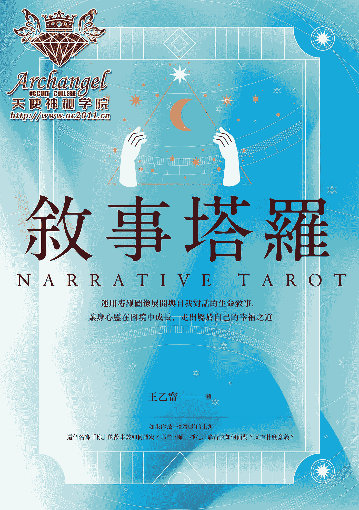

## 推荐序见证塔罗大师的诞生

钟颖

我很久以前就注意到乙甯老师经营的塔罗网站和粉专，也早早就和学生分享她的文章与观点。她对塔罗牌的研究极投入、想法极原创、字里行间都流露出对塔罗牌的真心喜好。

受到心理学及当代身心灵运动的影响，塔罗牌渐渐脱离了十九世纪末、二十世纪初浓重的神秘学氛围，学习者逐渐对牌面上的图像进行故事性的理解，试着从牌阵中创造出与个人经验相连却不同的叙事。

这样的说法虽然浪漫，但实务上也容易出现一些问题。

首先，我们的教育重视所谓的左脑思维，看重逻辑、事实与推理，对于右脑的情绪感受与图像链接等能力的训练非常匮乏。所以多数学习者在刚开始时都只能以很粗浅的方式去对牌面进行联想，创造出来的故事往往扁平单调，对当事人的生命内核起不了有意义的碰撞。

其次，某些直觉感受性比较强的学习者在看到牌面虽然容易被触动而说出故事，但如果反复聆听几次，会发现解牌者所说的故事其实更像是潜意识情结的投射，无论牌面的主题为何，总是会绕回特定的议题，与牌面的主要意旨相违。

正因如此，要成为一个好的塔罗说书人，对个人议题的觉察，对不同生命经验的接纳是万不可少的。

这一方面是为了避免将个人议题投射在问卜者身上；另一方面，牌面的象征虽然固定，但一旦加以组合（成任一种三张牌的牌阵），其先后顺序与正逆变化的组合顺序却可达数百万种。如果不能在当下允许自己无意识里的内容涌动至意识层面，那么就只能在个人的记忆中寻找关键字，故事的义理与韵味当然会很有限。

之所以特别强调这一点，是想对读者说明，说故事虽然容易，要说一个深刻动人且兼不失客观的故事却很困难。作为一个长期的粉专追踪者，我可以这么说，乙甯老师是当中的佼佼者。

虽然这里强调了说故事的难处与魅力，这并不表示这本书欠缺思考的深度与学术的底蕴，只要看看作者对塔罗史的整理就可以知道，乙甯老师并非不能，只是不为。书里尤其令我激赏的地方有三：

第一， 象征一词向来难懂，以荣格之博学，也常有言不达义之处。乙甯老师是我看过文字最精准、举例最恰当的人。她以爱与玫瑰花为例，就把情感与象征的关系讲得清清楚楚。她也不忘提醒读者，一旦象征成为了既定的概念或语言，里头的情感就会再度消失无踪。因此，如何为人生的各种困境寻找新的象征实在是一项终生的功课。

第二， 本书对大牌的介绍丝毫不落俗套，主题重于顺序，阅读经验令人耳目一新，人性掌握尤显深度。读者如若不信，可以先翻到意义牌组的章节：愚者、隐士、太阳，便知我所言非虚。如若不是多年学思经验所带来的自信，相信没有作者敢做出这么精采而又大胆的编排。

第三， 以社会角色来解读宫廷牌。宫廷牌的理解难度最高，但无论是图像还是意义，本书都做出了独到的见解。既然是社会角色，那么宫廷人物就是我们随时可以揣摩和学习的角色，搭配上书里对宫廷图像的诠释，特质便会变得三維，人物的比较变得方便，牌义也更易通透。

最后的问题是，这本书适合什么样的人学习呢？我想主要有两类：包含对背诵牌义感到厌倦或乏味的读者，以及受塔罗的整体性知识所感召的读者。

塔罗学的几门重要理论基础包含占星与卡巴拉在国内已被逐渐补齐，但如此具有疗愈意义的深度作品还是首见，这点特别使我振奋！

可以这么说，本书无愧于塔罗专着之林，说它所触及的心理深度是国内顶尖也绝不为过。过去当然有不少书都提及了塔罗牌带来的个人成长与内省，但鹦鹉学舌，语焉不详者所在多有，没有一本书能像《塔罗的奇幻旅程》具备如此宽广而清晰的视野，独特而且连贯。

这本书为塔罗写作带来了截然不同的典范，让我们见证了一位塔罗大师的诞生。

钟颖（心理学作家、爱智者书窝版主）

## 推荐序

何佳瑞

人是一个奥秘，塔罗牌是人接近自己奥秘的一种方式。这是我对这本书的一个理解。写一本教人不经大脑也可以立刻使用塔罗牌的书籍不好吗？例如《三小时教你学会算塔罗》。写一本符合世俗价值的塔罗指南不好吗？例如《让你大富大贵的塔罗攻略》。我想，那类书就算让人们起疑心，质疑它的可信度，还是会有人真的掏腰包去买。然而，王乙甯老师却选择了一条需要披荆斩棘的道路，她写的是一本并不好写的书，一本能够帮助读者自我理解、自我揭露以及自我成长的书，它叫做《叙事塔罗》。

我与王乙甯老师结识于二十年前，我们一起在世界宗教博物馆工作。当时我们一起研究宗教信仰、宗教艺术、生命教育等各类课题，也常常在工作中彼此相互学习，并为了向大众推广这些内涵而绞尽脑汁。在我的许多朋友当中，她是少数能够与我畅谈宗教信仰、灵性、修行、生命意义的朋友之一。王乙甯老师探索塔罗牌的整个历程，事实上也是她的自我成长和修行的历程。她改变了我对塔罗牌的肤浅理解。有好几次，她为我抽出的牌“解密”时，都给了我一些深刻的启发。“叙事塔罗”并不是如浮萍般没有根基的一个词汇，事实上，它有着深厚的学术基础，它应用了法国哲学家吕格尔（Paul Ricoeur）的叙事理论，它也融合了心理学家荣格（Carl Gustav Jung）的意识分析。借着塔罗牌的图像，求问者从无意识与意识之间相冲撞的火花中揭露了自己的生命叙事，在认识自己的同时，更打开了新的可能性，由此而走上了一条通向自我成长、身心灵圆融的道路。这整套理论事实上是由王乙甯老师结合了宗教学、神秘学、图像学、心理学以及哲学所产出的智慧结晶。然而，更难能可贵的是，王乙甯老师以流畅的文字、浅显易懂的例子、生动的图像说明，向读者娓娓道来塔罗诸事，尽管有着深厚的学术奠基，但读起来却一点也不生涩。

我观察到的“叙事塔罗”，有一些基本的特征，个人以为它们是可以掌握全书精神的几个特征，在此分享给读者。我想，这些特征对于充分且深刻地理解“叙事塔罗”，能起到一些作用：

#### 1\. 从外在转向内在自我觉察、自我认识

人是一种很奇怪的动物，当他带着困惑去找塔罗师的时候，是因为他关心他自己，因此关心自己所处的困境以及自己的未来。可是一旦抽出了牌后，他却忘了他自己，只关注自己的处境和未来，只在乎牌义，希望牌义可以直接指明他应该怎么做。然而，吊诡的是，没有一个人可以在无法观照自己、充满混沌的情况下采取明智的行动。在我看来，由外在转向内在，就是自我觉察、自我认识的开始。这不是说外在就完全不重要了，外在也很重要，因为人的自我总是在与外在情境交会的过程中形塑出来的，然而，问题在于，求问者很自然地将注意力朝向于外在的世界，却忘记了那个应接外在世界的自我。当下的自我是怎么看待这个世界的？用什么样的态度和观点去理解这个世界？又用什么样的人格特质去回应这个世界？他为什么要这样去回应外在世界呢？这些问题如果没有在叙事塔罗中呈现出来，并且成为求问者自我观照的契机，那么塔罗牌就只是一种占卜术而已，它和八字、紫微斗数、手相面相一样，占卜者怎么说，求问者照做就好了。但这不是叙事塔罗想要做的事。叙事塔罗期望读者学会用图像解读塔罗牌，每一次的抽牌，都是一次自我观照、自我觉察的契机。自我观照是自我成长的第一步，没有这一步，自我成长、自我身心灵的圆融是不可能发生的。

#### 2\. 从命定转向抉择承担责任

塔罗牌在一般人的认识中，是一种占卜。多数人将之看成可以预测未来命运吉凶的 “fortune telling”。寻求“fortune telling”的人，显然相信“命运”这回事。然而，叙事塔罗所讲述的命运，不是将未发生的事情看成是某种已经无法改变的命定，让活的人去走一条已经死的路。恰恰相反，由叙事塔罗的角度观之，命运是由每一个人亲手创造的种种可能性。面对未来的种种可能性，那个转向了本真的自我，必须在每一个“境界现前”中做出属己的“抉择”，亲自谱写自己的生命叙事，创造自己的命运。伴随抉择而来的是责任，责任不是别的，正是自己所创造命运的重量。它不是负累，而是自我生命叙事的重量，是人真实地活着的最佳证明。

#### 3\. 由态度决定高度可能性与超越

王乙甯老师在陈述大秘牌的塔罗叙事练习时，给出了一个很能聚焦的公式：目前我在……问题上，用……态度（立场）来观看事件，认为…………（对大秘牌的描述）。我很喜欢这个公式，在我看来，它所点出的“态度”，将成为我们亲自谱写一条属于自己的最佳命运之契机。什么是最佳命运？怎么谱写？这里和我们之前提及的可能性密切相关，因为看见了可能性，我们才有机会转换观点、转换态度，从而超越。这就像是玩桥牌，有人说牌一发下来，好牌、坏牌就定了，这是不错的。然而，同样一手牌，有人打得好，有人打得差。所谓“人生胜利组”这个头衔，给的不是拿到好牌的人，给的是玩得好然后最后获胜的人。当求问者抽牌后，他所看见的图像，揭露了他看待事情的观点、态度，而这样的观点和态度，只代表了“一种”可能性。自我揭露的目的，正是为了要找出更多的可能性，而不是要绑死在一种可能性之上。看清了现有态度和观点所带来的局限，我们才有可能转化自己的态度和观点，让事情朝向一种完全不一样的新的可能性去发展。这个在灵性的修养中，就叫做“超越”。“超越”来自于观点的扩大，来自于可能性的扩大。这种扩大让我们从困境的挣扎中走出来，活出生命的高度。由此观之，我们甚至可以说，叙事塔罗的方法，其实是人在人世间这个大的精神操练场进行自我修行、自我提升的一种方便法门。

#### 4\. 以图像深入有意义的叙事美好人生

王乙甯老师精准的掌握到，没有意义的人生是无法幸福的。意义，是在赋予意义的主体与外在世界交会时出现的，而人则是在不断“赋义”的过程中去走完自己的一生。当我们在进行生命叙事时，我们不是在讲一本流水帐。经历了同样一件困难又辛苦的事情，人人的反应却都不一样：有人可能说，“苦不堪言，死了算了”；或有人可能说，“吃苦当吃补”，这正是大好的学习机会；也有人可能说，“人生如戏，忍忍就算了，别太认真”；还有人可能说，“人生不如意之事十之八九”，受苦难免，但我不思那“八、九”，却愿常想那“一、二”（出自张忠谋）。所有的这些不同反应，都是在对同一事件赋予意义。一个作者在说故事的时候，怎么赋义，决定了这个故事是悲剧、喜剧还是滑稽剧。而我们现在正是自己生命叙事的作者，懂得正面赋义的人，一生都活在阳光里；习惯负面赋义的人，一生都处在黑暗中。生命的每一件事情都不是流水帐，“赋义”，就是要让每一件发生在我们身上的事情，找到它帮助我们通向美好人生的适当位置。意义感其实是在通向美好人生的路上，觉得每一步都走得踏实的感受。塔罗的图像，就像是一个媒介，帮助求问者或学习者，把生命活出那充满意义的滋味。

《叙事塔罗》不仅仅是一本帮助我们深入了解塔罗图像的书，更重要的，它是一本帮助读者自我成长的书。我希望每位读者都能像我一样有一个美好的阅读经验，所以在此将这本书郑重地推荐给大家，并祈愿所有追求身心灵成长的塔罗爱好者，以此书共学共勉，携手前行！

何佳瑞（辅仁大学全人教育课程中心、品牌与时尚经营管理硕士学位学程教授）
二〇二三年十一月八日

## 推荐序叙事中临现的魔法

郑印君

记得小时候当时除了会跟同学、朋友一起玩扑克牌，若是当场有邻居家的大哥哥、大姐姐们在，经常在游戏的最后，总会有人提议要不要试试看扑克占卜。对于一个小孩子来说，借由牌组的洗牌、抽牌、排列与解释，总觉得很神奇。当然那时所谓的扑克占卜，主要是依照一些书籍或流传的说法，经由所排列的牌组内容来说明其所蕴含的意义。

曾几何时，塔罗牌渐渐地可在身旁见到，也开始从学生的口里听到“塔罗占卜”此一名称。现时对于“塔罗占卜”的想法，大多与时下流行的占卜有所关联，也可以看到不少“专业塔罗师”在进行相关活动，寻求着上述的“灵验性”。有趣的是，塔罗占卜并未与任何一个我们所熟知的宗教传统直接相关，因此一般人所认为的占卜与神圣（或超越界）的链接，在塔罗占卜这边成为了未出现的“Ｘ”。当然，其会以卡巴拉、埃及神话、基督宗教、犹太教等来说明此一“X”的内涵，但实际上其灵验性从何而来，应与上述宗教信仰并无直接关系。但若从不同的角度出发来看待塔罗占卜此一行为内容的象征意涵，其实其呈显著一种寻求解答生命疑惑的现象。这样的现象对于一位宗教研究者而言并非是陌生的，反而是在进行宗教研究的过程中经常会遭逢的“日常”。宗教关注人与神圣之间的联系，以及在此一联系中人对于自身的生命之终极关怀，因此宗教研究者更多时候是怀抱着对于上述人神联系的思索探问与寻索热情，来打开、支持自身的研究。在这样的关注底下，宗教研究者相较于一般学者，会更关注到叙事及从叙事而来所开展的临现存在。

本书作者王乙甯就选择了从叙事的角度，来为当代开展出塔罗占卜的一个重要面向，除了是其于硕博士阶段学术研究之探寻外，也呈显出她对于生命的关注与热情。这样的关注与热情，不仅聚注于学术研究上，也可从她于辅仁大学宗教学系及社区大学的授课中看见。何谓叙事（narrative）？就西方叙事研究（narratology/narratologies）的定义观之，其为对于故事（story）之讲述（telling），亦即“讲述故事”（story-telling）即是借由将外在时间纳入自身所讲述的故事之中，使其与自身的关切趋同，并在其中展现出自身的存在者。因此，叙事并非仅是情节的罗织与话语的运用，其更是语言符号中或隐或显的主体指向。乙甯从吕格尔（Paul Ricoeur, 1913-2005）对于叙事与自我认同的精辟见解中，获取了自身探寻所需之养分，并使其丰沃自身多年的塔罗占卜教学实践经验，进而关注塔罗占卜如何“链接了意识与无意识”，使得“原来没有通的意识中的思维、知识，与无意识中的经验碎片与感知”，在塔罗占卜的“桥上相遇与碰撞……带给我们觉察与领悟生命的意义”。乙甯在本书结语中引用张爱玲《爱》的诗句，自有其对于人世关切的丰富情怀。因此，在塔罗占卜的解说叙事中所临现的并非灵验优位、亦非关涉真假，而是关切生命之爱的“魔法”。此一魔法在塔罗占卜此一场域／场遇，召唤象征、意识、无意识、思维、知识，甚至欲望与创伤。但也就是在此一场域／场遇中，生命的创造性才能在话语的形塑中呈显出来，为询问主体提供在分隔与断裂之处的另一可能取径。

郑印君（辅仁大学宗教学系副教授兼系主任）

## 推荐序和塔罗图像一起说故事

蔡怡佳

《叙事塔罗》是作者王乙甯和塔罗牌相识相知多年后，为塔罗牌的运用所打开的新篇章。叙事是故事的说出；故事则是混沌迷惘的事态中，意义形貌的织就。塔罗牌在主流占卜的运用中，以丰富的图像为求问者的问题道出事态的可能发展，原来已经蕴含着说故事的潜力。《叙事塔罗》把这个原来就存在着的“潜力”以深入浅出的方式精采地勾勒出更具体的形貌，指出塔罗牌除了占卜，也是照见自我、说出自我故事的桥梁。

如何说故事？自我的故事又如何叙说？生活在一个“失去神话”的时代中，我们也逐渐丧失说故事的技艺。我们周遭不乏厉害的创作者为我们写出许多动人的故事，但我们却以为说故事的能力只是少数人的天赋。塔罗牌在占卜中的运用也大多依靠占卜师的直觉，或是专家从图像推敲出故事的能力。除了做为故事的“消费者”（consumer），把别人为我们说的故事吃下去，我们是不是也可以成为说故事的人？尤其是关于自我生命的故事？《叙事塔罗》提出了如何运用塔罗牌成为练习说出生命叙事的方法，这个独特性使得《叙事塔罗》不只是塔罗牌运用的工具书，也关乎如何恢复说故事的技艺。

说故事并不容易，为复杂的事态看出意义的形貌，尤其是能够带来反思与行动的生命故事更是困难。为说故事的初学者来说，图像是很好的媒介；在难以凭空说出生命故事时，塔罗牌就可以成为好帮手。本书的前言与前面两章是关于塔罗牌如何成为自我生命叙事之媒介的精彩论述，第六章［塔罗叙事的方法］则是开展生命叙事的方法说明。《叙事塔罗》提出大秘牌的意义指向应对事情的态度与观点，是进入深度自我觉察的媒介。小秘牌指向发生的事件，宫廷牌言说的是人格特质。这三个轴线提供了叙说生命故事的意义线索。《叙事塔罗》提出了具体的练习方法，以及对于诠释的练习很有帮助的案例，让塔罗牌除了指出“占卜求问者”所关切的事态的发展，也为“生命探问者”打开了一条指向内在生命、关乎自我生命的故事之道。

《叙事塔罗》第三、四、五章对于大秘牌、小秘牌与宫廷牌的解说，可以理解为作者多年运用塔罗牌，为塔罗牌如何成为内在生命指引所提出的精彩诠释。读者除了“按牌索骥”，也可以从这些诠释出发，开展自己与塔罗牌一起说故事的历程。自我生命故事的叙说不能请他人代劳，但可以透过他人的经验与方法为自己找到一个练习的道路。《叙事塔罗》是从作者乙甯老师从自己与塔罗牌多年对话的经验与反思中析鍊出来的作品，邀请大家以塔罗牌丰富的图像象征做为链接意识与无意识、自我与世界的桥梁，扩展对自我的觉知，也练习说出自己的故事。任何对于牌卡图像象征与自我叙说有兴趣的读者，都可以从书中得到深刻的启发。

蔡怡佳（辅仁大学宗教学系教授）

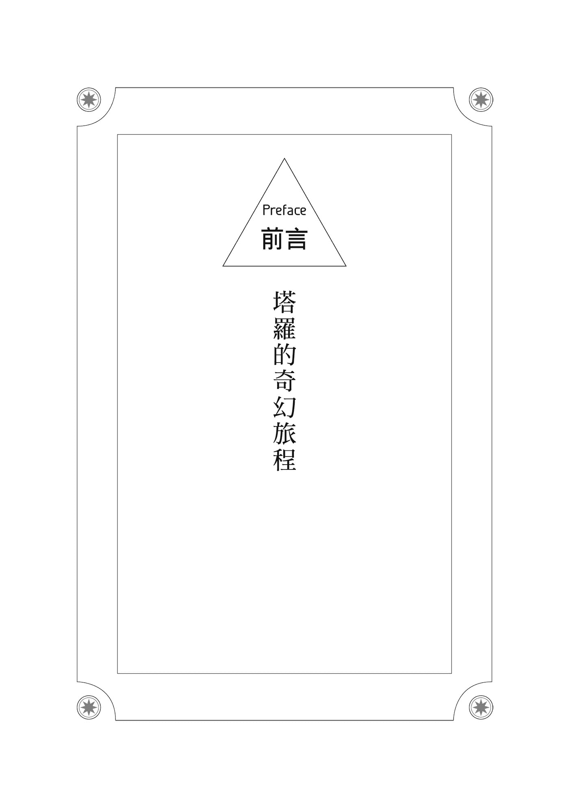

二十几年前，当我第一次在国外网站看到塔罗牌时，非常惊讶。当时我在世界宗教博物馆当导览员，对宗教艺术与图像深感兴趣，所以当我在图像中同时看到埃及、基督宗教、犹太教等的象征时，觉得不可思议，无法理解一神教如何与其他宗教象征相融合，非常好奇图像背后的渊源。当时在台湾塔罗占卜还没流行，市面上只有几本翻译的塔罗占卜书，翻看了几本，除了占卜应用外，没有太多图像相关讯息。我也购买了韦特牌，开始用我有限的宗教知识去解读韦特图像，虽然也试着把这些图像结合为占卜，但怎么也无法理解，这些宗教象征与占卜有着什么样的关系，或者说，占卜虽从撷取纸牌中的牌义，但有很多牌义并不一定是从图像延伸出去的，所以占卜应用似乎不需要理解太多图像细节，只要背诵牌义，就可以练习占卜。但从图像研究开始的我，在转换为占卜应用上反而遇到了很多问题，最后只好放弃，所以我学习塔罗的最初几年都在做图像研究，没有应用为占卜。

几年后，塔罗占卜变得更为普遍，身边知道我在研究塔罗的朋友，偶尔也会问起是不是可以占卜，所以我又有了想要尝试占卜的想法，心里想着，之前的挫折可能是我对塔罗图像的理解不多，现在或许就会有不同的结果。但结果还是一样，虽然每次抽出来的图像我都看得懂，却无法回答是否需要离职？九月出国旅游好不好？要不要跟对方分手等问题，所以我又放弃了。当时我购买了瑞秋．波拉克（Rachel Pollack）的《塔罗智慧》（*Tarot of Wisdom*）一书，这本书针对每张大秘牌都提出了身心灵觉察与成长的提问，这些提问方法给了我很大的启发，至此我就放下了占卜书，透过每日抽牌与图像解析，慢慢摸索我认为的塔罗占卜的应用方法，经过一段时间的摸索与练习，我才发现过去在占卜应用上的挫折，并不是我对图像不了解，而是提问错误，问题的方向错了，才会一直在答案上卡关。

当我们把注意力从占卜答案转向塔罗图像，就会发现塔罗占卜是“看图说故事”。故事无法回答 Yes／No 的问题，但故事把状况展现在眼前，让求问者透过故事思考发生了什么事、为什么会发生这些事、在事件里的我又如何。这就像如果你有工作烦恼，正在思考要不要换工作时，去问了信任的长辈，结果对方没有告诉你换还是不换，反而说了一个自己曾经遇到的工作上的故事，虽然长辈没有说该怎么做，但你听了故事突然有了一些领悟，并且帮助你不再纠结在换或不换工作，而是重新审视自己在工作上遇到的问题，或许问题不在于换工作，而是在于我要如何应对遇到的困境。

对塔罗占卜的全新理解，打开了我对塔罗占卜的学术研究的道路，当我把塔罗占卜设定为“看图说故事”时，才慢慢发现塔罗占卜可以帮助我们透过故事传达“意义”。说故事就是所谓“叙事”，叙事起初虽是从文学领域开始的理论与分析方法，但哲学家吕格尔[[1]](#Foreword2.xhtml_fnX-1)却从叙事延伸出了身份认同的思考。他认为我们在说自己的人生故事时，就像故事创作者，会对自身的记忆重新进行编排，形成有关“我”的叙事，这些叙事承载着我们的身份认同，以及叙事当下我们所理解的生命意义。吕格尔的理论，成为我在发展塔罗研究的主要思维，把求问后形成的抽牌答案，视为是一个人的生命叙事，一旦把塔罗占卜视为生命叙事，我们在抽牌中获得的并不是有关未来的答案，而是透过叙事对自我进行另一面向的理解，而这种理解就是觉察，也是在拓展自身的生命观。

这就是我的塔罗占卜，当我深究图像时，图像里的象征带领我进入宗教、神秘学、神话、心理学等的人文领域，从这些人文领域的学习，在每次抽牌解牌时，塔罗图像带给我的是生命叙事，而不是预测未来的答案。后来持续进行塔罗的博士研究，更深入到塔罗在灵性发展上扮演的角色，以及图像与灵性成长之间的关系。

塔罗、塔罗牌、塔罗占卜在西方文化的发展脉络是不同概念，但在台湾，我们对塔罗占卜的概念太粗略，忽略了塔罗牌在占卜之外的应用。虽然市面上已有很多类型的塔罗书，但还是以占卜书占多数。很多人都是以学习占卜为目的进入塔罗领域，但如果不想成为职业占卜师，也不会积极去练习，所以占卜技巧无法精进。塔罗牌其实还有另外两种类型的学习：图像研究与身心灵应用。这两种类型是针对没有要成为职业占卜师，但想透过塔罗抽牌，解决自身或亲友所困扰的人生问题，更专注在塔罗图像的象征解析，以及抽牌的故事应用。

这本书是韦特塔罗牌作为身心灵应用的入门学习书，所以较注重图像的生命观，而不是占卜术的牌义。神秘学的生命观艰涩难懂，初学者很难直接进入，所以这本书把原有的神秘学生命观，转换为生活语言，并透过几项人生主题，进入大秘牌的介绍，希望帮助初学者，从大秘图像进入延伸的生命思考，拓展学习者的人文内涵，进一步在占卜应用时，这些内容可以带领学习者进入深层的生命觉察与领悟。在占卜应用上，也会跳脱传统占卜的提问与牌阵应用，让大家透过学习塔罗，不是预测外在事件，而是走向生命成长的道路，借由成长，让自己更能成熟应对困境与人际关系，最后走出属于自己的幸福之道。

1.  Paul Ricoeur，二十世纪法国哲学家。 

## 应对烦恼的四阶段与塔罗占卜的三面向

很多人在经历困境时会借由“占卜”来解决问题，我们以为找方法解决问题就已经做到了面对与接受，但在占卜谘询中常常发现，很多人是带着同样的问题重复找占卜师求问，这表示就算占卜出答案，未必代表能够真正解决问题，那人生问题要如何才能真正获得解决呢？“面对、接受、处理、放下”是解决人生困境的四个阶段，事件经历者没有进入“面对”与“接受”的过程，只是满心期待着事情能够尽快得到解决，这时候我们做的任何解决都只是治标不治本。

工作中的人事问题、与主管的互动、感情中的摩擦……我们以为换一个环境、换一群人，事情就会不同，但静心思考过去到现在，用改变环境的方法处理问题的结果是，绝大多数都会与同样的问题再度相遇。这时很多人会很无奈的回应自己：“我运气好差”、“为何我都碰不到好缘份？”但到底是我们倒霉、运气背？还是我们一直在用错误的方式应对困境？一般占卜都是在帮助求问者“处理”问题，如果有人工作不愉快，就问换新工作是否比较好？感情不顺利，就问何时可以遇到好对象？针对这些问题回应就是我们认为的“占卜”。但塔罗占卜可以再往治本的方向发展，帮助我们真正走出困境，不让同样的事件重复发生。

治本的塔罗占卜要先理解应对人生烦恼的**面对**、**接纳**、**处理**与**放下**的个别意义。所谓“面对”就是让我们“看到问题”，在这里的“看”是自我觉察，是自我的问题意识。如果今天有人来问换工作的事，而换工作的原因是在目前的工作有人际关系不和或不愉快，那求问者必须先“看”到，换工作的心态是不是在逃离问题？如果在每次换的工作后没多久就又出现人际关系问题，问题可能不在外面而是在求问者本身。面对的下一个阶段是“接纳”，这是一个需要对自己的选择负责任的阶段，任何问题的存在与我们所做的决定与行为有关，所以不论目前的处境是喜欢或不喜欢，都是自己选择的结果。

当然有些时候，我们似乎会落入不得不的处境，但不得不的处境常常也是因为自己设下的思考陷阱与条件，也是我们选择安全、熟悉的道路的结果。在不想接纳结果的生命处境中，我们很容易把问题怪罪到他人身上，如果工作不愉快，就会怪罪主管难搞、同事不好相处、公司制度差；如果感情不顺，就会怪运势不佳、对方不懂得珍惜等。这些理由会把解决问题的注意力放在他人身上，所以有些人就会选择用换工作、分手、离开来解决不愉快的处境。一旦经历了面对与接受阶段，我们自然会开始明了处理的方法。而塔罗占卜解牌的三面向，就是为了在解牌时，帮助解牌者进入应对烦恼四阶段的方法。

塔罗占卜解牌的三面向分别为身、心、灵。“身”的占卜指外在事件，也就是我们熟悉的占卜功能，对于遇到的事件给予方向与答案，这是日常生活的占卜应用。但要进入面对、接纳与处理，就需要进入“心”的面向，也就进入了所谓的自我觉察与探索领域。在这种面向的解牌，要重视的并不是发生了什么事，而是要觉察“事件中的人怎么了？”所以在解牌的过程，要能够从图像中解读意图、动机与心理状态，这时候更需要从图像的观看中获得启发，图像的色彩、构图、象征、配置，以及与抽出来的图像产生的链接等，这些细节都会成为帮助我们解读的线索。

例如有人想换工作，在“现在”的位置抽出圣杯 8，“未来”的位置抽出五角星 5。除了代表这个人要离职以外，也呈现了求问者在追求更上一层楼的机会，求问者想要更大的成就，却没有清楚认知到自己的需求，在找新工作时还是以稳定、自己熟悉的领域为主，所以五角星 5 提醒的是这种行为在找工作上会遇到的困境；或者求问者并没有为自己的更上一层楼创建基础，只是想要得到更好的工作，在找工作的未来就会遇到五角星 5 的不如意；或者是抽牌者想要追求梦想，但梦想无法给予安稳的经济条件，所以会让自己走向五角星 5 的处境。所以从圣杯 8 的出现，不只告诉抽牌者想要离开工作这件事，也可以进一步从图像引导求问者去“看到”换工作的真正动机，并协助抽牌者去思考对未来最好的处理方法。

最后的“灵”的面向与信仰、宗教与灵修有关，这一面向的解牌才能真正进入“放下”阶段。人生有很多烦恼未必能够解决，生离死别等问题，不是要解决，而是需要我们去跨越。跨越来自于心灵，所以灵面向的解牌更需要解牌者具备宗教、神秘学或对生命的深入洞见，并从灵性层次领悟烦恼为何而来。“灵”面向的解牌不再有任何解牌规则，依每位解牌者所体悟到的生命智慧，从图像中进入深层的心灵世界，也可以从探究心灵的心理学理论切入，并从塔罗图像获得心灵启发。所以灵面向的解牌，不只要对塔罗图像具备足够的理解，解读者也需要先具备充足的人生思考，这些思考与图像碰撞后转换为智慧，带给我们跨越烦恼的领悟。

接下来介绍学习塔罗的不同类型与方向。

##### 塔罗占卜术、塔罗叙事、塔罗身心灵占卜有何不同？

占卜术指称自古以来运用为预测未来的数术，塔罗占卜从十八世纪开始，分成了两个应用路线，一是神秘学者们的图像研究，另一种是占卜术的大众文化，这两者到了二十世纪初，相互结合，无法再清楚区分两者的差异。但目前观察台湾的塔罗牌使用，还是可以分为占卜术与身心灵应用的差别。

注重预测未来的塔罗占卜，重视占卜师的经验与直觉，对塔罗图像的宗教与神秘学意涵未必会深究，这种占卜应用方法在本书称为“塔罗占卜术”。

另一种应用方式重视图像的象征分析，透过宗教、神秘学、神话、艺术等人文学科的方法，对塔罗图像进行多层解读，在占卜应用上，不再只是依赖牌义，而是从图像分析生产解牌内容的占卜应用方式，在本书称为塔罗身心灵占卜。

本书的占卜法，虽也是以图像解析为主的身心灵占卜，但在占卜应用上，放入了叙事技巧，所以特别称为塔罗叙事。

## 图像学习

塔罗牌原先是十五世纪左右，意大利贵族们使用的游戏纸牌，之后透过贵族的联姻，慢慢流传到意大利之外的地区，但到了十七世纪左右，塔罗游戏便已失传。经历启蒙运动的欧洲，知识份子们开始对有着哲学思维的神秘学产生兴趣，炼金术、占星、占卜、魔法，以及当时介绍到欧洲的东方宗教与灵修思想，都引起了想在精神领域有所追求的知识份子们的好奇，并推动了西方神秘学的复兴。当时欧洲中产阶级快速兴起，社会的商业活动兴盛，透过更多的书籍印刷，知识也普及到各个阶层，十八世纪中，在法国马赛地区，透过零散遗落在城市的塔罗牌，新的塔罗牌被印制出来，但当时没有人知道塔罗是怎么来的、拿来做什么，反而开始得到神秘学者们的注意。

马赛塔罗只有二十二张大秘牌有人格化的图像，以及跟欧洲文化及社会传统有关的文字标题，另外五十六张纸牌形式与扑克牌类似，所以当时神秘学者们关注的是大秘图像。神秘学者安东．杰伯林（Antoine Court de Gebelin, 1725-1784）是第一位出版塔罗与神秘学研究相关专书的学者，当时他把二十二张大秘牌视为各种神秘学象征系统的图像汇总，并把塔罗的起源追溯到埃及，认为这些图像是埃及的托特神给予祭司的神秘智慧，但因为埃及文化灭亡，原来的图像失传，所以需要更深入的研究，把失传的部分找回来。杰伯林的埃及与塔罗学说，普遍为神秘学者们接受，打开了塔罗神秘学的研究风气。因杰伯林的专书，当时在民间以算命术出名的艾利埃特（Jean-Baptiste Alliette, 1738-1791），就从杰伯林的埃及学说出发，重新绘制一套新的占卜用塔罗牌，并出版了塔罗占卜书，加强塔罗占卜的神秘性。杰伯林与艾利埃特，一位是欧洲的知识菁英、一位是民间术士，他们两人在不同社会阶层，各自推动了塔罗的图像研究以及占卜应用。杰伯林的图像研究后来由另一位法国神秘学者列维（Eliphas Levi, 1810-1875）继续下去，但艾利埃特的占卜牌卡却没有持续流传，而塔罗牌的占卜应用，一直到一九一〇年韦特塔罗的发行才又开始兴盛起来。

在欧洲的神秘学领域，将列维称作高阶魔法之父，他系统化的整理庞大的神秘学，并且推出了塔罗与卡巴拉（Kabbalah）神秘主义相关的学说。列维一直对犹太教神秘主义很有兴趣，虽然一开始也受到埃及与塔罗研究的影响，但他在卡巴拉神秘主义找到了更多与塔罗有关的象征，列维的塔罗研究影响至今，目前还有很多人会用卡巴拉神秘主义解读塔罗，也影响到一八八八年在英国成立的秘密学会“金色黎明会”（Hermetic Order of the Golden Dawn）。第一位把列维的神秘学翻译介绍到英国的是韦特（Arthur Edward Waite, 1857-1942），他后来也进入了金色黎明会，并发行了现今最广泛使用的韦特塔罗牌。

韦特是在美国出生的英国人，也是一位天主教徒，他的塔罗牌研究脱离了列维的影响，并从塞尔特的圣杯传说中找寻与塔罗有关的根源，认为塔罗与中古时期消失的天主教神秘教派有关，为了创建自己的研究特色，韦特邀请当时也在金色黎明会的艺术家潘蜜拉（Pamela Colman Smith, 1878-1951），一起创作了新的塔罗图像，并在一九一〇年在自己创立的出版社对外发行塔罗牌。这是在艾利埃特之后，第一套对外发行、完整的占卜用塔罗牌，虽有些学者认为韦特塔罗的销售成功，与韦特自己拥有出版社有关，但潘蜜拉所绘制的图像风格，脱离早期欧洲贵族与埃及等的形象，更符合当时代大众所熟悉的戏剧或广告意象，也是韦特塔罗普遍受到大众喜爱的原因之一，而且原来没有图像的四十张小秘牌 ，到了韦特塔罗，全都转换为有故事的人生剧场，在占卜应用上，让塔罗小秘牌与只有数字与元素图案的扑克牌形成区隔，创建了塔罗牌的特殊形象，这些都是韦特塔罗对后续的塔罗占卜发展带来的重要影响。

韦特塔罗发行之后，塔罗的图像研究与占卜结合得更紧密，形成了现今我们使用塔罗占卜的模式，但在韦特塔罗之前神秘学者们的图像研究，还是有很多不同领域的人文学者在进行，至今也有很多相关专书出版，例如：从马赛塔罗的大秘牌讲解天主教灵修的《塔罗冥想》（*Meditations on the Tarot: A Journey into Christian Hermeticism*）、从东正教灵修解读韦特大秘牌的《与塔罗有约》（*The Symbolism of the Tarot*）、从荣格原型理论分析二十二张大秘牌的《塔罗与原型旅程》（*Tarot and the Archetypal Journey*，暂译），从佛教修行解读二十二张韦特大秘牌的《塔罗中的佛性》（*The Buddha in the Tarot*，暂译）等。虽然在台湾翻译出版的相关专书不多，但在国外，透过塔罗图像进行人文领域研究的努力还在继续。

塔罗图像研究可以分为两个方向，一种是从探讨精神生活的人文领域切入，透过塔罗图像来解释形上学的内容，这类型的研究如上述提到的宗教灵修、荣格心理学等的方向为多数。这是以人文领域为主、塔罗图像为辅的研究方向，也就是用塔罗图像来解释形上学的补助教材，虽然可以拓展我们对塔罗图像的理解，但背后需要对相关的人文领域有整体的知识概念，才能做类似的说明，这也是神秘学者们打开的研究方法。另一种是从艺术的图像学角度，从欧洲文化、历史、艺术等的观点，分析塔罗图像的特色，这是透过各种人文领域的知识，让我们更能认识塔罗图像的方法，不再只是以占卜用纸牌的方式理解塔罗牌，而是把塔罗图像视为图像创作，进入塔罗的艺术与文化视野上的解释。二十世纪初，美国的纽约图书馆员格特鲁得·莫克利（Gertrude Moakley）就有进行类似研究，并出版过几本著作。台湾近期翻译出版的《塔罗博物馆》（*Tarot and Divination Cards: A Visual Archive*）也属于图像研究方向。但不论是哪一种方法，图像研究都不注重占卜应用。

## 塔罗占卜术

在台湾，用为未来预测的方法统称为算命占卜，在英文可以用 fortune telling 或 divination 来表示，在塔罗神秘学研究时期，坊间也开始流行塔罗占卜术，这些占卜与看掌心、咖啡渣、扑克牌占卜类似，主要作为预测未来的用途。神秘学者列维就曾经严格区分神秘学者们使用的塔罗与坊间的占卜术之间的差异，并且把神秘学研究称为 tarot divination、占卜术用 fortune telling 来区别。同样的塔罗牌，因为使用族群不同，出现了不同的应用方法，不仅欧洲神秘学如此，在中国也曾出现过庙里求签的签诗，不识字的市井小民用来预测未来，而在文人雅士间则成为休闲的文字游戏。塔罗占卜的 divination 或 fortune telling 的差别，主要在于使用者是否为图像研究者，因为经由图像研究的抽牌解牌过程，会进入神秘学的生命观，较注重人的精神层次。但大众应用的占卜术，重视外在事件的运势，人是被外在事件掌控，比起一个人的精神生活，更重视如何预知运势并趁势而为。

中国传统的占卜术也与预测运势有关，所以当塔罗牌以“塔罗占卜”的形式被介绍到台湾，我们对传统占卜术的想像与理解，成为认识塔罗占卜的概念，而这种概念较接近占卜术（fortune telling），所以大众普遍应用的塔罗占卜，就以预测未来的应用为多。塔罗占卜术，不太需要深入理解图像背后的神秘学意涵，只要对每张纸牌所代表的牌义有概念，就可以进行占卜，占卜解牌比起对塔罗图像与对神秘学的理解，更需要占卜经验的累积，透过实战经验，对求问者所求的运势问题，给予明确的答案。塔罗图像本身无法给予是与否的答案，所以针对“是否要换工作？”“是不是要分手？”“对方喜欢我吗？”等问题的答案，是职业占卜师以个人的经验与直觉来回复，与神秘学研究没有直接关系。目前台湾坊间大多为塔罗占卜术，这类的学习通常是针对运势发展以及外在事件的未来预测等问题，期待塔罗占卜能够给予是与否的明确答案。

塔罗牌的发源与占卜无关，它原先是游戏牌卡，所以并没有可预测未来的神秘性，但艾利埃特把塔罗占卜术的渊源链接到埃及的托特神之后，塔罗占卜就蒙上了一股神秘色彩，但艾利埃特的塔罗图像不易解读，所以也没有普及化，直到韦特塔罗的发行，塔罗占卜术才普遍被大众认识，但韦特塔罗把所有纸牌转变为人物图像后，为预测未来的占卜术带来了意想不到的转变。用韦特塔罗占卜时，虽然求问者也会问“是与否”的问题，但塔罗解牌自然而然就会变成看图说故事，占卜师虽然也会给予答案，但比起最后的答案，由塔罗牌呈现的人生故事在解牌时也变得重要起来，而且易读的图像，让原来只能依赖占卜师的解牌，求问者也会从抽出来的图像进入解读，让塔罗占卜以占卜师与求问者相互对话与讨论的方式发展，而占卜师不再是铁口直断的权威发言者。在韦特塔罗牌的发行期间，美国正在展开灵性思想运动，这两者在美国相遇，犹如法国神秘学对塔罗牌形成的重要影响，美国的灵性思想与韦特塔罗的结合，成为了今日塔罗占卜的身心灵应用的开端。

## 身心灵塔罗占卜

打开塔罗身心灵占卜领域的是艾登．格雷（Eden Gray），艾登．格雷原先是美国新思想运动的演讲者，新思想运动二十世纪在美国推动了精神疗法（Metaphysical Healing），专注于人的积极、正向思考，相信每个人内在都有神的本质，只要透过内省与摆脱负面想法，每个人都可以展现内在的神圣力量，并让一切心想事成，“思想就是实相”（Thoughts are things）成为运动的主要精神。艾登．格雷将塔罗占卜用来清理负面想法，并让人获得正向力量。她出版的塔罗占卜书，从图像解读开始，虽然也有占卜应用，但解牌注重求问者身心状态的觉察，同时介绍欧洲神秘学对塔罗牌的解读，以及塔罗图像的冥想运用，为塔罗学习开拓了更多元的图像与精神疗愈的应用。虽然艾登．格雷的书并没有介绍到台湾，但这时代重要的塔罗身心灵领域推动者如瑞秋．波拉克、玛莉．K．格瑞尔（Mary K. Greer）等人，在台湾翻译成中文的著作如《78 度的智慧》（*Seven-Eight Degrees of Wisdom*）、《跟着大师学塔罗》（*Understanding the Tarot Court*）等，都较为注重塔罗图像的深入解读，以及塔罗牌在占卜之外的应用。

从美国的新思想运动推动的精神疗法，强调个人的内在力量，甚至外在事件的发生，也不再归咎于运势，而是可以由人的正向思想来进行改变，所以个人成为自身命运的负责人，不再怪罪他人，而是从自己的改变带来命运的改变。所以身心灵塔罗占卜，重视求问者的自我觉察，在解牌时，不只是未来要怎么做的答案，而是进一步从塔罗图像中，透过故事，分析与诊断求问者的身心状况。如果要从占卜解牌获得求问者身心状态的觉察与分析，只从牌义着手是有所不足的，这时候，图像背后的宗教、神秘学等的生命观就会变得重要。当求问者问：“在工作上为什么会遇到困境”时，如果抽到“倒吊人”，通常我们会以倒吊人所代表的牌义去解牌。但神秘学的生命观在于把二十二张大秘牌视为连续性的历程，图像意义与它所在的大秘序列也有关系，以倒吊人为例，出现在正义牌与死神牌中间，强调如何翻转原来自认合理的道理（正义），然后让阻碍自己成长的价值，在死神牌被抛弃与跨越，所以求问者目前在工作上遇到的问题，是求问者自身已知道无法继续用旧做法与旧观念维持现有工作，心中有太多质疑，让求问者无法视而不见，如果想要解决现阶段的问题，就要走向死神，就算痛苦，也要承认改变无可避免的现实。

除了把二十二张大秘牌视为生命历程进入解读，韦特图像也可以从象征意象进入生命觉察，例如把正义、倒吊人、死神三张图像放在一起，正义背后隐藏的黄色、倒吊人的黄色头光、死神背景升起的黄色太阳，这三个黄色意象，似乎在说明原来在正义躲避的事实，在倒吊人无法视而不见，如果坚持倒吊人所见到的事实，虽然会经历死神，即带来改变的痛苦，但唯有如此，才能走向新的开始。所以倒吊人在生命历程上，代表突然认清自己是丑小鸭，无法顺着他人的要求，过他人期待的生活，所以走向死神，决定让自己不要再伪装成小鸭，成为天鹅。

身心灵塔罗占卜的学习，比起占卜术，需要花更多时间学习图像内容，同时也要能够更系统化的阅读宗教、神秘学、心理学、哲学等的人文材料，帮助学习者走进更深入的生命思考。当然，这些生命思考，如果有足够的思考能力，不需要塔罗也能够做到，但身心灵塔罗占卜能透过求问的方式，帮助求问者透过身边发生的事，快速又聚焦的进入到问题核心。比方说，生命探索就像在个人的无意识中寻宝，无意识就像大海，太过广阔及深远，没有工具的帮忙，需要靠运气才能找到宝藏的位置，但塔罗占卜就像探测雷达，可以帮我们锁定宝藏所在的位置，但是否能够到达宝藏所在地，并且把它挖出来，就不是塔罗牌能够做到的事，而是塔罗解读者所拥有的人文思考厚度，才是获得宝藏的关键。当我们不再把塔罗占卜视为预测未来的工具，而是帮助我们觉察此时此刻的自己的时候，我们就进入了将塔罗占卜运用为身心灵成长的领域。

身心灵塔罗占卜是将神秘学研究与占卜术，透过韦特塔罗相结合的结果，在过去，神秘学是社会菁英的领域，占卜术是大众的需求，到了知识大众化的时代，这两者的距离不再南北相隔。艰涩难懂的神秘学，透过韦特塔罗易读、易懂的象征图像，更轻易的转换为占卜，让塔罗占卜以生命成长的面貌走入了我们生活。

韦特塔罗的七十八张纸牌都是有人物的图像，与之前只有二十二张大秘牌为象征图像、其他是扑克牌形式的元素与数字牌有所差异。元素与数字的占卜解读是符码解密，当我们使用马赛类型的塔罗牌，在多张抽牌时，就有可能落入图像解读与符码解密的形式混淆。

所谓符码解密，以易经占卜为例，易经的六十四卦是一种符码，这种符码无法直接形成故事联想，而是透过符码背后的文字叙事，才能进入情境的想像。易经的爻与爻词的关系需要背诵，那不是可以自然联想的结果。

但韦特塔罗无论抽出几张牌，都会形成人物画组合，我们在观看人物画时，不论有没有看懂，在懂之前，人物画里的各种意象，会直观的与我们过去的生活经验相连，这种链接会唤起记忆中遗忘的经验，也会帮助我们重新找回经验中的感觉。人会在生活中迷失，就是因为遗忘了曾经的感受，但人物画会再次帮我们唤起，这也是为何欣赏画会让无趣的生活开始有温度，这种唤起也会帮助我们进入此刻的生命觉察。韦特塔罗的占卜应用，在图像与占卜形成的故事两方面都能推动个人的心灵成长，接下来就介绍图像、故事与心灵成长的关系。

## 韦特塔罗图像的特色

韦特与潘蜜拉所生活的时代，刚好也是象征主义（Symbolism）艺术风行的时候，象征主义的手法较常用于以图像表现思想的画作，尤其神秘学是形上学的一种，无法用一般语言或图像表述，需要透过想像力对自然与宇宙万物进行模拟式的思考，才能有所体悟。所以象征主义的绘画并不只在表述情感，更透过画里的特定表现，传达画中的话（思想、观念），而象征需要有相关的知识背景才能解读，不是直觉，比如古文中的典故，如果没有相关知识，当我们读有典故的诗词，只能读懂表层的文字描述，却无法理解诗人透过典故想要传达的意义。所以解读象征画，可以是纯情感层面的欣赏，但如果真要读懂绘画的内涵，就要理解象征背后延伸的意义。

潘蜜拉虽以画大众化的戏剧海报或布幕维生，但在进入金色黎明会之后，也创作了神秘主义绘画作品，韦特就非常欣赏潘蜜拉的画作，曾称赞潘蜜拉为“最富想像力又特殊的灵性艺术家”。但他们一起创作塔罗牌的图像时，大秘牌早在法国神秘学时期就被视为是神秘学的象征系统，所以每张图里的色彩、人物构图与配置、文字与数字之间，都有着很深的意义链接。韦特在思考大秘牌的图像时，以他的博学，必然已经博览过去神秘学者们对马赛塔罗做的各种研究，最后再由韦特自身的天主教灵性观，重新整合进每张大秘牌的图像中，并透过潘蜜拉的视觉转化，表现成我们认识的韦特塔罗大秘牌。但小秘牌的创作，很多塔罗学者认为韦特并没有参与太多，全都交给潘蜜拉创作，以现在合作关系来描述是，创作者的自由度很高。

韦特在《塔罗图像关键》（*The Pictorial Key to the Tarot*，暂译）一书中确实也有表态，小秘牌是占卜应用的牌组，与大秘牌表现神秘学的思想有所差异，所以韦特的塔罗研究集中在大秘牌的图像内容。如果观看小秘牌，每张图有很浓厚的人生剧场的意味，可以想像潘蜜拉将剧场艺术家的身份充分应用在创作上。虽然现今我们都认为韦特牌是第一幅把小秘牌人物化的塔罗牌，但在一四九一年意大利就出现过图像化的小秘牌 Sola Busca Dek，而在一九〇七年这副牌卡便已收藏在大英博物馆中，并对外展出，所以在韦特塔罗创作期间，潘蜜拉就有可能参考这些牌卡上的图案。无论如何，韦特小秘牌的人物画，以鲜明的色彩、人物动作，再加上原本小秘牌上的数字与元素，生动的表现出四十种人生剧场，解读图像本身就可以是对人生的学习与理解。再加上十六张表现人格特质的宫廷牌，韦特塔罗牌的占卜，脱离了原来符号的解码式对照，不论抽几张纸牌，都会成为图像解析式的解牌。进入到图像解析就需要分析象征与构图，所以韦特塔罗的解牌一方面是应用理性，进行科学式的分析方法，另一方也会透过图像，进入无意识的直观与灵感，意识与无意识透过塔罗占卜的意象链接，就有可能促成对生命的“悟”。

##### 大秘牌、宫廷牌、小秘牌的图像分析差异

本书解析了大秘牌、宫廷牌的图像，但并没有用同样的方法解析小秘牌。大秘牌与宫廷牌的呈现方式为象征图像，每张纸牌上的图，都需延伸解释的方式补充纸牌上的文字概念。所以魔术师头上的无限大符号，需延伸解释为魔术师应用地火水风这些大自然元素的能力，象征了魔术师拥有质变的潜能。而宫廷牌上每个人物的姿势与背景的配置，也都在说明该人物的性格。所以宝剑骑士牌上扁平的云与宝剑侍卫牌上分布不均的云朵，会成为这两个人物不同性格的表现。这两种图像的意义，已被纸牌上的文字框限，图像虽延伸了文字概念的内在意涵，但文字已让图像意义变得明确。

四十张小秘牌在纸牌上没有文字，所以纸牌上的图像指涉什么样的情境，需要看图说故事。这些图像并不需要延伸解析某个特定的文字概念，而是透过每张图上的构图、元素与数字等线索，传达出人生的某种境遇与情境。而且这些境遇是真实人生的模拟，所以在解牌过程中，这些图会对应到求问者的实际状况，图像意义会依求问事件而变动，所以小秘牌的学习，比起图像细节的象征分析，更需要真实人生的联想能力，并依求问事件从图像延伸出相关的人生故事与情节。

## 象征与心灵

我们对“象征”并不陌生，生活中无法三言两语表达的情感、或无法说明的人生情景（生离死别），都需要用象征来延伸语言所不足的地方。例如用玫瑰花象征爱情，这时我们对爱情的理解会延伸到玫瑰花，但为何无法用语言表达的爱这种情感，用玫瑰花就可以被表达呢？“爱”没有具体形象，也没有固定的模式，它是很难用语言描述的情感，但玫瑰花的花香、迷人的花朵、颜色、保护自己的尖刺、看着花没有原因的喜悦等，都传达了我们对爱情的感觉。又或者我们常用一年四季的变化，象征生死轮回，也会用蝴蝶的蜕变来象征死亡的生命转化。象征是语言的一部分，或许是最接近生命的语言，因为象征所传达的，与人丰富的情感以及无法掌握的生命有关。越是理解象征在我们生活中扮演的角色，就会越能理解情感的无从表达，以及生命的无可理解性，但这些无从表达的情感都深藏在我们的心灵中，所以心理学家荣格（Carl Gustav Jung, 1875-1961）认为“象征”是链接无意识的语言，甚至也是进入每个人心灵深处的一把钥匙。

荣格把象征分为死的象征与活的象征，其中能够成为心灵钥匙的是活的象征。前面举例的爱情与玫瑰花、生死轮回与四季，这些大都属于死的象征，人类自古以来就在生活中使用这些象征，它们像语言一样成为了概念，而不是象征。所以当我们看到红色玫瑰花，就会直接联想到爱情，但有可能不会触及到爱的感觉。如果因为频繁使用某个象征而成为理所当然的概念，就无法成为打开内心深处情感的钥匙。概念与语言是理性头脑主导的领域，心灵所在的无意识深处，则是储藏各种情感意象（Image）的大海，没有被分类归纳，像大海里的宝藏，没有雷达或导航只能靠运气，无法直接探触。无意识的意象碎片，会在夜梦中或经由白天发生的各种事件触发，短暂浮现在意识中，但如果意识没能认出这些意象要传达的讯息，它们会再次沉到大海里。

无意识里的意象碎片是过去每个人的经验，也是经验可转化为智慧的可能空间。抓取这些碎片的重要性，对荣格来说，是为了能够为意识导航。清醒意识中的“自我”，会以为自己就代表个人的一切，努力为自己做出最好的选择，并解决生活中遇到的各种问题。但自我就像过度照顾小孩的父母，替小孩做出“为你好”的决定，却不知这些“为你好”如何阻止小孩的成长。父母认为自己可以代表小孩，却忘了小孩有自己的独立人格。同样地，自我只是白天意识的代表，无法代表一个人的整体，对荣格来说，整体人格的核心是“自性”，而自我只是自性的一部分，只是自性在无意识深处，无法被自我感知。自我在白天意识，所知的有限，所以他为自己所做的决定，常会失去整体性的观点。而为一个人的生命整体定位、成长的自性，很努力帮助自我导航，走向个人的幸福之道，但如果自我的意识过强，只以理性为生命的全部，就有可能屏蔽了所有从自性传来的讯息。

精神分析重视解梦，也是因为发现梦是无意识的语言，梦里的意象是个人无意识自创的象征，可以透过解梦到达个人的心灵深处。但不只是个人自创的梦的象征，只要是“活的象征”都能成为进入心灵的道路。梦的象征与个人的生命经验、情绪息息相关，我们在梦里总会有着复杂的情感流动，这些流动的情感隐含在梦的象征中，是情感带领我们认出象征代表的意义，而不是象征本身。所以象征是带领我们进入情感内的具体形象，我们从象征的“有形”，跳进经验与情感的大海，这些象征直接把我们丢进蕴藏宝藏的大海深处。所以活的象征是能够唤起记忆中的经验与情感的形象，当我看向玫瑰花，如果重新从玫瑰花的形象，唤起对爱情的经验与感受，重新把经验中的感知找回来，这时玫瑰花与爱情也重新成为活的象征。

如同前面所提，我们会因为欣赏一幅画作，有可能找回曾经有过的经验与感觉，并从那种感受中，为迷失的人生方向定位，这时，那幅画就成为了唤起无意识意象的象征，并为自己的生命方向重新导航。塔罗图像也能成为活的象征，但需要由学习者，以活的象征的方式透过图像进入自己的生命，才能让塔罗成为进入心灵的钥匙。但大部分的塔罗占卜学习，都以概念化的语言，让学习者记忆每张牌代表的“牌义”，最后学习者记得的是牌义，并不是图像本身，结果每次占卜时，我们在头脑中翻找适用的牌义，却对眼前的图像视而不见，这种学习会让塔罗图像成为以牌义替代的“死的象征”，不论我们花多少时间学习，也很难从塔罗进入心灵成长的领域。

如何让塔罗成为活的象征？这是每个想要从塔罗进入心灵成长的人，都需要认识的方法。在每一次观看图像时，都需要依当下我的状态，进入图像，从当下我的观看中，再次“经验”这些图像，并寻找图像所传达的内容。经验与我们的感觉链接在一起，而所谓的经验图像，是透过图像，唤起过去经验中的感觉，而不是让图像直接成为文字概念。（例如：女祭司背后的大海、皇后背景中的溪流，这两者都有水的意象，但大海与溪流给我们的感觉大不同，如果只是用文字理解大海与溪流，就是带着女性意象的流水，但如果带进我们记忆中对大海与溪流的感觉，就能明显感受到这两个象征的差异性，这种差异性也就是从图像叙说女祭司与皇后的象征意涵。当我们经验象征，是让象征成为唤起生命经验的触媒，这种学习是带入感觉的理解，可以成为对生命的领悟，但文字概念的记忆，就成为我们所说的死背，会成为死掉的、没有意义的知识。）

每张塔罗图像都有很多象征，在当下观看时，是哪个象征会唤起无意识大海中的哪个经验与情感，这是一个谜，外在图像与内在意象的链接，就像魔法一样神秘不可测，是理性无法深究的领域。这是当下我在各种外在事件与内在情感的纠结中，所促成的一次碰撞，荣格称之为灵感，并形容这种灵感就像在黑暗的心灵深处升起的明光、从泥沼中开出的莲花，是心灵为我们的生命导航的明灯，能够让这种导航运作的就是活的象征。如果这种碰撞带来意识自我的觉察与“悟”，这种碰撞就成为促成心灵成长的、不可思议的共时性经验。透过塔罗学习进入的成长之路，不是只有象征，在占卜解牌时形成的“人生故事”，也会成为认识自己之道。

## 故事与意义

韦特塔罗的七十八张人物画，在多张牌的抽牌解牌过程中，经由解析图像，会形成一组人生故事。占卜一旦变成说故事，就不再是预测未来运势，而是关乎“意义”。我们喜欢听故事，不只是身边人经历的事件，包括小说、电影、连续剧，这些都是与人有关的故事。故事有开头与结尾，不论一个故事是从主角的出生开始，还是主角的某一天的日常开始，打开了后续的情节发展，然后会一路到故事结尾。就算主角的人生还没完成，但故事可以在某个时间结束，为故事画下句点。而真实人生与故事的不同，就是人生是以生死为开始与结束，故事则不受此限。

故事的结尾重要吗？我想答案是肯定的，所以电影与连续剧都会依结尾形成好与不好的评价，结尾才能为故事确定整体的意义，因此没看完连续剧，我们无法确定这部剧要说什么，故事的意义才是一个故事不断被我们聆听、流传与重复的原因。所以我们在听故事时，不只是想知道人物做了什么事，而是更想知道这些人物所经历的事件有什么意义，他们就像我们的镜子，如果人物经历了很多事，但最后留下的却是“没有意义”，我们会跟人物一样感到茫然与虚无，甚至会因为看到这样的故事生气、不满意。我们在真实人生中，也像故事里的人物经历各种事件，让我们能够持续前进的动力，也是因为在内心深处，深信凡走过必留痕迹，我们的努力与坚持都会有意义，虽然现在无法讲出是什么样的意义，但意义感让我们看向未来与希望，也能承担起各种苦难。

我们想读出故事的意义，就像在真实人生中想要寻求意义，故事是真实人生的镜子，但镜子不只是照射出我们的形象，人也是透过镜中的形象创建自我，所以故事不只是模仿真实人生，我们是从故事中才能知道我想要活出什么样的人生，又或者知道我想要成为什么样的人。这里我说的“故事”，不只是他者的人生，我们自己的人生，也需要不断成为故事被自己讲出来，才能成为自己的一部分。我们以为自己的人生是亲身经历，都还记得过去，所以“我是谁”这个问题早已被过去确定，但过去的经验大多会以记忆碎片的方式储存在无意识中，到了某个当下我们因为某个意义而回想过去时，这些记忆才会被当下的“意义”重新唤起，同时记忆中的故事也会重新编写。

一个人的记忆，也像说故事，需要被唤起并说出来，才会被我们认知。有时候跟友人聊天，突然会因为某个话题，让我们想起过去的某段记忆，但这记忆在那一刻之前，早被我们遗忘。又或者我们曾认为千真万确的记忆，跟家人分享时，却发现其他人记得的跟自己不同。个人与记忆的关系，就像作者与作品，我们就是自己人生故事的作者，而我们的作品是透过记忆碎片重新创作出来的故事，每次的创作，都与我们想要传达的意义有关。所以曾经失败的故事，在我低潮时，就会以证明自己无能、是个失败者的意义被讲出来，但未来当我们走出挫折，曾经失败的故事便会以让自己获得学习成长的意义来重述，过去的事件不可能改变，但当下叙事记忆的我，用不同的意义回溯，事件代表的意义就会被改变，同时我的人生故事也有了改变，透过故事的重述，自我的身份认同也从失败者转变为从错误中学习成长的人。

所谓活出精彩人生，也与我们能够说出什么样的人生故事有关。故事的好与坏，与故事本身传达的意义有关，所以有些电影或连续剧，虽然有帅哥美女，以及有趣的情节，但如果故事背后的意义太过教条或没有新意，就会被观众评为老梗、无趣。人生故事也是如此，如果我们只能用别人给予的意义说自己的人生故事，这种人生当然就会无聊、贫乏。每个人都想拥有幸福人生，但幸福的意义需要由个人去定义，但很多人却直接借用了社会定义的幸福条件：稳定的工作、结婚、有房、有存款、大学毕业……这些条件直接成为一个人的人生意义，所以这样的人生故事，当然连自己都不想叙事，因为太过老生常谈、了无新意。

人生并不是因为经历了精彩事件，才会成为精彩人生，而是对意义的体悟，让任何事件都变得精彩。一杯茶、一句话、一段路都有可能成为一次精彩故事，但我们会认为每天一成不变，没有故事可讲，原因在于我们已失去了品味、体悟生活的心，用“过日子”的心态去应对每一天，不再对我经验的事有所感觉，当然也不会去思考“意义”，日常中的事物都是需要被解决的问题，变得与意义无关。不过，一旦我们学习用故事讲述我们的日常与经验，意义就会在故事中活出来，而我们也就不需要再问“有什么意义”这样的问题。

说自己的人生故事也需要学习，而塔罗占卜就是很好的叙事媒介。我们认为没有发生任何事的日常，只要抽牌解牌，就会很有“事”，这些事并不是无中生有，而是透过抽牌，从日常的细节，找出说故事的元素。就像很会写生活小品的作者，可以用芝麻绿豆的小事大谈人生道理，而我们也可以透过塔罗抽牌，从每日的日常，谈出人生意义。一旦把塔罗占卜运用为说故事，塔罗占卜中的过去与未来所代表的意义就会改变。对占卜术的运用来说，预测未来是重要的，而且这个未来是可被标定的时间（两个星期、三个月）。但故事是现在说出来的，所以故事中只有现在，以及从现在回顾的过去、从现在展望的未来，故事中的过去与未来，是一个人内心感受的时间，一天可以像一周一样长，一年也可能只有几秒钟，所以故事中的时间，没有确定的时间标准，而是与现在讲故事的我，把过去与现在想要标定在哪里有关。

虽然我们会把时间分为过去、现在、未来，但人只能活出现在，每一个过去是曾经的现在，每一个未来是还未到来的现在，所以活出现在，才能掌握过去与未来。用为说故事的塔罗占卜，透过抽牌解牌，所展现的是当下的生命状态，所以故事会帮助我们对现在的自己有更多的觉察，如果每个现在都被我们看到，也代表每个过去与未来都被我们好好活着。我把应用为说故事的塔罗占卜称为“生命叙事”，塔罗的生命叙事，不再是关乎未来的预测，而是觉察此时此刻的自己，以及为此时此刻的人生讲出有意义的故事。

## 犹如“薛丁格的箱子”的塔罗大秘牌

有一个叫“薛丁格的猫”（Schrödinger's cat）的思想实验，虽然是物理学家薛丁格为了说明物理理论的问题而提出来的论证，但应用在生活中，也会帮助我们用有趣的角度重新思考偶然与命定的问题，而我也很喜欢把这个实验拿来说明，在塔罗抽牌时出现很多大秘牌的生命处境。

简单来说，薛丁格的猫讲的是生与死两种状态的叠加可能性，如果在一个箱子里放了剧毒与一只猫，毒会将猫慢慢杀死，但在箱子里的猫何时真正死亡，在箱子外的人无法确定，唯有打开箱子才能知道猫的生与死，所以在没有开箱之前，这只猫既是活的、也是死的，生与死在这箱子里成为同时存在的状态。不知为何，第一次听到薛丁格的猫的故事，我就被深深吸引，它就像人在生命抉择前所经历的冲突与矛盾，如果箱子里装满了未来的可能性，也只有在我们打开箱子的那一刻，未来才有可能成为事实。

很多电影把人生比喻为作者写出来的作品，而人只是在写好的脚本中演出，一旦把人生思考为我们是已经写好的角色，人似乎都失去了自由意志与抉择的能力。就像在伊甸园偷吃禁果的亚当与夏娃，我们也可以说，不论他们有没有偷吃禁果，上帝或许早已有了这两种故事的结局，没偷吃就持续开心的生活在伊甸园，偷吃了就被逐出去。但在这么多可能的结局中，人到底会做出什么样的抉择，似乎也不是上帝能够知道的，神唯有在人做出抉择后，才会安排后续的故事，所以人的自由意志与抉择并没有全然失去，但只有在抉择中才能展现。如果是这样，真正属于我们的人生，是否就是不断要做出抉择的人生？如果只是顺着已安排好的路走，我的人生也就成为别人写好的脚本。

人生的每个时刻都可以是十字路口，每天起床是否要做同一件事？是否要走向同一条路？是否要到达同样的目标？都可以是一种选择，只是安于现状的我们，会理所当然的做着同样一件事，并认为生命似乎已经有不可改变的安排。这种用习惯绑住自己的生活，可以用恶魔牌来表达，虽不是全然的喜欢，但似乎满足了可以安于现状的安全感，这时，人生也像恶魔牌里的锁链，是绑在一条线上的清晰道路。在恶魔牌里的人是被恶魔左右的人偶，所以就不可能拥有个人的自由意志。一旦我们想要找回属于自己的人生，异于现状的抉择就会出现，但改变后的未知，总是让人害怕而令我们退缩。

我们大部分的时间，可能是走在恶魔锁链上的路，并认为生与死是如此的明确，但哪一天，当我们开始对现有人生怀疑时，就会站在十字路口，这时，改变的可能才会出现在眼前，虽然因为多条道路的出现而让我们感到困惑与迷茫，但未来的未知，反而让我们成为自己的主人，并做出个人的抉择。所以我觉得人生就像薛丁格的箱子，只是这箱子只有在我们死亡的那一刻才能打开，在那之前，我们会走向哪里？成为什么样子的人？是各种可能性叠加在一起的状态。

在塔罗占卜中，大秘牌代表的是看待事情的态度与意义，按一般常理，我们对一件事会保有一种观点，并从这观点进行对事件的评价，但塔罗抽牌时，就有可能同时出现二到三张大秘牌，就代表我对事件有着二到三种的不同立场与看法。这时，代表了我们正对一个事件有着多种矛盾的立场，就像薛丁格的箱子，各种可能性叠加在一起。比如我想要工作期间回学校读书，这是一次十字路口的决定，而回学校读书这件事，在下决定之前，我一定会有各种版本的未来想像，例如：读完之后工作就可以调薪（星星牌）；或念书期间时间压力大，顾不好生活（逆位节制牌）；或缴学费造成经济困扰，无法享受原有的生活品质（逆位皇后牌）……这些可能性都是因为我们站在不同的立场看待念书这件事，而产生的不同版本的故事，虽然回学校念书这件事看起来是一件事，但因为不同立场的思考会出现多条故事线。

在人生的十字路口，很多人怕自己做错决定而犹豫不决，但所谓做错决定，是认为有一个对的命运的存在，只要选对了，从此我们的人生就不用烦恼。但真实人生似乎不是如此，人生路上永远都有各种交叉路口，而且每天发生的平凡如常又偶然的事件，有可能因为我的抉择而变成生命中的必然，也就成为冥冥中自有安排或命定的结果。以上面的例子来说，如果选择了星星牌的立场，我们就会看向学习后可以加薪的结果，所以不论学习多辛苦，还是会鼓励自己向前走，并完成学业。但如果选择的是逆位皇后牌的态度，就会觉得人生好苦，不时抱怨念书让自己的生活品质变差了，并怀疑这样的决定是否值得，所以有可能中途放弃，或者一开始就选择不走这条路。同样是回学校念书的决定，在一念之间或一种观点的转变，就可能从荆棘路转换为让人愉悦的平坦大道，而这种转变不是因为事件改变，只是故事主角改变了立场并做出了不一样的抉择，最后故事就有了新的开展。

当我们回顾人生，就会有种一切似乎都是命运安排的了然，但看向未来，一切的开展在于我们在这一刻做什么样的决定而改变。所以命定是看向过去时的理解，看向未来，一切都只是可能性，唯有做出抉择才可能成为必然。所以塔罗占卜，并不是预言未来，而是用图像讲出各种可能的故事，至于最后故事会走向什么样的方向，就看每一个人最后做出了什么样的抉择。人生或许不是一条清楚的道路，更像薛丁格的箱子，是多条道路重叠在一起，而每次的抉择，也不一定是让道路变得更清楚，而是让新的可能性不断产生，这才是创造性的生命历程，因为我的抉择，而创造出了与他人不一样的故事。从未来的未知来观看，抉择会让人感到害怕与抗拒，但唯有这刻，我们才能成为自己的主人，每一次的抉择反而会变成成为自己的美好经验。

## 从生命主题介绍塔罗大秘牌

这章关于大秘牌的讲解，并没有依大秘牌的数字进行排列，而是从几个人生主题重新分类大秘牌，从大秘图像与意义所启发的内容，进入延伸的生命思考，可以协助学习者“心”面向的占卜解读。而每张大秘图像，也是从“生命态度”进行解析，把占卜术原来向外的视野，转向自我的内在，帮助我们觉察事件中人的心境与态度。虽然我们无法掌控与改变外在发生的事，但可以选择用什么态度去应对，而态度决定了对事件的评价，最终会影响一个人的行为与抉择。从生命态度去思考大秘牌，才能让塔罗占卜走入“心”面向的自我觉察之应用。

目前市面上大多的塔罗学习书中，针对大秘牌的介绍，较多集中在每张大秘牌的牌义说明，较少从图像进行象征的分析与联想。韦特塔罗大秘图像的最大特色在于象征的运用，颜色、人物构图、背景与物件的配置都经过精心安排，这些象征不只可以来解析单张牌的意义，也可以延伸成为多张牌的象征链接，并对图像产生更多的解读。例如：死神牌与太阳牌图像里的白马，如果把这两张牌放在一起，骑在白马上的死神与赤裸的小孩成为共同意象，他们同时代表结束与开始，也可以象征这两者不可分割的关系，而且死神牌里升起的太阳，也与太阳牌里的意象链接，虽然一张是 13 号，一张是 19 号，但在象征的意义上产生了关连性。或者节制牌里的道路与月亮牌里的道路，都向着远方延伸，这两张图像都强调了走向远方的旅程，但节制牌的道路远端有亮光，月亮牌图像里的道路却是走向黑暗，这两张图表现了人的内在旅程的两种面向，光明是由天使守护、向上升华的道路，黑暗是我们需要独自跨越的未知，这两者都是我们会面对的人生旅程。

图像与文字的最大不同，就在于象征的链接与联想，如果只看文字或数字，我们不会把死神牌与太阳牌、节制牌与月亮牌这样的组合放在一起，但从图像下手，这种链接就有可能。这也是韦特塔罗最大的特色，每个象征都承载了丰富的解读意涵，唯有应用各种创意与跳脱文字思考的联想，才能探索它深奥的世界。但多张牌的象征链接的意义解读，并没有得到塔罗学习领域的重视。在身心灵占卜这个面向，如果想要对每张大秘牌有更入的理解，多张图的象征联想会带给我们很多启发。所以在大秘牌的章节，并没有依照数字排序介绍大秘牌，而是打散了原有的顺序，从生命主题进行了多张牌的组合，帮助阅读者跳脱单张图像的学习模式，可以对象征启动更丰富的想像力，进入到图像里，找到等待你发觉的象征意义。这种学习方法，不只可以训练观看图像的能力，也能拓展象征的想像与解释力，最终从象征看待自身生命，并为人生困境找到超越之路。

另外，这些大秘牌的生命主题，是我在长期的教学经验中，整理了学员在各生命阶段常遇到的几项人生课题，再把这些课题分类为七项生命主题，在二十二张大秘牌中进行组合。虽然人生问题无法读一两篇文章就能领悟或解决，但配合塔罗图像的链接，可以帮助我们从象征意象，更直接进入每个人的无意识领域，并与自身的过去经验碰撞，带动出每个人可能纠结、逃避、不知如何应对的生命困境，并从困境的浮现中，找到可以跨越的方法。我希望这本书可以成为每位读者透过塔罗探索自身生命的起点，并在内容的引导下，每个人都可以找到适合自己的道路。期待这些生命主题是您的生命旅程的序章，帮助您翻开与塔罗共行的精彩的生命故事。

## 看不透、舍不得、输不起、放不下，人生四苦功课
──命运之轮、死神、高塔、审判

看不透、舍不得、输不起、放不下为人生四苦，这些苦来自于我们不想改变的态度，刚好可以用代表“改变”的命运之轮、死神、高塔、审判四张牌来思考应对四苦的方法。

“看不透”与 10 号“命运之轮”的改变有关，命运之轮的图像在天界，周边围绕着守护神与神兽，这是人无法到达的地方，也是人无法看透的地方。人的命运可以由个人掌握，但所谓掌握是洞悉外与内的情境，不是一意孤行，而是顺势而为。这“势”就是外境的转变，也就是命运之轮所在的天界。坐在轮子上方的斯芬克斯手上拿着一把剑，剑可以代表“真理”或“道理”，也就代表命运之轮的转动是有“理”，只是这“理”并不是人的视野能够洞悉的范围，所以当我们谈论“命运”时，总觉得在这磙动的大轮子中，人没有太多自主的选择。或许不是人没有自主的选择，而是我们所说的“选择”放进了太多个人的期待，想好了未来的蓝图，期待一切的发展都能如期进行。结果我们就会陷入“看不透”的情境，以为命运的轮子是由我转动，却忘了它在我们所不及的天界。命运不是因为已被注定而让人无能为力，而是个人的命运所牵涉到的关系链接超出我们能想像的范围，并不是已然成定局，而是一切无法预测。所以图像中的天界并不一定代表命运由上天来掌握，而是象征了超出人能想像与链接的关系网络。一旦认清人的命运不再是个人抉择的单纯问题，其中牵涉了更大范围的外在人事物时，人就会学习谦卑，学会放下对自己与未来的掌握，把自己开放在更大的视野，这时才可能走出看不透的苦境。

“舍不得”是 13 号“死神”的功课，如果我们舍不得过去的成就、曾经有过的美好，就只能活在过去，却放弃了现在与未来。“舍不得”也是一种切断，是对过去的舍下，才能接纳现在与未来。图像里出现了四个用不同态度面对死神的人，三位大人在面对死神时有着逃避、放弃、求情等行为，唯有小孩好奇的面对着死神，小孩没有对过去的不舍，他们对生命的态度不是保有过去，而是在现在制造更多的美好，所以能够活在当下、迎向未来。

“输不起”就成为 16 号“高塔”牌的功课，我们不想输给别人的心态，不断高筑围墙，高塔代表了我们想要展现给别人看旳权威、力量和骄傲，也代表我们想要从外界保护自己的围墙。“保护”是针对弱者的需要，所以如果我们认为自己需要受到保护，也代表认为自己是弱者，所以不论我们在外在表现的是威严、骄傲或完美，这些都只能是弱者的伪装，所以高塔很脆弱，终究敌不过大自然的雷阵。如果输不起，最后我们会像牌里的人，只能慌乱的从高塔上跌落地面，不只失去了引以为傲的高塔，还会因跌落而受伤。

最后的“放不下”就成为 20 号“审判”牌的功课。审判牌呈现的是生命的重生、新生命的开始。但重生并不是得到全新的生命，而是从过去释放“放不下”的自己，让自己走出过去。放不下是因为遗憾，过去留下的不足，无法回到过去弥补，就成为挂念在心里的放不下。对每个人来说，人生都只有一次，所以人生比起正式演出，更像是一次彩排，如果在彩排时就要求一切完美，这是不切实际的期待。遗憾是看向没有达到完美的自己，圆满则是看向过程中努力的自己，所以遗憾的过去并不需要回到过去弥补，而是需要在现在放下对完美的要求。图像里的人可以从棺木中起身，赤裸地伸出双手，代表能够用圆满的意义来回看过去。

不论我们的生命走到哪个阶段，这四个需要改变的功课会不断考验我们的智慧，如果“看透”命运的无法预测，就们就更能自在的应对生命的变动；如果能够“舍得”，生命带给我们的是活在当下的富足；如果“输得起”，就能透过他人拓展自己更多的可能；如果“放得下”，生命从此自在逍遥。

### X 命运之轮 The Wheel of Fortune

##### 【图像叙事】

命运之轮的图像在空中，不是人能到达的地方，这里是超越人能想像的世界，只有神与天使。在空中转动的轮子周围，分别是持剑的斯芬克斯、阿努比斯及蛇型破坏神台风，三者各司其职，让轮子依它的道理（剑），向下堕落（台风神）与向上重生（阿奴比斯）。四个角落是基督宗教的四活物，并以天使形象守护着中间的轮子。轮中有希伯来文、元素符号、英文字母，这些相互组成了各种密码，似乎在告诉我们，命运之轮的奥秘，是人所无法参透与理解的道理，它是宇宙的秩序，人只能接受它的到来并顺势应对。

轮子的下与上，容易思考为个人运势的吉凶，但四角守护的天使，象征着无所不在的守护力量，天使手中的书，代表命运之轮的考验是透过经验，把知识内化为智慧的历程，所以轮子的上与下，并不是吉凶命定，而是经验黑与白、高山与海底、天空与水泽等的各种人生历练。命运之轮的考验，并不是是要我们成为驯服于命运的认命者，一切听天由命，或者让自己成为命运的管理者，一切得以按计划进行。而是在未知与无可预测的黑暗中，相信未来一直都有着天使的守护，并愿意走向不确定的未知，成为命运的创造者。

##### 【解牌叙事】

在解牌叙事时，命运之轮的态度不论在工作或感情上，会帮助我们注意到一系列的事件，而且这些事件会让我们感受到一切都是命定，有更大的力量在决定与安排事件发展，而个人很难去抗拒这样的改变。外在事件对个人来说是机会、还是障碍，端看面对的人以什么样的态度应对，而正位的命运之轮，是从机会的角度看待事件的态度。命运之轮的出现，会帮我们注意到一股变动的推动力，也会让我们做出较为大胆、冒险的选择，并为自己的生命带来一股新气象、新的人生风景。塞翁失马焉知非福，当命运之轮出现时，在心态上只要顺着改变往前进，就会发现，命运把我们带向比个人规划更为开阔的未来。

##### 【逆位叙事】

命运之轮的逆位代表我们抗拒轮子转动的态度，不希望改变发生，或者只看向没有发生改变的旧事物，所以会认为生活一成不变，老生常谈。这时我们会认为自己的人生像是遇到了瓶颈，进退两难。逆位也可能代表抗拒改变的心，例如突如其来的分手、意外造成的损害、亲人过世等，当不想接纳外在事件时，代表我们只想维持原来的美好，抗拒改变带来的失去或伤痛，反而让我们无法看到伤痛之后的新开始。不论命运之轮的圆轮是停止转动，或者想要让它逆转，都代表目前情境不是我们想要接受的状况，这种态度会造成对现在的自己与事件有着想要逃避、不理会、或怪罪他人的行为。

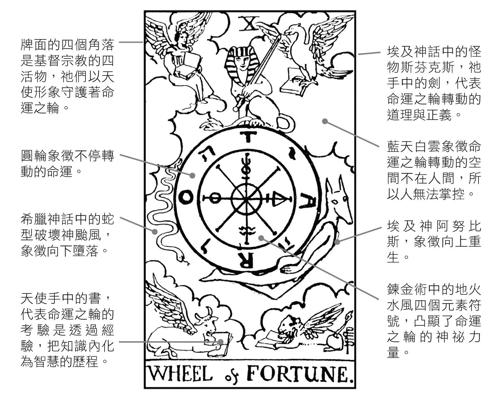

##### 人生金句

愿意放下原本计划好的生活，
才能拥有等待着我们的生活。
──乔瑟夫．坎伯（当代美国神话学家）

We must be willing to let go of the life
we planned so as to have the life that is waiting for us.
― Joseph Campbell

### XIII 死神 Death

##### 【图像叙事】

韦特塔罗的死神图像，不只强调了如骑士一样的死神，还有四位不同阶级与身份的人物。如果韦特塔罗之前的死神图像，强调的是死神带来结束与死亡的意义，韦特塔罗则进一步增添了人面对死神的各种态度。图像里的死神骑着白马，手拿旗帜，上面有象征生命的玫瑰徽章。死神没有配戴任何武器，所以祂不是来收割人的生命（马赛塔罗的死神手中则拿着收割的镰刀），而是带来新生命，犹如远方的两座塔中间升起的太阳。死神图像中间的河流阻断了两岸，在此岸的人，正在经历死神对生命带来的威胁，有人逃避（白衣女人）、有人祈求（黄衣教士）、有人放弃（倒在地在的皇帝）、但也有小孩惊奇的观看骑着白马到来的死神。

此岸是死亡将近的时刻，但彼岸却是新的开始，要如何才能到达彼岸呢？如同悬崖高起的彼岸，并不是搭上船就能到达，这里没有桥梁、没有道路，只能转化原有的生命才能到达。就像在此岸的毛毛虫，无法跨过河流，但蜕变为蝴蝶后，就能飞到太阳升起的地方。死神在韦特图像中象征着生命转化的时刻，转化是从原有的生命状态，蜕变为新生命的时候，放下原来习惯、感到安全的生活会让人痛苦，改变也很缓慢，但在破茧而出的那一刻，生命会突然飞翔，看到与过往完全不一样的风景，死神带来的结束，是让生命进入更高视野的必经历程，也是每个生命阶段必须走过的转变。

##### 【解牌叙事】

死神牌的态度，带来想要经历某种转变前的痛苦，但不是每个人都能从痛苦中学习与改变，并迎接黎明。有时候因为害怕改变，我们也会麻痹自己的感觉，明明死神已到眼前，还告诉自己改变的时机还没到（就像转头避开死神的女人、或者向死神祈求的教皇、倒在地上的皇帝）。“死神”是生活中某个重要的、执着的事物需要被放下的态度，这种执着是我们长时间习得的习惯，改变一个人的习惯不容易，所以过程缓慢又痛苦，但死神要带走的是在生命中已经不需要的旧事物或障碍。进入死神牌的态度，会感受到我们经历的事情成为食之无味、弃之可惜的无用之物，生活也会像枯木失去了生气，也会有未来不知如何前进的困顿感。但也因为这种困顿，我们会承认与接受原有的状况需要改变或放下，只是无法快速找到改变的方法。

##### 【逆位叙事】

逆位的死神是一种认为改变的时机还没到来的态度，所以会执着、抗拒或逃避改变。例如在工作中，有些专案无法再进行了，但逆死神的出现，代表负责专案的人不想放下，或者用逃避的方式不愿正视专案失败的结果。感情叙事上，如果两个人已经形同陌路，却没有想要改变或结束彼此的关系，只是一直保持原状。死神牌逆位也可能代表，问题还未到结束的时候，但事件中的人想要赶快解决后离开，却迟迟无法得到解决，等待的过程漫长又煎熬，期待的死神一直没有出现在眼前。

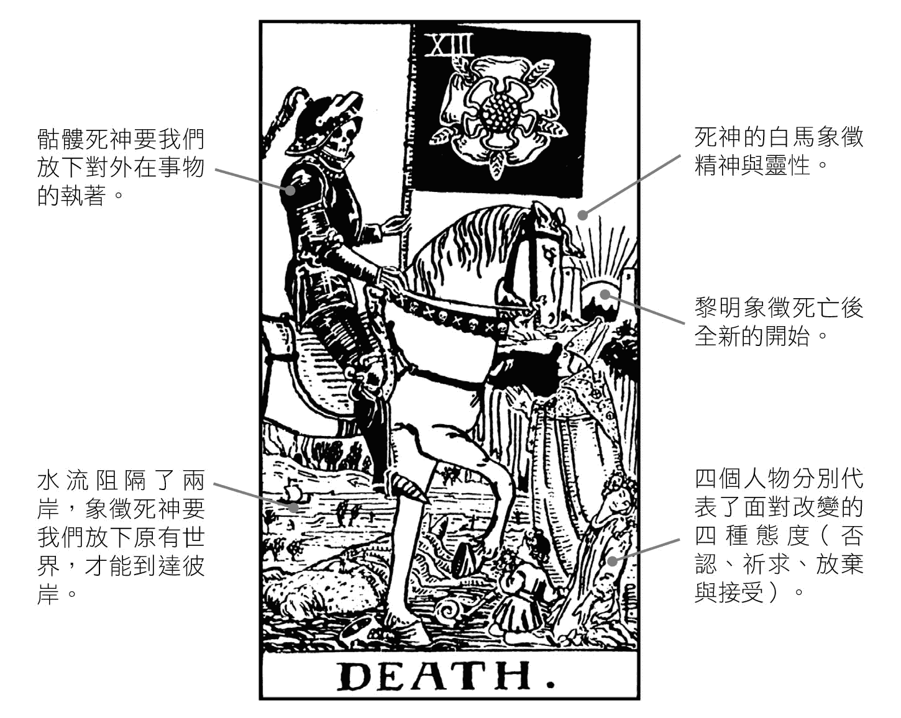

##### 人生金句

改变无可避免，
是否能从中成长则是选择。
──约翰．麦斯威尔
（当代美国作家、演说家、教练）

Change is inevitable.
Growth is optional.
―John C. Maxwell

### XVI 高塔 The Tower

##### 【图像叙事】

这张牌里有座高耸入云的塔，塔顶上还有皇冠，但被雷击中，皇冠与人都在掉落。高高竖立的塔与皇冠，象征着生活中每个人在遵守的最高准则（价值观），这些准则不是法律，但像法律一样保护着我们，让生活秩序不被打扰、失控，没有了它，我们就会感到迷茫、无助与害怕。以为一直会保护我们的高耸、坚固的高塔，无法闪避雷击，在突如其来的震荡中，原来相信的一切会失效，人便从高塔跌落。

在生活中我们都曾经历过意外、突如其来的疾病、被说出的秘密、揭穿的谎言、没有被告知的分手或离开等，晴天霹雳般突然打乱原有的生活，并且让原来相信的原则、信念都变得无用，这就是从高塔上坠落的两人面临的状况，失去高塔的他们，未来有可能会因为失去保护而受伤，也有可能发现自己已不需要高塔的保护，反而得到了走出高塔的自由，至于是哪一种结果，在于每个人最终应对雷击的态度。

##### 【解牌叙事】

高塔是变动不居的态度，一旦我们用这种态度面对生命，认为现在经历的大大小小的事件都会带来重要影响，或者对每件事都感到惊慌失措，不太能安定身心。例如：工作上的职务临时改变或外派、原来发展顺利的专案发生状况、意想不到的财务支出、感情冲突等，这些他人可能认为是平常的变动，用高塔的态度来面对，如同突如其来的闪电，冲击着我们，事件未必严重，但常常让人措手不及，并且也有可能冲击我们的自尊与自信。高耸的高塔犹如内心里的防卫墙，虽然给我们安全感，但也会限制个人与外界的接触，所以高塔代表我们视而不见、听而不闻的态度，问题一直存在，只是我们架起了高塔，在一次震惊中让锁在高塔内的人醒来，只能在惊慌中正视问题的存在。

##### 【逆位叙事】

逆位的高塔，闪电的冲击力会减缓，却可能带来比正位高塔更持久的影响或焦虑的情绪。高塔逆位时的生命态度，犹如夜长梦多，总觉得生活不可能顺遂，总会在意想不到的地方发生状况，要时时提防、预演并做好规划，所以总是在小细节上小题大做，常常紧张小心，让我们疲于预防与解决。长久下来，会消耗一个人的能量与战斗力。逆位高塔的态度，会缓慢地耗尽一个人的精力。

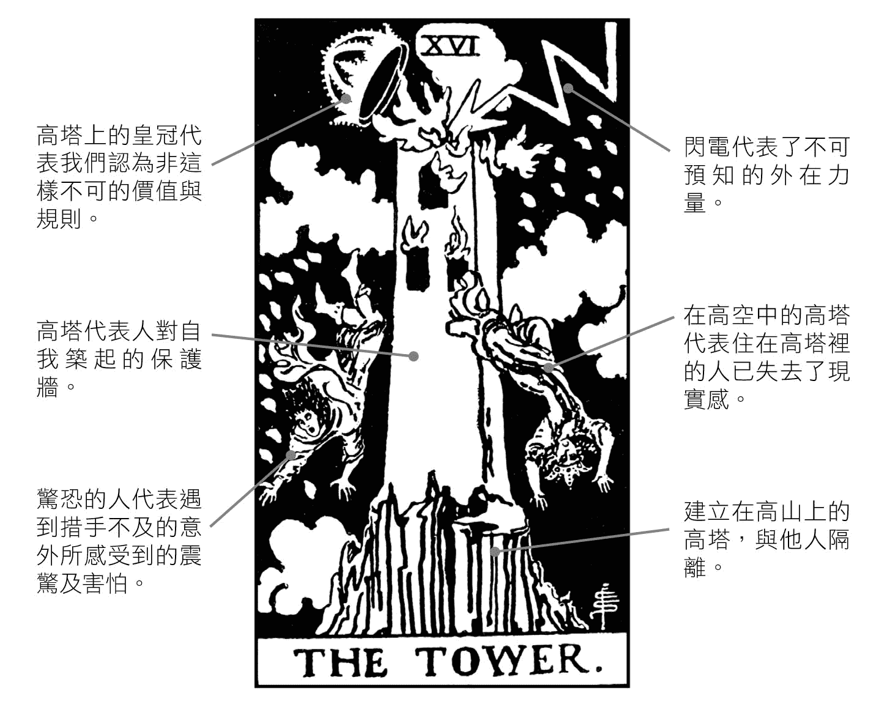

##### 人生金句

智者在风暴中不为安全而祈求上帝，
而是为了释放恐惧。
──拉尔夫．沃尔多．爱默生
（十九世纪美国思想家、演说家、作家与诗人）

The wise man in the storm prays
God not for safety from danger but for deliverance from fear.
― Ralph Waldo Emerson

### XX 审判 Judgement

##### 【图像叙事】

审判图像以背景中的白色高山为边界，形成了上与下的两个空间，上面是吹著号角的天使，强调声音的审判图像，也用下方的人群因为聆听而起身的景象呈现。棺木漂浮在象征生命的海洋上，棺中站立的人群，他们的身体开始从灰色转为黄色，象征聆听号角声醒来的人群，他们的生命得到重生，他们伸出双手欢欣迎接新生命的到来。

审判图像，透过基督宗教的审判意象，带出了在末日审判，心灵被唤起而得到重生的新生命。在图像里的人群，虽然年纪、性别不同，但他们都有着类似的姿势，韦特强调这是在象征“共同体”，如果死神牌的图像是象征个人生命的转变与重生，在审判图像则是象征个人在转变中，更深刻的体会生命共同体的命运，不只感受到“我的改变”，改变会让我们走向社会，体会人与群体生命的紧密链接，为他人、家庭，甚至愿意为环境与生态承担起更大的责任。

##### 【解牌叙事】

审判是一种内省的态度，我们借由自省，对自己经历的事件有更深的领悟，这种领悟有可能会对未来重新定位，也有可能对自己有更深的理解。审判的态度，不论我们遇到的事情大或小，都会成为回顾过去、省思自己，并且在回顾中重新体悟重要意义的机会。审判图像中天使的号角，是一种声音的表现，“聆听”是这张牌重要的象征，从内在涌起的新观点、新想法、新意义，帮助我们对自己的状况有更深的觉察，而这种觉察会重新调整未来方向。像是一种召唤，虽然生活如常，没什么太大改变，但从内在会感受到自己的不同，这种改变，会给我们看待事物的新视野，曾经熟悉的人事物，也可能变得新鲜又陌生，生活好像进入了新篇章、新故事，得到了与过往不同的重生。

##### 【逆位叙事】

逆位的审判代表逃避过去、或让自己停滞在过去的遗憾当中的态度。工作叙事，可能代表对过去做过的决定或表现不满意，但也无法坦然接受或承认错误；在感情中，对两人的情感发展或曾经发生过的冲突感到抱歉与遗憾，也有可能认为自己做了错误的选择，却认为一切的改变都太迟，而让事情停在原处，没有做任何改变。当审判逆位时，会认为目前的遗憾情境是无法改变的，或者认为这一切都是对过去自己的惩罚，所以会产生消极的、逆来顺受的态度，也会拒绝他人的建议或内心浮现要改变的声音，只是在遗憾与自责中，让自己活在过去。

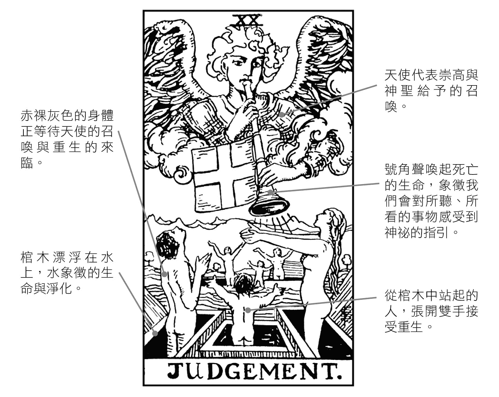

##### 人生金句

生活没有意义。
是人把意义带进生活中。
当你是答案时，问问题是一种浪费。
──乔瑟夫．坎伯（当代美国神话学家）

Life has no meaning.
Each of us has meaning and we bring it to life.
It is a waste to be asking the question when you are the answer.
― Joseph Campbell

## 入戏与旁观的生命智慧
──魔术师、女祭司、皇后、倒吊人

人生就像一场戏，这是很多智者说过的话，通常说这句话时，是因为人生的不合常理或无奈，我们就用“一场戏”告诫自己或他人，不需要太认真。但如果人生真的是一场戏，一辈子我们都当旁观者，甚至是路人，那当旁观者与路人的乐趣会是什么？想想去看电影、打球、玩游戏的心情，当我们不懂或不喜欢某些球赛的规则时，会觉得那些球赛很无趣，也觉得投入在里面呐喊的人像疯子；或者我们去玩桌游，如果不加入游戏，只会觉得桌游幼稚；看电影也是，如果不投入到故事里的情节中，在电影院里的时间会变得非常漫长。换句话说，如果人生如戏，我们不懂得如何投入戏里，是否也是在过着无聊、无趣，等着时间赶快过完，但有时候羡慕其他人可以入戏的生活？

在占卜时，越来越多人评价自己的人生觉得好无趣，不论做什么都提不起劲，工作无聊、感情没什么新意，除了每天想着去哪里旅游，好像没什么有趣的事可聊。在我的观察里，这是一种入戏障碍，也就是找不到投入游戏的方法，所以只能用旁观者或路人的心情过着自己的人生。这就像眼前攞着大富翁的桌游，却觉得桌游好假，里面用的钱都不是真钱，买来的地也是假的，所以干嘛要玩？根本是浪费时间，之后就把游戏推到一旁，但又找不到其他好玩的事，只能坐在一旁发呆或看着别人傻傻开心的玩。

有些人不想入戏的原因，可能是看透人生的虚幻，觉得所有的追求都是假的，人死了还能留下什么；有些人不想入戏的原因，其实只是害怕入戏后的情绪起伏无法控制，戏里的失落、悲伤、痛苦、自卑都是真的，会让我们受伤，当然快乐也会是真的，但人通常会先看到让我们害怕的情感而退缩。如果不入戏的原因是前者，似乎也有点像佛教所说人生如幻的意味，但我们看到死亡的虚无而不再对生命有渴望，代表我们把心放在遥远的死亡的那一刻，与自己现在的身体分离，而禅宗教导我们的却是要身心合一的道理，也就是“活在当下”。这就像皇后牌，坐在大自然中，享受当下季节的美好，春天有花开，夏天有清凉的流水，秋天有丰收，冬天是休息。每一个季节都有它独特的风景，没有亲身经历，无法体悟。

但除了皇后活在当下的功夫，我们也要有入戏但又觉察自己在戏里，而不是让自己的心迷失在游戏中，这才是佛教要我们看透人生如幻的原因，是要我们的心随时清明、随时明觉自己在哪里。而这种觉察就是女祭司的修行，这张牌的构图，女祭司在最前方，其他都成为女祭司的背景，犹如女祭司早已洞察，世界是由心所造的幻觉，要能看破，就要能够潜入女祭司背后的大海。但女祭司直直盯向方，清楚世界虽是幻觉，但没有世界，我们的心无法被映照，所以入戏是为了破除心的虚妄，不只是为了享受美好。

如果无法入戏的原因是“害怕”，是为了保护自己不受伤而选择成为旁观者与路人，这时候，我们就需要认真去思考，我真的想要一辈子以路人的方式过自己的人生吗？这就像所有人坐在电影院里，大家都随着故事哈哈大笑或掉下眠泪，而我们只是一直看着手表，想着电影为何还不结束，电影结束了，也代表生命的结束，结果我们一生所做的事，其实只有看着手表等着死亡的来临，这真的是我们想要的人生吗？我想答案应该是否定的。

想要成为旁观者，其中一个原因是害怕自己入戏后被规则掌握，无法开心的做自己，明明游戏是我们自愿参与的，为何会走入不甘愿的处境？因为一旦参与游戏，我们必须遵守已经制定好的规则，但常常游戏里的要求未必如我们所愿。如果今天只是为了满足个人的需求想要变更游戏规则，当然不可能如愿，但如果是为了让游戏更好玩呢？我想参与的每个人都会愿意为了好玩而调整规则，这时候我们需要的是“魔术师”的创造力。魔术师永远不按牌理出牌，会想出鬼点子，但他一手指天、一手指地，代表他所想的点子，不只是为了自己，是为了在世界上创造出更好玩的事物，他的意图不只是满足个人需求，而是在挑战人的创新与创意能力，所以他能对他人带来影响，也能让他人愿意改变规则。

魔术师能够创造新游戏，需要“倒吊人”颠覆规则的观察力，他倒挂在树上，就算被他人视为怪人也无所谓，因为他关心的是拥有独到见解，只要能够与别人不同，就能满足他的期待。但倒吊人是永远的旁观者，他的手脚压在身体下，不想要参与到游戏中，虽可以在一旁嘲笑入戏的人，但自己无法拥有入戏的乐趣，除非学习魔术师想要为世界创造更多有趣的可能性。

每个人都会希望自己的生命充满精彩的冒险与乐趣，但所谓的精彩，就是入戏的皇后与魔术师的态度，入戏后我们会因为失去而痛苦，也会因为获得而欣喜。但如果没有旁观的女祭司与倒吊人的智慧，有可能陷入痛苦中无法自拔，也会因为不想失去而害怕改变。当我们能够自在的游走在入戏与旁观的生命态度，一场由我主演的人生剧场，就能尽力与精彩的演到生命结束的最后一刻。

### I 魔术师 The Magician

##### 【图像叙事】

在魔术师的构图中，人物站在最后面，其他场景配置都在前方，突显了魔术师最向外展现的特质，而且他的能力是要能够看到，并且对外产生影响。这些也都由魔术师的姿态表现出来，他站立着，一手指天、另一手指地，用身体表现出人在世界中所占据的重要位置，以及他的手链接了天与地。虽然比起其他图像，人物比例相对变小，但从人物的身体展现了天地人合一的气度，却放大了魔术师影响与改变世界的能力。

前方工作桌上放置的地火水风四元素的道具，象征了魔术师是与自然万物链接的炼金术师，炼金术运用迥异的自然元素，创造出合一的魔法物质。原来被视为不同的元素，在炼金术师洞察各种物质的本质后，整合为一，并为世界创造出新事物，这就是魔术师代表的“1”号意义，就像电话、相机、电脑等不同物件，被整合进一个智慧型手机里。围绕魔术师的花朵，也象征着创造力，花是大自然里最为美丽与神奇的生命，为世界带来不可思议的生命景象。

##### 【解牌叙事】

魔术师的态度，会展现出吸引他人的信心与魅力，很容易成为团体中的焦点与话题人物。不论面对什么困难，都能以积极主动、有信心的心态应对。但有时太过自信，会给人骄傲、炫耀等的印象。魔术师的态度喜欢挑战他人没有尝试过的困难，成为前无古人、后无来者的第一人。魔术师也是能够洞察事物本质的炼金术士，把多个不相关的事物整合为一，并透过个人的创意与灵感，带来让人耳目一新的成果。在解牌叙事时，魔术师的态度能够打开新的机会与可能性，并且不断想要变动与改变，不想一直重复原来的生活方式。在面对问题时，则是放弃保守态度，积极寻找创新的解决方法。在人际关系上，也常会为他人带来惊喜与快乐，但也有可能给人没有定性、过于好动的印象。

##### 【逆位叙事】

逆位魔术师的态度，面对问题时会失去原有的信心与创意，有很多想法，但未必有信心去实践，只能纸上谈兵。也有可能过于膨胀自己的能力，想要影响他人，会过于干涉他人的想法，或以否定他人的方式强调自己的重要性。以逆位的魔术师来看待生命状况，会害怕自己失去他人的重视而焦虑不安，所以会更积极的参与团体来表现自己，或者也有可能过于自卑而无法表现。逆位魔术师会感受到绑手绑脚，不断想要挣脱束缚，却因为方法错误或用力过勐而伤害自己与他人。

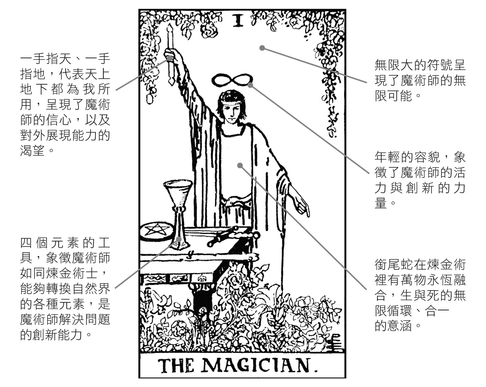

##### 人生金句

灵感是在工作时闪现，
并不是要等待。
──亨利．马蒂斯（二十世纪法国画家）

Don’t wait for inspiration.
It comes while working.
― Henri Matisse

### II 女祭司 The High Priestess

##### 【图像叙事】

女祭司的图像构图刚好与魔术师相反，人物在最前方，其他图像配置都在人物后方，象征了女祭司比起其他看得到的部分，有更多隐藏起来、看不见的特质。人物的手也是半遮半掩，她坐在椅子上，没有展示出全身。背景有一块布幕，虽然挡住了大部分的视野，但可以隐约在缝隙中看到大海向着后方无限延伸。两边写着 B、J 的柱子，让女祭司所在的地方融合了人为的建筑与大海的自然空间，柱子以黑中有白、白中有黑的方式，呈现了犹如阴阳两仪的意象。

在女祭司的构图中，陆地与大海、竖立两边的黑、白柱子强调了对立二元，但坐在中间的人物、布幕、大海与 B、J 文字整合了这些对立。与魔术师的整合不同，魔术师是把前方的四元素转换为“1”，但女祭司是在对立中，找到让对立可以共存的智慧，也就是把输赢的局势，转变为双赢的结果。这样的智慧来自女祭司身上拥有的宗教象征，埃及女神艾西斯的头冠、圣母的蓝袍与十字架、手握犹太圣典托拉。从古老的宗教传统传承下来的内在智慧，犹如背后的大海，可容纳百川，并且孕育万物。

##### 【解牌叙事】

女祭司有着冷静、理性、沉稳的态度，对过去或未来都了然于心的清澈心智。女祭司是一位安静的智者，不太会向他人表露想法，但能够接纳与聆听。以女祭司的态度面对问题，不会急于前进或下决定，反而会静观其变，或者等到有了更清楚的方向才会快速行动。女祭司有着清澈的洞察力，知道自己要做什么或不要做什么，不太会寻求他人的帮助。在人际互动上，可能会给人冷淡的印象，也不会主动与他人进行交流，但只要他人提出要求，女祭司的态度会乐于提供协助。女祭司容易被神秘的事物吸引，宗教、神秘学、占卜都有可能接触，对人事物会以认真、严谨的态度面对，但不喜欢被他人注意，所以喜欢低调行事，也较容易被他人信任与尊重。

##### 【逆位叙事】

逆位的女祭司，在面对问题的态度上无法沉稳、冷静，分析与判断能力也不足，但事事都想要参与、干涉，会给他人爱管闲事的印象。女祭司背后的大海，逆位时就会失去平静，她的情绪起伏不定，也有可能被情绪淹没，无法冷静的观察，会焦躁、不安或没有耐心，这种态度很容易在人际关系上引起冲突。逆位的女祭司也有可能想要伪装自己的冷漠，想融入团体，努力展现热情，但会感到不自在或格格不入，同时让他人感到不安。女祭司逆位时的态度，有可能过度沉迷于神秘之物，失去原有的理性与洞察力。

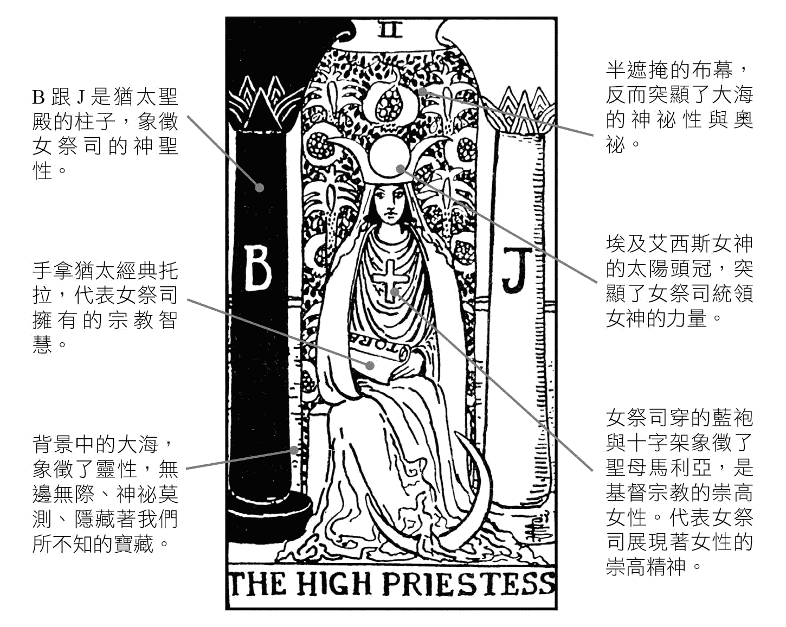

##### 人生金句

昨天我是聪明人，所以想改变世界。
今天我有智慧，所以改变自己。
──鲁米（十三世纪伊斯兰．苏菲教的重要诗人）

Yesterday I was clever, so I wanted to change the world.
Today I am wise, so I am changing myself.
― Rumi

### III 皇后 The Empress

##### 【图像叙事】

皇后被大自然围绕，她所坐的地方，犹如森林中的小舞台，她在那里发挥魔法，滋养着大地与万物，大自然在四季的变动中延续，无常成为它能向着永恒的动态。皇后以自然万物的象征表现了大地之母的形象，与女祭司的宗教智慧不同，皇后是自然流露的爱与情感，所以她的身体倚靠在柔软的靠埝上，身上戴的皇冠、珍珠项链与权杖，比起权威，更接近美的意象，她身穿舒适的长袍，整体表现出放松、悠然的氛围，与女祭司所表现的严谨有所不同。

背景中有清澈的溪流，溪流让人感到舒畅，想要在里面玩耍，反观女祭司的大海，有着深不可测的神秘感，也害怕探不到底，我们被大海吸引，但也会害怕被大海吞没。溪流带着亲切感，犹如大地之母，想要让人亲近、被拥抱，溪流的水流向皇后，象征流动不止的生命脉动，皇后是滋养生命的母亲，是爱的情感的源头，比起智力，更重视当下生命的感受。

##### 【解牌叙事】

皇后是热爱生命与享受生活的态度，总能看到自己拥有的美好，也会带给他人愉快、舒适的气氛。就像大地之母的富足，皇后是给予者，不只可以照顾好自己，也能关怀他人。就算处在困境中，也会适当的调适自己的生活，纾解压力，不会过度担忧未来。皇后的态度与他人相处时就像图像里的流水，温和、清凉地滋润他人的生命，给予能量，也能与人舒适、流畅的沟通与交流。用皇后的态度看向世界，总能看向美好的一面，并且也会努力去创造美好，布置环境、妆点自己、美化生活，这些都是皇后的态度想要投入的事物。用皇后的态度面对生活，烦恼或伤心只是暂时的，最后皇后还是会用爱的能量，让自己走出困境，从人与人的交流中，再次找到前进的力量。

##### 【逆位叙事】

皇后逆位的态度，可能代表过度享乐，或无法享乐。例如家境富裕的家庭主妇，因不放心让他人打扫，一个人打理大房子结果累出病；到了退休年纪的企业主，放不下工作，无法享受放松的退休生活；或者担心家里的小孩而无法享受旅游的父母等。逆位的皇后，也可能要求自己过着简朴、清静的生活，远离社交活动，压抑对感情的需求，无法自然展现对他人的关爱或照顾，对享乐有着莫名的罪恶感，跟他人的身体接触感到不自在。

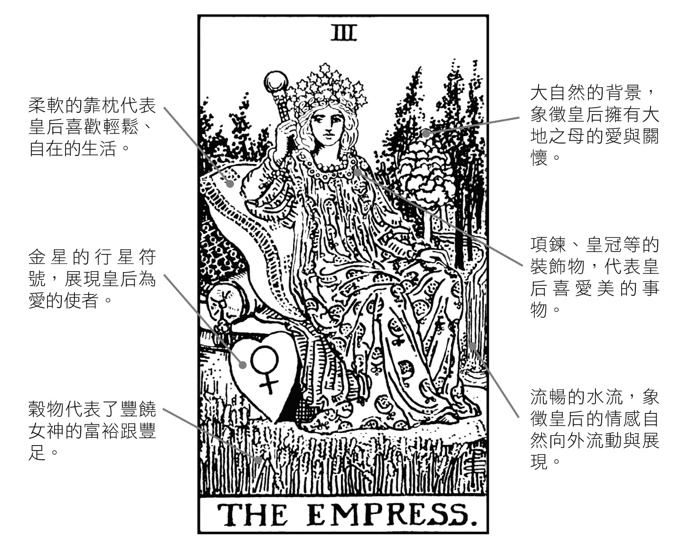

##### 人生金句

昨天已经过去，明天还没有到来。
我们只有今天，让我们开始吧。
──德蕾莎修女（二十世纪著名宗教家、诺贝尔和平奖得主）

Yesterday is gone, tomorrow has not yet come.
We have only today, let us begin.
― Mother Teresa

### XII 倒吊人 The Hanged Man

##### 【图像叙事】

倒吊人的手脚受限，头上却有光晕，突显了倒吊人不以行动为优先而获得的智力。整体的构图简洁，中心为 T 字体的树干，人物倒挂在树上，虽然树的形状不自然，但绿叶茂盛，象征了生命力。倒吊人倒挂在树上不是惩罚与苦行，他的表情自然，接受着目前的不自然状态，他用自己的意志力限制手脚行动，但头上的光晕象征着他获得的新见解与视野，这是他选择的姿态，借此体悟他所没有经验过的生命状态。

倒立是异常行为，也是让人感到不舒服的姿态，却可以远离人群，把自己与群众区隔开来。而倒吊人所获得的见解，只有在远离人群，不再认同群众时才能领悟，虽然倒挂在树上会让他被孤立。图像上不再有世俗生活的物件，代表倒吊人已经在否定与质疑过去拥有的生活或自己。

##### 【解牌叙事】

倒吊人会倒挂在树上，是因为对自己认识的世界有了怀疑，也对自己的想法有所疑惑，所以想用不一样的视野看清真相，并把自己倒吊在树上，压着手和脚，不让自己插手或行动，反而要弄清楚事情的状况。所以倒吊人的态度，会让我们对自己怀疑，以前很明确的决定或方向不再清楚明确，在怀疑中无法明快的下决定，会花很多时间评估及思考，而且也会疑惑自己是否正确。倒挂在树上的姿态引人注意，所以用倒吊人的态度应对事情，总希望自己可以特立独行，质疑其他人都认为确定的事。在感情上，倒吊人的态度无法与伴侣维持热络的沟通或交流，反而把自己孤立起来，或者不同意另一伴提供的想法与意见，但也不会明确表达自己的想法，所以在感情问题上，倒吊人的态度会展现疏离、冷淡、不直接面对问题等状况。

##### 【逆位叙事】

逆位的倒吊人应对事情时，总有不甘愿、被迫等的心境，无法拒绝他人，所以常让自己陷入为他人背负责任、处理他人留下来的棘手事物等处境。逆位时，倒吊人无法强硬地表达自己的立场，就算不认同，也会跟着他人的决定，也有可能仓促做出其实自己不愿承担的决定，在需要冷静、观望、等待的时候做出不明智的选择，为自己带来不良的后果。倒吊人逆位时的态度，也较容易怪罪他人，虽然事件明显不是由他人所造成，但会想要找个怪罪的对象，为自己减轻罪疚感。

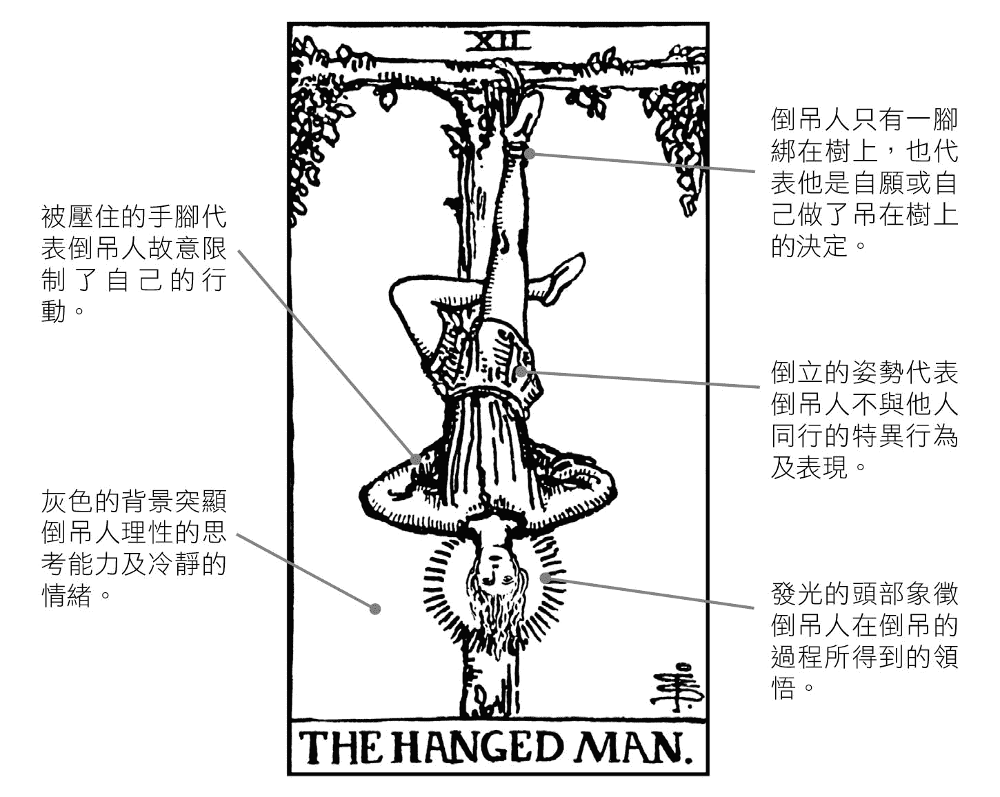

##### 人生金句

永远不要害怕在路上独行。
知道自己的路，只需跟随它前行；
你不需要跟随别人的脚步。
──艾琳．卡迪（二十世纪灵性导师、新时代作家）

Never be afraid to tread the path alone.
Know which is your path and follow it wherever it may lead you;
do not feel you have to follow in someone else’s footsteps.
― Eileen Caddy

## 感情必修课：爱与懂之间
──恋人、力量、恶魔

在占卜中，“感情”问题最多人烦恼，也是最难解的人生课题。爱一个人与和心爱的人相处是不同阶段的事，但大多数的人会把这两者放在一起思考，或者说我们也很难真正把这两件事分开，但有时候试着分开思考，问题会变得比较清楚、简单。爱上一个人不需要理由也不需要很了解对方，但跟一个人相处不只是爱，而是要开始“懂”对方，懂一个人并不代表爱，那是对他人的开放与友善的态度，从“懂”一个人能不能发展为“爱”？当然可以，但这就是日久生情，与我们常常期待的一见钟情是两种不同的情感发展。

爱情中常常会有一种想像，认为我们一定能“懂”我们“爱”的人，但“懂”是理性的思考，“爱”是感性的情感，这两者基本上是冲突的。当我们爱上一个人时，感性超越了理性，对方的所有言行不论多么不合理，我们都会觉得可爱、有性格，都可以在爱的情感下接纳（很多情侣的幼稚言行在恋爱期较容易产生）。但这种爱的情感超越理性的时间不会长久，所谓爱的感觉消退后，开始用理性的眼光来看对方，也用合不合理来评价对方的很多言行，这是进入“懂”的过程。每个人从“爱”到“懂”的转换时程不同，所以有人在恢复理性后就会觉得还在恋爱期的对方幼稚、不够成熟，在这个过程中，很多情侣开始生气、吵架，并结束这段感情，认为自己就是不再爱对方才会无法忍受对方的言行。

真正可以长久的感情，不是因为遇到了灵魂伴侣才会恒久远，而是让情感在爱与懂之间不断蜕变。就像“恋人牌”的一对男女，如果这张图像代表爱，“力量”牌就代表爱的关系中的懂。当我们遇到了爱的对象，会想时时刻刻与对方在一起，但恋人图像里的男女，并没有依附在一起，也没有对望，他们的视线是男向女、女向天使、天使向人的三方流动。我们期待的爱的关系是两人世界，但两人世界只有当下的相处时才有可能，任何关系在生活中，都有很多难题要面对，所以恋人图像里的高山阻碍在男女之间，能够跨越这座高山的是天使，天使象征了比两人的当下更为超越的未来，对有信仰的人来说，那是依着神的祝福而前进的神圣关系；没有信仰的人，也因为两人有着想要构筑的世界，所以一起面对高山。

那座山也可以比喻成我们要懂的对象，就像“力量”牌里的狮子，少女与狮子的关系，是从少女的躬身开始。向他者弯下身体是一种愿意放下己见的宣示，当父母生气而命令孩子时，是站着从高处向下看。但想要与孩子像朋友一样对话时，就会蹲下来与孩子对视。少女的躬身，让狮子感受到对方放下己见的善意，因为这个善意，两者的关系才能前进。一位柔弱的少女与蛮横的狮子要懂对方并不容易，唯一的方法就是花时间相处、创建信任，并开始懂对方的习性。就像小王子与狐狸的驯服故事，他们每一天在同一个时间相见，习惯的创建代表愿意为对方改变自己，并观察对方在生活中的小细节，这些细节在懂的过程中，成为爱的对象独特的一面，但还未进入爱的过程，所以也会成为分手的理由。因此要带着恋人牌里三方相互交流的眼神进入到力量牌，我们才能在爱的关怀下观看对方的平凡与独特，同样的，在创建两人的习惯模式后，如果无法再进入三方流动的交流，习惯就会变成一成不变的爱情杀手。

恋人牌里的天使，也代表我们在爱的关系中，永远无法用“爱”与“懂”来拥有对方，我们只有在认知到永远都不可能全然理解另外一个人，对方也不可能被我掌控时，才会愿意一直把视线投向对方，并保有想要理解对方的好奇心。与恋人相对的“恶魔”，就是以爱之名拥有对方的意图，恶魔里所有角色的视线都向着前方，没有眼神交集，却用锁链与柱子形成了相互迁就的共同体，在长久的相处习惯中，我们会认为已经很懂对方了，所以对方讲什么，直接提出评论，却不想多听听对方的想法，当视线不再看向对方时，也代表我们已经对爱的对方失去了好奇心。

爱一个人不难，那是人的情感需求，但要“懂”一个人，并且还能在懂中爱对方，才是很难的一件事。“懂”一个人需要成熟的人格，跳脱自我为中心的想像世界，能够看到他人的特质，并接纳与欣赏与我不同的他人。所以谈恋爱人人都会，没有年龄限制，但从爱到懂的相处却是成熟人格才能完成的情感功课。而真正的“懂”不是把对方的言行放进我的世界来思考或理解，而是在我的观点来看，认为不合理的言行，也能重新从对方的视野去思考它的合理性，并不以对或错来评价对方的言行，而是不断尝试去理解对方的思维，并且也让自己开始懂得，世界上没有不合理的言行，唯有合理的言行放进了不同的世界观。

### VI 恋人 The Lover

##### 【图像叙事】

恋人图像以天使为中心，与下面的男女形成三角形构图，强调了这三者在恋人意象中的相互关连。虽然这张牌叫“恋人”，但图像中的男女并没有相拥在一起，反而站在两边，两人的距离象征了，他们在恋人关系之前是各自独立的个体。中间清楚映照出背景中突起的高山，这座高山犹如男女要接近彼此的过程，需要面对与跨越的困难，而跨越高山需要有天使的祝福。天使在图像中象征了人普遍感受的、超自然的保佑力量，就像我们会说的“老天保佑”，心里如果信任保佑的力量，我们就能跨越各种障碍与挑战。

男女背后的两棵树，各自象征了伊旬园的生命树与智慧树，智慧树上还有蛇在盘绕，这是人类最初祖先亚当与夏娃在伊甸园的场景。加进《圣经》的伊甸园意象，恋人牌不只强调了世俗男女的恋人关系，也展现了人类故事的开端，它开始于男女之爱，但也要有天使的祝福与保佑。所以除了恋人关系，图像中也象征了人与人创建关系所需的信任与友善，与他人创建关系，我们的故事才能展开。

##### 【解牌叙事】

恋人牌不只是呈现爱情关系，更强调新的开始。犹如亚当跟夏娃是人类故事的开端，这是一个崭新的阶段，以及与人展开新缘分的时机。用恋人的态度看待事件时，会想要从原有的生活展开新事物，例如用全新的心态面对工作、接受新的挑战、尝试新鲜事等。恋人的态度重视与人的关系，会主动向他人表示友好，并愿意与他人合作。在感情叙事，恋人牌强调相互信任与尊重的两性关系，但通常也代表一个新开始的恋情，或一段恋情进入新的阶段（正式交往、同居、结婚、生子等）。犹如图像里的天使给予人的祝福，恋人会保有开放与乐观的态度，积极认识新朋友，拓展人际关系，也会以感恩与祝福的态度看向自己的生命状态。

##### 【逆位叙事】

恋人逆位，会失去原有的开放态度，不再信任身边的人，也无法用乐观的态度对待身边发生的事，所以任何不如预期的发展，会被理解为是阻碍与延误，他人的反对或拒绝，也会直接理解为对自己的否定。所以与工作伙伴或感情伴侣很难培养默契，觉得对方不够友善与成熟，也无法带给你往前发展的动力，彼此之间没有相互信任的基础。逆位时对爱情也会有较为不成熟或保守的态度，所以很难维持长久的关系。在工作上，倦怠感也会与逆位恋人的态度有关，对工作失去了热情与新鲜感。

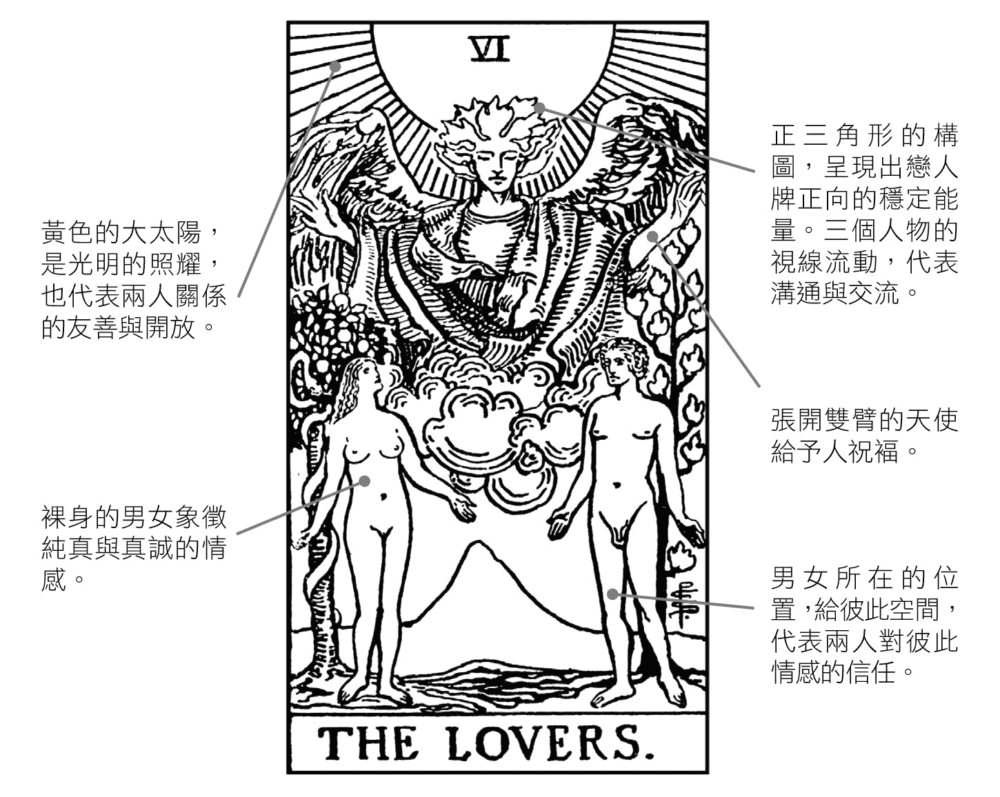

##### 人生金句

如果一个人能够拥有、把握和了解另一个人，
那么那个人就不再是另一个人了。
──列维纳斯（二十世纪法国哲学家）

If one could possess, grasp, and know the other,
it would not be other.
― Emmanuel Levinas

### VIII 力量 Strength

##### 【图像叙事】

力量图像以少女与狮子的互动，形成了主要构图，柔弱的少女与凶猛的狮子形成相互信任关系，他们各自都为了对方退让一步，这种退让表现在少女躬身的姿态，狮子也放下了尾巴表示善意。背景有一座高山，代表只有少女与狮子相互合作时，才能跨越的障碍，任何一方都无法独立面对，这两者很明白对方的存在对自己的重要性，唯有两者在一起，才能互补并成为无敌的强者。

少女头上有着无限大的符号，在魔术师的图像中，无限大的符号强调了魔术师个人的能力，但在力量图像中，无限大的符号随着少女的身体向前躬引导到狮子身上，象征少女的力量来自于驯服狮子的退让，她不是以人为万物之主的姿态想要征服、掌管狮子，反而认可了狮子的勇勐，以及耐心表现出自己的善意，象征了人最强大的力量不是来自于自己，而是在于接纳对方拥有自己没有的优势。

##### 【解牌叙事】

力量牌的态度能够展现内在的承担力，以及与他人创建关系的耐心。少女低头看着狮子，放下了身为人的傲慢，而狮子的野性不只需要少女的谦让，也需要长时间的情感培养，才能创建信任。力量的态度是面对困难时的内敛与耐力，犹如在家庭中的母亲角色，平时柔弱的女性，在困境中成为全家人的支柱。力量的态度像少女一样温和，面对强者，反而能以柔克刚，也常常一个人默默的承受，不对外张扬，努力完成被交付的任务。少女的力量来自于狮子的陪伴，所以力量的态度在面对事件时，通常无法独行，而是要能够感受到身边人的需要与支持，才能涌起力量。正位的力量牌能够承担他人给予的重担或责任，并努力寻求重要人物的认同；在感情中，力量的态度能够发展长期的稳定关系，在生活中互相体谅，给予支持与鼓励，成为彼此的友伴。

##### 【逆位叙事】

力量逆位了，图像里的狮子就会失控，成为少女无法掌控的勐兽，我们会被内在的野性征服，会带来无法控制的情绪风暴。少女也会因为没有狮子的陪伴，而回到脆弱、无力的小孩。力量逆位的态度，会认为自己没有能力承担，对自己信心不足，没有他人的支持无法完成任何事，所以会以弱者的姿态对外寻求支援与帮忙，如果没有得到支援，内心里就会产生失望、生气、受伤等情绪。当一个人感觉无力时会容易放弃，会自怨自艾，也会对自己感到失望。力量逆位的态度，会是自己放弃了力量，把决定权交给他人，借此避开要承担的责任，并且放任失控的狮子，用受害者的受伤情绪，到处伤害他人或自己。

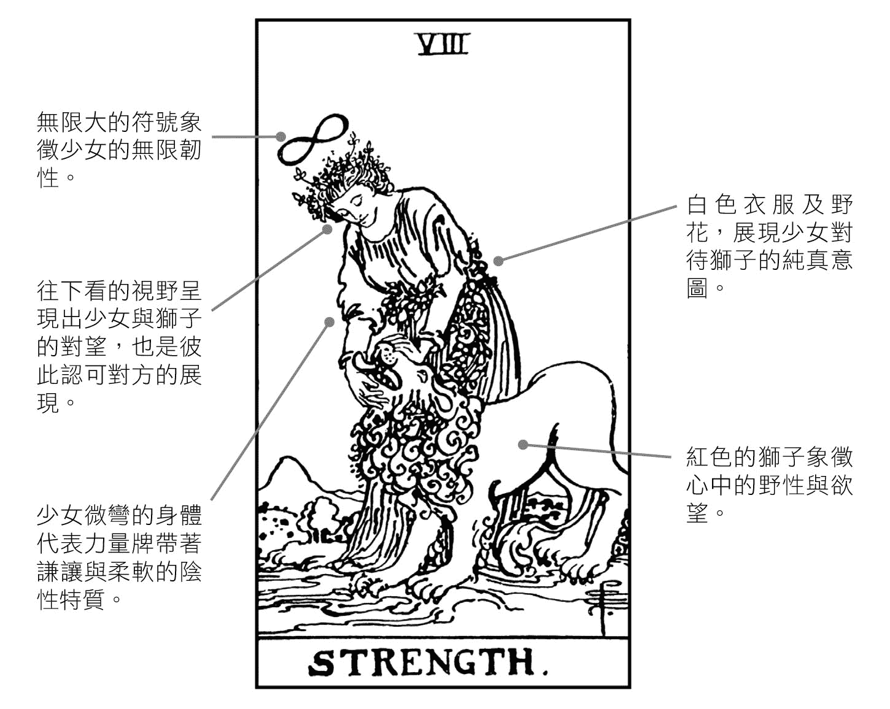

##### 人生金句

没有什么比温柔更坚强，
没有什么比真正的力量更温柔。
──圣方济各．沙雷氏
（十六世纪天主教主教、圣人）

Nothing is so strong as gentleness,
nothing so gentle as real strength.
― St. Francis De Sales

### XV 恶魔 The Devil

##### 【图像叙事】

恶魔图像以三人构图，象征了恶魔与人的链接关系，恶魔在上方，并且在图像中占最大比例，成为焦点，也是主角。下面的两个人物分别站在两边，依附在恶魔之下的位置呈现了附属关系。三个人物的头上都长出了角，还有其他动物性的特征，象征了人与恶魔都拥有动物本能，而且动物本能已胜过人性。男女脖子上的铁链连到恶魔脚下的柱子，也代表与恶魔不可分割的关系。

动物本能以欲望的形式表现在人的身上，当我们无法用理性克制自己的欲望，变成对某物、某人的依赖，就是与恶魔同行。任何无法适当克制的行为，都会成为恶魔在掌管的欲望，但因两个人的铁链是宽松的套在头上，手脚也很自由，所以图像里的人并不是恶魔的受害者。人物依附在恶魔之下，可以合理化自身的欲望与过度行为，可以说服自己一切都是恶魔指使，所以图像里的人物也有着不愿为自己的行为负责、不想一个人承担的不成熟的特质。

##### 【解牌叙事】

恶魔的态度会想要拥有掌控权，不论在工作或感情上，都有占为己有的强烈欲望，强界意识很强，不允许他人侵犯自己的领域与利益。恶魔也很容易受到外在物质的诱惑，因为缺乏对他人及物质的安全感，所以会不停追求外在物质的满足，也会用外在成就来定义自我价值，例如薪资、职务、权力、地位等。在感情上，恶魔也会呈现出让他人不舒服的依赖及掌控，另一伴犹如自己拥有的资产，当然不太能接受对方想要自由的想法或行为。恶魔的态度，让情感建构在“需要”上，在乎对方的外在条件，以及生活上的安全感。也因此恶魔的态度容易给他人压迫、操控等感受，与他人的关系较容易紧张与产生冲突。

##### 【逆位叙事】

逆位的恶魔或许解开了枷锁，但那未必是自己期望的结果。逆位时恶魔的态度，对自己拥有的自由，反而会感到不安、缺乏归属感，感受到被遗弃的失落、以及受害者的被害心情。犹如分手或远距的感情，无法与对方在一起的疏离感与失落；或者离开长久习惯的职场后带来的茫然。他人羡慕的自由，却是很多人想摆脱的寂寥，就像有家庭的人羡慕着单身的自在，但单身的人却渴望被束缚的幸褔，这就是恶魔逆位时的心境。恶魔逆位也可能失去了曾经拥有的某物或某人而感到悲伤与空虚。

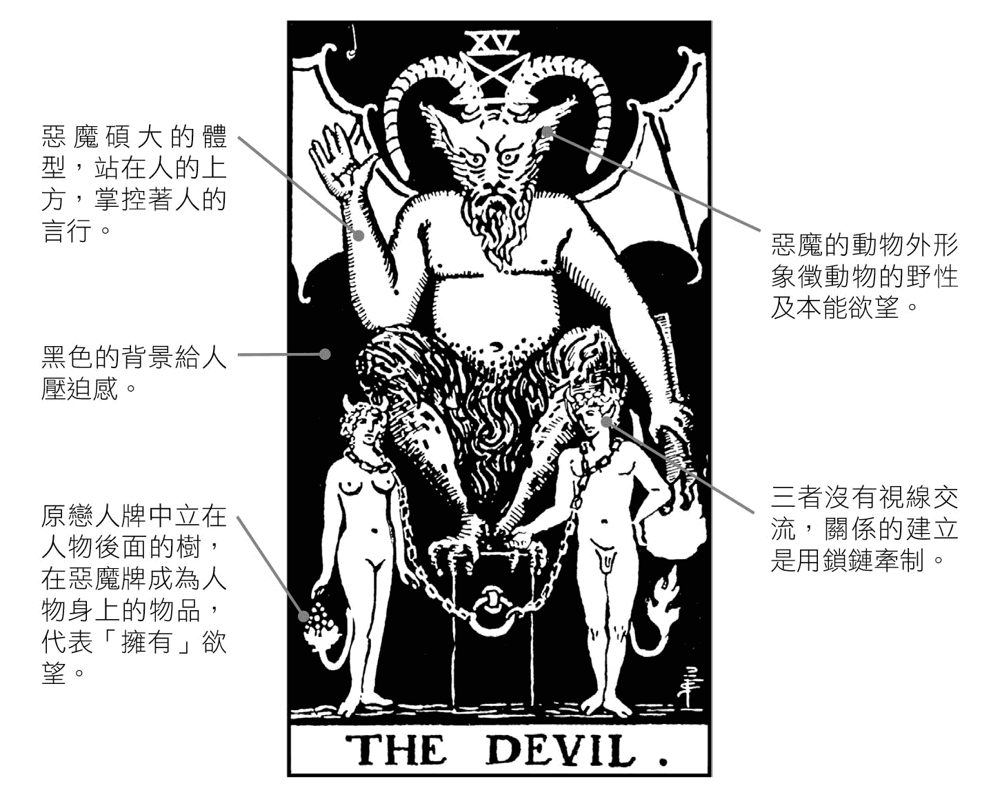

##### 人生金句

拥有财富，
却没有内心的平静，
犹如渴死在湖中。
──尤迦南达（二十世纪瑜伽导师）

Possession of material riches, without inner peace,
is like dying of thirst while bathing in a lake.
― Yogananda

## 走出玻璃心，不再成为容易受伤的人
──正义、节制、星星

曾经在工作中被他人重伤，明明和对方没有任何过节，他却用言语中伤了我的名誉，当时年轻的我非常生气，想说今天可以不要工作，但不能让自己受委屈，并准备找当事人对质。这时身边有位疼惜我的长辈劝阻，并说在佛法修行中忍辱是六度之一，现在正是修忍辱的时候，不是生气，而是从这件事中学习智慧。年轻的我正在气头上，当然听不进他的劝阻，也无法理解忍辱为什会让人有智慧，人怎么可以让他人这么无理的欺负？这是修行还是践踏自己？

进入了不惑之年，我才开始慢慢理解修忍辱的真正含义。很多人讲佛教的忍辱，都只有告诫我们在忍辱中不生瞋恨心，是修行。但是受到无理的对待，要如何不生瞋恨心？是当作没有发生？那是智慧还是逃避？如果先不弄清楚受辱的感受怎么来，很难让我们理解忍辱的智慧所在。首先，无论是言语或行为，当我们感受到被侮辱的时候，是代表事情超出了“常理”可接受的合理范围。常理是人跟人在社会中建构出的文化秩序，是处在同样文化与社会秩序的人理解言语与行为的规则。如果在台湾有人插队，这是一件很不合理的行为，超出常理，但在某些国家，可能没有排队文化，就无所谓插队，这时插队不会不符合常理，也无所谓常理。但也有很多“理”是属于个人的，这跟一个人的生活环境与成长背景有关。

塔罗大秘牌的“正义”，就是有关合理或不合理的道理，中间的人物手上拿着剑代表真理，另一手拿着天秤代表公平，似乎在告诉我们这世界有一个公平的道理存在，但人物背后却有一块布遮住背景，如果讲道理的人，连自己的背后都无法开诚布公给大家看，这样的道理是否公开透明、绝对正确？这就是正义牌的图像丢给我们的问题，也是让我们思考所谓“常理”是否有绝对的道理？

当我们因他人的某些言行受伤害、生气、难过，是因为那些言行超出了社会或个人内在的常理。例如人与人的相处不能暴力对待，这是社会常理，但对于感情中什么样的行为代表伤害或无礼，每个人心中有不同的理解。所以人是依循社会与内在自设的常理而生活的存在，也期待他人能拥有跟我一样的规则，这样世界就太平了。社会秩序由法律或公众压力来规范，但个人内在的常理，很多时候连自己没有觉察到，什么样的言行对会成为对我的羞辱？每个人似乎都有不同的准则，如果有人说了一句平常的问候，但接受的人认为是不礼貌，感到被羞辱，这件事到底是谁的问题？是讲话的人？还是生气的人？

每次经历生气、受伤、难过的言行，通常我们的反应是不让自己受委屈，合理的认为反击回去才是为自己负责的行为。但所谓修忍辱，就是在情绪发生的那一刻不是回击，而是觉察。对方的言行到底是冲撞了我的什么秩序？我的秩序是怎么被建构的？这些秩序的合理性是什么？为何需要有这些秩序？这是生存的必须吗？还是阻碍我成长的保护墙？在这些反思中，会发现受辱的原由是他人的言行刚好碰撞到这些界线。如果今天有人说我“做事不认真”让我受伤难过，代表内在有一条“要成为认真的人”的规则，我也一直遵循这个规则认真过日子，却被他人指责“不认真”，代表我没做好自我要求，而且还被他人指出来，所以这句话才会特别伤我的心。如果另一个人没有这样的自我要求，就算听到他人说“不认真”，可以当作那是对方的要求与看法，听见了就让它过去，不会因这句话受伤。

我们可以用佛经里的智慧来解释塔罗牌里的忍辱修炼，《金刚经》有句话：“知一切法无我，得成于忍。”如果用这句话来对应“正义”的规则，可以把“无我”理解为没有被常理绑住的我，没有了这些规则，就无所谓守则，他人的言行会成为属于他人的批评，但不会冲撞我的界线，也就没有因受辱的情境而产生的情绪。忍辱的智慧不是学习如何忍耐，而是学习如何觉察与放下内在的我的常理，不是受气了当作事情没有发生，而是可以先觉察气来自于什么样的“我的常理”。

常理是形成“我”的结界，但也因为有这个结界，才会容易感受到被他人侵犯，在塔罗大秘牌里，死神后面出现了“节制”，用正义的态度面对世界，只能让自己在对与错中纠结，犹如遇到死神没有出路，而节制里的天使给我们超越的视野。天使超越人间常理，也因为超越，祂脚踏陆地与水，且杯子里的水在两边流动。图像呈现的是对界线的跨越，也是在帮助我们觉察与明白对错之外的中庸之道，而这里的中道，是遇到死神、走过极端后才领悟的中庸，也就是在各种撞墙与走不过的死境中，我们会领悟到在冲突中每个人都有理。从不同的观点出发，这些理都是对的，所以解决冲突之道，更多时候不是分出对错，而是需要找到争执中的人所坚持的内在常理，从这常理中去找出解开之道。所以天使身后的道路，就是对自我界线的觉察后，需要走过的、达到“无我”的修炼之路。

在塔罗牌里，展现“无我”的是“星星”牌，图像里的女人裸身跪在地上，手上拿的两个水壶正倒出水，与节制的水在杯中流动的意象不同，星星里的水是倒了出来，犹如要把人内在不必要的界线拆除与倒空。星星里的人物是在所有大牌中最低姿态的，低姿态也是放下自我的一种身体表现，她的裸身、跪地、倒水、视线向下，都在走出自己。有时候没有了我所坚持的一些道理，反而会害怕我就不见了，也害怕自己会在群体中迷失，但天上的星星，却成为我们的定位，在觉察到自我的界线而倒空的作为，不会让我们迷失自己，反而会找到永远不会迷失的自我定位的星星。

在社会中，我们借由内在秩序理解他人的言行，也必须建构出合理的“我”的界线，但大部分的常理成了保护自己的防护墙，常常也突显了自我的脆弱与无助。虽然这些常理无法全部打破，但需要被我们觉察，要清楚知道我们的情绪是冲撞了哪些常理而产生，有了觉察才能一步一步的调整。如果忍辱是不想产生冲突的忍，那就会变成“委屈”，所谓委屈就是，我的秩序还在，却没有站出来捍卫自己的秩序与界线，于是产生受伤的情绪，最后只会对他人与自己造成更大的伤害。所以一个受到他人的辱骂还能微笑带过的人，以及受到他人的辱骂不敢回骂、忍气吞声的人，这两者都没有回应辱骂的言行，但内在消化辱骂的过程却有非常大的差别，前者有着智慧的觉察，后者只是让自己内在受伤。

### XI 正义 Justice

##### 【图像叙事】

正义图像的人物，一手拿秤、一手拿剑，分别象征了公平与真理，这是在事件中讲求道理与合理的图像。但后方有一块布幕，遮蔽了黄色的背景，失去了原来正义所要求的真理的透明性，在韦特图像里的正义人物，虽代表了公平、正义，但人物所谈的道理却有所隐藏，代表当布幕拉开时，原来对的道理，可能会带来不同观点，未必能够保有原来的判断。

正义是需要在社会中实践才能带来力量，所以人物的一只脚伸出长袍，象征正义的行动与实践能力，但如果只坚持单一观点与标准，正义就会变成掌权者的武器，所以在柱子两边遮起背景的布幕，成了对正义的提醒，没有绝对的正义与公平，我们只能在特定情境中讲求合理，而没有被我们看到的面向，才是需要注意与觉察的部分。

##### 【解牌叙事】

正义是以合理性来看待事件的态度。过去的努力与播种，在未来得到合理的回报；或者分出对错、是非，以及清楚的责任归属等，用正义的态度面对事情时，这些都变得非常重要。正义牌所提示的合理性，不只是法律上的对或错，也包括个人追求的、合理的社会秩序与规则，一分耕耘一分收获、依职责分配工作、合理的待遇、人与人的礼尚往来等。正义的态度也会希望每件事都有清楚的界线，无法接受灰色地带，如果工作上的职务不清楚、在纠纷中无法分出对错、人际关系上的名份模煳，都会成为压力与焦虑的来源。但每个人认为的合理性的标准不同，所以用正义的态度处理事情时，容易坚持自己是对的看法，把和自己不同的意见视为错误，产生矛盾与冲突处境。在人际关系上，也会用不能吃亏的立场对待他人，较易产生争执与不愉快的情绪。

##### 【逆位叙事】

逆位正义是认为世界上不可能有合理与公平的态度，所以也会认为自己一直都在不公平、不合理的对待中生活。工作中认为自己的付出没有得到相应的报酬、努力也没有被看到，人际关系上也认为自己付出永远比较多。逆位正义的态度，容易感受生气、沮丧或无能为力的情绪，也会把这种不公平怪罪社会与他人，成为容易抱怨、不满或嫉妒的人，也会把自己视为受害者，认为其他人对不起自己。当抽出逆位正义时，也是一种提醒，表示抽牌的人太过自我中心，如果从自我中走出来，试着用另一个人的角度看事情，会发现原来的不合理、不公平都只是自己狭隘的观点与想法。

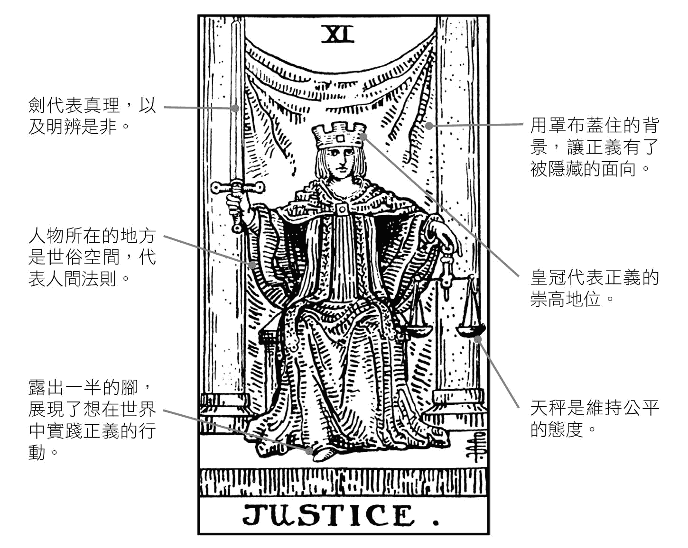

##### 人生金句

永远不要忘记，
正义就是在群体中展现的爱。
──康乃尔．韦斯特
（当代美国哲学家、社运人士）

Never forget that justice is
what love looks like in public.
― Cornel West

### XIV 节制 Temperance

##### 【图像叙事】

节制牌是唯一一幅以天使为主角的图像，象征了超越人的精神力量，站在图像中间的天使，成为视觉中心，不偏不倚的站着，象征了稳定。但天使一脚踩进水里、一脚踏地，有一点倾斜，刚好与天使手上的两个杯子对应，杯子里的水正在流动，象征节制并不只是透过克制得到稳定的平衡，也需要适时调整，才能维持最平稳、妥当、适宜的状态。

天使后方从水流处伸出道路，并延伸到远方的高山，高山上还有发光的物体，那才是天使要引导我们到达的目的地，但如果无法像天使，透过精神力量升华生活中的喜怒哀乐，被情绪困扰、被伤痛阻碍，也就无法走向远方。人能够超越痛苦，因为拥有升华苦难的能力，如何在自己生活中找到升华之道，就是天使所代表的意涵。

##### 【解牌叙事】

节制牌的图像有着内敛、宁静与安稳的氛围，犹如平静的水面，给人寂静中安定的力量。生活中我们都曾感受过平淡就是幸褔的美好，平凡给我们怡人的温暖与快乐，但没有经历过大风大浪的年轻人，很难体悟节制牌的平淡与寂静。节制牌就像一杯白开水，没有味道却是生命中不可或缺的能量。图像里的天使悠游地倒水，展现了节制态度的怡然自得。节制牌的态度，让面对事件的人，能够用不疾不徐、悠然自得的态度看待事情，没什么大好、也没什么不好，一切都是生活中必须经历的日常，在他人眼里的大风大浪，在节制的态度面前都成为海浪，是大海必有的起伏。节制也可以是中庸的态度，不偏向任何一方，找到适宜的调节之道。

##### 【逆位叙事】

节制牌逆位就成了过于极端或超出正常范围的行为或情绪。逆位的图像会让杯子里的水或天使脚下的水逆流，形成情绪上的不稳与宣泄。有时候生活中的所有事情都感觉不对劲，不论是身体上的不舒服，还是心理上的不愉快，这种不对劲就是身心不平衡的感受，也是逆位节制的态度。逆位节制出现时，代表正在用不适合或伤害自己的方式处理问题，例如不喜欢社交的人去做公关类的工作；创意型的人做行政类的繁琐职务；不喜欢户外活动的人，勉强去配合他人而感受到的疲惫。逆位节制的态度，会放任或过度压抑行为或情绪上的起伏，对待事件就会变得要用不关己事的冷漠来压抑、或者直接用情绪表达，在人际关系上容易让他人紧张、感到压力。

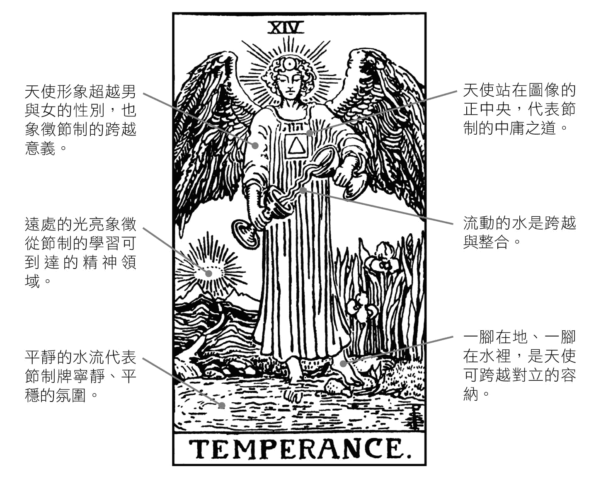

##### 人生金句

我们的精神使命不是无视黑暗，而是为黑暗带来光明。
忽视黑暗并不能驱散它； 只有光可以。
这就是否定和超越之间的区别。
──玛莉安．威廉森（当代美国作家、演说家）

Our spiritual mission is not to ignore the darkness, but to bring light
TO the darkness. Ignoring darkness does not dispel it; only the light does.
That is the difference between denial and transcendence.
― Marianne Williamson

### XVII 星星 The Star

##### 【图像叙事】

星星图像里的人物，面朝下跪地，是所有大秘图像中姿态最低的人，她全身赤裸，一脚踩进地势最低的水，双手拿着的水壶正往低处浇灌。图像中的星星是这张牌的主题，八个星星在高空中闪耀，中间黄色的星星与人物的黄色头发意象相连，后方有高起的山丘、树与鸟，山丘对照出人物所在的位置为低处，树与鸟各别象征了植物与动物，也都高于人。

人物向下的姿态与高空中闪亮的星星相对，这是向着最高处，又向下走向最低处的意象，这两个空间以中间的人物与水壶流出来的水为媒介，天与地有了不可分割的链接。魔术师是以人物的意志力，表现出天地相连的意象，但在星星图像，人物是谦卑的，脱下了衣服，跪在大地上，与天地融合。虽然图像以人物为中心，但在意象上人物放下了姿态，谦卑地与万物链接，人不是自然的拥有者，而是与万物一起都在自然之中，被自然滋养。

##### 【解牌叙事】

星星是用希望与疗愈看待生命的态度，不论处在什么样的困境或苦难，如果用星星的态度来面对，总能看到持续前进的力量，并能给自己鼓励。图像里的星星意象，犹如对未来的指引，引导着我们找到回家的路，所以星星的态度，也会给人正向着目标前进的方向感，相信自己所选择的道路。当我们拥有星星的态度时，会成为温暖与正向的人，不论经历过什么磨难，能把磨难转换为向前进的力量。星星也是疗愈力量，犹如图像中流出来的水，我们可以释放各种负面情绪，不再用情绪伤害自己，能够给自己一个疗愈的拥抱。在很多神话中，星星是解读未来的意象，所以星星牌的态度，比起当下，更重视未来的希望与美好。

##### 【逆位叙事】

星星逆位时，就会带走希望与期待，原来拥有的温暖，也会变成急于想要脱离困境的焦躁或神经质。也有可能对所有事情都带着负面的想法，认为事情很糟糕，不可能有好的结果。用逆位星星的态度面对事情，很容易在挫折与失败中，自责或责怪他人，自责会让受伤的自己感到更痛苦，责怪他人会让别人远离自己，却无法真正解决问题。逆位的星星也有可能代表不切实际的期待与乐观，不做任何努力却期待自己会成功，或者认为自己是幸运之星，理所当然地想要得到各种利益。

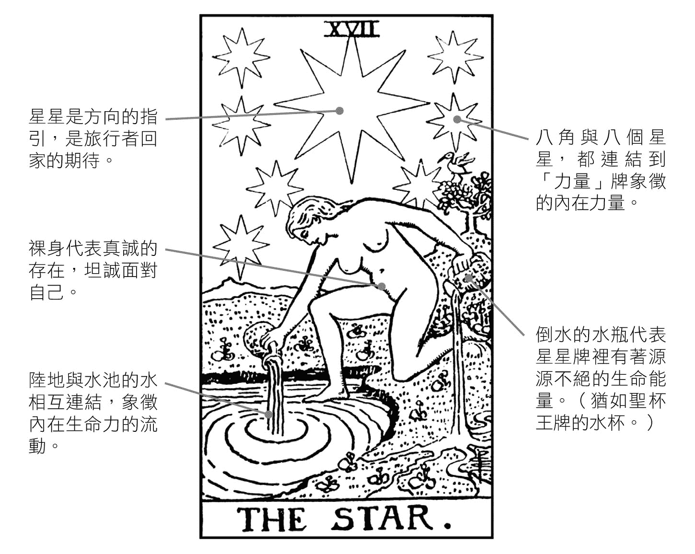

##### 人生金句

谦卑的生活不会卑微或缺乏，
它会充满，回到初心会带来智慧。
──鲁米
（十三世纪伊斯兰．苏菲教的重要诗人）

Humble living does not diminish. It fills.
Going back to a simpler self gives wisdom.
― Rumi

## 从恐怖电影谈生命中的“乱”与“序”
──皇帝、教皇、战车、月亮

恐怖电影并非大众所爱，之所以令人不喜欢或害怕，不只是因为影片中出现恶心、暴力、残酷的镜头，而是恐怖片营造的氛围与故事，总让观看者有种说不出的身心煎熬。这种不舒服是原有安稳的秩序被破坏的不安感，也是“月亮”图像展现的氛围，一旦这种不安出现，我们就会想要赶快回到光明、有秩序、合理的生活，这些就是由“皇帝”、“教皇”、“战车”带给我们的安全感。所以皇帝与战车都穿着盔甲，带着保护的意味，而教皇也像一位人生引导者，带领下面的两个人，走向神明指引的光明道路。恐怖片的故事，也就是这四张牌相互碰撞的生命状态，如果从生命的秩序与混乱的视野看恐怖片，我们不只是享受恐怖与紧张的氛围，也是透过电影走一趟自我探索的旅程。

恐怖片里出现的禁忌、不合常理的破坏，都在处理社会与我们内在建构的秩序与规则，禁忌区隔了合理的世界与未知的黑暗，只要不去碰触禁忌，我们就可以安居乐业，当未知的黑暗威胁生活时，我们就进入失序的混乱中。很多时候这些未知与混乱也会被理解为是不洁净的污秽之物，需要透过特定的仪式，才能被净化。人类学者玛丽．道格拉斯（Mary Douglas, 1921-2007）就认为，文化让生活中的物，有了特定的秩序与位置，人对“净”的感受是一切符合秩序的状态，“污”就是违反了秩序的不舒服。例如：就算是新鞋子，放在餐桌上也会觉得脏，因为它是不能进家里的物；过世的人只能放置在特定区域，不然就会破坏活着的人的秩序，污染生活空间等。人活着，心里、心外都有一套界定事物的分类，这种分类形成了每个人内在特有的秩序与不可违反的规则，一旦这样的分类被搞乱了，我们不只感到不安、害怕或生气，还会觉得自己被不干净的东西沾染。

恐怖片大多会从故事的角色破坏禁忌开始，之后就会发生各种怪异事件。不知名的禁忌，是我们在生活中理所当然要遵守的规则，要成为好孩子、要上进、不能犯错、不能被当作傻子、努力才能成功……这些内在不知为何而来的要求，决定着我们的行为，也让自己成了恐怖片里不知原因而遵守禁忌的村民。但突然来了一批不懂规矩的年轻人，他们破坏禁忌的行为，其实就是让正努力守规矩的我们，开始省思禁忌形成的原因，以及拆除禁忌的方法。大部分的恐怖片里，找到解除禁忌的方法后，生活又会回到原来的平安，而经验恐怖事件后生存下来的人，也会有勇气活出与过去不一样的生活。或许真实人生也需要一次破坏禁忌的白目举动，当身边不守规矩的、讨厌的人出现，就有机会质疑自己为何需要守秩序，并让自己从不明就里、不合理的自我要求中走出来。

在塔罗大秘牌中，“皇帝”、“教皇”、“战车”分别象征着秩序与维护秩序的方法，皇帝只有一人坐在石头椅上，象征了秩序本身，但教皇与战车的构图，出现了多位人物与角色，象征了让秩序维持下去，并能够在社会与他人安定生活的维护行为。皇帝图像中出现的石头山、石头椅，都有着永固不变的意象，他就像让世界稳定运行的规则，为我们的生活带来安心的秩序。文化中特定节日的仪式、悠久传统的禁忌，都很像皇帝图像，稳固、坚实地守护着我们的生活，也有很多社会固有的价值要求着个人遵守与接受，例如尽孝、社会礼仪、结婚生子的神圣职责等，当个人被规矩规范，但又无法全然履行，就会成为内在冲突的来源，很多时候我们只会自责为什么做不到，却不会去省思为什么要做到。这时候身边如有不尽责的人，理所当然的过着他的日子，就成为电影中捣乱禁忌的年轻人，我们会因为他们不守规矩而生气，想要赶走他们、教训他们，但如果有机会跟他们走一趟破坏禁忌的道路，就有可能帮助自己省思，我们在遵守的是什么样的规矩？为何要遵守？这些规矩有没有局限了我的成长与改变？

秩序能够维持下去，需要透过教育教导群体并传承，这是“教皇”的职责，不断告诉我们维护传统与秩序的重要性。教皇会让禁忌与秩序变为传统，让它变得有意义、变成信念与需要维护的重要价值。例如母爱与母亲的职责会影响孩子健康成长的观念，虽然这是普遍接受的道理，但如果深究现今的家庭结构与状态，小孩的成长不会只受到母亲的影响。很多母亲同时也是职业女性，她们负担着工作与家庭的双重责任，与父亲毫无分别。但只要小孩有偏差言行，老师给负评、街坊邻居的怪罪眼神，矛头通常会直接指向母亲，母亲也会不自觉的比父亲更加自责和内疚，我们一旦接受了教皇的教导，内化了这个规则，就有可能用这规则批评与指责自己。所以教皇一方面指责破坏禁忌的年轻人，一方面也会努力透过教育教导，让每个人都能认同传统的重要性，让传统一直不被质疑的传承下去。当我们想要反抗某些不合理的传统，社会的责难就会出现，这时候以为指责的人是外面的长辈、权威者，但其实指责的声音也来自我们的内在，文化传统早已在教育过程被我们内化，虽然长大后可以透过个人的觉察而反抗，但已经被个人认同而内化的规则，不容易抵抗，所以“自责”就是来自于内在的责难之声，也是我们内在的教皇在发声。

战车有着年轻人的形象，他充满斗志与行动力，驾着马车到战地镇压敌人，代表这时代以安宁之名所进行的、驱逐扰乱者的维护工作。他背对着城镇与护城河，保护着城镇不被战事牵连，城镇代表社会群体居住的地方。在井然有序的社会中，无法进入秩序的人会被排挤到边缘，也会出现冤屈与枉死的情况，这些受委屈的边缘人就成为扰乱秩序的怨灵，这些怨灵活着的时候没有得到关怀而受到伤害，最后便以怨灵的形式回来扰乱原有的城镇秩序。怨灵是受害者，在恐怖电影中，怨灵生前的名字与遭遇被揭发后，破坏禁忌所带来的混乱就会结束。在每个时代与社会中，都会发生以保护多数人的安宁与安全之名，驱逐他人来维护社会秩序的事件。回到我们的生活，身边会有一些看不顺眼的老板、同事与家人来扰乱我们的平安，为了让自己舒服过日子，我们会尽量与他们切割、数落他们的错、或直接无视，这些都是驱逐行动。他们成为从我的秩序中被排除的人，但排除与避开无法永远隔离这些麻烦，他们就像怨灵，总是会在平安的日子里，回来扰乱安宁。就像很多人换工作的原因是不喜欢某个人，但换了工作会发现不喜欢的人依然在。所以最终的解决方法，是要觉察那些人的哪些言行扰乱了我的安宁，而这些扰乱的源头来自于我们内在的秩序，透过认出我们内在的秩序与规则，就能省思与调整不恰当的自我要求与外在认同。唯有如此才能让怨灵安息，不再害怕他们出现。

没有混沌就不会有秩序，所有秩序的存在与维护，代表混乱必然存在，在大秘牌里的“月亮”就成为秩序之外的混沌状态。月亮图像里没有人物，只看得到动物，还有穿过动物向远处延伸的道路，这里除了动物的野性与本能，还有人无法想像的黑暗与未知。在恐怖电影里，超出想像、不可理解的事情，都在秩序与禁忌失效后发生，不可理解之物在电影里可能是超自然的幽灵、也有可能是失去理性的杀人魔。但回到我们的日常，不合理的事就会是我努力工作与加班，但被拔擢的是喜欢摸鱼的同事；我用心对待情人，但对方爱上别人而离开；我对朋友真情以待，却因为利益被背叛……当这些不合情理的事情发生在我们身边时，就会开始感受秩序到不见了的不安，也不知道接下来到底要依循什么样的道理过日子，并觉得过去守规矩的自己很傻，开始否定自己的过去。这就是月亮的混沌出现的时候，在动物与非理性的黑暗世界，道理说不通，一旦对秩序失去了信心，似乎会进入到吞没自己的险境，但月亮的道路通向的地方，真的是需要害怕的地方吗？

恐怖电影让我们看到秩序形成的那条界线，那条界线建构了我们看到的合理、公平的世界，只要界线被破坏，各种不怀好意、未知与不明就里的恐怖之物就会袭来。毕业后不好好找个稳定的工作、没有存钱买房、没有结婚生子……当生命状态处在社会秩序之外时，自己就成了需要用禁忌隔离的恐怖之物，这时生活就像月亮图像，虽然日子可以过，但有太多的不明与不安扰乱着自己，也会因为被社会拒绝而开始自我否定。这时除了想要赶快回到秩序之内，是不是可以做一次破坏禁忌的人？拆解已内化到我们内心的规则与要求？

我们认为合理的界线，如果深究就会发现是别人教我们的道理，这些道理虽然让我的世界有了秩序感，但也有可能阻碍我走向成长的道路，所以秩序的破坏也是自我成长的必经过程。当我认为要被他人接纳，就要顺应他人的要求时，有一天遇到了断然拒绝他人，却也能得到尊重的人时，会对这样的情境不明就里的感到生气，也会对能够拒绝他人的人感到恼怒，这时，对方就成了我们要驱逐、隔离的扰乱秩序的来源。但这些人没有做错什么，他们只是活在与我们不同道理与秩序世界里的人。与他们的相遇，会冲撞我们内在创建的各种“应该”，这些应该可能像皇帝牌一样，建构了每个人的生活秩序与安全感，所以我们就像战车牌，为了安心生活把感到不舒服的人都驱逐，也让教皇牌给我们正当理由，继续维护原有的内在秩序。当我们遇到了扰乱秩序的事，不再能够理所当然的依过去原则过生活时，就拥有了成为恐怖片里的主角的机会，也就能够进入月亮牌里的道路，虽然白目的破坏了禁忌，但能够穿过动物的野性与暴力，还有维护秩序的最后防线──两座高塔，进入月亮牌的黑暗之处，去寻找、探问：“我想要成为什么样的人？”有了这样的探问，当再次回到有秩序的世界，这时候对自己的要求与规则，不再只是不明就里的追随他人，而是为自己找到适应社会与成为自己的整合之路。就像恐怖片里，最后生存下来的主角，大多有着与他人不同的特质，他们比较容易去质疑多数人的想法，也会坚持自己的信念，所以能够对抗黑暗，成为最终的胜利者，但也需要面对只剩下一个人的孤独之境

有秩序的生活会给我们熟悉的安全感，对普遍的社会秩序与价值的认同，会给我们与群体同步的归属感，这些都是日常的必需品，所以皇帝、教皇与战车，都是帮助我们进入社会、与群体创建关系、让自己安身立命的重要学习，也因此大多时候，我们就理所当然的接受了“应该”的禁忌。但如果哪一天，在生活中遇到了质疑你的“应该”的事情而让你生气、恼怒时，在指责他人与驱逐麻烦前，可以先走一趟月亮的黑暗旅程，就有可能带给你成长与改变的机会。就像荣格所说，接触黑暗（阴影）的经验会让人破坏原有的道德律，要承受他人的责难，却可以让自己成为更为成熟的人。

### IV 皇帝 The Emperor

##### 【图像叙事】

以石头山与石头椅为背景的皇帝，表情严肃，看向旁边的眼神，似乎在警觉着周边状态，他身上的盔甲象征着防卫与戒备，整体上给人滴水不漏，坚定不移的氛围。与皇后牌的背景是会依季节变动的大自然不同，皇帝图像中的大自然是不易变动的石头，数百年坚定不移，象征了皇帝对守护江山的坚持、不容许改变的决心。

皇帝图像中人物以老者形象出现，加强了守护意象，老者并不像魔术师是开创者，也不像教皇有着推动使命的热情，老者用生命经验的历练，为江山永续，创建秩序与制度，就像他双手上紧握的权杖与圆球，秩序在他的规划与掌控中，井然有序的被遵守，不容许因个人的情感因素而改变现有秩序。

##### 【解牌叙事】

皇帝是统治者与管理者，用皇帝的态度面对事情，就会注重规则、纪律与秩序。皇帝的态度应对事情，会按表操课、依计划行事、要求完美及细节、重视稳固的基础与脚踏实地，并且主导大部分的决定。皇帝的态度，虽然在做事上可以按时达成，但做人会太过严厉与要求规矩，反而无法与他人和谐共事，会用以上对下的态度命令他人，注重面子，无法接受他人的指责，或令他有失权威的事。皇帝的态度面对情感关系，在情感表达上有点冷淡、僵硬或过于依照习惯行事，喜欢稳定发展的关系，缺乏浪漫，也希望在重要的人面前成为被尊重的人。两人的互动比较重视生活中食衣住行的实践层面，不太有风花雪月的情感互动。

##### 【逆位叙事】

逆位的皇帝失去了掌控能力，并且也无法安稳的坐在自己的宝座上，原来在山脚下的小溪流上涌，流进石头山，成为皇帝的情绪风暴。皇帝逆位时的态度，虽然也想掌握全局或管理好自己，但纪律不足，成为无法达到自我要求的皇帝。逆位皇帝态度面对事情，容易放弃，对自己失去信心，所以也无法实时下决定及承担责任。皇帝逆位时，也会因为对他人的不信任，无法放权给他人，也不信任身边的同事或工作团队，造成合作关系不和睦，成为独裁却无承担力的领导者，也会因为不相信他人，很多事情都由皇帝自己去做，变成了执行者，不是管理者。在人际关系上，虽然会比正位时柔软一些，但柔软会变成没有主见，也无法言出必行，容易落入无法有效沟通，也没有能力关怀他人的需求。

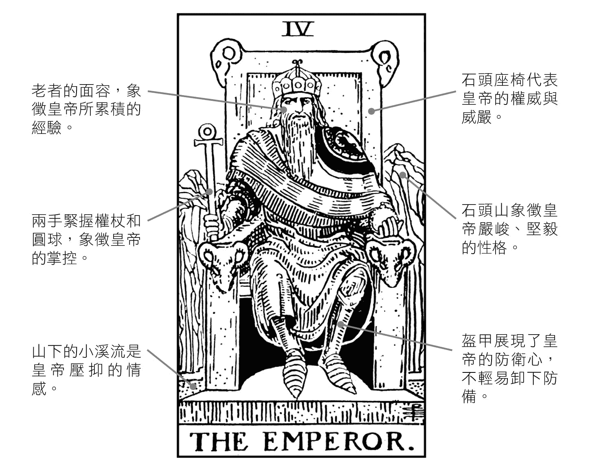

##### 人生金句

混沌是自然法则；
秩序是人类的梦想。
──亨利．亚当斯
（十九世纪美国历史学家）

Chaos was the law of nature;
Order was the dream of man.
― Henry Adams

### V 教皇 The Hierophant

##### 【图像叙事】

教皇图像以三人构图，强调了三人形成的关系，教皇在上，这个主要人物占据了图像中间。两名修士以半身背影的方式呈现，他们是图像中的陪衬，强调教皇有着跟随他的群众。虽然教皇是中心人物，但他不像皇帝是绝对权力者，教皇高举双手向着上方，象征了教皇身为上帝的代言人，教皇说的所有话语都来自于神。

皇帝与教皇虽然都是领导者，但教皇图中出现的修士，强调了传达与教育的身份，修士依循着超越个人的理念与使命，虽然跟随且臣服于教皇之下，却是对更高使命的臣服。教皇年轻的形象表示不断传承使命的生命力，教皇不只维护秩序与传统，他所重视的是传统背后的精神，并透过教育，代代相传。

##### 【解牌叙事】

教皇的态度会重视传统价值，充满热忱的投入理念的传承与教导工作。用教皇的态度面对工作，会重视组织中规定好的上下阶级与做事规则，也会维护组织理念。如果看到有人对规则有异议，教皇不只要他人遵守，还会耐心说明与教导要遵守的原因。教皇的态度是为了崇高的理念而努力，他的所作所为比起为了自己，更是为了维护团体、组织、国家等利益而为。在人际关系上，常给人说教、说理的印象，也会相信自己的信念，所以也容易否定、指责与自己不同想法的人。在面对情感关系时，教皇的态度略显保守，跟随社会的主流价值，维持传统的角色分配或家庭生活，两人的互动关系也大多会变成上对下的沟通，像老师和学生、父母和小孩，很难与他人创建像朋友一样开玩笑，或没有身份差异的平等关系。

##### 【逆位叙事】

逆位的教皇出现叛逆、突破传统、一意孤行等的态度，会从保守的守旧派成为想要打破传统的异议人士。逆位教皇的态度，不喜欢团体给予个人的束缚，质疑规则或教条，想要突显自己的独特性，也不太容易接受别人的教导。或者过于坚守传统立场或维护团体，变成教条主义，无法容纳其他人的想法或意见。在韦特图像中，出现多人图像的牌，都呈现了某种关系结构，在教皇牌呈现的是上下阶级关系，所以逆位教皇，可能对阶级制度质疑、不满或适应不良，也无法成为带领别人的领导者，也有可能对原有的信仰、信念失去热情与兴趣。在感情上，逆位教皇也不想跟随传统价值，对结婚的承诺质疑或恐惧。整体来说，教皇逆位时的态度，会害怕被归类或臣服于特定人物、团体或理念。

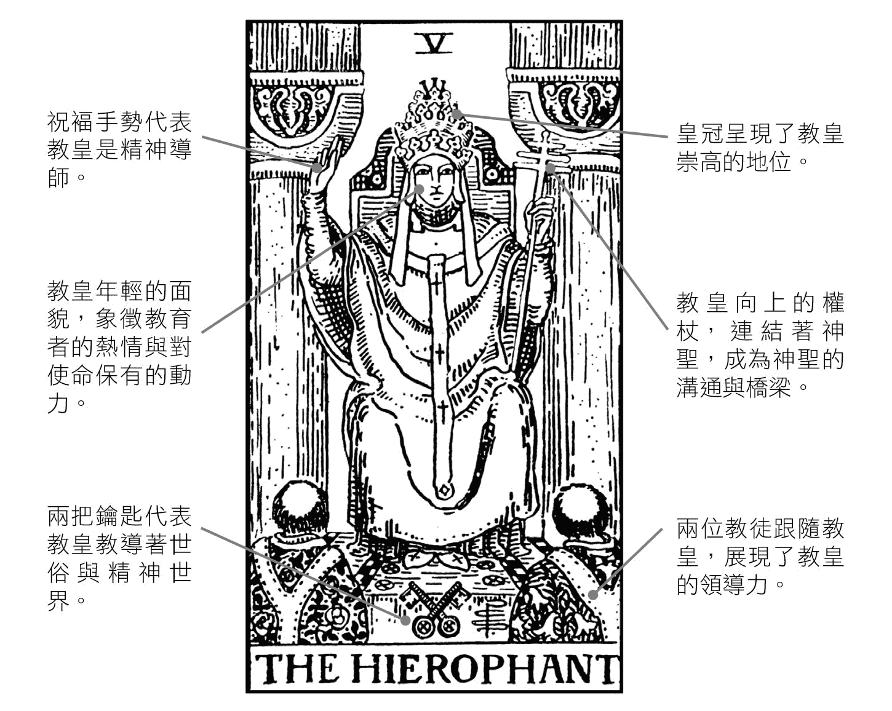

##### 人生金句

年轻的时候遵守所有的规则是好的，
当你年老时，才有力量去打破它们。
──马克．吐温
（十九世纪美国小说家）

It is good to obey all the rules when you’re young,
so you’ll have the strength to break them when you’re old.
― Mark Twain

##### 大秘牌中的多人构图

在大秘图像中，有些是单人构图，有些是多人构图，当出现一位以上的人物构图时，从人物关系的安排与配置，可形成人际关系层次的图像解析。例如：教皇以一人独大的构图，突显了上对下的关系；恋人为两人同等大小、同样空间配置的构图，展现了平等的两性关系；战车是人物与神兽向着共同目标，呈现了需要达成共识的合作关系；力量以少女与狮子向着对方接近的身体语言，显现了相互接纳与认同的退让关系等。

### VII 战车 The Chariot

##### 【图像叙事】

战车图像里的人物，站在石头材质的战车里，身穿盔甲，手持权杖，头上戴着象征胜利的月桂冠，犹如向战场前进的将军。下方有两只一黑一白的斯芬克斯神兽，神兽拥有比人更为强大的力量，一黑一白象征了祂们的对立，但神兽没有被缰绳束缚，却与人物看向同一个方向，象征神兽与人形成的合作关系，人物说服了神兽，朝着共同目标前进。

战车后方有河流与城镇，河流阻隔了战车的退路，并保护了城镇，这是护城河，也是让战车只能前进、不能后退的决心。向着战场，面对危险与冲突的战车，为了守护家园，表现出强大的意志力，两方对立的斯芬克斯也被他说服，突显了战车人物不畏惧冲突，勇往直前的毅力。

##### 【解牌叙事】

战车的态度积极、充满行动力，所以不论在什么情境中，战车都与持续前进与积极追求目标有关。在工作上，战车的态度能够设定目标、面对障碍，勇往直前，不会轻易放弃，并在原订的目标达成以前也不会转移方向。但战车的态度，在面对人际关系时，太过于直接与独断，有时较难与他人分工合作，如果团队没能达成协议，也会一意孤行走自己决定好的道路，犹如拉战车的两位神兽，祂们并不是平等的友伴关系，而是走向利益共同体的共识关系。战车需要有目标才能往前行，所以在感情上，一旦两个人的情感确定，战车的态度也会不断创建情感阶段的不同目标，例如买房、买车、累积更多的存款准备结婚等。战车的态度勇于面对挑战，也不怕困难，反而会越挫越勇。

##### 【逆位叙事】

战车逆位时就会失去动力，犹如行进在路上的车子抛锚，战车逆位的态度，面对事情时容易失去动力、进退不得，而产生焦虑不安。犹如半路抛锚的车子无法如期赴约，战车逆位时，总会有种有事情要完成，但什么都做不了，或没有动力去做的着急。逆位战车态度，也会表现出失去方向的迷茫，会尝试很多事，想要找到持续进行的方向，但也常觉得那不是自己想要的，而中途放弃。战车的动力来自于图像背景中他要保护的城镇，逆位战车会失去了动力，也可能是找不到想要珍惜、保护或重要的事物，所以较容易感到无力与挫折。

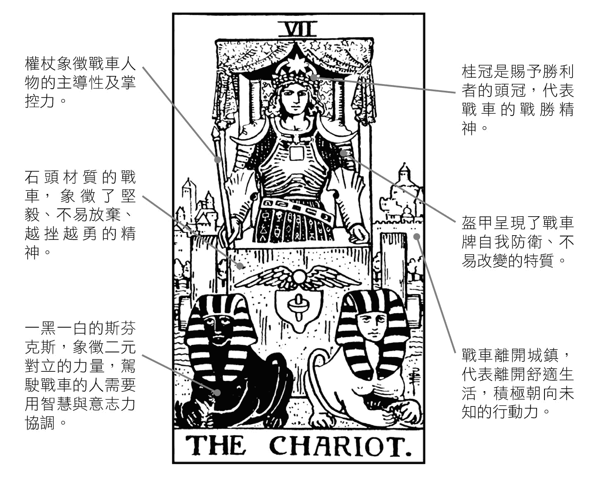

##### 人生金句

我们征服的不是高山，
而是我们自己。
──爱德蒙．希拉里
（二十世纪新西兰登山家）

It is not the mountain we conquer,
but ourselves.
― Edmund Hillary

### XVIII 月亮 The Moon

##### 【图像叙事】

月亮图像里没有人物，只有动物，象征了非理性的世界，在这里本能掌控着理性，情绪主导行动。上方的月亮闭起眼睛低下头，没有向外观看，它的侧脸与隐士的侧脸相似，象征着向内的省思与探索。图像中间有一条道路向后方延伸，道路两旁有一只狗与狼，最前方有小龙虾，它们都头朝闭起眼睛的月亮，象征高处的意识与低处的意识没有交集，链接这两者的是中间的道路。

道路向更黑暗的地方延伸，经过了动物，还有两座高塔分立两边，高塔犹如关卡与边界，经过高塔就会走入只有高山与黑暗的地方。在理性之外的无意识深处，是需要时时刻掌控一切的理性的不安、害怕、焦虑等本能情绪，这些情绪需要我们勇敢的直接应对，经过动物与高塔，深入黑暗，寻找跨越之道。

##### 【解牌叙事】

月亮牌代表某种模煳、不明确的态度。面对事情时，容易看向混乱、不安的状态，认为自己无法弄清楚状况，感觉眼前布满浓雾，无法看清事情的全貌，需要做决定时，月亮的态度会犹豫不决或反复无常，很害怕自己的决定是错误的，会发生不好的结果。月亮的态度也会对人不友善，总觉他人的好意另有所图，或者很多人都在说谎或不真诚，所以就会封闭自己，跟他人保持距离。月亮的态度，犹如无法在夜晚前进的旅人，或者在夜晚会把平常事物误认为可怕的威胁，心中充斥各种可怕的幻想，但因为黑暗也无法改变事态，只能在害怕中等待危机退散。月亮的态度对人、对事都有很多猜疑，所以容易处在很不安的心理状态。在感情态度上，暧昧不明，无法给予情感上的承诺，也会因为无法信任对方，常常在误解中受伤与生气。

##### 【逆位叙事】

逆位月亮的态度，会否定自己在不安、焦虑与不明确的状态，也不认为自己看不清真相，总是对外表现出无所谓与开心的样子。因为害怕独处，也会过度讨好他人，或者不会表现出不愉快或不满的情绪。逆位月亮的态度，也会很容易相信预言、启示、都市传说、网络流言等，不去探究事情合不合理，就直接深信不疑，透过这种相信排除心中的不安。月亮逆位的态度，是处在脆弱的情绪风暴，无法控制情绪，容易被一些小事激怒、受伤、猜忌，情绪起伏比较大。也常会把自己感受到的不安与害怕的责任，转移到外在环境中，指责他人的行为，或者认为风水不好、沾到不好的东西，生活才会被扰乱。

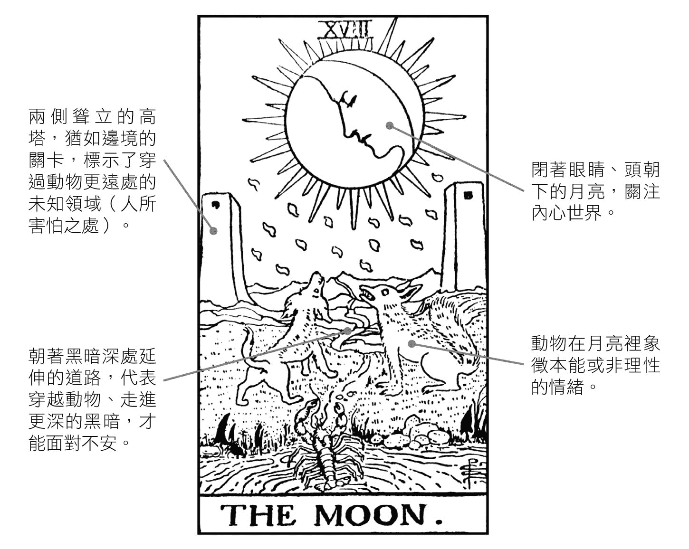

##### 人生金句

我们害怕进入的洞穴里
藏着正在寻找的宝藏。
──乔瑟夫．坎伯（当代美国神话学家）

The cave you fear to enter
holds the treasure you seek.
― Joseph Campell

## 送给正在思考生命意义的每个人
──愚者、隐士、太阳

出了社会常常被问工作或职业是什么？填表格也会有职业栏，这些问题似乎是在问：我们人生大部分的时间在做什么？而这个“做什么”已经被分类与归纳，让他人可以一目了然，但我们的职业真的可以代表我们在“做什么”吗？回想一下小时候，如果大人问长大后要做什么，我们的回答未必是职业，而是想要完成的梦想，所以小孩子会回答科学家、医生、警察……这些也可以是职业，但小孩子在回答时，并不是从职业的角度考虑：年薪有多少？有没有在职保障？工作稳不稳定？他们所想的是这些梦想可以完成的事，例如科学家可以发明很酷的东西、医生可以救人、警察抓坏人等。小朋友回答的梦想比较是“志业”，是想要借由职业完成的事，所以“想完成的事”才是重要的，其实做什么工作是其次，只是长大后，我们都理所当然的被分配到了各种职业，却淡忘了在这些职业中我们想要经验什么。

我们都会问人生有什么意义？或者我现在在做的事情有什么意义，当我们在问有关“意义”的问题时，需要从“经验”观看，而不是“条件”。条件是已经分类好的项目，就像职业的分类有社会性的普遍标准，例如稳定工作的条件，就是薪水稳定支付、可依工作年资获得升迁机会、有退休保障等。当我们在思考工作时，大都会从条件去考量，但这些条件无法说明我们会在工作中经验什么，有人在稳定的工作中，经验生不如死的职场地狱，也有人在没有前途的工作中，经验同事之间的友谊与关怀。所以经验职场地狱的人，会认为工作没意义，只有痛苦；经验同事之间友谊与关怀的人，会认为有没有稳定的工作不重要，做得开心才有意义。思考工作意义与人生意义，其实是同一件事，很多人以为人生有了稳定工作、结婚成家、买房、出国旅游就可以过得有意义，但这些只是社会身份的项目分类，无法表达我经验了什么样的人生。

韦特把愚者形容为渴望经验的灵魂，所以愚者才会走向悬崖，想要纵身一跃，投入其中。愚者展开双臂，抬起头走向前方，不论前方有没有路，他都不会退缩。前方的悬崖是一般人不会去的地方，也代表社会规范的边界，跳下悬崖，我们不再是可以用社会现有条件定义的人，所以只能自己来定义自己。高中毕业后，朋友都理所当然进了大学，如果只有你选择进入职场，这时你就是跳下悬崖的愚者，愚者想用自己的方式体验人生，但路上会有太多人质疑你的选择，认为你的条件不够好，这时你很有可能会认为自己做了错误的选择，开始后悔愚者的纵身一跃。愚者跳下悬崖有错吗？或许他人对愚者可以用对与错来评价，但愚者自身是经验者，他一定会告诉你跳下悬崖后他所经验的事。当其他人只能用条件计算成与败的标准时，愚者却是用经验来领悟他跳下悬崖的意义。

跃入经验的愚者，才能成长为“隐士”，隐士所走过的路与经验，以老者形象来表现，并停下脚步，闭起眼睛。我们用眼睛观看世界，但也被眼睛蒙骗。没有经验的愚者，会努力追求光鲜亮丽的外表与条件，好学校、好工作、好对象、好房子……但隐士闭起眼睛，不再用眼睛观看世界，而是用心去体会。隐士图像里的色彩简单，与愚者图像有很大的差异，隐士不再被华丽的外表蒙骗，所以他闭起眼睛但提着有光的灯笼，代表他还是在看向世界。但他所在的地方是旷野，并不是人会居住的地方，所以也代表隐士不再被他人的评价影响。隐士是一位智者，他可以不受外人的评价影响，是因为他从经验中看向的是意义，而不是拥有了人生胜利组的条件。

如果面对人生每一段的抉择，我们是用经验思考，就不会有“怕选错”这样的想法。对与错是在某些恒定的标准下才能衡量的结果，当我们用对与错来衡量自己的选择时，就是从条件来思考未来，这时候我们重视的不是经验或意义，而是别人如何评价我的选择。所以不念大学的决定，从社会条件来考量，就是错的选择，但从不念大学投入职场的四年经验来观看自己，就有了大学四年无法学习与领悟的意义。从经验去做抉择，每一条路都会是独特的，就算走上了不是自己喜欢的路，也是一次更认清自己想要什么的经验。所以从经验的观点来看，每一次的选择都是发现自己的过程，无所谓失败与成功。如果不读大学、进入职场后，发现自己还是喜欢读书，这时还是有很多机会可以让我们回到学校，而且这时候的读书，就会特别有意义。

很多人都会说让兴趣变工作，是谋杀兴趣的作为，最好把这两者分开。但我们想要乐在工作，为何不能让兴趣成为工作呢？这不是两者相互排斥的问题，而且刚开始追求梦想时我们是愚者，但一旦梦想成为工作，我们就想用工作来证明自己，这时兴趣就成了定义我的成败的条件。如果你喜欢烹饪，高中毕业就直接投入职场，想要尽快成为专业人士，之后开一家餐厅。但如果多年后，还是无法开餐厅，或开的餐厅没有成功时，你还会喜欢烹饪吗？如果没有，就代表这时烹饪已经不再是让我人生有意义的兴趣，而想要达到成功的条件。我们会在兴趣中不快乐，是因为把兴趣变成衡量人生成败的条件，不再是那个最初投入经验，并乐在其中的愚者。日剧里很多食物与疗愈的故事，都在谈烹饪者如何用食物疗愈他人，在这些故事中，主角或许有餐厅经营不善的烦恼，但他不会以餐厅的成败来衡量烹饪之于他的意义，所以主角能一直在烹饪中获得成就感。

在人生路上成为隐士，虽然可以坚持走自己的路，不受他人影响，但也可能一直特立独行，不再能适应社会。隐士手上的灯笼，是他投入世界的初心，只要点亮这盏灯，隐士就不会迷路，但活在社会中，只有初心并不能解决一切问题。传承好几代的家族事业，如果没有因应时代改变，也有可能没落，或者只坚持由家人传承，如果小孩拒绝，也会带来问题。所以愚者的成长，不会在隐士结束，必须继续前进到“太阳”。太阳牌里全身赤裸的小孩，有着愚者与隐士的经历，是大智若愚的智者。他骑在马上向前看，有着愚者向着未来的不畏惧，他的全身赤裸是隐士的初心，但小孩的形象表现出比起年轻的愚者或年老的隐士更多的可能性，小孩会认真的玩（投入经验）、没有偶包（不理会他人的评价），他的天真浪漫不是因为无知，而是跳越世俗规则的智者。如果愚者是跳下悬崖打破社会规范、隐士是走在让规范无效的旷野，但也会孤立自己，而太阳里的小孩，懂得需要社会规范的重要性，所以不只是打破、无视，而是为自己与他人创造新的游戏规则，让其他人也可以省思，人生可以有更多的玩法，不需因已知的条件而受到局限。

如果你现在正处在人生的十字路口，不知如何抉择；或因为过去的选择而懊悔；或者因为自己的社会条件不足而自卑，请你用“经验”来重新看向你的人生。如果从经验观看，哪个选择会你最想体验的人生？从经验看过去的选择，在选择后你经验了什么？这些经验又带给你哪些意义？还有不论你的社会条件如何，从经验观看，你想要活出什么样的人生？请你把愚者、隐士、太阳中的三个人物形象放在心里，当你无法摆脱他人的要求时，请你想着愚者，并想像跟他一起跳下悬崖，体验一下那会是什么感觉；当你在追求梦想的路上，很难抵抗外面的人的评价，这时你可以想像自己成为隐士，不忘初心，就算一个人也坚持走到目的地；如果你觉得这世界的成功典范太单一、无趣，你可以想像成为太阳牌里的小孩，看看自己能够为这世界创造什么样的新玩法。如果你正在问自己“人生有什么意义？”请你把问题改为“我经验了什么样的人生？”，当你开始从经验述说你的人生时，意义就会慢慢浮现，也会把你推向你想要经验与成为的人生。

### 0 愚者 The Fool

##### 【图像叙事】

图像中的人物，以侧身形象，呈现了动态构图，他的两手与双脚都向外张开，用他的全身来感觉并走入世界。他的眼神看向远方，脚步向前踏，充满了对未来的期待。一手持包袱，代表他是旅者，但穿着华丽，另一手拿白玫瑰，他并没有在赶路，反而愉快的欣赏着旅途上的风景，每一步都是体验与享受。

脚边有一只白狗正在跳跃，他们都在危险的悬崖边，却没有停止脚步。愚者并不是安全为优先的深思者，犹如远方尖尖的山顶，他期待冒险、挑战，不顾危险。就算他的旅途被悬崖阻碍，也未必会绕路或结束旅程，反而想要体验悬崖带给他的经验。他站在悬崖高处，高高仰起脸，愚者想要到达的地方是世界的最高峰、最远方，那些其他人不敢尝试的冒险，正是愚者想要踏入的世界。

##### 【解牌叙事】

愚者代表一切从头开始、不需被过去束缚、向着困难勇往直前的态度。用愚者的态度面对抉择，就不会顾虑太多、没有未来计划，难度越高越能引起愚者的好奇。愚者的态度所下的决定快速、冲动，在旁人眼里会觉得鲁莽、不切实际。随心所欲的决定与行动，可以是一次没有计划的旅行、人生道路的转向、跳入不确定的情感关系等，不论面对的是什么样的决定，愚者的态度总能乐观轻松的看待，并且拥有抛开一切大胆迈进的胆识，虽然给人孩子气、幼稚、任性、只顾自己等印象，但愚者无忧的态度，也会令人羡慕。愚者的态度，无法忍受一成不变的日子、稳定的生活、没有变化的感情状态，所以也有可能为了改变，独断做出鲁莽的决定，而让身边的人因为改变而感到不舒服、受伤或生气。

##### 【逆位叙事】

逆位愚者的态度，不再是没有任何顾虑、大胆前行的冒险者，反而会对决定感到疑惑与不确定，虽然也想要突破现状，却无法迈开脚步，有太多顾虑的事物而变得小心翼翼、退缩，他也会觉得自己想要从头开始的想法，是不切实际与不负责任的，所以不敢行动。愚者逆位的态度，也有可能变得更为粗鲁或鲁莽，完全不顾虑他人的感受，只想到自己要什么。不顾他人的意见，做事粗心、随便，也会给人不负责任的印象。逆位愚者的态度，会活在自己的世界，与外在世界产生隔阂或过于不切实际。

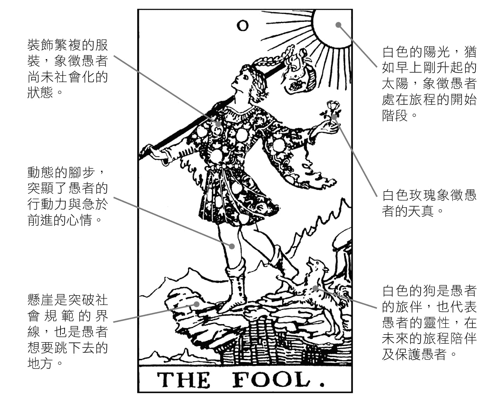

##### 人生金句

信息不是知识。 知识的唯一来源是经验。
你需要经验来获得智慧。
──爱因斯坦（二十世纪重要科学家）

Information is not knowledge.
The only source of knowledge is experience.
You need experience to gain wisdom.
― Albert Einstein

### IX 隐士 The Hermit

##### 【图像叙事】

隐士图像的构图最为简洁，以人物为中心，背景只有山顶，象征了隐士已经远离世界。人物站在高处的雪地上，那不是安全的落脚处，但他却闭起眼睛，停止前进。他似乎已到达目的地、他想停留的地方，他的停止象征了隐士不再被外在条件受限，前进不一定要有目的地，停止也不需要理由。

他一手持着星星灯笼，正在散发着黄色的光芒，另一手握着黄色手杖，这是他和世界的链接，虽然他已闭上眼睛，但并没有与世界隔离，他的停止反而为他人带来指引方向的力量，犹如海上的灯塔，虽然孤立在海边，却为大海上的船只导航，让他们找到回家的路。隐士闭起眼睛，是要告䜣我们真正回家的路在内在，唯有向内认识自己，才能让心回家。

##### 【解牌叙事】

隐士的态度沉静、独立、能够省思自己，不论是工作还是感情状况，不太会出现过激的情绪，但会想要独处，避开冲突，不喜欢和他人有过多互动，总把心事藏在心里。隐士的态度稳重，不喜欢群聚，反而会得到他人的信任，虽然不是随性、好相处，但也不会去干扰他人的做事方法，也不会主动提供意见，所以是沉默的旁观者，也会尽量不去参与团体活动。隐士的态度在工作上，不喜欢团队合作与请求他人帮忙。他喜欢独立作业，面对事而不是人，也不积极争取对外展现的机会，虽然具备足够的能力与资历，不擅交际，所以比起担任带人的主管职，会更想停留在独立作业的环境。在感情关系上，隐士的态度也较被动与沉稳，是安静的陪伴者，不是积极的行动者。

##### 【逆位叙事】

隐士逆位时的态度，犹如无法安稳待在家里写功课的小孩，一直想着要到外面玩耍，草率完成功课，最后被爸妈或老师责备。需要自省、给自己独处时间的隐士，逆位时会为了工作、人际关系而忙碌，但这样的忙碌只是无法因为独处而产生的行为，反而突显了隐士的焦虑，所做的努力也常常没什么成就，也就是白忙一场。隐士是一位不善交际应酬的老人，所以逆位隐士的态度在面对人际关系上，虽想要拥有更活跃的社交活动，但并不擅长与人交流，常会弄巧成拙，说出不合礼仪的话，也无法同理他人的情绪，虽努力想要为他人着想，反而会让他人不舒服。逆位时的隐士，也可能会出现怪罪他人的态度，不再能够往内在自省，而是把问题转向外面，认为是他人没有把事情做好，流程出了问题运才会导致不好的结果。

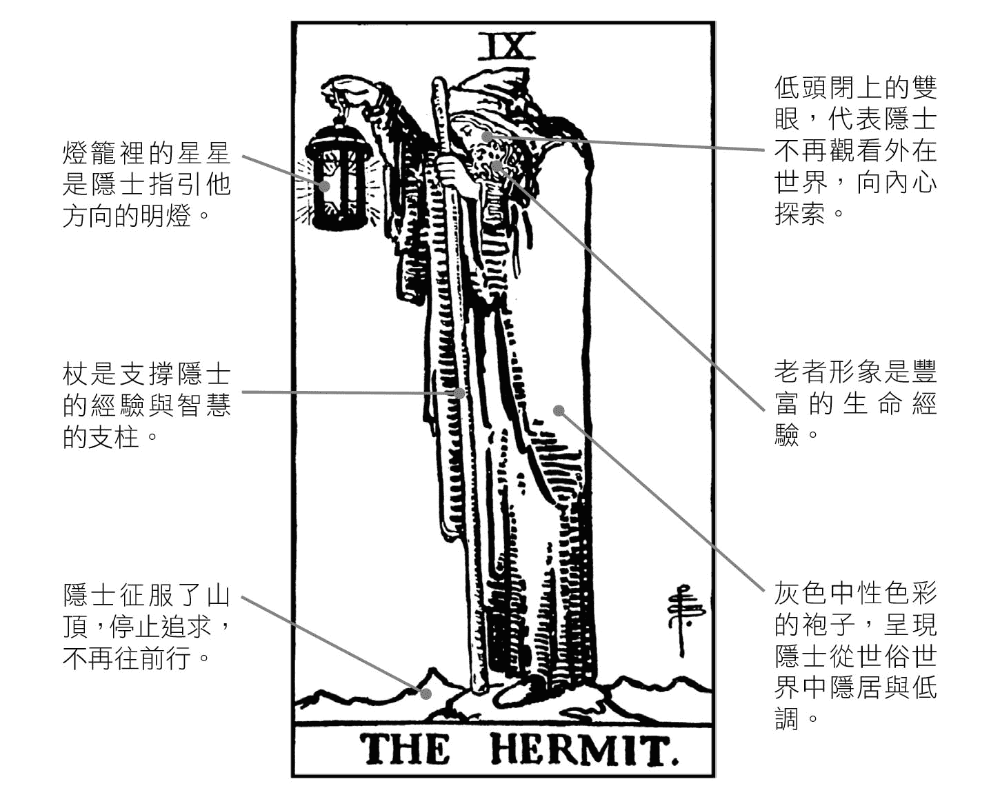

##### 人生金句

自我认知并不能保证幸福，
但它有助于幸福，
可以提供勇气为之而战。
──西蒙．波娃（二十世纪法国哲学家、作家）

Self-knowledge is no guarantee of happiness,
but it is on the side of happiness
and can supply the courage to fight for it.
― Simone de Beauvoir

### XIX 太阳 The Sun

##### 【图像叙事】

太阳图像以赤裸的小孩为主要人物，象征了小孩的初心、纯真与真诚，小孩双手双脚张开，无所畏惧的骑在白马上，一手握着红色旗子，他的形态与死神相似，却以小孩形象强调了新生命的喜悦。高挂在天空的太阳，双眼与小孩一起直视着前方，太阳影响着每个人的生活，在阳光普照的日子，我们会感受喜悦与欢乐，阳光象征了向阳的生命，不再畏惧处于阴影中。

后方有一堵墙，墙上长满了向着前方的向日葵，代表不需再回到围墙之后的世界，在太阳图像中，未来就像快乐的骑在马上的小孩，充满好奇与期待，过去也被张开双手的小孩全然接纳，所以不再需要遗憾。对生命抱持着顽童般的赤子之心，无所畏惧、心无挂碍的向前进。

##### 【解牌叙事】

太阳牌是明亮、快乐、无担忧的态度，就像图像中大大的太阳与向日葵，天天都是阳光普照的好天气，不需担心未来，也不需烦恼现在。大人的担忧是不想让自己出错，想着做错了、搞砸了、失败了怎么办？但小孩却只关心好不好玩，就像拥有太阳态度的人，不论遇到什么事都能乐观面对，不会退缩、不会害怕、也无所恐惧。小孩子天真的探索世界，在他们的观念里还没有对与错，所以能够放手去做任何好奇的事。太阳的乐观没有理由，就像阳光照耀，我们就会有好心情，这是对活着这件事的感恩、珍惜与信任，并相信天塌下来也不会绝人之路，就像太阳从来不会消失，生命也能像太阳一样持续好好的活着。

##### 【逆位叙事】

逆位太阳的态度，犹如出现了遮住阳光的乌云，从原本乐观的态度，开始担忧未来，也会对身边发生的小状况不敢轻忽，小心对待，害怕事情会有不顺心的发展。太阳逆位时，虽然也想放下不必要的担忧，却会注意到可能的危险与不安，甚至会要求自己要乐观、要快乐，不敢让自己变得不愉快、或者进入情绪低潮，在他人面前一直表现出积极、正向、无忧无虑的样子，但内在却感受到情绪压力，也会避开任何不愉快的事。太阳逆位的态度容易看向事情可能失败的结果而无法全然放心，当发展不如意时，也较容易怪罪到环境与他人，害怕承担不好的后果，被他人指责。

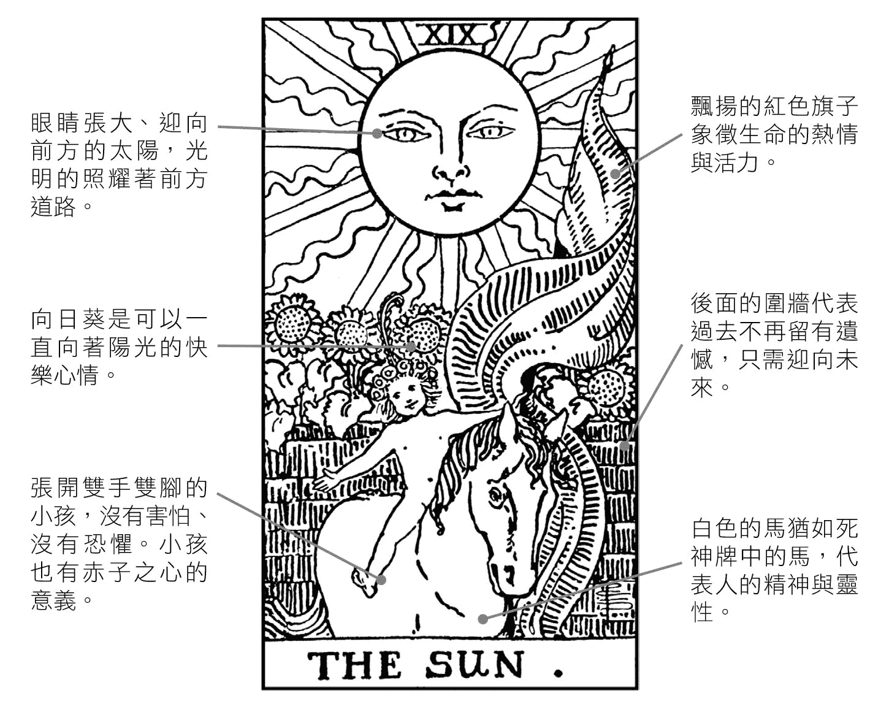

##### 人生金句

寻乐的智力就是创造力。
──爱因斯坦（二十世纪重要科学家）

Creativity is Intelligence Having Fun.
― Albert Einstein

## 先画下句点，才会有新的开始
──世界

很多人都知道好的开始是成功的一半，却忽略另一半是掌握画句点的能力。什么叫“画句点”？简单来说，就是完成的功课。一件事情要在哪里结束、何时结束，似乎不在我们的掌握中，我们都是在结束来临时后知后觉，或是在犹豫不决中，一直画不下句点。在生命故事中，我们都很专注在新的开始，却遗忘了任何的开始先要有一次的结束才能展开，所以开始与结束其实是一体两面的事情，或者反过来说，有了结束才会有开始。

讲到在人生中画下句点，很多人想到的是生命的终结，或某件事情的终极，但结束就像文章中的句点，一篇文章中句点不只一个，在最终的句点来临前，文章中间会有无数个句点代表一个句子的结束、一段话的完成、一个章节的终结。而人生也就像一篇小说或文章，能够在适当的位置画下句点，文章才会通顺、易读、意义明确。所以在人生路上的句点，不一定是一件事情的结束，反而可以看成是下一个开始前的停顿与完成。任何一个新的开始，没有前一段的结束就无法往前进，所以也可以换个方式想，当我们想要有新的开始时，就可以为自己画下一个句点。

如果结束是为了新的开始，不结束也就代表不会有新的开始，例如一段发展中的感情，也需要有句点来让情感不断有新的进展与转变，但在感情中画下句点并不一定是一段关系的结束，而是某段关系进入下一个阶段的一种进阶，从热恋期到稳定期、从稳定期到婚姻的过度、从婚姻到有小孩……任何一段情感关系都会经历阶段性的转变，这时候如果没有学习怎么为新的阶段画下现阶段的句点，就会一直留在原处无法前进。我们的工作或事业也是同样的道理，社会新鲜人与在社会中有几年的工作经验的人的历练不同，对工作的规划与想像也会有所不同，所以面对工作的态度与想法也会不一样。相对的，如果我们在感情中、工作中觉得自己一成不变，十年如一日，但又很想尝试新的事物，或许这时候并不是一直问要如何才能找到新的开始，而是要问，要如何才能画下句点。

句点，也是为自己找到意义的方法。当我们看剧时，很难在没有结局前，就对剧情、角色下定论，通常前几集的印象，可能到中段后反转，又可能到结局再一次转弯，所以我们看剧很重视最后一集。看到最后，我们会终于能够说出整出剧想要讲的意义。人在看剧、听故事时，不只是想听好故事，也想要知道故事到底讲了什么，因此结局未明、故事意义模煳的剧，通常也不受大众喜爱。故事的意义是在整体中才能被理解，就像我们要看完剧才能知道故事要讲的意义，人生也是如此，如果我们想要知道人生意义是什么，要等到演完了才说得出来。但人生的演完如果只定义是死亡，那在死亡前，我们就不可能对生命意义有所领悟。可是就像写文章，在完成整篇文章之前，有很多句点会形成文章的段落，人生的剧本是自己写的，所以在死亡来临前，我们也可以用句点为自己写出好几段的故事。

例如交往多年的感情，已感觉到某种倦怠，虽然并非不喜欢对方，但也讲不出是不是喜欢，这时很多人就会思考分手。但在分手之前，是不是可以先尝试让这段关系有一个小句点？要画下句点时，就要思考，要结束的是什么样的关系阶段？是两人感情稳定期的句点？还是两人创建生活习惯的句点？在定义画下句点的那一段，也是用意义来完成一段故事，一旦能够完成定义，自然就会出现下一个新阶段的方向。每一段经验我们很容易用好与坏、对与错来评价，但如果我们像看剧一样，把现在视为电视剧的最后一集，再从最后一集往前回溯人生，就成为一个演完的整体故事。从整体去观看人生，很难只用好与坏、对与错来评价自己，毕竟没有一个人能接受自己的人生是只用一两个字就能说完的故事，就算是影评用烂剧来评价一部剧，也会说出为什么烂，同样的道理，用整体的视野回溯人生，我们也会开始说出是什么样的故事。

当我们在失败的情绪中，很容易用当下的挫折与失败定义自己，并且一直放大过去受挫的经验，但如果我们要说出是“什么样的失败？”每段经验就算是失败，也都会有不同的意义。这时，我们就能把定义我的生命的主导权，从情绪拿回到自己手上，也能从部分偏误的观点，调整回整体性的思考。如果今天我们看完剧，只用好剧、烂剧来评价，不会有人想要听我们说，那部剧有看没看也没有太多差别。但在好与坏的背后，一定有我们没有说出的想法，那些评价背后的故事，才是定义人生时需要说出来的内容，也是我们要为一段生命故事画下句点时，需要思考的方向。

“世界”是大秘牌的最后一张，图像也有大句点的意象，裸身的女人在圆形花圈中跳舞，代表她是一个可以在生命中，自在的画下句点的智者。女人的脚步往前踏，表现一种动态的步伐，她可以是正要跳进圆圈，也可以是正要跳出圆圈。进入圆圈象征要画上句点，走出圆圈外，是从句点走向新的开始，但因为两者都有可能，也可以说世界图像的女人是画下句点与新的开始这两者一并进行，每个新的开始都是从结束展开，每个开始也都会走向结束。一般我们都会把结束视为静态，结束了，一切就会停止，但世界牌反而以动态图像，展现了结束是一种行动，不是停止，而是推动力。

如果你的人生故事感觉歹戏拖棚，也没有什么新鲜剧情可展开，或许你可以为目前的戏画下句点，就算是开放式结局、烂尾也没有关系。这时候的句点是为了展开一段新故事的推动力，而人生故事从某个角度来说都是原故事的新一季，就算这一季的结尾我们不满意，在新一季都有翻转的机会，所以不必非要给自己一个好结局才能画句点，塞翁失马焉知非福，失马的故事可以有第二季、第三季，所以是祸？还是福？就让我们用画句点的能力，展开后续更精彩的故事。

### XXI 世界 The World

##### 【图像叙事】

图像里以人物为中心，被一个圆形的桂冠花圈围绕，花圈上下有着红色的无限符号，象征花圈是无限的空间。人物赤裸着脚步向前，但她的头转向后方，她的姿态象征了过去、现在、未来，犹如身上飘着的披巾。图像展现了无限的时间与空间，尤其人物所在的地方并不是人间，象征了人物处在超越时间与空间的地方。

图像四边有四位天使，也曾出现在命运之轮的图像中，象征了超自然的守护力量（老天保佑）。世界图像表现的并不是我们所生活的世界，而是超越时间与空间的精神或内在世界。在内在世界，我们才能赤裸的面对自己，也能超越时空，回顾过去、展望未来，个人的生命在内在世界最真诚的展现，也需要我们的觉知与接纳，这是我们对自己的人生产生的了然与领悟。

##### 【解牌叙事】

世界牌是用完成与结束来面对事情的态度，例如在工作上完成一个专案；感情上进入搬家、同居、婚姻、生育小孩等新阶段的转换；或结束一段不愉快的感情；学业上毕业或完成论文等。世界牌就像一个句点，用世界的态度面对事情，不论目前发展的进度与状况，都会有股结束的时候要到了的感受，并想要了结未完成的事。当我们能够结束一件事，是因为事情到达我们可以接纳的结果，这种结果，未必符合最初的目标，但不论如何，当我们可以接受时，就会让它结束，这时就感觉圆满，虽然不是尽善尽美，也不会觉得有所缺憾。当遇到抉择时用世界态度面对，会认为现在走向新的开始是因为过去已完成，不需有遗憾。世界的态度虽然也跟结束有关，但与死神的态度不同，没有用死神镰刀切割的痛，反而像图像里的圆圈，之前感到不足、无法释怀的部分会被补足，可以没有遗憾的前进。

##### 【逆位叙事】

逆位的世界是不想结束，或者在不该结束时要了结的态度。例如工作上某些专案大家都非常投入，但可能因为经费等其他问题得要提早结案而成为遗憾；或者已经完成的专案，因为各种原因无法提出成果而悬置。在感情上，有可能一直无法与想分手的对象分离而痛苦；也有可能感情到了有名无实或产生陌生感，却找不到结束的理由；或者单方面离开关系；也可能和喜欢对象一直处在暧昧状态有没进展等。世界逆位的态度，在看待事情时，都会看向遗憾与无法接纳的部分，所以很难放下，会从事情没有结束或被迫结束的观点去理解。

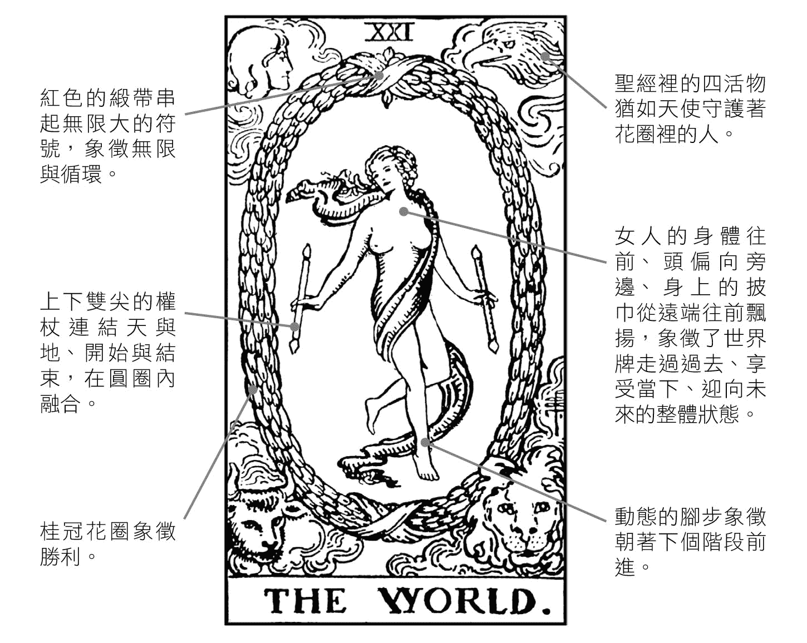

##### 人生金句

如果你想要一个圆满的结局，
取决于在哪里结束你的故事。
──奥逊．威尔斯（二十世纪美国电影导演）

If you want a happy ending,
that depends, of course,
on where you stop your story.
― Orson Welles

在韦特塔罗发行前，小秘牌以元素与数字表现，并没有人物构图。在占卜应用上，依赖牌义，牌义就像密码对照表，透过记忆才能进入解牌。但韦特塔罗的小秘牌，转变为有构图的故事画，比起牌义，更需要解析图像，才能解读图像传达的故事与意义，而元素与数字的意义，在韦特塔罗的小秘图像中，成为深入分析图像人物的意图、动机、身心状况的线索，让故事更为生活化。例如：圣杯 4 与五角星 4，虽然图像中已明显画出两张牌的故事：坐在树下表情不满意的人物；坐在椅子上，紧守着四个五角星的人，但他们的人生处境为何会如此，可以从圣杯与五角星的元素，以及数字 4 的意义来讲解，能够更具体的走入我们的人生处境。

韦特在创作塔罗牌时，并不看重小秘牌，认为小秘牌只是为了应用为占卜而存在的牌组，如果探讨神秘学，大秘牌才是重要图像。所以依考据，韦特把小秘牌的创作交给潘蜜拉主导，潘蜜拉也多方应用过去做戏剧布景设计的能力，绘出了故事性丰富的四十张人生画。在韦特塔罗之前，因小秘牌的解牌比较接近解码，所以就出现了各种解码方法，其中最广为使用的是卡巴拉生命之树的解释。虽然韦特在创作大秘图像时，努力想要摆脱列维对塔罗与卡巴拉的研究影响，但对小秘牌并没太多干涉，所以潘蜜拉将小秘牌转换为图像，还是受到卡巴生命之树的解释，所以现在还有很多韦特塔罗的教学书，会引用生命之树的意义，延伸解释小秘牌。

因为韦特塔罗的小秘牌已经转换成人物构图，所以解读方法比起过去，更需要应用图像解析法。图像解析是分析绘画作品时所采用的方法，从绘画创作的特色：颜色、构图、人物、配置等，进入对图像意义的解读。古典时期的西方绘画，就已经使用象征手法，透过特定物件与构图，表现出绘画中无法用语言说出的内容。到了二十世纪初的象征主义，把象征手法推向更为复杂的形上学思考，很多当时代的思想、情感、观念更突破性地经由绘画创作表现出来，而潘蜜拉的塔罗图像，明显受到象征主义影响，并展现在小秘牌的创作上，让韦特塔罗的占卜应用，从密码解读转变为图像解析法。所以在解读小秘图像时，比起回到卡巴拉生命之树的对照，直接从现有的图像结构去分析意义，才是活用以图像为媒介的塔罗占卜特色。在图像解析过程，再加入每张图像上的代表元素与数字意涵，就能让小秘牌的解读更为生动与深入。

#### 风元素的宝剑特质

风元素是最无法掌握的元素，来去无踪，快速消失，象征了话语及思考，思考是在厘清事情的对与错、是与非，所以宝剑往往也代表对真理的追求。人的思考与话语沟通是在解决问题，所以宝剑的特质是以解决问题的模式应对生活，当我们把眼前的事物视为需要解决的问题时，想要尽快摆脱问题，就会走向效率与快速的方案，对人或对事，都为了快速应对而进行分类与评价，虽然效率高，却会失去同理与理解。应对人与事都是策略与方法，为了解决问题会出现批判、尖锐的言词。用问题模式看待生活，未知的未来、不明确的状态都会成为问题，想太多、过度思考困扰自己，都可能是宝剑元素引发的人生处境。

#### 火元素的权杖特质

火的特性是不易控制与快速蔓延，也是热能的来源，给人光明与希望，所以火元素的权杖有着向未来发展、快速的行动、积极乐观的态度，以及喜爱冒险、开创性的行动能量。权杖元素应对生活，通常面对困难不会退缩、只要心动就会行动，不会有详细的事先规划，走一步算一步的轻率与乐观，也是权杖应对生活时的行动特质。火本身没有固定形象，不断变化，所以无法处在静止状态，表现出过动的特质，毛躁、任性、三分钟热度与冲动，也都与权杖有关，乐观的面向也会引导出自傲的印象。

#### 水元素的圣杯特质

水滋养着生命，也是生命的根源，水不是积极改变外在环境，而是顺着情境发展。水元素的意象，也常与人的情感、无意识相链接，让水元素的圣杯，表现出情感面向的特质，例如人与人的互动与交流、对事物的喜爱、想像力与情绪。圣杯相对宝剑与权杖，行动较为缓慢，比起结果，更注重过程的体验与感觉，所以圣杯元素应对生活时，比起“对事”，更喜欢“对人”，认为事情的解决还是需要从人着手，圣杯认为的成功，是需要拥有美好的人际关系。圣杯元素重情感，有恋旧、依赖、难割舍、多愁善感、容易受感动与影响等特质。

#### 土元素的五角星特质

土是最为稳固，可以握在手中的元素，也能被我们拥有、不容易变动，所以与人可以掌握与拥有的事物有关，尤其财富在现代社会被视为是安定生活的必须，所以五角星也常被称作钱币。拥有是一种安全感，而生活中会给我们安全感的事物不只金钱，名声、地位、经验、知识都可成为个人拥有与掌握的事物，只要是以“拥有”的观点对待的人或物件，都与土元素的特质有关。土元素也是最不会变动的元素，所以五角星的行动缓慢、不易改变，为了不让事物有所改变，要求细节与准确，所以五角星有传承、日积月累、细心、守旧的特质。

## 1 展开新事物的契机

1 号数字是开头，所以有万物起始、新气象等的意义。数字 1 也有独特、唯一、第一名的胜利等象征，有着出类拔萃、创新、创举等意涵。从“魔术师”图像开展的四种人生处境，都从云端伸出的一只手来表达了“无中生有”的机会。四张王牌的元素，也刚好是魔术师工作桌上的四件物品，只要被魔术师拿在手上，就可以成为创造的力量，这种创造力，在王牌图像里，透过背景的不同意象表现四张王牌的差异性。四张王牌都可代表祝福、礼物、新机会与新的开始。当王牌出现时，代表打开新事物的人生处境，只要我们伸手接下这份礼物，就可以为生命带来美好的开端。

##### 宝剑王牌

宝剑王牌里的宝剑，两边有着黄色光芒，顶着皇冠，象征崇高与权威，韦特用“话语”形容宝剑，指的是话语与道理，代表宝剑王牌是崇高的真理。背景只有远处的山峦，高高低低的山峰形成了不同地形，与权杖王牌不同，宝剑图像中没有流水与城堡，只有一座座的山峰。这些山峰是宝剑王牌想要征服的地方，宝剑的挑战与征服，是纯粹的征服，只以解决问题为最终成果，至于外在的成就与名声，并不是宝剑关注的事，唯有需要被解决的问题才是宝剑元素所爱。宝剑王牌图像，描述拥有新的见解与视野的灵感，全新的观点或想法，能够展现真理（道理）的机会的人生处境。

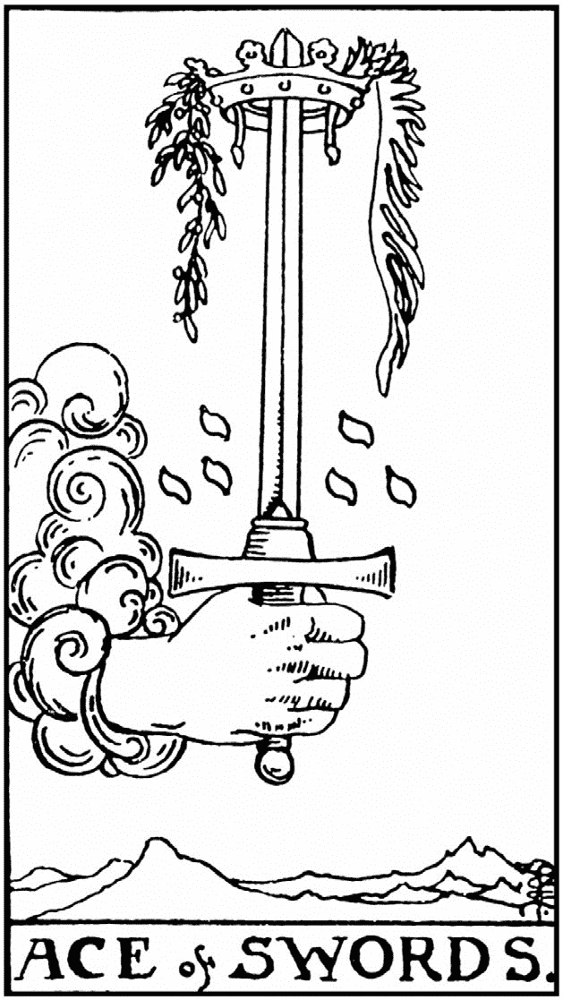

逆位的宝剑王牌，不再能够提出让他人能够信服的道理，反而会对自己面对的问题感到疑惑与不确定。模棱两可与无从判断对或错的状况，让原有的机会变得不能信任，所以就算他人伸出手给予提议，在逆位情境，会变得无法或不想接受这样的机会或计划。

##### 权杖王牌

权杖王牌里的权杖，有着往下落的绿叶，象征权杖的生命力非常旺盛。背景有着山丘、城堡与河流，山丘与城堡是权杖想要争服的挑战与成就，象征了权杖王牌正要展开的新机会，不只朝着更多冒险前进，也期待能够影响他人，所以会朝着城堡的地方发展。权杖王牌的人生处境，会看到想要马上行动的新计划，相信这次的机会是不可多得的绝佳时机，只要去做就能成功，并以乐观积极的未来想像，果敢的做决定。

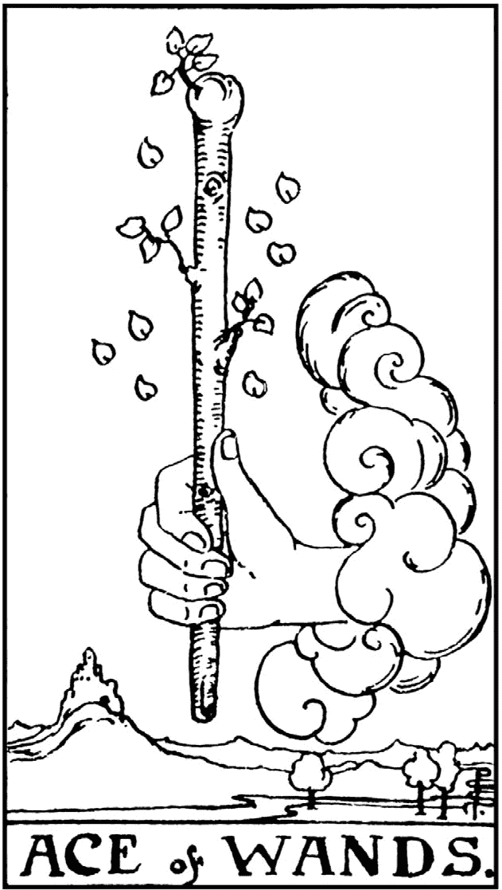

逆位权杖王牌的人生处境，会在新机会带来的冒险与挑战前退缩，不相信自己能够克服与面对，所以就算有机会，也会认为不适合自己而不理会。同时会抱怨自己运势不佳，想要改变，却找不到改变的契机。

##### 圣杯王牌

圣杯王牌里出现的圣杯像喷泉，水柱不断流出，上方的白鸽，犹如圣杯王牌的能源，让水流不断向下注入。这些水滋养着下方的莲花，不像权杖与宝剑虽有绿叶与光芒，却没有链接上与下，但杯子里的水像瀑布，把上下链接起来，展现了圣杯王牌让事物都能相互链接，产生意义的能力。圣杯王牌所展现的人生处境，过去互相无关的事，开始发生链接与互动，带来先前没有的机会与契机。所以圣杯王牌的图像，象征和谐的人际关系带来的新发展，好的灵感或创意，没有阻碍的沟通。

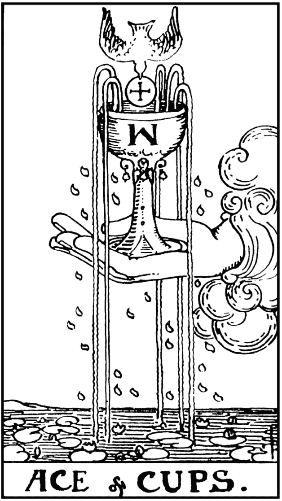

逆位的圣杯王牌，流动的水柱会停止，上方和下方的水池无法产生链接，水池会干涸，莲花也会消失，代表在生活中感受到的一成不变，无趣又无聊。虽然想改变，但无法与他人友善互动，也不知道如何向他人请求。圣杯王牌的逆位处境就像陷入泥淖，找不到脱困的方法，虽然需要有人帮忙，但也无力向他人求援。

##### 五角星王牌

在五角星王牌的图像中，饱满的五角星很安稳的放在手上，保有完美的圆形。远方有拱形的出入口，拱门之外有高山，那是在宝剑王牌中出现过的山峰，但在五角星王牌中，却被花园挡在门外，象征比起未来的挑战与征服，五角星更重视目前生活环境的安稳与舒服，就像图像中呈现的花园，是五角星保护自己的地方。五角星王牌的图像，描述了安全、舒服的生活感受，在面对生活中新计划，也会以务实与可掌控的方案优先，会以保守的态度应对未来抉择。未知的冒险或挑战，对想要生活在花园中的五角星来说，代表需要走出花园，所以不会轻易尝试。

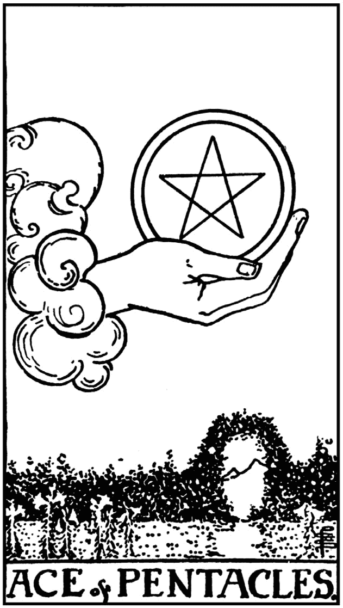

逆位的五角星王牌，不再能为自己筑起安乐的花园空间，在一个没有保护墙的世界里，五角星感受到的是随时会有危险的不安。外面的世界处处都是陷阱，所以会更固执与保守的守在自己的位置上，不敢改变。任何新的机会与计划，对逆位五角星的处境来说，都代表麻烦，所以不会友善对待改变的提议。

## 2 二择一的生命处境

数字 2 在小秘牌的序列中，代表打开的第二步，正从开头迈向未来的起步，在起步中，会有各种抉择的情境需要我们面对。2 号数字本身，代表对与错、好与坏、黑与白、男与女等的二元对立，也是对事物的辨别与判断。风元素的宝剑，会把事物一分为二，一切需要明确、清楚，但女祭司图像中的柱子，却以黑中有白、白中有黑的意象，模煳了宝剑的思考，形成不安的氛围；火元素的权杖，在女祭司图像的冷色调中，也失去了燃烧的能量与行动力；水元素的圣杯，则以流动与链接的特质，在女祭司图像成为结合对立的智慧；最后土元素的五角星，呈现了女祭司面向世界，走入生活、获取生命经验的态度。从“女祭司”图像展开的四个元素的生活情境，用大海与陆地来表现了人物所面对的对立状况，他们站立的位置、以及人物所面对的方向，呈现了这些人物在面对对立时的心情，以及他们如何应对困境，并做出抉择。

##### 宝剑 2

宝剑 2 的人物正努力抗拒与无视需要解决的问题，她坐在大海与陆地的边界，身体退到大海边，但面向前方，代表这是她需要面对的世界，但她却遮起双眼、两手交叉放在胸前，尽量让自己与世界隔离。图像主要以大海与夜色的色调为主，海浪虽然平静，但在微弱的月光下，散发出不安的氛围，似乎反应了人物的内心。宝剑 2 的图像，描述了对选择的抗拒与逃避，面对不确定的未知与未来，无法进行抉择的生命处境，所以对问题只能视而不见，或转移注意力，但内心的不安与焦虑却无法不理会。

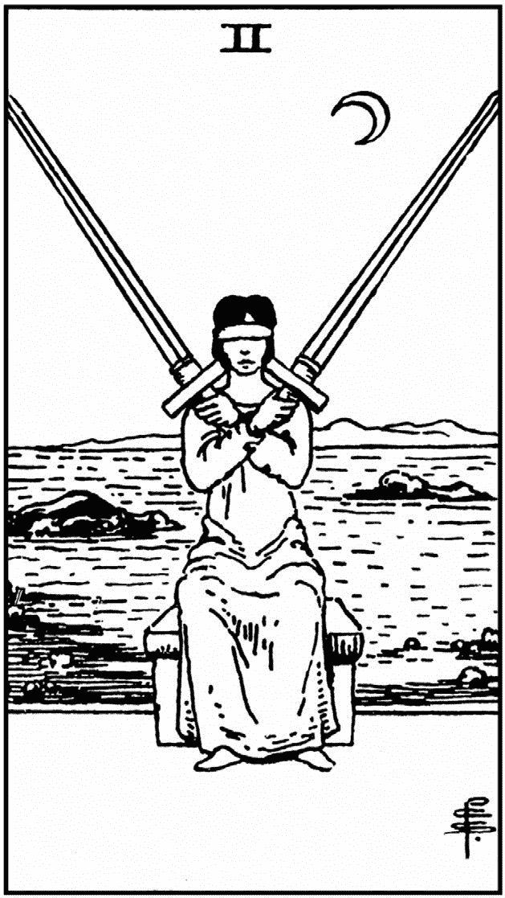

逆位的宝剑人物想要挥出手上的剑，果断解决眼前的问题，但会发现自己连问题如何发生、为何发生都不太清楚，所以挥出去的剑，会指向错误的方向，伤害他人或自己。她也想赶快脱离感到不安的处境，所以用各种琐事让自己忙碌，或干涉他人的事情，给他人各种不恰当的建议或意见。

##### 权杖 2

权杖 2 的人物站在城内与城外的界线上，但其实他是站在城墙内向外观看，所以比起开放的外在世界，他更想要待在受保护的城里，但在眼前展开的大海，一直默默提醒着他所在的世界的局限与狭小。他无法放下手上拥有的资源，虽然对目前的情境不甚满意，但也不想放弃，如果没有好理由，权杖 2 的人物不会轻易离开原来的地方。权杖 2 的图像，描述了对未来的展望与选择，因为无法轻易放掉目前拥有的成就与安全感，比较是以保守的态度思考选择的生命情境。因为外面的大海已经在眼前开展，虽然不愿改变，内心里却有对外在世界的渴求与想望。

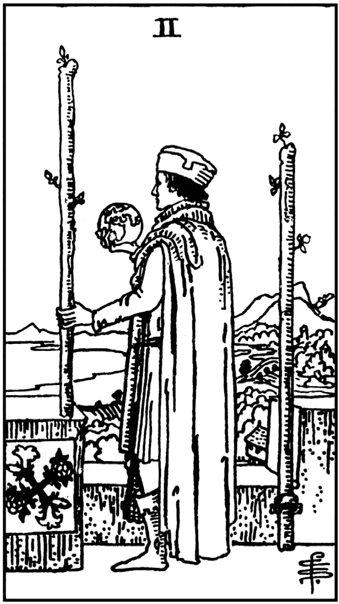

逆位权杖 2 的人物失去耐心，想要大胆踏出安全的城堡，但行动过于急躁与冲动，当他踏出第一步后，看到手上原有的东西掉落不见而后悔，所以也想再次回到城堡。逆位权杖 2 的处境，就算面对困境时，想用果敢的行动应对，但因为没有做好心理准备，所以只会是带来后悔的一时冲动。

##### 圣杯 2

圣杯 2 的一男一女，象征对立两方的合一与结合，他们的身后有山丘，但他们却站在平地上，与其他图像里所呈现的水与陆地的分隔有所不同，在这里的土地向外延伸，就像男人向女人伸出的手，象征了链接才是走向未来的唯一选择。对立的结合所代表的力量与智慧，以上方象征疗愈的赫密斯蛇杖与天使来表现。圣杯 2 的图像，描述了愿意走向冲突与矛盾，透过相互理解、沟通的方式与对方相处或合作的人生处境，在应对困难时，用善意与人沟通，把对方视为伙伴而不是敌人，互相学习、分享与成长带来和谐。

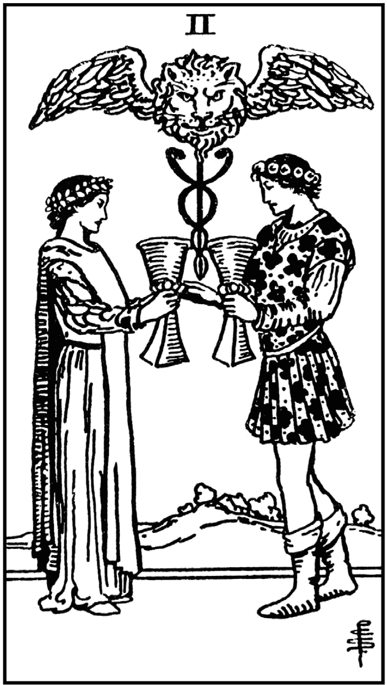

逆位圣杯 2 的人物不再有能力主动走向冲突，用相互沟通、理解的方式合作，而是以身份或阶级所拥有的权利，命令或要求对方，关系不再和谐与信任，也不愿意主动向对方伸出手合作。逆位圣杯 2 的处境，因为不信任他人，而无法创建友善的互动关系，也会拒绝在困难时他人给予的帮助，或帮助别人，只相信自己而一个人奋斗，疏离他人。

##### 五角星 2

五角星 2 的人物背对大海，他远离了大海，站在陆地上面对着前方，他没有后退，而是走入世界，正向应对他需要承担的任务。这些任务正放在他的手中，虽然无法全然掌握，但他很努力学习，并在生活中取得平衡。背景中的大海出现了大浪与在浪上的船，看起来有点危险，但也有一些乐趣，就像图像中的人物，穿起了表演者的服装，像杂技表演一样耍着手上的五角星，观众看得心惊胆跳，表演者却乐在其中。五角星 2 的图像，描述承担与面对生活中多重任务与责任的人生处境，在对立中不退缩，好好经营生活，享受忙碌带来的充实与乐趣。

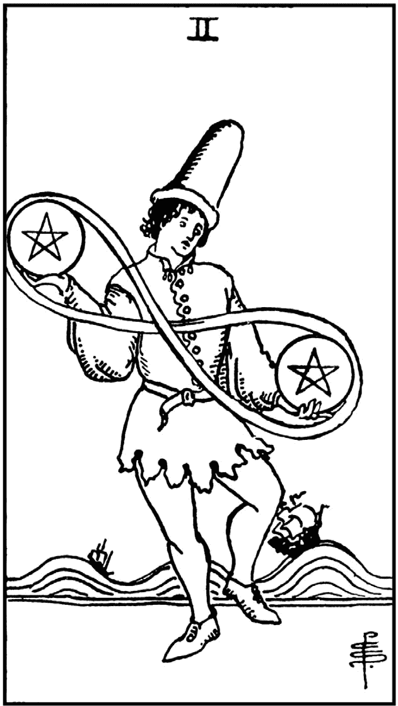

逆位五角星 2 的人物认为自己不再有能力承担，想要放下身上过多的担子，但任务都还在手上的情形下，每件事都会变得不得不做、不想做的抗拒与推迟，原来掌控在手上的事会一一掉落，他也会为了追回掉落的五角星疲于奔命。进入逆位的情境时，应对事情的人，虽无力承担，却揽下了所有工作，让事情变得一团糟，也可能是他人给了过多任务，但应对的人却没有拒绝，只以不是我愿意的，所以自己不需要负责的心态，随便应付手上的任务。

## 3 展望未来

3 在小秘牌的序列中，是在前进的路上，虽已经开始，但还在起步点，所以 3 号的前进，比起实际的成果，有更多对未来的期待与想像，虽然很多事还是不确定与未知，但我们正在期待，才能持续推进。3 也是代表丰硕的数字，故事里也常以三个愿望与三个任务来表达“多”的概念，生日时我们也会许三个愿望，象征富足的未来。风元素的宝剑，在“皇后”图像中，无从应对乱中有序的大自然，自然生长不需人为的切割，让宝剑失去了能力；火元素的权杖，在支撑“皇后”的红色椅埝中，获得生命能量，持续让自然万物得到生长的动力；水元素的圣杯，犹如“皇后”图像中的流水，滋润了大地与植物；土元素的五角星，成为让谷物生长的肥沃之地，也为皇后提供休息之处。从“皇后”展开的四种生命处境，都与在朝向未来的期盼中，如何推动自己持续前进的状态有关，所以图像中的人物大多站在高处，也代表这些人物想要远望与盼望自己能够更上一层楼的心境。

##### 宝剑 3

代表快速、有效率的解决问题的风元素宝剑，在 3 的情境中，一颗心悬在高空，无法着地，也代表对未来有过多的期待与忧虑。很多事情尚未发生，也可能不会发生，但宝剑元素想提早去除所有问题的心态，反而用想法困住了自己。虽然想像着各种出错的可能，但事件还未发生，所以无能为力，只能担忧与害怕。宝剑 3 的图像，描述了挫折与悲伤，对所发生的事感到无能为力的情境，但很多担忧也只是对不可知未来的过度想像。

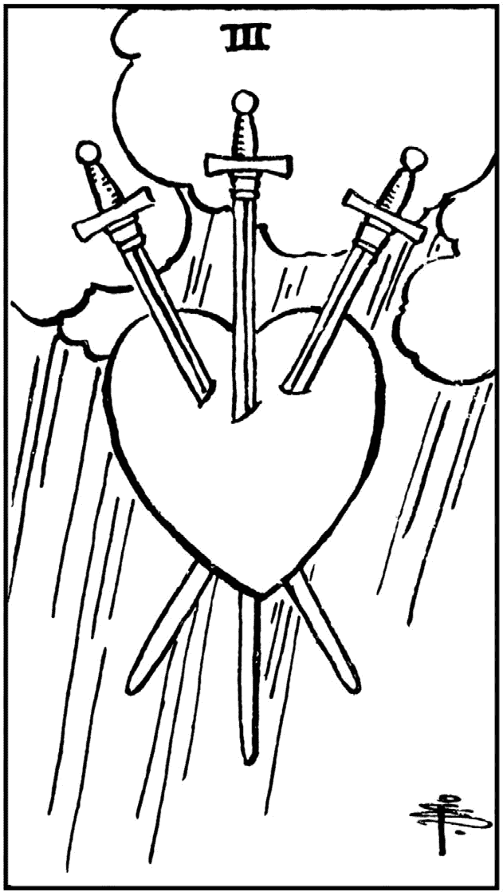

逆位的宝剑 3，不想承认与抗拒自己的忧虑与无能为力，虽然会告诉他人与自己一切都很好，内心却无法摆脱不安与无力感。也可能想要赶快摆脱这种情绪，所以会更努力的预防问题发生，做各种不必要的防范措施，也不断以担忧的言语提醒他人与自己多加小心。

##### 权杖 3

权杖 3 里的人物站在悬崖的高处向远望，他想站得高、看得远，站在悬崖的人，不会害怕悬崖可能带来的危险，代表图像中的人物，想要尝试困难的任务与挑战。人物所眺望的未来，犹如染成金黄色的大海，天色进入黄昏，船只正要归返，这些船就是人物对于可达成的更高成就与目标的想像，期待自己可以完成目前的计划。权杖 3 的图像，描述了以乐观心态等待成功到来的人生处境，从高处远望，胸有成竹，展望未来的成果。

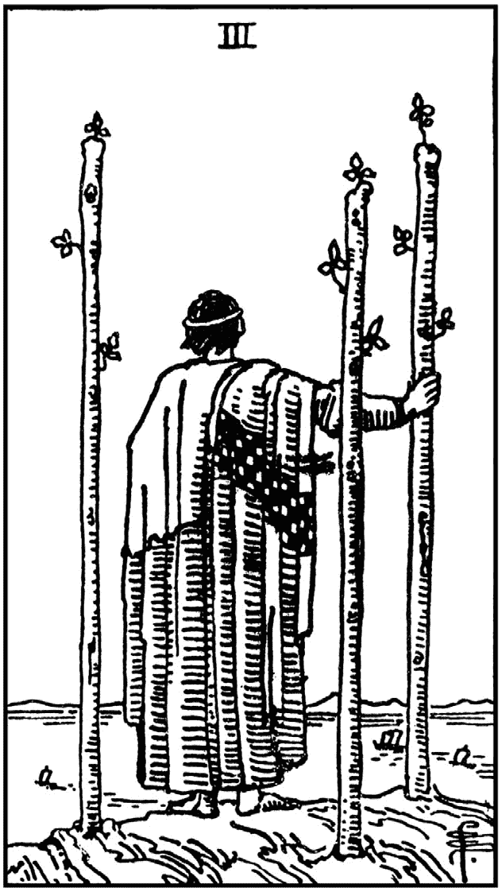

逆位的权杖人物，不再站在高处，他没有宽阔视野的优势，也不再拥有站在悬崖的胆识，他看不清未来，焦虑不安，他无法信任自己的决定，认为自己可能正走向错误的方向而迟疑。如果原有规划遇到问题，就会退缩，认为早早放弃才不会浪费时间，所以很容易在计划初期就会决定结束与离开。在逆位的情境，人物会做出过于急躁与没有前瞻性的行动。

##### 圣杯 3

水元素圣杯 3 的人物，虽然没有站在高处，但她的美好未来，在于他人给予的支持与合作。三个女人举起手上的杯子、开心的跳跃，其中一个人物，手上拿着熟成的葡萄，她们的脚边摆满了丰收的农作物，她们因为共同努力，才能够应对各种困难，最后一起迎接丰收的季节。在图像中，三人的视野集中在一起，代表她们可以看向共同的目标，三心合一的精神，犹如站在高处的优势，可以面对各种挑战，同时也能与他人分享成就。圣杯 3 的图像，描述了分享的快乐，因为合作而能够到达的更高成就，也期待梦想成真的过程，不忘与他人分享而得到更多的支持与欢乐的情境。

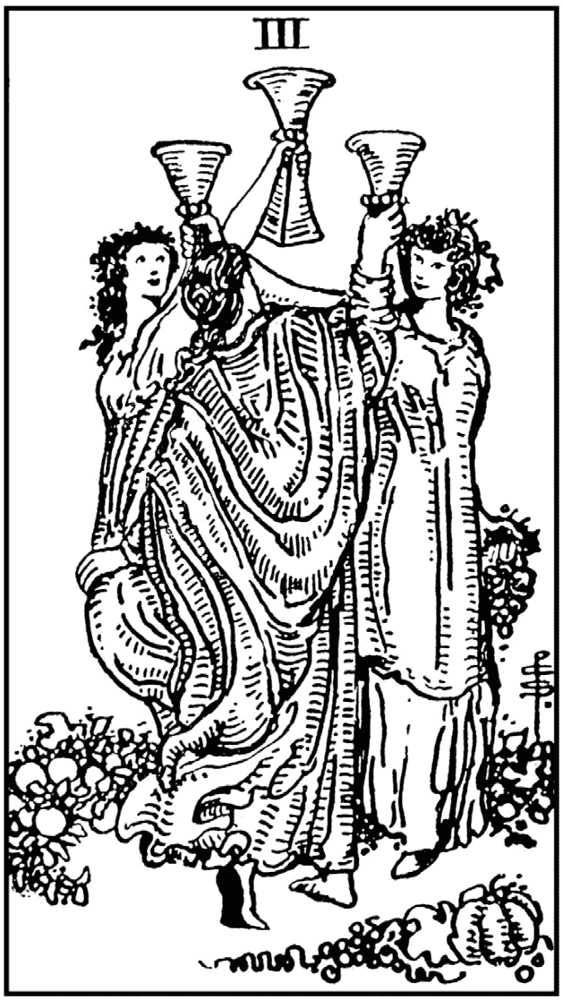

逆位的圣杯 3 人物，三人的视野各自看向自己的目标，无法达成共识，也不想让他人获得利益。他们彼此无法信任对方给予的想法与意见，最后只能独自面对困难与挑战。没有了他人的协助，圣杯 3 的人物失去了应对问题的能力，也会把自己的困境与失败，怪罪在对方身上，认为是对方破坏了自己的计划。在逆位情境的团队工作中，人物会认为自己的贡献最多，如果他人也获得认同，会认为这是不公平的结果，也会对他人的成就嫉妒。

##### 五角星 3

土元素的五角星 3，用实际行动一步步构筑自己的梦想，图像中站在高处的人物，虽然是社会地位不高的匠师，但站得比其他人更高，代表他的专业受到肯定与重视。另外两个人物需要这位工匠的技术修复教堂，所以在低处仰望工匠。三个五角星嵌在教堂的石墙上，象征工匠精湛的工艺技术。五角星 3 的图像，描述了专业技术、工艺、设计方面的学习与成长、以及专业被重视的生命情境，人物所学习的每种事物，都会成为让事业更上一层楼的支撑，以及到更好机会的条件。

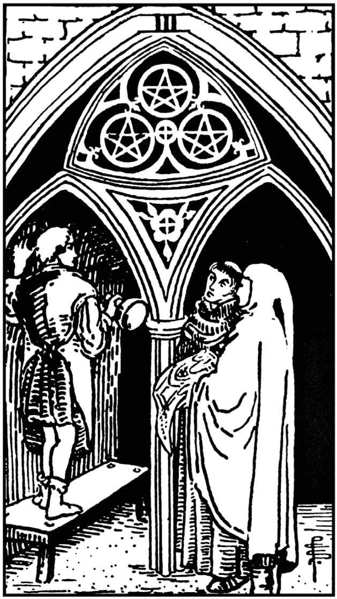

逆位五角星 3 的人物，不再有耐心在学习路上慢慢累积经验，认为自己的努力是浪费时间，或白费力气，所以放弃了取得专业证照、技术认可的学习。或者也认为自己的能力已经足够，不必再学习，但人物所能达到的专业水准不足，不被他人接受，但人物会认为是他人不重视自己的专业而气馁。逆位五角星 3 的情境，不再认为基础学习很重要，反而更相信一个人的才华、资质与天赋，认为勤奋是没有天赋的人才会有的行为。

## 4 打下基础

4 在向着目标前进的过程，已有了初步的成果与基础，原来只是梦想的未来，在 4 的历程，终于有了梦想可能成真的真实感。4 在文化里也有秩序、规矩与稳固基础的意涵，例如东西南北四方是宇宙的空间秩序，西方的炼金术有地火水风四大元素等，正方型是最稳固的几何图型，大部分的建筑也以四方型为基础，对应大秘牌的“皇帝”，有着稳定、框架、建构、秩序等的意义。“皇帝”的图像以亘古不变的石头为背景，风元素吹到皇帝，不会造成任何动摇，让要求速度与改变的宝剑只能停滞在原地；火元素的权杖，在犹如火光的橘色背景中，找到了燃烧的动力，推动权杖的积极行动；水元素的圣杯，在皇帝图像找不到流动的动力，虽然下方有河流，但水流被截断，只能滞留在原地；土元素的五角星，在皇帝图像中更能稳固的不动如山，却让五角星失去了企图心。从“皇帝”图像展开的四种生命情境，图像主要以平地与人生阶段（婚姻与死亡），展现了人想要让一切进入稳定状态，感到安全、安心的生命处境。

##### 宝剑 4

宝剑图像以棺木上的雕像代替人物，这里的人是已经进入死亡、安息的生命，背景虽以灰色表现出停滞的生命状态，但棺木却以充满活力的黄色来表现，似乎在传达生命虽然进入安息，但精神却获得活力。有三把剑挂在灰色的石墙上，成为装饰，但还有一把剑在黄色的棺木上，传达与精神同在的意义。图像中没有醒着的人，所以风元素在这里也得以止息，反而让不得歇息的想法，终于可以放空。进入到宝剑 4 的生命处境，我们就可以修养、休息、离开复杂的状况，回到简单生活的平静与安详，无论外界发生什么事，都会觉得与我无关。

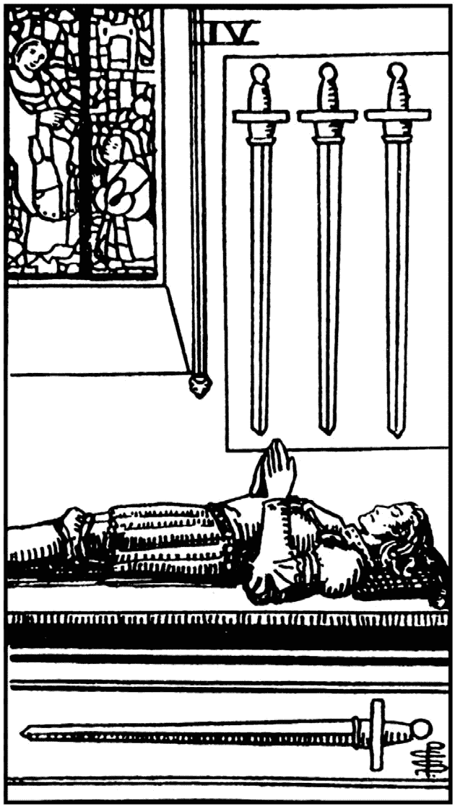

逆位的宝剑 4，在棺木上安息的人，放不下而不断干涉、参与外在事物，身心已经很疲备，但又觉得自己要是不做点什么，过去的努力就有可能白费或放水流，不论日夜，都为还未完成的事操心与烦忧。也有可能认为自己的心已死，在生活中找不到任何动力，麻木的应对生活。

##### 权杖 4

图像里穿着蓝红袍子的男女，正举起拿着花束的双手，前方有用四根权杖立起的信道，上方也以花做为装饰，后面还有城堡与跳舞的人群。图像里充满了庆祝的氛围，两个人站在前景的信道与后景的城堡中间，城堡给予他们安全的后方保护与支援，前景为他们打开了朝向未来的入口，这是一对受到祝福的新人，他们因为婚姻而结合，两人一起走向共同的未来。权杖 4 的图像，描述了迈入新计划、新发展的欣喜与欢乐的人生处境，火元素的乐观，不仅成为自己的动力，也为他人打开共同努力的希望与目标，形成愉悦的合作团队。

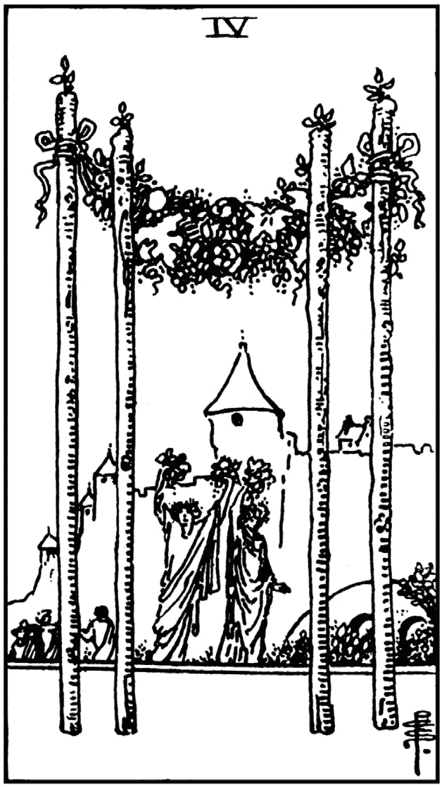

逆位权杖 4 的人物，不再拥有像城堡般坚实的后盾，在前进的路上失去了安全感；也没有可一起打拼的伙伴，感觉身边的人都与自己不同道，所以也停滞不前，无法向未来开展计划。在逆位权杖 4 的处境中，会做出离开伙伴、家人、朋友等的决定，认为是他人阻碍了自己的道路，以为离开是为了让自己有所前进，但离开后也是迟疑不前，也会后悔仓促行动带来的结果。

##### 圣杯 4

圣杯里的人物是唯一没有在平地上的人，他坐在小山坡上，虽然靠着树，但位置不够安稳。他从高处往下看，没有一个杯子让他满意，有一只手伸出一个杯子，但他也视而不见，认为在他身边不可能有让他满意的杯子。坐在树前的是眼高手低的年轻人，只想拥有最好的机会，但又怨叹自己的运气不好，不可能有好机会降临，所以他只能看到自己的不足，在抱怨中过生活。逆位圣杯 4 的图像，描述的是对现况不满意，却又害怕做出改变的人生情境，所以虽有抱怨，但也只是在等待好机会来临的被动态度。

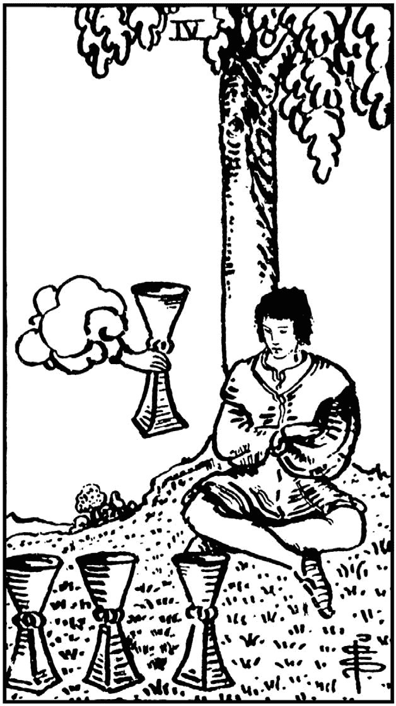

逆位圣杯 4 的人物，不再坐在不安稳的山坡上，他走下山坡，却也因为不知道自己能够走去哪里而感到茫然。逆位的圣杯 4 会试着找到前进的路，但不知道自己可以做什么、适合做什么、能够做什么，常常想了很多方法，但也都停留在想法，并没有做出实际行动。原来的人物是因为不喜欢而不想要这些杯子，在逆位的情境中，人物不知道哪一个杯子是自己的而做不了决定。

##### 五角星 4

五角星 4 里的人物，坐在方形的石头椅上，他所在的位置，是条非常平稳的道路，后景的城镇，只到他座椅的高度，所以只有坐在椅子上，原地不动，才能他感到安心与稳固。他坚定的抓着四个五角星看向前方，也像是一种宣示，告诉他人，这些都是他所拥有之物，在他的保管下，绝对不会有任何闪失。他就像保险库，只为保护属于自己的东西而存在。五角星 4 的图像，描述了把身边的人事物视为自有财产的人，任何的改变或不如他的意，都有可能成为威胁他的行为，他会努力保护自己的生活方式，不轻易改变或让步。

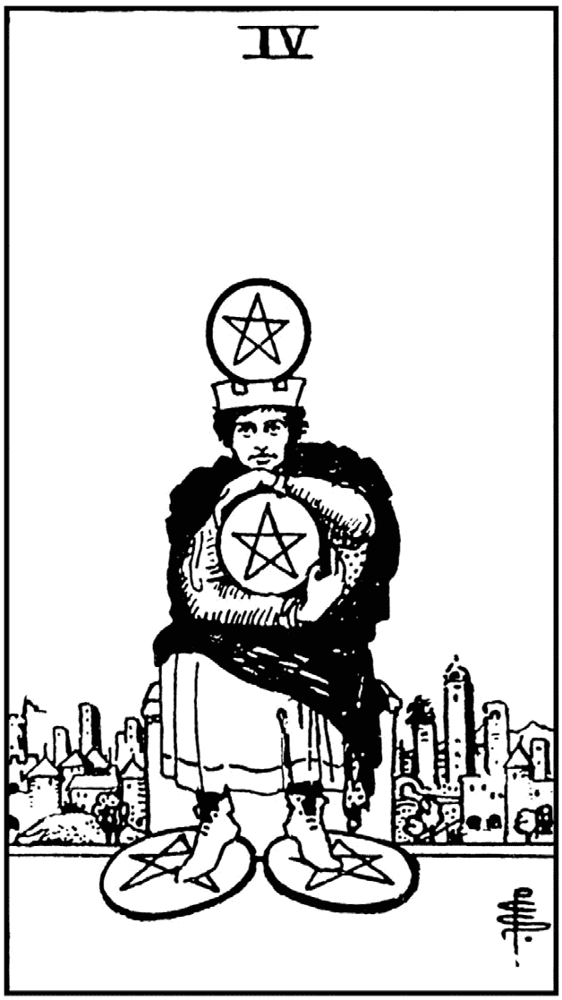

逆位五角星 4 的人物，失去了原有的石头座椅，不再能保护好四个五角星而感到不安，他认为自己已经失去一切，成为没有价值的人。他也可能被迫离开原来感到安心的地方，生活从有序进入失序状态，虽然表面上告诉自己离开是为了改变，但内心却因为要改变而无所适从。

## 5 融入群体生活

5 号在小秘牌的序列刚好在中间，这是一个在过程中的数字，事情已经进行到一半，不太能直接放弃。在 4 的数字奠下制度与秩序后，为了执行制度，就算遇到各种例外与特殊状况，也只能坚定信念，持续前进。人有五种感官、人手有五根手指、人体有五个端点，数字 5 和人有着密切关系，也代表“多”与“一”的相处会遇到的各种状况，相异的事物在自己的位置上，各司其职的运行。阶层管理井然有序，个人需求为次要，以群体的利益为优先。“教皇”图像离开了自然环境，呈现了人为的建筑空间，在这里，自然元素失去了它的力量，只有火元素的权杖，从教皇充满教育热忱的红袍与红毯中获得能量，成为激励他人的火花。从“教皇”图像展现的四种生活情境，都呈现了人在社会化的过程，个人面对群体时的冲突处境。在图像中，人物普遍站在崎岖不平的路面上，表现了 5 号处境需要面对的困难。

##### 宝剑 5

宝剑宝剑 5 以大海与陆地象征了两种心境，站在最前、远离水面的是胜利者，他拥有所有的宝剑，越靠近后方大海的人物表现出失败者的姿态，心情如海水起伏。宝剑 5 的人物，失败者背向胜者缓步离开，虽然得到胜利，但也会成为孤立的一个人。在宝剑 5 的处境，无法容纳对立的意见与想法，只能分出输赢，赢者成为正义的一方，代表一切。这是打败他人自己才能生存的人生处境，不论输赢，这场战役会让双方都经验到自责与指责。以宝剑作为武器的冲突，对他人或对自己都会造成伤害。

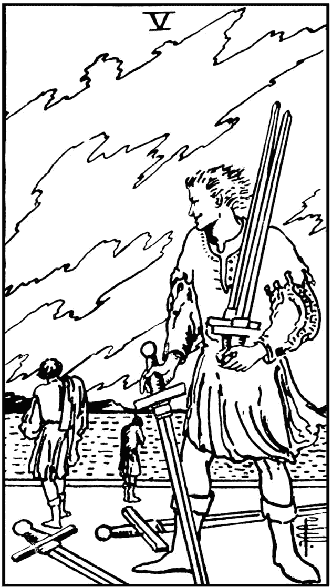

逆位宝剑 5 的人物，想要离开互相伤害、只能分出输赢的恶劣环境，却走不出来，虽然很不情愿，但累积的情绪只能以伤害他人的方式回应对方，相互诋毁与指责。宝剑 5 逆位时，不愿意承认自己在伤害他人，认为一切都是被他人所迫，自己只是做出相应的回应，所以会认为自己的言行有理，对方才是无理者。

##### 权杖 5

权杖 5 中的人物，虽然站在不平稳的地面上，但他们在晴朗的日子里，进行一场竞赛，比起宝剑 5 中大小不同的人物，权杖 5 里的人物大小一致，象征他们相互平等，在公平的规则下竞争。他们各自展示自己的权杖，互相较劲，比赛成为激励活动。权杖 5 的图像描述了竞争、争辩、游戏、热烈的讨论或互动等的生命处境，虽也会有争执，但也是带来互动与沟通的火花，原有的障碍可以化解，事情持续前进。

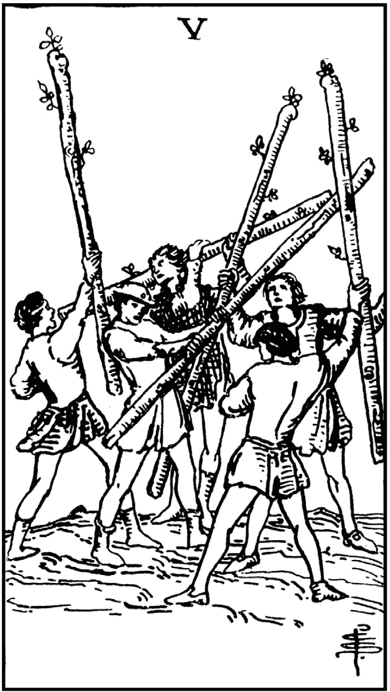

逆位权杖 5 的人物，不喜欢参与竞争，认为竞争只会带来彼此的嫉妒与敌意，人物会尽量避开争执与冲突的状况，害怕他人与自己意见不同，不再能直率的提出问题，所以障碍无法得到解决。原有的事情与计划在困境前止步，原来推展的计划，因为没有讨论或沟通，参与者失去了动力，窒碍难行。也可能为了证明自己，会用过激的言语，引起他人注意，但会避开公开场合的公平竞争。

##### 圣杯 5

圣杯 5 的人物面对着阻隔两地的河流，对岸有着城堡，是群体所在地，而图像里的人，却站在另一方，低头看着眼前倒下来的杯子感到哀伤，这些杯子是他无法挽回的事物，也是他无法过去的另一侧河岸。背后虽然还有两个立着的杯子，但他更在乎失去的事物，无法从手边拥有的物件得到安慰。圣杯 5 的情境，描述人物离开了群体，感受到群体无法理解或接纳他，他在人际关系中感到失望与挫败，选择离群索居，远离他人的伤害。但选择独处，并没有让他自在，反而在寂寞中无法忘记过去的伤痛，被遗弃的感受让他痛苦。

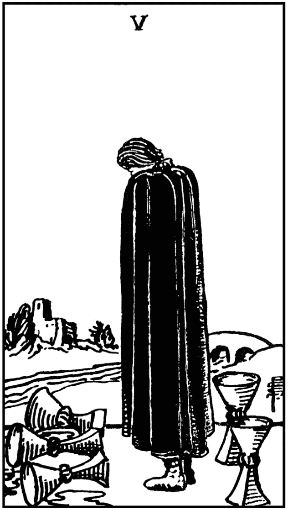

逆位圣杯 5 的人物，害怕成为落单的人，所以不想承认自己与群体之间的隔阂，努力配合他人的要求，想要成为团体的一份子。但他的努力更突显了内在冲突，压抑着自己的想法与感受，在群体里也无法快乐。逆位圣杯 5 的情境也会努力让自己走出孤立状态，但对过去还没有全然释怀，所以对改变有所质疑，容易退缩。

##### 五角星 5

五角星 5 的人物走在崎岖的雪地上，他们不只前途茫茫，身体状况与物资也不充沛，前行诸多障碍。上方有着散发光芒的五角星窗户，两人却视而不见，女人只低着头、男人歪头看向别处。这是漫漫长夜，不停下着雪的天气，也不会有人出门在外，他们已经放弃会有人来帮忙的希望，只能依靠自己的体力，能够坚持多久就算多久。上方的玻璃花窗可以象征精神，下方贫困的两人则是忙于生活的人群，土元素的五角星，专注于安身立命，却忘记照顾精神生活，他们不再向上看，只看向无止尽的前方，造成生活贫困、疲惫的原因。五角星 5 的图像描述了没有止尽的困境，应对的人在长期的习惯中，看不到离开或解决的方法，只能不断的重复原有行为，并期待有一天会有机会脱离。

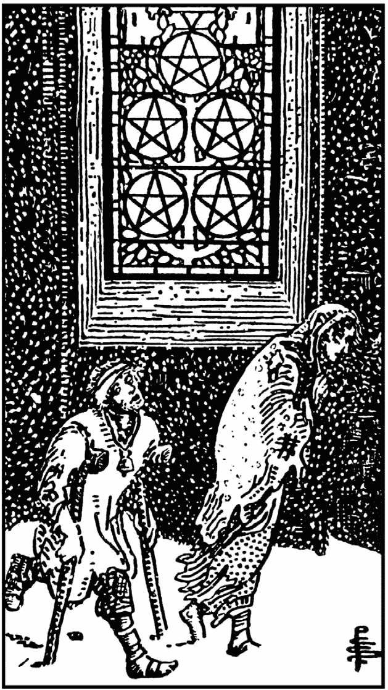

逆位五角星 5 的人物，把困苦的原因指向身边的人，认为是他人的不帮忙与敌意，才会造成自己的不幸。但也有可能不再有前进的力气，只能坐在原地等待他人来救援。停止前进，反而带来了喘息的机会，也会注意到教堂就在身旁，只要走进教堂或喊一声，就会有人来帮忙。逆位五角星 5 的情境，不论是持续前进或决定放弃，都认为自己是弱者，理所当然需要得到帮助。

## 6 友善的人际互动

6 号在小秘数列中，度过了 5 号融入群体的挑战，开始能够与他人创建友善的互惠关系，不只可以接受他人的帮助，也能给予关怀。数字 6 是 3 的倍数，富足加倍，生活进入行有余力的阶段，不只为安身立命而忙碌，也能享受精神生活。“恋人”图像展现了伊甸园的空间，大自然的四大元素在这里都能和谐运作。在亚当与夏娃还没吃下禁果之前，还没有清楚的是非善恶之分，所以风元素的宝剑，吹过乐园，并没有带来太大的改变；火元素的权杖，在乐园里是“生命之树”的火苗，是生命的能量；水元素的圣杯，滋养着乐园里的植物，让万物生长；土元素的五角星，支撑了乐园的大地，无私地供给万物所需。从“恋人”图像发展的四种生命情境，展现了能够为群体付出与承担，也能看到生命美好的人生处境，图像里的人物构图，虽然都以不同的高低位阶呈现了不对等的关系，但这样的不对等，却因为关怀与付出而能够让群体和谐与美好。

##### 宝剑 6

宝剑 6 的人物站在船上，正努力划动船桨，船上有两位乘客，犹如母子的两个人默默地坐在船上，还有六把剑，直挺挺的插在船上，这飕船承载了很多重量，努力从不平稳的水域，划向风平浪静的水面。这是一个需要度过的关卡，没有快速的解决之道，只能慢慢跟着水流划行到对岸，在远方除了有平静的水流，也有山与树，但没有看到城镇，所以也是远离人群的一次远行。虽然船头被剑围住，但船还是因为船夫的努力缓慢向前行，大家在沉默中等待。宝剑 6 的图像，描述了带着忧虑缓慢离开的人生处境，生活正处在纷忧时刻，也承担了他人的忧心。虽然想脱离困境，但只能花时间慢慢等待纷扰平息，或者先暂时离开忧心的环境。

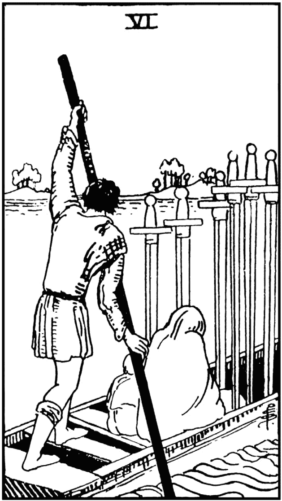

逆位宝剑 6 的人物，放弃划船，不再认为带领大家脱离困境是自己的责任，怪罪他人没有承担与负责。在逆位宝剑 6 的处境，船翻了，宝剑纷乱的掉入水里，也代表事件乱成一团，每个人都在急着为自己找理由，认为自己没有错，却没有人想要解决问题。也会认为唯有离开群体才能远离纷争，所以决定自行离开，逃离让人不开心的人事物。

##### 权杖 6

图像里的人物，身体直挺挺的骑在马上，他高举手上的权杖，上面挂着代表胜利的月桂冠，头上也戴着胜利冠冕，白色的马缓慢前行。在图像后方，有一群人手上拿着权杖，他们犹如在权杖 5 中相互较劲的一群人，当胜利者出现，高举权杖，为胜利者欢呼。这是为赢家准备的游行，让胜利者在群众面前获得掌声。权杖 6 的图像，描述了被他人赞美与认同的人生处境，对自己的成就感到信心与骄傲，虽然只是一次微小的成就，但因为他人的赞美，愿意为更大的挑战前进，不退缩。

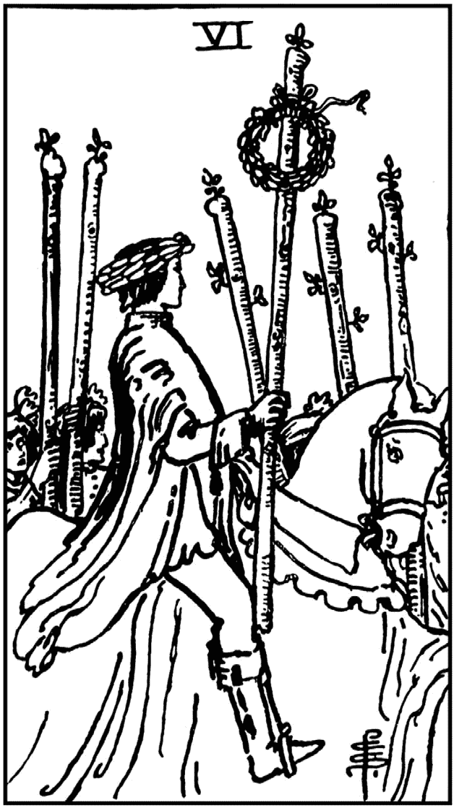

逆位的权杖人物，期待自己能够骑在马上，但不论如何努力，还是只能成为在旁边鼓掌的群众。人物认为自己的能力不被欣赏，所以感到被拒绝与忽视。逆位时，图像里的人物也有可能为了得到他人的赞美，而不断吹嘘或夸大自己，反而让他人感到反感，也会抢走他人的功劳，或者贬低、嫉妒他人。

##### 圣杯 6

圣杯 6 里的人物，有两个小孩在城堡内游玩，远处还有巡逻的警卫，这是安全的环境，大男孩正把花盆递给小女孩，小女孩从头到脚都用衣服包着，手上还戴上白手套，代表受到很好的照顾与保护，两小无猜的情境，表达了小孩世界的纯真、快乐与无忧。小孩子的礼物并不是利益交换，而是一种友善的分享，虽然礼物本身没有太高的价值，但这是纯粹的心意，不需承担回礼的压力。圣杯 6 的图像，描述了受保护与照顾的人生处境，生活感到稳定与安全，身边的人都很友善，能够给予善意的帮助，也可能与旧识相逢，重温过去生活。

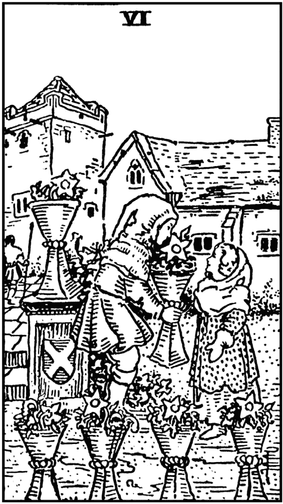

逆位圣杯 6 的人物，不再受到环境保护，独自一人离开到城外，感到陌生与不安，身边没有熟悉或友善的人协助。或者不再相信人与人之间的善意，认为每件事的背后都有代价，不轻易接受他人的帮忙，会以利益计算人际关系，不太留恋过去情感。

##### 五角星 6

五角星 6 的图像，类似大秘牌的“恋人”构图，原来在上方给予祝福的天使，在五角星 6 中以富裕的商人形象替代，他伸出手，把金钱拿给乞讨的人，另一只手拿着天秤，似乎在衡量给出去的物资。给予的人站立，接受物质帮助的人跪在地上，这种构图，突显了社会阶级上的差异，强与弱、富与贫，在理想世界中，这种阶级差异会消失，但这是不切实际的想像。真实生活不可能离开不对等的关系，但因为对他人的关怀与友善，才能应对不平等带来的苦难。五角星 6 的图像，描述富裕、慷慨、乐于分享物质或经验的人生处境，在人与人之间的差异与不平等中，能够把自己的所有分享给他人，也是一种对他人的友善表现。

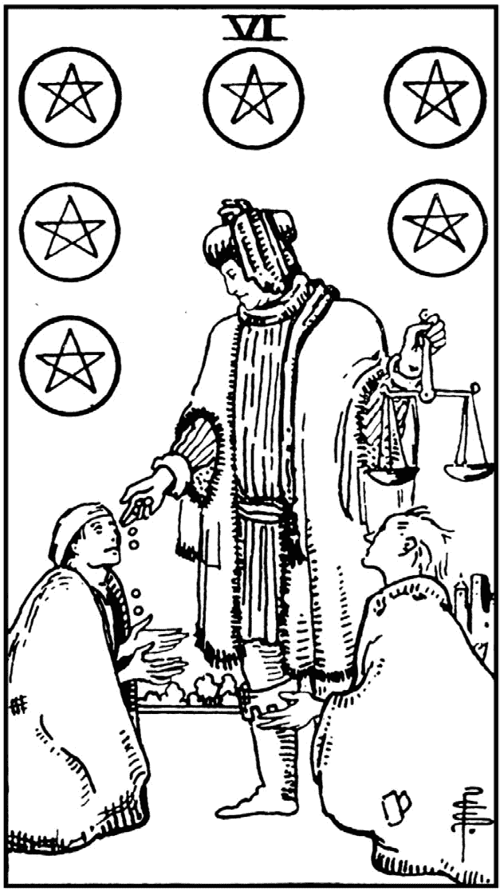

逆位五角星 6 的人物，不再认为自己需要为他人付出或给予，也可能认为自己付出过多，却没有得到相应的回报，所以觉得吃亏。也会认为自己拥有的不够，没有余裕给予。逆位五角星 6 的处境可能会强调接受他人帮助是可耻与受辱的事情，所以对他人提供的好意有敌意，会觉得身边的人不怀好心，想要欺骗自己的财产，获取不当的利益。

## 7 除了坚持还是坚持

数字 7 在小秘牌的序列中，进入走向成果与目标的阶段，在这个阶段只会看向目标努力奋斗，每一步都能感受到最终目标越来越近的快乐。在西方，7 被视为是幸运数字，也与生活中计算日期的方式有关，一周七日在《圣经》里是上帝创造世界的周期，而第七天是休息日，万物在休息中获得滋养，并为之后的成长蓄势待发。从“战车”图像开展的四种生活，展现了想要朝着目标奋斗与前进的人生处境，在图像中的人物，都会看向他们想要达到与完成的目标。风元素的宝剑，对错、是非的对立，在“战车”图像得到很好的控制（黑白斯芬克斯），成为让战车前进的动力；火元素的权杖，燃起了让战车冲向前的战火；水元素的圣杯成为战车前进的障碍（河流）；土元素的五角星，是一条平坦的道路，虽可以为战车提供休息的地方，却不是可以让战车获得胜利的战区。

##### 宝剑 7

宝剑 7 的人物，手上拿着五把剑正奔向前方，但他的头向后看，似乎在确认是否有人追来，后方是崎岖的山区，有营区与两把剑，他手上的剑可能来自于营区。这是一个偷窃的人，却没有拿走全部的剑，只偷走他能够承担，又不会马上引起大问题的程度。他机灵的看向后方，走在平坦的路上，象征他能顺利拿走这些剑，暂时解决问题。宝剑 7 的图像，描述以投机取巧、走捷径、小动作、小小谎言来应对困难问题的人生处境，人物不想引起更大的冲突，只想息事宁人，大事化小、小事化无的心态，努力寻找简单的解决方法。

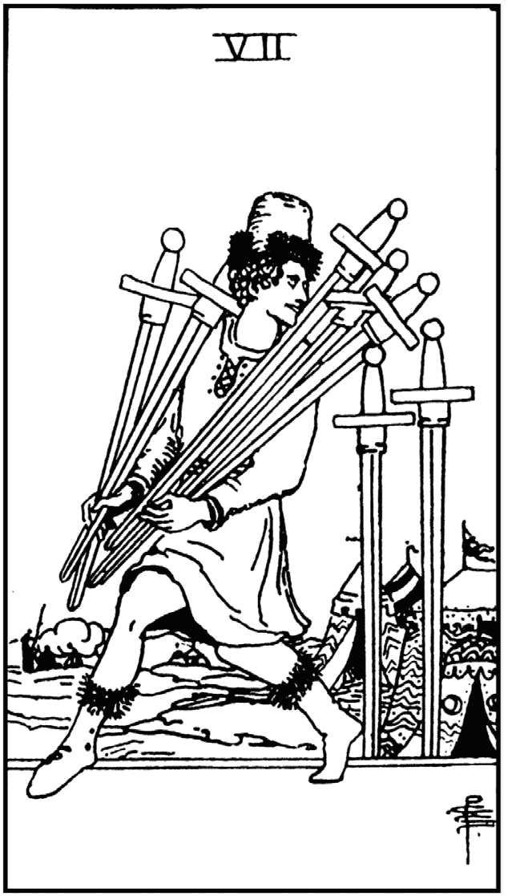

逆位宝剑 7 的人物，可能会以鸵鸟心态逃避或不承认眼前的问题，他会对问题视而不见，或者认为不需要严肃对待。但他也有可能找不到避开的方法而困窘，无力面对与解决眼前的状况，但又无法置身事外，只能尴尬的保持沉默，或者不做回应。

##### 权杖 7

权杖 7 的人物，站在悬崖边，虽然路面不平，但他正努力挥舞着手上的杖，前方已有六根杖立在面前，而他正准备完成第七根杖的工作。他专注在工作上，穿着两只不同的鞋子，突显了他对工作之外的事物无感或不关心。权杖七的图像，描述了不轻易放弃的努力与行动，积极追求成果、勇于面对挑战的人生情境。在这种情境中，我们会废寝忘食，除了要完成的事，会遗忘、忽略其他事物，没有余力关怀他人或照顾生活，所以也有可能与他人有点隔绝。

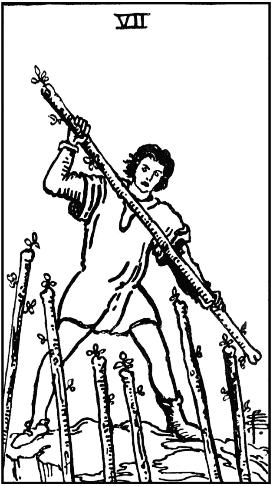

逆位权杖 7 的人物会失去目标，不知道自己要做什么，虽然也有要努力的想法，却还在找想投入的事情，或者害怕自己在悬崖上会发生危险，会害怕失败而退缩，无法完成被指定的工作。人物也会觉得很多事情就算努力也是白费力气，干脆早早放弃，不愿尝试。

##### 圣杯 7

圣杯 7 的人物正看着云端上出现的七个杯子，杯子上有着各式各样吸引人的物件，中间的个杯子有遮布，却散发诱人的红色光芒。在图像里的人物只有黑色的背影，代表人物正被空中的七样物件占据了所有心思，尤其被遮蔽的那只杯子，因为好奇与期待，人物会一直等待布被掀起的那一刻。圣杯 7 的图像，描述了想要得到或追求的事物很多，但不确定自己想要什么，所以是在等待自己渴望的事物出现的人生处境，但他的等待也是不切实际的白日梦。当他人询问为何不行动时，人物会说服自己，不是不行动，而是尚未等到最佳时机。

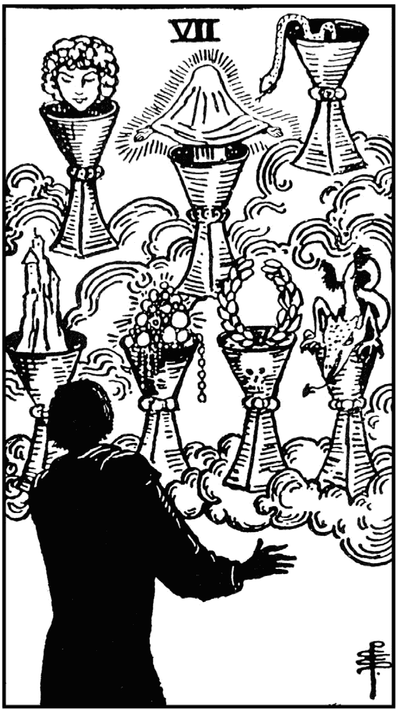

逆位圣杯 7 的人物，找不到自己喜欢的事情，每件事都有他不喜欢的地方，所以什么他都拒绝，或抱怨。当他人问他要什么的时候，人物也回答不出自己想要的事物，只能以“不要什么”的方式回应。没有可用的杯子，让他感到空虚，也会不断羡慕别人有的杯子，并且感叹自己没有。逆位圣杯 7 的人物不承认，他想拥有的生活或事物不切实际，活在自己建构的幻想中。

##### 五角星 7

五角星 7 的人物站在农作物前，脚下有收割的五角星，但他不满意，眼神看向旁边长满五角星的树，明显与他脚下的成果形成对比。或许在这些成果中，属于他自己的只有脚下的五角星，其他的都属于别人，看到自己拥有的物资如此稀少，感到没有得到劳动应有的回报。五角星 7 的图像，描述了过去的努力得到结果，但对成果不满意的人生处境，但这种不满意，也可能是自己没有为更好的成果做出改变，就像做一份不怎么喜欢但收入稳定的工作，为了稳定放弃梦想，成为让图像里的人物不快乐的原因。

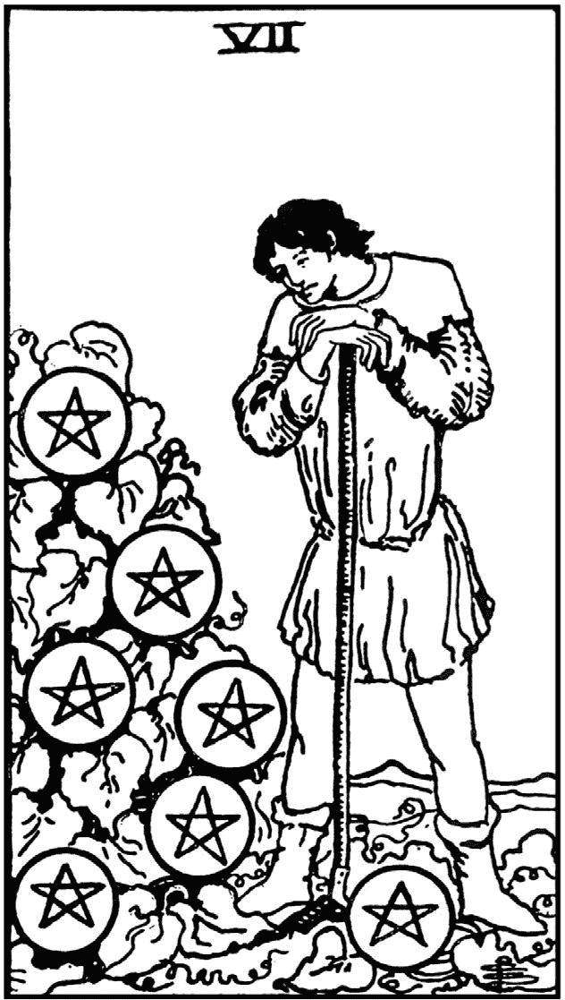

逆位的五角星 7，不再只是默默接受不满意的成果，他想要拥有更多而向外争取，他认为目前的状况不公平，需要改变，并且认为要替自己争取合理与应得的要求。他也有可能因为失望而放弃，默默离开不满意的处境，后悔自己过去的付出，因为没有获得应有的回报而受伤。

## 8 更上一层楼

数字 8 是抵达目标前，还需临门一脚的努力阶段，目标就在眼前，但完成计划前的各种问题，还是会不断发生，这时候更需要坚持与耐力才能走到终点站。在几何形上，八角型是两个四角型的变形，为原有的四方基础带来更多的变化，但也带来相应的困难与问题。数字 8 带来稳定中的改变，有着向着丰富成果的耐力与坚持的意义。也是 7 号数字之后，另一个七天周期数列的开始，周而复始的周期，更需要耐心，才能从一成不变中找出温故知新的智慧。从“力量”图像开展的四种生活情境，大多以动态的人物展现前进与坚持的行动。风元素的宝剑，在力量图像的少女与狮子并不想分出彼此的情境中，失去了宝剑的能力；火元素的权杖，在狮子身上的红色获得能量，这是野性的本能、也是欲望，也成为生命前进的原动力；水元素的圣杯，推动着少女与狮子的情感交流，流动的水让两者的关系持续互动；土元素的五角星，在力量图像里成为少女与狮子长时间共处的稳定环境。

##### 宝剑 8

宝剑 8 的人物，用宝剑围起了结界，遮住双眼，绑住双臂与身体，女人被困住而无法行动。在结界之外是一座城堡，那是她不敢靠近而转身回避、遮起眼不愿看的害怕之地。她站立的路面并不平坦，还有水洼，遮住眼睛走路很危险，但她似乎自愿选择这样的情境，宁愿走在不平的路上，可能跌倒或失足，也不愿转头看向后方的城堡。城堡可象征为每个人想要逃避、无法面对的问题，犹如大象在眼前，但图中的女人认为自己没有能力、也无能为力应对，只好像驼鸟一样埋头不看。宝剑 8 的图像，描述了自我设限、无能为力、只能以逃避与视而不见的方式应对问题的处境，情况进退两难。前路埋伏着各种未知的危险，后路是自己害怕而避开的困境，但图像也表达出这种情境，是人物太过退缩与保护自己而产生的结果。

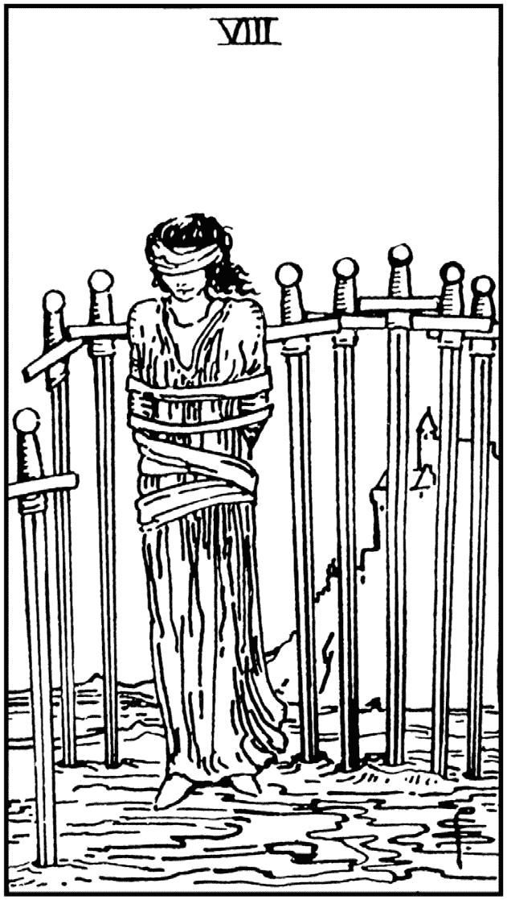

逆位宝剑 8 的人物，不能再用宝剑保护自己，女人与城堡之间没有任何隔绝，代表原来可以视而不见的问题，已经无法不理会，或变得日益严重。逆位时的情境，人物被迫承认某些事实，但事实本身很伤人、不易承担与接纳，所以承认事实的结果，可能让情境中的人物情绪失控、怪罪他人，并以伤害他人的方式应对。

##### 权杖 8

权杖 8 的图像里没有人物，只有八根权杖，快速的向下着陆，着陆也代表到达目标，八根权杖的背景是没有云的晴空，也代表旅途非常顺畅，远处还有高山与流水。高山是权杖所喜爱的挑战与冒险，让旅途充满乐趣，流水滋养着权杖的绿叶，让权杖充满动力与能量，在长时间的旅途中也能保有足够的体力。权杖 8 的图像，描述了积极的行动、乐观的朝着未来迈进、一路顺风的人生情境。八根权杖与 8 号数字代表等待与筹备很久的多个计划，而且没有人物在图像中，象征只要等待事情就能完成，已经不需要去干预什么，一切都在轨道上。

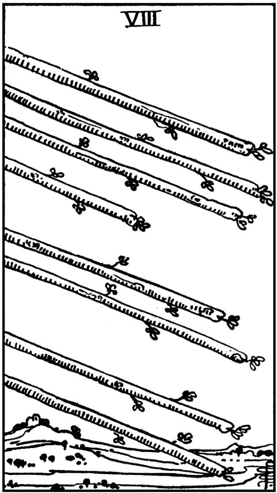

逆位的权杖 8，代表原有计划因为一些状况，走向了没有预期的结果、停滞或中途结束。朝着目的地着陆的权杖，都因为某些原因而无法如期到达，或者也代表太久没有关心或参与计划，事情被搁置，现在遇到的停滞或困境，也可能是处理问题的人，对事件不闻不问所造成的结果。

##### 圣杯 8

圣杯 8 的人物正努力往高处前进，图像前景放有八个杯子，但杯子的摆放方式，出现了一个缺口，穿着红色衣服的人物，似乎转身决定去寻找。前进的路有高山阻挡，图像里的黑夜情境，象征了人物所要前进的路途并不明朗，但他柱着拐杖一步步登高，也代表不想放弃的决心。圣杯 8 的图像，描述了在自己努力的领域想要更上一层楼的心境，离开现状寻找更美好的未来，从安定的状况追求改变等生命处境，犹如图像里的缺口，目前的状况并不是最好的结果，总会感受到可以再努力，所以不想在现阶段停下，但至于这条路会通到哪里？或如何去寻找？并没有明确的方向，需要慢慢摸索与探寻。

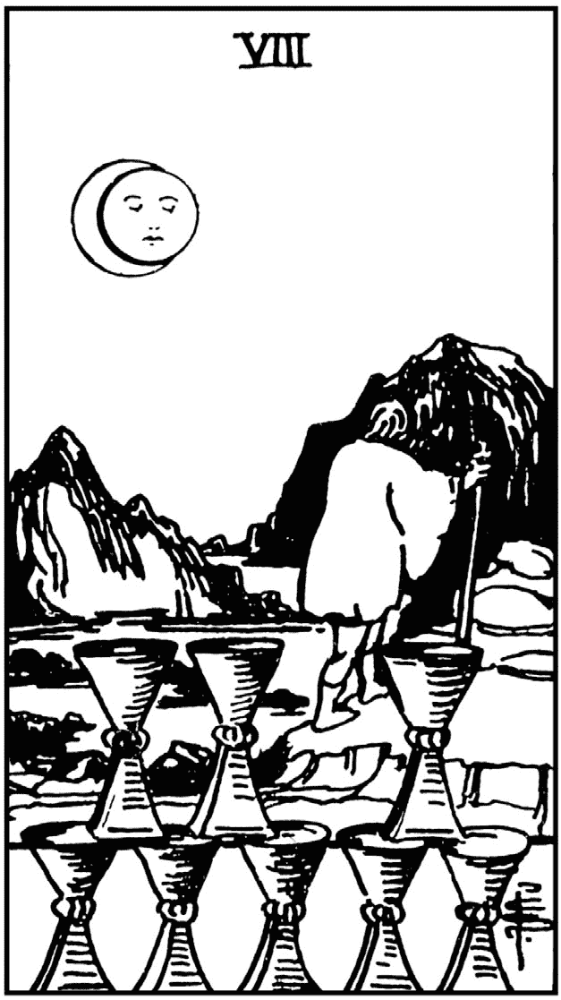

逆位圣杯 8 的人物虽看着缺口，却处在无法转身离开的处境，可能是他人的阻拦，也可能是未知让人物害怕，所以现况虽有所不足，但决定停留在原地，不轻易改变。圣杯里的人物，原本会追逐自己所爱，但逆位时有太多现实考量，只好放弃，或者说服自己安定的生活也没什么不好，让自己不再为梦想努力或改变。

##### 五角星 8

五角星 8 的人物坐在椅子上，非常勤奋的敲打五角星，背景里的城镇离人物很遥远，代表要达到满意的结果，还需要一段时间的努力，所以图像里的人物心无旁骛、专心工作，虽然工作本身没有新意，但从五角星的累积中享受成就感。五角星 8 的图像，描述了创建稳定基础、脚踏实地的工作，一复一日的日常与生活，虽然生活没有新鲜事，但每日的努力与累积，可以给人安定的生活，就像看着积蓄逐步累积，会给人踏实的幸福。未来的梦想虽然遥远，但不是遥不可及，并且在每日的累积中，看到梦想越来越近的希望。

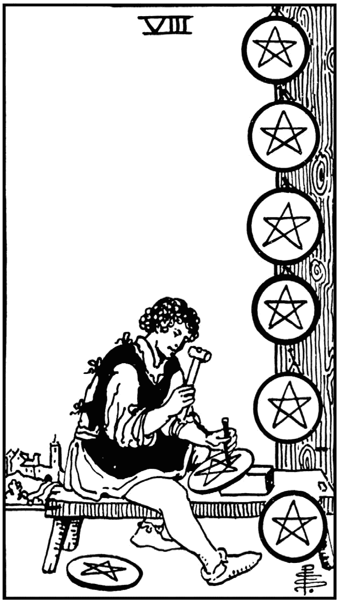

逆位的五角星 8 停下了手上的工作，无法再让自己安逸的坐在椅子上，虽然努力工作很久，但逆位时的情境，总觉得一切的努力都像原地踏步，不论如何前进，梦想还是离人物非常遥远，所以决定放弃或离开。在逆位情境里的人物，可能会变得好高骛远，认为成果需要机会与运气，不再认真与踏实的精进与努力，只想要找到或碰到好运，也没有耐心磨练，一直转移注意力尝试各种新鲜事。

## 9 接近尾声

9 号是个位数的最高数，但在小秘牌的序列中，9 号还未到达结果，却是到达结果前的最后一步，结局已经确定，任何行动不会对结果产生改变。隐士是停止在原地，不再前进的图像，所以与前进、行动有关的元素，相对会呈现停滞而带来的困境。风元素的宝剑，在转向内在世界的“隐士”图像，面对比外面更难化解的对立与矛盾；火元素的权杖，在“隐士”图像找不到任何推动它前进的能量，火的能量被寒冷的夜晚掩埋；水元素的圣杯，以凝固的冰山形态，呈现了隐士的坚毅；土元素的五角星，从隐士手上黄色的灯与杖，成为隐士与世俗世界相连的桥梁与基础。从“隐士”展开的四种人生处境，以人物在前、元素在后的方式，表现了人物面对成果的心境。

##### 宝剑 9

宝剑 9 的人物，夜里独自坐在床上，用双手遮住脸，好像被某件事、或某个梦困扰。他的后方漆黑一片，有九把剑依序排列在背景，与人物形成交错，形成剑穿过了人物的上半身的视觉。这是还未天亮的漫漫长夜，无论人物是被什么样的事情惊扰，他已无法入睡，在长夜中不得休息。宝剑 9 的图像，描述了因为忧虑、挂念而不得安眠与休息的人生情境，但很多挂念却不会因为苦思而获得解决，所以宝剑 9 也可能代表过度忧虑，对未来还没发生的事感到害怕与不安。9 号数字也提醒了宝剑 9

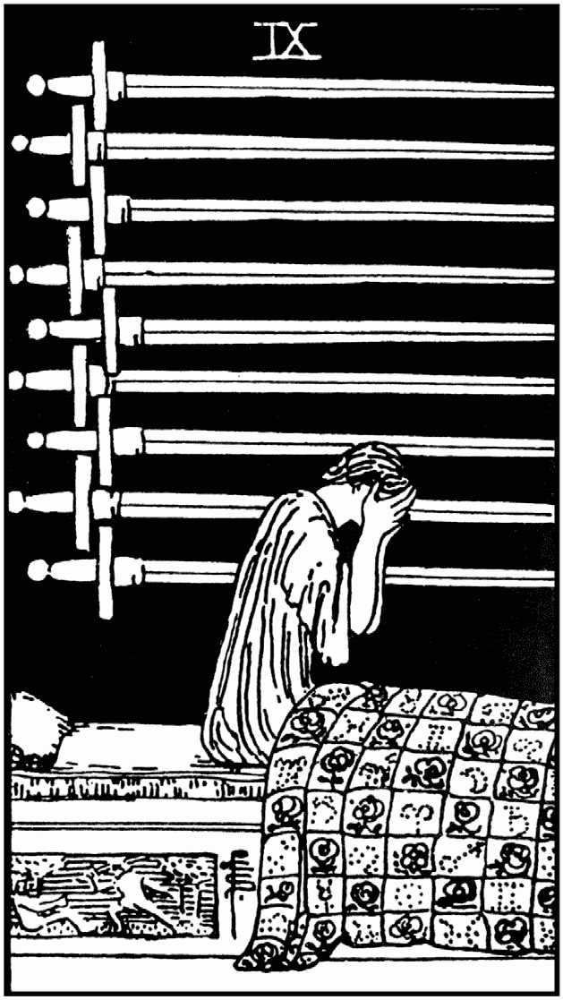

宝剑 9 的处境是长期累积的苦恼，可能是人物无从解决的状况，或者是与过去有关的伤痛经验。

逆位的宝剑 9 人物，在无法入眠的黑夜，不再只是坐在床上痛苦，他想要走出这种处境，不要再被这些烦恼干扰，会尝试很多方法转移焦虑的状态。或者不承认自己正处在身心焦虑的状态，用逃避独处的方式，欺骗自己一切都很好。逆位的处境也有可能努力想从苦恼中走出来，但任何方法都只是在逃避问题，或转移注意力，并没有从根本去解决与处理。

##### 权杖 9

权杖 9 的人物，站在权杖竖立组成的栅栏前，他的身体椅靠在权杖上，眼神斜角看着前方，显露出不安的表情。栅栏后方隔绝的是山坡，象征人物需要应对的挑战，但无法处理时，只能先远离的情境。在图像中出现的每根权杖都比人物高，明显给人压迫感，不像权杖 7 里的构图，权杖在人物之下，有一种可以驾驭与掌控的关系。人物的身体向着前方，但眼神向旁，代表人物正在环视他的四周，正在巡视与思考，现在的状态是否适合持续前进，还是要先暂停。权杖 9 的图像，描述了一段辛苦的努力或奋斗后的短暂休息、可喘息的空档、评估未来如何再继续前进的人生处境。人物明显带着疲态，现在的休息，也是人物正需要的喘息机会，但事情还未结束，所以只是暂时的缓解。

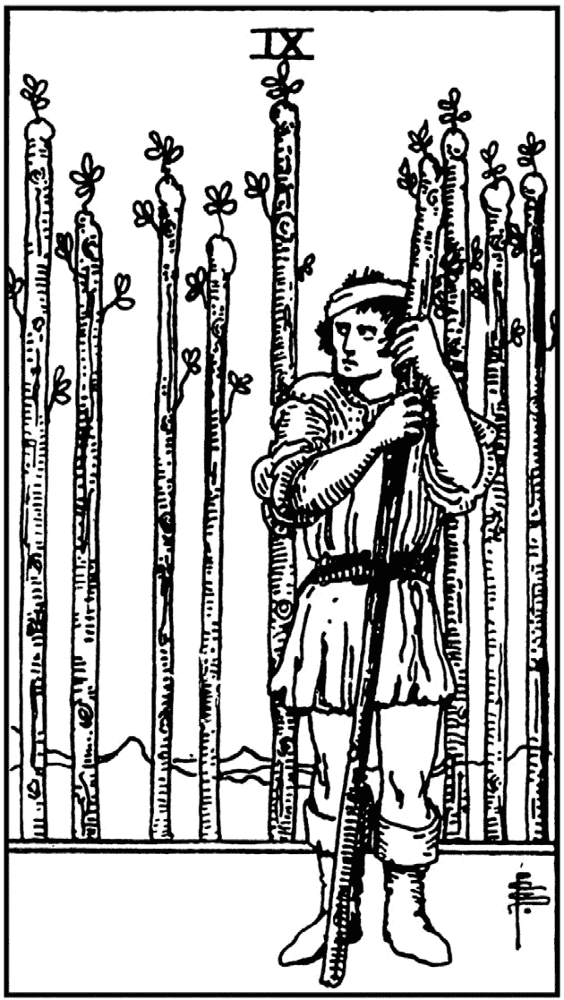

逆位的权杖 9 人物，失去了权杖的屏障，山坡成为他需要跨过的困难，他身心俱疲，却得不到休息，只能持续向前。也因为无法停下来环顾四周，在逆位权杖 9 的情境中，人物会以为没有其他出路，只能疲于应付眼前的问题，过一天算一天。人物在逆位时，也有可能更想巩固屏障，所以会以隔绝与保护自己的方式应付问题，却不愿解决。

##### 圣杯 9

圣杯 9 的人物坐在杯子前面，九个杯子犹如展示品放置在台上，坐在前方的人物散发着一股自信与骄傲的氛围，对后方的九个杯子非常满意。他坐在没有椅背的长椅上，这不是一个固定的位置，代表图像中的展示台与杯子才是人物要强调的重点，人物的位置是因为展示台而存在，所以杯子象征着他认为人生中最有价值的事物。后方的展示台以半弧形围绕在人物后方，形成人物被保护与拥抱的意象，象征这些杯子是让生命活下去的重要屏障。圣杯 9 的图像，描述了为自己的成就感到骄傲、自信与满意的人生处境，后方的九个圣杯是可以展现自己辉煌过去的象征物，有这些记忆的存在，就会像拥有无价的财富，美满又幸福。

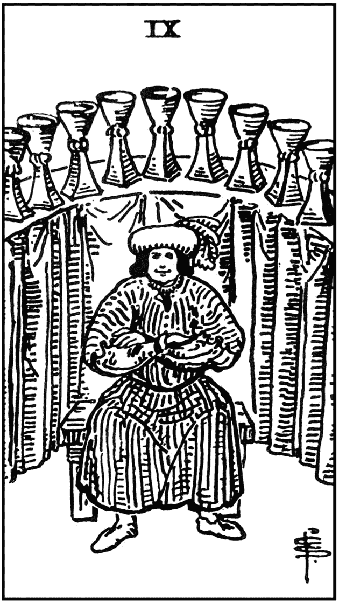

逆位的圣杯 9 人物，没有可以向他人展示的杯子，对自己的成就、经验、表现都不满意，他看向展示台，上面是空荡荡的，看了只会令人感到失望。他没有舞台可以表现自己，也不喜欢说自己的事情，所以在人际互动上，较为沉默与冷淡，会认为自己的生活没有意义，情感麻木，无法在生活中感受快乐。

##### 五角星 9

五角星 9 的人物，也以展示性的姿态站在花园前，后方是长满五角星的藤蔓围墙，围墙没有阻隔外在风景，所以还能看到远方的山、城堡、树木。站在前方的女人，服装华丽，虽然站在自己的花围内，但她还是适度的向外界开放，代表她并不会过度保护自己，也喜欢让他人看到自己的成就。她的一只手摸着五角星，另一只手上戴上黄色的皮手套，让勐禽停在手上，这两样东西都是需要时间培养的成果，象征人物很有耐力与自律性，自我要求也很高，能够完成计划。五角星 9 的图像，描述了长期的自我要求与努力而达到的成就，而且他人也赞美与羡慕这些成就，象征在社会上有着被看重的地位，自己也因为能够达到目标而自信与骄傲。

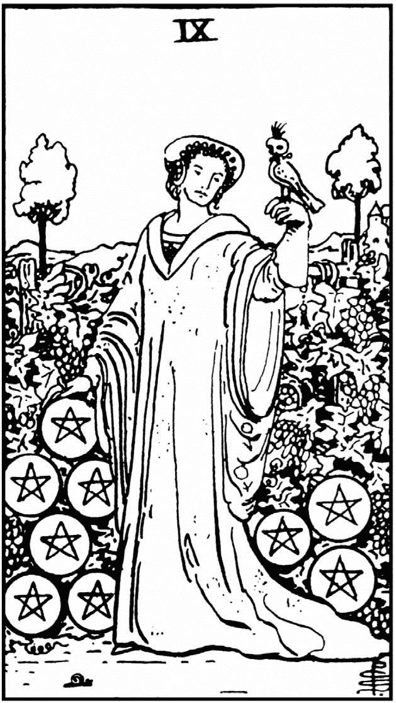

逆位的五角星 9 人物，在自己的花园无法再感到安全，所以想要增加围墙的高度，与外界尽量保持距离。她对花园结的果实或对勐禽的培养不甚满意，感觉自己花了很多心思，却达不到想要的结果，或者常常忘记照顾花园，却期待成果丰硕。逆位五角星 9 的情境，失去了原有的耐心与自律，很容易半途放弃而感叹事情太难无法达成。

## 10 是结束还是未完待续

在小秘牌的数列中，10 号是最后一个数字，代表完成与结束。数字 10 也代表极限，例如十全十美。从“命运之轮”开展的四种人生处境，人物大多以背影呈现，让图像背景向前展开，展现人物所应对的极限情境。风元素的宝剑，与命运之轮图像里的宝剑碰撞，让风元素的思辨超出了人物可承担的极限；火元素的权杖，从红色的阿努比斯，获得重生的能量，在极限情境中，火势并没有停止，持续往前延烧；水元素的圣杯，与命运之轮一起依自然法则顺势流动；土元素的五角星，从四位天使中，获得丰富世俗生活的资源。在代表结束的数列中，能否画下句点而停止，还是持续往前推进，成为四种元素需面对的人生处境。

##### 宝剑 10

宝剑 10 的人物，背上插了十把剑，死在岸边，远处太阳刚刚升起，天空渐亮，阳光平静的照射在大海与山景上，但上方的天空还笼罩在黑暗中。图像里的人物已经死亡，背景却是新的一天开始，这两者对应出结束与开始的意义。身上插满的宝剑，代表人物思考过所有的解决方法，但最后发现都是死路一条，没有其他可行方案，以为事情会搞砸，一切都失去了希望，但到达尽头后，并没有如自己想像的这么糟糕，无路可走的尽头，成为了打开新的道路的契机。宝剑 10 的图像，描述了苦思解决方法，但已无计可施的痛苦与无奈，也可能是歇斯底里式的不安与焦虑，虽然最后会等到新的一天到来，但在苦思没有到达极限之前，就无法看到远处的黎明。

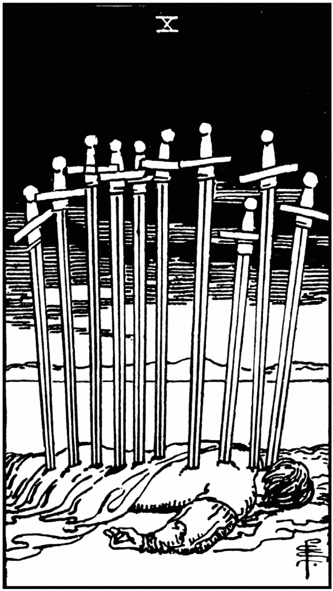

逆位的宝剑 10 人物，认为事情还有可解决的方法，努力找寻解决之道，不接受放弃与不理会。逆位宝剑 10 的人生处境，并不想迎接新的一天，只想保留原来的生活，所以会抗拒无计可施的现实，也会不承认事情带给自己的痛苦或焦虑，认为一切都很好，不需改变什么。

##### 权杖 10

权杖 10 的人物拿着十根杖，低着头努力向前进，远方是城镇，似乎就是人物的目的地，但看不到前方的人物，只能凭记忆跟着道路往前走，无法确定自己的方向，十根杖明显超出了人物能承担的极限。权杖 10 的图像，描述了过多的责任与承担造成的压力，虽然给人非我不可的重要性与必要感，但也会过度承担而无法顾虑其他事物，身边的人可能会质疑人物的决定与行动，但已经无法承认自己可能有错，只能用持续做下去来证明自己的选择没有错。

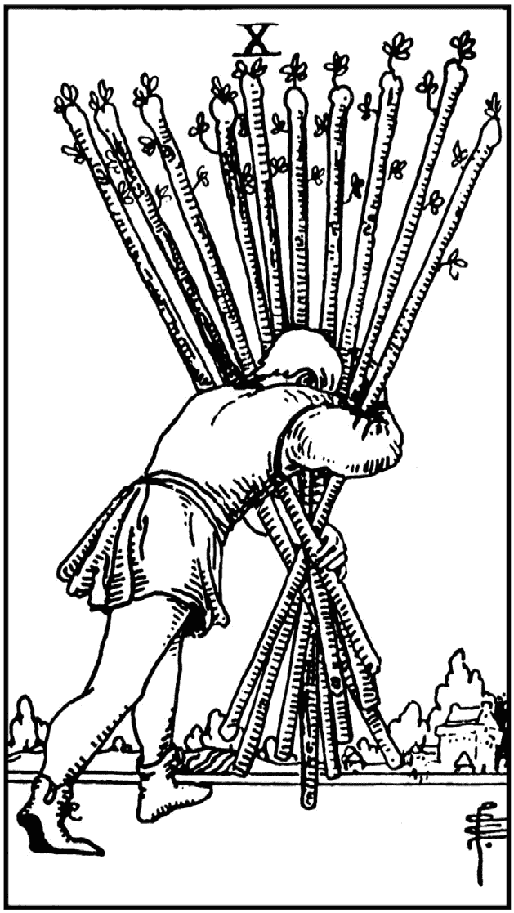

逆位的权杖 9 人物，想要摆脱责任，认为目前的担子不应该是由自己来承担，会抱怨他人推卸责任，害自己变得很忙、很辛苦。或者想要成为被重用的人，却得不到他人的信任，会有无法参与重要事务的落寞感。逆位情境也有可能看到前方的路，发现那不是自己想要到达的目的地，也可能不想再背着担子前进，所以决定放弃与离开需要承担的职务或角色。

##### 圣杯 10

圣杯 10 呈现了一家人欢乐相处的情境，夫妻环抱在一起，双手举高向着彩虹，两个小孩在一旁欢乐的跳舞，前方有溪流、房子与小山丘，一片“家和万事成”的祥和与平安景象。十个圣杯与彩虹形成的弧形，向下围住这一家人，就像给予拥抱与安全的双手。圣杯 10 的图像，描述了家庭、团体间的和谐与圆满，相聚在一起的快乐与满足，但因为数字已到极限的十号，也代表这是最美好的景象，不会再有比现在更好的情景会出现，虽然图像本身是温馨与欢乐的，但背后也隐含最终会曲终人散的不舍。

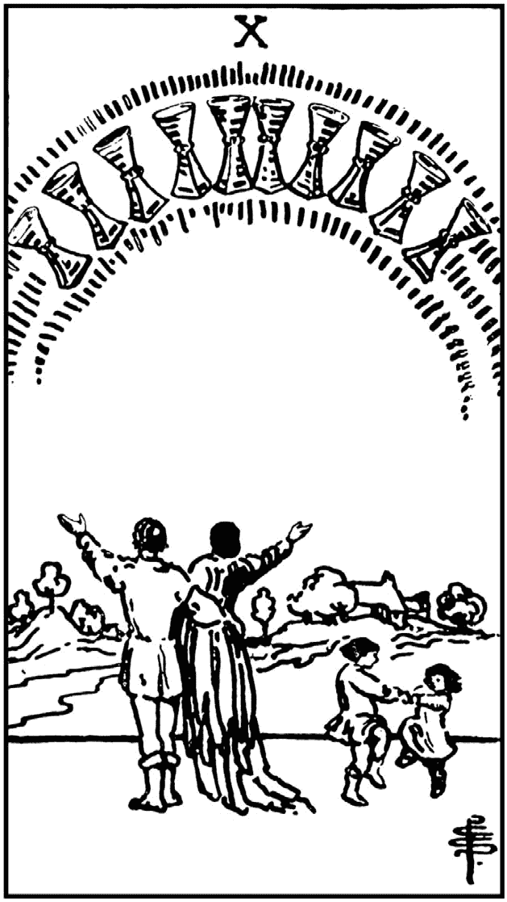

逆位的圣杯 10，不再能够和乐相处，会有人落单、排挤，或大家都疏离。天上的彩虹会变成美好的假象，所以可能表面上和睦，实际却各怀鬼胎。群体也不再能包容各自的不同与多元性，反而会和同温层聚在一起，并对群体外的人产生敌意。逆位的圣杯 10 情境，人物不再能把手伸向前方，而是向内缩，所以会先想到自己，或以退缩、不友善的方式应对他人。

##### 五角 10

五角星 10 的图像很复杂，这张图像并不像其他十号小秘牌，没有开阔的视野，反而以复杂的城堡空间，突显主要人物的身份与财富。坐在前景、最明显的人物是老人，穿着绣有徽章的外衣，他可能是领主，或这城堡的拥有者。他抚摸着小狗，这是富裕家庭里养的名狗，所以可能是自己的宠物，他坐在城堡内，只与狗交流。城门处有身穿富人服饰的妇人与小孩，小孩探头进来摸着小狗的尾巴，他的动作与老人有了交流，他们可能是老人的家属，正在城内散步，与守城门的守卫聊天。城门外的城镇房舍林立，热闹非凡。五角星 10 的图像用城堡象征了物质的财富，以及社会地位，但这些财富与地位并不是靠个人努力就可以获得，而是家族财富，也是祖先遗留，所以五角星 10 的图像，描述了管理财富的能力，用物质照顾家人，以及可运用继承财富的人生情境，老人的形象代表传承，所以也可能代表正在经营或负责家族事业。

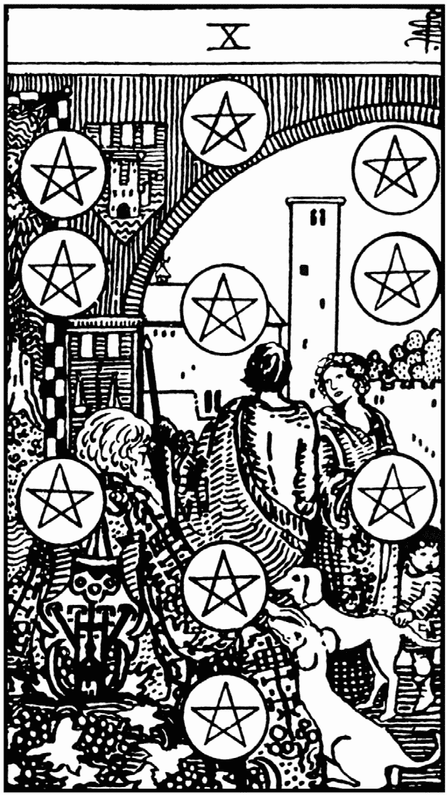

逆位的五角星 10 人物，想拥有城堡，却不是他能获得的财富，所以感叹自己没有好家庭而无法成功，或者想要一夕致富、冒险的投资。也有可能动用家人的财富去创业或置产，却没有偿还。逆位的五角星 10 的情境，会因为金钱、遗产等问题，与家人不和睦，认为自己有权利获得更多，所以不应该退让或放弃。

有关人格特质的分类或测验，是心理学最为大众应用的领域，不只心理学，血型人格类型、十二星座也常被大众讨论。人格类型分析一个人的特质，但如果玩过各种分类测验，就会发现大部分的特质说明都能符合自己的性格，而且各类测验的结果，也未必内容一致，甚至还有互相矛盾的地方，但明明分析的是同一个人，为何会有这些不同？但却又能被同一个人认同？如果你有想过这些问题，或许我们也需要反向思考问自己，我的性格固定不变吗？还是像变色龙般每个人都有多个性格面向？

有时候跟多年没见的亲友相见，会发现对方的性格没什么改变，给人“本性难移”的印象，但我们也会发现熟人在工作或家庭表现出完全不同的性格，让人觉得人很多变，无法掌握。人格到底是本性难移？还是多面呢？人的特质主要表现在社会关系上，于是社会关系就成为影响我们的关键因素，虽然每个人也有从小突显的某些性格，但这些性格在长大、社会化的过程，有些被磨平、有些被隐藏，甚至我们学会了戴上面具演戏，为了让自己与社会关系能够和谐运作。演戏时，原有的某些性格会被隐藏，让自己成为称职的演员，所以我们常会见人说人话，见鬼说鬼话，说鬼话与人话的都是同一个人，但我们会戴上人格面具，适应有鬼或有人的生活。

一旦听到戴面具做人这句话，会觉得是伪装、不真诚，但从人格发展的角度来看，人格面具的培养也是人格的成熟过程，如果无法学会不同社会关系中的角色扮演，只想一贯的做自己，就会无法适应社会，只能活在封闭的世界中。所以在社会生活中的我们都是演员，每个社会角色成为我们要演出的角色，包括子女、父母等的家庭关系。这些社会角色会有社会期待，因此我们也常会听到“像子女一样”、“要像主管”、“像男子汉”、“像女人家”……像某某一样的观念，显现了社会对这些角色的即定标准，而当我们被分派演出这些角色时，就被期待要能够符合这些要求。但如果一个女生单身、能干、想着事业成功，却在家庭被要求“像女人家”一样，期待她放下工作照顾年迈的父母，这时，女儿的角色与在职场上的角色产生了冲突，能够调停这个冲突的就是内在、比人格面具更贴近自己的自我人格。

如果人格面具是要演出的角色，自我人格就是演员本身，社会生活不只有不同社会角色之间的冲突，也会有社会角色与自我的冲突。就像有些演员演出某些角色很出色，但其他角色可能就演的很差，演的很好的角色，是演员对该角色有更多的认同与理解，演不好就代表无法进入该角色的设定。但出色的演员不论演出何种角色，都不会受到限制，代表该演员对各种社会角色都有很好的同理与设定，虽然与自己的性格差异很大，但在被要求演出的情形下，也能扮演好自己的角色，也不会因为太投入演出，而混淆了自己与角色的不同。好演员不会演到走火入魔，除非他太过认同角色，让角色变成了自己。

社会生活的我们与演员的最大差异，是我们演的角色不太会跟自己全然相反，大多还是会维持在与自我人格不会冲突太大的设定。在真实人生中，如果角色与自我人格冲突太大，内在就会有分裂感，人会活在痛苦当中。所以社会角色有各种要求与期待，如何调节这些外在的期待，拉近与自我人格的距离，是社会化的我们需要学习的成长功课。所以“做自己”并不是每时每刻都做出一贯的自己，而是能够觉察社会角色与自我人格的差异，并且能够适当的演出社会角色，但也不会让社会角色与自我人格之间形成过多的矛盾。

回到社会角色之间相冲突的情境，在做女儿及事业有成的女性两者之间，我们到底要如何整合，这在于自我人格有没有形成对自己的觉察。当我们无法调节社会角色之间的冲突，主要原因在于，我们并没有觉察角色隐含的社会要求与成为自己之间的距离。我们一方面想要成为好女儿，但又无法放下成为事业有成的人，但怎么做才是“好女儿”，怎么样才是“事业有成”，这两者的条件与定义，如果自我人格没有觉察到属于自己的意义，就会被社会要求拉扯。如何才叫做照顾好父母，需要从每个家庭的关系结构与经济能力等情境中，找到最适合的方法。同样地，所谓“事业有成”的条件与标准是什么，也需要从一个人的人生意义与目标去定义。如果我们没有这些觉察，就会把角色认同为自己，一旦没有做到社会角色要求的标准，就会痛苦、内疚，觉得自己不够好。唯有对自我进行觉察，我们才能演出属于自己的女儿角色与成功者的样子，这就是自我的独特性，就算我们都要演出社会角色，但每个人都能活出独特的自己，并能适当的调节社会与自我的差距。

宫廷牌在占卜上的应用，代表了一个人的人格面具，是求问者在求问事件中所扮演的社会角色，所以在不同问题中，我们会抽到各类型的宫廷牌，也都能代表同一个人。这些社会角色是在我们成长过程中习得的，虽然我们都有应对社会生活的能力，但有没有选对角色，就成为需要觉察的一件事。刚进入公司的社会新鲜人，想要赶快独当一面，于是就以皇后或国王的角色，表现出独立、成熟的样子，但皇后与国王向外表现出自己什么都懂，无法承认错误或不足，反而会给人傲慢、不接受教导的印象。如果这时候，我们演出侍卫或骑士的角色，虽然看起来不成熟、有待进步，但因为是社会新鲜人，又刚进公司，大部分的同事与主管都能包容新进人员的出错与不懂，我们也比较能请求他人的帮忙，所以在这阶段扮演侍卫或骑士的角色，会比皇后或国王更为恰当。

一旦把宫廷牌对应为人格面具，就可以独立使用十六张宫廷牌，并针对人生角色的问题进行抽牌与解牌。甚至在每次进行塔罗占卜，或者每日抽牌时，都可以另外抽十六张宫廷牌，帮助自己觉察各种人生角色的差异与应用，慢慢让自己也变成更为出色的演员。熟知每一张宫廷人物的特质，就能应用在自己的社会角色上。至于自我人格的觉察，则需要透过大秘牌的抽牌应用，这是心灵成长的领域，可以从大秘牌的生命叙事找到方法。

## 宫廷人物的职务特质

侍卫、骑士、皇后与国王四位宫廷人物，在职务上的专业程度，象征了他们在人格上的成熟度，也展现了他们实践元素能力的程度。侍卫是皇宫里面的守卫，这个职务不是专业的职位，不需要特定技能就可以任职，所以侍卫双脚站立，象征没有地位与资源，就像还在学习的少年，潜能是他们的最佳资源，需要透过学习才能成长与改变，未来可以有很大的可能性，但现在还未成熟。在元素能力的运用上，虽然有该元素的特质，但运用能力不足。骑士则是都骑在马上，马是交通工具，比起双脚站立的侍卫，象征骑士可以走得更远、更快。而且比起侍卫，骑士是有生产力并拥有专业技能的工作者，因此更成熟、专业，也更能达成目标，完成自己的梦想。骑士能够开始掌握元素的能力，是完成学习的专业工作者，但还未达到熟练的地步，因此运用元素能力，虽然能帮助骑士达成目标，但过程尚不稳定，常常会在关键时刻出错。侍卫与骑士都还在追逐自己的未来，所以他们也比较以自我中心，更在乎自己的感受，同理心不足，责任感与承担力局限在自己身上，较不会为他人考量。

皇后与国王都坐在椅子上，他们是成熟的领导者，不必向外证明自己的能力，只需坐在椅子上掌管一切。他们都有独立性，也能带领他人，能够为他人与团体着想，也能负起更大的责任，看事情也较能看向长远的目标。国王是一国的统治者，通常国王的椅子会比皇后大，象征国王比皇后更重视地位、权力，并需要被他人尊重与受到瞩目。国王以制度管理国家，制度的创建与维护是国王较重视的管理方法。皇后也是一国的统治者，但更多时候是幕后的支持者，所以比起权力地位，皇后更强调关怀人的特质。虽然她们也有能力成为领导者，但她们的领导比起管理制度，更重视无法包含在制度里的人，并以人性化的方式调整制度与管理方法。国王与皇后都是运用元素能力的达人，他们能够把每个元素最佳的优点发挥出来，并能够运用元素特质来达到自己的管理目的。

逆位的侍卫不想再用双脚站立，对自己只能做守卫这份工作感到不满，所以也不会认真完成自己的职责，没有责任感，只想过自己的生活，或好高鹜远，认为自己的不成功是没有遇到伯乐，不是自己的能力不足。

逆位的骑士，马无法前进，代表骑士失去了目标与理想，也对提升自己的技能兴趣缺缺，他们停留在原地，不想要为未来努力或争取机会，认为自己没有能力完成，或者对只有自己需要努力感到不甘愿，所以容易漫无目标的过日子，也把自己的不如意怪罪为自己没有靠山与金汤匙。

逆位的国王与皇后，不能再安稳的坐在自己的宝座上，他们不认为自己有能力、或有权利坐在宝座上，对自己的位置感到不安与恐惧。或者也会享受地位给予的利益，却逃避责任，不喜欢做决定，是不甘愿与自私的领导者。

## 圣杯人物的特质──水象征的感性意象

代表水元素的圣杯，展现为人格特质时，与一个人的情感表现直接相关。情感是感受，所以圣杯人物比起外在事件，更重视内在感受。我们会用“感性”来表达这样的特质。在圣杯宫廷牌的图像中，水象征了人物的感性状态，所以解析了人与水的构图关系，就能了解该宫廷人物的特质。例如：侍卫的大海在人物背后，人物没有面对水，也代表人物不太能掌管水代表的感性，所以感性的表现就会不稳定、幼稚与不成熟。骑士的水是贯穿图像的长河，也是骑士要跨过的障碍，所以骑士相对于侍卫，更能掌握内在情感，但比起皇后与国王所在的大海，骑士的河流是流动的水域，还无法海纳百川，因此可以让自己内在的情感自由流动，也能比侍卫更自在的展现感性的一面，不过骑士还没有足够的气度与修养，去包容或同理他人。

皇后与皇帝都面对着大海，他们都有足够的成熟度，能够运用自身的感性力量。但皇后坐在陆地上、皇帝在大海中，所以对于情感力量的成熟与运用，皇后会比皇帝更为稳定与包容，皇帝则需要时时刻刻稳住自己的情感不能氾漤，不能被大海淹没。另外，皇后脚边有很多彩色的石头，彩石是大海给的宝藏，十分稀有，而宝石象征了皇后为他人带来的力量，帮助别人得到内心的富足与安慰，这些都是无法计价与稀有的宝物。而皇帝的大海上有跃出海面的鱼与船只，鱼与船只是大海上的资源，是可以进行经济活动的对象，所以皇帝会把情感转化为经济活动，太过感性与精神性的行为，都不符合皇帝性格，他需要有具体的成效与成果，不能只有精神上的满足。他坐在大海中央，虽有着统管大海的海神之姿，但也需小心稳住自己的宝座，才能让海里的资源转变为陆上生活的资产。

圣杯逆位时，原来流动的水，会停滞在原地，表现出对人、对物的依赖性格，也很容易对一些事成瘾，比起未来会更想留在过去，所以也常会“想当年”来逃避现在。逆流的水，也代表情绪上的不稳定，喜怒无常。也会停滞在过去的错误与遗憾，自责与内疚成为成长的阻碍。逆位的水元素，也可能代表雨或凝结的冰块，雨水会让河流氾漤，造成无法管理情绪的后果，冰块象征对人的冷漠与不关心，甚至变得只在乎自己的感受，无法同理他人。

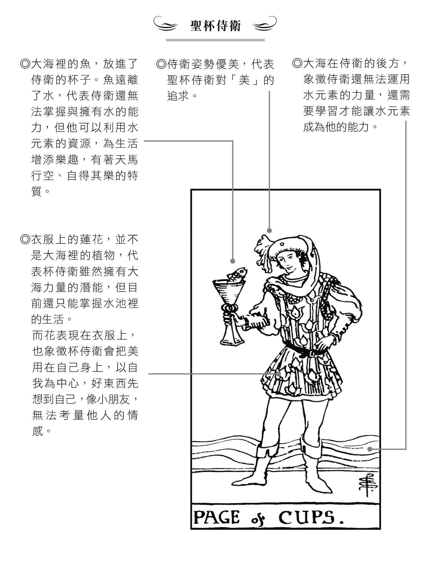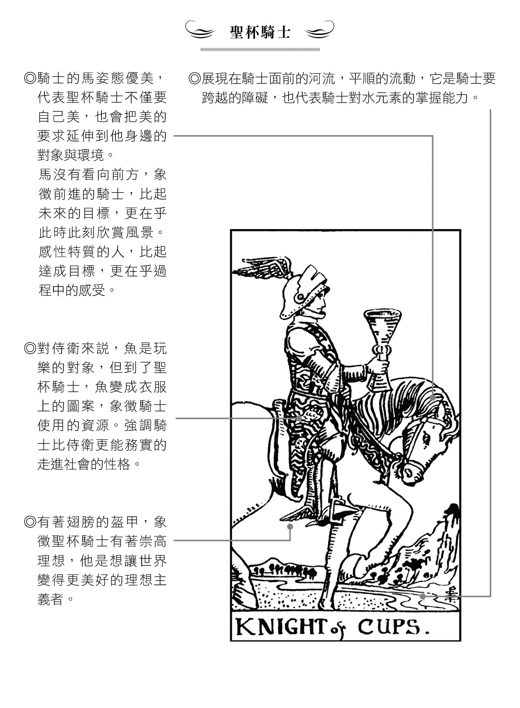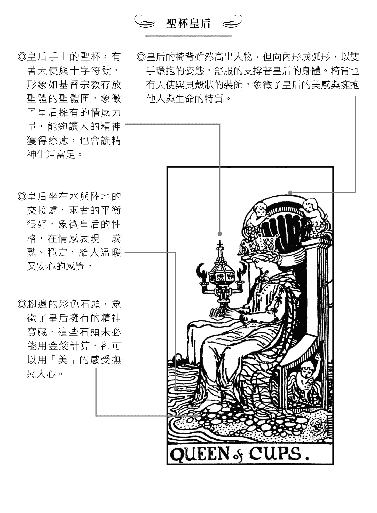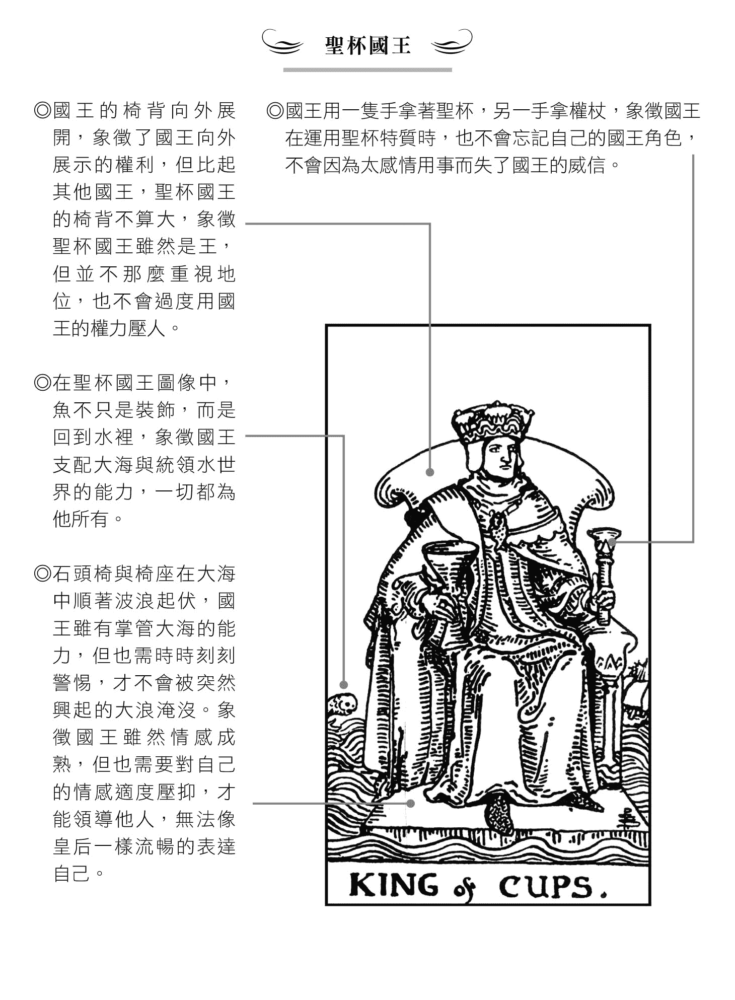

## 权杖人物的特质──高山象征的冒险意象

火元素在人格特质的表现上，主要以向外展开的行动力与影响力有关。能够影响他人，或受他人注意的行动通常需要异于常人，所以愿意挑战他人不敢尝试的冒险，克服不可能的障碍，都是火元素在性格上会有的表现。在宫廷牌的图像上，以高山的意象来呈现行动力，山是人想要征服的对象，在高峰上，也就成为受人瞩目的人，所以权杖系列的宫廷图像，以人与山的构图关系，展现了人物的特质。权杖侍卫的山，在所有权杖宫廷图像中比例最大，也最接近人物，象征侍卫是还在成长与学习的年轻人，他要面对的困难与挑战，相对来说会觉得很艰难。但骑在马上的骑士，已经远离高山，所以山的比例变小了，侍卫无法克服的困难，对骑士来说不是问题，而且他还在寻找更高、更险峻的高山去冒险。

皇后与国王图像中的高山不太显著，皇后后方虽有高山的形象，但颜色变成黄色，与皇后的衣服融合在一起，而且皇后所在的台座，位在图像正中央，已把高山挤到边缘，象征有能力掌握火元素的皇后，她的能力早已被外界认可，所以不需要登上高峰来证明自己，她只要坐在自己的王座上，发挥皇后的影响力即可。所以攀登高峰的挑战，不再是皇后在乎的事。在国王图像，后方有一点隆起的地平线，但与前方的平地都一样是红色，突起的地平线不明显，犹如平地的延伸。国王拥有的影响力比皇后更绝对，也不太敢有人质疑国王的能力，所以他不需要努力表现自己，只要发号施令，其他人就会执行。他的气焰高张，所有高山在他的气势下都像平地一般，如同权杖国王厚重的石头台座，已经把高山压为平地。

权杖逆位时，高山成为无法跨越的困难，或伤害我们的挫折，所以逆位的权杖人物，在困难前犹豫、退缩，无法再带着乐观的心情朝着未来前进。逆位时，原来的权杖人物对他人展现的影响力，会反过来影响自己，过于在乎他人对自己的观感，而容易受他人的影响，也害怕他人不认同自己的作为，所以做事变得过于小心、谨慎，害怕做决定。想要度过平凡、安稳生活的逆位权杖人物，失去了火元素的动力，面对生活无精打采，对事情也表现不出热情与兴趣。

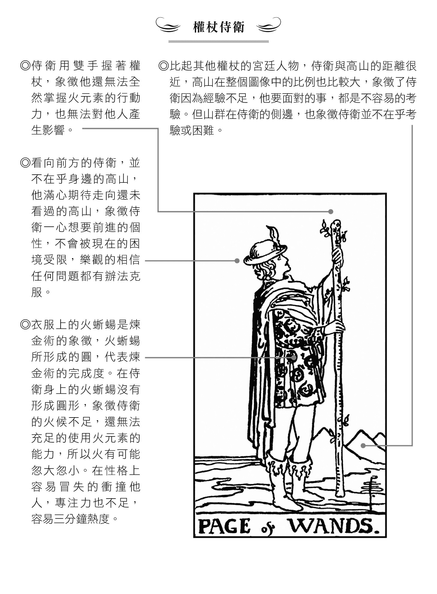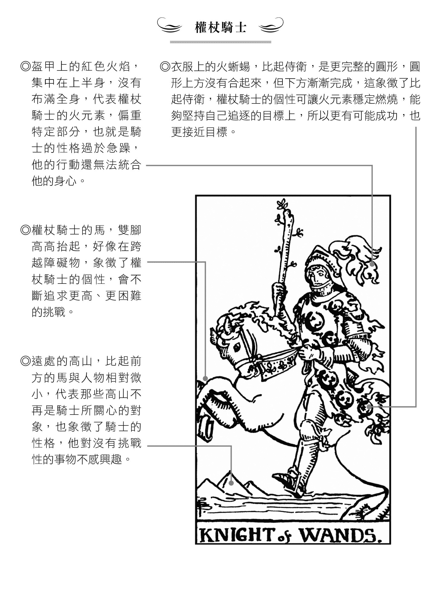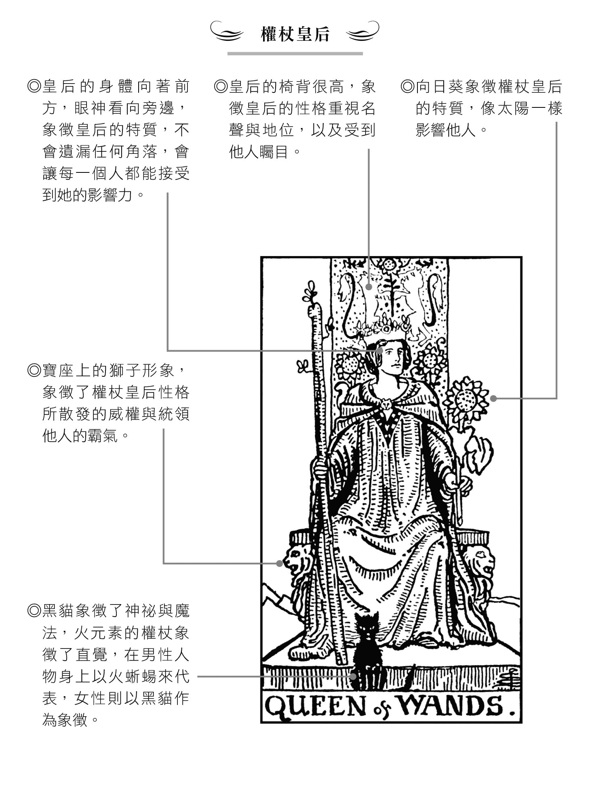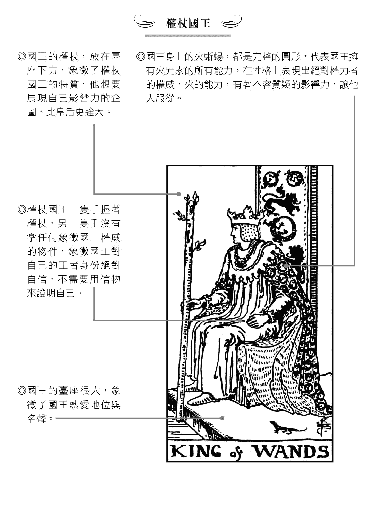

## 宝剑人物的特质──云象征的思维意象

宝剑是风元素，对应到人的性格，是象征思考与解决问题的思维。思考都伴随着评判事件的道理与标准，而宝剑人物则坚守对与错的原则，不太能容忍模煳不清的情境，遇到问题都会先思考如何解决，冷静的梳理事情的来龙去脉，对他们来说，清楚的判断比照顾人的情感更重要。

在宫廷牌的图像中，宝剑人物以云朵与人物的构图，展现宫廷人物的思考能力与性格。宝剑侍卫的云朵散布在整个画面中，和天空之间较没有清楚的界线，代表侍卫还不是一位成熟的思考者，虽然他拥有的知识比其他侍卫多，但还无法有效的分类与归纳知识，因此也无法把知识转换为解决问题的能力。

宝剑骑士的云是扁平状的，展现了骑士的速度，骑士能够运用知识去解决问题，而且骑士追求的是效率，他的思考像风一样快速移动，在前进的路上不太会出现阻碍，所以在到达下一站之前，他已经先想好了所有可行的方案，并快速应对出现的问题，但因为他太专注在效率与速度上，有可能失去精准度。

宝剑皇后的云刚好与天空形成平衡，各占据一半的画面，上面是天空、下方是云朵，象征了皇后的思考清明，不只清楚自己知道什么，也知道自己所不知的面向。因此皇后在做判断与解决问题时，会谨慎小心，连自己无法知道的误区也考虑在内，虽然对事物的判断明确、快速，但也不会坚守自己的立场，能够聆听不同观点的想法，尽量让自己的思考站在公平、正义的一方。

国王的云在更低的地平线处，天空占据整张图像的位置更多，象征国王对真理的追求，比皇后更坚定，更相信自己的立场与判断，但在椅背后方出现了小片云朵，与其他云朵没有链接，象征国王的误区与他的地位和权力有关。维护国王的威信，成为宝剑国王在判断事情上的误区。另外，宝剑人物的图像，都以树木突显人物身处高处，他们都在高处，看得更远、更清楚，象征了宝剑人物拥有比其他人物更清明的思维及视野。

逆位的宝剑，会成为伤害他人的武器，云朵会遮蔽宫廷人物的视野，所以他们会变得只看得到自己，不会在乎别人。逆位的宝剑人物，会把责任推给他人，喜欢批评、聊是非，用自己的正义要求他人，并认为自己受到不公平的对待。宝剑逆位时，会用不正当的手段获得自己的利益，正直与信任都只是伪装的表象。宝剑逆位时，人物也有可能表现出逻辑混乱，无法有效梳理事件，解决问题没有效率、会有拖延、找借口等特质。

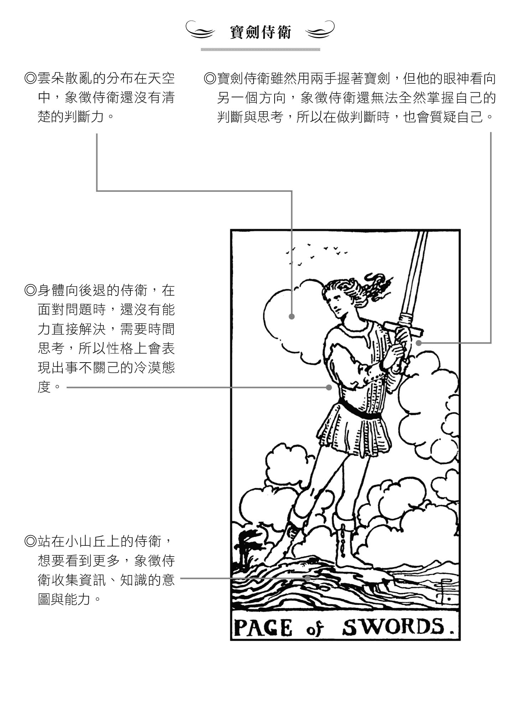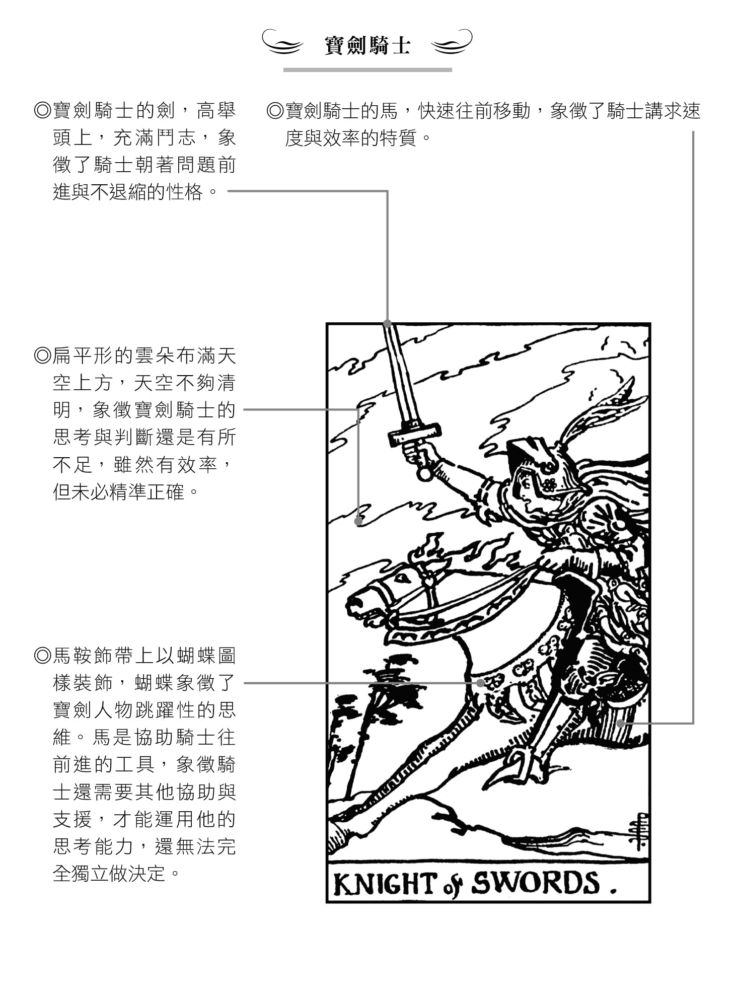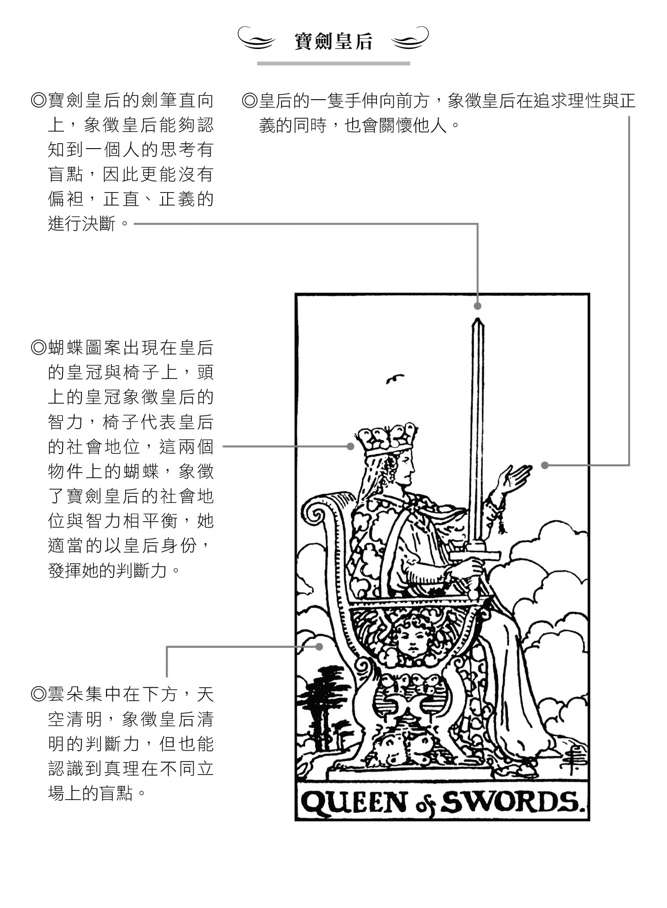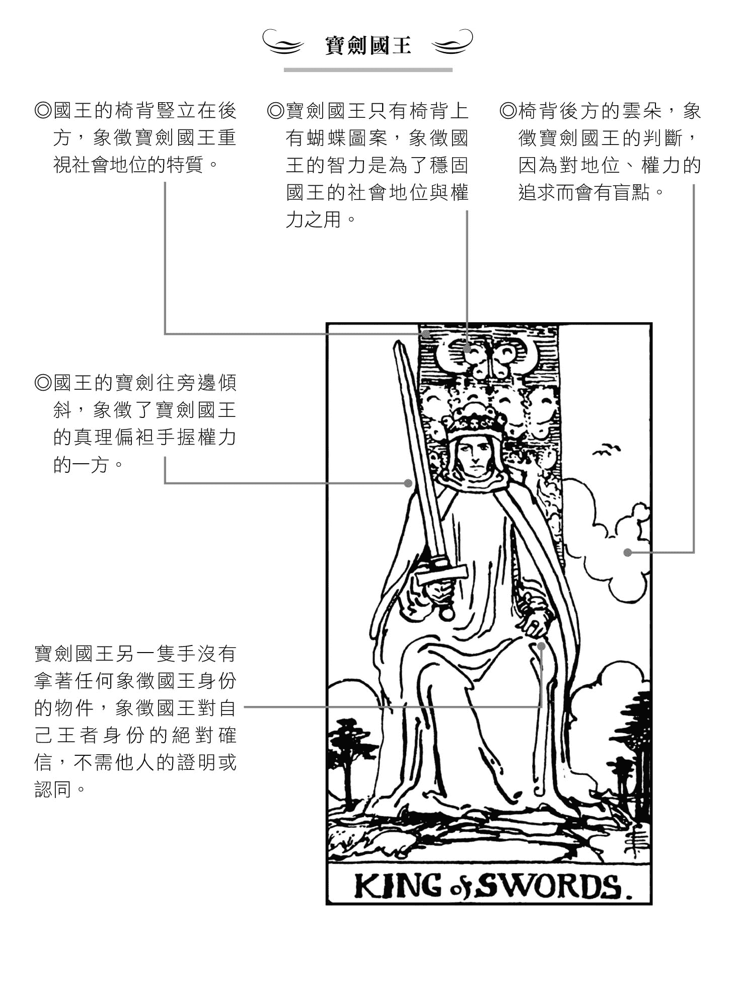

## 五角星人物的特质──土地象征的实践意象

五角星象征了土元素，展现在人格面向，就是踏实、稳固、不易改变、掌握与规划。这些特质让五角星的宫廷人物成为重视实践，不轻易行动，谨慎小心与追求完美的性格，这些性格在图像上，会以人物与他们踏着的土地的构图来表现，并以他们所在的土地性质，象征人物的实践能力。五角星侍卫站在草地上，地上还有野花，这是没有人照顾的野地，代表五角星侍卫还没有能力照顾土地，也没有属于自己的地方。他站在野地上，还需要很多努力才能学习如何把野地整理为可使用的土地。反观五角星骑士，图像里的地有着条纹，代表这些地是为了农作物而耕耘的地，管理与应用这些可以带来经济效益，所以比起侍卫，骑士有更多的生产力。

五角星皇后所处的地方也在野地里，但并不是全然的野外，上方的花丛有着门的意象，代表皇后坐在属于自己的花园里，而花园很大，视线所及之处都属于皇后的领土。土地上不只有野草、花与果实，还有山与水，资源富足，象征皇后拥有的资产与实践能力，能够带来实际对生活有帮助的经济活动。而且花园是半开放式的，代表皇后并没有阻断资源，可以与他人共享。反观五角星国王，他所在的地方有城墙，他靠坐在城墙前，城墙是他的强界，也是保护他领地的建筑物。五角国王坐在城墙外，后方是他的城堡，代表国王想要对外展示领土。他脚踏的地方不只有花草，还有用石头铺好的路，象征五角星国王用创建城堡展现自己管理自然的能力，用这些看得到的标的物来宣示自己的地位与权利。

五角星逆位时，土地会变得松软、不稳定，也无法耕耘，所以五角星人物逆位时，都带有焦躁与不安全感，无法确定自己所站的土地是否稳固，所以害怕自己随时都会跌落或失去立足点，变得更想要抓住手边的任何东西不放。成为逆位五角星人物，会过度执着于某物或某事的特质。也可能不相信自己的土地可以种值，也不想努力耕耘，五角星人物不再认真过生活，认为勤奋不是美德，想找到获得成功的捷径。

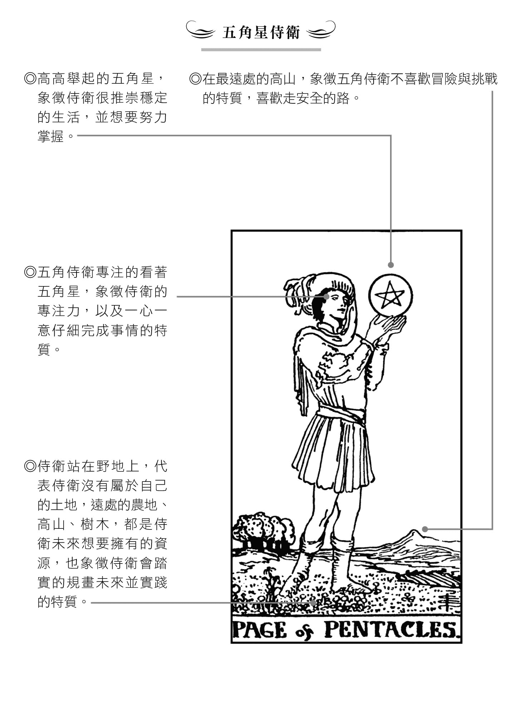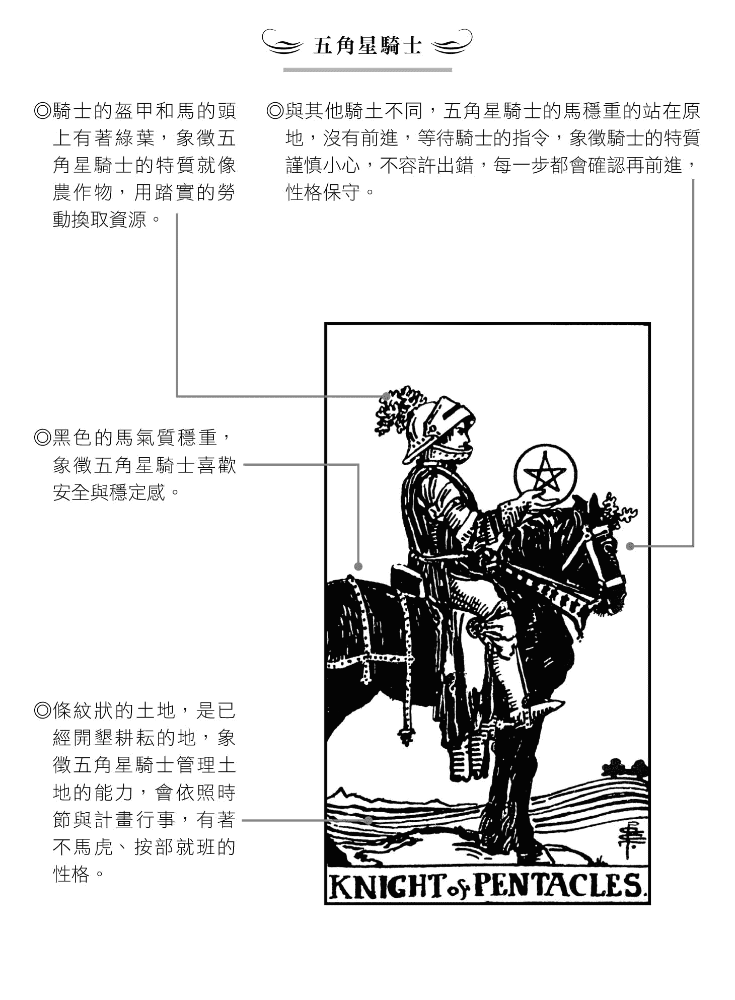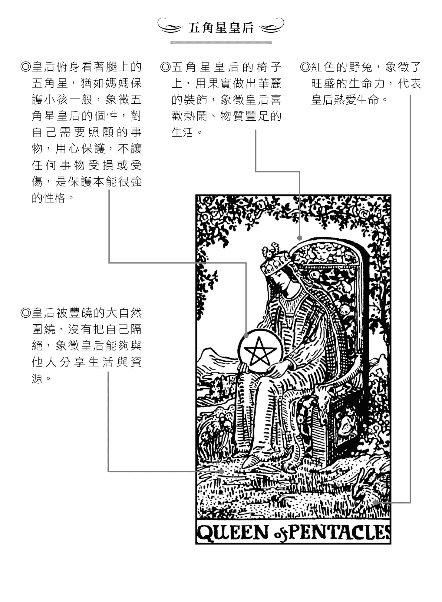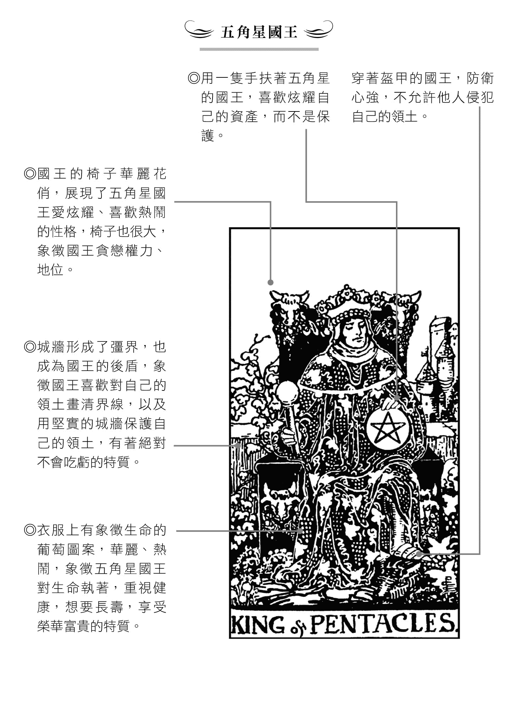

## 每日抽牌练习

学习塔罗生命叙事的第一步，是学习七十八张塔罗牌的结构与图像，要熟记图像但切记不能背牌义，塔罗生命叙事是用图像说故事，是每次抽牌解牌时都需要重新从图像中启发故事与意义。背牌义的结果，会导致每次占卜都只是依照记忆罗列牌卡的答案，却对图像视而不见，失去了观看图像的能力。讲到图像熟记，每日抽牌是个最确实的学习方法，每日抽牌一般大多称为每日运势，但我不太喜欢用“运势”这个词。“运势”会给人既定的算命概念，我们的生活依照运势运作，所以只能用预知来防范，无法改变。如果把每日抽牌当作运势来应用，只会成为每张牌卡的牌义与每日发生的事之间的验证与链接，无法真正发挥自我觉察与生命成长的塔罗应用。只要换个方式思考与运用塔罗，借由塔罗牌的每日抽牌，不但可以学习塔罗图像解析，也能成为每日的自我觉察功课。

想要让自己变得更好是我们的期望，但到底要如何才能带来更好的改变？比如看电影，故事里角色的改变通常是发生了一些不可抗力的事件，在面对事件的过程，他们虽然痛苦、伤心与不安，但最后都能重新审视自己，有勇气走向不一样的道路，这样的情节几乎每部电影都在上演。在看电影时，我们会以为主角的改变来自外在事件，而我们也会羡慕与想像，自己是否也要等到某些事件的到来，才有可能走出不同的人生？但事件只是让人物改变的导火线，最终可以让人物改变的，是主角从事件中自我觉察，并且让自己做出与过去不同的抉择。觉察是看到自己在理解事物上的误区，以为我的不幸来自某人的阴谋或陷害，但觉察的我发现，某人的陷害会让我受打击或受伤，但我的人生会不幸，不是因为这个阴谋，而是面对伤害的我，让伤害成为了我的不幸。也有一些人在受到伤害后，虽然也会难过，但并没有让这伤害决定了自己的幸福，只把它当作走向幸福会经历的过程。

觉察需要一面镜子，帮助我们看到事情更深入的真相，而不是我们想像中的样子，生活中我们听他人的人生故事、看电影或读小说，都有可能对自己形成觉察。但听故事时，我们是在听他人的故事，虽然可能有一些与自己相像的地方，但并不是我的故事，所以听故事的自我觉察，需要特定的因缘，或内心里有很纠结的烦恼，想要解决问题的渴望，才会在每件事上寻找答案。如果每日过得很平凡、没事，自然也不太能从故事中听出深意。但如果我们每天都听自己的故事呢？有没有可能每天都能觉察自己一些？更能认识自己？

回到一开始的每日抽牌，如果把每日抽牌视为自我觉察的故事，是不是就能让我们成长与改变？在进行塔罗抽牌解牌时，我们会问问题，这个问题会与求问的人的人生有关，而任何时候的抽牌解牌，一旦求问，解牌时就是关乎求问者的生命叙事。同样地，每日抽牌不见得会设定问题，但“每日抽牌”本身就是设定，代表解牌是有关求问者的“每日”。每日里有很多事情发生，在事件中的我们也会有很多想法与作为，如果用每日运势来思考每日抽牌，就是预测每日发生的事件，如果用生命叙事来思考，是为了觉察在每日的事件中的“我”。在进行解牌时，把塔罗牌解读为“发生的事件”，还是“觉察在事件中的我”，这两者的解牌方向会形成占卜或生命叙事的两种不同应用。

塔罗生命叙事是透过抽牌解牌，“觉察在事件中的我”，因此不是在验证塔罗牌准不准，而是无论今天发生了什么事，都尝试用抽出来的牌来解读。在生活中，我们容易注意事件，而不是事件中的自己，所以平凡的日常，就会形容为一成不变，发生了大事件，才会感觉生活有变化。但如果回到自己，不论外在发生什么事，事件中的自己都不可能一成不变，我们总会对事件进行“评价”而带来各种情绪与想法。日常中对事件的情绪反应，我们都会认为理所当然，却会忽略情绪来自我们对事件的评价，而不是事件本身。如果去超商买咖啡，结果店员看到客人来也没有实时走到柜台，我们就会对服务不满，如果耽误到上班时间，就会更生气。我们会对店员生气，是因为我们把店员的行动评价为怠慢顾客、不专业，而且我也因没有被视为重要的顾客而生气。但如果我把店员没有实时到柜台，理解成他手头上正在忙，没有注意到客人在柜台，或以为柜台已经有其他店员，所以没有反应的话，这时店员的行为不会直接引发我的不满或生气的情绪，我会先叫店员，如果店员知道我在但还是不理会，才会有下一步的发展。

每一种情绪，都是从事件的评价引发，但我们通常没有觉察评价的过程，直接从情绪感知自己的变化。日常中的很多事，我们都习以为常，也会用习惯性的思维进行判断，结果事情发生就会进入到同一个情绪轮回。如果想走出这样的轮回，需要觉察事情发生时，引发情绪的是什么样的判断与评价，但平常没有练习觉察的人，就算知道要觉察，也无从开始，不知道要觉察什么，所以需要一些帮助。如果身边有智者，就可以请智者帮忙，如果没有，就把塔罗当作智者好友，透过每日抽牌，进行自我觉察，培养观察细微的“心”，慢慢理解自己如何判断事情，有着哪些情绪反应。

不论有没有进行塔罗抽牌，每日我们都要应对很多事，也会对很多事下判断，一旦抽牌，除了自己应对事件理所当然的反应，还会出现牌卡给的提示。这个提示有时符合我们的想法，有时未必，却可以让我们在理所当然进行判断前，停下来，重新思考一次，让我们理解今天发生的事可以有哪些不一样的解释。而每一种不一样的解释，都来自于看待事情的不同态度与观点，观点不同，评价也会变得不同，所以透过每日抽牌，不只是对应每日事件中的自己，也是学习如何用不同观点去理解事件。我们常会说要对他人同理，但同理不只是情绪上的理解，而是需要从另一个人的立场想事情，才能理解为何会有这样的情绪反应。所以从每日抽牌进行的自我觉察，同时也能培养多重观点的思考能力，渐渐会成长为能够对他人深度同理，对自己有清明觉察的成熟人格。

我们大部分的人生，都是在等“大事件”来改变自己，但每日抽牌，却可以每天借由日常事件来转换观看事件的能力，这种每日的累积与学习，会把“一成不变”的日常，慢慢转变成“千变万化”的不一样，生命不再是同样的重复与无聊，而是每日都可以是温故知新。在塔罗教学中，我都会鼓励学习者进行每日抽牌，但过不了多久，总是会有学员回应，每日抽牌好可怕，抽出自己不喜欢的牌就会影响当天的心情，所以不想抽了。这种回应，一方面是把每日抽牌视为运势的预测，害怕不好的牌预告了不好的事，另一方面反应出学习者不相信自己应对事情的能力，害怕不好的事会让自己不幸福，违背人生可以平平安安的期待。不论有没有每日抽牌，好事、坏事都会发生，但判断一件事是好事，还是坏事？在于应对事情的人的态度，能够从事件中学习，让自己有所得，就成为好事，只能看到事件带来的不好影响，就会变成坏事。也因此有些人在苦难中还是幸福，有些人在优渥的环境还是不幸。一旦懂得我们有决定态度的能力，不论抽到什么样的牌，都能帮助我们觉察与理解，所谓不好的事来自于什么样的态度，以及什么样的判断能力，这才是每日抽牌帮助我们成长的部分，如果只是为了用抽牌预测好坏，或许比起塔罗抽牌，还有其他更符合的占卜工具。

#### 大秘牌

解释为应对事情的态度与观点，看待事情的意义。态度会决定对事件的评价，以及评价之后的情绪反应，所以抽到大秘牌，可以帮助我们进入深度的自我觉察，不论当天发生的事有多么微不足道，都可以用抽到的大秘牌来觉察自己如何应对、以及如何反应。例如：抽到节制牌，解释为当日对事件的反应与评价来自于节制牌的态度，想让日子过的平平安安，没消息就是好消息，想顾好自己的身体，让身心都能愉快。节制的态度，对事情的评价是一切如常，没有什么大不了的，所以不论遇到什么事，较能心平气和的去应对，就算遇到了不如意的事，也不会过度担忧，适当的做出回应与解决。逆位的节制，就容易把小事判断为过度困难，于是就会引发不必要的情绪，解决问题的方法也会过于急躁。

#### 小秘牌

小秘牌描述的是发生的事件。会发生什么事，并不一定由我们决定，我们也常是被拉进事件里的人，虽然我们无法掌握会发生什么事，但可以觉察为何会发生这样的事情，以及我们的身心状况。小秘图像中的数字与元素，可应用为自我觉察。例如：抽到圣杯 4，这是事情都无法如我的意发展的情境，所以我会感到不满意。会发生不如意的事，有可能主管没有依我的要求改计划、同事无法依时程完成工作，请家人帮忙的事都只完成一半……等。

如果进一步解析圣杯元素，圣杯是依情感行动，所以在圣杯 4 发生的情境，求问者的要求是在于自己的情感满意度，没有一定的标准，所以在要求他人时，也有可能是一厢情愿的认为他人懂自己的要求，并没有表达具体的要求，所以对方也是依自己理解的方式在做事情，才会产生无法满足我的结果。而且 4 号是想要让目前所做的事进入稳定阶段的数字，所以当事情无法让自己满意，就会产生事情不会好转、无法稳定下来的不安。

#### 宫廷牌

应对事情的人格特质。不同特质的人，会对同一个事件有不同反应，所以觉察自己在事件中，扮演什么样的角色，才能评估是否需要调整。如果抽到宝剑侍卫，宝剑侍卫虽然搜集很多信息，但还无法快速下判断与处理，所以在处理问题时，虽然讲得头头是道，却无法迅速下决定。如果我是会议主持人，却以宝剑侍卫的角色来应对，虽然可以把我准备的内容清楚呈现，却无法整合会议上出现的各种问题与讨论，也无法以主持人的身份下决定，结束不必要的争论。宝剑侍卫虽然能说出个道理来，但也容易被他人的道理说服，尤其是对方资历较深或职务较高时，所以就无法成为主导会议进行的角色。我们会扮演宝剑侍卫，并不一定是工作能力不足，也有可能是不想承担像责任，或者认为这不是自己的责任，当作主管分派的工作，只好去完成，但没有想过把它视为自己的工作去执行，所以就不会花时间想要对会议议题有更多的理解。

##### 每日抽牌──单张牌练习

1.  抽出一张牌作为练习。
2.  每日抽牌，如果没有设定特别的问题，就可以解释为有关那一天的故事。
3.  抽牌时间不限，只要能够帮助学习者觉察一天中的自己即可，可以在白天或晚上抽牌。
4.  记录。把每日抽牌记录下来，不只是写下抽到哪张牌，发生了什么事，而是要记录从这次的解牌中，有哪些和自己有关的觉察，不是记录事件，而是记录事件中的自己，以及与塔罗图像之间的想像链接。

## 塔罗生命叙事如何解读逆位牌？

在塔罗占卜的解读中逆位牌并不是必要的，有些占卜师未必会解逆位牌，但在生命叙事解牌中，逆位扮演了重要角色。在占卜中解读逆位，通常就会把逆位归类为不顺与不如意，我们也大多不喜欢抽到逆位牌。会想避开不顺与不如意，是因为不顺并不是我们能改变的状况，只能接受与认命，所以期待不要遇到不顺的运势。但从塔罗生命叙事的观点思考，不顺或不如意并不是我们无法改变的处境，而是应对事情的心态、方式有了问题，才会有不顺与不如意的状况，所以生命叙事抽到逆位牌，反而是帮助我们觉察，现在我所经验的不如意是为何或如何而来？

求助于塔罗占卜的人，必定是生活中遇到了困境，虽然我们知道遇到了什么样的难题，但往往无法洞察是什么样的原因会造成这种状况。工作上，如果与特定同事或主管有冲突，就会认为是对方机车或刁难才会发生问题，所以求助于占卜时，常会问要不要离职、有没有可能调部门，但我们很少会询问自己，人际关系上的冲突，有没有可能与自己的应对方式有关？我们都有自己坚持的原则、不想被侵犯的界线、不能忍受的话语或行为，当有人的行为或言语触碰这些不能侵犯的原则，我们就会感到不舒服与不愉快。所以就会跟对方说：“刚才你说的话很伤人”、“我不喜欢你谈这些”、“下次不要再这样”……等，或者我们也会努力避开会让自己不舒服的状况。久而久之，我们就在自己身边圈出了一个安全范围，也让身边的亲朋好友知道哪里有地雷，尽量不要靠近。

人的一生会更换很多工作、遇到很多人，每次换新环境、认识新的人，安全范围的结界又要重来一次，很累人，所以年纪大了，我们就越不想换环境，连谈恋爱都觉得麻烦。其实不想要麻烦的解决方法，不是停留在熟悉的地方，而是要解除围在我身边的结界，也就是我所坚持的原则，如果它像地雷，就需要把地雷都拆掉这才是根本性的解决。拆除是因应每个人的生命阶段与自我成长的状况，调整那些原则。他人说的某些话或某些事，让我们不愉快，是因为那些话与那些事触犯到个人的内在原则，一旦原则改变，那些话与那些事都不会引起情绪反应。

我们常会抱怨人应该要有礼貌、应该尊重他人、应该负责任，但何谓“应该”？而应该里我所持有的标准，又有多少是应该？我们可以要求自己用应该的方式尊重他人，但什么样的行为是尊重他人？有没有放诸四海皆一致的标准呢？社会生活中虽然有多数人认同的合理标准，但这些标准不是可以用尺来衡量的具体物件，而是需要放进当下的人事时地物，从发生事情的情境中才能去理解。但我们常常把“我的标准”当作尺规，在理解他人之前，就会先用这把尺规评价了眼前发生的事，并且因为没有受到尊重而生气或受伤。

在生命叙事中的塔罗抽牌，逆位牌的出现可以帮助我们省思，在所谓不顺的情境中，有哪些我们需要省思的“应该”。当“我的应该”与外在没有相应合时，我们就会感受到事情不顺与不如意，所以逆位牌越多，越代表我的应该与外在事件有着很大的落差。当这种落差发生时，我们会先出现生气、失望、悲痛等的情绪反应，所以很难冷静、以旁观者的立场思考，这些落差到底为何会发生。

例如有人想升职，抽到逆位五角星 9，如果从占卜术的思维去思考就会解释为不可能升职，功劳都被他人拿走了。但生命叙事会把逆位五角星 9 解释为，正处于看不到努力的累积而感到失望、身边没有属于我的东西、觉得自己的努力都是为他人而做的人生处境。这是很多上班族会有的状况，不论多努力工作加班，员工付出的未必能得获得同等的回报。但进一步我们可以从五角星元素及数字 9 的意义去觉察造成逆位五角星 9 的可能原因。

员工得不到应有的回报，与公司本身是否看重员工的付出有关，但公司对于我们的付出“应该”要给我们什么样的回报的想法，也是过度以自我标准思考的结果。一个公司需要的人才，未必是加班最多、做最多工作、承担最多、年资最久的人，虽然这些是思考人才时较容易衡量的标准，但我们忘了提拔人才的也是另一个人。每个人都很主观，也会有个人偏好，如果大部分的人的条件都差不多，影响升职的或许就是被喜欢的那个人，就算那个人的条件并不好，但被看重这件事，不是由被选择的人决定的，而是由拥有决定权的人的主观来裁决。

所以谁“应该”升职？虽然可以依客观条件安排，但“人”做的事通常都很主观，就会产生各种不公平的结果。当然，一个公司如果制度执行不公平，长久下来，会流失好人才，所以对公司的长远发展来看，都不是好的作为，但这是公司的负责人需要承担的责任，并不是基层员工可干涉的裁决。五角星元素本身就有一步一脚印的信念，本身就隐含了付出多少就会获得多少的“应该”，这种应该用在可衡量的目标上是可以实践的，例如我想要存钱买房，可以要求自己每个月存多少钱，最后就可以达到买房的目标。但如果要衡量的是没有绝对标准的付出与才能，而且还是由他人来评量我们，这种信念本身就太过理想化，因为从他人眼里看来，怎么样才是付出？怎么样才是应有的报酬？每个人心里都有不同的标准。

另外，9 号数字是接近最后成果、完成的数列，代表在某件事情上长期付出的努力，所以会对没有得到应有的报偿感到更失望。这两者就是在解读逆位五角 9 的图像时，我们可以觉察的“应该”，这些应该让我们在外界发生的事不如自己预期的回报时，就会感到失望与无力。在塔罗牌里，有好几张代表失望与无力的小秘牌（圣杯 4、圣杯 5、宝剑 3、宝剑 8 等），不一定要用逆位，才能说出失望的人生处境。

当抽牌出现逆位时，除了原有的图像在逆位时代表的意义，也隐含了个人的内在信念与外在事件之间的冲突与矛盾的讯息。相对的，如果直接出现正位的、表现失望的牌，遇到了同样的处境，虽然也会失望，但经历事件的人未必会对这种结果感到意外，代表能够理解升职这件事有太多我们没办法掌控的因素，所以对情绪影响不会太大。正位牌的解读，未必有机会让我们觉察个人内在的信念，从生命成长的观点，反而是逆位牌的出现，才是一个人可以成长与改变的契机，也是拆除阻碍我们成长的地雷的时机。因此在塔罗生命叙事中，逆位牌的出现有着无法替代的正向意义，只要从自我觉察的方式进行解牌，都能推动我们的生命朝着成长的方向前进。

## 如何把塔罗应用为人生建议

塔罗生命叙事的抽牌问题，只要是开放性的、有关自己的人生问题，什么样的问题都可以问，问题大致上可以分为两类：一、想要分析目前的状况；二、想要知道未来要怎么做的建议。这两类问题的解牌稍有差异，以第一类的分析目前的状况来说，最普遍的问法就是“未来会如何发展？”虽然问句是有关未来，但透过抽牌解牌，塔罗叙事会帮助我们觉察的是现在。这类问题的解读就以说故事的方式，从抽出的第一张牌开始，依序解读即可。第二类的题目是询问建议，普遍的问法是：“我要怎么做比较好？”“可以怎么改善？”“要怎么样才能解决？”这类型的问题，在解牌上常出现混淆的部分是抽出逆位，或者正位的牌本身不积极或负面意义的图像。建议问题的解牌，与一般性的叙事解牌还是有所差异。

当我们想要问建议时，理所当然就会想要解决问题的方法，而解决问题本身就是一种积极态度，所以出现逆位，或者正位时却有负面意义的图像时，很多人都会解释为不要再以逆位牌的态度面对事情，要积极的转向正位牌的行动。例如抽到五角星 5 就会解释为不要再默默在困窘的情境中一个人面对，去找人帮忙；或者抽到逆位权杖 7，就会说不要再懒散了，要积极面对挑战与困难……如果建议都是针对积极、正向的行动，在询问建议时，似乎不需要解读逆位牌，只要全部解为正位即可。但我个人非常重视逆位的建议解读，它可以给我们停下来、思考、觉察后放下的生命智慧。

“无为”是道家思想中的重要精神，这种境界有别于我们认知的日常活动，所以放在生活中，常常会在无奈、无助、无能为力时，当作安慰自己的话语。但“无为”并不是因为无法做什么而不做，而是理解“无为”才是最佳的回应方式，反而是以无为来让事情发展下去，所以并不是停滞，而是前进。逆位牌的建议，我通常会视为要学习道家的“无为而为”的智慧，逆位牌也是在提醒在事件中我们都太想有“作为”，“作为”反倒成为事情困难的原因。而“作为”也是在反应我们想要事事都要达到理想状态的期望，所以现在的不理想与不圆满，都会给我们想要更努力或做些什么来改变的态度。年轻时我们用莽撞的行动来认识人与世界，那时候确实是需要以行动来认识自己，但生命接近中年或中年以后，“不行动”才是学习智慧的开始，年轻时借由行动所获得的生命经验，到了中年则是需要以不行动来转换成面对人生的智慧。

因此如果想要在“建议”上应用逆位牌，需要从另一种观点去思考，不再是提供行动建议，反而是要我们放下行动，先接受逆位牌的情境。比较简单去解逆位建议的方法，就是把逆位解读为放下原来正位有的行动与想法。例如建议牌出现逆位的命运之轮或逆位的圣杯 3，就是需要放下命运之轮的态度与走出圣杯 3 的处境。如果命运之轮的态度是要我们抓住机会、大胆的往前进的话，逆位命运之轮反而是在提醒我们，原来积极想要抓住机会的态度与行动，才是造成困境的原因，让自己退后一步，懂得理解，有时候推动轮子前进的主导力在他人手上时，反而事情会更容易解决。逆位的圣杯 3，也是在提醒，目前遇到的困境是在于求问的人太想要与他人合作愉快、相处和睦，并期待他人都能无私分享，但这种期待如果与现实不符，就会让求问者失望、受伤、难过，所以走出圣杯 3 的处境，反而可以帮助求问者更实际的看待目前所处的合作模式，调整自己的作为，找到最适当的应对方法。

在建议的求问中，逆位牌出现越多，越是代表求问者太过积极与掌控，也太理想的想要让事情都朝自己想要的方向发展，才会出现逆位的提醒，让求问者学习放下。在逆位解读时，可以把逆位牌的正位意义，解读为求问者目前所处的状况，也就是困境发生的原因，所以透过放下，我们所纠结的问题就不再是问题。相对地，如果在建议问题上，抽到很多正位，代表都是给予积极、主导与掌控的提醒，代表求问的人在应对事情的方式过于被动或逃避，反而需要面对问题的决心与行动力。但也有可能出现宝剑 5 或宝剑 9 等的正位建议，这时候代表我们正在逃避宝剑 5 或宝剑 9 的状况，反而无法处理问题，所以就把这些牌解读为接受纠结的情境，接受是第一步，从接受中才能找到对症下药的解决方法。

在解决问题时，很多人都会忘记面对与接纳的功课，就像圣严法师所说的人生智慧：“面对它、接纳它、处理它与放下它。”任何生命问题都要从面对与接纳开始，但求问的人，大多是想要直接跳到“处理”，所以就直接问要怎么解决。当然有很多问题可以直接跳到处理模式，这样的问题反而不难，但人生还有很多纠结的事无法解决，只能在面对与接受后，了解到处理的方式就是放下，但我们也常不接纳与不想面对这些纠结的事，不断想要找到赶快远离的方法，才是最需要调整的态度。关于人生问题，未必每件事都有药方，有时候接受与放下，才是面对人生处境的智慧之道。建议问题的解读，正位与逆位都会成为自我觉察的重要提醒，可以先从正逆位的图像排列去找到解牌的方向。

##### 塔罗生命叙事问题举例

1.  目前遇到的工作上（感情上）的问题，我正在用什么样的态度应对？
2.  建议我用什么样的态度去应对？
3.  我找不到做这件事情的意义，可以有什么意义呢？
4.  过去发生的那件事，可以用什么样的意义来看待呢？
5.  我跟对方的缘份，有着什么样的意义呢？
6.  我会遇到这些事情的意义？
7.  应如何应对与〇〇〇的关系？
8.  我要如何才能自我成长？
9.  如何才能乐在工作？
10.  如何持续在两性关系中成长？
11.  我要如何应对生活焦虑？
12.  要如何才能活在当下？

## 塔罗叙事练习（大秘牌、宫廷牌、小秘牌）

最基本的叙事解牌练习，从单张牌开始，依大秘牌、宫廷牌、小秘牌进行态度、人生角色、生命情境等的叙事。之后再把三类型的牌组合在一起形成以连续的叙事，因七十八张随意抽牌时，无法形成这样的组合，所以在练习时，可以从这三类型的纸牌各别抽一张，帮助学习者进行叙事练习。（这种方式供练习使用，进行塔罗身心灵占卜时，不需把三类型的分开。）

目前我在的问题上，

用　　　（大秘牌）　　态度（立场）来观看事件，

认为　　（对大秘牌的描述）　　。

我选择了　　（宫廷牌）　　的人格来应对事情，

所以会　　（对宫廷牌的描述）　　。

结果处在　　（小秘牌） 　　处境，情况是　　（对小秘牌的描述）　　。

##### 解牌举例：逆位倒吊人、五角星侍卫、逆位宝剑 6

我在目前的工作问题上，用逆位倒吊人的态度来看待事情，认为我是不得不从自己的位置走下来，去处理很多不是我的责任的工作，所以很不愉快。

而我选择了五角星侍卫的人格来应对目前的问题，所以会想要一次做好一件事，不喜欢草率执行，也不想出错，想把事态稳定下来。

结果处在逆位宝剑 6 的处境，情况是工作陷入困境，每个人有不同意见，很混乱，无法依我的方式一步一步处理，每个人只顾自己，无法相互帮忙，感觉自己要沉入水中了。

## 塔罗叙事抽牌应用（三张牌）

当进入塔罗叙事抽牌时，不需要把三种牌组（大牌、小牌、宫廷牌）分开来抽牌，还是一样从七十八张纸牌，随意抽出三张牌，再依抽出来的牌组解牌。在随意抽牌的过程，因为只抽三张牌，所以大秘牌、小秘牌与宫廷牌未必都会出现，反而会形成千变万化的组合：全大秘牌、小秘牌＋宫廷牌、全宫廷牌、大秘牌＋宫廷牌……不论是什么样的组合，都在说明这次求问事件的特色。例如只有出现小秘牌与宫廷牌，代表求问事件不是需要思考观点与意义的日常事件，日常就像例行公事，虽然事件性质都会有些微差异，但我们大多有经验可以应对，也不会在应对时停下来思考“意义”后再行动。日常是支撑每日生活的重要过程，虽然无聊，却必不可少，但长期在日常模式，生活也会觉得没有意义，所以有时候，在日常中我们也会停下来想要思考人生是否要这样继续下去，这时，代表我们的生命状况从日常，进入到了用大秘牌来思考意义的生命处境。

大秘牌的出现，会帮助我们觉察目前的生命态度、以及未来的定位，这些觉察通常在我们面对重要抉择时才会进行，例如工作想要转换跑道、结婚生子、分手等，在做这些抉择前，我们一定会问做了这些决定后会如何？而我们是否能够承担或接受这些结果？我们能否接受一次性决定的后果，在于我们用什么样的心态与意义看待这项决定。如果换跑道是为了生活过得更轻松、自由，就是用“皇后”牌的心态来面对换工作，如果换工作后发现未必能够轻松，我们就会选择放弃。但如果是用“战车”的态度去面对转换跑道，也就代表想要有更多出头、成功的机会，所以工作压力大、会累等都不会成为放弃的理由，只要新的工作有向上发展的机会。

在随意抽牌时出现大秘牌，会帮助我们觉察，我正在用什么样的态度应对眼前发生的事，从态度上，可以更深入理解为何会遇到如此的瓶颈与烦恼，或者抉择上的犹豫。所以在抽牌时，不只是抽出来的牌可以说明生命状况，抽出了哪几种牌组，也能帮助我们对求问事件进行多方面的理解。

#### 解牌范例一

##### 解牌分析

有人询问接下来的工作发展，抽到下列的三张牌。这次的抽牌出现了一张大秘牌、两张小秘牌，代表近期在工作上发生的事，让求问者重新调整自己在工作上面对问题的态度，让自己在错误中学习。两张小秘牌都是权杖元素，并分别为 5 号与 7 号数字，代表这次所遇到的事件，可能是公司目前最有发展潜能的专案，因为有了好的开始，现在正需要更多的创新想法让成果更上一层楼，而且很多部门的人都有兴趣并积极参与，时程上也可能紧迫，比起长期规划，大家都急于在短时内想要得到结果，所以就会有更多的意见分歧。在解牌叙事时，把三张牌视为说故事的因果关系，中间逆位命运之轮的出现是因为前面的权杖 5 发生的事，最后一张的权杖 7，是因为逆位的命运之轮的态度所引导出的结果，在叙事时，依抽牌顺序，用“因为、所以、结果”的连接词，可以协助加强三张牌之间的相互关系。

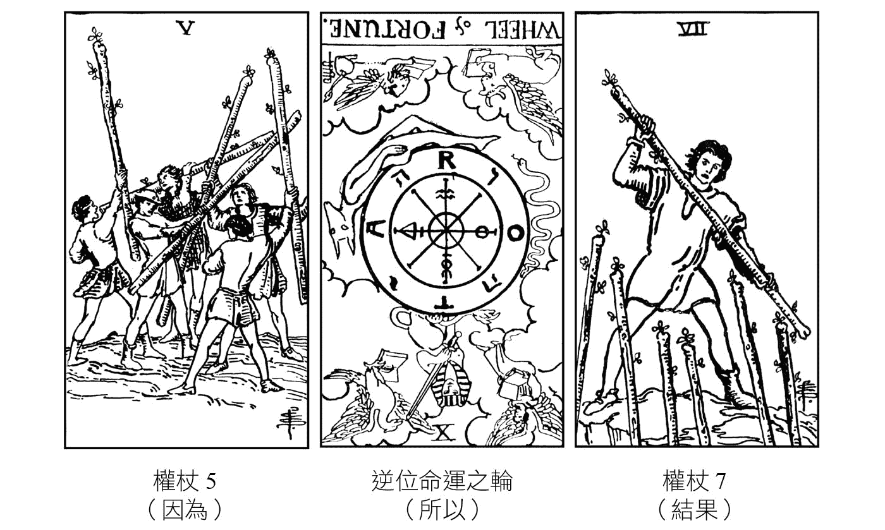

##### 解牌叙事

权杖 5 的情境是多人一起脑力激荡、提出想法、相互较劲的工作状况，但参与讨论的都是部门之间的平行关系，没有更高主管来裁决，所以变成意见太多、无法进行整合，这种情况导致了逆位命运之轮的态度，让求问者对计划执行不再持有乐观的想法，认为原来的好意，想要收集大家的意见，却变成多头马车的情形，结果命运之轮的轮子卡在原地，无法转动。逆位命运之轮的态度，让求问者不再对团队合作抱持着正向的看法，最后从团队工作中退出来。就算自己累一些、辛苦一些，也决定一个人执行，于是就进入到权杖 7 的处境，不再听从他人的意见，一个人埋头苦干，用自己的方法去解决问题。

#### 解牌范例二

##### 叙事分析

有人询问接下来婚姻关系的发展，抽出下列的三张牌组，两张小秘牌、一张宫廷牌。这种组合代表目前所遇到的状况，是婚姻关系不断重复例行公事，是两个人一起分担家务、照管小孩与都有工作的情形下，必然会遇到的日常，虽然有争吵与冲突，但也是姻婚生活必经的过程，所以平常心应对，才能适当的放下压力与烦恼。这也是为何没有出现大秘牌来提醒求问者需要思考婚姻的意义，或者重新为自己的婚姻关系定位。

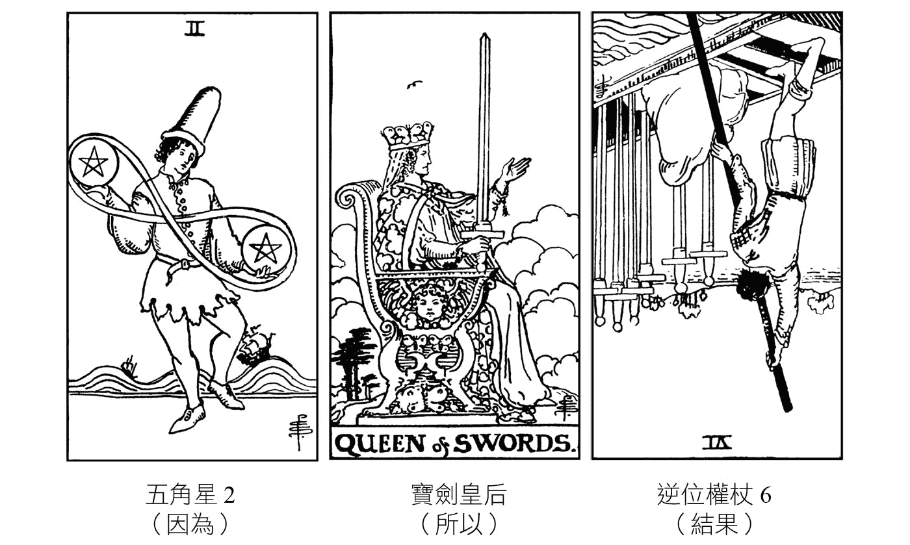

三张牌组在宝剑皇后之后出现了逆位牌，代表事情变得有冲突的原因在于宝剑皇后这个角色。这张宫廷牌在解牌时对应到求问者，是求问者在五角星 2 的情境中，决定以宝剑皇后的身份来应对状况，结果延伸为逆位宝剑 6 的情境。宫廷牌是求问者在应对困境时选用的身份，也代表身份可以由求问者调整，但宝剑皇后可能是求问者在不自觉中处理事情的模式。这次抽出的小秘牌中，宝剑的元素较多，突显了求问者喜欢说清楚、讲明白的处境，任何不明确、拖延等状况，都会让求问者感到不耐烦，也是在婚姻生活中发生冲突的主要原因。虽然宝剑皇后是正位，但这张牌引导出了后面的逆位情境，所以最需要觉察与调整的是宝剑皇后这个角色，有可能她才是让事情纠结、变得困难的原因。

##### 叙事解牌

五角星 2 是需要来回多种工作、身份而忙碌的情境，在婚姻中，女性需要照顾家庭，但也需要工作，来回于职场与家庭的两个担子，就成为五角星 2 的情境。在一般情境下，五角星 2 虽然忙碌，但也会乐此不疲，图像里像玩耍一样玩弄两个五角星的人，描绘能够苦中作乐的处境。但五角星 2 后面紧接着出现的宝剑皇后，想要厘清家中各自的责任与职责，并且要讲清楚每个人所承担的是否公平、我这么忙碌是否合理等。从五角星 2 可以判断，目前的工作与家庭状况，对求问者来说未必是过量或有压力，虽然忙碌，都还能应付自如。但追求公平、合理原则的求问者，只是不想要受到不公平的对待，所以就会以宝剑皇后的特质来评价发生的事。结果就出现了逆位的宝剑 6，图像里的船可以联想为家庭，一旦开始追问家庭中的工作分配与公平性，家人之间反而就出现了讲不清楚的处境，船翻了。大家都在要求合理的结果，反而只能待在翻船的原地，什么地方也去不了，这种争执，只要家庭关系还在，就没有休止的一天，所以让求问者更烦躁，但也提不出建设性的解决方法。

在占卜术的思维中，塔罗占卜成为一项技艺与专业，有特定的运作方法，塔罗占卜的学习，就是针对塔罗的占卜运用的技巧学习。但如果跳脱占卜术的思维，把塔罗牌视为图像媒介，塔罗成为一座桥梁，占卜方法是为了完成桥梁的功能，把原来分隔、断裂的两地连接上，让两个地方可以交流无阻。那塔罗接起的是哪两地呢？就是意识与无意识。在个人的内在世界，这两者没有全然分开，但过于注重理性生活的现代人，很容易忽略理性之外的探究，所以不自觉让桥梁变得功能不足或设了很多阻碍通行的障碍物。

我常常也会用魔法来形容塔罗占卜，但我所说的魔法，不是塔罗占卜本身的神秘性，而是当它的图像以桥梁的角色，透过随意抽牌与解牌过程，链接了意识与无意识，原来没有通的意识中的思维、知识，与无意识中的经验碎片与感知，在桥上相遇与碰撞，而且原以为只是随意的、偶然的相撞，却能够带给我们觉察与领悟生命的意义。透过塔罗的随意抽牌带动出的桥梁上的相遇，可以用张爱玲的《爱》的诗句来表达：

于千万人之中遇见你所遇见的人，

于千万年之中，时间的无涯的荒野里，

没有早一步，也没有晚一步，

刚巧赶上了，那也没有别的话可说，

惟有轻轻的问一声：“哦，你也在这里吗？”

这就是我所称的塔罗占卜魔法。它就像爱情，透过解牌时闪现的领悟，滋养我们的生命，让原来乏味的日常，像被阳光照耀一样闪闪发光。想要拥有这种魔法，不只需要学习塔罗图像与占卜解牌，桥梁两端需要有稳固、宽阔又丰富的两个世界，在这两个世界的居民够多时，才有可能在桥梁中与命中注定的那个人相遇。意识世界的丰富需要有人文素养与逻辑思考的培养，而无意识就需要走入世界的感知与经验。知识与经验的碰撞，才能形成智慧的领悟，但桥梁功能不彰时，我们有可能读了万卷书，也行了万里路，但知识与经验却是分开的，所学与所行之间还是有很大的距离。这时有了塔罗图像的桥梁，知识与经验开始能够为我们生命创造“爱”。

在教学过程，我接触的大部分学习者，期待塔罗本身可以带给他们魔法，所以很努力练习塔罗占卜，但却忽略了人文知识的培养与生命经验的累积，所以就算建起了桥梁，却因为两个世界的贫乏，桥梁上还是没什么通行的人，所以占卜解牌只是暂时的舒缓了不确定的焦虑，却无法像我说的塔罗魔法，以灵感闪现的方式带来生命的意义与领悟。

如果你想要学习塔罗魔法，除了学习塔罗图像、练习解牌之外，也需要透过文学、艺术、哲学、心理学、宗教等书籍的阅读，培养人文素养，之后也要能够不断跳脱熟悉的生活圈与人际关系，累积各式各样的生活经验，有了这两者的共进，就能搭起创造魔法的塔罗桥梁。这本书透过生命主题的人文思考、塔罗图像的分析与解读，努力为阅读者拓展出内在的魔法世界，它是一个起点，为你的未来准备更多的魔法碰撞。

**叙事塔罗** 运用塔罗图像展开与自我对话的生命叙事，让身心灵在困境中成长，走出属于自己的幸福之道

作者　王乙甯

封面设计　庄谨铭

内页排版　高巧怡

epub 制作　播莳数码出版有限公司

行销企划　萧浩仰、江紫涓

行销统筹　骆汉琦

业务发行　邱绍溢

营运顾问　郭其彬

副总编辑　刘文琪

出版　地平线文化／漫游者文化事业股份有限公司

地址　台北市 103 大同区重庆北路二段 88 号 2 楼之 6

电话　(02) 2715-2022

传真　(02) 2715-2021

服务信箱　service@azothbooks.com

网络书店　www.azothbooks.com

脸书　www.facebook.com/azothbooks.read

发行　大雁出版基地

地址　新北市 231 新店区北新路三段 207-3 号 5 楼

电话　02-8913-1005

订单传真　02-8913-1056

初版一刷　2024 年 1 月

定价　台币 450 元

ISBN　978-626-97679-9-1

eISBN　978-626-98213-0-3 (EPUB)

有著作权．侵害必究

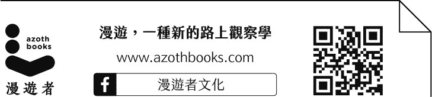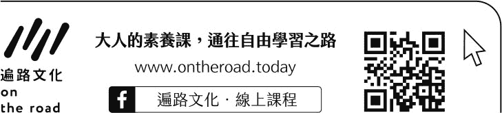