## 古埃及的咒语
Ancient Egypt's Incantation

[英] 沃利斯·巴奇 著

述说那些神秘却又历史久远的埃及传说
金字塔、神迹、复活、魔法、咒语……
尘封多年的莎草书重现
掀开埃及上神的神秘面纱

新世界出版社
NEW WORLD PRESS

## 古埃及的魔法

ANCIENT EGYPT'S INCANTATION
[英] 沃利斯·巴奇 著

图书在版编目(CIP)数据
古埃及的咒语/(英)巴奇著;曾献译. —北京:新世界出版社,2008.6
ISBN 978-7-80228-698-6
Ⅰ.古… Ⅱ.①巴…②曾… Ⅲ.埃及一古代史一普及读物 Ⅳ.K411.209
中国版本图书馆 CIP 数据核字(2008)第 068839 号

## 古埃及的咒语

- 出版策划:精典博维
- 作 者:(英)沃利斯·巴奇
- 译 者:曾 献
- 责任编辑:陈黎明
- 封面设计:门乃婷工作室
- 内文排版:亿辰时代·周素芬
- 出版发行:新世界出版社
- 社 址:北京市西城区百万庄大街24号(100037)
- 总编室电话:(010)68995424 (010)68326679(传真)
- 发行部电话:(010)68995968 (010)68998705(传真)
- 本社中文网址:www.nwp.cn
- 本社英文网址:www.newworld-press.com
- 本社电子信箱:nwpcn@public.bta.net.cn
- 版权部电子信箱:frank@nwp.com.cn
- 版权部电话:+86(10)68996306
- 印 刷:北京柯蓝博泰印务有限公司
- 开 本:780×1092 1/16
- 印 张:12.25
- 字 数:260千字
- 版 次:2008年7月第1版 2008年7月第1次印刷
- 书 号:ISBN 978-7-80228-698-6
- 定 价:25.00元

# 序言

电影《卢浮魅影》中，女主人公被木乃伊的灵魂附体，而在墙上画下一系列的符咒，每到夜深人静的时候，她就会像疯子一样在卢浮宫中寻找符咒的答案。这些符咒到底象征着什么，木乃伊为何对她纠缠不休，它的魂灵又要终归何方？

这些符咒遍及在埃及金字塔里、在埃及《生死书》里、在埃及神殿里，它与古埃及人的转世、神灵的祭祀到底有什么关系呢？埃及的祭司为何又像守护生命一样守护着这些符咒呢？这些符咒究竟预示着什么样的命运祸福呢？

在古埃及的神族里，有一个非同寻常的女子，叫伊西丝。她异常地聪明、善良，并且很有个性，对于符咒和咒语也了如指掌，当然也有女孩子特别的野心。伊西丝自然就成了人间的魔法师。但她厌倦了只能做地球的女神，她有了新的目标，那就是和她的兄弟们一样，成为天堂里的女神。为了达到这个目标，她要获得足够的法力，而这些法力的获得只有一个途径，那就是要掌握最高神——拉赖以生存的秘密名称。为此，她运用计谋，用唾液施咒，和主神拉斗智斗法，最终，拉被迫说出了自己的名字，伊西丝也如愿以偿得到了她想要的。

还未出生时，伊西丝就已钟情于哥哥光明神奥西里斯，但他却不幸被自己的兄弟黑暗神塞特谋杀，塞特还将自己的兄弟切成十四块，分扔各处，而伊西丝这位纯情的女子，走遍了埃及的各个角落，一块一块地找回奥西里斯的尸体，拼接起来把他做成木乃伊，并使他重生。在奥西里斯又一次遇害后，伊西丝让自己怀了他的孩子。为了躲避塞特的追杀，她四处躲避，风餐露宿；当儿子霍鲁斯最终被塞特发现而杀死，她一连串的哭泣和悲伤呼告，终于感天动地，使孩子起死回生……

古埃及的神话，恰似一个个故事，其中，阴谋和诡计同在，道义和信仰共存。既存在残酷的杀戮，也不乏动人的温情。我们知道伊西丝是女神、魔法师和木乃伊的创始人，但我们更津津乐道的，却是她作为一个人世的无私奉献的妻子和充满慈爱的母亲形象吧。

金字塔、木乃伊、狮身人面像，符咒、咒语和神秘的唾液魔法……有关埃及的一切，多少令人感到捉摸不透。十九世纪以来，由于埃及古物的不断发掘，吸引了越来越多的学者加入研究埃及学的行列。本书即是这股考古浪潮下的成果之一。

人是什么？来自何方？去向何处？和其他民族一样，原初的埃及人将他们对世界的理解和疑惑，全部放进了他们所创造的神话中。考古发现的莎草书记载的古埃及创世神话，就特别值得一提。它不但与埃及的古老智慧密切相关——古埃及所有神秘（木乃伊、咒语、魔法）的起源，都在这套神话体系中得到了清楚解释；而且它在极大地影响了古希腊的神话英雄谱——我们所熟知的宙斯，就来源于奥西利斯；雅典娜，即是伊西丝的希腊版……文化上的传递不得不让我们惊叹。如果我们看到古埃及神话中的兄妹结合而生万物，也自然而然会想起我们中华民族的始祖伏羲女娲的故事来……

有人曾说，埃及是全世界的文化起源地，或许，这也是一种神话。

阿 肋

# 导言

## 关于神明内贝彻(Nebertcher)的传说，生命起源的相关历史

一份编号为 10188 号的纸莎草纸经文存于大英博物馆。它记录的就是埃及著名的生命起源传说。

有关这份经文的来历，还有一段逸事呢。1861 年至 1862 年间，A.H.莱因德先生在底比斯的尼罗河西岸进行考古挖掘，不过，这份经文并非他的考古所得，而是卢克索(Luxor)的英国执政官穆斯塔法·阿格哈作为临别礼物赠给他的。穆斯塔法·阿格哈是在皇家木乃伊的著名存放地“帝王谷”(Der-al-Bahari)发现的这份经文，他对这个地方十分熟悉，而埃及文物古迹服务部门(the Egyptian Service of Antiquities) 直到多年后才知道这个地方。

## 古埃及的咒语

莱因德先生抵达英国后，伯彻博士对他带回的文物进行了研究，鉴认出了这份经文有极其重要的价值，他计划在其著作《两份纸莎草纸经文的摹本》(Facsimiles of Two Papyri) 之姐妹篇里将其刊登出来，但莱因德先生很快就去世了，这个计划也随之变成了泡影。戴维·布雷姆纳先生接收了莱因德先生的全部收藏，这份经文连同其他文物一起也由大英博物馆购得。

伯彻博士在 1880 年向荷兰莱顿的埃及博物馆长普莱特博士提出出版这份经文的建议，普莱特博士后来抄录并翻译了经文里第一篇文章《伊西丝(Isis)和内芙蒂丝(Nephthys)的颂歌》中的几个段落，并刊登在一份法文杂志上。1886 年，伯彻博士非常友好地准许我可以研究这份经文，《圣经考古学协会的活动记录》杂志也刊登了我对一些重要段落以及有关生命起源内容的抄本。H.布鲁格沙(Brugsch)博士认为这篇生命起源的传说对于研究埃及宗教来说意义重大，在其鼓励下，我手抄了整篇经文，配上音译和意译，刊登在《考古学》上。

1910 年，我又编译了所有的僧侣体文章，这是受大英博物馆委托的。这份经文长约 5 米，宽 24.5 厘米。其中僧侣体文章21篇，行行较短，文字押韵；另外有12篇文章，每行较长，约九百三十多行，手写体，字体小，颜色黑，却非常整洁，也许出自第二十六朝（公元前672—公元前525年）到托勒密(Ptolemaic)王朝（公元前304—公元前30年）期间，题目、题眉、标题、阿佩普(Apep)及其魔鬼随从的姓名，以及其他一些文字均由红墨水书写。有两个题署：一个是日期，即“亚历山大(Alexander)之子法拉欧·亚历山大(Pharaoh Alexander)执政第十二年第四个月第一天”，即公元前311年；而另一个则是一位僧侣的姓名，即内斯—梅努(Nes-Menu)，或内斯—阿姆苏(Nes-Amsu)，也许是他命人书写的这份经文，也许他即是这份经文的持有者。

## 目录

序言

导语

- 01 第一章 生命起源的传说
- 19 第二章 毁灭人类的传说
- 37 第三章 拉和伊西丝的传说
- 49 第四章 赫鲁—贝乎泰特和飞盘的传说
- 75 第五章 霍鲁斯之诞生的传说
- 85 第六章 凯恩苏·内夫—赫特普和贝克坦公主的传说
- 97 第七章 克尼穆和七年饥荒的传说
- 111 第八章 霍鲁斯死而复生的传说
- 143 第九章 伊西丝和奥西里斯的历史

# 第一章

## 生命起源的传说

大英博物馆，第10188号纸莎草纸经文

生命起源的传说是在这份经文的第三部作品里出现的，该作品的名字为《推翻拉(Ra)与昂一内夫(Un-Nefer，即奥西里斯)的敌人阿佩普之书》。经文里含有一系列咒语，用于特定的庆典仪式，以求狂风暴雨的停止，浓厚雨云的消散。任何障碍，无论其有生命抑或无生命，只要有可能阻碍早晨太阳升起，或阻碍白昼阳光普照，就都应当去除。掌管黑暗的首领是一个名叫阿佩普的魔鬼，他常变化成一条巨蟒出现在天空中，他还勾结图瓦特(Tuat)所有的魔鬼，企图将太阳神囚禁在黑暗的王国里。也就是在这些诅咒阿佩普的咒语当中，我们发现了生命起源的传说，这个传说在任何别的埃及文章里都是没有提及的。

我们没有办法解释这本“书”为何会在阿佩普的祭礼上出现，除非我们假设当时人们把整本“书”当成了一个最强大有力的咒语，只要吟诵一下，就足以致阿佩普及其属下于死地。

生命起源的故事由神内贝彻来讲述，内贝彻的意思即是“拥有最大限度权力的神”，他的形象说明“限度”这个词是指时间及空间的限度，而事实上这位神就是无限宇宙之神这个名字，也曾在科普特文学里出现过。他所具备的品质与特征，令现代民族联想到上帝。文章并没有讲内贝彻生存于何方，或如何生存，但讲到人们认为他拥有至高无上、无踪无影的力量，他的这种力量充满着整个空间，还说到他产生了一个希冀，那就是要创造全世界，为实现这个愿望，他化身为神凯佩拉(Khepera)，埃及人民始终把他尊为诸神中最伟大的创造之神。当内贝彻化身为凯佩拉时，天堂和地球尚处于一片混沌状态，但存在有一大片水域或海洋，名为努(Nu)，神正是在这片海洋里完成了转化过程。

## 拉(Ra,Re,Rah,又称作 Atum 阿图姆)

是古埃及赫里奥波里斯的太阳神。自第五王朝起，他与底比斯神阿蒙就结合在一起，共同成为埃及神系中最重要的神。千百年来，拉始终是埃及的最高神。

拉是一位自我创生的神，由元初之水(Mehturt,八位 Ogdoad所创造的土丘)或在一朵荷花中诞生。他用其精液或分泌物创造了休和特芙努特，并用其泪水创造了人类。

太阳就是拉的整个身体，或者仅仅是拉的眼睛。在赫里奥波里斯，人们把他作为朝日神阿顿(Aton)和暮日神阿图姆(Atum)来崇拜。拉在清晨的时候叫阿顿，而在黄昏时叫阿图姆。后来他又与霍鲁斯融合。

虽然拉与阿图姆(“完成者或完美者”)属同一个神，阿图姆仅用于某些特殊场合。他主要象征着落日，拉是在作为休和特芙努特的创造者时的替代体。有的神话中，阿图姆专指由布塔神创造的阿图姆。阿图姆是亥克(Hike)之父。

埃蒙—拉的身份，同宙斯和朱庇特一样得到希腊人和罗马人的认同。希腊人甚至赋予了底比斯“帝奥斯波里斯”(Diospolis)——“宙斯之城”的称谓。埃蒙—拉有时具有凤凰的象征。

拉的象征是一轮金色的圆盘，抑或一个中间带有一个点的圆圈的符号。

这片神圣的海洋里，蕴藏着生命万物的胚芽，它们日后将逐渐成形，分别占据天堂与地球，不过当时它们没有丝毫的生命力，无助无援。而凯佩拉独自一人，走出了这片海洋，由被动呆滞的状态变为了一种主动的状态。走出海洋努的凯佩拉，发现自己处在一个宽广空荡的空间，站的地方都没有。于是，凯佩拉喊出自己的名字，从而给予自己生命，他运用字和词，创造了可以站立的地方。即是说，当凯佩拉还是内贝彻体内的一部分时，内贝彻大叫一声“凯佩拉”，随即凯佩拉就诞生了。同样道理，当凯佩拉需要一个地方站立时，他说出自己想要站立其上的东西或地方的名字，那个东西或地方也就会出现。他好像在向自己的心念咒语，或者说是一种意念，他用意念要求立脚之处出现，它也就会出现。可以假设他提前在心里设想出要造之物的性质特征，然后叫出它的名字，从而使这个臆想之物有了具体的形态。埃及语里有这么一种说法，表达这个靠思想来创造事物的过程，其字面意思即是“在心里打基础”。

> 箴言

> 神在造化之初，在创万物之先，就有了我，从亘古，从太初，未有世界以前，我已就位；尚没有深渊，我已诞生……大山未曾稳固，小山尚未成形，我已诞生；神未创造大地或田野，还未创造世上最表面的尘土，我已诞生；当他立天堂，我在那里；当他在深渊的周围划界限；当他在苍穹增云彩；当他在深渊固根基；当他为沧海下规矩……当他立定大地的根基，那时，与他一起成长的我，就在他身边……

女神玛特

凯佩拉在安置意念及其可视形态时，得到了女神玛特(Maat)的帮助，埃及人常尊这位女神为法律、秩序以及真理女神，近代，她又成为托特(Thoth)——一个女性形象，象征“神拉的心”，然而她在传说里似乎扮演的是智慧女神这一角色，正如《箴言》中所写，因为有了玛特，凯佩拉才会“打基础”。

凯佩拉诞生并有了其立足之处后，经文便开始讲述了埃及第一个三位一体的来龙去脉。凯佩拉以某种形式与自己的影子结合并产下神休(Shu)和特芙努特(Tefnut)，他们出自于凯佩拉的肉体。据金字塔经文里记录的传统讲法，这一事件发生于安城［On，即太阳城赫利奥波利斯(Heliopolis)］，老式传说里则把休和特芙努特说成是由手淫而生。

## 特芙努特(Tefnut)

埃及神话里的雨水之神，生育之神，九柱神之一。她是拉用其精液或分泌物(mucus)创造出来的。她与自己的兄弟休结婚，产下凯布和努特。

一次，特芙努特与休起了争执，她一怒之下离埃及而去。休很快就开始思念特芙努特了，但是她变成了一只猫，攻击所有接近她的男人和男神。最后，乔装下的图特神终于说服了她返回埃及（这与拉和哈托尔的故事很相似）。

## 休(Shu):

埃及神话里的风神，九柱神之一。他是阿图姆(拉)用其精液或分泌物创造出来的。他与自己的姐妹特芙努特结合生努特和凯布。他站在其儿子——大地之神凯布身上，而后举着其女儿努特——天空之神，将他们分离开来。
艺术作品中，休常作为一位头顶插着鸵鸟毛的男性而呈现。

最初这些神分别是空气、干燥和液体的化身，伴随着他们的诞生，构成大气和天空的物质也就产生了。休和特芙努特结婚，生后代地之神凯布(Keb)和天之神努特(Nut)。现在我们就有了五位神：

- 凯佩拉，生命起源之首；
- 休，掌管大气；
- 特芙努特，掌管天堂以上的水域；
- 努特，天之神；
- 凯布，地之神。

大约就在这时，太阳首次从努的水底升了起来，普照着整个世界，产生了白昼。太阳或阳光被早期的人们当作休的化身。凯布和努特在紧紧拥抱中结合，但光线却将他们分开，只要有阳光照耀着，也就是说只要是白昼，天之神努特就会待在自己的地方，远在地面以上，由休来支撑着，但一旦太阳落下，努特就离开天空，逐渐降落到地之神凯布身上。

## **凯布(又称塞布或盖布)**

古埃及的大地之神，生育之神，休和特芙努的儿子，九柱神之一。古埃及的这一信仰与世界的其他地区是不一样的。其他地区的神话中，大地之神往往表现为女神。凯布的形象是鹅头人身，身体为绿色或黑色。凯布关押着邪恶的人的灵魂，使他们没有办法步入天堂。
凯布与努特结合生了奥西利斯、伊西丝、塞特和内芙蒂丝。

## **努特(Nut,也作Nuit)**

埃及神话里的天空之神。比较于其他地区的神话中常以男性形象出现的天神，努特是一位女神。努特是休和特芙努特的女儿，九柱神之一。
每天太阳落下后太阳神拉进入她的口中，次日清晨又从她的阴门中重生。同时她也如此反复吞咽和再生着星辰。
努特又是死亡女神，在埃及的大多数石棺(sarcophagus)内壁上都绘有她的形象。法老死后会进入她的身体，不久即会重生。艺术作品中，努特的形象通常是一位由休支撑着，以星辰遮身的裸体女神；在她(天空)的对面是其丈夫凯布(大地)。

## 第一章 生命起源的传说

凯布的拥抱使努特一胎生下奥西利斯(Osiris)、霍鲁斯(Horus)、塞特(Set)、伊西丝和内芙蒂丝五个神。其中，奥西利斯和伊西丝在尚未出生时就结婚了，伊西丝生个儿子，叫霍鲁斯。塞特和内芙蒂丝也在出生前结了婚，内芙蒂丝生下儿子安普 (Anpu)[阿努比斯(Anubis)]，但是传说并没有讲到这个儿子，却重点讲了奥西利斯。

凯佩拉用贝彻的名义指出奥西利斯的名字为奥萨雷斯(Ausares)，即一种原始物质的精髓，而他自己也是由这种物质生成的，所以，对于埃及人来说，奥西利斯和创造这个世界的伟大神明是由同一种物质造就的，同时奥西利斯就是其曾祖父的再生。传说的这些内容对于理解埃及人民为什么会把奥西利斯尊为伟大的先祖圣灵是有帮助的，在地球上他是人类的救助者，在天堂里他是灵魂的拯救者。传说讲太阳是凯佩拉或内贝彻的整个身体或仅仅是其眼睛，还讲到一些灾难，给太阳带来不幸，使阳光昏暗，这些灾难也许只是夜晚的来临、日食或者暴风雨。但神还是创造了另一只眼睛——月亮，他把一只眼睛——太阳的一部分光亮给了月亮，另外又将月亮安置在其脸上，这样月亮就可以掌管整个地球，还可以帮助树木、花草及蔬菜等的生长。因此，人们在最早的时候，就把月亮和肥沃联系在一起，好收成、大丰收更是与月亮密不可分。

## 阿努比斯

> > 古埃及人相信“死后世界”是存在的。认为身体是灵魂的容器，灵魂每晚会离开身体，早晨又回来。他们同时还相信人死后灵魂依然存在，必须保存躯体以使灵魂拥有居所，所以他们发明了尸体防腐术并创造了木乃伊。他们认为人死之后，阿努比斯会用天平称量他们的心脏，以此来判断其善恶，决定其灵魂是去往死后世界还是被毁灭。

根据传说，男人和女人并不是从泥土里生出来的，而是从神凯佩拉或内贝彻的身体里直接分离出来的，神把这些肉体聚集起来，涂上眼泪，男人和女人在接受了神落下的泪水后，就拥有了生命。

在传说里并没有特别提到动物的起源问题，但神说他创造了各种爬行动物，其中也许多包括大型的四足哺乳动物。男人和女人，以及当时被创造出来的所有生命体，便开始用各自的方式繁衍后代，于是他(它)们的后代遍布全球，形成我们今天看到的情形。

## 第一章 生命起源的传说

这就是内斯—梅努的纸莎草纸经文讲述的生命起源传说，两个版本均有许多艰涩难懂的段落，一些文字也已缺损，更糟糕的是，我们没有其他版本可用来作参考。两个版本的大意都相当清楚，这使我们对埃及宗教有了更深层次的了解：埃及人民相信神明凯佩拉是万物的创造者和扶持者，但也相信他派遣了一群生灵，即“神”来管理这个世界，他们相信魔法、咒语以及庆典会给这些“神”带来巨大影响。神明凯佩拉是如此的缥缈遥远，他的地位是如此的至高无上，因此期盼他来参与常人之事，或期盼他来修改他所订立的法令，都是水中月、镜中花。倒是那些神灵，由于他们还未完全脱离人类的本性，一旦人们奉上礼物，就特别听得进祈求赞颂之语，容易受骗上当。

这样一个明确讲神明拥有创造全世界的力量，明确讲太阳和月亮的传说，竟在一本魔法咒语书里出现。而这些咒语就是为了消灭一个虚构的恶魔——它的存在只为着一个目标，就是阻碍太阳升起来普照大地，这一切实在是太有趣了。

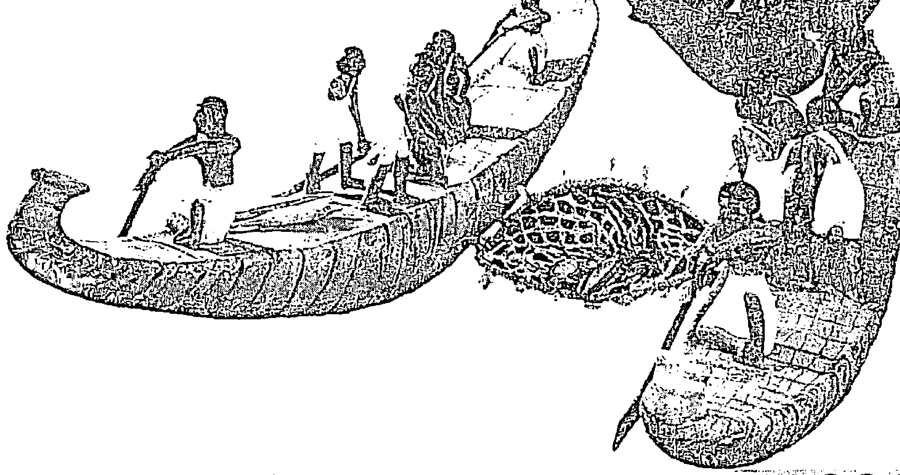

## 经文

### 创造的历史之一

《了解拉的演化和推翻阿佩普之书》。神内贝彻诞生之后说：

我是凯佩拉，我创造物体，也就是说，我创造了整个世界：自从我诞生之后，通过我的嘴创造出来的东西，到如今已为数众多。起初，没有天空没有地球，没有地球的子民，没有爬行的动物，我把它们从混沌的状态中唤醒，令它们走出海洋努。我发现没有可以立脚的地方，就对自己的心念了一个咒语，我通过玛特奠定了万物的根基，我制造了有形的一切。我是独自一人，因为我尚未从身体里分裂出休，我也尚未从身体里分裂出女神特芙努特，没有人可以和我一起劳作。

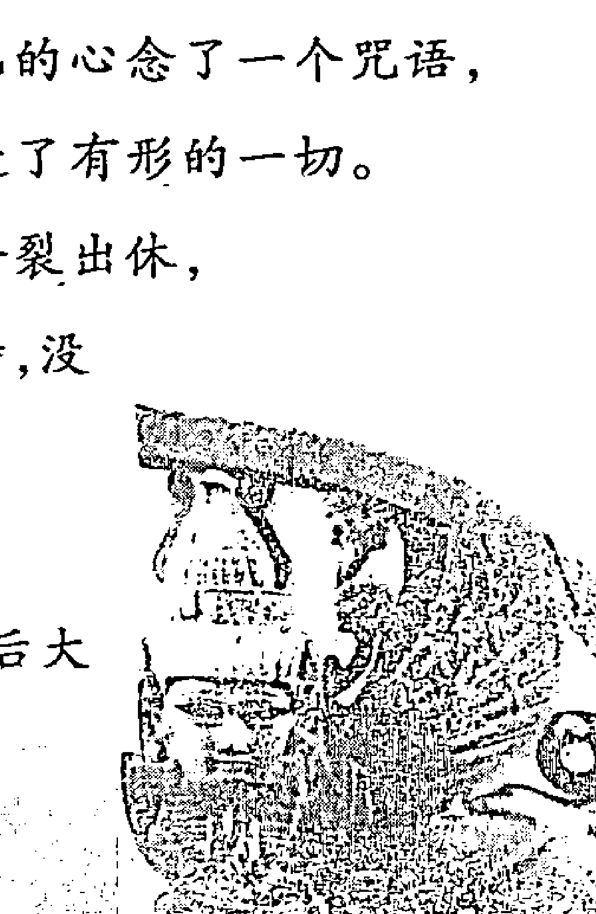

我在自己的心里为万物打好基础，然后大量生物诞生了，它们自我繁衍，代代相传。我握紧手，拥抱自己的影子，就像拥抱妻子，我把种子倒入嘴里，然后神休和特芙努特从我的身体里诞生。

## 第一章 生命起源的传说

THE LEGEND OF THE GODS

但就在我诞生于地球上、分离出休和特芙努特、从此由一位神变成三位神之后，又过了两个 hen（希腊语，意思是‘一’，为强调这个意思，中文常翻译为‘太一’，是一切存在的产生者）的时间，我的父亲努说他们（即休和特芙努特）遮盖了我的眼睛，于是，跳出混沌水域的休和特芙努特拿来我的眼睛（即太阳）。

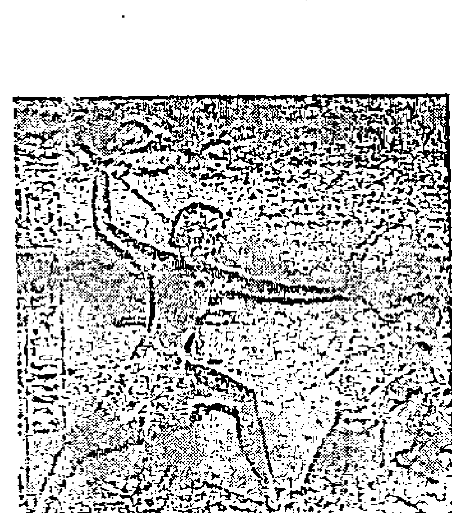

完成这一切之后，我聚集了所有身体部位，对他们哭泣，从我眼睛里流出的泪水中，蹦出了男男女女。当我的眼睛回到我身边，发现我已经在它的位置上放了另一个眼睛（即月亮），它非常生气，所以我把第一个眼睛的一部分光芒给了它，并让它在我的脸上占据一席之地，从此以后，它开始管理整个地球。

当灾祸通过植物般密布的云层降临到它们身上的时候，我会从云层中现身，偿还它们所失去的一切。我创造了各种各样的爬行动物，令它们代代繁衍。休和特芙努特生下凯布和努特，然后凯布和努特一胎生下奥西利斯、赫鲁—肯特—安—马迪、塞特、伊西丝和内芙蒂丝。他们又在地球上繁衍出无数的后代。

### 创造的历史之二

《了解拉的演化和推翻阿佩普之书》。神内贝彻说：

我是万物的创造者，我以神凯佩拉的样子而存在，我诞生于远古。我以凯佩拉的样子出现，我是造物主，也就是说，我在原始物质里构建了自己，我令自己从远古时代的原始物质里诞生出来。我的名字是奥萨雷斯（即奥西利斯），是原始物质中最原始的部分。我动用意念，创造了地球上的一切，我的创造遍布全世界，我的手变得更加强壮有力。我总是独自一人，因为其他神都还没有诞生，我也还没有分离出休或特芙努特。我把我的名字当作一个有法力的词语念出来，我就立刻以凯佩拉的样子而诞生了。我从原始物质中生成，而且从一开始，就怀有如今万物的形状。当时地球上空无一物，是我创造了一切，没有其他人可以相帮，以我一个人的力量。我借助心灵之神，它曾令我把自己从呆滞的海洋努中脱离出来，又是它帮助我创造如今的一切。我发现没有立脚之处，就通过心来施用一个咒语，先打好基础，然后创造万物。本来没有的一切都由我创造出来。

## 古埃及的咒语

THE SPELLS OF THE GODS

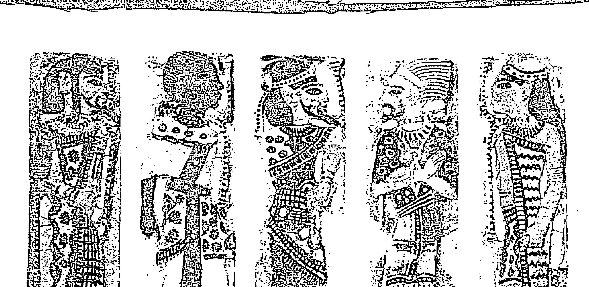

我独自一人，用心来打基础，创造出所有物体，这些凯佩拉的物体多种多样，生生不息。是我制造了休，也是我制造了特芙努特，一位神变成三位神，另外两位从我身体里分离出来，从原来他们所处的海洋努中跳出来。他们跟随我，又过了两个 hen 的时间，看呀，他们把我的眼睛送来了。我聚拢所有成员，他们已经在我体内生成，然后我握紧手，我的心从我的手里跳出来，种子掉进我的嘴巴，我从自己体内分离出神休和神特芙努特，由此，我从一位神变成三神合一，另两位是从我体内分离出来，降生到地球上的，是从原来他们所处的海洋努中跳出来（或升起来）的。

## 第一章 生命起源的传说

我的父亲努说，他们已经用他们身后植物般密布的云层把我的眼睛遮盖了好几个 hen 的时间。植物和爬行动物通过我流下的眼泪，从神雷姆（Rem）中分离出来，我朝我的眼睛叫喊，男人和女人就出现了，我把火的神圣标志给了我的眼睛，但当另一只眼睛（也就是月亮）在它的位置上出现成长的时候，我的眼睛对我发怒了。它朝我放在那里的植物，施用它无与伦比的力量，它给它们订立规矩，然后在我的脸上站好位置，开始统治大地。

后来，休和特芙努特生下奥西利斯，赫鲁—肯特—安—马迪，塞特，伊西丝和内芙蒂丝，看呀，他们又繁衍后代，在地球上创造了无数个孩童。他们召唤我的名字，他们打败敌人，他们念动咒语，消灭阿佩普，而他的双手和手臂，则由阿克尔（Aker——地神，亡者的庇护神）监护。他的手臂和双手不复存在，他的双脚和领土也消散殆尽，他被锁在一个地方，拉向他猛吹狂风，这是他应该受到的处罚，他仰面朝天摔倒在地，他的脸被他的恶行撕裂，他将永远受到诅咒，永远这样摔倒在地。

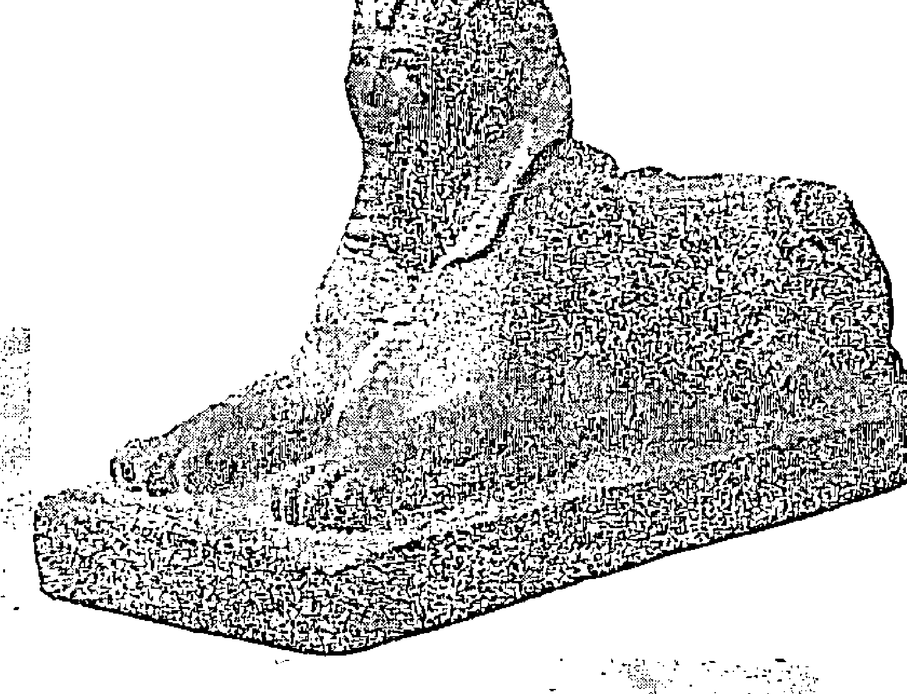

这是一段模糊的文字，由于图片质量较差，无法清晰辨认具体内容。文本似乎包含多行中文字符，但细节丢失。

# 第二章 毁灭人类的传说

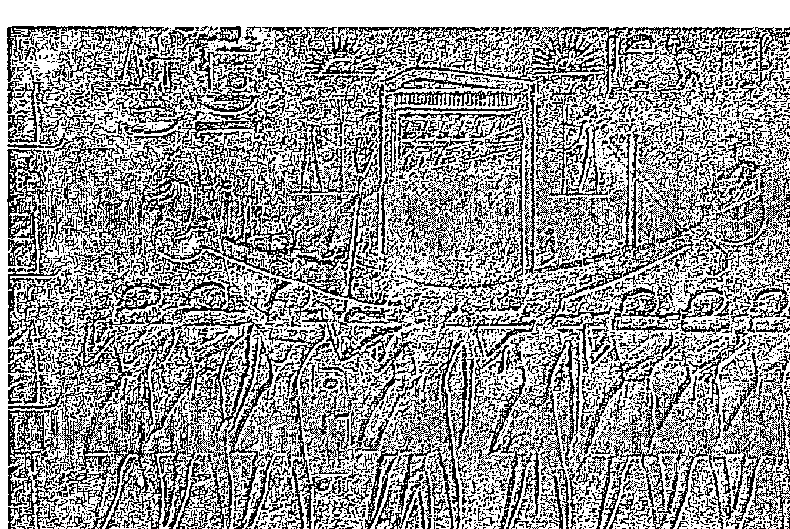

坐落在底比斯尼罗河西岸的塞提一世（Seti I，公元前1294—1279年）的坟墓中有一个小间，可以从坟墓的“圆柱大厅”走进去，在这间斗室的四面墙壁上绘制有讲述人类消亡传说的象形文章。一头用红笔画的巨大“天堂神牛”在正对门的墙上，它的肚腹下部镶着十三颗星星，在下面紧挨着是神拉的两条船，分别叫做塞穆克泰特（Semketet）和曼彻特（Mantchet），或斯克泰特（Sketet）和玛泰特（Matet）。神牛的每条腿都是由两位神扶着的，而神休则伸直了他的双臂，向上支撑着神牛的身体。

这个传说把我们拉到了遥远的古代，那时埃及随处都有神灵存在，混在人类中间，他们对人类的渴望和需求可谓了如指掌。那时统治埃及的是太阳神拉，但他并非是神王朝的第一位统治者，赫菲斯托司（Hephaistos）是他的前任。根据马内托（Manetho，埃及历史学家兼祭司，生活在公元前三世纪）的记载，赫菲斯托司执政9000年，而拉只做了992年的国王，帕诺多利斯（Panodorus）当政还不足100年。

尽管这样，“自生自造”神拉长久以来却一直统治着人类，以致臣民在背后开始议论起他来，说拉太老了，骨头像白银，身体像黄金，头发像青金石。拉听到这些议论时，便命令侍卫去召集众神——在远古的海洋里，他们已与拉在一起——并悄悄请他们到著名的大殿集合——太阳神殿。传说中的这段话十分有趣，不仅证明了这个传说属于太阳教，就像是对拉作个人崇拜一样，而且就这个传说里讲到拉的内容与程度，也证明那个时期是不属于前王朝的。众神向进入神殿的拉致敬，随后在其身体两侧找准位置站定，并对拉说他们等候他的发话。拉向海洋的化身努讲，请他们了解这样一个事实，他的眼睛创造出来的男人和女人此时正在背后议论他的是非，他请他们考虑一下，然后为其拟订一个处理的方案，他不愿意不听取众神的意见就直接去处决叛徒。诸神给了建议，即派其眼睛去摧毁那些渎神者，因为在这个世上没有哪一只眼睛可以抵抗得住它，尤其是在它化身为女神哈托尔（Hathor）之后，更是所向无敌。拉接受了众神的建议，命他的眼睛化身为哈托尔，前去惩罚歼灭叛徒。

拉的眼睛最终追踪并捉到了因为惧怕都逃到山里的叛徒，并把他们一举毁灭。哈托尔圆满完成任务，十分开心。返回后，拉对她也是大加赞扬。此次神对人类的血腥杀戮发生在埃拉克雷奥伯利斯城，那夜血流成河，就连哈托尔自己都举足维艰。拉明确表示自己要做叛徒的主人，这是他首次在埃拉克雷奥伯利斯城称王。奥西里斯戴上王冠同样是在这个城。

传说接着讲述了拉的一个意义实在令人费解的行为。拉派人找来几个信使，命令他们以风一样的速度跑去阿布城（又叫象城），为他带回许多名叫 Tataa 的水果。没有人知道这是一种什么样的水果，布鲁格沙认为它是“曼德拉草”，也就是“西红柿”，我们暂且使用这个译名吧。他们把带回的曼德拉草交给太阳城女神塞克蒂（Sekti），然后她把它们挤压碾磨，又拌以人血，最后又把这些混合物放进女奴们用小麦酿制成的大罐啤酒中。他们总共酿造了 7000 罐这样的啤酒，这使拉很满意，他命令侍从把这些酒扛到河边，到了晚上，又命人把酒倒在四周的沼泽地上。此时，仍醉心于对人类杀戮的女神哈托尔也在河边，看到这些混着曼德拉草和人血的啤酒，就狂饮起来，酩酊大醉，此时的她已无法再注意人类。拉在迎接女神哈托尔时，称其为“阿米特（Amit）”（即“美人”）， “阿米特城一直出美女”这种说法就是从那时开始的，这座城就位于尼罗河三角洲西面，毗邻玛瑞提斯（Mareotis）湖。拉又下令每个祭奠他的庆典上，都必须酿造与他拥有的女仆数量相等罐数的这种“催眠酒”。香醇的美酒和美丽的女祭司（代表哈托尔），使参加庆典的人恣意地放纵，这些庆典也随之演变成了酗酒和淫荡的祭神仪式。

很快，拉开始对人类子民感到厌烦，认为他们只不过是一群没有任何价值的残存物，被杀掉得越多越好，同时又感到自己受到了痛苦的打击。身边的神明都劝他要忍耐，提醒说他的力量是随着他的意愿而增长的，然而这对于拉于事无补，他说自己平生第一次感到四肢无力。于是，神努命休和努特去帮助此时的拉，并要求努特化身为牛，将拉驮在背上。由于休的帮助，拉爬上了努特的背。人们看到拉在天堂神牛的背上，马上就要离去，心中立刻充满无限恐慌和悔意。他们大声呼叫着挽留拉，并说拉可以处决所有曾经亵渎他的人，但神牛的脚步并没有放慢。拉被带到了玛瑞提斯省一个名为赫特—阿赫特（Het—Ahet）的小镇，据说后来奥西利斯的右腿就被保存在这个小镇。这时候，无边的黑夜笼罩了大地，当白昼再次来临时，那些后悔曾经对神大不敬的人们带着弓箭出征了，消灭了拉的敌人。这样的结果令拉很是满意，因为这个正义之举，他原谅了这些曾经亵渎神的人们。此后，无论在当地，还是在太阳城，甚至是在埃及的其他地方，人们在祭奠拉时便用活人做供奉。

经过这些，拉对努特坦白自己要离开这个世界，升入天堂，又说所有看到过他的脸的生命，都必须跟随他而去。随后，拉便到天堂里为所有即将到来的生命作准备。他说，“Hetep sekhet aa”，意思就是“生出一片伟大的土地来吧”，立刻，“Sekhet—hetep”（即“和平之地”）就出现了。他又说，“让土地上长满芦苇（aaru）吧”，立刻，“Sekhet Aaru”（即“芦苇地”）就出现了。“和平之地”可以说是埃及人心中的天堂乐土，而“芦苇地”就是其中著名的一部分。星星也在拉的命令下出现了，传说里这些星星被比作为花朵。这时女神努特却突然浑身颤抖起来，拉怕她倒下，就唤出四根柱子来支撑天堂，休被命令来保护这些支柱，并被安置在努特的身下，举起双手，托稳她。于是，休取代拉成为新的太阳神，而拉居住的天堂则可以安然地屹立着，没有任何后患，人类也因此可以快乐地生活在新太阳的光芒里。

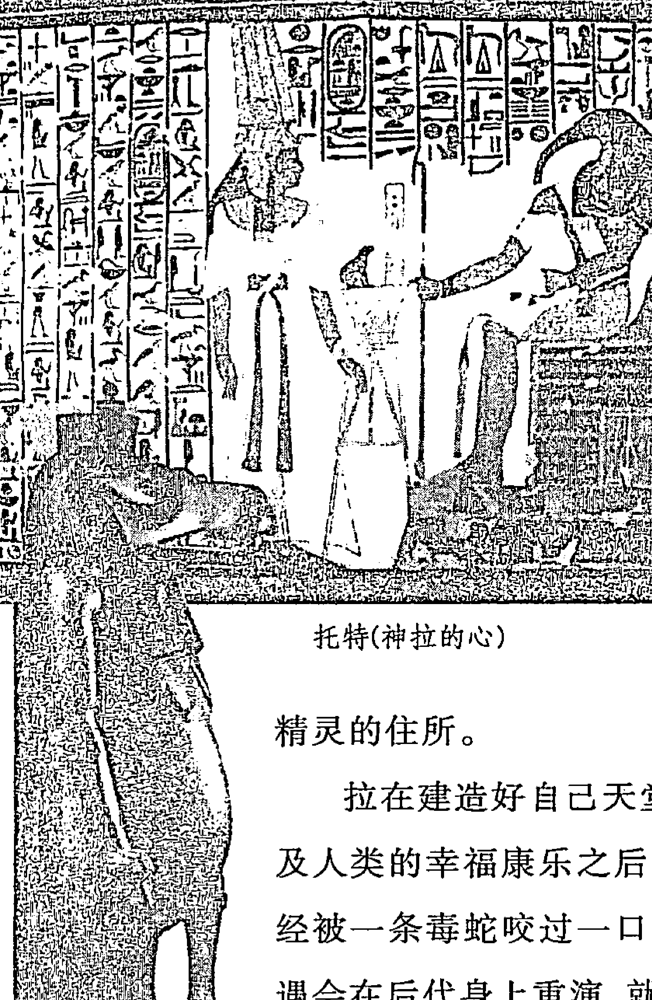

托特（神拉的心）

这张神牛图的大致含义相当清楚。神牛象征天空，拉的两条船行驶其中，她的四条腿代表不可更改的四个基本方位，她脊背以上就是天堂，是拉及其臣民的居所，这里的臣民是指那些在地球上死亡后飞升上来的，那里又是掌管世界的神明和精灵的住所。

拉在建造好自己天堂，安排好地球延续的生命，以及人类的幸福康乐之后，他想起一件事，他在地球上曾经被一条毒蛇咬过一口，差点丢掉性命，他怕同样的遭遇会在后代身上重演，就决心要毁灭所有盘踞在地球上的毒虫而采取措施。为此，他命托特找来地之神凯布，凯布被告知一定要向生存在他领土上的毒蛇展开战争，同时又被命令去找努，要求努监管所有水里陆上的爬虫，记录下毒蛇盘踞的各个地方，并且禁止它们咬人。拉不再掌管地球，这些毒蛇是清楚的，但它们永远不会忘记的是拉的光芒仍会一如既往地照射到它们身上，它们的父亲凯布会代替拉来管理它们，凯布也将永远都是它们的父亲。

拉会用一个奇异的魔法咒语来保护自己以防蛇咬，为了作进一步防范，他愿意将这个咒语传授给魔法师和耍蛇者，还要传承给凯布的儿子奥西利斯。这样，只要人们乐意听从耍蛇者的咒语，就会免除被蛇咬的厄运，他们的子女也同样可以幸免。我们可以从这一点上得出结论，耍蛇这一古老行业由来已久，而且从某种意义上说，这个行业还是拉本人来奠定的基础呢。

拉又派人请来了神托特，并邀请他一起到一个名为“图瓦特（Tuat）”的遥远地方，这个地方可以说成是地狱或另一个世界，他决定在那里释放他的光芒。他们抵达那里后，拉要求托特——真相的记录者——在刻板上写下那里所有人的名字，并对这些曾经违反过他法令的人施以惩罚。拉授予托特力量，这使他完全能够随心所欲地处理地狱里的所有人。拉憎恨那些邪恶之人，要他们远离自己。托特是拉派的代表，要履行他的职责，因此“拉的位置”就成为托特的新名字。拉给托特力量，让他可以派出一名信使（hab），于是伊毕斯（Ibis）鸟就诞生了。托特所做的一切也将是好的（khen），于是托特的泰克尼（Tekni）神鸟就出现了。拉给托特拥抱（anh）天堂的力量，于是就出现了月亮神（Aah）。拉给托特收服北方的民族的力量，于是狗头猿身的托特就出现了。最后，拉对托特说，一贯敬仰拉的所有人都会亲眼目睹他代替了拉的位置，也都会赞颂他这位新神明。拉就这样完成了退位。

下面的一些零碎文章都是讲背诵这篇传说会给人带来什么样的好处。他必须宣告赋予拉生命的灵魂是远古的，休、克尼穆（Khnemu）、赫（Heh）等等的灵魂亦是如此。然后他必须宣告他就是拉本人，并讲出他的魔法咒语 Heka。如果他能准确无误地背诵其中一个章节，就会在另一个世界里获得新生，在那里他会比在这里更加令人敬畏。另有一列红字补充说，他必须身着崭新的亚麻长袍，必须用尼罗河的河水仔细清洗过，必须脚穿白色的凉鞋，必须用圣油涂抹身体，必须在香炉中焚香，必须用绿笔在舌头上画一个玛特（真理）的肖像。这些规定不仅要神职人员遵守，普通大众也应如此。

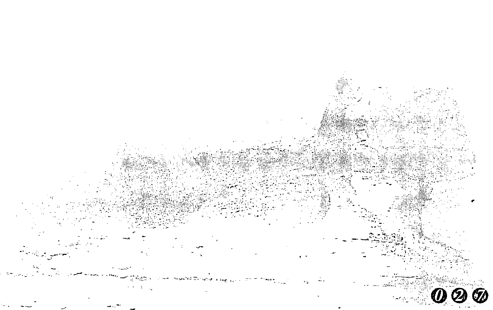

## 古埃及的咒语

## 经文

### 毁灭人类的传说

当这位自我诞生自我创造的神掌握了统治人类、神明和其他一切物体的权力，成为独一无二的神明之后，人类开始抱怨起来，他们说：“看呀，他的权威（生命，力量和健康）已经不如往昔，他的骨头已经像白银，他的身体变成黄金，他的头发像极了青金石。”他听到这些人的抱怨声，就对随从们说：“快下命令，把我的眼睛拿来，把休、特芙努特、凯布、努特，以及所有从我在海洋务的时候起，就和我在一起的神父神母都请来，把大臣们也都叫来，但必须悄悄地进行，不要让人类知道，这样他们就不会落荒而逃了。阿努，你和众神一起到大殿去，让他们做好充分准备，因为我要从海洋务到我开始生存的地方，就把那些神都领到那里去吧。”众神被带领到拉的两侧，他们弯腰向君王致敬，脑袋都碰到了地面。然后，人类的创造者，智者的首领，当着众神明之父的面，开始讲话，而众神也对君主说道：“讲给我们听吧，我们正在听呢。”于是，拉对努说：“哦，第一位诞生且孕育了我的神啊，哦，各位远古的神明，我的祖先啊，你们要留心人类。因为你们看呀，我的眼睛创造出来的人，正在说着抱怨我的话语，告诉我你们会怎么处理，为我考虑考虑，给我合计合计，因为不听听你们对此事的意见，我不会将他们杀死的。”

# 第二章 毁灭人类的传说

随后尊贵的努恩对他的孩子拉说：“你是伟大的神，比创造你的神还要伟大，你是君王，统治你创造出来的一切，你的宝座安稳而牢固，人民对你敬畏无比，让你的眼睛去消灭那些亵渎你的人吧。”

尊贵的拉说道：“看吧，他们正拼命逃到山里去，因为自己说过的话，他们的心在恐惧。”

众神都说道：“让你的眼睛为你去消灭那些用污言秽语辱骂你的人吧，因为当你的眼睛变成哈托尔的时候，没有其他眼睛可以跑在她前面，没有其他眼睛可以抵抗你和她的威力。”

于是，女神哈托尔出发了，她把躲在山里或沙漠荒野上的人全部消灭。君王拉说道：“回来吧，和平地回来吧，因为任务已经完成。”但女神回答：“让我继续吧，因为当我控制人类的时候，心里感到畅快无比。”

拉说道：“我是他们的君王，我会制服他们，我也会消灭他们。”结果，塞克赫特从埃拉克雷奥伯利斯城出发，在一片血海中跋涉了整个夜晚。

拉说道：“快下命令，给我找来又迅速又灵敏的传信人，他们可以跑得像风一样。”这些传信人立刻就找来了，拉说：“叫这些传信人到阿布（即象城）去，给我带许许多多曼德拉草来。”当他们把这些曼德拉草都带回来之后，拉把东西交给住在阿努（太阳城）的女神塞克赫特，让她碾磨粉碎。

然后呀，当女仆在捣碎麦子制啤酒的时候，她们把磨好的曼德拉草放进装酒的罐子里，还一并放入一些被杀之人的血。他们总共制作了七千罐这样的啤酒。南北埃及的国王拉，协同众神明来查看，这时候，女神杀戮男女的夜晚过去了，天亮了，拉说：“太好了，太好了，我们还是要保护人类，免遭哈托尔的杀戮。”

拉又说：“命人将这些酒罐抬到她杀戮的地方。”于是在特别优美的夜色中，在这位统治南北埃及的国王的命令下，人们将这些足以让人躺倒的酒泼洒出去，四面八方的沼泽地里满是啤酒，这位众神的首领自有道理。

后来，当女神在黎明时分到来的时候，她发现这些地方到处都是啤酒，非常高兴，就坐下来喝起来，越喝越舒服，结果醉倒在地，不再在意人类。尊贵的拉于是对女神说：“和平的回来吧，和平的回来吧，哦，阿米特（Amit 即美丽端庄的女神）。”

从此以后，阿米特[或阿曼（Amem）]城里总是出美女。拉又对女神说：“每逢神圣的时节，都必须制作这种令人睡眠的酒，我的女仆有多少个，酒就必须做几罐。”从那时起，一直到现在，人们总在祭奠女神哈托尔的节日里，制作这种令人睡眠的酒，其数量就是拉的女仆的数量。

尊贵的拉对女神说：“我受到痛苦的折磨，病痛就像火一样在我身体里燃烧，这痛苦是什么时候来临的呢？”拉又说：“我活着，但我的心已经厌倦了这些人类的存在，我已经杀了他们中的一部分，但还剩下许多毫无用处的人，我对他们的伤害，还不足以显示我的威力。”

那些跟随他的神明们对他说：“不要因为没有活力而灰心丧气，因为您的力量是随着您意愿的增长而增长的。”

拉对神努说：“我第一次感到身体如此虚弱，我不会让这种情况再一次发生。”

神努说：“哦，我的孩子休啊，变成你父亲的眼睛吧，为他开道；女神努特啊，安置他。”

女神努特说：“好啊，我的父亲努，但这该怎么做呢？”努特问了努之后，她就立刻变成一头牛，她把拉放在背上。

这时候，人们看到神拉在牛的背上，就说道：“留下来和我们在一起吧，我们会打败那些亵渎您的敌人，并将他们全部消灭。”

神拉出发到大殿去，众神则留下来，和人们在一起，这时候，天黑了。

第二天，当黎明到来的时候，人类拿着弓箭和武器，挥舞手臂朝拉的敌人攻击。于是神拉说：“你们使用暴力，犯下罪行，但这种罪是可以原谅的，因为杀死敌人的行为比杀死当祭品的人要高尚。”就这样，埃及开始出现拿活人当祭品的现象。

神拉对努特说：“我把我自己放在背上，这样就可以伸展出去。”这是什么意思呢？这意味着他把自己和努特联合起来。

然后神拉说：“我要和他们（也就是人类）分开，看到过我的人必须跟我一起走。”他以他的权威（他的生命、健康和活力）说：“出现一片伟大的土地吧。”于是，和平之地就出现了。

神又说：“我要让这片土地长满草药。”于是，芦苇地就出现了。

神又说：“我要让这里住满各式各样的星星。”于是，星星就出现了。

这时候，女神努特因为站得太高而颤抖起来，神拉说：“我要求支撑，将女神托起。”于是，天堂的支撑就出现了。

神拉说：“我的儿子休啊，我请求你站在努特的身下，为我监督那里的一切是否都支撑好，居住在黑暗中的一切是否都平安。把女神放在你的头上，像保护者一样照顾她。”于是，儿子照顾女儿、父亲把儿子放在头上的传统，就这样出现了。

这一篇章应该向神牛诵读——赫一恩提(Heh—enti)的支撑者应该与她并肩，赫一恩提的支撑者应该在她身旁，她上面一腕尺宽四个指距(一指距合九英寸)长的地方应该涂颜色，她的肚腹上应该有九颗星星，塞特应该在她的两条大腿旁边，在她的两条前腿前守望，休应该在她的两条后腿前面，在她的肚腹下面，他应该涂上鲜绿色，他的两条手臂应该在星星的下面，他的名字应该画在星星中间，也就是写上“休”这个字。

还应该有一条船，船上应该有舵，有两个神龛，阿顿(也就是飞盘)应该在船的上方，拉应该在船上，站在休的前面，靠近他的手，或者根据另外一篇文章的描述，拉应该站在休的后面，靠近他的手。

神牛的乳房应该画在她四条腿中间、靠左的地方。在四条腿之间的空白处，应该分两行写上：“外部的天堂”，“我就是我的内在”，以及“我不会允许他们将她翻倒”。

前面船上的应该写“我的儿子，你不可以停止不动”，再以相反方向写下“你的支撑就像火焰”，“此语即彼语”，“你的儿子和我在一起”，以及“生命、力量和健康将是你的鼻孔！”

在休的后面，靠近他肩膀的地方，应该写上“他们在守护”，在休的后面，靠近他双脚的地方，应该以相反方向写上“玛特”，“他们进来了”，以及“我每天在保护”。

神牛左腿下有个神明形象，在他的肩膀下面，应该写上“他是决定一切的人”，在他的头上，神牛的大腿下面、小腿旁边，应该写上“他离去时的护卫者”。

神牛的腿旁有两个神明形象，在他们身后、头顶上方，应该写上“离去时被众人爱戴的长者”，以及“到来时被授予赞扬的长者”。

在其他两个神明形象的头上，也就是在神牛的大腿之间，应该写上“倾听者”，“听到者”，“天堂的王权”，以及“星星”。

然后拉对托特说：“派人为我给上神凯布传个口信，就说‘立刻以最快的速度赶来’。”

等凯布赶来，神拉对他说：“向你领域里的所有蛇虫发起战争，只要我还在，它们绝对害怕我，但你知道它们有魔法的力量。你到你父亲那里去，对他说‘监视好地上的和水里的所有蛇虫’。而且，你还要为每一个安在你那里的蛇窝写份东西：‘管好自己，不要伤害任何物体。’它们知道我正在离开它们，但我的光芒仍然笼罩着它们，既然它们确实需要一位父亲，你就在这片土地上做它们永远的父亲吧。”

“而且，关照那些拥有法力的，以及通晓我咒语的人，以我之前所有帝王的名义，我的咒语会确实存在，不需要所有人和我一起来分担这保护的职责。我会命令他们服从你的儿子奥西里斯，他们的后代也会得到奥西里斯的保护；那些人可以在世界各地施用存在于他们体内的魔法，从而实现他们的愿望，他们的心也将永远恭顺驯良。”

神拉说：“派人把托特请来。”于是一名随从将托特领到他面前。拉对托特说：“让我们离开天堂，离开我的领域，因为我要在图瓦特和洞穴之地(Land of Caves)，释放光芒，并且创造一位光之神(Khu)。你要把那里所有的东西都写下来，你要惩罚那里所有的人，也就是那些犯下反叛罪行的人。我将借助你，远离那些我的心憎恨的奴仆。你要住在我的地方阿斯蒂(ASTI)，你从此以后将名为托特，‘阿斯蒂的拉’。我给你可以使用(hab)的力量，于是托特的伊毕斯(habi)鸟就出现了。我给你力量，让你能够在天上地下的众神面前举起双手，你的功绩将比神肯(Khen)更加高尚，于是托特的神乌泰克尼出现了。我还给你力量，让你能够以你的美貌优点和你的光芒拥抱天堂，于是托特的月亮神(Aah)出现了。我还给你力量，令你能够击退哈内布(Ha-nebu)，于是，狗头猿身的托特出现了，他将为我统治一切。你如今代替了我，每个人都在观望，每个人都为你献上贡品，每个人都在赞颂：哦，伟大的神！”

为自己背诵这篇文章的人必须全身涂上橄榄油和厚厚的软膏，双手必须熏香，手上必须拿有令人感到愉悦的贡品，必须在两耳背后涂纯碱，必须在嘴唇上涂香甜的软膏。这个人必须穿着新的双层罩袍，他的身体必须用上涨的尼罗河水清洗过，他的脚上必须穿着用白皮革制成的凉鞋，他的舌头必须用绿色的赭土画上女神玛特的形象。

每当托特希望人们以拉的名义背诵这篇文章的时节来临，背诵者必须用三天来清洗自己七遍……无论是祭司还是民众都要做到这些。阅读这本书的时候应该举行典礼，任何背诵这篇文章的人都必须照做，他还必须站在一个圆圈里(或站成一个角度)……这个圆圈应该在他的前方，他的双眼应该看着自己，他所有的身体部位都必须放松静止，他不能走出这块地方。任何背诵这些话语的人都会像刚出生的拉一样，他的财物不会减少，他的房屋不会倒塌，还会得到永生。

然后这位长者(就是拉)亲自拥抱了神努，并且对来自于东方的神明们说：“把你们的颂歌献给这位神吧，这位长者，这位缔造我的神，我创建了天堂，我构造了地球，还创造了各位神明，和他们一起度过了一段非常长的时间，然后才有了年份……我的灵魂比它还要老。”

“这是休的灵魂，这是豪的灵魂，这是轲克(Kek)和轲尔(Kerh)(即夜晚和黑暗)的灵魂，这是努和拉的灵魂，这是奥西利斯的灵魂，这是特图(Tettu)的灵魂，这是塞巴克(Sebak)的鳄鱼神和鳄鱼的灵魂，这是每一个(驻守)在圣蛇里的神明的灵魂，这是巴考(Bakhau)山(即日出之山)上的阿佩普的灵魂，这是在全世界处处可感知的拉的灵魂。”

## LEGENDS OF THE GODS

力量来保护自己：“我是神赫考(Hekau)(即力量的圣语)，我的嘴巴干净，我的肚腹净洁，我是众神的创造者拉，我是光之神(Khu)拉。”如果你想打败拉的敌人，当你在说这些话的时候，以你自己的名义在早上和晚上都停止一切活动吧。我是他的灵魂，我是赫卡(Heka)。

为你欢呼，永生的君王，永恒的缔造者，你使拉创造出来的神明都尽失光彩，你是众神之神，你创造了生成你的物质，你受到众神之父的爱戴，你头顶纯洁的咒语，你创造了站立在你南面的女人(Erpi)，你创造了脸在胸脯上的女神，以及竖起身子的蟒蛇，女神的眼睛在蛇的肚皮上，而蛇的尾巴则在地面上，托特赞颂你，天堂以你为根基，休向你伸出双手，从坐在天际东方的两位神那里把我交付给你，那两位神也是地球的守护者，你使神秘之地得到稳固，众人称你为“Aaiu—su”和“Per—f—er—maa—Nu”。而且，根据远古时期仪式的形式，每个月应有一天为净化日。

任何一个背诵这篇文章的人都将在内特—克尔(即地下世界)里获得生命，人们将会比他以前（在地面上）的时候更加敬畏他……人们会说：“你们的名字是‘永恒’和‘不朽’。”人们称他们为“Au—peh—nef—n—aa—em—ta—uat—apu”和“Rekh—kua—[tut]—en—neter—pui—……enen—hra—f—Her—shefu”。我使用咒语，聚集他的伙伴、他的仆从和他的神明们，令圣船坚固。

# 第三章

## 拉和伊西丝的传说

我们已经知道，神拉不再掌管世界后，通过托特逐步地把免遭蛇咬的魔法咒语传授给人类。拉是众神的首领，却心有余悸地惧怕住在凯布王国里的毒虫，这到底是为什么呢？毁灭人类的传说没有对此重大事件作任何解释，相信我们读完下面这篇拉和伊西丝的传说之后，心中的疑惑就会烟消云散了。

在这个又名“圣神的篇章”传说的开头，就详细叙述了宇宙的创造者拉的伟大品质，并且把这位拥有“许多称谓”的神描述得异常神秘，甚至连其他神灵都不曾了解。那时，伊西丝是一位精通符咒和咒语的奇异女子，当时人们非常尊敬她，其程度不亚于现代非洲居民对他们“巫医”或“巫婆”的尊敬。她已经为人类施用过咒语，而且已经对此感到厌烦了，她渴望着有变成女神的机会，就如同男人可以变成男神那样。她的野心是不仅只做地球上的女神，还要做天堂里的女神，她一直计划着如何才能实现这一目标，最后决定要拉说出其赖以生存的秘密名称，只有通过这个途径她才能获得自己需要的法力。

拉从未透露过这个秘密名字，因为，一旦有人掌握了这个名字，拉就要受那个人的控制。伊西丝发现仅靠一般的手段是无法让拉自己说出名字的，于是她想到了更高明的方法。有一个全埃及人都知道，早期苏丹人也知道的魔法，那就是如果得到某个人身体上的一点东西，比如一根头发、一片指甲、一点皮屑或身体排泄出的一些液体，魔法师就可以对其施咒，给那个人带来身体上的巨大伤害。

伊西丝留意到拉已经变得衰老不堪，走路时，唾液会顺着嘴角流下来，一直滴落到地面上。这是多好的机会啊，她取了一些拉的唾液，将其搅拌进尘土里，捏成一条威力无比的毒蛇，并对它施法，然后将其放在拉每天巡视埃及时的必经之路上，这样蛇就有了咬拉的机会。

顺便要说一句的是，苏丹的巴尼奥罗人(Banyoro)至今仍在用毒蛇来杀死野牛。他们用绳套活捉一条小青蛇，将其尾梢钉在野牛必经之路中央的一个圆形物体上，当有动物经过时，毒蛇就会猛然发起进攻。一会儿，一头野牛走过来，一切都按计划进行着，毒蛇向它扑过去，放出毒液，野牛很快就死了。一条毒蛇每天可以杀死野牛多达十头。第一头被杀死野牛的肉他们是不吃的，因为觉得有毒，但其余的就都可以放心食用了。

伊西丝把毒蛇放到小径上不久，拉就走了过来，于是毒蛇咬了他，并把毒液注入到拉的体内。后果可想而知，拉痛苦地大叫。他的下颚颤抖着，嘴唇哆嗦着，甚至一度说不出话来。他从未经过如此巨大的痛苦。众神们听到他的呼叫都赶来查看，拉告诉他们他被一条致命的毒蛇咬了。尽管拉通晓所有的魔法词语，尽管在他刚出生时，体内就蕴藏着他那神秘的名字，他还是被一条毒蛇咬了，他正备尝炼狱般的折磨。

拉命令所有知晓魔法咒语的神都必须前来，而伊西丝，这位精通咒语的奇女子，这位疾病的驱逐者，这位死亡的挽救人，也随着他们一道赶来了。她问拉：“哦，圣父，发生了什么事？”拉告诉她一条毒蛇咬了他，这感觉比火还要热，但又比水还要冷，浑身颤抖，并且看不清任何东西。

伊西丝很狡猾，她接着说：“圣父，告诉我您的名字吧，因为只有说出自己名字的人才能活命。”于是，拉开始滔滔不绝地讲起他做过的许多事情来，讲了创世之举，最后他对伊西丝说早晨他名叫凯佩拉，中午是拉，晚上则叫泰穆(Temu)。他自认为，只需讲出这三个伟大的名姓就足以使伊西丝满意了，她就会立刻念出一个魔咒，消除他体内承受痛苦，对于这一点，他充满自信。

然而，伊西丝并没有如拉所愿，她清楚地知道拉并没有说出那个神秘的名字。她就直截了当地对拉说了，并且恳求他把那个名字讲出来。开始神拉表示拒绝，但过了一会儿随着他身体里的痛楚变得越来越剧烈，毒液也像火焰一样蔓延到所有血管时，他说：“伊西丝可以来查看，我的名字可以从我的身体转到她的身体。”说完这句话，拉就在众神面前消失了，恒古神船上的宝座空无一人。

那个伟大的名字好像就藏在拉的心里，但伊西丝仍然担心拉是否会履行承诺，于是同意她的儿子霍鲁斯的提议，要求拉发誓，如果不遵守诺言，他就要舍弃双眼，即太阳和月亮。最终拉同意伊西丝取走他的心脏，因而他那赖以生存的伟大又秘密的名字也就为伊西丝所拥有，他则如众人所希望的那样，真正地退位了。

于是，法力更强大的伊西丝说：“毒液啊，从拉的体内流出来吧；霍鲁斯的眼睛啊，从拉的体内出来，到他的嘴巴外绽放光芒吧；正是我，伊西丝，在念咒，放毒液到地上；伟神的名字确实已经说出，拉应该活下去，毒应该消亡；如毒仍在，拉就会亡。”

这是一个咒语，中毒时使用绝对没错，它能治疗所有毒虫叮咬过的伤口。它曾为拉的伤口解毒，并且由于这个咒语是伊西丝在掌握了拉的神秘名字后创制的，其法力更是强大无比。只须把泰穆、赫鲁—赫克努(Heru—hekenu)、伊西丝或霍鲁斯的肖像画在纸莎草纸或亚麻布上，然后将这些话语写到人像上，就能够制成一个强大的魔咒来，若将这些纸莎草纸或亚麻布浸入水中，然后饮下，也同样可以有效地对付蛇咬。

直至今天，在埃及和苏丹，那里的人们仍会把写着古兰经的纸张溶于水中，用内侧写有宗教文章的碗来喝这些水，他们认为这是屡试不爽的魔法。由此可知，现代喝魔法水的习俗源于古埃及，因为那时人们对于这种水可以把神明的法力注入到自己的体内确信不疑。

## 经文

## 拉和伊西丝的传说

拉，这位伟大的神明，他创造了自己，他创造了天堂和地球，带来生命的呼吸、火、其他所有神明、人类、动物、牲口、爬虫、空中的禽鸟以及水里的鱼，他是人类和众神的君王，他以一个形态存在，对他来说，一百二十年只是一年的时间，他拥有众多名称，因为数量太多，连其他神明都无从知晓。

看呀，女神伊西丝还是一位女子，她通晓一切有关魔法咒语的知识，她的心厌恶透了诸多人类，她要成为诸多神明中的一员，却也对诸多精灵更加敬仰。她在心里默想——如果掌握了圣神的名姓，难道就不可以像拉一样做天堂和地球的主宰，成为地球的女王，一位伟大的女神吗？

看呀，每天，拉随同他的船员们进入天堂，稳稳地坐在统治两个空间的双重宝座上，但如今这位圣神已经变老，他的唾液沿着嘴角滴落，一直落到地球上，掉进泥土里。伊西丝抓起泥土，放在手里揉搓，再放入一些尘土，做成一条可怕的蛇的模样，并令它拥有好似标枪般的冲力，这样没有人可以躲过它的袭击，得以生还。她把它放在伟神拉出门的必经之路旁。

圣神拉在众神聚集的宫殿里站了起来，当拉按照他每天的习惯，走在那条路上的时候，毒蛇张开它的毒牙，一口咬向拉。燃烧## 第三章 拉和伊西丝的传说

的火焰离开了神的身体，毒蛇伤害了杉柏丛中的居民。这位强大的神张开嘴，用尽全力发出一声呼喊，声音直达天堂，众神问道：“那是什么声音？”“那是怎么回事？”神拉无法用语言回答，他的下巴颤抖着，他的嘴唇哆嗦着，毒液侵占了他的全身，就像尼罗河泛滥时淹没大地一样迅速。这位伟大的神拿出毅力，对他的随从们叫道：“哦，你们这些从我身体里诞生出来的人啊，你们这些我创造出来的神明啊，快来我这里，我要告诉你们发生了什么事情。我被一种致命的东西咬了，我的心不知道那是什么，我的眼睛没有看到过，我的手没有制作过，我也根本不知道这是谁干的。我从未像现在这样痛苦，没有一种疼痛可以与这一种相提并论。我是君主，我的父亲也是君主，我是神的产物，我至高无上，我的父亲也至高无上。我的名字由我父亲决定，我的名字无穷无尽，我可以千变万化，每一位神都是我另一个存在。泰穆和赫鲁—赫克努向我祈求（或给我赞颂？），我的父母说出我的名字，并在我出生时把它藏入我的体内，这样就没有人可以用它来对付我，没有人可以使用他们的魔法来控制我。我从我的宫殿里出来，察看我自己创造的一切，我正走在我自己创造的两片土地上，突然遭受到攻击，但我不知道是什么东西。看呀，是火吗？看呀，是水吗？我的心充满燃烧的火焰，我的四肢颤抖不已，疼痛在我的身体各处流窜。命人把我创造出来的神明都叫来吧，所有会使用魔法的，所有嘴巴能灵活（念出咒语的），所有力量比天还要高的，都去叫来吧。”

于是他的子民都来了，每一个都痛哭流涕，伊西丝也来了，带着她的法术，她的嘴充满生命的气息，因为她念出来的字词可以消病去痛，她的咒语可以让垂死之人恢复生命。

她说：“哦，圣父啊，怎么回事？什么东西？是不是一条毒蛇把毒液侵入了您的身体？是不是您创造出来的东西抬起头来背叛了您？真应该用有益的咒语将它消灭，我会令它在您的光芒照耀下遁形。”

圣神开口说：“我正走在路上，穿越我自己的国土，因为我的心看看我曾经创造出来的东西，这时候，我被一条毒蛇咬了，我没有瞧见它。看呀，是不是火？看呀，是不是水？我比水还要冷，比火还要热，我浑身冒汗，浑身颤抖，我的视线模糊，看不见天堂，汗水在我脸上直冒，仿佛洪水时节已经到来。”

伊西丝对拉说：“哦，我的圣父，告诉我您的名字，因为可以说出自己名字的人就可以活命。”

拉说：“我是天堂和地球的创造者，我把山都连在一起，我还创造了生活在山上的一切，我创造了水，我创造了梅特—乌尔（Meht—ur），我创造了神牛，我令爱的喜悦到处存在，我创造了天堂，我隐藏了地平线上的两位神，还给予众神灵魂，我睁开眼，光明到来，我闭上眼，黑暗降临，我一下令，哈比（尼罗河）的水就会上涨，我的名字连众神都一无所知，我是小时的缔造者，我是白昼的创始者，我是节日的创办者，是洪水的制造者，我创造了生命之火，靠这个，房屋才得以建立。我早上是凯佩拉，中午是拉，晚上是泰穆。”

然而毒液并没有在这个过程中去除，这位伟大的神并没有感到好过些。于是伊西丝对拉说：“在您刚才对我所说的话语中，您并没有提到您的名字，哦，只要告诉我您的名字，您的毒液就会出来，因为说出自己的名字就会活命。”

这时候，毒液灼热地燃烧着，产生的热度比灼热的火焰还要高，拉说：“伊西丝可以来查看，我的名字可以从我的身体转到她的身体。”

然后，拉在众神面前把自己藏了起来，恒古神船上的宝座空无一人。神的心从他的身体里出来了，伊西丝对她的儿子霍鲁斯说：“伟大的神必须以他双眼的名义发一个誓。”就这样，这位伟神被迫报出了自己的名字，而伊西丝，这位精通魔法的奇女子，说道：“毒液啊，飞出来吧，从拉的身体里出来吧，让霍鲁斯的眼睛从神的身体里出来，在他的嘴巴外面闪耀吧，我把这毒液放在地上，因为我已经可以控制它，我已经真的获得伟神的名字，让拉活下去吧，让毒液消逝吧，因为如果毒液还在，拉就必须死亡。同样的，任何人，任何人的孩子，都应该活着，而毒液应该消逝。”这些就是伊西丝——这位伟大的女子，众神中的女神——说的话，她还掌握了拉真正的名字。这些话必须对着泰穆的画像、赫鲁—赫克努的画像、伊西丝的画像和霍鲁斯的画像来讲。

# 第四章
## 赫鲁—贝乎泰特和飞盘的传说

上埃及有一座埃德富神庙，这篇传说就是用象形文字刻在这座庙墙上的，其中某些部分还配有巨大的浅浮雕插图。纳维尔教授于1870年，在其《霍鲁斯的神话（Mythe d‘Horus）》的书卷中刊登了此篇文章及其配的所有插图。这里所提供的传说样式可以溯源到托勒密时期（公元前332至前30年），但传说所讲的内容则要古老得多，并且，内容记载的也许有真实历史的影子，近代埃及人曾试图按照时间的顺序把这些影子串联起来，但是收获甚微。我们在阅读时，可以看出作者对埃及历史知之甚少，当写到征服埃及这段内容时，不仅把神明混淆了，还把历史事实与神话传说搅合在了一起，以致文章没有一个清晰的脉络。其实他想要描述的是早期一位征服埃及的国王，在收服了南方民众之后，一路北上，最后使整个埃及都臣服于他。人们通常称埃及国王为霍鲁斯，埃德富神庙的祭司们为了颂扬当地的神——贝乎泰特或埃德富的霍鲁斯，就把那个人类的国王，也许是前王朝国王的丰功伟绩都归功于他。故事以拉仍统治着地球为背景，但他已老弱，也许已经把力量给了继承人，传说认为这位继承人是拉的儿子。拉执政第565年，拉—哈马基斯（Ra—Har—makhis）率领他的军队抵达努比亚（Nubia），计划消灭密谋造反之人。由于他们在努比亚密谋造反（auu），这个地方至今仍还被叫作瓦洼（Uaua）。

拉—哈马基斯由努比亚出发，乘船来到埃德富，贝乎泰特的霍鲁斯上船来告诉他，正在密谋反对他的叛徒也是自己的敌人。作为答复，拉—哈马基斯称贝乎泰特的霍鲁斯为儿子，令他立刻动身去消灭那些邪恶的叛徒。于是贝乎泰特的霍鲁斯变成一个巨大的飞盘，快速飞上天堂，取代了老太阳神拉，成为新太阳神。他从高高的天堂里往下望，很快就找到了叛徒的踪迹，他化身为飞盘追了过去，狠狠地攻击了他们，使他们晕头转向，辨不清方向，听不到声音，自相残杀起来，很快就灭亡了。托特目睹了这一切，对拉说，因为霍鲁斯化身为一个巨大的飞盘，所以他应该叫“赫鲁—贝乎泰特”，霍鲁斯也因此在埃德富至今声名显赫。拉满意地拥抱了霍鲁斯，称赞他的流血牺牲。霍鲁斯邀请其父前去检查战场，拉与女神艾什塞特[Ashtertet（艾什托蕾丝Ashtoreth）]也一同前往，看到敌人全被捆绑在地，拉很高兴，决定在尼罗河上乘船一游，他的敌人们一听说他要来，都变成鳄鱼和河马，预谋破坏船只，将拉置于死地。

神拉的船逐渐靠近，它们张大了嘴巴，准备摧毁这条船，但霍鲁斯及其随从很快就赶了过来，他们的企图变成了泡影。传说里称霍鲁斯的随从为“Mesniu”，即“铁匠”，代表埃及最古老的征服者，因为他们使用金属制成的武器，而土著的埃及人使用石块和木头制成的武器，前者可以轻而易举地战胜后者。霍鲁斯及其随从——“铁匠”士兵们使用由铁制成的长矛和锁链。他们用锁链捆住这些妖怪，又把长矛刺进它们的口鼻，一共杀死妖怪651个。霍鲁斯使用金属武器，因而赢得了这次胜利，因此拉便命人在埃德富永久树立一个霍鲁斯的金属像，并为战斗爆发的小镇起名，以示纪念。拉热烈赞扬霍鲁斯的巨大功绩，说他之所以取得胜利，全是因为他会运用《杀河马之书》中的咒语。霍鲁斯又结识了女神瓦切特（Uatchet）和奈赫贝特（Nekhebet），她们化身为两条蛇，替他盘踞在拉的船头，一旦发现敌人，她们就立刻全部将其歼灭。那些余孽面临危险局面，纷纷逃往南方，但霍鲁斯一路追击，直把他们赶入他面前的尼罗河里，此间进行了两次战斗，一次在彻迈特（Tchetmet），另一次是在邓德拉（Denderah），均以大获全胜而告终，叛徒被铁索捆绑住，而铁匠士兵的夺命长矛则令他们血流不止。

于是，敌人又逃到北方，躲避于尼罗河三角洲的沼泽地里，以及地中海的浅滩上。霍鲁斯一路追来，找了四天四夜后，最终发现了他们，立刻就处决了他们，共142个。霍鲁斯挖出敌人的内脏，把尸体剁成碎块，并把这些交给铁匠士兵以及船上的所有神明。他还把一只雄河马拖到拉的船上，处决它之前，他跳到这个妖怪的背上以示胜利。为纪念这件事，人们把此次杀戮发生之地——赫本（Heben）的祭司称为“永远站在背上的人”。

然而这场伟大的战斗并没有到此结束，北方的湖边又涌出了另外一支军队，他们向大海一路挺进，但对霍鲁斯的惧怕彻底使他们丧失信心，他们逃到摩泰特—阿蒙特（Mertet—Ament），与塞特—阿奇妖怪——拉最大的敌人的追随者们联合起来。霍鲁斯率领着铁匠士兵一路追赶，终于在一个小城里与他们狭路相逢，这个小城就是伯—雷雷乎（Per—Rerehu），它的名称由“两名战斗者”或“两个男人”——霍鲁斯和塞特——演化而来。一场伟大的战斗爆发了，拉的敌人战败，损失惨重，霍鲁斯把381个俘虏拖到拉的船只上，进行了处决，又把他们的尸体给了他的追随者。

塞特站起来诅咒霍鲁斯，因为霍鲁斯歼灭了其盟友，他使用的语句不堪入耳，因此托特称其为“Nehaha—her”，意为“发臭的脸”，这个名字从此就一直伴随着托特。后来，霍鲁斯和塞特之间又展开了一场战斗，这场战斗持续的时间很长，不过最后霍鲁斯竭尽全力用铁矛刺入塞特的头颈，这个恶魔一头栽倒在地上。霍鲁斯用棍棒猛抽塞特他那张诅咒神明的嘴，又用铁索将他捆绑起来，一路拖到拉的面前。拉热烈褒奖了霍鲁斯，他的宫殿和神庙的祭司长也被赐以特殊的名称，以作纪念。当众神商讨到底如何处置塞特时，拉命令说应当把塞特及其魔鬼侍从交给伊西丝和她的儿子霍鲁斯，由他们自行处置。霍鲁斯当着拉和伊西丝的面，迅即砍下塞特及其魔鬼随从的头颅，并用铁矛刺入塞特的头颈，拖着他的脚游行全国。于是伊西丝要拉指派贝乎泰特的霍鲁斯为其儿子霍鲁斯的保护神。

这场太阳神和塞特间的战斗是最受埃及作家们欢迎的主题，有多种版本，比如：赫鲁一巫（Heru一ur）和塞特之间的战斗、拉和塞特之间的战斗、赫鲁一贝乎泰特和塞特之间的战斗、奥西利斯和塞特之间的战斗、伊西丝的儿子霍鲁斯和塞特之间的战斗，等等。远古时，这场战斗仅仅是指自然界光明与黑暗之间的战斗，随着时间的推移，太阳神不仅代表光明，而且又是正义与真理的代表，而塞特也不仅是黑暗的代表，它又是罪孽与邪恶的代表，最后，自然界的神话逐渐被人们遗忘了，而这两位神之间的战斗却成为一种永恒的模式，里面的好人将永远与邪恶作斗争。科普特文学中有一个著名的传说，是讲圣·约翰屠龙，其实它就是霍鲁斯和塞特之故事的基督教版本。

## 塞特（Seth也作Set， Setekh等）：

在埃及神话中最初是力量之神、战神、风之神、沙漠之神以及外陆之神。他在保护沙漠中的商队的同时又发起沙暴袭击他们。他是凯布和努特的儿子、内芙蒂丝的丈夫，九柱神之一。他的形象与亚什神（撒哈拉沙漠之神）紧密相联。

按希腊历史学家赫罗多特斯（Herodotus）的说法，塞特最初是巴巴里人（Berber）所崇拜的神祇。而有的学者却认为，塞特就是巴巴里人的海神波塞冬。

塞特有一个更为人知晓的绰号就是“力量之主”（great of strength）。在一部金字塔文本中讲到国王的力量就是塞特的。

当太阳神拉在夜间游历阴间时，塞特就护卫在他身旁。最值得一提的是，他曾与每晚袭击拉的邪恶的黑暗之蛇阿匹卜（Apep）战斗，并置他于死地。

后来，当他的兄弟奥西利斯成为一名重要得多的神祇时，塞特渐渐被认为是与他截然相反的。由于一段有关塞特在搏斗中杀死奥西利斯的神话故事的产生，使塞特从此成为了邪恶之神。

塞特常被拿来与霍鲁斯比照。由于霍鲁斯是一位天神，塞特就被看成了土地之神。从地下开采的金属矿石被称为“塞特之骨”。公元前三千年时，塞特取代霍鲁斯担当法老的守护神；但当塞特谋杀自己兄弟的传说流传起来时，霍鲁斯就被替换回来了。塞特的形象通常是一位豺头人身的神祇，长着长方形的耳朵、弯曲凸出的长嘴。一些人相信这个形象实际上描绘的是土猪，或是其他的一种尚不明确的野兽。除以上提到的动物外，塞特有时还被描绘成长有羚羊、驴、鳄鱼或是河马头的形象。

经过这些，拉的儿子霍鲁斯和伊西丝的儿子霍鲁斯都拥有了强大法力，长有鹰的脸和身体，头戴红白双色的皇冠，手持长矛和锁链，并且歼灭了一切余孽。可不知为何，塞特复活了，变成了一条嘶嘶作响的“咆哮”的巨蟒，躲在一个地方的地底下，因而这个地方从此以后就被称作“咆哮者之地”。伊西丝的儿子霍鲁斯化身成一只鹰，率领手下驻守在蟒蛇躲藏之地，以防它出来作乱，尽管如此，塞特最终还是设法逃了出来。在梅（Meh）湖湖畔，他集结了魔鬼斯迈（Smai）和色巴（Seba），又向霍鲁斯发动了战争，结果以失败而告终，霍鲁斯当着他父亲的面，将敌人一举消灭。

后来，霍鲁斯似乎停战了一段时间，将全部精力投入到保卫“伟神”的使命当中去了，这位“伟神”居住在安—鲁特—夫（An—rut—f），就在埃拉克雷奥伯利斯城里，抑或在其附近。这位“伟神”不是别人，正是伊西丝，而霍鲁斯的职责是防止斯迈的魔鬼趁着夜色入侵这里。尽管霍鲁斯力量已经强大了，但他仍然需要来自伊西丝的帮助，因为只有伊西丝的咒语才可以阻止魔鬼色巴闯进圣殿。为奖励霍鲁斯创下的功绩，托特颁布法令，说霍鲁斯应当誉为“第一战士”。文章接着讲了许多地名的由来，跳过这一段，又讲霍鲁斯及其随从受命去消灭逃跑的敌人，一次就歼敌106人。每次战斗，铁匠士兵都表现得英勇无比，作为奖赏，他们得到一片领土，专供其居住。

最伟大的北方战役发生于三角洲东部的坦尼斯（Tanis）。霍鲁斯查到敌人的躲藏之地后，化身成一头人面狮子，头戴三冠合并的皇冠，爪子锋利无比。他俘获142个敌人，敌人被撕成了碎片，又被挖出舌头，霍鲁斯以此作为胜利的标记。

同时，努比亚再次爆发了叛乱，有三分之一左右的敌人变成鳄鱼或河马，逃到河里。

拉建议霍鲁斯率领铁匠士兵们乘船沿着尼罗河追击，于是，在托特背诵《保护拉之船的篇章》声中，这支船队沿着尼罗河向南行进了。诵读这些咒语，目的是阻止河里的魔鬼为非作歹，吞噬霍鲁斯及其铁匠士兵，还有拉的船只。当这些背叛霍鲁斯的叛徒和魔鬼看到拉的船只、霍鲁斯的飞盘及化身为巨蟒的女神瓦切特和奈赫贝特时，都惊慌失措起来，心跳加速，魂飞魄散，所有抵抗的能力消失得无影无踪，当场葬命于恐惧。霍鲁斯凯旋归来，拉命令在埃德富的每座圣殿都要画上一个飞盘，而每个有飞盘的圣殿，都应该是贝乎泰特的霍鲁斯的圣殿。在埃及庙宇的门廊上至今仍可看到飞盘，这说明拉的这个法令，教徒们是忠实执行了的。

## 霍鲁斯（Horus， Hrw， Hr以及Hor—Hekenu）：

古代埃及神话中法老的守护神，象征着王权。其形象是一位鹰头人身的神祇。

公元前三千年，塞特取代了霍鲁斯而成为法老的守护神。然而当塞特谋杀自己兄弟的传说流传开后，霍鲁斯便重新被替换了回来。在霍鲁斯与塞特之间发生了一场持久战，长达八十年。霍鲁斯扯掉了塞特的睾丸和一条腿，却被塞特挖出了左眼（从此霍鲁斯被称为“独眼神”）。霍鲁斯后来夺回了自己的眼睛。在奈特（Neith）的帮助下，霍鲁斯赢取了这场战斗，成为上下埃及的掌管者（也有传说讲霍鲁斯和塞特分管上下埃及）。

## 插图描述

| 图像标识 | 描述 |
| :--- | :--- |
| `img/02cefaa54e8d6f4e3a0a60046fc06660_52_0.png` | （无描述） |
| `img/02cefaa54e8d6f4e3a0a60046fc06660_53_0.png` | （无描述） |
| `img/02cefaa54e8d6f4e3a0a60046fc06660_53_1.png` | （无描述） |
| `img/02cefaa54e8d6f4e3a0a60046fc06660_54_0.png` | （无描述） |
| `img/02cefaa54e8d6f4e3a0a60046fc06660_55_0.png` | （无描述） |
| `img/02cefaa54e8d6f4e3a0a60046fc06660_55_1.png` | （无描述） |
| `img/02cefaa54e8d6f4e3a0a60046fc06660_56_0.png` | （无描述） |
| `img/02cefaa54e8d6f4e3a0a60046fc06660_58_0.png` | （无描述） |
| `bbox=[0, 0, 0.33, 0.22]` | 霍鲁斯用锁套和长矛抓住河马怪兽。后面站着伊西丝和肯布-卡特（khenet-khat）。 |
| `bbox=[0.33, 0, 0.66, 0.22]` | 霍鲁斯把长矛刺入河马怪兽的体内，他身后站着一名‘铁匠’。 |
| `bbox=[0.66, 0, 1, 0.22]` | 河马怪兽面朝上平躺着，霍鲁斯把长矛刺入它的腹内，身后站着一名‘铁匠’。 |
| `bbox=[0, 0.33, 0.33, 0.55]` | 霍鲁斯和伊西丝抓住了河马怪兽。 |
| `img/02cefaa54e8d6f4e3a0a60046fc06660_59_4.png` | 霍鲁斯站在河马的背上，在伊西丝面前，把长矛刺入它的身体。 |
| `bbox=[0.66, 0.33, 1, 0.55]` | 屠宰祭祀，把河马切开。 |
| `bbox=[0, 0.66, 0.33, 0.88]` | 贝乎泰特的霍鲁斯和拉-哈马基斯在船里。 |
| `img/02cefaa54e8d6f4e3a0a60046fc06660_59_7.png` | 艾什泰雷（艾什泰丝）驾驶战车驶过和碾压敌人。 |
| `bbox=[0.66, 0.66, 1, 0.88]` | 左面：贝乎泰特的霍鲁斯拿长矛刺住一头半人半兽的动物，用绳索将囚犯捆绑起来。右面：贝乎泰特的霍鲁斯将长矛刺入河马体内，身后伴着拉-哈马基斯和梅努（Men） |
| `img/02cefaa54e8d6f4e3a0a60046fc06660_60_0.png` | （无描述） |
| `img/02cefaa54e8d6f4e3a0a60046fc06660_61_0.png` | （无描述） |
| `img/02cefaa54e8d6f4e3a0a60046fc06660_65_0.png` | 霍鲁斯和托特在伊西丝的帮助下用长矛刺穿被献祭用的人，塞特化身的鳄鱼试图从背后袭击他们。 |
| `img/02cefaa54e8d6f4e3a0a60046fc06660_65_1.png` | 霍鲁斯和托特用长矛刺杀化身鳄鱼的塞特。 |
| `img/02cefaa54e8d6f4e3a0a60046fc06660_66_0.png` | （无描述） |
| `img/02cefaa54e8d6f4e3a0a60046fc06660_67_0.png` | （无描述） |
| `img/02cefaa54e8d6f4e3a0a60046fc06660_68_0.png` | （无描述） |

## 经文
# 贝乎泰特的霍鲁斯和飞盘的传说

拉—赫鲁—库蒂（Ra—Heru—Khuti）执政第三百六十三年，他有永恒的生命，他的皇宫在塔肯斯（TA—KENS），他的士兵在他周围，没有叛乱，人们把这片土地称为瓦洼泰特（UAUATET），直到今天。

拉乘船远游，众神相随。一天他来到乌戴斯—赫鲁（UTHES—HERU），这个地方在该省的西部，帕克努（PAKHENNU）运河的东部。赫鲁—贝乎泰特在拉的船上，他对他的父亲拉—赫鲁—库蒂（即拉—哈马基斯 Ra—Harmakhis）说：“我看见敌人正在密谋反叛主人，让您威猛的巨蛇战胜他们吧。”尊贵的拉·哈马基斯对神圣的卡（Ka）说：“哦，赫鲁—贝乎泰特，哦，拉的儿子，源自于我，多么高贵，立刻去把我们面前的敌人消灭吧。”赫鲁—贝乎泰特化为一个巨大的飞盘，飞到空中，为此人们称他为“伟大的神，天堂的神”，直到今天。

当他在高高的天堂里看到敌人，就立刻变为飞盘追踪而去，他攻击他们的力量如此强大，令他们的眼睛看不到，耳朵听不见，开始自相残杀，不一会儿就一个不剩，全部灭亡。赫鲁—贝乎泰特化为巨大的飞盘，五彩斑斓，回到拉—哈马基斯的船上，托特对拉说：“哦，众神之主啊，贝乎泰特已经化为巨大的飞盘回来了，五彩斑斓的身体照耀着众生。”因为这样，赫鲁—贝乎泰特的名字流传至今。托特说：“泰布（Teb）市应该称为赫鲁—贝乎泰特市。”于是，这个名字流传至今。拉拥抱了赫鲁—贝乎泰特，说：“你把葡萄（即血滴）放入葡萄汁（水）中，你的心雀跃不已。”于是，人们把赫鲁—贝乎泰特经过的水（或运河）称为“葡萄之水”，直到现在。赫鲁—贝乎泰特说：“哦，拉，出发吧，去看看躺在你土地上的敌人吧。”拉出发了，女神艾什塞泰特伴随着他，他看见打败的敌人倒在地上，每个人都戴着脚镣。拉对赫鲁—贝乎泰特说：“这里有美好的生命。”

于是，人们把赫鲁—贝乎泰特的宫殿称为“美好的生命”，这一说法一直延续至今。拉对托特说：“这里是消灭我的敌人的地方。”于是，人们把这个地方称为泰布（TEB）。托特对赫鲁—贝乎泰特说：“你是一位伟大的保护者（makaa）。”于是，人们把赫鲁—贝乎泰特的船称为玛卡（MAKAA）——伟大的保护者，一直到如今。拉对跟随着的众神明说：“现在呀，让我们乘船继续往上游走，我们从心里感到欢欣喜悦，因为我们的敌人已经从地球上消失了。”于是，人们把这位伟神坐船行走的河水称为皮—肯—乌尔（P—KHEN—UR）即伟大的运河，一直到如今。（拉的）敌人争先恐后跳入河水中，他们变成（鳄鱼和）河马，当拉—赫鲁—库蒂（Ra—Heru—Khuti）独自坐着的小船靠近的时候，这些鳄鱼和河马张大嘴巴企图伤害他，就在这个时候，赫鲁—贝乎泰特赶来了，他的手下跟随着，每一个手里都拿着铁矛和锁链，人们称他们为铁匠士兵，就在埃德富市的前面，这些铁匠士兵狠狠教训了这些鳄鱼与河马，并且立刻将651头鳄鱼押上船。拉—哈马基斯对赫鲁—贝乎泰特说：“我的形象应该在这片南方的领土上，那是胜利和力量的殿堂。”从那天起，人们把赫鲁—贝乎泰特的庙宇称为内克特—赫特（NEKHT—HET）。

托特看见倒在地上的敌人，说道：“哦，天堂的神明啊，让你们的心雀跃起来吧！哦，地上的神明啊，让你们的心雀跃起来吧！霍鲁斯，这位年轻的英雄，带来了和平，他在征途中，依照《杀死河马之书》的内容，表现出力量，完成了壮举。”从那天起，出现了赫鲁—贝乎泰特身穿铁甲的形象。

赫鲁—贝乎泰特又变成飞盘，驻守在拉的船只前方。他将变成蟒蛇的女神奈赫贝特（Nekhebet）和瓦彻特（Uatchet）安置在自己身旁，这样无论在南埃及还是在北埃及，变成鳄鱼和河马的敌人看到他们以后，都会浑身发抖。结果那些敌人纷纷朝南方逃散而去，他们惧怕得心惊胆战。赫鲁—贝乎泰特坐着拉的船，在后面（或旁边）追赶，他的手里拿着铁矛和锁链，铁匠士兵跟着他们的主人，也拿着铁矛和锁链，做好了战斗的准备。赫鲁—贝乎泰特看到敌人逃到东南方向一个名叫瓦斯特（Uast）的城市，离他并不遥远。拉对托特说：“那些敌人应该受到致命的打击。”

托特对拉说：“从今天起，那个地方就叫作彻特—迈特（TCH—ET—MET）吧。”赫鲁—贝乎泰特发起猛攻，拉说：“哦，赫鲁—贝乎泰特，停止吧。”于是，人们直到今天仍然把那个地方称为“赫特—拉（HET—RA）”，而居住在那里的神则叫赫鲁—贝乎泰特泰特—拉—阿姆苏（Heru—Be—hutet—Ra—Amsu）。敌人纷纷朝北方逃散而去，他们惧怕得胆战心惊。赫鲁—贝乎泰特坐船在他们后面追赶，他的随从全都手拿铁矛和锁链，而赫鲁—贝乎泰特自己也拿着这些武器，准备好战斗。他追赶了一天，在东北方向一个名叫腾特拉（TENTYRA）的地方发现了敌人。拉对托特说：“敌人丢下了……他们的主人。”至尊的拉—哈马基斯对托特说：“你来自努特，你是我高贵的儿子，敌人的勇气已经暂时消失，赫鲁—贝乎泰特大开杀戒。托特说：“飞盘应该被命名为阿特（Aat）。”赫鲁—贝乎泰特应该被称为……它的主人。他的名字是南方之神的名字，在他的圣殿里，应该种上金合欢和榕树。

敌人又从他面前逃跑，这次他们逃到瓦彻—乌尔（Uatch—ur）（即地中海）的沼泽地里，他们如此惧怕，以致毫无勇气。赫鲁—贝乎泰特乘坐拉的船，在他们后面追赶。他们追了四天四夜，却没有发现一个敌人，他们都变成鳄鱼和河马，躲进了水里，但神最后还是找到了他们。拉对赫本（Heben）的霍鲁斯说：“哦，飞盘，你是伟大的神明，你是天堂的主人，去抓住他们吧……”他用铁矛瞄准他们，杀死他们，大获全胜。他把一百四十二个敌人押上船头，其中还有一头雄河马。然后，他用刀将他们剁成小块，将他们的内脏分给下属，将他们的尸体交给拉的船上的众神明，当时船只正停靠在赫本市的河岸边。拉对托特说：“看赫鲁—贝乎泰特在战斗中取得了多么伟大的功绩啊，他真的消灭了他们！他打开了雄河马的嘴巴，他将铁矛刺入，它站在它的背上。”托特对拉说：“从今天起，霍鲁斯应该被称为‘飞盘，伟大的神，消灭赫本市敌人的英雄’，从今天起，他应该被称为‘站在背脊上的人’和‘神的先知’。”这一切都发生在赫本市的一片土地上。

这时候，北方的湖区又出现了敌人，他们想乘船到达瓦彻—乌尔（地中海），但神赫鲁—贝乎泰特粉碎了他们的企图，结果他们在水里逃窜而去，来到梅泰特—阿蒙特（Mertet-A-ment）的水域，他们在梅泰特的水里聚集起来，想与当地塞特的随从联合。赫鲁—贝乎泰特一路追赶过来，手拿武器，准备与之交战。他乘坐拉的船，神拉也在船上，众神明也都紧紧跟随。因为他不知道他们躲藏的地方，赫鲁—贝乎泰特在北方的湖区追了他们两次，又沿着湖往下，追了他们一天一夜。后来，他来到城市佩尔—雷乎（Per—Rehu）。

至高无上的拉对赫鲁—贝乎泰特说：“敌人怎么了？他们在梅泰特省西面聚集起来，想与当地塞特的随从联合，那是我们的领土，我们有统治权。”托特对拉说：“为此，从今天起，梅泰特的瓦斯特应该被称为瓦瑟伯（Uaseb），里面的湖应该叫作特姆普特（TEMPT）。”赫鲁—贝乎泰特对他的父亲说：“我恳请您开船，这样我就可以按照您的意愿来对付他们。”他的要求得到了满足，于是他在那个地区西面的湖上发起进攻。他在一个城市的河岸上发现了敌人……那个城市在梅泰特湖边，他朝他们冲过去，他的士兵们手拿各种战斗武器，也跟着冲了过去，结果他大获全胜，带回来三百八十一个敌人，他在拉的船头将他们全部消灭，每个随从都获得一个敌人。后来，塞特出现了，他因为赫鲁—贝乎泰特杀了他的随从而火冒三丈，大声诅咒漫骂。拉对托特说：“这个魔鬼内哈哈—拉（Nehaha—hra）高声叫骂，就因为赫鲁—贝乎泰特消灭了他的人。”托特对拉说：“从今天起，这种叫骂应该被称为内哈哈—拉。”赫鲁—贝乎泰特与这个大敌交战了一段时间，最后他把铁矛刺向他，将他刺翻在地，从此以后，人们把那个地方叫作帕—雷雷图（Pa—Rerehtu）。赫鲁—贝乎泰特上前抓住他，将铁矛刺入他的头颈，用锁链绑住他的双手和手臂，用武器封住他的嘴巴，一路把他带到父亲拉的面前。拉说：“哦，霍鲁斯，伟大的飞盘，你清扫了这里的区域，这次你的功绩是以往的两倍。”拉对托特说：“因此，赫鲁—贝乎泰特的宫殿应该被称为‘得到清扫之区域的主人’。”于是，这个名字沿用至今。那里的祭司叫做“两倍”，这个名字也沿用至今。拉对托特说：“把敌人和塞特都交给伊西丝和她的儿子霍鲁斯，让他们随意处置吧。”于是，伊西丝和她的儿子霍鲁斯站好，将铁矛刺入塞特的体内，为此，至今人们仍然把这片湖叫作瑟—安—阿哈（SHE—EN—AHA）。后来，伊西丝的儿子霍鲁斯当着父亲拉的面，当着随同的众神明的面，把敌人塞特及其魔鬼随从的头颅砍了下来，用铁矛刺穿头颅和脊背，并拖着塞特的双脚，走过领地。拉对托特说：“让奥西利斯的儿子拖着灾难的始作俑者，走过领地吧。”托特说：“那个地方应该被称为阿特（ATEH）。”从此以后，这就成为那个地方的名字。神圣的女子伊西丝对拉说：“我儿子霍鲁斯已经砍下敌人和魔鬼的头颅，让高贵的飞盘成为他的护身符吧。”就这样，赫鲁—贝乎泰特和伊西丝的儿子霍鲁斯，杀死了邪恶的敌人及其魔鬼，以及其它毫无斗志的敌人，并带着他们来到这个地方的西面。赫鲁—贝乎泰特是一个拥有强大力量的男人，长着鹰的脸和脊背，头戴红白双重皇冠，身上有两个翅膀，两条眼镜蛇，手拿铁矛和锁链。尽管赫鲁—贝乎泰特先行变化，但伊西丝的儿子霍鲁斯也变成类似的模样，他们一起在佩尔—雷乎西面、溪流沿岸消灭敌人，那些敌人正是在这里联合起来叛变的。这一切发生在播种季（每年大约从11月15日开始，持续四个月）第一个月的第七天，托特说：“这个地方应该叫作阿特—沙泰特（AAT—SHATET）。”从此以后，该地区就叫这个名字了，附近的湖则被称为泰姆特（TEMT），而播种季第一个月的第七天则被称为航行的节日。

塞特变成一条发怒的毒蛇，悄悄潜入一个地方的泥土里。拉说：“塞特已经变成一条发怒的毒蛇，让伊西丝的儿子霍鲁斯变成一位鹰头勇士，驻守在它藏匿的地方，这样毒蛇可能就不会露面了。”托特说：“我们把这个地方命名为赫姆赫迈特（HEMHEMET）吧。”这个名字一直沿用至今。于是，伊西丝的儿子霍鲁斯变成鹰头勇士，和他的母亲一起，守着这个地方。

随后，拉的船来到小镇赫特—阿哈（Het—Aha），船头用松木制成，船尾用金合欢树制成，从此以后，这两种树成为非常神圣的树木。赫鲁—贝乎泰特结束战斗，上船启航，拉对托特说：“我们把这条船命名为……”从此以后，人们就这样称呼这条船，以纪念这个地方。

拉对赫鲁—贝乎泰特说：“看斯迈特（Smait）魔鬼的挣扎呀，看他加倍的力量呀，斯迈特魔鬼塞特他们在北方的水面上，他们会沿着水流往下来的……”

赫鲁—贝乎泰特说：“哦，拉，众神之神，您的所有命令都将会实现，我向您保证，他们到哪里，您的船就会追赶到哪里，我会全力以赴来让您满意。”他也真的说到做到了。他变成太阳飞盘，把拉的船驾驶到梅湖的水面上，然后，他拿起武器，标枪、鱼叉和全部的锁链，这些都是他从战斗中获得的战利品。

赫鲁—贝乎泰特放眼观望，正好看到一个瑟堡（Sebau）的魔鬼，虽然他独自一人，但只投出一枚标枪，所有魔鬼就都束手就擒，他把他们押来，在拉的面前全部杀死。就这样，他暂时消灭了此地塞特的魔鬼。

托特说：“我们应该把这个地方叫作阿斯特—阿博—赫鲁（AST—AB—HERU）。”

赫鲁—贝乎泰特在水上航行了六天六夜，一直到达港口，也没有见到一个敌人。后来，他看到他们都藏在深深的水底，就在阿斯特—阿博—赫鲁做好准备。这个地方在水边，正面朝正南。于是，每个泛滥季（Akhet，每年大约从7月19日开始，持续四个月）第一月的第一天，每个播种季第一个月的第一天，每个播种季第二月的第二十一天和第二十四天，人们会向赫鲁—贝乎泰特朝拜，为赫鲁—贝乎泰特举行庆典。这些都是安—鲁特—夫（An—rut—f）境内，南方边界小镇阿斯特—阿博（Ast—ab）的活动。赫鲁—贝乎泰特进入港口，作为伟大的神守卫着安—鲁特—夫，守卫着这个地方，驱除敌人及其魔鬼，以防他们从梅泰特地区乘着夜色从西面潜入那里。

赫鲁—贝乎泰特是一位拥有强大力量的男子，长着鹰脸，戴着白色皇冠（南方的皇冠）和红色皇冠（北方的皇冠），有两个翅膀，以及生命的皇冠，还有两条眼镜蛇盘旋在他的头上。他的手紧握着鱼叉，准备杀死河马，它们比山脊上的克内姆（khenem）石头还要坚硬。

拉对托特说：“在消灭敌人的战斗中，（赫鲁—）贝乎泰特的确就像士兵的首领……”

托特对拉说：“他应该被称为‘内博—阿豪（Neb—Ahau，即士兵之首）’。”所以，他的祭司们至今还是这么称呼这位神。

伊西丝念动各式各样的咒语，驱逐安—鲁特—夫的大敌，以及当地的其他魔鬼。托特对拉说：“为此，女祭司应该被称为‘内博特—赫卡（Nebt—He—ka）’。”

托特对拉说：“你在这里登上皇位，成为一个君王，在这里守卫着安—鲁特—夫（即奥西利斯）伟神的和平，这里是一个多么多么美丽的地方。”

托特说：“因此，从今天起，这里的大殿应该被称为‘阿斯特—内费特（Ast—Nefert）’。”赫鲁—贝乎泰特对托特说：“您难道没有在水里搜索到敌人吗？”托特说：“这里大殿的水应该叫作‘赫（Heh，即搜索）’。”拉说：“哦，赫鲁—贝乎泰特，你的船在安特—梅尔上是如此伟大？……”托特说：“你的船应该被称为‘乌尔（Ur）’。而这条小河应该被称为‘安特—梅尔’。”既然阿博—巴特位于河岸上，大殿的名字就是“阿斯特—内费特”，而大祭司的称呼则是“内博—阿哈（Neb—Aha）”……是女祭司的称谓，“赫”是湖的名字，“阿姆—赫尔—奈特（Am—her—net）”是神圣的金合欢树的名字，“内特尔·赫特（Neter het）”是神的住所的名字，“乌鲁（Uru）”是圣船的名字，船上有大地的斗士赫鲁—贝乎泰特、伊西丝和奥西利斯的儿子霍鲁斯……他的铁匠士兵跟随着，住在他的领土上，拿着铁矛、标枪、短剑，以及所有赫鲁—贝乎泰特的城市里的锁链（或枷锁）。

当他和随从们来到北方的土地，他发现了敌人。那些守卫中部地区的铁匠士兵朝他们发起进攻，结果带回来一百六十个敌人。赫鲁—贝乎泰特命令一批铁匠士兵守卫东方，他到中部地区，在拉的面前，将敌人杀死。拉对托特说：“我对赫鲁—贝乎泰特及保卫他的铁匠士兵感到非常满意。他们应该住在神殿里，人们应该在他们的画像面前斋祭，应该献上祭酒和贡品，当作奖赏。在他们的神庙里；应该有祭司每月举行祭奠仪式，有祭司每小时进行礼拜，因为他们消灭了神的敌人。”托特说：“从此以后，中部地区应该以这些铁匠士兵的名字来命名；而住在他们中间的赫鲁—贝乎泰特，从此应该被称为‘梅森特（Mesent，即打铁的劳动者）的主人’，这个地方从此应该被称为‘西方的梅森特’。”

这块地方，正面应该朝向东方，朝向拉升起的地方，从此以后，它应该被称为“东方的梅森特”。

在这片双名的土地上，这个东方铁匠士兵的胜利果实，其正面应该朝向南方，朝向贝乎泰特的城市，朝向赫鲁—贝乎泰特的藏身之处。从此以后，每逢泛滥季第一个月的第二天，泛滥季第四个月的第二十四天，播种季第一个月的第七天，以及播种季第二个月的第二十一天，那里都要举行所有祭奠赫鲁—贝乎泰特的仪式和典礼。从此以后，他们的河流应该叫“阿斯蒂（Asti）”，他们伟大的庙宇应该叫“阿贝特（Abet）”，大祭司应该叫“昆—阿哈（Qen—aha）”，他们的住处应该叫“考—梅森特（Kau—Mesent）”。

拉对赫鲁—贝乎泰特说：“这些敌人已经乘船往上游走，来到塞泰特（Setet），来到哈特（Hat）大屋的他们已经乘船来到东方，来到乔尔特（Tchalt），那里是他们的沼泽区域。”赫鲁—贝乎泰特说：“拉，众神之神，你是命令之神，你命令的一切都已经实现。”拉的船出发，沿河去往东方。赫鲁—贝乎泰特看到一部分敌人掉入海中，一部分敌人逃往山间，就变成一头人面雄狮，头戴三重皇冠，爪子像锋利的刀。他在敌人周围绕了一圈又一圈，带回来一百四十二个敌人，然后用爪子将他们撕成碎片，挖出他们的舌头，他们的血在这片土地的四周流淌。他爬上山头，把这些敌人分送给随从。

拉对托特说：“看呀，赫鲁—贝乎泰特站在没有舌头的敌人的背上，就像雄狮回到自己窝里一样。

托特说：“从此以后，这个地方应该叫作‘肯特—阿博特（Khent—abt）’，也应该叫作‘乔尔特’。从此以后，人们应该纪念从乔尔特（或洽尔特）的偏远地方带来舌头这件事。从此以后，这位神应该被称为‘梅森特的主人，赫鲁—贝乎泰特’。”

拉对赫鲁—贝乎泰特说：“让我们乘船到南方，让我们到埃及的正面去消灭变成鳄鱼和河马的敌人吧。”

赫鲁—贝乎泰特说：“哦，拉，众神之神，神圣的拉！让我们乘船去消灭那些水里的余孽——三分之一的敌人吧。”托特背诵一些文章，来保护拉以及铁匠士兵的船只，当暴风雨来临，海水波涛汹涌的时候，他也会背诵这些文章，平息海水。

拉对托特说：“我们不是穿越过整个大地吗？我们需要一样遍游海洋吗？”托特说：“从此以后，这片水域应该叫作‘游历的海洋’。”

他们整夜在水中航行，却没有看到一个敌人。

他们又继续前行，来到塔—斯蒂（Ta—sti），在小镇沙斯—赫尔泰特（Shas—hertet），赫鲁—贝乎泰特遇到瓦洼（Uaua）国度里最顽强的敌人，他们正在策划背叛他们的主人霍鲁斯。

于是，赫鲁—贝乎泰特又变成飞盘，（坚守在）船头上方，他令女神奈赫贝特和瓦彻特变成蟒蛇，盘旋在他身旁，这样他们也许可以使瑟堡魔鬼害怕得四肢（或身体）颤抖。他们（即敌人）的勇气因为恐惧而消散，他们没有做任何挣扎，立刻倒地死亡。

那些跟着赫鲁—贝乎泰特的船的众神说：“他借用蟒蛇女神的方法是多么多么伟大啊，因为他利用敌人对他的惧怕而获得胜利。”

## 古埃及的咒语

拉—赫鲁—库蒂说：“从此以后，赫鲁—贝乎泰特的两位蟒蛇女神中，伟大的那位应该被称为‘乌尔—瓦彻蒂(Ur—Uatchti)’。”

赫鲁—库蒂乘船来到城市戴斯—赫鲁[Thes—Heru，伟大的阿波利诺波利斯(Apollinopolis Magna)]。托特说：“从天际来的光芒已经消灭了敌人，从今往后，他应该被称为来自天际的光的使者。”[在雕刻中，我们可以看到一位神，长着鹰的头颅，戴着南北皇冠，坐在一个神位上，神位下面有一个基座。他右手拿着权杖，左手拿着安卡(ankh，即生命之钥匙)]

拉—赫鲁—库蒂(拉·哈马基斯)对托特说，在霍鲁斯的国度里，托特应该让飞盘出现在我安歇(或居住)的每个地方，出现在南方众神的座位上，出现在北方众神的座位上……它可以驱除各处的恶魔。

于是，托特制作了飞盘的画像，并将它放入所有神明的神龛神庙中，就像如今我们见到的那样，只要在百合花(Lily 即北方)和纸莎草(Papyrus 即南方)的土地上看到有飞盘的神庙建筑，都成为赫鲁—贝乎泰特的神龛。

赫鲁—贝乎泰特，这位伟大的神，天堂的主人，南方阿特尔(Ater)的首领，他在右手边。正是他令女神奈赫贝特变成蟒蛇的模样(或眼镜蛇)。

赫鲁—贝乎泰特，这位伟大的神，天堂的主人，北方阿特尔的首领，他在左手边。正是他令女神瓦彻特变成蟒蛇的模样。

赫鲁—贝乎泰特，这位伟大的神，天堂的主人，南北阿特尔的首领，拉—赫鲁—库蒂将飞盘放在每一个地方，消灭每一处的敌人。所以，从此以后，他应该叫作南北阿特尔蒂(Aterti)的首领。

## 第五章

### 霍鲁斯之诞生的传说

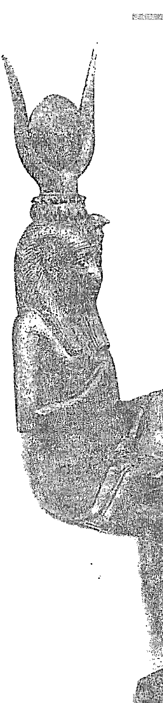

这个用象形文字写成的传说，是人们在一根石柱上发现的，现在这根石柱保存于巴黎。
传说的重要部分是一首赞美奥西里斯的诗，这首诗大约于第十八王朝（公元前 1570—公元前 129 年）时期写成，那时，人们对奥西里斯的崇拜达到了一个特殊的发展阶段，埃及所有的神学家把他看作万神之首，虽然庙宇里看不到，但埃及遍地都有他的存在，他的身体是这个国家存在的基础，他是神明中的神，神明中两大派别的首领，他创造了拉的灵魂和身体，他是所有神灵中最仁慈和善的一位，他本来就是冥界赖以生存的神圣支撑。

## 古埃及的咒语

LEGENDS OF THE GODS

在安城(太阳城)、孟斐斯、埃拉克雷奥伯利斯、赫莫伯利斯、阿比多斯、第一瀑布地区以及其他所有地区，他都是最伟大的神，他一个人就拥有拉—泰姆(Ra—Tem)、阿比斯(Apis)和布塔(Ptah)、霍鲁斯众神、托特及克尼穆的所有力量之和，他对布西利斯(Busiris)和阿比多斯的统治是至高无上的，持续了千百年。他是尼罗河的源头，他是北风的起源，他的宝座是天堂里永不坠落的星宿，他的臣子则是那些永不朽灭的星星。整个天堂都是他的领地，只要他一出现，天空中的门户就会自动地为他敞开。他从其父凯布那里继承了地球，从其母努特那里继承了天堂。他的身体里，不仅蕴藏着无穷无尽的过去，同时也包含着无穷无尽的未来。和拉一样，他曾与罪恶的头目色巴或塞特交手，并且赢取了胜利。

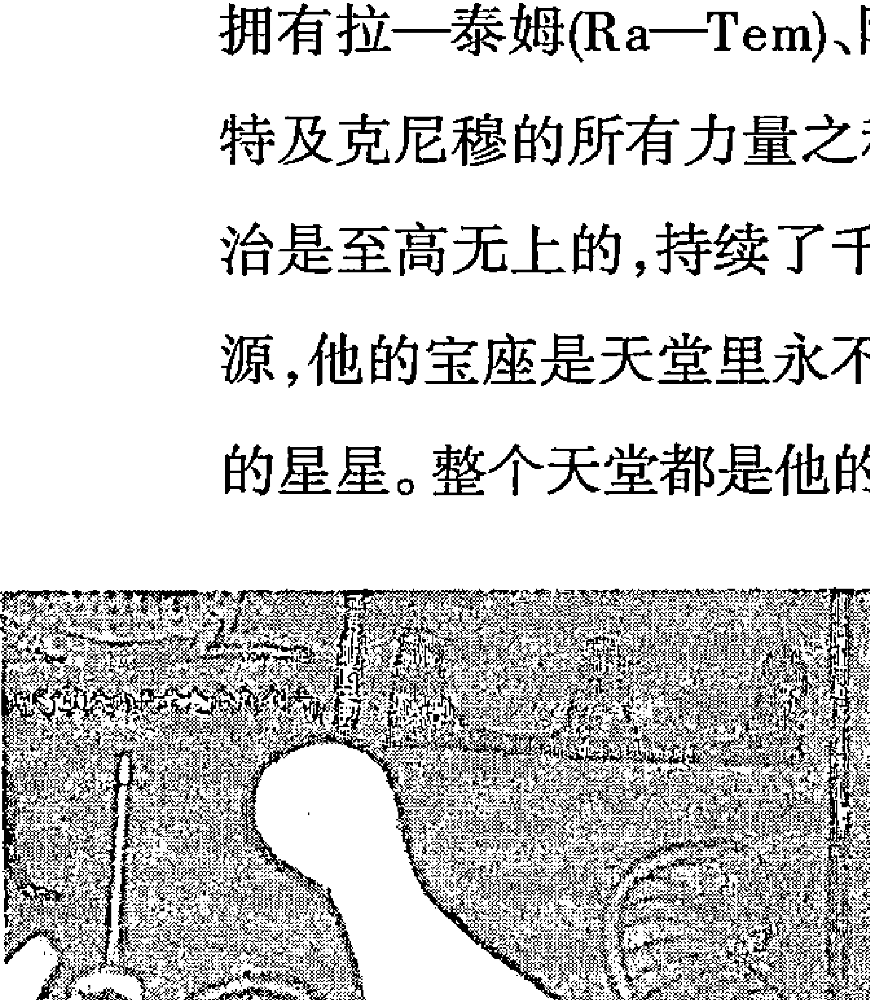

# 第五章 霍鲁斯之诞生的传说

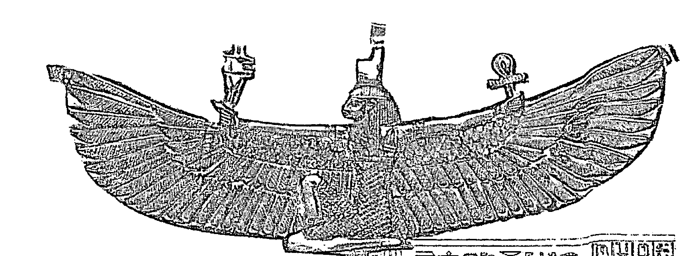

胜利确保了他在所有神明和亡者中的统治地位。他运用法力，创造了土地、河流、树木、植物、牲畜以及其他四脚动物，各种鸟、鱼，以及爬行动物，甚至沙漠这种毫无用途之所在，也向这位伟大的造物主敬献各自的忠诚。他在天空中乘车游历，用光明照亮了黑暗的地方。

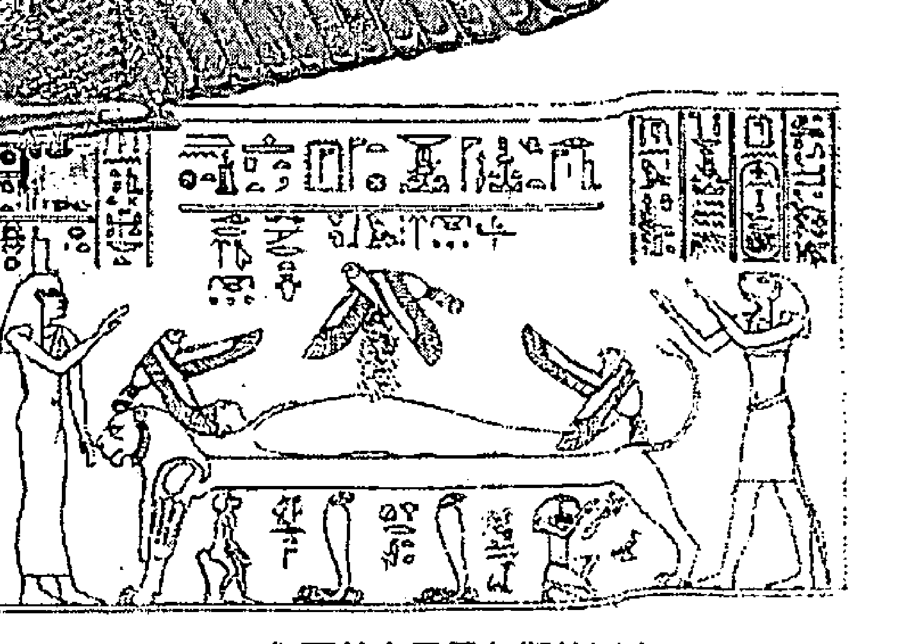

文章的最后隐约地讲述了伊西丝——奥西利斯的妹妹及妻子，并讲到霍鲁斯诞生，这个有关诞生的传说对于第十八王朝的人来说，也是非常古老的了。

文章说伊西丝是其兄弟坚贞不移的保护者，她赶跑那些试图攻击他的魔鬼，令他们远离他的神龛和坟墓，使他免遭所有意外危险。她运用魔法和咒语完成这一切，作为“巫女神”，她通晓大多数的魔法和咒语，拥有奇异的力量。她的“嘴经过锻炼，已变得完美无瑕，念咒语时不会出错，她的舌柔韧而灵活，不会有任何停顿”。然而不幸还是来临了，在一场“好神”对魔鬼的战争中塞特杀死了奥西利斯，其中的细节有待进一步考证，但金字塔经文中是这样描述，塞特把奥西里斯的尸体扔到了阿比多斯附近，一个叫内塔特(Netat)的地方。得知了奥西里斯战死的消息，她立刻动身四处搜寻他的尸体。所有的传说都说伊西丝变成一只鸟，毫不停息地飞来飞去，到处寻觅，还一边发出哀鸣，当她最终找到尸体时，发出一声尖叫，落到了地上。金字塔经文中讲，内芙蒂丝当时也在她身边，“伊西丝来了，内芙蒂丝也来了，一个在右边，一个在左边，一个是哈特(Hat)鸟，一个是彻特(Tchert)鸟，她们发现奥西里斯的尸体被其兄弟塞特扔在内塔特的地上”。

最近的一个传说版本讲伊西丝用自己的羽毛给尸体扇风，产生了空气，最终使奥西里斯毫无生气的部分活跃起来，从而将其精髓带出体外，伊西丝借此而生出了儿子霍鲁斯。

这种有关霍鲁斯之诞生的空洞的刻板式的说法，并不是仅有这方面的记载，金字塔经文中有一段内容可以对此做一个很好的补充，是这样写的：

> > 向您致敬，哦！奥西里斯，您在左边站起来，把您自己放在右边，我给您的水，是青春之水。向您致敬，哦！奥西里斯，您在左边站起来，把您自己放在右边，我为您制作的面包，还有余温。向您致敬，哦！奥西里斯，天堂之门为您开启，泉水之门为您敞放，佩(Pe)城的神明都来了，奥西里斯，在听到伊西丝和内芙蒂丝哀求之声的时候……您的妹妹抱着您的身体，她擦热您的双手，她把您拥入她的胸膛，当她发现您侧躺在内塔特平原上的时候。

我们又发现另一处是这样写的：

> > 您两位妹妹，伊西丝和内芙蒂丝，都来到您身边，卡姆—巫特 (Kam—urt)，以您卡姆—巫 (Kam—ur) 的名义，瓦彻特—巫特 (U-atchet—urt)，以您瓦彻—巫 (Uatch—ur) 的名义……伊西丝和内芙蒂丝编织魔法的保护网，给在索特(Saut)城的您，给她们的主，以您“索特之主”的名义，给她们的神，以您“神明”的名义。她们赞美您，请您不要远离她们，以您“图瓦(Tua)”的名义。她们给您供奉，请您不要发怒，以您“钱特鲁(Tchentru)”的名义。热爱您的

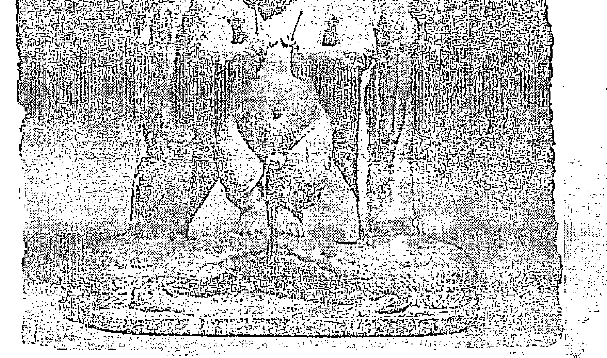

伊西丝姐妹坐在霍鲁斯肩上

## 古埃及的咒语
**THE PYRAMID TEXTS OF THE GODS**

妹妹伊西丝欢欣地来到您身边,您和她结为一体,您把种子播入她的体内,她怀孕了,化身为塞普泰特(Septet)星辰(天狼星),霍鲁斯—塞普特(Horus—sept)因此而诞生,名为霍鲁斯,塞普泰特的居民。您以神钱特鲁“灵魂安居”的名义,让灵魂进驻他的体内,而他则以“霍鲁斯,为父亲复仇的儿子”的名义,为您报了仇。好呀,奥西利斯,凯布为您带来霍鲁斯,而他为您复仇,给您送来众神的心,给您他的眼,您因此得以戴上乌勒特(Urert)皇冠,成为众神之首。霍鲁斯还集合了您的所有部下,一个不少,奉献给您,使您一切都井然有序。托特抓住了您的敌人,把他们全部消灭殆尽。

在金字塔经文中,这些话是写给已逝国王的,埃及人认为众神为那些国王所做的一切,曾经真真切切发生在奥西利斯身上。这些摘录极其有价值,因为它们可以证明,第十八王朝讲述的奥西利斯的故事,其传统基础早在第五和第六王朝时就已经获得举国上下的认可。

这首赞美诗以霍鲁斯登基为结尾。伊西丝的儿子、奥西利斯的骨血霍鲁斯登上他祖父凯布的宝座,恰特恰(Tchatcha)即天堂众管理神给予他热烈的欢迎,所有的神明和真主聚集到太阳庙的大殿里,共同见证霍鲁斯继承王位。他的继位同时得到了内贝彻的赞同,本书第一个传说中已经讲过内贝彻正是整个宇宙的创造者。

## 经文

### 对奥西利斯的赞歌

向您致敬，奥西利斯！您是永恒的君主，您是众王之王，您的名姓多重，您的变化无数，隐藏您形体的庙宇，有最神圣的卡在其中。您是泰图特(Tetut)的领袖，您是神龛里万物的强者，您在阿内彻(Anetch)是众人赞颂的主，您在阿努(Anu)是圣食(tchefa)的首。您在玛提(Maati)得到祭奠，您是神秘的神灵，您是凯勒特(Qerret)的主人，您是白墙(White Wall)的圣者，您是拉的灵魂，也是拉的身体，是他让您安居在赫南苏(Henensu)。您给人们带来益处，您在纳特(Nart)获得赞美，您的灵魂得到升华，您是八神——(这些神是开天辟地之时的八种元素，四男四女，努和努特，代表火的赫乎和赫乎特，代表黑暗的克奎和克奎特，代表夜晚或灾难的克尔和克尔赫特)之城里神殿之主，您在厦斯—赫特普带来惊恐无数。您是永恒的君王，阿博图(Abtu, 阿比多斯)的君主。您的宝座直达另一个世界，您的名字总在人类的嘴里赞颂吐露，您是两片土地上各处的双重物质，您是卡乌的圣食，您是众神的领袖，所有神灵中，最仁慈最完美的非您莫属。神努从您身上获取圣水，您带来北风在日暮，从您鼻孔中吹出来的风啊，令您心满意足，您的心滋润了，您带来的圣食光彩夺目。

# 冥王奥西利斯

高高的天堂和星星，都臣服于您，是您打开天空巨大的门庭，南方的天堂歌颂您，北方的天堂感激您，永远闪耀的星辰，在您的脸孔下面，您的座位，是永远不会停歇的星星。凯布要人们为您献上贡品，众神都给予您崇敬，图瓦特的星神们向您低头，所有领地都向您把礼来行，当地球的两端看到您的时候，也会向您祈祷个不停。

所有的神明都敬畏您，整个南北大地遇见您的时候，都会将欢呼献给您。您是伟神中的伟神，您的王权无边无垠，您的地位稳固，众神仁慈之力全来自于您。您的脸庞和蔼可亲，任何人见到都会敬爱您。您的威严遍布各地，人类爱戴您，所以将您的名字永远崇敬。每个人都献给您贡品，天堂和地球都在朝拜您。在乌阿克(Uak)的节日里，对您的赞扬此起彼伏，对您的欢呼在南北两地共响起。您是最长者，您是创教人，您是众神的领袖，您在南北两地散布真理。您让您的儿子继承他父亲凯布的王位，您是您母亲努特钟爱的子民，您拥有最强大的力量，最终打败色巴(Seba)魔鬼，获得胜利。您消灭了敌人，令他们对您惧怕不已。

您创辟的疆土无限，您的意志坚定，您的双脚悬空，您是凯布的继承者，您是南北两地的王，凯布发现了您光辉的品质，命令您将整个世界来治理，时间无限，您的王权无尽。

您亲手创造了世界，所有的水，所有的风，所有的树木药草，所有的牛羊牲畜，所有的鸟，所有的鱼，所有的爬行动物，所有的四足野兽，都出自于您。沙漠之地本属努特之子，他如同拉一般，继承父亲的王位，南北两地都感满心欢欣。

您从天际升起，为黑暗的世界带来光明，您翅膀发出的光，照亮南北大地，从天际显出第一线光亮起，您如飞盘润泽大地。您是众神的向导，您白色的皇冠直顶高高的天堂，向群星献礼。您的措辞完美，您的指令清晰，您是伟大神明的宠儿，您也是较小神灵的至亲。
您的妹妹伊西丝是您的保护女神,她助您躲开灾祸,她为您驱散众敌,她的嘴可以念出咒语,她的舌不会打结,发指令或念咒语时灵活无比。魔法师伊西丝为其兄长复仇,不眠不休将其尸身来寻觅,她在全世界飞了一圈又一圈,悲痛地哭泣,直到发现了他的踪迹,她才降落在地。她从羽毛里发出光亮,扇动翅膀制造气流,为她的兄长痛哭不已。尽管他的心脏不再跳动,她还是设法唤醒了他毫无生气的身躯,得到可以孕育子嗣的要体。她独自哺育孩子,无人知晓他在何地。孩子健壮成长,在凯布的大殿里,他展示了双手的气力,众神惊喜非常,因为奥西里斯的儿子霍鲁斯的来临。他的意志坚强,他能取得功绩,他是奥西里斯的骨血,他是伊西丝的子嗣。真理的领袖,各位神明,连内贝彻自己,还有代表真理的诸位神明,都在他面前聚集。消灭罪恶的神明,在凯布的大殿里欢聚,他们把神圣的荣耀和尊严物归原主,他们交付至高无上的权力。

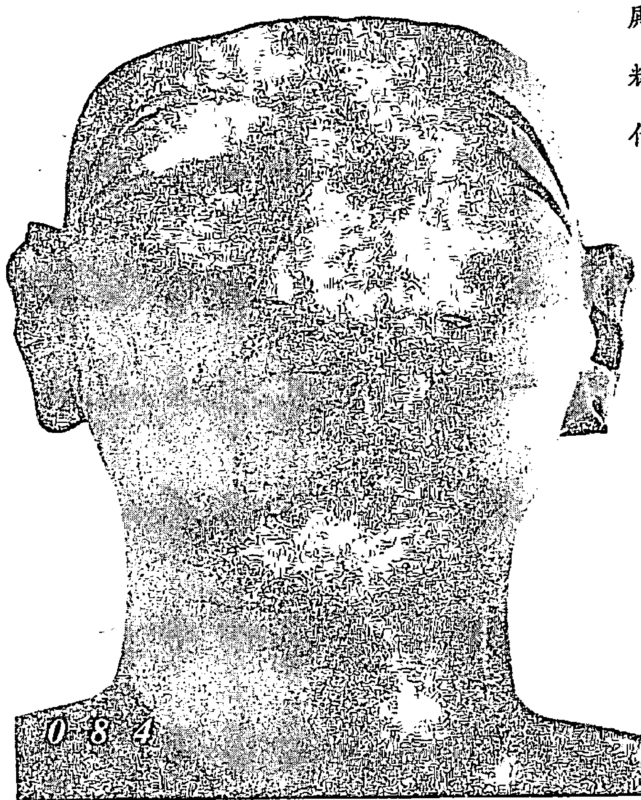

## 第六章

### 凯恩苏·内夫—赫特普和贝克坦公主的传说

在底比斯的凯恩苏神庙内商博良发现了一根圆头的砂岩柱，这篇传说就以象形文字刻录其上。

1846 年，普利斯·德·阿凡内(Prisse d’Avennes) 将这根柱子运送到巴黎，如今，它保存于巴黎的法国国家图书馆。普利斯·德·阿凡内也是第一个出版这篇经文的人，直到 1853 年伯彻首次将它翻译出来。多年里，人们一直以为这篇传说是讲述有关拉美西斯十三世(Ramese X Ⅲ)的事情，但厄尔曼纠正了这一错误理解，指出传说所讲的国王实际上是拉美西斯二世(Ramese Ⅱ，公元前 1279—前

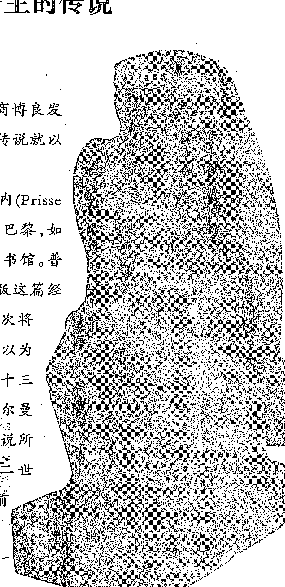

1213年)。厄尔曼在对文章结构作过仔细检查后，证实这些象形文字是在故事发生了几百年之后才刻到柱子上的，而且作者显然对拉美西斯二世时期的埃及语言形式非常陌生。事实上，这个传说是按凯恩苏神庙祭司们的意愿来书写的，祭司们要推崇他们的神及其伟大力量，用以驱逐魔鬼以及邪恶的灵魂，创作时间大约在公元前650年至前250年。

传说开头详述了拉美西斯二世拥有的伟大名字，接着讲国王统治的“国家有两条河流”，由此可以推断该国是今天美索布达米亚的部分地区，其中的两条河流就是底格里斯河与幼发拉底河。当时各地首领都朝他进贡，贡品包括：黄金、蓝宝石、绿松石及从神的土地上砍伐来的原木。这些黄金和原木都采于阿拉伯南部和东非，首领们的居住地离北方也很遥远，很难想象他们是如何进贡的。其中有一位贝克坦王子，将自己的长女作为头等贡品献给国王，并带来他表达忠诚和恭顺的口信。这个女子很美丽，埃及国王觉得她可爱至极，就娶了她做妻子，并赐名“拉—达菲瑙(Ra—neferu)”，意思大约就是“拉的美人”，又把她带回埃及，封为王后。拉美西斯二世执政第十五年的一个夏日，国王正在卢克索神庙举行欢度阿蒙—拉节的庆典，有一个侍从上前来报告，说贝克坦派来了一位使臣，并给王后带来许多礼物。使臣被领了进来，向国王说了许多以表忠诚的话，又呈上了他主人送来的礼物。

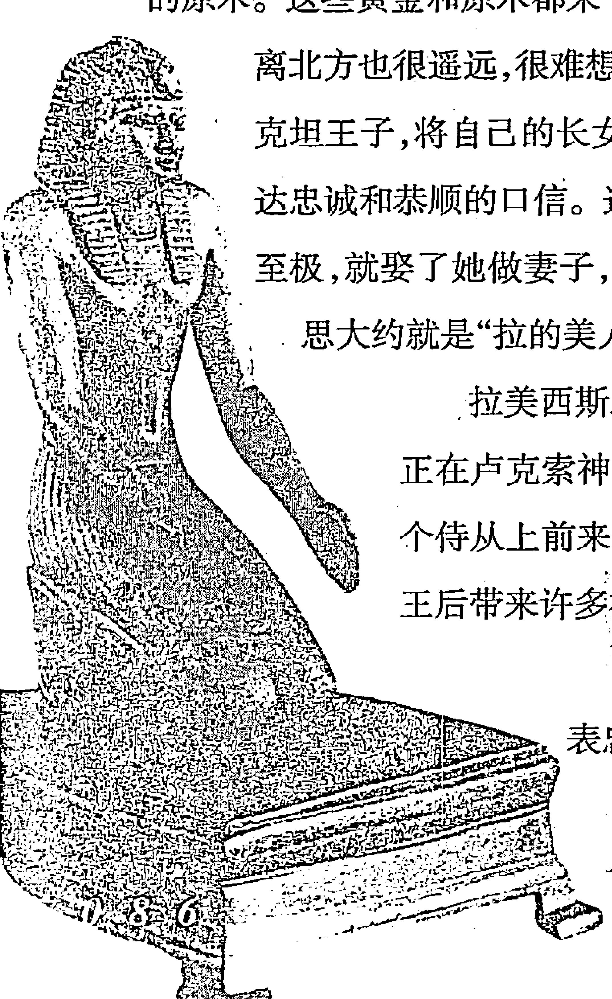

## 第六章 凯恩苏·内夫一赫特普和贝克坦公主的传说

然后又说，他专程前来是为恳求国王派一名“智者”，即魔法师，到贝克坦去诊治一下王后妹妹本特—安丝—蕾什(Bent—enth—resh)公主的病，如今公主她已卧病不起。于是，国王召来生命之殿的智者们，即底比斯大魔法学院的成员，以及诸位官员，命令他们挑选一个人，此人必须具有“智慧的心灵，灵活的手指”，可以前往贝克坦医治病痛中的公主。最后，挑中了特乎提—安姆—赫伯（Tehuti—em—heb），国王就派他随使臣前去贝克坦。特乎提—安姆—赫伯一到贝克坦，就立刻发现本特—安丝—蕾什公主是被一个邪恶的灵魂控制住了，它不愿离开公主的身体，他对此也无可奈何。贝克坦王子看到这名埃及人不能治愈女儿，就

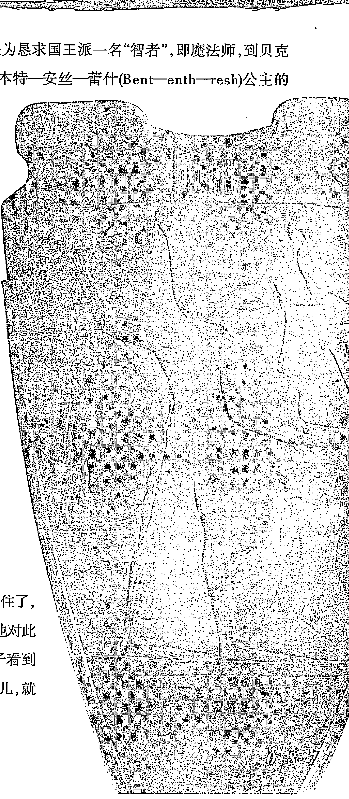

再次派遣了一名使臣到埃及,恳求拉美西斯二世派一位神来驱魔。这名使臣是于拉美西斯二世执政第二十六年的夏天到达的,当时正在底比斯庆祝一个节日的国王,一听到使臣的请求,就又一次来到凯恩苏·内夫一赫特普神庙,站在神的面前,为王后的妹妹祈求帮助。
后来,凯恩苏·内夫一赫特普神庙的祭司们扛着凯恩苏·内夫一赫特普以及另一位神的塑像来到一个地方,这里所说的另一位神在那里被赐名为“巴—阿里—塞克赫(pa—ari—sekher)”,意即“命运的劳动者”,他能够应对邪恶灵魂的袭击,并驱逐它们。两位神的塑像面对面地放在一起,拉美西斯二世恳求凯恩苏·内夫一赫特普“把脸朝向”凯恩苏·巴—阿里—塞克赫,即赞同地看着他,让他到贝克坦把公主身上的魔鬼驱走。为何凯恩苏·内夫一赫特普是比凯恩苏·巴—阿里—塞克赫更伟大的神?为何后者必须得到前者的准许之后才能离开埃及?传说对此没有做任何解释,也许是因为底比斯及其邻近地区的埃及人都来向凯恩苏·内夫一赫特普祈求帮助,以至于请求过多,人们又无法将其塑像带到更远一些的地方,更别说是国外了,所以,只能请他指派一位代理神到底比斯以外的地区去实现奇迹。这样做既造福民众,更给祭司们带来大量财富。指派代理神的行为,并非鲜而有之,现代非洲人是惯用这种权宜之策的。大约一百年前,在西非的提什(Tshi)地区,卫内巴(Winnebah)的人们信奉博伯维希(Bobowissi)神,结果这位神的祭司们发现事务过于繁重,非常有指派一名代理的必要,于是,他们就选中了 Brahfo,即“代理”的意思,并大肆宣传,说博伯维希已经把所有次要的事务都交给他了,他的意见就是博伯维希的意见。各方代表都要到阿散蒂(Ashanti)的卫内巴集合,祭司们会引荐“代理神”,然后将其运送到曼卡西姆(Mankassim),神将会在那安家,为人们做所有博伯维希一直在做的事。

拉美西斯二世向凯恩苏·内夫一赫特普祈求完后，塑像点了两下头,表示同意。显然,它是一个肢体可以动的塑像,祭司们可以根据情势的需要而让它活动起来。国王又向这位神作祷告,祈求他把他的萨(sa) 或魔法力量过渡给凯恩苏·巴一阿里一塞克赫，这样他就能够到贝克坦去治愈公主。凯恩苏·内夫一赫特普塑像又点了两下头,国王的祈求得到了应允。传说接下去讲述较大的那个神前后四次将其

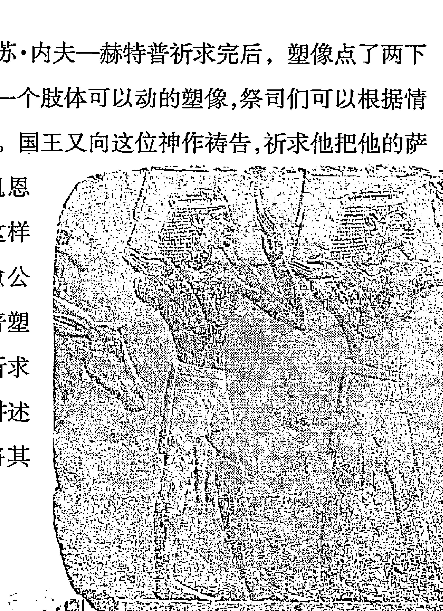

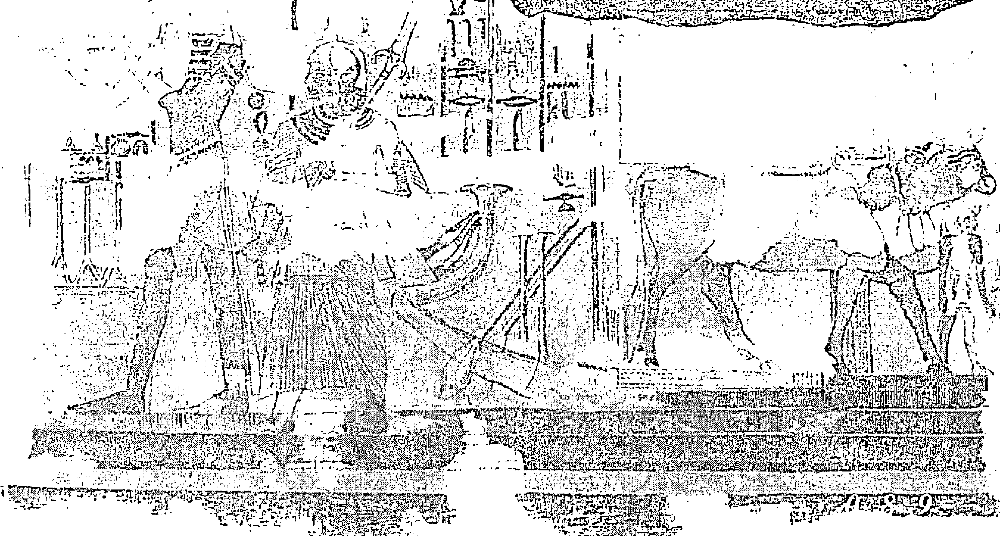

魔法传给较小的神,即把四倍于他魔法的力量传给了较小的那个神,但没有具体讲述这是如何完成的。从许多传说的片断中可知,人们相信诸神都有一种神奇的力量,叫“生命之萨”,或“神的萨”,任何神明，不论男女,只须拥抱一下某个人,或给他(她)吃些东西,就可以将这种力量过渡给人类,所以泰穆通过一个拥抱,就把他的生命力量传给了休和特芙努特。圣教仪典(Ritual of the Divine Cult)上,祭司会说:“泰穆的两罐牛奶就是我身体的萨。”拥有萨的人可以将它过渡给其他人,只须一个拥抱,力量就会从他的手上传到另一个人的背上。人可以从神那里得到萨,得到后只须抱一下塑像,就可以把力量传给塑像,国王也确实曾在圣教仪典上举行过这样的仪式。拉最先拥有这种力量,然后他把力量源源不断地传给受到祝福的亡者,他们因此得以永生。这样,传说接下去的发展也就容易被人接受了,凯恩苏·内夫一赫特普将其神奇力量过渡给凯恩苏·巴一阿里一塞克赫,这可以通过两种途径来实现:一是把后者的塑像靠近前者,使后者通过接触得到力量;一是大祭司先从较大的神那里得到萨,再通过拥抱,经双手将它过渡给较小的神。不论怎样,凯恩苏·巴一阿里一塞克赫最终得到了魔法力量,人们用船把他运送到贝克坦去了,随行而去的另有五条小船,战车和马匹分列于他的两旁。

在长达十七个月之久的航行之后, 凯恩苏·巴一阿里一塞克赫抵达了贝克坦,受到王子的热烈欢迎。他来到公主的居所,刚开始施展强大的法力,公主就马上痊愈了,不仅如此,被驱逐出来的恶魔还认凯恩苏·巴一阿里一塞克赫为主人,并承诺它会回到它以前的住所,但贝克坦王子必须在它离开前,以它的名义举办一个庆典。

# 第六章 凯恩苏·内夫–赫特普和贝克坦公主的传说

当时王子及其士兵站在一起，偷听神与魔之间的对话，他们都感到异常恐惧。王子最终还是按照凯恩苏·巴–阿里–塞克赫的命令，为所有拥有神奇法力的造访者举办了一场盛宴，于是恶魔离去了，重返“它热爱的地方”，贝克坦举国上下一片欢腾，贝克坦王子对这位埃及神十分欣赏，决定留下他。当凯恩苏·巴–阿里–塞克赫的塑像在贝克坦停留了三年零九个月时，王子突然看到了神，他变成一只金色的鹰，从宝座飞来，在空中，他的嘴指向埃及。王子意识到如果灵魂得不到安居，这尊神的塑像就毫无用处，于是他允许凯恩苏·巴–阿里–塞克赫的祭司们返回埃及，并赠给他们各种各样的礼物。祭司们回到埃及后，把神像送回凯恩苏·内夫–赫特普神庙，并把贝克坦王子送的礼物全部上交给了凯恩苏·内夫–赫特普，一样也没留下。就这样，凯恩苏·巴–阿里–塞克赫在离开埃及大约八年之后，于拉美西斯二世执政第三十三年平安地回到了神庙。

## 经文

### 凯恩苏·内夫–赫特普和贝克坦公主的传说

霍鲁斯：“强大的公牛，上升的形体，像泰姆（Tem）一样拥有至高的权力。”金霍鲁斯：“强大力量的代表，弓之九族的克星。”南北两地的国王：“两地的君主，拉的子嗣（User–Maat–Ra–setep–en–Ra）。”这就是他，阿蒙–拉（Amen–Ra）的拉美西斯–姆利–阿蒙（Ra–meses–meri–Amen）。

他是南北两地的君王，众神之神，底比斯国王的首领，众人爱戴的国君。他是仁慈的神，阿蒙的儿子，姆特（Mut）为母，赫鲁–库蒂为父，是内贝彻的优秀子孙，生来就是他母亲的牛，埃及的王，沙漠的统治者，弓之九族的拥有者，尚未出生就发布命令，一出娘胎就作重大决定，意志坚强的公牛播下的种子，诞生出公牛的国王，那也是一位像蒙苏（Menthu）一般诞生在战场上的神，像努特的儿子一般拥有强大力量。

看呀，依照每年的习俗，他在内赫鲁（Neheru）的国度里庆祝登基，每一处的首领都来朝贺，连远方沼泽地的族长也不例外，他们为高贵的君王带来贡品，其中有黄金，蓝宝石，绿松石，还有从神的土地上砍伐来的各种原木块，他们把礼物背在背上，个个都想胜过别人。

贝克坦王子也命人送来礼物，其中第一件就是自己的长女，他还送来贺词，赞颂君王的功德，祝福君王万寿。他的女儿非常美丽，国王认为她是世界上最可爱的女子，就封她为“拉–内菲璐（Ra–neferu），尊贵的王后”，当他回到埃及，还送给她王后应该拥有的一切。

国王执政第十五年，舍姆季第二个月的第二十二天，他在雄伟的底比斯，为祭奠南北两地的君主、众神之父阿蒙而举办完美的南阿普特（South Apt）之节，从远古的时候起，那里就是他的钟爱之处。正在这时候，一名侍从上来报告：“贝克坦王子派来一位使臣，为王后带来许多礼物。”于是，在国王的命令下，这位使臣被带到，他献上了礼物，又表达了对国王的敬仰和爱戴：“哦，弓之九国的儿子拉啊，赞美您，请让我们在您的面前生存！”说完这话，他在国王面前低头闻了闻地面，然后又说：“我的国王，我的君主，我是为王后拉–内菲璐的妹妹本特–蕾什而来，她的身体正遭受病痛的折磨，我恳请陛下派一位智者前去治病。”

## 古埃及的咒语

国王说：“把生命之殿的魔法师，以及宫中所有的贵族都请来。”这些人立即都来了，国王对他们说：“听着，我把你们叫来是让你们自己听听这件事，现在就从你们当中选出一人来，他必须聪慧伶俐，手指灵活。”结果御用魔法师特乎提–安姆–赫伯 (Tehuti–em–heb) 被选了出来，国王命令他即刻随同使臣，赶赴贝克坦治病。

当这位智者来到贝克坦，他发现本特–蕾什的身体被一个灵魂占据，那是一个邪恶的灵魂，对他满怀敌意。

于是，贝克坦王子又派了一位使臣来见国王，使臣说：“哦，国王，我的主人，我祈求您送一位神明来消灭恶灵。”

这位使臣于国王执政第二十六年，舍姆季第一个月内到达，那天正逢阿蒙的节日，国王在底比斯的宫殿里，他第二次在底比斯的凯恩苏·内夫–赫特普面前，为贝克坦王子的女儿说话：“哦，我公正的主人，我第二次为了贝克坦王子的女儿来到您面前。”底比斯的凯恩苏·内夫–赫特普被带到凯恩苏·巴–阿里–塞克赫面前，那是一位驱赶恶灵的伟神。国王在凯恩苏·内夫–赫特普面前说：“哦，我公正的主人，请把您的脸转向凯恩苏·巴–阿里–塞克赫，他是驱除恶魔的伟神，请您允许他到贝克坦去除魔。”于是，这位神重重地点了两次头，国王又说：“我祈求，把您保护的力量过渡给他，这样我就可以请尊贵的他到贝克坦去医治国王的女儿。”

底比斯的凯恩苏·内夫–赫特普重重地点了两次头，他将他保护的力量过渡给凯恩苏·巴–阿里–塞克赫，总共有四倍那么多。然后国王命令凯恩苏·巴–阿里–塞克赫乘坐一条大船，带着五条小船，左右伴着大量马匹，立刻出发。旅行了一年又五个月之后，这位神终于来到贝克坦，贝克坦王子率领他的士兵和族长们出来迎接，他们来到凯恩苏·巴–阿里–塞克赫面前，王子深深鞠躬，头几乎碰到自己的肚子，他说：“您终于来了，我们依照两地国王的要求，前来欢迎您！”

神来到王子女儿本特–蕾什的住处，开始对她施用法力，她立刻就恢复了，而占据她身体的灵魂对凯恩苏·巴–阿里–塞克赫说：

> “哦，欢迎，伟大的神明啊，您可以驱除恶灵！贝克坦是您的领域，贝克坦的人民，无论男女都是您的仆人，而我自己也是您的奴仆。如今我会回到我来的地方，这样您的心会为此感到满意。我祈求您为我和贝克坦王子安排一个狂欢节。”

神点头同意，他对祭司说：“让贝克坦王子给这位灵魂献上大量祭品。”

当凯恩苏·巴–阿里–塞克赫在安排所有一切的时候，贝克坦王子及其士兵站在一旁，心中恐慌万分，但王子还是为神和那个灵魂献上了大量的贡品，并为他们安排了快乐的节日，然后，灵魂依照凯恩苏·巴–阿里–塞克赫的指令，回到自己热爱的地方。贝克坦王子和贝克坦王国里的每一个人，都为此欢呼雀跃，王子私下想：“既然这位神是当作礼物送来贝克坦的，我就不让他再返回埃及。”

于是，这位神在贝克坦留了下来。三年又九个月过去了，一天王子躺在床上睡着了，梦见神来到他的宝座前，化身为一只金鹰的模样，然后又飞上天堂，往埃及的方向去了。当王子醒来，浑身都在颤抖。他对凯恩苏·巴–阿里–塞克赫的预言者说：“逗留在我们身边的神已经离开到埃及去了，令他的战车也回到埃及去吧。”

于是，贝克坦王子准许神的塑像出发返回埃及，他送了各种各样美丽的东西，还派了大量的士兵与马匹跟随。当一行人平安抵达底比斯，凯恩苏·巴–阿里–塞克赫走进凯恩苏·内夫–赫特普在底比斯的神庙，把贝克坦王子奉送的礼物全部都放在凯恩苏·内夫–赫特普面前，自己一样都没有留下。

然后，凯恩苏·巴–阿里–塞克赫平安地回到自己的神庙，那一天是播种季第二个月第十九天，年份是国王执政第三十三年，他是南北两地的国王，生命的给予者如拉一般，永恒的主。

## 第七章

### 克尼穆和七年饥荒的传说

从象岛(Elephantine Island)以及现代城市阿斯旺往南两到三英里，即在第一瀑布的水域里有一座名为萨哈勒(Sahal)的小岛，岛的东南边竖着一块圆圆的花岗石，有八九英寸高，这篇十分有意思的传说就刻在花岗石的一个侧面上。不过它不是按照普通的方法雕刻上去的，而是用钝头的凿子“敲”上去的。因此，除非你本来就知道上面有字而刻意去看，否则在正常光线条件下，站在石头旁边的人根本看不到任何东西。

这块岩石高耸于岛上，俯瞰着河水从马哈拉(Mahallah)一路奔涌到菲莱(Philae)，曾有几十位旅行者来到过第一瀑布，在岩石与岛屿上搜寻碑文和刻画，这块石头却每每成了漏网之鱼。直到1889年2月6日，这块六英尺长、五英尺宽的碑文才偶然被威尔伯先生发现。威尔伯先生是一位杰出的美国绅士，当时从事埃及研究工作已有多年，他在抄录文章时认识到其内容具有非同寻常的价值，于是他的朋友莫兹利先生为碑文拍了照。

碑文上讲述的传说发生于第三王朝(公元前2686—前2575年)时期，有个叫切瑟的国王(Tcheser)，其当政期间，爆发了一场长达七年的饥荒。尼罗河泛滥次数的减少是造成饥荒的客观原因，不过传说把尼罗河水位一直不高的原因说成是埃及人民对第一瀑布的神——伟大的克尼穆缺乏应有的崇敬。切瑟国王最终相信了这一点，并且采取相应措施改变了状况，在这之后尼罗河水位又恢复了以往的高度，庄稼也长得茂盛起来，由食物贫乏而引起的所有苦难都随之结束了。也就是说，当切瑟恢复对克尼穆的供奉，向他的庙宇及祭司捐赠钱财后，神就允许哈比(Hapi)把山洞里的泉水汇注到瀑布里，以此灌溉整个大地。从传说的整体风格容易看出这是一个近期的作品，而且，可以从象形文字的形式以及字词的拼写，可以得知文章创作于托勒密王朝时期，也许当时有些人正十分热衷于恢复对第一瀑布之神克尼穆的崇拜。我们猜测这些人的身份只有一种可能那就是克尼穆的祭司，并且当我们读到文章的后半部分，这种猜测就有了更加充足的证据了，因为商人、农民、矿工等都必须经瀑布才可以把物资运送到埃及，祭司们获准向他们收取各种费用，文章还列出了通行费及税金的条目。如果确实如此，他们为何要把饥荒和切瑟统治时期联系起来呢？他们也许是为了证明对克尼穆的崇拜由来已久。但选一位第一王朝的国王岂不是更简单？而且一旦选了一位第一王朝的国王，他们就可以使克尼穆的权威盖过尼罗河王国君主的。再说，从切瑟统治时代到碑文的创作时期，埃及也不可能没有发生较大范围的饥荒。为什么传说的作者独独让饥荒发生在第三王朝时期，以展现克尼穆的力量？我们对这些问题百思不得其解。王朝时期应该发生过多次饥荒，但所有碑文都没有讲到，不过七年饥荒的故事在《创世纪》里有所提及，表明在埃及发生这样长时间的灾难并不是没有可能。阿拉伯的历史学家也讲到过好几次长达七年的饥荒，其中发生在公元前1072—前1066年的那一次差点使国家面临灭顶之灾。15第纳尔 [1第纳尔=10先令(第纳尔现为伊拉克等国的货币单位；先令为英国以前的货币单位，12便士=1先令，20先令=1英镑)]买一个面饼，70第纳尔买一头牛，20第纳尔买一匹马，5第纳尔买一条狗，3第纳尔买一只猫，1第纳尔买一个蛋。所有动物被吃完后，就转向了人自身，还当众贩卖人肉。“人们从窗口伸出钩子，钩住街上的行人，拖进房里将其杀死，然后煮了吃”。在公元前1201年发生的饥荒中，人们对于吃人肉已经习以为常。父母杀掉自己的骨肉煮了吃，还有人发现一个妇女生吃自己的丈夫。用婴儿烧制的肉块，用小孩脑袋制成的杂碎，都是寻常不过的菜肴。为寻找食物，人们甚至把墓地也洗劫一空。

在切瑟国王执政第十八年的某一天，马特尔(Matar)——厄尔帕王子，负责管理南方北方各神庙财物，同时又是象岛 (阿斯旺)上肯迪(Khenti)人的领袖——收到一封皇家急件，国王的信里写道：“由于这场大灾难，我在宝座上痛苦不堪，我的心悲痛不已。尼罗河已经有七年没有泛滥了，没有稻谷、没有蔬菜、没有食物，每个人都在抢夺别人的东西。人们想走路，却没有办法挪动；年轻人只能硬拖着自己的身体蹒跚而行；年老人因绝望而心碎，他们的双腿无力，只能坐在地上，痛苦地用双手抱住自己。官员们对此无话可说。打开谷仓，什么都没有，只有风吹过。一切都处于崩溃的边缘。”没有比这更能形象而具体地描述饥荒带来的苦难了。国王随后问马特尔一些问题，诸如：尼罗河的源头在哪里？都有哪些神或女神居住其上？神的形象是个什么样子？他表明自己想到托特神庙去祷告，想到魔法学院去研究，想通过翻阅宗教丛书来找到这些问题的答案。

马特尔读过急件后，立刻出发去见国王，为他解答全部的疑问。

马特尔讲，尼罗河的源头在象城，它从两个山洞里流淌出来，这两个山洞就是尼罗河之神的胸脯，河水的水位在象城上涨到28腕尺(古代一种度量衡，从肘到中指指端，长约18—22英寸)，等流到斯玛–贝乎泰特(Sma–Behutet)，或三角洲的迪奥斯波利斯·巴伐(Diospolis Parva)时，就仅有七腕尺了。克尼穆是控制尼罗河的神，只要他拉出门闩，开启禁闭泉水之门，并用他的凉鞋猛敲地面，河水就会泛滥。马特尔还向国王描述克尼穆的长相——与休一个模样，描述他做的工作，描述他住的木屋及其确切位置——就在著名的花岗岩采石场旁边。和克尼穆同住的有女神塞普特 [Sept (索蒂丝Sothis，或天狼星)]、女神安婕特·哈普[Anget Hap，或赫普(Hep)]、尼罗河之神、休、凯布、努特、奥西利斯、伊西丝和霍鲁斯。由此可以看出，克尼穆被其祭司们尊为众神的首领。最后，马特尔给国王一张清单，上面列出各种珍异奇特的石头名称，这些石头都是在象城及其周边地区发现的。

已经到达象城的国王听了这些话语，十分高兴。国王走进克尼穆的神庙，祭司们拉起帷幕，向他洒圣水，然后他来到神殿，拿出丰盛的贡品，有面饼、啤酒、鹅、牛，以及其他各式各样的珍奇物品，献给所有居住在象城的神明们，他们都居住在一个叫“生命与力量之心的床榻”的地方。就在国王向克尼穆做祷告，祈求和平时，克尼穆突然出现在他面前。这位神睁开双眼，弯下身子，声音洪亮地对国王说：“我就是创造了你的克尼穆，我用双手编织了你的身体，让你强健而有力，随后又给了你心灵。”克尼穆接下去抱怨道，尽管国王的脚下到处是石头和金属，可人们干起活来实在太慢了，他们应该用这些石头和金属建造神殿，或者为他——他们的造物主做一些他们应该做的。这番话在国王听来，就是对他的一种训斥，于是，国王按照克尼穆的意愿，立刻开始重修他的殿堂，文章并没有明确写出这一点。克尼穆又宣扬了自己的权威与力量，称自己是努，是天堂里的海洋，是尼罗河之神，“在远古的最初时诞生，依照自己的意愿生长，给人健康，使其能为克尼穆劳作。”他又称自己是众神之父，地球和人类的主宰，然后他向国王承诺，他会使尼罗河定期泛滥，永不停息，会带来丰收，人们内心的渴望会得到满足，会把苦难驱散，会将谷仓装满，会让整个埃及的土地长满金灿灿饱满的稻谷。国王还以为自己在做梦，迷迷糊糊的，但当他听到粮食时，立刻清醒了，还恢复了勇气，心中的悲伤随即一扫而空，他颁布了相关法令，拨出大量的人力物力，要让神得到应有的崇敬，并持之以恒。

这部刻于木头上的法令写道，国王把尼罗河两岸20 schoinoi(一种古代度量单位，每1schoinos相当于11.1公里)内的土地，包括花园等，都进贡给克尼穆，又规定，每个从尼罗河里汲水浇灌土地的人，都必须把收成的一部分供奉给神；打鱼的人，捕野禽的人，以及猎人，带着猎物进城时，都必须缴纳价值为所获之物十分之一的税款，还得为牲畜缴税，作为日常的祭礼；苏丹来的商队也必须纳税，若是去北方，就会免税；所有的金属工匠，碎矿工人，采矿工，泥瓦工，以及各行各业的手工劳动者，都必须拿出价值为其劳动成果十分之一的钱来，交到克尼穆神庙。法令还规定要任命一个检察员，其工作职责就是称量出自象城的黄金、白银和铜，并估算这些金属以及其他宝石的价值，以便作为供奉献给克尼穆。所有用来修建神明雕像的材料，还有所有雇佣来完成修建工作的手工劳动者，都可以免税。总而言之，人们沿袭古代的传统习俗，对神克尼穆及其同伴顶礼膜拜，人们用慷慨大度的性和双手，为庙宇添置一切所需之物。任何不遵守此法令的人，都会受到严厉的鞭笞。切瑟的名字在庙宇里也将永远不会磨灭。

## 经文

### 克尼穆和七年饥荒的传说

金霍鲁斯切瑟执政第十八年，他是南北两地的国王，是瓦齐特和奈赫贝特宝座的主人，马特尔（Matar）则是厄尔帕王子，南方庙宇城市的管理者，阿博图的肯蒂人的首领。一天，一封皇家急件送到马特尔手里，上面写道：“我写这封信是为了告诉你，当那些住在大殿里的人扶持我登上皇位之后，灾难已经降临到我的头上，我的心感到异常沉重，因为哈比（即尼罗河）已经七年没有上涨，这真是最最邪恶之事。没有稻谷，没有蔬菜，人类可以拿来当作食物的各种东西都已不见，每个人都在抢夺他邻居的财物。男人想动却动不了，孩子尖声哭叫，年轻人硬拖着四肢行走，老年人因为失望而心碎，他们的双腿无力，只能坐倒在地上，痛苦地抱住自己的身体。官员们都毫无办法。打开谷仓，里面空空如也，只有风吹出来。一切都在崩溃的边缘。

“我的心还记得以前的盛景，当时我有一个倡导者，他倡导神的时代，倡导神伊毕斯(Ibis)，倡导领袖克尔–赫伯(Kher–heb)，倡导南墙布塔的儿子祭司伊姆赫特普(I–em–hetep)。

哈比(尼罗河)的源头在哪里？有什么神或女神住在那里？他长得什么模样？是不是他为我带来收益，带来满仓的谷粮？”

“我要去找赫特–塞克特(Het–Sekhet)的首领，他仁慈的力量能使所有人投入工作。我要到生命的大殿去。打开那里的书卷，放手研读一番。”

于是，马特尔立刻出发，回到我的身旁。他给我哈比上涨的指示，告诉我所有相关的神明，还说出了神秘的大门，祖先们曾经通过这些门很快恢复自信，但自从拉的时代起，还没有一个国王喜欢这样做。他对我说：“河水中央有一个城市，哈比就是从那里诞生，那时人们称它为阿布(Abu)。

“那地方是源头的城市，再外面是源头城市的省。然后河水流到瓦洼(Uaua)，土地从那里延伸。那里还有一道台阶，通往很高的地方。当拉为延长人类的寿命作计算的时候，这台阶就可以提供帮助。‘甜甜美美的生命(Netchemtcem Ankh)’是那里房屋的名字，‘双洞(The two Qerti)’是那里水的名字，它们就是胸膛，孕育出美好的一切。

“这是哈比(尼罗河)的床，在一定的时侯他在那里恢复青春，他在那里为大地带来洪水。他一路奔流而来，并与自己结合，就像男人与女人相结合一样，然后又充当丈夫满足自己。有时他涨的很高，有时又回落很深。## 古埃及的咒语

“这结合是阿布之神克尼穆的结合，他用凉鞋敲打地面。河水就会变得充盈，他用手拔出门闩，双重门就会开启，河水就会奔涌而出。”

“他的样子像神休，他是那里的主人，守护着自己的家园，那家园名叫 Ab(即岛)。他在那里收集了许多南北两地的产物，为了可以分给每位神合适的一份，他还管理各种金属，以及宝石和四足兽，包括鸟禽和鱼，以及一切人类赖以生存的东西。那里还有用来丈量土地的绳索，用来记录的刻板。”

“他用木头造了一座小屋，屋子的门是芦苇做的，顶是树叶做的，他住在里头，管理自己的领土。”

“他的屋子有一扇门朝向东南方向，拉(或者太阳)每天都站在对面。在屋子南面流淌的河水有攻击他的危险，所以他竖了一堵墙当作屏障，这堵墙一直延伸到南方肯斯(Kens)人居住的地方。屋子东面群山起伏，山上到处是石头，把小屋重重掩盖在中央。采石工人会带着各种工具来到这里，挑选石头，用来建造南北两地众神的庙宇，或圣物的神龛，或皇家金字塔，或各种塑像。他们站在神的屋子前，或站在圣殿里，当神克尼穆在轮回流转的时候，为他献上香喷喷的贡品，有时甚至是各种各样的药草或鲜花。”

“这块地方的前面部分在阿布 (象岛)，后面部分在城市森特(Sunt)，一部分在河流的东边，另一部分在河流的西边，还有一部分在河流中央。每年的特定时期，河水会装点这个区域，令它成为一个欢乐的地方。河边的采石场上，人们正忙碌地工作，因为河水会很快流回到阿布市，但那里出产一种坚硬无比的花岗岩，人们称其为‘阿布石’。”

# 第七章 克尼穆和七年饥荒的传说

“以下是住在克尼穆圣屋里神明的名字：天狼星女神，女神安科特（Anqet，代表肥沃），哈普（Hap，尼罗河神），休，凯布，努特，奥西利斯，伊西丝和内芙蒂丝。”

“以下是群山中心地区出产的石头，有一些在东面，有一些在西面，还有一些在阿布河中央。这些石头，阿布的中心地区里有，东岸的国度里面有，西岸的国度里面有，河水中央也有。”

“以下是坚硬的宝石，人们在上部地区发现它们，金，银，铜，

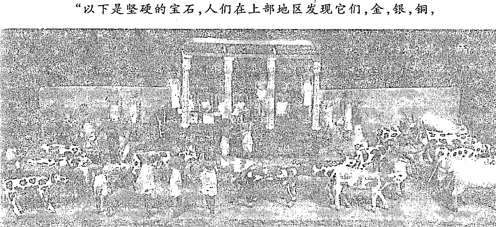

铁，青金石，绿宝石，水晶，红宝石等等。铁砂矿，大理石，祖母绿，锑，各种香料树的种子（或树胶），这些都是在这座城市前面部分的区域里发现的。”以上就是我到现在（即从马特尔那儿）学到的东西。

我听到这些事情，非常高兴，我走进克尼穆的神庙，祭司们打开缚紧的经文，为我泼洒纯洁的圣水，我穿过这些神秘地方往前走了一步，给住在阿布的神明们献上面饼、啤酒、鹅、牛（或公牛）等美好的贡品，人们把神明的居所称为“生命和力量之心的床榻”。

然后，我就发现神克尼穆出现在我面前，我拿献上的贡品来感谢他，请他不要朝我发怒，我又在他面前祈祷恳求，他张开双眼，他的心开始倾听我的诉说，然后他字句有力地说道：“我就是克尼穆，是我造就了你，我用双手塑造了你的身体，让你的各个部位都健康活跃，

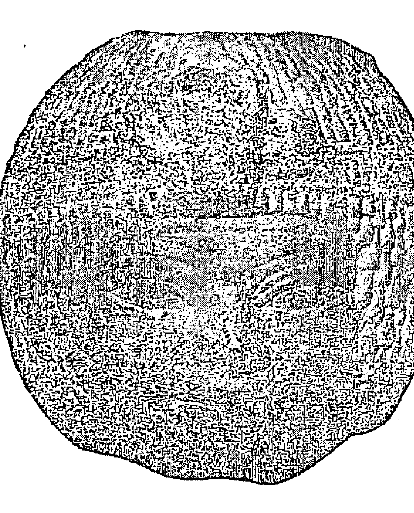

又将心赐予你。然而，尽管这里的矿石层层叠叠，尽管人类已经从远古的时候开始采石，但没有一个人采石修建我的神庙，或将倒塌的神庙修葺好，或为南北两地的神明辟神龛，或为其主人做一切他应该做到的事情，更何况，我就是你们的主人和创造者。

“我创造了我自己，我是伟神努，诞生在时间的最初。

“我唤醒了哈比，给他健康，让他为我劳作。我是全人类的向导和指挥，我是最伟大的众神之父，我是伟大的休，我是地球的首领。天空的两半（即东边和西边），在我身下，是我的住所，我倒出一湖清水，叫它哈普(Hap，即尼罗河)。

“我让哈普拥抱土地，而他的拥抱则为每一个人提供了生存方式。年纪大了，身体就会虚弱，但我会令哈普为你而上涨，遍布每一片土地，一年都不会间断。女神蕾内奈特(Renenet)将站在万物之首，植物、药草和树木将被身上的果实压弯了腰，每一样东西都将在一年的不同时间段里增长上百上千，人类将尽情享用，直到心满意足为止。

“苦难将一去不返，人们的粮仓也不再会空空荡荡，塔—迈尔特(Ta—Mert,即埃及)将成为一片文明之地，田野里到处是黄澄澄的稻谷，富饶而肥硕。只要人们想，丰收就会来临，来临的次数将比以前所有的次数还要多。”

我一听到庄稼就清醒过来，我的勇气也回来了，和我以前的失望情绪一样强烈，我立刻在我父克尼穆的神庙里颁布以下法令：

国王为克尼穆——克博赫特 (Qebhet) 市的主人，塔—斯提(Ta—Sti)的统治者——献上供奉，当作对他的回报。玛努(Manu)的河岸应该在您的右手，阿布的河岸应该在您的左手，城市周围的土地，左边和右边，包括花园和河岸，以及所有一切在内，都属于您。每一个男人，只要是耕种的，并且在河岸边或前面岛屿上提水的，都必须从收获的庄稼或储藏的粮食中多交出一些来，当作对您的捐献。任何渔夫或猎人从动物巢穴中得到的东西，包括所有抓到的鱼，逮到的鸟，捕到的野兽，在山里套到的狮子，进城的时候，都必须交出总数的十分之一来。在这个区域内抓住的牛，必须交出总数的十分之一，与其他动物分开，专作每天供奉的熟祭。

另外，无论是肯提约(Khentiu)人，还是恒—雷苏(Hen—Re—su)的肯提约人，还是埃及人，任何把以下物品带进城的人，也必须上缴十分之一作为捐献：金，象牙，乌木，香料，红玉，水果，以及所有的木头和产品。

每一个人都必须上税，但在这个地区以外的地方，任何税务官员都不得收税，不得将税收带入非首都的地方。

我将把这片盛产石头、高度文明的土地献给您，完完整整，毫无保留。

抄写员，税收官员，以及国王的检察员，都有责任与义务检查所有物品，以防有人行骗。

而且，我将令泥水匠，采矿工，金属匠，炼金者，石头雕刻者，矿石压碎工，烧炉工，各行各业的手工劳动者，如砍伐的、切割的、打磨的、金匠、银匠、铜匠、铅匠，以及每个以树林为生的人，如砍树的、从事交易的或做与木头有关的交易的，都必须为一切自然界的产品上税，也必须为一切坚硬的、从床以上的地方得来的石头，或开采出来的石头上税。

还需要有一个检察人员，专门称量金、银、铜和宝石的重量，并提供物资，满足建造神庙的金属工匠的要求，以及雕刻工匠在雕刻或修复神像时的需要，他们需要的东西都不必上税，劳作人员也不必缴税。而且，为安全起见，所有东西都必须在谷仓前，再交给工人的孩子。在神庙前面的任何东西应多多益善，正如天地初开时的样子。

按照刻在木头上原始经文的内容，这部法令应刻在一根石柱上，并把石柱放在神圣之处，神像以及神庙的祭司也都必须刻在其上。任何往石柱上吐口水的人都该受到鞭刑，所有祭司以及参拜神庙的人，都必须确保我的名字永垂不朽，永远留存在克尼穆一拉、阿布(象岛)之主的神庙里。

## 第八章

### 霍鲁斯死而复生的传说

埃及各时期的魔法宗教经文都提到过大量的咒语，它们是用来对付毒蛇、蝎子以及各种有毒爬虫的。庞大的数量，足以说明这些咒语的重要性，也表明各类毒虫在埃及非常之多，埃及人民十分害怕。完成于第五王朝末期的乌纳斯[(Unas)公元前2356—公元前2323年]金字塔经文，就写有许多这样的咒语。甚至在底比斯[(Theban)大约在公元前672—前525年]和塞特(大约在公元前2500年左右)的《亡灵书》中，有好几个章节就单独来写咒语和变身术，其中多数是来自古代的经文，用来对付鳄鱼、毒蛇，以及其他所有致命的爬行动物和昆虫。

所有的毒虫被看作为魔鬼的化身，它们不但伤害活人，就连死去的人也不放过，所以为了使死者得到安宁，人们必须把对付毒虫的咒语抄写在坟墓的墙上、棺材里、亡者的护身符上，等等。神明也不例外，同样会遭到毒虫的伤害，众神的首领拉也曾被一条毒蛇咬过一口，差点丢掉命。后来，作为一个传统，神明们都具有抵挡塞特及其魔鬼侍从的袭击的本领，也能对付各种毒虫的侵袭——它们都是魔鬼们派出来的间谍——法宝就是“生命的流体”。这是神威的一个特殊标志，埃及人民全身心希望从中获取一些法力，用以保护自己的肉体和灵魂、房屋和牲畜以及其他所有财产，使其在任何时候都不会受到侵害。如果某个人只需要保护自己，他只需戴着一种类似护身符的东西，上面要画有符咒。如果他想使其房屋免受毒虫侵犯，可以把画有符咒的雕像放在各房间的壁龛里，或是把雕像放在屋外不远的地方，也可以把雕像埋进泥土里，面朝毒虫可能会进犯的方向。

第二十六王朝(公元前672—前525年)末期，埃及迷信活动盛行，其程度可以说是前所未有的。

当时民间流行制作一种保护房屋的避邪之物，是一根两头圆的小石柱，可以安置在表面凸起的底座上。石柱的正面是哈珀克拉兹(Harpokrates，即霍鲁斯，这是他小时候的称谓)的人像浮雕，他站在两条鳄鱼身上,手里握着毒蛇、蝎子、一头狮子和一只有角的动物,它们分别代表魔鬼塞特的间谍或帮凶。在霍鲁斯的头上有贝斯(Bes,音乐之神)的头颅,两侧有太阳的代表,如内夫—泰姆(Nefer—Tem,香气之神,头上有一朵莲花)的百合花、拉以及哈马基斯的人像、拉的双眼(太阳和月亮),等等。石柱背面及整个底座刻满了魔法经文和咒语。只要屋子里有这样一根石柱,这间屋子就能直接得到来自霍鲁斯及其同伙的庇佑,因为这些神明曾经在肉体上和精神上,消灭了所有黑暗的主人,消除了所有魔鬼的力量。欧洲一些大博物馆里收藏着不少此类石柱,大英博物馆的第三埃及展厅里,则有几件精致的展品,人们通常把它们称为“霍鲁斯的石碑”,著名的“梅特涅石柱”是其中最大最重要的一根。1828年,人们在亚历山大的芳济格修道院修建水库时,挖到了这根石柱,高雷尼舍夫(Golenischeff)教授首次出版了碑文,并且翻译了其中的大部分内容,后来帕夏(Pasha,高级文武官员的尊称)穆罕穆德·阿里(Muhammad Ali)把它赠送给梅特涅王子(1773—1859年,奥地利首相),其名称也由此而来。

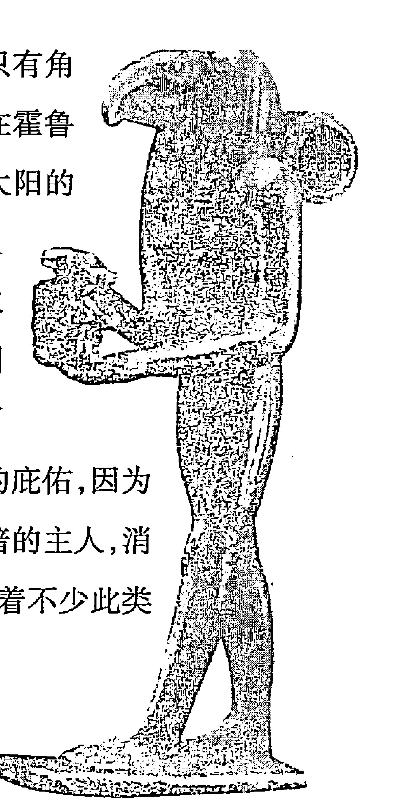

这根石柱非凡的价值意义在于它上面提到了当时执政国王的名字——内克塔尼布一世(Nectanebus I),他于公元前 378 年至公元前 360 年间在位。

约有三百位神明刻在梅特涅石柱的正面、背面以及两侧,其中有天堂、地球和另一个世界的神,有行星之神,有德坎(一种划分一年时间的单位,一个德坎是一个星期,共十天,一年由 36 个德坎组成)之神,有白天之神,有星期之神,有月份神,有季节之神,还有年神,除此之外,还刻有一些当地模样的神,难以对其辨认。石柱正面的圆形部分有一个太阳的光盘,代表着至高无上的荣耀,可以看到里面是长着四个羊头的克尼穆,坐在两条手臂之间,下面是一湖圣水,湖的两岸分别有四位黎明的精灵,再过去的右侧站着内夫一泰穆(Nefer—Temu),代表升起的太阳,左侧站着托特。下面是五排小小的神明像,再下面是哈珀克拉兹的像浮雕,造型如前文所述。哈珀克拉兹站在两条鳄鱼身上,头上罩有一个类似华盖的东西,由托特和伊西丝支撑着,手里握着半人半兽的动物和爬虫。华盖上面是拉双眼,两只眼睛都有人类的手臂和手。哈珀克拉兹的右边站着塞克(Seker,光之神)和霍鲁斯,左边是内夫—泰穆。再过去是女神奈赫贝特和瓦切特,她们分别守卫着上下埃及。石柱的背面和侧面还有多个神像。宇宙中所有神明都拥有保护人类的法力,这根石柱就代表他们力量的总和,不论你把它放在何处,它都会形成一个坚不可摧的屏障,足以对抗任何魔鬼与毒虫的侵袭。石柱上没刻神明之处,则布满了象形文体的咒语,这些咒语力量异常强大,因为里面含有神明曾用来消灭黑暗与魔鬼的词语。对于这些咒语,可以作出如下总结:

第一个咒语第一部分是针对所有虫蛇和有毒生物的,拉的大敌阿佩普是它们的首领,他变成一条“弯曲似肚肠”的巨蟒,而这个咒语注定了其身首异处、魂飞魄散的命运。天蝎宫女神瑟凯特(Serqet)将会帮助完成这些。这个咒语的第二部分是针对阿佩普的毒液的,一旦有人被蛇咬了,就可以为其诵读咒语。霍鲁斯念这个咒语,能使阿佩普呕吐,

一个有足够资格的魔法师运用这个咒语,能使遭蛇咬的人呕吐,从而排除其体内的毒液。

第二个咒语是针对传说中的神猫的,即拉或伊西丝的女儿,她长有拉的头颅,乌拉尤斯(uraeus, 守护女神)的眼睛,托特的鼻子,内贝彻的耳朵,泰姆的嘴巴,内迦(Neheb—ka, 蛇神)的头颈,托特的胸脯,拉的心,众神的手,奥西利斯的肚腹,蒙苏(Menthu, 战神)的大腿,凯恩苏的小腿,阿蒙—霍鲁斯的双脚,霍鲁斯的臀股,拉的脚底,梅—乌丽特(Meh—urit, 母牛女神)的内脏。神猫的每一部位都是一位神,无论是毒蛇、蝎子或爬虫的毒液侵入她的体内,她都能够消除。咒语的开头讲拉应邀来到女儿身旁,在一条偏僻的小路上她被一只蝎子咬了,请求拉去除她体内的毒液。如此看来,似乎应当是大魔法师伊西丝曾被蝎子咬过。咒语的第二部分理解起来难度较大。拉—哈马基斯来到女儿身边,休也来看望他的妻子,伊西丝也来看自己的姐妹,然后魔鬼要求年长的那位,即拉,交还内哈—赫尔(Neha—her)或塞特。“奥西利斯在水里,霍鲁斯与他在一起,而一只体型庞大的甲虫罩在他身上”。霍鲁斯恳求水里的一切魔鬼精灵让他到奥西利斯身边去。拉、塞赫迈特(Sekhet, 战争与破坏女神)、托特和赫卡 (Heka)——咒语的人性化象征,作为保护奥西利斯的四大神明,他们能让敌人失明窒息,并割下他们的舌头。

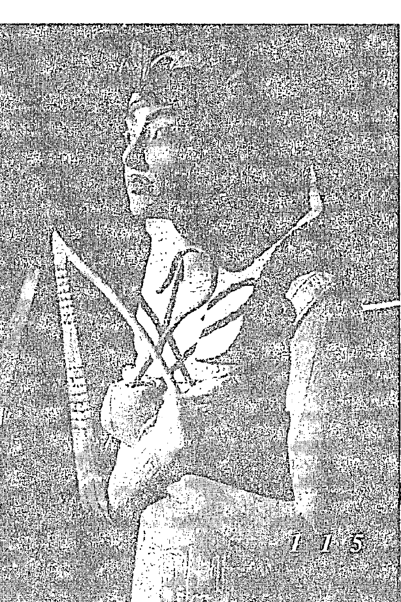

神猫的哭喊声再次响起,魔鬼问拉是否记得内堤特(Netit)河畔的哭声,暗指伊西丝赶到阿比多斯附近的内堤特,发现被扔在那里的她丈夫的尸体时,发出的痛苦哭喊。讲到这里,石柱上插进一段长长的叙述,这段叙述写在伊西丝的嘴里,由此可见,叙述的内容是她所承受的苦难,也可以得知霍鲁斯死于蝎子的蜇咬。叙述在讲了塞特谋杀奥西利斯之后,把伊西丝关进一个地方,可能企图强迫她嫁给他,这样他就可以合法占领王国。我们知道,伊西丝当时已经怀上已逝丈夫的骨血,托特出现了,建议她隐藏起来,再悄悄地生下孩子,他还向她承诺,她的孩子将来一定可以继承其父的王位。托特帮助伊西丝,逃出牢笼,之后伊西丝跟着七位天蝎宫女神,来到芦苇沼泽地(Reed Swamps)边界上的小镇佩—斯卫(Per—Sui)。伊西丝请求一位妇人,允许她留宿一晚,但遭到这个女人的拒绝。一位天蝎宫女神为惩罚这个女人,硬闯进她的家里,蜇死了她的孩子。那个妇人痛不欲生,这使伊西丝同情不已,于是她把双手放在孩子身上,

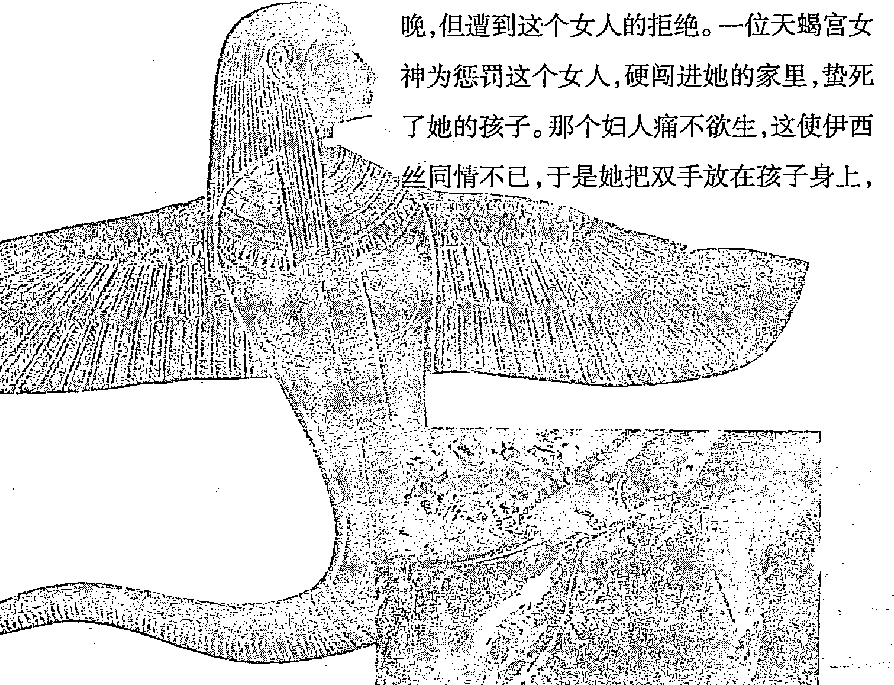

对他念出最有力的咒语,蝎子的毒液立刻流出来了,孩子复活了。这个咒语也刻在石柱上,埃及人民视它为治疗蝎螫的秘方,绝对可靠有效。妇人看到伊西丝救活了自己的孩子,既高兴又感激,为表示忏悔之意,她从家里拿来各式各样的物品,作为礼物送给伊西丝,当时另外一位贫穷但善良的女子收留了伊西丝,结果这些礼物堆满了她的屋子。

伊西丝挽救了粗鲁妇人的孩子后不久,一场灾难降临了,她心爱的儿子霍鲁斯被一只蝎子蜇咬而死。众神明通知伊西丝,她的儿子被可怕的蝎子乌哈特(Uhat)杀死了,要她赶紧过去看看。伊西丝听到这个消息后,心如刀割,悲痛万分,匆匆忙忙就跑出门去。原来,在这之前她把孩子小心地藏于塞克赫特—安(Sekhet—An),自己则到赫特普—赫姆特 (Hetep—hemt) 附近的一座神庙去参加纪念奥西利斯的宗教仪式,塞特派蝎子乌哈特乘她离开的间隙,闯进霍鲁斯的躲藏地,并将其蜇死。伊西丝找到孩子的尸身,悲痛地唱起哀歌,歌声把邻近的人都引了过来,哀歌唱出了她所有的苦痛,人们听后都尽力安慰她,但当他们发现这些不济于事时,就一起放开嗓门痛哭起来。伊西丝把鼻子放入

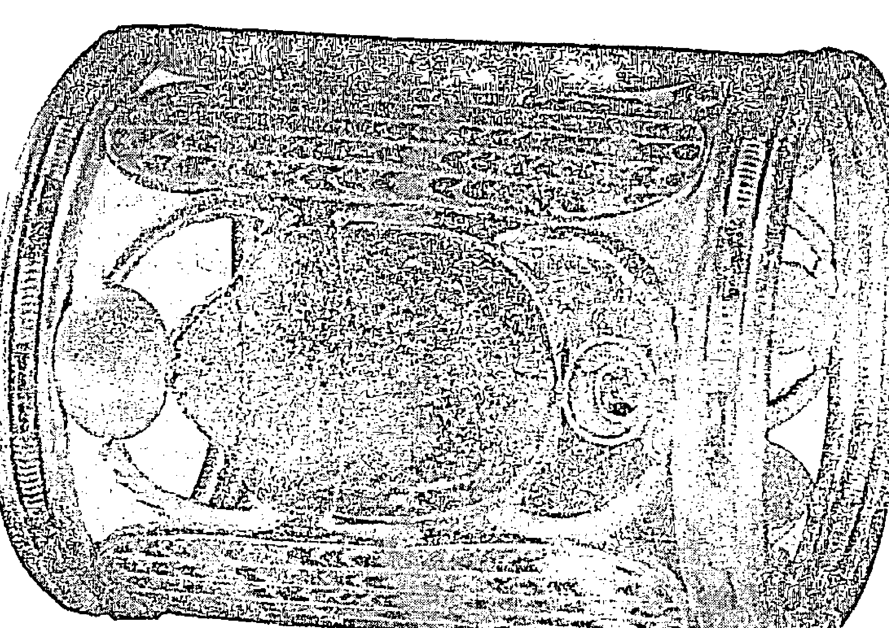

霍鲁斯的嘴里,看他是否还在呼吸,但他的呼吸已经停止。她检查魔鬼昂—阿布(Aun—Ab,即心的屠杀者)在霍鲁斯体内留下的伤痕,看到有毒液的痕迹。她对儿子的死因确认无疑,于是,抱起霍鲁斯,虽然心中充满无限悲伤,却仍像鱼在又红又烫的煤炭上一样来回跳跃,随后,她念出一连串令人心碎的悼词,句句都有“霍鲁斯被蝎子咬啦”。这样一位天堂的继承者,昂—内夫的儿子,众神之子,绝对诚实公正的人,竟然被蝎子咬啦!我为他提供了一切,他将要为其父复仇,竟然被蝎子咬啦!当他还在我的体内时,我就爱护着他,为他受苦,他竟然被蝎子咬啦!我一直照料他,注视他,他竟然被蝎子咬啦!我为他的生命祷告,他竟然被蝎子咬啦!灾难降临了,孩子离去了。

一直游荡在沼泽地里的伊西丝的妹妹内芙蒂丝,为她外甥的死痛哭流涕。在伊西丝说着以上那些话,以及其他类似的话语时,她与天蝎宫女神瑟凯特一同赶来,建议伊西丝向天堂祷告,祈求帮助,祈求拉之船的水手们放下手中的船桨,因为霍鲁斯死了,船无法继续前行!

于是,伊西丝向天堂哭喊,声音传到亘古的船上,飞盘停止不动了。通晓各种各样的咒语和法术的托特从船上下来,并带来了“伟大指令”,那是一个词语,它的指令必须得到立即和完全的执行,不论是在天堂,还是在地球,甚至是在另一个世界,每一个神明、精灵、魔鬼、人类、任何有生命或无生命的个体,都必须对它服从。托特走到伊西丝面前,对她说霍鲁斯不会受到任何伤害,因为他有拉之船的保护,但托特的话没有让伊西丝感到宽慰,虽然她知道托特的伟大计划,但她还是抱怨他们来迟了一步。她说:“如果霍鲁斯中毒身亡,倒进死神的怀抱,那所有的咒语和魔法,还有那‘伟大指令’又将有什么用?邪恶,邪恶就……

is le premier système applicable aux caractères indiciaires en cherchant par des teintes plates à représenter dans leur couleur naturelle des objets représentés : ainsi dans les figurants le ciel (1) étant peint en bleu, la terre (2) en noir, la lune (3) en jaune, le soleil (4) en rouge, l'air (5) en vert (6)

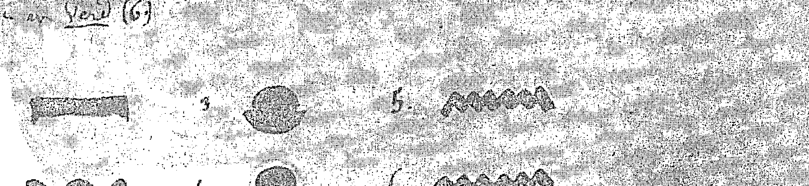

figures d'Hommes en pied sont peints sur le grand mur avec des règles aux couleurs : les chairs sont en brun foncé, les coiffures en bleu et les tuniques blanches avec des draperies indiquées par des traits rouges.

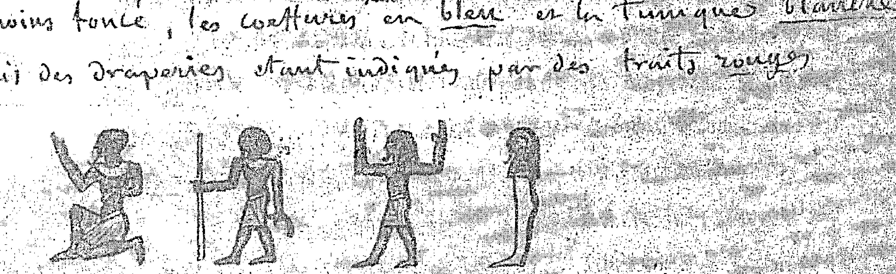

on voit ordinairement des chairs jaunes avec figures de femmes dont les vêtements varient en blanc ou vert ou en rouge.

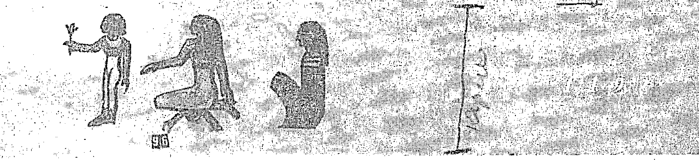是他的命运，因为那已经给他带来不幸和死亡。作为回答，托特转向伊西丝和内芙蒂丝，要她们不用害怕，不用担忧，“因为我从天堂来，就是为了母亲挽救孩子的生命”。然后他说霍鲁斯是他飞盘（阿顿）上的住客，是伟大的侏儒，是强大的白羊星，是神圣的甲虫，是隐形人，是神贝努，等等，接着又念了一个伟大的咒语，他借助咒语把拉的“生命流体”转移到孩子身上，毒液则立刻流了出来，霍鲁斯恢复呼吸，获得了重生。托特完成这些后，重返拉之船，跟随他的众神又继续行船，飞盘又重新开始了每天横跨天空的旅行。本来天堂里的神明都为霍鲁斯之死而感到震惊与恐惧，如今又都高兴起来，为霍鲁斯的重生唱起欢快的歌曲。伊西丝看到儿子死而复生，心中充满无限的喜悦，因为她又有了希望，希望霍鲁斯会为他的父亲报仇，会继承王位。托特临走前说的话，更令她备感欣慰，托特说他会在阿努的审判大厅里——奥西里斯也曾经在那里受过审——帮助霍鲁斯，他会当霍鲁斯的拥护者，他会把一切有可能对霍鲁斯造成不利影响的指责都反过来对付说这些话的人，而且，他会传给霍鲁斯力量，让他不但可以抵制来自上面的攻击，还可以对抗来自下面魔鬼的侵袭，他会辅佐霍鲁斯，确保他继承王位，管理两片土地，即成为埃及之王。托特还向伊西丝许诺，拉也会成为霍鲁斯的拥护者，如同他曾经拥护过其父奥西里斯一样。他还委婉地提到伊西丝所做的贡献，他说：“是他母亲的话语使他恢复生机，这些话语足以帮助他恣意纵横四海，化解所有恐惧。我自己也不得不服从于这种咒语。”因此，一切都归功于伊西丝咒语的力量，也正是这力量使太阳停滞，让逝者重生。

以上就是著名的“梅特涅石柱”上文章的大致内容，布局有些凌乱，某些章节显然放错了位置，而且多处已经明显遭到腐蚀，因为我们并不完全知晓它所表达的魔法体系，所以还有很多段落无法理解，但文章大意还是相当明了的，它记录了一个关于伊西丝和霍鲁斯的传说，其他记载相关内容的碑文，都远不如这一份完整详细。

## 经文

### 对付一般毒蛇和有毒生物的魔法

回去吧，阿佩普，拉的敌人，像肠子一样盘旋的毒蛇，你没有手臂，没有腿脚，身体想直立却无法直立，只能把你的尾巴长长地拖在巢穴前，在拉的面前退缩而去。你的头将被砍掉，你将被杀掉，你将抬不起脸来，因为拉的威名渗透进你邪恶的灵魂里。伟神的屠刀将把你四分五裂，你的各个部位将散发出香气，充满整个天地。天蝎座女神瑟克击退你的攻击，你停下来，停下来，在她的咒语下退避。

哦，吐出来吧，毒液，我命令你在地面上显形。霍鲁斯对你念了一个咒语，他将你砍碎，他朝你吐口水，你将无法飞上天堂，只能蹒跚地落在地上。

哦，多么虚弱啊，没有力气，胆小如鼠，不能把战斗继续，没有双眼，失去视力，头也已经上下颠倒，脸再也不能抬起。很快就打败你了，你没有其他活路可寻觅，绝望地躺下吧，不会有欣喜，快速地撤退吧，不要将你的脸抬起。霍鲁斯开口了，他的话完美无瑕，铿锵有力。毒液兴奋的时候，许多人的心感到悲哀不已。霍鲁斯使用咒语来消灭毒液，悲伤的人于是变得欢喜。哦，悲伤的人啊，请止住哭泣，因为霍鲁斯已经赐予生命。他聚集力量，将会咬人的色巴魔鬼治理。每个人见到拉的时候，都把奥西利斯的儿子称赞不已。回去吧，你这条害虫，用刀把你身体各部位的毒液来清理。霍鲁斯的咒语真的可以对付你，哦，敌人，快点吐吧，哦，毒液，赶走了你。

### 给猫施咒语的篇章

背诵（以下用语）：

“万福，拉，快来看看您的女儿吧！一只蝎子在一条偏僻的路上咬了她，她发出的尖叫声直冲云霄，所有人都能听到啊。毒液进入她的身体，在她的周身循环流淌，她已经用嘴去解毒，但毒液是真的已经侵入了呀！

“快来吧，带着您的气力，带着您的凶猛，带着您红色的力量，令它在您面前遁形。看呀，毒液已经遍布我手里这只猫的身体。不要害怕，不要害怕，我的女儿，我的宝贝，因为我已经在你身旁，猫四肢里的毒液，我已经全部清理。哦，猫啊，你的头是拉的头，他是南北两地的神，他是叛徒的终结者。哦，生存的神，永恒的神，你的威严遍布整个大地。哦，猫啊，你的两只眼睛是神库特眼镜蛇般的眼睛，他用他的眼睛照亮黑暗道路上的脸庞，照亮南北大地。哦，猫啊，你的鼻子是托特的鼻子，他比其他众神还要伟大一倍，他是克尼穆的神，是拉的土地上的主，是他吹入人类鼻孔气息。哦，猫啊，你的耳朵是内贝彻的耳朵，他倾听所有人的请求，他在全世界作裁决。哦，猫啊，你的嘴是泰姆的嘴，他是生命的神，创造的统一者，他会从各种毒液中挽救你。哦，猫啊，你的脖子是内赫伯一卡的脖子，他是太阳神殿的主持，他两条手臂上的嘴巴可以让人类恢复生命。

“哦，猫啊，你的胸脯是托特的胸脯，他是真理之神，他把呼吸注入你的喉咙，他也把呼吸赐予你喉咙里所有东西。哦，猫啊，你的心是布塔的心，毒液遍布你的全身，是他医好你那被邪恶毒液浸染的心。哦，猫啊，你的手是大小众神的手，他们会保护你的手，免遭每条毒蛇的侵袭。哦，猫啊，你的肚腹是奥西利斯的肚腹，他是布西利斯的神，毒液对他的肚腹完全失去效力。哦，猫啊，你的大腿是神蒙苏的大腿，他会让你的腿直立起来，使毒液流到地里。哦，猫啊，你的腿骨是凯恩苏的腿骨，他日日夜夜在南北大地上行走，会将毒液导入大地。哦，猫啊，你的腿是伟神阿蒙的腿，他是底比斯的神霍鲁斯，他会让你的双脚踏上大地，去除里面的毒汁。哦，猫啊，你的股是霍鲁斯的股，他是他父亲奥西利斯的复仇者，他会将塞特的恶行施还给他自己。哦，猫啊，你的灵魂是拉的灵魂，他会将毒液还给大地。”

# 第八章 霍鲁斯死而复生的传说

“哦，猫啊，你的肠是神牛女神梅赫特的肠，她会将你肚腹以及所有身体部位中的毒液来清洗，天堂里所有的神明，地球上所有的神明，她也都可以治愈。你身体里没有一个部位，女神无法来清洗，无论是雄蛇，还是雌蛇，无论是蝎子，还是爬虫，没有一种毒液，女神无法将之从你体内去除，并且粉碎得彻彻底底。伊西丝编，内芙蒂丝织，她们编织了一条毯子将毒液来抵御，这条织毯使霍鲁斯更加强大有力，霍鲁斯通过南北大地之主、伟神拉·赫鲁—库蒂的言辞，可以念出完美的咒语。哦，邪恶的毒液啊，快从这头猫的身体里面出来，流入土地。”

# 又一章

说以下的话语：

“哦，拉，快来看看你的女儿。哦，休，快来看看你的妻子。哦，伊西丝，快来看看你的姐妹，快把全身都被毒液浸染的她来医治。哦，万福，诸位神明，快来啊，快来看看这只手术刀下的猫，快来将她全身毒液来消除。”

“哦，万福，前辈，你在适当的时候恢复了青春，你把自己变成一名孩童，告诉你，托特听见我的声音，大概就要来了，看着吧，让他来阻止内塔—特尔吧。奥西里斯在水面上，霍鲁斯的眼睛跟着他，一只巨大的虫子覆盖在他身上，由众神从一个孩童处产生，虫子因为控制住他而变得巨大。水面上的人儿没有受伤，如果他受到攻击的话，霍鲁斯哭泣的眼睛，就也会受到攻击了呀。

“回去吧，哦，你们这些躲在水里的东西，鳄鱼，大鱼，敌人，死尸，魔鬼，无论男女，无论雄雌，无论种类，全都抬不起头来啦，你们这些躲在水里的东西，你们这些鳄鱼和其他鱼类啊。当奥西里斯赶来的时候，闭起你们的鼻孔，封住你们的喉咙，让他到布西利斯去吧。

“回去吧，色巴的魔鬼！不要抬起脸来看水面上的人……奥西里斯—拉，乘着自己的船去看克尔—阿哈特（Kher—ahat）的神明，图瓦特的神出来杀你，哦，内塔—特尔，当你出来反对奥西里斯。当他在水面上，霍鲁斯的眼睛保护着他，他会让你们头朝下，仰倒在地。

“嘿，这些鳄鱼和其他鱼类，躲在水里的东西，拉封住你们的嘴巴，塞克赫特闭住你们的喉咙，托特割去你们的舌头，赫卡弄瞎你们的双眼。他们是四位伟大的神明，用他们的法力保护奥西里斯，他们也保护水面上的他，保护白天在水面上的动物和男女。水里的一切也得到保护，拉居住的天空也得到保护，躺在石棺里的伟神也得到保护，水面上的人儿也得到保护。

从内特的宫殿里发出一声哭喊，那来自太阳神殿，来自猫的嘴里。众神纷纷询问：“什么声音？什么声音？”那与诞生的阿博图神鱼大有关系。哦，色巴的魔鬼，在我面前停下脚步吧。我是克尼穆，赫尔—乌尔特（Her—urt）的神明。小心不要再做邪恶之事，包括现在你在众神面前已经犯下的罪行。回去吧，从我面前退去吧。我是神明。哦，哦，拉，你有没有听到声音？那是持续到夜晚的内提特河岸的哭喊，那是众神齐声发出的哭喊，他们哭喊，因为你的邪恶行径，哦，邪恶的色巴魔鬼。神拉为此咆哮震怒，他命人立刻来处决你。回去吧，色巴魔鬼！回去！回去！

## 伊西丝的独白

我是伊西丝，我被我兄弟塞特关在监狱里。看呀，神托特，伟大的天堂和地球里的玛特（Maat）首领，他对我说：“哦，女神伊西丝，快来听听这个好消息，因为一个人的生命应当得到另一个人的建议。带着你的儿子藏起来，下面的事情会为他来临：他会长大成人，他的力量将比各种力量大一倍，他会坐上他父亲的宝座，他会为他的父亲而复仇，他会成为两地的主人，获得至高无上的权力。”

我乘着夜色逃了出来，有七只蝎子跟着我，用它们的毒针为我开路。泰芬（Tefen）和贝芬（Befen），这两只在我后面，麦斯泰特（Mestet）和麦斯泰特夫（Mestetef），这两只在我旁边，佩泰特（Pe—tet），塞泰特和玛泰特为我开路在头里。我大声地命令它们，它们的耳朵听进我的话语：“不要打探任何信息，不要朝受时间限制的生物大叫，不要以任何理由注意任何人。”我又说：“将你们的脸朝下，这样可以为我把路来指明。”于是，这群护卫把我带到城市帕—苏伊城的边界，那是圣鞋女神的城市，位于纸莎草沼泽地的前沿之地。

我走进城里，朝有夫妻居住的房子走去，一个有地位的女人乌瑟特看着我从路上走过来，却当着我的面把门关闭，因为她看到跟着我的那些蝎子，从心底里感到厌恶不已。而一位名叫塔哈的女子为我开门，我走进这位可怜女子的家里。

蝎子泰芬闯进门去，蛰杀了乌瑟特的儿子，她的屋子还着了火，附近没有水可以来浇熄，但天空突然朝房子下起了雨，当时却并不是雨季。

看呀，没有为我开门的女子，伤心欲绝，因为她不知道她的儿子是否还能活着。尽管她跑遍城市，寻求帮助，却没有一个人出来应。如今我的心也为了这个孩子而悲伤不已，他没有过错，我希望可以再给他生命。因此，我对那有身份的女子呼喊：“我来吧，我来吧，我的嘴拥有生命。我是这个城里有名的女子，我的父亲教给我咒语，我可以用它们将死亡的魔鬼来驱除。我是他的女儿，他身体的后代，他钟爱我无比。

我把双手放在孩子身上，为了让已经静止的他重获生命，我说：

“哦，蝎子泰芬的毒液啊，到地上来吧！你不应该再继续进入孩子的身体。哦，蝎子贝芬的毒液啊，到地上来吧！我是伊西丝，我是女神，是施咒的女子，是咒语的创造者，我知道如何念出有魔法的字句。哦，各种会咬人的毒虫啊，听我说，都到地上来吧！哦，蝎子麦斯泰特的毒液啊，不要再侵入他的身体。哦，蝎子麦斯泰特夫的毒液啊，不要再在他的体内。哦，蝎子佩泰特和塞泰特的毒液啊，不要再散布于他的身体。哦，蝎子玛泰特的毒液啊，回到地面上来吧。

女神伊西丝，伟大的咒语之神，她是众神的首领，连神凯布都曾经给过她魔法咒语，用来在正午驱除毒液，令毒液返回，退缩，并且撤离。她说：

从无花果树里诞生出来的斯蒙鹅蛋，按照敬爱之神拉的命令，不得升入天堂。我的话语可以用来使黑夜的极限达到最大。哦，蝎子啊，我对你们说，我孤孤单单，悲伤难过，因为全国的人都在唾弃我们的名字。不要相好，不要朝魔鬼叫喊，不要对高贵的女子瞧上一眼，只看着地面，指明方向，最终到达克博特（Khebt）小镇的藏身之处。哦，孩子应该存活。毒液应该死亡！拉活着，毒液死了！霍鲁斯应该为他的母亲伊西丝而好好地存活，同样的，受到蛰咬的人也应该好好地存活。

乌瑟特家里的火苗熄灭了，天堂对伊西丝的话语非常满意。乌瑟特前来送给我她的财物，把塔哈的房子都塞满了，因为她曾经为我开门。

接下来轮到乌瑟特遭受痛苦了，她痛了整个晚上，她的嘴尝（即感觉）到他儿子遭受过的苦痛，她拿来财物，当作不为我开门的惩罚。哦，孩子应该存活，毒液应该死亡！霍鲁斯应该为他的母亲伊西丝而好好地活着，同样的，受到蛰咬的人也应该好好地活着。

吃一种大麦制成的面饼“罗（Lo）”可以排除（或去除）毒液，泡碱可以降低毒性，用赫彻特（hetchet）枝叶烧的火可以消散四肢发热。

同她一起住在镇上的神明们叫道：“哦，伊西丝，哦，伊西丝。伶牙俐齿的女子，到你的霍鲁斯身边去，去看看你的儿子吧！他被一只蝎子咬伤了，被安泰什（Antesh）赶走的蝎子乌哈特（Lhat）曾经伤害过一个孩子，他就和那孩子一样！”

于是，伊西丝飞跑了出去，仿佛有一把刀戳着她的身体，她伸开手臂，说：“我的天哪，我的天哪，我的儿子霍鲁斯，不要害怕，不要害怕，我荣耀的儿子！没有什么邪恶之事会降临到你的身上，因为你的体内有一种令万物生存的物质（或流体）。你是来自梅斯特的子孙，你来自圣水努，毒液的热度不会令你死亡。你曾经是伟大的贝努，出生在阿努（赫利奥波利斯）长者宫殿里的凤仙树顶上。你是阿博图之鱼的兄弟，是他形成万物现在的样子，是他哺育着内斯宫殿里的猫。女神莱蕾特和哈特，以及神贝斯保护着你的身体，你的头不会向袭击你的恰特魔鬼低下，你不会被魔鬼带入水底。没有一条毒虫的蛰咬会控制你，没有一头狮子会征服或统治你。你是伟神的儿子，你父亲是凯布的子嗣。你是霍鲁斯，毒液不会控制你的身体。你是伟神的儿子，你父亲是凯布的子嗣，所以同样的，所有手术刀下的人都应如此。四位八月的女神会保护你的身体。”

## 伊西丝的独白被打断的一段

我升入天空，在图瓦特下沉，我在高高的宫殿里，张开眼睛光线就出现，闭上眼睛黑夜就来临。

发布命令的时候，我是水神赫特（Het），所有神明都知晓。我照亮大地，日日夜夜放着光亮，夜晚也一样。我是巴卡（Bakha）神牛，是玛努（Manu）神狮，我日日夜夜在天堂中穿行，永不厌倦。我听到伊西丝儿子的叫声，所以降临大地。瞎眼毒蛇纳真的咬了神牛。哦，我命令你毒液，从他身体的各个部位出来，返回地面。看呀，这位病人不得蛰咬。

霍鲁斯在赫特普—赫姆特（Hetep—hemt）以北的塞克特—安（Sekhet—An）地区遭到蛇咬，而他的母亲伊西丝当时正在神庙里，为兄长奥西利斯制作祭酒。霍鲁斯高声尖叫，声音直冲云霄。金合欢树神庙里的看门人，忽然听到霍鲁斯发出悲切的哀号，于是天堂发出命令，要治愈霍鲁斯的蛇毒。众神一起开始思索，如何拯救霍鲁斯的生命，他们说：“哦，女神，哦，哦，带着你们的东西，清除伊西丝的儿子、霍鲁斯身体里每一部分的毒液吧，同样的，也清除手术刀下之人体内的毒液吧。”

颂扬霍鲁斯的赞歌，这首赞歌应该对着土地和河流唱诵：

“向您致敬，神啊，您是神之子。向您致敬，继承人啊，您是继承人之子。向您致敬，神牛啊，您是神牛之子，由一位神圣的女神诞生。

向您致敬，霍鲁斯，奥西利斯是您的父亲，伊西丝是您的母亲。我背诵您的咒语，我讲述您的魔法字句。我用您的话来念您用心创造的咒语，以及所有从您嘴里讲出来的魔法和咒语，您的父亲凯布令您将它们背诵，您的母亲努特将它们赠送给您，尊贵的塞克赫姆（Sekhem）统治者教您如何使用它们来保护自己，这样，您就可以重复您的保护方法，合上所有天堂里、地球上以及水流中毒蛇的嘴巴，助人类生存，令众神与您和平共处在一起，使拉通过您的赞歌使用他的魔法咒语。今天，划动拉之船上的桨，快快到我面前来吧。为我驱逐平原上的每一头狮子，河流里的每一只鳄鱼，所有会咬人的嘴巴。使它们在我面前像山石一样静止不动，像破罐子一样碎得遍地都是。为我将手术刀下之人全身的毒液取出。用您的咒语……来将他监视。今天人们向您的名字祈祷，您的力量在他体内升起，您的法力得到升华，使我存活，使他恢复生命。人类将为您唱起赞歌，正义的人将向您表示感激。同样的，所有的神明会恳请您的庇佑，而且今天您的名字确实该得到颂扬。我是舍特的霍鲁斯。

哦，在洞穴里的您，哦，在洞穴里的您，哦，在洞穴口的您。哦，在路上的您。哦，在路上的您。哦，在路口的您。他是乌尔梅尔，可以接近每一个人和动物。他就像太阳城的神塞普，他是在大殿里的蝎子神。不要咬他，因为他是拉。不要蛰他，因为他是托特。不要朝他喷射毒液，因为他是内费—泰姆。

哦，每一条雄蛇，哦，每一条雌蛇，哦，每一只蝎子，只要是用嘴咬的，用尾巴蛰的，都不要用嘴去咬他，不要用尾巴去蛰他，远离他，不要用你们的火焰去灼烧他，因为他是奥西里斯的儿子。吐吧，四次……

“我是托特，我从天堂来保护霍鲁斯，来去除他全身的蝎毒。您的头完好，霍鲁斯，它将稳稳地戴上乌雷尔特皇冠。您的眼睛完好，霍鲁斯，因为您是霍鲁斯，众神当中双眼之神凯布的儿子。您的鼻子完好，霍鲁斯，因为您是拉之子，长者霍鲁斯，您不会吸入狂猛的风。您的手臂完好，霍鲁斯，您的力量仍然巨大，足以将您父亲的敌人杀死。您的大腿完好，霍鲁斯，您得到您父亲奥西里斯的地位和尊严，布塔已经在您出生之日，把您的嘴巴放平衡。您的心完好，霍鲁斯，飞盘在保护着您。您的眼睛完好，霍鲁斯，您的右眼像休，您的左眼像特芙努特，他们都是拉的子孙。您的肚腹完好，霍鲁斯，里面的子孙都是神明，他们不会受到蝎子毒物的侵蚀。您的力量完好，霍鲁斯，塞特的力量不足以与您抗衡。您的阴茎完好，霍鲁斯，您是卡姆特夫（公牛），他父亲的保护者，每天上课的时候，他父亲都会为他的孩子回答一个问题。您的腿完好，霍鲁斯，您的力量可以消灭您父亲的仇敌。您的小腿完好，霍鲁斯，神克尼穆创造了它们的骨头，女神伊西丝让它们长上肌肉。您的脚底完好，霍鲁斯，用弓（Pèti）打仗的民族也拜倒在您的脚下。您统治的东西南北，您的视力可以说是拉的四倍。”

“美丽的神啊，拉的儿子，您受到神明的保护，相反的，所有神明也都受到您的保护。美丽的神啊，拉的儿子，您受到伟神赫鲁—舍特的保护，相反的，伟神也受到您的保护。”

The request was rejected because it was considered high risk## 古埃及的咒语

方面，但由于宙斯年长，学识最多，从而明确暗示他的王国比波塞冬的更加尊严荣耀，同样在智慧和科学领域的造诣方面，由于年龄优势的缘故，他也比波塞冬更加高深。而且我还认为，神所拥有的所谓永恒生命，其实就存在于伴随着他的宇宙知识之中，因为撇开这个话题不谈，比起把永恒定义为一种永久的持续，定义为一种活着的乐趣就显得不那么恰如其分了。

因此，追求那些与神性特别相关的真理知识，就是在渴望成为那种本性的参与者，同样说明，我们所有的研究和调查都以获得那种神圣的东西为目的，比起在庙宇里做表面的净化或单纯的朝拜，这一事业更富有宗教意义。人们正在朝拜的那位女神，对于这种倾向肯定尤其赞同，因为智慧和远见就是她的特殊品质，而她的名字更是体现了她与知识间的特殊关联。“伊西丝”是一个希腊词语，意即“知识”，而她那死对头的名字“提芬(Typhon)”，也是一个希腊词语，意即“骄傲和蛮横”，作为无知愚昧，罪孽重重，把神圣的学说撕得粉碎，还藏匿起来这种人的代名词再合适不过了。这里指的神圣学说是由女神收集起来日积月累的教义，专门传授给渴望获得神性的人类，其中反复强调始终如一的坚持，以及温和的生活方式，禁止享用一些特定的食物，禁止放纵无度，也禁止在允许的范围内有任何过度纵欲的行为，同时所有信徒必须养成参加那些简洁严苛的庆典仪式的习惯，这是他们宗教的规定和要求，必须执行。这一切辛苦和付出只有一个目的，就是掌握知识，成为领导生命和最高生命，当然是需要心领神会的。女神引导我们追寻这种知识，是为了让我们能够靠近她，和她永远在一起，这也是她的庙宇向我们承诺的，即永恒的和独立存在的知识与认识，现在人们

# 内芙蒂丝(Nephthys)

埃及神话中死者的守护神，生育之神。她也是九柱神之一。
在埃及艺术作品中，她的头发看上去很像是裹尸布。她被描绘成头顶一只篮子或一栋小房屋，有时是长着一对翅膀的女性，而有时则是风筝、猎鹰、隼或其他鸟类。她是凯布与努特的女儿，是塞特的妻子。与塞特生下阿努比斯。在艺术作品中她常与自己的姐妹伊西丝一同出现。

# 伊西丝(Isis，希腊语，在埃及语中叫作阿赛特 Aset)

古埃及的母性与生育之神，九柱神之一，也是一位反复重生的神。
刚开始，伊西丝是一位主管皇权的女神。后来，在希腊人统治时期，她又变成了水手的守护神。
伊西丝是大地之神凯布与天神努特的女儿，她与自己的兄弟奥西利斯结婚并生下儿子霍鲁斯。奥西利斯被自己的兄弟塞特谋害并肢解，后来伊西丝将他的尸体拼接起来并使他复活(这使伊西丝的形象与阴间和葬礼崇拜联系起来)，又与他在凯姆尼斯(Kemnis)湿地生下霍鲁斯。
伊西丝与她的姐妹内芙蒂丝同为亡者的守护神，她们常在棺材的两端以人形现身，张着翅膀保护亡者。这对姐妹同时都拥有魔法力量。

## 古埃及的咒语

有些学者认为女神伊西丝是赫尔墨斯(Hermes)的女儿，但有些则认为她是普罗米修斯(Prometheus)的后代，这两位都以其哲学性思维著称，前者是信件和音乐的发明者，而后者是把智慧和谋略传授给人类的第一人。

赫莫波利斯(Hermopolis)有两位缪斯，这些作家不仅把其中的第一位称为“公义(Dikaiosune)”，同时又都称其为伊西丝，据说，她本身就是智慧的象征，专为她的信徒——海尔若佛利(Hierophori)和海尔若斯托里(Hierostoli)——指点迷津。现在，当人们讲起海尔若佛利时，就专指一些信奉者，他们在自己的灵魂里，就如同在心胸里，探索神明的神圣教义，从一切可能由迷信带来的繁文琐事中纯净自己。海尔若斯托里用来装点神明塑像的圣衣，一部分颜色阴沉灰暗，一部分颜色明亮鲜艳，正好体现了该教义要人类领会的半明半暗，明暗结合的宗旨。伊西丝的教徒在死后，会穿上这样的圣袍，不就是在强调他们仍然坚守教义，要让圣教一路陪伴着过另一种生活吗？留着长长的胡须，养成简朴的习惯，并不代表肯定能成为一位哲学家；同样的，经常剃须，只穿亚麻长袍，也不代表着就能成为伊西丝的教徒。真正的教徒应是这位女神的仆人或随从，要在以恰当的方式听取并熟知神明的相关事迹后，会从表面寻找掩藏其下的真相，会运用理性和哲学的原理来审查一切。

# 第九章 伊西丝和奥西利斯的历史

这种审查实在是必不可少的，因为如今忽略真理的现象屡见不鲜，就是最基本的朝拜仪式，如剃须以及穿亚麻长袍等，也很少有人能够说出埃及祭司去做这些的原因，有些人从来没有花时间去考虑这些，也有一些人仅了解了最肤浅的表面，就感到心满意足了。

祭司们对绵羊怀抱有特殊的崇敬情结，所以他们认为不但羊肉不可以吃，连羊毛制成的衣服也不能穿。他们不停地向神明祷告，所以要剃须。天蓝色的亚麻花恰似悠远缥缈的天空，清澈明亮，所以他们穿亚麻布制成的长袍。然而，对他们其中的大多数人而言，传承这些仪式的理由只有一个，就是追求洁净的特殊信念，因为他们认同普鲁托(Pluto)的名言：“只有纯洁之人才能相互靠近。”没有多余的食物，没有排泄，他们认为这就是纯洁干净，不过这里所指的是各种羊毛、排泄之气、头发和指甲，因此，要求洁净过程中的人，忍受诸多痛苦，去除身体各部位的毛发之后，又穿上其他动物的皮毛，简直是荒唐可笑之极。所以，赫西俄德(Hesiod, 公元前8—前7世纪的诗人)告诫我们“不要在出席神明庆典之时修剪指甲”，我们应该能够理解这句话的深层意思，他是在教导我们保持纯洁，在参加任何宗教仪式都应当提前做好准备，这样在我们投入到庄重威严的仪式中去时，就不需要也不应该再关注个人卫生了。至于亚麻，自古以来就由土地里长出，人们不仅可以食用其果实，还可以把它制成又轻又整洁的布料，穿起来很舒适，并且四季都可以穿，不仅不会像有人说得那样，会滋生害虫，反而在其他许多方面带来诸多益处。

祭司们谨慎小心，努力避免一切增加上述提到过的废物数量的可能，为此，他们不仅远离所有情绪，戒食羊肉和猪肉，还在极其严苛的洁净过程中，不往食物中加盐。他们这样做的理由很多，其中最主要的一条是，盐能增进他们的食欲，使他们吃了过多的食物。讲到他们把盐当作不洁之物这一观点，阿里斯塔哥拉斯(Aristagoras，约公元前5世纪)告诉我们，当盐变硬时，内部就会长满一种小虫子，不过虫子后来又都死在盐里——十分荒唐。抱着同样的目的，他们给阿匹斯神牛喝的水，也是从专门拔出的一口井里提取的。他们不让牛饮用尼罗河水，不是有些人故意说的那样，任何河水遭受到鳄鱼的污染，不纯洁——埃及人民对尼罗河的崇敬，胜过其他万物——而是因为河水营养成分高，太滋润，他们自己要保持苗条，也同样努力要阿匹斯保持苗条身材。他们非常渴望自己的身体同灵魂一样轻盈灵活，希望自己的俗性不会压坏神性和灵性。

在太阳城，太阳的祭司从不把葡萄酒带入神庙，因为他们相信，主在密切注意着全心全意侍奉神明的人，如果再沉溺于饮酒中，就是对主大不敬。其他神明的祭司，在这方面就没有那么苛刻了，对酒的态度却相当谨慎，遇到非常庄严的净化仪式，他们就会完全戒酒，集中所有精力只做研究和思索，认真聆听神圣真理的教诲，探索神性。

从赫卡泰奥斯(Hecataeus，公元前5世纪，哲学家)的记录可以得知，甚至连国王也和祭司一样，只按照圣书上规定的量来饮酒，这个习俗是在萨姆提克(Psammedichus，公元前664—前610年)统治时期开始的，在这之前他们是滴酒不沾的。他们也随时会拿葡萄酒当作祭酒，向神明泼酒，这并不是因为神明会去喝这些酒，而是因为酒喻指敌人的鲜血，神明曾经在远古时与其敌人打得难分难解，今天就该用敌人的鲜血来祭奠祭奠。他们还认为，被打败的敌人倒在地上，尸体肥沃了土地，葡萄藤便受到滋养，破土而出，开花结果，所以，大量饮用葡萄制成的酒，会使人变得疯狂，因为他们其实等于喝饱了先祖的血。尤多索斯(Eudoxus，约公元前408—前355年，希腊天文学家和数学家)在其第二本《游记》中，提到了这些内容，这可都是他从祭司那里打听得来的。

对于海鱼，埃及人从总体上来说是不戒的，只不过有些地方的人戒食这种鱼，有些地方的人禁捕那种鱼。比如，奥斯莱卡(Oxyrhynchus)人从不触碰用钩子抓到的鱼。他们尤其崇拜一种奥斯莱卡鱼，还以它的名字称呼自己，他们担心也许有人曾用鱼钩捕到过自己心爱的鱼，所以鱼钩被认为是不洁净的。西恩纳人禁捕发格若斯鱼(Phagrus Fish)，因为他们发现，当尼罗河开始泛滥时，这种鱼首先出现在岸上，就如同自愿的信使一样，为人类带来好消息，因此它受到了那里人们的特别敬仰。祭司们是不吃鱼的，因此在每年第一个月的第九天，当所有的埃及人按照宗教规定，在房门前吃煎鱼时，祭司们仅仅把鱼煎好，却一口都不尝。他们这么做有两个原因，一个原因很古怪，因为涉及奥西里斯和提芬的宗教哲学，所以这里先不作解释；另一个原因则显而易见，鱼既不轻巧玲珑，又不是必不可少的食物。这一点在荷马的著作里得到充分的肯定，他从不允许费埃克斯人(Pheacians)或伊萨卡人(Ithacans)吃鱼，尽管他们都是岛屿居民，也不让尤利西斯一行人在寂寞的长途跋涉中碰一碰鱼，只有在迫不得已时，才解除禁令。
通俗点说，他们认为海洋受火焰力量的作用，涌到土地外面，因此在自然范围之外，不再是世界的构成部分，或世界的要素之一，只不过是一种超自然的、腐朽的、令人厌恶的排泄物罢了。

所有的埃及宗教仪式与庆典均不以荒谬的故事为基础，不以单纯的神话迷信为根基，目的或是令朝拜神明之人的品行更高尚，心情更加愉快，或至少是为了纪念某段非常有意义的历史，或是为人类展示大自然的奇迹，有许多事情大概都以此为基础。关于人们对洋葱的厌恶态度，有人说那是源于迪克提斯(Diktys)的，他虽然已经得到伊西丝的保护，却为了够到河里的洋葱，结果失足落水而淹死，于是人们对洋葱讨厌起来。其实这种说法是讲不通的，真正的原因是，人们发现洋葱太有营养，月亏的时候，它竟然还能长得很茂盛，而且，不论在祭日盛宴上，还是在禁食斋戒的时候，洋葱都毫无用处，因为在宴会上，它令人流涕不止，而在斋戒时，它却令人口渴难耐。提芬曾在一个这样月满的时节追逐一头猪，却无意中发现了放置奥西利斯尸身的木头箱子，结果提芬立刻上前把箱子捣个稀烂。这个故事没有得到普遍认可，因为有人在对其他许多相关叙述做了调查研究后，发现其内容有错误或歪曲之处。然而，人们一致同意，古代埃及人确实非常严格地戒除一切可能刺激人的享受、消费或感官的事物，为了能让更多人了解这一点，在底比斯一座神庙里他们立起一根柱子，对国王梅尼斯(Meinis)的诅咒刻满了整个柱子，因为他是第一个不让他们过以前那种简单朴素生活的君主。

他们立柱的直接原因如下：波克里斯(Bocchoris)之父特克纳提斯(Technatis)当时率领一支军队与阿拉伯人交战，但他的装备和口粮未能得到及时补充，于是他不得不吃了些十分糟糕的食物，结果一吃完，他就倒下了，在光秃秃的地上，沉沉地睡着了。这件事促使他对简单粗淡的饮食习惯情有独钟，也令他开始诅咒梅尼斯。得到祭司们的认可后，他将这些诅咒刻在一根柱子上，以示众人。

后来，埃及的国王不是从军人中选，就是从祭司中挑，军人因其价值受人敬仰，祭司因其智慧受人爱戴。如果选中的是一名军人，他就立刻被纳入祭司行列，众祭司会将艰涩深奥、含糊不明的哲学传授给他，其中一大部分内容是神话和寓言，只含有一些不清不楚的暗示，模糊不清仿佛才是真理的本来面目。埃及有很多事物，都在提示人们这种哲学的存在，尤其是狮身人面像，饶有含义地屹立在庙宇前，这正是神学中谜语般本质的体现。

与此相似的还有萨伊斯的雅典娜(Athene)——人们称她为伊西丝——雕像底座上书写的碑文：

> > “我是万物，无论以前就有的，还是现在才有的，还是将来会有的，我就是一切。我垂落的面纱，没有一个人曾经掀起。”

另外还有阿蒙(Amoun)这个词，通常被人们当作埃及宙斯(Zeus)的确切名字，来自塞本奈特(Sebennite)的马内托(Manetho)解释说这个词强调的“隐藏”或“隐藏着的东西”之义，但来自阿布德拉(希腊北部)的赫卡泰奥斯却说，埃及人在相互打招呼时，也会用到这个词语，如果真是像他们说的那样，那人们讲阿蒙，其实就是在呼唤“隐藏”在宇宙中的圣人现形，出现在他们面前。可能看出，埃及人民对待与宗教相关的事物，是多么地谨慎而含蓄啊！

希腊的很多智者都曾经长途跋涉，游历过埃及，如梭伦，泰勒斯，柏拉图，尤多克斯，毕达哥拉斯，还有人说连吕库古(Lycurgus，公元前9世纪，伟大的立法者)也曾亲自到过埃及，他们之所以这么做的目的就是能与祭司亲自谈话。我们还知道尤多克斯是孟斐斯的克努菲斯(Chnouphis)的门徒，梭伦是萨伊特的桑奇斯(Sonchis)的子弟，毕达哥拉斯是太阳城 里奥依努菲斯(Oinuphis)的学生，但所有这些哲学家并没有十分崇拜或欣赏祭司，对他们特殊的哲学论证方法也并非是大力推崇，只有毕达哥拉斯把他们神秘而富有象征含义的手段运用到自己的创作当中，并像他们一样，用谜语般的形式向全世界介绍自己的学说。他有许多箴言，简短得可与象形文字的表达相比照，如“勿在战车吃食”，“勿坐在度量工具上”，“勿种柏树”，“勿在房里用剑拨火”等。他还将许多神明的名字与一些特定数字扯起了关系，如阿波罗和一，阿尔忒弥斯和二，雅典娜和七，波塞冬与立方体，这些数字暗指教派创始人在埃及神庙里看到的东西，或暗指在神庙里举行的宗教仪式，或暗指神庙里出现的符号。

在象形文字里，他们伟大的国王奥西利斯可以用一只眼睛和一根权杖来表示，按照一些研究文字起源学者的说法，奥西利斯(Osiris)这个名字在埃及语里意指“有许多眼睛的”，“os”指“许多”，“iri”指“眼睛”。同样道理，由于天堂是永恒的，不会消亡，也不会腐朽，所以就被表示成一颗放在香炉上的心。类似的还有底比斯无手法官的塑像，以及首领或大臣的塑像等，他们的眼睛全部朝下，表示靠贿赂收买不了公正，靠偏爱来指引公正也同样不可能。我们在士兵的印记上看到的甲虫形象，其性质也是类似的，因为在甲虫世界里只有雄性，没有雌性存在，它们繁衍下一代时，提前准备好一个个圆圆的小土球，然后把籽撒在里面，这些小球不仅是孵籽的温床，而且小甲虫一出世，又成为这些个生命的营养来源。

因此，当你听到埃及人民讲述他们神明的精彩故事，说他们如何四处流浪，四肢残缺，还有承受其他无数降临在他们身上的灾难之时，请记得刚才我提到的内容，请你明白所听到的全是假的，全都根本不曾发生过。试想一下，难道仅仅把一条狗命名为海尔梅斯之后，他们就会去崇拜它了吗？正如柏拉图所说，关键在于狗拥有的品质，它能一直保持高度的警惕性，它的感觉灵敏，忠诚于自己的主人，对敌人却毫不手软，与那位充满智慧而伟大的守护神非常相似，这也是人们之所以去崇拜的原因。再试想一下，难道他们真的认为太阳每天从一朵百合花中，像新生婴儿那样蹦跳而出吗？但他们确实是这样描绘升起的太阳，他们是希望借这种方式说明，我们第一个发光物体是从湿润当中诞生而来。对于波斯凶残嗜血的国王欧克西斯(Ochus)——他不仅屠杀了大量人民，还宰杀了阿匹斯神牛，并在一场盛宴上大飨其肉——他们用一把剑来描绘他，但仍然把他视为国王，还将其收录进了国王总汇。可见，这个名字并不代表他本人，用一种破坏性工具的图像，来形容他卑劣凶残的本性，真是再恰当不过的了。所以啊，奥·克里，如果给你讲述神话故事的那些人，时常用宗教和哲学的观点来解释所讲的内容，如果在法律的规定下，你一直坚持参加所有的宗教仪式，而且如果你百分百地相信，真正理解神性比那些供奉任何牺牲或单纯表面的顶礼膜拜，更能得到神明的认可，那么，你就绝对不会有陷入迷信的危险，这种危险和无神论一样，要离得越远越好。

接下来讲伊西丝和奥西利斯的故事：

据说，女神瑞亚(Rhea，希腊神话中的自由女神，即努特，天之女神)秘密地与克洛诺斯(Kronos，即凯布，地之神，最早为众神之主，后来成为土星的象征)往来，被赫利俄斯(Helios，希腊神话中的太阳神，即拉)发现，他立刻对她下了永世不得解脱的咒语。然而，同样爱慕着瑞亚的赫尔墨斯为报答她以前给他的恩惠，跑去和塞勒涅(Selene，希腊神话中的月神)玩掷骰子，结果从她那里赢得每天的第七个时段，他把这些时段并在一起，得到五整天时间，在这之前每年只有三百六十天，而赫尔墨斯把这五天加了上去，所以一直到现在，人们还把这五天称为“Epagomenae”，即添加上去之意，并把这五天看成是神明的生日(埃及语里为：一奥西利斯的生日，二霍鲁斯的生日，三塞特的生日，四伊西丝的生日，五内芙蒂丝的生日)。据说，奥西利斯诞生在第一天，在他刚出世，就有一个声音说：“万物之主诞生了。”也有不同的讲法，说有一个叫帕米勒斯(Pamyles)的人，他当时正在底比斯的迪奥斯(Dios)神庙打水，有个声音命令他到四处大声宣布，伟大而善良的国王奥西利斯诞生了，克洛诺斯要因此负起教育他的职责，并且为了纪念这些，要举行 Pamylia 活动，这与希腊人的 Phallephoria(指纪念男性象征的游行活动)或 Priapeia[指把描写普里阿普斯(Priapus，希腊生育之神)的八十首不同韵律的诗歌收集起来，编成一本诗歌集]的性质相似。第二天，阿鲁厄利斯(Aroueris，即 Heru—ur，老霍鲁斯)诞生了，一些地方的人称其为阿波罗，但另一些地方的人则称呼他为老霍鲁斯。第三天提芬诞生了，他没有在恰当正确的时间和方式下来到这个世界，但他在他母亲的身侧开了一个口，硬是闯到了世上。第四天，在埃及的沼泽地里伊西丝诞生了。第五天，内芙蒂丝降生了，人们又称呼她泰律特(Teleute，强调万物的终结)，阿芙洛狄忒(Aphrodite，希腊神话中爱与美的神)或尼刻(Nike，希腊神话中的胜利女神)。讲到他们的父亲，前两个的是赫利俄斯，伊西丝的父亲是赫尔墨斯，提芬和内芙蒂丝的父亲则是克洛诺斯。因为这五天中的第三天是提芬的诞生日子，所以国王们都视这天为不祥的日子，既不在这个日子处理事务，也不在日落之前费神于吃吃喝喝。他们又说提芬娶内芙蒂丝为妻，伊西丝和奥西利斯在未出世时就已经相互爱慕，后来共同孕育了阿鲁厄利斯，埃及人称他为老霍鲁斯，而希腊人称他为阿波罗。

## 古埃及的咒语

奥西里斯登上埃及国王的宝座后，开始教育民众，带领他们改变以前那种愚昧野蛮的生活习惯。他传授给人们开垦土地，提高粮食产量的技能，还为他们颁布了一部有关劳动成果的法令，并教导人们要侍奉神明。怀着同样的目的，他四处游说，期望全世界人民能够听从他的戒律，但他使用的是最温和的手段，而非通过武力，用诗歌的形式把戒律传达给大家，以劝说的方式使人们对理论的力量折服，同时还传授音乐方面的知识，因此希腊人称他为狄奥尼索斯（Dionysos，希腊神话中的戏剧之神和酒神）或巴克斯（Bacchus，希腊神话中的酒神）。

虽然奥西里斯离开了他的王国，提芬还是不能接近这片土地，因为伊西丝在保卫着它，她一直高度警惕，时刻保持戒备。然而，就在奥西里斯重返自己的王国之后，提芬勾结了七十二人，其中包括一位当时恰好在埃及的埃塞俄比亚女王阿索（Aso），他们设计了一个企图杀害他的阴谋。他提前偷偷量好奥西里斯身体的尺寸，然后命人按照这个尺寸制作一个箱子，镶满了饰品，光彩夺目，金碧辉煌。他又把箱子带到一个宴会大厅，在场的人大加赞赏，提芬开玩笑似的说，谁刚好可以躺进去，谁就可以拥有这个精美的箱子。于是众人纷纷上来试，都不合适，最后奥西里斯躺进了这个箱子。

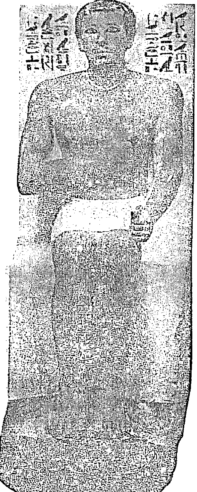

# 第九章 伊西丝和奥西利斯的历史

箱子，在场所有的同谋立刻拥上来，匆匆合上盖子，用钉子将盖钉死，浇上融化的铅封住，然后扔进尼罗河，任由河水将他带出尼罗河的塔奈伊提克河口，冲入海里。因此，埃及人民至今仍然对这个河口深恶痛疾，绝口不提，就是在讲起来时，也是用厌恶的言语来形容它。

据说，这一切发生在奥西利斯执政第二十八年，哈托尔之月第十七天，太阳正处于天蝎宫的位置，但也有人认为发生在他诞生第二十八年，而不是在他执政第二十八年。

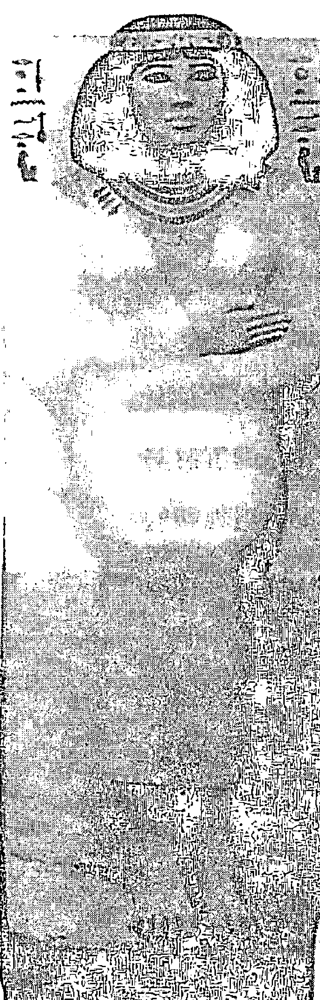

住在克米斯（Chemmis）附近国度里的潘（Pan，牧羊神）和萨提尔（Satyrs，森林之神，有羊的角和脚）第一时间得知了这场变故，他们通知众人时，称这些为“极度恐怖”，此后人们开始用这个词来形容一切突如其来的恐惧，或因人数过多而引起的惊诧。

伊西丝当时在别的地方，她一听说这个消息，就立刻剪下一绺头发，穿上丧服，人们从此把那个地方称为“科普托斯城（Koptos）”或“哀悼的城市”，不过也有人认为这个词其实强调“丧失”。随后，内心充满困惑与焦虑的伊西丝走遍全国各地搜寻箱子。她向所有遇到的人询问箱子的下落，就连孩童也不例外，偏巧她问到的孩子看到了提芬的同谋处理尸体的过程，于是他们就告诉她，尸体是在哪个河口被冲入大海的。从此以后，埃及人民开始认为孩童赋有一种神性，他们对孩子玩耍时，特别在宗教场所玩耍时，说出的胡说八道的言语非常好奇，认为其中也许隐藏着某些暗示或预言。

同时，伊西丝在奥西利斯留给她的香草木樨（Melilot）花环里发现，欺骗了奥西利斯的内芙蒂丝其实深爱着他，曾经偷偷代替她姐姐与奥西利斯结合，并且生有一个孩子，于是伊西丝也决定要把这个孩子找到，这个违背伦理的产物（她的妹妹因害怕丈夫提芬发怒，所以一生下孩子，就扔掉了）。

她历经千辛万苦，又在一些狗的指引下，终于找到了孩子，她开始哺育他，随着时间的流逝，这个孩子逐渐长大而成为她的护卫和随从，名为阿努比斯，人们认为他就像狗看护人类一样看护守卫着神明。

后来伊西丝获得更加确切的消息，说海浪把箱子冲刷到百白罗港（Byblos，叙利亚）的海岸上，落于一丛灌木当中，这丛灌木飞快地成长为一棵巨大美丽的树，长出的树枝将箱子紧紧缠绕，包裹得严严实实，从外面一点也看不到箱子的存在。后来，那个国家的国王看到这棵无比伟岸的大树，十分震憾，就令人将其砍倒，把其中一段树干做成柱子，用来支撑宫殿的房顶，而那段树干内恰好藏着那个箱子。

据说，这是伊西丝通过一种非同寻常的途径，从魔鬼那里打听来的。听说这些后，她立即赶往百白罗，在一条瀑布旁边住下，她不与任何人说话，却以最友好的方式接近碰巧在那里的女王侍女，向她们致敬，给她们梳理头发，还把自己体内散发出来的美妙香气，送给她们一些。这使女王十分渴望能见一见这位神奇的陌生人，因为她拥有如此卓越的能力，可以把自己体内的香气过渡给别人，从而使别人的头发和皮肤散发出芳香的气体。

于是，女王命人把她带进宫，在对她有了进一步了解后，派她去照看一位王子。

伊西丝照看孩子时，让他吸吮的是她的手指，而不是胸脯。每到夜晚，她就把孩子放进火里，去除他体内的俗性，自己则变成一株柳树，围绕在那柱子周围，哀悼着自己悲惨的命运。就这样过了一段日子，直到有一天晚上，女王来查看，发现自己的孩子浑身冒着火苗，就立刻大叫起来，这使王子失去了一部分本应可以得到的神性。

于是，伊西丝表明了自己女神的身份，请求他们将支撑屋顶的柱子给她。她得到柱子后，轻松地劈开树干，取出自己想要的东西，然后用上好的亚麻布将树干包裹好，涂上香油，又交回国王和王后。这段木头至今还保存在神庙里，得到百白罗人民的膜拜。

做完这些，伊西丝一把抱紧箱子，放声痛哭，哭声如此响亮悲惨，摄人心魄，这使年幼的王子听到后惊恐而亡。她带着年长的王子，抱着箱子乘船返回埃及。这时天已大亮，斐德罗（Phaedrus）河吹出一阵凛冽的寒风，伊西丝感到很生气，便抽干了水流。

伊西丝在一个地方停了下来，确认四周无人后，打开箱子，把脸靠在已逝丈夫的脸上，双手抱着他，哀伤地哭泣起来。有个小男孩偷偷走到她身后，看到了一切，伊西丝发现了他，立刻转过身来，盛怒之下怒视他一眼，目光是如此地严厉而可怕，男孩子立刻吓着了而一命呜呼。

有人认为那个男孩子并不是这么死的，而是吓得掉进海里，后来因为女神的关系，他受到人们的高度崇拜，埃及人民在宴席上常常提起的马内若斯（Maneros）不是别人，正是那个小男孩。不过也有许多人对这种说法是不认同的，他们说这个男孩真名叫Palaestinus或Pelusius，而叫这个名字的城市就是女神伊西丝专为纪念他而建造的。他们又说，由于他发明了音乐，所以埃及人民才会在宴席上念这个名字。

还有人认为马内若斯其实不是什么人名，而是一种传统的问候语，埃及人在比较正式的宴席上碰面时，会用这个词来相互问候，希望“过去经历的事将来可以带来幸运”，这才应是这个词的确切含义。

在节日的场合里，带一个装有骷髅的盒子，并把骷髅拿给宾客看，这样做的目的并非像有些人想象的那样，是为了展现奥西利斯的不幸，而是为了提醒众人命运的残酷性，从而能够激励他们接受目前命运带来的一切，因为每个人都会很快变成他们所看到的骷髅模样，这才是在宴会上出现骷髅的真正原因之所在。

现在让我们接着讲故事吧。

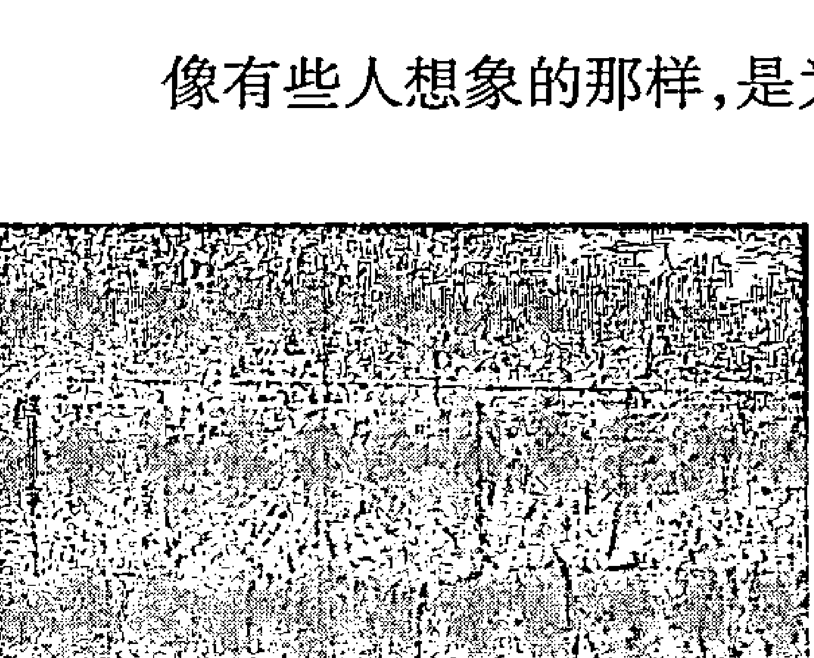

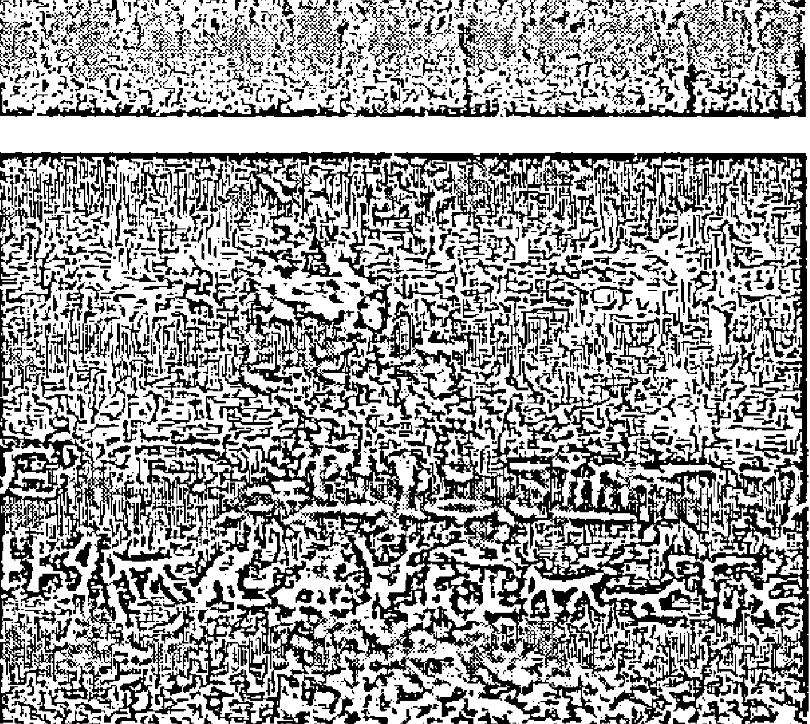

伊西丝回到布托（Buto），她的儿子霍鲁斯就在那里，她把箱子藏在一个偏远隐蔽的地方。但一天夜晚，乘着月色捕猎的提芬，无意中来到那个地方，看见并认出了藏着的尸体，他把尸体撕成十四块。这十四个部分是：头，脚，骨头，手臂，心脏，内脏，舌头，眼睛，拳头，手指，后背，耳朵，生殖器官和躯干。一些用埃及语列出的内容中还增加了公羊的脸和头发。伊西丝埋葬奥西利斯骨骸的城市有：科普托斯城，象岛上的菲莱，伟大的赫拉克雷奥波利斯，库瑟（Kusae），太阳城，下埃及的迪奥斯波利斯，雷托波利斯，萨伊斯，下埃及的赫莫波利斯，阿斯利比斯（Athribis），阿克[Aq，斯克迪亚（Schedia）]，利比亚（Libyan）省内的阿博（Ab），内泰特（Netert）和阿匹斯，并把这尸体碎片分别扔到全国各地。

伊西丝一得知这个坏消息，就立即动身去寻找丈夫的骨骸，为了可以方便地穿越低洼地带和沼泽地区，她乘坐用纸莎草做成的小船。因此，有人说鳄鱼永远也不可能伤害乘坐这种小舟的人（摩西躺在用纸莎草制成的小舟里，没有受到任何伤害），因为它们惧怕女神的威严，或者因为它们对纸莎草非常尊敬。

又有人说，伊西丝每到一处发现一块丈夫的遗骸，就将其就地掩埋，所以在埃及就有许多不同的奥西利斯之墓。不过也有人持不同看法，说这些不一样的坟墓都是女神故意设置的，她假装里面埋的是尸体，其实只是她丈夫的画像罢了。她这样做有两个原因，一是为了激起更多人对奥西利斯的怀念与崇拜，二则是为了打败提芬，如果他日后与霍鲁斯交战，并取得胜利的话，就一定会寻找奥西利斯的尸身，到那时有如此之多的坟墓迷惑他，会使他心力憔悴、心烦意乱，无法找到真正的那个，最终不得不因失望而放弃。

人们还说，尽管伊西丝做了很多努力，却怎么也找不到奥西利斯的生殖器官，因为在提芬刚把它割下来时，就丢进了尼罗河，结果被鳞齿鱼、发格若斯鱼和奥斯莱卡鱼当作美餐吞入腹中，因此，鱼也成了埃及人敬而远之的动物。为了弥补这一缺憾，伊西丝便仿制了一个一模一样的生殖器官，还举行了一场庄严的典礼，以示纪念，埃及人民至今还在继续举办这样的典礼。

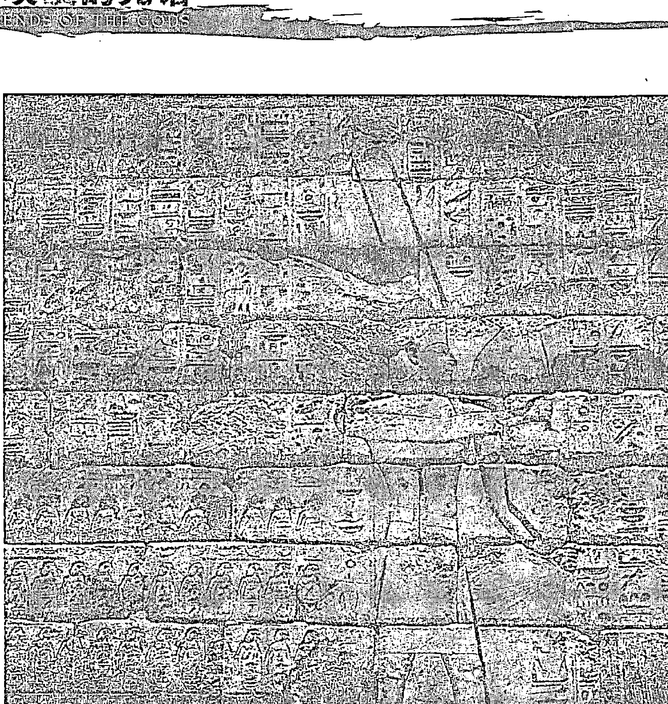

经过所有这些事情，奥西利斯从另一个世界返回埃及，来到他儿子霍鲁斯的面前，鼓励儿子勇敢地战斗，还传授给他如何使用兵器的本领。他问儿子，一个光荣的男人会有什么样的行为呢？霍鲁斯回答：“为他父母受到的伤害报仇。”人们常常称其是“为父复仇的人”。

奥西利斯又问，对战士来说，有什么样的动物最有用呢？霍鲁斯回答：“是马。”

奥西利斯听后感到十分奇怪，又继续问他，为什么是马而不是狮子呢？霍鲁斯回答：“狮子对站着的战士来讲很有用，但马可以用来对付半空中的敌人。”他的回答令奥西利斯非常高兴，因为他看得出霍鲁斯已经做好了足以和敌人交战的准备了。

同时，越来越多的人背离提芬，纷纷倒向霍鲁斯，其中还包括提芬的侍妾托荷艾瑞斯（Thoueris，河马女神，有丰富的生产力，保护生产的妇女），她来投奔霍鲁斯时，有一条大蟒蛇一路追赶着她，最后霍鲁斯的士兵将它杀死。埃及人民如今仍在纪念这一事件，他们会在集会时，将一条象征蟒蛇的缆绳扔进人群，人们把这条绳子剁成好几段。

之后不久，霍鲁斯和提芬之间的战斗爆发了，这场战斗持续了好几天，霍鲁斯最终赢取了胜利，而提芬则成了阶下囚。霍鲁斯命人将提芬送交母亲伊西丝处置，伊西丝并没有杀掉提芬，反而为他卸下镣铐放了他，给其自由。霍鲁斯对母亲的这种行为非常气恼，竟然抓住她，取下她头上的皇冠，不过海尔梅斯及时赶来，他在伊西丝头上安放了一头公牛，而不再是头盔。

根据萨利耶（Sallier）第四卷纸莎草经文的有关记载，霍鲁斯和塞特之间的战斗开始于托特月第二十六天，持续了三天三夜，发生在克尔—阿哈（Kher—aha）的众神大厅里，或其附近靠近太阳城的地方，伊西丝也在场，她既不希望看到兄弟塞特丧命，也不希望看到儿子霍鲁斯身亡。后来不知为何，霍鲁斯对母亲感到非常生气，如同一头“南方来的狮子”那样攻击她，还砍下了她的头颅。这时托特来了，他运用咒语创造了一个牛头做代替，安放在伊西丝的头颈上。

提芬诬蔑霍鲁斯是私生子，但在海尔梅斯的帮助下，诸神颁布法令，为霍鲁斯正名，最终，霍鲁斯按照其父亲的愿望，继承了王位。后来霍鲁斯和提芬之间又展开了两次战斗，提芬均以失败而告终。

人们还说伊西丝与死后的奥西利斯相结合，生下了哈珀克拉兹（Harpokrates），这个孩子没有足月就降生了，下肢有点瘸。

以上就是这个著名故事的大致内容，那些粗糙恐怖的细节，比如如何切碎奥西利斯和如何给伊西丝换头等，都已经省略了。如果这真是埃及人民对于神明所持有的情感，而那些神明最突出的特征就是快乐和永恒，或者，如果埃及人民真的相信那些故事确实发生过，那么，奥·克里，我就用不着提醒你，你早已对这种邪恶而怪异的论调十分反感，我也用不着警告你，你早已表明了对这种论调的痛恨，在诵读过这些论调之后，如埃斯库洛斯（Aeschylus，公元前525—前456年，希腊著名诗人，悲剧之父）所说——“吐痰漱口”。

可如今情况发生了变化，我相信你已经发现了真实确凿的历史事实与轻松荒诞的神话传奇之间的差距，那些诗人和作家，就像蜘蛛一样，从他们的想象的王国里编织出一个又一个故事，没有背景，不讲根基。但数学家曾告诉我们，彩虹只不过是太阳多样化的一种反映形式，是太阳的光芒经过云层的反射之后产生的，所以在这些编织出来的故事背景的最深处，确实存在某些真实的凄凉与不幸，我们在看待这些故事时，就应该把它们视为是对一种真实因素的表达或反映。

这种信念尤其体现在他们献祭时哀伤而肃穆的气氛里，表现在他们神庙的样式与布置中——有些神庙里有长长的走廊和敞开的过道，但有些则显得黑暗而阴森，这很像地下亡者的坟墓。历史总是建立在雄厚的基础上，奥西利斯的坟墓似乎正好可以印证这一点，传说有很多地方保存有他的尸体，其中包括阿比多斯和孟斐斯，因此，许多富人都希望自己死后埋葬在这些地方，这样他们就有和奥西利斯躺在同一个墓地里的可能了。

人们把阿匹斯神牛——奥西利斯灵魂的象征——放养在孟斐斯，使其尽可能与奥西利斯的身体离得近些，所以孟斐斯常被称为奥西利斯的墓地。还有人认为孟斐斯这个名字的意思是“好人的避难所”，尼罗河冲刷而成的菲莱小岛才是奥西利斯真正的墓地所在地。任何生物都不可能靠近那座小岛，鸟儿飞不上去，鱼儿游不过去，只有祭司们有时会从陆地来到小岛上，为亡者举行传统的仪式，为坟墓插上鲜花。人们说奥西利斯的坟墓在一株赤柽柳（tamarisk）树下面，那棵树长得比橄榄树还要高大。

尤多克斯曾经断言，虽然全埃及有如此众多的、真真假假的奥西利斯之墓，但他的尸体实际在布西利斯，那里也是他出生的地方。至于塔佛西利斯（Taphosiris），就根本没有必要特别地说明，因为这个名字已经在暗示那是奥西利斯的墓地。

埃及仪式上的许多细节内容，也在提示我们这段历史所依赖的事实根据，比如他们会把树干劈开，把亚麻布撕成碎片后，包裹树干，然后洒上香油，不过我对此并不是特别相信，因为那其中一定存在某些他们永远理解不了的秘密。

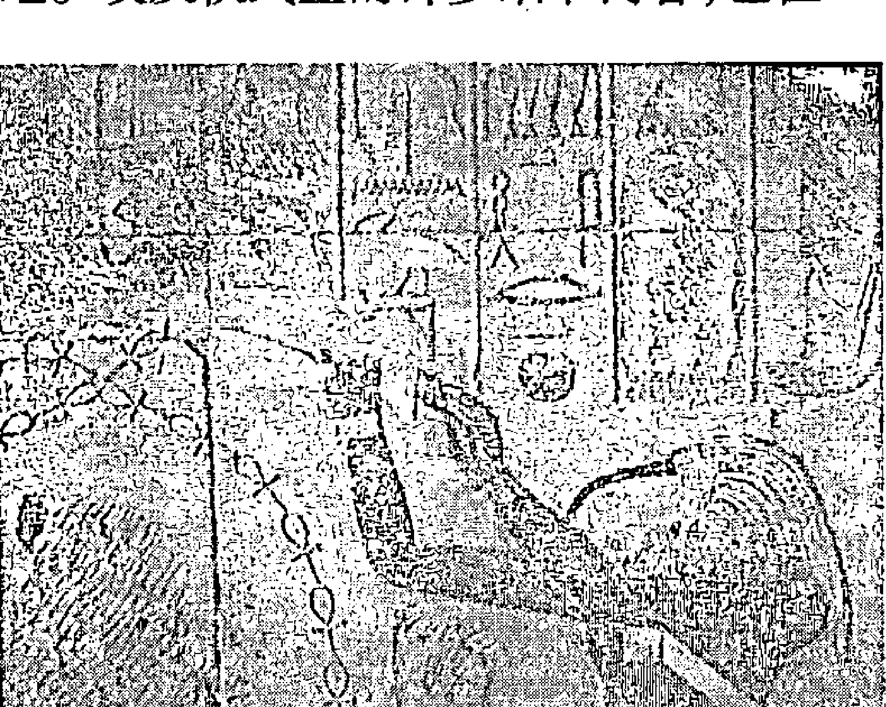

## 古埃及的咒语
## THE LAND OF THE GODS

## 对这个故事的第一种解释

对于这琐碎的一切，有些是公开宣扬的，有些是在宗教教义中暗示的，很多人可能会总结道，这个故事无非是人们对他们的国王和其他伟人的赞颂与纪念，这些人物拥有高尚的品德，无边的力量，尽管他们后来都只得到了各种悲惨的结果，但还是在众多称谓中，多得了一份神圣的荣耀。

对于以此种方式来思考对待这些内容的人，我可以肯定，他们肯定掌握某种非常有逻辑性的思维方式，以致能够解决这种解释可能引发的疑问，也因此才有了足够的智慧与能力，将故事当中最令人惊诧的部分，由神性转移到了人性。甚至，这种解决方式还有足够的历史证据做支撑，因为当埃及人自己说海尔梅斯一只手长，一只手短时，说提芬长着红皮肤、霍鲁斯长着白皮肤、奥西利斯长着黑皮肤时，不就是在说人的种类特征吗？不是正好和一般人的种类特征相一致吗？埃及经文里说的所有魔鬼都是红色的，据说，其中有一个霍鲁斯的形象是“蓝眼睛的”，而奥西利斯的脸常常描绘成绿色的，有时是黑色的。不仅如此，他们还说到这些神明在世时各自所从事的职务，说奥西利斯是一个将军，卡努普斯（Canopus）——老人星（船底星座的一颗星）以他命名——是一个水手，希腊人为表达对奥西利斯的尊敬，模仿他的船而造制亚哥（Argo）号，后来这条船变为一个星座，停留在猎户座和天狼星之间，而猎户座是霍鲁斯的星座，天狼星则专属伊西丝。

然而，我非常担心这种解释故事的方式会改变一些本不应改变的东西，这不仅如西蒙尼德斯（Simonidès，公元前556—前468年，古希腊作家）所说——“向一切古代的东西宣战”，还在向一切信仰这些神明的国家和民族宣战了。这就好似把那些伟大的名姓从天堂中抠除，使他们降落凡间一样，这就是在动摇和瓦解一种崇拜与信仰，而这种崇拜与信仰是全人类从孩提时就在脑海里根深蒂固的了，这是在为无神论大开方便之门，鼓励有些人将神性人性化，尤其需要指出的是，这就为欧赫梅鲁斯（Euhemerus，生活于公元前316年前后的希腊学者）提供了说谎的机会和权利，他完全从想象出发，毫无事实依据地编撰了一部新的神话学，还声称：“所有被称为或宣布为神明的，其实都是些古代的将军、海军官员和国王而已。”

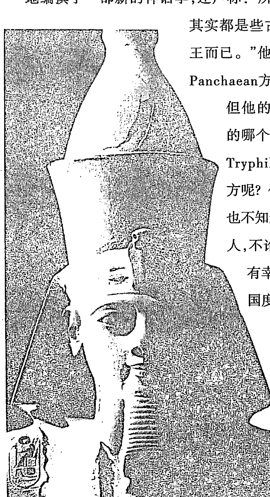

他又说他发现这一论断，是用Panchaean方言、用金色的字母写下来的，但他的 Panchaeans 到底位于地球的哪个位置呢？还有他一起提到的 Tryphillians，是位于地球的什么地方呢？他对于这些全没有讲清楚，我也不知道除了他本人以外，还有什么人，不论是希腊人还是野蛮人，曾经有幸到过这些由想象王国而来的国度。

接下去布鲁达克说亚述人纪念塞弥拉弥斯（Semiramis，古代巴比伦女王），埃及人崇拜塞索特利斯（Sesostris，第十二王朝的国王。约公元前19世纪），波斯人侍奉居鲁士（Cyrus，公元前590—前529年，波斯王），还有马其顿人敬仰亚历山大，不过这些伟人并没有被人们当作神明看待，而那些接受神明称谓的国王，后来都遭到痛骂和指责，他们被说成专横虚荣，不敬神，不公正。

## 对这个故事的第二种解释

这个故事可以用另外一种更好的方式来解释。有人认为，关于提芬、奥西利斯和伊西丝之间发生的事，不能视为是神与神、或纯粹的人与人之间的矛盾冲突，而是某些灵魂的历险故事罢了。

希腊最有智慧的哲学家们，即柏拉图，毕达哥拉斯，克塞诺克拉底（Xenocrates）和克吕西普（Chrysippus），结合他们从古代神学研究家那里学来的知识，认为这些灵魂比人类强大，比人类更高级的同时，却比纯粹的、不含异类的神明更低级，因为他们有身体的感觉，灵魂的感知，既能感受快乐，又能体会痛苦，与不同的物体相结合，还有不同的喜怒哀乐表现。不过，有些灵魂受到的影响大些，有些受到的影响小些，这是由他们的好恶来决定，就如同人类一样。

所以，希腊人说得最多的巨人与泰坦之间的战争，克罗诺斯的无耻行为，阿波罗和提芬之间的战斗，狄奥尼索斯的飞行，还有德米特（Demeter，农业女神）的流浪，这都与奥西利斯和提芬之间的历险过程具有相同的性质，可以用同一种方式来解释，神话学研究著作还可以为我们提供大量类似的例子，甚至是那些小心地隐藏于神秘和模仿之幌子下的东西，我们也许同样能够将其发掘出来。

# 第九章 伊西丝和奥西利斯的历史

布鲁达克指出，伟大而优秀的人物被荷马称为“神一般的”，“神明的同伴”，魔鬼这个词对于好人和坏人也是同样地适用。柏拉图认为奥林匹亚众神总是做好事，与他们相关的数字也都是奇数，魔鬼则恰恰相反。克塞诺克拉底相信世上存在着一群强大有力的生物，这些生物以带来灾难和戒绝食物等为乐。赫西俄德讲到“神圣的魔鬼”以及“人类的守护者”，还有“财富的赐予者”，柏拉图将其称为“介于神与人之间的生灵，为人类解释神明的意愿，管理人类的需求，把人类的祈求和赞美传达到天堂，将神谕以及其他所有的祝福带回人间”。

恩培多克利斯（Empedocles，公元前492—前432年）认为魔鬼应当受到惩罚，经过约束和净化之后，就能恢复原来的本性。

提芬就属于这类魔鬼，他受到女神伊西丝的惩罚。为纪念她所做的一切，以及所承受的苦难，伊西丝创设了一些仪式，设置了一些秘密，来代表或象征她的事迹，以此来激发人们的虔诚心态，给人们慰藉。伊西丝和奥西利斯是从好的魔鬼转型而来的神明，因此人们对其中的崇拜也混杂不清，因为那既是对神明的崇拜，也是对魔鬼的崇拜。奥西利斯就像是普鲁托（Pluto，冥神），而伊西丝就如同普罗塞尔皮娜（Proserpine，冥府的王后）。

埃及人民对提芬深恶痛绝，他们竭尽全力侮辱他。由于提芬的皮肤是红色的，埃及人民瞧不起所有肤色偏红的人。因为驴子总是红彤彤的，所以科普托斯城人有在危难时刻舍弃驴子的传统习俗。因为喇叭发出的声音与驴叫有相似之处，所以布西利斯和莱考波利斯（Lycopolis）的居民从不吹喇叭。

在帕奥尼之月（Paoni，从4月17日开始，持续30天）和帕奥皮之月（Paopi，从8月20日开始，持续30天）的节日里，在供奉的饼上人们会盖一个上了枷锁的驴的图案。毕达哥拉斯学派（Pythagoreans）把提芬看作是一个魔鬼，他们认为提芬的相关数字是偶数五十六，尤多克斯说五十六度角的图案，正是提芬之本性的典型代表。

埃及人民只挑选纯红色的公牛当作祭品，一旦牛的头上有一根黑毛或白毛，就被视为不合格。他们将有邪恶灵魂寄居的生物拿来献祭，这一点又引发其他相关习俗，如诅咒动物成为祭品，把动物的头砍下来，扔进尼罗河。献祭的公牛头上必须有被“打印”祭司打上的印记，否则是不可以拿来献祭的，印记上绘有一个跪倒在地的人，双手反绑在背后，有一把剑指着他的喉咙。用驴子来代表提芬，不仅仅是因为他们拥有相似的颜色，还因为他们同样地愚蠢，同样地好色淫荡。人们曾经为波斯国王欧克斯起了一个绰号——驴子，国王因此说道：“这头驴子将吃了你们的公牛。”阿匹斯神牛被他给处决了。人们还说，提芬骑着一头驴子跑了七天，才躲过霍鲁斯的追杀。

## 对这个故事的第三种解释

以上就是那些人的论点，他们极力把前文讲到的有关伊西丝和奥西利斯的故事，建立于为魔鬼排资论辈的基础上，但还有一些人，他们假装运用其他准则或更具哲理性的方式，企图对这个故事做出不同的解释来。我们可以从那些使用最简单、最明显之推理方式的人开始。希腊人把他们的克罗诺斯喻指为时间，把天后赫拉（Hera）喻指为空气，所以火神赫菲斯托斯（Hephaistos）的诞生，正是空气在火中发生的变化，这些哲学家便依此推理而断言，埃及人所说的奥西利斯其实是尼罗河，伊西丝是奥西利斯或尼罗河泛滥的区域，提芬是海洋，当尼罗河流入大海时，提芬确实把奥西利斯分成许多块，并确实彻底毁灭了他，只不过，大地的怀抱吸纳了他相当大的部分，从而给大地带来富饶与肥沃。他们还认为，可以在埃及人为奥西利斯唱的哀歌中证实这一解释，哀歌唱道：“诞生在右边的人儿啊，消亡在左边。”容易看出，埃及人把东面视为世界的前沿或正面，把南面视为右边，把北面视为左边。因此，因为尼罗河是由南面一路往北流入大海的，所以这种诞生在右边，消亡在左边的说法就完全正确了。他们又说，祭司们对海洋十分禁忌，甚至称海洋为“提芬的泡沫”，这更能说明他们结论的合理性。祭司们对盐也同样怀有禁忌之心，在他们的禁令中，有一条即是不得将盐放到桌子上。那他们是不是还要尽可能不与水手交谈呢？因为水手不是与海洋打交道，并且以此为生的吗？这也引起他们对鱼类的极度厌恶，他们甚至将鱼当作是“憎恨”的标志，几幅在萨伊斯内斯（Neith）神庙柱子上的画就是证明：第一幅画着一个小孩，第二幅画着一位老人，第三幅是一头鹰，接下去是一条鱼和一头河马，这些画的意思十分明白，“哦，来到这个世界的人啊，走出这个世界的人啊，（即年轻的和年长的）神明憎恨无耻之徒。”这里的小孩指代“诞生的人”，老人指代“死亡的人”，鹰指代“神”，鱼——如前文所讲，因为海洋的原因——指代“恨”，而河马指代“无耻”。据说，河马先杀掉自己的父亲，而后奸淫了自己的母亲。

也许有人会认为，毕达哥拉斯学派的人也把海洋当作是不纯洁的东西，同自然界里其他东西有很大不同，所以他们才会刻意把海洋称为“克罗诺斯的眼泪”。

一些更有哲学性的祭司则认为奥西利斯不仅只代表尼罗河，他也是湿润的本原与力量，而提芬也并不仅只代表海洋，他还是灼热的、燃烧的、火热的、会摧毁湿润的一切的代表。他们认为奥西利斯是黑色的，因为万物与水混在一起时，都会染上一层淡淡的黑色。太阳城的姆尼维斯（Mnevis）公牛就如同奥西利斯，也是黑色的，甚至连埃及这个国家，因为其土壤的颜色如此之深，所以被人们称为“Chemia”，这是一个专门用来指黑眼珠或瞳孔的词语，这个词还被人们放在一颗心脏的下面。太阳和月亮并非是由水手牵着走的，而是乘坐船只游历世界的，这说明正是湿润的力量使它们能够行动自由，提供给它们支持与养分。荷马与泰勒斯都从埃及那里学到一点：“水是万物的本源，是生命的起因。”

尼罗河和所有的湿气都叫做“奥西利斯的流体”，因此在他的游行之列中，一只水罐，还有一片杉树叶子总是第一个出现，它们分别象征奥西利斯和埃及。

帕米利亚（Pamylia）节日证实奥西利斯是多产的伟大本源，因为在这个节日上，会出现一尊具有三个生殖器官的神明塑像，数字三应是一个虚数，强调无限多的意思。

因为尼罗河上涨时，太阳恰好处于狮子座的位置，所以人们把太阳献给奥西利斯，向狮子表示崇敬，还拿狮子的形象来装点庙宇。因为湿地的水气会破坏干燥，所以奥西利斯、尼罗河、伊西丝，以及地球的后代霍鲁斯，都是在布托的沼泽地里诞生的。内芙蒂丝或泰律特代表埃及最远的边界与海岸线，即荒瘠之地。奥西利斯（即尼罗河）淹没这片荒瘠的土地，于是就有了阿努比斯。

布鲁达克在本章的开始部分，继续探讨提芬，探讨他与干燥之间有何关系，以及他的同伙，埃塞俄比亚女王阿索的身份，布鲁达克认为她是季风或北风，尼罗河水位下降时，会吹很长一段时间。紧接着，他说：

当人们讲到将奥西利斯放进箱子时，其实是在讲尼罗河降落到河床的位置。据说这一不幸极有可能发生在哈托尔月里，确切地讲，是一年中季风或北风停止的季节，尼罗河降落到河床的位置，各处的土地全裸露出来，正是在这时，夜晚变长，黑暗降临，而光明则逐渐退缩而去。祭司在这时会举行悲伤的仪式，他们展示一条镀金的公牛，身披一块质地上好的黑色亚麻布，用以代表伊西丝的悲哀，后来公牛就代表着奥西里斯活着的形象。在托特月第十七天他们举行这一仪式，一直持续三天，他们会哀悼：

- 尼罗河的回落
- 北风的停止
- 白昼的缩短
- 土地凄凉的状况

到帕肯月（Pachons，从3月18日开始，持续30日）第十九天，他们一路游行来到海边，祭司和官员抬着神圣的箱子，里面封着一条小小的金船，他们先倒一些水进去，然后齐声高喊：“找到奥西里斯了！”做完这些之后，他们再往水里添加一些泥土、香水和香料，经过充分搅拌，做成一弯新月的形状，还为它穿上衣服。这表明神明被他们看作是水和土的要素与力量。

尽管霍鲁斯打败了提芬，但伊西丝不可能让霍鲁斯杀死提芬。提芬曾经是全埃及的主人，即是说，大海曾经覆盖埃及，这一点已经得到证实，因为人们从矿藏中挖到了海洋里的贝壳，也在山顶上发现了同样的贝壳。尼罗河年复一年地制造着新土地，海洋被它推的越来越远，这意味着奥西里斯战胜了提芬。

## 对这个故事的第四种解释

奥西里斯是月亮，提芬是太阳，因此提芬也称为塞斯，意即“暴力”和“武力”等。赫拉克勒斯（Herakles）伴随着太阳，海尔梅斯伴随着月亮。布鲁达克将奥西里斯的死期——哈托尔月第十七天——与月亮循环周期的第十七天（即月亮开始圆满的那一天）联系起来，而在奥西里斯的葬礼上，用树干做成的新月就是指月亮开始圆满时的，奥西里斯的十四段身体，喻指月亮圆满一次需要的十四天。尼罗河洪水的高度，在象岛是二十八腕尺，在下游的曼德斯和艾科索伊斯是七腕尺，在中游的孟斐斯则是十四腕尺，这些数字都被拿来与月亮有关的数字联系起来，二十八比月亮循环周期的二十八天，七比月相的七天，十四比月亮圆满的十四天（即变成满月需要的天数）。月亮的一束光芒造就了阿匹斯，在法莫诺斯（Phamenoth，从1月17日开始，持续30日）月第十四天，奥西利斯走进月亮，他便是月亮的力量源泉，月亮的生产职能由伊西丝掌管。

## 对这个故事的第五种解释

哲学家们说，这个故事故弄玄虚，令人费解，其实只不过是对日月食现象的描绘。

布鲁达克讨论了他列出的五种解释，并表达对这些解释的个人意见。他说，结论是在这五种解释中没有一种可以单独真正解释还在发展中的历史，但若把五种解释结合起来就可以。提芬代表自然界里一切残酷而又具有破坏性的状态，这些不仅仅指干旱，黑暗，海洋等等。任何事物，无论是好是坏，都不能够成为万物的基本根源，一定是有两个截然相反的不同的本源来共同构成。

布鲁达克将此观点与古代波斯的祆教僧侣（Magian）对善神（Or-mazd）和恶灵（Ahriman）的信仰作比较，前者产生于光明，后者则诞生于黑暗。善神创造了六位好神，而恶灵也创造了六位神，只不过其本性与好神截然相反。善神将自己的体积扩大了三倍，用星辰来装点天堂，使太阳护卫着众星。另外他又创造了二十四位神明，并把他们放置在一个鸡蛋中，恶灵也创造了二十四位神明，他们在蛋壳上破了一个洞，钻了进去，这样好的与坏的就混杂在一起了。

布鲁达克引用恩培多克利斯，阿那克萨哥拉（Anaxagoras，古希腊哲学家），亚里士多德和柏拉图的论点，用以证明自己的二元论说法，还说到了柏拉图的第三个本源论。

奥西利斯代表宇宙灵魂里好的品质，而提芬则完全相反，贝比（Bebo）就如同提芬一样邪恶，马内托将他们两个相提并论。

驴子，鳄鱼，以及河马，都是与提芬有关联的，如提芬变成鳄鱼的样子，才得以从霍鲁斯手下溜走。

在泰比（Tybi，从11月18日开始，持续30日）月第七天用于供奉的饼上，就印有一个河马的图案。

奥西利斯是智慧与力量的代表，提芬则完全是邪恶与恶毒的象征。

同为四大文明古国的古埃及不光历史悠久，它的金字塔、木乃伊还有那些神秘的古埃及咒语也叫人印象深刻。著名影片《卢浮魅影》中的女主角就是被木乃伊之魂附体在卢浮宫中疯狂地寻找符咒的答案。而古埃及的种种传说或许可以说明这些神秘咒语的起源。

上架建议：神秘文化/考古悬疑

ISBN 978-7-80228-698-6

定价：25.00元