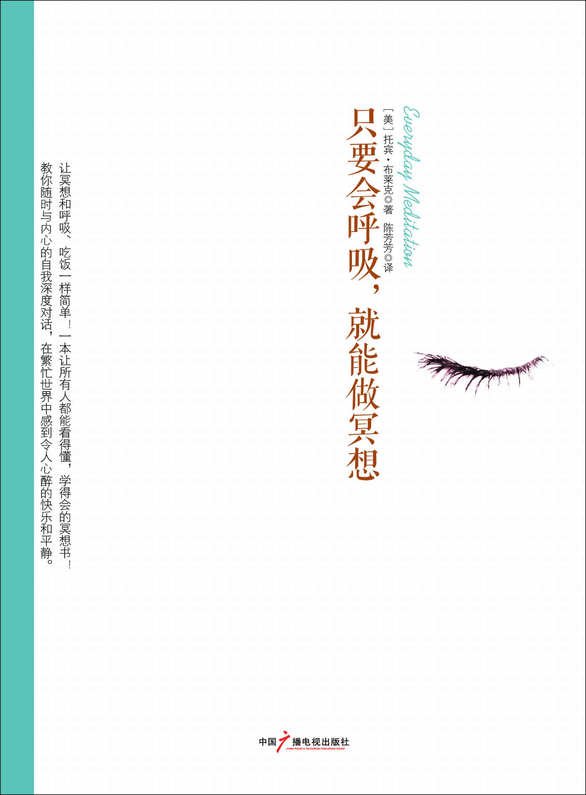

目錄

第一部分 瞭解冥想

為什麼你體會不到冥想的精妙

100 天冥想

第二部分 發展自己的技能

第一天～第十天：每日冥想練習

第一天

第二天

第三天

第四天

第五天

第六天

第七天

第八天

第九天

第十天

第十一天～第二十天：打敗「黑暗之狼」

黑暗之狼的三個故事

第十一天

第十二天

第十三天

第十四天

第十五天

第十六天

第十七天

第十八天

第十九天

第二十天

第二十一天～第三十天：寧靜的開發

第二十一天

第二十二天

第二十三天

第二十四天

第二十五天

第二十六天

第二十七天

第二十八天

第二十九天

第三十天

第三部分 重新設計你「思想的瀑布」

簡介

第三十一天～第四十天：通往神秘時刻的道路

第三十一天

第三十二天

第三十三天

第三十四天

第三十五天

第三十六天

第三十七天

第三十八天

第三十九天

第四十天

第四十一天～第五十天：情感平衡的關鍵

第四十一天

第四十二天

第四十三天

第四十四天

第四十五天

第四十六天

第四十七天

第四十八天

第四十九天

第五十天

第五十一天～第六十天：相互作用律法

第五十一天

第五十二天

第五十三天

第五十四天

第五十五天

第五十六天

第五十七天

第五十八天

第五十九天

第六十天

第六十一天～第七十天：寬恕的真正理由

第六十一天

第六十二天

第六十三天

第六十四天

第六十五天

第六十六天

第六十七天

第六十八天

第六十九天

第七十天

第七十一天～第八十天：健康與康復

第七十一天

第七十二天

第七十三天

第七十四天

第七十五天

第七十六天

第七十七天

第七十八天

第七十九天

第八十天

第八十一天～第九十天：人際關係的康復及性行為

額外練習

第八十一天

第八十二天

第八十三天

第八十四天

第八十五天

第八十六天

第八十七天

第八十八天

第八十九天

第九十天

第九十一天～第一百天：形成每日練習的習慣

為冥想練習提供能量

第九十一天

第九十二天

第九十三天

第九十四天

第九十五天

第九十六天

第九十七天

第九十八天

第九十九天

第一百天

結語：和你內心的老師在一起

「六要點」之路

關於作者

圖書在版編目（CIP）數據 

只要會呼吸，就能做冥想 / (美) 布萊克著；陳芳 

芳譯. -- 北京：中國廣播電視出版社，2012.8

書名原文：Everyday Meditation

ISBN 978-7-5043-6677-1

Ⅰ. １只… Ⅱ. １布… ２陳… Ⅲ. １情緒－自我控 

制－通俗讀物 Ⅳ. １B842.6-49

中國版本圖書館 CIP 數據核字(2012)第 154138 號 

北京市版權局著作權合同登記號 圖字：01–2012–4670 號  

Everyday Meditation by Tobin Blake

Copyright c 2012 by Tobin Blake

First published in the United States of America by New World Library

All rights reserved.

Arranged through CA-LINK International LLC

只要會呼吸，就能做冥想

(美) 托賓·布萊克 著 陳芳芳 譯  

責任編輯 劉 媛  

封面設計 水玉銀文化 

出版發行 中國廣播電視出版社 

電    話 010-86093580 010-86093583

社    址 北京市西城區真武廟二條 9 號 

郵政編碼 100045

網    址 www.crtp.com.cn

電子郵箱 crtp8@sina.com

經  銷 全國各地新華書店 

印  刷 北京畫中畫印刷有限公司 

開   本 710 毫米×1000 毫米 1/16

字  數 220（千）字 

印  張 16

版  次 2012 年 8 月第 1 版 2012 年 8 月第 1 次印刷 

書  號 ISBN 978-7-5043-6677-1  

定  價 36.00 元 

（版權所有 翻印必究·印裝有誤 負責調換）

這本書就像一塊跳板，能夠讓人很簡單地達到內心的沉靜狀態。

—傑拉爾德· G · 詹波斯基, 碩士, 《愛讓恐懼隨風而逝》一書的作者

我愛這本書。它很清晰，具有原創性，而且比較有趣，它很友好。最為重要的一點是，它對我有很大幫助。我真的難以想像有人讀了哪怕很小的一部分，會不受益於此。我尤其喜歡布萊克通過一本講述冥想的書帶給讀者只有布道者才能達到的深度思考的狀態。

—休·裴雷德,《如何生存並快樂生活》一書的作者 

這本充滿智慧的書將讀者帶到偉大的冥想傳統中，同時又向讀者介紹了在當今繁忙的世界中如何在每一天實施冥想。托賓·布萊克不僅僅指出了通往寧靜的道路，同時他也是一位博學的引路人，在這條道路上告訴我們興趣所在、陷阱所在。

— 帕特麗夏·莫納亨, 《冥想—完全的嚮導》一書的作者之一 

當沉默的時候，人的心靈會受到啟示，它指引我們向神敞開心扉，擴大我們的自我意識。冥想真的是一種公開的秘密，一種最為珍貴的精神練習。托賓·布萊克明白沉默的含義，而且通過自身的冥想經歷進一步瞭解沉默的內涵。《沉默的力量》這本書博大精深又很實用，它有效地喚起了人們對於坐下來思考的渴望，對於成為真正的自己的渴望。

— 韋恩·蒂斯代爾, 《神秘的心靈》一書的作者 

第一部分 瞭解冥想

為什麼你體會不到冥想的精妙

當我第一次瞭解冥想的時候，那天我正站在父親房子後面的門廊處，遠眺俄勒岡州環狀的莫闞澤河，看著夕陽從遠山中一點一點落下。我是在洛杉磯長大的，在我看來，那座城市就像是一個巨大的、堅不可摧的囚籠，我無處可逃。那時，我唯一感覺放鬆的時候就是遠眺太平洋。凝望海面，我感覺人類和一切人類的傑作都結束了，那裡只有大自然和它的傑作—通往無邊無際的自由。

當我面對著寬廣的莫闞澤河時，也有同樣的感覺。它一路向前，不受任何人、任何時間以及任何障礙物的影響。如果將一座大山攔在它的前面，它會將大山吞噬成低谷。我很欣賞這種精神！那個時候，我並不知道到底是什麼向我的眼睛施了魔法，讓我對眼前的景象如此著迷，但是，現在我明白了：真正讓我著迷的並非土地的美，也非河流的蜿蜒，抑或落日的妖嬈，而是那一時刻的自由自在。就是在那一瞬間，我將自己迷失在生命的河流裡，感受到了從未有過的自由。

你很可能也有過這樣的時刻：感覺「迷失」了自我，甚至感覺被某種神秘的、充滿磁性的力量吸引，它將你與內心深處某個地方的自己緊密相連。對於多數人來說，這樣的時刻就像是透過窗子向外一瞥。這扇窗子一般情況下都是隱藏著的，但是它會提醒我們生活遠遠不止我們所看、所聽、所觸，這就是神秘的時刻。就是那一瞬間，使生命充滿了意義，讓我們重新建立了目標。

進行冥想練習，就是積極地讓自己處在這樣的經歷以及緊接而來的、更能激發興趣的經歷中，因為這種常見的、短暫的經歷和內心廣闊的空間相比只不過是冰山一角。只要學會積極冥想，你就能到達一種極度平靜的境界，並獲得無限快樂，這種平靜和快樂無法用文字描述。印度教徒幾千年來延續著冥想的傳統，並將這種令人癡迷的沉思狀態稱為「三昧」。

在冥想的過程中，你會將自己的注意力從外在的世界—充滿複雜的壓力和距離感，轉移到內在的世界—這個世界在每一個方面都和外在的世界截然相反。通過這種轉變，你可能會發現：就在平常的意識之外一點點，生命就成了一張互相連接的網絡，這種網絡只有在完全平靜的狀態下才存在。最為根本的是，通過冥想，你可以感受到你並非只是一種暫時的物理存在，和這個世界的其他一切毫無關係；你是一種永遠的精神存在，和宇宙萬物都有著聯繫—他們都是你的一部分。

這種領悟無法描述，因為世界上沒有與之相似的過程可以進行類比，所以理解起來難度就更大了。深度冥想曾被比作性高潮，但是我認為這種類比對人是一種誤導。不過，我覺得冥想有些像性高潮快要到來之前的那個瞬間。有一點不同的是，它在強度和深度上的發展從未停止過，而且這種經歷在某種程度上是純潔和天真的，這是性無法達到的。

雖然我致力於冥想研究長達 20 年之久，到現在我卻依然不知道冥想的領域到底有多大。逐漸地，我開始相信與靈魂保持一致就是聽從越來越強烈的創造衝動，讓它得到釋放，並且放棄自我。至於這種強烈的衝動帶來的感覺是什麼，如果主流大眾對於冥想帶來的強烈的快樂感表示懷疑，那就推開大門，一看究竟吧。毫無疑問，這種實踐已經被證實對健康的保持和疾病的康復很有效果，幸福感和平靜感能夠很自然地促進免疫系統發揮作用。

本書會從理論上向你介紹如何實踐冥想。我會先讓你理解什麼是冥想，實踐冥想要用到哪些基本知識，如何利用冥想過上更為幸福、更為健康的生活。然後我會向你全面介紹一些可以自己親手實踐的、最常用的冥想技巧，讓你自己直接體驗實踐冥想的樂趣所在。如果你已經開始冥想了，那麼這樣的練習可以增加冥想的途徑，幫助你晉陞到下一階段。

儘管從理論上來看，冥想極其簡單，但是，如果沒有正確的工具，它也會變得非常困難。很多人在還沒有意識到冥想到底能夠給他們帶來什麼之前就已經放棄了冥想練習，因為一開始他們可能要面臨很大的阻力。很多冥想教學只是教會學生一些技巧，比如唸經、打坐、專注以及目視，卻幾乎不教授如何在達到深度冥想狀態的過程中克服困難。本書則不同，它不僅向讀者傳授冥想的基本知識和基本技能，還將帶領你超越冥想的形式，幫助你釋放內心的阻力，這樣你就可以進行深度的、持久的冥想練習了。

本書向讀者提供了一種可以親自實踐的經歷之旅，讓讀者能夠踐行冥想，同時向讀者展示了一種精神訓練體系，以便讀者能過上一種更為清醒的、充滿寧靜的生活。這種體系主要著眼於以下三個基本目標：

1.每日練習 這一點似乎是顯而易見的，但是如果你知道有很多人以為只要看看書、瞭解一下什麼是冥想，而不需要實際去做的話，你可能就會感到驚訝了。請記住我的話—你不可以這麼想！你必須去做、去冥想，逐漸地你就會從中獲益。冥想給你帶來的益處真的是讓人難以置信的。實際上，冥想是你能做的、對身心健康來說最好的事情之一，就和戒煙一樣。它的竅門在於：就像鍛煉身體一樣，你必須去做。這本書包含了 100 天的冥想實踐，能夠積極地幫你邁出這一步。你可以把這 100 天看作是一次自我發現的旅行，它不僅可以幫助你進行冥想，同時也可以幫助你將這些年來積累的一點一滴的傷痛和恐懼連根拔除，將一切病痛治癒。按照書中寫的去實踐，你會感受到無比的平靜。就算只是實踐幾次，也會增加你進行冥想的力量。

2.瞭解並解決阻力問題 要想到達深度冥想的境界，你就要弄清楚到底是什麼阻礙了你的行為。在進行冥想練習的過程中，的確會有阻力存在。你必須克服一層又一層的阻力，才能一步步地接近內心真實的自我。你是不是覺得冥想像是一份工作？嗯，沒錯，它就是一份工作，是一份享有最高位置的自我工作—進行有意識的個人發展。通過學習如何進行冥想，你就能開啟一條有力的康復之旅，它和世界上其他任何事物都不一樣。冥想帶著你走向內心，讓你能夠直接和內心深處的自己（也就是靈魂）聯繫—它是一種淨化靈魂、讓人充滿力量和喜悅的經歷，它能讓一種不可思議的力量從你的內心深處湧出。如果你用這種力量調整自我，你的生命就會立刻發生變化。我們在後面的內容中會更加詳細地討論這種內心深處的自我。現在你只需要知道：除了每天進行冥想之外，本書還會幫助你找到真正阻礙冥想的根源在哪裡。

3.重新設計「思想的瀑布」 如果你已經開始進行冥想了，毫無疑問你會感受到來自思想深處無窮無盡的思潮。這種由文字材料形成的流是恆定的，佛教徒將之稱為「思想的瀑布」，因為它「嗡嗡」的聲音就像是從高處呼嘯而下的瀑布，永無止境且震耳欲聾。 

當你第一次開始進行冥想的時候，你會感覺思維加速了一樣，然而實際並非如此，你只是更為關注思維持續不斷的活動了而已。不斷有人要給思維活動強加一種規範，但是幾乎沒有什麼成功的先例—你根本無法讓這種由思考內容形成的瀑布停下來。但是，你可以改變「瀑布」的內容。多數人的思考內容基本上都是一些消極的東西—未經治癒的罪惡感、恐懼感和憤怒感釀成的結果。這樣的情感與平靜的心態本身就是對立的，而平靜本身就是冥想的一種狀態。因此，消極的思想使冥想變得十分困難。如果你想要進一步深化冥想，那就改變思維深處的一些想法，更好地表現出積極的情緒，這一點很重要。本書中所介紹的冥想練習就是為了幫助你開啟這種改變的過程。

從某種意義上來說，這本書不僅僅是關於冥想的，它還為思維的鍛煉提供了指導。重新設計內心深處的對話不僅可以改善你的冥想進程，還可以帶來諸多其他益處。通過把消極的「思想瀑布」調整成積極模式，你會看到你的整個生活都發生了變化，因為消極的思想不僅影響你的冥想練習，還會影響你的健康、幸福以及你和他人的關係。

冥想還有很多重要的好處。現代科學對於冥想的研究已經進行了幾十年，研究結果讓人震驚。有些結果是顯而易見的：在冥想過程中，人的血壓和心率都會降低，呼吸會放緩，大腦中的α波活動會增加（說明身體處在一種平靜的狀態）。一般來說，這個時候人的壓力就會降低，單這一項就足以為消費者每年省下數十億投在醫療保健方面的支出—根據估計數據，人類超過 90%的疾病都是因為沒有解決好壓力問題。

除了緩解壓力這種較為常見的效果之外，我們還發現，冥想可以給身體帶來一些物理變化。《神經意象》雜誌上就發表過一篇研究報道，幾名加州大學洛杉磯分校的研究人員發現，冥想者的海馬體以及前額葉腦皮層有所增大，這就說明冥想這種行為對大腦皮層產生了物理影響，而大腦皮質是和更高的人類行為相聯繫的，比如做決定、產生積極的情緒以及記憶等。

近期還有些突破性研究也挖掘出了定期冥想的一些生物學效應。馬薩諸塞州綜合醫院從事身心醫學研究的班森·亨利研究所的研究人員與貝絲·以色列·迪肯尼斯醫療中心的基因學中心合作，發現冥想本身能夠直接到達生物體進行規劃設計的根部—基因。他們研究了進行冥想的被試者與從不進行冥想的被試者之間 2200 多個基因的顯著區別，其中包含那些與發炎、自由基處理以及細胞死亡有關的基因—這三種基因堪稱「殺手基因」，它們就像時間老人的左右手，控制著人們的衰老和疾病。該中心的負責人赫伯特·班森這樣描述了他們的研究：

現在我們已經發現了思維活動變化是如何改變最基本的基因指令的實施了。  

這是一條驚人的消息。多年以來，人們都在研究冥想的治癒效果，其實這種效果通過最基本的實驗就可以檢測出來。現在我們開始挖掘隱藏在冥想表層效果之下的深層效果，力求發現一些對身體健康有好處的根本原因。不管怎樣，冥想都在重新塑造我們的身體構建模塊。

現在，關於冥想的新興研究也依然充滿希望，我們每一天都對這一領域瞭解得更多。在廣播秀節目《談到信仰》的採訪中，托瑞斯·泰勒碩士介紹了冥想對於干細胞的令人難以置信的影響。泰勒是一位非常有名的心臟病研究專家，她曾給一隻心臟停止跳動的老鼠注入干細胞，使之復活。現在，干細胞被認為是導致衰老和疾病的關鍵因素。

干細胞堪稱父母遺傳給我們的黃金。從生物學角度來說，你的干細胞越年輕，你就越年輕；當你的干細胞死亡的時候，你就慢慢地衰老了，而殺死干細胞的「元兇」之一就是壓力。冥想可以對拯救干細胞起到不少作用。首先，通過減輕壓力，冥想可以很輕鬆地減緩干細胞衰老的過程。當然，實際的過程遠比這句話要複雜得多。事實證明，冥想可以增加血液中的干細胞數量。在威斯康星大學的一項初步研究中，研究人員發現：一位有經驗的冥想者僅僅在 15 分鐘的冥想之後，他血液中的干細胞數量就有了明顯的上升。需要說明的是，這個測試只是一群好奇的科學家進行的一次隨意調查，但是實驗結果確實讓人大吃一驚。在採訪過程中，托瑞斯·泰勒幾乎無法隱藏她的興奮，稱這一現象為「我見過的（干細胞數目的）最大的增長。」這一結果可能有助於解釋冥想對於人類健康的巨大影響，定期進行冥想的人可能會：

● 患中風的幾率降低 33%；

● 患癌症的幾率降低 50%；

● 患心臟病的幾率降低 20%—在美國，不管對於男性還是女性，心臟病都是第一殺手。 

除了對身體有好處以外，冥想對於我們的精神也大有裨益。定期進行冥想的人稱，不管在個人生活還是人際關係上，他們都能感覺到一種更為明顯的、全面的滿足感，而且抑鬱、焦慮及恐慌的發生率和強度都更低。冥想實際上是一種自然的藥物，而且完全沒有什麼副作用。

在這個世界上，能夠給我們提供如此多好處，卻幾乎不必耗費什麼的活動還真不多。實際上，進行冥想幾乎不需要任何直接的花費。想要達到更好的效果，你所需要的就是堅持不懈。你的冥想練習不需要做得完美無缺，你只要每一天都堅持做就很好了。

除了定期練習之外，最有助於提升冥想效果的做法就是將冥想看成是一種慢慢展開的旅程。在這個旅程中，你可以擴大自己的意識範圍，慢慢離開以自我為中心的意識，趨向於以精神為中心的意識。這是一個溫和而緩慢的進程，你要有耐心，並且相信它。在冥想的同時，你可以閉上雙眼，讓注意力遠離身外的世界，朝向你生命的內部—你的思想，你最為核心的自我。這是一種在安靜的環境下、在你內心深處進行的活動，是和真實的自己進行的交流。在這個神聖的過程中，你脫離了原本的性格和肉體，開始治療內心深處的創傷，獲得了最為深刻的成長。從這個方面來說，冥想之旅是我們所有人能夠進行的最為神聖的旅行。它是一次康復之旅，一次自我回歸的平靜之旅。通過與核心的自我進行交流，我們同時也與深不可測的能量來源取得了聯繫—這是在每次心跳、每次呼吸以及存在於每個宇宙中的原子後面的一種創造性的能量。

停下來，想想這一點吧。冥想可以將你和萬物之源的能量有意識地再次相連—我們與能量來源的聯繫從來就沒有斷開過，如果沒有這種聯繫我們根本無法生存。然而，多數人完全沒有意識到這種聯繫的存在。冥想可以淨化並優化這種聯繫，這就是它擁有巨大康復功效的原因所在。通過這種古老而歷史悠久的練習，你會逐步地嘗試與萬物之源的能量相聯繫，並且你能夠切實意識到這一點，不管是物質上還是非物質上的星系及行星、照亮我們夜空的繁星，數十億居住在這個星球上的人、動物以及其他，構成我們身體的每個細胞……單從人類的觀點出發，你遠遠不能理解創造的重要性，但是當你將自己與能量之源相聯繫時，那種給予生命的力量會流經你的全身，從各個層面為你療傷，讓你有一種獲得新生、擁有嶄新目標的感覺。這種能量已經是你身體的一部分了，你所要做的就是學會去掉內在的阻力，真正意識到能量的存在。

100 天冥想

想像一下：你現在正沿著一條花園小徑散步，小徑的另一端是繽紛斑斕的光源，它照耀到哪裡，就給哪裡帶去溫暖和營養。小徑幽長，旁邊是洋溢著生命活力的花園。這裡寧靜安全，放眼望去，是那麼美麗。然而，如果你轉過身，回頭看一看來時走的路，你就無法直接感受到那道斑斕的光了—它現在在你的背後。就是這突然的位置改變，讓你把眼前的世界投入到了陰影當中。現在你知道了，陰影只不過是光與黑暗的遊戲。但是，在陰影中，真實的世界以及存在於你周圍的自然之美都被隱藏了。就算你定睛去看突然出現的黑暗，也只能依賴想像了。在一個陰影的世界裡，你可以「看」到一切，但無論是令人愉悅的還是令人毛骨悚然的，都不是真實的存在—你「看」到的只不過是你的思想、恐懼以及信念的反應。從本質上來說，這只不過是你思想的投射。

當談到我們身外的世界時，這個類比基本上也適用。當你抬頭看外面的世界時，就是在轉身，把臉從生命之源那裡轉開了。生命不會從外緣向中心展示，而只會從中心向外緣展示。因此，如果你一味地關注外在，就是將自己置於這樣的一個位置—你所感知的一切都深深地被你自己的思想狀態所影響，而真實的世界卻被遮蓋了。

冥想就是讓你有意識地轉個身，朝向另一方—內在的世界。你每天只用一小會兒時間，坐下來，閉上雙眼，不再去管外面的世界，將注意力集中於內在的世界中，那裡有你的核心自我，也就是能量之源的延伸，它始終存在。核心的自我就是一切創造火花的源頭，你所知道的生命中的一切都源於此處。如果用蓋房子來比喻，那麼這裡就是房子的地基。每個人都有核心的自我，儘管人們稱呼它的方式各不相同：有人稱之為靈魂，有人稱之為精神，而我更喜歡用「核心的自我」來稱呼它，因為這個稱呼能更好地表述它，而且不帶任何傳統意義上的負面聯想，這也是我喜歡用「萬物源頭」來代替「上帝」這個詞的原因—儘管這兩個詞是可以相互替換的。

你的核心自我存在於純粹的生命中，它超越所有的個體概念、所有的信念、所有個人的思想與肉體，甚至超越了時間。你可以想一想嬰兒的意識，那是一種還沒有形成偏見，沒有對世界萬物冠以標籤，沒有自我概念，沒有野心，沒有區分對錯、大小、美醜、好壞、高矮等概念之前的意識狀態。他們可能會很快形成一種微弱的自我意識，但還是要比多數的成年人更為自由，更能跟隨自己的核心自我。我相信這就是為什麼耶穌告訴他的信徒們必須要變得「像個小孩」的原因—他是為了讓信徒們能夠進天堂，這也是為什麼小嬰兒的眼睛閃爍著生命的光芒、笑聲中飽含著生命的快樂的原因，更是為什麼他們的哭聲和眼淚會讓成年人產生難以置信的痛苦的原因—當一個嬰兒哭泣的時候，那聲音就像是上帝在哭泣，我們幾乎無法忍受這種哭泣。

我認為，構成生命的大多數內容，比如想法、個性特徵、思想等，其實並非真正的生命，只不過是我們強加在核心自我—那個只有嬰兒才聽從的、赤裸裸的、最為本質的生命之源—身上的東西，其他一切都是另外的自我，也就是所謂的「虛假的自我」，它與我們的肉體以及外在的世界保持一致。構成你的遠非這個自我。

想像一棵枝繁葉茂的闊葉樹，它的樹幹、樹枝和樹根就像你的核心自我。一年年過去，它們並沒有發生多少變化，而樹的花朵會開放、葉子會成長，當秋天到來，它們枯黃、凋零，等到來年春天又被新萌發的花與葉取代。同樣的，我們對地球上的生命變化已形成了固化的認識，總是太過於關注虛假自我和肉體存在的變化。當你通過冥想抵達內心深處時，你會試著去除那些外在的一切—哪怕只是暫時的，你會直接地、有意識地與你的核心自我接觸。從本質上來說，你是從關注變化著的樹葉，轉而去直接感受樹本身的生命完整性。

然而，剛開始轉變並不容易，你需要花很多精力維持對於外在事物的關注—這種精力消耗非常大，會讓我們感覺特別疲憊。到了晚上你躺下來的時候，可以讓注意力自由自在地遊走，你會朝著睡眠狀態快速前進，這也是去向內在空間以及核心自我的一種無意識的短暫逗留。正是這種與核心自我的聯繫才使得睡眠變得如此重要，儘管這種聯繫並非有意識的，但無論是對於身體還是精神，睡眠依然具有康復作用，它能夠給人帶來煥然一新的感受。冥想也能夠帶你走進同樣的內在領域，除非你冥想的時候完全清醒，完全能夠意識到一切。 

如何進行冥想

閉上雙眼後，你能看到什麼呢？可能以前你自己也做過很多次，緊閉雙眼，感覺不到什麼樂趣。很多人看到他們的內心世界一片黑暗，經常充斥著從內心深處傳來的對話聲。這種思想的流就是我在前文中所說的「思想的瀑布」。我們每個人都有一條「思想的瀑布」，正是它把我們禁錮在頭腦中的狹隘空間裡，將我們等同於那個虛假的自我。當你的思想更加平和安靜，你就能更容易地與核心自我聯繫在一起。

一開始，你可能會把冥想當作找到核心自我的一種方式；你也可能沒想太多，只是出於緩解壓力、改善健康狀況或其他一些原因才對冥想感興趣。不管基於哪種情況，你都會發現，冥想實踐需要你和自己的思想作鬥爭，而實際上這也是大多數冥想技巧最需要關注的地方。很多冥想練習都告訴你要將注意力集中在一個簡單的句子、一個字或者是一個意象上，總之是一個簡單的「思想」，然後將其他一切都排除在腦海之外。這麼做的目的就是要讓你的思想集中於某一個事物或者某一個行為上，同時盡力避免干擾性的思維模式，防止注意力被困之後從冥想中慢慢偏離出去。只有這麼做，冥想者才能更好地感受存在於思想之間、「瀑布」之外的平和安靜，並與內在空間進行聯繫。

有很多技巧能夠幫助你到達這種境界，比如打坐。這是禪學的一種練習方式，它要求你注意自己的某種感覺，比如氣體進入你的體內，又從你的體內出去。打坐練習可以和某種專門的注意力練習結合在一起，比如：當你吸進空氣的同時輕輕數「1」（在心裡默數就可以了）；呼出空氣時默默數「2」；然後吸入，數「3」；呼出，數「4」……如此這般進行下去。這種練習的目的就是讓你通過數自己的呼吸，控制思想不從練習中溜走。只要你發現自己停止了數數，開始想別的，那就說明你輕輕地、但是非常確定地轉移了思維方向，你要重新數數，從「1」開始。

這種形式的打坐和另一種非常受歡迎的冥想形式很接近—唸經，只不過，唸經不是數自己的呼吸，而是以某個字、某種聲音，或者是某個小短句作為注意力的集中點，在冥想過程中，你可以將它大聲念出，也可以在心中默念，這麼做同樣是為了將注意力集中在你念的經上，而非其他的想法上。唸經的頻率可以與你的呼吸頻率合拍，就像在打坐中數數一樣，也可以不與呼吸合拍。

這種方法對於機械化思維模式的人來說可能是不錯的選擇，但是對於有著強大想像力的人來說，就沒有那麼好了。對於後者來說，有指導的冥想或者視覺化的練習往往更合適一些。典型的視覺化練習是將注意力集中在一個預先準備好的意象上，比如：想像自己正在海灘上冥想，試著感覺自己和大海融為一體，你也可以在心裡塑造出神的意象，或者想像燭光、卵石、寺廟、花朵或者無形的光。此外，還有一些其他形式的冥想練習，其目的也是要你集中注意力於某種可視的東西，讓其他的想法從大腦中經過，不打斷你的注意力。

查克拉冥想是將注意力集中在能量渦流中—通常認為，這種渦流是連接微妙的精神與粗野的肉體間的橋樑。查克拉冥想練習中有一種叫做「第三隻眼冥想」，如果不親自嘗試，你會覺得理解起來非常困難，因為對這種練習的指導往往說得比較模糊，比如「將你的注意力集中在雙眉之間」。

你或許已經看到了，多數冥想技巧都有一個共同的特點，那就是冥想者要集中注意力於一個詞、一個句子、一個意象或者一種行為（比如數自己的呼吸次數或者是注意某種感覺）上，同時將其他一切想法排除在外。所有技巧在一定程度上都有效果，因為注意力轉向內在世界實際上是非常自然的，你只要簡單地嘗試一下，或多或少都會有所成功。然而，技巧本身都是有局限性的，因為技巧只是讓人將注意力集中於行為的形式上，對於那些阻止人們獲得最大益處的精神障礙，它卻無計可施。你給學生一句經文，讓他們反覆吟誦，並告訴他們要將注意力集中在經文上，這難免讓人覺得異常困難，只會給他們增加挫敗感。如果沒有任何其他的精神訓練相佐，結果就更是如此。

在這本書中，我給精神訓練下了個定義—它是一種教義，用來幫助學生釋放恐懼，讓他們的思想達到一種平和的狀態，而這正是深度冥想的關鍵點。你將會發現，本書中一百天的每日冥想不只是教會學習者冥想的技巧，更關注於幫助讀者重新進行精神與思想的訓練—用我喜歡的話來說，就是「重新設計你的瀑布」。

要冥想多久  

好心的冥想指導者通常都會犯一個嚴重的錯誤：建議學生花過多的時間進行冥想。這個錯誤已經存在很久了，它反映了典型的美國式認知錯誤—越大越好，越多越有價值，超額就是成功。太長時間的冥想對於多數的初學者來說只會增加疲憊感，結果反而增加了他們冥想的阻力。其實冥想根本就不需要太多時間。任何人都可以閉上眼睛，花一個小時或者更長的時間進行思考，但這並不是冥想；相反，哪怕只是一瞬間的集中注意力，就足以讓你與內心深處的自我相連。你離你的核心自我並不遙遠，它是你的一部分—實際上，它才是你的真實存在，其他一切都只是臨時的，就像天空中漂浮的雲朵。

說來說去，每次需要冥想多久你才能和你的核心自我相連呢？答案是：不必太久，冥想真正需要的是純粹的渴望與免於爭鬥的自由。這個問題我們稍後會討論，

在進行冥想的過程中，你要銘記一點：冥想的質量遠比冥想的時間和數量要重要得多。如果你想花更多的時間來做冥想練習，我不建議你一次持續過長時間，而是可以增加每一天的冥想次數。如果你計劃每日冥想三十分鐘，我覺得你不必一次三十分鐘，而是分成三次十分鐘—早晨一次、下午一次、傍晚一次，或者兩次十五分鐘。當然了，對於那些經驗豐富的、坐多久都沒問題的人來說，一次三十分鐘也是可以的，甚至一次六十分鐘也是合適的。但是，對於剛開始進行冥想練習的學生來說，一次五分鐘至二十分鐘就已經足夠了。

如何選擇坐姿

在決定冥想坐姿的時候，你的腦海裡要有兩個詞：舒適、驕傲。雖然冥想有很多種特殊的坐姿，比如著名的蓮花坐，也就是盤腿而坐，將兩隻腳的腳踝分別放在另一條大腿之上，但實際上，選擇何種坐姿並不是那麼重要，你只要記住這樣幾點就可以了：

1.舒適 這是第一點，也是最為重要的一點，你選擇的坐姿應該讓你感覺舒適愜意。你可能喜歡坐在椅子上，或者床上、沙發上；可以盤腿而坐，也可以伸直雙腿而坐，甚至盤腿席地而坐；你還可以使用枕頭來調整位置，給身體提供支持及舒適感。

2.驕傲 不要躺下，這樣會增加退縮感，這種感覺在冥想過程中可能會引發一些問題。你應該氣宇軒昂地坐好，這種姿勢可以讓你充滿活力，也能減少因懶散帶來的不安之感。要讓背部自然而然挺直，抬頭挺胸，將雙手放在膝蓋或腿上，或者自然垂放。最為重要的一點就是—要放鬆。試著找找那種肌肉得到放鬆的感覺，讓壓力和緊張感都蕩然無存，享受此刻短暫的平靜—身體的平靜和精神的平靜。

除了參照這些指導以外，你在做冥想練習的時候要忘掉身體的存在。冥想其實是一種讓注意力從肉體層面轉移開來的訓練，如果過於糾纏如何坐、如何放置身體的某一部分、手應該做什麼等諸如此類的問題，這本身就是分心了。

將一些基本的技巧放在心裡。對學習冥想最為有助的一種態度就是「非偏見的態度」，即不要去評判你建立在日常基礎之上的行為，不管當時它看起來是好還是壞。冥想是一種擴張，但在整個過程中，你的意識會經歷擴張與收縮的不同階段。也就是說，你會感覺到冥想意識加深，然後又變窄。這個過程是很自然的，整個的方向總是慢慢拓寬的。有倒退的感覺只是暫時的，而且這種感覺很重要，進步與倒退的交替出現會產生一種月圓月虧的效應，它能從根本上提供一種對比—和核心自我達成一致與和核心自我失去聯絡的對比，這樣你就會瞭解到哪個方向會帶給你平靜感，哪個方向會讓你不舒服，然後你就會產生進一步深化冥想練習的動力。如果沒有這些，冥想之旅很快就會停滯不前。

因此，不要評判。你唯一需要做的就是將注意力集中於你每日的練習中，讓冥想之旅自然而然地在面前鋪開。

另外一種有益的態度就是：在開始冥想練習之前，往自己心裡裝滿深深的崇敬感。不要只是「撲通」一聲坐下，就開始練習，你應該在坐下之前稍微停頓一下，提醒自己將要做的事情很重要。你要試著超越自己的肉體，超越所有的意象與思想，甚至超越整個世界，直接到達自己的內心深處。你馬上就要去尋找存在於你肉體中心、將你與生命源頭相連的生命火花之源，你將去尋找這種意識體驗，去觸摸你的核心自我，哪怕只是一瞬間，也充滿無法描述的力量。這種力量很強大，一旦你切實感覺到了，你的整個生命就會轉向嶄新的方向—朝向平靜，朝向真正的力量，朝向最深層次的康復。

第二部分 發展自己的技能

第一天～第十天：每日冥想練習

下面介紹一百種每日冥想的方法，它能幫助你建立一種豐富的、充滿活力的冥想行為；對於有經驗的冥想者來說，它能加深冥想行為的深度。在冥想的過程中，本書會提供詳細而明確的指導。每天嘗試一種冥想方式，如果某種方式對你來說尤其有趣，你可以連續幾天進行。如果你想要達到最好的結果，就不要停頓，而且，至少要將書從頭到尾讀一遍，因為每一部分都包含著對於你至關重要的小貼士。

本節內容當中會穿插幾個短小的章節，討論一些與冥想有關的話題。當你開始下一階段的冥想練習之前，請通讀這些章節，並仔細思考。如果需要，你還可以回看這些內容。

如果你想要充分利用冥想練習，我建議你每天冥想兩次，早晨一次、晚上一次。當然，你要感覺舒適才行。如果你沒有辦法一天進行兩次冥想練習，至少要努力每天抽出幾分鐘的時間來。還有一點很重要，如果你一連錯過了好多天甚至好多周的練習，一定不要把這當作徹底放棄的理由。一旦你感覺自己有意願或者能夠進行冥想練習時，就立刻從斷開的地方繼續下去。你很可能在繼續冥想練習時遇到各種來自現實自我的阻力，請做好心理準備。本書中一百個每日冥想方法會幫助你理解這種阻力並且克服它，但是，你一定要把自己該做的都做好。 

剛開始進行冥想練習的人應該把目標設定在每次五到二十分鐘，高級冥想者可能會選擇冥想一個小時甚至更久。不管你冥想多久都要全神貫注，將生活中的其他事情都暫時擱在一邊。就像前文中說過的一樣，時間更長的冥想未必就是更好。如果你沒有真正集中精力，那麼坐的時間太久反而沒什麼好處，反倒是時間更短的、集中注意力的冥想會更讓你受益。

冥想的時候，如果你感覺到焦慮，而且持續幾分鐘不退，那麼你就可以睜開眼睛，直到焦慮感消退了再繼續練習。如果這種感覺一直都在，那就結束這次練習，直到下次練習時間到了再開始。大多數焦慮感都是很微小的，隨著平靜的感覺越來越強，焦慮感很容易就會過去。就像冥想中走神一樣，只要你不把它當作很大的問題，它自己就會消失。在開始的 30 天中，你的冥想之旅會帶著你嘗試一系列的練習，找到對你來說最有效的冥想技巧。接下來的冥想練習越來越注重內在平靜感的發展，它將重新設計你的「思想瀑布」，以便你保持樂觀穩定的心態。

要記得，冥想是最高層次的活動。如果一開始你感覺很困難，那是正常的。冥想會用最深遠的方式向你發出挑戰，促進你的成長，因此，進行冥想必然需要花費一番努力。不過，也有些人能夠很快投入到冥想練習中去。不管你屬於哪種情況，每天進行一次冥想練習就好。每天的冥想練習都要有些想法，在練習的過程中要做到最好，其他的就都不需要了。冥想就像一個高息的投資賬戶，每天付出一點點的努力，過一段時間就會有很大的回報。留點兒時間給自己，減緩一下壓力，放鬆一下自我，開始過一種更有意識、更鼓舞人心、更平衡的生活吧。

第一天

我們馬上從一個簡單的練習，開始進入我們一百天的旅程。今天的冥想練習形式就是打坐，在前面我們已經簡要討論過。如果你是第一次嘗試冥想，可能會覺得這更像一次沒有任何作用的行為，但是我向你保證：冥想練習是有意義的。盡量不要去評判接下來的任何冥想練習，只要盡你最大能力去做就好。我們更關注冥想能夠帶領我們達到的精神狀態，而不會太多關注個別的冥想練習本身。

有一點你要牢記在心：最簡單的冥想練習方式通常都是最有效果的。我們都願意通過不太複雜的技巧達到內心的平靜，過於繁瑣和複雜的技巧就像在飯裡放了太多的作料，飯菜本身的微妙味道反而會被作料的味道毀掉。

1.一天兩次 早晨一次、晚上一次。你可以尋找一處安靜的地方，單獨待 5～15 分鐘（如果你已經有了一定的經驗，時間或許可以更長一些），然後選擇一種讓你感覺舒服的坐姿。

2.從幾次深入透徹的呼吸開始 用鼻子吸入空氣，然後用嘴巴呼出。每次吸氣時，要將空氣徹底吸入肺部，你的腹部會像孕婦一樣隆起。同樣地，呼氣時也要將氣體完全呼出。你可以將肺部想像成海綿，通過擠壓膈膜，將包括二氧化碳在內的廢氣完全清理出去。

3.接下來，繼續深呼吸 每次呼出氣體時，感受從頭部到腳趾的每一塊肌肉都得到了放鬆，每次集中注意力於身體的某一個部分，比如頭部、臉部（尤其是下巴和眉毛）、脖子、肩膀、手臂、手、手指、軀幹、臀部，然後是腿部、腳和腳趾。要把存儲在體內的所有壓力都驅趕走，然後花一小會兒時間來研究你的身體，盡力放鬆那些仍然壓力重重的部位。當你有了放鬆的感覺時，可以將呼吸調整到正常狀態。整個放鬆過程用時大約兩分鐘。

4.然後，默默地數自己呼氣和吸氣的次數 吸進氣體時，心裡想「一」，呼氣的時候，想「二」；吸氣—「三」，呼氣—「四」。

5.繼續數自己的呼吸次數 不要讓其他想法干擾你，不要在練習中分心。當你數到「十」時，再回到「一」重新開始。只要你意識到自己停止數數開始想別的了，就務必要輕輕回到數呼吸的練習中來，從「一」開始。

這就是全部的練習，也是在整個冥想練習中都要堅持的做法。你可以用計時器、表或者鬧鐘來計時，或者簡單地睜開眼睛看一下時間。當你做完練習後，睜開眼睛，花一兩分鐘的時間重新適應外面的世界，讓這種平靜的感覺繼續陪伴你一段時間，然後慢慢消失。冥想的一個重要目標就是，學習如何把冥想時的平靜狀態轉移到現實生活中以及應對壓力的過程中來。

每日小貼士

1.早晚各一次，每次 5～15 分鐘；

2.選擇舒服的坐姿，放鬆每一塊肌肉；

3.深呼吸，鼻子吸氣，嘴巴呼氣；

4.默數呼吸次數。數到「十」，重新回到「一」；分心後，也重新回到「一」。

第二天

今天我們將再次進行昨天介紹過的冥想練習—打坐。請將昨天的說明再讀一遍，然後按照指導練習，要牢記一點：只要你在練習時意識到你的思想被每一天的慣常思維模式拉走，就要將它拽回來，這是我們進行冥想練習很重要的一部分。

今天的冥想由兩部分構成：不僅要數自己的呼吸次數，還要在思想游離之後將它拉回來，繼續數自己的呼吸次數，後者尤其能夠幫助你培養集中注意力的能力。每次回到數呼吸之後，你集中注意力的能力都會有所加強。在冥想練習過程中思想雲遊是很自然的，只是對於初學者來說，這一點有些讓人沮喪，但一定不要過於煩惱。你可以盡力將其想像成體能鍛煉—集中注意力、丟掉注意力、再集中注意力，就像健身一樣舉重、放下、再舉重，以此來鍛煉肌肉，只不過你鍛煉的是你的思想。

這個練習不僅可以幫助你在冥想過程中集中注意力，還有助於你在每日的生活中集中注意力。很多定期進行冥想練習的人發現，他們在現實生活中的狀態比以前更好了。你可能還會觀察到其他的正面效果，比如體內有更多的原能量，或是創造力比以前有進步了。

每日小貼士

1.參照昨日的冥想練習法；

2.在冥想中，思想游離很正常，不要為此煩惱。

第三天

今天的冥想練習依然是在早晨和傍晚各做一次—如果可能的話，而且內容也和前兩天的很相似，除了一點—今天我們要在前兩天的內容中增加一個關鍵詞，而不僅僅使用數字了。數自己的呼吸次數是一種非常簡單的行為，把它作為開始的練習是非常合適的。然而，數字是非常中性的，它的用法要比文字局限得多。在冥想過程中，文字被稱為經文。有些傳統的冥想行為比較喜歡用數字，但在我的經驗中，經文可以幫助冥想行為建立一種意義感。挑選適合你的文字或文字組合，有助於你盡快進入平靜安寧的狀態，也可以深化冥想練習。 

在你開始冥想之前，重複一下從第一天開始學到的三個步驟：先尋找一處相對安靜的地方，舒適地坐下來；進行幾次深呼吸；然後徹底放鬆。這些都不需要你做得盡善盡美—也許你無法找到一處絕對安靜的場所，也許你靜止不動地坐著也不會完全感覺到舒適，冥想的意義並不在於找到身體之外的最佳平靜場所，而是去開發內心的平靜。當你能夠在內心建立起平靜感時，你就可以由內而外，去處理外在的混亂，保持身體的平靜了。不管怎樣，你的方向是對的！在冥想的練習階段中，你只要盡力去做，找到方向，感覺到放鬆就很好了。

當你準備好之後，先像昨天一樣，開始數自己的呼吸次數。不過今天你需要數的只是吸氣的次數；在呼氣的時候，你不需要再像昨天那樣數數，只要安靜地在心裡想「平靜」這個詞。比如，當你吸氣的時候，心裡默數「一」；當你呼氣時，心裡想「平靜」這個詞；然後吸氣，心裡默數「二」；呼氣，想「平靜」這個詞。

今天還是一樣，從「一」數到「十」，然後再從「一」開始。每次當你意識到自己停止數數轉而想別的事情時，和昨天一樣，再回到「一」重新開始。

每日小貼士

1.舒服地坐下，放鬆，深呼吸；

2.默數呼吸次數，吸氣數「一」，呼氣想「平靜」；

3.數到「十」，重新回到「一」；分心後，也重新回到「一」。

第四天

今天要把昨天的冥想練習重複兩次，而且今天你要嘗試將自己的感覺集中在「平靜」這個詞上，感覺平靜正慢慢灌入自己的內心裡。每次重複唸經的時候，允許自己的身體和思想比之前多一些放鬆感。我要重申一點：你所進行的最基本的冥想練習—吸氣的時候數數，呼氣的時候默念「平靜」，這樣做的目的是為了感受到來自核心自我的真正平靜，和你數數的能力沒有任何關係。因此，當你呼氣並默念「平靜」的時候，要盡力去感受身體內更深層次的平靜感，這種感覺遠遠超出單純數自己的呼吸次數帶來的效果。

每日小貼士

1.重複昨日的冥想練習兩次；

2.默念「平靜」時，感受體內深層次的平靜感。

第五天

就像前文中說到的那樣，在冥想中注意力的集中點可以有很多種形式：文字、意象、數字、顏色等，每種形式可能都會帶來稍許不同的感受，但是這種微小的差異感只在最低層次的冥想練習中才存在。在深層冥想過程中，你的練習會超越任何形式，直接帶你進入一種慣常的、內心深處的平靜當中，而且，最後基本上能夠獲得核心自我和生命之源的完全認同。

不要糾纏於冥想的各種形式，它們最基本的目的都是為了幫助你達到內心的平靜和安寧狀態，這樣你才能和你的核心自我相連，而核心自我只存在於永恆的平靜和安寧當中。你需要先與核心自我的自然狀態進行匹配，然後才能獲得它的認同。你的思想越是平靜、安寧、穩定，你才越能近距離地和核心自我相聯繫。至於技巧，充其量也就是到達平靜和安寧的工具而已。在最初的三十天裡，當你努力按照建議冥想時，要注意體會哪些技巧最能為你帶來平靜感。

每日小貼士

1.重複昨日的冥想練習；

2.不要太過糾纏於不同的冥想技巧，技巧只是帶給你平靜感的工具。

第六天

今天的冥想練習要試著去傾聽思想深處的安寧。有一種安寧感可以超越來自外在自我的噪音，當你的思想變得越來越平靜的時候，你就能感受到一種深深的、有力的安寧。讓今天的經文—「平靜」—帶著你，有意識地去傾聽思想深處的這種安寧吧。在傾聽過程中，你要明白一點，我們的思想在永不停歇地奔跑著，但文字或句子卻有很自然的停頓。當我們用文字或句子來思考時，思想就可以隨之停頓下來。你要關注出現在思想中間的小停頓。如果它們很有用，那就在心裡出現的每個句子結尾處放一個停頓符，然後集中注意力於這些小的片段，問問自己：「在我思想的空間裡都存在些什麼呢？」這個問題的答案不是以文字的形式出現的，而是以感覺的形式出現的。

在你每次呼氣的時候重複「平靜」這個詞，同時允許自己深度放鬆，慢慢深入內在的平靜中。不要想著數自己的呼吸，只要關注深度放鬆就好。

每日小貼士

1.舒服地坐下，放鬆，深呼吸；

2.不要把注意力放在默數呼吸次數上，而要放在深度放鬆上；

3.傾聽思想深處的安寧。

第七天

「平靜」這個詞作為經文很短、很簡單，而且很有效。不過，今天我們將會使用長一些的經文，這主要為了幫你感受到肉體和精神之間的聯繫—通常我們會把這兩個方面分開來看，但它們在根本上是緊密纏繞的，就像在舞蹈中彼此交織的兩個人。 

今天，當你吸氣時，想著「平靜和安寧」；當你呼氣時，想著「肉體和精神」。 

不斷重複這兩句經文，並讓你的思想通過一種深入的、逐漸增長的平靜感和健康感，與你的肉體聯繫在一起，讓經文融入到其中。試著去感受：隨著你的每一次吸氣，平靜感都會進入思想中，安撫你的心靈，解除你的壓力、焦慮和累積已久的憤怒感；當你呼氣的時候，你可以想像平靜的感覺從你的心靈直接流向你的肉體，將健康感與放鬆感帶到了各個部位。隨著呼吸，它遍佈了整個肺部；隨著血管，它流經全身，從頭部到指甲，一直到腳趾，甚至直接到達各個器官內部，最後完全覆蓋了皮膚。想像一下這種平靜的感覺，這種正在給你的肉體和心靈帶來活躍生命力的力量吧！

讓經文與你的呼吸同步，一遍一遍地重複，試著將注意力集中在經文上，試著去感受平靜。要記得：不管什麼時候，如果你的思想回到了日常生活中，你都要把它拽回來。

每日小貼士

1.吸氣時，想「平靜和安寧」；呼氣時，想「肉體和精神」；

2.不要把注意力放在默數呼吸次數上，而要放在深度放鬆上；

3.傾聽思想深處的安寧。

第八天

今天的練習與昨天的很相似，只是形式是昨天的縮減版。你可以按照自己的喜好將經文縮短或增長。經文應該有節奏感，這樣氣流才會很穩定，而且能慢慢產生出催眠的作用。我喜歡把好的經文看作一種精神上的磁石，它可以吸引你的內在意識，朝向一種面對當下的心境。

就像我們以前使用過的所有經文一樣，今天的經文依然是幫助你釋放負面情感的。將冥想中的安靜帶進內心並不難，只要你能夠從吵鬧的心緒中自我解放出來就好。實際上，這種過程是自然而然發生的，因為安靜是生命潛在的特性。你要做的就是學會放鬆，對複雜的想法聽之任之，然後沉浸到安靜中。這樣就可以讓冥想變得簡單而自然。

當你吸氣的時候，心裡默念「平靜」；當你呼氣的時候，心裡想著「安寧」；吸氣—「平靜」；呼氣—「安寧」。

就像前幾天一樣，試著將注意力集中在平靜上。隨著每一次重複經文，這種平靜感會增加，就好像經文本身具有一種磁性，吸引著你的心朝向它潛在的、自然的安靜狀態。

每個進行冥想練習的學生都會經歷這樣一個階段：他們會質疑自己的冥想方式是否「正確」。思想有時候特別固執己見，它向你開火，讓你覺得做下去好像沒有任何結果，再加上冥想練習和任何一種練習方式都不同，它的確偶爾會讓人感到毫無意義可言。可能你已經有過這樣的感受了—雖然只是一瞬間。你要記得，一開始感到沮喪是常見的，而在冥想中獲得成功更是可能的。

如果你已經有過這種經歷，那就一定要鼓起勇氣來。只要你每天努力去做冥想練習，就會取得進步。不管你是否注意到了，你的身體內存在巨大的力量，每次你坐下來開始練習時，這種力量就會顯露出來，嘗試著和你連在一起。正因為如此，即便是最沒有經驗的初學者笨拙地開始了冥想練習，從某種程度上來說他也會獲得成功。你不可能全盤失敗，這種情況不會出現，不用懷疑。當然，你偶爾會感覺到很沮喪，好像自己這麼做根本沒有結果，自己離平靜太遙遠了。不管這種感覺多麼強烈，你都是錯的—哪怕是朝向核心自我的再微小的轉變，都是有結果的。實際上，我們總是在獲得最大成功的當口處，體會到的掙扎感也最為強烈。當你在冥想中快要取得成功時，你的外在自我就會感覺到威脅。因此，當你接近最大的突破時，你可能會對自己的冥想練習指手劃腳，給它打上最低分。

不必擔心自己是否進入了練習當中，也不要對自己在冥想過程中沒有感受到什麼而覺得困惑。只要你一直往前走，一切都會明朗化的。同時，在每天的練習中持久存在的信任會看著你慢慢度過每一個關口。此外，就像我之前說的那樣，如果你現在還感覺每日練習像家庭瑣事也沒有關係，冥想是你能夠做的最有益於健康的事情，它帶給你的益處遠遠超過了它所需要的時間投資。即便你一時不確定或者感到困惑，你也依然能夠從冥想練習中獲得身體上和精神上的回報，只要你堅持每天花時間練習。這一點很難接受，但是對於冥想來說，智力上的理解並不是很重要。你不需要對冥想有多麼深刻的理解，就像你不需要為了享受海灘上美好的一天而去理解太陽為什麼能夠發光一樣。

每日小貼士

1.吸氣時，想「平靜」；呼氣時，想「安寧」；

2.經文要有節奏感，才利於釋放負面情緒；

3.不要懷疑冥想的巨大作用，堅持每日練習。

第九天

今天的經文和我們之前嘗試的略有不同。它增加了一個部分，而不只是原來的「呼氣—吸氣」循環的兩個部分了。當你做好準備並且已經放鬆，在吸入空氣的時候，默默地想：「吸進空氣，我的身體充滿了光亮。」當你呼出廢氣的時候，默默地想：「呼出廢氣，我感覺自己很平靜。」在下一次吸進空氣的時候，默默地想：「吸進空氣，我的精神充滿了快樂。」在呼出廢氣時，默默地想：「呼出廢氣，我感覺到了我很快樂。」

對比是一位強有力的老師。人在平靜時的思想是安靜的、穩定的，而在鬥爭狀態下的思想卻是吵鬧的、倉促的、刺耳的。這種對比看起來很明顯，但是我們選擇用什麼樣的思想狀態來佔據我們的內心相較起來卻不太明顯。你的思想、你的內心以及你的感覺是你最為寶貴的資產—當然，還有你最愛的人。你的思想對你的經歷有一種強大的、無法估量的影響。如果有人會對你的財產造成非常大的破壞，你一定不會讓他住在你的家裡，對不對？然而，你卻把具有敵意的、傷心的、有罪惡感的、充滿恐懼的以及其他形式的黑暗感覺放在思想裡，讓它們佔據重要的位置—這無異於積極邀請一個原本不應受到歡迎的客人到你家裡來。你的思想是一塊非常神聖的領地，如果你還沒有建立起這樣的態度，我希望你現在就開始這麼做。

學習如何進行冥想，同樣是在學習如何清醒地有意識地生活，也就是說你不能對生活聽之任之，相反，你主動地、有意識地去掌控生活。想想看，你會坐進車裡，點著引擎，發動車子，卻不去掌握好方向盤嗎？至少在這個時候，你的車是不會自己去控制方向的。這與有意識地掌控生活是同樣的道理：你為什麼要過一種無目的的生活呢？你為什麼只對推到面前的事情被動地做出回應，而不是主動引導這些事情的發生呢？

開始有意識地生活，方法之一就是每天早晨進行冥想。在某種意義上，你是在通過這種行為向自己宣佈要清醒地、有意識地生活，也可以借此來弄清楚你想要度過怎樣的一天。在早晨的冥想練習中，用一兩分鐘的時間告訴自己這一天你想要經歷什麼樣的事情，想要過什麼樣的日子，希望別人怎麼看待你，想和生活中遇到的人有怎樣的交流。比如，你是否希望自己的一天是平靜安寧的？是否希望這一天裡充滿了靈感？是否願意與他人取得真正的聯繫？你是否希望在這一天裡感覺到自己被愛著、被尊重著，生活得有價值？你是否希望這一天是分享的一天，你能夠大大方方、毫無畏懼地給予和獲得，能夠與他人親密地交流和分享，朝著目標一步步前行？如果是這樣，那就要在早晨的冥想裡把這些希望明確地告訴自己的意識。

每日小貼士

1.吸氣—我的身體充滿了光亮，呼氣—我感覺自己很平靜；吸氣—我的精神充滿了快樂，呼氣—我感覺到了我很快樂；

2.將黑暗的感覺驅逐出思想聖地；

3.有意識地掌控生活。

第十天

今天關於平靜的冥想練習，依然還是由四個部分組成，你要配合呼吸來進行： 

吸氣，我的全身都充滿了寧靜感；呼氣，我的思想非常平靜；吸氣，寧靜感已將我包圍；呼氣，我現在獲得了心神穩定。

既然現在你已經有了一定的冥想經驗，那就讓我們回到前幾天進行的課程練習：數呼吸次數，包括呼氣和吸氣，就像你在第一天裡做的那樣，除了一點：當你數到「十」的時候不要停下，接著數，在你失去注意力之前能數多少就數多少；失去注意力後，再從「一」開始數。把你現在的成果和你第一次嘗試做冥想練習時的收穫相比較：現在比之前是容易了呢，還是更困難了呢？你甚至可以把這種練習看作精神遊戲：在你重新回到「一」之前，你能夠數到多少呢？

每日小貼士

1.吸氣—我的全身充滿寧靜感，呼氣—我的思想非常平靜；吸氣— 寧靜感已將我包圍，呼氣—我現在達到了心神穩定；

2.數呼吸次數，能數多少就數多少。分神之後，從「一」開始重新數；

3.挑戰自己的數數記錄。

第十一天～第二十天：打敗「黑暗之狼」

如果恐懼感太過活躍，就會阻礙你對於核心自我的感知。其他一些負面的情感因素—尤其是罪惡感以及憤怒感，都與恐懼感緊密相連，它們也會對你產生同樣的影響。

一天晚上，一位上了年紀的切諾基族人（譯註：美國田納西州一支印第安人部落，也是吉普車「切諾基」的名字來源）和他的孫子們一起坐在篝火旁，他把他一生中學到的東西以及他認為孫子們需要知道的東西傳授給他們。「在我心裡有一場很大的戰鬥，是兩隻狼之間的戰鬥」，他說，聲音溫和但是充滿了力量，「一隻狼代表著憤怒、嫉妒、傷心、後悔、貪婪、自負、自憐、罪惡、怨恨、自卑、謊言、妄自尊大、競爭、優越性以及外在自我。」祖父稍微安靜了一下，讓他的孫子們慢慢處理這些信息，然後繼續說道：「另外一隻狼代表著快樂、平靜、愛、希望、安詳、謙虛、善良、仁慈、同情、慷慨、真誠、熱情以及信仰。」他看著孩子們，一個一個地與他們的眼睛對視：「這場戰鬥同樣也發生在你們身上，每個人身上都有。」

這時，祖父陷入了深深的沉默，他的眼睛在火光的照耀下炯炯發光。他慢慢抬頭，最後看向繁星點點的天空。沒有哪個孩子打斷祖父的沉默，因為他們知道，祖父有能力進入自己的內心，也能夠穿過世界的面紗，進入別的世界。沉默就像湖水的漣漪，慢慢擴散開來。直到最後，有一個孩子—最小的那個，他還那麼天真，不像別的孩子那樣有足夠的耐心—他實在忍不住了：「但是，祖父」，這個孩子終於脫口而出，「最後哪隻狼勝利了呢？哪只呀？」

祖父將目光移到了這個孩子的臉上，聳聳肩，溫和地說道：「你餵養哪只，哪只就勝利了。」

這則美國印第安人的傳奇故事反映了一個真理，相信很多人已經悟出來了：在我們心裡確實有兩股力量，分別代表著截然相反的兩種態度。就像很多人喜歡看的《星球大戰》系列電影一樣，一場戰役在正義與邪惡之間進行。再比如《哈利波特》系列，它抓住了數百萬讀者以及電影觀眾的想像力，不管處於什麼年齡層次，他們都能從故事中看到類似的主題。

當你看這類電影或讀這類書的時候，你看到的遠遠不只是投射在螢幕上的圖像或者印刷在書頁上的文字，你看到的更多的是我們內在集體無意識的投射。這些故事所描述的，恰恰是我們憑借直覺或多或少都知道的宇宙真理。

在我們心裡，正義力量與邪惡力量的鬥爭自從有記錄的歷史以來就一直在進行。然而，當你近距離地審視這種戰爭的性質時，你會意識到：所有身體之外的戰爭都可以從我們的心裡找到源頭。就像上述那個印第安人的故事所反映的，並不是只有國家與國家之間才有戰爭，我們每個人的心裡都有一場內戰。這場戰爭—不管是在民族之間還是在個人之間，不管是以軀體暴力的形式還是以精神暴力的形式—都是古老的、內在疾病的外在表現。我們不一定能解決國家之間的鬥爭，但是，作為個人，我們心裡的鬥爭卻需要解決。

對於靈魂來說，冥想是一盞強有力的聚光燈—我們關掉外在的投射，輕輕點亮冥想發出的治癒之光，用它來照亮心靈和精神的內在領土。當我們這麼做了之後，就能慢慢感受到心裡那兩隻狼的戰鬥，繼而有意識地選擇要餵養哪隻狼。我們只有認識到外面世界中的戰爭是由心靈所引起，才能真正感受到個人以及全世界的平靜。

如何來餵養你選擇的那隻狼呢？很簡單，你愛它；你對它投資；你每天都想它；你每一次做決定的時候，都邀請它積極參與其中；當你看待另一個人的時候，你會求助於它：「我應該怎麼看待這個人呢？」；當你看待生命中的事物時，你會問它：「我應該怎麼看待這件事情呢？」；當你要選擇方向的時候，你會說：「哪條路才是通往光明的道路呢？」基本上，你是通過每一天的選擇、你的思想以及你的愛來餵養你選擇的狼。

我在前文中說過，我們在冥想過程中可能會經歷巨大的阻力，而且這種情況出現也有它的原因。我們在餵養一隻狼的同時，也在讓另一隻狼挨餓。換句話說，我們對光亮進行投資的同時，也就是在照亮黑暗，就好比我們在夜晚打開燈，黑暗就自動消失了。一開始，這種情況會讓你悵然若失，就像丟掉了自己的某個很重要的方面。突然出現的光亮可能會讓你感到震驚。即便是肉體層面，在黑暗的屋子裡突然打開燈，光線也會刺痛我們的眼睛，直到眼睛適應了光亮。你可以想像一下，對於那些窮盡一生都把自己封鎖在黑暗的監獄裡、對外面世界一無所知的人來說，這會是一種怎樣的經歷—他們很可能被嚇壞了。 

這就像我們此刻的經歷一樣—我們需要時間來適應深度冥想突然帶給我們的光亮，確認這種新的意識是絕對安全的。更重要的是，確信它會帶給我們真正的愉悅之感。

接下來，你就要自己對付這種阻力了—你心裡正義與邪惡的戰鬥。因為冥想實際上就是黑暗向光明的轉變。我們用雙眼去觀察世界，眼睛就是用來對外界的一切備案的。從某種意義上來說，正因為眼睛對外界可視，就使得我們對內在的自我視而不見，我們就好像生活在一片漆黑的監獄裡。然而，黑暗與光明不可能同時存在於你的內心，在任何時刻，你都只是經歷其中的一種。因此，當你朝向冥想產生的理解之光前行時，黑暗之狼就會感覺到威脅。它會極力說服你停止冥想，或者在你繼續冥想時以各種方式對你進行干擾。

在冥想練習中，最常見的阻力形式就是坐立不安、無法集中注意力、身體感覺不舒服、焦慮、思維極度活躍（也就是我們所說的「猴子思維」）、睏倦（和「猴子思維」剛好相反）以及許多其他的相關症狀。實際上，任何阻止你更深入地走向核心自我的感覺都會讓你覺得滿足。阻力是潛伏的，而且非常活躍，它會想盡辦法，以各種形式挫敗你的努力，儘管它本身不具備什麼力量可以讓你停下。 

除了身體和精神上的症狀之外，其他的阻力形式可能會在冥想過程中隱隱約約地出現。

這些隱隱約約出現的阻力形式會努力說服你永遠停止冥想，比如，黑暗之狼可能會對你低聲耳語：「冥想不太適合你，你太忙了，你的思想不得安寧，所以你根本無法學習冥想。」它也許會用另一套理由：「你根本什麼都沒有做，這是在浪費時間。」它甚至會更加過分，讓你相信你已經努力很久了，我見過很多學生都成為了這些理由的犧牲品。

簡單地說，黑暗之狼會用盡各種把戲讓你停止冥想，在這裡我只列舉了比較常見的幾種形式和最可能出現的情況。這種力量是持續存在的，而且非常靈活，因為黑暗之狼並不是一種外在的力量，而是你思想的產品，它和你一樣聰明而富有邏輯，你絕不能低估它。如果你希望建立長期冥想的習慣，就要對它的伎倆有所注意，學著忽視這些小把戲。只要失去了你的支持，一切形式的阻力都會煙消雲散。

無論何時，只要你掙扎著進行冥想練習，你首先就要意識到你是在經歷一場古老的、光明與黑暗之間的較量。其實，這種較量無處不在，你要下定決心，才能逐漸平息這場戰鬥，才能穩守陣營，成為一個倔強的冥想者，這樣黑暗之狼就沒有戰勝你的力量了。第二，每一天都要餵養光明之狼。要積極主動地找出能夠幫助你擁抱平靜的思想與態度，讓寬恕之心替代譴責之心，讓信任之心替代恐懼之心，選擇清白之心而不是負罪之心。在轉變過程中，你自己要充當積極的參與者。每天都進行冥想，將注意力放在核心自我那裡，這樣有助於你平衡自己的情感，你將不會在平靜和痛苦兩種心態中過於搖擺不定。全身心地投入，讓自己成為平靜的、容光煥發的人吧！當然了，你會失敗很多次，但「失敗」總是暫時的。實際上，我更喜歡這個理念—根本不存在所謂的「失敗」，那只是你在通往成功的道路上學到的東西而已。

黑暗之狼的三個故事

隨著冥想練習一天天地進行，你要逐步瞭解阻力可能會出現的各種形式。再多的阻力都是從三個最基礎的狀態發展而來的，不要被這些千變萬化的形式所欺騙。

故事一：對肉體的認同

黑暗之狼的第一個故事是要告訴你：你就是你的肉體，除此之外你什麼都不是。這是阻力的最基本形式，它強調了你對肉體的認同。在冥想過程中，你要將自己的注意力從肉體認同轉向精神認同。肉體只是你真正存在的一小部分，根本不是你真正的核心自我—意識到這一點對你很重要。將肉體看作核心自我的暫時延展，它是我們生活在地球上短短幾十年間所借助的學習工具，才是最佳的想法。如果你一味將注意力集中在肉體的感覺、需要和經歷的話，你就會與它緊密相連，繼而相信肉體就是你的全部。要相信，你的存在遠遠不只是臨時的血肉和骨骼—這樣，冥想就衝破了黑暗之狼的第一道防線。

與強調肉體認同相關的阻力形式包括：一切增加你對肉體的感知和需要的形式，包括痛苦、疼痛、發癢、呼吸短促、疾病以及各種各樣的身體現象。此外，阻力還可能以思想層面的形式出現—想到肉體，想到肉體的需要及慾望。不管哪種形式，你都要學會識別它們，知道它們只是黑暗之狼的形式，它們想讓你承認：你就是肉體，肉體就是全部的你。

作為回應，我建議你抱定這樣的理念，將它放在心裡，視若珍寶：我並非我的肉體，我還有精神存在。記住這兩個簡單短小的句子，每一天都想一想。它們表達的是一個隱藏的真相，總有一天，這個真相會帶給你巨大的喜悅感和釋放感，這一點你只有通過自己的實踐才能做到。在冥想過程中，當你朝向自己的內在存在時，你就已經切切實實在尋找這種技巧了。

還有一點你要相信：當你朝向自己的內在、進行超越肉體的嘗試時，它並不會對你的肉體造成任何威脅；相反，隨著冥想慢慢加深，自然地進行冥想能夠對肉體產生康復作用。因此，不要害怕排解肉體認同的感覺，這種做法只會讓你的肉體更加堅強。當你從冥想之旅中返回的時候，你的肉體依然如初。

故事二：對精神的認同

如果你對肉體表達了認同，那麼黑暗之狼的第二個故事會告訴你：如果你並非你的肉體本身，那你一定代表著你的思想和個性。我們一直都在尋求一種自我感，而且，因為黑暗之狼（外在自我）的存在是建立在每一個個體外在自我的基礎之上的，所以自我感一定是脫離偉大的生命體本身的。這一定是千真萬確的，因為當你慢慢接近核心自我，也就是生命之源直接原始的反應的，你的自我感就會慢慢瓦解。那麼，存在於外在自我中的「思維瀑布」就成了我們通往核心自我旅途上的第二個障礙。

在這之前，我們的思維在一刻不停地奔跑，就像一塊層層疊疊的面紗，將世界隱藏了起來，而且沒有道路可以通往這個隱藏的世界。其次，不管怎樣我們都傾向於認真理解我們的思想，因為如果沒有思想，我們會是什麼樣呢？到此問題必然會出現，黑暗之狼也在逐漸增加外在自我的威脅力度。

想要衝出這種雪崩式的思維過程，你不能使用任何蠻力，那都是沒有用的。要將障礙釋放掉，找出一條清晰的道路，這就需要重新設計「思想的瀑布」了。當你坐下來冥想，感受自己的「思維瀑布」產生的讓人眩暈的力量時，你會發現：很多思維都是由負面情緒組成的，其中恐懼、生氣、內疚感是最常見的了，儘管它們常常顯得不是很嚴重，甚至假借溫和情緒的面目出現。這些負面的情緒很糟糕，它們會在不知不覺間打敗你，讓你來不及想辦法挑戰並超越它們。這也就解釋了為什麼重新設計「思維瀑布」是那麼重要了。在後文中，我們還會討論重新設計「瀑布」需要的技巧。現在，你只要意識到這件事，留意它。更重要的是，將你和你的思想區分開來。

你和你的思想不一樣，就像你並非你的肉體一樣。最後，你會發現冥想最大的成功就是把消極的思想轉化成了以原諒、同情、無條件的愛為基礎的積極思想。這些積極的思想會減少你與核心自我聯繫之間的阻力。

故事三：對於自我感缺失的恐懼

當你意識到你並非肉體本身，也並非思想本身時，真正的障礙就要出現了。這是黑暗之狼的藏身之處，也是你要對付的終極障礙—自我感的缺失是人類最害怕的事情，因此，最終的威脅一定是精神上的。它包羅萬象，囊括了整個生命體—每個人、每種生物、所有真正的思想、每一個星系以及整個宇宙。所有層面上的生命體，既包括物質的，也包括非物質的。想想它涵蓋的內容吧？精神和分離的狀態是截然相反的，它是這樣一種狀態—生命可以以一種完美的、永恆的聯合狀態被感知，可以持續擴展。因此，沒有哪種個人的自我感可以在這種感覺里長期存在。在深度冥想狀態下，那個渺小的外在自我暫時被除去了，在精神裡面慢慢變得不易察覺了，就像在大海裡你很難察覺一滴水一樣。

這聽起來很可怕，事實上一點也不。任何情況之下，經歷都是暫時的，實際上，每一次你釋放自我、沉浸在精神的世界裡時，你都是在淨化自我。這個過程會賜予你力量，而且不再拿走。你並沒有失去任何東西。

要解開對於喪失自我感的恐懼，最好的方法就是去經歷，直到你認識到放棄自我認同並非一種喪失—這一點你只有自己去體驗，才能看到生命的大海是多麼廣闊無垠，多麼博大精深。如果你沒有完全釋放自我，你會感到害怕，害怕你那個小小的自我會被永遠除去。這就是最大的恐懼、最大的障礙了。如果你想進行最深層的冥想，那就要克服這種恐懼和障礙。不管在冥想過程中你還會遇到哪些問題，這是你唯一需要關心的。盡力去釋放這種恐懼，並建立起信任吧，這樣你在冥想實踐中就會再次取得進步。

到目前為止，我們已經嘗試過兩種冥想方式：打坐和默唸經文（有些經文是要念出聲的）。下面要介紹的冥想方式和這兩種都不相同，我們加入了新的內容，不再把注意力的集中點放在詞語上，而是轉到意象上。它的基本原理與經文一樣—要讓你的思想集中在你的行為上，排除任何打斷思想的情況。同樣地，這種冥想形式也是由兩個部分構成的：試著集中注意力，只關注你的某種行為；當思想飄到不相關的地方時，努力讓它回到練習中來。就像前文中講過的那樣，這兩方面是同樣重要的。

第十一天

今天的冥想還是和以往一樣，閉上雙眼，讓自己感覺舒適，放鬆身心。接著，想像自己此刻正面朝大海進行冥想，海水輕輕地拍打著海岸，陽光溫暖但不強烈，周圍安安靜靜的。你現在感覺到了寧靜和安全，彷彿你和無限擴展的海水融為了一體。

在這個練習中，試著將手伸出去，感受自己的個體統一性—你不光與海水融為一體，還與海水裡所有的生命體都融為了一體，與頭頂的天空，與海面上時而盤旋、時而俯衝的鳥兒融為了一體，與海浪拍打海岸的聲音融為了一體，與你在冥想過程中從腦海經歷的種種人和事融為了一體。注意海洋的節奏，注意一次又一次拍打海岸的浪花。潮起潮落，就好像你的呼吸一樣。試著弄清楚自己是如何成為大自然生命輪迴的一部分的。

通過自己的實踐練習，冥想一下與大海、與天空融為一體的感覺吧。不管什麼時候，只要你發現自己的注意力不在這兒了，就回到開始，重新想像自己面朝大海坐下，在平靜中感受著放鬆，感受著和周圍融為一體。意象本身沒什麼重要的，重要的是意像帶給你內心的平靜感有助於你與核心自我進一步聯繫。

每日小貼士

1.舒服地坐下，閉上眼睛，放鬆；

2.想像一幅面朝大海、和風煦日的寧靜畫面；

3.試著體會與大海、天空融為一體的感覺。

第十二天

今天還是集中注意力於昨天你使用過的意象。不過，今天你要在形象化的練習中加入一個元素，那就是：你要意識到自己在思考，要允許你的內心從冥想練習中偏離。你要做的不僅僅是讓注意力回到關於大海的意象上，還要稍微花一點兒時間確認這個事實—是你讓你的內心慢慢陷進日常思考當中的。你可以想像「思考」這個詞被畫在了你腳邊潮濕的沙灘上，你可以想像著自己用手指寫著這個詞，也可以想像它就是不可思議地出現了。不管是哪種方式，只要花幾秒鐘的時間盡可能清楚地「看到」這個詞寫在了沙灘上就可以了。然後想像著一個小的波浪湧來，將它沖洗走了。隨著潮水退下，把你的注意力重新拉回到廣闊的大海上。

你在冥想過程中會遇到的挑戰之一，就是當內心游離時，你要把它抓住。要做到這一點並不總是那麼容易的。今天的練習就是為了提高你發現內心游離的能力，通過一個視覺練習的介入給你提供更多的助推力，幫助你回到意象中。 

每日小貼士

1.重複使用昨天的意象；

2.想像「思考」這個詞被寫在沙灘上，又被海浪撫平；

3.隨著潮水退下，把你的注意力放回到大海上。

第十三天

現在，讓我們把場地從大海轉換到樹木繁茂的河邊。這一次，當河水從你腳邊順流而下的時候，你要安靜地觀看。還是一樣，想像一個寧靜的、安全的環境，這裡有成片的樹陰，有溫和的陽光。你可以將注意力放在河水的聲音以及它從你腳邊流過的情景上。讓你整個的意識都被河水有力的流動吸引，它就像生命的流動一樣。河水穩定不變，又瞬息萬變，就像時間和空間一樣。和大海相比，這一點水真的太少了，但是它不停地流動，流出視線，最後流進大海，就像我們融入了更大的生命體—我們自己的精神一樣，這種精神存在於你每一天的意識之外。

另外，河水會乾涸、會膨脹甚至衝垮河岸，但無論如何，它們都只是變化的幻象。水從不會消失不見，即便是河流乾涸了，水也只是暫時退卻、隱藏起來了而已。它滲入土壤，滋養著動物和植物；它到了天空中，等待著再次以雨雪的形式回到大地。

我們的核心自我也是如此，我們從未失去過它，它也從未真正改變過。即使我們看不到它，它也是我們的一部分。我們需要學習的只是如何讓注意力轉移，好讓我們注意到它。

每日小貼士

1.想像一幅綠樹成陰、陽光和煦的畫面，有河水從你腳下流過；

2.把注意力放在流動的河水上，彷彿那是生命的流動；

3.核心自我始終與你同在，要學會關注它。

第十四天

現在嘗試著把河邊冥想的練習再深化一步，就像你在做大海冥想練習時一樣：當你冥想河水流過的時候，在水流的漩渦中抓住正在思考的自己。把你的思維想像成樹葉，它們就在河岸邊水流的漩渦裡。它們暫時被困在了那裡，在水裡飄舞打旋，最後，河水的牽引力戰勝了它們，它們只好順流而下，慢慢從視線裡消失了。讓它們順其自然吧，連同它們所代表的你內心的思考一起，這就是你在冥想過程中對待思考應有的態度。在每一天的生活中你也應該這麼做，把思考作為暫時的、流動的能量，時不時使用一下，但不必緊握不放。通過這種方式學會了如何釋放你的思考之後，你就會感受到一種宛若初生的精神穩定性。這也是一種對於內心的解放。 

在冥想練習中引入意象，不光是為了給你的內心找個落腳點，給雜亂無章的狀態找到一種秩序感，更為重要的是，它同時也激發了一種平靜感，在這種平靜感中你能更容易地進行冥想練習。唸經也有同樣的功效，但經文得是文字才行—要麼是通過它們的字面含義，比如「平靜」；要麼是通過它們的發音和節奏，比如美麗的般若波羅密多心經「揭諦，揭諦，波羅揭諦，波羅僧揭諦，菩提薩婆訶。」它們就是用來安撫你的內心的。我喜歡把意象化的冥想當作圖片經文，因為它們的目的差不多，都是幫助你到達深度寧靜的狀態，便於你能重新找回核心自我。核心自我存在於不變的深層寧靜中，因此，你越是寧靜，就越能將自己的意識與之融合在一起。理解這一點很重要，因為在整個訓練過程中，你要用不同的方式將這一過程重複很多次。 

每日小貼士

1.重複冥想昨日的畫面；

2.將你的思維想像成順流而逝的樹葉，要學會釋放它；

3.利用意象激發平靜感，通過平靜感找到核心自我。

第十五天

今天，我們要嘗試一種稍微不一樣的意象冥想：我們不再使用明確表現某個外部環境的圖片，比如河流或大海，我們要朝著冥想的自然方向—回到我們這裡，回到我們的內心去。

想像這樣一個畫面—你在一個空蕩蕩的金色房間裡冥想，這裡只有最柔和的自然光線。在這裡，除了你自己的身體、思想和充滿柔和光線的空間外，沒有什麼可以讓你集中注意力的地方。你會發現這個房間並不是由堅硬而固定的牆壁構成的，而是由圍繞著你的滿屋子的光線構成的。這簡直就是一個由光線構成的房間。

接著，冥想你和這屋子融為了一體，你的身體不是一個血肉之軀，而是由同樣的光線構成的。另外，光線不是到房間的牆壁那裡就停止了，它向外無限延伸—向四周，向這個世界，向外太空，向你的內心，穿過你，到達內在的空間。讓這種意象幫助你體會成為光的感覺—沒有界限，沒有牆壁，沒有阻礙。

冥想並不是為了集中注意力，而是要獲得寧靜。當你感覺到寧靜的時候，冥想就很容易；如果你內心有衝突，冥想就會碰壁。到現在，你一定已經意識到，寧靜是本書的一個主要話題。一些傳統的冥想教程強調集中注意力的練習，但是，如果你只會集中注意力，而不去挖掘思想的寧靜狀態，你的冥想進展就會被嚴重阻礙。

想要深度冥想，你不需要學習集中注意力本身，只需要學習無條件的愛、簡單的善意、憐憫的行為和內心高雅的藝術就行了。

這一點千真萬確—冥想就是進入深度寧靜狀態的活動。你完全可以將冥想練習描述成努力釋放所有衝突、直接將自己暴露在寧靜中的努力。這就是當你心煩意亂—不管是哪種形式的、到什麼程度的心煩意亂—的時候，就沒辦法冥想的原因所在，因為你的內心變得狂躁不安，它破壞了你想要沉浸在安靜中的努力，就好像它有了自己的意志一樣。這個時候，你覺得冥想彷彿會讓你更加心煩。當然，這只是一種感覺而已，並不是事實。

定期練習如何將思想狀態帶入寧靜當中，你就會面對一生中所有的由疼痛、恐懼和懊悔構成的負面感受。我們需要修復處理的正是這種內在的「垃圾」。這些傷口—不管是自己造成的還是由周圍環境或他人造成的—以及由傷口引起的內疚、恐慌和憤怒，是通往寧靜的真正障礙。還有一點很重要，那就是冥想本身不會引發這些情緒。它們已經存在，而且每一天都在悄悄地侵害著我們的生命和人際關係。冥想只是將這些情緒暴露出來，幫助你注意到它們，並治癒它們。它們深埋在無意識狀態中時，會引發各種各樣的問題，比如焦慮、抑鬱、心臟病甚至離婚。這些一直沒有被治癒的黑暗傷口一直都在往你的每日生活中滲血，最後釀成大的破壞。將這些壞情緒清除掉，不僅僅是冥想練習所要做的，也是治癒創傷的真正方法。它可能是你生命中最為重要的工程，可是幾乎沒有人在做這個工程。如果人們真的做了，我們的世界就會大大不同了。

每日小貼士

1.想像自己在金色的房間裡，被柔和的光線所包圍；

2.想像自己與光線融為了一體，沒有邊界和阻礙；

3.內心的衝突是通往寧靜的障礙，而清除它們的方法則是定期冥想。

第十六天

你要心存感激，因為今天你會將內心深處的垃圾再處理掉一些，讓自己得到解放。隨著每一天冥想實踐的推進，你會離核心自我越來越近，同時你將在更大程度上對未治癒的傷口進行挑戰，當冥想中獲得的寧靜越過這些舊傷口時，它們就會癒合。把冥想練習當成是靈魂的解藥吧，你可以將它們用於解決內心深處的問題上。

和往常一樣開始今天的冥想，試著想像你心中有了一束光—是那種微妙的、金色的光，特別像你昨天看到的、充滿屋子的光。想像它先是在你的胸部停留，然後慢慢擴散，直到充滿了你整個身體，沿著手臂，到達手指的指尖，然後到達雙腿、雙腳，最後到達頭頂，將你包在了光構成的繭中。你感覺溫暖輕柔，它讓你恢復了活力和平衡感。

剩餘的冥想練習就集中在這光上，想像你和它融為了一體。注意力飄走時要將它召回，讓它回到這種意象和相關的感覺上。再來一次，試著想像你的身體並非血肉之軀，而是由充滿宇宙空間的光構成的。

當人們只為自己做事情的時候，他們有時會感到愧疚。冥想的時候也是一樣，因為你安排時間冥想，就意味著遠離了朋友、家人、學校、工作以及其他一切看來很重要的事情，你可能感覺有些愧疚。不要讓自己因為冥想而愧疚，花時間冥想，受益的不僅僅是你自己，你周圍所有的人也會因此而受益。如果你認為生活中還有哪個方面沒有從你的冥想行為中受益的話，那你只是在聽從外在自我的聲音而已。你認識的所有人，都會以某種形式從你的冥想行為中受益，因為當你提升自己的時候，你的人際關係也會隨之自然而然地改善。這是肯定的。你會感覺內心的衝突少了，也寧靜多了，然後這種寧靜感就會反映在你與他人的相處方式中，尤其是在處理衝突和壓力的時候，這沒什麼好驚訝的。因此，你的冥想行為對你的孩子、配偶、朋友、同事、老闆以及你生活中的其他人都是有好處的。冥想不僅僅是為了自我治癒。

經過一段時間之後，你可能還會發現自己變成了一個更具有創造力、更加坦誠的人，而且收穫越來越多。通過由內而外進行自我修復，你的外在生活也會隨之受益。慢慢地，你的思路更加清晰，你感覺更加健康，你需要的冥想實踐少了，看醫生的次數也減少了（看醫生多，花錢也就多），你和核心自我接觸多了，也就不那麼需要通過聽音樂劇來陶冶情操了—這些好處都還只是冰山一角而已。

因此，預先允許自己：想要冥想多久就冥想多久，完全不要有愧疚感。通過構建一個更加健康的自己，你的人際關係和生活環境也會變得更健康，因為你感受到了寧靜，寧靜也擴展到了生活的方方面面。

每日小貼士

1.想像金色的光之繭將你包圍，你心中的傷口得到治癒；

2.不要因為花時間冥想而愧疚，你和周圍的人都將因此獲益。

第十七天

今天，我們還要想像那種把你內心照亮的金色光芒，看著它從頭到腳，慢慢穿透你整個身體。然後，想像著你最親密的朋友和家人圍坐在你的周圍。花一兩分鐘的時間，想像這個畫面，盡可能讓它變得清晰。最後，看著金色的光從你那裡發出，慢慢形成明亮的、輕盈的薄霧，籠罩在你的周圍。這種具有治癒功能的光之霧慢慢移動，將你深愛的人們都包圍進來，覆蓋在他們的皮膚上，慢慢地與他們融為一體。想像著金色的光充滿了他們的身體，把他們帶進了一個內在平衡、寧靜和康復的狀態中。只要是被金色的光照耀到的人，都會獲得他們需要的康復感。

同時，你也去注意一下金色的光是如何將你們都團結在一起的—你深愛的人彼此之間相互團結，你和他們緊密團結。剩下的冥想練習就要將你的注意力集中在這種團結的感覺上，通過周圍的光之霧，你與你生命中的每個人和平相處。要記住，這種幻覺只是偽裝的一部分，它也有真理的一個因素，因為它反映了將我們彼此相連的團結，正是我們之間真正的康復通道。

每日小貼士

1.想像昨天的金色光芒將你和周圍的人籠罩在內；

2.想像所有人都因金色光芒得到了康復；

3.想像金色光芒將你們團結在一起。

第十八天

有些形式的冥想把身體上某一個微小的地方作為注意力的集中之處，這就是通常所說的脈輪（也就是身體上能量的進出口）。從學術上來講，他們並非身體上的具體位置，但對於多數人來說，把它當作身體上的具體位置，理解起來更為容易一些。表面看來，我們的身體呈固態，但身體的真正結構卻比你看到的要微妙得多。這就是為什麼進行冥想練習的學生經常匯報說他們能夠感受到能量在身體內流動，尤其是在冥想的初期和中期。我們的身體實際上就是由安排有序的能量構成的，它不是一個穩定不變的系統，而是一個以流動為常態的系統。在冥想過程中，你會更加注意這種流動。放心，這種感覺不會持續很久。

對你來說，可能所有這些聽起來都充滿了魔力。我自己也曾經這麼想過。然而，經過很多練習之後，我終於意識到關於脈輪的解釋是有一定道理的。事實上，人體內能量彙集的中心也是自然存在的，我喜歡把這些中心稱為能量漩渦。當你把注意力集中在能量漩渦上時，你就可以進行強有力的冥想練習了。

除了能量的移位之外，在冥想過程中你可能還會有其他形式的肉體感受，比如麻木感，或者感覺突然和肉體分離。這都是再正常不過的了。要學著放鬆，不要害怕這樣的經歷。

你可以把脈輪想像成一些相互聯繫的能量池，它們在身體這個微妙的能量領域裡佔據著關鍵的部位。你也可以嘗試把它們想像成由純能量構成的微型器官，並通過一連串流動的能量相互聯繫起來。本書並不打算向你提供更詳細的說明，只告訴你如何看待脈輪。有三個關鍵的脈輪在冥想中會經常用到，它們是：心輪、眉間輪、頂輪。今天的冥想練習主要集中於心輪上，其他兩個會在接下來的兩天講到。

心輪是我們的情感中心，它代表著我們給予和接收愛的能力。  

你可以很容易地進行這種冥想—只要把注意力集中在胸部正中就可以了。這樣做是為了讓你從神聖的中心感受到能量。當你感受到了，就默默地告訴你的心：我愛。每次吸氣的時候都重複這兩個字，盡量感受心裡的能量就像綠色的光一樣，從胸部擴散，穿透全身。最重要的是，要盡量去感知無形的愛的感覺。心輪的位置，也就是胸部正中，就是愛的感覺最為強烈的地方。有些人喜歡把心輪想像成鮮艷的綠寶石（綠色也是和心輪最為相關的顏色）。通過這種冥想，你可以挖掘出被世界關心和愛著的感覺，學會讓愛自由自在地在你的身體內流淌。

每日小貼士

1.將注意力集中在胸部正中—心輪的位置上；

2.感受到心輪的能量時，告訴自己「我愛」；

3.體會心輪的能量像綠色的光一樣，擴散全身；

4.體會被世界關愛的感覺，讓愛在你體內自由流淌。

第十九天

在今天的冥想練習中，你會學到如何將三種冥想形式，即脈輪、唸經和意象結合起來。

除了心輪，眉間輪是另外一個重要的脈輪。眉間輪大約位於雙眉中間。儘管多數人都認為眉間輪和直覺最為相關，但是它最有用的地方還在於洞悉心靈。

你可以把眉間輪當作「看見內心的眼睛」，它會離開肉體，朝向內在的精神領域。因此，將注意力集中於這一點上，就等於是在激活心靈的視覺。眉間輪在冥想中是最常用到的，因為它能喚起曾經的經歷。

緊閉雙眼，將你的意識集中在雙眉中間。必要的話，你可以輕輕轉動肉眼，儘管它們現在是緊閉著的。慢慢朝上動一動，好像你想看到天空一樣。有些人更喜歡將注意力集中在額頭上，這樣你能「看到」的範圍就更加寬泛了。接下來吸氣，默默重複經文：我看。

就像昨天做的一樣，在今天的練習中，每次吸氣也要重複經文，不斷努力，堅持將注意力放在雙眉之間。

每日小貼士

1.將注意力集中在雙眉之間—眉間輪的位置上；

2.將眉間輪當作「看見內心的眼睛」；

3.感受到眉間輪的能量時，默唸經文「我看」。

第二十天

大家都認為頂輪存在於頭頂最上方。有些人覺得它是與更高形式的自我以及生命之源聯繫最為直接的。

將你的注意力集中在頭頂最上方，每次吸氣的時候都想一下這個詞：我懂。

盡力去感受：如果沒有源源不斷的想法襲擊你的心靈的話，你會有什麼樣的感覺。憑直覺將手伸出去，想像自己就是純粹的精神、純粹的能量、純粹的知曉。你可能會發現，將注意力集中於不同的脈輪上時，你的感受也會有些許不同。注意這些相似及不同之處，它們對你非常重要。還有一點，要注意你在感受的過程中，最困難的是什麼。

你可以將脈輪冥想與其他形式的冥想練習相結合，比如你在前些天使用過的經文和意象，也可以只將注意力集中於脈輪，不用任何經文或者意象。這麼做的目的是讓你的意識進入脈輪的波段，與脈輪點相協調，讓你的心靈感受安靜—這有點兒像收聽電台的某個波段。你慢慢地調節頻道，直到干擾信號都消失了，電台的聲音清晰起來。這也是一個排他的過程，將其他的想法排除在外。

每日小貼士

1.將注意力集中在頭頂上方—頂輪的位置上；

2.感受到頂輪的能量時，告訴自己「我懂」；

3.想像自己就是純粹的精神、純粹的能量和純粹的知曉；

4.分辨注意力在不同脈輪上的不同感受，留意自己在感受時，最困難的是什麼。 

第二十一天～第三十天：寧靜的開發

核心自我存在於以愛為基礎的環境中，因此，要想與核心自我結盟，你就要處在愛當中。

寧靜掌管著整個世界。我知道我們的世界不是看起來的這個樣子，但是表象往往都是有迷惑性的。我已經看到了未來，也看到了我與其他人內心深處的未來。我知道寧靜是什麼感覺，也知道它會怎麼誘惑你。我放眼望去，整個世界充滿了無意義的戰爭和精神的暴行，但是，就在這片雜亂無章之中，我可以想像得出寧靜這個放之四海而皆准的規則安靜而卑微地存在著。

在某個時候，每個人都會向寧靜屈服。這是為什麼呢？因為選擇其他會讓人疲憊不堪，而且毫無意義，你甚至會發現自己除了寧靜其實別無選擇。想一想我們到底是為了什麼而奮戰吧，多數戰爭都是圍繞著肉體，也就是我們的外在自我想要佔有或者抵禦。精神從來沒有需求，因此，當我們只專注於精神的時候—也就是說，當我們意識到每個人都是被共同的精神所深愛的一個小部分時，戰爭就沒有必要存在了。既然沒有威脅，也不缺少精神存在，那也就沒有戰爭的動機了。

因此，當我說我已經看到未來的時候，我指的是我們的未來—你的未來，我的未來，大家的未來，都存在於精神裡面，這是我們所有人的源頭所在，也是有一天我們終將回歸的地方。那時候，我們每個人都將失去繼續鬥爭的意志，失去彼此憎恨的意志，因為我們同宗同源，慢慢地我們就會意識到，戰爭既沒有存在的必要，也不會帶來任何回報。

當然了，我說大家最後都會向寧靜妥協，並不是指今天活著的所有人。今天，很多人一生的時光都將在鬥爭中度過，他們從來沒有意識到每一天環繞著自己的美好事物。然而，人們終將慢慢地趨向於寧靜，寧靜將逐步擴展，直到遍佈全世界。唯一的問題在於：這個過程會有多久呢？答案是：這對你來說不重要，你無法改變身外的世界。不過，你可以做好你自己的那一部分，對你的內心世界負責。如果你希望獲得和平寧靜，就必須要對你的生命負責。

寧靜是一種真正的力量，它的意義遠不止減少衝突。當人們對於衝突的慾望漸漸消退時，寧靜就會以一種積極的、活生生的姿態填滿所有空間。這麼說吧，寧靜的力量與愛、精神、生命之源的力量都是一樣的，因為寧靜就來自於生命之源。當你和寧靜結合在一起的時候，你同時也和生命之源了不起的創造力—它在宇宙空間中不斷蔓延，是我們宇宙萬物的基礎—結合在了一起。如何結合的呢？非常簡單！當你開始與你自己、與你生活中接觸到的人、與整個世界平和相處時，你最終就會接受你與他人、與宇宙萬物完美結合這一事實。衝突總是起源於外在自我，當你接受了自己與他人的結合，就會看透外在自我所有愚蠢的行徑，從而把注意力放在靈魂上。

你感覺寧靜的時候，統一結合是很自然的，因為你不必擔心，也不必考慮要遠離哪些事物。那就是寧靜的真正含義：在任何層面都沒有衝突，不管是和別人還是和自我。當你感覺寧靜的時候，你會對目前的狀態非常滿意，對於和你分享生活的人、對於你在這世界上所處的位置都非常滿意。就是現在，就是這裡。

你不會做出任何改變。想像一下這種滿意的感覺吧！

寧靜可以帶給你快樂。當你感覺寧靜的時候，你會更容易開懷，你的眼睛裡閃爍著不一樣的光芒。很簡單，你對於你所處的境地、對你本人都覺得滿意。寧靜的狀態讓你的腳步都多了一種輕盈，讓你的面容和眼睛多了幾分安詳。最為重要的是你內心感受到的寧靜，因為你由此意識到生命有一個目標，那是一個強有力的目標。有一天它可以通過佔據我們的內心帶來全世界各個民族的思想大聯合。

一個一個地，我們都會屈服於寧靜的康復力量；一點一點地，世界會因為我們而發生變化，我們—有你，也有我。一旦有了這種深刻的經歷，寧靜就會把你深深吸引，那是你從未經歷過的感受，甚至從未想像過。它就是那麼強大有力，它會對你施加魔法，讓你放棄所有進攻的慾望，只想感受擁有一顆平靜內心之後如釋重負的感覺。

轉變是如何完成的呢？有兩個方法：

第一，當我們經常意識到真正傷害我們的不是別人的行為，而是我們自己充滿憎恨的思想時，它就會出現。在下一章「相互作用定律」中，我會介紹思想對於感受有怎樣強有力的影響。現在，你只需要知道一點：你所持有的思想是由純粹的創造力構成的，它會決定我們生活中所有的經歷。從大的方面來說，他們是塑造我們生命的「巧匠」。每天你都在通過各個層面的思想為你的生活、你的經歷、你的人際關係定型。

當然了，這並不是說其他人不會從外在自我或肉體層面對我們進行攻擊—但即便是這樣，我們也無法弄清楚自己的行為和缺少寧靜的內心會在多大程度上、多大頻率上成為這種襲擊的「幫兇」。通過減少對於外在自我的關注，我們也可以將別人的憎惡瓦解掉。

第二，當你完全瞭解寧靜以外的其他選項時，你就會開始把寧靜當成生活格調的不二選擇。無論何時，擺在你面前的這兩種選擇：寧靜和衝突，前者會帶給你各種各樣的福祉，而後者則會帶給你各種各樣的磨難。最後，當你意識到寧靜會讓你感覺快樂，而衝突讓你痛苦時，你就會朝向溫和寧靜。

就這麼簡單地接受寧靜吧，就像我們之前說過的，對比就是個強大的老師。

從有記錄的歷史開始，人類就在相互殘殺，好像戰爭總是在以某種形式、在某個地方存在著。即使拋開那些嚴重的流血事件，爭鬥也同樣黑暗無比，讓我們痛心。在外界，我們和鄰居爭鬥，和陌生人爭鬥，和同事爭鬥，和朋友、母親、兄弟、愛人爭鬥；在內心，我們和自己爭鬥—這些爭鬥還包括更微小層面的攻擊。最為重要的是，缺少寧靜是一種心理狀態。軀體暴力可能會跟從攻擊的慾望，也可能不跟從，但是衝動總是在軀體暴力之前產生。

除了軀體攻擊之外，我們還會通過語言甚至態度向他人進行攻擊，比如，開一些殘酷的玩笑，不合時宜地保持沉默，讓人焦急萬分，這些都是攻擊的次要形式，但它們也會破壞我們和核心自我以及精神之源的聯繫。一旦憤怒進入了你的內心，它就會找個出口—那是它的目標，而且它一定能夠找到。它的目標到底是什麼、是誰並不重要，重要的是你自己想要攻擊的想法就會很容易地遊蕩過來，對你進行襲擊，這就是你感覺抑鬱的一個主要原因，也是一種自我攻擊的形式。

憤怒是一種很盲目的情緒，沒有固定的目的。不管它以什麼形式出現，它都不會成為你的朋友。不管在什麼情況下，不管憤怒是否合理，這一點都是不變的，真正要受苦的總是你。不要犯任何錯誤了，憤怒和攻擊是世界上毒性最強的情緒—它們從來不會自我康復，除非你主動將它們了結，它們才會結束。唯一從衝突中走出來的辦法就是認識到它們無休無止的殘忍本性，並且主動站在它們的對立面。

憤怒和攻擊需要在思想層面上解決。一旦解決掉了，行為層面的問題自然就得到解決了。一味地通過改變行為來治癒憤怒，就好比一鍋湯已經污染了，而你卻在不停地往裡面加作料試圖挽回一樣，這樣做也許會把污穢的味道遮蓋住，但是對於除掉致病的細菌依然無濟於事。

通過這些經驗，你會慢慢意識到寧靜的饋贈遠比攻擊多得多。與攻擊比較起來，寧靜是一個更強有力的衛士，因為它反映的是我們的自然狀態，它意味著永生。當你放棄攻擊的想法，與寧靜的精神聯合起來時，你就會在精神上和力量上同時與每一位寧靜之師相連，不管他們是現代的，還是歷史上的：聖雄甘地、馬丁·路德·金、耶穌、佛、老子、帕拉宏撒·尤迦南達、約翰·列儂、特蕾莎修女、納爾遜·曼德拉、達賴喇嘛等等。你和他們成為一體，他們也和你成為了一體。

寧靜是天堂寄送來的甘露。我相信寧靜既是人類進化的方向，也是人類進化的方式。溫順就是力量，無防備就是最好的防備，因為一旦你將自己的內心貢獻於此，你就給自己穿上了精神的外衣，並且相信自己永遠都不會被傷害。你是精神的一部分，永遠如此，不管對方以什麼方式、用什麼武器。你的核心自我永遠不會被傷害、被殺戮或是被攻擊。

寧靜也是冥想的偉大老師。我觀察過很多進行冥想練習的學生，他們數年來苦苦掙扎，徒勞地尋找，想要找到那把通向深度冥想的金鑰匙。他們尋找古往今來所有偉大的教條，尋找可以將他們帶到靈魂深處的特殊技巧，有些人甚至遊遍世界，尋求聖人、牧師和古茹的建議。他們收集呼吸的技巧，學習古老的梵文經文，嘗試每一種相傳是世界上最有效的方法。實際上，冥想只有一位偉大的老師，我們每一天都和這位老師在一起，不管到哪裡，我們都帶著它，一直如此，它就是：選擇。

溫和就是一個選擇。  

寧靜、仁慈、原諒、憐憫、無條件的愛、溫和……只要理解正確，這些老師都是一樣的，就像寧靜之師的不同面孔，只是看上去有些變化，換了個名字而已，耶穌、佛、馬丁·路德·金、甘地—他們都是一個人。

要知道，自我厭惡也是攻擊的一種形式。憤怒和攻擊並不都直接向外指向他人，你也可以對自己進行攻擊。自卑、焦慮、抑鬱、愧疚以及由此帶來的某些疾病，都是自我攻擊的例子。你要學會愛自己、愛別人。培養寧靜的方法是積極培養諒解、溫和、無條件的愛等情緒。多數人開始的進度都比較慢，每一次冥想只能培養一點點的溫和，但衝突卻時常出現。下一次你生氣的時候，可以嘗試著轉移自己的注意力，不要把注意力放在責備上，而是放在如何解決問題上。要知道，多數情況下，你對問題的消極回應造成的損害比問題本身更嚴重。責備是沒有用的，而且完全沒有必要。舉個例子：我認為我們的司法體系不應該只關注如何懲罰殺人犯，更應該考慮如何讓這些人恢復心理健康。否則，我們在降低犯罪率的問題上就沒有任何進展，監獄裡依然是人滿為患。罪犯殺人是因為自己被鎖在憎恨的情緒中，不知道如何去愛甚至如何接受愛。如果我們看不到這個潛在的問題，那麼社會就將繼續受到暴力的侵蝕。

值得慶幸的是，與寧靜在一起並不難。不要把注意力鎖定在監獄系統、法庭、政府以及你的鄰居上，你只需要對自己的寧靜負責，因為這是你的個人選擇，是一種內在的心理狀態。今天就開始吧，你要認識到任何形式的譴責都沒有用，只會讓問題越來越嚴重。每天都提醒自己：「我不想感受衝突，我可以做另一種選擇，選擇寧靜也是一樣的容易。」實際上，選擇寧靜還更簡單一些，因為它是受強有力的正面情緒影響的。一旦你學會從解決問題而不是責備的角度看待任何情況時，你就可以控制指責的衝動，讓衝突自我康復了。

冥想可以加強寧靜，寧靜又可以促進冥想的進行，它們來自於同一精神。由此，你會慢慢明白寧靜究竟是如何獲得的—不是通過改變世界，而是通過改變自我。

第二十一天

接下來的十天，我們要通過一些特殊的技巧繼續鍛煉你的冥想能力，從第三十一天開始，我們的冥想練習就會向不那麼特定、更加容易沉思的方向發展。你在眼下這十天內學到的技巧和體驗到的感受會為接下來的冥想練習打下堅實的基礎。

隨著冥想練習的逐步深入，你可能會慢慢發現：在所有的技巧之中，你會很自然地被某一種技巧吸引，然後你就自然而然地與這種技巧親密接觸了，這是很有價值的一步。

說到技巧，我們已經接觸了冥想中最為常用的三大脈輪（心輪、眉間輪、頂輪）。除此之外，還有很多技巧可以用於冥想中，有些技巧甚至會同時使用七種不同的脈輪，以此關注能量流經整個身體的過程。下面我要按照從下到上的順序，列舉出七大脈輪，以供大家參考：

1.海底輪 在脊柱的下端，會陰周圍。它與更基本的本能以及個人生存相連；

2.本我輪 在肚臍之下。它與性最為相關；

3.臍輪 在肚臍以上、胸骨以下的位置。這是外在自我的中心，也是個人存在的中心；

4.心輪 在胸骨後面、胸部正中。這裡是愛、憐憫和更高級別的情緒所在之處；

5.喉輪 在咽喉的底部，左右鎖骨在此交匯，形成一個 V 字形。它與交流相關，包括有聲交流和無聲交流；

6.眉間輪 在雙眉之間。這裡是靈魂的視野和直覺的中心；

7.頂輪 在頭頂最上部。這裡是更高級自我的所在之處。

應用這些脈輪進行練習的時候，你可以認為它們處在同一條直線，沿著脊柱一直向上。今天的冥想練習就要用到這幾個脈輪。

首先，坐下，放鬆，花一點時間將注意力逐一放到各個脈輪，從海底輪開始一直往上，直到頂輪，每個脈輪最多停留一分鐘。盡力感受能量流過的感覺。如果你覺得將注意力集中於某個脈輪尤其困難，比如感覺到一種不一樣的緊張，或是出現了其他奇怪的肉體反應，通常這就代表能量流在這裡受到了阻礙。為了疏通能量流，你還需要深入學習：

1.海底輪阻礙 與安全和信任之類的問題有關；

2.本我輪阻礙 與性以及相關的罪惡感有關；

3.臍輪阻礙 與謙虛、付出以及無私之類的問題有關；

4.心輪阻礙 與給予和接受愛和憐憫，以及原諒他人有關；

5.喉輪阻礙 與無法開誠佈公地與他人交流有關，同時如果有親近以及信任之類的問題，這種阻礙也會出現；

6.眉間輪阻礙 與直覺以及非物質的視野進行鬥爭有關；

7.頂輪阻礙 與開發精神信任、釋放對於外在自我丟失的恐懼有關。

如果你體會到了能量的阻礙，一定要注意相關的脈輪阻礙以及由此產生的感受，無論它是麻木感、刺痛感，還是其他奇怪的感覺。過渡到下一個脈輪，直到七個脈輪都能順利進行為止。你也可以把每一個脈輪都想像成一塊閃閃發光的水晶，通過這種意象來引導注意力。完成後，把剩下的時間用在放鬆上。在明天的練習中你還會用到今天的經歷。

每日小貼士

1.海底輪、本我輪、臍輪、心輪、喉輪、眉間輪和頂輪，是人體的七大脈輪； 

2.坐下，放鬆，將注意力逐個集中在七大脈輪上，體會能量流過的感覺；

3.留意能量流產生阻礙的脈輪以及由此產生的感受。

第二十二天

開始今天的冥想之前，請回顧一下昨天的感受，找出讓你感覺最困擾、最緊張、或是帶來不一樣感受的脈輪，想想那個脈輪是如何在你的日常生活和人際關係中產生影響的，它可能會給你帶來什麼樣的負面影響。比如，關於性的罪惡感是如何影響你去給予愛和接受愛的；對於生命的不信任感是如何引導你產生恐懼，繼而又將心門關閉、嚴加防衛的；交流上的問題是如何導致誤解，又如何在職業和人際關係上影響我們的。就這樣，讓你的思維任意馳騁吧。

最後，將注意力放在需要注意的脈輪上，把它想像成一塊由純能量構成的小小區域，由稀薄的、流動的光帶與其他脈輪相連，光帶沿著脊柱上下運動。在理想狀態下，七個脈輪不應該是獨立和封閉的，而應該是一個開放的系統，能量從一點流向下一點，就像一條河流聯繫起許多湖泊一樣。在今天的練習中，你將試著將這個系統打開，激活能量流。像昨天一樣，當你冥想海底輪時，就把注意力放在脊柱最底部，同時在每次呼氣的時候重複「安全」「寧靜」這樣的詞語。

每日小貼士

1.回顧昨天的感受，找出讓你感覺緊張的脈輪；

2.對照昨天的內容，想想能量流動不暢的脈輪是如何影響你的；

3.將七大脈輪想像成由能量的河流串連起來的七大能量湖泊；

4.試著「疏通」能量流動不暢的脈輪，把注意力集中於此，重複「吸氣—安全，呼氣—寧靜」。

第二十三天

今天請把你的注意力放在整個脈輪系統上，就好像它是一個完整的能量體系一樣—也就是說，好像全身只有一個脈輪，而不是七個。今天的冥想練習要把脈輪冥想和意象冥想結合起來。

在你放鬆之後，想像一個小的光球沿著你的脊柱上下移動，從海底輪到頂輪，再從頂輪迴到海底輪。試著去感受脈輪系統帶來的能量。把光球的移動和呼吸相連：光球往上時，吸氣；光球往下時，呼氣。把這種練習想像成能量的自由流動，感覺它在每一次呼吸循環中慢慢變得更加強大、更加自由、更加潤滑。

每日小貼士

1.將七大脈輪想像成一個能量體系；

2.想像一個小光球從海底輪上移到頂輪，再從頂輪下降到海底輪；

3.將光球的移動與呼吸相連：光球上移—吸氣，光球下降—呼氣；

4.感受脈輪系統的能量正在自由流動，且逐漸強大。

第二十四天

你也許已經發現，不同的冥想技巧可以搭配組合成不同的練習。今天的冥想練習所用的技巧是意象、經文和脈輪，目的在於通過寬恕之心獲得寧靜。

在你放鬆之後，找一個在現實生活中讓你覺得憤怒的人，試著寬恕他對你的傷害。

由於心輪和寬恕最為相關，所以我們就從心輪開始今天的練習。將注意力定位在心輪上，每次吸氣的時候，想像你的胸部有一束光，一點一點變得明亮起來；每次呼氣的時候，想像光的範圍會隨之擴大；再吸氣，光變得更明亮了；再次呼氣，光的範圍更大了；吸氣，更明亮了；呼氣，範圍更大了……關注這種意象的動態變化，持續幾分鐘時間，直到這種光已經遍佈你的全身，形成了一個光之繭為止，這才是你真正的保護圈。在這個光之繭內，你是安全的、寧靜的。

接著，想像你剛才選擇的那個人，他就坐在你的前面。靜靜地關注他，然後大致想一想你們之間衝突的集中點，兩到三點即可。他最傷害你的是什麼？不要在這一個階段停留過久，也不要讓自己陷入悲傷、背叛或者憤怒中，就安靜地讓自己想起幾個主要的爭執點即可。

最後，想像自己正在告訴那個人：

「當我原諒你的過錯時，我也原諒了我自己。我現在就這麼做，這樣我們兩人都會擁有寧靜和快樂。」

把這句話一遍遍地重複，就像是默唸經文一樣，盡可能地虔誠。這個練習至少要花幾分鐘時間，直到你找到寬恕的鑰匙。多留意你在通往寬恕的路上還能走多遠，你的冥想練習在深度和力度上還有多少發展空間。

晚上練習時，再選一個引起你憤怒的人，重複剛才講過的內容。

冥想的技巧不僅僅限於我們目前為止列舉的這些，還有以瑜伽、太極為代表的運動冥想、音樂冥想、導向性冥想（這種冥想有時候需要非常費力的視覺表象）、沉思等。本書的目的絕不是逐一介紹每種冥想技巧。雖然從某種意義上來說，探索冥想技巧對你會有幫助，但從長期來看，這種幫助還是很有限的。

用幸福、自我接納、寧靜、理解、憐憫、寬恕和快樂來代替消極的思想，會讓你的冥想練習得到深化。如果你現在使用的冥想技巧不能幫你推進這種替換，那它的作用就很局限。

每日小貼士

1.將注意力放在心輪上，想像那裡有一束光：吸氣—光更明亮了，呼 氣—光的範圍更大了；

2.想像光包圍了你，形成一個光之繭，你在其中安全而寧靜；

3.想像你痛恨的人正坐在你面前，想幾個你們之間的衝突點；

4.想像自己對他說：「我原諒你，也原諒了自己。這樣做，我們兩人都會寧靜快樂。」

5.虔誠地重複這句話。在晚上的練習中，再選擇一個你痛恨的人，重複 這個練習。

第二十五天

今天，我們將注意力集中於快樂。

開始的時候，你可以默默問一下自己：「快樂是什麼？」然後試著接觸內心，感受那裡出現的快樂，而不要只用詞語來回答。真正的快樂是我們做出判斷的時候，核心自我產生出的一種感受，也就是說，它總是會出現在我們的人生中。當我們企圖從外在世界中尋求快樂的時候，注意力就從真正的快樂那裡轉移開了。 

真正的快樂不僅僅建立在世俗的環境和經歷之上，如果真是這樣，那快樂真是變化無常了。快樂不是我們製作的，也不是由我們定義的，而是我們要擁抱和接受的。今天就來嘗試一下，當你靜靜地沉浸到內在自我中之後，那種自然的快樂就會從裡到外輻射出來。你只需安靜地坐下來，然後進入絕對的寧靜和安定狀態中。如果你的思想還在四處徘徊，就重複這個問題：「什麼是快樂？」需要的話，將這個問題多重複幾遍，直到你感覺思想安靜下來為止。

同樣，也感受一下由快樂帶來的安全感、滿足感等感受。一切都會好起來的，在靈魂那裡，你是安全的。你已經治癒了，你是一個完整的存在。你處在寧靜當中。

每日小貼士

1.問自己「什麼是快樂」，重複這個問題，直到思想平靜為止；

2.不要用語言來回答，要用心體會核心自我的感受；

3.感受由快樂帶來的安全感和滿足感。

第二十六天

我要介紹另一個有助冥想的工具，那就是包括冥想音樂在內的寧靜的聲音，比如大自然的聲音、鳴鑼聲、唱缽的聲音等，這對於初學者來說尤其有用。如果你覺得很難每天坐下來進行冥想，那就不妨播放一些輕柔的背景音樂。只要選擇的音樂合適，就會像合適的經文一樣給你帶來寧靜的感覺。市面上有很多專供冥想使用的音樂光盤，你可以到 CD 店去買，也可以從網上下載。你也可以使用適合自己的音樂，只要記得，音樂的目的是讓你專注於冥想，而不是音樂本身即可。

今天的冥想練習就要播放一些背景音樂。把昨天的冥想練習再做一遍，專注於感受內在的快樂，即使它非常微弱。

每日小貼士

1.選擇能帶給你平靜感的音樂。有專門的冥想音樂，可以從 CD 店購買或從網絡上下載；

2.在背景音樂的配合下，進入寧靜狀態；

3.重複昨天的冥想練習，感受內在的快樂。

第二十七天

到目前為止，我們已經試過了打坐、經文、意象、脈輪以及能夠帶給你寬恕感的冥想技巧。除這些之外，還有一些更為微小的冥想行為，就像你這兩天正在實踐的一樣—專注於快樂這個概念。

正念，是打坐的一種形式，也是一種很流行的冥想技巧。古代的佛教徒們都喜歡這麼做，據說這種做法是在公元前 500 年左右從喬達摩·悉達多那裡直接傳承下來的，而且有很多種形式，但是到目前為止最為常見的還是呼吸正念。

開始練習呼吸正念時，你要和平常一樣，通過呼吸建立對於平靜的意識。也就是說，讓圍繞著呼吸循環的感覺介入。所謂正念，就是要關注。因此，試著直接感受你的呼吸，感受氣流的進進出出，然後保持住這種集中關注。感受呼吸循環的自然節奏，它讓你的身體充滿了生命力，與自然完美結合。就像大海的潮汐，它們每一天按照自然循環起起落落，你的呼吸和生命的節奏也是這樣。 

你也可以把注意力集中在空氣上，空氣從鼻孔裡通過，進入體內的時候涼涼的，出來時候是溫暖的：

吸氣，涼涼的；呼氣，溫暖的；

吸氣，涼涼的；呼氣，溫暖的。

在這個練習中，不要用任何強制手段呼吸，也不要操縱或者控制呼吸，而應該讓氣體自然流動。你應該只關注呼吸的過程，或者氣體通過鼻孔的感覺。

每日小貼士

1.放鬆，平靜，把注意力放在呼吸上；

2.將呼吸的自然節奏想像為大海的潮汐：吸氣—涼涼的，呼氣—溫 暖的；

3.不要操縱或控制呼吸，要讓氣體自然流動。

第二十八天

另一種常見的正念技巧是保持對於肉體的關注，獲得一種堅定而平靜的、與肉體合二為一的注意力。感受將你和你的軀體聯繫在一起的強有力的生命力，並且將這種注意變成你冥想的焦點。

這種練習看起來似乎與基本的冥想目標相背離，因為基本的冥想是讓你超越對於肉體的感知。然而，當你深入練習的時候，你會發現事實並非如此。在將注意力集中在單一目標上時，你越是關注目標，排除其他，你就越接近當前，這也是通往寧靜的途徑。我們很快就會詳細討論當前狀態以及如何將它運用在冥想中等內容。 

我們已經說過，在冥想過程中，你是朝著內在自我前進的，離肉體越來越遠。我們還沒有深入討論的是，你同時也在遠離過去和將來，在一步步朝向當前。在肉體正念的例子中，通過高度和當前的肉體相連，你減少了思想的暫時投射。那個和心靈有關的短語「就在當下」因為 1971 年萊姆·黛絲的同名書而廣為人知，它的意思是：就在此時此刻，感知你的存在。然而，集中於其中一個目的自然而然會帶來對於其他事物的感知，因為時間和空間是不可分離的。因此，如果你感知到了此刻，你同時也就連帶地感知到了此地—反過來也一樣。他們只是對於同一個現象的不同觀點而已。

每日小貼士

1.將注意力集中在肉體上，排除其他雜念；

2.感受強大的生命力，正是它將你與你的肉體連為一體。

第二十九天

讓自己的身體緊張、放鬆，這樣來回幾次，今天的冥想練習就從這裡開始。深呼吸，感受能量的流動，並從你身體裡慢慢消失，然後完全放鬆，正常呼吸。

現在，嘗試感受你和軀體之間的直接聯繫，感受核心自我中出現的強大生命力—不是通過思想，而是通過直接的經歷。不要讓其他的思想入侵，將你從感知中驅走。正念就是直接的感知，不應該和思想或對經驗的解釋混在一起。正念之所以成為正念，就是因為沒有任何解釋的介入。

在最近的冥想練習中，我們已經從明確的技巧過渡到結構不那麼明朗的冥想練習了。今天的冥想練習還會朝著這個方向繼續邁出一步。

人們通常認為冥想「只是坐著」，沒有任何經文、意象或者其他聚焦點。這種類型的冥想就像聽起來一樣簡單，它是一種自由的形式，也就是說：只是讓思想來去自由，不受干涉。

一開始，先閉上眼睛，像往常那樣坐下來，然後從內心開始放鬆，你的思想會開始頻繁進進出出。然而，就像其他的冥想練習一樣，不要讓任何特定的想法抓住你的注意力，繼而織成一張思想的網，讓你陷入其中。相反，僅僅注意每一次在你頭腦中出現的思想就可以了—關注它，然後讓它消失，就像一陣猛烈的風吹走一片樹葉一樣。一種新的思想會很快取代它的位置，然後，又有一個，又有一個。每當有新的思想出現在腦海裡時，重複上述步驟，也就是說，儘管讓它來到你的腦海中，不要和它鬥爭，只要關注它就行，然後讓它悄悄溜走，從哪裡來回到哪裡去。最為重要的是，不要讓自己陷入持續的內在對話中。在今天的冥想階段中，這個過程會重複進行，你只要關注內在寧靜的發展就行了。

從本質上說，你僅僅坐著就可以了。坐下來，盡可能地變得寧靜安詳，讓你的心也能夠有片刻的寧靜感。

每日小貼士

1.坐下，讓身體緊張，再放鬆；

2.深呼吸，感受能量流動並漸漸消失，恢復正常呼吸；

3.看著每一個念頭像樹葉般落下，又被風帶走，不要讓自己陷入其中。

第三十天

今天的冥想重點和昨天強調的有點相似：沒有特別的技巧供你使用，也沒有集中注意力的地方，只是嘗試著放鬆，感受更加深入的平靜感。感覺你好像正在往內心深處沉，往你的核心自我那裡一點點深入。你不需要借助任何東西的幫助，明白這一點很重要。當我們停止介入，只是讓其自然而然發展時，思想自會朝向內在。

沒有介入、沒有經常性的思想、沒有強調和肉體的感受，你會立刻和你的核心自我取得聯繫，就像有重量的物體投入水塘直沉到底一樣。你需要的就是放鬆，瞭解順其自然這門藝術。

每日小貼士

1.盡量放鬆，試著進入更深的平靜感；

2.想像自己像重物沉入水塘一樣，深入核心自我之中。

第三部分 重新設計你「思想的瀑布」

簡介

今天，我們的旅程會轉向，我們要把焦點從技巧轉向與內在自我更加深入的接觸上。只要把內在自我的設計改變一點點就行—每天一點點。

在接下來的每一天要進行的冥想練習中，包含著強有力的工具，它們不僅可以用在正式的冥想練習中，而且無論何時，只要你需要更多的寧靜，或是尋找與核心自我取得聯繫的指引時，你都可以使用。

每一次的練習都從對當天的思考開始，你可以把冥想看成作為安靜反思的真理的一個小小的珍貴的組成部分。你對於這些思想考慮得越多，就越是能夠和它共處，讓它成為你每一天的組成部分，這樣你就越能徹底地和它們結合。

在冥想過程中，你會擁有一種非常完美、非常具有治癒療效而且非常讓人愉悅的時刻，它和你之前經歷的任何事情都不一樣—這個世界上沒有什麼可以跟那個時刻相比。朝向這一時刻，你會感覺到一股強大的力量，它能夠立刻從最根本上改變你的生活方向。

我把這個時刻稱為「神奇時刻」—儘管它還有很多名字，比如神聖時刻、神奇經歷等等。再說一次，就像對於「上帝」「核心自我」之類的概念一樣，你把它稱作什麼並不重要，重要的是感受它。它對於每個人都一樣，不管你信仰什麼宗教，屬於哪個種族、哪個民族，有怎樣的個人信仰，有著什麼樣的個性或哪些其他的外在自我特徵。那是一種你與核心自我完全地、有意識地相聯繫的經歷。當我們把注意力從過去和未來中解放出來，完全投入到當下時，這種聯繫就會發生。

儘管難以用語言描述，這一神奇的時刻還是充滿著快樂。它是我們作為人類能夠感受到的最為純粹的快樂，也是最高層次、最讓人激動的狀態。你經歷這個神奇時刻越多，就越會感受到自由和快樂，你能夠掌控的個人力量也就越大。 

第三十一天～第四十天：通往神秘時刻的道路

我會繼續向你介紹神奇的時刻，也會告訴你到達神奇時刻應該具備哪些條件。唯一阻礙你感知到神奇時刻的原因只存在於你的心裡，一旦心裡的阻礙被釋放了，你就能立即感知到它，因為它總是在當下。

停下來，想一想，神奇時刻現在就和你在一起。你還沒有感受到它的唯一原因就是：你的注意力集中在了別處，可能是對過去的回憶，也可能是對未來的期望。只要停止對過去和未來的思考，永恆不變的神奇時刻就很容易感知了。

對於過去或者未來的思想投射是感知到神奇時刻的主要障礙—實際上也是唯一障礙。這一點是千真萬確的，因為當前才是唯一真實的時間存在。當你的思想忙於過去或者忙於未來時，你就過多地停留在了幻想中，因為過去和未來並非真實的當下。前文中我們講過這一點，但是現在我們要更加仔細地對此進行闡述。

不難發現，當下的時間才是真實的時間。過去已經逝去了，它只在你的記憶中存在。從它的定義中你也可以看出，「過去」就是已經逝去，不是你能改變、感受或利用的時間了。你無法將它抓在手裡，你從它那裡真正能夠獲得的力量只在於你選擇如何去解釋它，可這仍是一個關於當下的選擇。

說到未來，它和過去一樣不真實。你可以遠遠地期望它，可當它突然在你眼前展開時，就不再是未來了。未來的定義就是「沒有到來的」，它一旦露面了，就立刻變成了當下的真實。

實際上，在當下之外，你根本無法存在。即使你沒有意識到當下，你的存在也依然與它緊密相連。當你選擇把思想固定在此刻時，那就是承認你的真實存在。在生命中的每時每刻，我們都要面對這樣一個選擇：是關注和使用思想那不可思議的力量，通過當下來給我們的現實定型，還是擴展創造力，在頭腦中建立一個關於過去和未來的虛幻之地。

將思想投射到過去或未來，這種情況無時無刻不在發生。我們中的絕大多數人從來沒有意識到自己正在這麼做著。隨著冥想練習的深入，你就會看到與當下保持一致是多麼地有益。

關注當下不僅能獲得卓越的、神奇的感知，還能讓思想獲得簡單的寧靜。它可以讓你不必面對過去的困擾和痛苦、對他人做過的事情的憤怒、對自己做過的事情的羞愧以及對未來的恐懼和不確定。簡單地說，關注當下能夠減輕你的壓力，提升身體和精神的健康程度。當你把注意力集中於當下時，你不可能感受到焦慮、抑鬱、憤怒或者愧疚，因為這些情感通常包含於對未來或過去的投射中，也就是存在於已經逝去的或沒有到來的時間中。

從另一個層面上看，關注神奇的時刻會給你帶來不可思議的能量，這種能量形成了你身體的每一個細胞、你感受到的每一種感覺、你擁有的每一種思想，也就是生命之源的能量。通過與當下結合，你與核心自我實現了結合，打開了通往生命之源能量的直接渠道，感受到了生命的存在。這種能量可以從根本上改變我們的感知，甚至會給生活帶來改變。它沒有界限，它可以從內在的生命之源直接擴展到你的生命當中，不管是精神的、環境的還是肉體的創傷，它都有讓你徹底康復的潛力。

冥想將你帶回到當下，把神奇時刻的驚人力量帶給你，這也是當下最為強烈的經歷。當你真正將自己完全放在當下，完全意識到你就是你的核心自我時，那個神奇的時刻就會到來。

冥想的時候，盡量不去在意對過去的想法，也別去考慮將來，不管這些想法是正面的還是負面的、是開心的還是傷心的、是重要的還是不重要的，都無關緊要。為了接近當下，你必須把所有已經逝去和還未到來的想法都放走，積極地將全部的注意力集中在當下。你會發現，通過這種練習，關注當下比你想像的簡單得多，它也會帶給你任何幻想都無法帶來的嶄新的快樂。當下總是和你在一起，但是你在哪裡呢？

第三十一天

在那個神奇的時刻，我與核心自我完美結合。

我是安全的，是純粹的，是康復了的，是完整的。

我們對於一天最初的想法是從對當下、對核心自我以及與核心自我交流帶來的安全感和寧靜感開始的。當你把思想只放在當下時，就會自動意識到核心自我，你會感覺到它完美、完整、寧靜而且永遠安全。我在前文中說到過這一點，後文中也將反覆提起。這一點太重要了，再怎麼反覆強調都不為過。你越是經常提醒自己核心自我的永恆性，你就越會感受到安全和寧靜。

重複一遍，今天的練習是排斥對於過去和未來的感知。我們可以感知當下，知道外在自我和肉體都是有限的和暫時的，都是對於核心自我的表達。它們就像大海上的小漣漪，而你是汪洋大海。如果你只認同漣漪，就會忘掉自己真實的本性。

每日小貼士

1.感知當下，排除對過去和未來的感知；

2.感知核心自我，外在自我和肉體只是對核心自我的表達。

第三十二天

神奇的時刻總是會出現的，

要找到它，我只要順其自然，

將對於過去和將來的想法都放走，

寧靜地沉浸在當下，此刻。

今天，把對於當下的思考當作集中注意力的語句，在冥想練習開始的時候慢慢重複幾次，也可以在需要重新集中注意力的時候重複進行。在你快要結束今天練習的時候，再花一分鐘重複一遍，想一想這些詞語，想想它們的意思。最為重要的是，嘗試感受詞語指向的、更為深層的含義。「你到底是什麼」，這個問題並非語言能夠回答的，但語言可以指引你朝著正確的方向前進。

在選擇好集中注意力的語句之後，你可能還會用到在第二部分中講述過的某一種技巧來做冥想練習。這取決於你，不過對於初學者，我還是鼓勵你這麼做。在一開始的冥想訓練階段中，使用詞語、意象或其他特定的冥想技巧非常有用。

神奇的時刻總是和你在一起的。實際上，每一個時刻都是神奇的。有一種錯誤的概念是：我們需要花很長的時間、做很多的練習，才能知道如何感受那一時刻。事實並非如此，神奇的時刻無非就是一個暫時的時間讓渡。這也是為什麼它什麼都不需要，只要不去努力。你真的認為少做努力會需要很久，會很困難才能做到嗎？只有外在自我才會讓我們相信這一點。認識到神奇的時刻不可能在未來也很重要。認為你可能以後會更有能力完成—某一天、某一年、下輩子—這就是外在自我對於它的最為基本的抵制。你要堅定信念，相信神奇的時刻就在那兒，在你體內，就在此刻—現在！現在是一個永恆的狀態，而未來不是。

每日小貼士

1.把注意力集中在對當下的思考上；

2.問自己：「你到底是什麼？」不要用語言來回答，要用心去感受答案；

3.每一刻都是神奇的時刻，現在就去感知它。

第三十三天

我需要給予的就是一個瞬間。我現在就給予。  

要做到和當下交流，你不需要成為冥想的專家，也不需要積累很多年的經驗。神奇的時刻朝每個人都敞開大門，因為我們的核心自我、我們的真實存在就存在於此。下定決心把關於未來和過去的所有想法都放走，完美地著陸於當下，不要聽信你的外在自我，以為只能在未來找到當下—很明顯，這是完全沒有任何意義的。當下就只能存在於現在，它就在這裡，和你一起，就在此刻。

我經常把這一想法與來到我工作室的學生們分享。不要追求整個冥想練習都完美無缺，只要有一個瞬間是完美的就好—問問你自己是否能夠讓一個瞬間真正完好。你離這個行為越近，就越會感覺到力量。神奇的時刻不會存在於未來，完全感受它只需一個瞬間就夠了。

每日小貼士

1.排除所有關於過去或未來的想法；

2.神奇的時刻就在此刻；

3.不要追求整個冥想過程完美無缺，只要有一瞬間完美就好。

第三十四天

昨天，我指出找到當下不需要時間，今天的觀點會在這個想法上再前進一步：能夠全心全意地把一個瞬間完全地給現在和當下，就足以把你直接帶進神奇時刻。這一情形的發生非常自然，因為當前的時刻就是我們最為自然的狀態，也是我們的核心自我已經存在的地方。它不需要你追求任何高尚的、不可能達到的狀態，你只要把其他一切都放掉—一切阻礙你感知它的東西。所有入侵你大腦的思想和信念，還有我們加在核心自我上的額外內容，這些就是阻礙我們心靈，讓神奇時刻難以被發現的東西。

別再追求整個冥想的完美無缺了—不管是五分鐘、十分鐘還是二十分鐘。你應該著眼於把你得到的一切都從腦海裡放行，與你的核心自我取得聯繫，哪怕只是一瞬間。有那麼一瞬間，你要放行所有關於生命、上帝、你是誰、你是什麼等概念，放行對過去的評判、對未來的擔心以及其他不適合即將到來的這一時刻的東西；有那麼一瞬間，你要把所有的努力都用在冥想練習上，這樣你就會感受到這種集中的努力會多麼有力。記住，冥想練習重要的不是次數，而是質量。讓短短的一瞬間起作用，然後讓這一完美的瞬間一遍一遍地帶你回來，成為一個你可以依靠的參考點，就像航海員知道如何使用北極星來導航一樣。

現在就是我唯一能夠自由選擇將來要成為什麼樣子的時刻，

我通過選擇此刻我想要成為的樣子做到了這一點。

寧靜、快樂、不用害怕，就是一種選擇。

把今天的思想通讀幾次，要確信你完全理解了這個觀點。如果你能夠理解並擁抱它，它就會成為永遠改變你生活的一種強有力的概念。當你練習對當下進行冥想的時候，嘗試著把每一個時刻都看成是全部的時間—全部真實存在的唯一維度。嘗試著從根本上認識到沒有過去、沒有未來，只有當下、現在。你無法選擇將來的幸福和寧靜，同樣地，你也無法改變過去已經發生的事情。然而，你可以決定現在的思想狀態應該是什麼樣，而正是這一點可以給你力量，幫你決定未來的樣子。不管你想要在將來擁有什麼樣的感覺，要下定決心現在就去感受，讓思想集中於此。這樣你就能立刻感受到它，就算時間流逝，你也可以一直帶著這種感受。

寧靜是一個關於當下的選擇，一直都如此，此外再沒有其他道路可以通往寧靜了。關於未來的寧靜也是如此，因為沒有任何未來可以超越思想的推斷。那麼，現在就選擇寧靜吧，完全地選擇它，你就會看到它涵蓋了你的過去、現在，同樣也涵蓋了未來。

每日小貼士

1.試著創造一個完美瞬間：把所有努力都集中在冥想本身—沒有過去，沒有未來，只有當下；

2.感受神奇時刻的強大力量；

3.現在就選擇寧靜，它也將涵蓋你的過去和未來。

第三十五天

從地面上望去，雲朵看起來像是厚厚的、固體的物質一樣，然而，飛機可以徑直穿入雲朵，沒有任何障礙。同樣的道理，你的思想看起來也很強有力，而實際上，它們只不過是已經逝去的縹渺的夢，從你的思想表面拂過，就像風吹動雲朵一樣。雲朵會飄浮、改變形狀、消失、再現，顏色由白色慢慢變成灰色，再變成黑色，然後再次變亮。就讓它們自由自在吧，只是，不要以為它們還有能夠阻礙你的能量，就像雲朵不會阻礙一隻鴿子的飛行一樣。

你自己的思想也是如此。內在的空間經常呼喚你，你的思想不會阻礙你。你可以選擇控制它們，陷入它們之中，也可以選擇讓它們自由自在，然後從它們當中穿過、超越它們。它們只不過是虛無的、變換的形狀而已，你一生中都在觀察這些從你思想的大屏幕上飄過的形狀，難道就不想看看在它們下面的陸地嗎？

在今天的練習中，你要放鬆自我，達到思想的寧靜狀態—在那裡，一個更為有趣的經歷正在等著你。這是一種古老的體驗，比地球上任何事物都古老。今天的冥想練習就是尋找這種經歷，讓你的思想能自由經過。

讓你的思想放鬆！讓你的身體放鬆！今天要深度放鬆！你想要告訴自己多少次，就告訴自己多少次。

你提醒自己的次數越多越好，這樣你的身心感應都會得到加強，因為你努力讓外在自我順其自然，並且暫時地對它置之不理。感受一下冥想可以多麼深入、多麼安靜、多麼具有康復作用吧—你的思想和精神對於這次休息是多麼地渴望！對自己的思想好一些，讓它在今天獲得休息；對自己的身體也好一些，讓它也得到休息。盡可能地讓自己深入到寧靜當中，暫時感受到寧靜。

每日小貼士

1.深度放鬆—放鬆你的身體，也放鬆你的思想；

2.想像你的思想就像厚厚的雲層，它不會阻礙你到達內在空間，正如鴿 子可以自由穿過雲層一樣；

3.讓自己在寧靜中好好休息。

第三十六天

讓我通過當下的光看到這一時刻，而非通過過去的黑影。

過去是一塊面紗，擋住了我們的視線，讓我們看不到當前的真實，它把我們看到的、經歷到的以及我們遇到的每個人給模糊化或者著了色。當我們依賴於過去，把過去當作嚮導時，我們就無法真切地看到任何事物。我們看到的只是真實世界的影子，混雜著我們自己投射的意象。相反，當下這一時刻是透明的、美麗的。如果你能在生活中給它一點空間的話，它就會用寧靜和安全感將你包圍。 

當下是寧靜的、安詳的，它微妙卻強大有力，變換不定卻又永恆不變，它永遠都在那裡，毫不動搖。過去把我們囚禁在影和夢裡，它豎起了一面你無法穿越的牆，它讓生活變得沉悶且了無生趣，就像過去一樣。當下是純粹的快樂，過去則是絕對的囚禁。當下是解放，過去因為悲傷而沉重。

在過去的思想中，能夠變成當下快樂的只有你與他人分享的對於快樂的記憶。這些思想反映了一個超越過去的聯合，因此這些微小的思想不是我們要考慮的主要方面。我們大多會將注意力集中在別人如何傷害我們，或者我們如何傷害別人上—換句話說，都是攻擊性的思想，要麼指向他人，要麼指向我們自己，這些同樣都對現在的寧靜有破壞作用。

當你看待你的過去時，請把它當成是一部已經過去的電影，它對於你現在的生活幾乎沒有什麼影響，即使有，也可以忽略不計。把自己從過去的創傷中解放出來，不管這創傷是由你自己造成的還是由他人造成的，你都要用一種嶄新的眼光來看待這個世界。這是嬰兒的眼睛，它們不會去評判，只會去看。只有原諒了過去，轉變才有可能發生。

每日小貼士

1.過去的快樂記憶能夠變成當下的快樂；

2.過去的創傷能夠破壞當下的寧靜；

3.原諒過去，把自己從創傷中解放出來。當下才是純粹的快樂。

第三十七天

在這個神奇時刻，我沒有任何外在的需求。

通過與核心自我直接接觸，我找到了這一刻。

如果從來沒有嘗試過，我們就永遠不會知道放開想法和需要後我們到底能獲得什麼。我們都在尋求滿足感、成就感和幸福感，可我們卻找錯了地方—在酒精、食物、性、金錢、名譽、購物、權力、讚揚、毒品等各種形式中，沒有什麼可以讓我們無休無止的靈魂真正得到滿足。

在外在世界中尋找滿足感並不是罪惡，瞭解這一點很重要。許多人覺得尋求世俗的滿足要麼就是罪惡，要麼就是快樂，但很少有人意識到兩者都不是—它介於中間。只是，當我們這麼做的時候，我們總是會忽略我們內在精神世界的富有。

放開對外在喜悅的關注，你會體會到來自於核心自我的、強烈的內在滿足感。與核心自我交流讓人滿足的原因在於：我們都苛求這種與真實自我結合的經歷。如果不能夠積極地、開放地意識到這種最深刻的、原始的聯繫，那我們在這個世界上也只是行屍走肉而已，只有我們身體的一部分感受到了它。

在某種層面上，我們確實意識到了生活的大部分都不見了，正是這個深不見底的洞讓我們一直渴望、渴望、渴望。這也是人們暴飲暴食的原因—他們想要用食物填滿他們內心空蕩蕩的地方，所以酒鬼才會一次又一次喝得酩酊大醉。他們會覺得，再多喝一點說不定就會神奇地帶給自己滿足感呢。然而，這並非什麼大的罪過，它只是一個錯誤，它的背後也沒有什麼罪惡的意圖。我們都在尋找可以填充內心空虛的東西。

事實是，我們內心根本就沒有空虛。只有通過和核心自我取得聯繫，你才能找到滿足感。我並不是說你需要集中改變你的行為。和你的核心自我取得聯繫，對於你生活的外在環境，你不需要做出任何大的改變。但是，你確實需要朝向正確的方向邁進了—也就是朝向內在。

今天早晚的兩次練習，你要嘗試著把想要的所有東西都放在一邊，即便是你認為非常需要的東西，然後只去尋求一件事情：與你的核心自我取得聯繫。這是能夠讓你感覺滿足的聯繫，也是帶給你寧靜的關鍵。嘗試感受一下你朝著核心自我又走了多少，你的滿足感增加了多少，當你讓思想偏離、關注外在的想法、物質和目標時，你的滿足感又消失了多少。感受一下外部尋求和內部尋求之間的強烈對比。你不需要把世間萬物都放棄，只是在冥想的時候，你要稍微調整一下優先考慮的事情，你會發現你感受到的遠比我說的更加有說服力。經驗就是人生最好的老師。

每日小貼士

1.從外在世界中尋求滿足並不是罪惡，要摒棄由此而生的負罪感；

2.我們的內心並不空虛—核心自我始終都在；

3.試著去感受：你與核心自我的距離越近，滿足感就越強烈。

第三十八天

當我放手未來時，不會因為未來不確定的、夢幻般的存在而感到焦慮。

現在，我已經不再害怕了。

之前我們說過，未來就像過去一樣，很容易成為深度冥想的障礙，也容易成為滋養恐懼的溫床。當我們注視未來將要發生的事情時，經常會因為焦慮而失去勇氣，或者是被計劃完全佔滿，很明顯這會阻礙你獲得寧靜。在今天的冥想練習中，你要關注所有對於未來的思考，要將自己引導出來。只有放手未來，你才能活在當下。當我們把思想的一部分奉獻給並不真實的未來時，我們就無法完全意識到此時此刻，這只會把我們當前的寧靜掠奪走，同時不給我們任何回報。

任何時候，你都無法完全控制或者預測未來，在這個世界上有太多不可預測的變數了。我們能夠達到的最好狀態就是把生活大概定個方向，以便於未來的發展。可即使這樣，就像前文中說到的，也是一個關乎現在的、有意識的決定。 

在今天的冥想過程中，你要嘗試著讓每一個時刻都從過去與未來中獨立出來，讓每一個瞬間的周圍都環繞著一小塊神聖的空間，不受恐懼、評判以及未來不確定性的干擾。只要不再計劃未來，你就為精神之源騰出了空間，這樣精神之源才能走近你，把夢想不到的可能性帶入你的生活，那些你本來不可能計劃的事情就會發生。當你把夢想和對於未來的恐懼都放手後，你就放手了生活的舵，讓未來成為更加宏偉的宇宙覺醒計劃的一部分了—這個計劃太宏偉，沒有哪個自然人可以設想它的構造。把你和其他生命帶到這個世界上來的智慧之源始終和你在一起，既然它賦予你生命的時候不需要你的幫助，那麼讓你的未來充滿意義也不需要你的幫助。別再去干涉和控制，你很快就會看到生活變得偉大、燦爛和快樂。

每日小貼士

1.關注所有關於未來的思考，試著將自己從中解放出來；

2.想像每個瞬間周圍環繞著一小塊神聖的空間，它與過去和未來都無關； 

3.停止對未來的計劃和恐懼，將生活的舵放開。

第三十九天

相比較於其他事物，我只想記得我的核心自我。

當你的核心自我給你帶來寧靜和治癒感的時候，它不會向你索取太多。實際上，它只需要一點：它要求你愛它，想要感受它的存在—至少在神奇時刻是這樣。你真誠的需要才是感受核心自我的唯一力量。

意願是能夠決定你整個生命形狀的力量。當你真的想得到某種東西的時候，你的意願就會忍不住將它帶來，不管是消極還是積極的體驗都是如此。你在無意識情況下想要得到的東西，或者你根本不想要但是你認為你應得的，比如疾病，它們都會被你的意願帶到你身邊來。

我們生活的世界就像是電視劇《星際旅行》中的全息甲板一樣。我們提前給它編程，然後走進去，讓自己沉浸在一個栩栩如生的科幻世界裡。在那裡，你想要的、你相信的和你意願的力量結合在一起，都有了生命。大多數人都把自己沉浸在物化時間和空間的夢想裡太深太深，以至於根本不記得他們的核心自我—意願力量的原發地了。他們不明白自己正在設定命運，相反，他們現在能夠感受到的只有外在的世界。然而，外在世界只不過是內在世界的反射面。因此，如果你的意願還在無意識中處於沉睡狀態，那這個世界就成了你的主宰。它把你綁了起來，讓你陷入它的網中，成了你唯一能夠記得的家園。此外，如果一個世界看起來完全獨立於你的意願而存在，你會覺得自己無力與它抗衡。 

用今天的觀點與你的核心自我以及你的需要取得聯繫，記得你真實的家，記得你與生俱來的力量。意願的力量始終和你在一起，即使看起來你已經和它斷了聯繫。呼喚它、渴望它、關注它、愛它，最為重要的是，轉向它。在今天的冥想過程中將這一觀點重複幾次，慢慢來。當你嘗試著感受核心自我的時候，要記得：思想的寧靜和安詳是打開聯繫的關鍵所在。

每日小貼士

1.帶著思想的寧靜與安詳，感受核心自我；

2.你擁有與生俱來的意願的力量，它會將你想要的和你應得的，帶到你身邊來。

第四十天

就是現在，在這個神奇的時刻，我感受到了生命處在寧靜當中。

我和我的核心自我、我的心以及我的肉體合為一體了。

用每一天的思想給你帶來寧靜感和平衡感，而且要確保當你發現有思想讓你特別困擾時，直接將這種思想加以應用。它們是你生活中沒有被治癒的部分—衝突、不確定、愧疚感、評判以及恐懼—它們不僅最大限度地擾亂了你的冥想，還在其他方面給你帶來了影響，即便有些影響你沒有意識到。

當你實踐今天的觀點時，試著體會一種能讓所有未治癒的衝突得到緩和的感覺。你會逐漸發現：不管衝突看起來多麼像是由外在力量、周圍環境或其他人帶來的，實際上它是一種內在狀態，是我們對於外在困難的負面反應才讓事情惡化的。如果我們學會以一種不讓事情惡化的方式來回應生活中的挑戰，那我們就一定會變得更好。

你在外在的世界中會遇到無窮無盡的問題，而冥想可以為你提供安慰和安全感。外在世界中的問題沒有結束的時候，它們形式多樣，規模有大有小。當它們突然出現的時候，你能夠做的就是盡全力應對，同時還要意識到更多的問題會隨之而來。這是生命存在，不要因此而沮喪，相反，你要認識到：你完全可以安全地待在內在世界裡，不去管外在世界的影響。你可以在心裡開發一塊寧靜之地，它穩定不變，任何外在世界的噩夢都不會動搖它。這不是逃避主義—暫時超越生活的困難能為你提供更加有效的解決方法。先讓心靈感受到寧靜，你的思路才能更加清晰，才能明白應該如何解決問題而不是讓問題惡化。單單是這樣的態度就比世界上任何財富都更有價值了。

每日小貼士

1.體會今天的觀點：衝突看起來是由外在力量帶給你的，而實際上，是 我們對待衝突的負面反應才讓事情惡化的；

2.你的內在世界是穩定不變的，你可以安全地待在這裡；

3.躲進內在世界不是一種逃避—心靈獲得寧靜，思路才能清晰，問題才能得到有效解決。

第四十一天～第五十天：情感平衡的關鍵

在精神層面上長大不僅僅包括在外在世界裡對自己的行為負責，還要在精神層面上對自己的行為負責。

我們每個人心裡，都有一場無時無刻不在進行的戰爭。每一個人，只要他立足於這個星球，就無法逃避這場戰爭：一方面你想要成為一個獨立體，有獨立的意願和存在；另一方面你希望與其他人在精神上完美地、完整地結合起來，這兩方面的鬥爭始終存在。

你與其他人並沒有分開，也沒有與你的精神之源分開。表面看來，我們與其他人是分開的，因為肉體給我們的印象就是如此—肉體將我們鎖定在有限的、狹隘的物化監獄裡，獨自一人。然而在深度冥想中，你可以感覺到自己與他人的聯繫，因為你的意識超越了肉體的界限，到達了內在的精神領域，回到了人類共有的意識。

人與人之間的聯繫是一種內在的聯繫，沒有什麼外在力量可以將本性為一的東西拆分開。肉體本身只是一個小的工具，你可以通過它展望你的內在世界，與你的內在世界互動。通過肉眼觀看外在世界，就像是通過門上的窺視口觀看門外一樣。如果你始終站在窺視口前，那麼你只能看到視野內的景象，甚至可能以為你看到的就是門外全部的世界。然而，轉個身，你就會發現自己正在一幢奢侈的房子裡：舒適、寧靜、安全。這就是冥想最宏大的願景。

與我們的個體進行鬥爭是痛苦的，也是讓人疲倦的，因為它包含對於我們真實存在的持續否認。想像一下：當你站定在門邊，一直從窺視口往外看會是什麼感覺，一定很快就會疲倦，而且你的視野也受到了局限。然而，我們確實始終都在這麼做，我們只通過肉眼來窺視生命，排斥了其他方法。我們只能看到身外的事物，我們的視野從根本上受到了限制。

只通過肉眼來看我們的生命不僅視野受限、容易讓人疲倦，而且也是徒勞的。然而，這種做法在我們的世界普遍存在，一定有它的理由。深深掩埋在人類靈魂當中容易造成一種厚重的罪惡感，繼而引起了惡性的心理鬥爭。這種厚厚的罪惡感是我們很多苦難的根源。它在各種時段讓我們感覺很不好，疲倦、無助、抑鬱、焦慮甚至心理疾病。它還會引發一種嚴重的內在恐懼，這也是為什麼多數人傾向於徹底注意外在世界的根本原因。我們以為核心自我受到了罪惡感的污染，而且，我們也越來越害怕我們本身的模樣。

罪惡感和恐懼感引發了所謂的「羞愧循環」。即使我們無法始終完全意識到內心的罪惡感，或是由罪惡感引發的恐懼感，我們仍然會採取應對措施。當然，這是我們再自然不過的反應，可這種做法有很強的破壞性。

我們應該如何從罪惡感中獲得解放呢？怎樣才能使核心自我得到淨化？這些問題的答案很簡單：既然我們已經將注意力集中於外在世界了，我們就會通過將其折射到我們的身外世界，以此盡力對付罪惡感。

找到情緒的平衡是宇宙中偉大的關鍵點之一。憤怒，不管以什麼形式出現，也只不過是我們嘗試把自己的罪惡感投射到其他人那裡，好讓自己看起來比較無辜而已。當你生氣的時候，你希望別人也遭受痛苦，希望他們因為自己的行為而感覺糟糕。這樣一來，你自己的罪惡感看起來就變少了。沒有哪個生氣的人會承認他們自己的罪惡感。

內在化的羞愧會導致恐懼的發生，恐懼反過來又引起羞愧的投射面—憤怒產生。這一循環在外在世界裡會通過多種方式體現出來。當一個人攻擊另一個人時，攻擊者通常會指責受害者。比如，一個女人騙她的丈夫，不料謊言被丈夫揭穿。突然，妻子把說謊的原因歸結在丈夫身上：如果他更在意她的需要，她就不會騙他了。再比如，一個男人在侵犯某個女人時，他會責怪這個女人：因為她，他才犯了罪。誰讓她穿著短裙，還和他調情！這只是我隨便舉的幾個例子，看一下你周圍，你會發現很多類似的例子。每個人多少都有過這樣的經歷，這就像一種疾病，而且是我們全人類的疾病。

有趣的是，我們用來驅趕罪惡感的憤怒從來都不管用。如果它管用，問題就不會長期存在了。實際上，憤怒只可能加深愧疚，因為憤怒之後你會因為攻擊別人而感到雙倍的愧疚。

再重複一遍：羞愧導致恐懼，恐懼又導致了羞愧的投射面—憤怒，然後憤怒加重了負罪感，也就給這個循環投入了能量。這個無休無止、自給自足的循環把我們鎖在了外部世界，讓我們遠離核心自我，讓我們以為它已經被罪惡感破壞。

我建議你一遍又一遍地閱讀今天這堂課的內容，直到你能夠背誦為止。在每一天開始之前，回想一遍今天的內容，並對照自己的經歷，這樣你就能看到真理所在。

你有沒有想過為什麼人類會那麼快地彼此攻擊呢？你有沒有想過你自己攻擊他人的衝動來自哪裡呢？可能多數時候你會給自己的行為開脫，說你是在防禦，但是你無法完全開脫或解釋你的攻擊衝動。罪惡感的循環就是這些衝動背後的能量源泉。你沒有必要為此感到羞愧，每個人都有同樣的病症，關鍵在於找到治癒它的方法。

今天所說的，你可能相信，也可能不信。我只是把它展示出來以便你去考慮，沒有防衛，也沒有爭論。通過我自己第一手的經歷，我發現獲得情緒平衡的關鍵並不是那麼複雜，只在於把惡性循環的圈子打破。當你開始放開攻擊衝動，把注意力轉向治癒自己的攻擊衝動上時，你的整個心智都會獲得平衡。生活中起起落落的日子一去不復返了，負面的情緒也慢慢被思想固有的本性所替代，那就是平靜、快樂。挑戰這個惡性循環，你可以達到一種幾乎沒有人相信的寧靜狀態。其實這種寧靜狀態才是我們思想的基本結構，只是一直被隱藏在了罪惡感之下。

打破這個循環對於深化我們的冥想練習也是至關重要的，因為罪惡感的惡性循環創造了一種嘈雜的情緒環境，使得冥想練習顯得比實際要難得多。當罪惡感在你的思想裡扎根時，朝向核心自我看起來就比較恐怖。恐懼是藏在冥想其他的表面障礙之下的，比如說，坐立不安、不安分，但是罪惡感的循環在每個障礙的核心處。想辦法治癒這種循環，你進行冥想的時候就沒有麻煩了。

讓我們從罪惡感和恐懼感的對立面出發—無條件的愛、溫和、寬恕、憐憫、不去控制、不去評判、心胸開闊、無邪、感激、榮譽、尊重、耐心，這些特質都會減少罪惡感和恐懼感。這就是為什麼耶穌教導弟子要寬恕，佛教導弟子要憐憫。

當然，一開始你可能不覺得自己有耐心、神聖或無邪。剛開始朝新的方向發展會很難，在這個階段你一定要忍住，一次往前進一步。朝向寧靜前進的過程會隨著你一點點的進步和發展而變得越來越容易。

一開始你會覺得自己是在跟自己的本性鬥爭，甚至於是對自己或者他人不忠，但是，這麼想恰恰把真相顛倒了。如果我們覺得自己根本不可能神聖、無邪，充滿憐憫、寬恕以及無私的愛，那我們就背叛了自己原來的樣子，因為我們的核心自我就是這些。當我們從負面角度看待自己時，我們就看不到自己的真實本性，只能看到我們的意象和想法，這通常是外在自我的觀點。

當你的冥想變得更加豐富時，你會愛上你在自我內心裡發現的美。你的核心自我沒有受到罪惡感、恐懼感或攻擊衝動的破壞，它還是一如當初那樣完美無瑕，是精神之源直接而完美的延伸。不要讓任何恐懼感和罪惡感勸阻你對於真實身份的尋求。世界上所有的意象和經歷只是遮擋我們對於核心自我意識的雲而已，真實還在你的心裡：你不僅僅是肉體，在這個世界上，你對別人做的一切、別人對你做的一切都不會對你的核心自我有任何影響。你就是精神之源，和所有的生靈自然合一，和所有的生靈和平相處，過去、當下、未來，它們和你是一體的。我們都是精神上的存在，我們來到這個地球上，只是為了瞭解生活的樂趣，與那些對我們來說珍貴的人和物和平相處。我們自己，我們的世界，我們的上帝。我們是安全的。我們彼此相愛。我們就是精神之源。我們都是自然合一的。

第四十一天

我在光中休息。我就是光。

通常情況下，我們會把康復理解為肉體的康復，因為我們相信「我們就是肉體，肉體就是我們」。如果有人能仔細思考一下，就不難發現：如果治癒只是為了強健我們的體魄，那麼這個過程從長期來看就是無用的，因為肉體的存在只是暫時的。

所有的康復都是從心靈開始，而不是從肉體開始的。我們可以把肉體看作內在狀態的外在反映，如果我們希望肉體康復，就要發現並且治癒心裡的疾病—真正需要治癒的是生病的心。只要我們的心變強了、健康了，我們的肉體也就自然得到了加強和治癒。

心靈生病的最根本原因是缺少愛，這是罪惡感惡性循環的唯一結果。罪惡感是一種情緒疾病，在某種程度上我們都遭受這種疾病的折磨，抑鬱、焦慮和其他形式的自我厭惡就是結果。在各個層面都健康的人很少見，不過，每一點成功都會帶給我們更多的快樂，都能帶著我們更接近身體和心理的健康狀態。

學會愛自己是最為重要的一課，因為其他你以為重要的課程都是從這堂涵蓋一切的課程中轉變而來的。學會愛自己的同時，你會主動愛這個世界，因為你已經放下了內心的罪惡感，同時憤怒和責備也就消失不見了。

很多人都會忽略自我康復，他們認為這是很自私的，而且充滿了罪惡感。他們把精神主要集中在愛別人，而不是接受別人的愛上，結果錯過了心理的康復和寧靜。因為他們把自己排除在外，所以沒有意識到愛的平等性。生命的結合是真正意義上的結合，也就是說，我們所有人都合為一體，因此，在「值得愛」這件事情上，你與其他人是平等的。

學會愛自己並不自私，恰恰相反，這是你重新設計你的「思想瀑布」時很重要的一部分。你必須知道：所有的人都值得愛，你也一樣。人們犯錯誤是因為他們的自我厭惡和罪惡感在作怪，他們處在痛苦之中，需要治癒。今天的課很有力量，請將你學到的應用於他人，也應用於自己。

當你在冥想過程中重複今天的想法時，要相信自己並非血肉之軀，而是純粹的光之源。你沒有受到肉體的限制，可以很容易地將注意力轉向你的內在，轉向你真正的家園。相信你固有的無邪，而不是罪惡感。超越肉體的意象之外，你就是光源；超越罪惡感之外，你就是完美的。

每日小貼士

1.康復不僅是肉體的康復—所有的康復都先從心靈開始；

2.所有心靈疾病的根本原因是缺少愛；

3.學會愛自己，你才能愛別人，同時接受別人的愛；

4.要相信你值得愛。你就是光之源，你就是完美。

第四十二天

我把每一點黑暗的思想都釋放，

我的思想充滿了光。

冥想的時候，你會感受到一些很固執的憤怒—朝向某個人或者某個情景，或者是對於已經做過的事情或者已經具有的思想產生罪惡感。注意到這些感受很重要。冥想鼓勵你放下這些思想，超越它們。如果你深陷其中，就要注意了：通常情況下，這些想法代表著你生命中沒有康復的地方，你需要公開檢查，並與之和平相處。

首先你要承認它們是你冥想道路上的障礙。不要對定期出現的事情放手不管，假裝它們不存在。平靜地承認它們的存在，不要害怕對自己坦誠。想要獲得寧靜，就必須把所有的創傷都治癒。

舉個例子，如果有人過去做過傷害你的事情，在冥想過程中這件事情會出現在你的腦海裡。你不需要把關於它的回憶埋葬在無意識中，而是應該通過以下三個步驟開始康復的過程：

1．認識到你對這件事或這個人的情緒並沒有解決 它成為了你思想的傷疤，阻礙了你的冥想行為，也破壞了你心裡的寧靜。這一步只是為了認識到它。一個問題，只有當你認出它，並且承認它需要解決，你才能真正解決它。不要受到黑暗情緒的威脅，除非你允許它潰爛、惡化，否則它是不會傷害到你的。

2．下定決心要將它治癒 你想要獲得幸福、寧靜和靈感，而不是抱怨。你的小小抱怨給你帶來過讓你受益的東西嗎？好好考慮一下這個問題，然後公平誠實地去回答。通過自己內在的詢問，你會發現抱怨並不像寧靜和治癒那樣有價值。

3．最後 積極地讓寧靜的思想取代內心的創傷。消極的思想埋在心裡，就會成為對生命最有毒害的東西，進而影響肉體和精神。如果你能夠公開審視這些創傷，懷有寬恕之心，那麼這些情緒最後就會推動冥想的進行。你每治癒一個小的怨恨，就是在寧靜和內在快樂上獲得了一項大收益。當你把黑暗放下時，光就會充滿你的心靈。這不是象徵性的，而是真正的、積極的、自然發生的過程。

具體來說，怎樣讓寬恕替代怨恨呢？你要先練習寬恕。真正的寬恕與練習寬恕是不同的，練習寬恕就像是在你跳進池子之前先用腳去試水一樣。一開始，你放下怨恨可能不會有成就感，但是你仍然要努力下去。練習是取得成功之前必須要有的一步。參加錦標賽的運動員大多數時間都在訓練，大紅大紫的音樂家數年來都在不斷練習，偉大的科學家也要經歷許多年的研究，才能理解高深的科學原理。如果你希望自己的心靈得到康復，那就要反覆練習和研究。

每日小貼士

1.要正視冥想中揮之不去的憤怒感或罪惡感；

2.下定決心將它們治癒，一味抱怨沒有半點益處；

3.練習用寬恕代替怨恨，有意識地讓寧靜的思想撫平內心的創傷。 

第四十三天

在今天的冥想練習開始時，先花幾分鐘檢查一下自己的思想，看看有哪些創傷沒有得到治癒。你不需要把經歷過的每一點傷痛或壞事都找出來，只需列舉出前三個最讓你受傷的人或前三件最讓你痛苦的事就行了。

在腦海裡逐個看清楚這些人和事，告訴自己：「這是沒有得到治癒的創傷，是我冥想的障礙。」把這句話重複幾次，然後把你的感受應用於這些人或事。試著放手，或與憤怒的思想和平相處，你可以把今天學到的觀點當作治癒疾病的藥膏。用在每件事或每個人上的時間不要超過兩分鐘。

當你把前三位的創傷冥想過一遍後，就按照平時進行的練習，嘗試著把所有的想法都放手，讓自己沉浸在冥想中。關於放開憤怒感和罪惡感，即使你沒有做到百分之百成功，也可以感受到你的小小行動是如何深化冥想行為、如何為你提供不可思議的放鬆感的。

每日小貼士  

1.找出帶給你創傷的三個人或三件事；

2.在腦海中逐個審視這些人和事，告訴自己它們是你冥想中的障礙。用 在每個人或每件事上的時間不要超過兩分鐘；

3.試著放手，或與憤怒和平相處；

4.最後，試著放開所有的想法，體會不可思議的放鬆感。

第四十四天

我並非肉體。

這個短句包含了寧靜的整個基礎、寬恕的理由以及真正的希望的方向，也描述了冥想之旅的方向，而且從根本上解釋了為何冥想是一種治癒性的練習。

「我並非肉體」這幾個詞之後的真理是一種從實踐中獲得的領悟，只通過學習是無法得到的。你的肉體是你真正自我的延伸，是思想的外在投射，從核心自我、精神之源、永恆投射到時間的世界和物化的空間。從肉體的角度來說，通過肉眼來觀察外在的世界，通過肉體來感觸、品味外在世界並和它互動，你就不太可能把自己和由血、肉、骨頭組成的肉體區分開來。只有每一天閉上眼睛，朝向自己的內在，將肉體層面的角度關閉，你才能慢慢將自己與它區分開來。

就像新生兒開始在這個世界上的旅程一樣，一開始他們無法很好地控制自己嶄新的肉體，也不會過多地關注它，因為他們的思想在別處，他們還沒有認識到肉體就像包圍著自己的囚籠，把自己緊緊鎖在了裡面—至少看起來是這樣。我說「看起來」，是因為肉體無法真正鎖住我們。說新生兒的思想在「別處」其實也不準確，比較準確的詞應該是「到處」。新生兒沒有意識到任何包圍著他們、或者將他們囚禁的界限。

精神層面的進化包括讓自己的生活經歷超越肉體。我們沒有被肉體限制在一個狹隘的時間和空間裡，就像新生兒一樣，我們也在「各處」，是所有生命、所有人、所有生靈的一部分。我們花了很多年去學習一個極其困難的任務：將注意力只集中於肉體通過感官透露給我們的信息。這樣一來，我們就不再像新生兒那樣，只把肉體作為一個臨時的家園和我們與外界互動的工具了。我們認為肉體就是我們的全部。我們可能還「相信」精神之源，但是不再能感覺到它的真實存在了。我們就是這樣與核心自我失去了聯絡，繼而與精神之源也失去了聯絡，這本是我們還是小孩子的時候熟知的。

在今天的冥想過程中，你要反覆告訴自己：「我並非肉體而已」，把這句經文當作注意力的集中點，當作轉向內心、尋求物化以外的自由的指南針。感受你身體裡永恆的精神之源。我們在內心裡都還是孩子，也還是精神之源的一部分，而且通過全心的需要並結合每一天的達摩（精神的奉獻和練習），我們可以回到完全意識的狀態。每一次坐下冥想的時候，你都要告訴精神之源：「我想要記住你！我想要記住我是誰！我想要記住我心裡的那個小孩子！」這些話語是一個人能夠做出的最有力量的宣言，因為它把你和整個宇宙的自然傾向結合在了一起：整合、聯合、成為一體。

我並非肉體。我是精神之源。

如果你不是肉體，你又是什麼呢？這看起來可能是個很奇怪的問題。不過，當自我懷疑折磨我們的時候，這是唯一一個可以問的有效問題了。在今天的練習中，當你的思想安靜下來之後，提醒自己這句話：

我並非肉體。我是精神之源。

試著直接感受這句話所含的真理。有一點很重要：儘管本書中使用了一些詞語，但只是作為教學方法，詞語本身並不能描述我們的真實存在。它們唯一的用途就是給我們指出正確的方向，幫助我們整合平靜的思想，這樣我們就可以感受真正的自我了。這種感受只能在安靜中才能體會到，你內在的聲音一定會安靜下來。今天要強化練習的就是傾聽超越思想、超越所有時間感和物化世界的寧靜。伸出手，憑直覺，感受你內在的精神。

每日小貼士

1.反覆告訴自己：「我並非肉體而已。」；

2.將注意力集中在這句話上，感受身體裡永恆的精神之源；

3.告訴你的精神之源：「我想要記住你！我想要記住我是誰！我想要記住我心裡的那個小孩子！」；

4.「我並非肉體。我是精神之源」，試著直接感受這句話所含的真理。

第四十五天

讓我讚美人類共有的善良吧，這樣我就可以讚美我內心的善良了。

韋恩·戴爾博士曾經講過一個故事：南非有一個名叫巴本巴的部落，他們對付罪惡的方式很不尋常。當部落裡某個人被控做錯了什麼，整個部落的人都會停下手上的工作，對這個人進行審訊，輪流講述這個人過去的行為。不過值得注意的是，他們不會攻擊他的過去，也不會盯著被指控的惡行，而是只能講述他曾經好的行為。每個部落成員都會自告奮勇，詳細說出這個人以前做過的好事和善良的舉動。舉證會一連進行好幾天，直到每個人都發過言。在儀式結束以後，這個人會重新回到部落中，受到大家的歡迎，享受大家為他舉行的歡迎儀式。

你能想像這種「審訊儀式」對被控告人有什麼影響嗎？一定是自信心爆棚！可能是因為這種體制對於懲罰罪惡太有效了，以至於巴本巴部落每四五年才需要進行一次。我相信它非常有效，因為它沒有強化罪惡感。相反，他們會讚美被控告人的善行。它超越了這個人的錯誤，加強了他的正面行為。

你在每一天的生活中也可以這麼做，它是瞬間見效的轉變器。當你見識到這種方法對於引發正面的行為和感覺多麼有效之後，你一定會用它來對待別人的。你會有意尋找對方好的行為，而不是一味糾纏在錯誤上，你會抓住所有機會來強化好的行為。比如，你有一個馬虎的室友或者孩子，經常把房間弄得一團糟。這時你不要去抱怨，而是要在他把一切都收拾乾淨時主動表揚他。要規範一個人的行為，正面強化比負面懲罰要有效果得多，因為強化正面行為有鼓勵作用。

看到別人的善與評判別人的惡是對立的。你無法既看到別人的善，同時又去評判別人的惡。評判總是會加重罪惡感，使人們防衛起來，隨時準備戰或者逃—他們要麼對你關上心門，要麼就變得富有攻擊性。相比之下，看到別人的善效果則正好相反：你不僅尋找他人的善，更會留意自身的善。這不僅鼓勵了他人，減少了他們的罪惡感，同時也鼓勵和治癒了你自己。

每日小貼士

1.要規範一個人的行為，強化正面行為比懲罰負面行為要有效得多；

2.評判他人的惡，只會增加罪惡感，讓對方加強防範；

3.留意他人的善，不僅會鼓勵對方，更會治癒你自己。

第四十六天

罪惡感是愛的對立面。我不可能同時感受到兩者，因此我必須選擇我想要的。 

所有的負面情感—不管是什麼形式或出於什麼理由，都會讓愛無法存在，而且會抹去任何幸福的希望。當你明白愛和幸福是手牽手的，所有的負面情緒都是站在愛的對立面時，你就會明白：你無法同時擁有這兩者，只能經歷其中之一，具體選擇哪一個取決於你一貫的思維模式。

負面情緒像是強加給我們的—被他人、被外界情形或者被你頭腦裡說不出的神秘力量，畢竟我們不會積極地選擇恐懼感或是抑鬱。我們認為自己的負面情緒都是由他人的行為引起的，我們只是在回應—這樣我們的行為看起來就有理由多了，它們都是自然反應。

其實，只要你能夠仔細觀察，就會發現負面情緒的產生是因為你的情緒狀態脫離了控制，落到了他人或者外界不可控因素之手。是你允許他人奪走你的權力，對你的情緒發號施令的。你舉起了雙手，向他人的奇想、弊病和意志投降，讓對方來決定你的感覺。你把自己放在了弱小的位置上，他人的行為、言語和思想就有了控制你情緒的力量。你讓他人完全控制了你最偉大的資產—你的思想、你的情緒以及你的生活。

很多時候，你的情緒看起來好像脫離了控制，但只要仔細探索一番，表面現象就會崩潰，你就會發現一個古老的真理：為了讓自己從負面的情緒裡解放出來，你真正需要治癒的所有創傷的源頭還是它—內在的罪惡感。認識到這一點會讓你釋然，並且充滿力量，因為它讓你重新把握了對情緒的控制。

我們總覺得改變他人才能達到幸福—讓他們按照我們贊同的方式行動，成為我們想讓他們成為的樣子；我們要改變這個世界和我們生活的環境；我們需要更多的錢才能幸福，需要更豐滿的胸部、更苗條的曲線；我們需要晉陞，需要名譽，需要被認可、被尊重、被賞識；需要有更好的身體、更漂亮的房子、一雙新的靴子，需要一艘比鄰居家更快的機動船，需要一座山裡的小房子；需要更多的才智、更多的創造力，還有其他……

其他人看起來都像我們痛苦的源頭，周圍環境好像也是我們不滿的起因，但是只改變外圍的一切，我們永遠也找不到我們一直在尋找的那個東西。在這個世界上，我們只有一種力量，它是我們與生俱來的力量，是一種選擇如何看待生命和這個世界的力量，是一種如何解讀構成我們經歷的人和事的力量。我們面臨兩種選擇：一種是用恐懼和憤怒來回應內心的罪惡感；另一種是向心裡看，挑戰自己的罪惡感，通過愛的思想治癒它。你可以做出明智的選擇，今天的觀點可能會幫助你找到通往寧靜的道路，讓你學會愛真實的自己，學會愛別人原本的樣子。你能夠超越每一種錯誤，看到你的核心自我。不要再盲目地回應罪惡感的惡性循環了，要學會治癒它。

每日小貼士

1.選擇罪惡感還是愛，取決於你自己；

2.不要讓他人控制你的情緒，把方向盤掌握在自己手中；

3.別人並非你痛苦的源頭，改變外部世界並不能獲得幸福；

4.用愛治癒心中的罪惡感。 

第四十七天

吸氣，我的心願只有一個；呼氣，我的心靈很寧靜；吸氣，我的思想只有一個；呼氣，我的心靈很安詳。

導致情緒痛苦還有一個主要原因。

外在的自我分為幾個不同的層面：衝突的會議議程、矛盾的目標和相異的個性。當你有一個思想體系—或者任何體系，就此而言—包含不同的目標，那麼衝突就不可避免。這種衝突完全類似於人與人之間的衝突：丈夫想要把房子漆成白色，而妻子想要漆成綠色。他們的想法相互衝突，鬥爭就會隨之而起。當衝突的一方取得了勝利，另一方就會感覺受到了輕視，他們必然會彼此厭惡，引起關係的不平衡。這樣看來，沒有人在衝突中獲勝。

同樣地，當你同時想要兩個互不相容的東西時，內在的衝突也會發生。節食的人就經常經歷這種衝突：一個自己想吃會發胖的食物，另一個自己卻想要減肥。他無法同時擁有二者，因此心裡的兩個部分就會彼此鬥爭。 

很多這樣的鬥爭都在我們心裡進行過—有些是主要的，但多數都微不足道。比如，一個人愛動物，想要一隻狗，但又不願意花錢買大一點兒帶庭院的房子；一個人想要婚後生活穩定，但是又懼怕承擔責任；一個人討厭他的工作，但又特別愛錢；一個小孩想要和朋友一起玩球，但他最愛的電視節目卻開始了；一個抽煙的人想要繼續抽煙，但又不想因此得病。

花幾分鐘時間，看看你的思想和自己作鬥爭的方式，體會這種感覺。通常，當我們的內心處在戰爭狀態時，我們會變得易怒、沮喪，這會影響生活中的很多事情，比如人際關係等。

唯一能夠讓思想從這種內在衝突中解放出來的方式是：只對一個目標有力地關注。當你只關注一個目標，而不是很多目標的時候，你就能夠將思想統一，這樣就不會產生內部衝突了。當你只有一個大的生活目標時，其他的小目標就成了達到這一大目標的方法。如果它們不能幫助你完成這個大的目標，你就放棄它們。

在尋找寧靜的過程中，我發現幸福這一目標是最有用、最能夠統一的目標。幸福是強有力的、自然的、統一性的目標，因為我們所有人想要的就是最基本的快樂。如果你深入觀察，會發現所有的小目標背後都有幸福的影子。比如，當我們在保持苗條和吃杯形蛋糕之間掙扎時，我們真正追求的其實是幸福、有成就感和寧靜。我們思想的一部分告訴我們保持苗條會讓我們幸福，而另一半卻建議吃掉杯形蛋糕會讓我們幸福。

哪個才是正確的呢？結果是：兩個都不對。保持苗條或者吃杯形蛋糕都不會讓我們幸福。只有這兩個目標之間的衝突瓦解了，我們才會幸福。當丈夫和妻子為了把房子漆成什麼顏色而衝突時，他們的不幸一定會增加，無論是把房子漆成白色還是綠色都不會讓他們產生快樂。只有保持和諧，和另一半分享快樂，他們才能快樂。

你必須做出明確的決定：在這個世界上，你想要的就是簡單的快樂和寧靜，而不是其他目標、環境，不是擁有的東西。就是這樣，沒有其他。

你還要明白：真正持久的幸福是一種內在的心理狀態，不會取決於外在的世界，否則幸福就是一場不可實現的夢了，因為在外在世界中，生命總是會遭受困難。一個充滿變化的世界是不穩定的，持續的幸福是無法找到的。如果你意識到幸福是一種心理狀態，你就很容易得到它。

每日小貼士

1.表現在外的易怒和沮喪，源於我們內心的衝突；

2.將幸福作為你的終極目標，一切衝突都以達成這一目標為前提而化解；

3.真正的幸福是一種心理狀態，它不存在於外部世界，不需要苦苦追求 就能得到。

第四十八天

我祝福我的過去。我祝福我的未來。此時此刻，我心寧靜。

今天我們的重點是感恩。外在自我從來不會感恩，它只會注意痛苦，並且把創傷存儲在承載靈魂的肉體上，從中獲取負面能量，將自己慢慢養大，在痛苦中感覺自己更安全。外在自我是依賴於負面的意象和思想生存的。於是，曾經的創傷就會受到珍視，它們就會持續不斷地毒害你現在的生活，直到它們被根除、被治癒。 

對生命充滿感激，對人際關係充滿感激，外在自我就會慢慢消失。就像看到對方的善就能減少罪惡感一樣，感恩的心是治癒罪惡感循環的一劑良藥，因為它讓攻擊的衝動消失了。用今天的思想祝福所有對你生活有影響、所有讓你成為今天的自己的經歷—即便是那些痛苦的經歷。盡力尋找這些經歷中你之前不曾發現的小小的光源，將注意力集中在這個小小的光源上。即使是痛苦的時刻也是值得感恩的，因為它們把你帶到了生命中的此刻，你決定有意識地覺醒、自我探索。在我看來，痛苦只能在一個目的上起作用：點燃你痊癒的慾望。

同樣，看待未來的時候，也要有這樣的意識。你要認識到一切都是以讓你學習如何過更為幸福快樂的生活為目標。你會遇到各種困難，也會安全地戰勝這些困難。你的基本使命就是達到永恆的安全。總而言之，祝福你的過去和你的未來，你就會找到通往當下的金鑰匙。

每日小貼士

1.外在自我只會珍視創傷，增加痛苦；

2.感恩之心是治癒罪惡感循環的良藥，它讓你認識到：痛苦是為了點燃 你痊癒的慾望；

3.用感恩之心祝福你的過去和未來。

第四十九天

犧牲是另一種形式的自我攻擊。它只會帶來損失，就像恐懼一樣，這也是愛的對立面。

許多冥想老師和冥想傳統對於「尋找世俗快樂」都會採取強硬的控制措施，從獨身宣言到可以食用的食物的規定，再到哪些事可以做、哪些不可以，都有嚴格的規定。然而，每種宗教、每位老師在這個話題上都有不同的觀點。有些人認為不可以喝酒，有些人甚至強調不可以攝入咖啡因，還有一些教條主張禁止性行為，或者不許和同性發生性行為等。個人的信仰可能千差萬別，但是它們都有一個普遍的主題—為了找到樂園，你必須從某個方面控制自己的行為。

我對「控制行為」態度多少有些不贊同。第一，當我們說到改變一個人的行為的時候，往往指的是改變行為的結果，卻忽略了行為的起因。比如，阻止人們發生性行為的好處是什麼？即使他們不付諸行動，思想也會被性幻想佔據著。實際上，阻止一個人表達自己的慾望會讓他們前進的時候感覺雙倍的困難，因為我們沒有機會認識到我們想要的事物和精神上的釋放相比，這種「想要」的慾望並沒有那麼讓人滿意。我們如何得知呢？當性的想法成了一個可望而不可及的夢想時，人們想要，但是又不能真正去做。他們的思想被性佔據，卻找不到釋放的出口。不僅如此，還有人告訴他們這種慾望是錯的，讓他們為自己的慾望感到罪惡。罪惡感的惡性循環就是這樣加強的，你看到了嗎？

不強調潛在的思想就試圖控制自己的行為，這就好比用給車漆上好看的顏色的方式來修理車的引擎一樣，看著是更漂亮了，卻跑不遠。這種做法是完全沒有意義的，也不會帶來任何進步，相反還很可能讓人後退。否定一個人的慾望不僅會加重他的罪惡感，阻礙他把身體的、世俗的衝動與精神的體驗相比較，還會引發失落，這也是抑鬱的一種形式。真正的精神之路不僅朝向快樂，而且也充滿了快樂。它為的是讓你更加富有，而不是讓你減少所有。

把你重視的食物奪走，一般來說都不是最好的做法。有些時候，因為某種行為可能會對你自己或者其他人具有高度破壞性，所以你需要做出巨大的、立即的改變。比如，一個人嗜酒如命，那麼毫無疑問，他需要停止喝酒。因為他在破壞自己的身體，也在毀掉很多人際關係。然而多數時候，我們面對的不是這種關鍵問題。

一個人所面對的精神發展上的挑戰與他的行為沒有任何關係。我們的行為來自於我們的思想，是思想鼓勵了身體所做的一切。我們要進步，思想就一定要改變，這樣，行為上的改變才會隨之發生。我不太關心我的學生在肉體層面的行為，我更關心他們心裡的想法。

冥想有一點很美妙，那就是：它是一條非常溫和的道路，不需要你在生活方式上有巨大的變化。它要求的是你在思維方式上的改變，這是看待生活的角度、處理人際關係的方式上的變化。如果你想要犧牲什麼的話，那就將仇恨、傷心以及其他自我厭惡的感覺都丟掉，把黑暗思想永遠扔掉吧—不管它以什麼方式出現，心向幸福和寧靜吧。除此之外，沒有需要做出的犧牲了—那些行為真的可以稱為犧牲嗎？

只改變行為，卻保留原來的思維模式，你將仍然一事無成。你無法通過改變行為來改變你的內心，但是，通過改變你的思想，通過對於什麼重要、什麼有價值進行重新評判，你可以改變內心。只尋找來自於核心自我的寧靜感，那些縈繞在你心頭的壞習慣自然就會消失的。當你認識到它們對你不再有意義的時候，做到這一點就很簡單了。你會找到更加了不起的事情，只有它才能讓你的靈魂充實。

每日小貼士

1.一味地控制行為而不去改變內心是沒有用的，甚至還會加重罪惡感；

2.冥想要你做出的改變只有一個：將罪惡感和黑暗思想永遠扔掉；

3. 重新設計你的「思想瀑布」，改變內心，繼而改變你的行為。

第五十天

思想是我生命的木匠。讓我用智慧選擇思想，只反映出我想要感知的事物，因為我的思想就是我的禮物。

冥想進行得越是深入，你就越是接近思想的核心，越能做出思想方式的基本改變。因為我們的思想塑造了我們的行為，所以沿著思想往深處感覺，我們就會發現自己處在一個具有真正能量的位置上。現在我們可以看到心裡那些需要康復的創傷、我們的痛苦以及我們給別人帶來的痛苦。學著寬恕，這樣我們才能康復，我們的思想模式才會變化，我們人生的模式以及方向也會隨之改變。

我要提醒你的是：重新設計你的「思想瀑布」，其目的並非要去除你的思想，而是重新塑造它，好讓你感受到寧靜、幸福和健康，而不是衝突、傷心和疾病。生活不需要這麼緊張。你通過冥想意識到的「思想瀑布」每時每刻都在奔騰。

大腦的工作原理很像電腦處理腳本，它會一直塑造我們的生命，即使在我們沒有意識到的情況下也是如此。進行深度冥想，進入自己的內心深處，有助於讓你意識到自己思想的性質。你跟著本書進行每天的練習，就會給自己的思想體係引入新的程序，等於是直接改變腳本了。這就是為什麼我建議你在冥想過程中，與核心自我結合時使用關鍵語句的原因。這麼做可以從較深的層次上強化這些思想，最終，它會給你帶來思想的轉變。每一次你感受到寧靜，尤其是你朝向內在自我的時候，你的「思想瀑布」就會轉變，從而更加接近核心自我。

改變腳本是唯一一種可以持續改變的方法，因為這麼做相當於在改變你生命的程序。不要在其他方面浪費精力。

每日小貼士

1.冥想越深入，你就越接近思想的核心，越能對思想方式作出根本改變， 即重新設計你的「思想瀑布」；

2.重新設計「思想瀑布」相當於重寫你的生命「程序」，讓你更加寧靜幸福。

第五十一天～第六十天：相互作用律法

給予與獲得是統一的，無法分開，你給出的總是會回到你的手裡。通過學習將自己珍視的東西給出去，你會充滿力量，並且可以積極地塑造自己的生命。

在今天的課程中，我們將逐步揭示冥想課程的核心部分。它是關乎改變思想而不是改變行為的課程，它要求你做出細微的、逐步的變化，而非一蹴而就的巨大變化。它要求我們改變態度，改善與他人的關係，改變看待生命及看待自己的方式。

「相互作用律法」是一個有力的工具，它能夠讓你變成一個更自然化的、更有意識的人。「相互作用律法」並非是關於人類的律法，而是一個關於整個宇宙的古老的自然律法。它也有其他的名字，比如「因果」或者「報應」。我比較喜歡用「相互作用」這個詞，就像我更喜歡用「精神之源」而非「上帝」一樣。一來，「相互作用」這個詞更具描述性，它可以更好地幫助我們理解這種現象；二來，「因果」或者「報應」近些年已經被過度使用，人們給自己的評判尋找理由，或者為有害的行為尋找理由的時候，都會使用這兩個詞。

相互作用律法將給予和所得合二為一。你無法只要一種，選擇了其中一個，也就自然地選擇了另一個。也就是說，即使是在思想層面上，當你給某個人某種東西的時候，同時會收穫別人給予你的。這是確鑿無疑的，因為在現實中，生命是一體的，根本沒有所謂的「其他人」作為你的給予對象。下面，讓我們更加深入地檢查這種關係。

給予和所得看起來不總是一體的。當你給予的時候，看起來你是在失去，但這只是形式上的失去而已。在形式上，你給予的東西會離開你，然而在理念上，它總會回來的。舉個例子，你給一個無家可歸的人五美元。對於很多人來說，錢代表了我們生存在世界上最基本的安全感。這樣一來，你所給予的就不是五美元了—五美元只是形式，背後的理念是安全感。你在給予另一個人安全感。接下來，安全感以哪種形式回到你身邊取決於你的具體情況。它可能以錢的形式出現，也可能以人際關係的形式出現，還可能是工作等。你給予的內容在世界上都是註冊登記過的，最終會返還給你。物化的一切是如此，無形的一切也是如此，比如接受或者拒絕，愛或恨，寬恕或責備。當你將其中的任何一項給出時，它一定會以某種形式返還給你。宇宙中的這條律法對誰都是一樣，無一例外。

還有一點很重要：相互作用律法在所有層面上都在運行，並非只在物化的世界。你怎麼看待別人，別人也怎麼看待你。行為只是你思想、情緒和慾望的表達而已，它們是因之果，源自於我們的思想。因此，你希望別人承受的因果，自己也會承受。

在深度冥想中，當你開始從態度上和行為上表達慈愛時，你也會看到這樣的情感返回到你的身上，你會變得越來越寧靜，越來越無法忍受衝突。這也是相互作用律法在起作用。

一開始，你可能很難立即發現思想在身體上產生的直接效果，察覺這一點很難。我們來舉個例子，就能簡單地理解它的運作方式：當你生別人的氣的時候，難道真正遭罪的不是你自己嗎？當你處在憤怒中時，你的思想充滿了混亂和憎恨，你甚至會在想像中防衛自我，然後對別人表現出來。其實，別人怎麼攻擊你的、應不應該攻擊並不重要，重要的是，我們的憤怒有時很強烈，甚至可以停留好幾天，我們睡著的時候它還會以噩夢的形式出現，這種生活方式讓人特別疲憊和沮喪。

實際上，每個人都在一定程度上經歷過這種反應。我們會責怪其他人給我們造成了痛苦，但實際上最大的破壞是我們自己的思考模式造成的。我們總是看不到事實的真相—給予和所得其實是一樣的。我們認為自己的情感來自於其他人的行為，其實是我們對別人行為的反應在折磨我們。

如果你只是有一點點生別人的氣，又會怎樣呢？那樣你就會相應地少受一點痛苦，但你依然缺少寧靜感，也不會感受到任何快樂。

我們每個人都要知道：攻擊、防衛、反擊的形式在這個世界上是無窮無盡的。只有當你決定要負責自己的感覺，積極控制你的思想時，它們才會結束。這就是心理成熟的標誌。

瞭解相互作用律法的秘密，會讓你處在一個充滿了巨大力量的位置上。幾乎很少有人意識到這個古老的真理，但這正是你控制生活和情緒的關鍵，也是找到寧靜和成功的關鍵。一旦你通過自己的切身實踐，認識到消極的思想會直接導致痛苦、積極的思想會帶來快樂，你的整個觀點都會改變。從新的觀點著眼，當其他人攻擊你的時候，你會意識到他們只是在遵循自己的消極思維模式，把自己限定在惡性循環的圈子裡。他們和你一樣，需要學習這一課。

這就是關於寧靜的秘密，說起來平淡無奇，但你每天都會用它給你帶來幸福的奇跡：想著戰爭，就會引發戰爭；想著寧靜，就會帶來寧靜。如果你想要的是快樂，那麼就給其他人快樂—即使是在心裡。實際上，不管你想要的是什麼，都要學著給其他人。用一條忠實的看門狗看守你的思想吧，要記得：你的思想—也就是精神之源在塵世的延伸，是這個世界上最為珍貴的，也是最有力的。思想是純粹的創造力，它們總是有影響的，要麼是快樂的，要麼是不快樂的，這取決於它們的性質。

把你的思想想像成一座神聖的廟宇，以此開始今天的練習，不要允許一些沒有價值的思想將寺廟的寧靜破壞掉—沒有價值的思想就是那些不快樂和不寧靜的思想。要讓你所有的思想通過它們的對立面得到淨化和取代，然後你就會感到自己的情緒的領地是多麼平衡，人際關係是多麼美好了。這就是「給予和所得是一體」這條真理的力量。

第五十一天

我無法改變相互作用這條律法。我唯一有權做的是通過我所給予的決定我所得到的。  

一開始，在你接受「給予和所得是直接相關的」這一觀點時，可能會經歷一些阻力。然而，這種阻力並非來自於懷疑。關注相互作用律法，你不難發現它的確在發揮著作用，自然願意去嘗試一下。其實阻力是來自於外在自我對於負面情緒持續性的需要，因為負面情緒是它最基本的能量源泉。負面情緒會讓你覺得自己與別人是分離的。它不希望你知道相互作用這一律法的真實存在，如果你知道了，你就會意識到你可以從負面情感中解放。因此，它要讓你相信你沒有力量控制自己的思想狀態。它會讓你一直將注意力集中在外在的問題和衝突上，只有這樣，它才能如願。

相互作用律法對於外在自我特別有威脅性，因為它具有預言性。負面情緒帶給你的只有痛苦，相反，正面的情緒只會帶給你寧靜。當你認識到這種簡單的因果關係時，就很難再將它忽略了。

完全接納相互作用的律法並將它學以致用是件很難的事情。即使你認識到了它的真實性，也需要花時間來練習掌握，這是因為我們多數時候都封鎖在外在自我的思想體系裡。好在掌握它不需要太久。現在，相互作用律法就已經在對你起作用了，你可以利用它立刻達到寧靜的狀態。練習觀察思想的影響，就從今天開始。就像我經常建議的那樣，在今天的冥想中使用今天的觀點，這一天與別人交流互動時也要使用這個觀點。仔細關注你的想法和感覺，看看它們與你的經歷之間有何關聯：當你給別人幸福、充滿寧靜的想法時，你自己也會感覺到幸福和寧靜；如果你存有負面想法，不管你出於什麼理由，自己都會感覺到痛苦。你越是深入認識到這個事實，在重新設計自己的「思想瀑布」以及將自己從罪惡感的循環中解放出來的道路上，你的進步就越快。

每日小貼士

1.完全接納「相互作用律法」；

2.花時間將它學以致用，注意避開外在自我對你的負面影響；

3.不但要在冥想中重複當天的觀點，也要在這一天與人交流時使用當天的觀點。

第五十二天

今天，我將學習尊重我的心，我要用愛的溫柔來守衛我的思想。

從你醒過來的那一刻起，思想就充滿了整個心靈。因此，仔細選擇你的思想很有必要。它是你的嚮導，是你一生中最為緊密的伴侶，也是你看到的、聽到的、感受到的一切事物的解讀者。想想這一點吧：每一個在你生活中陪伴你的人都會離開，只有你的思想會一直陪伴你，從生到死，每時每刻。它的影響力是難以估計的，它會決定你對自己的感覺、你的生活環境以及你的人際關係。它會直接影響你的成功或失敗、健康或疾病、抑鬱或快樂等等。

學會用溫柔的關愛以及堅持不懈來照顧你的心，不要讓消極的思想—不管是對別人還是對自己—輕而易舉地佔領那裡。最為重要的是，尊重你的心，尊重你的思想，尊重其他人的心和其他人的思想。

要想改變生活，沒有比改變自己的思想更快、更有效的辦法了，你會立刻感受到這種改變。用今天的核心思想來重塑你內心的聲音，一有空閒就重複它，哪怕只是一分鐘也要想一想，使它成為你生活的一部分。這樣你就讓它在你的思想裡佔有了一席之地，成為了你心裡的一部分、一個永久的思想了。

每日小貼士

1.思想會陪伴你一生，慎重選擇思想非常重要；

2.學會尊重自己的心，用溫柔的愛來對待自己的思想；

3.同樣尊重他人的心和他人的思想。 

第五十三天

憤怒無法熄滅我內心的光，但是，它會讓這種光黯淡。

憤怒的真正作用是讓你看不到核心自我，而不會破壞它。憤怒在我們心裡創造了一層厚厚的霧，暫時蒙蔽了核心自我，讓我們看不到它。然而，核心自我依然存在，依然是最初的、強大的狀態—平靜的、未受挑戰的、未改變的。它的光不會因為我們的憤怒而熄滅，也不會因為我們不關注它而受到創傷。盲目只會讓我們失去觀看的能力，卻沒有改變我們內心的力量。

今天我們要慶祝這樣一件事：我們最初的自我並沒有被我們的錯誤、憤怒和罪惡感所污染。不管犯過什麼錯，不管曾經多麼狂怒，不管有多少次屈服於攻擊的衝動，我們仍然能夠自由地與我們的核心自我相結合，能夠免受狂怒和罪惡感的操縱。憤怒看起來強大有力，但它只存在於心的表面。只要你一放手，它的影響就會立刻消失。核心自我依然和我們安全地在一起，一如當初，純淨、純粹。你要讓你的思想也純粹化，與它相配。這樣你就可以減輕恐懼感，讓憤怒無法存在。一旦憤怒消失不見了，你就會發現你所做、所言以及所想都不會傷害到你的核心自我了。它在你的心裡，安全如初，完美如初。它依然是你真實的家。 

每日小貼士  

1.憤怒只會讓你暫時看不到核心自我，而不會將它破壞；

2.不管我們是否曾經被罪惡感所奴役，核心自我都始終與我們在一起；

3.放手，讓憤怒消失，讓你的思想純粹化。

第五十四天

當我對這個世界友好仁慈時，它也會對我友好仁慈。  

很多人都認為自己受到了整個世界的侵害。這種受害者的身份與外在自我需要我們感覺無力。很多練習冥想的學生都會經歷這樣一個時期：他們認為自己若變成一個溫和的人後，就會受到他人的欺負。其實，在這一層次上受害者的角色無非是侵害者角色的逆轉，它們都沒有體現精神之源的力量，只不過是外在自我最基本的兩個特點。

仔細觀察受害者的角色，你會意識到：它是虛弱的，它證實了「生命可以被攻擊」這種觀點，因此你是脆弱的、容易受到攻擊的。

抱有這種想法的人，看到的只是肉體可能會受傷。只有外在自我才會慢慢變差，不管是自然衰弱還是故意傷害。我們的核心自我是精神之源的直接擴展，它的力量是沒有限制的。把自己當作受害者，就是把自己當作肉體，當作外在的自我。稍微轉換一下自己的視角，你就會明白：真正的自己是不會受到任何攻擊和威脅的，也不會受到任何傷害。

這是一種真實的、可以依靠的力量，它來自於對自己無限性和全能性的認識。它會帶給你開闊、明晰的感覺，你知道自己無需防禦，因為你相信自己是絕對安全的。現在是，永遠都是。你不會成為受害者。你不會被人利用。你不會受到攻擊。

選擇溫和，也就是選擇愛自己。如果你這麼做了，不管是受害者還是攻擊者，都會失去吸引力。成為寧靜的衛士，你就沒有任何弱點—溫和的人是不會受到任何虐待的。

就像你要警惕攻擊別人的思想一樣，你同樣也要警惕受害感，要在你的精神世界裡變得堅強和無所不曉，要學著把憐憫和溫和看成長處，而非短處。那樣你就會明白：你值得善行，就像所有人一樣，你不會選擇去虐待別人或者受到虐待。

每日小貼士

1.「我會受到傷害」的思想等於把自己等同於外在自我，承認自己只是肉體；

2.核心自我是精神之源的直接擴展，它不會受到傷害；

3.警惕攻擊別人和被別人攻擊的想法。選擇對世界溫和，相信自己不會 受到世界的傷害。

第五十五天

因為給予就是所得，所以，每一種形式的康復都來自於我們想要別人康復的意願的擴展。

冥想絕不是集中注意力於行為，相反，它要你認識並尊重思想的力量。所有的行為—不管是正面的還是負面的，都源自於思想層面；意圖—我們在這個物化的星球上經歷的一切的引擎—存在於我們的心裡。因此，要改變你身外的事物，你首先要改變你的心。同樣的，要治癒身體，就要改變引起疾病的思想。當你把寧靜和健康的思想延伸給他人時，寧靜和健康的思想會返回到你的身上。身體別無選擇，只會做出反應。

我們已經說過，不管你想要治癒或者改變什麼環境，物化的也好，情感的也好，你都要從改變思考模式開始。開始這一過程的方法之一就是每天早晨都讓自己建立這種意圖，有意識地去生活。也就是說，從根本上關注你的思想以及它是如何決定你的經歷的。在本書前幾章中我們已經討論過這一點。這種行為非常有力，值得反覆去做。如果你想要看到變化發生，那就在早晨冥想練習時嘗試去觀察，嘗試著感覺它們已經發生了。讓它們盡可能清晰地留在你的心裡，相信它會將你的意圖變成現實。盡可能將你的意圖具體化，這是一個非常有力的練習。

這個過程不需要超過一分鐘，但要反覆去做。早晨的冥想練習是在一天開始之前設定目標的最佳時機。有規律地去練習，你就會看到你在有意識地生活，而不是被外界不可預測的行為控制的。

每日小貼士

1.冥想的目的絕不是集中注意力，而是要你尊重思想的力量；

2.改變你的思考模式，是改變行為、治癒創傷的根本方法；

3.在每天早晨的冥想練習中，有意識地改變思考模式。反覆練習，每次 不要超過一分鐘。

第五十六天

我把寧靜和健康的思想傳達給了我今天遇到的和我想到的每個人，這樣，我就可以在永恆的寧靜中常駐了。

我們的思想凝聚在一起，可以塑造我們所在地圖的星級條件。多數人從來沒有想到過這一點，就算他們已經意識到思想是生活的主宰。

當你深入到核心自我以後，你會感覺到你與他人並不是彼此分離的。在分離的表面背後，我們都是通過精神之源聯繫在一起的。不要覺得這只是精神領域的一種推測，它是一種你可以直接感受到的現象，只要你經過訓練，而且有想要感受的意願。你個人的思想會前往內心深處，到達整個人類的集體意識，這樣，你的思想就和其他人的思想結合在了一起，是正面還是負面取決於你的思想狀態。大量消極的思想狀態會創造出負面的環境，而積極的思想結合在一起，就會讓我們的星球朝著建設性的方向發展。

這也是一個我們無法把冥想看成自私行為的原因。當你改變思想的方向時，你就與其他的寧靜之師一起，改變我們所在星球的方向，使之朝向痊癒。對於有情眾生來說，沒有什麼使命比這個更為意義深遠了。加入大家，一起努力，從最基礎的層面上修復我們的星球，是非常值得去做的事業。

請記得你的思想意義有多麼重大，它對生活的影響比任何事物都要大。它會影響到你看到的、想到的所有人，以及所有看到你、想到你的人，因為我們所有人都聯合在一起，是一個永遠擴展的整體。你可以把生活想像成一片巨大的海洋，我們都生活在其中。海洋的環境影響到我們每個人，所以，不要用消極的思想污染我們的家園。你可以很輕鬆地提供一種寧靜的感覺。實際上，與寧靜在一起更為簡單，因為沒有任何壓力在其中。你有力量進行這種轉變，你的思想影響的遠不只是你個人。一種寧靜的思想、一種對於幸福的期望、一種對團結的呼喚，因為愛的加入，都會變成一種可以改變全球的巨大力量。你可以通過你的行為、思想或語言將寧靜傳給他人，這在個人層面或者集體層面都可以進行。

每日小貼士

1.通過精神之源，你與所有人都緊密相連；

2.寧靜感不僅會影響你自己，更會影響所有的人；

3.與寧靜之師一起，使我們的星球朝痊癒的方向發展，這是一項意義深遠的使命。

第五十七天

抑鬱會讓我無法意識到快樂，但是快樂就像我的核心自我一樣，永遠都不會被毀掉。它就像精神之源的快樂一樣永恆。

快樂很難感受到嗎？在外部世界中，好像經常都是這樣。不過，利用相互作用律法你就可以輕鬆迅速地改變你的思想模式，得到快樂。

就像抑鬱會抹去我們心裡的快樂一樣，快樂也會抹去抑鬱。這就是為什麼從抑鬱轉變到快樂可以如此迅速的原因。如果思維模式被負面能量控制了，那麼快樂的思想就難以感受到，反之也成立，快樂的思維模式對於痛苦的思想來說也是毀滅性的。當你開始以快樂的模式進行思考的時候，即使一開始不太能夠下定決心，也有助於驅散抑鬱感。

這是為什麼呢？因為快樂是你心裡最自然的狀態，負面的思維模式無法破壞或者毀掉它。抑鬱、恐懼、攻擊只存在於心的表面。在你經歷的每一種消極思維背後，快樂都充滿了你的心。想像一下大海的畫面。它的表面可能會狂風暴雨，浪一層高過一層，但是海的深處不會受到絲毫影響。你的心也是如此。心裡固有的快樂可能會被黑暗的感覺暫時蒙蔽，但這並不是說快樂就消失了。你的心就是由快樂構成的，快樂就是海洋。每一天將自己的思想改變一點點，每一天朝著寧靜發展，那麼無處不在的、自然的快樂就會在你生活的表層冒出泡泡來。用相互作用的律法掌握快樂思考的藝術，從抑鬱中解放出來吧。

每日小貼士

1.快樂就像核心自我一樣，永遠不會被毀掉；

2.快樂的思維模式可以驅散抑鬱等黑暗情緒；

3.每一天改變一點自己的思維模式，每一天朝快樂靠近一點。

第五十八天

我在溫和中休息。  

把冥想當作休息，而不是工作。這是一段神聖的時光，每一天都省出一些時間，從世界中走回，從每一天的忙碌和壓力中走回，在寧靜中停留片刻。

在冥想的過程中沒有任何壓力。你可以把每日冥想當作個人的「每日溫泉療養」，你可以從中放鬆自己、感受寧靜，這就是冥想具有康復療效的原因所在。世界用壓力使我們疲倦不堪，而冥想讓我們重新回到內心的寧靜狀態。在那裡，我們沒有壓力，只有放鬆，感覺到了最大限度的平衡。冥想是對心和靈魂的一種按摩。

「我在溫和中休息，我在溫和中休息，我在溫和中休息。」當你進行今天的冥想時，讓這個信息填滿你的意識。不要想其他事情，不要聽其他信息，不要去感覺其他的存在。從今天的冥想中走出時，要恢復活力，內心感覺寧靜，而且更加安詳。

每日小貼士

1.冥想是一種休息，而不是一份工作，不要有任何負擔；

2.冥想具有治癒作用，是對心和靈魂的按摩；

3.「我在溫和中休息」，用這句話填滿你的意識。 

第五十九天

願冥想的寧靜從我這裡擴散，將我包圍，保護著我，一整天。  

你沒有必要把冥想的寧靜限制在正式的練習時間中。嘗試著感受寧靜從冥想中擴展出來，陪著你應對每一天的日常事務。我們已經講過這一點了，但是今天還要強化一遍。

很多學生將寧靜限制在冥想練習的時間段中。練習一結束，他們就很快地將積累起來的寧靜傾倒掉，又回到了原地！多麼浪費啊！冥想的巨大作用不應該只在正式的練習中發揮出來。為什麼要限制寧靜呢？這麼做會干擾第二天的冥想過程。如果你讓心從冥想練習中溜走了，那麼下一次你坐下來練習時，就會覺得比上次要困難一倍，因為要用很多時間讓自己安定下來。

在早晨的冥想練習中讓自己充滿寧靜感，結束之後，盡力讓自己的心集中在這種平衡感上，寧靜、安詳、明亮、自由，這些都是冥想促發的。嘗試著在接下來一天的事務中，讓這種感覺隨你前行，這樣，你就能夠固定在這種狀態中了。你會感覺到壓力減輕、快樂加倍是多麼地不一樣—不光是對於你，還對於你接觸到的每個人。

在這一天中，你也可以通過定時想起當天的句子來重新找回內心的寧靜，讓心達到一種更為平衡的狀態。這會強化你的冥想，而且一天都會守衛著你的思想。

要在一天之內想起幾次—每個小時都想起一次更好，你需要做的只是花足夠的時間重複一兩次，用心地重複，直到你感覺它充滿了你的意識，把你帶到了一個寧靜的狀態為止。如果你有時間，閉上眼睛一兩分鐘，在一天的正中間做個短短的冥想也會讓你受益匪淺。

每日小貼士

1.冥想中的寧靜感不該、也不必只限於冥想過程之中；

2.試著在當天的所有經歷中，重複體驗寧靜感；

3.可以通過重複當天的冥想關鍵句來重新找回內心的平靜。

第六十天

就像寧靜的思想會給我帶來寧靜一樣，成功的思想也會給我帶來成功，富足的思想也會給我帶來富足，健康的思想會創造健康。

關於相互作用律法的最後一點是它的無偏見性和無限性。再說一遍，這是一個簡單的因果作用的法律，它不會評判你應該被奪去什麼，或者應該奪走別人的什麼。它並不知曉善與惡、富貴與貧窮、快樂與悲傷、健康與疾病、富足與缺少的區別，它的分辨能力不會超過電腦程序。做出這種區分的是你的思想，這就是規則。因此，你用相互作用律法把你珍視的東西帶給你，同時減少你不希望經歷的一切。

你關注的應該是自己思想的內容，而非它的形式。比如，經常關注金錢就會導致思想上的貧窮，儘管表面上你可能嘗試著要富足。真正的心理富足是這樣的：你認為自己有足夠的錢度過一天，同時相信不會有任何預料之外的需要，不管是今天還是明天。我們的世界會讓你的需要得到滿足，因為我們住在一個給予的世界裡，那是沒有限制、不需判斷的給予。任何形式的害怕，或者任何因此產生的關注，都說明你並沒有達到真正的心理富足。

我再強調一次，相互作用律法只會記錄你思想的內容。想像一下，有一天你的另一半下班回到家，顯然非常生氣。他彭地甩上門，直奔廚房，打開櫃門，又關上櫃門。你知道他生氣了，但是，當你走進去問他怎麼了的時候，他轉過頭，大喊道：「沒什麼！」你會相信沒什麼嗎？當然不會了！你會透過語言看他的行為。你不是傻子。

我們的世界也不是。改變你的思想，讓它反應出你真正想要的，你就必須要深入其中，改變它的本質。

每日小貼士

1.相互作用律法是無偏見的、無限的；

2.要透過思想的形式，關注思想的內容。

第六十一天～第七十天：寬恕的真正理由

在一個彼此分離的世界裡，我們相信，我們的肉體將彼此隔開。我們必須通過態度、判斷、攻擊去保護這一狀態，以此加強我們與他人的區別。唯一可以治癒這一情況的方法就是將所有攻擊都擱置一邊，拒絕加入其中。  

讓我們直面這一點吧—人們討厭寬恕，有些人甚至討厭這個詞。我們喜歡去抱怨，想讓其他人因為對我們造成了傷害而產生負罪感。實際上，我們很喜歡抱怨，對於一些瑣碎的，甚至對我們沒什麼影響的事情，我們都會生氣。當然，要我們承認這一點很不容易，可是所有的康復都必須從誠實開始，即使它會讓我們暫時感到不舒服。我們必須在放手最黑暗的思想之前，先承認它們的存在。

你可能早就聽說過：寬恕是強有力的精神工具，確實如此。無論是促進精神的發展，給心帶來寧靜，還是減緩疾病—包括身體上的和精神上的，沒有什麼比寬恕更為有效了。真正的問題並不在於寬恕是否有價值，而在於是否有理由去寬恕。每個人最終都必須問這個問題。

那麼，寬恕的真正理由是什麼呢？為了弄清楚這一點，我們必須先要問問自己：寬恕的對立面是什麼？是判斷？懲罰？為什麼我們希望別人有罪惡感？把他們攻擊的行為解讀為他們生病、需要幫助不是更好嗎？這不僅是一個更為成熟的觀點，也會更有幫助，因為它將別人放在中心點上。當我們一心因為過錯去懲罰別人時，就沒辦法幫他們了。誰願意接受帶有評判色彩的「幫助」呢？沒有人願意帶著負罪感。如果你因為他人的過錯而去攻擊他人，那麼得到的回應也是可以預知的：要麼是對方防禦，在情感上向你關閉心門；要麼是他們變得好鬥，反過來也攻擊你。

人們攻擊他人，或者對自己和他人做一些可怕的事情，都是因為他們自己處在痛苦和恐懼中。他們空虛、絕望、討厭自己。即使有人通過攻擊搶奪一些世俗的所有或者權力，他的行為依然是源於分離的思想，這也是建立在恐懼基礎之上的狀態。如果不相信分離，那麼很明顯，我們去攻擊或是剝奪別人時，最終會攻擊到自己，剝奪的也是自己的。就像相互作用律法預測的那樣，我們在征服和掠奪他人時，將毫無收穫。

真正的精神衛士從不會讓他們的眼界停留在行為上。他們會透過行為和語言，直接看到人的靈魂。如果你希望感受寧靜，就必須學會用這種新的觀點來看待攻擊。當人們表現憤怒時，他們真的是在告訴我們他們處在痛苦中，正在祈求幫助。攻擊越大，祈求的聲音也越大。在每次攻擊的背後—不管形式如何，都有一頭受傷的小獸，它相信，在浩浩宇宙當中，它不過是一粒渺小的、慢慢消失的塵埃。現在問問自己：人們的攻擊行為是不是該原諒呢？當你看到一隻小狗被車撞倒了，想要幫助它的時候，它咬你、攻擊你，你會不會明白這其實是一種自我保護的反應？仔細想一下你就知道，這些問題實質上是一樣的。

讓我們老老實實地對「評判」這種行為做一番審視吧。我們想要讓他人產生負罪感，因為這樣我們就會好受些，我們潛在的負罪感就會減輕，優越感也會讓我們感覺高人一等，這就強化了我們的信念—我與他人是彼此是分開的。通過強調不同，你的外在自我得到了加強。

一旦你理解了這一點，就會明白「彼此一致」這個事實才是寬恕的真正原因。我們為什麼要寬恕他人？當我們寬恕他人時，就是在寬恕自己的負罪感。這就是當你寬恕別人，你自己也會感覺寧靜的原因了。你希望感受寧靜嗎？問問自己，以此來決定是否要寬恕別人。所有的寬恕都是自我寬恕，它會給所有與寬恕有關的人帶來快樂。

每個人都受過這樣或那樣的攻擊。通常情況下，它們都是以更為微小的方式發生的，比如言語攻擊或者被動攻擊。不管是什麼方式，感覺都是類似的，反過來攻擊他人也是自然的、有理由的，至少心裡這麼想想總是可以的。然而，如果你真的意識到攻擊別人其實就是在攻擊自己的話，會怎麼樣呢？你一定會學著寬恕。

又有幾個問題需要你思考了：你認為自己應該擁有寧靜嗎？你真的認為你值得擁有幸福嗎？還是你的某一部分在抗阻，認為你不夠好、不夠堅強，不值得擁有寧靜和幸福？你愛你自己嗎？再一次，認真思考這些問題。在不同的形式之下，它們其實都是在詢問同一個實質。

要明白寧靜和寬恕是如何緊密相連的，我有一個簡單的方法：當你的心裡有憤怒的時候，你無法感覺快樂。這就是事實，不管你喜不喜歡，你都無法改變。如果你想要快樂，你就得寬恕自己的不滿。

明白了這些，你就不會把寬恕當成一種損失了。寬恕他人，你不會失去任何東西。抱怨只會帶給你痛苦，別無其他。你可以試著選擇心裡的抱怨，看看它都造成了什麼影響。它給你或者別人帶來正面影響了嗎？它讓現在的狀態恢復了嗎？它給你帶來寧靜感了嗎？它讓你微笑、讓你的心充滿快樂和光亮了嗎？寬恕會帶給你快樂，是那種釋放判斷的沉重感後的快樂，這種沉重感比多數人意識到的都要更加痛苦。寬恕會讓你的思想得到康復，並且充滿寧靜和健康。要學習寬恕，你需要做的就是清楚地識別寬恕和評判的不同影響，有意識地下定決心讓自己從評判中解放出來。你今天就可以開始，我鼓勵你這麼做。和我一起，和很多人一起。他們已經開始接受一種在世界上生存的新方式了，這種方式可以鼓舞希望、治癒創傷。

世界上只有兩條路，兩條生存之路。評判是其中之一，寬恕是另外一種。你更喜歡哪一條呢？決定權在你那裡。

第六十一天

我如何看待別人，我就如何看待自己。

今天我要對我們最近的練習進行總結。

你如何看待別人，你就會如何看待自己—這就是相互作用律法在評判和寬恕上的應用。你認為其他人有憤怒、憤世嫉俗、狹隘、愚笨或者是其他不相稱的特質，你就會在自己的心裡強化這些特質；如果你認為他人是有愛的、有價值的、寧靜的、有創造力的、有力的，那麼你同樣也會用這樣的方式看待自己。在看待別人的時候，要慎重選擇角度，這是你讓自己充滿力量、用一種你從來沒有想到過的方式決定生活的通票。實際上，這種思想成熟了，任何事情就都會有可能了。

今天，要關注你是否還在對自己或者對別人進行評價。只要發現自己還在評價，就努力花一點時間回顧今天的思想，然後轉變一下周圍的事物。即使你不得不強迫自己，也要把作出的評價替換掉。比如說，你發現自己在照鏡子，心裡想著類似「我討厭我的鷹鉤鼻子」這樣的評判，停下來，再看一看，這一次告訴自己：「我又想了下，我還是很愛自己的鷹鉤鼻子的。它也是鼻子的一種嘛，沒有其他人和我一樣呢。」

你一定明白了：是通過改變思想來控制生活的時候了，今天的練習就是關於這個。把這種練習當作每一天的習慣，這樣你的每一天就都充滿了神奇的發現，關於自己，也關於你生活中的他人。你會發現，評判是多麼的有限、多麼封閉，選擇正面的解釋是多麼讓人感覺自在。

每日小貼士

1.我如何看待別人，我就如何看待自己；

2.關注自己是否還在對自己或他人作出評判。如果有，改變它；

3.把今天的練習當成每一天的習慣，有意識地選擇正面的解釋。

第六十二天

真正的寬恕和虛假的寬恕在每一方面都是相悖的。真正的寬恕會讓每個人都感覺釋然，而虛假的寬恕只是另一種形式的攻擊。  

幾乎每個學習冥想的學生都會經歷一個虛假寬恕的階段。這個發展階段會一直延續，直到你可以清楚地分辨出真正的寬恕和虛假的寬恕。

多數寬恕其實並非寬恕，而是某種形式的判斷。寬恕行為背後的內容才是決定它真偽的關鍵所在。真正的寬恕會激起放鬆的感覺，而虛假的寬恕會增加你的衝突感，因為它會讓你覺得不僅僅被襲擊了，還充滿忿恨，感覺受到了不公平的對待。這樣你就無法擺脫痛苦和衝突感，而是將自己進一步緊閉在其中了。 

因為兩種不同的寬恕會帶來截然相反的感覺，所以學會分辨兩者就很關鍵。真正的寬恕一定會遠離外在自我，遠離攻擊和罪惡感。在這個意義上，真正的寬恕就可以看作一種經歷，而不是一種行為。它是你的感覺。當你在最深層面上不再對別人進行評判時，你就會拋開他們的行為，承認他們內心的神聖。你會感覺到這種層面的寬恕是一種痛苦的減輕，同時也會向內心的快樂敞開大門。因此，寬恕是你給予的也是同時收到的一種禮物。

真正的寬恕不會輕視其他人—實際上，恰恰相反，它會認為其他人有價值，不管他們如何認為，他們做出什麼樣的行為。你可以通過檢查自己的感覺來分辨真正的寬恕和虛假的寬恕。只要你有憤怒、憎惡或者其他不寧靜的感覺，你給予的寬恕就是有限的。仔細看一看自己評判的動機，也可以分辨出虛偽的寬恕。你害怕寬恕會帶走在評判中得到的什麼嗎？你用評判只是為了阻礙內心潛在的罪惡感和無價值感嗎？不管是什麼，你一定相信從評判中你得到了什麼，這就是你要挑戰的地方，你得認識到如果你把別人和評判綁在了一起，那麼你就是把自己和混亂綁在了一起。你評判別人，就必定也會評判自己。如果你憤怒地看待外在的世界，那麼你內心的世界也會是病態的。然而，如果你能通過一種方法讓自己看待一切事物和所有人時感覺平靜，你就能發現心裡真正的寧靜。每一次你想要評判而非寬恕的時候，就想一下這種因果關係。

你的心裡有深深的寧靜感，任何小的心煩都無法將你擾亂，只有這個時候你才會給出真正的寬恕。若一時沒有做到真正的寬恕，也不要感覺內疚，但也不要把失敗當作借口，停止對於自己的挑戰。寬恕，就像冥想一樣，是一條慢慢展開的道路。你會在這條驚人的道路上越走越遠。

每 日 小 貼 士：

1.真正的寬恕會讓每個人都感覺釋然，虛假的寬恕只是另一種形式的攻擊；

2.真正的寬恕是你給予別人、也從別人那裡收穫到的禮物；

3.你在評判別人的同時，也是在評判自己；

4.一時做不到真正的寬恕也不要緊，堅持練習下去。

第六十三天

寬恕無需任何代價。它是自由的，它能給你的就是自由。

我們的意圖，我們認為有價值的事物，我們想要得到的一切總是會在生活中引領我們。正是因為我們相信評判會帶給我們有價值的事物，我們才不會接受寬恕的禮物。實際上，我們懼怕寬恕，因為我們覺得它會搶走我們的抱怨。這樣看來，寬恕就只是一個說笑了。虛假的寬恕不光無法治癒痛苦，它本身也是不誠懇的，因為你只是通過它愚弄了自己，愚弄了別人，你裝作你不再因為什麼事而生氣了，其實你還在生氣。

然而，確確實實經歷過真正寬恕的人，才會感覺放鬆，知道這並非玩笑。它是一種讓你釋然的力量，無需質疑。它不是一種美的、撫慰的手勢，而是一種對於美和力量讓人釋然的感受。真正的寬恕會給心帶來寧靜，會把你和核心自我聯繫在一起。不要把虛假的寬恕等同於真正的寬恕。

嘗試著感受寬恕並沒有讓你損失什麼，而是讓你有所得。好好看看寬恕的對立面—評判，它只會帶給你痛苦。當你能夠清楚地看到評判和痛苦之間的關係時，你就能弄清楚寬恕與平靜的相互關聯了。你如果不清楚這一點，寬恕就依然是一個讓人感覺威脅的想法，你接受它的能力就受到了限制。從本質上來說，要接納寬恕，你就要認識到它能夠給你你真正想要珍視的東西。今天就嘗試著用寬恕代替評判，讓寬恕一點點擴展吧。要控制自己想要攻擊的衝動，用寧靜的眼睛去看待別人，去理解，不僅僅是關注外在，還要深入。在你的心裡給寬恕一些空間，感受一下你的小小努力給你的饋贈吧。

每日小貼士  

1.真正的寬恕不會帶給你損失，它會讓你自由；

2.虛假的寬恕只會增加你的痛苦和抱怨；

3.控制自己評判別人的衝動，用寧靜的眼睛去看別人，在心裡為寬恕留下空間。

第六十四天

憐憫！寧靜的偉師！讓我清楚地去看吧，讓我的眼睛只看到真！  

如果其他人攻擊你，換個角度看待問題就有助於問題的解決，不管情況多麼糟糕。時間久了，任何一次攻擊，不管是對別人還是對自己，都會成為你的心理壓力，就像慢慢增長的內債一樣。最後，這種債務就會增長到擁有影響你每一天的生活和處理事情的能力。這就是為什麼一些人隨著年齡增大，非但不顯得成熟和睿智，反而變得越發不穩定了。他們對於個人的罪惡感已經到了勢不可擋的程度。

從今天開始，讓我們不要再增加內債的痛苦了，讓我們變個方向看待問題，改變固有的思考軌跡。有一種更好的詮釋攻擊的方法，能夠讓你減少痛苦，而非增加你的痛苦。在每一次造成傷害的行為和思想背後，我們都可以讓憐憫去看一看情況。憐憫能夠給你一種透過表面看實質的能力，讓你越過事物醜陋和可憎的外表，看到要治癒的真正的需要，看到對於幫助的祈求，對於憐憫的呼喚。

深入看一看，我們就會發現世界上所有人都需要寧靜，即使他們在攻擊時也是如此。那些行為最為瘋狂的人反倒是那些在人類最大的疾病—罪惡感的惡性循環中掙扎得最厲害的人。這是每一種形式的攻擊背後共有的真理，你越是能夠熟練地發現這一點，你就越是睿智，因為憐憫的眼睛總是能夠充滿睿智。它們不會停在小小的評判表面，而是會透過表面，找出表層之下的事實真相。

如果你成功地從罪惡感惡性循環這種疾病中康復了，你就成了一名睿智的老師。你會發現生活原來如此不同，感覺彷彿獲得了新生。在心裡這塊寧靜安詳的新生地，通過釋然罪惡感而開闢的一片地域，你會發現任何形式的攻擊無非是同一種疾病的不同症狀，你已經將它們克服。接下來，你想要幫助他人，在他們攻擊時，在他們被外在自我佔據時，你想要讓他們也獲得康復。這是一種會對你的生活產生影響的態度，它會給你的生活帶來真正的變化。就是這種微弱的、平易的態度的改變，你就會發現寧靜是那麼美好、那麼深刻，讓你看到美的一切。憐憫的眼睛先看到別人的美，然後會讓你左右看看，用純淨和寬恕的眼睛看待自己的內心。原諒他人，寬恕他們對你造成的傷害，然後原諒自己。

讓憐憫告訴你應該如何去做。只要學會寧靜，傾聽它的勸告就可以了。把你遇到的所有人想像成你的兄弟和姊妹，他們迷路了，找不到通往寧靜的道路了。你是選擇用憐憫的心對待他們，哪怕他們表現惡劣呢，還是選擇冤冤相報，明明知道這是一種惡性的、無休止的循環，也要繼續下去直到毀掉為止？即使他們的行為充滿憎恨也要學著去愛他們，當他們用愛回應時，你會感覺特別驚訝。對於所有事物都是如此，愛滋生愛，憐憫回應憐憫，寧靜帶來寧靜。用能夠給你帶來幸福感的一切來築造你想要的世界吧，這是從痛苦中脫身的唯一方法。 

每日小貼士：

1.攻擊行為的背後，是對治癒的需要；

2.當你從罪惡感的惡性循環中康復後，你會用憐憫的眼光看待他人，用寬恕的心幫助他人；

3.不要讓惡性循環繼續下去。愛滋生愛，憐憫回應憐憫，寧靜帶來寧靜。

第六十五天

寬恕是一種力量，溫和是我的保護者。

許多人都相信，至少是在潛意識裡相信：寬恕是一種軟弱。事實恰恰相反，寬恕是一種美德，是一種力量。只有那些認識到自己是博愛的精神之源的創造物的人才能自由地去寬恕，因為他們知道自己不需要任何保護，他們找不到自我防護的理由。他們相信寬恕和溫和可以保護他們，保護他們的思想不受憎惡引發的噩夢的侵襲。

寬恕是一種很有力的工具。在精神層面，那些接納寬恕力量的人看起來都比其他人更加成熟和值得信任。當你不再攻擊他人，停止在外在自我層面上和別人交戰時，人們就會向你求助。當寬恕成為你的注意力集中點時，你就會很自然地從自我的目標，比如取勝、證明你是對的，轉到治癒、帶來寧靜和解決問題上。這是一個非常矛盾的權衡。你放手外在自我，反倒獲得了外在自我迷戀的一切，在比較世俗的層面獲得了更多的成功。你的人際關係改善了，變得更加有意義、更加充實了，你也慢慢建立了一種自尊心，這種自尊心並不取決於其他人對你的期望和評判。想一想這是多麼釋然的感覺！它讓你自由地成為你自己，誠實地去說話和做事，而不是害怕別人如何評價你，並因此影響你的行為。你也很可能開始更加清晰地思考，變得更有創造力，這也會給你更多經濟上的安全感。

當你把建立在攻擊基礎上的態度和寬恕相比較時，你就會意識到攻擊從表面上看起來是一種世俗的力量，實際上卻是微弱的、不堪一擊的。當你置身於攻擊的時候，其他的外在自我就會被吸引過來回擊，然後你就會很自然地感覺到自我防衛的需要。相對比而言，當你接納寬恕時，你有更多的理由感覺放鬆。攻擊讓你感覺偏執，充滿防禦性。寬恕讓你感覺寧靜，有利於身心的健康。攻擊會創造敵人，寬恕會修復人際關係並鼓勵別人對你友好和憐憫。

無可厚非，寬恕是一位了不起的保護者，它把你包圍在溫和裡，你會感覺更為安全，被愛著，被照顧著。有一句古老的基督教義：只要你心有我主，就沒有惡可以靠近你。寬恕也是如此，它也是基督教的精神所在。只要你心存寬恕，就只有善可以接近你。

每日小貼士

1.真正的寬恕是美德，是力量；

2.攻擊會創造敵人，寬恕會修復人際關係；

3.心存寬恕，只有善可以接近你。

第六十六天

情緒上的絕望來自於評判，快樂來自於寬恕。只要我不幸福了，我要做的就是寬恕，這樣我的心就可以得到寧靜。

只要感覺悲痛了，就停下來幾分鐘，安靜地轉向自己的內心，仔細看看在過去的幾個小時裡你在想些什麼。幾乎可以斷定，如果你可以深入內心，充滿誠意，你就會發現你一定是停留於一些並沒有寬恕的思想上，可能是關於別人，也可能是關於自己。

在任何時候你都可以選擇放手消極的思想，立刻讓自己從痛苦的影響中走出來。這就像是倒垃圾。如果你讓廚房的垃圾放太久，它就會發臭。如果你習慣於從負面思考，那麼你的心也會讓不好的思想往外流。既然思想經常陪伴著你，你就要額外關照對於心的呵護。當你意識到事情變得一團糟的時候—通過檢查情緒的狀態你很容易弄清楚，停下來一兩分鐘，閉上眼睛，練習簡單的寬恕，讓自己的心從消極的思想中解放出來，用和諧的思想替代掉它們即可。

你可以引入任何簡單的積極思想，比如今天冥想的觀點，讓它一遍遍在腦海裡穿行，慢慢地，但是仔細穿行，直到你感覺寧靜再次回到腦海中為止。讓它替代消極思想在你腦海中的位置。你也可以用文字「寧靜」，隨著呼吸多次重複。再強調一次，這個詞語本身並不重要。

一開始，你可能覺得一旦消極的思想扎根了，就很難去除它，但是，下定決心練習，你就會做得越來越好了，回報也是很豐厚的。經常練習，這樣的鍛煉就會慢慢讓你明白你是如何控制你的心的。這樣，你就控制了情緒，而不是讓情緒來控制你。

每日小貼士

1.感到痛苦的時候，停下一兩分鐘，閉上眼睛，做簡單的寬恕練習；

2.用文字「寧靜」來讓自己回到寧靜中；

3.練習控制情緒，而不是讓情緒控制你。

第六十七天

我的生命是所有生命的一種反應；我的意志是宇宙宏偉意志的一部分；我的心是原始思想的一個神聖促成。我寬恕別人，我就寬恕了自己。

今天，我們的練習會有些不同。你放鬆了嗎？有沒有進入冥想過程中？想像自己是對著鏡子而坐，鏡子幫你折射出你抱怨的那個人。抱怨可大可小，這個不重要。所有沒有寬恕的思想對我們的影響都是一樣的，它讓我們陷入了狹隘的、情緒混亂的世界中，鼓舞了恐懼和憤怒的滋長，讓我們無法進入深度冥想中。在今天的練習中，就選擇你第一個想到的人，從鏡子裡看看他們，他們在遠遠看著你。

然後，大致想一下你對他們的憤怒—最讓你煩惱的事情。這個過程不要超過一分鐘，你不需要把所有事情都想到。這個練習的意義在於讓你不要滯留於受傷的情感上，要試著放手。即使你的成功只是一點點，精神的成長也是可觀的。

當你看著鏡子裡的人時，對他說：「我寬恕你，就是寬恕自己；我寬恕自己，就能自由地看到真正的自己。」

然後，仔細看鏡子中人的臉，尤其是眼睛。尋找一絲微妙的光，尋找我們共同分享的生命的火花。看看你是否能在他的臉上找到。他的外在自我不過是一種外觀，是他的面具，並非他真實的自我。讓憐憫向你展示這個人的憤怒、態度和有害的行為是如何從痛苦中滋長的。看看你是否能夠找到他真實的存在。

最後，看看你是否能在這個人的臉上，尋找你們之間的相似之處—身體的、情感的、智商的、精神的等等。最為重要的是，在想像中把這張臉稍作變形，這樣你看到的就不是別人，而是自己了。

在練習中，將今天的注意力集中語句重複幾遍。當你嘗試發現他心裡的光、感受你們的相互聯繫的時候，再重複一遍。整個過程不要超過五分鐘的時間。

在寬恕幫助你發現的寧靜中安然端坐，以此結束你今天的冥想練習。

每日小貼士  

1.坐下，放鬆，想像面前的鏡子裡映出你怨恨的那個人的臉；

2.想像他最令你煩惱的事，不要超過一分鐘；

3.看著鏡中人的臉，對他說：「我寬恕你，就是寬恕自己；我寬恕自己，就能自由地看到真正的自己。」

4.仔細觀察鏡中人的臉，試著找到他真實的存在、他與你的相似之處甚至是你自己的影子；

5.在練習開始和結束時，重複今天的關鍵語句，過程不要超過五分鐘。

第六十八天

抑鬱是一種自我攻擊。我選擇寬恕，選擇祝福我自己。

世界上有很多種病，有些是身體的，有些是心理的。和身體疾病相比，心理疾病一樣具有破壞性，一樣痛苦。抑鬱就是其中最常見的一種。多數人都會在某個時候、在不同程度上和抑鬱鬥爭。即使是中等程度的抑鬱，也會讓你精力衰竭，讓你的思想佈滿恐懼的烏雲，讓你感覺一切都無意義，彷彿和他人失去了聯繫。如果你覺得自己遭受抑鬱的折磨了，可以找醫生或者合格的治療專家談談。對於更多人來說，冥想會很有幫助。

除了藥物之外，定期的冥想也是一種尤其有效的治療抑鬱症狀的方子。冥想可以從幾個方面發揮作用。首先，它會緩和無意義感，這是抑鬱的主要症狀之一。順便做個註解，很多心理學家都認為無意義感是抑鬱的一個症狀，其實它是抑鬱的原因之一。很簡單地說，認為生命無意義的想法本身就讓人沮喪、壓抑。實際上，抑鬱的所有主要症狀，包括孤僻、神經無力、在嚴重情況下想到自殺等，都增強了疾病本身。是的，抑鬱可能會引起這些感覺，而症狀反過來也惡化了抑鬱本身。

當你通過冥想和核心自我聯繫在一起時，你就讓自己的生命充滿了新的能量，而且有一種意義感，這種意義感超越了所有世俗的擁有和願望。當我們嘗試著依靠物質或者世俗的目標、地位、價值讓自己滿足時，卻總是會失望。它們沒有讓我們滿足的能力。如果你認為這就是你生命的全部，那當然會因此而沮喪了。世間萬物不僅不會讓你滿足，它們本身也都是暫時的，即使你發現了某些似乎能夠讓你滿足的東西，它們也無法持久—世界本身就是暫時的。

冥想不僅可以給你一種持續的滿足感，還會增加你同他人的聯繫感，這也是能夠戰勝抑鬱的主要方法之一。從某種意義上來說，抑鬱可以在孤立中生根。感覺孤獨、孤立會增加我們的無意義感，因為生命從最純粹的層面上看，是一種絕對聯合統一的狀態。而抑鬱，卻是對生命的一種封閉、對人際關係的封閉、意識不到我們的生命的內在充滿意義，是獨立於外在的滿足感的。

長久來看，對抑鬱最好的防範就是形成定期冥想的習慣，最好是一天兩次。通過對外在的世界放手，對關乎外在目標和情景的放手，你可以讓自己獲得自由，能夠和更加豐富、更加讓你滿足的內在世界取得聯繫。隨著「思想瀑布」的改變，從外在主導型—關注罪惡感、恐懼感以及憤怒感轉變為感受寬恕、憐憫以及接納，你也開始建立一座內在寧靜的「水庫」。單單是這種改變就足以加強你對抑鬱的抵抗了。不管心靈得了哪種疾病，改變你的思想是整個治癒過程的主要方面。

如果你受抑鬱的困擾，一定要鼓起勇氣。你不是單獨一人在遭受痛苦，現在就有解決的辦法。不過，你還是要做出些改變，以便幫助自己恢復。醫生只能寫出藥方，真正去完成恢復過程的還是患者本人。

抑鬱是最常見的心理疾病。不要猶豫，立刻去找保健專家尋求幫助，但是，不要把藥物當作一種長期治療的方案，因為藥物無法改變思維模式。近來的一些調查研究表明，一些形式的抑鬱與大腦的化學元素不平衡有關，我認為這種化學元素的失衡只是疾病的表現，而非誘因，這就是很少有患者能夠通過藥物從抑鬱中最終康復的原因。不可避免地，抑鬱還會回頭，或者換種方式又來侵擾，這就是醫師和心理學家所說的「症狀的轉化」。藥物可能會暫時緩解症狀，有利於給人們最初的鼓勵，讓他們走出黑暗。若是希望得到長期的康復，患者就需要尋找抑鬱的根源了。不要在其他層面停留，要找尋疾病的根源。

每日小貼士

1.養成定期冥想的習慣，是應對抑鬱症的最好方法；

2.冥想帶來的滿足感、意義感與聯繫感，是治療抑鬱症的關鍵；

3.不管哪種心靈疾病，改變思想是整個治癒過程的主要方面。

第六十九天

我是安全的。我感覺很寧靜。這種寧靜感讓我覺得很快樂。

今天的經文是一句肯定，反應一種並非很多人能夠認識的關係。寧靜並不只是少了一些外部衝突的、空洞被動的狀態，真正的寧靜包含真正的快樂，是一種讓你充滿力量的狀態。這種感覺可能會很強烈，你越是深入寧靜之中，就越能強烈地感受到快樂。

有一種方法可以分辨你感受到的是真正的內在的寧靜，還是外部衝突的停止。你可以問自己：「我感受到內心強烈的、展開的快樂了嗎？我感覺輕鬆嗎？我想要積極地去寬恕嗎？」如果沒有，不要因此而沮喪，繼續努力。你現在是在努力讓自己活得健康。下定決心，不要放棄，繼續往前，你的路就會越來越容易，步子也會越來越輕盈。

每日小貼士

1.學會判斷真正的寧靜：「我感受到強烈的快樂了嗎？我想要積極地去寬恕嗎？」

2.不要因為沒有得到真正的寧靜而沮喪。繼續努力。

第七十天

精神通過我所遇之事、所見之人與我對話。

偉大的精神並不是沉默不語的，而是通過很多渠道，一直在和我們對話的。精神的語言很特別，想要聽到這種語言，你必須學會用不同的方式聆聽。

將抱怨放在一邊，睜開眼睛，去看超越世俗的景象，讓耳朵傾聽超越世俗的聲音。當建立在恐懼基礎之上的思想的噪雜慢慢退去的時候，精神的微妙的聲音就會出現。精神的語言是以愛為基礎的，不要讓消極的思想淹沒了它。

精神通過我們的思想、直覺、經歷、感覺甚至是通過其他人的話語與我們對話。然而，我們卻很少聽到這些祝福。要想聽到它的祝福，我們就要學會安靜下來，不再將我們的聲音強加於本該屬於精神之聲的地方。學會讓內在的聲音平靜下來，我們就會意識到一位有力的嚮導進入了自己的生活。精神會告訴我們應該朝哪條路前進，它會幫助我們做出人生重大的決定，會教導我們如何理解我們來到地球上學到的一切。

精神也可以通過其他人與我們對話，即使它們並沒有扮演精神之源的聲音的角色。當你不去評判他說了些什麼的時候，就會發現他說的話並非是他的外在自我所為，而是來自於精神。它們回應你的需要，回答你的問題。學著傾聽精神的聲音，它通過我們周邊的世界以及其他人與我們對話，你會收到一份寶貴的禮物—來自生命之源的忠告。

寬恕是讓你敞開心扉，面對深層寧靜的方法。你可以傾聽精神的聲音，不管是來自於你的思想還是來自於另一個人的聲音。讓自己寬恕，以便收聽精神的指導。不管你什麼時候需要引導，都可以停下來，傾聽周圍的人對你說了什麼，傾聽處在溫和之中的你自己的思想。你會得到提示，也就是你應該前進的方向，你需要學習的內容。通過心裡的寧靜和安靜地聆聽，我們能夠找到許多正在尋找的答案。保持寧靜，讓你的心處在安詳之中，回到心裡，去聆聽，今天，精神又給你傳遞了什麼信息呢？

每日小貼士

1.寬恕，敞開心扉，面對深層寧靜；

2.學會傾聽精神的聲音，它可能通過各種形式與你交流。 

第七十一天～第八十天：健康與康復

肉體是心靈的延續，心靈是核心自我的延續，核心自我是精神之源的延續。要獲得康復，必須將精神之源和肉體之間的能量通道打開，它已經變得不那麼暢通，這樣一來，你才能從各個層面獲得具有創造力的、具有治癒作用的精神的能量。  

從一開始，肉體就同生命一起發展，成長，然後繁榮。生命和健康，而非疾病，才是自然的狀態。生命一直不停地延續，從中心向外圍，循環往復，永不停止。從直線型的思考方式出發恐怕很難理解，但是，證據到處都是。我們生活在由生命、能量和光構成的宇宙中。穿越整個地球，自己去看一下，不管在哪裡，生命都會出現。混凝土中有草兒生長，植物、魚類、細菌等在海底地熱排氣口附近茁壯生長，在那裡，它們慢慢適應了海洋底部巨大的壓力；星星在宇宙空間中熠熠生輝，看似永無止境。

然而，這些只是生命的表層跡象而已。我們通過顯微鏡來看，就會發現宇宙是微小的—從細菌、病毒到更大的物質載體，比如細胞、原子等等。這樣一個越來越大的生命鏈在哪裡結束呢？就像巨大的星系看似沒有止境一樣，用肉眼看不到的微型世界也是如此，如果沒有特別的科學工具，我們是無法看到的。 

無論你看哪裡，無論你探查得多麼深入，你都會發現生命是無止境的。生命永無止境，沒有窮盡。這種現象不僅僅存在於物化的世界，同樣存在於精神的世界中，這一點我們就不太熟悉了。生命不僅向宇宙空間擴展，也會超越肉體朝向內在擴展。很多人探究身體的時候，都懷有信仰，因為他們認為這是他們知道的唯一的家園。確實如此，在我們看來，生命就是在這裡開始，也是在這裡結束，在我們的地球上，以肉體的形式結束。但是，生與死的幻覺只是肉體本身的見證。肉眼無法穿越物化的世界，將之看做整體存在的一部分，因此，我們只要是用肉眼去辨識，就無法看到我們心裡的一切，無法安全地超越身體的表達和明顯的生命的退化。肉體存在於一種看似和精神分離的狀態，因此，它給我們提供的總是一種非常局限的觀點。當你用力拉起面紗的兩角，將分離的面紗掀起，你就會發現時空以及其他一切就像是一個彎曲的環，在這個環裡所有創造物都困在其中—就像陷在一個時空的渦流裡一樣。在時間的流裡，我們以肉體的形式誕生，突然與圍繞它的整個創造物分離開來，儘管我們個人的經歷從此在地球上開始了，整個創造物卻還在繼續。你可以想像一下一個游泳者潛入了瀑布中的漩渦中，他試了再試，想要自由地游泳，可是，很快他就失去了所有的方向。梯流的水遮住了他的眼睛，疲倦讓他的視野變窄了，只能夠看到最初的對於生存的需求。

在我們的世界中，一切都和它在精神中的樣子顛倒。現在，我們相信了我們是存在於我們的肉體之內的，被困在其中了。走入你的內心，走進精神的領域，然後回頭看一看，你就會發現你處在一個完全不同的有利位置：我們生存於精神之中，肉體是我們的身外之物。這就像是海洋表面的泡泡，我們從下面透過泡泡往外看去，往上望去，而我們就是海洋本身。

正是意識到這一點才讓我們的肉體獲得了康復。當你把心從孤立的、對於身體的注意上解脫時，你就是把身體朝向了治癒的自然之源了。你達到了交流的最高層面，因為你通過這種交流就可以掃除你與自然的生命之流溝通的阻礙—這種生命之流是將你的身體列入第一位的同一種能量的擴展。當你還是嬰兒的時候，你的外在自我還不足以干擾它的成長，因此，你的傾向是朝向健康。然而，當你越來越熟悉和外在自我的聯繫之後，這種傾向就會弱化，那麼康復就被抑制了。冥想就是讓你朝著原來的方向邁出步子，朝向更為天真的狀態，這就是為什麼它更有利於健康的原因。

每個人都會時不時生病，經歷一段時間之後，肉體會變老，會死亡。沒有人可以免於變老，本書也不是為了提供給您一種青春永駐的方式。當然，青春永駐也是沒有必要的，因為，我們的生命是無限的，生命遠不止是肉體而已。從根本上說，我們必須學會在自然的精神狀態下和我們自己和平相處。我喜歡把地球上的生命看作一個教室，把身體看作需要學習的對象，它要學習地球學校裡的課程。身體不適生病，只是一種暫時的延伸。當我們學習的時候，因為我們看待它的方式，因為我們使用的物品，因為我們持有的態度，它會變得更健康，更強壯。當我們學著變得更為寧靜的時候，我們的身體也會更加健康。這種影響從我們之前講過的「給予和所得是一體」開始，自然流動至此。很簡單，當你的思想更為健康、更為幸福時，你的肉體也會隨之回應。

精神究竟是如何對身體產生影響的，這是一門綜合的、內容寬廣的課題，遠非本書可以涵蓋。本書的目的也並非為了證明精神和肉體康復之間的關係。現在，我們有一堆的科學的證據能夠證明思想、信念以及感覺對於身體狀況的影響是巨大的。如果有誰懷疑，可以瀏覽本書的這些材料。我的概括很簡單：你所想、所感、所信對於你的身體具有巨大的、科學上可以觀察到的影響。健康的體魄以及康復並非冥想的最基本目的，但確是冥想的激發效應。不管怎樣，身體健康是心理寧靜的重要組成部分。當我們感覺自己健康時，我們就更加幸福。痛苦和疾病對於我們的情緒有負面影響，這就會增加我們和精神的分離感。這才是最根本的疾病。想要治癒這種分離感，你自然就會想讓身體得到康復。

精神的能量流穿越宇宙空間，照亮了繁星，以原子的形式帶來生命，給我們的肺部帶來呼吸，給我們的心帶來思想，當然不只是創造性的思考，而是一種修繕性的思考。如果這個渠道不通，各個層面都可能會患病。重新打開你和精神之間的通道，你就會讓這種能量自由地流經全身，由此我們才獲得了康復。更重要的是，你把最根本的創造性的能量引入了身體。這就是我們的課程一直集中注意力於對於寧靜思想的開發的原因—這樣的思想和具有康復作用的能量之源相連。當你生病的時候，不要局限於肉體的康復上，而要專注於重新調整你的思想，因為它影響你的健康。當我們透過肉體尋找舒適，肉體自己就會得到加強，就會變得健康。

第七十一天

擁有寧靜的心，我就被賦予了精神的力量、生命力以及健康。

深度冥想是一種和核心自我結合的經歷，核心自我和精神之源直接相連。完全沉浸於核心自我是一種最終的康復治療，其他各種形式的藥物治療只是就病論病地去治療，並沒有從一個綜合的角度看待健康。因此，它們都是非常局限的。通過朝向精神之源的能量獲得健康，你就會讓自己和一種富有創造力的力量結合，這種創造力創造了宇宙。你還認為這樣一種力量缺少給你身體帶來健康的活力嗎？

在你今天的冥想中，不僅要讓自己完全融入精神之源當中，將所有分離的感覺放手，還要提醒自己—「我就是精神，精神就是我。」為了達到今天冥想練習的目的，想像一下你和精神之間沒有任何障礙，不管是心理上的、思想上的、意志上的或者肉體上的—精神之源的肉體並非是由牆或者其他局限著的肉體，而是所有生命的肉體。

讓自己深入精神之源，就像沉浸在水池裡，淨化自我—身體、心靈以及精神，所有的雜質都會不見。這種類比和真實離得並不遠。

每日小貼士：

1.放手分離感，完全融入精神之源中；

2.告訴自己：「我就是精神，精神就是我。」

3.想像自己與精神之間沒有任何障礙，讓自己像重物沉入水中一般，陷入精神之源中。

第七十二天

充滿寧靜的思想塑造了我充滿寧靜的身體。

讓你的思想為你的健康、舒適以及你的幸福服務。要變得健康，需要從健康的思想開始，因為身心是不分離的。當你的思想朝向寧靜的時候，你的身體一定會有回應。身體的健康等同於精神的健康。寧靜的心會滋養健康的身體，健康的身體也會更加支持寧靜的心。

到目前為止，培養心的寧靜是最了不起的藥物。寧靜不會關注任何形式的疾病，但是會通過修復它們的起因來治癒它們。你選擇充滿憐憫的思想，身體就會感覺更加平衡；你讓寬恕的思想取代憤怒的思想，身體就會更加強壯；你選擇用溫和的眼睛看待充滿暴力的世界，身體就會更加健康。

每日小貼士

1.身心不分離。身體的健康要從思想的健康開始；

2.寧靜的心滋養健康的身體，健康的身體支持寧靜的心。 

第七十三天

我是一條康復的暢通渠道。生命之源的光照在我身上，穿透我身，照在了我所看到的世界上，照在了我看到的每個人身上。

康復的神奇之處不受時間和空間的限制。我們世界的律法無法停止它的進程。精神之源的康復能量是對神的力量的有力震驚，它進入當前的時光，穿過你，進入時間空間的領域，以一條弧線，波浪一般掃過海面。你可以直接看到這種現象。你所需要的就是開放的心和充滿意願的精神。你和精神之源相連的時候，就自動打開了這條渠道。作為結果的康復的波浪沒有始沒有終，它帶來的變化也不會受到任何限制。它可能會影響你的過去、你的現在以及你的未來，它也可能伸出援手去幫助你從未謀面的人。

在你開始今天的冥想之前，先花幾分鐘時間回憶一下這些思想，今天要進行兩次。讓自己記住你的練習是多麼重要，不光是對你自己，對整個需要康復的世界都很重要。作為一個人，我們現在在一個很重要的十字路口，我們前面有很明顯的兩條路可選：一條路帶來全球的和平，而另一條路則會帶來災難。我們的種族面臨的威脅有很多，包括全球變暖、疾病、戰事、水資源缺乏、大氣污染等。我們很有必要合作，以全球大社區的形式和這些危機進行鬥爭。獲勝的希望是很大的，只要我們每個人都選擇打開渠道，將更多充滿光的思想帶到這個世界上來，我們離全球的轉變就更近了。我們要有意識地朝著更為穩定、更為寧靜的地球前進。

今天你可以成為這個偉大的治癒過程的一部分，只要一些練習，只要一些意願。我自己已經做出了決定，其他很多人也已經做出了決定。今天，我邀請你和我一起開始這種治癒的過程。要完成這種改變，只要問自己一個問題，給自己的生活一個嶄新的方向就可以了：「我今天準備好向寧靜屈服，讓精神之源的治癒力量穿透我，保佑我，給我世界上的兄弟姐妹帶來康復了嗎？」

每日小貼士

1.你的冥想練習非常重要，不只對你，更是對整個需要治癒的世界；

2.加入偉大的治癒過程中，將充滿光的思想帶到這世界上。

第七十四天

生命就是光，因此，我也是光。

嘗試著思考問題的核心，生命的全部就是光。

精神之源也是光，因此，一切由它而來的都是由光構成的，包括思想、肉體以及其他物質。我們生活在光的世界中，光是永無止境的，你也是。光不會死，不會生病。它可以被阻攔，就像你白天關上窗子讓自己看不見一切一樣，它可能看著消失了，就像你將蠟燭的火焰吹滅一樣。然而，太陽每個早晨照常升起，甚至夜晚也會把月亮照亮，提醒你：儘管你看不到它，它也沒有走。同樣地，我們生命的核心也都永遠有光的陪伴，安全、團結、健康，即使形勢變化，本質依然不變。

今天你在冥想的時候，嘗試著感受組成你生命的光的核心，這種核心把你和宇宙合二為一。因此，你的生命永遠都會受到保護—你可以通過冥想與之相連。嘗試著感受它的力量，感受你穿過了這種光，身心都是如此。如果在先前的冥想中你發現意象化很有幫助，你或許可以選擇一個簡單的意象，幫助你建立這種聯繫。比如，你可能會想像一種金色的光，在你胸腔的正中，心輪的周圍，然後慢慢擴展，直到充滿整個身體。用幾分鐘的時間想一下，在表面之下，包括你在內的世間萬物都是由光構成的。從你的身體、思想到所有人、所有動物以及岩石土壤，到海洋、湖泊，到點綴著天空的雲朵、太陽、月亮、星星—這些都是光，都是卓越的、永不止息的宇宙之光的一部分。 

每日小貼士

1.精神之源是光，你也是；

2.想像一束金色的光從心輪向外擴展，充滿全身；

3.試著感受光的力量，它將你與宇宙合二為一。 

第七十五天

今天，我的身體、心靈各個層面都達到了平衡。

疾病源自於能量的不平衡，健康來自於我們生命的真正團結。要想特別健康，我們就必須與我們的精神之源取得聯繫，探究健康的思想，養成健康的習慣，維護健康的人際關係。最為重要的是，我們必須要力求生命各個層面的平衡，讓它們瞄準一點—康復。只有通過放棄相互衝撞的目標和慾望，擁有寧靜，我們才能做到這一點。

健康來自於寧靜。快樂來自於寧靜。內心的富有，唯一重要的富有，來自於寧靜。除了寧靜，無需其他，你一定能夠取得成功。通過平衡尋求健康，然後，通過寧靜尋求平衡。獲得寧靜是所有問題的答案，包括疾病。衝突是唯一的問題，寧靜是唯一的解決方案。即使身體處在絕望之中，無法康復了，只要你處在寧靜之中，依然能夠找到平靜地看待這個問題的方法。

要寧靜。要活在快樂中。要完全意識到永遠存在的核心自我。

每日小貼士  

1.健康即是生命各個層面能量的平衡；

2.衝突是唯一的問題，而寧靜是唯一的解決方案。 

第七十六天

就像水構成了魚。我就是由精神構成的。我只需要安詳。

我們總是能夠和我們的精神之源取得聯繫，因此，我們總是安全的。我們無法真正地離開精神之源，就像雨只能夠由水構成一樣。雨就是水，我們的靈魂就是由精神之源構成的。我們如何能夠離開構成我們的部分呢？我們的精神怎麼會生病呢？

當我們變得足夠安靜，可以感受到精神之源的時候，我們會立刻認識到我們就是精神之源，我們的身體只是我們內心的延伸。這種思想有巨大的康復力量。 

首先，它能夠在一定程度上治癒我們在實體層面上的恐懼。把自己看成一個終將死去的肉體，不可能會毫無畏懼之感。然而，當我們把自己看成是固定在偉大的生命之源上的載體，而非我們自己的肉體的時候，我們就會意識到我們是永恆的精神之源的一部分，我們只是為了學習這個目的，暫時地作為人類去感受。這就會給我們帶來一種寧靜感、安全感。

第二，這種意識具有康復作用，因為我們不再將自己孤立出來。如果一個水池與它的源頭湖泊切斷了，它就會停滯，會失去平衡，變得荒涼，維繫生命的營養也會迅速減少。一般來說，如果有很多種生命形式存在於水池中，它又沒有和周圍的世界分離，那麼各個層面的生態系統都是最健康的。我們人類也是如此，越是和其他人以及我們的精神之源失去聯繫，我們就越是會感覺糟糕，我們的精力也就越不旺盛，越容易生病。

和生命再次取得聯繫是很明顯的解決方法，我們只要讓內部的聲音安靜下來，就能更好地傾聽我們周圍以及我們內心的生命的聲音了。

今天的冥想練習就要練習寧靜，看看自己是否能夠感覺到所有生命的源頭。它就在你思想之外的寧靜當中，在你內心深處。

每日小貼士  

1.我們即精神之源，這種意識能帶來寧靜與安全感；

2.我們即精神之源，這種意識有巨大的康復作用；

3.在安靜中，感覺生命的源頭。

第七十七天

精神之源給我提供營養，保護著我，在我生病的時候讓我健康，保護我免受生命中的暴風雨。當我將注意力轉向精神之源時，我知道，我永遠都是安全的。  

繼續昨天的課題。當我們把自己和別人以及精神之源分開的時候，我們就小視了自己，弱化了自己。我們的生命變成了局限的有機物。那麼，放手與我們的敵人，與沒有寬恕、充滿殘忍的東西作鬥爭的怪念頭吧。

另一方面，通過和所有生命的聯繫，我們意識到我們是一個團結體，遠遠超越了肉體。我們生活在愛著我們、保護我們的宇宙中。是我們自己的孤立感讓自己感覺到了渺小、虛弱以及來自生命的威脅。

我們並非處在危險之中，因為我們的核心自我並不是由血肉構成的，因此它不會生病。沒有任何外界的力量可以威脅到核心自我。我們不會餓死，因為核心自我有光之源提供能量；我們不會無家可歸，因為核心自我以一種和其他生命團結的方式存在；我們不會變老，因為核心自我超越了時間，是一種永恆。核心自我會永遠存在，不管以什麼形式，儘管它總是以某種形式表達自我。這就是身體：創造性的表述，就像一幅畫。它不是你，你也不是它。能夠區分你和你的身體是一堂強有力的課程，你將會非常睿智地選擇學習。它會帶給你莫大的寧靜感。

相反，你要看到真實的自己：一個燦爛的、鮮活的精神，一個和精神之源合作的創作者，一個在永恆的宇宙中存在的永恆的生命。積極參與你的生命以及其他所有和你分享這個星球的人的生命。知道了自己內在的真理，你也就變得更加自然了—也就是說，更像你的核心自我了—你越是自然，就會越健康，作為人類的肉體也是如此。

每日小貼士  

1.將你與你的肉體區分開來，你是精神之源；

2.越靠近你的核心自我，你就越自然，也會越健康。 

第七十八天

今天我會用一種新的學說看待我的身體。我溫和地祝福它，當我在地球上活著時，它是我的神聖廟宇。  

有時候，我們會懲罰自己的身體，而且自己都沒有意識到這一點。懲罰的驅動力深深地藏在我們的潛意識當中。但是，當我們學習的時候，所有的思想，不管是否有意識，都有創造的力量。我們的思想是由精神之源賦予的，也就是所有創造物的精神，因此，它們自然而然就具有創造力。你無法讓你的心停止創造。你只能選擇它創造的內容。

因此，我們必須學會溫和地看待我們的身體，和善地去使用它。當你錯誤地將它當做武器的時候，你要學會寬恕。和你的身體和平相處，學會將它看作是無罪的，這是很了不起的一課。你在這裡，你的身體就是暫時的家園，就是幫助你學習平靜生活這門神聖藝術的助手。今天的課程很大一部分都是關於和身體和平相處的。你要學會尊重它，只為了和平的目的使用它。把身體當成神聖的廟宇，即使只是暫時的。廟宇的牆壁不是為了限制你，也不是為了成為永久的家園，而是為了給你提供一個寧靜的安身之處，你可以在此學習、研究、冥想。就像對待所有神聖的地方一樣，好好對待你的廟宇，要敬畏，要關心，它會給你一個舒適的地方。

每日小貼士  

1.你的思想是由精神之源賦予的；

2.學會寬恕你的身體，與它和平相處。

第七十九天

在每一個過去的時刻裡，我的身體都獲得了重生。因此，在每個過去的時刻裡，疾病就消除了，健康就存儲了。  

當我們放手過去，直面現在，我們的身體就會獲得即刻的健康和康復。身體的疾病可以留在過去，就像心裡的疾病一樣。我們越是情願駐足於此刻，康復就會越容易實現。有一個很有趣的理念慢慢獲得了科學的支持：我們的宇宙是忽然閃現，忽然消失的。這種經常性的重生是讓身體不受疾病干擾的關鍵方法之一。當你開始認為你的身體在每一個過去的時刻中都獲得了重生時，你可以更為容易地接受這個觀點，看到身體在重生中獲得健康，將疾病留在了我們身後，此時此刻我們很健康。

只要不緊緊抓著過去的健康狀況不放，你就能做到這一點。定期練習沉浸在此刻，你可以讓心得到放鬆，不把過去的疾病帶來。疾病總是包含對於過去的身體狀況的觀點，換句話說，我們認為現在生病了，只是因為我們過去生過病。這樣，我們就陷在了疾病的想法中，當我們沿著時間繼續向前的時候，會繼續帶著這些觀點—就像一直帶著一件過去的垃圾一樣。這就是為什麼人們病得很嚴重的時候，往往會病上好多年的原因，有些時候甚至是終身不愈。他們無法擺脫過去疾病的困擾，疾病成了一種生活方式。當醫生告知患者他們的小病無法治癒，或者已經到了晚期的時候，情況就更複雜了。如果患者相信醫生，他們對於疾病會繼續的信條就會加強。

你越是駐足於此刻，就越可能將這個鏈條打斷。疾病就像性格特徵，是我們加在核心自我之上的意象。因此，疾病並非永久的狀態。當我們把疾病的古老狀態釋放，讓我們的身體獲得重生，重回健康的自然狀態之後，我們就會康復。

讓自己從過去所有負面的聯想中獲得解放，看看此刻的你是多麼美麗、強壯。和此刻相關的任何一點發現都會帶給你更新的健康，也會讓你從已經消失在時間的流中的過去中得到更大的解脫。過去已逝。你現在只需要讓它從你的心裡離開……

每日小貼士  

1.在過去的每一個時刻裡，身體都得到了重生；

2.不要對過去的健康狀況緊抓不放，不把過去的疾病帶來。 

第八十天

我的身體和我的思想是一體的，它們不可分離。

把身心關係想像成這種關係：關於身體的思想融合起來構成了你的身體。每種思想都會直接轉化為你的身體，或從正面或從負面對它產生影響。你的身體純粹是由能量組合的，思想是它的指揮。因此，每一種思想在它的權利範圍內都是一個創造者。

人們有時候會問，他們是否需要改變行為來獲得身體的康復？答案是，有些時候這麼做是合適的，但是，你必須首先改變你的思想。否則，不管你在物化層面做出什麼改變，你的身體都不會回應。不管一位醫師的治療計劃多麼偉大，不管藥物多麼有力，不管病情多麼輕微，如果和心的創造衝動相悖，你就不會康復。要康復，你必須用健康的方式思考。然後治療才會起作用，健康的行為才有可能隨之而來。寬恕身體的人，學會從更溫和的角度看待身體的人，對待它就會更有責任感。

簡單地說，想要塑造身體，就要學會塑造思想。成為一個積極的巧匠，用關心、用愛、用溫和以及有意識的意圖去塑造你的生命吧。仔細並積極地選擇你的思想，不要讓有毒害作用的思想變得無法挑戰。花一點時間想一下「有毒害作用的思想」這個詞，每一種從你心裡經過的消極思想，不管是關於一個人、一種情景還是關於你自己，都是有毒的，都會讓你身心生病。學會將它逐出，用健康完整的思想替代它，這樣你就能變得健康、完美。這是獲得健康和康復的唯一的途徑，除了放手評判、罪惡感以及憎惡這些東西之外，你什麼都不需要去做。

每日小貼士  

1.將身體看作思想的結合體，每種思想都是它的指揮者；

2.用健康的方式思考，治療才會對身體起作用；

3.積極驅逐「有毒害作用的思想」。 

第八十一天～第九十天：人際關係的康復及性行為

找到地球上你的人際關係的寧靜感，你會發現天堂中人際關係的寧靜感。  

看起來似乎有些奇怪，一本關於冥想的書居然有一章敘述人際關係。然而，在精神康復的道路上，人際關係以及性行為需要我們給予特別的關注，因為我們的人際關係會因此更容易一團糟！正是和最為親近的人，我們才傾向於表現出自己潛在的憎惡和不安全感，給外在自我提供了無盡的負面信息。通常，這些人際關係是罪惡感的循環最為嚴重的地方，接下來的康復過程也是最為艱難的。因此，人際關係成為我們與核心自我以及精神之源斷開的最主要的地點。

在這麼多的人際關係中，憤怒、罪惡和恐怖是最主要的情感，而愛被認為是次要的，以為它是無時無刻不在的。在這些情況下冥想練習就很困難，原因很明顯：狂暴的情感和思想會阻礙冥想的進行，成為冥想的對立面。正因為這樣，讓你的人際關係獲得康復是學會如何冥想的關鍵所在。

就像寬恕一樣，人際關係的康復也是一種自我康復。當你和另一個人和平相處的時候，你的精神自然就會向他敞開，你就會和他的精神團結一致。通過這種結合，你和他彼此分離的感覺就會消失不見。和另一個人感覺合二為一會從較深的層面上讓我們獲得康復。它會為我們與靈魂相結合鋪平道路，這也是終極的康復狀態。當你和其他人和平相處，放棄將他們作為罪惡感的目標的時候，你就釋放了自己的罪惡感。最後，你就做到了與自己和平相處。

同樣的道理，我們通常會在性行為的角色中懷有一些隱藏的罪惡和羞愧，這可能也會成為我們冥想的阻礙。和其他黑暗的情緒一樣，讓這些情緒康復也很重要。性行為上的罪惡感通常直接和我們人際關係的破壞相關，有過去的，也有現在的，因為性在人際關係中通常是作為武器使用的。還有，父母有時會不知不覺地給他們的孩子強加一種性行為的罪惡感，這是一種心理的編程。它影響深刻，甚至可以相伴我們一生。

要從性的層面獲得康復，我們需要停止把性當成一種武器並且不斷強化身體的意識，而要把它當作對於彼此結合的確定，對於另一個人的愛。這種觀點慢慢會將和性有關的罪惡感趕走。我們無須充滿罪惡地看待我們的性慾，而需用純淨的眼睛看待它。我們的核心自我總是想要和他人結合，性就是一種與他人結合的方式，通過性我們可以表達這種想法。身體本身的表現不會完成結合，起決定作用的是性之後的目的。你看，就像身體一樣，作為對愛的表達，性就不會再加入罪惡感循環的圈子了。這種對於性行為的再次解釋是康復途中很重要的一步。

這一章並不是為了給你提供詳細的性行為康復的說明，也不是為了把我們的人際關係轉化成精神上的關係，只是為了提供給你一些基本的、重要的指導，以下這幾點就是為了幫助你確立正確的方向：

1.只尋求自我康復 這是第一條規則，也是其他規則的基礎。這一條是最難做到的，但是當你能夠把想要修復別人的思想放到一邊時，你人際關係的整個格局都會發生變化。外在自我總是想要控制和改變別人，但它幾乎很少接受自己的錯誤。把自己情緒的責任推給他人，我們就把修復心理錯誤的希望抹殺了。當你遵循第一條人際關係康復的規則時，你自己就擔負起了寧靜和康復的責任—自己為自己負責。這條指導反映了一條非常古老的真理：沒有人可以讓別人發生改變，但人們有自由選擇自我康復。實際上，一個人必須為自己做出選擇。要修復人際關係，你需要把試圖改變別人，或者改變其他外在環境的重點收回，而把重心放在自我改變上。如果沒有這種轉變，什麼康復都沒有可能發生，因為你總是責備他人，把他們當成你痛苦的誘因。

2.不要要求，不要期望 這條規則是很自然地跟隨第一條規則的。通過放棄對於他人行為的期望，我們可以讓自己從無盡的評判和失望中解脫出來，這樣的情緒緊緊鎖著我們，讓我們處在負面的情緒狀態和經歷中。這就打破了罪惡感和責備的惡性循環，讓我們的人際關係可以自由康復。規則很簡單：你對於別人的要求越少，你的人際關係就越純粹，你就越自由。只要把手從方向盤上拿開，不再認為其他人該做什麼、不該做什麼，該是什麼樣的人，只要遵從這條規則會給你帶來不可思議的放鬆感。當你不再對其他人期望什麼時，你自己也就獲得了自由。設定別人應該遵守的條條框框，同時也就給自己設定了牢籠。然後你就要監視不遵循規則的人，確保他們遵循你的規則。這樣的話，你也就成了監獄的看守，變得和你看守的囚犯一樣了。丈夫、妻子、父母都容易陷入這樣的陷阱中。從你開始判斷和試圖控制他人的那一刻起，你就把自己和那人束縛在了一起—你會一直待在彼此的牢籠裡。你自己的煩惱已經夠多了，為什麼還要自尋煩惱呢？因為這樣可以讓你的外在自我非常開心，感覺特別充實。

3.自由給予，無需恐懼 我們關於人際關係康復的第三條規則要繼續往前一步。你不僅要停止對於別人的要求，同時也要明白自由給予的重要性。自由給予你的精神、精力、注意力、愛和時間。給予、給予、給予，還是給予。我們心裡都會有種恐懼，覺得給予的時候，我們就會失去，實際並非如此。當你給予的時候，你會發現自己也在獲得。我們已經討論過這一點。理念本身是違背我們的直覺的，因此我們要堅持實踐，從實踐中獲得信任。把對給予的恐懼放在一邊，你就會感受到收穫。你給別人的一切，不管是時間還是愛，都會以某種方式回來的，因為相互作用律法在所有的人際關係中都是起作用的。當你放手外在自我的要求，同時給予更多時，那些與你分享著生命的人就會無一例外地積極回應，他們也會感受到給予的快樂。

4.培養無條件的愛 這條建議可能是最為重要的了。將自己的意志強加於人並不能給你帶來寧靜感，相反，不去評判、給予無條件的愛會讓你獲得寧靜。藐視給予愛帶來的恐懼，你就不會再受到恐懼的干擾。愛能夠讓你康復。這句話聽起來特別陳腐，在世間的人際關係處理上它聽起來是一種陳詞濫調，而實際上卻是真理。無條件的愛具有康復功能，因為它是一種最接近我們精神之源的情感狀態，它把精神之源的康復力量引入了我們的人際關係中。當我們重新塑造自己的思想，反映精神之源時，就像打開了一條被大壩攔住的水渠。當你學會無條件去愛時，你就把不可思議的康復力量引入了你的生活，這種力量可以讓你的人際關係更為平衡，會把看似分離的兩個個體結合在一種精神之中。這就會讓你意識到：你同伴的需要就是你的需要，反之亦然。繼而得出一個同樣重要的意識：對你的同伴進行攻擊，就是在自我攻擊；愛你的同伴，你就是在愛自己；讓你的同伴感受自由，你就是在給自己贏得自由。

總的來說，以上這些都是從長久意義上讓人際關係康復的方法。世界上無休止的劃分—我們身體的劃分就是最好的證明—會弱化我們，而和別人的結合，讓我們意識到生命不只是局限於一個肉體當中，我們彼此是結合在一起的，我們就會明白我們一定是由精神構成的，因為肉體明顯是分離的。結合一體的事實讓我們明白了肉體並非真實的自我，只是一種暫時的意象而已。因此，通過人際關係的康復，我們就完成了最基本的康復—精神層面的康復。若沒有獲得相信我們彼此分離，我們和核心自我、和我們的精神之源的分離的康復，我們又如何達到精神的康復呢？

額外練習

今天，把上述指導全部融入到你的人際關係當中。每一天你都要努力加強與你認識的、你遇到的每個人的聯繫。在連續一個月的時間內，每週都踐行上述指導中的一條，比如，從第一條規則「只尋求自我康復」開始，下定決心將這一條規則在一周的時間裡應用於你所有主要的人際關係中。每天早晨提醒自己這個目標，在一天當中和別人交往時也要提醒自己。尤其是感覺很生氣的時候，默默告訴自己：「我只要讓自己康復就好。」把這句話當作經文，盡可能經常地重複。接下來的一周踐行第二條，以此類推。

試著感受這四條規則是如何把外在自我移走、讓你的人際關係不那麼緊張的。應用這些思想會自然而然地加強你與別人的關係，這也就構成了你的核心自我與別人的核心自我的關係。我們所有的人際關係都要通過這種方式得到淨化，直到你可以自動地在待在核心自我的層面與人交往，而非仍然處在外在自我的層面。

第八十一天

真正的人際關係存在於核心自我的層面，而不是外在自我的層面。正是核心自我層面上與他人的關係給我們所有的人際關係帶來了快樂。

今天，當你遇到別人時，不要只看他的行為，不要只聽他說的話，不要只看外在自我的特徵。相反，要讓你的注意力看到他們的核心自我，找出他們精神的潛在模樣。就像你一樣，他們也有核心自我，你的每一種世俗關係都有一種精神上的對等物，我稱它為核心人際關係。這是你的核心自我與他們的核心自我彼此相連的一種關係。當我們能夠超越外在自我的爭鬥，感受核心自我的聯繫時，我們的人際關係就會康復。這種意識會給你帶來寧靜，毫無疑問，你的冥想也會隨之得到深化。

每日小貼士

1.真正的人際關係存在於核心自我的層面；

2.當我們感受到核心自我的聯繫時，人際關係就會康復。

第八十二天

結合和寧靜是可以同時感受到的。我越是感覺到與他人的結合，就越能感受到寧靜。

讚美彼此之間的不同是人類進化史上一個重要階段的標誌。這只是近來才有的事情，是過去一個世紀積累的結果。這個階段很重要，因為它一直是，而且現在也經常作為攻擊的武器。比如，種族主義就源於這樣一種理念：其他種族的人更為低級。然而，種族主義只是外在自我驅使我們感覺彼此不同的一個例子而已，它強調外在自我彼此都是不一樣的，然後就對不同點進行攻擊。

從外在自我的立場來看，任何不同都是恰當的—種族、性別、民族、社會經濟地位、性傾向、政治立場等等。因為這種傾向，讚美彼此的不同而不是彼此攻擊確實是朝著正確的方向邁出的一步。然而，進化到下一個階段就更為接近縮短彼此之間的距離了。仔細觀看你就會發現：正是我們和其他人的不同讓我們感覺彼此分離了。我們之前已經提到這一點，這裡仍然需要說明。

只有我們彼此之間感覺相同才會治癒分離，彼此結合會帶給我們力量，因為這就讓衝突不可能發生了。一個團結的存在怎麼會和自己鬥爭呢？在人際關係中，認識到團結會給你帶來寧靜。有一句老話說：「人多力量大。」這是真的，但是做一點兒小小的改動會更為準確：團結力量大。為了一個共同的事業團結起來的意志，就是給目標帶來力量的源頭。我們彼此團結，力量也就凝聚在了一起，分離的感覺就會更少，我們就會更容易實現我們的目標。

人際關係是能量轉換的動態體系，任何時候你都在用你的能量強化或者弱化你的夥伴，好讓他們感覺到力量和安全，或者感覺沒有價值、獨自一人。你只需要在強調結合與強調不同之間做出改變即可。這種猶豫不定每時每刻都在繼續：強調不同之處就會引起人際關係的不平衡，導致人際關係的不穩定。比如，在戀愛中，如果你讓你的伴侶覺得不被愛，沒有安全感，或者不被欣賞，他就會對這段關係感到很不確定，也會不可避免地停止發展關係，保護他自己，甚至會向你發起攻擊，好重建他的自尊心。不管是哪種情況，你不只是傷害了他，你也因為破壞了親密關係而弱化了自己。和別人建立一種關係，就像兩人同在一條小船上。即使你們的身體是彼此分開的，你們的感覺和情緒依然會彼此影響。如果船沉了，你們都會落水。你們的幸福和生存是彼此相連的，因此，當你攻擊對方的時候，你也是在攻擊自己。

越是與對方團結，你們的關係就越會充滿寧靜，你也就會越幸福。所有的關係都是如此，不只是戀愛關係。我們在這個世界中長大，世界就是建立在不同的個體基礎之上的，我們學會了要麼攻擊彼此之間的不同，要麼讚美這種不同。當然了，就像剛才說的，後者是更為正面的。但還有一種更為有力的方式是讚美我們的結合，強調我們的相似之處，認識到我們需要緊密相連。我們共存於一個世界上，儘管這世界看起來很大，人類的命運卻是以一種非常親密的方式彼此相連的。我們把我們的種族看作由幾十億分開的個體構成的，但更為準確的解讀應該是：我們的種族只是一個有機體，由很多部分構成，就像是一株植物有很多花朵一樣。我們就是人類的花朵，每個人能否存活，都取決於整個植物是否健康茁壯。如果植物死了，我們也同樣會死掉。

你並不是由血肉、骨頭以及獨立的情緒和需要構成的一座孤島，而是動態的能量的一個方面。不管你喜不喜歡，對於每個人的感覺都會在你的生命中留下痕跡，因為我們彼此都是一體的。他們的需要就是你的需要，他們的寧靜就是你的寧靜。要確保讓他們被愛、被欣賞、有安全感，那麼你就一定能夠感覺到被愛、被欣賞，有安全感。

每日小貼士  

1.團結力量大；

2.攻擊對方就是在攻擊自己，愛別人就等於愛自己；

3.整個人類的命運是緊密相連，融為一體的。

第八十三天

我自由地選擇放手對於我所愛的人的期望，把他們看作是光、自由、幸福和寧靜的光源。

今天，讓我們一起加入自由的運動中。通過控制別人，我們多少可以獲得寧靜，這只是一種假象。讓我們學會放手。讓我們立誓不再對除自己之外的其他人有所要求，我們下定決心只讚美我們和其他人的意志的自由。

如果嘗試著控制別人，我們就是朝著寧靜的反方向努力，因為我們創造的環境注定會帶來衝突和壓力。沒有人喜歡被別人控制，即使他們「遵從」了我們的意志，也會憎恨我們，厭惡與我們之間的關係。在這樣的人際關係中，我們如何尋找到寧靜和快樂呢？要經營人際關係其實有更好的方法。

控制的需求通常是為了強迫別人遵從於我們的規則，好讓我們的環境更加穩定、更加可測。比如，父母可能會試圖控制孩子對於朋友的選擇，因為他們害怕孩子會陷入「壞人」圈子當中，惹來麻煩，或者開始吸毒、發生性行為等等。這一點從表面看是合理的，而實際上，父母是在告訴孩子他們不相信孩子，他們認為孩子還不足以做出睿智的決定。不僅如此，他們還不知不覺地在孩子心裡植入了一種外在自我的需要，好像他們確實要做父母最不希望他們做的事情一樣。這種消極的「父母—子女動態」會弱化彼此之間的關係，增加怨恨，破壞孩子的自尊心。這其實並不是賦予孩子力量。被賦予力量的人會愛自己，會尊重自己，不太會做出拙劣的決定—即使你不在他們身邊，無法監控他們的行為也沒有關係。

在你對你愛的人確立任何期望之前，請停下來，提醒自己所有的人際關係都遵從相互作用律法，你給予他們的一切都會回到你的身上。心裡想著這些，問問自己，更好的辦法是什麼呢？把自己的意志強加於別人，還是直接向他們展示你多麼信任他們、多麼欣賞他們，讚美他們的智慧和力量呢？你想對自己有什麼樣的感覺呢？在決定如何對待他人之前，仔細考慮這個問題。

每日小貼士  

1.控制別人一定會帶來衝突和壓力，不管對方表面上是否「遵從」了你；

2.所有的人際關係都遵守相互作用律法。在決定如何待人之前，先想想你希望別人如何待自己。

第八十四天

當我只尋求自我康復時，我的成功就有了保證。

我們之中沒有誰是完美無缺的。這就是為什麼我們會在地球學校的原因—我們都需要康復。讓自己知道你依然需要康復，你無法強迫別人做出改變，你就會讓自己處在一個真正可以充滿力量的正確位置上。當你不再浪費精力評價別人，而是將精力轉向最初的、個人的發展上，康復就變得必然了。如果你想要成功，這是確鑿無疑的一條道路。

你無法控制其他人超越自我之外的成長和進化的意志力。你可以做的就是給他們提供那些願意成長和進化的人通過這種行為獲得快樂的例子。外在自我喜歡去控制，也喜歡把你的注意力吸引在真實自我之外。它想讓你相信，達到自我寧靜的真正的方法在於改變別人，而非改變自己。看看這種荒謬的假設是如何阻礙你認識真實自我、讓你一直關注其他地方的吧。如果你想要研究天空和繁星，買個望遠鏡再觀察，不是才有意義嗎？如果你把頭埋在沙子裡，就像鴕鳥一樣，你如何去觀察呢？

不要再經常性地控制、指揮和評判你愛的人了，相反，你應該將注意力集中在自我康復上。這樣，你就坐在了生命之船的船長的交椅上，你就可以完全控制這個世界上你唯一可以控制的人了。那就是，你自己。

每日小貼士  

1.每個人都需要康復；

2.控制別人永遠無法得到寧靜，要把注意力放在自我的康復上。

第八十五天

無條件的愛可以解決一切問題，治癒一切人際關係，讓我的生命有更深的目的感。讓我們學會去愛。

如果你除了給予你所遇到的人無條件的愛，其他什麼都不做，你的生活就會發生徹底的變化。給予別人無條件的愛，這種行為是充滿力量的，它會讓你充滿精力，讓你的生命充滿真正的目的感。愛其他人，沒有期望，沒有限制，沒有任何條件，你就學會了精神之源的愛，你就找到了一條並不屬於這個世界的、通往治癒的渠道。

無條件的愛的對立面是評判。評判會讓我們的心門關閉，無法完全去愛他人，只能把注意力集中在我們不喜歡的人身上。當我們把愛他人的心門關上時，同時也關上了愛自己的心門。愛就是全部。你愛他人的時候，你也在愛自己；你評判他人的時候，你也在評判自己。我們的思想只能選擇其一，一直都是如此。我們的思想從來都沒有同時擺脫過愛和評判。如果你放手其中之一，另一個就會立即充滿你的意識。

評判有什麼好處嗎？它帶給你什麼價值嗎？它解決了你的問題嗎？給你帶來了快樂嗎？讓你的生活充滿了意義嗎？還是，它讓你感覺憤怒，增加了你的罪惡感，給你的人際關係帶來了不協調？

你無須等到某個時刻才認識放手評判會給你帶來哪些快樂。你可能已經習慣了評判，但是，你也可以很快地適應它的對立面—無條件的愛。因為你在踐行無條件的愛的時候，會產生一種勢不可擋的感覺。要記住，在每個時刻陪伴你的要麼是愛，要麼是評判，這兩者都會給你的人際關係帶來影響。如果你希望你的人際關係是輕鬆的，那就盡你所能地去愛，無條件地去愛就可以了。弄明白無所期盼地去愛到底意味著什麼，讓這一點成為你的使命，你會驚訝於愛的巨大力量。愛並非甜美的概念，也並非無力的陳詞濫調，或者高高在上的一個理念。無條件的愛把你和精神之源緊密相連，你會發現沒有比這種經歷更讓你充滿力量、感覺興奮的了。

每日小貼士

1.給予他人無條件的愛，是一條通往治癒的路；

2.當你評判他人時，你也在評判自己；當你愛他人時，你也在愛自己；

3.將無條件去愛作為你的使命。

第八十六天

今天開始，我會認真對待其他人，就像他們真的很重要一樣。我會讓他們知道我多麼尊重他，多麼在乎他，用我的態度、我的語言以及我的行動讓他們知道。 

這種觀點的簡單變化，會瞬間給你的人際關係帶來巨大變化。當你真正關心生活中的每個人，通過你的態度，讓他們知道他們對你很重要時，他們是會感覺到的。他們可能不會立即感受到變化，但是，經過一段時間，你生命中的每個人都會感覺到這種巨大改變的影響力。態度的轉變也會給你的內心世界帶來巨大影響，當你讓別人知道你在意他們時，你也堅信他們對你是在意的。

你沒有必要控制他人，你不需要給他們引導，也不需要給他們提供明智的建議—他們不需要你來拯救。你到這裡是為了學習自己的課程，這是你唯一的責任。把自己看成你愛的人、你遇到的人的學生。所有的人際關係，不管看起來多麼隨意，只要你把自己的外在自我放到一邊不去理會，而接受自己作為學生的角色，他人都有可能成為你的老師。我們的老師其實是生命之源。無論什麼時候，只要我遇到別人，我總是會試著把這個人當作自己的老師，因為所有的生命都源於生命之源。因此，所有的生命都會向我展示出美好。學會感恩他人本來的模樣，你就會擁有一顆感恩的心。

每日小貼士  

1.改變態度，真正關心別人，你和對方都會從這種變化中獲益；

2.把自己當成別人的學生，對方自會向我展示出美好。

第八十七天

我在安詳中靜坐。我在沉寂中聆聽。我在寧靜中覺醒。  

與仁慈同步的人，世界也會對他仁慈。

在今天的冥想練習中，保持寧靜的心，感受絕對的安全、保護以及寧靜的仁慈。認識到你是永恆宇宙的永恆組成部分，將自己融合於安靜的內心所帶來的安詳之中。你是純粹的、聖潔的精神的組成部分。除了接受自己最原始的模樣之外，你無須再做其他努力讓自己獲得啟示。放手所有自製的意象、思想和性格特徵，感受每次呼吸之間沉寂的、靜止的空間和思想之間短暫的平靜。讓時間的概念慢慢消失，讓世界慢慢消失，釋放外在自我，深入到真實自我當中。

每日小貼士  

1.保持寧靜之心，感受絕對的安全和寧靜的仁慈；

2.你是永恆宇宙的組成部分，你是聖潔精神的組成部分；

3.放手思想，釋放外在自我，融入核心自我中。

第八十八天

我不再把性當作武器，而是把它作為愛和深情的自然表露。

讓性關係獲得康復是我們愛情獲得康復的重要一步。這第一步就要摒棄「性代表罪惡，是一種惡行」的理念。那些來自於我們父母、教堂、性伴侶以及電視上的眾多信息，我們都要積極學會拒絕。

由於性行為特別具有原始性，所以它會讓我們聯想到動物的劣根性，那就是強調肉體。外在自我就是把這個作為一種手段，拉大我們和核心自我之間的距離。罪惡感，所有黑暗情感的縮影以及罪惡感惡性循環的基礎，就是外在自我最大的能量源泉。如果它可以利用性加劇你的罪惡感，那麼它可以在任何層面達到這一效果。

另一種性罪惡感來自於我們過去犯下的錯誤。幾乎所有人都會在某種程度上感覺罪惡，因為他們曾把性當作武器。也許是喧囂的攻擊，比如風流韻事；也許是不太明顯的形式，比如讓我們的伴侶自覺醜陋、無價值或者因為他們的性行為而羞恥。不管是什麼樣的形式，當你把性當作武器的時候，你就會有種罪惡感。性，總是會調起這種陳舊的罪惡感，這樣一來，你現在與伴侶的關係就會更加不穩定了。

要讓這種罪惡感獲得康復，首先，不要再把性看作是罪惡的、類似於動物的行為，而應該把它看作神聖的愛的自然表露。當你和你的伴侶緊密無間的時候，要用這種經歷加深你們之間的感情，讓對方感覺到被愛、感覺到美、感覺到被欣賞。性從最高層面上看，並非只是身體的快樂行為，而是一種精神上的聯繫，這是所有健康的性關係的核心。

第二，檢查自己的罪惡感。如果過去的行為讓你感覺罪惡的話，就下定決心努力治癒這些情感。這並非易事，但是，如果你願意把那些醜陋的時刻當作是其他人也容易犯的錯誤，你決定從中吸取教訓、不再重蹈覆轍的話，就更容易讓自己超過它們，獲得提升。治癒任何一種錯誤的方法都是從認識到錯誤開始的，下定決心不去重複，如果可能的話，向那些被你傷害的人道歉，然後繼續向前，讓自己變成一個更為慈善、更為溫和的人。治癒性關係上的錯誤也是如此。

對於一些人來說，承認自己犯的錯誤，並且向那些被他們誤解的人道歉是極其有價值的。如果有過被你深深傷害的人，你覺得需要直接向他們道歉，那就去做吧。讓他們知道你認識到了你對他們的傷害，誠懇地道歉，不求任何回報。這就是一種無條件的、無附加籌碼的交易。做這種練習時間不要太長，簡單行之。不要讓自己深陷於外在自我持續的交易中，那樣罪惡感就會加深，隨之而來的是更多的攻擊。只要說抱歉就可以了，有意義地去做，然後繼續向前，繼續自己的生活。這是一條古老的規則，我們很小的時候媽媽就教導過我們，現在看來這一規則依然睿智。他們是否接受你的道歉都不關你的事，就像你一樣，他們也需要學習寬恕這堂課的。

在今天的練習中，想一個你曾經在性關係層面上攻擊過的人，然後再想一個你在其他層面上攻擊過的人。當你冥想的時候，想像著他們就坐在你的對面，大致想一下你給予的和受到的攻擊是如何相似。不管形式如何，它們都是我們關於性衝動罪惡感的表達。

然後，想一個傷害你的人，告訴他：「我明白你對我所做的是你內心痛苦的反映，我現在原諒你了，這樣我們都可以釋然，都可以找到內心的寧靜了。」

慢慢說幾次，充滿真誠，想像一下他們已經收到了你的寬恕。然後轉向被你傷害的那個人，告訴他：「我知道我對你所為其實是我內心痛苦的反應，我請求你寬恕我，這樣我們都可以釋然，都可以找到內心的寧靜了。」

傾聽對方，聽到他對於你的寬恕。即使你知道，在現實生活中他們太生氣，無法接受你的道歉，他們的一部分依然和生命之源聯繫著，這一部分確實寬恕了你。他們的核心自我已經意識到了通過祈求寬恕你給予的禮物，他們的這一部分是充滿感恩的。

然後，靜坐，使用你喜歡的技巧完成今天冥想剩下的部分。

每日小貼士  

1.積極拒絕「性代表罪惡，是一種惡行」的理念；

2.正視自己犯的錯誤，努力治癒它們，必要的話，向被你傷害過的人簡單而誠懇地道歉；

3.性是一種精神上的聯繫，這是健康性關係的核心；

4.想像自己寬恕了傷害過自己的人，也接受了被自己傷害過的人給予的寬恕。 

第八十九天

我充滿感恩地度過這一天，感謝和我分享生命的每個人，感謝我遇到的每個人，感謝我想到的每個人。

無論何時，只要你遇到別人，就要盡力把他們放在最了不起的位置上。你越是把他們當作神聖的老師，就越能學到東西；你越是充滿寧靜地去看待他們，就越能感覺到寧靜；你越是充滿感恩，就越能夠獲得感恩。因為你將他們抬高了，他們自然也會抬高你。

即使這一過程中有阻礙，也都是寧靜之路上所要學習的課程，因為它們給你提供了通過寬恕來學習和成長的機會。即使是磨練，也要充滿感激。每一次你用寬恕代替不滿的時候，你就會讓心明亮起來，你就會離生命之源更近一步，離絕對的寧靜也近了一步。

隨時隨地尋找他人身上的偉大之處，你也就喚醒了自己身上的偉大之處。這種偉大之處來自於我們心裡的精神之源，它是我們大家不可缺少的一部分。你永遠都不會被取代，因為我們每個人都是獨一無二、充滿力量的，也都是非常有創造力的個體。有些人相信天使，但是很少有人意識到我們都是天使。想一下吧，你是天堂裡的天使，你身邊也都是天使！他們可能是正在學著記住自己身份的天使，你可以幫他們找到深鎖在他們身上的光輝和力量，那是他們自己甚至都不知道的。鼓勵他們，讓他們看到自己真實的模樣，因為他們並非凡夫俗子，你也不是。不過，你必須要自己選擇應該如何對待他們，否則你就意識不到自己的力量和光輝了。

感恩你遇到的每個人，這樣你就可以將我們的世界變成天堂了。感恩是一位強有力的精神之師，因為它向你展示了你是多麼偉大。不要評判他人，嘗試從他們身上找到你希望自己能夠具有的品質。要發現別人身上的善，這樣你也可以發現自己身上的善了。

嘗試著感恩你今天遇到的每個人，在心裡默默感恩。不要讓評判戲弄了你的眼睛，讓你看不到你身邊的偉大。這些人不僅僅是你的同伴，更是偉大的精神之師—你也是。

每日小貼士

1.對別人充滿感恩，你也能獲得別人的感恩；

2.心懷感恩，我們的世界就是天堂，你和你身邊的每個人都是天使。 

第九十天

今天，愛是我的陪伴，讓我安全，讓我不受傷心的困擾，指引著我一步步走向絕對的寧靜。

今天，我們的重點是感受力量和寧靜—來自培養的無條件的愛。這不再是一個好聽的觀點而已，而是真正會影響我們生活的力量。有些人認為愛只是一種感覺，其實，真愛是一種動態的能量，它來自於生命之源。

我說的真愛，並非是破壞性的「愛」，在暴力的、強迫性的、相互依賴的關係中的「愛」。就像寬恕有真有假一樣，愛也是這樣。真愛是無條件的、純粹的愛，不受外在自我的約束。它會給你帶來和諧、寧靜和安詳。真愛的另一個重要特點是，你能感受到來自它的自由。真愛不會去控制，不會讓人感覺窒息，而是能讓對方感覺解放，會祝福對方。

除了真愛，一個人無法找到更加美好、更加忠實的夥伴了。學會培養真愛，為了每個人。如果你的一生只此一個目標，再無其他，你就會是最為有力量的人。當你感受到來自於無條件的愛的力量的時候，你的生活就會發生巨大改變，你就會認識到愛之路是深度幸福感、安全感的關鍵，你從未夢想過的內心的嚮導在這個紛繁的世界中也變得可能了。

心中無愛，就不要邁開腳步，否則的話，不管你前往何處，這個世界看起來都是空空如也，甚至黑暗危險。愛會撫慰你關於痛苦的記憶，讓你的未來處在寧靜當中，讓你的現在充滿溫暖。通過愛的鏡片去審視，一切就會是另一番模樣：嶄新、明亮，充滿了生命力。

我感覺到這些好像有些誇張了，但是，愛不要求你去信奉，它只要求你能夠歡迎它，即便是心存疑慮和不安。通過今天的經文，你可以敞開心扉，歡迎真愛來到你的生活當中，試著去感受你心裡愛的力量。學會給予和接受無條件的愛，看看眼前的世界是如何變化的吧。

每日小貼士  

1.真愛是一種動態的能量，要學會辨別真正的愛；

2.敞開心扉，迎接真愛的到來，感受愛的強大力量，學會給予和接受無條件的愛。 

第九十一天～第一百天：形成每日練習的習慣

每一天都要有意識地去生活，每一天都會充滿新發現、冒險和激情。

學會如何冥想和堅持定期冥想是冥想之旅兩個不同的時期，每個時期都需要不同的技巧。如果你在開始看本書之前進行過一段時期的冥想，那麼毫無疑問你已經知道這一點了。如果你是初次接觸冥想，那麼你繼續進行冥想的時候腦海裡就一定要有注意力的集中點。

我們之前討論過冥想練習的阻力並不只針對初學者。它會以各種形式持續一段時間，然後突然消失，一段時間之後又會突然出現。你要警惕阻力的出現，因為隨著練習的深入，你必然會面對它。阻力會在身心兩個層面同時出現，就像我們說過的那樣，形式多種多樣。任何阻礙你練習的事物都可以看作阻力，你最好坦誠對待。

由於冥想是在我們內心深層次上對我們進行挑戰，因此你要在繼續冥想的旅程中預想到黑暗之狼的挑戰，而且下定決心不要因此而洩氣。

黑暗之狼以消極的情緒為食物。通過定期冥想，你可以消滅它的食物，讓這破壞性的野獸餓死。要銘記，如果冥想不具有挑戰性，你又能期望它帶給你怎樣的變化呢？生活中往往最具挑戰的事物給我們的回報也最多，難道不是嗎？實際上，如果你一無所得，你就不會真正理解其價值。我們經常會通過付出的努力和金錢來衡量某物的價值，冥想也不例外。

當你繼續進行冥想的時候，不要每一天都對自己的進展進行評價。這就像記錄孩子的成長一樣，你不需要每天進行。每天記錄，你不會看到特別大的變化。將冥想練習進行六個月或者是一年，然後再回過頭看看，衡量一下自己的成長。冥想帶來的寧靜是累積的，你投入的越多，寧靜感就越強。一段時間之後，你就會看到它呈指數上升了。

養成定期練習習慣的第一步是堅定不移地訓練，不管在下定決心之前你需要花多久時間。不管你每一天有什麼樣的感覺，不管你多麼忙碌，不管你是否感到一無所獲，不管黑暗之狼對你說了些什麼，你每天只要在定好的時間安靜地坐下來，開始這一天的法則。就像健身一樣，冥想也不會立刻就有效果，但不管怎樣你還是去做了，因為你知道它對你有好處。當你實踐的時候，也會感覺愉悅，這一點也像健身。一開始你可能要強迫自己進行，漸漸地，當動力足夠大，能帶著你向前時，你就可以毫不費力了。確實會這樣，只是對有些人來說，這個時段會到得早一些，而對另一些人來說會遲一些。

能夠增加冥想練習的動力就是你對它的投入。如果你猶豫不決、缺乏決心，那麼你的進程就會受阻。你對於冥想投入得越多，你就越有可能養成一種持續冥想的習慣。經歷一段時間之後，你會收穫更加豐富、更加快樂的生活。

冥想可能是一種改變一生的練習。它也不僅僅是練習本身，它讓你過一種更加有意識、更加有活力的日子，會幫助你治癒人際關係，與我們的生命的每一個方面都和諧相處，是一種讓自己充滿力量的行為，不管是外在自我層面，身體層面還是核心自我層面。

為冥想練習提供能量

對於持續的、成功的冥想練習來說，最為重要的是定期去做。除此之外，還有其他一些你可能覺得有用的方法。有時候，冥想的道路是很孤獨的，與一個更大的冥想團隊保持聯繫會緩解你的孤獨感。這麼做，在以下幾個方面會有幫助。首先，你可以從其他人那裡得到建議，因為他們就像你一樣，也選擇了冥想這條道路。你可能從簡單的支持感中受益良多。在核心自我那裡，人類是群居動物，聚集在一起可以獲得力量和舒適感，即使這種聚集並非直接的人際關係。其次，通過網絡或者書籍和他人相聯繫也會有好處。

書籍，就像本書一樣，會幫助你集中注意力，擴展理解。冥想是一種經歷，書本可以對其起到補充作用，這是很有幫助的。預留一些時間進行理論學習，你的實踐就會得到加強，你或許也能從更深層面上對冥想實踐的過程加以理解，否則，這些理解很可能就被忽略了，或者得靠你自己花更久時間才能總結出來。我覺得你可以選擇關於這個話題的參考書或者其他相關書籍來閱讀。有時候，重複閱讀一本書或許會更有用，因為重要的課程第一遍讀是無法理解透徹的，你需要從理論材料中獲得更多深刻理解。

另外一種資源是冥想團隊、冥想中心和講習班等，你在那裡可以遇到和你一樣的人。除了給你提供建議之外，他們還會直接給你支持。和其他冥想者見面有助於增加你冥想的決心，可能你們還會建立起寶貴的友誼。和其他鼓勵你進行冥想的人成為好朋友—這真是毫不誇張的禮物。

對於冥想團隊我只有一條忠告：關於冥想有很多教義，有一些是弊大於利的。在理想狀態下，冥想團隊應該是鼓勵你、給你帶來積極感受的。最為積極的道路是那些讚美自由意願、而非控制他人的道路。正是通過你自己自由的意願，你才在冥想的道路上有所前進。你的冥想會加深，會變得越來越迷人，因為你從中發現了快樂，而不是因為你被強迫或者被壓抑。這是一條通往自由的道路。

擴展和支持冥想練習還有其他很多可能性。比如，你可以在家裡開闢一塊冥想空間。有些人發現這樣做很有用，在充滿了意象和其他能夠增進寧靜感的物體的空間裡，會更容易進行冥想。他們會在這裡擺些啟示文明的小雕像或者圖片、枕頭、蠟燭或者香薰。這些東西大多數都可以在網上買到，也可以在冥想專用品商店或當地的精神中心和佛教中心買到。冥想的時候有音樂更好，這樣你就可以更好地練習。如果你正在掙扎，覺得坐下來冥想非常困難，我特別推薦你找一些冥想音樂來聽，它會幫助你放鬆、安靜下來。你也可以使用一些音頻或視頻的冥想嚮導。

要把冥想當作你每日生活的一部分，尋找可以為練習提供能量的方法。和他人保持聯絡，閱讀相關書籍，或者到當地某個公開的冥想場所參加講習班，購買一些背景音樂，在家裡開闢一塊冥想專用的區域……不管做什麼，只要能讓你堅持冥想就行。

冥想是一條不斷變換的道路，迂迴曲折，展示著不同的風光，創造著不同的經歷。我可以首先告訴你的是：這是一條和其他道路都不同的、美麗的道路。有時它會讓你興奮，有時又會讓你無聊，停滯不前，因為你只是在過場子而已。不要讓自己深陷於某一步，要挑戰自我，將注意力放在推進冥想練習上—慢慢地，但是堅持不懈。如果你真的深陷某一步當中了，就要讓自己走出來。在這一步之外，是廣闊的冥想世界，充滿了智慧和力量，你定會從中受益。

第九十一天

我每一天旅行的道路只有兩條—恐懼之路和愛之路。今天，我選擇了愛之路。

在最後十天的練習裡，我們將要回顧一下已經進行過的課程，看看它們是如何緊密相連的。今天的練習主要是將複雜過程簡化，不再讓複雜的烏雲佈滿生活的天空。這個概念很重要，希望你每天都提醒自己。如果不是有意識地生活，生活的複雜會讓我們覺得勢不可擋。有意識地生活意味著你要積極去塑造自己的生活，選擇自己的思想和情感，為自己做出的決定負責。當你這麼做的時候，你就會成為自己經歷的執導者，而不只是對生活中隨機發生的一切被動做出反應，讓生活牽著你往前走。

開始這個過程最好的辦法就是決定你每一天要走哪條道路。這個世界上真的只有兩條道路可以選擇，每一條都會指引著你到達不同的方向，都會帶給你完全相反的經歷。如果你自己衡量，就會發現，你所想所感的一切都源於人類最初的兩種情感之一：恐懼或者愛。情感的這兩面是我們生活最基本的嚮導。

把恐懼或者愛當作嚮導，它們描述了我們看到的、經歷的所有事情以及我們遇到的所有人。恐懼經常發出消極的聲音，會做出可能是最壞的解讀。不要受它誤導，這個嚮導是不忠實的，儘管它在堅持不懈地努力。不管是對他人，還是對你自己，它都是消極的。它總是害怕疾病，總是沮喪，害怕被他人背叛和拋棄，對於錯誤會焦慮，而且總是喜歡批評。或者，它會試圖用虛假的一面來掩蓋恐懼。我們遇到過這樣的人，我們大多數也都是這麼去做的。虛假的權力和驕傲就是恐懼的另一張臉孔。如果你知道了真正的快樂是什麼，就會辨認出這張不太明顯的恐懼之臉。虛假的驕傲從不會帶來真正的快樂，因為真正的快樂來自於愛。不管何時，只要你感覺到自己在受消極情緒的影響，不管是何種形式，你都可以確定，你是在傾聽恐懼的聲音。

愛之聲從各個方面來看都是其對立面。它會向你傳遞寧靜、健康、幸福—不只是為你，還為大家。它不評判，只會積極寬恕他人的過錯。愛之聲會讓你記得你在這個世界上並非孤立。你不會有危險，也無需害怕未來，因為你是精神之源永恆的一部分。當你遇到問題的時候，它會給你帶來安全感、寧靜感。問題確實會出現，但愛之聲會想辦法去治癒，而非責備或懲罰。

這兩種嚮導都會通過你的思想和感覺與你對話。它們是你頭腦之中兩種不同的聲音—黑暗之狼和光明之狼。如果你想要知道自己在餵養哪隻狼的話，可以停下來，仔細聽聽自己的感覺。你感覺如何呢？你覺得寧靜嗎？幸福嗎？你的思想是否充滿了寧靜和坦然？你是否集中注意力於修復問題，讓關係康復呢？你是否沉溺於以恐懼為基礎的思想中—不確定、評判、罪惡、抑鬱以及傷心？

要對自己誠實。當你讓自己傾聽恐懼之聲時，不要懲罰自己。這只不過是同樣的消極思想重新回來叨擾你而已。你要做的是，認清自己犯的錯誤，停下來，再重新開始。你想要獲得寧靜、幸福，想要過有意義的生活，唯一的辦法就是緊隨愛之聲的引導。

冥想是完成這一點的最好的方法。記住今天的練習，這樣你就可以在任何時候看看自己是否選錯了嚮導。你所要做的就是閉上雙眼，讓自己放鬆，開始冥想：只要花幾分鐘時間重複今天的觀點就可以了，直到它主導了你的思想，也就是說，你已經將評判和恐懼放手，感覺釋然了。

恐懼這個嚮導可能很堅持，但是，通過練習你可能已經有了讓它沉默的力量，你只要緊隨愛之嚮導就可以了。現在就坐下來，堅定地開始今天嶄新的道路，你可以做到的。一旦堅定信念，遵循愛之路，世界上就沒有什麼力量可以阻擋你了。與你的核心自我相連就是這麼有力！

每日小貼士

1.每天早上，有意識地告訴自己「選擇愛之路，拋棄恐懼之路」；

2.時常通過冥想，檢查自己是否選對了方向；

3.如果你選擇了「恐懼之路」，不要自責，坦然正視，停下腳步，沿著「愛之路」重新出發。

第九十二天

我不是孤身一人。我和精神之源在一起，我和我愛的人，和所有的生命在一起。  

除了你意識到的身體之外，你還有更大的身體。你和精神之源共享身體，和這個世界以及世界之外存在的其他生靈共享身體。你感覺自己好於他人或者不及他人，或者感覺與他人不同，這樣的感覺都會加劇的孤立感，加劇你身體被拋棄的感覺。你和別人分離的感覺增加了，那麼你就更加疏遠了你的精神之軀、你的核心自我。這就增加了你的脆弱性和無力感。

分離從表面上看強大有力，但那只是一種幻覺。如果你一味強調分離，那麼你就會增加自己無非是一具肉體的感覺，那麼，你就不可避免地會消亡。這是發自內心的一種恐懼。而從另一方面來說，如果你可以和世間所有生靈相結合，那你就會意識到核心自我為何物—這不是一種觀點，而是事實。你的生命並非只是血肉之軀，而是不休的精神存在，精神會超越你肉眼所看到的、雙手所觸摸的世界，更加安全地存在。

核心自我是你內心裡的自我，它依然和精神之源相連。不要通過和他人分離而和你的核心自我相分離。如果你這麼做，你會感覺恐懼。這就是簡單的思想的律法，多數人卻不知道它的存在。想要寧靜，你不僅僅要意識到這條律法，還要將與其他人不一樣的想法連根拔掉，然後治癒這些傷口。這不是那麼簡單的工作，但是，如果對分離的思想不加理會，任它慢慢潰爛，你就會更加痛苦。

你不想感覺孤立一人。意識到你與其他生命緊密結合會給你寧靜感。不是和其他外在自我，而是和精神緊密結合。你唯一的方法就是放手評判。評判—不管是好還是壞，都是讓分離持續的手段。相反，你要去找尋和他人結合的感覺。不要認為別人是比你好還是比你差，而要知道我們都是精神的一種動感存在，在這個地球上都有要學習的課程，都會被賜予獨一無二的禮物。他人的禮物不會比你的好，也不會比你的壞，不一樣的只是課程的形式。當你的思想保持寧靜的時候，差異感會慢慢消失，直到你意識到所有的生命都是源於生命之源，生命之源構成了每個人的一部分為止，差異感就全然不在了。

每日小貼士  

1.及時將「我與其他人不一樣」的想法連根拔去，與你的核心自我保持聯繫；

2.不要評判他人，積極尋找與他人在精神上結合的感覺。

第九十三天

沒有什麼可以以任何一種方式對精神進行傷害或者攻擊。

今天的回顧緊隨昨天繼續進行。我們在精神領域是安全的，因此，我們必須遵從於精神的呼喚，這樣我們才能獲得穩定感。精神是我們的保護者、供給者、撫慰者。我們無法在這個世界上尋找安全，因為世界是不穩定的，地球本身也不會永遠持續。如果這就是真實情況，你又如何感覺穩定呢？只有精神是永恆的。因此，如果我們想要感覺安全—只有通過這個狀態，真正的、持久的寧靜才可能存在，我們必須把我們的關注點從肉體上轉移開，將之投向精神領域。

當然了，在肉體層面我們可能會被傷害，但是，如果我們潛入到世界的形式之下，當我們看到精神的模樣時，我們會清楚地發現我們是免於一切危害的。你能夠意識到你就是精神，因此能夠免疫所有的傷害。當你意識到你是安全的時候，你就可以更為容易地超越攻擊，實現寬恕。不管是哪種情形，你憤怒也好，受傷也好，讓你的目標從攻擊、防禦評判中轉到修復人際關係、解決問題上來。全心投入，單單是目標的轉變就足以向你展示攻擊的對立面—愛—是多麼有力的夥伴了，因為你和愛相連，你就是和世界上唯一持久的力量相連了。

每日小貼士  

1.在精神領域，我們是絕對安全的；

2.安全感產生寬恕，寬恕能修復人際關係，解決問題。 

第九十四天

我並非肉體、信念或者情感。我並非我在世界上扮演的角色。我就是核心自我，是精神存在，是純粹的快樂。  

就像我們的真實自我不會受到任何物化的威脅一樣，我們也不需要防衛任何無形的因素—我們認為這些因素構成了我們的個性。像所有人一樣，無疑你也有很多的信仰和價值觀，在這個世界上你也扮演著不同角色。當你認出自己獨立於其他生命存在時，你就弱化了自己，就讓自己變得容易受到傷害了。這就是 1929 年股票市場崩盤時的真實情況。很多投資者把他們自己的外在自我和錢緊緊綁定在一起，因此，當股票市場暴跌時，他們的外在自我也就隨之崩潰了，有些人選擇了自殺。當你把自己和容易變化、容易受到威脅的物質等同時，那麼你就會變得非常脆弱，這就是一個很好的例子。

關於這一點還有很多例子，當然，它們不如股票市場案例那麼極端。比如說，當人們把自己等同於職業時，如果他們失業了，情感也就很容易被摧毀，這並不僅僅是因為經濟上的緊張，而是因為他們對於身份的認同感受到了威脅。同樣地，如果父母把自己的身份感等同於父親或者母親，當孩子長大成人，離開家去遙遠的地方念大學或者結婚時，他們通常就會感覺很受傷。

要讓你的身份逐漸減少對這些角色的等同。你這麼做就會強化自己，可以減少任何形式的防禦和威脅感。你會覺得不那麼挫敗了，你學習的時候就會更加迅速。你並非你在這個世界上扮演的任何一個角色。你越是能夠徹底地認清這一點，你就越覺得安全。要和你的核心自我等同，這樣你就會獲得一種真正的、持久的力量感、被保護感，因為核心自我不會受到威脅，因而也無需防衛。不像股票市場，核心自我永遠不會崩盤。

每日小貼士

1.我並非我在這個世界上扮演的任何角色；

2.我即是核心自我，我強大，不受傷害，無需防衛。 

第九十五天

今天，我可以找到幸福了，就是現在，因為我選擇只在愛的思想上停留。  

今天的經文是關於力量。這是獲得幸福感的關鍵所在。要認識到自己是精神存在，你必須學會接納關於愛的思想，因為精神就是愛。憤怒、罪惡、恐懼總是會將你鎖在核心自我和生命之源之外，結果，生活中所有持續的幸福感也就被剝奪了。

我們關於完成的感覺來自於知道、完全的意識，超越我們作為人類這種形式的感知。冥想就使得這一點成為了可能，但是所有消極的思想和情感都必須治癒，這樣你才能感受到來自心靈啟示的深度寧靜。這就是為什麼要重新設計「思想瀑布」的原因。不要忘了，你的思想以心為背景，夜以繼日地運轉。無論你是否意識到了，他們都在一刻不停地工作。

重新設計的過程包括以下幾個重要步驟。第一，定期冥想很重要，因為它可以在你內心創造一種寧靜感，幫助你減少更多對消極思想和未治癒的創傷的抱怨。換句話說，它向你展示了需要治癒的傷口，讓你看到治癒後的收穫。治癒了舊的創傷和評判，就會得到意義深遠的寧靜。

把創造寧靜空間當作生活的一大目標。相較於定期冥想，世界上沒有什麼更能讓你成為神志清醒的生命體了。

第二，重新設計「思想瀑布」的過程很重要，要用寬恕和理解來取代憤怒和評判，慢慢形成一種寧靜的世界觀。因為黑暗之狼扎根很深，所以每一天你都需要花時間去除那些消極的內心對話，以免自己被困在罪惡感的惡性循環中。

改變思想也可以給你的身體帶來積極的影響，因為身體是思想的直接延伸。不要把身體想成是血肉之軀，要把它看作由思想和光構成的容器。如果確實如此，我們的思想被消極思想統治時，我們的身體也會出現消極的狀態。同樣地，當你把思想的形式改為正面時，你的身體也會呈現出健康的狀態。身體本身是中立的，它只會反映你的思想模式。這也是你要對思想做出改變的又一有力原因。 

要保持健康，就要對所有的消極思想發出挑戰，否定它們。這一行為在各個層面都對健康至關重要。讓你的心充滿有營養的、平衡的思想，這樣你的身心才都會回應以嶄新的生命力。

每日小貼士  

1.定期冥想，養成習慣，在內心創造出寧靜感，治癒舊的傷口；

2.用寬恕和理解代替憤怒和評判，不讓自己困在罪惡感的循環圈中；

3.用有營養的思想狀態，保持身體的健康活力。 

第九十六天

我所經歷的只有我對他人的感受，這就是為什麼我要駐足於純粹的思想上，要祝福我遇到的每個人的原因。

要想徹底清除你心裡的黑暗情緒，就要你寬恕自己的罪惡感。本書中這個思想已經出現多次，因為它是達到寧靜的金鑰匙。寬恕個人的罪惡感，或者稱為自我寬恕，是達到寧靜的關鍵一步。可笑的是，如果你把罪惡感通過憤怒、評判和攻擊投射到別人身上的話，你就不可能寬恕自己的罪惡感。然而，當你學會寬恕他人的過錯時，你的寬恕就會自動回到你的身上，這就遵從了相互作用律法，這也是你治癒罪惡感、進入深層冥想狀態的方法。這樣看來，寬恕可以看作高級的冥想練習。沒有什麼經文或者呼氣技巧可以像寬恕一樣深化你的冥想行為了。

多數有效的冥想技巧都有助於創造一種寧靜感，使得潛伏在心靈中的恐懼和罪惡感減輕。你的思想越是寧靜安詳，你離核心自我就越近。在冥想過程中，當你集中注意力於寧靜的意象時，意象就只是幫助你到達內心寧靜的一種方法而已，然後你就可以更深入地進行練習。然而，如果你可以將技巧應用於諸如寬恕這樣的練習上，就能在更大程度上擴展你的練習了。

不要小看寬恕和不做評判的影響。只要你集中於如何不去評判，冥想就會變得很自然，你也就不需要什麼技巧了。每天都要花些時間來學習寬恕這門藝術，這是世界上唯一可以保證你的生活充滿意義、能真正得到發展並充滿快樂的行為了。你在寬恕之路上走得越遠，你的旅程就越是不可思議。難道你不想過一種每天都充滿學習和發現的奇妙冒險的生活嗎？這就是寬恕能為你提供的。 

每日小貼士  

1.寬恕是最高級的冥想技巧；

2.開啟寧靜大門的關鍵步驟：寬恕他人，自我寬恕，消除內心的黑暗情緒，進入深層冥想狀態。 

第九十七天

在當前這個時刻，我已不再受過去和未來的困擾，我感受到自己處在寧靜和安詳當中，我感受到了核心自我的寧靜。  

內心真正的寧靜包括放手對於過去和未來的考慮。最為神奇的時刻是對於當前最深的經歷，它為我們開啟了超越時間的大門。若要到達這一神奇時刻，你必須停止手裡的一切，停止評判，保持你現在的狀態就好。直接和當下相連，不要考慮過去和未來，你就感覺你已經超越了時間的牆。你的核心自我一直都是和你在一起的，就像你意識到的那樣。你來到這個世界上，並不意味著你的生命才開始。你的生命早在你的肉體之前就已經開始了，即使肉體不在了，你的生命也依然繼續。在任何時候這種領悟都可以實現，因為現在—就像定義一樣—永遠都是現在。

不管什麼時候，只要你覺得需要嚮導、感覺疲憊、想要得到寧靜時，你都可以向它求助。放手對於未來的預測，向核心自我求助，你就會欣然發現它是多麼有力—它會重塑你的心，治癒你的情感。現在總是和你在一起，一直如此，它也會陪著你到任何一個地方。現在才是唯一存在的時間。置身當下，你才會把幻想拋在身後，真正和現實談心。

每日小貼士

1.放手過去和未來，停止評判，直接與當下相連，到達神奇時刻；

2.隨時隨地從神奇時刻中獲得力量。 

第九十八天

精神總是和我在一起的，它通過我看到的一切、我遇到的每個人和我對話。我要學習的只有寧靜和聆聽。

我們不是孤立於這個世界上的。我們每個人心裡都有偉大之師，它幫助我們學習地球這所學校裡要學習的課程。每次痛苦的經歷之後，這位老師都會教給我們如何治癒。要想聆聽這位老師的教誨，我們必須學會寧靜，然後傾聽，因為這位老師是一位溫柔之師，說話輕聲慢語，我們的聲音很容易將其淹沒。

當我們確實學會進入寧靜的時候，精神就會通過我們的思想和我們對話，也會通過其他人和我們對話，甚至是通過一些巧合。生活中沒有大的巧合。如果你抓住了自己的想法，「多麼巧啊！」其實，它根本不是巧合，它只不過是地球這所學校的偉大之師向我們指出要學習的課程或者應該遵從的新的方向而已。用耳朵聆聽，用眼睛去看，不要評判，開始關注內心以內和以外的不同世界。停下來，聆聽，要警覺。今天精神要告訴你什麼呢？精神給你指了哪條路呢？精神讓你遇到了什麼人呢？你應該說些什麼、做些什麼呢？你打算教授什麼課程，又打算學習什麼課程呢？

要成為一名有心的學生，而不只是生命中一個被動的過客。精神的所有課程都可以給我們帶來深度的寧靜、自我意識以及來自宇宙的生命意識—這裡說的生命是睿智的、有意識的而且高度積極的。精神非常瞭解我們，理解我們若要康復應該學習哪些課程，精神可以向我們展示哪條路可以帶我們走向幸福和寧靜。實際上，精神比你自己還要瞭解你，因為它的視野是不受限制的。精神確實一直在指引著我們，每一天都是。但是，如果我們的心裡一片嘈雜，又如何聽得到精神的指引呢？學會安靜和聆聽，你就會在心裡騰出一片寧靜的空間，接受睿智的引導。這位老師超越了世間所有的老師，他可以引導你的靈魂進入深度休息。

每日小貼士

1.我們必須進入寧靜，才聽得到溫柔之師輕聲細語而又充滿睿智的教導；

2.精神會通過各種途徑對我們說話，用耳朵聽，用眼睛看，不去評判。

第九十九天

我內心深處是我的家園。要回家，我什麼都不需要去做，只要讓我的心獲得自由，放手一切，沉浸在內心寧靜的空間裡即可。  

我們真正的家園並非這個世界，而是存在於我們的心裡。我們沒有意識到內心裡這個神聖的世界，是因為我們完全集中於外在的世界了，只注意我們的憤怒、罪惡感和恐懼感了，它們阻止了我們凝視內心。揭開罪惡感的面紗，通過冥想這種方法重新和我們真正的家園相連。由此你可以看出，定期冥想練習對於平衡而健康的生活是多麼重要。

將注意力轉到內心，閉上眼睛，探索你的內在世界，你就是在嘗試著回到原始自我。這種練習不僅能夠讓我們的內心得到康復，更會改變我們看待世界和人際關係的方式。每次冥想的時候，你在精神層面都獲得了淨化，身心也都煥然一新了。你的生活也朝著積極的方向邁進了一步。停止冥想練習後，你會變得更加平衡、清晰和強壯。每一次冥想，你都離家又近了一步。

每日小貼士

1.我們真正的家園在內心。揭開罪惡感的面紗，走過冥想的小路，它才會出現在我們眼前；

2.通過定期冥想，我們與真正的內心家園相連。每一次冥想，我們都離家又近了一步。 

第一百天

從今天開始，我就在寧靜中安住了。我把所有消極的思想拋至一邊，只接受那些給我幸福和寧靜感的思想。從今天起，我就在寧靜中安住了。

一天兩次冥想是最為有效的。你不應該把沒有時間當作不去練習的理由，就算你一天做一次冥想，甚至一周只做幾次，也比不做強。平時，盡可能多用寧靜的思想補充你的冥想練習，這會讓你的努力取得更好的效果。

重申一下，我經常建議新學生每次冥想的時間控制在 5～20 分鐘，第一年都是這樣。以後，如果你覺得更長時間的冥想也很舒服，而且你也有時間進行練習的話，那麼你就可以把定期的練習延長到每次半個小時。 

在過去一百天的練習之後，你應該已經明白哪種形式適合你了—是經文、意象，脈輪還是靜坐。提前做好時間規劃—從幾個月到一年，這段時間內你只練習一種形式，之後你可以回顧一下，然後決定改用哪種方式繼續練習。在一段時間內要堅持一種練習，改變形式要定期，你會從中受益的。

要記住，冥想是一個簡單的、謙卑的過程，因此最簡單的技巧才最為有效。不要相信有什麼神奇的、魔法般的技巧—冥想就是一種真實的工作，是在充滿戰爭的世界上力求和平的工作。也就是說，要把你內心的魔鬼驅趕走，這才是你應該關注的焦點，不要試圖改變世界或者修復他人。如果你實現了內心的寧靜，就會透過寧靜看待一切，一切就經過了你的過濾。掌控你的心，你就掌控了世界。

每日小貼士

1.冥想練習最好保持一天早晚兩次。如果實在不能保證時間，那就維持每天一次甚至一周幾次，不要完全停下來；

2.第一年，每次冥想練習最好在 5～20 分鐘；第一年以後，根據自己的情況，可延長至每次半小時；

3.選擇適合自己的冥想形式，堅持幾個月到一年，再改用另一種形式。改變冥想形式要定期；

4.最簡單的冥想形式才最有效；

5.不要評判自己或他人。把注意力放在驅趕內心的魔鬼，營造內在寧靜上。

結語：和你內心的老師在一起

通過改變外在的環境，你永遠無法找到寧靜，只有改變你自己的選擇，一次又一次，才能找到寧靜。  

我要進行一次懺悔。我並沒有真正把自己看作冥想練習的老師，因為冥想本身就是老師。冥想是一位偉大的、古老的精神之師，自有歷史記載以來，它就已成為人類生命的一部分了。印度人在 3500 年前就開始進行冥想了，而且有證據證實，冥想早在那之前就已經存在了。

如果你不喜歡「精神」這個詞，可以用「生命」來替代。在本書中，它們都是一回事。冥想是偉大的生命之師，它總是在接納新的學生。我在這個過程中並不是扮演老師的角色，而更像一位主人。我只能將你引薦給這位老師，而老師的工作就是要將你置於他的羽翼之下，如果你願意的話。冥想只接納心存意願的學生，因為它是一位很溫柔的老師。不過，如果你尋求的是讓生活充滿意義、將生活的快樂展示給你的老師，你也找到了。我說這位古老的老師溫柔，並不是說它不具備改變生活的力量。

那麼，冥想會帶你走向何方呢？在繼續冥想的過程中，有幾件很重要的事需要你記在心裡：

第一，冥想之路是一條內在的道路。它不需要你做出多大的外部變化，只要靜靜地改變你的思考方式就好。本書中的課程包含了如何重塑你的思想、遠離指責、朝向愛等。所有關於冥想的建議都是為了轉變思考方式而準備的。

第二，冥想沒有太多要求。只要每天投入一些注意力和一些愛，那麼你的回報就會很豐厚。會嚴重威脅冥想進程的只有一點：你自己主動中斷或者停止冥想練習。要避免這種情況的出現，你就要認真對待冥想，也要認真對待重新設計「思想瀑布」這個過程。如果沒有下決心開始冥想並尋求確切引導，就不要做出巨大決定。也就是說，你詢問，然後傾聽。學會寧靜，傾聽內心之師的聲音。冥想不只是一個被動的過程，它是一位積極的老師，有引導的能力，有在任何問題上給你建議的能力。冥想的指導直接來源於生命之源。

我不相信巧合，我也不相信你是碰巧讀到了這本書。地球就是一所學校，我們來到這裡學習。在將此當作我們最基本的責任之前，我們在課程上的進步都非常慢，我們所走的道路也都非常忐忑。現在，你已經到達了這一過程的高級階段，因為冥想是地球這所學校中的高級課程。只要定期練習冥想，就會讓我們的進程呈指數加快。別忘了，當你做完早晨的練習之後，冥想的指導並沒有消失不見。這位老師會一整天都陪著你，在所有的相互交流中，只要你邀請，他都會給你提供寧靜。不要限制冥想的指導。

每天都花些時間和老師見面，養成讓寧靜的思想陪伴你的習慣，就像本書中敘述的那樣。只要你關注並尋找，你可以在任何地方找到這樣的思想—歌詞中、詩中、書中、電影中、雜誌中、電視節目中，你也會從其他人那裡找到，甚至在你自己的內心裡也有。你每天給你的心提供越多的寧靜，你就會變得越有力。你持有的每一點寧靜的思想，你每一次的重複，都像是播下的種子在生根發芽，總有一天，它會給你提供豐厚的食物。重複思想是一件強有力的事情，它可以摧毀你的生命，並且重新打造它；它可以把你扔進抑鬱的低谷，也會用快樂照亮你的心—這取決於思想的性質。從有利於你的角度使用這種力量，讓你不再遭受痛苦，創造一種可以鼓勵你和你身邊的每個人的生活。不要想當然地認為你的思想該是怎樣，要控制自己的生活，成為自己生活的主人。這不需要你進行長時間艱苦的練習，只要每天一點點，堅持不懈就可以了。

傾聽你的感覺，將它們作為引導你走向快樂寧靜思想的嚮導。密切關注你的思想。消極的思考模式有很多種形式。當你發現自己心裡有消極的思考模式時—不管是關於別人還是關於自己，提醒自己這是你已經決定放手的東西，然後有意將你的思想轉向讓你充滿力量的方向上。如果頭腦中的聲音在告訴你：「我不夠好，我不夠時髦，事情對我一點兒也不利，我做不了這個」時，你可以確定，你聽到的是黑暗之狼的聲音。停下來，給自己足夠的時間，調轉方向，想一想另一面吧，即使你不完全相信這些。比如，你可以這麼想：「我足夠好了，我足夠時髦，事情發展都是朝著有利於我的方向的。只要我用心，就能完成我做的事情。」同樣，當你發現自己在評判或者想一些沒有價值的東西時，你也可以這麼做。

同樣重要的是，當你到了一個地方，感覺迷失了自我、沒有希望時，學會朝向自己的內心，安靜下來，然後與你的核心自我保持聯絡。這樣，相對於從外在自我層面入手，你就可以更有效地解決問題了。

「六要點」之路

那些想要一條明朗之路的人，可以按照「六要點」精神系統來做冥想練習。這是我在很多年前總結的，那個時候我和一些學生一起，解決自己在與核心自我以及精神之源聯絡時的掙扎。我把它放到本書結尾處，作為你在學習和考慮時的一個最終補充。你會發現這些要點書中已經提到過，你也已經通過很多方式對它們進行了練習。因此，它們在這裡出現就像是一個簡要的總結了。如果你要生活不受困惑和痛苦的困擾，只充滿真正的寧靜，那麼就遵從這些規則，開始你的生活吧，你一定會有所收穫，這些收穫絕非文字可以表達：

1.每天冥想 通過定期的沉默、安靜、從內心尋找的練習，積極地創建平衡、安全的空間。冥想會讓你朝著真實自我的方向前進，因此，它是你充滿力量，實現個人成長的最有價值的工具。

2.開發內在的寧靜 寧靜是深度冥想的關鍵，但是它賜予的回報遠遠超過了冥想練習本身。寧靜也是幸福的關鍵。如果你想要幸福，在你實現內心真正寧靜的過程中就要保持警惕。這個過程不一定包括改變外在的生活，但是它確實需要你改變有害的、有局限的思考模式。

3.注意相互作用律法 用這條自然的因果律法幫你用快樂替代痛苦，用寧靜替代衝突，用力量替代軟弱。你給予，你就獲得。尊敬思想的力量。

4.練習「現在」意識 對於過去和未來的思考會削弱你對於現在的意識，這是通往核心自我的關鍵所在。你越是能夠集中注意力於現在，你就和核心自我越接近，你的生命就越是充滿活力。同時，留意對於過去的關注是如何滋長抑鬱的，對於未來的關注是如何引起焦慮的吧。學會立足現在，這樣你就可以從消極的精神狀態中解放出來，讓你的生活充滿活力了。

5.治癒人際關係 放手控制他人的需要，學會給予，而非索取，讓自己投入到無條件的愛當中。治癒人際關係，你就可以找到更大程度的寧靜，就會在精神上取得更大的進步。

6.接納寬恕，練習不做評判 寬恕可以治癒罪惡感的循環，這樣你就可以從罪惡感和恐懼感中解放，你的攻擊慾望也會減輕。接納寬恕以及它的兄弟「不做評判」給你帶來的釋然感覺是無法描述的。真正的寬恕是最先進的精神工具。每一天你都應該致力於學習並遵從寬恕的引導。

一種新的意識在我們的星球上綻放花朵了—我們不是擁有不同需要的分開的個體，而是分享一個生命，擁有一種需要：記得與我們的核心自我和精神之源保持聯繫，治癒外在自我對星球和各種生命形式造成的創傷，用寧靜將自己與所有人團結在一起。這種新的意識是一種偉大的覺醒，它從一個人傳播到另一個人，穿越了星球上的每一個民族，就像大海的波浪一般。我們必須盡到我們的那份力。

書中呈現的治癒之路是你加入這種覺醒的方法之一，你要自己去體驗，還要加入自己的精力。道路有很多，每一條都指向相同的覺醒。有些更為直接，有些更為幸福，有些更為安靜。本書建議的方法包含了古往今來最棒的精神教條。它們簡單、易學，而且非常有效。對於那些選擇繼續的人來說，這些方法有良好的願景，也會帶來頓悟，這條道路會帶著你一步步穩定地往前走，朝向越來越多的快樂、自我發現和自由前進。

祝願你選擇睿智關愛之路，祝願生命之源照亮你重返寧靜的道路，指引著你，讓你的旅途溫和恬適，遠離恐懼。歡迎加入冥想之旅！

關於作者

托賓·布萊克，《靜止的力量：30 天學習冥想》一書的作者。他在「自我實現基金會」這一國際性機構中進行正式的冥想訓練和克利亞瑜伽訓練。這一機構的創始人是瑜伽大師帕拉宏撒·尤迦南達，它在全球五十多個國家有五百多個冥想中心。

作者學習過多種形式的冥想，也練習了二十多年。托賓也是「奇跡課程」的長期學生—「奇跡課程」是一個關於精神訓練的深奧體系，對世界上數以千計的人都產生了影響。

托賓的小故事、散文和詩歌頻頻出現在眾多期刊上，包括《衝浪者》雜誌。他還著有一些選集。

托賓生長在美國洛杉磯，現居俄勒岡州的班德。