# 召唤宇宙能量的

# 幸运整理术

扫除穷酸旧物，畅通风水气场，打开正能量开关，让健康与富裕自动找上门

日下由纪惠／著 王郁雯／译

神様が教えてくれた 宇宙とつながる片づけ方

## 当充满宇宙能量时

当有着正向心情时，拥有无限可能的宇宙能量会降临在你的身上。如此一来，你的心中会涌现积极向前的想法，不只会想要收拾整理，所有的幸福也会一起来到身边

## 无法吸收宇宙能量时

当你处在充满负面情绪的状态时，会阻挡宇宙能量。你会变得消极，没有力气好好整理，反而让不希望发生的事情接连而来

前言 拥有什么物品，将反射主人能量 12

# 第1章 难以断舍离？揭开与物品相处的秘密

内心伤痕，决定你看待物品的方式 16

五大类型心理伤痕测验 18

心理伤痕类型说明与行为特征 22

云端解锁情感封印，疗愈内心伤痕 32

# 第2章 整理术和幸运能量，是密不可分的好伙伴

“整理”的欲望，能召唤宇宙能量 34

正向情感，有助于能量补给 36

负面心理，关闭“整理开关” 38

不擅长整理，和成长环境有关 40

放松心情，能形成正向循环 42

- 清扫欲望浮现，好运到来的征兆 — 44
- 好运气怎么流动？如何抓取？ — 46
- “排除负面能量”，是开运的第一步 — 48
- 气流阻塞，“购物依存症”的病因 — 50
- “安居好眠”，元气恢复最佳解方 — 53
- “负面思考”，无法整理的元凶 — 56
- 学会整理术，人际关系也将改善 — 58
- 和财富产生共鸣的优质好物 — 60
- 安排客人来访，打扫福神也将敲门 — 62
- 理解“现存能量法则”，获得最大幸福 — 65
- 实现高效率打扫的便利工具 — 68

# 第3章 抛弃穷酸坏物，腾出空间让幸运随时降临

- 环绕身边的物品，决定富足幸运程度 — 70
- 七三法则，能量流通的收纳要领 — 72
- 物品出现穷酸味，快丢弃 — 74
- 保留或舍弃？一定要知道的物品处理原则 — 78
- 节庆结束摆饰要收拾，重启新能量循环 — 114

# 第4章 好人缘、金钱运、异性交友：提升运气的整理术

- 疗愈疲惫和补给能量的处所 — 116
- 顺应风水循环，引入优质气流 — 118
- 汇集能量的中央地区，要保持清爽 — 122
- 围绕太极能量圈的幸运居家设计 — 125
- 善用“光”与“气”，好人缘百分百 — 129

# 第5章 打造能量畅通，为全家带来幸福的居所

- 水流畅通，维持干爽，金钱运立即攀升…… 131
- 懂得卧室整理诀窍，休息睡眠不受干扰…… 135
- 看不见地方常保整洁，异性缘最高…… 137
- 忽视三大神圣场所，人生运势易走下坡…… 140
- 专栏：散发阴气物品，切勿摆置房间…… 145
- 住宅良好能量循环的四大要素…… 148
- 打造元气客厅，能疗愈又能补活力…… 153
- 专栏：色彩能量大不同，用对了效果显著…… 162
- 聚集饮食神明的能量餐厅…… 165
- 厨房易藏污纳垢，光线与气流很重要…… 167
- 床铺方位不要紧，避免邪气入侵是重点…… 171

两种色彩运用，小孩学习不分心——177

物品呈直线摆设，工作效率大跃进——180

彩虹衣柜整理术，自信与人气挡不住——183

玄关踏垫需慎选，抵御外邪最前线——186

走廊楼梯装饰画作，正面能量倍增——188

厕所越简约，邪气排出越顺畅——190

掉落毛发常清理，能改善人际关系——193

杂乱的阳台庭院，最易引来厄运——197

鲜花植栽这样摆，净化效益最高——200

# 第6章 租房购屋有方法，聪明选择优质能量屋

“能放松”比“美轮美奂”更重要——202

打开五感天线，选择舒服心安环境——204

看房买屋的最佳时机——212

异常能量屋，这样做就能喜悦安心住——216

客厅过度挑高，容易分散能量——219

善用自然素材，健康疗愈效果佳——222

适当的装饰巧思，提高空间稳定度——225

配合节气变换色彩，刺激运气循环——228

运用百分之一购物法，奇迹就会出现——232

物品整洁不散乱十原则——234

最高品质能量屋十原则——235

结语 感谢上天也借力，成为最幸福的人——236

## 前言

### 拥有什么物品，将反射人生能量

当人们有了“想要让自己发光发亮”的想法，就会出现“想好好整理一番”的欲望。这种时候，就是对现阶段的自己感到不自在而想突破时，从灵魂窜出的冲动，是一种让我们从以往的执着和“非这样做不行”的束缚当中，解放自我的暗示。透过整理，因利益而生的人际关系，或是不必要的愤怒都能自然地斩断，运气将会剧烈提升。

大约十年前，我开始变得能与上天对话。上天是统括宇宙的巨大能量体，教导我许多真理。比如说，我们的内在有名为灵魂的导航，它会带领我们走向美丽的未来；无论是谁，都能从拥有无尽能量的宇宙当中，获得相同的补给；肉眼看见的物质，通常和人生的幸福没有关系……。

另外，上天告诉我，每一种物品都拥有能量，受到珍惜的东西能反映出相应的意志。住宅、车子、家具或文具等等，所有你拥有的，都直接反射出你自身的光芒，也就是你所具有的能量。

因此，当发现或学习到新的事物，要往往更上一层楼迈进的时候，喜欢、想要或受到吸引的东西会随之改变。此时会产生方才所说的“想好好整理一番”的心情，也就是出现了人生中的纯化转折点。换句话说，你将感受到灵魂吶喊着：“整理自己的人生吧！”发挥还没使用到的能量，开始真正的幸运旅程！

在本书中，会针对无法收拾环境的真正理由、整理和宇宙能量之间的关系，以及物品能量的品质进行说明之后，进而介绍能成就充满高品质能量居家环境的具体方法。我确信只要实践上天教导的整理法，各位的身边一定会发生惊人的变化。

日下由纪惠

# 第1章 难以断舍离？揭开与物品相处的秘密

衣服、鞋子、皮包、电视、冰箱、电子锅、餐具、手机、桌子、椅子、沙发、CD、书籍、文具、玩偶……，对自己来说必要的东西、不必要的东西，我们和这些物品一起生活着。

在这个年代，只要付得起，大多能买到想要的东西，在拥有了之后，似乎能得到某种满足，而在这当中，你所选择的物品，或是你与物品的相处方式，正反映你自身的状态。物品会毫无保留地反射出潜藏在心中的情感，为了让主人发现，并且让心里的伤痕复原，它会不断地送出讯息。

每个人心中，或多或少带着一些伤痕。那是过去所遭受的痛苦经验无法获得疗愈，残留在深处的足迹。当心中有伤，最终可能演变成囤积症、购物狂，或是让住家变成垃圾屋、有严重洁癖等状况，人与物品之间的相处出现了不良的模式。

# 第1章 难以断舍离？揭开与物品相处的秘密

当烦恼和物品之间的关系时，我们容易因为“无法整理环境的自己”，而开始自我厌恶。但是这个时候，试着好好面对藏在心底深处的伤痛吧。勇敢地正视内心伤痕，试着发现自己的真实感受，肯定自我的力量会不断涌现，也就更加容易吸收来自宇宙的能量。所谓的伤痕，虽然是生命中的弱点，却也是让人生变得更加丰裕的重要关键。接下来的检查表，可以帮助各位检视是否有任何的心理伤痕。了解自己的伤痛之后，就能知道为什么无法整理或丢弃物品，或是总是购买便宜货等无法和物品顺利相处的真正理由。重新观看自己对待物品的方式，等于是重新自我审视，也是做好接收幸运的最佳准备。

## 五大类型心理伤痕测验

选择填写下面二页的检查表，了解自己属于哪种内心伤痕类型。
勾选测验中符合自身状态的项目，并计算得分之后，请阅读勾选最多项目的类型，每一类在下一节里有详细解说，可以了解心中的伤痕为何，以及这道伤痕带给你与物品之间关系的影响。
伤痕不见得只有一种。当有两种类别的符合项目数量差不多时，也都请仔细阅读二者的解说。透过这项测验，来检视自己的内心吧。

### A型常见行为

- □ 对于把高价物品给别人这件事情感到抗拒
- □ 总是忍不住选择两面皆可穿的衣服
- □ 就业时，父母建议考公务员或进入大公司工作
- □ 觉得自己不可能变成有钱人
- □ 父母或亲戚里有因为负债而过得很辛苦的人
- □ 使用的皮夹是对折式设计
- □ 父母很容易变得歇斯底里
- □ 希望的住宅类型是大楼公寓

### B型常见行为

- □ 不想变成和父母一样的人
- □ 觉得和人往来是件麻烦的事情
- □ 忍耐力强
- □ 曾因恋爱受到很深的伤害
- □ 觉得自己应该得到别人深厚的信赖
- □ 比起鲜明的原色，更喜欢比较沉稳的颜色
- □ 对名牌有些了解
- □ 无法丢掉旧照片或便利贴

### C型常见行为

- □ 在工作上有过重大失败
- □ 无法丢弃别人赠送的礼物
- □ 曾被传过不好的风声
- □ 有很喜爱的玩偶
- □ 不擅长聚餐或派对等社交场合
- □ 觉得一个人旅行也很开心
- □ 有很多集点卡
- □ 觉得自己很会保养物品，东西可以用很久

### D型常见行为

- □ 学生时代不擅长上台发表
- □ 使用海外品牌的皮包或皮夹
- □ 孩童时期有过忍耐孤独的经验
- □ 属于正义感较强的人
- □ 觉得年轻或美丽是获得幸福的必要条件
- □ 和恋人分手时，有很多无法接受的事情
- □ 曾经重复购买家中已有的东西
- □ 对流行趋势很敏锐

### E型常见行为

- □ 觉得认真就会吃亏
- □ 藏有只要想到就会难过的经历
- □ 比起自己的心情，更重视他人的笑容
- □ 会思考自己孤单死去的状况
- □ 家中常备有卫生纸库存
- □ 物尽其用到过于俭省的地步
- □ 买东西的时候，比起外观更重视价格
- □ 在网络购买的瘦身器材搁在一旁不用

## A型：拥有与金钱相关的心理伤痕〈逃避现实型〉

对周围的人总是细心体贴，身为人气王的你，曾经发生与金钱相关的负面回忆。比如说，不小心丢失了一大笔钱、朋友借钱不还、被信赖的人骗钱、破产、被裁员……，而有过金钱上的烦恼。
像这样经历过这类苦头，就会害怕钱这种东西，无法直接面对现实经济问题。为了封印对金钱的恐惧，有的人实际上手头并不宽裕，却会自我催眠：“钱才不可怕！”并且受到这样的心理作祟，而大手笔购买高价商品，或毫无计划地花大钱消费。还有另一种极端是，只买便宜货，而且只看到“折扣”就买。
这些都是对金钱毫无计划的能量在作怪的证据。结果，容易陷入为钱所苦的人生当中。

因为对金钱的能量不稳定，没办法静下心来评定物品，很多这类型的人习惯大量购买，造成食物吃不完，最后落得在冰箱里腐败的下场，或是东西都没有使用，堆满家中，陷入无法管理生活周遭物品的状态。

此外，很多这类型的人对人生感到不安，不擅长决定物品该不该丢，结果都留了下来，放任“囤积能量”发威。因为衣柜里经常塞满衣物，玄关前堆满不再利用的物品，或是一直使用已经老旧不堪的东西，让富裕能量难以循环。

这类型的人请参考第三十二页，试着抚平内心关于金钱的伤痛吧。开始能够吸取优质能量的时候，想要囤积的心情会随之消失，变得只购入对自己来说有意义的物品。

**消费癖**
用钱挥霍、对折扣没有抵抗力、容易冲动购物、容易感到不安

## B型：拥有“未感受到疼爱”的心理伤痕〈情感饥渴型〉

具有女神频率的你，散发出宽大包容力，有着在孩童时期未能充足地向父母撒娇的内心伤痛。无法向父母撒娇的理由有很多种，例如父母本身背负沉重压力，总是一副很烦躁的模样，或者是因为兄弟姊妹很多等等理由，而只好忍耐下来。

像这样在爱撒娇的时期，却无法从双亲那获得足够的疼爱，会造成“反正我就是不够能干的孩子”、“没办法获得认同”的心理伤痕，无法肯定自我价值。

为了隐藏自信的缺乏，容易变得讲究要穿戴名牌、高价或外观奢华美丽的物品来打扮自己，试图从这类商品中寻找自我价值。乍看之下，或许会觉得这类型的人对高级物品的敏锐度高，很有挑选的眼光，实际上这只是在掩饰缺乏自信的内心。另一方面，这样的人即使购买再昂贵的商品，因为不是自己真正想要的，于是只要东西一到手就会失去兴趣，而且懒于清洁保养。此外，他们也经常做出明明已经拥有很多却还是购买的事情。这类型的人，很容易囤积衣服、饰品、能量石和心灵疗愈商品等这类的东西。

这些都象征着累积在心中的悲伤。首先，试着发觉孩童时代无法获得父母关爱的自己，内心有怎样的伤痛吧。接着执行第二十二页的方法，来净化深藏在心中的负面情感。透过以上方法，即能学会珍惜物品，相信会变得更容易吸收其中的良好能量。

**习惯**
买名牌、同样的物品家中好几个

## C型：拥有“无法信任别人的心理伤痕”〈过度焦虑型〉

责任感强、身为疗愈系角色的你，可能在小时候有过人际问题，而对此感到恐惧。比如说，父母总是烦躁且专制，也许曾受到言语攻击或虐待，抑或有过被霸凌的经验，变得无法信任别人，对人际关系感到压力，甚至对人生感到不安。

因为内心当中“不想被人讨厌”的想法作祟，收到邀约却不知该如何婉拒、不好意思拒绝店员而购买多余的商品……像这样没有办法只入手自己真正想要的，自然而然就开始囤积不需要的物品。

此外，当想要丢弃别人给予的东西时，也会因为想起对方而迟迟无法处理。因为这份温柔阻碍，让物品不断积累，“明明不需要这东西”的心情变成压力，而被这份负面能量左右。最后，陷入无法发挥自身能量的状态。由于总是感到不安，对于放手、舍弃这类事情也开始感到抗拒，迟迟无法丢掉的计算用纸或过期发票等纸类或文件逐渐堆积成山。

**习惯**
无法丢掉别人给的东西、当别人推荐就无法拒绝

这类型的人，需要尝试练习意识且重视自己的真实感受，比如说即使店员强力推荐，仍然只购买自己真正想要的东西。“又失手买了不需要的东西”的罪恶感，不只是对你自己，也会带给店员或周围的人不良影响。
其实你拥有值得信赖的强大光辉，可以给予周围正面的能量。如果你能察觉自己心里的声音，就可以发挥与生俱来的坚强力量，更有勇气丢弃不需要的物品，并能整理人际关系，建立值得信赖的人际往来。

## D型：拥有“被比较所造成的心理伤痕”〈自我毁灭型〉

和周遭的人比起来，你是个很有能力的人。但由于你总是只注意自己不擅长的部分，对自己没有信心。

造成缺乏自信的原因来自于你孩童的时候，就开始被周围的人指责不擅长的事情，或是被拿来与他人比较，在这样对自己难以产生信心的环境中长大。于是，你变得容易受到规范束缚，觉得能被周围的人夸赞“这样好棒”的生活才是最理想状态。

关于住家，你总是努力要把家里打造得像样品屋，成为人人都会欣羡夸奖的完美居所，让任何人看了之后会说：“哇！好漂亮的家喔！真不愧是○○的家！”

总而言之，就是强烈需要他人肯定的类型，因此只要是别人看得到的地方，就很容易偷懒不整理，像是钱包里的发票乱塞一团，或是抽屉里面化妆用品东

因为你总想着“一定要维持完美的居家环境”，因此缺乏能够适当、切实和弹性打扫的柔软性，很容易变成不是彻底认真打扫，就是完全不打扫，不是过度追求整洁，不然就是全面放任东西散乱的极端状况。因为你总是要求百分之百的完美，因此只要有足够的时间和力气，就不会着手行动。结果，反而会造成你长时间待在堆满杂物的环境当中。这种类型的人，首先要先认知自己是如何地受到周遭的尊重。第一步就是要丢弃“不完美就不会受到尊敬”的想法。接着，好好整理总是塞满的包包或衣橱吧。当培养出不囤积物品的习惯之后，你会从“一定要赢”的斗争心或是“我会不会被讨厌”等警戒心中被释放出来，开始能够看见自己的本质。这时，请相信你的自信也能跟着苏醒。

**不易看见的地方总是容易偷懒**

## E型：拥有“对人生感到疲倦的心理伤痕”〈危机敏感型〉

你像天使一样，拥有一颗纯净的内心。因此，容易接收他人的压力，结果反而造成自己对于人生的疲倦。
这类型的人可能遇到父母关系不佳的状况，而在气氛恶劣的家庭中长大、被亲人惹出的麻烦拖累、受到权力施压等等问题，却把原因归咎在自己身上，因而觉得生命是严峻且辛苦的。

由于对人生的不安感很强烈，对危机相当地敏感，最害怕的就是“失去、消失”。比起“现在”更担忧“未来”，因此总是致力做好准备，对于“便宜”、“划算”、“回本”这些关键字容易产生反应，于是时常会在折扣季时大力扫货，或是储备一堆库存，让家里总是塞满各种东西。这类型的人，很多是健康器材、减肥食品或网络购物的常客。
你所拥有的物品数量，或是希望东西到手的欲望强度，和心中的不满或不安等压力形成正比。当无法抒发压力时，会让郁闷都堆积在心中，而无法压抑购买欲望，但是购物不但没办法排解压力，反而会让人陷入不论买多少东西，都不能满足欲求，最后形成了恶性循环。

此外，遇到深刻悔恨的事情时，因为急着想要挽回名誉，易于遇到诈欺或投资失败。怀抱着不满或不安时，也容易缺乏行动力，渐渐变成对收纳整理的意识下降，随着年龄增长，就越有制造出垃圾屋的可能，因此要多加注意。

这种类型的人，试着将心中感觉不满、自我责备、后悔的事等等藏在心中的话语，以自言自语的方式地倾吐出来吧。当心中放下这些重担，不会再因为不安而疯狂购物，也不会囤积物品，环境自然就会越来越整洁。而后，相信你能感受到家中开始环绕着惊人的优质能量。

**心理征兆**
看一眼就出手购买、家中堆满了折扣品或备用品## 解放情感封印，療癒內心傷痕

人們總會把難過或不愉快的回憶封印起來。若是放置不管，這些傷痕就會留佇在內心深處，一直到我們發覺之前都不會痊癒。但如果刻意回憶起這些過往，反而能夠治療這些傷痛。試著運用下列方法，讓它們復原吧。相信如此一來，「想好好整頓一番」的心情就會湧現而來——

- 1. 盡可能地回想起那些難過、悲傷、心中掛念著的事。 回憶起來之後，過去所忍耐不說出口的話，試著講出來吧。比如說，「不要走」、「你好過分」等等。你所吐出的話語，就是被封印的情感。在這裡最重要的是，不論是什麼話語，都要努力說出口。
- 2. 用力地哭，盡情地哭吧。想著那些事情，從封印在心底的悲傷或痛苦中解放，你會變得輕鬆。當這些傷痛過於痛苦，長久密封在內心深處，有時可能難以推開記憶的門扉，回想不起來。但是只要給它一點時間，那些過去會慢慢地被喚醒，並能讓你大哭一場，因此請不要焦急，試著實踐看看。

## 第2章

致理想和幸福的能量，是密不可分的好伙伴

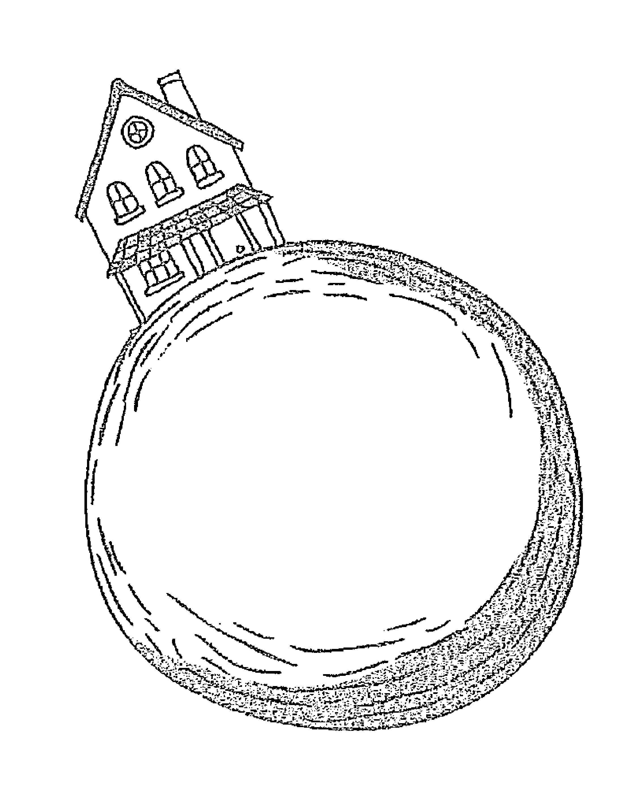

## 「整理」的欲望，能召喚宇宙能量

「我回來了。」一回到家後一開門，如果看到的是堆滿鞋子的玄關、衣服隨意亂丟的房間、食物吃完後擱在一旁的碗盤……，疲倦的身心想必更加沉重，這時是否會責備自己為何總是不好好整理呢？

越是知道該打掃越無法收拾，原因其實不只在你身上，這也是宇宙能量不足所引起的狀況。

所謂宇宙能量，是一種頻率非常高的能量。人們可以每天充滿活力地生活，即是因為接收了大大小小的宇宙能量，而我們依照生存本能的優先順位，做為能量接收的排序。

例如「想活下去！」、「得避開危險！」、「這些屬於生存的念頭，即為優先順序高的本能。在這之後會再衍生「想睡覺」、「想吃飯」、「想要一起生活的伴侶」等需要，更進一步，為了能過得更加舒適，則再發展更精細的欲求。

「想學習新知」、「想要新衣服」或「假日時想去兜兜風」……，這些欲望也是本能之一。而與本書相關的「想要收拾整頓」以及「想在舒適整潔的居家環境中生活」渴望，也存在於每個人的內心某處。

可是和「吃飯」、「睡覺」和「上班不要遲到」比起，「想要收拾整頓」的順位被排到很後面，因為即使不打掃收納，對於「生存下去」這件事情也不會造成多大的障礙。

換句話說，當你有這個念頭的時候，正代表你滿足了更基本的生存本能，有餘力獲得更多宇宙能量補給。而當宇宙能量不足時，只能補充到優先順序在前的欲望需求，這就是無法整理的真正原因。

## 正向情感有助於能量補給

那麼，要如何讓自己處在可以接收宇宙能量的狀態呢？上天告訴我們，答案就是讓自己充滿「喜悅」、「喜愛」、「幸福」以及「好心情」等正面情感。

擁有這樣的心靈會讓人處在高頻狀態，而和宇宙能量的頻率一致。此時藏在我們內部某處的「能量輸送管」暢通無阻，高頻能量可以不斷地從這裡補給進到我們體內。

當宇宙能量足夠時，優先順序較低的「整理本能」也能獲得補給。想要打掃收納、丟掉不要的東西這樣的心情，自然而然地就能湧現出來。

相反地，如果心裡都是「難過」、「悲傷」、「憎恨」、「後悔」、「寂寞」、「不安」以及「擔心」這樣的負面情緒，由於頻率相當低，便會遮斷宇宙能量。這種情況下，只能接收到生存所需的最低能量，而讓身心都無法獲得足夠的補給，思考、態度和行動也都會變得負面消極，最後陷入沒有整理慾望的心情狀態中。

就像前面說明的，整理這項行為是人類的生存本能之一，只是優先順序不高。因此，如果以為這只是件沒打掃、灰塵累積一類視覺上的事，就無法真正解決問題。應該思考的是。「我的心靈是不是太過消極，以至於宇宙能量不足以引起整理的慾望？」像這樣重新檢視當下的自我狀態，才是最重要的。

>「想要整理」的心情，是上天給我們的重要訊息——意識到這件事，是提升行動的重要關鍵。

## 負面心理，關閉「整理開關」

根據問卷調查結果顯示，父母最在意的教養問題，就是「孩子是否擅長收拾整理」。實際上，有二一・八％的父母從孩子小的時候就開始進行整理指導，當中四〇％以上的小孩能學會自發性地收拾整頓。

其實，人們內心藏有「整理開關」，因此無需對此感到過於緊張。

如果整理之後，能感覺到「變得清爽真舒服」就還好，但若是因為受到嚴厲的指導，造成「不整就會被罵」、「會受懲罰」這種強迫心態的話，將來可能會產生過度潔癖等不穩定的心理情況。

極度愛乾淨的家庭，父母通常對其他事情也抱有強烈的講究。在這種環境成長的小孩，容易出現「無法原諒他人」的固執想法，甚至演變成不論洗幾次手都無法放心，或是無法忍受別人觸碰到自己的物品等等強迫症症狀。這當中也有許多人會併發憂鬱傾向，或者走向另一個極端，讓家裡變成垃圾屋等狀態。此外，倘若總是擅於整理的人突然變得無法妥善收拾物品，則要多加注意。許多是因為高血壓或憂鬱症，或是在一切正常的表象下隱藏某些疾病，致使這種狀況的發生。像這樣的「整理開關」無法順利運作狀態，代表能量輸送管阻塞，無法吸收宇宙能量。如果不管怎樣都無法整理，試著檢視自己的內心中是否堆滿了負面情緒吧。傾聽從心底湧現的訊息，便能打開整理的契機。

## 不擅長整理，和成長環境有關

想整理卻總是無法這麼做的人當中，是否有很多是在父母不善於收拾，東西散亂的環境中長大的呢？縱使是這樣，也不能因此斷言：『不擅長整理是種遺傳，所以我才會這麼辛苦。』

有位朋友是雙胞胎。這對雙胞胎兄弟分別被送到不同家庭當養子，兩人皆受到養父母的溫暖親情呵護，長大後也都是年輕有為的好青年。他們只有一個地方不同，那就是哥哥很愛乾淨，而弟弟總是苦於整理。

調查這兩人的生長環境之後發現，哥哥的養母不擅長打掃，弟弟的則是很善於整理環境。也就是說，哥哥總是看到亂糟糟的房間，因而變得喜愛乾淨；弟弟則是因為家人會幫忙打理，不需要開啟整理機能。

如果你感嘆自己沒有收拾環境的才能，那並非遺傳的問題，而是整理開關沒有打開而已。在我們體內的「能量保存法則」一直運轉著，於是無意識下會發揮「不做不需要的事情」這項本能。當有家人能夠幫忙，整理開關便不容易開啟，也比較難變成擅長收納的人。

此外，像前面所說的，如果父母嚴厲強迫小孩要做好整理，孩子會在這種威脅中演變成對於「沒有整理」的恐懼。就算養成了收拾習慣，潔淨的房間中不知為何會飄蕩著一絲冰冷氣息，或是變成潔癖症狀，總是過度在意一點髒汙。

由此可知，整理和成長的環境、與父母之間的心靈交流，都有著密不可分的關係。不過，「想要整理」是一種本能，沒有真正不會收拾的人，只要打開沉睡的「整理開關」，一定能在此有所領悟的。

## 放鬆心情，能形成正向循環

擁有整理煩惱的人，通常都是工作能幹、有上進心，並且有凡事親力親為，連別人的份都要搞定，或是看到雜亂的環境就覺得該想辦法的責任感。

像這樣的人，因為有著「現在的狀況」一定要努力尋求改變」的危機感，就會開始整理。但是當結果不盡人意時，便會認真思考「為什麼整理不好」，然後越想挫折感越大，結果變得像減肥後復胖一樣，無法整理的問題再度發作。最後，有可能導出「我就是個糟糕的人」的結論而責備自己，使得吸收宇宙能量的輸送管空隙越來越窄小。

但是整理並不是想要就能做到的事情，而是需要讓宇宙能量降臨到我們身上，才能夠持續地進行。

上天的意思是：收拾整理是當「來自宇宙的整理能量」和「想要整理的心情」兩者都備齊的狀態下，才能夠成立。因此，就算你焦躁地想著「得要整理才行」，如果沒有足夠的宇宙能量支持仍舊無法行動。也就是說，這並不是件只靠自己的力量就能完成的事。

當明白這個道理之後，很不可思議地，心情能變得輕鬆，力量開始湧現，宇宙能量的進入也會變得容易得多。宇宙能量會來到總是笑嘻嘻、悠間放鬆的人身邊，而在充滿高頻能量之後，自然而然地就會想要整理，形成良好的正向循環！

讓我們訂下「收拾整頓，能做的時候再做就好了」這樣的輕鬆規則吧。相信如此一來，反而能夠充滿能量，成為善於整理的人。

## 清掃欲望浮現，好運到來的徵兆

是否有過在某個瞬間，突然感覺身體輕盈，很想要收拾打掃的經驗呢？

平常總是懶得行動，就算想著「得整理才行」卻一拖再拖；然而在某個時刻，好像被誰操控了一樣，開始愉悅而靈活地掃除起來，或是平常完全無法收拾的雜亂地帶，忽然開始挑戰它，而且做再久都不會覺得疲累……。

這樣的情況，其實是上天在傳遞重要的訊息：「你的運氣將會升級，之後會有很多好事發生！為了迎接這些美好，先來做淨化吧！」換句話說，這就是「打掃神明降臨」的狀態。能夠靈巧地東忙西忙、跑來跑去，是因為我們的「輸送管」吸收了大量的宇宙能量。

當身體吸取了這些能量，打掃整理不再是件痛苦的事，反而能讓人樂在其中且不勞累，心情就像是去迪士尼樂園遊玩那樣。那麼，打掃神明什麼時候會降臨到我們身邊呢？當你已經準備好接受宇宙能量的時候。這個結構非常簡單。當我們的精神狀態達到某個階段時，會隨著當下的狀況來吸收宇宙的能量。所謂的某個階段，指的是對某件事有所領悟、感覺「原來如此」而接納理解、與體貼的人相處、將自己的利益禮讓給別人，或是能夠遵守社會規範及倫理等時候。當能夠不斷補給宇宙能量，運氣上升之後，人們會開始覺得，和不需要的物品生活在一起是件不自在的事。因此，當你有了「想要整理」的心情，那正是運氣即將提升的證據。打掃神明降臨在身邊的日子，也將到來。

## 好運氣怎麼流動？如何抓取？

如果把「運氣」想像成一陣風，你覺得它會在哪裡流動呢？

- ① 接近地面的地方
- ② 大約與胸口同高的位置
- ③ 比身高稍微高一些，伸手勉強可以碰到的地方

答案是②。

「運氣」這項寶物，其實經常在視線可及之處，笑嘻嘻地環繞著我們，無論是誰都能輕易地捉住並乘上。只是要抓住運氣，就得和它所擁有的輕盈活潑頻率變成好朋友。包含人類在內，所有東西都具有能量，有些合得來，有些會相互排斥。雖然運氣總是環繞在身旁，但要捉住它，或是乘著它扶搖直上，必須有和它一樣的頻率，也就是說，「輕盈」是很重要的關鍵。這裡所謂的輕盈，除了實質重量以外，也包含了不過度講究的柔軟姿態，以及最低限度的需求數量。

搭名牌等各項物品來檢測具備的能量。但在宇宙法則中，則是以輕盈、輕薄、所需分量，盡可能不持有，以及能夠捨去東西的方式來衡量。

像這樣，吸收到豐富的宇宙能量後，無底的購物慾望會消失，自然就想要丟棄不需要的東西。

而真正喜歡的物品即使價格較高，但因為能長久珍惜使用，因此讓溫暖且優質的能量循環，進而提升運氣。

生活在地球上的我們，可能以為應當透過擁有房子、購買好車、穿

## 「排除負面能量」是開運的第一步

我們從食物、衣服、鞋子、皮包、書本、餐具和家具等生活中所使用的物品獲得優質能量，充滿活力地生活著。

但即使吸收了良好的能量，仍然會有負面能量產生的時候，那就是無法排出不需要的物品，所有東西阻塞在一起的狀態。就像是新鮮空氣只吸入不呼出，而感到緊憋痛苦的模樣；或者就像便秘，即便吃下再多的優質食物，由於體內還堆積著「廚餘」，剛攝取的營養也無法進入循環系統。

整理也是同樣的道理。如果有不需要的物品，就該移出生活範圍，以確保生存動能——也就是宇宙能量——的流暢。不這麼做的話，就會造成整個空間充滿了負能量。

比方說，電視或網路購物這些平台，只消打通電話或按一下滑鼠就能獲取商品，十分方便。但衝動之下所買的東西，經常是玩沒兩下就不實用，有些甚至根本都沒拆封便放置一旁。

但是，人們往往難以承認——這些專程買來的東西，實際上並不需要的事實。

結果在無法處理的狀態下，產生了「怎麼辦……」的負擔。

像這樣擺放了非必需物品的家裡，容易充斥著「後悔」、「罪惡感」、「厭惡」等氛圍，讓人陷入惡性循環之中。

這些負面情緒會成為不斷奪走能量的惡魔，使我們失去冷靜判斷的能力。

再次引起衝動購物或暴飲暴食等問題，最後讓身體陷入不健康的狀態。

一旦進入這種狀態，「想要整理」的能量就會完全停止流動。因此，不用的物品請拿到二手商店賣掉。超過保存期限的食品也都丟棄，移除不再需要的東西，讓它們離開你的生活領域吧！就像吐氣和吸氣，維持排出和吸收的良好節奏，就是開運的要素。

## 氣流阻塞──「購物依存症」的病因

知道不需要卻還是忍不住購入、同樣的東西反覆買了好幾個……，像這樣來自購物依存症患者的諮詢不斷增加中。

這類患者因為無法整理，過著被過多物品圍繞的生活，讓氣運的輸送管經常處於阻塞狀態，而無法獲得宇宙能量。然而，為什麼會出現這種症狀呢？

諮詢者S小姐是專職家庭主婦，小孩分別就讀幼稚園和小學一年級，丈夫則是在東京都內工作的上班族，她打算等孩子大一點之後，再找份兼職工作。

最近S小姐經常感到煩躁，包含照顧小孩在內，總覺得無法享受日常生活而困擾；也很常大聲斥責孩子，有時候甚至動用到體罰。每到晚上看他們睡著後的臉龐，總是會覺得很後悔，但隔天還是會再發生同樣的狀況。

除此之外，為了紓解壓力而購物的情況也開始增加。她買了許多平時沒有機會穿的時尚服飾，以及已經擁有很多了的首飾等等。甚至放任自己的欲望，動用為小孩所存的款項，購買高級家具和法國製的廚房用品等等。然而，無論她買再多也無法獲得滿足，因此又繼續購物……如此循環下去，把存款和信用卡都使用到極限之後，只剩下和丈夫關係的惡化以及罪惡感。

其實會讓S小姐陷入「購物依存症」的原因，在於她和另一個小孩的媽媽發生爭執所產生的壓力。在雙方的孩子就讀同一家幼稚園時，彼此是很友好而親睦的。但進到小學之後，她們開始在意孩子的成績，然後發展到比較各自丈夫的收入、職業，乃至於小孩上的才藝班等等，也就是發生了現代社會所稱的「媽媽階級戰爭」。不知道該如何消解這份痛苦的S小

像這樣，當感到「好討厭、好痛苦」時，如果不能抒發鬱悶，只能將它封印在心中的話，會引發「氣的阻塞狀態」，無法吸收優質能量，而必須從其他地方調度。S小姐就是求助於衣服、首飾、高級家具、法製廚房用品這類「妝點、襯托自我的物品」，所以無法克制去購買這些其實不需要的東西。

即便不像S小姐一樣嚴重到會動用特殊存款的程度，很多人都有類似症狀。比如說，不論有沒有需要，會在百元商店或特賣會場亂買一通，這其實就是一種「隱性購物依存症」。表面上看起來買的是物品，實際上在購買「氣」。如果總是覺得自己忍不住又買了不需要的東西，請試著檢視內心是否處於無法調度能量的負面狀態。如果找到了肉眼看不見，但應該要丟棄的情感，請先將這些情緒發洩、排出吧！如此一來，相信優質的能量也能開始循環。

## 「安眠好眠」元氣恢復最佳解方

當因為職場或家族之間的人際問題而累積疲勞，會陷入不論睡再久都無法消除勞累的狀態。這是因為體內的氣就像阻塞了一樣，無法排出不需要的情感，處在持續緊張的緣故。人們的生活就像騎著腳踏車前進，靠著「體力」與「腦力」兩個輪子的運轉來驅動。所謂的「體力」，指的是像是跑步運動、提拿重物這類事情，只要稍作休息就能正常運作。另一方面，「使用腦力」則是指思考事物，例如閱讀、計算。最消耗的狀況是不斷地在沒有答案的事物上鑽牛角尖，像是「那個人對我有什麼看法？」——反覆推敲他人的心情。「將來如果一個人孤獨死去怎麼辦？」——對無法預知的未來胡思亂想。「為什麼我會說出那種話呢？」——為已經發生的事情感到後悔。

## 壓力大小，與不必要物品數量成正比

為了回復腦力，最好的方法就是什麼都不去想，這時需要的是腦袋不運轉的睡眠時間。越是無法順利排出壓力的時候，越會平白消耗腦力，身心也都比平常還來得需要睡上一覺。

如果無法充分獲得睡眠以補給腦力，壓力無法充分排出，身體會一直處在緊張的尖峰狀態。如此會使得體內的血液無法通暢，負責供給大腦的血管狀況惡化，造成腦部獲得量降到最低限。

結果就是難以做出『正常的判斷』。平時沒有任何感覺的物品突然都顯得魅力萬千，好像是人生中不可或缺的必需品，因而衝動購物。

同時，內在警鈴會變得非常地強，更加在意本來就很留心的事情，比如說健康、減肥、美容、流行時尚等等，但因為沒有足夠的心力去做篩選，便容易受到重複購買的負向能量所蠱惑。總而言之，身上背負的壓力大小，會和實際上並不需要的物品數量成正比。

為了排出壓力並補給腦力，上天傳達的唯一方法就是充足的睡眠。透過睡眠讓身體放鬆，體內的血液開始循環，才能擁有正常判斷能力。如此一來，就會知道對自己來說哪些是需要的物品，哪些不是。對於不需要事物的欲望會開始消失，而想要丟棄身邊多餘的東西。如果累了就睡一覺吧。入睡前，感謝今天又平安地度過一天，能獲得更高品質的睡眠。

## 「負面思考」，無法整理的元凶

無法丟掉物品，逐漸堆積垃圾的狀態，或相反地有過度潔癖，這些有關整理的煩惱經常和其他的問題一起發生。

比如說，一直在吃甜食或零食的過食傾向、減肥無法持續、沉迷於賭博、酗酒、對金錢沒有安全感、多重債務、夫婦關係惡化或霸凌他人等遊走灰色地帶的行為、憂鬱症傾向等等。

為何無法整理會和這類問題一起發生？原因在於它們都是從「負面思考能量」中所產生的。

諮詢者R小姐在離婚之後，獨自撫養就讀小學二年級的孩子，並接受日本「生活保護法」的補助，每月領取救濟金過活，但她有著沉迷於賭博電玩的煩惱。小孩上學後，她就出門賭博，領到的補助費根本不夠用，最後到了要向銀行貸款，家事也完全停擺的地步。再加上R小姐發現自己好像也有酗酒的症狀，她開始害怕這樣的自己，終于來向我商量，希望獲得幫助。

這些問題都是氣的流動停滯所引起的。因此我教導R小姐打開長期封閉的窗戶，讓新鮮空氣進入家裡，並且要她經常做深呼吸。後來她告訴我：「想要改變自己，變得更好。」由於湧現了這樣積極向前的心情，她漸漸降低喝酒量，也能減少去賭博的日子，對於整理環境也越來越有幹勁。這就是因為讓新鮮的空氣與能量進入家裡，原本停滯的氣運開始轉動了。

如果你正背負著嚴重深刻的問題，首先讓家裡的空氣流通，趕走家中「負面思考能量」吧。當優質能量開始循環，相信眼前的問題可以朝著解決方向發展，也能好好整理家中環境。

## 學會整理術，人際關係也將改善

「好麻煩喔⋯⋯真不想跟這個人往來⋯⋯」你的身邊，是否有這樣的對象呢？其實，變得擅長整理之後，人際關係也會跟著轉變。這是因為當你的能量品質變好，將會迎接一波大的淨化期，開始想要整理自己的人際交往。不管是摸得到的物品或看不見的關係往來，只要人生中囤積了不需要的東西，我們無意識中就會想要做一番整頓。

人們思考的時候，會散發出各種頻率。所謂的「物以類聚」，就是頻率相近的人聚集在一起。也就是說，與自己的思維、想法相同的人，由於類似的能量會產生共鳴，因而容易聚合起來。

但是，當能量品質開始提高時，會慢慢感覺到至今來往的人好像哪裡不太對。然後，很不可思議地，會由於各種原因而開始難以見到面，或是對於相約小聚越來越沒有興趣。

如果遇到這樣的狀況，不需要有罪惡感，因為對方也有相同的感受。頻率不同會產生結界，讓人自然而然地傾向分離。我再強調一次，為了能夠整理，需要充分獲得宇宙能量。要想吸收該能量，得能察覺並放下囤積在心中的負面情感，讓氣運輸送管通暢。能量流入輸送管之後，散發的頻率會顯得活潑有朝氣，並且變得極度想要丟掉不需要的物品，讓身邊變得更清爽乾淨。當樂在收拾整理當中，那真的是一件愉快的事。相信如此一來，能讓你展翅高飛的優質人際關係會接連造訪。

## 和財富產生共振的優質好物

你在買東西的時候，會選擇大量生產的便宜貨，或是願意付出高一點的金額，選擇能知道來源或生產者的商品呢？

實際上，當我們和宇宙能量產生共振之後，會開始想要購買品質良好的物品。擁有一流技術、以自己的專業為豪的師傅，集中心力製作出來的物品，會蘊藏著高頻能量。如果你本身的頻率有所提升，也容易與高價商品共振，這是因為對好質地、舒適和輕鬆的感受能力變得更加敏銳。這跟價格高低無關，而是你的「優質好物」感應天線開始運作了。

有機或無添加的食品、以高品質素材製作的布料，或是技術超群的師傅精心打造的首飾、衣服等等，像這樣蘊含真心且耗費時間製作的商品，你對於其中的用心體會能力會變得更強。

開始懂得選擇優良物品之後，便會充滿強力的自信。這份信心會提升你的頻率，讓大量的宇宙能量得以注入，開始出現良好的上升循環。

此外，像「我應該辦得到！」這樣的自信會與高頻率的金錢產生共振，因此，能吸引金錢流入的想法或能力也會開始源源不絕冒出。而所取用的食物也會改變。大量生產的垃圾食物不再吸引你，取而代之的是具有濃醇鮮美味道的食材，即使吃得不多，也能滿足食欲。

像這樣，與生產過程受到細心呵護，且擁有優質頻率的商品相遇之後，這些物品會和自然的一部分——也就是身體——產生共振，帶來相乘效果使頻率上升。

當周遭有越來越多你所珍惜的物品，頻率會隨之提高，你的家會開始出現猶如天堂一般的高品質能量。

## 安培客人來訪，打掃福神也將敲門

對於那些不會積極行動的人，上天有時會派遣『打掃福神』降臨到他們身邊。

擁有三個寶貝小孩的Y小姐，她的煩惱就是家裡總是亂七八糟。孩子的玩具、卡通DVD和遊戲光碟經常散落四處，讓她覺得該想辦法解決。

有一次，她被選為三男就讀學年的家長會副會長。雖然日子很忙碌，她仍然努力和成員們溝通交流以培養彼此之間的信賴關係，並提出了給家長長的花藝體驗企劃。討論之後，由於要先請講師進行一次課程預演，場所就選在Y小姐的家。

這件事讓她十分焦慮。雖然不到垃圾屋的程度，但家中總是處在三個小孩的東西亂糟糟的狀態。而且這次竟然有將近十位家長，再加上花藝老師要聚集到這個地方。

無法拒絕的Y小姐只好在工作之餘，拼命找時間整理。在這樣的努力之下，她把家裡收拾得十分乾淨漂亮，終於讓整個環境煥然一新。

其實，這並非偶然。「想改善問題」、「得想個辦法」的念頭，讓巨大的能量開始運轉，而打掃福神正是以「客人要來到家裡」的方式造訪。

## 邀請朋友到家，啟動整理開關

你是否也有過和Y小姐相同的體驗呢？比如說學校老師的家庭訪問、親戚借宿，或是小孩的朋友來遊玩等等，像這樣突然有人來訪，不得不急忙收拾家中的情形。由於情況緊急，為了解決問題而精神集中，打掃開關會突然啟動，宇宙能量開始流入，因此得以用最短時間與最少能量，做到至今未能達成的驚人成果。

因此，想讓打掃開關發揮效用，偶爾計畫烤肉派對或生日會等等活動，邀請別人到家中吧！有朋友要來的時候，多少會覺得應該要稍微清理一下，可以成為整理的良好動機。相反地，受邀到朋友家中，看到整潔乾淨的居家環境，也一樣能獲得正面的刺激。

此外，準備甜點當作打掃後的獎勵，或是以想看的電視節目開播時間為限，努力整理房間等等，透過刺激大腦的方式也能幫助啟動整理開關。

就這樣，Y小姐將小孩的什物都收拾得一乾二淨。家長會的其他成員，原來就是打掃福神派來的小幫手。

## 理解『現存能量法則』，獲得最大幸福

除了我們自己，如果房屋本身能吸收宇宙能量的話，也能開啟打掃開關，方法有下列兩項。
第一項在第五十七頁也有稍微提到——「讓家呼吸」。

人類生存的基本要素之一就是呼吸。經由這項行為，血液能循環到身體的每個角落，大腦的毛細血管獲得足夠的氧氣，讓我們能夠想像開心快樂的事情，或是描繪對於未來的夢想。此外，血液的流動也能幫助排出身體不需要的物質。

如果呼吸不順暢，血流會變得遲滯，將引發手腳冰冷、肩膀僵硬或頭痛等等病症。快將體內的二氧化碳吐出，吸入新鮮的氧氣吧！如此一來可以讓具生命力的能量開始運轉。在這一點上，房屋也是完全相同的。

當家中充滿物品，並呈現封閉狀態的話，也就難以吸進能量。想像房子是個人，氣流就像血液，如果持續阻塞，就會在無意識中覺得頭痛或肩膀僵硬。

家裡的窗邊或玄關，是否堆滿雜物呢？請注意，和戶外連接的窗戶和玄關是排出廢氣，並獲得優質能量的重要場所。這兩個地方就像人類用以呼吸的口鼻，如果塞滿了物品而無法開窗，或是窗簾沒有清洗等等，都會讓房子的氣息越來越淺。

整理這兩處的同時，一併為房子引入新鮮的空氣吧！這也是為自己補給新的能量，下一個全新舞台也將因此開啟。

### 空間大小決定選擇可能性

讓家中充滿宇宙能量的另一個方法，就是『一定程度的留白』。比如說，桌上如果有一塊餐墊大小的空間，大腦就會開始思考這個地方能做什麼作業，例如吃飯、喝茶或是寫信。但像是放上很多盤美味料理、鋪上大張畫紙盡情揮灑這類需要更大空間的事情，大腦就不會想到。

我稱之為「現存能量法則」——衡量如何以現有的物品、條件，獲得最大的幸福，而不會去多想不可能實現的事情，這是大腦的一種思考構造。根據這個法則，比起物品散亂的空間，整齊的屋內環境自然能增加更多像是「邀請朋友來家裡開個派對」、「利用這個區域來辦個英語教學班」等活動量更大、更為積極活潑的選擇出現。空間越是寬廣，能做的選擇就越多，家中也將循環優質能量，並且讓你開始了解自我可能性的寬廣度。

呼吸與空間。只要留心這兩個重點，宇宙能量自然會滿溢家中，打掃開關也會隨之開啟。

## 實現高效打掃的便利工具

這裡要介紹的是，讓打掃更輕鬆、有效所不可或缺的便利道具。

首先第一個是「除塵桿」。電視櫃、擺設品、掛鐘、冷氣機或燈具周圍等，只要培養起常用除塵桿輕輕抹過這些地方的習慣，灰塵自然不會堆積。特別在天花板的四個角落，是容易囤積不良氣流的代表性場所。即使沒有肉眼可見的灰塵，建議還是使用這項工具稍微清掃一下。

第二個便利法寶就是掃把和畚箕。吸塵器雖然可以清理得非常乾淨，但要把它搬出就是一個工夫。家中只要準備掃把和畚箕，並且把它們放在取用頻率高的廚房以方便拿取，使用時不會發出噪音，即可輕鬆簡便地維持整潔環境，可說是一石二鳥。不只是一般的地板，地毯也盡量用掃把來清掃吧！用掃把掃過之後再使用吸塵器的話，不但灰塵的量會較少，也能延長吸塵器的壽命。

這些打掃工具因為容易沾附髒汙，如果經常看到，會在無意識中啟動緊張心理，讓我們發出難以和宇宙能量產生共振的頻率。因此，請把打掃用具收納在不起眼的角落吧。

# 第3期

抛来个酸坏物，

踏出九间屋来，这单进随来除主顾

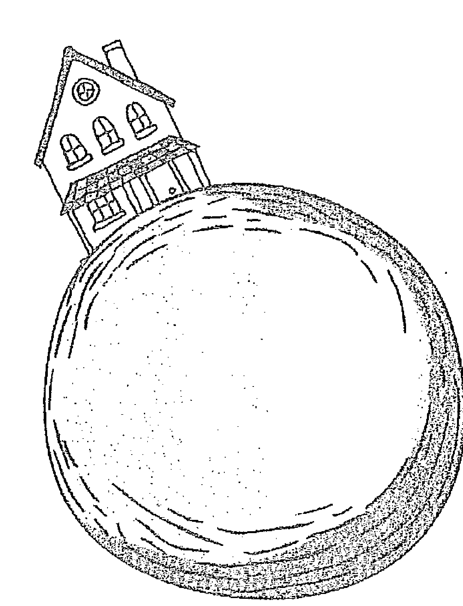

## 環繞身邊的物品，決定當下幸福程度

你現在的生活，是被什麼樣的物品包圍著呢？
塞得滿滿、遠超過衣櫃收納量的衣服，要拿出來都是非常辛苦的事；覺得哪天會用到而無法丟棄的皮包，三年前讀完之後就再也沒有打開過的書；用到一半就擱在一旁的化妝品……。如果充滿了不需要的物品，請狠下心處分掉吧，因為這些物品會奪走你的能量。並不是物品本身帶有能量，而是我們對它們的情感，產生了正向或負向的影響。
比如說，逛街時看到了一見鍾情的衣服，我們心中會產生「想穿著這件衣服走在街上」的正面情感。這時能讓人感到幸福的血清素和催產素這兩種賀爾蒙分泌變得活潑，腦波和宇宙頻率開始共振，能帶來富足與幸福的正向能量就此誕生。
另一方面，看到毫無用處、骯髒污穢，或是不再需要的物品，我們無法感到愉悅，反而會讓人開始有種「得想想辦法處理」、「怎麼辦」的不安。「不安」正是阻斷宇宙能量的最大天敵。這種情感的頻率和宇宙能量相差甚遠，並且會奪走我們的能量，引發各種麻煩或令人煩躁的事件。

因此，身邊擺放什麼樣的物品，以哪種心情生活是非常重要的。雖然只是個東西，然而我們看到它時產生的感受，都左右著「幸運」門扉的開啟與否。

### 七三法則，能量流通的收納要領

有一種呼喚最強能量的方法——「空間七・三法則」，也就是保留三成空位的意思。空下的三成餘裕，能讓新的宇宙能量進入。

比如說，抽屜就算收拾得再整齊，如果讓它處在不能再放入其他物品，或是東西只能在固定位置而無法移動，呈現百分百塞滿的狀態，你在開抽屜時也會感到緊張。然而，抽屜裡若保有三成的剩餘空間，你會產生「還有空位」、「應該沒有問題」的想法，而讓心情也跟著擁有餘裕。

不論收納空間的大小，當全部物品占用的範圍超過七成，代表當中有著你不需要的物品。請試著找出丟掉也無所謂的東西吧！

「不需要、老舊、用不習慣」這三大問題，會不斷奪走新鮮的能量。

現在拿著這本書，有「好想整理」心情的你，淨化時機已然來到，請不要猶豫，大膽地進行物品的處分吧！此外，「不購買、不囤積、不拿取」是絕對法則，即使有剩餘空間，請注意不要立刻塞滿那些位置，而讓三大問題跟著你。如果家中原本就有儲物櫃，代表生活基本上有那些空間也就足夠了。因此，在尋找住處時不需要避開櫃子較少的房屋。改變生活型態，配合收納空間來決定物品的數量，相信好運會來到你的身邊。

## 物品出現窮酸味，快丟棄

「淨化」整理的訣竅就在丟棄所有不需要的物品。只要是出現了貧窮氣味，不論是什麼都該跟它揮手道別。分辨這類物品的方法很簡單，只要看起來覺得很窮酸、「拿著這個東西感覺運動勢會下滑」的都是。例如瓶身黏答答且清理不乾淨的洗髮精容器、在天花板上懸掛的滿積灰塵家飾品、已經破破爛爛但捨不得丟掉的名牌店紙袋……這些物品請豪邁地處分掉吧。另外，手機液晶螢幕如果碎裂的話，也會讓運氣走下坡，建議立刻修理更換。

物品藏有人的意念 「看到擺在玄關的人偶覺得怪怪的」、「去骨董店時，不知道為何就會有點低落」，或是相反的，「一戴上這只戒指，感覺精神都來了」等等，一般人縱使沒有特殊感應的體質，但仍能像這樣感受到物品所散發出的能量。
這正是能覺知到蘊藏在物品當中意念的證據。所有東西都藏著人的心念，會為周圍的人帶來影響。比如說，保有優質能量的什物，能使人放鬆，變得更加有自信，讓人生的可能性擴大好幾倍。
舉例來說，某位朋友十分珍惜的粉晶，散發出奇大的能量波動。此外，每次使用完電腦就向它說聲「謝謝」，它也比較不容易故障，讓使用過程更加順暢。
相反地，含有痛苦或悲傷等等負向能量的物品，則會變成絆腳石，阻礙自由發展的空間。因此，一旦身邊出現了不需要的物品，請盡早和它們道別吧！這將有助於提升你的運氣。
我認識一位企業家，跟他合作的海外公司，贈送了鑲有美麗寶石的擺設，作為契約成立的紀念與依據。在企業家獲贈當下很開心，但自從把它放在櫃子展示開始，不知道為什麼覺得全身沉重、頭痛，身體也接一連三出現症狀，甚至影響到工作。

我看到這座擺設品時，發現它上頭的寶石散發出非常沈重的頻率。這應該是開採寶石的礦場曾經發生崩塌，當時因為該意外身亡的採石者，其意念留在石頭上的緣故。而後透過淨化，才讓當中蘊藏的能量轉正。像這樣，由於物品上的他人意志，影響擁有者身心狀況的例子真的不在少數。

## 辨別能量的偵測器，人人皆有

有人問我：「如果沒有接收波動的能力，是否就無法辨別出能量的好壞呢？」答案是否定的。我們天生具有能量偵測器，本能上知道該如何分辨哪些物品應該去棄或留下，也能區別東西能帶來的能量好壞。

關於辨別物品是否要處理掉的方法，如同本章先前所說，基本依據就是看到它時會覺得愉快或沈重。因此，說得極端一點，就是用直覺來判斷東西的去留。

> 內心所感受到的「真高興！」或是「好討厭喔！」當中，即藏有引導我們通往正確道路的靈魂之聲。「即使知道不需要還是丟不掉」，如果有這樣的猶豫情況，就意味著有些心理層面的影響因素。試著在整理的過程中，感受內心的微妙變化，被遺忘的喜悅或被封印起來的悲傷將會甦醒，你的心能受到淨化，人生能有飛躍性的展開！

## 保留或捨棄？一定要知道的物品處理原則

在這個章節，為了能夠準確判斷什麼該丟棄或留下，會針對不同的物品中藏有怎樣的能量，以及捨棄的基準、方法或保管方式等等來做說明，以成為你面對周圍的物品時的整理參考。

## 朋友送的土產、禮物

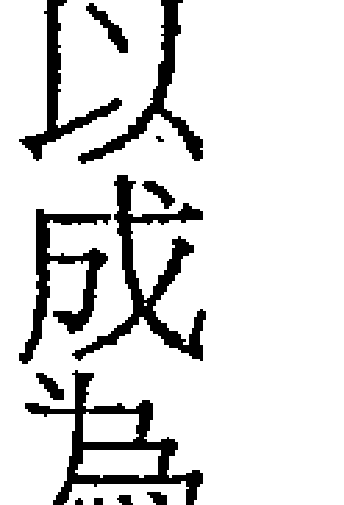

土產或禮物是整理的時候，最讓人不知道該如何是好的物品。若要丟掉朋友送的東西，總會感到罪惡，每次判斷去留時都會猶豫「該怎麼辦才好」，最後還是囤積在一旁。

究竟這些禮物當中藏有怎樣的能量呢？請試著回想自己為朋友挑選禮物時的購買動機——不外乎「人情」、「面子」或「關愛」。

如果是前兩者，大多會選擇知名品牌貼心這類大家都能接受的東西。

食品吃完就等于清理掉了，不会造成整理上的问题。而最令人感到困扰的，就是购买动机为「关爱」的情况。礼物中如果含有对方想向你传达的情意，或对方是亲朋好友、恋人等等关系亲近，「够」感受到呵护的人，他们送的礼物总是很难处理。我建议大家试着这样思考：那些是关爱能量的承载工具。充满「关爱」的能量，搭乘名为「礼物」的车来到你的面前。而礼物到手时，情感就会下车，抵达身边，你也能慎重地收下。换句话说，收到礼物的那一瞬间，当中的能量就移转出来了。因此，请放心地舍弃。不过，若是某项礼物已变得脏污，但仍然舍不得丢弃的话，请好好地珍藏著吧！只是请注意，如果它开始散发令人不喜欢的氛围或让你感觉不快，那就是告诉你丢弃的时机已经到来。因此，请不要犹豫，把这项物品处理掉。除了拿起时觉得不論如何都难以割舍的物品之外，所有礼物都可以放下。

處理的時候，也要一邊對禮物和送禮人表達感謝：「在遙遠的地方旅遊，還能想起我，真的非常謝謝你」、「讓你為我破費買了這個禮物，真的非常感謝」等等話語。當你想著對方體貼善良的心意，一邊說著「謝謝」，禮物中所蘊含的情感，也會知道自己的職責已盡，感到滿足喜悅並接受淨化而去。而那份感謝的心意，會再為你喚來良好的能量。

## 以前戀人給的物品或紀念品

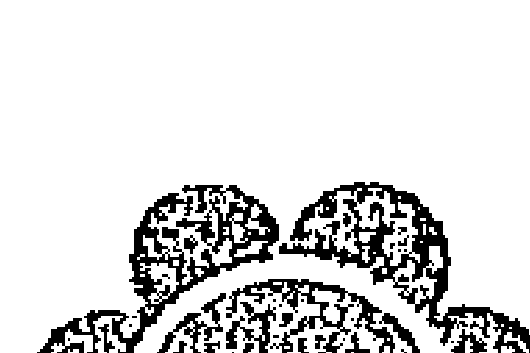

充滿和前男友或前女友之間回憶的物品，當中含有不再需要的能量。如果對感情還有依戀的話，可能會猶豫要不要留，但如果希望邁向新的階段，請把這些都捨棄吧！丟棄的時候，不用再特別包裝起來，請直接丟入垃圾桶。

> 「○○○，一直以來謝謝你了」像這樣說出對方的名字並道謝，心中殘留的依戀才能一起受到淨化，也更容易與下一段戀情邂逅。

## 現在交往中戀人所送的物品

男女朋友為你挑選的禮物，或是兩人一起購買的物品，不論是什麼都會充滿『最喜歡你了』的心意。在交往期間，請好好地保管它們吧！這樣的舉動，意指「感謝你如此地珍惜我」，是充滿謝意的證據。
交往時如果有這樣的心情，即使分手了，也不會發生跟蹤狂等等恐怖情人事件。
保有這些物品，絕不是把它們亂塞到自己都記不得的地方，或是和一些不再使用的東西塞在一起。
請盡量將它們放在「高級住宅區」。比如說，為它們鋪設餐墊或桌巾，佈置一個特別區域，用類似膜拜的心情謹慎地保管，物品就會存有正向意念，讓優質能量環繞著你。

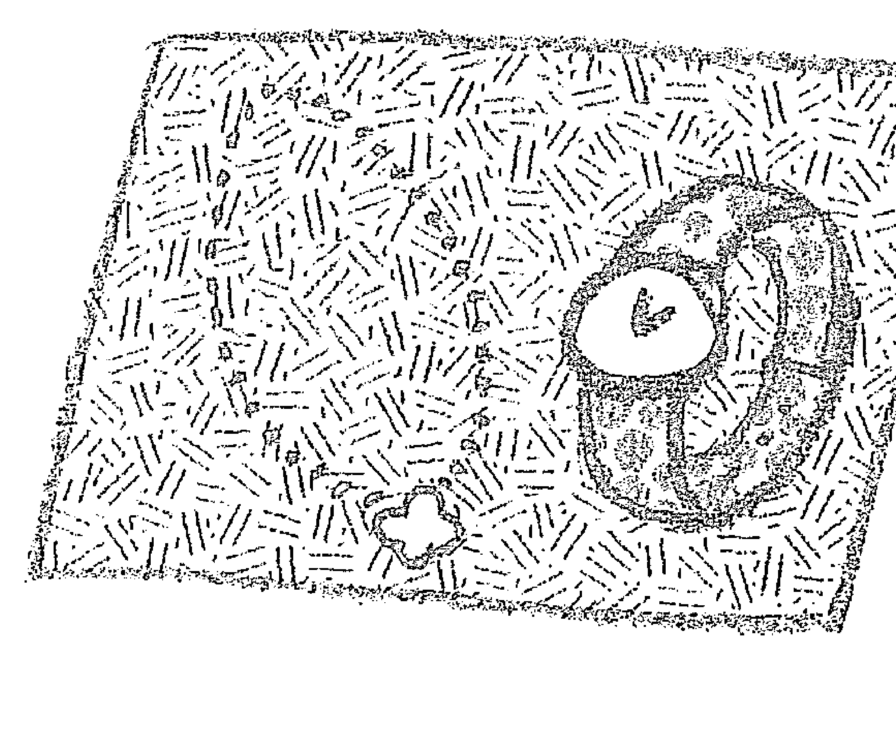

## 一年以上沒有穿的衣服

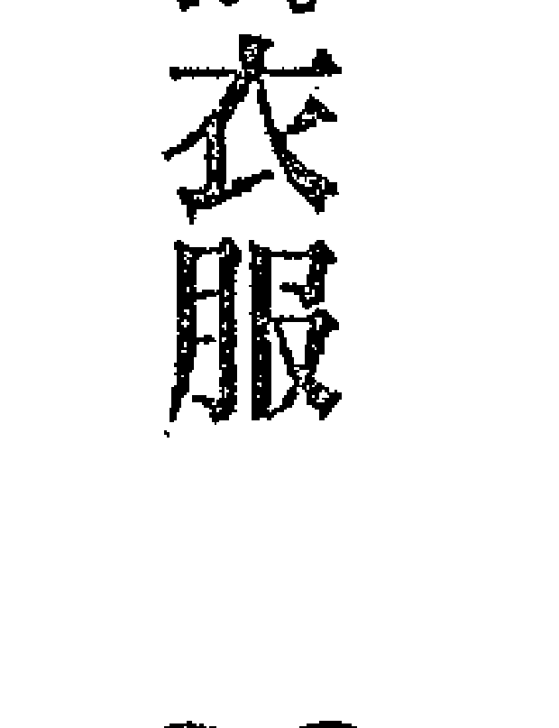

一年以上沒穿的衣服，通常都認為丟掉比較好，但基本上除了看到時不覺得愉快，乃至於會心情不好，以及毫不猶豫可以決定丟棄的衣服之外，都可以保留起來。

想要整頓衣櫃的時候，就是感受到淨化的需要，能量正處於有很大波動的階段。這時，可能會連有需要的物品也一併丟掉，所以當你猶豫的話，請先留下那件衣服。

實際上，當你在處理舊衣時，「當時因為很喜歡才買的」、「其實那件衣服還滿貴的」、「或是「現在變胖了穿不下，但如果瘦下來不定還能穿」等等想法也會湧上心頭。如果有這些心情出現的話，即使是已經一年以上沒有穿的衣服，也請先繼續留著。

這是因為當淨化持續進行，能量變得安定之後，收入自然就會增加，能搬到比現今還要寬廣的地方，將攤有放得下現在衣服的空間，另外，相信你的體型也能變得苗條，而穿得上發胖前的衣服。

但記得要遵守「空間七・二法則」。如果是塞得滿滿的、連拿件衣服出來都很困難的衣櫥，無法吸收新的宇宙能量，所以請記得留下三成空間。如果要將衣服送別人，請先洗滌並在太陽底下曬乾之後，再贈送出去。衣物中殘留著原本主人的能量，如果直接轉送，拿到的人會受到那份波動影響。倘若能先清洗乾淨再經由日光曝曬，原本主人的能量就能消除八成左右。如果不是送給別人，而是要丟棄的話，要說「謝謝你一直以來發揮能量」，再丟到垃圾桶中。你穿上那些衣服時，它們也會感到開心喜悅。不需要覺得「浪費」，對衣服的謝意，會轉為對周圍的感謝能量，再回到你的身邊。或者，把這些衣服當作抹布，用來打掃清潔也沒關係，即使直接丟棄也不會受到上天懲罰。衣服的使命就是供人穿著，除此之外的事情不需要太過在意。

## 沒有使用的皮包或飾品

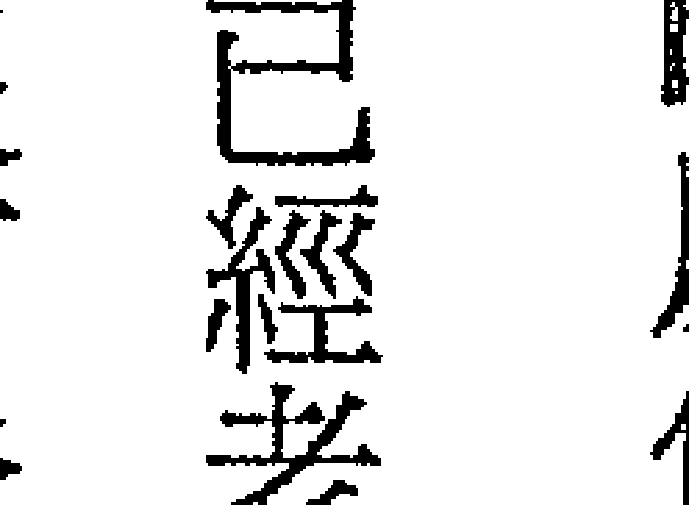

衣櫃裡已經老舊的皮包、塞滿收納盒的首飾⋯⋯，想總有一天會用到，卻一直沒有登場機會，沉睡在衣櫃中遲遲沒有處理掉的東西有很多，

對吧？

但皮包或首飾當中，蘊藏著使用者的強大能量，基本上不適合轉贈出去。丟棄的基準是已經壞掉、他人贈送或從二手商店買來但未曾使用過的物品。此外，如果有相同設計或類似顏色的東西，決定其中一件作為代表留下即可，其他則能處理掉。

記得真心地道謝：「一直以來謝謝你了。」接著，將它與其他垃圾分開，用別的袋子裝起來，做好垃圾分類後單獨丟棄吧！如此一來，你的運氣會驚人地上升。

往後要購買的時候，限定在全新、稍高價，並且是你一見鍾情的東西。如此一來，喜悅的心情會軟化血管，讓血液循環變好、肌膚看起來更加有光澤，甚至更有異性緣，整個人也能充滿亮麗光彩。

## 一年以上的護身符或是籤詩

到神社參拜時所購買的護身符，是代替你接受邪氣的神明。當你想要整理、收納的時候，就是最適合做淨化的時期。用了一年以上的護身符，已經為你吸取了相當程度的邪氣，因此和衣服不同，處置掉反而有助於運氣上升。

若是年底拿到的護身符，因為還具有有效用，隔年再處理就好，明年一整年都放在身邊也沒有問題。或者，當某天出現了「不知為何就覺得可以丟了」的感覺，代表淨化時機點到來，再拿到寺廟裡燒掉也行。今年來到你身邊的護身符，就好好保管吧。

如果無法拿去燃燒處理，請用白紙包起來，大聲說出充滿謝意的話語，例如「感謝你的守護」，然後丟到家中垃圾筒就可以了。

此外，籤詩是神明為了協助調整抽籤者的能量，而提供的訊息。當抽出籤詩時，那上頭已吸收了抽籤者的邪氣。因此，它就像你要丟的垃圾一樣，請不要放在神社裡，帶回家吧！

籤詩出現「大吉」固然令人感到喜悅，但它其實很容易在人們狀況最差的時候出現。這是上天為了讓運勢不佳的你，可以積極向前努力邁進而調整了能量。

另一方面，出現「大凶」則是因為你現在狀態良好，因此上天指示：「為了不要因為粗心而失敗，請小心謹慎地度過吧！」

無論如何，籤詩協助吸收阻礙你的負面能量，因此不用珍藏在身邊，請用白紙包起來，向上天致謝，然後把它丟到家中的垃圾桶吧！

### 感受不到光輝或喜悅的能量石

在店裡閃耀光芒的能量石，是用蘊藏在其中的力量守護我們的珍貴寶石。但能量石的功效是有期限的，如果它的光輝與剛來到你身邊時不一樣，或是看著它的時候，不會覺得「很開心」，那就意味著這塊石頭無法再傳遞能量給你了。

這種物品，原本就是運用每一種構成它的礦物微粒，來幫助吸收負面能量給你了的頻率，並調整與促進淨化的力量。因此，當你產生「想要整理房間」的想法時，表示它成功減少了你的負面能量，是大淨化開始的徵兆。當整理完成之後，如果你看著它也感受不到喜悅，表示其職責已盡。

每個人都有自己的淨化階段，當一個進程結束之後，相信你會和下一個能量石邂逅。如果繼續留著已經完成職責的能量石，當中的負面頻率會充滿整個房間，讓人變得消極、容易疲倦。如果有沉睡在抽屜中的能量石，請處理掉吧。

丟棄的時候，用紙包起來丟在家中垃圾桶就可以了。別忘了說「謝謝照顧」，像這樣誠心地道謝。

即使感覺有點浪費，但是能量石知道自己已經充滿邪氣，離開你的身邊能讓你獲得好運。因此就算不留下它，也請放心，這塊能量石還是會一直守護著你的。

另外有一種說法認為，完成使命的能量石，埋在土中讓它回歸自然比較好。但是和人相處過的石頭，因為吸收了人的能量，原則上和垃圾是相同的。從土壤裡挖出來的東西，已經無法維持原本自然狀態時的頻率了。
將能量石丟入垃圾桶中，是不需要為此感到罪惡的。請試著想像垃圾桶是神明，而道出「謝謝你」一類的話語則是誦經。神明不會讓我們做太麻煩的事情。

### 小時候就擁有的玩偶

玩偶因為具有表情，丟棄時總是格外有罪惡感。
此外，和別的物品不同，因為我們會抱著他們、帶出去玩，或像對朋友一樣地跟他們說話，這些玩偶更容易存有一份心念，更擁有能夠幫助人的力量。
因此，如果他們充滿回憶而讓你猶豫是否處理時，請繼續留在身邊吧。

無論這些玩偶變得再破舊，他們仍然會守護你，並且帶來許多能量。
只是當數量增加，讓你感覺「得想想辦法」時，可以處置掉並不是最喜歡的那些。

由於你的珍惜，會讓他們的表情看起來越來越可愛，也越來越栩栩如生，宛如擁有了靈魂。但這並不是他們本身產生變化，而是觀看的人腦波如此判斷。

當玩偶遭受粗暴的對待，他們不會有任何反應，但如果受到疼愛，則會給予加倍的回應，徹底地守護你。即使因為工作忙碌而疏忽了他們，他們也絕對不會怨恨你，而是忠心地陪伴著。

玩偶是上天為了看看你而派來的使者，因此當你感覺「已經足夠了」的時候，他們的職責就圓滿達成，並且為著你即將踏入下一個階段而開心不已。

於是，不必為了丟棄他們這件事而感到罪惡。請試著告訴他們「謝謝你的陪伴」，而不是「對不起」。

處理方式是，先用擰乾的毛巾擦拭玩偶全身，再用紙包裹起來丟棄。請不要和其他垃圾丟在一起，盡可能一個一個地分別包裝。

玩偶不會吸取邪氣，而是為你帶來能量，和護身符或能量石不同。

雖然也有些人為了供養人偶而焚燒的情況，但那是為了徹底地淨化而使用火焰。但他們基本上並不會沾上負面能量，因此不需要用到火。

除了平常喜愛的玩偶之外，一直擺在家中的人偶、感覺詭異的布偶或是日本男兒節傳統的武將人偶裝飾，也能以誠心說聲「謝謝」消除邪氣，因此丟棄也不會帶來不良影響。

### 朋友、熟人或以前交往對象所給的信

別人給予的信件，因為是懷抱著對你的情感所寫成的，因此總是很難丟棄。但是，「用紙傳遞心意」等同於「請上天代為轉達意念」，因此當寄信人寫完信件，它之於寄信人的職責已經達成了。另一方面，收件人讀信時，它則具有「吸取收件人不需要的氣」的使命。對方懷抱著對你的情意而寫的信，能溫暖你的心。

也就是說，所謂的信件，在拿到讀完的那一瞬間，它就盡到了所有職責，剩下的就只是不需要的能量。

像是謝卡或年節賀禮中所附的信函，請回想起寄件人的溫柔笑容，說聲「謝謝」，然後把這些信丟入垃圾桶吧！如果用白紙或白色信封包起來再丟掉的話，則更加慎重有禮。朋友所送的生日卡或賀卡，也請用同樣的方式處理。

過往交往對象給予的信件，有些人總是無法丟棄而一直保存著。但是，这些物品藏有当时的执著意念，可能會阻礙你邁向新的階段，因此如果能俐落地處理乾淨，有助於運氣提升。
另一方面，恩師或貴人題寫的信札、在人生重要時刻令你感慨萬分的書信、小孩在生日或母親節所送的卡片等等，這一類就好好的收藏起來吧。每次再展開閱讀時，他們都會為你帶來能量。

### 缺角的餐具

缺角但不至於產生危險、或是出現裂痕的碗盤，可能因為使用慣了，雖然想著某天要處理掉，卻遲遲沒有丟棄。然而，餐具是盛裝「食物」這種能量的器具，如果髒污或缺角的話，在視覺或觸覺上都會感到不怎麼安全。
因此，如果繼續使用缺角的餐具，獲取宇宙能量的門扉就會在不知不覺中關閉，讓你無法獲得充足的能量。如果是整套器具裡有一兩件缺了角，你可能覺得很可惜而難以丟棄，但那會阻礙宇宙能量降臨，因此請處理掉吧！

鼓起處分的決心，改用漂亮完整的餐具來盛裝食物，相信用餐時也會感覺更加舒適愉悅。

### 密封盒、便當盒或廚房用品

許多家庭中，時常可以見到廚房的抽屜裡，儲放了許多保存物品用的密封容器。此外，可能也有不少孩子以前用過的便當盒，或是從百圓商店買來的廚房用具等等，它們都沉睡在抽屜中，等待著重見光明的機會。

便當盒可能因為用久了有感情，因此捨不得丟。但是，處理掉也不會為日常生活帶來不便。換句話說，那是個不需要的物品。

此外，已經髒汙的密封容器在視覺上也會造成負面感受，因此立刻丟棄也沒關係。我們經常自我催眠，廚房用具總有一天會用到，但基本上只要有菜刀、砧板和鍋子，就能夠做所有的料理。因此，請同樣豪爽地處理掉吧。

### 用不到的餐具組

別人贈送的餐具組，經常和自己的喜好不同，抑或家中正好不缺，但也不太可能收到後就扔掉，因此總是容易堆積起來。

有些覺得放在家裡並不會占去太多空間，也有會拿出來利用，但如果和自己的品味不合，或是對於使用那些餐具具有抗拒感的話，不要這麼做比較好。因為不喜歡的物品上，會乘載著「討厭的意念」。如果每天使用這樣的器具，會讓優質能量無法循環到你身邊。

其他像是已經有燒焦痕跡而擱置一旁的鍋具、好幾年都沒有使用的餅乾模型、沒在用但因外表時尚而捨不得丟掉的甜點杯等等，一定會有不需要的東西。

丟棄前，將這些物品全數聚集在一起，用雙眼確認有多少。告別不需要的物品，所騰出來的空間能讓新鮮且優質的能量進入。簡約乾淨的廚房會受到神明保祐的。

每天使用的餐具，意外地會為我們的心理狀態帶來很大的影響，因此，請選擇你所喜愛且好用的。在心情愉悅狀態下使用，它們會給予超乎我們想像的巨大能量。

那麼，不使用的餐具該怎麼辦呢？

拿到二手商店或跳蚤市場販賣是最好的方式。因為會在這些地方購買的人，通常是因為喜歡，或是有相關需求。至今沒有登場機會的餐具，能被需要的人使用，在新的舞台上活躍，也會感到高興，並且能提供使用者成長茁壯的優質能量。

如果沒有機會拿去販賣，即便是從未使用過的餐具也請處理完全。回憶贈送給你的人，誠心道謝，然後放進垃圾桶吧。有些人因為覺得丟掉很浪費，而會半強迫地送給朋友，但這樣的做法其實不太好。

如果你贈與的對象欣喜接受，並且拿來使用的話可能還好。但如果是的話，器具上頭會乘載更多討厭的意念，你所贈送的對象，運氣也會變得低落。 如果餐具不被使用，只是堆放在角落，每次看到時只會有「啊、怎麼辦」的感覺，就算是餐具也會難過。不如帶著笑容，對它說聲「謝謝你」之後清理掉，餐具還比較能感到喜悅。

### 小孩的勞作、作品

家中有小孩的話，課業相關的作品往往會不斷地增加。幼稚園或小學時的畫作、美勞課的成品或是國文課寫的作文等等，孩子們一定會把這些都帶回來。

因為是小孩努力完成的作品，同時也是記錄他們成長的寶物，如果要丟棄的話，又會覺得可惜；但一直累積下去又沒有足夠的收納空間，屬於整理時就會傷透腦筋的類別之一。

其實，只要留下無論如何都希望保存下來的作品，其餘的不留是沒有關係的。作品中所蘊藏的能量，在父母看到時覺得「好開心！」的那一瞬間，這份記憶和當下所產生的喜悅頻率會連結起來成為一個組合，儲存在名為動力區域的大腦抽屜中。

在遇到人生重大問題等狀況時，我們會無意識地向動力區域尋求支持的力量，以發揮潛能來超越難關。那些帶著喜悅的記憶，蘊含的強大力量會支援我們繼續努力。

因此，比起作品本身，看到作品當下的感受，讓那份感動刻印在記憶中才是更重要的。

翻找出記憶，喚醒重點時刻的感動時，賀爾蒙分泌會變得活潑，腦內能產生優質能量，更容易與宇宙相互共鳴。

比起任何用來記錄的機器，雙眼看過能更正確地將作品烙印在腦海中。因此，當猶豫是否要丟棄的時候，可以留下幾項主要作品，剩下的就告訴它，「謝謝你記錄我們的成長」，然後處理掉吧。

而決定留下的部分，請好好地珍藏。如此一來，對於小孩的愛意會更加膨脹，讓家人幸福的能量也將更為活絡。

### 念書時的筆記本

在準備考試等時候，拼命念書所寫的筆記或單字本，是自己努力的證明，因此總是難以丟棄對吧？每次看到時，我們會為當時的自己感到驕傲。筆記本或單字本等於是你燦爛閃耀的自尊，無法捨棄也是很理所當然的。而努力的波動會持續留在這些筆記本上。人受到誇獎時會散發高頻能量，而單字本或筆記本本身即蘊含著積極正面的意念。而當回過頭來看這些紀錄時，等於是誇獎自己，能將你自身的能量引領到最大限度。因此，偶爾翻翻這些筆記本，即能讓那份引以為豪的心情復甦過來。數量很多的話，以不阻礙空間為前提挑選出幾本，放在可以立刻拿起來看的地方吧。相信這會為你帶來力量。

### 學生時期的獎狀

在學校拿到的獎狀，因為是自己獲得正面評價的證明，總是難以拋棄。
但是，無論什麼樣的狀況，人們每一刻都是盡最大的努力在生活，這也是自己最清楚的事情。因此我們的靈魂對於別人給予的評價，其實並不是那麼地在意或關心。
獎狀、獎牌或獎盃本身並沒有任何能量，但是看到這些獎勵的人，或許會因為感到開心而產生良好能量，因此如果你看著它們，心內卻平靜無波的話，就不需要太過執著，請豪爽丟掉吧。
努力過的證據已充分地上傳到腦中，因此不需擔心。清理時只要說「感謝給我足以得到獎狀的能量」，然後將這些東西丟進垃圾桶就可以了。
如果心中對於這樣的丟棄仍然有些介意，但家中也沒有足夠空間擺放時，將這些獎狀或獎盃拍成照片保留，也是一種方法。

### 可愛漂亮的空盒、紙袋

華美精緻的餅乾外盒、和紙材質的包裝紙或是名牌紙袋等等，應該很多人都存有哪天可能會用到的想法，因此總是難以捨棄。

但是，這種念頭九九%都是幻想。決定是否留下的基準為「現在需不需要這個東西」。當煩惱該不該丟的時候，請試著詢問自己：「現在需要用嗎？」如果想不到用途就可以丟掉了。

存放起來的紙盒或包裝紙，就算保管得再好，還是會附著上水分或油脂，讓狀態變得越來越差。除此之外，它們也會吸收眼睛看不見的負面情感或能量。因此，縱使外觀看起來再漂亮，內在卻充滿老舊氣息。如果有需要，我們隨時能在百圓商店裡買到嶄新漂亮的紙袋或外盒，所以請試著問自己：「現在要拿它來做什麼呢？」如果五秒內沒有答案，就可以全部扔棄了。

此外，不只是紙類，討喜的空罐或從大型遊樂園帶回來的可愛爆米花桶，同樣要詢問自己同一個問題，如果沉默了，那就請和它說聲「謝謝」和『再見』吧。

空罐和紙類不同，不會吸取負面情感等邪氣。如果很珍惜地使用的話，可以留存沒有關係，但如果只是因為「丟掉感覺很浪費」而囤積下來，它會成為不需要的物品，而引來不良能量。在這種情況下，請豪邁地捨棄吧。

### 不在身邊也不會在意的書

滿載智慧或知識的書籍，總是能為我們帶來莫大的力量。而書本散發最大能量的時刻，則是。

- 在書店或網站上相遇的時候
- 到你手上的時候
- 很興奮地開始閱讀的時候
- 與新知識或令人感動的話語邂逅時
- 反覆閱讀好幾次的時候

書在這五個時間點之中，會產生強大的能量。

書本是在人生中，與成長有所呼應的物品。就像學校一樣，從某本心愛的書畢業的日子總會到來。因此，當你已經深入理解內容，不再需要反覆閱讀。比那本書更新的見解已經發表，不再為其內容感動。。。。。。當該書因上述原因，即使不在身邊也不會在意，就可以將它歸入清除對象了。

書是知識寄宿的地方，但只要讀過一次，你的能量就會進入書中，因此建議不要把它送給別人，當作垃圾處理是最好的方法。

喜歡的、對自己來說充滿意義的書，會代替上天來守護你，因此請好好地珍藏。

### 照片或相簿

要丟掉家族或寵物的可愛照片，簡直比登天還難。現在大家因為幾乎都使用數位相機，照片只要儲存在檔案夾裡面就好。但不久之前，要整理這些相片和底片，是非常不容易的。

不過，沖洗出來的照片蘊藏著極大的能量。看到實體相片的人，能為持有者擴大它好幾倍能量。數位相機或智慧型手機所拍攝的成果，幾乎都是以數位檔案方式保存，但是喜歡的照片，以及自己、戀人、家族和寵物的独照或合照，请务必冲洗出来，并且做成一本迷你相簿吧。制作时，请选择封面纸张厚实的相簿，然后在上头贴上贴纸等装饰，即能产生手工制作的高能量，每次打开欣赏时就能带来活力。打造迷你相簿时，从累积的相片中以活动或主题为类别，各精选出五张相片。因为即使拍了很多照片，成品清楚漂亮的通常只有五张左右，剩下的请跟它说「谢谢」，然后处理掉吧。充满回忆的照片可以留下来没有关系，这种情况请弹性调整保留的相片张数。此外，如果书柜被以前所留下的厚重相簿给占领的话，相簿本身就不会有能量，因此可以精选出希望留下的几张相片，移到比较精巧的相簿收藏。要有能量，之后，建议可以丢弃。示感谢之后，建议可以丢弃。

### 往生亲友的遗物。父母留下的东西

对于往生者的遗物会感觉「不舍」，是因为还对往生者留有依恋，或是存在著已經無法見面的寂寞感等等，意味著胸口還留有許多這樣的不安情感。

要處理掉遺物雖然非常困難，但是當人生進展到新的階段，對於往生者的思念會昇華，開始變得不那麼不捨，覺得即使處理掉這些遺物也沒有關係。這種時刻到來時，正是對方在向你傳達「淨化的時期到了喔」、「恭喜你更上一層樓」這樣的訊息。不要猶豫，請感謝和他的緣分，然後將遺物處理掉吧。

用紙將遺物包起來之後，與其他的垃圾分開，說著「謝謝」然後處理掉就沒有問題了。相信往生者在天國上，也會微笑守護這一切。

此外，從父母親那獲取但令人感覺負擔的物品，也會奪走你的優質能量，例如木雕人偶、佛像、高價但退流行的家具，或是讓人興趣缺缺的茶具等等。或許看到時會浮现父母在世時的笑容，但东西本身会蕴藏使用者的能量。不論是多麼好的父母留下的物品，对现在的你来说那已经是过去的能量，会成为阻礙你展翅高飞的障礙。请下定决心放手吧。天国的父母看到不受物品束缚、充满笑容的你，才是最开心的。

# 第3章 抛弃穷酸坏物，腾出空间让幸运随时降临

### 不知不觉中累积的文件

觉得某天会用到，所以留了下来的工作资料、收據或通知单等等，是不是有大量的纸張或文件档案叠成好几座小山了呢？

堆积成山而让空气无法流通的物品，幾乎不存在能量。因此，即使全部丢掉也不会产生任何困扰，反而会因為整顿之後，新的能量能够进入，比这些资料来得新鲜且有价值的情報将接踵而來。

只是，如果是寫著重要的内容，或是以前有過累积的文件发挥作用的经验，想到要「全部丢掉」，的確会让人感到不安。

這時，請记得一项原则。真正有需要的文件，大約只占全体的2%。
紙張小山當中，九八％都是可以丟掉的。請以「一百張的文件當中，只需留下兩張」做為取捨的基準。如此整理後，就能做好「明顯不需要」和「有需要」的分類。接著，再從「有需要」的文件中細分出「有興趣」和「不是那麼感興趣」的項目。像這樣進行之後，就能很清楚地知道哪些是可以丟棄的資料。第一次分類時所選出的「明顯不需要的文件」，以及第二次挑出的「不是那麼有興趣的文件」，這兩類小山可以放心處理掉。如果丟了之後開始感覺不安，請試著說出：「新的資訊會在很棒的時機來臨！」總是把資料堆得像山的人，其實是責任感比誰都來得強、在工作上能發揮能力的類型。一直努力不懈的你，請放心，工作神明無時無刻都會守護在身旁。

> 「新的資訊會在很棒的時機來臨！」

穴道按摩器、美顏滾輪、泡腳器......，網路或電視購物平台讓我們很簡單就能購入這些美容器具，但買來之後卻總是讓它們在櫃子深處沉睡。
有過這種經驗的人，具備美的品味以及強烈上進心，且是其他女性的憧憬對象。

但是，所謂真正的美麗，是從內散發出來的光采。因此並不需要依靠任何物品，便能夠閃閃發亮。會受到購物網站上的成功分享吸引，就是由現在對於幸福的匱乏覺得很有焦慮或不安。我們的潛意識知道這件事情，所以對自己專程買的美容器具感到負擔，用沒多久就擱置一旁。
不再使用、沒有效果的物品，往後也不會出現使用的機會。伴隨著感謝的話語，直接丟到垃圾桶是不會有影響的。

請讓我再說明一次。開始想要整理的時候，意味著淨化已經開始。這種時候，建議暫停電視或網路購物。像這類只能透過雙眼來判別、確認商品，然後用金錢交換的購買行為，得依靠五感全面的運作，非常需要智慧並且消耗能量。因此，沒有活力是辦不到的。

# 沒有使用的樂器

另一方面，當氣力耗損時，會覺得電視或網路購物十分有魅力。明明不需要，卻深受商品吸引進而衝動購買的舉動，變得很容易發生。因此，停止只需輕按一下滑鼠就能購物的行為，恢復冷靜，能讓人更快踏上一層樓。

當淨化將結束時，你會因為由內散發出來的光彩而變得更加美麗。請期待那個時刻的到來。

因為有興趣而購買，後來沒有使用便擺在一旁；小時候經常演奏，但長大後不再觸碰……，有許多樂器都是因為喜愛和罪惡感，或是「有天會再演奏」的虛榮和執著而被擱置著。特別是想移動也很困難的鋼琴，要處理的話不但很花工夫也需要費用，讓人實在提不起勁。

像這樣很難丟棄的樂器，大多是由師傅一步一步手工製作而成，擁有非常高的頻率。就算只是當作美麗的擺設品放在一邊，也會發出優質的能量。

此外，喜歡的樂器其實和前世有著極大的淵源。對於某種樂器特別喜歡的人，上輩子多半與宮廷有緣。因此，請試著感受樂器中超越時空的喜悅。

如果能感覺到，就不需要勉強自己處理掉這件樂器。把它視為能為你帶來良好能量的存在，並珍惜它為你這一生的靈魂伴侶，也是一個很好的選擇。

基本上，決定要丟棄樂器的時候，對它的喜愛程度越高，就越容易感受到斷腸般的痛苦。但是如果看著它也感受不到喜悅，認為它佔據空間且完全不具珍惜情感、上面積滿灰塵卻毫不在意，或是把它藏到角落反而會覺得鬆一口氣，就是需要處置的對象。

你可以拿到二手商店販賣、捐贈給附近的中小學，或是上網搜尋有需要的學校轉讓，請試著尋找樂意接收的地方吧。由於樂器本身也希望有人來演奏它，因此選擇這樣能讓它被再次利用的處理方法，也能讓優質能量到訪。

無論如何，要處理掉樂器時，想著「謝謝你到我的身邊」，並心念著前世開始的緣分吧。相信會有好運降臨到你身上。

# 記錄感動短語的備忘小卡

有些人看到令自己感動，或是讓人充滿勇氣的話語，就像是遇見了人生導師一般地感動，因而記錄在日誌裡，或是在書中、紙上將這句話加以標示。這是因為當我們與「好話」邂逅時，大腦的頻率會急速上升，運氣將大大提升。

當你把這些字句寫進不會弄丟的日誌，然後把暫時記錄或畫線標示用的紙張丟棄時，潛意識會覺得好像無情對待自己的老師一樣，而產生抗拒感。這是因為你所筆記下來的話語，乘載著感動時所產生的高頻能量。同時，當下極大的不安或痛苦意念也一起納入其中。

當距離你寫下感動小語超過一年，你已經擁有和感動瞬間不同的高頻率，因此已經沒有可以從那些文字獲得的能量了。這時，請告訴它「謝謝你當時幫助我」，接著就可以丟棄了。如此一來，你也能和下一階段的好話邂逅。

# 貼在冰箱門上的磁鐵或信件

我們總是習慣把它們貼在冰箱門上。為了能貼上冰箱，不知不覺中就收集了許多磁鐵，當發現時，冰箱門看上去就是一塊磁鐵板。你家的是否也如此熱鬧呢？

不只是冰箱，五斗櫃或是衣櫃一類的側面也是，這些空間若能保持潔淨，其實具有協調能量平衡的機能。因此，請維持這些地方的清爽，能讓優質能量有更好地循環。

但如果是討喜且十分喜愛的磁鐵，因為能產生良好頻率，因此選擇五個來貼在冰箱上是沒有關係的。除了這一點，請讓冰箱門維持整潔白淨吧。像是上頭印有修理漏水廣告的磁鐵，一個就足夠了。通知單等等信件也壓到最低數量，不需要的物品就立刻丟掉。如此一來，頭腦運轉的速度變快，可以運用在料理上的能量也會增加。

# 放在室外的園藝用品或花瓶

躺在庭院或陽台角落，裡頭空空如也的花器、插著枯枝的盆栽……，這些總是想著哪天要來處理，是否回過神來才發現，這樣的狀態已經維持好幾年了呢？

庭院或陽台除了是福神降臨的入口之外，同時也是邪氣的出口。如果這些地方擺放了不需要的物品，不只是好的氣不容易進來，邪氣也因為沒了去處而充斥家中。因此，堆積在庭院或陽台一角，沒有使用的花盆或園藝用品，請全部清理掉。

此外，置物櫃或洗手台底下層層疊疊的花瓶，有插一枝花專用、正常大小或是大花瓶甕等等，請確認家中擁有的種類，同樣容量的只留下一只，其他多餘的也請去掉吧。

之後，完成淨化的房間會讓人想要放些花朵，到時再收集自己喜歡的花瓶就可以了。如果堆積了沒有使用的物品，會造成自己的壓力，維持在最低需求數量，是提升能量的最大法則。

# 節慶結束擺飾要收拾，重啟新能量循環

> 「女兒節人偶不快收起來，女兒會很晚嫁人。」

日本有句俗諺：「女兒節人偶不快收起來，女兒會很晚嫁人。」這其實是真的。更正確來說，與其說是「會很晚嫁人」，應該講「擺設不符合季節的物品，會讓運氣下滑」。不只是女兒節人偶，日本端午節的鯉魚旗、萬聖節或聖誕節等節慶擺飾也都是同樣的道理。擺設這些裝飾品，是為了集中我們對於時間存在的意識，並建立起季節或習俗的感謝意念，透過對節慶的興奮心情，能喚來莫大的能量。然而，如果節日過了裝飾仍然擺著不動，除了是將已過去的老舊能量擺在一旁之外，潛意識中會產生「好快就結束了……」的寂寞感，以及「得趕快收拾才行」的焦慮。結果，難得提升的運氣又開始走下坡。當節慶或活動結束後，重要的是迅速地收拾完畢。如此一來，新的能量才能開始循環。

# 第4章 拋棄窮酸壞物，騰出空間讓幸運隨降臨

## 好人缘、金财运、异性交友！提升运气的家居整理术

# 療癒疲憊和補給能量的處所

知道嗎？「家」存在著非常優質的能量！

想像一下，當你出完差、拖著疲累的身體回到家，打開門站在玄關的那一瞬間，是不是覺得「果然還是自己的家最舒服」呢？即使是去遊玩或度蜜月，回到家後還是有種輕鬆、自在的感覺吧！

比起花錢精心策劃的旅行，居然是已經看膩的自家狗窩更讓人放心高興，這聽起來似乎不太容易理解。但會有這種感覺，是因為家中存在著良好的能量，讓我們得以在裡頭充電。

其實，無論是哪種生命體，家都是最能放鬆沉靜的環境。不只是人類，動物習慣居住的地方，或是植物原本生長的環境，都是他們的「家」。

只要活著，就會遇到令人沮喪、覺得孤獨，或是感到害怕的各種事情。為了生存下去，我們需要可以療癒疲憊的心，並且補給能量的處所，而這個場域就是「家」。所有生命體都會覺得，「還是自己的家最舒服」，並且終將回歸到這個屬於自己的地方。

# 住家直接反映住戶頻率

為什麼家會成為補充能量的地方？那是因為這個場所和住戶的頻率契合一致。就像親近的朋友或戀人之間，對於事物的價值觀或感受也會十分相似。需要顧慮或不用費心之處類同的話，在一起就不會覺得彆扭，是可以安心來往的關係，也就是人們說的「物以類聚，人以群分」。

家之於我們也像合得來的朋友或戀人，是與你「個性相近」的好友。當你開心時，家會散發出巨大的光環，沮喪時則減弱。這個光環化為能量，蘊藏在周圍的物品以及構成「家」的所有物質當中。也就是說，這個環境直接且完全地承繼了你的能量，等於是與你最為相似、親密的好友。

對你而言，這裡簡直就是人間的天堂。

# 順應風水循環，引入優質氣流

家是我們補給能量時，不可或缺的重要存在。既然努力清掃整理了，就會希望可以打造出協助拉抬運勢的居家環境。因此在這一章，將會具體介紹能夠提升運氣的整理方式，依照個人想提升的不同面向，例如人緣、工作、戀愛運等等做分類，讓你可以做不同的安排。

在正式進入說明之前，希望各位先記住「風水」的相關概念。如果依循著風水原則來打造房間，能更輕鬆地獲取優質能量，運氣自然也會提高。

那麼，「風水」究竟是什麼呢？首先，要先了解能量的流動。

在這個世界裡，有著從宇宙傾注而來的上天能量，以及地球本身的大地能量。這些能量每天不斷地循環，所有生命體才得以充滿活力地生存著。

大地的能量經常從「山」移轉到「空氣」（風）或「水」，這樣的流動為生物帶來新的力量。會有地域性格、國民特性等不同環境下的特質魅力，也是因為每塊土地擁有不同樣貌的能量，因而產生多樣化的風土人情。並且，由於能量差異與行星移動所生成的宇宙氣流，會以絕妙的平衡創造出能量的流動，傾注在每個人身上，這也就是所謂的「運氣」。這個「風」與「水」的能量體系，存在於地球上所有地方。比如說，在我們的身體裡，便是以呼吸與血液循環來呈現。呼吸是「風」，血液便是「水」。國家、縣市、社區、住宅，甚至是每個人的書桌周邊或抽屜，該體系都確實地運轉著，每天都有全新的能量進出。乘著風、水而來的能量，會在與之共振的場所開始發揮作用。因此，為了擁有新進的優質能量，需要讓自己或周圍環境也擁有良好的氣流。因為遇到能量不佳的場所時，「優質氣流」可是會一溜煙地跑掉的。

# 有意識地關注，能呼喚能量豐富生活

為了能讓職場、居家以及房間等屬於自己的場所獲取良好能量，對於「目前所在地方」和「使用的物品」有所覺察，也是非常重要的事。這是因為意識界限劃分出的場域內，在當中生息的人物，其能量會就此落地生根，讓這個地方擁有獨自的能量。

感覺身邊的場所或物品所擁有的能量，並試著呼喚從宇宙傾注到家屋、房間或書桌周邊的「風」吧。嘗試打造一個可以招引最佳運氣的能量通道和生活環境，能協助人際關係更加圓滑，帶來良好人脈及夥伴的力量也會開始運轉。

此外，金錢也會乘著宇宙能量而來。

創造出能讓優質氣流暢通的環境，能幫助你找到好工作、增加收入，身體狀況也會變好，還可能收到意外的禮物驚喜等等，讓生活越來越豐裕富足。

# 打造不讓邪氣靠近的環境

以下章節當中，會頻繁出現「邪氣」這個詞彙。如同字面的意思，它指的是「邪惡的氣」，像是灰塵、黴菌、濕氣、淤泥、黏液、污垢等令人感覺髒穢的東西，或是霸凌、受傷、闘空門、暴力、詐欺等現實生活中負面的事件，以及未超渡的幽魂、生靈、憎恨、憤怒等肉眼無法看見的意念。總之，所有讓你覺得不愉快的心情、感受都包含在內。

這些都是頻率很低的東西。前面也說過，頻率相近的事物會互相吸引，因此如果都不打掃而放任灰塵、黴菌等髒污累積，就容易成為犯罪事件的受害者，或是引來尚未超渡的幽魂。而邪氣最喜愛的場所，就是「狹窄的地方」、「角落」以及「兩件物體之間的縫隙」，它知道自己是壞人，因此總是想要躲藏在暗處。此外，由於邪氣很重，因此會滯留在下方。

讓我們一起來了解其特徵，打造和邪氣無緣的居家環境吧。

# 集中能量的中央地區，要保持清爽

以上章節向各位說明了居家獲取「風」與「水」能量的重要性，接著一起了解居家整體的能量流動樣貌。

關於基本的能量出入口，獨棟房屋的話是大門，公寓則是玄關。進到家中的能量會流向各個房間，如果有一樓，能量也會經由樓梯往上移動。

此外，像第一二四頁的圖示一樣，從獨棟房屋大門進入的能量會在玄關進出，有些流到庭院，也會再從面向庭院的窗戶進入室內。如果是公寓的話，基礎能量從玄關進入之後，還有幫助循環的小股氣流會從窗戶或陽台進入。

而這些能量最後匯聚的地方，則是屋子或房間的中央。這裡就像颱風眼一樣，即使周圍的能量流動得再劇烈，正中央總是呈現安定沉穩的狀態。

由於是優質能量會合處，因此中央不該擺放物品，而是應當設為人們聚集的地方，才能安穩且順暢有效地獲得能量。

要是居家的中央位置是儲藏間、廁所，抑或是沒有特別用途的空間，那麼以各個房間或起居室為重點，打造出舒適環境就足夠了。然而如果房屋中央是客廳、廚房或小孩房等等，請不要擺放物品，保持該位置的清爽，神明也會感到喜悅。

此外，為了維持優質能量的流動，早上起床後即使再冷，也應該打開所有房間的窗戶，通風個一～三分鐘，讓新的能量流入替換。特別是戶外的空氣會在夜晚受到淨化，因此早晨的空氣擁有非常高的能量。

了解居家整體的能量流動之後，請從可以著手的地方開始嘗試吧！如此一來，相信即能創造出協助願望實現的美好空間。

# 居家能量流動圖

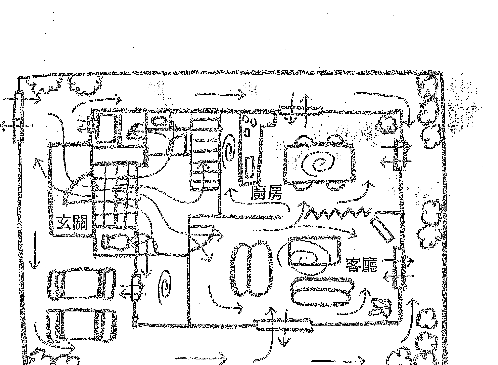

- 優質能量從大門進入，不需要的能量也從同個地方出去（公寓則從玄關進出）
- 能量聚集在各個房間，以及整體家屋的中央。詳細請閱讀第125～128頁

# 圍繞太極能量圖的基礎居家設計

各位聽過區域規劃地圖嗎？家中其實也大致分為幾種能量區域，只要維持該區的整潔，就能獲得相對應的能量。和方位、方向沒有關係，請以玄關為底邊，家的中央為「太極」，與下一頁的能量區域地圖對照參考。

太極是優質能量匯集的地方。如果這個部分經常保持清潔、維持舒適，不只能讓身體健康，還會有許多好事發生。

接下來針對每個區域的意義、使用該能量地圖的注意事項及使用方法進行說明。為你家與能量區域地圖做一下對照，想要提升運氣類型的區域，請好好整理。

使用能量區域地圖時的注意要點：配合居家的形狀縮放能量區域地圖。

# 居家能量分佈區域地圖

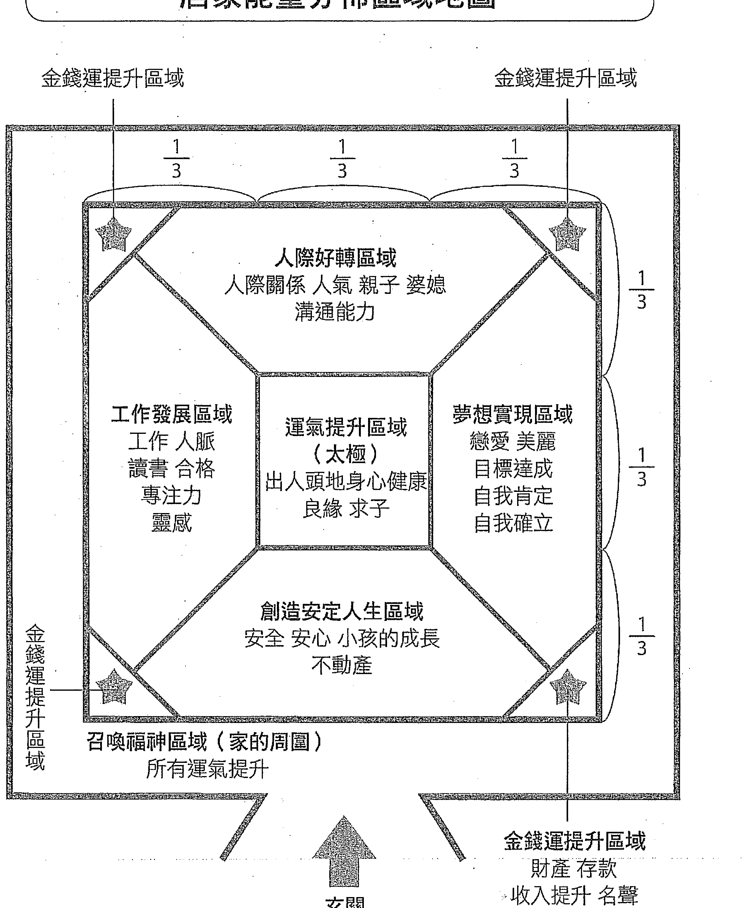

### 人際好轉區域
- 人際關係
- 人氣
- 親子
- 婆媳
- 溝通能力

### 工作發展區域
- 工作
- 人脈
- 讀書
- 合格
- 專注力
- 靈感

### 運氣提升區域 (太極)
- 出人頭地
- 身心健康
- 良緣
- 求子

### 夢想實現區域
- 戀愛
- 美麗
- 目標達成
- 自我肯定
- 自我確立

### 創造安定人生區域
- 安全
- 安心
- 小孩的成長
- 不動產

### 召喚福神區域 (家的周圍)
- 所有運氣提升

### 金錢運提升區域
- 財產
- 存款
- 收入提升
- 名聲

玄關

# 第4章 好人缘、金钱运、异性交友！提升运气的整理术

以居家縱向及橫向最長的地方圈出內框。至於外框，公寓是玄關周圍及陽台，獨棟房屋則為房屋占地。

內框縱橫向皆劃分三等分，正中央位置即為太極。只要某個空間與之有重疊到，均可視為優質氣流聚集的地方。

如果房屋的太極，正好是廁所、廚房、浴室等會用到水的地方，或是走廊、樓梯以及儲藏間的話，則無法視為太極。但要是能用心打掃這個區域，經常維持整潔，也能讓它環繞著優質能量。

如果居家形狀太複雜，只要是角落都可視為提升金錢運的區域。該區域範圍，邊長大約五十公分，請不要拘泥於面積，好好地整理這些地方吧！

劃分區域的四條線，是以太極的四個頂點連結到家中的四個角落。若是居家形狀較為複雜，請把外框補成方形，讓太極得以連結到四角，即使是虛設的角落也沒關係，再從內框尋找對應的區域。

# 各居家空間的能量區域地圖適用範圍

### 公寓

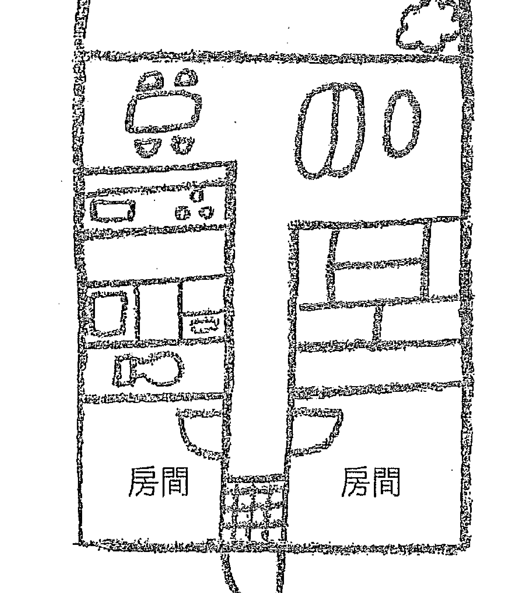

例圖的公寓，太極位在客廳、餐廳、和室。家中的每個角落都是金錢運提升區域，因此請好好地整理

# 獨棟房屋

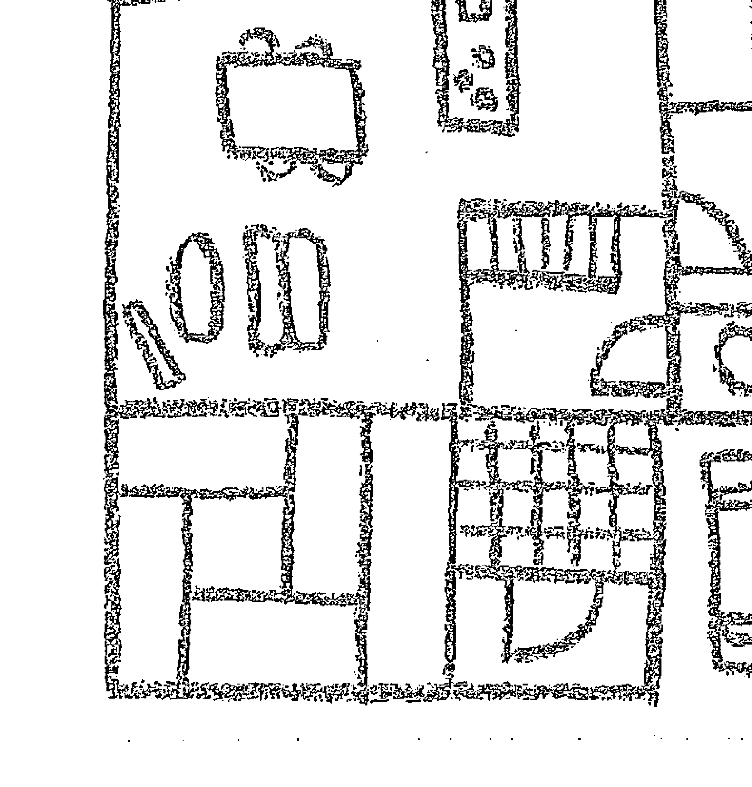

例圖的房屋中，和室、客廳及餐廳皆與太極有部分重疊。另外，同在中央的玄關和樓梯雖然不能做為太極，但是只要保持整潔，一樣能讓優質氣流循環

- ■太極（只要有重疊到屬於太極的部分，該房間就會有優質氣流匯聚）
- □金錢運提升區域

# 善用「光」與「氣」，好人緣百分百

對於擁有人際關係煩惱的諮詢者，上天給他們的建議是「好好擦拭會發亮的物品」。能消耗我們精力的，就是與人相處時的「擔憂」。費心顧慮他人時，無法維持自我本色，容易因而喪失自信。一旦處於這樣的狀態，人生的發展將脫離預期的軌道。為了找回自我的原貌，請好好擦拭鏡子吧！鏡子反映的是你的本心，讓鏡子維持在沒有起霧或髒汙的潔淨狀態，自我也會閃閃發光。除了鏡子之外，手機或電腦的螢幕、門把之類能夠反射光輝的部分，也要擦拭得晶亮。如此一來，自己也會變得自信閃耀，不再在意他人的評價。即使是被上司責罵而沮喪的時候，也能化挫折為反省材料，用於自我改善，進而生成能將壞事變好的能量。

提升了對自我的肯定，開始產生信心之後，將遇見能帶來良好影響與刺激的人，並且領著你往新的舞台前進。

# 運用光與氣，提升溝通力

「玄關」、「窗戶」周邊，是獲取新鮮且充滿能量的氣流入口，「臥室」則是讓我們能在睡眠時段進行能量補給的場域，這些地方請保持簡約整潔。精力恢復之後，與人的溝通交流自然能通暢順利。

倘若能獲取自然光線，維持良好睡眠品質，就可以為負責調節身心平衡的自律神經帶來正向刺激，讓人處於得以進行冷靜判斷的狀態。如果家中有突出式的窗台設計，更是提高能量的好地方。這裡原則上不要擺放任何物品，可以鋪設桌巾做為視覺上的裝飾亮點，也能幫助吸取邪氣。

此外，玄關如果整頓得宜，能讓人更加活潑積極，幫助發揮自我的潛在能力也會受到刺激。透過光線和氣流的力量，離開不想再往來的對象、邂逅憧憬的人物、消解家族爭執等令人開心的奇蹟，將有可能發生。

# 水流暢通，維持乾淨，金錢運立即攀升

要讓店家生意繁榮，你覺得最快的方法是什麼呢？

答案是將店內廁所翻新，並維持其美麗與整潔。與水有關的設備如果維持在嶄新且可放心使用的狀態，這份安全感會帶來優質能量，讓「邪氣」退散，回客率即能有所提升。

水具有吸取邪氣並排出的功效，因此當風水中的「水」流動順暢時，金錢能量也會產生良好的運行。

如前所述，風水中的「水」在人體的代表是血液，其中也包括淋巴液等其他體液的循環。血液將體內不需要的物質過濾排出的同時，也攜帶了大量氧氣循環到腦部，具有協助取得宇宙能量的功效。同樣地，當與水相關的設備周邊經常維持整潔時，水流才能吸取邪氣並排出，以帶動充沛的優質能量在室內循環，獲取豐足的宇宙能量。

當我們獲得足夠的宇宙能量，金錢也會向我們流來，因為這種能量視覺化後，其實就是金錢。

水除了會為我們留住好能量，也會吸入邪氣。因此請留意，有水的地方再美麗，仍然經常存在著邪氣。如果這些地方越來越髒，甚至散發出讓人不舒服的味道，或是處在感覺很糟的狀態，就會變得非常容易積存邪氣。而藏在這些設備當中的邪氣，不會錯過我們感覺不悅的瞬間，會快速吞噬掉身上的光輝，讓能量活力立即降低。

凡是與水相關的設備讓你感覺不太舒服時，都會為運氣帶來不好的影響，金錢運也會隨之下降。因此，廚房、廁所、洗手台、浴室等容易積蓄水氣的場所，平時就要保持潔淨，盡可能地擦拭掉水氣，使之維持乾燥狀態是非常重要的。

## 潔淨廁所，帶來心安放鬆

一般住家中，最容易聚集邪氣的「水」相關設備，非「廁所」莫屬。

廁所是將我們不需要的所有物質排出的地方。除了食物的殘渣之外，心中產生的憤怒、悲傷等負面情緒，也會隨著血液這道水流離開身體。

因此，多加注意廁所等水相關設備的整潔，將讓你感到安心，並且擁有極度的放鬆。這份輕鬆感正是打開吸取宇宙能量大門的鑰匙。從今天起，努力讓廁所維持在想展現給外人觀看的狀態吧！

相信如此一來，除了獲得「經濟力」、「存款」、「做為賺錢根本的健康」這些開運力，還能遇見為你帶來財富的「人」。

# 開闊廚房，帶來三安力量

寬廣、清爽，當我們看到這類感覺的空間之後，頻率會急遽升高，並啟動自我可能性的開闊。因此，請留意與水相關的設備周遭，不要擺設多餘的物品，打造出寬敞的場域吧！

當中特別重要的是「廚房」。與水相關的設備當中，廚房擁有最大的面積，若能讓它呈現廣闊的空間感，能引領出飲食的能量。食物能為人我們帶來喜悅與豐足，有助於獲取宇宙能量。居家飲食有「便宜、安全、安心」這三項優點，能為我們帶來非常強大的力量。

因此，平時少用的料理用具、隨意堆放在流理台的調味料等等，請妥善整理，營造出清爽開闊的廚房環境！

除了廚房，廁所裡已經髒兮兮的人造花、洗手台上擺得亂七八糟的化妝品或髮圈、放在浴室裡卻沒有使用的瓶瓶罐罐等等，請豪邁地全部處理掉吧！物品越少邪氣就越待不住，運氣也才能流轉而來。

## 懂得臥室整理訣竅，休息睡眠不受干擾

所謂的工作能量，是人們內在生成的積極能量與宇宙互相呼應，延伸連結到了人脈和收入兩個類項。換句話說，「自己的力量＋宇宙能量」，形成「工作能量」。如果能創造出讓宇宙能量發揮到極致的環境，即可幫助工作運一口氣提升。

因此，首先專注在調整自我狀態上面吧！為了整頓到最佳樣貌，「臥室」就是個重要關鍵。

不做任何思考的睡眠，能補給我們所消耗的氣力，容易釋放出「放鬆狀態」的腦波，與宇宙的韻律調和。如果睡眠中能與宇宙連結，領悟真理或靈光一現等狀態就會不斷降臨在你的身上。因此，獲得高品質的睡眠，等同於調整自我狀態。

## 電器製品磁場，妨礙能量補給

接下來要談到的是，如何打造出容易與宇宙連接的臥房。很簡單，盡可能地不要擺放物品。如果臥室雜亂，不同物品之間的能量容易產生不協調的狀況，進而影響宇宙能量的流入，無法達到充分的補給。

尤其要提醒大家，臥室內請勿擺放電器製品。如果房間裡面，沒有隔出就寢的分界線，至少在睡前要將電源關掉，徹底實施「不使用」這項重點。電器啟動時發出的磁場，是自然頻率的天敵，會破壞睡眠品質，妨礙能量的補給。

其中，智慧型手機或電腦散發的磁場，又更加地強力。有些人可能使用手機來做為鬧鐘，但建議在睡眠時段還是關機比較好。

入睡前兩小時也請停止收看電視，關掉所有電源，創造容易與宇宙能量連接的狀態。隔天早上，相信會發生靈光乍現，或是解決對策突然浮現等奇蹟。

如果能連電器用品的插頭都一併拔起，那就更完美了。

## 看不見地方常保持整潔，異性緣變高

「想變得更漂亮！」「想談場更美好的戀愛！」如果有這些願望，就快把鞋櫃清理乾淨吧！因為鞋子正是負責帶領你前往下一個階段的物品。善待鞋子的同時，也一併打掃它的「家」，將能進一步為你帶來良好的能量。此外，上天給我們的啟示是：「看不見的地方也要維持整潔，這是件很重要的事。」比如說，衣櫃或抽屜裡面平常不太會被看到，但這些地方正反映著我們的內在。要是能夠經常整理的話，會生發「無論何時被看到都無所謂」的自信，讓人由內而外散發光芒。因為氣場閃耀奪目，也就更容易有優秀的異性受到你的吸引。

### 留出兩雙鞋空間，邁向事業的下一步

接下來要說明的是整理時的重點。當鞋櫃裡頭有著破舊不堪、難穿或是散發著窮酸氣息的鞋子，請向它們表達「受到您的照顧了」的感謝，然後處理掉吧。如果鞋櫃飄出難聞的異味，請打開讓新鮮空氣流通，並且放置消臭劑。若能在鞋櫃中保持兩雙鞋子大小的餘裕空間，則是最理想的狀態。

衣櫃和抽屜裡，衣服要折疊整齊，也能使用芳香劑，時常保持乾淨整潔的樣貌。

除了他人不易看到的空間要維持舒適潔淨，腳踏車或汽機車等心愛的交通工具也和鞋子一樣，是帶領你更上一層樓、有助職涯發展的物品。請用扭乾的抹布仔細擦拭，定期檢查保養，讓你的愛車處在良好狀態。

如果是汽車的話，除了最基本的清洗，車上的CD、零食或衛生紙等，也都請好好整理，以保持內部的整潔。

細心照料這些有助於工作的物品，相信你會開始往良好的職位急遽地前進。

窗邊咖啡空間，召喚快樂能量在前面提升人緣的部分也有提到，「鏡子」是可以反映出我們內在的物品。因此保持鏡子的整潔，是維持美麗內在的有效方法。

除此之外，讓會發光的素材維持閃閃發亮，也能為我們喚來與美麗相關的極大能量。像是金屬材質的門把、不鏽鋼、時鐘的玻璃等等，只要想到就盡量多擦拭，電腦或手機的螢幕，也同樣建議在使用完後加以清潔，相信能讓你越來越漂亮。

此外，整理家中的時候，建議順手在窗邊打造一個「居家咖啡空間」。若能仰望會散發出優質、放鬆頻率的天空、雲朵、夕陽或月亮等景色，大自然所擁有的頻率會對你產生影響，協助你分泌血清素、催產素之類的快樂賀爾蒙。如此一來，女性將變得更有女人味，男性也更能展現男人的氣息。

### 忽視三大神聖場所，人生運勢易走下坡

『最近好像不大走運』、『好像陷入了負向循環』，如果像這樣每天都覺得不太順利，請試著注意看氣的出入口的狀況——也就是『玄關』（包含陽台、窗戶）、「冰箱」和「廁所」。

玄關是迎接福神的入口；冰箱是儲存「幹勁、活力、快樂」的地方；廁所則是將使用過的運氣歸還給宇宙的場域。當感覺運勢似乎在走下坡時，可能是這「三大神聖場所」處在滯塞的狀態。如果它們能維持潔淨舒爽，可以說『其他地方再亂都沒有關係』。

話雖如此，這三個地方都屬於狹窄的空間，要整理得清爽美觀確實有其困難之處。如果你心裡總是想著這是一件「苦差事」，請試著繼續努力收拾，直到想法轉變為「不整理就會很在意」。當這樣的時刻到來時，相信你的人生也會開始好轉。

## 居家出入口，是福神現身處

與外界連接的玄關、窗戶等居家出入口，能夠開啟資訊、人際、升遷、孩子成長以及經濟方面的好運，因此請盡可能不要擺放物品。如果這些地方有東西堆疊，不只會妨礙優質能量進入，還會聚集邪氣，容易成為犯罪標的，進而造成闖空門、竊盜等事件。因此，這些場域的物品請盡快丟棄。

玄關、窗邊一類的『入口』，如果在視覺上呈現整潔舒爽、感覺留有餘裕，是個能讓人安心、自在發想的空間，將可為自己的潛能打開一扇窗，並帶來『開心』、『快樂』、『棒極了』等積極正面的情感。當我們找到像這樣的希望光芒，大腦的運作會變得活潑，開始產生極高頻率的能量。

「和風吹拂福神到」，福氣會乘著風從玄關或窗戶而來*。因此，家中的入口最好可以全部打開。突出式的窗台雖然方便，但也容易堆滿物品，因此請盡可能僅放置可移動的東西，並限制在最少量，以不妨礙太陽神或福神的進出。

建議大家把玄關視為神明的臉部，請仔細謹慎地用水擦拭。就像一般常說的，「玄關代表住戶的門面」，它展現出你是個怎樣的人。請用崇敬、珍惜的心，好好地清理打掃這塊區域，保持家中出入口的整潔，歡迎好物、貴人和財神的光臨吧！

### 設定食物使用期限，焦慮不再來

如果有人跟你說「請讓我看看你家的冰箱」，你能馬上讓他觀賞嗎？有些人可能會覺得好像隱私被窺探，而感到不好意思。冰箱不打開的話就看不見內部。也就是說，它能反映出你的內在，可以代表你這個人。因此裡頭如果有腐敗、已經不吃了的食物，等於是您本身受到邪氣的侵蝕。

請從發薪日往前算二天，將那一天制定為「現有食材使用完畢的日子」。冰箱淨空，不僅可以增加滿足感，也能幫助腦袋運轉，因此容易與優質宇宙能量契合。

能駕馭冰箱，等於學會了自我控制。這樣的你，因為懷抱著自信，無論發生什麼事情都不會感到焦慮。

## 廁所小動作，開啟嶄新能量循環

如同先前所說的，廁所是接收各種排泄物的神聖場所。這些東西裡頭，充滿了我們心中所不需要的廢物。神明運用這個地方，讓這些物質受到淨化並回歸宇宙，再次成為嶄新的優質能量，循環回到我們身邊。

因此，將廁所視為與神明連接的神聖場域並充滿敬意，能讓運氣確實地上升。為了加強這項意識，請將廁所內捲筒衛生紙的拉取端折成三角形，每次看到都能提醒自己。此外，為了隱藏猶如黑洞入口的排水通道，使用完畢順手蓋上馬桶蓋，也會讓人比較安心，並能保住金錢或重要的工作不致流失。

在提升金錢運方面也說明過，無論再潔淨的廁所，由於是釋放廢棄物這道邪氣的地方，因此建議不要擺放會產生不協調頻率的漂亮擺設，例如人偶、鮮花等裝飾品。因為與空間的波長不同，反而容易招引邪氣。

因此，基本上廁所內不需要任何擺設，必需品也請避免選擇過於繽紛的花樣，讓它維持在易於打掃的簡約狀態最為理想。

請試著努力三天，盡可能地保持玄關、冰箱、廁所這三大神聖場所的整潔。之後，當你開始在意「還沒整理」的時候，正是運氣將不斷提升的證據。此時福神已笑嘻嘻地坐到了面前，開始為你描繪最棒的幸福人生藍圖。

## 散發陰氣物品，切勿擺置房間

你的房間當中有哪些擺設呢？如果有妨礙優質氣流循環的裝飾，請趁這個機會拿下來。

比如說，讓人聯想到死亡的骷髏頭、標本、佛像等等，這些物品容易帶有陰氣，因此請不要放在房間裡。佛像如果安置在佛壇的話，能發揮其力量，但如果直接擺放在房間某處，反而容易吸收陰氣。要是已經擱置很長一段時間，可能已經受到邪氣的影響，因此拿到寺廟焚燒是最適當的處理方法。

此外，動物的毛皮標本容易沾附邪氣，請用紙張包起來，向它好好道謝之後進行資源回收吧。

那麼，哪些是有助於改善氣運的物品呢？

如同第一一三頁所介紹的，女兒節人偶或聖誕飾品這些配合季節活動、令人興奮不已的物品都很不錯。只要徹底落實節日或活動結束後便收拾乾淨的原則，相信就能產生極大的能量。

# 第5章
## 打造智能畅通，为全家归来建造的居所

## 住宅良好能量循環的四大要素

到朋友家中拜訪時，有些住宅令人感到舒服自在，有些則讓人覺得煩躁待不下去。以下歸納各自的特徵。

### 【感覺舒適自在的家】

-   ○ 溫暖明亮
-   ○ 可以感覺到木頭的溫度
-   ○ 擺放著雅致沉穩且色調統一的家具
-   ○ 窗戶不多或不過大
-   ○ 燈光設備簡約，採用間接或暖黃色系照明
-   ○ 擺放著觀賞用植物
-   ○ 鋪設地毯

### 【無法沉靜放鬆的家】

-   × 陰暗寒冷
-   × 室內主色調為藍、白色系
-   × 像樣品屋一樣的整潔
-   × 窗戶過大，從外面可以將室內狀況看得一清二楚
-   × 沒有窗簾、地毯
-   × 玻璃製品多
-   × 物品過度堆放
-   × 留白空間太多，感覺空蕩蕩

-   ○ 同時裝設蕾絲窗簾，與厚實材質的窗簾
-   ○ 物品放在收納區域，流露出生活感，但也有認真整理的用心
-   ○ 玄關確實收拾打掃
-   ○ 廁所內簡約不亂七八糟......
-   × 地板上可以看到很多電源線
-   × 房間裡到處都是盆栽，像叢林一樣
-   × 已經枯萎的植物仍放著不管
-   × 從玄關開始就塞滿物品
-   × 擺設了感覺詭異的面具、形狀特殊的家具，或指針彎曲的時鐘……

氣流循環良好的家，「安心」、「安全」、「安定」與「溫暖」可說是基本條件。說到「氣」，其實就是人們的五感——眼耳鼻舌身——可以感覺到的一切。如果處在安心、安全、安定的狀態，即擁有產生優質能量的基本要件。要是空間裡有許多搖晃不定、快要壞掉或不能觸碰的物品，會令人焦慮緊張，無法感到安穩自在。此外，房間要擁有良好氣流，還有一個重要的關鍵——「溫暖」。感覺好像很冰冷，或是沒有窗簾地毯的家，會讓人潛意識中覺得危險。觀賞用的植物也不宜過多，讓氣流能更順暢地循環。

所謂的家，是地球上唯一一個能幫房屋主人補給能量的場域。首要重視的，就是「在家中可以安心」這個要點，在滿足這項條件之下，才能讓能量產生良好的流通運作。

### 重視空間感受，打造快樂家屋

接下來開始針對各種空間類型，說明如何創造正面的能量循環，以及擁有優秀淨化力空間的方法。

如果要大幅改造房內擺設，總是讓人望之生畏，遲難以付諸行動。這時，就從能做的地方開始著手吧。為了營造理想房間，本書針對許多細節做說明，但總體而言，共通的重點都是「安心」、「安全」、「安定」與「溫暖」。只要空間具備以上四個要素，即使無法做到與書中說的完全一樣，優質能量也會開始循環。因此，請好好重視你在房間內的感受。

一起打造出擁有良好的能量流動，讓你在家時感覺幸福快樂，並能真正放鬆和補給能量的空間吧！

### 療癒及補給能量的客廳

（圖片說明：天然素材的壁毯、掛布，或氣氛和諧的畫作；窗戶旁的放鬆場域；橘色系的間接照明；地毯；坐起來舒適的沙發）

## 打造元氣客廳，能療癒又能補活力

第一個要說明的，是家人團聚、聚集最強能量的空間——客廳。客廳的職責在於「療癒」以及「補給活力」。如果能量循環順暢，可以撫慰整日的辛勞，並且為隔天補給高品質的精氣。打造客廳的基本重點，就是明亮、大量引入的光線，以及新鮮的空氣。請讓這個空間處於冬暖夏涼，通風良好的狀態。另外，窗旁不要擺放物品，保持良好視線，讓它隨時顯得整齊美麗。

### 橘色系簡約照明，帶來放鬆與元氣

客廳的照明也十分重要。建議使用橘色系燈光，既能護眼，又具有療癒功效。其實每種顏色都有獨特的頻率，大多數的人或許沒有感覺，但太陽或月亮的顏色調整變化，正是讓我們得以呈現活力十足狀態的原因。

橘色是帶來生命活力的顏色。若在客廳中自己常坐位置的視線範圍內，擺放檯燈之類的橘色系間接照明，能讓你放鬆並補給元氣。如果更換照明很困難的話，每天看看橘色的夕陽，感謝美好的一天，也會有充分的放鬆效果。

裝設在天花板上的照明，請選擇設計簡約、便於打掃的燈具。至於水晶燈，對於地震或天災頻繁的地域來說，有著會傷到人的風險，也容易堆積灰塵，因此不建議使用。

不只是水晶燈，像是顏色造型相當搶眼，或是過於時尚流行的設計外觀，容易帶來不安感，破壞房間內的能量平衡。挑選燈具時若有猶豫，請選擇簡單的款式。

### 最低限度舒適家具，確保暢通氣流

如果在客廳中放置了擺設品或繪畫，請留意灰塵的沾染。由於灰塵也是邪氣，若是放任不管會阻礙氣流的循環。但三天兩頭就用抹布擦拭清理也十分麻煩，因此，最根本的辦法就是不擺放裝飾品。還有，客廳中盡量少放家具，以確保行走的動線。家具如果太低矮，物品容易擺放在地上，因此選擇有一定高度的家具最為合適。至於收納架，如果原本的房屋構造就設有衣櫃、壁櫥或儲藏室等收納空間，基本上就已足夠，要是仍需另外設置，也請控制在最低數量。收納空間過多，會成為留下不必要物品的藉口，因此請多加留意。此外，購買書櫃或置物架時，選擇有門的款式能幫助招來好運。如果有放得下沙發的空間，比起外觀，請在預算範圍內尋找坐起來舒適的一組。靠背的部分如果過低，容易讓身體緊張，血液循環凝滯，成為頭痛、肩膀僵硬或便秘的原因，因此請選擇可以安穩靠坐的沙發。

### 簾絲及厚實窗簾，能遮擋邪氣

窗簾負有淨化及提升運氣的重責大任，是不可小看的優秀物品。從外面進入的不只有好的氣，同時也會闖入大量妨礙我們的能量，例如炎熱、寒冷、灰塵、病毒、紫外線、蟲蟻、濕氣、乾燥、強風、噪音、日光、月光、雨水等等。縱使原本是我們所需要的補給，數量過多時也會感覺不快，變成負面的東西。這種時候，窗簾即能發揮作用，只讓良好、適度的能量通過，遮擋掉不需要的部分。建議使用蕾絲再搭配有厚度的窗簾。這樣的組合，能讓優質的氣流得以順暢循環。

此外，窗簾也能阻隔外界的寒氣，即使窗戶下緣只到腰部左右而非整片落地，也請選擇長度快碰到地板的窗簾。但如果拖得太長，反而會捲起灰塵等等邪氣，因此請多加注意。

選擇款式時，我推薦拉上後不會感覺到外部燈光的遮光窗簾。學會用身體感受日夜的不同，能更積極地獲得宇宙能量。而且，窗簾的摺邊也能產生波形良好的能量。至於百葉窗容易堆積灰塵，如果家裡是這種窗戶，請留意不能偷懶，要經常打掃。

還有一點，要經常保持窗簾的清潔。特別是客廳等大空間。一旦布簾上附著了灰塵，便會讓人感覺厚重，開始產生不活潑的能量，降低自我的能量。

## 家具與門統一色系，順暢提升運氣

如果要購買家具，選擇和門扉相同色系，能讓客廳發揮力量來提升不大有起伏的運氣。家具或窗簾等大面積的物品，基本上要使用沉穩的統一色調。相反地，靠枕或是小桌墊一類的擺設品，則建議運用華麗亮眼或是自己喜歡的顏色來點綴搭配，如此一來，相信令人感覺舒適的能量會更加的可能性。話雖如此，要經常清洗實在太費工夫，但還是建議一年要清洗一次。平常的話，因為很多窗簾都是化學纖維製成，因此用除塵撢整理過就能變得乾淨漂亮。

關於窗簾的色系，如果是陽光容易進入的明亮房間，建議可以選擇黃、金、橘、茶等較淡的暖色系。要是客廳在北方，或是不易受到日照的寒冷空間，則可以使用深茶色等比較有安定、溫暖感覺的色系。

若要使用白色系窗簾的話，建議選擇色調溫和的米色，但這不適合用在位於北方的房間。

如果家中的窗簾或沙發等大型家具，選了紅色或過於亮眼的粉紅色，抑或是豹紋、黑色，有可能是你正面臨著很大的問題或煩惱。相信不久之後，你會在某個時刻突然很想改動擺設，當這個時機到來時，建議可以慢慢地為家具逐一替換成安穩放鬆的款式與配色。

然後，若要讓淨化能量在家中循環，垃圾桶是不可或缺的。垃圾本身就是一種邪氣，不管是垃圾桶爆滿，或是沒有垃圾桶的狀態，都會讓整個家本身變成垃圾屋。

理想中的垃圾桶是洞口大、容量大、圓形塑膠製，並且有安定感不易傾倒。這種類型讓人感到穩定，是接收垃圾的優秀好幫手。

### 短絨毛地毯，簡約款式最適宜

建議客廳裡要鋪設地毯。如果沒有地毯，總是無法避免產生不必要的噪音震動，或讓地板刮傷。這些都容易引來會造成屋主受傷或與鄰居爭執的邪氣，而地毯可以吸收震動或聲音，保護地板不易產生傷痕等等。

顏色的話，建議選擇搭配客廳牆壁或地板的顏色——例如茶色——並且使用不過度華麗誇張的款式，讓心靈感覺安定。比起天花板之類的上半部空間，下半部的地板運用較深的顏色，看起來更能覺得穩定。

絨毛較長的地毯，觸感雖然較為柔軟舒適，但因為容易累積灰塵等邪氣，還是建議選擇短毛的款式。如果說鋪設的是絨毛偏長的高雅地毯，請留意要經常清理。至於素材，建議選用天然材質比重較高的款式，能讓人 的呼吸循環更加順暢。像棉、毛、絹絲等天然質料的比例越大，越有助於優質氣流在客廳內流動。

因為地毯幫助吸收下沉的邪氣，因此請頻繁拿出去曬太陽，或是送到洗衣店清洗。

家中孩子還小的時候，建議可以將它視為拋棄式物品，每年做更換。當小孩成長到一個階段，便能增加一點預算，選用喜愛的圖案款式或天然素材。相信這會有助於提升你與家人的運氣，讓更多的優質能量環繞在身。

### 角落危險訊息，會帶來緊張

客廳中經常都會擺設時鐘。款式的部分，建議選擇讓人可以清楚看到時間的鐘面，附有秒針但不發出聲音的時鐘。指針分秒移動的聲響，會令人聯想到「一切割」、「死亡倒數」，帶有邪氣的作用。此外，木頭具有提升正氣、減弱邪氣的功效，因此使用木製時鐘最為理想。時鐘請放置在容易看見的地方。指針型比較有助於刺激腦部，讓人更方便掌握一天的行程，輕鬆獲取宇宙能量。市面上也有販賣文字盤歪曲的時鐘，但這種像時空扭曲的設計，會產生不安定感，最好盡量避免使用。此外，客廳的角落容易堆積灰塵等邪氣。光是「角落」進入我們的視線，就會讓人防備而感到緊張。並且，房間角落如果看得到電線插座，等於讓雙眼接收到危險或雜亂的訊息。

## 角落危險雜亂，容易引起不穩定感

（圖片描述：img/b489ae35e99c978a5823951eb5e27320_158_0.png）

的訊息，容易讓內部氣流變得不安定。這種時候，建議下點工夫，擺設觀賞用植物、圓弧造型的椅子或裝飾架等等，遮擋住角落的插座。

（圖片描述：img/b489ae35e99c978a5823951eb5e27320_158_1.png）

## 以圓弧造型的物品遮蓋，協助穩定氣場

（圖片描述：img/b489ae35e99c978a5823951eb5e27320_158_2.png）

## # 色彩能量大不同，用對了效果顯著

受到色彩帶有的頻率影響，事物會產生改變。以下簡單介紹各種顏色的功能，請大家善加運用。

- 提升幹勁的「綠色」：屬於大自然色系的綠色，是帶有良好均衡且穩健能量的顏色。在工作或唸書時，能為你帶來集中的能量。
- 冷靜專用的「藍色」：能緩和突發的情緒、協助冷靜思考的藍色，也是顯示緊張、增加不安的顏色。建議不要過度使用在小孩、高齡老人、病患以及有強迫行為的人，例如對藥物、酒精、網路、購物成癮的患者身上。
- 增加自信的「紅色」：紅色能為我們的本能帶來能量，喚起生存的意志，但另一方面，它也會對壓力產生刺激。如果怕紅色太過搶眼，請在小地方上做點綴即可。再者，這也具有驅除邪氣的效果，在沒有人的房間裡，擺放幾何圖案的紅色抱枕或繪畫等物，就能夠發揮效果。
- 協助放鬆的「粉紅色」：代表溫柔的粉紅色，具有讓人從所有束縛中解脫的放鬆頻率。在臥室一類的空間，於視線所及之處擺放粉紅色的物品，相信有助於獲得優質睡眠。使用粉紅色的日記手札或筆記本，能幫助傾吐內心聲音，讓淨化更加順暢。
- 歡欣雀躍的「黃色」：做為金之原色的黃色，代表豐裕，能夠帶來力量。當人們陷入沮喪時，可以捎來活力元氣。另一方面，由於這也是表示警戒的顏色，因此建議避免螢光黃，而選用橘黃色或檸檬黃，並且將它用在重點上吧！
- 促使獲勝的「白色」：所有色彩匯集而成的白色，擁有不讓任何邪氣靠近的強大力量。但由於太過潔淨，容易變得孤芳自賞。因此，在使用白色時，建議稍微降低色調，選擇不會過於炫目的白色系。

## 吸取食物能量的餐廳

（圖片描述：img/b489ae35e99c978a5823951eb5e27320_161_0.png）

## 聚攏飲食神明的能量餐廳

用餐時間是一家人彼此見面的時刻。如果能愉快地度過這段時光，運氣絕對能變得更強。

為了讓餐廳充滿優質能量，推薦使用圓角的餐桌。雖然直線和曲線各自擁有不同的能量優點，但圓形能生成「和氣」，是沉穩自在、安心平靜的基礎，並且也會讓人聯想到笑容，進一步擁有愉悅和感謝的心情。

另一方面，有棱有角的桌子會讓人產生警戒心，提高攻擊性，容易出現不平與怨懟。如果家人時常抱怨菜色，或是用餐時經常心情不好的話，建議換成圓弧形且面積充足的餐桌。

至於玻璃製的桌子雖然很時尚，但透明無色會讓人沒有穩定感。再者，玻璃也是一種容易損壞的材質，容易令人不安，從宇宙能量的觀點來說，屬於不平穩的物質。如果是玻璃桌，可以鋪上布製的桌巾或類似材質的裝飾。像這樣下一點工夫，有效率地獲得食物帶來的能量吧！

## 地毯結界，聚集飲食之神

請在餐桌底下鋪設地毯吧。鋪上地墊之後，雙腳即能與冰冷的地板隔離開來，也不用擔心椅子移動發出噪音等狀況，幫助優質氣流的循環。

此外，這還能夠作為區隔周圍的界線，讓飲食神明得以聚集。所謂的飲食神明，就是協助、支持我們用餐的力量。當分界明確，品質良好的能量容易一口氣彙集，並排出食品添加物等不需要的物質，或者讓用餐後的消化變得更好，形成優質循環。

當家中有幼童或需要看護的成員，請選擇方便打掃的地毯；喚來飲食神明長駐之後，相信神明也會願意幫助孩子成長，或讓家人的身體更快復原。

餐廳是家庭成員經常聚集的地方，因此確保動線流暢是非常重要的。請不要在這裡堆積物品或灰塵，以能持續擁有良好的氣流循環！

## 廚房易藏汙納垢，光線與氣流很重要

擁有最佳能量循環的理想廚房，並不是像樣品屋裡的一樣，擁有寬敞又美麗的最新型設計，而是流理台上能放置兩塊砧板。如果流理台有空間，才容易啟動料理可能性的開關。例如用家中現有食材就能做出美味的料理、短時間又不費工夫地弄好一餐、輕鬆地把食材搭配得色香味俱全……這些能力都能應運而生。相關技藝提升之後，即可省下買菜的精神，不用再購買一些不需要的東西，甚至連瓦斯、電力或自來水都能運用得更有效率。如此一來，使用廚房也會產生成就感，良好的氣流開始循環，讓我們吸收更多的宇宙能量。

因此，讓流理台有足夠空間是非常重要的。這是個能夠打開、擴大生命可能性的場域，因此請不要在流理台上堆放物品，徹底地整頓乾淨吧！

## 夜間廚房，容易產生邪氣

冰箱上面和櫃子下方很難清理得到，但這些地方特別容易堆積邪氣，因此，冰箱上、櫥櫃下、地板上不放置物品，是廚房的基本要件。如果實在無法避免的話，請讓物品維持在隨時可以移動的狀態。

建議在冰箱和牆壁之間留下縫隙。這樣一來，只要用除塵撣輕輕一揮就能沾起灰塵，驅散邪氣。只要冰箱上方攤鋪報紙，即使灰塵堆積，也能讓打掃變得輕鬆，髒污也不容易附著。

廚房若有明亮的日光從窗戶灑入，最能提升料理的動機與幹勁，是理想的廚房樣貌；但最近越來越多大樓公寓一類的集合式住宅，要滿足這樣的條件，難度就顯得相當高。經常用水的地方，如果光線不易進入則容易產生邪氣，因此，要進入陰暗、射不進日光的廚房前請先開燈，但也不需要讓燈整天都亮著。

此外，濕答答的抹布或海綿也會成為邪氣的溫床。因此，晚上使用完抹布後，請確實地擰出水分、攤開讓它自然風乾再入睡。

夜晚的廚房是容易散發邪氣的場所，而像鍋內剩下的食物，也是邪氣的來源，因此請蓋上鍋蓋，或是放入冰箱、櫥櫃之類有門扉可區隔出空間的地方來保管吧！

## 舊報紙好幫手，處分廚房垃圾

清理冰箱內部時，請攤開舊報紙，將所有「無法吃」以及「絕對不會再吃」的食物都清理出來。

要是含有水分，請先倒入水槽，剩下的用報紙多包覆幾層，確實地處理好後再丟到垃圾袋中。如此一來，比較不會產生討厭的氣味或是小蟲子，在丟進垃圾車前都能維持在完好的狀態。同樣地，要是廚餘桶的生鮮也能用舊報紙包好，就不容易產生味道，但如果放著它不管，令人不悅的外觀和氣息都會成為邪氣的溫床。雖然說，大家都會想等廚餘桶滿了之後再一起丟，但請放下覺得可惜的念頭，每個晚上都要清理殘羹剩菜。

此外，如果在冰箱蔬果保鮮室鋪設報紙，也能讓整理更輕鬆。報紙可以吸取水分或氣味等令人不愉快的邪氣，同時也會形成結界，守護蔬果不受外界侵襲，是優秀的好幫手，請務必善加利用。

為了不讓邪氣靠近放在廚房的垃圾桶，最好選擇可以完整覆蓋的款式，並且是和水能量十分合得來的不鏽鋼材質。垃圾桶底部可以先放入一顆舊報紙揉成的團球，以鎖住多餘水分和氣味，是個相當方便的方法。

附門的收納櫃，不直接看見內部。

（圖片描述：img/b489ae35e99c978a5823951eb5e27320_167_0.png）

## # 床鋪方位不要緊，避免邪氣入侵才是重點

在第四章也有提過，唯一一個能遠離白天的塵囂，並且補給能量的黃金時段就是睡眠時間，而幫助完成睡眠的臥室更是神聖的場域。為了讓臥房成為寧靜且療癒的空間，床鋪要放在遠離窗戶或門口的地方。因為邪氣會從這些開口進入，如果將床擺在附近，躺臥的人容易受到穿過縫隙的風或侵入者等邪氣的影響。此外，若是房門一打開就能把床看得一清二楚，能量也容易被奪走，建議避免這樣的房間擺設。只是，倘若因為房屋構造等因素，床鋪只能擺在門邊或窗邊，除了炎熱的時節，平時只要能確實地關上門或拉下窗簾，就不會吸引邪氣過來。特別是十月到隔年四月之間的下午四點到清晨五點，邪氣會變得活潑，因此除非天氣過熱，請都把窗門關上吧！大家或許也曾聽長輩說過，樑柱下方、大型家具旁、神壇底下，都是自古以來避免放置睡床的地方。除了風水的因素，上述位置也是在地震發生時特別容易發生危險的地方。但如果因為房屋構造而沒有更好的選擇，只要確認床鋪或睡墊周圍沒有不安穩、易掉落的物品就可以了。

## 不讓邪氣增生，幫鏡子蓋上布

鏡子請放在不會照射到睡覺模樣的位置。因為讓鏡子映照出的事物，其能量會增大好幾倍。

每當夜色低垂，便是邪氣開始活躍的時候，無論是怎樣的聖地，或是收拾得再整潔的環境，都會成為邪氣的寶庫。尤其要特別注意睡眠時段——此時是靈魂回到宇宙的時刻，換句話說，做為最強守護堡壘的靈魂，正處於外出不在家的狀態。你可以直接想像成進入睡眠後，邪氣是附著在你身上的。

如果此時鏡子照映著你，邪氣就會增生出好幾倍。因此，大鏡子請用布蓋上，小鏡子也妥善收好，留意不讓它們照映到任何東西。

## 溫暖色調的花卉被套，提供舒適睡眠

請用被套、床單或窗簾來統一臥室的色調。人類或動物只要看到木頭或泥土就會產生安心且放鬆的頻率，因此選擇能聯想到相關物品的茶色或米色系，能幫助擁有清晰思考和舒適睡眠。

大面使用紅黃藍三原色或粉紅等色，會使神經先興奮後轉散漫，因此請留意在寬廣空間裡，不要選擇太花俏亮眼或不沉穩的顏色。被套選用具有不讓邪氣靠近功效的花卉圖案。市面上雖然有很多類似圖案的被套，但建議盡可能選擇填滿花卉、色調溫暖、底色露出較少的款式。

如果受到動物圖樣的吸引，正是心靈不安定的時刻。請不要使用這類圖案的家具或居家擺設，有助於穩定心神。

## 整理過的床舖，能療癒一天的疲勞

讓臥室循環優質能量的有效方法，就是在早上出門前整理床舖。

## ## 北枕不吉，會加快老化？

日本有所謂「北枕不吉」的說法，意思是睡覺時頭不宜朝向北邊。一般會解釋說，因為讓往生者躺靠的枕頭朝向北方。為什麼要朝北安放呢？有一種看法認為，我們的生命、肉體是從地球的南極而生，並朝向掌管未來的北極前進。因此，為了在死後能順暢地移動到精神世界，便出現了大體的頭部要朝向北邊的習俗。
雖然還不到「朝北臥睡就會發生災難」的程度，但這麼做確實會接收到加速老化的氣，這對嬰兒、疲勞或壓力很重的人來說影響特別大，因此請小心避免。那麼，是否換朝南邊睡會比較好呢？其實也並非如此。因為如果讓會發生邪氣的雙腳朝向掌握未來的北方，會受到難以向前邁進的氣的影響。其實，我們每個人都會產生微弱電流，擁有獨自的磁場。和宇宙、地球所擁有的自然磁場之間的調和，會依照每個人的精神穩定度、成長程度等等而變化。因此，無法直接斷言要朝向哪個方向是最好的。雖然也有配合地球磁力線，讓頭朝向東方或西方這類的說法，但根據房屋構造不同，令人感覺舒適的場域也會發生改變，因此請實際躺臥感受，找到最能讓你放鬆入眠的位置吧！

只要能睡得舒服，你的周圍就會形成結界，產生具有抵禦邪氣功效的力量，因此不需太講究方位。如果過於在意，反而會引來負面能量，所以請以自己最為舒適放鬆的位置為準。

## 讓心沉澱下來的療癒系臥房

（圖片描述：img/b489ae35e99c978a5823951eb5e27320_172_0.png）

## 兩種色彩運用，小孩學習不分心

為了打造出能專心念書的小孩房，原則基本上和臥房一樣——不要將書桌擺放在窗戶旁邊。因為分散精氣、讓人提不起勁的邪氣會從窗戶或門口進來，讓孩子無法集中精神坐在桌前。

此外，如果小孩房內有床鋪的話，不宜將桌子放在床邊。書桌所擁有的學習能量和床鋪的休息能量位在相反的兩端，這種擺法會導致念書和休息時都無法集中狀況發生。如果能放在彼此不在視線範圍位置的話最為理想，但如果說實際上難以實現的話，只要有確實地整理床鋪，便能保持專注力。

## 藍色提升專注度，綠色增強幹勁

除此之外，也要善用色彩的力量！藍色擁有「冷靜」的能量，有助於客觀檢視自我（請參閱第一六二一一六三頁）。由於它具有控制自我情感、管理煩惱等功用，因此對於集中精神念書或工作十分有效。
然而，因為藍色會助長寒冷冷漠感，如果大量使用，我們在視覺上接受到這項情報，也會影響到血液循環，讓身體變得過於冰冷。因此即使是有助於集中精神，也請避免在房間內大範圍地使用藍色壁紙、窗簾或棉被，而請試著改在椅子、書筒或滑鼠墊等家飾小物上做運用。稍微提醒一下，即使是男孩子的棉被，也請使用暖色系。這樣才能補給優質的能量，幫助小孩健健康康地成長茁壯。「直線」的物品則能促進理論思維，讓人的思考更有效率。因此，在書桌周圍、視線所及之處，掛上藍色直線條圖案的壁飾，會顯得非常有效。只要在百圓商店買個框，裡頭放進直線條紋的布料就能發揮極大效果，請務必實行看看。此外，也推薦活用綠色。受到綠色影響的孩子，能提升自我價值的肯定，對於未知的事物，更容易產生幹勁而非只會感到不安。如此一來，相信能幫助培養出具備領導能力、擁有人望且存在感強的小孩。其實稍微帶點螢光的鮮豔綠色，正是靈魂所散發出來的顏色。請試著配戴綠色卡通明星的玩偶吊飾，或者是在平常使用的文具包包上加個綠色小物。只要一項單品就足夠了。無論什麼事情，只要做過頭就會造成反效果，請多加留意。

## 能讓成績進步的小孩房

（圖片描述：img/b489ae35e99c978a5823951eb5e27320_175_0.png）

## 物品垂直線擺設，工作效率大躍進

能集中注意力的能量，讓人可以在短時間內完美達成任務的書房，不容易因為太陽移動而產生溫度變化的北方或東方，是最為合適的選擇。話雖如此，因為居家構造的關係，經常能看見書房設置在南邊或是日照良好的位置。在這種情況下，為了不受日光影響，可以利用窗簾或百葉窗來調節光線，或是把書桌設置在面對牆壁的位置。為了不要讓書桌直接受到扼殺集中力的邪氣所帶來的影響，遠離房門或窗邊是最為理想的擺設位置。書房內也不要擺放電視機，它會帶來干擾，不宜出現在房內。離開書房時，請記得關上房門。如果一直讓門敞開，珍貴的集中力量會因此分散。此外，工作結束之後，請記得將物品放回原位，妥善地整頓。

## 桌上物品排列，擺成一直線

有些人的家中，會把神壇設置在書桌上方。但頭頂代表的是天，因此不宜擺設任何物品，特別是如果頭上有神壇，其神聖能量和人類頭部所發出的各種頻率是相反的。因此你經常待的位置，上方請不要設置神壇。

再說，為了防止地震時有物品掉落的危險，不只是神壇，高處也別放置任何物品。

書桌上的物品擺放時，請排列成一直線。直線能提升工作效率，喚來「整理能量」。如此一來也不會有物品散亂繁雜的感覺，可以不那麼受到壓力的影響。

書桌上也非常適合擺設戀人、家族或朋友的照片。感受到喜歡、頻率契合的人，相乘效果之下能量會高漲，變得更能夠集中精神工作。

但是請不要擺設已經分手的人或是寵物的照片。對於先前交往對象的那份眷戀會成為邪氣，讓人失去集中以及冷靜的判斷能力。此外，特別想要疼愛寵物的時候，正是孤獨或不安的邪氣正在彌漫的證據。兩者都會呈現工作的能量的阻礙。動漫角色也同樣會反映出你內心的不安。請從實際存在的人物照片上獲得元氣！不要擺放紀念照，盡可能地採用接近日常生活、感覺自然的照片最為理想。

## # 專注力提高的書房

（圖片描述：img/b489ae35e99c978a5823951eb5e27320_179_0.png）

## # 彩虹衣櫃整理術，自信與人氣擋不住

有門扉或蓋子，無法一眼看到內部的收納空間，容易讓人產生「總之先塞進去再說」的心態。至於真正的整理卻總是一拖再拖。但不可思議的是，當衣櫃裡面亂七八糟的時候，房間通常也呈現散亂的狀態。這是因為當內在整頓整齊時，自然而然地會產生外表也變得乾淨清爽的能量。

此外，收納空間的內容物，代表著你的自信。當外部不可見之處也打理得井然有序時，會變得更有自信。如此一來，就不會再迷失自我，而能避免不需要的花費，也不想和自己反感的人有所往來。由此又可以生成一種能量，營造出讓能力或魅力發揮到極限的環境。

如果你希望遠離討厭的人，並且「改變人生」的話，請動手整理衣櫃，讓它維持在即使給外人看到內部，也不覺得害羞的狀態。當自信充足，相信可以發現到不受他人意見左右的真實自我。

## # 櫥櫃收納不塞滿，人際關係能圓融

如同第三章的說明，收納空間應該要遵循「七・三法則」，不斷淘汰掉多餘的物品。當想要留下的東西超過空間的七成以上，就要問問自己該選擇哪些。按照這個原則做整理，對於前男友的眷戀、父母不滿這類怨憎會自然消失，你將像擁有一雙輕盈的大翅膀，朝向新世界飛躍前進。

講到收納的基本做法，首先是按照種類來區分。整理書櫃時，依照書籍類別或開本大小排序；衣櫃則能初步分類成飾品配件和衣物。

再來，請以顏色區分整理衣服吧。如果有很多種顏色，請按照彩虹的色階來排列。彩虹顏色排序的頻率和人體的能量相同，因此看到彩虹色序時，頻率會上升，也就容易維持在整齊清潔的狀態上。衣架的顏色和材質也請統一，可能的話，請全數使用木製衣架，衣服將會從中獲得強大的力量。這麼做，能從你的內心帶出自信，由內而外散發魅力光采。

東西多到收納空間不夠放時，請仔細確認是否還有可以清理的部分。物品過多會讓人感到壓迫，開闔也較為困難，會造成緊張。這就反映出你在人際關係中所感受到的狀態。此外，衣櫃中的空間代表著我們精神上的餘裕。保留空位，才能建立起圓融的人際關係。衣櫃、抽屜正是內在的呈現，因此為了不讓能量外流，請經常關上。當你能對內在充滿自信，前方會有比任何人都飛得更遠更高的舞台等候。

## 能帶來自信的衣櫃

（圖片描述：img/b489ae35e99c978a5823951eb5e27320_182_0.png）

## # 玄関足踏墊須慎選，抵禦外邪最前線

當你拖著疲憊的身軀回到家，最先迎接你的就是玄關。這個空間若是清爽整潔，便具有療癒的力量，也讓神明更容易造訪。除了保持玄關乾淨美麗，點炷線香，保持舒適香氣也是有效做法。

我們不需要的氣，會由腳底排出。日本人會脫掉鞋子再進入家中，第一個承受外來氣息的正是位於玄關的腳踏墊，因此選擇腳踏墊時，請記住幾項重點：①材質偏厚、②可以洗滌、③觸感柔軟、④天然素材比重高、⑤避免大紅、大黑或動物花紋等太過強烈的色彩。

## ## 綠色小物，提高能量的好幫手

玄關，也是活動的出發點，為了提升這裡的能量，請活用「綠色」。

綠色是中間色系，能強力影響人們建立自我，是可靠的好幫手。統一玄關的色調之後，佈置一件綠色的繪畫、擺飾，或是有綠色圖案的腳踏墊，以發揮色彩的效用。此外，在玄關擺設鏡子，外出前確認一下儀容，即能形成結界，生成強大的力量來提升運氣。鏡子擺放在左右邊皆可，最理想的是設置全身鏡，但只有照映臉部的小鏡子也沒關係。如果沒辦法擺設，可以在外出前到鏡子前面看一下。

## ## 療癒疲憊、抵禦邪氣的玄關

（圖片描述：img/b489ae35e99c978a5823951eb5e27320_184_0.png）

走廊楼梯装饰画作，正面能量倍增

走廊或楼梯，是将能量运送到家中各个角落的重要通道，从玄关进来的福神能量，正藉此四处移动。这类通道的墙壁上如果挂有画作，其含有的正面能量，会与玄关进入的能量产生共振并使之倍增，有助于提升住户的精神。

楼梯铺设地毯，协助邪气退散

我的客户当中，有些人会在这些地方摆设家族合照，但我并不推荐这样的做法。上头有人脸的照片，会直接散发该人物所持有的频率，多多少少含有邪气。家族照片并不是在别人面前炫耀用的，所以不需要展示在公共区域，建议做为家人之间一起欣赏的物品就好。

另一方面，走廊或楼梯也是容易囤积邪气的场所，因此请避免直接在地上摆放物品。此外，经过这些地方时，一定要打开电灯，在明亮的状态下行走。如果是木制楼梯的话，铺上地毯可以防止冰冷，也具有止滑效果，或是使用防滑条、扶手，协助邪气散去。
如果铺设地毯有困难，或找不到喜欢的地毯，也不需太勉强。只要殷勤地用抹布擦去灰尘，就能让优质能量循环。用拧到很干的抹布擦拭清扫，就更完美了。

让优质气流环绕家中的走廊、楼梯

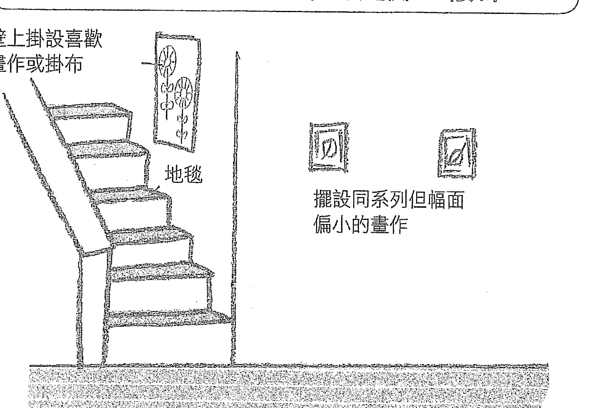

厕所越简约，邪气排出越顺畅

关于厕所的整理，简约就是最高原则。如同第四章的说明，由于湿气和排泄物双重邪气相互争夺领地，如果摆放过多物品，容易让邪气附着在上头。

经常可以看到人们在厕所内摆放干燥花，但干燥花蕴含了阴性的气，摆在这个场域会让邪气倍增。此外，由于纸张和布类有吸收邪气的特质，因此也不要摆放书本或月历。用来擦手的毛巾也建议每天替换。

冲水式马桶还没普及之前，由于卫生上的缘故，厕所经常设置在不会受到日照的北方。实际上，这也是最适合的方位，因为它有强力的能量，能创造出良好平衡。

至于厕所中的地垫或马桶座椅套等等，请选择橘色、橘黄、粉红或浅茶等暖色系，以及有厚度的材质。此外，请避免使用红色系、蓝色系、绿色系、黑色以及动物花纹。这些颜色和图样具有带来压力、造成血管收缩以及引发不安的作用，反而会让排泄更不顺畅。

如果家中有幼小孩童，很可能会使用卡通明星的地垫或毛巾等用品，但这种图案的能量会让邪气更加活化，因此不建议使用。

用品统一收纳，打造专属阵地

打扫厕所的用具请勿零星散放在地板上，请营造出“打扫用具的阵地”、“厕所卫生纸的阵地”，设置可以完整收纳这些用品的空间。有附门的收纳柜是最理想的选择，但如果房屋本身没有设置这种空间，可以采购现成商品，将打扫用品统一收放进来。

由于厕所通常比较狭小，如果摆不下收纳柜，也别将东西直接放在地板上，可以使用塑料篮或托盘等集中收拾。像这样打造出专属的阵地之后，邪气就不容易附着，也不会感觉零乱。

其实，厕所属于和水相关的设备，和塑料所拥有的能量并不大合得来。因此，尽量不要将塑料制的备品放在这里，如果不得已要用，务必集中收纳进来。但由于也没有其他更适合的材质，并且因为现今塑料制收纳篮是主流，非常容易购买且方便使用，请大家务必在整理收拾时善加活用。

不让邪气靠近的厕所

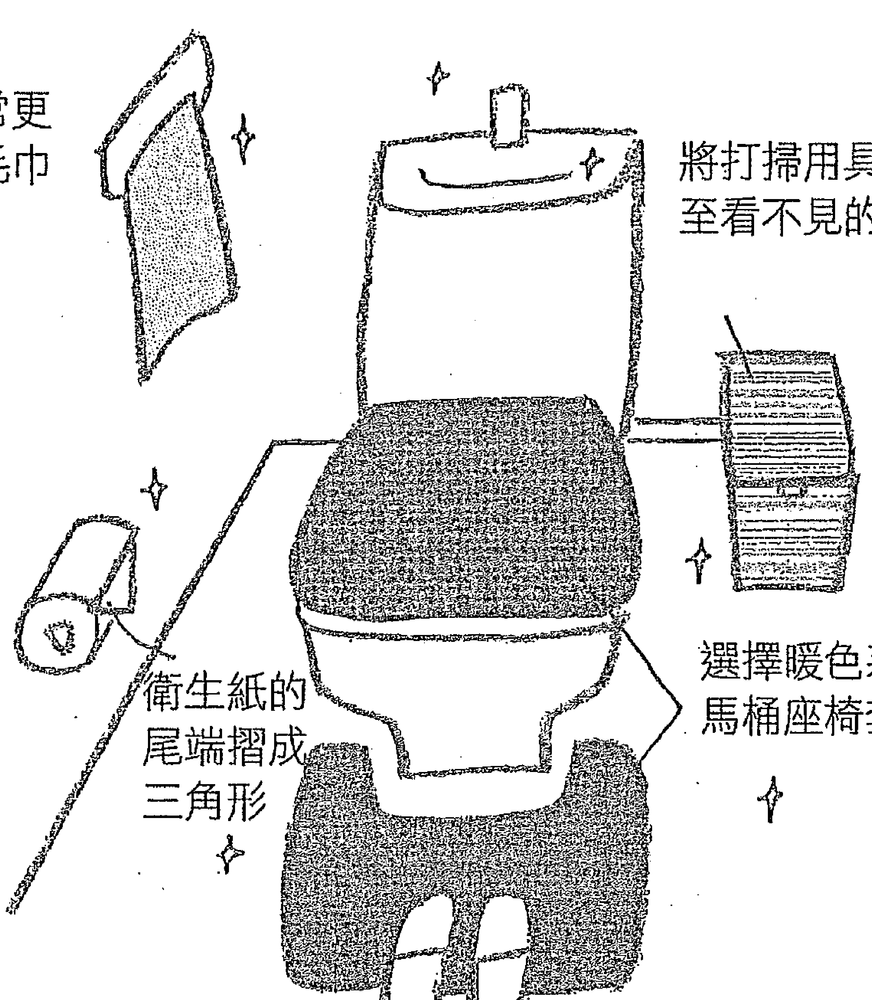

-   经常更换毛巾
-   将打扫用具收纳至看不见的地方
-   卫生纸的尾端折成三角形
-   选择暖色系地垫或马桶座椅套

掉落毛发当常清理，能改善人际关系

浴室或是洗手台等使用水的地方，容易囤积邪气，而且打扫起来十分累人。基本上，这里和厕所一样，重点就是维持清爽。因此，请摆放最低限度的必需品。

尤其浴室又是非常容易繁殖邪气的地方，于是简单、不奢华，且不过度宽广是最为理想的状态。经常清扫是防止邪气增生的最佳方法，入浴后，要记得把洗澡水冲掉、刷洗浴缸的水垢，以及清理丢弃积在排水孔的毛发。也建议以专用的鬃刷清洗地板瓷砖，维持浴室整洁美丽的样貌。

请不要将浴室的打扫用品与沐浴乳、洗发精一类的东西放在一起。要是使用目的不同的物品聚集在一块，会干扰彼此的能量。最理想的做法，是像高级饭店内的浴室一样，另外设置打扫用品专属的收纳空间。如果这么做有困难的话，至少要与沐浴乳或香皂分开放置。不论物品或是人，和同性质的伙伴在一起才能创造优越的能量。

毛发掉落不清，邪气大量增生

为了维持洗手台的整洁，最大原则就是物品使用完后要放回原处。像是每当保养化妆完成，请务必将这些瓶瓶罐罐放回原位。

如果有毛发掉落在洗手台的话，容易引起不愉快感，所以要整理干净。除了用面纸擦拭洗脸盆，也一并清理掉在地上的毛发吧！当你开始在意落发时，头发也会变得越来越不易掉落，而逐渐能拥有一头美丽艳泽的秀发。

头发，具有排出我们心灵或体内邪气的作用，因为掉落的毛发上黏附了这些不要的物质，如果不加以清理，当中的邪气就会开始聚集。

为了下一位使用的人，请小心不要留下这些负面能量。试着为对方着想，让他人也能舒适利用，相信你会开始无法放任掉落毛发不管的。

培养维持洗手台整洁的习惯之后，即使是购物中心、餐厅、观光区的相关设备，你也会有意识地在使用后维持整洁，开始懂得体贴他人。如此一来，宇宙能量便会急速进入，好运自然会来到你的身边。洗手台或浴室是打理自身仪容的地方。希望维持美丽的心情及相应的行动，能让美之女神降临，帮助你的恋爱运和人际关系好转。

## 让美灵能量降临的卫浴设备

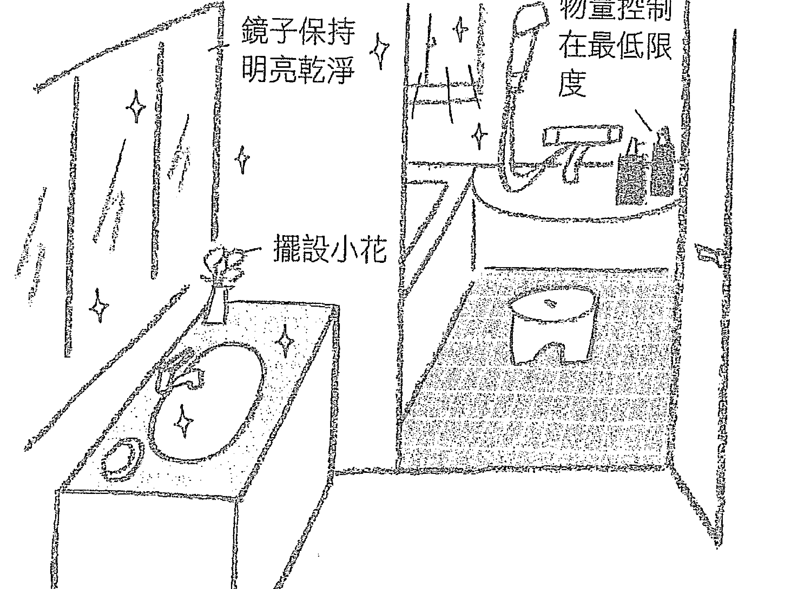

## 让福神降临的阳台与庭院

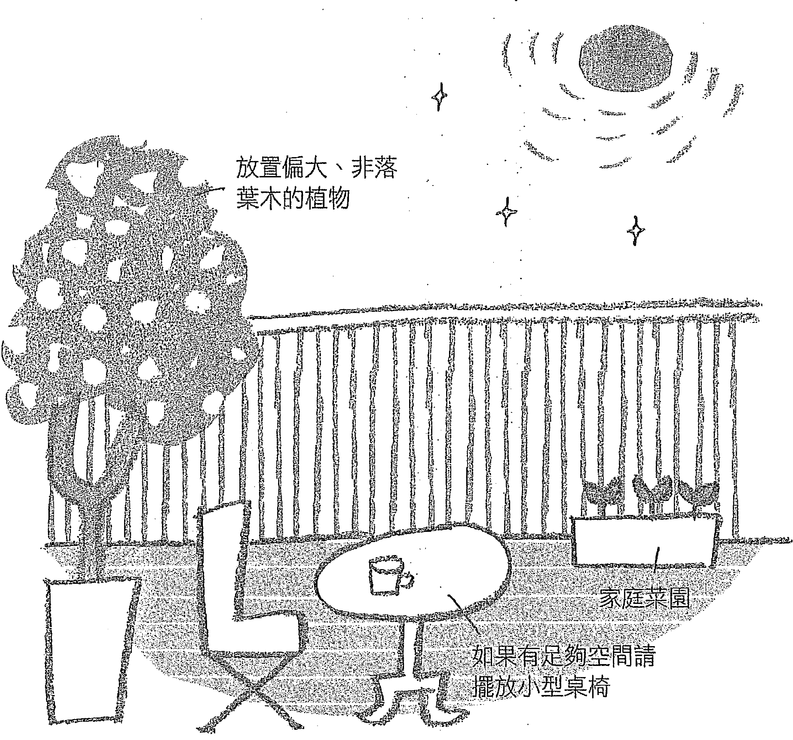

杂乱的阳台庭院，最易引来厄运

阳台、庭院和玄关前，虽然十分便于放置物品，但不夸张地说，这些地方其实是最重要的能量吸取场域。外头进来的福神会选择看起来清爽整洁的家，而厉神或瘟神这些我们希望远离的神明，则喜欢堆放了很多物品的杂乱地方。
物品和人类在能量的对应上很相似，例如纸类，若收放在有门片的空间内，就能维持本身的能量，但如果散放在开阔处，夜晚时会遭到邪气侵袭，日积月累之后会产生不好的影响。
而放在玄关外的小孩游乐器具、雨伞，或总想着要当成大型垃圾丢弃、却一直搁在外头受风吹雨淋的家具，这些物品持有的能量会显著地减少，频率也会变得微弱。这种疲弱其实直接反映出住户的状态，因此就像是对罪犯大声宣传着“这个家到处都有机可趁”，容易引来闯空门或放火等等犯罪发生。
若是想要丢弃特殊弃置物、但处理的日子还没到的话，请尽量先存放在有门扉的储物室之类的空间，并尽速地处理掉。

大型物品专用的放置场所

有些住家可能没有足以放置脚踏车、三轮车，或是有机蔬菜宅配保冷箱等大型物品的空间，但其实只要有从外面不易看见，且不会造成妨碍的场所，作为专用的收放地点就可以了。

在这种情况下，即使没有门扉也没关系。决定了场所并加以整理，和“放着不管”之间，虽然只是意识里的一线之隔，但珍惜这些物品的想法会形成保护结界。即使没有公寓大楼常见的脚踏车停车场，只要发出声音宣告“这里是脚踏车停车场”，该区能量就会开始聚集，让小偷这类邪气不易靠近。

但请避免将个人物品放置在公寓走廊等公共区域。即使你觉得不会对别人造成妨碍，也会成为召唤邪气的主因。只是当邻居将个人物品放在公共空间时，请不要强制禁止，否则会刺激对方的邪气，麻烦将应召而来。

阳台的晒衣夹或晒衣杆都容易受到紫外线的伤害，因此使用后请移到不会受到日照的角落，或是拿进家中收放。如果有余力在庭院或阳台莳花弄草也是件美事，但如果不擅长园艺，反而让植物枯萎的话，则会造成反效果。

从以上说明，你应该会发现阳台或庭院有很多可以着眼的东西。首先，请整理会吸引邪气到来的大型垃圾、不需要的物品，以及没有空间可以收纳的项目吧！

阳台或庭院内不堆放杂物，就是唤来幸福能量的最大诀窍。

鲜花植栽这样摆，净化效益最高

将房间打扫得整齐清爽之后，强力推荐装饰一些鲜花。只要放几支你喜爱的花朵就足够了。

鲜花会散发巨大的能量，因此重点在于尽可能摆放新鲜的花朵。

请记得每天换水。花朵枯萎时，请用纸包起来、向它道谢再处理掉。如果不能经常照顾，也不需勉强摆置。另外，干燥花由于带有阴气，请勿使用。

除了鲜花以外，应该有很多人是以观叶植物作为装饰。叶绿色会发出疗愈能量，因此如果摆放在容易囤积邪气的角落、电视机或电脑等电器用品旁，能为我们带来莫大的净化力量。

但是，由于植物也是生命，和人们拥有的能量性质不同，因此如果数量过多，能量会混杂在一起，反而造成负面效果。一间房内，原则上最多摆放一株观赏用植物，而且要放在较空旷的位置，可以发挥除魔的作用。

此外，玄关的直线方向向上如果有窗户的话，在这上头放置盆栽，能量即可左右分流，优质气流就不会溜走，而得以循环在家中的每一个角落。

## 第6章 租房转让房屋有方法，聪明租房能省钱

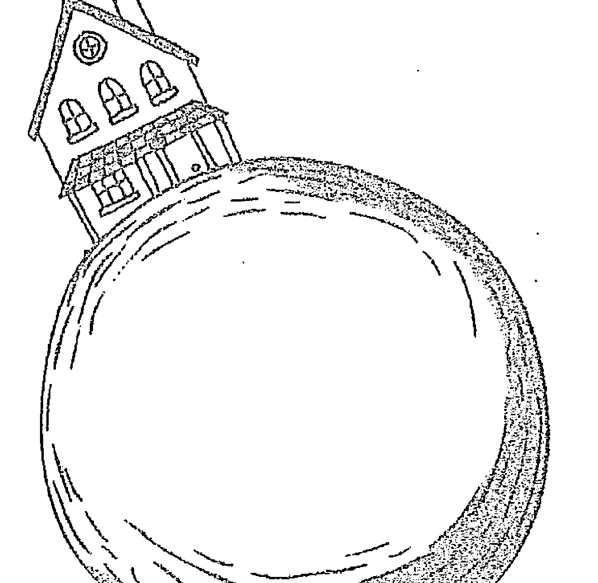

“能放松”比“美轮美奂”更重要

或许不是每个人都看得到，但当你一个人在家，突然觉得隔壁房间有其他人的气息时，说不定是神明正笑容满面地关怀着你。

有些人或许会这么想——自己的家，一点都不豪华、塞满了杂物，甚至不好意思邀请朋友来玩，怎么可能会有神明降临呢？然而，无论是什么样的家庭，福神都会为了实现每个人心中“希望能健康幸福、大富大贵”的愿望而东奔西走，“不管是哪一家哪一户，我们都在喔，只是大家没发现而已呢！”若想尽可能地放大所接收到的神明能量，最重要的就是一份感谢的心。

家能帮助调整人们上下的能量，是神明派来的忠实管家，能带来最佳疗愈和精神补给。

对我们来说，需要的并非“完美的家”，而是“可以放松的家”。比起充满高级家具、美轮美奂的房屋，与“家”相处时不需要费心、回过神会发现它总是伴随在我们身旁、充满了“人生伴侣”的感觉，才能发挥它的作用，协助提升屋主的运气到最佳状态。

此外，家也和人相互影响，当你心中充满像是“最喜欢这个家了”、“真的让人好沉静放松啊”的感受，家也会为了你，开始聚集“我要变成更好更棒的家”、“要好好保护家里的同伴”一类的能量。

在搬家、购买房屋或换新家具时，有些重点如能事先掌握会十分有帮助。为了拥有笑嘻嘻福神守护的家，本章将帮助读者，试着选择出能想象自己“啊！住在这里一定很舒服！”这样能够放松的环境。

## 打开五感天线，选择舒服安环境

买房子、搬家的时候，观察重点是房屋所在的环境，这关系到家中是否能够充满优质气流。无论是独栋房屋或公寓大楼，一定要到建筑物所在位置实际探查。这时候，请充分打开你的视觉、听觉等五感的天线。感官所获得的感受，正是灵魂最直接的回应，绝对不会有错。接着请进行下列的重点确认，寻找最能为你带来能量的地方吧。

### 【优质气流循环的场所】

-   在视线所及范围内，没有大型医院、警察局、消防局等常听到警笛的设施
-   在视线所及范围内，没有二十四小时营业的餐厅、饭店、便利店或娱乐设施等，夜晚不会过于吵杂
-   附近没有高压电塔或电线
-   短距离步行即可抵达车站或公车站牌
-   在视线所及范围内，没有突出、尖锐的事物
-   邻家建筑物周围，没有杂草或垃圾，环境整洁
-   没有脏污的河川或垃圾处理场等等会散发难闻气味的环境或设施
-   从窗外看出去，没有非法废弃场所、堆积着垃圾的混浊河川等令人不快的景色
-   在视线所及范围内，没有大型的国道公路
-   玄关没面对大马路
-   远离T字路口或连续L型弯道

在找房子的时候，请避开附近会有警笛响起的设施，或是夜晚太过吵闹的场所。在难以安静沉稳下来的地方生活，会造成我们的身体在无意识之中感觉紧张。从窗户或阳台上可以看到很多电线的话，也不太理想。制造电磁场的物体会干扰人们天生的净化力，而难以获得能量。与车站或公车站牌的距离非常重要。大众交通设施是能量流动的地方，因此距离近的话，能够获得优质的能量。再说，交通方便、经常出门走动，对于提高能量循环也很有帮助。若是房屋周围有建筑物会反映西晒，请尽量不要挑选。建筑物反射的日光容易造成目眩或室温上升，进而消耗我们的体力。再者，房屋受到强烈日晒的话，冷气空调机能也会受到干扰。风水上称之为“光煞”，属于凶相。此外，在视线所及范围内，如果有尖端凸出、给人锐利感的铁塔，或是不满九十度的锐角物体，这样的环境也不是很理想。当我们看到锐角，会无意识地联想到对于刀刃等武器的恐惧，而引起紧张状态。一直看到这些画面，让血管频繁收缩，可能会变成容易生病的体质。在选择住家时，也请注意是否看得到垃圾，或是草地是否经过修整照顾，寻找一个不会散发恶臭、景观良好的地方吧！气氛佳、清洁美观的环境，能使邪气无法定居。同时，这也代表住在这里的居民，大多都是心灵丰裕的人，也较不会发生纷争。

避免直接面对大马路的环境，是最安全的选择。特别是像第二○九页的插图，如果住家紧临大马路的弯道，等同于处在毫无防备的状态，穷神或瘟神等邪气都十分容易造访。

如果是这种情况，可以在大门或玄关门囗外侧挂上红色纸避邪。红色拥有反弹邪气的频率，改用红色蝴蝶结或其他红色装饰品也可以，虽然效果会稍微弱一点。只是，请注意不要把它们装饰在家里面。

又或者住家位于T字路或L型弯道的尽头，也请多加留意。脚踏车、汽车、电车……速度越快的交通工具，越带有凶气。在T型和L型弯道的尽头，交通工具的凶气会循着道路方向直冲而来，因此要多加留心。这种情况的话，解决对策包括把大门设置在直冲的方位，或是不把正对路口的空间当作客厅或卧房使用就没问题了。

或是房子距离山林、河川或大海等自然环境很近，请随时注意土石流或海啸等灾害的发生，更要确实记住避难路线。

此外，住家附近有神社的话，夜晚外出时也要小心。神社除了拥有神明的高频率能量，也会留有参拜者的邪气。因此，到了邪气活跃的夜晚，神社散发的负面能量会更多。

特别是入口、面向鸟居的“灵道”，是邪恶能量出入的地方，请避免选择面对这种地方的房屋。如果现在的房子正是这种情况，处理步骤为：

1.  随时关上大门
2.  表达出“感谢神明保佑守护”、“住在这么棒的地方真是太好了”等等感谢，邪气就无法靠近。

### 看屋直觉感受，是来自灵魂的讯息

建筑物本身给你的印象，会大大地左右居民的能量。从这一点来看，如果说建筑物采用令人容易留下印象的强烈色彩，建议最好避免购买或租用。此外，看房子的时候，要是总是觉得不大舒服，甚至有点害怕，那正是灵魂给你的讯息，请坦率地接受吧！因为如果是中古屋或租屋的状况，可能还残留着前任房客的浓厚气息，或是有滞留不去的灵魂。

可能的话，南侧有窗户或阳台的房屋是最为理想的。因为这种结构，可以让温热身体的能量环绕在家中，并且有净化邪气、促进血液与消化道循环等功效，健康神明也会愿意造访。要提升运气的话，首先需要的就是太阳的力量。

但无论是哪个地方，一定会有它的优点在。因此对于现在的住家，可以思考的是“景观很漂亮”、“自然环境让人很舒服”、“房租很经济实惠”等等令你开心、喜悦的优点就没问题了。

实际上，想找到吻合全部条件的家，可以说比登天还难。因此，针对现在考虑中的房屋，列出优、缺点，尤其是要确定无法妥协的部分，以这个要点为主来作决定。如果是你喜欢的房屋，它也会喜欢你，因此不会产生不良的影响，可以安心居住。

### 能提高频率的住家，是选屋的重点

寻找住家的时候，最重要的就是要能提高自己或家人的频率。正所谓“物以类聚”，同样频率的人事物会相互吸引。当然，这指的也有可能是房屋中介公司，或是土地环境本身的频率。

购买自住房屋或搬家，都是消耗能量的大事。因此，为了选择优良住家，首先请先把自己的频率提高吧！如此一来，相信可以邂逅到环境舒适的家屋。

### 有房买屋的最佳时机

新屋因为先前没有其他人住过，所以通常带给我们“住起来舒服”的感觉。至于中古屋，只要在交屋后加以改装，或是由业者进行清扫，先前住户的能量都会消失殆尽。因此，新屋和中古屋的能量其实并没有差异。如果是没有进行改装的中古屋，前任住户的频率会残留下来。但只要在搬进去的第一天实践下列表项，就能拥有和新屋同样的能量——

1.  打开全部的窗户，让新鲜空气和阳光进到屋内。
2.  用湿布擦拭家中大大小小的地方，包含纸门内侧、抽屉内部。打扫天花板时，将抹布用力拧干，装上长柄来清洁。使用完的抹布，请表达感谢后再丢弃。
3.  家中各处都以湿布擦过之后，待充分的干燥。
4.  干燥完毕之后，在各个空间撒盐。最后用吸尘器或是扫帚等工具清理干净。
    即使房屋内原先就十分整洁，也建议大家要向房子打招呼。“接下来是我们要住在这里，请多多指教。”同时用湿布擦拭打扫，房屋会因此感受到十分喜悦的。

### 和好房子邂逅，要抓准时机

如果想要遇到对你来说最棒的房屋，请留意去看房子的时间点。无论是新屋或是中古屋，建议选择查看时间如下：
上午：一天当中，优质能量会循环绕行的时段在上午九点到下午一点左右，当中又特别推荐中午十一点到下午一点这个时间。此时的宇宙能量特别多，也比较容易察觉到守护灵等等想要传达的讯息。此外，为了知道日晒的状态，因此在有太阳的日子，才能确认房屋是否确实会受到光照。上午去看房子的话，比较容易感受房屋、土地或环境的能量。
能量不过度高昂的日子：生日、纪念日等节日，因为个人的能量会变得过于高昂，而不易发现问题点，建议避免在这些日子看房子。放连假以前、发薪日之后也是同样的道理，请尽量跳过。
工作放假日：为了确认自己放假日，是否能在这个环境中好好地放松休息，请利用平常的固定假日，仔细确认房屋附近的交通量或噪音量等因素吧！
在这些时间点去看房子，如果能涌现“可以用愉快、开朗的心情居住”的想像，那就是能为你带来优质能量的好房屋。相反地，如果说心情没有什么起伏的话，可以暂时保留或是回绝，再寻找其他的房屋。

只是，无论是多么中意的房屋，都不要立刻做决定。经过一晚的沉淀，会有新的能量进入，能更冷静地下判断，因此要回复决定的话请等到隔天。如果到时依然对它保有愉快、喜爱的印象，那就没有错了。但另一方面，第一印象若是“不良房屋”，这个直觉则是百分百正确的，不需等待一个晚上再做决定。

## 参拜附近寺院，听取神明建议

和命中注定的房屋邂逅，心里也决定好「要住在这个家」了，请再做一件事——拜访附近的寺庙，向神明报告：「往后将会住在这个地区。请您多多指教。」如果神明认为，「不要住这个家比较好喔」、「现在时候未到」的话，应该会发生一些不好的事情，例如突然觉得身体痛得不得了、钱包不知道掉到哪里，这种时候请先收回选择这间房屋的决定。若是没有特别发生什么事情，就可以维持定案。还有，如果突然下起雨或是起风，这也是上天给予的OK讯号。请安心收下这份神明传递的讯息。

# 異常能量屋，這樣做就能喜悅安心住

H先生遭到裁員，因為付不起現在住的公寓房租，只好和太太搬到更便宜的地方。這時，房仲介紹了曾經發生過殺人事件的房屋——由於高齡照護的關係，女兒殺掉了年邁的父親。

雖然是起悲慘的事件，但低廉價格讓H夫妻心動不已。通常一個月要日幣八萬圓的房租，現在只收半價，兩人毫不猶豫地決定住下。之後，也完全沒有被幽靈騷擾，或是發生不吉利的事件等問題，反而兩人很積極正面地看待「半價房租」的機會，非常快樂地在此生活。

# 幽靈出現與否，端看於住戶頻率

發生過殺人事件或獨居死亡事件的房屋，尤其是前者，有些房租甚至會打到原價的兩折。事實上，只要好好地改裝，前任住戶能量是不會殘留下來的。如果比較重視價格，就不需特別避免這些房子。如果房屋內曾發生過這類事件或其他意外，房仲公司在事發後三～七年內有義務告知。但也有業者害怕房屋因此推銷不出去，於是絕口不提。

但對你來說不適合的地方，第六感絕對會發出強烈的NG訊號。當這份最直接的感受並沒有傳來訊息時，就完全不會有問題。

即使不是上述狀況，也有會出現幽靈的房屋。即使有幽靈留駐，也不會因此而引起闖空門，或是遭遇意外等問題。惡意事件或意外的發生，並不是住家或土地的錯，完全是住戶本身的頻率所造成的。

開始居住之後，如果一直感覺到「好像有其他人在」，或是發生「時常做惡夢」等狀況，也不需要花大錢請法師淨化或搬家。幽靈會跟隨溫柔的人，因為有這樣特質的你來到這間房屋，幽靈表達他的喜悅而已。

如果感覺到幽靈的氣息，可以進行下列的事項——

-   說出「謝謝讓我居住在這裡」一類的話語
-   無論什麼事都正面積極看待，留意維持自我的高頻能量
-   點線香或精油，讓房間充滿香氣
-   找出住家交通便利或隔間設計良好等的優點，並表達感謝

只要進行這些動作，頻率低的靈魂和你就無法契合，只好離開這個地方，讓你不再受到它所帶來的影響。

即使是上述這些地方，只要自己擁有輕快的高頻能量，並且生活中時刻不忘感謝，就能安心居住。

### 客厅过度挑高，容易分散能量

接下来的章节，则是针对住家的构造，分别说明能量循环活络以及容易流失能量的家。

首先是有挑高设计，阳光能进入玄关或客厅的家屋。听起来开放感十足，让人很憧憬对吧！但是能量的特性是「优质气流轻盈因此往上流动，不良气流则沉重向下」。从这个观点来看，挑高设计反而是缺点。

从玄关进入的优质能量具有向高处移动的性质。因此，如果玄关做了挑高设计，这样的气流就难以散布到一楼的空间。并且，如果客厅是挑高设计的话，优质能量会跑到天花板，而不是停留在家人聚集的地方。同时，暖空气也是向上流动的，因此也会发生暖气费用高得惊人的问题。照明灯具或是窗户也会因为在高处，要保养、维修都得花一番工夫。此外，说话声音也容易变得异常响亮。

讓優質能量能夠順暢循環的空間，是以人數來看，不會過度寬廣的大小較佳，因此不只是挑高設計，如果廚房和客廳相連接而顯得空間過度開闊，建議可以用觀賞型植物、掛布或門簾稍微做個區隔。

如果現在的住家已經是挑高設計，就好好活用其豪華感與開放感。在考量、接納其缺點之後，若能真心因為華美、開闊等優點而感到喜悅，邪氣也會因此散去，不需太過擔心。

此外，派對會場、餐廳或飯店大廳等通常也是挑高設計，但是由於我們只在該處停留一小段時間，反而能提供相當良好的能量。當你感覺「好像有點沒精神」的時候，請試著去高級飯店喝杯下午茶。相信當你在那裡抬頭向上看的時候，能感受到正向力量正不斷地補給到你身上。

## 樓層過高，容易讓人疲倦

大樓型的豪宅雖然是許多名流會選擇的住家環境，但以氣流循環觀點來看，這種類型的住家，能量要從一樓大門向上爬升，如果樓層太高，自然难以抵达。

越高的地方，大地的能量就越稀薄。「土地」代表著「血液」。大地能量帮助我们造血，也就等于是增进生命的喜悦，以及提供不断向前迈进的力量，因此，往越高的地方移动，血液循环也会随之变弱而易感疲倦。如果你正犹豫该如何抉择的话，建议挑选踏实扎根在土地上，能够近距离看到地面的家屋。

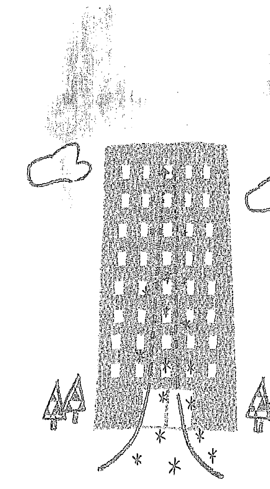

### 善用自然素材，健康疗愈效果佳

那么，怎样的房屋最好呢？凡是使用让「家」本身可以呼吸的天然材质，就是最为理想的住所。毕竟，我们也是自然的一份子。

使用与所在地域风土契合的素材来建造的房子，能为人们的净化和运气带来非常良好的影响。以这种角度思考的话，对于日本人来说，最有助于能量循环的就是木头。选择住屋时，建议尽量选择木造建筑。

天然素材家屋，能协助调整身体状态

人们会发出极度微弱的电流，制造出磁场，然后和宇宙能量共振，进而产生消化、血流等等的排泄及循环，维持身心灵的健康。

原本人类是生活在大自然当中，依照自然规律，日出而作、日落而息是件再平常不过的事。但现在我们受到家电制品、IT机器等人工机器团團包围，非常容易受到电磁波的影响，原有的自然循环也因此失控。

而能帮助改善这个问题的，正是木造住宅。木头能处理人们所排出的二氧化氮等邪气，并且协助调整受到电气影响而变调的磁场，使之回归正常状态。

此外，木头也容易接收从宇宙来的能量。因此，医院、疗养照护设施等机构，如果使用木造建筑，比起钢筋混凝土更有助于快速恢复健康。而像熟石膏这类的素材，也拥有除去邪气的功用，具有相当大的放松效果。若将这种素材运用在卧室，能获得优质的睡眠，相信天天都能元气十足。

天然素材的舒缓功能也非常强大，要是希望纷争能够消除，或是往和解的方向进展，试着在木造建筑里谈话，相信更容易有好的结果。此外，如果身体状况不佳，更要住在天然素材多的地方，以促进血液循环，早日恢复健康。反之，钢筋混凝土里的钢筋容易聚集电流，使我们的身体容易受到影响，让宇宙循环失控。

最近经常听到睡眠障碍、忧郁症等等心理问题，这是受到各种电子仪器的干扰，让能量循环或自然疗愈力变弱的缘故。每天有大半时间待着的工作场所或家，也会因为钢筋等物质而强烈受到电气的影响，让能量补给变得不顺畅。

然而需要一定紧张感的会议或进行紧急工作时，在钢筋混凝土的建筑物当中，反而能带来适度的压力，可能因此推动正向结果的产生。

现在住在钢筋混凝土建筑里的人也不需担心，它的优点就是坚固且使用年限长。只要好好想着目前住宅的优点，缺点也会一飞而散，敬请安心。

## 適當的裝飾巧思，提高空間穩定度

有「凹間」（日式壁龕）構造的房屋，能提升場域的力量。這個乍看之下覺得浪費空間的存在，能產生均衡的優質能量。空間內的起承轉合，是由留白與填滿一同創造，而非一成不變，能不能達成絕妙的平衡，是運氣是否會上升的關鍵。

因此，如果空餘的地方也全部被物品塞滿，能量無法稍作休息，只能全天運轉。請留意鋼琴底下、窗台的外突部分、桌子下和冰箱上方，都不該是收納地點，而是神明給予的「氣的休息站」，請時刻保持這些空間的乾淨、空白。

關於牆面，不管是貼得太滿或是什麼都沒有張貼、整面空蕩蕩的狀態，都容易產生疲倦和不安定感。所做的裝飾，要讓牆壁不會太過熱鬧但也不至於寂寞，能中和壁面的壓迫感，呈現恰到好處的穩定度。

## 均衡採用圓弧和直線

圓弧和直線的均衡也非常重要。只有直線會造成緊張，像是稜角分明的家具、裝飾著許多以畫框框起的繪畫或獎狀，充滿了直線設計的裝飾擺設、照明燈具多為四角形狀等情況，若能加入一些有圓弧感的物品，相信感覺會更好。

比如說，可以加入圓形或橢圓的地毯、餐墊、抱枕或托盤，有圓弧感的觀葉植物，圓圓門簾或是圓形的掛鐘等等。

相反地，如果桌子是橢圓形，燈具也是圓形設計，加上沙發也是圓弧造型，則可以運用四方形的地毯、直線條紋的抱枕或窗簾、四角形托盤等，讓整個房間更加平衡。

請參考下一頁的插圖。

## 在四角空間中加入圓弧感

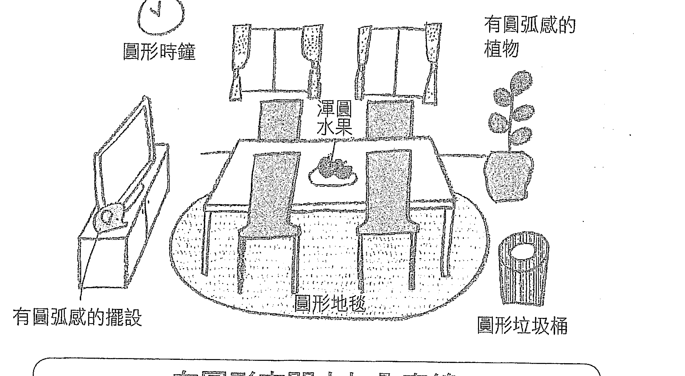

## 在圓形空間中加入直線

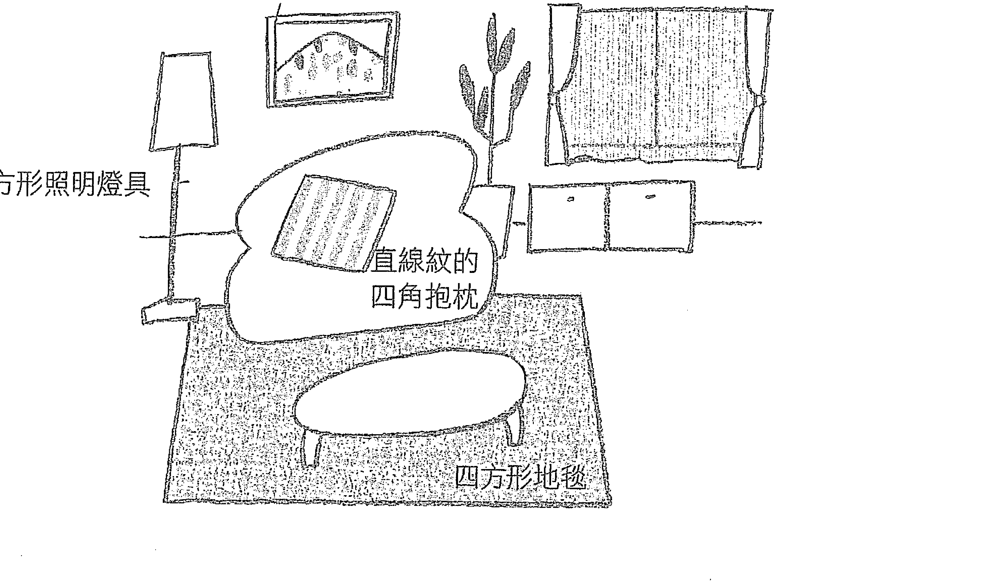

## 配合節氣變換色彩，刺激運氣循環

蘋果減肥法、香蕉減肥法……，一開始施作時，總是幹勁十足地發誓「一定要持續到瘦下來為止」，但過不了三天就開始偷懶，最後放棄。

大腦為了尋求刺激而開始讓你感覺「厭倦」，強制關掉減肥的動力開關。

對我們的身體來說，問題不在於吃了什麼，而是是否能在食物中感受到喜悅，這才是維持健康的重要因素。對於「好好吃」、「真開心」的情緒，大腦會有所反應而產生高頻率能量，進而和宇宙能量產生共鳴，讓好好運得以流入。

如果是以減肥成功為目的的進食，與其以單一食物來減肥，不如採用葡萄柚×三天→香蕉×三天→蘋果×三天這樣的循環來嘗試，成功率絕對會更加地高。

住家也是同樣的道理。對於感官的刺激，變化是十分重要的一環。刺激越大，越能讓運氣更上層樓。因此，根據這樣的法則，試著改變房間擺設或購買新的居家物品吧！

-   打掃時順便改變家具的擺設
-   地毯或腳踏墊已經老舊的話，買新的來替代
-   配合季節變化變更餐墊或桌巾
-   將毛巾全部換新
-   搭配節氣做一些簡約的裝飾（過度裝飾會造成反效果）
-   將廁所的地墊或馬桶椅套全部換新
-   如果能接受植物，可擺設聖誕紅或鬱金香等季節花卉或盆栽

像這樣在生活中下點工夫，能為大腦帶來新鮮感十足的刺激，開拓大腦吸收能量的入口，讓運氣能順暢循環。如果有閒暇的時間，嘗試搭配季節更換窗簾、地毯，或是將平常使用的餐具或毛巾替換成更有質感的物品，都是不錯的方法。

## 「幸福S曲線」，召喚美好運勢

特別是從顏色獲得的能量佔了整體的六成以上，因此像是毛巾或小配件等等物品，可於冬天使用暖色系、夏日選用冷色，像這樣配合季節來做更換，能讓我們每天都活力十足。比起一個個的微小變化，大幅的變動能夠成為良好刺激，生成更加龐大的能量。

此外，能量的上升，其實就像是彎彎曲曲的蛇行。你曾觀察過河川的彎道嗎？在那裡，可以看見「河川平緩地流動」與「河川的沖刷造成侵蝕」兩大能量不斷發揮。在平緩得近乎停滯的地方，卻是能量生成之處。

因此在風水學當中，曲折的彎路是十分吉利的象徵，並且大量活用在實際建築上。像是從大門到玄關間，以石頭或紅磚鋪成的彎曲道路，亦或是運用曲線設計的壁飾來召喚好運等等，都是很好的例子。

能量並非一直線地往前邁進，而是在刺激和壓縮中，讓整體逐漸向上爬升。同樣地，我們的人生當中也是有起有落，「前進時刻」和「休息時刻」交互發生，並且堅定地緩步上升。如此邁向幸福S曲線，就是在告訴我們否極泰來的道理——當沮喪之後，必定會發生美好的事。

作為住家運氣出入口的玄關，請試著擺設配合季節的盆栽，創造動感。光是這樣，就能讓我們的運勢大幅攀升。

## 運用百分之一購物法，奇蹟就會出現

買下新家或搬家時，有許多人會將物品全部換新。「搬家前得將新家具全都買好才行！」像這樣的焦慮緊張，或是在購物途中「因為便宜，連這個也一起買吧！」的心態，會不斷地增加物品。但是，所謂購物時機，其實是自己真正需要那項物品的時候。把商品放入購物籃前，請先這樣詢問自己需要與否。

如果手中的商品沒有特價，自己連看都不會看一眼的話，表示不買也沒關係。從今天開始，改掉在最後一刻才隨便買個東西湊合著用的習慣吧。

特別是購買高價物品時，絕對禁止焦急慌張，也不要受到折扣或促銷活動的誘惑。如果那件物品對你的人生來說有需要的話，它一定會來到你的身邊。列出這項商品的優缺點，清楚整理出不能退讓的要點。像這樣在購買之前，明確列下期待和不安的部分，如此一來便能消除顧慮，接收到靈魂給予的最直接正確感受。

經過充分思考、確認後所購買的物品，你就不會後悔，此後不僅會喜歡使用它，也能對它產生一份愛惜的心意。像這樣慢慢尋找自己最滿意的商品，然後把購買過程當中所感受到的喜悅、使用心愛商品的「開心、樂趣、鍾愛」等正面情感置於優先位置，你的運氣自然就開始上升。

神明說，人生的目的之一，就是了解「即使沒有物品也能生活」的道理。世界上充滿了各式各樣的物質誘惑，但事實上其中的九九%即使沒有也不會感覺困擾，我們只需要極為少量的物品就能夠愉快地生活。而且，省下了原本不需要付出的九九%購物費之後，若能將之運用在剩下的一%——也就是真正需要的物品上面，奇蹟便會因此發生。

找到真正喜愛的物品，受到最多好處的不是別人，正是自己。隨著開始過起讓人羨慕的美好生活，相信運勢大幅上漲的序曲，也會一同造訪你的生命。

# Summary
◇○○◇○○◇○○◇

## 物品整洁不散乱十原则

1.  東西有出就有入，謹記「支出&收入」、「除舊&佈新」法則
2.  衣櫃或抽屜內部等外人看不見的部分，也要整理得乾淨整齊
3.  留意只使用七成的收納空間
4.  設置具有安定感的大型垃圾桶
5.  物品不直接放在地板上
6.  下點工夫，原有的收納櫃即足以收納
7.  比起便宜的特價品，購買優質的物品並珍惜使用
8.  購物之前，問問自己「真的想要嗎？」
9.  如果猶豫買下與否，今天暫不購買
10. 好好補充睡眠以養「氣」

# Summary

♦♢♢♢ ♦♢♢♢ ♦♢♢♢

## 最高品質能量屋十原則

1.  擺設使用布料或木頭等天然素材的家具什物
2.  讓窗邊的空間清爽無礙，使得陽光和風可以進入
3.  放置地毯等鋪設物
4.  使用最少限度的家電
5.  在玄關擺放一項綠色小物或盆栽
6.  整理好床鋪再外出
7.  保持廁所、洗手台和浴室等與水相關設備的乾爽整潔
8.  裝設蕾絲以及厚實質地的兩種窗簾
9.  客廳照明選用暖色系的橘黃光源
10. 在房間的角落放置觀葉植物或圓弧狀物品

# 結語

# 感謝上天也借力，成為最幸福的人

透過和上天與神明的交流，我學到了讓人生更加美好的能量循環系統，並且在親身實踐的過程當中，也有一點小小的體會。

所謂「最幸福的人」

能讓人生順利行進的，不是在這短暫光陰中習得的經驗或技術，而是獲取更多的宇宙能量，當這份能量感覺「安心、放鬆」的時候，會與我們的頻率產生共振，並轉化為成功人生的促進力量。

而當人們感嘆著無法整理的時候，正是心中充滿不安和焦慮的證據。如果用這種消極負面的情感生活下去，原本屬於你的幸福人生將日漸遠離。

於是，如果有這種狀況，請仔細審視自己的內心吧！收納整頓的目的，並不是要把住家弄成一絲不苟、足以誇耀品味的樣品屋。能夠納入所有美好事物，佈置出能讓自己健康、快樂，以及在經濟上不虞匱乏的住家，並且讓自身和周圍都充滿優質能量，擁有真正的成功人生，才是最終目標。

現在，各位家中的每項物品，都是因為喜愛才購買的寶物。光是這一點，物品就會滿心感謝，並想要將閃耀不已的優質能量傳遞給你。我們也應該要回應它們的意念，隨時謝謝它們的存在，好好地珍惜使用。如此一來，將能引導物品產生超乎想像的力量，為了讓你展現笑容，身邊的一切會給予無限巨大的能量。

只要帶著一顆「感謝的心」，上天也會成為你的忠實好夥伴，願意將力量借出來，協助你迎接美好的人生。我也誠摯地希望，每位讀者都能夠徹底放鬆休息，並且在最為喜愛的家中，編織出最棒的幸福樂曲。

日下由紀惠

# 召喚宇宙能量の幸運整理術

掃除貧酸舊物，暢通風水氣場，打開正能量開關，讓健康與富裕自動找上門

神様が教えてくれた宇宙とつながる片づけ方

作　者 日下由紀恵
譯　者 王郁雯
總編輯 鄭明禮
責任編輯 郭昭君、莊惠淳
封面設計 比比司設計工作室
企　劃 黃逸安
會計行政 謝蕙青

出版發行 方言文化出版事業有限公司
劃撥帳號 50041064
電話／傳真 （02）2370-2798／（02）2370-2766

發行統籌 采實出版集團
電話／傳真 （02）2397-7908／（02）2397-7997

定　價 新台幣300元，港幣定價100元
初版一刷 2015年12月31日
ISBN 978-986-92148-5-8

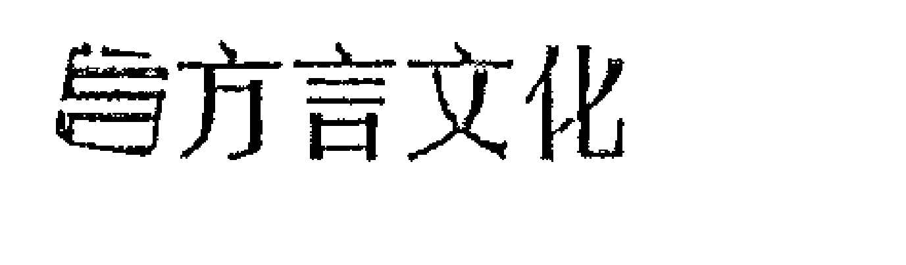

版權所有，未經同意不得重製、轉載、翻印
Printed in Taiwan

KAMISAMA GA OSHIETEKURETA UCHUU TO TSUNAGARU KATADUKEKATA
Copyright © Yukie Kusaka
All rights reserved.
Originally published in Japan by KAWADE SHOBO SHINSHA Ltd. Publishers
Chinese (in traditional character only) translation rights arranged with KAWADE SHOBO SHINSHA Ltd. Publishers through CREEK & RIVER Co., Ltd.
Complex Chinese translation Copyright © 2015 by Babel Publishing Company
All rights reserved.

國家圖書館出版品預行編目 (CIP) 資料
召喚宇宙能量の幸運整理術：
掃除貧酸舊物，暢通風水氣場，
打開正能量開關，讓健康與富
裕自動找上門／日下由紀惠著
；王郁雯譯．— 初版．— 臺
北市：方言文化，2015.12
面； 公分．—
（生活新知館；9）
譯自：神様が教えてくれた宇
宙とつながる片づけ方
ISBN 978-986-92148-5-8
（平裝）
1. 家庭佈置
422.5 104027173