# 我用遁甲

用现代思想读懂古代帝王之学

应用于：
- 人生
- 事业
- 运势
- 财富
- 战略
- 方向
- 决策

叶鸿生 著

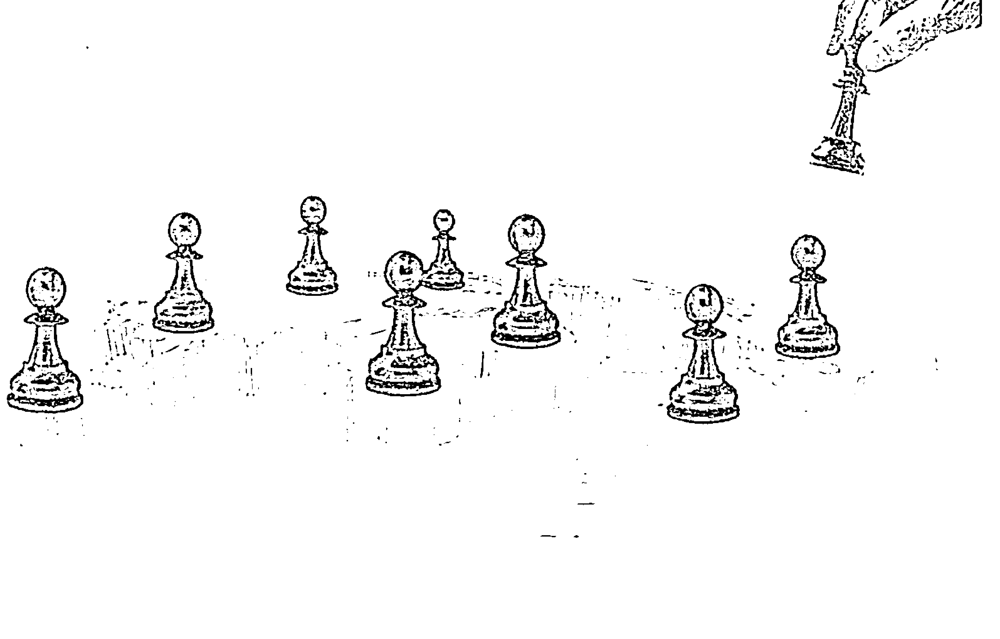

一个盘可以看一人，看一家，看一公司，看一村，看一国，仅九个方格而已。

由此得知，小东西可以拆开多因素分析；无论多大的事物都可以被我缩小了研究。并且我在方格中“纸上谈兵”宫转星移，唯我所用，甚至被我所玩弄！

希望每个研究奇门遁甲的人都能在研究它的过程中领悟里面的大智慧，而不是“掉进去”被它所迷所困！

——叶鸿生

# 目录

- 叶鸿生简介（1页）
- 学奇门遁甲前提醒（4页）
- 第一章：学前理论
  - 1、两层四层和导图变模型（10页）
  - 2、技术精进三个阶段（11页）
  - 3、技术升级三个阶段（14页）
  - 4、学奇门遁甲前的疑问（26页）
- 第二章：奇门遁甲四层框架
  - 1、讲解奇门遁甲两层至四层（31页）
  - 1、底层九宫八卦载体（33页）
  - 2、二层地支方位阶段（35页）
  - 3、三层九星八门原始位置（36页）
  - 4、天盘表层主信息（39页）
  - 5、奇门遁甲共55个符号（41页）
- 第三章：奇门遁甲预测
  - 一、什么是预测（45页）
  - 二、什么是用神（48页）
  - 三、奇门盘怎么分析（53页）
- 第四章：易学基础
  - 1、入门基础知识（57页）
  - 1、阴阳五行（57页）
  - 2、天干地支（57页）
  - 3、天干配五脏（58页）
  - 4、地支类像（59页）
  - 5、地支旺衰（68页）
  - 6、生旺死绝表（69页）
  - 7、天干五行季节（72页）
  - 8、干支合会冲（73页）
  - 二、时间历法（76页）
  - 1、二十四节气（76页）
  - 2、六甲旬空（79页）
  - 3、马星（83页）
- 第五章：奇门遁甲起局（85页）
- 第六章：奇门遁甲九宫八卦
  - 1、八卦图（104页）
  - 2、八卦像数义理解（107页）
- 第七章：八门
  - 1、八门具体含义和理解（118页）
  - 2、八门含义汇总（120页）
- 第八章：九星
  - 1、九星含义（123页）
  - 2、九星含义两面性（129页）
  - 3、九星旺相休囚（130页）
- 第九章：八神
  - 1、八神含义（137页）
  - 2、八神信息汇总（140页）
- 第十章：天干变化
  - 1、天干类像（141页）
  - 2、天干有遁甲（153页）
  - 3、天干相合（155页）
  - 4、天干相刑（157页）
  - 5、生旺死绝表的理解（161页）
  - 6、十干克应（163页）
- 第十一章：常用知识点
  - 1、五不遇时（174页）
  - 2、反吟伏吟（177页）
  - 3、九宫对人体（178页）
  - 4、九宫风水对家庭成员（179页）
  - 5、定应期（181页）
  - 6、断卦一卦一断还是多断（186页）
  - 7、一物一太极（189页）
  - 8、固定用神和找灵活用神（191页）
- 第十二章：预测步骤和分析思路
  - 第一步至第六步（195页）
- 第十三章：20个预测案例和思路（214~288页）
- 附录烟波钓叟歌（289页）

# 叶鸿生简介

叶鸿生（本名：叶宏君），1980年出生于四川省成都市双流区公兴镇。

现以《易经》、《奇门遁甲》、用道为主体，从事教学、预测、咨询等业务。

主要以山河易经网、微信公众号“叶鸿生奇门遁甲”为主对外弘扬展示奇门遁甲的门户。希望借奇门遁甲学术，让奇门爱好者通过学习研究它，见识、见到暗面事物发展变化的真相，从而生长更高智慧，而不是执于事情吉凶之上，执于困局。

叶鸿生奇门遁甲体系，不是古代那个原版本，而是取古代传统奇门的框架和信息为基础，揉合了现代人类生活场景，预测、实践、总结而成的体系。

# 叶鸿生奇门遁甲体系

初级阶段：以认识奇门遁甲构造、组成，预测使用方法为主（破框架、画导图、宏观看、微观论）

中级阶段：讲解思路，看盘方式、建立预测准确率的太极（建立分析系统、95%准确率一物一太极、结合实际）

高级阶段：预测、化解、调整、运筹（处理事情，达成结果的方式方法）

遁甲智慧：知天地、知我、知太极，万事万物皆存乎一心。

# 本书简介

本书为“叶鸿生奇门遁甲体系”的初中级入门型教材（本书不包含运筹化解内容），其作书的起因还是以众多奇门遁甲爱好者的要求而作，比起视频教程更方便收藏和阅读。主要讲述的方向还是在剖析框架、预测和分析思路上。

同时本书教学方向保留仅有用的九宫八卦、九星、八门、天干地支、八神等主要，剔除了暗干暗支，门加门、星加星之内复杂无用。现代我们生活场景有用的留下，古代行军打仗的内容舍弃。

# 学习奇门遁甲之前郑重提醒一

奇门遁甲被称为“帝王之学”，如果仅仅预测算卦，那它就不是“帝王之学”而是神棍之学。

帝王之学在观天时、察地理，见我、知我心、我念、定位、能量，然后心太太极、虚实，万物唯我所用。我不问事情好不好、成不成，我只问如何达成老子的目的。用什么办法达成哪怕用天、用天、用一切。

神棍之学皆认为一切是命，问的是结果，问好不好，成不成，我应该怎么办？我要去那里？我是谁？我怎么了？

奇门遁甲是展现天、地的时空在特定时间内，时间、空间的能量、状态、方位、气场、频率…………等肉眼不可见超科学玄学。

奇门遁甲本身属于“最无用”的大用之学，算命算卦只是它最无用的其中一个功能而已。太鸡毛蒜皮的事情，奇门遁甲它办不到。

就像打一只小鸟用弹弓、打老鹰用气枪、打一只野牛可能要用真枪、炸几个敌人可以用手雷，炸碉堡用炮弹，炸一个城市用用导弹。

如果用导弹去打一只小鸟，也许、大概可以打到，但是就是“大概”。威力太大，或者是炸没了吧！

奇门遁甲同理，复杂，多因素的事情，涉及能量、时间、地方、发展、方位，总之是越复杂，奇门遁甲越看的清楚。太个体具体的小事，奇门遁甲可能就让你头晕。

# 学习奇门遁甲之前郑重提醒二

无论如何高深的知识和技术，不过是我们成长、成功路上其中的一个“工具”而已，它可以唯你所用，你切不可被它所困！

“所困”！

你看学了八字命理学的人，总是拿个“尺子”测量自己的人生和别人的人生。

你看学了风水的学的人，总是拿个“镜子”照自己的人生和别人的人生。

学奇门遁甲一样，这是一个更高精密的“仪器”你切不可钻进“仪器”里看人生看世界。

“工具”是在我需要它的时候，它显现我们看不到的真相，切不可问他行不行？可不可以？要不要做？它是没有主见的，你问它不如扔硬币来决定！

# 本书简介

在学习奇门遁甲之前，首先我们要搞清楚它的功能和用途，而不是直接就开始学习九宫八卦、五行、九星、八门，如果你直接就开始“钻”进奇门遁甲，很多真相就看不到了。

有一部印度电影叫《三傻大闹宝莱坞》是阿米尔汗主演的，在课堂上，老师问他：“什么是机械机动？”

他的回答大概就是：“只要能帮人类更省力，更有效率的达成目的的机器，就是机械机动的。”

但是老师很不满意发火了，让另外一个学生回答，这个“好学生”把书都背下来了，然后就噼里啪啦说了一大堆：“机械机动的就是一个发动机，然后油路，然后什么专业原理说了一大堆！”这时候老师非常满意！（连老师都钻进去了）

比如：所有研究奇门遁甲的人，甚至还自称专家的人，你问他奇门遁甲是什么？

大概99%的人回答都是这样的：“奇就是三奇乙、丙、丁，门就是八门，遁甲就是六甲遁戊！”

这个回答没有错，但是如果这样说、这样想那他是不可能真正搞明白奇门遁甲真正的用途的，即使预测准确了，也跳不出奇门遁甲给他画的“框框”。

## 那么我是怎么理解的呢？

奇门遁甲其实是用于战胜敌人的一种更高技术含量的知识学科“工具”，利用这种工具可借天之利、借地之利，更加有效率的容易战胜强大的敌人。

当用时则用，不用则不用。不可能因为一个小感冒、丢失一根钉子也要用到奇门遁甲。

# 第一章：学前理论

对奇门遁甲的一些基础理论知识的认识和理解，同时学习方法，进阶、步骤，预测结果有可变与不可变。预测、化解、调整的大概内容描述，先有个整体概括的认识。

## 一、两层至四层，导图变模型

叶鸿生网络公布的版本，奇门遁甲皆以两层框架进行讲解，道理也是为了方便初学者明其天盘、地盘的原理。但仍然有许多奇门遁甲初学者到我的网站山河易经网或者邮件我留言，称还是有许多不明白的地方。

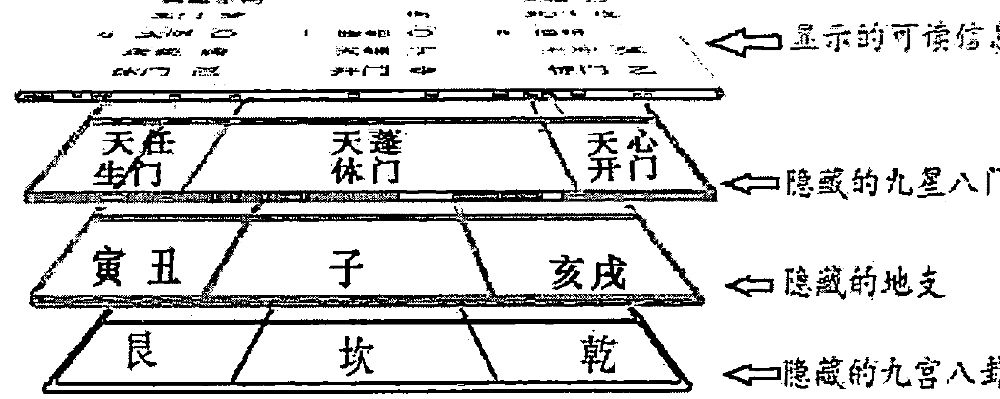

他们在实际预测使用时，疑问还很多！所以我持续深入的总结与实践，使我对奇门遁甲应用的领悟持续的总结实践，现在将奇门遁甲以四层、导图的形式公开，也是为了让初学者更易于理解每个符号落在不同宫位的定位、旺衰、强弱等细节认识。

## 1章：学前理论

## 二、技术精进的三个阶段

必须从名词进入到形容词，再到感觉阶段。任何一个易学类技术，只要从名词层面。进阶到形容词层面了，技术立即精进一大步，再从形容词进阶到感觉层次，立即超越站在大师行列。

### 举例：乾卦

每个学员我都会问 TA：“你看过的易经易理，八卦中的乾卦是什么意思？”

10个人有9个都会说：“乾为天、为父亲、为长辈、领导、为主席、为厂长书记、为马。。。。。。”等等的意思。包括有些研究易理五年六载的都仍然是这样背诵易经八卦的。

我会告诉 TA：“这个答案是对的，但是你的回答绝对是错的！”这些书上的答案全部是作论文的人推理，演讲使用的答案，而当你在实际预测时，预测你的生活中的事情时，这些答案可能 100 次预测一次也用不上。

学员就会问：“那叶老师你说乾卦什么意思？”

我的回答：

- 你看大海中的生物，鲨鱼就是乾卦；
- 你看陆地上的动物，狮子老虎就是乾卦；
- 你看天上飞禽，雄鹰就是乾卦；
- 你问家庭，父亲就是乾卦；
- 你问小区，物管就是乾卦；
- 你看自己，脑壳就是乾卦；
- 你看手掌，大拇指就是乾卦；
- 你问公司，老板就是乾卦；
- 你问国家，主席就是乾卦。

乾为天，是乾卦带头领导的总称，

乾卦无处不在。他的准确意思取决你的心关注在当下事物上。

从上述我的举例中你必须从“鲨鱼、老虎、雄鹰、物管、脑壳、主席、老板”固定名词进入到形容词层面。

乾卦的意思就是在行人当下太极中的带头大哥！

这个形容词我都不应该写出来，要你自己写出来。你能写出来你的技术境界上升的同时，你的人生境界同时也在提升，因为你看待事物的方式改变了。

当然，你要是能进入感觉层次，你就直接技术飞跃了！

再接着，要是你能将将乾卦的意义、感觉应用于人生、事业上，你直接横空出世，任何领域都可以成就！

## 学习有方法

易学符号，只要你还停留在名词上背诵、研究，你永远都是皮毛上。所以这里我就给你科学的一个概念：名词进入形容词、再进入感觉！

带着感觉去办事，无所不成！

## 1章：学前理论

## 三、奇门遁甲技术上升的三个阶段

### 第一：初级阶段预测

从刚开始听说奇门遁甲，然后学习九宫八卦，九星八门、阴阳五行、天干地支，直到试着预测一些事情，都属于菜鸟入阶段。

预测的准确与否，取决于对基础知识的理解和能够将预测事项圈定在一个范围，更能够精准解读出事情发展的来龙去脉。

### 第二：中级阶段化解调整

多数想要预测的时候，最终就是希望通过奇门遁甲发现导致我们人生、事业、婚姻、运势、财运的失败问题的原因是什么？

找出问题，解决问题，处理问题称之为，化解，调整！

化解调整稍微复杂，需要更大的知识量和认识影响事物发展的更多因素，但关键在于人。

内在人的发心、想法、观念、姿态、状态、感觉频率、对立等因素，

外在环境场景、人物、物品、方向、数字、五行等因素。

#### 特别注意

奇门遁甲盘上预测的结果，并非肯定是未来的发展结果！大部份结果当即可改变！

## 不可改变的有

高于我们层面的事情，比如国家层面、股票、上级、父母、天气这些高于我们层面与维度的事情，预测结果都不可改变。

预测自己的事情，比如人生运势、婚姻感情、财运、公司、业务等，预测结果大概80%都可以马上就改变的。

一些人生迷茫了的人找到我预测，直接问的就是“我的未来怎么样？我是不是注定要失败？注定怎么样？”在他们的心中，认为自己成王败寇都是注定的。

自从我深入研究奇门遁甲以后，预测过百千个不同社会层次和遭遇的人盘像后发现，我们的命运可能有那么很小一部分是天生注定的。

但是大部分是立即、马上我们就可以改变的！

## 1章：学前理论

### 比如内境的改变

人的发心，99%的人是欲得，为我自己

只要改变成欲为家人、为朋友、为社会、为国家能量就变了！

人的内心装着希望（丁）还是绝望（癸）？

定位自己天生干大事（乾宫）还是注定穷鬼（坎宫）？

是以放松（休门）的身心还是紧张恐怖（惊门）的身心做出的行动？

是任劳任怨踏实（天任星）的工作还是热情洋溢（天英星）的工作？

做事带着的感觉感觉腾飞辉煌（戊加丙），

还是带着损失、失败的感觉（丙加庚），

你的发心、心态、定位、状态、姿态、感觉，任何一个你自带、自身的东西改变了，你外境就改变了！

## 1章：学前理论

### 比如外境的改变

- 家居环境的整洁和谐场景，箱柜中陈旧物清理！
- 西北对应家中男主，西南对应家中女主事物的改变！
- 家庭人员的改变增减，长子变家主！
- 行业职业所处的人脉圈子
- 办公桌上的物品，随身物品！
- 我属狗，属丑、龙、午不同属的人合作的靠近。
- 穿戴红黄绿黑颜色的不同！
- 出门办事前往的方向、时间的不同！

预测出结果不利后，能够化解调整的话。帮助别人调整化解的人需要有多方面知识、经验的功底。面对不同社会层次的询问才能有效解决问题。听得懂就调整内，听不懂就调整外进而改变内！

## 第三：高级阶段运筹会用

说高级阶段，其实越朝上越简单，只要真的明白了奇门遁甲的功能、用途及原理，我们无需复杂操作，马上排个奇门遁甲即可进行使用。取对我有利、有用的能量，方位、空间，符号，旺气方等。

运筹还分几种类型：比如我今天想让老板给我加工资，预测后结果不满意老板不会给我加工资运筹就是找合适的人去说这个事情，比如找个女性（巽宫）能够转化；比如找个当官的写封介绍信（乾卦），总之开始这个事情不成，但我只想达的目的，就取能转化，能辅助，能有效率的宫位信息，现实中找到拿来用。

### 举例

例一：我拉一车土豆希望卖个好价钱，卖的快。

那我去到菜市场或者某小区，我坐于当下起的奇门遁甲盘的“生门”宫位方位即可使我利用时空加强的赚钱收益的能量，我就坐于当下太极空间“生门”在的方位。

|   | 东南 | 南 | 西南 |
|---|------|----|------|
| 东 | 生门 | 伤门 | 杜门 |
|   | 休门 |   | 景门 |
| 东北 | 开门 | 惊门 | 死门 |
|   |      | 北 | 西北 |

例二：两队人马势均力敌比赛，希望用奇门助阵胜利。

这就类似于古代战争了，取旺气方，吉利方位为我所用，将敌人放在死气方位。

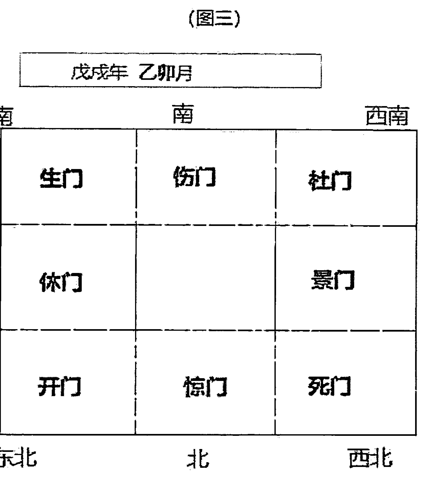

如图所示，乙卯月，木旺震宫、巽宫为旺气方，如果在配上两宫位有开、休、生其中一吉门，那我方位于旺气方，吉门方即可大吉大胜。但此种方法也需要具备多种吉，如果对面方位有“值符、九天”大吉的符号，我方即使旺气也阻力很大。

## 1章：学前理论

例三：今日想与一个重要的客户谈判合作事宜，希望借奇门而达成。

| 东南 | 南 | 西南 |
| :---: | :---: | :---: |
| 玄武<br>生门 | 九地<br>伤门 | 九天<br>杜门 |
| **东**<br>白虎<br>休门 | | **西**<br>值符<br>景门 |
| 东北<br>六合<br>开门 | 北<br>太阴<br>惊门 | 西北<br>腾蛇<br>死门 |

在合作谈判有利的能量符号一般用的“六合”这个能量。就是指将两者合一的能量。上图所末“六合”在艮宫，取艮宫之方位，之事物，人物或属相，一对一双携带从之，就像我已经具备带有合成的能量，谈合作成功率就大大增加。

总之，奇门遁甲的符号、内容含义许多，在使用运筹时，使用最有利于我的方位、时间、事物、能量唯我所用，往往非常简单，却在人生事业办事中事办功倍的作用。

比如希望对方打开心菲则取 "开门"；比如求见贵人则取 "休门"；比如希望对方引起重视则取 "景门"；比如保密的事情则取 "杜门、太阴、九地"等。

使用的前提条件还是需要在学习预测的过程中，奇门遁甲吉凶原理，符号的认识深刻后才能更好的应用。

## 第四阶段：从奇门遁甲中领会道与王者智慧

现实世界的人类，到了20几岁人生基本就定型了，也定了他的命运，命运定了是因为观念固定了。

比如：家中父母都是上班人群，对于钱的观念、社会价值观、人与人的关系的观念。成功失败、有价值的事情或者物品，都因为老师## 1章：学前理论

视的改成看重要了，以前重要的看轻了，以前害怕的现在喜欢了，以前喜欢的现在讨厌了。以前只考虑自己得失，后来考虑全家、全村、全国，甚至全人类。这些就是内在“框框”在改变。内在“框框”任何一个点的变化，他的现实世界都在变化！

## 看见自己、看见心、看见观念

奇门遁甲被称为帝王之术，帝王级学术智慧，它不仅是因为可能查天时地理的能量，同时用于人，可以看到人内在对人、对事的定位、观念、心关注在那里、当下的情绪、状态、感觉……至今就只有奇门遁甲有这个超级功能！王者修正自己，内圣外王；普通人都想改变世界而不改变自己，麻雀想像老鹰一样翱翔天空，如果不修行自己而是希望天能矮一点，这不现实。不要认为我讲的有多么遥远，那些是圣人干的事。其实至从你喜欢研究奇门遁甲起，冥冥中本来就有股暗能量指导你学，期望你学会，看到自己，修行自己，修炼成王，任何人都可以，只是你相信与否而已。

## 四、学奇门遁甲前的疑问

当我们的人生事业碰到了问题，就希望有一种非常厉害的功夫，或者技术来解决所有问题。

奇门遁甲从古及今，被许多高手大师吹捧成了一种可以解决一切问题的超级技术，号称“帝王之术”。它又不同于符咒道法那样让人感觉可怕，又不同于算命八字那样封建，所以奇门遁甲就成了最适合学习的一门学科。

奇门遁甲确实能够侦测到许多人类肉眼看不见的事物，非常神奇！但是你也不要太把它当回事，当用则用，否则它会使你更加迷茫。

它并不是万能的，它只能预测、解决它本职范围（看时间、空间、能量、状态、属性）内的事情！

## 奇门遁甲可以做什么？

无论奇门遁甲多么神奇，如果它没有给你带来收获或者好处，它对你来说就是一文不值甚至是累赘。很多研究奇门遁甲的学者陷入学术的泥潭中不可自拔，是因为他们真的在研究古代人说的使用功能及方法。

比如许多古书上，还有《烟波钓叟歌》讲了很奇门遁甲的多种神奇，战争上的术语，用法及用途。还有预测的方法、用神、用途。

古书上讲的应用方法用途，那是在古代，如果现代人还拿着古代人对事物的判断方法和依据来判断今天的事物，那就是老古董。

奇门遁甲大概的用途就是用它可以更容易有效的战胜敌人，仅此而已！

## 奇门遁甲属于更高级的学问

古代战场普通人就是兵；只要勇猛就可以当百夫长；有一些战术就可以当将领；要是有战略懂兵法一有机会就能为大将。而能够为王的人，则需要有谋有略和胆识，会用人，仅这些还不够，还需要明天道。

奇门遁甲号称“帝王之学”用来算卦岂不是有点可笑，算卦的工具术很多，如六爻、梅花、六壬、八字、紫微斗数..............

任何非常厉害的东西都有长必有所短，奇门遁甲一排盘展开就是九个宫，方位、时间、空间、能量、状态、发展。

当你想要利用奇门遁甲干某件事情的时候，还是需要想一想，奇门遁甲它能不能于这个事，就像写作画画用笔、吃饭用筷子、炒菜用铲子一样。

### 你如果认为它是万能的，只会让你用的非常郁闷！

因素越多，情况越复杂，让奇门遁甲来干这个事，单一的问题让别的工具来干这个事。

人生、事业、公司、运势、风水，都是多因素问题，用奇门遁甲来检验。不仅可以让你“看到”天时、地利、人和，还让你看到发展趋势、方向、结果。还能让你借用有用的能量、状态、方位、空间、时间来达成你的目标。

吃饭、睡觉、出行、袜子丢了你问奇门遁甲，这些事你睁眼即可知的单一事情，用奇门遁甲来看，这就是你在犯傻。你要让奇门遁甲给你算一辈子的命运，这是拿错了“工具”。

### 奇门遁甲种类阴盘、阳盘、茅山道家......

这都是一种概念，就像是你卖猪肉，我也卖猪肉。后来讲学的人想要特别一点，于是就是山猪肉，卖排骨、肉肉、甚至听音乐长大的猪的肉。

更有甚者，再加点自以为是特别的“作料”进去，于是奇门遁就有了更加复杂的演变，他们不是以实用为主，而是花哨、吸引人为主。

所以，奇门遁甲既然是说明天地运作能量变化的功能，就只有一种传统奇门遁甲。后来加有暗干、暗支、建除满平、六亲都是后来学者加上去的。

在实际预测时，你只需要看每个宫格中的七个符号，即“八卦、地支、八神、九星、八门、两个天干”即可。

另外，奇门遁甲软件也有门类繁多，颜色、种类不一，你一定要形成自己的看盘风格，或者一种系统标准，然后无论什么盘，你只需要按照自己的看盘方法分析就能做到准确。

## # 第二章：奇门遁甲四层框架

(图五)

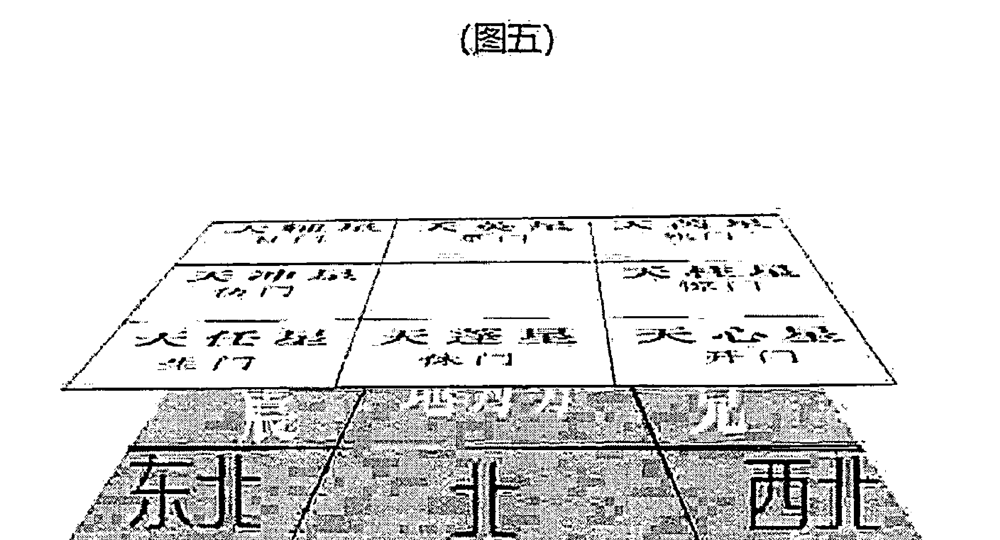

## 一、奇门遁甲两层至四层

在早期我在录制视频教程时，是以两层框架解说的，现在将奇门遁甲分解是四层，希望能够让初学者更深入的认识、掌握到奇门遁甲功能和用途。

## 2章：奇门框架

(图六)

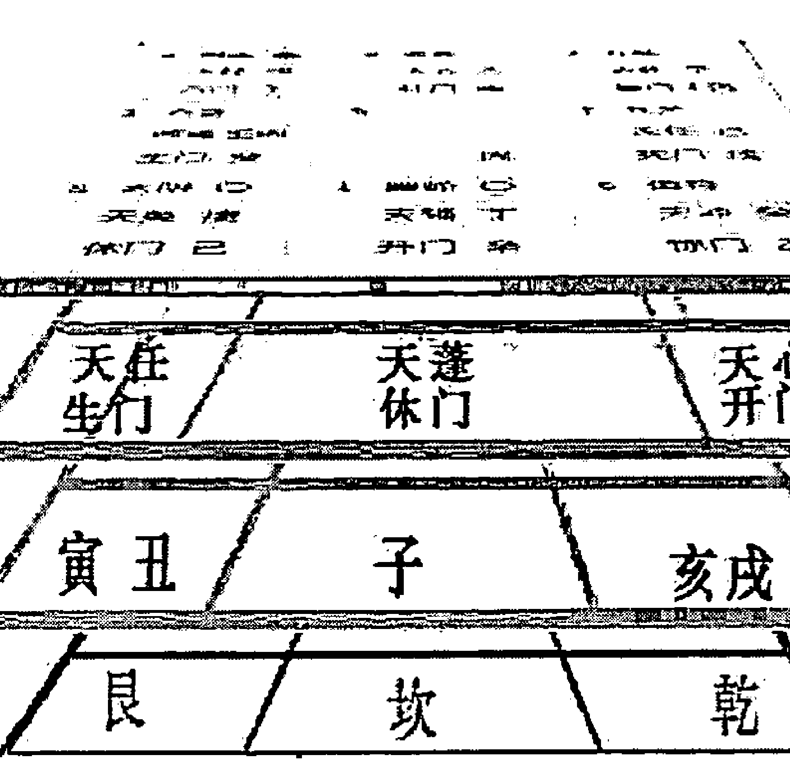

很多时候我们在分析仅仅两层信息的时候，就蒙了，更别说四层。但是当你认识到四层信息的时候，或许能够更清晰的认识到其中的道。

## 1、最底层：九宫即八卦，也是整个奇门遁甲运作的载体。

载体，就像是你要去某个地方见客户，见客户交流沟通达成交易是最主要的目的。但是如果没有交通工具，比如你开奔驰车去、打的去、走路去、还是公交车去，这些都是工具，载体。

但是客户见你开奔驰车来，走路来、打的来、公交车来，他对你的看法、想法肯定会有所区别。

另外再举例：比如你在微信上和客户沟通交流，交流的内容是达成交易最主要的。但是微信才是交流的载体，如果没有微信，或者你用电话、或者你用 QQ，或者在茶楼、或者在酒店，总之在任何一环境，场景交流都是一个载体。

所以奇门遁甲最下面这层载体，九宫八卦，很多学者在预测分析过程中，基本就忽略了八卦，直接就看的是最上面一层的“面子”信息。

## 2章：奇门框架

载体八卦，分析内容占的份量最少，但是却是最最重要的。落在不同的宫位，就有不同的意义。

比如老板预测公司、事业发展，他落在了坎宫、坤宫，本身就错了。坎为低，打工者姿态，坤为地，顺也，女人被动姿态。

同时宫位还有旺衰，宫位有五行，根据现实、当下不同的季节来判断宫位的旺衰。比如春天属木，那震宫、巽宫就旺，离宫得生，坤艮宫受克，坎宫泄气、乾兑宫休囚。不同的季节旺相休囚的宫位都不同。

## 2、倒着第二层地支，时间方位阶段

每个九宫都有一个或者两个地支，地支主要功能就是体现最上面一层天干的阶段的（生旺死绝表）；

（图七）

| | 长生 | 沐浴 | 冠带 | 临官 | 帝旺 | 衰 | 病 | 死 | 墓 | 绝 | 胎 | 养 |
| :--- | :--- | :--- | :--- | :--- | :--- | :--- | :--- | :--- | :--- | :--- | :--- | :--- |
| 甲 | 亥 | 子 | 丑 | 寅 | 卯 | 辰 | 巳 | 午 | 未 | 申 | 酉 | 戌 |
| 丙 | 寅 | 卯 | 辰 | 巳 | 午 | 未 | 申 | 酉 | 戌 | 亥 | 子 | 丑 |
| 戊 | 寅 | 卯 | 辰 | 巳 | 午 | 未 | 申 | 酉 | 戌 | 亥 | 子 | 丑 |
| 庚 | 巳 | 午 | 未 | 申 | 酉 | 戌 | 亥 | 子 | 丑 | 寅 | 卯 | 辰 |
| 壬 | 申 | 酉 | 戌 | 亥 | 子 | 丑 | 寅 | 卯 | 辰 | 巳 | 午 | 未 |
| 乙 | 午 | 巳 | 辰 | 卯 | 寅 | 丑 | 子 | 亥 | 戌 | 酉 | 申 | 未 |
| 丁 | 酉 | 申 | 未 | 午 | 巳 | 辰 | 卯 | 寅 | 丑 | 子 | 亥 | 戌 |
| 己 | 酉 | 申 | 未 | 午 | 巳 | 辰 | 卯 | 寅 | 丑 | 子 | 亥 | 戌 |
| 辛 | 子 | 亥 | 戌 | 酉 | 申 | 未 | 午 | 巳 | 辰 | 卯 | 寅 | 丑 |
| 癸 | 卯 | 寅 | 丑 | 子 | 亥 | 戌 | 酉 | 申 | 未 | 午 | 巳 | 辰 |

比如（图五）最上面一层即天盘的乾宫，有天干丙，乾宫有地支“戌、亥”，于是我们查询生旺死绝表可知道，丙在乾宫为入墓（库）的阶段。入墓表达结束、休息、收藏的意思。

## 3、倒着第三层，九星八门的原宫位和五行

比如乾宫属金，于是乾宫的“天心星、开门”也属金，这是九星八门的原始位置。

- A、你一定要记住九星原来的位置，在后来的预测中你才能区别“反吟、伏吟”这两个概念。
- B、你一定要记住每个九星的五行，因为九星的旺相还是衰弱，需要先知道这个九星的五行，然后它任意飞到那个宫位，旺相休囚都不同。落宫口诀“我生为旺、同我为相、克我者囚、我克者休、我生为废”。意思是：比如天蓬星属水，落在震宫木，我是水去生木，那天蓬星就算旺；天蓬落在乾宫属金，金来生我，我即为废；天蓬星落在坤艮宫被克，我即为囚；天蓬星落在离宫，我克宫即我休。其他九星以此类推。

九星在奇门遁甲预测、使用中占了非常重要的比重，而且天时、地利依靠九星的判定的。

## 2章：奇门框架

C、你一定要记住九星的含义，同时还有吉星和凶星的区别。但是吉凶却不是一层不变的。吉星也可以变凶，凶星也可以变吉。说起来挺复杂，但是你记住了每个九星的含义，不有执着在“吉凶”两端才能更精确的做分析。

比如：“天任星”是诚信、老实、忠厚、停止、任劳任怨的含义，通常是以“吉”这个概念来定义的，但是当天任星落在离宫，生我为废，既然老实忠厚的废了，他就变成了“愚蠢、死脑筋、死板、不变通”这些贬义词。

知道每个九星的含义，同时知道有吉凶，但是不执着在“吉凶”这个概念上，跟随预测当时的盘组合来解读最为合理，同时才能准确。

D、还要记住八门的位置与五行、含义，吉凶（这里提出的吉凶只是大概的说法，请你绝对不要执着在“吉凶”这个概念，只要你执着吉凶，预测肯定不能准确）。

比如：生门的含义就是生长、发展、发育、进步、利润、好处、生发的含义。

### **生门是不是就一定是大吉的呢？**

其实不是！因为当你在预测疾病的时候，病星带生门，是说病情在恶化，如果你事业失败的时候，情绪低落，星生门是你失败在发展、在加剧。

### **休门是不是就一定吉利呢？**

也不一定的吉利！因为休门指放松、指休息、停止、平和、安静的意思。如果预测疾病，见休门可能是指瘫软、有气无力，就像母亲听说孩子受伤了，突然就瘫软脚都站不稳了。

开门、休门、生门三吉门，预测的时候也可能不吉，不利。而凶门伤门、死门、惊门，无论什么时候预测永远都是凶门。

预测的时候吉凶一般都是根据一个宫位中 5 个符号的搭配来判定吉凶的，后面的课程单独论述。

## 4、最上面一层，九星、八门、天干、八神

最上面一层称为“天盘”，就像是姑娘的打扮和穿着，既有真实的信息，也有虚假的信息。

> (图八)

| 4 白虎<br>天柱 乙<br>休门 癸 | 9 玄武<br>天心 丙<br>生门 己 | 2 九地<br>天蓬 庚<br>伤门 辛丁 |
| 3 六合 ○<br>芮禽辛丁<br>开门 壬 | 5<br><br>丁 | 7 九天<br>天任 戊<br>杜门 乙 |
| 8 太阴 ○<br>天英 己<br>惊门 戊 | 1 腾蛇<br>天辅 癸<br>死门 庚 | 6 值符<br>天冲 壬<br>景门 丙 |

比如上图乾宫里面有信息“值符、天冲、景门、壬、丙”这5个信息符号。这5个符号仅仅最表面的信息。就像一个穿着漂亮光鲜的

## 2章：奇门框架

姑娘，她还有更重要的人品、真实年龄等都没有直接显示。

乾宫定义是 “为首、老大”，方位西北、五行属金、内有地支 “戌亥” 等。

我们在对乾宫的九星、八门、八神、天干做分析的时候，都需要参考下面的三层信息，做出判断，而不仅仅是只有这上面的信息。

最上面一层（即天盘）分析思路，方法我们后面课程做细节的论述。

## 5、学习奇门遁甲所学的 55 个符号

最重要的内容包括:

- A☆8卦: 乾、坤、震、巽、坎、离、艮、兑

八卦的学习方向是卦的含义、定义、五行、方位、时间、不同季节的旺衰。

- B☆9星: 天蓬、天芮、天冲、天辅、天禽、天心、天柱、天任、天英。

九星的学习方向是九星的含义、吉凶 (不执着)、五行、特点、形状、旺衰 (九星旺衰不是看五行生克, 而是专用口诀, 我生为旺, 生我者废)

- C☆10天干: 甲、乙、丙、丁、戊、己、庚、辛、壬、癸

天干有会多种变化, 相合、相刑、克应、入墓、能量阶段等。天干合 (乙庚合、丙辛合、丁壬合、戊癸合), 天干克应 (比如戊加丙, 青龙反首)

## 次要的内容包括:

- D8 神：值符、腾蛇、太阴、六合、白虎、玄武、九地、九天

八神在奇门遁甲的预测中，主要起着辅助的参考作用，它们本身的含义比较单一，虽然有自身的五行，但是完全可以不参照。比如“九天”属金，但是在预测时，测人代表他清高、高瞻远瞩、或者张扬，测物就代表高。它表达了自己的特点，就一概不管了。

- E8 门：开门、休门、生门、伤门、杜门、景门、死门、惊门

八门在预测过程，同于八神只起着辅助作用，主要参考还是在天干和九星，八门自身有五行，它需要与落宫五行论生克关系。比如开门落在离宫，就受克，受克开门敞开的状态就有所压制，但可以忽略。

- F: 12 地支：子、丑、寅、卯、辰、巳、午、未、申、酉、戌、亥

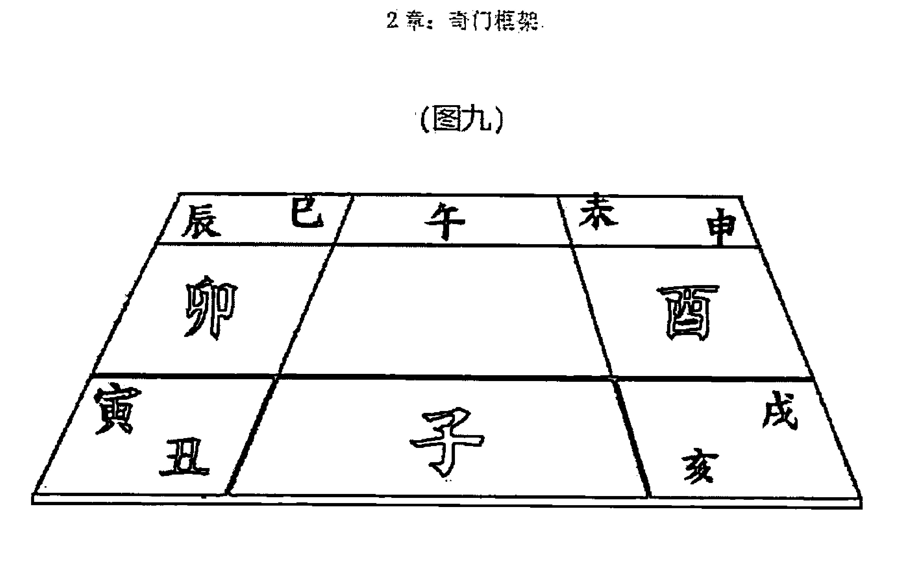

地支的主要功能在于体现天盘上天干的阶段，但同时地支还要描述时间、方位，而且也是定应期的重要参考依据。

### 其它学习内容：

- G: 旬空、马星、击刑、生旺死绝表。

学习奇门遁甲除了主体的学习内容以外，同时还涉及地支的一些变化，特点的内容。后面的章节有单独的论述旬空、马星、击刑

总结：8卦+9星+8门+8神+10天干+12地支=55个

## 2 章：奇门框架

学奇门遁甲就像建设一栋大楼，你必须先了解它的原材料有那些，钢铁、水泥、河沙、木材、玻璃..........然后每种材料都有它独有的特性，你只能唯其所用，不能执着在水泥吉、钢铁凶这些概念上。否则使用时就会因为自己的执念而犯错误。

同时在一些特殊条件下，每种原材料可能就会发生相应的变化，同时在弯角处、巷道、角边还有特殊处理方法。整个奇门遁甲学习过程，最最最重要的不在原材料上，而在你的心中有建筑大楼的设计、观念、框架、标准上。

## # 第三章：奇门遁甲预测

## 一、首先，什么是预测？

“预测”就像是挑选男女朋友，最初刚相识，我们仅能用肉眼看到TA的言行、穿着、行为、工作等。TA的心性、想法、真心假意、动机、孝顺品德，这些肉眼就看不到。

以人类对事物变化发展，都是停留在表面。**我们只能看到肉眼能够看到的东西**，看不到的影响因素非常之多。易学预测就相当于用一种“仪器”去看肉眼看不到的影响因素。

### 什么是预测？

预测就是事先我们已知这个事物，然后我们想看到潜在影响因素，未来发展更准确的结果。从我们人类有限的认知，知道自己不可能把所有因素都考虑到。

就像树种子生长、发牙成大树，需要土壤、水、二氧化碳、阳光这些只是最基本要素。但除此之外，它一定还需要我们人类看不见的影响因素。比如春天来了花草嫩叶发芽，秋天结果落叶，看不见的阴阳升降能量在主导着万物的生死病死。

所以，预测是先有已知，然后用一种工具将这个已知的事物潜在的发展规律和影响的因素显示出来。

### （图十）

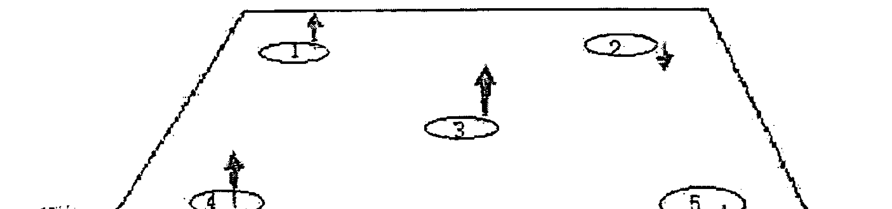

预测同时，能够让我们更加客观的看待自己，看待事物的发展，并看见影响变化发展的因素。不是仅仅考虑预测结果成或败，而是看到造成结果的原因。

## # 奇门遁甲预测像看 “仪器”

比如我们人生运势不佳，公司事业发展不利，我们自己的知识和认知，只能看到肉眼可以看到的问题，而真正的问题在那里，然后我们就用奇门遁甲这个工具 “仪器” 来检测它，发现问题，解决问题！

在多次预测过程中，我们的心就能感受到，就能看到事物潜在的变化和发展规律，从而生出更高级的智慧。如果执着在预测上，执着在仪器上，然后永远带着仪器的眼睛看世界，这时我们就成了自以为是的 “高人” 了。

## 二、什么是用神？

用神就和每个人的名字一样，只是一个代号而已！

这里我特别强调一下：古人在古书中给我们留下了很多可以借鉴的用神，比如看婚恋用神“乙、庚”；比如求财看“戊”，长辈看年干、同事朋友平辈看月干、求测人为日干、下属孩子看时干。古人在书上留下的他们当时的社会环境，和他们对预测的理解经验。我们都只能借鉴，决对不可执着在每次必须用某些用神。

用神，用现代的语言来说，就是一个代号！这个代号符合奇门遁甲学术中某个符号的含义，就可做为用神。

比如：你的名字叫“张三”，但是你也可以叫张四、张五、张六。而你这个人，我们评价好坏，是从你多方面的信息综合作出判断的。人品、习惯、爱好。目标、职业、家庭。

奇门遁甲的预测中，找到了用神，通过用神旁边的更多信息符号来判断事情发展的好坏。

### (图十)

公历:2018年08月10日12:00
年 月 日 时 农历: 戊戌年六月廿九.
戊 庚 甲 庚 阴遁8局, 旬首: 甲子戊
值符: 天任, 值使: 生门
局式: 转盘-拆补-寄坤宫
年:辰巳空 月:子丑空 日:申酉空 时:戌亥空

| 4 白虎 | 9 六合 | 2 太阴 |
| :--- | :--- | :--- |
| 丙禽丁辛 开门 壬 | 天柱 己 休门 乙 | 天心 庚 生门丁辛 |
| 3 玄武 | 5 | 7 螣蛇 |
| 天英 乙 惊门 癸 | 辛 | 天蓬 丙 伤门 己 |
| 8 九地 | 1 九天 | 6 值符 |
| 天辅 壬 死门 戊 | 天冲 癸 景门 丙 | 天任 戊 杜门 庚 |

如上图九，日干为求测人“己”在离宫 (黑色方格) 己就像是一个人的名字“张三”，仅仅名字是不可能得出这个人怎么样的，于是通过“己”旁边的其他符号来证明这个“己”是 好是坏。旁边的符号有“六合、天柱、休门、乙、离宫”这些信息来说明“己”的好坏。

## 3 章: 奇门预测

## 用神，就是一个代表符号！

既然我们只是找一个代表符号，何必要执着在怎么找？取什么用神呢？

比如：古代预测打官司，天乙为被告、值符为原告，结果很多人问我天乙是什么？

比如：预测足球比赛，是一个主队、一个客队，怎么取用神？如果法国队和马西队去俄罗斯踢球，谁是主谁是客？

比如：我有个学员说他的一个同事，最近可能要退休了，退休取什么什么用神？ “休门” 吗？休门与退休有什么关系？

既然用神只是一个代表符号，那么，只要取你在你心中有一点印象的东西都可以做为用神！

比如：打官司，他告我，那多半是仇人，仇人即是克我的，对立的。你找克日干的天干，即可当用神。比如日干为 “丙” ，克我者就是 “壬” ；比如我落在离宫，对立的就是坎宫。这就 4 个用神了。

## 第三章：奇门预测

比如：测比赛，何必要找主客呢，比如你看见这个球队穿红色衣服，就取“丙”火红为用神，那个球队是绿衣服，就取“乙”木绿为用神。

或者你看这个球队国旗、口号、文化是什么样的，取一个奇门遁甲学术中符合的符号即可当用神。

比如：你们公司来了几个新同事，你想知道某个同事的人品、能力怎么样？但是你不知道他姓甚名谁，你看见他较胖，可以取“戊”土代表胖。你看见他比较干瘦，可以取“乙”竹竿为用神，比如你看他穿黑衣服，可以取“癸”水黑为用神。比如你听别人叫他“火鸡”，那就取“鸡”为用神，即地支“酉”为用。

用神，仅仅是一个代表符号，只要他这个人、这个事，在你心中有个特点，然后在奇门遁甲学术中找一个符合这个特点的符号，就是用神，都是准的。

有一次有个无聊的客户说狗走丢失了，想预测什么时候回来？狗是什么用神呢？

代表狗的用神有：“艮为狗、地支成为狗、时干也可以代表狗，家禽天禽也可以做为狗”。切不可执着在古人，或者别人告诉你，或者百度上搜到的，你不知道取什么用神，其实奇门遁甲盘也不知道如何向中展示准确的信息！

## 三：奇门遁甲盘怎么分析？

下图只是叶鸿生奇门遁甲体系里的初级思维导图（此书为入门预测版本，不提供高级导图），我们在分析每个宫位中的某个用神的时候，你首先要搞清楚每个符号表达那个方面，它的主要功能是什么。

> （图十一）

| 天盘 | 九地 天辅 丙 杜门 己 | 分析外像 |
| 地盘 | 八卦：兑 地支：酉 | 分析内像 |

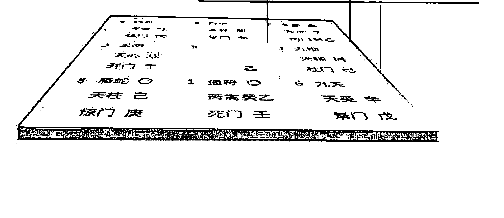

首先你要在心中有一个理论性的概念，每个奇门遁甲所涉及的符号所表达的功能和方向。绝对不是看书上讲的，某人说的天蓬星代表什么，是什么意思？丁的意思，丙的意思，绝不能这样去死理解（初学时可以先死记），固定了意思就不能变通。

比如：我们人的眼睛，功能是看；耳朵功能是听；鼻子功能是闻；舌头的功能是味。

如果我们在学习奇门遁甲过程中，在预测婚姻看见“丁”就说是有小三，见“丙”就说出轨。看见“值符、六合”就说大吉。就等于是眼睛只看见红；鼻子只闻到香味；耳朵只听到歌声。

后面我会用更多的案例来进一步论述，在预测不同的事情时候，每个信息号码功能不变，但是含义是随着预测不同事项来变化的。

# 第四章：易学基础知识

最基础知识包括五行、五行生克、地支位置、含义意义、地支时间空间方位、季节、地支合会、时间历法、节气，年月日时干支。

## 一、学奇门之前需要掌握的基础知识

### 1、阴阳五行

五行：金、木、水、火、土。

五行相生关系：土生金、金生水、水生木、木生火、火生土

五行相克关系：土克水、水克火、火克金、金克木、木克土

（图十四）

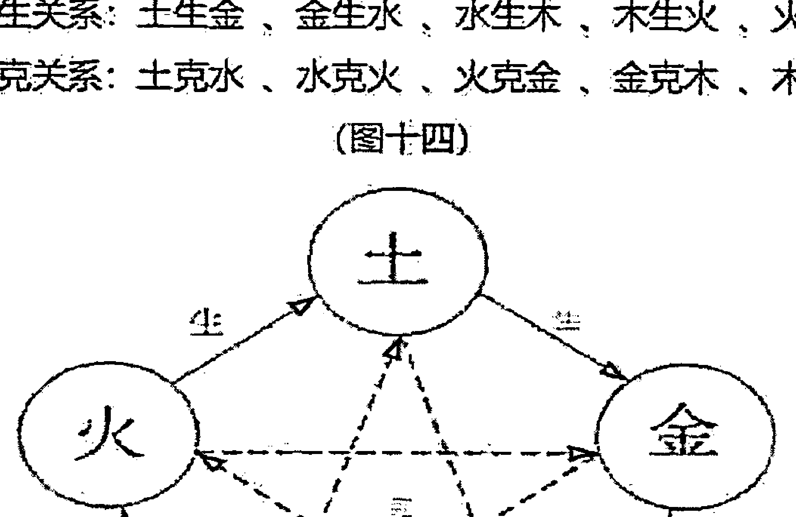

### 2、天干地支

十个天干：甲乙丙丁戊己庚辛壬癸

阳干：甲、丙、戊、庚、壬

阴干：乙、丁、己、辛、癸

#### 十天干的五行属性

甲乙东方木、丙丁南方火、戊己中央土、庚辛西方金、壬癸北方水

#### 十二个地支：

- 子、丑、寅、卯、辰、巳、午、未、申、酉、戌、亥

即正月为寅月、二月为卯月、三月为辰月、四月巳月、五月为午月、六月为未月、七月为申月、八月为酉月、九月为戌月、十月为亥月。

### 3、天干五行配脏腑

- 甲： 胆、头
- 乙： 肝、项
- 丙： 小肠、肩
- 丁： 心脏、血液
- 戊： 胃、肋
- 己： 脾、腹
- 庚： 大肠、肚脐
- 辛： 肺、大腿
- 壬： 膀胱、胫
- 癸： 肾、足

- 木： 胆、肝、头、四肢、关节、筋脉、眼睛、神经
- 火： 小肠、心脏、肩、血液、脸部、牙齿、腹部、舌
- 土： 胃、脾、肋、腹、背、胸部、肚子
- 金： 大肠、肺、肚脐、大腿、气管、鼻子、皮肤、痔疮
- 水： 肾、膀胱、足、阴部、泌尿、腰部、耳朵、疝气

### 4、地支类象

天干和地支是易学理论的一些最基本符号，这些符号都有其固定的含义，下面列出十二个地支的在预测中所代表的意义，奇门遁甲里面根本无用，可学习参考：

（图十五）

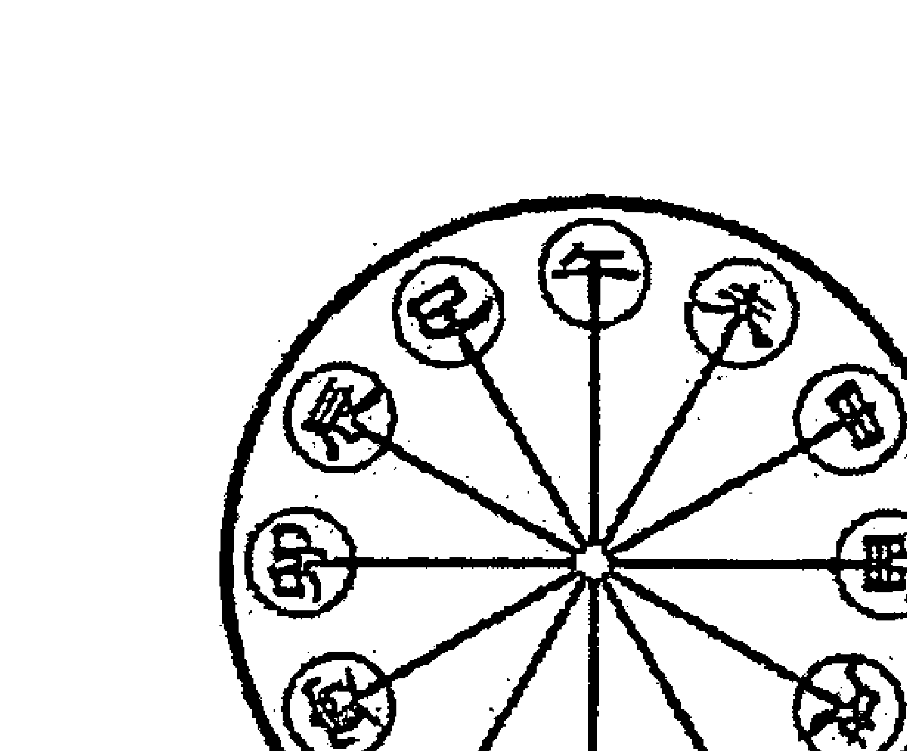

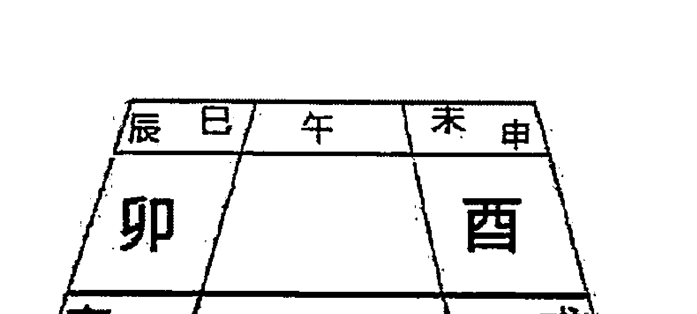

#### A、子

- 五行：属水
- 性别：属阴
- 方位：北方
- 月令：十一月
- 节气: 大雪为子月节；冬至为子月气。
- 生: 子生甲乙寅卯；庚辛申酉生子。
- 克: 子克丙丁巳午；戊己辰戌丑未克子。
- 合: 子丑相合
- 刑: 子卯相刑
- 冲: 子午相冲
- 害: 子未相害
- 三合: 申子辰合成水局
- 方合: 亥子丑合为北方

#### B、丑

- 五行: 属土
- 性别: 属阴
- 方位: 中央
- 月令: 十二月
- 节气: 小寒为丑月节；大寒为丑月气。
- 生: 丑生庚辛申酉；丙丁己午生丑。
- 克: 丑克壬癸亥子；甲乙寅卯克丑。
- 合: 子丑相合
- 刑: 丑戌相刑
- 冲: 丑未相冲
- 害: 丑午相害
- 三合：巳酉丑合成金局
- 方合：亥子丑合为北方

#### C、寅

- 五行：属木
- 性别：属阳
- 方位：东方
- 月令：正月
- 节气：立春为寅月节，雨水为寅月气。
- 生：寅生丙丁巳午，壬癸亥子生寅。
- 克：寅克戊己辰戌丑未，庚辛申酉克寅。
- 合：寅亥相合
- 刑：寅巳相刑
- 冲：寅申相冲
- 害：寅巳相害
- 三合：寅午戌合成火局
- 方合：寅卯辰合为东方

#### D、卯

- 五行：属木
- 性别：属阴
- 方位：东方
- 月令: 二月
- 节气: 惊蛰为卯月节; 春分为卯月气。
- 生: 卯生丙丁己午; 壬癸亥子生卯。
- 克: 卯克戊己辰戌丑未; 庚辛申酉克卯。
- 合: 卯戌相合
- 刑: 子卯相刑
- 冲: 卯酉相冲
- 害: 卯辰相害
- 三合: 亥卯未合成木局
- 方合: 寅卯辰合为东方

#### E、辰

- 五行: 属土
- 性别: 属阳
- 方位: 中央
- 月令: 三月
- 节气: 清明为辰月节, 谷雨为辰月气。
- 生: 辰生庚辛申酉; 丙丁巳午生辰。
- 克: 辰克壬癸亥子; 甲乙寅卯克辰。
- 合: 辰酉相合
- 刑: 二辰自刑
- 冲: 辰戌相冲
- 害: 卯辰相害
- 三合: 申子辰合成水局
- 方合: 寅卯辰合为东方

#### F、巳

- 五行: 属火
- 性别: 属阳
- 方位: 南方
- 月令: 四月
- 节气: 立夏为巳月节; 小满为巳月气。
- 生: 巳生戊己辰戌丑未; 甲乙寅卯生巳。
- 克: 巳克庚辛申酉; 壬癸亥子克巳。
- 合: 巳申相合
- 刑: 寅巳相刑，巳申相刑
- 冲: 巳亥相冲
- 害: 寅巳相害
- 三合: 巳酉丑合成金局
- 方合: 巳午未合为南方

#### G、午

- 五行: 属火
- 性别: 属阴
- 方位：南方
- 月令：五月
- 节气：芒种为午月节，夏至为午月气。
- 生：午生戊己辰戌丑未；甲乙寅卯生午。
- 克：午克庚辛申酉；壬癸亥子克午。
- 合：午未相合
- 刑：二午自刑
- 冲：子午相冲
- 害：丑午相害
- 三合：寅午戌合成火局
- 方合：巳午未合为南方

#### H、未

- 五行：属土
- 性别：属阴
- 方位：中央
- 月令：六月
- 节气：小暑为未月节；大暑为未月气。
- 生：未生庚辛申酉；丙丁巳午生未。
- 克：未克壬癸亥子；甲乙寅卯克未。
- 合：午未相合
- 刑：戌未相刑
- 冲: 丑未相冲
- 害: 子未相害
- 三合: 亥卯未合成木局
- 方合: 巳午未合为南方

#### I、申

- 五行: 属金
- 性别: 属阳
- 方位: 西方
- 月令: 七月
- 节气: 立秋为申月节，处暑为申月气。
- 生: 申生壬癸亥子；戊己辰戌丑未生申。
- 克: 申克甲乙寅卯；丙丁己午克申。
- 合: 巳申相合
- 刑: 巳申相刑
- 冲: 寅申相冲
- 害: 申亥相害
- 三合: 申子辰合成水局
- 方合: 申酉戌合为西方

#### J、酉

- 五行: 属金
- 性别：属阴
- 方位：西方
- 月令：八月
- 节气：白露为酉月节；秋分为酉月气。
- 生：酉生壬癸亥子；戊己辰戌丑未生酉。
- 克：酉克甲乙寅卯；丙巳午克酉。
- 合：辰酉相合
- 刑：二酉自刑
- 冲：卯酉相冲
- 害：酉戌相害
- 三合：巳酉丑合成金局
- 方合：申酉戌合为西方

#### K、戌

- 五行：属土
- 性别：属阳
- 方位：中央
- 月令：九月
- 节气：寒露为戌月节，霜降为戌月气。
- 生：戌生庚辛申酉；丙丁巳午生戌。
- 克：戌克壬癸亥子；甲乙寅卯克戌。
- 合: 卯戌相合
- 刑: 丑刑戌，戌刑未
- 冲: 辰戌相冲
- 害: 酉戌相害
- 三合: 寅午戌合成火局
- 方合: 申酉戌合为西方

#### L、亥

- 五行: 属水
- 性别: 属阳
- 方位: 北方
- 月令: 十月
- 节气: 立冬为亥月节，小雪为亥月气。
- 生: 亥生甲乙寅卯；庚辛申酉生亥。
- 克: 亥克丙丁巳午；戊己辰戌丑未克亥。
- 合: 寅亥相合
- 刑: 二亥自刑
- 冲: 巳亥相冲
- 害: 申亥相害
- 三合: 亥卯未合成木局
- 方合: 亥子丑合为北方

### 5、地支旺衰

五行季节旺衰

- 寅月： 木旺 火相 水休 金囚 土死
- 卯月： 木旺 火相 水休 金囚 土死
- 辰月： 土旺 金相 火休 木囚 水死
- 巳月： 火旺 土相 木休 水囚 金死
- 午月： 火旺 土相 木休 水囚 金死
- 未月： 土旺 金相 火休 木囚 水死
- 申月： 金旺 水相 土休 火囚 木死
- 酉月： 金旺 水相 土休 火囚 木死
- 戌月： 土旺 金相 火休 木囚 水死
- 亥月： 水旺 木相 金休 土囚 火死
- 子月： 水旺 木相 金休 土囚 火死
- 丑月： 土旺 金相 火休 木囚 水死

诀窍：比和旺，我生相，生我休，克我囚，我克死；旺的力量最大，相的力量仅次于旺、休为休息、因为困顿、死为死亡最弱

### 6、十天干与地支《生旺死绝表》

（图十六）

| 状态 | 甲木 | 丙火 | 戊土 | 庚金 | 壬水 | 乙木 | 丁火 | 己土 | 辛金 | 癸水 |
|------|------|------|------|------|------|------|------|------|------|------|
| 长生 | 亥 | 寅 | 寅 | 巳 | 申 | 午 | 酉 | 酉 | 子 | 卯 |
| 沐浴 | 子 | 卯 | 卯 | 午 | 酉 | 巳 | 申 | 申 | 亥 | 寅 |
| 冠带 | 丑 | 辰 | 辰 | 未 | 戌 | 辰 | 未 | 未 | 戌 | 丑 |
| 临官 | 寅 | 巳 | 巳 | 申 | 亥 | 卯 | 午 | 午 | 酉 | 子 |
| 帝旺 | 卯 | 午 | 午 | 酉 | 子 | 寅 | 巳 | 巳 | 申 | 亥 |
| 衰 | 辰 | 未 | 未 | 戌 | 丑 | 丑 | 辰 | 辰 | 未 | 戌 |
| 病 | 巳 | 申 | 申 | 亥 | 寅 | 子 | 卯 | 卯 | 午 | 酉 |
| 死 | 午 | 酉 | 酉 | 子 | 卯 | 亥 | 寅 | 寅 | 巳 | 申 |
| 墓 | 未 | 戌 | 戌 | 丑 | 辰 | 戌 | 丑 | 丑 | 辰 | 未 |
| 绝 | 申 | 亥 | 亥 | 寅 | 巳 | 酉 | 子 | 子 | 卯 | 午 |
| 胎 | 酉 | 子 | 子 | 卯 | 午 | 申 | 亥 | 亥 | 寅 | 巳 |
| 养 | 戌 | 丑 | 丑 | 辰 | 未 | 未 | 戌 | 戌 | 丑 | 辰 |

#### A、状态说明

- 长生：就像人出生于世, 或降生阶段, 是指万物萌发之际.
- 沐浴：为婴儿降生后洗浴以除污垢, 是指万物出生, 承受大自然沐浴.
- 冠带：为小儿可以穿衣戴帽了, 是指万物渐荣.
- 临官：像人长成强壮, 可以做官, 化育, 领导人民, 是指万物长成.
- 帝旺：象征人壮盛到极点, 可辅助帝王大有作为, 是指万物成熟.
- 衰：指盛极而衰, 是指万物开始发生衰变.
- 病：如人患病，是指万物困顿.
- 死：如人气已尽，形体已死，是指万物死灭.
- 墓：也称“库”，如人死后归入于墓，是指万物成功后归库.
- 绝：如人形体绝灭化归为土，是指万物前气已绝，后继之气还未来到，在地中未有其象.
- 胎：如人受父母之气结聚成胎，是指天地气交之际，后继之气来临，并且受胎.
- 养：像人养胎于母腹之中，之后又出生，是指万物在地中成形，继而又萌发，又得经历一个生生灭灭永不停止的天道循环过程.

#### B、比喻说明：

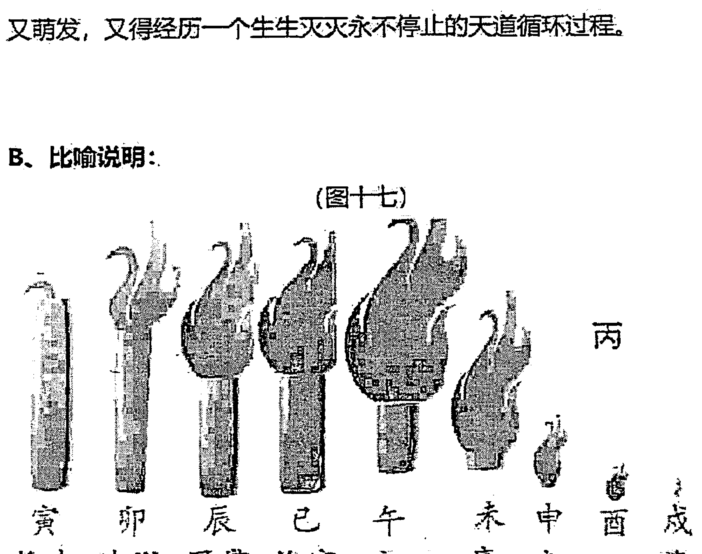

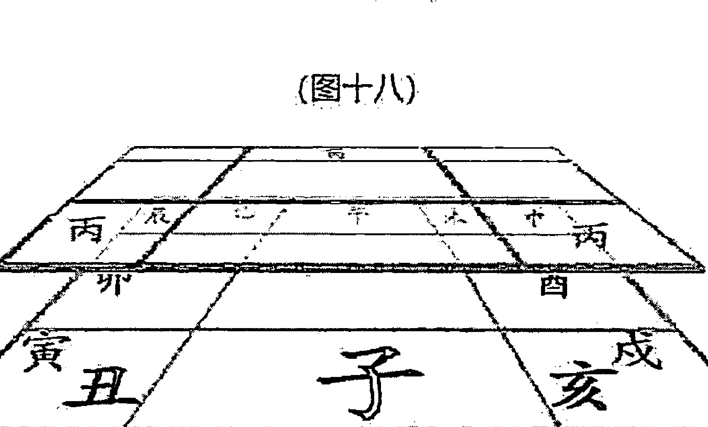

如上图，天盘“丙”落在任何宫位中，都需要想到下面是什么地支（比如丙在艮宫，地支有丑、寅，查询生旺死绝表）看看它临在什么状态。

### 7、干支五行旺季

（图十九）

| 方位 | 旺季 | 天干 | 地支 |
|---|---|---|---|
| 东方 | 春 | 甲乙 | 寅卯 |
| 南方 | 夏 | 丙丁 | 巳午 |
| 中央 | 四季末 | 戊己 | 辰戌丑未 |
| 西方 | 秋 | 庚辛 | 申酉 |
| 北方 | 冬 | 壬癸 | 亥子 |

### 8、干支合会

#### A、天干五合（奇门遁甲合格）

- 甲己合土，名为：中正之合。
- 乙庚合金，名为：仁义之合。
- 丙辛合水，名为：威制之合。
- 丁壬合木，名为：淫匿之合。
- 戊癸合火，名为：无情之合。

#### B、地支三会（奇门遁甲用不着）

- 寅、卯、辰三会东方木
- 巳、午、未三会南方火
- 申、酉、戌三会西方金
- 亥、子、丑三会北方水

#### C、地支三合（奇门遁甲用不着）

- 亥、卯、未三合木局
- 寅、午、戌三合火局
- 巳、酉、丑三合金局
- 申、子、辰三合水局
- 辰、戌、丑、未 全作土局

#### D、地支六合（用不着）

- 子、丑合土
- 寅、亥合木
- 卯、戌合火
- 辰、酉合金
- 巳、申合水
- 午、未合土

#### F、地支六害（用不着）

- 子、未相害
- 丑、午相害
- 寅、巳相害
- 卯、辰相害
- 申、亥相害
- 酉、戌相害

#### G、地支六冲（参考）

- 子、午相冲
- 丑、未相冲
- 寅、申相冲
- 卯、酉相冲
- 辰、戌相冲
- 巳、亥相冲

#### H、地支相刑（奇门遁甲击刑）

- 丑、戌、未 恃势之刑
- 寅、巳、申 无恩之刑
- 子卯无礼之刑
- 辰、辰自刑
- 午、午自刑
- 酉、酉自刑
- 亥、亥自刑

#### I、知年干推月干支

年上起月法，又叫推月干法，以年干来定月干，从寅查起，按照顺时针方向数起，数到所需月建地支为止。其歌诀为：

- 甲己之年丙作首，乙庚之岁戊为头。
- 丙辛之年寻庚寅，丁壬壬寅顺行留。
- 戊癸之年何方起，正月当从甲寅求。

#### K、日上起时法

又叫推时干法、五子元遁、五鼠元遁，是以日干为出发点来确定时干的，从子时查起，按顺时针方向数到某时为止。其歌诀为：

- 甲己还加甲，乙庚丙作首。
- 丙辛从戊起，丁壬庚子居。
- 戊癸何方发，壬子是真途。

## 二：时间历法

### 1、二十四节气

#### A、节气由来

24节气是我国民间传统节令。早在周朝和春秋时代就用“土圭”测日影办法而定夏至、冬至、春分、秋分。二十四节气是把一年内太阳在黄道上的位置变化和引起的地面气候的演变次序，将全年平分为二十四等份，并给每个等份起名，这就是24节气由来。

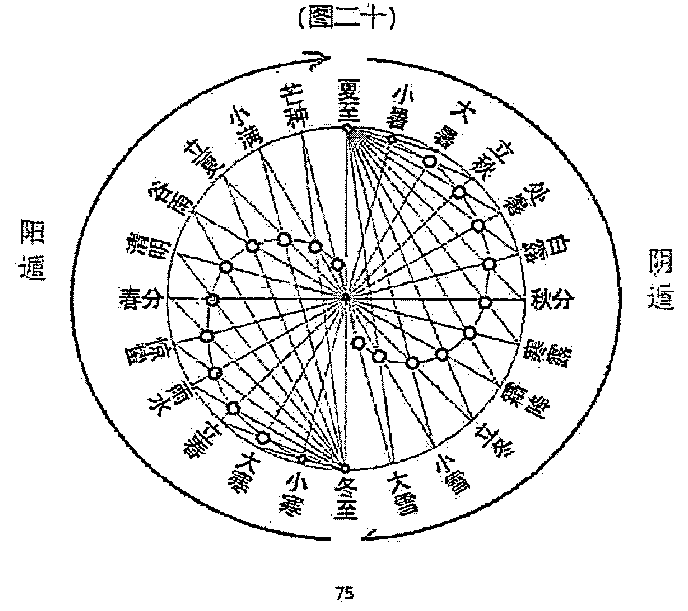

| 左列 | 右列 |
|------|------|
| 正月：立春、雨水 | 二月：惊蛰、春分 |
| 三月：清明、谷雨 | 四月：立夏、小满 |
| 五月：芒种、夏至 | 六月：小暑、大暑 |
| 七月：立秋、处暑 | 八月：白露、秋分 |
| 九月：寒露、霜降 | 十月：立冬、小雪 |
| 十一月：大雪、冬至 | 十二月：小寒、大寒 |

#### B、名称和顺序

立春、雨水、惊蛰、春分、清明、谷雨、立夏、小满、芒种、夏至、小暑、大暑、立秋、处暑、白露、秋分、寒露、霜降、立冬、小雪、大雪、冬至、小寒、大寒。每个节气约间隔半个月的时间，分列在十二个月里面。

#### C、节气特点

二十四节气与季节、温度、降水及物候有密切的联系，立春、立夏、立秋、立冬分别表示春、夏、秋、冬四季的开始，春分、秋分、夏至、冬至是季节的转折点。小暑、大暑、处暑、小寒、大寒五个节气是表示最热、最冷的出现时期；白露、寒露、霜降表示低层大气中水汽凝结现象；也反映气温下降程度。雨水、谷雨、小雪、大雪反映降水情况和程度；惊蛰、清明、小满、芒种是反应物候特征和农作物生长情况。

#### D、二十四节气歌

为了方便记忆，人们将 24 节气编写为 24 节气歌和 24 节气七言诗。

春雨惊春清谷天，夏满芒夏暑相连；
秋处露秋寒霜降，冬雪雪冬大小寒。
每月两节日期定，最多相差一两天，
上半年来六甘一，下半年是八甘三。

### 2、六甲旬空

在干支历法里边从甲至癸十日为一旬，例如甲子日至癸酉十日为一旬，旬内无戌亥故曰戌亥空，又如甲寅日至癸亥旬内无子丑故日子丑空，余句类推。

（图二十一）

| 甲子 | 乙丑 | 丙寅 | 丁卯 | 戊辰 | 己巳 | 庚午 | 辛未 | 壬申 | 癸酉 |
|------|------|------|------|------|------|------|------|------|------|
| 甲戌 | 乙亥 | 丙子 | 丁丑 | 戊寅 | 己卯 | 庚辰 | 辛巳 | 壬午 | 癸未 |
| 甲申 | 乙酉 | 丙戌 | 丁亥 | 戊子 | 己丑 | 庚寅 | 辛卯 | 壬辰 | 癸巳 |
| 甲午 | 乙未 | 丙申 | 丁酉 | 戊戌 | 己亥 | 庚子 | 辛丑 | 壬寅 | 癸卯 |
| 甲辰 | 乙巳 | 丙午 | 丁未 | 戊申 | 己酉 | 庚戌 | 辛亥 | 壬子 | 癸丑 |
| 甲寅 | 乙卯 | 丙辰 | 丁巳 | 戊午 | 己未 | 庚申 | 辛酉 | 壬戌 | 癸亥 |

| 甲子 | 乙丑 | 丙寅 | 丁卯 | 戊辰 | 己巳 | 庚午 | 辛未 | 壬申 | 癸酉 | 戌亥空 |
|------|------|------|------|------|------|------|------|------|------|--------|
| 甲戌 | 乙亥 | 丙子 | 丁丑 | 戊寅 | 己卯 | 庚辰 | 辛巳 | 壬午 | 癸未 | 申酉空 |
| 甲申 | 乙酉 | 丙戌 | 丁亥 | 戊子 | 己丑 | 庚寅 | 辛卯 | 壬辰 | 癸巳 | 午未空 |
| 甲午 | 乙未 | 丙申 | 丁酉 | 戊戌 | 己亥 | 庚子 | 辛丑 | 壬寅 | 癸卯 | 辰巳空 |
| 甲辰 | 乙巳 | 丙午 | 丁未 | 戊申 | 己酉 | 庚戌 | 辛亥 | 壬子 | 癸丑 | 寅卯空 |
| 甲寅 | 乙卯 | 丙辰 | 丁巳 | 戊午 | 己未 | 庚申 | 辛酉 | 壬戌 | 癸亥 | 子丑空 |

（图二十二）

| 甲 | 乙 | 丙 | 丁 | 戊 | 己 | 庚 | 辛 | 壬 | 癸 | ○ | ○ |
|----|----|----|----|----|----|----|----|----|----|---|---|
| 子 | 丑 | 寅 | 卯 | 辰 | 巳 | 午 | 未 | 申 | 酉 | 戌 | 亥 |

| 1 | 2 | 3 | 4 | 5 | 6 | 7 | 8 | 9 | 10 |   |   |
|---|---|---|---|---|---|---|---|---|---|---|---|
| [插图] | [插图] | [插图] | [插图] | [插图] | [插图] | [插图] | [插图] | [插图] | [插图] |   |   |
| [插图] | [插图] | [插图] | [插图] | [插图] | [插图] | [插图] | [插图] | [插图] | [插图] | [插图] | [插图] |## 六甲旬空歌诀：

- 甲子旬中“戌亥”空 甲寅旬中“子丑”空
- 甲辰旬中“寅卯”空 甲午旬中“辰巳”空
- 甲申旬中“午未”空 甲戌旬中“申酉”空

旬空也被称为“孤虚”旬空的宫位称为“孤”，旬宫对面的宫位称为“虚”。古书上记载，背孤击虚，一女可敌十男，虽然形容的很夸张，但旬空处皆代表阴性能量强。

## 旬空在奇门遁甲：

用比喻来讲，旬空就像是10个美国猛男配12个日本女子。有每次总有两个女子没有男子相配对，这时就缺，就空。

一般现在的奇门遁甲软件，都是有标注“旬空”在那个宫位中，不同软件的设计者，旬空的标记也不同。

如上图的箭头处，即为旬空。有的软件是写一个“空”字，代表这个宫位旬空，有的软件就直接画个“O”在那里，表示旬空。

## 旬空在奇门遁甲盘上的理解：

奇门遁甲预测分析过程中，旬空占了一定的重要性的。旬空的宫位中不仅有信息，而且旬空对面的宫位中也有信息。

## 第4章：易学知识

> (图二十四)

| 4 玄武○<br>丙禽壬己<br>杜门 庚 | 3 白虎<br>天柱 乙<br>景门 丁 | 2 六合<br>天心 戊<br>死门壬己 | 4 白虎<br>天柱壬<br>死门 己 | 9 玄武<br>天心辛<br>惊门 丁 | 2 九地<br>天蓬 丙<br>开门乙庚 |
| --- | --- | --- | --- | --- | --- |
| 3 九地<br>天英 丁<br>伤门 辛 | 5<br>己 | 7 太阴<br>天蓬癸<br>惊门 乙 | 3 六合<br>丙禽乙庚<br>景门 戊 | 5<br>庚 | 7 九天<br>天任 癸<br>休门 壬 |
| 8 九天<br>天辅 庚<br>生门 丙 | 1 值符<br>天冲 辛<br>休门 癸 | 腾蛇<br>天任 丙<br>死门 戊 | 8 太阴<br>天英 丁<br>杜门 癸 | 1 螣蛇<br>天辅 己<br>伤门 丙 | 6 值符○<br>天冲 戊<br>生门 辛 |

如上图，左图日干为“壬”在巽宫，由于日干为求测人，旬空了。就像是他正在思考某件事情，但是又不确定。只要心里不确定，一般排出奇门遁甲盘就是“旬空”的，然后就看对面宫位乾宫。乾宫为他心里关注，思考的问题。

特别要提出的：凡是人落在旬空的空位都要看对面的宫位，对面的宫位是他心里关注的东西。

如果是事情“值符、时干”旬空，或者这个用神不是代表人物的，就不需要看对面宫位。这种情况的旬空一般是指事情还没有发生。或者事情发生了，但是没有体现出来，也是旬空。

如果是预测家居风水，某个宫位旬空，一般有三种情况：一种是这个位置缺角、二种这个位置的气场受到外来煞气的影响和干扰、三种是这个位置过于阴暗，或者房间常年关闭导致旬空。

### 3、马星又称驿马

关于马星的查法，是以当下时间的时支来确定那个地支是马星。比如2019年5月7日15：30分，查阅万年历可查得现在干支是：己亥年、己巳月、甲辰日、壬申时。就是最尾数这个“申”字来查阅马星的。

下面是查阅马星的口诀：

- 时支是申、子、辰的，马为寅
- 时支是巳、酉、丑的，马为亥
- 时支是寅、午、戌的，马为申
- 时支是亥、卯、未的，马为巳

马星就四个“寅申巳亥”只会出现在四维之宫：乾、艮、巽、坤

## 4章：易学知识

如上图，有的软件是直接做了一个“马”样子的图标在那个宫位中，代表马星就在这里。有的软件是一个“小方格”代表这个宫位中有马星。

## 章：易学知识

对于爱好易学玄学文化的最好搞明白马星的来由，但是对于奇门遁甲预测来说，马星怎么来的不重要，看用神宫位有没有马星。

在分析过程中：日干或者人物用神的宫位临马星，代表他正在动，如果是事情“值符、时干”临马星，指这个事情正在进行中。

说的直白一点，只要用神宫位有马星，就代表他在动。

# 第五章：奇门遁甲起局

说到奇门遁甲起局，最让我记忆犹新的是一位老人家，研究奇门遁甲多年，据说就是起局这一关就用了五年摸索。

奇门遁甲能够在网络上流行，还是归功于张志春老师，以前古书上记载的只有置润起局法，但是这个“置润”两个字就难到了所有的爱好者。后来张志春另辟蹊径搞了一个“拆补起局法”，为所以奇门遁甲爱好者打开了一扇门。开了这扇门奇门遁甲从此才算“开门”。

古代起局从最初有 1080 局，后来几经改良，只有阴阳 18 局。根据不同的节气来定局。

现在都有奇门遁甲排盘软件了，有事预测之时一般不建议初学者研究手工起局的方法，因为它对你预测结果没有一点帮助。即使你起局起的好，如果易学功底不够，也不能有效率的预测。但是研究奇门遁甲起局也可以让你能够认识天地能量变化的规律。

## 阳遁：

冬至、惊蛰一七四，小寒二八五，大寒、春分三九六，雨水九六三，清明、立夏四一七，立春八五二，谷雨、小满五二八，芒种六三九。

## 阴遁：

夏至、白露九三六，小暑八二五，大暑、秋分七一四，立秋二五八，寒露、立冬六九三，处暑一四七，霜降、小雪五八二，大雪四七一。

(图二十七)

## 5章: 奇门起局

如下图，中国农历一年有24个节气，每个节气15天，而这15天内就分上中下三局。

(图二十八)

| 类别 | 阳遁 | 阴遁 |
|------|------|------|
| 卦宫 | 坎一、艮八、震三、巽四 | 离九、坤二、兑七、乾六 |
| 节气 | 冬至、小寒、大寒、立春、雨水、惊蛰、春分、清明、谷雨、立夏、小满、芒种 | 夏至、小暑、大暑、立秋、处暑、白露、秋分、寒露、霜降、立冬、小雪、大雪 |
| 上中下 | 一七四、二五八、三九六、八五六、九六三、一七四、三九六、四一七、五二八、四一七、五二八、六三九 | 九三六、八二五、七一四、二五八、一四七、九三六、七一四、六九三、五八二、六九三、五八二、四七一 |

## 奇门遁甲起局步骤：

## 第一步：查看当下时间

当下的时间是2019年5月10日16：30分，查阅万年历可得知干支为：己亥年、己巳月、丁未日、戊申时

## 5章：奇门起局

(图二十九)

| 一 | 二 | 三 | 四 | 五 | 六 | 日 |
| --- | --- | --- | --- | --- | --- | --- |
| 29<br>二月廿八 | 30<br>二月廿九 | 1<br>三月初五<br>戊戌 | 2<br>廿八<br>己亥 | 3<br>廿九<br>庚子 | 4<br>三十<br>辛丑 | 5<br>四月小<br>壬寅 |
| 6<br>二月初二<br>癸卯 | 7<br>初三<br>甲辰 | 8<br>初四<br>乙巳 | 9<br>初五<br>丙午 | 10<br>初六<br>丁未 | 11<br>初七<br>戊申 | 12<br>初八<br>己酉 |
| 13<br>初九<br>庚戌 | 14<br>初十<br>辛亥 | 15<br>十一<br>壬子 | 16<br>十二<br>癸丑 | 17<br>十三<br>甲寅 | 18<br>十四<br>乙卯 | 19<br>十五<br>丙辰 |
| 20<br>十六<br>丁巳 | 21<br>小满<br>戊午 | 22<br>十八<br>己未 | 23<br>十九<br>庚申 | 24<br>二十<br>辛酉 | 25<br>廿一<br>壬戌 | 26<br>廿二<br>癸亥 |
| 27<br>廿三 | 28<br>廿四 | 29<br>廿五 | 30<br>廿六 | 31<br>廿七 | | |

## 第二步：查看当下时间处于何节气，定局数

在万年历上可查到2019年5月10日属于“立夏6号”这个节气，

然后查阅《奇门遁甲用局表》立夏应该用那个局？

立夏是用“四、一、七”这三局。

## 第三步：确定节气用几局

上面我们根据用局表已经确定了是“四、一、七”三局，那到底是上、中、下的那一局呢？

### 技术关键点：找旬首

根据当日 (2019年5月10日16:30分) 的日干支 (己亥年、己巳月、丁未日、戊申) 去往前推，找到“甲或己”两个天干，做为带头大哥。当日 (5月10日) 的天干是“丁未”，朝前推找到甲日是5月7日“甲辰”日。

即带头大哥就是“甲辰”然后就根据这个干支定四、一、七，的局数。

这里又是一个口诀:

> > 子午卯酉为上元、寅申巳亥为中元、辰戌丑未为下元。

刚才5月10日是属于“立夏”这个节气，这个节气查阅《奇门遁甲用局表》得知上用“四、一、七”即上中下三局。然后这一天的干支是“丁未”，丁未又属于“甲辰”旬以内，就以这个甲辰旬首做为用几局的标杆。

又用口诀得知“甲辰”旬首的地支是“辰”，于是确认用下元七局。则奇门遁甲从“兑7宫”开始着手起局。

## 第四步：在九宫中排出三奇六仪

- 三奇六仪的顺序分别是：戊、己、庚、辛、壬、癸、丁、丙、乙

## 5章：奇门起局

分别将这9个字落入九宫格子当中。

(图三十一)

如上图，兑7宫为“戊”的落脚点，然后根据九宫的顺序

789123456依次排列上九个天干“戊己庚辛壬癸丁丙乙”

同时还要强调一点，九个天干的排列顺序是依据九宫路线顺序走的。

阳遁顺序走，阴遁逆序走。

从冬至后的节气至夏至，是顺排列，即 123456789 这个顺序。
从夏至后的节气至冬至，是逆排死，即 987654321 这个逆序。

## 第五步：根据时干支找 “旬首” 定值符、值使

当下的时间是 2019年5月10日16:30分，查阅万年历可得知干支为：己亥年、己巳月、丁未日、戊申时。然后就根据这个时辰“戊申”去到推旬首（这个时候是看时干支了）查看遁甲遁什么。

- 遁甲：甲子遁戊、甲戌遁己、甲申遁庚、甲午遁辛、甲辰遁壬、甲寅遁癸。

“戊申”时的旬首是“甲辰”句，然后根据奇门遁甲的“遁甲”去查阅得知“甲辰遁壬”
然后在我们刚才排的九宫里面去找“壬”这个是“遁甲壬”

## 5章：奇门起局

(图三十二)

| 4 丁 | 9 庚 | 2 壬 |
|---|---|---|
| 3 癸 | 5 丙 | 7 戊 |
| 8 己 | 1 辛 | 6 乙 |

壬在坤宫，那么这个宫位原始地盘的九星“天芮星”作为值符星、八门“死门”作为值使门。

## 奇门遁甲九星八门原始位置
（图三十三）

| 天辅星<br>杜门<br>4 | 天英星<br>景门<br>9 | 天芮星<br>死门<br>2 |
| --- | --- | --- |
| 天冲星<br>伤门<br>3 | 5 | 天柱星<br>惊门<br>7 |
| 天任星<br>生门<br>8 | 天蓬星<br>休门<br>1 | 天心星<br>开门<br>6 |

上图做为临时之用，主要是为了让你确认坤宫原始宫位中的九星八门。

现在就确认了，值符为“天芮星”，值使为“死门”

## 第六步：安放值符星、值使门、八神

上面我们已经确认了值符为‘天芮星’，然后将这个星安放在九宫中，安放在当下的时间是2019年5月10日16：30分（干支为：己亥年、己巳月、丁未日、戊申时）在九宫中的时干‘戊’上。

（图三十四）

| 4 丁 | 9 庚 | 2 壬 |
| 3 癸 | 5 丙 | 7 戊 天芮星 |
| 8 己 | 1 辛 | 6 乙 |

时干‘戊’在九宫中的兑宫，所以值符星‘天芮’就放在了兑宫。然后依顺时针的顺序将九星放进八个宫位中。

九星安放在顺序是：天芮（夹带天禽）、天柱、天心、天蓬、天任、天冲、天辅、天英。

（图三十五）

| 天冲星 4 丁 | 天辅星 9 庚 | 天英星 2 壬 |
| :--- | :--- | :--- |
| 天任星 3 癸 | 丙 5 | 天芮星 7 戊 |
| 天蓬星 8 己 | 天心星 1 辛 | 天柱星 6 乙 |

题外话：奇门遁甲其实只有一种排法，即九星飞宫法，但是现在已经是将错就错，九星转宫法了。

### 接着安放值使门和八门。

安放八门较九星安放就更加复杂，首先是确定当下的时间是 2019年5月10日16:30分 (干支为: 己亥年、己巳月、丁未日、戊申时) 旬首是“甲辰遁壬”在坤宫。即坤宫就是“甲辰”，然后从坤宫九宫顺序数着找到当下时辰“戊申”在那个宫位。

(图三十六)

如上图“戊申”在“甲辰”旬是走到了乾宫，即在乾宫安放值使门“死门”。

## 5章：奇门起局

(图三十七)

| 天冲星 4 丁 | 天辅星 9 庚 | 天英星 2 壬 |
| :---: | :---: | :---: |
| 天任星 3 癸 | (中宫) 5 丙 | 天芮星 7 戊 |
| 天蓬星 8 己 | 天心星 1 辛 | 天柱星 6 乙 |

| 天冲星 生门 4 丁 | 天辅星 伤门 9 庚 | 天英星 杜门 2 壬 |
| :---: | :---: | :---: |
| 天任星 休门 3 癸 | (中宫) 5 丙 | 天芮星 景门 7 戊 |
| 天蓬星 开门 8 己 | 天心星 惊门 1 辛 | 天柱星 死门 6 乙 |

将值使门“死门”安放在乾宫以后，然后顺时针安放另外八门，即死门、惊门、开门、休门、生门、伤门、杜门、景门。

### 接着再安放八神

八神即“值符、腾蛇、太阴、六合、白虎、玄武、九地、九天。

值符是安放在值符星的头上的，当下的值符星“天芮星”在兑宫，直接将“值符”二字放在它头上即可，然后阳遁顺时针、阴遁逆时针安放。

## 5章: 奇门起局

(图三十八)

| 天冲星 生门 4 | 天辅星 伤门 9 | 天英星 杜门 2 |
| 天任星 休门 3 | 丙 5 | 天芮星 景门 7 |
| 天蓬星 开门 8 | 天心星 惊门 1 | 天柱星 死门 6 |

| 玄武 天冲星 生门 4 | 九地 天辅星 伤门 9 | 九天 天英星 杜门 2 |
| 白虎 天任星 休门 3 | 丙 5 | 值符 天芮星 景门 7 |
| 六合 天蓬星 开门 8 | 太阴 天心星 惊门 1 | 螣蛇 天柱星 死门 6 |

如上图，八神安放在兑宫以后，阳遁顺时针安放其余的八神。

## 第七步: 安放天盘天干

这一步相对前面步骤就简单多了，只需要把每个九星的原始位置的天干拖过来，即为天盘天干。

下图为九星原始位置图：

| 天辅星<br>杜门<br>4 | 天英星<br>景门<br>9 | 天芮星<br>死门<br>2 |
| :---: | :---: | :---: |
| 天冲星<br>伤门<br>3 | | 天柱星<br>惊门<br>7 |
| 天任星<br>生门<br>8 | 天蓬星<br>休门<br>1 | 天心星<br>开门<br>6 |

下图提出原始位置的地盘天干：

| 天冲星<br>生门<br>4 丁 | 天辅星<br>伤门<br>9 庚 | 天英星<br>杜门<br>2 壬 | 玄武<br>天冲星<br>生门<br>4 丁 | 九地<br>天辅星<br>伤门<br>9 庚 | 九天<br>天英星<br>杜门<br>2 壬 |
| :---: | :---: | :---: | :---: | :---: | :---: |
| 天任星<br>休门<br>3 己 | | 值符<br>天芮星<br>景门<br>7 戊 | 白虎<br>天任星<br>休门<br>3 己 | | 值符<br>天芮星<br>景门<br>7 壬<br>戊 |
| 天蓬星<br>开门<br>8 己 | 天心星<br>惊门<br>1 辛 | 天柱星<br>死门<br>6 乙 | 六合<br>天蓬星<br>开门<br>8 辛<br>己 | 太阴<br>天心星<br>惊门<br>1 辛 | 螣蛇<br>天柱星<br>死门<br>6 戊<br>乙 |

然后根据时辰“戊申”知道旬首是“甲辰”旬，甲辰旬中“寅卯”空，所以艮寅、震卯宫旬空。又根据时辰“戊申”时，“申子辰马星在寅”标记艮宫为马星。

### 下图，起局完成：

### （图四十一）

公历：2019年05月10日16:48

| 年 | 月 | 日 | 时 | 农历：己亥年四月初六
| --- | --- | --- | --- | ---
| 己 | 己 | 丁 | 戊 | 阳遁7局，旬首：甲辰壬
| 亥 | 巳 | 未 | 申 | 值符：天芮，值使：死门
| | | | | 局式：转盘-拆补-寄坤宫

年:辰巳空 月:戌亥空 日:寅卯空 时:寅卯空

| 4 玄武 | 9 九地 | 2 九天 |
| :--- | :--- | :--- |
| 天冲 癸 | 天辅 丁 | 天英 庚 |
| 生门 丁 | 伤门 庚 | 杜门 壬丙 |
| 3 白虎 ○ | 5 | 7 值符 |
| 天任 己 | | 芮禽 壬丙 |
| 休门 癸 | 丙 | 景门 戊 |
| 8 六合 ○○ | 1 太阴 | 6 螣蛇 |
| 天蓬 辛 | 天心 乙 | 天柱 戊 |
| 开门 己 | 惊门 辛 | 死门 乙 |现在市场上有许多免费软件，挑选一款你个人用着舒服，而且美观的最好，微信还有小程序排盘软件可用，方便快捷，不占内存。

对于初学奇门遁甲的学者，虽然不建议研究奇门遁甲起局，耽搁许多时间。但当你学会起局以后，对让你认识、理解天地能量阶段的变化，规律也是有好处的。

# 第六章：奇门九宫八卦

(图四十二)

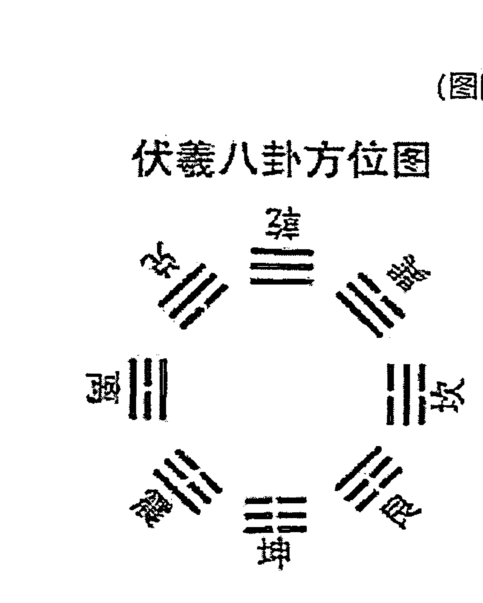

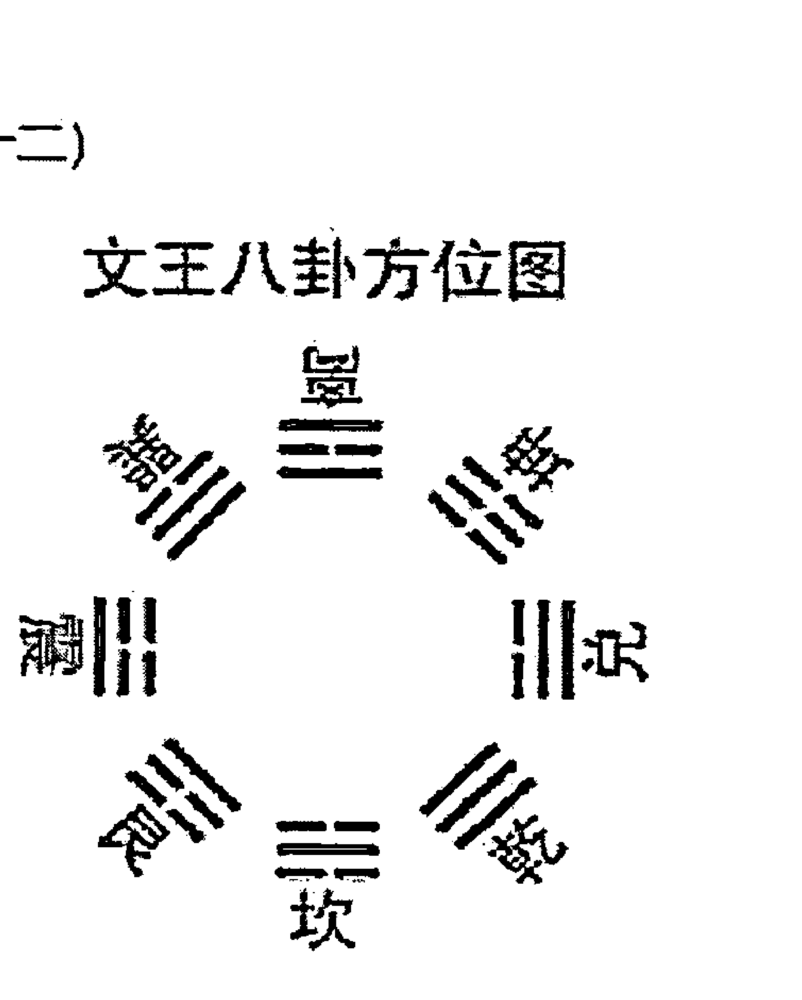

八卦在奇门遁甲预测分析过程中，占了非常重要的比重，许多学者在预测过程中，看到天盘的九星、八门、天干、八神，一般就忽略掉了地盘九宫。

先天八卦为体（10%），后天八卦为用（90%），对于初学者，主要参考后天八卦，地盘九宫是整个学术的载体，用神落在那里，都有一定的意义所在。

## 一、八卦图

分为先天八卦和后天八卦，先天八卦图称为伏羲八卦图，后天八卦图又被称为文王八卦。

先天八卦图是一个立体的空间模型，也是《易经》阴阳升降的表达形式，这个知识点一般用12地支循环来表达，这里不详细叙述。

后天八卦图是一个平行的如一张纸的平面，主要指以人为中心的前后左右。

(图四十三)

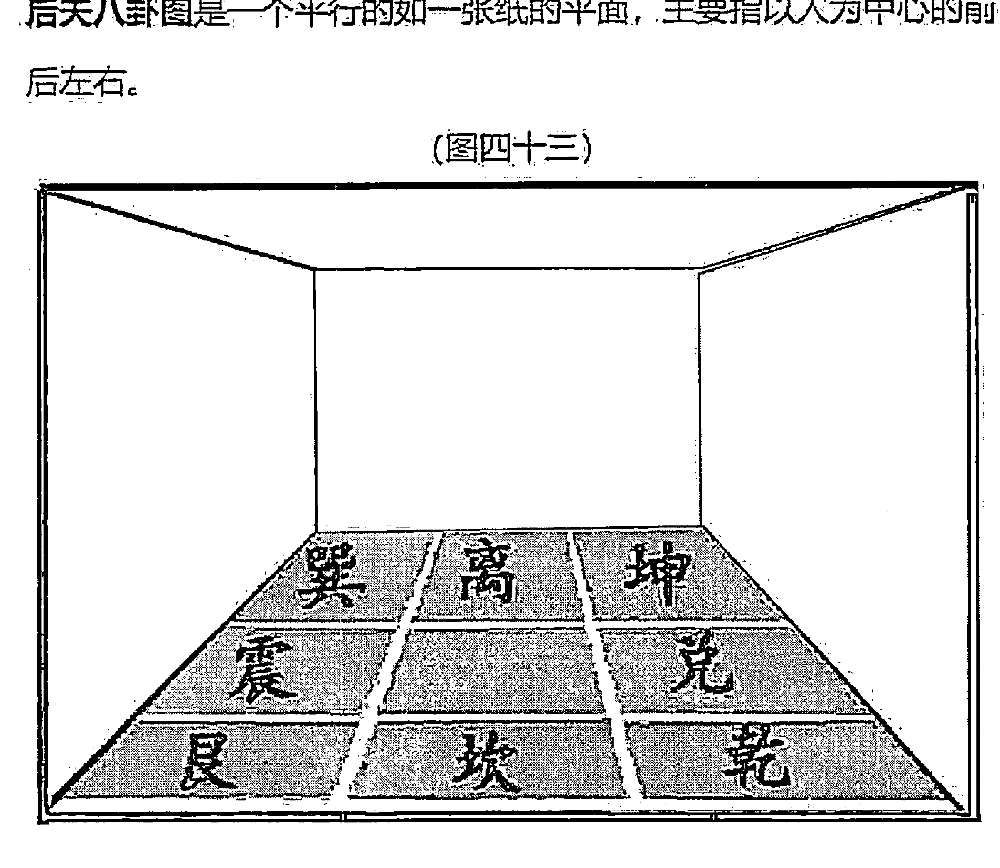

## 第六章 九宫八卦

九宫即为八卦：九宫在奇门遁甲中为载体，为奇门遁甲之基不动。他的顺序是按照《洛书》的规律来讲的。
（图四十四）

|   |   |   |
|---|---|---|
| **巽** 4 | **离** 9 | **坤** 2 |
| **震** 3 | **中** 5 | **兑** 7 |
| **艮** 8 | **坎** 1 | **乾** 6 |

（图四十五）

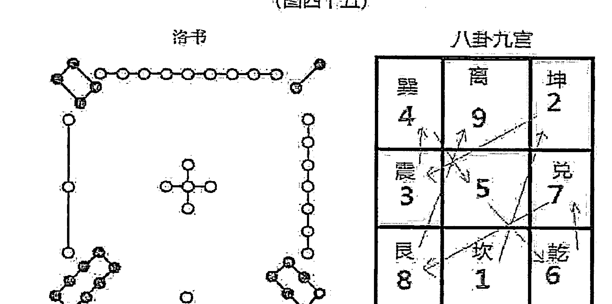

## 奇门九宫分布地支

(图四十六)

| 巳 辰 | 午 | 未 申 |
|-------|----|-------|
| 卯    |    | 酉    |
| 寅 丑 | 子 | 亥 戌 |

乾宫戌土亥水，坎宫子水，艮宫丑土寅木，震宫卯木，巽宫辰土巳火，离宫午火，坤宫未土申金，兑宫酉金。

(图四十七)

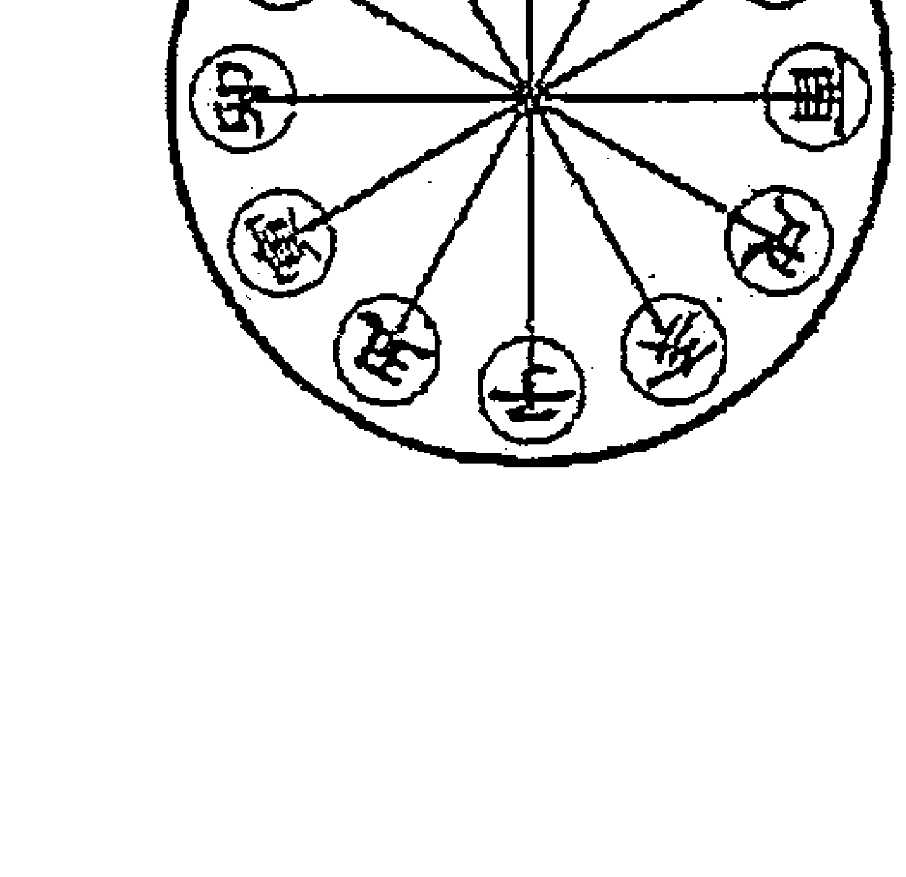

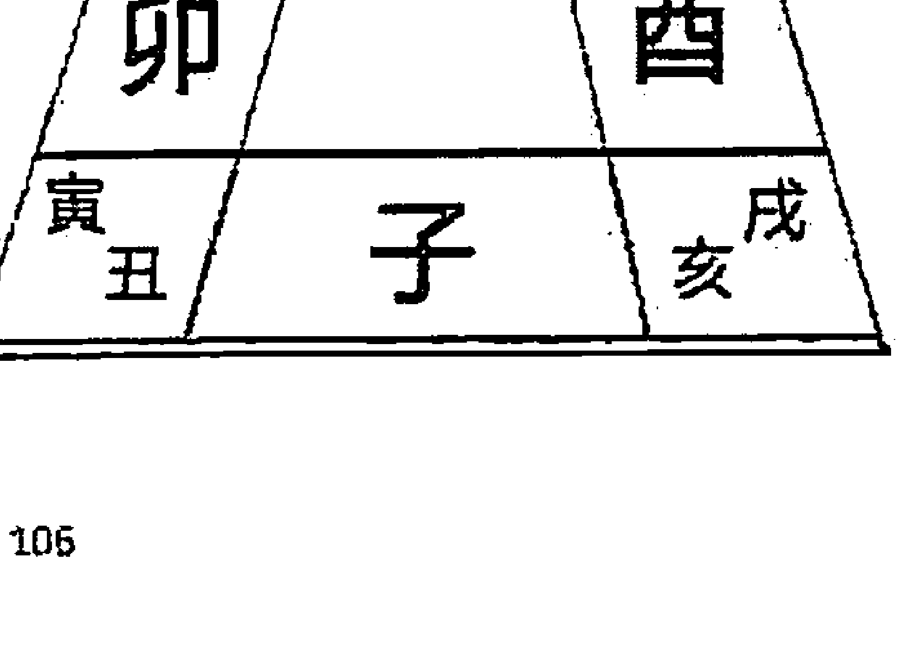

## 二、八卦的象数理含义

### 1、乾卦

乾为天，为太阳，表现天的功能、意识及刚健的性质，还代表冰、雹、霰。

国家为国君，为主席，为总统；在单位为一把手，主要领导人；在家庭为父亲，为大人，为老人，为长辈人；在社会为名人，公门人，宦官；在性别为男，在年龄为老头。

场所为京都，为大城市，形胜之地，高亢之所。

方位为西北方，为南方（先天八卦方位），为上方，为高处。

时间为秋季，农历九、十月，戌、亥年、月、日、时，立冬至大雪45天。

数字为一（先天八卦数）、六（后天八卦数）、四、九（五行金数）。

动物为马、象、天鹅、狮子。

静物为金玉、珠宝、圆物、木果、刚物、冠、镜。

人体为头、右腿（九宫位），肺、骨骼，男性生殖器。

颜色为白色、大赤色、玄色。

五味为辛、辣。

### 2、坤卦

坤为地，表现地的功能、潜意识及柔顺的性质。在天时又为阴云、雾气、冰霜。

国家主皇后、第一夫人；在单位为职工、群众；在家庭为母亲、为祖母，为老母、后母、老妇人；在社会为众人，为乡人、为小人、为大腹人、为懦弱之人、吝啬之人；在性别为女；在年龄为老妇，老年女人。

场所为田野，为大地、为乡村、为平地。

方位主西南方，北方（先天八卦方位），下方，底层。

时间为农历六月、七月，未、申年月日时，辰、戌、丑、未五行为土年、月、日、时，立秋至白露45天。

数字为二（后天八卦数）、八（先天八卦数）五、十（五行土数）。

动物为牛，为牝马、为猫、为百兽。

静物为水泥、砖瓦、五谷、布帛、丝绵、方物、柔物，土中之物，牛肉、食品、大车、锅。

人体为腹，右肩（九宫位），脾、胃、肌肉，女性生殖器。

颜色为黄色、黑色。

味中为甘味、甜味。

### 3、震卦

震为雷，表示震动、奋起的性质和状态。在天象为雷雨、雷鸣、地震、火山喷发。

家和单位为当权的二把手；在家庭为长男；在社会为驾驶员、运动员，警察、法官、军人、飞行员、列车员、社会活动家、舞蹈演员、足球爱好者、狂人、壮士。

场所为工厂、广播电台、乐器店、游乐场、机场、发射场、车站、舞厅、歌厅、闹市、战场、森林、草木茂盛之所。

方位为东方，东北方（先天八卦方位）。

时间为农历春二月，春分至谷雨45天，卯年、月、日、时。

数字为四（先天八卦数）、三（后天八卦数）三、八（五行木数）。

动物为龙、蛇、善鸣之马、善鸣之鸟，百虫、鲤鱼。

静物为木、竹、苇、乐器、蔬菜、鲜花、树木、电话、飞机、汽车、火箭、鞭炮、闹钟、花草繁鲜之物。蹄、肉、山林野味。

人体为足，为肝胆，为左肋。

颜色为青、绿、碧色。

味为酸。

### 4、巽卦

巽为风，表示自由活动和渗透性。天象代表刮风、台风、飓风、龙卷风等。

家庭为长女、大女儿；在社会为科技人员、教师、僧尼、仙道之人，气功师、练功者、商人、营业员、木材经营者、手艺人、能工巧匠、额头宽的人，头发细长而直的人，优柔寡断的人，自由职业者。

场所为邮局、管道、线路、隘路、过道、长廊、寺观、草原、竹芦苇荡、升降机、传送带。

方向为东南方、西南（先天八卦方位）。

时间为春夏之交，农历三、四月，辰、巳年、月、日、时，立夏芒种45天。

数字为五（先天八卦数）、四（九宫数）、三、八（五行木数）。

人体为股、肱、胆、气管、神经、左肩（九宫位）、练功之元气。

动物为鸡、鸭、鹅、蝶、蜻蜓、蛇、蚯蚓、带鱼、鳗鱼、鳝鱼、斑马等。

静物为树木、木材、木制品、纤维品、丝线、绳子、麻、风扇、干燥机、飞机、气球、气垫船、帆船、蚊香、木香、兰花、草药、羽毛、枝叶、腰带、海带、下面有口的器物。

颜色为绿色、蓝色。

五味为酸。

### 5、坎卦

坎为水，为月亮，表示艰难、险阻的状态。在天象为雨、雷、露、霜。

家庭为中男，中年男子；在社会为江湖之人、舟人、盗贼、匪徒，为数学家、医生、律师、逃亡者、黑社会之人、诈骗犯、劳务人员、酒鬼、娼妇、自来水公司人员。

场所为江河、湖、海、沟、渠、井、泉、下水道、洼地、酒店、冷饮店、浴室、澡堂、水族馆、地下室、暗室、自来水公司、鱼塘、饮食店、妓院。人体为肾脏、膀胱、泌尿系统、生殖系统、血液、内分泌系统、耳、肛门。

动物主猪、为鼠、为狐狸、水鸟、鱼类、水中动物、美脊之马、劳苦之马、脊椎动物。静物为油、酒、醋、酱油、饮料、石油、药品、水车、轮子、刑具、蒺藜、丛刺、带核的果品、冷藏设备、浮萍、潜水艇。方位为北方，西方（先天八卦方位）。时间为农历十一月，子年、月、日、时，冬至大寒45天。数字为一（九宫数）、六（五行水数，一、六水）。颜色为黑色，或白色（玄空飞星颜色一白、二黑、三碧、四绿、五黄、六白、七赤、八白、九紫）。五味为咸味。

### 6、离卦

离为火，为日，表示光明、美丽的性质和状态。天象为晴天、热天、酷暑、烈日、干旱、虹霓、霞光。家庭为中女、中年妇女；在单位为中层干部；在社会为中间层次人物，为美人、美容师、文人、作家、艺术家、演员、名星、革命家、军人、画家、编辑、侦察员、纪检人员。

场所为朝阳的场所、名胜古迹、圣地、教堂、华丽的街道、电影院、电视台、画院、美术馆、印刷厂、广告塔、电车站、冶炼厂、放射室。

方位为南方，东方（先天八卦方位）。

时间为夏天，为农历五月，为午年、月、日、时，夏至大暑45天。

数字为三（先天八卦数）、九（九宫数）、二、七（五行火数）。

人体为眼、头部、心脏、小肠。

动物为野鸡、孔雀、凤凰、仙鹤、为虾、蟹、螺、贝类，为龟、“变色龙”，萤火虫。

静物为字、画、美术品、报纸、刊物、图书、杂志、契约、文书、合同、书信、照相机、摄影机、录相机、电视机、复印机、照明用具、广告、奖状、电报、连环画、化妆品、火炉、打火机、火柴、烧烤物品、焊枪、霓虹灯。

颜色为红色、赤色、花色、紫色（九紫）。

五味为苦味。

### 7、艮卦

艮为山，为土，表示静止和安定的状态。天象为云，为雾，为岚。

家庭为少男，青少年；在社会为少年、儿童，为土建人员、宗教人员、官僚、贵族、继承人、警卫、守门人、矿工、狱吏、石匠、储蓄所人员。场所为山、山地、丘陵、高台、堤坝、休息室、坟场、阁寺、房屋、监狱、公安机关、派出所、大楼、城墙、仓库、宗庙、祠堂、矿山、采石场、银行、贮藏室。方位为东北方，西北（先天八卦方位）。时间为冬春之交，农历十二月和正月，丑、寅年、月、日、时，立春至惊蛰45天。数字为七（先天八卦数）、八（九宫数）、五、十（五行土数）。人体为鼻、背、手指、关节、左腿（九宫位）、脚趾、乳房、脾、胃、结肠。动物为狗、为虎、鼠、狼、熊、牛等有牙、有角的动物，还有昆虫、爬虫、家畜等有尾的动物。静物为岩石、山坡、土堆、坟墓、墙壁、门坎、阶梯、台阶、门板、石碑、土炕、柜台、桌子、床。颜色为黄色、棕黄、咖啡色、或白色（八白）。五味为甘，甜味。

### 8、兑卦

兑为泽，为雨，表示喜悦和言词。天象为潮湿天气，气压低、露水、阴雨连绵。

家庭为少女、小女孩；在社会为与嘴有关的职业，如讲师、教授、演说家、讲解员、翻译、巫师、占卜者、媒婆、传达室人员、歌唱家、音乐家、相声演员、娱乐场所人员、妓女、牙科医生、外科医生等。

场所为沼泽地、峡谷、洼地、湖泊、池塘、滑冰场、游乐园、会议室、音乐厅、茶座、饭店、废墟、旧屋、山口、洞穴、井。

方位为西方，东南（先天八卦方位）。

时间为农历八月，酉年、月、日、时，秋分到霜降45天。

数字为二（先天八卦数）、七（九宫数）、四、九（五行金数）。

人体为口、舌、牙齿、咽喉、肺、右胁（九宫位）、肛门等。

动物为羊、豹、豺、猿猴、水鸟、兔子、沼泽动物、鸡鸭。

静物为石榴、胡桃、饮食用具、带口的器物、刀剑、剪刀、玩具、破损物品、垃圾箱等。

颜色为白色，或赤色（七赤）。

五味为辛、辣。

## 总结八卦信息：

八卦在奇门遁甲学术中占了非常重要的比重，也是整个学术的载体。很多时候排好奇门遁甲开始分析容易忽略掉八卦的信息。

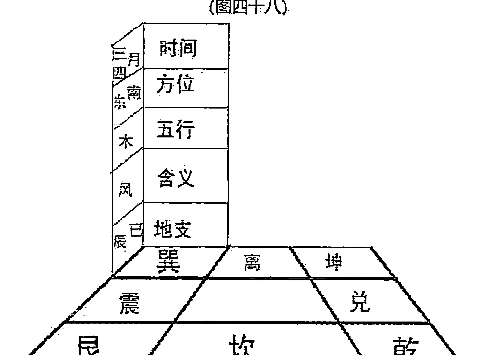

每次预测的时候，代表事情或者人的用神，落在任何一个宫位中，都有其它特别的意义。

八卦每个卦本身的含义、定义、五行、方位、时间（年月日时）、人物、场所、人体位置、颜色..........

最常用到的是：五行、时间、人体、方位对应的人（风水）

# 第七章：八门

（图五十）

| 休门 | 景门 | 死门 |
|:-----:|:-----:|:-----:|
| 杜门 | | 惊门 |
| 生门 | 伤门 | 开门 |

奇门遁甲的八门分别是：开、休、生、伤、杜、景、死、惊

八门在奇门遁甲预测分析过程中，占的比重较少，而且它本身重点就两个，一个是记住它们的原始地盘位置、五行、含义。

每个八门只需一次学习就可记住，所以学习重心不要放在八门上。

## 一、八门的具体含义

开、休、生为吉门；伤、惊、死三凶门；杜、景为平门。吉凶是相对的，预测的时候切莫要执着在“吉凶”这个概念上，一旦你执着于吉凶，就看不见真相，就可能预测不准确。

任何事情都有自身的发展方向，但是我们人类的心中总是执着在事情要成，要如意就是好的，不如意就是坏的。而预测本身是为了看清楚事情发展，执着吉凶就容易好错。

比如“生门”为吉门，如果预测疾病的时候，用神是“天芮星”带着生门，就是指疾病正在发展。比如“死门”是凶门，如果一个人预测工作事业，用神宫位还有三奇、吉星等，见死门就不能说是凶，可能这个人死心眼，认死理而已。

八门即为八种状态，在测任何事情，你直接解读含义，解读八门自身的信息即可，不带吉凶的解盘，就是最真实的。

## 八门含义：

开门，是一个吉门。开门四通八达，宜远行、见贵、求财等，百事吉利亨通。开门为金神，如临震、巽二宫，为金克木，古代哲学思想认为“金木相克”，则不吉利。门克宫为迫，吉门被迫(吉门临被克之宫)，则吉字不成。

休门，也是一个吉门，宜休息聚会、经商、嫁娶、参谒贵人，不可扬兵。休门为水神，临离九宫为水克火，古代哲学思想认为水火不相容，则不吉利

生门也是一个吉门，宜营造、嫁娶、谋事、见贵等。生门为土神，如临坎一宫为土克水，则不吉利。

伤门，是凶门，出入容易得病退灾受伤，招惹是非。但收款索债效果很好；又宜于打猎和捕捉盗贼。伤门为木神，临坤二宫、艮八宫为木克土，大凶。凶门被迫(凶门临被克之宫)，则凶事尤甚。

杜门，虽列入凶门，但偏于平门，也可出行、谒贵，宜于躲避藏身。杜门有闭塞阻滞之义。杜门为木神，临二、八宫则主凶。

景门，算作凶门而倾向于平。景门发扬振作而不久长。宜游戏竞赛、上书，渔猎无所得。景门临六、七宫主凶。

死门，是一个凶门，出入此门，百事为凶，忌出行、修造、谋害、否则伤人损财。宜渔猎、行刑、吊丧。死门为土神，临一宫则主大凶。

惊门，为凶门，不宜出行办事，否则必遇惊恐；但宜寻求走失，追捕逃亡。惊门为金神，临三、四宫主大凶。惊门惊惶忧惧，多生怪异。

## 二、八门含义汇总

（图五十一）

| 门 | 人物 | 物品 | 事情 |
| :--- | :--- | :--- | :--- |
| 开 | 开心开朗 | 敞开的 | 公开 |
| 休 | 气定神闲 | 休息 | 停止 |
| 生 | 进步向上 | 生活，进步的 | 前进 |
| 伤 | 受伤委屈 | 攻击损害的 | 损伤 |
| 杜 | 保守拒绝 | 包装封存的 | 瓶颈 |
| 景 | 兴奋火热 | 发热上火的 | 热火 |
| 死 | 消沉绝望 | 无气息的 | 结束 |
| 惊 | 担心惊恐 | 发出声音的 | 担心 |

## 注意：

八门在预测过程中，占的分析份量不是很重。但是运筹中却很重要，因为奇门遁甲中“门”是开休生三吉门为代表的。出门办事做生意宜行生门。

另外，八门的原始位置和五行也一定要记住，原始位置为了你识别奇门盘上有没有反吟和伏吟。八门五行是为了知道它们分别落在不同宫位中的生克制化。

# 第八章: 九星

(图五十二)

| 天辅 | 天英 | 天芮 |
| :---: | :---: | :---: |
| 天冲 |  | 天柱 |
| 天任 | 天蓬 | 天心 |

九星分别是: 天蓬、天芮 (天禽被天禽夹带)、天冲、天辅、天心、天柱、天任、天英。

天辅、天心、天任为吉星; 天蓬、天芮、天柱 为凶星; 天英、天冲为中平星。

九星在奇门遁甲学术中，占了非常重的比重，同时九星的变化最复杂，而且也是最难理解。学者要学会奇门遁甲一定要多在九星上下功夫。

## 一、摘录九星含义:

### 天蓬星:

原名贪狼星，与北方一宫坎卦相对应，阳星，五行属水。坎水正当隆冬季节，至寒至冷至暗，喜阴害阳，人们认为它和盗贼出没有关，所以把它称为凶星、盗星。

歌云“争讼庭竟遇天蓬，胜捷名威万里同。春夏用之皆为吉，秋冬用之半为凶。嫁娶远行皆不利，修造埋葬亦间空。须得生门同丙乙，用之万事皆昌隆。”天蓬为水贼，所入之宫不宜嫁娶，营造，搬迁等，但如遇生门并合丙奇，丁奇，则可用无妨。春夏可用，秋冬助水之势，不可用。

天蓬星临宫，宜安抚边境，修筑城池，兴作土木，培垫提防，屯兵固守；余事不利，特别是经商出行易遇盗贼或破财、生病。

在奇门测刑事案件中，以天蓬星作为凶犯的用神，这是其主要特征。但是吉凶是相对的，事物都有双重性。因而在一定条件下，天蓬星也可以作为吉的符号，比如镇守边关的大将，敢于投机倒把做大生意的巨商大贾，敢冒风险，具有大智慧的人等等，往往也临着天蓬星。因为天蓬星属水，水主智。总之，聪明、胆大、喜欢暗中行事，这是它的主要特点。

### 天芮星：

原名巨门星，与西南方二宫坤卦相对应，阴星，五行属土。因与八门中死门相对应，认为它的出没与疾病流行有关；所以把它称为病星、凶星。奇门预测疾病一般以它作为疾病的用神，看它落在何宫及其旺相休囚，来定病的部位、轻重及愈后状况。

歌云 “天芮授道结交宜，行方值之最不吉。出行用事皆宜退，修造安坟祸难测。贼盗惊惶忧小口，更有官事被官责。纵得奇门从此位，求其吉事皆虚为。” 天芮为学生、传道、朋友，故宜受道结交，不宜嫁娶，迁徙，诉讼，营造，即使得奇门，也难为吉。天芮为土星，秋冬用之吉，春夏用之凶。

天芮星临宫，适宜授业师长、交纳朋友、屯兵固守，不宜用兵、嫁娶、争讼、迁徙、修造等。

天芮授道结交宜，行方值之最不吉。出行用事皆宜退，修造安坟祸难测。贼盗惊惶忧小口，更有官事被官责。纵得奇门从此位，求其吉事皆虚为。

在奇门测病中，它是疾病的主要代表符号。但它也有吉的一面，比如在测妇女孕产中它代表孕妇，在测人职业方面它代表农民，在测拜师学艺方面它代表学员，等等。因为它是坤宫之星，也同时具有坤卦的性质，代表母亲、妇女、土地、大众、下层民众、学生等等。

### 天冲星:

原名禄存星，与东方三宫震卦相对应，阳星，五行属木。人们认为它有慈心造化，助人为乐之德，与农事活动有关，故把它称为吉星，但吉利程度不如天心、天任、天辅三星，所以有人叫它次吉之星。

歌云 “嫁娶安营产女惊，出行移徒有灾难。修造葬埋皆不利，万般作为且逡巡。”

天冲为雷祖、天帝、武士，宜出军报仇雪耻，不宜嫁娶、修造、迁徒、经商。

天冲星临宫，宜于选将出师，征代交战，鸣金击鼓，摇旗呐喊。其它一般或不利。

古人规定它为吉星，因为它在战场上敢打敢冲为武士。在工作中自然也具有雷厉风行、干事爽快利索的优点。但它也有冒失、粗鲁、不稳重的一面，故一般认为它是次吉之星。

### 天辅星:

原名文曲星，与东南四宫巽卦相对应，阳星，五行属木。人们认为它是天上的文曲星，与文化教育事业有关，故为大吉之星。

歌云 “天辅之星远行良，修造埋葬福绵长。上官移徒皆吉利，喜溢人财百事昌。”

天辅为草为民，宜远行，起造，移徒，婚娶，埋葬，请客。

## 8章：九星

天辅星临宫百事皆宜，出行、经商、婚娶、修造均吉，特别利于升学考官，发展文化教育事业。

在奇门应用中，它往往代表老师、代表班主任、代表考试院、代表文化程度等等。特别是在科教兴国，知识经济日益发展的今天，天辅星的作用更加重要。

### 天禽星（夹在天芮星）：

原名廉贞星，与中央五官相对应，阳星，五行属土。土生万物，中宫是遁甲元帅值符所在之地，故为大吉之星。歌云“天禽远行偏得利，坐贾行商皆称意。投谒贵人俱益怀，修造埋葬都丰裕。”天禽为巫为工，宜远行，做生意，埋葬，修造，见贵。天禽星临宫，百事皆宜，四时皆吉。

### 天心星：

原名武曲星，与四宫文曲星相对，处西北六宫乾位，阴星，五行属金。人们认为它能动能静，与乾卦为天为父为首长相应，长于心计，和领导才能、军事指挥、医疗治病有关，故为大吉之星。
歌云“求仙合药见天心，商途客旅财禄昌。主将迁葬皆吉利，万事欣逢尽高强。”天心为高道，为名医，宜治病服药，练气功，经商，迁徙，埋葬。秋冬吉，春夏凶。

它是天上的武曲星，既能惩恶助善，百事吉昌，又利求仙长寿，治病配药。

### 天柱星：

原名破军星，与西方七宫兑卦相对应，阴星，五行属金。人们认为它正当金秋肃杀之时，喜杀好战，与惊恐怪异、破坏毁折有关，故为凶星。

歌云 “天柱藏形谨守宜，不须商贾及谋为，娶嫁迁移皆不利，动作立刻见凶危。” 天柱为隐士，宜隐迹固守，不宜出行谋事，一切所为皆不吉。

天柱星临宫，宜于修筑营垒，训练士卒，屯兵固守，不宜出战交兵、经商远行，强行则车破马伤、士卒败亡、破财折本、意外伤灾。

古人认为它正当金秋肃杀之时，喜杀好战，与惊恐怪异、破坏毁折有关，一般作为凶星符号。但事物都有两重性，既然称之为天柱星，它又有顶天立地、力挽狂澜、砥柱中流的一面，所以还需结合格局、门、神、三奇六仪等符号综合判断，不可一概按凶断。它的特点是不仅好斗，具有破坏性，而且能言善辩。所以古人在人生经验预测中讲，天柱合式，直言谏议。七赤天柱位镇西垣，有气者，舌辩当世，被冲克，优伎乐工。判断职业上，如果用神临天柱星，往往职业与军警、教师、律师、演员、外交官等有关。

### 天任星：

原名左辅星，与东北八宫艮卦相对应，阳星，五行属土。人们认为土能生万物，又正当春季万物萌生之时，故称之为吉星。

歌云 “天任吉星事皆通，祭祀求官嫁娶同。斩绝妖蛇移徒事，商贾造葬喜重重。” 天任为富室，求官，嫁娶，迁徙，经商，诸事皆吉。

天任星临宫，宜立国邑、安人民、断决群凶、教化人民、入官见贵、商贾嫁娶、百事皆吉、四时皆宜。

### 天英星：

原名右弼星，与离方九宫离卦相对应，阴星，五行属火。人们认为天英星居离宫之位，烈火炎炎，性躁易暴，虽然如日升中天，在放光明，但又和血光之灾有关，故称为中平之星，或小凶之星。

歌云 “天英之星嫁娶凶，远行移徒不宜逢，上官商贾凶败死，造作求财一场空。” 天英为炉火为残患，百事不宜。

天英星临宫，宜于谋划献策，面君谒贵，不宜求财考官，嫁娶迁徙。

古人认为天英星属离宫之位；烈火炎炎，性躁易暴，也有光明、文明、好的一面。一旦过头，就与血光之灾有关，故称之为中平之星。

在职业上，如果天英星临用神，往往与火、与文明有关。

### (图五十三)

| 九星 | 宫 | 人物 | 物品 | 事情 |
|------|----|------|------|------|
| 天蓬 | 坎 | 胆大有谋 | 铺开伞状 | 大损失 |
| 天芮 | 坤 | 包容顺从 | 容器 | 包袱 |
| 天冲 | 震 | 积极冲动 | 放射发出 | 急、快 |
| 天辅 | 巽 | 帮助辅导 | 知识文化 | 不重要 |
| 天禽 | 中 | 大将军 | 中央中心 | 重要 |
| 天心 | 乾 | 控制主导 | 中心枢纽 | 中心 |
| 天柱 | 兑 | 能力强大 | 柱状 | 大破坏 |
| 天任 | 艮 | 忠诚老实 | 固定 | 肯定的 |
| 天英 | 离 | 热情阳光 | 漂亮光鲜 | 急躁 |

## 二、九星非常重要，两面含义！

九星的含义都是固定的，但是在预测的时候却是“多变”的，这个多变是指不能执着于它固定的含义。
比如“天任星”它的含义是固执、老实、憨厚、任劳伤怨这特点。
如果配合凶星凶格，就是固执；如果天任星废了就是愚蠢。
比如“天冲星”它的含义是办事快、冲来冲去、雷厉风行的特点，
如果配合凶格就是冲动、鲁莽，如果天冲星废了纯粹就是一莽夫没脑子。

## 三、九星旺相休囚

特殊之处在于，九星的旺相与否不同于五行生克，九星有自己的一套口诀来判断它的旺衰。

口诀如下：
与我同行即为相，我生之月诚为旺。
废于父母休于财，囚于鬼兮真不妄。

简化版：同五行为相，我生宫为旺，宫克我为囚，宫生我为废，我克宫为休。
其实也就三种状态，即旺和相相同、休和囚相似、废就是没有用处。

非常重要：九星旺相囚休还是判断人、事、物是否得天时地利的一个重要标准。

比如你预测个人工作、事业，如果你随带的九星状态为“废”说明你没有了“地利”你在公司已经没有价值。如果预测公司，开门带的九星废了，说明公司根本就没有前途。

### 判断九星旺衰首先要知它的五行

(图五十四)

| 天辅 | 天英 | 天芮 |
|------|------|------|
| 天冲 |      | 天禽 |
| 天任 | 天蓬 | 天心 |

九星原始位置上的五行，一定要牢记。而在预测时排出的奇门遁甲盘，九星飞到不同的宫位，这时候就要根据每个九星原始位置的五行，判断旺衰。

同时，九星不仅要与落宫五行论旺衰，还要与月令论旺衰。比如天任星落在乾宫为旺（得地利），月令是“午”月为废，失天时。特别是在预测公司、事业、财运，各方面研究都需要参考天时地利。

(图五十五)

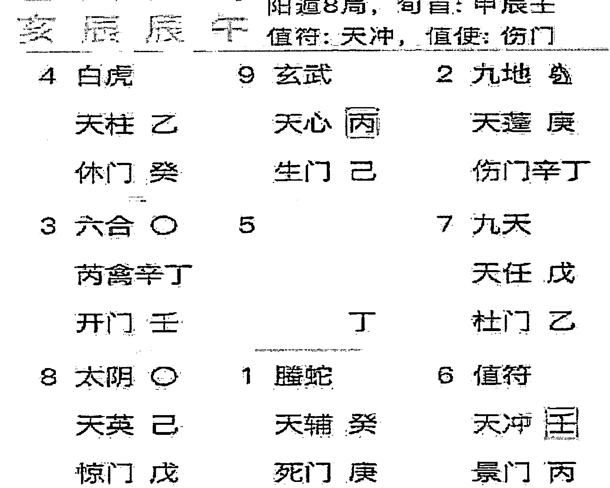

比如上图，坎宫属水，天辅星属木，查询九星口诀 “宫生我为废”即坎宫天辅星废了，废即失了地利，即没用。

兑宫属金，天任星属土，“我生宫为旺” 即兑宫天任星旺，即得地利，有用。

离宫属火，天心星属金，“宫克我为囚” 即离宫天心星被囚，失利。

（图五十六）

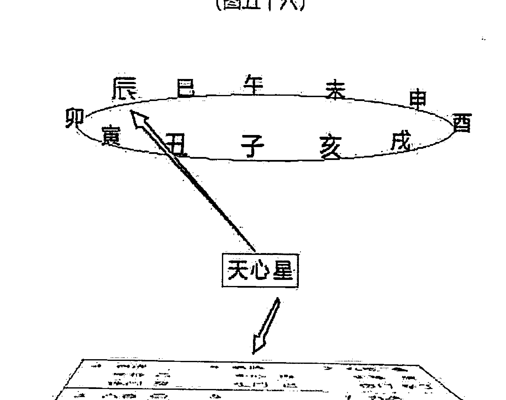

比如刚才案例“天心星”属金，就像是单独提出来，与离宫五行火做比对，看天心星与宫的五行口诀关系。离宫属火克天心星金，所以天心星为囚。

同时，还要把“天心星”与月支（即月令）做口诀比对。月令“辰”五行土，口诀是“宫生我为废”，于是天心在天时上废了。只要是用神带的九星，都需要与宫做比较，与月支做比较。与宫比较称为看地利，与月支比较称为看天时。
我们生活中俗语常说：要成功需要天时、地利、人和。
而奇门遁甲预测，看一个人、一个事情、一个公司得不得天时地利，
准确性基本是用精准来形容。

做一个比喻：

比如我叶鸿生，主要能力是易学易理、玄学、命理、风水这方面能力突出。但是我去一家纺织工厂做技术工人。这时候就等于我失了地利，失了我的本身，落宫就废了或者休囚了。但是当下最热门最有前途的行业就是纺织业，就等于得天时。
虽然我易学家搞纺织，但是现在行业热门，没这个能力，但是有这个趋势。失地利得天时。

比如我叶鸿生，主要能力是易学易理、玄学、命理、风水这方面能力突出，同时我也一直搞这个行业。但是玄学行业已经过时了，甚至已经没有人学了，没人预测了。这就属于我得了地利，但是没有天时。得地利无天时。

比如我叶鸿生主要能力是易学易理、玄学、命理、风水这方面能力突出，一直搞这个行业，而且行业正处于元运20年旺气行业，这就是得天时，得地利。

### 一个案例：问店铺能不能转让给那个人？

> (图五十七)

+   年 月 日 时 公历:2017年07月15日09:37
+   丁 丁 癸 丁 农历: 丁酉年六月廿二
+   酉 未 卯 巳 阴遁2局, 旬首: 甲寅癸
+   值符: 天心, 值使: 开门

| 4 太阴 | 9 螣蛇 | 2 值符 |
|--------|--------|--------|
| 芮禽戊丁 | 天柱 壬 | 天心 癸 |
| 休门 丙 | 生门 庚 | 伤门戊丁 |
| 3 六合 | 5 | 7 九天 |
| 天英 庚 |  | 天蓬 己 |
| 开门 乙 | 丁 | 杜门 壬 |
| 8 白虎 ○ | 1 玄武 ○ | 6 九地 △ |
| 天辅 丙 | 天冲 乙 | 天任 辛 |
| 惊门 辛 | 死门 己 | 景门 癸 |

用神值符、日干都在坤宫，虽然坤宫信息看起来不凶，但是我仅凭“天心星”落宫废了、月令也废（无天时无地利）就可以判定这个事情不成。同时“开门”为店铺在震宫，天英星在宫废了，在未月旺相，就可以确定这个店铺现在还有效益，过了这个月就没用了。

# 第九章：八神

(图五十八)

| 六合 | 白虎 | 玄武 |
|------|------|------|
| 太阴 |      | 九地 |
| 螣蛇 | 值符 | 九天 |

奇门遁甲的八神分别是：值符、腾蛇、太阴、六合、白虎、玄武、九地、九天。

八神在奇门遁甲预测分析过程中，占的比重较少，它们的重点只要自身的含义上。

比如九天，就只有高处、高瞻远瞩、动静大、朝上的意思，虽然九天属金，但是它不受宫位生克，只管含义，

## 一、摘录八神含义：

值符：是为八神的领袖，是为吉利之神，所到之处百恶消散（前面这句话纯属扯蛋）。值符是代表领导、名人或有当领导的能力或具有当领导潜质的人。测人测事一般代表举足轻重的人或事。测物品表示高档名贵的东西。

螣蛇：从字面来解读即蛇有缠绕之意，所以螣蛇有麻烦之意。一般测人临螣蛇则要注意，代表这人不诚实，表里不一。螣蛇代表虚假，变化的，同时螣蛇也与精怪仙家有关联。

太阴：顾名思意，就代表阴谋，阴暗，城府深的信息。测一个人临太阴，则这个人老奸巨滑，工于心计，喜欢暗中行事。实际上太阴在奇门中是个吉神，为荫护之神，代表贵人含义。只有临凶格时，为吉变凶，才代表负面的信息。太阴之人适合搞策划，顾问，出点子。

六合：从字面意义解读则有合作，多人合作的信息。凡合作皆可以六合为用神，婚姻即一男一女的合作，所以测婚姻以六合为用神。合为合和，喜庆，和善。六合代表小孩、男女合和后才有了小孩。测人临六合则代表这个人缘好，与谁都谈得来，对人都和和气气，代表媒人、中间人、婚介所。测物是组合物品，测病临六合代表不只是一个病，是多个病或综合症。

白虎：白虎是一个凶神，它的含义即是凶伤、孝服、损伤、血光、打斗、争执、代表脾气不好的人。临白虎也代表这个人有能力。白虎还代表道路，官灾。测运气时如遇白虎十死门则容易有孝服发生。

玄武：从字面理解来看有点玄乎怪怪的意思。它代表偷，偷偷摸摸的做事，男女的偷情，暗昧不明，阴暗的，见不得人的，事情不明确。玄武代表小人、玄学、犯迷糊的人等等。玄武在风水上代表暗煞。测一件事临玄武，表示这件事处于隐藏的状态。测病临玄武，表明病处于潜伏期。测物品临玄武，表示物品是假货，是次品。

九地：代表低、旧的、矮的、慢、陈年旧事、旧物，古董、地下之物、发展慢。测一个人临九地，则该人性格为沉稳。测公司临九地，公司则可以长久发展。

九天：代表高、快、刚发生的事，急事，目标远大、心高气傲，格调高，好高骛远、理想远大。远方，动态，测出行时，若坐飞机则九天为航线，开门为飞机。如九天十杜门，则有航线受管制限制之象。九天主志向远大，有时也有可能是好高骛远，眼高手低，预测时要灵活对待，不能拘泥。

## 二、八神信息汇总

(图五十九)

| 神 | 人物 | 物品 | 事情 |
|---|---|---|---|
| 值符 | 带头的 | 高档，明显 | 突出 |
| 螣蛇 | 情绪波动 | 条，花哨 | 反复 |
| 太阴 | 阴郁 | 暗处，看不到 | 私下 |
| 六合 | 人缘 | 粘连 | 合作 |
| 白虎 | 带威严肃 | 惧怕 | 棘手 |
| 玄武 | 看不透 | 看不清楚 | 欺骗 |
| 九地 | 低沉 | 隐藏很深 | 深入低调 |
| 九天 | 高亢 | 很高 | 高调 |

正常情况下八神是有吉凶的：

+   以值符、太阴、六合、九天为吉。
+   以白虎、九地、玄武、螣蛇为凶。

但是在预测的时候你绝对不能对任何一个八神符号在内心存在有“吉凶”这个概念，否则你就测不灵。比如见“白虎”有的人说代表凶丧车祸等都是扯蛋，白虎配合吉门吉星代表有威性、严肃。配合凶门凶格，痛苦、压抑、伤害。以此类推。

# 第十章：天干变化

(图六十)

| 甲、乙 | 丙、丁 | 戊、己 | 庚、辛 | 壬、癸 |
| :---: | :---: | :---: | :---: | :---: |
|  |  |  |  |  |
| 一条、一根 | 光、热、红 | 凸出、台阶 | 危险尖厉煞 | 透明、光滑、液体、黑 |

记住，奇门遁甲的任何一个宫位中的用神吉或凶，总参考就是两个两干，其次重要是九星。

每个天干都有自身的特点：甲乙条、丙丁热、戊己凸、庚辛硬、壬癸透明光滑。

最复杂变数较多的为“辛、癸”，辛代表错误、改变；同时辛代表金属、颗粒、同时也铁块煤炭器械都可以是辛。癸代表黑色、消极、暗昧，同时可以是污渍、毛巾、垃圾、一张纸、一个痣都可能癸代表。

## 特别提醒！

每个天干不仅有自己本身的含义，另外还包含了七种变化：

1.  天干遁甲
2.  天干相合、
3.  相刑、
4.  十千克应、
5.  天干能量、
6.  天干与地支（生旺死绝表）
7.  相冲（已经取缔）

天干在奇门遁甲学术中非常重要，很多细节都在天干上，比如乾宫“乙加庚”要读书乙加庚克应；同时乙与庚合；还有乙入墓等。

## 一、摘录天干万物类像：

信息量太多，建议阅读一遍，理解一遍即可丢，掌握变通之法，切不可死记硬背。死记即是执于固定，固定等于没用。

### 甲: 青龙 (奇门遁“甲”即直符、领头)

甲木在震位，属于阳木，属于雷木，喜欢生在春天，在天上是雷震龙舞，在地上是栋梁之才。不喜西方庚金克，有韧劲，为味道为酸，为声音为混浊，为体为方长，代表生长萌动，得时为栋梁，失令为废才，性格过于自负。大多对应为贵人，为高档次，为名贵，为首脑、头领、大人物。为大梁、大树，领导，为头部，为肝胆，性质为直，为硬。

+   天文: 火星, 雷旭日和风、新星、温暖
+   地理: 森林、大路、桥梁、风水的左（龙）砂。楼梯、闹市大厦楼梯、电线杆、烟囱、乔木、柱子、横梁、高大的家俱、粗壮直立之物等等 带甲的东西、马甲，为柱子、横梁，为乔木。
+   人物: 元首、领导、家长、主角、楷模、兄长、董事长、医生、法官、君子、劳工。
+   性情: 刚健、正直、积极、木讷、自负、不拘小节、好大喜工。
+   身体: 为头，肝胆，胆囊、头面、脚部、胡须、脑神经元、痉挛、抽搐、麻痹、呕吐、毛发、指甲
+   事物: 创始、政治、总务、农林、木材厂、建筑业、监督、启动、虚惊、鼓噪。
+   植物: 松树、柏树、槟榔、椰子、荔枝、山楂、竹子、牧草
+   动物: 布谷鸟、鹤、黄莺、云雀、金丝雀、画眉鸟、狮、虎、豹、鹿、蟒蛇、壁虎、蜥蜴。
+   器物：箫、鼓、笛、音乐器材、按摩棒、手杖、棍棒、农具、织机、交通工具、吉他、琵琶。

### 乙：天德（日奇、委婉、曲折）

乙木在巽位，属风，所以为风木，是有一种山林活木，在地上为树木。味道也为酸，为声音婉转，为体柔嫩，得时为繁华，失令为枯朽。性格矫揉造作，依附世情。对应人象是在爬，为妻，头发，眉毛，耳朵，舌头，大脑的神经，血管，肠子，肩膀，胳膊，肠子，腿，手，弯曲的东西、腰身。妻子。草地、绿地、花草。木制品。手绘。神经。蝴蝶。

+   天文：月的远地点、和风丽日、山岚、冥王星
+   地理：公园、草地、山谷、花店、观光果园、砂、门窗、出入口、山林、青木、引申为桃李园、果园、花园、公园、绿地、草坪、花店、门窗、出入口、栏杆、围栏、篱笆等。
+   人物：高士、贤士、文人、僧道九流、家母、姐妹、妻、媒妁、副将、乐师
+   性情：柔而韧、婉转、能伸能屈、矫揉造作、依附世情、平和。
+   身体：肝、泪腺、毛发、手指、股部、四肢、指甲、嗅觉、魂、颈部、神经系统、过敏、瘙痒、脑神经。
+   事物：园艺、手工业、中介业、婚姻、交易、感化教育、印刷出版物、和解、说和、旅游
+   植物：灵芝、茶、杨柳、蔓藤、白茆、蒲公英、浮萍、寄生植物、有香气的植物。
+   动物：鸳鸯、斑鸠、青鸡、鹊、蝴蝶、蜻蜓、飞蛾、毛毛虫、穿山甲、蛇、长颈鹿
+   器物：手工艺品、扇子、盒子、床席、假发、藤制品、香水、缎带、丝绸

### 丙：天威（月奇、热烈、激情）

丙代表火，天上的闪电、地上炉火（冶炼之火）、为阳火有文明之象。性多为烈，为味道苦辣。为声音苍雄。为体可为果腹，得时为辉煌，失令为灰稿，性格刚愎自用，惟好奉承。多代表太阳，饼，圆形的，红色的，悸，乱子，红色，血液，发烧，发炎，窗，高处，肿，流血，乱子，炮火，圆脸，炉火，烧烤，烧伤，强烈的希望，脾气大急躁。见光的地方，窗。发热的东西。太阳。红绿灯、信号灯、炎症。

+   天文：木星、阳光、电光、新月至满月、热、太阳
+   地理：城门、香火祠堂、宫室、风水的朝案、剧场、旱地、冶炼场所、引申为城门、宫室、窑灶、风景区、游乐场所、旱地、剧场等。
+   人物：诗人、黑客、传教士、先锋、检查官、原告、铁定师、化验师、骑马人、美容师、外甥、眼科医生
+   性情：外刚内柔、公正廉洁、猛烈、虚荣、喜怒无常、好奉承、刚愎自用、宽容
+   身体：小肠、眼睛、肩膀、斑点、血压、发炎、出血、烫烧伤、晒伤、不孕、流产
+   事物：文书考试、讯息、口舌是非、礼品业、娱乐业、航空业、服务业
+   植物: 当归、牡丹花、鸡冠花、辣椒、莲花、枫、雁来红
+   动物: 孔雀、喜鹊、麻雀、红鹦鹉、蟹、螺、蚌、龟、蜗牛、贝、蛤蜊、斑马
+   器物: 锦旗、礼服、灯烛、光学仪器、化妆品、传真机、影印机、电视、电脑、容器
+   其他: 红色、紫色、七数、为“朱雀”，太岁名“柔兆”，月名“修” 星座名“太微”

### 丁：玉女（星奇、希望信心美好）

丁，代表火，是万物的精气，文明的气象，天上是群星、地下是灯火，属于阴火。代表红色，花、耳丁、火、烟、灯光、三奇是乙丙丁，是希望，丁的希望最好，肉丁、牙医，针灸，火山喷发。血、针灸、扎针。

+   天文: 金星、老人星、祥云、月光、闷热、星光
+   地理: 厨灶、后门、小门、风水的朝案、边界、马房、灶
+   人物: 女性亲友、媒妁、画家、演艺人员、考生、成熟的妇人、寡妇、历史
+   性情: 忠心、柔顺、内热为冷、不服输、不易捉摸、叛逆、孤立、执拗
+   身体: 心脏、乳房、眼球、阑尾、血球、意识、脉搏、唇、疮
+   事物: 花道、烹饪、美容化妆、陶瓷业、火锅店、烧烤店、快餐、对立抗争、灯光、蜡烛
+   植物: 麻、芍药、玫瑰、蔷薇、肉桂、含羞草## 十章：天干变化

羞草、除虫菊、红豆、状元红
- 动物：萤火虫、蝉、蚯蚓、瓢虫、虎头蜂、蝎子、蚊子、跳蚤、蚂蚱、毒蛇、螳螂
- 器物：微波炉、电磁炉、烤箱、燃料、能源、灯饰、玩偶、盒子、打火机、钉子、炊具

### 戊：天武（满、突出）

戊土，在中央，在天上是雾，在地上山峦，因此称之为阳土，属于霞土，为味道甘辛，为声音也刚雄，为体为停止和深，代表粗鲁，得时为豪雄果敢，失令为柔儒疑愚，其性执拗，不可强制。对应人哪里肉多就是，脸，鼻子，胸，肠胃，脾，屁股，性格忠厚，笨，大地，雾，矿石，矿产，瓷器，横梁，屋梁，憨厚老实，会计，肌肤，肌肉，建筑工人，建筑商，金融，黄金，金融机构，农场，城墙，墙角叫庚，墙面，桥，肉，有财源，经济好，瓦罐，水泥，大石头，胃，高档玉器，云，钱，增生，资本。
- 天文：土星、霞、雾、霜、瘴气、季节与气候的转折点
- 地理：山岭、提防、风水的结穴、麦田、秋之田野、寺观、仓库、停车场
- 人物：长官、贵人、狱吏、买主、屠宰人、胖子、和事老、丑妇
- 性情：耿直、固执、坚定、保守、孤立
- 身体：胃、消化系统、眼下、鼻子、牙齿、背、关节、胆固醇、皮肤
- 事物：保险、信托、国防、营造、警卫、不动产买卖、
- 植物：南瓜、冬瓜、草果、无核的果子、生在地面的果子、黄瓜、芋头、玉米
- 动物：骆驼、狗、土狼、黄鼠狼、黄蚁、田鼠、鸟
- 器物：手饰物、包装物、雨具、零件、附件、陶器、皮衣、资本、毛衣、干粮

### 己：地户（台阶、怀疑、落差）

己也在中央，是天的元气，地上真土，清气上升，冲合天地之气，浊气下降，生育万物，所以为阴土。己土属于天上的云，己土为云。不。多为博厚，坦真，味道也为甘辛，为声音也婉切，为体沉而静，顺利且温柔，得时为陶熔品精，失令亦抱质坚贞，其性宽宏，不凝滞与物体。对应人小肉，有戊的性质，嘴，耳坠，脑子，忠厚老实，阳台，肚脐附近，地井下水道，小个子，大便，菜园，低洼，盆地。
- 天文：月、低气压、湿气
- 地理：田园、墓地、风水的结穴、平坡、卧室、产房、天井、平原
- 人物：主妇、妻、产妇、农人、土工、打字员、秘书、服务员
- 性情：宽宏、厚道、坦白、看得开、含蓄、柔顺、贪心、吝啬
- 身体：脾脏、胰脏、肌肉、食道、腹部、眼、结石、自闭、营养不良
- 事物：辎重、都市计划、地政、幼教、护理、妇产科、发酵工业
- 植物：棉花、芝麻、地黄、白术、黄精、龙眼、土豆、秋天的农作物
- 动物：牛、熊猫、树带熊、骡、蜜蜂、蜘蛛、母马、乌鸦、鸭子
- 器物：文房四宝、内衣裤、卫生棉、卫生纸、鞋子、带子、调味品

### 庚：白虎 (凶猛、极端)

庚金，是掌握天地间肃杀大权，主兵革战争。如天上冷酷冰霜，在地上是寒气逼人的金铁，因此为阳金。其也刚劲，为味道也辛辣，声音为雄尖，为体也硬直，多暴戾，得时逞其专制，失令失其雄威，可柔以化之，不可刚以制之，其性坚执，能屈人而不能屈于人。对应人皮毛，大肠，骨骼，肺，大腿骼，道路，阻隔，技术，虎，军人，背，阻挡，打斗，刀，武器钢键锐力，威严，盆腔，收费站，脊骨，关口，黑社会，车祸，警察，军队，大路，石块，技术过硬，漂亮，汽车，石制品，锁，凶猛，战机，肿块，阻碍。
- 天文：水星、月之引力、秋冬严霜、春夏暴雨、黄昏的金星、黎明时的水星
- 地理：潮汐、走廊、通道、高速铁路、风水的右（虎）砂。祠庙、湖池、城宇、神堂
- 人物：军人、祖父、劲敌、检查官、外科医生、雕刻家、导演、武术家、屠夫、被告
- 性情：刚强、勇敢好杀、能屈人而不能屈于别人、粗狂
- 身体：大肠、肚脐、骨骼、月经、甲状腺肿大、更年期、骨折、脱臼
- 事物：稽查、改变、疾病死伤、交通事故、军事、汽车业、矿业、伐木业、逃亡
- 植物：葱、蒜、韭菜、洋葱、木果、菊花、咖喱、萝卜、芹菜
- 动物：虎、豹、狮子、鲨鱼、白蚁、蚱蜢、甲虫、猿猴、猩猩、蟋蟀等、啄木鸟
- 器物：刀剑、钟、锣鼓、斧头、箭、锯子、羽毛制品、汽车、运动器材

### 辛：天狱（错误、改变、革命、创新）

辛金，五金之首，八石的第一位。因此称它为刚金，也称为柔金。属于秋天的霜。八月为酉月是辛金旺盛之地，这时白露为霜，天气清肃，草木枯黄，五行阴木到此败萎，所以辛金有肃杀之性。也是柔刚，为味道也是苦辣，为声音则铿锵，为物体时多沉静，得时则黄钟，失令时则瓦缶。代表为花蕊，粮食，颗粒状的东西，错误，革命，变革，铁匠，工匠，小石块，手表，斑点，刀具，电子产品，计算器，罪犯，肺，五金制品，首饰。
- 天文：紫炁、秋霜、冰雪
- 地理：银楼、锁店、神坛、风水的右（虎）砂，磨坊、妓院、半岛
- 人物：议员、法官、律师、女警、少女、灵媒、娼妓、变性人、丑角、外亲
- 性情：冷酷、决断、外柔内刚、温润而清
- 身体：肺脏、牙齿、咽喉、股骨、胸腔、新陈代谢系统、刀伤创痛、畸形
- 事物：革新、开发、命相业、中介业、女人之事、针灸、开刀手术。
- 植物：贝母、天麻、小麦、辛夷、葱、蒜、韭、银杏
- 动物：鹰、猎犬、蜈蚣、蛤蚧、羚羊、犀牛、白虎、杜鹃
- 器物：珠宝、环、铃铛、钥匙、五金器具、针、药杵、象牙商品、石膏、皮制品

### 壬：天牢（随波逐流、消极）

壬水，称为阳水，属于秋露，壬水长生与申，水本能生木，壬水为秋露。其多润，为性的话，多淫荡，为味道为咸，为声音也洪亮，为体多圆活，得时则济物利人，失令则妨贤病国。壬水代表流动的东西，装在什么里就是什么东西，什么事情往回一想就是好事，变，大水，糊涂，迷糊，智慧，柔性，血液，血管，流动的车，膀胱，风流，船，鞋子，动的含义，飘动，水管子，海边，运输行业，流动的云，热水器，瀑布，养殖业，海产品，水上运动，鱼类。
- 天文：计都（月之降交点）、月蚀、秋露、急风暴雨、天王星
- 地理：河川、湖泊、沟渠、风水的来龙（脉）、隧道、泉水、小路、地下铁、门扇、牢狱
- 人物：舟子、骑兵、三姑六婆、孕妇、奶妈、母、白衣人或黑衣人、盗贼
- 性情：现实、圆滑、聪明、爽快、浮泛、能容忍、为柔内刚
- 身体：膀胱、输卵管、输精管、输尿管、血管、淋巴系统、乳腺、胫、怀孕、胎动、腰痛
- 事物：交通运输、造船、水利工程、消防、渔捞、环保、冷冻、劳工、廉正、性行为
- 植物：大豆、黑豆、人参、橡胶树、带刺的植物
- 动物：燕子、蝙蝠、狐狸、老鼠、猫头鹰、海象、河马、海豚、海胆、刺猬
- 器物：冰箱、冷气机、舟船、饮水机、水管、吸管、面霜、发油、润滑油、石灰、乳品、饮料

## 十章：天干变化

### 癸：地网（消极、绝望、堕落）

癸水，在天上是雨露，在地上是泉水，为阴水，是活水，是柔水，喜阴金生。味道也浊，其声音也洪亮，得时则从龙变化，失令则摇尾乞怜，只知道排难解纷，不知道察奸烛弊。代表困难，足，静脉，血液。饮料，尿，私处，厕所，色情，肾，神经系统、癸加辛水珠，汤粥，污水，眼睛（水汪汪的大眼睛），湿度大的雾气，洗浴用品，鞋子，头发，女性用品，便池、鼻涕、蛋，黑色的发、黑色的眼睛，化妆品，淋浴，小孩子、静脉、酒、精液。
- 天文：罗喉（月之升交点）、黑洞、日蚀、春雨、春露、海王星
- 地理：海洋、海岛、风水的来龙（脉），聚水处、井、浴室、厕所、地下室、仓库、牢狱、后门、后路
- 人物：博士、隐士、心理学家、测量人员、潜水人员、侦探、间谍、醉人、小儿、乞丐
- 性情：憨直、多情、念旧、沉默、至弱、但潜力强
- 身体：肾脏、生殖系统、内分泌系统、耳朵、大脑、骨髓、足、平衡系统、记忆力、唾液
- 事物：参谋、调度、设计、策划、测量、阴谋、逃亡、婚期、遗失、收藏
- 植物：梅花、水仙、茶花、雪莲、玄参、天门冬、麦门冬、藻类
- 动物：企鹅、水獭、北极熊、貂、猪、牡蛎、鲍鱼、海鸥、蝌蚪
- 器物：水平仪、滤水机、斗笠、笔墨、冥纸、清洁剂

## 二、天干肚内有遁甲

奇门遁甲中的三奇六仪分别是“乙、丙、丁、戊、己、庚、辛、壬、癸”

特别注意：当六仪“戊、己、庚、辛、壬、癸”这六合天干中的任何一个，头上只要顶了“值符”二字的就是遁甲天干。

## 十章：天干变化

(图六十二)

| 4 白虎<br>天柱 乙<br>休门 癸 | 9 玄武<br>天心 丙<br>生门 己 | 2 九地<br>天蓬 庚<br>伤门 辛丁 |
| :--- | :--- | :--- |
| 3 六合<br>芮禽辛丁<br>开门 壬 | 5<br>丁 | 7 九天<br>天任 戊<br>杜门 乙 |
| 8 太阴<br>天英 己<br>惊门 戊 | 1 腾蛇<br>天辅 癸<br>死门 庚 | 6 值符<br>天冲 壬<br>景门 丙 |

如上图，乾宫壬下丙，这个“壬”头顶了“值符”即是“甲辰壬”，即壬的“肚子”里有“甲辰”。而兑宫“戊”仅仅是“戊”而已，它就不是“甲子戊”，坤宫庚仅仅是庚，艮宫“己”仅仅是己，坎宫“癸”仅仅是癸。这个要特别注意：因为只有你先知道了那些天干肚子里面有没有“遁甲”才能在后面的“击刑、十干克应”进行准确的分析信息。

## 三、天干相合

天干相合来自易学上专业的学术知识，由于奇门遁甲是天干学问，所以天干合也能体现一些细节（注意：它们不是重点，只是分析过程中的细节）
上一排“乙、丙、丁、戊”为主动，下一排为被动。
注意：奇门里面“甲=值符”所以没有甲己合，比如日干是“甲子”就遁“戊”所以日干就是“戊”这时候相合的天干就是“癸”

### (图六十四)

| 4 九地<br>天心 壬<br>开门 丁 | 9 玄武<br>天蓬 戊<br>休门 己 | 2 白虎<br>天任 庚<br>生门乙癸 |
| :--- | :--- | :--- |
| 3 九天<br>天柱 辛<br>惊门 丙 | 5<br><br>癸 | 7 六合<br>天冲 丙<br>伤门 辛 |
| 8 值符○<br>芮禽乙癸<br>死门 庚 | 1 螣蛇 ○<br>天英 己<br>景门 戊 | 6 太阴<br>天辅 丁<br>杜门 壬 |

如上图，如果日干为乾宫的“丁”，丁下有壬，即为上丁主动去合下壬，这种情况在预测时的判断就是内心有牵挂，有什么事放不下，或者主动去合（牵挂）别人。

如果日干为巽宫的“壬”壬下有壬，即下壬主动来合上丁，就像我想去办某事，会有谁来牵拌我。其它天干以此类推，天干相合仅仅是小细节，可做参考性学习。

## 四、天干相刑（因遁甲内部地支与宫地支相刑）

首先要知道什么是击刑，刑就像是刑罚，就像是打架，受伤。古人的易学专用名词，现代通俗的语言来说，有点像“挨整” 既然挨整了就受伤，就不舒服。

（图六十五）

| 名称 | 相刑 |  |  |  |  |
| --- | --- | --- | --- | --- | --- |
| 特点 | 无礼之刑 | 无恩之刑 | 恃势之刑 | 自刑 | 自刑 |
| 对手 | 子卯 | 寅申巳 | 丑未戌 | 午午 | 辰辰 |
| 遁甲 | 戊 | 癸 | 庚 | 己 | 辛 | 壬 |
| 落宫 | 震 | 坤乾 | 艮巽 | 艮坤 | 离 | 巽 |

| 名称 | 相冲 |  |  |  |  |  |
| --- | --- | --- | --- | --- | --- | --- |
| 对手 | 子 ↔ 午 | 寅 ↔ 申 | 辰 ↔ 戌 |  |  |  |
| 遁甲 | 戊 | 辛 | 癸 | 庚 | 壬 | 己 |
| 支 | 甲子 | 甲午 | 甲寅 | 甲申 | 甲辰 | 甲戌 |

（上图还有天干相冲，相冲的说法有两种，有“乙辛冲、丙壬冲、丁癸冲、庚甲冲”但是我在实践过程中，发现相冲信息时有时无，或者在奇门遁甲学术中根本没有用处，所以现在教学和预测就取消了这个内容。每个学术小点都重要，但是都建立在现代应用和实践之上，理论固然重要，但是实践更重要。学术中所有要点都是经过我叶海生的实践和论证的，有用的就保留，没用的去了）

前面已经讲了三奇六仪中的“六仪” **只要头顶值符的都是“肚子”里面有遁甲**。而天干相刑主要其实不是指天干有刑，而是指因为某个天干头顶值符，身体内里有一种物质（遁甲里的地支与宫的地支，发生冲突、或者互相不顺眼）与环境发生了冲突。

举例：曾经有个你的仇人，不仅抢了你的客户，背后还说你坏话（此事在你心中耿耿于怀，就装在心里了）。某一天你去朋友家里参加聚会，刚好碰到了这个人。仇人相见当然是互相落井下石，指桑骂槐结果就打起来了。如果两人从此不相见，就不会让你产生打起来，相见当然就有敌视。相刑，至于具体的是“无礼之刑、无恩之刑、自刑”你不用管它。只要你知道相刑就是受挨整、受伤、不爽，打击这类意思就可以了。

自刑，就是自己捏自己，摸自己、责备自己。自己刑也不能说凶，也不能说吉。知道责备自己就是自己感觉自己有问题，不舒服，认为自己需要学习，还有很多不足之处。

(图六十六)

| 已<br>壬 癸<br>辰 | 午<br>辛<br>甲午 | 未<br>午戌 |
| --- | --- | --- |
| 卯<br>甲子 | | 酉 |
| 寅 庚 丑 | 子 | 亥 戌 |

如上图，震宫和坤宫，戊（甲子）的肚子里的“子”和震宫“卯”两个仇人相见，所以都互相看不顺眼，开始整。坤宫己（甲戌）的肚子里的“戌”和坤宫的“未”两个不顺眼，所以也开打了。

壬（甲辰）在离宫、辛（甲午）在离宫，这两个是自刑。

“击刑”主要体现在“值符”这个宫位中，而值符又是事情主体，所以，见击刑皆主事发了不利，或者损失。而“自刑”多是对自己所以所做所以有所不满意，或者责备自己，最好分析过程中不要论吉凶，他只是一种负面状态，分析完成了根据九星八门的含义同时作出判断来才分吉凶。

## 五、天干与地支 (生旺死绝表)

(图六十七)

| 天干<br>状态 | 阳 |  |  |  |  | 阴 |  |  |  |  |
| --- | --- | --- | --- | --- | --- | --- | --- | --- | --- | --- |
|  | 甲木 | 丙火 | 戊土 | 庚金 | 壬水 | 乙木 | 丁火 | 己土 | 辛金 | 癸水 |
| 长生 | 亥 | 寅 | 寅 | 巳 | 申 | 午 | 酉 | 酉 | 子 | 卯 |
| 沐浴 | 子 | 卯 | 卯 | 午 | 酉 | 巳 | 申 | 申 | 亥 | 寅 |
| 冠带 | 丑 | 辰 | 辰 | 未 | 戌 | 辰 | 未 | 未 | 戌 | 丑 |
| 临官 | 寅 | 巳 | 巳 | 申 | 亥 | 卯 | 午 | 午 | 酉 | 子 |
| 帝旺 | 卯 | 午 | 午 | 酉 | 子 | 寅 | 巳 | 巳 | 申 | 亥 |
| 衰 | 辰 | 未 | 未 | 戌 | 丑 | 丑 | 辰 | 辰 | 未 | 戌 |
| 病 | 巳 | 申 | 申 | 亥 | 寅 | 子 | 卯 | 卯 | 午 | 酉 |
| 死 | 午 | 酉 | 酉 | 子 | 卯 | 亥 | 寅 | 寅 | 巳 | 申 |
| 墓 | 未 | 戌 | 戌 | 丑 | 辰 | 戌 | 丑 | 丑 | 辰 | 未 |
| 绝 | 申 | 亥 | 亥 | 寅 | 巳 | 酉 | 子 | 子 | 卯 | 午 |
| 胎 | 酉 | 子 | 子 | 卯 | 午 | 申 | 亥 | 亥 | 寅 | 巳 |
| 养 | 戌 | 丑 | 丑 | 辰 | 未 | 未 | 戌 | 戌 | 丑 | 辰 |

前面的章节已经讲过《生旺死绝表》，这里提出来主要是因为说明天干的状态，天干在宫。

着重强调的是“长生、入墓”这两个状态，由于奇门遁甲是天干学，所以主要表达信息是天干，但是天干的强弱却需要地支来表现。

每个天干都有12个状态，即“长生、沐浴、冠带、临官、帝旺、衰、病、死、墓、绝、胎、养”每种状态都有其自身的意义。我这人就喜欢抓重点（其实是偷懒），在预测过程中，一般只重两个状态，即“长生、入墓”其它状态我一概不关心。

由于每个宫位中除了天干之外，还有九星、八门、八神、十干克应等诸多信息来表达事情发展和吉凶。所以《生旺死绝表》只是其中的一个细节信息，我们取最突出的“长生、入墓”两种状态。

(图六十八)

| 4 太阴<br>芮禽戊丁<br>死门丙 | 9 螣蛇<br>天柱壬<br>惊门庚 | 2 值符<br>天心癸<br>开门戊丁 |
| :--- | :--- | :--- |
| 3 六合<br>天英庚<br>景门乙 | 5<br>丁 | 7 九天<br>天蓬己<br>休门壬 |
| 8 白虎○<br>天辅丙<br>杜门辛 | 1 玄武○<br>天冲乙<br>伤门己 | 6 九地<br>天任辛<br>生门癸 |

如上图，“丙”在艮宫即为“长生”状态，生长生发，开始之意，“癸”在坤宫“入墓”结束完蛋之意。

举例：如果预测工作或者事业，用神在“长生”之位，可能指开始。用神临“入墓”可能指结束。

但是要就事论事，比如“入墓”如果宫位信息多吉，多指收藏即“入库存”之意，如果宫位信息多凶，多指“完蛋、结束”。

## 六、十干克应

_特别提醒：十干克应是不能解释的！它们都是意会的含义，没有具体的含义！_

**只可意会，不可翻译！也不需要翻译！**

现在如果你要想网络上找一个原始版本的十干克应，很难找到。因为大部份被一些自以为是的自称砖家的家伙“修正、篡改”的面目全非。凡是你在网络上看到某人解释的十干克应，基本都是瞎说。

任何一个克应可以应对100件，1000件事，请问如何翻译？根本就不能翻译！而写出《十干克应》的古代圣人，那是实践和智慧的结晶。

凡是某人解释十干克应，要么他的学术思想达到了古代奇门圣人的境界，要么 TA 就是用蚯蚓的思想去揣摩龙的格局。纯属想像。

举例：乙加乙为“日奇伏吟”；不宜谒贵求名，只可安分守身。

如果预测感情、婚姻看乙为女方用神，则表示女的感觉和认为“认为自己还是不要主动，等待观望不表达意见为佳”

如果预测投资，乙为日干求测人，则表示当时人感觉和认为“认为自己还是不求这个利润了，在观望守住本金较好”

如果预测工作见领导，求测人则感觉和认为“还是老实工作吧，暂时似乎不能做什么，还是守本份吧”

举例：戊加己“贵人入狱”公私皆不利

如果预测工作，戊为求测人的话，则表示 TA 感觉“自己在这个公司陷的很被动，很不舒服，干什么都不舒服”

如果预测财运，戊为钱财的符号，则表示求测人的钱陷入了或者套在某个地方了。

如果预测婚姻，戊为日干为话，可能 TA 在家中“感觉就像困住自己不自在，不舒服”总之，一句话：十干克应里的任何一个克应解释，都是古人经验所作，可以应对任何你预测的事情，绝对不是用五行生克来论述，更不是六亲、阴阳来论述的。而是经验所作。

十干克应也称之为“格局”，初学时可以死记，然后变通为读含义，进阶就需要读出感觉，然后引伸到你预测的事情（现实事情）上去。

以下网络上摘录的十干克应算是比较原始的，古书留下的克应解读。

### 甲即值符同戊，凡见值符即为甲

注意：见“值符”如同见甲，所以值符宫中一般读两个克应。比如“癸加丁”只要头上顶值符，同时也有“甲加丁”

#### 1、甲
- 甲加乙为“青龙合灵”：门吉事吉，门凶事凶。
- 甲加丙为“青龙反首”：动作大吉，大吉大利。
- 甲加丁为“青龙耀明”：宏图大展，谒贵求名吉利（若值墓、迫，惹是招非）。
- 甲加戊为“伏吟相克”：凡事闭塞阻滞，静守为吉。
- 甲加己为“贵人入狱”：公私皆不利。
- 甲加庚为“值符飞宫”：吉事不吉，凶事更凶。
- 甲加辛为“青龙折足”：吉门生助，尚可谋为，若逢凶门，主招灾、失财、有足疾。
- 甲加壬为“青龙入天牢”：凡阴阳皆不吉利。
- 甲加癸为“青龙华盖”：吉门吉格招福；门凶多乖。

#### 2、乙
- 乙加乙为“日奇伏吟”：不宜谒贵求名，只可安分守身。
- 乙加丙为“奇仪顺遂”：吉事为迁官进职；凶事为夫妻离别。
- 乙加丁为“奇仪相佐”：文书事吉，百事皆可为。
- 乙加戊为“利阴害阳”：门逢凶迫，财破人伤。
- 乙加己为“日奇入墓”：戊土暗昧，门凶必凶；得开门为地遁。
- 乙加庚为“日奇被刑”：争讼败产，夫妻怀私。
- 乙加辛为“青龙逃走”：奴仆拐带，六畜皆伤。
- 乙加壬为“日奇入地”：尊卑悖乱，官讼是非。
- 乙加癸为“华盖逢星官”：遁迹修道，隐匿藏形，避灾避难为吉。

#### 3、丙
- 丙加乙为“日月并行”：公谋私为皆吉。
- 丙加丙为“月奇悖师”：文书逼迫，破耗遗失。
- 丙加丁为“月奇朱雀”：贵人文书吉利，常人平静。得生门为天遁。
- 丙加戊为“飞鸟跌穴”：谋为百事吉顺洞彻。
- 丙加己为“大悖入刑”：囚人刑杖文书不行。吉门得吉，凶门转凶。
- 丙加庚为“火入金乡”：门户破败，盗贼耗失。
- 丙加辛为“谋事成就”：病人不凶。
- 丙加壬为“火入天罗”：为客不利，是非颇多。
- 丙加癸为“华盖悖师”：阴人害事，灾祸频生。

#### 4、丁
- 丁加乙为“人遁吉格”：贵人加官进爵，常人婚姻财喜。
- 丁加丙为“星随月转”：贵人越级高升；常人乐中生悲。
- 丁加丁为“奇入太阴”：文书即至，喜事遂心。
- 丁加戊为“青龙转光”：贵人升迁，常人威昌。
- 丁加己为“火入勾陈”：奸私仇冤，事因女人。
- 丁加庚为“文书阻隔”：行人必归。
- 丁加辛为“朱雀入狱”：罪人释囚，官人失位。
- 丁加壬为“五神互合”：贵人思诏，讼狱公平。
- 丁加癸为“朱雀投江”：文书口舌俱消，音信沉溺。

# 第十章：天干变化

#### 5、戊
- 戊加乙为“青龙合灵”：门吉事吉，门凶事凶。
- 戊加丙为“青龙反首”：动作大吉，大吉大利。
- 戊加丁为“青龙耀明”：谒贵求名吉利；若值墓、迫，惹是招非。
- 戊加戊为“伏吟”：凡事闭塞阻滞，静守为吉。
- 戊加己为“贵人入狱”：公私皆不利。
- 戊加庚为“值符飞宫”：吉事不吉，凶事更凶。
- 戊加辛为“青龙折足”：吉门生助，尚可谋为，若逢凶门，主招灾、失财、有足疾。
- 戊加壬为“青龙入天牢”：凡阴阳皆不吉利。
- 戊加癸为“青龙华盖”：吉格多招福；门凶多凶事。

#### 6、己
- 己加乙为“墓神不明”：地户逢星宜遁迹隐形为利逸。
- 己加丙为“火悖地户”：阳人冤冤相害，阴人必致淫污。
- 己加丁为“朱雀入墓”：文状词讼，先曲后直。
- 己加戊为“犬遇青龙”：门吉谋望遂意，上人见喜；门凶枉劳心机。
- 己加己为“地户逢鬼”：病者必死，百事不遂。
- 己加庚为“刑格反名”：词讼先动者不利，阴星有谋害之情。
- 己加辛为“游魂入墓”：大人鬼魂，小人家先为祟。
- 己加壬为“地网高张”：狡童佚女，奸情伤杀。
- 己加癸为“地刑玄武”：男女病病垂危，词讼有囚狱之灾。

#### 7、庚
- 庚加乙为“太白蓬星”：退吉进凶。
- 庚加丙为“太白入荧”：占贼必为，为客进利，为主破财。
- 庚加丁为“亭亭之格”：因私嘱起官司，门吉有救。
- 庚加戊为“太白天乙伏宫”：百事不可谋为，凶。
- 庚加己为“刑格”：官司被重刑。
- 庚加庚为“太白同宫”：又名“战格”：官灾横祸，兄弟雷攻。
- 庚加辛为“白虎干格”：远得必凶，车折马死。
- 庚加壬为“上格”：远得失迷道路，男女音信难通。
- 庚加癸为“大格”：行人至，官司止。生产母子俱伤，大凶。

#### 8、辛
- 辛加乙为“白虎猖狂”：人亡家败，远得多殃，尊长不喜，车船俱伤。
- 辛加丙为“干合悖师”：荧惑出现，占雨无，占晴旱，占事必因财致讼。
- 辛加丁为“狱神得奇”：经商获倍利，囚人逢赦宥。
- 辛加戊为“困龙被伤”：官司破败屈抑。守分吉，妄动祸殃。
- 辛加己为“入狱自刑”：奴仆背主，讼诉难伸。
- 辛加庚为“白虎出力”：刀刃相接，主客相残。逊让退步稍可，强攻血溅衣衫。
- 辛加辛为“伏吟天庭”：公废私就，讼狱自罹罪名。
- 辛加壬为“凶蛇入狱”：两男争女，讼狱不息，先动失理。
- 辛加癸为“天牢华盖”：日月失明，误入天网，动止乖张。

#### 9、壬
- 壬加乙为“小蛇日奇”：女子柔顺男人嗟叹。占孕生子，禄马光华。
- 壬加丙为“水蛇入火”：官灾刑禁，络绎不绝。
- 壬加丁为“干合蛇刑”：文书牵连，贵人匆匆，男吉女凶。
- 壬加戊为“小蛇化龙”：男人发达，女产婴童。
- 壬加己为“干合蛇刑”：大祸将至，顺守斯吉，词讼理屈。
- 壬加庚为“太白擒蛇”：刑狱公平，立剖邪正。
- 壬加辛为“腾蛇相缠”：纵得奇门变不能安。若有谋望，被人欺瞒。
- 壬加壬为“蛇入地罗”：外人缠绕内事索索，吉门吉星，庶免磋砣。
- 壬加癸为“幼女奸淫”：家有丑声，门吉星凶，反祸福隆。

#### 10、癸
- 癸加乙为“华盖蓬星”：贵人禄位，常人平安。
- 癸加丙为“华盖悖师”：贵贱逢之，上人见喜。
- 癸加丁为“腾蛇天矫”：文书官司，火焚莫逃。
- 癸加戊为“天乙会合”：吉格，财喜婚姻，吉人赞助成合。若门凶迫制，反祸官非。
- 癸加己为“华盖地户”：男女占之，音信皆阻，躲灾避难为吉。
- 癸加庚为“太白入网”：以暴争讼力平。
- 癸加辛为“网盖天牢”：占病占讼，死罪莫逃。
- 癸加壬为“复见腾蛇”：嫁娶重婚，后嫁无子，不保年华。
- 癸加癸为“天网四张”：行人失伴，病讼皆伤。

# 第十一章：常用知识点

在学习研究奇门遁甲的过程中，有必须认知的奇门遁甲构成知识点，比如九宫八卦、五行、天干地支、九星、八门、八神，同时还有各种符号的变化天干相合、相刑，九星旺衰、五行生克、八门吉凶，除了变化以外，还有各种另外的小知识点。

> “五不遇时、反吟伏吟、定应期、一物一太极、九宫对人体、九宫八卦风水对家庭成员”

就像建设一栋大楼，必备的钢筋、水泥、河沙、木料等材料，同时每种材料还有不同的产地、属性，在特定的温度、湿润，另外还有一些特殊情况，排水、水电、保温隔热等情况。

## 一、五不遇时

所谓五不遇时，就是当下这个时间预测某个事情的，可能这件事情本身就不恰当，或者就是不对的，对你不利的。
就像伤心生气的时候还去炒菜做饭，孩子吃了容易生病，拉肚子。
或者你在拉屎的时候吃饭，似乎不太恰当；或者别人结婚的时候你送花圈；或者就像夫妻爱爱的时候讨论股市涨跌。

五不遇时有两种：
一种是时干克日干，代表你预测的这个事情本身对你就不利！天干阳克阳，或者阴克阴。
甲日庚时、乙日辛时、丙日壬时、丁日癸时、戊日甲时、己日乙时、庚日丙时、辛日丁时、壬日戊时、癸日己时。

一种是时干入墓于时支，代表你问的事情，很可能还没开始干就已经结束了。
时辰：丙戌、丁丑、戊戌、己丑、壬辰、癸未、

### （图六十九）

公历：2019年01月23日20:56
农历：戊戌年腊月十八
年月日时：戊 乙 庚 丙 / 戌 丑 申 戌
阳遁6局，旬首：甲申庚
值符：天任，值使：生门
局式：转盘-拆补-寄坤宫
年:辰巳空 月:戌亥空 日:子丑空 时:午未空

| 宫位 | 神 | 星 | 门 | 干 |
| :--- | :--- | :--- | :--- | :--- |
| **4 巽** | 值符 | 天任 | 景门 | 丙 |
| **9 离** | 螣蛇 ○ | 天冲 | 死门 | 辛 |
| **2 坤** | 太阴 ○ | 天辅 | 惊门 | 癸乙 |
| **3 震** | 九天 | 天蓬 | 杜门 | 丁 |
| **5 中** |  |  | 乙 |  |
| **7 兑** | 六合 | 天英 | 开门 | 己 |
| **8 艮** | 九地 | 天心 | 伤门 | 庚 |
| **1 坎** | 玄武 | 天柱 | 生门 | 壬 |
| **6 乾** | 白虎 | 丙禽癸乙 | 休门 | 戊 |

公历：2019年05月15日16:35
农历：己亥年四月十一
年月日时：己 己 壬 戊 / 亥 巳 子 申
阳遁1局，旬首：甲辰壬
值符：天芮，值使：死门
局式：转盘-茅山-寄坤宫
年:辰巳空 月:戌亥空 日:寅卯空 时:寅卯空

| 宫位 | 神 | 星 | 门 | 干 |
| :--- | :--- | :--- | :--- | :--- |
| **4 巽** | 六合 | 天蓬 | 景门 | 辛 |
| **9 离** | 白虎 | 天任 | 死门 | 乙 |
| **2 坤** | 玄武 | 天冲 | 惊门 | 己壬 |
| **3 震** | 太阴 ○ | 天心 | 杜门 | 庚 |
| **5 中** |  |  | 壬 |  |
| **7 兑** | 九地 | 天辅 | 开门 | 丁 |
| **8 艮** | 螣蛇 ○ | 天柱 | 伤门 | 丙 |
| **1 坎** | 值符 | 丙禽己壬 | 生门 | 戊 |
| **6 乾** | 九天 | 天英 | 休门 | 癸 |

### （图七十）

公历：2019年05月08日19:35
农历：己亥年四月初四
年月日时：己 己 乙 丙 / 亥 巳 巳 戌
阳遁1局，旬首：甲申庚
值符：天冲，值使：伤门
局式：转盘-活时-寄坤宫
年:辰巳空 月:戌亥空 日:酉卯空 时:午未空

| 宫位 | 神 | 星 | 门 | 干 |
| :--- | :--- | :--- | :--- | :--- |
| **4 巽** | 太阴 | 天英 | 休门 | 辛 |
| **9 离** | 六合 ○ | 丙禽己壬 | 生门 | 乙 |
| **2 坤** | 白虎 ○ | 天柱 | 伤门 | 己壬 |
| **3 震** | 螣蛇 | 天辅 | 开门 | 庚 |
| **5 中** |  |  | 壬 |  |
| **7 兑** | 玄武 | 天心 | 杜门 | 丁 |
| **8 艮** | 值符 | 天冲 | 惊门 | 丙 |
| **1 坎** | 九天 | 天任 | 死门 | 戊 |
| **6 乾** | 九地 | 天蓬 | 景门 | 癸 |

公历：2019年05月13日01:35
农历：己亥年四月初九
年月日时：己 己 庚 丁 / 亥 巳 戌 丑
阳遁1局，旬首：甲戌己
值符：天芮，值使：死门
局式：转盘-活时-寄坤宫
年:辰巳空 月:戌亥空 日:寅卯空 时:申酉空

| 宫位 | 神 | 星 | 门 | 干 |
| :--- | :--- | :--- | :--- | :--- |
| **4 巽** | 玄武 | 天冲 | 杜门 | 辛 |
| **9 离** | 九地 | 天辅 | 景门 | 乙 |
| **2 坤** | 九天 ○ | 天英 | 死门 | 己壬 |
| **3 震** | 白虎 | 天任 | 伤门 | 庚 |
| **5 中** |  |  | 壬 |  |
| **7 兑** | 值符 ○ | 丙禽己壬 | 惊门 | 丁 |
| **8 艮** | 六合 | 天蓬 | 生门 | 丙 |
| **1 坎** | 太阴 | 天心 | 休门 | 戊 |
| **6 乾** | 螣蛇 | 天柱 | 开门 | 癸 |

如图六十九左，日干是庚，时干是丙，这就是时干丙硬克日干庚。
图右，时干戊硬克日干壬。

如图七十左，时辰是“丙戌”丙入墓于戌；图右，“丁丑”丁入墓于丑。

这个是小知识点，有一定的参考价值，预测时候如果你忽略了没看到也没关系。它主要指的是运筹使用大不利，预测的时候做为外像参考。

## 二、反吟伏吟

“反吟”就像是有一件事情让你跑了四五趟，搞的你心烦却还没有搞好。反来复去的搞，弄的你唉声叹气的呻吟。

“伏吟”就像是你痔疮犯了，趴着床上不动，唉声叹气。
预测的时候，最好不要对“反吟、伏吟”有任何吉与凶的概念和定论。反吟就是指反复，倒腾，伏吟就是原地不动，可能不舒服。

### (图七十一)

#### 门伏吟

| 杜门 | 景门 | 死门 |
| :--- | :--- | :--- |
| 伤门 |  | 惊门 |
| 生门 | 休门 | 开门 |

#### 门反吟

| 开门 |   | 生门 |
| :--- | :--- | :--- |
|   |   |   |
| 死门 |   | 杜门 |

#### 星伏吟

| 天辅 | 天英 | 天芮 |
| :--- | :--- | :--- |
| 天冲 |  | 天柱 |
| 天任 | 天蓬 | 天心 |

#### 星反吟

|   | 天蓬 |   |
| :--- | :--- | :--- |
|   |   |   |
|   | 天英 |   |

伏吟，是指九星或者八门，在原来的位置没有动（首先必须知道每个九星、八门的原始位置）；反吟是指九星或者八门，跑到了对面的宫位中去（首先必须知道每个九星、八门的原始位置）

伏吟都是大像停止，很多信息都没有变化，所以展示的信息也不明确，难以分析。反吟则九星动了，可以深入分析。

## 三、九宫对人体

奇门遁甲对应身体的位置有句口诀 “戴九履一、左三右七、二四为肩、六八为足” 这是理论知识。理论终归是理论，实践才是硬道理！

(图七十二)

| 肩 四 | 头 九 | 肩 二 |
| :--- | :--- | :--- |
| 腰 三 | 五 | 腰 七 |
| 足 八 | 私处 一 | 足 六 |

在验证过程中以 “天芮星” 落宫为身体疾病位置和症状。离宫一般代表头；巽为风，代表呼吸、气管筋络；震代表外是腰，内是肝胆；艮代表足，脾胃；坎代表私处、肛门；乾代表头、骨头、思想；兑代表口、肺。坤代表胸腹部。同时兼看 “值符” 判断疾病大小。

## 四、九宫对家庭成员风水

房子是没有生命的，当人住进去以后，一家人就是房子的心，这个房子就活了。房子受到外环境（公路、建筑、外事物）的影响，房子内的人就相应受到影响。

### (图七十三)

这个九宫是指你们的平面图，整个房子的每个方位，每个方位都对应家中一个成员。

比如：正常情况下一个中年或者大年龄男性离婚了，或者未娶老婆，你想都不用想，可以猜测他房子西南位置一定是缺角，或者西南风水位置出了问题。

正常情况下一个中年或者大年龄女性离婚，或者未嫁，可以猜测她房子西北缺角，或者西北风水有问题，这个是很灵验的。

在为自己为他人预测人生、事业、财运、婚姻，只要是人生相关的，不要仅要取主用神（求测人日干）同时还要看九宫风水位置。

比如：某男性预测工作事业，你分析他的主用神“日干、开门、戊”这些用神的同时，还需要看“乾宫”，乾宫是说明风水位置的影响他的因素。

比如：某女性预测工作事业，分析了主用神后，还要兼看“坤宫”。如果TA还未成家与父母住，那影响TA的就是震、巽宫。大女儿看“巽宫”，大儿子看“震宫”。

宫位中见“死门、太阴、天芮、壬癸、庚辛、腾蛇”都不利。有什么卦像，这个人事业生活就有什么现象，如同亲眼所眼般的准确。

## 五、定应期

定应期的方法和十多种，“旬空应期、庚格应期、九星旺衰应期、入墓应期、冲填实应期、刑冲应期、马星应期”。每种应期都是预测10次也难遇见一次，记也记不住，所以我都丢了。

不是预测每个事情都需要看发生时间的应期，而且有的调整、化解后，结果发生改变了，也不讲求应期，所以我只留下一种最实用的“旬空填实”应期。

(图七十四)

| 年 | 月 | 日 | 时 | 信息 |
| :--- | :--- | :--- | :--- | :--- |
| 己 | 己 | 庚 | 庚 | 公历: 2019年05月11日16:30 |
| 亥 | 巳 | 辰 | 申 | 阳遁7局，旬首：甲寅癸 |
| | | | | 值符：天冲，值使：伤门 |
| **4 九天**<br>天任 己<br>生门 丁 | **9 值符**<br>天冲 癸<br>伤门 庚 | **2 螣蛇**<br>天辅 丁<br>杜门 壬丙 | |
| **3 九地**<br>天蓬 辛<br>休门 奇 | **5**<br><br>丙 | **7 太阴**<br>天英 庚<br>景门 戊 | |
| **8 玄武 ○**<br>天心 乙<br>开门 己 | **1 白虎 ○**<br>天柱 戊<br>惊门 辛 | **6 六合**<br>丙禽壬丙<br>死门 乙 | |
| 寅 | 丑 | 子 | |

如图七十四，起局的时间是：2019年5月11日16：30分。
上面的坎宫有“O”这个标志就代表旬空。日干“戊”落在了坎宫。
既然坎宫旬空了，要等坎宫的地支来填实，坎宫的地支是“子”

> (图七十五)

查询《万年历》发现，要等到5月15日才是“壬子”日，也是说到了这个时间，这个宫位就填实了，坎宫的信息就体现出来应期。
应期也要结合实际：出差大概几天，就是“子日”，出去打牌未归就是“子时”，如果出国的话可能就要到“子月”。

## 六、断卦系统

或许，你在网络上，或者听说过论证一卦多断，有多么厉害。如果你没有亲眼所见，很可能就是杜撰的案例，吹牛的案例。

因为任何一个装逼的人都想要向菜鸟宣布他很厉害，他会怎么做呢？就会告诉别人他算的很准，然后把“掐两端”的截图宣布出来。然后任意找一张奇门遁甲图，由于没有见证人，完全可以凭空杜撰。

**一个案例，可以写一本书！可以说的天花乱坠！**

但是你如果细细斟酌，如果有太多的地方不符合易理，或者根本就讲不通（但是他说的很准），这些案例一般都是马后炮杜撰的。

另外别人的案例可以学习、借鉴，但是不要太执着别人表述的含义。因为能够称为经典案例的仅限他本人的分析思路。

就以我叶鸿生奇门遁甲理论来讲，我看的非常准确的案例，学过我这套体系的人，分析的方向和内容和我就类似相同。没学过我的理论，或者其它方法分析就可能看不懂这个案例。

另外，别的大师看的很准的奇门遁甲盘，发给我看，我同样也没办法分析的，也是看不明白的。因为当时的奇门遁甲盘就是给那个人看的，就是给他内心的框架和系统看的。

他看的准的盘，给你看，你没学过他的系统（或者他根本就没有系统体系）就不可能读明白。

就像你看中的投资项目，你问另外一个人，他评断的标准不一样，就可能否定，只有和你一样标准的人才能肯定。

### 对一卦多断理解

或许你在那里听说过，某人一卦分析了很多事情，一卦多断。但是如果分析的事情风马牛不及的事情，也说准了，要么就是瞎碰上的，要么就是吹牛。

### 一个奇门盘，只能看一件事情

为什么我肯定的说一个盘只能分析一件事情呢？

因为我少讲理论，全部是实践得出的经验结果。简单举个例子你就明白了。

**你预测的是喜庆的事情：** 比如你过几天要结婚了，你想预测一下什么时间举办婚姻有利，或者预测未来发展怎么样?

奇门遁甲就会用热闹（天英星）表示，或者吉利的符号（天心星、天任星、休门、开门）来表示。

当你问的这个事情解说完成之后，你还想问问某长辈重病住院的事情。结果这个奇门遁甲盘上的信息都是吉利的，喜庆的，美好的。盘上的信息怎么转的过来呢？

**你预测的是郁闷伤心的事情的事情：** 比如股票亏钱了、汽车追尾了、事业失败了？

奇门遁甲就会用凶的符号（天柱、天芮、天蓬、伤门、惊门）来表示。当你问完这个事情，还想问结婚的事情，升职的事情，奇门遁甲盘的信息仍然在显示你的损失和伤心，那它怎么表达喜欢、吉利呢？

奇门遁甲同于易经，你的心是什么样子，盘就是什么样子。你开始问的事情烦恼、郁闷，盘上信息就是烦恼、郁闷的。再问快乐的事情它还显示开始你的状态，你的心关注。

就像是测血压，你运动过后去测，血压偏高；你伤心欲绝时去测，血压偏低。机器能及时的反馈数据。但是奇门遁甲盘是显示你问的那个事情，然后你就截图了，然后分析这个盘。这个截图就保留问事的数据，再问别的事情，你就需要另起一个盘，或者报数起局、或者报个字，报个姓另起一局。

### 能不能一卦多断呢？

回答：能！但是分析结果就很系统，比如我还未起局之前，我就想预测三个事情：结婚的事情、病情、投资。

这时候起局，盘就能反馈三个事情，但是由于你一个盘问三个事情，仍然是九宫，所以盘上的信息就是笼统的，没那么细节。

如果同时预测现场20个人（前提是同时问）照样可以预测，但是结果就更加的笼统了。第一个问婚姻，就取这个人的特点（胖取戊、或者年命、再看六合、现场坐落方位）；第二个问投资，也取这个人的特点（猥琐取腾蛇、年命、戊、现场坐落方位）；第三个问房屋风水，也取这个人特点（像领导取值符、年命、风水宫位、现场坐落方位）以此类推……

注意：是在未起局之前，就知道要预测20个人，这时候盘就是全面的，同样是笼统的。如果单独为某人预测后，再用这个盘来分析就不行了。

举例：就像是主席大大关注某个重点城市的发展，他就会细节的想要过问这个城市的经济、交通、房子、文化、行业、工厂、科技园……等等。再谈到其它城市，由于每个地区的特点、经济、发展不同，他关注的点位也不同。如果他不是重点关注某个城市，而是放眼全国，那他就会笼统的来说，上海经济怎么样、海南发展怎么样、一带一路怎么样。

问局部也是一个盘、放眼全国也是一个盘！就不能用局部的盘去放眼全国。用全国盘可以看局部，但分析结果是笼统的。

# 一卦多断

比如你问财运，可能会涉及你的工作、事业、风水、婚姻，这个可以一卦多断，因为你的婚姻、风水、朋友都影响你的财运。但是这个一卦多断绝对不会牵扯到你父母的职业，你老婆的爱好，你儿子的包皮过长，你同学出轨搞小三，信息扯不到那么远。

如果你在某个地方见过案例，说出人家某个柜子放了一瓶红酒，还是82年的，产地法国，是女同事送的。然后又扯到这个女同事属相，年龄、身高、体重，又扯到……总之是神乎其神。这种解读结果具体到年份，具体到就像亲眼所见，可以大概肯定这个案例是杜撰的、瞎编的。

当然我们不能否定有高手的存在，因为确实有这种“通灵、下阴、某种神术”这种非常规、非人类的高手，如同亲眼所见。但是搞这种职业的人一般都偏阴，同时一定不是张扬和吹嘘的。

## 七、一物一太极

一个人的身体，一个房子，一个村子，一个国家，一个池塘，一只蚊子都是一个大小太极。那么我们在预测任何事情，都必须围绕住太极，你才不会因为以往的学习经验而张口乱说，或者没有信心和义气的解说盘。

如上图“乙” 如果是预测人体，乙在离宫，就是指面部、头部或者有一条发卡、发带； 如果乙带九天、天芮，可能是脸上、头有一条很显的某东西。

如果乙、太阴、死门，可能头里面有一条‘管子’血管或者神经管堵死了。

如果是房屋风水，可能是头部高处（离宫多指高）就是指天花板上，或者床头上，有一条，又根据九星八门的组合确定具体属性。

如果是室外、户外，可能是南方有一条，这一条可能就很大，比如一条公路、一条河，都可能是‘乙’来表示。

同样一个‘乙’你的思想关注有多大，它的事物就随境而放大。然后配合其它符号（九星、八门、八神）一起来说明这个乙。

# 第十一章：常用知识点

## 八：固定用神和临时找用神

奇门遁甲盘排好以后，以“月支”为整个奇门盘的参考核心。以“值符”宫为预测事项的整个大纲。

- A. 长辈取“年干”、领导看“值符”
- B. 平辈取“月干”、同学同事表哥姐妹
- C. 求测人为“日干”、大事取“出生年干”
- D. 下属、孩子、我的东西都是“时干”
- E. 合作、恋爱、相会看“六合”
- F. 恋爱看乙、庚；已婚看日干和相合之干
- G. 公司工厂、店铺开门做生意的都取“开门”
- H. 钱财相关都看“戊”利润看“生门”
- I. 怀孕不孕看求测人日干、配偶干、坤为风水宫、坎为子宫、震为长子风水位、巽为长女风水位兼看
- J. 疾病看天芮宫、日干宫、风水位宫、九宫对人体
- K. 预测风水，值符、乾、坤位为重
- L. 用神无定法，九星八门神宫都是用神：小偷看玄武、大盗看天蓬、杀人看天柱、知识看天辅、病人看天芮、高处看九天、低处看九地、危险看白虎、胖子看戊、动看马星、长条看乙、圆形看乾宫，有口看兑，不知就取一个你感觉上用神。

### 找最符合现实的用神：

比如你公司来了 10 个新同事，你想叫其中某个人帮助，你怎么叫某个人呢？

你见他长得胖，于是你张口就喊：“那个胖子过来帮助一下！”

奇门遁甲中胖就是大块头，取“戊”

你见他穿大红衣服，于是就喊：“那个穿红衣服的过来一下！”

奇门遁甲中大红色取“丙”

长的猥琐取“腾蛇”，看起来像个犯罪份子取“天蓬”，个子非常高取“九天”，病央央的取“天芮”，长得黑取“癸”。总之取用神取最符合的，不要取你不知道的。

# 第十二章：预测步骤和思路、用神

奇门遁甲所展示的是空间（九宫）、时间（地支）、方位（九宫八卦）、定位（八卦含义）能量（九星）、状态（八门）、发展（天干）、阶段（地支）、强弱（五行）、天时地利（九星）。

## 第十二章：分析思路步骤

奇门遁甲是高级、尖端的“仪器”，它只适合复杂、庞大、多元素的事项预测，如果你用它预测具体、个小、单一元素的东西，奇门遁甲就可能办不到，或者没办法预测，比如你兜里几块钱，吃几碗饭、感冒、袜子丢失……太小的事情它办不到。

就像我们国家的“天眼”这种高科技的技术，用来找你的戒指丢失、你家狗狗跑那里去了，用这个就可能不适合。你要让大功率、高精度的仪器去干无聊的事情，它不愿意！

奇门遁甲主要功能是体现天、地相互之间运行变化过程的神妙，而人同于天地，所以奇门遁甲在预测人事方面，能够体现人的定位、观念、思想、状态、天时地利………………

## 分析步骤：

### 第一步：首先你必须有一件事情预测

心之所动，奇门盘上就显像，心不动盘上是什么信息的。如果你心中无事，没事找事预测，基本就是无聊的人看无聊的盘，闲扯蛋。

比如你最近担心投资项目；你想孩子的学习；你想父母的健康；你想最近事情的疑难；你想风水的好坏；你想追求某女生；只要你想了，你欲知，你想对未来发展的预知和洞悉，这时候排盘，奇门遁甲盘上就显像。准确的像。

即心之所动，心中有事，卦就显像！

心中无事，卦中无像！

### 第二步：奇门遁甲排盘

排盘有手工起局和软件起局两种，我建议用软件。因为无论你想预测什么事，只要心之动，在当下“灵机一动”的时机，排出的盘就能准确反馈你要预测的事情信息。那怕你后来发现盘排错了，但是照样可以准确分析出你想预测的信息。

因为研发软件的人对奇门遁甲认知不同，所以软件也是各有不同，有的人学的杂，同时他心里对奇门遁甲的认知也复杂，所以开发的软件就密密麻麻的许多信息。

另外，排盘软件还有多种方法“拆补起局、置润起局、转宫法、飞宫法、报数起局”这么多方法，你只需要记住一点：找一种你喜欢，你认为好使的方法起局，形成习惯它就准确。

千万不要心不定的起局，比如你总是考虑用那种起局更准确，你怀疑盘，盘也就不确定（就像你带两个手表，到底那个更准确，让你纠结）

#### 一个真相：市面上所有起局方法、软件起局都是错的！

因为同一时间，你可以用不同的方法，或者不同的软件起局，同一时间可能五六种奇门局。如果你纠结在用那一种更准确，那你就还没开始预测就开始怀疑，那预测分析准确率就打折扣了，所以认准一种起局方法，无论对错，你信它，它就对了！

哪怕所有起局方法都不是真正、正宗的原始奇门遁甲起局方法。只要你想预测，只要点开你常用的排盘软件，那盘上的信息就能准确的反映信息！

能否准确的分析出奇门遁甲盘上的真实信息，主因还是你的技术和分析能力了！

如下图，这个复杂的奇门遁甲盘，还没开始分析我头已经晕了。盘上加入了暗干、暗支、建除、八字六亲、天干旺衰、九星休囚状态...复杂至极，对于新手用于看基础知识方面的还是有用，但熟悉了九宫八卦、地支的人，最好不要用这种，太复杂了。

> （图七十八）

| 宫位信息 |
| --- |
| **公历** | 2015年02月26日08时57分 周四 |
| **四柱** | 乙未 戊寅 壬戌 甲辰 |
| **节气** | 雨水后第4天 |
| **遁局** | 阳遁3局 |
| **值符** | 天芮落坎1宫 |
| **值使** | 死门落巽4宫 |
| **空亡** | 子丑 |
| **马星** | 巳 |
| **宫位排列** | |
| **4 玄武**<br>天英 乙<br>惊门 辛 | **9 九地**<br>芮禽己壬<br>开门 乙 | **2 九天**<br>天柱 丁<br>休门己壬 |
| **3 白虎**<br>天辅 辛<br>死门 庚 | **5 (中宫)**<br>壬 | **7 值符**<br>天心 癸<br>生门 丁 |
| **8 六合 ○**<br>天冲 庚<br>景门 丙 | **1 太阴 ○**<br>天任 丙<br>杜门 戊 | **6 螣蛇 ◇**<br>天蓬 戊<br>伤门 癸 |

- 设置盘面设置
- 宫内设定
- 更多功能
- 综合分析

如下图，奇门遁甲排盘软件，排出的信息就比较简单，每个宫位中天盘仅有 5 个信息“八神、九星、八门、两个天干”，地盘九宫八卦、地支隐藏。

(图七十九)

对于新手，可能看这种盘就最容易忽略隐藏的九宫八卦、地支状态、九星休囚等信息。最之尽量挑选简单干练的，宜于分析。

### 第三步：看宫位衰旺

用令即月支，或者说是季节，月令是整个五行旺衰的总纲，所以第一步是看宫位旺衰，用神落在旺宫还是衰宫，然后再分析用神宫位的信息。

如上图，月令（月支）是午，是夏天的月份，“午”在离宫，离宫算最旺，当令为王。然后“午”火辐射每个宫位，依照五行克来查看每个宫位的强弱。

离宫“午”为火，生艮、坤，所以两宫旺；克乾、兑，所以这两宫位受制；泄震、巽，所以这两个宫泄气；被坎所克，所以坎休无力。

### 第四步：看盘上大像

还没有正式开始分析我们要预测的事情，盘面上其实已经在体现信息了，笼统的大像，养成一种看盘习惯，以后不用刻意去看也明白。

1.  一看全盘面信息、复杂、简单同时也体现求测人的心复杂简单
2.  二看有无反吟、伏吟，是指事情在反复还是保持在一个状态
3.  三看年、月、日、时，看月令，看日干时干有没有五不遇时

## 第十二章：分析思路步骤

### 第五步：提出用神

如下图案例：某男士预测今年事业财运

(图八十一)

| 项目 | 内容 |
| --- | --- |
| **公历** | 2019年06月15日10:33 |
| **农历** | 己亥年五月十三 |
| **四柱** | 己亥 庚午 癸未 丁巳 |
| **遁局** | 阳遁1局 |
| **旬首** | 甲寅癸 |
| **值符** | 天心星 |
| **值使** | 开门 |
| **局式** | 转盘-活时-寄坤宫 |
| **空亡** | 年：辰巳 月：戌亥 日：申酉 时：子丑 |
| **九宫排布** | |
| **4 玄武**<br>天英 乙<br>惊门 辛 | **9 九地**<br>芮禽己壬<br>开门 乙 | **2 九天**<br>天柱 丁<br>休门己壬 |
| **3 白虎**<br>天辅 辛<br>死门 庚 | **5 (中宫)**<br>壬 | **7 值符**<br>天心 癸<br>生门 丁 |
| **8 六合 ○**<br>天冲 庚<br>景门 丙 | **1 太阴 ○**<br>天任 丙<br>杜门 戊 | **6 螣蛇 ◇**<br>天蓬 戊<br>伤门 癸 |

思考一下预测这个事情，所涉及可参考的代表符号（用神）有那些事，促一的圈定起来。

初学新手，或者不娴熟的学者，每次一定要先圈用神在开始分析。

(图八十二)

第一用神 “值符” 为全局在兑宫； (圈起来)

第二用神日干 “癸” 为求测人在兑宫，用神重叠； (圈起来)

第三用神 “戊” 代表财运在乾宫； (圈起来)

第四用神 “开门” 为工作事业在离宫; 第五用神时干 “丁” 在坤宫。

同时看用神宫有无马星、旬空、击刑、长生、入墓等情况。

### 第六步：按照分析模型开始分析每个用神

这里需要提出的注意点，很多人基础知识很充足，导致分析不准确的原因有多种：

- 自己脑海中没有建立一套的分析系统的框架
- 基础知识不扎实
- “多心”总是喜欢将自认为的结果强加上去。
- 把以往固执、固定的经验和知识强加上去
- 把太注重吉凶而忽略真相，见生门就说吉，见死门就言凶。

(图八十三)

| 项目 | 内容 |
| --- | --- |
| **公历** | 2019年06月15日10:33 |
| **农历** | 己亥年五月十三 |
| **四柱** | 己亥 庚午 癸未 丁巳 |
| **遁局** | 阳遁1局 |
| **旬首** | 甲寅癸 |
| **值符** | 天心星 |
| **值使** | 开门 |
| **局式** | 转盘-活时-寄坤宫 |
| **空亡** | 年：辰巳 月：戌亥 日：申酉 时：子丑 |
| **九宫排布** | |
| **4 玄武**<br>天英 乙<br>惊门 辛 | **9 九地**<br>芮禽己壬<br>开门 乙 | **2 九天**<br>天柱 丁<br>休门己壬 |
| **3 白虎**<br>天辅 辛<br>死门 庚 | **5 (中宫)**<br>壬 | **7 值符**<br>天心 癸<br>生门 丁 |
| **8 六合 ○**<br>天冲 庚<br>景门 丙 | **1 太阴 ○**<br>天任 丙<br>杜门 戊 | **6 螣蛇 ◇**<br>天蓬 戊<br>伤门 癸 |

- 主要、带头←值符
- 中心、想法、谋划→天心
- 好处、收获、利润→生门
- 信心、憧憬、希望→生门

克应：
癸加丁，螣蛇妖矫，难逃火焚
甲加丁，青龙耀光，宏图大展

(图八十四)

如图八十三日干落在兑宫，天盘信息是明摆着的“值符、天心、生门、且加丁”而地盘信息仅“兑卦、地支酉”但是它们俩信息很多，看人看事可能涉及看重点不同。

#### 分析思路：

分析过程中最好逐一拆分用神宫位信息，客观的同时不附加任何自己主观意见，解读出来的信息就能准确，甚至每次95%以上准确。

#### 用神一：值符

由于值符是总用神，所以它的表达的信息都比较笼统。“值符”用神在兑宫，现在午月火克兑宫休囚无气，兑宫主缺，不足。

“天心星”旺，的含义是计划、想法、思虑、掌握。

“生门”的含义是生长、发展、好处、利润、利益等。

“癸加丁”腾蛇天矫：文书官司，火焚难逃。

“癸加丁”上有值符，即“甲加丁”青龙耀明宏图大展

总结：大像是今年计划想法（天心星）能够收获多少利润或者收入（生门），能够大赚（甲加丁），如果搞不成可能就难以维继了（癸加丁）

#### 用神二：日干癸

日干和值符都在一起了，同时日干头顶值符，这种情况一般说明求测有能力，同时自己能够决定掌握主导自己的事情。

九星、八门、八神、天干同容同上！

总结：求测人还是有一定的信心（癸日干下丁奇），想要发展和进步（生门），但是有强烈的危机感（癸加丁），同时又意气风发大干一番的憧憬和向往（甲加丁）

### 用神三：开门

开门代表工作、事业的用神，在离宫。离宫为高，当令，且旺。而且离宫克日干宫，说明工作对于求测人来艰难、压力。

“天芮星”废，含义病星，疲软、郁闷、沮丧。

“己”为台阶，含义忧虑；“壬”为流失、消极

“九地”为低，含义落迫、深沉、暗、深

“己加乙”为“墓神不明”地户蓬星宜遁迹隐形为利逸。

“壬加乙”为“小蛇日奇”女子柔顺男人嗟叹。

总结：事业上发生了许多让人郁闷和沮丧的事情（天芮星），让你迷茫消沉（壬）还担心（己），似乎事业上方向不明确（己加乙）让人感慨和叹气（壬加乙）。

同时开门带的九星天芮在宫废了，说明了行业失了天时地利，需要调整战略方向。

#### 用神四：戊

戊是钱的代表符号，在乾宫，乾宫为头为高大上，乾宫属金，在午月受克无气，弱。

- “天蓬星”废，含义凶星、盗星，胆大、大谋
- “腾蛇”含义是纠结、缠绕、麻烦、变化
- “伤门”受伤、伤害
- “戊加癸”为“青龙华盖”：吉格多吉招福；门凶多凶事。

戊癸合、戊入墓、马星

总结：财运方面被套（戊癸合、入墓）损失、受伤（天蓬、伤门）为此事也是麻烦（腾蛇），吉凶未卜（戊加癸克应），财运损失的事情似乎还在发展（马星动）

#### 用神五：时干丁

时干是看事情的发展结果，但不是全部结果，有参考作用，但不是肯定的结果，需要与其它用神同时参考。丁在坤宫，坤宫在午月旺相有力。

- “天柱星”凶星废了有小吉，含义是打击、损失，柱子，抵挡
- “休门”含义是休息、停止、放松、搁置
- “九天”含义是高远、动静大、张扬、开拓
- “丁加己”为“火入勾陈”：奸私仇冤，事因女人。
- “丁加壬”为“五神互合”：贵人思诏，讼狱公平。

总结：到了六七月（坤未申）似乎事情会朝着稍微好一点的方向转变（天柱、休门、九天），可能是因为某年龄较大的时髦女性（坤、丁加己），但是这个朝好的方向转变可能是合作或者暗昧的（丁加己、丁加壬合）

#### 最后总结结果：

在分析这五个用神时，是不需要你做任何判断的，只需要解读，而且根本不需要你思考。五个用神都分析完了，这时候可以开始思考了，可以发挥你的大脑能力了。

一共五个用神，都一团糟，只有日干、值符宫信息稍好。也就是说这个求测人现在已经是风雨漂摇了，但是他还有乐观和希望存在。

开门宫事业上问题多，烦恼多；财运套住陷入了；而且还在进行时。虽然坤宫似乎有得救之像，但也不容乐观。

要说结果：现在是午月离宫当旺（开门）所以问题多，到了六七月可有“贵人”稍有好转，然后下半年日干强旺了，或者稍微比现在有好一些。这就是结果。很不如意。

## 特别提醒：

预测事情的结果有可以调整改变和不可调整改变的！

时于是事情的发展结果走向，等于是一部分发展结果。但是这个结果是可变的。普通人认为一切结果都是不可变的，所以他的结果不可变。

但我在多年为许许多多的学员、客户、公司等的预测中发现：“我的一切事情80%可改变，平行于我层面的60%可改变，高于我层面的结果是肯定的，不可改。（笼统的百分比）。”

我的和低于我层面80%可改变：我的工作、财运、事业、孩子，我的东西、我的家禽，都因为我的改变，他们发生改变。

平行于我层面60%可改变：我的同事、同学、平辈、朋友，我变他们同样受影响。

高于我层面不可变：天气、股票、政府决定、国家战略、特朗普和希拉里竞选，这些高于我不会因为我的改变而影响到上头。

## 我改变我的一切都在变！

如刚才案例，预测结果堪忧，如果他不做任何改变，这个预测结果就是肯定的（前提分析预测准确）。

如果我们对内“内心、观念、认知、想法、定位”发生改变；对外，“风水、伙伴、方向、关注点、战略”的改变，环节的变化。

-   一、求测人的落宫信息非常好，自己保持即可。但是开门离宫克日干宫，说明求测人为工作所累，而不是工作唯我所用、所用。

-   二、开门、为工作事业，天芮星为问题。而且天芮星废了。说明行业天时地利失去了，需要转型而且引入新的、旺相的能量。

-   三、戊、为财运，戊癸合入墓，说明有资金套住了。既然显像，说你的心思多关注在这个“戊加癸”套住这个问题上。既然都套住了想也无意义，应当将心思关注在能够出结果的地方（心在那里结果就在那里）。

同时，乾宫为西北风水重要位置，“戊癸、腾蛇”这些非常晦气的东西需要即时的清理，然后重新布旺财的局。

由于本书主要是以初级入门为主，所以有关调整、化解的内容就不再论述，当你能够准确有效的分析和预测后，再考虑进修调整化解的技能。

# 第十三章：预测案例和分析思路

挑选了20个预测不同类型事项的案例做为同学们学习参照，但任何时候，即使预测到和以前解读过的同样的案例，内容也是完全不同的。在当下的时间，你问全国也是一个九宫奇门盘、你问自己事业也是一个奇门盘、你问别人的事情也是一个盘。

所以，盘可以相同，但是场景不同、太极的大小不同、心理的关注点也不同。

不执着于任何一个符号的具体含义，不执着于吉凶，只掌握它中心思想的含义，你才能在任何事情，任何时间解读准确。

每次分析奇门盘的过程，其实都是对我的智慧的一种磨练。“不执着、去我执、去我以为、去掉本我的主观”得大自在的真相。

转身将这个能力应用到你的人生事业上，无事无为征服天下。而不是整天算东算西的神棍。

再一次强调，凡预测，盘上所看到的像皆为当下“检测”结果，不代表未来结果。

未来结果是根据盘像所显示的向上或者向下发展的推测而已。高于我层面的（如国家、国际大事）盘上显示的是结果。

我层面的事（人生、事业、财运）或者低于我层面的事一切预测皆代表当下，结果仅仅是根据当下盘面的信息表述的结果皆为推测性结果，你肯定了结果不做任何改变和调整，结果即准确。

一旦你发现中间某个因素的问题做出了调整，结果都在发生变化。所以预测结果是因事而论的。

## 案例一：预测一大型汽修店生意不好？

(图八十四)

公历: 2019年04月12日12:09

| 年 | 月 | 日 | 时 | 农历: 已亥年三月初八 |
|---|---|---|---|---|
| 己 | 戊 | 己 | 庚 | 阳遁4局，旬首: 甲子戊 |
| 亥 | 辰 | 酉 | 午 | 值符: 天辅，值使: 杜门 |
| | | | | 局式: 转盘-拆补-寄坤宫 |

-   年:辰巳空
-   月:戌亥空
-   日:申酉空
-   时:戌亥空

| 4 白虎 | 9 玄武 | 2 九地 ☴ |
| 天心 庚 | 天蓬 丁 | 天任 壬 |
| 惊门 戊 | 开门 癸 | 休门 丙己 |
| 3 六合 | 5 | 7 九天 |
| 天柱 辛 | 己 | 天冲 乙 |
| 死门 乙 | | 生门 辛 |
| 8 太阴 | 1 螣蛇 | 6 值符 ○ |
| 芮禽 丙己 | 天英 癸 | 天辅 戊 |
| 景门 壬 | 杜门 丁 | 伤门 庚 |

这个是我的一个学员预测的案例，他的朋友与人合伙开的一个大型汽修店，生意不好无利润预测。虽然风水问题他帮助解决了一部份，但是内部问题，牵涉复杂可能不是那么容易改变的。

盘像全局反吟，反常，反复之像。

#### 用神一：值符

值符为大像在乾宫，戊加庚（甲加庚）飞宫格，天辅为设计，文化，伤门为损伤。戊入墓完蛋之像。整体看有搬地方，损失的像。值符旬空大像凶的一面暂时虽然还没有体现出来。但整体来讲似乎心思都在没这里了，有想走的意思。同时“戊”为资金在乾宫旬空，即使有存时，填实之时飞宫，也是飞走了。

### 用神二：开门

开门为店铺在离宫，离宫挂这么高，似有难以发展。天蓬、玄武，欺骗、小聪明、糊涂夹在里面，同时也表示店铺本身糊涂，主向不明。丁下癸朱鸟投江，似有大江东去、放弃的意思。

### 用神三：生门

生门为利润在兑宫，辰月兑宫休，天冲星看似为来钱快，但是落宫囚月令休，无力。九天动静大，时有高利润。乙下辛青龙逃走。

利润其实还是经常有高的时候，还是有来得快的时候，只是来了都打了逃走了。

### 用神四：时干

时干为员工（也可做客户用神）在巽宫，当月令。当令即为现在正在发生的。巽为风变数大，庚加戊伏宫格百事不可为。员工时动不动事也不好好干。天心有想法，惊门口舌说得多，也主担心。白虎压力同时霸道。

总结：经营理念上，开门存在“玄武、天蓬”，管理上存在不足之足。值符主方向上“空”说明没有明确的方向。乾宫西北甸空，同时风水上大问题（反馈是店铺迎接车进来的位置空），风水也是大问题。应期在年底“戌亥”月有关门搬地方的可能（但如果做了全局调整可能有解）。

## 案例二：接手一药店生意不好预测

(图八十五)

公历：2018年07月12日14:12

农历：戊戌年五月廿九。
阴遁5局，旬首：甲戌己
值符：天辅，值使：杜门
局式：转盘-拆补-寄坤宫

| 4 螣蛇 ☴ | 9 值符 | 2 九天 ○ |
|---|---|---|
| 天冲 庚 | 天辅 己 | 天英 癸 |
| 杜门 己 | 景门 癸 | 死门辛戊 |
| 3 太阴 | 5 | 7 九地 ○ |
| 天任 丁 | 戊 | 丙禽辛戊 |
| 伤门 庚 | | 惊门 丙 |
| 8 六合 | 1 白虎 | 6 玄武 |
| 天蓬 壬 | 天心 乙 | 天柱 丙 |
| 生门 丁 | 休门 壬 | 开门 乙 |

学员自己的案例，本身是做医药器械方面生意的，可能她打算做行业延伸吧，于是接手一个别人在做的药店。接手一段时间效益低迷于是排了一个奇门遁甲盘自己先了发给我看。

> 当时我就问她：“你在接手店铺前没有排盘预测吗？”
她说“没有啊，鬼使神差的，心里不知道急什么，赶紧接手了！”

#### 用神一：值符

盘像时辰是“癸未”五不遇时，主事情不利、结束、完蛋之像。八门伏吟，保持在一个状态上。

值符大像在离宫，为高（日干却在坎宫）有仰视之像，说明经营上其实他可能看不透。己加癸（甲加癸）地刑玄武，青龙华盖。天辅为文化知识，景门为兴奋热门。
此处看起来光鲜热闹有钱途，但其中多有不明之处，暗昧之处。

### 用神二：日干

求测人日干“乙”在坎宫，坎为水陷也，同时坎为低。天心、休门，好像计划、想法很有把握的样子。白虎压力、严肃，乙加壬日奇门入地，尊卑悖乱有是非。
求测人为此店铺虽然有一些把握，但是仍然压力山大，同时觉得做此事怕是非多。

### 用神三：开门

开门为店铺在乾宫，天柱凶星有破之像，玄武有暗昧、套路在里面。
幸好有个丙加乙，百事吉利，但两个都入墓状态。
这个店铺表面看起来一切顺利，但是却暗藏凶机，同时店铺可能本身存在暗地操作欺骗性质的东西。入墓状态就是结束、完蛋征兆。

### 用神四：生门

生门为利润在艮宫，艮为山停止稳定之像。六合多方面的。天蓬有点胆大性质。同时天蓬也有损失之像。壬丁相合，利润是牵扯性质
（我没做过这个行业，但是从这个盘来看，怪不得到处是药店，水深呢）

### 用神五：戊

戊做为资金、钱的用神在兑宫。兑有不足，缺口之像。天芮，病状、沮丧郁闷；惊门担心；九地为深，长久；戊加丙青龙反首大收益，
辛加丙，干合勃师，因财致讼。但是旬空一切都是水中花。

资金方面看起来有大收益之像，但是存在着问题、毛病，同时担惊受怕。

开门旬空、戊旬空，西北位置风水大问题，而且类有煞，按照读书像模型，看出西北、西位置有戊大坨状、丙发热，柱状。之大形煞。

> > (求测人反馈西北在门外左边有两根电线杆，挂着一个变压器)

总结：这个店铺看起来是很不错的，而且利润是可观的，只是可见不摸不着的。而且可能还要出大问题。当时我就建议转出去，不要在经营，似有大危险之像。

她本人也在研究奇门遁甲，我就问她你接手这个店铺前没有预测吗？结果现在才知道这是个烫手山芋。

都过了几个月了，有一天她微信联系我，她说公安局给她打电话让去一趟，问是不是有灾祸了。（时干）

这个店铺就不仅仅是风水化解这么简单，而且变压器也不是我们常人可以挪的。同时经营方面存在着诸多问题，当然利益也在里面，这个就是她本人的事情了，我们不了解内情。

## 案例三： 朱先生预测近期财运不顺

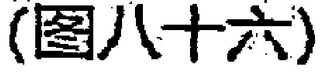

公历：2017年07月07日09时09分 星期五

干支：丁酉 丁未 乙未 辛巳 小暑上元阴八局

| 太阴 天英 乙 死门 壬 | 螣蛇 天芮 丁 禽辛 惊门 乙 | 值符 ◯ 天柱 己 开门 丁  蓊辛 |
| --- | --- | --- |
| 六合 天辅 壬 景门 癸 | 丙 | 九天 ◯ 天心 庚 休门 己 |
| 白虎 天冲 癸 杜门 戊 | 玄武 天任 戊 伤门 丙 | 九地 天蓬 丙 生门 庚 ☷ |

这个案例是2016年开面授班时，现场案例学员预测的，他主要是搞销售、跑业务方面的工作。他说财运不怎么好，想看看如何改善或者能不能搞好一点。

大像时干辛克日干乙，五不遇时格局。

#### 用神一：值符

值符为大像在坤宫，坤为顺也，大众性质。天柱大凶星废了不算凶，开门为工作事业，开门为敞开，己加辛游魂入墓、己加丁朱雀入墓（甲加辛折足、甲加丁青龙耀明）坤宫还有击刑。

这个地方信息比较复杂，可能初学的人理解起来有点难，因为它有四个克应，而且既然这个宫位中有这个信息，必须就有它的意义。己加辛游魂入墓大人鬼魂，小人家仙作遂。在这里他是预测财运的，引伸的意思大概是指赚钱方面发了些奇怪的事情；己加丁朱雀入墓文状词讼先曲后直。在这里大概是指财运方面开始不怎么样，后来发生了转变。甲加辛青龙折足是折损，甲加丁青龙耀光，又大放光彩。旬空是指没有发生，还处于一个不实在的一个状态。

总结来讲：可能事业上（开门）正在发生损失转变、奇怪的一件事情，使他失败，先曲，后来又朝新的方向发展从而大发一笔（甲加丁）

### 用神二：日干

求测人日干在巽宫，巽为风，变化大。天英为烦躁、乱子，同时天英也可说人好面子。乙加壬日奇入地尊卑勃乱是非。太阴为隐藏。这里大概是讲求测为财运的事心里烦躁，自己陷一种被动（日奇入地）尊卑勃乱或许是他不把领导放在眼里，或者是下属不尊敬他。他的这处想法和处境都隐藏没有朝外表现出来。

### 用神三：戊

戊代表财钱在坎宫，坎为水陷也，坎宫未月无气。天任星吉星，旺相有力，肯定。玄武有偏门之像，戊加丙青龙反首大吉之像。伤门有些损失。

这个戊似乎大好，像有一笔大财要来，只是现在坎宫弱无气，等下半年有力时有出现。似乎是偏门性质的收入。收入后会丧失一部分（伤门）。

### 用神四：开门

开门工作事业，在坤宫，同值符。这个宫位在旬空，现在就在未月，值符也在这里，等走过这个月可能就要显像，工作上发生大的变故，但是因为变化失去了一些，然后又得到了一些。（甲加辛、甲加丁）

坤宫旬空，坤为西南，这里有风水问题，己为凸出台阶状，值符为明显，击刑有损坏处。己加辛游魂入墓似有阴性事物藏匿。

求测人反馈房子是租的，西南位置是高低状（跃层式）下面有空间，以前养鱼缸，而且里面有石头、假山，后来坏了就空着那里，此也为风水小煞，不利财，西南位置不利女主人）

总结：求测人现状不必担忧，过了这个月至下半年有重大转折，可发一笔大财。但是修改之处较多，求测在巽宫，巽为风，人生定位不明确。同时乙下壬加太阴，对待下属和领导可能和不周到之处。西南风水问题需要及时处理，同时西北位置也有风水问题。

后来他本人重新租了一套房子，特别按照我的方法在西北位置进行风水布局，第二年又来复训时说去年捞百多万，但是为公司而做，自己得了一大笔提成。

## 为什么没看时干？

因为他本人的事情，可以改变，重新规划的方面很多，时干就不是结果，变数很大。

## 案例四：一女士问近期财运事业

(图八十七)

干支：丙申 甲午 戊午 辛酉 芒种中元阳三局
旬空：辰巳 辰巳 子丑 子丑 旬首：甲寅
值符天任在六宫 值使生门在六宫 山河易经网

| 白虎<br>天芮 乙 禽庚<br>死门 己 | 玄武<br>天柱 壬<br>惊门 丁 | 九地<br>天心 辛 禽庚<br>开门 乙 |
| 六合<br>天英 丁<br>景门 戊 | 辛 | 九天<br>天蓬 丙<br>休门 壬 |
| 太阴◇<br>天辅 己<br>杜门 癸 | 螣蛇○<br>天冲 戊<br>伤门 丙 | 值符<br>天任 癸<br>生门 辛 |

这位女士是我多年的客户，西藏一建筑公司老板。基本她的人生事业一切疑问处请我给承包了。

#### 用神一：值符

值符为大像在乾宫，乾为重要，为首，乾宫午月衰。天任肯定，吉星；生门为获得发、好处、利润；癸加辛（甲加辛）网盖天牢死亡难逃，青龙折足损失，破败。

值宫乾宫大概是指好像是肯定一定获得好处利益的事情好像死定了，折损泡汤了。

### 用神二、三：日干 (用神重叠)

求测人” 戊 “(同于钱用神戊) 日干在坎宫，坎为水陷也。午月坎宫冲破无气。天冲为急、为快，伤门为委屈，伤受伤之像。螣蛇缠绕纠结。戊加丙青龙反首大吉像。

坎宫求测人非常急于获得巨大利益好处的的一件事情上，但是又伤心，又纠结思虑 (螣蛇)。

> (小插曲：由于对方是个女的有些话我不方便问，于我我旁敲指出卦像说：“此卦显示下面空了，还受伤了，还有些发热炎症之像”我实在想不出下面怎么会这样？她说：她说前几天刚去取了环！)

### 用神四：日干旬空需要看对面离宫

离宫为她的想的，关注的。对面宫位玄武、看不懂看不明白；天柱为破坏毁折；惊门口舌、担心，壬丁合，合作合会之像。壬加丁干合入墓。

### 用神五：开门

开门可以代表事业，工作，时干也在这里，在坤宫。坤宫吉星天心废了，辛加乙白虎猖狂、辛加庚虎出力，皆凶。而且坤在风水上主女性位置，需要处理。

总结：此盘上三个主要用神“值符、日干戊、开门”皆是吉凶参半。其实此事应该成，只是因为求测人身带病态，而且心急于此事，中间发生了变故。如果想此事成，所有用神都在下半年进入申酉戌以后可旺。

当时我给她的建议是近期莫谈生意，你状态不佳，同时你西南风水需要将 “辛、庚” 风水必须处理再按方法布局，下半年事情可成。

后来都年底了她才反馈说工程已经在做，甲方又追加了2个亿。

## 案例五：预测姨妈还是姑妈的女性长辈住院严重吗？

(图八十八)

公历：2015年08月29日20:28
年 月 日 时 农历：乙未年七月十六
乙 甲 丁 壬 阴遁7局，旬首：甲辰壬
未 申 丑 戌 值符：天冲，值使：伤门
局式：转盘-拆补-寄坤宫
年:辰巳空 月:午未空 日:申酉空 时:寅卯空

| 4 太阴 | 9 螣蛇 | 2 值符 |
| --- | --- | --- |
| 天蓬 丁<br>惊门 辛 | 天任 乙<br>开门 丙 | 天冲 壬<br>休门 癸庚 |
| 3 六合 ○ | 5 | 7 九天 |
| 天心 己<br>死门 壬 | 庚 | 天辅 辛<br>生门 戊 |
| 8 白虎 ○ | 1 玄武 | 6 九地 |
| 天柱 戊<br>景门 乙 | 芮禽 癸庚<br>杜门 丁 | 天英 丙<br>伤门 己 |

### 用神一：值符 (坤)

坤为母也可做女性长辈用神，值符为主要用神。天冲为急，休门为休息躺着。壬加癸（甲加癸），壬加庚（甲加庚），克应的信息比较多，大概是讲比较消极，希望赶紧好起来（壬加庚立剖邪正），也希望赶紧回家（甲加庚飞宫格，飞出医院）。这里有马星为动，在行动中。

### 用神二：年干乙

看长辈用神为年干 “乙” 在离宫，天任吉星在月令旺，开门，敞开迎接（也可能是指住院），腾蛇麻烦纠结缠绕，乙下丙三奇顺遂。从离宫看整体信息还不错。

### 用神三：天芮

天芮做为疾病星的主要用神，在坎宫，坎对应人体是私处。癸为液体、庚为工化硬化，丁像火炎症、杜门不通，玄武搞不明白。大概是指下面某个地方发生炎症，是因为有搞不懂的地方不通了。（求测人反馈是子宫里面怎么样了，具体不晓得）

主要问题：现在是申月，坤宫当令马星动，有天冲，西南方位可能和路冲，或者有冲性的风水问题。天芮星为病灶在坎宫，乙在离宫，病在坎宫，这是下面。预猜测是床下有铺开黑色网状物品（癸），有坚硬危险的物品（庚），天芮为药或者为容纳，可以装东西的，玄武搞不懂的，还藏起来（杜门）。
（反馈床下有盒子里有缝纫用的剪刀、顶针、布之类）都需要清理。

## 案例六：男士预测妻子一直不怀孕

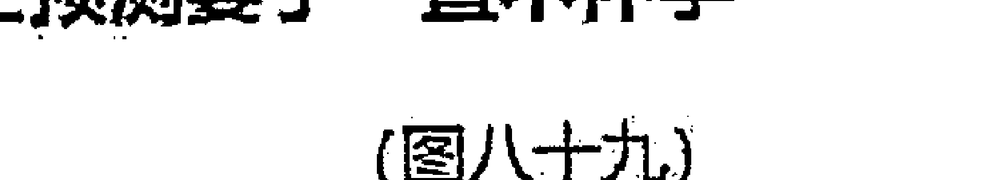

公历:2017年12月29日22:41

年 月 日 时 农历: 丁酉年冬月十二

| 数字 | 神   | 星       | 门       | 备注 |
|------|------|----------|----------|------|
| 4    | 白虎 | 天任 乙  | 杜门 壬  |      |
| 9    | 玄武 | 天冲 辛  | 景门 戊  |      |
| 2    | 九地 | 天辅 壬  | 死门 庚癸|      |
| 3    | 六合 | 天蓬 己  | 伤门 辛  |      |
| 5    |      |          |          |      |
| 7    | 九天 | 天英 戊  | 惊门 丙  |      |
| 8    | 太阴 | 天心 丁  | 生门 乙  |      |
| 1    | 螣蛇 | 天柱 丙  | 休门 己  |      |
| 6    | 值符 | 芮禽庚癸 | 开门 丁  |      |

### 用神一：值符 (同日干)

值符为大像，天芮星为病态，开门可作公开，庚加丁私居起官司，癸加丁火焚难逃。甲加丁，青龙耀明。

## 13章：预测案例

日干为求测人，头顶值符，说明他其实应该承担主要问题责任。

整体来讲：日干下有丁，临开门，带天芮，大概是公认男的有问题，但是“庚加丁私合”可能有不好说出口的问题。他心里也想赶紧为家传宗接代（甲加丁青龙耀明），再生不出来的话难逃被骂或者危险之类（癸加丁难逃火焚）。

> （当时问求测人本人有什么毛病，他反馈说自己只是小毛病已经治好，可能没说实话，但乾宫只是有天芮未见大凶，可能也是小毛病，只是隐私）

### 用神二：乙（日干相合之干为配偶）

乙在巽宫，巽为风，也不确定。天任固执，肯定；杜门放不开，保守；白虎压力，危险。乙下壬日奇入地尊卑乱官是非。

巽宫虽然克应不吉，见白虎压力，但是没见凶的信息，只是一直未生压力较大。同时感觉自己降地了家中位置和身份（乙下壬尊卑勃乱）然后烦躁是非多。

巽宫的像，就像是说：明明不是我的问题，怎么搞的就像我生不出来似的，现在都反而怪我。

### 用神三：坎宫 (看鸟)

上述两个用以得知，女方问题不大，主要是压力山大。而男方问题明显，那坎宫就看的男性鸟系统（如果显示女方问题，坎就为女的系统）。

天柱是柱子大概是表达硬，同时天柱也是凶星损坏之像（我都笑的不好说了）丙为发热，丙下己火勃入刑囚人刑杖，文书不行。腾蛇为弯曲。休门为休息也是瘫软了。

这里我都不知道怎么解说：有点像打了鸡血硬过头后，像霜打茄子损坏了，然后有气无力...哈哈..... (这里的解释是我按照卦像杜撰的，未经证实)当时人反馈说自己没有大问题，只有一点点小问题而已。

### 用神四：坤宫

为什么要看坤宫呢？

因为坤西南在家中是女主人的位置，这个位置的任何动静、变化都可能导致女性的身心状态。

壬加癸、壬加庚、死门、九地，西南位置的气场极度的低迷、死气。会导致女性的身心冰冷，生气衰弱。天辅为文化艺术设计。旬空，说明这里的能量不实，很弱。

壬为透明，庚为坚硬，癸为污渍、黑暗、平铺，天辅为设计，学习文化，九地为低暗，或者隐藏。

后来求测人发给我西南位置照片，是房子建筑设计（天辅）朝外突出一个空间，这里的玻璃是深灰（壬癸），同时黑铝合金（庚），地上放着黑色地毯（癸）。

后来我给他做了一系统的建议调整，后来没有反馈，不知道结果。

## ## 案例七：问这个房子风水，好就留下，差就卖了。

### (图九十)

公历：2017年02月18日17时46分 星期六
干支：丁酉 壬寅 丙子 丁酉 立春下元阳二局

| 太阴○<br>天心 壬<br>开门 庚 | 六合<br>天蓬 乙<br>休门 丙 | 白虎 天任 丁<br>生门 戊 畜辛 |
| 腾蛇<br>天柱 癸<br>惊门 己 | 丁<br>辛 | 玄武 天冲 己<br>伤门 癸 |
| 值符<br>天芮 戊 畜辛<br>死门 丁 | 九天<br>天英 丙<br>景门 乙 | 九地<br>天辅 庚<br>杜门 壬 |

说明一下：网络上讲风水看生门、戊、时干为人日干为宅之类的理论，在我预测实践过程中经不起验证，所以取缔了。有用的知识经验我们就继续发扬，空有理论又经不起实践，我直接甩了。

分析：这个盘是九星八门反吟，主事情反复，气场反复。

#### 用神一：值符

值符为整体大像，在艮宫，艮为山止也，保持一个状态；天芮病态、消极、郁闷；死门为无气、偏阴、下降；戊加丁青龙耀明；辛加丁（甲加丁）狱神得奇、青龙耀明。

整体气场很糟糕，死门加天芮，很死气沉沉和闷气为房子的主要能量。但是却又带着甲加丁，带旺气和升腾的气场。反吟局，气场时而好时而差。

### 用神二：乾宫

乾宫西北代表家中男性主人，乾宫九地，阴暗、低为主像，庚加壬金化水迷失道路无音信；天辅知识文化艺术；杜门保守关闭。

乾宫的像会让家中男主有一副有知识素养的样子，同时不善沟通言行。自建房照片可见西北方房子背后较低洼，有墙角裸露。让整改。

### 用神三：坤宫

坤宫西南为家中女性主要，乾宫白虎，女人彪悍，丁加戊青龙转光，丁加辛朱雀入狱；生门有向上积极的能力。乾坤宫的像会让家中女性母老虎但能力较强，非常善于理财收入，当然想法多容易犯出错（丁加辛）。西南丁为发光发热，戊面积大坨，辛金属或者硬。白虎有危险性质。发照片过来才发现西南方位是一个邻居房子，只是西南方位最明显的一个烟冲（丁加戊）。

### 用神四：满盘看

刚才值符在艮宫，主要的方向东北影响。同时震宫东面信息较差，坎宫信息也不太好。西南坤宫、离宫南都还不错。西北信息也不太好。这是阴盛阳衰。主要问题艮宫东北。（求测人发来图片，东北位置是一块地未修房子的地皮较乱差，较低，同时旁边有条路，可能是路来回的能量导致反吟）

给他的建议是如果不做改善，这个房子就卖了搬地方。如果要继续住可以将这块地上种一些植物高过右边房子（左青龙右白虎）同时要是植物能够缓解公路上来回冲力最不好，如果不能可能房子继续反吟，家中磁场时好时坏。

## ## 案例八：男士问向老板提出涨工资此事能成吗？

### (图九十一)

公历：2017年10月13日11:38
年 月 日 时 农历：丁酉年八月廿四
丁 庚 癸 戊 阴遁9局，旬首：甲寅癸
酉 戌 酉 午 值符：天辅，值使：杜门
局式：转盘-拆补-寄坤宫

年:辰巳空 | 月:寅卯空 | 日:戌亥空 | 时:子丑空 ✓

| 4 螣蛇<br>天冲 丁<br>伤门 癸 | 9 值符<br>天辅 癸<br>杜门 戊 | 2 九天 夊<br>天英 戊<br>景门丙壬 |
| 3 太阴<br>天任 己<br>生门 丁 | 5<br><br>壬 | 7 九地<br>芮禽丙壬<br>死门 庚 |
| 8 六合 ○<br>天蓬 乙<br>休门 己 | 1 白虎 ○<br>天心 辛<br>开门 乙 | 6 玄武<br>天柱 庚<br>惊门 辛 |

### 用神一：值符（同日干）

值符在离宫，离中虚，离宫高处。癸加戊天乙会合财皆喜（甲加戊偏凶），天辅有知识文化，杜门为技术，也是保守没放开。日干宫大像就是获得好处的像，但同时有考虑不周全的地方（杜门）

### 用神二：戊（同时干）

戊代表钱在坤宫，坤为地顺也，大众性收入。戊加丙青龙返首大吉利；九天为高天英热闹喜事，景门兴奋。时干和戊在一起，同时结果大吉，看来是必成了。

（后来求测人反馈老板答应了工资长了一截，欢喜）。

### 用神三：乾宫

为什么看乾宫？因为值符为领导，结果顶在他的头上了，说明 领导和他同宫站队，占成。另外还需要找个实在的领导用神，所以看看乾宫。乾宫玄武、有套路；庚加辛白虎干格；惊门担心，有说法。似乎领导对此事不太喜欢！

### 用神四：开门

开门为公司事业的用神，在坎宫，坎为陷为低。天心吉门，辛加乙虎猖狂，白虎为棘手、危险。

日干人在离宫，而工作在坎宫，似乎人有点飘，挂的高了。虎猖狂加白虎对冲离宫，只是坎宫旬空。

总结：这个盘如果 只看主要用神，日干、值符、戊讲工资的事，似乎一切大吉，水到渠成的事。但是其它用神却暗藏祸星，所以建议低调做人，专心工作。莫自命清高（离宫）高处不胜寒。

## 案例九：预测问自己下半年适合进入股市吗？

(图九十二)

公历:2016年08月28日12:23

| 年 | 月 | 日 | 时 |
|---|---|---|---|
| 丙 | 丙 | 壬 | 丙 |
| 申 | 申 | 午 | 午 |

农历：丙申年七月廿六
阴遁1局，旬首：甲辰壬
值符：天心，值使：开门
局式：转盘-拆补-寄坤宫

年:辰巳空 月:辰巳空 日:申酉空 时:寅卯空

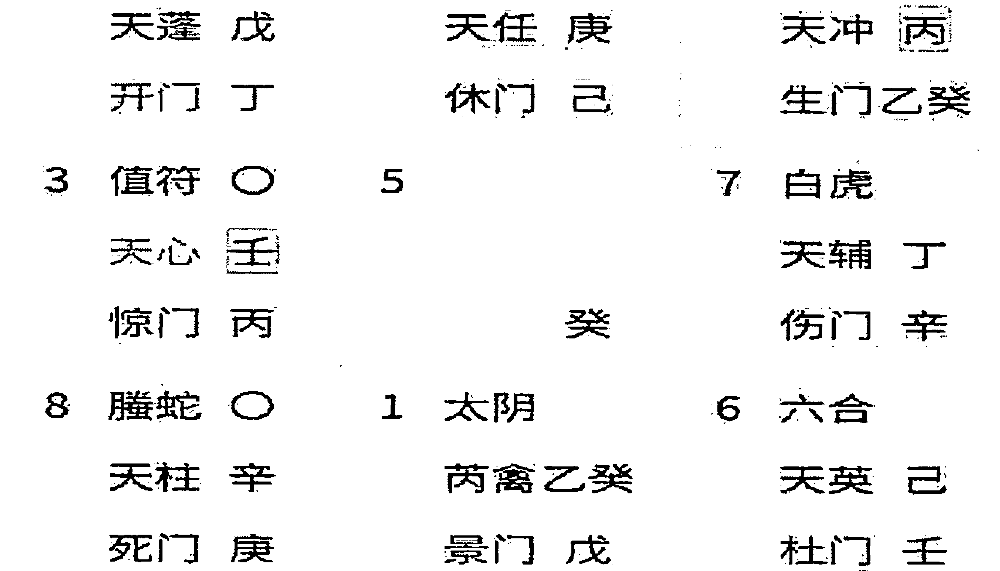

这个盘是八门反吟局，八门代表状态，反吟是反复之意。

当时他问自己下半年适合进入股市吗？说实话时我迟疑了一会儿，这个应该取那些用神呢？

### 用神一：值符（同日干）

日干为壬在震宫，震为雷动也。壬加丙（甲加丙）水蛇入火祸不单行；青龙反首大吉大利；天心计划、想法、谋划；惊门担心。

求测最近一直在研究摸索谋划（天心），感觉就像进股市发大财一样（青龙反首大吉）但是同时又担心害怕，就像进火坑一样（惊门、水蛇入火）；旬空心里没底不知去该不该进。

### 日干旬空看对面宫

对面是兑宫，兑为口、为缺、不足之像；白虎为危险、害怕和恐惧；丁加辛朱雀入狱；天辅知识文化；伤门受伤、损失。

求测人心里在想股市的恐怖（白虎），想着很容易被套牢（朱雀入监狱）；套住了很麻烦需要技术（天辅）；同时遭受损失（伤门）。

### 第二用神：开门

一个公开的集体参加的赌场所以我取开门。开门在巽宫，巽为风飘乎不定；九天高的很；戊加丁青龙耀明；天蓬胆大有谋。一看这个情况那下半年股市应该还是不错的，至少有个九天为高，而且配合戊加丁大发光明，但是巽为风，可能容易忽高忽低。

总结：看到这里我就告诉他，股市其实还不错，但是你不适合进入股市，因为你没有准备好。

### 为什么呢？

你看日干的落宫，感觉像处女第一次似的既兴奋又害怕，反吟局，反复纠结。同时脑壳里装的、关注的都是套牢、危险、受损这些事情上。杜绝风险是必要的，但是你心里装的如果都是‘套牢、危险、受损’这些上面，进去必然被套。

## 案例十：他问看的这个项目能不能投？

> (图九十三)

公历:2016年11月09日13:09

农历:丙申年十月初十
阴遁1局，旬首:甲戌己
值符:天英，值使:景门
局式:转盘-活时-寄坤宫

```
年:辰巳空  月:辰巳空  日:辰巳空  时:申酉空

4 太阴 ☴        9 螣蛇         2 值符 ○
   天冲 丙        天辅 丁        天英 己
   杜门 丁        景门 己        死门 乙癸

3 六合          5              7 九天 ○
   天任 庚        癸             芮禽 乙癸
   伤门 丙                       惊门 辛

8 白虎          1 玄武         6 九地
   天蓬 戊        天心 壬        天柱 辛
   生门 庚        休门 戊        开门 壬
```

这是我的一个学员，当时带人群去看一个环保项目。中途似乎对公司项目感觉有套路似的就排了一个奇门遁甲盘，自己看了以后又发给了我。

盘像时干 “癸未” 时入墓五不遇时，八门伏吟主事情没啥变化，不动之像。

#### 用神一：值符

值符在坤宫，坤为地顺也，普通大众性。己加癸地刑玄武，搞不明白；己加乙墓神不明，不确定；天英热闹、烦躁乱子；死门死气、沮丧生气；己击刑操作；旬空事情还没着落。

值符大像中主要体现出有好多不确定、怀疑，看起来热闹其实没半点活气。

### 用神二：日干

求测人日干 “乙” 在兑宫，兑为口为缺、不足；天芮病态郁闷；惊门担心惊恐；九天为高、高飞；乙下辛青龙逃走；乙加癸遁迹；旬空心里不实不确定。

兑宫主要体现了求测人对于这个项目已经想要赶紧跑了、套了，很是担心的同时，非常让他不舒服（天芮）。

这个盘刚发给我时，我就说：你都打定主意走了还预测它干嘛？

### 日干旬空看对面宫

对面震宫天任为肯定；庚加丙贼即来；六合同，聚集；伤门受伤。

这个宫位主要体现了求测人想的是一群骗子合起来想哄他的钱。

日干旬空、值符旬空基本这事不太靠谱。

### 用神三：开门

开门在乾宫，乾为天为道，高大上。天柱为破坏毁折；九地不潜藏隐伏学；辛为错误；辛加壬凶蛇凶狱诉讼不息。

乾宫来看这个公司项目应该还是可以，只是九地加天柱，里面潜伏了雷没爆出来。

总结：这个盘其实盘像显示的内容非常清晰，就是他感觉这个投资这个环保项目非常不靠谱，感觉到好像有些事情迷糊不清，似乎有套路，而且像骗子，已经想跑了，但是又不甘心。明明他已经感觉这个事不靠谱，还是用奇门盘预测了一下，心想万一错过了大好机会呢？投资 500 万今后翻倍了呢！逻辑与感觉在斗争。

给他的建议是你既然感觉不对了就暂时别投，观望等一段时间等事情发展转变了在考察。

## 案例十一: 已婚女士问婚姻

(图九十四)

| 公历 | 2017年04月30日00:28 | 年 | 月 | 日 | 时 | 农历: 丁酉年四月初五 |
| :--- | :--- | :--- | :--- | :--- | :--- | :--- |
|  |  | 丁 | 甲 | 丁 | 壬 | 阳遁2局， 旬首: 甲午辛 |
|  |  | 酉 | 辰 | 亥 | 子 | 值符: 天禽， 值使: 死门 |
|  |  |  |  |  |  | 局式: 转盘-拆补-寄坤宫 |
| 年: 辰巳空 | 月: 寅卯空 | 日: 午未空 | 时: 辰巳空 |  |  |  |
| 4 | 值符 ◎ | 芮禽戊辛 | 杜门 庚 | 9 | 螣蛇 | 天柱 癸 |
|  |  |  |  |  | 景门 丙 |  |
| 2 | 太阴 | 天心 壬 | 死门戊辛 | 3 | 九天 | 天英 丙 |
|  |  |  |  |  | 伤门 己 |  |
| 5 |  | 辛 |  | 7 | 六合 | 天蓬 乙 |
|  |  |  |  |  | 惊门 癸 |  |
| 8 | 九地 ⊙ | 天辅 庚 | 生门 丁 | 1 | 玄武 | 天冲 己 |
|  |  |  |  |  | 休门 乙 |  |
| 6 | 白虎 | 天任 丁 | 开门 壬 |  |  |  |

这个盘是个八门伏吟局，指不动保持的某种状态。

#### 用神一：值符

值符为大像在巽宫，巽为风漂乎不定，变数大。天芮病状、郁闷；戊加庚飞宫格有各奔东西之像；辛加庚白虎出力强迸血衣衫，像是要打起来了；杜门保密少有人知。这个像很清晰，两个人过的很郁闷不爽；同时两口子要各奔东西(飞宫格)了，而且快要到了展现武功的时候了；但是保密少有人知道。但是巽宫为风，是偶尔发生，不是一定会。

### 用神二：日干

求测人日干为“丁”在乾宫，乾为老大、首领；天任为老实憨厚固执；开门为敞开的态度；白虎严肃、板着脸甚至凶；丁加壬互合讼公平。

其实她刚发过来奇门遁甲盘的时候我就对她说：“是你错了！”做为女人把自己放在了乾宫、开门，在家里摆出“老子就是天”公开的态度，而且严肃白虎，还固执。

### 用神三：壬（与日干相合之干为配偶）

壬在坤宫，坤为地顺也，女人位置。天心废了，有一些想法和计划却不得实施；死门，生气、郁闷抱怨死心；壬加戊小蛇化龙；壬加辛腾蛇相缠；太阴藏起来。男的现在已经像个家庭主妇，他内心深处也有想法（太阴天心）心中也想站来做个权威男子（小蛇化龙），为此事也纠结烦恼（腾蛇相缠），但却不能实现做个伟岸男。

### 用神四：六合

六合是做为婚姻、恋爱、感情的主要代表符号。六合在兑宫，有口有缺；天蓬为大盗、坏蛋；惊门为担心、口舌；乙加癸华盖逢星隐形藏匿。婚姻已经出现的裂缝，而已发生了口舌之争，婚姻就像已经不见了，在一切像是普通人（隐匿藏形）。（此处兑西我帮助她去除旧六合，建立了新六合风水处理)

总结：留给读者！

## 案例十二：未婚女士问工作，问婚姻

(图九十五)

公历:2019年05月11日20:08
年 月 日 时 农历: 己亥年四月初七
己 己 戊 壬 阳遁6局，旬首: 甲寅癸
亥 巳 申 戌 值符: 天芮, 值使: 死门
局式: 转盘-活时-寄坤宫
年:辰巳空 月:戌亥空 日:寅卯空 时:子丑空

| 4 六合 | 9 白虎 | 2 玄武 ⑥ |
| 天蓬 壬 | 天任 庚 | 天冲 丁 |
| 休门 丙 | 生门 辛 | 伤门 癸乙 |
| 3 太阴 | 5 | 7 九地 |
| 天心 戊 | | 天辅 丙 |
| 开门 丁 | 乙 | 杜门 己 |
| 8 螣蛇 ○ | 1 值符 ○ | 6 九天 |
| 天柱 己 | 芮禽 癸乙 | 天英 辛 |
| 惊门 庚 | 死门 壬 | 景门 戊 |

一女士都四十几岁还未婚，她如果不告诉我，我也看不出来未婚。

#### 用神一：值符

值符在坎宫，坎为水陷也，为低。从发点是从下面开始考虑的。天芮星病状、郁闷；死门死气死心、沮丧；癸加壬复见腾蛇后无子；乙加壬日奇入地尊卑勃乱；甲加癸青龙华盖。旬空问的事情没有结果。

（我看到这里我很想问她有没有妇科病，而且有点严重，但是人家问的是婚姻和工作，我还是没问）

值符为大像，结果看起来非常糟糕，整体是郁闷、死心，好像进入了一种未来没有结果（癸加壬），绝望、郁闷；烦燥勃乱的状态。

（我心想：女人单身久了看来真要出大问题！）

### 用神二：日干

求测人日干在震宫，震为雷动也。天心星计划、想法、谋划；开门敞开，也是工作用神；戊加丁青龙耀明；太阴隐藏看不见。

震宫的信息不错，她自带开门，把心思都放在工作上，同时似乎有自己的一些想法和计划，工作像是也有好的发展（戊加丁），只是暂时好的方面没有体现出来（太阴）。

### 用神三：开门为公司、工作

开门在震宫，开心带天心星在落宫休，月令囚，说明公司虽然行业不错（天心星）但是发展似乎不太好，较为艰难。戊加丁朝着积极的方向在发展，太阴，大概是背后策划类。

> （她反馈说：公司是好公司，只是现在她被调到分公司，这里业务量少，而且同事都懒散不上进，她也得过且过，想要一展才能，但是在这里分公司似乎无用武之地）

### 生门

生门为利润在离宫，天任星废了，庚加辛白虎干格，白虎棘手凶悍。震宫开门虽然生离宫生门，但是震宫自身无力，离宫虽旺，但是稍微有毛细一般的利润都给阉割了（白虎干格）。看来这公司简直一塌糊涂了。

### 用神四：六合

六合为婚姻感情的符号在巽宫，巽宫为风，是漂乎不定之像。壬加丙水蛇入火；天蓬大盗，坏蛋；休门休息停止。这婚姻就像是风一样，好像要飘过来了，结果又给吹走了，即使有时真的飘过来了也是飘的是烂桃花（壬加丙蛇入火）。

### 用神五：乙

预测未婚男女代表女性的用神是“乙”，乙在坎宫旬空，坎为水陷也，低也。乙在坎宫顶值符，说明主要问题在女的方面。天芮星病态、郁闷；死门死气死心、沮丧；癸加壬复见腾蛇后无子；乙加壬日奇入地尊卑勃乱；甲加癸青龙华盖。旬空问的心里没底大像看来了非常糟糕，整体是郁闷、死心，好像她进入了一种未来没有结果（癸加壬），绝望、郁闷；烦躁勃乱、甚至死心了的状态。

### 用神六：庚

预测未婚男女“庚”为男方用神。庚在离宫，离中虚，离为高。

## 13章：预测案例

天任星废了，愚蠢固执、死脑筋；庚加辛白虎干格、打架受伤；白虎凶神恶煞；生门生发、生长。

坎宫旬空，面对面是庚离宫，就是说这个女人心里，想像的男人都是愚蠢的固执的，而且还凶恶。而且还要打人。

我的看法：这个女人坎宫、巽宫、坤宫风水问题、妇科问题、心理问题、婚姻价值观、对男人观念问题、自身定位问题。甚至年少时经历可能有关。这么多问题我说她自身有问题她不觉得，只觉得别人有问题，于是我帮助她把风水调理了，其他的想帮出不了力，救不了只收了一半预测费。

总结：留给读者！

## 特别案例十三：预测感情还能合好吗？

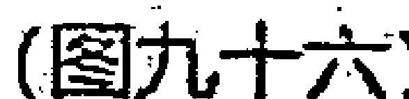

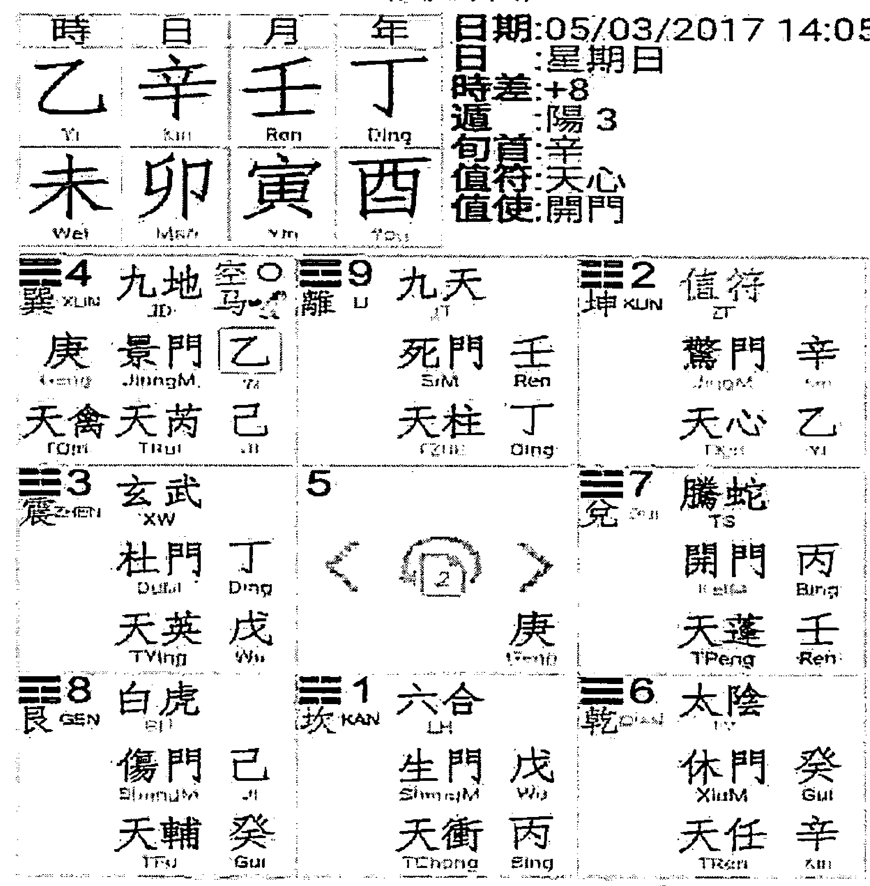

一位男士找我预测，问两个人还能不能合好？

我以正常预测的方式，即乙为女、庚为男就准备开始分析盘，然后

他接着又说：“他和一个男士，他也是男的！”

我当时就愣了，这...这个好像不知道怎么下手呢？

于是我就直接告诉“TA”我说这个事没办法预测，主要是取不了用神，到底谁是男？谁是女？代表男女的符号怎么取？

TA说：“他是扮演女的这个角色！”

这时我就试着开始着手开始分析奇门遁甲盘上的信息！

注意：这个奇门遁甲的盘像，它的“丁酉年、壬寅月、辛卯日、乙未时”它上面的信息都是和我们使用的信息都是颠倒的。如果他是台湾人（台湾读写方法是这样）这就是正常的盘，如果是内地人，这个就是信息大小颠倒。

既然是颠倒的，这是不是已经在向我们表达一些信息，如果以后你在为他人预测人生、事业、财运的时候碰到盘上信息是颠倒的，说明他的这个事情本身可能就是不对的。

#### 用神一：值符

值符为大像在坤宫，坤为地顺也，坤为大众普通的事情。辛加乙白虎猖狂尊长不吉；甲加乙青龙合会；天心计划想法；惊门担心害怕。坤宫其实也说明了，TA 在计划想法一个让人感觉很猖狂(白虎猖狂)让人不喜欢的事情；同时这个事情可能也是问合会之事(青龙合会)，他为此事担心。

### 用神二：乙（和庚同宫）

代表女方的符号是“乙”，代表男方的用神是“庚”，都在巽宫，巽为风，漂乎不定，变数；乙庚既然同宫，说明他们在一起，但是“旬空”就是说本来应该在一起，但是却隔着什么；乙下己入奇入雾被所昧；九地藏匿的深；天芮病态、郁闷；景门兴奋热情。

巽宫信息讲两个人本来是在一起，巽为不稳定露水“夫妻”，两个人都似陷入迷雾之中（乙下己）悄悄的耍的好兴奋愉快（景门，但同时又知道这是病不正常（天芮），于是就地下工作悄悄的进行（九地）；以前在一起现在虽然想在一起却又没在一起了（旬空）

我心里想：这样的盘象就像是演一部分合离别的爱情电影！

### 用神三：六合

六合是代表两人结合、婚姻、爱情的用神，在坎宫，坎为水陷也，低。同时合在坎宫，坎为隐私，六合在建立在下面的。

天冲星为速度快，冲来去（天冲星废了）；生门为生长、发展、进步；戊加丙青龙反首大吉利。

巽宫的信息是讲感情建立在 XX 上并陷入困境了，同时也根本不可能（天冲星废了），但是却又在新生（生门），而且有回光反照重新结合的方向发展（青龙反首）。

总结：这个盘的象稍微复杂是点，从值符宫天心星废了其实也告诉了，此事不可能，此事很猖狂。但是，乙庚同宫，到了“辰巳”月填实之日可能又在一起。而且六合宫有生门活起来，反首重新来过的像，所以，此事还会有“辰巳午”两三个月的玩期。

## 案例十四：预测公公能不能熬过这个月

### (图九十七)

真时：2016年09月26日15时08分
干支：丙申 丁酉 辛亥 丙申 备注：老者年命“丁”

| 数字 | 神煞 | 天干 | 数字 | 神煞 | 天干/门 | 数字 | 神煞 | 天干/门 |
| :--- | :--- | :--- | :--- | :--- | :--- | :--- | :--- | :--- |
| 4 | 螣蛇 | ○ | 9 | 值符 | | 2 | 九天 | |
| | 天冲 | 壬 | | 天辅 | 辛 | | 天英 | 丙 |
| | 生门 | 辛 | | 伤门 | 丙 | | 杜门 | 癸庚 |
| 3 | 太阴 | | 5 | | | 7 | 九地 | |
| | 天任 | 乙 | | | | | 丙禽 | 癸庚 |
| | 休门 | 壬 | | 庚 | | | 景门 | 戊 |
| 8 | 六合 | 句 | 1 | 白虎 | | 6 | 玄武 | |
| | 天蓬 | 丁 | | 天心 | 己 | | 天柱 | 戊 |
| | 开门 | 乙 | | 惊门 | 丁 | | 死门 | 己 |

媳妇预测公公生病，生命气息垂危！

#### 用神一：值符

值符在离宫，离中虚，离为高。天辅星知识、文化、教育、辅助；伤门受伤；辛加丙干合勃师因财致讼，甲加丙青龙反首大吉利。
离宫的大像似乎是在讲为一个与学习文化相关的事情，而受伤，然后此事似乎还大吉，只是大吉中有因钱财之事(大像似乎与病无关)。

### 用神二：年干丙

看长辈，用神为年干丙，丙在坤宫，坤为地，顺也，平常。天英为热闹、乱子、烦躁；杜门为堵塞、关闭不通；丙加庚贼即去；丙加癸华盖勃师因人害灾祸颇深；九天为高远。
离宫之像，像是讲长辈似乎大势已去（贼即去），已经不能有效与人沟通；有阴事相邀请他去了；九天像是要飞上天了，心烦意乱。

### 用神三：乾宫

由于一个用神不足于表现长辈公公情况，乾宫也是来男性长辈的用神，玄武看不清楚想不明白了；戊加己贵人入狱，像是要下去了；戊在戌入墓；死门气息已经很微弱；天柱凶星损失破坏。
乾宫像是讲脑壳已经模糊；已经没多少生命气息；而且有结束的征兆（入墓）。

### 用神四：年命“丁”

丁在艮宫，艮为山止也，丁在丑入墓；天蓬坏蛋盗贼损失；开门为敞开；六合为聚集汇合、丁下乙人遁吉格婚财皆喜。

艮宫的像讲也是入墓，墓门打开了，坏蛋盗贼来了（难道是黑白无常）然后结束了皆大欢喜（人遁吉格）

看到这里我就有点纳闷了，一个老人在生命体征已经很微弱，为什么这个盘上显示的信息都有“发财、欢喜”之像？

日干和值符在离宫，甲加丙青龙反首大吉利，丁加乙人遁吉格婚财喜。难道在求测人眼里老人去了她有什么好处？

总结：四个用神，读者总结！

## 特殊案例十五：26岁女从未正式谈过恋爱

### （图九十八）

公历：2017年01月21日20时07分 星期六
干支：丙申 辛丑 戊申 壬戌 小寒下元阳五局

九天 天心 己 开门 乙 | 值符 天蓬 癸 休门 壬 | 螳蛇 天任 辛 生门 丁 落成
九地 天柱 庚 惊门 丙 | 壬 | 太阴 天冲 丙 伤门 庚
玄武○ 天芮 丁 落成 死门 辛 | 白虎○ 天英 壬 景门 癸 | 六合 天辅 乙 社门 己

这个盘是全盘反吟局，全反吟说明她问的事情就是颠倒，反来复去。

#### 用神一：值符

值符为大像在离宫，离中虚，离为高；天蓬为盗贼坏蛋；休门为停止、停滞；癸加壬复见腾蛇后见无子；甲加壬青龙入天牢。
离宫的像是讲整个事情像是被关进牢房一样，一直保持在这种停滞状态，像是有坏蛋，预测了也不会有什么结果（后嫁无子）。

### 用神二：日干

求测人为戊在艮宫，艮为山止也，停止状态。玄武看清楚真相；天芮沮丧郁闷；死门死了心、死气；戊加辛青龙折足；丁加辛朱雀入狱。旬空心里没底，不确定，没有方向。戊挨着丁，丁入墓。
艮宫的像是讲求测人心都像死了，非常沮丧和郁闷，同时为此事已经没有一点信心，死门也是死气。所想的事情泡汤折损了（青龙折足）。像是被关在笼子里的鸟（朱雀入狱）。戊陪着丁入墓，还有死门，像是陪着一个坟墓。
看到这里我就感觉有点奇怪，但是没有妄下判断。

### 日干旬空看对面宫

对面坤宫，坤为地顺也。辛加丁狱神得奇囚人得释放；辛加戊困龙被伤；腾蛇纠缠缠绕；生门生长进步发展。
求测人的思想的是被缠绕纠缠，被困住了，希望自己能够得到释放，能够好好生活，发展。

### 用神三、四：乙、六合

看男女婚恋，女方用神为“乙”，婚恋用神“六合”，这里最奇怪的是乙本身就顶着一个六合，代表她有恋爱。同时乙同六合入墓。像不像把爱情婚姻带进坟墓？
天辅辅助、知识文化；杜门堵塞、关闭；乙下己日奇入地被土所昧。乾宫的像，就像是女的被什么东西给迷雾了，自身带着婚恋，只是死气坟墓气息的婚恋。
看到这里我都不敢在分析了，真是很奇怪！

### 用神五：庚

预测男方的用神庚在震宫，震为雷动也。天柱为大凶星破坏；惊门为担心，声响声音；九地为潜伏很深；庚加丙贼必来。
震宫的像是讲有个男的是悄悄的来，发出声音，TA就是个坏人。
由于我叶鸿生搞的术数奇门，不懂道法，所以我就对这个求测人说：
“你这是碰到了阴邪的东西，我处理不了，我给你推荐一个搞道法的高人，你去找她帮帮你！”
然后她就说：长期以来每天晚上好像有个男的在梦里对她说‘让她做她老婆还是女朋友’但是她就是不答应，她以为是个梦。但是多年以来，生活中多次有男人追求她，她长的样子还算中等偏上，每个男的追求几天，马上就变了态度，再也不敢靠近她！
于是我就再一步确认，她这是碰到了什么缠住了她，需要懂道法的人才能解决，于是我给她推荐了我的一个学员，专业搞这个的。
这里要给所有爱好奇门遁甲预测的敲个警钟，奇门遁甲看到的信息是潜在事物发展规律。所以尽量预测人生、事业、发财、投资这些阳性阳人的事情。凡是阴性的鬼神、死亡、邪灵之类事情，尽量不要去预测，因为你“看到”了本身就没有好处，而且你又没有处理的这种事情能力，乱来搞化解说不定对自己大不利。切记！

## 案例十六：预测彩票号码，排列三

### (图九十九)

年 月 日 时
己 己 庚 癸
亥 巳 申 未
公历:2019年05月23日14:26
阳遁8局，旬首: 甲戌己
值符: 天英，值使: 景门

| 4 值符 ⚊天英 己杜门 癸数：4、5 | 9 螣蛇芮禽辛丁景门 己数：3、9 | 2 太阴 ○天柱 乙死门辛丁数：2、5 |
| :--- | :--- | :--- |
| 3 九天天辅 ⚎伤门 壬数：3、4 | 先天卦数后天卦数 | 7 六合 ○天心 丙惊门 乙数：2、7 |
| 8 九地天冲 壬生门 戊数：5、7、8 | 1 玄武天任 戊休门 庚数：1、6 | 6 白虎天蓬 庚开门 丙数：1、6、9 |

以前有一段时间，研究奇门遁甲预测彩票，也搞了好一堆资料，但是始终不准，有时候准了但是没买，买了的时候就不准确。
所以，这个案例仅供参考，不要做为学习凭据。同时劝导每个欲用奇门遁甲，或者易学预测彩票中奖发财的朋友们放弃这个念头。

排除法：
坤宫旬宫，信息也差，似乎不像要出数；乾宫月冲之宫白虎、庚加丙没吉像，不像要出数；坎宫吉门吉星，但是玄武头晕，出数机率不大；兑宫已月弱无气，又旬空，但是里面信息吉，保留。
值符为主要代表在巽宫，巽宫当令，而且巽为高，当令为大，所以可能做较大数字 "5、6、7、8、9"（如果值符落在坎、艮、兑为低，出数相对较小）。
巽宫数字 "4、5"；震宫九天、天辅，动静大，可能出数 "3、4"；离宫离处，已月旺，但离宫天芮病了，腾蛇麻烦事缠身，出数不确定，离宫数字 "3、9"。艮宫生门、壬加戊较吉，但九地潜低，有可能出数 "5"，兑宫保留但是旬空有可能出 "0"
预测数字：3、4、5、9 或者添个 0
结果当晚开奖是：939

## 案例十七：预测股票

奇门遁甲预测股票准确 95%，2018 年我出版了预测股票的一本书《遁甲量股》（这本书现在已经停止印刷没有再售）许多购买这本书的股民朋友一致反馈，完全用精准来形容。但是多用几次就不灵了，准确率下降了！

### 究其原因有几个方面：

#### 第一：失去最重要的“随机性”

我们用奇门遁甲预测人生、事业、财运上的事情，都是我们心有所想、有所动，然后排盘起局，盘上信息完全反应真实当下事情的潜在发展和问题。
是你想测一支你认为不错的股票？还是你想赶紧买进而测？
但当我预测股票的时候，随时就想预测，因为行情大好时，我们连着测几只都是不怎么好的股票，就急着想测一支好票赶紧把钱投进去。我自己也在用，有时候一天测了几只都没有测着好票，看着好多涨停心里就想赶紧找一支好的投进去。争于买而测就没随机性。

#### 第二：基础知识

一般股民的专业知识和心思都在股市，是很难真的将心思沉下学习易经相关的基础知识“八卦、天干、地支、九星八门”，预测股票的用神有三个，很容易只看到一个“戊加丙、九天”就以为是好盘像了。三个用神“值符、戊、时干”每个用神落在不同的宫位都有自身的意义，比如值符在乾宫，牛股机率大，值符在巽宫，见风使舵，所以基本功不够也容易出错。

#### 第三：不同时期同一个盘

比如预测一支上升一浪二浪的股票，与一支下跌回调浪的股票，可能预测的奇门盘一模一样。前者就可能大涨，后者就可能只涨一点。另外在行情大涨时，行情大跌时，同一个盘反应在股市K线上，涨跌点数也相差甚远。

### 案例: 两个盘完全一样, 但是涨幅完全不一样

### (图一百)

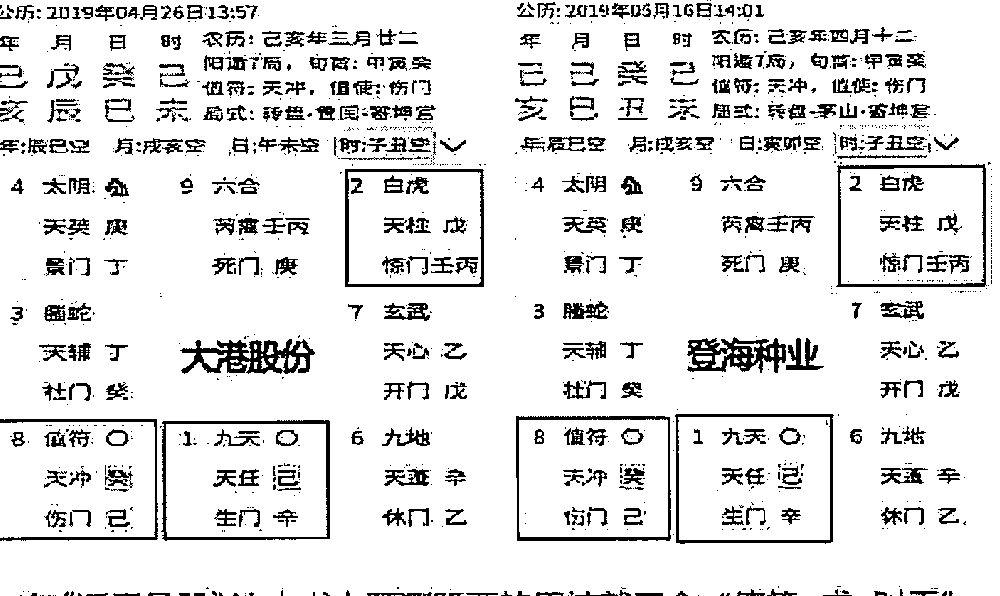

在《遁甲量股》这本书上预测股票的用神就三个“值符、戊、时干”。左图是预测“大港股份”这支股票的, 右图是预测“登海种业”两支股票的盘完全一样, 只是天干地支不同。

#### 用神一：值符

值符为大方向在艮宫, 艮为山止也, 保持一个状态。天冲为冲来冲去, 快; 伤门为有内伤; 癸加己躲避灾难; 甲加己贵人入狱。旬空为这些状态信息没有体现出来。
大像是讲保持在预备上冲的一个状态，它有痔疮，同时是套住的，是想躲避的。这些状态都不被察觉，随时准备冲。

### 用神二：戊

戊为钱在坤宫，坤为地顺也，大众普通。戊加丙青龙反首大吉利；戊加壬入天牢套住的；惊门担心；白虎压力山大；天柱凶星废变小吉，但也是指危险之像。
资金现在顺从，等待同时也压力大，很担心，被套住了一心想一血前耻一龙飞天。

### 用神三：时干

时干为方向的结果，已在坎宫，陷也。天任为固定、固执；生门为生长发展进步；九天为一飞冲天；己加辛游魂入墓，家仙作祟。
坎宫的信息是说陷着呢，但是固执的相信，我一定可以生长起来一飞冲天。旬空这些信息也没体现出来。

分析完成我很确定，这是一个套住的庄，随时准备冲上天，只是前段时间跌的太凶抬不住。
大港股份句空在“子、丑”结果当时我预测时在周五，就赶紧半個仓位进去了，等着下周开盘吃肉，结果放假五一，只有两天交易日，没拉。我亏了10多个点，妈的只有割肉走人！然后又是下周，开盘后持续涨了7个涨板，老子眼睛都气绿了。
登海种业，同样的盘，我周四进去，周五开盘直接就要涨停，今天又是周五，算了下周谁知道呢？我吃了8个点走人。结果下周一开盘大跌。
所以《遁甲量股》预测股票，是涨是跌，如果你确定是随机预测，同时分析准确，基本保证大方向绝对不会错，是涨是跌一清二楚，但是预测出大涨，涨7个板，还是7个点，就要根据当时的行情，还有这支票的特性来判断。
就像普通人说发财了，打牌仅赢了500元也说发财，而老板说发财了可能是500万也是发财。

### 一般人做不到！

如果你能保证一天或者几天预测几只你看中股票，由于没有反复的预测，没有失去“随机性”那盘像准确反映真实信息。同时你还要求你具备奇门遁甲扎实的基础功底，能够分析三个用神都在讲什么，不能只看到一个“九天、戊加丙”就望下判断。
在不同大盘行情时间，阶段，和股性，还有股票上在升浪中还是回调浪反弹，都要有准确的认识。然后将奇门遁甲预测技术结合起来使用。
它能准确告诉你接下来要涨还是要跌了，但是涨多高，涨几天它不告诉你，这个就要靠你自己去止赢。
另外我在测试中发现奇门遁甲预测股票只能显示近期1~7天左右，时间稍微久也一点，即使你问的是两个月，可能盘上信息都不是那么精确。
若要使用请实践两个用，做参考使用，慎重！

## 案例十八：预测经营证券公司发展和风水好不好

### （图一百零一）

公历：2019年04月27日22:14
年 月 日 时 农历：己亥年三月廿三
己 戊 甲 乙 阳遁5局，旬首：甲戌己
亥 辰 午 亥 值符：天心，值使：开门
局式：转盘-拆补-寄坤宫
年：辰巳空 月：戌亥空 日：辰巳空 时：申酉空

| 序号 | 神 | 星 | 天干 | 门 | 地盘干 |
| :--- | :--- | :--- | :--- | :--- | :--- |
| 4 | 值符 | 天心 | 己 | 景门 | 乙 |
| 9 | 螣蛇 | 天蓬 | 癸 | 死门 | 壬 |
| 2 | 太阴 | 天任 | 辛 | 惊门 | 丁戊 |
| 3 | 九天 | 天柱 | 庚 | 杜门 | 丙 |
| 5 | | | | | 戊 |
| 7 | 六合 | 天冲 | 丙 | 开门 | 庚 |
| 8 | 九地 | 芮禽 | 丁戊 | 伤门 | 辛 |
| 1 | 玄武 | 天英 | 壬 | 生门 | 癸 |
| 6 | 白虎 | 天辅 | 乙 | 休门 | 己 |

这个是我一个学生的案例，他说明友开的证券公司（估计是加盟的那种）似乎经营状况不是很如意，预测往后发展和调整。
这个奇门盘九星反吟局。

#### 用神一：值符

巽宫：巽为风，飘乎不定
天心：计划、想法、控制、中心
景门：兴奋、热烈
己加乙：墓神不明，地户逢星隐遁为利
甲加乙：青龙合灵，门吉事吉门凶事凶。
马星：事情在动
巽宫大像是讲一个好的让人兴奋的计划或者想法，方向不是很明确，好的时候就好，坏的时候就坏，变数很大可好可坏。（我理解为做这个行业可能是完全看天，交易多就多赚交易少就少赚，完全不确定）

### 用神二：日干甲午=辛

坤宫：坤为地，顺也，女人姿态
太阴：隐藏
天任：固执、死板、老实
惊门：担心、惊恐
辛加丁：狱神得奇，经商获倍利，囚人释放
辛加戊：困龙被伤，妄动则祸
旬空：心里没底，不踏实
坤宫是指求测人像个娘们儿(坤)似的固执的觉得做这个发财了，同时做这个投资太大自己也被困住了手脚(困龙被伤)，挺担心的。心里实在没有底，不知未来发展结果，上述这些都是隐藏的，没有体现出来(太阴)。

#### 旬空看对面宫：艮宫

艮宫：艮为山，止也。
天芮：病态、沮丧、郁闷
戊加辛：青龙折足，门则随意，门凶枉劳心机
丁加辛：朱雀入狱，罪人囚，官人失位
伤门：受伤、损失

## 13章：预测案例

人入墓：结束完蛋

艮宫是讲求测人的心都关注在非常消极的方面，想的都是亏本(青龙折足)，投资太大这回套住了（朱雀入狱），损失了，完蛋了。

从坤宫和艮宫我们可以看出，虽然是老板，但是从落宫定位，状态、思想，关注，想法来看，办不好。

### 用神三：开门

兑宫：兑为口、缺、不足

六合：结合、合作、聚集

天冲：冲来冲去、速度快

丙加庚：贼即去门户破败盗贼耗损

旬空：空就是不实，里面没人气，也是没能量

兑宫和坤宫求测人同时旬空了，旬空在这里有两重意思，一人指这个人的心思没的公司，二是这个公司气场空，没有能量自然不聚客，不聚财。

兑宫是说这个公司很多不足之处，而且没人气人能量，天冲是指速度

### 开神四：生门

坎宫：坎为水，陷也，低

玄武：不明白、套路、暗昧、偏财

天英：热闹、烦乱，热烈

壬加癸：幼女奸淫，家有丑声门吉星凶反祸福隆

坎宫玄武，看来利润里面有很多不被人知的门道，我不懂行业只能按盘上，天英看起来搞的挺热火，但坎宫在辰月气衰利润本来少得很。里面有还壬加癸幼女奸淫，大概是说一些有暗昧的其它收入吧。

后面案例作学者练手之用，我不作出分析思路，也不提供答案。

全靠你自己分析，分析用神的过程中，根据预测事项的不同，自己转换用神宫位中的每个符号含义。

分析过程中绝对不要加上自己主观的任何一个看法和观念，直接翻书写出含义即可，最后结果才需要你思考！

这才是最准确真实的分析结果。中间的任何一个用神，只要你添加了你自己主观的看法或者确定的含义，就容易以点盖面，偏离预测真相！

## 案例十九：男士问今年财运

（图一百零二）

| 公历: 2019年04月25日12:54 | 农历：己亥年三月廿一 |
| :--- | :--- |
| 年 己亥<br>月 戊辰<br>日 壬辰<br>时 丙午 | 阳遁8局，旬首：甲辰壬<br>值符：天冲，值使：伤门<br>局式：转盘-拆补-寄坤宫 |
| 年:辰巳空 月:戌亥空 日:午未空 时:寅卯空 |  |

| | | |
| :--- | :--- | :--- |
| 4 白虎<br>天柱 乙<br>休门 癸 | 9 玄武<br>天心 [丙]<br>生门 己 | 2 九地 [勾]<br>天蓬 庚<br>伤门辛丁 |
| 3 六合 [O]<br>芮禽辛丁<br>开门 壬 | 5<br><br>丁 | 7 九天<br>天任 戊<br>杜门 乙 |
| 8 太阴 [O]<br>天英 己<br>惊门 戊 | 1 螣蛇<br>天辅 癸<br>死门 庚 | 6 值符<br>天冲 [壬]<br>景门 丙 |

用神一：值符同日干

乾宫：

天冲：

景门：

壬加丙（甲加丙）：

### 用神二：戊代表钱

兑宫：

天任：

九天：

杜门：

戊加乙：

### 用神三：己（他的流年天干，做一年之看）

艮宫：

太阴：

天英：

惊门：

己加戊：

旬空、入墓：

### 用神四：参考用神

上半年：艮、震、巽、离

下半年：坤、兑、乾、坎

## 案例二十：一美女问和一个男士相处能成吗

（图一百零三）

公历：2018年10月28日12:20

年 戊  月 壬  日 癸  时 戊    农历：戊戌年九月二十

戌 戌  巳 午    阴遁2局，旬首：甲寅癸

值符：天心，值使：开门

局式：转盘-拆补-寄坤宫

年:辰巳空 月:子丑空 日:午未空 时:子丑空

| 4 太阴 | 9 螣蛇 | 2 值符 ☴ |
| :--- | :--- | :--- |
| 芮禽戊丁 | 天柱 壬 | 天心 癸 |
| 死门 丙 | 惊门 庚 | 开门戊丁 |
| **3 六合** | **5** | **7 九天** |
| 天英 庚 | | 天蓬 己 |
| 景门 乙 | 丁 | 休门 壬 |
| **8 白虎 ○** | **1 玄武 ○** | **6 九地** |
| 天辅 丙 | 天冲 乙 | 天任 辛 |
| 杜门 辛 | 伤门 己 | 生门 癸 |

这个案例是一个女的，最近处了一位男士，像是女的很喜欢男的，但是男的却好像半推半就，女的就想知道和他能成吗？

#### 用神一：值符

坤宫：

天心：

开门：

癸加戊（甲加戊）：

癸加丁：

癸入墓击刑：

马星：

总结：

#### 用神二：乙（女方用神）

坎宫：

天冲：

伤门：

玄武：

乙下戊：

旬空：

总结：

旬空看对面宫：离宫

离宫：

天柱：

惊门：

壬加庚：

总结：

用神三、四：庚（男方用神）、六合

震宫：

六合：

庚加乙：

天英：

景门：

总结：

# 附录《烟波钓叟歌》

阴阳逆顺妙难穷，二至还乡一九宫。若能了达阴阳理，天地都在一掌中。
轩辕黄帝战蚩尤，涿鹿经年苦未休，偶梦天神授符诀，登坛致祭谨虔修。
神龙负图出洛水，彩凤衔书碧云里，因命风后演成文，遁甲奇门从此始。
一千八十当时制，太公删成七十二。逮于汉代张子房，一十八局为精艺。
先须掌上排九宫，纵横十五在其中。次将八卦论八节，一气统三为正宗。
阴阳二遁分顺逆，一气三元人莫测。五日都来换一元，超神接气为准侧。
认取九宫为九星，八门又逐九宫行。九宫逢甲为直符，八门值使自分晓。
符上之门为直使，十时一位堪凭据。直符常遣加时干，直使逆顺遁宫去。
六甲元号六仪名，三奇即是乙丙丁。阳遁顺仪奇逆布，阴遁逆仪奇顺行。
吉门偶尔合三奇，值此须云百事宜。更合从旁加检点，余宫不可有微疵。
三奇得使诚堪使，六甲遇之非小补。乙逢犬马丙鼠猴，六丁玉女骑龙虎。
又有三奇游六仪，号为玉女守门扉。若作阴私和合事，请君但向此中推。
天三门兮地四户，问君此法如何处？太冲小吉与从魁，此是天门私出路。
地户除危定与开，举事皆从此中去。六合太阴太常君，三辰元是地私门。
更得奇门相照耀，出门百事总欣欣。太冲天马最为贵，卒然有难宜逃避。

但当乘取天马行，剑戟如山不足畏。三为生气五为死，胜在三兮衰在五。
能识游三避五时，造化真机须记取。就中伏吟最为凶，天蓬加着地天蓬。
天蓬若到天英上，须知即是反吟宫。八门反复皆如此，生在生兮死在死。
假令吉宿得奇门。万事皆凶不堪使。六仪击刑何太凶，甲子直符愁向东。
戌刑在未申刑虎，寅巳辰辰午刑午。三奇入墓好思推，甲日那堪见未宫。
丙奇属火火墓戌，此时诸事不须为。更加天乙来临六，月奇临六亦同论。
又有时干入墓宫，课中时下忌相逢。戊戌壬辰兼丙戌，癸未丁丑一同凶。
五不遇时龙不精，号为日月损光明。时干来克日干上，甲日须知时忌庚。
奇与门兮共太阴，三般难得总加临。若还得二亦为吉，举措行藏必遂心。
更得值符值使利，兵家用事最为贵。常从此地击其冲，百战百胜君须记。
天乙之神所在宫，大将宜居击对冲。假令直符居离九，天英坐取击天蓬。
甲乙丙丁戊阳时，神居天上要君知。坐击须凭天上奇，阴时地下亦如之。
若见三奇在五阳，偏宜为客自高强；忽然逢着五阴位，又宜为主好裁详。
直符前三六合位，太阴之神在前二，后一宫中为九天，后二之神为九地。
九天之上好扬兵，九地潜藏可立营，伏兵但向太阴位，若逢六合利逃形。
天地人分三遁名，天遁月精华盖临，地遁日精紫云蔽，人遁当知是太阴。

开门六乙合六己，地遁如斯而已矣。休门六丁共太阴，欲求人遁无过此。
要知三遁何所宜，藏形遁迹斯为美。庚为太白丙荧惑，庚丙相加谁会得？
六庚加丙白入荧，六丙加庚荧入白。白入荧兮贼即来，荧入白兮贼须灭。
丙为悖兮庚为格，格则不遁悖乱逆。丙加天乙为悖符，天乙加丙为飞悖。
庚加日干为伏干，日干加庚飞干格。加一宫兮战在野，同一宫兮战在国。
庚加直符天乙伏，直符加庚天乙飞。庚加癸兮为大格，加己为刑最不宜。
加壬之时为上格，又嫌岁月日时逢；更有一般奇格者，六庚谨勿加三奇。
此时若也行兵去，匹马只轮无返期。六癸加丁蛇天矫，六丁加癸雀入江，
六乙加辛龙逃走，六辛加乙虎猖狂。请观四者是吉神，百事逢之莫措手。
丙加甲兮鸟跌穴，甲加丙兮龙反首。只此二者是吉神，为事如意十八九。
八门若遇开休生，诸事逢之总称情。伤宜捕猎终须获，杜好邀遮及隐形。
景上投书并破阵，惊能擒讼有声名。若问死门何所主，只宜吊死与行刑。
蓬任冲辅禽阳星，英芮柱心阴宿名。辅禽心星为上吉，冲任小吉未全亨。
大凶蓬芮不堪使，小凶英柱不精明。大凶无气变为吉，小凶无气亦同之。
要识九星配五行，各随八卦考羲经：坎蓬星水离英火，中宫坤艮土为营，
乾兑为金震巽木，旺相休囚看重轻。与我同行即为相，我生之月诚为旺。

度于父母休于财，囚于鬼兮真不妄。假令水宿号天篷，相在初冬与仲冬，
旺于正二休四五，其余仿此自研究。急则从神缓从门，三五反复天道亨。
十干加伏若加错，入库休囚吉事危。十精为使用为娄，起宫天乙用无遗。
天目为客地为主，六甲推兮无差理。劝君莫失此玄机，洞彻九宫扶明主。
宫制其门不为迫，门制其宫是迫雄。天网四张无路走，一二网低有路通，
三至四宫行入墓，八九高强任西东。节气推移时候定，阴阳顺逆要精通。
三元积数成六纪，天地未成有一理。请观歌里精微诀，非是贤人莫传与。

# 预测：清空内心，去除我执

预测过程中，特别是为自己预测或者及家人、亲人预测时，你想看到吉的信息，总是在最凶的信息中找到吉的，你想看凶的就能看到凶的信息。只要你执着于“吉凶”这概念，你就看不准看不懂。

只有以客观的，与自己无关的角度去看。同时去我执，去我念头。或者彻底关掉自己的“我以为、我认为、我觉得”这些东西你就成高手了。

就像天真的孩子一样，盘上显示什么信息，你就读什么信息，最后结果自现。
你总是想要在上面找到“你要的结果”也总能找到结果，但是这个结果就偏离了真相。不找任何结果，直接读出来，这就是真相。

阴阳顺逆妙难穷
二至还向一九宫
若能了达阴阳理
天地都来一掌中