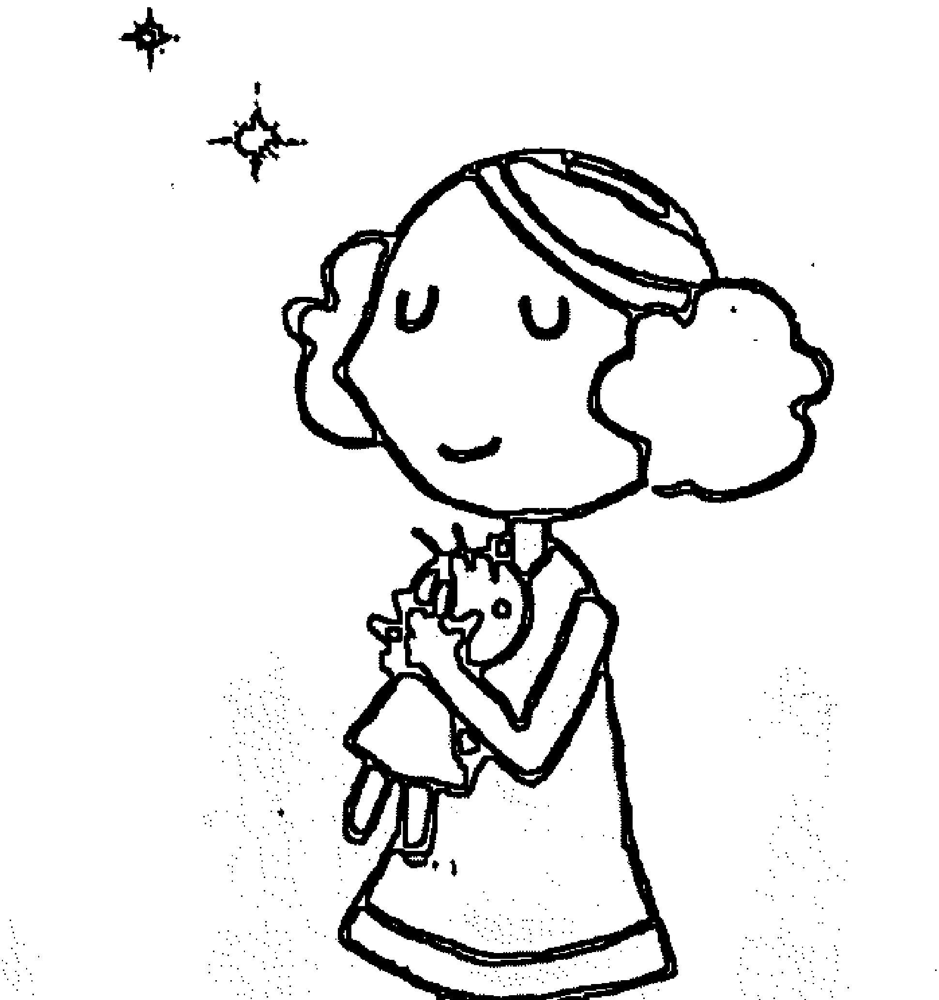
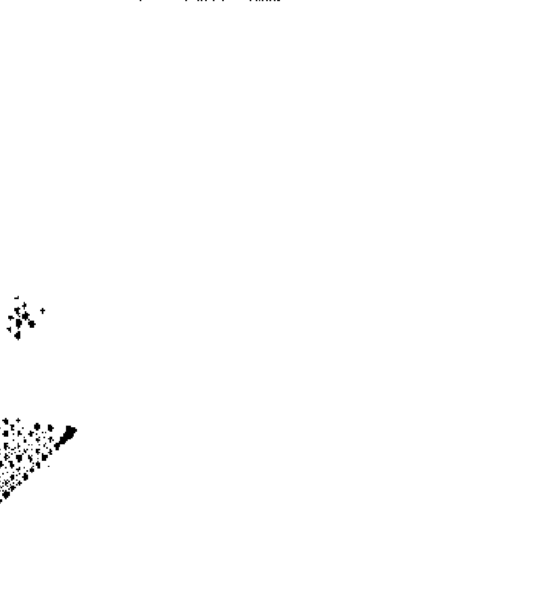
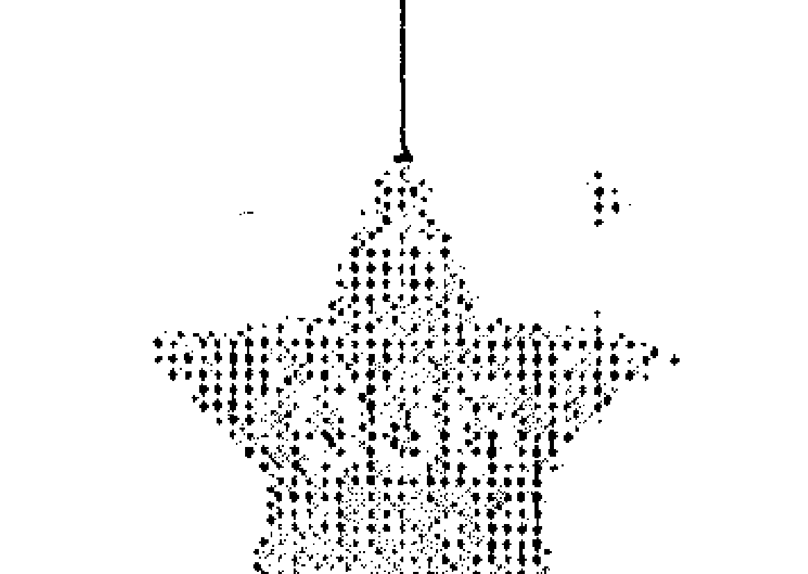
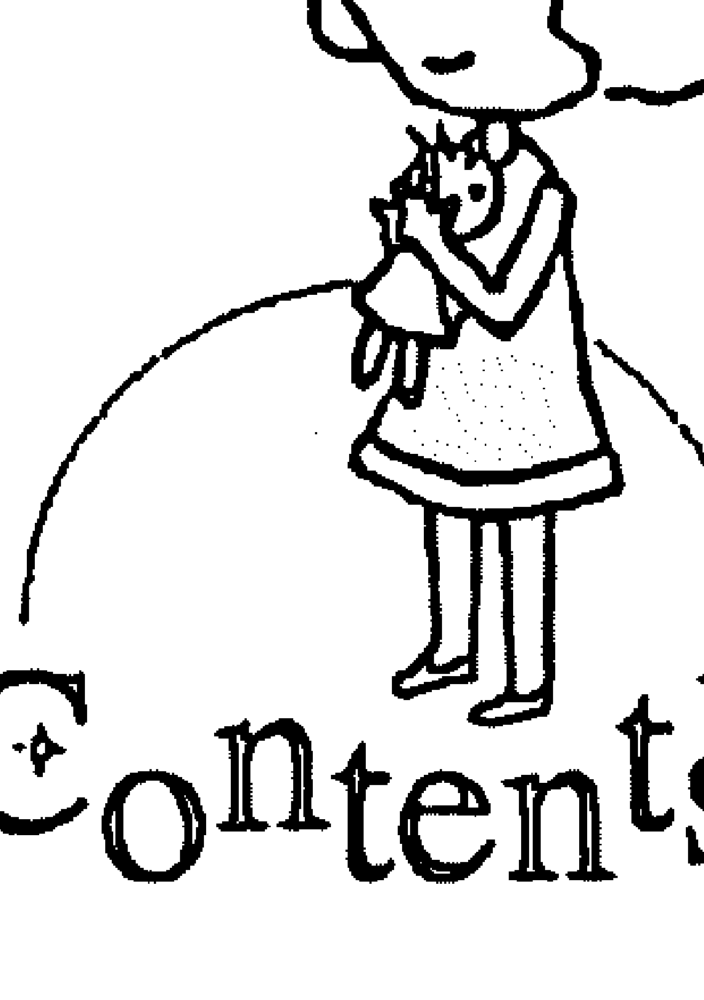
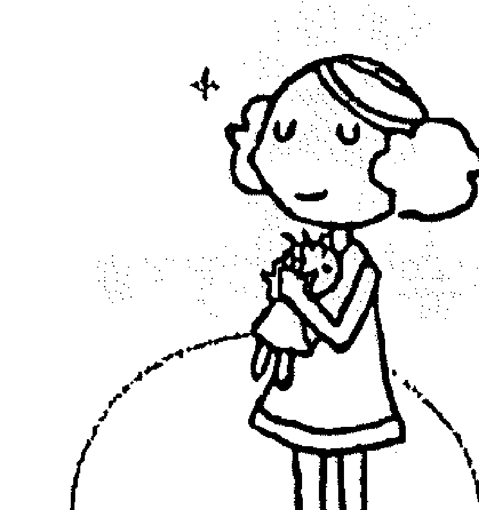
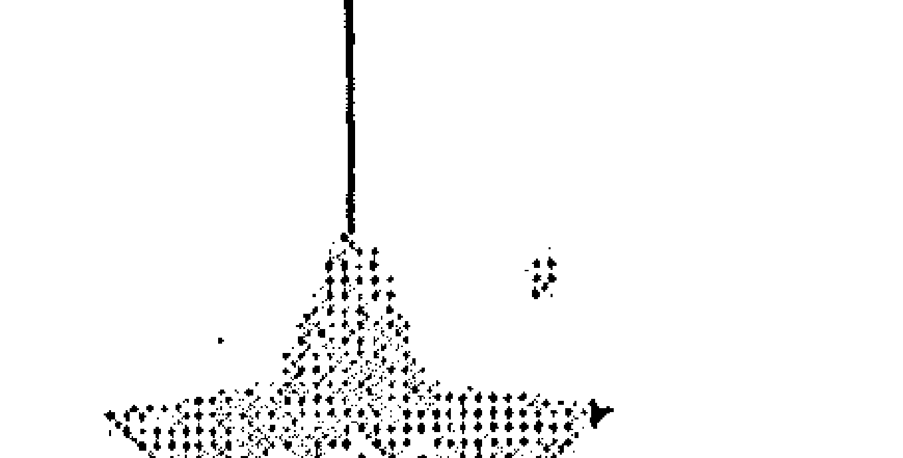
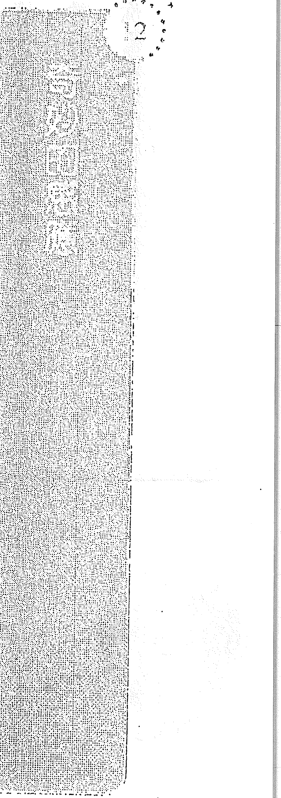

## 向宇宙下訂單

Bestellungen beim Universum

貝波兒·麼爾 ◎著 林燕君◎譯

大膽要、放心收！秘密真人實證版

## 向宇宙下訂單

### 【推薦序】打開了每個人心裡的一扇窗

曲家瑞

作者一開始因為不相信，而自己親身試驗，設法去找出答案。這樣的精神很棒！

讀了本書你會更勇於追夢，更專注於自己所愛，更清晰聽到自己內在的聲音。

它打開了每個人心裡的一扇窗子，讓生命的可能無限延伸。

我喜歡，希望你更喜歡。

### 【推薦序】我的老師克里斯多夫孟說：「如果你想要的東西沒有在你生活中出現，那就表示，你不是真心想要它，你更想要別的。」所以每個人都在問：到底怎麼樣才能做到「真心想要」呢？這本《向宇宙下訂單》就是作者以她自身的經歷，現身說法的把她心想事成的秘訣無私的與大家分享。她以淺顯易懂的內容，舉證歷歷的方式，把「真心想要」的狀態、方法，以說故事的方式娓娓道來，這真是所有國外吸引力法則的叢書中，最平易近人的一本！

張德芬

## 向宇宙下訂單

### [推薦序] 純屬巧合也不錯

**鄭華娟**

出版社要我給這本書寫推薦文，我毫無意願，原因是：我不迷信，也不對事情奢求，那還要跟宇宙訂什麼呢？沒有！

所以，我回絕了寫推薦文。

不過，我照書中的方法搞笑的對夜空說：「讓我明天遇見新鮮的事吧！」其實，我幾乎天天都會有好玩的新發現，這種對天空下訂單的方式對我並沒啥新鮮感。

第二天，我去店裡買東西，剛好遇見一位大家公認的兇店員，我對她抿嘴一下，很怕被她罵，但她居然溫柔的說：「您是XXX的朋友，對吧？我給妳打折……」

哇！這可真新鮮！因為這根本就不可能嘛！可見這本書跟宇宙間的一家「純屬巧合」商店一定有簽約，對我的好笑訂單回應啦！

「純屬巧合」的好事也不壞，在煩惱的時候，可以試試這種十分娛樂的放鬆感覺！

## 向宇宙下訂單

### 【譯序】全世界都在幫我實現願望

《向宇宙下訂單》是告訴讀者以正面思考來許願，會提高願望實現的機率，也教大家許多小技巧，運用這些技巧幫助自己實現願望。出版社給我《向宇宙下訂單》這本書時，讀著讀著，我突然想起自己從採訪編輯轉業成翻譯的過程，我不想用「神奇」來形容，我寧願認為是注意力集中在某物上頭，所以才會覺得生活中碰巧遇見某物的機會突然變多，但有些巧合仍讓我感到不可思議。

我決定轉業當翻譯時，著手在網路、書籍雜誌、電視了解這行業的現況，複習翻譯知識技巧，補充德國常識與時事等，有一天我突然發現好像全世界都在幫我實現願望。

一開始對自己其實沒有那麼大的信心，但是參考許多前輩經驗後，越來越覺得自己很適合這一行，猶疑躊躇的心情逐漸消褪。之後剛好台北國際書展開幕，我打算去德國館看看新的德文書籍，若能買就買回家做翻譯練習。當天出門之前剛好瞥見電視上的星座運勢，說我這天會有好事發生，於是懷著愉快的心情出門。到書展現場後，發現展覽的書不賣，想到之後可能要花大筆運費買書，傷心了一會兒，星座運勢果然是聽聽就算了。可我沒想到，在同一現場，我竟然遇見大學時代的翻譯課老師。我本來不想和老師相認的，但又覺得這或許是上天安排，沒遇到別的老師，偏偏是翻譯老師，最後，我鼓起勇氣上前跟老師請教關於翻譯的各種事情，老師大大鼓勵我，並提點我應該加強的專業能力。這應該才是星座運勢說的好事吧！

後來，我取得德文書，開始練習翻譯，為此我特地到書店買新的細字筆，方便查字典寫字義。坐在書桌前我一邊練習，腦裡一邊浮現自己真的變成專職翻譯的模樣，想到自己正往目標邁進，覺得很高興。

在《向宇宙下訂單》裡便提過這個小技巧，如果你想實現願望，要避免浮現不要、不是之類否定的字眼，順著腦裡浮現的圖像去想像。讀到這裡我嚇一跳，當時我的確想著自己真的成為翻譯的模樣，而不是搞砸工作的模樣。

到了向出版社毛遂自薦的階段，也許先前準備工作做得不錯，所以過程還算順利，但我仍覺得不滿足，卻也不知接下來該怎麼做，因此著急起來。之後有一天逛書店，邊逛邊想未來生涯，心裡有個聲音冒出來：「妳擔憂工作量不足，可是妳接觸的出版社也不夠多啊！」這下我心裡的結突然解開了，是啊，我還有很多地方不夠努力，回頭我又積極向更多出版社自薦。當我讀到《向宇宙下訂單》裡「如何傾聽心裡的聲音？」，發現裡頭提到的內容，有許多我已經經歷過，實在忍不住要噴噴稱奇。除了以上這些「巧合」，在書店裡剛好看到不少介紹德國最新訊息的新書、新雜誌，轉開電視隨便都能看到德國相關的歷史、旅遊、時事訊息，甚至我愛看的日本旅行戀愛實境節目，居然也剛好旅行到德國！

經過這次轉業的經驗，加上讀了《向宇宙下訂單》，我更確信傾聽自己、正面思考足以讓人心想事成。如作者所說，只要你對任何事情有疑惑，建議隨時都來翻翻這本書，相信多少能為你指引方向。

## 前言

打开了每个人心裡的一扇窗

曲家瑞

你是不是真心想要？

張德芬

純屬巧合也不錯

鄭華娟

全世界都在幫我實現願望

6 我該如何學習傾聽內心的聲音？

5 宇宙下訂單服務如何運作？為什麼應該傾聽內心？

4 為什麼這個方法有用？

3 自我測試：我是不是能讓宇宙訂單服務運作良好？

2 下單練習

1 我發現「向宇宙下訂單服務」

015

027

039

043

053

057

## Contents

- 7 保持放鬆狀態，想要的一切自然來 073
- 8 內在的平靜就是萬靈藥 081
- 9 理論都是蒼白的，親身體驗才重要！095
- 10 下單技巧的細節要點 105
- 11 「天堂」究竟是什麼樣子？真的有天堂嗎？121
- 12 奇妙的感應 125
- 13 總結 131
- 14 每日生活小叮嚀 133

## 向宇宙下訂單

親愛的讀者朋友：

在這本書裡，我想用朋友的語氣跟大家說話。因為，我覺得我們就像同一條道路上心靈相通的伙伴，而且用這樣的語氣我會感到比較自在，寫起東西也能更順暢。希望大家都同意我這樣的做法。

「學以致用，勤能補拙。」意思是說，我也沒辦法做到十全十美，對我而言，生活就是一種天天進行的練習。不過我練習的時候完全沒有壓力，如果有壓力的話，我早就放棄了。有時候我會很懶散，而且也被超棒的「宇宙下訂單服務」給寵壞了。對我來說，做一件事必須：

- 簡單
- 好玩
- 付出的每一份精力都能善盡其用
- 超推薦大家跟著一起做喔！

祝閱讀愉快！

你誠摯的 貝波兒

P.S. 順便提一下，你不一定要全部讀完才能開始「下訂單」，無論你讀多讀少，想開始時就可以開始。書裡有許多訣竅與協助，找出感興趣的部分就好。反覆讀某幾個段落，或是隨時翻開來查閱你需要的部分，都比乖乖的一章接著一章啃下去有用。當然，這樣讀也無妨，你高興就好。只有你自己才知道，怎麼做才最開心。好好傾聽你心裡的聲音吧！

## 我發現「向宇宙下訂單服務」

這一切要從幾年前我和朋友吵架開始說起。我有個朋友讀了一本要人積極正面思考的書之後，建議我向宇宙下訂單，就能與心目中完美的男人相遇。我那時候沒想那麼多，只覺得聽到這種話讓人很火大，我想我必須在她徹底腦殘之前，救她一把。最後我們不吵了，為了證明她在瞎扯，我試著下了一份訂單，列出那個完美男人應具備的九項條件：吃素、不抽煙、不喝酒、會太極拳……之類的。為了讓事情碰巧成真的機率微乎其微，我還故意把實現的時間明確設定在三個月後的某一週。就這樣，我們的激辯暫時告一段落。到了之前設定好的那一週，符合九項條件的男人真的出現了。「太扯了吧！」我想。沒多久我就知道，這次的嘗試十分有價值，而且還會讓人上癮。

只要眼前該做的事我都會全力以赴，而且我也不是躺在床上，什麼都只想靠「下訂單」解決的那種消極的人。不過，只要出現我很想要、看起來卻完全不可能得到的東西，我就會「下訂單」！像是想要辦公室、錢（我如願得到一筆錢，可惜那時我不相信能拿到更多數目，我的懷疑阻斷了宇宙能量的流動）、工作、房子等。

我以前曾在新聞通訊社工作，主要是排一頁資料頁，可以任由我自己做主，決定怎麼編排。我很喜歡這份工作，因為我原本就想學習如何編排雜誌。而夜校的電腦排版課不但很貴，又得要花好幾年的時間，我認為不值得。

這時候為了好玩，我又多下了一個訂單，反正又不會吃虧。我許了個願，希望在鄉間舒適的小公司裡工作，老闆年紀要和我差不多，而且還是個討人喜歡的、好脾氣的人。

沒多久，我的同事離職，她費了好幾個月的時間，換了好幾個工作，終於在鄉下的一個小小通訊社找到安身之處。她的老闆人很好，二十六歲，而且全部的編排工作都是她一個人做。我一時之間目瞪口呆，我下的訂單竟完全在她身上實現，太不可思議了！

這個時候我還有另一個訂單也正在進行。我有個前男友（他不是我訂來的）欠我很多錢，我想把這筆錢給「訂回來」，不管哪來的都好。錢不一定要從他那邊來，反正他本來就一無所有。後來我換了新工作，去一家雜誌社上班，那本雜誌在四個月後停刊，依照合約，我可以獲得一筆可觀的遣散費，正是我先前下訂單要討回的債務數字。太讚了！有了這筆錢，我第一次可以出國玩，還可以學義大利文。

不過我沒去成，因為上一個訂單剛好送來了：我的老同事打電話來，要我當救火隊。她請老闆（二十六歲那位）給她一個月的時間，剛好夠她教我學會編排版面。

那是一個鄉下地方，我們在花園裡有張木桌，還有長板凳，兩個人做六份完全不同領域的雜誌，人在那兒待了兩年，真是超棒的！

我最想要的願望終究還是男人。繼那位九項條件的男人之後，我又修正成十五項條件，而連符合十五項條件的男人也跟我交往失敗後，為了預防各種可能的狀況，最後訂單上變成二十五項條件！而且永遠都註明達成的時間，絲毫不讓老天拖延……

不過呢，事情卻有些蹊蹺。你一定無法相信，下訂單的時候有多少變數沒考慮到。二十五項條件都齊全了，但我對著二十五分男人，卻比對著零分男人還有壓力。列出多少條件根本不能保證什麼！

前陣子我有個好朋友提供了一個厲害的點子，他建議我只要簡單的說：「許我一個和『當下的我』最適合的男人。」我覺得這主意也未免太粗糙隨便了，更不相信老天會幫我挑個聰明點的。不過我朋友為他的點子打包票，而且對三天後的成果十分滿意。

我想，恐怕是出在我的「不信任」吧！我太小看「宇宙訂單服務」了，我覺得如果沒有「施點壓力」、沒有設定「送達日期」，老天爺一定會悠哉悠哉的慢慢來……其實剛好相反，我越信任宇宙，就越快實現。

順便說一下，我的第一個訂單是在灑滿月光的陽台上，很浪漫的許下的。現在我不管走到哪裡，就在哪裡下訂單，想到什麼，就訂下什麼。有一次，我下了個訂單：希望在一週內，在住家附近找到一間便宜的辦公室。我是在書桌前許願的，過了三天，我的鄰居打電話來，說有間辦公室可以賣我，我有點吃驚，但最後沒有買，因為當時我們的規劃案出了點問題。

我想，那次的訂單多少有點太倉促了。

小心，你的願望和所下的訂單可能會馬上實現！不然哪天要下重要訂單的時候，你可能已經搞不清楚下的訂單對自己到底有沒有好處了。所以我良心的建議是：想想自己真正要的是什麼。我跟一個很要好的朋友談起下訂單的結果，他每次都笑翻了，他覺得『如果神要制裁一個人，他會滿足那個人的願望』。

這種說法實在是老掉牙了，我完全不同意。而且正好相反，我覺得連那些一一實現卻發現不對的願望，都很有用。誰知道如果不是那樣，我要花多少時間才會明白我其實不需要這些東西？說不定我會花好幾年的時間去追逐一大堆不切實際的夢想。這些失誤的願望，讓我及早接近我生命中真正想要的那些要素。不過，只要越常用你的「心」，傾聽內心的聲音，就可以避免許下不必要的願望。

簡注：你不需要使用什麼特別的呼吸法，或是搞得神恍惚，來設定你的潛意識；也不需要進入催眠狀態、倒立唸出你的訂單。只要好好思考，細心感覺，然後像孩子般天真可愛的說出願望，願望自然就會實現了。

注意：你肯定偷偷在擔心，一開始要怎麼做才對？無論是你的潛意識或宇宙都無法理解下列的表達方式：「我不要這個跟那個」或「希望這個跟那個不要發生」。「不要」「不是」之類的字眼會被刪掉，而你腦中的圖像則會開始成真。舉例來說：你安靜的坐下，告訴自己三分鐘內不要想到北極熊，在這段時間裡盡可能不要想到北極熊。結果，你會發現，你不希望想到的東西，仍然會在眼前形成一幅圖像，這樣一來，多少會妨礙到你真正的願望。「首先，你必須要相信，然後要進入完全的信任，接下來證據就會顯現，會透過你的信仰而顯現。這就是宇宙的精神法則。」哪天你會知道（也就是深信不疑），你所有的期盼與要求都會實現。要是有什麼事情明顯不對勁，這表示還有更好的東西等著你，不然就是這個願望有些困難之處，只是你現在還沒辦法看清。你將會知道，最棒的事始終會成真，而且很快。

剛開始的時候，你不必一下子就完全相信，我和我朋友吵架後也沒有馬上相信。只要對心想事成的可能性持開放態度就可以了。你會從自己的內在得到幫助，因為宇宙對幸運的人有興趣；幸運的人重視且認真對待大自然。

## 下單練習

我們可以用一些「不太重要」的小事來「練習」下訂單，練習有助於提升信任，信任提升後，願望實現的速度也會比較快。舉例來說，我住的地方小到塞不下洗衣機，所以我都是去洗衣店洗衣服。最近我發現那家店的九號乾衣機溫度最高、烘乾速度最快，相比之下，十一號是最遜的，烘乾速度最慢。「OK，我希望下次可以使用乾衣機九號，麻煩了。」那天我下了這樣的訂單。

隔週，我在洗衣店將衣服放進洗衣機裡，然後望向乾衣機那邊。「等等，我不是下訂單要使用九號嗎？不會吧，九號已經被佔用了。我那『心愛的』十一號卻沒人用。好吧，也許九號被佔用的時間只剩一下下而已。我只能用那個爛乾衣機嗎？拜託不要啦。」就在我對著乾衣機生氣時，事情出現大逆轉。「呼滴嘟滴嘟，」我隨口亂哼著。

我那台洗衣機停止了。就在洗衣機蓋子打開的那一瞬間，九號烘衣機也停止運轉，然後……原本在用的那個太太就把她的衣物取出，於是我就在那一秒接收了先前下好訂單的九號乾衣機。

如果這種事情一年只發生一次，是可以當作偶發事件。但如果你越敞開心胸，類似這樣心想事成的事就會越常發生，到最後，就會習慣這些事如你所願的每天接連出現。不管用怎樣的方式，我們應該要減少生活中的壓力，這樣才能擁有更多快樂與閒暇。

還有一個下訂單的範例：就如剛剛所說，我住的地方很小，只有四十平方公尺。我就在這裡睡覺兼工作，真的是小到不行。如果住處能稍微大一點，例如袖珍可愛的城堡也不壞。但是房租不能再增加，因為我現在住的地方租金很便宜，我一點都不想再多付租金，否則我還得為這筆租金多做些工作，這可不好玩。

為了讓事情更有趣，我和朋友對宇宙下了這樣的訂單：「請送個城堡給我吧！」下了這個好玩的訂單後過了大約一年，我另外一個朋友真的搬進城堡裡，並在那邊生活與工作。趁一次週末的拜訪，我好好逛了逛城堡，並徹底愛上它。那裡就像長襪皮皮（注）的彩色屋，不過，是屬於大人的彩色屋。城堡裡到處都是走廊、樓梯、轉角、陰暗角落與坡道，非常大，當然也很舒適。仔細觀察這座城堡，它會是個理想的住家及辦公室，和我所想的相去不遠。幾個星期後，我這位朋友打電話來說：他們想要擴編團隊，也許我可以跟他們一起工作，當然也可以住在城堡裡。然後我又到那裡去了，而且一到就獲得了另外三個很棒的巧合故事，那是替一本以巧合為主題的書所收集的（當時我正在收集發生在各類人身上最棒的巧合故事）。不過在城堡裡工作并不是很順利，因為工作所需的知識，我還有 所欠缺。而且我也不喜歡住得離男朋友太遠。另外，雖然這座附有小教堂及六十二個房間的城堡非常漂亮，但它其實是一座矗立在山邊的堡垒，而且没有花园。如果城堡有花园，而且能离我男朋友近一点，那就更好了。不过，住家与办公室的部分确实符合我所愿！我原本只有想到这几点。所以有时候如果我想到一些类似的东西，我会先自问，我是否真的希望这样的情况发生？每一次都完全精准的如我所愿，似乎不太可能？！最近，我还有个朋友也找到一座城堡，要改建成附有素食烹饪教学室的教学中心，位于慕尼黑南方，更靠近我男朋友的住处。城堡里有一座非常漂亮的可爱花园——从阳台望出去还有美丽的湖光山色。当然啦，他星期日前往度假，也顺便带我一块去了，而且啊，尽管是星期日，城堡的管理员并没有休假。还有，这里的管理员很和善，更棒的是，当这里改建完成后，需要几位工作伙伴。大家可以坐在一起聊天……

# 向宇宙下订单

天……
我目前正在撰写那本关于巧合的书，同时也忙着编一本自己的
（正向思考的）杂志，要花很多时间。也就是说，我何时可以在哪座
城堡和别人一起工作，都还没个准。有个熟人问我一个问题：难道我
都不怕这个“送货中心”来跟我“收帐”吗？我坐在这儿，订了这么
如梦似幻的东西，得到了之后却没有使用。这样子实在不怎么妥当。
“你怎么思考，世界就会是那个样。”我只能这样回答她。如果
你躲在小房间里，想着“我没有权利这么做”，那么什么事也不会发
生。如果你还是害怕所谓的“帐单”或“代价”，那么你也就创造了
这样子的实相。因为“你怎么思考，世界就会是那个样”！
我反而有预感，自己会因为下了很多超棒的订单而获得额外的回报，就像送货中心的工作人员收到一施数量很大的订单而再多送一些礼物一样。这个技巧有着难以衡量的好处，人通过一种神秘的方式不再感到孤单。越常运用『下订单』的技巧，这种不再孤单的感觉会越强烈。『亲爱的宇宙，我找不到眼镜……』

## 下单练习

> 次我把眼镜摆在哪里？麻烦给个暗示。啊，在这里，谢了。

我这篇要给杂志的文章还需要一点小小的“助力”，喂，宇宙下订单服务中心，你有什么主意吗？该怎么做？在哪里呢？我该去哪挖掘我要的东西呢？这里头只有垃圾啦！不，真不敢相信，我丢掉这张纸条已经好几年了。这恰恰就是我为了这篇文章一直寻求的东西！

大家或许也会跟自己讲话，跟自己的潜意识讲话。只要能行得通，什么样的方式都无所谓。伊莉莎白·库伯勒-罗斯（Elisabeth Kübler-Ross）对濒死体验的研究（请见第十一章），以及一些有通灵能力朋友的经验，常让我深思。我想，大家对于各种可能性，不妨保持开放的心态。我是从实用的角度来看待这件事——行得通才是最重要的！

无论如何，回头来谈谈我那些“芝麻大的订单”。有时候，生活上会遇到危机状况（只是有可能），在极度惊恐下，我们多半想不出该怎么帮自己摆脱这种状况，或者也想不出该怎么帮别人。我们有办法吗？越是以前平常心来下订单，就越容易替危机状况找到灵感与解决方法，也越能保持镇静。我总是窝在小房间里喃喃自语：“好吧，如果我自己办不到，那就只好下订单了。”这是个有用的方法。

我一定是在下意识里把危机订给自己。一切原本就存在于我内心。但如果有人已经昏头了，要他有意识的向宇宙下一个良好解决方案的订单，这不是不切实际吗？我的忠告是，要从受难者变成创造者。依我之见，一个“清醒”的人并非什么都知道、什么都做得到，

# 向宇宙下订单

而是会观察自己、在任何情况下都能清楚作决定的人：“我想要思考什么？我想要透过我的思想与感觉，为自己创造什么？”明确的意向（＝下订单）有助于获得宇宙明确的回应。如大家所见，我那些城堡和其他许多不太可能实现的愿望，也都成真了！

接下来的几个篇章，会提供诀窍与激励，让大家更容易“进入宇宙之流”，心胸更开放，也信心满满。这些篇章就某种程度来说是一种“下订单训练”。其实，下订单这件事也不是很简单……相反的，简直困难得可怕。这里头只有唯一一个困难，这个困难就是要彻底下订单有多么简单。我们内心常常会执行一个内建程式，这个程式会矇骗我们生命很艰困。只要你领悟到这一切其实很简单，那么它会马上变得很简单！

## 下单练习

注：长袜皮皮（Pippi Langstrump），瑞典儿童文学大师阿思缇・林格伦（Astrid Lindgren）的成名作，也是全球最受欢迎的儿童故事之一。皮皮是个善于表现自我、勇敢的小女孩，红头发、满脸雀斑，经常穿着色彩缤纷的衣服，以及左右不同颜色的长袜子。

## 自我测试：我是不是能让宇宙订单服务运作良好？

这个测验非常简单，先坐好，然后仔细想想，你这礼拜（或上礼拜，从礼拜一算起）遇到哪些人？办公室里的、街上的、咖啡馆里的，还有你的朋友。他们怎么样呢？是好，还是坏？精明能干或刚好相反？是个漂亮可爱的人，还是个天杀的浑球？凶巴巴的，车子乱开？不不不，每个人对我来说都一样？
继续往下读之前，先将整个礼拜想一遍。
OK，整个礼拜都想过了吗？现在开始分析——你可以自己来。

根据吸引力法则，你只能从外在世界吸引到那些像镜子一样，可以映照出你的内在的人与事。在别人身上看见优点，你也会发现自己身上的优点。别人说你坏话，因为你也说自己坏话。

这里有个相关的小寓言：

## 一千面镜子的大厅

某个地方有一座庙，庙的大厅里有一千面镜子。某天，有只狗在庙里迷路了，走着走着来到大厅。突然牠的面前出现一千个镜中倒影，

## 自我测试：我是不是能让宇宙订单服务运作良好？

牠发出威胁的低鸣，并对着牠所想像的敌人吠叫。镜子同样映出一千个龇牙咧嘴、吠叫模样的狗。面对这情况，牠更加疯狂的回应。结果因为情绪过于紧张激动，狗就这样死了。过了一段时间，某天，另外一只狗也来到这个有一千面镜子的大厅。

# 向宇宙下订单

这只狗也被一千个自己的倒影所围绕。牠愉快的摇尾巴，一千只狗也对着他愉快的摇尾巴，最后狗带着愉快、兴奋的心情离开寺庙。

虽然你不会经历这种事，不过，请问问自己，你比较想当一号狗还是二号狗？二号狗会是比较优秀的下订单者。

如果你是『一号狗类型』，那你更应该要下订单。要记住：宇宙对幸运的人比较有兴趣，因为他们更重视地球以及所有动植物。越幸运的人，越愿意分享他心中丰沛的喜乐，也更愿意去保护大自然。

在此我要呼吁所有的一号狗，要『开放心胸面对各种可能』，如此一来，在某个地方——尤其可能是在最意想不到的地点——或许大自然恩人就会出现了，而『宇宙下订单服务』也会越来越顺利。

## 为什么这个方法有用？

一九八七年，有研究者在微处理器上进行负荷极大的复杂运算。其中一行程式写着：“当你找出下一个问题的解答，就可以停止工作。”解答并没有写在程式里，但计算机仍然找了解答，而且每次重新执行后，找出解答的速度会越来越快。在每一部个人电脑上执行类似的程式，也会是同样的状况。此外，电脑还可以在完全无线的状态

# 向宇宙下订单

态下互相传输资料。电脑可以通过无线网络讯号直接连线上网，也许可以以此解释宇宙订单系统的运作方式：宇宙下订单系统就是通过宇宙背景场（Hintergrundfeld，一种物理学上的概念）获得资讯。

像这个研究一样，神秘难解的事物不断在科学当中出现，然而依
循传统思考方式却找不到解答。问题在于，科学定律总是只在一个封
闭的系统内有效。但这种封闭的系统现实上并不存在。我们总是和宇
宙的能量连接在一起。只要科学开始了解这一点，那么它就可以理解
并解释当前所谓的“奇迹”了。

用意识折叠汤匙？
物质并非真正的实在，波动才是。这在物理学家，尤其是原子物

## ### 为什么这个方法有用？

理学家的研究中已经证明。倘若原子核像豌豆一般大，那么电子与原子核之间的距离会有一百七十公尺，而且两者之间除了能量之外什么都没有。原子核与电子最终不过是可以被视为纯粹波动的微小光粒子。换句话说，我们到

# 向宇宙下订单

处都找不到坚定的物质。 举例来说，我原本深信乌利·盖勒（会折弯汤匙的那个人）是用某种方法朦骗大众，是个厉害的错觉大师。而现在，有几个朋友和熟人引导我认识了一个更好的解释。折弯汤匙？没问题。 因为汤匙终究主要是由“虚无”所组成，而汤匙之所以会维持普通的形状，是因为它对这个形状的意识。真正的奇迹并不是让汤匙变软（别忘了原子核与电子之间有极大的空间）——真正的奇迹是，这种“虚无”要怎么让世界上的一切保持稳定形状。这才真的是个谜！ 比如莱纳就跟汤匙说话，认真的将它当作宇宙整体意识的一部份。他对汤匙说：它可以成为几万只汤匙中的特殊艺术品，只要它让自己变软变弯。他一边抚摸汤匙一边跟汤匙“拍马屁”。不到一秒钟

## 为什么这个方法有用？

他就把汤匙转成好几圈螺旋，每一圈还同时向前弯、向旁边弯或向后弯，怎样都行。汤匙看起来像是被熔化之后整个被折弯的。这不需要跟汤匙“磋商”，只要用高炉和钳子就可以办到。但如果你好好说服

汤匙的话：：

我有个朋友将太阳的能量导进汤匙中，另一个熟人则请求他的守护天使来帮忙。用什么方法似乎都没差，你只要完全信任这件事能够成功就可以。

结论：如果连超坚硬的不锈钢汤匙都能扭成螺旋状，那么我们确实可以更轻松的找到满意的住处、适合的伴侣、理想的工作……等，只要下订单就对了！

# 向宇宙下订单

思想形塑物质。如果你想看到实际的示范，可以许个愿，或是参加巴塞尔灵学研讨会或其他类似组织的弯曲汤匙课程，也可以开车到法国南部的露德（Lourdes）圣母山洞，检视超过两千份经科学认可的“奇迹疗愈”文献。

小心你的低波动
印度的瑜伽行者也有自由能量意识，他们会在做动作时运用呼吸技巧，达到无痛觉的状态。之后他们用十二支矛刺穿皮肤，既不会流血，也不会有疤痕或伤口。如果是一群瑜伽行者中的大师亲自动手，会很有意思。有一个大师就在西方观众和拍个不停的相机前面割下自己的舌头，对全场观众展示已经割下的和他嘴里剩下的舌头。等相机

## 为什么这个方法有用？

对好焦的时候，他随即将舌头“黏”回去，毫无缝隙。
只有一件事情严格禁止：在表演过程中，持怀疑态度的人不得触摸大师。如果你体验过各种波动与能量所造成的不同效果，你就会知道，人在紧张或怀疑的时候散发的低波动，可能会牵制大师的高波动，这样的话，大师的舌头就没办法黏回原本的样子。

同样道理，当你一边哼歌或吹口哨走进办公室，却有人吐槽你：“够了，你吹得有够难听，拜托！饶了我们吧！”然后你的心情掉到谷底，接着你吹的旋律开始不准。就像那位瑜伽大师的舌头再也黏不回去……

## 你知道的比你想像的要多得多

掌管逻辑的左脑，每秒约可以接收七个印象（光线、声音、气味……等）；掌管图像的右脑，每秒可以接收一万个印象。大部分的印象都贮存在潜意识里，也就是说，我们有意识的观看和理解的，相较于我们内心的声⾳和潜意识所知晓的，两者的比例是7：10000。

## 为什么这个方法有用？

所以我们真正知道的，比我们自认为知道的，至少要多上一千倍。

了解吗？

## 宇宙下订单服务如何运作？为什么应该倾听内心？

关于这个问题，我可以举个简单的例子。
玛达莲娜住在出租公寓的二楼，她平常都把车子停在公寓的地下停车场。有一天，她一如往常准备搭电梯到地下停车场取车，但突然出现今天可以改走楼梯的想法。没考虑多久，她就决定走楼梯了。

# 向宇宙下订单

快走到一楼的时候，看到大门外有个邮差拿着小包裹往房子走来。她马上领悟到自己为什么会想走楼梯。她打开大门，告诉那位吃惊的邮差说：“这个小包裹是我的。”果真，那个包裹是她的。

错过了这次，邮差也许明天早上会再来，然而谁知道，我们有多少次因为搭电梯而错过了仅此一次的机会，只因为我们不想遵从那个极其微小的念头——“我每次都搭电梯，为什么这次要走楼梯？”

宇宙下订单服务系统就是这样运作的。你下完订单，宇宙邮递服务中心的邮差随后就出发，要将你订的愿望包裹送过去。然而你，固执如你，就是不想听从发自内心的声音。“我每次都搭电梯，为什么这次要走楼梯？”

就跟真实生活一样，货物老是送不到收货人手中时，宇宙邮递

## ### 宇宙下订单服务如何运作？为什么应该倾听内心？

服务中心到最后也想甩掉你的愿望包裹。心胸开放、拥有越多信心、越坚强做自己，你也就越能倾听自己内心的声音，不再固执。你的最高原则应该是这样的：“我内心的声音怎么说？我真的想要这样吗？这真的是‘我’吗？”也许我今天比较想慵懒的。

赖在沙发上，而不是去这场极为重要的饭局？如果我去了，我是否可以开心的对自己说，我做了正确的决定，一点都不用担心吗？”保持这样的态度，你会变得更敏锐。如此一来，当宇宙订单服务的手机铃声在你心里响起，你才不会漏掉它要宣布的讯息：“今天要早起一个钟头去慢跑。”或：“去走楼梯。”或：“今天请在街口向左转，然后和在香肠摊遇到的老先生闲聊。这位老先生有个不错的侄子，在他的公司里刚好有个你梦寐以求的工作即将有空缺，不过这件事我们下个月才会告诉你……”

## 我该如何学习倾听内心的声音？

的。这是最困难的一章吗？不，完全不是。不骗你，这一章是最简单的
这技巧简单到不行，不过，为了解释这个技巧为什么这么有效，以及为什么这个技巧这么重要，且容我慢慢讲起。

# 向宇宙下订单

这关系到你得对自己许下更坚定的承诺。
这是什么意思？很简单，当你对自己许下更坚定的承诺，你会对
你自己和你的潜意识宣告生命目标和真实自我。回想一下，大自然比
较喜欢快乐的人，因为快乐的人对待大自然也比较友善。没有一个小
婴儿在出生的时候就心情很差或一副酷样。

研究发现，人类皮肤的表面张力可以透过自我训练或深度放松而
改变，而且在完全放松的状态下，不可能有负面思考。
在放松的状态下，不可能有负面思考。
意思是说，人的真实天性就是快乐的，因为你必须要让神经紧绷
起来才会不快乐。

当你对自己许下更坚定的承诺，你同时也宣告了自己的人生目

## 我该如何学习倾听内心的声音？

标、宣告了自己有勇气要求自己“活出真实自我”。你宣告了你想过和谐的生活、有爱的生活、愉悦的生活，而这些自然会出现。

下面这几页摘自一篇引导冥想的文章，承原作者慷慨答允使用。
请舒服的躺在床上，伴着悦耳放松的冥想音乐，同时聆听这篇文章。用阅读的方式看这篇文章也一样富有启发性，你可以准备好喜欢喝的茶，并播放美妙的音乐：

## 我该如何学习倾听内心的声音？

### 对自己许下坚定的承诺

你想尽快远离治疗、课程、讲习，并获得实际有效的成长吗？想摆脱所有停滞旧有的生活模式吗？想跳脱所有你不想要的旧习惯与刻板行为吗？

很多人都知道自己旧有生活模式的起因，也已经摆脱了一些旧模式。但可能还有一些习惯潜藏在潜意识里，让你无法真正成为“你自己”。这些东西还一直影响着你，因为它们游移在你的潜意识里，而且由于潜意识的本质，导致你对此一无所觉。然而它们会干扰并限制你的自我表达，为你订立思考模式与行为模式，不管你有没有意识到，这些模式都是你不会想要的东西。你甚至有点意识到自己不想有这些习惯跟模式，却不知怎么搞的

# 向宇宙下订单

就是一直留着。该是摆脱这些东西的时候了！所有无意识的习惯都是你的阻碍。生命应该成为一条让意识不断成长的道路。因此我们建议你，现在就对自己许下一个更坚定的承诺，这一点也不难。你唯一需要的，就是不要限制了自己的人生目标，然后用这个目标要求自己，对自己许下更坚定的承诺。对自己更坚定的承诺？这是什么意思呢？这个承诺会怎么影响你？为什么这个承诺对你有好处？关于此事，我有一些话要跟你说。你对自己许下更坚定的承诺时，你也宣告了自己生活的目标和真实的自我。你宣告了自己的人生目标、宣告了自己有勇气要求自己“活出真实自我”。你宣告了你想过和谐的生活、有爱的生活、愉悦的生活，而所有这些自然会出现。每当你对自己许下更坚定的承诺，

## ### 我该如何学习倾听内心的声音？

这一切都会自动就位。

一直以来大家都教你另一套说法，也就是你要先关心别人。你学到的是要先关心老婆、老公或小孩，要关心亲戚、父母或祖父母，得关心朋友和邻居，而且在你关心自己之前，必须先做好以上这一切。

这个社会教导你要牺牲奉献，将其他人排在第一顺位。亲爱的读者，这条路会让你离开自己的本源。对自己许下更坚定的承诺吧！把自己摆在第一顺位，摆在所有人前面。在照顾老公、可爱的小孩和父母之前，先善待自己。把你自己摆在第一顺位，好好对待自己！活出真正的自我，生活中的一切也会跟着改变。

要是你还没照顾好自己，却将其他人摆在第一位，却为了照顾他人而工作，必定会感到疲累。你会精疲力竭，不想再做其他的事。

# 向宇宙下订单

当你感到疲累、精疲力竭，却还一直不断有事情得去做，心情就会越来越差，内在的怨恨就会开始增长。尽管心情越来越差，尽管非常疲累，却还是得照顾其他人。你心情沮丧，又没有时间可以分给自己。然而你早已经像程式一样被设定好了，认为这些都是你该做的。因此你自然不会把这股沮丧表达出来，就这样累积在心里。沮丧演变成愤怒与挫折。你感到既生气又挫败，同时又觉得自己应该帮助别人，而不该生气——就这样，你开始批判自己。

> 「我不够好！」「我没办法照顾所有人，我应该在想自己的事之前，先照顾好这些人。」「我不够好，我不够坚强。我应该爱他们，而不是恨他们。」这样的自我批判不断增长。

你一直将这些情绪堆在内心，对他人的愤怒与挫折感也不断增加。然而因帮助他人所获得的喜悦也渐渐消失了。你被这些愤怒、挫折与自我批判所淹没。解决的方法很简单：对自己许下更坚定的承诺！把自己摆在第一位，关心自己。当你深爱自己，就会感到极大的喜乐。当你深爱自己，感到幸福快乐，你就会环顾四周，心想：

> 「我该怎么分享我的喜乐呢？要怎么分享我的爱呢？这么强烈的爱可以分享给谁呢？我还有这么多的喜乐与爱，都要满溢出来了。」

然后你再开始帮助别人。这时你是带着喜悦与感激的心情，感谢他们愿意一同分享你的爱与喜乐。你感激能有机会可以开心的分享这种满溢的幸福！所以，永远要把自己摆在第一位！对自己许下更坚定的承诺吧！

看看你的老公或老爸，他每天都得去工作，因为他得照顾这个家。他爱这个家，他想照顾家人，但是因为他不准自己先顾好自己，沮丧感于是爬进他的内心。他必须去工作，因为他需要赚钱付账单。他必须工作，所以老板说的话都要照做。这不是他真正的自我。老板说：「做这个！」他就得乖乖去做。因为他要是说出自己的看法，他就可能会丢掉饭碗。他没有活出真正的自我，他说：「是的，长官。那当然了，长官。」他弃械投降了。
他没有活出真实的自我，因为他害怕丢掉饭碗，无法照料他的家庭。他就这样去工作，去做一个他无法从中感到喜悦的工作，因为活出真实自我才会感到喜悦。他感到沮丧，对老板感到生气，是因为老板要他做他不想做的事，或是他不喜欢老板对待他的态度。但是他必须照顾家庭，所以只能受苦。没有活力，没有乐趣。他没有活出真实的自己。他回到家里，疲累、消沉，像只斗败的公鸡。因为他每天都得隐藏情绪，于是也就习惯不去表露心情。

他回到家后持续封闭自己，家人想跟他分享开心的事，但是他唯一能做的只有坐在沙发上看电视或看报纸。他几乎不说话，把自己的情绪隔离起来。于是他对家人的怨恨油然而生，都是家人把他绑在这个工作上，他的委屈、顺从都是为了他们。他对太太与小孩的爱，逐渐被沮丧、愤怒与挫败给淹没。

这就是我们的世界。尽管每个故事都有些微的差异，但这就是我们的世界。所以：要对自己许下更坚定的承诺。如果你对自己许下更坚定的承诺，快乐就会出现！你会感到跟自己紧密结合在一起、跟宇宙结合在一起。如果你去工作，而你的老板既不好相处也不愿跟你讨论事情，你不会想待在那里。你会直接离开。你不再只是为了钱而工作。你也不会感到害怕，因为你感到与自己紧密结合在一起。你感到与整个宇宙紧密结合在一起。当你活出真实的自我，你会受到宇宙的支持！你能感觉到！你也清楚知道！所以你会潇洒离开，寻找另一个工作。一个你认为值得、可以发挥创意的工作。这份工作让你回到家后，充满创意与分享的喜悦。你会将这份喜悦带回家与家人分享，并因而感受到家人饱满的尊崇与爱。夫妻之间的爱，以及让孩子贴近家人的爱，会逐渐增长且更加深刻，并感动许多人。亲爱的，就是现在！现在就是改变的时刻！现在就对自己许下更坚定的承诺！

你自己知道，你有很多习惯和很多自己没察觉的思考模式，你根本不想要这些习惯或思考模式，但它们偏偏就是存在。以往你也许曾尝试理解与分析这些东西：我为什么会这样？我做错了什么？我要怎么改变？我应该去看哪一个治疗师？今年我可以参加几个成长团体？

或许你有一些思索与了解，这些习惯与思考模式是从哪里来的。现在告诉你：已经没有时间继续分析或处理了。就是现在，直接抛弃那些对你不再有帮助的思考模式与习惯。你唯一需要的就是这个简单的方法：对自己许下更坚定的承诺！一旦你对自己许下更坚定的承诺，你也就丢弃了这些思考模式。这些思考模式只是一种能量，因为你持续往里头注入能量，所以它们就一直稳稳的附在你的能量体里。每当你思考自己的难题和习惯，你就会增强这股能量，因为你的思想力恰恰集中在那里。每次你试着分析这些东西，你就会增强它们的能量！所以说：从现在开始，在你读到这段文字的当下，在任何你察觉不对劲的时刻，就在这个觉醒的当下，对自己许下更坚定的承诺！

「我要对自己许下更坚定的承诺！」这样简单的一句话，会涌出力量，驱除那些思考模式！你要持续这样做。每当你遇到一些你不想再继续留在能量体里的东西，你就想着：「我要对自己许下一个更坚定的承诺！然后奇迹将会出现！不要去分析，要直接对自己许下更坚定的承诺！在你密集运用这个技巧几天之后，你会开始察觉到一些小小的改变。你要肯定这些变化，这很重要。你会发现你越来越能察觉到自己想抛弃的事物。你要肯定这种更高层次的察觉，并对自己许下更坚定的承诺。这些思考模式与习惯将会开始消失。每当你注意到自己身上有些碍眼的东西，别去分析，别试着去改变它。请直接对自己许下更坚定的承诺！这意味着你会找回所有的一切：你的快乐、你的爱、你的真实自我，以及你活出真实自我的勇气、为自己而活的勇气、被存在的整体所支持的勇气。

感觉一下你周围的整个宇宙的能量，邀请这股能量进到你的身体。请告诉整个存在，你已经准备好要由祂提供支撑。你已经准备好要活出你真实的自我。你已经准备好以你自己的面目过生活。你已经准备好对自己许下更坚定的承诺。因为你知道，当你充满了喜乐，你的喜乐将会满溢而出，并与大家分享。生命就是丰满。要活出你生命的丰满！

## 保持放松状态，想要的一切自然来

想象一下，你把身上穿的衬衫或毛衣脱起来挂着，然后像拧干衣服一样握住衣服扭转。要让毛衣保持这个状态（扭紧、受力的状态），你必须耗费能量。只要你一放松，不再耗费能量，衣服就会自己转回去，然后回复到它原本的自然状态。

此外，放松的自然状态也会让你无法产生负面思考（如同第六章开头所说的）你必须要耗费能量，才有办法感到不快。
啊哈，注意到了吗？你什么都不用做，所有一切都会自行运作。
我们都习惯处于紧张的状态下。所有能帮你放松的事物，都会带你更加接近幸福快乐。「我来，我订，我得到」的自然状态。只要依循「对自己更坚定的承诺」，你就能找出帮助自己放松的最快方式。
下面列举一些可以放松的方式，完全不强迫，你可以挑几种来做。你也可以自己想一些方法喔！

- 去运动，例如游泳、骑单车、跳舞、健行等。
- 上瑜伽课（几乎到处都有体验课程）。
- 打太极拳可以将精神、身体和灵魂带进宇宙能量之流里，尤其能提升感知的敏锐度。
- 选任何一种你喜欢的冥想方法。
- 翻阅报纸广告，看看哪一个最吸引你——也许是温泉水中按摩（注），或某种特别的按摩方法。
- 也许最能让你放松的是把电话线拔掉、煮爱吃的菜，然后闭上眼睛聆听喜欢的音乐。
- 或许你该撇开伴侣，和年轻时代的老朋友找个周末假日去旅行。这不是在跟你的伴侣作对，而是为了你好。
- 去做些『完全不一样』的事情会特别有效。我们做不一样的事情时，所有的感官都会特别专注在上面，完全自日常生活移开。找出你还没做过的事情，立刻去做，好好享受这种特别的体验。事后回想一下那是什么感觉。你有放松吗？觉得好玩吗？还是感觉更加紧绷？找出一种对你而言特别不同的体验，或许是能符合你的玩心或想做点坏事的欲望（当然只限于无害的坏事）的体验。例如：你从来没有……去过健身房？那就去一次，尽情使用那些稀奇古怪的运动器材吧！没有去过土耳其浴？没有早上六点去森林或市场走走？没有待过清晨四点的小酒馆。如果你不想熬夜这么久，你也可以三点半起床出门……
诸如此类。
给自己订个期限（但不可以说「好啦，有时间就去」）。请对自己许下更坚定的承诺，如果你愿意，也请跟自己订下一个你该遵守的期限。
- 送个礼物给童心未泯的那个自己，也会具有类似的放松效果。人不可能完全失去童心。去一家超大规模的玩具店，买点玩具给自己（你不必告诉店员那是买给自己的）。儿时的游戏，最能让人释放并忘却所有压力。也许你只想读一个童话故事，或你以前喜爱的童书，来作为你特别的放松方式。

或许你也有兴趣尝试完全不同的打扮。要是你用庞克造型出现在一个周末开车到北部特拉夫慕德的赌场闲晃，这是你从来都不敢去的。
大家会有什么反应呢？如果你住在德国南部的巴伐利亚，也可以在某个周末开车到北部特拉夫慕德的赌场闲晃，这是你从来都不敢去的。
很多小孩都喜欢装扮成不一样的人物，说不定这样做也会为你带来乐趣，而且二十年后你还会对孙子或朋友讲起这些事迹。要不然你也可以穿着工作服，窝在一家粗俗到不行小酒馆里。

（更多更多）你可以自己想。给自己一点时间深入体会，有什么能够让你特别放松？每个礼拜都可以不一样，你不必每次都用同样的方式放松，仔细感觉你此时此刻想要的是什么。

你越常放松，就越能将自己导回自然的状态。在自然状态中，你完全不会有负面的想法；在自然状态中，你真正希求的事物，以及全心信任时所下的订单，全都会像河水般朝你奔流而来。

> 注：温泉水中按摩（Wasser-shiatsu;Watsu），水疗师用温泉取代传统的按摩床，浸入水中帮你按摩，手法综合指压和肢体伸展、舞蹈等技巧，借助水流和浮力摆动你的身体，想象自己轻盈如海豚在水中滑行，藉由漂浮来舒放压力、安定神经、改善失眠。

## 内在的平静就是万灵药

内在的平静会增强下订单的效果，因为你会与内在的力量和内心的声音更加协调。

事情是这样开始的。我的玛丽塔阿姨去看医生，想请医生治疗她的各种毛病。但现在的医生真是不可靠啊！这个人说他不要看这些微不足道的毛病，不过导致这些病痛的原因，却不可小觑。需要治疗的只是心态。因为一旦人的心灵健康，这些小病痛也会消失。医生这么说。
没多久，「诊疗谈话」就说到了「生命的泉源」，也就是爱。玛丽塔阿姨应该要爱她自己和其他所有的人。很难说对她而言哪一种比较困难。「不是每个人都可以……不可能爱某些人，首先是隔壁那个胡博……」
不，那是有可能的：「如果你不小心和你的死对头被关在电梯里一整天，而他对你说他的人生故事，你也可能会……」医生这么说。
就这样，「愿平安归与你」开始四处蔓延！只要有人在玛丽塔阿姨面前，当下让她感觉很不爽，让她感到焦虑或火大，她就应该要想着「愿平安归与你」。这样可以消除紧张、激动和怒火，她也就会一天比一天健康。
玛丽塔阿姨心想，试验一下也没什么损失，接着在超市的鲜鱼柜台出现了试验的机会：「麻烦你，我要虾子。」鱼贩说：「可惜没有耶（玛丽塔的心之音：愿平安归与你），这些是大明虾。（愿平安归与你）」「不对，那也不是虾子（愿平安归与你），你看看，那边有比较小的……（愿平安归与你）」
终于看到想要的虾子了，然而商品箱里只剩几只而已，接着就拿去秤价钱。（「很可笑的数量，但我懒得再讲什么了——愿平安归与你！」她这样想。）价格标签贴了上去。她左看看，右看看。盖子盖了回去，空的商品箱往上叠成一堆。店员俏皮的眨眼说：「我有帮妳少算一点。」玛丽塔感到错愕。不会被发现吧……这种事才不可能发生呢！但后来几天的关键测试却显示，一切都是可能的。没多久，她十岁的女儿从安亲班下课后，跟她哭诉：「那个小凯，每次都欺负我。」基于新的人生态度，玛丽塔唯一知道的是，最好的机会或许是让女儿完全不迷惑，也完全不被欺侮。于是她告诉女儿「愿平安归与你」的技巧。三天后：「唉，妈妈，我已经常常在心里想「愿平安归与你」，可是他还是很讨厌。」「嗯，很棘手啊，也许对某些人来说要久一点才行。」过没多久，女儿又说：「唉，妈妈，你知道吗？现在我已经告诉过他，我觉得他很讨厌，还跟他说他惹我生气的时候，我都想着「愿平安归与你」。结果现在他对彼得说「愿平安归与你」，因为他觉得彼得很讨厌。嘉比也跟乌维说「愿平安归与你」……应该没有人相信小孩子不了解这样的思想，瓦伦提娜完全了解她母亲玛丽塔所说的意思。小孩子心里的旁白：『奶奶老是往坏的地方想，老是担心最坏的状况，所以看不清其他的事，这样很不好，我们应该要告诉她……』

关于「单纯的生活」，既不存在年龄的差异，也不存在职业的差异。不过就是一个心灵向其他心灵说话，而他们也互相了解。每个人都可以自己检验这个故事里的「意外」巧合。再多想几次「愿平安归与你」，你大概就会明白思想如何发挥作用。愿平安归与你！「愿平安归与你！」

愿平安归与你：「因这万物门开而见天机」望大万上的平安

星期一早上，地铁站。我站在电扶梯上，前面有个流浪汉。他刚从垃圾桶里捞出一个香烟盒，正打开查看。他没忘记手上最后一个香烟头，他「噗」的吹了一口气，空香烟盒往上画了一个弧线，落在他前方的梯阶上。「废物、流浪汉、没用、自甘堕落的家伙，难怪世界会沉沦！」我心想。「可是，可是，」心灵的锻炼唤起我部分的意识。「谁会对这种事火大呢？」我读了很多也学了很多，当下我又想起一些：「如果有人做了蠢事，那是因为他当下没想到更好的。「快乐而知足的人会尊敬并注重大自然。「如果你爱一个人，以他原有的样子爱他，他的灵魂就会快乐并得到疗愈。」OK，OK，够了！我再度平静下来。我想着「弟兄，愿平安归与你」，同时也感觉到我的内心又再归于平和。就在这个时候，当我感受到心中那股平和的波动，站在我前方那个无家可归的人转过头，看着他的香烟盒，捡起，然后丢进垃圾桶里。我坐清晨六点的电车去机场，心情很平常，如果能赖在床上就好。没多久，一个我当时觉得模样过时、但后来发现是我误会了的雅痞上了车，歪歪斜斜的坐在我对面。他摆出一个老套的姿势，自以为很酷，眉毛刚好形成略为紧绷却又极为严肃的主管表情。一只手插在腰上，另一只手靠在头旁边，一副很专心的样子。当然，小公事包和手机都摆在他旁边。轻便西装、雅痞小外套，搭配极为得体。随着我不断增长的厌恶感，我开始研究他脸上那副自命不凡又蠢得罕见的表情。

这时候心中的良知开始呼叫：「喂，你也能爱这个家伙。八个钟头后在电梯里……」「嘘，嘘……好啦，我知道。但到底有什么办法，可以不对这样的人感到焦躁？根本不可能吧？我说朋友（老天爷，宇宙大人，还有不管是谁），要是你们认为我也该接受这个家伙，接受他原本的这个样子，那你们也该帮帮我吧！你们这要求也实在太高了吧！

我努力地想着：「愿平安归于你，你这笨蛋。」啊……再一次：「愿平安归于你，你这臭屁的伪君子。」气死了，我赶不走那股令人作呕的感觉。好，现在目标是这样，看着他，并试着不讨厌他。

然而一如往常，当你请求帮助，你就会得到帮助——如果你有倾听内心的声音并跟随这股脉动的话。很幸运的，我听到帮助了。我突然有个主意，想像自己坐在电影院里，萤幕在我面前，这个家伙刚好在电影里。他饰演某种九〇年代的滑稽怪人，可说是现代的汉斯·莫瑟（注），总是毛毛躁躁、惹人讨厌，却又很有趣。我不用再继续看下去了——从以上的角度来看，这家伙真是无价之宝！可以获得好莱坞的最高荣誉——奥斯卡金像奖！这件精致又讲究的作品，从头发到脚趾都十分完美。一个少见的才华洋溢的演员，比劳勃·迪尼洛还赞。我原本反胃的感觉突然变成一种明亮的喜悦，这么滑稽的东西我还真少见。我感觉好多了，那个人也不再从我这边吸走能量了。愿平安归与他！

嗯，我住在超级的地段，有无与伦比的环境和无与伦比的邻居。在无与伦比的邻居里有一位（住在后院再过去的连栋房子），有个「可爱的习惯」。大约在凌晨一、两点时，她会扯开嗓门朝着庭院咆哮：「你们这些猪头、大浑球，我要告诉你们，你们每一个都是猪头、抓耙子……」

她大声骂个不停。我是没记下她骂了些什么，总之烦死了，特别是在凌晨一点的时候。一个闷热的夏夜，事情又再度上演。她发作了，骂声连连。过了一阵子，几乎每户人家都一一吼回去。在这种温度下，没有人会把窗户关起来。

「闭嘴！」「你这只笨母牛！」「你才白痴，你们这些猪！」「只会出一张嘴！」「请闭嘴！」「真是个很棒的马戏团。我觉得跟着大家一起骂不会有什么效果，但是我想睡觉，而且现在就想睡！我试着把## 向宇宙下订单

「願平安歸與你」隨著光與愛傳送出去。但或許是因爲我不夠專心，或許是還不夠相信這個辦法能應付這種特別狀況——總之吵鬧還是持續進行著。

我又再發出求救訊號：「各位，我想睡覺。想點辦法吧！」
我雖然不是很確定是不是真的有守護神或任何一種神，不過我的經驗是：請求了幫助，就必定會獲得幫助。反正也不會有損失。
不知道是從哪裡來的，反正幫助出現了。我想到我有一張聖歌的CD，其中有一首非常動人，合唱團宛如天使般不停吟唱「哈利路亞」！哈，我心想，我要給你們一個很棒的驚喜！吵著要安靜是沒用的，等著瞧，看你們怎麼說。我把音響轉向窗戶，把CD放進去，對著適當的位置，將音量轉到最大。音響連續發出三次哈利路亞，聲音穿過庭院（也許有一公里那麼遠）。
然後我將音量轉到最小，仔細聽外面的動靜。「很明顯的，他們都嚇到了。」我想。「不過，那個老太婆至少還會再發出一些奇怪的評論吧？」什麼都沒有！完全沒有，統統不再出聲了——徹底一片死寂。我幾乎不敢相信。我可以去睡覺了，也不用再聽互罵聲了。不管他們是嚇到了或是其他原因，都沒差。反正終於安靜了。這點子很有效。

> 注：漢斯．莫瑟（Hans Moser），一八八〇年於維也納出生，是著名的舞台、電影喜劇演員。

理論都是蒼白的，親身體驗才重要！

閱讀並了解其中的道理是一件很棒的事，也很重要。不過同時也要將理論付諸實踐，要是能直接去做就太好了，現在就開始行動。如果你想的話，也可以從外面找個「動力推進器」。

有的人為此去參加課程，要「從中」體驗人生。對一些人而言，參加課程是為了「不斷成長」和絕對的突破；對某些人來說，參加課程則是為了揮別一些成癮的事物。此外，這些課程裡面也有很多奇特的東西。例如過度挖掘童年就不是我的方式。因為「能量會跟著注意力跑」，而且會增強注意力所專注之物。基本上你只需要運用〈我該怎麼練習傾聽自己內在的聲音〉這一章。對於無法獨自辦到這一點的人，這裡有一篇親身經驗的敘述，也是一種可行的方式。

## 在課程中學會正面思考

### 一位女性報導她第一次參與的課程

誰有辦法想像以下所說的事呢？原本我也不行。當時我因為心情紊亂、壓力沉重和消化不良，於是到那裡參加課程。我心想，要在那裡學一些自我放鬆訓練、自我暗示之類的東西，同時體驗一下催眠，也聽一些理論。我想學到這些東西之後，自己一個人在家也能獲得平靜，並平撫我心理上的痛苦。毫無疑問，這些東西我在那裡也有學到。但如果你以為這就是全部的話，就實在太低估十五年來一直帶領這個課程的古德魯了。這課程主要發展自約瑟夫·墨菲博士的思想，他是正向思考方面的知名作家。就這樣，我在不甚了解的狀況下參加了海森霍夫農莊的四天課程，那裡非常漂亮，位於茵賽爾（INZEL）附近。課程從下午兩點開始。約有五十位參與者坐在地上的軟墊，穿著輕便舒適的衣服，聆聽課程主持人的歡迎問候，緊接著是一堂理論課。到目前為止都跟我預期的一樣。但隨後第一個驚奇便出現了。 為了放鬆，並從日常生活當中解放出來，也爲了消除大家的陌生感，接下來的安排是讓大家跳迪斯可。五十個年紀介於二十至七十五歲的人，開始跳起舞來。每個人都用自己的方式跳，有些人充滿活力與朝氣，有些人不是很篤定的四處張望，還有幾個老人在看了其他人、確定怎麼做都可以之後，便坐在位置上隨著音樂愉快的擺動身體。接著是休息時間。 這個不在預期中的活動，一方面讓我對之後的安排感到好奇，另一方面也有點不安，看來有許多驚奇已經事先安排好了。 在休息時間我環顧全場，想知道來參加的都是些什麼人。在這幾天的課程中，我發現這些學員有從接受社會救助的人，也有超級有錢的人，這可以從停在門外的車子來推測。只是，整個課程期間都不會知道誰是什麼身分。大家都穿著T恤、貼身褲或慢跑褲，而且課程期間有太多事情要做，沒空聊職業之類的「芝麻綠豆」小事。我只知道我們是五十個性格迥異的人，除此之外，我在休息時間也挖不出更多資訊了。接下來的四天都充滿驚奇。除了冥想、催眠之外，還有種類多到難以置信的大小小練習。單獨一人的、雙人的或多人的；遊戲、繪畫、唱歌、跳舞、大笑……根本記不完。有個晚上，我們必須找出共同的信號聲。我們擠成一堆站著，發出嗡嗡聲。要維持站姿實在不可能，因為這堆人整個在來回擺動。這真是一種不可思議的合一感。當我們結束信號聲之後，要在原本站的地方坐下或躺下。我們本來就貼在一起站著，當大家坐下或躺下之後，就變成一團巨大、複雜而糾結的人山。腳越過手臂，腿彼此交疊，一切都互相交錯。然後古德魯就開始播放〈美好的夜晚，祝好夢〉這首由男高音演唱的歌曲，來為這個夜晚畫下句點。聽來很不可思議，經過這麼充實體驗的一天，在這種舒緩的氣氛中，所有的人都開始唱和——五十個性格迥異、完全不同的人。我們就在這個氣氛中互相交織在一起，所有人就這樣躺著，唱著〈美好的夜晚，祝好夢〉。另一個練習是我們要去找某個人，這個人必須是我們覺得不太討喜，或是最不想跟他接觸的人，然後必須跟這個人說話。當然我一開始是感到不太自在。但是由於那位讓我覺得最不討喜的人還單獨坐在那兒，於是我就鼓起勇氣走向他。跟他談過話之後，我還是覺得很難跟這個人開展友誼。不過我發現他回應我的方式很笨拙，十分和善也相當讓人感動，所以我原本的排斥感就消失了。

之後沒多久，經過催眠，大家閉著眼睛躺在地上，一邊聆聽經誦，一邊摸索最靠近自己的手，然後握緊。我在左邊抓到的手，感覺相當溫暖而親密。最後睜開眼睛的時候，我感到非常驚訝，因為我握住的那隻手，就是先前那個「不太討喜」的人的手。

不只是這樣而已，這故事還有個尾聲。課程的最後我們要寫信給自己，寫下現在的感覺、體驗到什麼，以及要為未來做些什麼（信件會在三個月後寄到我們手上）。
有位參加者希望向我們朗讀他的信。他告訴大家，剛到訓練班的時候，是處於對自己很陌生的狀態。在信裡他用尊稱來稱呼自己：「敬愛的某某先生，您到底知不知道自己是個自負驕傲的渾球？您一點也不真誠，表面上總是耍寶裝傻，您總是想搶鋒頭……」 就這樣說了一整段，一直談到他在訓練班裡的體驗，而信的結尾是這樣的：「……而終於，終於，我最親愛的好夥伴『你』終於回來了！嗯，是誰坐在前面感動得抱在一起痛哭……？就是我和最初那個『不討喜』的人。這真是難以形容，我也無法盡述我在這邊學到多少東西。」 有關這個課程以及我在當中所體驗到的一切，我可以寫下一整本書。不過我想，誰要是有被感動到，或覺得好奇，或只是單純對那些大大小小的「驚奇」有興趣，都可以自己去看看。
經過四天的課程之後，沒有一個人跟先前是一樣的。有很多驚奇出現：我們重新學會如何活得更像一個人；我們體驗到，不論年齡與出身，所有的人終究是相同的。最重要的是，找回自己就是向前邁進的非常有力的一步！

## 下單技巧的細節要點

「如果人在希求什麼的時候能不對此感到擔心，這個願望就會立刻實現。有些做瑜伽的人可能會把腳抬到頭旁邊並進入出神狀態，試圖在這個狀態下掌控潛意識，以實現他想要的事物。真正的事實是：如果你相信自己需要一種複雜的儀式，好讓你可以向宇宙「撥電話」，那麼你就會需要這樣的儀式。否則就不需要！如果你可以在下訂單時不想太多，然後下完訂單就忘記這回事，這樣願望最容易實現。比如說，可以寫下你的訂單內容，晚上的時候靠在窗邊（或在陽台上，只要你覺得氣氛夠浪漫）宣讀出來。如果你認為這樣子不會有人聽到你的願望，那就想像你有一隻隐形手機，可以直接跟天上通電話。

就是這樣。結束！下訂單就到此結束，這很重要。儘可能不要在隔天偷偷想著：

> 「嘿，天上的那位，你有聽到我的願望嗎？」

保險起見，也許我再說一次：……

臨睡前：

> 「如果我再對我的願望傳送更多的能量，也许效果會比較好……」

> 「別忘囉，天上的那位……你真的聽懂了嗎？」

一個禮拜後：「我訂的東西已經在路上了嗎？哈囉，宇宙，聽到了嗎？」你總是喜歡這樣子想。請思考一下，當你這麼做的時候，真正的原因是什麼？你是不是認為宇宙做事都很隨便？否則你不會為了同一個願望，一再「打電話」給宇宙。我們應該要拋去自己對於尚未明瞭的能量的畏懼，對待宇宙的態度也不該比我們對待其他訂購服務的態度還差。宇宙不是宗教導師，可以讓人乞求和訴苦（宗教導師也不喜歡這種事），宇宙是能量的泉源。想像一下，你寄訂購卡給任何一家郵購公司，隔天又再傳真一次，確定他們有沒有收到訂購卡。然後你又額外撥了三次電話過去。地球上的郵購公司或許短時間內，還不會將你的訂購卡從卡片索引中抽掉，因為他們終究想賺你的錢。

宇宙法則的運作卻不太一樣：訂單的實現，取決於你的信仰、信心、不懷疑，或是下訂單後的放手不管和再度遺忘。當你經驗不足或信念不足時，遺忘或放手對「初學者」來說是最保險的。遺忘還有個好處，因為忘了就不會多想、多疑慮，或是擔心個沒完。

你一定要試著放手。有一種方式是這樣的，當你發現自己一直在重複下某個訂單，或對某個訂單有非常強烈的期待時，你可以對自己說：「我就是喜歡這樣，我不需要這個訂單才有辦法快樂。願望會不會實現並不重要。我沒有重複下訂單，也沒有把天上那位搞得很不爽。總之我很滿足。」

抱持太強烈的期待會堵塞能量流通。這個下訂單中心不是透過地球上的快遞服務來派送，而是透過靈感。靈感最多只是一個很微弱的衝動或是一個不太確定的直覺，告訴你做這個或做那個，或走平常不習慣走的路回家，或諸如此類的事。如果你抱持過多的期待，緊張、憂心又充滿懷疑的等待願望實現，你就無法聽到你內心的聲音。這就是最大的問題。

放輕鬆，你將會如你所願！

還有，如果你沒有立刻成功，不需責備自己不會下訂單。跟你比起來，我在剛開始的時候有個很明顯的優點：我下第一個訂單之後，就完全沒有再多想我該做什麼，或願望是否真的會實現。我下訂單只是為了結束跟朋友的討論，並沒有疑慮、擔心或強烈期待之類的情緒。我完全沒有期待，只有訂單實現當下的無限驚奇。有了這個成功的經驗，往後自然比較容易。

秘訣是：只要有一次成功，之後就會開始順利，因為你相信了。

也許你可以按照下面的方法試試看：如果你有車，可以用停車位來練習。如果你要出門，而你的目的地通常都找不到停車位，那麼你出發前可以先幫自己預定一個停車位。

事情可能會是這樣，可能有人打電話給你，可能你心血來潮想改變另一條路，可能你因為左顧右盼而剛好錯過一個紅綠燈。總之，最後你到了目的地，就在這個時候，一輛車剛好從停車位開走——離你二十公尺遠。

直到這一天為止，你每次都至少要繞個二圈，總是得把車停到超遠的地方。讚嘆吧，這可能只是初步的成果而已！

讚嘆很重要。要是宇宙訂購中心送給你一件你先前訂的漂亮毛衣，而你卻撥電話過去說：「老實說我也不確定我是不是一直缺這件毛衣，或你是不是還會送給我。反正我先前是覺得，我還沒從你那裡得到過毛衣。」你想想想，天上那位會怎麼想？

這會讓他們覺得你很不知感恩，也絕對不會把你列為受歡迎的顧客。如果反過來，哪天你不小心對某次送件感謝過了頭，雖然這只是恰巧（如果有的話），他們可能會非常感動，下次不用你下訂單就送你一個超大停車位。

如果你因為自己下的訂單成功實現而心懷讚嘆，你也等於為自己做了一些事。下次下訂單的時候，你就不會這麼擔心願望是不是會實現了。

在你等待願望實現期間，你要堅定認為願望是否實現並不重要，而且你還是能熱愛自己的生活。（有一種這一類的想法可以加快實現的速度，不過我現在不會說，不然你應該會不想等了……）

### 換病——關於下訂單的問題

如果有人想要「取消」病痛，一定要用正面的表達方式（順便說一下，所有狀況都一樣）。你下的訂單不該是讓頭痛消失，而是下訂單要個思緒清晰、健康的腦袋（或其他類似的說法）。願望實現大多是透過偶然聽到的話，而讓你找到某種特殊的、對你有效的治療方法。或者是透過某種意味深長的體驗而實現，這種體驗乍看之下還可能讓人感到不快。你或許會由此而獲得有關你病痛背後的精神因素的提示——造成你頭痛的原因究竟是什麼，為什麼你的思想和情感會以頭痛的方式表現出來。（《聖境預言書》（注1）第十章〈預言〉寫得很好，不過，無論如何要從第一章開始讀，否則會看不懂。）如果你已經了解病痛的原因，並想起自己真正想要的是什麼，也開始好好關心自己，追尋你要的生活，找出最滿意的自我表現方式，那麼你的身體也不會再提醒你你忽略了自己，病痛也就會消失。藥膏只是輔助和控制症狀而已。然而有一些治療方法，就像巴哈醫生的花精療法（注2），能更快找出心理上的原因，或許你可以嘗試。無論如何我想警告你：下「取消疾病」的訂單可能會導致壓力。

願望實現的方式可能是讓你曉得病痛的成因何在。你還是可以在任何時候下訂單尋求協助。最糟就是這樣。我只指出一點，我還沒見過有誰什麼都沒做，病痛就簡簡單單消失不見。我們得到的只是適當的提示，告訴我們該怎麼去做。

1. 去下訂單，至於怎麼下訂單、在哪裡下訂單就隨你高興。如果你喜歡來個小儀式，那麼就想出一個你可以相信的儀式。
舉個例子：將你的訂單寫下來，晚上在窗邊（或陽台、花園等）唸給宇宙聽。或許可以在你覺得特別棒、特別相信自己能力的某一天下訂單，或是在心情特別好的那天 下訂單。如果你覺得滿月時不錯， 那就在滿月時下訂單。
2. 同樣的訂單下一次就好（願望在實現之前可以收回）。要是你針對同樣的事情多次下訂單，或在意念上注入許多能量，就像是嫌棄宇宙做事馬虎。這對宇宙來說是沒差，頂多是為你感到遺憾。
3. 因為你主要是經由靈感接收到願望包裹。透過某種直覺，透過某個人「恰巧」對你說的話，或透過類似的事。如此一來，你可以經由不同的方式，在正確的時間和地點接收你的願望包裹。如果你對願望抱著過多的期待，會阻礙自己，讓宇宙一直捎著你預訂的包裹在你身邊轉來轉去。但是你一直沒有出現在交貨地點，因為你太緊張了。
4. 用正面的方式表達每一個願望！
「不要」和「沒有」之類的字眼不利於下訂單。你也不會打電話給郵購公司說：「麻煩你，我『不想要』綠色的桌布。」要訂你想要的東西。如果你想下訂單趕走疾病，你得下希望某個身體部位健康的訂單。
5. 願望成真後要感到讚嘆，這樣你會更信任自己下訂單的技巧。如果你不太確定這是否不只是巧合，也要讚嘆巧合至少是發生在你的訂單上。
有些特別聰明的人下訂單的時候會這樣想：「如果我下訂單的話，它確實有可能只是出於純粹巧合而實現……但也還真巧啊！」
6. 如果你將你的生活導引至正向的能量流，那就列一張單子，寫一下如果你的生活都如你所願的變化，你會有怎樣的感覺？
然後想一下，哪一點跟此時此刻的你不同。把這些寫成備忘小紙條，放在不同的地點。當你又看到這些小紙條的時候，請思考一下，若從你的理想圖像來看，你現在所說、所想、所感，是否有比較進步？

不管用怎樣的方式都沒差，重要的是願望成真！如同前面已經說過的：放輕鬆，好好玩！事情就會如你所願。

確，首先會停止對當下的處境的幻想。接下來則是覺醒登場。你會開始有意識的去創造、去下訂單。沉睡期已經結束了！覺醒的人與沉睡的人唯一差別在於：一個能夠有意識的塑造他的處境，另一個則毫無所覺。但你無法不塑造自己的處境。

「認識自己」，德爾斐神廟的神諭如此說。如果再往下想，也可以延伸為：「要決定自己想成為什麼樣的人！」因為就在我認識的當下，我就不再固定在那裡了。我可以決心成為一種新的東西。我也可以重新決定自己要成為什麼樣的人、想過什麼樣的生活。

> 注1：《聖境預言書》是一部以烏托邦冒險故事為架構，主旨於洞...## 「天堂」究竟是什麼樣子？真的有天堂嗎？

有些瀕死經驗——假設我們不是把這當成毛骨悚然的故事——是證明在天上、在生命的另一邊也跟我們這裡是一樣的好例子。下面是
我從伊莉莎白·庫伯勒·羅斯博士的書中摘錄的。或許這是關於宇宙
下訂單服務中心的進一步提示。樂意的話你可以先描繪出一個這樣的

## 向宇宙下訂單

形象：「我天生就是個充滿懷疑的人。所以，我對於死後的世界不感興趣。然而一些我確切觀察到的事總一直出現，讓我別無選擇的致力於這個問題。」

庫伯勒·羅斯女士與病人接觸後，注意到「死後的世界」。病人被宣布死亡已有四十五分鐘，後來卻再度出現生命跡象。他們不僅清楚聽到並理解吵架的內容，而且能讀取在場者的想法並在事後敘述出來。隨後幾年，庫伯勒·羅斯女士針對這個領域進行研究，特別針對「具有信服力的事件」。

她對許多全盲的人訪談他們的瀕死經驗。盲人在靈魂出竅時，也能看見自己飄在自己的肉體之上，並且平靜的觀察整個情況。有趣的是，盲人此刻又能看得見，而且還能詳細描述在場的人所戴的領帶樣式和毛衣顏色等。更有趣的是，垂死的人離開他的軀體時，會意識到包圍在旁、無形體的人，而且常會感覺到已故的親友。

也就是說，絕對沒有人會孤單的死去，即使是遠在外太空「肉體上孤獨」的太空人。（快把這段唸給奶奶聽！當然要她願意聽才行，不過，通常爺爺奶奶都會願意。）

為了要更確實的檢驗這件事，庫伯勒·羅斯博士只好選了個天氣晴朗的週末到兒童醫院，靜候因週末出遊而發生事故的家庭。她坐在出事孩子的床邊，瀕死的人多半顯得寧靜莊嚴，這其中透露出很深遠的意義。此時，她問孩子是否準備好可以與她分享當下的經歷。孩子回答：「一切都很好。媽媽跟彼得已經在等我了！」庫伯勒·羅斯女士知道這孩子的母親已經在事故現場死亡，但是她的弟弟彼得則在另一家醫院。就在這個時候，那家醫院打電話來說，小彼得已經在十五分鐘前去世。那孩子比庫伯勒·羅斯女士還早知道此事。

另一個例子是，一位印地安女子被車壓傷，她說遠在一千公里外尚在人世的父親來接她。事後證實，他的父親在一個鐘頭前就因為心臟病去世，而這名印地安女子無論如何也不可能知道此事。

庫伯勒·羅斯博士在她的《死亡與死後的生命》一書中，還敘述了許多明確的例證。

## 奇妙的感應

下面這個練習方法在神祕學圈子裡流傳甚廣。我把它寫在這裡，因為有些人在接觸過伊莉莎白·庫伯勒·羅斯博士的思想，或者（舉例來說）真的成功彎曲湯匙之後，開始試圖跟布幕後面的這個彼岸世界有所接觸。各種「間接證據」越來越支持彼岸還是有東西存在。現在我們要來了解這難以理解的東西！

一些人做過這裡所寫的練習之後，獲得了驚人的成果，遠遠超過看完這個簡單說明所能想像的程度。試試看也不會有損失，也許你是屬於能「和那一邊接觸」的人。純粹的理性主義者，要不就先排除原有的認知，迎接一場兒童式的想像遊戲，不然就乾脆撇開這個練習不做。要是你被這樣的練習給嚇得汗毛直

## 奇妙的感應

擁有自己的快樂，同樣也有權利走自己的路。

閉上眼睛，想像你看到一個風景，一個對你來說代表寧靜、遼闊的風景。可以想像你站在山峰上，俯瞰整片陸地；也可以是沙灘，你在沙灘上看著大海。想像寧靜與安詳，直到你有安全舒適的感覺。如果沉醉在某段往日時光特別讓你感到平靜與安全，那麼也可以想像回到了過去。

當你感覺到寧靜安詳的時候，就可以開始想像遠方有一片薄霧，這片薄霧介於你與精神世界之間。也可以想像那是一塊黑暗的簾幕，就看你喜歡。

這片簾幕（薄霧或黑暗的都可以）慢慢靠近你，你感到很開心。

## 向宇宙下訂單

想像一下，你心靈的故鄉越靠越近了。如果你無法順利進行這個想像，下個訂單就對了，去請求協助或建議，看哪一種想像場景最適合你。只要你請求，就一定會獲得幫助。在薄霧離你不遠時，讓它停下來，接著快速伸出雙手或緩慢伸出雙手——按照自己的步調而定——迎接你在另一邊的心靈導師。你可以真的伸出自己的雙手，或是在精神上想像自己伸出雙手都可以。伸出雙手並等候。

沒多久，每個人會出現不同的狀況。

有些人感受到一股難以抵擋的感覺，於是便開始哭泣。那是因為當人想起生命中的時光，總發現自己是孤獨的，但現在突然間他感覺到被許多生命所圍繞，而這些生命比他迄今所認識的人都要更緊密、更親愛。似乎可以說，最最親愛的朋友分分秒秒都陪伴在身旁。我們需要的只是跟他們溝通而已。

有些人第一次練習時只有手指發癢或雙手變暖，或者其他的狀況。

給自己驚奇吧！進行這個遊戲的時候，越單純天真，練習就越能成功。

這個練習可以天天進行，但是只要練習幾分鐘就好。因為越是緊張的想緊握這種超棒的新感覺，這感覺就逃脫得越快。

## 總結

外在世界就是内心世界的一面镜子，也就是說，我的内心怎么向宇宙下订单，我的生活境况就会是怎么样。当我对自己的生活不满意的时候，这只表示我内心有些「东西」该清扫清扫了。不过要怎么清扫呢？许多有用的建议我已经写在书里了。还想知道更多的人，建议读韦纳·阿巴拉斯（Werner Ablass）的《别痛苦，尽管理爱》。

## 向宇宙下訂單

## 每日生活小叮嚀

我在下面列了一份清单，有一些叮咛、建议、智慧箴言，以及简短的书摘，还有一些是精神学知识、精神学法则和命运的法则等等。这些段落精采纷呈，大部分都摘引自建议书单中的书。每天翻阅这些摘句可以帮你回想起书中所说，并保持活力朝气。（每段引文后面都会有个数字，那个数字是指建议书单中书的号码，比如说「*8」是指《你怎么顿悟的，完全无所谓》这本书）

## 向宇宙下訂單

你可以把《向宇宙下訂單》擺在床邊，一有興致就翻開這一章，隨意讀一段小建議，讓它伴你入睡或伴你起床。隨你怎麼做都好。如果我們有意識的過生活，不想因為睡過頭或沒聽見從各方來的提示，而錯過自己下的訂單實現的時刻，那麼保持清醒也很好。這些建議和小叮嚀就是為此而選的。信任、對真實自我保持覺知，這些東西一直都存在，為了維持，你內心就有一個熱愛生活的生命，可能在打瞌睡也可能已經甦醒。它就在那裡，不管你是否清楚看見。

回想一下：研究發現，人在放鬆狀態下不可能有負面思考。還有：沒有一個小嬰兒出生的時候會心情不好、冷酷看待這世界，或帶有自卑情結。你的自然狀態就是對所有事物感到喜悅、愛與豐足。此外的一切都是人所造出來的，同時也是錯誤的。

以下是每日小叮嚀：（這些文句來自完全不同的作者，也許有的很適合你，有的比較不適合你。只要喜歡那些適合自己的就行。

## 每日生活小叮嚀

> 學會關愛地獄，你就身在天堂。*8
> 
> 死亡是一種視覺上的錯覺。（愛因斯坦）
> 
> 我們所擁有的經驗和感覺，都跟我們發出的頻率相符。*8

## 向宇宙下訂單

> 只要你 不喜歡自己目前的情況，你就無法提升並維持自己的頻率。*8
> 
> 不管你處於哪種精神狀態，你永遠都有同樣的選擇：擴展你的知覺（更多的愛），或緊束你的知覺（更多的氣憤、憎恨、懼怕、狂怒……等）。你必須離開自己所處的狀態。*8
> 
> 世界上發生的一切，可以經由數千種不同的頻率而被體驗，從最快樂的頻率到最沮喪的頻率。*8

## 每日生活小叮嚀

所有經驗都已經存在你心裡，你可以在任何時候將之開啟，你一切就會在那裡！但不必太過著急。*8

在讓人振奮鼓舞的情感爆發後，我們又讓自己變得更開放，也發現更多需要我們包容親近的人；當人成長得快時，開放自己、包容別人會顯得更簡單。*8

率。*8 你是自由且自主的生命，沒有任何生命或團體可以影響你自己的頻

## 向宇宙下訂單

情緒會因為你的意志而變得虛假不自然，不過只有在你心情緊張、壓抑時才會發生。 *8

領悟的過程會擴展我們對其他生命的了解，直到我們明瞭一切都是充滿生氣的交流。 *8

每個人都有愚蠢的時候，釋放身心，就會了解自己的優點。 *8

## 每日生活小叮嚀

就跟你所有的體驗一樣，我們會得到什麼樣的性經驗也是完全依據我們的狀態而定，也就是依據我們悅納自己跟對方的程度有多高而定。

*8

妒忌，會讓你畫地自限。

*8

當你說某人不值得也不應該得到宇宙的幫助，那麼你口中的那個人也不會受到幫助，但你也一樣。

*8

## 向宇宙下訂單

人生常有自相矛盾的奇妙情況：你越開放自己的心，被迫接受的事物就越少。*8

我為了憎恨，而更愛惜自己。愛是包容所有的一切。*8

放開心胸就能感受更多的愛，現在就開始放開心胸，接受你自己的煩悶、憂鬱及絕望，這類的負面情緒吧！*8

## 每日生活小叮嚀

3 😊😊😊 人的自我意識就這麼一丁點大，如同大城市的市長也就那麼點大。*8

2 😊😊😊 你沒辦法思考的東西，你也無從掌控。*8

1 😊😊😊 負面思考會產生阻力，在你的生活中顯現出來。你不承認車子的存在，卻又坐車，這不是因為你惡劣或發神經，而是你根本不在意車子，是你不想讓它們進入你的眼裡。*8

。*8
當我們跟其他生命產生關係，而對方的頻率比我們更高或更低，我們就會有種不穩定或不確定的感覺。

示。
*8
所有能真正點燃我們怒火的事物，可能都藏有會讓我們恍然大悟的提示。

底線。
*8
若某人與你意見不一致，不代表他在對你人身攻擊，而是你踩到他的底線。

## 每日生活小叮嚀

如果我們能學著去接受、友愛，看來膚淺、固執、愚蠢、停滯不前及古怪的人，他們就是我們上天堂的通行證。
*8

你越憎恨邪惡，就會有越多邪惡可以恨。如果你老是憤世嫉俗，問問自己：我在尋求什麼？那東西真的存在嗎？
*8

任何讓你埋頭苦幹的事物，是因為你喜歡才會去做。並沒有任何事物非要你苦幹實幹後，才能恍然大悟自己到底是為了什麼這麼拼命。
*8

# 向宇宙下订单

> 今天我不想评价任何发生的事。*8
> 
> 时间流动中，就算是一个瞬间也是独一无二的。*8
> 
> 点亮一盏小灯，总比埋怨这一片漆黑来得好。*8
> 
> 过去就是过去了，过去的事情无法再动摇我。*8

## 每日生活小叮嚀

經常是這樣的，道德感及遵循約定俗成會帶來好處，頑劣的對抗，會削弱自己的活力。*8

對於了解語言力量的人，以及能夠有效運用直覺的人，沒有什麼辦不到的，他知道所有的需求會有人照管並實現。你說出需求後就別輕舉妄動，直到你獲得確實的直覺，答案會從直覺而來，也就是說，透過直覺、透過天外飛來的意見、透過書裡的一個字，答案就在其中。*8

## 向宇宙下訂單

沒有一種物質是真實的存在，都是電磁波或能量所組成，物理學家，特別是原子物理學家，已經在研究中證實。*5

冰塊加熱成蒸汽，雖然看不見東西了，但還是存在。如果有人成功提高自己的頻率，邏輯上來說，提高到某個階段別人就無法看見他了。你要怎麼提高自己的頻率呢？很簡單，思考時用愛來代替怒氣。

光想世界是一片苦海，你的想法就會變得消沉了；想想世界是一場慶典，你的想法就會變得積極，也會有更多機會分享快樂，因為你與萬物和諧共存。

了解真相之後，接著有個問題浮現：誰會笨到把世界想成地獄？*5

有些人的觀點無法解決某種程度上的問題或衝突，這有兩個原因，首先，因為世界的好壞，端看人怎麼想；其次，因為許多思維束縛於傳統觀念，事實上並無解答。*5

意念越強大，越有機會心想事成。當你心無里礙、滿懷信心的思考，意念就會越強。用太多氣力，或期待太高，會削弱願望實現的機會。

相似的想法會有相似的頻率，所以會互相吸引。想像一下一家有一千個員工的公司，裡面所有的員工都愛發牢騷、講壞話。如果大多數員工的思考都是負面的，那麼這家公司就沒有機會成功。一家公司確實會因為正面或負面的思想而導致成功或失敗。請認真問自己一個問題：你從早到晚都產生了哪一種能量？？

你心裡所想的，會回饋在你身上，這是宇宙中獨特且極其公平合理的原則。我們接受你批判（或挑剔）一個人，這不代表被你批判的當事人也會批判你，而是說不管你的想法從哪裡來、批判別人什麼，你自己就是那種人。

## 每日生活小叮嚀

> > 別人挑剔或欺騙你後，會發生什麼事？那個人（而不是你）會承擔他所思所做的後果。想想看，多經濟實惠啊！你連根手指都不用動，就可以報仇了。*5
> > 
> > 當你為其他人謀求福利，你就是最幸福的人。想想看，當你有餘力為別人謀福利就表示，你自己的問題一眨眼就可以解決了。*5
> > 
> > 如果有人犯错，真正的问题并不在于那个错误。犯错是人之常情，很正常。真正的问题在于，能发现错误、亡羊补牢的人拒绝这么做。越能容忍别人犯错并且开心的帮助别人，别人就越能容忍你的错误，并且毫不批評而友善地來幫助你。這些人通常不是你之前幫助過的人，但幫助就是會從某個地方出現。*5

## 向宇宙下訂單

如果你批評一個也在批評你的人，那麼反作用力會比較慢。如果你批評一個不會批評你的人，那麼反作用力會來得很快。*5

惡劣的想法束縛。與其他的思想相比，愛的頻率強多了。*5

如果你能將自己的想法盡快轉變成以愛為出發點，這樣你就不用再被

## 每日生活小叮嚀

我們若全神貫注於財富上，財富就會增長；若專注於健康或自由，健康與自由也會增長。你一整天都專心在什麼上頭？*5

若你還沒準備好面對所有發生在生活中的事物，無法負起責任，那麼你就沒辦法進步。*5

接受實際的狀況（包含不喜歡的部分），是表示讓它過去，不再在意，這樣會有意想不到的收穫。*5

## 向宇宙下訂單

放鬆與虛弱是相對的，它活躍於每個人心中現存、難以想像的智慧裡。

讓你『茅塞頓開』的策略：

- 接受現狀（只有影響未來的變數，別讓那變數影響現在的你）。
- 別去評價或批判。
- 在前往目標的路上，不要多想。
- 不要為了脫離現狀而戰鬥，也不要為了爭取該有的生活而搏鬥。
- 不要過度專注在目標上（專注是排除其他所有東西，你可能會因為此而沒注意到將帶你到達目標的微小訊息）。
- 不要對成功生疑。

## 每日生活小叮咛

从我身上展现出去的，都会反映到我身上来。我所遇到的人与事，就是我内在的一面镜子（如同镜厅里的狗）。*5

我想要心灵的宁静或矛盾？我现在是用亲切友爱的心情，面对我自己与其他人的交流吗？*5

我满意今天的所思所言吗？说的话、想的事，是关于爱、还是关于怨怒？*5

## 向宇宙下訂單

我不會因為一些特別的理由而激動，我瞭解自己。對他人所言所為，或因自己被擺佈而激動、氣憤、惱怒、嫉妒、掃興、挫折，事實上，這些都由恐懼轉化而來。

介於恐懼與愛之間，我會選擇讓愛更多，就能驅散恐懼與負面的感受。我若無法喜歡路邊的石頭或沼澤裡的青蛙，就不需要去索然無味的環遊世界之旅；愛會讓萬事萬物激奮與美好；恐懼則讓萬事萬物感到厭倦、難受或礙眼。

記得你的選擇：恐懼或是愛。「平和只能由我心中生，不會從其他地方來。」

愛就是指，與幸福同在！*5 能量會隨注意力移動。專注在於美好的事物，美好事物就會越來越多；專注於讓你感到愉悅而舒服的情境，這些情境也會變多。專注可以促進成功。 當你對某些事物感應，要給予認同並專注其中。你要奶油，奶油就會出現；電話響起，在接聽之前你就有預感是誰打來的。你高興，並予以肯定，那麼同樣的事情會更頻繁的發生。

# 向宇宙下訂單

人所說的話、做過的事，都會回應在他自己身上。

下訂單之後，不要牽腸掛肚的，那麼每個願望都會很快實現。

恐懼只是種謬誤的、惡意取代善意的信仰。

潛意識是人的另一面，始終是個沉默寡言的聆聽者。

人若無法感受話語中的力道，就落伍了。

備。若還看不見願望實現的微小預兆，人必須為自己所祈禱的事物做好準備。

宇宙裡沒有所謂的時間，所以它從不遲到。

若你覺得自己優柔寡斷的話，就請朋友幫忙，不要猶豫。做某些事情迎合別人的期待，或為自己做點什麼，有時候很簡單，不過，在下訂單之前，要經過別人同意，避免徒增困擾。如同你所希望的，你的好朋友或鄰居，或許可以為你祈求更多的財富。

一位敏銳的生活觀察者曾說過，如果還有一個人相信他，那麼就沒有人會失敗。

人有權利寬恕錯誤，並消抹一切。

# 每日生活小叮嚀

如果有人想做一件讓他感到害怕的事，那麼他也不需要去做了。這就是鮮為人知的不抵抗法則。

對其他人所說的話，會反應在說的人身上，因此，他祝福別人，同樣的祝福也會在他身上應驗。

勢不兩立是一種廣為傳播的病，這種病會使動脈及肝硬化，同時損害眼睛，然後沒完沒了的病接踵而來。當你感受到愛與疼惜時，病就會不藥而癒。當這種事發生在你身上時，向宇宙許個願，祈求提示、協助或理解，這樣就可以感受到平靜與疼惜。或許可以想像一下，你和一個無法忍受的人擠在狹窄的電梯裡，他還執意跟你說了一堆生活瑣事，你相信自己可以信任他，並從他身上獲得平靜嗎？

如果你無法抉擇，就下一個讓自己腦袋清楚的訂單，請求一個當下最符合你需求的提示。當願望實現後，你要接受、肯定這個提示。相信自己無論如何都能做出決定，你不會持續好幾年都還在猶疑不定，所以安安靜靜的等待你最正確的決定就好。沒有原地踏步這種決定，這樣你什麼也決定不了。

# 每日生活小叮嚀

你若不能掌控自己的潛意識，潛意識就會反過來掌控你。

你的潛意識遇到災禍時會怎麼反應？在你臨睡前，會擁著恐懼入眠，還是平靜與快樂已深植你心？

在多大的範圍內，你會受周遭變化的影響？你的災禍預感有多靈敏？

人世間的平靜祥和，會降臨在親善待人者的身上。

# 向宇宙下訂單

潛意識沒有確認功能，它不會問過你，而是直接執行指令。

當生活充滿正面思考與豐沛的愛，別人就沒辦法讓你去想負面的事。

如果你對不和諧的狀況沒感覺，你身邊就只存有能引起共鳴的事物。

痛改前非的人，經常是因爲在別人身上看到同樣的毛病。一個男人老是說謊，直到他跟一個比他愛說謊的女人住在一起，他愛說謊的毛病才會就此痊癒。

重新再想想，能從別人的錯誤中學習，其實應該好好感謝。

人只能成為他自以為的樣子，在精神上也是。

如果你看見你的孩子（伴侶、朋友）生病，並且為他擔心，就去關心他；若你想要幫他們一點忙，那就要想著他們是幸福、健康的。

# 向宇宙下訂單

你說出個人願望的同時，就會運用無窮的智慧，讓願望實現。無論如何，拼命的要求及太強烈的願望是行不通的。想要願望實現，或不實現，由你決定；即使願望沒成真，你還是能過得很好，這樣願望就會比較快實現。

人沒辦法要求外界做到他自己做不到的事。

所有富足的人，會將自己的事做得井然有序——秩序是上天的第一條法則。

當人與病菌處於同一頻率時就會生病，恐懼讓人更容易生病。

沒有人是你的敵人，也沒有人是你的朋友，不過每個人都是你的老師。

# 向宇宙下訂單

力量，這樣是不對的。一個沐浴在愛中的人，會將他的快樂分享給其他人；坐擁財富與成功的人，因為害怕而變得自私自利，財富與成功會因此遠離，因為這兩樣東西並沒有讓他真正幸福，他活在恐懼裡而不是在愛之中。如果你生活在愛裡，並不會隨意濫用力量，你就可以毫無拘束的將所有的幸福召喚到身邊來，因為真實的幸福只存在擁有愛的人之中。讓自己幸福可以造福自己與所有人。

以上這份清單還可以隨你高興而加長。最好的作法是，好好讀幾本我建議書單裡的書籍，並將你最喜歡的處世智慧用色筆標出來，並一再閱讀。每天睡前讀一段處世智慧，可以讓你維持高頻率。你的頻率越高，你的表現就會越好，向宇宙下訂單也會越順利。祝你好運！

# 書籍介紹

- 《與神對話》 (Conversations With God)
尼爾·唐納·沃許 (Neale Donald Walsch) ◎著
不適合深入基督教學說的人。作者的生活陷入了全面的危機，因此寫了一封抱怨信給上帝。突然間，他的手就自行寫出所有問題的答案——不落俗套又單純的寫作手法。這本書擺脫了一切狹隘的想像。我從頭到尾讀過一遍之後，又馬上從頭再讀了一次。

- 《靈魂的7信息》 (Die 7 Botschaften unserer Seele)
艾拉·肯辛頓、吉娜·德列茲與寶多·德列茲 (Ella Kensington, Gina and Bodo Deletz) ◎著

我的經歷成就了我自己。
我的思想成爲我的經歷。
我的感覺轉變成我的思想。
我的信仰就是我的感覺。
我的希求變成我的信仰。
我的愛轉化成希求。
我愛我自己。

類似《與神對話》，這本書用實際的或遊戲的方式來說明人類的情況。這次是用寶多與吉娜的生活故事來說明。寶多與自己的心靈保持聯繫，每晚他都會反省一整天發生的事情，從中發掘教訓，他希望生活的每一天都能有單純的快樂。

所有關於戀愛困擾與惡劣心情最棒的書就是《瑪麗》（Mary），一樣是艾拉・肯辛頓（吉娜與寶多）的書。這次是用可愛的故事來包裝知識。墮入情網並被自我懷疑所糾纏的麥可，受夠了生活裡的所有麻煩。他的故事，以及他如何發現一種快樂的生活態度（完美「下訂單者」的理想態度），跟另一個生命的故亊連結在一起。這個生命來自另一個世界，她來到地球是為了知道人為什麼會有困擾。她不知道為什麼會這樣，但她似乎覺得很有趣。所以現在是兩個人的故事：困擾多多的麥可，以及不知道該怎麼感到困擾的瑪麗。讀完這本書之後還會有困擾幾乎是不可能的事。我的朋友鈞特在讀這本書時，打了三次電話給我，告訴我他讀到哪裡，他覺得寫得有多麼好。過沒多久，我被另一個朋友齊格飛罵，因為他當時才剛從鈞特那兒知道這本書，怪我為什麼沒早点告訴他。那段時間，釣特和齊格飛兩人各放了約十五本書在車後的行李箱，為的是開車出門時，可以向遇到的人介紹這本書，並將書轉送給他們。我們這群人完全被「瑪麗狂熱」給籠罩。

- 艾拉·肯辛顿的第三本畅销书《神秘》（Mysterio）。我先读完《玛丽》之后才读这一本。当时我心想：「唉，他们不可能一直都写出很好的书吧，恐怕这本书没有那么好了……」但显然她们就是有办法写出好书。我也很喜欢这本书。

这一次的内容是网络上的一个电脑游戏，这个游戏会问他一生中最大的愿望是什么。如果这个愿望符合游戏规则，那么游戏就会实现这个愿望。女主角因此获得五百万元和她的梦中情人！她在这个游戏中学习到，她的现实处境是自己透过思想、感觉和言辞所创造出来的。这个游戏帮助她提升频率，使她的思想与感觉转化为现实的速度越来越快。这样子非常危险，因为她虽然很少想到负面的东西，但一想到也就马上成真了。

我觉得这本书很引人入胜，让我爱不释手。其实我自己也早已经加入「神祕」这个神奇的游戏了，在这个游戏中，我们的感知确实会成真：这就是我们一直在玩、但却没有注意到的生命游戏。

- 《LOLA原则》（LOLA Prinzip）
蕊内·艾格里（René Egli）◎著
Lola是释放（Loslassen）、爱（Liebe）、行动／反应（Aktion/ Reaktion）的缩写。作者用亲和的方式让读者更靠近生命的法则。他也说明，为什么生活中的爱增加，我们的成就不是随之增加，而是倍数增长（类似欧姆定律，电压=电流×电阻）。当然还有实用的指南与生动的范例。这本也是必备好书。

- 《人生游戏及其游戏规则》（The Game of Life and How to Play It）佛罗伦丝·斯可弗·辛（Florence Scovel Shinn）◎著
这本书跟它的标题一样棒。写于二十世纪上半叶，是简短易读的人生规则。作者经常引述《圣经》里的段落，但却不会令人感到困扰。更令人惊讶的是，原来现今的《圣经》版本里，还有这么多好东西。（我个人是无教派的，连学校上过的宗教课内容都记忆残缺，所以对这一点会感到惊喜。）

- 《十八天的迷你课程》（Minikurs für 18 Tage）
是一本关于修复关系、让心灵获得平静的指南。总的来说，这部鉅著

- 《你怎么顿悟的，完全无所谓》(Der Erleuchtung ist es egal)
塔迪乌斯·苟拉斯（Thaddeus Golas）◎著
「学着喜爱地狱，你就身处天堂。」塔迪乌斯用极端传统的方式来说明为什么及怎么做，很适合神经质的人、怪胎及创作者，还有所有热中奇特观点的人。

- 《论死亡与临终》（On Death and Dying）
伊莉莎白·库伯勒·罗斯（Elisabeth Kübler-Ross）◎著
（见第十一章）

- 《圣境预言书》（The Celesteine Prophecy）
詹姆斯·雷德非◎著（James Redfield）
还不晓得这本书的人，现在正是最佳时刻。这本书会如此畅销，绝对不是一项意外。

这本冒险小说让我想起一段格言：

> 「科学是由事实所构筑，如同房子是以砖瓦所堆砌。但正如一堆砖瓦并非就是一幢房屋，一堆事实也称不上是科学。」

圣境是包装在精巧建筑里的灵性知识。这本书是总体艺术作品（德国音乐家华格纳认为艺术应该是一切音乐、诗歌、绘画、建筑的整体表现，才能表现整个人生），可以从中瞭解很多，也会发现先前所提的苍白理论。这本书非常容易读！是书单中绝对必要的一本书。

# 向宇宙下訂單——大膽要，放心收！秘密真人實證版

| 項目 | 內容 |
| :--- | :--- |
| 作者 | 貝波兒・摩爾 (Bärbel Mohr) |
| 譯者 | 林燕君 |
| 發行人 | 簡志忠 |
| 出版者 | 方智出版社股份有限公司 |
| 地址 | 台北市南京東路四段50號6樓之1 |
| 電話 | (02) 2579-6600・2579-8800・2570-3939 |
| 傳真 | (02) 2579-0338・2577-3220・2570-3636 |
| 郵撥帳號 | 13633081 方智出版社股份有限公司 |
| 總編輯 | 陳秋月 |
| 資深主編 | 賴良珠 |
| 責任編輯 | 謝 晴 |
| 美術編輯 | 許巧琳 |
| 行銷企劃 | 吳幸芳・崔曉雯 |
| 印務統籌 | 林永潔 |
| 監 印 | 高榮祥 |
| 校 對 | 吳崢鴻・張瑋珍・謝晴 |
| 排 版 | 莊寶鈴 |
| 經 銷 商 | 叩應有限公司 |
| 法律顧問 | 圓神出版事業機構法律顧問 蕭雄淋律師 |
| 印 刷 | 祥峰印刷廠 |
| 初版 | 2008年11月 |
| 25刷 | 2010年10月25日 |

Bestellungen beim Universum by Bärbel Mohr©1998 by Omega
Chinese translation copyright ©2008 The Eurasian Publishing Group (Imprint: Fine Press)
All rights reserved.

> 你本來就應該得到生命所必須給你的一切美好！
> 秘密，就是過去、現在和未來的一切解答。
> ——《The Secret 秘密》

想擁有圓神、方智、先覺、究竟、如何、寂寞的閱讀魅力：
- 諮至鄰近各大書店洽詢選購。
- 圓神生活網，24小時訂購服務
  免費加入會員，享有優惠折扣：[www.booklife.com.tw](http://www.booklife.com.tw)
- 郵政劃撥訂購：
  服務專線：02-25798800 訂書服務部
  郵撥帳號及戶名：13633081 方智出版社股份有限公司

國家圖書館出版品預行編目資料

| 向宇宙下訂單：大膽要，放心收！秘密真人實證版 / |
| --- |
| 貝波兒・摩爾 (Bärbel Mohr) 著；林燕君譯. -- 初版. |
| -- 臺北市：方智, 2008.11 |
| 176面：14.8×20.8公分. -- (方叢：169) |
| 譯自：Bestellungen beim Universum |
| ISBN：978-986-175-130-6(平裝) |
| 1. 自我實現 2. 生活指導 |
| 177.2 97017825 |