# 向老天爷借青春

## 编者序

## 【当您打开这本书…

20世纪是着重物质发展的年代，21世纪则进入了重视身心灵均衡发展的年代，人们渴望回到自身，并追求有更健康乐活的身体、愉快幸福的心情与悦动丰盛的灵性。

只是，曾几何时，这样的渴望竟变成奢望？睡不好、吃不下、工作与生活压力的负能量，把每个人压得喘不过气来，于是乎，大量的追求健康的食品广告充斥市场，速效追求治疗现代疾病的方法更是大行其道。

## 【这本书适合这样的朋友阅读

## 确信健康乐活尽其在我

相信您一定有这样的经验，不舒服的坐在医院等候室，长时间排队，只为能换到大医师们不到10多分钟的问诊。那时，心里总会懊恼，如果不生病有多好～健康有多重要～随着年龄，健康怎么离自己愈来愈远了呢？

诚然，健康的身体并不掌握在别人手上，而存乎于您自身。

那么，打开本书，您将可以按部就班地自学练气，打通任督二脉，启动生命，运转青春能量；您可以不受时空限制，体会长寿养生，自己办得到！

## 喜欢跳脱传统框架创造新思维

在许多讲气功、或经络导引的书籍里，总先着重说明繁复的经脉穴位，然后才逐步开始谈到练气的各种方法。

开启本书，您会发现，虽然书中有谈到任督二脉相关位置的说明，或是运气方向的导引，但同时，书里头强调着“练气的过程是以练筋膜为主，与学习人体穴道知识，是完全两回事”。

本书作者在打通任督二脉的过程里，实际的体会到，如果我们过于拘泥于传统的框架里谈气、练气，就会卡在某些环节里，以为打通任督二脉是遥不可及的事情。然而，现代医学不断演进，我们现在知道，在这个世界上每个人的身体都是独一无二的，如果将古人所谈的经络穴位，死板地套用在每个人身上，自然会有很多不精准或是不足的地方。

要打通任督二脉，必须认清此点，了解传统但也跳脱传统框架，如此才能够全面地向打通任督二脉之路迈进。

## 想开发潜藏已久的深层潜能

到底人一生有多少潜能隐藏未现？在大脑里到底藏有多少未知能力？为何现代科学持续的研究，仍无法尽其功？

如果您想更进一步深层地探索这个秘密，那么，本书在第一篇第二单元“转动眼球”中分享了眼球的后山世界，让您知悉如何开发深层潜能，重返健康，却非神秘玄虚的世界。

## 想找到一辈子都可以投入的健康活动

人人都可以通过练气，打通任督二脉，只是因为不知道方法，所以总以为，打通任督二脉很困难，需要一甲子的功力，需要认师入门…

但真实的情况是您并不需要大师引领、不需理会分门派别，只要知道打通任督二脉的方法，开始练气，从线到条到面，环绕全身，按此书循序渐进就可以练就一身筋膜强健、柔韧、通体舒畅的体魄。

想向老天爷借青春？想健身塑形？想靠自己的力量改善健康、返老还童？

选择本书，让您可从零开始，找到一个一辈子可以投入的健康活动。

> 『如果用这样一本书，能够帮助更多人就更好了』

“大家有缘在一起，阿沙力喝一杯，喝一口维士比加米酒，大家做个好朋友…”喜欢唱歌的朋友，对于这一首“好朋友”一定不陌生。本书的作者正是这首“好朋友”的作词者黄增山先生。

黄增山先生投入唱片工作30多年，担任过无数有名唱片制作、上百首脍炙人口词曲的创作，更是唱片公司的经营者。近年来，因为身体健康的缘故，转而往内在自身发展，同时探索练气之于身体健康的重要性，并在数年间专注长时间的投入而找到打通任督二脉的方法。

所谓的学问，并不是凡事都囫囵吞枣，或仅按框架以行之，而是透过前人走过的路，自己亲身去体验、去探索，然后学习思辨，找到符合现代生活运作真义的道路，这才是真正所谓“学问”。

这一本书，就是由“问而学、学而行”的代表。

许多熟识黄大哥的朋友，都知道他是一位讲求务实，说一是一，且温暖敦厚的长者。即使找到了打通任督二脉的方法，他也从不故做玄虚，而是一次次把练气的方法分享给很多处于病痛中、或是需要健康的亲友。本书的起点，正是他在一张张A4白纸上，写下及画下的练功笔记，学习的过程。

在这样探索与发掘的历程里，黄大哥持续数年抱着怀疑、发问及找答案，才让累积上百张A4的手写及手画稿，转而整理成为一本书。他总是不藏私地分享道：“如果用这样一本书，能够帮助更多人就更好了”。

而身为编者，我们也希望您是那位可以被帮助到的有缘人。

## 『超精析！打通任督二脉法门大公开

本书籍编辑采图文并茂的方式设计，让您在阅读本书时，可以先阅读文字、再看图片，然后通过图文的对照，能够就开始练习。

## 笔者的话

我不是医生，我只是要命。所以在不得已之下，向全世界的医生达人们，借调了一些医学知识，也借阅了一些医学实验理论和图解。我既不是一代武术宗师，也不会任何武功的一招半式，只是因为做了大半生的上班族，坐了一辈子的办公室，动的少、吃的也不算好，因此招惹了一大堆文明的病痛，浮浮沉沉的，流窜在身体各处。

因为不懂，所以脑海里累积了很多的困惑、烦恼，不知如何解决。而时间却是一天一天不停地过，年龄也一天一天不停地增长，自己身体内部未曾停止过的不舒适，依然分分秒秒地在扩展，在压迫伤害这个皮囊。而地球所在的这个世界，气候异常，冷热交替，变化莫测，许多不可预料的致命危机遁迹潜形，随时准备伺机攻击我这个年已资深、身已渐朽的躯体。

为了活得更好，我在老祖宗所创立的博大精深的智慧宝典里，借阅了一些资料。然而葵花宝典里尽是一些文绉绉的词儿，一派诗人吟咏般的语调。它瞧着我一副不似很看得懂的样子，一开始，不是很理我。后来，它看我很认真、很诚恳地读着、研究着。最后，终于慈悲地指点了我一条自苦、自坚、自明的道路，让我一点点、一滴滴地进入身体的基本架构，明白生命运转的基础轮廓。于是，凭着一甲子岁月的历练，尽管身怀诸多慢性毛病，仍决心一步一脚印，效法泥多佛大的坚忍耐劳；就算死马当作活马医，也要把自己身体当成一个实验舞台。当纪录每一次次的失败，就意味着会有一次次的成功机会；面对每一次次的挫折，就会看见一次次进步的生命被改造的希望。

这是一本实验笔记，实验过程中完全不曾借用任何外在的力量、外在的设备，也完全不曾借用任何的药物、药膏和酒精，可以说是完全不花一毛钱，但凭自己身体既有的能量，来改造生命轨迹的记录。

首先，以转动眼球、鼻吸耳揉、咬牙切齿、颈椎旋转、手之运动、腰椎旋转、仙骨弹击、腿力训练等外在筋、骨、肉的锻炼，来铺陈内在精、气、神的能量环境；再以内在真气能量之气行运转来扎实外在筋、骨、肉的筋力强化；最后再以外在筋、骨、肉的筋力强化，来浓缩内在精、气、神之扎实，而达到脏腑器官除淤排浊之活化功能，进而全身经脉网络气行畅通。尤其在打通任督二脉之后，真气能量运行周身，血脉畅通，已然出现诸病远离，至臻告老还童之境界。

此刻甚感世人太过轻忽生命，把维系生命健康最重要的任督二脉，视若无物并任其荒废，甚为可惜。希望藉由本书之传播，让世人对任督二脉有多一点的认识、了解、重视，并参与多一点的务实训练。不但可以去病强身、重返青春，还可以累聚真气能量，净化体质为纯阳之体。让自己的未来不是梦，是一个扎扎实实可以勾划、实现理想的愿景。

“打通任督二脉之训练手册”书里面既没有神话，也没有奇迹，只有提供科学角度来自我训练的方法。笔者由零开始，一路摸索，幸有元神和老祖宗仙家智慧的小参开悟；有医学先进、精密的人体解剖图谱，以及各方资讯汇流得来的深度经脉网络和中西医学知识。笔者相信，只要有心，我可以作到的，习者也一定同样作得到。愿本书可以带给天下所有人，一个新的视野；一个人生可以重新再来一次的机会，不管您现在的年龄是几岁！

## 缘起

很多年前，一个亲如家人、兄弟，本身又是医师的好朋友，曾经告诉我他的养生之道：『爬山、鼻呼吸、腰走路』。他一年四季都只穿一件衬衫，从来不知道什么叫做冷，也很少生病，身体硬壮得跟牛一样，竟然在一次最钟爱的爬山活动中，发生了几乎是绝对不可能在他身上发生的“心肌梗塞”事件，就这样，这么一位行医、行善的生命志工，很意外的在生命旅途中，提早离席了。

如果说，人生是无常的，那么这个事件，或许算是有那么一点点的巧合。如果说，命运是天注定，那么这个事件，似乎也不能算是一个意外。然而心理上总认为这样的想法，实在是太消极、太残酷了，也太不能接受这种听天由命的宿命观点，把自己生命的主权轻易给放弃了。可是，我不是医生，我也没有医学的一些基本知识，我甚至连对自己的身体都是一知半解的门外汉。生命的轨迹是一年比一年微弱，身体的健康是一日比一日递减，连自己都无法改善自己的情况下，那还有资格对老天爷的命运安排来呛声呢！

日有所思夜有所梦，或许是老天爷来垂怜。在很偶然一个因缘，我得到了一本书，一本与我的工作本业，生平嗜好，八竿子也打不到关系的经脉穴道的书籍。我心里想着，也许这一本书能解我的一些困惑，改善我的一些疑难杂症。于是带着些许的希望，一头就钻进了这个对我来说是完全陌生的经脉领域。又一次很偶然的机缘，三哥送给我好几本道家的养生书籍，其中有一本引起了我极大的兴趣。这一本薄薄的养生书，把人体的结构，巨细靡遗地分类出来；虽然是黑白的，也不是看的很清楚，但至少让我对于人体的基本轮廓，有了初步的认识，也燃起了兴趣。为了能够更了解自己身体的每一个环节，以及每一个细节的功能名称，我又一头栽进西医的领域，涉猎更多的医学知识和人体图解。同时，我也埋首研读中医，常在艰涩、不易懂的文字里，寻求一些不同领域的见解，也寻找一些可能的相互关联。就这样，我在宗教的观点里、在经脉的领域里、在西医的精密人体解剖和医学知识里、在中医理论五行的见解里、在老祖宗博大精深的智慧精华里、在故人相授的『爬山、鼻呼吸、腰走路』的实际操作里，以相互对照、印证、摸索、体验、比对的方法，放进我的养生观里，渐渐地，我那年久失修的身躯，出现了令人振奋的质变，仿佛找到了一条重返健康、青春的秘径；有如山穷水尽疑无路，柳暗花明又一村。以前老感觉，时间是一条唤不回的路，在岁月一去不复返的惊觉里，益发觉得身心灵已陷入苦海无边的病痛里。

但现在的感觉是未来的路是宽广的；身体是自己可以完全掌控的；仿佛又再次回到年轻时候的身心状况，既轻松又自然。每天只要把任督二脉运一运、转一转，就能随时改变自己，焕然一新。时间仿佛分秒都在飞快倒转，脑袋好像天天都被洗过一般神清气爽。

笔者 黄曾山

### 前言

说现代人，吃的好、穿的好、用的好、动的实在少。大胖子、中胖子、小胖子到处走、到处跑、到处都看得到。电视、杂志、报纸、网络等各式各样的媒体，每天每个地方都有美食节目在介绍。不管是吃的、抹的、戴的、闻的、贴的都喜欢用美女来号召。千奇百怪的丸、酒、膏也到处登广告，请出了各色美女大力宣传它的“效果有多好”。各式各样的资讯，简直把人类的脑袋瓜当成垃圾袋，装到满、装到爆，把万物之灵的人类，变成了一只又一只实验室的白老鼠。于是，不管是有的、没毒的、好吃的、不好吃的、看得到的、看不到的、有营养的、没有营养的东西，全部一股脑儿吃下肚。从来也不去想想，身体有没有办法把这些吃下肚子的东西完全消耗掉，能不能让自己变得更健康。如果，只是因为美女在号召，广告在引导、意志力便丧失，口水和味蕾在动摇，任凭体重、血压、血脂、血糖、胆固醇就在不知不觉中飙高；尿酸、痛风也联袂报到；心脏偶而不规律在乱跑、乱跳着；血管壁上的不良杂质也一层层在盘旋堆积中，管径开始一点点在缩小变夹缝；血液渐渐污浊浓得快化不开；肺的呼吸量也越变越少，偶尔还会有空气吸不上来的困难；肾脏分泌也不如预期；肝脏调节已力不从心；肠、胃或因过油、过辣、过咸、过饱所以负担过重，常会三不五时就搞出几个发炎、蹦出几个发烧，要你好看。最后的结局，就是要找医生看病吃药，甚至还要住院打针、挨上一刀。而这样子还不意味从此可以和苦痛说再见，相反的，往后的日子竟得跟这些莫名其妙的病痛朝夕相处，纠缠不已，成为名符其实的“老病号”。你说说，这岂不悲哉！

问题是，这些病痛很多人都是在不知不觉中得到的；甚至是莫名其妙地连到底是“为什么”得病都不知道。但是，话又说回来，这些现象，其实都是冤有头债有主的因果循环；如果知道这是种什么因就会得什么果的话，就没有什么好自怨自艾，也不足为奇了。

系铃总是要解铃的；你用了多少时间把自己搞成什么样的身心状况，还是可以花同样的时间，把昔日健康的自己变回来的。其实，要回健康一点都不难，因为任督二脉可以教年老的身體回复到年轻的状况；任督二脉可以把受苦受难的脏腑器官回转到从前的正常；任督二脉可以让年老气衰的生命力重新来过，再往健康走一回。可是如果我们旧的饮食习惯不改，美食当前也不忌口，烟、酒还是一样口不离手，就算打通任督二脉，也会因体内往好的与往坏的因子在拉锯，而让返老还童，回复青春的正能量，多了一些延缓的、抵消的负功效。

## 第一篇

## 出发

- 01 了解自己的身体
- 02 转动眼球
- 03 鼻吸、耳揉、咬牙切齿
- 04 颈椎旋转
- 05 手之运动
- 06 腰椎旋转
- 07 仙骨弹击
- 08 腿力训练、脚根式走法

## 第一篇。出发

## 01 了解自己的身体

人是后知后觉的；总是到了生离死别，才能体会到夫妻之间那种淡淡相随的感情，是何等的刻骨铭心。对健康也是一样的后知后觉，总是不断掏空健康，直到有一天，突然发现了身体已病入膏肓，才会停下来反思，发觉过去的日子竟是过得如此荒唐。正因后知后觉，让人一直以为老天不会亏待自己的，直到身体零件出现了重大瑕疵、损毁，才会恍然惊醒，怪老天跟自己开了一个玩笑！

因果循环是自古以来的明训！尤其反映在现代人怎么对待自己身体的态度，是善是恶，冤有头债有主，就跟现世报一样，有时候会是更及时的快速报应！所以，人如果想要让自己往后的日子，还能拥有更多的健康、幸福；能过更快乐的生活，那么从现在开始，就要深思因果循环的利害关系。从现在开始，每吃一口，每走一步，就要先想到这吃下去、这走下去，将会出现什么样的结局？从现在开始就要跟自己的身体好好相处，认真去探索这一身的臭皮囊，到底是个什么样的东西？隐藏了多少的秘密？留下了多少荒唐的痕迹？就从现在开始，好好的去规划未来的自己，扮演好善待自己身体的角色吧！

身体依结构来说，可粗分为头、躯干、四肢等三个部分。依功能而言，则可粗分为神经系统、循环系统、呼吸系统、淋巴系统、消化系统、泌尿系统、生殖系统、骨骼系统、及经脉网络系统。简单叙述如下：

### □神经系统

由脑、脊髓所组成之中枢神经系统及遍布全身的神经线，与主司感觉、传送功能之神经细胞所组成之周边神经组织，为人体一切生理活动之主宰，亦为人之思想、智慧、灵性之最高指挥中心。

### □神经系统图

当人体的任何一个地方，任何一个触动的产生，感觉信号就会经由周边神经系统，传送到脊髓的中枢神经，再到最高指挥所『脑』，经『脑』之判断反应后，再将反应后的决策，经脊髓的中枢神经传送到周边神经系统，并作出适当之反应。所以，脑神经系统就像一架预警机、就像一艘神盾舰一样，是决战千里之外的作战指挥中心。

神经系统的强壮、精准、敏锐是本书训练的首要重点。

## 第一篇。出发

### 循环系统

由心脏及遍布全身之大、小动脉、静脉、微血管所组成。依心脏（左）→大动脉→动脉→细动脉→毛细管→细静脉→静脉→大静脉→心脏（右）→肺动脉→肺→肺静脉→心脏（左）之顺序，约23分钟作一次全身之循环，完成一次输送血液、养分、氧气至全身器官的任务。因为心脏、血管本身是空的、虚的，所以能够担任运送血液、养分、氧气至全身器官的责任，可以24小时连续不停的运转循环，是维持生命生存的最根本要件。可是当这些原本是空的、虚的心脏、血管，开始出现了杂质的堆积，形成了厚厚的血管壁，那时候生命能量就会开始出现不继，危机也会如影随行。

### 循环系统图

### 呼吸系统

由鼻子、气管、肺脏所组成，空气经鼻子吸入气管至肺脏，由肺脏中之肺泡吸取空气中之氧气，送进血液，经肺动脉（缺氧血）→肺（補充氧氣）→肺靜脈→心臟（左）→大動脈→動脈→細動脈→毛細管…等之順序，輸送到全身器官，再把全身器官所帶回來積存在血液中之二氧化碳呼出體外。另外，皮膚毛細孔也是呼吸系統的一分子，每分每秒也都在代謝體內的廢棄物，在散氣排汗、調節體溫。空氣污濁、四體不動、抽煙、喝酒是呼吸系統劣化病變的原兇。皮膚暗淡、毛髮枯，正是肺已虛弱的顯現。自古呼吸系統最難加以調理，雖然食療領域裡，有金、木、水、火、土五行運轉的相生、相剋、相輔、相成的根據，但還得看自己的胃、腸、肝、膽…等能不能共襄盛舉。

### □內分泌系統圖

最好的調理方法是運動，最直接有效的根本治療是任督二脈的真氣運轉，氣行周身強化肺臟氣管及經脈網絡的通暢。

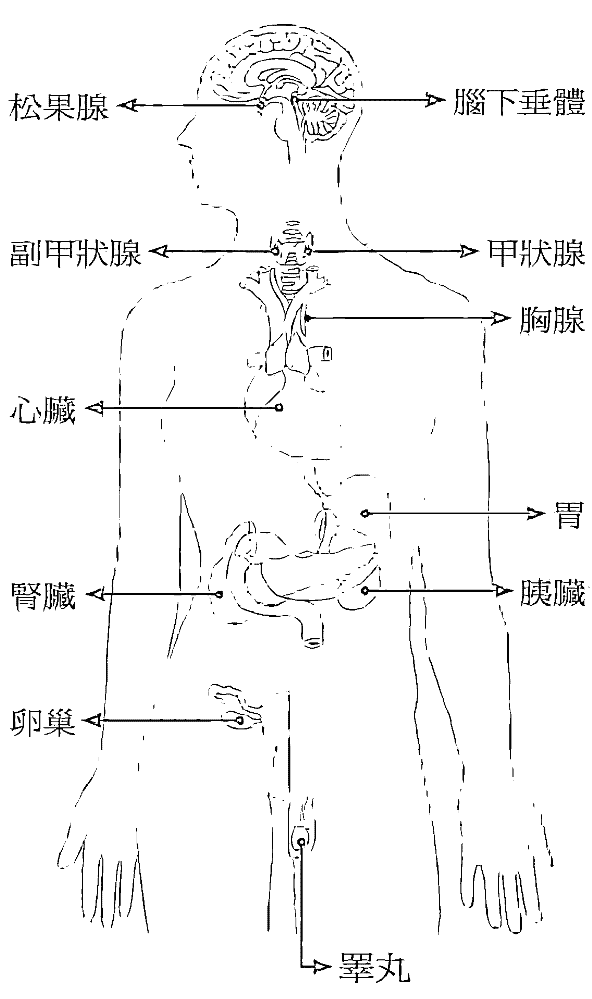

### □內分泌系統

包括松果腺、腦下垂體、甲狀腺、副甲狀腺、胸腺、心臟、胃、胰臟、腎臟、十二指腸、卵巢、睪丸…等這些都是生命激素的主要生產基地，是維持生命長久健康強壯的重要依據。

而這些重要內分泌腺體的

## 第一篇。出發

生命激素不是隨你任意驅使就會分泌，有趣的是這些內分泌腺體全部都位在任督二脈的行使區。只要運轉任督二脈筋膜的真氣循環，就可以刺激活化這些重要腺體，分泌生命激素的旺盛能力。

### 淋巴系統

由淋巴管連接許多淋巴結所組成，淋巴結聚集的地方包括扁桃腺、脾臟。其功能為引流存於細胞之間組織液，將帶有病原體之組織液進入淋巴管，循環至淋巴結後消滅濾出，為人體後天免疫之防衛。全身的淋巴系統分佈絕大部分也都在任督二脈的行使範圍內，只要啟動任督二脈的能量旋轉，就能在全身尤其是腹腔內腸道之所在，產生高能量真氣熱源，提升體內均溫，加速新陳代謝功能，並增強免疫能力*。

> *體溫升高與免疫力的關連

日本醫學博士石原結實透過大量病患個案研究，發現體溫升高，癌症、抑鬱、心臟病症狀都得到明顯減輕，瘦身成功率顯著提高！現代人常有的癌症、高血壓、腦梗塞、心肌梗塞、糖尿病等，都有體寒的體質特徵。透過科學研究他發現：人正常體溫下降1℃，免疫力至少下降30%，而如果正常體溫能夠達到36.5℃以上，人體的免疫力就會增強5－6倍！

據醫學實驗報告，成人體溫在36.5度以上，免疫能力增加5倍以上，而體溫每降低1度，免疫系統能力將衰退30%。

### 消化系統

由腮腺、舌下腺、咽、食道、肝、胃、膽囊、胰臟、大腸、小腸、直腸、肛門等所組成，主要負責將攝取之食物進行分解吸收，以提供身體器官所必須的營養素。這些消化系統器官都在任脈的行使範圍內，只要啟動任督二脈的能量旋轉，就能有強化功能之效果。

### 【泌尿生殖系統

泌尿系統是將體內新陳代謝所產生之有毒廢物、尿酸…等不必要東西排出體外的器官，包括了腎臟、輸尿管、膀胱以及尿道等。

而生殖系統為人體內所有與繁殖後代有關之器官總稱。男性生殖系統包括：膀胱、精囊腺、輸精管、前列腺、恥骨、尿道球腺、陰莖海綿體、尿道海綿體、陰囊、睪丸、肛門、直腸、結腸。女性生殖系統包括：輸卵管、卵巢、子宮、陰道、膀胱、尿道、恥骨、肛門、直腸、結腸。

這些泌尿生殖器官不但是在任督二脈的行使範圍內，更是打通任督二脈的訓練中，最重要的前哨站，最重要的築基底盤，也是返老還童的主戰場。

### 【骨骼系統

骨骼系統是堅硬器官，人體可以保持身體形狀是因為200多個各種不同的骨頭組成了骨架之故。骨骼系統之筋、骨、肉，是人體內在精、氣、神之能量產生處，也是人體經脈氣行循環的主要路徑。尤其是脊椎更是全身臟腑器官、腦及脊髓、神經…等之所支撐依靠，打通任督二脈之主要通道。

## 第一篇。出發

### 【經脈網絡系統

這是人體內最具神秘色彩的真氣能量運行系統，看不到卻紮紮實實的存在。自古以來，中醫把這套經脈網絡系統，納入針灸、治病、把脈的範疇；武術宗教門派則把這套經脈網絡系統的任督二脈，圈為強身健體、制敵先機的氣功發源地。現代人生活在富裕的年代，只圖安逸享受。肚子餓了就有美食可以填飽；知識渴了不必往書店跑，宅居上網就可以解決一切；體重

### □任脈氣行位置圖

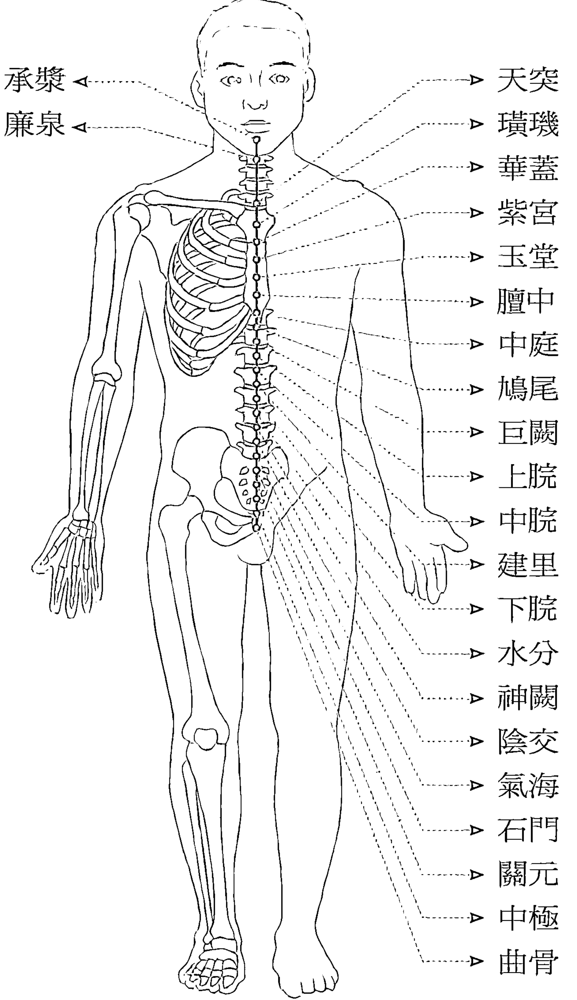

## 了解自己的身體

增加了卻不想運動，只想靠吃藥達到減肥目的。讓整個生命和生活重心都圍繞著吃，貪圖近利、方便，反而輕忽了經脈網絡系統。尤其是「任督二脈」對個人而言，是多麼切身重要的事實。「任督二脈」有如兩條確保人類長生健康的生命線，但現代人卻任其荒蕪，擱置在自己身體的一隅，無視其存在。「任督二脈」變成只是少數人的專利；或只是在武俠小說中，才會用上的語言，真是可惜！

### □督脈氣行位置圖

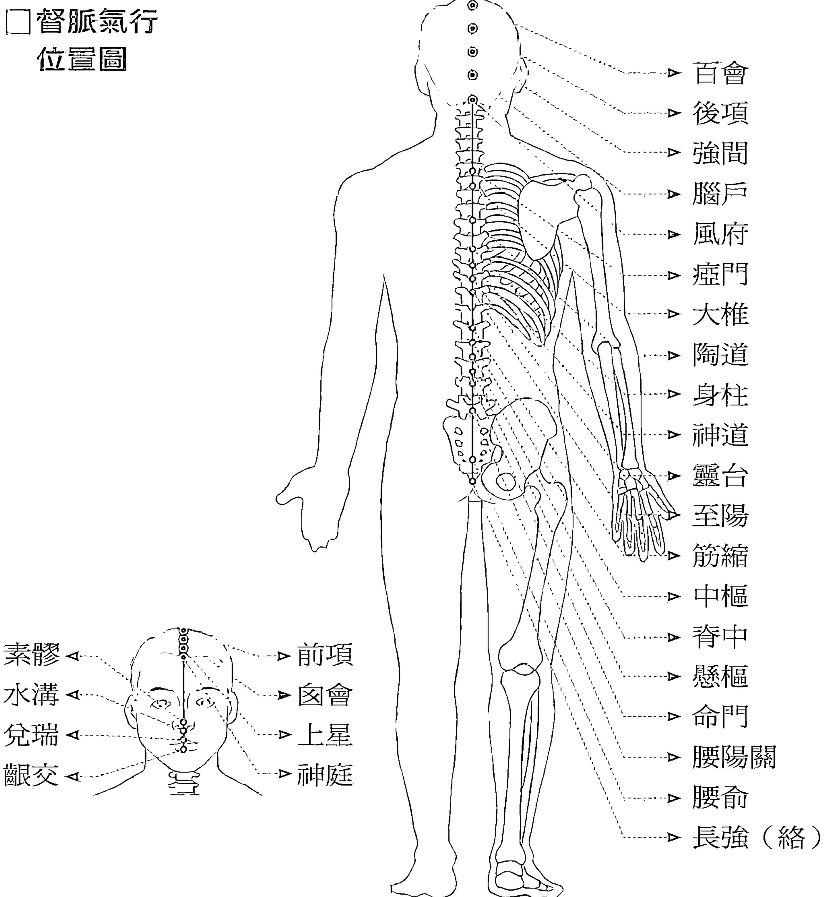

## 第一篇。出發

## 02 轉動眼球

人為萬物之靈，眼睛為靈魂之窗。透過眼睛，我們可以看到動與靜、明與暗、黑白與色彩、壯弱與高矮；也可以看到身體內部的器官，正處在愉悅的狀況或正遭逢什麼樣的迫害。

眼球結構見右頁圖，可分為眼角膜、房水、虹膜、瞳孔、晶狀體、晶狀體核、玻璃體、上、下、內直肌、結膜、視網膜、視網膜動脈靜脈、視神經、睫狀肌、睫狀、睫狀韌帶、鞏膜、脈絡膜…等，是許許多多精密零組件所構成。視神經直接源自腦之中樞，既為靈魂之窗，自然是珍貴又脆弱，不得讓它輕易受傷或感染。因此保護眼睛，適度的眼球運動，對於長保眼球神經、血管、肌肉、角膜、韌帶…等之健康順暢與氣場平衡，是非常重要的。

### 1 轉動眼球

### 功 法

靜坐、口閉、眼閉。將雙眼眼球由左向右圓形向順時鐘轉動，再由右向左作圓形的逆時鐘轉動，次數不拘。

#### 說 明

所謂滾動的石頭不生苔，反過來說就是不動的石頭會阻塞。因此經常閉目轉動眼球，自亦比較不容易在眼球筋肉間堆積雜物，又可促進眼球的靈活滋潤；促進眼球視神經束與腦之中樞

### □ 眼睛構造圖

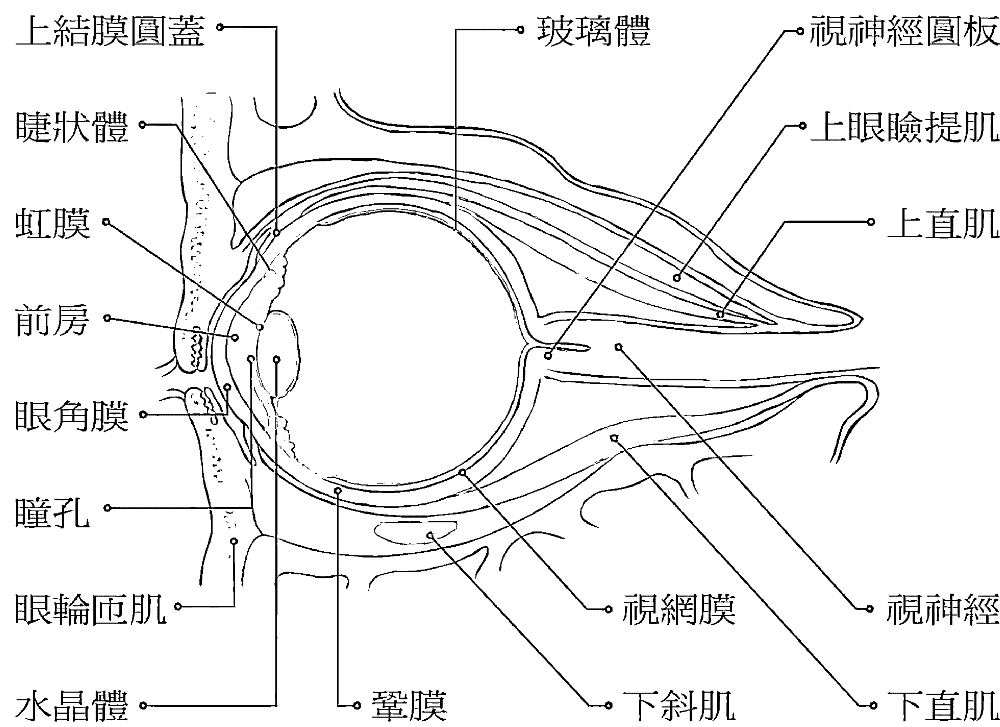

### □ 眼球的後山世界

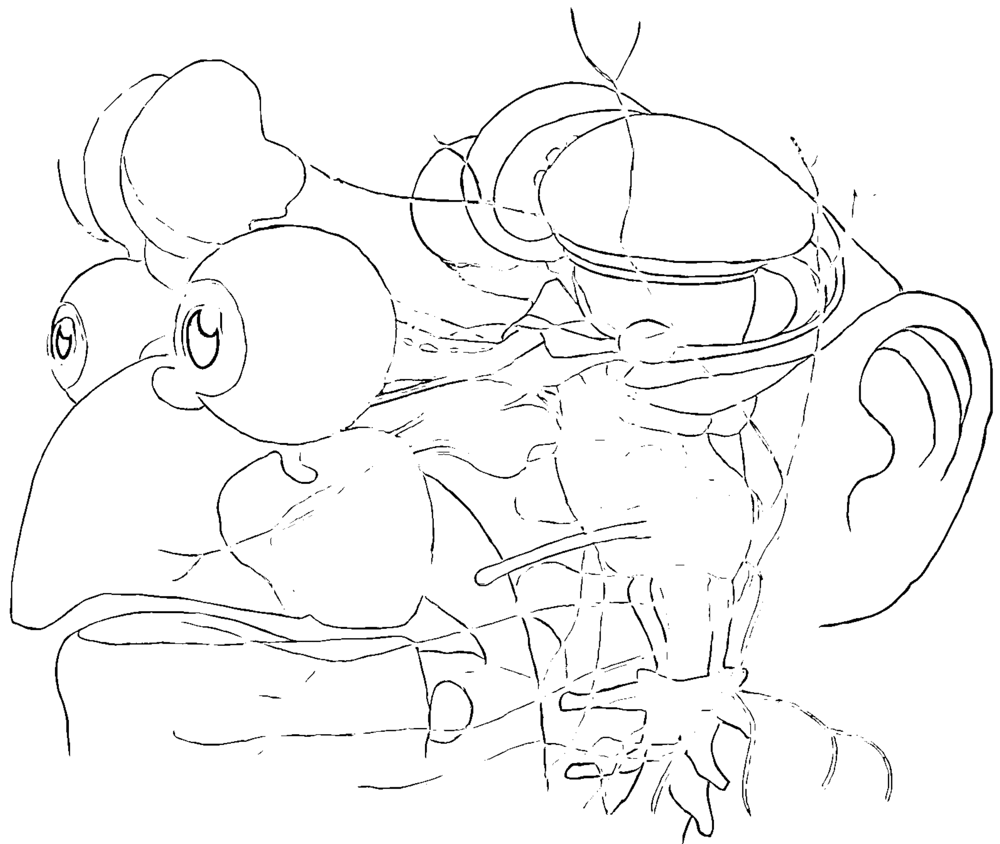

## 第一篇。出發

間的連動，加強眼球筋肉的彈力，讓眼睛保持明亮清晰。

### 【轉動深層視神經

## 方法

靜坐、口閉、眼閉。雙眼集注額頭中點與眉心間，用意念轉動眼球深層視神經束，使之向左或向右作圓形旋轉。

### 說明

在我們額頭與眉心之間2/3高度處直內，即宗教人士所指智慧眼或天眼或佛眼之所在。當雙眼緊閉集注此處，用意念使之由左向右作順時針、或由右向左作逆時針轉動，這樣做，會使腦中能量氣行盤旋，如一池清水起漣漪般向外傳播一樣，有助於刺激腦之中樞，數十億個神經細胞的活絡與敏銳，也有助於和仙家泥丸宮*元神的接觸。

> ※泥丸宮
源於中國道家之說，主要指的是腦部核心之所在，也是現代腦部松果體所在的位置。在許多道家著述裡，對於泥丸宮的稱謂有許多，如天腦、黃庭、崑崙、天谷等，其指的都是腦部。而在道家上乘內功修鍊裡，會提到所謂「練神還虛」的階段，都是在說明引導練氣進入大腦，能達到的通體舒暢、精神愉快的境界。

### 【閉目內視凝注眉心天庭

在打通任督二脈的運轉中，眼睛都是向內看，而不是向外看。所以在各項功法訓練時，均會註明閉目內視，凝注眉心天庭，主要目的是讓習者能夠時時刻刻與自己的靈性對話，讓靈性元神隨時導引、教育、記錄自己的一切言行活動，不但有助於習練內功時能夠全神貫注，感受體內各項活動之正能量；

更有益於邏輯思考時，做清晰和明快的判讀；對於潛意識、潛能、或其他不可思議之創意能力，也常會有靈光一現的巧遇；對於完全陌生的、不懂的事情，學習起來也會神速非凡，觸類旁通；會不時有頓悟、豁然開朗之神效。

### 『眼球的後山世界

絕大多數的人，終其一生，也許用眼睛看盡了天下美景，卻鮮少留意眼球的後山世界。它正矗立在自己生命的最高指揮中心—腦之中樞裡，典藏了自己前世今生的神秘寶庫。

看不到不代表不存在；不知道不代表不重要。

這個美麗的腦中樞後山世界，早在中國老祖宗時代就已經被探索了好幾千年。當今，中西方的宗教觀都認同它蘊藏著宇宙間最偉大的深奧知識。初學者剛開始聽到轉動眼球深層視神經，去接近腦中樞這個神秘的領域，好像在裝神弄鬼，或會有一點點不以為然的疑惑；但是，閒著也是閒著，偶而花點時間去窺探一下自己美麗眼球的後山世界，說不定會歪打正著，發現宇宙間最偉大的秘密，找到了能夠解救自己的重要訊息，也說不定。

自有人類以來，就存在「眼球的後山世界」之說；它一直就是人類的主宰，在「物競天擇、優勝劣敗」的大自然律法下，於人之腦中已屹立數千萬年而不墜，它絕對有無法被取代的優生道理。所以，鼓勵大家偶爾閉目養神，去美麗的眼球後山世界尋幽探訪，進行一場與前世今生最美麗、又浪漫，充滿知性的邂逅。

## 第一篇。出發

## 03 鼻吸、耳揉、咬牙切齒

### 1 鼻吸

靜坐或直立，口閉眼閉，先以左鼻孔吸氣，一股吸力直衝左腦，再從左鼻孔呼出；再以右鼻孔吸氣，一股吸力直衝右腦，再從右鼻孔呼出。

接著以左鼻孔吸氣，一股吸力直衝左腦，再從右鼻孔呼出；再以，右鼻孔吸氣，一股吸力直衝右腦，再從左鼻孔呼出。

### 說明

當以左鼻孔吸氣時，一股吸力直衝左腦，而左腦為人類一生所習得之知識、技術、思考、邏輯、記憶等貯存之所在。因此左鼻孔吸取氧氣直衝的刺激，對左鼻孔之暢通及左腦貯存之各項功能自有助益。

當以右鼻孔吸氣時，一股吸力直衝右腦，由於人之右腦屬於未開發的智慧之鄉；人類千百年來所累積之知識、智慧、潛能、第六感均潛存於此，因此右鼻孔吸取氧氣直衝的刺激，對於右鼻孔暢通及右腦之功能同有助益。

鼻吸訓練就是要保持鼻道的正常暢通，這對任督二脈相通相融作用，是具有加分的前置準備作業。

### 耳揉

雙掌密合摩擦數十次，使之產生靜電及熱能，然後將雙掌覆蓋雙耳作前後、上下摩擦數十次，使之生熱、並使耳肉筋骨軟化生韌。

耳朵的構造，分外耳、中耳、內耳三部分。外耳的功能是將存在於空氣中的聲波能量，收集擴大後撞擊耳膜，使耳膜產生振動；將空氣中的聲波能量，轉化為振動能量，並經中耳之作用，轉化為機械能，再轉化為液態能，傳遞至內耳。內耳再將液態能，轉化為電能，再經過聽覺神經傳遞至大腦，以產生聽覺。所以聲音由外耳→中耳→內耳→大腦等整個耳道、耳肉筋骨之軟化柔韌，對任督二脈能否順利的相通相融，至為重要。

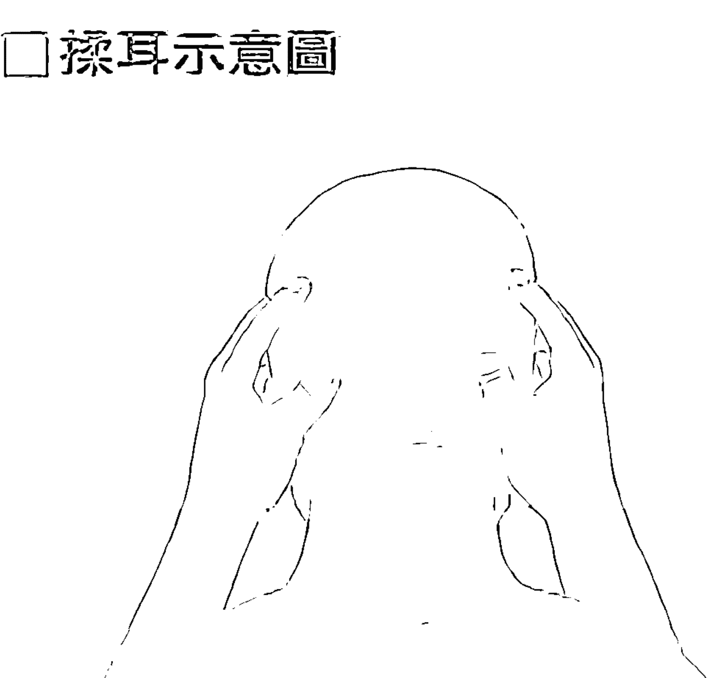

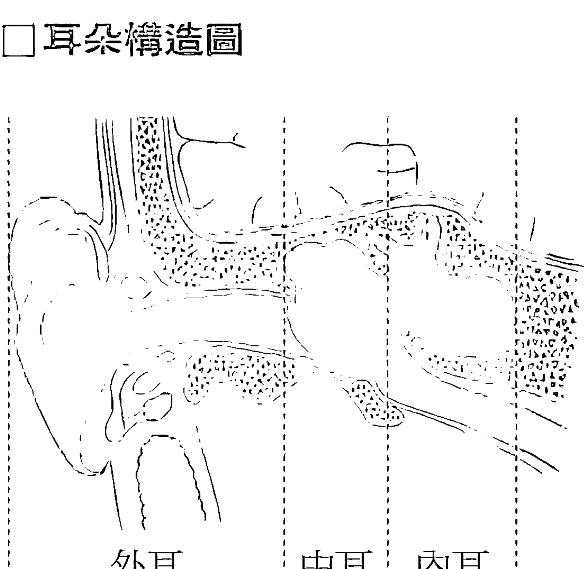

## 第一篇。出發

### 1 咬牙切齒

### 功 法
牙齒上下密合後，咬牙切齒或叩齒數十次，使得牙齒上下左右筋、骨、肉平衡觸動。

#### 說 明
口腔是人之發音和形成語言的重要器官；也與臉頰、肌肉之結合而使之具有表達喜怒哀樂情感的功能。所以與牙齒有關的筋骨肉之保養就非常重要。不但攸關顏面器官的健康，也影響了人與人見面的第一個印象。
咬牙切齒或叩齒能健壯牙床，能有效減少牙齒毛病產生，更能有效疏通各個牙齒所連結之不同經脈網絡，同時有效的維持牙齒功能的正常與健康。
能促進口中唾液分泌，使之旺盛；有助於體質改善，並滋潤臟腑；更有助於讓任督二脈交會相融，氣行順暢。

## 04 頸椎旋轉

### 功 法

口閉、眼閉，將頸椎以仰、平、俯三個角度，由正前向左右向作90度及各種角度之圓形旋轉。

#### 說 明

#### 轉動頸椎的重要性

頸椎內有脊髓，上連頭顱，下接胸腔脊骨。頭顱內大小腦各司其職。間腦、中腦、橋腦、延腦則為腦之中樞，為泥丸宮元神之所在，也是生命之總樞紐，控制人體的一切生理運作。因為地位太重要了，一般人總是對它又期待又怕受傷害，所以不敢隨便亂動這顆項上人頭。而越不敢去動人頭的下場，就是讓頭殼內密密麻麻的筋骨肉越容易僵韌筋縮、淤積存濁。結果就造成血脈不暢，輸送到腦細胞之養分、氧氣就會不足，而呈現頭昏昏、腦鈍鈍之現象。

對年輕人而言，血氣方剛，全身經絡順暢，血液未曾污血液未曾污濁時，頸椎不過就是一個支撐的頸椎，根本無須在意它有多少的重要性；但對於人已老朽，或血壓高、血管小、血脂多、氣行偏弱者而言，因血液、氧氣、養分已經無法承載應有的量以供養腦細胞所需，遂在腦細胞營養不良，氧氣不足下，頭昏腦沈，全身無力，神經系統斷斷續續，無法正常傳達。於是各種疑難雜症就延展開來，威脅生命，讓自己坐立難安。頸椎的轉

## 第一篇。出發

動其實是重自救的活動，也是打通任督二脈運轉暢通的一個前奏運動。

### □頸椎筋骨肉示意圖

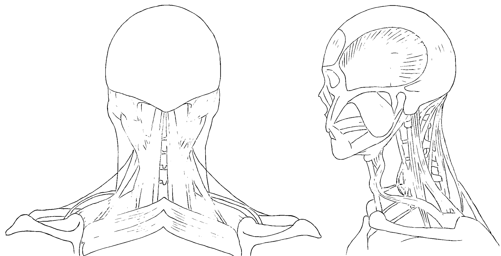

### □頸椎運動圖

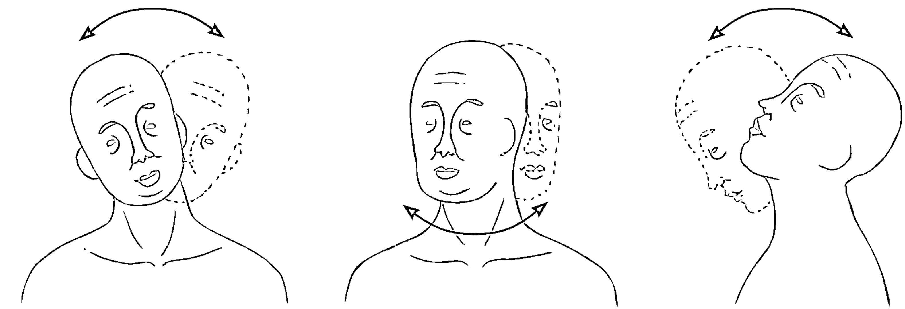

側屈

旋轉

伸屈

### 頸椎旋轉

#### 轉動頸椎的方式

初作本法，須以緩慢為之。首先將頸椎由正中向左向右輕輕作90度之移動，遇有疼痛地方即為阻塞處，須緩慢，把每次移動止於疼痛處，一次又一次，不斷慢慢的往外擴移，直至該處疼痛解除了，即表示阻塞被打通了。然後再擴大移動範圍，直至能由左向右，及由右向左作180度之大幅度旋轉移動為止。

所有的頸椎旋轉訓練，一開始須小心緩慢，切忌急躁；須緩慢轉動，持之以恆，伺漸漸產生熱能，開始可以轉化頸椎內筋骨肉之僵韌為柔韌靈活，再轉化筋骨肉的氣行淤塞，使血脈流通，則腦細胞才能獲得更多的氧氣與營養，則精、氣、神才能保持清醒，維持正常運作。

頸椎內脊髓有三個神經節分上、中、下各有其管控區域。中、上頸神經節連控於臉上各器官，包括眼、耳、鼻、口、舌、腮及腦…等。常常轉動中、上頸神經節，對臉上器官及腦液血流之順暢，非常有幫助。

下頸神經節則連控於心肺器官和肩部；轉動下頸神經節，即作低頭俯角左右圓形旋轉運動，有助益於心肺及頸椎、胸椎、背脊及肋骨間的經脈氣行之活絡，對肩膀僵硬之五十肩一族也大有助益。

#### 頸椎轉動的功效

- 1. 疏通腦內氣行之淤塞不通，能夠促進任督二脈氣行之相通相融；
- 2. 有助於腦內所有神經源頭的活動與強化，包括強化筋骨肉使之柔韌；
- 3. 有助於牙齒、耳朵神經的健康。對耳內壓力所造成不適及牙床牙周毛病也有舒緩之效；
- 4. 對肩頸背部之肌肉酸疼不通者，有明顯的改善效果。

## 第一篇。出發

## 05 手之運動

拍打、甩手、搏擊、打拳或各個角度之擴胸…等，只要能活動到手部，使之筋骨肉氣行活絡，血脈暢通，強化臟腑器官者皆適用。

手掌交叉高舉頭上，翻掌朝天並盡力將雙手往上伸展，下半身不動，上半身含手、頭、頸、胸挺直，左右旋轉，至背之膏肓與背脊肋骨發出摩擦叩叩聲，則肩胛骨與背部淤塞之酸痛，即可疏通解決。就算一次轉動仍未能完全舒解肩胛骨或背部之酸痛，也必能減輕大部份的酸痛，再繼續轉動兩三次吧！酸痛就可以疏通解決了！

### 說明

在打通任督二脈的真氣能量運轉訓練中，雙手運動之目的，是強化前胸後背之筋骨肉，使筋骨肉間充滿真氣能量，形成一個強力氣場。尤其是心臟與心包腔之間，以及肺臟與胸腔之間的氣場強度，其影響血脈之暢通與否最為巨大。雙手同時運動，直接強化雙手骨骼上覆蓋的筋骨肉間的氣行經脈，包括肺經、心經、心包經、大腸經、小腸經、三焦經等網絡之順暢與否，也直接影響著臟腑器官之氣血運行，尤其是直接影響著心肺功能之正常與否。

同時運動雙手，也影響著肋骨之造血機能，可防止骨骼病

### 手之運動

變。如果雙手筋骨肉是弱無縛雞之力，則經脈氣行能量也必然虛弱不足，容易污濁淤積而至沾粘不通，必會拖累相對臟腑器官的功能運轉。因此，適度的手運動，除了有助於手部筋骨肉間經脈網絡之暢行，也有助於相對臟腑器官之功能正常，間接地對任督二脈運行之順暢，多少也有幫助。

另外，雙手還有一個重要功能，就是在任督二脈的能量運轉中，控制真氣流量的大小，是個真氣閘門。利用雙手動作之不同，控制真氣流量為線狀、片狀或全面開放，讓習者可以由淺而入深、由簡單而複雜的完成打通任督二脈之訓練。

即使是激烈的手部運動，或許未必能直接幫助任督二脈的運轉；但是，當任督二脈之動力加速運行而產製的高濃度真氣能量時，會同時灌注在手部骨骼上之筋骨肉間，在神經血管密佈的筋膜內形成一股強韌之氣場。此時，手部筋膜凝聚高濃度真氣能量的鍛鍊，最能產生強勁力道。這是所有的武術門派在學習過程中都必經的鍛鍊。同時，也因為手部筋膜凝聚高濃度真氣能量，而能長保手部血脈之暢通，強化心肺功能，使身強體魄，向健康靠攏。

### □甩手與上臂拉筋圖

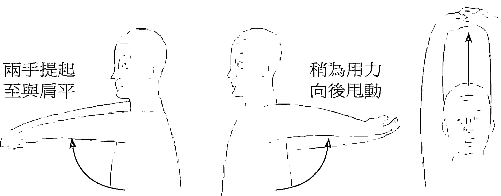

## 第一篇。出發

## 06 腰椎旋轉

抬頭挺胸，肩不動，口閉、閉目內視於腰椎處。
雙腳與肩齊，腳掌向前自然著地。膝微屈，手掌環抱向前、掌心向內，使身體成太極。然後以腳掌為基，小腿膝蓋為桿，腰椎為軸心，以大腿腰力由左向右圓形旋轉，由慢少而至快多；然後再由右向左圓形旋轉，一樣由慢少而至快多，如此重複數次。

每次旋轉圈數不拘，愈多愈好。但由左向右與由右向左之旋轉次數相同、力道均衡為宜。

### 說明

腰椎由左向右與由右向左圓形旋轉，要求次數相同、力道均衡，這是因為藉腰臀部筋骨肉之旋轉磨合，可使腰椎與骨盆腔之銜接處校正歸位；同時，亦可使骨盆腔與腿骨銜接之髖關節回歸正常位置。

人之一生中不乏摔、跌、撞、傷的遭遇；或有人過胖，或女人懷胎腹部受胎兒重量壓力而產生骨盆腔異位扭曲；或也造成腿部骨骼不當使用而偏轉向外。以上這些情況，容易造成筋骨肉間之淤塞沾粘，氣行不通；雖不致於讓身體產生立即的致命危險，但卻像星星之火足以燎原，由小漸大、由輕而重，擴散到全身，阻斷了五臟六腑的能量供應，也阻斷了精氣神之正

### 腰椎旋轉

常循環、更阻斷了筋骨肉間的氣行通暢。而人總是後知後覺的；放任骨盆腔異位扭曲，造成沾粘、酸痛、氣血淤塞、骨骼移位…等病痛元兇；讓它們肆無忌憚，向身體挑釁！等到發現時，卻已陷身體於萬劫不復的痛症深淵中。因此，想要扭轉乾坤，校正這些因異位扭曲而導致的佝僂身軀，就要訓練自己，把腰椎由左向右，由右向左，做次數相同、力道均衡的圓形旋轉練習，這是非常必要的訓練手段。

剛開始做腰椎旋轉，若感覺卡卡的轉不順，或有酸疼現象產生，那表示骨盆腔內已有異位和沾粘的現象產生。此時，做腰椎旋轉的目的，是為要讓骨盆腔異位和沾粘處之筋骨肉能磨合修復，在旋轉過程中必然會引起酸痛，這是正常的。但只要重複多做幾次練習，到最後就能夠左右旋轉自如，且不會再有酸痛的感覺，這表示腰椎、仙骨、尾椎、髖關節、膝關節、腳掌等處之磨合已修復完成；腰錐以下之所有部位均已回歸正常體位，更接近健康的指標了。

當骨盆腔異位、扭曲…等回歸正常體位，腰椎自然會更形穩固、堅韌，腰桿也挺得更直。更重要的是，當所有的經脈網絡都可以恢復通暢，才有可能進行打通任督二脈的功課。

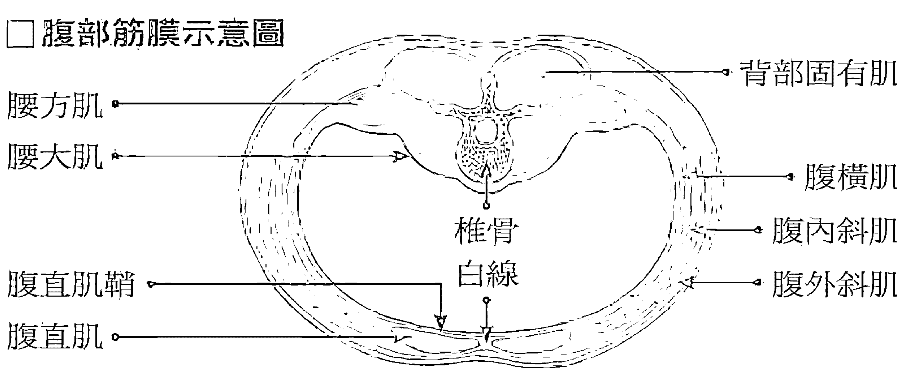

## 第一篇。出發

## 07 仙骨彈擊

**動作**

雙腿挺直，上半身不動。以大腿及腰骨之力，集注於臀部長強穴與腰俞穴間之仙骨處，用力彈出，由慢而快，由少而多。

**說明**

仙骨位於腰椎與尾椎間，是脊椎與骨盆腔銜接之處，督脈腰俞穴之所在；也是人體重要神經叢會集之處，更是外力打通任督二脈、易筋洗髓最重要的施力點。

督脈始於尾椎下端與肛門間之長強穴，而任脈始於陰部與肛門間之會陰穴，兩穴近鄰，所以仙骨彈擊同時驅動任督二脈之氣血能量，由起始點往上衝刺，在打通任督二脈各穴後，亦將脊髓及脊骨上之筋骨肉同時除污排濁，使脊髓滋潤通靈，使督脈筋膜轉化柔韌，而達易筋洗髓之效。

## 何謂易筋洗髓

簡單的說，就是強化新陳代謝功能。先由仙骨彈擊，衝開位於脊髓、筋、骨、肉間之沾粘，再藉由新陳代謝之大量汗液，將污濁、毒素排除於皮膚之外。則脊髓與脊骨上之筋、骨、肉將因仙骨彈擊之衝激，而使氣行能量流暢滋潤於各經脈網絡。於是乎脊髓與脊骨上之筋、骨、肉間之氣血能量充盈；日復一日，讓脊髓更形滋潤通靈，脊骨上之筋、骨、肉更柔韌堅強，是謂易筋洗髓。

打通任督二脈之訓練，最著重於神經系統之精確、敏銳抓著力。從腦之中樞→脊髓→周邊神經→肛門生殖器，沿路保持乾淨暢通，所以仙骨彈擊之易筋洗髓功效，最有助於打通任督二脈，讓氣血暢通無阻，回復健康元氣。

## 循序漸進，不宜冒進

因為仙骨彈擊時，需雙腿挺直、上半身不動。只能以大腿及腰骨之力，集注臀部長強穴與腰俞穴間用力彈出。也就是說，以兩個大腿骨與骨盆腔交接之髖關節處為彈擊軸心，將整個骨盆腔往前往往上彈擊。那麼即便曾經胖過，或是現任的胖子兄弟姐妹們，因噸位重量與身體容量受地心引力影響導致的下壓，並造成骨盆腔異位扭曲等種種問題，都可以在一次又一次的仙骨彈擊中，把沾粘擊開，把汙濁雜質排出，把脊髓與脊骨筋膜活化，把經脈網絡暢通，至最終把骨盆腔彈回正常位置。

不過，剛開始從事仙骨彈擊的訓練不宜冒進，這是因為彈擊開始的階段是把沾粘擊開，難免會有酸痛或有不易彈擊的不快症狀。尤其是筋骨肉沾粘得越厲害、骨盆腔異位越嚴重者，就會有更大的酸痛、更多的挫折，這是正常現象。不必著急，慢慢地練做，就會領略要點，進入到沒有不適的彈擊訓練之中。

## 日積月累，見真章

筆者在自我訓練的過程中，也是慢慢做才體會出其中要領。由一日十下、二十下、三十下、一百下、二百下到一千下；從一開始非常酸痛、普通酸痛、不痛到非常舒服，足足花了一年多的時間，才得以有效改善體質。所以，當骨盆腔回歸於正常位置，與脊椎之仙骨處於日趨完美密合狀態，此時，仙骨彈擊即使千百回亦不會酸疼，腰椎旋轉越來越順暢，筋骨肉結實越有力，全身也會變得舒暢。

## 仙骨彈擊

**示意圖**

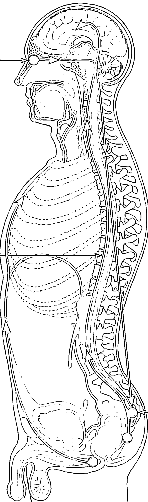

閉目內視至仙骨處。

仙骨彈擊之力將由尾椎沿脊椎而上至腦中心，達易筋洗髓之效。同時仙骨彈擊之力亦將由會陰沿任脈而上，有助任脈氣行之暢通

雙腿挺直，將腰部及大腿之力集中於仙骨處，用力彈出

## 08 腿力訓練・腳根式走法

腿力訓練對於年輕人而言，是輕而易舉，小事一樁的；因為身心器官皆處於元氣、旺盛之齡，只要隨便跑跑、跳跳、打球、爬山、游泳就可以輕鬆練就一雙結實而有力的大腿。但對中高年齡的人而言，由於筋已萎縮、骨已疏鬆、肌肉乏力、膝蓋脆弱、尤其五臟六腑，在經年累月濕氣與燥氣沉積，也告衰退；再加上血脂、血糖、膽固醇、尿酸、痛風在體內，隨齡滋生延展，讓身體儼然形成一個負荷太重、骨架太輕、零件太舊、油質太髒、線路太老的超古董機器。不但不能像年輕人一樣，上山下海、活蹦亂跳。狀況好一點的還能走走逛逛，便已足堪安慰自己；狀況差的話，甚至連移動一個腳步都嫌吃力。而且越是移動吃力，就會越是不想動；越是不想動者，身體就會堆積不良雜質且越來越嚴重。如此惡性循環的結果，讓骨質越來越脆弱，筋腱越來越緊繃，氣血也就不通行。於是乎這裡痛痛，那裡痛痛，面有病容，槁木死灰，日子一天天越來越不好過。

我相信，每一位中高年齡的人，在接收到身體發出了「這裡也痛、那裡也痛」的訊號後，一定會急於想要解除危機、恢復健康、能東山再起吧！但畢竟時不我與，無論是爬山、跑步、打球，動不動就來一下鐵腿，膝蓋關節痛了，可能就是一個禮拜。這種情況，想要透過運動來恢復健康，談何容易！最後，就只能靠東走走、西逛逛，來暫時延緩健康衰退的速度；是既消極、又無奈、也不得其門而入的選擇。

本書在告訴你如何透過正確的運動方法，既能避開鐵腿和麻煩的膝蓋疼痛問題，也能維持不輟的運動量；唯有不斷持續爬山、跑步、運動，才能夠持續地將體內污濁排出、減少精氣血能量的流失、恢復五臟六腑的正常運轉，並能夠訓練出強勁有力的大腿，降低小腿和膝蓋不必要的磨擦出力。

## 方法

找一個有斜度的小山坡，然後改變一下走路方式，把年輕時代已經習慣的活潑健步的腳尖先著地的走路方式，改成較慢的、穩重的腳跟先著地的走法；換言之，就是把原先慣常將使力點用在小腿和膝蓋的腳尖式走路，改成施力點放在大腿和腰骨的腳跟式走法。

準備在小山坡由低往高走，先以右腳向前邁進一步，右腳跟先著地後，右腳掌跟著垂直向前著地。這時右腳膝蓋微屈，身體重心往前移，左腿斜向繃直。然後再以整個右腳掌為軸，藉大腿及腰骨之力，把身體重量向上向前蹬起，同時，左腳向前邁進一步，左腳跟先著地後，左腳掌跟著垂直向前著地，這時左腳膝蓋微屈，身體重心往前移，右腿斜向繃直。然後再以整個左腳掌為軸，同樣藉大腿及腰骨之力，把全身體重蹬起也向上向前，同時右腳向前邁進一步，依上述動作順序，依次進行，就這樣一步一步的慢動作練習，等到這種走路方式習慣了，就可運用於平地、山坡、爬樓梯而臉不紅氣不喘了。

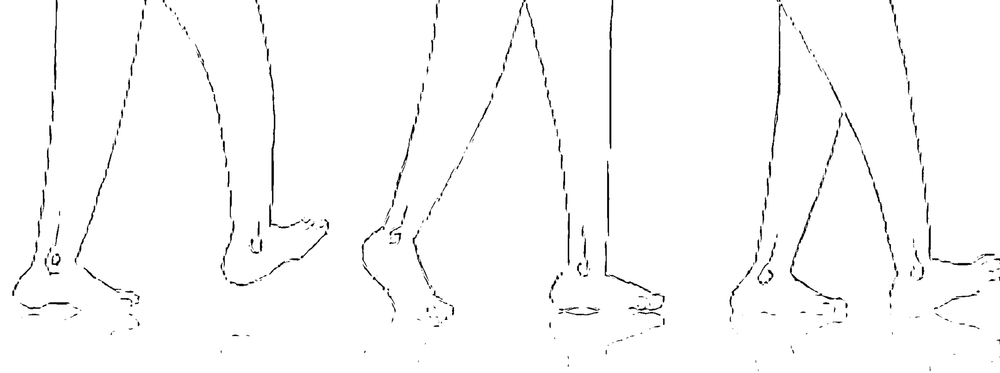

### 腳跟式走法

### 說明

#### 腳跟式走法的好處

腳跟式走法，在行進時，施力點是在大腿及腰骨，而小腿和膝蓋，僅作為骨軸槓桿之用，完全不使力，也完全不承載身體的重量。也就是說你爬山爬多久，走路走多遠，都不會累也不會痛，完全不會產生鐵腿和膝蓋疼痛之困擾。而且是越走體力越好，越流汗身心越舒暢，身體越健康。且腳跟式走法，每走一步，都利用大腿骨矯正髖關節一次，也同時矯正骨盆腔異位，刺激著膀胱經脈、腎經經脈等所有路徑之氣血活動。尤其是腰椎以下之神經系統包括腰部神經組織、骨盆神經組織、坐骨神經組織等，對生命之源的腎臟及整個泌尿系統，最有幫助；能使之更健康、更敏銳、更有力！當灌注更多的氣血能量，腎臟功能就會好轉，生命活力自是欣欣向榮。

腳跟式走法全部藉由大腿及腰骨之力，於是堆積在大腿及腰部之贅肉及筋、骨之雜質堆積物，就會因為經脈暢通，因為筋、骨及整個相關的腰部神經組織、骨盆神經組織、坐骨神經組織等除污排濁而漸漸的消失無蹤。自然而然的，身體就會再度呈現苗條結實的體態和曲線，這是最健康、最省錢、也是最有效的減肥方法。同時因為腳跟式走法，是以腳跟為施力軸心，走起路來，自然是一步一步姿態穩重、氣質優雅迷人了。

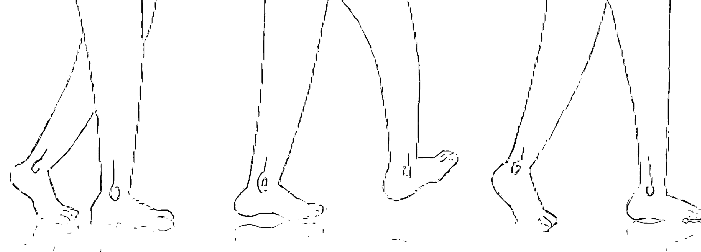

#### 腳跟式走法的呼吸原則

只要習慣了腳跟式的走路方法後，自然而然，就會很喜歡走路、爬山，並減少坐車和開車的次數。所以要經常爬山運動，習慣安步當車。走遠路並能越過萬重山，絕對是有益身心健康的。不過，為讓自己山可以爬得久，路能夠走得遠，這時候，就不能不提正確的呼吸方法了，一般常用「鼻子吸氣、口吐氣」的呼吸方法，在本項腿力訓練時，非常不適用。因為很容易造成喉嚨乾澀及剎氣，對需要耐心走遠路，爬高山的持續性腿力訓練者，並無實際幫助，反易造成傷害。

所以腳跟式走法，一定要謹記鼻吸、鼻呼、口緊閉的原則。不管路走了多遠，山爬了多陡，全部過程皆要以鼻子為唯一呼與吸之孔道。

其好處是：

- 1. 是喉嚨不會乾澀、不會剉氣；
- 2. 是不管多累多喘，都以鼻呼吸，可以暢通鼻塞之毛病；
- 3. 可以增加肺活量，增強心肺功能。

現代人吃好的、穿好用的，卻動的少；整天掛在網路上的宅男宅女一大群，這些人的心肺功能基本上都不會是好的；睡夢中因呼吸不到空氣而驚醒者，應該不在少數。有這種狀況者，可採用本法所教導的以鼻子為唯一呼與吸的孔道，最能提供有力的解決之道。

#### 腳跟式走法使用丹田呼吸

除了鼻吸、鼻呼、口緊閉的原則以外，還要特別注意的，就是使用腹部呼吸法，亦即所謂的丹田呼吸法。

腹部呼吸法又名橫膈膜呼吸法，意指吸氣是因為腹部之膨脹，帶動了橫膈膜的下降，而使肺部自然的吸入空氣。吐氣是因為腹部之收縮，帶動了橫膈膜的上升，而逼迫肺部吐出了含二氧化碳的廢氣。

腹部呼吸法的優點，非常的多：

- 1. 用腹部呼吸法所吸入的空氣量，會比胸部呼吸法所吸入的空氣多的很多；
- 2. 腹部呼吸法，以腹部之膨脹、收縮，來帶動橫膈膜的下降、上升，等同按摩腹部內臟器官、筋、骨、肌肉並提升熱能體溫；
- 3. 由於腹部之膨脹、收縮，帶動全身之氣血循環，可減少心、肺功能之負擔；尤其是爬山的時候，最可避免心血管突發病變的危機；
- 4. 腹部是丹田所在，真氣能量沉積之所；是任督二脈漩渦式運轉時之動力加速度核心；是任督二脈全身循環運轉時之真氣能量供應之場所。

## 重返健康第一步

腳跟式走法之腿力訓練與腹部呼吸法之鼻吸鼻呼，都是濟弱扶傾，改善體質的第一步；是強化腿力、腰力必要的步驟。腿和腰力強化後，才能夠順利的進行仙骨彈擊之訓練；進行除汙排濁的易筋洗髓，讓全身經脈網絡暢通無阻；強化脊骨上之筋骨肉，淨空神經系統之路徑通路；強化神經細胞之敏銳抓著力，矯正骨盆腔、髖關節及腿骨之歸位；進行腰椎旋轉，有效地矯正脊椎與骨盆腔之銜接穩固；矯正骨盆腔之異位扭曲，成功地塑造打通任督二脈訓練的最佳環境。所以腳跟式走法之腿力訓練與腹部呼吸法之鼻吸鼻呼，是重新改造自己生命軌跡，重返健康強壯的第一步，絕對不可略過。

## 第二篇

## 打開任督二脈的神秘面紗

- 01 打開任督二脈的神秘面紗
- 02 上帝的透明天梯隱藏了長生不老的秘密
- 03 向老天爺借青春
- 04 男人問題解析
- 05 痔瘡生死戰
- 06 返老可童

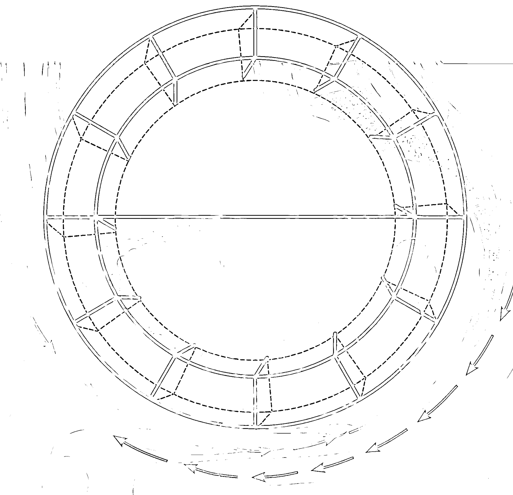

## 01 打開任督二脈的神秘面紗

任督二脈是什麼東西？藏在那兒？有什麼特殊功能？如何打通？打通任督二脈是不是真的可以增加一甲子的功力？武俠電影裡屢見不鮮的運氣療傷的場景，是不是真的對元氣恢復有幫助？這一層層的神秘面紗，且讓我們一一掀開，到裡頭探個清楚，討個明白吧！

在掀開這些神秘面紗之前，先來看看「氣球」這個比喻。

眾所周知，氣球在未吹氣前，其筋力最強，有如人體生命之初成；氣吹到七、八分滿時，筋力柔韌、彈性最佳，可任易雕塑，折成各種造型，一如小孩年少之生命體；當氣吹足了十分滿時，筋力堅韌，能量最滿，有如青少壯年之生命體；而久置之後，即彈性不再、筋力已傷，形體已殘，一如老弱滄桑之人體。如果，把體內之臟腑器官等當作不存在，則人體跟氣球真的是沒什麼兩樣的。

接著再來談談「氣」。「氣」這個東西，對健康的小孩或年輕力壯者而言，可以不知道、不理會，但對體虛多病的中、老年族群，就不能不多加留意，是必須關注的課題。就像在浩瀚宇宙中，因為沒有氣，以致於億萬個星球皆各自飄浮。地球正因為有氣，有了大氣壓力，所以風會飄動，水會往下流，人得在地上走，萬物得以在地表悠遊生長。人體內也因為有氣，才能融合於地球之大氣壓力中，而使血液流通，細胞滋養，體內之精、氣、神，加上體外之筋、骨、肉才能夠追、趕、跑、跳、碰，伸展自如，毫無掛礙！

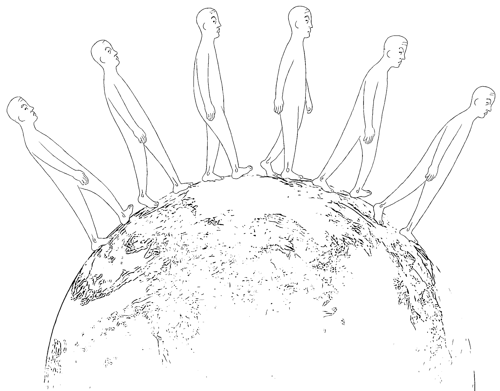

### 人體內之氣在那裏？氣行又是什麼呢？

簡單的說，細胞之處即是氣之能量所在，它是無色、無味、無形、無相之能量體，是構成人體中的微物質之一。而氣行主要就藏在筋、骨、肉處，即骨節之外肌肉之內的筋膜處，亦可穿越臟腑、骨骼甚至自體皮囊外之天地。

數千年來中國的各武術門派均練有氣功這門功夫；它是一種來自體內之真氣，經過河車或漩渦式運轉的動力加速度所增強擴大中的高濃度能量內力，再摻上外在的各招式技巧，而成就制敵先機的各門各派之武術功夫。另外，中國經絡學說也曾大量試驗研究，證實了人體內確有十四條經脈網絡，在體內體表作合縱連橫。這些經脈網絡的縱橫串連，也證實確有「氣」運行其間，而且還是扮演著生命活動的重要防護關鍵角色。

這些經脈網絡系統的氣行串連，對人體提供了什麼樣的關鍵功能呢？

就是使人體得以在地球大氣壓力下自由自在的存活。使人體內骨頭與骨頭之間，肌肉與肌肉之間，骨頭、肌肉與臟腑器官之間等，產生一股磁浮般之保護氣場；使人體的一切活動不管是輕鬆的或是激烈的，不管是站著、坐著、躺著或是追趕跑跳碰，均能使骨頭、肌肉與臟腑器官等各司其職，各立於安全範圍而無所損傷。可是當氣行面對的是體虛、氣弱、病中和中高齡者，則氣行不但不能均勻暢通，體內真氣能量也會逐漸流失而終致不足。

這種情況下，骨頭、肌肉與臟腑器官之間，尤其是骨頭與骨頭之間，在地球大氣壓力下產生擠壓碰觸，就會在氣行路徑上，骨節交接處產生鬱氣壓力與沾粘，於是在追趕跑跳碰後就會產生痛楚、發炎，甚而與氣行路徑上連結的相關臟腑器官間發生綳緊傷害於無形，長久的積累，就會衍生出慢性疾病。

那麼，在正常情況下，又有什麼東西、什麼因素會造成人體內氣行之不順呢？

因為人體內氣之能量誕生於細胞，產生於筋、骨、肉之筋膜處，也行之於筋、骨、肉間。而筋、骨、肉皆依附在骨骼系統，即由頭殼、頸椎、脊椎、胸椎、腰椎、尾椎、胸腔、腹腔、骨盆腔、四肢等支撐起人體骨幹筋膜之最大群聚；它們正是體內最大真氣能量產生之源與運行之路徑。因而筋強、骨壯、肌肉結實則神經、血管自然健康有勁；當氣之量能充沛，則全身氣行路徑也會寬廣通暢，自然是聰明伶俐、身強體壯，任由追趕跑跳碰，任憑跌打也會無恙沒有損傷。而習慣吃好的、用好的卻動的少的人，就會造成骨弱、肉肥、筋縮及自體真氣能量的產能降低，自然氣之運行力道變差，氣之運行路徑開始淤塞，久而久之，淤塞處變成沾粘，尤其在骨盆腔產生了阻塞沾粘的話，那可真是超級大禍害。幾乎所有糾纏男女後半輩子的酸痛問題，都是拜骨盆腔阻塞、沾粘、異位之賜。

為什麼骨盆腔的阻塞、沾粘、異位，會造成超級大禍害呢？

骨盆腔下接兩腿，上接腰椎，是人體起身坐臥之樞紐。因為介於身體中部，所以，當骨盆腔發生阻塞、沾粘、異位時，全身共14條經脈會在身體上上下下運行時，到了骨盆腔處即被阻斷干擾，造成身體上半部與下半部氣行循環之分離。當身體上半部與下半部之氣行不再連通，氣行壓力與大氣壓力之沖剋也不盡相同，於是開始各自唱各自的調，產生冷熱不同調，身心不協調，出現「痛則不通，通則不痛」的百病痛症。

通常，是身體下半部之筋、骨、肉率先產生阻塞、沾粘或筋縮，雙腿率先開始酸痛無力，膝蓋也呈現出難以承重之痛楚。

而身體上半部如前胸後背肋骨處之筋、骨、肉，若亦同樣產生阻塞、沾粘甚至筋縮之實，則臟腑器官亦隨後開始鬱結累積，形成中老年男女最大的夢魘—慢性疾病。就算天天刮痧、拔罐、拍打、泡湯、養生食療、減肥特效等，動用了各式奇門遁甲方法，也僅是短暫治標，三兩天後又會復發，又會沾粘，又會酸痛，惡性循環，禍害到終老。面對這樣的慢性毛病，唯一的解決之道就是「動」！大量的運動會使全身筋膜之彈性柔韌，產生大量的氣行能量得以輕易打通筋、骨、肉之阻塞、沾粘，使「氣」行路徑非常暢通；讓骨頭與骨頭之間，肌肉與肌肉之間，骨頭、肌肉與臟腑器官之間等，能再產一股磁浮般的保護氣場，而使病痛遠離。

大致了解「氣」這個東西的重要性之後，再回到本章的主題，進入任督二脈的課題。

任督二脈是什麼東西？

簡單的說，任脈、督脈和肺經、大腸經、胃經、脾經、心經、小腸經、膀胱經、腎經、心包經、三焦經、膽經、肝經等12條經脈，合稱14經脈。它們在中醫學的針灸和治病地位上非常重要。但是，如果把任脈和督脈只定位在針灸、治病的範疇內，那可就大錯特錯，大才小用了！究竟任脈、督脈怎麼去定義最恰當呢？簡單的說「生命之精華，在於任督二脈；任督二脈相融，則陰陽分明，血脈暢通，氣行周身，而百病可離，返老可童」。也就是說，任督二脈是人體最重要的兩條生命線，是長保身體健康、強壯的兩條重要關鍵的生命符碼。

任脈到底在那裡？督脈又是藏在那兒？

任脈之氣行路徑上自承漿，下至會陰。而任脈之筋膜則上自腦之中樞的靈台（即第三腦室）上方處，沿腦幹前緣→氣管→胸骨體→上腹腔中線→肚臍→下腹腔中線→生殖器→會陰，與督脈之長強處筋膜相接，如任督二脈筋膜位置圖。

而督脈之氣行路徑則上自齦交，下至尾椎長強。而督脈之筋膜則由腦之中樞玄關處沿脊椎→直下尾椎→長強，與任脈之會陰筋膜相接，如本書57頁任督二脈筋膜位置圖。

任督二脈之氣行路徑與任督二脈之筋膜，那裡不同？

傳統經脈網絡之任督二脈指的是氣行路徑，即人體自有真氣能量的兩條流通道路。就像台北市的中山北路、南京東路等，能提供行人、車輛暢行無阻的道路一樣。本書所涉指的任督二脈筋膜，就是傳統的任督二脈氣行路徑之周邊筋膜；就像台北市的中山北路、南京東路等道路，其路面下還有各式涵管包括供給區域內之水、電、通訊、瓦斯管線和兩邊的店面等。當氣行路徑上有了污濁阻塞而產生「痛則不通」的症狀時，中醫可以利用針灸或把脈投藥的方式予以清除，但這是被動治標方法。本書為文撰述各種訓練方法的目的，就是希望讀者能夠每天以自己的意識來運轉任督二脈筋膜，使真氣能量氣行於周身，並保持路徑之乾淨。這與傳統所論述的任督二脈氣行路徑

## 01 打開任督二脈的神秘面紗

### □ 任督二脈筋膜位置圖

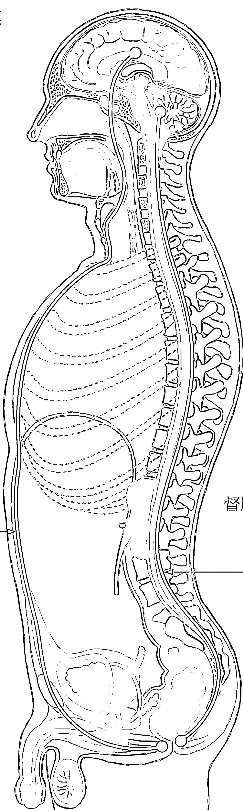

任脈筋膜行使區

督脈筋膜行使區

## 第二篇。打開任督二脈的神祕面紗

有所差異，但與道家智慧圖譜所顯現的任督二脈源頭卻是不謀而合。筆者特別要提醒學習者，在習練時不要執著於傳統的任督二脈氣行路徑，否則將永無練成真正打通任督二脈之日。

至於任督二脈筋膜之源頭出自何處，止於何點，依本書功法習練自會找到源頭出處。

任脈到底有什麼功能？督脈又有什麼特殊之處？

提起任脈功能，說得精準一點，就是任脈筋膜的功能。這條任脈筋膜是掌管人體生命能量的幕後老闆。其管轄勢力範圍如下：

1. 凡是攸關男人的尊嚴，男人的私密，難以啟齒的問題，都可以在這裡找到滿意的解決答案。更簡單的說，就是男性雄風、男性精力、男性「一柱擎天」的性能力等，都是由這整條任脈筋膜的能量所控制供應的。
2. 人體大部分的真氣能量，是由這整條的任脈筋膜運轉製造而產生的；像自體核子反應爐的火種源，也是決定自體健康、強壯與否的主要生命線。很多男人衝著大口吃肉、大口喝酒的豪邁飲食習慣，變成大肚腩的鬆垮模樣，並有意無意間在日常生活習性裡，破壞、勒緊、阻塞這一條任脈筋膜的能量供應，非但跟自己的生命開玩笑、也跟自己的男性雄風唱反調。
3. 每個人的腦袋瓜都是何其珍貴又脆弱的寶貝。如果腦袋裡沉滯淤積、氣行不通，則腦脊髓液的分泌、運輸循環、淨化、去淤，以及滋養腦內組織之數十億個神經細胞等功能將逐漸減弱，連帶著這些重要腺體所分泌的生命激素也將漸漸減產。於是乎身體衰退的訊號開始響起，莫名的病痛開始衍生，生命力也將漸次式微，終至拖到須要吃藥、開刀，最是下下策的無言結局。因此，要想隨時的維修保養自己腦袋，只有讓任脈與督脈相通相融、增強真氣能量、激勵腦脊髓液分泌、強化腦脊髓液的運輸循環、增長腦中元神的精華量、增強潛能智慧，造就創意學習能力，再度恢復年輕健康的生命活力。
4. 我們身體的內分泌系統—除了腦中的松果腺、腦下垂體、四丘體…等外，還有甲狀腺、副甲狀腺、胸腺、心臟、胃、胰臟、腎臟、十二指腸、卵巢、睪丸…等，這些生產生命激素的主要基地，也都在任脈筋膜的能量行使範圍內。換言之，運轉任督二脈就能夠強化內分泌系統以及生命激素的分泌，提高生命力。
5. 我們身體的消化系統、泌尿生殖系統、循環系統、免疫系統、呼吸系統…等所有攸關生命所需的功能，也都位在任脈筋膜的能量行使範圍內。所以啟動任督二脈的生命運轉，就能使身體逆轉勝，弱變強，踏上健康之路。

打通任督二脈何以能夠血脈暢通、氣行周身？

所謂血脈暢通是指血液的流動及經脈網絡之氣行皆趨順暢。這還包括尿尿的噴射也是漸趨強勁有力。因為縱橫交錯，遍及全身的人體十四經脈網絡之氣行路徑是經脈直行網絡橫行之交錯，且每一條經脈均各司其職、又固定位置範圍。所以，打通任督二脈筋膜之習練必得依循一定的程序，依線→條→面→環繞全身的步驟循序進行。更清楚說明，就是要以人體正面、背面中心線的任督二脈路徑範圍為主要循環，再以掃描方式由中向左、由左向右、由右向左、由左向右…等不斷的循環。這種第一步以線的任督二脈小能量運轉學習為主，因左右掃描循環的體力耗費較輕微，對體內筋膜尚未柔韌化之初學者而言，是比較容易領略方法，感受到進入任督二脈運轉的驚奇與喜悅，因此容易產生成就感，而得以持續不間的習練。這時候，習練盤坐只要閉目內視、手掌相疊掌心向上、輕置於腿上或腹前就可。但這樣小小的成就心得，是無法滿足學習者想更深入探究這個領域的強烈企圖心。

這樣小小的任督二脈運轉能量，對於想要逆轉勝，或扭轉快速衰退中的身體，的確是不容易的。同時與傳統認知的打通任督二脈可增加一甲子功力的觀念，也存在著相當程度的差距。所以，在完成第一步的線就必須進入第二步的條；即要擴大任督二脈能量運轉的筋膜範圍。這時候的盤坐習練，是要閉目內視、雙掌相合置於胸前，擴大腰側筋膜的使力範圍，讓任督二脈筋膜的運轉產生較大能量。接著再由第二步的條→進入第三步的面，即擴大任督二脈能量運轉的筋膜範圍遍及整面前胸腹與後背。然此時任督二脈運轉所產生之能量就非同小可了；不但讓任督二脈路徑暢通，其他的經脈網絡路徑也活絡起來，全然暢通，即所謂氣行周身。氣行周身之後全身能量飽足、氣場強韌，自然血流有力、噴尿有勁。

如果習練再由第三步的面→進入第四步的環繞全身，即擴大任督二脈能量運轉的筋膜範圍環繞整個前胸腹與後背，這時候的習練盤坐仍是閉目內視、但雙掌食指拇指交扣，各置於膝側。此時，任督二脈運轉所產生的巨大能量，就足以快速的將全身筋膜連成一體，使自體形成一個獨立火種源。不但可將真氣能量快速運轉循環於周身，更可穿越自體皮囊循環於體外。這時刻的心境可將自己視為宇宙星辰中的一顆小星星；或自體生命的一個小細胞，隨時可運轉自性能量並散發於體外。

任督二脈如何打通？打通任督二脈是不是真的可以增加一甲子的功力？

打通任督二脈後，會有「無處非能量，無處非太極」的身心快感！全身之氣均處於平衡一致、等同齊量的狀態，故可輕鬆啟動河車運轉或是漩渦式運轉的加速度，強化真氣能量的濃度和力道。而其他的12經脈路的徑筋膜，亦會因打通任督二脈，而氣行周身、血脈貫通。此刻，骨頭與骨頭之間，肌肉與肌肉之間，骨頭、肌肉與臟腑器官…等，均會因真氣能量貫注而產生磁浮般的保護氣場，於焉淤塞漸除，病痛漸失，氣能滋補細胞，而臟腑器官生旺；百病慢慢離開，使身體重返健康、回復青春，這應該也算是增加一甲子功力的另類說法吧！接著，在上節由第三步的面→進入第四步的循環全身的習練，能夠將全身筋膜鍛鍊成一體；將自體形成散發能量的獨立火種源。此時，污濁雜質既已遠離，多餘贅肉也不會再殘存體內了。

所以建構一個結實、沒有贅肉之型男型女身段，也算是另一種增加一甲子功力所創造的奇蹟吧！

武俠電影裡面運氣療傷的劇情是不是也是真的？

刮痧、拍打、按摩…等均屬能量傳輸的一種，但不如運轉任督二脈時所產生的真氣能量那樣巨大和強悍。筆者尚未完全熟練任督二脈之通體氣行之前，在一次偶然的機會裡，對虛體友人行使了武俠電影裡面雙手按背的運氣施功。因當時體內真氣濃度未臻強盛，所以行使了二、三分鐘就驟然發覺全身熱量消失，並出現一股涼意，運轉的節奏大亂且氣喘噓噓，恐傷及自體，遂快速終止運氣。事後據友人說，他剛開始的時候，感覺很舒服，因確實有感覺一股熱流傳入原本就有些寒氣的體內。但接著熱流就斷斷續續、似有若無，然後就結束了。當時這個事件，讓筆者又驚又喜又挫折，喜的是運轉確有小成；挫折的是真氣能量的規模與自己的想像還有一大段的差距。然這挫折卻激發了筆者努力思索，悟出打通任督二脈的習練必照線→條→面→環繞全身的步驟循序進行，也因而練就了一身筋膜強勁、柔韌、通體舒暢的體魄！

筆者常想，當自體形成一個獨立火種源後，透過自體運氣，將產生之真氣熱源傳輸給別人應該不是一件難事。更遑論以自體運氣，來治癒盤踞體內數十載的慢性病症，確是真有其顯著功效的。所謂百病可離，正是此意。

為何說男性的雄風是由任脈筋膜的能量所供應？

當我們運轉任督二脈筋膜時所產生的真氣能量，有如一道瀑布，自任脈源頭直瀉而下，途中也會將內分泌器官所生產的生命激素能量一併帶下。因直瀉下來的落地點承接了幾近全部的力道，所以相對其他地方承接的雨露，就顯得單薄了。雖說，男性雄風私處並不在真氣能量直瀉的落地點，但因是持續不斷的微量累積，所以還是很有感覺的。但如果把任督二脈的運轉，改為任脈與脊椎內筋膜的循環，則直瀉下來的真氣能量，落地點就會逼進男性雄風處；如吃了秤砣，鐵了心一般，陰莖堅忍拔起，而且發現只要每天持續不斷習練，「一柱擎天」就可以是隨興而起。當真氣能量的循環，經過攝護腺→直入膀胱→腎臟→脊椎內筋膜，對男性攝護腺的強化與固漏，實有莫大功效。同時，噴尿能量的收放自如，也會令更重要The request was rejected because it was considered high risk

The request was rejected because it was considered high risk

## 第三篇。打通任督二脈十二式

## 01 第一式：會陰捲動

功法
暖身預備完成後，採站式或坐式練功。

方法
1. 先施以肛門縮肛動作，類似治療尿失禁之凱格爾運動*，即快速收縮肛門使骨盆底肌向上跳動，直至肛門口之骨盆底肌筋膜漸漸趨壯緊實，這是第一道築基底盤。

> ※凱格爾運動
> 凱格爾鍛鍊法有些類似我們俗稱的“提肛運動”，通過這一運動，可以增強盆底肌肉和前列腺的血液循環和肌肉彈性，使得局部靜脈血液循環得到改善，減輕靜脈淤積、曲張。

2. 肛門口的第一道築基底盤筋力漸漸緊實後，再將注意力集中於肛門與生殖器中間之會陰筋膜處，以會陰處筋膜為施力點，由會陰向肛門方向，慢慢捲吸、向後，再慢慢向生殖器方向捲吸、向前，直至會陰筋膜漸漸趨壯緊實有力。

3. 會陰筋膜漸漸趨壯有力之後，再將注意力集中訓練於任脈筋膜之曲骨、中極、關元處，直至曲骨、中極、關元等皆驟趨壯緊實。再沿關元→中極→曲骨→會陰由上而下捲吸至長強，或由會陰筋膜由下往上捲吸至曲骨→中極→關元，形成一條堅韌有力之任脈筋膜能量旋轉線，這是第二道築基底盤（如右頁會陰捲動示意圖標示之）。

4. 藉由意注力的捲動，大量集中於任脈筋膜上之會陰穴，使其會陰穴所在之會陰筋膜逐日趨壯緊實，而慢慢的建立第一道築基底盤與第二道築基底盤。

### □會陰捲動示意圖

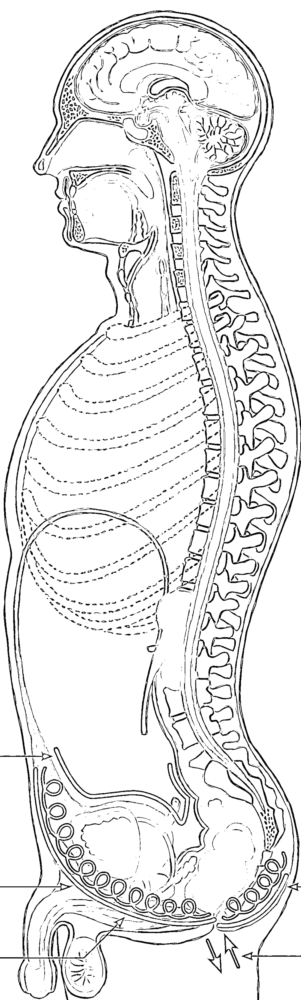

第三道築基底盤

第二道築基底盤

第一道築基底盤

會陰捲動

縮肛動作

### 說明

會陰位在陰部與肛門之間，為任脈起始點

會陰筋膜是啟動河車運轉的第一個入門，是保固、防漏、健骨、強筋之第一道關卡，也是生命三要素精、氣、神之重要守門員，更是踏進上帝透明天梯，找尋長生不老秘密的第一步。

### 何謂精、氣、神

- 精者：人之所形成，為建構生命之基本元素，即細胞。細胞組合成器官，器官組合成系統，系統組合成人之身體。
- 氣者：真氣能量也，即驅動全身血液、經絡循環之力，如電力之驅動燈具機器、如大氣壓力之驅動水流一樣。
- 神者：為導引氣血能量運行之中樞神經系統，元神為中樞神經系統之總司令，泥丸宮之所在，是人體之主宰。

精、氣、神之相互關係如下：因『精』之生成，而需『氣』之行運滋潤；因『氣』之行運，而需『神』之控制導引；因『神』之導引順暢，而使『精』潤澤生壯。亦即因『神』之導引而『氣』行，因『氣』之行而潤澤於『精』，因『精』之壯而旺相於『神』。所以『精、氣、神』缺一不可，互為因果，相輔相成，而使生命運轉不息，故稱為生命三要素。

### 『精、氣、神』何以需要保固防漏？

腹腔是為人體生氣之海，真氣沉積之所在，更是捲動全身能量熱源、氣血循環之核子動力發電廠。

人體能否健康，腹腔真氣能量之強弱與否，腹腔真氣能量之有無，具有關鍵性的影響力；即腹腔真氣能量弱，則氣血循環慢、新陳代謝差、臟腑器官弱、體態寒涼、免疫力下降。而腹腔所在處，即體內核子動力能源之場址，卻緊鄰二個真氣疏漏點，即腸道肛門與生殖器。

現代人常因酸、甜、苦、辣、油膩、冷熱不調之飲食習慣，久而久之，造成腸道之虛、涼、燥、熱，而生便秘、腹瀉、消化不良等，傷及腸道肛門之正常運轉，而使腸道肛門鬆軟無力。累及肛門周圍肌體寒涼軟弱，甚至傷及腸道內之重要免疫抗體。功能因而大大減弱，成為生病之源，而使精、氣、神大量漏失於有形無形之中。

另生殖器者兼具排穢及傳宗接代之功能；而攝護腺精竅者，則為其主要控制樞紐，如同水龍頭之墊片一樣。現代人觀念較為開放，常因貪嗔慾念或縱情聲色、或年華老去、或疏於運動、或缺少保養，而至精竅鬆軟無力，如同水龍頭之墊片變形扭曲、軟化，而致竟日漏水、漏氣於無形，長久下來，已漸衰弱之精、氣、神更形髓枯槁木。因此，如果沒有會陰捲動的訓練，來將第一道以及第二道之築基底盤筋力緊實，成為一道可以將任脈運轉而下之滾滾真氣反彈，使成為循環能量之堅固地基。反之，則任何方式之氣行活動能量均會由肛門生殖器處洩漏而出，不但無助於強化身體之健康，反而洩氣有傷。

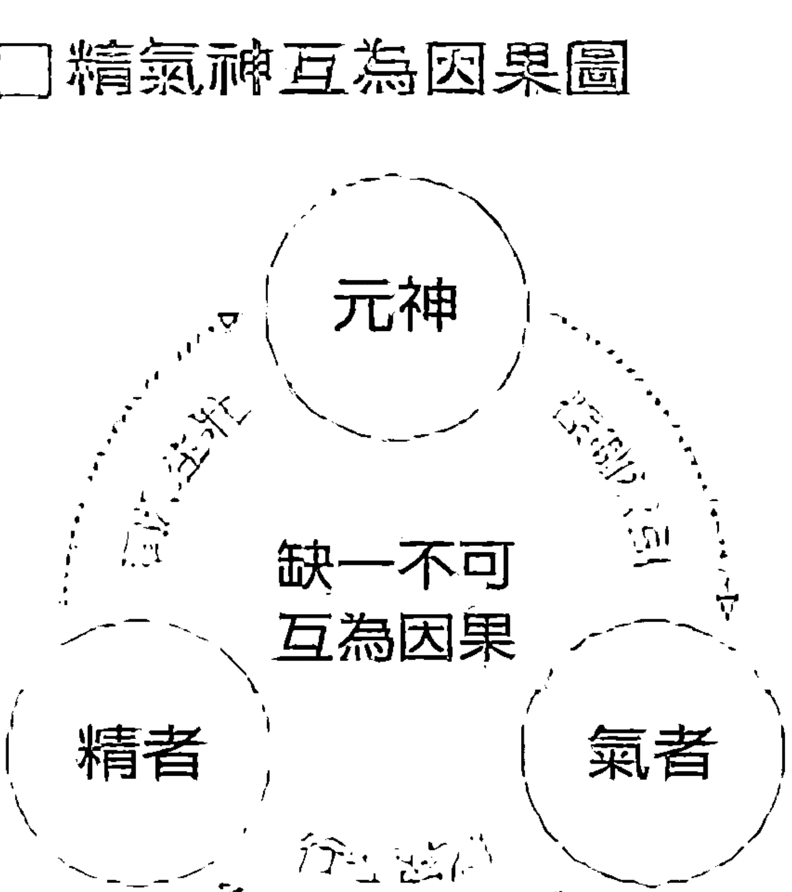

## 02 第二式：力注腰俞，直吸精竅

【動作】
暖身預備完成後，採站式或坐式練功。

【路線】
力道從丹田→關元→中極→曲骨→而下會陰→再沿督脈而上腰俞，再從腰俞向前直吸尿道海綿體口→沿精竅直上→膀胱，如「力注腰俞，直吸精竅示意圖」。其主要目的是藉著大量施力於督脈筋膜上之腰俞穴，使其打開沾粘閉鎖的狀態；並慢慢撼動連接陰莖海綿體與恥骨聯合的兩條筋膜之閉鎖筋縮，使其慢慢軟化而趨柔韌。

【說明】
男人一生精竅之使用在於撒尿與性愛。控制著生命三要素精、氣、神，由內向外洩漏之單一方向長期使用。因此訓練一個相反方向，由外向內吸入能量，不但能調整精、氣、神由內向外之漏失，由大漏變小漏，由小漏變無漏。對攝護腺功能之恢復，不但有效固守精竅，還能有效防止尿液滴漏，更能強化佈滿男性陰莖海綿體之神經和血管之活絡，以及筋膜之筋力緊實，同時刺激強化膀胱，有效幫助第三道築基底盤的建立。

### 『力注腰俞，直吸精竅』的訓練要點

在『力注腰俞，直吸精竅』的訓練中，會大量使用到控制陰莖海綿體之骨盆腔神經叢及坐骨神經。是訓練腿之有力、腰之強勁，並有效建立第一道與第二道築基底盤的基本要件。當然，在任脈筋膜尚未完全暢通，氣行能量尚未完全正常之前，人體的衰退訊號必持續在響著；必處於氣虛血脈不暢之中，全身筋骨肉、臟腑器官日趨鬆軟，神經系統的導引力量肯定不強，此時，若要去驅動屬於不隨意肌的生殖系統器官，想要快速感受『力注腰俞，直吸精竅』的感覺，的確不是一件容易辦得到的事。

所以始練之初，骨盆腔處之生殖器、尿生殖隔筋膜、腹部筋膜、神經、血管、骨盆腔內筋膜…等，在使力點與神經控制點上，在筋膜與血液供應的覺醒上，都是需要一段時間磨合，才能漸漸領略出其中要點。畢竟骨盆腔內的東西不像手腳，想動就動、想打就打、想跑就跑，不是那麼隨心所欲，不易操控自如的。

所以在要點領悟的過程中，或許會有一點點失望，會感覺進展有點慢。但是別灰心，我們的身體就是這麼的奇妙；當我們閉著眼睛往骨盆腔內看，努力的想動些骨盆腔內的東西，我們的元神、腦神經中樞、脊髓及所有的周邊神經叢等，都會非常盡責的記錄每一次又一次的努力與嘗試、成功與失敗；然後再以潛移默化的方式遁入潛意識中，知會你的筋膜、神經控制、血液供應、腹部肌肉等，傳達你的需求。只要再多給一點時間、一點努力之後，骨盆腔內的各處不隨意肌零件，就會逐漸配合，達到任務所需。

這就是本書一直在強調非常重要的閉目內視養神的概念。也就是說，透過元神的意識統籌整合，再經過一段長時間的不斷練習，就能讓腰內臟神經、骨盆神經、坐骨神經等多方神經及腹部筋膜變有力道，會合控制所有力量的成形，並可漸漸領略到『力注腰俞，直吸精竅』之神妙感覺。

因為要『力注腰俞，直吸精竅』，所以習練時仙骨腰俞處及大腿容易產生酸疼現象，這是正常的。而腰內臟神經、骨盆神經、坐骨神經等三方神經，會合控制力量的若有若無。勤能補拙，面對種種困難，數千次的習練，絕對比數百次、數十次的習練，讓你漸入佳境，更快也更容易找到竅門、達到成功的基本門檻。

### 『力注腰俞，直吸精竅』的成功基本門檻

主要的門檻條件如下：

- 丹田→關元→中極→曲骨→會陰→長強→腰俞等這一條能量旋轉線，已能隨心所欲的啟動。
- 生殖器→精竅→膀胱等已然形成一個獨立的懸掛系統。
- 腰椎→骨盆腔→腿骨等之筋骨肉神經結實有力。

具備了以上的主要門檻條件以後，接著進入啟動『力注腰俞，直吸精竅』的方法。

### 啟動『力注腰俞，直吸精竅』的方法

1. 力注腰俞，直吸精竅的路徑。首先啟動丹田→關元→中極→曲骨→會陰→長強→腰俞等之能量旋轉線，將能量集注於腰俞處，再意注腰俞之能量，並力注於生殖器內的尿道海綿體之龜頭入口處。沿尿道海綿體之尿道管徑，將一股由外往內之吸力，直吸至精竅、膀胱。

2. 當開始力注腰俞，直吸精竅。此時，由生殖器→精竅→膀胱等所形成之獨立懸掛系統，因一股由外往內之吸力，將生殖器→精竅→膀胱等之獨立懸掛系統，由外吸往膀胱之方向。

3. 由外吸往膀胱方向之吸力速度越快，吸力之力道越大，則生殖器→精竅→膀胱等之獨立懸掛系統，由外吸往膀胱之距離也就越長。

4. 瞬間由外吸往膀胱方向之吸力越快，力道越大，距離越長，則經由尿道海綿體之龜頭入口處，沿尿道海綿體之尿道管徑，直入精竅就形成一股由外往內之吸力。於是乎，精竅之保固閉鎖更加牢靠；精、氣、神之良性循環運轉更加飽足充盈；這正是往後吸取「天地靈氣」的基礎入門訓練。

### 何謂閉目內視，意注眉心天庭？

眉心天庭位居任督二脈循環線上，即人體之主宰「泥丸宮」前。意注眉心天庭，可藉由脊髓中樞神經系統與周邊神經組織之連線，讓泥丸宮之元神，即腦之中樞神經總樞紐，看見人在習練時之動作是否正確？譬如在作腰椎旋轉時，你用閉目內視意注眉心天庭，所看到的腰椎旋轉動作，會比你用睜開眼睛時所看到的更為精準。尤其是在作打通任督二脈之各項功法訓練時，全部動作均在體內細微之處完成。睜開眼睛你是看不到的，只有用閉目內視的方法，才能比較清晰感受到或看到能量的運轉，像是轉動的方向，真氣跑到了那裡…等。

會陰捲吸動作其捲吸氣力之使力自丹田→關元→中極→曲骨，沿任脈而下會陰，再沿督脈而上腰俞；或氣力始自會陰，沿任脈而上曲骨→中極→關元→丹田；甚至會陰捲吸時所捲起能量之多少，捲動能量之方向、路徑、或終點在那裡，都會正確而且清晰的知道。因此，多利用閉目內視意注眉心天庭的方法，清楚去感受到，昨天和今天的習練有沒有什麼不同？有沒有什麼進步？有沒有什麼需要修改的地方。總之，閉目內視意注眉心天庭是本書內功訓練的最基本配備，往後對整個神經系統的成長茁壯會有莫大的功勞。

## 03 第三式：意注會陰，直吸精竅

暖身預備完成後，採站式或坐式練功。

以會陰為起點→精竅→曲骨→生殖器→會陰之順向慢速旋轉及以會陰為起點→生殖器→曲骨→精竅→會陰之逆向慢速旋轉訓練。其主要目的，是要確認任脈筋膜上之會陰穴確實打開暢通中。

所謂『意注會陰，直吸精竅』，即所有的使力點、注力點，均直接作用在會陰、精竅、曲骨、生殖器上。也就是說腰內臟神經、仙骨神經叢、坐骨神經等多方神經組織會合控制的力量，能夠精準的、有意識的捲動生殖器的頭部、根部、會陰、精竅，使之趨壯有力；並作順向或逆向小圓循環旋轉。這對活化生殖器內陰莖海綿體之神經與血管之暢通力道，與筋膜之筋力更具神效。也就是說，練就了『意注會陰，直吸精竅』，就能隨意志力來鍛鍊生殖器，使連結於恥骨結合的筋膜更加柔韌；讓生殖器→精竅→膀胱之獨立懸掛系統更加彈性有力；這對往後腎臟之訓練會有很大的助益。

但是『意注會陰，直吸精竅』的循環旋轉，因為訓練範圍縮小，相關的神經系統、筋膜系統需耗費更大的力道，所以也不是輕易可成。訓練時有幾個門檻條件需要先克服：

1. 肛門至會陰間之筋膜必需堅韌緊實；
2. 生殖器→精竅→膀胱、會陰→曲骨→中極→關元等筋膜各自已成靈活一體；
3. 大腿筋骨肉彈性結實，即坐骨神經之遙控生殖器力道強而無阻礙；
4. 仙骨腰俞處之薦骨神經叢及筋骨結實有力。

### □意注會陰直吸精竅示意圖

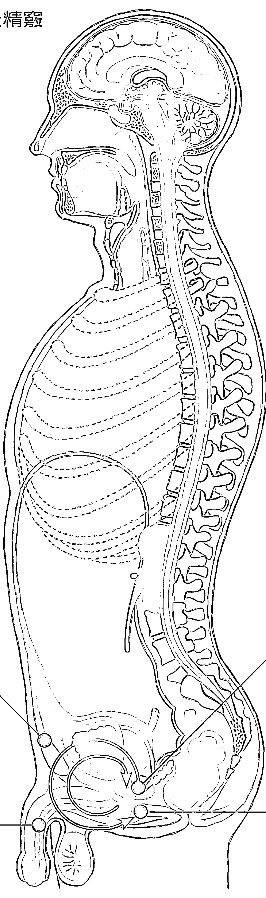

曲骨

生殖器

精竅

會陰

## 04 第四式：旋轉任督二脈

功法
暖身預備完成後，採站式或坐式練功。

流程
以會陰為起點→精竅→曲骨→生殖器→會陰之快速順向旋轉，或以會陰為起點→生殖器→曲骨→精竅→會陰之快速逆向旋轉。其主要的目的，是將任脈筋膜上處於沾粘閉鎖狀態之曲骨、中極兩穴打開，也將督脈筋膜上處於沾粘閉鎖狀態之入口長強穴打開，使整條任脈和督脈筋膜之真氣能量，完全暢通傳輸，周於全身。

說明
「旋轉任督二脈」其實是『意注會陰，直吸精竅』的快速版。也就是說，在會陰→精竅→曲骨間作逆向小圓形之連續快速的循環捲動，因之而起的真氣能量沿任脈直上，如『旋轉任脈示意圖』。或順向小圓形之連續快速的循環捲動，讓真氣能量沿督脈直上，如『旋轉督脈示意圖』。這種高頻率連續快速的循環捲動，產生大量的熱能，並自任脈之起點會陰→曲骨→中極→關元→…等各穴，逐一貫穿而上，並直入靈台→玄關，或由長強穴沿脊髓上之督脈各穴直入玄關→靈台。讓全身充滿熱能，氣色紅潤，口腔生津唾液多。

### □旋轉任督二脈示意圖

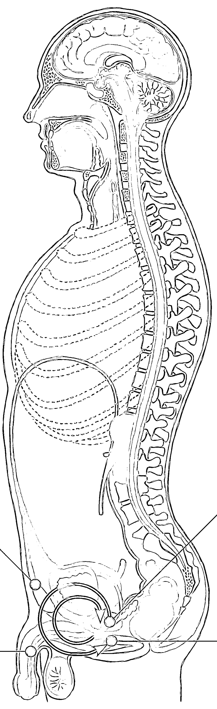

* 做高頻率連續快速的循環捲動

曲骨

精竅

生殖器

會陰

### 感受暢通無阻的舒適感

一般來說，練到了「旋轉任督二脈」這個階段，任脈源頭的會陰→曲骨→中極→關元等區段的阻塞沾粘就會迎刃而解，而整個任脈筋膜就會開始暢通無阻。當開始暢通無阻的那一瞬間，就會聽到「噗」一聲，感受到任脈筋膜中間一條綳緊心臟的無形線突然被抽掉，讓胸口上經常悶悶吊吊的不適感消失了，然後心臟倍感無比輕鬆，這就是整個任脈筋膜暢通後的真實感受。此時，再作「會陰捲動」、「意注腰俞，直吸精竅」、「意注會陰，直吸精竅」的訓練時，以前一直都會出現的困擾如曲骨、中極、關元等處的酸疼現象，已不會再出現了；而督脈筋膜開始暢通時，也會有「噗」一聲的情形，但沒有一條綳緊無形線被抽掉的感覺，只有肛門、會陰筋膜的緊繃與肛門之酸痛也會暫時消失得無影無蹤了。

### 暖身預備的重要性

在本書的每一式訓練功法中，開始均有註明直立式或盤式拉筋法，目的是要特別的提醒習者拉筋對身體之重要性。因為在打通任督二脈之前，拉筋有助於軟化綳緊的筋膜，加大或除淤或淨空頸椎、胸椎、腰椎、仙骨、尾椎等神經通行路徑；有助於加強神經系統之敏銳觸覺與抓著控制力，對於每一項功法訓練之成功與否，有直接的加乘作用。對於腦之中樞神經、脊髓及周邊神經等，亦有反向強化之功能。而在打通任督二脈之後，拉筋更是不可或缺，甚至是更需再加強的功課。

我們常聽到晚輩告誡長者多走路但絕不可以太激烈。這話怎麼說呢？因為長者的精、氣、神已不足，細胞能量已式微，氣行能量也衰退；筋、骨、肉之間的保護氣場也太弱，過於激烈的身體動作將造成骨頭與骨頭間、骨頭與筋膜、肌肉間的直接碰觸磨擦，以致產生經常性的疼痛發炎，這樣不但無助於身體的調養，反而對健康有傷。可是在打通任督二脈之後，常態性的真氣能量運轉，可以在長者的筋、骨、肉之間產生足夠強勁的保護氣場，此時，儘管做有如年輕人的激烈運動，不但對長者調養身體無傷，更有助於細胞能量的快速增長，讓體能回春，重返年輕的生命力。

## 05 第五式：終極捲吸

暖身預備完成後，採站式或坐式練功。

終極捲吸是指以整個生殖器筋膜的神經，作敏銳力及抓著力的強化訓練；將連繫生殖器與恥骨聯合的那兩片筋膜之閉鎖，完全打開暢通；作完全軟化柔韌為目標的重點訓練；作生殖器之獨立懸掛系統完全建立之訓練，如「終極捲吸示意圖」。

其主要目的在於建立任脈筋膜由上而下傳輸真氣能量於第一及第二道築基底盤；傳輸真氣能量於連接陰莖海綿體與恥骨聯合之兩片筋膜，使之完全柔韌暢通；並建構第三道築基底盤所必需之生殖器獨立懸掛系統之形成。

「終極捲吸」是繼「旋轉任督二脈」之後，再將範圍縮小，集中於整個生殖器筋膜、神經為目標的重點訓練，並連繫生殖器與恥骨聯合的那兩片筋膜的強化訓練，以建立完整之生殖器獨立懸掛系統。

「終極捲吸」分為兩個階段

1. 是以兩條陰莖海綿體連結於恥骨聯合之兩條筋膜為訓練的施力點，繼之則是訓練陰莖海綿體所在之神經控制力與抓著力。

### □終極捲吸示意圖

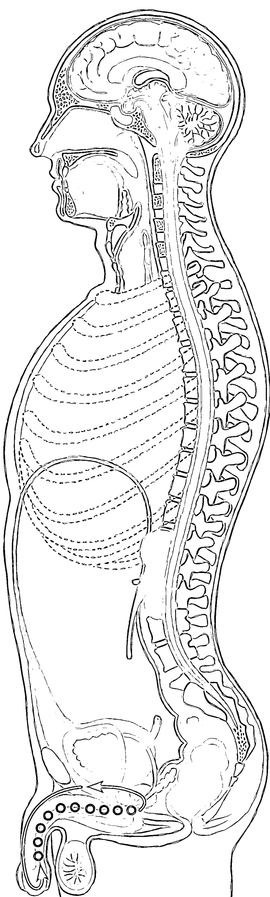

2. 是以生殖器龜頭為訓練施力點，即尿道海綿體上之生殖器龜頭的神經血管為訓練之起點，繼之則是訓練尿道海綿體所在之神經，最後則是訓練會陰及前列腺內之精竅，再由會陰精竅直吸生殖器龜頭。

### 閉目內視，凝注眉心天庭二個基本概念

1. 凡人體的任何地方，只要腦中樞神經中心能夠感受到、看得到的都是可以訓練的。

2. 人體的任何地方包括腦中樞神經，你不去使用它，它就會懶洋洋的失去能量；你越是嚴格的操練它，它就會越來越堅強、壯大，所謂「不經寒徹骨，焉得梅花撲鼻香」的道理。是以，不斷的運用閉目養神的方法，探索自己身體的每一個地方，神經系統就會越敏感、越有能量；腦神經中樞元神所在的地方，就會越飽滿、越強壯。所謂元神座前勤拂拭，在閉目養神時，藉由腦中樞神經中心的串接，再經由脊髓及周邊神經之連線，你就會越來越清楚，能看到或是感應到自己所要訓練的目標了。

接著，就是進入「終極捲吸」的第二階段，把訓練目標放在生殖器龜頭的地方。當腦中樞神經中心看到了、感受到了生殖器龜頭之所在，即表示生殖器龜頭上之神經線路還存在著，仍透過薦骨神經、坐骨神經、脊髓和腦中樞神經中心連線著。但是為什麼很多人都不能用意念去觸動或捲動生殖器龜頭呢？那是因為你從來沒有要求過它要這麼作，也從來沒有訓練過它要具有這樣的能量。

也可以這麼說吧！一般人在年輕的時候，身體都是健健康康的；生殖系統所需要的功能也大都正常；一切都呈現美好狀態，所以具不具備那樣的功能，也就沒有那麼重要。但是，當生命走到了中老年的階段，任脈筋膜的真氣能量供給已漸被切斷，生命激素的供應腺體也漸在減產中。這時候，如果再置之不理、不聞不問，讓生殖系統自生自滅。那麼生命力就會像溜滑梯一樣，快速走下坡，一如夕陽生命。因此，「終極捲吸」第二階段的訓練目標，要放在生殖器龜頭的神經敏銳力與抓著力訓練。

### 終極捲吸的第一步訓練

第一步就要用閉目內視凝注眉心天庭之方法，去找到自己生殖器龜頭之所在。儘管龜頭上之神經是透過坐骨與薦骨神經叢，以及脊髓與腦中樞神經中心連線著，但因為沒有訓練過，所以整個連線是屬於斷斷續續的，是非常微量脆弱的。此時的要務，就是要保持生殖器龜頭上之主要神經群與腦中樞元神的熱線聯繫，持續保有感覺的溝通，這是非常重要的第一步。這第一步或許會耗掉一個星期、一個月，甚至更久的時間。可是當第一步的任務完成了，就可以進入第二步的訓練，逐步加強坐骨神經及薦骨神經叢對生殖器龜頭上神經之捲吸力。

### 終極捲吸的第二步訓練

第二步的訓練攸關到終極捲吸之成功與否，也是最困難的部分。可是當第二步的訓練成功了，就表示生殖器之整個尿道海綿體的神經敏銳力與抓著力漸漸回復正常了；可以強烈的接收與執行腦中樞神經中心及坐骨神經與薦骨神經叢之所有訊號指令。而後進行第三步的訓練，讓尿道海綿體、攝護腺精竅和會陰筋膜之河車能量捲動，就會比較容易水到渠成。「終極捲吸」第一階段的訓練主要是河車能量之逆向捲動。其主要目的

### 第五式：終極捲吸

是訓練陰莖海綿體之直立掌控力，並使陰莖海綿體連結於恥骨結合之兩片筋膜緊實柔韌。這種河車能量之逆向捲動還有一個非常重要的任務，就是調整尾椎與肛門間之長強穴，使歸於正確暢通之位置。而長強穴是督脈的起點，長強穴暢通了，則河車能量作順向快速旋轉時，所捲起之熱能，就容易沿督脈各穴而上玄關→靈台；同樣的，河車能量作逆向快速旋轉所捲起之熱能，亦得以沿任脈各穴而上靈台→玄關了。因此，習者在完成「終極捲吸」兩階段的訓練目標後，則河車運轉之能量無論作順向或逆向捲動，都能隨心所欲，操控自如了。

當然更重要的是，河車運轉能量，其旋轉線自腰俞→長強→會陰→曲骨→中極→關元已完全成形。同時，生殖器→精竅→膀胱等獨立之懸掛系統也會自然形成，於是乎『力注腰俞，直吸精竅』之反向捲吸能力，自然快速進步。同時，這也是第三道築基底盤建構完成的最基本條件。

## 第三篇。打通任督二脈十二式

## 06 第六式：吸取天地靈氣

暖身預備完成後，採站式或坐式練功。

- 1. 以腎臟為吸力處，將一股吸力由陰莖之尿道海綿體口→直入攝護腺精竅→膀胱→腎臟。
- 2. 此時一股吸力由頭顱上方直入腦中央沿脊椎直下腎臟。
- 3. 同時另二股吸力由腳底下直入湧泉沿腿骨直上腎臟。
- 4. 本法目的在建立第三道築基底盤及強化脊椎內筋膜之堅韌以氣行循環。
- 5. 本法之目的在於生殖器、攝護腺精竅、膀胱、腎臟等功能之重度磨練，為任督二脈全身運行功法中最重要的一道能量啟動線。

以腎臟為主要使力點吸取天地靈氣。從尿道海綿體口→直吸入攝護腺精竅→膀胱→腎臟，將這一道能量的起動線，進行大量而頻繁的磨練，就可以強化生殖器、攝護腺精竅、膀胱、腎臟等之能力。正式啟動了所有臟腑器官的訓練工程；也啟動了腹腔、胸腔內所有臟腑器官的療養工程。

### 吸取天地靈氣的三種循環運行

從尿道海綿體口吸取天地靈氣後，直入腎臟之吸力，會將腹腔內既有之真氣能量捲動向上。這道能量會有三種不同需求的循環運行方式可供選擇：

- 1. 沿脊椎內筋膜→橫膈膜→腹腔之任脈筋膜→第三道築基底盤→再回到脊椎內筋膜腎臟處，形成一個河車或漩渦式的動力加速度循環運轉，可自體產生大量之真氣能量，加速腹腔內臟腑器官除淤去濁，促進體內新陳代謝，加強自體免疫系統等的防衛能量；
- 2. 沿脊椎內筋膜→橫膈膜→腹腔之任脈筋膜→第二道築基底盤→第一道築基底盤→經長強穴直上督脈玄關；
- 3. 沿脊椎內筋膜→橫膈膜→腹腔之任脈筋膜→第三道築基底盤→運轉能量於下腹部丹田→將動力加速強化後之真氣能量→經由任脈筋膜之關元→中極→曲骨→懸掛陰莖海綿體之兩片筋膜→直接灌注入生殖器，這種自體產生大量純陽真氣的隨時灌注，可以讓生殖器保持飽滿、保持硬挺，讓生命力大幅邁向健康、強壯；也可相輔相成，讓這條運行路徑上的生殖器、攝護腺精竅、膀胱、腎臟更加強壯，並使沿途的筋膜更加堅韌柔軟，產生更多能量。

從一股頭顱上方吸取天地靈氣。即天之能量→直入腦之中央元神處→直下腦幹→直下脊椎→集注至腎臟，可強化任督二脈之能量源頭，即靈台與玄關；有助於脊椎內筋膜之真氣運轉能量，以強化腎臟功能。另外，由二股腳底下吸取天地靈氣。即地之能量→直入湧泉→直上腿骨→直上骨盆腔、腰椎之內筋膜→再直上集注至腎臟，可強化雙腿筋膜之真氣傳輸與能量。當同時將吸取天地靈氣的這三股能量集注於腎臟，就可將天地與自體連成一氣，讓打通任督二脈的工程變得比較容易進行。

### 吸取天地靈氣的重要功效

到了這個階段，就不得不承認「未有此身先有腎，故腎為臟腑之本，十二經之根」。胞胎形成始於腎的說法，確實有根據也有所本。不由得你我不相信「腎」這個東西，確實可以經由訓練而變得有力，進而撐起天地與自體連成一氣的先機；撐起了打通任督二脈的原動力。因此，今後一定要多多關照「腎」這個器官。千萬別讓太多的藥品、美食、非專業建議，污染了「腎」器官的原生力，阻斷了它可以让生命再造長生的契機。

吸取天地靈氣是強化五臟六腑器官及脊椎內筋膜之最重要訓練。也是第八道築基底盤能否順利完成之必要一環。

吸取天地靈氣是完全保固防漏，習練純陽之體的最重要一環。對攝護腺、膀胱、腎臟有相當龐大之功效。

## 07 第七式：無極生太極

暖身預備完成後，採站式或坐式練功。

左右掃描法：深吸一口氣，真氣沉海底。以肚臍為軸心，任脈祖海－會陰為陰陽兩極。順向或逆向啟動河車運轉，捲起海底真氣，以祖海、會陰為直徑距離，從身體正中開始旋轉真氣，然後由中往左慢慢掃描到底，再由左向右慢慢掃描到底，再由右向左慢慢掃描到底（如無極生太極之多方向運轉訓練示意圖）。若要左右掃描整個腦部，則將河車運轉軸心往上移至胸腔，以頭頂－肚臍為直徑距離之陰陽兩極，能量的掃描一樣是由中線→往左到底→再由左往右到底，重覆進行。

上下掃描法：深吸一口氣，真氣沉海底。以下腹內中點為軸心，左右腰部為陰陽兩極。向左或向右啟動圓形運轉，類同腰椎旋轉，由下平行往上旋轉至胸腔，類同女性常作之呼拉圈運動，可全面性的能量掃描全身及臟腑器官…等，重覆數十次（如無極生太極之多方向運轉訓練意圖）。

### 腦部運行示意圖（1）

腦部運行法：1.深吸一口氣，真氣沉海底。以滾動式運行法將沉積海底之真氣強力捲入腦部，讓捲入腦部之真氣與祖海處之河車旋轉，同步運轉循環；或以捲入腦部之真氣能量獨自運轉循環。2.以腦殼為獨立的太極空間，腦之中樞為軸心，任何直徑之兩端為陰陽兩極，慢慢的自行啟動平行、垂直、或各種方向之河車運轉（如示意圖）。

### 脊椎內筋膜運轉示意圖

脊椎內筋膜滾動運行法：
深吸一口氣，真氣沉海底。
以下腹內中點為軸心，會陰－肚臍為陰陽兩極，作小直徑之循環捲吸，把沉積海底之真氣強力捲起，經精竅→膀胱→腎臟→沿脊椎內筋膜運行直入乳哺→靈台→機台→玄關作順向或逆向之循環運轉，在脊椎內筋膜滾動運行時是以脊椎內筋膜為底、直徑大小任取之方式進行。旋轉軸心也同時配合真氣往上壓縮捲起的速度，慢慢的滾動上移。（如示意圖）。

### 無極生太極之督脈滾動運行示意圖

督脈滾動運行法：深吸一口氣，真氣沉海底。以下腹腔內中點為軸心，會陰－肚臍為陰陽兩極，把沉積海底之真氣強力捲起。經長強直上督脈入玄關→機台→靈台→乳哺作順向或逆向之循環運轉，在督脈滾動運行時之直徑陰陽兩極，須隨脊椎與背部表皮之距離機動調整（如示意圖）。

### 無極生太極之任脈滾動運行示意圖

任脈滾動運行法：深吸一口氣，真氣沉海底。以下腹內中點為軸心，會陰－肚臍為陰陽兩極，把沉積海底之真氣強力捲起，經任脈運行直入乳哺→靈台→機台→玄關作順向或逆向之循環運轉，在任脈滾動運行時之直徑陰陽兩極，是以任脈筋膜為底、直徑大小任取之方式進行（如示意圖）。

人之身體有如宇宙渾沌未開、無邊無際。五臟六腑如不同的星系，各自安放在人體宇宙的無極空間。在這空間裡，真氣、脈絡相通、相連，似有若無，卻相互影響著，呈陰陽未明，能量流轉，洩漏渙散。任憑光陰穿梭如箭，春夏秋冬循環奔走。日復一日，年復一年。在細胞能量、臟腑器官的生命軌跡裡，寫下生、旺、衰、老、病、死的過程，留下了「昏昏醉夢間，光陰兩俱失，流浪於生死，苦海無邊際」的無知事實。這是因為人們皆認為「人生來就是要享受」的。於是，吃喝拉撒，任性所為，追趕流行。以為小病小痛，無傷大雅；但在是面對大病大痛，也一樣輕心，總讓它無聲無息，來的又快又急，直到悠關生老病死那一刻的威脅才會驚醒，開始求神問佛，急病投醫，這又有什麼用呢？還不如來看看無極、太極，探究它們是什麼？與我們有什麼相干？

無極就像一個人終日在繁忙、醉夢中流浪；總是不經心，而讓自己太過放縱或太過寬鬆。放任自己的身體，疏於運動，無視體內能量作用，任其懸浮，又不懂得循環和集注運用。讓身體老像個無邊無際、虛空渙散的宇宙。而太極就是把無極的宇宙在周圍圈起了一道能量圓牆；就像腹腔內堅韌的筋膜，會形成一層能量氣場，把腹腔內原本渙散的無極虛空，圈畫成能量集中又可循還運用的太極空間。於是，太極生兩儀，兩儀生四象，四象生八卦，八卦延伸萬象萬物，各式各樣的能量運轉，相生相合，相輔相成，發展成為生命之大流。也就是說在腹腔、骨盆腔所形成的密閉空間，運用太極原理，可將原本鬆散無力的筋膜鍊成如銅牆鐵壁般堅韌；使產生真氣能量氣場，能旋轉、濃縮、放送、滋養全身、修護傷痕、補足或增強真氣濃度，來確保人體的健康。其原理詳述如下：

在河車運轉的過程中，這些筋膜扮演著太極空間的陰陽兩極，因為正反力量的交流，可輕鬆啟動河車運轉讓氣能循環不息；復因兩極力量的差異，讓河車隨心所欲，上下左右位移、運轉；更因為陰陽兩極正反力量的直線長短可以隨意點取，讓腦之意識也可隨意凝聚；使運轉之能量得以放送至中距離的腦海，傳輸到遠距離的腳底，終致將真氣能量潤澤於全身上下每一方寸之地，強化了每一臟腑器官。

## 08 第八式：任脈尋陽

暖身預備完成後，採站式或坐式練功。

以祖海中心（約胃之所在處）為軸心，心下臍上為直徑陰陽兩極，啟動順向河車運轉；然後將旋轉軸心面慢慢往上移至胸骨體中心直內心肺處，再改以胸骨體之長度為直徑陰陽兩極作河車運轉，至胸骨體上之任脈筋膜由筋縮或硬化轉為柔韌。

任脈尋陽並不是什麼新發明，也不是什麼新招式，而是自有人類以來，就一直存放在每一個人身上的一套無敵的回春裝置－「胸骨體」。只因為它連著一根又一根環繞的肋骨，讓人以為純粹是保護心肺器官的目的而已；只因為它的旁邊存放著兩顆美麗的乳房，兼具哺育和觀賞作用，引人無限幻想，反把隱藏其中的「胸骨體」重要性給忘了。

現在來看看人體任脈筋膜的走向，從喉下的中突→璿璣→華蓋→紫宮→玉堂→膻中→中庭→鳩尾，是位在胸腔之胸骨體上；巨闕→上脘→中脘→建里→下脘→水分→神闕→陰交→氣海→石門→關元→中極→曲骨，在腹腔正中央；會陰則在骨盆腔下的肛門與生殖器之間（參考p24任脈氣行位置圖）。

### 任脈尋陽的功效

這一整條的任脈筋膜從中突到曲骨，連結了負責陰莖海綿體上揚的兩片筋膜（即透明天梯）及生殖器，成了一條L形筋膜棒。當這條L形筋膜棒的氣行是暢通的，則胸骨體上的中突→瓊璣→華蓋→紫宮→玉堂→膻中→中庭→鳩尾等這一段，就成為L形筋膜棒的槓桿把手位置；只要把胸骨體筋膜訓練成堅如強棒，軟如繞指柔，並藉由腦中樞元神，靠意識力去驅動這個槓桿把手的筋膜，使上下快慢移動而生的真氣能量，可下傳灌注至生殖器內，使之硬挺有勁；亦可藉由整個槓桿把手筋膜的控制，來直接捲動筋膜棒尾端的生殖器和懸掛陰莖海綿體的兩片筋膜，使其筋力強盛。還可以和整條任脈筋膜連成一體，接收由腹腔之河車運轉所生成之真氣和整條任脈筋膜能量之灌注，亦可讓陰莖海綿體的兩片筋膜和生殖器自行捲動來產製微量真氣。如此一來，就算年事已高，也可以擁有如年輕人一般的性能力，享受返老還童，回春健康的快感。

以男性同胞的觀點來看，任脈尋陽可以說是史上最強而有效，可以延年益壽的強精壯陽活動；也是男人精力，男性雄風的火種源。屬於安全無副作用的心肺功能訓練。

以生命激素的角度而言，任脈尋陽的循環運轉，是從L形筋膜棒直接灌注而下的生命激素；有松果腺、腦下垂體、甲狀腺、副甲狀腺、胸腺、腎上腺…等所有的內分泌系統，是生命改造的最大生命能量來源。

從經脈網絡的部份來看，任脈尋陽鍛鍊的胸骨體及連接的肋骨，是牽引著心經、心包經、肺經及所有路過前胸後背的經絡等之順暢與否。常是心肺功能障礙的元兇，也是氣行亂竄、通路阻塞的亂石區。

從女性同胞的角度而言，美麗的乳房，不只是育兒與觀賞的作用，其底下的任脈尋陽胸骨體及連接之肋骨，才應該是值得女性同胞終其一生去關心、碰觸的部位。如任憑胸骨體及肋骨擺著不理。就會讓它們串聯起來，以阻塞沾粘來報復；把心臟繃的緊悶、忽快忽慢；肺部也被綁的喘不過氣來；所有路過的經脈網因阻塞亂成一團，終至遠離健康。而且不只是女性同胞有這種現象，男性同胞也有同樣的困擾。

## 09 第九式：打通任督二脈

### 功法

暖身預備完成後，採站式或坐式練功。

### 步驟

依序進行以下各步驟：

- 1. 任脈尋源。
- 2. 拜訪泥丸宮。
- 3. 任督二脈相融滾動，有三種滾動方式。
- 4. 督脈頸椎縱走。
- 5. 督脈背脊縱走。
- 6. 督脈腰椎縱走。
- 7. 督脈仙骨縱走。

### 任脈尋源滾動示意圖

任脈尋源：以祖海中心（約胃之所在處）為軸心，心下臍上為直徑陰陽兩極，啟動順向河車運轉，然後旋轉軸心慢慢往上移至頸部承漿處，再以天突→眉心為直徑之陰陽兩極之太極空間作順向能量之滾動運轉。將頸、口、鼻、眼、耳及腦之中樞…等全部含蓋在真氣能量運轉範圍內，就可以把任脈最上層的天突、廉泉、承漿等處，即頸部氣管上之筋膜筋力鍛鍊完成。同時也和任脈筋膜的源頭即腦之中樞靈台上方處完成聯結（如示意圖）。此後，上自腦之中樞靈台上方處，下至會陰之整條任脈筋膜生命線就會完全恢復暢通；就能夠以意識直接控制或強力遙控任脈筋膜上之任何一點的活動；就可以直接觸動所有分泌生命激素的內分泌系統。

### 拜訪泥丸宮示意圖

拜訪泥丸宮：
任脈尋源後，再把河車運轉的真氣能量範圍集中於泥丸宮的玄關（四丘體）、機台（松果體）、靈台（第三腦室）、乳哺（下垂體）等所在，作玄關→機台→靈台→乳哺之順向旋轉，或玄關→乳哺→靈台→機台→玄關之逆向旋轉（如示意圖）。
因任脈筋膜的源頭在靈台上方處，督脈筋膜的源頭在玄關處，所以泥丸宮是任督二脈相會交融的中繼站。因而拜訪泥丸宮作順向或逆向旋轉，皆有助於任督二脈交會時順利相融。

### 任督二脈相融滾動示意圖（1）

任督二脈相融：
拜訪泥丸宮以後，要將旋轉軸心再往上移至眉心；以整個頭顱為太極空間之直徑陰陽兩極，開始作大空間之順向或逆向能量運轉，直至整個頭顱出汗為止，如（任督二脈相融滾動示意圖1-3）。此時，頭顱內若有污濁阻塞，會出汗予以排除。若有微痛之傷處，勤練使任督二脈相融亦可修復傷口。腦內筋膜也會慢慢強化、柔韌、有進步。腦脊髓液分泌循環也會加強去淤除污，從腦內腺體、腦之中樞、神經細胞及所有已知、未知的功能都會開始慢慢加強、進步，進而營造出完全平衡的頭顱空間。此時，任督二脈自然開始接軌，氣行能量自然相通相融。

### 督脈頸椎縱走示意圖

督脈頸椎縱走：在任督二脈相融以後，將旋轉軸心移往後腦，以腦之後半部及頸椎後脊為太極空間之直徑陰陽兩極，開始作順向或逆向能量滾動運轉，直至整個後腦與頸椎之筋膜完全疏通為止。因為這裡常是阻塞、沾粘、筋縮、氣行擠壓、血脈難行的地方。氣行運轉時，常會伴隨一些疼痛，那就是排除淤塞，正在進行自我修護的現象。

### 督脈背脊縱走示意圖

督脈背脊縱走：後腦及頸椎之筋膜完全疏通不痛以後，再接續著以上的動作，將旋轉軸心移往後背，由後肩開始將真氣能量滾動運轉，至背脊肋骨間產生一股強韌氣場為止。

### 督脈腰椎縱走示意圖

督脈腰椎縱走：伺背脊肋骨間已產生一股強韌氣場後，再接續著以上動作，將旋轉軸心慢慢往下滾動至腰椎，直到腰椎筋膜間也產生一股強韌氣場為止。

### 督脈仙骨縱走示意圖

督脈仙骨縱走：當腰椎筋膜間產生一股強韌氣場後，再接續著以上的動作，將旋轉軸心慢慢往下滾動至仙骨尾椎，直到仙骨尾椎之筋膜間也產生一股強韌氣場為止。此時，就可以正式宣告打通任督二脈了。

## 第三篇。打通任督二脈十二式

### 前言

打通任督二脈之後，氣行周身，血脈暢通。因全身上下壓力相同，可以說是「無處非能量，無處非太極」。因此，任何一點、線、面、大小空間，皆有等同的真氣能量；皆能在腦之意識導引下，作隨意啟動大直徑的河車運轉，捲起大直徑的漩渦能量。或者是捲起小直徑的除淤療傷，作重點強化運轉；可上下順逆，隨心所欲，將運轉的真氣能量送達到任何想要傳送的地方。譬如說針對加強心、肺功能的任脈尋陽；針對男性生殖器筋膜及腎、肝強化的腹腔運轉；或是強化生命激素的元神泥丸宮的重點運轉等均屬之。

但是還要提醒注意一點，凡在打通任督二脈以後，雖處處是太極、處處皆能量，隨時隨處皆可啟動能量運轉，但也僅僅才是進入氣行運轉的第一步初始能量而已。換句話說，說打通任督二脈以後，仍需要長時間的循環運轉才能累積高濃度真氣，將全身連細微之處也運行通暢。超高濃度的真氣凝聚有如宇宙之太陽，能在瞬間湧現巨大力量，讓你在練氣時好像練成武俠小說中所謂增加一甲子的功力，至臻爐火純青境界。

人體內能夠產生真氣能量運轉有三大筋膜帶（如右頁人體三條筋膜帶示意圖）。第一條是任脈筋膜帶，它是生命的精華所在；是主要的真氣能量產生的地方，也是男性雄風的控制線、人體重要腺體、生命激素再生的推動力量。第二條是脊椎內緣筋膜帶，是配合任脈筋膜帶作為河車運轉的陰陽兩極；也是強壯臟腑器官的能量運轉所在。第三條是督脈筋膜帶，主掌著神經系統的盛與衰，也是腦中重要腺體生命激素的再生力量。

打通任督二脈以後，就會感受處處是太極、處處皆能量、處處可啟動能量運轉的舒適狀態。這是因為全身各處的能量皆平衡一致，及全身氣行通暢，不再發生淤塞不通的情況所致。這種優良環境，有利於任何一條筋膜帶的運轉，使所產生的氣能會快速均衡散佈到各處，不會產生能量集中於單一地方的不平衡氣場。如果是集中於單一條筋膜帶的重點鍛鍊，就會造成其他兩條筋膜帶筋力的差異，以致於減弱處處皆可啟動能量轉的力道，削弱了打通任督二脈後的最佳效果，形成時而進步時而退步的現象。所以，讓三條筋膜帶均維持平衡的訓練量，對養生回春的效果最有幫助。

打通任督二脈以後的運轉變化萬千，可以隨自己所需而取。

### 第九式：打通任督二脈

## 第三篇。打通任督二脈十二式

## 10 第十式：築基底盤之建構

前語
暖身預備完成後，採站式或坐式練功。

功法
為打通任督二脈後之能量運轉，依序：

- 1. 第一道、第二道及第三道築基底盤是以骨盆腔之調整歸位，保固防漏及啟動任督二脈旋轉之基礎工程。
- 2. 第四道、第五道築基底盤是強化腰椎之筋膜，使任督二脈運轉時，可以產生較大的運轉能量。
- 3. 第六道、第七道築基底盤是強化胸腔之筋膜，使骨盆腔、腰椎及胸腔之筋膜連成一氣，則任督二脈運轉時，可以產生巨大的真氣能量。
- 4. 第八道、第九道築基底盤是強化頭、頸之筋膜，使任督二脈運轉路線上之筋膜全部連成一氣，也同時把軀幹之筋、骨、肉築起一道強韌氣場防護罩，讓身體形成一個獨立能量火種源，有如宇宙的星辰。

說明
練氣之呼吸法
初習練氣常會產生胸悶及心肺不適之現象，起因於一般人之呼吸是以肺部之脹縮來吸入及呼出空氣，同時也壓縮橫隔膜之上下移動。這種肺部之脹縮所引起之橫隔膜上下移動，常與丹田練氣時所產生之上行真氣相對沖，而產生了胸悶、心悸等類似走火入魔之現象。這是每位初習者必會面臨的問題。

所以要練氣，一定力行腹式呼吸法，即是以腹部之脹縮來驅動橫隔膜之上升或下降，而帶動空氣自然的流入與流出肺部。這種腹式呼吸法，一來可以減輕心肺之負擔，二來可以訓練腹腔之任脈筋膜。

對已打通任督二脈者，尤其是在築基底盤建構期間，各式各樣的運轉真氣，大量循環周身。此時，腹式呼吸法仍有與周身運行之真氣相沖剋之現象。因而打通任督二脈後之大能量真氣運轉時，所有空氣之供應，就須改由氣管提供。即藉由真氣運轉時，任脈筋膜上產生一波波浪潮般之波動，會觸動橫隔膜及氣管而產生輕微之空氣進入肺部，即所謂勻鼻息。所以真正在作大能量之任督二脈真氣運轉時，胸部是不能有起伏般之大量空氣進入，只能似有若無，如絲般之細微氣息提供氧氣。而這種如絲般之細微氣息，也只有練過「任脈尋源」才會，所以在築基底盤之建構的章節裡提出以供習者參考。

### 第十式：築基底盤之建構

### □打通任督二脈後之運轉示意圖（2）

保持任脈暢通之順向真氣運轉

第三道築基底盤

## 第三篇。打通任督二脈十二式

### □打通任督二脈後之運轉示意圖（3）

保持任督二脈暢通之順向真氣運轉

第二道築基底盤

第一道築基底盤

### 第十式：築基底盤之建構

### □打通任督二脈後之運轉示意圖（4）

順序：(1)→(2)→(3)→(1)

## 第三篇。打通任督二脈十二式

### □打通任督二脈後之運轉示意圖（5）

順序：(1)→(2)→(3)→(1)

### 第十式：築基底盤之建構

### □打通任督二脈後之運轉示意圖（6）

順序：(1)→(2)→(3)→(1)

## 第三篇。打通任督二脈十二式

### □打通任督二脈後之運轉示意圖（7）

順序：(1)→(2)→(3)→(4)→(5)→(1)

### 第十式：築基底盤之建構

### □打通任督二脈後之運轉示意圖（8）

經由人體的透明天梯灌注真氣能量於生殖器之河車或漩渦運轉。

## 第三篇。打通任督二脈十二式

### □打通任督二脈後之運轉示意圖（9）

使力點

第四道築基底盤

漩渦式真氣運轉

## 10 第十式：築基底盤之建構

### □打通任督二脈後之運轉示意圖（10）

第五道築基底盤

漩渦式真氣運轉

## 第三篇。打通任督二脈十二式

### □打通任督二脈後之運轉示意圖（11）

使力點
第六道築基底盤

漩渦式真氣運轉

### 第十式：築基底盤之建構

### □打通任督二脈後之運轉示意圖（12）

使力點

第七道築基底盤

漩渦式真氣運轉

### 第十一式：太極化無極

暖身預備完成後，採站式或坐式練功。

喉頭上緣的任脈廉泉為起點，以漩渦式運轉將真氣能量使力往下沿任督二脈筋膜之第八、第九道築基底盤之全身循環。

- 1. 第八道築基底盤是將任脈筋膜與脊椎內筋膜直接串成一個對閉筋膜體，形成一個最大任脈循環運的密閉空間。
- 2. 第九道築基底盤是把環繞任督二脈之全身筋膜串成一個封閉筋膜體；任何一次的運轉都是在作任督二脈的循環，如同一個密閉的球體，是最大的任督二脈循環運作空間。
- 3. 完成第八、第九道築基底盤，是要經過第四、第五、第六、第七道築基底盤的建立，以及持續不斷的任督二脈運轉。
- 4. 建立第四、第五道築基底盤（如打通任督二脈後之運轉示意圖(9)、(10)），須以無極狀態直接訓練前腹丹田與後背腰腎筋膜之筋力，同時配合拉筋時再將腰椎、仙骨、尾椎等處筋膜使力拉開，才容易訓練完成。
- 5. 建立第六、第七道築基底盤（如打通任督二脈後之運轉示意圖(11)、(12)），則著重盤坐拉筋時須配合再將腰椎、仙骨、尾椎等處筋膜使力拉開，同時整條脊椎筋膜使力撐開，並將前胸後背的肋骨筋膜完全撐開，同時讓沾粘及整條脊椎內筋膜強化柔韌。
- 6. 前已說過打通任督二脈之後，氣行周身，血脈貫通，無處非能量，無處非太極。即自體各處的真氣能量在打通任督二脈之後皆平衡一致，同時自體身上的任何一點、任何一面皆可任意啟動太極空間的陰陽運轉；從小如米粒般細微之陰陽運轉，到任督二脈的大循環運行，皆是以自體皮膚內之筋膜為太極空間，所有真氣能量的產生與捲動運行，皆在此太極空間範圍內完成的（如太極化無極之運轉示意圖(1)）。

當自體的真氣濃度遠大於周遭天地能量，則人體的氣行循環是可以突破自身皮囊的限制，運行於天地之間。身體有如太陽光芒，其產生的熱能足以照耀穿越浩瀚宇宙，形成天人合一，身心平衡的最佳狀態（如太極化無極之運轉示意圖(2)）。

- 7. 古今中外，從得道的仙、佛、神主的畫像裡，常見到其頭部周圍泛有金色的圓形光輪。應證了得道者的真氣能量是凌駕天地靈氣之上的。所以，當一個人練成打通任督二脈之功力，除了可以修復身體出現的疑難雜症，回復到真氣能量充盛的純陽體；亦可如無極生太極，往各種方向運轉，鍛鍊身體全方位之真氣能量，使濃度強烈，可穿越天地靈氣，讓真氣運轉與天地相融相合相生，讓自己可擁有真氣能量環伺周身左右的生活，少了病痛的糾纏，生活快樂似神仙。

雖說，要練至大聖、大賢的超凡境界，對我們這些凡人而言，非一蹴可及。但習練的過程，說不定再多一點的探索、再多一點的參透；也許，將來還會有更多的玄妙體驗，更真實的回春故事，可以跟大家分享成果，應該也是一個不錯的選擇。

### 第十一式：太極化無極

### □太極化無極之運轉示意圖（2）

### □太極化無極之運轉示意圖（3）

第九道
築基底盤

呼吸點

順序：
(1)→(2)→(5)
→(3)→(4)
→(5)→(3)

順序：
(1)→(2)
→(5)→(6)
→(7)→(8)
→(9)→(2)

## 第三篇。打通任督二脈十二式

### 12 第十二式：反向任脈尋陽

暖身預備完成後，採站式或坐式練功。

話說「氣裡乾坤千萬象，生老病死任轉圜，若要一窺真面目，閉目內視見真章」，這是說明氣的世界，幻化萬象，可藉由氣的運轉來改變生老病死的流程、動線而移換生命軌跡。而氣的運轉要善於運用「挾天地靈氣以運行自體之蒼穹」的方法。即藉由吸取天地靈氣的方法，引進一股外力，帶動體內的真氣循環。這如同汽車引擎藉由汽油之點爆能量，以推動軸承的轉動是一樣的道理。而這些真氣在體內的運轉循環，惟有閉目內視可以一窺究竟，了然於胸。就像反向任脈尋陽，其實是吸取天地靈氣中的一種運轉方式，這種運轉方式可以將天地靈氣直吸入胸腔，在心肺器官之臟層筋膜與壁層筋膜間形成一股強勁的氣場防護罩，不但可以強化心肺筋膜之能量，也添補中年之後，自體細胞能量衰退所造成之真氣不足。因而心肺功能效率增強，血壓降為正常，胸悶心悸消失，儼然是青春年華時期之心血管循環能量，不但能滋精壯陽，重返青春，又可延年益壽。

### 12 第十二式：反向任脈尋陽

### □反向任脈尋陽示意圖

## 第四篇

## 樂廣釋疑

### 第四篇。樂廣釋疑

Q1 練氣的人本身需要具備那些條件？

A 練氣是隨時隨地的自我充電，隨時隨地的自我補充氣場的防護罩，而強身健體，免於疾病。所以每一個人，不分男女老少都應該學會這一套，能夠宏觀調控自己命運的方法，尤其人在年輕過後，所有的生理機能開始衰退，即時的填補氣場，即時的調整生命激素於正常，就可以常保健康、青春永駐。縱然年已老化，依然可以再造筋骨，重返年輕。所以練氣，不管生病或健康，都是不可缺的護身符、不可或缺的長生術，因此練氣不需要具備任何條件。唯一的條件就是「想要活命，想要健康，想要長命百歲」。

Q2 一天最適合練氣的時間以及場所？

A 空氣中含氧量愈高，滋養細胞所散發之真氣能量愈健康、愈強盛，練氣效果自是事半功倍；而汙濁空氣，刑傷肺部及全身細胞，所散發之真氣皆為負面能量，此時練氣無助身體、更有刑剋。所以黎明初起，山林田野溪流邊之空氣清新，最宜養身練氣，都市叢林之人多吵雜，油煙汙濁之空氣，練氣效果有限。

Q3 練氣和一般運動有何不同？

A 練氣者是以強化筋膜為主，強化筋膜又以喚醒神經敏銳抓著力為先。因為人體三大筋膜均為不隨意肌，要啟動這些不隨意肌上血管神經之覺醒、強化，而與周邊神經、脊髓和腦中樞神經中心，作強烈有力的連繫，如此才有可能啟動筋膜之運轉，把散佈體內之真氣能量運行於周身，而達到血脈暢通、易筋洗髓之功效，並把體內筋骨肉、臟腑器官、生命激素等之運轉環境回歸正常。

而一般運動則是利用外在筋骨肉之激烈活動，強化內在精氣神之旺盛，雖有異曲同功之效，卻無練氣之除污排濁、易筋洗髓及氣行周身之妙。

Q4 練氣者應如何把握其練習的進度與狀況？

A 前已說過練氣以強化筋膜為主，強化筋膜以喚醒神經敏銳抓著力為先，而以喚醒神經抓著力之訓練，快慢成敗取決於練習次數的多寡。神經抓著力訓練之過程大致可分：1.接觸；2.保持聯繫；3.不斷刺激，長時間、多次數的鍛鍊，自可教學相長的強化上自腦中樞神經中心→脊髓→周身神經與筋膜神經之強烈控制力量。

有了神經之強烈抓著力，才能捲動筋膜之氣場。而捲動周身筋膜則有賴於自己元神之統合運作。因為全身筋膜就像氣球一樣，是一體的，如果只針對單一部位，作長時間的鍛鍊，對其它部位而言，反而有傷。因此，每一階段之訓練，何時可完成，何時可進入另一個階段之練習，自己元神常扮演統合分配的關鍵角色，再透過潛意識表達，這種現象很有趣，很傳神，很實在，不但可均勻的練就全身筋膜的柔韌有力，而且不會產生偏執訓練的走火入魔傷害。

### 第四篇。樂廣釋疑

Q5 練氣者要先學會所有人體與穴道的知識，才能夠開始這趟的學習旅程嗎？

A 知難行易的道理，古今中外皆然，大導演柯麥隆乘坐深海潛艇探索了地球最深處的馬里亞納海溝，挖取了一把泥土，而發現了可以治療癌症的微生物。他絕不是因為知道地球最深處的泥土，有可以治療癌症的微生物，而去探索取馬里亞納海溝。同理，練氣的過程是以練筋膜為主，與學習人體穴道知識，是完全兩回事。再說，人體經膜網絡之任督二脈穴道知識，是氣行路徑之實驗資料，與練氣之打通任督二脈之筋膜知識，又是不盡相同，所以先灌輸了傳統經絡之穴道知識，恐怕反而封鎖了練氣之筋膜嘗試。

Q6 如何確定自己是否已經打通任督二脈？

A 任脈筋膜最易僵韌筋縮或沾黏淤塞之處，常在會陰→曲骨→中樞→關元處之區段，這個區段之任脈筋膜只要發生異樣，就會繃緊上自靈台上方之任脈源頭，下至會陰之整條任脈筋膜。最明顯的症狀是連接胸骨體的心包腔被牽動異位而引發胸悶，心律不穩與血壓上升之現像；與氣管緊繃而致經常性久咳不癒之現象；與男性生殖功能之氣血衰退無力；及噴尿能力之強弱與否，皆是檢驗任脈是否暢通的重要依據。如果以上的症狀，未見改善，則任脈未通。若任脈已然打通，利用腹式呼吸法，將丹田真氣直接壓縮入督脈，若督脈長強穴是暢通，則真氣直上督脈，會有一鼓明顯氣場沿仙骨→腰椎→背脊而直入腦內，則督脈是暢通。若該氣場未能明顯的沿督脈入腦內再沿任脈而出，則督脈常淤塞不通的玄關處，仍屬閉塞之中。督脈閉塞不通的明顯症狀，就是沾粘淤塞、腰酸背痛、氣行亂竄、頭昏腦脹。

最簡單的測試，就是最激烈的筋骨肉活動後，酸痛的感覺很快的消逝，很快地恢復正常活力，就是氣行周身血脈暢通。而酸痛的感覺持續越久，就是任督二脈不通之氣虛。

Q7 練氣者要保持那些意念思維？閉目凝注眼球的後山世界，應要凝注想像些什麼？

A 練氣是為了要活命，要向老天爺攔截生老病死的主控權，更積極的想法就是要百病離，返老童。所以不管是轟轟烈烈，或是庸庸碌碌的過一生，生命總是只此一遭，該爭取的健康，該要回的青春，都無需客氣，大膽的向老天爺嗆聲。

閉目凝視眼球的後山世界，目的是專注於腦中樞神經中心，透過腦中樞神經中心，才可以經由脊髓，周邊神經系統連結到身體任何一處之筋膜，才可以明確的捲動任何一個你想訓練的部位，這是練氣的第一要件。

Q8 從開始練氣到打通任督二脈，需要花多久的時間？是否有一個時間表或進程可以參考，或做為說明。

A 從開始練氣到打通任督二脈，正常情況下，快則一年，慢則兩年。視骨骼、胖瘦雕塑調整時間之長短而有所不同。越早把骨盆腔校正歸位，就越快進入練氣之核心鍛鍊；越早習慣閉目內視，越早強化神經抓著力，就越快的達到打通任督二脈的目的。

Q 練氣效果不彰，效果不好，應該如何克服？

A 一般而言，練氣效果不彰通常意味著基礎功沒打好。而基礎功主要如下：1.骨盆腔校正歸位－透過走路、爬山、運動…等體能的加強，而強化大腿與腰骨之筋力，並補充氣場能量。同時利用腰椎旋轉與仙骨彈擊…等把骨盆腔調整歸位，才能恢復骨盆腔內的氣行空間；2.閉目內視的神經抓著力－氣場能量越強則神經抓著力更能如魚得水的運作，而神經抓著力越強，也意味著氣場能量越強、身體越健康、敏銳度越強。所以閉目內視的神經抓著力是練氣的重要一環，輕忽了就會讓真氣能量亂行亂竄，無法教學相長的強化神經系統，也無法使自己的元神強壯；3.拉筋的重要性－在練氣未成之前，筋骨僵韌則真氣能量難以運轉，外在的拉筋動作使筋骨柔韌是必要的輔助；4.生殖器與肛門的強化－別用有色的眼光來看這兩個地方，這可是任督二脈運轉的關鍵角色。所謂不進則退，最能訴說兩個地方的人生定位。生殖器與肛門強化了則任督二脈的運轉，練氣就容易暢行無阻，若是置之不理任其氣虛洩漏，則生命機能之衰退惡化肯定無法避免。所以練氣效果不彰時，應朝以上的方向審視，加強補足才是上策。

### 第四章。樂廣釋疑

Q10 在練氣打通任督二脈的過程當中，會遇到那些關卡？遇到這些關卡，應抱持怎樣的心態？要如何一一克服？

A 在練氣打通任督二脈的過程中，最重要的關卡在第二道築基底盤，即關元→中極→曲骨→會陰筋膜強化的建立。第二道築基底盤的建立，意味著已經可以由閉目內視去導引神經抓著力去執行任脈筋膜的捲動。而第一道築基底盤進入第二道築基底盤的過程，是第一次「山窮水盡疑無路，柳暗花明又一村」的震撼訓練。一般而言，關卡產生意味著習練得不夠徹底，習練得不夠用力，我們的習練態度，元神看的很清楚，總要看到習練已到了極限，已到了走投無路的地步，才會開啟另一扇門，進入下一個階段。所以「山窮水盡疑無路，柳暗花明又一村」的事件，在練氣的過程中，會經常上演，不用擔心。

Q11 有人說練氣方式不正確會走火入魔，或者有神通之事產生，這樣的說法正確嗎？要怎樣避免這種情況的產生？練氣有那些禁忌？

A 通常練氣之初，總急於想要能夠捲動骨盆腔內之任脈筋膜，卻因使力方法與呼吸方式之不正確，常造成體內之氣與橫膈膜對沖，且任脈筋膜尚未暢通柔韌之前，胸骨體、心包腔正處於緊繃之中，不斷的不當使力常會造成心肺之不適與胸悶現象。慢慢的調整使力與呼吸方法就會改善。

而練氣若偏執於某個部位或某個區塊，有可能會產生筋膜異位，而使骨骼偏離正常，算不算走火入魔，也難說，因為適時調整，還是可回歸正常。至於是否會有神通之事產生，則更難論斷。因為本書實驗過程，是以科學為根據，完全根據人體結構而為之練氣，不是憑空想像的神鬼傳說，所以神通之事，不曾發生也不曾感受。

練氣旨在保固真氣，運轉真氣，強化真氣，所以不經意的洩漏真氣非常可惜。尤其男性在練氣功能尚未運轉自如之前的洩漏生殖器真氣，宜適可而止。再者，練氣時的真氣運轉助益於臟腑器官的滋潤，尤其是腸道溫度的提升，免疫能力的增強，代謝功能的強化，更形顯著，此時不宜冰火相剋的寒涼，及太多酸甜苦辣、刺激腸道，有傷肛門的食物。

Q12 練氣與宗教信仰有關嗎？

A 宗教是一座神聖莊嚴的殿堂，不身入其中是很難體會那種心靈飄浮與依附的感受，也很難體會宇宙天地在無邊無際的虛無中，依循一定的法則，運轉的毫無差錯的震撼。而練氣是把宇宙濃縮為自體，把自體放大成宇宙，雖然有著天體運行與人體結構的科學依據，但如果說與宗教毫無關係，未免也太離經叛道。可是如果在宗教的規則律法中運作，又很難淋漓盡致的展現自我，突破心理的枷鎖。所以筆者在心中崇敬的供養著神聖的宗教殿堂，在練氣領域中毫無顧忌的盡情突破，也在精神心理上得到默許，在潛意識上獲得多次的援手。

### Q13 特殊個案

1. 長期有意識臥病在床，或是坐在輪椅、拄著拐杖行動不便者，是否也能進行練氣？

練氣的目的本來就是為了活命，為了逆轉時空，為了身體健康由弱轉強。有位知名醫生罹患了癌症，在仔細研究與嘗試各種治療方法後，最終選擇了練氣，而得以保住生命；筆者也在身體機能面臨嚴重衰退而束手無策的因緣際會下，才開始研究探索，練氣後才發現病可離，老可童。所以才有「我不是醫生，我只是要命」的本書第一句話。對長期臥病在床，坐輪椅、拄拐杖行動不便者，練氣本來就是自我挑戰生命的最佳選擇，因為練氣是內在筋膜的鍛鍊與精氣神的重建，不必承受別人異樣眼光，成就與否在自我的努力與堅持。雖然人體結構會影響練氣的快慢與成敗，但「氣」這個領域，有無限寬廣的空間，這扇門不動，還是會有許多的窗會開。每個人都可以在「氣」這個領域中，得到老天爺默許的支持與智慧，得到自己努力應有的結果。生命是無價，絕對值得奮力一搏。

2. 孕婦可以練氣嗎？

練氣的始末皆是全身筋膜之運轉緊縮，尤其腹部丹田更是全身氣行沉積轉運站。大量的腹部筋膜運轉，臟腑器官活動，氣之行進亂竄，均會對胎兒之環境結構產生不可預測的影響，因此在懷孕期間，不建議進行練氣的嘗試。

### Q14 氣虛的真相？

話說一位40多歲的壯年朋友來訪，談及他全身酸痛，醫生把脈診斷為氣虛。

氣虛這兩個字說得輕鬆，卻是嚴肅的問題。因為年紀決定了細胞能量，細胞能量決定了氣場強度，氣場強度決定健康與否；決定了能活動自如；能否重返年輕。

如果比喻一輛剛出廠的腳踏車，就好像人在年輕力壯的時候，零件是新的，輪胎的氣是均勻飽滿的，於是乘風破浪、海角天涯任遨遊。可是年歲大了，零件生鏽了，輪胎彈性已弱，漸漸的腳踏車騎得慢了，甚至騎不動了。縱然及時不斷的灌氣，補充氣，還是很快洩漏而乾扁無力。這就是氣虛的源由，老化的寫照。所以人到中老年，即使非常注意保養，氣場依然逐漸疲弱凋零，沒有好壞之分，只有嚴重、很嚴重、非常嚴重的選項，這是人的宿命，生老病死的輪迴。

所以氣虛這兩個字代表了幾個含意：
1. 氣虛代表了全身的氣場防護罩已快速的消失中，骨頭與骨頭間，骨頭與筋肉間，筋肉與筋肉間之氣場緩衝功能已消失。於是乎全身的重量壓得腳掌筋膜骨頭輕易的疼痛發炎；膝蓋關節也動則易傷；尤其骨盆腔更是啟動全身酸痛無力的遍地烽火；
2. 氣虛除了受傷或生病的因素以外，代表細胞能量的衰退，是生理機制開始老化的訊號；
3. 氣虛代表全身經絡已漸漸無氣可行，於是乎全身器官的養份，能量供應漸形不足，氣流漸緩，體溫漸趨寒涼，免疫能力下降，筋骨肉間失去氣場防護功能，成為沾粘天堂，並提供了汙濁沉聚、異物叢生的絕佳環境；
4. 氣虛代表生命激素的運送漸難，內分泌正在收縮減量，生命機能正在快速衰退，生老病死的機制正在加速輪替；
5. 氣虛代表了生命旅程走到了轉彎處，來到了轉捩點。想要活命，就要趕快抉擇改變，否則無常易現，生命周期易短；
6. 氣虛代表男人生殖系統即將快速惡化，男性雄風即將快速消逝。

### Q15 深呼吸的秘密

從小到大，在無數的體育活動開始前，老師總會教我們雙掌慢慢向上深呼吸；在我們遇到緊急狀態，需要冷靜時，總有人會提醒深呼吸；練武的人在習練之前或打鬥前會深呼吸，然後甩甩頭頸；我們在頭暈目眩的時候，醫生也會建議深呼吸；孕婦在生產時，也會需要深呼吸，以助生產之力。深呼吸到底有怎樣的功能？又隱藏了多少魔力？為什麼這樣多的場合，都需要用到深呼吸呢？

相信這麼簡單的深呼吸，沒有多少人曾經領略出其中奧秘；甚至有人活了一輩子，也不見得懂得深呼吸，跟平常呼吸的差異。其實，如何正確的深呼吸，才是問題癥結核心秘密所在。

深呼吸分為三個分解動作：

1. 依肺部呼吸法，由鼻子深吸氣直入肺部；
2. 雙手交疊掌心向上，緩緩由腹部上升至胸部，同時腹部丹田全面內縮，將丹田內真氣全部擠壓向下，則丹田內真氣會經由長強直上督脈，至背脊、至頸椎，最後直入腦內。
3. 然後緩緩吐出肺部濁氣，交疊雙掌慢慢放下至腹部。全部動作完成後，依自己需要再依序進行。

以上的分解動作最重要的是第2項，丹田真氣往督脈灌注腦內，頭暈目眩的問題，就會因真氣直衝腦內而舒解；練武之人就會因真氣灌注背脊、頸椎、腦內，在頭頸形成氣場、防護罩，保護頭頸安全；一般體育運動就會因灌注真氣於督脈，再循環任脈，較不易造成運動傷害。所以深呼吸是萬應良方，常練更有助於任督二脈之暢通，宜善用之。
