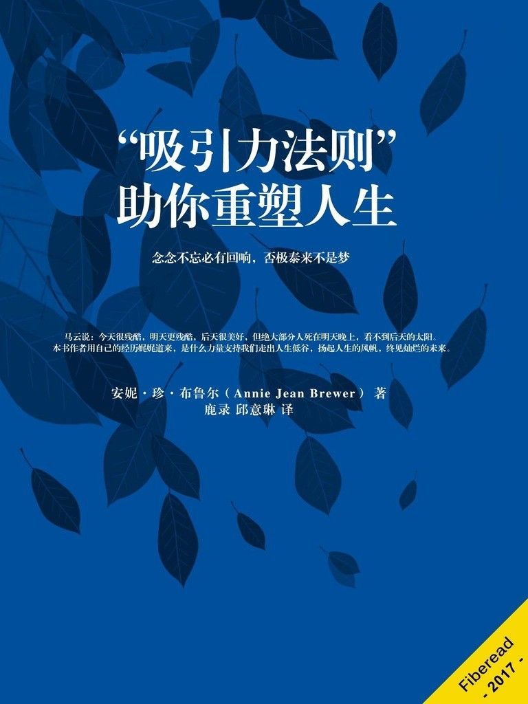

目录

《“吸引力法则”助你重塑人生》

前言

写这本书，我感到很紧张

反馈请求

什么是吸引力法则？

如何区分吸引力法则专家和冒牌“砖家”

我用一块愿景板吸引到了一个家（甚至更多）

如何运用吸引力法则

意识到你的状态很好

确定你真正想要的

放松并接受

情绪疏导

视觉呈现

暗示语

感恩物

感恩日记

超酷音乐播放列表

吸引最好的事物

幸福和感恩相辅相成

过上理想人生

更多财富到身边

烦恼交给宇宙管

反效应太可怕

有关吸引力的故事集锦

麦当劳的早餐

出租房

锤子的故事

裤子的故事

洗衣机的故事

凯蒂的 iPod

《圣经》与吸引力法则

吸引负面的事物

神在心中

金钱并非万恶之源

不要压制你的欲求

发生了什么？

推荐读物

推荐影片

结束语

《“吸引力法则”助你重塑人生》

安妮·珍·布鲁尔（Annie Jean Brewer） 著

鹿录 邱意琳 译

责任编辑：Fiberead

©Fiberead 纤阅科技文化（北京）有限公司 2017

©浙江出版集团数字传媒有限公司 2017

本书版权为浙江出版集团数字传媒有限公司所有，非经书面授权，不得在任何地区以任何方式反编译、翻印、仿制或节录本书文字或图表。

DNA-BN：ECFD-N00010851-20170801

最后修订：2017 年 09 月 21 日

出版：浙江出版集团数字传媒有限公司

浙江 杭州 体育场路 347 号

互联网出版许可证：新出网证（浙）字 10 号

电子邮箱：service@bookdna.net

网址：www.bookdna.net

浙江出版集团数字传媒有限公司为作者提供电子书出版服务。

本书电子版如有错讹，祈识者指正，以便新版修订。

©Zhejiang Publishing United Group Digital Media CO.,LTD,2013

No.347 Tiyuchang Road, Hangzhou 310006 P.R.C.

service@bookdna.net

www.bookdna.net

纤阅科技文化（北京）有限公司

contact@fiberead.com

[www.fiberead.com](http://fiberead.com)

致父亲：

如果您能看到现在的我该有多好。

***

# 前言

冒险开始的时候，我正靠兼职给好几家公司打工来维持生计。

我感到疲劳沮丧，也特别厌恶这种状态。但似乎越努力越颓废。

我向亲朋好友求助，他们建议我要么再加把劲念几年书，将来找个更好的工作，要么找个人把自己嫁了。

然而我既不想在婚姻中出卖自己的灵魂，也不愿女儿被陌生人抚养长大。说实话，他们的建议太令我生气了。我要寻找一条更好的出路，而且我一定要找到！许多人都战胜了比我面对的更为严峻的困境，于是我到图书馆，从他们的故事里寻求灵感。

我直奔图书馆的“传记”分区，翻阅了唐纳德·特朗普、本·富兰克林和其他诸如不可思议的克里斯·加德纳在内的人的故事。

这些成功故事让我热血沸腾。我坚信自己一定能找到解决办法，目标所向，一往无前。

那段时间我兼职电脑维修工作。有次一位女士跟我说，“送你本书，你一定要读！”我觉得莫名其妙，但出于礼貌，还是接受了她塞在我手里的这本书。

这本书叫《秘密》，彻底改变了我的生活。

6 个月内我从身兼数职的打工仔上升为在家办公的专职人员。

我从公司雇员变为居家人士。

最后我能够彻底放下工作——41 岁就退休了。

这本书讲述的就是我的故事。

***

## 写这本书，我感到很紧张

我推迟写这本书的原因是朋友和家人认为吸引力法则不仅是无稽之谈，而且违背了他们信奉的宗教教义。

另外这个话题也与平时撰写的主题大相径庭，我也担心失去读者。

但是，我分享的内容确确实实改变了我的生活。我从中受益良多，如果秘而不宣，便是对人类做了一件坏事。所以是时候成熟起来，分享我的故事，言无不尽。

必须承认，“吸引力法则”对不了解它的人们来说，听上去简直是画饼充饥的空话。但假如你秉持开放的心态去了解它，就能让生活发生翻天覆地的变化。

它能让一位单身妈妈远离工作，提前退休，陪伴女儿渡过余下的童年，那么它就可以帮你实现任何事情。

它帮我做到了。

***

# 反馈请求

如果这本书在任何方面对您有所裨益，请选择在网站上留下反馈。这将有助于他人判断这本书是否也会使他们受益。我很乐意向您发送本书的 PDF 电子版，方便您在电脑上阅读或作为感谢礼物与帮助过您的朋友分享。

只需发送您已发布的反馈链接至[`annienygma.com/contact/`](http://annienygma.com/contact) ，我将以电子邮件的形式向您发送本书的 PDF 电子版。

谢谢！

Annienygma

***

# 什么是吸引力法则？

简单地说“吸引力法则”是一种类似地心引力的科学规律，从本质上说就是量子层面的“物以类聚”。

根据量子物理的定义：人、石头、墙壁——所有的一切——其本质都是能量。我们的所思所感都能发出能量振动，吸引和激活周遭的匹配频率。吸引力法则的工作原理就像音叉：发出特有的频率，匹配的音叉（物品）就会跟着振动。

比如，想象一个你不常见的具体车型。在脑海里勾画的时候，你将开始把它吸引到生活中。不论去哪儿，出门就会见到这种车型！我和女儿把它当作游戏，比赛看谁见到了想象中的车型次数最多。亲身实践这种吸引是非常有趣的！

这就是为什么爱发牢骚爱抱怨的人，不如意的事永远挥之不去；开心的人，总是被欢乐萦绕。他们不知不觉中塑造了自己的生活！

不论我们是否察觉，吸引力法则都按照我们的想法和感受将不同的人、事、物和经历带进我们的生活中。但我们通过运用这一法则，可以把控进入生活中的事物和经历——只要你愿意，生活就会充满神奇！

警告： 如果你是百分百不相信吸引力法则，猜猜怎么样？你会吸引到这些——证明吸引力法则是假的证据！

这就是吸引力法则的工作原理——你的所思所想，它都会赋予，无一例外。所以，最好以开放的态度来接触吸引力法则，就像我刚开始知道它的存在时一样。

如果需要个人实践的指导意见，用以进一步学习个人能量场和吸引力法则的知识，建议阅读潘·格鲁特所著的《能量平方》（E-Squared）一书。这本书包含许多简单的实践，想更多了解吸引力法则的人们均可一试。

***

# 如何区分吸引力法则专家和冒牌“砖家”

有不少人自称所谓的吸引力法则“专家”。说起来，如何将冒牌“砖家”和真正的专家区分开来？

判断某位专家是否精通吸引力法则时，许多人会看这个人是否有钱。这种判断方法具有误导性，很多吸引力法则专家并没有对金钱的欲望。

诚实开明的人们都具备某种共同点，要么生活一帆风顺，要么看起来比同龄人走运，这些人最适合驾驭吸引力法则。

催眠大师乔·维托（JoeVitale）就是一个典型的例子。他从无家可归到过上许多人梦寐以求的生活，拥有豪车豪宅和大量奢侈品。

另一个案例就是《心灵鸡汤》的作者杰克·坎菲尔德（JackCanfield）。他运用吸引力法则，使每年的收入从 8000 美元增长到 10 万美元，后来成了百万富翁。

企业家凯文·特鲁多（KevinTrudeau）出版了一套关于吸引力法则的有声 CD，很有意思。获得商业的巨大成功后，法律纠纷却随之而来，不断困扰着他。如果按照出版顺序阅读他的著作，便能清楚地发现他的财富随着心态消沉而减少。听了这套有声 CD，结合特鲁多的人生轨迹，显然他知道如何吸引，但在某个阶段却明显停止倾听自己的心声。

那么我呢？从我的人生轨迹里你能否判断出我是不是掌握了吸引力法则呢？请登录我的网站[`annienygma.com`](http://annienygma.com/) ，认真浏览上面的博文。虽然只是简单描述，但你也能了解我是如何成为作家，并通过努力拥有之前和现在的家宅，以及我以前的生活状态以及我是如何逆转困境的。

开始这个旅程的时候，我只想过上简单而安宁的生活，即便单身也能在家抚养女儿。我成功了。这些年来，我甚至吸引到过一些负能量。这些经历不但让我变得成熟，而且让我实现了与人分享经验的心愿，如果对方面临着与我类似的境遇，还能启发他们。

不仅如此，我的经历还让我实现了童年的梦想，成为了一名作家，这真是太棒了 ！

多年来，我毫无保留地分享自己的生活经历，而不是站在那儿说，“嗨！我是吸引力法则专家，听我说！”我鼓励大家深入了解我的生活，从中获取属于自己的启迪。

老实说，除了知道如何享受生活，我不认为自己是任何方面 的专家！我努力生活的同时也在尽可能地帮助别人，并从中获取更多的乐趣。

这是我为什么要写这本书的原因。

与许多人，尤其是与传统意义上的吸引力法则专家相比，我过的生活相当简单。我节约开支，让生活更轻松，在家和孩子坐在一起，比买一堆毫无用处的垃圾更开心。我主宰自己的人生，但是如果我以前不了解如何运用吸引力法则，那么现在很可能还是四处奔波的打工仔。能过上自己梦想的生活，并且很早就安逸地退休，这让我相当自豪。

哪怕我只帮助一个人过上自己梦想的生活，我也会非常满足，这就是为什么我终于决定分享自己学到的东西。

***

# 我用一块愿景板吸引到了一个家（甚至更多）

《秘密》中非常吸引我的一个小诀窍就是将你想要的东西的图片贴到愿景板上，以便每天都可以看到。这样做的目的就是让你的愿望在脑海中形成深刻的印象，如果能将其视觉化，效力将更强大。清楚你的愿望，如果能将你想要吸引的所有东西形象化，你的愿望就会更清晰。

于是，我在我的书桌旁边支了一块板。我想要赢得彩票、更多和女儿凯蒂相处的时间，以及拥有自己的房子。为展示这些愿望，我放了一张我和凯蒂一起开心笑着的旅行照。此外，我还用到一张没有中奖的彩票（并在彩票正面写上“中奖”两个大字）、一些玩具纸币和一张我所中意的活动房屋的简图。

那个夏天，我买了很多彩票，尽管偶尔中个一两美元但都没有中大奖。最终我意识到，我吸引到的不正是我的“愿望”吗——不中奖！于是我从愿景板上撤掉了彩票，并放弃了这个愿望。

在这段时间，我终于找到了一个正当的工作——在家为一家网站办公。等到秋天凯蒂返校的时候前，我就辞去了电脑维修工作和餐厅的兼职——我开始在家上网，在自己的电脑上工作！

然后我开始在写作社团交友。年少时我曾经梦想成为一名作家，但在收到大量退稿通知之后就放弃了。在朋友们的鼓励和建议下，我最终实现了成为职业作家的梦想。

随着时间的推移，唯一没有实现的愿望就是活动房屋。所以我把将房屋简图从我的愿景板上取下，但我并不感到难过，相反，我认为愿景板已经赋予我很多福气。我觉得愿望板这个“东西”让我很幸运，所以我并不难过——我只会庆幸事情都朝着预期的方向发展。我有一个安全的家、一份不错的工作（只是换了种方式），作为单亲妈妈，在家办公，还能陪伴我的宝贝女儿，生活已经很美好，有没有房子都无所谓了！

几周后，我跟一位朋友聊到便宜的住房。我提到我想买二手的活动房屋，如果她知道有人要卖的话，麻烦通知我一下。令我惊讶的是，我的朋友她正好有一套想要出售！一番讨价还价之后，我只花了 100 美元就在肯塔基州帕迪尤卡买到一套活动房屋。这套房子的格局和我之前放到愿景板上的简图一模一样！

房子到手之后，我哭得像个孩子。

***

# 如何运用吸引力法则

每个人都在运用吸引力法则，只是有些人不知道罢了。而有意识地运用吸引力法则的人不仅能够塑造自己的生活，还能创造奇迹。

据我所知根据我的经验，许多传授教授吸引力法则的导师都会将步骤弄混了。这不仅让人困惑混淆，而且还会阻碍你成功。以下是我发现对我最有效的方法。

***

## 意识到你的状态很好

意识到在这一刻，你的状态很好。仔细回顾你的生活，列出所有你曾经看到和经历过的所有美好的事物。

你拥有自己的人生、自食其力、还活着、四肢健全、儿女健康、不愁吃喝——甚至拥有读书和学习的能力都是非常幸运的事！在寻找改变生活的方法之前，你必须首先接受当下的生活。

请记住， 是你过去的思想和行为造就了你现在的状况。如果想要改变未来，就必须先接受现在，无论现在有多么不快。

这或许是吸引力法则最重要的部分，但很多人都会忽视这一点。接受现在后，你才能有空期待更好的未来。但是，如果你仍然纠结于目前的状况，你将继续吸引更多让你纠结的事物。当然也不必像入定的禅师，只是你必须接受你现在的生活状态很糟糕（如果你这样认为的话），然后继续前行。

一旦你接受了目前的生活状况，你就可以开始将吸引力法则视为一个小游戏。“我必须得到它，否则我就完了！”和“要是有一个这个就好了！”之间有很大的情感差异——这种差异投射到现实中，就是吸引你想要的和不想要的事物之间的差异。

关于这个主题，詹姆斯·韦弗发布过一篇非常有深意的文章，名为《斯托克代尔悖论》 ，可访问以下网站阅读：
[`www.30dayattractionexperiment.com/stockdale-paradox/`](http://www.30dayattractionexperiment.com/stockdale-paradox/%E3%80%82) 。

***

## 确定你真正想要的

确定你想要吸引的确切事物。

想想自己你真正想要什么。你是想要一辆新车，还是只需要安全可靠地出行？

你是想要金钱，还是享受财富充盈带来的满足感和安全感？

对于更大的愿望，探索愿望的需求的根源很重要，因为对于我们多数人而言，宏大的事物都很难呈现，尤其在最初的时候。

就情绪而言（比如在你一无所有而账单又要到期的时候，你会很想要金钱），关注“想要”的情绪有助于防止你表现出“不想要”的情绪。

例如，你破产了，因为账单上的还款日期临近而感到害怕。你明白没钱是万万不行的，你想要钱，而且担心没有钱会发生什么。这种恐惧导致你把重点放在那些账单和你缺钱的状态上，这意味着你只能吸引手头拮据的这种状态和更多账单！

这就是为什么要在确定你想要什么之前必须接受你当前的状况。对于引起强烈情感的事情（例如我们假设的情形），我们特别容易吸引到与真正的愿望完全相反的情况。

想想看：你是否真的想要吸引金钱，还是想要因为财富充盈绰绰有余而感到安宁和满足呢？探索愿望的根本，并把关注的焦点放在你想要拥有的感觉上。

请记住：如果你的根本愿望是感到幸福和满足，这其中自然包括拥有富足的金钱（或其他东西），以满足你的需求。由表象的愿望深入探索，找到自己你真正想要的东西。

***

## 放松并接受

我一再强调：放轻松，放心，世界不会立刻终结。就像我们这一代人常说的：冷静，朋友！

佛罗伦斯·斯科维尔·希恩在她的《健康、财富、爱与完美自我表现的人生秘密》一书中对这一观点进行了完美的阐述。你越放松，并将表现转变为一种游戏，你就越容易吸引到你想要的事物。她在书中分享了一些人们如何假装达到理想状态的故事，我建议大家有机会读一下这些故事。

当我第一次使用吸引力法则时，我将它看作一个游戏。当我支起愿望板并开始往上面放照片时，就想着“为什么不这样做呢？”一旦有事物开始进入我的生活，我便开始认真对待——当然也有一些很糟糕的结果，我稍后会谈到。

只要卸下压力，你就可以进入最后一步：接受你想要的。

请记住，不会有小精灵会在你睡着之后出现，帮你实现愿望。这一步你需要做一些实际的工作！

但很多时候，你并不会觉得是在工作——你可能只是遵从直觉，或做你平常做的事情。

例如，一通来自陌生人的随机呼叫促成了我第一份在家办公完成的全职工作。我不仅需要接听电话、获取信息，还需要登录网站，完成他们的申请流程。

我需要拜访我的朋友，提到活动房屋这一话题，然后发现她正好要出售。甚至，我还需要跟她讨价还价、支付过户费，然后搬进去！

我需要真正开始写作和提交文章，以实现成为一名作家的梦想。我还需要发很多电子邮件，交很多新朋友，向他们学习如何写作，如何发表文章和销售电子书——如果不做这些事情，就不能以全职单亲妈妈的身份退休。

在做这些事情的时候，我并不觉得是在工作，但是我必须去做。在你开始使用吸引力法则的时候，你几乎没有这样做或那样说的直觉，但如果你照实做了，就可以创造奇迹！

机会总是给有准备的人，不要错过你的机会。在《30 天吸引实验》一书中，詹姆斯·韦弗讲述了他怎样错过一些机会的故事。他意识到眼下的状况时，他再次停止吸引他想要的东西，尽管最终结果满意，但确实由于他的犹豫不决，浪费了不少时间。我也经历过这种情况。

***

# 情绪疏导

你的情绪清晰地表明了自己你正在吸引着什么。如果你感觉良好，那么就是在吸引更多让你感觉良好的事物。反过来也是一样。如果你感觉糟糕，那么你正在吸引更多让你感觉糟糕的事物。这个规则没有例外。

所有情绪都可以分为正面情绪或负面情绪。几乎没有不需要为之波动操心的中性情绪。一般来说，如果你感觉很放松，那就代表你的情绪处于（或非常接近）中性。

在生活中，请有意识地关注你的情绪。如果你感觉很糟，你可以想想让你感觉好一些的事物，或能分散你的注意力的事情。不要担心造成情绪上大起大落，因为越担忧心情反而越糟糕，往往会适得其反。相反，只要让你自己感觉稍微好一点 就行了。

例如，每次你的爱人（或孩子）谈到花钱时，你可能会觉得压力很大。你可能会想，你都不知道怎么才能支付账单，他们怎么就能只想着花钱呢？

这些想法让你感到害怕。所以为了转变想法，就想着自己账单还没到期呢！有法子还款的。这么多年，没有人因为愚蠢的账单死去，所以你总能渡过难关。明白了这一点，难道不是值得高兴的事情吗？

你的爱人想要花钱，很显然是因为她对你的经济能力有信心。有信心你不会出现财政问题。了解到这一点，难道你不感到开心吗？你的爱人相信一切都没有问题，这种感觉很棒，不是吗？

而且为什么要担心还没有出现的问题呢？你现在温饱不愁、安全无虞——能够平静下来，像现在这样放松地看一本书不是很好吗？很多人真的希望有时间去读一本书，甚至希望或者只是拥有阅读的能力就很好了。有视力可以看、受过教育，懂得如何阅读，以及有手可以翻页……都是很棒的事情

***

读到此处，你会感受到，你会抛开小小不言的烦恼，转而达到一种对自己的现状表示由衷的感激和满足的感觉。

这就叫作转化。你在关注比较令人兴奋的事物时，就能将你的思想从不愉快的事物上转移，这样可以去除负面思想的情感能量，获得正能量。

甫一开始，你可能需要经常转化移自己的想法，这是正常的。察觉到负面情绪或消极想法时就要打住，这种行为是自发产生的，说明你的觉悟意识提高了，别忘了自我鼓励一下！

注意： 你在想什么，以及你当时的感觉如何，并不那么重要。有报告甚至说，看场喜剧或者狂笑都能可以治愈癌症或从危及生命的伤害中恢复！

我的研究表明，你的情绪和你所吸引的事物之间存在一个临界点。当正面情绪多于负面情绪时，吸引的路上就又向前迈了一步。这也可以解释为什么早上起床时撞到脚趾会让你一整天都感觉很糟。因为你一旦开始注意负面情绪，这一天都会吸引到更多负面的事情。

转化这些负面情绪一开始可能看起来很困难，毕竟你已经习惯了你平常的情感和意识流，但是坚持下去效果绝对惊人。

***

# 视觉呈现

视觉呈现可以有效激发“有求必应”的情绪。通过这种方法，你可以看到自己开着车，闻着新车里的香气，窗外微风拂面，这一切感觉太好，让你禁不住嘴角上扬。

少少的视觉呈现就能获得带来大大的收获。也许某个事物让你想到了心仪的那双新鞋（或者别的），不妨在脑海里勾画一下你穿上这双鞋，开始新的一天的生活场景——就这么简单。

碰到别人驾驶着你梦寐以求的车，就想着“这是我的车！”想象你的双手紧握新车的方向盘——就这么简单。

想象简短的场景比复杂的更容易，不怕被脑海里任何消极的想法所干扰。更重要的是，视觉呈现应当是短暂的、自然而然的，而非工作那般吃力——如果是的话，就说明你做错了！

不要在感到压力时尝试视觉呈现，那会吸引更多你不想要的事物，一定要避免这种情况发生。只有冷静下来，放松地开展视觉呈现，才能逐渐调整状态，达到期望的情绪。随着练习次数的增加，一想到自己的心愿，就能自如地调动出积极向上的情绪。

***

# 暗示语

暗示语是指那些能帮你重整潜意识，提高主观运用吸引力法则的书面语或口头禅。

无论人们是否意识到，暗示语在我们的生活中无处不在，比如“我永远也买不起”、“我能行”，都会对现实产生影响。

最好的积极暗示是让你一步一步地逐渐达成心愿。毕竟破产时你的脸色一定很难看堪，让你盯着镜子里的自己，不断念叨，“我是百万富翁”，一定很难做到。

脱离实际情况，盲目使用暗示语会招致反作用。你的潜意识会说，“醒醒吧，你可是个穷光蛋！”反而让“贫穷”二字铭刻心上，这种状态就不会得到改善。

因此添加新的暗示语之前，要花点时间，关注那些已经在使用的暗示语，以便潜意识调整它们，与你期望的状态相吻合。

假设你对自己说“我铁定迟到了”，那就意味着最后一线希望也被你拒绝了，路上的红灯会把你死死困住。换装迅速，快到打破了世界纪录，或是找到一个绝佳的停车位，都可以庆祝一番——不起眼的小事却能让你的生活焕然一新！

与其在收到账单时感到沮丧与绝望得直摊手，不如回忆那些已支付过的账单。告诉自己，“总会有办法的”或是“我都能搞定比这更糟的，还怕它啊”，绝对比“苍天啊！我永远也还不上钱！为什么倒霉的总是我？”要积极向上多了。

不要重复别人的暗示语，创造属于自己的版本。选择更有力量的话语，它们将与你的精神世界产生共鸣。

当然，沿用别人的暗示语也没关系。若是遇到有感觉的字眼，就拿过来用吧！边写下自己喜欢的暗示语，边回味咀嚼其中的含义。等你寻求灵感的时候，就到“暗示语库”里挑出符合当下情景的词汇。

把暗示语写出来还有一个好处，那就是激发你大脑的另一区域，让崭新的美好现实由此形成。除了书写以外，把这些暗示语敲进电脑里或者记在手机里也能起到同样的效果。

我曾依靠暗示语获得了多达 1500 美元的意外财富。那时我财务情况堪忧，工作也停滞不前。银行还款的截止日期即将到来，而我仍在发愁钱的问题。为了摆脱这样的窘境，我在本子上写了很多暗示语，还列出所有生命里值得我感恩的事物。几周过去了，我检查自己的账户还有多少钱够买生活所需，却意外发现了 1500 美元的收入！这下我不但能还上所有的欠款，还能去餐厅奢侈下，庆祝自己财运通达！

***

# 感恩物

小小不言的感恩物能让我们不时数算自己获得的恩福。

常见的感恩物叫作“感恩石”，是一块能放进衣兜里的小石头。每当你把手伸进衣兜碰触到它时，就提醒自己感恩。

如果觉得随身带着感恩石不足以起到提醒的作用，你也可以选用个性化的物件代替。像是项链或者戒指等小首饰，都可以用来作为感恩物，提醒自己感恩。换言之，但凡对你而言具有情感意义的事物，都能拿来当作感恩物。我现在就随身佩戴两件感恩物。一件是心形吊坠，这是我女儿送我的母亲节礼物。每当我碰触到它时，都会想到女儿是多么爱我，这让我深感欣慰，会在心底默默地对女儿、对所有我生命中美好的事物说声“谢谢”。

另一件感恩物是我用稿费买的戒指。每每看到这枚简约的戒指，我就想到写作收入不仅可以用于购买生活必需品，还能在自己手头富裕时，购买像这枚戒指一样的小玩意，给生活增色添彩。这样的想法既鼓励我克服犹疑胆怯，也为写作带来灵感。

还有人选择特定的颜色或其他暗示物来提醒自己生活在一个美好的世界里。我听说过最有意思的感恩物居然是红绿灯。

有次一位先生上班快要迟到。不论他多着急，路上经过的每个路口都要等红灯。

等的红灯越多，这位先生越着急。到处都是红灯！他遵从朋友的建议，等红灯的时候就开始祈祷，历数自己获得的恩福。第一周过去了，路上能遇到几个绿灯了。这位先生发自内心地享受等红灯时的祈祷时间，情况也逐渐好转，最后竟到让自己陷入了“两难境地”——每次遇到的都是绿灯，一路畅通反倒让他没有时间来感恩了！

关注生活积极的一面能够调整你的能量震动，来吸引更多积极的事物进入你的生活。读到这里，也许你会说，“又来了，别老提这个‘震动论’行吗！”但允许我再啰嗦一次，因为这非常重要。

日本的江本胜博士曾经进行过相关的“水结晶”研究。他给水样本营造不同环境，或是与它谈话，或是给它“看”图片，分别将“幸福”和“怨恨”的情绪赋予不同的样本，冷冻后通过摄影来观察结晶的形状。研究结果令人震惊，积极和消极的“互动”使水结晶产生了截然不同的图案。请登录[`www.masaru-emoto.net/english/water-crystal.html`](http://www.masaru-emoto.net/english/water-crystal.html) 查看江本胜博士拍摄的水结晶图片。这说明我们的言行思维确实影响着身边包括水在内的事物。

人类、动物，乃至所有的生物，基本上都是水“做”的。如果说我们的言行思维能够影响水，那么反之亦然。这就解释了我们释放的能量震动为什么如此重要。

既然这么要紧，就尽可能保持积极的能量振动吧！感恩物就是基于这个原理，让我们距离自己的梦想越来越近。不信你来试试看！

***

# 感恩日记

除了感恩物，写感恩日记也可以调整你的能量振动。到自己最喜欢的文具店，挑一本最喜欢的日记本吧。注意别选太贵的，但也不要吝啬：或许这个日记本连一块钱都不到，只要你喜欢就好；还要再添一支笔专门写日记，如果不想买也没关系。总之一切跟着感觉走。

在你觉得合适的时候坐下来，在本子上列出你能想到的一切美好事物——上班路上看到的艳丽花朵，路边偶然拾到的硬币，顺利的面试经历等等。

再列出所有你感激的事物。可以是享用的佳肴，也可以是身着的华服，抑或是孩子给你的一个拥抱。

只在日记本上记录积极的内容，这能让你愈发专注生活里的正能量，愈发远离负能量。

一旦人的关注点发生了转化，相应吸引来的事物或者经历也会发生相应的变化。或许效果并非立竿见影，但你会意识到越来越多的好事发生了。在喜悦庆祝的同时，更多的开心事将随踵而至，我将这样的现象称之为“滚雪球效应”，好比一个雪球越滚越大，积极的吸引也能不断积累。

同理，感恩日记写得越勤，你就越能集中精力关注积极的事物，越少纠结消极的情绪，可谓受益良多。

***

# 超酷音乐播放列表

创建超酷音乐播放列表，是我最喜欢做的事情之一。它可以帮助你营造良好的身心状态，来吸引所有希望得到的好东西。

简而言之，就是在音乐播放器上设置一份歌单，让你感觉自己的心愿已然达成，至少也是在通往实现的路上！

我就在自己的 iPadmini 上创建了名为“超酷”的音乐播放列表。随着时间的推移，我的感觉会有所变化，曲目也随之变动，但总有那么几首，永远占有一席之地。

这其中包括以下歌曲：

生存者乐团的“虎之眼”（“EyeoftheTiger”bySurvivor）

艾琳•卡拉的“梦想”（“TheDream”byIreneCara）

“胡椒盐姐妹”组合的“我就是天生丽质”（“IAmTheBodyBeautiful”bySalt'n'Pepa）

Snap！组合的“力量”（“ThePower”bySnap!）

肯尼•罗根斯的“我很好”（“I'mAlright”byKennyLoggins）

乔伊•斯卡伯里的“信不信由你（《飞天红中侠》主题曲）”（“BelieveitorNot(ThemetoTheGreatestAmericanHero)”byJoeyScarbury）

泰•赫恩登的“活在当下”（“LivinginaMoment”byTyHerndon）

“钢琴达人”组合的“彩虹之上/简单的礼物”（“SomewhereOverTheRainbow/SimpleGifts”byThePianoGuys）

在这个超酷音乐播放列表里，我还存了其他好多歌曲，但这些歌曲每次听时都能带给我特别的感觉，我可能永远不会删掉它们。

我会根据自己的心情选择不同的音乐类型。倘若你特别钟情某种类型也没关系——你的播放列表，你做主。

请牢记：只有那些强大有力量、积极向上、让你有信心面对困难的歌曲，才能放到这个播放列表里。

心情沮丧时，它们让你振作起来。

专心工作时，它们让你正走上正确的轨道。

愿望达成时，它们让你欢欣鼓舞。

无数个夜晚，我哄睡女儿后就戴上耳机，随着这些歌曲翩翩起舞。这是它们在我困顿之时赋予我力量和灵感，让我意识到自己的生活是多么美好，从而振作起来，甚至状态比以往更好。

你还没有这样的音乐播放列表吗？强烈建议你赶紧创建！这对心理建设的帮助良多，更不用说其他随之而来的好处。

***

# 吸引最好的事物

运用吸引力法则时，很多理论支持人们明确想吸引的事物。有人渴望财富，有人追求成功，但更多的人认为，最好选择一个具体的事物，比如伴侣或新车，加以吸引。

这样做优势鲜明：你不仅会知道如何关注这样事物，而且在它到来时能够确切知晓！

但是，选择特定目标也有严重的劣势——极有可能成为沮丧的根源，甚至妨碍你吸引心中所想的能力。环顾四周，意识到自己还没有拥有想要的事物，你可能会感到沮丧。你会开始怀疑自己（以及吸引力法则）。这么做的时候，你会专注于“我不想要”，也就是“我还没拥有”这个问题。猜猜看会发生什么？“没有”这个状态被你吸引过来了！

为了避免这种情况，最好只许一个愿望，可以概括你所有的具体心愿，还能避免把糟糕的状态吸引过来。简单地说，就是：你希望得到更多的幸福。

幸福是一种非常强大的无形愿望。当你感到快乐时，你便拥有了良好的人际关系、需要（或想要）的事物、良好的环境和丰盈的人生。然后你还会吸引更多如此美妙的事物，从整体上提高你的幸福感。

意识到自己“不快乐或者没有拥有想要的事物”特别容易，还会陷入其中。获得幸福的小诀窍则在于随时随地从点滴做起。

***

## 幸福和感恩相辅相成

幸福和感恩完全是相辅相成的一对。越感恩，越幸福，而拥有更多的幸福感，反过来也会让你更加感激生活。

提升幸福感最简单的方式就是保有一双敏锐的眼睛和一颗学会感谢的心。只要决心这么做，每一天过去时，你都能留意到那些让人开心的事物。

有一段时日我意识到自己一天最期待的居然是就寝时间。我甚至能列出一长串原因来说明为什么它可以让我如此开心。

接着我又发现，沐浴时间也是很享受的。这是属于我的私人时刻，可以放松，也可以思考。

再后来我觉得阳光照在身上的感觉也很美好。

就这样，我开始对这些带来愉悦的小事表示感恩，由此又体会到了更多的快乐。

这种方法让我走出了绝望。那时我甚至想到了自杀，但仍然设法摆脱黑暗的生活，远离暴力的丈夫，不自知地把吸引力法则作为生存机制，才开始了崭新的生活。

你意识到自己是快乐的，就会吸引来更多让你开心快乐的事物。我们生活不愁，衣食无忧，生活多幸福！随着日子的流逝，越来越多的美好会走进我们的生命。

必须承认，我刚接触这个理论时曾认为关注幸福只是个说辞罢了。因为幸福是无法计算的，人们可以信口开河吸引力法则是如何提升了他们的生活品质。然而经历了这么多，我发现自己的想法是错误的。

想一想为什么我们渴望金钱、新车和豪宅？是不是它们让人感到幸福，人们才如此趋之若鹜？事实上，金钱、财富抑或其他经历并不能带来快乐。否则世上为什么还有那么多忧伤的有钱人呢？

许多有钱人和我们一样，采用“购物疗法”缓解心情。唯一的区别是尽管他们买得起昂贵的物品，但他们仍不能比穷人更快地重拾幸福——只能增加更重的经济负担！

所以与其纠结于物质，还不如提升幸福感，好事自然来。

***

# 过上理想人生

人们说“人生多变化”，减个体重或者中个彩票或许就带来转折。请你想想目前的生活状态，扪心自问：这是我真正想过的生活吗？

如果答案是否定的，就请找张纸，写下你梦寐以求的生活是什么样子的，包括从清晨一觉醒来，到夜晚进入梦乡的所有细节，也别忘了那些“偶尔”想尝试的事情。

在理想人生里，你看起来如何？会身着什么样的服饰？不要犹疑，大胆描述，写得越多越好，总之怎么舒服怎么来，但要确保所有的细节都涵盖了。

写完以后，再从头到尾认真阅读一遍，看看理想人生和你现在的生活之间是否有所关联？如果有，那么恭喜。这说明你已经在通往梦想成真的路上了！

接下来删掉诸如“减肥”、“漂亮的衣服”等等多余的事物，思考一下理想人生的生活习惯。每天早上醒来后，要不要游个泳？如果家里正好有泳池，何不从现在开始？倘若做不到每天都游泳，不妨到健身房办张卡，鼓励自己尽可能多地参与。

当下与你的理想人生还有何差异？会与心爱的人一起漫步吗？会与家人共进晚餐吗？你的家是否比现实中的更为整洁，家具摆放得更为紧凑？

考虑理想人生的方方面面，然后确定什么改变可以从今天开始。如果你的梦想是变为更具有活力的人，那么就关掉电视，出去走一走！如果你的梦想是电脑高手，那么就把发短信的时间多用在学习电脑知识上。

实现一个小目标，距离你的理想就更进一步。用行动的力量让梦想成为现实。

我一开始尝试的时候，就收到了大大的惊喜：我的理想人生里完全没有任何关于金钱的期望！这令我意识到，自己原来只想当个传统意义上的母亲，在家抚养女儿，唯一“新潮”的是不需要丈夫来承担经济。我一步一步，改变能改变的，直到有天突然意识到自己已经过上了梦想的生活。

想穿得漂亮却苦于手头拮据，那就到二手商店购买物美价廉的服饰，按照自己梦想中的模样打扮。

想拥有心仪的车，或许可以考虑买个二手车，或者偶尔租车，作为梦想的起点。

想用苹果电脑，那就别买便宜的 Windows 电脑，把钱存起来实现心愿。其实低端苹果电脑的售价和 Windows 同等产品差不多，不妨考虑购买，也算是向梦想前进了一步。

还有一件我很想做的事情就是宠溺我的家人。与其等着自己成为百万富翁再付诸行动，我选择立刻行动。我请家人享用佳肴，在经济允许的范围内为家人购买礼物，甚至奉献更多。看到他们脸上的感激和惊喜，我认为完全不必等到自己有钱的那一天。不仅如此，我还发现，当下即是梦想的人生，不必期待未来有谁再为我指点迷津。自此以后，我的人生方方面面都发生了变化，即便现在想来也令人震惊。

请记住：坐在那儿一个劲儿抱怨自己的生活有多悲惨，只能让你的生活更加悲惨。只有正视自己的状态，行动起来让生活变得更好，你的人生才能提升。

***

# 更多财富到身边

钱不是万能的，但却能让你的生活更加轻松！是否拥有财富，对你的人生有着重要意义。

有人觉得金钱是罪恶的源泉，顺带相信“为富不仁”。但事实上，金钱既不是罪恶的，也不是善良的——它仅仅是个工具，就好比士兵手握的钢枪，或者厨师手里的铲勺。

手里有了钱，人们可以实现自己的种种愿望。但怎么花钱，方式却不一样，从这里能反映出人的本质。

正是因为金钱与我们的情感联系如此紧密，所以它是最难被吸引过来的，尤其是当房东来催你缴费的时候！

你把注意力集中在要缴付的账单上和急需的钱财上，将会发生什么？想必你也猜到了，越来越多的账单和越来越多的财务亏损会被吸引过来。如何绕开这个阻碍呢？

无论把一头猪打扮得多漂亮，也改变不了它是一头猪的事实。同样道理，如果面对金钱的渴望，特别是正面临财务问题的时候，你大概要失望了，因为你并没有改变自己担心没钱，还不上账的事实！

这就是为什么富人越来越有钱，而穷人越来越拮据。有钱人关注的是自己的盈余，由此吸引更多的利润；穷光蛋只纠结于自己的窘迫，反倒陷入了更糟的境遇。

很多关于吸引力法则的著作都倾向对这个恶性循环一笔带过，并没有为身陷窘境的人们指明出路。但是，如果换个角度去直面问题，你就会扭转乾坤！

吸引金钱的关键在于你要感觉自己已经富有了。有了这种感觉，并把关注点转移到充盈的状态，才能吸引更多的财富入账。

理论如此，但你像大多数人一样，不清楚怎么停止对缺钱状态的纠结。这里提供一个行之有效的办法帮你找到富有的感觉，不仅效力强大，而且还能根据自己的状态随时调整。

准备一个便利贴和一美元纸币（或所在地流通货币的最小面值纸钞）。在便利贴上写下充满爱意的话语，比如圣经箴言、简单的问候，以及任何让你心头一暖的只言片语。

把便利贴粘在纸币上，再对折起来，这样你就读不到上面的话语了。接着把它们藏在起来，等人们某一天偶然发现。我曾将这个随机地塞在图书馆的书架上，夹进抚慰人心的书籍中，甚至放到杂货店的鸡蛋盒里！

不要告诉别人你在干什么。想想别人发现了你准备的这份意外之财，读到了充满爱意的信息话语，将会多么开心！要感谢宇宙（你也可以说感谢上帝、感谢真主阿拉或者任何代称），赋予你充足的财富，让你有能力与他人分享。祈求赐予你更多的金钱，将爱传递得更广更远！

千万不要把贴着便利贴的纸币直接给人或者捐了。要允许宇宙为你做决定谁能收到这份爱的礼物。也不要躲在一边看谁最终拿到了它——放下就走就好了。

如果你执意把它直接给人或者捐了，这意味着你恐怕关注的是他们的贫穷，而非自己财务上的充盈，那么你真正想吸引来的就永远不会实现了。为了避免这种尴尬，最好就是悄悄留给一个未知的人吧。仅仅想象他们将获得的快乐就好了！

你从中获得的回报将是不可思议的。我的首次尝试是在去图书馆接女儿的路上，把纸币扔在了一栋老年公寓的入口处。等我到了图书馆，女儿凯蒂就告诉我她获得了两张热门电影的首映票！“妈妈，我要请你去看电影喽！”她自豪地说。

接下来的几天里，我都想象着年迈的老人，又或许是月底正需要钱的人，发现了我的小礼物时该有多么的欢欣鼓舞！而恰恰是这么一个微不足道的付出，也让我收获良多。

我还陆续地收到了小惊喜。看电影那天我得到免费的爆米花，后来还有意外的捐款入账，甚至还拿到了一张遗产支票！

原理在于，你不愿意与别人分享，说明承认金钱的匮乏。反过来，你多关注自己拥有的钱，足够与无亲无故的陌生人分享，意味着你的关注点在于自己财务的充盈，所以才能有这么大的效应！

越能长久地强烈关注自己的财富，越能吸引更多的金钱。澳大利亚电视作家及制片人朗达·拜恩在她的《秘密》一书中就提到了这个方法，而前驻外记者、现成为精神导师的莱纳·布鲁斯达在她的著作《快乐地赚钱》中也涉及这个话题。这个方法真的管用，能让你摆脱任何经济上的缺失感。

***

# 烦恼交给宇宙管

不堪重负抑或进退维谷之时，不妨把烦心事交给宇宙（随你怎么称呼，上帝、救世主、真主等等），有助于我们放松下来，继而吸引到渴望的事物。

老实讲我也不清楚其中的奥妙。尽管没有进行深入研究，但我可以肯定，这样做对释放压力很有效。在新思潮灵性导师佛罗伦萨·斯科维尔·希恩的著作《人生的游戏规则》一书里，我了解到了“交给宇宙”的方式概念，自己尝试多次，均获得了令人惊叹的成效。

做法很简单。一旦觉得承受不住来自某件事的压力，就默念着将其转嫁给宇宙，一切顺其自然。佛罗伦萨·斯科维尔·希恩的祷告比较复杂，还加入了对救世主的呼唤，但我会将内容精简，长话短说。

烦恼的思绪挥之不去的时候，我还要多重复几遍祷告。随着次数的增多，消极的想法就会越来越少，相应地，好运气也随之而来。

我了解到祷告能很快解决问题，有一次就是靠它帮我解决了一个进退两难的难题。我答应给外孙买一个“膨胀水精灵”，就是那种体积很小但放到水里就能变得很大的小玩意。外孙想要这个玩具，而我也确实答应过他，因此不想食言令孩子失望。

可这款玩具断货了。我翻遍了玩具店的每一个角落，甚至希望是有人把它错放在其他玩具箱里，却无功而返。我焦虑起来，因为我真的不想让小外孙大失所望！

走投无路时，我摊开双手，在心里默念，“宇宙，告诉我哪里有孩子想要的玩具。我知道你能帮助我！”接着我深呼吸几次让自己冷静下来，漫无目的在玩具店过道上溜达。最终我在水上玩具区停下来，随手打开一个玩具箱，看到各式玩具杂乱地堆放，其间就有一个“膨胀水精灵”。我暗自感谢宇宙，继续祈祷能否再发现一个，以便外孙能再带一个回自己家玩儿。紧接着，又有几个玩具箱出现在我的视野里。

我欣喜若狂，给孩子一下子买了两个小玩意。既然鸿运正当头，我趁机又向宇宙提出要求，能否再发现一款适合的玩具，送给青春期的女儿凯蒂，让她没有被忽略的感觉。这么想着，我就看见另一个玩具箱里有个小巧的手链。几个月前来这儿的时候，凯蒂就留意过这款手链，只是当时没买。我赶紧买下，把礼物带给孩子们。

收到礼物的凯蒂开心地叫起来，让我很是欣慰。她告诉我，自己后来也回到玩具店找过，但是没再发现手链。小外孙兴奋地把“膨胀小精灵”放在盛满水的盆里，此后每次来我家，都要玩儿这个玩具。每当看到这个小玩意，或是凯蒂手上戴着的手链，我都在心里一遍又一遍地感谢宇宙的帮助！

别再为某件事或者某个人费力伤神，把他们交给宇宙来处理。这么做百利而无一害，说不定你比我还要走运呢！

***

# 反效应太可怕

人们对于吸引力法则最大的质疑在于，“人人都希望好运随行，那为什么还会有坏事发生呢？”

事实上，你不太希望某件事发生，但吸引力法则并不知晓。它能感知到的是你的所思所感。如果你一直担心自己迟到，那么你就一定会迟到！

但如果我们换个积极的角度看事情，那么你就不会迟到，相反会按时抵达。其他的境况亦是如此，人越乐观，所期望的结果就会越快实现。

只有亲身经历过，才能参透其中的奥妙。在我女儿很小的时候，我的前夫曾经两次绑架她，把我吓坏了，担心这样的事情再次发生。晚上不能亲自照看的时候，我绝对不把女儿交给任何与我前夫有关的人，还让我的亲朋好友承诺，无论发生什么，都不能让我女儿见我前夫，哪怕他一直在外面敲门。我甚至拒绝送孩子去托儿所，因为我不喜欢她在我监护范围以外的感觉！

我的担惊受怕是如此强烈，以至于梦到前夫再次带走孩子，惊醒后发现自己一身冷汗。

但我担心的事情还是发生了——我前夫从学校带走了她。直到我完全冷静下来，才意识到正是自己的担忧引来了噩梦成真，尽管事实难以接受，但确实如此。

事情已经发生了，于事无补。我承认自己的失误，并发誓一定要不惜一切代价把女儿找回来。

我打官司与前夫争夺监护权，花费不菲。尽管最终法官还是裁定前夫照顾女儿凯蒂，但这段时日里，我就是依靠吸引力法则过下去的，除了支付几千美金的高额律师费，我还得交钱准备庭审交叉质询，交生活费给家人和朋友以便留宿。我的财务非但没有陷入窘境，甚至连我的老爷车都很给力，一次也没有抛锚过！

从这段经历中我学到了珍贵的一课：愿望的实现不仅是你的想法吸引过来的，还在于你投入其中的大量情感！

我当时想着，“不要让前夫把凯蒂再次带走”，但吸引力法则看的却是我在“积极”地重现“前夫又把凯蒂带走了”的情景，所以才会把这个结局吸引过来。意识到了这个错误，我马上扭转想法，把精力集中在“要把女儿带回家”的愿景上。

所以，请不要——

纠结说自己没钱还账，这会一语成谶，尤其是你真的特别担心的时候。

担心自己的车子会抛锚，十有八九真被言中了。

而是要——坚信你的愿望终究会实现，相信所有的事情都会往好的方向发展，这就是吸引力法则的原理。

如果你还不相信，可以问问身边遭遇不幸的朋友。只是问他们过得如何，就此打住，然后听他们怎么说——穷光蛋一直抱怨钱太少，病秧子一直抱怨不舒服，矫情鬼一直抱怨是非多。通过观察，你会发现他们“激情”抱怨的问题恰恰就是这么吸引过来的。我可以向你保证：即便这种人中了头彩，也不会让自己好过。正应了那句话：“所思所想即所得所获”。你没办法改变事实，但有办法掌控趋势。

我希望你永远不要把坏事吸引到自己的生活里，并因此而受到伤害——反效应带来的结果是可怕的，一定要准确把控你的想法和感觉。

***

# 有关吸引力的故事集锦

多亏了吸引力法则，已经有很多东西来到我面前。为免其他章节太过繁复，我决定单起一章讲述这些故事。尽管这些只是我们发现吸引力法则以来，个人所吸引到的事物，但把它们总结在一起，可以通过少数的事例展示吸引力法则的能力。

***

## 麦当劳的早餐

一天就寝前，我想着第二天早上带凯蒂去麦当劳吃早餐。我能想象我们的餐点从柜台上推到我们面前：我的是一个猪柳脆饼和一杯大杯橙汁，而凯蒂的则是一个猪柳脆饼和一杯小杯橙汁。想过了这些，我就入睡了。这是那天晚上睡着之前我脑中唯一的印象。

但第二天早上我们起晚了！我们直到 10 点 45 才到达麦当劳的停车场，而我知道此时早餐供应结束时间已经过去了 15 分钟。我们都不想吃供应的午餐，本想着去其他地方，但是总有一种力量驱使我进餐厅去看一看。

我走到柜台，问收银员是否有剩下的猪柳脆饼。她去问了下厨房，果然，正好还剩下两个！

我们身后很快排起了等着吃午餐的长队，所以我们很快点好脆饼和两杯小杯橙汁就赶紧让开。

在我们等待配餐的时候，服务员向我走过来。她说自己错配了一杯大杯橙汁，又而不想浪费，所以问我能不能将小杯换成大杯。

当我点头答应她时，我感觉整个世界都在眷顾我。她笑了笑，便把餐盘从柜台上推给我们——和我头天晚上想象的一模一样。

***

## 出租房

尽管我决定搬回肯塔基州中部，但我清楚自己并不想永远待在那这儿。所以我不打算购买住宅，而是决定租一套我能够负担得起的小房子就行了。

我不知道这套房子在哪里，但我知道一定会是最好的那套。每当我要开始担心租房子的时候，我就会提醒自己，我已经“通过吸引”获得了一套房子，所以再来套出租房应该是小事一桩！

我不停查看各种分类广告和 Craigslist 房屋中介广告网站，但都没找到合适的。我并不沮丧，相反，我只是对终会找到理想住所而感恩，然后再继续寻找。

一天我和一位朋友一起散步，然后我们走进了一条小胡同。在快走到尽头时，我们发现一间被树木和绿植环绕的小屋。这间偏僻的小屋里没有挂一副窗帘，显然没有人居住。

房子周围的邻居告诉我们，里面的住户头一天才刚搬走！不仅如此，这间屋子每个月的租金仅需 250 美元。

可当时我名下存款一共只有 180 美元，但我确信自己最后肯定能租到这套房子。

在等待房东回复我的询价时，我在笔记本上写满了几页我的名字和那间小房子的地址。我想象着当我搬进去后要怎么摆放家居。就连在朋友家睡觉时，我都假装舒适地躺在自己的新家里。

在等待期间，我无声地感谢宇宙给我带来这间房子。每当我担心资金问题时，我就会告诉宇宙，如果这间房子我注定会得到，那么就没有什么可以阻止我，但如果不能得到，就说明这并不是最好的选择。

最后，房东终于回复我了：每月租金 250 美元，定金 200。我约房东见面，然后从银行取出 180 美元。虽然我不知道要说什么，但我明白知道如果我注定要搬进去，我就不会失去它。

房东告诉我，我没联系他之前，他都不知道上一位租客已经搬走了。我们聊了一会儿，然后他又说了一遍租赁条件，问我是否想要租那间房子。

我无意识地跟他解释说，我没想到这么快会在这里找到房子，所以我在经济上还没准备好。我告诉他，我的银行账户在肯塔基州西部，现在手里只 180 美元的现金，可以支付定金，如果他同意，剩下的定金和第一个月的租金会在下个月一号付清。

他往后一靠，想了想，然后问我何时入住。我回答我要下个月一号才能付清租金，所以最好是下个月开始。他又思忖片刻，然后回答我说我可以立即搬进去！

***

## 锤子的故事

搬进小房子之后，我有很多事要做，比如挂窗帘、修围栏，但是我把锤子落在帕迪尤卡了。

我相中一把新锤子，但是它的价格超出了我的预算——在租房子时我已经花光了我所有的钱！于是我望着天空说，“宇宙啊，我现在真的急需一把锤子，您能帮我搞一把来吗？”

大概一天后，我带狗狗出去散步。猜猜我在遛狗的时候被什么东西绊倒了？答对了——一把锤子！显然是从别人的车子上掉下来的。由于没法确认它的主人，我便把它带回了家。直到今天我都还在用这把锤子呢。

***

## 裤子的故事

我的衣橱里并没有太多裤子。我通常只买一两条非常喜欢的裤子，然后一直穿到不能再穿为止。

当我的第一条裤子破了的时候，我告诉自己不要担心，我一定会找到一条理想的裤子来取代它。

几天后，我看到有两条很好看的牛仔裤被丢在路边。我翻了下标牌，发现正好是自己的尺寸，就把它们带回家扔到洗衣机里清洗。这两条裤子完好无损，我到现在都还在穿。我所能做的就只有在发现它们的时候说声“谢谢！”

***

## 洗衣机的故事

刚搬过来的时候，我都是去自助洗衣店洗衣服。很快我便发现这样很麻烦，就决定吸引一台理想的洗衣机。

我想要一台前开门洗衣机，因为这种洗衣机比较省水，所以我感恩最终会得到一台理想的洗衣机。每次去自助洗衣店时，我都会想如果我有一台自己的前开门洗衣机该有多好啊，同时，我也感谢我现在还有足够的钱去自助洗衣店洗衣服。

几周后，我的邻居叫我去看看他最新收购的东西。原来他的车里放着一台非常棒的前开门洗衣机！

“哇，好棒的洗衣机啊！”我大声说道，“你从哪儿买的？”

最后发现我从邻居手里以烘干机的价格买下这台洗衣机——仅 100 美元。我终于拥有了自己的前开门洗衣机，而同样型号的新机器需要 1200 美元！

***

## 凯蒂的 iPod

我女儿凯蒂并不经常问我要东西，所以她提出的要求我都会尽量满足。她有一台旧的奔迈 LifeDrive 掌上电脑，用作 MP3 播放器，一用就是好几年。所以她向我提出要换一台 iPodTouch。

这种小型电子产品非常贵，但我还是发誓要给她买一台。我开始存钱，并等待促销。我能想象女儿打开盒子时会有多么惊喜。我知道我最终一定会买到一台——最迟等我的 Smashwords 电子书平台版权费到账之后就能买了，也就几个月的事情。

意外的是，一位朋友正好问凯蒂是否得到了想要的圣诞礼物。我说我正攒钱给凯蒂买礼物，等下一笔版权费到账后就可以买了。

她问我要买什么，令人我惊讶的是，她居然上网为我女儿买了！收到礼物的时候凯蒂都高兴得哭了，“妈妈，我真的好想要这台 iPod 作为我的圣诞礼物！我知道它一定会来，现在它真的来了！”

“亲爱的，这是圣诞节之后了。”我提醒她。

“还是离圣诞节很近，我知道是我吸引到的！”

我还能说什么呢？

***

# 《圣经》与吸引力法则

有人认为吸引力法则与《圣经》的主张背道而驰，特别是这个理论的主要内容和经典的教义存在差异。我在刚开始接触吸引力法则时也产生了这样的误解——善良如我，怎么可能运用和《圣经》相悖的理论呢？

然而随着研究和理解的深入，我的观念发生了转变。早前解释吸引力法则原理的著作揭示了它的本质实际上是遵循了《圣经》的教义，其中就包括著名的《繁荣的圣经》一书。

之所以认为这本书很好地阐释了二者之间的关系，在于它从《圣经》里摘取了超过 200 条经文来佐证吸引力法则。简单举例如下：

“因为凡祈求的，就得到；寻找的，就找到；敲门的，就为他开门” ——马太福音 7:8（中文标准译本）

“所以我告诉你们：凡是你们所祷告和祈求的，当相信已经得着了。这样，事情就将为你们成就。” ——马可福音 11:24（中文标准译本）

“你们在祷告中无论求什么，只要信，就必得着。” ——马太福音 21:22（中文标准译本）

“不过他要凭着信仰祈求，不要有任何疑惑。” ——雅各书 1:6（中文标准译本）

“你要保守你心，胜过保守一切，因为一生的果效是由心发出。” ——箴言 4:23（中文标准译本）

“因为他心怎样思量，他为人就是怎样。” ——箴言 23:7（中文标准译本）

上帝就是宇宙：

“因为万有都是藉着他造的：天上的和地上的，看得见和看不见的……一切都是藉着他造的，也是为他而造的。” ——歌罗西书 1:16（中文标准译本）

## 吸引负面的事物

“因我所恐惧的临到我身，我所惧怕的迎我而来。” ——约伯记 3:25（中文标准译本）

## 神在心中

“你们难道不知道自己就是神的圣所，而且神的灵住在你们里面吗？” ——哥多林前书 3:16（中文标准译本）

***

## 金钱并非万恶之源

“《圣经》教导人们，拥有财富是罪恶”，这种误读在过去几百年里来被拿来误导人们贫穷有理，富贵可耻。然而认真阅读经文，你将发现上帝有多么热爱财富。亚伯拉罕、约伯、所罗门、波阿斯以及大卫等许多经典人物迄今都被认为是百万富翁的代表。

而让人们产生误解的经文本身，实际上宣扬的是另外一回事。提摩太前书 6:10（中文标准译本）中提到的“要知道，贪爱（作者强调）金钱是万恶之根。” ，却并没有说钱本身就是罪恶。拜金主义归结到上帝身上真是一种罪过，实际上钱财本身只是一种工具，和我们平时使用的铲子和锤子在本质上并无半分区别。

***

## 不要压制你的欲求

耶稣曾经告诫信众，如果按照以下箴言去做，可以创造出更伟大的奇迹：

“我确确实实地告诉你们：我所做的事，信我的人也要做，而且要做比这些更大的事。……” ——约翰福音 14:12（中文标准译本）

作家多伦·阿隆在著作《<圣经>与吸引力法则》一书中指出，“你的任务就是要具有信仰，就像已经实现目标一样行事，那么很快就能成功。”

耶稣回答说：“因为你们小信。我确实地告诉你们：如果你们有像一粒芥菜种子那样的信仰，就是对这座山说‘从这里移到那里！’它也将移开；而且在你们，将没有不可能的事” ——马太福音 17:20（中文标准译本）

“你要记念耶和华你的神，因为得货财的力量是他给你的，为要坚定他向你列祖起誓所立的约，像今日一样。” ——申命记 8:18（中文标准译本）

## 发生了什么？

为了让吸引力法则拥有更广泛的受众，慢慢地“上帝”被“宇宙”一词所取代。《圣经》里说上帝创造了宇宙，所以这种替换为人们所接纳并成为趋势，约定俗成直至今日。

这就使得吸引力法则逐渐远离基督教的宗教背景，特别是在新一代实践者接触了解这个理论的时候。以讹传讹的宣传材料最终导致人们误以为《圣经》和吸引力法则是不相关的。

无论如何，许多资料都能证明，最初的新思想运动时期的作家都是以《圣经》作为灵感，并非传言中所说，吸引力法则是与其背道而驰的。

因此请不要在尊重《圣经》的同时鄙视吸引力法则。你会发现，吸引力法则将为你的信仰提供更多新的支持。

***

# 推荐读物

以下书单是我在研究吸引力法则时整理出来的，将对你的理解所有裨益。

《秘密》（“TheSecret”） ——朗达·拜恩著

这是我的吸引力法则入门读物

《吸引力法则》（“TheLawofAttraction”）、《金钱与吸引力法则》（“MoneyandtheLawofAttraction”）

——杰瑞·希克斯/埃丝特·希克斯著

这两本书不一定适合所有人阅读，在观念上有所分歧，但如果抱着开放的心态阅读或许能为你提供不少信息。

《繁荣圣经》（“TheProsperityBible”） ——JeremyP.Tarcher 出版社出版

这套丛书涵盖了大量经典的吸引力法则文献。我反复阅读，获益良多。

《快乐地赚钱》（“HappyMoney”） ——莱纳·布鲁斯达著

这本书讲述了金钱和吸引力法则的关系，内容短小精悍，值得一读。如果希望吸引更多的金钱，千万别错过这本书。

《30 天吸引力挑战》（“The30DayAttractionExperiment”） ——詹姆斯·韦弗著

这本书讲述了作者运用吸引力法则的亲身经历

《能量平方》（“E-Squared”） ——潘·格鲁特著

这本书介绍了简单易学的吸引力法则实验，对这个理论持怀疑态度的人士不妨一读。

《萨拉》（“Sara”） 系列 1-3 册

——杰瑞·希克斯/埃丝特·希克斯著

这套丛书虽然是儿童读物，但对于吸引力法则的初学者来说却是理想的教材。我个人很喜欢这套三部曲！

《<圣经>与吸引力法则》（“TheBibleandtheLawofAttraction”） ——多伦·阿隆著

这是我读过的关于吸引力法则最好的书了。

《现在开始吸引金钱的方法》（“AttractMoneyNow”） ——乔·维托利著

这本书是他大部分作品的精要所在。

***

## 推荐影片

《我们到底知道多少？》（“WhattheBleepDoWeKnow?”）

《秘密》（“TheSecret”）

***

# 结束语

好了，现在你了解了我的故事，明白了如何运用吸引力法则来塑造自己的生活。

研究吸引力法则的最大心得是，生活是一次旅行，直到我们的肉体停止运转才是死亡。这意味着当我们完成目标时，不要满足于此，而要继续向前，寻求下一个目标！

作为在家工作的单身妈妈，我写作的目的是通过介绍自己不可以思议的经历，来帮助、启迪更多的人。目的实现了，不意味着我会停止。相反，新的目标正在等着我。孩子们都长大了，我一身轻松，接下来要做什么呢？依靠吸引力法则，我相信广阔天地，大有作为，对你而言也是一样。

祝你拥有一个精彩的人生！

***