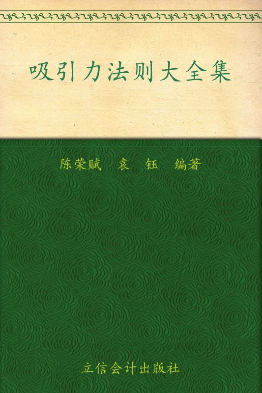
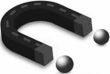
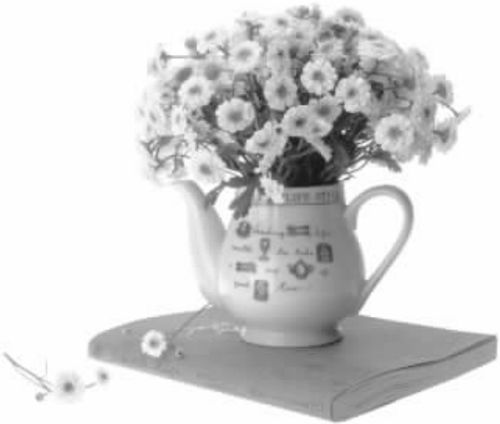
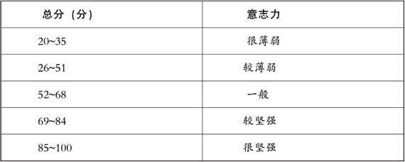
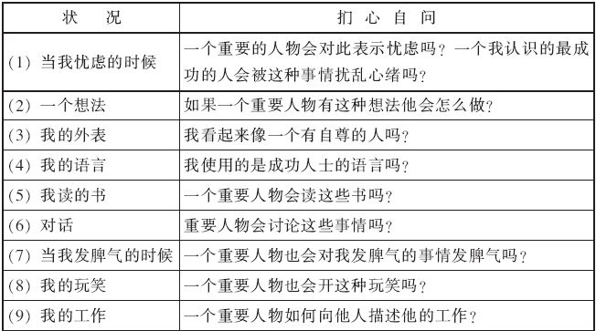
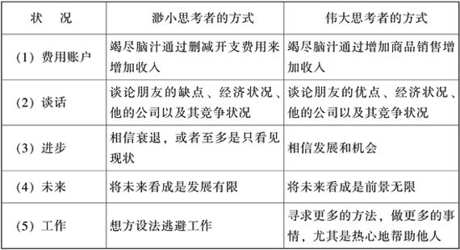
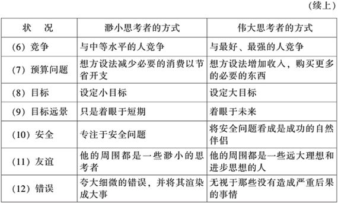

# 吸引力法则大全集

序　言

揭开吸引力法则的神秘面纱

无论是现代医学、哲学，还是量子物理学等领域，都已证实吸引法则的存在。越来越多的成功人士发现，一旦了解了这个“秘密”（即吸引力法则），就没有做不到的事情，不论你是老是幼，是男人还是女人，你想要得到什么东西，只要运用这个法则，都能够实现！据闻赫赫有名的大富豪比尔·盖茨便是得知了有关“吸引力法则”的知识后，从哈佛大学休学去追逐梦想。事实上，世上的每个人都有机会去实现梦想。与吸引力法则比起来，年龄、学历、家世背景，统统不是问题！

无论你了解，或是不了解吸引力法则，它都客观地存在于宇宙之中；无论你出身背景、贫富贵贱、高矮胖瘦、男女老少、种族国籍，也无论你是承认，或是不承认吸引力法则，你都在时时刻刻受着它的影响。吸引力法则不间断地运作着，永不停息，绝不偏颇。就如同重力法则一样，每个人都毫无例外地受其影响。

吸引力法则的原理是你心里面想什么、感觉什么，就会把什么吸引过来，而不论是好的或是坏的，也不管你是否听过它。这就是吸引力法则。说得更形象一些，即把自己视作一块磁铁，如果你是悲观、负面的磁铁，就会吸引不好的事情接二连三地发生，会发现生活真是糟糕透顶——工作不顺利、恋情不顺利、生活不如意，到处都饱受伤害，充满无奈。相反，如果你是乐观的、正面的磁铁，那你将吸引更多的好事，喜笑颜开地度过每一天。

作为宇宙中的一员，作为万物之灵长的人类，我们要做的就是了解并运用它，进而养成习惯，在生活中对于不想要的，别去专注它，也别去研究讨论它，尽可能把注意力放在想要的东西上。根据吸引力法则，它将会带来相关的人、事、物，以协助我们的愿望成真！事实上，只要稍微留意，我们便会发现吸引力法则的反面效应屡见不鲜。

是不是常常在天气寒冷时，抱怨道：“天儿可真冷啊，冻死我了，我衣服穿得太薄了，一定会感冒的！”结果你真的出现感冒的症状了！

开车外出的路上，左眼皮因为疲劳跳动了几下，你开始想：“完了，俗话说‘左眼跳灾，右眼跳财’，我八成要发生什么不好的事情了。”没过多久，你果真倒霉了。或者是闯了红灯被交警开罚单，或者是心神恍惚地差点追尾，或者是撞到行人，等等。

刚才不小心说错了话，那个客户一定很不高兴，这笔买卖八成不会成交了！结果你就真的“如愿以偿”了！

最近听到同事抱怨连续加班，导致腰酸背痛。问你感觉如何？于是，过了没多长时间，你也开始感觉腰酸背痛起来。

诸如此类的语句，一直在日常生活中反复听人提起。这些人不断地暗示自己的潜意识，等到潜意识接受了，就很难改变了，因为潜意识已经认定你就是“天冷就会感冒”，“左眼跳灾”，“买卖搞砸了”，“身体不健康”……然后就觉得自己很惨，殊不知那是自己吸引来的。记住，负面的想法，只会吸引更多不顺利的状况！

所以，从即刻起，每个时间、场合，留意自己的想法，尽可能地想一些令人愉悦的好事吧！比如说：“我真是有气质、身体健康、工作快乐、体能强壮、爱情幸福、婚姻美满！”诚如《秘密》一书所言——有一句肯定语，能包含人类所有愿望，还能为所有事物带来和谐的条件，那就是：“我完整、完美、强壮、有力量、充满爱、和谐又快乐。”时时刻刻都这样想，这样说，你的潜意识就会逐渐接受它们，结果就是我们真的成为了那样的人！

当深入了解吸引力法则，就好比是抓到了阿拉丁神灯，不管你想什么、要什么，只要是你真正想实现的梦想，都必将一一成真。这就是所谓的“美梦成真”，“心想事成”。伴随着你对吸引力法则的深入了解，“美梦成真”，“心想事成”将不再只是个问候语，也不是所谓的痴人说梦，而是确切存在于宇宙间的关于拥有成功、财富、健康、快乐的秘密所在。

吸引力法则，又称“秘密”、“心想事成的法则”、“美梦成真的秘密”，它是实现你美好愿望的利器。命运的好坏，无关于你的生辰八字，无关于你的姓与名，无关于你学历的高与低，无关于你容貌的美与丑，也无关于你身材的高与矮。当你了解吸引力法则并合理地运用它后，你，一定能够达到任何想实现的目标，演绎出辉煌灿烂的人生轨迹！

俗话说：“同频共振，同类相吸。”

积极能量吸引积极能量，消极能量吸引消极能量，这就是吸引力的法则。

第一篇　吸引力法则

* * *

——汇聚宇宙能量，开启成功之门

第一章

* * *

吸引力法则：改变命运的心想事成法则

我们生活在一个以吸引力为基础的宇宙中

你是否知道，生活在这个宇宙中的人们都受一个威力无比的自然力量的支配，都被同一个规律指导着。宇宙中的自然规律是如此精确，以至于我们可以运用这些规律解决一切困难，成功地建造出宇宙飞船，还可以把人送往月球，甚至可以把着陆的时间精确到秒的几分之一。不论你是在法兰克福、马尔代夫、洛杉矶，还是在斯德哥尔摩或迪拜，或者多伦多、大阪、东京，都受同一种力量支配，同一个法则支配。这就是吸引力法则。

吸引力法则，又称吸引力定律，是一种我们看不见的能量，一直引导着整个宇宙规律性的运转，正是因为它的作用，地球才能够在 46 亿年的时间里保持着运转的状态；也正是因为它的作用，太阳系乃至整个宇宙中，数以亿计的星球，都能相安无事地停留在各自的轨道上安分地运行，这样一种能量引导着宇宙中的每一样事物，也引导着我们的生活。

人们常常有这种经验：有时正在谈论或者你刚刚想到一个人，这个人就出现了。于是，我们就感叹：真是“说曹操，曹操到”。再如，弗洛伊德引用的发生在他朋友布列尔身上的事情。话说布列尔与太太在一家餐厅吃饭。在交谈中，他忽然停下刚才的话头，说了一句无关的话：“不知道饶医师在匹兹堡干得如何？”他太太惊讶地说：“几秒钟前我也正在想同样的事哪！”为什么会这样呢？根据吸引力法则，人与人的大脑之间存在着一种脑电波之类的东西，互相有吸引力。当你想到那人时，那人的脑电波接收到后，便会不请自到。

我们生活在一个以吸引力为基础的宇宙中。这个宇宙中的每件东西都和吸引力有关。不管你是否相信它或是否理解吸引力法则，它永远都是在客观地起作用的。不论什么时候，不论对什么人，都是如此。

生活中所发生的所有事情，都是我们自己吸引来的，是我们头脑中所想象的图像吸引来的。那些事情都是我们的思想导致的。不管我们头脑中想什么，我们都会把它们吸引过来。作为一个人，我们要做的事情是，持续地思考我们想要的东西，搞明白自己到底想要什么，从这一点起，我们就可以开始召唤宇宙中最伟大的法则之一，即吸引力法则了。

假设你躺在床上，想着如山一般的债务，并感到心情很糟糕时，你就会把这些信号发射到宇宙中。“唉！我这么多的债务，真是烦透了！”注意，如果你这样想象自己的处境，只能是不断地向你自己强调这种糟糕的状况，这种感觉将充盈你的整个身心，最终你会发现更多的烦恼发生在你身上了。这一情形便是吸引力法则发挥作用的结果。

这启示我们，当看到不想要的东西，并在思想中排斥它时，我们并没有把它推开。相反，我们激活了一个关于自己不想要的东西的思想，而吸引力法则就会把这个我们不喜欢的东西吸引到身边来。当看到想要的东西，并从心底里接受它，我们就激活了一个思想，吸引力法则就会响应我们的这个思想。总之，不管你是在回忆过去，或思考现实，或憧憬未来，你都是在激活一种思想，而那个宇宙中最具威力的吸引力法则，就会响应你的思想。

你想鹤立鸡群吗？你想一飞冲天吗？当然想！那就对未来保持积极的态度吧！这样你才会把那些积极的人、正面的事情和好的环境吸引到身边来，从而为你的成功铺路。就算是遭遇困厄，也不要对未来感到消极、恼怒，否则，就会把那些消极的、爱生气的人和消极的、恼怒的环境吸引到身边来，最终收获一个如阴霾天气般的结局。

吸引力法则是一种自然界的科学法则

吸引力法则并不是一个幻想的词语或者新出现的魔法，它是一种自然界的科学法则。众所周知，任何一个人，无论是仁慈的好人还是十恶不赦的坏蛋，无论是老人还是孩童、女人还是男人，只要从高处跳下，最终肯定会落到地面上。稍微懂点物理常识的人都清楚，之所以会出现这种现象，是因为重力的作用。重力规律是客观存在的自然法则，并不以人的意志为转移。吸引力法则亦如此。

尽管吸引力法则的原则已经为大多数有志于理解其意义的人们所接受，但还是有必要澄清一点。吸引力法则与任何神秘的力量、奇特的迷信或者玄奥的“科学”均毫无联系，也不需要人们穿上怪异的服饰，或举行神秘的仪式，或摆放出一些特制的道具等来感受它的效果和力量。当然，也不需要用金字塔来装饰房间，或用香熏让房间烟雾缭绕，或睡在放有石英石的枕头上，或使用任何手镯、项链或者其他什么磁性首饰。

在我们的身体当中，时时刻刻都蕴涵着一股神奇的力量，足可以让我们吸引来自身成功需要的一切。这便是神奇的吸引力法则。吸引力法则的存在，就像地心引力或万有引力的存在，在牛顿发现并将之形成理论前，就已经存在亿万年了。它并不因我们知道不知道这个概念而存在。我们无时无刻不在接受吸引力法则的作用。吸引好的东西的光顾，或者吸引不好的东西降临。我们身上所有的东西都是自己吸引而来的。

下面这个真实的故事或许能帮助我们说明吸引力法则是一个客观存在的自然法则。

这个故事发生在几年前的一天。这天彻底改变了主人公的命运。他因驾机坠毁完全瘫痪在医院里。他的脊髓被撞坏，第一和第二颈椎折断。口腔吞反射彻底被破坏，甚至无法饮水。他的横隔膜被破坏，不能呼吸，能做的，只是眨眼睛。医生说，他将是一个植物人，除了眨眼睛的动作外，他一辈子什么也做不了。但是故事的主人公认为，医生们怎么想并不重要，重要的是他的想法。他想象着自己重新成为一个正常人，自己走出医院。在医院里，他带着呼吸器，因为医生说他永远不可能再自主呼吸。但有一个细小的声音一直在对他说，“深呼吸，深呼吸”，最终他可以不用呼吸器了。医生们没有办法解释这个现象。在整个过程中，他不能允许任何东西进入他的意识干扰他想象中的目标。他的目标是：在圣诞节走出医院。他的目标在他的不断努力下实现了。很多人都说这是不可能的。通过这样的经历，他用六个字总结出一个人在他一生当中能够做什么：“你成为你想的”。

任何事情的背后都存在着永恒的宇宙法则，我们人类只是这种法则作用的结果。即使你不能理解上述道理，也没有必要冷若冰霜地拒之于门外。这种情景就好比是现实生活中有很多人不懂电流的工作原理，却依然能够享受到电带给我们的益处。比如，我们可以用电来照明、烧水、取暖等。

下面是世界一些名人对于吸引力法则的说法，或许有助于你更好地参透这种宇宙间最具威力的法则。

凯瑟琳·庞德这样描述吸引力法则：“你的思想、感觉、心像和言语所散发出来的一切，都会吸引到你的生命中来。”

布莱恩·崔西这样描述吸引力法则：“你是一个活磁铁。你在生命中会吸引与你‘主要思想’相一致的人和情境。你意识中所想的会出现在经验中。”

杰瑞与艾斯特·西克斯这样描述吸引力法则：“同类相吸。”

同类相吸，是宇宙中一个重要的定律，也是我们对吸引力法则最简单明了的认识，把自己想象成一块磁铁，利用它吸引自己想要的东西。当你脑中出现了某个思想，它就会把其他同类想法吸引过来。它孕育着你的思想，影响着你的整个生命。这一无上的法则，正是透过你的思想来运行的，而让这一法则起作用的，只有你自己的思想。

在管理心理学中，吸引力是指能引导人们沿着一定方向前进的力量。当人们对组织目标或可能得到的东西有相当的兴趣和爱好时，这些东西就会形成对人们的吸引力。这种力量一旦形成就会吸引人们不断地向目标推进。管理中组织设置的目标以及表扬、奖励、奖金、荣誉、职务晋升等都是一种吸引力。

吸引力法则的秘密等于心想事成的秘密

古今中外，不胜枚举的事例说明，我们会成为自己心里想的最多的那种人，也会拥有自己心里想的最多的东西。如果我们可以在自己的头脑中“看到”某物，最终“得到”某物的几率就会大大增加。对于这一点，很多人也许会随声附和：“嗯，是这样的！”（事实上，也的确如此）不过，令很多人疑惑的是，为什么会出现这样的现象？在这一现象的背后又隐藏着什么玄机？其实，这一现象并不神秘。看完下面的解释，你就恍然大悟了。

现代量子力学表明，世上的万事万物都是由能量组合而成的，而能量就是一种振动频率，每样东西都有它不同的振动频率，所以才出现了那么多不同事物的面貌，无论是像板凳、沙发等有形的物体，还是思想、情绪等无形的东西，都是由不同振动频率的能量组成的。振动频率相同的事物，会互相吸引并诱发共鸣。举个例子，一排音叉，当你击打其中一个，音叉发出清脆的乐声，不一会儿，其他的音叉也会发出乐声，它们的声音会互相应和，发生共鸣，甚至越来越大声。

事实上，“同频共振，同质相吸”正是吸引力法则的精髓。因为一切的本质都是振动，所以一定有着自己的频率。同样频率的东西会共振，形成和鸣。和鸣的部分形成同质性，而同质的东西会因为互相吸引而走在一起。所谓“物以类聚，人以群分”，讲的其实就是吸引力法则所产生的自然现象。

我们身处宇宙之中，是有脑电波的。我们的意念和思想也是有能量和频率的，而且每种思想都有一个频率。它们的振动会影响其他的东西。如果你反复思考一个想法，或经常在脑海中想象它，比如，想象已经拥有某个职位，或已经拥有所需要的财富，或正在创业，或找到了值得托付一生的爱人……只要你在脑海中想象它们的样子，你就会持续地发射相应的频率。思想不断地发射这种带有磁性的信号，这个信号就会把相似的东西吸引回来。

曾有一个著名电影制片人的艺术导演，在他家的每个角落，都摆放着美丽女人的画像，一个身穿纺纱的裸女，做着这样的姿势，好像在说：“我不想看你，我看不到你。”一次，他一位朋友来到他家，朋友对他说：“我想你在爱情方面有些问题。”“难道你是透视眼的通灵人？”“我不是，但你看，你在各处都放有这个女人的画像。”“但我喜欢这样的画像，这是我自己画的。”朋友告诉他：“若是如此，那更糟糕，因为你投入了自己的想象力和创造力。”

你看，这是一个外表英俊的男人，他的身边总是有很多女演员。因为他就是干这个工作的，但他没有爱情生活。朋友对他说：“你想要什么？”“嗯，我想一星期跟三个女人约会。”“那好，你就画一个你自己和三个女人的画像并且每个角落都要挂上这幅画。”六个月后，朋友再一次遇到他，问他：“你的爱情生活怎样了呢？”“太棒了！她们主动打了电话和我约会。”“因为这就是你的愿望呀。”“我现在每星期大约有三个约会，她们还为我争风吃醋。”“真有你的！”“但我想稳定下来，我想结婚，也想要浪漫。”“好，那你就画出来。”于是他画了一个代表美丽浪漫关系的画。一年以后，他结婚了，而且生活得非常幸福快乐。

这位艺术导演为什么在爱情和婚姻的道路上心想事成了呢？因为他发出了另一个愿望，他有这个愿望已经好几年了。但他的愿望并没有实现，因为他的外在层面即他的房子的画一直都和他的愿望背道而驰。因此，如果你知道这个道理，你就可以开始利用它。记住，你生活中的所有事物都是你“吸引”过来的！所以，你将会拥有你心里想的最多的事物，你的生活，也将变成你心里最经常想象的样子。这就是吸引力法则！

吸引力法则的秘密等于心想事成的秘密。美国著名新思想运动创始人之一、成功学作家华莱士·沃特尔斯认为，吸引力法则是一种自然法则。它是客观的，没有好坏之分，它只是接收你的思想，然后以生命体验的方式，把这些思想回放给你。假若你以积极的姿态行走人世，那么，你将品尝到“心想事成”的甜蜜，否则，品尝到的只是苦涩。

可能不少人都听说过三个建筑工人的故事：

在烈日炎炎下，三个建筑工人挥汗如雨地工作。这时，一个人走前问道：“你们在做什么？”甲工人回答道：“我在砌砖。”乙工人回答道：“我在砌一堵墙。”丙工人满怀憧憬地说：“我在盖一座美丽的大厦。”10 年后，甲工人成了熟练的砖瓦工，乙工人成了一名建筑工头，而唯有丙工人，他的人生发生了巨大的变化，成了一名身价过亿的房地产巨子。

是的，相同的境遇，想法各有不同，但是随着时间的推移，思维方式的差别，将使命运产生巨大的反差。人生就如此简单。你拥有怎样的思维方式，也就选择了怎样的人生。

人的大脑堪比宇宙间最强大的“磁铁”，会发射出比任何东西都还要强的吸引力。它在发挥作用时，不仅所有美好的事物会被吸引过来，那些不太美好甚至丑恶、有害的事物也会被吸引过来。在日常生活中，我们要做的是，对世界发出积极的呼唤，把和你的思维振动频率相同的东西“吸引”过来。靠什么吸引过来呢？靠你心中所持的“心理意象”，即心中所想——不论你心中想的是什么，只要你的心智运转起来，你就会把它们吸引过来！

运用吸引力法则吸引自己想要的东西

如前所述，吸引力法则的秘密等于心想事成的秘密。因此，我们要学会运用吸引力法则吸引自己想要的东西，到达“心想事成”的境界。不过，“心想事成”并非没有条件。除了不停地将你想要拥有的默念于心，还要积极地展开行动。

伟大的“发明大王”托马斯·爱迪生在年少时学了电的基本原理。他意识到，这种奇妙的能量有许多令人难以置信的用途。爱迪生注视着当时人们所用的蜡烛和汽灯，他觉得它们实在是太不方便了。于是，他产生了这样一个想法：要用电给灯泡供应能量，使其远远先进于当时已存在的任何照明方式。在接下来的十年里，这个想法一直牢固地存在于爱迪生的脑海中。他做了一个玻璃灯泡，然后试了一种又一种的材料，试图找到一种可以燃烧很长时间的，但是始终未能如愿。他先后尝试了数千种不同的材料，虽然一次又一次地失败，但是凭借对自己想法的坚持和执著，他最终找到了理想的灯丝材料。其他发明或发现的产生过程也几乎都与此经历相似。

几乎所有伟人在他成名之前都相信自己将会影响这个世界，至少是他所在的世界。他相信自己在生命舞台上演绎的是主角而不是配角的戏份儿。或许对于周围的人而言，他的这种想法过于疯狂，以至于人们都认为他是异想天开。但是，事实证明，当你坚持一个想法进入到近乎疯狂的状态时，成功往往就会降临到你头上来。只有相信你的意识，你才会吸引成功所需的条件。那些一直鼠目寸光、斤斤计较得失的人，是难以做出影响世界之举的。事实上，这也是吸引力发挥作用的表现。

1932 年经济大萧条期间，一个年轻人从某大学毕业，获得了社会科学的学位。关于自己未来的生活，他没有得到任何的指导，也没有什么自己的想法。他的困境总结起来只有一条，那就是，那个年头的工作岗位极度稀缺。年轻人开始等待，希望有什么好运会降临到自己头上。同时，为了挣钱养活自己，他整个夏天都在一家当地的游泳池干着救生员的工作。

一位经常带孩子来游泳的父亲对年轻人十分友好，并对他的未来产生了兴趣。他鼓励年轻人仔细分析一下自己，看看究竟最想做什么。年轻人听从了他的建议，在随后的几天中，他开始检讨自己。最后，他发现自己还是最想成为一名电台播音员。

年轻人告诉了这位长者他的志向，这位长者鼓励他采取必要的行动，使梦想成真。随后，他走遍了伊利诺斯州和爱荷华州，努力使自己进入广播行业。终于，他在爱荷华州的达文波特市停住了流浪的脚步，成为了一家电台的体育播音员。“终于找到了工作，这多美好呀，”后来这个年轻人坦率地说道，“不过，更有意义的是，我知道了应该去行动这个道理。”

这个年轻人叫罗纳德·里根，后来他成为了美国第四十任总统。

成功人士总是有意无意地运用吸引力法则吸引自己想要的东西。如果每个人都能清楚地知道自己想要得到什么，再加上行动和努力，并坚持到最后，其所思所想的就会变成现实。

“吸引力法则”被西方人称之为惊天秘密，而且声称：过去知道这个秘密的，竟然都是历史上的伟大人物：柏拉图、莎士比亚、牛顿、雨果、贝多芬、林肯、埃默森、爱迪生、爱因斯坦。了解这个秘密，就没有做不到的事。再次强调指出，不论你是谁，你想要什么，只要通过这个秘密你就能实现梦想！

第二章

* * *

生命的巨轮自然循环，寻访奇迹的开端

你的愿望将为生命之流注入活水

每个想法都在振动、都会放射信号并吸引频率兼容的信号。这种现象，称为吸引力法则。按照吸引力法则，同构型者相吸引。因此，你可以将此一强大的吸引力法则看作是一个“宇宙的经理人”，在他的眼里，所有相似的想法都会形成共振。

生活在这个宇宙中的每一个人，毫无疑问，都有自己独特的禀性和天赋，每一个人都有自己独特的实现人生价值的切入点。一旦生活驱使一个人的心中萌发了一个新的想法或愿望，那么它就会在自然的力量和吸引力法则的召唤下慢慢成为现实。

上述情景就好比是从山顶滚落的石块，从滚落的瞬间起，就不需要额外的动力和帮助，自然而然地滚到山脚。你的每一个愿望，无论大小，都能为生命之流注入活水，而你只需要顺流而下，按照自己的禀赋发展自己，不断地超越心灵的羁绊，向着更高的愿望进发，那么你就不会忽略自己生命中的太阳，而湮没在别人的光辉中。

很久以前，曾经有三只小鸟，它们一起出生，一起长大，等到羽翼丰满的时候，一起寻找成家立业的地方。

它们飞过了很多高山、河流和丛林，飞到一座小山上。一只小鸟落到一棵树上说：“这里真好，真高。你们看，那成群的鸡鸭牛羊，甚至大名鼎鼎的千里马都在羡慕地向我仰望呢。能够生活在这里，我们应该满足了。”它决定在这里停留，不再往前飞了。

另外两只小鸟却失望地摇了摇头说：“你既然满足，就留在这里吧，我们还想到更高的地方去看看。”

这两只小鸟继续飞行，它们的翅膀变得更强壮了，终于飞到了五彩斑斓的云彩里。其中一只陶醉了，情不自禁地引吭高歌起来，它沾沾自喜地说：“我不想再飞了，这辈子能飞上云端，便是最大的成就了，你不觉得已经十分了不起了吗？”

另一只鸟很难过地说：“不，我坚信一定还有更高的境界。遗憾的是，现在我只能独自去追求了。”

说完，它振翅翱翔，向着云霄，向着太阳，执著地飞去……

最终，落在树上的小鸟成了麻雀，留在云端的成了大雁，飞向太阳的成了雄鹰。

麻雀、大雁和雄鹰，它们的命运为什么不同呢？一个很明确的答案就是：它们各自的愿望不同。麻雀满足于树梢，所以它的世界只有几丈之高；大雁满足于云层，所以它永远都飞不出层层云雾的缠绕；雄鹰则不懈追求，力求最高，所以它的世界扩展到了宇宙。三只小鸟对于生命图景有着不同的欲求，所以最终的命运也有所差别。现在，扪心自问一下：“三只鸟的命运，我属于哪一只鸟呢？我又期待什么样的生命图景呢？”

从本质上来说，人类的生命是一股思想的能量。生活在现实世界中的你，不断萌生新的欲求，那么，在吸引力法则作用下感应到召唤后，将帮助你达成所愿。不要杞人忧天地担心自己不能实践吸引力法则。要知道，吸引力法则是完全不需要实践的，也不能实践，这个法则早已存在于宇宙万物的运行之中。犹如万有引力法则不需要实践一样，地球上所有的事物都遵循万有引力法则，无时无刻不在“实践”它。吸引力法则也是同样的道理。即使你无视该法则的存在，它也会回应你，实现你的愿望。

因此，我们要做的是，比别人的愿望多一些，努力付出的多一些，以便吸引来更多的东西，进而推动生命的巨轮不断前行。

不相信奇迹就不可能有奇迹发生

我们要相信奇迹会在自己身上发生，只有相信并时时关注，思想才会把实现这个奇迹的条件吸引到我们周围，我们才会创造奇迹。细观那些创造吉尼斯世界纪录的人，在他们突破别人或者自己的纪录创造奇迹之前，总是先相信自己能够做到。也就是说，相信奇迹，才会创造奇迹！

美国的一家报纸上登了这么一则广告：“一美元购买一辆豪华轿车。”哈利看到这则广告时半信半疑：“今天不是愚人节啊！”但是，他还是揣着一美元，按着报纸上提供的地址找了去。在一栋非常漂亮的别墅前面，哈利敲开了门。一位高贵的少妇为他打开门，问明来意后，少妇把哈利领到车库，指着一辆崭新的豪华轿车说：“喏，就是它了。”

哈利脑子里闪过的第一个念头就是：“是坏车。”他说：“太太，我可以试试车吗？”“当然可以！”于是哈利开着车兜了一圈，一切正常。“这辆车不是赃物吧？”哈利要求验看车照，少妇拿给他看了。于是哈利付了一美元。当他开车要离开的时候，仍百思不得其解。他说：“太太，您能告诉我这是为什么吗？”

少妇叹了一口气，说：“唉，实话跟您说吧，这是我丈夫的遗物。他把所有的遗产都留给了我，只有这辆轿车，是属于他那个情妇的。但是，他在遗嘱里把这辆车的转卖权交给了我，所卖的款项交给他的情妇——于是，我决定卖掉它，一美元即可。哈利恍然大悟，他开着轿车高高兴兴地回家了。路上，哈利碰到了他的朋友汤姆。汤姆好奇地问起轿车的来历。等哈利说完，汤姆一下子瘫倒在了地上：“啊，上帝，一周前我就看到这则广告了！”

什么事都有可能发生。那些连奇迹都不敢相信的人，怎么能获得奇迹呢？我们承认，的确有很多奇迹让我们难以置信，但它还不是照样在人类社会中发生了吗？比如，以前人们认为信息必须依靠良驹、驿站等来传递，而现在一个电话、一封邮件，甚至一个手机短信就远远超过了任何一匹千里马的速度；以前人们认为登上月球是做白日梦，但是这个事情已经被人类实现了；以前人们会觉得到外国旅游需要花费相当长的一段时间，几个月、几年甚至是一生，但是现在只要短短数个小时的飞行，你就很容易落脚于异国的疆土上。

美国作家欧亨利在他的小说《最后一片叶子》里讲了一个生命奇迹的故事：病房里，一个生命垂危的病人从房间里看见窗外的一棵树，树叶在秋风中一片片地掉落下来。病人望着眼前的萧萧落叶，身体也随之每况愈下，一天不如一天。她说：“当树叶全部掉光时，我也就要死了。”一位老画家得知后，用彩笔画了一片叶脉青翠的树叶挂在树枝上。最后一片叶子始终没掉下来。只因为生命中的这片绿，病人竟奇迹般地活了下来。

只要心存希望，就会有奇迹发生。希望虽然渺茫，但它永存人世。人生可以没有很多东西，却唯独不能没有希望。有希望之处，生命就生生不息。不相信奇迹的人，就不可能吸引来奇迹的发生。相信奇迹，是对人生的完美诠释。当我们以创造奇迹的心情创造生活时，我们的笑容会更加灿烂，我们的生活会更加幸福而辉煌。

值得一提的是，奇迹并不是特意为我们发生的，它通常是以两种方式发生：第一种方式是面对生命中的挑战时，我们屹立于它之上，使自己成为英雄。第二种体验奇迹的方式就更加微妙了，对大多数人来说也更加难以琢磨了，它只有在我们敞开心怀的时候，才会走进我们的生命。哪怕身处沙漠，哪怕脚下荆棘遍地，只要我们心中有梦，有希望，我们就会轻松自如，健步如飞。绝处总能逢生，否极总能泰来。相信奇迹总会在某天不期而至。

吸引力法则促成生命循环不息

美国的查尔斯·哈尼尔指出，生命就是成长，成长即是变化。每七年的一个周期把人们带入一个新的循环。第一个七年是婴儿期。第二个七年是少年期，意味着个体责任的开端。第三个七年意味着青春期。第四个七年标志着全面成长的完成。第五个七年则属于建设期，这个时期的人们会拥有财富、家庭和孩子。接下来，从 35～42 岁，则进入反应和变化期，接着依次是重建、调整和恢复期，以便准备新一轮的七年期，这个周期从 50 岁开始。

吸引力法则最终会导致生命出现一个平衡的状态，通过分散方式进行的运动数量意味着一定具有相同数量的通过聚合方式进行的运动，甚至一定是相同的运动。关于这一点，我们可以拿臼齿的形成和分子的形成为例。经由这样的结果，一方面能增强我们关于整个恒星系局部演化和消解的概念，另一方面也能增强还不怎么明确的总体演化和消解的概念。

意大利的乔尔丹诺·布鲁诺由于发表了以下言论，以至于 1600 年在罗马被活活烧死。事实上，他的这段言论恰恰揭示了生命的循环不息。这段言论是：

“那被播下的种子首先变成青草、麦穗，然后成为面包、富有营养的汁液、血液、动物、精子、胚胎、人类、尸体，接着再一次成为泥土、石头或其他无机物，等等。因此，我们认识到由于变化而产生的各种事物，它们在本质上还是一种事物，而且是相同的。”

只要我们稍加观察便会发现，消解与再生、毁坏与更新在无穷无尽的循环圈内随处可见。在我们所吃的馒头米饭里，在我们呼出吸入的气体里……我们也从曾经构成我们祖先躯体的物质里吸收养料。而且我们自身每天都给外部世界提供一部分组成我们躯体的物质，我们也会很快地从我们的邻人提供的相类似的物质那里取回。

美国的埃斯特·希克斯和杰瑞·希克斯夫妇被誉为吸引力法则最权威宗师。他们指出，如果你能静下心来好好思索下面这些概念，将它们结合到自我的思维模式中，成为生命的基石，你就能实现你初生时的梦想，生活得幸福而快乐。

出生以前，你本源的思想能量开始寻找栖居的肉身。

出生以前，你本源的思想创造了“你”的现实概念。

吸引力法则在感应到这一召唤之后，助你塑造自己的肉身。

在这个概念中，你不断想要扩展自己的人生。

吸引力法则感应到这些欲求，帮助你一一实现它们。

现在，你又有一个新的想法从脑袋中冒出。

吸引力法则回应这个想法，创造了生命循环不息的动力。

那个因吸引力法则的回应所产生的动力就是生命之流。

只要明白生命永恒不息的道理，永无止境的生命扩展概念就变得容易理解，就会努力在现实世界中活出精彩。当你回想起内在的自己，它会时刻对生活中的你激发萌生愿望，那么你就能感受到生命之流的巨大推动力。在紧急情况中，特别当死亡的大门即将开启时，这一点显得尤为重要。澳大利亚昆斯兰省图屋姆巴市的拉尔夫·魏卜纳的情况就是这样。

那是午夜 1 点 30 分，在医院的一间小屋里，两位女护士正在拉尔夫身旁守夜。在头天下午 4 点半钟时，一个紧急电话打到他的家里，要他的家人赶到医院来。当他们到了拉尔夫的床边时，他已处于昏迷状态，他的心脏病严重发作了。一家人都待在外面走廊上，每个人都呈现出焦急的样子，有的在担心，有的在祈祷。

在灯光暗淡的病房里，两位女护士忙碌地工作着——每人抓住拉尔夫的一只手腕，力图摸到脉搏的跳动。因为拉尔夫在整整 6 个小时内都未能脱离昏迷状态，医生已经做了他所能做的一切，然后离开了这个病房。

拉尔夫丝毫不能动弹，然而，他能听到护士们的声音。在昏迷状态的某些时间里，他能相当清楚地思考。他听到一位护士紧张地说：

“他停止呼吸了！你能摸到脉搏的跳动吗？”

回答是：“不能。”

他一再听到这些问答：“现在你能摸到脉搏跳动吗？”“不能。”

“我很好，”他想，“但我必须告诉他们，无论如何我必须告诉他们。”

同时他对护士们这种近于愚蠢的亲切又觉得很有趣。他不断地想：“我的身体状况非常良好，并非即将死亡。但是，我怎么能告诉他们这一点呢？”

于是他想起了他所学过的自我激励的语句：“如果相信你能够做这件事，你就能完成它。”他试图睁开眼睛，但失败了。他的眼睑不听他的命令。事实上，他什么也感觉不到。然而他努力地睁开双眼，直到最后听到这句话：“我看见一只眼睛在动——他仍然活着！”

“我并不感到害怕，”拉尔夫后来说，“我仍然认为那是多么有趣啊！有一位护士不停地向我叫道：‘魏卜纳先生，你在那里吗？……’对这个问题我要以闪动我的眼睑来作答，告诉她们我很好——我仍然在世。”这样在一段相当长的时间后，拉尔夫通过不断努力睁开一只眼睛，接着又睁开另一只眼睛。

在生活中，每个人都可能遇到这样或那样的不幸。诸如：亲人不幸死亡、朋友分手、身患重病……你一定要注意，这一切对你都不重要，对你都不会构成致命的创伤。最致命的创伤来自我们心灵深处，是我们的心灵导致我们绝望。当你明白，吸引力法则以创世之初的力量来回应你的想法，那么，你对生命之流的动力将有更加深刻的体会。

顺应你的天性，探寻生命的喜悦

吸引力法则的工作原理，很像发射和接收无线电波。你的频率必须和你希望接收的频率相匹配。你不能将收音机调到调频 87.5 却希望收到调频为 110.7 广播电台的节目。你的能量必须与发送者的能量频率同步或者相匹配。因此，必须将你的振动调整到一个积极的频率上，你才能吸引积极的能量回应于你。

所以，我们说如果你想获取更多的快乐和成功，你就必须让自己的生活节奏与宇宙的自然节拍保持协调，并且与吸引力法则保持一致。你要让自己生活在更加感恩，更加平和，更高自我觉知的状态之中。快乐是你与生俱来的天性和权利，你应该学着顺应你的天性，使用你的权利，做你喜欢的事情，探寻生命的喜悦，寻找一种合适的方式表达自己，舒展自己，并无私地帮助他人，这是你不可推卸的责任。

接下来，我们看这样一则关爱吸引关爱，并给予生命喜悦的故事：

在一条乡间公路上，乔依开着那辆破汽车慢慢地颠簸着往前走。已是黄昏了，伴随着寒风，雪花纷纷扬扬地飘落下来。飞舞的雪花钻进破旧的汽车，他不禁打了几个寒战。这条路上几乎看不见汽车，更没有人影。乔依工作的工厂在前不久倒闭了，他的心里很是凄凉。

前面的路边上好像有什么。乔依定睛一看，是一辆车。走近时，乔依才发现车旁还有一位身材矮小的老妇人，她满脸皱纹，在寒风中微微发抖。看见脸上带着微笑的乔依，她反倒紧张地闭上了眼睛。乔依很理解她的感受，赶紧安慰她说：“请别害怕，夫人，您怎么不待在车里？里面暖和些。对了，我叫乔依。”

原来她的车胎瘪了，乔依让她坐进车里，自己爬进她的车底下找一块地方放置千斤顶。他的脚踝被蹭破了，因为他没穿袜子。为了干活方便，他摘下了破手套，两只手冻得几乎没有知觉。他喘着粗气，清水鼻涕也流下来了，呼出的一点点热气才使脸上的各种水分没有冻上。他的手蹭破了，也顾不上擦流出的血。当他干完活时，两只手上沾满了油污，衣服也更脏了。乔依扣上那车的后备箱时，老妇人摇下车窗，满脸感激地告诉他说，她在这个荒无人烟的地方已经等了一个多小时了，她又冷又怕，几乎完全绝望了。老妇人一边打开钱包一边问：“我该给你多少钱？”

乔依愣住了，他从没想到他应该得到钱的回报。他以前在困难的时候也常常得到别人的帮助，所以他从来就认为帮助有困难的人是一件天经地义的事，他一直就是这么做的。乔依笑着对老妇人说：“如果您遇上一个需要帮助的人，就给他一点帮助吧。”乔依看着老妇人的车开走以后，才启动了自己的破汽车。老妇人沿着山路开了几公里，来到了一个小餐馆，她打算吃点东西，然后回家。餐馆里面十分破旧，光线昏暗。店主是一位年轻的女人，她热情地送上一条雪白的毛巾，让老妇人擦干头发上的雪水。老妇人感到心里很舒服。她发现这位女店主的脸上虽然带着甜甜的微笑，可掩盖不住她极度的疲劳。更重要的是，她怀孕至少 8 个月了，尽管如此，她还是忙来忙去地为老妇人端茶送饭。老妇人突然想起了乔依。

老妇人用完餐，付了钱。当女店主把找回的钱交给她时，发现她已经不在了。只见餐桌上有一个小纸包，打开纸包，里面装着一些钱。餐桌上还留有一张纸条，上面写着：“在我困难的时候，有人帮助了我。现在我也想帮帮你。”女店主不禁潸然泪下。

她关上店门，走进里屋，发现丈夫不知什么时候已经倒在床上睡着了。她不忍心叫醒他。他为了找工作，已经快急疯了。她轻轻地亲吻着丈夫那粗糙的脸额，喃喃地说：“一切都会好起来的，亲爱的，乔依……”

乔依醒来后，妻子告诉他说：“乔依，今天餐馆里来了一个老妇人，她看上去非常疲劳。她吃完饭后，等我把零钱找给她时，她已经不知去向了，她留下了一张纸条。”说着妻子把纸条掏出给乔依看，“这张就是老妇人留下的纸条，当时里面还包着一些钱。”乔依看完了纸条后，不禁想起今天自己所帮助的老妇人，乔依问道：“你还记得她长什么样吗？”妻子想了想说：“她矮矮胖胖，满脸皱纹的脸上洋溢着淡淡的微笑。虽然她看上去很弱小，但是她帮助了我们。”乔依听了以后，笑了，他对妻子说：“亲爱的，世界上有那么多的好人，我们一定会得到他们的关心与帮助的，所以我们会幸福的，以后我们也要帮助更多的人，让他们获得幸福。”妻子笑着点了点头。

按照吸引力法则，当我们变成更快乐、更感恩的个体时，我们就创造了一个与所有美好的事物相一致的振动频率，宇宙会接收到这个频率，我们会吸引更多的快乐和富足，这样，我们的世界就会变得越来越美好。你看，我们的力量是多么伟大，我们是在转化整个宇宙的能量为我们所用！

第三章

* * *

解码真正的自己，向宇宙投下订单

倾听内心的声音，向宇宙许下愿望

根据吸引力法则，不管我们发出的是喜悦的高频波，还是忧虑的低频波，反正我们发出什么样的波，当下就会把什么样的波吸引回来。我们是振波的源泉。也就是说，我们是活磁铁，是缘起。当下的一切，都是我们创造出来的，无论你喜不喜欢。人固然是血肉之躯，但最重要的是，我们也是能量——人，就是磁力的源头！

你也许自认为是才高八斗的大文豪、或是家庭主妇、或是所在行业的领头人、或是机舱中的驾驶员，但其实你竟是个活磁铁！这话听起来很颠覆，不过是到了该觉醒、认真面对事实的时候了：你我都是在世界上漫游的活磁铁，而且我们拥有巨大的力量，只要向宇宙下订单，便能把我们想要的东西，吸引到自己的生命中来。这种情形就像自然界中的磁铁一样，能够把其四周的“铁粉”吸引到自己的地盘上来。

可能有人会问：“既然结果如此奇妙，那么，我该采取什么样的特殊方式向宇宙下订单呢？”你不需要使用什么特别的呼吸法，或是搞得出神恍惚，来设定你的潜意识；也不需要进入催眠状态，或是身着奇装异服，或是倒立念出你的订单。只要好好地控制源自我们思想中的感觉，倾听内心的声音，然后像孩子般天真可爱地说出愿望就行了。顺便提一下，你不一定要全部读完本书才能开始“下订单”，无论你读多读少，想开始时就可以开始。

有一次，娜塔莎下了个订单：希望在一个星期内，在公司附近找到一间便宜的两居室租住。她是在书桌前许愿的。过了四天，她的一位朋友便打电话来，告诉她有间租住房正适合她。她听后非常吃惊，但最后没有签订租住协议，因为她觉得订单多少有点太仓促了。

需要再次强调指出的是：无论是你的潜意识或宇宙都无法理解下列的表达方式：“我不想要这个跟那个”或“希望这个跟那个不要发生”。“不想要”、“不是”之类的字眼会被大脑删掉，而你脑中留下的图像则会开始成真。

举个例子来说：你安静地坐在椅子上，告诉自己十分钟内不要想到维尼熊，在这段时间里尽可能不要想到维尼熊。结果，你会发现，你不希望想到的东西，仍然会在眼前形成一幅图像，这样一来，多少会妨碍到你真正的愿望。

如果你想改变现状，不妨遵循下面四个步骤，保证没错，百分之百保证——你可以随心所欲地创造自己想要的生活。这四个步骤之所以畅行无阻，是因为它们是宇宙通行的法则，是万事万物创造的基本原则。如果你愿意的话，现在就可以试一试。

（1）找出你生命中不想要的事物。

（2）从你不想要的事物中，探求出你真正想要的事物。

（3）去体会那种愿望成真的境界。

（4）期待，聆听，让结果自然发生。

在你步入这个前所未有的过程之后，你会发觉生命中的每一个面向似乎都开始好转。焦躁、忧虑、猜疑和恐惧不再像影子般与你相随，这些烦人的情绪，变成数个星期也碰不到一次的偶发事件，而且你每天都可以亲身体会这一变化。比如，你的健康有了好转，银行储蓄渐渐增多，情场也春风得意，手头的工作如顺风行船……生活的每一天都充满了喜悦。这是真的，你可以感受这一切在你眼前成形。然后，你会感悟到：原来在你的车上，唯一掌握方向盘的人就是你自己。真的是你在掌握方向盘，而且……只有你在掌握方向盘！

值得一提的是，当你愿望成真后要有赞叹感，这样你会更信任自己下订单的技巧。如果你不太确定这是否只是巧合，也要赞叹巧合至少是发生在你的订单上。有些特别聪明的人下订单的时候会这样想：“如果我下订单的话，它确实有可能只是出于纯粹巧合而实现……但也还真巧啊！”不管用怎样的方式，重要的是愿望成真！

量力而行，根据特长规划你的人生

“向宇宙下订单”意思是说，如果我们能够以正面的思考来许愿，会提高愿望实现的几率。然而，在现实生活中，我们经常遇到一些过分重视智力测验的人。他们往往过于相信所谓的“智商”。平心而论，这不能不说是一大弊端。人的美好品质是多种多样的，怎能以一份智力测验就下了定论？尽管你在一次又一次的智力竞赛中垫底儿，但在某一方面，你也许可以通过正面的思考来进行你独有的、奇迹般的创造，使生活充满无尽的乐趣。

加拿大少年琼尼·玛文的爸爸是木匠，妈妈是家庭主妇。这对夫妇节衣缩食，一点一点地储蓄，因为他们计划送儿子上大学。

玛文读高中二年级时，一天，学校聘请的一位心理学家把这个 16 岁的少年叫到办公室，对他说：“琼尼，我看过了你各学科的成绩和各项体格检查，对你各方面的情况我都仔细研究过了。”

“我一直很用功的。”玛文插嘴。

“问题就在这里，”心理学家说，“你一直很用功，但进步不大。看来你对高中的课程有点力不从心，再学下去，恐怕你就浪费时间了。”

孩子用双手捂住了脸：“那样我爸爸妈妈会难过的。他们一直很期望我上大学。”

心理学家用一只手抚摸着孩子的肩膀。“人们的才能各种各样，琼尼，”心理学家说，“工程师不识简谱，或者画家背不全九九表，这都是可能的。但每个人都有特长——你也不例外。终有一天，你会发挥自己的特长。到那时，你就叫你爸爸妈妈骄傲了。”

玛文从此再没去上学。

那时城里活难找，玛文只能替人整建园圃修剪花草。因为勤勉，手艺提高很快。不久，顾主们开始注意到这小伙子的手艺，他们称他为“绿拇指”——因为凡经他修剪的花草无不出奇地繁茂美丽。

也许这就是机遇或机缘：一天，他凑巧进城，又凑巧来到市政厅后面，更凑巧的是一位市政参议员就在他眼前不远处。玛文注意到一块满是垃圾污水的场地，便向参议员鲁莽地问道：“先生，你是否能答应我把这个垃圾场改为花园？”

“市政厅缺这笔钱。”参议员说。

“我不要钱，”玛文说，“只要允许我办就行。”参议员大为惊异：他还不曾碰到过哪个人办事不要钱呢！他把这孩子带进了办公室。

玛文步出市政厅大门时，满面春风：他有权清理这块被长期搁置的垃圾场地了。

当天下午，他拿了几样工具，带上种子、肥料来到垃圾场。一位热心的朋友给他送来一些树苗；一些相熟的顾主请他到自己的花圃剪用玫瑰插枝；有的则提供篱笆用料。消息传到本场面一家最大的家具厂，厂主立刻表示要免费承做公园里的条椅。

不久，这块泥泞的污秽地就变成一个美丽的公园：绿茸茸的草坪、曲幽幽的小径，人们在条椅上坐下来还能听到鸟儿在唱歌——因为玛文也没有忘记给它们安家。全城的人都在谈论，说一个人办了一件了不起的事。人们通过它看到了琼尼·玛文的才干，公认他是一个天生的风景园艺家。

这已经是 25 年前的事了。如今的琼尼·玛文已经是全国知名的风景园艺家。

现在，我们来看看玛文的具体情况吧！他至今没学会说法国话，也不懂拉丁文，微积分更让他一头雾水。但心理学家引导他进行了正面的思考，让他明白色彩和园艺是自己的特长。他使渐已年迈的双亲感到了骄傲，这不光是因为他在事业上取得的成就，而且因为他能把人们的住处装扮得非常舒适、漂亮——他工作到哪里，就把美带到哪里！

有遗传学家经过研究认为，人的正常的、中等的智力由一对基因所决定。另外还有 5 对次要的修饰基因，它们决定着人的特殊天赋，起着降低智力或升高智力的作用。一般说来，人的这 5 对次要基因总有一两对是“好”的。也就是说，一般人总有可能在某些特定的方面具有良好的天赋与素质。因此，每一个人都应该进行正面的思考，努力根据自己的特长来规划自己、量力而行，并根据自己的环境、条件、才能、素质、兴趣等，合理地确立人生的发展方向，通过积极的行动以实现你向宇宙许下的愿望。

人贵有自知之明，认识内在的自我

降临到这个宇宙中的每个人生来都带着一个专属自己的小跟班儿，只是相当多的人都对其视若无睹。有人称这个小跟班儿为“内在的自我”，也有人称它为“高等的自我”“开拓的自我”“神性的自我”……其实，无论怎么称呼它都可以（因为名称只是实体的一个代号而已），反正它本质上就是我们的实体躯壳附带而来的一个重要的部分。若没有它，我们就没有实体，因为它是我们生存的来源（也许不是赋予我们生命，不过是维持我们生命的源泉）。它由纯粹的积极能量所形成，而我们正是整体积极能量的一部分。

每个人身上都潜藏着一个无所不知，但从未探出头来的神秘成分，那就是它。它比较广博，比较年长，比较有智慧，它是我们每一个人的无限延伸，而它与我们沟通的方式只有一种，就是通过“感觉”来沟通！

这个与生俱来的自我延伸，振动的频率，至少有我们感觉上像是“极乐超脱”的频率那么高，然后再一路升腾到更高的境界。其实，它就算跌在伸手不见五指的黑洞里，也浑然不知缺乏或紧张的感觉。但如果我们振动得像它那么快的话，我们的物质形态就保不住了，所以我们只是尽可能地以与它相近的频率来振动，例如高频率的纯然愉悦、快活、赞颂、进步等种种相当于人生幸福的感觉。这就是我们之所以在心情好的时候觉得如此舒畅的原因。因为你振动的频率，很接近真正的自我！在那当下，你，与你非实体的那个自我是同步的，彼此密切相关，沉浸在高频率的奇妙之中。

所以，我们心情好的时候，振动得会比较快，而快速的振动正好符合我们生来的设计。这一来，我们就逃开了恐惧之类——我们的身体感到陌生的低频波循环。我们置身于一个可以得到答案与指导的环境里，因为此时我们的振波与真实的自我是携手并进的。

同样的道理，如果我们发出缺乏或焦虑的振波，也就是任何与喜悦无关的感觉，就等于是把自己与不可见的伙伴之间的联系给解开了。这个时候，事事相违，而感觉起来也是诸事不顺。这就好比是把一只又大、又蓬松的新玩具维尼熊送给一个娃娃，然后又把维尼熊抢走。你把这娃娃与带给他非常欢喜的东西分散开，这孩子当然不会高兴啦！

所以，当我们心情好的时候，我们是跟“内在的自我”连在一起，而且振动的频率也比较接近。不过我们情绪低落、消沉，或是没什么感觉的时候，就跟“内在的自我”断开了，而相伴而来的低频振波，不但陌生，我们的身体也会对其产生排斥。换句话说，凡是跟愉悦扯不上关系的，便都是负面的感觉，这种感觉就像是在吞铁钉，会令人极不舒适。

我们要做的，就是认识内在的自我，关注自身有什么样的感觉，是好或坏，是激昂还是低沉。哲学家告诉我们：“那些心灵陷入盲区、心存盲点的人，是一些自己不知道自己的人。”但我们的心灵为什么会盲目呢？或许是被生活的阴影笼罩了，或许是被愚昧封闭了，或许是被虚幻的东西迷惑了，或许只是我们自己闭上了心灵的眼睛。

俊美的那可勒斯，在湖边看见一个人的身影，他恋上了那个湖中的人。他甚至为湖中的人而伤神、憔悴，终于，因为抑郁过度而死。最让人感到可悲的是，他到死都不知道，他曾苦苦相恋的那个湖中人就是他自己。

这个神话听起来似乎有些荒诞，但古希腊的人们在德尔斐神庙大门上写着这样一句话：“认识你自己”，并把它奉为“阿波罗神谕”，因为它象征着最高的智慧。

然而，认识自我是一个极其漫长的过程。但是，为了全面地洞悉自我，为了估量自身的价值，为了确定自己人生的目标，为了选择自己应处的地位，为了能够脚踏实地勇往直前而不至于盲目虚妄，为了坚守目标而不至于随波逐流，为了体现自身的价值而不至于一生碌碌无为，我们必须尽力地探究我们自己。

有一位老师，常常教导他的学生说：人贵有自知之明，做人就要做一个自知的人。唯有自知，方能知人。有个学生在课堂上提问道：“请问老师，您是否知道您自己呢？”

“是呀，我究竟知道自己吗？”老师想，“嗯，我回去后一定要好好观察、思考、了解一下我自己的个性，我自己的心灵。”

回到家里，老师拿来一面镜子，仔细观察自己的容貌、表情，然后再来分析自己的个性。

首先，他看到了自己亮闪闪的秃顶。“嗯，不错，莎士比亚就有个亮闪闪的秃顶。”他想。

他看到了自己的鹰钩鼻。“嗯，英国大侦探福尔摩斯——世界级的聪明大师就有一副漂亮的鹰钩鼻。”他想。

他看到自己具有一副大长脸。“嗨！大文豪苏轼就有一副大长脸。”他想。

他发现自己个子矮小。“哈哈！拿破仑个子矮小，我也同样矮小。”他想。

他发现自己具有一双大撇蹩脚。“呀，卓别林就有一双大撇蹩脚！”他想。

于是，他终于有了“自知”之明。

“古今中外，名人、伟人、聪明人的特点集中于我一身，我是一个不同于一般的人，我将前途无量。”第二天，他对他的学生这样说。

这个故事幽默之中充满了讽刺意味，这样的“自知”还不如“不知”。我们所说的自知是真正地了解分析自己身上所具有的特点，更多的是自己内在的东西，而不是外在特征。例如，当你遇到事情不急不躁，仍能十分冷静，说明你是一个沉着、冷静的人；当你遇到遇事急躁、手忙脚乱的人，你会发现他与自己的不同，这样你就可以评价他是一个浮躁的人。

你清楚自己想要成为怎样的人吗

一个“清醒”的人，并非什么都知道、什么都做得到，而是会观察自己、在任何情况下都能清楚作决定的人；“我想要思考什么？我想要透过我的思想与感觉，为自己创造什么？成为一个怎样的人？”明确的意向（＝下订单）有助于获得宇宙明确的回应。

“认识你自己”，德尔斐神庙的神谕如此说。如果再往下想，也可以延伸为：“要决定自己想成为什么样的人！”因为就在你认识的当下，你就不再固定在那里了。你可以下决心成为一种新的东西。你也可以重新决定自己要成为什么样的人、想过什么样的生活。

然而，实际的情况是，相当多的人并不清楚自己究竟是个怎样的人。这些人花了很多的工夫、很大的精力去认识世界，了解社会，但到头来却忽略了对自己的认识和了解。生活中太多的悲剧，都来源于我们对自己的不了解——我们不了解自己在宇宙中的地位，我们不了解自己在社会中的价值，我们不了解自身的能力。因而，许多机会与我们擦肩而过，使相当一部分人一生碌碌无为。

有一个年轻人，因为对自己的工作不满意，他跑来向人力资源专家咨询。他自己的生活目标是：要找一个称心如意的工作，改善自己的生活处境。从他的要求来看，这个年轻人的生活动机似乎不全是出自私心而且是完全有价值的。

“那么，你到底想做点什么呢？你自己清楚吗？”专家问。

“我也弄不太清楚，还没有认真考虑过。”年轻人犹豫不决地说，“我还没有认真地规划过这个问题。我只知道我的目标不是现在的这个样子，需要改变。”

“那么你清楚自己的爱好和特长吗？”专家接着问，“对于你来说，你考虑过什么是最重要的吗？”

“这个问题我也不知道。”年轻人回答说。

“如果现在有多种工作让你选择，你知道自己选择什么吗？你能做肯定的回答吗？”专家对这个话题穷追不舍。

“我真的说不准。”年轻人困惑地说，“我真的不知道我究竟喜欢做什么样的工作，现在我确实应该好好考虑考虑了。”

“那么，你看看这里吧，”专家认真地说，“你想离开你现在所在的位置，到其他的地方去是可以的。但是，在你走之前，你知道你想去哪里，不知道你喜欢做什么，也不知道能做什么，会有什么样的结果。如果你真的想做点什么，那么，现在你必须拿定主意，除此以外别无他途。”

专家对年轻人进行了彻底的分析，同时对这个年轻人的能力进行了测试，结果发现这个年轻人对自己所具备的才能还是一塌糊涂。

根据多年的经验和实践，他知道，对任何人来说，前进的动力都是不可缺少的。因此，他教给年轻人培养信心的技巧，并且鼓励他战胜各种困难。更重要的一点是，教年轻人先认清楚自己是个什么样的人。多年以后，当这位年轻人已经踏上成功征途的时候，一直念念不忘当年专家给予他的指导和激励。

我们也应该像故事中的年轻人那样，多花点时间去全面地了解自己，认识我们的内心，以及内心的每一个角落，想想我们自己都有什么样的特质，想想我们自身的能力以及我们可以成就的事业。然后再回头检查一下我们身上所具备的条件是否可以达到自己所预期的目标；如果不能，那么又该如何改进？

每个人总是在某些方面会是盲目的，这叫做盲点，这些盲点都是因为我们无法透彻地看清自己。这和你的视力好坏关系不大，即使你拥有良好的视力，也不代表你能够察觉横在面前的问题是什么，或能清楚地知道对自己而言什么是有益的、恰当的、正确的和值得的。

——我们应该回忆一下过去的胜利和失败，这种对往事的追忆，可以帮助我们更好地明了自己。无论过去胜利的经验还是失败的教训都有助于我们走向未来。

——我们应该把自己和别人做一下比较，把他人当作自己的一面镜子来观察到自己的优点和缺点、长处和不足，因为太多的时候我们过于轻觑对自己的缺点。同样的一件事情，有着截然不同的两种态度，尤其是当你面临和别人竞争的时候，你必须弄清楚自己的形象，认清自己究竟是一个什么样的人。

——我们还应该学会辨别自己的情绪世界。你的情绪世界是你心理状态的真实表现，它控制甚至支配着你的行为，学会让情绪帮助你，而不是破坏、毁灭你。在着手做事情前，先了解你的情绪。当你情绪高涨的时候，做那些较难的工作。这样你就会发现，了解自己，可以增加你的力量，进而克服你的缺点，让你的人生逐步趋向完美。

用一些小事进行“下订单”的练习

我们可以用一些“不太重要”的小事来“练习”下订单，练习有助于提升信任，信任提升后，愿望实现的速度也会比较快。记住，“你怎么思考，世界就会是那个样。”

举例来说，森是我儿时的玩伴。自从初中毕业之后，由于各自求学之地的不同，我们见面少之又少，直到后来彼此失去了联系。大学毕业 5 年后的一天，我突然想到了森。于是，跟先生感慨地说：“我和森十几年没见面了，时间真是弹指一挥间啊。想当初，她带着我去山上捡漂亮的小石子，去果园里偷青涩未成熟的杏儿，还有一次，差点被园主人放出的狗咬伤了，幸亏森骑车速度快……哈哈，这些事情仿佛就像是在昨天发生的一样……不知道森现在如何？是否还是像小时候那样顽皮？”然后，我开始下订单：希望有机会能见森一面！

之后没多久，我和先生一起去电器店，购买了一台柜式空调。在车站等公交车回家的时候，刚要上车，突然背后传来一个女子尖尖的声音，喊出我儿时的小名！我急忙回头，正是多年未见面的森！现在的她比我高出一头，昔日的假小子发型也被一头乌黑亮丽的长发取代，化了淡妆，涂有浅蓝色的眼影……更重要的是，我们居然在街头不期而遇！

如果诸如此类的事情一年甚至几年只发生一次，是可以当作偶发事件。但如果你越敞开心扉，类似这样“心想事成”的事就会越频繁发生，到最后，就会习惯这些事如你所愿的接二连三地出现。不管用怎样的方式，我们应该减少生活中的压力，这样才能拥有更多的愉悦与轻松。

还有一个下订单的范例：在一次偶然的机会，一个人看到一个叫“成功梦工场”的公司，立志要做“帮助更多人成功”的文化工业传媒集团！当时他觉得非常诧异：有这种拥有使命感的公司吗？于是他就上网搜索“成功梦工场”，看到网站后果然让他十分震撼！整个身心的每个细胞都跳跃起来了，连续几个月工作学习效率越来越高！每天都处于一种巅峰状态。身边的人都非常惊讶，他的姑姑更是说他走路都像个孩子似的了！每天都在飞！

这些改变使他产生了一个想法，他一定要加入这个团队！他要让工作变成一种帮助别人的享受！于是他下定决心，一定要在一个星期内求职成功这家公司，并且他只做了一份简历！一份一定要的简历！一份字字句句用心写的简历！他用整个身心去一气呵成，没日没夜地写了整整五万多字的跨媒体方案，在梦里他都在“看”自己的创意还要做什么修改！

没有接到面试通知前，他就打电话给他在深圳的朋友说，他要来深圳，请他们给自己租房。朋友们问他在什么地方租房子，他就说什么房子离“天安数码城”近，就先帮他把房租交了！结果，在他求职历史上的破纪录“奇迹”真的发生了……他在到深圳的当天就进了梦想中的公司！他一口气过了三关，在一个下午就由人力总监推荐给总经理，推荐给董事长！没想到几个总经理居然和他谈了整整 4 个小时！现在他终于成为成功梦工场团队的一员！他想任何人只要“一定要”！就能像他一样“一天求职成功！”一个人只要有了“我一定要”的决心，下订单，并马上采取行动，就能无坚不摧，实现目标！

在进行下订单的练习时，你也许会感觉这更像是在跟自己讲话，跟自己的潜意识讲话。没关系，只要能行得通，能达到“心想事成”的效果，什么样的方式都无所谓。比如：

“亲爱的宇宙，我找不到钢笔了……这次我把钢笔放在哪里了？麻烦给个暗示。啊！它在这里，真是谢天谢地！”

“我这部要给出版社的书稿还需要一点小小的‘助力’，嗨，宇宙下订单服务中心，你有什么修改建议吗？为了更有说服力，我该去哪儿找寻我要的事例呢？呀！真不敢相信。我翻看一本旧杂志时，居然找到了我一直寻求的东西！”

接下来，我们再来谈谈那些“芝麻大的订单”。有时候，生活上会遇到危机状况（只是有可能），当我们处于极度恐惧的状态中的时候，通常是难以想象出该如何帮自己摆脱这种状态，或者也想不出该怎么援助别人。其实，一个人越是以平常心来下订单，就越容易为危机状况找到灵感与解决方法，也越能保持镇静。我经常蜗居在小房间里自言自语：“好吧，如果我自己无能为力，那就只好下订单了。”无数的事实表明，这是个非常奏效的方法。

优秀的下订单者应该拥有哪些品质

在探讨优秀的下订单者应该拥有哪些品质前，我们先来看这样一个寓言故事：

某个地方有一座庙，庙的大厅里有一千面镜子。某天，有只猫在庙里迷路了，走着走着来到大厅。突然他的面前出现一千个镜中倒影，他发出威胁的喵喵声，并对着他所想象的敌人龇牙咧嘴。镜子同样映出一千个龇牙咧嘴、狂叫模样的猫。面对这情况，他更加疯狂地回应。结果因为情绪过于紧张、激动，猫就这样死了。

过了一段时间，某天，另外一只猫也来到这个有一千面镜子的大厅。这只猫也被一千个自己的倒影所围绕。他愉悦地摇尾巴，一千只猫也对着他愉悦地摇尾巴，最后猫带着兴奋的心情走出了寺庙，美滋滋地扬长而去。

虽然你不会有机会闯入摆放有一千面镜子的庙里，当然更不会为了镜子中的倒影而惊慌失措（因为你是有意识的人，而且你有物理学常识，清楚地知道镜中物只是你自己虚幻的影像而已，并非真实的存在）。不过，假设你真的遇到这种情况，而且没有一点物理学常识，扪心自问：“我比较倾向于第一只猫还是第二只猫的表现？”

如果你的表现更多的是倾向于第二只猫，那么，你会是比较优秀的下订单者。

如果你的表现属于第一只猫的类型，那你更应该要下订单。你需要“开放心胸面对各种可能”，如此一来，在某个地方——尤其可能是在最意想不到的地点——或许你的贵人就会出现了，而“宇宙下订单服务”也会越来越畅通、顺心。

勃彼是一位在大机构工作的平面设计师，在公司进行的一次员工表现调查表中，他被大家一致公认为工作态度消极以至于其他人都拒绝和他共事。自己在大家心目当中的形象如此恶劣，而且这么多年来自己却一直没有觉察，勃彼对此非常震惊。同时，他也开始担心能否保住这份工作了。为了扭转这种局面，他向一位能客观评价他人且长期共事的同事请教，希望寻求一些改变自己的细节。这位同事反馈回来的意见看来是造成勃彼困扰的主要原因了。“在会议期间，当大家自由讨论时，你总是坐在那撅着嘴，将双臂交叉在胸前，明摆着表明你反对人家的意见嘛。”

于是，从改善他的肢体语言开始，勃彼制订了一个简单的行为调整计划。在随之而来的关于讨论新项目竞标方案的部门会议上，他不再双臂交叉了，而且努力让自己放松并且表情友善，对同事不再是批评有加，而代之以简洁、有效的提问与建议（也杜绝了以往故意唱反调的行为），这些都有效地帮助团队完善了想法。

勃彼自此把这些良好行为都养成了习惯。没多久，他的同事们开始愿意围到他身边，或向他请教，或听取各种反馈意见。他自己也从让大家避之不及的“扫把星”变成了公司月度最具影响力的人物。他取得的这些意外收获真的把他“变负为正”了吗？后来，当他治好自己大声叹气的毛病之后，他发现同事们已经就此事在背后取笑他多年了。

优秀的下订单者往往是这样的人——他们无论身处怎么样的处境，都能乐观面对，并懂得放松自我。你越常放松，就越能将自己导回自然的状态。在自然状态中，你真正希求的事物，以及全心信任时所下的订单，全都会像河水般朝你奔流而来。研究发现，人类皮肤的表面张力能够透过自我训练或深度放松而改变，而且在完全放松的状态下，不可能有负面思考。人的真实天性就是快乐的，因为你必须要让神经紧绷起来才会不快乐。你是喜欢皱眉头的人吗？那么练习一下，当你跟每个人说话时，放松表情并面带微笑吧。

记住，当你对宇宙下订单，等于是你对自己许下了更坚定的承诺，同时也宣告了自己的人生目标与欲求、宣告了自己有勇气要求自己“活出真实自我”。你宣告了你想过和谐的生活，充满爱与愉悦的生活，当宇宙接收到这些振波之后，自然会作出积极的回应。

第四章

* * *

接纳不完美的自己，你是宇宙的延伸

放下完美主义的表象，忘掉失败的自我

完美主义是一种人格特质，也就是在个性中具有凡事追求尽善尽美的极致表现的倾向。

英属哥伦比亚大学的心理学家翰威特曾经把完美主义性格分为三种类型：

第一种是“要求自我”型，他给自己设下高标准，而且追求完美的动力完全是出于自己。

第二种是“要求他人”型，为别人设下高标准，不允许别人犯错误。

第三种是“被人要求”型，他追求完美的动力是为了满足其他人的期望，总是感觉自己被期待着，时刻都要保持完美。

完美主义者的潜意识里会有许多非理性的想法，如“我一定要做到完美，否则就会让……非常失望”，“出现这样的问题都是我的错，我应该提前就想到这些……”。

在这三种类型中，“要求自我”型在生活中最为常见。通常来说，不能容忍美丽的事物有所缺憾，是一种正常心态；对许多人来说，追求尽善尽美也是理所当然的。根据格式塔心理学，完全感是人的最基本的需要之一，假如一个人缺乏自信，生活遭挫折，那么他的完全感就会受到伤害。所以为了避免伤害，人们尽力追求完美，这可能是产生“要求自我”型完美主义者的心理原因。

心理学家巴斯克认为，具有完美主义性格的人通常有下列几种特性：注意细节；要求规矩、缺乏弹性；标准很高；注重外表的呈现；不允许犯错；自信心低落；追求秩序与整洁；自我怀疑；无法信任他人。

其实，在日常生活中，我们也很容易看到完美主义者的各种表现：如有的人不允许自己在公共场合讲话时紧张，待轮到自己发言时就极力克制自己的紧张，结果越发紧张，形成恶性循环；有的人不允许自己的工作仅仅是一般，他们一定要做得最好，可事实经常是把自己折腾得不成样，工作却未必如想象的那样好……

完美主义是一把“双刃剑”，有利也有弊，一方面它是使人不断向上的动力；另一方面这种对完美的追求也是一个沉重的包袱。在现代社会的多重压力下，它容易使完美主义者在面对现实时产生一种“心有余而力不足”的感觉，从而变得急躁、自卑，甚至急功近利。

再有，这种追求尽善尽美的心态不仅容易让完美主义者本人觉得痛苦，更糟糕的是这种个性也会影响周围的人。比如，一位具有完美主义性格的主管，可能会对下属也有同样的高标准与期待，搞得办公室员工紧紧张张；有完美主义倾向的父母对于儿女有超乎常人的标准与要求，进而导致孩子产生自卑心理，甚至是自闭倾向；或是完美主义的妻子，要求丈夫十全十美，既要在公司中卓尔不群，又要在家庭中温柔体贴，觉察到自己的喜怒哀乐，这样高标准地苛求，往往令丈夫产生一种无所适从的感觉，进而埋下双方矛盾的根源。

通常情况下，想把生活中每一件事都做得非常完美的人，一般不会是一个强者。相反，他们经常缩手缩脚，患得患失。他们之所以追求完美，关键在于他们恐惧缺憾，害怕令人失望以及避免感到内疚。事实上，一个人要想收获成功，必须得学会接纳不完美的自己。换句话说，他必须得放下完美主义的表象，忘掉那个“失败的自我”，调整心态，去接受“成功的自我”，并让“成功的自我”越来越成功，变得更加自信。

大量地制造完美，是扼杀个性的刽子手

世上不少人在花费大量的时间，只为雕刻出一个“十全十美的自己”，并为此或忧虑，或疲于奔命。如果你也是这样，可要注意了！记住，每个人在这世上都是独一无二的。大量地制造完美，是扼杀个性的刽子手。通俗地说，即我们不能为了大量地制造“完美”，而人为地扼杀了自己的个性。这个道理看完下面的故事你就明白了。

最近的一天下午，我走进东京郊外的一家陶器店，碰巧遇见一个制陶工停下手里的活，在检查产品质量。

我在店里转了转，然后请出店主，和她攀谈起来。店主告诉我的第一件事是，制陶工根本无法预料窑里的陶器烧出来是什么样子。她说，每次开窑的感觉有点像圣诞节的早晨：有时候能收获很多精美的礼物；有时候天气条件的剧烈变化导致窑内多数陶器爆裂，因此只能收获一窑炉灰。烧制陶器的迷人之处就在于无法预料结果，又会有意外的惊喜。店主说：“制陶店会让人保持谦恭，学会顺从并接受未知事物。”

接下来，她给我讲了陶器的设计和功能。对很多制陶工来说，主题很重要。她说：“好看不好用的陶器没有意义，好用不好看的陶器也没有意义。”

我决定要买，于是挑选出六件陶器，摆上柜台，请店主逐一点评。

她说：“陶器上总会留有无法避免的瑕疵。我通过你感兴趣的几件陶器，谈谈自己的看法。”

“请看第一件，釉料厚度内外不均匀。我尝试用各种办法进行抛光，可惜釉料太硬了，效果不理想。”

“然而，正是釉料的不均匀，使得这件陶器极富情趣，色彩层次富于变化。”

“接下来，这只碗形状并不圆润。我身材瘦小，在转盘上做这么大的陶坯可不是件容易事。其实这是我目前能做的最大陶器。我喜欢做一些这种规格的陶器，这些碗可以测出我到底能做多大的陶器。制作过程中碗变得不圆润会让我紧张，这正是这件陶器吸引我的地方。”

“最后，你会发现第三件陶器要比前两件便宜得多。”

“这件陶器做工精美，可是我觉得有点‘太完美了’，看上去像是机器做出来的。因此价格便宜很多。”

“这把壶造型圆润，无可挑剔，釉料遍布整个壶身，却因此失去了与众不同的独特之处。我太熟悉这种壶的做法了，所以已经不再制作这种形状和规格的陶器。这些壶完美无缺地摆在面前，会让人觉得壶的灵魂已经丢在了窑里。”

制作陶器如此，塑造个人亦如此。对人而言，要想增强自己的可塑性，放下完美主义的表象迫在眉睫。那么，如何才能摆脱完美给我们生活带来的压力和阴影呢？以下是一些行之有效的小方法，非常值得一试。

1．从心理上承认有不完美才是真正的人生

生活绝不可能一帆风顺，遇到挫折和处于低谷时，自信和乐观至关重要，自暴自弃是愚人之举。学会换个角度看问题，正因为生活中有让你感到沮丧、绝望的问题，你才会付出更多努力，才更懂得珍惜所得到的。不如你意的事情、令人黯然销魂的失败，和成功一样都是构成你丰富人生体验的要素。有不完美才是真正的人生。放宽标准，放松要求，容许自己有“不够好”的部分，允许自己有“需要改进”的地方。当你把要求世界是 100 分变成只要 80 分的时候，你的人生将变得更有趣，更有弹性。

2．不要过分地苛求自己

不要对自己过于苛求，工作上给自己定一个“跳一跳，能够着”的目标，只要对得起自己的努力和灵魂，不要太在意上级领导以及同事对自己的评价。否则，工作中遇到一丁点儿挫折就可能导致你身心疲惫。生活中，也不要为了让周围每一个人都对你满意而处处谨小慎微，必要时不妨有点“我行我素”的气魄。你要知道，如果让所有的人都满意你，却唯独亏待了自己，别人反而会误以为你是个胆小懦弱的人，对你是没有什么好处的。

3．学会放松，并排遣掉内心的不悦

情绪的过分紧张和焦虑，会影响一个人解决问题的能力。生活中往往会遇到一些出乎意料的事，这时我们应学会放松，调节自己的情绪，保持生活的规律和睡眠的充足，以饱满的精神状态面对问题，并解决问题。学会倾诉和寻求帮助来排遣掉内心的不悦，生活中绝大多数人都有一颗助人为乐的心，不妨找一个听你诉苦的朋友“一吐为快”。

4．纸条警示法

在洗漱台的镜子旁（或者你认为的最显著之处）贴一张写有警示语的纸条，上面写着：“学会喜欢你的一切。”并时时刻刻提醒自己：人无完人，金无足赤。人与人之间的不同，从本质上说，只是不同特质的外在表现，所以要学会接受自己从头到脚的特质。

5．不要让自己的完美主义倾向成为负担

每个人多多少少都有一些完美主义倾向，对此无需过于担心。我们应该看到完美主义的你有着诸多的优点，比如，严格自律，意志坚定、执著，仔细周到，计划、秩序、组织性强，这些优点只要发挥得当，不要只重细节而忘了主要目标，你（完美主义者）绝对是个卓尔不群的人，有足够的信心去面对来自工作和生活的挑战。

无论好坏与否，都要欣然地接纳你自己

心理学家们提出了实现自我超越必经的四个阶段：接纳，即接纳自我与自我所在的现实环境；行动，即对自己决定的事付出行动，并全力以赴；情感，工作学习时投入情感，并乐在其中；成就，指通过上述三步的努力就会自然获得想要的结果。如此看来，要想获得人生的成功和超越，首要的一点就是欣然地接纳自己。在此基础上，才能凝结智慧、激发心理潜能，实现对自身能力和素质的突破及人性的完善。

而欣然地接纳你自己，要求你既得接受自己的优点，又得接受自己的缺点。然而，在实际生活中，不能够完全地接纳自己的例子屡见不鲜。有些人在踌躇满志的时候，又往往不敢正视自己内心的愧疚；在垂头丧气时，却又不敢相信自己拥有的优点和取得的成就；有些人因为自己偶尔的消极情绪而认为自己是“扶不上墙的烂泥”，于是，一蹶不振；有些人甚至因为他人对自己的不认可而自暴自弃，实在是可惜。

恩莫德·巴尔克曾警告说：“以少数几个不受欢迎的人为例来看待一个种族，这种以偏概全的做法是极其危险的。”在今天，对人的个性采取以偏概全的做法，同样也是极具危险的，我们应该避免这种做法。我们对别人具有攻击性、怀有恶意，甚至仇恨，这些感情是人性的一部分，但我们不必因此就厌恶自己，觉得自己就像社会的弃儿一般。意识到这一点，我们就能在精神上获得超脱和自由。

唐恩自认为是当音乐家的料。可是，在他朋友的记忆中，上初中时他演奏手鼓并不怎么高明，唱歌又五音不全，实在让人不敢恭维。

中学毕业后，唐恩为实现当歌唱家兼作曲家的理想，去了“乡村音乐之都”纳什维尔。

唐恩到那儿后，拿出有限的积蓄买了一辆旧汽车，既做交通工具又用来睡觉。他特意找到一份上夜班的工作，以便白天有时间光顾唱片公司。在这期间，他学会了弹吉他。好多年时间，他一直在坚持写歌练唱，叩击成功之门。终于，他成了一个出色的歌手！卡皮托尔公司为唐恩出了许多唱片，他在全国每周流行唱片选目中名列前茅。在当时一套畅销的乡村音乐唱片集中，主题歌《赌徒》也是唐恩的杰作！

从那时起，唐恩·施里茨创作演唱了 23 首顶呱呱的歌曲。

欣然地接纳你自己，不是欣赏和无条件接纳自己的缺点，而是欣赏和愉快接纳有缺点的自己，即使某些客观存在已经不能改变，但也要改变那些能改变的，不故步自封，用自己独特的方式奏响独特生命中与众不同的乐章，努力实现自我的超越。

我们更不能因为别人的嘲笑而片面地看待自己，而应该综合考察、实事求是地了解自己、接受自己。很多人常常过分严格地要求自己，凡事都希望完美无缺。然而，我们所做的一切都不是十全十美的。我们无法要求自己完美无缺，我们只能努力把自己变成一个有很少缺点的人。我们要学会适当地宽恕自己，坦然接受并努力克服自己的某些缺点，这样我们才能生活得比较轻松，才能保持内心的平静。

美国纽约一位精神病医生遇到一个病人，这个病人酒精中毒，已经为此治疗了两年。有一次，病人来看医生，要进行心理治疗。病人告诉医生说，前两天他被解雇了。当心理治疗完毕后，病人说：“大夫，如果这件事发生在一年前，我是承受不住的。我想自己本来可以做得更好，避免这类事情的发生，但却未能做到，为此我会去酗酒。说实话，昨天晚上我还这么想呢。但我现在明白了，事情既然已经发生了，就该正视它，坦然地接受它。失败就像成功一样，是人生中难得的经历，它是我们人生中不可避免的一部分。”医生认为，病人对自己如此宽宏大度，这是一个显著的进步。正像医生所预测的那样，此后，在另外一个工作领域，这个前来求医的患者取得了令人瞩目的成就。

如果人们能坦然接受生活的全部，“不以物喜，不以己悲”，那么，不论是成功还是失败，都不可能使他为之所动。每个人的性格中都有引起失败的因素，也有走向成功的因素。我们有时可以把自己想象得更好一些，有时候也可把自己想得差一点，但永远都不要苛求自己完美无缺，永远都要保持一个良好的自我感觉。

转移注意的焦点，将自责变成自我激励

根据吸引力法则，你只能从外在世界吸引到那些像镜子一样，可以映照出你的内在的人与事。在别人身上看见优点，你也会发现自己身上的优点。别人说你坏话，因为你也说自己坏话。源于“缺乏”的自责情绪，是怎么也不能吸引到“拥有”的感觉。为了要把我们想要的东西吸引到我们的生命中，我们一定要改变自己全神贯注的焦点，将自责变成自我激励，这一来，我们的感觉会变，而我们的振动也会随之而发生变化。

曾经在书上看过这样一则故事：一只猫要抓老鼠，老鼠躲在洞里，心想：我出去就完了，会被猫抓住，但我要是不出去，最终也会饿死在这里。于是老鼠开始琢磨如何躲过猫，逃出去。老鼠成功了，它趁猫打瞌睡的时候，一溜烟地跑了，等猫发现急匆匆地扑上去时，却晚了一步。书上问，猫没有抓到老鼠，它会怎么样呢？

这只没逮住老鼠的猫会自责得跺脚，痛骂自己是一只又蠢又呆的大笨猫吗？猫不会，猫会去抓下一只老鼠，但很多人遇到这种情景，却会不断地在原地指责自己。他们将自我检讨等同于自责，并且强烈地责怪自己，直到把自己逼入死角。联想一下猫捉老鼠不成功后猫的表现，你是否强烈地感觉到自责是没有意义的呢？如果答案是肯定的，那就对了！

关键的时候，我们必须作出抉择：自责或自我激励。也许有人会问，尽管我知道过于自责于事无补，但我还是觉得自己是一个很会自责的人，该如何是好呢？不要过于担忧。只要你学会转移注意的焦点，就会变成很会自我激励的人，差别就在于聚焦之处是正面还是负面。

享有“西方古典音乐中的恺撒”美誉的贝多芬，便是将自责变为自我激励，最终创造音乐史上神话的活例。

1770 年 12 月 6 日，贝多芬诞生在波恩市的一个音乐世家。他 4 岁时就会弹奏羽管键琴，8 岁起就登台演出，并获得了“音乐神童”的美誉。10 岁时，他拜师于普鲁士最著名的音乐教育家聂费。12 岁时经聂费的推荐，到瓦尔特斯坦伯爵的宫廷乐队充任管风琴师助手，这是贝多芬“音乐仆役”生涯的开始。

17 岁时，贝多芬去拜访音乐大师莫扎特，受到热情接待。莫扎特在听完贝多芬弹了几首钢琴曲子后兴奋地说：“各位，请注意这位年轻人，不久的将来他就会博得世人的称赞！”莫扎特还答应给贝多芬上课。可惜此后两个月，贝多芬母亲突然去世。对此贝多芬父亲意志消沉，终日酗酒，贝多芬不得不挑起了养家糊口的重担，再次回到原来的歌剧院当钢琴师。

19 岁那年，法国大革命爆发，贝多芬满怀激情地写了《谁是自由人》的合唱曲来表达他对自由与民主的渴望。后来贝多芬通过人介绍，认识了李希诺夫斯基公爵。他很欣赏贝多芬的才华，收他为音乐仆役。贝多芬也很快以自己的即兴钢琴演奏迷住了维也纳人。其音乐旋律时而如细水潺流，时而如惊涛骇浪，时而如鸟语鸡鸣，时而如暴风骤雨。有人曾评论贝多芬的即兴曲“充满了生命和美妙”。

30 岁时，贝多芬爱上了一个伯爵小姐朱丽叶·琪查尔迪，但她父亲嫌贝多芬出身低贱，硬是把女儿许配给一个伯爵。这给了贝多芬极大的精神刺激，据说他的名曲《致爱丽丝》就是在这段时间内创作的。

失恋固然令他伤心，但更令他伤心的是他的耳朵开始发聋。他说：“我过着一种悲惨的生活……要是干别的职业，也许还可以；但在我的行当里，这是最可怕的遭遇！”贝多芬曾竭力治疗，却无济于事，他搬到维也纳乡下去疗养了两年。结果病情不但没有好转，反而更加恶化了，就连窗口对面的教堂钟声都听不到了。

绝望中，贝多芬多次自责，并一度想到了死，但他又不甘心就这样离开人世。一天，他回过味儿来，坚信只有音乐才能拯救他。他自我激励地说：“我要扼住命运的咽喉，不容它毁掉我！”贝多芬立志要在余生中从事音乐创作。

贝多芬从 32 岁起开始音乐创作，在近两年的彷徨与探索后，他终于创作出第一部具有自己鲜明特点的作品——《第三交响曲》（《英雄交响曲》），其最突出的特点是音调跌宕起伏，时而沉静凝思，时而愤慨咆哮，令人情绪激愤。维也纳的宫廷乐会少了一位出色的钢琴弹奏家，但世界乐坛却诞生了一位不朽的作曲家。

音乐大师贝多芬的故事印证了著名的教育学教授克莱里·萨弗让的话：“如果你能自我激励，改变你的思想，从悲观走向乐观，你便可以使你的一生发生改变。”很多研究也表明，自我激励能助人幸福，更健康，并且能取得成功；相反，不善于激励自我的人容易放弃希望，陷入绝望，还容易身患疾病，等待这些人的结局，除了平庸，便是失败。

自我激励是人对美好事物的向往、追求和希望，它能激发力量、引发智慧、鼓舞斗志。如果没有激励就不会有进步产生，就不会有相应的行为和产生良好的效果。为了把人生烹饪得有滋有味，我们需要把“自我激励”（而不是“自责”）的佐料添加到生命中来。

五种行之有效的自我激励方式

美国哈佛大学的心理学家威廉·詹姆斯经过研究发现，一个没有受过激励的人，仅能发挥其能力的 20％～30％，而当他受到激励时，其能力可发挥至 80％～90％，即一个人在通过充分的激励后，所发挥的作用相当于激励前的 3～4 倍。

对个人来讲，如果单单依赖外部激励是消极的、被动的，在某种程度上也是作用不显著的。因此，与其坐等外部激励，不如积极进行自我激励。自我激励不一定局限于物质领域，精神奖励也照样行得通！懂得自我激励的人能够始终保持乐观的态度，能够不断克服面临的困难，逐渐培养自己坚强的个性，顽强的品质，最终他会是一个成功的人。

通常来说，自我激励大致有两种境界。第一种是仅仅顺应自己的特长，发展成为其从事领域的顶尖人物。第二种境界是顺应时代社会潮流而激励自己的行为。这种自我激励与第一种相较，其发展空间会越来越大。

第一种自我激励境界以巴顿将军为代表。在第二次世界大战期间，巴顿作为一个装甲师的中将，一直从诺曼底打到柏林，是战争之神。他把装甲战这种快速出击战术运用到了极致。有人评价巴顿就是为战争而生，是为战争胜利而生。这样的人非常敬业，是个天才。但是，他也很容易失去理智，不是一个帅才，他只能是一个将军。

巴顿鞭打受伤逃兵的事件很能说明。在西西里战役期间，巴顿将军是第 7 集团军从杰拉直捣墨西拿的持续进击中的主要支柱。他绝对不能容忍拖延或任何借口的迟误，结果使该集团军得以迅速前进，这对早日粉碎西西里敌人的抵抗起了很大的作用。在整个战役中，他对自己和对部下都一样的严苛要求，致使他对个别士兵的要求近乎残酷。在他两次去医院看望伤病员时，都碰到了没有负伤而被送回后方的病号，他们患有通常所谓的“战斗忧虑症”，具体来说就是精神失常。其中一人正在发烧，这两次他都一时暴躁，其中一次还动手打了人，并且把那个士兵的钢盔打落在地。他靠什么激励自己？胜利，胜利，胜利！战争，战争，战争！靠这种激励，他在战争年代会永远打到最后，是一个英雄。但是，他达不到第二境界。等到战争结束之后，巴顿就不知道下一步该做什么了。

第二种境界以丘吉尔、罗斯福为代表，还有巴顿的上司麦克阿瑟。他们是为胜利而生的，但是，他们绝不是为战争而生。巴顿没有对人类的热爱，甚至可以说他没有对美国人民的热爱，更没有对和平的热爱。像丘吉尔、罗斯福这样伟大的政治家，打败法西斯，靠的不是为战争胜利而生的信念来激发的，他们靠的是对民族、对整个人类、对人性的热爱，靠的是人性、人道。因此，丘吉尔不仅在战后当了首相，即使他不当首相后，他还是一个伟大的政治家，还是一个时代的英雄，永远不落伍，直到他死。

自我激励对个人成功的重要性可见一斑。那么，我们该如何有意识地为自己喝彩呢？下面是一些行之有效的自我激励方式，值得一试。

1．准备一个“奖状”公布栏

在家里找一个你每天最常经过的一面墙，挂上一个小小的公布栏，把所有能够展现自我价值的“奖状”都集中在上面：比如说辛苦设计的提案报告封面；领导对你的工作表示认可而称赞你的词句；或是生日临近的时候同事送你的小礼物。每天经过它时就顺便瞅一眼，你就能吸收它带给你的正面能量。当然也要记得每个月更新，否则容易沉溺于过去的成绩中不可自拔，进而导致停滞不前。

2．专注于如何解决问题

停止任何负面的、责备自己的想法，专注于如何解决问题。或许在电话或电脑旁贴一个禁止标志，可以提醒自己不要陷入负面的思考中。

3．把握好情感

不断追求挑战，体内就会发生奇妙的转变，从而获得新的动力和力量。但也不要总想在自身之外寻求愉悦。令你愉悦的事不在别处，就在你身上。所以，找出自身的情感高涨期来不断激励自己不失为一种好方法。

4．迎接惊骇

世上最秘而不泄的体验是，战胜惊骇后迎来的是某种平安而有所益处的工具。哪怕战胜的是小小的惊骇，也会增强你对缔造自身能力的信念。一味地想避开惊骇，它们便会像疯狗一样对你紧追不舍。此时，最恐怖的莫过于双眼一闭，假装它们不存在。这样极易导致不尽如人意的结果。与其等到涩果降临时自责，不如在缔造果实前自我激励，迎接惊骇。

5．培养自信力

要想战胜浮躁的情绪、消沉的心境，最重要的一点就是要尊重自己，相信自己，把大目标设定成许多小目标，达到一个小目标时给自己一些奖励，哪怕是从精神上鼓励自己。挖空心思、大海捞针般地捞到可让自己最欣赏的、让自己最兴奋的优点和成绩，加固并把它形成与众不同的自我核心竞争力。

第五章

* * *

吸引力法则失灵了吗？为什么你没有获得你所求

愿望的频率与自己的频率无法共振

很多人对吸引力法则心存疑问：“既然吸引力法则能够让人心想事成，那么，我想要的，为什么需要花费那么长的时间才能得到？甚至是劳而无获？是吸引力法则根本就是个虚无的玩意儿，还是吸引力法则会在某些情况下失灵？”如果你仔细阅读了前面的阐述，便已明晓吸引力是宇宙中的一种客观存在。新的问题随之而来，吸引力法则为什么会失灵？

真正的问题不在于你不够积极；

真正的问题不在于你不够聪慧；

真正的问题不在于你不够分量；

真正的问题不在于命运专门跟你过意不去；

真正的问题不在于有人捷足先登。

而是在于你的愿望（即心中所想）本身。具体来说，当你将愿望的频率定在一个无法与自己共振的频率上，你就很难得到你想要的。现在，很重要的是，你必须了解一件事，对于你尚未获得的，假如可以不再去想，或放松下来不再去在意它，就可以找出愿望与自己不兼容的症结所在。接下来，我们看这样一个真实的案例：

美国保险巨头法兰克·毕吉尔刚从事保险业的时候，事业曾经一帆风顺。出色的推销能力，让他在这个行业里如鱼得水。当他充满激情、对未来充满抱负、渴望在保险业里大展身手的时候，他却遭遇了自己从业以来的第一个工作“瓶颈”，并被它牢牢困住。

他想让自己的业绩得到迅速的提升，于是他开始起早贪黑地出去跑业务，并使出浑身解数说服客户购买他推荐的保险。为了争取到每一个可能成交的业务，他经常要几次三番登门拜访。可令他沮丧的是，一切的努力却收效甚微——虽然他付出了比往常多几倍的汗水，可他的业绩并没有比原来有多大的提高。

那段时间，他异常沮丧，整天郁郁寡欢，对前途丧失了希望，甚至想要放弃这个充满挑战的职业。一个周末的早晨，从噩梦中醒来的他，仍然有些沮丧和不安。不过很快，他就平静下来。他开始认真思考解决问题的办法。

他在内心里不断问自己：为什么最近自己会那么忧郁？问题到底出在什么地方？平日里工作的情景，很快闪现在他的脑海里：许多时候，在他多次登门拜访，百般努力下，客户终于答应下来购买他的保险，但在最后的关头，客户常常反悔，并说：“让我再考虑考虑，下次再谈吧。”这样，他最终不得不沮丧地离开，再花时间去寻找新的业务。

怎样才能很快地把自己从沮丧中拯救出来呢？他在飞快地思考着。

当他没有想到更好办法的时候，他开始放松下来，随手翻阅自己一年来的工作笔记，并进行细致深入地研究——希望能够从中找到答案。很快，他就发现了问题的症结所在。一个大胆的念头在他脑海里闪现，令他自己都有些震惊。

之后的日子里，他一改往日的工作方法，开始采用新的推销策略进行工作。结果令他大吃一惊，他创造了一个奇迹——在很短的时间内，他把平均每次赚 2.70 元钱的成绩，迅速提高到了 4.27 元。当年，他新接进的保险业务，第一次突破百万美元大关，引起业界的轰动。

凭着自己出色的智慧和独特的推销策略，法兰克·毕吉尔迅速成长为保险业内的巨头。

后来，法兰克·毕吉尔向世人公开了自己成功的秘诀。原来，当年他在自己的工作日志中发现了这样一组奇特的数据，从而改变他对工作的认识：在他一年所卖的保险业绩中，有 70％是第一次见面成交的，有 23％是第二次见面成交的，只有 7％，是在第三次见面以后才成交的。而他实际上花费在那 7％业务上的时间，几乎占用了他所有工作时间的一半以上。

于是，他采取的新推销策略是，果断放弃那 7％的利益，不再为它的诱惑所动。这样，他就可以誊出大量时间用于新业务的拓展。于是，他成功了。

法兰克·毕吉尔成功的事例表明，当人们的愿望频率与自己的频率相协调了，那么，心想事成就会成为一个确实的命题。所以，现在你最应该着手做的，就是像法兰克·毕吉尔那样，渐渐地、轻松地、一点一滴地让内心抗拒的想法渗漏掉（正是这些想法让你没有获得你所求的）。循序渐进的放松犹如一个指针，显示你正在放掉那些抗拒，就好像不断聚集的挫折、愤怒或紧张等等，这些也都是一种指标，显示你正在增加你的抗拒。

一切自己所愿望的事情都能够轻而易举地进入自己的人生——如果你能将你的愿望频率与自己的频率保持协调。再有，愿望之产生，来自于对当前的不满意。如果你能清楚认识自己的愿望，并明白每个愿望都可以实现，那会是何等的满足。从这种理念出发，从愿望之产生到付诸实现，你可以缩短两者的耗时。

所求甚少，缺乏对成功画面的创造

吸引力法则告诉我们，为了创造一个美好的未来，我们需要让自己的能量、思想和情感保持在积极美好的频率范围之内。进一步说，我们可以学着去管理自己的思想和情感，并且也可以学着回应，而不仅仅是对生活的状况被动反应。这样我们就可以让自己的思想、情感与想要吸引的事物保持同样的振动频率。

遗憾的是，相当一部分人终其一生只是对发生在身边的事件和结果作出被动的反应。也许你正过着不尽如人意的日子，或许你已经对当前的工作倦怠了，或者有人不公正地对待了你。如果你的思想、情感对这些情境作出了消极的反应，你生气、沮丧或者烦乱。在这件事情中，你是无意识地对情境作出了响应，而不是有意识作出响应，而且你的消极思想和情感自动地向宇宙发出请求，宇宙就会反馈给你更多同样消极的经验。为了实现一个更积极的结果，我们必须学会有意识地用不同的、更积极的方式作出回应。

福特有一句名言：“你认为你行或者不行，你都是对的。”思想决定现实，一个人想什么，他就会做什么，最后他就会得到什么。“吸引力法则”强调人的主观能动性，特别是强调人的思想和信念对事件结果具有决定性影响。要想改变结果，就必须改变思想。

如果一个人认为自己“不行”，就不会去采取行动，就不会出现他想要的结果。这样他就更加确认自己不幸，从而陷入“吸引力法则”的恶性循环。相反，一个人相信自己行，他就会采取一切行动，一些他想要的结果就会出现，这样，他就更加有信心，会采取更多的行动，取得最后的成功，从而进入“吸引力法则”的良性循环。

所以，当你每天早晨醒来时，都应该有所“求”，你要“求”的那个东西就是你还没有达到的那个目标，正是你对它的“饥渴感”令你不断进步。你马上就可以创作这幅关于成功的自我画像，越早越好。你可以不断地去修改它，但是在你的生活中时刻都应该需要它。

人的心态往往是这样的——你想美好的事情，美好的感觉就会跟着你来；你想郁闷的事，郁闷的心态就会跟着你来；想什么，自己目前就会处于一种什么样的状态。所以，永远都不要对自己说：“我不行，我干不好”“我会失败”等。你应该经常对自己说：“我是最好的”“我是最棒的！”生病时告诉自己“没什么，我身体很棒”；失败时，对自己说：“我依然是我，明天又是新的一天！”

如果你想实现愿望，要避免浮现“不要”、“不是”之类否定的字眼，顺着脑里浮现的图像去想象。你要在头脑中“创造”一个成功的自我画面，而不是消极地去“接受”一个画面。换句话说，要生活在自我激励的状态中，做自己未来的创造者。

只有模糊的梦想，没有清晰的目标

简单地说，吸引力法则就是：你关注什么，就会将什么吸引进你的生活。如果你总是想着自己要去的地方和达到的目标，一年、两年、三年之后，你想象成为什么样子或许就真的成为什么样子。从这种意义上说，你所企及的目标实际上是为你定义了成功。然而，现实中仍然有不少人感慨：“我也有目标，为啥我没有吸引来我想要的东西呢？”是吸引力法则失灵了吗？当然没有。之所以会产生这种现象，可能是你的目标（或梦想）不那么清晰或者是目标的方向有所偏差。

曾有一个记者问一个成功人士，是什么因素使很多人追求成功却无法成功？成功人士回答说：“模糊不清的目标。”记者请他举例说明。他说：“就像我刚才问你，你的目标是什么？你说希望有一天可以拥有一栋别墅，这就是一个模糊不清的目标。问题就在‘有一天’不够明确，因为不够明确，成功的机会就很小。”

望着记者迷茫的眼神，成功人士说：“如果你真的希望买一栋别墅，你必须先想好什么时间买下什么样的别墅，还要弄清楚你想要的别墅的价值。然后考虑通货膨胀、市场行情，算出你购买时这栋房子值多少钱。接着你必须决定，为了达到这个目标，你要做些什么，每个月要存多少钱。如果你的目标这么清楚，并且真的这么做，你可能到时候就会拥有你想要的别墅。如果你只有模糊的目标，自然愿望难以实现。”

事实上，我们身边的很多人都有自己的目标，但是，实现目标的很少。一个重要原因，就是这个成功人士点破的：目标模糊不清，只有模糊的梦想，没有清晰的目标。因此，没有对资源应用提供正确的指南，没有提供足够的压力和动力。当你有十条路要选或在两条不同的道路间犹豫不决的时候，你是不会取得什么骄人的成绩的。如果你没有坚持一条道路，或者说你没有一条道路的思想，你就很难到达自己想去的地方和实现自己的所愿。简而言之，拥有一个清晰且正确的目标对于成功是威力甚大的。

哈佛大学曾做过一项非常著名的关于目标对人生影响的跟踪调查。调查的对象是一群智力、学历、环境等条件都差不多的大学毕业生。其中 27％的人没有目标，60％的人目标模糊，10％的人有清晰但比较短期的目标，3％的人有清晰而长远的目标。25 年后，研究人员再次对这群学生进行了跟踪调查，结果是：3％的人，几乎都成为社会各界的成功人士；10％的人，短期目标不断得到实现，成为各个领域中的专业人士，大都生活在社会的中上层；60％的人，他们安稳地生活与工作，几乎都生活在社会的中下层；剩下的 27％，他们的生活没有目标，过得很不如意，并且常常抱怨这个“不肯给他们机会”的世界。

事实上，世界中的大部分成功者，在他们达到成功以前，也大都预先有了自己的目标。这些人在早期就开始对自己的人生作出了规划，他们清楚地知道自己想要什么，知道自己想成为什么样的人，他们更知道方向的重要性。如果没有方向，就算是能奔驰千里的良驹也只能围绕着磨盘转圈圈；如果没有方向，就算是能载货万吨的巨轮也只能在汪洋大海中徘徊；如果没有方向，就算是能展翅遨游万里的雄鹰也只能在天空中盘旋。

下面这个事例就说明了方向的重要性。

1952 年 7 月 4 日的清晨，美国加利福尼亚海岸被一片厚厚的浓雾笼罩着。在海岸西面 21 英里远的卡塔林纳岛上，一位 34 岁的妇女涉水下到太平洋中，开始向加利福尼亚海岸游去。如果成功了，她将是第一位游过这个海峡的妇女，她的名字叫费罗伦丝·查德威克。在此之前，她是游过英吉利海峡的第一位妇女。

那天早晨，海水冻得费罗伦丝身体发麻。雾很大，她连护送她的船都几乎看不到。时间一个小时一个小时地过去了，千千万万关心她的观众在电视上看着她的情况。有几次，鲨鱼靠近了她，被护送她的人开枪吓跑了，而她仍然在坚持游着。在以往这类渡海游泳中，她的最大问题不是疲劳，而是刺骨的水温。

15 个小时过去了，她很累，而且被冰冷的海水冻得全身发麻。她知道自己不能再游了，就叫人拉她上船。她的母亲和教练在另一条船上。他们都告诉她海岸已经很近了，让她不要放弃。但她朝加利福尼亚海岸望去，除了浓雾什么也看不到。

几十分钟之后，即从她出发算起 15 个小时 55 分钟之后，人们把她拉上了船。又过了几个小时，她渐渐觉得暖和多了，这时却开始感到失败的打击，她不假思索地对记者说：“说实在的，我不是为自己找借口，如果当时我看见陆地，也许我能坚持下来。”

后来，当费罗伦丝知道人们拉她上船的地点离加利福尼亚海岸只有半英里的时候，她说：令她半途而废的不是疲劳，也不是寒冷，而是因为她在浓雾中看不到目标。

费罗伦丝一生中就只有这一次没有坚持到底。2 个月之后，她终于成功地游过了卡塔林纳海峡。她不但是第一位游过这个海峡的女性，而且比男子的纪录还快了大约 2 个小时。

不难看出，目标模糊不清或者方向出现偏差都是不能够获得你所欲求的。目标只有看得见，才能做得好。费罗伦丝·查德威克虽然是个游泳好手，但也只有看到目标才能鼓足力量来完成她有能力完成的任务。所以，当你规划自己的成功之路该如何迈步时，千万记得首先要制定出明确的目标。否则，便有可能整天碌碌无为，陷入平庸的泥潭，终其一生也吸引不来自己所欲求的事物。

一味改变环境，却想不到改变自己

托尔斯泰说：“世界上有两种人：一种是观望者，一种是行动者。大多数人都想改变这个世界，但没有想改变自己。”事实上，每一个人都是构成“环境”的元素。谁都明白，一个人将收音机调到调频 87.5，是不可能收到调频为 110.7 广播电台的节目的。同理，如果你在试图改变自己际遇的过程中，一天到晚都在抱怨或改变你周围的世界，却从未曾想到改变自己，以便与周围的环境协调一致的话，那么，你又怎么去奢望吸引来你所欲求的环境呢？

很久很久以前，人类都还赤着双脚走路。有一位国王到某个偏远的乡间旅行，因为路面崎岖不平，有很多碎石头，刺得他的脚又痛又麻。回到王宫后，他下了一道命令，要将国内的所有道路都铺上一层牛皮。他认为这样做，不只是为自己，还可造福他的人民，让大家走路时不再受刺痛之苦。然而，即使杀尽国内所有的牛，也筹措不到足够的皮革，而所花费的金钱、动用的人力，更不知多少。

虽然根本做不到，甚至想法还相当愚蠢，但因为是国王的命令，大家也只能摇头叹息。

一位聪明的仆人大胆向国王说：“国王啊！为什么您要劳师动众，牺牲那么多头牛，花费那么多金钱呢？您何不只用两小片牛皮包住您的脚呢？”国王听了很惊讶，但也当下领悟，于是立刻收回成命，采取了这个建议。据说，这就是“皮鞋”的由来。

想改变你周围的世界，很难；要改变自己，则较为容易。与其改变你周围的世界，不如先改变自己——“将自己的双脚包起来”。改变自己的某些想法和做法，以抵御外来的侵袭。当自己改变后，眼中的世界自然也就跟着改变了。如果你希望看到世界朝着自己所欲求的方向改变，那么第一个必须改变的就是自己。“心若改变，态度就会改变；态度改变，习惯就改变；习惯改变，人生就会改变。”

演艺界的国际著名巨星高仓健，他本不是演员，当演员是他并不如意的职业，可他最后还是成为了国际明星。那时他为了生计不得不走进演艺界当上了演员，无时无刻不想着有朝一日逃离这个不利于自己发展的环境。正是因为他的这种想法，不仅仅让他赚不到钱，而且还面临着“下岗”的危机。为了生计，朋友告诉他努力去适应这个环境，要想让环境因你而改变是不可能的。后来，他试着改变自己，让自己的一切都融入整个演艺界这个大环境中去，最后，他就像一尾适应了大海环境的鱼，演艺界由他自由地畅游。

这启示我们，其实每个人都是他自己机遇的制造者。改变自己对人生的影响是非常巨大的。当你在无法改变环境的情况下，应该及时改变自己。

有一天，狂风刮断了一棵大树。大树看见弱小的芦苇却没受一点损伤，就问芦苇，为什么这么粗壮的我都被风刮断了，而这么纤细的你却什么事也没有呢？芦苇回答说：“我知道自己软弱无力，就低下头给风让路，避免了狂风的冲击；而你却凭着自己强硬有力，拼命抵抗，结果被狂风刮断了。

由此可见，改变自己，首先需要认清自己，认清环境，提醒自己无论何时都要清楚地知道，危机是无时不在、无处不在的。我们之所以要改变是因为在某种程度上我们已经不能适应这个变化的世界。

也许生活中的每个方面都有你想改变或改善的事情，比如：获得心灵上的平静与安稳、克服恐惧及愈疗精神上的创伤、持续拥有健康的身体、治愈疾病、享受和恋人耳鬓厮磨的亲密关系、品尝亲情和友情的甘甜、成为受人尊敬且被上司赏识的员工、在现有的工作或专业中做出佳绩、长期都能保持良好的经济状况、走向卓越，让那些曾经不看好你的人刮目相看……根据吸引力法则，要想使这些成为现实，改变自己是必由之路。

最后，需要强调指出的是，改变不是没有原则的改变，不能因为改变而放弃原则；不能因为改变而因小失大，丢了梦想；更不能因为改变而丧失了理智，影响人生。我们的改变是为了更有效地积蓄力量，以便机遇到来时，能够全力冲刺。

注意力在缺乏状态，你将继续缺乏

不论你将注意力放在哪里，都会释放出一种振动，由此产生的振动就等同于你的要求，而你的要求则等同于你的引力点。

目前尚未拥有的东西，如果想要得到，只要将你的注意力放在那上面，按照吸引力法则，它迟早会得到响应。因为，当你想着这件一心向往的事情时，就发出了一种振动，那么，按照吸引力法则，这事就会发生到你的身上。

然而，如果你想要得到的东西目前尚未拥有，你却将注意力放在目前缺乏的那个状态上，那么，吸引力法则就会继续配合那种缺乏的振动。如此一来，你也将继续缺乏你想要的，而不是获得你所欲求的。这就是法则。

我不要臃肿的身材；

我不要过穷酸的生活；

我不要跟在别人屁股后面；

我不要住在这个破旧的房子里；

我不要这段令人伤感的恋情；

我不要像我的父母一样；

我不要看见自己，因为我讨厌自己；

我不要孤独；

我不要忧虑；

我不要身体衰弱或小病不断。

上述语句是很多人在日常生活中经常挂在嘴边的。绝大多数人认为只要对抗消极的东西，就可以取得积极的效果，事实并非如此。我们时时都会抱怨自己，可是抱怨并不能改变我们，并不能给我们带来愉悦和积极。相反，如果我们花费太多时间去对抗消极，是非常容易陷入消极的泥潭中不可自拔，自然是不可能走到积极的岸边上来。此外，还会制造出更多的消极，把自己完全困在其中。

与其皱眉蹙额地品尝作茧自缚的苦楚，不如把注意力放在积极的一面。如此，上述语句就会变成下面这样：

我不算太胖；

我有足够的金钱；

我要积极奋斗，争做第一名；

我现在就搬到另一个地方去住；

我有一个很快乐的恋爱关系；

我就是我自己，不是我的父母；

我喜欢我的头发、鼻子和身体；

我充满爱意，周围的人都亲近我；

我很快乐；

我的身体非常棒，吃嘛嘛香。

我们要学会站在事物积极的一面许下愿望。也许你平日里习惯了说消极的话，比如说：“我厌烦自己目前从事的工作了。”这一句话，虽然说的是事实，可是它并不会有助于你的进步，因为它是消极的。正确的做法是，将你的注意力和全部心思投入到这样的状态中：“我想过不了多长时间我就能够获得一个很棒的新工作。”如果你这样说，你的心境便会明媚起来。拥有阳光心态，可能没过多久真的找到了一份非常适合你的新工作呢。

我们应该将注意力放在积极的心愿上，尽早摆脱关注消极方面的不良习惯。如果我们一时不能转变过来，我们就从“当下”开始，一点点地加以转变。总之，我们不能再过于注意消极的一面，让其给我们的生活撒下阴霾。

你总是幻想得太多，却行动得太少

很多时候你感到自己拥有万丈豪情、鸿鹄壮志，但往往事与愿违，甚至是一事无成。究其原因，可能是你幻想得太多，却行动得太少。

当你专注于自己真心想做的事情时，你必须先将你以前所说过的话、做过的事放在一边，自己切断后路。从现在开始，只剩下你和你的梦想，你已经不能走回头路了。就像你刚凭借一根马上要断裂的蔓藤越过山谷一样，现在的你已经没有后路可退，你已经站在山谷的另一边，接下来要面对的是：你该采取怎样的行动来完成你的梦想。

如果你将“如何”完成你的梦想和“什么”是你的梦想混为一谈，那么你将注定此生平庸，永远都难以将你所欲求的变成现实。因为这个“如何”将会一直打击你，并阻碍“什么”的完成，最后你将失去尝试和跨出下一步的勇气和信心。

有一位名叫西尔维亚的美国女孩，她的父亲是波士顿有名的整形外科医生，母亲在一家声誉很高的大学担任教授。她的家庭对她有很大的帮助和支持，她完全有机会实现自己的理想。她从念中学的时候起，就一直梦寐以求地想当电视节目的主持人。她觉得自己具有这方面的才干，因为每当她和别人相处时，即使是生人也都愿意亲近她并和她长谈。她知道怎样从人家嘴里“掏出心里话”。她的朋友们称她是他们的“亲密的随身精神医生”。她自己常说：“只要有人愿给我一次电视机会，我相信一定能成功。”

但是，她为达到这个理想而做了些什么呢？其实什么也没有！她在等待奇迹出现，希望一下子就当上电视节目的主持人。

西尔维亚不切实际地期待着，结果什么奇迹也没有出现。

谁也不会请一个毫无经验的人去担任电视节目主持人。而且节目的主管也没有兴趣跑到外面去搜寻天才，都是别人去找他们。

另一个名叫辛迪的女孩却实现了西尔维亚的理想，成了著名的电视节目主持人。辛迪之所以会成功，就是因为她知道，“天下没有免费的午餐”，一切成功都要靠自己的努力去争取。她不像西尔维亚那样有可靠的经济来源，所以没有白白地等待机会出现。她白天去做工，晚上在大学的舞台艺术系上夜校。毕业之后，她开始谋职，跑遍了洛杉矶每一个广播电台和电视台。但是，每个地方的经理对她的答复都差不多：“不是已经有几年经验的人，我们不会雇用的。”

但是，她不愿意退缩，也没有等待机会，而是走出去寻找机会。她一连几个月阅读广播电视方面的杂志，最后终于看到一则招聘广告：北达科他州有一家很小的电视台招聘一名预报天气的女孩子。

辛迪是加州人，不喜欢北方。但是，有没有阳光，是不是下雨都没有关系，她希望找到一份和电视有关的职业，干什么都行！她抓住这个工作机会，动身到北达科他州。

辛迪在那里工作了两年，最后在洛杉矶的电视台找到了一份工作。又过了 5 年，她终于得到提升，成为她梦想已久的节目主持人。

为什么西尔维亚失败了，而辛迪却如愿以偿呢？

西尔维亚那种失败者的思路和辛迪的成功者的观点正好背道而驰。分歧点就是：西尔维亚在 10 年当中，一直停留在幻想上，坐等机会；而辛迪则是采取行动，最后，终于实现了梦想。和西尔维亚相比，显然辛迪是我们学习的榜样。

第二篇　吸引力法则

* * *

——身心修炼，成就梦想

第六章

* * *

关注什么吸引什么，梦想是指引宝藏的星辰

你持续关注什么，就能吸引来什么

吸引力法则告诉我们，你会吸引你所需要的任何东西。你所关注的事情往往最有可能出现在你的生活当中，也就是你的意识和想法会吸引那些你所关注的事物。比如，一个人每天八点按时醒来，可是如果第二天有事，他想六点起床，于是第二天即使没有闹钟也会在六点左右起床。心灵，是一种力量，可以心有灵犀，也可以心想事成。只要你的心持续关注什么，就能吸引来什么。

很多人逢年过节或遇到值得庆贺的喜事时，都会送上“心想事成”的祝福语。当我们充满愉悦地接受这句话时，很奇妙，我们身边就会好事连连。当一个人在潜意识里告诉自己，我想象我已经拥有了我想拥有的东西，那么他的心理和生理都在为机会的到来作着相应的准备。当某一天他遇上机会的时候，实现梦想只是水到渠成的事情。这也可以用来解释为什么“机会只垂青于有准备的人”这句近乎于哲理的话。

美国著名的心理学家和人际关系学家卡耐基在他的交际与成功学著作中，以超人的智慧、严谨的思维，让数代梦想成功的人们从中汲取力量，从而改变眼前的生活，开创崭新美好的人生道路。然而，你可曾知道，现在看来风光无限的卡耐基最初的人生道路也是充满坎坷的，他年轻时做过多种职业但都不成功。

在他从事汽车推销时，很长时间都没有开过一个单子，他为此感到沮丧万分。

一天，他向一位买车的老先生讲述了自己的烦恼：“那天凌晨，对着一盏孤灯，我对自己说，‘我在做什么，我的梦想是什么，如果我想要成为作家，那为什么不从事写作呢？’您认为我的看法对吗？”“好孩子，非常棒！”老先生的脸上露出轻松的笑容，继而说：“你为什么要为一个你不关心又不能付你高薪的公司卖命呢？你不是想赚大钱吗？写作，在今天也是个好行当呀！”

“不，老先生，放弃工作是不可能的，除非我有别的事可做。但是我能做什么呢？我有什么能力能让自己满意地赚钱和生活呢？”老先生说：“你的职业应该是能使你感兴趣，并发挥才能的。既然写作很适合你，为什么不试一试？”就是这句话让卡耐基茅塞顿开，埋藏在胸中奔涌已久的写作激情，被老先生的几句话激活了。从那天起，卡耐基决定换一种生活。他要当一位受人尊敬、爱戴的伟大作家……

由此可见，一生都在推崇心想事成吸引力法则的卡耐基，首先是这个法则的最大实践者和受益者。关注什么吸引什么，这是西方人对吸引力法则的简单定义，通俗一点说，就是专注力。

不知道你有没有听说过日本首富孙正义的故事，他的成长经历说明：如果我们带着梦想和专注上路，吸引力就会发生作用，成功就可能更容易到来。

孙正义两三岁的时候，他的父亲一再告诉他：“你是天才，你长大以后会成为日本首屈一指的企业家。”在孙正义六岁的时候，他就这样跟别人做自我介绍：“你好，我是孙正义，我长大以后会成为日本排名第一的企业家。”孙正义每一次自我介绍都加上这一句话，直到后来他成为日本首富。孙正义给自己制定的个人蓝图：19 岁规划人生 50 年蓝图。30 岁以前，要成就自己的事业，光宗耀祖！40 岁以前，要拥有至少 1000 亿日元的资产！50 岁之前，要作出一番惊天动地的伟业！60 岁之前，事业成功！70 岁之前，把事业交给下一任接班人！他是这么规划和梦想的，也是这样实施的，并且最终这位后来的日本首富成功做到了。

不难看出，吸引力法则的神奇魔力。当然，这样说并不代表我们认为吸引力法则是“魔法”。毕竟，一个人是不能仅仅通过梦想就得到物质财富、实现成功的，他还需要采取实际行动。但是在付出同样努力的情况下，如果你善于运用吸引力法则，那么，实现你梦想的人生的可能性就会大大增加。

这个世界上大致有两种人：一种是根本没有梦想的人，另一种是有梦想却不懂得专注，最后变成没有梦想的人。相信没有谁不梦想自己拥有健康、财富和充实的生活，但是绝大多数人终其一生都不能如愿以偿，并非他们不能实现梦想，而是因为他们害怕、恐惧，或者逃避、找借口，总是充斥在消极情绪下，不够专注自己内心的真正需求。对于这样的人，应该将“关注什么，就吸引什么”的理念注入心中，并采取相应的行动，直至梦想成真。

最后，重申一句：我们若全神贯注于财富上，财富就会增长；若专注于健康或自由，健康与自由也会增长。那么，你一天到晚都在专注什么呢？

专注想要的，而不要专注不想要的

能量会随注意力移动。专注于美好的事物，美好事物就会越来越多；专注于让你感到愉悦而舒服的情境，这些情境也会变多。当你对某些事物有所感应，要给予认同并专注其中。因为专注可以促进成功。这个世界上的很多人之所以无法拥有他们想要的，究其原因，关键在于他们对“不想要的”关注的比“想要的”（所愿）多得多。这些人成天到晚地都在关注着他们“不想要”的事物，却在纳闷怎么这些烦心事总是接踵而来。问题就出在这里。正确的做法是：专注“想要的”，而不要专注“不想要的”。

创造事物的法则，是放诸四海而皆准的，不管是创造一辆高级轿车，还是创造一条造型独特的围巾，都是一样的道理。把心思专注于你已经投入适当情绪的事物上，于是产生适当的振波，接着如意的结果便发生了。就算你聚集全世界所有积极正面的想法，也无多大的用途。无论是为人慷慨、发慈悲心，或者祈求祷告，彻夜跪地拜佛，或是把头往坚硬的墙体上撞，都无法让你一生的愿望成真。除非我们启动磁性振波，不差分毫地把我们“想要的”吸引过来，否则上述一切是怎么也创造不出来的。

按照吸引力法则，当你放射一种愿望（或喜好）时，本源能量自然会接收到你的振动，从而作出回应，这时候你就必须与之共振。也许有人会问：“如果我的愿望得到了回应，那我为什么无法察觉呢？”这是因为你虽然生出了某种愿望，但一般的情况却是，你并没有全心全意地关注于愿望的本身，反而是将自己抛入了那个促使愿望发生的相反情况。如此一来，你的振动只是引发愿望的那个原因，并非愿望本身。

至于“不想要”，它是一个泛滥了几百年（甚至可以说猖獗了几千年），比人类所曾见过的瘟疫更为严重的流行病。当人们把主要的所思、所言、所行都专注于“不想要的”事物时，这种“流行病”就会一直流行下去。不过，如果你的所言、所思都只专注你“想要的”，你就会成为美好生活的开拓者。

为了更形象地说明这个问题，我们举个例子。车子老旧了，经常需要修理。我们就会开始注意到它不再亮丽，想要拥有一辆新车的念头便会在脑海中盘旋。当你想要一辆可靠的新车的想法异常强烈时，你的愿望就会发射出振动，本源立刻接收到并马上作出回应。

值得一提的是，如果你并没有将注意力放在新的愿望上，也不是持续将新车的美好想法放在心头（唯有如此，方能与你的新念头形成相容的共振），而只是一味回过头去看那辆现有的、让你萌生想要一辆新车的老车，那么，你心里就会不断嘀咕：“这辆老车真是个鸡肋，食之无味，弃之可惜。太让我伤脑筋了！”殊不知，如此一来，你也就将自己的振动转移到旧车上面去了，而不是放在拥有新车的愿望上。

这种情景导致的结果就是，尽管你想要的是一辆新车，心中所想却都是旧车的坑凹、刮痕等。如此一来，你就在无形中强化了自己不满现状的振动。在这种情况下，自然会丧失与新愿望共振的机会。我们前面说过，对于现实中你不想要的东西，越是在乎，你真正想要的就越不会发生。换句话说，如果你全心全意地想着你华丽的新车，它总是会到来的；如果你总抱怨那辆靠不住的老车，新车是不会平白无故地从天上掉下来的。全心全意想着新车与万般不满于旧车之间，貌似并没有什么差别。然而，一旦留意你的情绪导引系统，两者的差别也就显而易见了。

事实上，吸引力法则只是回应你的思想，它不会理睬你所感受的是好是坏，也不会管你想不想要它。你的头脑是根据情景来“干活”的。由于大多数人都没有热衷于去思考自己想要在人生中遇上什么，所以就只能一再吸引那些自己根本不想要的情境。比如，倘若你说“我不想疯狂”，你的头脑就会创造“疯狂”的图像，并发出“变疯狂”的振动频率。当宇宙接收到了“疯狂”的频率，然后就会作出相应的回应。又如，倘若你只是看着堆积如山的债务，并对它感觉糟糕至极，那就无异于在对宇宙发出讯息说：“我真的感觉糟透了，因为多如牛毛的债务！”这样一来，你只是向自己确定了它的存在，你在生命中的每个层面都会感觉到它，最终只会吸引越来越多的不良感觉。

所以，你必须将自己的注意力倾注在你想要的事情上，而不是相反。也就是说，你必须将关注点放在“想要的”，而不是“不想要的”，这一点对达成所愿至关重要。既然已经知晓这个道理，那就从即刻开始，用一种积极的方式陈述你的愿望吧。

制定目标是实现你人生梦想的基础

要想把看不见的梦想变成看得见的事实，首要做的事便是制定目标，这是实现你人生梦想的基础。目标会导引你的一切想法，而你的想法便决定了你的人生。

美国一个研究成功的机构，曾经长期追踪 100 个年轻人，直到他们年满 65 岁。结果发现：只有一个人很富有，其中有 5 个人有经济保障，剩下 94 人情况不太好，可算是失败者。这 94 个人之所以晚年拮据，并非年轻时努力不够，而主要是因为没有选定清晰的目标。事实上，卓越者大都有一个明确的奋斗目标。他们懂得自己活着是为了什么。他们所做的全部努力，从整体上来说都能围绕一个比较长远的目标进行，他们也知道自己怎样做是正确的、有用的，否则就是在做无用功，或者在浪费时间和生命。

有这样一则令人难忘的真实事例，主人公是一个生长于旧金山贫民区的小男孩，从小因为营养不良而患有软骨症，在 6 岁时双腿变成“弓”字形，小腿严重萎缩。然而在他幼小心灵中一直藏着一个除了他自己，没人相信会实现的梦——那就是有一天他要成为美式橄榄球的全能球员。

他是传奇人物吉姆·布朗的球迷，每当吉姆所在的克里夫兰布朗斯队和旧金山四九人队在旧金山比赛时，这个男孩便不顾双腿的不便，一跛一跛地到球场去为心中的偶像加油。由于他穷得买不起票，所以只有等到全场比赛快结束时，从工作人员打开的大门溜进去，欣赏最后剩下的几分钟。

13 岁时，有一次他在布朗斯队和四九人队比赛之后，在一家冰激凌店里终于有机会和偶像面对面地接触，那是他多年来所期望的一刻。他大大方方地走到大明星的跟前，说道：“布朗先生，我是你最忠实的球迷！”

吉姆·布朗和气地向他说了声谢谢。这个小男孩接着又说道：“布朗先生，你晓得一件事吗？”

吉姆转过头来问：“小朋友，请问是什么事呢？”

男孩说道：“我记得你所创下的每一项纪录、每一次的布阵。”

吉姆·布朗十分开心地笑了，然后说道：“真不简单。”

这时小男孩挺了挺胸膛，眼睛闪烁着光芒，充满自信地说道：“布朗先生，有一天我要打破你所创下的每项纪录！”

听完小男孩的话，这位美式橄榄球明星微笑地对他说道：“好大的口气。孩子，你叫什么名字？”

小男孩得意地笑了，说：“布朗先生，我的名字叫奥伦索·辛浦森。”

布朗说：“我们会成为什么样的人，会有什么样的成就，就在于先做什么样的梦。”

奥伦索·辛浦森日后的确如他少年时所说的，在美式橄榄球场上打破了吉姆·布朗所创下的所有纪录，同时创下一些新的纪录。

如果你仔细留意卓越者的做法，就会发现几乎所有的成功人士都是遵循以下步骤去做的：第一步是要知道自己所追求的梦想，也就是要有明确的目标；第二步就是要知道该怎么去做，也就是立即采取最有可能达到目标的做法。

班尼·马科思是新泽西州一个贫穷的俄罗斯人的儿子。

亚瑟·布莱克尔生长在纽约的中下层街区，在那儿，他曾与少年犯为伍。当他 15 岁时，父亲去世。布莱克尔说：“在我的成长过程中，我一直确信生活不是一帆风顺的。”

1978 年，布莱克尔和马科思在洛杉矶一家硬件零售店工作时，被新来的老板解雇了。第二天一位从事商业投资的朋友建议他们自己办公司。马科思说：“一旦我不再沉浸在痛苦中，我便发现这个主意并不是妄想。”

现在，马科思和布莱克尔经营的家庭库房设备，其销售额在美国迅猛发展的家用设备行业中处于领先地位。马科思说：“当你绝望时，你有人生目标吗？我问了 55 名成功的企业家，40 名都确切地回答：有！”

在现实生活中，如果你知道自己的目标，并且能全力以赴，良好的机会也会蜂拥而来。每个人其实都有惰性，就算一心梦想成功的人，照样有提不起精神的时候。不过，只要你能克服惰性，拒绝向惰性低头屈服，成功的女神便会在不久的将来向你招手。

一个叫艾米莉的空中小姐，很喜欢环游世界。另一个空中小姐维多利亚也一样，但她还希望有自己的事业，最好与旅游有关。

维多利亚每到一个地方，就不停地记下她经历到的一切，尤其是当地的旅馆及餐厅状况，并不时把自己的经验提供给乘客。终于，她被调到旅游行程安排的部门，因为她就像一本活页百科全书，掌握旅游知识非常丰富。她在那个部门如鱼得水，更掌握了世界各大城市的旅游动态。几年之后，她已拥有了一家自己的旅行社。

而艾米莉呢？她还是一个空中小姐，尽管还是努力工作，但显然并没有什么升迁机会，唯一能改变现状的，大概只有结婚。事实上，艾米莉和维多利亚一样卖力工作，但艾米莉没有目标，只是随兴地到世界各地游玩，不把旅行看作发展潜力的活动。

显然，成功者总是那些有目标的人，鲜花和荣誉从来不会降临到那些没有目标的人的头上。一个没有特定目标的人就像一艘没有舵的船，永远漂流不定，只会到达失望、失败和丧气的海滩。世上很多人都知道自己在人生中应该做些什么事，可就是迟迟采取不了行动。究其原因，便在于他们欠缺一些能吸引他们的未来目标。如果你列居其中，那么，赶紧静心自省，给自己制定一个明确的目标，否则不可能一发即中；然后采取行动，因为坐着等是不行的。除此以外，还要拥有研究判断的能力，知道反馈的性质；然后不断修正、调整、改变自己的做法，直到实现那些人生美梦为止。

采用 SMART 模式为自己制定目标

女性心理与形象资讯中心创始人及总裁玛丽·斯兰兰妮女士常常教育她的员工：“无论如何，一个人要想成功，就必须先制定自己的目标，不管是你终生追求的成就或是 1 年之后，1 月之后甚至明天将要做的事，就应该记住先在心中把它确定。”

她也经常用她的成功经历来作为例子。“我以前也是一个很普通的女性，但我看到越来越多的女性渴望成功，而又没有专家为他们提供咨询服务时，我就定下了一个目标：一定要建立一个专业女性咨询服务中心，为那些在迷雾中挣扎的女人伸出援助之手。”

“之后我又定了一些小的目标，一步步地做起，先后在欧洲、非洲、中东等地区建立起了我的咨询公司，如今我很高兴我已经基本实现我的目标了。

“我的感觉就是：这些目标就像是一盏夜航中的明灯，不断地指引我向前；就像是牵引着我命运的绳索，一步步将我导向成功。”

如果你想最大限度地发挥自己的潜力，主宰自己的命运，步入成功者的行列，也需要预先规划，制定阶段性的明确目标。因为目标能对你的生活产生积极的影响，能为你的魅力提供源源不断的动力。当然，跟做别的事情一样，在这方面你也得行事得法。

有人提出了一种制定目标的 SMART 模式，就是指具体化、可衡量、可行、切实、可追踪。

首先，目标要尽量提得具体，要有标准可以衡量。有道是：“无志者常立志。”的确，有些人你就看见他经常确立目标，但最终却没有一个真正的目标。相反地，你也许从来没有见过这么一个世界级的跳高运动员，他会信口开河地说：“明年我要跳得更高一些。”但在他内心里面确实有一个目标，有一个实实在在的、确定的高度。

同样，为了完成一项重新植树造林计划，聪明的人也不会笼统地说：“我要在 6 个月之内变得更健康一些，那样我就可以进入深山作业了。”而相反地，你可能会很具体地说：“我要在 6 个月内，把舒张压降下 10 个点数。”“6 个月之内，我要减轻 5 公斤。”或者“6 个月之内，我坚持每天晨跑一个 3000 米。”

再比如说，要是你的目标是成为一名出色的推销员，也就是说为公司推销更多的产品，或者希望改变公司的战略重点，那你就可以这样说“明年我将提高 25％的销售额。”而不能简单地说明年我将提高销售额。

其次，目标之所以为目标，正是因为我们当前还不能达到它，所以，它是作为一种可能性而存在的。但是，一个人的目标还得切实可行才好。要把切实可行性和富有挑战性相互兼顾起来，只有这样，你才能有张有弛，伸缩自如。

一项目标，如果它的实现可能性等于零，那不管是谁，都会觉得没啥意思；而如果反过来，它的实现可能性是 100％，那它就不再是目标了，它纯粹是一种施舍。本来目标能够激励你的就是这么一种努力：付出得比以前更辛勤一些，人力、物力投入得也更多一些。

接下来，我们再来看一下 SMART 目标模式的最后一项——可追踪性。为了明确知道自己已经取得了一些进步，我们需要在大目标之下建立一些循序渐进的小目标。这就像在你前进的道路上设置一个个具体的里程碑。如此一来，对照着自己的总目标，你就可以每隔一段时间检查一下自己的进步——比如每隔一天、每隔一星期或者每隔一个季度检查一次。

当然，在此过程之中，你还可能发现自己的目标并不是那样切实可行。这时候你对自己的计划要灵活处置，然后考虑调整。计划可以是死的，人却总是活的。所以，要随时对目标进行调整，要让它重新步入正轨，让它重新激励你前进。

对于制定目标这件事，还有以下几点建议供大家参考：

首先，把目标记录下来。在头脑里琢磨是一回事，把目标写在纸上加以明确又是另一回事。在这一点上你绝对要相信：一个目标只有在写下来以后才能变得更明确、更紧迫和更有意义。所以，一旦你有了这样一张目标清单，你做事就不会再拖拖拉拉，相反地，你会警醒，你会奋发，你会采取行动。

再有，目标要定得积极一些。强行抑止一些想法，效果只会适得其反。因此，一个对自己强制执行“今天不能再喝酒”的人，往往会坐立不安，忍不住还要再酗酒几杯；而如果他能把目标提高到一个相应的高度，比如能够让自己清楚地意识到：“酗酒的确损害了我的肠胃”那效果可能会好得多。

合理地确定实现目标的时间期限

如果一个人能正确地把握自己的目标，并合理地确定实现目标的时间期限，就能产生把自己的力量发挥到极致的意愿，为实现目标而全力以赴，最终吸引来他想要获得的事物。

下面这个小故事可以作为例证。

有一次在高尔夫球场，我把球打进了杂草区。有一个年轻人刚好在那里清扫落叶，就和我一块儿找球，那时他很犹豫地说：“皮尔先生，我想找个时间向你请教。”

“你觉得什么时候方便呢？”我问道。

“啊！我什么时候都可以的！”他看起来很是意外。

“像你这样说，你是永远没有机会的。这样吧，30 分钟后在第 18 洞见面谈吧！”我说道。30 分钟后我们在树荫下坐下，我先问他的名字，然后说：“现在告诉我，你有什么事要同我商量？”

“我也说不上来，只是想做一些事情。”

“能够具体地说出你想做的事情吗？”我问。

“我自己也不太清楚。我很想做和现在不同的事，但是不知道做什么才好。”他看起来很是困惑。

“那么，你准备什么时候实现那个还不能确定的目标呢？”我再次追问。

他对这个问题貌似既困惑又激动，他说：“我不知道。我的意思是有一天。有一天想做某件事情。”于是我问他喜欢什么事。他想一会儿，说想不出有什么特别喜欢的事。

“原来如此，你想做某些事，但不知道做什么好，也不确定要在什么时候去做。更不知道自己最擅长或喜欢的事是什么。”

听完我的这一番话后，他不情愿地点头说：“我真是个没用的人。”

“哪里。你只不过是没有把自己的想法加以整理，或缺乏整体构想而已。你人很聪明，十分善良，还拥有一颗进取之心。只有追求上进，才会促使你想做些什么。”

我建议他花大约半个月的时间考虑自己的未来，并确定自己的目标，不妨用最简单的文字将它记录下来。然后估计何时能顺利实现，得出结论后就写在卡片上，再来找我。

两个星期后，他显得有些迫不及待，至少精神上看来像完全变了一个人似的在我面前出现。这次他带来明确而完整的构想，已经弄清楚了自己的目标，那就是要成为他现在工作的高尔夫球场经理。现任经理 5 年后退休，所以他把达成目标的日期定在 5 年后。

他在这 5 年的时间里确实学会了担任经理必备的学识和领导能力。经理的职务一旦空缺，没有一个人有实力与他一争高低。

又过了几年，他的地位依然十分重要，成为了公司不可缺少的人物。他根据自己任职的高尔夫球场的人事变动决定未来的目标。现在他生活得非常幸福，十分满意自己的人生。

这个故事启示我们，为了让自己的目标成为现实，你必须设定一个实现该目标的特别时间表和日程安排。当你迫使自己将目标放在一个时间表上的时候，你会有效地将它安排一个设计状态。因为你设有最后期限，所以，你会产生一种紧迫感，从而驱使自己前进，同时还会有效地消除自己的惯性和拖延事务的可能。

具体的做法是：首先，给第一号优先目标分配一个具体日期。其次，从最后日期开始向回找一个中心。这个中心是你实现目标所用全部时间的中心。

比如，在新的一年里，你希望第二季度的销售额能够比上一季度提升 20％。这条时间线很容易定，因为目标日期为 3 个月。这个目标是可测量的，因为结果是以 120％的销售量来表达的。那么，中间的步骤在哪里？也许，在这种情况下，你会把全部过程分成星期间隔。到每个星期末，还会评估已经完成的销售额，然后把它们平均起来。如果你的平均销售额与 120％这个数字有一定的落差，你就必须进行中期调整，多花费一些时间和精力以达到更好的销售效果，而不是等到第二季度的最后一个月的最后一天再去衡量自己是否实现了目标。

如果你想减掉 24 公斤体重，上述方法也适用。仔细考虑，减掉这么多体重的合理时间是多少？如果你觉得半年比较合适，则可以决定以半个月作为一个时间段来检验这项活动。这一目标需要你每半个月减掉 2 公斤。如果做不到，你得想办法调整瘦身方案，以便使其更为有效，包括调整自己的行为，以便使自己“骗自己”的做法不太容易。到中期的时候（3 个月），你应该减掉 12 公斤。

现在，再回答这个问题：“为了在我分配的时间段里达到目标，到中期的时候我必须处在什么位置？”并口齿清晰地描述这个中期阶段，所用的细节必须跟你确定可操作和能定量的目标定义时一样。我们再来看这样一个故事：

与鲸、海豹等身体硕大的海洋哺乳动物相比，海獭是个小个子。成年海獭体长 1.5 米，体重在 40 公斤左右。它们生活在阿留申群岛周围的海域中，智能在某些方面超过了类人猿。比如在捕食海胆时，它们同时也会从水底捞起一块石头，自己平躺在水面，将石头放在肚皮上，然后用两只前爪抓住海胆用力地往石块上砸，直至将海胆坚硬的壳砸破，然后便可以享受鲜美的海胆肉了。

其实，令科学家惊叹的还不仅是海獭会用石块当砧板来砸开海胆壳的聪明，而是它们对成功捕食时间的准确把握。海獭的潜水时间仅仅只有 4 分钟，也就是说，在这 4 分钟里，它必须潜到 50 米以下的海水里去捕猎，如果超过了 4 分钟，它就会溺死在水里。所以，时间对于海獭来说就是生命，每一次捕猎，都是以倒计时来计算的，并且必须用上整个生命。它们只能在规定的时间内捕获到食物，不然，要么会被淹死，要么就会被饿死。

海獭的食物大部分是海底生长的贝类、鲍鱼、海胆、螃蟹等。由于海獭非常清楚自己捕猎的时间有限，所以每次潜入水中之后，它便目标明确地去寻找自己的猎物，一秒钟时间都不敢耽误。它的速度也异常快捷，抓到猎物后，一定要在肺里的氧气用完之前返回水面。它们没有鲨鱼那样坚硬的牙齿，也没有金枪鱼那样锋利的长枪，它们没有任何强过海里其他动物的器官或武器，也并不适合在水里生活，可是，千百年来，它们就是靠着那 4 分钟的捕猎时间而在海里生存了下来。

其实人生的时间并不短，跟海獭相比，我们的时间何止一千个一万个 4 分钟，不成功的原因也正是因为时间太过充裕，让人们有了懈怠的心理。如果我们能给实现目标确定一个时间期限，便没有多余的时间来怨天尤人，也没有机会犹豫不决，而是会马上在有限的时间里明确自己的目标，然后全力以赴，踏上成功之路。

依据变化了的实际及时调整目标

在现实生活中，我们需要确立清晰的大目标，并投入实际的行动，才能获得成就感和满足感。而且，由于你的欲望和需要处于不断地变化之中，有些目标将会实现，而有些活动将不再对你有吸引力，因此你必须经常反省自己的欲求，每隔一段时间回顾一下，依据变化了的实际，“见风使舵”，及时调整自己的目标与活动清单。

古希腊有这样一则寓言：

有个渔夫，每次出海打鱼之前，他都要到市场上去看看什么鱼的价格高，就决定去捕那种鱼。有一年春天，墨鱼的价格最高，他便去捕墨鱼，结果打上来的全是螃蟹，他非常懊恼地空手而归。等他上岸后，才得知市场里螃蟹的价格涨到了最高，于是他决定下次去捕螃蟹。然而，第二次出海，他打上来的全是墨鱼，他再次一无所获。回到岸上，他后悔不已，原来墨鱼的价格又高了。于是，他发誓下次不论是墨鱼或是螃蟹他都要带回来。结果第三次出海他什么也没有捕到。那个春天他一无所获。

当然这只是一则寓言，现实生活中并没有这样愚蠢的渔夫，但却有类似渔夫的愚蠢行为。

一名叫王志的优等生，高中三年的学习成绩始终是年级第一名。于是，同学们给他起了个“第一”的绰号。考上清华大学是他的梦想。第一年高考，他的总成绩不错，但离清华大学的录取线差了 10 分。尽管他收到了一所重点大学的录取通知书，他还是选择了复读。第二年高考，他的分数超过重点线 50 多分，依然没达到清华录取的分数线，心中只有清华的他再次拒绝了一所重点大学的厚爱，又加入复读大军，期待来年再战。第三年，他因为精神压力过大，分数较之前两次，低了很多，最终上了一所普通的本科院校。熟知此事的人都为他感到惋惜，但又能怪谁呢？这完全是他近乎于顽固不化的执著耽误了自己。

在这个世界上，相信没有谁不渴望成功，然而，现实的情况是，总有一些人常常会执意将成功引入一条狭窄的小巷。这些人不了解目标和现实之间是存在一段距离的。因此，在走向目标的途中，不仅不善于根据自身的实际情况和外界条件的变化来调整自己的目标，还认为调整目标是对自己先前目标的背叛。

其实，为了更好地成功，我们完全没有必要一条路走到黑，头撞南墙方知是死胡同。所以，如果发现你的目标不切合实际，就及时调整吧！我们必须明白：你可以比你想象中拥有更多的选择。很多人经常陷入抉择的困扰中，误以为自己只有甲、乙、丙三种选择，或仅能在自己所想的选取项中作出决定。但事实上，在任何情况下，我们都有许多选择。

在你追求梦想的途中，你可能会无意中发现一个机会，突然间它就呈现在你的面前，你接不接受呢？先评估它，就像你面临其他选择时所做的一样，这究竟适不适合你，是不是你真心想要的，或只是路途上的一个阻碍。无论如何，你有权选择。正如我们一直鼓励你大胆追求梦想一样，我们也希望你敞开胸怀，接受各种可能，学会依据变化了的实际，及时调整自己的人生目标，不要与更好的新梦想擦肩而过。

达到某个目标后要设定后续目标

无论一个人怎样全力以赴地完成了某个目标，也不能说已经完成了一切。因此，就算是你已经完成了几个目标，要想实现人生境界的超越，也应该再设定新的、更感兴趣的目标。记住，在你前面，还有无数亮丽的风景在等待着你！

曾有一位文化界名人应邀在加利福尼亚丁香花园水晶大教堂星期天早晨的礼拜上演讲。这个宏伟的教堂是罗伯特·休勒博士在以虔诚的信仰和 500 美元基金的基础上建立起来的，那天早晨是 30 周年纪念庆典。大教堂里挤满了听众，报纸报导说有 11000 人。

这座由钢铁和玻璃建造的大教堂被有晶莹喷泉的庭园所环绕，每星期通过电视播放礼拜的讯息，是数百万人的灵魂之家。在这个特别的星期天，休勒博士为满足信徒们的要求，发表了建立新中心的计划。在别人看来，休勒博士早已功德圆满，达到了他的人生目标，然而人生态度积极的人，在达到某个目标后，就会设定一个新目标。

巴尔扎克认为：“每个人一生都有一个顶点，在那个顶点上，所有的原因都起了作用，产生了效果。这是生命的中午，活跃的精力达到了平衡的境界，发生灿烂的光芒。”但是一个人不应该一生只满足有“一个顶点”，而是应该适时地把握住契机，果断地从“顶点”折返大地，以重新蓄积元气，另觅新途，再图攀登，卓越者一向如此。

当你问起 NBA 职业篮球高手“飞人”迈克·乔丹，是什么因素造成他不同于其他职业篮球运动员的表现，而能多次赢得个人或球队的胜利？是天分吗？是球技吗？还是策略？他会告诉你说；“NBA 里有不少有天分的球员，我也可算是其中之一，可是造成我跟其他球员截然不同的原因是，你绝不可能在 NBA 里再找到我这么拼命的人。我只要第一，不要第二。”

你或许会感到不解，究竟迈克·乔丹拼搏不懈的动力来源是什么？这还得从他念高中一年级时一次在篮球上的挫败说起。那天，乔丹被学校篮球队退训。回到家，他哭了一个下午。在那次重大打击下，他原可能就此决定不再打篮球了，可是他没有，他反而把这个教训转变为强热的愿望：为自己制定了一个更高的追求目标。他的决定出自内心且很坚决，由此改变了自己的命运，也让篮球比赛的发展为之改观。“我不仅要重新成为球队的一员，并且还要成为最棒的！”在升高二之前的暑假中，他找到校队教练克里夫顿·贺林寻求帮助，每天在他的指导下进行密集训练。终于，他被选为校队参加比赛。

回头来看，正是那次挫败，激起他决心不断地向更高的目标挑战。在阶梯式目标的推动下，飞人乔丹一步步成为全州、全美国大学，乃至于 NBA 职业篮球历史上最伟大的球员之一，他的事迹一一改写了篮球比赛的纪录。

乔丹的故事再次证明，设定目标是成功的基石。如果你的目标中含有某种能激励你自我拓展、自我要求的要素，那么，这些要素就会推动你不断成长、改变、进步。当你实现了所期望的目标，若要继续保持先前的热情和冲劲，那就得立即再制定出一个足以让你动心的目标，如此将可以使你先前实现目标的兴奋心情，自然而然地投注到另一个新目标上，让你能够继续成长。事实上，这正是许多人一如既往地充满干劲的关键所在。如果一个人先前的目标实现后却没有新的后续目标，他便会觉得内心非常空虚，从而浑浑噩噩地度日，人生自然就停滞不前，变得索然无味了。

简而言之，我们人生的大目标应该是动态的，应该是不断发展的，就如同珠穆朗玛峰至今仍在不断升高，即使你曾经达到过的“顶点”，却不可以说永远征服了它的高度那样。因此，我们需要不断地设立后续目标，为自己确立新的攀登高度。

当你看见新的目标时，不要驻足不前，要全力朝新的方向冲刺。只是，在冲刺之前，我们要辨别这个新目标究竟是个潜在的危机，还是一个值得追求的新方向。扪心自问：我对它的企图心有多强烈？这真的是我想要的吗？它是不是此刻我在生命中最渴求的事情呢？这个新的梦想能持续多久？它会不会增长、还是几天之后就会消失的一个念头呢？我对这个梦想看得比上一个更清楚吗？

接下来，再客观地审视这个目标——它是不是符合你对自我以及你与生俱来的使命的认知？它是否违背了你所信仰的真理？如果这个新的梦想和你的价值观背道而驰，那么这个梦想也不会长久；反之，则有可能为你吸引来更多的人生奇迹。

第七章

* * *

你的信念足够强大吗？信念是所有成就的源泉

信念是成就之源，学会给自己树立信念

根据吸引力法则，每个人都是自己人生的设计师，都可以通过操控自己的思想和发展自身内在特有的能力，吸引来那些使自己变得强大和富裕起来的事物。你所需要的条件是学会给自己树立一个坚定的信念，并愿意投入一定的金钱、时间和耐心来持续这个信念。

所谓“信念”，就其内在产生过程来讲，是指人们对基本需要与愿望强烈的坚定不移的思想情感意识；就外在表现来说，是指人们在行为中对相应目标事物所具有的坚定的评价和行为倾向。简而言之，即你达成理想目标的意愿强度，也就是说你到底想要什么？是“想要”，还是“一定要”？是意志行为的基础。

泰戈尔说：“信念，这强烈的精神搜索之光，照亮了道路，虽然凶险的环境在阴影中潜行，信念是鸟，它在黎明仍然黑暗之际，感觉到了光明，唱出了歌。”只要你遵循吸引力法则并正确调适，在这个世界上一切皆有实现的可能！

拿破仑的父亲是一个极高傲但是穷困的科西嘉贵族。父亲把拿破仑送进了一个在布列讷的贵族学校。在这里与拿破仑往来的都是一些在他面前极力夸耀自己富有而讥讽他穷苦的同学。对于这种讥讽的行为，拿破仑非常愤怒但一筹莫展，屈服在威势之下。后来实在受不住了，拿破仑写信给父亲，说道：“为了忍受这些外国孩子的嘲笑，我实在疲于解释我的贫困了，他们唯一高于我的便是金钱，至于说到高尚的思想，他们是远在我之下的。难道我应当在这些富有高傲的人之下谦卑下去吗？”

“我们没有钱，所以你必须在那里读书。”这是拿破仑父亲的回答。因此拿破仑忍受了 5 年的痛苦。但是每一种嘲笑、每一种欺侮、每一种轻视的态度都使拿破仑增加了决心，发誓要做给他们看看。后来，拿破仑到了部队，同伴都在用多余的时间追求女人和赌博，而拿破仑却用埋头读书的方法去努力和他们竞争。读书是和呼吸一样自由的，因为拿破仑可以不花钱在图书馆里借书读，这使他得到了很大的收获，为自己理想的将来作准备。

拿破仑住在一个既小又闷的房间内。在这里，他脸无血色、孤寂、沉闷，但是他却不停地读下去。他想象自己是一个总司令，将科西嘉岛的地图画出来，地图上清楚地指出哪些地方应当布置防范，这是用数学的方法精确地计算出来的。因此，他数学方面的才能获得了提高。长官看见拿破仑的学问很好，便派他在操练场上执行一些任务，这是需要极复杂的计算能力的。他的工作做得极好，于是他又获得了新的机会，拿破仑开始走上有权势的道路了。这时，一切的情形都改变了。

从前嘲笑他的人，现在都涌到他面前来，想分享一点他得的奖励金；从前轻视他的人，现在都希望成为他的朋友；从前讽刺他矮小、无用、死用功的人，现在也都改为尊重他。他们都变成了拿破仑的忠心拥戴者。

在这之后，拿破仑创造了奇迹：50 多场的战役，仅有 3 场战败，连续 5 次挫败反法联军，共歼敌千万之众，柏林、罗马、马德里甚至在莫斯科也有法国王师的脚印。在不到 10 年的时间里，拿破仑征服了大半个欧洲，册封了 5 个君主，灭了 3 个国家，整个欧洲甚至世界上也没有一个国家可以击败他，在军事上拿破仑是称雄一时的霸主，库图佐夫和惠灵顿在余生中只是感慨自己侥幸战胜了不可战胜的人。

不难看出，信念是脊梁，支撑着不倒的灵魂；信念是明灯，照耀着期盼的心灵；信念是路标，指引着前进的方向。一个人的信念越是强烈，目标谋取就越靠近，就越是容易踏上成功的旅途。正如弓拉得越满，箭就飞得越远一样。杰出人士有个共同的特征，那就是心怀大志，想与众不同，不管遭遇什么厄运、挫折，依然相信自己是这个世界上最好的。

那么，在你的心中是否有过这样强大的信念呢？如果答案是否定的，要想对生命负责，那么，增强信念对你来说就是一件刻不容缓的事情。因为一个人的信念有多强，他成功的道路就会有多远。让我们牢记美国成功学奠基人奥利森·马登的教导：“你的体内有着伟大的力量，如果你能发现和利用这些力量，你就会明白，你所有的梦想和憧憬都会变成现实。”

获得并增强你信念力量的三个行动指南

现在，我们知道信念的力量，就是当你用你全部的能力去思考一件事时，它总是会有出路的。正应了那句俗语：“往好里想，就会有好结果；往坏里想，就会有坏结果。”

美国的传教士兼作家马菲博士在其著作中也强调说，“想象一些好事，好事便发生了；想象某些坏事，坏事便发生了。”

作为一个世界闻名的汽车大王，福特亦深有感触地说道：“认为自己能行是正确的，认为自己不行也是正确的。因为，不论是前者还是后者，结果会按你认为的那样出现。”

上述话语表达的正是吸引力法则的要旨所在。记得曾读过一篇名为“信念的力量”的文章。文章这样写道：

鲁西南深处有一个小村子叫姜村，这个小村子因为这些年几乎每一年都要有几个人考上大学、硕士甚至博士而闻名遐迩。方圆几十里以内的人们没有不知道姜村的，人们会说，就是那个出大学生的村子。久而久之，人们不叫姜村子，大学村成了姜村的新村名。

姜村只有一所小学，每一个年级一个班。以前的时候，一个班只有十几个孩子。现在不同了，方圆十几个村，只要与村里有亲戚关系的，都千方百计把孩子送到这里来，人们说，把孩子送到姜村，就等于把孩子送进大学了。

在惊叹姜村奇迹的同时，人们也都在问，都在思索。是姜村的水土好吗？是姜村的父母掌握了教孩子的秘诀吗？还是别的什么？

假如你去问姜村的人，他们不会告诉你什么，因为他们对于秘密似乎也一无所知。在 20 多年前，姜村小学调来了一个 50 多岁的老教师，听人说这个教师是一位大学教师，不知什么原因被贬到了这个偏远的小村子。这个老师教了不长时间以后，就有一个传说在村里流传。这个老师能掐会算，他能预测孩子的前程。原因是，有的孩子回家说，老师说了，我将来能成数学家；有的孩子说，老师说将来我能成作家；有的孩子说，老师说，将来我能成音乐家；有的说，老师说我将来能成钱学森那样的人，等等。

不久，家长们又发现，他们的孩子与以前不大一样了，他们变得懂事而好学，好像他们真的是数学家、作家、音乐家的材料了。老师说会成为数学家的孩子，对数学的学习更加刻苦，老师说会成为作家的孩子，语文成绩更加出类拔萃。孩子们不再贪玩，不用像以前那样严加管教，孩子也都变得十分自觉。因为他们都被灌输了这样的信念：他们将来都是杰出的人，而有好玩、不刻苦等恶习的孩子是成不了杰出人才的。

家长们很纳闷，也将信将疑，莫非孩子真的是大材料，被老师破了天机？

就这样过去了几年，奇迹发生了。这些孩子到了参加高考的时候，大部分都以优异的成绩考上了大学。

这个老师在姜村人的眼里变得神乎其神，他们让他看自己的宅基地，测自己的命运。可是这个老师却说，他只会给学生预测，不会其他的。

这个老师年龄大了，回了城市，但他把预测的方法教给了接任的老师，接任的老师还在给一级一级的孩子预测着，而且，他们坚守着老教师的嘱托：不把这个秘密告诉给村里的人们。

显而易见，老师守口如瓶的秘密就是“信念的力量”——你怎样想象，你就将拥有怎样的人生。那么，我们该如何做才能获得并增强信念的力量呢？这里有三个行动指南。

1．思考成功，不要思考失败

思考成功塑造你的心灵，创造出引导成功的规划。思考失败则产生完全相反的结果，它将侵蚀你的心灵，导致你最终失败。所以，无论是在工作中，还是在学习中，我们要学会用成功的思维代替失败的思维。当你面对困难的状况时，应该想的是“我将会成功”，而不是“我可能输掉”；当你同其他人竞争的时候，应该想的是“我就是最棒的”，而不是“我可能出局”；当机会出现在你眼前时，应该想的是“我能够做”，而绝对不要说“我不能”。从即刻起，尝试着让伟人们的思想“我会成功”主宰你的思考过程吧。

2．不断地提醒你自己，你比你想象的要好得多

成功的人并不是超人。成功并不意味着要有超人的智力。成功也不是什么神秘的东西。成功并不是基于运气的好坏。成功人士也只是一些对自己和自己所做的事情怀有坚定信念的普通人。绝对不要——是的，绝对不要——低估你自己。

3．勇于相信

你成功的大小取决于你的信念的大小。思考渺小的目标，就会期望渺小的成就。思考大的目标，就会赢得大的成功。请记住这一点：大的想法和大的规划通常比小的想法和小的规划更加容易——肯定不会更加困难。生活是立体的，在其每个侧面和交叉点上都蕴涵着成功的契机，我们要相信自己，不断打造自己，让无悔的追求、坚定的信念终生相随。

心有信念的种子，就有走出困境的一天

依照吸引力法则，我们向宇宙发出开心欢畅的高频波，就会引来令人开心欢畅的高振频情境；倘若心生不快的低频波，则会引来令人不快的低振频情境。不管哪一种状况，到头来引发的情境，都跟我们先前释放出去的波（情绪、信念）相同，因为被吸引进来的情境，一定跟先前释放出去的波一模一样。所以，就算遭逢天大的厄运，只要我们向宇宙发出高频波（积极的情绪、信念），就终会将这种困境摆脱掉。

一个冷酷无情的人，嗜酒如命且毒瘾很深。一次他在酒吧里因看一个酒保不顺眼而犯下了杀人罪，被判终身监禁。他有两个儿子，年龄相差一岁，其中一个同样毒瘾甚重，靠偷窃和勒索为生，后来也因杀人而坐监。另外一个儿子却既不喝酒也未吸毒，不仅有美满的婚姻，养了三个可爱的孩子，还担任一家大企业的分公司经理。

在一次私下访问中，问起造成他们现状的原因，两人的答案竟然相同：“有这样的老子，我还能有什么办法？”

有两位年近七旬的老太太，一位认为到了这个年纪可算是人生的尽头，于是便开始料理后事；另一位却认为一个人能做什么事不在于年龄的大小，而在于怎么个想法。于是，她在 70 岁高龄之际开始学习登山。随后的 25 年里一直冒险攀登高山，其中几座山还是世界上有名的。就在最近，她以 95 岁高龄登上了日本的富士山，打破了攀登此山的年龄最高纪录。她就是著名的胡达·克鲁斯老太太。

这两个故事告诉我们：影响我们人生的，不是环境也不是遭遇，而是我们拥有什么样的信念。信念是一支火把，它能最大限度地燃烧一个人的潜能，指引他飞向梦想的天空。

众所周知，如果敲响一支音叉，尽管满屋子都是音高各个不同的音叉，却只有那些调整在相同频率的音叉会产生共鸣。即使发出响声的那支音叉远在屋子的另一头也一样——物以类聚，这是物理学的铁则。但是音叉永远不会改变音调的频率，而我们人类忽高忽低的情绪，却促使我们释出振波的频率与磁场强度，随着情绪不停变换，我们可能一下子如同小鸟般雀跃欢腾、如太阳般闪烁光芒，但下一刻又如同压在手掌下的飞蛾一样欲振乏力。而不管到头来导致怎样的处境，都是源于我们当下的感受以及感受的强度。

如果我们一下子发出高频波、一下子又发出低频波，后波起、前波灭，那么我们的生命就不可能有大转变，就算转变也不会很快。因此，把坚定的信念注入到我们的生命中，使其引导日常生活中的言行举止，理应成为每个期盼成功之人必须要做的事情。

他从小被一对大学教授夫妇收养，两岁的时候，他突然就奇怪地停止长高了，而且他的健康状况也越来越差。

经过专家会诊，他患的是一种罕见的阻碍消化和吸收食物营养的疾病，医生们认为他只能再活 6 个月了。还好，通过静脉注射营养液，他勉强恢复了体力，但是他的生长发育受到了抑制。

他在医院里住了很长一段时间，一直到 9 岁。他只能在心里计划着去报复那些嘲笑他、管他叫“花生豆”的孩子们。多年以后，他回忆道，在他的潜意识里面，“那一切的经历让我梦想在体育上能取得一些成功”。有时，他的姐姐苏珊会去滑冰场滑冰，他总是跟着一起去。他站在场外，那么虚弱瘦小、发育不良，鼻子里还插了一根直到胃里的鼻饲管，平时那根管子的另一头就用胶带贴在他的耳朵后面。

一天，他看着他的姐姐在冰面上飞驰，突然转身对父母说：“听我说，我想试试滑冰。”两个正在谈话的大人吓了一跳，难以置信地看着病弱的孩子。结果是，他试了，他喜欢上滑冰，他开始狂热地练习。在滑冰之中他找到了乐趣，他可以胜过别人，而且身高和体重在滑冰场上并不重要。

在第二年的健康检查中，医生吃惊地发现，他竟然又开始长个儿了。虽然对他来说想达到正常的身高已经不可能了，但是他和他的家人都不在乎了。重要的是，他正在恢复健康，正在获得成功，正在实现自己的梦想。后来，没有哪个孩子会再嘲笑、戏弄他了。正好相反，他们全都欢呼着冲上前去请他签名。他刚刚参加了又一次令人赞叹的世界职业滑冰巡回赛，一系列的高难度的冰上动作让观众如痴如狂。

目前他已经退役，不再当职业滑冰选手了，但是他仍旧是冬季运动中受人尊敬的教练、顾问和评论员。虽然他身高只有 1.59 米，体重才 52 公斤，但是他肌肉健美，精力充沛，这就是前奥运滑冰冠军——斯科特·汉弥尔顿，他自信而自强，身高无法限制他的信念和力量。

事实上，人生从来没有真正的绝境。无论经历多少苦难，无论遭受多少艰辛，只要心中还怀着一粒信念的种子，那么总有走出困境的一天，让生命重新开花结果。人生就是这样，只要“种子”还在，希望就在；假使“种子”出现问题，一切都是空。

怀有坚定的信念，远比拥有才能更重要

信念是对于某件事有把握的一种感觉。比如，当你相信自己是个聪明的智慧达人，这时说起话来的口气便非常有力量：“我觉得我超级睿智。”当你对自己的智慧很有把握时，就能充分发挥脑力，干出一番好的成绩来。如果你自己是个优柔寡断、没有坚定信念，或对自己实在是没有把握，那么，你就很难充分发挥自身所拥有的各样能力。从这种意义上说，怀有坚定的信念，远比拥有才能更重要。

世界三级跳远冠军米兰·提夫，在 8 岁之前患了小儿麻痹症，但经过自己学走、学跑，终于研究出怎样的姿势合乎自然法则，结果，他跳出了世界上最远的纪录。

当有人问他：“到底是什么原因，使你成为奥运金牌得主和世界纪录保持人呢？”他回答道：“当我参加比赛时，一般人都在看我跳远当时的表现，其实，任何运动比赛的成功，不单决定于他表现的那个时刻，重要的是，决定于他表现之前所做的准备。”

因此，他只要看运动选手所做的热身体操，就可以知道那位选手肌肉的松弛程度和得胜的几率。而能不能表现良好，不在于这个人能不能，而在于那个时刻，这个人的心态是否达到巅峰，他是否做好完善的心理准备及拥有必胜的信念。

事实上，这种凭借积极的态度和信念，使平凡的人做成不平凡事业的例子不胜枚举。

罗杰·罗尔斯是美国纽约第五十三任州长，也是纽约历史上第一位黑人州长。他出生在纽约声名狼藉的大沙头贫民窟，那儿环境肮脏，充满暴力，是偷渡者和流浪汉的聚集地。在那儿出生的孩子，从小耳濡目染，打架、逃学、偷着吸毒，长大后很少有人获得较体面的工作。而罗杰·罗尔斯是个例外，他不仅考上了大学，而且当上了州长。

在他就职时的招待会上，到会的记者向他提出了一个问题：“是什么把你推向州长的位置的？”面对众多记者，罗尔斯对自己的奋斗史只字未提，他只说了一个陌生的名字——皮尔·保罗。后来人们才知道，皮尔·保罗是他小学的校长。

1961 年，皮尔·保罗被聘为诺必塔小学的董事兼校长。当时正值美国嬉皮士流行的时代，他来到大沙头诺必塔小学的时候，发现这里的穷孩子比“迷惘的一代”还要无所事事。他们不与老师合作，他们旷课、斗殴，甚至砸烂教室的黑板。皮尔·保罗想了很多办法来引导他们，可是没有一次是奏效的。后来他发现这些孩子都很迷信，于是在他上课的时候就多了一项内容——给学生们看手相。

当罗尔斯从窗台上跳下，伸着小手走向讲台时，皮尔·保罗说：“我一看你修长的小拇指就知道，将来你会是纽约的州长，当时，罗尔斯大吃一惊，因为长这么大只有奶奶让他振奋过一次，说他可以成为五吨重的小船的船长。这一次，皮尔·保罗先生竟说他可以成为纽约州的州长，着实出乎他的意料。他记下了这句话，并且相信了皮尔·保罗。

从那天起，纽约州州长就像一面旗帜：他的衣服不再沾满泥土，他说话时也不再夹杂污言秽语，他开始挺直腰杆走路。之后，他成了班主席，在以后的 40 多年中，他没有一天不按州长的身份要求自己。51 岁那年，他真的成了州长。

在他的就职演讲中，有这么一段话。他说：“信念值多少钱？信念是不值钱的，它有时甚至是一个善意的欺骗，然而你一旦坚持下去，它就会迅速升值。”

在这个世界上，信念这种东西任何人都可以免费获得，几乎所有的成功人士，最初都是从一个小小的信念开始的。信念是所有奇迹的萌发点。这听起来像个神话，但却包含了成功的真谛：几乎所有的成功人士，都是自我品质提升的结果，而其迈向卓越动力，则来源于他内心深处的某种信念。信念，其实说到底，就是一个人对自身潜能的认可，是对自身价值的重新定位。再重申一次：怀有坚定的信念，远比拥有才能更重要。态度决定一切！

自我检测：你拥有自我抑制的信念吗

坚信自己能做到是人生最大的财富，信念会成为人们难以置信的伟大力量产生的根源，一切肯定性的要素都浓缩在信念中。然而，总有一些抑制信念的因素存在于我们的头脑中。有学者归纳出八种自我抑制的信念。你可以自我检测一下。

1．人们必须公平对待我

不少人有这样一种人生哲学：如果我公平地对待别人，他们也得友好地对待我。

公平待人、期待得到公平的对待这没有什么不对，但有时候，对“公平”这个词的意义的理解和定义也可能引起自我限制的信念。

我们必须面对的事实是：世界和世界上的人常常是不公正的，我们无法避免不公正，但我们可以学会以积极的心态来应对这些不公正。

2．生活中不应该有不舒服的地方

我们要有这样一种信念：生活、工作中感到最绝望和沮丧的时候，正是进步最快的时刻。

3．别人必须喜欢我

我们常常会因为害怕别人拒绝或否定而作出许多错误的决定和举动。

我们中的一些人有着强烈的要别人接受和配合的需求，以至于他们不能够对别人的举动作出实事求是的评价。

要抵制讨人喜欢的心理需求，最恰当的建设性的做法是将注意力放到自尊上来。

我们不可能迫使别人喜欢我们，我们所能做到的只是独立自主地工作，蛮有把握、充满信心地去思考、感觉和行动；别人会被你的这些优秀品格所吸引。

人们都在设法变得更加有趣一些以博得他人的认同。他们大都是谈论自己，从不向别人提问，别人讲话时他们也不听。我们应该更加努力地去对别人感兴趣，而不是让别人感兴趣。如果我们真的对别人产生了兴趣，别人也会作出积极的反应的。

4．犯错误，真可怕

管理人员最基本的一条就是必须具备作出决定的能力，可是很多应该作出的决定实际上都没有作出，因为他们都想避免犯错误。

5．我的工作必须做好，否则就是无能

有不少人的快乐是建立在他们完美的工作之上，他们觉得稍有不足便是失败。更有趣的是，这种感觉是他们强加于自己的。

追求完美的想法一旦不能实现的话，他往往会使我们情绪低落，焦急不安。

完美主义者在企业运作中有可能产生双重结果：一方面，作为一个完美主义者，人们会用比实际需要多得多的时间和资源来完成某项工作，所以追求完美所得到的效益和它所花费的额外劳动之间不太成比例；另一方面，我们是凡人，难免会犯错误。

6．对我不好的人应该受到惩罚

在前面所说的“人们必须公平待我”里，我们了解到人都有自己的想法，都觉得应该受到公平的对待；当我们没有得到公平的待遇时，我们把自己当作法官加陪审团，并设置种种惩罚来适用于各种罪行。

心态健康的人在对待不公正或粗暴的行为时会记住我们所要对待的人基本上都是好人。基本上是好人的人也会干出“坏”事来——绝大多数时候是不知不觉地干出来的。因此我们用不着像着了魔似的去找别人讨回公道。

报复的甜蜜是短暂的，当我们时过境迁再行回顾的时候，会留下一丝苦涩的味道，它只能释放出更加消极的能量。

7．我想要什么就应该得到什么

抱有苛求态度的人不可能一个晚上改过来，改变这种态度需要理解他人，容忍他人。我们必须提醒自己，我们并不是宇宙的中心，别人有别人的目标和优先权利，这些并不总是能够纳入我们自己的规划之中的。

8．我控制不了自己的感情

有一种借口被称之为“最大的借口”，它包括很多不恰当的行为，像大喊大叫、怒吼、胡言乱语、谩骂，以及其他与工作无关的行为。人类患有此疾病，并影响到了他们的专业工作，这类性格糟蹋了不少很有前途的人的事业。

如果没有外界力量的强制约束的话，持有这种观点的人是不会有丝毫改变的。这些人往往会列出他们的个人历史、伦理道德背景，或是生活中的重大事件来作为他们不能改变的理由，并常常得到了周围人的认可和帮助：“别跟他计较了，他那种人就是这样的。”

要克服这种信念，第一步就是要坚信，不管你这脾气禀性是如何根深蒂固，它是一定能够改变的。

第八章

* * *

积极思想吸引正面能量，消极思想吸引负面能量

灌输什么样的思想，创造什么样的境遇

相似的想法会有相似的频率，所以会互相吸引。想象一下一家有两千员工的公司，里面大多数员工都爱发牢骚、讲坏话。如果大多数员工的思考都是负面的，那么这家公司就没有机会成功。一家公司确实会因为正面或负面的思想而导致成功或失败。具体到一个人道理也是一样。积极思想吸引正面能量而导致成功，消极思想吸引负面能量而导致失败。请认真问自己：“我从早到晚在用什么方式思考，又都产生了哪一种能量？”

美国超人气激励大师卡米洛·克鲁兹形象地指出，思想是种子，我们生活中所发生的一切均由这些种子生长而来。我们有播种思想的义务。我们选择为自己的大脑灌输什么样的思想，就会为自己创造什么样的境遇。成功或是失败皆为不同的思想所致。

如同每种植物必须经历播种和发芽的过程，没有种子就不可能发芽一样，我们的行为也来源于思想这颗隐形的种子。没有思想的种子就不可能有行为的存在。行为是思想之花，花儿孕育着果实，不论这果实是成功的硕果还是失败的苦果。

美国有家商学院布鲁金斯学会（创建于 1927 年，是世界上最权威、最有影响力的推销员组织），它为学生设立了一个天才销售奖，要想获得这个奖项，就要把一个旧式的砍木头的斧子，销售给现任的美国总统。

2001 年 5 月 20 日，美国一位名叫乔治·赫伯特的推销员，把一把斧头成功地推销给了小布什总统，获得了布鲁金斯学会的“金靴子”奖。

这是一件很难的事，克林顿总统没有这样的爱好。但在布什总统刚刚上任的时候，乔治·赫伯特，经过精心策划，向他发出了一封信，信中这样写道：

“尊敬的布什总统，祝贺你成为美国的新一任总统。我非常热爱你，也很热爱你的家乡。我曾经到过你的家乡，参观过你的庄园，那里美丽的风景给我留下了难忘的印象。但是我发现庄园里的一些树上有很多粗大的枯树枝，我建议您把这些枯树枝砍掉，不要让它们影响庄园里美丽的风景。现在市场上所卖的那些斧子都是轻便型的，不太适合您，正好我有一把祖传的比较大的斧子，非常适合您使用，而我只收您 15 美金，希望它能够帮助您。”

布什看到这封信以后，立刻让秘书给这位学生寄去 15 美金。于是一次几乎不可能的销售实现了，一个空置了许多年的天才销售奖项终于有了得主。

“这个人不会因为某一目标不能实现而放弃，不因某件事难办而失去自信！”为此，布鲁金斯学会开了一个表彰大会，会上，主持人意味深长地看着参加会议的所有来宾，然后指了指身边其貌不扬、有些腼腆的乔治说：“你们好好地瞧瞧他吧，有没有发现乔治有什么特别之处？难道他比你们聪明 100 倍吗？不，至少根据我的观察，他完全不是。我可以实话告诉你们，有关测验显示他比你们都要平庸。”

接着又说：“那么，是乔治工作努力的程度比你们多 100 倍吗？事实上，他所花费的工夫比你们大多数人要少得多。”

这个时候，全场鸦雀无声，人们完全被这一席话震住了。

“是乔治和布什家族有什么渊源吗？是因为乔治教育背景显赫吗？”

全场一片寂然，等待着一个石破天惊的答案。

“其实他与你们一样平凡，那么乔治的销售魔力是什么呢？我的结论是，乔治与你们的不同之处在于乔治的思想比你们的思想大 100 倍！”

主持人似乎有点得理不饶人，他继续对大家说：“在决定一个人成功的因素中，体力、智力、精力、人脉、接受教育的程度都在其次，最重要的是一个人思想能力的大小！有史以来，所有成功的案例都反复证明了一个道理，一个人在银行有多少存款、在社会上有多少名望，以及对物质和精神满足程度的深浅，主要依赖于一个人思想能力的大小。一句话，高瞻远瞩的思想是神奇无比、无坚不摧的。”

詹姆斯·亚伦曾指出，人们应该对自己向大脑中所灌输的思想全权负责。的确是这样。通过选择并刻意培养高瞻远瞩的思想，我们可以成为主宰自己命运的设计师，而这正是吸引力法则的精华所在。

要想切换生命图景，首先需要转换思想

思想是具有磁性的，有着某种频率。当你思考时，那些思想就会发送到宇宙中，它们会像磁铁般，将四面八方相同频率的同类事物吸引过来。你头脑中所有发出的思想，都会回到源头。而那个源头，就是你自己。

众所周知，电视公司的发射台，是通过放送某个频率，然后转成家中电视的图像。尽管很多人都不清楚这一过程是如何运作的，但相信绝大多数人都晓得每个频道都有特定的频率，当转到那个频率的时候，我们就会看到电视的画面。我们通过选择频道来选择频率，然后看到该频道的图像。如果想看不同的电视图像，我们就得转换频道，调到新的频率上。

其实，每位健康人士都是一个人体发射台，而且比世界上任何电视发射台都更强有力。甚至堪称是宇宙中力量最强大的发射台。你传送出的频率抵达的地方，是超越地区、国家和地球的。它会在整个宇宙中回荡，而你就是用你的思想来传送那个频率！只是，通过你的思想传送出去的图像，不是客厅电视机里的影像，而是你的生命图像！

你的思想产生了频率，于是它们吸引该频率上同类的事物，然后传送回到你身上，转化成你的生命图像。因此，如果你想切换生命中的图景，就赶紧通过转换你的思想，来改变频道和频率吧。这是调整命运的不二法门。

你有没有看过美国的西部片？请你留意牛仔是怎样拴住他的坐骑的。你看，牛仔骑着一匹强壮的白马沿街而来，走到一家酒吧门前时停住了。他从马背上一跃而下，把缰绳系在栏杆上，然后钻了进去。

现在让我们停下来想一想。当这匹强悍、有力、体重达几百磅的骏马被一根细细的缰绳系在木栏杆上时，为什么它没有拼命挣脱缰绳逃跑而仍站在原地不动呢？

答案很清楚，这匹马从小就受过训练，它一直被牢牢地拴在柱子旁。它知道自己不可能得到自由，不可能随心所欲——它只能站在被拴住的地方。因此，现在它根本就不会去做逃跑的尝试。

你和这匹马是否有相似之处？你也总是原地不动，只因为你自认生活不会有所改变吗？

如果你点头表示认可的话，那你的处世方式就大错特错了！思想是熟练的织布工，它不仅能够给人们制造性格的内衣，还能够制造环境的外套；不仅能够编织出无知和痛苦，还能够编织出快乐和幸福。这取决于你的思想是积极的还是消极的。换句话说，你选择的思想和激励自己的想法决定着你最终成为什么样的人。

目前负责运动选手的心理指导与训练的江崎史子，她曾是汉城（今“首尔”）奥运会的银牌得主。1988 年在汉城举办的奥运中，她以女子柔道 48 公斤级登场。虽然她打倒不少实力不相上下的强敌，一路晋升到决赛，但在与中国选手李忠云对战的决赛当中，很遗憾地，她只拿到银牌。

江崎与李的实力不相上下，为什么最后失败了呢？她自己分析其中原因，指出：“在比赛的途中，有一瞬间失去了战斗力。”

“比赛到一半时，‘搞不好会输’的思想瞬间在脑海出现。结果之前‘绝对要赢’的思想，就转变成‘想要赢’了。”

她的心中浮现了“可能会失败”这句话，这便是预知。一瞬间浮现在脑海的预期完全地命中，如同预期，江崎错过了金牌。与其说如同预期，不如说是消极的思想，招致了与自己期望不同的结果。这样说也许比较正确——让之前的斗志发生中断、带来了失败的结果，便是“可能会输”这一消极思想所致。

上述原则并不限于运动。不管是从事工作、考试，还是谈恋爱，都无一例外地适用。

——觉得这个工作好像不会顺利→失败。

——觉得这个目标自己好像完不成→无法达成。

——觉得不可能考上省内的名牌大学→落榜。

——她不可能会对我倾心的→被漠视。

为了更好地理解思想对命运的引导作用，我们再来看一个故事：

祖父用纸给我做过一条长龙。长龙腹腔的空隙仅仅只能容纳几只蝗虫，投放进去，它们都在里面死了，无一幸免！祖父说：“蝗虫性子太急躁，除了挣扎，它们没想过用嘴巴去咬破长龙，也不知道一直向前可以从另一端爬出来。因而，尽管它有铁钳般的嘴壳和锯齿一般的大腿，也无济于事。”当祖父把几只同样大小的青虫从龙头放进去，然后关上龙头，奇迹出现了：仅仅几分钟，小青虫们就一一地从龙尾爬了出来。

这个故事启示我们，命运一直隐匿在我们的思想里。许多人走不出人生各个不同阶段或大或小的阴影，并非因为他们天生的个人条件比别人要差多远，而是因为他们没有要将阴影纸龙咬破的思想，也没有耐心慢慢地找准方向，一步步地向前，直到眼前出现新的天地。现在，你是不是十分清楚自己该拥有什么样的思想了？恭喜你！

你了解化消极思想为积极思想的技巧吗

在现实生活中，不少人头脑中会闪现出一系列的消极思想。这无可厚非，重要的是，我们不能始终沉溺于消极思想中不可自拔，而要善于将消极思想加以转换，从而为自动地积极应对困难的局面创造条件。

举个例子，如果你提前从人力资源部获悉你要被炒鱿鱼，一个月后公司将通知你办理离职手续，你可能会产生下面一些消极的思想：

“我完蛋了，年龄这么大，再也找不到用我的单位了。”

“糟糕极了，两个月后我拿什么来还银行房贷啊？”

“为什么偏偏解聘我呢？公司最先解聘的应该是小王。”

这些消极的思想可能会使我们在作出决定时草草率率，其结果往往是抓住第一个可能找到的工作不放，放弃了其他的机会或一蹶不振，甚至大病一场。

正如福与祸是可以相互转换的，我们的消极思想也可以转换为积极的思想——只需要找出有关事项潜在的有利因素即可。下面是因为被炒鱿鱼而可能出现的积极思想：

“我终于获得解脱的机会了。我习惯于墨守成规，现在的解脱真是天助我也。”

“我这么有才华，精力还充沛，工作认真负责，肯定能够找到工作，这一点我从不怀疑。找工作需要一个过程，不过我这么优秀，肯定能马上有工作机会。”

“现在我总算能好好地陪陪家人了。如果家人乐意的话，还可以一起去外地旅游一趟。”

如何选择自己对事物的看法决定了世界上的事物的各种差别。美国参议员 S·I·早川一会曾指出：“要注意以下话语所带来的区别，一个是‘我已经失败了 5 次’，另一个是‘我是个失败者’。”后一句将“失败”个人化了。这种消极的思想可能产生一种自我否定价值或自我怜悯的情感，而前一句则暗示尽管有的目标我还没有完成，但我还有更多尝试的机会。

我们必须明白：使自我的消极思想变得积极起来可以造成惊人的结果。不管一个人自认为自己是何等的消极和悲观，积极地看待事物的能力是人人与生俱来的。你在紧急情况下依然能保持沉稳，甚至是宠辱不惊，还是在日常生活中为了一些芝麻大的事情而烦躁不安，关键在于你是否掌握了消极思想的转换技巧。以下是化消极思想为积极思想的具体步骤：

如果你的消极思想是默念式的，也就是说，你好像听到脑海中有个声音在嘟嚷着某种你想改变的事，比如，“我非常疲劳。”如果这种消极思想是图像式的（脑海中的图像）或是身体知觉式的（内脏不舒服），你也可以用与此相似的方法。在很多情况下，这些念头会以三者结合的方式出现（图像、声音和知觉）。

第一步：把消极思想图像化。

把脑海中的小声音转换成相关的图像。比如，假如你想的是“我是个笨蛋”，那就想象自己戴着一顶小丑帽，衣着滑稽可笑，像个跳蚤般上蹿下跳。想象你被很多人围观，你一边大叫“我是个笨蛋”，围观者一边对你指手画脚，甚至是向你投掷臭鸡蛋。

图景越夸张越好。在脑中一遍遍演练，直到你每次一有这种消极念头，脑中就会自动出现这个滑稽的场景。

假如你觉得把消极思想图像化是件困难的事情，也可以用上述办法把它听觉化。把消极思想转换成声音，比如你哼唱的旋律。用声音取代图像，完成上述过程。

第二步：选择一种积极想法取代另一种消极想法。

摆在眼前的问题是，你究竟选择用哪种想法来取代那个消极想法。假如你总是在想：“我是个笨蛋”，你不妨就用“我是个天才”取而代之。选择一种能消除原有消极想法造成的影响的新想法，这一点至关重要。

第三步：尝试着把你的积极思想图像化。

现在，参照第一步的过程，用积极思想建立一个新的思维场景。就“我是个天才”这句话来说，你也许会想象自己鹤立鸡群，像超人那样双手叉腰站着。想象你头顶上方出现了一个巨大的照明灯。灯所发射出来的光芒如此耀眼，你看到自己正在高呼：“我是个天——才——！”然后，一而再、再而三地重复该场景，直到想到此话时脑海中便能自动浮现。

第四步：把两幅截然相反的图像联系起来。

现在，在脑海中把第一步和第三步设置的场景联系起来。然后，你需要想办法把第一个场景发展到第二个场景。注意，是“发展”，而不是“简单的切换”。因为“简单的切换”效果并不尽如人意，也很难持久。有效的办法是，设想自己是个电影导演，现在已经有了开头和结局，因此必须设计出过程。

鉴于你的电影极其短暂（只有几秒的时间），因此，你要想方设法让剧情迅猛发展。比如，第一个场景中的围观者之一可能会朝那个“笨笨”的你扔一个亮着的手电筒。“笨笨”的你抓住了它，把它拧在那个人的头顶上，他疼得缩了回去。灯泡马上变得巨大，并发出耀眼的光芒，围观者纷纷闭上双眼。这时，你扯下身上的滑稽服装，露出里面华丽的衣服。你像超人般昂首阔步到高处，高呼：“我是个天——才——！”围观者纷纷俯首称臣。

还是那句话，场景越夸张越好。夸张能让你更容易地记住，因为我们的大脑天生就喜欢记忆非同寻常的事物。一旦你把全部场景都想好了，就再快速地重复它们，直到你可以在两秒之内把它从头到尾想完，1 秒之内能完成自然再好不过。

第五步：测试一下你的思维转换是否有效。

接下来，就得测试一下你的思维转换是否有效。一旦头脑中闪现消极念头，你就应该能迅速想起积极的念头。如果你前面的步骤没做错，那积极的念头你想抑制都抑制不了。消极念头是你的头脑自动运行整个模式的源头。所以，无论何时，只要你瞬间想到“我是个笨蛋”，在你反应过来之前，这个念头就会变成“我是个天才”。

需要提醒的是，如果你未曾练习过图像化，那完成整个过程可能需要几分钟或更长的时间。有道是：“熟能生巧。”一旦习惯了，全过程只需几秒即可完成。千万不要因为最初速度太慢而垂头丧气。毕竟，无论是哪种技巧，在第一次用时笨手笨脚是在所难免的。

消极思想吸引负面能量，不要拼命否定

从很大程度上讲，“吸引力法则”说的就是“同类相吸”的道理。但实际上，我们是从思想上的层次来说的。根据吸引力法则，“同类”会吸引“同类”，当你脑中出现一个思想，也会吸引其他同类的思想过来。因此，消极思想只会吸引来负面能量。

吸引力法则有一个反例：如果你对某件事情感到十分恐惧，或者是非常否定和排斥，不希望它发生，那么很抱歉，这样的事情的发生几率就会大大提高。如果你的自我意象是一个失败的人，你就会不断地在自己内心那“荧光幕”上看到一个垂头丧气、难以担当大任的自我，听到“我真是没有出息，没有进步”之类的负面讯息，进而产生沮丧、自卑、无奈与无能的感觉，你在现实生活中便会“注定”失败。所以，我们不要拼命否定自己。

心理学上有一种“瓦伦达心态”。瓦伦达是美国一个著名的高空走钢丝表演者，在一次重大的表演中，不幸失足身亡。他的妻子事后说，我知道这次一定要出事，因为他上场前总是不停地说，这次太重要了，不能失败，绝不能失败；而以前每次成功的表演，他只想着走钢丝这件事本身，而不去管这件事可能带来的一切。后来，人们就把专心致志做事本身而不去管这件事的意义，不患得患失的心态，叫做“瓦伦达心态”。

美国斯坦福大学的一项研究也表明，人大脑里的某一图像会像实际情况那样刺激人的神经系统。比如当一个高尔夫球手击球前一再告诉自己“不要把球打进水里”时，他的大脑里往往就会出现“球掉进水里”的情景，而结果往往事与愿违，这时候球大多都会掉进水里。这项研究从反面证实了瓦伦达心态。

事实上，我们也常常会发现，在自己的意识中，如果拼命地否定一些东西，往往这些被否定的东西会一而再、再而三地出现在脑海中。比如，对一件特别令你痛苦的事情，当你越希望自己遗忘的时候，你就记忆得越清楚。这是因为我们的意识往往只善于接受正面肯定的信息，即使你在信息前面加了很多否定词，意识在大脑中还是以正面肯定的形式呈现。

意识的这种特性决定了吸引力法则往往只记住正面的信息，不管你在这段信息前面加入多少否定性的词语。因此，我们在想问题的时候要想积极的方面，这样我们才能保证我们的想法产生积极的吸引效果。比如，一个总是想着减肥的胖女人，她的意识中往往会闪现自己肥硕的身躯和臃肿的体态。在这样的意识作用下，吸引力就会对身体产生潜移默化的作用，我们完全可以想象最后出现的结果。倘若换种思考方式，想象自己会变得体型优美、苗条，结果就可能变得接近她的想法了。

以下是你可能有过的吸引力发挥作用的经历：你是否曾经一开始去想某件悲伤的事情之后，就似乎越想越悲伤？那是因为，当你持续一种想法，吸引力法则会立刻带来更多同类的思想给你。短短时间内，你就引来了如此多同类的令人不悦的思想，于是整个状况就显得越来越不尽如人意。越想，你的烦恼就越多。

在现实生活中，很多人意识不到吸引力法则，但不等于它没有发挥作用。这种情景就好比是我们并不清楚自己每天具体需要喝多少毫升的水才会觉得不口渴，但是身体中有个力量在起作用，会让你在需要补充水分的时候感觉到口干舌燥。所以，不要去预期你不想要的事情会发生，也不要去许一个连你都不相信会实现的愿望。当你期待你不想要的，你就会吸引来自己不喜欢的；而当你希望一件你认为不可能发生的事的时候，你只是在浪费宝贵的念力。另一方面，当你不断期待你一直想要的事会实现，你的吸引能力将变得无法阻挡。因此，请不要拼命否定，以便让你的吸引力发挥积极的作用。

低频的负面能量，将让你陷入恶性循环

很多人都唯恐自己滋生出负面的情绪，而情绪本身其实就是有磁性的能量，而由于情绪的引发，所以这个磁性的能量随时在我们体内奔腾着，我们之所以竭尽全力地去避开负面的情绪，只有一个理由：负面情绪给人的感觉并不舒适，并对负面情绪带来的冲击深恶痛绝。因此，不少人选择把负面情绪压在意识的最底层，满心以为这样一来就不用再跟它打交道了。殊不知，这其实是掩耳盗铃之举，因为负面情绪是压不住的。相反，它还会因为你的刻意压制，而变得更加强烈。

举个例子来说，如果你自我评价“习惯性的心情不好”，那么，静心自省，这种“习惯性的心情不好”，范围往往涉及：一点点不顺心、非常失落的感觉、严重抑郁。并且是依照“一点点不顺心、非常失落的感觉、严重抑郁”的次序逐步演进的。换句话说，你心情不好的程度实际上已在神不知鬼不觉中逐渐升级。

莉莎是来自美国阿肯色州的学生，也是她所在镇里唯一来哈佛读书的人。在她准备启程到哈佛大学前，当地的人都为她能到哈佛上学而感到自豪，她自己也庆幸能有这样好的机遇，并因此感到十分愉悦，甚至是看见路边的花草都觉得它们在冲自己微笑。

然而，在哈佛大学生活了一段时间后，莉莎的兴奋劲便与日俱减，她的心情越来越糟糕了。她觉得自己在哈佛过得很辛苦，上课听不懂，说话带土音，许多大家都知道的事自己却一无所知，而许多她知道的事大家却又觉得好笑。她开始后悔自己到哈佛来。她不明白自己为什么要到哈佛来受这份羞辱，同时更加怀念在家乡的日子，在那里，没有人瞧不起她。感到孤独无比的莉莎，觉得自己是全哈佛最自卑的人，甚至觉得偶尔飞过头顶的苍蝇、蚊子也在“嗡嗡嗡”地嘲弄她。

这表明，如果一个人的情绪，贯注在与愉悦有关的感觉上（比如说赞美、欢呼、快活、热忱、尊崇、敬畏、感激、爱护等所有在发生时会让我们感觉到温馨的时刻）的时候，他则感到心情畅快。这些情绪之所以给他这么美好的感觉，是因为它们振动频率很高，而振动频率高绝对是人们的自然状态。另一方面，当一个人的情绪，贯注在与愉悦无关的感觉上（比如说孤独、自卑、愧疚、愤怒、嫉妒、忧虑、灰心、失望、压力，甚至是轻微的担心）的时候，他就会感到心情不好。这些都是跟恐惧相关的感受，所以振动的频率特别低，也就难怪他会觉得不舒适了。而人们在自然状态下，振波的频率会更高，与此完全不同。

没有谁会觉得一个人在吞铁钉的时候会觉得舒适，然而，清楚这一点的我们，却一天到晚在做这种逆势而为的事情。我们无意识地沉溺于负面的能量里（包括我们自己以及他人所发出的负面能量），而这个情况，与我们愉悦的自然状态是完全相左的。这也就难怪我们老是觉得提不起精神来。这是当然，我们要是一天到晚沉溺于低频能量中，而且把低频能量当作是再正常不过的事情，那是怎么也不可能愉悦起来的。

所以，长此以往，你就会陷入一种恶性循环的怪圈——你一天到晚无意识或有意识地把低频能量当作是自然的正常状态，并把不自然的低频振波送到身体的角角落落。于是你感到消沉、郁闷，要不就是觉得自己像是行尸走肉，或麻痹得毫无感觉似的。既然这所有的感觉都是低频的能量波，而且你发送出去的，也是低频的能量波，所以你总是把频率低的、次一等的事情吸引过来；于是你感到沮丧，进而放出更多低频振波，接着把更多低频的情境吸引过来，于是你就越发沮丧了……

如果你不能从源头抓起，努力校正你的低频振波，那么，上述情景便会一直循环下去，直到你放弃呼吸和生命的权利为止。

对于腐蚀性的思想，请驱之到心门之外

每个人的世界、生活状况都是他自己造成的。他可以将忧郁、困苦、忧虑、失败等等东西，充满他的世界，而制造出一个悲愁、痛苦的人生；他也可以排除一切忧愁、恶意、担忧等思想，而创造出一个澄明、愉悦的人生。

无论是谁都不可能一边释放出负面能量，不管是什么样、何种程度、多大分量的负面能量，一边还会产生愉悦的感觉。从有一点烦恼、到寻常的“没什么感觉”、到怒发冲冠，都算是负面的能量。如果你在释放负面能量的时候还觉得愉悦，在生理上根本是不可能的，因为这两种振波南辕北辙，它们所导致的外部（与内部）结果也恰好相左。因此，为了能演绎出一个愉悦的人生，我们需要把腐蚀性的思想统统驱逐到心门之外。

一个能够驾驭自己心中思想的人，一定能够知道去以希望替代失望，积极替代消极，决心替代怀疑，乐观替代悲观。一个能够在心中充满着各种良好的思想、乐观、积极、愉快的思想，而能肃清一切精神上的敌人，比一个沦为怨悔之俘虏，沦为忧愁、颓废、惊恐等思想的奴隶的人，要明智得多。前者在人生旅途中获取的成就，一定能够超越后者，就算是后者的天赋能力优越于前者。

如果我们自幼就能知道在心中常常怀着种种可以使我们愉快、积极、乐观的思想，而将一切有破坏性、腐蚀性的思想，驱之到心门之外，那么，我们就有可能将生命中的不必的损害与耗费减少很多很多！在现实世界中，有人因抱持了数小时的忧愁、抑郁的思想，而所蒙受的生命之损耗，居然要超过数星期，甚至是数年的损耗。这样的例子屡见不鲜！

有一位叫奇甫的男士，对于美食与好餐厅非常讲究，最喜欢带他太太莫莉去前所未见的新奇地方就餐。不久前奇甫跟他的一个朋友说起他们夫妻俩去寻幽访胜的故事。他俩到了一个缤纷且隐秘、临着水边的餐厅用餐，餐厅的气氛很好，桌上烛影闪动，小提琴的琴音悠扬在耳，连服务员都全打上黑领结。奇甫和莫莉就座后点了酒，但正当他们品味着湖光山色的时候，身后的一对情侣却开始争吵起来。刚开始只是细碎的低语，然后争吵声越来越大，到最后，这对情侣争吵的字字句句，都清晰地传到准备愉悦用餐的奇甫夫妇的耳中。

奇甫夫妇本打算当作没听到，但是情况恶化得非常迅速，所以两人都没注意到自己的振波正在起什么样的变化。虽然没有中途离去，但是他们的能量不一会儿便随着吵架的情侣一同起伏，其实还不如早走了的好。

奇甫动了怒气。他把餐厅的负责人叫来，要求负责人请那对情侣静下来。但是太迟了。接下来奇甫就着怒火吃完晚餐，而且回家时一路上都在抱怨这、抱怨那。到了该睡觉的时候，两人对这顿饭都倒足了胃口。但是事情还没有结束。奇甫夫妇接连下来三次外出用餐时，依序分别遇上了一对相互指责的夫妻、一个哇哇大哭的孩子和一个讲话如打雷的醉汉。

最后，他们终于弄明白了其中的道理。他们太执迷于自己根本不想要的东西，把过多的能量加注于会让自己忧虑的事物上面，所以“吸引力法则”便“加班”工作，把振波相匹配的环境吸引到他们的生活中。由于奇甫夫妇没注意到自己有什么感受，所以等于是任由一小点“不愉悦”（初次晚餐时的插曲）渐渐扩大成一场场战事。

因此，在任何情形之下，都不应该容忍那些悲惨病态、混乱的思想侵蚀我们的心田！腐蚀性的思想最主要的问题，在于我们往往不知道自己已经生出负面思想了。然而，如果我们随时释出高频的美好感觉，而非低频的嫌恶感觉，就会沉浸于无尽的兴奋、富裕与成功之中，至于高度的喜悦、强健的体魄等更不在话下，使得负面思想相形见绌。千万记住：

怨恨能够将你从消沉、悲伤、绝望、恐惧或无力感中提升。

报复能够将你从怨恨中提升。

愤怒能够将你从报复中提升。

责怪能够将你从愤怒中提升。

不胜负荷能够将你从责怪中提升。

苦恼能够将你从不胜负荷中提升。

悲观能够将你从苦恼中提升。

盼望能够将你从悲观中提升。

乐观能够将你从盼望中提升。

积极能够将你从乐观中提升。

喜乐能够将你从积极中提升。

思想观念，像别的东西一样，是同类相吸，异类相斥的。心胸为某一种思想所占领，则这种思想一定会把那些与之相反的思想驱除。乐观的思想会赶走悲观，愉快会赶走忧愁，希望会赶走失望。心中充满了爱的阳光，怨恨与报复的思想，自然会遁形消失。所以，每个人都应该非常坚决地认定：“我的生命，原来应该是充溢着爱、美、真。我的生命，原来应该表现出这些，而不是表现出与之相反的东西。”

积极的思想状况，需要你注意身体姿态

我们特别提醒要注意你的身体姿态，是因为身体姿态通常会影响到一个人的心情，进而影响到他的思想。

调查研究发现，我们的大脑会被姿态刺激。我们的情绪会影响姿态，而姿态也会影响情绪和思想。如果我们经常弯腰驼背，我们就容易沮丧，思想也会变得消极起来；相反，如果我们打起精神，昂首挺胸，我们马上会觉得好多了，从而易于进行积极正面的思考。

稍加注意便会发现，当你沮丧的时候，会不自觉地双肩下垂，驼背弓腰，此时的视线不是向上或向前看，而是往下看的。而当你站或坐得挺拔的时候，脑袋是抬向斜上方的。呼吸深沉，面带微笑时，即使你没什么值得微笑的事情，你还是会自然而然地放松脸部表情。这样做有助于你改变沮丧的心情。

挺直的人体姿态会对情绪与思想产生积极的影响，它还是进化过程中自然选择的一种优势姿态。查看一下原始人的发展历程，你将会发现一个极为有趣的现象：物种进化程度越高，身体姿态就越直。直立的姿态能够让身体完全平衡，这样我们就可以向任何方向迅速移动。如果姿态不好，向前倾或向后倾或歪向两侧，当你需要迅速行动时，其缺陷就会马上暴露出来，不利于自己的生存与发展。

因此，任何时候，一旦发现自己弓腰、驼背时，就要有意识地予以调整。不妨做一个长的深呼吸，然后想象你正被一股力量慢慢地拉直起来；或者想象自己的身体是一根麻绳，有一个身材超级魁梧的人在你的头顶轻轻拉着麻绳，向上、再向上……

记住，积极的思想态势，需要你随时注意一些姿态上的习惯。

不妨站在一面大镜子前，想想看用什么词来描述镜中人的姿态，然后再想一想描述不良姿态的词有哪些。

经常用于描述人优美姿态的词包括：

不费力　　优雅　　　　美妙绝伦

优美　　　漂亮　　　　无拘无束

平衡　　　自然　　　　笔直

流畅　　　有灵气　　　轻便

轻松　　　舞蹈般的　　高雅

经常用于描述人不良姿态的词包括：

邋遢　　　无精打采　　豆芽菜

不协调　　愁眉苦脸　　沮丧

倦乏　　　垂头丧气　　效率低下

沉重　　　丑陋　　　　俗气

慵懒　　　死板　　　　僵硬

第九章

* * *

点燃你的热情，开启生生不息的吸引力之源

热情是我们生命运转中最伟大的力量

吸引力法则告诉我们，我们想要的一切——喜悦、爱、富足、成功和幸福——都已经在某个地方准备好了，等待我们随时去拿。但我们必须对它们有所渴望、有企图心才行。当我们对想要的东西变得有企图心，并抱有炽烈的热情，宇宙就会为我们送来想要的一切。可以说，热情是我们生命运转中最伟大的力量。

卡耐基的办公室和家里都挂着一块牌匾，麦克阿瑟将军在南太平洋指挥盟军的时候，办公室里也挂着一块牌匾，他们两人的牌匾上写着同样的座右铭：“你有信仰就年轻，疑惑就年老；你自信就年轻，畏惧就年老；你有希望就年轻，绝望就年老；岁月使你皮肤起皱，但是失去快乐和热情就损伤了灵魂。”

这是对热情最好的赞词。如果能培养并发挥热情的特性，那么，无论你是个挖土工还是大老板，你都会认为自己的工作是快乐的，并对它怀着深切的兴趣。无论有多么困难，需要多少努力，你都会不急不躁地去进行，并做好想做的每一件事情。

1955 年，18 岁的金蒙特已是全美国最受喜爱、最有名气的年轻滑雪运动员了。她的照片被用作《体育画报》杂志的封面。金蒙特踌躇满志，积极地为参加奥运会预选赛做准备，大家都认为她一定能成功。

她当时的生活目标就是要获得奥运会金牌。然而，1955 年 1 月，一场悲剧使她的愿望成了泡影。在奥运会预选赛最后一轮比赛中，金蒙特沿着大雪覆盖的罗斯特利山坡开始下滑，没料到，这天的雪道特别滑，刚滑了几秒钟，便发生了意想不到的事故。她先是身子一歪，而后就失去了控制，像匹脱缰的野马，直往下冲。她竭力挣扎着想摆正姿势，可无济于事，一个个的筋斗把她无情地推下山坡。

在场的人都睁大眼睛紧张地注视着这一幕，心几乎提到了嗓子眼。当她停下来时已昏迷了过去。人们立即把她送往医院抢救。虽然最终保住了性命，但她双肩以下的身体却永久性瘫痪了。金蒙特认识到活着的人只有两种选择：要么奋发向上，要么灰心丧气。她选择了奋发向上，因为她对自己的能力仍然坚信不疑。她千方百计使自己从失望的痛苦中摆脱出来，去从事一项有益于公众的事业，以建立自己新的生活。

几年来，她历尽艰难学会了写字、打字、操纵轮椅、用特制汤匙进食。她在加州大学洛杉矶分校选听了几门课程，想今后当一名教师。想当教师，这可真有点不可思议，因为她既不会走路，又没受过师范训练。她向教育学院提出申请，但系主任、学校顾问和保健医生都认为她不适宜当教师。录用教师的标准之一是要能上下楼梯走到教室，可她做不到。但金蒙特的信念就是要成为一名教师，任何困难都不能动摇她的决心。

1963 年，她终于被华盛顿大学教育学院聘用。由于教学有方，她很快受到了学生们的尊敬和爱戴。她教那些对学习不感兴趣、上课心不在焉的学生也很有办法。她向青年教师传授经验说：“这些学生也有感兴趣的东西，只不过和大多数人的不一样罢了。”

金蒙特终于获得了教授阅读课的聘任书。她酷爱自己的工作，学生们也喜欢她，师生间互相帮助、共同进步。

后来，她父亲去世了，全家不得不搬到曾拒绝她当教师的加利福尼亚州去。

她向洛杉矶学校官员提出申请，可他们听说她是个“瘸子”就一口回绝了。金蒙特不是一个轻易就放弃努力的人，她决定向洛杉矶地区的 90 个教学区逐一申请。在申请到第 18 所学校时，已有 3 所学校表示愿意聘用她。学校对她要走的一些坡道进行了改造，以适于她的轮椅通行，这样，从家里坐轮椅到学校教书就不成问题了。另外，学校还破除了教师一定要站着授课的规定。从此以后，她一直从事教师职业。暑假里她访问了印第安人的居民区，给那里的孩子补课。

从 1955 年到现在，很多年过去了，金蒙特从未得过奥运会的金牌，但她却得到了另一块金牌，那是为了表彰她的教学成绩而授予她的。

热情是能量，是一股神奇的力量。没有热情，任何伟大的事情都不能完成。世界上的一切，都在充满热情的人的手上。一个人如果对人生、对工作、对事业、对朋友没有热情，那么他一定不会有大的作为。热情可以说是一切成功的基因。热情对于有才能的人是重要的，而对于普通人，它的作用却不仅仅是重要。它可以成为人们生命运转中最伟大的力量，使人获得许多想要的东西。

通过热情的心理作用把快乐吸引来

吸引力法则告诉我们：以为自己处于某种状态并相应地为之，这种状态就会更加明显。有时你原本并不是很悲伤，但一哭起来，就会越哭越伤心，便是这个道理。当你认为自己很悲伤，让痛苦萦绕周身，你的生活就会变得真的很痛苦；假如你相信自己很快乐，并且快乐地去生活，那么你的生活也就真的很快乐。

简而言之，快乐的源泉就在你自己的心中，只要你愿意，它是取之不尽，用之不竭的。在人生旅途中，虽然有一些事实是我们无法改变的，但是我们可以通过热情的心理作用，让自己敞开心扉，把快乐吸引到生命中来。

有位将军奉命到沙漠里进行演习，将军的妻子为了陪丈夫，于是随夫来到沙漠的陆军基地。白天丈夫参加演习，就把妻子一个人留在营地的小铁皮房子里。沙漠里白天的温度很高，天气热得不得了，就算是在仙人掌的阴影下也有华氏 125 度。最让这位妻子难受的是她没有任何人可以聊天，因为身边只有墨西哥人和印第安人，而他们根本就不会说英语，她本人也不会墨西哥语和印第安语，每天她唯一能做的事情就是盼望丈夫早点归来。她十分难过，于是就写信给父母，说她想要抛开一切回家去。

收到父亲的回信后，她迫不及待地拆开信阅读。信的内容非常短，只有简单的两行字：“两个人从牢中的铁窗望出去，一个看到泥土，一个却看到了星星。”父亲的回信短促而有力，让她心头一颤，她决定要在沙漠中找到星星。

看完信后，她开始热情地和当地人交朋友，而当地人也很热情地和她交流，他们的反应让她既惊奇又兴奋。渐渐地，她开始对当地人的生活感兴趣，而当地人也很大方地把自己最喜欢但又舍不得卖给观光客人的物品都送给了她。

她的生活发生了显著的变化，原来难以容忍的恶劣环境变成了令人兴奋、流连忘返的奇景。她研究那些引人入迷的仙人掌和各种沙漠植物，又学习有关沙漠动物的知识，有时还和当地人一起看沙漠日落，她开始喜欢上了这个地方。

在这个故事中，沙漠没有改变，土著人也没有发生变化，但是将军的妻子的生活却发生了 180 度的大转弯，其中原因不言而喻，那就是她的心态有所改变，她开始对生活产生了热情。之前她很悲观，因此，她在沙漠只看到了满天黄沙，后来父亲的来信让她醍醐灌顶，从此她变得乐观积极了，久违的热情被找了回来，于是她看到了美丽的“星星”。

生活其实并不会发生太大的变化，诚如一首歌的词：“星星还是那颗星星，月亮还是那个月亮……”如果你认为它们发生了变化，其实恰恰是你自己的心态变了。

如果你始终热情高涨，那么，即使你身处茫茫无边的沙漠，你也会从漫天的黄沙中寻到乐趣；但如果你缺乏热情，那么，沙漠中的绿洲也不足以让你愉悦。人生是幸福还是困厄，与降临的事情本身是苦是乐关系不大，关键在于你对这些事情的态度。正如德国著名哲人叔本华所说：“一个悲观的人，把全部的快乐都视作不快乐，好比美酒到充满胆汁的口中会变苦一样。”如果你的心中装满了不快乐的想法，就算是浓度再高的蜂蜜也不会让你的心变甜。无论你是快乐，还是伤悲，生活就在那里。为何不笑对生活呢？

下面是美国心理学者戴维·G·迈耶斯提出的追求快乐的方法。我们完全可以将其视作寻求人生快乐的捷径。

（1）作出快乐的样子。把自己当作是一个快乐的人，说话或行动时表现出快乐的人应有的态度与特质，也许你会真得变成这样。经历这样的行为就有可能创造这样的情绪。

（2）用心经营亲密关系。相互支持与完全信赖的关系是抵抗忧郁的另一大支柱。如果你已婚，更需要滋养你们两人的关系，不要把对方的关心当作理所当然。要对你的配偶表达你的情感，一起玩耍、分享生活。

（3）多运动。越来越多的研究证明，有氧运动是治疗忧郁与焦虑的最好方法。

（4）从事可以让你运用自己特长的工作或休闲。快乐的人通常会沉迷于感到有挑战性却又不至于过于艰难的事物。

对待工作请投入十二分的热情

如同磁铁吸引四周的铁粉，热情也能吸引周围的人，改变周围的情况。一个人不论才能、知识多么卓著，如果缺乏热情，则无异于在一张白纸上画饼充饥，是于事无补的。反之，如果能处处以竭尽全力、积极进取的热情态度工作，就算是从事最普通的职业，也能增添个人的荣耀，变得卓越起来。

有一位心理学家曾经做过这样一个实验：他把 18 名学生分成甲乙两个小组，每组 9 人，让甲组的学生从事他们感兴趣的工作，乙组的学生从事他们不感兴趣的工作。没过多长时间，情况就不同了，从事自己不感兴趣工作的乙组学生就开始出现小动作，再一会就抱怨头痛、背痛，而甲组学生正劲头十足呢！

这个实验证明：人们疲倦往往不是工作本身造成的，而是因为对自己从事的工作产生了乏味、焦虑和气馁的感觉，这种感觉消磨了人对工作的活力和干劲。是否竭尽全力，是否积极进取，就能表现出你是否热爱工作。

不管你的工作是怎样的卑微，如果你对它付之以艺术家的精神，当有十二分的热情。这样，你就可以从平庸、卑微的境况中挣脱出来，不再有劳碌、辛苦的感觉，厌恶的感觉也自然会烟消云散，假以时日，卓越便会微笑着向你招手。

有这么个发人深省的小故事：某所大学的图书馆经常有读者将图书放错位置的现象，为此不得不雇用一些大学生做临时工，以协助管理员将书籍放归原处，大多数同学认为这份工作非常枯燥乏味而迅速辞职，只有一个瘦弱的小伙子心想：干这个工作可不有点像侦探，寻找破案线索一样么？这个奇妙的想法将原本枯燥的工作设想得非常生动诱人，小伙子两眼放光、精神抖擞地投入到工作中去。

虽然因为生疏，第一天他只查到几本书。但是由于他对工作的特殊兴趣和热情投入，很快便掌握了技巧和经验，查到的数量与日俱增。当这个小伙子离开这里时，图书管理员依依不舍，同时心里暗想：这个小伙子日后一定能成大事。

果然，多年后，他成了一家著名大公司的董事长。

由此可知，当一个人的精神倾注于某项工作时，他的身心会形成一种真正的和谐，不管是多么卑微的岗位。

当然，不是每个人生来就对某种工作产生浓烈的兴趣，通常兴趣爱好与艰苦的工作往往也很难画上等号。大多数情况下，我们必须积极培养对工作的兴趣，积极、敬业，才会从工作中感到愉快，也才能把工作做得有声有色，从而在群体中脱颖而出。

相信不少人都有这种感觉：当我们在做自己喜欢做的事情的时候，很少有疲倦的感觉。比如说，周末或者假期，你拿着鱼竿、诱饵等渔具，开着私家车到河边去钓鱼，在河边静坐几个小时，你却一点都不觉得累，这是为什么呢？因为钓鱼是你的兴趣所在，从钓鱼中你享受到了快乐。要是你从事着你不喜欢的工作，不要说工作几个小时，可能工作 1 小时，你心里就早盼望着赶紧下班闪人了。

其实，一个人产生疲倦的主要原因，是对生活厌倦，是对某种工作的厌烦。这种心理上的疲倦感往往比肉体上的体力消耗更让人难以支撑。

查尔斯·布瓦曾经这样指出：“一个人，当他有无限热情时，就可以成就任何事情。”如果你能像喜爱钓鱼一样喜爱你的工作，对你的工作充满无限热情，尽自己最大的努力，不断追求进步；如果你领悟了“全力以赴地工作能消除工作辛劳”这一秘诀，那你就掌握了打开卓越之门的钥匙了。

快乐地把你的本职工作做到位

作家莱斯利·耶基斯认为，我们每天都能在报纸的头版头条上看到“快乐”两字，“快乐”两字天天都会出现在报纸、杂志还有相关的广告里；每天可以听到人们有关“快乐”的议论；每天可以从广播节目、电视节目以及流行歌曲中听到这同一话题……这些所见所闻说明了人们对“快乐”的重视，更说明了人们对“快乐”的渴求。如果说我们非常渴望“快乐”的话，反过来讲，这正意味着我们在工作中还非常缺少“快乐”的养料。

长久以来，人们也习惯性地认为，工作是重要而严肃的，或是单调而乏味的，或是紧张而沉重的，甚至认为工作和娱乐、工作和乐趣、工作和快乐往往是相互对立的。其实，拥抱热情，你才会拥有快乐。不论是做一名小职员，还是身为一位主管，只有对自己的工作保持热情与兴趣，才有可能从工作中得到更多的快乐和收获。反过来，一旦你达到了把快乐融入工作的境地，你就会在工作中充满热情和创造力。

1901 年当安德卡耐基创办的钢铁公司被美国钢铁公司收购时，美国钢铁公司必须履行的合约之一，就是付给卡耐基钢铁公司首席执行官施瓦布先生年薪 100 万美元。这个要求令美国钢铁公司的老板摩根先生十分为难，因为那个时代大公司的老板年薪一般在 10 万美元左右，100 万美元简直是个天文数字。

于是摩根先生召见了施瓦布，含糊其辞地征求他的意见，如何处理好这件事。施瓦布对摩根说：这好办！当场撕坏了那份合约。其实摩根先生并不知道，在这之前卡耐基钢铁公司支付给施瓦布先生的年薪是 130 万美元。事后施瓦布在接受记者时说：“我不在意他们给我多少钱。我工作的目的是为了得到快乐和满足。”

事实也确实如他所说，施瓦布从宾夕法尼亚州一个卑微的山村马夫，到美国最著名的企业家之一。施瓦布成功的秘诀之一就是：他从不把薪水视为重要的因素，他只关心新职务是否适合他的发展，是否给他带来更多的快乐和满足。

当一个人快乐地工作，并从工作中得到满足感时，至于收入多也罢、少也好，只是暂时的。因为他相信只要干好工作，凭自己的能力，收入迟早会多起来的。

一天，城郊的寺庙里来了一位很富态的中年妇人。据她说，她最近老是失眠，无论面对多么鲜美的饭菜都没胃口，浑身乏力，懒得动，做什么事都没有热情，很想了却尘缘，遁入佛门……方丈是个懂得医术之人，他听那位妇人描述完后，便说：“不忙，待老衲先给施主把把脉如何？”妇人点头应允。切完脉，观完舌苔，方丈微微一笑：“施主只是心中有太多的苦恼事，体有虚火，并无大碍。”顿了一下，方丈又接着说：“只是施主心中藏着太多烦恼而已。”中年妇女一被点醒，心里暗叹神奇，便把心中所有事情逐一向方丈说明。

方丈很随意地跟她聊着：“你家相公与施主感情如何？”妇人脸上有了笑容，说：“感情很好，耳鬓厮磨十几年从未红过脸。”方丈又问：“施主膝下有无子女？”妇人眼里闪出光彩，说：“一个小女，很聪明，也很懂事。”方丈又问：“家里的布匹生意不好吗？”妇人赶忙摇头说：“很好，家里的生活算得上是镇上的富人家了……”

方丈铺开纸墨，边问边写，左边写着她的苦恼之事，右边写着她的快乐之事，然后把写满字的这张纸放到妇人面前，对妇人说：“这张纸就是治病的药方。你把苦恼之事看得太重了，忽视了身边的快乐。”

如果你为工作中的种种差事而情绪低落，或者感到对日复一日的工作丧失了热情，那么，反思一下，是否是因为你忽视了工作带给你的快乐因素和资本，是否是因为你从事工作的时候就已经带着厌烦和不满的态度了。

大致说来，在职场中有两种人：一种人，无论他干什么，永远感觉不合心意，总是不满、抱怨；另外一种人，无论他干什么，永远充满热情，充满快乐和愉悦。第一种人永远无法成为优秀的人，他们不愿承担任何责任，稍有压力便满腹牢骚；而第二种人是注定要成功的，他们永远充满热情，乐于承担责任，他们是最受老板和客户欢迎的那类人。在他们身上，看不到丝毫的抱怨和不耐烦的痕迹，相反，他们是具有高度责任感和创造力的人。

你想做哪种人呢？当然是想做优秀的人、业绩突出的人啦！那就快乐地先把本职工作做好吧。所谓“快乐地工作”，就是不把金钱当作工作的主要目的，因为一旦这样，就会患得患失，影响自己的心情。当一个人心情不快乐时，工作就无精打采，感到闷闷不乐，感到委屈，甚至牢骚满腹，这样也就干不好工作，薪水当然也就很难提高。相反，快乐地工作，没有思想负担，工作有热情，有创新，取得了成绩，随之自己的收入也就会提高。

抓住空当，积极磨炼你的热情

英国 19 世纪伟大的道德学家塞缪尔·斯迈尔斯曾讲过这样一个故事：

查尔斯·兰博曾在东印度公司从事文书工作，干久了，他自然对这份工作非常厌烦。终于有一天，他从这份工作中解脱出来了，他感到说不出的轻松和喜悦。他在给朋友的信中写道：“10 余年的无聊工作就换来这万把英镑，太不值了……我自由了，我终于自由了！我将自由自在地度过剩下的 50 年。一个人最痛快、最幸福的日子就是什么也不干。”漫长的两年过去了，查尔斯享受着清闲的时光，但是他的心境却发生了根本的变化。他此时才发现之前自感枯燥的工作原来一直挺适合他，只是他一直缺乏热情，缺乏对工作的享受。

获得诺贝尔物理学奖的费曼教授有句名言是“享受物理”。所谓“享受”就是乐在其中，把工作的焦点放在获得乐趣上。他的研究总是随兴所至，而不去考虑它的重要性。

一天，费曼坐在餐厅里吃饭，旁边有个人把餐碟丢到空中玩耍。当餐碟被抛到空中时，费曼注意到餐碟边飞边转动，餐碟边缘上的校徽也随着转动，而且校徽转动的速度比餐碟转动得更快。于是，费曼开始着手计算碟子的运动速度。结果他发现当角度很小时，校徽转动的速度是摆动速度的两倍，刚巧是 2∶1。他跑去告诉他的同事贝特：“嘿！我发现了一个很有趣的现象，当餐碟这样转时……是 2∶1，原因是……”

贝特说：“费曼，这很有趣，但这有什么重要的呢？你为什么要研究它？”

费曼答道：“这没什么重要的，我只是一时兴起，觉得好玩而已。”

后来费曼继续推算出盘子转动的方程式。由这个方程式，他联想到电子轨道在相对论发生作用的情况下如何运动，接着是电动力学里的狄拉克方程式，再接下来是量子电动力学。1965 年，因在量子电动力学方面的成就，他获得了诺贝尔物理学奖。

可见，抓住空当，磨炼你做事的热情对成功至关重要。下面是磨炼热情的小建议。

（1）多培养点自己的爱好，即使一天只花费 15 分钟做这些事情。当然，最好是跟工作、学习有关的。也许你只是凭借爱好学的，也只是一些小玩意儿，但是有一天你会发现这些小东西有时会让你的生活变得丰富多彩，甚至还会在某个时候派上大用场。

（2）试着去改善工作，或者提高工作效率，或者创新工作途径，总有值得你想的问题，当然这可能得有个前提，那就是你不能受其他“懒散者”的影响和“嘲讽”，而且要做好心理准备：可能一时半会儿并得不到什么实质性的回报。

（3）处理好你工作以外的事情。也就是说，不要把你的坏情绪带到工作中来。更直接说，即谁欺负你了，你可以对他挥拳踢腿。但如果他不欠你，态度一定要良好。

（4）调节好生活节奏。利用上班前和心爱的人吃一顿早餐，或利用休息日一起外出游玩；平日里，养一些怡情的花花草草，闲暇的时候修整修整它们；下班后在网上斗斗地主、下下棋，或看一些搞笑的影视剧，以放松紧张的情绪，释放压力……如此劳逸结合，张弛有度，定会让你更容易保持工作的热情。

测一测：你的工作热情状态

你想知道自己现在的工作热情状态吗？春、夏、秋、冬，你的工作热情又属于哪个季节呢？那就赶紧来做个小测试吧。

（1）思想是一座令人意想不到的宝藏，帮自己的创作欲找到宣泄的窗口。开始写作可以从短诗开始，或是写简单日记，练习描绘自己的想法，并且照自己喜欢的方式做，将每日的生活动态加以记录，你会拥有挡不住的文思泉涌。你认为以下哪一种更具有文学性呢？

A．不出版的地下文学——3

B．还没有完成作者便死去的诗稿——2

（2）你的一位老同学取得了很高的成就，是社会公认的优秀人士。而你却仍然是默默无闻，有一天你见到他时，你会？

A．赞美他——4

B．避开他——5

（3）你已经准备利用晚上的时间在家里陪你的家人。这时一个好朋友给你打电话，她说需要你晚上去她家里，她遇到了一些麻烦，必须要找人谈谈。这时你会：

A．立刻赶到她家——6

B．犹豫，拿不定主意——7

（4）你晚上正在壁炉旁读书，这时电话铃响了，电话里传来陌生而甜美的声音，你本能地认为，这个人是？

A．一个电话推销员——8

B．打错了——9

（5）你在一家饭店订了座位，但饭店答应只为你留一小时。当你到达那家饭店时刚过一个小时，你认为饭店还会为你留着位子吗？

A．不会——6

B．会——11

（6）你报名参加了晚上的一个课程。这门课程是你一直盼望学的。但当你上课之后，你发现这门课程并非像你预期的那样精彩，你听起来索然无味，你认为？

A．当初报名是个错误——12

B．现在的你已经不同于报名时的你了——13

（7）你正在安排和一群朋友去度假。在商量目的地和出发时间时，你和朋友分歧明显，你必须作出妥协才能使这次度假成行，你更愿意就哪一项作出妥协呢？

A．时间——14

B．目的地——15

（8）你现在生活和工作在一个你不如愿的城市，你认为这个城市是个什么类型的城市？

A．沿海城市——16

B．内陆城市——17

（9）办公室里的一个家伙总说要和你一起吃顿饭，讨论一下你们的共同之处。办公室里只有你俩了，他强烈要求这周的某一天一起出去吃饭，你会：

A．去一起吃饭，但把谈话的主题放到工作上。——18

B．明白地告诉他你只想和他保持工作关系，不想单独地和他进行任何的社会交往。——3

（10）你的音乐老师告诉你说你对音乐一窍不通，继续教你一点意义也没有。而你自己很喜欢音乐。你对此有何反应？

A．你相信他说的话，从此不再学音乐。——D

B．你尽了最大的努力学习音乐。——11

（11）仔细回忆一下，许多年前，你失去了最喜欢的宠物，那时你难过得天昏地暗。而现在你几乎要把它的样子忘记了，你印象中它是一只？

A．白色的猫——10

B．黑色的狗——12

（12）你的品位很高，也很好奇，愿意冒险尝试，如果让你选择一种冒险活动，你会选择哪种？

A．降落伞——B

B．潜水——C

（13）有一天，你涨工资了，但涨得不是很多。你会认为？

A．没有物价涨得快——19

B．涨点是点，总比不涨强——20

（14）你很愿意学习，如果有机会你就会参加培训班，并且你总是随身携带一本书，你认为你带的书是为了？

A．消遣——C

B．学习——A

（15）有一天你在一家饭店订了午餐，但你只有一小时。当你到达那家饭店后，服务员告诉你今天预定的人太多了，你需要等一会儿才有座位。这家饭店看起来的确很忙。这时你会：

A．坐在那里等，希望很快会有你的位子——12

B．抱怨饭店的失误，然后离开。——16

（16）杰出人士与平庸之辈的根本差别并不是天赋、机遇，而在于有无目标。起跑领先一步，人生领先一大步：成功从选定目标开始。你认为这话：

A．有道理——B

B．没有道理——D

（17）约会的时间马上就要到了，但是还没有穿好衣服整理头发，你会：

A．不管迟到不迟到，一定要美美的出门——B

B．边赶路边整理——C

（18）压力有时是一种动力，适当的压力能使你高效率完成某项工作，或者督促你到达预期的奋斗目标。但是，过于沉重而持久的精神压力会对身心造成极大伤害，这种伤害会以某种生理和心理症状反映出来。你认为下面哪一种让你面临更大的压力？

A．感到与朋友和家庭疏远，或在人群中有一种挥之不去的孤独感。——A

B．感到害羞，或在人群中有一种暴露感，或总觉得别人在暗地里对自己品头论足。——D

（19）你很难回忆起最近的谈话或诺言，经常感到困惑，理解力和记忆力明显下降。不愿接电话，对其他人失去兴趣，也不愿意接受他们的关心。在晚上尽管经常感到疲倦，入睡却非常困难。你认为这些症状是什么原因造成的？

A．最近的一些不如意——B

B．周期性反映，没什么大惊小怪的。——A

（20）受到了爱情的引诱，美人鱼牺牲了发声的权利，罗密欧和朱丽叶则付出了生命。也认为爱情至上的你，在爱情的蛊惑之下，为了尝到恋爱的销魂滋味，所愿意付出的最高代价，会是以下那一种？

A．减少你的寿命——A

B．亲人和朋友都离自己远去——D

选择 A 的人：春

你希望人生随时都被惊喜充满，你也梦想着自己能像一朵散发着生命力的鲜花，而不是变成一朵日益枯萎的干花。工作方面亦如此，你最看重的事情不是待遇、职位，你想要的是从公事中，得到自由发挥的主控权，考验自我的能力、耐力和实力，如果不能得到发挥能力的舞台，或者是你不再是引人注目的主角，你是不能忍受的，你自然会想要另谋发展，重新燃起生命的新火花。

选择 B 的人：夏

在工作中，你可以做牛做马，将你满腔热情，投注在办公室中，但是这种三更灯火五更鸡的斗志，需要持续得到上司的鼓舞和赏识，要是让你觉得遇不上伯乐，或是伯乐已经逐渐疏远你时，你就会有倦勤的念头，无法再像从前一样为上司打拼卖命，因为没有伯乐关爱眼神笼罩的你，奋斗的原动力也就日渐熄灭，让你的工作能量没电啦。

选择 C 的人：秋

在职场内，你最在意的是福利制度和相关的权益，如薪资、配股或分红制度，这些都是基本的需求，万万不能比别人少，弹性上班或休假等规定，也是你非常在意的，因为在你的想法当中，上班只是谋生的手段，一旦这些原有福利缩水或不见，就是老板和你过不去，你就会没有工作动力，忍不住感染工作倦怠症，完全提不起劲来。

选择 D 的人：冬

你是一个没有安全感的人，也许是童年的时候就缺少欢乐，也许是不好的生活经验，让你失去了安全感，所以如果你现在的工作，不能满足你的需求，或是让你觉得不牢靠，随时有倒闭，或遣散走人的可能，像从事泡沫化的网络业，你更会时时刻刻担心成为失业一族，工作心情可就大受影响，一点点风吹草动，就会让你胡思乱想，根本不能专心工作。

第十章

* * *

一切并非命中注定，改变人格彻底改变环境

人们的命运果真是上天注定的吗

在现实生活中，我们常常听到这样一句话：“人的命天注定。”意思是说，一个人从出生的那一刻起，他的性格命运就注定了。也许你听后会嗤之以鼻：“哼，我的命运怎么可能是上天注定的呢！”并将其归入宿命论的范畴。但是，根据吸引力法则，这句话是有一定道理的，我们不能抱持“一棍子打死”的态度。

通过现代物理学研究，我们知道宇宙天体都是处于不断运动的状态中。只要有运动，就会产生宇宙空间的磁场与波动，进一步使空气中到处充满着宇宙的波动、磁场、信息。人处身其中，这些东西自然就会影响到人的个性。人呱呱坠地的瞬间，他吸入的第一口空气，叫生命元气，这里面便包含着宇宙天体的信息，因此我们说人从出生（甚至在受精卵阶段）就注定有相关天体宇宙的个性。从这种意义上说，确是“人的命天注定”。有一些人说算命占卜或占星术等东西很准，就是这个道理。然而，也有一些人说它们不准，并用铁一般的事实证明预言的荒谬性。

对于同一事物，人们为什么会出现截然相反的态度？又为什么会导致截然相反的结果呢？在解释原因之前，我们先来看这样一个故事。

正值赶考时节，有一位秀才欲赴省城大考，偏偏妻子随时可能临盆。留她一人在家中也不能安心，于是带着妻子同行，希望能一起到省城之后才生产。殊不知，不知道是一路旅途劳顿，还是动了胎气，孩子急着想早一刻出来。妻子居然在半路上肚子痛了起来，眼看就要生产了。沿途住家稀少，勉强前行了一段路，才找到一处人家，秀才急忙上前敲门。这户人家以打铁为业，刚巧铁匠的老婆也正要生产。算来也是秀才的运气好，现成的接生婆正好顺道帮妻子接生。

过不多时，秀才的妻子和铁匠的老婆产下两个男孩，母子平安。两个男孩算来竟是同年同日且同一时辰生下的。

16 年后，秀才的儿子长大了，也继承父业，考上了秀才。老秀才大喜之余，想起铁匠的儿子与自己的秀才儿子的生辰八字相同，想来此时必定也是个秀才了。

回想当年收容妻子临盆之恩，秀才便准备了四色礼物，专程赶往铁匠家中，欲向他道贺儿子高中之喜。

等到了铁匠家中，只见老铁匠坐在门口吸着旱烟，屋内一个年轻后生，赤裸着上身正忙着打铁。秀才将礼物呈上，并问老铁匠的儿子哪里去了。

老铁匠指了指门内，说道：“喏，不就在那儿。哪里也没去啊！”

老秀才诧异道：“是他？这可真是奇怪了。按命理说来，你儿子和我儿子生辰时刻相同，八字也一样，理应此时也是个秀才啊，怎么会……”

铁匠大笑：“什么秀才，这小子从小跟着我打铁，大字也识不得一个，拿什么去考秀才啊！”

老秀才至此方才大悟，生辰命理做不得准，处于不同环境的际遇以及人们对自我的要求不同，自然最终的际遇也大不相同。

这个故事启示我们，降临到我们身上的结果，与根本就不存在的命运无关：唯一扯上关系的，是我们当下用什么频率在振动！而振动就是感觉，有感觉就有吸引力。就是这样！

我们虽然有些东西（如性别、肤色、血型等）是先天注定的，但很多东西（如贫富、阶级、性格等）却是后天可以改变的。这就看个人后天的改变了。人是小宇宙，外在所有因素是大宇宙，大宇宙是很容易改变和影响小宇宙的，但小宇宙要改变大宇宙，就得先改变你的心态，改变你的生活环境，改变你的为人处世的方法等。假以时日，方能吸引来改变你内在和命运的能量，进而点燃你辉煌的未来。

无论你身处怎样的境遇都是自己的选择

研究表明，在人的大脑中央，有一台很小的电脑，它能够帮助我们达到目标，实现梦想。这种情景好比是宇航员在无穷尽的宇宙空间穿梭飞行达到自己的目标后返回地面。同理，我们每个人都可以在回到自我以前，在自己的内心的广阔空间发现自己的财富。大脑不仅自动地帮助我们解决问题，而且使我们调节自己，适应生活，同时给行为指出方向。

美国心理学家马尔兹把这一过程叫心理控制。当然，这样说并不意味着我们认为人是机器，恰恰相反，人是控制他自己的机器。因此，不管你身处何境都是自己的选择，一切并非命中注定。

在生活中，我们不仅享受成功的甜美，还会品尝失败的苦涩。如果你回忆起过去的成功，你就会唤起今天成功的信心。如果你回忆起过去的失败，并不可自拔，你就会毁掉自己。如果你失败了，你曲解了自己的形象，你厌恶你自己，不相信自己，你就不能正确地引导自己。

而那些成功人士从不贬低自己，他们总是会理性地抬高自己。因此，你也应该在最佳的时刻认清自己，直到这一切成为你的基本人格。

多年前的一天夜里，金勒从阿拉巴马的伯明翰开车前往密西西比的梅地安。次日清晨他必须赶到梅地安。由于路还没有修好，金勒只好把车开进服务站寻求帮助。值班的人告诉他一条最佳路线并给他画了一张图。值班的人还说，只要按他标注的路线图走，就肯定能提前到达梅地安。金勒完全按他的指点开车，但一小时后，金勒发现离梅地安比他问路时远了 45 英里——很显然是有人给他指错了方向。

在你身上是否也有类似的事情发生过？如果你身无分文，垂头丧气，你在家庭和事业上都很不如意，我们有理由相信这肯定不是你愿意的。这个时候，一味抱怨命运总是把不顺心的事物播撒到自己身上，是愚人之举。因为抱怨对现实而言是无济于事的。此刻，你应该仔细思考这些问题——我为什么不成功？我为什么境遇如此糟糕？事实上，许多人都曾经想过它们，但得到的结论几乎相同：“条件有限！”相当一部分人极容易把自己的失败归罪于客观世界，而不愿意作内心的反省。他们认定是条件限制，于是就认定自己难以改善命运。殊不知，一旦内心的这种消极情绪占了上风，自己也就选择了失败的宿命。

记得一位哲人曾说：“无论你身处何境都是自己的选择。”的确如此，你固然可以偶尔让别人为你指路，但你为何不去购买导航仪或纸质地图校对、核实一下你的前进路线呢？正确的做法是：静心自省。说不定正是有人为你指错了路，进而对你造成了消极影响而导致你处境不如你意呢！

有个智者初逢一女子，她面容憔悴。她无穷尽地向智者抱怨着生活的不公，刚开始智者还有点不以为然，但很快就沉入她洪水般的哀伤之中了。

“从刚开始，我就知道自己这辈子不会有好运气的。”她说。

“你如何得知的呢？”智者问。

“我小时候，一个道士说过——这个小姑娘面相不好，一辈子没好运的。我牢牢地记住了这句话。当我找对象的时候，一个很出色的小伙子爱上了我。我想，我会有这么好的运气吗？没有的。于是就匆匆忙忙地嫁了一个酒鬼，他长得很丑，我以为，一个长相丑陋的人，应该多一些爱心，该对我好。但霉运从此开始。”

智者说：“你为什么不相信自己会有好运气呢？”

她固执地说：“那个道士说过的……”

智者说：“或许，不是厄运在追逐着你，是你在制造着它。当幸福向你伸出双手的时候，你把自己的手掌藏在背后了，你不敢和幸福击掌。但是，厄运向你一眨眼，你就迫不及待地迎了上去。看来，不是道士预言了你，而是你的不自信诱发了灾难。”

她看着自己的手，迟疑地说：“我曾经有过幸福的机会吗？”

智者无言。

美国某位知名作家曾说：“你，不是别人，你是自己命运的主人。”有智慧的人会选择好自己的命运。在行走人世的过程中，虽然会出现一些我们无法控制的情形，让我们陷入逆境，甚至是绝境之中，也要始终坚信自己有股内在的力量可以达成自己所希望的情况，获得想获得的东西，做自己想做的事，掌控自己的命运。事实上，也只有那些勇于为自己的行为负责并且坚信“我不是生命棋盘上的卒子”的人，才会把好运吸引进自己的人生。

你生命的每一个境况，都是能改变的

美国中心店研究院创办人比尔·哈利斯曾讲述过这样一则真实的案例：

有位参加我线上课程的学生叫罗比特。这课程有些部分需要跟我通电子邮件。

罗比特是一名同性恋者，在他给我的电子邮件中，叙述了他生活中所发生的残酷事实。在职场上，他的同事们联合起来侮辱他，人们对他的恶意，让他一直感到压力巨大。走在大马路上，到处都碰上厌恶同性恋的人用不同的方式嘲笑他。他想成为单人表演的喜剧演员，但在台上表演时，每个人都用同性恋的话题刺痛他。他的生活充满不幸和悲惨，焦点都围绕在“因身为同性恋而被攻击”的想法上。

我开始教他，是他自己一直把焦点放在不想要的事物上的。我把他的电子邮件寄回去，同时告诉他：“你再读一遍。看看你跟我讲了多少你不想要的事物。我看得出来，你对这些事反应异常激烈；而当你如此激烈地把焦点放在某事上，只会促使它更快地发生！”

于是，他开始将“专注在想要的事物上”这件事谨记在心，并且开始着手去落实。接下来的一个半月内所发生的事情，简直就是个奇迹。之前在办公室骚扰他的同事，不是被调往别的部门、离开公司，要不就开始完全不再烦他。他也开始喜欢他的工作了。当他走在大马路上的时候，居然也没有骚扰他的人了，他们像幽灵一般隐形匿踪了。当他照例上台表演，观众也起立并激动地喝彩，并且没有人嘲笑他了。

他的整个生命图景都改变了。因为他从专注在他所不要、所恐惧、想极力避让的事物，转变成专注在他真正想要的事物上。罗比特的生命改变了，因为他改变了思想。他向宇宙发出不一样的频率。不论情况看起来有多么不可能，宇宙必定会送来新频率的画面。罗比特的新思想成为他的新频率，他的整个生命画面因此而得以改变了。

这个案例启示我们，每个人的生命都掌握在自己手中。不论你现在身在何方，不论你生命中发生过什么不快的事情，你都可以开始有意识地选择你的思想，进而改变你的人生轨迹。记住，你生命的每个境况，都是能改变的。

拿破仑自滑铁卢战役败北后，被流放到圣赫勒岛。在岛上过着苦闷的生活。后来，他的一位密友听闻此事，通过秘密方式赠送他一副象棋。拿破仑对这副象棋爱不释手，独自默默地下起象棋来，从而降低了被流放的失落与寂寞感。这位曾经名噪一时的囚犯在岛上用那副象棋不厌其烦地打发着时间，直到死去。他死后，那副象棋多次以高价转手拍卖。后来，象棋的拥有者在一次偶然的机会中发现，其中一个象棋的底部可以打开。当那人打开时，被惊呆了，里面竟密密麻麻地写着从圣赫勒岛上逃出的详细计划。随即，此事便成为全球的一大新闻。可见，拿破仑没有领悟到朋友的良苦用心，所以，到死都没逃离圣赫勒岛。这恐怕是他一生中最大的失败。

拿破仑一生战功显赫，差点就称霸欧洲，但是，他没有想到最后竟然死在了他的失败思维上。如果他用征战的方法思考一下象棋解闷之外的用意，非常有可能改写历史。进一步说，拿破仑把自己辉煌的一生葬送在一个小岛上，便在于他的思维受到了束缚，认为自己没有可能逃出小岛，这是他从滑铁卢以后就一直存在的失败思维。在那之前，拿破仑一直认为自己是个无所不能的人，而他的确也曾经是。虽然拿破仑自己也很想逃出小岛，意识的力量将逃生的条件吸引到了他的身边。但是，他的想法和意识显然还不够强大，以致逃生和东山再起的机会近在眼前却被凭空地挥霍掉，这真是一个伟人和英雄的悲哀。

曾几何时，驰骋欧洲的拿破仑基本上所向无敌，他到哪里胜利就在哪里，直到滑铁卢，挫败了这位英雄的锐气，他开始由成功向失败转变。其实拿破仑的滑铁卢是每个人都可能遇到的。但是，如果仅因为一点小挫折就一蹶不振，是难以有什么大成就的。

英雄的思想受到限制都会有如此惨淡的结局，更何况我们普通人。我们需要摆脱掉失败思维的束缚，相信任何惨淡的境况都可能改变，就像我们相信明天的太阳还会从东边升起来一样。只要我们的意识足够坚定和持久，我们的行动足够果断和持久，我们就会吸引我们理想中的事情尽快发生。

抱怨不如改变，改变人格彻底改变环境

从小到大，在我们所学的东西中，破坏力最大的恐怕要属“人生肇因于命运”的观念。我们总能听到周遭的人说，命运的力量大到你无法违逆，而且是一生下来就注定好的。如果我们生下来就很富足，那是我们好运；如果我们生下就贫寒，那么大概逃不开努力挣扎的宿命；如果我们找到了幸福，那是因为幸运女神的特别关照；要是有个酒气熏天的醉汉颠颠倒倒地撞上自己的车子，那是运气太背……

总之，我们周围的一切——好的，坏的，都是冥冥中早已注定的。在这种观念洗礼下，一个人在遭遇不幸或挫折的时候，便非常容易抱怨命运总是让他的生活中有太多的磨难，抱怨老天对他人偏爱有加却对自己极不公允。你是否也是这样呢？如果是，下面这个故事将让你意识到，抱怨不如改变，改变人格才能彻底改变环境，一切并非命中注定。

有一个法国人，42 岁了仍然一事无成，他自己也认为自己简直倒霉透了：离婚、破产、失业……他不知道自己的生存价值和人生意义。他对自己非常不满，变得古怪、易怒，同时又十分脆弱。有一天，一个吉普赛人在巴黎街头算命，他随意一试。

吉普赛人看过他的手相之后，说：“你是一个伟人，您很了不起！”

“什么，”他大吃一惊，“我是个伟人，你不是在开玩笑吧？”

吉普赛人平静地说：“您知道您是谁吗？”

“我是谁？”他暗想，“是个倒霉鬼，是个穷光蛋，我是个被生活抛弃的人！”

但他仍然故作镇静地问：“我是谁呢？”

“您是伟人，”吉普赛人说，“您知道吗，您是拿破仑转世！您的身体流的血、您的勇气和智慧，都是拿破仑的啊！先生，难道您真的没有发觉，您的面貌也很像拿破仑吗？”

“不会吧……”他迟疑地说，“我离婚了……我破产了……我失业了……我几乎无家可归……老天爷对我是如此的不公平……”

“哎，那是您的过去，”吉普赛人只好说，“您的未来可不得了！如果先生您不相信，就不用给钱好了。不过，五年后，您将是法国最成功的人啊！因为您就是拿破仑的化身！”

他表面装作极不相信地离开了，但心里却有了一种从未有过的伟大感觉。他对拿破仑产生了浓厚的兴趣。回家后，就想方设法找与拿破仑有关的书籍著述来学习。渐渐地，他发现周围的环境开始改变了，朋友、家人、同事、老板，都换了另一种眼光、另一种表情对他。事情开始顺利起来。

后来他才领悟到，其实一切都没有变，是他自己变了：他的胆魄、思维模式都在模仿拿破仑，就连走路说话都像。

13 年以后，也就是在他 55 岁的时候，他成了亿万富翁，法国赫赫有名的成功人士。

可见，人只有不断改变自己，才能取得光辉的业绩。我们的生存状态并不能决定这一生的命运，真正决定我们命运的是是否对自己充满了信心，是否对未来的生活充满了希望。当我们以乐观积极的态度面对自己的生存状态时，我们便开启了生命的原始动力。

每个人来到这个世界都是被动的。我们无从选择自己的肤色，就如同我们无法选择遗传基因中的性别一样，但我们可以选择对人生的态度。卓越者向来专注于用积极的心态提升自己，而不是怨天尤人。如果你也想走向成功，那就立刻停止一切无谓的抱怨吧。

开启修心之旅，挑战所谓的“命中注定”

所谓人生乃外在环境所主导、所谓人生的欲求应该压抑、所谓人生受制于他人或他物等说法，统统不必理会。你根本就没有必要相信“他”或“他们”（不管“他”或“他们”是命运也好，还是其他什么变化了的事物）除非你自己心里想要这么做。

在一片原始大森林里，生活着一种善于飞腾、跳跃的灵猿。它们在森林里的那些又粗又直的乔木之间轻盈敏捷地攀缘、跳跃，一根藤蔓就可以让它们荡秋千。它们的身体十分灵巧，行踪无定，因此，即使是猎人对它们也奈何不得。

心理学家做了这样一个试验：将这群灵猿赶到一片生长着长刺的柘树、满身棘刺的酸枣、味道甚甘苦的枳树的灌木林中，发现这些原本灵活的灵猿再也不敢轻举妄动了。因为它们无树可攀，无枝可跳，由于这里荆棘丛生，稍有行动，就会被繁枝利刺扎得疼痛难忍，这使得灵猿们善于腾跃的本领无法施展。因此，它们只能小心谨慎地在林间东张西望，左顾右盼，战战兢兢地爬行，心情紧张，以致浑身直打哆嗦。

同样的一群灵猿，它们的筋骨并未发生什么变化，为什么在乔木林和灌木丛中的表现有着天壤之别呢？答案是：环境的改变使它们无法充分施展自身攀缘腾跃的本领。

人类也会如此，当我们周围的环境发生了某种变化，就可能会使我们感到不适，也会因此影响能力和水平的正常发挥。生活中这样的现象屡见不鲜。高考前学生们会根据高考的时间来调整作息，以避免真正考试时不适应环境；运动会时东道主一方的运动员往往相比其他地方的运动员要轻松些，这也是因为东道主运动员身处的比赛环境是自己熟悉的环境，他们因此感到舒适而轻松。

不难看出，环境影响着人的心情，并进一步影响着人们的工作效率以及人与人之间的关系。为此，要想改变环境，必须修炼心灵，改变自我。诚然，我们从降世的一刻起，先天就带给了我们一些很难改变的东西，比如智力、体力、相貌、家境、区位地理等等，但这并不意味着，我们对周遭的环境不能做出丝毫的改变。先天不聪慧，可以走“笨鸟先飞、勤能补拙”的路子；先天体力不壮，可以从事脑力劳动的工作……

人生在世必须要充分发挥自身的主观能动性，敢于挑战命运、善于挑战命运！古今中外，通过顽强的努力改变自己命运的成功例子不胜枚举。明代儒生袁了凡便是其中一例。

话说袁了凡父亲早逝，母亲希望他放弃功名，转而学医，他听从了父母的话。有一天，他在慈云寺遇见一位孔先生。孔先生对他说：“你是官场中人。你明年就可以去参加科举考试，获取功名。你为何不读书呢？”袁了凡把母亲叫他放弃功名的事情说了，精通玄学的孔先生于是帮他算一生的富贵得失。先算功名，孔先生说：“你做童生的时候，县考得第 14 名，府考会得第 71 名，提学考应当得第 9 名。”孔先生还为袁了凡推算了终身吉凶，他说：“你应当进京，应被选为四川一知县，上任 3 年半便告退。你会活到 53 岁，可惜没有子嗣。”

果然，几年之后，袁了凡三次考试得到的名次跟老人推算的一模一样。后来，袁了凡真的进入京城，留在京城一年。这时，他觉得一个人一生的进退功名，都是命中注定，把一切都看淡看破，不去追求了，整天静坐不动，不说话不思考，凡是文字，一概不看。

1 年之后，袁了凡要到国子监读书，临行前，到栖霞山拜见云谷禅师。他同禅师三天三夜相对而坐，一语未发。

云谷禅师问他：“一个人之所以不能够成为圣人，只因为妄念在心中不断地缠绕，而你静坐三天，我不曾看见你起一个妄念，这是什么缘故呢？”

袁了凡告诉禅师，自己的命已被孔先生算定了，何时生、何时死、何时得意、何时失意，都有定数，没有办法改变，即使胡思乱想，也是白想，因此心里就不起妄念了。

云谷禅师笑道：“我本来认为你是一个了不起的豪杰，哪里知道，你仍然只是一个庸碌的凡夫俗子。”

云谷禅师告诉他：“一个平常人很难没有胡思乱想的那颗心，既然妄心常在，那就要被阴阳气数束缚，所以命才有定数。但若是一个极善之人，数就拘他不住。尽管他的命数里注定一生吃苦，但是，他做了极大的善事，这大善事的力量就可以使他由苦转乐，由贫贱短命变成富贵长寿。而极恶之人，数也拘他不住，尽管本来命中注定他要享福，但是，如果他做了极大的恶事，就可以使福变成祸，富贵长寿变成为贫贱短命。你先前的 20 年都被孔先生算定了，你没有把‘数’转动过分毫，所以你是凡夫。”

袁了凡问：“照你这么说，这个‘数’不是一定的？”

云谷禅师说：“‘命’不是一定的，而是由自己改变的。心就是福田，千万别乱求。只要你能感动人，就没有做不到的事情。如果你能向自己的内心求，那不单是仁义道德可以求得到，就是身外的功名富贵也可以得到，而且不用去求便自然得到了。有道德的人，大家会喜欢他、敬重他。这样功名不是求来的，别人自然会给他。”

经点悟，袁了凡开始相信“命”是可以改变的。

从此，他开始“修心”，并养成了很多好习惯：即使身处暗室无人之境，他对自己的一思一念也谨慎小心；碰到讨厌与诽谤自己的人，他也能够接受，不再计较。之后，孔先生的话开始不灵了。孔先生算定他没有子嗣，后来他却得了一个儿子；孔先生算他命至 53 岁而终，但他安康相伴一生，69 岁时还写了《了凡四训》这部名作，留传后世。

袁了凡通过改变自己，挑战所谓的“命中注定”，最终成为了掌握自己命运的人。

在一定程度上，如果人们像起初的袁了凡那样“相信”命中注定，有时可以缓解自己的失败感，也可以安慰并调节自己的情绪。毕竟，一些事情在自身条件不具备的情况下“一条道跑到黑，不碰南墙不回头”，确实是不可取的。这样恣意的追求不仅会给自己带来痛苦，而且还会浪费许多宝贵的生命和社会资源。但是反过来说，过度相信命中注定也是不可取的，我们应该像后期的袁了凡那样积极“挑战”命中注定。只要把握好了“相信”与“挑战”之间的“度”，世间的每一个人都能追求到属于自己的成功以及恰如其分的幸福。

在生活中磨炼性格，着眼下次打造成功

在这个世界上，每个人的性格千差万别，情感也是千姿百态，胆大或胆小，内向或外向，乐观或悲观，自信或自卑，它们并不单单取决于所谓的遗传基因，更多的在于后天的陶冶和磨炼。调查表明，至少 75％以上的成年人都认为自己的一系列情感，如愤怒、兴奋、快乐、埋怨、恐惧都是自然形成的，是无法选择和控制的。于是，他们便听天由命，任由情感摆布。这正好说明大部分人的情感和性格是由外界的环境等因素所掌控的。

事实上，我们不但能够磨炼自己的性格，也可以选择自己的情感。只要我们用远大的目光去认识和看待我们生存的这个世界，用顽强的毅力去改造我们周围的环境，用乐观、豁达的情感去认知和感悟我们的一切遭遇，着眼于“下次”，寄希望于未来，我们就一定能够清除生命旅途中的障碍和阴影，走向一个又一个的成功，从而真正地掌握命运。

拿破仑·希尔在将近 30 年的时间里，曾经多次遭遇人生的大转折，这种大转折也许就是人们通常所说的“失败”。在这每一次“失败”里，拿破仑·希尔都无一例外地感觉到自己遭遇了令人痛心、难过的失败。可是到了后来，他终于明白了，这些事情只是貌似失败，然而在事实上却是一只视而无形的慈祥之手，它阻挡了拿破仑·希尔再次走向错误的路线，并以惊人的智慧强迫他改变方向，走上一条通往成功、对他有利的崭新道路。

当时，拿破仑·希尔从商业学校毕业后，干的第一个工作是速记员兼书记员的工作，并且一干就是 5 年。由于他总是任劳任怨、不计报酬，所以在这 5 年里，他晋升得很快，他得到的收入以及他所承担的责任，都超过了他那个年龄的人通常的标准。那时，拿破仑·希尔在银行里已经有好几千元的存款了，而且有好多公司都想聘请他。

为了留住拿破仑·希尔这个人才，他的老板提升他为公司的总经理，又增加了他的薪水。当时，他感觉自己已经达到了“世界的巅峰”。不过，后来他知道，这不过是他的人生当中的一个较为悲伤的部分。因为此后不久，命运之神马上就向他伸出了和善之手，再次轻轻推了他一下。拿破仑·希尔的老板宣布公司破产了，拿破仑·希尔成为一个失业者。拿破仑·希尔第一次遭遇到了真正的挫折。

当他再次找到工作的时候，拿破仑·希尔担任了位于南方的一个木材公司的销售经理。虽然拿破仑·希尔并不懂得木材方面的知识，也对销售管理不甚了解，然而他凭着自己“任劳任怨，不计报酬”的信条，总是不等别人给自己安排，就主动去找工作来做。加上他在银行里有丰富的存款，以及以前工作中的良好纪录，他产生了胜任新工作所需要的自信心。

这一切都使拿破仑·希尔在新公司里如鱼得水，并迅速得到晋升，仅仅在第一年里，他的薪水就增加了两次。由于他在管理方面的非凡表现，他的老板邀请他合伙。起初，他们的合作非常成功，马上就开始赚钱了。在成功的喜悦之中，拿破仑·希尔再次体验到自己处在“世界的巅峰”之上。

虽然站在“世界的巅峰”之上能让人感觉良好，但是这样一个立脚点却是相当的危险，除非你能够站得非常安稳。要是你站得不稳，那么你站得越高就跌得越惨，因为成功的价值是应当以金钱和权势以外的东西来衡量的，然而，此时的拿破仑·希尔却一直没能想到这些。也许这是因为他已经拥有了太多的金钱，同时也拥有了超过当时能够安全使用的太多的权力。1907 年，春风得意的拿破仑·希尔并不知道将有一场大灾难降临到自己的头上，由于股市中投资不慎，加上经济危机，不但毁掉了他的事业，还夺走了他拥有的每一块钱。拿破仑·希尔第二次遭遇了挫折。

1918 年 12 月，第一次世界大战停止了。虽然当时的拿破仑·希尔不名一文，可他还是非常高兴，因为人类文明再度恢复了理智。

拿破仑·希尔百感交集地站在办公室的窗前，对于自己前 30 年的人生历程，不管是辛酸与甜蜜，还是高兴与悲伤，全都浮现在他眼前。他在打字机前坐下来，把出现在他头脑里的所有东西，无论是成功还是挫折，全都记录下来，而这是他从未计划过的。后来，这篇文章发表了，它对拿破仑·希尔的事业，以及千千万万人产生了非常大的影响。

此时的拿破仑·希尔十分高兴，因为他曾经历了这么多次的失败，而这些失败都是他不可多得的财富。在那长达 30 年的生命里程中，他虽然经历了许多挫折，可是他也在不断抛弃自己的无知，同时吸取自己所急需的生活经验和很多异常宝贵的知识，而这些东西是不可能通过其他的办法获得的。当真正意识到这些之后，他变得更为理智和成熟，并开始真正走上了成功之路。

由此可见，生活的车轮常转不停，要是它今天给你带来的是悲哀、失败，只要你停止忧伤、懊悔，积极进取，那么，明天它就会为你带来成功的喜悦！

俄罗斯著名生理学家巴甫洛夫曾说过：“不要让头经常朝后看，它能使你木然若失。”一味为过去忧伤，为过去懊悔，为过去遗憾，只会给今天造成不必要的负担。过多的懊悔还是对人精神的一种折磨，会磨灭对未来的追求。因为每一次懊悔，都会清晰地再现挫折情境，不良的情绪体验会越来越深刻。如果一个人大脑皮层总是被一种不愉快的思维所占据，久而久之就会出现麻木，严重的还会造成失常。

既然懊悔是一种十分消极的心理，害处颇大。那么，有没有一种方法可以有效地克服懊悔呢？据心理学家研究发现，有经常把时间消耗在缅怀往事、后悔不迭的人总在想：“要是当初我怎么怎么就好了。”最终一事无成。其实，从懊悔中摆脱出来的方法很简单：只要从思想上抹掉“要是”，改用“下次”即可。学会向自己说：“下次有机会，我一定能……”

第十一章

* * *

成功主要靠自己，自己才是最可靠的力量

智者一切求自己，愚者一切求他人

有不少人认为成功依赖于某种天才，某种魔力。其实，成功主要靠自己，自己才是最可靠的力量。人生就好比一辆公共汽车，你身边的亲人、朋友以及同事都是你的乘客，你自己是这辆公共汽车的司机。不管车上的乘客说什么，做什么，真正决定你命运方向的人只有你。智者一切求自己，愚者一切求他人。无论你处在一个什么样的环境中，你都要把握好你的方向盘，求助于自己的力量驶向成功的彼岸。

1989 年，一位年轻人从中山大学毕业，应聘到万宝冰箱厂。工厂付给他当时令人眼红的 400 元月薪。但 3 个月后，他却放弃了这份来之不易的高薪工作，离开工厂去读中科院的研究生。

大家都以为获得硕士文凭之后，他会找一个比万宝冰箱厂更高薪酬的工作，谁知 3 年后他到联想公司，得到的月工资是 300 元，后来公司才给他涨到 400 元。朋友问他：“你读了 3 年书，现在和在万宝冰箱厂有什么差别？”他笑而不答。

1 年后，他拿着中山大学本科、中科院硕士和联想工作 1 年的学习工作简历，应聘于新加坡的一家多媒体公司。最终他从 30 个面试者中脱颖而出，拿到相当于 10000 元人民币的薪酬，开始了为期 6 年的异国打工生活。

在新加坡的日子，他先后在三家软件公司任职，后来还进了有名的飞利浦亚太地区总部。他不断地跳槽，别人根本不明白这个年轻人到底是因为喜欢钱而跳槽，还是为了跳槽而跳槽。更令人感到不可思议的是，他在公司任职的时候，只要是他承接的业务，即使是几千新币的软件，用户一旦在使用中出现问题，他便会放下手中的工作火速赶到。而对于其他软件工程师来说，这种价值的软件根本不配享受这样的技术服务。在新加坡，他认识了一位同行，两人一拍即合，出资在当地开办了公司。他又一次炒了自己的鱿鱼。

那次创业九死一生，许多人为他不值，有好工作，有好前程，为什么总要把自己从浪峰推向谷底。但是，他成功了。他就是朗科公司创始人邓国顺。

对于邓国顺的成功，几乎可以用“奇迹”来形容。他一次次把自己推向“绝境”，每次都从绝境中脱颖而出。但是如果把他的经历串联起来，你就会发现，他一开始的目标就十分明确，他所走的每一步，都成了他成功的基石。

在朗科的每个会客室里，都无一例外地挂着一个镜框，里面写的是同样的 21 个字：成为移动存储和无线数据通信领域的全球领先者。

邓国顺的故事启示我们，成功的因素其实掌握在我们自己手中。曾经看到过这样一段话：如果你下定决心要成功，持续奋斗 5 年，5 年内就有可能成功；但如果你想失败，却要下定决心，花上三四十年甚至一辈子的时间，才能成为一个彻底失败的人。成功比失败容易，为什么非要让自己舍易求难呢？

成功的方程式：成功＝心态×能力

据美国行为科学家保罗的研究显示，成功是有方程式的，那就是：

成功＝心态×能力

能力，指的是经验、方法和知识。不管你做什么行业，是当教师还是做工人，抑或是当干部，能力都不会是零分，因为能力会随着你的工作职业生涯不断积累，所以在积累的过程中有可能是 40 分，也有可能是 80 分，当然，理想状态是 100 分；而心态有两种，或者是积极的，评分为 10 分，或者是消极的，评分为 0 分。

套用上述公式来看结果。如果你的心态是消极的，则得 0 分，即使你的能力是 100 分，0 乘以 100 分的结果还是 0 分；反之，如果你的心态是积极的，就算你的能力只有 15 分，乘以心态的 10 分的结果也是 150 分。因此，从很大程度上说，成败不是能力决定的，而是心态决定的。积极心态改变人生，消极心态摧毁人生。心态会对能力产生影响作用。

接下来，我们看这样一个实验。

在某个风景名胜区，一位乔装成导游的心理学教授对旅行团的 20 名游客说，你们现在分成两队，前 10 个人先走过前面这个木板搭成的小桥，千万别掉下去了。

第一组的 10 个人往桥上一看，小桥只有 1 米来宽，不足 10 米长，两侧还搭了厚厚的木板，没有人知道桥底下是什么。10 个人心情轻松，大踏步地都过了桥。

10 个人走过去后，导游择机抽掉了桥两边搭着的木板。剩下的 10 个人伸长脖子观望，发现桥底下竟是望不到底的深渊，在半空中还有乌云在浮动。这 10 个人心惊胆战，甚至还有人额头上渗出了汗珠，刚才走过去的人也在那边暗自庆幸刚才没掉下去。

导游对剩下的 10 个人说，同样是 1 米多宽的木桥，请你们走过去。

这次，却没有一个人直言自己走过去。

导游见状，便自己亲自示范。他在木桥上气定神闲地走了个来回，然后说，我刚才过桥的时候用的是心理暗示的方法，想象自己走在一块平地上，脚下踩的是宽阔的坚固地板，桥的两侧也只是与木桥在同一个水平线上。在这种心理暗示下，这 1 米多宽的桥面简直是宽阔得不得了。

导游积极引导游客好一阵子，才有两个人起身，表示自己愿意尝试一下。第一个人颤颤巍巍地通过这座桥的时间比刚才 10 个人加起来所用的时间都长，足足多花了两倍；第二个人是位女士，只见她哆哆嗦嗦地走到木桥的中间就坚持不住了，吓得蹲在桥上啜泣了起来。

导游这时又邀请大家走到悬崖边看看。通过自己观察，大家这才发现：原来，在桥下面不足 2 米处，出于游客人身安全着想，还有一层金属网——那层网坚固至极，别说一个人，就是 10 个人同时掉下去，也能承受得住。

这时，一行人纷纷攘攘说，要是知道有这个网，我们早就过去了。说完了，几个人就非常轻松地都走过去了。

桥面还是 1 米多宽的桥面，为什么过桥的游客会出现不同的状态呢？答案是心态不同！

心态从里到外都在影响着你——影响你的能力，而能力又会影响到你的命运、你的成败。因此，我们可以说，生命的质量以及成败与否，取决于你每天的心态。如果你能保证在当下拥有好的心态，如果你能保证在今天一天都有好的心态，如果你能保证以后的每天都有好的心态，你就会发现自己能有很好的能力去生活和应对生活的大小事情，进而体会到成功的喜悦，并享受到生命的美好。

遗憾的是，我们对生命的期望，相当多的人总是被教导以最坏的打算来面对一切。之所以被灌输以消极的心态，是因为一旦结果真的很糟糕，我们不会过于失望。这其实是不正确的。依照吸引力法则，如果你的期待总是糟糕的，你的人生之旅中就可能总是会遇见糟糕的。如此恶性循环下去，试问，你如何把好运吸引到你身边来呢？你又凭借什么成功呢？

提升自信，这是走向成功之路的精神食粮

自信是不同于“不可阻挡”和“手足无措”之间的一种感觉。你越自信，就越有可能踏上成功路。尽管影响自信的很多因素都不能受人控制，但是你也可以坚持做一些事情来提升你的自信。比如采用以下策略，你就可以获得走向成功之路所需的精神食粮。

1．让你的衣着看起来好一些

尽管衣着不能决定人们是贫穷还是富有，然而它却会影响人们的自我感觉方式。没有人比你自己注意你的外表。当你的衣着看起来不太好时，你的行事方式以及和别人交流的方式就会改变。所以，你可以通过好好修饰自己的外表来增加自信。通常情况下，多洗澡、穿干净的衣服以及做个最新流行的发型都能帮助你取得重大的进步。

当然，让你的衣着看起来好一些，并不是说要你花很多钱在服装修饰上。你要清楚一点：与其买一大堆廉价劣质的衣服，不如多挑挑，只买一些高品质的服装。毕竟，较之廉价劣质的衣服，它们不易穿坏也不易过时。

2．把你的走路速度提高 25％

自信的人、自我感觉良好的人、精力充沛的人，他们走路的速度都很快。他们知道自己要去什么地方，知道要去见什么人，并且有重要的事情做。即使你没有十分紧迫的事情，也可以通过脚步的活力来增强自信。走快 25％可以让你看起来更加自信，也让你自我感觉更加自信。

3．拥有一个好的体态

通常来说，耷拉着肩膀、无精打采的人看起来缺乏自信。他们对自己所做的事情没有热情，也不认为自己很重要。因此，拥有一个好的体态，会让你自然而然地感到更自信。昂首挺胸，目视前方，你将给人一个好的印象，让人觉得更自信、更有力量。

4．抱持一颗感恩的心

当你过于贯注你想要得到的事物时，脑子里就会有很多你为什么需要它的理由。这样会导致你细想自己的弱点。避免这点最好的方法便是始终抱持一颗感恩的心。每天花一些时间在脑子里列出你所需要感恩的所有事情。回想自己过去的成功，过人的强项，来自各方面的关爱，还有积极的动力。你可能会为自己拥有这么多适合自己的事物而感到喜悦，更会有朝成功方向前进的动力。

5．学会称赞你身边的人

当我们消极地评价自我时，通常情况下我们也会喜欢对他人闲言闲语甚至充满侮辱，将这种消极的感觉推己及人。为打破这种恶性循环，我们需要学会赞美他人。不要对别人造谣中伤，而应该称赞身边的人。在这个过程中，你将变得讨人喜欢，进而建立自信。通过看到旁人最好的方面，将使你在无形中激发出自己最好的一面。

6．在公共集会中尽可能地往前坐

在学校，办公室以及世界其他的公共集会中，人们总是争取坐到屋子的最后面。大多数人喜欢后排因为他们害怕被人注意。这表明人们缺乏自信。如果你坐在前排，你可以抛开这种毫无理性的恐惧并建立自信。你也将更容易被在前面说话的重要人物注意到。

7．在团队讨论中大声说出你的想法

在团队讨论中，很多人从来不发言因为他们害怕别人觉得自己说的话让人觉得他们很傻很幼稚。这种消极心理是不对的。一般而言，人们的承受力比想象的更强。事实上，大多数人都在和同样的恐惧做斗争。只要努力在每个团队讨论中大声说出你的想法，你就可能成为一个更好的公共场所发言者，对自己的想法也会更自信。

8．积极进行科学的体育锻炼

沿着个人外表的思路，能推出健康的身体对自信影响非常巨大。如果你身材变形（尤其是妙龄女子），你会感觉不安和忧心忡忡。而积极进行科学的体育锻炼，不仅有助于你塑造出一个优美的形体，还能让你感觉更好，在未来的日子创造积极的动力。

9．对他人多一些关心和贡献

在现实生活中，我们太过注重自我欲望的满足。我们太过关注自我而很少关心他人的需求。如果你停止考虑自己且专注于自己对这个社会的贡献，你就不会如此担心自己的缺点了。这样可以增加自信，能让你最有效地为社会作贡献。你对社会的贡献越大，你所获得的个人成就和赞誉就越多，你自然就会变得自信起来。

羡慕别人的同时，不要忽视了自己的价值

我们每个人都是独特的，我们应当为自己的生命而感到自豪。生命最初，我们以响亮的啼哭声向世界证明我们的存在，那时，我们是被动的，我们无从选择富裕与贫穷，就如同我们无从选择美丽与丑陋。但是，随着年龄的增大，我们越来越能够对自己的生命负责，并选择自己的生命图景。

黄山上的松树，无论它们是站在顶峰上，还是长在山脚下，都向世人展示着自己的风采。它们之所以让世人惊叹，就在于它们千姿百态，各不相同。人的生命也是如此，我们可以羡慕别人，仰视他人，但不要忽视了自己的价值，而应该像黄山之松那样信任自己。

有这样一个寓言：

一只老鼠在某个酒足饭饱的午后，从洞里钻出来，在墙角晒太阳。太阳暖洋洋地照在老鼠身上，晒得老鼠浑身无比舒服。于是老鼠无限敬佩地对太阳说：“太阳公公，你可真伟大啊！能给世界如此美好的温暖。”太阳公公叹口气说：“我哪里伟大，乌云才伟大呢，它一出来，我的光彩就全没了。”

太阳公公的话还没有说完，一片乌云飘过来了，顿时，太阳的光芒不见了。

老鼠惊叹地对乌云说：“乌云姐姐，你真伟大，比太阳公公还厉害。”乌云叹口气说：“我哪里伟大，风弟弟才伟大呢，它一吹我就得散。”果然，一阵风吹过来，乌云被卷成一条条，最后消散了。

小老鼠更加惊叹地说：“风弟弟，你真伟大，能把乌云姐姐都吹散。”

风弟弟也叹一口气说：“我哪里伟大，你身后的墙伯伯才伟大呢，它一挡，我就吹不过去。”

小老鼠转回身去，不好意思地说：“真对不起，我有眼不识泰山，最伟大的人物在我身边我却不知道。”

墙伯伯叹一口气：“小老鼠啊，最厉害的是你们这些老鼠。你瞧，刚砌好的墙，没几天就被你们打了那么多洞，我马上就要倒了。”

事实就是这样，当我们认为别人都比自己强时，往往是因为我们遗忘了自己的力量，没有人会看不起你，除了你自己。人生最大的错误，就是过于依赖并相信别人对你的评断而自我轻视。很多人把别人的看法与自我的定位混为一谈，这就造成了他们对自己营建了许多不必要的负面观点，而这往往会消极地影响他们的人生际遇。

在一个同城联谊晚会上，一个自认为很没吸引力的妙龄女郎，被她的同事们拉来。结果，她一晚上都站在不起眼的角落里，自然整晚也没有人来邀她做舞伴。但是，另一个比刚才那个女孩长得更难看的女孩，出门前精心化了淡妆，还穿着吸引人的服装，表现出很有魅力的样子，以至于很多人主动找她攀谈。在舞会上，她显得更放松、更享受，自然而然，她身上的魅力就散发得更多了，从而吸引来很多同龄人。

所以，一个人要想使自己拥有迷人的吸引力，就必须克服掉对自己的负面想法和矛盾的情结，尽管我们很多时候是以别人的评价来营建对自己的认知的，别人就像是我们心理的镜子。但扪心自问也势在必行——我是什么？然后再思索，我如何知晓别人对我的这个判断是否属实呢？倘若你已经在自己身上营建了错误的负面想法，又该如何克服呢？

方法一：弄清楚对自己的负面判断来自哪里？又是否属实？如果属实，想方设法做出相反的行为改变它。举个例子，如果你认为自己缺乏吸引力，那就表现出你很有吸引力的样子；或者如果你缺乏自信，那就表现出貌似很有信心的样子。你要相信，当你创造出正面积极的自我想象，表现得很有吸引力、自信、愉悦的时候，很快就会有奇迹发生。

方法二：用积极的词句提示自己。在纸上写一段夸奖自己的文字，然后大声朗读，或在心里默读。举个例子，我是一个聪明、优秀、讨人喜欢的女孩。这个提示，你可以把它贴在书桌前，也可以写在一张小卡片上，还可以将其设置为电脑屏保文字、或手机开／关机提示语。只要能起到提示作用，无论怎样都行得通。

无数事例都表明，人们经常听一件事情，次数听多了的话，就会开始相信了。每天都对自己说出对自己的正面的提示，说出自己所希望的样子，久而久之，你就会发现自己渐渐变成了你所希望的样子。事实上，这也是“心想事成”吸引力法则的要旨所在。

身处的位置不同，所值的价钱也就不同

按照吸引力法则：我们可以获得我们心中所想要的，我们应该自信能够掌握自己的命运，决定自己的价值。而一个人要想充分发挥出自己的价值，首先得了解自己所处的位置，并主动把自己放在更高的位置。就如同下面这个故事，身处的位置不同，所值的价钱也就不同。

有一天，一位禅师为了启发他的门徒，给了一个门徒一块石头，叫他去蔬菜市场，试着卖掉它。这块石头非常大，也非常好看。但师父说：“不要真正卖掉它，只是试着卖掉它。注意观察，多问一些人，然后只要告诉我在蔬菜市场它能卖多少钱。”这个门徒去了。在菜市场，许多人看着石头想：它可以做很好的小摆件，我们的孩子可以玩，或者我们可以把这当作秤砣。于是他们出了价，但只不过是几个小硬币。那个门徒回来后对师父说：“人们说这石头最多只能卖到几个硬币而已。”

师父说：“现在你去黄金市场，问问那儿的人。但是不要真的卖掉它，只问问价。”这个门徒从黄金市场回来，满面春光地对师父说：“黄金市场的那些人太厉害了，他们乐意出到 1 万块。”本以为师父会喜笑颜开，然而，师父并没有丝毫愉悦的表情。

师父不动声色地说：“现在你去珠宝商那儿，问问那儿的人，但不要卖掉它。”他去了珠宝商那儿。他简直不敢相信，那些珠宝商们居然愿意出 5 万块！他不愿意卖，他们继续抬高价格——出到 10 万块。但是这个门徒说：“我不打算卖掉它。”他们说：“我们出 20 万元、30 万元，或者你要多少就多少，只要你卖！”这个人说：“我不能卖，我只是问问价。”

他回来了，师父拿回石头说：“我们不打算卖它，不过现在你应该明白，我之所以让你这样做，主要是想培养和锻炼你充分认识自我价值的能力和对事物的理解力。如果你生活在蔬菜市场，那么你只有那个市场的理解力，你就永远不会认识更高的价值。”

同样的石头，身处的位置不同，价值也有所不同。那么，你把自己定位在一个什么样的位置呢？你了解自己的价值吗？不要在蔬菜市场上寻找你的价值，为了“卖个好价”，你必须让他人把你当成宝石看待。而要想让他人把你当成宝石看待，你首先需要有“把自己当作珠宝”的强烈愿望。如此一来，就会在心理上产生暗示作用，使自我的思想与行为朝自己所希望的方向去发展。

把“成功者的十种品质”注入你的生活

美国人类行为学家丹尼斯·维特利说：“真正的成功，不仅仅是个人在自己长处方面的追求。它不是在生活中去碰运气，也不是去打败别人，或者是使别人遭受损失而自己去攫取。成功就是利用你的天资或潜力为能使你获得幸福的目标去不断地奋斗。成功就是在一种友爱、互助、充满社会关心和责任的环境中给予和获取。”

除此之外，丹尼斯·维特利还具体指出成就大业者应具备的 10 种心理品质。如果你也想成就大业，不妨试着把“成功者的 10 种品质”注入你的生活。

1．现实的自我觉察

所谓“现实的自我觉察”，即自我诚实。成功者不但对自己的潜力是诚实的，而且对要达到的目的应付出的时间和努力也是诚实的。大多数的成功者能觉察到周围事物的细微变化，更能觉察到由于附和环境给自己造成的缺陷，也能觉察到大量对他们有益的事物。

2．现实的自我尊重

现实的自我尊重是成功者所具备的一种非常重要和最基本的品德。成功者有很强的自我价值感和自信心。“我愿意成为我自己，而不愿是历史上任何时代的别人。”这是成功者正面的自我暗示。它是发展自我尊重感受的重要部分。自我尊重中很重要的一个方面是自我接受——心甘情愿地成为自己。

3．现实的自我控制

所谓“自我控制”，意思是说对我们的思想、天资和能力的发展，有一个最好的支配，能够安排好一生的时间。

成功者的自我控制是主动的，而失败者的自我控制则是被动的。成功者认为自我控制的同义词是自信，他们相信“因果”关系，相信生活的程序是“做你自己的事”，并认为在许多事情中自我控制有个人选择的自由和掌握自己命运的含义。他们坚定地坐在驾驶员的位置上，控制着自己的思想、日常工作、目标和生命，创造着自己的算命图和星占预测。

4．现实的自我动机

在生活中，成功者是那些有强烈的现实的自我动机的人。他们有奔向他们所制定的目标的能力，或是他们有扮演他们想去扮演的角色的能力。他们现实的自我动机有两个来源：其一，他们个人的和现实的自我期望；其二，他们的知觉是，当畏惧和愿望同在心中时，畏惧是有害的，而愿望使他们在通往胜利、成功中获得幸福。

5．现实的自我期望

成功者期望成功。他们懂得，所谓的“运气”是准备和觉察的结合，期望成功出于三个主要的前提：其一，欲望——想要成功；其二，自我控制——懂得成功是由自己创造的；其三，准备——准备成功。

现实的自我期望使他们做好了迎接机会的准备。生活中的成功者相信自己预言的能力，保持着向上的势头，期望一个较好的工作，保持健康的身体，收入能不断地增加，有热情的友谊和新的成功。成功者总是把问题看作向能力和决心挑战的机会。

6．现实的自我意象

所有的成功者都积极地考虑和发挥现实的自我意象。他们表现出成功者的样子：意识到自己扮演的角色，根据看到的图画、体验到的感情和听到的语言，进行想象，以此来展示自己的吸引力。他们懂得，焦急、渴望、敌意和失望对于他们的创造性的想象具有消极性和破坏性，他们还知道，自我意象可以改变，因为下意识没有反复详细区别真正成功和想象成功的能力。你的行为和表现常常包含着自我意象，自我意象由你全部的感情、畏惧、情绪的反应和目前的经历所组成。

7．现实的自我调节

生活中的成功者信奉现实的自我调节。他们有着合理的生活计划，总的目标和任务明确，每一天的具体工作明确，并且日复一日地努力着，决心达到确定的目标，得到要得到的一切。他们在通向成功的道路上懂得自我指挥。简而言之，现实的自我调节的秘密在于建立一个清楚的、具有规定性的目标。

8．现实的自我修养

成功者们进行现实的自我修养。自我修养就是思想实践，即思想的锻炼，树立新的思想感情、废弃贮存在潜意识的记忆体中的陈旧的东西。自我修养能形成或破坏一种习惯，能在你的自我想象中或是思想中产生一种永久的变化，帮助你达到目标。它反复地用语言、画图、观念和情绪告诉你，你正在赢得每一个重要的个人的胜利。

9．现实的自我范围

生活竞争中的真正成功者们，具有现实的自我范围，他们客观地寻求生活中的意义，珍惜每一分钟，把每一分钟看作是自己的最后时刻，从而经常去寻求更为美好的东西，他们的寻求同整个人类活动息息相关。最典型的自我范围是他们具有赢得别人爱戴和尊重的品质，成功的自我范围并不意味胜利了就把对手踩在脚下，他会向奋斗者、探索者，以及坚忍不拔的人伸出援助之手，是相互帮助，而不是相互利用。他们懂得一个人真正的永生，是怀着热心和同情去帮助别人生活得更美好的时候。

10．现实的自我投射

生活中的成功者是现实的自我投射的典型。你经常能认出一个成功者，当他（她）一走进房间时，就能造成一种气氛：他们总是适时地出现，他们具有一种使人消除敌意的艺术，同时向周围扩散着吸引人心的超凡魅力，向人们投射发自内心的火热激情。

成功者们是坦率和友好的。作为听者，他们全神贯注地去捕捉你的意思；作为讲话者，他们千方百计地让你听懂他们所讲的内容。他们用实例去探求你的反应，并运用同样方式的语言去讲解，以便让你很容易地取得他们与你交往的真实含义。最后，最重要的是——生活中的成功者们在生活中投射建设性的、积极性的想象。

现实生活中的成功者的心理，为人们提供了一种使自己感到满意和振奋的生活范式。同时，为那些在生活中把你看成向导和鼓励的人们，提供了一个相当不错的参照。当你把“成功者的 10 种品质”注入你的生活后，它们就会成为在你的个人成长和完成自己个人的成功过程中的推动力。

第十二章

* * *

胸怀坚韧和力量，意志能开辟意想不到的奇迹

坚韧的意志是伟大人物最明显的标识

跌倒了以后，马上站立起来，而去向失败中求胜利，这是从古以来伟大人物的成功秘诀。正如爱马逊曾指出的：“伟大、高贵人物的最明显的标识，就是他的坚韧的意志：不管环境变换到何种地步，他的初衷与希望，仍不会有丝毫的改变，而终至克服阻碍，以达到企望的目的。”

有人通过对 100 个亿万富翁的性格加以分析之后发现，大凡成功者都有这样的特点：

他们都有很快下决心的习惯，但要他们改变原来的主意却非常困难。失败者正好相反。为什么？因为成功者的性格决定他们勇于坚持，他们在等待一个使“原来那件事”起死回生的契机。他们总是能坚持到最后一秒钟。他们之所以对新主意“马上下决心”，是因为他们发现了新主意的价值，但他们不会轻易放弃自己正在从事的事业——他们在决策时很果断，而在改变决策时又不那么冲动。这都是意志力的反映。

耐迪·考麦奈西是第一个在奥林匹克体操比赛中获得满分的运动员，他说：“我常常低估自己的水平，因为我常说：‘我能做得更好一些’，要想当奥林匹克冠军，你就得有不同凡响的地方，而且你还得比别人更吃得起苦。我不欣赏普普通通、平平庸庸的生活。我给自己确立的生活准则是：不要企盼简单容易的生活，而要力求做一个坚强有力的人。”

真正的冠军都深深懂得，任何失败，不论它有多么充分的借口，都比不上成功。“就在一个人觉得不满意、不舒服和不方便的时候，他才会得到最好的磨炼”，另一位金牌获得者彼特·维德玛这样说：“每一天，我都将自己要在体育馆里加以完成的项目列出清单来。如果我的训练能持续 3 个小时，那真是好极了！如果我的训练能持续 6 个小时，那就要感谢上帝了！如果不把这些项目完成，我决不会离开。我每天的生活目标就是这样：在每天离开体育馆的时候，我都可以说，我已经尽力而为了。”

一个具有崇高生活目的和思想目标的人，毫无疑问会比一个根本没有目标的人更有作为。有句苏格兰谚语说：“扯住金制长袍的人，或许可以得到一只金袖子。”那些志存高远的人，所取得的成就必定远远高于起点的位置。即使你的目标没有完全实现，你为之付出的努力本身也会让你受益终生。

测验一个人的品格，最好是在他失败的时候，失败了以后，他要怎样呢？失败会唤起他的更多的勇气吗？失败能使他发挥出更大的努力吗？失败能使他发现新力量，唤出潜在力吗？失败了以后，是胸怀力量和坚韧？还是就此心灰意冷，一蹶不振？

你或者要说：“我已经失败的次数过多，所以再试也徒然无益吧？”“我跌倒的次数过多，再站立起来也是没用的吧？反正到头来还是要跌倒！”此言差矣！对于意志永不屈服的人，他的人生字典里没有“失败”两字！不管失败的次数如何多，胜利仍然是可期的。

有这样一个人：几十年来，他经历过死亡的威胁、饥饿、与世隔绝、孤独、严重冻伤、疯狂的海洋，但他仍然在不懈地努力，而且他的所作所为全都是为了慈善事业！这个人就是雷纳夫·法因斯爵士。此人经常被描述为当今世界上最伟大的探险家。在过去 20 年里，他的传奇故事和惊人的体能及意志力，使他创造了数项远征探险世界纪录，包括：

第一个到达地球南北两极的人。

第一个跨越南极洲和北冰洋的人。

第一个沿地球两极轴线作环球航行的人。

创造了不借助外界支持进行极地旅行的世界纪录。

历史上不借助外界支持进行极地旅行的距离最长。

第一个两次到达南极的人。

第一个两次跨越南极大陆的人。

雷纳夫爵士具有下列优点，你不妨从中挑选出关键词来衡量一下自己的意志力。

身体强壮　　确立目标

自律　　　　决心

坚韧　　　　计划性

热情　　　　耐心

创造力　　　在极端情况下的行为能力

意志能为生命开辟出意想不到的奇迹

美国学者罗素·康维尔曾指出，古往今来，对于成功秘诀的谈论多如牛毛。其实，成功的声音一直在大众的耳边萦绕，只是没有人理会她罢了。而她反复述说的就是一个词——意志力。任何一个人，只要闻听了她的声音并且用心去体会，就会获得足够的能量去攀越生命的巅峰。只要给予意志力以支配生命的自由，那么我们就会勇往直前。

人类的意志力包含了某种神秘的力量。然而，作为一种寻常的“心智功能”，意志力又是为人所熟知的。只要是身心健康的人，每天都能感受到它的存在。有很多人会否认，在本质上人是一种精神动物，但是，恐怕没有谁会怀疑自己或多或少受着意志力的影响。

虽然不同的人们对于意志力的来源、对于意志力如何影响人的行为，以及对意志力的积极作用和局限性莫衷一是，但都同意这样的观点：意志力本身是人类精神领域一个不可或缺的组成部分，甚至在我们每个人的生命中，意志力都发挥着超乎寻常的重要作用，它能为我们的生命开辟出意想不到的奇迹。

1938 年的一天，在美国佛蒙特州的一个农场里，一个孩子正在自家的院子里费力地磨一把斧子。斧子上有一个缺口，他试图把它磨平。虽然他知道父亲需要这把斧子劈柴生灶，可他依然很不情愿在这样的热天里干活。斧子磨好后，父亲给了他一分钱作为奖励，在这样的家庭里，拥有一分钱已经是很不错的了。可是他心里仍然很失望，并沮丧地看着这一分钱。

父亲微笑地看着他说：“孩子，你干得相当不错。看看你手里的小钱，你知道那上面是谁的头像吗？”他说：“知道，是亚伯拉罕林肯。”父亲拍着手说：“对，泰迪。林肯也碰到过无数的挫折，不过，他没有因此而一蹶不振。”

然后父亲问他和走过来的哥哥迈克，关于林肯他们知道多少。两个孩子只知道林肯出生在一间小木屋里，常常借着火光读书。后来他解放了奴隶，拯救了合众国，并且在一个星期五遭人枪杀。

父亲说：“不错，但是你们是否知道他曾经营过杂货铺？事实上，他一生坎坷，然而人的一生又有几个能比他更顺利呢？”父亲看了一眼凝神静听的兄弟俩，接着说：“重要的是，林肯不失为一个有志者。他有坚忍不拔的毅力，这一点正是你们现在就应该具有的品格。毅力，意味着一种沉着而耐心地承受不幸的力量。”

父亲又问：“你们知道林肯有多高吗？”兄弟俩摇摇头。父亲取出一支铅笔，让泰迪站在门廊的柱子旁，在上面画下了他的高度线，标上名字和日期。然后他又给迈克画了高度线，标上名字和日期。他又画出自己的身高，五英尺八英寸，接着，他用木工折尺在雪白的柱子上高高地画了一条线，并用印刷体写上“亚伯拉罕林肯——六英尺四英寸”。最后父亲对兄弟俩说：“我们都没有达到林肯的高度，更重要的是达到他思想和精神上的高度！困难是暂时的，不要抱怨，更不要在挫折中放弃希望！”两个孩子的心里忽然充满了一种温暖的力量，觉得现在所受的些许苦难是上帝对自己的恩赐，是上帝为了造就他们。于是他们开始以积极的态度去生活，每天都要在门廊的柱子旁比一下，看看自己和林肯接近了多少，并在经历挫折时想想如果林肯处在这个境遇中会比自己做得好多少，从而不断地调整奋进的方向。

多年以后，凭借着超人的意志力，哥哥迈克成了一个林肯式的政治家，泰迪则成了著名的历史学家，他们都达到了自己人生的高度。

而现在的我们生活在这个充满诱惑与欲望的世界上，或追名逐利不择手段，或平庸地随波逐流，有谁还在心底刻下理想的高度线？还是拾回年少时的那些理想吧，只要我们有强大的意志力作后盾，就算是身处黯淡的际遇中，也不会轻易放弃努力和理想！强大的意志力会使我们在心里划上一个自己的刻度，只要我们百折不挠，日积跬步，总有一天我们的生命会达到一个崭新的高度！

自造绝境可以激发出你潜在的意志力

人生中有很多障碍或苦难，同时所有的苦难都藏匿着成长和发展的种子。但能够发现这种子，并好好培养出来的人，往往只有少数。这些人到底是怎样的人呢？

第一是有着坚强意志，决心要克服苦难的人。没有这种决心的话，不管再怎么说“苦难才是机会”，也只会变成以另一种苦难结束的悲剧。

第二是能够认为苦难才是机会的人。没有这种想法，苦难会带来更多的苦难。

我们应记住，不管怎样不利的条件，只要我们能与强大的意志力为伍，用积极心态对不利条件加以正确处理，都可能将其转变为有利的条件。

再有，断绝你所有可能之路，让自己无后顾之忧，无牵无挂，也能驱使自己一门心思地去追求成功，不轻言失败。因为自绝后路，常常能激发一个人潜在的意志力，即便是他平日里并非是一个拥有坚强意志的人。

话说恺撒在尚未掌权之前，是一位出色的军事将领。有一次，他奉命率领舰队前去征服英伦诸岛。在他检阅舰队出发前，才发现一项严重问题。随船远征的军队人数少得可怜，而且武装配备也残破不堪，以这样的军队妄想征服骁勇善战的格鲁沙克逊人，无异于以卵击石。

但恺撒当下还是决定启程，驶向英伦诸岛。舰队到达目的地之后，恺撒等候所有兵丁全部下船，立即命令亲信一把火将所有的战舰烧毁。同时他召集全体战士训话，明确地告诉他们：战舰已经烧毁，所以大伙儿只有两种选择。一是勉强应战，如果打不过勇猛的敌人，后退无路，只得被赶入海中喂鱼。另一条路是，不管军力、武器、补给的不足，奋勇向前，攻下该岛，则人人有活命的机会。士兵们人人抱定毕生的决心，终于攻克强敌，而恺撒也因为这次成功的战役，奠定下日后掌权的基础。恺撒的领导智慧，在中国古代也有类似的故事。“破釜沉舟”的确是最能激励人心的方式之一。

大多数成功人士之所以成功，是由于他们拥有坚强的意志力，从而能够专心于与他们所努力与成就的目标上。为了达成目标，他们能舍弃一些与成功之路不相关的事物，眼光只锁定他们的目标。这般强烈的成功意志，对于普通人来说，似乎较为难以具备。因此，我们不妨学习恺撒大帝火烧战船断绝后路的方式，来获取强大的意志，激励自我能够全力以赴。

你可将纷乱的思绪暂时放下，静心反思，有哪些事物是阻碍成功的绊脚石。当看清所有阻碍你成功的事物，诸如拖延、怠惰、消极意识……接着你必须有个坚定的决心，先解除所有的阻碍物，然后再断绝你所有可退之路，唯有如此，才能够保证渴望追求成功的愿望，如同求生一般，如此迫切而强烈，这种本能将引导你走向成功。无数事例也都证明，一旦确知自己无路可退时，平日里再怎么意志薄弱的怯懦之人，也马上能成为最英勇的斗士，自然地挺起胸膛，去迎向任何挑战。

最后，需要强调指出的是，让自己无路可退的绝境，既可以是真真切切存在的状况，又可以是头脑中设想出来的情景。这并不是重点，重点是你能够通过这种自造绝境的方式，激发出你潜在的意志力，成为一名迎战难关、搏击命运的勇士。

积极培养并增强意志力的步骤与策略

追求成功的过程总是充满了戏剧性，在最初它总是让人看到成功崭露头角，但到了关键时刻，就会有一些你意想不到的困难降临，致使你丧失追求成功的信心。所以，渴望成功的人必须坚持。但很多平庸者和失败者往往就少走那么一步，结果成功就属于了别人。

一切成功的起点都是欲望，但在将欲望变为成功的过程中，坚韧的意志是人最重要的个性特点之一。大凡成功者，人们都喜欢说他们冷酷无情。其实不然，他们只不过是能够冷静地面对事业进展过程中每一个关键时刻而已。正是因为这一点，他们才能在困难的形势下，稳健地追求着自己的目标。

而失败者却缺乏这样的个性，他们总是欲望强烈，而意志脆弱。所以，遇到不利于自己的局势，就会听任脆弱的意志摆弄，直到他所追求的目标成为记忆中的海市蜃楼。

不过，人性中这种弱点是可以弥补的，例如强烈的欲望就可以补救意志的脆弱。无数成功者的经历告诉我们，有多大的欲望，一般就会带来多大的成果。如果发现自己的意志正在遭受困难的挑战，你不妨有意识燃起欲望的火焰以激励你的意志。有一条规律：世界上的江河都是朝着海洋的方向流去。成功也是这样，它也是朝着人们欲望的大海移动。

琼斯是一个农民，在美国威斯康星州福特·亚特金逊附近经营一个小农场。他身体很健康，工作也很努力。但是，农场并没有让他发财，日子还过得下去。可是，有一天，突然间发生了一件事情，使琼斯一下子陷入了困境。

琼斯患了全身麻痹症，卧床不起，几乎失去了生活能力。他的亲戚们都确信：他将永远成为一个失去希望、失去幸福的病人。他可能再不会有什么作为了。然而，琼斯确实有了作为。他的作为给他带来了幸福，这种幸福是随他事业的成功和经济的成就而来的。

琼斯用什么方法创造了这种变化呢？他应用了“积极心态”的办法。是的，他的身体是麻痹了，但是他的心理并未受到影响。他能思考，他确实在思考，在计划。有一天他做出了自己的计划。

琼斯积极的心态使他满怀希望，怀抱乐观精神和愉快情绪，把创造性的思考变为现实。他要成为有用的人，他要供养他的家庭，而不要成为家庭的负担。

他把他的计划讲给家人听。“我再不能劳动了，”他说，“如果你们愿意的话，你们每个人都可以代替我的手、足和身体。让我们把农场每一块可耕的地都种上玉米，然后我们养猪，用所收的玉米喂猪。当我们的猪还幼小肉嫩时，我们把它宰掉，做成香肠，然后把香肠包装起来，注册一种商标出售。我们可以在全国各地的零售店出售这种香肠。”他接着说道，“这种香肠可以像热糕点一样出售。”

这种香肠确实像热糕点一样出售了！几年后，名为“琼斯仔猪香肠”的食品竟成了家庭的必备食品，成了最能引起人们食欲的一种食品。

琼斯的身体瘫痪了，可他的意志却丝毫没受影响，并且乐观地对待残酷的现实。他利用自己的大脑，然后借用别人的手，依然干出了自己的一番事业。

由此，我们可以得出结论：成功与失败的分水岭在于意志力的强弱差异。成功者常常是意志力坚强的人；失败者常常是意志力薄弱的人。培养和提升意志力，就能使一个人获得开辟生命美好蓝图的强大动力。只要一个人具有善于自我克制的坚强意志力，他就能承受常人难以承受的苦难，征服常人难以征服的障碍，完成常人难以完成的事业。

坚韧的意志属于人性中后天的成分，是可以培养的，大致分四个步骤：

（1）在确定志向的基础上，不停地给欲望火上浇油；

（2）制定一份切实的计划，使自己追求成功的行动永不停止；

（3）关闭心扉，不受外界一切消极因素的影响，包括至爱亲朋的干扰；

（4）与鼓励你和相信你的人结成坚强的事业同盟。

如果你这样做，你就会发现，自己的身上将产生一种连你自己都感到奇怪的神秘力量，它既可以使你振奋起来，又能使困难低头。再有，美国心理学家总结出 5 个提升意志力的策略，也非常值得我们借鉴。

1．多考虑长期后果，不贪图短期快乐

哥伦比亚大学一项新研究发现，点香烟之前，与考虑短期快感的人相比，考虑吸烟长期危害的人更能抵挡住香烟的诱惑。耶鲁大学医学院心理学教授赫蒂表示，人们可以利用“思考未来”模式，增强意志力。

2．转移视线

心理学家麦戈尼格尔建议，当恶习袭来时，轻握拳头能将注意力转移到握拳动作及感觉上。

3．确立切实可行的小目标

大量研究表明，接受较小改变（如坐直身体等）的人在自控力测试中成绩更好。目标越小，实现的可能性就越大。麦戈尼格尔建议，将自己制定的目标减半，有助于提高意志力。

4．不饿肚子，不剥夺睡眠

佛罗里达州立大学研究人员发现，与吃饱肚子的人相比，由于不吃饭而导致低血糖的人，在自控力测试中得分更低。每晚睡眠不足 6 小时的人，也有同样的糟糕表现。

5．坚持 3 周时间

一种新习惯的养成必须通过大约 21 天的过渡期，这样大脑才能将新习惯视为日常活动。另外，偶尔一次未能坚持并不代表计划失败。

运用哈德克训练法则提升个人意志力

美国著名学者弗多科·哈德克提出了提升个人意志力的黄金法则。现在，就让我们从研读与生命意志力训练相关的法则开始各自的塑身计划吧！下面这些语句应该用心感悟，直到将它们记得滚瓜烂熟。它们来源于经验，需要在日常生活中勤加练习，直到它们能够自然地影响你个性的形成和塑造。

（1）牢牢掌握自己的意志力。

（2）有疑虑的时候什么也不要做，等待新的想法。

（3）培养镇静沉着的气度。

（4）永远都要保持热忱、高昂的状态。

（5）千万不要使性发火，也不要对烦躁不安的情绪不加理会。

（6）怒气冲冲的时候不要作出任何决定。

（7）如果自己有莽撞的倾向，培养平和和保守的个性。

（8）如果自己倾向于过分的保守（这一条要凭过去的经验）——要知道，这对人对事都没有好处的——应当培养当机立断的作风和积极上进的精神。

（9）需要深入思考时，在思考之前不要作任何决定。

（10）无法进行深入思考的时候，保持冷静镇定。思维不清是大脑的无政府状态，它使“意志之王”毫无用武之地。

（11）作出决定后不要后悔。懊悔是积极意愿的敌人。如果自己在非常冷静客观的时候作出了决定，所作出的决定具有舍此无它的必要性，神仙也帮不了什么忙。

（12）没有明确的目标不要作出决定。用自己的头脑判断目标是否有足够的说服力。

（13）不要让任何困难使你偏离既定的目标。米拉波把“不可能”，这个词称为“使头脑发昏的词”。

（14）永远不要作出不可能实现的决定。

（15）在追求实现目标的过程中，根据目的选择手段，然后理智地在它们之间进行转换。如果能够简便易行地绕过一座大山，完全没有必要非把它夷为平地。俄亥俄州的一个人投资无数的美元要铺设火车轨道，结果中途放弃了原先的计划，而是购买了另一条铁路。他应该在开始铺路之前就把事情想得很周到。

（16）最好的意志力并不是不顾一切地克服所有的环境限制，而是能够利用所有的有利条件“到达彼岸”。明智的意志力的目标是目的而不是手段。

（17）永远不要荒疏手头的工作。

（18）看不清楚的动机不要让它潜入心里。动机就像可能的战士，在召他入伍之前应该经过体检。

（19）永远不要使一种行动的动机与另一种动机纠缠在一起。比如：这个城市是个良好的商业中心，但是，在这里你得白手起家一切从头开始。这样的动机组合只能造成混乱。让每种动机保持独立。

（20）记住，意志力的决定需要有法官和律师。你只是并且永远都是法官。当欲望占据法官的位置，而意志毫无威力的时候就该休庭了。你只有坚持坐在自己的位置才能作出正确的“判决”。换句话说，永远不要让自己对被告有任何个人好恶，永远不要有先入为主的支持或反对情绪。

（21）作出重大决定的时候把整个精力集中在这一件事情上面。“我一定要做到！”

（22）脑子里同时琢磨其他事情的时候不要作出决定。同时钓鱼和狩猎是根本不可能的。

（23）永远不要脚踩两只船。让意志力集中于两件事情当中的一件。幻想一箭双雕的人往往什么也得不到。

（24）听取所有人的忠告，然后根据自己对这些忠告的判断采取行动。

（25）永远不要对自己的经验轻描淡写。经验就是财富，除了对傻瓜以外。傻瓜的经验唯一的价值就是对别人的启示。

（26）永远不要只是被动地作出决断。被动的决断往往是脆弱的。被动的人总爱说：“我猜想我会这样或那样。”对这样的人，我们也许会想到莎士比亚的话——“这个人真没志气！”不自主的意志力将一事无成。

（27）如果你经常无法作出决断，那么要用当机立断的决心来激发自己的意志力。

（28）持之以恒的首要秘诀是良好的开端；其次是不时回想当初的动机，保持向前的冲劲。

（29）受到挫折灰心丧气的时候，等待情绪重新振作再开始行动。

（30）永远不要开始着手你自己心存疑虑的事业。否则，只会使自己明晰的判断受到干扰，使头绪变成一团乱麻。如果后来的结果证明，你的错误在于缺乏信心，至少你还有理智的判断可以依赖。这一点比你已经失去的成功机会更加宝贵。

（31）如果你对生活有郁积多年的担心和恐惧，直面它们，勇敢执著地、顽强坚毅地面对它们，直到你发现它们只是懦夫而已。

（32）不要忧虑！为过去的事情忧虑是在挖掘别人的坟墓，让尸体自行腐烂，再也不要理它。为将来忧虑是在挖掘自己的坟墓，让身后埋葬你的人来做这件事情吧，用不着你自己操心。

（33）当大脑思维混乱的时候不要作出决定。

（34）千万不要在下午 3 点以后改变主意或者被人说服。上午可以作出更好的决定。

（35）下午 3 点以后千万不要作出重要的决定。上午 10 点之前你还没有“进入状态”，下午 3 点以后你的“状态”已经结束了。

（36）千万不要心不在焉地忽视对任何一个可能后果的深入考虑。

（37）一定要清楚地看到所有可能的后果。

（38）深入思考的时候，一定要把结果和动机区别开来；作出判断的时候，应该从后果的角度考虑动机。

（39）在作出决定之前，把可能出现的问题和困难尽可能想得严重。

（40）在作出决定之后，尽量把实际出现的困难看得没那么严重，尽可能把想象中的困难置之脑后，不过，所有的生活都需要冒险。

（41）如果一定要冒险，选择那些倾向于对你有利的。

（42）学会在考虑问题的时候强调那些不是近在眼前的动机、关联因素以及后果。一定要保证这些动机或相关因素没有被近在眼前的因素掩盖。比如：我想节约用钱来买一套房子，但是现在我想去度假。房子不是迫在眉睫的事情，而度假是近在咫尺的诱惑。

（43）在权衡动机的时候一定小心，不要让欲望占据过重的分量。即使眼前的事情时时刻刻提醒你它的存在，而长远的打算只是你心里模糊不清的预想，我们也朦朦胧胧地意识到，自己最强烈的愿望还是面向将来的长远打算。把自己关注的主要目标朝向这个方向，在一定时间之后必然会实现重大的目标。

（44）在考虑动机和后果时千万不要对自己撒谎。如果不得不撒谎，那就向别人撒谎吧，反正他们早晚会戳穿你的谎言；如果你总是对自己撒谎，你将是无可救药的傻瓜。

（45）一定要记住，谎言使人意志干枯、灵魂腐朽。

（46）对人要绝对真诚。

（47）永远不要反抗苏格拉底称为“魔力”的东西——从你内心深处发出的微弱声音：“最好还是不要这样！”——要谨慎地采取行动或者作出决定。

（48）如果你给敌人写了一封信，极力挖苦他丑恶的灵魂而使自己心情好转——一定不要在第二天之前把它发出。那时你会发现自己说得太多太过分。删掉一半——但是第二天之前还是不要发出。把它留在那里，不要销毁，这是一封很好的信。第二天你再把它精简。当你能够写一封简短明白而彬彬有礼的信，可以显示你良好的教养和适当的含蓄的时候，马上把最后写的这封信发出去，你会为自己的老道和周全感到满意。

（49）千万不要采取任何可能伤害别人或者伤害自己的行为。

（50）用最高尚的自我价值标准衡量自己的动机。

（51）把那些你认为与自己善良的直觉意识格格不入的动机和行为抛到脑后。

（52）一旦责任与娱乐、舒适之间发生冲突，要多想一想责任。

（53）永远不要作出违背自己明晰判断的行为。别人也许是对的，但是长远看来，即使自己错误的判断也比别人正确的判断要好。不要放弃对自己的判断。

（54）培养乐观积极的情绪，使之成为根深蒂固的习惯。

（55）永远不要追随别人或者模仿别人。你也许在无意识中存在这样的意愿，但是一定要有意识地想出新的观点和看法，开辟新的途径。

此外，弗兰科·哈德克还指出，对自己行为的全部细节都深思熟虑、考虑周到是不可能的。因此，生活一定要在正确的原则基础上养成良好的习惯。一个人智慧超群，有能力、有意志力实现自己预定的目标，但是由于忽略了这些一般的行为法则，结果最后他的目标全部落空。这样的人需要时刻保持警惕：千万不要为随随便便的念头所干扰。

自我测试：测测你的意志力强弱指数

下面是关于测试意志力强弱指数的选择题，每一题你可以在 A、B、C、D、E 中选择其中一项，然后根据题目下面的评分标准进行积分。A 很符合自己的情况；B 比较符合自己的情况；C 难以回答；D 比较不符合自己的情况；E 很不符合自己的情况。

（1）当我决定做一件事时，就马上动手，决不拖延。

（2）我给自己订的计划常常不能如期完成。

（3）我能长时间地做一件枯燥的，但却重要的事情。

（4）在练长跑时我常常不能坚持跑到终点。

（5）我没有睡懒觉的不良习惯，即使冬天也能按时起床。

（6）如果我对某件事不感兴趣，我就不会努力去做。

（7）我喜欢长跑、登山等可以考验自己毅力的运动。

（8）在遇到困难时，只要有可能，我就立即请求别人帮我。

（9）读书期间，没做完功课我就不会去玩。

（10）面对复杂的情况，我常常优柔寡断，举棋不定。

（11）只要学习需要，没有人强迫我，我也可以自觉坚持一个月不看电影和电视。

（12）我有时决心从第二天开始就做某件事，但到了第二天我的劲头就消失了。

（13）我答应别人的事情，就不会食言。

（14）如果我借到一本引人入胜的小说，我会忍不住在上课时拿出来偷看。

（15）我敢在冬天用冷水淋浴。

（16）在我遇到问题举棋不定时，就希望别人来帮助我作决定。

（17）我感到订计划应有一定余地，免得完不成时太被动。

（18）在与人争吵时，尽管明知自己不对，我也会忍不住说一些使对方感到难受的话。

（19）读书期间，我决不拖延应交的作业，常常做到很晚。

（20）我比一般人更怕痛。

题号为单数的题目记分标准为：A 记 5 分，B 记 4 分，C 记 3 分，D 记 2 分，E 记 1 分。

题号为双数的题目记分标准为：A 记 1 分，B 记 2 分，C 记 3 分，D 记 4 分，E 记 5 分。

你把 20 道题目的得分全部加起来，参照下面这张评价表，就可以知道你是不是意志坚强的人。评价表如下：

第十三章

* * *

勇气的力量带来你任何想要的一切

生命是一场冒险之旅，我们需要勇气

一提到“勇气”，可能不少人都认为它是一件压箱底的东西，平时是不需用、也不必想的。在他们看来，勇气是面临考验、甚或灾难时的斩截与决绝。若非面临重要关头，是不需要诉诸勇气的。其实，勇气，距离我们并不遥远。我们每一个人，作出每一个决定，都需要勇气。无论是开始还是终止一段关系，无论是追求还是放弃一个目标，无论是接受一份工作、组建一个家庭还是养育一个生命，我们都需要勇气。而更重要的是，就在我们宁静生活、逐渐成长的生命之旅中，我们总是需要勇气，以面对自己，面对我们的来路或者归处。

从本质上说，生命就是一场冒险之旅。要舒畅地生活，就要有勇气克服生活中遇到的种种无常。即使在你面前荆棘丛生，你也要不懈地追求自己的目标。如果不幸失败了，你还要勇于悔过自新，重整旗鼓，坚定自己的信心，并进一步增强自己的力量。尽管你脆弱——因为你是人——然而，你的生命中一旦注入了勇气的基因，就意味着一种期待感在催促你。你会充满希望地探索追寻自我未知的一面。勇气的力量将催促你向前迈进。

1864 年 9 月 3 日这天，突然爆发的一连串震耳欲聋的巨响打破了斯德哥尔摩市郊的宁静。滚滚的浓烟霎时间冲上天空，一股股火苗直往上蹿。当惊恐的人们赶到出事现场时，只见原来屹立在这里的一座工厂已荡然无存，无情的大火吞没了一切。火场旁边，站着一位 30 多岁的年轻人，突如其来的惨祸和过度的刺激，已使他面无血色，浑身不住地颤抖着——这个大难不死的青年，就是后来流芳百世的大化学家诺贝尔。

诺贝尔眼睁睁地看着自己所创建的硝酸甘油炸药的实验工厂化为灰烬。人们从瓦砾中找出了 5 具尸体，其中一个是他正在大学读书的、活泼可爱的小弟弟，另外 4 人也是和他朝夕相处的亲密的助手。烧得焦烂的 5 具尸体，令人惨不忍睹。

诺贝尔的母亲得知小儿子惨死的噩耗，悲痛欲绝。年老的父亲因受刺激过大引起脑溢血，从此半身瘫痪。然而，诺贝尔在失败和巨大的痛苦面前却没有动摇。惨案发生后，警察立即封锁了出事现场，并严禁诺贝尔恢复自己的工厂。人们像躲避瘟神一样避开他，再也没有人愿意出租土地让他进行如此危险的实验。

这一连串挫折并没有使诺贝尔退缩。几天以后，人们发现，在远离市区的马拉伦湖上，出现了一只巨大的平底驳船，驳船上并没有什么货物，而是摆满了各种设备，一个青年正全神贯注地进行一项神秘的实验。他就是在大爆炸后被当地居民赶走了的诺贝尔！

大无畏的勇气往往会令死神也望而却步。在令人心惊胆战的实验中，诺贝尔没有连同他的驳船一起葬身鱼腹。经过多次试验，他发明了雷管。雷管的发明是爆炸学上的一项重大突破。接着，他又在德国的汉堡等地建立了炸药公司。

一时间，诺贝尔生产的炸药成了抢手货，源源不断的订货单从世界各地纷至沓来，诺贝尔的财富与日俱增。

然而，获得成功的诺贝尔并没有摆脱挫折。

不幸的消息接连不断地传来：在旧金山，运载炸药的火车因震荡发生爆炸，火车被炸得七零八落；德国一家著名工厂因搬运硝酸甘油时发生碰撞而爆炸，整个工厂和附近的民房变成了一片废墟；在巴拿马，一艘满载着硝酸甘油的轮船，在大西洋的航行途中，因颠簸引起爆炸，整个轮船葬身大海……

面对接踵而至的灾难和困境，诺贝尔没有被吓倒，没有被压垮，更没有一蹶不振，他身上所具有的毅力和恒心，使他对已选定的目标义无反顾，坚忍不拔。在奋斗的路上，他已习惯了与死神朝夕相伴。

诺贝尔的一生是冒险的一生，是勇于向失败、挫折挑战的一生，他把挫折踩在了自己的脚下，用自己最后的成功证明了成功的人不是从未被击倒过，而是被击倒后，仍然能积极地向成功之路迈进。

在现实生活中，如果你能够像诺贝尔那样，尊重自己心中那股强韧的力量，并且悉心养护，坚持发展。那么，这种力量最终也会成为你的巨大推动力，鼓励你在任何困难的处境跨步前行。这力量，连同培养和守护它的信念与行为，便是我们所说的勇气。勇气，带给我们成功的希望，同时也为我们带来心灵的安宁！最后，让我们携带上勇气上路吧。

勇气从何而来？什么才是真正的勇气

一天下午，性格有点懦弱的小王对小李说：“你知道吗，我真的特害怕黑夜……”“不，别这样，那是不切实际的虚拟现实！”小李立刻抢答到。联想一下自己，当你说“我真的在恐惧某事”的时候，相当于你在设置场景，你在定位你的心情。换句话说，每次当你说“我正为这个担心呢”的时候，依照吸引力法则来看，你就是在操练不利于你的虚拟现实。

事实上，你不应该小瞧自己身体内部蕴含着的无限能量，反倒是应该敬畏它、感激它，并为之欢呼和赞美。勇气的力量将让你既不脆涩，也不懦弱，它能够带来你想要的一切，它是人生一切进取行为的开路先锋；反之，缺乏勇气的人只能屈从于命运的安排，听命于他人的差遣。这样的人做起事情来往往缩手缩脚，注定平庸一生。

古人云：“夫为将者，泰山崩于前而色不变。”意思是说，你要想做将军，你就得具有天崩地裂也不动声色的勇气。如果害怕天崩地裂，那很抱歉，你就只能做兵卒了。

事实就是如此，怕失败的人不会成功，怕负责的人做不了领导，怕亏损的人成不了大款，怕辛苦的人做不好工作……总之，一句话，没有勇气，你什么好处也捞不到。

那么，人的勇气从何而来？当然是从人的自身修养而来。来自于人体肾上腺素分泌刺激的那种本能的虎劲，只能算是“动物凶猛”；而凭借外部力量催生的那股狠劲充其量只能算是狐假虎威，狗仗人势。这两者都不配叫做勇气。

真正的勇气，是人内心的一种坚定的精神信念。它来源于人的正义感、使命感、责任感、尊严感、自信心、爱心、精神信仰、感恩情怀、复仇欲望、坚忍不拔的意志，以及对成功的强烈渴望等等。

美国探险家约翰·戈达德堪称有勇之士。他曾说：“凡是我能够做的，我都想尝试。”

15 岁时，他就把他这一辈子想干的大事列了一个表。那时的他，是洛杉矶郊区一个没见过世面的孩子。他把那张表题名为“一生的志愿”。表上列着：“到尼罗河、亚马逊河和刚果河探险；登上珠穆朗玛峰、乞力马扎罗山和麦特荷恩山；驾驭大象、鸵驼、驼鸟和野马；探访马可·波罗和亚历山大一世走过的道路；主演一部“人猿泰山”那样的电影；驾驶飞行器起飞降落；读完莎士比亚、柏拉图和亚里士多德的著作；谱一部乐曲；写一本书；游览全世界的每一个国家；结婚生孩子；参观月球……”每一项都编号，一共有 127 个目标。

当戈达德把梦想庄严地写在纸上之后，他就开始鼓足勇气，抓紧时间来实现它们。

16 岁那年，他和父亲到了乔治亚州的奥克费诺基大沼泽和佛罗里达州的埃弗格莱兹去探险。这是他首次完成了表上的一个项目，他还学会了只戴面罩不穿潜水服到深水潜游，开拖拉机，并且买了一匹马。

20 岁时他已经在加勒比海、爱琴海和红海里潜过水了。他还成为一名空军驾驶员，在欧洲上空作过 33 次战斗飞行。他 21 岁时已经到 21 个国家旅行过。

22 岁刚满，他就在危地马拉的丛林深处发现了一座玛雅文化的古庙。同一年他就成为“洛杉矶探险家俱乐部”有史以来最年轻的成员。接着，他就筹备实现自己宏伟壮志的头号目标——探索尼罗河。

戈达德 26 岁那年，他和另外两名探险伙伴来到布隆迪山脉的尼罗河之源。3 个人乘坐一只仅有 60 磅重的小皮艇开始穿越 4000 英里的长河。他们遭到过河马的攻击，遇到了迷眼的沙暴和长达数英里的激流险滩，闹过几次疟疾，还受到过河上持枪匪徒的追击。出发 10 个月之后，这 3 位“尼罗河人”胜利地从尼罗河河口划入了蔚蓝色的地中海。

紧接着尼罗河探险之后，戈达德开始接连不断地加速完成他的目标：1954 年他乘筏漂流了整个科罗拉多河；1956 年探查了长达 2700 英里的全部刚果河；他在南美的荒原、婆罗洲和新几内亚与那些食人生番、割取敌人头颅作为战利品的人一起生活过；他爬上阿拉拉特峰和乞力马扎罗山；驾驶超音速两倍的喷气式战斗机飞行；写成了《乘皮艇下尼罗河》一本书；他结了婚并生了 5 个孩子。开始担任专职人类学者之后，他又萌发了拍电影和当演说家的念头，在以后的几年里他通过讲演和拍片为他接下来的探险筹措了资金。

将近 60 岁时，戈达德依然显得很年轻、漂亮，他不仅是一个经历过无数次探险和远征的老手，还是电影制片人、作者和演说家。戈达德已经完成了 127 个目标中的 106 个。他获得了一个探险家所能享有的荣誉，其中包括成为英国皇家地理协会会员和纽约探险家俱乐部的成员。沿途他还受到过许多人士的亲切会见。他说：“……我非常想做出一番事业来。我对一切都极有兴趣，旅行、医学、音乐、文学……我都想干，还想去鼓励别人。我制定了那张奋斗的蓝图，心中有了目标，我就会感到时刻都有事做。我也知道周围的人往往墨守成规，他们缺乏冒险的勇气，从不敢在任何一个方面向自己挑战。我决心不走这条老路。”

戈达德在实现自己目标的征途中，有过 18 次死里逃生的经历。“这些经历教我学会了百倍地珍惜生活，凡是我能做的我都想尝试。”他说，“人们往往活了一辈子却从未表现出过巨大的勇气、力量和耐力。但是我发现当你想到自己反正要完了的时候，你会突然产生惊人的力量和控制力，而过去你做梦也没想到过自己体内居然蕴藏着这样巨大的能力。当你这样经历过之后，你会觉得自己的灵魂都升华到另一个境界之中了。”

约翰·戈达德的故事为我们提供了佐证：不断进取的人生是最美的。在实现自己目标的过程中，做个勇气可嘉、敢于尝试的高手，生命才能充满意义。别人不可能永远做你的跟班。就算是别人能保护得自己一时，却坚持不了一世。有些事躲不过，逃不掉，也不能搁浅，更没办法自行解决。世事多变，乾坤莫测；有些事，他人只能帮到标，治本还是需要亲力亲为。所以，培养自己面对事情、解决压力的勇气与魄力势在必行。

从很大程度上说，勇气来自理想。正是因为你有理想，有想要追求的东西，你才产生勇气去通过努力和行动去实现它。因此，我们可以借助这样的途径获得勇气：对生活充满理想和追求；对自己充满信心，坚信自己能实现目标和理想。

有勇有谋是获取成功不可缺少的因素

生活中的每一件事都是对勇气的考验。有勇有谋者必能成事，能勇无谋者或可成事，而有谋无勇者必然不能成事。思路泉涌而缺少勇气担当者，妙计多多而怯于行动者，纵使能运筹帷幄，终将成不了大事。只要拥有了一往无前的勇气，就没有不可逾越的障碍。

话说两只青蛙不小心掉进了路边一只牛奶罐里，牛奶罐里仅有为数不多的牛奶，但是足以让青蛙们体验到什么叫灭顶之灾了。

一只青蛙想：“完了，完了，全完了，这么高的一只牛奶罐啊，我是永远也出不去了。”于是它很快地沉了下去。

另一只青蛙看见同伴沉没在牛奶中时，并没有沮丧放弃，而是不断告诫自己：上帝给了我坚强的意志和发达的肌肉，我一定能跳出去。它每时每刻鼓起勇气，鼓足力量，一次又一次奋起，跳跃——让自己跑起来，生命的力量与美展现在它每一次搏击与奋斗里。

不知过了多久，它突然发现脚下黏稠的牛奶变得坚实起来。原来，它的反复践踏和跳动，已经把液状的牛奶变成了一块奶酪！不懈地搏击终于换来了自由的那一刻。它从牛奶罐里轻盈地跳了起来，重新回到绿色的池塘里，而那一只沉没的青蛙就那样留在了那块奶酪里，它做梦都没有想到它的同伴会有机会逃离险境。

这个故事的启示是，对每个人来说，在人生旅途中，其实并不缺乏困难和挑战。它们可以说是一个源源不断的魔窟。如果我们过分地被动将导致失去自我，稍微把握不好便可能让自己摔得粉身碎骨。我们只能反客为主，化被动为主动。这就需要足够的勇气来填充这个魔窟，以便让我们身处安全的领地，不至于深陷其中，难以自拔。

希拉斯·菲尔德先生退休的时候已经积攒了一大笔钱，然而，他忽发奇想，要在大西洋的海底铺设一条连接欧洲和美国的电缆。随后，他就开始全身心地推动这项事业。前期基础性的工作包括建造一条 1000 英里长、从纽约到纽芬兰圣约翰的电报线路。纽芬兰 400 英里长的电报线路要从人迹罕至的森林中穿过，所以，要完成这项工作不仅包括建一条电报线路，而且还要加上铺设跨越圣劳伦斯海峡的电缆，整个工程十分浩大。

菲尔德想尽办法，总算从英国政府那里得到了资助。然而，他的方案在议会上遭到了强烈的反对。但这并没有改变菲尔德的决心，他的铺设工作开始了。电缆一头搁在停泊于塞巴斯托波尔港的英国旗舰“阿伽门农”号上，另一头放在美国海军新造的豪华护卫舰“尼亚加拉”号上，不过，就在电缆铺设到 5 英里的时候，却突然被卷到了机器里面，被弄断了。

菲尔德不甘心，进行了第二次试验。这一次，电缆在铺到 200 英里长的时候，电流突然中断了，就在菲尔德先生即将命令割断电缆、放弃这次试验时，电流突然又神奇地出现，一如它神奇地消失一样。夜间，轮船以每小时 4 英里的速度缓缓航行，电缆的铺设也以每小时 4 英里的速度进行。这时，轮船突然发生了一次严重倾斜，制动器紧急制动，不巧又割断了电缆。

然而菲尔德并不是一个轻易放弃的人，他又订购了 700 英里的电缆，并且还聘请了一个专家，请他设计一台更好的机器，以完成这么长的铺设任务。后来，英美两国的科学家联手把机器赶制出来。最终，两艘军舰在大西洋上会合了，电缆也接上了头。随后，两艘船继续航行，一艘驶向爱尔兰，另一艘驶向纽芬兰。两船分开不到 3 英里，电缆又断开了；再次接上后，两船继续航行，到了相隔 8 英里的时候，电流又没有了。电缆第三次接上后，铺了 200 英里，在距离“阿伽门农”号 20 英尺处又断开了，两艘船最后不得不返回到爱尔兰海岸。

很多人对这项工程失去了信心，投资商不愿再投资，公众舆论对此流露出怀疑的态度。这时候，如果不是菲尔德先生，如果不是他百折不挠的精神，不是他天才的说服力，这一项目很可能就此放弃了。菲尔德继续为此日夜操劳，甚至到了废寝忘食的地步，他绝不甘心失败。于是，第三次尝试又开始了，这次总算一切顺利，全部电缆铺设完毕，而没有任何中断，几条消息也通过这条漫长的海底电缆发送了出去，一切似乎就要大功告成了，但突然电流又中断了。

到了这时候，除了菲尔德和他的一两个朋友外，几乎所有人都感到绝望。但菲尔德仍然坚持不懈地努力，他最终又找到了投资人，开始了新的尝试。他们买来了质量更好的电缆，这次执行铺设任务的是“大东方”号，它缓缓驶向大洋，一路把电缆铺设下去，一切都很顺利，但最后铺设横跨纽芬兰 600 英里电缆线路时，电缆突然又折断了，掉入了海底。他们打捞了几次，都没有成功。于是，这项工作就耽搁了下来，而且一搁就是一年。

所有这一切困难都没有吓倒菲尔德。他又组建了一个新的公司，继续从事这项工作，而且制造了一种性能远优于普通电缆的新型电缆。

1866 年 7 月 13 日，新的试验又开始了，并顺利接通，发出了第一份横跨大西洋的电报。电报内容是：“7 月 27 日，我们晚上 9 点到达目的地，一切顺利。感谢上帝！电缆都铺好了，运行完全正常。希拉斯·菲尔德。”

不久以后，原先那条落入海底的电缆被打捞上来并重新安上，一直连到纽芬兰。现在，这两条电缆线路仍然在使用，而且会一直使用下去。后来，人们一提起他，便会浮现出：著名企业家和大西洋电缆建设工程的发起人。

希拉斯·菲尔德想常人所不能想，构思联结欧美的浩大电缆工程，取得英国的资助后，便兴致勃勃地开始落实这一伟大计划，电缆几次中途被断，仍有着一股傻傻的勇气和执著，终于，取得了成功，惠己泽民。很多时候，有勇气，才会有成功。人生最大的敌人，不是别人，更不是死神，而是懦弱的自己。如果你对自己做什么事情都有勇有谋，从不轻易认输的话，试问，还有什么特大困惑不能解决，还有什么事情会是你应付不来的呢？

诚如美国总统林肯所说，有些事情一些人之所以不去做，只是因为他们认为不可能。其实，有许多不可能，只存在于人的想象之中。因此，在现实生活中，对待困难的事情，要有足够的勇气去面对、去尝试。如果不去尝试，就没有成功的机会。如果尝试了，即使没有成功，也能为未来的成功积累一些不可多得的经验。

克服掉畏怯的心理，让自己勇气可嘉

歌德指出：“失掉财富，你几乎没有失去什么；失去荣誉，你就失去了许多；而失掉了勇气，你就失去了一切。”一个健康的人，应该一直保持良好的心态，要有乐观的情绪，无坚不摧的勇气，能够再接再厉，自强自立。这样的人将永远充满力量。

美国心理专家马斯洛曾向他的学生们问道：“你们班上谁希望写出美国最伟大的小说？谁希望当议员、州长或者总统？谁希望当联合国秘书长？谁希望当伟大的作曲家？谁渴望成为—个圣人？谁将成为伟大的领导者？”学生咯咯地笑，红着脸，谁都没有勇气承认自己有这个愿望。马斯洛又问他的研究生：“你们之中，谁准备写出伟大的心理学著作？”研究生们也是红着脸，都没有勇气宣称自己有这个雄心和才气。

记住，你不可能把事情搞砸，也不可能犯错，或是作出错误的决定，因为上述的情况都不可能发生。事实上，你永远也不可能犯错。你只不过是邀请宇宙给你一点心得或教训，以帮助你远离负面的振波。既然如此，你又何必心生畏怯呢？事实上，只有勇气可嘉的人，才有可能创造出更大的成绩。而要想成为有勇之人，就必须得克服掉自己的畏怯心理。

1．培养自信心

培养勇气首先要培养自信心，这是一切勇气赖以滋生的基础。一个没有自信心的人，不会有任何勇气可言。

一次，唐朝名人韩愈到华山去游玩，攀上了苍龙岭，向下一看，千仞峭壁，万丈深渊，竟然吓得魂飞魄散，下不了山了。他绝望地嚎啕大哭了一场，然后想到了向人求救。好在随身带着笔墨。于是，他写了一封求救信，裹着石头扔下山去。从此，华山诞生了一个著名景点“韩退之投书处”。这次，韩愈的勇气为何消失了？其实很简单，面对雄奇的大自然，他感到了自身的渺小，丧失了自信心，勇气自然也就随之消失了。

建立自信最好的方法是听励志的演讲。考虑到听一个好的演讲的机会难得，你不妨通过这个方法来填补空缺：写一个 30～60 秒的能表达你力量和目标的演讲稿。一旦你感觉需要信心助你向前时，就在镜子面前大声朗读（当然你也可以在心里默念）。

2．运用积极的自我暗示

积极的自我暗示可以帮助人们培养出奋发向上、超越自我的勇气。当然，勇气光靠培养是不够的，还要抓住一切时机加以历练。

有—个名叫张萌萌的小女孩，从小就胆小，从不敢参加体育活动，生怕受伤。但是当她参加了几次心理辅导以后，竟然有了参加潜水、跳伞等冒险运动的勇气。

她的转变让许多人感到吃惊，她对人们说：“通过几次心理辅导，我知道了我胆小的原因，我学会了对自己进行积极的自我暗示，我开始把自己想象为勇敢的高空跳伞者，并战战兢兢地跳了一回伞，结果朋友们对我的看法变了。认为我是一个精力充沛，喜欢冒险的人。后来，又有一次高空跳伞的机会，我认为这是改变自己的好机会，心里一直对自己说：‘我就是最勇敢的女孩，我什么都不怕。’当飞机上升到 15000 米高空时，我发现那些从来未跳过伞的同伴们的样子很有趣，他们一个个都极力使自己镇定下来，故作高兴地控制内心的恐惧。我想：以前我就是这样子的吧！刹那间，我觉得自己变了。我第一个跳出机舱，从那一刻起，我觉得自己成了另外一个人。”

积极的自我暗示使张萌萌发生了巨大的改变，她逐渐地淡化掉以往那些消极的自我认识，给自己增添新的勇气，从而在内心深处想好好表现一番，以尝试成功的喜悦。最终张萌萌从一个胆小鬼变成一位敢于冒险，有勇气和能力去体验人生的“新人”。她的这一变化，必将影响她以后的生活，也必将使她的学习、事业获得成功。

3．放下顾虑，单刀直入

有个琼斯的新闻记者，极为羞涩怕生。

有一天，上司让他独自去采访大法官布兰代斯，琼斯大吃一惊说：“我怎能只身一人去采访他，他又不认识我，他怎肯接见我？”

他身旁的另一位记者迅速拿起电话，打到布兰代斯的办公室，和他的秘书说：“我是明星报的记者。我奉命访问法官，不知道他今天能否接见我几分钟？”

他听对方答话后说：“谢谢您，13:15 分，我按时到。”

他把电话放下告诉琼斯说：“你的约会安排好了。”

琼斯受到很大的触动，以后提起自己做事经验时说：“从那时起，我学会了单刀直入的方法。做来不易但都很有用，它使我克服了畏怯的心理。”

测一测：你是胆小鬼还是有勇气的人

心路即是勇气之路，意味着生活在不安、爱与信任之中，在茫茫的未知中采取行动。唯有通过冒险的桥梁，生命才能不断趋于圆熟，获取一个个成长的足迹。其实，在开始的时候，一个胆小鬼和一个勇敢的人并没有太大的差别，他们唯一不同之处在于：胆小鬼会拜倒在恐惧的“石榴裙”下，而勇敢的人则把恐惧搁放在一旁，奋勇向前。勇敢的人无视于任何恐惧的存在，只是义无反顾地投入未知，尽管恐惧就在那里。

你是胆小鬼还是有勇气的人？下面是来自《心理》杂志的权威心理测试。现在，通过这个测试，来看看自己是个什么样的人吧。

（1）勇气是：（　）

a．做正确的事情

b．不过多考虑

c．支配恐惧

（2）夜晚，突然听到房间里有奇怪的声响，你会：（　）

a．赶紧起床开灯看看

b．坐在床上辨认声响来自何处，一般来说没什么

c．窝在床上，但还想去看看。最终，还是悄悄地爬起来

（3）抵制诱惑（如暴饮、酗酒、花钱等）同样是一种勇气，你会：（　）

a．罪恶感不让我屈服：“之后我会感到自己太无能”

b．很难抵制：“我很难控制自己的冲动”

c．保持神志清醒：“在诱惑面前屈服太愚蠢了

（4）当你被卷进一件不公平的事情时你的态度是：（　）

a．仔细观察形势，弄清楚究竟发生了什么，然后坚定地干预

b．你一直是谨慎而有远见的人，只有在事态严重之后你才会行动

c．你会因为受害者的求助而跳出来，首先制止不公平事件的进展，然后讨论

（5）认识到自己的错误需要勇气：（　）

a．从内心来讲，你承认自己的错误，但是害怕有人利用这点来击败你

b．很容易做到，比起不惜一切的认为自己正确，你更赞同诚实和不完美

c．这很困难，你需要先自我冷静下来

（6）你用哪种方式鼓舞自己的勇气：（　）

a．通过思考：我想象不出来自己会不会这样做

b．通过理智：我就应该做出这个选择

c．通过努力：我必须要这么做，否则就是个可怜人

（7）你是其他人的榜样吗？（　）

a．不用刻意做，你总能成为他人的榜样

b．从不，你更倾向于随着事态的发展而行事

c．几乎不会，你在前线总是孤身一人

（8）做了愚蠢的赌注，要从十米高台上跳水，所有人都看着你，你会说：（　）

a．好吧，就是三秒钟的事，就跳这一回吧，然后大家就无话可说了

b．说了就要做，如果这跳台对所有人开放，那就不会有生命危险

c．我再也不做这种蠢事！但是我不能让别人嘲笑我，我会祈祷，闭上眼睛与生命道别

（9）你的座右铭更倾向于：（　）

a．只要倾听勇气的声音，只要他不说话，我就不会行动

b．不经历危险，就无法发现勇气

c．投入危险之前要预见，并感到害怕，但置身其中时，要蔑视它

（10）要向一个人宣布坏消息（如感情破裂、拒绝等）：（　）

a．你会长时间考虑最好的表达方式

b．你会尽快直接说完

c．你讨厌这样做，这会让你再说出口之前的几天里都睡不踏实

（11）作出勇敢的举动后：（　）

a．你会经常为之感到轻松和骄傲

b．你会意识到有时候这会给你带来烦恼

c．你会觉得这是一种习惯

（12）房间里有五百人等着你发言之前，你会怎样安抚自己：（　）

a．拿着发言稿反复温习

b．你不停地说：会成功的，会成功的，会成功的……

c．你不停地踱来踱去

统计方法

（1）～（3）及（10）～（12）题：a 项归 A 类，b 项归 B 类，c 项归 C 类

（4）～（6）题：a 项归 C 类，b 项归 A 类，c 项归 B 类

（7）～（9）题：a 项归 B 类，b 项归 C 类，c 项归 A 类

九个以上 A 或 B 或 C：在这类型表现很突出

五至八个 A 或 B 或 C：表现出一部分这种类型的特质

五个以下 A 或 B 或 C：这类型人特征在你身上很少出现

粗略结果

A 类型人：你的勇气是经过深思熟虑的。你会出于道德因素而变得勇敢。

B 类型人：你的勇气表现为激动和冲动。你不会提出更多问题，甚至感觉不到自己的勇敢。

C 类型人：勇气并不是礼物，而是挣扎。你会颤抖、犹豫，但你也会上前。

详细结果

A 类型人：经过思考的勇气，做正确的事

对你而言，勇气是先思考再行动。即使有恐惧，不容易、会带来麻烦，你也会“应该这样做，于是就去做。”它不是美德，也不是优点，是一件工具。罪犯和骗子也存在勇敢，一切取决于勇气用于何处。对于你，勇气首先是反对不公平的事物，尽自己的责任，更注重事实而不图安乐。简言之，表达勇气，需要很多警惕和努力，这其中并没有很多自发性。你不是生来就勇敢，但是你有通过学习得到勇气的意识。现在这就是你的生活准则和努力遵循的航向。你的勇气与谨慎并存，你不拒绝面对问题，但是会选择合适的时机和方法去解决。你既不莽撞也不忽视，会以平静的方式去感受干预的力量。解释、商讨，直到得出最后结论，你才会罢休。

你的薄弱之处，也许是太喜欢传授经验，想让所有人都勇敢行事。当其他人表现懦弱时，你会快速作出判断，身上那种利他主义的勇气会帮助你改变世界。同样值得赞赏的是，你并非全无惧意，而是作出了不让恐惧主导你命运的决定。

B 类型人：冲动的勇气，追求感觉

你的行为并不真勇敢，但你本身很勇敢！你的勇气比你更强大，它会指引你前进。有时会给你带来烦恼：为了保卫自己或他人的利益，或者单纯地为维护你认为的真相去说、去做、去反抗。你会跟着感觉走，不会被“我究竟做还是不做”这样的问题所困扰。话一出口，放手行动，你只会继续下去，当然有时也会思考和补偿损失。你的勇气模式中存在一个弊病：你通常会在愤怒之下行动，即使你的愤怒是正当的，也会给你招致烦恼。这并不能够帮你解决问题，而你的这种做法常被大家认为是挑拨离间、易冲动。

但你的勇气有一个优点，就是从来不会去计算什么，完全出自真诚和内心。因此人们通常会原谅你的失控，一般来说，也会欣赏你那令人难忘的“攻击”。

C 类型人：犹豫后的勇气，半推半就

你感觉自己并不勇敢，一点儿都不，但是你知道什么时候必须勇敢。要战胜恐惧，还需要努力。你的焦虑在于不想留学、避免冲突。要放弃和谐平静的梦想，于你而言是件痛苦的事情。你敢于重蹈前向，因为即使叹息着，你也觉得应该这样，你知道如果不这样做，自己会感到羞愧。有时你会和那些将自己置于窘境的人生气，你必须要承担起救助他们的责任。但是你一点也感觉不到当英雄的光荣，你更希望另外一种情况出现，那就是你什么都没看过，什么也没听过。不过既然事情已经发生了，你就必须行动起来。

缺点是，这让你的勇气少了自发性。你会觉得很累，在与对手作战前必须先战胜自己。这样的双重战斗，阴暗难定的表现会让你的同伴无所适从。要么就是懦弱的勇敢，要么就是平静的怒火，而且你的勇气总是迟到：你需要时间去汲取力量，放弃作为旁观者的镇定，有时候你行动过于迟缓——因为战斗已经结束。

但是，仔细看看，会发现你的行为在所有勇敢的行为中最值得褒奖。因为你对害怕的感触最深，最清楚危险，对勇气所带来的烦恼有清醒的认识。尽管如此，你还是行动了！

第十四章

* * *

障碍是最好的动力，重振旗鼓从失败中崛起

障碍面前绝望沉沦，将呈现更多不幸

生活中失败和挫折是难免的，问题的关键是当它们来临时，我们应该仔细地分析它，进而得到解决问题的方法。千万不要带着放大镜观看所遇到的障碍（挫折、不幸、困难等），进而产生绝望心理。因为挫折未必如我们想象的那么糟；也不要认为所有的挫折都是冥冥之中注定的。这样的话，在困难面前，我们会失去主动权而变得尤为被动。

有过投掷回力棒经验的人都知道：你投个东西出去，那东西下一刻又转回你眼前（或者打到你身上，如果你没注意看着的话）。同样，我们送出什么振波，就收回什么振波。所以，除非我们改变自己的振动频率，否则不管我们送出什么波，都会被我们拉回身边来。这就意味着，如果我们不把绝望沉沦的感觉停下来，并因而不再送出绝望沉沦的振波，就会不断地把绝望沉沦的恶性循环，拉回自己身上来！

所以，面对障碍，我们的情绪一定要集中——倘若把情绪（如焦虑、担忧等）集中于障碍物上，于是乎，将有更多的不幸呈现在眼前！倘若以同等程度的热情与兴奋感集中于我们想要的事物上，并根据变化了的实际，做出相应的调整，最终我们将如愿以偿！

在美国的一个小镇，有一位在市场上卖香蕉的小贩，由于他人缘特别好，再加上他所卖的香蕉品质上乘，所以生意一直非常好。有一天，在市场的一个角落突然冒出了火苗，随后四处燃烧起来，还好，消防车来得快，很快把火扑灭了，所以火苗并没有烧到这位卖香蕉小贩的摊位。但是由于温度过高，隔了没多久那些香蕉的表皮上全都长满了一些黑色的小斑点，虽然肉质并没有变坏，但是看起来总是不雅，谁还会买来吃呢？

小贩眼看着就要亏本，心中十分懊恼。但是问题既然发生了，总是要解决的，他相信一定会有办法，所以就趁市场重新整修之际，他换了个地方继续卖香蕉，而原来那批有黑点的香蕉他想了一个法子来促销，结果竟然还销售一空了。

原来当他一筹莫展望着香蕉的时候，突然灵感闪现，他想香蕉上长满了黑色小斑点，远远看去就好像芝麻撒在香蕉上一样，既然如此，为什么不给它取个“芝麻蕉”的新名称，结果引起了大家的好奇，大家相信这种香蕉一定是更香更甜，味更美，所以争相购买，成了畅销品。

通过上面这个故事，不知你是否悟出这样一个道理：我们在困境中如果能保持乐观的想法，那么，我们终究会获得解决困难的方法。如果我们只盯着当时不好的局面，让困惑笼罩，我们的问题不但不会得到解决，反而会更加恶化。当我们为没有鞋穿而苦恼时，有人已失去了脚；当我们为没有脚而痛苦时，也许有人连生命都失去了。

切记：凡事往好处想。毕竟，我们生活的宇宙并不会随着人对障碍的喜好而起舞，而是遵循着我们所谓的“吸引力法则”的物理原则来运行。我们送出具有磁性的感觉，而宇宙则不增不减地将这样的感觉传送出去。宇宙不会应和我们的请求，它只会纯粹就我们当下的感受来回应我们的振动。

接受不幸并发现另一扇能开启的门扉

人生在世，难免遭遇不幸。当不幸降临的时候，我们的幸福之门被关闭了，但不要忘了，会有另一扇新门为我们打开。然而，在现实生活中，经常有太多太多的人只看见关闭的门，并在这扇门前或垂头啜泣，或就此消沉，一蹶不振，而对开启的门熟视无睹。试问，这样的人如何能够披荆斩棘，开辟出一条属于自己的康庄大道？智者总是在不幸降临后，坦然地接受它，并积极地发现另一扇能开启的门扉，最终吸引来幸福的人生。

马克茨·科里兰上尉原是个强健的青年，在军队服役时因手榴弹爆炸而失去了左臂和双腿。而后几个月，每天他的身心都在受着痛苦的折磨。谁也不认为他今后还能拥有创造性的生活。

可是科里兰是个信仰坚定的人，他的特点是以响亮的笑声感染他人，使别人也跟着微笑，受伤之后依然如此。当然他也有绝望或极为沮丧的时候。

不久，科里兰回到故乡乔治亚州担任了两届州议会议员。

后来他竞选副州长失败，再度受到打击，不过就在这期间发生了一件事，使他又恢复了幸福的生活。

据说当选参议员后，在冒雨乘车前往首都华盛顿的路途上他领悟到：“我突然发觉靠自己一个人的力量再也做不了什么。就在那雨中的高速公路上，我大声地呼喊：‘上天啊，请赐给我力量，帮助我吧！我虽然失去了手臂和双腿，但我还拥有健全的精神，我还希望走得更远一些。’当我伸出手时，我感觉到了平静，感觉到神奇的力量又重新回到了我的身上。从此以后，我失去手脚的地方比以前更强壮了。也比过去更能体会人生的意义、目的以及人生的喜悦。”

尽管不坐轮椅就不能活动，但现在的科里兰正迈向光明的大道。

后来他担任政府的最大机构退伍军人管理局局长，他非常称职。而后以悬殊的票数当选乔治亚州书记官。

这位身体残障的马克茨·科里兰是如何成为拥有美好生活的专家，又如何成为能获得胜利的天才呢？用他自己的话来说，主要有以下几点：其一，要努力愉快地接受不幸。他做的是“上天啊，请赐给我能愉快接受无法改变事实的平静心”这个有名的祈祷；其二，要发现另一扇能开启的门扉。当某扇门关闭时，还能打开另外一扇门，如果只短视地看到关上的门，就不能发觉已开启的门。“我还有思考的力量，以及一双能推动轮椅的强壮的手臂。”最后，要祈求信仰的帮助。他在痛苦时经常能得到信仰的帮助而获得幸福，这是认识他的人都知道的事。尽管遭遇可怕的命运，但科里兰绝不会屈服。

曾看过一本名曰《庞城末日》的书，书中讲述了这样一个故事。意大利古城庞贝里有位卖花女叫哈纱娅。她虽然双目失明，但并不自怨自艾，也没有心灰意冷地把自己关在家里，而是像正常人一样靠劳动自食其力。不久，维苏威火山爆发，庞贝城面临一次大地震，整座城市被笼罩在浓烟和尘埃中，昏暗如无星的午夜，伸手不见五指。惊慌失措的居民跌来碰去寻找出路却无果。但哈纱娅本来看不见，这些年又走街串巷，她的不幸这时反而成了她的大幸。她首先靠自己的触觉和听觉找到了生路，而且她还救了许多人。因为她可以不用眼睛正常行走，她的残疾已经成为她的财富。

任何事情都是多面的，但当不幸降临时，我们看到的往往是其中的一个侧面，这个侧面让人痛苦，但痛苦是可以转化的。有一个成语叫做“蚌病成珠”，这是对生活最贴切的比喻。蚌因身体上嵌入砂粒，伤口的刺激使它不断地分泌物质来疗伤。伤口一旦愈合，旧伤处就出现一粒晶莹剔透的珍珠。试问，哪粒珍珠不是经历一番痛苦后孕育而成？任何不幸、障碍和失败，都有可能成为我们人生路上的有利因素。

记住，命运对人是公平的。它给我们关闭一扇亮窗的同时，也会为我们开启另一扇新的门扉。我们要做的是，练就一双心灵的慧眼，引导身躯驶向成功的旅程。

阻碍不是我们的仇敌而是我们的恩人

美国著名励志大师马登曾讲述过这样一个故事：两个强盗，有一次偶然经过一架“绞架”。强盗甲怏怏不乐地说：“如果这个世界上没有绞架这一类的刑具，我们的职业真是很好的一种呀！”强盗乙则给出一个截然相反的回答，他说：“呸，笨人！绞架是我们的恩人。因为如果这个世界上没有了绞架这一类刑具，则人人都将要做抢劫，那时，岂不是会有很多人来抢我们的饭碗吗？你我两人的买卖还能做得像现在这么顺利吗？”

各种的职业、事业或技巧，都是一样的道理。阻碍是我们的恩人，有了阻碍，才能拦阻住与淘汰掉一批意志不如我们的“竞争者”——这些人害怕困难，怯于迎难而上，并因害怕承担风险而不敢冒险——进而让我们取得最终的胜利。

精良的斧头，其锋利是从炉火的锻炼与磨削中得来的。有千千万万的人，其实特质里都具有“大有为”的因素，可是一生中没有珍惜或者主动放弃了与“阻碍”搏斗的机会，又没有遭遇充裕的“困难”而未能刺激起其内在的潜能的发动，最终只能沦为平庸之辈，真是憾事！那些自小环境顺利的人，反而“苗而不秀，秀而不实”，而自小环境不顺利，到处被摈弃、被排除的人，往往日后易是“秀而实”的。

在一次海峡两岸十大杰出青年座谈会上，台湾第 37 届“十大杰出青年”之一，一家专门生产消防器材的大公司的厂长赖东进向大家讲了他的故事：

他的父亲是个瞎子，母亲也是个瞎子且弱智，除了姐姐和他，几个弟弟妹妹也都是瞎子。瞎眼的父亲和母亲只能当乞丐，住的是乱坟岗里的墓穴。他一生下来就和死人的白骨相伴，能走路了就和父母一起去乞讨。

他 9 岁的时候，有人对他父亲说：“你应该送儿子去读书，要不他长大了还是要当乞丐。”父亲就送他去读书。为了供他读书，才 13 岁的姐姐就到青楼去卖身。照顾瞎眼父母和弟妹的重担落到了他单薄的肩上——他从不缺一天课，每天一放学就去讨饭，讨饭回来就跪着喂父母。后来，他上了一所中专学校并且获得了一个女同学的爱情，可是未来的丈母娘却说“天底下找不出他家那样的一窝人”，把女儿锁在家里，用扁担把他打出了门……

故事讲到这里，赖东进提高了声音：“可是，我要说，我对生活充满感恩的心。我感激我的父母，他们虽然瞎，但他们给了我生命，直到现在我都还是跪着给他们喂饭；我也感激我的丈母娘，是她用扁担打我，让我知道要想得到爱情，我必须奋斗，必须有出息……我还感激苦难的命运，是苦难给了我磨炼，给了我这样一份与众不同的人生。”

赖东进的经历告诉我们：贫穷，痛苦，不是永久不可超越的障碍，反而是人们的刺激品，以锻炼他们的身心，使之成为更坚毅，更强固的人。困厄足以唤起燃起一个人的潜力，催醒一个人的潜力，而使他化身为成功的，有本领，有骨气的人。其实，在这个世界上，有相当一部分人不踏入穷途潦倒的困境，是不会发现自己潜在的力量的。从另一个角度看艰难险阻，它们好比是将你的生命凿成“美好”的铁锤与斧头。很多时候，灾祸的折磨，反足以助我们发现“内在的自己”。“宝剑锋从磨砺出，梅花香自苦寒来”，唯有困苦、失败的磨炼，才能使一个人变得坚强，变得无敌。

阻碍的降临，可以锻炼我们“克服阻碍”的种种能力。森林中的树木，要不曾同暴风猛雨搏斗过千百回，就不会生成非常结实的大树干。同理，人不遭遇种种阻碍，他的人格、本领，也便难以长得结实。因此，一切的折磨、伤痛与悲凉，都是足以助长我们、锻炼我们的力量。无论处境多么艰难，都要记住，阻碍不是我们的仇敌，而实是恩人。

把每一次的障碍当成自己前进的动力

任何残缺、障碍都不足以将你打倒在地，只要你相信困难是上天给予你最大的恩赐。它们能让你的灵魂显现，它们将神圣的精神力量带到你身边，助你一臂之力。任何让你真正了解你灵魂、明白你潜力，并使神圣精神降临在你日常生活中的事务，无论为它们付出多大的代价，都是值得的。你要与遇到的每一个障碍较劲，直到你从中有所获益；不要轻易绕过任何障碍，直到它成为你前进的基石。

有这样一位活泼的女士，她非常幽默，脱口而出的笑话让在场的每个人都感染了她的快乐，谁都想不到她有过坎坷的成长经历。

她名叫凯西，从小被认为智能不足，在智障学校待到 5 岁，才被发现原来不是智障，而是失去听力，于是转往特殊学校，直到十几岁时，才借着助听器过上了较为正常的生活。就在人生刚有起色时，为一次意外车祸使她在医院躺了两年。

当时她自问：为什么我的人生有这么多的不如意？

但她随即深信：任何事情的发生必有其目的，并且有助于我。因此咬紧牙根渡过难关。

之后，凯西交了男朋友，人生再度有起色时，又因乳癌先后割掉两个乳房。然而，纵有千般不如意，她还是相信：“凡事发生必有其目的，并且有助于我。”

当她的母亲充满内疚地对她说：“凯西，真的很抱歉，把你生成这样”时，她回答：“妈，你把我生得太好了，因为这样，我今天才有这份热忱把自己的体验和经历与他人分享，化恐惧为力量，化压力为动力，让自己在每一个障碍中，找出值得收藏的礼物。”

障碍是最好的动力，障碍让人懂得“坚强”二字的内涵，障碍让人变得高大。

我国著名科普作家高士其，23 岁因患甲型脑炎留下了严重后遗症，从此全身瘫痪，头部僵直，动作艰难。1978 年，一场大病又彻底破坏了他的说话能力。但他并没有被自己的残障所征服，他顽强地克服了病残带来的无数困难，坚持用颤抖挛缩的手，忍痛一笔一画地进行写作，终于完成了百余万字的创作。

张海迪的事迹几乎是众所周知的，她由于高位截瘫，丧失了腋部以下的全部肢体的感觉与运动功能，只能坐在轮椅上。但她说：“人就像一部机器，残疾人就像部分零件损坏一样，不能因此就把整部机器毁掉，那些能用的部分还是大有价值的。”于是她练习写作，唱歌，学外语，很快地提高了自己的文化知识水平，终于成为世界上唯一的一个高位截瘫坐轮的研究生。她不仅攻下硕士课程，还继续攻读博士课程……她受到世界各国邀请去作报告，赢得了无数的鲜花与掌声。你说，如果不是她敢于面对人生的障碍，让自己的障碍成为尊贵的苦难标志，她怎能取得今天的成就与辉煌呢？

又是什么让德摩斯梯尼成为了古往今来最伟大的雄辩家？不是他先天的才能——而是他先天的障碍！他非常具有自我意识，尽管他一生下来就是口吃。如果不是因为老天的不公，他也许终其一生只能成为一名普通的演说家——默默无闻，生死不为众人所知晓。正是由于先天的残疾，他才竭尽全力地想办法克服困难。每一次操练都需花费他大量的时间，他义无反顾地投入。当他最终在公众面前出现时，他取得了梦寐以求的成功。

在人生道路上，难免会遇到一些障碍和挫折。有的人会停下来抱怨；有的人会躺下来不干；有的人会拼命蛮干；而有的人则会保持冷静的头脑思考对策，从中找到缝隙或等待穿越的机会。障碍和挫折可以把人吓倒，使人垂头丧气、退缩不前；也可以使人精神振奋，经受磨炼，增长才干，增强意志。这完全取决于你如何对待它。

换句话说，世间并没有真正意义上的障碍，有的只是不同的心态，不同的路径。人有时候应该像水那样前进，如果前面是平原，就漫过去；如果前面是张网，就渗过去；如果前面是座山，就迂回前进，绕过去；如果前面是道闸门，就停下来，等待时机再过去。无论是迂回还是等待，都是为了最终的前进。

消除障碍的良方：积极地融合掉障碍

通常来说，人们遇到障碍的时候，大致有两种应对之法。一种是绕过障碍，一种是摧毁障碍。其实这两种办法都各有弊端。何出此言呢？我们先看绕过障碍。要绕过障碍，你就得走弯路，走弯路你就得推迟抵达目的地的时间；再看摧毁障碍。要摧毁障碍，你就得与障碍进行一场决斗。无论你是胜利者还是失败者，决斗的过程都会消耗你的能量，甚至给你带来不可估量的损失和伤害。其实在面对障碍时，我们还有一种可取的上乘之策，那就是积极地把障碍融合掉。

据说美国竞选总统前夕，林肯在参议院演说时，遭到了一个参议员的羞辱。那个参议员说：“林肯先生，在你开始演讲之前，我希望你记住你是一个鞋匠的儿子。”

林肯转过头，对那个傲慢的参议员说：“我非常感谢你使我记起了我的父亲。他已经过世了。我会永远记住你的忠告，我知道我做总统无法像我父亲做鞋匠做得那样好。据我所知，我的父亲以前也为你的家人做过鞋子。如果你的鞋子不合脚，我可以帮你改正它。虽然我不是伟大的鞋匠，但我从小就跟父亲学到了做鞋子的技术。”

然后，他又对所有的参议员说：“对参议院的任何人都一样，如果你们穿的鞋子是我父亲做的，而它们需要修理或改善，我一定尽可能帮忙。但有一件事是可以肯定的，他的手艺是无人能比的。”说到这里，他流下了眼泪，所有的嘲笑都化作了真诚的掌声。

林肯果然当上了总统。

有人对林肯总统对待政敌的态度颇有微词：“你为什么要试图和他们成为朋友呢？你应该想办法去打击消灭他们才对。”

“我难道不是在消灭政敌吗？但我使他们成为我的朋友时，政敌就不存在了。”林肯总统温和地说。这就是林肯“消灭”政敌的方法——将敌人变为朋友。

一位哲人曾指出，斗争的至高境界就是和谐。“消灭敌人的最好办法，就是把敌人变成朋友”，同样，消灭障碍的最好办法，不是去避开它，也不是去摧毁它，而是积极地去融合它，把它化作我们的“朋友”，让彼此实现双赢。

1989 年，日本大阪实施旧城改造，在城中修建一条高速公路。当施工方建到池田线路段时，遇到了一个非常棘手的问题：一座高层办公大楼正好处在规划线上。当时有两个解决的办法：要么摧毁大楼，要么池田线路绕道而行。然而，摧毁大楼，损失非常惨重；而要绕道而行，不仅会导致工期延误，还会大大提高工程的造价。正当众人左右为难之际，城市规划首席设计师头脑中闪现出了一个好点子：让高速公路穿楼而过，也就是说，把大楼的 5 至 7 层打通，使高速公路在楼层中通过。如此一来，那楼层也就成了高速公路的一段，那一段高速公路也就成了一个楼层，两者并行不悖，形成了完美的组合。现在，这幢楼层成为了大阪的城市象征。

值得一提的是，我们提倡积极地融合掉障碍，并不意味着我们认为所有的障碍都适合融合。我们得具体问题具体分析。对有些障碍，选择绕过远比选择融合更能显示出处事的智慧。这个道理在看完下面的故事后就很容易理解了。

有一个农夫靠养羊维生，但住的地方给他带来了极大的不便。房屋坐落于山脚下，每天日出他都把羊赶到后山上去吃草，日落再赶回羊圈。农夫的住所距离集市并不算远，但问题是只有两条通往集市的路。一条在屋前，可以直通集市，一条在屋后，到达集市得绕上十几个钟头。放羊到后山倒是挺方便，可是每隔几天卖一次羊奶，每个月还要卖羊肉就相当艰难了，因为屋前的这条路上横着一块巨大的石头，根本无法通行。

农夫只能叫苦连天地从后山道赶往集市，屋前路上的这块巨石就像一座大山“压”得他透不过气来。终于有一天他下定决心要凿开石头将它移开，他带着儿子开始行动。石头又大又硬，每天只能凿下一点点。儿子说，这要干到什么时候才能搬开它？农夫坚定地回答，不管干多久都要坚持下去。

一晃半年过去了，农夫一家的进展并不顺利。一次，大汗淋漓的儿子坐在一旁休息。过了一会儿，儿子突然说，我们为什么一定要移开这块石头呢？农夫回答，那还有什么更好的办法呢！儿子想了想大声说，我们搬家不就行了吗？把羊从后山绕道赶到石头另一面，然后重新盖栋房子，最多只需用两个月的时间，不比没日没夜凿石头简单得多吗？农夫听后一把搂住儿子说，你简直是上帝派来的天使。

不久，农夫的家就安在了离集市很近的一处山清水秀的地方，从此过上了便利而富足的生活。

移山的愚公拥有坚韧的意志固然值得称赞，但上述故事中的农夫绕过巨石重新安家，亦不失为一种明智之举。有时候，与其在一些短期内无法解决的难题上花费更多的时间和精力，不如绕开困难，开动大脑换别样的思路尝试一下，反而较易收到奇效。

第十五章

* * *

借口太多导致平庸，坦言这是我的错

寻找借口只能吸引来负面能量

可以说，世间破坏力最大的观念，就是在思想深处认为“我没有错，这是别人的错”——老板过于守旧，脑筋转不过来；亲朋好友是非不分；上级领导刚愎自用；我们抱怨冬季太寒冷、夏季太炎热，还自认为这种做法没什么不对。我们坚定地认为，怪罪别人或别的事情会让我们的心情好过些，所以我们怪罪这、怪罪那，越怪罪越多，根本不晓得这样的负面振动，将会吸引来负面能量，进而极大地损害我们的生活。

然而，遗憾的是，在工作和生活中，常听到人们说着这样那样的借口，借口虽然让我们暂时逃避了困难和责任，获得了心理的慰藉，但借口的破坏性大，它使人丧失进取心，让自己松懈，让本来通过努力能圆满完成的工作功亏一篑，甚至一事无成。

李磊的一只脚有点轻微的跛，那是一次出差途中出了车祸引起的，留下了一点后遗症，根本不影响他的形象，也不影响他的工作。如果不仔细看，是看不出来的。

第一次，上司比较理解他，原谅了他。李磊好不得意，他知道这是一宗费力不讨好比较难办的业务，他庆幸自己的明智，如果没办好，那多丢面子啊。

但如果有比较好揽的业务时，他又跑到上司面前，说脚不行，要求在业务方面有所照顾，比如就易避难、趋近避远，如此种种，他大部分的时间和精力都花在如何寻找更合理的借口身上。碰到难办的业务能推就推，好办的差事能争就争。时间一长，他的业务成绩直线下滑，没有完成任务他就怪他的脚不争气。总之，他现在已习惯因脚的问题在公司里可以迟到，可以早退，甚至工作餐时，他还可以喝酒，因为喝点可以让他的脚舒服些。

现在的老板都是很精明的，有谁愿意要这样一个时时刻刻找借口的员工呢？李磊被炒也是情理之事。

稍微注意一下，便会发现有很多人都在说：“我真的很想……，但是现在我……”这个“想”和“但是”后面省略的内容，对不同的人而言，也有所差异，但它们却共同折射出了同一个主题——为自己找借口。殊不知，借口是生活中最害人的东西。如果一个人要找借口，他总认为今天的现状是最难解决的，其实不是，今天过了，明天还有更多的问题，因为生活的状态每天都在改变，那么借口永远都在。生活就是遇到一点麻烦并解决它的过程，同时抱着享受过程的心态，那么一切麻烦或困难都只是暂时的。

许多找借口的人，在享受了借口带来的短暂快乐后，起初有点自责，多多少少有点骗人的味道。可是，重复的次数一多，也就变得无所谓了，原本有点良知的心变得越来越麻木不仁。同感于这样一句话：“要成功不要借口，要借口不要成功！如果还没有成功，那要看自己是不是借口太多。”也许，借口所说的原因，正是自己不能成功的真正原因吧。

寻找借口的恶习会使人们变成懒惰的白日梦者、行动的侏儒；还会使人们办事拖拖拉拉，当天的事总要留给明天，明日复明日，万事成蹉跎。职场中，如果你总是寻找这样那样的理由为自己开脱，重复不了几次后，老板就会认为你是一个缺乏工作能力的人，或者认为你是一个对工作不够尽心尽力的人。你总是为自己的懒惰寻找借口。一旦在老板的心目中形成这样的印象，可绝对不是一个好兆头。

一位成功学家说：“你的借口如果能换成美元的话，相信你的财富会超过比尔·盖茨。”这句话形象地揭示出人们生活中为自己寻找各种借口的次数之多。如果你发现自己经常为了没完成某些工作而制造借口，或是想出千百个理由来，为没能如期实现计划而辩解，那么现在正是该面对现实好好检讨的时候了。

平日里，一旦养成不寻找借口的习惯，你就会在工作中学会大量的解决问题的技巧，这样借口就会离你越来越远，而成功与财富就会离你越来越近。那些非富即贵的成功者向来只为成功找方法，从不为失败找借口。不寻找借口，就是敢于承担责任；就是永不放弃；就是锐意进取主动探索。不管遇到任何事情，错就错了，不要去寻找任何借口。

借口是迈向成功旅途的拦路虎

成长的道路是艰难的，是一个不断尝试，历经磨炼，最终变得精明的过程。只有经历了失败痛苦的洗礼，才能体会到成功的快乐。成长的蜕变本就是要经历无数次的失败才能让你坚强，让你成功。成功人士总是善于在错误中吸取经验教训，平庸者则擅长寻找各种理由和借口，妄图用借口来推脱因失误而导致的不良后果。

关于“借口”的主题，西雅图的安东尼·伯格斯曾说过这样一段精辟的话。

我的失败大多是别人直接或间接造成的——过去，我总是因为自己所遭受的挫折而责备我的妻子、我的老板、我的同事、我的父母或是其他人。时至今日，我才反思，我想，也许我在有些场合当中是正确的，而在其他一些时候，我只是找借口来掩饰自己的错误和优柔寡断罢了。

他人是否有错其实是完全无关紧要的，因为，我不可能靠着“坦白地说，我想要成功，但是由于他的错误导致我没有成功”、“没有尽好她的职责是她的错误”这一类的说法度过一生。我想，在我们的人生当中，我们每个人都不得不面对的一个巨大的挑战就是——为自己的成败担负起百分百的责任。而且，更重要的是，一旦你这样做了，就不会一直痛苦地想着自己的失败与不幸都是别人造成的。

人非圣贤，孰能无过？失误，对任何人来说都是难以完全避免的。其实，失误并不可怕，可怕的是不能坦言失误，甚至寻找借口去掩饰失误。坦言失误是勇敢和诚实的表现，是心胸开阔和充满自信的表现，是争取谅解、赢得人心和反败为胜的好办法。

1928 年，大散文家沈从文被当时任中国公学校长的胡适聘为该校的讲师。沈从文时年才 26 岁。虽然他学历只是小学文化，在上海待的时间也不久，身上还带着一股泥土气息，却以灵气飘逸的散文而震惊文坛，已颇有名气。

但是，名气不是胆气，在他第一次走上讲台的时候，除原班生外，慕名而来听课的人很多。面对台下满堂坐着的渴盼知识的济济学子，这位大作家竟整整待了 10 分钟一句话也说不出来。后来开始讲课了，而原先准备好的要讲授一个课时的内容，被他三下五除二地 10 分钟就讲完了，离下课时间还早呢！但他没有天南海北地瞎扯来硬撑“面子”，而是老老实实拿起粉笔在黑板上写道：“今天是我第一次上课，人很多，我害怕了。”于是，这老实的、可爱的“坦言失误”，引起全场爆发出一阵善意的笑声……

胡适知道后，对沈从文的举动很是赞赏。他评价这次讲课时，对沈从文的坦言与直率，认为是“成功”的！成就成在敢于坦言失误。

我们必须明白：只有失败者为其失败而找借口，对于成功者而言并没有借口之说。只有努力才能成功；只有坦言失误，并从失败和错误中汲取教训，才能取得一个又一个的成功。一言以蔽之，成功始于抛弃借口。如果你是一个“出现过失，爱找借口”的人，那么，赶紧把“找借口”的思想抛到九霄云外去！

《优秀员工必备的 10 种能力》提出这样一个观点：不要找借口，克服走向成功的第一障碍。同时，还提出一系列的问题，引导人们反思自己。如果你是一个有找借口习惯的人，下面这些问题将有助于你跳出“找借口”的泥潭；如果你很少找借口，那么，它们也有助于你继续对自己行为负责的良好作风。简而言之，即“有则改之，无则加勉”吧！

——你是否常常喜欢从外部环境中为自己寻找种种借口和理由，不是抱怨职位、待遇、工作环境，就是抱怨同事、上司或领导，而很少问问自己：“我努力了吗？我真的对得起这份工作吗？”

——你是否认真地反省过，把每一次的过错当作一次宝贵的经验，做到吃一堑长一智，而不是一味地后悔或自责？记住：后悔永远不是解决问题的最好办法。

——你是否常常扪心自问：“我是否付出了全部的精力和智慧？”

准备好笔和纸，回忆一下你最近在工作中的失误，并把犯错误的主要原因写下来：

如果你的回答是你的工作伙伴，请写出对方的具体行为和自己的处理方式；

如果你的回答是某些突发事件，请写出事情的大致经过和自己的处理方式；

如果你的回答是自己，请写出理由和处理方法，引以为鉴；

当上司就工作失职指责你时，你是否极力推卸责任？当伙伴把过失全部推到你身上时，你是不做任何解释，默默地承担责任，还是据理力争，将过失推得干干净净？请如实写出你的处理方式，以便对自己认识得更清晰；

静下心来好好反思一下，在你认为正确的做法前打个对勾，在错误的做法前划一个醒目的大叉。然后，再仔细想想自己当时这么做的理由，以及能想到的补救措施；

回答完上述问题，你是否有一种豁然开朗的感觉？事实上，事情并没有你想的那么复杂，只要我们冷静地思考、谨慎地对待，再多“拦路虎”也难不倒你，因此，你也就无须处心积虑地为自己的“无能为力”而寻找任何借口了。

坦诚错误是出类拔萃者的座右铭

人生在世，出现错误是难以避免的事情。承认错误、承担责任是每个人应尽的义务，更是一种对自己和他人负责的行为。只有将“这是我的错”的理念植入灵魂，并落到实处，才能成为一个值得委以重任的人。

美国第一任总统乔治·华盛顿小时候是个又聪明又淘气的孩子。

一天，父亲送给他一把小斧头。那小斧头崭崭新新的，小巧锋利。小乔治可高兴啦！他想父族的大斧头能砍倒大树，我的小斧头能不能砍倒小树呢？我要试一试。他看到花园边上有一棵樱桃树，微风吹得它一摆一摆的，好像在向他招手：“来吧，小乔治，在我身上试试你的小斧头吧！”小乔治高兴地跑过去，举起小斧头向樱桃树砍去，一下，两下……樱桃树倒在地上了。他又用小斧头将小树的枝叶削去，把小树棍往两腿间一夹，一手举着小斧头，一手扶着小树棍，在花园里玩起了骑马打仗的游戏。

没过多长时间，父亲回来了，看到心爱的樱桃树倒在地上，很生气。他问小乔治：“是你砍倒了我的樱桃树吗？”

小乔治这才明白自己闯了祸，心想：今天准得挨爸爸揍啦！可他从来不爱说谎，就对父亲说：“爸爸！是我砍倒你的樱桃树。我想试一下小斧头快不快。”

父亲听了小乔治的话，不仅没有打他，还一下把他抱起来，高兴地说：“我的好儿子，爸爸宁愿损失一千棵樱桃树，也不愿你说一句谎话。爸爸原谅诚实的孩子。不过，以后再也不能随便砍树了。”

小乔治不解地问：“敢于承担责任真的那么珍贵吗？能和一千棵樱桃树相比？”

父亲耐心地说：“是的！儿子！敢于承认错误是一个人最起码的品德。只有敢于承担责任的人才能在社会上立足，才能取得别人的信任。看到你今天的表现，我就放心了。以后把庄园交给你，你肯定会经营好的。”

本着父亲的教导，华盛顿一生都把“勇于承担责任”作为人生的基本信条。后来，这个故事传遍了整个美国，也影响了一代又一代的美国人。

只要生命存在一天，有所行动，犯错就不可避免，它会像心跳一样，直到生命消失的那一刹那。我们应像华盛顿那样，将承认错误、担负责任根植于内心，让它成为我们脑海中一种强烈的意识。在日常的生活和工作中，这种意识会让我们表现得更加出类拔萃。

找替罪羊的思维将使人一事无成

人们往往对于承认错误和担负责任怀有恐惧感。因为承认错误、担负责任往往会与接受惩罚相联系。人们通常愿意对那些运行良好的事情负责，却不情愿对那些出了偏差的事情负责任，总是寻找各式各样的理由和借口来为自己开脱。比如，工作业绩不理想，那么一定是老板领导无方、相关部门不配合或经济形势不好；汽车半路抛锚，那一定是汽车厂家不对，产品质量不过关；老板不喜欢你，一定是他不懂得欣赏你……（引自《这是我的错》）这种寻找“替罪羊”的思维将使人一事无成。

有位成功学家曾说，要想成为卓越人士，应该永远学习为两件事负责，一件是目前所从事的工作，另一件是以前所从事的工作。如果真正做到了这两点，那么，他一定是个优秀的员工，因为他能够以负责的精神为自己的未来奠定基石。

勇于负责的员工，面对问题，他去主动解决；面对失误，他能主动承担。对自己的失误负责，不仅能以良好的人品、道德和人格魅力换得别人的信赖，同时，也在积极补救原先失误的过程中，提升了自己解决问题的能力，从而把手头的工作做得更出色。

相反，倘若嫁祸他人，推卸自己的责任，不但于事无补，有时反而会毁了自己的前程。

郑志强是一家大型建筑公司的工程部经理。由于他口才好，又极懂得周旋，上司安排他去处理公司在外地的一桩工程收尾过程中与当地居民发生的纠纷，希望他与外地公司的几位负责人共同协调，把这件事处理妥当。

但郑志强觉得，这些事务不属于他的职责范围，因而工作起来不积极。在处理具体事务时，又自恃是总裁派来的人，总是一意孤行，不与分部负责人积极配合，结果没把事情办好。加上他不了解当地的民俗民情，还与当地居民发生了尖锐的冲突。可当总裁责怪他时，他却把责任统统地推到分部负责人的头上。总裁对事情进行了一番详细的调查后，终于了解了事情的全部过程，不但给了郑志强罚薪处分，还对郑志强的人品和能力产生了极大的怀疑。

这事情发生后没多长时间，郑志强又因为公司业务，与分部那几位负责人进行了工作方面的交接，大家都记恨他当初嫁祸于人的做法，借机报复他，导致郑志强业务上的失败。无奈之下，郑志强不得不辞职，离开了这家极有发展前途的公司。

像郑志强这样明目张胆地嫁祸他人的做法固然令人厌恶。但是，假如在一个公司内部，找替罪羊成了一种风气，责怪别人成了一种习惯，大家都互相埋怨，互相推卸责任，就不会再感到道德的压力与约束了。于是，推卸责任就会变得理所当然起来。总裁责怪副总裁，副总裁责怪经理，经理责怪员工，员工责怪客户，甲部门责怪乙部门……形成一种奇怪的“责怪链”。有时，这个受责怪的对象可能并不存在，是一位莫须有的员工，人们称他为“谁”。有了他，众人都可以把事情怪到他头上。比如：“谁又把这个弄错了？”“不知道谁在上一个阶段没有按时完成任务！”“到底由谁来负责？”等等。这样的组织以及在其中工作的员工，恐怕都不会有什么乐观的未来吧！

遇到问题，找替罪羊不仅对问题本身于事无补，而且会影响组织的团结，形成内耗，甚至造成人人自危的不良气氛，在人与人之间筑起高墙。自然，这也极大程度地摧毁了员工个人的创造力。

正确的做法是，积极把“责怪链”变成“责任链”，切实地做好个人责任意识的提升与培养，集思广益，通过团队合作把事情做好。比如，员工主动为客户的不满承担责任；经理多想想员工的失误是否源于自己没有指导好；总裁做出敢于承认错误的表率；销售部门业绩不佳时，开发部门主动改进工作……“责任链”形成了，就能使每个员工都能尽自己的力量推动每一项计划，从而把每个人的潜能都最大限度地发挥出来。事实上，发挥潜能的过程，也就是我们缔造个人成就与辉煌的过程。

危险的字眼——“允许犯错误”

我们在上一节中指出：“错误是难以避免的。”并不等于是在宣扬“允许人们犯错误”。因为现实生活中，有些错误根本不能犯，一次都不能犯。否则，造成的损失是难以挽回的。试想，如果你知道某家航空公司允许飞行员犯错误，你还会乘坐他们的客机吗？如果一家医院的行为准则上说允许医务人员犯错误，你还会带着你的亲人去那家医院看病体检吗？如果一家医药公司对犯错误还加以称赞，你还会吃他们的药吗？肯定不会！

也就是说，我们要正确做事，忌犯方向性的错误。然而，国人常常挂在嘴边的一句话：“犯错误就是交学费。”至于这种学费交得值不值，我们来看下面这样一个故事，相信每个人看完后都会有所感悟。

有一天，动物园管理员发现袋鼠从笼子里跑出来了，于是开会讨论，一致认为是笼子的高度过低。所以，他决定将笼子的高度由原来的 10 公尺加高到 20 公尺。结果第二天他发现袋鼠还是跑到外面来，所以他又决定再将高度加高到 30 公尺。没想到隔天居然又看到袋鼠全跑到外面，于是，管理员大为紧张，决定一不做二不休，将笼子的高度加高到 50 公尺。这天，长颈鹿和几只袋鼠们在闲聊，“你们看，这个人会不会再继续加高你们的笼子？”长颈鹿问。“不知道，”袋鼠说，“如果他再继续忘记关门的话！”

做正确的事就好比是船上的舵，而正确地做事则好比是船上的帆。在规定的时间内是目标。船舵可以左右船儿前进的方向，船帆可以左右前进的速度；而最终达到预定的目标，则离不开船舵与船帆的配合。

如果用管理学的原理分析，就会发现：用正确的方法做事是效率问题，而做正确的事却是原则问题；而时间更是一个最高效率的标准。如我们走什么航线，在什么时间内的效率最高等；超过了这个时间，正确的方法也可能不正确了；不正确的方法肯定是没有效率的。如此一来，首先最重要的是做正确的事；其次是在规定的时间内；最后才是用正确的方法做事。

换句话说，我们可以允许在正确的方法内犯错误。因为它只是效率的影响。而如果我们在做正确的事上犯错误，不仅是没有效率，而且可能是负效率。所以，我们允许在工作中犯错误，是效率方面的错误，但绝不能犯方向性的错误。

在现代社会中，由于某人的一个错误而毁灭企业的事时有发生，因为他犯了一个方向性的错误。别认为方向性的错误只有决策层的人才会犯。实际上每个人的每个岗位，都有自己不能犯错误的职责。这就是你岗位所要做的正确的事。当知道每个岗位做正确的事是一个方向性后，为了达到自己的工作目标，需要根据岗位职责确定相关的重要性，并据此确定相关的工作顺序和保证标准，以实现自己的优秀和高效。

坦率地认错并及时衷心地道歉

犯错误之后，勇敢地承认错误并从中吸取教训，做到“前车之鉴，后事之师”方是明智之举。其实犯错并不可怕，就怕犯错后不认错、死不悔改。现在，扪心自问：“在过错面前，是选择当逃兵，还是做一个敢于为自己的行为承担到底的勇者？”在给出答案之前，下面这个富有哲理的小故事或许能对你有些启发。

刘天明和池硕杰是一家大型速递公司的工作搭档，工作非常努力，上司对他们很满意。谁知，一件小事就改变了他们的命运。

一次，刘天明和池硕杰接受了一个任务：把一件很贵重的古董送到码头。临行前上司千叮万嘱，要他们在路上小心。但没想到，货车在半路抛锚了。如果不按时完成任务，他们就会被扣掉业绩奖金。

为了保住奖金，人高马大的刘天明背着邮件，一路小跑，终于按时赶到了码头。这时，跟在身后的池硕杰想，如果客户在收货时看到是我背着货物，他一定会向老板表扬我，说不定我就会有升职或是加薪的机会，于是他对刘天明说“我来背着，你去找货主。”但是他自己只顾着做加薪升职的美梦，在从刘天明手中接沉重的邮件时没接住，“哗啦”一声，古董碎了。

池硕杰气急败坏地大声责骂刘天明，因为他们不仅会因此丢掉工作，还可能要负债累累。果不其然，老板勃然大怒，非常严厉地批评了他们。

趁刘天明不注意，池硕杰溜进老板的办公室，把责任全推到刘天明身上。池硕杰离开后，刘天明被叫到老板的办公室。刘天明诚恳地向老板认错，并表示池硕杰家境窘迫，他愿意承担所有的责任，并保证赔偿所有的损失。

刘天明和池硕杰一直忐忑不安地等待处理结果。一周后，老板把他们叫到办公室，对他们说：“公司非常器重你们，想从你们当中选一个人担任客户部经理，没想到却出了这样的事。当然，这并不完全是一件坏事，它使我最终确定了客户经理的人选，他就是刘天明。而你，池硕杰，一个不能为自己的过错负责的人根本就不值得信任，你被解雇了。”

原来，古董的主人目睹了他们接古董的一幕，向老板说明了事情的真相。

勇敢地为自己的过失承担责任，付出任何代价都在所不惜，这是一种良好的品质，也是执行力的一种具体体现。刘天明敢于承认自己的过错，最终得到了升职加薪的圆满结局，池硕杰则偷鸡不成反蚀把米，丢了工作。

俗话说：“人非圣贤，孰能无过。”如果你坦率地认错，及时而衷心道歉，并全力进行补救，不仅会重新得到人们的认可和信任，还可以增进彼此的感情。所以每个人都应该懂点道歉的艺术。道歉的方式多种多样，最常见和需注意的有以下几点，现与大家一起分享。

1．采取具体的行动表示歉意

倘若你感觉道歉的话语说不出口，不妨用其他的方式来代替。一束鲜花可冰释前嫌；买一件小礼品，放在对方的办公桌上或课桌上，以表明悔意；发送一个手机短信息，或拨打一通电话，哪怕是打通电话后彼此没有言语交流，只是静静地，也能够传情达意，达到“此时无声胜有声”的效果；或请对方一起吃饭等。具体行动更能表现出你的诚意。

2．用赞誉的方式表示歉意

千万记得道歉不是耻辱，而是真挚和诚恳的表现。大人物有时也道歉，比如，英国首相丘吉尔最初对美国总统杜鲁门的印象很坏，但后来他告诉杜鲁门说以前低估了他，这便是以赞誉的方式表示歉意。

3．及时进行道歉

应该道歉的时候，就立刻道歉，越耽搁越难启齿，有时甚至后悔莫及、抱憾终生。如果你认为有人得罪了你，而对方没有致歉，那你应该冷静，不要郁郁寡欢，更不要怒发冲冠，说不定对方正为如何道歉而不好过呢。

4．采取书面方式道歉

有时光嘴里说“对不起”是不够的。写在纸上比嘴里说的更有分量。你可以给对方写一封道歉的信，表达你由衷的歉意。

5．夸大自己的过错

你越是夸大自己的过错，对方越不得不原谅你。

6．不要为了息事宁人而认错

你如果没有错，就不要为了息事宁人而委屈自己去认错。这种做法，对任何人都没好处。同时你要分清深感遗憾和必须道歉之间的区别，有些事你可以表示遗憾，但不必道歉。

第十六章

* * *

自满导致毁灭，谦逊走向圆满

谦逊者易受推崇，自满者易受攻击

愈是谦逊的人，别人愈是喜欢找出他的优点来推崇。愈是把自己的所作所为看得了不起而孤高自大的人，别人不但愈是瞧不起他，而且愈是喜欢找出他的缺点，加以全力攻击。

当年美国工程师查尔斯要建巴拿马运河时，人们对于这个壮举，议论纷纷，毁誉不一，有人夸奖他勇敢坚毅，也有人骂他异想天开。但是他对这些毁誉一概置之不理，只管自己埋头苦干。有人问他对于那些批评有什么感想，他回答得十分适当，他说：“目前还是做我的工作要紧，关于那些批评，日后运河自会答复他们的。”

“让事实自己去答复那些批评”——这真是指示我们治事方针的至理名言，这样做比连篇累牍的吹嘘要强过千万倍。

后来运河果然如期完成，一时又是议论鼎沸，但现在却是众口一词地争相夸奖他了。他自己怎样呢？到播音室去致答谢词吗？写一篇文章去向从前攻击他的人做一有力的反击吗？或者站在第一艘通过水闸的船上，接受欢呼？

当第一艘船由大西洋通过运河至太平洋时，有一位来参加揭幕典礼的英国外交官，也坐在船内。事后据他写给朋友的信中说：“查尔斯先生并没有搭乘这艘船，他只是在运河岸以北看着我们的船开过。后来，我们又在河岸上看见他穿着衬衫站在水闸上，正在观察开关水闸的机器。船开过之时，有一个人对他三呼万岁，但不等他喊到第二声，查尔斯先生已经走开了。”

这告诉我们：查尔斯并不希冀人家对他的欢呼。他已经把全部的精神，贯注在他的工程上了。只要工程完成，他就如愿以偿；反之，他就自己承担失败了。因此，他所说的“运河自会答复他们”，既非自夸，更非自卑，完全是确确实实的话。

除非“吹嘘”在你的事业成功上占有相当重要的位置，如商业上的广告等，否则你还是不用为妙。我们的名誉，将来自有我们所成就的伟大事业来宣扬。在成功之前，一味吹牛，不但无济于事，反将使你分心疏忽，从而减低了成功的可能。

钢铁大王卡内基在他的自传里，谈起洛伯里的轶事时说：“记得有一天早上，洛伯里先生特地差人请我去一趟，当我到他家里时，他正坐在桌旁，桌上放着一个信封，寒暄过后，他便把那个信封递给我说：‘我想请你把写这封信的秘书辞退。’当时我大感惊异。‘为什么呢？’我说，‘这个秘书平日做事十分认真，品行也很不错，简直像是我的左右手一样，他有什么事得罪了你吗？’‘你看，’洛伯里指着信封上的一行名字说，‘这不是他的字迹吗？他怎么把我的姓氏写上两个呢？’这使我心中大感不乐，于是我说：‘这种一时的笔误是谁都难免的，即使写错了，也不过是无心之错，何必当做一件了不起的事？我平日如果对于这种事也斤斤计较，也许早已不在人世了。至今我每天收到的大批信件中，仍有十分之二三把我姓名的字母拼错的。’”

我这一番话仍旧不能提醒他。他拿着那个信封，不知如何是好。试想，即使是一个再了不起的伟人，有了这种狭小的气量，优点也会立刻逊色不少的。

世上有许多人，依赖某种势力，高居人上，因为对于自己的行动毫无自信，便时时注意人家是在尊重他，还是鄙视他。如果别人无意中对他稍有疏忽，他就立刻认为那人已在向他进攻，立刻拿出全力与他周旋。这种人固然可悲，实在也很可怜。

当你做了一桩自鸣得意的事时，你应该自问：这事能够成功，是不是靠了自己公司招牌的力量，或是自己地位的力量？因为有许多场合，我们常会把这种环境促成的成就，当成是自己了不起的功绩，因而愚蠢地蒙蔽了自己。美国芝加哥第一国家银行总经理雷劳先生，有一次告诉别人说：“在我们银行里做事的年轻职员们常有一个通病，就是常常喜欢自视非凡。尤其是那些地产部和证券部的职员们，他们一旦完成一笔巨额交易时，便大摆架子，好像做成这笔交易非他莫属。实际上，那只不过只是完全靠了银行招牌的号召力罢了。”

当然，如果你有一个大公司、大银行的招牌可以利用，你就不妨尽量运用它以增进你的工作效率。但是事成后，你必须把功劳仔细分析清楚——这件事的成功，究竟是完全靠你一人之力，还是靠那块招牌的力量。如果有些后者的成分夹杂在内，那你就应该赶快思索一下：将来如果遇到同样的场合，但没有这个靠山时，应该怎样去做成这笔生意。不可因此就自吹自擂起来，不把人家放在眼里了。

谦逊是取得最佳学习效果的利器

研究显示，如果你想得到最佳的学习效果，谦逊是个不错的利器。虚怀若谷的人无论何时都觉得自己仍有待提高，因此勤学苦读、努力钻研，结果效率比那些骄傲自满的人高得多。高估自己实力的学生往往考试不及格，自大轻敌的运动员往往败北，这都不足为奇。如果你态度谦逊，意味着你会进一步采取积极的行动，因而更有获得成功的可能性。

托马斯·杰斐逊是美国的第三任总统。1785 年他曾担任美国驻法大使。一天，他去法国外长的公寓拜访。“您代替了富兰克林先生？”法国外长问。“是接替他，没有人能够代替得了富兰克林先生。”杰斐逊谦逊回答说。杰斐逊的谦逊给法国外长留下了深刻印象。

19 世纪的法国名画家贝罗尼，有一次到瑞士去度假，但是每天仍然背着画架到各地去写生。有一天，他在日内瓦湖边正用心画画，旁边来了三位英国女游客，看了他的画，便在一旁指手画脚地批评起来，一个说这儿不好，一个说那儿不对，贝罗尼都一一修改过来，末了还跟她们说了声“谢谢”。第二天，贝罗尼有事到另一个地方去，在车站看到昨天那三位妇女，正交头接耳不知在议论些什么。过了一会儿，那三个英国妇女看到他了，便朝他走过来，问他：“先生，我们听说大画家贝罗尼正在这儿度假，所以特地来拜访他。请问你知不知道他现在在什么地方？”贝罗尼朝她们微微弯腰，回答说：“不敢当，我就是贝罗尼。”三位英国妇女大吃一惊，想起昨天的不礼貌，一个个红着脸跑掉了。

贝罗尼身为法国著名画家，面对“不识泰山”的看画者，他不仅没有自命不凡，反而谦虚而真诚地接受了她们的批评建议。真不愧为一代宗师。这一事例启示我们，谦逊的态度和不断追求进步、重新改造自己是密切相连的。可惜的是，在人生旅程中，我们常会走到某个地步，不再虚心地学习，一门心思地只想有个安全稳当的规划。我们宁可当个权威的教师，也不想当个谦逊的学生。所以我们把现实拒在门外，将一切看成是理所当然，不再用思索的头脑提出各种问题，也不再承认我们的知识说不定已经失真，我们的文化资产可能已经过时。为了肆意地享受安逸，我们不再抱有怀疑的精神和钻研的斗志，因为它们既费时又费力。其实，事情可能完全不是这样子的。

西班牙画家戈耶有一幅蚀刻画，画面上一个耄耋老人，画的下方题有两个字：Auna priendo，翻译成中文，意思是“我还在学习”。这是知性的最高境界，更是谦逊者的姿态。“我还在学习”也适用于人际交往领域。在人际关系中，我们可以先入为主，排除他人“以师者的姿态教育自己”的可能性。我们也可以做其他的选择，信奉“三人行必有我师”的箴言，周围人不同的经验、感觉、想法、梦想和理想都可能带给我们启发，丰富我们的生命。我们只需仔细观察、用心聆听就好。在感觉自满涌入心头的时候，放低姿态，谦逊地问自己：“我可以从他身上学到点什么东西？”这才是明智之举。

真正的谦逊者用怎样的姿态处世

谦逊，是人类最好的品格之一。凡是出类拔萃者都有自知之明。他们知道在这个广袤的世界，复杂的社会里自己实在太简单、太渺小了，不够去解决人世间全部的问题。他们只能尽其所能诚恳地去做自己本分以内的事情，尽自己的头脑，勇敢地解决自己所遇到的问题。偶有所得，偶有成就，他们也绝不好大喜功、自命不凡。

秋天，北京大学新学年开始了。一位外地来的年轻学子背着大包小包走进了校园，实在太累了，就把大包小包放在路边。这时，正好一位老人迎面走过来，年轻学子走上去说：“您能不能帮我看一下包呢？”老人爽快地答应了。那位学子于是轻装去办理各种入学手续。1 个多小时以后回来了，老人还尽职尽责地完成着自己的使命。年轻学子谢过老人，两人各自离去。几天之后，北大开学典礼，这位年轻学子惊讶地发现，主席台上就座的北大副校长季羡林先生正是那一天替自己看行李的老人。

像国学大师季羡林这样积极谦逊的人，才是人类中最高尚、最可钦佩的人。谦逊的人，因为看得透，所以不躁；因为想得远，所以不妄；因为站得高，所以不傲；因为行得正，所以不惧。这样的人，才称得上是真正的谦逊之人。一个人只有做到谦逊，既不妄自菲薄，也不妄自尊大，不断进取，才会赢得别人的尊重，成功才会迎面而来。

相传我国著名诗人白居易，每当做好了一首诗，总是先念给牧童或老妇人听，然后再反复修改，直到他们听了拍手称好，才算定稿。像白居易这样一位著名的诗人，并不因牧童和村妇的无知而轻视他们，因为他懂得真正的文学作品，必须得到人民的承认，所以他虚心求教于人民，这才使他的诗通俗易懂，在民间广为流传，为后人所称颂。

相对而言，骄傲不仅使人落后，还会招致不良后果。

五代时，晋王李克用带着对梁、燕、契丹的遗恨而死。临终前，李克用留给儿子李存勖 3 支箭，嘱其复仇。李存勖不忘父亲的遗志，出征时将 3 支箭装入锦囊，凯旋后则祭祀在祖庙，以此激励自己奋发图强。在此强大的推动力下，李存勖攻城略地，灭燕破梁，又败契丹，无往不胜。“意气之盛，可谓壮哉！”可是当后来天下已定，大功告成时，李存勖却变得骄傲自满起来，纵情声色，终日与美女在一起，致使上下离心，国运日衰，三五年后就祸端骤起，自己也被乱箭射死。

这个故事告诉我们：即便是取得一些喜人的成功，也不可过于骄傲。一旦骄傲，若不收拾，将会祸端骤起，不利于己。有道是：“谦受益，满招损。”谦逊使人取得成就，赢得别人的称颂，而骄傲却令人不思进取，招致不良的后果。能否做到谦逊是衡量一个人思想品德是否高尚的方法之一。让我们养成谦逊的美德，做一个高尚的人吧！

稍加观察，你便会发现饱满的稻穗总是低头看着大地母亲。它们不骄傲，不忘本。也许我们不能成为像季羡林那样满腹经纶的大学士，但我们可以选择成为一个像季羡林那样的谦逊低调之人，或者是努力成为一束饱满的稻穗！

需要补充说明的是，谦逊并不等于谦卑，也不等于虚伪。在荣誉面前，谦逊是一种美德。为了赢得谦逊的名声而“谦逊”，就是虚伪；为了讨好他人而谦逊，就是谦卑。我们不需要谦卑的谦逊，也不需要虚伪的谦逊，只需要真实的谦逊。

别自吹自擂，有本事让别人去说

国人有句俗语：“有本事让别人去说。”的确，一个有真本领的人是不喜欢自吹自擂的，因为别人的眼睛要比自身的眼睛亮得多。就像 1999 年举行的那场世纪拳王大赛一样，虽然这场比赛被判为平局，但明眼人一看就知道是刘易斯获胜，真正的拳王当是刘易斯，霍利菲尔德再怎样吹嘘也是没用的。

美国南北战争时，北军格兰特将军，和南军李将军率部交锋，经过一番空前激烈的血战后，南军一败涂地，溃不成军，李将军还被送到爱浦麦特城去受审，签订降约。

格兰特将军立了大功后，是否就骄奢放肆、目中无人起来了呢？没有！他是一个胸襟开阔、头脑清晰的大人物，他绝不会做出这种丧失理智的行为来！

他很谦逊地说：“李将军是一位值得我们敬佩的人物。他虽然战败被擒，但态度仍旧镇定异常。像我这种矮个子，和他那六尺高的身材比较起来，真有些相形见绌，他仍是穿着全新的、完整的军服，腰间佩着政府奖赐他的名贵宝剑；而我却只穿了一套普通士兵穿的服装，只是衣服上比士兵多了一条代表中将官衔的条纹罢了。”

这一番谦虚的话听在人家耳里，远比数次的自吹自擂好得多。唯有对自己的成就发生疑问的人，才爱在人家面前吹牛，以掩饰那些令人怀疑的地方。一个真正成功的人，是不必自我吹嘘自我炫耀的，因为你的成绩，你的成功，别人会比你看得更清楚，而且会记在心上。

也许你以为格兰特将军的自谦，固然值得赞美，而李将军以败将的身份，居然也昂首挺胸、衣冠整齐，似乎有些骄傲呢！其实不然，李将军虽然战败，但仍能坦然忍受耻辱，这正是他勇敢坚毅的地方。他这样做，是表示他把失败当作一种经验，而非一种耻辱，如果能再给他一次机会的话，他仍能挺身奋战、争取光荣。所以他也可以说是不失一位伟大军人的风度的。他之所以与格兰特持相反的态度，并非不肯谦虚，实在是由于两人所处的环境不同。

格兰特将军不但赞美了李将军的态度，而且也没有轻视他的战绩。他认为自己的成功和李将军的失败，都是偶然的机会造成。他说：“这次胜负是由非常凑巧的环境决定的，当时敌方军队在弗吉尼亚，几乎天天遇到阴雨天气，害得他们不得不陷在泥潭中作战。相反，我们军队所到之处，几乎每天都是好天气，行军异常方便，而且有许多地方往往是在我军离开一两天后便下起雨来，这不是幸运是什么呢！”

格兰特将军把一场决定最后命运的大胜利，归功于天气和命运，这正表示他有充分的自知之明，始终没有让理智被名利的欲念所埋没。曾经有人说：“越是不喜欢接受别人赞誉的人，越是表示他知道自己的成功是微不足道的。”

假使你常常为芝麻小事而得意忘形，接受别人的称赞，自己拍自己的肩膀，把它当作一桩了不得的事情，那你无异是在欺骗自己，就像那些被魔术欺骗了的观众一样。从此你将走上失败之路，因为你早已没有自知之明，盲人骑着瞎马乱闯，怎么会有成功的希望呢？

实际上，只要我们仔细思考，就知道我们 99％的成功，其实有不少是机遇的成分夹杂在里边的，我们应该看清这些机遇所在，准备将来如有同样事情发生，又缺乏这些机遇时，知道怎样应付。欧洲有一著名格言：“越是喜欢受人夸奖的人，越是没有本领的人。”反之，我们也可以说：“越是有本领的人，越是不需要别人的夸奖。”

过于显露才智会招致对自己的损害

诸多研究指出，一个骄傲自大的人越是争强好胜，学习态度和效率就越差，连创造力也会得到削弱，因为竞争引发的焦虑令他们分心，甚至是心神不宁，不再注意手头的重要事务。谦逊则恰恰相反。它没有内定的争胜程序。谦逊的人不需要赢过别人，才能证明自己有存在的价值。谦逊的人深知“人外有人，天外有天”，也欣然接受这个事实。

过于显露自己的才能和智慧，过分地招摇，首先会招致对自己的损害。因此，真正聪明的人，从来不会自以为是，他们以谦虚好学为荣。常以自己的无知或不如人而惭愧，能够得到更多的学习机会，向别人求教，丰富和完善自我是他们的目的。即使自己确有才智，也不会四处出风头，刻意地显摆和炫耀自己。

全球最大的网上书店亚马逊公司的总裁杰夫·贝索斯小时候，经常在暑假随祖父母一起开车外出旅游。

贝索斯 10 岁那年，有一次在旅游途中，他看到一条反对吸烟的广告上说，吸烟者每吸一口烟，寿命就会缩短两分钟。看到这个，贝索斯想起自己的祖母也在吸烟，而且已经有 30 年的烟龄了。于是，他便自作聪明地开始计算祖母吸烟的次数。计算的结果是：祖母的寿命将因吸烟而缩短 16 年。小孩子无知，他得意地马上就把这个结果告诉了车上坐的祖母，祖母却伤心地放声大哭起来。

祖父见状，便把贝索斯叫下车，然后拍着他的肩膀说：“孩子，总有一天你会明白，仁爱比聪明更难做到。”祖父的这句话虽然只有短短的 19 个字，却令贝索斯终生难忘。从那以后，他一直都按照祖父的教诲做人。

另外有一位学生刚刚从大学毕业，凭借自己的出色表现，很快在一家公司找到了工作。由于他的专业知识扎实，头脑又灵活，很快就适应了当前的工作，获得了同事的羡慕和上司的赞扬。可他却有点恃才傲慢，别人的事情，他都爱插手，虽然提的意见有时很有见地，但别人都不买他的账。有一次开会时，上司提了一个方案，他马上进行了反驳，并提出了自己的意见，上司表面点头允许，心里却对他产生了怨恨心理。后来上司找了一个借口，将他辞退了。

上述故事启示我们，人是不可能没有欲望的。然而，在一般情况下，忍住显示自己才智的欲望，可以获得更多才能，保持不自满的心态同时也可以避免因为炫耀自己的才能，招致他人对自己的失望、妒忌、攻击、陷害。

大量的研究表明，至少有 12 种性格容易招致失败和贫困。其中便包含了诸如自满、自以为是等负面性格。要想走向富裕与成功之路，就必须摆脱掉下面的 12 种性格。

（1）自满。自己的总是最好的，这种人不愿与外界来往，不可能有更高的追求。

（2）知足。只要有吃有穿，腹饱体暖，就感到满足，对于财富没有追求。

（3）保守。这种人的生活全凭过去的经验，没人走过的路他不敢走，没人做过的事情他不敢做。

（4）怯懦。这种人胆子特别小，总是怕这怕那。哪一种成功不冒风险呢？

（5）懒惰。一种是身体懒惰，另一种是大脑懒惰。

（6）孤僻。赚钱就是把别人的钱变成自己的钱。孤僻的人不擅长与人打交道，要想赚到钱就不太容易了。

（7）自以为是。自以为是的人，一般都处理不好与周围人的关系。与人处不好关系，就不能形成长久的合作。与人合作不好，很难做成大事。

（8）狭隘。一是心胸狭隘，二是视野狭隘，三是知识结构狭隘。这种性格的人，也是很难与人和社会相处的，只好既贫又困。

（9）自私。不想奉献，只想占便宜，这种人最终不会获得成功和财富，他只能拥有自己——形影相吊，顾影自怜。

（10）骄傲。有一点成绩就忘乎所以，这种人也许会成功，但很快又会丧失他获得的一切。

（11）狂妄。这种人无论在哪儿都不受欢迎，尽管他有很大才气，很强能力，但是一定会招来周围的人群起而攻之。

（12）消极。消极的人什么都不想，什么也不去做。即使有再强的能力，终生也将一事无成。

想赢得好人缘，就得放下你的臭架子

汉朝的时候，在西南方有个名叫夜郎的小国家，它虽然是一个独立的国家，可是国土很小，百姓也少，物产更是少得可怜。但是由于邻近地区以夜郎这个国家最大，从没离开过国家的夜郎国国王就以为自己统治的国家是全天下最大的国家。

有一天，夜郎国国王与部下巡视国境，他指着前方问：“这里哪个国家最大呀？”部下们为了迎合国王的心意，就说：“当然是夜郎国最大！”走着走着，国王抬起头来，望着前方的高山问：“天底下还有比这座山更高的山吗？”部下们回答说：“天底下没有比这座山更高的山了。”后来，他们来到河边，国王又说：“我认为这是世界上最长的河川了。”部下们仍然异口同声回答说：“大王说得一点都没错。”从此以后，国王就更相信夜郎是天底下最大的国家了。

有一次，汉朝派使者来到夜郎，途中先经过夜郎的邻国滇国，滇王问使者：“汉朝和我的国家比起来哪个大？”使者一听吓了一跳，他没想到这个小国家，竟然无知到自以为能与汉朝相比。更没想到后来到了夜郎国，骄傲又无知的国王因为不知道自己统治的国家只和汉朝的一个县差不多大，竟然不知天高地厚也问使者：“汉朝和我的国家哪个大？”

即使自己是领导，也要切忌“夜郎自大”，要学会以一颗平常心来看待别人对自己的恭维奉承，也要学会放得下架子。

所谓“人贵有自知之明”说的就是这个意思。人的某种盲目性的产生，往往是因为他们对某种事物缺乏深刻的了解。人的自满高傲或者自卑自贱，也是由于他们对自身缺乏一定的了解所致。一个人只有对自己有了透彻的了解，才会将自己置于恰当的位置。

一个人的角色是多种多样的，职务的角色仅是一个人众多角色中的一种。角色会随着时间、地点、条件的变化而变化，决不可能固定在一种方式上。一个人尤其是做上司的人，如果能够认清这个问题的话，那么他所从事的事业也一定会成功。可以说，认识到自己的多种角色是人们做到自知之明的思想基础，身处领导岗位的人尤其如此。

自大多一点就是一个“臭”字。人们对妄自尊大者，就嗤之以鼻，拒之于千里之外。

汉武帝即位后，蜀地有位叫公孙述的人，自立为王，与中央对立。与此同时，西北陇地的隗嚣，正困惑于不知应投靠汉武帝还是归顺公孙述。于是他派部下马援前往公孙述处打探。马援与公孙述原是旧知，以为他这次前往，公孙述定会像以前那样欢迎他。

然而，到蜀后，公孙述迎接他的态度如同冷水一样，十分的严肃、傲慢。看到这里，马援对随从说：“够了！他们只是虚有其表，这种地方怎能容下天下之士呢？”说完，马援便打道回府，报告隗嚣道：“公孙述只是外强中干的家伙，充其量是个坎井之蛙，不足信也。”

之后，马援又奉命去拜访光武帝，马援到后不久，光武帝便亲自迎接，笑容可掬地寒暄道：“久仰贵公才能，今日一见，果然不同凡响！”

马援受宠若惊，说：“前几天我去拜访我的旧知公孙述，他却一副盛气凌人之态。这次与大王初见，即受到如此亲切的接见，陛下不疑我是刺客，这到底是为什么？”

光武帝好言相慰，始终不摆架子。隗嚣得知光武帝的为人后，立刻率部投奔汉朝。

由此可见，做人应该谦逊、和蔼，这样人家才愿意亲近你，你才有群众基础；反之，如果高傲自大，人皆远之，你就成了“孤家寡人”。

第十七章

* * *

让灵魂超越生命的价值，责任铸就强大的吸引力

责任承载能力并最大化能力的价值

一个人是不是人才固然很关键，但最关键的还在于这个人才是不是一个企业真正意义上负责任的员工。员工能力再强，如果他不愿意付出，他就不能为企业创造价值，而一个愿意为企业全身心付出的员工，即使能力稍逊一筹，也能够创造出最大的价值来。

有一家人力资源部主管正在对应聘者进行面试。除了专业知识方面的问题之外，还有一道在很多应聘者看来似乎是小孩子都能回答的问题。不过正是这个问题将很多人拒之于公司的大门之外。题目是这样的：

在你面前有两种选择，第一种选择是，担两担水上山给山上的树浇水，你有这个能力完成，但会很费劲。还有一种选择是，担一担水上山，你会轻松自如，而且你还会有时间回家睡一觉。你会选择哪一个？很多人都选择了第二种。当人力资源部主管问道：“担一担水上山，没有想到这会让你的树苗很缺水吗？”遗憾的是，很多人都没想到这个问题。

一个小伙子却选了第一种做法，当人力资源部主管问他为什么时，他说：“担两担水虽然很辛苦，但这是我能做到的，既然能做到的事为什么不去做呢？何况，让树苗多喝一些水，它们就会长得很好。为什么不这么做呢？”最后，这个小伙子被留了下来。而其他的人，没有通过这次面试。

人力资源部主管是这么解释的，“一个人有能力或者通过一些努力就有能力承担两份责任，但他却不愿意这么做，而只选择承担一份责任，因为这样可以不必努力，而且很轻松。这样的人，我们可以认为他是一个责任感较差的人。”

当你能够尽自己的努力承担两份责任时，你所得到的收获可能就是绿树成林，相反，你看起来也在做事，可是由于没有尽心尽力，你所获得的可能就是满目荒芜。这就是责任感不同的差距。

责任承载能力。如果你有能力承担更多的责任，就别为只承担一份责任而庆幸。如果你庆幸自己只承担了一份，那么，首先，你是一个不愿意承担责任的人；其次，你拒绝让自己的能力有更大的进步，甚至是对自己有所超越；再次，你先放弃了自己，然后放弃了能够承担更多责任的义务；最后，你辜负了别人也辜负了自己，因为你的能力永远由责任来承载，也因责任而得到展现，你与成功的距离不但不会接近，反而会一天天拉远。

卡尔先生是美国一家航运公司的总裁，他提拔了一位非常有潜质的人到一个生产落后的船厂担任厂长。可是半年过后，这个船厂的生产状况依然不能够达到生产指标。

“怎么回事？”卡尔先生在听了厂长的汇报之后问道，“像你这样能干的人才，为什么不能够拿出一个可行的办法，激励他们完成规定的生产指标呢？”

“我也不知道。”厂长回答说，“我也曾用加大奖金力度的方法引诱，也曾经用强迫压制的手段威逼，甚至以开除或责骂的方式来恐吓他们，无论我采取什么方式，都改变不了工人们懒惰的现状。他们就是不愿意干活，实在不行就招聘新人吧，让他们走人！”

这时恰逢太阳西沉，夜班工人已经陆陆续续向厂里走来。“给我一支粉笔，”卡尔先生说，然后他转向离自己最近的一个白班工人，“你们今天完成了几个生产单位？”

“6 个。”

卡尔先生在地板上写了一个大大的、醒目的“6”字以后，一言未发就走开了。当夜班工人进到车间时，他们一看到这个“6”字，就问是什么意思。

“卡尔先生今天来这里视察，”白班工人说，“他问我们完成了几个单位的工作量，我们告诉他 6 个，他就在地板上写了这个 6 字。”

次日早晨卡尔先生又走进了这个车间，夜班工人已经将“6”字擦掉，换上了一个大大的“7”字。下一个早晨白班工人来上班的时候，他们看到一个大大的“7”字写在地板上。

夜班工人以为他们比白班工人好，是不是？好，他们要给夜班工人点颜色瞧瞧！他们全力以赴地加紧工作，下班前，留下了一个神气活现的“10”字。生产状况就这样逐渐好起来了。不久，这个一度是生产落后的厂子比公司别的工厂产出还要多。

卡尔先生就这样巧妙地达到了提升生产效率的效果，是因为他用一个数字激起了员工对企业的责任意识。而这种责任感使得员工充分发挥出他们的能力，创造出骄人的业绩。

背负起十字架，做个完全的责任者

在漫漫人生路上，你应该对你的所作所为、所思所想负责！是的，你对你的家庭负责，你对你的工作负责，你对你的朋友负责。无论是生活，还是工作过程中，存在着许多你要完全负责的事情，也存在着许多你完全可以操控的事情。所以，把“问题是我的”这种思维方式扩展到你人生中的方方面面是很必要的。为了做个完全的责任者，让灵魂超越生命的价值，别再抑郁寡欢，别再怨天尤人，不妨主动背负起十字架，大声喊出：“问题是我的！”

“责任，永远在自己身上。”被千千万万的成功人士奉为信条。背负起十字架，做个完全的责任者，这是你为自己定下的承诺。实现自己的承诺，你才能将生命转型，吸引来你所欲求的，从而获得满意的结果。做个完全的责任者吧！这种思维方式对个人的成长、铸就吸引力及创造充实的生命都是至关重要的。

美国记者吉埃丝，有一天来到日本东京，准备给住在东京的婆婆送一份见面礼。她准备在奥达克余百货公司买 1 台唱机。奥达克余百货公司的售货员彬彬有礼、笑容可掬地接待了她，并特地为她挑选了 1 台尚未启封的机子。

吉埃丝回到住处，拆开包装，却发现机子没装内件，根本无法使用。吉埃丝火冒三丈，准备第二天一早即去百货公司交涉，并迅速写了一篇新闻稿“笑脸背后的真面目”。

第二天一大早，奥达克余百货公司的总经理和拎着大皮箱的职员按响了她的门铃。他俩一走进客厅就俯首鞠躬、连连道歉，那位职员打开记事簿，讲述了这起误会发生的大致经过。原来，昨日下午清点商品时，发现将一个空心的货样卖给了一位顾客，此事非同小可，总经理马上召集有关人员商议。如何能找到吉埃丝呢？当时只有两条线索可循，即顾客的名字和她留下的一张美国快递公司的名片。据此百货公司先是向东京的各大宾馆查询，没有结果。于是，打电话到美国快递公司的总部，深夜接到回电，得知顾客在美国父母的电话号码，接着，打电话到美国，得到顾客在东京的婆家的电话号码，终于找到了顾客的落脚地。这期间共打了 35 个紧急电话。

解释完后，总经理将 1 台完好的唱机外加唱片 1 张、蛋糕 1 盒奉上，并再次表示歉意后离去。吉埃丝为奥达克余百货公司的认真负责的服务深受感动，她立即重写了新闻稿，题目就是“35 个紧急电话”。

可见，当一个人把责任融入到信念系统，最终会从中受益。恰如美国威廉·詹姆斯所说的那样：“你完全接受自己责任的那一天，你停止为自己寻找借口的那一天，就是你创造生命奇迹的那一天！”

有人曾经问过上百个企业家和经理人：“是否真的有一些人比别人更敢于承认错误、担负责任？这些人是否真的比别人更有可能成功？”答案非常清楚：“是的！”事实上，你会发现那些做出一番成就的人们都具有这种优良的品质。每一个人在一生中都会或多或少、或轻或重地犯错误、做错事情。从某种意义上说，错误是不可避免的，它将伴随你一生，无论你愿不愿意。我们每一个人，不论尊卑贵贱，男女老少无一例外。犯错误之后，智者总是会勇敢地背负起十字架，做个完全的责任者！

你在寻找“是谁让我陷入困境”吗

有一位在非洲行医二十多年的医生，当他谈起巫术和医术时，他这样说：“一个人生病了，巫师会让他问‘谁让我病的？’而医生会让他说‘我怎么会病呢？’正是这种原始思维驱使人们时常从自身之外找寻自己恐惧和失败的原因，总是去寻找是‘谁’让‘我’陷入困境。虽然也会偶尔琢磨一下是‘自己的原因’，但原始思维也一定会将其拟人化，非得把一个‘谁’拉下水才行。原始思维很会自省：‘我哪有什么责任？’而头脑清醒的智者总是会扪心自问：‘我为什么会这样想而不会那样想？我为什么会这么做而不会那么做？’如果那样想，那样做，是否就不会出现眼下这样糟糕的局面？是否就会出现一个令人满意的结果？”

然而，在现实生活中，相当一部分人并不能立刻承认“我也有责任”“我也有错”。大多数人一遇到失败肯定就会运用那种原始的、孩子气的思维方式去反映——“我哪有什么责任？”“是谁让我处境这么惨淡的？”等等，诸如此类。

对孩童而言，当他们自觉犯了错误，预知将受到师长惩罚的时候，孩童就会本能地拿出一个“谁”来推卸责任：“是哥哥（姐姐）强迫我这么做的，”甚至还会捏造事实：“这件事是我同桌做的。”要是学生成绩不好，就会抱怨老师：“语文老师非常讨厌，因为他上课期间总找我的茬，挑我的刺。”司机会抱怨车祸是“错在对方，对方应该负全责。”丈夫会对着妻子愤怒地说：“你怎么总是想吵架啊？”员工也会时常抱怨：“老板不赏识我，所以我只能在平凡的岗位上，得过且过地混日子。”

总而言之，人类大脑时常处于“迷惑”在耳边聒噪的状态——“究竟是‘谁’让我处于这样的状态？”这种意识形态的错误在于：自己把原本属于自己的责任一股脑地推卸得干干净净，甚至从来不认为自己应该对不尽如人意的现状承担什么责任。

接下来，我们看一个寓言故事：

三只饥寒交迫的老鼠一起去偷油。它们决定采用叠罗汉的方式，轮流喝油。

当其中一只老鼠爬到另外两只老鼠的肩膀上，“胜利”即将在望时，不知什么原因，油瓶突然倒了。巨大的响声惊醒了主人，它们只好抱头鼠窜，落荒而逃。

回到鼠洞后，它们聚在一起开了个内部会议，讨论这次集体偷油失败的潜在原因。

最上面的老鼠说：“因为下面的老鼠抖动了一下，所以我不小心碰倒了油瓶。”

中间那只老鼠说：“我感觉到下面的老鼠抽搐了一下，于是我抖动了一下。”

而最下面的老鼠说：“我隐约听见有猫的叫声，所以抽搐了一下。”

原来如此——自己都没有责任，糟糕的结果都是自身之外的因素导致的！

类似的情景经常在很多企业中上演着——当工作出现困难时，各部门员工不从自身寻找问题，而是抱怨其他相关部门没有配合好自己的工作。相互推诿、扯皮，责任能推就推，事情能躲就躲。最后，没有人承担责任，问题依旧摆在原地。

举个例子，斯蒂文坐在办公桌前用指甲剪悠闲地修理指甲，老板见状，走上前问道：“斯蒂文先生，你这么悠哉乐哉，难不成已经签下那个单子了？”只见约翰愤愤不平地说：“客户还没有给我答复呢！都怪他太拖延了！”老板接着问道：“他多少天没有答复了？”斯蒂文想了想，说：“大概快一个月了，先生。”老板闻此，大怒道：“都这么长时间了，你怎么不催那人一下呢？你在这里悠闲地修指甲，难道你想指望上帝驱使着那人来找你签单吗？”

斯蒂文之所以被老板责骂，便是因为他在通过抱怨试图把责任强加于人，并没有意识到自己身上存在的问题。

平日里，遇到问题或身处困境，总是抱怨他人，却从不自省，是缺乏责任心的表现，这样的人是难成大器的。当然，一味抱怨自己也是不可取的。只要有机会就抱怨“我怎么那么愚蠢啊！我怎么那么容易上当啊！我干吗要趟这趟浑水？我怎么老说错话？我真是够鲁莽的！”这样的人也是难以出类拔萃的。

尽管当我们抱怨自己愚蠢的时候，我们未必真的就认为自己愚蠢。不过，这看来是为失败承担负责的最快捷、最容易的方法，而失败的真正原因可能隐藏在更深处，需要我们进一步挖掘，更认真地思考。一遭遇困境，便立刻承认自己不行，这是极其有害而又危险的做法，这会在我们心田里播种下自暴自弃的种子——承认自己本来就不如别人。这种想法在未来会像野草一样在本来井井有条的花园里蔓延，直到搅乱我们那曾经条理清晰的头脑，进而导致我们坠入更为惨淡的处境。

逃避责任的代价往往是懊恼和失望

根据吸引力法则，你是自己生命的主宰，宇宙回应你的一切所求。如果出现的是你不想要的画面，千万别被它迷惑住，负起责任来，尽你所能淡然处之，释放它们。然后想着你想要的事物，成为你的新思想；去感觉它们、并感激它们已被完成。

责任是永恒的生存法则。人行于世，随时随地都有可能遇到一些责任和义务，如果选择绕过，就等于放弃了自身在这个社会中更好的生存机会。蔑视责任、逃避责任，就等于在可以自由通行的道路上自设障碍，摔跤绊倒的只有自己。蔑视责任、逃避责任的代价往往是懊恼和失望，甚至是功亏一篑，一事无成！

有一个睿智的国王，他懂得如何教化自己的臣民，非常注重培养人民的勤勉与善心。

在一个凉风习习的秋日，国王把一块大石头悄悄放在通往皇宫的路中间，然后躲在一边观察会发生什么事情。

首先，国王瞧见一个农夫迎面而来，他的马车上载满了谷物。“是谁这么粗心大意啊？”他边说边把马车转向，绕过石头，“为什么这些懒人不把石头移走？”尽管他不断地抱怨其他人的懒惰，自己却碰都没碰那块石头。

过了一会儿，一位年轻的士兵唱着歌走了过来，他心中还想着自己在战场上英勇杀敌的情景，直到石头差点儿将他绊倒。士兵生气地举起长剑，咆哮着咒骂乱放石头的人，但他也没有把石头移走，而是愤怒地踢了石头一脚，然后跨过石头扬长而去。

一晃眼儿，十天半月过去了。许多人从此经过，却没有人动一动这块石头。

直到一天晚上，一个贫穷的年轻人途经此地。他看到了这块石头，自言自语说：“这么黑的天，如果有人经过这里，会被石头绊倒的，我应该把它挪开。”

年轻人开始搬石头，石头很大，他又非常劳累，移动起来很艰难，但是他最终还是将石头移到了路的旁边。让他惊讶的是，石头移开之后，下面竟然有一个大坑，坑里放着一个盒子，上面写着一句话：送给挪开石头的人。年轻人打开盒盖，里面竟然装满了金币！

当农夫、士兵以及其他人听到这个消息后，马上聚集到曾经放石头的地方，他们开始在附近仔细寻找，希望也能发现一枚金币，但他们全都失望了。

责任是一种强烈的使命感。责任是人生的义务，也是对生活的积极接受，更是对自己所负使命的忠诚和信守。事实上，无论是财富，还是荣誉，生活总是会给每个人回报的，前提是人们必须转变自己的思想和意识，多一些责任心。责任心是衡量一个人成熟与否的重要标准。无论在工作还是生活中，只有认认真真、责任心强的人才能得到自己想要的事物，也才能获得最终的胜利。

用多加一盎司的态度对待你的职责

投资专家约翰·坦普尔顿通过大量的观察，得出了一条“多加一盎司定律”。他指出，取得突出成绩的人几乎做了同样多的工作，他们所做出的努力差别很小——只是“多 1 盎司”。可以说，只是多承担了 1 盎司的责任（盎司是英美制重量单位，1 盎司只相当于 1/16 磅，是很小的重量。坦普尔顿认为，盎司虽小，但只“多加 1 盎司”，所造成的结果往往是实质性的巨大变化）。多承担 1 盎司的责任，会让你的人生变得精彩起来。

一家外贸公司的老板要到美国办事，且要在一个国际性的商务会议上发表演说。他身边的几名要员忙得头晕眼花，甲负责演讲稿的草拟，乙负责拟订一份与美国公司的谈判方案，丙负责后勤工作。

在该老板出国的那天早晨，各部门主管也来送行，有人问甲：“你负责的文件打好了没有？”

甲睁着那惺忪睡眼说道：“今早只有 4 个小时睡眠，我熬不住睡去了。反正我负责的文件是以英文撰写的，老板看不懂英文，在飞机上不可能复读一遍。待他上飞机后，我回公司去把文件打好，再以电讯传去就可以了。”

谁知转眼之间，老板驾到。第一件事就问这位主管：“你负责预备的那份文件和数据呢？”这位主管按他的想法回答了老板。老板闻言，脸色大变：“怎么会这样？我已计划好利用在飞机上的时间，与同行的外籍顾问研究一下自己的报告和数据，不能白白浪费坐飞机的时间呀！”

天！甲的脸色一片惨白。

到了美国后，老板与要员一同讨论了乙的谈判方案，整个方案既全面又有针对性，既包括了对方的背景调查，也包括了谈判中可能发生的问题和策略，还包括如何选择谈判地点等很多细致的因素。乙的这份方案大大超过了老板和众人的期望，谁都没见到过这么完备而又有针对性的方案。后来的谈判虽然艰苦，但因为对各项问题都有细致的准备，所以这家公司最终赢得了谈判。

出差结束，回到国内后，乙得到了重用，而甲却受到了老板的冷落。

在上面的故事里，甲与乙所负责的工作都与老板的事务密切相关。但是甲却疏忽了老板行程安排上可能会有的变故，不但耽误了老板的工作，给公司带来了麻烦和损失，也破坏了自己在老板心目中的地位。而乙完备而周详的方案则显示出乙对公司高度的责任感。其实，同甲相比，乙不过是多承担了 1 盎司的责任而已，其结果却大不相同。

在几乎所有的领域，那些最知名的、最出类拔萃者与其他人的区别在哪里呢？回答是“多加一盎司”——就是多那么一点点儿。

“多加一盎司”其实并不算难。试想：我们已经付出 99％的努力，已经完成了绝大部分的工作，再多加“1 盎司”有什么难呢？然而，我们中的许多人没有成功，缺少的正是“多 1 盎司”——也许“距成功确确实实只有 1 英里”，缺少的“多 1 盎司”所需要的那一点点责任、决心与敬业态度和自励的精神。

以往，信件都是凭邮递员不太准确的记忆捡选后发送的。因此，许多信件往往会因为记忆出现差错而无谓地耽误几天甚至几个星期。于是，有一位年轻的邮递员开始寻找另外的新办法。他发明了一种把寄往某一地点去的信件统一汇集起来的制度。就是这一件看起来很简单的事，成了他一生中意义最为深远的事情。他的图表和计划吸引了上司们的广泛注意。很快，他获得了升迁的机会。5 年以后，他成了铁路邮政总局的副局长，不久又被升为局长，从此踏上了美国电话电报公司总经理的路途。他的名字叫西奥多·韦尔。

做出一些人们意料之外的成绩来，尤其留神一些额外的责任，关注一些本职工作之外的事——这就是韦尔获得成功的原因。韦尔以及其他许多成功的人都深谙：超过别人所期望你做的，你将会如愿以偿。这种额外的工作可以使人对本行业拥有一种宽广的眼界，与此同时获得宽广的机会。其实，成功并不像我们想得那么遥远，成功的秘密就在于不遗余力——加上那 1 盎司。人生的路上，我们不妨经常提醒自己：“我竭尽全力了吗？或许我还有 1 盎司可加？”长此以往的自我鞭策，将让你受益匪浅。

学会转身，该放下责任时就得放下

该放弃的就要放弃。现实生活中的我们时常面临这样那样的选择，有时不得不面对应该放弃、应该放手的情景，我们习惯了抓住，习惯了拥有，面对不得不放弃的选择时，我们常常心有不甘。其实，从一个角度看，放弃也是一种智慧，也可能是一种最正确的选择。

该坚守的就要坚守。现实生活中的我们面临放弃的选择时，容易心灰意冷。由最初的什么都不愿放弃转变成什么都不愿再管，从一个极端滑入另一个极端。事实上，放手是放下那些我们管得不妥当的，我们不应该管的事物。并不是放弃我们做事的责任，相反放弃从另一方面强化了我们的责任意识，督促我们更好地负起我们应该承担的责任。就是说，我们在放弃一些事情时，更应该意识到我们应该坚守的责任。

话说一个老和尚和一个小和尚在化缘的途中，偶然遇到上涨的河水，河水冲毁了必经的小木桥。就在这个节骨眼上，一位妙龄少女因为水流太湍急了，不敢过河。老和尚看到这个女子面有难色，就走过去，二话没说，背起女子就涉水而过。

到了河的对岸，老和尚当机立断，马上放下女子，随后道别。

纳闷的小和尚跟在老和尚后面，对师傅的做法百思不得其解。

当两人快走到寺庙的时候，小和尚终于忍不住问师傅：“师傅啊，您和我都是出家之人，您平常教导我不应该接近女色，但是，刚才过河的时候，您背着她过河不是犯戒了吗？”

师傅听完后大笑，意味深长地说：“我都已经放下了，你怎么还抱着这个念头不放呢？”

对于工作和生活中的很多事情，像小和尚一样，没有提起也没有放下的人屡见不鲜，因此生出无尽烦恼。而那个老和尚，面对柔弱的女子，首先提起的是大丈夫应该有的英雄本色，他必须帮助一个弱女子。而到了河的对岸，如果他还继续抱着姑娘，或者和她说话聊天，那他就是放不下。

事实上，提起与放下是同时的。老和尚在提起男人本色之际，放下的是和尚的角色。而渡河之后他将女子放下离开，提起的是和尚的角色，放下的是作为英雄和男人的角色。小和尚则不然，在过河之前既想提起和尚的角色，又要提起大丈夫的角色，不敢去抱那名弱女子，犹豫着是抱还是不抱，是帮还是不帮，将自己束缚在一个尴尬的角色中，枉生出诸多愁丝，却又一事无成。

把话题扩展到生活和工作领域，每次提起，提起的都是我们的责任，而放下与责任无关的事情。我们在人生中要面对太多责任。对一名女子而言，面对家庭，要提起妻子与母亲的责任；转身面对公司时，就要提起员工、管理者、领导者的责任，成就自己的事业。要承担这些责任，就要放下儿女情长，放下与工作无关的琐事。转身很关键，就像那位老和尚，转身就要放下，多思考一步，就会放不下，就会心生烦躁，烦恼随之而来。

懂得放下的人是睿智的，因为放得下，就会获得自在。

有很多人错误地理解放下的概念，认为放下就是逃避责任、放弃责任。而事实上，提起与放下的智慧并不是消极地逃避，而是要人们学会专注地扮演好当前的角色，尽好当前角色所应该尽的责任。

提起与放下的智慧就是专注，即专注于当前所处的人物和事件上，专注才有效率；心无杂念，才能够摆脱烦恼，获得成功。这也正是完美人生的快乐所在，该提起就提起，该放下就放下，在提起和放下之间学会完美的转身，学会专注的智慧，才能拥有愉悦而成功的人生。

第十八章

* * *

因果法则：习惯成自然，世间万物皆有因果

任何想法皆为因，任何境遇皆为果

吸引力法则告诉我们，任何想法皆为因，任何境遇皆为果；由是之故，控制自己的想法以产生令人满意的外部环境，绝对是本质之所在。这个因果是逃也逃不掉的——我们有什么样的感觉，就会把什么样的感觉吸引回来，而且我们的感觉多源自于自己的想法，然后立即造成电磁连锁反应，导致接下来的事情发生了、遏止了，或是毁掉了。

更明确地说，我们的想法和感觉会以电磁波的形式，从我们的身上释放出去，而不管我们释放出来的是什么样的频率，都会自动地把同样频率的电磁波吸引进来，所以造成事情的结果（无论是好的、还是坏的结果）都是因为相同的振波与你产生了共鸣所致。也就是说，我们的境遇是果，想法和感觉是因。我们不能将两者的顺序颠倒。

所以，如果一个人想要免于遭遇恐惧的经历，从控制别人的行为与愿望下手，那根本是背道而驰。正确的做法是：积极调整自己的振动引力点，这样才能获得自己想要的一切。如果对吸引力法则一无所知，对于自己与自己振动引力点的互动又不能有意识地察觉，那也就难怪你试图控制周围的环境了。但是，周围的环境又岂是你完全能够控制的？然而，一旦了解吸引力法则，并知晓自己因想法而产生的感受，那么，对于生活中的不尽如人意之处，你就再也不会感到恐惧了。你会明白，人生中的任何事都不会不请自来。因为，在这个万有引力的宇宙中，如果你没有与其形成共振，或好或坏的事情是无论如何都降临不到你头上来的。

举个例子，如果你以时速 180 公里开车，不小心撞上了一棵树，结果绝对不容小觑。但是，如果你的车速是每小时 8 公里，撞上同一棵树，其结果自然与时速 180 公里有很大的不同。我们说开车撞到树的意图在于说明——你愿望的力量就好比是你的车速。换句话说，你想要某事越是迫切，或者你专注于愿望的时间越长久，其能量移动的速度就越快。至于用来做喻的那棵树，代表的则是抗拒或者是有可能出现的相反想法。

只要不是傻子，任何人都明白，开车撞到树可不是什么好事。同样地，强烈的愿望遭到了巨大的抗拒，当然也不是令人喜悦的事情。为了避免“欲速不达”的弊端，有些人干脆用极其缓慢的速度行驶。也就是说，他们极力地抑制愿望，或是束之高阁。有的时候，甚至还费九牛二虎之力，把自己愿望的力量分散到某个程度，但与其这样，还不如设法减少障碍物来得明智些。

我们的每一个愿望，都是自己专注于对照自然产生的结果。可以负责任地说，整个宇宙的存在，都是在激发新的愿望。因此，如果想要逃避自己的愿望，就是跟宇宙作对。就算你能够将愿望压制下来，更多的愿望还是会不断地在你的内在形成，因为，进入这身体，进入这个极端对照的环境，是有备而来，是要透过你强力聚焦的观点，集中创造世界的能量。因此，在整个宇宙中，没有任何东西比你源源不绝的愿望更为自然。

必须铭记的是，你的愿望为你吸引了多少能量，基于你眼下所专注的想法与信念，你跟自己的愿望之间的关系如何，以及包含了多少你吸引来的能量，每种情绪都会告诉你。如果你感受到强烈的情绪，无论是正面还是负面，那都表示你的愿望极为强烈，那么，你也就吸引了大量的本源能量趋向你的愿望。

当负面的强烈情绪出现时，比如说忧愁、恐惧或气愤，那就表示你在抗拒自己的愿望。

当正面的强烈情绪出现时，比如说同情、热情、期盼或关爱，那就表示你不是在抗拒自己的愿望。因此，在振动上，就没有抵触透过愿望所吸引而来的本源能量。这就意味着你正处于让愿望开展的积极状态。所以，令人满意的创造状态就是：你真真切切地盼望，并确确实实地相信可以愿望成真。唯有愿望与信念在你的内在相结合，事情才会迅猛而轻易地在你的人生中开展。

但是，如果你想要某些事情，却又不相信有成真的可能，或者你虽有所愿，但却不抱有什么指望——尽管只要愿望足够强烈，就算是信念有所欠缺，仍有可能成事——愿望开展得就不会那么顺利，因为，你根本还没有真正地将愿望注入自己的人生。

世间万物皆有因果。依照吸引力法则，我们的境遇取决于精神上的态度。精神的态度从很大程度上看又是性格造成的结果，而性格的形成又受到精神态度的重要影响。作用和反作用都会对两者产生深远的影响。似乎在每个经历的背后，“幸运”、“机会”和“命运”都在盲目地发挥着作用。其实并非如此，每一次经历都会受永恒的法则控制着，而我们可以掌握这些法则从而创造出我们所期望的条件。

好习惯造就辉煌，坏习惯毁掉人生

习惯是人的第二天性，同人的性格一样，决定着人的命运。这里面隐藏着人类本能的秘诀。习惯也称为惯性，是宇宙共同法则，具有无法阻挡的一股力量。正如著名教育家曼恩所说：“习惯是一条电缆，我们每天在其外表编织一条铁线，到后来，它变得十分坚固，使得我们再也无法将它拉断。”

在我们周围，在芸芸众生之中，我们可以看看，好习惯造就了多少辉煌成果，而坏习惯又毁掉多少美好的人生！习惯一旦形成，它就极具稳定性，心理上的习惯左右着我们的思维方式，决定着我们的待人接物；生理上的习惯左右着我们的行为方式，决定着我们的生活起居。日常生活本身就是习惯的反复应用，而一旦遇上突发事件，根深蒂固的习惯更是一马当先地冲到最前面，所以，当我们的命运面临抉择时，是习惯帮我们作出的决定。

一个人的行为方式、生活习惯是多年养成的。比如，工作的方式、学习的方法、与人交往的形式、思维的模式、饮食起居的习性甚至个人的好恶……都是多年习惯累积慢慢成形的。

孔子曾经在《论语》中提到：“性相近也，习相远也。”常言道：“少小若无性，习惯成自然。”意思是说，人的本性是很接近的，但由于习惯不同便相去甚远，小时候培养的品格就好像是天生就有的，长期养成的习惯就好像完全出于自然。

一句话，习惯虽小，却影响深远。你可以遍数名载史册的成功人士，哪一个人没有几个可圈可点的习惯在影响着他们的人生轨迹呢？当然，习惯人人都有，我们的惰性和惯性会使我们不止一次地重复某些事情，而经常反复地做也就成了习惯。

如此，我们可以对“习惯”下一个定义：所谓的“习惯”，就是人和动物对于某种刺激的“固定性反应”，这是相同的场合和反应反复出现的结果。对此，亚里士多德早有定论：“人的行为总是一再重复。因此卓越的不是单一的举动，而是习惯。”

习惯可以成就一个人，也能够摧毁一个人。正所谓：“好习惯结硕果，坏习惯酿恶果。”人的生命作为一种物的存在，没有惯性则没有力量，就像静止的火车，要防止其滑行只需在每个驱动轮面前放一块 1 寸厚的木头就行了，但如果火车以每小时 100 公里的速度行驶的话，哪怕是一堵墙也无法阻挡。

因此，习惯的引力就如同自然界所有的力量一般，既能为我们所用，也可能危害我们。改变一种坏习惯的过程可能很不好受，我们已经以原有的方式做事情很久了；养成一种好习惯过程也可能很不容易，我们已经很难对经年累月养成的生存习性进行新的改进。但这或许就是我们给自己的一次机会，一次只需要我们根据自然法则去重复制造的机会。

属于我们自己的习惯应该是帮助我们自己的工具，我们需要慢慢养成足以让自己快乐一生的良好习惯，并利用这些好习惯来更好地生活，这一点，毋庸置疑且天经地义。就像著名心理学家、哲学家威廉·詹姆斯所说：“播下一个行动，你将收获一种习惯；播下一种习惯，你将收获一种性格；播下一种性格，你将收获一种命运。”

克服拖延，养成遇事马上做的习惯

哲学家塞涅卡说：“时间的最大损失是拖延、期待和依赖将来。”时间是水，你就是水上的船，你怎样对待时间，时间就会怎样来沉浮你。

伴随着你的出生，时间就像一位忠实的朋友，时时刻刻守在你的身边，它不向你索取什么，只是默默地向你支付大把大把的日子。但时间是有个性的，你如何对待它，它就如何对待你。

脑海中一旦闪现出对工作有用的想法和主意时，要马上动手记下来。无论什么事，“再来一次吧”都会造成时间浪费。诚然，有些事情是需要深思熟虑的，是需要花时间考虑的。但对于不太重要的事，该作决定就应立即作决定，并马上动手去干。

拖延必然要付出更大的代价。能拖就拖的人心情总不愉快，总觉疲乏。因为应做而未做的工作不断给他压迫感。“若无闲事挂心头，便是人间好时节”，拖延者心头不空，因而常感时间压力。拖延并不能省下时间和精力，刚好相反，它使你心力交悴，疲于奔命。不仅于事无补，反而白白浪费了宝贵时间。

拖延的恶习，说穿了是为了暂时解脱内心深处的恐惧感。

首先，恐惧失败。似乎凡事拖一下，就不会立刻面对失败了，而且还可以自我安慰：我会做成的，只是现在还没有准备好。同时，拖延能为失败留下台阶，拖到最后一刻，即使做不好，也有借口说，在如此短的时间内能有如此表现已经是很不错的了。

其次，恐惧不如人。拖到最后，能不做便不做了，既消除了做不好低人一等的恐惧，还满足了虚荣心，告诉别人，换成是我的话，做得肯定比他们好。

我们应该养成遇事马上做，现在就做的习惯，不仅克服拖延，而且能占“笨鸟先飞”的先机。久而久之，必然培育出当机立断的大智大勇。再有，列出一个合理的时间表也是克服拖延的有效措施，非常值得一试。

据说卡耐基在教授别人期间，有一位公司的经理去拜访他，看到卡耐基干净整洁的办公桌感到很惊讶。他问卡耐基说：“卡耐基先生，你没处理的信件放在哪儿呢？”

卡耐基说：“我所有的信件都处理完了。”

“那你今天没干的事情又推给谁了呢？”老板紧追着问。

“我所有的事情都处理完了。”卡耐基微笑着回答。看到这位公司老板困惑的神态，卡耐基解释说：“原因很简单，我知道我所需要处理的事情很多，但我的精力有限，一次只能处理一件事情，于是我就按照所要处理的事情的重要性，列一个顺序表，然后就一件一件地处理。结果，完了。”

“噢，我明白了，谢谢你，卡耐基先生。”几周后，这位公司的老板请卡耐基参观其宽敞的办公室，对卡耐基说：“卡耐基先生，感谢你教给了我处理事务的方法。过去，在我这宽大的办公室里，我要处理的文件、信件等等，都是堆得和小山一样，一张桌子不够，就用三张桌子。自从用了你说的法子以后，情况好多了，瞧，再也没有没处理完的事情了。”

这位公司的老板养成了如此处事的习惯。后来，成为美国社会成功人士中的佼佼者。我们为了个人事业的发展，也一定要根据事情的轻重缓急，制定一个事情表来。

这是因为人的时间和精力是有限的，不制定一个顺序表，你会对突然涌来的大量事务手足无措，这样非常容易导致拖延。相反，根据你的人生目标，把所要做的事情制定一个顺序，并把它们记在一张纸上，形成事情表，并依次处理完它们。你一旦养成这样一个良好习惯，会使你每做一件事，就向你的目标靠近一步。如果可以每天早上制定一个先后表，然后再加上一个进度表，就会更有利于我们克服拖延的恶习，朝着自己的目标前进了。

凡事预则立，养成管理时间的习惯

俗话说“一寸光阴一寸金”。一个不懂得怎样经营和管理时间的商人，将遭遇被淘汰出局的风险。做一个善于管理时间的人，不仅你的事业充满了发展的机遇，而且，你的人生也充满快乐。如果你管理好了时间，就意味着你管住了一切，管住了自己的未来。

当一个人开车去一个不熟悉的地方时，估计没有人相信他会不事先问路或带个地图、导航仪之类的东西。为即将开始的行程做充裕的准备，是保证行程顺利展开的前提。同理，在时间管理方面，每次花少许时间去预先计划，将会有显著的收效。做事前花 10 分钟筹划，在做事情的过程中就不必花一个钟头去想该做些什么事。正所谓“凡事预则立”，要想成为一个高效能人士，养成管理时间的习惯势在必行。

而为时间做预算、做规划，是管理时间的重要战略，是时间运筹的第一步。成功目标是管理时间的先导和根据。你应以明确的目标为核心，对自己的一生作出规划并设置完成目标的期限。当然，在生活中我们也有过这种讨厌的经验——我们计划好了，也准备好按着计划来一步一步地办事，可是半路上却节外生枝，把我们的规划弄得乱七八糟。试过一次，又一次，最后我们放弃了：“算了，走一步看一步吧！”——这种态度不知拖垮了多少个计划，毁灭了多少理想，令多少人在下班回家的时候，无精打采，筋疲力尽——因为他们根本不知道时间跑到哪里去了，今天他们成就了什么事。

要想成为一名高效能人士，在芸芸众生中脱颖而出，首先要做一个懂得管理时间的人。有意识地训练自己在利用时间方面的本领，你才能从时间里找到更多的人生价值。

比尔·盖茨指出，不管是学得更快，还是干得更快，都是一个效率问题。那么，如何在你的日常工作和生活中，使效率得到充分的显示？比尔·盖茨认为最实用、最重要的方法则是——集中精力、高度投入。三心二意，心猿意马，绝不可能换来高效率，就是天才也不行。反之，有效地把精力、时间集中在当前所做的事情上，就可以产生能量聚焦效应。高度专注、高度投入，这是提高效率最简单、最有效的方法。

比尔·盖茨从小就精力过人，从小就非常爱思考，一迷上某事便能全身心投入。他在湖滨中学读书时，常按自己的兴趣爱好来安排学习时间。比尔？盖茨在喜欢的课程上狠下工夫，学得非常棒，如数学和阅读方面。每次父母看到比尔拿回来的成绩单，尽管他们知道比尔在一些课程上会学得更好，但他们并没有拉下脸来责备比尔·盖茨。因为他们知道这样的学习才是高效的学习，才能始终保持那种难得的专注力，从而有利于将来创造人生的大业。

综观古今中外的那些成功人士，其实没有什么超人的本领，如果说有的话，他们只不过比别人更善于利用时间、管理时间，集中精力去做事。

跟自己比赛，养成高效能处事的习惯

跟自己比赛，看看自己每天能够完成多少富有价值的工作。给自己设定一个时间和期限，和这个最终期限赛跑，让自己在最短的时间里完成最多的工作。

每一个人其实都能创造属于自己的奇迹。想象 5 年以后，你就是自己工作领域里最有成果的人，那你将是什么样子？你会怎样工作？你正在做哪方面的工作？从现在起，就让自己对未来的想象来指导你当前的行动吧！

记住，你想象的那个人就是你将要成为的那个人。把那个形象牢记心中，直到在现实中你已经变成了那个人。

当你的想象变得清晰明确，你要在工作和生活方面为自己设定具体的目标。想象一下你已经具有完成任何自己所期望的工作的掌控能力，那将是什么样子。

你要清楚自己为什么要做手头的事情。你为什么要一如既往地努力工作？你真正想达到的目的是什么？从你现在的位置到你渴望去的地方，哪条是最快、最直接的途径？

通常情况下，要使自己的成果和业绩加倍增长，就需要补充相关方面的知识和技能。要使自己成为时间管理专家，你就要读书，利用业余时间学习相关课程，实践、实践、再实践，直到你成为自己业务领域内最卓越的人为止。

把重点放在养成以结果为导向的习惯上，形成关注、专心、自律和坚持不懈的习惯。这些就是追求卓越、达成高效能的内在促进因素和驱动因素。

高效能工作的组织原则就是单项处理。用一整天的时间一心一意地专注于一件事情，先把这件最重要的事情处理好。一旦你养成这样的工作习惯，你就会对自己能够完成如此多的工作而感到惊讶。

做好计划，设定好先后顺序，然后开始完成最高价值的任务，这些习惯将对你大有裨益。你要反复实践，培养这些习惯，直到这些活动变得十分自然，渗入你的骨髓。

你应该保留一份时间管理的原则表，并经常查阅它，以此来保证你的时间总是能够得到最有价值的利用。

这样看来，我们每个人都是在和自己赛跑！跑着的是我们自己，让我们产生加速度的是我们的思维模式、行为习惯和价值认知系统。

成功始于细节，改正不良的工作习惯

“成功应从细节做起。”这是一个合资企业的老板在给新员工开会时讲的第一句话。确实，在职场中许多人常常因忽略了工作中的一些“小事”，耽误了自己的职业前程。归纳起来，大概有以下几个坏习惯是我们必须要杜绝的。

1．张弛无度，不能劳逸结合

泰戈尔在《飞鸟集》中写道：“休息之隶属于工作，正如眼睑之隶属于眼睛。”不会休息的人就不会工作，只有休息好了，才能更好地工作，才会有更好的生活。我们崇拜陈景润，但我们不赞成他那种不顾一切、废寝忘食，以致英年早逝的生存哲学。

人生就像登山，不是为了登山而登山，而应着重于攀登中的观赏、感受与互动，如果忽略了沿途风光，也就体会不到其中的乐趣。人们最美的理想、最大的希望便是过上幸福生活，而幸福生活是一个过程，不是忙碌一生后才能到达的一个顶点。

古人云：“一张一弛，文、武之道也。”人生也应该有张有弛，也应该忙中有闲。人生就像条弦，太松了，弹不出优美的乐曲，太紧了，容易断，只有松紧合适，才能奏出舒缓优雅的乐章。

俗话说：“磨刀不误砍柴工。”悠闲与工作并不矛盾。处理好两者的关系，最重要的是能拿得起，放得下。工作时就全身心投入，高效运转。放松时就放松，把工作完全放在一边，不要总是牵肠挂肚。去钓鱼、去登山、去观海，想干啥就干啥。

其次就是工作休闲应该搭配得当，不能忙时累个半死，闲时又闲得让人受不了。可以隔三差五地安排一个小节目，比如雨中散步、周末郊游、鸳鸯共浴等。适时地忙里偷闲，可以让人适时地从烦躁、疲惫中及时摆脱，为了更好地工作而积蓄精力。

2．做事虎头蛇尾，有始无终

无论大小事，只要开始，就应勇往直前地做完。中国传统规矩中有，家庭教子弟写字，无论有什么事打扰，也不准把一个字只写一半。即使这个字写错了，准备涂掉重写，也要写完了再涂。这正是教人不忽视任何小事的最好的起点。在日常小事上养成有始有终的好习惯，将来做大事时才不会轻易地半途而废。

假如你有未完成的工作、未缝完的衣服、未写成的稿件等等，希望你肯把它们找出来整理一下，安心去完成。相信当完成之后，你会觉得非常快乐。它们未完成时不过是些废物，而当你只要再付出一半或十分之二三的心力，把它们完成之后，它们就变成漂亮的成品和可观的成绩，那种意料之外的成功，更会令你惊奇。

有些事，并不是我们不能做，而是我们不想做。只要我们肯多付出一分心力和时间，就会发现，自己实在有许多未曾使用的潜在本领。也有些人在面临一项新的工作时，会为它的繁重与困难而心情紧张、沉重、不安。这些人大多较为拘谨而责任感又重。去除这种紧张、沉重与不安的办法，只有立刻着手去做这件事。当开始工作之后，他们会很意外地发现，事实上并不那么困难，而对自己也有了信心。

“想到就做”不是一件难事，它只是需要明快、果决、有信心。但是，一件事情开始之后，是否能够有始有终，则要靠毅力与恒心。许多事往往在一开始时，凭一股冲劲做了一阵，然后就渐渐觉得厌倦；加以任何工作总难免遭遇一点困难或外力的干扰，这时，不但兴趣消失，信心也没有了。很多工作多因此而中途停顿，而只有那些能克服中途障碍的才是成功的人。我们必须明白，开始一件工作，所需的是决心与热诚；完成一件工作所需的是恒心与毅力。缺少热诚，工作无法开始。只有热诚而无恒心与毅力，工作不能完成。

3．早晨时间不抓紧

如果你踩着上班铃声踏进办公室，手里抓着没来得及吃的早点，在众人注视下坐在办公桌前，不管这一天你干得多有成效，你的功绩也会在他人心中大打折扣。

4．想当所有人的好朋友

在工作中，很多人煞费苦心地结交朋友，而不是以工作实绩赢得别人的尊重。可是，只有赢得别人的尊重才更有助于提升。在升职加薪方面，好感是没有多大用处的。

5．动不动就找老板要答案

确实，一些问题必须由上层主管决断，可是，事无巨细都向领导请示，领导会认为你缺乏办事能力。久而久之便会对你失去信心，这样的员工是很难得到提升的。

6．交代事情不清楚

如果你主持一个会议，传达上级指示，结果散会后所有人都不知道自己该做什么，那么你纯粹是在浪费他人的时间。平时在工作中与上司和同事交流时也要用确切的语言，表达清楚你对某件事的认可或看法。不要让别人老问你在说什么。

7．衣着没有品位

多数单位对着装没有严格规定，但是，如果你想表现出对所从事职业的重视，你的穿戴就要配得上这个职业。如果你是一位白领，就必须衣冠楚楚。

第十九章

* * *

不争法则：计较会让你失去更多

过于计较眼前得失，就容易失去长远利益

著名的成功励志学家陈安之曾说过这样一个事例：

我曾经遇到一个人，他说老板只付他一个月 3000 元的薪水，老板一直不给他加薪，因此他一个月就只做 3000 元价值的事情，我告诉他，这个想法实在大错特错。

假如你只做 3000 元价值的事情，你如何有理由要求老板加薪，你必须主动做出超过 3000 元价值的事情，甚至 5000、10000 元以上价值的工作，这样，你才有理由加薪！然而，现实中有很多人的想法却是本末倒置的，所以他们一直闷闷不乐，一直找不到快速提升自己的方法。他们一直维持现状却还在怪罪别人，甚至抱怨命运对自己不公。

在宾夕法尼亚的山村里，曾有一位出身卑微的马夫，他后来成为美国著名的企业家，他那惊人的魄力、独到的思想，为世人所钦佩。他就是查理·斯瓦布先生。

他小时候的生活环境非常贫苦，只受过短短几年教育。从 15 岁起，孤身一人在宾夕法尼亚的一个山村里赶马车谋求生路。两年之后，他才谋得另外一个工作，每周只有 25 美元的报酬。在这期间他每时每刻都在寻找机会。功夫不负有心人，没多久他再次成为卡内基钢铁公司的一名工人，日薪 1 美元。做了没多久，他就升任技师，接着升任总工程师。过了 5 年，他便兼任卡内基钢铁公司的总经理。到了 39 岁，他一跃升为全美钢铁公司的总经理。

他由弱而强的秘诀是：他每到一个位置时，从不把月薪的多少放在心里，他最注意的是把新的位置和过去的比较一番，看看是否有更大的前途。

当他还是一名微不足道的工人时，他就暗暗下定决心：“总有一天我要做到高层管理，我一定要做出成绩来给老板看，使他自动来提升我。我不去计较薪水，我要努力工作，我要使我的工作价值，远远超乎我的薪水之上。”

他每获得一个位置时，总以同事中最优秀者作为目标。他从未像一般人那样不切实际，想入非非。那些人常常不愿使自己受规则的约束，常常对公司的待遇感到不满，做白日梦等待机会从天而降。斯瓦布深知一个人只要有远大的志向并付诸实际行动就一定可以实现梦想。他从不妄想一步登天，他充满乐观和自信，做任何事情都竭尽所能，他的每一次升迁都是水到渠成势所必然。

在现代企业中，许多人工作是为了老板工作。为老板而工作的人，他前进的动力唯一的来源就是老板的薪水。而在这样的企业中，只有老板是为了自己工作，因为他的企业就是他的一切。如果全部的员工都能以老板的心态工作，他就把老板的企业也视为了自己的企业，他工作是为了自己而工作，这样的人不计较报酬，追求更高的境界和奉献。而世间的无数事例表明，那些越不计较报酬的人，报酬反而更容易登门拜访。那些越把公司当成自己公司的人，公司越把他当成自己人，给予其更高、更好的平台。

是金子，别人总会看到你放出的光芒。因此，不要过于计较眼前的利益。付出之后，收获自然会随之而来，只是时间早晚的问题。那种总是在等待别人先付出后，自己才肯付出的人，其实已经在无形中陷入了某一种被动的境地，间接地弱化了自己本身具有的能量，自然难以吸引来正面的能量。

为了更好地得到，随时准备好适当地放弃

为了真正得到想要得到的东西，我们就要随时准备适当地放弃另外一些追求和目标，这样才能获得心灵的宁静。

孩提时代，我们是按照快乐原则生活的。对于我们的愿望，父母总是尽量满足。当我们哭时，会马上得到食物；当我们害怕时，会得到安慰与保护；当我们生病时，会得到照料和治疗。父母关心我们是否感到舒适，只要我们大哭，他们会马上过来安慰我们，并按我们的意志行事。在小时候，我们并不懂得自我克制的必要。幼小的心灵只想马上满足自己的需要，并不懂得推迟满足或克制这种欲望。长大以后才明白，在人生的各个阶段，我们需要对许多事物权衡比较，作出适当的取舍。

不过，在日常生活中，人们在善恶之间进行选择，远不如在两者兼有的情况下选择那般艰难。比如，一个人希望发展创造性的组织才能，或者去当一个莎士比亚剧作中的演员，或者是做一个有影响力的牧师。很显然，他不可能同时都做到这些。在生活中两种期望可能是并不相容的，因而我们必须在两者之间作出选择。

在人生的早期，我们并不懂得这一点。在一个年轻人看来，他们想象中的职业都可以在将来试一试。如果要他们进行一次性选择，他们就会犹豫不决。一个人要想成就一番事业，就必须放弃自己想尝试的大部分职业，专心致志地去实现一个目标。

因此，我们不该向我们的孩子、朋友和爱人索取太多，我们应该宽宏大度，像卡尔·沙堡所说的那样：“松开你的手，随他们去吧！”对于不可实现的愿望，我们应该发自肺腑地大声说：“不！”我们应该清醒地认识到这种放弃意味着什么，进而从自身寻找新的力量，奋力向前。

我们应该注意到，在放弃和压抑之间是存在着原则性区别的。一个人如果压抑他所有的欲望和希望，认为他们根本不可能实现，那么他就有可能走上一条悲剧性的道路。但敢于大胆放弃的人就不是这样，他们很清楚地认识到，那些欲望是根本不可能实现的，没有任何价值，在放弃之后，他们的内心变得更为坚强有力。他们敢直面人生，也清楚地知道自己为什么要那么做。为了长久永恒的幸福，宁愿放弃一些暂时的诱惑。如果一个人能够这样做，那么他便懂得放弃中也包含着丰富的人生智慧，他就不会再压抑自己。我们直面人生中的诱惑并能放弃它们，坚信只有这样才能实现永恒、真正的幸福，这样的话，我们便不再感到内心的冲突和精神上的重负。

然而，人们在心情不好时，会不自觉地把坏心情抱得更紧，从而无法从烦恼的死胡同中走出来，因为他不懂得割舍。

话说一位旅行者，在经过险峻的悬崖时，一不小心掉落山谷，情急之下抓住崖壁上的树枝，不能上下。就在他祈求能有人在此经过营救自己时，真的有一双手伸过来接他，而旅行者却因为害怕一松开树枝就坠入万丈深渊粉身碎骨，而把树枝抓得更紧，不肯松手。

像这样一个不懂得割舍的人，有谁能救得了他？现实中的你，是他的追随者吗？

敞开你的视野与胸怀，别跟自己太计较

人生途中，很多事情都不在我们的掌握之中，但是我们可以灵活地把握自己，及时地扭转方向，这样才能换来柳暗花明。类似钻牛角尖的坚持已经不是被推崇的人生态度。试着放松，试着改变，别跟自己过不去。

人生的苦恼多半来自于自我困扰，很多时候不是因为拥有的少，而是以为自己能够得到更多。当现实和想象有距离时，这时候烦恼和失望就出现了，然后就开始自我折磨，认为自己的人生是失败的，这种没有意义的自怨自艾只是跟自己较劲。如果能够把这些无谓的计较放在与命运的抗争上，肯定是另一番风景。

人的能力是有限的，静下来想想你会发现人的力量对于宇宙而言又是多么地微乎其微。所以生活中的很多事情，是人类的力量所无法办到的，这时就不要再把责任压在自己身上。失眠、抑郁、失落都是自己加在自己身上的枷锁，我们要及时清理这些心灵垃圾，轻装上阵，才能摆脱过去，迎接新的明天。当然，对自己有较高的期望是没错的，尽力利用自己的力量去解决问题，当遇到力所不及的境况时，不要为难自己，只要我们尽力了，那么我们就问心无愧。

面对人生要懂得取舍，懂得退让，别跟自己过不去，这才是人生的智慧。

举个婆媳关系的例子吧，这个问题或许让很多人头痛着。站在局外者的高度上看媳妇和婆婆之间的矛盾：媳妇和婆婆生气，婆婆向儿子告状，儿子再向妻子问罪，妻子无论有理无理都会惹一肚子气，折腾了一圈，发现原来这一切竟是自己和自己过不去罢了。事实上，双方相互理解一点，不仅给对方一个空间，也是给自己一个海阔天空。从母亲的角度来讲，儿女自有儿女福。孩子们既然已经长大，那么就应该放手让他们成长，自己为了孩子的事情也已经辛苦了大半辈子，剩下的路就让他们自己去走吧！少插手，少操心，年纪大了已经经不起折腾，那么何必又来拿儿女事来为难自己呢？从儿女的角度来看，即使没有血缘关系，但是对方是你所爱的人的至亲，但从这点来看，尊重和关怀也应该是必须的。不要吝啬财物或者关爱，适当地给予你会收获更多。只有跟自己过不去的愚者才会把自己的家庭搞得乌烟瘴气，相信一点：家和万事兴。

别计较太多，用一个宽阔的胸怀去接受别人，这才是明智之举。一个人生活得快乐与否并不是由他拥有多少财富、拥有多少权利来决定的，关键还是他的心态，一颗快乐的心包含宽容，包含忍让。通情达理，不跟自己较劲，这样才是珍惜自己，热爱自己。

别跟自己过不去，是一种精神的洒脱。心情灰暗的时候，给自己的郁闷寻找一个发泄的突破口。成功人士都有一个共同的特点：那就是有一个积极的消遣方式，放松自己的心情。在这个世界上很多事情出乎了我们的掌握，我们不能掌握命运，但是我们可以掌握自己；我们无法改变现状，但是我们可以改变自己；我们无法改变阴晴，但是我们可以改变心情。没有什么过不去的坎儿，没有什么跨不过去的沟，何必拿一些外物来折磨自己，苛求自己呢？对自己有信心，对他人有宽度，对生活有微笑，这样才是善待自己。

别跟自己过不去，让自己的人生充满希望和快乐。每一天给自己一个希望，每一天进步一点点；每一天给自己一个微笑，每一天保持一个快乐心情。人生不是单色的，人生不是仅仅一个目标，所以放开你的视野与胸怀，善待自己的每一天。

不必计较，生活在潇洒与豁达的心境中

俞敏洪是新东方教育科技集团董事长兼总裁，他指出，面对人生的得与失，以及种种不如意之处，我们应该生活在潇洒与豁达的心境中，不必计较太多。

所谓潇洒与豁达，就是在知道没有得到想要的东西之后，仍然能够用一种开放的、快乐的心态来经营自己的生活。当别人批评你，指正你的缺点的时候，你承认自己有这个缺点，你可以改正，但是你不应该因为别人指责你的缺点而怒发冲冠。当别人说你身高偏低的时候，如果这是事实，你就承认。当别人说你面貌不佳的时候，如果你确实长得不漂亮，你不妨也坦然接受。对于不能改变的事实，我们没有必要过于计较。

如果你身材不好、面貌不佳，不妨告诉自己：“在身材和面貌之外，我还有很多精神、文化、气质，这些都是可以不断提高的。身材不能提高，但是灵魂可以提高。”邓小平身材不魁梧，面貌也不英俊，但是在这个世界上没有人敢说邓小平不伟大。因此，你不能太在意别人对你的看法，更何况，别人的看法会随着你的进步而发生改变。

全国最佳健康老人、被誉为“军中不老松”的百岁将军孙毅，在当年的长征路上，按照他的级别，本应配马。但共产国际派来的军事顾问李德，却以“孙毅是白军过来的”为由，取消了他的骑马资格。面对如此歧视和不公，孙毅却一笑置之：“没有了四条腿，我还有两条腿嘛！”就这样，他毫不在意地凭着自己一双铁脚板走完了长征路。每当有人提起这段不愉快的往事时，将军总是豁达地调侃道：“我还真要感谢那位李德先生，他使我锻炼了两只脚，为健身打下了基础。”多么幽默而富有大将气魄的情怀啊！孙毅将军之所以能够健康长寿，与他豁达的人生观是脱离不了关系的。

记得朱国勇曾写过一篇关于《抬头与低头》的文章，透过字里行间，我们能深深地感悟到“不计较”胸怀的伟大魅力。文章这样写道：

这是一所宁静美丽的江南小城。小城西北角，有一所大学。繁花修树，小径回廊，校园美丽而安宁。一条清粼粼的小河，从校园中穿过，把校园一分为二。每个早晨，总有一位鹤发童颜的老人，沿着小河慢跑，从东向西，再从小河的另一边跑回来。无论寒暑，很是规律。

这位老人姓赵，是中文系的教授，平和朴实，总是温和地微笑。

可是，有不少学生对这位教授的印象并不好。因为，这位教授历史上有污点。据说，“文革”时，有一次，一个造反派把一大碗剩菜扣在他脑门子上。他呢，只是呵呵笑着，也不理自己满脸的污秽，而是先把造反派身上溅落的一片菜叶子擦掉了。造反派不由得没了脾气，嘴里咕哝几句，转身离去。

经过学生们一届一届地口口相传，教授没有骨气的坏名声就在校园中传开了。

一次上课时，一位男生迟到了，教授淡淡地批评了他几句。这位男生怀恨在心，回到座位上不久，就举手说有问题请教。“我认为，人活着就要抬头挺胸，而低头垂尾是可耻的！教授您以为如何？”男生一边说，一边用挑衅的目光盯着教授。话没说完，教室里已是一片窃笑。等大家笑停了，教授才平静地说：“如果，抬头是在看云娱情，如果，低头是在看路防跌，又何所谓抬头低头呢？”

学生们听了，默然无语。教授清了清嗓子继续说：“大家一定听说过我的故事。可是，你们知道吗？当年我们这所学院里，和我一同被打为反革命的，有七名教授。一年后，死了六个。只有我，活到了现在。”

教室里，一阵短暂的沉默之后，爆发出雷鸣般的掌声。那个男生涨红着脸站了起来：“教授，我错了。”教授轻轻摆了摆手，示意他坐下。

阳光温暖而洁净，透过窗户斜斜地射进来。教授又开始讲课了。他的声音平和而有力量，仿佛一条大河在大地上缓慢却沉稳地流淌。讲桌下，是学生们一张张专注而感动的面庞。

是的，一个人，只要内心有所坚守，抬头或低头不过是无足重轻的外在形式。

抬头时，便看云；低头时，便看路。淡泊宁静，自然从容。这才是人生的大智慧。

第二十章

* * *

宽恕法则：海纳百川的胸襟，吞吐万物的气量

什么是宽恕？谁又有权选择宽恕

宽恕是无比珍贵而重要的，我们绝不能轻视它或是像看漫画一般，一笑置之。宽恕，意味着一个人的自爱达到了能够使自己做到诚实、开朗，在生活中乐于进取而不妥协的程度；意味着一种善意的理解和理解之后的爱和关怀；意味着我们要学会不仅对我们的错误，而且对我们的全部经历心怀感激之情。

有这样一个故事：

从前有个顽固不化、独断专行的国王，非要臣民尊称他为“睿智而高贵的神”。他喜欢这个名号，对它十分向往。有一天，他发现有个老人不肯这样称呼他。于是，国王便派人将那老人找来，问他为什么不愿意遵照圣旨称呼国王为“睿智而高贵的神”。

“我不是因为叛逆也不是不敬，纯粹是因为我不觉得你是那样的人，”老人说，“要是我这么称呼你，那我就是不诚实。”结果老人为自己的诚实付出了沉重的代价——国王下命令把他关押进一个阴森可怕的地牢里。

一年后，国王又把他召到眼前。“你改变心意了吗？”

“很抱歉，可是我还是不觉得你是那样的人。”

于是，他又被投放到暗无天日的地牢里关了一年。他的三餐只有面包和水。

又过了一年，老人变得更加瘦骨嶙峋了，可是他的心意依旧未变。

国王很生气，但也感到好奇。他释放了老人，然后暗自跟踪他返回家园。待老人回到渔夫的破屋，妻子对老伴的平安归来喜出望外，似乎有说不完的话。

趁着夫妻俩谈话的空儿，国王躲在暗处偷听。只听那女人很是怨愤国王，责怪国王把自己的丈夫羁押了两年，还如此虐待他。然而，老人并不那样认为。老人说：“咱们的国王其实没有你想的那么坏，”他说，“再怎么说，他是个好国王。他照顾贫苦人、修筑道路、建设医院、制定公正的律法。”躲藏在暗处的国王听闻此番言语，异常感动——老人对自己不但毫无怨言，反而看到了自己的优点……

于是，国王内心翻腾不已，悔恨交加。他流着眼泪，从藏身处走出，站在老人夫妇面前说道：“我太对不起你们。我做了这么坏的事，你还是不怨恨我。”老人见到国王突然间“大驾光临”，十分诧异，说道：“我刚才说的都是真心话，睿智而高贵的神。你是个好国王。”

国王吓了一跳，“你刚才称我‘睿智而高贵的神’。为什么？”

“因为您具备了请求宽恕的能力。”老人平静地回答说。

正确了解、运用宽恕的历程，可以帮助人从生气和愤恨中释放出来。

每一位受伤害的人都可以选择宽恕，但是你只能宽恕那个人对你做的事，你并无法代替另一个人宽恕这个人。事实上，每个人都有选择的权利，因此，我们同样尊重受害者选择不宽恕的权利。正如故事中老人，对于国王施加给自己的地牢之灾，他选择了宽恕；而老人的妻子则选择了气愤。她的选择无可厚非，毕竟，国王让她的丈夫吃尽苦头，损耗了形体。老人虽然不能干涉妻子的选择，但他在向积极的方向引导妻子的态度，让妻子选择宽恕。至于妻子是否能够宽恕国王的行径，那是她个人的事情了。

现实生活中，如果你欠我 1 万元，我可以不计较，但是我不能说你可以不必偿还欠他人的债务。同样的道理，玛瑞拉可以宽恕绑架女儿的人对她造成的伤害，但是她不能代替女儿宽恕他，因为只有她女儿才能作这个决定。

需要提醒的是，宽恕并不等同于既往不咎。如果你是过去某个不公义事件的受害者，因害怕历史重演而无奈地保持沉默，这并不是宽恕；宽恕也不需要继续困于受虐之中；宽恕既不需要接受不公义，也不是自以为是的正义，以为自己在道德上胜人一筹，所以一方面为自己的高贵情操和慷慨大度洋洋自得，另一方面却还惦记着那个不善待自己的“敌人”，念念不忘他对自己的所作所为而承受煎熬。宽恕的意思单纯是，你不愿意再为一桩陈年旧事而把愤怒越养越大，从而毁了你的生活。

宽恕是一项技能，你践行得越多，就越容易做到。多加练习有十足的益处。当然，宽恕要比技能更多一些，它是能发展出善心与德行的态度。当你在为人处世的过程中不断践行宽恕，它甚至可能成为你的自我认同以及你这个人的一部分。当你真正理解并且践行宽恕时，它能改变你的人格特征和人际关系。

宽恕是开启复合的一扇门，但并不包括相信不值得信任的人。即使伤害者不思悔改，你也可以做到宽恕并重新恢复生命的平静与健全。决定权掌握在你手中。

绝不宽恕的心态会带来无尽的伤害

当我们提到“宽恕”理念时，往往能听到类似这样的叹息：“对于那些对不起我的人，我为什么要宽恕他？我又不是什么大圣人！”“我也很想宽恕他人，但我就是做不到！”“我觉得我已经宽恕了，可是为什么总是有一种痛苦感萦绕内心，挥之不去？”

这是因为宽恕不仅仅是一个具体的行动，它更是一连串的“正念”所累积出来的“心胸”。宽恕他人，并非是听几次演讲或阅读几本关于“心灵鸡汤”的图书就能获得的经验。宽恕与个人的无知、恐慌、逃避、自责、封闭、抗拒等隐藏的心态联系密切，我们必须一个结一个结地化解掉那些内在的障碍，才有可能参透宽恕的真谛。此刻，也许有人忍不住发话：“既然宽恕他人要做出这么多的自我修正，那我不宽恕不就得了？”如果你也抱持这种态度，那就大错特错了。因为绝不宽恕的心态会带来无穷的伤害。

意大利的皮耶罗·费鲁奇曾把不肯宽恕的人比喻成一座交通完全堵塞的城市。道路不通，车辆寸步难移，只能一边排着废气一边干巴巴地等待，废气污染了整个天空。城市的垃圾没办法清扫，只能留在路边满溢出来的垃圾桶内生腐变得臭气熏天。在这种状态下，人们垂头丧气、动弹不得，工作也做不了。相信没有谁会喜欢这样的生活。这种情景就类似不宽恕的状态：死水般呆滞的仇恨将诱发出更多的仇恨，阻塞生命活力，束缚个体思想，毒害千姿百态的生活。

费鲁奇还指出，我们只要记住一个基本原则，你我对宽恕就会有更多的认识：人体每个元素都会相互影响。感情影响身体；某个器官的运作影响其他所有器官；过去影响现在，现在又影响未来；你跟某人的关系影响到你和他人的关系；以此类推。这些错综复杂的互动关系在宽恕上尤其显见。比如，假设 12 年前我的伯伯哈里得罪了我，而我一直都无法忘怀，这段记忆就会影响到我跟我表弟乔的关系，因为他是哈里伯伯的儿子。如果我把车子借给朋友雪丽，她还来的车子却有了一道严重刮痕，这件事很可能会改变我对借贷、车子甚至是人的态度。如果我和一个女子谈过一场甜美而刻骨铭心的恋爱，可最终却饱尝伤害，要是我永远不宽恕这样的伤害，我可能对女性从此没有安全感，更有甚至还会产生不信任和憎恨。

研究表明，我们每个意念都会影响到身体的每个细胞。每个意念都会牵动血压，因而影响到身体所有部位的血流。人体的生理机能能够感受到我们意念的好坏。那么，我们要制造仇恨、报复的念头，还是要情感和快乐的思维呢？一个有名的实验中，研究学者请受试者回忆两个背叛的经验，一是被父母，一是被伴侣。受试者被联机在多部压力探测机器上，血压、心跳、额头肌肉的紧张程度和皮肤反应一一被做成记录。结果非常明显。受试者自动落入泾渭分明的两个组别：愿意宽恕者和不愿意宽恕者。不愿意宽恕的人压力读数较高，而愿意宽恕的人健康问题较少，也较少去看医生。另一个研究表明，宽恕的人身体状况较佳，较少有焦虑、忧郁之苦。宽恕，能使我们的生理、心理健康双双提升。

菲勒对丈夫从前的事业伙伴怀有很深的怒气与愤恨，她认为这个人和女儿的自杀有关；菲勒认为丈夫事业失败造成家庭压力，这使得女儿产生忧郁，最后自杀。事实上，有相当证据显示，菲勒的女儿是罹患青少年精神分裂症，而与丈夫的事业无关。菲勒害怕自己会因女儿的死受到责难，因为无法面对这种害怕，于是将自己的生气感觉转移到丈夫的事业伙伴，丈夫的事业伙伴可能因为经营上的判断力不足而犯了错，但却不应为少女的死而受到非难。菲勒的怒气严重影响她的健康以及其他的孩子，试着和她讲道理也没有用，咨询师无法说服菲勒，让她明白自己有不合理的怒气。最后，菲勒的咨询师鼓励她宽恕丈夫的事业伙伴造成短暂的家境困难，而不是他造成女儿的死亡。直到宽恕之后，她才逐渐一点一滴地了解究竟发生了什么事。

尽管在大多数的情形下，客观地了解伤害事件和伤害者，有助于践行宽恕。其实，只有在开始宽恕之后才可能产生客观。很多时候，我们要走到宽恕历程的最后阶段，才能发现自己并不是遭遇严重不公义的受害者，而是受害于对事件缺乏了解，只不过在一开始的时候自己并不清楚罢了。再有，通常宽恕和悔改要同时进行。还有些情况，悔改之前要先进行宽恕，因为在消除怒气和痛苦过后，当事人才能客观地评估自己对别人所造成的伤害程度。这些都是我们应该熟记于心，并在适当的状态下身体力行的。

如果你想要快乐，宽恕是唯一之道

有这样一段有趣的对白：

寒山老人问道：“当世人谤我、辱我、轻我、骗我、欺我、笑我、恶我，当如何处之？”

居士答曰：“只是忍他、让他、耐他、由他、教他、避他、不理他，过几载，你再看他。”

在这个世间，没有人是完美无缺的，加上个体的差异，人与人之间的相处会有一些磕磕绊绊，生活中也时常会有一些无法避免的过节。如果你无法宽恕，那么痛苦的人会是你自己，因为怨恨和愤怒是附着在你身上的，被你所怨恨的人是体会不到的。宽恕会让你从痛苦中获得解放。所以，如果你想要快乐，宽恕是唯一之道。你只有在释放了批判和愤恨之后，才有可能体会到快乐与喜悦。

你讨厌、愤恨一个人，只因为他犯了个错？事实上，每个人都会犯错，如果你因为他们犯错就愤恨他们，那你岂不是要愤恨所有的人吗？难道你能够保证自己不犯错吗？肯定不能吧！因此，就像放掉手中的大石头一样，放手让气愤和怨恨离开你的身体吧！抱着“大石头”会让你生活得过于沉重，放掉它你才能减轻负荷，才能获得真正的自由和好运。

战国时期，楚庄王亲自统率大军出外讨伐，结果大获全胜。当他班师回到京城鄂都之时，百姓夹道欢迎。为了庆贺战功，庄王宴请群臣，与众臣同乐，并招来嫔妃和群臣同席畅饮。不知不觉中日落西山，庄王兴犹未尽，遂命点起蜡烛夜宴，又命令宠妃许姬斟酒助兴。

不料，忽然刮来一阵大风，蜡烛都被吹灭了。黑暗中，有个人趁着混乱居然拉住了许姬的衣袖，许姬恼怒，又不便声张，挣扎之中衣袖被撕破，直到她机警地扯断那人帽子上的缎带，那人才惊慌溜掉。许姬走到庄王跟前，附耳禀报了实情。庄王听罢，沉吟片刻，吩咐左右先不要点烛，然后命众人摘下帽子，解开缨带，尽情畅饮，这时庄王才命人掌灯点烛，在烛光之下，但见群臣绝缨饮酒，已无法辨认谁的缨带被扯断了。庄王就像没发生过这件事一样，与群臣饮至深夜方散。后来，庄王也再没提起此事。

又过了几年，庄王出兵伐郑，命襄将军为前军统帅，其部下唐角请命，愿为大军开道。由于唐角骁勇善战，郑军被杀得落荒而逃，直取郑重都陈阳。庆功会上，庄王召见唐角，并当众加倍赏赐。唐角忙跪下道：“臣受君王之恩赐已经很厚了，哪敢再领赏？”庄王惊讶道：“寡人并不识卿，怎么说受过我的赏赐呢？”唐角愧色满面，低声谢罪：“绝缨夜宴上扯美人衣袖的就是罪臣，大王不究死罪，小臣感恩不忘，所以舍命相报。”

得饶人处且饶人，才能得人舍命相报。倘若楚庄王不能容人之过，谅人之短，而在绝缨宴上明烛治罪，又怎能得到唐角的拼力死战呢？宽恕的魅力由此可见一斑。

《红楼梦》中的薛宝钗也是一个善于以宽恕化解僵局的典范。黛玉、宝玉和宝钗构成了一种微妙的“三角”关系。对于宝钗与宝玉的亲近，孤傲清高的黛玉自然心怀嫉妒，把宝钗视为“情敌”，因而每有机会，黛玉总要醋溜溜地贬损宝钗一番。而宝钗总是采用恰当而巧妙的办法予以化解，对于黛玉无关紧要的敌意，她不予理睬；对于某种有辱人格的讽刺挖苦，予以适当的回敬，一旦发现了转机便紧紧抓住，努力争取和解。

有一次，贾母等人猜拳行令随意玩乐，黛玉无意中说出了几句《西厢记》和《牡丹亭》中的艳词。黛玉这样的名门闺秀怎么能读禁书，说艳词？这会被人指责为大逆不道。好在许多读书的人没有听出来，但此事瞒得过别人却瞒不过宝钗，然而宝钗却没有感情用事，图一时痛快，借此机会让黛玉难堪。

事后，到了背地里，宝钗便叫住黛玉，冷笑道：“好个千金小姐，好个尚未出阁的女孩儿！满嘴说的是什么？”她先给黛玉来了个下马威，让对方感到问题的严重。黛玉只好求饶说：“好姐姐，你别说与别人，我以后再也不说了。”宝钗见她满脸羞红，不再往下追问。这种适可而止的宽恕态度又让黛玉觉得感激。宝钗还设身处地开导黛玉，在这些地方要谨慎一些才好，以免授人以柄，因为她是出自真心实意的关心。“一席话说得黛玉垂下头来吃茶，心中暗服，只有答应一个‘是’了。”

此事之后，宝钗守口如瓶，没有向任何人透露一点黛玉失言之事。她的信守诺言，使黛玉改变了对她的成见。黛玉诚恳地对她说：“你素日待人固然是极好的，然而我又是多心的，竟没有一个人像你前日的话那样教导我……比如你说了那个，我断不会放过的，你竟毫不介意，反劝我那些话，若不是前日看出来，今日这些话，再不对你说的。”至此，宝钗和黛玉已达成和解。

宝钗的最大优点、可爱之处就是善解人意，珍重友情。她并不以和解为止，而是和解之后对黛玉关怀体贴，加深相互之间的感情。她深知黛玉心中的苦楚，黛玉生病，她来探望，当得知黛玉怕别人说三道四而不愿熬燕窝的时候，立刻将自己家的燕窝送给黛玉吃。当黛玉悲叹自己孤苦伶仃的时候，她便劝慰道：“你放心，我在这里一日便与你消遣一日。你有什么委屈繁难只管告诉我，我能解的替你解一日。”如此劝慰体贴，便使黛玉觉得自己到底有个可以相伴谈心知己，自然更加亲近。

宝钗又说：“我虽有个哥哥，但你也是知道的，只有个母亲比你略强些，咱们是同病相怜！”一个同病相怜，一下子使两颗心紧紧贴在一起。

黛玉最初对宝钗抱有敌意，后来却视宝钗为可靠的知己，这是为什么呢？

答案其实很简单。俗话说：“忍一时风平浪静，退一步海阔天空。”生活中当我们用一颗宽恕的心对待别人时，同样也会为自己开创出一片新天地。我们要学会宽恕，即使是对一些侵害过我们利益或伤害我们感情的人也要适当地容忍。假如人人都能行宽恕之举，世界将变得更加可爱。

你行的宽恕，能吸引来别人的温情

宽恕，是一个人成熟的标志，是一种“胸中天地宽，常有渡人船”的人生境界。这既需要来自上天的力量帮助，又要经过一番生活的磨炼。记住，有时给别人一点空间，等于是在给自己回旋的余地。你对别人多行一些宽恕，才有可能吸引来别人对你的百倍温情。

生活中，能得到别人宽恕的人是幸福的，能宽恕别人的人是高尚的。宽恕了别人，等于是在善待自己。它能使自己的生活变得轻松而快乐。经历过风风雨雨，才能领悟到人生的苦和乐、爱与恨，才知道人生中应该忘记什么，原谅什么，放弃什么，学会什么。

这是一场惨烈的战争，几乎所有的士兵都丧命于敌人的刀剑之下。

命运将两个地位悬殊的人聚到了一起：一个是年轻的指挥官，一个是年老的炊事员。

他们在奔逃中相遇。两个人不约而同地选择了相同的路径——沙漠。追兵止于沙漠的边缘，因为他们不相信有人会从那儿活着出去。

“请带上我吧，丰富的阅历教会了我如何在沙漠中辨认方向，我会对你有用的。”老人哀求道。指挥官麻木地下了马，他认为自己已经没有了求生的资格。他望着老人花白的双鬓，心里不禁一颤：由于我的无能，几万个鲜活的生命从这个世界上消失，我有责任保护这最后一个士兵。他扶老人上了战马。

到处是金色的沙丘。在这茫茫的沙海中，没有一个标志性的东西，使人很难辨认方向。

“跟我走吧。”老人果敢地说。指挥官跟在他的后面。灼热的阳光将沙子烤得如炙热的煤炭一样，喉咙干得几乎要冒烟。他们没有水，也没有食物。老人说：“把马杀了吧！”年轻人怔了怔，唉，要想活着也只能如此了。他取下腰间的军刀……

“现在，马没了，就请你背我走吧！”年轻人又一怔，心想，你有手有脚，为什么要人背着走，这要求着实有点过分。但长期以来，他都处在深深的自责之中，老人此时要在沙漠中逃生，也完全是因为他的不称职。他此刻唯一的信念就是让老人活下去，以弥补自己的罪过。他们就这样一步一步地前行，在大漠上留下了一串深陷且绵延的脚印。

一天，两天……十天。茫茫的沙漠好像无边无际，到处是灼烧的沙砾，满眼是弯曲的线条。白天，年轻人是一匹任劳任怨的骆驼；晚上，他又成了最体贴周到的仆从。然而，老人的要求却越来越多，越来越过分。他会将两人每天总共的食物吃掉一大半，会将每天定量的马血喝掉好几口。年轻人从没有怨言，他只希望老人能活着走出沙漠。

他俩越来越虚弱，直到有一天，老人奄奄一息了，“你走吧，别管我了。”老人说，“我不行了，还是你自己去逃生吧。”“不，我已经没有了生的勇气，即使活着我也不会得到别人的宽恕。”一丝苦笑浮上了老人的面容。“说实话，这些天来难道你就没有感到我在刁难、拖累你吗？我真没想到，你的心可以包容下这些不平等的待遇。”

“我想让你活着，你让我想起了我的父亲。”年轻人痛苦地说。老人此刻解下了身上的一个布包，“拿去吧，里面有水，也有吃的，还有指南针。你朝东再走一天，就可以走出沙漠了。我们在这里的时间实在太长了……”老人闭上了眼睛。

“你醒醒，我不会丢下你的，我要背你出去。”老人勉强睁开眼睛，“唉，难道你真的认为沙漠这么漫无边际吗？其实，只要走三天，就可以出去，我只是带你走了一个圆圈而已。我亲眼看着我两个儿子死在敌人的刀下，他们的血染红了我眼前的世界，这全是因为你。我曾想与你同归于尽，一起耗死在这无边的沙漠里，然而你却用胸怀融化了我内心的仇恨，我已经被你的宽恕大度所征服。只有能宽恕别人的人才配受到他人的宽恕。”老人永久地闭上了眼睛。

指挥官震惊地矗立在那儿，仿佛又经历了一场战争，一场人生的战斗。他得到了一位父亲的宽恕。此时他才明白武力征服的只是人的躯体，只有靠爱和宽恕大度才能赢得人心。他放平老人的身体，怀着宽恕之心，向希望走去。

宽恕，是一种正向的人格特质。它包含了快乐，也包含了对他人的信心，表现出心灵的泱泱大度。它非关逻辑、出人不意，有时更是非常人所能及，它让我们脱离仇恨的锁链束缚。无论是谁践行了宽恕法则，都会觉得心神振奋，性灵得到了升华。

宽恕，能使自己保持一种恬淡、安静的心态。生活不可能总是春光明媚，花香烂漫，天色常蓝，事事如愿。生活有如梦如幻的精彩，也有很多无奈。因而要成为一个生活的强者，就应豁达大度，笑对人生。有时一个行为，一个微笑、一句幽默，就能化解人与人之间的怨恨和矛盾。

宽恕能让人获得更广阔的生命空间

宽恕，是一种海纳百川的胸襟，是一种吞吐万物的气量，是一个强力的方法，能够立刻将人从痛苦和愤怒的低振动频率，转换到爱和幸福的高振动频率。宽恕更是一剂良药，能让人纯净、轻松和自由，让人获得更广阔的生命空间。当你学会宽恕，你便是真正领悟了生命的内涵，便能站到比别人更高的位置，看问题和处理问题也会比别人更加透彻和有效。

生活中，我们必须愿意宽恕给自己带来痛苦的那些人或者境遇。如果一味抱着旧有的消极思想和情感，只能伤害你自己，吸引更多的消极能量。更形象地说，当你不愿意宽恕某个人或某件事的时候，就好比是自杀式袭击，不仅会伤害他人，还会危及自己。

大学毕业后，小王到一家知名大企业——A 电器公司竞聘。他凭借过硬的知识、优美的文笔和流利的口才一路过关斩将，顺利地进入老总亲自面试的最后一关。小王不禁喜形于色，仿佛看见自己梦寐以求的销售部经理一职正迎面扑来。

面试当天，他和另一位同样出色的闯关者准时而至。老总简单与他们寒暄几句，突兀地说：“经过考核，我们已经深刻地了解到，你们两个人都很出色。现在有消息说，有人向消协投诉了我们的一个强有力的对手——B 电器公司。由于他们公司产品的质量不合格而引起一桩恶性事故，造成了严重损失和恶劣影响。如果你们作为本公司销售部经理对此有什么举措呢？10 分钟后，我将单独听听你们的想法。”

10 分钟后，小王先被叫到了老总所在的房间。

他稍微一顿，然后特别自信地回复老总：“总经理，您好。我是这样认为的：企业的生命力和动力在于竞争中立于不败之地。B 电器公司出现的事故说明他们的质量、管理及销售方面出现了纰漏，而这正好能显示出我们公司产品的优势。我想，机不可失，作为销售部的经理，必须抓住机遇，稳定原有电器产量的同时，加大力度，大面积地宣传自己的品牌，然后将生产与销售提高一个台阶！”

看着老总频频点头，小王继续说道：“B 电器公司的事故可以说给了我们难得的契机，我们完全可以在此基础上踩着他们的肩膀铿锵而上！”说完，小王自信地坐下。老总很高兴地站起身走到他身边，拍拍他的肩膀，微笑着说：“好的，你现在就可以回去静候音讯，我们会在第一时间通知您结果的。”

几天后，公司的通知书果然如期而至。小王迫不及待、满怀信心地打开，只见上面十分清楚地写着：“王先生，你好！十分感谢你通过了我们的初试并参加了最后的面试。你面试的回答充满了激情和睿智，但经过我们认真的研究，不得不遗憾地告诉你，我们不能录用你。其实，被投诉的公司并不是 B 电器公司，而恰恰是我们 A 电器公司。我们想，一个优秀的企业销售部经理，必须眼光长远，目光短浅、只顾及眼前的一点利益乃经营大忌。对竞争对手宽恕、关怀一点才是明智之举。当企业的某一竞争品牌发生不名誉的事件时，如果不迅速解决，将会波及至整个产业。这次事件，B 电器公司的反应是：他们立刻赶在我们之前向消费者道了歉！同时保证他们 B 电器精益求精，服务周到！B 电器公司此举正是温柔的杀手。他们的宽恕使其瞬间内抢占了我们很大一部分市场！市场竞争法则就是这样残酷！所以，王先生，实在对不起，请你另谋高就吧。”

宽恕，是胸襟博大者为人处世的一种人生态度。懂得宽恕才不会对自私、虚伪、嫉妒、狂傲感到失望，才会用宏大的气量去感受那“一笑泯恩仇”的快乐。智者也总会用宽恕这把智慧之剑去斩断“冤冤相报”这扯不完的长线。

宽恕，是支点，更是生命线。胸襟和教养决定了宽恕的方式和程度。宽恕会带给我们收获和体悟，宽恕中包含着人生的大道至理。没有宽恕的生活，如在刀锋上行走。宽恕，还是一种品性，一种能力。宽恕，需要学习，需要磨砺，需要一点一点培养。

第二十一章

* * *

摆脱虚幻的自我，修炼当下的力量

乐于当下的拥有，运用当下的力量去创造

你的愿望与信念无非是这样的：“有所问求必有所回应。”你心有所向往、有所缺乏、有所期盼，于是你有所欲求（无论是希望它成为现实或者不会发生）。你想要的、你艳羡的、你欣赏的，不一定要用言语表达出来，只要你气息尚在就能够感觉到。愿望是吸引所有事物的源泉。

人们永远不会厌倦于扩充或创造，因为新的愿望层出不穷。想要体验、拥有或明了，所以产生了新的想法……随之而来的就是将其付之于实现或表明，一旦表明，也会从新的愿望中孕育出新的想法。永不停息地对照或追求改变，由此萌生的新的愿望永无止境。人们只要“问求”无止境，那么，宇宙所给出的“响应”就不会停息。因此，你永远都会有新的想法。因为，永远都会有新的对照，孕育新的愿望和想法。

依照吸引力法则，新愿望于内心不断萌生，宇宙就会不停响应你的愿望，永远不会停止，因此，你的创造也将是永远的。一旦理解了这一点，那么，就算你还有愿望未遂，你也能够释怀了。我们希望你会成为这样一个人：尽管心中还有更多的愿望，却能乐于当下的自己，乐于当下的拥有。然后，用一颗知足的心，去迎接即将来临的现实，去感受渴望，乐观地期待。千万不能让自己沉溺于不耐烦、怀疑、忧虑或毫无价值的想法中。因为它们会成为你美好未来的阻碍。

我们必须明白：未来是过去和现在的衍生物，只能在当下总结经验。未来的景况要依赖于你是否足以取得当下的力量以瓦解过去，要依赖于你是否能用当下的力量有新的创造。如果你的心智担挑着过去的重担，你未来还会担挑着一个更重的担子。你此刻有什么样的意识品质和行为决定着你有什么样的未来。

通俗地说，你能否取得成功，很大程度上取决于你是否有把握当下的意识，是否能够做到珍惜时间。成功的人往往惜时如金，能够把握住每一个当下；失败的人则通常视时间为粪土，搁浅甚至蹉跎每一个当下。

曾经在一本书上看到过这样一个故事：

有个非常年轻的国王，在他登基时急于公正地统治自己的国家，因此，他昭告天下的智者，命令他们把世界上所有的智慧搜集成书，以便他阅读参考，进而做一个好国王。

于是，智者离开了。30 年后回来，身后的驼队驮着 5000 本大部头的书籍。国王专心治国，无暇也无法阅读如此多的书籍。于是，他又命令他们将书本浓缩。15 年后，智者们又回来了，身后的驼队只带回了 500 本书。国王仍嫌太多。几年之后，智者带回来的书不过 50 本。但国王已老眼昏花，精力不济，就又令将书浓缩为一本。5 年后，等到智者们将他们辛苦的成果进献给国王的时候，他们的国王已经奄奄一息，再也没有时间读这本书了。

这个故事启示我们，如果不能体会活在当下的意义，那就意味着浪费时间。如果我们总把时间耗在等待和对未来的无限期望上，就等于在浪费自己的生命。记住：对于生命而言，明天其实并不存在，它只是相对今天而言的，它只是虚无缥缈的。所以，永远不要把希望寄托在明天，也不要为了等待明天而将今天随意挥霍。

我们拥有过去，我们也会拥有未来，但我们永远活在当下（现在）。只有把握住每一个当下，才能把握住人生，把握住有价值的生命。

肯定今天的价值，告诉自己“我想要今天”

美国著名励志大师罗曼·V·皮尔指出，态度决定一切。有积极态度的人之所以能够吸引来好的结果，是因为他们把握住了每一个今天，肯定今天的无穷价值。

今天充满了机遇、喜悦、趣味和成功，而且至少提供了 16 个小时以上的清醒时间。我们应该知道今天是为了让自己积极地度过这一天，这也是为所有人而创造的。

今天是造物者创造的一天。我们会为今天而高兴喜悦。

今天完全属于自己，所以要创造性地度过这美好的一天。继今天之后，对接下去的每一天都要保持乐观的态度，这是使每天都变得美好的因素，会使每天在心里描绘的远景得以实现。

今天只有 24 小时，转眼就会成为过去，所以必须切实把握。一个人就算活到 80 岁，也只是有 29200 天而已。每一天都是被叫做“你的时间”的实物。今天是属于你的，利用好每一天，本身就是一个奇迹。我们一定要巧妙地利用今天。

有这样一个发生在韩国的故事，时间是 1 点，气温是零下 18 度。因为太冷了，没有戴手套的手指碰到金属就会粘在上面。一个高大粗壮的美国士兵靠在油箱上，用小刀刺开黄豆罐头吃着。一名新闻记者在旁边看到了，想起最近即将发生一场大规模的战役，向他提出了一个哲学问题：“如果我是能成全你任何愿望的上帝，你的愿望是什么呢？”那名士兵一面用小刀剔出黄豆，一面回答说：“我想要‘今天’。”

我想每个人都会这样回答。我们每天都在向着自己的目标不懈努力，而且，不论有什么样的厄运、失败、困难等在那儿，也都要实现自己的梦想。并且不仅是为了达到目标，还希望愉快地度过这个过程，享受获胜的满足感。

今天是属于你的！我们应该切实把握今天，并热爱今天，活在今天里。

我们要下定决心改变今天。我们要做的是什么？那就是把握今天。

很多人之所以无法改变明天，往往是因为没有决心和毅力改变今天。

有一个 3 只钟的故事。一只新组装好的小钟放在两只老钟当中，其中 1 只老钟对小钟说：“走起来吧，你也该工作了，可是，我有点担心，恐怕你走到 3200 万次后，你会吃不消的。”“天哪！”小钟叫起来，“我这么小，怎么能走 3200 万次呢！这么大的事，我可做不了！”另 1 只老钟说：“不要被他吓住，其实很简单，你不要去想那个数字，只管每秒钟摆动一下就行了。”“天下有这么简单的事吗？”小钟将信将疑地说，“如果这么简单的话，我就试试吧。”小钟很轻松地每秒钟“滴答”摆动一下，不知不觉，一年过去了，他摆动了 3200 万次。

每个人都有自己的远大理想，也都渴望理想能够变成现实，成功似乎远在天边遥不可及，怀疑和不相信使我们低估自己的能力，从而放弃努力。其实，我们不必想 1 年，甚至 1 月以后的事，只想着今天我要做什么，明天我该做什么，然后努力去完成。隆萨尔曾经说过：“不是时间在流逝，而是我们在流逝。”此言不虚，在已逝去的岁月里，我们毫无抗拒地让时间一分一秒地去流逝，却做出分秒必争的滑稽模样。我们把时间分割成最小的单位，却永远也不了解时间的本质。

昨天好比是使用过的支票，明天则如同还没有发行的债券，只有今天是现金，可以立即投入使用。也就是说，今天是我们轻易就可以拥有的财富。对今天进行无度地挥霍，或者是无端地错过，都是一种对生命的浪费。

如果你想要在未来实现期待已久的目标，就必须从现在开始激发自己的活力，放下无谓的等待，冷静地放开心胸，正确地抉择方向，使自己像一只寻找食物的猎豹一样活跃起来。不时地提醒自己：“我想要今天”，我要抓住机遇，把握住每一个今天！

今天是全新的开始，别让昨天影响今天

从本质上说，生活就是一场勇往直前的运动。因此，要想使生活如意，我们需要与之并驾齐驱，不管我们对这种运动的状态是喜欢还是厌烦，都必须如此。生活在昨天、今天、明天的时间隧道中穿梭不息；生活在迎接明天的过程中，逐渐将每一个今天变成昨天。

我们要明白，昨天已于昨晚结束，我们不能生活在自己的昨天。也许童年是无忧无虑，丰富多彩的，然而，人不可能重新回到童年。总之，不能再过一遍。每一个今天都应该是一个全新的开始，只有积极面对生活，别让昨天影响了今天，我们才能奔向更艳丽的未来。

有这样一个故事：故事的主人公出生在阳光普照的棉乡，他从小就经常下地劳动。高中毕业后，他参军离开了家乡，不久部队派他去了德国。在那儿的一个军人商店里，他买到了自己有生以来的第一把吉他。他早就有一个梦想——一个在家从父亲买的收音机里第一次听到音乐时就产生的梦想：他想当个歌手。

有一次，他在教堂里看了一个歌唱小组的演唱，亲眼目睹了落幕时观众纷纷要求歌手签名的热烈情景。这也是他希望得到的荣誉。于是，他决定要好好练习唱歌，要让观众也来请他签名。他开始在德国自学弹吉他，并练习唱歌，他甚至自己创作了一些歌曲。

服役期满后，他开始努力工作以实现当一名歌手的夙愿，可他没能马上成功。没人请他唱歌，就连电台唱片音乐节目广播员的职位也没能得到。他只得靠挨家挨户推销各种生活用品维持生计，不过他还是坚持练唱。他组织了一个小型的演唱组在各个教堂、小镇上巡回演出，为歌迷们演唱。最后，他灌制的一张唱片奠定了他音乐工作的基础。他吸引了两万多名歌迷，金钱、荣誉、在全国电视屏幕上露面——所有这一切都属于他了。他对自己坚信不疑，这使他获得了成功。他的名字叫约翰尼·卡什。

然而，卡什接着又经受了第二次考验。经过几年的巡回演出，他被那些狂热的歌迷拖垮了，晚上须服安眠药才能入睡，而且还要吃些“兴奋剂”来维持第二天的精神状态。他开始沾染上一些恶习——酗酒、服用巴比妥酸盐（催眠镇静药）和安非他明（刺激兴奋性药物）。他对这些药物的欲求非常强烈，竟常常破门闯入药店获取所需的药片。他渐渐失去了观众，也不再获奖。他的朋友都试着帮助他，但他根本听不进去。他的恶习日渐严重，以致对自己失去了控制能力。

他不是出现在舞台上而是更多地出现在监狱里了。到了 1967 年，他每天必须吃一百多片药片。

一天早晨，当他从佐治亚州的一所监狱刑满出狱时，一位行政司法长官对他说：“约翰尼·卡什，我今天要把你的钱和麻醉药都还给你，因为你比别人更明白你能充分自由地选择自己想干的事。看，这就是你的钱和药片，你现在就把这些药片扔掉吧，否则，你就去麻醉自己，毁灭自己。你选择吧！”

卡什选择了生活。他又一次对自己的能力做了肯定，深信自己能再次成功。他回到纳什维利，并找到他的私人医生。医生不太相信他，认为他很难改掉吃麻醉药的坏毛病。医生告诉他：“戒毒瘾比找上帝还难。”

卡什开始了他的第二次奋斗。他把自己锁在卧室闭门不出，一心一意要根绝毒瘾。为此他忍受了巨大的痛苦，经常做噩梦。后来在回忆这段往事时，他说，他总是昏昏沉沉，好像身体里有许多玻璃球在膨胀，突然一声爆响，只觉得全身布满了玻璃碎片。当时摆在他面前的，一边是麻醉药的引诱，另一边是他奋斗目标的召唤，结果他的信念占了上风。

九个星期以后，他又恢复到原来的样子了，睡觉不再做噩梦。他努力实现自己的计划。

几个月后，他重返舞台，再次引吭高歌。他不停息地奋斗，终于又一次成为超级歌星。

你也能和约翰尼·卡什一样获得成功！今天就是全新的开始。不要让昨天发生的事情或者昨天别人跟你说的话影响你今天的行动。所以，你应该前进，走向世界。这一过程就是你成长的过程。因为不愿回避，拒绝隐藏；你告诉自己，你不是“昨天”的囚犯。前进中你也发现自己在摸索，在探寻，在冒险。走在人生路上，难免要遭遇一些风风雨雨。只要你的追求是明智的，你对自己的明天充满信心，并胸有成竹地去行动，就一定富有创造意义，从一个胜利走向又一个胜利。

当下之外一无所有，请终止时间幻相

你是否对过去和未来执迷不悟？你是否对“当下”这一刻缺乏尊重和认知？如果答案是肯定的，那么，请不要再习染其中。

你要懂得，当下之外一无所有。当务之急便是终止关于时间的幻相。

也许有人把时间视为无比宝贵的东西，并提倡明智地使用它。其实，时间既不宝也不贵，因为它是个幻相。很多人所认知的宝贵，不是“时间”，而是时间之外的那一点：“当下”。更精确地说，“当下”才是既宝又贵的。你专注在“时间”上——过去和未来——的程度越大，你浪费掉最宝贵的“当下”的程度就越多。

为什么说是“当下”而不说是“时间”最宝贵呢？其一，因为当下是唯一的。它是存在的全部。生命，从本质上说，就是当下。过去从来没有一个不是当下的时间，未来也不会有。其二，当下是唯一一个能带你完成超越旅程的实点。

也许还有人心存疑问：“当下之外果真一无所有吗？不见得吧！难不成过去和未来不像现在一样真实，甚至比现在还真实吗？毕竟过去决定了现在的我们，也决定了我们现在的感知和行为。而且对未来的期许，也决定了我们现在要采取的行动。”试问，你可曾在当下之外，经验过、从事过、思想过，或感觉过任何事情吗？你认为你以后会吗？任何事情有可能发生或存在当下之外吗？答案不言自明。无论何时，我们都要铭记——

过去不曾发生过什么事情。事情只是发生在当下。

未来也不会发生什么事情。事情只会发生在当下。

一旦领悟了上述话语精髓的人，就会很容易终止时间的幻相。他们会以最快的速度实现从“时间”到“当下”的漂移。如此，其生命中的一切，将会朝着生机活现的状态发展，个体也将会散发出源源不断的能量之光。

想想日常生活中的自己，是否经常满面忧愁？头脑中是否有太多“万一”的想法？如果答案是肯定的，那你就是把自己投射在一个虚幻的未来情境里了。你根本没办法应付这样一个情境，因为它是个并不存在的心理幽灵，是个幻相。而单纯地承认当下这一刻，就可以阻止这种坏想法——这种想法将会像毒蛇一样侵蚀你的健康与生命。

现在，静心觉察空气随着你的一呼一吸在身体内进进出出，然后，问自己当下里你有什么“问题”，而不是两小时之后，也不是明天、下周有什么“问题”。记住，你随时能够应付当下，然而你永远也不能应付未来——也无此必要。未来的图景、状态，或资源，会在你需要的时候应时而生，不在之前，也不在之后。

时间无法复制，请专注于此时此刻

据说伟大的临济禅师为了把门徒从时间带离出来，经常竖起一根手指头，然后发问：“当下，缺什么？”意在告诉门徒们深入当下。禅的传统里还有一个类似的话头是：“如非当下，何时？”然而，在现实生活中，相当多的人在懊悔着过去，担忧着未来，却唯独忽视了当下。他们永远没办法对此时此刻投入全部的注意力！这样的状况如此循环往复，将进入一个无休止的怪圈。下面这个凯西·陈自述的真实事例便是诠释这一说法的最佳典范。

有一年春天，有一个出版社，非常诚挚地向我约稿，稿费标准很高。与此同时，有另一个出版社，也诚挚地向我约稿，选题我非常喜欢。就在这时，一个书商非常抱歉地告诉我，对刚出版的书，他不能准时地付给稿酬。

就这样，我的心里同时挂记着三件事情，而无法专注地做好一件事。我懊恼前一次为什么不把稿子交给那家信誉好的出版社合作，并开始担心起来：万一另一家出版社又像这家一样，出尔反尔不按时付稿酬给我该怎么办呢？我还要给他写吗？还有，稿酬标准高的这个稿约，工程浩大，我能顺利完成吗？

结果不用说，担心着尚未发生的事令我心神不宁，而不能专注在眼前的事情。结果，我在整整一个礼拜里，心浮气躁，什么好东西都没有写出来。

在察觉到这种情形之后，我及时做出了调整：先做好一家出版社的约稿，如果完成后时间还充裕的话，再完成第二家的。我把浩大的工程打散成每天容易完成的小计划，每天充实地做好眼前的计划，不要去想别的，至于别人能不能按时给我稿酬，那就由它去吧！

后来，两部稿子我都完成并出版了。

可能你有过这样的经历：当一个艰巨的项目摆在面前的时候，巨大的压力也随之而来。然而，当你把这个大项目分割成一小块、一小块地去做时，你会觉得它瞬间变得容易极了。同样地，日子一年年、一月月地过，往往会觉得不好过，实在是太漫长了。你不妨尝试着将其掰成一分一秒地过，并尽力把这每分每秒过好，如此一来，你会发觉日子变得轻松很多。

专注于此时此刻，是在修炼当下的力量。

专注于此时此刻，你就没有时间懊悔过去，没有时间担忧未来。

专注于此时此刻，是战胜忧愁、焦虑以及恐慌的最佳方案。

专注于此时此刻，你的身上就不会背负着沉重的负担，也不会倍感巨大的压力。

在浩瀚的宇宙中，时间对每个人而言，都是无法复制的，更是无法重复的。你想要收获一个愉悦的人生，就得需要活在当下，好好地过每—刻。智者总是以当下作为他们注意力的主要焦点，从不认为当下的时刻没什么价值，想方设法“打发”它！相反，他们总是会珍惜眼前的分分秒秒。因为他们明白任何计划和朝一个特定目标的努力，都是在当下完成的。

如果你为自己制定了一个奋斗目标，并且朝着它努力，你就是在利用钟表时间。你明了自己人生发展方向的同时，也尊重并对当前的步骤给予全部的注意力。

如果你过度地专注于拟定好的奋斗目标，或许是因为你要借由这个目标，追求一种幸福和满足感，或是一份成就感，那么，当下就不再受到你的尊重了。这时，当下会被贬低成一个本身不具价值，而只是通往未来的踏脚石。你的人生不再是一场冒险之旅，而是一连串需要去实现、去获得、去“完成”的执迷不悟。这样一来，你就会对展现在你眼前的生命之美和奇迹而视若无睹。

我们只有专注并把握好每一个此时此刻，才能充分欣赏到人生与生命的美景。

积极跟当下的苦痛建立起健康的关系

无论是谁，要想摆脱虚幻的自我，培养出一个完整而真正的自己，必须积极跟自己以及他人的苦痛建立起健康的关系。

苦痛（或者说是“痛苦”）这个词，仅仅是听到就令人心生厌恶，然而，实际的情况是，它常常让我们防不胜防。避免苦痛，其实是健康的基础，将痛苦降至最低是智慧的象征。

其实，人世间没有谁能够完全免于生命的苦痛和悲伤。人生而脆弱，难以避免生病、犯错、失败、失去所爱、对生活际遇产生失望。那么，问题难道不是在于如何与它们并存而不是试图躲避吗？换句话说，我们必须学会跟苦难和平共处，并与之建立起健康的关系。

那么，我们该怎样面对苦痛，与之建立起健康的关系呢？

说实话，这并非一件容易的事情。有人故意视若无睹，从头到尾强颜欢笑：“这没有什么大不了的。天又不会塌下来。”有人引以为豪：“我的麻烦事比你多得多。”有人喜欢炫耀痛苦，对其进行详尽地叙述：“我的那段悲伤史说起来可有年头了，且听我从头给你一一道来。”有人则怨天尤人，深信自己是遭到天谴或诅咒：“这种事老是发生在我身上！命运怎么可以如此待我呢！”有人抱怨个没完，即使痛苦已经消除，依然杞人忧天地揣想可能到来的痛苦，唯恐痛苦到来时自己会措手不及。有人始终表现得如临大敌，不管值不值得如此大费周折。也有人垂头丧气，没有丝毫斗志，甚至放弃生命：“我投降。”

上述种种应对痛苦的方式效果都不理想。它们或许能带来些许虚幻的安慰，可是痛苦并不会因为虚幻的安慰而消失得无影无踪，反而痛苦会延续更长时间甚至愈演愈烈。

我们应该懂得，所有痛苦的根源都是来自于内心不自在才聚集而成。所以，我们应该从这方面着手采取积极而有效的措施。人不是冷冰冰的机器，可以借用其他的外部力量来控制操纵，并彻底改变其根本属性。仅仅想凭借外部世界的某种手段，去强行消除自己内心深处的种种不快，显然是不现实的。因为痛苦主要是由心聚集而成，所以应该依靠内心来使自己得到安详和平静，应该依靠产生痛苦的心识本身来消除痛苦。

打个比方，痛苦之身就像活着的每一个实体一样想要存活。只有当你无意识地认同它时，它才能“维持生命”。接下来，它就要骑到你的头上，掌控你，“变成你”，透过你“展现生命力”。它需要透过你取得“食物”。它以任何与它同类能量相呼应的经验，以任何各种形式：愤怒、毁灭、怨恨、悲伤、情感的戏码、暴力、甚至于疾病所创造出来的痛苦为食。所以，一旦痛苦之身掌控了你，便会在你的生命中，创造一个可以和它能量场共振的情境，好让它取食存活。痛苦只能以痛苦为食，不能以喜乐为食，因为痛苦是无法吞咽下喜悦与快乐的。

有道是“解铃还须系铃人”，既然痛苦由心而生，那么，应对痛苦最好的方式就是依靠坦诚和勇敢之心，直接面对它。想从痛苦的另一头出来，就得敢于正视痛苦，进入痛苦的一头。这种情形就好比是你想从隧道的另一头探出，就得先进入隧道。倘若一味逃避痛苦，躲进一个自身营造出来的虚幻世界里，实在是自欺欺人之举。

需要强调指出的是，在人类的苦痛中，其实有绝大部分都是不必要的。它其实是你那个没有受到观察的心智主宰你的生命时，所自编自导出来的。

痛苦的强度，根据你对当下这一刻抗拒的程度而定，而抗拒的程度，又取决于你与心智认同的强度。心智总是想方设法去否认当下、逃避当下。换言之，你越认同你的心智，你所遭受的苦痛就越多。这就意味着，你能够尊重和接受当下的程度越高，你免于痛苦和受苦的程度就越大。痛苦，也许是你眼中一只危险的怪兽，让你没有勇气观望它。不过可以肯定的是，它其实是一个纸老虎，在你尊重当下、接受当下的态度下，是不堪一击的。

把别人当作你的镜子，摆脱虚幻的自我

摆脱虚幻的自我，需要我们把别人不当成人，那当什么？

首先，要把别人当作佛，当作自然力的安排，一定不要把别人视为魔。实际生活中，如果你能够把最难容忍之人当成是好人对待，那么，你的佛性就显露出来了。佛就是把魔当成佛修炼而成的。

再有，正所谓“众生皆我相”。平日里，要把别人当作你的镜子。如果你发现别人有什么缺点的话，最好拿来反观自己，检省一下自己是否也具有这样的缺点，以免游离在浑然不自知的状态。

有个年轻人，他见别人不守信用，许诺他的事情没下文，他反省自己，瞬间醒悟：“原来我也总是这样轻易许诺呀。”于是，自此改过。

还有一位叫何莉的学员，她不喜欢她的母亲，因为她觉得母亲吝啬得跟葛朗台似的。何莉每次回家都要给家里的所有人准备昂贵的礼物，还经常请朋友们出去 K 歌、吃饭、看电影。她为自己的这种慷慨大方而自豪。由于对待金钱的理念不同，母女两人关系非常不好。

一位老师告诉何莉，她必须承认自己也有吝啬的一面，只有这样她才能跟母亲重归于好，但是她并不相信老师的话。老师跟何莉进行过好几次这样的谈话，每次她都觉得自己待人非常大方，根本没有吝啬的一面。

几个星期后的一天，何莉在一家超市里给老师打了个电话。她说，她忽然意识到自己刚刚花了近 2 小时的时间，对比各种商品的价格和分量。她花 500 美元买一件运动衫都不会眨一下眼睛，但却会为了节约几分钱而纠结良久。突然之间，她意识到，她其实也有吝啬的一面，只不过表达的方式跟她母亲不同罢了。她一边说一边抽泣，压抑了这么多年的情感突然爆发出来，让她不知如何是好。

过了一段时间，何莉终于意识到，吝啬的特质同样能给她带来收获。她学会了买东西时精打细算，并且开始为将来退休后的生活积累存款。在此之前，她花钱总是大手大脚，从来都存不下钱。随着何莉的改变，她与母亲之间的关系也改善了很多。

可见，一个人只有承认和接纳了自己身上具备的所有特质，才能拥有真实的自我。如果你总是刻意避免表现出某一种特质，你的生活就会受到很大的限制；如果你无法表现出慵懒，就无法彻底放松下来；如果你无法对别人表现出愤怒，就容易受人欺负；如果你因为讨厌别人身上的某种特质，刻意朝着相反的方向去表现，那就说明这种特质是你刻意压抑的；如果你特别反感某一类人，就应该寻找自己与他们的相似之处。

事实上，我们不仅会把自己的消极特质投影到别人身上，也会用自己的积极特质去影响别人。许多富有才干和创造力的人，都会对周围的人们产生积极的影响。如果你希望变得像这些人一样，就说明你也具备他们所表现出来的那些特质，只不过表现得不那么明显而已。

第三篇　启动吸引力法则

* * *

——创造富足幸福的理想生活

第二十二章

* * *

财富的法则：内在富足汇聚外在的财富

向内寻求，积极发掘你内在真正的财富

有一个乞丐在路边行乞了 30 年。有一天，一个路人经过。

“赏我几个零钱吧？”乞丐喃喃地说，顺手伸出了他那顶老旧的球帽。

“我没有东西可以给你，”路人回答说。接着就问道：“你屁股坐着的是什么？”

“没什么，”乞丐回答。“只是口旧箱子，从我有记忆以来，就一直坐在上面。”

“你打开看过吗？”

“没有，”乞丐说。“何必呢？里边啥也没有。”

“打开看一下，”路人坚持着说。

乞丐勉为其难地撬开了箱子，这时他喜出望外，因为他看到箱子里装满了黄金。

在现实生活中，你生命中真正的贵人，并不是施舍给你钱财的人，而是没有什么可以给你，却叫你看宝箱里面的人。需要强调的是，这里所说的“宝箱”也不是故事中“有形的箱子”，而是与你更贴身的宝箱——你的内在。

“可是我并不是乞丐呀，”也许你会不悦地反驳。

事实上，凡是还没有找到他们内在真正财富的人，就算是他们拥有庞大的物质财富，也还是乞丐。这是因为他们无视于内在已经拥有的，他们向外攀援，追寻片面的享乐或满足、肯定、安全感或爱。只有向内寻求，并积极进行自我提升的人，才能逐渐聚集起大量的财富。

1．用现实的金钱来提升你的心灵感应

在你得到更多金钱的时候，为了提升自己的心灵感应，需要握紧它们，让它们在你手里停留的时间久一些。切忌迫不及待地将它们存入银行。你要把它们留在手里，在未来一些日子里，每当你多注意它们一下时，就会产生更多的、积极的心灵感应，产生一种兴奋感与振作感，同时你会把这种感觉传送给吸引力法则。

我们必须清楚一点，即每一次你产生兴奋感与振作感的时候，你就是正在把你的心灵感应融入到你的心灵感应罩之中。当你注意到这些的时候，你就会因为自己获取更多的钱财而愉悦不已，这样的过程就会一遍遍地重复下去，吸引力法则便会一一对之作出反应。

2．对他人的良好建议，要善于聆听和接受

古希腊大哲学家苏格拉底曾经意识到人作为自然生物的脆弱，与此同时，他也发现人是在不断进化的，他们能够朝着某种理想而不断地努力，完善和发展自身。同样道理，一个人致富的能力，不管看上去是多么的渺茫，也可以通过积极提升内在的自己而增强致富能力。而且，在人生的任何阶段都可能迸发出惊人的能量。

实际上，不管你的年龄有多大，十几岁，二十几岁，还是五六十岁；也不管你是出身贫寒还是一无所有，每一个人都有改变自身命运的机会。在这种关键时刻，你必须保持警觉，善于聆听，并乐于接受他人的良好建议。

3．从现在开始，学会对金钱说“是”

当他人给自己买礼物，或者为自己付饭钱，或者是轻而易举地获得了一笔金钱……遇到上述情形，很多人都觉得受之有愧。比如说，在他人为自己付饭钱时总是说：“别这样别这样，我自己付了啦”“哦，不用不用，我自己来付。你不用为我掏钱”或者是“哦，不用，我哪能让你掏钱呢？真是的！”仔细想想，你是否说过类似的语句呢？

站在旁观者的角度来看，不难发现，上述语句对金钱有着非常明显的抵制态度。然而，作为新的起点，你现在要学会对金钱说“是”。比如说：“哦，谢谢啦，这样也不错。”最初说类似的话，也许你会有一种拘束或不自在的感觉，但假以时日，你就会逐渐自在起来。你对金钱的抵制感觉也会消失。而你的那种获取更多金钱的愿望也会如顺风行船般一一实现。所以，从现在开始，你就对金钱说“是”吧。

财富公式：财富向决意吸引财富者倾斜

根据吸引力法则，只要我们“相信”某件事是真理，它对我们的生活就能有影响。很多年以前，人类认为地球是平的，并视之为不可更变的真理，而限制了人类的探索与扩展。科学研究表明，地球从来就不是平的，但是，只要人“相信地球是平的”，他的行为也就会围着这个观念兜圈子。

人们在金钱上的观念也是如此。如果“相信”自己一生注定贫穷，并视之为真理，它就会限制自身的致富行动，进而导致一生都难以走进有钱人的行列。思富才能变富。恰如拿破仑·希尔所说：“财富必将向决意吸引财富者倾斜，就好比是河水必将流入浩瀚大海洋一样。钟情于贫穷的大脑将会吸引贫穷，而准备迎接财富的大脑将会吸引财富。”

大凡生活捉襟见肘的人或者是金钱缺乏者，他们内心深处均有一些限制他们致富行动的基本观念——自我怀疑。这种观念消极地影响着他们的生活品质。要知道，生命中总是自找怀疑是非常愚蠢的事情。自我怀疑对我们没有丝毫好处。所有的怀疑都浪费精力，而且干扰我们与生俱来创造财富的能力。因此，不论你心头逗留的是怎样怀疑的念头，坚决地舍弃它们吧。这并非一件难事，而且将会给你带来意想不到的回报。

改变思想是致富的途径。尽管有关丰裕和繁荣的思想并不能直接产生财富，但却能够激发产生财富的行为举止。我们可以负责任地说，世间存在一条错不了的致富策略，是将“怀疑自己致富能力”的思想从你的生命中放逐——统统放逐。这并不意味着你应该开始做傻事，或作幼稚的决定。它只是代表着你应该开始信任自己，创造内在的认知，知道自己拥有一个成功者所应具备的一切条件，能够让梦想成真。

因果关系法则规定，财富是某些因素所导致的结果。因此，能够提供这些因素的人就会走向成功。成功与否既与天赋有关，又与天赋无关。换句话说，天赋与成功之间并不存在绝对的正比例关系。许多有着异常天赋的人最终是贫穷度日，勉强为生。而其他一些天资明显不如他们的人却过着富裕的生活。研究一下那些已经富起来的人们，我们会发现，他们在各个方面其实也就处于平均水平。他们的天赋或能力并没有比别人高许多。

此外，获得财富的可能性，与一个人是否接受过良好的教育、或身体强壮与否、健康与否之间，也并不存在绝对的联系。高中未毕业的人甚至是小学文化水平的人都能和大学生、博士生一样互动偶尔财富；身体孱弱的人以及病人都能和身强体壮的人一样获得财富——只要他们不认定自己此生注定贫穷，并相信自己创造财富的能力。

一个乞丐在路边乞讨。一位富人下车，走到他的跟前，给他三张 100 元的钞票，说：“我最初就是用 300 元钱做小买卖起家的。我现在给你同样多的钱，你随便干点什么吧，总比继续在这里要饭强。”乞丐见那富人要给他钱，连忙满脸堆笑地说：“好！我听你的。”这之后的几天，乞丐都没有再出现。富人觉得很欣慰，以为这钱给对了。谁知道，过了几天，那个乞丐又回来了。原来，他这几天都在花富人给他的 300 元钱，花完了就又回来了。乞丐看到富人的车开过，又开心地伸出乞讨的手。很显然，富人不会再理会这个乞丐了。

世上的财产永远不会绝对平均，有富就有穷。一时的穷苦没什么大不了。但是，哀莫大于心死，穷莫大于心穷。如果你连心态也彻底沦为了一个穷人，那没有人愿意拯救你，更没有人愿意尊重你。就算是你现在多么贫穷，那也不代表你永远贫穷。只要你着手去做你认为必须完成的事情（比如实习、工作、兼职或创业等），你就将开始获得一些财富和资本。而获得资本是致富的一个重要组成部分，事实上，也是正确处事的必然结果。而一个人的处事方法又与其思维方式紧密联系。当我们在特定目标的思想的指导之下开始行动的时候，我们就会发现，我们所关注的事物也开始扩大，致富的思想也开始将财富吸引到我们的生活之中。

如果你还没有制订出很具体明确的摆脱贫穷的目标，那么你也很难摆脱贫穷。很多人说，我要成为富人，挣很多的金钱，这其实都只是想法而不是目标。目标是要有具体数字、时间期限、详细的计划、随之付出努力和行动，并且每天每个星期每个月，能衡量进度。

要想真正吸引来财富，就必须得设定一个数目以及实现目标的期限。设定了明确的成功目标，就会在你的大脑中，在日常思维里，甚至在你的神经系统中都种下一个成功的种子。这颗种子，会深植在你的潜意识里，自动地生根发芽并壮大。

你可以花点小钱买一个精致而漂亮的记事本。在记事本上清楚地写下你在 5 年之内想要实现的财富目标。把目标写在记事本上后，要每天至少大声念 10 遍，并默念 50 遍，甚至更多。因为人在大声念的时候会给大脑输进信号，输入到你大脑的潜意识记忆区。你的大脑便会记下你的目标，并会自动找出好的主意和方法让你实现目标。潜意识会让一个人不自觉地想到他的目标，在无意中找到实现目标的最好方案。

你的头脑在抱怨“钱财不足”这件事吗

自从金钱这种法定货币被聪明的人类发明出来后，每个人都觉得它多多益善，并且对金钱的欲求永无止境。所以当我们一提到钱，头脑中马上就会浮现出“钱仍然不足”的念头。在绝大多数人的观念中，钱，就等于“不足”，“不足”等于缺乏，缺乏等于心情不好的振波，而心情不好的振波，又会忠实且正确无误地把我们避之唯恐不及的东西吸引过来，而那个东西，就是——缺乏，钱不足！其实，“不足”与“富足”只是一字之差，我们的头脑中为什么要一天到晚地布满“不足”的阴霾呢。

智者查尔斯·费摩亚曾指出：“（不景气）那句话本身会束紧你钱包的带子，就是全能的上帝也没有办法放进一文钱，应该让头脑里的每一个角落都充满富足的话语。”

每天早晚都要把“富足、富足”念出声来，然后把“机会、机会”念出声来。这个时候要明确想象那种富足与机会的形象。摒弃消极黑暗的思想，让心里充满积极乐观的思想。记住，千万不可以想或说出“不足”的字眼，因为那样会有“使不足成为事实”的危险。一旦有了那种否定性的想法，便会将你的世界朝着消极的方向推动。

也就是说，一个人如果滋生出否定性的意识，否定性的结果很可能就会来到。所以，对于不顺利的事，你要极力控制自己反复地设想，另外也要极力避免自己表达出来。你有什么样的想法完全取决于你自己。如果你有失败者的想象，立刻就会和这个想象结合，变成不争的事实。在追求财富的途中，沉溺于失败者的想象，无疑是自闯贫穷殿。

再次强调，思考与语言对你的未来握有生杀大权。语言是表达心理想象的。认为自己不足和说出不足的字眼往往会使不足成为事实。当一个人说自己“贫穷”，就相当于是宣称自己贫穷；反之，积极的想法和亮丽的字眼会引导你走向成功。因为事情往往会变成和自己所想所说的那样。既然如此，为何不积极思考，吸引事情向富足的方向发展呢？

美国的石油巨商保罗·盖蒂是他生活的那个时代最富有的人之一，他坚信渴望成功者必须要有他所谓的“百万富翁心态”。他认为世界上的人大致可以被划分为以下四种。

1．能够发挥潜能为自己工作的人

这类人拥有并且经营自己的事业。他们渴望独立，也能够承担自己当老板的风险。

2．出于各种各样的原因不愿意创业，却愿意为公司效尽全力的人

这类人通常是享有高薪的高管，他们要么职位显赫，要么是团队中的领导者，因为他们总是致力于取得更高的成就。

3．满足于拿工资的生活而不愿意承担创业风险的人

这类人喜欢稳定的工作和稳定的收入所带来的安全感。

4．没有事业心和进取心的人

这类人只要靠着现有的薪水就能够高兴地生活。他们对公司赢利多少不感兴趣，他们只是在耗时间，等着把养老金拿到手就行。

在盖蒂看来，有一种心态能够带给人们更大的成功可能性，这种心态能够在第一类和第二类人中找到，而极少在第三类人中找到，不可能在第四类人中找到。

至关重要的是，我们必须明白，人人都有选择做哪类人的权利。人人均能选择并设计自己的命运，而这一切都源于思维方式。具有金钱思维的人经常吸引金钱，而具有贫穷意识的人总是引来贫穷。通过你的思想、语言和行为，它们将为你所意识到的事物打开道路，无论是富有还是贫穷，都恰如你所想的状况那样满足你。如果你没有向你的大脑灌输决定生活富足的思想，你又怎么能期待吸引财富呢？反之，如果你向大脑灌输成功的原则，这些原则将会向你展示通往财富的道路，并将使你无时无刻不留意与成功相关的机遇。

将关于金钱与财富的陈旧观念立即清除

如前所述，依照吸引力法则，你会吸引那些符合自己思维模式的事物，同时排斥不协调的事物；而你的言语将指明、强化自己的想法。所以当你抱怨时，其实就是在排斥、推开、驱逐自己指名想要的东西。具体到财富领域，如果你总是成天到晚地抱怨上天对自己过于薄情寡义，或者一味地抱怨上天赐予自己的金钱与财富不足，那么，“不足”这句话本身可能就会吸引来不足。

如果你一天到晚地告诉自己“我很穷”，别人一再对你说“你很穷”，而且你周围的人们也很穷的话，那么你就会在心理上变成极度的窘困了。下面的故事就说明了这个道理：

为了赚取上大学所需的食宿费用，吉姆照顾一位独居的老妇人，做一些杂七杂八的工作。这位老妇人常失眠，往往要吞下一粒安眠药才能安然入睡。有一天晚上，这位老妇人跑来敲吉姆的门说：“吉姆，很抱歉打扰你，睡不着而且安眠药刚好吃光了。不知你身边是否还有安眠药？”吉姆很快地回答：“我有安眠药，B 太太。放在楼下，我这就下楼去找一粒给你。”

然后，吉姆就很快地冲到楼下，跑到食品室去取了一粒大青豆。他知道 B 太太的视力不佳，无法辨别青豆与安眠药丸。他回到楼上，说：“这是一颗特大号的安眠药。它很管用，把它服下你很快就会入睡了。”这位老妇人当真服下这颗“药丸”，而且睡了她这一生当中睡得最好的一觉。从那天开始，她每天要求吉姆给她那种特殊的“药丸”。

一种思想如果进入心中，就会盘踞成长。如果那是一个消极的思想种子，就会生出消极的果实；积极的思想种子，就会生出积极的果实。在看待金钱一事上，道理同样如此。幸运的是，我们不必身陷于自己挖掘的深坑之中。只要我们把昔日对于金钱和财富的“缺乏”感清除掉，便可以享有“富足”的感觉。下面这些关于“金钱缺乏”的社会信念，便极有可能对你聚集财富造成不良的干扰。现在，赶紧来自我检测一下吧。

“我必须努力工作才能赚到足够的钱。”

“我一定要赚到足够的钱。”

“当然啦，我得付出代价才能赚到足够的钱。”

“不拼命劳作，怎么可能赚得到足够的钱？”

“存点钱真是不容易的一件事！”

“钱为什么总是不够用呢！”

“到手的钱跑得比奥运冠军还快，总也留不住。”

“等我有足够的钱后，我就幸福开心了。”（这句话意味着：“我现在并不幸福开心”）

“钱又不是长在树上的叶子，伸手一摘便能够轻易得到。”

“我没钱，是因为我命运不佳。”

接下来，不妨任意选择一个句子，大声读出来，看看自己有什么感觉。你是不是觉得不好受？事实上，我们就是在这种环境下长大的，这种振波牢固地根植于人们的意识中，以至于使很多人误以为钱财是通往幸福的唯一之路。当然，这样说并不意味着在否定钱财的积极力量。不过，诸如“存点钱真是不容易的一件事”“我穷，是因为我命运不佳”的旧观念，确实束缚了我们的幸福与吸引钱财的潜力。

在乎疾病的表象，你的头脑中就会产生疾病的形式，最终你的体内也会产生疾病，除非你能对真相有清醒的认识——你根本就没有病，这只是个表象。在乎贫穷的表象，你的头脑中也会产生相应的形式，除非你保持着这样的信念：生活中到处都是财富。

被疾病的表象所包围的时候考虑健康，或者在被贫穷的表象包围的时候考虑财富，这都需要一定的力量。掌握这种力量的人就可以成为一位心理大师，可以战胜命运，可以拥有他想要的一切。

于勒是一个穷人家的孩子，他有一位不平常的母亲，她时常同儿子谈论她的梦想：

“于勒，我们不应该贫穷。我们的贫穷不是由于命运的缘故，而是因为你的父亲从来就没有产生过摆脱贫穷的愿望，我们家庭中的任何人都没有产生过出人头地的想法。”

“没有人产生过摆脱贫穷的愿望”这个观念在于勒的心灵深处刻下了深深的烙印，以致改变了他的一生。他开始想走上摆脱贫穷之路，他总是把他所需要的东西放在心中，而把不需要的东西抛到九霄云外。这样，他的摆脱贫穷的愿望就像火花一样迸发出来。

于勒决定把经商作为生财的一条捷径，最后定下来经营肥皂。于是他就挨家挨户出售肥皂达 10 年之久。后来，他买下了供应他肥皂的那个公司，以后，他不仅在那个肥皂公司，而且在其他 7 个公司，包括 4 个化妆品公司、一个袜类贸易公司、一个标签公司和一个报馆，都获得了控制权。

由此可见，一个人是贫穷还是富足都在于自己。你要摆脱贫穷，就要有出人头地和脱贫致富的强烈意愿，就必须得对金钱的感觉美好，这样才能为自己吸引更多的钱。可以理解，当缺钱时，对钱就不会有好的感觉，因为钱不够用。然而，对金钱的这种负面感觉，会阻止更多的金钱流向你！你必须停止这个循环——借由开始对钱产生好感，以及感激你现在所拥有的。开始说、并且去感觉：“我拥有的绰绰有余”、“有一大笔的钱财在那儿，并且正朝我而来”、“我是专门吸引金钱的大磁铁”、“我喜欢金钱，金钱也喜欢我”……

现在，将关于金钱与财富的陈旧观念清除，让“富裕”的新观念扎根吧。吸引财富的时刻到了，而且刻不容缓。

舍财得财，给予能把更多的钱财吸引过来

通过前面的介绍，我们已知，生活中我们的思想和意识的确具有一定的吸引力。不少人可能会问：“既然思想和意识具有吸引力，那么我们想拥有金钱和财富是否就会吸引金钱和财富呢？”回答是肯定的，但绝非像童话中的阿里巴巴那样，只要默念“芝麻开门吧”，金钱就会蜂拥到你的面前。吸引力法则没有如此神奇的力量，但假如你做到了对金钱以及如何获取金钱的持续关注，你就会开始将那些财富源源不断地吸引进你的腰包中。

你要创建一个资源列表，这个资源列表上的项目实际上就是金钱和富足生活的来源。当被问到“你如何才能得到更多的钱财”时，大多数人都会回答要通过加班加点的工作，或者要通过做一份兼职工作来将这个愿望变成现实。对于这些人而言，仅能通过一种方式来增加他们富足程度的信念便是一种限制性的信念。其实，在我们的生活中，有很多其他的办法可以让我们走上富足的生活道路。其中，“给予”便是非常值得一试的一种。

所谓“给予”，指的是把更多钱财吸引进你生命里的强有力的方法。因为在给予的时候，你等于是在说：“我有很多的钱。”所以，当你知道这世界最有钱的人都是最伟大的慈善家时，你不会对他们捐出巨额的钱财感到惊讶。当他们给予，依据吸引力法则，宇宙会展开行动，让更多的巨额财富回头流向他们。

富足是一种心态，完全看你怎么想。如果你时常在想：“我可没有那么多钱可以给予的啊。”说得真是好极了！联系一下吸引力法则的相关知识，你就会知道为什么你的钱不够了！如果你认为自己没钱可以给予，那么就开始给予吧。当你展现给予的信心，吸引力法则一定会给你更多，好让你去给予。

我们需要澄明观念，“给予”并不完全等于“牺牲”。两者其实存在着很大的差别。因满溢的心而给予，感觉会十分美好；牺牲则不会有美好的感觉。不要将两者搞混，它们的差别犹如天空与大地的差别。“牺牲”向宇宙发出的是缺乏的讯号，“给予”向宇宙发出的则是充足有余的讯号；“给予”感觉好，“牺牲”感觉不好，最终会导致怨恨。

全身心地去给予吧，这是你能做的最快乐的事情之一。吸引力法则会捕捉到那个讯号，并使更多的事物流入到你的生命中来。你可以感觉到那个差别。

富裕是采取正确的方式做事而产生的结果

也许你是一个月光族，甚至是一个严重透支信用卡的人。你可能没有朋友、影响力，也没有资本，但是如果你开始按照正确的方法去做事，你肯定会富裕起来，就像原因会导致结果一样。如果你没有资本，那么你会拥有的；如果你投错了行，你可以转到适合你的行业中来；如果你在不合适的地方，你可以选择更好的地点。总之，你可以通过立足于现在的环境，按照正确的方法做事来取得成功。接下来，我们看这样一个故事：

两个穷苦青年风餐露宿、跋山涉水，经过一路艰辛之后，终于在一个遥远的地方找到了财富使者。财富使者感觉到这两个穷苦青年都有一颗善良的心和追求财富的强烈欲望，于是使者分别送给两人一颗财富的种子。这颗财富的种子便是一颗果树种子。两人拿到果树种子后，便各奔东西。

青年甲将种子播撒在土地里，辛勤地为它施肥、浇水、锄草。没过多长时间，土地里长出了一颗茁壮的树苗。第二年那棵树就变得枝繁叶茂，果实挂满枝头。他卖掉了水果留下一部分钱，又购买了许多树苗，进一步将果园扩大。没过几年，青年甲便拥有了一个非常大的果园，成了闻名遐迩的大富人。

青年乙拿到种子后，回到家把种子煮熟了，搭配在饭菜里美餐饱食一顿。然后他等着财富使者能突然给予他财富。结果，这位青年熬白了头发，处境仍然一贫如洗。

青年乙非常气愤，认为财富使者在耍弄自己，于是他又千里迢迢跑去诘问财富使者。财富使者笑而不答，只是告诉他青年甲的住址，让他到青年甲那里考察一下。当青年乙来到甲的住处，看到大片的果园时，顿时明白了贫富差距的原因。

这个故事启示我们，财富与丰裕只有依靠一定的方式才能获得。那些采取这种特定方式做事的人，无论是有意的还是无意的，都会变得富裕起来。而那些不按照此方式做事的人，不论他怎么努力，也不管他多么决意吸引来财富，也始终富裕不起来。这正如自然规律那样，原因必然导致结果。

致富与环境没有必然的联系，因为如果是那样，一个人变得富有，那么他的左邻右舍也会变得非常有钱；一个城市变得富裕，那么其他城市就都很穷；或者一个州的人越来越富，那些周边的州则会陷入贫穷。然而，我们稍加留意便会发现，处处都是贫者和富者混杂在一起，他们生活在一样的大环境下，甚至所从事的工作都一样。当两个人所处的位置相同，从事的工作也相同的时候，一个人成为有钱人，而另一个却依然品尝贫穷的苦涩，这就反映出致富与环境关系并不大。有些环境也许好过其他的，可是当两个从事相同的职业而且都是领导的人，一个变得富起来，而另一个却没有，这就说明富裕是采取恰当的方式做事而产生的结果。

致富也不是一味地依靠省吃俭用的结果，许多吝啬的人还是那么穷，而那些总是挥金如土的人不一定就变得贫穷了。只要他们恰当地运用了正确的方式做事，即便是此刻一掷千金，彼刻也将会获得更大的回报。恰如大富翁贾刚都斯坦利所指出的，在日常生活中，厉行节约是必要的，但不要为节约 1 美分的钱财而绞尽脑汁，而应该用更多的时间去开源，过分的节约则意味着巨大的浪费。

致富更不是通过做那些别人已经失败的事而产生的结果。因为两个从事相同职业的人通常会做同样的事情。一个可能会变得很富有，另一个则可能破产或者仍然在贫穷与富裕的交接带上苦苦地挣扎。

从所有这些方面我们可以得出结论：富裕是人们按照恰当的方式做事而产生的结果。如果是这样，或者说原因必然导致结果，那么任何人只要按照这种方式去做事，就都会摆脱掉贫穷的窘境，进而走向致富的康庄大路。

致富之路最需要的是目标第一，而非金钱

一颗种子落入泥土，将会在春季发芽，经历过夏秋两季，它会在生长的过程中创造出更多的种子；而生命，则通过日复一日的生活创造出更多的自己。创造更多，这是一条永恒的定理，在任何时候都不会改变。对财富的渴望，简单地说就是对更好生活的追求。每种渴望都是没有付诸行动的努力。一个人只有走在追求目标的道路上，才会让他的渴望得以满足。因此，你想要变得更富足，就得为赚得金钱制定目标，像植物想要生长一样，这是生命想要寻求更完美丰富表达的结果。

有一个普通的妇女，最初只是因为不能让家门口是一片黄沙而去植树，然后承租了几万亩沙漠，想让沙漠变为绿洲。她就那样年复一年、日复一日地在沙漠上植树，植树，再植树。她可能做梦都没想到，她有朝一日会成为千万富婆。但是，她的确成了千万富婆，单是国际上某个组织奖励给她的钱，就能让我们普通人吓一大跳。她还会在那片沙漠上生活下去，继续植她的树，她心里只有她的树，而没有想她挣多少钱。

把渴望金钱放在第一位，你可能一直处于贫穷之中。

把实现目标放在第一位，你就会走上致富之路。

威廉·姆斯被告知在头脑里必须有一张他所渴望的东西的清晰图片，这样才有可能把他的创造性思维激发出来。他生活贫寒，蜗居在租来的小房子里，只是月复一月领着微薄的薪水。他没有意识到所有的财富都是他的这个事实。所以，思考再三之后，他决定适当地改善一下，他在自己最好的房间里铺上地毯，在冬季大降温的时候他用无烟煤来取暖。结果，他在几个月里得到了这一切。后来，他发现自己要求的还不够。他走进所住的房间，谋划着想要做的全部改进之处，构想着在这里加一个漂亮的小窗子，在那边加一个隔板间，一直到他在头脑中形成了一个虚拟的房间，然后他开始考虑他的家居摆设。

当威廉·姆斯在头脑里有了一个总体构想图后，便着手按照特定的方式生活了，他朝着自己所想要的东西前进。如今他拥有了自己的房子，而且在思想中又重新构建了房屋。现在他有了更大的目标，他会得到更多的东西。伴随着他对心中目标的追求，他想要拥有的一切都在向他走近，这些做法也同样适用于你以及我们所有的人。

再看这样一个启发性极强的寓言故事：

一天，蜈蚣正用它那成百条细足蠕动前行，青蛙拦住了蜈蚣，问道：“你用这么多条腿走路，怎么走啊？你怎么决定该先迈哪条腿呢？”

这念头第一次进入了蜈蚣的意识：事实上，青蛙的话是对的——该先迈哪条腿呢？蜈蚣站立着思索了很久，以至于不能动弹，只蹒跚了几步便趴下了。它对青蛙说：“请您再也别问其他蜈蚣这个问题了，我一直都在那样走路，根本没有问题，你把我害惨了！现在我无法走路了，我有这么多条腿要来回动，可是我该先迈哪条腿呢？”

在追求财富的路上，很多人也往往容易为一些看似重要、实际毫无意义的问题所迷惑：“我到底该先迈哪条腿呢？”其实，重要的不在于迈哪条腿，而在于你必须前进，如果不懂这点，你可能就像蜈蚣一样，连路也不会走了。这也就是说，不要让错误的意识占据大脑。致富之路最需要的是把如何实现目标放在第一位，而不是把对金钱的欲求放在第一位。

接下来，我们看这样一个测验。它包括 10 个陈述，都与人对金钱的感觉或与钱有关的经验相关，看看对自己而言是对或错，对的打“√”，错的打“×”，作完题后，再根据文末的答案算出总分。

□（1）尽管我赚的钱不断地在增加，我还是觉得我应该赚更多的钱。

□（2）我无法了解为什么有些人赚钱比我少，还能感到满足。

□（3）我认为一个人为了钱财恼怒或争议并不值得。

□（4）如果我有更多的钱，我会更快乐。

□（5）我常会想一些我喜欢但买不起的东西。

□（6）赚取更多钱是我最不重要的目标之一。

□（7）一天到晚为钱烦心的人没有办法享受人生。

□（8）当我置身于比我有钱的人当中，我会感觉不舒服。

□（9）生活好坏并不能以赚多少钱来衡量。

□（10）我不会为了赚更多的钱，就放弃自己的原则和他人妥协。

请对照标准答案计算总分，如果你的答案和标准答案一样就得 1 分，不一样或未作答不给分。标准答案：（1）“×”（2）“×”（3）“√”（4）“×”（5）“×”（6）“√”（7）“√”（8）“×”（9）“√”（10）“√”

0～3 分：

你在财务上感到高度的不安全、不舒适。通常相当重视成功的外表。虽然寻求更多钱和更多安全感没有什么不好，但因此觉得维持现状日子会难过或感觉无望，就大可不必了。

4～7 分：

虽然自己并不满足，但却有足够的个人力量可以寻求必要的改变。今后，不妨继续发挥你的才能，增加自我价值感和自重感，安全和满足（甚至金钱）就会跟着来。

8～10 分：

得分落在此组最为理想，这说明你不仅可以支配自己的财务状况，也可以掌握生活中的其他层面，而有一种“有力感”。这种“有力感”会带来自我尊崇，进而迈向成功。

第二十三章

* * *

人际关系的法则：吸引资源形成强大的人际磁场

你对人际吸引力法则的了解有多少

在周遭的生活中，我们经常会看到有人总能获得众人的关注和尊重，有人却被忽视和冷落；有人总能一呼百应，有人却落落寡合、形单影只。这是为什么呢？在很多人看来，卓越人士的成功似乎是奇迹。但仔细探究，就会发现所谓的“奇迹”之所以会在他们身上发生，是因为他们拥有一个共同的特点——人际吸引力。正是人际吸引力法则这个社交利器帮助他们在人际关系中无往不利。

所谓“人际吸引”，指的是人与人之间建立感情关系的第一步。如果一个人毫无吸引别人之处，就不能引起别人的注意；如果两人之间不能彼此吸引，也建立不起亲密的感情关系。所谓人际吸引，也称人际魅力，是指人与人之间彼此注意、欣赏、倾慕等现象。根据心理学家们的研究，人际吸引现象会不会出现，通常会受到以下几个因素的制约。

1．接近并彼此接纳

由于人与人之间在活动空间内彼此接近，因而有助于人际关系的建立，这是一种最自然的现象。同学、邻居、同车同路等，都是使人接近的机会。当然，空间上彼此接近，未必一定彼此吸引，只能说“近水楼台先得月”，不能说近水楼台“必”得月。那么多的芸芸众生，彼此吸引的往往只是少数。在接近的条件下要想进一步与人建立良好的人际关系，彼此接纳，无疑是另一个重要因素。所谓接纳，是指接纳对方的态度与意见，接纳对方的观念与思想；对他的为人处世的方式，不但感兴趣，而且表示适度的赞许。只有在接近的条件上彼此接纳，才会继续来往沟通；有沟通，才会彼此相知；彼此相知，才会成为心意相契的金兰之交。

2．相似或互补

套用两句成语：“惺惺相惜”与“刚柔相济”，前者指才智相似的人会彼此爱怜，后者指两个性情极端不同的人，却能和谐相处。从心理学的观点看，相似有助于相交，一方面，具有相似兴趣与态度者，多趋于参加同类活动，增加了相识相交的机会；另一方面，年龄、学历、兴趣、信仰等各方面相似者相交往时，彼此间的意见容易沟通，引起共鸣。至于互补性也构成人际吸引，除两性之间的自然互补之外，在个人兴趣、专业、特殊才能等方面，一般人大都有希望自己所缺者由别人补足的心理倾向。

3．性格与能力

在人际交往中，性格与能力是引人注意与令人欣赏的重要条件。很多人可能都曾经历过，而且也会同意，一个人如果具有诚恳、坦率、幽默等性格，在人群中比较能够吸引大家的注意，也容易获得大家的赞赏。至于说到能力，一般认为能力越高，成就越大，他获得的评价自然也就越好。不过，根据心理学家研究发现，最被人欣赏的，并不是全能的人，而是精明中带有缺点的人。

4．仪表

一个人的容貌、穿戴、风度等仪表因素、也会影响到人们彼此的吸引力。特别是在初次见面时，容貌因素有重要作用。在人群中，容貌好坏与是否受人喜欢也确有相当的关系。但从长远来看，容貌所产生的人际吸引力是比较有限的——人际交往的时间越长，容貌因素的作用越小，人际吸引力将从外貌转向内在品质。

那么，日常生活中，什么样的人不容易对他人产生强大的吸引力呢？归纳起来，大致有以下几点。

（1）不尊重他人的人格，对他人缺乏热情，不关心他人的悲欢离合，甚至把别人当作自己使唤的工具。

（2）有“自我中心主义”的人，只关心自己的利益和兴趣，忽视他人的处境和利益，只能与他人建立肤浅的关系，而不可能患难与共，达成深交，成为知己。

（3）对人不真诚，以获得为前提和别人交往。人们不喜欢夸夸其谈、表面真诚实则势利的人，更提防损人利己之辈。

（4）过分服从并取悦别人的人，过分惧怕权威而又不关心他的属下的人。

（5）过分依赖他人而又丧失自尊心的人。因为暂时困难而不得不求助于人，这是人之常情，但如果寄人篱下、不思进取，就会被人耻笑。如果事事依赖别人，自己不能自立，则充分暴露了你一无所长、窝窝囊囊。

（6）反抗性和妒忌心强的人。动不动就和人吵闹、冲突，只会把已有的朋友赶跑，更不用说吸引力了。看到别人比自己强就不容人，心存妒忌，猜疑不定，在感情上使人反感。

（7）猜疑性格的人。怀有偏激、敌对情绪的人，往往容易使自己与他人的关系陷入僵局。为什么说“宰相肚里能撑船”？就是因为身为宰相，志存高远，统揽全局，心胸开阔，机智灵活。他如果性格怪僻，屡屡树敌，怎么能当得了宰相？当然，宰相不是人人能当的，但其中的道理却是很朴实的。

（8）过分自卑、缺乏自信心的人，或过分自夸的人。人贵有自知之明，一般交往也好，做事也好，应不卑不亢，从容镇静。

（9）郁郁寡欢、不喜欢与他人交往的人。

（10）怀有偏见、固执、不愿意接受别人规劝的人，过分使用防御的人，报复性强的人。

培养主动意识，积极打造人际吸引力

培养自己的“主动”意识，是打造人际吸引力的关键。简单地说，就是要主动营造一个适于吸引别人的、适于成功的人际气场。我们与同事、上级以及员工的关系是我们事业成败的关键因素之一。一个没有良好人际关系的人，即使再有知识和技能，也得不到充分施展的空间。一个不懂得主动培养人际吸引力的人，任凭他旷日持久地守株待兔也不会有人际关系主动来撞上门。

甲对乙说：“我申请了两份工作，其中，我比较喜欢那份竞争激烈的工作，但很多人也都在争取那份工作。我现在只好选择等待，如果那家公司不录用我，我就到另一家公司去报到了。”乙听完后，满脸惊诧地问：“既然你很喜欢第一份工作，为什么你这么被动，只知道等待而不去主动争取呢？你要明白，被动就等于是弃权，不作决定也是一种决定。”

李开复曾这样指出，每一件发生在你身上的事都应该是因你的决定而发展、变化的，而不应该是因为你无所作为才变成现实的。不要让事情找上你，应主动对事情施加影响。人际关系中的情况也是如此。要想做一块真正吸引人的“磁石”，你就必须培养自己的“主动”意识。如果你还是躲在角落里不被人注意的丑小鸭，那就使用这种方法来让自己变成一只引人注目的闪亮大天鹅吧！

京城“火花”首富吕春穆就是很好的例子。他原是北京一所小学的美术教师。一天他在杂志上看到有人利用收集到的火柴商标引发学生们学习兴趣和创作灵感的报道，他决定收集火花。于是，他展开了广泛的交际活动。首先油印了 200 多封言词中肯、情真意切的短信发到各地火柴厂家，不久就收到六七十个火柴厂的回信，并有了几百枚各式各样的精美的火花。

此后，他主动走出去以“花”为媒，以“花”会友。1980 年，他结识了在新华社工作的一位“花友”。这位热心的花友一次就送给他 20 多套火花，还给他提供信息，建议他向江苏常州一花友索购一本花友们自编的《火花爱好者通讯录》，由此他欣喜地结识了国内 100 多位未曾谋面的花友。他与各地花友交换藏品，互通有无；他利用寒暑假，遍访各地藏花已久的花友，还通过各种途径与海外的集花爱好者建立起联系。就这样，在广泛交往中他得到了无穷无尽的乐趣和享受，为他成名创造了机会。

他先后在报刊上发表了几十篇有关火花知识的文章，还成为北京晚报“谐趣园”的撰稿人。他的火花藏品得到了国际火花收藏界的承认，并跻身于国际性的火花收藏组织的行列。

1991 年他的几百枚火花精品参加了在广州举办的“中华百绝博览会”……他以 14 年的收藏历史和 20 万枚的火花藏品，被誉为“火花大王”而名震京城、独领风骚。

不难看出，吕春穆的成功得益于交际。他以“花”为媒，积极主动地提高自己的人际吸引力，结识到一些朋友，然后又通过朋友再认识新的朋友，一直把关系建立到全球。也正因为如此，机遇一次次地降临到他的头上，使他走向了成功。事实一再证明，人们的机遇的多少与其人际吸引力和交际活动范围的大小几乎是成正比的。因此，我们应培养“主动”意识，把开展人脉活动与捕捉机遇联系起来，充分发挥自己的交际能力，不断扩大自己的人脉网，发现和抓住难得的发展机遇，进而拥抱成功！

赞美别人是处世交际最关键的课程

人际吸引律中有一种“对等性吸引律”，说的是人们在交往中存在这样一种心理倾向，即喜欢那些喜欢自己的人，被喜欢者对喜欢者的评价与喜欢者对被喜欢者的评价是对等的。或者说是喜爱引起喜爱，人际交往中我们更喜欢那些喜欢自己、赞美自己的人。

美国《幸福》杂志下属的名人研究会研究的结果也表明：人际关系的顺畅是事业成功的最关键的因素，而赞美别人是处世交际最关键的课程，因此如果你懂得如何去赞美别人，再加上你聪明的脑袋，还有脚踏实地的精神，就等于事业成功了一半。从很大意义上讲，学会赞美他人是事业成功的阶梯。

一个花匠去一位著名的法官家做园艺活儿。当他在干活的时候，那位法官跑出屋子来提了不少好建议。花匠说：“法官先生，您的业余爱好可真不少哇！我特别喜欢您那只漂亮的狗，我知道您在家犬大奖赛中赢了不少蓝彩带。”这小小的赞美之辞竟然带来了惊人的效果。法官马上兴奋地说道：“是啊，是啊，养狗的乐趣真是无穷！你愿意参观一下我家的狗窝吗？”

法官花了将近一个小时领花匠看他养的狗，并介绍那些狗赢得的各种奖品。然后，法官问花匠：“你有孩子吗？”花匠回答：“有。”法官又问：“他想要小狗吗？”花匠急切地说：“怎么不想，如果有了，他会非常开心的！”“好吧，我送你一只。”法官说道。接着，法官又对花匠讲了如何给小狗喂食，讲完后又热切地说：“光给你讲你就会忘了，我把它写出来吧。”于是，法官写下了喂狗的方法。

最后，法官在花匠身上花去了 85 分钟的时间，送给他一只值 100 美元的狗。这一切都是因为花匠真诚地羡慕他的嗜好以及他取得的成就。

这个故事便反映出“人际吸引律”之中的“对等性吸引律”。从心理学角度来讲，决定一个人是否喜欢另一个人的最强有力的因素，是另一个人是否喜欢他。大家都希望“被人喜欢”，因此，“喜欢他”和“被他喜欢”互为因果。“喜欢”除了表现在评价态度上外，还表现在自我暴露的对等和尊重相容的对等上。

我们可以想象最后花匠的欣喜和雀跃。而这一切都是因为花匠表达喜欢之情的态度吸引了法官一步步满足了自己的内心需求。由此可见，掌握人际吸引律会带来多么大的益处。如果你能在现实中掌握赞美的技巧，并能运用得得心应手，你定会吸引来你想要得到的东西。

事实上，学会真诚的赞美既是符合时代的要求，也是衡量现代人素质的一个标准，更是衡量一个人交际水平的标准。学会真诚的赞美还是性情修养的需要，有助于使你达到更高的人生境界。同时，赞美别人既是压力又是动力，因为压力而产生动力。因为你赞美别人就意味着你肯定了他人的优点与成绩，相对应的是，你逐渐意识到自己的缺点与不足，人只有不断地发现自己的缺点与不足，才能更好地完善自己，成就更上一层楼。

同理心是人际关系更上一层楼的良方

无论是怎样的人际关系，同理心都是让它更上层楼的最佳良方。所谓“同理心”，是指在人际交往过程中，能够体会他人的情绪和想法，理解他人的立场和感受，并站在他人的角度思考和处理问题的能力。简单地说，同理心即站在对方立场思考的一种方式。

在既定已发生的事件上，把自己当成是别人，想象自己因为什么心理以致有这种行为，从而触发这个事件。因为自己已经接纳了这种心理，所以也就接纳了别人这种心理，以致谅解这行为和事件的发生。与“己所不欲，勿施于人”同出一辙。

同理心是人世间最欠缺的人格特质之一，更是解决问题、偏见、矛盾与冲突的最佳策略。尤其是对于积怨已久或冲突白热化的局面来说，同理心尤其重要。你是否亲眼看见过这样的争吵：双方互不相让，谁也不愿意、也没有能力站在对方的角度来看待问题？真是太痛苦了！假如人人都有同理心，那么，各种争吵、矛盾、冲突，甚至是混战将会销声匿迹。

就算是自己的看法与人不同时，也不能判定对方的一定是错；尝试反复地思考，认真从其他角度去看，针对事而不是针对人，便会发现自己原本的定夺不一定完全正确。因为事情发生在“我”身上（主观）跟发生在“你”／“他”／“她”／“它”身上（客观），分别非常大。别人的想法和行为总有他的缘由。有时候可能衡量过对人／事的影响，尽量接受／谅解别人的处事方式、作风和行动之后，调节一下自我的反应，便是“同理”的表现。就算因此而改变原本的做法或者打消初衷，并不代表被同化，而是体谅和尊重。

同理心不但有助于解决问题，它也能纾解心情。研究显示，富有同理心的人对自己的生活较为满意，他们健康、有创意，也不固执。虽然同理心有诸多益处，但它面临的阻力也不少。一些人认为，为体恤别人而认同他人，这是弱者的行为。然而，对任何人而言，这都是最好的出路。当一个人感到自己被理解，当他体会到我们认同他的论点、要求或是其他什么东西的时候，他就会改变态度。如此一来，潜在的诸多纷争就可以避免。

前段时间，我一边听着悠扬的 CD，一边开着车，为了躲让一个冷不防冲出来的小女孩过马路，我急忙踩下剎车。这样做的后果就是紧随我的那部帕萨特车子追尾了。我们都下了车，越走越近。我看到帕萨特车主一副怒发冲冠的神情。尽管他一句话还没说，但我感觉得到，他浑身进入了一级警戒状态。

然而，各自瞥过车子之后都没有发现严重的损伤，所以我先开口。我其实原本可以说：“不是我的错啊。”这是事实，但我转念一想，这句话就算不造成伤害，也是于事无补的。因此，我改口说道：“先生，真是不好意思。我开得很快，又毫无先兆地来了个紧急刹车，您一定没料到。非常抱歉。您没受到什么惊吓吧？”

那人闻听我的这一番话后，态度立刻变了。他脸部的线条舒缓了，虽然细微到几乎察觉不到。电光石火之间，他卸下了怨愤的情绪。我在他眼中看到了惊诧。大概是我对他的关心胜过对车子的关心吧。接着，我看到他松了一口气：没必要大动干戈，是的，没必要。最后，他和我握握手就驱车而去了。我承认，要是我的汽车有损伤，我的同理心可能会减少几分。总而言之，一场原本可能剑拔弩张的争端在短短几分钟之内就随风而去了。

事实证明，同理心可以带来舒缓和满足，而且它随时随地都在那里，只要我们想抱持同理心，我们就能够信手可得。

我们必须知道的是，在人际交往过程中，只有拥有同理心，亲密关系才得以建立；反之，传送与接收同理心的神经线路会短路。直到某天，当一个人发现世界是不断地亏待自己，对自己的感觉不闻不问时，他（她）将不再努力与尝试跟其他人建立关系，并关闭自己的同理情绪。不难想象，其后果将是他（她）开始去伤害别人，以愤怒或暴力作为情绪的宣泄口。而不曾接受过同理之人，其脑部也对同理心毫无记忆可言。

所以，我们要对他人表达同理心，必须以“理解”为核心，拒绝“同情”，并且要抛开对他人的成见与判断，在理解他人的过程中，拒绝速成的答案。不妨以下面的陈述作为参考，衡量一下自己在同理心方面应作出哪些必要的改变。

（1）我怎么对待别人，别人就怎么对待我。

（2）想他人理解我，就要首先理解他人。将心比心，才会被人理解。

（3）别人眼中的自己，才是真正存在的自己。学会以别人的角度看问题，并据此改进自己在他们眼中的形象。

（4）只能修正自己，不能修正别人。想成功地与人相处，让别人尊重自己的想法，唯有先改变自己。

（5）真诚坦白的人，才是值得信任的人。

（6）真情流露的人，才能得到真情回报。

检讨自己的行为以增添交友的砝码

每个人从婴儿到少年，由少年到青年、壮年、老年，都处在社会的联系之网中。有很多事情必须求助于他人完成，或与他人合作来完成。单枪匹马是很难做出什么大成就的。所以，学会待人接物、结交朋友，尤其是结交朋友的方法至关重要。这样有助于我们在成功的路上尽快尽早地到达预定的目标。

当你遇到困难时，通常会想到朋友，尤其需要朋友帮助。朋友常常会在有形或无形之中将希望、鼓励、辅助，投入你的意识里，激活精神世界，使你的各种能力趋于锐利。

试想一下，你如果一个朋友也没有，遇到困难想找人帮忙时，却没法向任何一个人开口，这样的情形会比你遇到的困难更大，对你的打击也更大。特别是你在创业中，或是事业正处于成功的前夕，遇到了困难或是意外的事，已远远超出你的能力范围，你面临的或是不能继续创业，或是已付出精力、财力的事业将半途而废，这时，如果有朋友帮你一把，你就能获得成功。

张海利下海经商，把小小的万金油生意做活做大做好，得益于她自己从无到有建立起来的关系。

一次，张海利再次出征东南亚。雅加达一个华人医生请张海利参加生日 PARTY。宴会上，张海利认识了被当地华侨称作“丝绸陈”的陈·约翰，便虚心向他请教。陈听完张海利的情况后，说：“利润小不应该是主要问题，关键看需求量。目前本地用的大多是台湾、香港地区的清凉油，中国大陆的清凉油还没有打进来。从整体上看，你的产品在价格上占有绝对优势，这就决定了产品可以打入平民阶层，而他们正是消费清凉油最主要的人群。我相信，你应该能创造奇迹——一个把世界上利润最少的产品做出最高效益的奇迹！”

第二天，陈先生专门为张海利请来 4 位当地有名的药商，他们联合起来向张海利要了一个货柜的清凉油。这笔生意是张海利日后成功的奠基之作，也让张海利更加深切地体会到：任何一种产品要在一个陌生的国度里打开市场，必须借助当地商界名流的“肩膀”。

成功的人们大多喜欢广泛交际，形成自己的“关系网”。外国的成功学者有“友谊网”之说，并认为，喜欢别人，又能让别人喜欢的人，才是世界上最成功的人。毫无疑问，在与人相处的过程中，让对方感觉到你值得他结为友人是至关重要的。在此，你可以按照以下原则来检讨自己的行为，增添你的交友砝码。

（1）不要刻意隐藏缺点，要知道，隐藏缺点是“欲盖弥彰”。

（2）知之为知之，不知为不知，是知也。

（3）放慢说话的速度，给人留下诚实的好印象。

（4）对有信心的事，越小声叙述越会显得有分量。

（5）果断地表达你的观点。

（6）打电话给别人时，先问一句：“你现在有空吗？”

（7）提前 10 分钟到达约会的地方。

（8）只借一二十元也如期偿还，可提高别人对你的信任感。

（9）直截了当地承认过错，可以表现自己的坦诚。

（10）与其辩护，不如弥补。

（11）一句“像我这样的人”，往往能消除别人对我们的不信任感。

（12）复述对方的问题足以表现自己对这件事情的认真态度。

（13）积极响应对方的话题。

（14）“请你听我说”听起来比“我要告诉你”谦虚得多。

（15）满足对方不经意间流露出的愿望。

（16）从容不迫地道别。

（17）倾听失意者说话，可以获得对方的信任感。

（18）对不在场的第三者表示关心，可以加强对方对我们的好印象。

（19）在实际行动上关心女性。

（20）身体姿态，反映品行。

再有，能帮助你的贵人，有很多是由朋友转化过来的。因此很有必要把朋友分类别。对感情丰富者可能比较难，因为他们往往在对方尚未把他当朋友时，已投入感情，而且他也会觉得把朋友分类别不太适宜。不过，任何事情都要经过学习，慢慢培养这种习惯，上升到高度的理性的阶段，自然热情冷却，不用人提醒，也会把朋友分类别了。

1．按性情品质分类

（1）活泼天真型。这类人思想活跃，兴趣广泛，说话无拘束，易受别人的影响和支配。

（2）机敏潇洒型。这类人反应敏捷，言辞周全，善于同各类型的人周旋。

（3）温和稳重型。这类人处世谨慎，言辞委婉。

（4）轻佻浮夸型。这类人夸夸其谈，举止轻浮，好表现自己，交谈中喜欢打断别人。

（5）虚伪矫饰型。这类人攻于心计，热情有余而真诚不足。

（6）刻薄势力型。这类人见风使舵，喜欢在背后议论别人。

（7）古怪孤僻型。这类人反应迟钝，不善于交往，很少对人倾吐真情。

2．按才智权势分类

（1）刚烈之士喜欢发奋力行的事业功绩。

（2）良善之士喜欢督察政务的法则。

（3）才能之士喜欢治理动荡和混乱。

（4）权术之士喜欢策划谋术。

（5）辩论之士喜欢盛气凌人的质问。

进行这样的分类，可以有方向性地结交，在一定程度上能以小的投入得到大的回报。

运用幽默，为你的人际魅力值加分

幽默是才华与智慧的闪光，是交际语言的“润滑剂”。它能使语言生辉，使交际气氛轻松化、活泼化。善于理解幽默的人，容易喜欢别人；善于表达幽默的人，容易被他人喜欢。因此，我们应该学会运用幽默的力量，为自己的人际魅力值加分。

具体说来，幽默在人际交往中大致有以下几点好处。

1．能缓解人的紧张情绪，在某些场合化解局面的尴尬

例如，世界幽默大师萧伯纳在街上被一个骑自行车的人撞倒了，肇事者吓得不得了，连忙向萧翁道歉，萧翁却对他说：“先生，你比我更不幸，要是你再加点劲，那就可作为撞死萧伯纳的好汉而永远名垂史册啦。”

2．能温和地讥讽对方的蠢话

德国大诗人歌德有一天在公园里散步，正巧在一条狭窄的小径上碰上了一位反对他的批评家。这位傲慢无礼的批评家对歌德说：“你知道吗，我这个人从来是不给傻瓜让路的。”机智敏捷的歌德却回答他说：“而我恰恰相反。”说完便闪身让批评家过去。

3．能化干戈为玉帛

幽默的人易与人保持和睦的关系。现实生活中常常不乏令人碰得头破血流仍然得不到解决的问题，但是，如果来点幽默，往往会迎刃而解。使同事之间、夫妻之间化干戈为玉帛。幽默还能显示自信，增强成功的信心，信心有时也许比能力更重要。生活的艰难曲折极易使人丧失自信，放弃目标。若以幽默对待挫折则往往能够重新扬起未来希望的风帆。

除此之外，幽默还有消除疲劳和医疗的作用。比如，在登山旅游或长途跋涉中感到精筋力尽、情绪低落时，说上几句幽默风趣的笑话，顿时便会使人感到轻松愉快，情绪振奋，忘记疲倦，乘兴前进。患精神忧郁症的人经常听听笑话，自会痊愈。所谓“笑一笑，十年少”、“一个丑角进城，赶上十个医生”的说法并不夸张。

在人际交往过程中，培养和提高幽默心理能力非常重要。那么，如何才能让自己的幽默细胞多起来呢？下面是奥格·曼狄诺提供给我们的一些良策。

1．要仔细观察生活

观察生活，寻找喜剧素材，需要我们善于变换视角，去发掘和表现这些素材。

2．要学习幽默技巧

幽默不是天生就会的，是后天学习掌握的。许多关于幽默的书籍和先人的经验，都为我们提供了不少范例，值得我们广泛涉猎、借鉴之用。

3．要敢于表达幽默

幽默能力只有在表达幽默的过程中才能得到检验和提高，因而积极实践至为重要。选择适当的场合，针对适当的对象，都可显示自己学习的幽默技巧。

在奥格·曼狄诺看来，真正的幽默是一门学问，是科学，并不仅仅是引人发笑，引人发笑并不都是幽默。它需要具备一些素质和特征。幽默的前提是谐趣，必然有滑稽的因素，我们能认识到的一切似乎是一种突然的顿悟，是一种愉快感和包含笑的行为的具体感受。幽默的智慧是理智，它能将现实生活的丰富经验，敏锐的洞察力，广阔的知识融合起来揭示出现实生活中的特殊矛盾，从中发掘喜剧情趣，创造出崇高的幽默。幽默的标志是高尚，有些自以为幽默的人常将别人作为笑料，以求哗众取宠，结果往往适得其反，真正的幽默是尊重人、赞美人，将严肃的人生哲理寓于滑稽与微笑之中，即使是贬伪抑恶，其实质是褒扬真善，幽默的高尚正体现在其中。幽默的价值是审美，美感是人们欣赏审美对象时产生的怡情悦性的情感体验。幽默的美感反映在嬉笑戏谑中给人以轻松愉悦的感受，反映在灵活的言行启迪人的智慧。美感使得幽默永远保持隽永迷人的魅力。

幽默的人注意有趣的事物，懂得幽默的场合，善于因人、因事不同而开不同的玩笑，能令人耳目一新。但是幽默也要适当才行。一味开不着边际的幽默，说有损他人自尊心的笑话，对人际关系是极不利的。我们要谨防踏入幽默的误区。

（1）不要嘲笑他人的身体上或容貌上的缺陷来取乐。这会大大地伤害到对方的自尊心，使其失去自信甚至恼羞成怒。这样你很容易被他列入其交往的黑名单之中。

（2）不要和对方过分以吹嘘式的幽默沟通。当你自以为自己很幽默，但有可能他人觉得你是在自吹自擂，进而觉得你是轻浮之人。毕竟人们对幽默的理解与接受程度是不同的。

（3）不要和对方一直开玩笑而忽略了谈话的主题与对方的感受。开玩笑虽然能让你更有魅力，但也要懂得察言观色，并学会适可而止。有的时候，轻松的氛围太多反而会让他人对你没有信任感，觉得你是不可靠、不认真的人。

测一测：你的人际吸引力指数

只要是身心健康的人，相信没有谁会不希望自己成为人群中的“强力磁铁”，让自己拥有一身难以抗拒的吸引力。下面的心理测验，即是透过你的潜意识中的欲望，测出你对周围人的人际吸引力指数究竟如何。

请你根据自己的实际情况，对其中的每个问题作出回答。符合你实际情况的请在该问题后面选择“是”，不符合的则选择“否”。不用太多的考虑，好，现在就开始吧。

（1）你平时是否关心自己的人际关系？［是　否］

（2）在食堂（或餐厅、公寓等）里，你一般都是独自就餐吗？［是　否］

（3）和一大群人在一起时，你是否会产生孤独感或失落感？［是　否］

（4）你是否经常不经同意就使用他人的东西？［是　否］

（5）当一件事没做好时，你是否埋怨合作者？［是　否］

（6）当你的朋友有困难时，你是否发现他们不打算来求助你？［是　否］

（7）假如朋友们跟你开玩笑过了头，你会不会板起面孔？［是　否］

（8）在公共场合，你有把鞋子脱掉的习惯吗？［是　否］

（9）你认为在任何场合下都应该不隐瞒自己的观点吗？［是　否］

（10）当你的同事、同学或朋友取得成功时，你是否真的为他们高兴？［是　否］

（11）你喜欢拿别人开玩笑吗？［是　否］

（12）和自己兴趣爱好不同的人在一起，你会感到兴味索然无话可谈吗？［是　否］

（13）当你住在楼上时，你会往楼下倒水或丢纸屑吗？［是　否］

（14）你经常指出别人的不足，要求他们去改进吗？［是　否］

（15）当别人在融洽地交谈时，你会贸然地打断他们吗？［是　否］

（16）你是否关心并常常谈论别人的私事？［是　否］

（17）你善于和老年人谈他们关心的问题吗？［是　否］

（18）你讲话时经常出现一些不文明的口头语吗？［是　否］

（19）你是否时常会做出一些言而无信的事？［是　否］

（20）当有人与你交谈时，你是否时常觉得很难聚精会神地听下去？［是　否］

（21）当你处于新的集体中时，你会觉得交新朋友是一件很容易的事吗？［是　否］

（22）你是一个愿意慷慨地招待你的同伴的人吗？［是　否］

（23）你会向别人袒露自己的抱负、挫折以及个人的种种事情吗？［是　否］

（24）告诉别人一件事情时，你是否把事情的细节都交代得很清楚？［是　否］

（25）遇到不顺心的事，你会意志消沉，把气出在亲朋好友身上吗？［是　否］

（26）你是否经常不假思索地随便发表意见？［是　否］

（27）你是否注意到赴约前不吃大葱、大蒜以及防止身带酒气呢？［是　否］

（28）你是否经常发牢骚？［是　否］

（29）在公共场合，你会很随便地喊别人的绰号吗？［是　否］

（30）你关心报纸、电视等信息渠道中的社会新闻吗？［是　否］

（31）自己无意中做错了事或损害了别人时，你会很快地承认并表示歉意吗？［是　否］

（32）有闲暇时，你是否喜欢跟人聊聊天？［是　否］

（33）你跟别人约会时，是否常常让别人等你？［是　否］

（34）你是否有时会与别人谈论些自己感兴趣而他人不感兴趣的话题？［是　否］

（35）你会把小孩逗乐吗？［是　否］

（36）你平时告诫自己不要说虚情假意的话吗？［是　否］

计分与评价

请把你各题选择的答案与下面的答案逐个对照。

（1）是　（2）否　（3）否　（4）否　（5）否　（6）否　（7）否（8）否　（9）否　（10）是　（11）否　（12）是　（13）否　（14）否（15）否　（16）否　（17）是　（18）否　（19）否　（20）否　（21）是（22）是　（23）是　（24）否　（25）否　（26）否　（27）是　（28）否（29）否　（30）是　（31）是　（32）是　（33）否　（34）否　（35）是　（36）是

如果哪个问题你的答案与上面给出的答案相同，就得 1 分，如果不相同，就不得分。然后把全部得分加起来。得分越高，表明你的人际关系越好。最高得分为 36 分。如果你的得分在 30 分以上，说明你的人际关系很好；如果你的得分在 25～29 分之间，你的人际关系也较好；如果你的得分在 19～24 分之间，你的人际关系一般；如果你的得分在 15～18 分，说明你的人际关系较差；如果你的得分在 15 分以下，就是人际关系很差了。

人际关系是可以慢慢得到的。如果你的人际关系欠佳，朝积极的方向改进就是了。只要努力改进，你一样可以拥有好的人际关系。

第二十四章

* * *

工作的法则：态度彰显磁力，更好的付出更多的回报

态度彰显磁力，好运青睐重视工作的人

依照吸引力法则，你认为你怎样就将会怎样。因为你的思想不知不觉会使你变成你所想的那样。具体到工作领域，如果你对工作没有热情，表现得很消极，那你就不可能在工作上取得任何成就。如果你认为你很虚弱，你的条件不足，会失败，等等，这些想法会注定你将平平庸庸地度过一生。反过来，你如果认为自己很重要，有足够的条件，是第一流的人才，自己的工作也确实很重要，那么你很快就会踏上成功之路。

美国纽约有一位大富翁指出，当年，他在一家纺织品公司的薪水最初只有每周 7.5 美元，后来一下子就涨到了每年 1 万美元，而这之间竟然没有任何的过渡，没过多久，他还成为了这家纺织品公司的合伙人。

刚去公司的时候，他和公司签订 5 年的工作合约，约定这 5 年内薪水保持不变。但他暗下决心：绝不满足于这每周 7.5 美元的低微薪水，决不能就此不思进取。他一定要让老板们知道，他绝不比公司中的任何一个人逊色，他是第一流的人才。

他工作的质量，很快引起了周围人的注意。3 年之后，他已经如鱼得水、游刃有余，以至于另一家公司愿意以 3000 美元的年薪，聘用他为海外采购员。但他并没有向老板们提及此事，在 5 年的期限结束之前，他甚至从未向他们暗示过要终止工作协定，尽管那只是一个口头的约定。也许有很多人会说，不接受如此优厚的条件，他实在是太愚蠢了。但是，在 5 年的合同到期之后，他所在的公司给予了他每年 1 万美元的高薪，后来他还成为了该公司的合伙人。老板们都很清楚，这 5 年来他所付出的劳动，要数倍于他所领的薪水。

“我们在分析应征者能不能适合某项工作时，经常要考虑他对目前工作的态度。如果他认为自己的工作很重要，我们就会留下很深的印象。即使他对目前的工作不满也没有关系。”一位通用人力资源负责人如是说。

这是因为一个人的工作态度彰显磁力。那些重视工作的人往往易把好运吸引来。一个长期认为自己工作重要的人，能接收到一种心理讯号，告知他如何把工作做得更好；而一份做得更好的工作，则意味着更多的升迁机会、更多的财富、更多的权益，以及更多的愉悦。

收获不会从天而降，付出后再索取回报

生命的运行法则是，在你期望得到东西前，必须付出一些东西才行。有付出，才会有回报。对于每一项行动，都会产生一种相等但对立的反应。正如“天下没有免费的午餐”，收获也不会从天而降。农夫必须在秋季收获之前，先在春季或夏季播种。同样，你从工作中获得了怎样的报酬，完全取决于你所付出的。

两个年轻人在大海上漂泊，试图寻找一个世外桃源。他们来到了一座无人的荒岛，岛上虫蛇遍地，危机四伏，条件十分恶劣。其中一个人说：“我准备在这安家了。这地方现在虽然满目荒芜，但将来会是个好地方。”而另一个人不愿意留下来，于是他继续漂泊，终于找到一座繁花似锦的小岛，可是岛上早就人满为患，他们是 18 世纪海盗的后裔，他便留在这里做了小工，通过努力很快就富裕起来，过得很惬意。

多年以后，一个偶然机会，他经过那座他曾经放弃的荒岛，他决定去拜望老友。岛上的一切使他怀疑走错了地方——高大的屋舍、整齐的田畴、健壮的青年、活泼的孩子。旧友也因劳累、困顿而过早衰老，但精神矍铄、精力充沛，尤其是说起变荒岛为乐园的经历时，更是神采飞扬。最后旧友自豪地指着整个岛屿说：“这一切都是我双手干出来的。这是我的岛屿。”那个曾错过这地方的人，什么话也说不出，不知道是惭愧，还是悔恨。

这启示我们，在人生的赛场上，无论是生活，还是工作，如果你想得到什么，必须先有所付出。虽然，很多时候我们的付出并不能使我们得到我们想要的，但如果不付出，就绝对不能得到我们想要的。接下来，我们再看这样一个故事：

一个人死了，天使带他去天堂。

路上，他问天使，天堂与地狱有什么区别。天使说：“我带你到天堂与地狱的吃饭的地方看一下，你就明白这两者的区别了。”

他们先到了地狱。地狱的大锅里盛满了鲜美的食物，散发出阵阵的香气。奇怪的是，围着大锅而坐的一群人手里都持着一把六尺长的勺子，食物因此送不到嘴里，个个饿得皮包骨头。他看到他们都在费劲地把勺子里的美食往嘴里送，但没有一个人成功。

接着，天使又带着他到了天堂。那儿同样是盛着美味的大锅，同样是六尺长的勺子，同样围坐着人，这里的人却个个红光满面。他仔细观察了一下，发现这里的人原来都夹了食物给别人，同时也喂饱了自己。

他终于明白了天堂与地狱的区别。

同样是付出，地狱的人是自私的付出，付出了却没有得到；天堂的人却是无私的付出，这种付出无意之间成了更好的得到，正如《道德经》所写：“唯以其无私也，故能成其私。”

因此，当我们拥有付出的心态，并真实地付出时，这种付出便会带着我们走向成功，同时，让我们体验到非常人所能体验到的成就感。所以，如果你想得到，想更好地得到，在此之前，你必须要先做一件事，那就是付出，这是唯一可以得到的捷径。

与其频繁改换工作，不如改变工作态度

在今天的社会里，每个人都可以追求自己的理想。为了争取早日实现理想，许多人起初会努力拼搏，不断转换工作，希望找到自己理想的职业，但由于对自己了解不透彻，不知道自己能做什么，寻求“理想职业”的结果往往令人失望，于是开始责怪制度，埋怨社会，对工作也失去了热情。其实，对于我们现代人来说，与其频频地改换自己的工作，不如改变一下自己的工作态度。

塞姆和威欧是大学同学，两人一起进入大都会保险公司工作，从最基础的保险业务员做起。两个月之后，因为工作老打不开局面，塞姆就开始抱怨，今天抱怨工作太难，明天抱怨推销保险没有前途，后天抱怨待遇太低，因此，他整天懒懒散散，工作敷衍了事。结果，刚干满 3 个月，他便彻底断绝了继续干这份工作的念头，辞了职重新开始找工作。而威欧却在工作中勤勤恳恳，认真做好自己的每一项工作。因为工作积极，业绩出众，1 年后，他成了亚特兰大区的金牌推销员。尽管如此，他依然抱着一种积极的态度，在工作中不断进取，认真负责。两年后，他晋升为分公司的市场总监。

一天，威欧代表企业去招聘会招人，意外地碰见了塞姆，不同的是，塞姆是去找工作的。原来，他从这家企业出去后，因为找不到满意的工作，一直处于“辞职、找工作”的状态中。

由此可见，一个人的工作态度折射着人生态度，人生态度又决定其一生的成就。你的工作就是你生命的投影。它是美丽的还是丑陋的，是可爱的还是可憎的，全操纵于你之手。从某种意义上讲，对工作的认真负责，其实就是对生命的热爱，至少它是你善待生命的一种实质性的表现。

也许你不是很喜欢眼下的工作，你从工作中得不到丝毫的乐趣，也毫无创造性可言。你觉得百无聊赖，并不断抱怨：“简直快要被工作烦死了！”但你要记住，这并不是老板或单位领导的错。老板没有逼着你来他的公司上班，领导也没有强迫你在他的手下吃饭。当初，是你主动应聘到了这家公司；或者，是你托了关系好不容易才挤进了这家单位。你的历史，是你自己写成的。如果你觉得老板待你很刻薄，领导压根儿就没把你当人才看。那么，你就炒他们的鱿鱼好啦！如果你不想炒他们的鱿鱼，就说明他们可能还没你说得那么可怕，那么，需要改变的是你自己。具体的做法就是：调整好你的工作态度！

1．用创新的态度，使你目前的工作更有乐趣

例如，你可以把某些工作拿到办公室外去做，比方说到咖啡屋，在没有平时的那种办公纷扰的环境下完成它们。

2．看是否有可能把你的任务和你同事的交换或分担

一个人觉得乏味的东西很可能是另一个人觉得有挑战性的东西。也许你会讨厌做电子图板的数字，而你的一个同事讨厌写材料。互换任务可以解决两个或更多的雇员的态度问题。

3．深入地了解工作中的每一个问题

很难想象一个人会对自己不了解的事情产生很大的热情。对许多问题和事情不积极是因为我们对它们缺乏深入的了解。每一件事都有它的趣味所在，你只有不断地学习，进一步了解事物的真相，你才能挖掘出自己的兴趣。你越是了解，就越会对它产生兴趣，而当你对所做的事情产生了兴趣，你就会很热情地对待你的工作。

4．要求更有挑战性的任务

工作上的无聊往往是由于没太多事可做引起的。增加一些责任可以使一份老的工作显得新鲜、新颖一些。再有，在工作中，多说一些积极的话语，时常告诉同事们一些好消息，多多鼓励他们，千万不要散播一些影响同事工作情绪的负面消息，尤其是一些道听途说连自己都不敢肯定的消息。只有这样，才能营造一个良好的工作氛围，从而更加积极地工作。

5．为日常的或乏味的工作做个工作流程，来更好地安排它们

在多数工作中，总有一部分是相对来说比较乏味的。制定工作流程来完善这部分工作的完成。你可以把不需要太多激情的工作打包在一起，安排在你工作热情低的时候做。你也可以选择一些乏味的工作和一些有挑战性的工作放在一起做来平衡这一天的工作。

6．找一份新工作

如果到最后，还是无法做出改变你现状的必要的改变，那也许就是该换换工作的时候了；或者在内部做个调整，尝试一下新的职位或者重新定义下自己的职业方向。

值得一提的是，如果你是一个管理者，只有当你对工作变得热心时，你的热心才会带动你周围的人，使他们也变得热心。你更应具备工作的热情，这样才会赢得和你一样热心的追随者。如果你和你周围的人都能热爱自己的工作，并全心全意地投入到工作中去，那么原本令我们厌烦的工作也许会突然变得轻松愉悦。一个终日死气沉沉、无精打采的人是不可能带动身边的人变得热情活跃的。

用挑战的精神对待自己，拒绝说办不到

数年前的一个夏季，琳·葛雷鹏曾与一名圣公会的神父交往。在相当长的一段时间，葛雷鹏一直认定他就是自己钟爱一生的、矢志不渝的男人。他身材高大、英姿飒爽，年纪比葛雷鹏大十岁，机智灵敏、受过良好的教育，而且出身于一个优秀的新英格兰地区的家庭。

佛雷德神父妙语如珠，无论是讲解经文，还是激励人心的演讲，他都很在行，但是他的教堂总有不少空座位。为了补救这个尴尬的情况，佛雷德神父会改变讲经布道的风格，改变音调，重新调整讲词内容的前后顺序，甚至换个不同的讲桌桌布，然而一切都是徒劳。人们就是不喜欢听他讲道，也不愿意跟他在一起。

葛雷鹏与他交往一段时间后，发现佛雷德不管是喝酒、外出或参加聚会，似乎无论何时何地，总是像着了迷似地大肆批评教会的人。今晚的矛头指向主教，明晚则针对教会给他的训练太少，经费不足，或是教会对于“卓越”的表现限制重重等，都加以重炮轰击。他喋喋不休地说着尖酸挖苦的话，几乎把葛雷鹏搞得也神经兮兮的了。

后来，葛雷鹏终于忍不住问他，他则理直气壮地答道：“我就是这样子，我就是看得出事情哪里不对劲，我有那个能耐。这教堂太久，需要整修，但这又不是我能决定的。我不过是看得出哪里需要改进罢了！”

没过多长时间，葛雷鹏又发现不止是教堂，其实佛雷德对于生命中的每一件事都抱怨连连。世界乱得不成样子，到处都需要修改，但是该动手的一定不是他。说真的，佛雷德觉得他能够做的太有限了，他总是很惧怕居高位者。他的口头禅是：“这我办不到，因为……”他争取不到加薪，争取不到秘书的名额，教区的经费无法增加，连他要出远门都找不到牧师来暂时代替他讲道。

其实，佛雷德挺可悲的，因为他永远生活在“办不到”的世界中，还以为自己越是把心思集中在这上面，越是去咒骂这些东西，它们就会被赶得远远的。他把自己看作是无助的受害者，只能屈服于更大的力量之下——而那些更大的力量总想趁他还不成气候的时候，把他压下去。葛雷鹏终于明白人们之所以不喜欢跟佛雷德接近的原因：虽然佛雷德讲道的内容很少反映出他的负面思想，但是人们直觉地感受到他的能量，所以不喜欢跟他过多接触。

事实上，在职场中像佛雷德一样的员工屡见不鲜。他们也是经常把“办不到”挂在嘴边。试问，这种缺乏自信的员工，究竟能够做出多么出色的业绩来呢？答案恐怕只有一个——只要这个借口存在，他就永远不能出色，永远得不到领导者的赏识和重用！

寻找借口的员工属于消极被动型，他们常说：

“我已无能为力……”

“我这人真是一无是处……”

“这真让我怒发冲冠……”

“他们不会接受的……”

“我不得不……”

“我不能……”

“我只能……”

“假如……”

寻找借口，推诿责任的话语往往会强化宿命论。说者一次次被自己洗脑，变得更加自怨自艾，怪罪别人的不是，环境恶劣，甚至跟生辰八字、星座都扯上关系。

拒绝借口的员工属于积极主动型，他们常说：

“试试看有没有其他可能性……”

“我可以选择不同的作风……”

“我可以控制自己的情绪……”

“我可以想出有效的办法……”

“我能选择恰当的回应……”

“我选择……”

“我情愿……”

“我打算……”

只要一个员工拒绝说“办不到”，他就会显出与众人不一样的工作态度和精神，就会变得充满自信，用挑战的精神对待自己，从而会变得日益突出。

你是选择做寻找借口的员工，还是做拒绝借口的员工呢？选择权完全在你。

自动自发，自我驱动做好所从事的工作

在职场中，无论是哪个领域的老板，其实都在时时刻刻地考察自己的员工——考察谁是忠诚可靠的，谁是不可靠的。他们对于员工是否偷懒，是否贻误事情明察秋毫。任何磨洋工的员工都逃不出他们的视线。

因此，与其让外力驱动自己，不如让自己驱动自己做好所从事的工作，让别人无可挑剔或不忍挑剔。这是我们在职场如鱼得水、游刃有余的重要法宝。如果你做好了，你不用担心没有人看不见，没有人不认可你；如果你是金子，总会发光。也许会付出比别人更多的时间、更多的汗水，但最终你也会收获比别人更丰硕、更甜美的果实。

在美国广为流传着一个耐人寻味的故事：

许多年前，一个妙龄少女来到东京帝国酒店当服务员。这是她涉世之初的第一份工作，也就是说她将在这里正式步入社会，迈出第一步。因此她很激动，暗下决心一定要好好干！

让她想不到的是在上班的第一天，上司就安排她洗厕所，她从未干过粗重的活儿，细皮嫩肉，喜爱洁净，而洗厕所这种工作在视觉上、嗅觉上以及体力上都会使她难以承受，心理暗示的作用更是使她忍受不了。当她用自己白皙细嫩的手拿着抹布伸向马桶时，胃里立刻翻江倒海，恶心得几乎呕吐却又吐不出来，难受极了。而上司对她的工作质量又要求特别高，要她必须把马桶擦洗得光洁如新！

少女觉得自己很难达到上司的要求。因此，她陷入困惑、苦恼之中，也哭过鼻子。这时，她面临着人生第一步怎样走下去的抉择：是继续干下去，还是另谋职业？继续干下去——太难了！另谋职业——知难而退？人生之路岂有退堂鼓可打？她不甘心就这样败下阵来，因为她想起了自己初来时曾下过的决心：人生第一步一定要走好，马虎不得！

正在她苦恼时，同单位一位前辈及时地出现在她面前，帮她摆脱了困惑，帮她迈好人生的第一步，更重要的是帮她认清了人生道路应该如何走。但他并没有用空洞理论去说教，只是亲自做个样子给她看了一遍。

首先，他一遍遍地抹洗着马桶，直到抹洗得光洁如新；然后，他从马桶里盛了一杯水，一饮而尽喝了下去！竟然毫不勉强。实际行动胜过万语千言，他不用一言一语就告诉了少女一个极为朴素、极为简单的道理：光洁如新，要点在于“新”，新则不脏，因为不会有人认为新马桶脏，也不认为新马桶中的不是脏的；反过来讲，只有马桶中的水达到可以喝的洁净程度，才算是把马桶抹洗得“光洁如新”了，而这一点已被证明可以办得到。

同时，他送给她一个含蓄的、富有深意的微笑，送给她一束关注的、鼓励的目光。这已经足够了，因为她早已激动得几乎不能自持，从身体到灵魂都在震颤。她恍然大悟，如梦初醒！并痛下决心。“就算一生洗厕所，也要做一名最出色的洗厕所人！”

从此，她成为一个全新的、振奋的人。自那以后，她的工作质量也达到了那位前辈的高水平，当然她也多次喝过马桶里的水，为了检验自己的自信心，为了证实自己的工作质量，也为了强化自己的敬业心。从此，她很漂亮地迈好了人生的每一步。几十年光阴一瞬而过，如今她已是日本政府的主要官员——邮政大臣，她的名字叫野田圣子。

这个故事是诠释自驱力精神的最佳典范。

拥有自驱力的人，不仅仅只为工作而工作，但最后却总是能从工作中获得优厚的回报。如果你只是为老板工作、只为老板的薪水工作，那么你能做到的只是去“洗马桶”；如果你不仅为薪水工作，还为自己工作，把老板的事业当成自己的事业，就算你去洗马桶，也是一个最优秀的洗马桶者！如果你有了自驱力，你将保持最旺盛的工作热情、最忘我的工作态度，进而成为你所在组织和机构最欢迎的员工，并成为老板最赏识和重用的人才。

无论何时都要记住：不管事情是大是小，都要使出全部精力争取做得尽善尽美，否则还不如不做。不要管别人做得如何，只有事情到了你手里，就要尽力把它做完美。你一生的希望都在于此，千万不要再让那些偷闲、取巧、拖拉、不整、不洁的坏习惯来阻碍你！

认真的工作态度是创造优质生活的基石

有个老木匠准备退休，他告诉老板，说要离开建筑行业，回家与妻子儿女享受天伦之乐。老板舍不得他的好工人走，问他是否能帮忙再建一座房子，老木匠说可以。但是大家后来都看得出来，他的心已不在工作上，他用的是次料，出的是粗活。

房子建好的时候，老板把大门的钥匙递给他。“这是你的房子，”他说，“我送给你的礼物。”他震惊得目瞪口呆，羞愧得无地自容。如果他早知道是在给自己建房子，他怎么会如此敷衍塞责呢？现在他得住在一幢粗制滥造的房子里！

其实，有相当一部分人在生活中都漫不经心地“建造”着自己的“房子”，他们不是本着认真负责的态度积极行动，而是马马虎虎地消极应付着。在关键时刻不能尽最大努力。等惊觉自己的窘迫处境时，早已深困在自己建造的“劣质房子”里了。

在工作过程中，当你想要敷衍了事的时候，就请想想故事中的那个老木匠吧。

行走在职场，你不妨把自己当成建造房屋的木匠，你所建造的“房屋”就是你的“生活”。然后，每天想想你的“房子”该怎么建设才会优质。运用你的智慧，每天认真地敲进去一颗钉，加上去一块板，或者竖起一面墙！记住，你的生活是你一生唯一的创造，不能抹平重建，即使只有一天可活，那一天也要活得优美、高贵，墙上的铭牌写着：“生活是自己创造的。唯有用认真的态度，才能创造出优质的生活！”

某个阴天下午，一位老妇人走进一家百货公司，她漫无目的地闲逛着，看得出来，她不打算买东西。当时快到下班时间了，大多数售货员都只是瞥了她一眼，就各顾各地忙着理货了，对老太太不搭不理，唯恐老太太麻烦她们，进而耽误她们下班。

其中，有一位年轻的女店员却不一样，她是整个公司表现最优秀的职员。自从进入公司那天起，她就热情而周到地为顾客服务，见到顾客时她总是面带微笑；有顾客需要帮助时，她也会主动上前；即使顾客一遍又一遍地试换商品，她也会认认真真地为他们服务。

当她看到老太太时，就主动向前打招呼，问她是否需要什么服务。老太太说她只是来躲雨，不打算买东西。这位女店员虽然也急着理货下班，但她仍安慰老太太说，即使如此，她仍然受欢迎，并且主动和她聊天。当老太太离开时，这名女店员还陪她走上街，为她撑开伞，老太太向她要了张名片就走了。

后来有一天，这名女店员突然被叫到老板办公室里去，老板向她出示了一封信，是那位老太太寄来的，老太太特别指定这名女店员前往苏格兰，代表公司接下装潢一所豪华院宅的工作。原来，老太太是钢铁大王卡耐基的母亲，她把这项交易金额巨大的工作交给了女店员，使这位女店员获得了极佳的晋升机会。

如果你也用认真的工作态度来打动老板，用贴心的行动来满足客户，热情地为客户提供优质而周到的服务，相信用不了多久，你就会有所回报。

左手端正工作态度，右手提升工作效率

提起工作效率，首先就得弄清楚一个问题，那就是到底是什么决定了工作效率？工作态度！这个答案是唯一的。一个人只有端正了工作态度，工作效率才能得到提升。这一点理解起来并不难。试想，一个工作态度不端正的人，必然工作拖沓，即使是自己的本职工作也要推三阻四一番，如此一来，保持较高的工作效率又何从谈起呢？

关于端正工作态度的问题，前文已有详述。下面着重谈一下工作效率的问题。哈佛大学教育发展中心教授米切尔·柯达博士总结了保持较高工作效率的六大法则。它们分别如下六个方面。

1．培养并发挥你的动力

成功的黄金法则是具有动力。懂得如何去聚集它，如何去节俭地集中地使用它固然重要，但首先你必须具有它。然而，相当多的人并非如此。

动力是一种积极的主动的力，是一种去做，并且正确地去做事情的愿望，是怀着一个特定的目标，从一点向另一点移动，向着新的阵地前进的愿望，是去成就既定工作的愿望。有些人从小就有这种动力，他们全身心地投入他们所做的每一件事，他们必然获得成功。另一些人只是在他们愿意或迫不得已去做的时候，才相当地努力，这不过是一条艰难的上坡路。

发挥动力的最佳方法也许是这样的：把你一天的时间划分成尽量小的若干部分，把每一部分都当作是独立的有价值的部分。一旦你把工作拆成许多零件，你就能投身于其中之一，把它完成，然后再继续做下一项。这样会提高处事速度，还能不断享受完成任务的喜悦感。

多年前，米切尔教授也曾总是在焦躁和恼怒的情绪中开始一天的工作的。来到办公室，桌子上已是书信的海洋，电话铃在响，人们在排着队等待会见。等到 11 点钟，他已被搞得过度紧张，筋疲力尽了，只怨恨工作了两个小时，一件事也没成就。最后他断定，重要的是在一天的开始就把一件事完成，不管它是多么繁琐。他决定在每一个小时回复信件，不接电话，不会见任何人。他把这些来信视为工作的一个独立部分，重要的却是有限量的。当他读完它们，答复了它们，在需要采取措施的地方采取了措施之后，他便彻底超脱了。

2．控制并克服你的惰性

不少人之所以走向失败，是因为他们对于面前棘手的工作拖着不办。他们不过是被惰性所束缚了。如果任由这种惰性横行下去，它会产生一种永久的惯性。控制并有效克服的办法是利用它，让消极的力量转化为积极的动力。

假设你有一项较大的工程，它需要花费数个小时去完成。你不妨对自己说：“等把它干完了的时候，我就可以清闲了，现在阻碍我去享受轻松的就是这项工作。”然后，就像它是你的大敌一样，向它发起进攻，把它消灭掉，你便为自己赢得了休息的时间。

一旦你拥有了开动自己、简洁地利用自己的旺盛精力的能力时，你便能够在一段较长的时间里使用它了。关键在于一开始就使用它，等运用自如时，你会马上发现这是用之不竭的力量之源。记住，开始某件事情后，就去完成它。“精力在成功之中更新，而在事情的拖延之中衰亡。”如果在清晨开始之时就犹豫不决，那么，一整天你都会保持这种状态，不断地经受活力的递减。

3．顺乎你的自然习惯

不少人总是把自己锁在与自己的自然习惯和行动方式的精神斗争中来度日的。再没有比这更具有破坏力了。假如你不是一个早起的人，就不要把重要的工作在一天之初压在自己身上。而如果你喜欢早睡早起，那就清晨之初就去做难度大的工作。

如果你想丰富自己的日常工作，那要制定一个切实可行而且行之有效的计划。但它必须是灵活可变的，以便使你不断地改变工作速度。当然，你将不得不一次又一次地妥协，但要记住，与自己的意愿作斗争所消耗的精力越多，用于你工作中的则越少。

4．与厌倦进行坚决的斗争

厌倦对一个人元气的损伤是无可比拟的。如果你陷入了使你活力减退的烦躁之中，不妨按照下面的方案做一番尝试。

◇在准备就寝之前，你能完成必须完成的工作，当完成时给自己以奖励。

◇一天给自己确立一个主要目标，无论舍弃其他什么事情，都要实现这个目标。

◇在一周中确定一天为“追赶”日，这样在其他几天可避开大部分琐碎的、烦恼的事情。

◇无论何种工作都设置一个时间限度。很多人在面临截止日期时都能最佳地集中精力。

◇不要把当天看成时间进程的延续，那样没完成的工作便可推迟到次日。卓越者在设计自己的人生时，往往着眼于每一天的成就，让每一天都有特定的收获。这种紧迫感自然会导致全身心地投入工作。因此要学会把每一天视为一个重要的独立的时间单位，并且用今天你所完成的工作来评价你的工作表现——而不是用昨天或明天。

5．积极增强你的记忆力

如果你想成功，健忘是万万不行的。然而，去记忆那些很容易写下来的东西是在浪费记忆能力，因而要做索引。很多卓越者通常都有强迫自己做索引的习惯。

此外，多注意你要记忆的东西也有助于你增强记忆。如果说卓越者具有非凡的记忆力，那是因为他们全神贯注于他们所做的事情。对他们而言，记忆那些与他们的根本兴趣有关的事实、数字和名字完全不成问题。但由于没必要去记所有的事情，你首先必须找到哪些对你是重要的，再行使你记忆的优先权。

6．善于运用幻想的力量

谁心里都清楚，停留在过去是不对的。可是，事实上卓越者往往是那些能检视自己的过错并从中吸取教训的人。出现问题时，要正视其后果，努力去纠正它，然后思考它是怎样发生的——在将来的岁月中如何避免它再度发生。

许多卓越者还承认，他们常常幻想，这些幻想刺激他们向着既定的目标前进。因此要给自己幻想的时间。培养幻想的习惯，喜欢它们，把它们与你的目标联系起来，使之富有建设意义。根据“心想事成”的吸引力法则，你想要做的事情越多，你能够做的也就越多。

第二十五章

* * *

健康的法则：以精神疗法的康复力量驱逐疾病

健康是身心平衡与和谐运转的结果

由于人不是一个由简单零部件组合而成的机器，而是一个身心相统一的生命有机体，身体、心灵和情绪并非单独存在而老死不相往来的。心理状况（或精神状态）会反映在身体上，也会反映在情绪上。没有单独的身体疾病，也没有纯粹的心理疾病。所有的疾病都是身与心的：心理疾病会与身体疾病相呼应，身体疾病也会与情绪和心理方面有所交集。

你是谁？你现在的身体和心理健康状况怎样？这些问题的答案都是你向自己的大脑所灌输的思想产物。积极的思想产生良好的习惯，消极的思想导致不良习惯，而且良好的习惯和不良的习惯最终都将带来最佳或不佳的身体状况。如果你对自己目前的成就不太满意，或者对自己目前的社会地位、身材以及心理健康状况不太满意，你均可以通过改变向大脑所灌输的信息、思想以及情感来改变这种状况。

思想不仅能够影响我们的心情和行为，还能够激发身体反应。这正是吸引力法则所能产生的重要作用之一。如果你纵容消极的思想进入你的潜意识，就会产生消极的情绪，进而导致疾病的形成。比如说溃疡、心脏疾病、高血压、关节炎、消化不良、偏头痛、皮疹以及其他的身心疾病。许多医学期刊中的文章表明，情绪和心理状态在很大程度上导致了上述疾病的产生。

科学研究显示，当人们在思考问题的时候，大脑在进行着化学反应。这些化学反应的产物便是诸如下丘脑和脑垂体之类的腺体所分泌的激素。研究人员发现，消极情绪与心血管疾病有着非常密切的联系。气愤以及其他的消极情绪，比如恼怒、嫉妒、焦虑、担忧，能够引起激素分泌增加和其他生理方面的变化，导致我们心跳加速、血压升高、呼吸加快、免疫系统功能下降，最终伤及心脏。普瑞提金长寿中心主任、心理学家苏珊·格洛博也指出，数百万人头脑中充满消极的思想，他们应该对自己的疾病负责。

尽管我们不能说疾病都是人想象出来的，但一个人如果能拥有一颗“真正健康的心”，它所起到的防病、治病能力，往往胜过千万种所谓的“灵丹妙药”、“妙手神医”。研究显示，积极的思想和情绪能够通过神经中枢系统产生神经递质，刺激我们的身体，给予我们更多的能量，帮助我们创造条件保护或保持身体健康。也就是说，以精神疗法的康复力量祛病健身，是非常值得一试的健康策略。一个人如果不能掌控自己的身体和大脑，不能保持身与心的平衡，那么他就无法得到真正的幸福和最佳的健康状况。

德国健康杂志《生机》载文：一位医生经研究发现，人体自身有能力治愈 60％～70％的不适和疾病。这位医生说，科学家目前已经解开了机体自愈的一些秘密。当人有不适或生病时，身体可以从自身的“药铺”中找到 30～40 种“药”来对症治疗。“药”发挥作用的过程就是激素、免疫抗体等因素综合发挥作用的过程。在这一过程中，保持积极向上的精神状态可以提高机体的自愈能力，缩短自愈的时间。

绝大多数人感觉身体不舒服的时候，往往会不假思索地求医问药。殊不知，当我们来到这个世界的时候，便带来了一个最好的医生，即自愈力。没有了它，即使一粒小小的灰尘也足以致人命。可以这么说，任何有效的治疗都不过是为人体自愈创造了条件或者缓解了病情，为机体自愈争得了时间。疾病的痊愈归根结底依靠身体的自我愈疗能力。

我们都有称为“自我愈疗”的内建程式，受伤后会再复原。遭受细菌感染，免疫系统会去对付这些细菌并且治好。免疫系统就是设定来“自疗”的。现实中，只有疗效而无任何副作用的药物几乎是不存在的，药能治病也能致病。另外，有些药物只不过是暂时性的控制疾病症状而已，不仅不能把病灶彻底清除掉，反而进一步把身体的自然痊愈机制破坏掉。因此，对于疾病患者而言，要克服掉那种无论大病小病，都把药奉为祛病神灵的传统思维模式，从药物崇拜的迷雾中解脱出来，因为你身体的自愈力才是这个世界上最强有力的医药。

从长远来看，利用身体的自愈力强身健体、祛病健身比起现代医学的对症疗法更经济实惠，也更为安全有效。作出一种明智的选择，最大限度地利用你的身体资源吧。如果有更多的人坚信并应用起自己体内的“神医”——自愈力，自然康复的人数会越来越多，而且将推动医疗体制的巨大变革。

当然，无论是药物疗法，还是精神疗法，都各有其价值。美国医生约翰·迪马提尼指出：病患者在药物治疗外，还应该考虑选择别样的治疗——探索产生疾病的精神因素。但在探索的同时，如果情况是紧急而且可能致命的，那么使用药物当然是明智之举。如果你身体感到疼痛，药物有助于消除疼痛，让你能够将强大的心力专注在健康上。所以，我们提倡精神疗法，并不意味着是在否定药物治疗。无数康复的事例表明，精神疗法是完全可以与药物一起和谐运作的。

众所周知，一辆汽车之所以性能优越，不仅仅单纯依靠优良的底盘，性能卓越的引擎，以及抓地牢固、做工精致的轮胎，而是这些部分共同作用的结果。钟表也是如此。一旦齿轮中的任何一个小小的齿有所损害，钟表都将不能正常运转，最终也不能精确地指示时间。所以，我们说每个组成部分的完美无瑕并不能保证整体的正常运转，只有整体保持协调一致才能够创造完美。

人体健康的道理也是如此。身体各个部分协调一致才能保证身体的正常运行，而身体的任何部分出现问题都将导致整个身体出现不协调。拥有强健的肌肉和正常跳动的心脏并不能保证身体健康。最佳健康和幸福是身心的平衡与和谐运转的结果。

告诉自己：“我想要极为健康的身体”

依照吸引力法则，我们多去想（即使只是投入轻微的情绪）某一件事情，那件事情在我们生命中所占的地位，便会跟着提高，无论我们想的是自己所缺乏的，还是自己想拥有的。

具体到健康领域，如果我们说：“我想要极为健康的身体。”而且随时随地全神贯注地想着身体极为健康这件事，那么，我们不是当下拥有，就是将拥有完全健康的身体。但如果我们说的是：“我不要生病。”并且总是全神贯注地想着“不要生病”这件事，那么，我们等于是在为自己选择一个“病怏怏的身躯”，因为你一心一意、全神贯注的焦点是“疾病”。

更明确地说，如果你想要“取消”病痛，一定要用正面的表达方式。举个例子，你下的订单不该是让头痛消失，而是下订单要个思绪清晰、健康的脑袋（或其他类似的说法）。愿望实现大多是透过偶然听到的话，而让你找到某种特殊的、对你有效的治疗方法。或者是透过某种意味深长的体验而实现，这种体验乍看之下还可能让人感到不快。你或许会由此而获得有关你病痛背后的精神因素的提示——造成你头痛的原因究竟是什么，为什么你的思想和情感会以头痛的方式表现出来。

如果你已经了解病痛的原因，并想起自己真正想要的是什么，也开始好好关心自己，追寻你要的生活，找出最满意的自我表现方式，那么你的身体也不会再提醒你你忽略了自己，病痛也就会消失。

在洛杉矶，在卡尔·西蒙顿的课上，西瓦妮·古德曼听到了这样一段话：

为什么化疗在有些人身上有效，却对另一些人毫无作用？为什么有些人能靠食疗等手段康复，另一些人却只能可怜巴巴地逝去？之所以一些人能够从癌症中康复，另一些人却不能，“信念”是一个关键因素。真心相信治疗手段的人，会因为治疗而感受到希望，随之而来的还有积极的生活态度。这种积极的态度作用于大脑，使大脑产生有利于免疫系统的激素和化学物质，从而使身体得以自我修复。我们所能做的就是，努力不让自己的主观意识和潜意识干扰这种自我修复。

只要我们真心相信某种方法能让病躯彻底康复或者使生命得以更长久地延续，这种方法就能奏效。具体方法是什么并不重要，重要的是信念。

精神方面的力量得到过许多有力的佐证。美国有个病人得了癌症，病情严重。此时她已经怀疑，她唯一的愿望就是能够在癌症征服生命之前生下孩子。腹中的孩子是她最大的希望，给了她极大的激励，产生了极大的力量。为了孩子，她同疾病进行了顽强的斗争。她终于等到了孩子的出生。孩子出生后，对她的激励更大了——她要抚养孩子，让孩子长大。后来奇迹出现了，她的癌肿瘤渐渐缩小，最后完全消失了。

癌症病人最终得以痊愈的力量来源于自我积极寻求健康的心理。如果自己以为不行，就不可能产生力量。这启示我们，我们完全可以借助精神疗法的康复力量来驱逐疾病。

有个心理学家做过这样一个实验，他给试验者进行催眠，然后，给一部分人进行暗示：你们有着非凡的力量；同时对另一些受试者进行相反的暗示，暗示他们疾病缠绵，衰弱不堪。在这两种不同的心态下，对他们进行握力的测试。结果，第一组的成绩非常出色，而第二组的成绩十分低下。

这个实验提醒我们，要用正面的方式表达每一个愿望！“不要”和“没有”之类的字眼不利于下订单。相信没有人会亲自打电话给快递公司或者邮政部门说：“麻烦您，我‘不想要’红色的上衣或者短裤。”人人都会订自己想要的东西。驱疾祛病的道理也是一样。如果你想下订单赶走疾病，你得下希望某个身体部位健康的订单。不管周遭发生什么事，想着“我是健康无恙的”，是每个人都可在精神领域里做的事。

通过快乐想象，向大脑输入积极信息

伦敦大学国王学院的科学家小组对 57 位患有乳腺癌并已经实施乳房切除术的病人进行了研究。医生所说的有“斗志”的病患者中 70％在 10 年之后都能够正常生活。而医生认为已经“失去希望并自我放弃”的病患者中 80％在手术后没多长时间就离开了人世。

正如你所感受或看到的，吸引力法则所述的积极乐观的心态不仅能够帮助人们将终极目标实现，还能够延长生命，甚至是挽救生命。所以，请仔细检省你的大脑准入的信息类型，并认真控制大脑的主导思想，因为它们将会对你的身体和心理造成重大的影响。

当生病或有病痛时，如果你将全部的精力与注意力聚集在病痛上，并时常向他人谈论这些病痛，就会制造更多有病的细胞。正确的做法是：向大脑输入积极的信息，把自己想象成活在一个健康无恙的身体里，病痛的事就交给医生去处理吧。

不少人也许会问：“我为什么就控制不住自己和别人谈论病痛呢？”那是因为这些人老是在想着病痛，所以习惯用言语表达出自己的思想。依照吸引力法则，如果身体感到微痛微恙，千万别去谈论它——除非你想要得到更多的不适和痛苦。要知道，责任是在你的思想上，要尽量不断地对自己说：“我感觉好棒；我感觉真好。”并且要真的在头脑中想象美好的感受与画面。在你感觉不太好时，若有人过来问你感觉如何，你就要觉得感激。因为那个人提醒了你，要去想感觉良好的思想。

“安慰剂效应”即是“吸引力法则”实际运作的例子。只要病患者真的相信那个药能够治好病，他们的身体就能接收到其所相信的，然后保持快乐的思想，最终因此痊愈。这也反映出，较快乐的思想会产生较快乐的生化物质，也会有较健康快乐的身体。相反，负面的思想和压力，会导致身体和脑部功能的严重退化。因为我们的思想和情感，会一直不断地重聚、重组、重造我们的身体。

令人欣喜的是，不论你的身体已显现出什么状态，你都可以彻彻底底地改变它。开始去想象快乐的画面、让自己处于快乐的状态吧。快乐是存在的一种感觉状态，把手指放在“感觉快乐”的按钮上，现在就按下它，持续地、紧紧地按住它吧。就算是病魔入体，你也要持续按住“快乐”的按钮不放手。此外，也要尽可能地避免聆听别人关于病痛的谈论。

吸引力法则告诉我们，如果你听别人诉说他们的病痛，便等于是在向病痛发出积极的邀请。在聆听的时候，你就把全部的思想和焦点放在病痛上。而把全部的思想放在某个事物上，就是在请求它的到来。所以聆听他人诉说病痛不仅不是一种有效的帮助，还会增加他们病痛的能量。如果你真心希望帮助那个病患者，就把话题转向美好的事物吧——如果你可以的话——否则就别管闲事。当离开时，用你有力的思想和感觉，去想象那个病患者是身强体健的，以便向你的大脑中输入积极的信息。这是每个人必须遵循的健康法则。

医学研究发现，人们如果神经弦绷得过紧，就会削弱机体免疫系统的机能。而想象，尤其是快乐想象带来的完全松弛，则会减缓身体的紧张，同时也能够有效防治多种疾病。

首先，让你的注意力沿着身体周游一遍，从头顶到脚心，尽可能放松每一块肌肉，而且要彻底放松。之后，把各种身体或精神上的疾病从你的思想中驱逐出去。再让你的注意力集中到脊髓，并传递到每一根神经，直到神经末梢，与此同时，你这样想象：

“我身体的每一根神经状态都非常好，它们都能遵从于我的意志，我的精神力量非常强大。”然后让你的注意力集中到你的肺部，并这样想象：

“我的呼吸既深又平静，我的肺部十分健康，新鲜空气能进入到我肺部的每一个细胞，使血液得以净化。”然后让你的注意力集中到你的心脏，并这样想象：

“我的胃和肠的消化功能非常好，我所摄取的食物已经被消化和吸收，我的身体得到了充分的营养，已变得越来越强壮。我的肝脏、肾以及膀胱，都正常地工作着，它们既没有任何疼痛的感觉，也没有受到过过大的压力，都状态良好。我的身体状况也非常好，现在，我正在休息，我的思想很平静，我的内心也非常平静。

我既不用为金钱发愁，也没有其他值得担忧的事情，我想拥有的东西上天都已经给了我。我不用为我的健康状况忧虑，因为我的身体很棒，我没有任何需要忧虑的事情，也没有任何值得恐惧的事情。”

当然，我们只是举个例子，并不一定拘泥于此。但有益于健康的想象并不是无条件的，它需要你保持快乐和安静的心态，专注地呼吸，集中注意力。

想象是一种放松精神并集中精神的过程，通过进入潜意识状态，给大脑“输入”积极的信息。一旦你的大脑相信你确实有这种感觉，你的身体也将会不由自主地相信，进而使身心都得到放松，如此一来，你身体累积下来的紧张、恐惧、压力（它们会冲击身体的防御系统，损害健康）将会慢慢消失，而积极性的情绪，如爱和快乐则会慢慢扩展开来，对你的健康产生积极作用。

放松身心的良方：心外无物的冥想与白日梦

一提到冥想，人们自然联想到宗教。因为冥想在世界上几乎每个主要宗教中都扮演着非常重要的角色。但我们所说的冥想，主要是用于治疗活动中，这种冥想不需要你加入任何宗教组织，也不需要你穿上奇装异服，更不需要你摆出一些令你不舒服的姿势。你只需要闭上双眼，选一个你认为最舒适的姿势，专注于吸气与呼气的动作，同时诵念“祷文”，这里的“祷文”即某个特殊的字眼或词汇，并非特指某种宗教的教义。

在正常情况下，各种信息几乎是源源不断地流入我们的大脑，大脑亦随之一刻不停地进行解释、分析并发出各种指令，如果能够有效地“阻隔”掉一部分大脑所接受的信息量，从逻辑上讲，就能削弱大脑反应的数量，从而使大脑的紧张工作状态得以缓解，绷紧的神经弦也得到放松。冥想便是通过排空大脑中所有输入的信息和思想，使大脑得到休息的一种方法。

再有，有研究人员让病人的心灵得到休息后，通过让病人冥想，进一步引导出病人的放松反应。结果发现，病人出现一系列有助于减轻身心压力的生理反应，如脉搏减缓、血压降低、呼吸变慢、耗氧量减少以及整体的新陈代谢变慢。这意味着个体通过冥想放松精神和身体，有助于激发出机体自愈系统的活力，使疾病得到缓解甚至痊愈。

有一位 70 岁的老太太如是说，8 年前我患了坐骨神经痛，难受得死去活来。接下来的两年半，我看了不下 30 个医生，但是他们的治疗方法都不能减轻我的疼痛。这时候，我的第一个孙子出生了。我实在太想和这个孩子一起了，我知道如果我想享受为人祖母的欢乐，我就一定要使自己的身体好转起来。我找老中医扎针灸、吃保健品以及服用各种维生素。只用了一个月，疼痛百分百地消失了。我想，我所做的最重要的事情是想象有更多的血液流向我的背部，然后通过冥想，让疼痛消失……

当你初次开始冥想时，脑子可能会比较乱，你可以在漆黑的房间里点一根蜡烛，或找到一个点，把注意力集中到蜡烛的火焰或点上，缩小你的视野，集中你的注意力，如果你像念经一样不断地重复一句话，也有助于集中注意力。

当注意力集中后，便可进入心无杂念、心如止水的练习。对于刚刚开始冥想的人，做到这一点，确实有点难度。可能各种想法会时不时地涌出。即使如此，也不要刻意要求自己迅速排除杂念，清空大脑。只要专心致志地继续冥想，杂念便会渐渐溜走，或者试着把杂念想成一团烟雾，随风渐渐散去，直至消失不见，这样也可以排除杂念。冥想是任何保健计划中的重要组成部分。

除了依靠冥想法放松精神，我们还可以做做白日梦，活跃一下神经细胞。

首先，郑重声明的是“白日梦”并非用来讽刺一些人整天不切实际的幻想。如果某人对你说：“你做什么白日梦呢？”多半是在质疑你的能力和智商，否定你的计划和设想。现实生活中，大多数人都认为白日梦是一种不好的习惯。其实，从健康角度讲，白日梦是人的本能的休息，是人体天然的一种精神自我放松，是有益于人体健康的一种自我保护机制。

研究发现，人们做白日梦时，大脑并非像我们理解的那样处于低耗能状态中。在我们缓过神儿之前，它一直维持很高的代谢水平，不断消耗大量氧和葡萄糖，神经细胞也会非常活跃，对机体免疫系统的生化物质起着良性的促进作用，这些都能够有效唤醒人体的自愈潜能。因此，对白日梦不需要担忧，更不必有意抑制。你需要做的只是尽情享受白日梦给你带来的益处。

当你买完彩票后一直到开奖前，不妨做做中大奖的白日梦，并想象自己中奖后的情形。特别是想象自己中了 500 万元后，该如何计划这笔钱。有人曾这样计划，100 万元交税，剩下的 400 万元中，100 万元存定期存款；买一辆十几万的车；买一套三居室的房子，大概花去 100 万元左右；剩下的钱经商做生意……

可以这么说，白日梦不会耗费什么金钱，却能够帮你放松紧绷的精神，帮你补充你人生所有的缺憾和无奈，还能帮你不断修正理想与努力的方向。当然，如果你把绝大部分时间都用来做白日梦，而不采取任何有效的行动，积极面对生活，不仅浪费时间，蹉跎岁月，还会让你一事无成。偶尔做做白日梦，有益身体健康，但要记住，白日梦毕竟是梦，如果不经过行动和努力，它永远成为不了现实。

尽情流露你的情绪，顺应身体的自然反应

人们对外界事物的刺激，会产生喜欢、愤怒、恐惧、悲伤、厌恶等情绪。研究表明，一个人如果总是极力压抑自己的情绪，控制情绪的发泄，日积月累下来的情绪一旦超出机体的承受能力，人体循环系统、消化系统、血液和神经系统的功能就会发生紊乱，从而导致冠心病、高血压、消化性溃疡、支气管哮喘等病症。

这从侧面说明，一个人顺应身体的自然反应，尽情流露消极情绪以及在适当的场合，用适当的方式排解和发泄掉消极情绪对维护个体健康的重要性。通常排解、宣泄消极情绪的方法主要有情感宣泄和理性宣泄两大类，前者指倾诉、哭笑、剧烈活动等，后者主要指讨论、分析等。

1．哭泣不是罪，有泪尽情流

我们都有过这样的情感体验：遇到挫折或者悲伤的事情时，情不自禁常常表现出哭的行为。现实生活中，有很多人把哭认为是懦弱、不坚强的表现。但从科学的观点看，哭泣是自我心理保护的一种措施，它可以释放不良情绪产生的能量，调节机体的平衡。

据研究报道，女性平均寿命比男性长的原因之一，在于她们在悲愤时往往泪流满面，而男性则大多认为“男儿有泪不轻弹”，认为哭泣是一种很失面子的事情。其实，在个体遭受到恶性刺激而处于应激状态时，痛快地哭一场，让眼泪尽情流淌，既可宣泄情绪，又能使个体因处于应激状态而导致交感神经的高度兴奋得以松弛。另外，对于那些处于应激状态的个体而言，会因其肾上腺皮质激素分泌增多而伴生的有害物质也可随着泪水排出体外，并重新获得心理和生理上的平衡。

适当地哭泣是一种情绪宣泄的好方式，是一种解除紧张、烦恼、痛苦的好方法。许多人在痛快地哭一场过后，痛苦、悲伤的心情就会减少许多。无论是从减轻心里悲伤程度，还是从有益于身体健康的角度，顺应身体的自然反应，流出你的泪都不是一件坏事情。不过，哭最好不要超过 15 分钟。压抑的心情得到发泄、缓解后就不能再哭，否则对身体反而有害。因为人的胃肠机能对情绪极为敏感，忧愁悲伤或哭泣时间过长，胃的运动会减慢、胃液分泌减少、酸度下降，会影响食欲，甚至引起各种胃部疾病。

2．诉说衷肠，一吐为快

我们常常会看到这样一句话：“把快乐告诉一个人，将得到两个快乐；把忧愁向另一个人诉说，则只剩下半个忧愁。”的确如此。诉说是一种良好的情绪宣泄方法。把不愉快的事情隐藏在心中，会增加心理负担。而找人倾诉烦恼、诉说衷肠，不仅可以使自己的心情感到舒畅，而且还能得到别人的安慰、开导以及解决问题的方法。尤其是那种无论是喜悦还是悲伤都喜欢独自一人品尝的性格内向者，更要学会善于向人诉说衷肠，争取“一吐为快”。

3．效仿影视剧，大喊大叫

影视剧中常常会有这样的情景：一个忧郁或愤怒的人站在海边、山上大声喊叫，发泄自己的不良情绪。在现实生活中，当我们受到不良情绪困扰时，也可以通过急促、强烈的、无拘无束的喊叫，将我们内心的积郁发泄出来。

4．理性宣泄法

理性宣泄主要指通过与理智而有主见的知心者或心理医生的讨论，或通过冷静后的自我反省，对引起情绪反应的原因、行为方式等进行重新审视和分析，以端正认知或修正不合理的观念，评价情绪反应是否合理或适度，由此逐渐提高对不良刺激所致情绪反应的耐受性与自控能力，有助于今后遇到类似的情景刺激不再或少出现不当的情绪反应。

5．过犹不及，适度宣泄

尽管宣泄不良情绪的方法有很多种，但是无论采取哪种方法，都不能过度。过犹不及说的便是这样的道理。

萧伯纳在年少时离开家乡来到了伦敦，他指望在伦敦找到一份称心的工作。他先在一家电话公司找了个差事，后又到了报社，可是这里的日子并不好过。同事们挖苦、讽刺他，他只能默默地忍受，因为他不敢还击他们。幸好报社倒闭了，他又到另一家报社写音乐评论。这里的同事也排斥他，让他难受到了极点，但是他忍了下来。这家报社最后也关门了。为了生存，他又为一家药店写广告，挣的钱很少，老板又吝啬，为了省钱，老板又把他辞退了。

那是一段痛苦的经历，他被生活的压力压得喘不过气来，他的心中充满了对社会的不满，那些糟糕的事不断地发生，他饱尝了生活的艰辛和冷酷。

一天，他终于忍不住了，他要把心中的苦闷全都发泄出来。他跑回家里，拿起一个锤子拼命地打石头，一下、两下……他浑身是汗，可还是不停下来，他要把他所有的不满当成一块石头，直到把那块石头砸成了粉末。他用力地砸着，最终却晕倒在地上。幸好房东过来看他，才把他摇醒，可他的身体已十分虚弱，他就这样病倒了。生活本来就不如意，再加上生病，更是让他焦头烂额、不知所措，几乎心力交瘁而死。

这启示我们，虽然每个人都有宣泄情绪的权利，但是过度的宣泄便会像萧伯纳这样残伤自己的身体。与其让自己处于更痛楚的境地，不如把握好分寸地宣泄完自己的不满情绪后，紧接着勇敢地面对现实或寻求解决问题之道。

释放不良情绪，对强身健体功德无量

每个人都应该清楚，在宇宙中，时间和大小是虚无缥缈的，治疗疾病和治疗面疱，方法是完全一样的，差别只在我们的内心。如果你吸引到某种精神或肉体上的痛苦，那就在心中把它缩小到面疱的大小，抛开所有的负面情绪，然后专注在完美的健康上。从某种意义上说，想摆脱疾病，你只需要释放掉负面的情绪，让身体原本的健康状态重新出现就好，方法就是这么简单。你的身体会治疗它自己。

科学研究亦表明，人体的心理状态与其自愈的潜能密切相关。

适当的积极情绪能增强大脑皮层的功能和整个神经系统的能力，进而通过自主神经系统、内分泌系统、神经递质系统，分泌皮质激素与脑啡肽，极大地活跃体内的免疫系统，促进单核吞噬细胞、T 淋巴细胞围歼侵入的细菌、病毒和癌细胞，增强机体的康复能力，使各器官重新协调，建立新的代谢平衡机制。相反，终日悲观、忧伤、精神抑郁会使肾上腺素皮质酮分泌增加，这种激素进入血液后，可损害机体的免疫功能，降低人体的自愈能力，甚至还会引发正常细胞癌变，缩短主体的生命历程。

澳大利亚研究者为了仔细研究丧失亲人对人的影响，尤其是对人的身体健康和免疫功能的影响，他们曾跟踪研究了那些因事故或自然原因死亡者的配偶。他们给这些丧偶的人提供咨询，在这些人失去亲人后的几个星期内记录下他们免疫功能的变化。他们抽取这些人的血液样本，并拿这些人的血液样本和那些没有失去亲人的人的血液样本进行对比。结果发现那些丧偶者的免疫系统内的 T 细胞活动性比那些没有遭受丧偶之痛的人要低得多。

数年后，美国研究者又对那些妻子患了乳腺癌的男士进行研究。在他们的妻子死后，他们的淋巴细胞的敏感度下降了。这种情况一直持续了两个月的时间。在他们妻子死后 4～12 个月，丧亲的痛苦缓解后，他们免疫系统的功能才得以恢复。

情绪因素在疾病的发生、发展及预防方面起着重要作用。疾病无法在处于健康情绪状态的身体中存活。有调查发现，在遭遇强烈刺激、感情急剧波动后，短时间内死亡的 170 例中，59％死于个人不幸与巨大损失消息传来之后；34％死于面临危险或威胁的处境；7％死于暴喜之时。还有人观察到胜利者的伤口比失败者的伤口要愈合得快、愈合得好。

1．不良情绪不等于消极情绪

曾有学者统计，因情绪不良而致病者占 74％～76％。那么，什么是不良情绪呢？归结起来，不良情绪主要有两大类：持久性的消极情绪体验；过渡性的情绪体验。两者对个体都有严重的危害性，危害程度因人而异。持久性的消极情绪体验指在引起悲、忧、恐、惊、怒等消极情绪的因素消失后，个体仍数日、数周、甚至数月沉浸在消极的心理状态中，不能自拔；过渡性的情绪体验指心理体验过分强烈，超出了一定限度，如狂喜、过分激动等。

2．人们被不良情绪笼罩的原因

产生不良情绪的原因很多，有些是因为生活中的不利境遇所引起的；但也有一些是由于对事物的错误认识或产生了误解而引起的；还有一些是由于自身的责任和处理不当而产生的。对于后两种原因引起的不良情绪，通常只要冷静、理智地分析事情的发生原因、过程、性质和自己应负的责任及其后果，就能使自己的心情逐渐平静下来，不良情绪就能较快消解。

不良情绪的滋长还与不良情绪的排他性引起思路的狭隘有关，即思路狭隘会加速不良情绪的滋长。所谓情绪的排他性就是指当某种不良情绪产生时，它会逐步把人的注意力吸引到它所指引的方向去，即我们平时所说的“钻牛角尖”，不良情绪越强烈，人的思维状态就越有可能被卷入感情的漩涡中。比如忧愁者越往忧愁处想，就越会悲观失望；发怒者越想着发怒生气的事情，一味指责对方不是之处，就会更加怒不可遏。另外一些原因却被忽视了。因而不良情绪便会在这种狭隘的思路和对事物的片面认识下迅速滋长和蔓延。

释放不良情绪的六种行之有效的措施

按照吸引力法则，宇宙是个丰饶的杰作。当我们开放自己去感受宇宙的丰饶时，你会体验到惊奇、欣喜、愉悦与幸福，以及宇宙给你的所有美好事物——良好的健康、令人满意的财富和善良的本性。如果用不良情绪封闭自己，我们就会很容易感到不适、疼痛和痛苦，觉得每天都是难熬的一天。

为了拥有一个健康的体魄，我们要积极释放不良情绪。你不妨多吃一些香蕉。据德国营养心理学家帕德尔教授发现，香蕉含有一种能帮助人脑产生羟色氨的物质，它可减少不良激素的分泌，使人安宁，快活。除了吃香蕉外，还要做到以下几点。

1．笑是最佳良方

这里有一段凯西·古德曼的自述：

一天，我被诊断出患了乳癌，不过我以强烈的信心，真的在内心深处相信我已经痊愈了。每天我都会说：“感谢我这么健健康康的。”一直持续不断地说：“感谢我已经好了。”我对待被确诊的乳癌，就好像身体从来没有沾过癌一般。我痊愈自己的方法之一，就是尽量多地看那些很爆笑的电影，一直笑个不停。我觉得自己的生命再也承受不起丝毫的压力，因为一个人在尝试自我治疗的时候，压力是最糟糕的事情。从被医生诊断出癌症到身体得以痊愈，前后大约花了三个月，期间并没有使用任何放射线或化学治疗。

这个振奋人心的自我康复故事，说明了感恩的愈疗力、接收的信心力，以及欢笑和喜悦消除体内疾病的治疗力。从很大程度上说，笑，是驱疾祛病的最佳良药。古语有云：“一笑治百病”。研究亦显示，笑的确能够提高人体内抗体的抗感染水平并且增强免疫细胞功能。

2．保持一颗平常心

南宋时期，著名的爱国诗人陆游一生坎坷，生活困顿，经历过免职、罢官，甚至被人诬陷，尤其是那个时代却享有 85 岁高龄，和他无论何时，都保持乐观，心胸豁达的心境有着密切的联系。

“纷纷谤誉何劳问，莫厌相逢笑口开”，毁誉、贫富、讥讽、赞颂，对他来说都是无足挂齿的事情，对逆境总是微笑以对。他力主戒怒，认为怒非常伤身，晚年自号“龟堂”，意即自己要时时忍住愤怒，保持一颗平静的心。

实际生活中，我们也要像陆游一样保持一颗平常心，避免过度的喜、怒、忧、思等。尤其对突如其来和难以抗拒的不良精神刺激，如天灾、人祸和亲人故去等，要冷静对待，善于解脱，节制过分思虑，学会自我安慰。

3．承认存在不良情绪

只有承认存在着不良情绪，才能清除不良情绪。现实生活中，那些的的确确被不良情绪缠绕却不肯承认的，大有人在。如有人失恋而痛苦至极，他人安慰他，希望他从痛苦中解脱出来，但他却往往不承认自己存在不良情绪。相反，他还认为自己遇到如此伤心的事情感到痛苦是完全应该的，故不良情绪长期得不到清除，对健康极为不利。

4．聆听自己的情绪

一旦意识到自己产生不良情绪时，就应该静下心来“聆听”一下自己的情绪，深入体会自己正经历的感受是内疚、怨恨、害怕、惊讶、还是悲伤？值得注意的是，个体的情绪往往不是单一的，总会有好几种情绪掺杂在一起。所以你要仔细分辨出究竟哪种情绪占据主导地位，并留意自己当时的身体反应。

做好上述细节后，你需要进一步与情绪“对话”，使不良情绪得到化解。比如问自己：我该如何描述自己的情绪？到底是什么人或什么事让我有这样的感受？为什么我会有这样的感受？我的情绪与事实相符吗？这些情绪与过去的经历有关吗？我允许自己有这样的情绪吗？如果不允许，为什么？

5．经常说些感恩的话语

即使有最糟糕的事情发生，也要集中精力说一些感恩的话语。因为这些话语所传递给大脑的信息能对身体产生抚慰和镇静的作用。当你的情绪陷入到恐惧和极度的悲伤之中时，你应当尽力从内心深处找到感恩的心情，并时刻注意自己思想的变化，尽力保持情绪对身体状态的支持。

6．找出快乐的理由是摆脱忧愁的利器

如果你希望身体健康，就请注意自己向大脑中所灌输的思想。如果你想要一个全新的身体，那么请不要整日面目愁容或摆出一副苦瓜脸。

有心理学家曾做过这样一个很有意思的实验：要求一群实验者在星期日晚上，把未来 7 天所有烦恼的事情都写下来，然后投入一个大型的“烦恼箱”。到了第三周的星期日，他在实验者面前打开这个箱子，逐一与成员核对每一项“烦恼”，结果发现其中有九成烦恼并未真正发生。接着，他又要求大家把那剩下的字条重新丢入纸箱中，等过了三个星期，再来寻找解决之道。结果到了那一天，他开箱后，发现那些烦恼也不再是烦恼了。

很多烦恼是自己找来的，这就是所谓的“自找麻烦”。据统计，一般人的忧虑有 40％是属于现在，而 92％的忧虑从未发生过，剩下的 8％则是你能够轻易应付的。既然如此，又何必整日庸人自扰呢？既然大多数的烦恼都会在第二天早晨好很多，何不培养出一种超然的态度，把心头泛滥的烦恼、忧愁统统看作流过去的江水呢？不任凭自己沉溺忧愁，让自己把值得快乐的理由一一写下来，这样可以引导我们快速地从忧愁的迷宫中脱身。

以情胜情，愈疗因情绪失调引发的疾病

以情胜情，顾名思义，即以一种情感来战胜另外一种情感来克服不良情绪。以情胜情的基础是中医五行相克理论。人脑主管情绪的下丘脑和边缘叶中，存在着广泛的调节对立情绪的区域和机能。通过对情绪的相应刺激，可使心理恢复平衡，为人体自愈系统发挥功能提供基础，甚至还能治愈因情绪失调引发的各种疾病。

接下来，我们介绍几种以情胜情疗法并简要阐释一下以情胜情，克服不良情绪以及能治疗情伤疾病的机制。

1．愤怒疗法

有一郡守久病缠身，沉默寡言，抑郁寡欢，经华佗诊断后，认为应用心理疗法，使病人大怒，方可治好。于是华佗每日吃喝，并要了郡守很多金银财物，但未见给其诊病处方。郡守非常气愤，不久，华佗不辞而别，并留信骂他，郡守看后果然大怒，派人追杀华佗。仆人回禀未曾追上，郡守听后更加生气，吐出一些紫黑血块，而病情逐渐好转康复。事后，华佗告之，郡守久病血瘀，肝郁胃瘀，唯大怒可使其气畅而愈。怒则气上，气行则血行，瘀血随之而吐，病则向愈。其实华佗并未受纳金银，仆人也未追杀华佗。

该事例便是典型的以怒解忧法。愤怒原本是一种不良的情绪变化，但由于愤怒属于阳性的情绪变动，故可以起到忘思虑、解忧愁、消郁结、抑惊喜的作用，并且可引起一系列怒则气逆、怒则气上的生理效应，比如阳气升发、气机亢奋、营血奔驰等。所以，利用激怒的心理疗法，对思虑过度而气结、忧愁不解而意志消沉、惊恐太过而胆虚气怯等属于阴性的情志病变，以及阳气郁滞、气机阻塞、营血凝涩等躯体性病理改变有显著效果。

在古文中就有一则以怒胜思的事例。一女出嫁后，其夫外出经商 20 年未归，思夫心切而致不思饮食，困卧不动，如痴如呆，服药无效。朱丹溪诊后告诉其父，此为久思气结，单纯药物难以治愈，需情志疗法。嘱其父打了该女几个耳光，并大声责骂，该女被打后十分生气，嚎哭叫嚷，朱丹溪又给了她一些药物调理，即能进食，又嘱其父说丈夫来信，不久可归，该女渐愈，未再复发。

2．喜悦疗法

朱丹溪还曾遇到一青年秀才，婚后不久突然亡妻，故终日哭泣悲伤，终成疾病。求尽名医，用尽名药，久治无效。朱丹溪为其诊脉后说：“你有喜脉，看样子恐怕已有数月了。”秀才捧腹大笑，并说：“什么名医，男女不分，庸医也！”此后，每想起此事，就会自然发笑，假以时日，秀才食欲增加，心情开朗，病态消除。后来，朱丹溪告诉这位秀才自己运用的正是以喜胜悲疗法。

思则气结，而喜则气缓，喜则气和志达，营卫通利，故喜可治忧。因此治疗一些因忧愁、思虑、悲哀等情绪活动所致的病变，可想办法让患者精神愉悦，或用积极的情绪促使其机体阴阳协调、气血和畅。另外，喜还能胜怒。

古文载：项关令之妻患病，饿而不能食，且大喊大叫，发怒骂人，久治无效。张子和叫项关令叫来两个妇女，涂脂抹粉，妆成戏子，表演作态。病人看后哈哈大笑。次日依然如此，并叫两个食欲好的妇女，在病人面前大吃大喝，并赞美食物的味道鲜美可口。病人情不自禁地要求尝一点。这样，怒气日减，饮食日增，不久就恢复了健康。

3．惊恐疗法

每个人都追求舒畅愉快，厌恶惊恐、忧愁，但是过喜则损害机体健康。“过喜则神惮，喜乐无极则伤脾，脾伤则狂。故喜伤心者，可以用恐吓的方法治疗。

吴敬梓在《儒林外史》载，清代有一名叫范进的书生因年迈中举，大喜伤心而发生癫狂之病。后来，他平时最惧怕的岳父胡屠夫打了他一巴掌，并狠骂：“该死的畜生，你中了什么？那报录的话是哄骗你的！”结果范进昏倒，醒后癫狂病症消失。范进病发而“不治自愈”，便是其岳父无意中运用了以恐胜喜的疗法。

另外，“惊则心无所倚，神无所归，虑无所定，故气乱矣”，故运用使病人惊惶之类的刺激方法，还可治疗某些忧虑症，由于惊则气乱，使气四散，从而解除因过度忧思而导致的气机郁结、闭塞。某些强迫症患者，有时也会因为受到惊惧、羞畏，注意力分散，而无意中解除其强迫症状。

4．悲哀疗法

某世代为农的农民之子李某考取了举人，其父大喜而大笑不止。不久，李某又考取了进士，做了大官，其父更乐，日夜笑个不停，10 年不愈成为痼疾。李某请了一太医为父治病，太医派人告知其父说：“你儿子患病死了！”其父悲恸欲绝，哭了十几天后，大笑已停。这时，太医又派人告知其父说：“你儿子被一太医治好，起死回生了。”其父得知后，悲哀消失，原病也没有再犯。

这位太医治疗李某父亲的病症时，便运用了悲哀疗法。因为悲哀属于阴性的消极情绪，但这种悲哀的情绪在一定条件下能够平息人的激动情绪，使人控制喜悦或忘却思虑。故悲哀有一定的治疗作用。

最后，需要特别指出的是，运用以情胜情疗法时，要注意情绪刺激的强度，即作为治疗的情绪刺激，一定要超过或压倒致病的情志因素方可有效，否则就达不到以情胜情的效果。以情胜情，可运用突然加强刺激的方法，也可运用持续不断地强化刺激的方法。由于以情胜情法消除心身疾病，因此也能治愈由心身疾患而引发的失眠症状。

第二十六章

* * *

爱的法则：爱吸引爱，寻回一生的真爱

爱的吸引力法则与思想频率的关系

在我们的文化中，“爱”是个非常重要的字眼。在爱的状态中，你的振动频率跟内在的本源完全符合。一旦身处爱的状态之中，你就不再会产生抗拒的振动频率。

比如说，如果一位女子把注意力放在爱人是否真的幸福，她对爱人的看法就完全符合内在本源对爱人的看法，因此就不会有丝毫的抗拒，也会感受到“爱”。但如果她认为爱人的行为不良，并且只在意这些行为，或者该女子整天担心被爱人抛弃，甚至猜疑爱人正在精神或者肉体方面对自己有所背叛，那么，这些想法就跟内在本源对爱人的看法完全不一致，振动频率就出现了抗拒，该女子便会感到气愤或恐惧。

而感觉受伤、忧虑或怒发冲冠的女子对爱人河东狮吼：“你不知道我有多爱你吗！”她这么做，正是因为振动频率不符。因此，就算她提到了“爱”这个字，振动频率却完全相反。当该女子的爱人开始明白她说的话时，她的言词和伴随而来的振动频率之间的分歧，会让他困惑不已：“既然爱我，怎么会是这样的态度呢？既然爱我，怎么就没耐心听听我的解释呢？既然爱我，怎么会不用心理解我一下呢？”如此一来，两人之间的思想频率势必大相径庭，关系恶化也在情理之中。

有一对夫妻，经常吵架，丈夫的脾气暴躁，总是抱怨妻子不够温柔体贴。妻子更是对丈夫的行为不能容忍，她感觉她的丈夫已经不爱她了。

心情郁闷的妻子到老族长那里，对他讲述了她和丈夫的事情，并请求老族长给她指点迷津。老族长思考片刻后说：“我可以告诉你一个很好的办法，但有一个条件，你必须把这条丝带系在狮子的脖子上。”那时，村里经常有狮子来走动，但那狮子很凶猛，几乎没有人敢走近它，这使她很犯难。她想了半天，终于想到了一个办法。

第二天，她牵了一只小羊来到狮子的面前，她什么也没有做，只是把小羊放在那里就回家了，狮子很迷惑。以后的每个日子里，她都会在同一时间里，给狮子送一只小绵羊过去。渐渐地狮子喜欢上了她，觉得她是一个很温柔、很殷勤的女人。狮子一见到她，就会热情地向她摇尾巴，并走上前来，让她抚摸。

她知道狮子已经对她信任和喜欢了，所以她大胆地走上去和狮子亲近。终于，她很容易地把那条丝带系在了狮子的脖子上，狮子不但没有反抗，反而高兴得直晃脑袋。

她去找老族长，告诉他已经把丝带系在了狮子的脖子上，并把经过讲给老族长听。

老族长笑着说：“我的办法就是让你用驯服狮子的办法去驯服你的丈夫啊！去试着再把一条丝带系在你丈夫的脖子上吧！”

后来回到家，妻子又回到最初的温柔、体贴。对丈夫偶尔的无理取闹更是最大限度地理解和宽恕。心诚则灵，渐渐地丈夫的脾气也日趋好转。不久他们重拾起往昔的愉悦和幸福。

一头凶悍的狮子都可以被驯服，更何况是我们的爱人呢。生活中的争吵只是我们渐渐地失去了耐心，也缺少了对爱人的一份理解罢了。有人说，婚姻生活就是柴米油盐醋、锅碗瓢盆勺的碰撞。这句话听起来似乎很简单，但真正的婚姻生活并不是像所说的这样简单，它更多的是责任与义务，需要的是相互理解与宽容。

现在，联想一下自己：在经历了无限激情的恋爱后，走进一个稳定家庭后，你是否对生活多了几许感知？生活中的大事小情是否使你无奈，或压得你喘气都觉得困难？你是否失去了往昔的激情，倍感婚姻生活的索然无味？在你认为家庭生活不应该是平平淡淡时，结果平淡无奇的日子一天天、一年年地上演，让你感觉厌倦……于是你变得脾气暴躁、甚至是不可理喻。以前温柔大方、漂亮贤惠的妻子如今已成了一个整天只会念叨的黄脸婆；曾经豁达大度、善解人意的丈夫如今一身臭毛病，争吵便成了解决问题的唯一途径……试问，这样的情景怎么能够心心相印？怎么能够幸福无比？

每个人，吸引别人的同时也在被别人吸引着。生活中发生的事，不一定由一个人所决定，大多数状况下则是彼此相互影响下所出现的。如果女子（男子）在表达自己的感受前，能先让自己的行为符合内心最真实的感受（爱），对爱人来说就会非常有价值了。因此，在实际的婚恋过程中，我们不要因为日复一日的平凡，年复一年的平淡，而丢失了那份对爱人的耐心和理解。平日里，如果我们能将自己的想法尽快转变成以“爱”为出发点，这样我们就不用再被恶劣的想法纠缠。与其他的思想相比，“爱”的频率就会变强很多。

调节好自己，发挥频率一致的惊人力量

涉入爱河的两个人关系通常在一开始时比较好，因为那时彼此都在寻找自己想看到的东西。所以，刚建立情侣关系时，人们往往怀有比较正面的期望。寻找正面的观点是个有力的工具，能帮助人们找到自己的和谐，和自我享有一致的频率，从而倍感幸福。

依照吸引力法则，让生命或家庭（或你的恋人关系）回归秩序，只有一个方法，就是发挥频率一致的惊人力量。当你做到了这一点，原本的难题就能迎刃而解。你一直觉得事情没做完、爱人不够合作，但除非你能消除这种念头，否则永远无法从其他人身上得到能给你良好感觉的合作关系。也就是说，你必须放开挣扎，把注意力集中到你想要的结果上。

我们必须清楚，负面的期望是来自负面的行为，而不是负面的行为来自负面的期望。“我并未想到过他结婚后会拒绝做饭，直到他一而再再而三地拒绝，我才产生负面的期望。”你把负面的感觉归咎于对方的负面行为，就会发现自己进入了无止境的循环。但是，如果反过来，你控制自己的情绪，思索比较好的想法，因为这样让你感觉更好，你就会发现，不论负面的浪潮从哪里兴起，你都能扭转乾坤。虽然你不能控制伴侣（恋人）的振动频率（或者这里指的是他们的行动），但你完全可以控制自己的想法、振动频率、情绪和吸引力。

丹麦著名作家安徒生曾写过这样一个故事：

乡村有一对清贫的老夫妇，有一天他们把家中唯一值钱的一匹马拉到市场上去换点更有用的东西。老头子牵着马去赶集了，他先与人换得一头母牛，又用母牛去换了一头羊，再用羊换来了一只肥鹅，又用鹅换了一只母鸡，最后用母鸡换了别人的一大袋烂苹果。在每一次交换中，他倒真的想给老伴一个惊喜。当他扛着大袋子来一家小酒店歇气时，遇上两个英国人，闲聊中他谈了自己赶场的经过，两个英国人听得哈哈大笑，说他回去准得挨老婆子一顿揍。老头子坚称绝对不会，英国人就用一袋金币打赌，如果他回家受老伴任何责罚，金币就算输给他了，三人于是一起回到老头子家中。

老太婆见老头子回来了，非常高兴，又是给他拧毛巾擦脸又是端水解渴，听老头子讲赶集的经过。他毫不隐瞒，全过程一一道来。每听老头子讲到用一种东西换了另一种东西，她竟十分激动地予以肯定。“哦，我们有牛奶喝了”，“羊奶也同样好喝”，“哦，鹅毛多漂亮！”“哦，我们有鸡蛋吃了！”诸如此类，最后听到老头子背回一袋已开始腐烂的苹果时，她同样不愠不恼，大声说：“我们今晚就可吃到苹果馅饼了！”不由搂起老头子，深情地吻他的额头。最后的结果不言而喻，英国人因此输掉了一袋金币。

在这个故事中，我们看到了老夫人对自己丈夫的宽恕和理解。生活其实就是一个心态的问题，我们无需苛求某一件事的结果一定要令自己满意。只要我们知道对方做这件事原本是一片真诚就已经足够了。给对方以宽恕和理解，就会使家庭营造出和睦的氛围。

所以，我们说，调节好你自己的能量频率，使你的心灵首先获得充实与平和，才能让你和你的他（她）全身心地放松，感受到家的幸福和温暖，进而宇宙反馈给你更多的幸福和温暖。你可以每天花半小时左右的时间调节能量的频率。具体步骤如下：

每晚上床睡觉前做好准备，第二天就能以一致的能量享受美好的一天。找出身旁值得赞美的东西，比如说宽大的睡床、舒适的纯棉三件套、高低适宜的枕头。然后专心想着：“我要好好睡一觉，起床后疲劳尽除。”第二天早上醒来后，多花 5 分钟时间躺在床上感激周围的事物，然后刷牙、洗脸、吃早餐，让自己精神抖擞。接着静坐 15 分钟，让心灵沉静下来。感受内心的抗拒慢慢消失，感受振动不断增强。然后，睁开眼睛，用 5～10 分钟的时间列出生命中令你认为应该感恩的。

按照上述方法调节自己的能量，所产生的吸引力除了能够让你有机会碰到令你感觉美好的人和事物，也能增强你的力量，让你体验其中奥妙。非常值得一试。

我渴望爱，却吸引不来想要的幸福……

强大的吸引力法则有个稳定牢靠、恒久正确的前提：同频共振，同质相吸。将思绪放在某个事物上，你就开始把那个事物的本质吸引到你的体验中。一旦把注意力放在某个事物上，就激发了内心的思维振动，扩展就此延续。也就是说，你越是渴望某个事物，内心对于它的振动就越活跃，振动持续的时间就越长，吸引力就越强，最终你对这种活跃振动的经验会变得越丰富。你用振动思维发出要求后，体验中的所有事情便会来到。

于此，可能有人会发问：“平日里我十分渴望拥有幸福的爱情与婚姻生活，而且我也在为美满的家庭而努力，但结果却往往出乎我的意料。为什么吸引力法则在我的婚恋方面不起作用呢？”还有一些原本非常恩爱的夫妻，几经摩擦，终致分手。令他们苦恼的是他们自己也不知道究竟哪里出了问题，冷静下来思考表面上所存在的问题，似乎都不能构成感情恶化的原因。爱为什么没有把爱吸引过来？爱的吸引力法则为什么会失效？在给出答案之前，我们来看下面的故事，并仔细回想你的情感和婚姻生活是否有类似的迹象。

有一对老夫妇，他们已经结婚 50 年了，在这 50 年里，他们互相照顾、互相体贴、相互扶持，也可谓恩恩爱爱同甘共苦大半生。这一年呢，又逢结婚纪念日，于是两人一合计决定去大饭店好好地庆祝一下。

他们一边享用着美食，一边回忆着朝夕相处的这几十年。幸福始终大于心酸，就在这时候服务生端上了一盘热气腾腾的清蒸鱼。老先生就迫不及待地将鱼头鱼尾夹下来放在小碟子上，双手端给老太太说：“老伴，这给你吃。”没想到老太太“哇、哇……”地大声哭了起来，旁边的人非常惊讶。

老太太说：“我嫁给你 50 年，跟着你任劳任怨才有今天的好日子，我从来没有抱怨计较过，没有想到，在今天这样的场合，你竟然还是这样没良心，让我吃鱼头、鱼尾巴，你知道吗？我最不喜欢吃鱼头、鱼尾巴，却吃了 50 年。”

老先生听了不禁感慨地说道：“50 年前，当你不顾家人反对嫁给我这个穷小子的时候，我就对天发誓，这一辈子我一定要全力以赴，想办法赚钱让你过好日子，以报答你对我的恩情。一条鱼，我最喜欢吃的就是鱼头、鱼尾巴。自从结婚以后，我就从来没有吃过它，因为我曾经承诺过，要把生命中最珍贵的东西都献给你。”

听了他们的话，在场的都为之而感动流泪，但更多的是心酸和凄凉。让人感到可悲的是如此恩爱的夫妻，同枕共眠半个世纪却没能好好地沟通。试想一下，生活中有多少夫妻有话在心中而难开口呀！

也许爱我们的恋人、伴侣胜过爱自己，但我们却想当然地以为我们表达爱的方式正确无疑，却从来没有问我们的爱人是否喜欢。就如上面的那对相处半个世纪的老夫妻，活了大半辈子想用生命中认为最珍贵的东西来回报至爱的伴侣，但却因疏忽了相互之间的交流与沟通而不能达到真正的愿望和目的。这便是爱的吸引力法则失效的根本所在。

爱情与喜欢是两种不同的情感

从心理学角度来讲，爱情是人与人之间吸引的最高形式，也是最强烈的形式。它是指心理成熟到一定程度的个体对另一个个体产生的具有浪漫色彩的一种高级情感。爱情是不同于喜欢的。生活中经常会发生“我喜欢那个人，但我并不爱那个人”的现象，就是对这一说法的有效例证。

在实际交往过程中，正常男女交往模式大概是：相识——较密切的交往——作决定以固定两人之间爱情关系——男女密切关系的形式化。但在密切交往前常搞不清自己是“爱对方”还是“喜欢对方”。以下是社会心理学家鲁宾所做“爱情量表”与“喜欢量表”的分析。将爱与喜欢分为两种不同的性质和情绪状态，可帮助男女在交往中衡量自己和对方情绪状态是喜欢还是爱，也许有助于日后获得更完满的结果。

对“爱情”情绪分析结果，“爱情量表”计十三点：

（1）他觉得情绪很低落的时候，我觉得很重要的职责就是使他快乐起来。

（2）在所有的事件上我都可以信赖他。

（3）我觉得我要忽略他的过失是一件很容易的事情。

（4）我愿意为他做所有的事情。

（5）对他我有一种占有性。

（6）若我不能和他在一起，我觉得非常的不幸。

（7）假使我们孤寂，首先想到的就是要去找他。

（8）在世界上也许我关心很多事，但有一件事就是他幸福不幸福。

（9）他不管做什么，我都愿意宽恕他。

（10）我觉得他的幸福是我的责任。

（11）当我和他在一起时，我发现我什么事都不做，只是用眼睛看着他。

（12）若我也能让他百分之百地信赖，我觉得十分快乐。

（13）没有他，我觉得难以生活下去。

对“喜欢”情绪分析结果，“喜欢量表”计十三点：

（1）当我和他在一起时，我发觉好像二人都有相同的心情。

（2）我认为他非常好。

（3）我愿意推荐他去做为人尊敬的事。

（4）以我看来，他特别成熟。

（5）我对他有高度的信心。

（6）我觉得什么人和他相处，大部分都会有很好的印象。

（7）我得和他很相似。

（8）我愿意在班上或团体，做什么事都投他一票。

（9）我觉得他是许多人中，容易让别人尊敬的一个。

（10）我认为他是十二万分聪明的。

（11）我觉得他是所有认识人中，非常讨人喜欢的。

（12）他是我佷想学的那种人。

（13）我觉得他非常容易赢得别人好感。

你的勾选项目如果集中在“爱情量表”（1）至（13）项，表示你对他（她）的感情以“爱情”成分居多；如果你的勾选项目多集中在“喜欢量表”（1）至（13）项，表示你对他（她）的感情以“喜欢”成份居多。虽然“爱情量表”与“喜欢量表”有许多共通之处，但爱情有依附感﹑关怀感和亲密感三个要素；喜欢则仅仅是正面的感受，如好感﹑喜欢﹑尊重、崇拜，并不牵涉到要为对方做什么和想独占对方的感觉。

我怎么才能找到一个理想的伴侣

相信每个人都想过这样一个问题：“我真的可以找到一个‘理想的伴侣’吗？我真的会找到真命天子（天女）吗？我怎么才能找到这样的人呢？”

依照吸引力法则，一生中，由于各种人与人的互动，你会找到别人身上最吸引你的特质；你也发射出越来越多跟这些想要的特质相关的愿望。换句话说，你在自己的振动中，一点一滴地创造出你心目中完美伴侣的形象。但在真正觅得完美伴侣之前，你一定要变成跟那个愿望一致的振动频率。

所谓“理想”的伴侣，表示那个人符合你全部的愿望，但找到伴侣则取决于你是否能先符合这些愿望。如果你觉得现实中根本就不存在这样的人，你就找不到完美的伴侣。你必须找到一个方法，改变“找不到伴侣”的振动频率。

一个女子在了解“爱的法则”之后，想要找到一位理想伴侣，于是就让自己相信身边就有这样的人，为他誊出衣柜空间，让出车位，睡觉时留下他的位置……最终，她果然找到了真爱。这便是吸引力法则的神奇所在。

如果你因为还没找到伴侣而倍感孤独、寂寞或产生深深的挫败感，你就跟自己的振动频率不符，遇见伴侣的机会就会受到阻碍。

如果你嫉妒他人身处甜蜜的婚恋状态时，你也会与自己的振动实相不符，遇见伴侣的可能性也会受到影响。

如果你把往昔不愉快的关系铭记在心，以此为警惕，认为自己想要或需要一个更好的人，你的振动频率就变成跟你不想要的东西一致，你想要的东西出现就会放慢。

如果你能把自己带到一个持续感觉一切都非常美好的，即使你想要的关系还没有眉目，你也终会遇见理想的伴侣。事实上，这就是爱的法则。

积极打造双赢的夫妻（恋人）沟通

稍加注意，便会发现夫妻间常说的话是“那还用我讲吗”，意思是作为夫妻似乎本该有先知先明。然而，遗憾的是，事实往往并不像人们所期望的那样。因此，我们建议您在百忙之中，专门抽出一段时间，开诚布公地和自己的伴侣（恋人）诉说你内心的苦与乐，交换意见、交流思想，通过沟通的桥梁，让爱的吸引力法则给予幸福更大的能量。

1．言行保持一致

沟通并不只是动动嘴皮子。在爱的生活中，不能做“嘴巴上的巨人，行动上的矮子”。如果真正关心对方、在意对方，仅仅口头上表示是远远不够的，还应该思考自己是否真正理解对方的情感和需求，并给以必要的关注。如果夫妻某一方说的和做的不一致，也可以从中发现婚姻问题的一些症结并及时地予以解决。

2．不要夸大或歪曲表达，而应该实事求是

在批评某一方的时候，不能用“你怎么一点家务活儿都不做”“你为啥总是和我大声争吵”等夸大或歪曲表达。对方可能会说：“我也做家务活”“我不是总是”……非但不承认被指责的事情，而且可能还诘难对方蛮横无理，并纠缠在到底做过多少的“次数”上，以至于转移了主要问题。

3．能体会并准确感觉到对方的非语言信息

据专家研究，人与人之间的沟通 65％是非语言的，人的一举一动，都包含着沟通的信息，如果夫妻之间能尽量体会、准确感觉到相互之间的非语言信息，有助于夫妻之间的良好沟通。

4．及时把美好的感觉说给对方听

要让对方了解自己的心灵，只有将它表露出来，别人才能知道。真情表白不仅有助于体现表达者的自信，既不怕被评判，也有助于夫妻之间的真正亲密。可能有人会说正是顾虑到对方才隐瞒真情实感，其实这种顾虑多半是为了自己，因为怕自己不是想象的那么好，以及其他。当然夫妻之间最需要沟通的，就是及时把美好的感觉说给对方听。

5．选择时机

良好的语言沟通需要有较为合适的时间安排。在对方情绪比较好的时候谈一些棘手的问题，可能有助于减少冲突。在对方正处于比较紧张焦虑的工作或生活状态时，尽量与对方谈一些愉快的话题，这其实也在传达着对对方的尊重、体贴和理解的信息。时间和话题的选择本身就是一种良好的沟通方式。

6．积极倾听对方并给予反馈

良好的沟通除了表达自己之外，同时积极倾听对方并给予反馈也是非常重要的。倾听不仅有助于了解对方，而且也是体贴、尊重对方的表现，同时也是在向对方传达着这样一个信息：他也应该以这样的方式倾听自己的心声。值得一提的是，对于所听到、观察到的，给予适当而简短的反应，例如：“原来如此……”“是……”以及点头，让对方知道你在听，也会让对方感受到被尊重。

7．开诚布公地进行深入交流

不管是子女教育问题，还是夫妻的相互感情问题、性生活问题等等，双方都应该开诚布公地进行深入交流，这样才能达到真正的相互理解沟通。

8．向对方确认一下自己所听到的

学习在沟通过程中给对方反馈，将你所听到的向对方确认一下：“你的意思是……”“你是说……吗？”这样做可以避免因听错对方意思而产生不必要的误会。

9．就事论事

不要抓住对方的缺点不放，作为每次攻击指责对方的“利器”。

10．学会接纳，并掌握一定的语言表达技巧

不论你听到什么，不管对方所说的是对是错，先别急着辩驳或去指正，试着去理解对方真的有此感受，才能够使他愿意放下武装，弱化个人的思想和念头，进而聆听你所说的话语。当然，接纳对方并不意味着同意对方的观点，只是表示你能够体会到对方的个人感受罢了。

如果你的她（他）说：“我早就受够了你总是对我指指点点。”你对此的回答是：“我不是挑剔你，只不过是想要告诉你怎么正确地保持厨房卫生而已！”这一番听起来无伤大雅的话，可能会招致一轮口枪舌战，因为这句话否定了另一半的实际感受。如果你能认可对方的感受而回答：“我知道我的唠叨、挑剔会让你心情不悦，真的很抱歉让你这么难受”，另一半反而会愿意聆听你的心声，因为感受到了被接纳。

在传达思想的时候，多使用正向的语意。比如说：“记得把用过的碗筷拿到厨房洗干净啊”，将比“每次吃完饭碗筷总是不及时清洗”这样的沟通来得好。

祖国医学有云：“不通则痛，通则不痛”。幸福的婚姻亦如此，适当的交流与沟通思想，可以增进夫妻感情，让许多矛盾解决在萌芽状态；反之，思想缺乏必要的交流与沟通，只能拉开夫妻之间的亲密距离，从而为滋生矛盾提供大量的空间。一言以蔽之，欲让爱吸引爱，必须从良好的交流和沟通思想开始。沟通可以是积极的、建设性的，也可以是消极的、破坏性的。我们应该尽量使不良的沟通转变为良好沟通，以利于婚姻中其他问题的解决。

让赞美走进婚恋生活，并成为一种习惯

常言道：“好语一句三冬暖，恶言出口六月寒。”如果你想拥有幸福的家庭、美满的婚姻，告诉你一个秘诀，那就是生活中多向自己的爱人说些赞美的话。也许你会说这过于简单，简单得称不上是什么秘诀，但你是否真正地在生活中实践过呢？

相当一部分人以为恋爱阶段既充满激情，又热情似火，只有那时才需要精心去照顾爱情，只有那时的爱人才需要鲜花和赞美的呵护。老夫老妻，不再需要讲究那些形式上的东西，更应该注重踏踏实实地过日子。其实非也。

心理学家指出，人人都希望得到他人的赞美和认可，尤其是得到自己喜欢的人的赞美。因此，不要疏忽了生活中的细节，不要吝啬你的赞美，在家庭中有必要对爱人说一些赞美的话语，它足够改变你的生活，让你爱的人更爱你，让爱你的人更懂你。千万不要认为爱人为你做的一切都是理所当然、义不容辞，从而忽略了说些感激和体贴的话语。即使她的美貌和贤惠，或他的才能谋略都是有目共睹的，你也不妨说几句赞美的话，让对方知道，在你的心目中是欣赏他（她）的，他（她）受到鼓励后，就会增加自信，进而促进夫妻间的感情。

明星温碧霞数次赞美在金融界工作的丈夫是个“完美的男人”，懂得浪漫，懂得体贴，凡事都站在对方的角度想问题。温碧霞说 1995 年父亲因为心脏病突然去世，令自己深受打击，在那个时候认识了丈夫是最幸运的事情，“他帮助我走出了最低沉的日子”。

温碧霞 2000 年结婚，而今已 10 年有余了，可是温碧霞说两个人现在一起的时候还是有“很甜蜜”的感觉。每次温碧霞拍完戏回到香港的家，老公工作再忙都会尽量挤出时间亲自到机场迎接，有时候还会带着她喜欢的宠物狗来迎接她。

不难看出，赞美在婚姻保鲜和幸福指数方面的重要性。如果把夫妻关系比喻成一株花卉的话，那么赞美就是阳光，就是雨露，就是肥料。只有有了充裕的阳光、雨露和肥料，这株花卉才有可能生长得茁壮、开放得艳丽。从很大程度上说，优秀爱人是赞美出来的，温馨的婚姻也是赞美树上结出的红果子。那么，我们应该怎么赞美对方呢？

1．确定赞美爱人的最佳内容

每个人都有长短处，却都希望长处被人称赞。如果你爱人能画一手好画，能唱一曲曲婉约动听的歌，你就紧紧抓住这些闪光点给予表扬和赞颂。还有，要看准爱人的所想和所爱，然后就赞其所想的如何有远见，并想方设法把自己的所爱与爱人的所爱接近，还说出其所爱的益处。这样，夫妻之间的心就贴得越来越近，彼此的共同语言也就越来越多。

2．赞美一定要真诚和适当

不要让对方听起来虚假，像是讽刺。如果你不当着爱人面的赞美后来又传递到了爱人的耳朵里，那效果就更棒了，因为这样的赞美，爱人感觉起来会更真诚、更舒服、更感动。

3．捕捉赞美的最佳时机

同一句赞美之词在不同的时间、地点、场合，其所起的作用和效果也迥然不同。那么，何时赞美的效果最佳呢？

赞在有客时，亲朋好友登门造访，在举杯言欢的时候，爱人能不失时机地说一两句诸如“哥儿们义气”、“没有大男子主义”、“尊老爱幼，善待亲朋”之类的赞美之辞，被表扬者的心情一定是十分愉悦的。

赞在有成时。如爱人被单位评为“先进个人”，有文章见报、职务晋升、加薪等喜事的时候，如果能听到爱人一句充满柔情蜜意的赞美，心里肯定跟吃了蜜一样甜。

4．采用最妙方式

语言表达是一门奥妙无穷的艺术，用何种方式称赞爱人，其学问也很深。不过称赞的方式不外分为直接称赞和间接称赞两大类。直接称赞，语发由衷，这样会使爱人受到莫大的鼓舞。而旁敲侧击，虽是引用他人的赞美之言，但比直接称赞更令人陶醉。

5．要让批评听起来就像赞美

人们都喜欢被赞美，不喜欢被批评。赞美意味着被肯定，批评意味着被否定，有谁喜欢被否定呢？但现实生活中，人不可能是说话、办事的“把式”，不可能没有错误。有了错误就会给他人带来不便、不利，甚至是伤害，尤其是各方面利害都捆绑在一起的家庭更是这样。所以，一旦有了错误之后，就难免会受到批评。批评也是一门艺术，同样是批评，有的批评让人噤若寒蝉，有的批评让人如沐春风。

举个例子，同样是批评爱人的菜炒咸了，如果你张嘴就说：“这炒得啥菜！你是卖盐的啊！”假如你批评时再紧绷着脸，那么很可能会招来爱人的恶语：“你不喜欢吃是吗？那你就自己炒去！”假如你换种说法：“这菜炒得好，色、香、味俱全。唯一的不足之处就是咸了点，如果少放一点盐，简直就太完美了！”同样是批评菜炒咸了，但后一种批评让人听起来就像赞美一样很舒服，当然也就容易接受。

请让赞美走进婚恋生活，并养成一种习惯吧。其实，你只要心中有爱，只要注意观察，爱人的可赞美之处比比皆是：当爱人把饭菜端上餐桌的时候，你如果发自肺腑地说上一句：“真香！”或者你再夸张一点：“哇噻！太香了！厨艺真是太厉害了，把素豆角也能烧出肉香来！”夸张之后不妨再添上点“佐料”——“谢谢媳妇（老公）”之类的话语，如此实践不了多久，你就将得到你想要的甜蜜，你也会发现让幸福更上一层楼居然如此简单。

把浓情爱意注入每一个生活细节之中

吸引力法则并不是在宣扬什么不劳而获的理论，它的真正意思是让你完全相信自己有能力做到某事，以积极的姿态生活，并按着你的理想去努力，去处事。这样，你就会渐渐变得更富魅力，更自信，逐渐走向理想生活。在婚恋领域，在与爱人相处的过程中，如果在每个生活细节中都注入浓情爱意，从方方面面去关爱对方——不仅仅是停留在意念、言语之中，还得付出切切实实的行动，你将获得幸福的婚姻。

下面是一个真实而又动人的故事。

居委会要在所管辖的街道内评选一对最恩爱的夫妻，几经筛选后，有三对夫妻很幸运地被通知参加最后的评比。

评比当天，三对夫妻如约而来，都各自相拥在办公室外等待评委的召唤，第一对被请进办公室的夫妻所述的故事十分感人，妻子说自己前几年因意外而瘫痪在床，当听医生说她能站起来的可能性很小时，她绝望得几乎要自杀，而丈夫却任劳任怨地伺候她，没有半句怨言。最后，在丈夫的关爱下，她终于重新站起来了。评委听了都为之感动。

接着进去的是第二对夫妻，他俩不约而同地叙说在结婚的十几年里，他们一直相亲相爱、相敬如宾，从未因任何事情而红过脸，吵过架，评委听了暗暗点头。

轮到第三对夫妻了，却迟迟不见他们进来，评委有些不耐烦，就出去看怎么回事，只见他们依然静静地坐在门口的椅子上，男人的头靠在女人的右肩上，已经睡着了。当评委试图要叫醒那个男的时，却被女的阻止了，她小心地从包里拿出纸和笔，用左手写字，动作极其轻柔，生怕惊醒身边的丈夫，她的右肩纹丝不动，稳稳地托着丈夫的脑袋，写完后，轻轻地把纸条递给评委。

评委们看那纸条，因为字是女人用左手写的，所以字迹歪歪扭扭，但是大家还是看清了，上面是这么写的：别出声，我丈夫昨晚没有睡好。一个评委提起笔在后面续了一句话：我们要听你夫妻俩的讲述，不叫醒你丈夫会影响我们的工作。女人接过纸和笔，又用左手歪歪扭扭地写下：那我们就不参加评比了，没有什么能比让我丈夫美美地睡上一觉更重要。评委们都惊骇了，这个女人为了不影响丈夫的睡觉，居然放弃评比，真是有点本末倒置。但他们还是决定等待一段时间。

一小时后，那个男人醒了，女人的右手终于能够活动了，她从包里掏出一块纸巾，想将男人嘴角流出的口水擦净，但手才举到半空，纸巾就掉了，男人惊问她怎么了，她温柔一笑，说：“没事。”这时有个评委早就等不及了，拉上男人就往办公室走，女人这才伸出左手悄悄地按摩右肩，她见有几个评委在关切地看着她，便歉意地一笑，说：“真的没事，是肩膀被他的头压得太久，麻了。”

男人被请进办公室后，评委们便问他怎么睡得这么沉。男人不好意思地笑笑，说：“我家住在一楼，蚊子多。昨晚半夜的时候我被蚊子叮醒了，这才发现家里的蚊香用完了，半夜里也没有地方买，我怕妻子再被蚊子叮咬醒，所以我就为她赶蚊子了，后半宿儿就没有顾得上睡。”评委们听了后，许久默不作声。

评比的结果终于出来了，第一对夫妻评为“患难与共夫妻”，第二对夫妻评为“相敬如宾夫妻”，而真正最恩爱的夫妻却给了第三对夫妻。

夫妻生活或许就是如此。幸福的婚姻不在于它是多么的浪漫和动人，更多的是真实而平淡的生活。在恬淡的生活中一起弹奏平铺直叙的乐章，是一对相爱的人一生追求的幸福。正是这样一个个恬淡的爱情细节组成了婚姻生活。只要夫妻（恋人）双方在每个生活细节里都演绎得爱意融融、情投意合，他们就能拥有完美幸福的婚姻。

第二十七章

* * *

家庭的法则：发散吸引力与孩子一同成长

循序渐进地向孩子教授吸引力法则

当我们向孩子们教授吸引力法则的时候，循序渐进，使用孩子们易于接受和理解的词汇是非常重要的。

在成年人之间教授吸引力法则时，我们可以使用“思维”，但教授对象是孩子的话，我们最好选用“感觉”这个词。比如，作为一名教师，对着一群二三年级的孩子阐述吸引力法则的时候，不妨使用能引起他们联想的简单话语与他们进行交流。你可以这样提问：“谁能给老师说一些感觉不好的事情呢？”孩子们可能会争先恐后地发言——

“当我爸爸一整天都不抽烟的时候，他就会感觉不舒服。”

“当我的爸爸妈妈吵架的时候，我就会感觉不好。”

“当我在马路上看见小偷偷东西的时候，我就会感觉非常气愤。”

“当我半夜一个人在家的时候，我就会感觉很恐怖。

别低估了孩子的联想能力。他们能够确切地知道什么是消极思维的表现（尽管他们可能不太明白“思维”到底是何物），或者至少知道拥有这样的思维感觉并不好。

然后，你可以分别画一幅窗户打开和窗户紧闭的图像。“开窗”代表着一种良好的感觉，而“关窗”则意味着关上了良好感觉的大门，变成了一种不好的感觉。在孩子们一致认可拥有一种积极的感觉比拥有一种消极的感觉更舒服之后，你就可以问他们是否乐意掌握一种把不良感觉转变成一种良好感觉的方法。他们肯定会眉飞色舞地说“我愿意”。

接下来，你就可以进一步引导孩子们在白纸上写下“不要”“不是”和“不”，并予以解释：“当我们使用这些词的时候就是一种消极的感觉。”然后，向他们提问：“在你们的生活中有没有使用过这些词的情况呢？”尽量给其充裕的时间供他们琢磨，然后让他们畅所欲言，给出自己的答案。此外，你还可以使用下面的句子引导他们思考。

“不要迟到早退。”

“不要把你的袖口弄得脏兮兮的。”

“不要在红灯的时候横穿马路。”

“不要把你的玩具随便乱放。”

“不要以大欺小，仗势欺人。”

“不要随地吐痰。”

“不要在饭前吃马铃薯口味的薯片。”

当你把上述例句写在黑板上后，可以带着孩子们大声地朗读。然后提问：“读到这些句子的时候，你们的感觉是否良好？”当孩子们一致认为这些句子会让他们感觉不好的时候，你就可以实施下一个举措了。

你要不失时机地告诉他们：有一种方法能把不良的感觉转变成良好的感觉。选用这个方法可以把“紧闭的窗户”（不良的感觉）转换到“开窗”的图景（良好的感觉）。这个方法就是问自己一些非常简单的问题——“不要”、“不是”和“不要……那么，我想要什么？”

“不要迟到早退，要按时出勤。”

“不要把你的袖口弄得脏兮兮的，要保持衣服干净整洁。”

“不要在红灯的时候横穿马路，要遵守交通规则。”

“不要把你的玩具随便乱放，要把玩具摆放得整整齐齐。”

“不要以大欺小、仗势欺人，要愉快地与其他人玩耍。”

“不要在房间里打球，要在运动场或足够大的空地打球。”

“不要在床上吃马铃薯口味的薯片，要在餐桌上吃。”

当孩子们一致认为，说出他们想要什么时的感觉，要比说出他们不想要什么时的感觉更好，这时，就表明孩子们已经抓住了如何从不良感觉转变成良好感觉的窍门。另一方面也表明你已经成功地向孩子们传授了“吸引力法则”这个惊天的大秘密！

最后，还要告诉他们：“当你们听到父母、外公外婆、姥姥姥爷、兄弟姐妹或同学、朋友等使用‘不要’、‘不是’和‘不’的时候，记得问问他们：‘那么，你想要什么呢？’”以此启发更多的人进行自省，加入到吸引力的漩涡中来。

教授孩子学习吸引力法则的四大妙招

加拿大著名培训师、神经语言程序学的实践者迈克尔·劳塞尔总结出教授孩子们学习吸引力法则的几个好方法，非常值得我们参考和借鉴。

1．磁性板游戏

在每一个家庭或孩子们中间都可以玩一个简单的游戏，这种游戏叫做“‘不要、不是和不’磁性板游戏”。开始游戏之前，要准备好一块磁性板（类似的东西亦可），然后在磁性板上写上每一位家庭成员或小组成员的姓名。我们要使用趣味性的磁铁来完成这个游戏。游戏的目的是在一周结束的时候，每一位成员都要尽可能多地把磁铁吸引在自己名下。

游戏开始时，分发给每一位成员 5 块磁铁。每一次当一位成员听到其他任何一位成员说出“不要、不是和不”的时候，他就能从使用这些词语的成员那里拿来一块磁铁。

在每周结束的时候，要给予获胜者一定的奖励，目的是确保该游戏的趣味性。

你可以把磁性板摆放在房间中比较显眼的位置。

对于一个家庭而言，做这个游戏最理想的场所是靠近餐桌或者接近冰箱门的地方，因为这样的地方你容易注意到。

这是一个很有趣的游戏，为人父母者、老师都可以带领孩子们玩这个游戏。

2．电源开关贴图

对孩子们来说，这个游戏里的电源开关贴图应该是相当具有可视性的。使用这种贴图能够帮助他们理解不良感觉和良好感觉之间的区别。

首先，你要和孩子们一起创建一个能够代表不良感觉和良好感觉的词汇列表。然后，让孩子们把能够代表良好感觉的词汇贴在电源开关贴图“开”的一边；同样，也让他们把能够代表不良感觉的词汇贴在电源开关贴图“关”的一边。

作为师长，不论什么时候注意到孩子们的情感，都要使用电源开关贴图，让他们找到自己的情感是在电源开关贴图“开”的一边还是“关”的一边。

这种电源开关贴图有助于孩子们清楚不良感觉和良好感觉。为能够随时参考，你需要把这种电源开关贴图贴在比较显著的位置。

3．吸引力法则问题提示

这个工具的目的是帮助孩子们回忆当他们使用“不要、不是和不”时所想到的那个问题。你要给孩子们准备好圆形奖章，然后让他们贴上标签。这样孩子们就可以将其贴在身上，有助于他们扪心自问：“那么，我想要什么呢？”

4．家庭或团体聚会

对年龄较大的孩子和少年而言，一周聚会一次是比较好的学习和分享吸引力法则的方式。下面列出的一些问题，你可以在聚会时引用。

你是否注意到你正在减少使用“不要、不是和不”的次数？

你是何时发现自己使用“不要、不是和不”？

这周什么人教你或与你一起分享吸引力法则？

你注意到哪些你吸引更多想要的事物以及更少不想要的事物的证据？

这周你想要吸引来哪些事物？

为了能持续不断地在聚会间隔期间练习吸引力法则，要确保每个人都能得到其他人的支持，比如在提出“那么，你想要什么呢？”这样问题的时候。每个人要请求别人的帮助，并且也要给予别人一定的帮助。因此，每个人都应该有这样的请求，“当我注意到你使用‘不要、不是和不’的时候，我能不能提示你注意？我迫切希望在我提及这些词语的时候，你可以及时提醒我注意措辞！”

引导孩子学会说“太好了”

在竞争日益白热化的现代社会，“太好了”已经成为极有必要让孩子学会说的三句话之一（另外两句是：“我能行！”“你有困难吗？让我来帮你吧”）。事实上，让孩子学会说“太好了！”也就是让孩子无论身处于什么样的特殊情况和艰难困境下，都要有一个信念，就是“太好了！上天又给了我一个锻炼的机会”，以此培养孩子带着微笑看世界的心理品质，有利于优化其人格特质。在遇到问题时，有助于孩子从积极的角度去考虑，乐观向上；遭遇挫折时，则能以良好的心态去承受，百折不挠。

1．“太好了”是一种积极的心态

“太好了”实际上是一种积极的心态，是一种乐观的精神。看待同一事物，从积极的角度看，会看到希望；从消极的角度看，便会看到一片阴云和雾气。

美国总统罗斯福小时候家里曾进了贼，结果丢失了很多宝贵的东西。家人都非常沮丧，可罗斯福却没有觉得这是一件多么糟糕的事情，反而觉得被盗至少有三点好处：首先，家中只被偷了一点儿东西，盗贼没有将全部东西偷走，这是一件多么值得庆幸的事啊！其二，只是丢了东西，家里的人全都平安无事，更是万幸！其三，盗贼是别人，不是我们家里的任何一个人，起码我们家的人都是善良、有公德心的好人，这是不是也值得庆祝呢！听完罗斯福的分析，家人无不为罗斯福的乐观精神所感动，很快就摒弃了不良情绪。

正所谓“横看成岭侧成峰，远进高低各不同”，一件事情是好是坏，关键取决于一个人的心态。学会说“太好了”，拥有积极心态的人们往往能把弱势变成强势，把坏事变成好事，把不利因素变成有利因素。

有人曾这样形象地比喻：在心灵的世界里，住着两个小人，一个叫“太糟了”，另一个叫“太好了”。叫“太糟了”的人，每天在人们心中编织着痛苦的网络，无论遇到什么，他都紧皱着眉头道：“太糟了！糟透了！烦死了！”他给人们带来的永远是烦恼，跟随着他，人们走进的是一个悲惨的世界；叫“太好了”的人，每天在人们心中编织着欢愉的网络，遇到任何事情，他都能微笑着说声：“太好了！”他有一种力量，能把负变成正，把坏事变成好事，把不利变为有利。靠这种力量，他能把人们带入一个光明的、充满快乐的世界。

引导孩子学会说“太好了”，摒弃“太糟了”，有助于孩子的心态由易悲观伤感向着积极乐观的方向转变。

2．生活的镜子会反射“太好了”

如果想让孩子解除烦恼，乐观开朗起来，那就让孩子学会说“太好了”，引导孩子走进“太好了”的世界，用“太好了”的心情去对待学习和生活。让孩子明白：生活就像一面镜子，你对他说声“太好了”，他就会对你说“太好了！”孩子拥有了“太好了”的心情，就拥有了让人生快乐的财富。

美国著名黑人运动员，奥运冠军。1960 年罗马奥运会女子 100 米赛跑冠军，成为第一个黑人奥运女子百米冠军，是当时世界上跑得最快的女人。这个女人便是威尔玛·鲁道夫，一个从小患有小儿麻痹症和肺炎的女孩。然而就是这样一位女孩，最后却征服了世界，成为百米冠军，究竟是什么给了她巨大的勇气和毅力？

威尔玛·鲁道夫出生在美国田纳西州的一个铁路工人家庭，小时候因为感染肺炎引起高烧，结果造成非常严重的小儿麻痹症，她的左腿严重萎缩，必须靠着铁架矫正鞋才能勉强走路。因为身体上的残疾，威尔玛·鲁道夫自卑感非常强，她拒绝所有人对她的帮助和好意，将自己的心灵封闭起来。当时，邻居家有一位因战争失去一条胳膊的老人，老人非常乐观，鲁道夫也非常喜欢听老人讲战争的故事。

一次，鲁道夫和老人一起去附近的一所幼儿园观看小朋友们表演。当孩子们表演完毕，老人突然解开衬衣扣子，露出胸膛，用手掌拍起了胸膛……他在用一种特殊的方法为孩子们“鼓掌”。鲁道夫被他的举动深深感动了，失去一条胳膊，照样可以鼓掌！鲁道夫的家人也借此机会给她鼓励。那天晚上，父亲写了一个纸条：“一只巴掌也能拍响”，贴在鲁道夫卧室的墙上，告诫鲁道夫要积极乐观地面对人生。

从那之后，鲁道夫抱着积极的心态面对挫折和困境，开始积极地配合医生进行各种复健训练和运动，并开始尝试扔开支架走路。虽然整个过程漫长而痛苦，但鲁道夫始终没有放弃。终于，希望战胜了一切。11 岁的那一年，她终于脱掉沉重的铁鞋，赤脚和哥哥们一起嬉戏玩耍；12 岁时，她完全摆脱了铁鞋；16 岁时，她入选美国 1956 年墨尔本奥运会短跑代表队，第一次参加了奥运会。之后，她又顺利地入选美国罗马奥运会代表队，并获得 100 米、200 米和 4×100 米接力三项运动的世界金牌，被誉为田径场上的“黑羚羊”。

20 世纪 80 年代，鲁道夫成立了以她的名字命名的基金会，致力于培养年轻的运动员。鲁道夫希望这个基金会能够带给更多的人希望，让更多的人在挫折和困境面前拥有“太好了”“没有什么不可以”的从容和决心，让更多的人乐观、积极地善待自己的人生。

3．父母要亲践“太好了”

除了让孩子学会说“太好了”，父母也要为孩子树立一个好榜样，用“太好了”的心态面对生活、面对工作、面对孩子。这样，孩子会从父母身上汲取更多的乐观因素，并因此受到非常鼓舞。

女儿想竞选班干部，结果当选了，你微笑着说：“太好了！你有机会为大家服务了！”若结果落选了，你也要微笑着说：“太好了！你把成功的机会让给了别人！”

当要去考场参加大考的儿子胆怯地对你说：“爸爸，我真担心，考不了第一，别的同学会怎么看我？”你不妨微笑着对他说：“太好了！我的儿子要上考场了！别想结果，只想过程。平时怎么学，考试就怎么写。爸爸不在乎第一，而在乎你平时的努力。”结果儿子考试获得了好成绩，你也不妨微笑着说：“太好了，你的努力没有白费！”儿子考砸了，也要微笑着说：“太好了！这回你知道自己哪儿不会了！成功永远躲在失败的后面。”

同理倾听孩子的心声很重要

绝大多数的家庭关系是这样的：父母并未察觉到自己的引导系统，所以他们无法给自己（或彼此）振动一致的行为模式。他们往往认为要由孩子来改变行为，好让他们感受到正面的体验。因此，在孩子进入他们的生命体验后没多久，他们就想引导孩子的行为模式，让孩子的行为符合他们的主观喜好。但是，这样的期望往往很难达成。他们没有跟自己本来的面目达成一致的频率，反而要求孩子用行为让他们有更好的感受。

殊不知，父母如果没有一双善于倾听孩子心声的耳朵，也就意味着为人父母者缺乏一颗宽容、理解孩子的心。而对“亲子”的吸引力又是以充分尊重孩子为前提的。只有尊重他们，才能使孩子对你的亲子产生愉悦、自信、向上的情绪，而在这种情绪下的孩子便是教育的最佳状态。所以，在教育孩子的问题上，千万不要再沿用“棍棒理念”。毕竟，孩子们非常渴望自己的心声能被他人尤其是被父母倾听，以便在与人倾诉和被倾听中使自己负重的情绪得以释放和宣泄。

要做明智的父母，就得学会倾听孩子心声，并注重如何走进孩子的内心世界。如果父母善于倾听孩子的心声，反过来又会为孩子向父母表达自己的情绪创造了良好条件。记住这句话吧：“你越善于倾听，孩子便会越善于向你表达自己的情绪。”

据调查显示，在父母最令孩子反感的做法中，不肯倾听占了重要的位置。以下几点是孩子反感的父母行为：

为人父母者对孩子的爱好视而不见、听而不闻，更谈不上什么尊重，使孩子的爱好、特长得不到发展。

过分地限制孩子的自由。在调查中，反感父母限制自由的占 80％，主要表现在：不让出去玩，不许看电视，不许玩电脑，不让买自己喜欢的衣服，不让孩子有自己的秘密，甚至连吃多少饭都要定量。

不考虑实际地加大学习量，滥报各种辅导班。有关调查还反映出一个问题，一些父母虚荣心过强，天天让孩子做练习题，不给孩子一点可以自由支配的时间。

总是拿自己的孩子和别的孩子比，刺激孩子。有 70％的学生特别反感父母拿自己同别的孩子比。

不相信孩子。孩子一旦考得好，家长劈头就问：“这是你的真实成绩吗？”

而倾听孩子心声则可以体现父母对孩子内心、权利的尊重。在倾听的过程中，家长的尊重自然会无形地传递给孩子，这样就让孩子在倾吐心声的同时学会了选择、尊重、理解，有利于增进亲子关系，赢得孩子对家长的好感。

如何使你的倾听更有效

在上一节的内容中，我们了解到为人父母者做到同理倾听孩子的心声非常重要。家长俯下身来学会倾听孩子的心声，可以与孩子的心灵进行最亲密的接触，进而成为孩子心中最开明的父母。如果你是一位“不耐心倾听”的人，那么，你必须做出改变。否则，你会后悔终生。下面是关于倾听的小建议，如此操作将使你的倾听更有效。

1．理解是倾听的必修课

理解孩子，是建立融洽的亲子关系的第一步。没有理解，你将无法真正走入孩子的内心世界。不妨尝试多从孩子的角度考虑问题，倾听孩子的声音，你将会发觉一切是那么的豁然开朗。

10 岁的路易·波恩最近总是闹脾气，凡事喜欢拗着来，这在父母看来真是有点莫名其妙。以前的路易·波恩是多么懂事、听话啊，让他做什么他就做什么！他的爸爸妈妈开始感到头疼，有时甚至觉得自己生了一个“怪胎”。

妈妈使出最大的耐心跟路易·波恩讲道理，可路易·波恩就是直摇头，根本不把妈妈的话当一回事。

“路易·波恩，不是跟你说过了吗？没事的时候不要去爬山，那样很危险！”

“路易·波恩，你应该像以前一样听话。”

“路易·波恩……”

妈妈讲了一大堆话，可路易·波恩呢，根本就没有听。

一天，路易·波恩又不听话了，本来按照爸爸妈妈的计划，应该去野外郊游。可小路易·波恩就是不去，怎么拽他都不去。妈妈生气地大声训斥：“你想干什么？你说啊！”路易·波恩小声地回答说：“我想去欢乐谷，我喜欢那里。”爸爸说：“嗯，不错啊，欢乐谷也不错。路易·波恩，你的主意好得很，欢乐谷是个不错的选择。我们现在就出发吧？”

小路易·波恩的想法终于得到了爸爸的支持，路易·波恩高兴地跳了起来，他赶紧跑进屋里收拾自己的东西……整整一天，小路易·波恩都没有闹过一点脾气。

为什么当他的父亲说到要带路易·波恩去欢乐谷时，路易·波恩就听话了呢？他们仔细回想了今天所发生的事，终于明白小路易·波恩已经“长大”了，他开始有自己的主意了，他再也不是过去那个任人摆布的小家伙了。

此后，他们开始尝试倾听小路易·波恩的想法，尝试理解小路易·波恩各种举动背后所蕴藏的含义。果然，小路易·波恩再也不像他们以前所想的那样不可理喻了。

2．耐心倾听，与孩子共鸣

孩子的内心其实是特别敏感的，当他们和父母沟通时，渴望父母与自己产生情感上的共鸣，否则便会认为父母不懂得了解他们。

当孩子遇到烦恼和困难时，最需要的是有人能了解，有人能倾听，有人能给予情感的接纳和支持，而不是需要他人太快、太早地提供意见，也不仅仅需要一味地安抚、宽慰。安慰的做法有如封住冒气的瓶塞，让人的心灵有不被了解、不被关心的压抑。但是在现实生活中，父母面对孩子的烦恼最常见的处理方式便是安慰、劝导、解释等，自然结果往往徒劳无功，其失败的主要原因便是没有同理倾听孩子的心声，没有同理理解孩子的感觉。

父母积极倾听的同时，一定要以关爱与同理心来听，也就是要和孩子产生共鸣，因为我们在说话时都希望别人明白自己的感觉如何。毕业于美国奥勒冈大学教育心理学系、博士生导师的钟思嘉学者如是说，并把“停、看、听”作为三部曲来谱写亲子沟通的乐章，还举例对此加以阐述：

孩子放学回到家，向你报告一件事：“我今天在学校被老师处罚……”身为父母的你会采取以下何种反应？

第一种反应：“为什么？是不是你不乖？”

第二种反应：“我现在很忙，等一下再说。”

第三种反应：“好了，不要难过，下次改进就是了。”

第四种反应：“看你的样子很伤心，愿不愿意告诉我发生了什么事？”

以上几种反应，第四种才是同理心的倾听。通常，情绪是看不见、摸不着的感觉，父母应运用“停、看、听”三部曲，来完成良好亲子沟通的乐章。

“停”是暂时放下正在做的事情，注视对方，给孩子表达的时间和空间。

“看”是仔细观察孩子的脸部表情、说话的声调和语气、手势和其他肢体动作等非语言的行为。

“听”是专心倾听孩子说什么，同时以简短的语句，如“你觉得老师不公平”、“你很生气自己被冤枉”等，把孩子的想法和感受反映和引导出来。

也许孩子的行为确实有不对之处，不要急于批评和纠正。倾听反映之后，试着去接纳孩子，如“我了解……”“我体会到……”别担心孩子会误解你的意思，因为点头不表示赞同，接纳也不表示违反自己的立场。等孩子倾吐心声、情绪较平稳后，以柔和坚定的态度和孩子商讨解决之道，如“有什么方法不再被处罚？”“以后如何改进？”等，激励孩子思考，帮助孩子在错误中学习成长。

3．在倾听的同时尊重孩子的意见

一个小女孩儿，长相漂亮、身材苗条，而且特别喜欢舞蹈，业余时间参加了舞蹈班。经常在家中对着镜子练习，还收集了很多杨丽萍的艺术照片和演出照片。但是做父母的坚决反对孩子的兴趣，在他们看来，舞蹈出名的机会太小，而且要吃很多苦，还不如把学习搞好上一个好大学实惠。于是，他们在校外给孩子报英语班、数学班，还不辞辛苦每天接送。孩子不感兴趣，为逃避上课经常撒谎，放学不回家，结果一个学期结束什么也没学会，这对夫妻十分伤心。

其实，家长要是真的关心孩子的未来和发展，就要学会倾听孩子的心声，而不要把自己的愿望强加给孩子，对孩子的兴趣和爱好，只要不涉及到原则问题，就不要过多地进行干涉。让孩子顺其自然的发展配合以因势利导，促进其发展。父母千万不能忽视孩子的内心感受，主观地为孩子设计好一切，强迫他们去做，这样只会压抑孩子的兴趣，使其产生逆反心理。

要在倾听的同时尊重孩子的意见，如校外兴趣班，上或不上要征求孩子的意见，只要孩子说得有理，就要采纳。如果那个女孩儿的家长尊重孩子的意见，让她学舞蹈，孩子感兴趣，没有家长陪着，她也会尽力的，因为兴趣是成功的动力。

这是一位母亲的教子记录：

“三年前，女儿中考，这对她来说，也是人生的一道关口。当她的同学都在计划着如何考一所重点高中时，她来和我商量。她说，自己喜欢美术，想考艺术类的院校。女儿从小喜欢画画儿，一年级时曾办过一个画展，但上学后，就再也没有工夫画画儿。她不喜欢数理化，穷于应付，效果也不好。女儿表示说，如果高中的学习能和自己的兴趣和志愿相结合，她会很快乐。我支持了女儿的选择，并帮助她准备应考。女儿如愿以偿，考进了美术学校。尽管有些朋友认为我的想法有问题：竟然不让女儿读高中！但我不认为这是错的，这是我们母女达成共识后的选择。而且我发现她现在的学习是全身心投入的。”最后，这位开明的母亲说：“看女儿快乐地学习、生活，我也同样快乐。”

这位倾听孩子心声、支持孩子上艺术院校的母亲十分推崇的一句话就是“多年母女成姊妹”，虽然这有悖中国的传统。在很多老人的观念中，父子、母女的关系，应该是一种从属的关系，一种上下级的关系，一种指导和被指导的关系，也许不能说这些看法都错，但是父母与子女间的民主和平等更重要，因为这是倾听的前提。

4．从孩子的言语中及时捕捉孩子的情绪

善于倾听孩子的心声，还包括父母要善于从孩子的言语中快速、敏感地捕捉到孩子的消极情绪，并对孩子的这种消极情绪及时地加以引导，使之朝着积极健康的情绪发展方向前进和成长。

玛丽亚和 6 岁的儿子在湖边玩球，儿子的一记远射让球掉进了湖里。“嗨！”儿子叹了口气说：“老天总是和我过不去！真是扫兴啊！”玛丽亚意识到对于 6 岁的儿子来说，这可不是好情况。于是，她用快活的声音说：“瞧，老天从来没有和我们过不去，它想要我们用一种新的方式开始这场游戏啊！”

于是，母亲脱掉鞋子，踩着水花去捡球，做母亲的故意把水花踏得啪啪响，儿子乐颠颠地跑来和母亲一起去捡球，把水花一样踏得啪啪响。“这样不是比刚才还好玩儿？”玛丽亚问。见到儿子表示肯定，母亲又说：“如果刚才我们的球掉到井里的话，那又该怎么办呢？掉到荆棘丛里面呢？没有人喜欢你的牢骚，妈妈和上帝都一样……可是有一点你要记住噢，宝贝儿，如果没有大人在你的身边，一个人在湖边或者井边就很危险了，尤其是现在，虽然你会游泳，但是你的气力还不够！听见了吗，我的宝贝儿子？”

5．做出专心倾听的姿态

倾听的时候不可居高临下，而应该低下身来，与孩子平视。

身体微微向前倾，眼睛温和地看着孩子，表现出对孩子说话很感兴趣。

不要用手捂着嘴巴，两手抱着胳膊，或随手翻看着书，或边听边做其他的事情。这些举动都会对交流造成障碍。

6．灵活运用表情变化

在倾听孩子说话的过程中，要保持微笑，并时不时地做出惊讶的表情。孩子最爱吃惊，用大人的话是“大惊小怪”，他们渴望看到父母对自己所说的事情表示出吃惊的样子。这样会让他们有成就感，有助于进一步提高他们说话的积极性。

7．有技巧地进行语言表达

在倾听孩子说话的过程中，用简单的诸如“太棒了！”“真是这样吗？”“咱们的想法一样！”“你的想法不错，接着说！”“我不太敢相信！”等等话语来表示你的倾听兴趣。再有，要及时告诉孩子你所听到的以及你的想法。不要总是逐字逐句地重复孩子所说的话，应该使用相似的语言表达同样的意思，并通过总结孩子所讲的内容，用语言对他所说、所想、所感的事情作出反应。

特别强调指出的是，孩子在讲话中最扫兴的是听到父母说：“我早就知道了。”如果你这样对孩子，就是对孩子缺少尊重。孩子才说两句，你就不耐烦了：“知道了，早知道了。别烦我！”“该干吗干吗去吧，谁有工夫听你胡扯这些！”孩子听到这些话语，情绪会非常失落。长此以往，孩子将会向你关闭心扉，甚至变得自卑、自闭起来。

积极回应孩子快乐情绪的表达

孩子，尤其内向孩子的心是非常敏感和脆弱的，他们从心理和情感上都无一例外地迫切需要得到他人特别是父母的认同和赞扬。当他们的期望化作泡影时，心灵便会产生创伤，久而久之，便会对其性格的发展造成消极的影响。因此，当他们为成功地做完一件事情感到欣喜和愉悦时，即便是内向的孩子也会不由自主地表露出这种快乐情绪。这种情况下，明智的父母应该积极回应孩子的快乐情绪，以便增强孩子的喜悦感，增加孩子做事的自信，并为日后孩子勇于、乐于向父母表达情绪奠定基础。否则给孩子带来的将会是毁灭性的灾害。

下面内容是塞德尔兹向他的好朋友哈塞先生讲的事例：

我的同事，心理学教授罗塞尔先生曾经做过这样一件极为愚蠢的事。他有三个孩子，这位从事心理学研究的学者，居然采取了荒唐的教育方法使自己的儿子遭受了人生最大的不幸。

罗塞尔教授的大儿子吉姆，从他刚刚落地时起，就一直表现出超出常人的才华。

吉姆 3 岁时就会阅读和书写了，这一点他和小塞德尔兹几乎一样。假如他能够得到正确的指导和合理的教育，他的成就绝不会低于小塞德尔兹。

然而这个孩子的不幸就是由他的才华引起的，吉姆不但有才华，还是一个开朗的孩子，常常把自己的快乐与他人分享。这本来是一件很好的事，但是他的这种快乐性格却引起了父亲的不满。因为吉姆的父亲罗塞尔先生性格内向，不喜欢与人打交道，也不喜欢在别人面前表现自己，正如他自己所说，一个人应该谦虚、稳重，不要总是自以为是。

“吉姆，你又在嚷什么？”当吉姆正在高声欢笑时，罗塞尔先生问道。“爸爸，我又读完了一本书。”吉姆高兴地向父亲汇报。

“读完一本书是很平常的事，又何况每一本书都是有趣的：你用不着那么高兴。”罗塞尔先生说道。

“可是，这本书的确太令我高兴了。还有，我居然能把这么难懂的书读完，真是感到兴奋。”吉姆说道，似乎正在等待着父亲对他的肯定。

可能是吉姆的性格与他不同，也可能是他认为受到了儿子的干扰，罗塞尔先生突然发怒起来：“你吵吵嚷嚷的干什么？你认为只有你才有这个本事吗？我看你就是个骄傲自大的孩子。你在等待我的表扬吗？告诉你，我永远不会表扬你。”

“爸爸，我做错了什么？”受到责骂的吉姆委屈地说道。“当然，你没做错什么。但我警告你，不要成天叽叽喳喳的，真是让人烦透了。”罗塞尔先生继续训斥儿子：“你不要以为自己是个了不起的天才，我郑重地告诉你，你什么都不是。我以后永远也不想听到你的那种赞扬自己的声音了，你是个笨蛋，你是在自欺欺人。”

罗塞尔先生说完“砰”地一声关上了房门。

站在门外的吉姆伤心地哭了起来，他不明白父亲为什么这样。他本想和父亲一起来分享自己的快乐，还想向父亲请教一些他不明白的东西。可是现在，他突然发现父亲并不喜欢他这样。

突然之间，他的那种良好的心态消失得无影无踪。一种极坏的感觉涌上了心头，他的快乐和自信被另外一种东西所取代：我是个很糟糕的孩子。从那以后，再也没有看到吉姆脸上的笑容，他好像完全变了一个人，这个原本极有才华的孩子最终却一事无成。

这个事例给我们的启示是：孩子，尤其是幼小的孩子最关心的是能得到父母的爱。因而小孩子做事的意愿，尤其是继续做事的精神，很大程度上有赖于父母对之进行鼓励性的回应和赞赏。一旦父母对孩子表达出的快乐情绪采取冷漠、训斥的态度，孩子的心里便会衡量：“这样做是不对的”“我是个很差的孩子”等，极不利于孩子身心健康的发展。

著名的儿童心理学家赫各洛克曾经做过一个实验。他将儿童分成四组：统制类、赞赏类、斥责类和忽视类。要他们连续做五天的加法演算。第一天的平均分数各组大致相同，然而随着时间的推移，赞赏类的成绩不断进步，其他类组成绩则逐渐落后。

赫各洛克认为产生这种差别的原因，就在于赞赏类的孩子认为“父母对我们寄予了厚望”，所以努力的欲望愈高。因而，对孩子在学习上和生活上的点滴进步，做父母的都应加以肯定。“你做得很好！”如果怕孩子滋生得意忘形，骄傲自满的不良情绪，当孩子兴高采烈地向你说考试成绩得了满分时，还可以再加上一句：“这次你考得很好。你应该不断努力，那么就可以每次都得满分了。”

有一次我的儿子从学校拿回来一张奖状，高高兴兴地给我们看，我们看了，当然很高兴，称赞了几句：“好！这奖状我们把他挂在你的房里！好好学习，将来当科学家，为人类造福。”这时，同他来的还有邻居的一个小女孩，我们知道她很聪明，从前也总是班上前三名，便顺便问她：“关明月，你这次得了什么呢？又考了几个一百分？”哪知这一问，小女孩哭了。安慰了好半天，她才说：“我爸爸妈妈不喜欢我的奖状，也不管我得多少分。所以我也不要奖状和一百分！”

后来，我们把这事告诉了关明月的父母。她母亲想了好久，才醒悟地说：“唉，都是我一时的疏忽。关明月这学期期中考试，得了几个一百分，她兴冲冲地把试卷给我看。我当时正忙着公司里的事。心里很烦，就没有多看，只是说了一句‘好’，就又顾着想自己的心事去了。”她停顿了一下，然后恍然大悟说：“怪不得这几个月我觉得关明月这孩子变了，有些疏远我，和我谈话也谈得少了，念书也不专心了。”

当关明月考试得到几个百分时，无疑，她的心底是快乐、自豪的，也希望能和妈妈共同分享这种快乐与荣誉，然而当她向妈妈传递愉悦情绪时，妈妈对此却十分冷漠，只顾忙自己的事情。因而在关明月的心中便产生了一种被冷落的失落感，进而对妈妈失去了信赖感，对读书的兴趣也大减。

从以上事例中我们可以看出，同样面对孩子积极快乐情绪，家长作出不同的回应，如赞美性的回应、冷漠、训斥，对孩子性格和情绪发展造成的影响也是截然不同的。冷漠、训斥的态度极有可能导致孩子性情冷漠、性格趋于内向。作为家长的你，应该如何回应孩子的积极快乐情绪呢？相信此时你已经心知肚明了吧。

指导孩子学会自我调节消极情绪

情绪包括人在生理和心理许多水平上的整合，与其心理过程有着广泛的联系。它是体验，也是反应；是冲动，也是行为。与成年人相同，孩子的情绪也有消极和积极情绪之分。大约 1 岁左右，孩子的情绪开始分化，2 岁时出现各种基本情绪，即愤怒、惧怕、焦虑、悲伤等消极情绪和愉快、喜悦、欢乐等积极情绪。

与其他类型的孩子相比，内向型的孩子更易产生消极情绪，并且通常把消极的情绪压抑在心里。但是，心理学研究表明，“压抑”并不能改变消极的情绪，反而使它们在内心深处沉积下来。当它们积累到一定程度时，往往会以破坏性的方式爆发出来，给个体本身和他人造成伤害。比如我们常会看到一些“好脾气”的人，有时会突然发火，做出一些使人吃惊，或者让他自己也后悔的事来，这往往就是平时压抑的结果。同时压抑还会造成更深的内心冲突，导致心理疾病。另外，把喜怒悲伤都藏在心里的孩子即使性格不内向也容易逐渐形成内向、自我封闭、忧郁的个性特征。

有这样一个事例：一个粗心的医生，将两个病人的诊断报告弄错了。原本没有癌症倾向的病人因为错误的诊断报告，而极度地伤心、痛苦、焦虑，并且情绪极不稳定。没过多久，在医院的再次检查中，果真发现了癌症的倾向。而那位本应有癌症倾向的病人，由于拿到了没有癌症倾向的诊断证明，情绪变得高涨，心情变得愉悦，病情渐渐好转。

这个例子说明：不良的情绪如果长期得不到调节，就可能诱发生理疾病。积极的情绪可以使人忘掉忧愁，战胜悲伤，起到治病的作用。而消极的情绪表现过于强烈，或者受到压抑，或者持续时间过长，则可能对个体的身体健康产生直接或间接的影响或使个体身心机能失去平衡，甚至影响其人格建构。

无论从哪种意义上讲，家长也应该教育孩子学会善于调节自己的不良情绪，指导孩子的情绪支配，让孩子做自己情绪的“主人”，使其消极的情绪朝着积极的方面演变，促进其身心的健康发展和潜在能力的发挥。

1．教孩子及时转移不良情绪

根据现代生理学的研究，人在遇到不满、恼怒、伤心的事情时，会将不愉快的信息传入大脑，逐渐形成神经系统的暂时性联系，形成一个优势中心，而且越想越巩固，日益加重。故如果个体不能把不良情绪及时转移，就会感到更加强烈。比如，忧愁、悲伤者越是朝忧愁、悲伤的方面想，就越感到自己有许多值得忧虑、悲伤的理由；发怒者越是想着发怒的事情，就越感到自己发怒完全应该。但是如果把不良情绪马上转移，想高兴、愉快的事，尽可能地向大脑传送愉快的信息，争取建立愉快的兴奋中心，就会有效地抵御、避免不良情绪。

因此，家长要教育孩子，当他察觉到自己的情绪非常激动，眼看控制不住时，不妨及时采取措施，有效地转移不良情绪。

（1）自我暗示法

我们来做一个小实验：你静下心来，在心中默念喜笑颜开、开怀大笑，并且想象这些情景，你会产生什么感觉呢？你也许会产生一种真的很高兴的感觉。这个实验，说明了语言能对人的情绪产生暗示作用。因此，当孩子发怒时，不妨教孩子用语言暗示自己：“不要发怒，发怒有害无益”；当孩子冲动时，学会暗示自己：“不要做冲动的牺牲品”“过一会儿再来应付这件事，没什么大不了的”等。当孩子陷入忧愁时，让他暗示自己：“忧愁没有用，无济于事，还是振作起来吧。”这种缓解情绪的方法便称为自我暗示法。

（2）转移注意力法

转移注意力，顾名思义，就是把注意力从引起不良情绪的事情转移到其他事情上，这样就可以使人从消极情绪中解脱出来，从而激发积极、愉快的情绪反应。

转移注意力可以通过改变注意的焦点来达到目的。当孩子情绪不好时，告诉孩子要暂时放下令自己感到愤慨或者悲伤的事情，转而去做一些自己平时感兴趣的事情或活动。如玩游戏、打篮球、下象棋、听音乐、看电影、上网等正当而有意义的活动，使其从消极情绪中解脱。转移注意力还可以通过改变环境来达到目的。当孩子情绪不理想时，建议孩子到室外转一转，到风景优美的大自然或者其他环境中走一走，这样容易使其调整情绪，忘却烦恼。千万不要对“孩子把自己困在屋里”沉溺于消极情绪的行为听之任之，因为这样不仅不利于其消除不良情绪，而且可能加重不良情绪对孩子的危害。

2．让孩子学会强迫自己冷静

我（指下文中的韩啸）在一家科技公司上班，跟一个名叫李琦的家伙做同事，他时常对我说些侮辱性的粗话，还争取别的同事站在他的一边和我作对。虽然不清楚问题出在哪里，但是由于某种原因我极力想知道这一点。

有一次，休假回来，一个朋友告诉我“嘿，韩啸，你不知道刚才李琦都说了你些什么，你最好防着他点。”好几次我都忍不住想揍他，但我还是设法保持冷静，把他的愚蠢行为搁置一旁。每当他侮辱我时，我都善意地对待他，把这件事当作是对自己的一次挑战。我想，若坚持这样做，问题总会解决吧。几个月后，事情有了转机，李琦看到我不跟他生气，终于变得轻松起来。有一次他甚至告诉我说：“我试图激怒你，但你就是不生气。”共同工作一年后，现在我们成了无话不谈的好朋友。

这个故事给我们的启示是：保持冷静，选择积极处事的方法来平衡自己有时候会给事情带来转机。当孩子遇到一些较强烈的外界刺激时，家长不妨让其用强迫冷静法控制自己较强的情绪。所谓“强迫冷静法”即指在遇到较强的情绪刺激时要强迫自己冷静下来，迅速分析一下事情的前因后果，再采取表达情绪或消除冲动的“缓兵之计”，尽量使自己不陷入冲动鲁莽、简单轻率的被动局面。

比如，当被别人无聊地讽刺、嘲笑时，如果你顿显暴怒，反唇相讥，则很可能会与双方争执不下，怒火越烧越旺，自然于事无补。但如果能提醒自己冷静一下，采取理智的对策，如用沉默为武器以示抗议，或只用寥寥数语正面表达自己受到伤害，指责对方无聊，对方反而会感到尴尬。

安徒生的穿着一向俭朴。他戴着破旧帽子在街上行走时，有人嘲笑地问：“你脑袋上边那个玩意儿是什么？能算是脑袋吗？”安徒生回敬说：“你帽子下边那个玩意儿是什么？能算是脑袋吗？”安徒生对嘲笑者的反嘲笑无疑是战胜对方最好的武器。

无独有偶，英国诗人乔治·莫端是一位木匠的儿子，他很受当时英国上层社会的尊重。他从不隐讳自己的出身，这在当时是很少见的。有一天，一个纨绔子弟和他相遇，那纨绔子弟对诗人嫉妒异常，欲恶语中伤他，结果引出的话题，却把自己给伤了。

纨绔子弟：“对不起，请问阁下的父亲是不是木匠？”

诗人：“是的。”

纨绔子弟：“那你父亲为什么没有把你培养成木匠？”

诗人：“对不起，阁下的父亲想必是绅士？”

纨绔子弟（骄傲十足）：“是的！”

诗人：“那你父亲怎么没有把你培养成一位绅士呢？”

由上可知，即便是受到对方的无理嘲笑或讥讽，用诙谐的话语对其反唇相讥，远比气愤的效果要好得多。为什么不这样做呢？

3．帮孩子分析情绪的原因和解决之道

家长还要教育孩子在遇到不顺心的事情时，学会独自处理问题的方法，一般采用以下几个步骤：

明确情绪产生的主要原因？双方分歧的关键在哪里？

解决问题的方式有哪些？

哪些解决方式是冲突一方难以接受的？

哪些解决方式是冲突双方都能接受的？

找出最佳的解决方式，并采取行动、积累经验。

举个例子，小尤这几天情绪不好，原来是和妈妈因看动画片发生了矛盾：妈妈希望她放弃看动画片，专心学习；小尤自己对动画片却如痴如迷，不想按妈妈的意志行事。明确了分歧的原因之后，接下来就考虑解决问题的方式有哪些？方案有如下四种：

放弃看动画片，专心于学习；

放弃看动画片，也不专心学习；

坚持看动画片，因此影响学习；

合理地安排时间，既坚持看动画片，又能兼顾学习。

其中，第二、第三套方案是妈妈难以接受的，而第一、第二套方案则是小尤不愿接受的，既然第四套方案可为双方接受，不妨试一试。

4．做深呼吸运动

通过慢而深的呼吸方式，来消除紧张、降低兴奋水平，使人的波动情绪逐渐稳定下来。做深呼吸运动的步骤：站直或坐直，微闭双眼，排除杂念，尽力用鼻子吸气；轻轻屏住呼吸，慢数一二三；缓慢地用口呼气，同时数一二三，把气吐尽为止；再重复三次以上。

5．自我警戒和激励

清代虎门销烟的一代英烈林则徐禀性耿直而善怒，为了警策自己克服急躁易怒的脾气，他特地书写斗大的“制怒”条幅悬挂在壁，以便随时提醒和督促自己。

自设警句，对于培养孩子自我监督、自我检查、自我纠正偏激性情和不良行为方式有着至关重要的作用。此外，俗话说“榜样的力量是无穷的”，当孩子在消极的情绪中，家长也可以让其通过名人名言或英雄人物来进行自我激励。

6．平时注意多训练孩子的耐性

家长可以结合孩子的业余兴趣、爱好，选择几项需要静心、细心和耐心的事情对孩子进行一些针对性的训练，如练毛笔字、画国画、制作精美的手工艺品等，不仅陶冶孩子的性情，还可丰富其业余生活。

最后特别指出的是：指导孩子的情绪支配，帮助孩子学会控制自己的情绪，不是一件一朝一夕就能完成的事情，家长一定要有耐心和毅力，因为让孩子懂得支配自己的情绪，对其以后的成长和发展非常有益。

给孩子列一份情感教育计划表

楚国大将伍子胥过昭关，一夜急白了头；《三国演义》中吴国大将周瑜怒不可遏，吐血而死；《岳飞传》中的牛皋因高兴而亡，这些都是情绪过度的表现。父母为了孩子的健康，也要让孩子把情绪的表达控制在一定的程度和范围内，学会自己支配和调节情绪。另一方面，从父母的角度讲，还要帮助其建立情绪的外部指导和监督机制，给孩子列一份情感教育计划表：喜不能得意忘形；怒不可暴跳如雷；哀不能悲痛欲绝；惧不能惊慌失措，使孩子做到喜怒有常、有度，不可大悲大喜。并要严格实施情感计划，孩子一旦违反必究。

比如说，告诉孩子在发泄情绪时，不许用暴力、不许说侮辱人或者不礼貌的话语等。若违反情感教育规则，则作出相应的惩罚。比如取消周末去动物园的安排，减少他的零花钱或者对他实施暂时的隔离等软政策。

下面我们就来简要介绍一个行之有效的策略：暂时隔离法。

实施暂时隔离起初便要以最简短的速度，尽量做到言简意赅，尽量在 10 个字之内并在最短的时间内，尽量在 10 秒钟内将孩子送入隔离地点，依据一岁一分钟的原则或者自己选取一个合适的时间段。随后设定好闹铃，并将闹铃放在孩子能听见声音的距离内。特别注意的是，家长在等待铃响的全过程中千万不要给孩子任何关注或者话语。等闹铃响后，再走到隔离带，严肃地问孩子为什么被隔离。

贾媛媛正在饭桌上画画儿。妈妈手里端着一摞餐具对她说：“请把彩笔和画本收起来，我要摆餐具了。”孩子不理妈妈的要求。妈妈再次说道：“宝贝儿，现在就把彩笔和画本收起来吧，咱们准备吃饭了！”贾媛媛回答道：“我还没画完呢，真讨厌！”妈妈立刻说：“暂停！这是很不礼貌的。违背了咱们制定的规则第五条，现在就按照规则进行处罚，实施暂时隔离！”孩子噘着嘴，不高兴地离开饭桌走向客厅的角落，面壁思过。妈妈拿起闹钟，设定了 5 分钟，并将它放在客厅的酒柜上。5 分钟后闹铃响了，孩子回到了厨房。

妈妈问：“为什么你要被暂时隔离？”

贾媛媛答：“我对您说话不礼貌。”

在以后的几个星期中，随着暂时隔离法的反复应用，贾媛媛明显地减少了言辞无礼。她找到了一种更好地对妈妈和他人讲话的方式。

需要强调的是，对于孩子违反情绪规范表的有关行为进行适当的惩罚很必要，但是这里说的惩罚绝不是体罚。体罚是一种极端的形式，如果长期对孩子进行体罚、打骂，会造成孩子胆小、内向、缺乏自信心、易否定自己，出现与人交往的问题或易导致孩子具有暴力倾向。因此家长不能不负责任地对孩子的肉体和心灵施暴，错用、滥用惩罚，那种企图通过粗暴的打骂手段教育孩子的行为，最后的结果肯定会南辕北辙，事与愿违。

据香港媒体报道：香港防止虐待儿童会于 2009 年 12 月至 2010 年 4 月访问 366 位家长及 350 多名中学生，调查发现，有 83％的家长表示曾经体罚子女，希望让子女知道犯错要受罚，以及透过体罚实时停止子女的一些行为。调查又发现，超过 80％的受访学生认为，体罚不仅使他们身心受创伤，也会影响亲子关系；50％的学生更表示，因为曾经受过体罚，他们会用暴力表达不满情绪。

《北京晚报》也有过类似问题的报道：加拿大学者就体罚对孩子将来身心健康产生的影响做了全球最大规模的调查。被体罚的儿童成年后吸毒和酗酒的可能性是正常儿童的两倍，而且患上焦虑症、反社会行为倾向和抑郁的几率大大增加。在偶尔被打的受访者当中，有 21％患上焦虑症，70％患上抑郁症，13％酗酒，17％嗜毒。为此家长应该慎重对待体罚。

儿童心理学指出：随着儿童年龄的增长和生理的发育，一个重要的心理特征是自尊心越来越强。自尊心是对自己个性品质肯定的评价，它是一种积极的心理品质，是推动孩子积极上进的一种动力。而对于那些性格内向的孩子来说，自尊心往往更强，他们一旦有了错误和过失，更易感到内疚，受到良心责备，下决心改正。父母如果这个时候用体罚、变相的体罚和讽刺挖苦、训斥辱骂等形式让孩子纠正过失，则会对孩子的自尊心造成严重伤害，会造成三种不良后果：

其一，产生对立情绪，甚至会自暴自弃、破罐破摔、对抗、顶牛、恶作剧。

其二，是慑于压力，表面服输，内心不服，形成“两面”性格。

在拳头、棍棒的威胁下，有的孩子“好汉不吃眼前亏”，学会文过饰非、弄虚作假、欺骗说谎，以求“过关”。这种“成功”的经验，在他们性格中注入了见风使舵，看脸色行事，投机取巧的因素，以致发展成油腔滑调、巧言善辩、逢迎讨好，人前一面、人后一面的双重性格。

其三，思想绝望，走向极端，采取行动，不计后果。

天津某中学有个初中一年级学生被体罚后，为图报复，当晚竟到学校的煤棚放火，酿成火灾。还有个经常被他父亲毒打的小学生，性格由内向、沉默变得凶狠残忍。自己用电熨斗熨衣服稍不如意，当即狠狠地把衣服撕成碎片；跟同学逗着玩，急了就抄家伙，往死里打，以致把同学的胳膊打成骨折。问他什么这样凶？他满不在乎地吼叫：“我爸爸就这样打我，你们也尝尝吧！”形成“残暴乖戾”性格。体罚孩子是一种精神虐待，会引起他们从思想到行动的种种反应，这或许就是某些人所说的“兴奋点转移”吧。但他们的“兴奋点”转移到哪里去了呢？果真能制止“不良行为”起到“惩戒教育”的作用吧？上述事例中体罚造成心理反应的严重后果，不是不言自明吗？

此外，儿童心理学研究还表明：唯有个性心理得到健康、充分、自由、和谐发展的人，才能成为创造型、开拓型、竞争型人才，积极主动适应和促进现代化社会发展。心理因素，包括智力因素和非智力因素，在人才成长中起着决定的作用。而体罚则会对孩子的心理因素，特别是非智力因素（兴趣、情感、意志、性格）的发展极为有害。

中国政法大学研究人员针对“家庭体罚现象”的调查显示，在接受调查的 498 名大学生中，1/3 的学生认为体罚对自己的性格造成了消极影响，其中 15.99％的人认为体罚使“自己性格内向，不敢与外界接触”，12.27％的人认为体罚“使自己性格孤僻、忧郁”。这一统计数字应该引起广大家长朋友们的足够重视。

第二十八章

* * *

给予获得长久的回报，帮助你身边的每一个人

利用负债心理，让对方给予你更多的回报

我们送出什么就会收回什么，给予什么就会得到什么。帮助的越多，得到的也就越多，假如自己越吝啬，也就越会一无所有。

欲有所得，当先给予。人人都有负债心理，你在关键时刻帮对方一把，对方也会在重要时段助你一臂之力！初看起来这似乎是等价交换，然而，不管你是一个什么样的人，都不可能孤身一人打天下，尤其是要使自己的人生局面推广开来，更离不开与各种各样的人打交道。要想让别人将来帮助你，你就必须先付出精力去关心别人、感动别人。因此，高明的做人技巧就是急人之难，关键时刻帮人一把。

一只蚂蚁在河边喝水，不小心掉了下去。它用尽全身的力气想靠近岸边，但没过一会儿就游不动了，在原地打转，小蚂蚁近乎绝望地挣扎着。

这时，正在河边觅食的一只大鸟看见了这一幕，它衔起一根小树枝扔到小蚂蚁的旁边，小蚂蚁挣扎着爬上树枝，终于回到岸上。

当小蚂蚁在河边草地上晒干身体时，一个猎人轻轻地走过来，手里端着枪，准备射杀那只大鸟。小蚂蚁迅速地爬上猎人的脚趾，钻进他的裤管，就在猎人扣动扳机的瞬间，小蚂蚁咬了他一口。猎人一分神，子弹打偏了。枪声把大鸟惊起，振翅飞走了。

尽管蚂蚁是比大鸟弱小许多的小动物，但它却用了自己的力量帮助大鸟躲过了一次杀身之祸。小蚂蚁为什么要这样做呢？因为当初大鸟可怜小蚂蚁帮了它一把，小蚂蚁感恩图报，救了大鸟的命。这是动物乃至人类的本能，它（他）们会在得到别人的恩惠后，自然而然产生一种回报别人的负债心理，一有机会，一定连本带利去报答。

你是否遇到过这样的情况：你主动给别人带了一份早餐回来，通常，在他中午出去吃饭的时候，你请他能否顺便给你带回来一份时，即使外面太阳炽热，他也会答应给你带回来。但是在你没有给他任何小恩小惠的情况下，他通常都会委婉地对你说：“要不，我们一起去吃吧。”或者直接对你吼道：“热死人了，我还懒得去买呢。”

俗话说：“受人一饭，听人使唤”；“吃人嘴短，拿人手短”；“滴水之恩当涌泉相报”。通常，人们在接受了他人给予的恩惠后，都会产生一种必须回报的负债感，只要有机会，就会回报给对方，报答对方的恩情，以期达到心理和感情上的自由和平衡。

这些都是人的负债心理在起作用。这种在得到对方的恩惠后，就一定要报答对方的心理，是人类社会中根深蒂固的一个行为准则。

一位心理学教授做过一个小小的实验，证明了这种心理的普遍存在。他在一群素不相识的人中随机抽样，给挑选出来的人寄去了圣诞卡片。虽然他也估计会有一些回音，但却没有想到大部分收到卡片的人，都给他回了一张。而其实他们都不认识他啊！给他回赠卡片的人，根本就没有想到过打听一下这个陌生的教授到底是谁。他们收到卡片，自动就回赠了一张。

也许他们想，可能自己忘了这个教授是谁了，或者这个教授有什么原因才给自己寄卡片。不管怎样，自己不能欠人家的情，要给人家回寄一张，总是没有错的。

当从别人那里得到好处，我们总觉得应该回报对方。如果一个人帮了我们一次忙，我们也会帮他一次，或者给他送礼品，或者请他吃饭。如果别人记住了我们的生日，并送我们礼品，我们对他也会这么做。

中国古代讲究礼尚往来，也是负债心理的表现。正所谓：“投之以桃，报之以李”。负债心理可以使人们答应一些在没有接受恩惠时一定会拒绝的请求。

负债心理的威力在于，可以把对提出请求者的印象完全掩盖住，即使是一个陌生人，或者是一个不讨人喜欢或不受欢迎的人，如果先施予我们一点小小的恩惠然后再提出自己的要求，也会大大提高我们答应这个要求的可能。

为什么负债心理有如此大的威力？关键就在于一旦受惠于人，就会总感觉亏欠了别人什么似的，如芒刺身，浑身不自在，必须回报，才能让自己的心理重压获得释放，让自己的心灵获得自由，心安理得地生活。

我们可以有效地利用人的这种受了恩惠要回报的心理倾向，先主动给予对方一些好处，非常自然的好处，对方就会回报给你多得多的好处和方便。

为别人付出一分，你的生命就能增值一分

太多的时候，我们只是在为自己而付出。付出我们的汗水和辛劳来换取我们所应得的回报，但生活中我们也常常需要另外一种付出——为别人付出。同时，获得自己所需的财富和精神上的满足。

一个小个子守墓人每星期都收到一个不相识的妇人的来信，信里附着钞票，要他每周给她的儿子墓前放一束鲜花。有一天，这位老妇人亲自到墓地来了，她坐在车里，司机匆匆来到守墓人的小屋，说：“夫人病得走不动，请你去一下。”

一位上了年纪的、孱弱的妇人坐在车上，表情有几分高贵，但眼神已哀伤得毫无光彩，她怀抱着一大束鲜花。

“我就是亚卡夫人，”她说：“这几年我每周都给你寄钱……”“买花？”守墓人叫道。“对，给我儿子。”“我一次也没忘记买花，夫人。”

“今天我亲自来，”亚卡夫人说：“因为医生说我活不了几个礼拜了。死了倒好，活着也没意思，我只是想再看一眼我儿子，亲手来放这些花。”小个子守墓人眨巴着眼睛，没了主意。他苦笑了一下，试着再说几句。

“我说，夫人，这几年您总寄钱来买花。我总觉得可惜。”

“可惜？”

“鲜花搁在那儿，几天就干了，没人闻，没人看，太可惜了！”

“你真这么想？”

“是的，夫人，请别见怪。我自己常跑医院、孤儿院，那儿的人可爱花了，他们爱花闻花，那儿都是活人，可这儿……”

老妇人没有作答，默默祷告一阵，没留话便走了。守墓人后悔自己一番话太直率，太欠考虑，这会让老妇人受不了的。

可是几个月后，这位老妇人又突然来访，守墓人惊得目瞪口呆。她这回是自己开车来的。“我把花都送给那儿的人们了。”她友好地向守墓人微笑，“你说得对，他们看到花可高兴了，这真叫我快活！我病好了，医生不明白是怎么回事，可我自己明白，我觉得活着还有些用处。”

生活就是这样，当你为别人付出的时候，你的人生也会因你的付出而快乐、升华，你得到的是生命的延长和增值。

你帮助别人越多，你获得的帮助也会越多

你帮助别人越多，你获得的帮助也会越多。

人与人之间的互动，就好比玩跷跷板游戏，只有高低交替，才能享受到其中的乐趣。

路易斯是一位会计师，一个满怀雄心壮志的企业新贵，他对自己说，无论做什么事情一定要精打细算，绝对不能浪费任何资源，绝不放弃任何机会，随时要确保自己的优势状态，无论事情是大是小，绝不能够让别人越雷池一步！他甚至还使用了一些神不知、鬼不觉的手腕，把许多同业人士压在自己底下，以确保自己的地位。

果不其然，路易斯获得了颇为可观的收入，占据了所有的好处，成了一个高高在上的商场大亨。可是他并不快乐！总觉得生活中好像少了点什么，于是他的情绪越来越郁闷、笑容越来越少，最后，他得了轻微的忧郁症。

一个朋友介绍他去看心理医生，医生在获悉他的情况后，只在他的医嘱上写了一句话：“每天放下身份，去帮助一个身旁的人。”然后，便要他拿回去，两个星期后再来回诊。路易斯觉得莫名其妙，但还是把处方单拿回家了。

两个星期以后，路易斯又来到医生面前，但这次却是笑容满面地推开了门。“你现在的情况如何了？”医生问。路易斯愉悦地回答：“简直是太神奇了！当我愿意牺牲自己的时间、精力，去为旁人提供帮助和服务后，反而会得到一种说不出来的愉悦感！”

其实，这个道理非常简单。当我们用自己的眼光衡量别人的同时，别人也在审视着我们。我们只有把自己认为最好的东西给予别人，别人才会给予我们最好的馈赠。只有我们更多地帮助别人，才能得到别人更多的帮助。切记：我们怎样对待别人，别人就会用同样的方式对待我们；我们怎样对待这个世界，世界就会怎样对待我们。

每天给予他人一件善事，将收获更多快乐

坚持每天给予他人一件自己力所能及的善事，让他人享受到你的辛劳、真诚和快乐，这样就找到了一条抵达快乐的路径。当自己的付出在别人那里产生回响，我们的心里就会产生一种被别人需要的成就感，并获得极大的满足与快乐。

有这样的一个故事：

从前有一位国王，有着一个为他所钟爱到极点的儿子。这位年轻王子，没有一件欲望是不能满足的。因为他父王的钟爱与权力，可以使他得到一切他所想要拥有的东西。然而，这位年轻的王子仍然眉头紧锁，满面愁容。

有一天，一个大魔术家走进王宫，对国王说，他能有方法使小王子得到快乐，把小王子的惨淡的愁容转变成阳光的笑容。国王听完大魔术家的这番话后，非常高兴地说：“假使能办到这件事，则你要求任何赏赐，只要我能办得到的，我都尽量满足你。”

大魔术家将小王子领进一间私室中，用了白色的东西，在一张纸上涂了些笔画。他把那张纸交给王子，嘱咐他走入一间暗室，然后把蜡烛点燃，认真注视着纸上呈现些什么。说完这些话后，大魔术家就走了。

这位年轻的王子遵命而行。在烛光的映照下，他看见这些白色的字迹化作美丽的绿色，而变成这样的几个字：“坚持每天给予他人一件善事！”小王子遵照了大魔术家的劝告去做。不久，他就成为他父王国土中的最快乐的一个少年。

我们必要有所“给予”，才能有所收获。我们也许无法改变整个世界，但却能做一些善事、小事来帮助他人。在别人感激的目光中，世界会变得更加美好。事实上，一个人的生命，只有做到对他人怀着善意的习惯，并抱着亲爱友善的精神去帮助他人，才能获得发自内心的愉悦和快乐，才能称得上是真正的幸福和成功。

坚持每天给予他人一件善事吧！这样你也就找到了一条最好的路，使自己的生活充满健康向上的愉悦精神；这样你将不再是行尸走肉的存在，你的生活将拥有更高的目标，你为他人奉献你自己，你将从中感到振奋和动力！在你向别人表达善意的时候，他们也会给予你相应的回报，你也将因此收获更多的欢乐。不要再犹豫了，立刻加入快乐的人群吧！

下水道丢了井盖，她就自己掏钱请人安好。多年来，山西省代县上馆镇 57 岁的妇女刘招凤从小事、实事做起，用自己微薄的力量回报社会，平凡的义举受到了街坊邻里的称赞。2010 年 7 月 18 日，有人采访了刘招凤。

提起安装井盖的原因，刘招凤说，“有一年下大雪，街上的好多下水道没有井盖，给过往行人和车辆造成极大不便。我当时就自掏腰包，给下水道配了井盖。后来，只要在街上看到哪里的下水道没有井盖，就买来请人安好。其实，我也没有太多的想法，只是觉得能做一点好事就做一点，能帮多少人就帮多少人吧。”“井盖之所以被盗，最根本的原因是金属做的，偷了可以卖钱。你自己花钱安井盖，能从根本上解决频频被盗的问题吗？”记者提出了心中的疑问。“一开始我也是买铁井盖，而且焊得很牢固，但是照样丢。后来，我就买水泥井盖，被盗的情况就好多了。”

这些年，刘招凤除了为全县街道安装 30 多个井盖外，还尽一己之力帮助了很多素不相识的人。

有一次去太原，刘招凤在火车上遇到一个小伙子，辛苦打工却遭老板欠薪，身无分文，刘招凤随即便将身上的 800 元给了小伙子，并鼓励他重振生活的信心。还有一次，刘招凤到太原一家医院看望亲戚，结果遇到一对岚县的老夫妇被医托骗去了 1200 元，刘招凤立即掏出了身上仅有的 2000 元……这样的事情，刘招凤这些年具体做了多少，她自己也记不清了。

做装潢材料小生意的刘招凤经济条件也不算太宽裕，为什么要帮助那些素不相识的人呢？刘招凤笑着说：“我觉得每天做点善事，晚上睡觉也会睡得很香。现在，我给自己定下了一个目标，那就是每天要做 8 件善事。”刘招凤说，所谓的善事并不是说必须是什么特别大的事，比如说走在路上看到有块挡路的石头，就把它挪开；路上有钉子、玻璃碴，就捡起来。即使一天做不够 8 件，第二天也要补上。“我并没有想得到什么回报，只要对社会有益，只要能帮助别人，我就感到心里很踏实。”

的确，每天做一件善事，不是非要得到什么赞美之词，而是让你感觉别人需要你的同时，你活着才多么有意义！被别人感激的时候，你心里会泛出丝丝柔情，你会发现，因为你，生活也有不同。每天做一件善事，给别人一点儿爱，感动别人的同时被自己感动，你会发现，阳光比平时温煦。每天做一件善事吧！你给予别人的同时，你也收获了幸福！

善待你身边每一个人，并给予人理解与尊重

人际吸引力的强弱如何关键在于能否获得他人的好感，而这与一个人的思维方式和处事方式有直接的关系。在当今物欲横流的社会中，如果你能够以亲人般的热情善待他人，给予他人尊重，并对他人的过失给予充分的理解，你也会最终得到他人的尊重和信赖。

洛克菲勒年轻的时候曾经一无所有，像当时许多年少无知的人一样，到处流浪，得过且过。不过，洛克菲勒怀有十分远大的理想，他期望自己有一天能够有一笔任由自己支配的巨大财富。

带着这个伟大的梦想，洛克菲勒来到了距离家乡很远的一个偏僻小镇。在这个小镇上，洛克菲勒结识了镇长杰克逊先生。杰克逊先生已经年过五旬，他一直以来都生活在这个虽不繁华但是却令自己倍感亲切的小镇上。他担任这个小镇的镇长已经很多年了，但是镇上的人们却从来没有想到要选举新的镇长。

的确，杰克逊实际上也是担任镇长的最佳人选，他性格开朗、为人热情，而且平易近人，更重要的是，他的心地十分善良。无论是当地人，还是来到这个小镇上的人，只要与杰克逊有过一定的接触，他们就会深切地感受到杰克逊的热情和善良，同时也会受到感染。

洛克菲勒住的小旅馆离镇长杰克逊家不远。每当洛克菲勒站到旅馆旁的大门前向远方遥望时，他都会看到镇长家门口的那片长满各色鲜花的花圃。每次遇到洛克菲勒时，镇长都会停下忙碌的脚步问这个独在异乡的年轻人有什么需要帮忙的地方。当洛克菲勒需要一些生活用品时，热情的镇长夫人总是会非常高兴地给予帮助，而且镇长还会时不时地让女儿为洛克菲勒送去一些妻子做的可口点心。

在小镇上住了一段时间仍然感到一无所获的洛克菲勒决定过几天就离开这个小镇了，在离开小镇之前他要特别感谢镇长给予他的关照。就在他准备向镇长告别的前几天，小镇迎来了连续几天的阴雨天气，洛克菲勒不得不继续留在这里，同时他也在心里咒骂着这该死的鬼天气。

小雨时断时续，每当雨滴停止的时候，洛克菲勒都会走出旅馆大门——实际上洛克菲勒就住在杰克逊家的斜对面，看看镇长家门前那些经雨露滋润而倍加娇艳的花朵。这一天，当他走出旅馆大门的时候，他看到镇上来来往往的人们已经把镇长家门前的花圃践踏得不成样子了。洛克菲勒为此感到气愤不已，他真为镇长和这些花朵感到惋惜，于是他站在那里指责那些路人的行为。可是第二天，路人依旧踩踏镇长家门前的那片可怜的花朵。第三天，镇长拿着一袋煤渣和一把铁锹来到了泥泞的道路上，他用铁锹把袋子里的煤渣一点一点地铺到了路上。一开始洛克菲勒对镇长的行为感到不解，他不知道镇长为什么要替这些践踏自己家花圃的路人铺平道路。可是很快他就明白了镇长的苦心，原来有了铺好煤渣的道路，那些路人再也不用踩着花圃走过泥泞的道路了。

洛克菲勒最后还是离开了这个小镇，不过他知道，自己再也不是一无所获地离开了，他带着镇长杰克逊告诉自己的一句话从从容容地踏上了追求梦想的道路，那句话就是“善待别人就是善待自己”。直到成为闻名于全美的石油大王，洛克菲勒依然牢牢地将这句话铭记在心中。

的确，善待别人就是善待自己。性格自私的人不愿意对别人付出任何关爱，所以他们永远都体会不到来自他人的友情和温暖。而那些胸襟开阔的人则始终生活在幸福和关爱之中，这些幸福和关爱既来自于别人，也来自于他们自己。

值得一提的是，善待别人不仅仅是对别人付出关爱，也要善待别人的缺点和过失。

在古代，有一位老禅师，一天晚上在禅院里散步，发现墙角有一张椅子。老禅师心想：这一定是有人不顾寺规，越墙出去游玩了。老禅师搬开椅子，蹲在原处观察。没多久，果然有一位小和尚翻墙而入，在黑暗中踩着老禅师的脊背跳进院子。当小和尚双脚落地的时候，才发觉刚才踏的不是椅子，而是自己的师傅，他顿时惊慌失措。出乎意料的是，老和尚并没有责备他，只是以平静的语调说：“夜深天凉，快去多穿件衣服。”小和尚感激涕零，回去后将此事告诉了其他的师兄弟。此后，他再也没有夜里越墙出去闲逛了。

美国空军著名战斗机飞行员鲍勃·胡佛经验丰富，技术高超。在他长长的试飞生涯中，他试飞了多种机型，几乎把美国那个年代最先进的飞机都飞过了。一次，他接受命令参加飞行表演，完成任务后飞回洛杉矶，途中飞机突然发生故障，问题十分严重，他临危不惧，果断、沉着地采取了措施，奇迹般地把飞机迫降在机场。

飞机降落后，他和安全人员检查飞机情况，发现造成事故的原因是用油不对，他驾驶的是螺旋桨飞机，用的却是喷气式飞机用油。负责加油的机械工吓得面如土色，见了胡佛便痛哭不已。因为由于他一时疏忽，差一点令胡佛命丧蓝天。然而，胡佛并没有对他大发雷霆，而是上前轻轻抱住那位内疚的机械工，真诚地对他说：“为了证明你干得好，我想请你帮我做飞机的维修工作。这位机械工后来一直跟随着胡佛，负责他的飞机维修。以后，胡佛的飞机维修从来没有出现过任何差错。

这两个故事启示我们，善待他人是一种修养。如果一个人能理解别人的心情，善待别人的过失和缺点，并给予他人理解与尊重，帮他人恢复自信和坚强，那么，他就是一个高尚的人。这样的人也能获得别人的尊重和信赖。

第二十九章

* * *

天恩无限，感恩换取世界上最珍贵的礼物

感恩，是一种对待生命和生活的积极态度

世上总有这样一些人，他们貌似什么都有，可是依然不知足，这是因为他们不觉得自己拥有的东西有什么价值，一心只想拥有更多，或是爱钻牛角尖，尽想些不如意的事。反观一些不幸的人，对于很多人视为理所当然的简单小事却能心存感恩：健康的身体、顺利的一天、一个微笑……

数年前，有一位在山里传教的神父。一天上午，这位神父来到一个村庄。进村以后遇到了一个信奉基督教的老人。老人请神父到他家去，神父迟疑了，神父倒不是不想到老人家去，而是因为神父知道老人家太清贫了。他不想给老人家添麻烦，就想推辞，可老人坚持要他去，神父就去了他家。老人掏出来 50 元钱要交给神父，要献弥撒。

神父望着皱巴巴的人民币，对老人说：“你说做多少弥撒我都给你做，这钱我是不能收的。”因为他知道老人一家生活太艰苦了，他耕种几亩地，平时靠捡破烂卖个零花钱，养活一家人。他的老伴已经在床上瘫了很多年。他的儿子是个傻子，什么也干不了。就是这么一家三口，你想神父怎么忍心要这钱。或许这 50 元在很多人眼里，根本不算什么，可能连唱一个小时的 KTV 都不够。然而，对这样一个三口之家而来，50 元无异于是一笔很大的数目。因此，神父说什么都不肯收取这血汗钱。

不过，老人坚持要给，一定要神父收下。神父就说那你要上什么弥撒。老人说要上感恩弥撒，神父顿时诧异了，心想他要上感恩弥撒，他有什么感恩的，在世人眼里这是一家不幸的人，不幸的家庭，有什么可感恩的。更何况，在这个年头，很多的人都在上求恩弥撒，求家庭幸福、求在外平安、求子女蒙福、求身强体健……神父在传教的经历中，也很少遇到上感恩弥撒的教友，而眼下这个如此“不幸”的家庭，却要上感恩弥撒。于是，神父问：“你有什么好感恩的呢？”

老人说：“神父你看，就说我吧，我 60 多岁了，身体一直很健康，从来没有得过病，没有打过针，也没有吃过药；你看我的老伴，在床上瘫了 30 多年，从来没有抱怨过天主、抱怨过他人。一直默默地忍受，一有时间就祈祷、念玫瑰经。为自己、为他人、为教会，不停地在祈祷。她从来没有跟我争吵过。你看我的儿子，虽然智商有点说不过去，干不了什么。可从来没有让我着急上火。他非常听话，也非常孝顺。你说这些不值得我感恩吗？所以我上感恩弥撒，感谢天主赐给我的这一切。并且我求神父为我祈祷，求天主赏给我一些苦，使我死后好去见天主。就现在这样，天主赏的我这么好，我不知拿什么去见天主……”

在很多人眼里，老人的家庭是一个不幸的家庭，他的一生是艰难的一生，他完全有理由去抱怨或是表示愤慨。但是他却充满了感恩、充满了喜乐、还想着求天主再给一些苦，好去背十字架，分担耶稣的苦难。

下面再分享一个二战后军人的故事：

杰米·杜兰特是上一代的伟大艺人之一。他曾被邀参加一场慰问第二次世界大战退伍军人的演讲，但他告诉邀请单位自己行程很紧，连几分钟也抽不出来，不过假如让他作一段独白，然后马上离开赶赴另一场演讲的话，他愿意参加，安排演讲的负责人欣然同意。

当杰米走到台上，有趣的事发生了。他做完了独白，并没有立刻离开，掌声越来越响，他没有离去。他继续演讲了 15 分钟、20 分钟、30 分钟，最后，终于鞠躬下台，后台的人拦住他问道：“我以为你只讲几分钟哩！为什么演讲了这么长时间呢？”杰米回答：“我本打算离开，但我可以让你明白我为何留下，你自己看看第一排的听众便会明白。”第一排坐着两个士兵，两人均在战争中失去一只手。一个人失去左手，另一个则失去右手。他们正在一起鼓掌，而且拍得又开心，又响亮。

读完这两则故事，你是否有一种心灵上的震撼呢？无论是失去了左、右手的士兵，还是那个以捡破烂为生的老人，他们身上体现了一种对生命的热爱与珍惜。这都来自于他们对生命的感激。当一个人对自己的生命充满了发自内心的感激时，其所散发出来的魅力能让世界上所有的人都感动。如果我们还活着，如果我们还不是非常穷困潦倒，如果我们还拥有健全的身躯，我们有什么理由不对生命充满感激呢？

感恩本身就是天堂，是最容易的快乐之道

记得有位伟人曾说：“当鞋合脚时，脚便被忘却了。”太多的时候，我们的生命处于被遗忘的状态。太刻意于外在的事物，便会弱化内在的宝贵。事实上，在上天赐予我们生命的时候，也赋予了我们快乐的能力。人之所以痛苦的根源在于，人在心灵上的不满足，对生命有太多的不满和抱怨，唯独缺乏一份感激之情，快乐也因此降临不到他们头上。如果你对生活充满了抱怨、充满了痛苦与挣扎，那是因为你缺乏感恩的心。内心的贪欲会夺走你内心的喜悦，让你跌落在世俗的洪流中，随波逐流，迷失前进的方向，忘记人生的意义。

很久很久以前，有个石匠非常厌恶自己的工作。因为他觉得自己总是一天到晚地忙碌，不得清闲，结果却只能换得一份微薄的薪资。“这种生活简直是太可怕了，”他想，“哎，要是我拥有很多很多的钱该有多好啊，这样就可以整天无所事事、逍遥自在了。”他的愿望越来越强烈，最后居然实现了。他听到一个声音在耳边嘀咕：“你想变成什么，就会变成什么。”石匠变得富甲一方，过去梦寐以求的东西统统到手：华屋、美食，享尽各种荣华。

他快乐极了，直到有一天，他看到一个国王被随从前呼后拥地经过住处。石匠心想：“国王的权力比我还大。要是我能像他一样该有多好啊！”先前出现的那个声音再度在他耳边响起，神迹一般，他摇身一变成了最有权力的国王。权力的滋味多令人欣喜！人人听命于他，人人都对他敬畏有加。他快乐了一段时间，不过并不长。邪恶的不知足一点一滴地再度侵蚀着他。“我还要更多，”他想，“我要，我要，我要。”他看到天上的太阳，心想：“太阳的权力比我还大。我要成为一个大太阳！”

结果，他真的如愿变成了大太阳。它无比强壮、硕大且光芒四射。他统治天与地，没有他什么东西都难以继续存活。多么快乐啊！他觉得自己无比重要。可是有一天，他的视线被脚下的云朵遮挡住了，使得自己没办法看到陆地的景象。云朵轻飘飘的，来去自如。它不是天空中一个固定的形体，它可以千变万化，夕阳映照下更散发出灿烂夺目的色彩。云朵无忧无虑，自由自在，多么令人钦羡。

他没有羡慕太久，因为那声音再度响起：“你想变成什么，就会变成什么。”他果真变成了云朵，悬挂在天边，像棉花一样柔软而蓬松、来去自由，好不快活！它快乐而恣意地变换形状，忽而厚重乌黑，忽而明亮洁白，忽而如刺绣般细致。然而，云朵最终会凝聚成雨滴，降落在一块花岗岩石上。

多么不可思议！那块石头伫立在那里已经好几千年了，小雨滴打在它上面立刻迸溅流入土壤，被吸收后永远消失。“当一块石头真好，”他想。

结果，他立刻就成了石头。他当石头当了好一段时间，乐在其中。他终于找到了稳固，找到了安全感。毕竟，我追求的就是安全稳固，谁也别想移动我半寸，他想。雨点打在石头上，从边缘顺流而下。这一切是多么美妙！太阳的光芒拥抱他、温暖他，天上星斗照看他，微风令他心旷神怡。他已经到达圆满境界。

哦，还差一点。有一天，他看到一个男人的身影出现在地平线上，那个男人的脚步声越走越响。只见那人微弯着腰，手上拿着一把大榔头——哇，是个石匠。石匠开始在他身上敲打。他心底涌出绝望，比身上遭遇的痛还难受。石匠比他还厉害，能决定他的命运。“如果我是石匠就好了，”他想。

就这样，他变来变去，最终变回了石匠。换过这么多心里向往的身份，他又回到了原点。可是，这一次他是真的快乐起来了。切割石头在他眼里成了乐趣，榔头的敲打声有如天籁，一日的辛劳为他带来美好创作的满足感。那天晚上，他梦到一个用他的石头建造的美丽教堂。没有比当个石匠更好的工作了。他知道自己会将这个领悟铭记在心。这就是感恩。

从永不餍足的不满（“我要这个，我要那个”）到知足感恩（“我对目前所拥有的满怀感激”），故事中的石匠从内心深处有了一个转变。一开始他充满矛盾，渴望自己没有的东西。他不断提出要求，还觉得理直气壮。其实，反观现实中的我们，很多时候不也是一样吗？我们会提出热切甚至傲慢无理的要求，等目标到手，又开始艳羡其他的东西。只要比自己优秀的人，都视为对手敌人，我们看他们的目光总是带着猜疑，甚至是仇恨。于是，每一天都是不快乐的一天。

石匠的故事启示我们，肯定自己拥有的东西有价值，就会感到富有、快乐和幸运；反之，便会觉得自己一穷二白，因而郁郁寡欢。有心理学者指出，沮丧并非际遇使然，而是日复一日的自我强化所致，也就是你对自己的内心独白。一个人不断自怨自艾、批评自己也批评他人、专门挑不如意的地方看，当然不可能获得快乐。抱着感恩的态度，即使是微不足道的事也能看出价值来，这是快乐（至少是幸福感）的必要条件。恰如英国诗人及雕刻家威廉·布雷克所说：“感激本身就是天堂”。

培养感恩的思想，并让感恩成为一种习惯

你注意过耶稣的那种感恩态度吗？他总是在说：“主，谢谢你，是你给予了我这么多。”没有感恩的态度，你就不会拥有那些力量，因为是感恩的态度使你与力量保持紧密的联系。

但是感恩的价值不仅仅在于它会给你带来更多的好运。按照吸引力法则，如果你没有感恩的态度，你就总会感到不满足。而一旦你开始有了对物质不满足的思想，你就开始脱离基础了。你把注意力都集中在了平凡、污秽、劣质的事物上，并且你的思维采纳了这些东西的形式，那么你就会把这些形式或思维中的映象传给无形的物质，进而把这些平凡、污秽、劣质的东西吸引到你的身边。

假如你任凭自己有这样负面的思想，你就会使自己变得更不尽如人意，或者被负面的东西团团围住。假如你把注意力集中在美好的事物上，你就会使自己被美好的事物环绕，并且使自己变得美好起来。换句话说，一个人的感恩思想总是与美好的事物密切相连，因此他自身也会朝着令人欣喜的方向发展。如果他采取了感恩的态度，认为自己正在接受着美好的恩赐，这将使更多的恩赐降临到他的头上。

再有，感恩的心理总是期望着好的事物，而期望又会变成信念，并且每一次感恩都会增强信念。没有感恩心理的人就不会有持久的信念，没有持久的信念就不会通过创造性的手段将生活变得富裕和美好起来。

所以我们说，培养感恩的思想，并让感恩成为一种习惯是非常必要的，并且要一直心怀感恩，而不要总是浪费时间和精力去过于关注或是谈论那些负面的事物。记住，只有当你与所有美好的事物保持一种协调关系，这些美好的事物才会被恩赐给你。

即使境遇糟糕透顶，也要有一颗感激之心

我的手指还能活动；

我的大脑还能思维；

我有终生追求的理想；

我有爱我和我爱着的亲人与朋友。

“霍金先生，卢伽雷病已经将你永久固定在轮椅上，你不认为命运让你失去很多的出路吗？”在一次学术报告后，一名记者对数学大师提出这样的问题。大师的脸上充满微笑，用他还能活动的 3 根手指，艰难地叩击键盘后，显示屏上出现了上面四段文字。

3 根手指和一个能思维的大脑是霍金身上唯一能动的零件。这个智慧的奇才，这个苦难的斗士，除了他超人的意志之外还靠什么？靠的是爱，还靠的是高科技。没有爱他的人的照顾，身患卢伽雷病的他，也许在生病之初就魂归故里了。

苏联的奥斯特洛夫斯基全身不能动弹，但可以说话，才得以口述完成他的巨著。中国史学大师陈寅恪的巨著《柳如是别传》和著名哲学家冯友兰的巨著《中国哲学史新编》，也都是著者在双目失明或双目视物不清的情况下依靠口述才得以问世。可霍金仅仅有 3 根能微弱活动的手指和一双不会说话的眼睛。

试问：没有高科技的计算机，他怎么去表达他的思想？他还能将他的惊人智慧发挥得淋漓尽致吗？没有发达的医学，他仅仅能活动的 3 根手指如何总能动弹？没有强大的经济支持，他微弱的 3 根手指又怎么能“写出”伟大的学问？成功的喜悦，胜利的光环，常常会令人忘乎所以，但是，我们永远不应该忘记那些帮助过自己的人。因此，这个如今完全可以骄傲地面对人生的人，他在回答完那位记者的提问后，又艰难地“打出”了第五句话：“对了，我还有一颗感恩的心！”

毋庸置疑，在人生的旅途中，每个人都会碰到一些自己不喜欢的事物，或者遭遇一些令人不悦的困厄。但是不管是被自行车撞倒在地，还是被猫猫狗狗咬了一口，也无论事情有多么糟糕或是多么令人讨厌，都不值得注意力集中于这些事情上面，只要能够提醒自己正在释出负面的能量，就够了！

彼特担任了中层干部，老是有新主意。可惜的是多半部分都是白日做梦，没有什么可操作的价值。可这并没有让她困惑。每当她头脑中闪现出一个好主意，她都会立刻与人分享，而且通常都是告诉她的队长简。

现在她又想到了一个好主意，顺便到简的办公室去告诉她。“简，只耽误你几分钟。我刚想到一个好主意，真是难以置信，特地来告诉你。这一回我想我是真的有了重大发现。”她像往常一样满怀激情地说道。

在彼特说话时简开始翻阅报纸，查看邮件，不耐烦地拨弄着报夹。彼特一点也不顾忌，接着说下去：“按照这个主意，我们可以打入一个新的市场，肯定会带来很多利润的！”此时，电话铃响了，简拿起听筒，开始与人谈论股市行情和一些无关紧要的事情。看到简不感兴趣，彼特立即停下来不说了，冲出了办公室。

显然，彼特对简的漫不经心感到非常愤怒。她自感受到了伤害，并产生失望、沮丧感。导致这样的情感的思想是什么呢？她说：“简总是那样漫不经心地对待我，真没有礼貌，一点也不体谅人。我花了好几天来考虑这个问题，她至少可以在我讲话时对视我。”彼特的这种想法是很容易产生消极情绪，消极的情绪会导致消极的行为，消极的行为最终产生消极的结果。

事后，彼特冷静下来，认为自己和简的谈话完全可以变得更加积极一些，这样才能创造出更加积极的结果来。她自言自语：“或许我来得突然，使简感到惊讶，下次我提前预约一下。或许我可以把我的想法写在纸上，让她在我们交谈之前细细地看几遍。”“尽管我不愿被人冷落，可我确实长着一副创造性的头脑，大量的新思想搞得别人不得安宁。简可能认为这一次又是一个没有实用价值的想法。我得更耐心一些。”这样的考虑让彼特变得更冷静、更有耐心。后来，彼特请求在更为合适的时间再和简会面，商谈了一番。简认真思索后将彼特的点子投入运行。果然给公司创造了高额的利润。

当你的情绪因为某个不好的状况（就像彼特所遭遇的一样）而发出警报，有种想要做出发狂行动的时候，你应该先放轻松，让自己冷静下来，此举有助于改变思绪，改变思绪就能改变心情，改变心情就能改变振波，从而将你所欲求的事物吸引过来。

所以，你不用像普通人坚信的那样，非等到将困难彻底解决完毕之后，才让自己的心情好起来。不管是什么难啃的硬骨头，你唯一能够做的，就是不要再往坏处考虑，不要再盲目应对，并且想方设法让自己的心情好起来。当然，十几年甚至是几十年的习惯很难在一朝一夕之间改掉，但不要忘记，不管你目前遭遇到什么样的状况，都只不过是自己过往释放出能量的结果。然后你静下心，以更宽广的角度去看待不如意的现状。

不要随时将你的神经绷得紧紧的。你要以最温柔的语调对自己说：“无论眼前的情景看起来有多糟糕，都不可能把我束缚住，而且纵使现况不如我意，我还是一定会，没错，一定会找到开启自己阀门的办法。”这样的自我暗示，你将真的会从糟糕的境遇里脱身而出！接着，周遭的事物开始有了回应，机会源源不绝，于是你不久就找到先前连想都没想过的办法，进而使自己的处境得以改善。

因此，就算是对于那些糟糕透顶的境遇，我们也要有一颗感激之心，因为如果没有它们，你是不会知道自己不想要什么的。感恩将让你换取更多的事物。把你的注意力集中于“事情可以发生什么改变”，而不是“现在事情是什么状况”上面，然后全心体会（不只是想象哦）愿望成真时那种欢呼雀跃的心情。然后，你就心想事成啦！

第四篇　升级吸引力法则

* * *

——经由成功的旅程到达成功的终点

第三十章

* * *

“芝麻开门”：吸引能量的宝藏就深埋在你内心

我们的潜意识中蕴藏着无穷的能量

科学研究者将人的意识分为显意识和潜意识。潜意识存在我们大脑当中，虽然不能感觉到它，但它的的确确存在，因为它确实发挥着作用。这就像我们晚上睡觉做梦一样，梦便是潜意识的表现之一。

根据维也纳大学康士坦丁博士估算：人类的脑神经细胞数量约有 1500 亿个，脑神经细胞受到外部的刺激会长出芽，再长成枝（神经元），然后与其他脑细胞结合并相互联络，形成了发达的联络网。于是，信息电路开启了。

然而，人类有 95％以上的神经元处于未使用状态，这些沉睡的神经元如果能够被唤醒，几乎人人都可以变成“超人”。如果将人类的整个意识比喻成一座冰山的话，那么浮出水面的部分就属于显意识的范围，约占全部意识的 5％。换句话说，95％隐藏在冰山底下的意识都是属于潜意识的范围。这仅仅是理论值，就目前只用到很少脑细胞的大脑而言，其耗氧量已经占到全身耗氧量的四分之一。所以，潜意识全部使用是不可能的。就算是像爱因斯坦、爱迪生之类的天才，终其一生也不过运用了他们整个潜意识的 2％左右。

每一个人都具备潜意识，潜意识的发现源于催眠术。许多催眠大师可以让人沉睡，让被催眠的人做出一些不可思议的举动，展示出惊人的承受力。

曾经有一位催眠大师催眠了一位男士，让他以为自己是一根铁棒。随后，催眠大师让他躺在两张椅子上，头和脚分别搁在椅子上，然后，催眠师在他身上堆满重物，还让几个人站在他身上。通常情况下，一个人无法承受如此大的重量。然而在催眠的作用下，他轻而易举地做到了。他是如何做到的？方法非常简单，移开显意识对身体的控制，让它沉睡，随后让潜意识接管身体。这时，身体内在的力量可以做到很多“不寻常”的事。当你摆脱了显意识的束缚，放手让潜意识接管一切，吸引力法则就会发挥作用，用潜意识激发你的潜能，你会拥有完全不一样的能力。

催眠大师只是让你的意识暂时沉睡，然后，暗示潜意识按他的意愿行动。但是，让自己的潜意识受到外在控制是很不明智的，相信多数人都不愿意自己受别人意识的摆布。我们可以用显意识来制造潜意识，用吸引力法则来吸引潜意识，发挥出自己身体、头脑的潜力，这样可以比任何催眠大师都干得好。

第一次提出人类具有潜在意识学说的人是西格蒙德·弗洛伊德。

弗洛伊德所谈的潜意识，是一种与理性相对立存在的本能，是人类固有的一种动力。他认为，人类有一种本能，就是追求幸福生活的潜意识。这种潜意识虽然看不见也摸不着，却一直在无形中控制着人类的言语和行动。在适当的条件下，这种潜意识可以升华成为人类文明的原始动力。

潜意识是本能的欲望，它依照意识的提示执行任务，并且忠诚至极。正是因为意识与潜意识之间的密切联系，才使得有意识地思考显得至关重要。人的器官功能是受潜意识控制的。人体的循环、呼吸、消化、吸收系统通通都受潜意识控制。潜意识不断地从显意识中接受神经脉冲，我们想要改变潜意识只需先相应地改变我们的显意识。

俄列冈州奥克兰的凯恩这样写道：

我知道有这样一种能量的存在，因为有一次我看见两个男孩，一个 16 岁，一个 18 岁，将一根压在他们兄弟身上的巨木挪走了。第二天，还是那两个男孩，还有我和另一个男人，我们四个人一起试图将那根巨木抬起，但是失败了。那两个男孩是怎么抬起四个人都无法抬起的巨木的呢？因为他们当时根本没有时间去怀疑自己能不能办得到，而是将所有的精力和能量都集中到这一件事上，全身所有的细胞在听到他们的召唤时都动了起来，激发出力量。这时，他们拥有的便不是两人之力，而是十人之力了！

案例中的两个男孩正是用自己的显意识引发了潜意识中的关注点，从而激发了潜能，来完成不可能完成的事情。吸引力吸引来他们前所未有的力量，让他们力大无比。

总之，平时潜意识我们虽然感觉不到，但它却时时发挥着作用——情景类似于胃的蠕动和食物消化。世界上没有一个化学家能够告诉你，应该摄取多少剂量的水分来稀释食物中的盐量，排汗会失去多少盐量，水与盐到底要在每天的食物中保持什么样的比例才能维持健康。然而，你的潜意识知道这些答案，甚至在你还是个婴儿时就已经知道，而且潜意识还会自然地指引你的行为举止。我们要学会利用潜意识的力量抵达成功的彼岸。

开发潜意识的三条渠道和六点建议

根据研究，即使世界上记忆力最好的人，其大脑的使用也没有达到其功能的 1％，人类的智慧和知识，至今仍是“低度开发”！人的大脑真是个无穷的宝藏，遗憾的是绝大多数人终其一生都忽略了如何有效地发挥它的潜能——潜意识中激发出来的力量。

曾经看过一篇关于“抬起汽车的神力”的报道：

一对父子驾车经过一条铁道路口时，有列火车疾驰而过。驾车的父亲急忙刹车。由于脚下用力过猛，车子出现滑溜现象，向前直冲，越过了阻隔，撞向了火车的尾轮，车子受火车动力牵引，越过轨道，横在另一条轨道上，损坏了的车轴被卡在铁轨上。受伤的儿子爬出车外，而昏迷的父亲却被困在车厢里。不一会儿，另一列列车正从千米之外疾驰而来，此时，如果儿子不把父亲损坏的车子抬离轨道，将会酿成惨剧。

在这千钧一发之时，儿子为了救出父亲，情急之下咬紧牙关，令人吃惊地抬起了超过他体重十几倍的汽车，利用车的前轮滑离轨道，溜下小斜坡。就在车子脱离轨道最后的刹那间，火车风驰电掣地从他们身旁掠过，父亲终于得救了。等回过神来，儿子也不清楚刚才的神力从何而降，他决定再试一试刚才的动作时，却无法把汽车抬起来滑行。

这是怎么回事呢？其实，这里面的道理很简单。心理学家解释说，在每个人身上都蕴藏着巨大的潜能，不到紧要关头，潜能不会显山露水，但要是你平时注意多多发掘，多多积累，将潜能转化为自信，那种神奇的力量是会出现的。下面便是开发潜意识的三条渠道。

1．听觉刺激

当你产生恐慌、害怕、缺乏自信时，大喊几声，就像拳击、搏击时的喊叫一样，可以立即恢复力量。声音的力量影响你的信念，带来积极的行动。在你的家中或其他地方一直播放潜意识录音带，即使不注意它，它也可以进入你的潜意识中。即使在睡眠中也可以播放，因为耳朵是 24 小时张开的，意识听到，潜意识照样能听到，效果甚佳。

2．视觉刺激

在房间设置一个梦想板，把自己的目标图贴在梦想板上勤于观看，可以每天刺激你的潜意识，有助于你实现梦想。

3．观想刺激

利用潜意识不分真假的原理，在大脑中引导出你所希望的成功场景，从而达到替换你潜意识中负面思想的目的，通过反复的观察暗示，改变自我意象，树立成功信念，并使自我产生积极的行动，达到预订的目标。

接下来是引爆你潜能的六点建议。

1．良性暗示

暗示会通过意识进入潜意识，最终到达意识的深层，它的表现形式就是灵感、直觉、想象等。每个人都需要良性暗示，对自己可以说服自身缺的负面影响，对他人可帮助激发他们的潜能，尤其是对那些经验不足的新手。带有创新意识的积极暗示会让你在自发心理中实现自己的目标。

2．幽默氛围

各种类型的幽默都是言语举止方面表现出来的一种创新，能够引起我们发笑之处，必定有出乎意料的新东西。幽默与思考之间存在着密切的关系，为了激发出幽默，必须要摆脱理性思考和固有结论的束缚，而这正是创新思维必须的条件。

3．梦境顿悟

苯环的发现是梦境激发思维潜能的典型例子。德国化学家弗里德里希·凯库勒花了很长时间研究苯的分子结构，但是，一直没有结果。有一天，疲惫的凯库勒坐在椅子上打盹，恍惚中看到眼前有成群的原子在飞舞跳跃，接着，这些原子排成一个长队，像一条蛇那样缠绕着，蠕动着，忽然，蛇头咬住了蛇尾，形成了一个环围绕在凯库勒眼前环绕着，像是在嘲笑他。凯库勒猛然惊醒，并且悟出：苯的分子结构应该是封闭的环形，而非开放的链状。

当我们做梦时，思维超越了清醒状态的“可能与不可能”、“合理与不合理”的界限，从而进入一个超越不理性、跨越时空的自由思维状态。从今天开始，入睡前给自己以暗示，在枕边放好纸和笔，随时记录下美好的梦境吧！

4．快乐心情

快乐与人的需求有关，把“要我做”变成“我要做”，压力就会变成需求，这样我们就会主动思考，创新思维自然而然产生了。

5．冥想

有位拥有两百多项专利的博士有一间“个人沟通室”，当他需要灵感时，就会走进这间屋子，关掉灯，坐在桌前，集中心力在正在钻研的发明物的已知部分，直到“灵光乍现”想出发明物中未知的部分，许多大公司花重金请他“坐着想点子”，这是它的谋生方式。

6．制造环境

一位日本创造学家在水中想出来许多新发现，他觉得潜水让他避免了干扰，易于集中精神，缺氧气大脑会突然产生意想不到的灵感。对他来说，潜水是激发灵感的环境，一位伐木工人被要求用斧背砍木头，报酬加倍，干了半天之后，他不干了，理由是“我要看着木片飞起来”。对他来说，看到成果才能激发潜能，这些例子说明，每个人都有激发潜能的最佳环境，别让无穷无尽的能量僵死在肉体里。

吸引能量需遵循潜意识的运行规则

通过前面的内容，我们了解到潜意识蕴藏着无穷的能量。既然如此，我们就应该在遵循潜意识规则的前提下，让吸引力发挥作用，为成功带来便利。

学者研究后指出，潜意识主要有以下几个规则。

1．潜意识容易让不合理的事情“合理化”

当我们遭遇到一些自己难以接受的事件的时候，反应方式可能是使其“合理化”。这其实是潜意识的一种自我解嘲式的保护机制，目的是让我们接受现实。

2．潜意识掌控身体运作，调节身体状态

潜意识掌控着体内各个部分的运作，在此过程中，身体的变化会自然地在潜意识中有所呈现。因而，当身体某些部位发生病变的时候，身体都会具有自动调整、保护和自我愈合的功能，究其原因，关键在于潜意识在背后的默默运作。

3．客观地接受指令，用天性及习惯反馈外来的信息

潜意识就好比是一个容器，它会自然而又客观地接受一些指令和信息。平常处于理智状态之下的时候，外来的信息会受到理智的过滤。当潜意识完全自主工作的时候，信息就会被完全注入潜意识中。

4．控制及保持所有的感应

感应分为一般感应（来自五官的感应）和心灵感应两种。潜意识接收这些感应并传递到意识层面去处理。

5．制造、储存、分配及传送生命的能量

潜意识是存储能量的地方，焦点聚集在何方，能量就会被吸引到何方，成果也就在相应的位置出现。当潜意识聚集到一点时，爆发出的潜能是让人吃惊的。

6．有意识地反复刺激会让潜意识接受某个信念

一个概念对潜意识进行反复的刺激，就会被潜意识接受。一般而言，当一个概念被重复了 30 次以后就会被潜意识接受。

7．不断地寻求发掘更新、更好的事物

潜意识的特点就在于不断地自我超越和完善，在此过程中，不断地将自己的模式变得更加高效和完善。这也就是为什么人类可以不断进步和发展的原因。

8．潜意识的沟通方式是图像和符号

文字是属于显意识的，而潜意识的沟通方式是运用图像和符号。因而在梦中经常梦见的是图像，而不是语言。

9．不懂得处理否定性的字眼

“请你不要想一只红色的狗。”当你听到这样的语句时，你想到的是什么呢？也许你现在想到的正是一只红色的狗。因为潜意识只善于接受正面的描述，而不善于理解否定的字眼。因为如果说否定的字眼，反而会衍生出很多其他未被否定方面的可能性，这就会让潜意识莫衷一是，无所适从。而正面的描述已经界定了某一种状态，这种状态就可以为潜意识带来直接和明确的影响。

发挥潜能的最大障碍——注意负面

吸引能量的宝藏就深埋在我们内心。正如著名心理学家詹姆斯·法迪曼所说的：“当我们在实现自己的目标时陷入了困境，这往往不是因为我们需要学习一门新的技术，而是因为我们遇到了一个或更多的内在的心理障碍。除非我们解决了这些内在的障碍，否则世界上所有的好意见、好计划、好办法都不足以让我们去克服困难，实现自己的目标。”

遗憾的是，我们从小就被训练成要去注意负面的事物，而且是凡事都专看负面！不管是工作、乘车、恋爱、穿着、容貌、健康、地球的环境，甚至是朋友等，无一例外。注意负面的事物——这种生活态度成为了我们发挥生命潜能的最大障碍。

美国著名学者斯科特·W·文特雷拉指出，在很多情况下，一个人知道了做什么（也就是说有知识）和如何做（也就是说有技能）仍然不能竭尽所能，因为自我限制的观念和消极的思想是祸水，它们可能妨碍知识和技能的有效运用。

影响一个人做事的消极思想大致可以分成三类，也可以说是三种借口：

没有条件：正在做，但能够保证成功的条件非常有限。

没有希望：曾经做过，但失败了。

没有先例：不要做了，过去没人做，现在也别做。

当没有完成某一特定的目标或取得某种程度的成功的时候，很多人便以“三个没有”作为抱怨的借口。抱持“没有条件”的人总是抱怨自己缺乏成功所需要的条件，比如金钱、学历、人际关系等等。抱持“没有希望”的人会消极地看待万事万物，比如，“近期办公室的网速慢得跟蜗牛一样，我这个月不能按期完成任务啦。”而抱持“没有先例”的人思想也是不可取的。他们会说：“我非常想竞争新岗位，但我的经验和学历都不够，很可能失败。”

世人都会有一种或多种“三个没有”的想法，但成功者与失败者的区别在于，成功者往往不把它们视为借口，而是当作动力，积极地调动自己的主观能动性。他们知道真正的阻力来自他们对困难所得出的“不可战胜”的结论，所以从不过于注意这些负面的事物。

态度，按照定义，是“人们内心对某一事物的看法和情感”。如果人的态度积极，可以使我们克服人生中遇到的障碍和困难；如果态度消极，那些障碍的负面影响就会与日俱增，最终导致失败。一言以蔽之，如果我们能够改变自己内心的看法（思想）和情感，我们就可以改变自己的行为，进而改变自己的命运轨迹。

自我设限：杀死自己潜能的刽子手

有人曾经做过这样一个有趣的实验：

往一个玻璃杯里放进一只跳蚤，发现跳蚤立即轻易地跳了出来。再重复几遍，结果还是一样。一测试，原来跳蚤跳的高度一般可达它身体的 400 倍左右。接下来实验者再次把这只跳蚤放进杯子里，不过这次是立即同时在杯上加一个玻璃盖，“嘣”的一声，跳蚤重重地撞在玻璃盖上。跳蚤十分困惑，但是它不会停下来，因为跳蚤的生活方式就是“跳”。一次次被撞，跳蚤开始变得聪明起来了，它开始根据盖子的高度来调整自己跳的高度。再一阵子以后，发现这只跳蚤再也没有撞击到这个盖子，而是在盖子下面自由地跳动。

一天后，实验者开始把这个盖子轻轻拿掉了，它还是在原来的这个高度继续地跳。三天以后，他发现这只跳蚤还在那里跳。一周以后发现，这只可怜的跳蚤还在这个玻璃杯里不停地跳着，其实它已经无法跳出这个玻璃杯了。

跳蚤之所以会落到这种下场，是因为它在遭受挫折以后，玻璃罩的限制已深深地刻在它那有限的意识里，反映在它的心灵上，使它失去了向着更高尺度跳跃的勇气。心理学家把这种现象叫做“自我设限”。这种自我设限就是在自己的潜意识中注入消极的思想，让自己失去了超越自我的勇气，从而阻碍了潜能的正常发挥。

也就是说，自我设限，是杀死你潜能力的刽子手。然而，实际生活中，每个人都有自我设限的时候，自己不愿做或者不想做的事情，心理上就有了界定：这件事我做不成！其实说不愿做或者不想做，说到底大多数还是不敢做，基于某种原因形成了一种心理上的障碍，对这些事情望而却步，结果自然是做不成。

詹姆斯·巴里说：“在这个世界上最让人欣慰的是，几乎没有人会真的跌到谷底。最可悲的是，明明有能力飞，但很少有人飞到高处。”一个人要想成就辉煌，就不能在心里为自己能够到达的高度设限。因为自我设限不仅阻碍工作的正常开展，更重要的是对自己的前途危害无穷。

很多年以前，在美国的纽约街头，有一位卖气球的小贩。每当他生意不好的时候，总要向天空中放飞几只气球。这样，就会引来很多玩耍的小朋友的围观，他的生意就会好起来，有的还兴高采烈地买他的那色彩艳丽的氢气球。

一天，当他在纽约街头重复这个动作时，他发现，在一大群围观的白人小孩子中间，有一位黑人小孩，用疑惑的眼光望着天空。他在望什么呢？小贩顺着黑人小孩的目光望去，他发现，天空中一只黑色的气球也在。黑色，在黑人小孩的心中，代表着肮脏、怯弱、卑劣和下贱。

精明的小贩很快就看出了这个黑小孩心思，他走前去，用手轻轻地触摸着黑人小孩的头，微笑着说：“小伙子，黑色气球能不能飞上天，在于它心中有没有想飞的那一口气，如果这口气够足，那它一定能飞上天空！”

确实，能不能飞上天，关键在于气球里边有没有那口气，而不是在于气球的颜色。如果你认为你飞不起来，那你肯定就飞不起来。别人都在拼命地想飞起来，谁又有时间跟你说：“嘿，你怎么不试试呢？”

你是不是总是在想：“不可能的，我都这么大年纪了，怎么能跑那么快？”“我学历不如他们，怎么会竞争得胜？”“我长得不够漂亮，他怎么会喜欢我？”……

如果你这么糟践自己，跟懦夫有什么两样？由于你的自我设限，导致身体内无穷的潜能力和欲望没有发挥出来。自我设限和其他人性的弱点一样，将让你流入平庸之辈。很多人难以成功，并不是因为自己的能力不够，而是因为自我设限。在自我设限的时候，人往往就在潜意识里给自己下了一个消极的论断：“这件事我做不了”。由此形成了一种消极的心态，对这些事情望而却步，结果自然是做不成。

现实生活中，你是否也在过着“跳蚤人生”？曾几何时，你意气风发，屡屡去尝试成功，但是经历过几次事与愿违的失败后，便开始抱怨这个世界的不公平，或者开始怀疑起自己的能力来。不是千方百计去追求成功，而是一再地降低成功的标准，即使原有的一切限制已取消，就像刚才的“玻璃盖”虽然被取掉，但早已经被撞怕了，或者心里面已经默认了“玻璃盖”的高度是自己无法逾越的，已习惯了不再跳上新的高度了。

要不要跳？能不能跳过这个高度？能有多大的成功？这一切问题的答案，并不需要等到事实结果的出现，而只要看看一开始每个人对这些问题是如何思考的，就已经知道答案了。当你自我设限，收藏起触角的同时，等于切断了前进的路程。误会与障碍由此产生，成功也会渐渐远离。所以，赶紧克服盘踞心头的万千困难，跨出自设的界限吧！不拉开窗帘，怎知外面是阳光还是暗夜？与其自断生机，不如勇往直前，积极刷新跳跃高度，每天都大声地告诉自己：“我是最棒的，我一定会成功！”唯有如此，才能向宇宙发出积极的振动，进而宇宙才能够回应给你所想要的一切。

与压力共存，并利用压力激发潜能

一般来说，人在承受意料之外的重压时，都会产生极度紧张的情绪，心理学上把这叫做应激。当情绪处于高度应激状态时，人的激活水平快速发生变化，表现为心率、血压、肌肉紧张度发生显著的变化，大脑皮层的某些区域高度兴奋。在这种情况下，人们可能急中生智，表现出平时没有的智力或能力，做出平时不能做出的勇敢行为，发挥出巨大的潜能，促使事情发生意想不到的转变。

只是人们往往习惯于表现自己所熟悉、所擅长的领域。但如果我们愿意回首，细细检视，将会恍然大悟：看似紧锣密鼓的工作挑战，永无遏止难度渐升的环境压力，会在不知不觉间养成今日的诸般能力。因为，人，确实有无限的潜能！为了充分发挥自己的内在潜能，你必须养成给自己施加压力的习惯，用压力来激发自己的潜能。

压力是与成功过程相伴的一个伴随因素。有无能力抵抗来自环境、他人及自己内在的心理、生理压力，是一个人能否成功的关键因素之一。

一位音乐系的学生走进练习室。在钢琴上，摆着一份全新的乐谱。

“超高难度……”他翻着乐谱，喃喃自语，感觉自己对弹奏钢琴的信心似乎跌到谷底，消靡殆尽。已经三个月了！自从跟了这位新的教导教授之后，不知道，为什么教授要以这种方式整人。勉强打起精神。他开始用自己的十指奋战、奋战、奋战……琴音盖住了教室外面教授走来的脚步声。

指导教授是个极其有名的音乐大师。授课的第一天，他给自己的新学生一份乐谱。“试试看吧！”他说。乐谱的难度颇高，学生弹得生涩僵滞，错误百出。“还不成熟，回去好好练习！”教授在下课时，如此叮嘱学生。

学生练习了一个星期，第二周上课时正准备让教授验收，没想到教授又给他一份难度更高的乐谱，“试试看吧！”上星期的课教授也没提。学生再次挣扎于更高难度的技巧挑战。

第三周，更难的乐谱又出现了。两样的情形持续着，学生每次在课堂上都被一份新的乐谱所困扰，然后把它带回去练习，接着再回到课堂上，重新面临两倍难度的乐谱，却怎么样都追不上进度，一点也没有因为上周练习而有驾轻就熟的感觉，学生感到越来越不安、沮丧和气馁。教授走进练习室。学生再也忍不住了。他必须向钢琴大师提出这三个月来何以不断折磨自己的质疑。

教授没开口，他抽出最早的那份乐谱，交给了学生。“弹奏吧！”他以坚定的目光望着学生。

不可思议的事情发生了，连学生自己都惊讶万分，他居然可以将这首曲子弹奏得如此美妙、如此精湛！教授又让学生试了第二堂课的乐谱，学生依然呈现出超高水准的表现……演奏结束后，学生怔怔地望着老师，说不出话来。

“如果，我任由你表现最擅长的部分，可能你还在练习最早的那分乐谱，就不会有现在这样的程度……”钢琴大师缓缓地说。

英美科研人员曾做过两个关于生命力的实验。实验结果说明，只要是在生命极限的范围内，只要生命积极勇敢地面对压力，就能用压力激发潜能，就能将压力变成动力，就能创造出令人震惊的奇迹。

我们先来看美国麻省理工学院用一个南瓜做的实验：实验人员用很多铁圈将一个小南瓜整个箍住，以观察当南瓜逐渐长大时，对这个铁箍产生的压力有多大。起初他们估计，南瓜最大能够承受大约 500 磅的压力。在实验的第一个月，这个南瓜承受了 500 磅的压力；实验到第二个月时，南瓜承受了 1500 磅的压力；当南瓜承受到 2000 磅的压力时，研究人员为了防止南瓜将铁圈撑开，不得不对铁圈进行了加固；当南瓜承受到了 5000 磅的压力时，瓜皮出现破裂，实验到此结束。实验人员打开了南瓜，发现它已经无法再食用，因为它的中间长满了坚韧的层层纤维，试图突破包围它的铁圈。为了吸收充分的养分，以达到突破铁圈的目的，它的根部竟然延展了几万英寸。

后来，英国科学家又用多个南瓜做了实验：实验人员在很多同时生长的小南瓜上面加了不同的重量。其中对一个南瓜加的重量循序渐进不断变化，从几克到几十克、几百克、几千克，直到压上了几百斤的重量，达到了它所能承受的极限。当南瓜成熟的时候，实验人员决定把所有的南瓜都切开，看看它们究竟有什么不同。随着手起刀落，一个个南瓜都被轻而易举地打开了。只有承受重量最大的南瓜，不仅把刀弹开了，而且把斧子也弹开了。最后，这个南瓜是用电锯吱吱嘎嘎锯开的。实验人员研究认为，这个南瓜的果肉强度已经相当于一株成年的树干！

既然南瓜能创造出令人震惊的奇迹，那么人也一定能创造出更加令人震惊的奇迹。我们应该感谢压力，因为有许多生命的奇迹都是压力创造的。我们要学会与压力共存，并养成利用压力激发潜能的良好习惯。

通过内心演练法改进你的实际表现

吸引力法则认为，我们可以利用潜意识这个屏幕来投射我们所有的成功和失败。我们的生活是幸福成功的还是悲伤失败的，完全取决于我们选择投射什么样的事物。内心演练与某项任务在你的想象之中的表现情况密切相关。

所谓“内心演练”，指的是你在头脑中想象自己执行某项任务时的具体步骤。吸引力法则认为，我们储存在大脑中的思想和图像总是试图在我们周围的环境中“露脸”。

奥运教练、性能研究专家，以及芝加哥大学的布拉斯洛托等研究人员进行了大量研究，对内心演练这个极为强大的工具进行测试。测试的前提是，被测试运动员的技能、健康状况以及表现的潜能在同一水平上。

其中，有这样一个有名的研究。一批篮球运动员被分为三组。研究人员让这批测试者站在罚球线的位置上进行投篮。目的是测试他们投篮命中率。

测验结果显示，三组运动员的平均投篮命中率不相上下，大概在 22％。也就是说，他们每投 10 球，只进 2 球。

接下来，第一组运动员坚持在 20 天内每天练习投篮，并把第一天和最后一天的投篮成绩记录下来。中间练习时，不提出任何要求，顺其自然。

对第二组运动员也记录下第一天和第 20 天练习投篮的成绩，但在此期间，不再让他们碰篮球，也不许他们做任何投篮的练习活动，只准他们在内心演练自由投篮，并想象自己的投篮命中率达 100％。如果投篮不中时，他们便在想象中对此做相应的纠正。

对第三组运动员作为对照组，什么也不做。

测试结果令人吃惊：第一组每天练习投篮 1 小时，他们的投篮命中率从原来的 22％提高到 46％。

第二组没有进行任何实际训练，只是每天想象自己投篮命中，他们的投篮命中率最终提高到 45％。令人惊讶的是，他们并未进行任何身体锻炼，但却能够将其命中率提高整整 1 倍！这简直是太神奇了！尤其是考虑到他们仅仅改变了自己的心理活动而已。他们将自己的心理活动从失败的图像转换为成功的图像，仅仅这种改变就让他们的成功率提高 1 倍。

第三组的表现符合预期，投篮命中率没有任何提高。

测验结果表明：思想和表现之间存在着不容置疑的密切联系。有什么样的思想，就会有什么样的态度；有什么样的态度，就会有什么样的行为；有什么样的行为，就会有什么样的结果。我们应该为此欢呼雀跃。因为我们可以利用这种思想上的力量发展自己。想象一下，你从现在开始使用内心演练，直到进行下次演讲比赛或约见客户，或参加下一场篮球赛。

如果你从此刻开始演练你的成功，而不是那些阻碍成功的潜在问题，也没有把注意力集中在你的弱点和劣势方面，那么，你将向大脑输入成功的图景，坚持下去，成功在不久的将来必会翩翩而至。

为了能够发挥内心演练法的作用，我们必须内化这些成为成功者的思想、信念以及行为习惯。我们的目标是确保常被我们忽视的成功原则可以内化为我们潜意识的一部分。这种情形就好比是自动驾驶仪一般对我们的行动进行着指导。记住，与支配物质世界的法则一样，支配成功的法则也会影响我们的行为——不管我们对这些法则是熟记于心，还是忽视或没有意识到它们的存在。

第三十一章

* * *

脚踏实地，逐步达到自己的理想生活

只有不间断地脚踏实地，理想才会突然实现

一个人充满理想，这是好事情。但人们还必须懂得，理想只有在脚踏实地的行动中才能得以实现。“经营之神”松下幸之助是众所周知的成功企业家，他的经营哲学便是：日积月累，脚踏实地做好每一天的事情。

松下幸之助指出：“我并没有那么长远的规划，珍视每一个日日夜夜，做好每一项工作，这是有今日辉煌的秘诀。创业初期，一天的营业额仅一日元，后来又期盼一天有两日元，达到两日元又渴望三日元，如此而已，我们只不过是热心地努力做好每一天的工作。”

他在一次演讲中还说道：“迄今每遇到难题的时候，我都扪心自问，自己是否以生命为赌注全力对待这项工作？当我感到非常烦恼苦闷时，往往是没有全身心地投入工作。由此我便洗心革面，全力向困难挑战。有了勇气，困难便不成其为困难了。”“让青年胸怀大志的确是件好事，然而，为达此目的，需要日积月累，珍视每一天的每一件工作，由此而循序渐进地有所进步，长此下来，最终将成就伟大的事业。”松下幸之助就是这样去实践的。

我国著名大企业家李嘉诚也指出：“不脚踏实地的人，是一定要当心的。假如一个年轻人不脚踏实地，我们使用他就会非常小心。你造一座大厦，如果地基不稳，上面再牢固，也是要倒塌的。”实现理想之路就像爬山一样，必须一步一步，踏踏实实向前走。下面的故事就说明了这一道理。

有一座高山，上山的路有三条，有一位年轻人往四周看了看，在山脚有一位卖茶水的老人。年轻人就来到老人面前，问道：“老大爷，我要上山去，该走哪条路才近呢？”老人伸出三个指头，反问道：“左、中、右三条路，你想走哪一条？”年轻人想了想，回答说：“左边。”“左边的路坎坷不平！”年轻人二话没说，走了。

时间过去了很久，年轻人又一次出现在老人面前。“老大爷，我都爬了半天了，怎么也走不出那些坎坷，您能不能再指点我一条上山的路呢？”老人又伸出三个指头：“左、中、右三条路，你想走哪条路？”“右边的。”年轻人声音很轻。“右边的路，布满荆棘。”年轻人呆呆地望了老人一会儿，转过身去，一步一步地走了。

时间又过去了很久，年轻人第三次来到老人面前。他大口大口地喘着粗气：“老大爷，我必须上山啊！可是走来走去，老在原地打转，怎么也走不出迷惑的荆棘，请您老人家无论如何帮帮忙，告诉我上山的路吧？”老人还是伸出三个指头：“左、中、右三条路，你想走哪一条路？”“我想走一条平坦的路！”年轻人这一次毫不犹豫地回答，脸上掠过一丝笑容。“平坦的路是没有的啊！”老人说完，眼光里似乎充满了鼓励。

年轻人用沉思的目光扫了老人一眼，似乎突然明白了老人的用意。他背起背包，重新上山了，一步一步，坚定地向上攀登着。

也许你会说，我每天也在重复地尽自己的职责，这不就是脚踏实地吗？确实，每个人都会做却又不屑于做的动作和事情，它们贯穿于每天的工作，甚至你完成了这样的一个动作，自己都不记得。比如，你每天都会把文件送到上级手里，你会记得你是用怎样的动作送过去的吗？这也正像全世界都谈论“变化”、“创新”等等时髦的概念一样，“脚踏实地”是每个人都能够做到的，可是你真正做到了新涵义的“脚踏实地”了吗？

脚踏实地地做事并不等于原地踏步、停滞不前。它需要的是有韧性而不失目标，时刻在前进，哪怕每一次仅仅是延长很短的、不为人所瞩目的距离。

我们看这样一个实验：给你一张足够大的纸，你所要做的是重复地对折，不停地对折。我的问题就是：当你把这张纸对折了 51 次的时候，所达到的厚度有多少？一个冰箱那么厚或者两层楼那么厚，这大概是你所能想到的最大值了吧？然而通过计算机的计算，这个厚度居然接近于地球到太阳的距离。

没错，就是这样简简单单的动作，是不是让你感觉好似一个奇迹？为什么看似毫无分别的重复，会有这样惊人的结果呢？换句话说，这种貌似“突然”的成功，根基何在？就像折纸一样，最后达到的高度与每一次加力是分不开的，任何一次偷懒都会降低你的厚度，所以动作虽然简单却依然要一丝不苟地“踏实”去做。而且后一次所达到的厚度与前一次是分不开的，环环相扣的“踏实”可以达到分散几次望尘莫及的效果。也就是说，“突然”的成功大多来自这些前进量微小而又不间断的“脚踏实地”。

脚踏实地，首先从集中你的注意力做起

吸引力法则告诉我们，“专注什么，就得到什么”。专注之所以有如此魔力，是因为你在心中创造了一个看见“已经拥有想要的事物”的画面，于是你就会产生“现在就已经拥有它”的思想和感觉。强力专注在画面上的思想会引发同样强烈的感受。当你把注意力集中于某件事物上的时候，你就是向宇宙发出强大的频率。吸引力法则会捕捉这个有力的讯号，把与你心中所想的一模一样的画面传回来给你；反之，如果你注意力不集中，做事也不会脚踏实地，最后自然难以成事。

你究竟是怎样的一个人呢？在工作和生活中，你是否经常容易精神涣散，注意力转移？你是否经常刚想做点事情，就开始心猿意马，脑子里不知道在想些什么？你是否干什么事情总是不能持久？你是否明明知道对方说的话很重要，也很想认真听，可就是不知不觉地走神儿？你是否只要找到感觉就能专心工作，可就是进入不了状态……

从心理学的角度来说，上述现象均属于注意力缺乏症。注意力缺乏症包括两种：一种是 A 类型的专心不足倾向，另一种是 B 类型的专心过剩倾向。想弄清楚自己的注意力是否缺乏，并且属于哪种类型的问题，可以通过下面的题目做个自我测试。

测试题分为两部分，凡是你觉得“经常会”“总是会”的，请在题目后面做个标记，如果觉得“完全不会”“偶尔会”的就略过去。

测试一

（1）一开始做事马上就走神了。

（2）无论学习、工作甚至是游戏，都很容易厌倦。

（3）竖着耳朵一字不落地听别人讲话，感觉时间很难熬。

（4）工作和完成别人托付的事都要比别人花费更多的时间。

（5）工作和办事总是在关键时刻功亏一篑。

（6）自己的房间、桌子、皮包、衣柜等杂乱不堪。

（7）常常迟到，总是急急忙忙，完成任务必须要留出时间余量，在时间的安排上总让自己疲于奔命。

（8）经常找不到东西。

（9）出错多是因为粗心大意。

（10）总是忘事。

（11）不知不觉地开始发呆、做白日梦。

（12）总是觉得“无聊”、“没意思”。

（13）被上司说：“还想不想干了？”

（14）觉得很累，浑身懒散。

（15）满脑子都是放心不下的事。

上面 15 道问题中，如果被标记的题目超过 7 项，那说明你是 A 类型专心不足，且倾向很严重，超过 5 项则在危险范围内。

测试二

（1）做超出自己能力范围以外的事，而且总是不弄得筋疲力尽不罢休。

（2）被人称为“整理癖”、“计划癖”。

（3）和其他人相比总是担心事情进展得不顺利。

（4）经常频繁地使用“但是”、“可是”之类的字眼。

（5）经常和别人的意见相左，喜欢抬杠。

（6）一旦有了不祥的预感，就总是挥之不去，同一件事情颠来覆去地想个不停。

（7）尽管也知道是一件不应该做的、无聊的、不想做的事，但还是停不下来，直到把它做完为止。

（8）对变化和变更异常反感。

（9）对讨厌的、不合自己心意的事总是耿耿于怀。

（10）当从一个话题转入下一个话题或从一个任务转向其他任务时，感觉极为不适应。

（11）非常不善于根据情况的不同进行多选项的比较和选择。

（12）固执己见，丝毫不听取别人的意见。

（13）无论去做什么还是不去做什么，一旦形成模式和习惯，就绝对不会轻易改变。

（14）对待各类事情有自己固定的一套对策，哪怕略有偏差都会觉得不舒服。

（15）周围人都评价说：“过于在意了”、“想得太多了”。

以上测试也是以 7 项为界限，如果达到 7 项以上则属于 B 类型的专心过剩倾向。

不管是专心不足还是专心过剩，都容易对工作、对生活产生不良影响。当务之急就是改变注意力缺乏现象，把精力集中起来，并让这种专心致志的状态保持较长的时间。

小事成就大事，切忌对小事不屑一顾

不要小看自己所做的每一件事，即便是最小的一件事，也要全力以赴、尽职尽责地去完成。小事成就大事，小事情的顺利完成，有利于大事情的顺利达成。只有一步一个脚印地向上攀登，才不会轻易跌落，成功的真正能量就蕴藏在其中。

一位青年满怀烦恼去找一位智者，他大学毕业后，曾豪情万丈地为自己树立了许多目标，可是几年下来，依然一事无成。他找到智者时，智者正在河边小屋里读书，智者微笑着听完青年的倾诉，对他说：“来，你先帮我烧壶开水！”

青年看见墙角放着一把极大的水壶，旁边是一个小火灶，可是没发现柴火，于是便出去找，他在外面拾了一些枯枝回来，装满一壶水，放在灶台上，在灶内放了一些柴火便烧了起来，可是由于壶太大，那捆柴火烧尽了，水也没开。于是他跑出去继续找柴火，那壶水已经凉得差不多了。这回他学聪明了，没有急于点火，而是再次出去找了些柴火，由于柴火准备得充足，水不一会就烧开了。

智者忽然问他：“如果没有足够的柴火，你该怎样把水烧开？”

青年想了一会，摇摇头。智者说：“如果那样，就把水壶里的水倒掉一些！”青年若有所思地点了点头。智者接着说：“你一开始踌躇满志，树立了太多的目标，就像这个大水壶装的水太多一样，而你又没有足够的柴火，所以不能把水烧开，要想把水烧开，你或者倒出一些水，或者先去准备柴火！”

青年顿时大悟。回去后，他把计划中所列的目标划掉了许多，只留下最近的几个，同时利用业余时间学习各种专业知识。几年后，他的目标基本上都实现了。

这个故事启示我们，只有删繁就简，从最近的目标开始，从小事做起，才会一步步走向成功，吸引来你所欲求的一切。

下面是著名作家兼战地记者西华·莱德先生的两则故事：

第一个故事：

“第二次世界大战期间，我跟几个人不得不从一架破损的运输机上跳伞逃生，结果迫降在缅印交界处的树林里。当时唯一能做的就是拖着沉重的步伐往印度走，全程长达 140 英里，必须在 8 月的酷热和季风所带来的暴雨侵袭下，翻山越岭长途跋涉。

“才走了一个小时，我一只长筒鞋的鞋钉扎了另一只脚，傍晚时双脚都起泡出血，血泡像硬币那般大小。我能一瘸一拐走完 140 英里吗？别人的情况也差不多，甚至更糟糕。他们能不能走呢？我们以为完蛋了，但是又不能不走。为了在晚上找个地方休息，我们别无选择，只好硬着头皮走完下 1 英里路。”

第二个故事：

“当我推掉其他工作，开始写一本书时，心一直定不下，我差点放弃一直引以为荣的教授尊严，也就是说几乎不想干了，最后我强迫自己只去想下一个段落怎么写，而非下一页，当然更不是下一章。整整 6 个月的时间，除了一段一段不停地写以外，什么事情也没做，结果居然写成了。

“几年以后，我接了一件每天写一个广播剧本的差事，到目前为止一共写了 2000 个剧本。如果当时签一张‘写作 2000 个剧本’合同，我一定会被这个庞大的数目吓倒，甚至把它推掉，好在只是写一个剧本，接着又写一个，就这样日积月累真的写出这么多了。”

进步是一点一滴不断努力而得来的，长城是由一砖一砖地慢慢堆砌而成的。成功的生活也应该如此脚踏实地。然而，在生活中，一些人总想着做出一番轰轰烈烈的大事，对于小事不屑一顾，可是却又因找不到大事让自己施展才华而常常叹息“千里马常有而伯乐不常有”或“英雄无用武之地”。这都是因为他眼高手低，小事不想干，大事又干不了。其实无论在生活中还是工作中，所有的大事业都是由小事情一步一步发展而来的。你要想成为一个有所作为的成功者，现在就必须养成一切从小事做起的习惯。

下面这则故事，将带给你更大的启示：

杰克逊先生是个普通的年轻人，二十几岁，有妻子和小孩，收入并不多。

他们全家住在一间小公寓里，夫妇俩都渴望有一套自己的新房子，他们希望有较大的活动空间、比较整洁的环境，小孩有玩的地方，同时增添一份家产。

买房子的确很难，必须有钱支付分期付款的头款才行。有一天，当他签发下个月的房租支票时，突然很不耐烦，因为房租跟新房子每月的分期付款相差无几。

杰克逊跟妻子说：“下个礼拜我们就去买一套新房子，你意下如何？”

“你怎么突然想到这个？”她问，“开玩笑！我们哪有能力！可能连首付款都交不起！”

然而，他已经下定决心：“跟我们一样想买一套新房子的人们有几十万，其中只有一半能如愿以偿，一定是什么事情使他们打消这个念头。我们要想办法买一套新房子。虽然我现在还不知道怎么凑钱，可是一定要想办法。”

第二个礼拜他们真的找到了一套两人都满意的房子，简洁大方又实用，首付款 1200 美元。现在的问题是如何凑够 1200 美元。他知道无法从银行借到这笔钱，因为这样会妨害他的信用，使他无法获得一项关于销售款项的抵押借款。

最终，皇天不负有心人，杰克逊突然有了一个灵感，为什么不直接找承包商谈谈，向他私人贷款呢？他真的这么做了。承包商最初态度非常冷淡，但由于杰克逊一直坚持，他终于同意了。他同意杰克逊把 1200 美元的借款按月交还 100 美元，利息另外计算。

眼下，杰克逊要做的是，每个月凑出 100 美元。夫妇两人想尽办法，1 个月只能省下 25 美元，还有 75 美元要另外设法筹措。这时杰克逊又想到另一个点子。第二天早上他直接跟老板解释这件事，他老板也很高兴他买房子了。

杰克逊说：“领导啊，你看，为了买房子，我每个月要多赚 75 美元才行。我知道，当你认为我值得加薪时一定会加，可是我现在很想赚点钱。公司的某些事情可能在周末做更好，你能不能答应我在周末加班，有没有这个可能呢？”

老板被他的诚恳和雄心感动了，还真的找出许多事情让他在周末工作 10 小时，杰克逊因此满心欢喜地搬进了新房子。

不难看出，杰克逊之所以买房子成功了，关键在于他认准了目标后，马上开始了脚踏实地的行动，用心做着每一件小事。他在行动过程中还有条不紊地解决遇到的困难，因而最终实现了自己的愿望。也许生活中我们都有许多大梦想去改变我们的人生，但却因为把困难想象得过于庞大，而在没有做之前就否定了自己。其实，只要把事情分解成一个个的小事，并一一用心做好，就会在不知不觉中把大事完成，获得成功。

不要浅尝辄止，把你的理想坚持得久一点

首先问几个问题：从幼稚日趋成熟的你，仍然觉得理想重要吗？你生活中的理想是什么？最初的理想你现在还在坚持吗？你敢不敢坚持你的理想更久一点？你是否对理想因为初期的行动失败而浅尝辄止，甚至从此变得一蹶不振？这些问题也许都没有意义，其实你真的有迈出过朝向理想的那一步吗？

保罗·杰克逊是一位很有名气的眼科医生，尽管他还年轻，但这并不妨碍他成为美国佛罗里达州眼科界的权威。有一次，他在接受记者采访时，谈及他成功的经历，有一句话很能给人以启示。他说：“无论遇到怎样对你不利的事情，有一样东西你一定不可以丢弃，那就是——坚持你的理想。”

保罗·杰克逊还谈到自己学医的动机。那是在他童年时，他的父亲患上了严重的眼病，花了很多钱，寻访了许多医生，然而，父亲的眼睛还是没能够保住。从那时候起，保罗·杰克逊发誓要做最好的医生，帮助那些像他父亲一样的人，使他们可以重见光明。为此，他疏远了以前的玩伴，并且几乎不结交学业以外的朋友。目的当然只有一个：节省下一切时间，为了心中的理想努力学习。

还应提到的是，保罗·杰克逊一家并不富有。父亲失明后，更是陷入了贫困。所以保罗·杰克逊大学毕业后，在工作和继续深造的十字路口犹豫不定。这时是他的母亲，一位普通的家庭主妇使他下定了决心。她母亲说：“不要让眼前的东西迷失了自己的眼睛。如果你已经选择了，就不要轻易放弃。一切的付出都是有回报的。”因此，保罗·杰克逊放弃了唾手可得的高薪工作，继续攻读他的学业。几年后，他终于成为美国医学界令人惊讶的后起之秀。

在我们脚踏实地拼搏过程中，我们或许也会遇到理想与现实相冲突的情况。是坚持理想还是屈服于现实，总是使我们难以取舍。这个时候，我们不妨想想保罗·杰克逊，细细体味他的经验之谈——不要浅尝辄止，坚持你的理想，无论何时何地！

接下来，我们再看一个美国专栏作家弗兰克·A·格拉顿的真实故事：

弗兰克·A·格拉顿年轻时深受英国作家威廉·科贝特的影响，辞掉了报社的工作，一头扎进创作中去。由于没有收入，连房租都交不起。白天，为了躲避房东催交房租，只好漫无目的地在马路上走来走去，何时才能写出自己的鸿篇巨著呀，他感到有些绝望。

一天，在 42 号街遇到了他当记者时曾采访过的俄国著名歌星夏里宾先生，没想到这位名噪一时的人物还记得他。格拉顿忍不住向夏里宾倾诉了自己的苦恼，夏里宾听过之后，对他说：“我的旅馆在 103 号街，跟我一同过去，好不好？”

“什么，103 号街？我怎么可能一下子走这么远的路？”格拉顿惊叹道。

“是呀，从这里到 103 号街要过 60 个街口，少说也要走上两个多小时！”夏里宾换了一种口气说，“我们不到我的旅馆了，咱们向前走，过 6 条街，到贝里射击游艺场玩玩怎么样？”

夏里宾的这番话打消了格拉顿的顾虑，他们到了游艺场门口，看了一会儿两名屡次射击不中目标的水兵。然后继续前进，不一会儿就到了长纳奇大戏院，“现在离中央公园只有 5 条横马路了，我们去看看那只奇怪的猩猩吧！”夏里宾愉快的话语让格拉顿感到说不出的轻松……就这样走走停停，不知不觉间已到了 103 号街。原该精疲力竭的他，却并没感到一点累。格拉顿掏出怀表看了看，时间已过去了将近 4 个小时。夏里宾先生满意地对他说，“并不太远吧。现在我们到我旅馆附近的餐馆去吃饭吧。”

由此可见，一个人所处的位置无论与他的目的地之间的距离多么遥远，如果能够轻松地、满怀愉悦心情地上路，一步一个脚印，在迈向目标（理想）的过程中，才不会感到烦闷，才不会被遥远的目的地吓住，才会有把理想坚持到底的可能。

依照吸引力法则，除非你能体验到美妙的感觉，否则就不要作出任何行动。什么意思呢？你的义务是，首先找到你感觉到对的地方，然后再去采取行动。那这样做是在怂恿人们偷懒吗？当然不是！行动是美妙的。你要尽你所能多采取行动，并切实爱上脚踏实地的行动。但首要前提是，依循你美好的感觉去行动。唯有如此，你才能在坚持理想的过程中，逐步实现你的美好理想。

认清脚踏实地的误区，早日开创幸福人生

世上的每一个人其实都雇佣着一位不可思议的“经理”——吸引力法则。它让你知道：你是一位梦显家（梦想显现专家）。当然，成为一个脚踏实地的行动者也不错。但唯有当你对自己的梦想感觉非常清晰且周全的时候才去采取行动，那么，你行动的过程才会充满愉悦、充实、舒适的感觉，并且行动有效。

从现在起就对这位“经理”下达你的指令（愿望）吧。倒不是它需要受控于这些愿望，而是因为每次当你说起你的“指令”时，你就和吸引力法则协同共振，你就开放了自己，你就开始放任宇宙流入你，让它慷慨地给予你想要的。

当然，仅仅凭借愿望，没有脚踏实地的行动的话，对改变现状是没有什么实际意义的，这样做跟画饼充饥没什么区别。只有愿望与行动相互配合，合力带你上路，最终你才会获得你所寻求的。遗憾的是，很多人并不了解脚踏实地行动的真正含义。事实上，唯有认清脚踏实地行动的误区，我们才能早日踏上理想之路，进而开创出幸福的人生。

1．脚踏实地不等于放弃思考

在不少人看来，脚踏实地就是按部就班，做好自己的本分工作。这也许是对的，但我们提倡做事要脚踏实地，并不是在怂恿你放弃思考的权利！

大学时读经济管理专业的李梅来公司已经半年了，她的职位是经理助理，实际上更类似于一个打杂的。李梅每天面对的是形形色色的报表，而她只需要把这一摞报表复印、装订成册即可。在财务人员忙得不可开交时，她会去凑个手。

如果是你，面对这样琐碎杂乱而且不太可能有发展机会的工作，你是不是吃饱混天黑，然后寻找一个机会跳槽？李梅的做法又是怎样的呢？

在复印并装订报表的时候，她先仔细地过目各种报表的填写方法，逐步地用经济学的方法分析公司的开销，并结合公司的一些正在实施的项目，揣度公司的经济管理情况。工作到第八个月的时候，李梅书面汇报了公司内部一些不合理的经济策略，并提出相应的整改意见。时隔两年，现在的她，已经是公司的高层决策人了。

很显然，处理和分析日常琐碎事务体现了一个人的能动性。你要能够在很基础、很凌乱的事情中保持冷静的分析和思考，这样你才会把自己所做的事升华为成功。否则，就算你再踏实，日复一日只是单纯的重复罢了。

现在，你应该更深层次地理解到踏实的含义了吧，记住，不要忘记了思考！

2．脚踏实地不等于一味等待

事实证明，只要你年轻睿智，只要你胸怀理想，只要你渴望成功，你就应该踏实地工作。于是，问题出来了，在你踏实工作的时候，是否也在踏实地浪费掉属于你的机会？

不少人认为“机会只有一次”“只要我做到了，机会自然会来到”，因为他们看不到机会。恐怕没有任何信念要比这个信念更加可怕了。不过，这个信念在一部分人的集体意识中是如此普遍，以至于足以变成陈词滥调。当他们这么做时，他们就似乎是在诉说：“我的创意时光已经成为历史了。我的任务已完成了。我的人生就注定这样了。”这实在是大错特错！

脚踏实地并不意味着木讷的头脑和竞争意识的缺乏，相反，它对这些提出了更高的要求。在工作中，你需要不断地思考，以便去发现机会，把握机会。为此，我们提出五点建议：养成掌握和获取大量的信息的习惯；培养把握机遇的灵感；进行科学的推理和准确的判断；锻炼当断即断的决断力；了解其他成功人士的成功经验。

3．脚踏实地不等于废寝忘食

不要想当然地以为踏实工作的人就只知废寝忘食，不知疲倦地努力工作。我们所说的踏实的人是善于工作也善于休息的人，因为踏实的人懂得“磨刀不误砍柴工”。

多年前有一位探险家，雇用了一群当地土著作为向导及挑夫，在南美的丛林中找寻古印加帝国的遗迹。尽管背着笨重的行李，那群土著依旧健步如飞，长年四处征战的探险家也比不上他们的速度，每每喊着让前面的土著停下来等候一下。

探险的旅程就在这样的追赶中展开，虽然探险家总是落后，在时间的压力下，也是竭尽所能地跟着土著前进。到了第四天清晨，探险家一早醒来，立即催促着土著赶快打点行李上路，不料土著们却不为所动，令探险家十分恼怒。

后来与向导沟通之后，探险家终于了解了背后的原因。这群土著自古以来便流传着一项神秘的习俗，就是在旅途中他们总是拼命地往前冲，但每走上三天，便需要休息一天。向导说：“那是为了让我们的灵魂，能够追得上我们赶了三天路的身体。”

有两个和尚分别住在相邻的两座山上的庙里。两山之间有一条小溪，两个和尚每天都会在同一时间下山去溪边挑水。久而久之，他们便成为好朋友了。

时光匆匆飞逝，不知不觉，在每天挑水中，一晃就是五个春秋。忽然有一天，左边这座山的和尚没有下山挑水，右边那座山的和尚心想：“他大概睡过头了。”便不以为意。哪知第二天，左边这座山的和尚，还是没有下山挑水，第三天也一样，过了一个星期，还是一样。直到过了一个月，右边那座山的和尚，终于按捺不住了。他心想：“他可能病了，我要过去探望他，看看能帮上什么忙。”于是，他爬上了左边这座山去探望他的老朋友。

当他抵达左边这座山的庙看到他的老友之后，大吃一惊。因为他的老友正在庙前打太极拳，一点也不像一个月没喝水的人。他惊讶地问：“你已经一个月没有下山挑水了，难道你可以不用喝水吗？”左边这座山的和尚微笑着说：“来来来，我带你去看看。”

于是，他带着右边那座山的和尚走到庙的后院，指着一口井说：“这五年来，我每天做完功课后，都会抽空挖这口井。虽然我们现在身强体健，还能自己挑水喝，如果有一天我们都年迈走不动时，我们还能指望别人给我们挑水喝吗？所以，就算我再忙再累，也没有间断过我的挖井计划，能挖多少算多少。如今，终于让我挖出井，我就不必再下山挑水，我可以有更多的时间来练习我喜欢的太极拳了。”

扩展到工作领域，工作挣钱就好比是在挑水。我们常常会忘记把握下班后的时间，挖一口属于自己的井，培养自己另一方面的实力，给自己多铺一条路。如此一来，就算年老体衰，我们依然还会有“水”喝，而且还能喝得很悠闲，且源源不断。

4．脚踏实地不等于重复行动，也不等于盲目行动

踏实地工作不是为了一遍遍的重复，而是要达到自己理想的高度。脚踏实地不仅仅是为了一步步地前进，而且要不断地实现目标，并创造新的目标。然而，很多人却常打着脚踏实地的旗号，许久之后还是不能取得什么进展。这多半是因为他们的目标过于模糊，或是介于某两者之间，处于摇摆不定的状态。一个清晰的目标是不会让人轻易放弃的。

再有，踏实不等于盲目行动。踏实的人往往会有一个合理的职业生涯计划，但这个计划是要根据你的性格来决定的。做自己喜欢而又胜任的事，最容易有成就；相对地，自己喜欢但不胜任的事，只能成为“兴趣”；自己胜任但却不喜欢的事，将成为糊口而毫无乐趣的工具；最悲伤的是一生都在做自己既不喜欢也不胜任的事，那就是失败之源。所以，在你制定自己的职业计划时，要考虑以下几点：

——你喜欢做什么事，就会变成什么人。

——做你胜任的事，能使你的成功更上一层楼。

——你喜欢哪些职业，就去从事哪些职业（心想事成）。

——“天生我才必有用”。每个人都会在机械、科学、艺术、教导、推销、文书等方面，或在操作、数学、舞蹈、声乐、管理、办公等方面，有所擅长，具有某一独特的较强的能力。

接下来，你可以为自己希望成就的事业画一张图，创造一张“未来事业图”。你的图像应该是长时间的、理性的、冒险的，而且多少是由直觉产生的。但是，记住，这幅未来图像一定要投射在起初的明日世界中。如果你要这幅图像有用，它就必须既是可以达到，又是你自己所感到满意的，这样在未来的时光中，它才会刺激并引导你迈步向前。

第三十二章

* * *

思考是成功之父，明天是今天思考的结果

思考是行动的先锋，让思与行相得益彰

“思考永远是行动的先锋。在行动之前一定要先深思熟虑，做个合理的安排，切不可鲁莽行事。”当巴菲特的儿子霍华德成为一名共和党人的时候，股神巴菲特如此告诫他。

事实上，我们每一个人都应该以此为警示。思考力就是执行力，一个不善于思考的人，执行力一定欠缺，完成任务的成效一定低下，执行水准也不尽如人意。相反，一个懂得思考，并善于思考的人，其行动力将大大增加，任何困难都不能阻挡其前行，他们不会轻言放弃，而会竭尽全力去克服困难，排除障碍。

卓治是一家大型日化集团分公司的总经理，他的目标是使公司成为该行业最优秀的一分子。实现这个目标不仅要有优异的产品，还必须以比竞争对手更有效率的方式，把产品送达到零售商那里。他雄心勃勃地构想建立一个一体化的全球配销系统，缩减原先一半的时间，将产品快速运抵顾客手上，同时，大幅度降低在途损耗及重新发货的成本。

不过，卓治要想把这个计划付诸实施，必须得到母公司产品配销部经理爱玛的支持才行。所以，卓治精心准备了一份项目建议书，介绍他的配销新构想，以及该构想为公司创造的价值，然而，爱玛看过报告后，并未支持卓治的计划，而是持反对态度。

虽然卓治的建议遭到了拒绝，但他并没有气馁。他想到一种可行性方案，就是先在一个区域市场测试新系统，这么做他所冒的风险较小，还能得到当地一些零售商的支持，从中还能发现问题，获取一些有益的经验。卓治将这一想法与爱玛沟通，希望这次能得到她的认同。卓治告诉爱玛：为什么他对这个计划颇具信心，如何通过新系统与客户融为一体，建立一种新型的伙伴关系，如何以较低的风险来测试其可行性……

让卓治非常意外的是，听完他的陈述，这位顽固执拗的配销部经理不但没有向上次一样否决他的提案，而且还热心地与其探讨测试方案。爱玛诚恳地说：“上星期你来见我时，你只是试图说服我，现在，你乐意测试你的构想。尽管我认为它仍有许多不妥帖的地方，但我看得出来你是认真思考过的。因此，试试看，或许我们可以从中获得一些有益的尝试。”就这样，卓治没有因爱玛的反对而轻易放弃计划，而是用积极的思考和行动来影响和改变爱玛的看法，争取她的支持。他很清楚，与其费尽口舌说服别人，让别人相信你、支持你、认同你，不如你拿出实际行动，做给人们看，让存在于自己脑中的设想能够真正落实。

卓治的创新性配销系统，经过市场检验完全可行，而且优势显著，不仅极大地减少了运输成本，还使公司与零售商之间建立了良好的伙伴关系，并提高了整个供应链系统的运营效率，对企业竞争力的提升也大有帮助。

毋庸置疑，卓治是一个将思考与行动、设想与实施完美结合的真正的执行者。他通过思考找到了解决问题的途径，又用行动证明自己的设想是正确而合理的。可见，只有思考与行动紧密结合，相得益彰，才能达到完美效果。

成事的关键，首先是思考，然后是将思考转化为行动。经过思考后的行动，相对就有了竞争力。在完成既定的目标和计划时，经过思考的行动不仅会有与合作者之间清晰而完整的沟通，更有了对目标的正确认知。这样在完成目标的时候，行动才有更准确的方向。只有先具备了思考的习惯，才能在遇到任何棘手问题时，让自己首先冷静下来，进行全方位的思考。一旦你养成了行动前思考的习惯后，你将发现你的生活和工作发生的是质的变化。

一个人到达成功彼岸，需要停止抱怨，抛开所有的借口，用行动创造梦想中的生活。但是，在这样做之前，还需要花费一点点时间进行思考，设计一下生活。在没有设定明确的人生目标和具体实施方案之前，在没有理性地权衡利弊之前，千万不可盲目地采取行动。否则，等待你的极有可能是死路一条。

以色列情报机构首脑摩迪沙的高级间谍伊莱·科恩秘密地打入了叙利亚的情报机构，担任了顾问要职，能够获取叙利亚的许多军事机密。

有一次，科恩获悉老牌纳粹分子费朗茨·拉德马赫尔匿藏在叙利亚。由于在战时，纳粹德国丧心病狂地灭绝犹太民族，因此，战后由犹太民族为主体的以色列以追捕逃脱的纳粹分子为己任，而且取得了很大的成果。费朗茨是个残害了 600 万犹太人的刽子手，是个久捕不获的漏网分子，如果抓获了这个纳粹分子，将能大大振奋以色列国民的精神和官兵的士气。

科恩立即将这个情报发给摩迪沙，建议由他就近将这个纳粹刽子手除掉。这个建议确实有着巨大的吸引力，但是摩迪沙却下令给科恩：“切勿行动，请放弃这个目标！”

其中原因只有摩迪沙自己清楚，因为除掉了费朗茨，势必要暴露科恩的身份，而当时，中东形势非常紧张，科恩的主要任务是搜集叙利亚的军事情报。费朗茨虽然罪恶滔天，但现在对以色列已经构不成任何威胁，而叙利亚正准备和以色列进行战争。两者相比，摩迪沙当然宁可牺牲一个次要目标，而要抓住一个主要目标。科恩接到了总部的指令，心有不甘，所以再次请示：“让我给那个纳粹分子寄一枚炸弹去，恐吓他一下。”

摩迪沙仍旧指示：“切勿行动，请放弃这个目标！”

科恩终于明白了总部的意图，专心致志地搜集叙利亚的备战情报，他发现在戈兰高地，叙军正在修筑强大的工事，就把这个情报发给了总部。

不久，第三次中东战争爆发了，以色列根据科恩提供的情报很快攻占了戈兰高地，从而使以色列在第三次中东战争中大获全胜。当然，科恩从此在叙利亚也无法存身了，不过，这还是非常值得的。

这启示我们，无论做任何事情，在行动之前，一定要经过缜密的思考。盲目行动或者跟风行动，往往难有好的收获，相反却会给自己带来一些致命性的打击。所以，在行动之前，先思考一下吧！千万别小看这样的思考，多数的成功人士，他们从来不会盲目行事，没有周密的计划，没有合理的安排，他们不会仅凭一时的热情去做任何事情。因为这样做的结果，对他们来说结果是很明了的，那就是失败，甚至是粉身碎骨，死无全尸。

看到事物光明的一面就等于积极思考吗

当你听到“积极思考”这个词的时候，哪一位积极思考的人浮现在了你的脑海？你的头脑中又想到了哪一个词汇或形象？你对于“积极思考”的含义又是怎么认为的？下面是一些具有代表性的答语：

“看到事物光明的一面。”

“戴着玫瑰色眼镜来看待生活。”

“保持愉悦的心情和乐观的心态。”

“用非现实主义的眼光看周遭的一切。”

上述对于积极思考的含义理解正确吗？我们先来看一个小故事。

从前，有个印度国王。他很会治理国家，经常微服出巡了解民情。在他的治理下，国泰民安，繁荣进步。他有个很能干的丞相，每当有什么重要大事，他都会先请教这名丞相，听听这位部属的真知灼见。

有一天，突然下起雨来，国王外出的计划受阻。国王便问他身边的丞相：“这场大雨下得好不好？”“好！大雨一过，街道干净清洁，空气清新。国王您可以享受雨过天晴的美妙景物，又可深入民间巡视民情。”国王听了很高兴。

有一次，国王要外出巡视时，天气非常炎热，热得国王汗流浃背，国王便问丞相：“这样的热天，出门好不好？丞相不假思索地说：“好！这样的天气是印度近日少有的，国王出巡，将会更加了解我国人民在这种炎热的天气下，到底在做什么。”国王觉得很有道理，便高兴地出门去了。

这位国王与丞相都有个共同的嗜好——打猎。国王每次打猎时，只有丞相相伴。有一次，国王在检查猎器时，不小心被猎器斩断了一截拇指。他赶忙询问丞相：“我的拇指被斩了一段，好不好？”“好。国王陛下。”

国王听后，满腔怒气，认为丞相落井下石，便下令将丞相关起来。

国王对关在牢房的丞相说：“现在你被关在牢房里，好不好？”“好。很好！”

国王被他气坏了。“既然你认为好，就在这儿住几天吧！”说着，很生气地走开。过了两天，国王的“打猎欲望”发作，很想出去打猎，但又碍于面子，不想释放丞相，只好一个人单独骑马去打猎了。平时，丞相比较熟悉地理环境。因此，经常都是凯旋。那天，国王一个人单独打猎。在森林内追逐动物，几个钟头下来，居然一根兽毛也没捞到。国王很不开心，便骑马四处寻觅动物。

不久，太阳下山，飞鸟回巢。国王也累了，便下马来牵着马儿走着。突然，他发现四周的自然环境非常陌生。他心想：“一定是迷了路。”走啊走，突然，国王不小心跌进一个捕捉动物的陷阱。那陷阱很深，国王三番五次地企图爬出洞口，但还是失败了。过了一会儿，他听到一阵脚步声，越来越近，心中感到万分高兴，这回有救星了！“救命啊！”国王大声呼救。上面的人将他救了出来，不过，那些都是邻国食人族的土人。那三五个土人将国王带回部落。

当晚，食人族上下皆大欢喜，围着国王歌舞。

国王被绑在一根十字架上，脚下堆积着一堆木柴，准备点火，吃烧人肉。国王因语言无法沟通，只好哑口无言，等待奇迹出现，不然就难逃一死了。仪式开始了，酋长指示众人坐下。不久一名巫师便开始祭礼。他以清水喷在国王身上，然后，逐步检查他身体的各个部位。当他检查到国王的手时，他低声感叹，不断地摇头叹息，众人不知所以然，都感到惊奇。巫师向酋长说：“我们族人只吃完整的动物。这种动物是不祥物，因为他的拇指断了！我们不可以吃他！”酋长立刻赶去查看，果然发现国王的拇指少了一截，便下令放走国王。

国王劫后余生拣回一条性命，非常激动，马上赶回到国都的监牢去拜见丞相。当他一见到丞相时，他便抱着这位“恩臣”哭了起来。“现在我才知道为什么你说我的断指是件好事。它救了我一命，我错怪了你！”过后，国王又对丞相说：“我关你在牢里 10 多天，好不好？”

“好。很好！”

“为什么？”国王不明白。

“陛下如果您不抓我进监牢，我一定会随从你去打猎。我们都会一起被食人族抓去。您可以因为断指而保全性命，但我必死无疑，因为我很完整啊！”一时间，国王才茅塞顿开，领悟了一个真理：凡事都有其两面性的看法，是好，是坏，都在于你自己。懂得积极思考的人，总会在看到事物不利因素的同时，努力让自己看到有利的一面。

有学者调查研究后，总结出一个积极思考、积极生活的人主要有十大品质，它们分别是：乐观、热情、诚实、有信念、有勇气、有信心、有决心、有耐心、聚精会神、保持镇定。这些品质会给你以支持，让你渡过难关、达成目标。再有，积极思考者通常是一些意志坚强、立足现实的人。那些在忽视实际情况的基础上，盲目保持乐观态度的人并不能称其为积极思考者。接下来，我们再看这样一个事例。

有一个很有名气的公司经历了数年的蓬勃发展之后陷入了困境。该公司的总经理极力以积极的态度来看待此事：“一切运转正常，没有问题。”“别着急，困难是暂时的，我们马上就会闯过去的。”遗憾的是，他很少谈到企业潜在的危机，结果公司运营状况越来越糟糕，财政亏空，濒临破产。这位总经理化解问题的方法显然是不明智的，因为他的公司的确遇到了麻烦，这是明眼人都看得出来的。然而，这位总经理却采取了“不承认”的态度。这种“积极的态度”在他看来，是在鼓舞员工的士气。其实这是与现实脱节的。

积极思考者的突出特点是能够从艰难的境况中找到最多的积极因素，他们立足现实，处理起问题来义无反顾。显然，故事中的总经理并不能列居其中。

积极思考是：我们内在的用积极思考的方法得到我们所期望的结果的能力；即使事实似乎已经表明不可能还坚信可能性的存在；十种品格的综合体；能够进行创造性的活动和选择；一向正视问题，从不逃避问题或自欺欺人。

记住：积极思考与消极思考都是以事实为根据的，消极思考往往更容易被人们学会，我们能够通过摒弃消极思考来重建积极思考的习惯。

积极的思考和消极的思考：哪个更正确

英国大脑基金会总裁、世界著名心理学家东尼·博赞曾指出，消极思考的人看起来更为“正确”，积极思考的人看起来则更为“错误”，但最终结果却是积极思考的人“赢得最后的胜利”，这是什么缘故呢？

研究表明，当请人们预测自己的未来图景时，消极思考的人比积极思考的人更为准确。这个结果被消极思考的人用来证明他们是真正的“现实主义者”，而积极思考的人则是头脑迷糊的理想主义者。消极思考者的观点听起来貌似正确，但（正如你所期望的）其中存在致命的漏洞。下面这些语句便反映了自我破坏的消极思想。

“一切如昔，平平常常，依然是乱七八糟。”

“我没有一点闲工夫。”

“简直太要命了，我不能再这么做下去了。”

“如果这么一直做下去肯定会被累死的，真不好办。”

“什么收获也没有。”

“我不是文秘，为什么叫我代写这个大会开幕词？”

“他真是太顽劣了，我真的没办法忍受。”

“哦，是啊，看来他们还真是有点儿在乎我们了。”

“如果这件事办成功了，那简直是个奇迹。”

“我不行，因为我是个门外汉。”

“我脑袋笨得跟什么似的，居然做那样的傻事。”

“当你的大脑在说话时，你的感官在倾听。在生活的游戏中，我们实际上是说着进入或走出胜利或失败的。”研究人类行为已有 20 余载的科学家丹尼斯·韦特利如是说。

通常情况下，消极思考的人，为了证明自己更为准确，就预测在自己看来某些事情不会发生，然后，他们就信誓旦旦地说，只要不让这类事情发生，自己的预测就是准确的。相反，积极思考的人是一个勇气十足的冒险家，他们预测事情将会发生变化，然后就着手去促成这种变化。既然要做，就注定会有一些“失败”的地方，所以，积极思考者预测的准确率就会比什么都不做的消极思考者要低。

然而，换一个角度来看，积极思考的人要遥遥领先于消极思考的人。

对消极思考的人来说，他们带来哪些积极的改变？什么都没有改变！

对积极思考的人来说，他们带来哪些积极的改变？有许多积极的改变！

表面上看，消极思考的人更“正确”，积极思考的人更“错误”，然而，积极思考的人才是最后真正的赢家，他们的双手、大脑细胞、人生轨迹都将得到改善！而消极思考则可能产生消极情绪，消极的情绪会导致消极的行为，消极的行为将带来消极的结果与命运。

毋庸置疑，积极的和消极的观察角度所得到的都是客观事实，并且都是出之有据。然而，一种可以帮助你创造性地进行思考，得到你想得到的东西，而另一种则会限制你的选择，对你有害。你选择做哪一种类型的人呢？决定权在你自己。我们只能强调：智者在发现自己进入消极思考的世界时，会试着从中找出积极的方面。

积极的思考会产生惊人的力量

积极的思考会产生惊人的力量。你能通过积极地思考解决掉难题。为了说明思考的力量，拿破仑·希尔曾讲过这样一个故事：

一天，一个 14 岁的小男孩在报上看到了一个适合自己的工作，就决定前去应征。可是，当他第二天早上准时来到应征地点时，却发现已经有 20 个男孩等在那里了。如果换作是一个意志不坚定、也不太聪明的男孩的话，很可能会就此作罢。可是这个年轻人却不是这样，他认定自己是这个职位的最佳人选，并认为自己能够凭借上帝赋予的智慧来解决问题。他开始积极、认真地思索，想找出一个能扭转自己不利局面的方法。

突然，他灵机一动，想出了一个绝妙的主意。只见他拿出一张纸和笔，写了几行字，并请站在他后面的男孩为他保留位置，然后他走出行列，来到负责接待的女秘书面前，很有礼貌地说：“小姐，请将这个便条交给老板，这是一件很重要的事。谢谢你！”

他得体的举止和愉悦的神情给女秘书留下了很好印象，所以她很快把纸条交给了老板。老板打开纸条一看，禁不住笑了，并把它交给了秘书，她看后也笑了起来。原来，纸条上写了这样一句话：

“先生，我是排在 21 号的应征者。在见到我之前，请你不要作任何决定。”

结果当然是小男孩如愿以偿地得到了这份工作。因为他有很强的思考问题的能力，能在很短的时间内，找出问题的实质，然后尽力去解决它。

无独有偶，斯坦福大学运算研究和电脑科学教授乔治·丹特齐格也深感积极思考的力量。为此，他举了一个自己亲身经历的例子：

“当时我正在加利福尼亚大学伯克利分校数学系攻读硕士学位。有一天，我像往常一样又迟到了。进了教室后，我便匆匆忙忙抄下黑板上的两道数学题，我想，那一定是教授留的家庭作业。那天晚上，就在我坐下来解这两道数学题时，我感觉到这是教授有史以来留的最难的家庭作业。我冥思苦想了几个晚上，在试着解第一道题之后，又试着解第二道题，但都无法得出结果。可我仍然坚持着。”

“几天后，我终于取得了突破性进展，解开了这两道题。次日我将作业带到了教室。教授告诉我把作业放在他的桌上，当时桌上已经高高地堆满了纸张，我很担心自己辛辛苦苦完成的作业会被夹在这杂乱无章的东西中弄丢了，于是我很不情愿地将作业放在那儿，走了。”

“六周后的一个星期天的早上，一阵巨大的敲门声将我从梦中惊醒了，我很吃惊地发现敲门的竟然是教授。‘乔治！乔治！’他喊道，‘你解出了它们！’”

“我说，‘是的，我当然解出来了，那不是我该做的作业吗？’经过教授解释，我才知道，原来黑板上的这两道题不是家庭作业，而是数学界两道著名的难题，多年来许多著名的数学家都没能解决它们。教授几乎不敢相信我在短短的几天时间里就解开了这两道题。”

“如果事先有人告诉我这是两道非常著名的数学难题，或许我根本就不会试着去解它们了。这件事充分说明了积极思考的力量。”

我们在生活中也常常会碰到类似的情形，这时，只要我们不轻易放弃，而是积极地思考解决问题的方法，就一定能战胜困难，转败为胜。

每天做点有难度的事情，逼迫自己思考

人的力量是无穷的，遇到困难只要想解决总是会有应急方法出现。但是大部分问题解决仍然要进行苦思冥想。尽量每天做一些有难度的事，逼迫自己思考。你思考得越多，你就越能认识到，从根本上说，心理是身体的主人。当心理和身体全面和谐地相互协作时，两者的关系最佳。心理可以为身体并借助于身体完成不同寻常的任务。

当有人问专栏作家亚当斯是怎样在一周时间写出五篇专栏文章的，怎能把握每星期要有 5 个创意的，亚当斯说：“如果容易到有把握的程度，那就没有工作兴趣了。正因为我每天早晨都要冥思苦想，才觉得自己没有白拿这份薪金。”有人又追问，如果写不出时怎么办呢？亚当斯说：“那就要坐下来逼迫自己动笔。”

是的，即使有很多想法如果不很快动手也会转瞬即逝的，所以要经常动笔写一写。有了想法要鼓励自己第一时间写下来，实在想不出的话，就坐下来写点东西。要知道，与别人交谈或是自己动笔写写，那都是自己的大脑在运行。只要相信“大脑越用越灵活，不用就会生锈”的话，你就不会埋怨自己的写写画画没有意义了。

记住，明天是今天思考的结果。只有练就一个会思考的头脑，再配以实际行动，我们才会收获一个辉煌的明天。

连锁店先驱卢宾就是一个善于观察、善于思考的人。他最早在淘金热中做一些赎卖生意，以满足那些淘金者的生活需要，后来他的生意越做越大。但是，经过 8 年的经商实践，深入市场调查研究，他发现：商店不标价，靠买卖双方讨价还价的交易方法既不利于自己业务的发展，也消除不了顾客对商店的诸多不信任和猜忌，而且，由于价格不一且变化莫测，没有一个参照的标准。

针对这些情况，卢宾反复思考终于研究出一种经营方式，叫“单一价格店”，即对每一种商品明码标价并按此价格销售。这样，顾客一目了然，也一扫当时的商业欺诈行为，既增加了交易的效率，也赢得了顾客的信任。于是，卢宾的单一价格生意异常火爆。

随着顾客的增多，他又发现，大多数的顾客光顾造成了购物空间的拥挤，使得交易速度难以提高，而且也浪费了顾客宝贵的时间；另一方面，一个商店总有一个辐射范围，让太远的顾客前来显然不太可能。后来，他又把“连锁经营”的思维模式付诸实践，即多个店同货同价，且店面设计、布局、装潢也相同。这样，就等于将一家店开在了更多、更广的地方，当然生意也就越做越大。

卢宾为什么能成功和致富？因为他善于思考，善于观察并发现问题，进而能针对问题运用知识提供解决方案。正是有了这种卓尔不群、反反复复的思考，令别人不可企及的直觉能力、判断能力，他才拥有了令人钦羡的巨额财富。

不难看出，对问题的反复思考是一种能力的体现。这种能力对我们的发展起着至关重要的作用，它会促使我们走向成功。而这种能力完全可以通过不断地、有意识地培养起来。只要坚持每天做点有难度的事情，逼迫自己思考，假以时日，我们也能成为一个善于思考的人，进而品尝到思考带给我们的甜美果实。

美国著名管理大师彼得·德拉克指出，人们对于做什么或者不做什么的思考取决于对下列问题的解答。只要在处理事情的时候，勤问自己下列几个问题，就等于在逼迫自己思考。将此贯彻实施，我们思考问题的能力就会在无形中得到锻炼和提高。

（1）我的目标是什么？（意图）

（2）对于我自己以及影响目标的全部事物，我有什么了解？（第一手资料）

（3）我拥有怎样的物质条件来匹配我的目标？（物力）

（4）我如何计划运用这些第一手资料和物力来实现我的目标？（方法）

（5）如何使计划好的方法付诸行动？（贯彻）

这套简化的方法是基础，还需要以下几点加以补充：

◇　把问题加以分门别类，这是一般性的呢，还是特殊性的？或者是另一种新问题的第一次出现？

◇　对要处理的问题进行阐释。它们的性质分别是什么？

◇　列出一张清单。什么样的要求和条件才满足对问题的解答？

◇　确定最佳方案。在没有做出修改以前（虽然这是不可避免的），找出哪一种行动计划是切实可行的。

◇　最后决定行动方案。这便是，采取什么样的行动，谁还应该清楚这方案？

◇　建立起反馈机制。这种方案是如何贯彻执行的？支持这种方案的假设可行性如何，是否合乎时宜呢？

升级你的思考，像重要人物一样思考

美国著名励志大师大卫·施瓦兹指出，升级你的思考，升级你的行动，这样你就会走向成功之路。这里有一个简便的方法可以帮助你像重要人物一样思考，从而更加发挥你的潜力。以下的查核表可以作为你的指南。

“我应该如何思考”查核表

在你的心中牢记这个问题——“一个重要的人也是以这种方式做吗？”经常问这个问题会使你变成一个更伟大、更成功的人。

总而言之，记住：

（1）看起来重要，它帮助你认为自己重要。你的外表会与你说话。确保你的外表提升你的精神状态，增强你的信心。你的外表也会与他人说话。确保它说，“这里是一个重要的人物：他聪明、有气派、值得信赖”。

（2）想象你的工作至关重要。这样想，你就会收到心灵的启示，告诉你如何将工作做得更好。认为你的工作至关重要，你的下属也会认为他们的工作至关重要。

（3）每天给你自己几次充满活力的演讲。创建一个“自我推销”的广告。在每一个场合提醒自己是一个第一流的人才。

（4）在人生的任何状况下，扪心自问：“一个重要的人也是这样思考吗？”然后，听从你的答案。

测一测：你的思考方式是渺小还是伟大

在下面左边的一栏是一些常见的情况。在中间和右边是渺小的思考者和伟大的思考者如何看待同一问题的比较。检查对照一下你自己。然后决定，哪一个会帮助你达成自己的目标，渺小的思考还是伟大的思考？美国著名励志大师大卫·施瓦兹一针见血地指出，同样的情况以两种截然不同的方式处理。选择权就掌握在你自己的手中。

勇于思考，你会得到各种各样的回报。记住：

（1）不要低估自己。征服自我贬低这个痞子。集中精力于你的资源。你比自己想象的要好得多。

（2）用伟大思考者的词汇。用积极的、明快的、愉悦的语言。用那些许诺胜利、希望、幸福和快乐的语言。不要用那些产生失败、失望和怨恨等令人不愉快图景的语言。

（3）开拓你的视野。预见什么是未来的景象，而不仅仅是现在是什么。练习增值于事，练习增值于人，练习增值于你自己。

——“练习增值于事”，指的是不断寻求新方法，让东西变得更有价值。任何东西，其价值的大小与使用它的想法成正比。

——“练习增值于人”，指的是不断问自己：“我可以用什么方法或者采取什么措施来增加 XXX 的价值？”记住，要想使一个人表现其最佳优点，你首先要能够想象他的最佳优点。

——“练习增值于自己”，指的是每天进行一个自我面谈。问自己：“我可以做什么让自己今天变得更有价值？”然后，挖掘你潜在价值的特殊方法就会应运而生。试一试，然后观其效果。

（4）从远景来看待你的工作。思考、真正的思考你目前的工作是如何至关重要。你未来晋升的机会主要取决于你如何看待你目前的工作。

（5）超脱细微的琐事。将你的注意力集中于大目标。在卷入微不足道的琐事之前，问问你自己：“这真的很重要吗？”

第三十三章

* * *

建造精神宫殿，想象力是一切伟大事物诞生之母

丰富的想象力是伟大事物诞生之母

丰富的想象力是一切伟大事物诞生之母。所谓“想象力”，就是人脑在已有表象的基础上创造新形象的能力。美国大科学家爱因斯坦曾说：“想象力比知识更重要”，当然，这并不是在否定知识的重要性，而是为了提醒人们要更加重视培养想象力。离开了必要的知识积累，想象力往往只能成为“不结果实的花朵”。

英国科学家贝弗里奇也指出：“想象力之所以重要，不仅在于引导我们发现新的事实，而且激发我们作出新的努力，因为它使我们看到有可能产生的后果。事实和设想本身是死的东西，是想象力赋予它们生命。”

古今中外，许多伟大的科学理论和发明创造都萌芽于想象。比如，中国古典《庄子》一书中，许多深刻的哲理是通过想象力丰富的寓言来表达的；波兰天文学家哥白尼在提出“太阳中心说”前，曾想象“太阳坐在宝座上率领着它周围的行星家族”；德国化学家凯库勒在分子结构理论研究中，把原子设想为一条条头尾相连的环形蛇，并由此提出苯分子的环状结构理论；英国物理学家和化学家法拉第想象磁一定能产生电，之后通过 9 年实验，提出了电磁感应原理，并形成了世界上第一台感应发电机的雏形。而元素周期表、万有引力、场、基因、多维空间等科学理论和科学成果，也都是丰富想象力的结晶。

在美国各大学心理学论坛上最流行、常为专家学者津津乐道的例子是两位专家买猫的启示，这个例子形象逼真地阐明了丰富想象力的意义所在。

美国有一位工程师和一位逻辑学家，是无话不谈的好友。一次，两人相约赴埃及参观著名的金字塔。到埃及住进宾馆后，逻辑学家仍然习以为常地写起自己的旅行日记，工程师则独自徜徉在街头，忽然他耳边传来一位老妇人的叫卖声：“卖猫啊，卖猫啊！”

工程师一看，在老妇人身旁放着一只黑色的玩具猫，标价 500 美元。这位妇人解释说，这只玩具猫是祖传宝物，因孙子病重，不得已才出卖以换取住院治疗费。工程师用手一举猫，发现猫身很重，看起来似乎是用黑铁铸就的。不过，那一对猫眼则是珍珠的。

于是，工程师就对那位老妇人说：“我给你 300 美元，只买下两只猫眼吧！”

老妇人一算，觉得行，就同意了。工程师高高兴兴地回到了宾馆，对逻辑学家说：“我只花了 300 美元竟然买下两颗硕大的珍珠。”

逻辑学家一看这两颗大珍珠，少说也值上千美元，忙问朋友是怎么一回事。当工程师讲完缘由，逻辑学家忙问：“那位妇人是否还在原处？”

工程师回答说：“她还坐在那里。想卖掉那只没有眼珠的黑铁猫。”

逻辑学家听后，忙跑到街上，给了老妇人 200 美元，把猫买了回来。工程师见后，嘲笑道：“你呀，花 200 美元买个没眼珠的铁猫。”

逻辑学家却不声不响地坐下来摆弄琢磨这只铁猫，突然他灵机一动，用小刀刮铁猫的脚，当黑漆脱落后，露出的是黄灿灿的一道金色的印迹，他高兴地大叫起来：“正如我所想，这猫是纯金的！”

原来，当年铸造这只金猫的主人，怕金身暴露，便将猫身用黑漆漆了一遍，俨然如一只铁猫。对此，工程师十分后悔。

此时，逻辑学家转过来嘲笑他说：“你虽然知识很渊博，可就是缺乏一种思维的艺术，分析和判断事情不全面深入。你应该好好想一想，猫的眼珠既然是珍珠做成，那猫的全身会是不值钱的黑铁所铸吗？”

不难看出，缺乏创造性的思维联想，将会带来多么大的损失，将会对个人的处境与事业的发展造成多么严重的影响。

在这个现存的世界中，没有什么是有限的，不论是资源或其他任何事物。只有在人的心中，才是有限的。当我们打开心灵迎接无限的创造力，我们将会召唤富足，并且看见、体验到一个全新的世界。要知道，世上的一切都不是从外在进入实体，而是先从内在的想法和感觉开始。当你用创造性的思维去展开创造时，自然会向富足靠近。

记住，你就在这个巨大而壮观的星球上，被赋予神奇的力量，来创造你自己的生命蓝图！你所能为自己创造的事物，是没有限制的，因为你的思考能力是无限的！但你无法为他人创造他们的生活，因为你无法代替他们思考。如果你把观念强加于他人，只会为你自己吸引来相同的效果。所以，让其他人创造他们自己想要的生活吧，你管好自己的头脑就是了。

利用想象的力量生成你的目标图景

在这个世界上，有相当一部分人不了解的是，思想自有它的振动频率。思想是可以测量的。所以，如果你一再不断地想象它，在心中想象拥有崭新的汽车、获得所需的财富、创办一家公司、觅得精神的伴侣……当你在想象那是什么样子时，就是在发出一种持续性的振动。借由这个宇宙间最有力量的吸引力法则，你想象中的图景就会变成生活中的实物。

乔治·萧伯纳曾指出：“想象力是创造的源头，你想象你想要的，你下决心做你想象的，最后，你会实现你下决心做的事情。”无论你决定如何利用图景化的创造力，你都必须谨记，你储存在潜意识中的图景将会寻求在外部世界“一展容颜”的机会。外部行为和事情也会随着想象中的行为和事情翩翩而来。

优秀的高尔夫球手杰克·尼克劳斯这样说，我在没有选好高尔夫球棍之前就开始在头脑中想象挥杆动作，每次挥杆动作至少要想象 5 次，并且想象挥杆动作非常完美。

优秀的篮球运动员迈克尔·乔丹这样说，我在每次投篮之前，总是会迅猛地在大脑中过一个电影——想象自己投篮成功，空心入网。他在全场的投篮命中率高与此密切相关。

据说，意大利文艺复兴时期的伟大画家兼雕塑家米开朗琪罗第一回站在一块硕大无比的大理石面前的时候，还没有举起锤头和凿子雕刻，就已经能够想象出大卫的整体形象了。

中国北宋时期有一个叫文同（字与可）的大画家，他画的竹子远近闻名，每天总有不少人登门求画。文同画竹的妙诀在哪里呢？原来，文同在自己家的房前屋后种上各种样的竹子，无论春夏秋冬，阴晴风雨，他经常去竹林观察竹子的生长变化情况，琢磨竹枝的长短粗细，叶子的形态、颜色，每当有新的感受就回到书房，铺纸研墨，把心中的印象画在纸上。日积月累，竹子在不同季节、不同天气、不同时辰的形象都深深地印在他的心中，只要凝神提笔，在画纸前一站，平日观察到的各种形态的竹子立刻浮现在眼前。所以每次画竹，他都显得非常从容自信，画出的竹子，无不逼真传神。当人们夸奖他的画时，他总是谦虚地说：“我只是把心中琢磨成熟的竹子画下来罢了。”

上面这个“胸有成竹”的成语故事，说的也是发挥想象力的重要性。研究人员通过对成功者和卓越者的观察发现，这些人有着共同的特征：他们善于利用想象的力量来生成自己的目标图景，这个图景栩栩如生，无比清晰。

对凯恩而言，“没有想象力的人，无法离开地面，因为他没有翅膀，不会飞。”

当观众在剧院里观赏电影《侏罗纪公园》的时候，当感觉到栩栩如生的恐龙，一脚要踩下时，观众会忍不住地尖叫。剧中的恐龙形象就是从小说家的想象开始，然后形成文字。当好莱坞大导演斯皮尔伯格读了之后，在脑海中形成一个栩栩如生的画面，最后他找到全世界最顶尖的电脑动画制作团队，将脑海中的想象，化为影像呈现出来。试问，如果没有小说家的想象，没有导演的想象，那么，还会有这部震撼人心的电影吗？答案无疑是否定的。

所以，凯恩指出：“一个人之所以没办法成功，就是他没办法在脑中想象出他成功的画面。世界上所有的一切，都是把脑海中想象的画面搬到现实中的。”

从孩提时代起，泰拉·霍兰德就梦想着有一天能当选美国小姐。在 1994 年，她参加佛罗里达州的选美大赛，并且赢得亚军。她决定第二年再试一次，于是参加相同的比赛，也再一次拿下相同的名次——第二名。泰拉沮丧得几乎想要放弃，但是她没有那么做，她继续专注在目标上。

她决定改变自己所处的环境，所以她毅然地搬到堪萨斯州，并且在 1997 年参加选美，赢得堪萨斯州小姐的头衔。同年，她继续代表堪州参加全国选美大赛，并且赢得美国小姐后冠，泰拉看见自己的梦想实现！

在选美后的一次访问中，有人问泰拉成功的秘诀。她坦承，当初在一连两年的比赛失利后，她曾一度想要放弃。然而，她没有。不但如此，她去借了上百卷各种选美录影带，不论是洲际的、国际的、妙龄小姐、环球小姐、世界小姐等等，然后回家一遍、一遍地反复观看。

当泰拉看着每一个夺魁的佳丽戴上后冠，她想象着自己置身在相同的舞台上。她想象着自己封后的画面，想象着自己从舞台走向观众席接受掌声与喝彩。胜利的画面一次又一次地在她的脑海中播放着。泰拉说，看着自己成为一位优胜者，就是她成功的关键。

另一位记者问她，当她在著名的美国小姐悠扬乐声中走下舞台，向台下和电视机前数以百万计的观众挥手致意时，会不会很紧张。泰拉的回答很有意思：“不会，我一点都不紧张。”她说：“你看，我在之前已经在头脑中走过这段舞台阶梯千百回了。”

泰拉·霍兰德的成功事迹进一步启示我们，成功人士能够意识到描述他们的梦想的清晰图景并据此来引导他们的行动是至关重要的。当你在头脑中想象出了这个图景，并描述出了它，你的大脑将会开始寻求完成你梦想的途径，进而让你取得难以置信的成就。

需强调指出的是，你要获得什么东西，要透过想象，想象不是重点，想象之后相信才是重点。是的，相信！全世界每一个人都了解信心的重要性。人是活在三度空间里，但精神心灵是在第四度空间里面。在现实生活中，要实现的东西，都是在你的思考、想象当中先实现一次，先想过一次，在真实的社会当中才会出现。所以，每天至少花 10 分钟在早上起床前，或者是在睡觉前 10 分钟做想象，这两个时段是输入潜意识最好的时段。

打破思维定势，吸引你想要的一切

创新来自善于发现，善于思考，善于打破思维定势，换一个角度想问题。很多人不敢创新，或者说不愿意创新，是因为他们头脑中关于得、失、是、非、安全、冒险等价值判断的标准已经固化，这使他们常常不能换一个角度想问题。

举个例子，假如有一个人有 100％的机会赢 80 块钱，而另外一个人有 85％的机会赢 100 块钱，但是有 15％的机会什么都不赢。在这种情况下，这个人会选择最保险安稳的方式——选择 80 块钱而不愿冒一点险去赢那 100 块钱。可如果换一面来设定这个问题，一个人有 100％的机会输掉 80 块钱，另外一个可能性是有 85％的机会输掉 100 块钱，但是也有 15％的机会什么都不输。这个时候，人们都会选择后者，赌一下，说不定什么都不输。

这个例子给我们的启示是，平时我们之所以不能创新，或不敢创新，常常是因为我们从定势思维出发，以致顾虑重重，畏首畏脚。而一旦我们把同一问题换一面来考虑，就会发现有很多新的机会。其实许多最有创意的解决方法都是来自于换一种方法想问题，在对待同一件事时，从相反的方面来解决问题，甚至于最尖端的科学发明也是如此。

杨锁辉是一家大公司的高级主管，他正面临一个两难的境地，一方面，他非常喜欢自己的工作，也很满意跟随工作而来的丰厚薪水。但是，另一方面，他非常讨厌他的上司，经过多年的忍耐，最近他发现已经到了无法忍受的地步了。在经过慎重考虑之后，他决定去猎头公司重新谋一个其他公司高级主管的职位。猎头公司告诉他，以他的条件，再找一个类似的职位很容易。回到家中，杨锁辉把这一切告诉了他的妻子。

他的妻子是一个教师，那天刚刚教学生如何重新界定问题，也就是把你正在面对的问题换一个面考虑，把正在面对的问题完全颠倒过来看——不仅要跟你以往看这问题的角度不同，也要和其他人看这问题的角度不同。她把上课的内容讲给了杨锁辉听，这给了杨锁辉很大的启发，一个大胆的创新思想在他脑中出现了。

第二天，他又来到猎头公司，这次他是请公司替他的上司找工作。不久，他的上司接到了猎头公司打来的电话，请他去别的公司高就。他完全不知道这是他的下属和猎头公司共同努力的结果，正好这位上司对于自己现在的工作也疲倦了，所以没有思索多久，他就接受了这份新工作。这件事最美妙的地方，就在于上司接受了新的工作，结果他的位置就空出来了。杨锁辉申请了这个位置，于是他就坐上了以前他上司的位置。

这是一个真实的故事，在这个故事中，杨锁辉本意是想替自己找个新的工作，以躲开令自己讨厌的上司。但他的太太教他换一个角度思考问题，就是替他的上司而不是他自己找一份新的工作，结果，他不仅仍然干着自己喜欢的工作，而且摆脱了令自己烦心的上司，还得到了意外的升迁。真可谓是三喜临门。

杨锁辉的成功经历显示出创新思维的强大吸引力——他积极更新思想，最后如愿以偿，吸引来他想要的一切。事实上，每个人都对主宰自己大脑的主导思想全权负责。这些思想如果是自愿生成的，并通过热情与其他积极的情绪得到巩固，也一样能够转化成为指导和控制我们的期望值和行为的强大动力。

借由想象，让自己成为理想中的人

要想卓尔不群，你必须想象自己是一个大赢家，是一个有钱的人、积极的人、热情的人、颇有动力的人……心理学最伟大的发现之一，就是可以借由自己不断的想象，而成为自己理想中的人物。

所以，你必须每天花一些时间和精力，想象自己成功的景象，不断地让这样的画面深入你的脑海里。你要不断地改变自己的内在，这些所谓脑中的软体，不断地重复这些成功的画面，你的潜意识就会逐渐引导你的行为，不断地配合着你的想法去改变，因此，你就能够实现你的最终目标。

很多年以前，在美国纽约，一个出身贫寒的小姑娘好不容易谋得了一份工作，到第五大街的一家女服裁缝店当打杂女工。当她走进那家金碧辉煌的裁缝店时，仿佛置身于一个令人炫目的新世界。正式上班以后，她经常看到女士们开着豪华轿车来到店里，在店里镀着金边的大试衣镜前试穿她们的漂亮衣服。她们都和裁缝店里的女老板一样，穿着讲究，举止得体，端庄大方，高贵典雅。小姑娘想：这才是女人们应该过的生活。一股强烈的欲望在她的心中燃起：我也要当老板，成为她们中的一分子！

于是，小姑娘开始玩起了一个令人兴奋的游戏。她每天开始工作之前，都要对着那面试衣镜，很开心、很温柔、很自信地微笑。她虽然经济拮据，只能穿粗布衣裳，但她想象自己已经是身穿漂亮衣服的贵妇人，待人接物的时候动作也落落大方、彬彬有礼，深受那些女士们喜爱。她虽然地位卑微，只是一名打杂女工，但她想象自己已经是老板，工作积极投入，尽心尽责，仿佛那裁缝店就是她自己的，深受老板信赖。

没过多长时间，有许多客户开始在女老板面前说：“这位小姑娘是你店中最有头脑、最有气质的女孩。”女老板也说：“她确实很优秀。”又过了一段时间，女老板就把裁缝店交给小姑娘管理了。日月如梭，光阴荏苒，这个小姑娘渐渐有了一个响亮的名字——“安妮特”，继而成了服装设计师“安妮特”，最后终于成了“著名设计师安妮特夫人”。

这个故事告诉我们，成功确实也可以想象出来。如果你想成为成功人士，你不妨现在就想象模拟自己已经成功，然后像成功人士那样去做人、学习、工作，最后你就可能成为一名真正的成功人士。不断想象你的梦想和目标的图景，这应该是一件不难做到的事情。真正渴望得到的事物是不需要强迫自己关注的，只有那些我们不感兴趣的事物，才让我们感到很难集中注意力去关注。

你所想象的图景越是清晰明确，你越是思考着这些图景，关注它们的所有细节，你的愿望就会变得越来越强烈。如此一来，你就越容易将其保存在大脑中。这将帮助你克服心理惰性，把你从舒适的环境中抽离出来，开始迅速地实施你的计划，进而梦想成真。

然而，仅仅清晰地看到目标的图景是不够的，如果你只是想象这些图景，那么你只是在幻想，并不具备“心想事成”的能力。除了在头脑中有清晰的图景外，还必须有坚定的目标以及将之付诸行动的信念。你必须坚定不移地相信，你所想要的已经是你的了，你也完全有能力得到这一切，只需伸手去拿即可，容易得好比是探囊取物。

成功励志学大师拿破仑·希尔在其《思考致富圣经》一书中提到了“磁性思想”一词。将某个思想（比如实现目标）与一系列强烈的情感（比如信心、确定性以及强烈的愿望）联系起来，描述出这个思想所表征的清晰心智图景，并且反反复复地加以强化，那么，我们就会将这个思想加以“磁化”。这样一来，我们的大脑就好比是一块磁铁，将更容易吸引与这个思想相关的事物，最终取得惊人的效果，并成为你理想中的人。

第三十四章

* * *

知识战胜恐惧，求知的渴望是不可抗拒的磁力

有知才能无畏，知识是医治恐惧的良药

要想成为一个顶天立地的人，就不应该沦为运气的玩偶，而应该成为命运的宠儿。要做到这一点，首先应该拥有知识。当一个人获取了越来越多的真理，未来便会在他面前铺出光明之路。“愚昧是产生恐惧的源泉，知识是医治恐惧的良药。”的确，人们对某些自身无法解释现象的惧怕，往往是由于缺乏对恐惧对象的了解和认识。

比如说，有些人由于受到封建鬼神思想的毒害，惧怕所谓的“鬼火”，以为真是在闹鬼，所以，每逢夜晚路过荒山野岭见到闪烁不定的“鬼火”，心脏就“怦怦”地跳个不停。如果这些人学习过有关“鬼火”的科学知识，明白“鬼火”其实只不过是人或动物的尸骨散发出来的磷化氢自燃产生的现象，那么他们对“鬼火”的恐惧感就会自然消失。

事实上，对于其他事物和场景也是如此。只要通过不断学习，了解其本质及规律，才能透过现象看到事物本质，进而消除对这些事物或场景的不必要的恐惧心理。

所谓恐惧心理，是在真实或想象的危险中，个人或群体深刻感受到的一种强烈而压抑的情感状态。其表现为：神经高度紧张，内心充满害怕，注意力无法集中，脑子里一片空白，不能正确判断或控制自己的举止，变得容易冲动。

恐惧是思想的一种强有力的形式。恐惧能够麻痹神经中枢，影响到血液的循环，而这些反过来又会影响肌肉系统。因此，恐惧影响着整个生命存在，身体、大脑和神经，这些影响包括身体的、精神的和肌肉的。具体说来，恐惧非常容易引起各种“心因性”疾病，长期的极端恐惧，甚至会令人身心逐渐衰竭，最终失去宝贵的生命。不正常的恐惧心理，会严重影响一个人的学习、工作、事业甚至前途。

要想赢得健康和进步，必须下定决心，鼓足勇气，努力战胜自己不健康的恐惧心理。除了努力学习，扩大知识面之外，以下几种方法也是战胜恐惧的良方。

1．主动去接触引起自己恐惧的对象

经常主动去接触引起自己恐惧的对象，在实践中去了解、认识、适应和习惯该事物，就会慢慢消除对它的恐惧。比如，有些人对老鼠、猫、游泳、开车等深感恐惧，其实只要多接触、多观察、多实践、勤锻炼，就会增长见识和胆识，消除不健康的恐惧感。

2．将注意力从恐惧对象本身转移到其他方面

将注意力从恐惧对象本身转移到其他方面，也是可以减轻或消除内心对该事物的恐惧的。比如，为了战胜当众演说的恐惧心理，你可以多参与一些实践和锻炼，也可以在轮到自己演说时把你的注意力从听众的目光、表情转移到演说的内容上，再配上“有什么好怕的”等积极的心理暗示，情绪就会变得淡定，说起话来也就比较轻松自若了。

3．积极进行自我调适

对于轻微的恐惧心理，通过下面几个步骤，能有效帮助你摆脱恐惧的困扰。

第一步：把能造成你紧张、恐惧的各种场面，按由轻到重依次列成表（越具体越好），分别写在不同的卡片上，把最不令你恐惧的场面放在最前面，把最令你恐惧的放在最后面，卡片按顺序依次排列好。

第二步：进行松弛训练。具体方法如下：坐在一个舒服的座位上，有规律地深呼吸，让全身放松。进入松弛状态后，拿出上述系列卡片的第一张，想象上面的情景，想象得越逼真、越生动越好。

第三步：如果你觉得有点不安、紧张和恐惧，就终止想象，做深呼吸使自己再度松弛下来。完全松弛后，重新想象刚才失败的情景。若不安和紧张再次袭来，就再停止后放松，如此反复，直至卡片上的情景不会再使你恐惧不安为止。

第四步：按同样方法继续下一个更使你恐惧的场面（下一张卡片）。注意，每进入下一张卡片的想象，都要以你在想象上一张卡片时不再有恐惧和不安为准则，如果达不到这样的效果，最好不要进入下一个阶段。

第五步：当你想象最令你恐惧的场面也不感到心慌、脸红、手心冒汗或身体颤抖时，便可再按由轻到重的顺序进行现场锻炼，如果在现场出现紧张不安，同样让自己做深呼吸放松来对抗，直到不再恐惧和紧张为止。

如果你没有进步，就代表你正在被淘汰

优秀的人从不故步自封，而是会勇于向新事物、新知识发起挑战，因为在知识经济时代，如果你没有进步，就代表你正在被淘汰。比尔·盖茨对年轻人说得最多的一句话就是：永不知足。他之所以会取得如此伟大的成功，就是因为他对知识、对取得的成绩永不满足，始终激励着自己向前发展。

有个博士分到一家研究所，成为学历最高的一个人。

一天他到单位后面的小池塘去钓鱼，正好正副所长在他的一左一右，也在钓鱼。

他只是微微点了点头，这两个本科生，有啥好聊的呢？不一会儿，正所长放下钓竿，伸伸懒腰，蹭蹭蹭从水面上如飞地走到对面上厕所。博士眼睛睁得都快掉下来了。水上漂？不会吧？这可是一个池塘啊。

正所长上完厕所回来的时候，同样也是蹭蹭蹭地从水上漂回来了。

怎么回事？博士生又不好去问，自己是博士生哪！

过一阵，副所长也站起来，走几步，蹭蹭蹭地飘过水面上厕所。这下子博士更是差点昏倒：不会吧，到了一个江湖高手集中的地方？博士生也内急了。这个池塘两边有围墙，要到对面厕所非得绕 10 分钟的路，而回单位上又太远，怎么办？博士生也不愿意去问两位所长，憋了半天后，也起身往水里跨：我就不信本科生能过的水面，我博士生不能过。只听咚的一声，博士生栽到了水里。

两位所长将他拉了出来，问他为什么要下水，他问：“为什么你们可以走过去呢？”

两位所长相视一笑：“这池塘里有两排木桩子，由于这两天下雨涨水正好在水面下。我们都知道这木桩的位置，所以可以踩着桩子过去。你怎么不问一声呢？”

这故事启示我们，即便我们拥有再多的知识，再高的学历，也要抱有一颗进取之心。“学习如逆水行舟，不进则退。”我们应该时刻铭记，每天所遇见的每个人，都可能增益我们知识的堆积。比如说，如果你遇见的是一个印刷师，他能灌输你许多的印刷技术。一个雕塑家能告诉你许多你前所未闻的东西。即便是一位山村的老人，你也能从他那里得到许多知识。我们需要的就是“用好自己的嘴”，不懂就要问。

从每种可能的处所，努力摄取知识，这是使人知识广博的唯一条件。而广博的知识，可以使得人们胸襟广阔、开通；不致流于狭隘、鄙陋。这样的人，能够从多方面去接触人生，领会人生；而他的趣味，也是广大、浓厚的。这样的人，大致是饶有趣味的人，因为他们是有着广博的多方面的知识经验。

有人做过一个统计，美国《财富》杂志每年评出的世界 500 强企业当中，在 1970 年名列世界 500 强的，到了 2000 年的时候，大约 2/3 就已经销声匿迹了，大型企业的平均寿命不到 40 年。公司失败的原因大都在于，组织学习的障碍妨碍了组织的学习及成长，使组织被一种看不见的巨大力量所侵蚀，乃至最终被吞没了。个人同样如此，如果你不发展自己的学习能力，你也终将被整个社会的看不见的力量所吞没。

2010 年 6 月 24 日小组赛最后一轮 F 组斯洛伐克与意大利的比赛结束后，最终斯洛伐克以 3∶2 击败意大利。夸利亚雷拉倒在草地上抱头痛哭。这一幕世界冠军的惨败，让人说不出的寒心。诚如新闻中报道的：2010 年南非世界杯创下了世界杯有史以来最耻辱的纪录：卫冕冠军、亚军集体在小组赛出局，这样的事，世界杯自创办以来的 80 年历史上，还从来没有出现过！卫冕冠亚军一起告别 16 赛，是世界杯历史上的一个新纪录。世界杯冠亚军在小组赛齐齐出局，开了世界杯 80 年历史的先河。从此，谁都可以不把谁当回事。

有位网友这样说，是意大利那届世界杯让我记住了足球，这支卫冕冠军让多少球迷寄予了厚望。也许球迷们从不怀疑意大利是一支世界级的强队，从不怀疑他们可以打出自己的风格，但当淘汰变成现实的时候，也许只能去接受。意大利惨败的结局可能不是意大利不行了，只是，当别人都在进步的时候，即使自己原地踏步走，也已经是后退了。

与斯洛伐克的比赛，一分一秒继续下去的时候，人们终于发现，这支意大利太过陌生，穿着的是一成不变的蓝衣，但飘出的却是不同于意大利足球的味道。

也许是意大利队没有了明星，缺少明星气势，球队的攻守衔接无人组织串联。阿根廷的梅西、巴西的卡卡、葡萄牙的 C 罗等等，并不是明星上阵就能胜券在握，只是，有明星在场，不但是队员能心里有底，球迷们也会徒劳地增加一些认可，甚至解说员也会在明星带球进攻时忘情地一遍遍道着他的名字。

本来，在此届世界杯上，意大利队分入了实力最弱的一个小组，但他们却 3 战 2 平 1 负小组垫底，被淘汰出局。这也是他们自从 1974 年世界杯以来，第一次死在小组赛阶段。实力最弱的进步了，即使实力最强的，也只能是后退了。

这一个让人无法接受的事实，球迷们伤心、愤怒，不愿去机场迎接他们，想当年意大利捧回大力神杯时，有近 10 万的球迷迎接、助威、庆祝游行，如今，只有廖数几个，还对着他们背影痛骂。甚至有意大利媒体在头版放了 11 口棺材，称他们是“另一个世界的冠军”。

也许，没有亲自上场踢球，我们谁也没有资格妄加评论。但比赛就是比赛，既然有勇气、有实力参加，就应将自己最好的一面展现出来，而不是随便应付。当不被人看好的黑马杀出来的时候，即使作为冠军，在努力进步的队伍面前，就会望尘莫及而成为后退者。

“如果你没有进步，就代表你正在被淘汰。”足球领域如此，知识领域亦如此。芒格说得好：我活这么久，见到了不计其数的人获得成功。这些人或许天资不是最佳，他们甚至不是最用功的，但是他们是学习机器。他们每天睡觉的时候要比早上起床的时候要进步一些，特别是在长时间坚持学习的情况下更是如此。

的确，几乎所有的成功人士总是在寻找机会学习、应用、进步、成长。不管自己已经掌握的知识有多丰富，仍然是虚怀若谷，渴求新知。他们是终身学习者。世间有太多的人之所以没能成就卓越，究其原因，关键在于他们不愿意学习和进步。他们喜欢安于现状，喜欢待在自己的舒适圈里。然而，只要你想成为最棒的人，就不能如此享受安逸，你必须把自己推出舒适圈，力求进步。记住：“你要么进步，要么后退，不可能停留在原地。”如果你没有进步，那就代表你正在后退，正在被淘汰，正在滑向泛泛之辈的边缘。

知识永无止境，树立终身学习的理念

许多人以为，学习只是青少年时代的事情，只有学校才是学习的场所，自己已经是成年人，并且早已走向社会了，因而再没有必要进行学习，除非为了取得文凭。这种看法乍一看，似乎很有道理，其实是不对的。在学校里自然要学习，难道走出校门就不必再学了吗？学校里学的那些东西，就已经够用了吗？

其实，学校里学的东西是非常有限的。工作中、生活中需要的相当多的知识和技能，课本上都没有，老师也没有教给我们，这些东西完全要靠我们在实践中边学边摸索。可以说，如果我们不继续学习，我们就无法取得生活和工作需要的知识，无法使自己适应急速变化的时代，我们不仅不能搞好本职工作，反而有被时代淘汰的危险。

有些人走出学校投身社会后，往往不再重视学习，似乎头脑里面装下的东西已经够多了，再学会涨破脑袋。殊不知，学校里学到的只是一些基础知识，数量也十分有限，离实际需要还差得很远。特别是在科学技术飞速发展的今天，我们只有以更大的热情，如饥似渴地学习、学习、再学习，才能使自己丰富和深刻起来，才能不断地提高自己的整体素质，以便更好地投身到工作和事业中。

据美国国家研究委员会调查，半数的劳工技能在 1～5 年内就会变得一无所用，而以前这段技能的淘汰期是 7～14 年。特别是在工程界，毕业 10 年后所学还能派上用场的不足 1/4。因此，学习已变成随时随地的必要的选择。美国人认为：年轻时，究竟懂得多少并不重要，只要懂得学习，就会获得足够的知识。学习不光是学问家的事情。无论从事哪一种事业，都需要不断地学习。只有学习才能扩大视野，获取知识，得到智慧，把工作做得更好。

大凡杰出的人，都是终身孜孜不倦追求知识的人。在漫长的人生经历中，即使再忙再苦再累，他们也不放弃对知识的追求，学习既是他们获取知识的途径，又是他们在逆境中的精神支柱。在他们看来，知识是没有止境的，学习也应该是没有止境的，学习使他们的思想、心理和精神永远年轻，也使他们的事业日新月异。

纽约市戴尔·卡耐基学院的一位学员名叫埃德·格林，他是一位十分杰出的推销员。他的年收入能超过 5 万美元，相当于在今天经济条件下的 12 万美元。格林讲过这样一个小故事：

“当我还是一个小男孩的时候，有一次我的爸爸带我参观了我们家的菜园。爸爸可以说是当时那个地区最好的园丁，他在园子里辛勤耕作，热爱它，并且以自己的成果为荣。当我们参观完之后，爸爸问我从中学到了什么。而我当时只能看出来爸爸显然在这个园子里狠下了一番工夫。对这个回答爸爸有些沉不住气了，他对我说：‘儿子，我希望你能够观察到当这些蔬菜还绿着时，它们还在生长；而一旦它们成熟了，就会开始腐烂。’”

埃德说：“我一直没有忘记这件事，我来上这门课是因为我认为自己能从中学到些什么。坦白地说，我确实从其中一节课中学会了一些东西，那使我完成了一笔生意并得到了上万美元，而我曾花了两年多的时间试图做成它。我所得到的这笔钱能够付清我这一生接受促销培训的所有花费。”

在人生的这场游戏中，你应当保持生活的热情和学习的热情，不断地吸取能够使自己继续成长的东西来充实你的头脑。彼得·扎克这样阐述这个观点：“知识需要提高和挑战才能不断增长，否则它将会消亡。”那么，我们该如何做才能增长知识呢？美国麻省理工学院教授彼得·圣吉创建的 5 项修炼为我们提供了一个很好的学习方向。

（1）通过自我超越，可以伸展向上的张力，突破成长上限，不断实现心中的梦想。

（2）通过改善心智模式，可以消除“藏在内心深处的顽石”，实现“心灵的转换”，开启一扇“重新看世界的窗户”。

（3）通过建立共同愿望，可以找到人生的价值，找出现实与理想之间的差距，活出生命的意义。

（4）通过团队学习，可以彼此以诚相待，在深度会谈中实现沟通，在互动中提高智商。

（5）通过系统思考，可以廓清思想上的迷雾，更清楚地看到我们面对的世界。

积极培养善择书本与善用书本的能力

当你粗略了解到吸引力法则后，你可能想当然地认为自己只要具备成功的意识，就会走向成功的终点。因为意识会产生磁场，将会吸引来你想要的东西。其实成功并不如此简单。仅仅拥有成功的意识是远远不够的。成功往往有很多的小目标，而这些小目标的实现需要我们拥有对这些小目标的意识。也就是说，我们向往成功就必须弄清楚构成成功的一个个的小目标，在理清这些小目标之前，还需要拥有足够的知识来从大局上看清你的成功目标。

知识，从本质上说，是另一种形式的意识形态。因此，要想取得成功，掌握一定的知识是必不可少的。掌握的知识是你个人能力的体现，拥有足够多的知识，你才会得到改变命运的捷径，才可以用最强有力的意识来实现目标。

一位著名的雕刻家在一块巨石中雕出了一个美艳女子的石像。旁边的小孩子惊讶地问：“你怎么知道她藏在石头里边呢？你是如何把她找出来的呢？”雕刻家温和地回答：“我不知道她藏在石头里，她其实藏在我心里，我只不过是把心中的美女搬到了石头里。”雕刻家意在说明只有具备足够的知识，才能在心中描绘出自己的成功蓝图，这是取得成功的前提。

知识，滋补我们的头脑，启迪我们的智慧，颐养我们的个性。谁想增长才能，谁想认识社会，谁想了解为人之道，谁就应当和书本交朋友。读书，有助于交流信息，开阔视野，扩展心胸。现代社会的飞跃发展，使知识成为人们谋求富足，谋求生活需要的最重要的工具。我们怎能甘心不读书不学习而被时代抛下呢？而要想充实自己的知识仓库，提高自己的知识修养，就得培养选择书本的能力，并学会善用书本。穿不时髦的衣服，不流行的鞋子，这都不要紧。但是千万不要在购买书籍方面过于吝啬。

亚鲁大学的校长海特来（Hadley）曾经说：“各界的人，如商业界，或运输界中人，制造界中人，都曾告诉我，他们最需要，最欢迎的大学出身的学生，就是那些有选择书本的能力与善用书本的人。而这种善择书本与善用书本的能力的最初的养成，最好是在家庭中——具备着各种书籍的家庭中了。”读好书，如入芝兰之室，久而不闻其香；反之，则如入鲍鱼之肆，久而不闻其臭。在浮躁的社会环境下能坚持静心读书已属不易，若然能善择良卷慎读书，不断提升阅读品味和格调，则又更进一步、另有一番境界了。

需要补充说明的是，掌握丰富的知识固然重要，但我们也没必要样样精通。何出此言呢？看完下面这个故事你就心知肚明了。

第一次世界大战期间，南卡罗莱那州某报刊登了一篇社论，在其诸多的论点当中，汽车大王亨利·福特被称为是“无知的反战者”。福特针对该言论提出抗议，并诉诸法律，控告该报社诽谤他。

法庭审理该案时，报方委托的辩护律师为证明报社无罪，要求法庭请福特先生本人到场，以便向陪审团证明他的无知。他问了福特先生各种问题，无非是为了要用福特本人来证明，他虽然拥有不少制造汽车的相关专业知识，但是对于其他知识，他所知无多。

福特遭到了如下这类问题的炮轰：“科乃迪特·阿诺是谁？”“英国派了多少士兵到美国镇压 1777 年的叛乱？”对于后面这一问题，福特回答道：“我不知道英国派来士兵的确切人数，但是我曾听说，派来的人数比生还的多很多。”

最后，福特厌烦了一个接一个的问答，在又一次听到辩护律师特别不怀好意的题目时，福特就靠过去，伸出手指对着发问的律师说：“如果我真的要回答你刚才提出的傻问题，以及你们从刚才到现在一直在问的那些傻问题，我可以提醒你一点，我的书桌上有一排电钮，只要按一下电钮，就可以找来帮忙的人，有这些人在我身边随时提供给我一些我想得到的知识和信息，我为什么还要为了能回答你的这些傻问题，而让自己的脑子里面挤满这些对我来说并无实际意义的知识呢？”

这个回答击败了那位辩护律师。法庭上每个人都心知肚明，这个回答不是无知者的答案，而是受过教育者的答案。受过教育的任何人都知道，在需要知识时该上哪里去取得知识，并且知道如何把知识组织为确切的行动方案。

福特可以借着他的“智囊团”的帮助，随时随地地让所有使他成为全美首富的知识唾手可得，他未必需要自己去掌握这些涉及各个领域的知识。青少年的确应该涉猎渊博的知识，但是每个人的精力毕竟有限，我们不可能做到样样精通，各个领域的知识都博大精深，只要挑选一个或几个你感兴趣的学科，多精购有关书籍，认真研究已经足矣。

第三十五章

* * *

将精神力转化成行动力，果断行动成功闻讯而至

调整思想，让精神成为你的人生导航仪

在这个世界上，相当多的人其实对行动的力量是心知肚明的。因此，他们采取了很多的行动，想当然地认为如此一来便可以如愿以偿、心想事成了。然而，让很多人失望的是，大量的行动除了让他们倍感劳累和艰辛之外，并没有给他们的现实生活带来什么改观。于是，不少人沉溺于迷茫、困惑和挫败的情绪中不可自拔。

的确，行动会产生效果，然而，我们必须明白，并不是什么样的效果都是你想要的。有些行动产生的效果让人喜笑颜开，有些行动产生的效果让人愁云惨淡。你或许看到过或者听见过这样的话：“只要不断地尝试，总会找到办法的。”如果你喜欢用这种“试错法”，并且自我感觉良好的话，那未尝不是一种方法，不过却是一种“笨”方法。

明智而轻松的方法是，清楚“思想的力量”，让正确的思想引导出有灵感的行动。

那么，正确的思想是什么样的呢？所谓“正确的思想”，就是能让心想事成、梦想成真的思想；表现在你的情绪上，就是让你感觉良好和舒服的思想。换句话说，当你在想到什么人或事情的时候，你的感觉是轻松的、愉悦的、有力量的、充满着爱的、欣赏的、喜悦的、充满朝气和热情的、充满着自信和希望的，或者是它们其中的一种或几种都行。

思想是因，行动和物质表现是果。什么样的思想决定了什么样的行动，思想的高度和质量决定了行动的效果和满意度。这就是人们常说的“境由心生”“思考致富”“种瓜得瓜，种豆得豆”的道理。

如果你想获得好的结果与现实，那就从重视思想开始吧！而思想的质量又取决于你关注你喜欢和想要的东西还是聚焦在你厌恶的或反感的东西。你越是想好人好事，你生活中就会出现越多的好人好事，这就是吸引力法则发挥作用的表现之一。

行动非常重要！有意识的思想指导的行动更是重中之重。也就是说，让你感觉好的思想所引导出的灵感行动才是最有效的行动！

曾经读到过这样一个故事。故事说的是几年前，一位老汉从工厂下岗了。下岗工资很少，生活的压力使得老汉开始打算卖报挣钱。几经挑选，他发现 35 路车总站人流量大、车次多，于是选定在 35 路车总站卖报。车站一共 3 个卖报人，卖的是同样的报纸。老汉冥思苦想，有了！另外两个卖报的都是各有一个小摊点，在车站的左右两边。老汉决定，不摆摊，带报纸到等车的人群中和车厢里叫卖。

一段时间下来，老汉还总结了一些门道：等车的人中一般中青年男性喜欢买报纸，上车的人中一般有座位的人喜欢买报纸并喜欢一边吃早点一边看（消费者分析），有重大新闻时报纸卖得特别多（销售数据分析）。于是，老汉又有了新创意。每天叫卖报纸时，不再叫唤“快报”、“晨报”之类。而是换了种叫法，根据新闻来叫（价值点）。什么“伏明霞嫁给 53 岁的梁锦松”、“王菲为什么要嫁李亚鹏”、“一个女检察长的堕落”、“‘超级女声’为中国移动赚了多少钱”等等。

结果表明，这一招非常奏效！之前许多没打算买的人都纷纷买报纸。几天下来，老汉发现，每天卖的报纸居然比平时多了一半！但老汉发现，这样的做法对男士很管用，但对女士或有钱人不怎么管用，他细细观察，发现有的女士与有钱人会带自己的杂志或书来看（根据客户做细分，懂得客户价值）。

于是，他就有意识地给女士与有钱人推销杂志：给女士推荐服装美容杂志、给有钱人推销《中国企业家》、《销售与市场》之类的管理杂志。结果十分奏效，这一下利润就大多了，一本杂志的利润等于好几十份报纸呢！

老汉的这一做法，被一个房地产公司的老总注意到了。他也是老汉的顾客，和老汉熟悉之后，这位老总给了他一个生意：在一些高档杂志与经济类报纸中夹送他们的售房广告，那个老板每个月给他 1000 元（几乎相当于他卖报的全月收入）。有了这一经验，老汉还会根据杂志的销售状况做一些优惠，比如说买一本《读者》送一份《早报》等等，因为杂志赚得比较多。另外，老汉还为一些慢慢熟悉起来的顾客提供订报服务，并买了一部手机，给经常买报的顾客送名片，承诺可以特别提供预留报纸或杂志的服务。

老汉坚持这种做法大约半年，车站的一家报摊由于生意不太好就不卖了，于是老汉就接下这个地方支起了自己的报摊。但老汉又有不同：他加入了政府统一制作的报亭系统，于是他的报亭气派又美观。老汉的女儿周末在肯德基打工，经常带回来一些优惠券。于是，这又成了老汉促销的独特武器！买报纸杂志一份，赠送肯德基优惠券一份。慢慢地，很多人就只到他这儿买报纸杂志了。

老汉这个报亭良好的地理位置和巨大的销量，很快就被可口可乐公司发现了，他们安排业务人员上门，在老汉的报亭里张贴可口可乐的宣传画，安放了小冰箱。于是，老汉的报亭不仅变得更漂亮更醒目，还能收一些宣传费，而且增加了卖饮料的收入。就这样一直做了两年，老汉的卖报生意有声有色。每月的收入都不低于 4000 元。现在，老汉又有了新的目标，他打算收购边上的报亭，再开几个报亭，把女儿将来读研的钱也挣到手！

老汉的故事给我们的启发是：根据实际存在的情况积极调整思想，做出进一步的改进，是迈向致富与成功之路的基石。无论做什么事情，让我们从思想启程吧！学会调整你的思想，让精神成为你的人生导航仪，你就开始了自由和自主的生命创造过程！这个创造过程将有助你提升生活质量，开启奇迹之门。

不要犹豫和猜测，赶紧采取行动吧

我们生存的宇宙喜欢快速行动。所以，不要拖延、不要犹豫、不要猜测。当有机会、有冲动、有内在灵感推动的时候，赶紧采取行动吧！这是你的使命，你必须做的只有这个。相信你的直觉。那是宇宙给你的启发，那是宇宙以接收的频率在与你沟通。当你产生了本能或直觉，就勇敢地跟随它。你将会发现宇宙正如磁铁般，把你吸引到你想要的事物那儿去。

美国著名励志大师鲍伯·道尔指出，有时候行动是非常必要的。如果你所做的，果真与宇宙要带来给你的协调一致，你就会感觉非常愉悦、非常有活力。时间好像静止了，你可以一整天都不知疲倦地做着这件事，并兴致盎然。

对世上的某些人而言，“行动”这个词就意味着“工作”。然而，受到启发的行动，感觉是一点也不像工作的。“受到启发的行动”和“行动”的区别在于：“受到启发的行动”是在做“接收”的动作；而如果你的“行动”是想方设法让事情发生，那你就走上回头路了。“受到启发的行动”是不费力气的，而且你会感觉十分美好，因为你是处在接收的频率上。

把生命想象成一股流动湍急的溪水或河水。当你的行动是为了让某件事情发生，那感觉将如同逆流而上，这个过程自然是非常艰苦的，也是挣扎的。当你的行动是向宇宙接收，那感觉就好比是顺流而下，并不费什么力气。这就是“受到启发的行动”以及处在宇宙和生命之流中的感觉。

有时候，那行动的感觉是如此令人愉悦，因此要等你接收到了以后，才会感觉到自己是采取“行动”的。那时候你将会回头看见宇宙是怎样美妙而神奇地把你带到你想要的事物上，并且把这些事物送到你面前的。

从现在开始，将游移的消极思想和情绪清空，涤荡掉全部的犹豫和猜疑，然后积极地采取行动吧！这将有助于你接近你的目的，让你的梦想照进现实。

有个笑话说，公园里有对恋人，男的对女的说：“我可以亲你一下吗？”女的不好意思回答。男的又问：“我能不能亲你一下？”女的还没吭声。男的急了：“你让不让我亲你一下啊？”女的很生气，打了男的两个耳光说：“你这个笨蛋，你为什么光说不干呢？”其实我们谁也不比谁差，我们已懂得很多成功的道理，但是一定要用到自己身上，能让我们快速成功的方法也只有这四个字：马上行动！增加你行动的速度、次数和行动的时间！

曾经看过一个故事：有一位刚开始参加长程徒步旅行的人，出发前他一边打包，一边担心即将到来的旅行，他希望确定一切都办理妥当了，努力阅读和研究相关资料后，又买来合适的帐篷和睡袋，也特别买了双质量比较好的靴子。但是他知道天底下再多的计划，都不能确定他能够平安完成一周的旅程，所以不断地向负责这次旅行的领导提出问题。

假如他发现带错了食物怎么办？睡袋湿了怎么办？帐篷破了怎么办？如果他扯断了鞋带，又忘了多带一条备用，就必须穿着松松的靴子长途跋涉，然后脚又长了水泡，但是因为他继续前进，水泡就破了，他的脚很疼，但是还得继续走，然后脚会细菌感染，他就会败血，其他同伴就步行到大马路上拦下车子，他会被紧急送往医院，医生尽全力救他，但是却必须锯掉一条腿，尽管如此，速度还是太慢了，他于是陷入昏迷，弥留下一段时间之后，他就死了的话，怎么办？

领队虽然已经受够了他的问题，但仍努力提供他合理的答案了，比如说我们可以和你分享食物，我们会弄干你的睡袋，我们会修理帐篷，诸如此类的答案，但似乎没有让这个人安心。最后领队告诉这个人，如果他要跟他们一起去旅行，他只有四个字的忠告可以保证他平安抵达旅程的终点。

这个人屏息凝神，满心期待那四个充满智慧的字，可以解决他全部的疑惑。

领队说：“别停下来！”

这虽只是个故事，但却值得我们思考，当你拟订执行计划来达成目标时，是否也像这位要参加旅行的人一样，过度花费心思去猜测许多在行动上可能发生的问题与障碍，忧虑自己不小心造成失败那怎么办？担心自己是否已准备好行动所需要的一切了？资源是否足够？内外在环境是否已变化了？……做事之前过多地犹豫和猜测，站在原地踏不出行动之足，这样的人是难以取得什么大成就的。

行动是成功的阶梯，行动越多登得越高

大多数人只能庸庸碌碌地过一生，并不是因为他们懒惰、愚笨或习惯做错事；大多数的人不成功的原因在于他们没有做对事情。他们没弄清楚成功和失败的分水岭何在。要达到成功的第一条守则就是：开始行动，向目标前进！而第二条守则是：每天继续行动，不断地向前进！众所周知，一张地图，无论多么详实，比例多么精确，它永远不可能带着地图拥有者环游各地。要想使地图、梦想、计划、目标具有现实意义，就必须展开实际的行动。记住，行动是成功的阶梯，行动越多登得越高。

有一个古老的说法是一样的：“没有任何想法比这个念头更有力量，那就是：时候到了！”创造出天地万物的主不会毫无缘故地赋予你希望、梦想或创意，除非你行动的时机已到！

今天就是行动的那一天！成功的喜悦不在于结果，而在于达到结果的过程，这个过程就是你付诸行动的全过程。所以，遇到问题，与其痴痴地傻等“谁来帮我”，不如挪动你的身体，行动起来。人一旦行动，就肯定有“下一步做什么的打算”，一旦开始了“下一步做什么的打算”，一切都好办了——我们会把注意力集中在追求喜悦上，而不是在避免痛苦上；清晨一觉醒来便会有起床的动力，充满激情地迎接新的一天。

下面这则故事将让你受到很大的启发：

据说第二次世界大战之后不久，席第先生进入美国邮政局的海关工作。他很喜欢他的工作，但 5 年之后，他对工作上的种种限制、固定呆板的上下班时间、微薄的薪水以及靠年资升迁的死板的人事制度（这使他升迁的机会很小），越来越不满。

他想自己在海关工作中耳濡目染，已经学到了许多贸易商所应具备的专业知识。为什么不早一点跳出来，自己做礼品玩具的生意呢？他以为许多贸易商对这一行许多细节的了解不见得比他多。他想象着自己的生意很快就能发展成为全国规模的生意，他的分公司遍及天下。

10 年过去了，直到今天他仍然规规矩矩地在海关上班。

为什么呢？因为他每一次准备放手一搏时，总有一些意外事件使他停止，例如：资金不够、经济不景气、新婴儿的诞生、对海关工作的一时留恋、贸易条款的种种限制以及许许多多数不完的原因，这些都是他一直拖拖拉拉的理由。

结果是他使自己成为一个“被动的人”。他想等所有的条件都十全十美后再动手。由于实际情况与理想永远不能相符，所以只好一直拖下去了。

其实我们生活中有许多人都拥有美好的愿望，但却很少一部分愿望变成了现实，这是因为太多的人只是注重结果，而忽略了产生这个结果的过程。我们只看到了一些人成功的那一瞬间，而很少有人想到他们通向成功的漫长过程中所经历的困厄和酸楚。如果我们每一个人都能依照这个过程去行动，那么每个人都有成功的可能。

总而言之，任何一个愿望和梦想都有实现的可能，只是任何一种理想的实现都依赖于你的实际行动和你艰辛的劳动。所以，请带着美好的梦想去生活，并在不断努力的行动中让你的梦想变成现实吧。

现在就立刻动手做，空谈是无益于事的

无论干什么事情，只停留在嘴上是不够的，关键要落实在行动上。投身慈善事业的切丝黑尔姆夫人曾向斯特威夫人谈及她的成功之道，她说：“我发现，如果我要完成一件事情，我得立刻动手做，空谈是无益于事的！”切丝黑尔姆夫人的这句话放之四海而皆准。

记住，通过吸引力法则，宇宙会向你提供你达成目标所需要的所有事物。你将会吸引必须的资源、建议、观点以及人进入到你的生活。但是，该由你决定认识它们，并由你决定将这些受到启发的建议、思想和观点坚持到底。你想要的事物都在那里静静地等着你发出要求的命令，你想要的事物同样需要你，只是，你必须动手做才能获得。

在《圣经》中，耶稣讲了一个故事：

有一天，一个有两个儿子的父亲对大儿子说：“儿啊，你今天到我的葡萄园去工作。”

“我不去，我不想工作。”老大回答说。

老大拒绝听父亲的话，就走开了。过了一会儿，他坐下想想，就懊悔自己的行为。他想：“我错了，我不该违背父亲。我虽然说不去，可是我还是应该到葡萄园工作的。”

他立刻起身到葡萄园去，使劲地工作，借以弥补他的过失。

这时，父亲又去找小儿子，对他说同样的话：“儿啊！你今天到我的葡萄园去工作。”

小儿子一口答应：“我去，父亲。我这就去。”

可是过了一会儿，小儿子想：“我是说过我去，可是我并不想去！你以为我会在父亲的葡萄园工作吗？才不呢。”

过了几个钟头，父亲到葡萄园去看看。不料，竟发现老大在园里拼命地工作，却不见小儿子的踪影。结果小儿子不守信用，违背了诺言。

讲完了这个故事，耶稣转身问周围的人：“这两个儿子，哪一个照父亲的意思做了呢？”

周围的人马上回答说：“当然是到葡萄园工作的那个老大。”

这个故事告诉我们：行胜于言，只要采取积极有效的行动，才能实现人生的目标。至于夸夸其谈、哗众取宠而不注重实干的人，是最令人反感的，成功也永远不会光顾这种华而不实、说而不干的人。如果切丝黑尔姆夫人仅仅满足于她的动听的演讲，陶醉于她那美好的计划之中，她自然就永远也不可能超出言谈的范围，她就只不过是一个空谈家而已，人们也就不会相信她所说的一切。但当人们亲眼看到切丝黑尔姆夫人以自己的行动实现了她的计划时，人们才赞同她的观点，才乐意援手相助。

查斯特·菲尔德爵士说：“最大的成功者并不是那些嘴上说得天花乱坠的人，也不是那些把一切都设想得尽善尽美的人，而是那些最脚踏实地去干的人。”

第二次世界大战中三巨头之一的丘吉尔，平均每天工作 17 个小时，还使得 10 位秘书也整日忙得团团转。为了提高弛缓的政府机构工作效率，丘吉尔还制定了一种体制，他给那些行动迟缓的官员们的手杖上，都贴上一张“即日行动起来”的签条。

还有这样一个故事：

一位青年画家把自己的作品拿给大画家柯罗请教。柯罗指出了几处他不满意的地方。

“谢谢您，”青年画家说，“明天我全部修改。”

柯罗激动地问：“为什么要明天，您想明天才改吗？要是你今晚就死了呢？”

“行动请从今日始”，不要想着明天再补。许多人也知道时间珍贵，可总是抓不住，这是什么原因？一个重要的原因是这些人往往只寄希望于“明天”，这些人的一个共同特点，就是喜欢向后“支”时间，总是一次又一次地把希望寄托在明天，所以，许多宝贵的学习时间就这样地在自我安慰中悄悄地跑掉了。他们干一番事业的愿望总在设想阶段。好像一粒种子，在手里老是掂来掂去，总没有机会播到泥土里，让它生根、开花、结果，最后种子也坏了，再也种不下去了。正如《唐·吉诃德》的作者塞万提斯所讲：“取道于‘等一等’之路，走进去的只能是‘永不’之室。”

下面一些建议有助于你更好地督促自己立刻付诸行动，不妨拿起笔，将它们写到另一张白纸上，然后将其贴放在你触目可及的地方。

1．列出你立刻可做的事情

从最简单、用很少的时间就可完成的事开始。

2．持续 30 分钟的热度

要求自己针对已经拖延的事项不间断地做 30 分钟：把闹钟设定每 30 分钟响一次；然后，着手利用这 30 分钟；时间到时，停下来休息一下。休息时，可以做个深呼吸，喝口咖啡。之后，欣赏一下自己这 30 分钟的成绩。接下来重复这个过程，直到你不需要闹钟为止。

3．把握切香肠的原则

所谓切香肠的原则，就是不要一次吃完一整根香肠，最好是把它切成小片，小口小口地细嚼慢咽。

同样的道理也适用于平日的处事上：先把待处理的事情分成几个小部分，分别详列在纸上，然后把每一部分再细分为几个步骤，使得每一个步骤都可在待定的时间内完成。

每次开始一个新的步骤时，不到完成，绝不离开工作之地。如果一定要中断的话，最好是在工作告一个段落时，使得工作容易衔接。

无论是你完成一个步骤，或暂时中断工作，记住要为已完成的工作给自己一些奖励。

4．把工作的情况告诉别人

让关心这份工作的人知道你的进度和预定完成的期限。注意“预定”这个词汇，你要避免用类似“打算”、“希望”和“应该”等字眼来说明你的进度。这些字眼表示，就算你失败了，也不要别人为你沮丧。告诉别人的同时，除了会让你更能感受到期限的压力外，还能让你有听听别人观点的机会。

5．在行事历上记下所有的工作日期

把开始日期、预定完成日期还有其间各阶段的完成期限记下来。不要忘了切香肠的原则：分成小步骤来完成。一方面能减轻压力，另一方面还能保留推动你前进的适当压力。

行动起来吧！去走走，哪怕你去找点东西吃，对自己也是非常有用的，因为你从食物中不仅能够获得精力，更重要的是，还能从心里获得一股行动的热情。这股热情会越积越多，让你对事物有所欲求，有所期待。那样，生活就会感觉棒多了。

结果来自行动，及时评估行动的结果

有个落魄不得志的年轻人，天天做白日梦——沉浸在“运气好、中彩票、发大财”的幻想中。于是，他每隔两三天就到教堂祈祷，而且他的祷告词几乎每次都一样。第一次到教堂时，他跪在圣坛前，虔诚地低语：“上帝啊，请念在我多年来敬畏您的份上，让我中一次彩票吧！阿门！”

几天后，他又垂头丧气地来到教堂，同样跪着祈祷：“上帝啊，为何不让我中彩票？我愿意更谦卑地服从您，求您让我中一次彩票吧！阿门！”

又过了几天，他再次出现在教堂，同样重复他的祈祷。

如此周而复始，不间断地祈求着。

直到有一天，他跪着：“我的上帝啊，为何您不曾聆听我的祈祷呢？就让我中彩票吧，只要一次，仅此一次，让我解决所有困难，我愿终身侍奉您……”

就在这时，圣坛的上空发出一阵庄严的声音：“我一直在聆听你的祷告，可是——最起码，你也该先去买一张彩票吧！”

事后，有人问他：“你为什么不买彩票啊？”

他说：“我买过，但是从来没中过奖。”

“那你为什么还要祈祷？”

“因为我要等上帝回答我！”

想要结果，首先要行动。如果没有行动，上帝也帮不了你。执行最基本、最本质的东西，就是这么简单！

再有，行动之后花一点时间彻底反思也是非常必要的。这样可以使自己得到进一步的提高；这样今后可以把问题处理得更好。事后回顾中你可能会发现你所采取的行动有的方面是可圈可点的，有的方面是差强人意的，有的方面则是不尽如人意的。不难看出，及时对行动的结果进行评估，将来你可以重复那些对自己有帮助的做法，同时改正你已确认的缺点，从而加速行动、节省时间。

你可以通过以下问题来开始事后评估：

我的预期目标是否一一达到了？

我有哪些工作进展得非常顺利？原因是什么？

在我的行动计划中，有哪些方面行动是最有效的？原因是什么？

我的哪些工作本来可以做得更好一些？

我的工作有哪些方面不太理想？仍有待进一步改进？

我取得成功的要素有哪些？