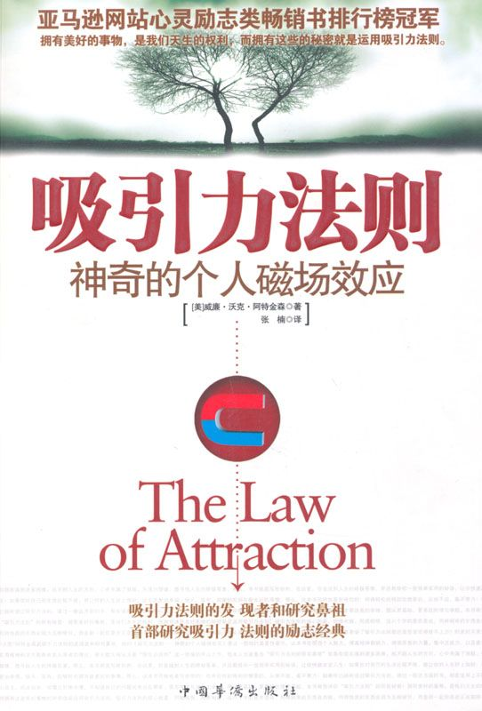

# 吸引力法则：神奇的个人磁场效应

前言

吸引力法则：一个埋藏千年的秘密

吸引力法则这个说法，尽管被很多的作家广泛应用，但并没有一个一致的定义。然而，在“新思想主义者”（新思想主义是 19 世纪末到 20 世纪初美国发生的一场思维运动，主要发起者为当时的心理学家、作家和医生等，影响非常广泛）眼中，普遍的共识是吸引力法则，意思为“相似的吸引相似的”，并把它应用到有意识的渴望中。就是说：一个人的思想（有意识的和无意识的）、感情和信念会引起物理世界的变化，即吸引与上述思想一致的积极或消极的经验，且通过或不通过行动获得这样的经验。这个过程一直被描述为“吸引力法则的和谐共振”或“你获得你所想的；你的思想决定你的经历”。

这个说法与新思想的信念和实践紧紧相连，它最普遍的定义从其中产生，但它也在其他深奥的领域如神秘主义和神学中长期有效（并得到更复杂的发展）。近来，新思想运动在 100 年前的观念通过 2006 年的电影《秘密》而重新大为流行。

物理世界不通过任何物理作用而能改变的观念一直遭到批评。因此，科学界举出法则这个科学词汇的误用和倡导吸引力法则者及一些新思想运动和精神性广泛支持者所作的声明缺乏科学证据。

其实，吸引力法则背后的观念并不新鲜。这个观念可以在印度教中找到。由于印度教在神学上的影响，它在早期的神学教程中也提到。在 1877 年，“吸引力法则”被赫勒娜·布拉娃特斯琪（Helena Blavatsky）在她第一本关于深奥的神秘学说的书——《揭开伊西斯的神秘面纱：古老智慧传统的秘密》中提到。在 1902 年，一个与吸引力法则相似的原理，但不叫这个说法，在詹姆斯·艾伦写的《像一个人那样思考》中被提到。这个题目来源于古代的《犹太箴言书》第二十三章第 7 句：“一个人在他的心里怎么想，他就怎样。”

真正研究吸引力法则的鼻祖是威廉·沃克·阿特金森，在他的新思想主义书籍中第一次运用这个说法，即《吸引力法则——神奇的个人磁场效应》。阿特金森是《新思想》杂志的编辑，信奉印度教，是一位印度大师的学生，还是 100 多本各种各样关于宗教、神灵和神秘等主题书的作者。接下来，“吸引力法则”这一概念在当时很多的作家、心理学家的著作中得到广泛的介绍，如华勒斯·华特斯的《失落的百年致富圣经》、查尔斯·哈尼尔的《硅谷禁书》、罗伯特·柯里尔的《秘密》系列丛书、拿破仑·希尔的《思考致富》等著作都对“吸引力法则”进行了大量的阐述。

到 20 世纪中期，并持续到 21 世纪早期，不同的作者在一个术语范围内阐述这个主题，诸如积极思考、精神科学、新思想、实用形而上学、心理科学、宗教科学和神圣科学等。

2006 年，一部建立在“吸引力法则”的基础上、名为《秘密》的电影得到发行，进而发展为一本同名的书籍。这一成功的电影和书籍在美国的媒体上得到广泛的关注，从《星期六夜生活》（Saturday Night Live）到《奥普拉·温弗瑞脱口秀》（The Oprah Winfrey Show）都报道了这一现象。2006 年 9 月，一本埃斯特·希克斯（Esther Hicks）写的名为《吸引法则》的书上了《纽约时报》（New York Times）的畅销书排行榜。也是在 2006 年，演讲家贝斯（Beth）和李·麦克采恩（Lee McCain）出版他们的书籍《感激生活：活生生的吸引力法则》；该书成为一本畅销书，紧接着他们收到演讲邀约，并在《奥普拉和朋友》（Oprah and Friend）XM 广播节目中接受采访，其中他们把他们积极的职业道路的转变归因于吸引力法则。

许多接受吸引力法则作为正确生活的指导的人们，以他们对宇宙和宇宙法则的信念为基础；正是如此，对于他们，法则的本质不是科学地被安置，“法则”这个词带有同样的信念基础，就像来自其他非科学的“律令”那样有价值，例如“因果法则”和十条戒律。在那些遵守各种新思想的人中，这尤其正确。新思想主义者遵循的一个普遍方法是，通过积极的断言练习来应用吸引力法则。

一些更现代的吸引力法则研究者宣称，它（吸引力法则）在量子力学中有科学根基。他们认为，思想具有一种吸引相似能量的能量。为了控制这种能量，人们必须练习四件事：

1．知道一个人渴求什么，并要求宇宙为它服务。（“宇宙”被广泛提到，说明它可以是个体所想象的任何事物，从上帝到不知来源的能量。）

2．带着巨大的情感如热情或感激之情把一个人的思想全部集中在所渴求的事物上。

3．像所渴求的目标已经实现那样感觉和行动。

4．开放地接受它。

一个人如果时刻想着一个人所没有的，它自然会在现实中得到相同的结果，如果一个人遵循这些原理，并避免“消极的”思想，宇宙一定会显现出一个人的渴求之物。

这个四步骤的清单（不确定来源），用准科学的术语表达，类似于米尔德雷·曼在《成为你所相信的》的书中第一次概括的“示例的七步骤”的影响：

**渴望。**

对你在你的生活中所想要的怀有强烈的热情，对一些现在还没有的事物真正渴求。

**决心。**

明确地知道你想要什么，以及什么是你想做或拥有的。

**要求。**

（在确定和充满热情的时候）用简洁、明确的语言要求得到它。

**相信。**

有意识和无意识地带着强烈的信念相信得到它。

**工作。**

为它工作……每天几分钟，看见你自己在已经完成的图景中。永远不要概述细节，但要看到你自己正享受着特定的事情……最终，你会看到在某个时刻它恰好出现，作为一个礼物或类似的东西，或者你将看到一个机会来获得你正在要求的。

**感激。**

总是记得说，“谢谢！”并开始在你的心里感觉到感激之情。如果我们真正感觉它，那么我们所做过的最强有力的祈祷，就是这三个单词。就像你已经得到你所想要的那样来感觉。

**期待** 。

训练你自己生活于一种幸福的期待状态中……找到一种使它出现在你的生活中的方法，并对之保持信心。或许是某些人把它送给你，或者你找到一个启发来获得它。

不管我们如何从科学的角度去验证“吸引力法则”的正确性格，事实上，这一法则一直存在，就像牛顿在发现万有引力定律之前，万有引力定律也一样存在一样。

本书是“吸引力法则”领域最早的一本著作，也是最权威的著作。对我们每个人都具有不可估量的价值。如果你现在遇到诸多困难，找不到人生的方向，心中充满了消极、失落的情绪，想寻找人生的终极答案，那么，本书就是写给你的，在这里，你会找到人生的终极答案，并且教给你一些简单实用的秘诀，让你快速改变人生！

如果你对自己的生活比较满意，想让你的人生好上加好，让生活更加幸福、快乐、富有，能够轻松拥有最美好的事情，那么，这本书同样也是写给你的！你将轻松地得到你想要的，从容不迫、毫不费力！

如果你已经听说过吸引力法则，读过一些这方面的书，却在运用上不那么顺心自主、回旋自如；似懂又好像非懂，不知道自己的问题究竟出在哪里，要怎样才有改善的余地，想从更基础、更系统的理论学起，本书将告诉你“吸引力法则”的所有秘密！

关于作者和本书

威廉·沃克·阿特金森生于马里兰州的巴尔迪莫尔，他于 20 岁那年起开始经商，32 岁时被宾夕法尼亚法庭录用为律师。尽管他的律师职业给他带来了物质上的富足，然而强大的精神压力和过度的精力消耗最终令他精疲力竭。

这段时期，阿特金森遭受了生理和心理上的双重重创，加上他在财政上的重重危机，他整个人几近崩溃。于是，他试图寻求治疗。他发现了一本《新思想》期刊，并从中找到了绝佳的疗伤方法。

阿特金森康复后不久，便开始在那本期刊《新思想》中发表文章。这本期刊后来更名为《精神科学》。不久，他写的一篇命名为《精神科学教本》的文章刊登在了这本期刊上。

一年后，阿特金森成为了《新思想》的一个副刊《建议》的副总编辑，完成了他的第一本书《吸引力法则》。之后，他又遇见了《新思想》的知名出版商西德尼·弗劳尔。他们两个人开始通力合作，阿特金森出任《新思想》的总编辑，在这个位置上，他一直做了 5 年。

阿特金森在《新思想》上发表了许多作品，这些作品在《新思想》忠实的读者群，尤其是医生和律师中广受欢迎，影响颇大。艾特金森的名气也被广泛地流传开来。

《吸引力法则》是作者的第一本书，更是“吸引力法则”领域的最早著作和文献，可以说是“吸引力法则”的开山之作。这本书在塑造个人魅力、提高精神影响力、增强思想的力量、集中注意力、培养意志力，以及实用精神科学方面都有发人深省的见解。

在这本“新思想”的经典著作中，阿特金森专注于思想世界的吸引力法则。他指出万有引力法则和心理吸引力法则之间的相似性。他解释说，思想振动波就像那些表现为光、热、磁和电的波一样真实。不同之处只在于振动波的频率，这也阐明了思想波通常不能被我们的 5 种感官感知到的事实。

他说明在光和声音的波谱中存在一个巨大的波动空间，该空间宽阔得足以包含其他世界。这些空间里的波动将被与它们协调的感觉器官感知到，这是符合逻辑的。更加精细的科学仪器能够记录越来越多的这些隐藏着的频率。

在消极和积极的思想波之间经常有着相互作用——个体的任务就是通过意志的作用来把他们心理的主要振动频率提高到一个积极的程度上。阿特金森从两方面讨论断言的目的：首先，建立一个新的心理态度，第二是提高心理波的主要振动频度。他也提到，在释放表达和吸收印记之间必须有一个可以接受的平衡状态。

许多心理的功能被发现和讨论，作者宣称意志力之流沿着精神导线强烈地流动着，但个体必须训练，以便最好地接通这个能量的源泉。“我”是心理的主人，“意志”是“我”的工具。用来内化这种洞察力的断言在这里获得提供。

阿特金森也说明怎样克服消极的情感，如恐惧、焦虑、嫉妒、愤怒和仇恨。他坚决相信宇宙法则在一切环境中运行，并建议读者使自己与这些法则相协调。我发现宣扬生命力量和训练心理习惯的章节尤其有用和令人振奋。

尽管这本书写于多年以前，但其内容依然听起来新鲜和属于当代。其中对“吸引力法则”的解释及过程非常清晰，各种训练相当简单和实用。作者极具感染力的乐观主义和他简明、直接的表达方法深深地吸引了无数的读者。

如果谁还没有读到这本书的精华，那么你正在错过一件真正美好的事物。对于如何运用“吸引力法则”，阿特金森阐述得极其精彩，如怎样永远不反抗进入你心里的消极、对立的想法，以及怎样只需集注到你所想要的事物上。而且，在必要的地方以幽默但像话家常一样的方式进行了极好的解说。

他阐述的最重要的理念是，他强调把你的能量投入到唯一的目标上是多么重要，对于它，在你的注意力上永远不要动摇，他运用类似情人调情的方式与其他人挑逗，而不是与他或她的同伴。

如阿特金森对忧虑的论述：“你不必与忧虑斗争——那不是战胜习惯的方式。只需练习专注，然后学会集注到一些恰恰在你面前的事情，你将会发现忧虑的想法已经消失。有一些比与之斗争更好的克服对立思想的方法。要学会集注到一种具有相反特征的思想上，接着你会发现问题已经解决。”

对于如何消除恐惧，阿特金森指出：第一件要做的事是开始“切除”恐惧。恐惧思想是大量不幸和许多失败的根源。你已经被告知这种情形一遍又一遍，但它还将继续重复。恐惧是一种被消极思想强加在我们头上的心理习惯，但通过个体的努力和坚持，我们可以从中获得自由。他指出，我们要选择“勇气”而不是恐惧……因此，不是重复说，“我不害怕，”而是大胆说，“我充满了勇气”，“我是勇敢的”。你必须宣称，“没有什么可害怕的”，这样，尽管在本质上也是否定，但与其简单否定导致恐惧的客观事实，不如承认恐惧自身，然后否定它。

正如一位读者所说：这本书将改变了你的心理程序，安装上什么是你所想要的，而不是你所不想要的模式。

你是否正在期待一本系统化讲解吸引力法则，有助于你从底层学起，系统化学习其理论和应用的书？你是否学了吸引力法则却还是常常觉得使不上力？时灵时不灵？那么，从本书开始吧！

第一章
思想世界的吸引力法则

宇宙由一个法则来统治——一个伟大的法则。它的表现形式是多样的，但从根本上来看，只有一个法则。我们对它的一些表现很熟悉，但对其他的某些表现几乎浑然不知。现在我们依然每天了解更多一些——面纱正逐渐被揭开。

我们很随意就谈到万有引力法则，然而忽略了同样令人惊叹的征象，思想世界的吸引力法则。我们对吸引且维持构成物质的微粒结合在一起的法则所表现出来的奇妙现象很熟悉——

我们认识到吸引物体到地面和维持圆周世界有序运行的法则的力量，但我们对吸引我们渴望或恐惧的事物，以及建造或毁坏我们生活的强大法则闭上了眼睛。

当我们渐渐明白思想是一种力量——能量的一种表征——具有一种磁性——就像吸引力，我们就开始理解为何迄今为止许多事物对我们来说似乎是隐秘的。没有任何研究像对这个思想世界伟大法则——吸引力法则的运行之研究可以给学生投入的时间和努力带来这么好的报偿。

当我们思考时，我们会传送出一种美好精妙的物质之波，它们就像体现为光、热、电和磁的波那样真实。这些波对我们的五种感官不明显并不证明它们不存在。

一块强大的磁石会放射出波，并施加足够的力量来吸引一块一百磅重的钢铁到它自身，但我们既不能看见、品尝、闻到、听到，也不能感觉到这种强大的力量。

同样的，这些思想波，不能看见、品尝、闻到、听到，也不能以通常的方式来感觉到；尽管有记载案例说感官特别灵敏以致通灵的人已感知到强大的思想波是真实的，以及我们之中的很多人能够证实我们曾本能地感觉到他人的思想波，包括近在眼前和相隔遥远距离的传播者。心灵感应及其相似的现象不是徒耗时间的白日梦。

表现为光和热的波，其强度远远低于思想波，唯一的不同只在于波的频率。科学的记载在这个问题上投入了一线有趣的曙光。伊利沙·格雷教授，一位著名的科学家，在他的小书《自然的奇迹》里说：

“有大量资料可以作为依据来推测，在思想里存在着人类的耳朵听不到的声波，和眼睛看不见的有色光波。长远、黑暗、无声的空间，波的频率在 40000 赫兹和 400000000000000 赫兹之间，还有无限的空间范围，波的频率在 700000000000000 赫兹以上，在这里光便停止。”

M·M·威廉斯在他题为《科学上的简短篇章》的著作中说：“在使我们产生声音感觉的最快速的波动或振动和最慢的、给我们唤起最轻微的温暖感觉的那些波之间没有等级。在它们之间有一个巨大的间隔，宽广得足以包含另一个运动的世界，一切存在于我们声音的世界和我们热与光的世界之间；没有任何的合适理由假定物质不能进行这样中间状态的活动，或这样的活动不能引起中间状态的感觉，如果有器官来感受或感觉它们的运动。”

我引用上面的权威论述只是给你提供资料来思考，不是试图给你证明思想波存在的事实。名字后面标明姓氏的事实已足够让这个课题的审查者感到满意，只要进行一点思考，你就会明白它与你的亲身经历相吻合。

我们经常听到众所周知的精神科学的陈述，“思想就是事物”，我们嘴里说这些话，却没有明白地意识到这个陈述的确切含义。如果我们充分理解这个陈述的真实性及其背后带来的自然结果，我们将会理解许多对我们觉得隐晦难懂的事物，而且能够运用这种令人惊奇的力量，思想的力量，恰如我们运用其他任何的能量形态一样。

正如我已经说的，当我们思考时，我们便开始放射出一种强度非常高的运动波，恰如光、热、声和电的波一样真实。当我们理解支配这些波产生和传送的法则，我们就能在日常生活中运用它们，就像我们更好地理解能量的形态一样。我们不能看见、听到、称重或测量这些波，这并不证明它们不存在。有不少波是人类的耳朵所不能听到的，但这些波的一部分无疑是被一些昆虫的耳朵注意到了，而其他的波则被人类发明的精密的科学仪器捕捉到。然而，在被最精密的仪器注意到的声波和人类心理可感知到的声波限度之间有一个巨大的间隔，依此类推，可知声波和一些其他形式的波之间的分界线。同样，也有人类的眼睛不能注意到的光波，其中一些可能被更精密的仪器觉察到，而许多更为纤弱的光波，能觉察到它们的仪器还没有被发明出来，尽管每年都获得不断进步，以及尚未探索的领域逐渐减少。

由于新仪器被发明出来，因此新的波被它们注意到——然而仪器发明之前，波还是像仪器发明之后一样真实。

假如我们没有仪器用来测量磁力——那么，一个人否认这种强大的力量很可能被认为是正当的，因为它不能被品尝、触摸、听到、看见、称重和测量。可是，这种强大的磁石仍然传送出足够的磁力波来吸引几百磅重的钢铁。

每一种形式的波需要符合它自己形式的仪器来检测。目前人脑似乎是唯一可以注意到思想波的器官，尽管神秘主义者说，在这个世纪科学家将会发明出足够精密的装置来捕捉和记录下这样的思想感觉。而且，从目前看来，这种发明终究有望在任意的时刻实现。既然有需求存在，无疑不用多久就会得到满足。但对于那些已经沿着实用的心灵感应线路进行实验的人，没有比他们自己实验的结果更进一步的证明。

我们所有时候都传送出强度或大或小的思想，同时我们收获这些思想的结果。不仅我们的思想波影响我们自己和别人，而且它们有一种吸引力——它们吸引别人的思想、事情、环境、人群和“幸运”到我们这里，而吸引来的这一切与我们心里最重要的思想特征相一致。

爱的思想将给我们吸引来别人的爱；与这种思想相一致的环境和周围的事物；喜欢这种思想的人们。恼怒、愤恨、嫉妒、恶意和猜疑的思想将给我们吸引到从别人那里散发出来的恶臭的相似思想；我们所身处的环境将被邀约来证明这些糟糕的思想，而且我们也接受来自别人的同样糟糕的思想；还有表现得不和谐的人们；如此等等。一种强烈的思想或持续长久的思想，将使我们成为吸引别人相应思想波的中心。在思想的世界里，同类相吸——你怎样播种，将怎样收获。

在思想的世界里，同一种羽毛的鸟飞到一起——像小鸡一样诅咒不停的人走到一起居住，并带来他们的朋友。

充满爱的男人或女人在所有方面都看见爱，而且吸引来别人的爱。满怀愤恨的人只会得到一切他所能承受的愤恨。想着战斗的人，在他获得通过之前，通常不得不面对所有他想要的战斗。道理就是如此，每一个人都会通过心理的无线通信而获得他所召唤的。早上起床感觉“易怒”的男人，在早餐吃完之前常常想方设法使全家人处于同样的情绪状态。“唠唠叨叨”的妇人，一般整天都会找到足够的事情来使她的“唠叨”习性感觉愉悦。

思想吸引是一件重大的事情。当你停下来思考它，你会明白一个人确实制造了他自己的环境，尽管他把原因归咎于别人。我已经了解到，掌握这个法则的人持有一种积极、平静的思想，而且绝对不受他们周围不和谐环境的影响。

他们就像装满油的容器被注入烦人的水——当风暴在他们周围肆虐，他们还是安然平静地歇息。一个懂得这个法则运行之道的人是不会任由一阵阵思想风暴摆布的。

我们已走过躯体力量的时代，进而来到智力至高无上的时代，现在正进入一个全新和几乎毫不知晓的领域，那就是精神力量。这个领域的能量有它的建造法则，正像其他领域的一样，而我们应该让自己熟悉它们，否则，我们将由于在努力层面上的无知而陷入困境。我会努力为你顺利掌握关于这个新领域能量的伟大潜在原理而铺平道路，这些能量正在我们面前敞开，你可以充分利用这种伟大的力量，将它用于合理且有价值的目标上，就像今天人们应用蒸汽、电和其他形式的能量一样。

第二章
同类相吸、异类相斥

就好像一块被抛入水中的石头，思想也能在我们的头脑中激起一重又一重的波纹和浪花，它们会在思想的汪洋大海中荡漾、扩展，直到遍布我们的整个头脑。但是，头脑中的浪潮和大海中的浪花又存在这样一个显著的差异：

不管向多少个方向扩散，水中的波纹只是处于一个平面上；然而，思维的波纹却是从一个中心向四面八方扩展——就好像太阳发射出的光芒一样。

我们现在都知道，当我们站在地球上时，我们无时无刻不被浩如汪洋的空气包围着；可是我们不知道的是，同样的，我们也无时无刻不被我们思想的汪洋包围着。而我们思维的波纹就在这片精神的大海之中扩展、飘摇，只不过，像我刚才强调过的：这种扩散是向四面八方各个方向同时进行的。如同水中的波纹一样，这种浪潮会随着距离上的增加渐渐削弱。造成这种情况的原因在于，我们的思绪彼此之间的联系、牵制和阻碍，以及包围着它们的思维海洋对它们的摩擦、阻塞，这一点和波纹在水中受到的阻力是一个道理。

这些思维浪潮还具有其他一些水波所不具有的性质。首先，它们具有“自我繁殖”的能力，在这一点上，它们和声波的共同之处更大。这就好像小提琴奏出的音符能让薄玻璃杯跟着颤抖，甚至“唱起歌来”；同样的，一个强大的思想也能引起我们内心深处思想的共鸣，不管它们曾经被深埋了多久。很多时候，他人的强烈的思想，能让我们自己许多散佚已久的想法重又浮现。但是，除非和我们自身的思想合拍，否则，再强烈的思想也无法让我们产生共鸣。如果我们全身心地投入到对一个正确想法的思考中去，我们就能为我们的思想定下一个基调。这个基调一旦得到确立，我们就能很容易地和他人类似的想法产生共鸣。截然不同的，如果我们养成了按错误的方式思考的习惯，我们就不得不面对成千上万的反对者，而我们思想的浪潮在传播的过程中，也会遭到这些人的围追堵截。

从很大程度上来讲，我们希望自己是什么样的人，我们就会成为什么样的人；而我们，就在自己想法的独木桥上，借助别人的建议和思想努力保持着平衡。

这些建议和思想，有些时候是由别人直接告诉我们的，在另外一些情况下，它们就是用我们刚才说的那种“思想电波”的方式影响我们的。不管是别人传达给我们的思想，或者是我们自己正在发射的“思想电台”，归根结底，它们都是由我们精神上的态度所决定的。我们只会选择和我们精神态度协调一致的思想进行接收；而那些和我们的态度相悖的想法对我们的影响微乎其微，原因在于：这种想法根本无法唤起我们思想上的共鸣。一个坚持相信自己的力量，具有强烈的自信和决心的人，即使整日和一个沮丧绝望的人呆在一起，也绝不会受到他散播出来的这些负面想法的影响；但是，在同样的情况下，如果把我们的主角换成一个思想上倾向于灰暗的人，这些想法无疑会加重他绝望颓废的情绪，如果说绝望的火焰正在吞噬着他的力量，这样的结果无异于火上浇油，或者，让我们换个你更喜欢的比喻：这样的结果，熄灭了这个人激情和活力的火焰。

我们内心的想法能吸引其他具有类似想法的人。

譬如说：一个内心充满了对成功渴望的人就会很容易和有类似想法的人产生共鸣，而这种共鸣，会让他们互相吸引，并且最终走到一起，而当他们在一起的时候，他们会为了共同的成功一起努力，互相帮助。而那些时常让自己的心灵徘徊于失败的阴影的人，只能吸引同样绝望的“失败的”人，而当他们在一起的时候，他们只会一起滑向更深的失败。

对世界充满了绝望的人，一定能看到更多的绝望，而他遇见的人，似乎都是为了证明他的看法是多么的正确。可是，一个认为生活中充满了美好的人看到的却是另外一番景象，他看到的事物都是那么的美好，他遇见的人都是那么的乐观……事实上，我们怀着什么样的心看世界，我们眼中的世界就是什么样子的。

也许试着这样想可以让你更好地理解这种现象：对于无线电报接收机来说，虽然我们周围的环境中充斥着各种各样的无线电码，但是，只有那些由对应的发射机发射的，和接收机具有相同频率和密码的电波才会被分拣并接收，与此同时，其他的电波就这样消失在空中了，而不会对我们的正常使用造成任何影响；而我们的大脑，就是这样一台“马可尼电报机”，所以这种法则同样适用于我们的思想。我们只会接收那些同我们的精神频率调和的信息。如果我们有一天遇到了无法逾越的障碍，开始变得气馁，我们有可能就此被困在消极的情绪中无法解脱，甚至越陷越深。造成这种结果的原因是多种多样的：要知道，当我们气馁沮丧时，我们自己的思想本身就会让我们萎靡不振，可是这并不是最糟糕的。这个世界上的大多数人并没有学过我们关于“心灵电波”的理论，所以他们并不知道自己对别人有着怎么样的影响力；但是事实上，当我们情绪低落时，我们也就吸引了更多情绪低落的人，而他们的坏心情，会向我们的头脑“发射”沮丧低落的电波，这些影响，会让我们的心情越来越低落。可是这时候，如果我们的情绪在偶然之间变得热情洋溢、活力四射，很快的，我们就能感觉到我们周围那些具有积极向上心态的人们散发出来的热情：那些勇气，那些活力，那些欢欣的情绪，那些积极的思想……他们就在我们的周围，无时无刻不在，他们一直都欢快的流淌着。现在，我们可以说：当我们和其他人建立起精神上的联系，清楚地感觉到他们的“思想浪潮”时，不用费什么周折我们就能意识到他们的情绪——不管是压抑还是鼓舞——我们都能很快意识到。但是，实际上，即使不在我们周边的人也能和我们建立情绪上的感应——虽然远没有那么强烈。

我们的情绪是非常多样化的，从最积极最活力充沛的情绪，到最消极最低落沮丧的情绪；当然，更多的时候，我们的情绪都是处于这两者之间的，具体的程度取决于我们和这两种极端的距离。

当你的头脑沿着一条积极的轨迹运行时，你会感觉自己强壮、轻松、聪敏、愉悦、快乐、自信、勇气十足，这个时候，你感觉自己能胜任任何工作，你自信一定能实现自己的想法，这个时候，你会在通往成功的路上大踏步的前进。你就像一台功率强大的发报机，不停地发射着积极向上的信号，这些信号会吸引其他积极进取的人们，让他们与你展开合作，或是追随你的领导——具体会采取什么样的做法取决于他们自己的思想基调。

但是，相反的，如果你的头脑滑向了消极的一端，你只会感觉沮丧、虚弱、被动、迟滞、怯懦、退缩。这种时候，你会发现自己根本没办法取得更大的进步，更不用说获得成功了。这种情况下，你对他人的影响也降到了零点。你只能屈从于其他人的领导，而不要妄想去领导其他人，更糟糕的是——你成了那些活力充沛的人的垫脚石，甚至被他们当成皮球一样踢来踢去。

在有些人身上，你能看到积极的因素占了主导地位；可是在另外一些人身上，消极的因素很明显占据了优势。很显然的，在我们每个人的身上，积极和消极的因素是在不停地改变着的，而这种改变无论从程度或是范围上来看都有可能非常的大，举个例子：同一个人张三，他有可能和李四在一起的时候很积极，同时，却和王二在一起的时候很消极。两个陌生人第一次见面时，通常情况下，都会有一场精神层面上的交锋，这场交锋静默无声，却激烈异常，两个人先是相互试探，试探对方的信心和决心，并且最终通过这场交锋确定他们之间的关系以及地位。这个过程在很多情况下都未被我们察觉，但是，它却是实实在在存在的。这个调整的过程经常都是无意识的进行着的，虽然如此，这场斗争有些时候却是如此尖锐——他们之间的竞争太过火爆——在这种情况下，两个人都开始有意识的想要赢得这场竞争。有些时候，竞争的双方都全力想赢得这场竞争，而他们俩恰巧在信心上也旗鼓相当，那么，他们都不会在精神上作出妥协，这两个人将永远不可能正真和谐地相处，他们最后的结局将不外乎因为不可调和的矛盾而分开，或是永远都生活在争吵和煎熬中。

我们对周围每个和自己有关系的人的态度无外乎积极或是消极。我们可能会以一个积极向上的态度对待我们的孩子、我们的员工或是那些依赖着我们的人；而与此同时，我们又会以一种消极的态度对待那些让我们感到自惭形秽，或是让我们感到没有安全感的人们。当然了，有些时候，因为某些特定的原因，我们会忽然对一个本来一直让我们报以消极态度的人积极起来，这种情况也不是不可能发生。事实上，我们经常能见到这种情况。而且，随着我们关于精神法则的知识得到越来越广的普及，我们将会看到越来越多的人学着运用这项新兴知识的力量，并且因为掌握了这门知识开始能够灵活地掌控对别人的态度。

请你记住，有一种力量能让你的情绪电波的基调得到全面的提升——提升到一种积极进取的状态，而只要你愿意拥有这种能力，你就可以做到这一点！

既然我们提到了这一点，相应的，你也应该明白，如果你的意志不够坚定，或是你自己不够用心，那么，你的情绪也完全有可能坠入一种消极低落的基调中。

这个世界上，心情低落，精神消极的人总是比开拓进取，精神处于积极层面的人要多；而正是因为如此，在我们头脑电台运转的过程里，它始终处于一种消极电波占据优势的环境里。但是，对我们来说，幸运的是，积极的电波里包含的力量要远远比消极的思想里所具有的力量大得多，这种差异，在很大程度上平衡了它们数量上的不平等。所以，如果我们能够依靠意志的力量让我们的精神电波爬升到一个更高的基频上，我们自然就能够屏蔽掉那些消极抑郁的情绪，同时，被我们自己改变的“头脑电台”的频率还能帮助我们接收到更多具有强大力量的积极的讯号。其实这是一个秘密：某几个研究如何运用自我激励和自我暗示的精神力量的精神科学学校以及另外一些新思想信徒所保有着几个心灵的秘密，这个秘密正是其中之一。

自我激励本身其实并没有什么特别的优点，但是它们却能为我们做到以下两点：

（1）它们能重建我们的精神状态，而且它们能让我们重建自我的工程——也就是重新塑造自我的性格——按一个良好的方向发展。

（2）它们能帮助我们把自己精神的基调提升到积极进取的状态，而正如我们曾经一而再再而三强调的，当我们的精神基调处于积极状态的时候，我们接收到精神处于良好状态的人发射出的讯号的可能性将会大幅增加。而且，不管是不是真的相信它的作用，我们还是会经常对自己进行精神催眠。如果一个人对自己进行暗示，暗示他一定能做好一件事——不是偶尔为之，而是长期的进行这种暗示——渐渐的，他那些有助于这件事的成功的能力会得到培养；与此同时，他还把自己头脑的“频率”调到了最合宜的“波段”，在这个“波段”，他最有可能接收到那些能帮助他成功的讯息。如果做到了这些，他离成功还远吗？可是，反过来说，如果一个人每天念叨的都是“我成功不了”，那么，首先，他就把自己潜意识里那些本来能帮他解决难题的因素扼杀在襁褓之中了，他窒息了自己的想象力和创造力；与此同时，他的头脑现在和那些失败的信息“调频”了，更糟糕的是，在我们的身边到处散布着的都是这种信息。结果会怎么样还用我告诉你吗？

永远不要让你的内心被这一类不利的、消极的思想侵袭，要小心，它们遍布我们周围的每个角落。你要做的就是把自己的心灵移居到更积极，更高层次的居所，同时，你应该把自己的头脑调整到更坚强的频率，只有做到这些，你才能远离那些不利的讯息，远离那个消极的思想层面。

到那个时候，你将不但可以对那些消极的信息免疫，更重要的就是，你将会和那些坚强、积极的思想建立联系，而这不正是渴求成功的人最渴望得到的吗？那么，到现在为止，我们的目的明了了，我们想做的是：训练你合理的运用你自己的思想和意志。如果你能做到这一点，那么，你将能够把自己的命运牢牢掌握在自己的手里，你会发现你具有了让自己的情绪随时积极起来的方法，而且，你将常常能够用到这个方法。但是，我们也没有必要在所有情况下都追求极端的完美。更好的解决方法是让你自己保持适当的状态，千万不要让自己过分紧张，

你要做的是：掌握一种方法，一种能让你在需要的时候立刻调动自己的神经，让它们处于合适的状态的方法，只要你能做到这一点，这就足够了。如果能够掌握这些知识，你就能够在让自己的头脑保持轻松的同时，让自己随时对情势处于自己的掌控之中。

意志的成长和我们对肌肉的锻炼非常类似——它们都需要不断地进行锻炼，而且，都是一个循序渐进的过程。在刚开始的时候，这个锻炼的过程可能会很枯燥，但是，随着练习的不断深入，你会渐渐变得越来越强壮，直到最后，你会发现自己的力量的的确确得到了锻炼，变得更强大而且不再会衰退。大部分人只有在别人要求或是有其他情况的时候才会突然紧张起来。我们通常习惯于在形势所迫的情况下才“痛下决心”。但是通过合理的练习，你会发现自己的头脑得到了极大的强化，以前那些让你觉得习以为常的情况会变得有些不同，你会发现自己能试着避免“临时抱佛脚”的情况，渐渐地你发现能依靠自我激励让自己随时保持“斗志昂扬”的状态，一旦做到这点，你会发现自己已经站在了以前连做梦都没想过的舞台上。

请不要把我理解为鼓吹让你的精神时刻高度紧张的人。只做到这一点是远远不够的，你会发现我们不但要学会让自己的精神紧张，在很多时候我们还要学会时常给自己减压，将自己身上的压力消弭于无形。能够学会放松身心并且具有一定程度承受压力的能力对我们来说是再好不过的事情了，只要做到这几点，你就总能够依靠自己的意志力量从巨大的压力中振奋起来。总是习惯性的保持亢奋的人会失去许多生活的乐趣和消遣。亢奋的时候，你能对别人给出许多建议；善于倾听，你才能从别人那儿获得有用的建议。亢奋的时候，你是“老师”；倾听的时候，你是学生。做一个好老师固然是件好事，但是有些时候，做一个好的倾听者也非常的重要。

第三章
关于头脑的讨论

人类不只拥有一颗头脑，他们具有众多的精神能力，而这其中任何一个能力在我们的精神上都有着两方面完全不同的作用。但是这两个方面的能力之间并不存在一个明显的分界线，它们之间水乳交融，渐渐演变，如同光谱上的颜色一样。

我们的精神上的主动努力能转变为能力上的进步，实际上，我们精神能力上任何一次进步必然是由一次精神上的努力推动的。而我们精神能力上一次被动的进步则有可能是我们前述任一个原因造成的，而且，有可能和我们主动取得的进步具有完全相同的诱因；取得主动的进步另外一种方法是：多接受别人的建议。思想的电波来自于其他人的头脑；思想还能由我们的祖先遗传给我们，这是由自然界中的遗传法则决定的（从人类起源的上古时代开始就由每一代人薪火相传的思想，对我们现在的思想也有推动作用，而这正是这个法则中所包含的内容，这种推动作用刚开始的效果并不明显，它是在我们数亿年的进化中，一点一点显露出来的）。

主动的努力崭新的如同刚从造币厂里被铸造出来的硬币，而与此同时，被动的成就跟它比起来就显得缺乏创造力，而且，实际上，被动的成就常常是很久很久之前偶尔的精神冲动带来的波动造成的。积极的努力会开辟自己成功的道路，一路上他会披荆斩棘，推开拦在路上的障碍，踢飞绊脚的石头……

任何事情都无法阻止它。而被动的努力只会沿着前人铺就的道路前行。思想上——或是行动上的——冲动，通常都是由主观的努力推动的，这种冲动有可能被坚持下来，成为我们的习惯，甚至是本能，这种由主观的努力推动的冲动有可能成为一种强大的动力，这种动力能让我们把这种行为一直坚持下去，渐渐的，转变为一种被动的行为，直至另外一种主观的冲动出现，改变了我们坚持的这一切，然后，我们会进入另外一个循环。

同样的，反过来说，思想上的冲动，或是行动上的冲动，如果是沿着被动努力的方向，那么这种冲动很有可能被我们主观意愿所阻止或是受到主观意愿的影响而改变方向。

我们精神上创造、改变和摧毁的力量都源于一个相同的源头，这个力量的源泉就是我们那些活跃的行为。我们精神上被动的行为只不过是一个执行者，它亦步亦趋地执行着我们的主动意志所做出的决定，并且严格遵守着它指定的规则，不敢越雷池半步。

我们的主观意愿让我们养成了思想上的习惯，以及行为上的习惯，更重要的是，它会给我们的身体发射精神电波，指挥他们按部就班的工作，将你思考的结果贯彻执行。我们的主观意志还具有另外一种能力：它能向外释放一种电波，这种电波能抑制我们长久以来养成的那些习惯——不管是精神上的还是行为上的；同时，它还能释放一种新的电波，这种电波的作用更强，它能帮助我们克服以前的习惯，强迫我们改变自己的头脑和身体，并且借此建立起一种全新的习惯。我们身体里所有思维应激，当然了，行动上的应激反应也一样，一旦开始了他们的使命，他们就会一直“运行”下去，直到我们的主观意志——也有可能是其他具有相同作用的能力——发射出我们前面所说的那种电波，来改变或是阻止它们的运行。在那种初始的冲动持续不断的作用下，它们的运行又被注入了新的动力，在这种情况下我们还想阻止它们的运作，这件事就会变得尤其困难。明白了这层道理我们就不难解释人们常说的“习惯的力量”了。有些时候，可能很轻易的我们就养成了一个习惯，可是想要克服这个习惯时，却发现这实在太困难了；有过这种经验的人对我们所说的这个道理有着更深刻的理解。而且，这个法则对于好的习惯以及坏毛病同样适用。人类的道德准则就是明证。

经常的，我们的几个能力会联合起来发挥作用，显现出来一个结果。现实中的任务常常要求我们不得不同时发挥几种能力的作用，而他们之中，可能既有主动培养出来的能力，也有我们早已养成习惯的行为。

当我们遇到新的状况——当然也包括新的问题——这时候就需要我们的主动反射来处理；但是，如果只是一件司空见惯的问题，或是任务，那么我们就可以只依靠已经养成的被动反射弧来处理这件事，而不必动用它那个更富有开拓进取精神的“兄弟”。

在自然界里，任何一个活着的生物体都具有一些本能上想要表现出来的行为，对于一个完整的高等生命，它所具有的本能就是不断地去追寻能满足自己机体上的需要。这种本能在有些情况下会被称之为欲望。这种“欲望”是真真正正的被动的精神应激，是由我们最初的起源就开始流传的原始动力推动的精神反应。

这种精神反应随着生命的进化历程也在完成着自己的完善和进步，在完善和进步的过程中，它不断吸取着力量。而我们进化的原始动力在推动这个反射的进化过程中还得到了更高层次的力量的帮助，我们把这种力量称为“绝对的力量”。

在植物身上，这种本能的趋势是明白可感的：我们只要去找到它们从低等到高级各个层次品种的样本放在面前，结果就再明白不过了：它们的一切活动都可以算得上是本能。我们常常把这称为植物的“生命力”。但是，同样的，一个未经发展的原始精神只会沿着我们本能的路线运作。在许多更高等的植物身上，我们能看到显现出来的“生命活动”的微弱迹象——它们开始显现出微弱的意志。植物生命学研究者记录下许多与此现象相关联的匪夷所思的现象。毫无疑问的，这就是生命体最根本的、积极的精神活动的展现。

在低等动物世界里，我们找到了一种进化程度非常高的被动的精神成果。同时，随着不同物种以及其他一些因素不同程度的改变，这种主动的精神活动会发生显而易见的改变。我们都认为低等动物跟人类相比，毋庸置疑，它们只能具有更低等的精神力量，但是，事实上，智能动物展现出来的意志力量经常能够达到较低智能的人类，或是人类儿童的水平。

对于一个人类幼童来说，在他出生之前，他的身体变化情况真实再现了人类身体进化的过程；同样对于这个孩子来说，他出生前和出生之后成长的过程再现了人类精神逐步进化的过程。

人类——这颗行星上迄今为止出现过的最高等的生命体——向我们展示了主动精神力量的最高级形式：这种形式的主动精神力量和我们在低等动物身上见到的相比，已经产生了巨大的发展和进步。与此同时，尽管同样是人类，由于各自族群个体上的巨大差异，这种精神能力存在着非常巨大的差异。而且即使是同一个种族的人类，每个个体的精神能力的差别也是显而易见的；这些区别既不取决于这个人所具有的“文化程度”，也不取决于他现有的社会地位或是曾经接受的教育程度：掌握的文化知识和对自己心理的发展能力是完全不相干的两件事。

你所能做的就是在自己周围的生活环境里努力搜寻，搜寻能让你的精神能力得到发展的方法。对于许多人来说，他们的积极的精神能力只比那些原始的被动的精神能力稍强。每个人的意志都寄托在自己的思想里，这些人展现出来的具有强大的意志力的思想寥寥无几。他们总喜欢别人为自己作出决定。积极主动的思考让他们感觉乏味厌烦，他们总是“跟着感觉走”，让自己的直觉做决定——本能作出决定要比思考得出的结果简单的多。他们的头脑永远选择阻力最小的路线前进。这种人从本质上讲和绵羊没有任何区别。

在低等的动物以及“低等的人类”身上，积极的精神能力极大程度的受限于它们物质上的能力——我们所处的精神层面上可供使用的材料越多，我们的本能所具有的能力也就越强，我们也就能更轻易地跟随我们的本能作出决定。

在我们从那些低等的生命体渐渐进化的过程中，它们逐渐将潜藏在它们身体里的精神能力唤醒，并且最终将它们发掘出来。这些能力总是披着一层“外衣”出现，这层“外衣”在形式上常常表现为我们的某些未发展的本能。然后，这些能力会逐步发展成为更高等形式的本能行为，它们将一直发挥作用，直到我们的主观积极的思想接管这一切。这种进化过程还在持续不断地进行着，它们会一直沿着把我们的主观思想推向更高的层次这个方向进行下去，在向着这个目标前进的道路上，它永远不会停歇。这个进化的过程是受我们的“最初起源”提供的持续的震荡推动的，另一方面，我们所说的“绝对力量”也对这个过程提供了自己的帮助。

这种进化的法则还在发挥着作用，而且人类开始学着发展自己思想上新的能力；当然了，这种能力最早又是以我们的本能能力的形式显现的。有些人已经把这些刚刚开发出来的能力发展到了一个相当可观的程度，如果这种情况持续下去的话，我们很有可能在不久的将来能够沿着我们的主动思想的方向来锻炼我们自己的头脑。事实上，我们已经发展出了一点这种力量。这本来是一些东方的“术士”们的秘密，知道这个秘密的，还包括一些他们在欧美的同行们。通过正确的指导，我们可以进行一些合理的练习并且借此增强我们的思想对自己意志的服从性。我们常常说的“决心的力量”，从本质上来讲其实就是对我们的思想进行训练，让它能够意识到并且发掘出潜藏在我们内心里的力量。

任何一个人的意志其实都是足够强大的，我们已经不需要对它再进行强化了。但是我们要对它们进行训练，只有这样它们才能够接收到我们意志对它的指示并且将其付诸实行。

我们的意愿其实是“我们自己到底是什么？”这个问题的答案。我们愿望的电流总是在沿着精神的线路在全力向前奔涌着；但是你必须了解让你自己的“电车连杆”和这条线路连通的方法，只有这样，你的“精神电车”抵达时才能够马上开始正常的运行。如果你总是习惯接受那些传统的精神力量的研究者的看法，那么这又将是一个和你以前接触到的理论或多或少有所抵触的观点，但是，我没有骗你，它的的确确是正确的——比以前那些研究成果更准确；如果你打算遵循着正确的方法去践行这个观点，那么最终你一定能得到让自己满意的结果，而这个结果亦将证明我刚才说过的话。

“绝对力量”对人类的吸引力一直在驱使着我们进步，而“最初起源”传递下来的波动性的力量也还没有耗尽。当人类有能力帮助他们自己的时候，人类就将迎来又一次进化。懂得这个道理的人同时也就懂得了发展自己的思想力量的方法，利用这种方法，他们甚至可以完成我们眼中的奇迹；与此同时，那些对这个法则一无所知的人们则有可能终其一生都与真理背道而驰。

那些懂得自己精神本质的人们能够很好发展自己的潜能，并且合理地运用这些伟大的力量。他们从不轻视自己本能中所具有的那些能力，他们也会充分运用好这些能力，他们会把这些能力用在最能发挥它们作用的地方；正因为如此，他们总能从它们的工作中得到最好的回报。这些人能很好的训练和掌握他们的本能，让这些本能的能力去执行他们本我的命令。如果这些能力没能很好的完成自己的任务，我们可以对它们进行引导，而且我们的知识可以保证我们不会不理智地对它们进行干扰，因此也就避免了由此引发的对我们自己造成的伤害。我们应该学会发展潜藏在我们体内的能力和本领，并且在主动和被动方面的精神活动中都能够显现出它们的力量。这样我们就能够了解到潜藏在我们身体里的那个“我”才是我们自己的主人，无论主动还是被动的本能都只不过是他进行自己统治的工具。他去除了我们心头的恐惧，并且充分享受着我们赋予他的自由。他终于找回了自我。他，最终明白了“我们自己”的秘密。

第四章
头脑的构建

人类可以对自己的思想进行构建，而且，他希望自己的头脑成为什么样子，最终就能够将它建设成什么样子。实际上，在我们生命的每一秒里，我们都在进行着“头脑构建”的工作——不管我们是不是有意识地在进行这项工作。而我们中的大多数人在进行这项工作的时候并没有意识到这一点，但是，那些能够透过事物的表面现象看待问题的人们，已经开始着手尝试着按自己的想法对头脑进行构建了，他们正在有意识地成为自己精神的设计师。他们再也不会被别人的意见和看法所左右，能做到这些，他们已经成为了自己的主人。

他们能够勇敢地向世人张扬自己，告诉人们：“我”才是主宰！更重要的是：他们能够迫使那些低层次的能力和本领听命于自己。这个“我”就是我们头脑的君主，正因为这样，我们可以说“意志”只不过是“我”的工具。

当然了，在这种说法的背后还有些别的东西：我们都知道“宇宙意志”要远高于我们自己的意志，但是我们不知道的是，跟人们通常情况下想象的相比，我们的意志和“宇宙意志”之间的交流和联系原要紧密得多；当一个人成功征服了低层次的自我，开始勇敢地向人们说出“我”时，他就开始和宇宙意志建立起了紧密的联系，而这种联系，让他开始享受宇宙意志的奇妙力量。

一旦一个人向世人宣称“我”，并且因此“找回了自我”，他就已经在“自我意志”和“宇宙意志”之间建立起了一个紧密的联系。虽然总有一天他会因为掌握了这种强大的力量而获益匪浅，但是在此之前，他必须首先实现对自己的统治。

一个人努力想要得到显赫的力量，可是与此同时他却只不过是自己精神世界中最低等的奴隶——他根本不知道究竟哪一样才是更重要的，想想你就会发现这有多么荒谬。但是这种荒谬并不少见：

有的人总是受控于自己的情绪、欲望、原始的本能，却总想着获得意志带来的裨益。我并不想蛊惑你们都成为苦行僧，在我看来，那都是软弱的表现。我只是在强调我们的自我控制力——这种能力是对“自我”的宣称，这种宣言是凌驾于我们本身那些无关紧要的事情之上的。

从更高级的视角来看，只有这个“我”是真正的自我，而其余的其实都是非我。但是在我们生活的空间里，我们是不会允许这种说法存在的，我们说“自己”这个词的时候，指的就是作为一个整体的我们本身。只有当一个人具有了完全掌控自己的方方面面，尤其是那些次要方面的问题的时候，他才能够用尽自己所有的力气理直气壮地向世界宣誓出那个顶天立地的“我”！

当我们学会控制它们的时候，任何难题都不再成为难题；但是相反的，如果我们被我们面对的问题掌握了，任何问题在我们眼里都会变成难以逾越的险阻。

只要我们还在放任自我里面处于最低地位的那些部分给我们发号施令，我们就只能做“奴隶”，做自己的奴隶。只有当“我”登上他的王座，并且真正开始行使他的王权时，他才能保证自己命令的正常运作，也只有这样，我们面对的所有繁琐复杂的问题才能变得协调得体起来。

有些人会在低层次自我的影响下左右摇摆，但我并不认为他们有什么过错——他们正处于进步的起步阶段。随着时间的推移，他们一定能克服这些问题。虽然我相信这些人一定能够成功，但还是不得不提醒他们：“我”必须按照你们“自己”的意愿发号施令，而你的身体也要坚定不移地去执行这些命令。我们接收到的所有的命令都应该是由我们自己发布的，同时应该得到完全的贯彻。所有妄图动摇这种权威的行为都应该被镇压和扼杀，取而代之的是“自己”不可动摇的权威。从这一秒钟开始，你就应该马上着手做这些事。过去，你一直在放纵你头脑里那些捣乱的反叛因素，因此它们一直阻挠着你的“国王”登上他的王座，在你的纵容下，你头脑里那些不负责任的念头一直活跃着，这些念头让你的精神王国陷入了“无政府”的混乱之中。你变成了自己头脑中那些欲望、饕餮、无意识的念头和没有任何价值思想的奴隶。你的意志会被抛到九霄云外，本能里那些低级趣味占据了心灵的王座。那么，现在，是时候颠覆这一切了：

你有能力让自己的心灵洒满阳光，你一定能克服自己的情绪、食欲、情欲或是诸如此类的思想，并且让自己的意志建立起对它们的统治。你可以让恐惧从你身上滚开，让嫉妒躲得远远的，让憎恨从你眼前消失，让愤怒自己销声匿迹，让担忧再不来困扰你，曾经不受控制的欲望和激情匍匐在你强大的统治面前，并且从骄横跋扈的统治者变成俯首听命的奴隶——这一切都要归功于“我”的统治。

如果能做到这些，你还有可能让自己从今往后都生活在勇气、爱和强大的自控力这些荣耀的词的包围之中。如果你能向自己发号施令并且督促它们贯彻和执行，哪怕只做到这一点，那么你也马上就能平定精神王国里的叛乱，让它重获和平、安宁和秩序，但是在你登上王位之前，你必须先保证自己具有了这种能力——你要先向我们展示出你统治自己王国的能力。而第一场战役，就是把低等的“自我”赶走，代之以真正的“自我”。

宣　言

我在此宣示我对自己的完全控制！

保证每小时至少有一次真挚而且肯定的重复一遍这句话，尤其是当你受到引诱想要按照低层次自我的方式处理问题，而不是严格遵循真正的自我的指示来解决问题的时候，你更应该对自己宣读这句话。当你感到困惑和忧郁的时候，坚定的对自己重复这句话，你马上就会知道自己该怎么做，在你感到疲惫，甚至昏昏欲睡的时候，把这句话多重复几遍。但是请你务必要透过表面去理解这句话里面蕴藏的内涵，而不是像鹦鹉学舌一样单调的重复。想象一下吧，在你的头脑里构建出一幅“真正的自我”建立起他对你的头脑里低层次的掌控的画面——你会很高兴看到他是如何君临天下的。

你能清楚的感觉到新的思想是如何涌进你的头脑里的，到那个时候，你会发现：

曾经看起来难以逾越的困难已经变得容易得多。你会感觉你已经把自己牢牢的掌握在手里了。这个时候，“你”就已经不再是奴隶，而成为了主宰！

你所掌握的思想会在实际的运用当中自动显现出他们的作用来；所以，你会渐渐发现自己正一刻不停地向着心目中理想的形象成长。练习把你的头脑坚定的定位在更高层次的自我，并且在你受到天性中那些低级部分引诱的时候，学会从你的目标中汲取鼓励来帮你克服这些念头。当你感到被激怒马上就要大发雷霆的时候，对自己默念“你应当坚持自我！”这个时候，你马上就能冷静下来。对于心智已经发展完备的人来说，没有什么事值得他们大动肝火。如果你感到烦恼和愤怒，坚守你的“自我”，并且想方设法超然于自己的感情之上；如果你感到恐惧，牢记“真正的自我”从不惧怕任何事情，并且努力从中汲取勇气；如果你感到自己正受着妒忌的煎熬，想想你高贵的天性，对此一笑而过，等等等等。如果你遇到诸如此类的问题，牢牢地坚守“自我”，不要让任何低层次的精神渣滓污染你的“自我”，它们不值得你那么做。你应该教会它们安守本分，呆在它们应该在的地方，绝不能允许这类事情掌控你——它们应该是你的工具而不是你的主人。你必须想办法脱离这个层次，而做到这一点唯一的出路就是切断你同那些低级的思想之间的联系。因为这些思想总能在你的头脑里找到适合它们的地方，所以在刚开始的时候你可能会遇到一些困难，但是，你一定要坚持下去，那种克服自己天性中的低等本能的快乐，只有在你坚持下来之后才能体会得到。你委身做一个奴隶的时间已经够久了，现在，是时候解放自己了！如果你能一直坚持遵循这些建议对自己进行锻炼，一年终了的时候，你会发现自己跟以前相比，简直就是脱胎换骨，而那个时候，你会带着一种略带怜悯的胜利微笑回顾你现在的生活。这些建议已经开始发挥作用了，这不是孩子们过家家的游戏，而是以严肃的态度对待生活的人们的任务，你，会接收它吗？

第五章
意志的秘密

心理学家们发展出了许多不同流派的心理学理论。所以，他们对于意志的本质，在认识上存在着很大的分歧。但是，没有一个人否认意志的存在，也没有一个人会质疑它所具有的力量。

所有人都意识到了强大的意志力所具有的力量——我们都见识过如果能够利用好这种力量，我们是如何克服那些巨大的困难的。但是，几乎没有人知道，其实通过合理的练习，我们的意志还可以得到更大的发展和强化。

很多人都说如果他们的意志足够强大的话，他们甚至可以创造奇迹，但是，他们似乎就满足于在事后发出这些徒劳无益的感慨，却从未想过怎么去发展和增强他们的意志力；他们只会叹息，却不做任何努力。

那些曾经就这个课题进行过深入研究的人们了解这种“意志的力量”，它所具备的所有潜在的可能性和强大的力量都能够由我们进行发展、规范、控制和引导，就好像自然界中其他的任何一种力量一样。你对意志力的本质有什么样的看法并不重要，只要你能坚持用这种合理的方式对他进行锻炼，最终一样能达到理想的效果。

从我个人角度来讲，对于意志力我有些不成体系的想法。

我相信每个人都具有一个潜在的强大的意志力，所以他需要做的就是训练自己的头脑学着利用这种强大的力量。我认为每个人头脑中较高层次的部分都储存着数目庞大的意志力等待他来发掘和运用。

意志力量的“电流”正沿着精神的“线路”奔腾不息，我们要做的就是把我们精神上的“导电轮”升上去，然后我们就可以按照自己的意愿使用这些强大的“能源”了。而且这种“能源”是取之不尽，用之不竭的。因为我们那颗微不足道的“蓄电池”现在已经和宇宙中的意志力量这个强大的“发电厂”连接在了一起。所以，它能提供给我们的能量是没有任何限制的。需要训练的，不是你的意志，而是你的头脑。我们的头脑是获取意志能量的工具，我们的意志所能展现出来的能量，是和我们用来取得它时使用的工具成正比的：我们使用的工具越好，我们意志的力量也就越大。但是如果你不喜欢这个理论，请把它忘了吧，我们将要进行的课程对所有的精神理论都同样适用。

一个人如果把他的头脑发展到了较高的层次，从而使得他的意志力量可以完全通过它显现出来，那么，他已经为自己开启了许多美妙的可能性。这不光是因为他发现了蕴藏在自己体内的强大力量，而且它还可以让这股伟大的力量运作起来。他将获得这种力量带给他的能力、才华、本领等等他以前做梦都不敢想的东西。意志中隐藏的这个秘密，是我们打开所有美好未来大门的魔法钥匙。

唐纳德·G·米切尔后来在自己的一份著作中写道：“唯有决心才能让一个人变得出类拔萃；而这种决心不是那种脆弱的决心，而是天性中那种纯粹的决心；不是那种游移不定的目标——而是那种坚定和强烈的意志，这种意志能征服困难和危险，就如同年轻的男孩儿征服寒冬的冻土一样。这种征服的骄傲能点燃他的眼睛和大脑——这种火焰能帮他征服那些无法逾越的障碍。意志能让一个普通人变成天才。”

我们当中许多人觉得，只要能发挥我们自己全部的意志潜力，就有可能创造奇迹。但是不知出于什么原因，我们好像并不想面对困难——不管这困难是大还是小，我们并不是真正的在运用意志的力量。我们一次又一次的拖延我们该做的事，只是含混地说“过两天”，但是，这个两天却从来没过完过。

我们出于本能就能感知到意志的力量，但是我们当中的大部分人却没有足够的能力发掘出这种力量，因此，他们一生只能随波逐流，除非遇到某些友好的困难，或是在生命中出现一些能帮助他们的障碍，再或者是一些温和的痛苦震颤我们的灵魂，让我们行动起来。以上这些情况中的任何一种都能强迫我们发挥出我们意志的能量，让我们开始努力完成人生中的目标。

有些事是我们不情愿去做的，当时这些事情却能够发掘出我们意志的力量，这些事就是我们遇到的所谓的麻烦。我们的精神从来都不够坚强。我们都是精神上的懒汉和追求面前的弱者。如果你不喜欢“追求”这个词，我们也可以用“渴望”来代替它。（有些人把那些并不是非常强烈的需求称为“追求”，而把非常强烈的渴求称之为“渴望”——这只不过是说法上的区别，到底怎么说随你的便）这就是症结的所在。这种毛病会让一个男人面临迷失在生活中的危险，而对于一个女人，她则有可能错失一段伟大的爱情——而你，则会见证意志的力量从你从未想过的源头喷涌而出。如果一个女人的孩子陷入了危险之中，你会发现她将展现出前所未有的勇气和意志力，这些能帮她战胜横亘在她面前的所有障碍，并且救出自己的孩子。但是即使是同一个女人，却会在她的飞扬跋扈的丈夫面前感到恐惧，而且也会显得缺乏表现自己勇气的想法。如果一个男孩怀有一种玩耍的态度，那么不管他面对的是什么样的任务，他都有可能把任务圆满地完成；而事实上，他可能就是个手无缚鸡之力的小孩子：强烈的渴望能带来强大的意志力。

如果你真的非常非常想完成一件事，那么你将能够不断发展自己的精神力量来帮助完成这件事。但是问题是，你常常并不是真的想要完成一件事，最后却将失败的责任推到意志的身上。你常常嘴上说着“我的确想把这件事做好”，可是如果你停下来细细的思考，你会发现自己更想做的其实是另外一件无关紧要的事。而且你还妄图不劳而获，什么都不想付出就想达到你的目的。

暂停你前进的脚步，仔细地看看这篇文章，然后对照你自己看看在你身上有没有类似的情况。

你是个精神上的懒汉——这就是问题的关键。别跟我抱怨你缺乏足够的意志力。你从一来到这个世界上就拥有足够你完成任何事情的意志力储存在身上，如果说你缺乏意志力，那就是因为你太懒了，根本没把它们发掘出来。现在，如果你真的是认真的在对待这个问题，马上开始你的工作，并且找出什么才是你真正想要的；然后你应该马上开始投入到工作中来完成这件事。

永远不要关心你的意志力量——你会发现不管任何时候，只要你需要，你马上能拥有充足的意志力量。你应该做的是：找到一件能让你下决心为此努力工作的事。

现在，我们要面对的才是真正的考验——怎么来找到这件关键的事。把我们说过的这些事都回想一下，然后下定决心到底要不要真正做一个在工作中强硬的、有决心的人。关于这个问题，前人写过许多杰出的文章和著作，而这些所有的言论都认识到了“意志力的伟大力量”——而这句话也是这些著作中用的最多的一句话。但是，遗憾的是，这些著作中却鲜有介绍如何让那些不具备这种力量的人也进入这伟大的行列，或是教那些虽然已经具有了这种能力，却在运用时受到诸多限制的人突破这种限制的方法。有些著作中教给了我们如何“增强”意志的方法，而实际上，这种练习强化的是我们的头脑，这种强化让我们能够从我们力量的仓库中获取更多的能量。但是他们大多忽略了一个事实，那就是自我暗示既然能增强我们的头脑，那么它也一定能直接作为我们开发头脑吸取意志力量的工具。

自我暗示

我正在运用我的意志力量

读完这篇文章之后，马上认真而且肯定的把这句话重复几遍。然后在以后的每一天都把这句话重复几遍，每小时至少说一遍，尤其是当你面对着要求对精神进行锻炼才能完成的任务的时候，更要多重复几遍。在你下班之后准备休息之前，也一定要记得把这句话重复几遍。现在，这句话没有任何意义，可是如果你用心品味其中的内涵，你会有不同的发现。实际上，这个思想就是“问题的全部关键”，而正是这几个词充分表达出了这个思想的内涵。所以，好好琢磨琢磨你说的到底是什么，它们到底有什么内涵。在一开始的时候，你必须全力投入自己的意志，并且相信这几个词一定能为你带来好的结果。坚定一个信念：

你正在意志能量的储藏室里吸取着能量，不久你就会发现这个思想开始发挥作用了，而你的意志力量开始自己运作了。

你会发现随着你一遍又一遍地重复这句话，力量正源源不断地流入你的身体。你会发现自己开始能够战胜以前无法克服的困难和坏习惯，你甚至会惊讶于你所面对的一切都是那么的顺利。

练习

每个月中至少有一天去尝试完成自己感到厌恶的任务。如果有一个任务让你感到万分的头疼，你一想到它就想要逃避，那么，这个任务就是你要尝试战胜的。这并不是要你做出自我牺牲或是折磨自己，也没有任何诸如此类的意味，我要求你这么做不过是想锻炼你的意志力。任何人都能够轻松胜任一件舒服的任务，但是如果想要在完成一件让人厌恶的任务时还能够轻松自如却需要强大的意志力——而这正是你在工作中应该做到的。这种考验能让你培养出一种可贵的能力。坚持这样做一个月你就会发现它“发挥作用”的痕迹。如果你对这种练习感到反感，那么现在就请你停下来，我们只能说你根本不想获得意志力的能量，你就想继续保持现在的状况，并且一直都做一个懦弱的人。

第六章
裁掉你的恐惧和忧虑

我们首先要做的就是“裁掉”我们的恐惧和忧虑。恐惧的思想在许多情况下是苦恼和失败的诱因。我已经一而再再而三的向你们强调过这一点了，但是这种情况还是会发生。

恐惧是一种头脑上的习惯，随着我们那些消极的惯性思想的运行，这种习惯会如跗骨之蛆一般缠着我们，但是，只要能保持坚定不移的目标，通过不懈的努力还是可以把我们从这种可怕的惯性中解放出来的。

强烈的期待是块强力的磁铁。那些具有强烈、自信的渴望的人能把那些最能帮助他的东西都吸引过来——周围的人、事物、环境，都会自动以他为中心；当然了，前提是他冷静、满怀希望、自信、深信不疑的渴求这些东西。另外，同样确定的还有，如果一个人对一件事怀有强烈的恐惧，他也就很有可能，恰恰更有可能从他害怕的那件事上开始他的工作。

难道你没发现吗，那些内心恐惧的人实际上是在期待着他害怕的那件事的出现。而这条法则的作用相当强烈，就好像他是在渴望、恳求这件事的发生一样。这条法则对两方面的情况都适用，不管是什么样的情况，这条法则仍旧会发挥作用。

克服恐惧的习惯最好的方法就是先从精神上想象出战胜这种恐惧的勇气，就好像摆脱黑暗最好的方法就是点燃一盏明灯一样。如果你想要认识到思想习惯的力量，然后通过暴力解决的方法强行否定它的存在，用这种方法来克服你头脑中消极的思维习惯，我可以告诉你，你纯粹是在浪费时间。最好、最有把握、最轻松而且也是最快的解决思维惯性的方法，就是在自己的头脑里想象出一种积极的思想，并且让它取代消极思想的位置；同时，通过对消极思想坚持不懈的思索，我们就能渐渐认清它客观上的本来面目。

所以，以后与其说“我不害怕”，不如明确地告诉自己“我充满了勇气！”，虽然在本质上都是对恐惧的否定，但是完全否认能导致我们恐惧的事物，跟先承认恐惧的存在然后否定它相比效果要好得多。

想要克服恐惧，我们就应该在精神上坚定地保持对勇气的追求。他应该时刻想着勇气，把勇气挂在嘴上，尤其要表现出他的勇气。他应该时时刻刻在头脑里，为自己的面前挂上一幅勇气的图画，直到你的勇气成为你态度中不可分割的一部分。把你的理想坚定地摆在自己面前，那么你渐渐就会成长为你目标中的样子——你的理想开始在你自己的身上显现。

让“勇气”这个词深深地烙刻在你的头脑里，然后就让它牢牢地钉在上面，直到你的头脑能把它完全吸收到骨子里去。想象一下你充满了勇气的样子——然后你会发现自己在处理问题时真的会变得勇气十足。

你必须认识到这个世界上其实根本没有什么好害怕的——恐惧和担忧永远都不会给任何人带来帮助，记得永远不要害怕。你应该认识到恐惧能让你的能力陷入瘫痪，而勇气却能提升我们的才能。

自信，无畏，期待，高喊着“我愿故我能”的人拥有强大的磁场。他能把获得成功所需的所有因素都吸引到自己身边。好像所有的问题都在按着他的想法发展，人们都说他实在太“幸运”了。这都是胡说！他们的成功和“幸运”根本扯不上关系！这只不过是他们精神的态度在发挥作用。那些整天说“我做不到”或是“我害怕”的人，他们的精神态度决定了他们不可能获得大的成功。关于成功，无论从哪方面看它都没什么神秘的。你只要努力认清我对你说的这番话中核心的真理就能明白了。你曾经听说过哪个获得成功的人不是坚定的抱有“我能行，我一定能成功”的想法的？！他们能超越那些“我不能”的人们，而这些人当中甚至有一些拥有更杰出的才华，你想过这到底是为什么吗？最强烈的精神态度会把我们潜藏着的能力激发出来，而且，它还能从外界获取帮助；与此同时，我们那些消极的精神态度则不但会吸引那些“我做不到”的任何事物，甚至还会让人们本身具有的才能难以发挥出作用来。我已经证明过这种观点的正确性了，除了我，还有许多人也都证明过，而且，现在，了解这一点的人每天都在增加。

不要再浪费你思想的力量了，想办法充分利用它的优势。永远也别再把失败、沮丧、矛盾、悲伤吸引到你的身边来；从现在开始，努力向外界散发出欢乐、光明、积极的思想。

让你的头脑中“我一定能，我想做好”的想法占据思想的高地，一直思考着“我一定能，我想做好”，梦想着“我一定能，我想做好”，说着“我一定能，我想做好”，在所有人面前表现出“我一定能，我想做好”。从今以后生活在“我一定能，我想做好”的层面上，如果你能做到这些，那么在你意识到之前，改变就已经在发生了，你的生活中会有全新的改变发生。

这种改变的作用显而易见：你会发现你生活的改变，你会发现你可以从全新的角度看问题，你会意识到“自我的回归”。你会感觉自己正变得更好，你会表现得更好，看到更多更美好的事物，不管做什么，你都会比以前更好，而这些改变，只要你变成一个“我一定能，我想做好”的人就可以做得到。

恐惧是焦虑、憎恶、嫉妒、怨恨、愤怒、不满、失败和所有不幸的源头。只要能摆脱笼罩在自己头上的恐惧，我们就会发现这些所有的烦恼都不见了。想获得自由，唯一的出路就是想办法摆脱你的恐惧。把恐惧连根拔起！我一直认为，一个人如果想掌握获得精神力量的方法，他首先要做的就是战胜自己的恐惧。一旦被恐惧控制了自己的头脑，你就彻底失去了在思想的领域取得进步的可能性——正因为如此我才一直坚持要你现在就开始着手克服自己的恐惧。你一定可以做到这一点——只要你是真正认真的着手做这件事。而当你开始摆脱这些让人厌恶的事情时，生活看起来和以前彻头彻尾的不一样了——你会感觉自己变得更快乐、更自由、更强大、更积极，因此你生活中的每份事业都能够成功。

从今天就开始，下定决心，告诉自己必须有所改变——永远不要向你面前的困难妥协，你要坚持住直到他先向你投降。刚开始的时候你或许会感觉这件事很难，但是随着你一次又一次的和它角力，它会变得越来越虚弱，而你，却变得越来越强大。

只要你切断它的“营养来源”，它就会渐渐被“饿死”——困难在无畏的思想里找不到生存的土壤。所以，从现在开始用优秀、强大、无谓的思想填满你的头脑——只要你能让自己一直无所畏惧地进行思考，恐惧就会渐渐消亡。无畏是“正义”的，那么，恐惧就是“邪恶”的——我们都知道最后取得胜利的一定是“正义”的。

恐惧的周围一定环绕着“但是”、“如果”、“或许”、“恐怕”、“不可能”、“要是……就好了”……或是诸如此类懦夫的借口，只要你的身上还存在这种词，你就一定不可能全力发挥出你的思想的力量。而一旦把这些词从你身上赶走，你就能在头脑的大海里自由的航行，你能到达它的每一寸海面——你的思想就是风帆，它们会推动你向前进。而你身上的恐惧就是对上帝不敬的约拿，把他抛到海里去吧！（我对那些吃了他的鱼们表示由衷的同情）

我建议你先从那些你并不害怕而且愿意尝试的事情开始对自己的锻炼。马上行动起来开始做这些事，并且在你做这些事的时候始终保持高昂的勇气，你会惊讶于你身上发生的变化的：你的精神态度会清空你前进道路上的所有障碍，你会发现这些事做起来远远比你想象的简单得多。这种形式的练习能让你获得让自己惊喜的进步，只要是按照这种方法进行练习，哪怕你坚持的时间并不长，获得的进步也是惊人的。

前方还有无数事业等着你去完成，只要能摆脱恐惧的桎梏，你就一定能完成这些事业——想知道怎么摆脱恐惧吗？你只要不再接受惯性思维对你的控制，并且勇敢地向世界宣布“我”和这个词里蕴藏的伟大力量就可以了。而征服恐惧最好的办法莫过于鼓起自己的勇气，不再去想关于恐惧的事。用这种方法，你就能训练自己的头脑养成新的思维习惯，从而，进一步的，你就可以根除头脑里的消极思想，它们再也不可能摧毁你了，或是拖你的后腿了。把“勇气”当作是你的格言，并且在行动中显示出它的力量。

记住，这个世界上最可怕的事情莫过于“恐惧”本身，所以，现在，别再害怕“恐惧”了，其实它充其量就是个懦夫，只要你能显示出你的勇气来，它就会逃跑的。

第七章
清扫成功的路障

忧虑是恐惧的产物。如果你把思想中的恐惧都赶尽杀绝，忧虑就会因为缺乏营养的供给而渐渐死去。这有一条古老的建议，但是我们总有必要把它再重复一遍，因为它能教给我们的东西对我们永远都是大有裨益的。有的人认为如果我们把内心里的恐惧和忧虑都清除了，我们将一事无成。我就曾经在一本很优秀的期刊上看过一篇社论，那篇社论的作者就说如果没有忧虑，一个人什么都做不好，因为他认为忧虑是让我们产生兴趣和勤奋工作的一种必要的刺激。这纯粹都是胡言乱语，不管是谁这么说，他都是在胡说八道！忧虑从来就不可能帮助我们做好任何一件事；相反的，它总是在我们成功的路上阻碍我们的前进。

我们做的每一件事，每一个行动下面所隐藏的动机都是我们的渴望和兴趣。如果一个人真心真意地渴望得到一件东西，他自然而然的就会对如何完成它产生巨大的兴趣，继而就会抓住他周围每一件可能帮助他做好这件事的细节。

更重要的是，他的头脑开始在潜意识里自动地工作，而它的努力工作能让我们发掘到很多有价值而且非常重要的想法。渴望和兴趣是我们最终获得成功所必需的因素。忧虑和渴望扯不上任何关系。有一件事是千真万确的：如果一个人周围的环境让他感觉难以忍受，他就会陷入绝望中，而且会失去对自己的信心，他会觉得无论怎么努力都无法达到自己的目标，然后他就会退而求其次，追求另外一个更简单同时比较符合他的心意的目标。但是这只是另外一种形式的渴望——人们会追求和他们现有的不同的东西；而当他的渴望足够强烈的时候，他就会把所有的注意力都投入到这件事当中去，他付出了巨大的努力，到那时，他自然能做出改变。但是，导致我们付出努力的并不是焦虑。忧虑只会满足于绞着它的双手无助的哀号，“我就是哀叹的代名词”，总有一天他会耗尽自己的勇气，最终，一事无成。渴望表现出来的就是完全不同的另外一种样子了。如果一个人周围的环境变得愈加难以忍受，渴望只会变得更加强烈，当有一天他感觉痛彻心扉再也难以忍受的时候，他会说“我受够了这一切了——我要做出改变”，看看，渴望转化为行动了。如果一个人一直“想要”改变这种糟透了的情况（这就是一种棒极了的情况），那么所有的兴趣和注意力都会被投入到这件他下决心要做的事情当中，这个时候，他就有能力推动事情向前发展。焦虑从来不能给我们提供任何帮助。焦虑是消极和死亡的产物，而渴望和野心是积极和生机的产物。一个人可能会担心他有一天会死去，在他死去的时候却发现自己还是一事无成，但是只要他能把心中的焦虑和不满转化为渴望和兴趣，并且坚定自己一定能做出改变的信念——这就是“我能行，我渴望得到”的想法——然后你就会看到改变的发生。是的，在我们大展拳脚之前，我们必须先驱散我们心中的恐惧和焦虑。

我们必须努力驱除出我们头脑中这些消极的入侵者，并且用自信和希望取代它们的位置。把焦虑变成渴望，然后你就会发现你的兴趣正在觉醒，然后你就会开始思考让你感兴趣的事。思想会从贮存的仓库里纷纷涌进你的头脑里，而你会开始在行动中发现它们的作用。

与此同时，你将能够和那些具有和你相似思想的人们和谐相处，并且从周围的思想电波中获取帮助和援救，而这种电波在我们周围的环境里比比皆是。一个人会吸引那些和自己合拍的思想电波，所谓的合拍，就是同我们争强好胜的天性相协调。然后又一次的，他会开始重新证明伟大的“吸引力法则”，为什么他会吸引其他和他相似的人来帮助他，而且，相应的，也会被其他能帮助他的人所吸引。这条“吸引力法则”绝不是开玩笑，也不是形而上的谬论，而是一条无比正确，而且一直在发挥作用的天然的法则，只要通过实践和观察，任何人都能学会这条法则。

想要成功地做好任何事情，你必须对它有非常强烈的渴求——想要变得有足够的吸引力，渴望必须要非常强烈。渴望很微弱的人只能为自己吸引到非常少的利益。你的渴望越强烈，你在行动中表现出的力量就越强。

在你有能力得到一件东西之前，你必须先对他表现出足够强烈的渴望。你必须要比你身边任何其他的人都更强烈的想要获得这件东西，而你也必须时刻准备好获得这件东西所必须付出的代价。这个代价就是你必须为了这个最大的愿望抛弃其他阻挠你达到这个愿望的其他一些小的愿望。舒适、安逸、闲暇、消遣，还有许多其他诸如此类的愿望，都是你必须舍弃的（虽然并不是一直得不到这些东西）。所有这一切都取决于你想得到什么。一般性的规律是，你想得到的东西越珍贵，你必须付出的代价就越大。大自然只相信有得必有失。但是如果你真的很热切地渴望得到一件东西，你会毫不犹豫地付出你所需要支付的任何代价；因为你的渴望会让其他任何事情都变得不再重要。你说你非常希望想要得到一件东西，而且已经尽了你力所能及的所有努力去追求它了。其实你只是在戏耍你的渴望。你真的像囚犯渴望自由一样渴望那件事了吗？你真的像将死之人渴望生命那样渴望那件事了吗？想想历史上囚犯们为了追求自由所做的那些看起来几乎就是奇迹的事。想想他们是怎么只用一块小石块去凿穿厚厚的钢板和坚实的墙壁的。你的渴望真的有这么强烈吗？你是不是把你追求的那件事看得如同你的生命一样重要了？不可能！你根本不知道渴望是什么东西！我可以告诉你，如果一个人像囚犯渴求自由一样追求一件事，或是像一个生命力顽强的人渴望生命一样去追逐它，那么他一定可以战胜他追逐的路上横亘着的那些看起来牢不可破的障碍和阻挠。获取成功的关键就是渴望、自信和意志。这把钥匙能打开任何一扇门。

恐惧能麻痹我们的渴望——他能让我们的生活惊慌不安。你必须摆脱恐惧的影响。在生命中的某些时候，我们会被恐惧紧紧地抓住，而一旦被它们抓住，我们就可能深陷其中无法脱身，如果在这种“生死攸关”的时刻我们做了错误的选择，我们会失去所有的希望、所有的追求、所有的乐趣、所有的雄心壮志。但是，谢天谢地，我总能找到办法摆脱这只魔鬼的纠缠，然后像个真正的男人一样面对困难；结果怎么样呢，瞧！所有的问题都解决了，我摆平了这些难题。无论是那些困难自己消失无踪了，或者我找到了解决问题的方法，我可以绕过去，或者从它上面越过去，或者，从底下钻过去。这一切到底是怎么发生的是一件很奇妙的事情。

不论这个困难有多大，只要我们自己能充满自信和勇气去面对它，最终一切问题都会得到解决，当这一切都结束了，我们会很奇怪当初是什么原因让我们惊慌失措。这不仅仅是想象，而是宇宙法则在主导着这一切的发生。

虽然到现在我们对这个法则还只是一知半解，但是这个法则却可以随时随地的得到验证。人们经常会问：“所有人都可以轻松的对别人说‘别担心’，但是当他自己构思未来计划的时候又能比别人好到哪儿去呢，到底是什么在扰乱我们的头脑和计划？恐怕，我只能说，人类就是一种总是会无谓的杞人忧天的蠢货。大部分我们担心的事情最终根本没发生；那些最终发生了的事情其实也要比我们想象的要好得多，而且实际上，每次遇到困难的时候，我们都能得到外界的帮助，比较轻松的解决了遇到的问题。事物都具有自我调节的能力。我们应当时刻做好解决问题的准备，能做到这一点，我们就会发现困难真的来临的时候，我们完全有能力应付它们。上帝不光会把馅饼扔到有准备的人头上，他还会把有准备的人扔到馅饼下面。牧人不会只剃一只绵羊的毛，他一定会有足够换季的绵羊，而且在冬天的寒风咆哮之前，所有的绵羊都能换上厚厚的羊毛。

有一句非常有道理的谚语：

我们百分之九十的担心都是多余的，剩下那百分之十也是过分的。那么，你有多少精力耗费在了多余的担忧上？是像我们说的这样吗？所以与其每天为了虚无缥缈的事情担惊受怕，不如等它真正到来的时候来寻求解决的办法。你会发现，有了之前储存下来的这些精力，你完全能够处理任何前进道路上的麻烦。

总之一句话，到底是什么耗尽了人们的精力？是为了解决困难的殚精竭虑，还是如我们所说的杞人忧天？我们总是说“万一如何”、“万一怎样”，可是我们所担心的这个“万一”从来没像我们想的那样发生过。“万一”没那么可怕，它给我们带来麻烦的可能性并不比它给我们带来利益的可能性大。上帝保佑，当我空闲的时候坐下来回想那些曾经让我无比担忧，担心会突然降临到我头上的厄运时，我简直会笑出声来！那些让我寝食难安的担忧现在到哪儿去了呢？我不知道——我几乎已经忘了这件事曾经让我惴惴不安，提心吊胆。

你根本没必要去和担心对抗——那不是克服坏习惯的正确方法。你只要练习让自己专心致志，把所有注意力都集中到眼前的问题上，你就会发现曾经困扰你的那些担忧自己消失不见了。我们的头脑一次只能思考一件事情，所以如果你把视线集中到了正确的事情上了，其他不和谐的声音自己就会销声匿迹。比起和它们进行对抗，我们有更好的方法来克服让我们讨厌的想法。学着把注意力集中到另外的方面，你就会发现解决问题的方法。

当你的头脑里充满了担忧的想法时，你永远都抽不出时间来实践那些对你有益的计划。但是如果你把精力集中到明智的、有益的思考上，你将会发现你从潜意识里就会把精力用在有益的事情上。而一旦你能达到这种境界，你会发现设想中那些大有裨益的计划和方法都会派上用场。你只要保证自己的精神态度端正，所有的事情都会向着对你有利的方向发展的。你必须把自己头脑里的担忧完全排除出去；你从它里面得不到任何好处，无论到什么时候，你也不可能从它里面得到好处！明智、愉悦、快乐的思想能为我们吸引明智、愉悦、快乐的事物——担忧会把它们吓跑的。你必须，从现在开始培养自己正确的精神态度。

第八章
精神控制的法则

你的思想既不是忠诚的奴仆也不是凶残的暴君——除非你允许它这么做。你必须对它说点什么，你必须自己做出选择。

如果你成功的驾驭了它们——前提是你的意志必须足够坚定——它们将能够在意志的指引下着手完成你的工作，它们在你清醒的时候当然是在工作着的，然而即使你睡着了，它们还在继续着自己的工作——所以我们的某些最成功的想法都是在我们有意识的思维活动已经停止了之后出现的，而这种情况的外在表现就是：一觉睡醒，我们会突然发现一直以来困扰着我们的问题突然得到了解决，甚至包括那些我们已经放弃了的难题——当然了，这只是表面现象。但是，

如果你没能控制住它们，它们就会凌驾于你之上，让你成为它的奴隶——我想你不会愚蠢到允许它们这么做的。世界上超过一半的人都是各种各样漂泊不定的想法的奴隶，这些想法看起来很美，但实际上却是他们痛苦的源泉。

你的头脑应该被你所用，为你带来利益——而不是让它们利用你。但是实际上只有很少的人能认识到这一点，至于懂得驾驭思想力量的艺术的人就更是少之又少了。

破解这种神秘的关键就在于专心致志。只需要一点练习，我们每个人就都能够很好的建设我们身体里的精神机器。

从事一件精神工作的时候，全身心地投入进去，摒除其他一切杂念的影响，你就会发现你的头脑能非常投入的进行这项工作——全部投入到你手头上的工作中——那么，所有问题马上就会迎刃而解。你不会遇到任何阻力，多余的工作和对力量的浪费也都能够得到避免。每一点能量都得到了充分的利用，你头脑的车轮正在向着革命性的方向前进，这条道路上的每一块石子都有它们的价值。这些东西就足以提供我们思想的车轮前进所需的能源。

那些懂得怎么样让自己的精神引擎运转起来的人都知道，其实最重要的一件事是怎么样在不再需要的时候让自己的精神引擎停下来。他不会无休止的向精神的炉火里添加燃料，他也不会在工作已经完成——也许只是当天的工作完成的时候还保持着高度的紧张，这个时候，我们应该停下来，让炉子里的火苗慢些燃烧，直到第二天重新开始工作。有些人并不懂得这些道理，不管需不需要，他们会一直让自己的火炉燃着熊熊大火，然后却在抱怨自己的燃料就快耗尽了，火焰也并不稳定，也许需要进行维修才能继续工作。那些精神发动机都是质量上乘的，所以它们更需要我们的精心维护。

对于那些熟知精神控制法则的人们来说，一个人，夜里躺在床上不好好睡觉却在那儿为白天发生过的事——或者，当然，这种情况更常见：为了第二天——而感到焦虑，这实在是一件无比荒谬的事。

想给我们的头脑减速实际上就跟给一台机器减速一样简单，而且已经有成千上万的人开始跟着“新思想”学着这么做了。

想做到这一点最好的办法就是去想点别的事情——和你正在运作着的思维差异越大越好。

想通过有意识的“压抑”来对抗一个强制运行着的思维是不可能的——那是对你自己精力的巨大浪费，而且你越是对自己说“我不要想这件事！”它就会更顽固的赖在你的头脑里。正是因为你用这种方式来驱除它，所以只会更牢固的抓着它不放。

由它去吧；再也别拿正眼看它；把你的思绪完全投入到另外一件截然不同的事情中去，并且依靠你的意志力让你的思维定格在这件事情上。在这件事情上，一点练习就能为你带来很大的好处。在你注意力的焦点上，一次只能容纳一件事；所以把你所有的注意力都放在对一件事的思考上，那么其他事就会渐渐消隐了，为了你自己的未来，这件事值得试一试。

第九章
发掘生命的力量

我已经对你说过摆脱恐惧的好处了。现在我想再在我们的“课堂”上教给你生活。

你们当中有太多的人一直以来就如同行尸走肉一样的活着——没有野心——没有激情——没有活力——没有兴趣——没有“生命”。而且也许永远也不会有。你被陷在泥淖中了。醒醒！让我们看看你还活着的迹象！

在这个美丽的世界上像一个活死人一样活着是不合时宜的——这是一个精明、积极、“活着”的人的世界，完全的，虔诚的觉醒才是我们需要的；加百利的喇叭中吹奏出的旋律不过是一阵清风，却可以让懵懂的人们如醍醐灌顶般觉醒，而对于那些心已经死去的人们来说，再怎么响亮的声音也不会对他们产生什么影响，这种人的生命也不会再有什么价值和意义了。

我们必须让我们的生命从我们的身体里流过，而且我们还要给它们留出自然而然展现自己的机会。不要让生命中的小小忧虑——大的也不行——把你变得沮丧，甚至因此失掉了自己的活力。时时刻刻向自己重申你的身体里有着生命的力量，并且在你的每个想法、行为和动作中把它展现出来，那么不久之后你就会为此高兴起来，而你的活力和精神也会为此沸腾起来。

把你的一小点生命投入到你的工作当中——投入到你的快乐当中——投入到你自己当中。再也不要心不在焉地做一件事了，学着对你正在做的，正在说的，正在想的事情产生兴趣。只要我们能觉醒过来，我们会发现生活中任何一件平常的事情中都有如此多的乐趣，这种发现真的会让我们惊异不已。我们周围到处都是有趣的事情——有趣的事情每分每秒都在发生——但是只有发掘出生命的力量，开始“生活”，而不仅仅是“活着”，我们才有可能发现这些乐趣。

除非能把生命投入到每天生活的任务中，否则没有任何一个人能从生活中收获任何一点东西。这个世界需要的是精力充沛的人。仔细注视你见到的人的眼睛，你就会发现他们当中真正“生活”的人是那么的少。大部分人都让我们感觉缺乏主动积极去生活的感觉，而这种感觉正是区分“活着”的人和“生活”的人的标志。

我希望你能获得这种积极生活的感觉，只有这样你才能在生活中展现出来这种“生活”的感觉。同时，也能够展现出“精神科学”在你身上产生的显著效果。我希望你从现在就开始努力，努力按照最佳的模范来对你自己进行改进。只要你能在这件事中获得乐趣，你就一定可以做到的。

我们的观点和练习

你必须在头脑里牢牢树立起这样一个想法：你身体里的“我”是非常活跃的而且你应该在生活里处处体现出这一点来——无论是行动上还是思想上，你必须让这一点得到充分的体现。而且你必须让这种想法一直坚守在那儿，你可以通过不断地重复这句口号来帮助你做到这一点。别让你的思想从自己身上逃走，你要不断地把它推回你的脑袋里。尽可能多的让它在你的精神视野里盘旋。在你早上睁开眼睛的时候，重复这句口号——在你晚上休息之前，也别忘了重复这句话。吃饭的时候记得重复这句话，其他任何时候，只要有机会，就来重复这句话；要做到每小时至少把它重复一遍。在精神中为你自己画出一幅充满生机和活力的图像。尽可能久的坚持这一点。慢慢的你会发现自己开始在生活中时时记得说“我充满了活力！”而且能尽可能多的展现出你的活力。如果你发现自己感觉沮丧，对自己说“我充满了活力！”然后做几个深呼吸，并且随着每次吸气告诉自己你正在吸进去的是力量和活力，而呼气的时候，告诉自己你正在呼出去的是衰老、死亡和消极的思想，你会为把它们排出体外感到无比的高兴。然后当你做完这些的时候，怀着热忱，强健的心情说出这句话：“我充满了活力！”然后让我们看到你是怎么样证明这句话的。

然后让你的思想真正形成可以发挥作用的体系。不要永远只是停留在口头上说说“我充满了活力”而已，你要用自己的行动去证明这一点。对你要做的事投入充分的兴趣，不要只是发昏或是做白日梦似的说说算了。现在就开始认真考虑这件事，然后，开始你的生活吧。

第十章
训练你的惯性思维

著名的教育家和心理学作家威廉姆·詹姆斯教授，有一次非常真挚地说：

“在所有的教育中，最伟大的成就莫过于让我们的紧张情绪成为我们的盟友，而不是敌人。要想做到这一点，我们必须在无意识而且是习惯性的状态中完成它，而且要越早越好，尽我们的可能运用的越多越好，我们对它的引导越细致越好，只有这样我们才能让它沿着我们设想的方向前进，而且不会产生不利的副作用。在我们养成一个新的习惯，或是摒弃一个旧习惯的过程中，我们让自己时刻处于尽量强烈和主动的意志的保护之下。除非新的习惯已经在你的头脑里扎下根来，否则永远不要放松，一刻也不要放松。只要可能的机会一露头，马上抓住它！无论是你作出的决定，或者是你曾经经历过的鼓舞，再或者是你一直以来迫切想要养成的好习惯。”

这条建议所遵循的思路使所有精神科学的学生都再熟悉不过的，但是它比我们以前学过的内容更加清晰明了。他让我们对潜意识的推动作用和它的传递的重要性都留下了深刻的印象，所以这些“推动作用”就会变成自动的和“第二天性”的。我们的潜意识精神活动是我们和他人提供给我们自己的建议的大仓库，而这就是“习惯性思维”，在提供给它精神原料的时候，我们必须加倍小心，因为这会让我们形成习惯。如果我们养成了做某件事的习惯，我们就会确信因为潜意识精神力量的作用，在做这件事的时候就会比我们只是一遍一遍地重复要简单得多，每一遍过去，这件事都会变得更简单，直到最后我们就会坚定不移的跳进习惯的绳索里，一旦到了这个时候，我们就会发现，想要从这件让我们厌恶的事情中摆脱出来几乎已经变得不可能了。

我们应该培养自己的好习惯，哪怕会花费我们很长的时间。总有一天，我们会被要求展现出我们好的习惯，而到底能不能做到这一点就取决于我们现在是不是花费了充足的时间在这上面。如果我们投入了足够的时间和精力，我们就会发现根本不需要思考我们就能做好这件事，我们也不必在做这件事的时候努力克服其他的阻力，或是在关键时刻被反对的意见束缚住手脚。

我们必须时刻保持高度的警惕以防止我们养成不需要的坏习惯。也许你今天做这件事并没有什么特别的坏处，也许明天也没问题，但是如果你养成了做一件特定的事的习惯，那就有可能会有很多害处了。

如果你正面对着这样的问题：“这两件事情中我应该做哪一件？”那么最好的回答就是：“我愿意做那件我想让其成为习惯的事。”

在养成一个新的习惯，或是改掉一个旧的习惯的过程中，我们必须让自己投入到一种尽可能高的狂热状态中，只有这样我们才能取得更好的成效，因为相反的习惯的阻碍作用，会把我们的精力慢慢消耗，只有这样做，我们才能在精力耗尽之前达到我们的目标。我们应当现在就着手在我们的潜意识里刻下尽可能深刻的烙印。然后我们就应该持之以恒的抵制种种的诱惑，来防止这些“下不为例”的诱惑毁了我们的心血。这种“下不为例”的想法比其他任何原因对我们的习惯有着更大的杀伤力。

这一刻，你滋生出了“下不为例”的想法，你就向自己意志的坚壁里楔入了一条利刃，而这条裂纹最终会让你的意志土崩瓦解。

同样重要的还有，每次你抵挡住了诱惑，你的决心也就变得更加坚决。尽可能早，而且，尽可能经常的按照你的决心行事，并且在每一次思考的过程中实实在在的体现出这一点来，你的决心就会变得越来越强大。每次你对自己决心的支持都能提供给它更强的力量。

我们的头脑可以被比作一张没被折过的纸，而后来，它总是习惯沿着已有的折痕弯折——除非我们再折出一条新的折线，否则它总会沿着最后的折线翻折。而这些折痕就是我们的习惯——每一次我们养成一个新的习惯，我们的头脑都会很自然的随着它翻折。所以，让我们沿着正确的方向来折这张纸吧。

第十一章
情感心理学

大部分人都倾向于认为情感是不会受到习惯的约束的。我们都认同习惯是从人们的行为方式中获得的，甚至可以从思维方式中获得，但是我们却认为情感是和“感觉”有着密切联系的，所以情感总是瞬时发生，在某种程度上并不受我们的控制，因此和精神能力无关。实际上，虽然行为与情感这二者之间有着很大的不同，但这二者都是与习惯密切相关的。一个人可以压制、培养、发展和改变自己的情感，正如同一个人可以用理智和意志力来改变自己的行为方式和思维方式。

因此心理学上有一句话是这样说的：

“重复可以加深情感。”

如果一个人某一次在某一种情境中完全被一种情感攫住，那么在下一次出现这种情境时，他就会很容易陷入同样的情绪中，周而复始，直到这种特定的情绪变成一种条件反射。如果某种你不希望存在的情绪牢牢地占据了你，你最好尽早尝试克服这种情绪，至少也要控制它。

想摆脱情绪的控制，最好的时机就是它刚刚出现的时候，因为每次重复都会加深这种情感对你的控制力，你想摆脱它的控制也就变得困难。

你曾经嫉妒过别人吗？如果有的话，你就应该知道，嫉妒在你不知不觉中到来，阴险地在你耳边进献着谗言，你逐渐地屈服于它的淫威，听从它的蛊惑，你的脸色由于妒忌变得苍白发绿（这是因为嫉妒的情绪会影响胆汁的分泌，因此血液的成分和颜色也发生了改变，所以脸色变成了绿的）。

你应该记得嫉妒是怎样地在你心里生长，完全占据了你的心灵，直到你因为恐惧而不得不用理智来克服你的嫉妒心。但是下一次，你会发现你很容易又开始嫉妒，它看起来是恰如其分地出现在了你的面前，让你没有任何理由抗拒。你成为了善妒的“红眼恶魔”的奴隶。

其他的情绪也是一样的。假如某一次你的情绪屈从于愤怒，你会发现下一次即使在较少的刺激下，你也很容易变得愤怒。某种情绪或行为成了习惯，也就是说只要它得到了鼓励，就会在很短的时间内在你的意识中扎根。烦恼就是一种很容易养成的习惯。人们刚开始时是为一些大的事情而烦恼，后来就开始为比较小的事情感到烦恼和焦虑，到最后连鸡毛蒜皮的事情都会困扰他们。他们觉得仿佛所有的不幸都会降临到他们身上。如果出去旅行，他们相信肯定会发生事故；如果接到电报，那肯定是有某个坏消息；如果孩子今天表现得很安静，那么悲观的母亲会认为孩子一定是病了，说不定还有生命危险；如果丈夫脑海中思考着一些商业上的事情，看起来很深沉，那妻子就会觉得丈夫不爱她了，她甚至会伤心地哭起来。就是这样——

不停地担忧、担忧、担忧——每一次放纵自己的感情都会让你越陷越深，无法自拔。而且很快，你的这些念头都会在行动中体现出对你的控制和主宰。不仅仅你的意识被这些悲观的想法毒害了，你的面容也会随之改变，终日忧郁烦恼的人，前额上、眉毛之间会出现深深的皱纹，声音也会变得如同可怜的人在哭诉一般无力和低沉。

“吹毛求疵”是另一个极其常见的，通过重复很快会发展壮大起来的情绪之一。刚开始你觉得这个不对，然后那个也不对，最后什么你都看着不顺眼。这个人就会变成一个“唠叨专业户”，他／她成为了朋友和亲人的负担，所有人都像躲瘟疫一样躲着他／她，不愿意和他／她交往。女人总是比男人更喜欢唠叨，并不是因为男人更优秀，而是男人一开始唠叨，他周围的其他男人就会非常受不了，然后他就会发现自己的处境很不好，就会强迫自己改掉这个毛病；而女人有唠叨的毛病时，却比较容易被纵容，因此也就继续了下去。但是这种唠叨纯粹就是一种习惯。它一开始很微小，而你每次的纵容都会让它在你的意识中生根发芽，长出新的根须和枝条，把自己紧紧攀附在养料提供者身上。

嫉妒、无情、聊八卦，都是这一类的坏习惯。不好的种子就藏在你心中，只需要一点养料和水分就会成长的十分强壮。

每一次你向这些消极的感情所做的让步，都会使它们下一次在遇到同样的或者相似的情境时更容易表现出来。甚至有时候当某一种消极的情绪受到了鼓励时，你会发现你在不经意间让出了空间让一大片精神上的杂草在你的意识中疯长。

现在我所说的这些，并不能算做是关于错误的思维习惯的一次传统、正规的宣传。我说这些话，只是为了唤起你对于情感心理学的重视。其实并没有什么新鲜的，但是就像万古长存的山川一样，它们存在的时间太久以至于我们都忽略了它们的存在。

如果你想保持这些令人不愉快的特点，并甘愿忍受它们带来的痛苦和烦恼，那也随你的便——这是你自己的事情，你的特权，那和我并没有很大关系。我也有我自己的事情，就是时刻关注我身上的坏习惯和坏行为，并想办法改进。我只是告诉你这件事情发生发展的自然规律，剩下的事就要靠你自己了。

假如你想抛开这些环习惯，在你前面有两条路：第一：不论什么时候，一旦你发现你的思维或情感被某种消极情绪控制，立刻掌握住这一点，坚决地、真诚地对它说：“走开！”刚开始它肯定不喜欢这样，它会发怒，像一只被侵犯了的猫一样弓起脊背高声怒骂。但是没有关系，大声恐吓它，直到把它赶跑。那么下次它就不会再如此自信和富有侵略性了，虽然它还会继续反抗，挣扎，但它会开始带有一点畏惧。每次你压抑和阻止思维的不好的倾向，它都会随之而变得一次次更加软弱，而你的意志却会更加的坚定。

詹姆士教授说：“拒绝表达一种热情，这种热情就会死掉。当你想要发怒的时候，先从一数到十，也许这看起来有一点不合情理，但这样会使你避免犯下后悔莫及的错误。但从另一方面来说，整整一天以一种忧郁的姿势坐着，叹气，对所有问题都以一种低沉忧郁的声调作答，这也是一种愚蠢的行为，因为这样你的忧郁会永久延续下去。”在道德教育中，没有比这更有价值的训导，每一个体验过的人都会知道：如果我们想战胜自己思维的倾向，就必须勤奋努力。

第十二章
开发大脑的新领域

我在前面讲过，我们可以用驱逐的方法来摆脱你不希望其存在的情绪或感觉。但是实际上还有一种更好更直接的方法，就是培养起与你想根除的情感相对应的情绪或感觉。

有些人可能会以为我们人类是由我们每个人不同的感觉和感情所定义的一种生物，而且把那些感觉和感情当作我们的本质特征。但是这并不是真相。

事实上，如果把人生比作竞赛，绝大多数的竞争者都是自己的感情的奴隶，并在很大程度上为自己的情感所统治。他们认为人生来就是要被自己的感情所控制的，并且没有办法将自己解放出来，因此他们都不会去反抗。他们未经怀疑就向自己的情感做出了让步，即使他们有可能知道，这些感情或思维倾向累积起来会对他们造成不利的后果，带来不幸和失败而非幸福和成功。他们说：“我们命该如此。”然后让自己的人生就这样进行下去。

新的情感心理学为人们纠正了很多认识上的误区。它告诉我们，我们完全可以掌握自己的感情和感觉，而不是做它们的奴隶。它告诉我们，我们可以按照自己的意愿开发新的大脑细胞，以前那些给你带来不愉快的旧的大脑细胞应该被放到退休名单上了，以后也不要再用到。每个人都可以做自己的主人，改变自己的性格。这些并非空论，而是被成千上万的人所证实过的真理。不管我们持有怎样的意识论，我们都得承认大脑是进行思维的器官和工具，至少在人类发展的现阶段是这样的，这一点是毋庸置疑的。

大脑就好比一架精巧的乐器，有数以亿计的按键，用这些按键，我们能够演奏出无穷多的乐曲。我们的出生都是伴随着某种倾向的，它表现在性格、爱好等各方面，我们可以把这种倾向看作是遗传自父母，或者是来自上帝的旨意，这都无关紧要。对我们来说，其中某些按键用起来要比其他的更为顺手，而有一些却使我们感到很陌生，甚至有一些几乎从来不会被用到。但是我们发现，如果我们愿意用我们自己的意志去克服这种倾向，不去拨动那些比较熟悉的按键，那么次数多了，它们就难以再发出声响，偶尔掠过的微风也不会搅起它们的沉寂。同样，如果我们开始注意那些以前并不常用的按键，它们在我们的指引下也很快就可以高效率地工作起来。这样的变化和指引最终将使我们的大脑这架乐器发出的声响更加悦耳，偶有不和谐的音符也会很快被淹没在和谐中。

我们的大脑有无数未使用的脑细胞等待着我们去开发。我们只使用了其中很少的一部分，这一少部分中每天还都会有很多死掉。我们可以通过使用其他的细胞而使这一部分细胞得到休息。大脑以一种你完全意想不到的方式被开发和训练。

人的性情可以获得和培养，改变和放弃，一切都由你的意愿决定。所以人们也就不应当再有任何借口固守着不利于个人健康发展的思维态度，因为治疗方法就掌握在我们自己手里。

我们获得思维，情绪和行为上的习惯，重复地使用它们。也许我们生来就有某种倾向，也许我们是听从了别人的建议而有的这种意愿，比如学习身边的榜样，从书中得来的建议，听从老师的教导等等。思维上的习惯是束缚我们的绳索。每次我们放纵自己沉浸在一种不健康的习惯中时，下一次我们重复这种习惯的可能性就又增加了一成。

研究人的思维的科学家们，把你希望持有的想法或态度称作“积极思维”，不希望持有的叫做“消极思维”。这种叫法是有来由的。

人的意识会自动地根据“主人”的喜好把一类想法看作是“好的”，它会为这些想法清理道路，不设抵抗。这类想法对你的影响远大于另一类“消极思维”，一种“积极思维”的力量要比好几种“消极思维”的力量更强大。正因如此，战胜“消极思维”最好的最有效的办法就是培养“积极思维”。

“积极思维”是生命力最强的植物，日积月累，它会吸收养分壮大自己，最终将“消极思维”全部驱逐出自己的领地。

当然，一开始你也会遭遇“消极思维”的剧烈反抗，因为这是一场为生存而战的战争。如果“积极思维”得到空间生长和发展，那么他就要眼睁睁地看着自己灭亡了。结果，它让它的“主人”越来越不愉快，知道某一刻下定决心把它们从头脑中赶了出去。大脑细胞不喜欢被束之高阁，它们渴望释放生命的能量，直到衰竭死去。

最好的途径就是不要去注意生长在你头脑中的杂草，而是把所有的精力都放在种植、浇灌和照料那些新的欣欣向荣的美丽花朵上。

比如说吧，如果你恨某个人，战胜这样的消极情绪最好的办法就是在恨的领地上种上爱的种子。存有爱的观念，并在行动中表现爱，持之以恒。对每个人都尽可能以一颗善良的心去包容、理解和帮助。也许刚开始并不是那么容易做到，但是渐渐地，当爱越来越多，恨也就一点点土崩瓦解，不复存在了。又如果你总是很悲观，那就练习微笑吧，并学着去看事物光明的一面。

在你想要说出丧气话之前的一刻来一个转折，不说悲观的一面，而说乐观的一面。“犹豫恶魔”刚开始肯定会抵抗，但是不要管它——只要全心全意去培养积极和乐观就够了。让“光明、乐观、快乐”成为你想问题的出发点，并且要坚持不懈。

也许这些教导看起来都很古老，该被时代的潮流所淘汰了，但是它们确实是心理学上的真理，而且可以给你带来很多有用的启示。如果你理解了这个规律，那么你学习到的很多建议就可以被真正的理解和运用。通过这种方法，你可以变得积极勤奋、充满动力，而不是懒懒散散，虚掷光阴。其实做到这一点并不难，关键是要勤奋。有新思想的人经常谈论到“坚持自我”，的确，要想成功，“坚持自我”是必不可少的素质之一。但是仅仅这样是不够的，你必须积极地行动起来。直到它成为一种固定的习惯。思想通过行动体现出来，但另一方面，行动也影响和塑造着你的思想中与这种行为密切相关的那一部分。头脑中有某种意识的次数越多，你作出相应的行为就越容易，同样地，你做出某种行为的次数越多，与之相关的意识就会越深刻。所以这是一个互相作用、互相推进的过程。

如果你欢欣鼓舞，那你很自然地就会笑。如果你试着笑一笑，心情也会随之变得愉快起来。你明白我想说什么了吗？没错，简单地说就是：如果你想要养成某种习惯，那就从养成这种思维开始。想养成某种思维呢，也可以把你想要获得的理念一次一次地付诸实践，在实践中加深和强化你对它的认识。

现在，让我们来检验一下你会不会运用这条法则。想一件你觉得确实应该做，但是你一直不想做的事情。在做之前向自己传达这样的思想：“我喜欢做这件事，愿意做这件事。”然后带着这样的情绪（记住：要保持愉悦！）去做这件事情。在做的时候带着兴趣，找出做这件事情最完善和最有效率的方式，用心投入地去做，带着骄傲去做，然后你会发现你用相当愉快的心情和非常有效的方式完成了这件本来很头疼的难题，并且你又获得了一个新的习惯。

如果你想把这个方法用于摆脱某些思维定式，那它也是同样行之有效的。你只需培养起与之相反的想法和思维，然后将这些想法付诸实践，用你最大的努力去做这件事情。逐渐地，你会发现自己身上的变化。不要为刚开始的挫折而灰心丧气，要充满信心地说：

“我能做到，而且我一定会做到。”

在这个过程中，最重要的是要愉快和抱有兴趣。只要你做到了这些，那其他的事情就变得易如反掌了。

第十三章
有吸引力的力量——欲望的力量

我们在前面已经讨论过了摆脱不良的思维习惯的重要性，也许你现在已经充满了工作的激情。假如你已经掌握了这部分技能，或者已经踏上了将要掌握这种技能的道路，那现在我准备教给你们另一件很重要的事情，那就是思维漏洞。在这里，我并不是指从你的失败经历中吸取教训而总结出的思维漏洞——虽然这一点也很重要，但在这里不是我们要讨论的重点。我所指的是一种坏习惯——总是让自己的注意力随着途经的各种诱人风景而转移和改变。

想要得到一件东西时，你通常会完全爱上这件东西，在你的眼里只能看到它的存在，对其他的东西都视而不见。你必须要像爱上一个你愿意与之结为夫妻的女人／男人那样地去爱这件东西。我并不是让你变成一个偏执狂，并失掉了对世界上其他所有东西的兴趣——那样是不行的，因为你的头脑需要不断地更新、与时俱进。我是说你应当为了你想得到的这个东西而全身心地投入，这时好像其他一切都变成次要的了。一个陷入爱情中的男人也可以对所有的人都礼貌亲切，可以精神愉快地工作和休闲，但是在他内心里面，却全都被“那个女孩”的身影所占据，他所做的一切都直接或间接与她有关，目的就是得到这个女孩，用自己的努力给她一个温暖舒适的家。你明白我的意思吗？你必须要爱上你想要的这些东西，而且要真诚热切的爱——不是现在“流行”的那种闪电般的不稳定不长久的爱，而是传统的一心一意的爱。在那种爱情中，一个男人可能在深夜还徘徊在他心爱的女孩的家门口，直到确认那个女孩还在家中。想要成功的人就得让这种强烈的欲望控制和支配他的热情——他／她必须得创造最大的可能性。

成功是善妒的——所以我们用女人来形容它。她要求一个男人付出全部的感情，如果这个男人同时被其他的风景吸引，她立刻就会转过身不再理会这个男人。因此如果这个人的成功欲望转移到别的地方去，那他将极有可能成为一个失败者。

精神力量被聚集起来时能够发挥最大的威力。为了满足你的欲求，你必须集合起几乎全部的精神。正如一个陷入热恋中的人可以想出各种各样的浪漫计划和度假安排来取悦他的爱人；一个热爱他的工作的人如果全情投入，会有层出不穷的创意和新计划出现在他的脑海中，并且都是有价值的想法。

记住，你的头脑是在潜意识的平台上工作的，而且绝大多数时候都是追随着你的热情和欲望的。它会安排好事情，将计划表整理打包，当你最需要它们的时候，它们就突然的出现在你的脑子里，这时你可以享受灵光闪现的快感，就像你从上帝那儿得到了格外的惠赠。

但是如果你将自己的精神力量分散开来，你的潜意识思维就不知道该如何为你服务，结果你也就没办法享用这种“上帝的惠赠”。不仅如此，你还将错失那种能给你带来成功的精神力量，因为你没有将它们集中在一起发挥最大效力，你的精神力量各部分不相协调，就不能最大程度为你所用，自然也就不能得到最好的结果。

在我的生活中，我发现一种现象：如果我被我的主要工作之外的事情吸引，用不了很长时间，我的收入就会下降，而我的事业看起来也在丧失活力。可能很多人会说，这是因为我没集中精力做事业，所以很多本该做的事情都没有做。这样说并没有错，但是我注意到，如果我没有什么需要做的事情——比如我已经把种子播撒到了地里，现在只需等待。在这种情况中，只要我把思维集中在这件事情上，种子就开始发芽了——我并不是为了哗众取宠而故作惊人之论，我并没有那样做。我只是意识到我拥有一样多么宝贵的财富，多少人都对此求之不得，他们多么想了解和拥有这件宝贝——看！我的精神能量在为我工作，将我的想象变成现实，种子在生长。这不是幻想，因为我在很多场合都曾有过这种体验；我还给很多人讲到过这一点，并且我发现在这方面我们的经验是一致的。

所以不要养成纵容你的思维漏洞的坏习惯。让你的欲望保持新鲜的活力，让它不受其他欲望的干扰。热爱你想得到的，想象你将得到它，但不要转移兴趣。让你的主导性的热情强烈而坚定。不要做一个精神上的“一夫多妻”的人——有一种素养是最应该拥有的——那就是，一次只爱一个。

有些科学家宣称，有时候被称作“爱”的东西来源于生活的最基层。花的种子在有了水的滋养之后便开始萌芽，将自己的根须向外延伸。他们说，是对太阳的爱使花儿从黑暗的地下破土而出，接受阳光的洗礼。这种被称作“化学亲和力”的物质的确算得上是爱的一种形式。而欲望就是这种宇宙生命之爱的显现。只有内在的爱的神力才能克服征途上的一切障碍。你对某种东西的欲求越强烈，你的爱也就越深；你的爱越深，你与它之间的吸引力也就越大——这种引力不仅是内在的，也是外显的。

第十四章
强大的动力

在你的生活中，不难看到两类对比鲜明的人，一种是成功的有魄力的人，另一种是围绕着他们的碌碌无为的人。你肯定已经发现在这两类人身上存在着许多差异，但是你不一定能明确说出这些差异究竟在哪里。今天我们就来讨论一下这个问题。

博通说：

“我活得越久，就越看清楚弱者和强者，伟人和庸人之间的最大区别就在于能量和不可战胜的决心——一旦确立了目标，要么成功，要么死。这种品质可以帮助一个人实现世界上所能实现的一切。而没有这一点的话，不管是什么样的天分、环境和机遇都不能将一个人造就成为伟人。”

我想博通的这句话是一种最清楚无误的表述了。他的见解无疑是一针见血，一语中的的。

能量和不可战胜的决心——这二者结合起来所产生的威力是无可比拟的。但是有一点要注意：这二者必须同时拥有，缺一不可。只有能量，没有决心，那么能量也就被荒废了。

许多人都是能量充沛的，甚至有些人能量过于旺盛了，但是他们却缺少专注，缺少那种能够使他们的能量用到正确的地方的专注力。对于大多数人来说，能量绝对是不缺乏的。我周围就有很多很多人都充满能量，但却从来没见他们作出任何惊人的成就。他们一直在浪费和挥霍着自己的能量，他们会做很多乱七八糟的既不是他们的兴趣所在也不具有任何重要性的事情，从而浪费了本可以支撑一整天辛勤工作的能量，所以当他们用完了能量，却什么也没有得到。还有一些拥有充沛能量的人，没有用意志力将能量用到自己的目标上。

什么叫做“不可战胜的决心”？这种决心会使你全身心为之激动和兴奋，会使你的能量全都被调动起来，投入到你要做的事情中。“不可战胜的决心”会指引你走向成功，无论什么事情。

每个人身体里都住着一个“意志巨人”。但是绝大多数人都太懒惰而将它弃置不用。其实，我们可以用这样一些话来激励自己：“我可以。如果我能拿出所有的决心，并且义无反顾，绝不回头，那我就会拥有一笔巨大的财富——人类的意志。”其实，大部分人根本就没有意识到意志的力量有多大，而那些学习过并掌握了这门课程的人却知道，意志是宇宙间最有爆发力的能量之一，如果恰到好处地加以运用和引导，是可以创造出奇迹的。

“能量和不可战胜的决心”——难道它们不是神奇的词语吗？把它们交付给你大脑里的记忆——就像把模具按在蜡里一样。它们就会在你需要的时候为你提供足够的支持。如果你能让这几个词在你意识深处扎根，你总有一天会出类拔萃，鹤立鸡群。

在你的头脑中一遍遍复述这几个词吧，体会你的血液如何为之沸腾，神经如何为之兴奋。把这几个词化成你的一部分，然后在生活的战场上勇往直前，带着勇气和信念。“能量和不可战胜的决心”，让这几个词成为你工作和生活的发动机吧，你将会成为世界上少数真正能“做成事情”的人之一。

很多人之所以没有做到最好，是因为他们把时间和精力都放在了把自己同那些成功的人相比较上面，或者是过高地估计那些成功的人，而把自己看得一无是处。但是一个很有趣的现象就是，他们往往在比较之后才发现，那些成功的人其实并没有多么与众不同。你有时遇见一些著名的作家，接触之下，你会发现他们其实都是普通人，他并不见得多么聪明绝顶，可能在你周围很多人都显得比这个写出让你为之拍案叫绝的作品的天才作家更加聪明机智。或者你遇见某些著名的政治家或外交家，他们的智慧也赶不上你村子里的那些将全部智慧都用在了对付荒漠化气候的老人们。或者遇见一些商业上的成功人士，他们显得还没有你镇上那些跟客人讨价还价的小商小贩更精明。那么为什么会这样呢？难道这些人都是徒有虚名的吗？问题究竟出在哪呢？

问题的根源就在于：

你把这些人想象成了超人，结果失望地发现他们并没有三头六臂，他们也是普通的人。但是你要问了：那么他们的伟大和成功是怎么来的呢？概括地说就是：相信自己天生的能力，当工作的时候，集中全部精力用于手头的工作；当不工作的时候，不让能量被浪费。他们相信自己，并做了该做的努力，所以他们成功了。

你村子里的聪明人把他的聪明用在了很多鸡毛蒜皮的事情上，每天和很多蠢人说话聊天；如果他真的聪明，他就应该把自己的智慧留在最有价值的事情上面。明智的作家不会把他的智力浪费在没有任何价值的琐事上，他把他的聪明才智都锁在抽屉里，只有当他准备专心致志地投入到工作中时才把抽屉打开。商业大亨也不想在你面前表现他的精明和机智。在他年轻的时候，他的朋友们都在聊天、吹牛和夸夸其谈的时候，这位未来的企业家已经把精力都放在将要开拓的事业上了。

所以这些伟大的人同你、同我、同所有的人都没有很大的不同，我们在基础上都是相似的。你跟他们多多接触就会发现他们有多“普通”了。但是，不要忘了这一点：他们懂得如何运用自己的才能，而大多数人不懂，甚至还怀疑自己究竟有没有才能。

事实上，那些成功的人的成功都是从意识到原来自己同经常听到的那些事迹卓越的人并没有天壤之别开始。这一点给了他们信心，结果他们发现，事实果然如此。别人能做到的，他们也能做到。然后他们就学会了少说多做，避免在无聊的事情中浪费自己的精力。他们把能量储存起来，集中用来打理自己的事业，而这时他／她的同伴们却整天忙于耍小聪明和自我炫耀。他们会等着周围那些人为他们做出的成就而喝彩和钦佩，而不会羡慕那种因为夸夸其谈和耍小聪明而受到称赞的人。因为，“笑到最后的人笑得最好。”

如果你把一个人和许多成功的人放在一起，一起生活、工作，那他也很有可能会获得成功。一个重要的原因就是他可以观察那些成功的人，并从中发现成功的“秘诀”所在。

他发现那些人虽然也都是普通人，但却拥有一个不普通的特点，那就是他们相信自己的能力，并且从不浪费精力，把每一分能量都用在工作中。那么说了这么多，主要意思是什么呢？简单地说：

不要低估自己，也不要高估别人。要明白自己天生就拥有成功的潜质，你有许多天性都还未被开发出来。所以要尽量去发掘自己的潜质，并用这些天分来为自己的梦想而努力。

而最基本的一点就是集中精力于眼前的事业，将每一件事都做到最好，要相信自己的能力完全能够应对即将到来的各种挑战。真正用心去做，而不要抱有侥幸心理，或者草草应付。你的能量是不会被用光的，但这并不代表你可以随意浪费，因为能量在一段时间内总是有限的，你如果穷于应付一些杂乱的琐事，只会焦头烂额一事无成。“好钢用在刀刃上”，所以要把你的能力都用在最有意义的事情上面。急功近利也是不可取的。如果你是一个作家，那就把你的灵感留在写作上；如果你是一个商人，那就把你的创意都留在生意上；如果你是一个政客，那就把你的智慧用在国事上；无论做什么，不要被众人的嘈杂干扰了心神，不要为了满足众人的肤浅而耽误了自己的未来。

我们在此所讲的课程并没有任何的夸张，也并不高深，但是可能却是你目前最需要的。不要再执迷不悟了，照我说的做吧。用你的天赋，为自己创造一个更美好的明天！

第十五章
相信自己

在最近一次谈话中，有一位女士向我倾诉了她的苦恼，她说她这些年一直希望得到的东西已经近在眼前了，她却不知道该怎么办。我告诉她，这说明“吸引力法则”起作用了，她所追求的东西受到她的欲望的吸引而靠近了她，现在不用犹豫，“花开堪折直须折，莫待无花空折枝。”她却不是很相信，一直在重复这么几句话：“噢！是真的吗？我有这么幸运吗？这不可能实现的——太不真实了。”她的“梦想之地”已经近在眼前，她却因为相信“这太好了所以不像是真的”而不敢向前迈出半步，差点就这样和机会白白擦肩而过。后来我想是我的劝说起了作用，她因为我的话而建立了自信，我最近一次联系她时，她已经在积极行动了。在这里，我讲这个故事并不是为了吹嘘自己，而是想告诉你们，事实上，永远没有什么是“太好了所以不太可能实现的”。

不管看起来是多么奇迹的事，也不管你是怎样看待自己。你有资格拥有一切美好的事情，因为这是你生来就拥有的权力。所以不要害怕要求和占有。

这个世界并不是属于一些“幸运儿”的，这世界属于我们每一个人，但是在实际中，却只有少数人明白自己的这种天生的权力，并有足够的智慧和勇气去攫取。就因为你觉得自己不配，你没有勇气去要求和占有，所以你就与很多美妙的事情失之交臂了。

古老的谚语说：“只有勇敢才有资格获得一切。”这句话是放之四海而皆准的。如果你一直重复地说你自己没资格拥有这么好的东西，那“太好了所以不会是真的”，那么你就会被这种消极的心理暗示所俘虏，按照咱们的心理法则，你所认定的一切都会变成现实，所以最终你就什么也得不到。

所以你自己是怎么认为的最为重要，因为你的“头脑精灵”听命于你，并严格按照你说的去做。如果你说：“我有资格获得我想要的一切，我天生就有这个权力。”那么你的“头脑精灵”会说：“我想他是对的，我将要给他他要的东西——因为他懂得自己的权力，就算我想要否定也是无济于事的。”但是如果你说：“噢！这太不可思议了，怎么可能是真的呢？我简直是痴心妄想。”他就会说：“那肯定是这样了，他自己怎么会不了解自己呢？我只好相信他了。”然后他就照你想的去做了，事情的结果都是直接反映着你的想法的。

但是我们为什么说你有权拥有一切美好之物呢？你有没有想过你是谁？按照哈姆雷特的说法，人，是“宇宙的精华，万物的灵长”。人是上帝的子女，生来就承袭了优秀的基因和丰厚的遗产。

因此，实际上不论你要求什么，那都是你应得的。而且你的欲求越强烈，对自己越自信，你就越容易获得，越可能成功。

强烈的欲望，自信的期待，勇敢的行动，这三点是成功的基石。但在你付诸行动之前，要首先明白一个道理，那就是你要求的东西都是你应得的，而不是“癞蛤蟆想吃天鹅肉”。只要你头脑中还存留着对自己的权力的一丝怀疑，都会给这条法则的实现制造阻碍。也许你可以拥有十分强烈的欲望，但是如果你怀疑自己的权力，那你往往缺少行动的勇气。如果你坚持认为自己想要的东西是属于别人的而不是你自己的，那就等于你把自己放在了一个只能够仰望和嫉妒别人的位置上。在这种情况下，你的头脑在做事情的时候总会畏缩不前，因为他总带着一种拿了别人东西的畏惧心理。但是一旦你意识到，作为一个神圣的继承者，宇宙间最好的一切都是你的，你完全不需要从别人手里抢任何东西，这样矛盾就消失了，战争平息下来，“吸引力法则”继续发挥着作用。

我从来不相信“卑贱”一词的意义。这种恭谦和低下的态度从来不会出现在我身上——因为那是无意义的。那种以此为美德的人在我看来是很愚蠢的，因为人类是宇宙的精华，人类有资格得到使自己幸福和满意的一切。但我并不是鼓吹一个人要有一种目中无人、骄傲自大的态度——那样也是很荒谬的，因为真正的力量从来不会出来炫耀自己。那些气势汹汹的人其实骨子里都是自卑的，他的气势汹汹只是为了掩饰他内心的虚弱。而内心真正强大的人总是冷静沉着的、含蓄内敛的，他内在的力量致使他不可能气势汹汹或者大惊小怪。但是要远离那些关于“谦卑”的催眠术，那种自卑自贱绝对是不可取的。你记得乌利亚的例子吗？千万不要重蹈他的覆辙。要依靠自己的头脑去开拓自己的疆场。

没有什么好害怕的，如果你不害怕这个世界，那这个世界就会害怕你。做一个顶天立地的人，而不是蝇营狗苟地生活。不仅是思想上要这样，行动上也是。不要做“思想上的巨人，行动上的矮子”，大胆地去追求你的理想吧，它们并不遥远。

从来没有什么东西对你来说太过遥远——什么都没有。你现在拥有的都还不是最好的，还有更好的在后面等着你。

这世界能给你的最好的东西和宇宙的赠予比起来都是小菜一碟。所以不要害怕，尽管去追求你在生活中想得到的一切吧，把它们当作使你的生活变得更加丰富多彩的工具，直到你对它们感到厌倦。

就好比这儿有一个玩具商店，你尽可以走进去，喜欢什么就拿走什么，这是你生来就有的权力。不要有任何犹豫！不要再让我听到那种愚蠢的论调，说什么东西太好了所以不是属于他的。你就像是国王的一个胆小的小儿子，觉得你不能得到士兵玩具和小手鼓，所以也不敢要求。但是我们都知道，国王的儿子几乎要什么有什么。你也是一样，因为你是上帝的孩子，你有着最丰厚的天赋和最优越的环境。其实，在实际生活中会发现，小孩子从来没有这种“某种东西不属于我”的思维，小孩子凡是看见好玩的东西都会索要，都想据为己有，觉得他们要什么就应该拥有什么，仿佛这是他们天生的权力。在这一点我们应该向小孩子学习，因为他们的思维是天生的，未受任何说教或行为习惯的污染的。因此他们更接近宇宙的真理。如果我们不能像他们一样，那我们也就永远到达不了幸福的天国。我们身边的这些东西就好比上帝的幼儿园里的玩具，任你取用，不必客气。

如果有什么你想要但是没看到的，只管开口要求，我们有充足的储备。你可以随心所欲地用这些玩具来愉悦自己，尽情享受生活的快乐，用这些条件搭建起自己的理想王国。

但是，还有一点我必须提醒你！虽然我所说的这些都是真的，但是玩具终归是玩具，不管它有多么精美，带给你多大的愉悦，使你获得了多大的满足，但是，如果有一天，你的人生超越了现在的阶段，而进入更高的境界时，你以前所留恋的这些玩具都应当更新换代，切不可流连忘返，止步不前。因为人生的每一个阶段都有着不同的认识和不同的需要，在这一阶段合适的观点，到了下一阶段就不再合适，如果固执地坚持旧的生活方式和生活态度，就会在新生活中碰壁。因此，不论什么时候，坚决不能沉迷在你的游戏中，这些玩具只是用来愉悦你和满足你，为你提供快乐，但它们不是你的一部分，不是幸福的根基，说到底，它们只是身外之物，你应当随着环境和身份的变化及时淘汰旧的玩具，索要新的玩具。是你控制自己的玩具，而不要让玩具控制了你。

这就是做环境的主人和环境的奴隶的区别所在。奴隶们认为自己不够优秀，能拥有一小部分玩具已经很值得庆幸了，他们也不敢再要求的更多，害怕连到手的这一点也失去。而且他们患得患失，为了眼前的利益而放弃了更高的追求。他们甘于被玩具所控制，甘于做一个奴隶。而主人们呢，他们想要什么就要求什么，因为他们知道这是他们的权力，他们不怕自己被说成贪心，也不会为现在拥有的一切感恩戴德，因为他知道在未来还有更好的宝藏在等待他们。随着时过境迁，现有的玩具已经过时，被淘汰，他们就会继续要求新的娱乐。当他们的人生又上了一个台阶时，他们会毫不留恋，将那些过时的玩具抛在身后，带着自信的微笑，走向未知的充满新鲜感的明天。

第十六章
法则，不是几率

以前有一次，我和一个人说起思想的“吸引力法则”，他说他不相信思想可以有一种吸引力，把他想要的东西吸引到他的面前，他说这不过是一种偶然。他还说，他每隔一段时间就会走霉运，那个时期基本上做什么都不顺利，但是过了那段时期就好了，下一次不一定什么时候就又开始。在那段时间里，他要做什么事情时总会觉得，这件事情肯定做不好，因为我现在正在走霉运，做什么都做不成。所以说什么“吸引力法则”，那都是碰运气的事情！

这个人没有发现，其实他的这段话，恰恰印证了“吸引力法则”的正确性。他自己也承认，他总是认定事情做不顺利，所以事情才像他认为的那样发展。他就是“吸引力法则”起了作用的一个鲜明的例子，可是他自己却不知道。他只是固执己见，不愿意试图从这个怪圈里摆脱出来。甚至每过一段时间就会想：我好像又快要走霉运了。然后事实证明他的想法是正确的，他下一次就越发坚定自己的想法，听不进去别人的劝告。

有许多人认为，要想让“吸引力法则”起作用，唯一的方法就是让自己欲望变得强烈，坚定和持久。他们没有意识到，强烈的信仰和强烈的欲望是一样有效的。那些成功的人相信自己的能力，相信他们最终会获得成功，他们不在乎路上出现的小小的困难、障碍，偶尔的摔打和跌倒，他们坚定地朝着自己的目的地前进，从始至终都坚信自己会到达目标。

在他追逐的过程中，观点和目的都有可能改变，计划也会随着环境的不同而有相应的变更，但是在他心里他一直都相信自己会“到达那里”。他不只是坚定地“希望”会到达，而是“感觉”和“相信”自己会到达，所以他才能够获得最多的“精神吸引力”。

而那些相信自己会失败的人都毫无疑问会走向失败。谁能拯救他呢？他自己都不相信自己，别人能有什么办法？他想的、说的、做的每件事都沾染上失败的气息，别的人感受到这种气息，就开始怀疑他的能力，并且会把这归咎于他的坏运气而不是他对失败的信仰。他自己给自己创造了失败的条件和前提，因此他的失败也就是不可避免了。同时，他消极的想法也阻止了大脑中那一部分本可以为他的成功献计献策的工作，因为这一部分思维只为那些对成功抱有坚定信仰的人服务。

一个人的思维处在消极、沮丧的境地时，是不会闪现出智慧的火花的。只有当我们充满热情和希望的时候，我们的头脑才能有效率地运转起来，为我们创造财富。

人们有一种直觉，能够感受到某些人被失败的气息所笼罩着，同时另一些人都有与此相反的气息，也就是成功的气息。当这些人遇到暂时的困难时，他们会这样说：“没关系，他们很快会好起来的，他们不会被打败的。”

这种气息就是由你主导性的思想态度导致的。所以行动起来，扫除你身边的消极气息吧！

世界上没有什么事情是靠碰运气的。而是靠一些法则维持着，任何事情的发生都在法则的控制之下。你不可能找到任何事情是完全靠碰运气的，不信你可以试一试，任找一件事情来，分析到最后就会发现，它肯定是符合宇宙间的规律的。这简直就像 1+1=2 一样清楚明白。

计划和目标，原因和结果。大到宇宙的运转，小到一粒种子的萌芽生长——全都遵循着一定的规律。从悬崖上掉下一块石头并不是偶然的——有可能受了几个世纪的地心引力的吸引才导致的。而地心引力的存在又是由于其他的原因，我们可以一直这样追溯下去，直到没有原因的原因。

而生活也从来不是靠运气的，也有法则在里面。不论你知道还是不知道，相信还是不相信，规律都无时无刻不在运转。你可能是那个无知无觉地生活在规律之中的人，并且因为对规律的无知或者违背而不停地给你自己制造麻烦。或许有时你遭遇了法则的运转，被卷入了它的洪流中，这使你的生活会变得与从前大不相同。因为不管你如何地不配合，你都无法摆脱规律的控制。你有自由反对它，制造你想制造的任意矛盾，但这并不会伤到它的一根毫毛，你尽可以这样做下去，直到接受教训。

“吸引力法则”是我们给这个法则所起的名字。我需要重申的是，

你的想法是很重要的东西，你做的一切都源自你的思维，你接受与你的思维相似的东西，抗拒与你的观念相悖的东西，做它们感兴趣的事情，对不感兴趣的事情就不理不睬。别人也会有意或者无意的发出某种思维信号，你的大脑就会自动辨别别人的与你的是否合拍。如果合拍，彼此之间就会产生一种吸引力，反之则不然，不仅不互相吸引，还有可能互相抵触，产生矛盾。

因此，如果你的思维一向是积极、活跃、乐观向上的，那你也会将具有同样特质的人和事吸引过来。你的主导性思维决定了什么会对你产生吸引力，你会和什么样的人做朋友或夫妻。你的性格基调日积月累变成你的气质，那些与你能够产生和谐和共鸣的人与事就会主动靠近你，为你造就适宜的生存环境。你会在不知不觉中被这些人所影响，这些人也会被你影响，时间久了就会达成一致的目标，成为生活道路上的伙伴，直到有一个人改变了自己的思维。

记住这个法则的运转，真正地理解它，让它成为你的一部分，并自觉地去遵循它，让自己的思维保持积极、自信、敢于成功，并且在千千万万人中寻找到与你相似的头脑，并与他们达成合作，你们可以一起保持正确的思维，产生强大的吸引力，把你想要的一切都吸引到你的身边。你一定已经被这个法则搞得头昏脑涨了——现在寻求和谐吧！

第十七章
神奇的“个人磁力”

人们活的越是实际

他们就能在抽象和含混的事情上浪费更少的精力

他们说的大话空话越少

他们的力量也就越强大

——托马斯·L·哈里斯 　　

“所谓的真理不过是那些有权势的人们吹出来的肥皂泡泡，懂得从科学的角度看待问题的人只不过把它们当作自娱自乐的玩意儿。”大多数就这个课题进行研究的学者都把自己的所有精力，所有空间，所有努力都投入到了自己的课题中，而他们的目的，首先是想要证明每个人的周围确实存在着一个“磁场”；另外，他们还希望能用他们自己独特的理论就能够证明这个观点，我们需要的证据，实际上就在我们身边。虽然素食主义在有些人身上效果并不理想——它让他们的胃口“步入坟墓”，但是还是有很多人把我们中某些人具备的奇异的能力归结于他们的素食习惯；当然，也有另外一些人坚持说有人具有特异的能力是因为他们独身，而且不进行性生活，但是他们如果调查一下就会发现实际上那些有特殊能力的人们也和大多数普通人一样有着正常的性生活；还有人说我们所说的“磁力”就存在于我们周围的环境里，它从环境和我们的体能汲取能量，然后像蓄电池一样把能量储存在我们的体内。等等等等，不一而足，而每一个类似的理论都有他们自己的理论根据。

目前，上面提到的每一种理论看起来都是无懈可击的。虽然我并不支持独身主义，但是，很明显，能够克制住自己的欲望，是有很多好处的，而我们对于贞洁的赞美是不可能出现什么分歧的；我并不相信我们能从大气里吸取“磁力能”之类的理论，但是，我却坚定地支持，而且极力地推崇“深呼吸”对我们的好处，我甚至相信如果我们都能坚持用深呼吸来克服自己的脆弱，那么每个人心理上的弱点和身体上的缺陷都能够得到克服。我们提到的这些事情都对我们很有好处，但是你稍微反省一下就能发现这样一个事实：其实对于任何人来说，在想办法培养所谓的“个人磁力”——或是诸如此类的品质的时候，我们自己都无法起到决定性的关键作用。那些研究这个课题的学者们经常只是告诉他的追随者们事情最美好的一面：

世上所有美好的事情都有可能会发生在我们身上，只要我们能学着接收周围的力量，并且能够运用它们，这些我们梦寐以求的事情就会发生在我们身上。

但是，即使是那些懂得运用这种伟大的力量的人们也很难告诉我们到底怎么样才能获得这种伟大的力量，事实上，他们自己甚至也完全不清楚这是怎么一回事——这已经超出了他们知识所及的范围。

他们永远只是装模作样的教训我们，却从来不对教给我们的知识做任何解释。他们只是这些知识的宣扬者，却并非真正的宣扬者。他们把所有的精力都投入到空洞的理论研究中，却忽视了现成的事实。

真正对这门学问做出巨大的贡献，推动着它向前发展的，既不是那些专著作家也不是所谓的理论家，只有屈指可数的研究者们做了不计其数的实验性研究，然后认真的收集记录每一次的实验数据，是这些人推动着这门学科的发展、进步，为我们每一个人做出了巨大的贡献——他们让这门奇妙的学科不再被人们看做是投机取巧的旁门左道，他们为它奠定了坚实的科学基石。

笔者就是一位这门科学的研究者，或者我们换个更准确的说法——探索者，我曾经对这门学科进行过长期而深入的研究，现在我所做的一切不过是试图向我的学生们传授一点这门科学中最基础的但同时也是最重要的原则，虽然看似平常，这些原理却是我自己以及我的同事在这门科学中长期思索钻研并且进行试验之后总结得出的。正因为这样，我们在进行这门课的时候主要会向大家介绍那些已经得到证明的事实，兼以教给大家那些实践中的经验，除非迫不得已，我不会给你们灌输任何纯理论的知识。

在我看来，如果我只是想向你们证明那种前面提到的，潜藏在我们身体里，虽然已经得到某种程度的发展却仍然不能被广泛开发应用的力量的确是存在的，然后挖空心思的向你们灌输这种想法，那我简直就是在侮辱各位的智商；如果我那么做了，那么我和我一直批评的那些人也就没有任何区别了。但是，我们还是得给这种我们梦寐以求的力量起个名字，不如，就叫——“个人磁力”。

任何一个智力正常的人都了解磁铁能够改变针的磁性，X 射线能够穿透人体甚至其他更厚更难以穿透的固体，电子讯号可以通过电路随着电流传递，而现在，我们还可以通过无线电技术摆脱电缆的束缚，让我们的讯息在空气中自由的传递，而不必借助任何媒介；而对于一个智力正常的人来说，想证明我们所说的“个人磁力”的存在也是如此的简单。

每一个有智商的人都能意识到我们上面提到的这些现象的存在，而根本不需要我们再专门去向他解释什么。而如果他对这些现象很感兴趣的话，他会对这些现象的本质产生强烈的好奇心，在这种好奇心的驱动下，他就有可能能够弄明白这其中的原理，明白其中的原理，他就有能力自己重现这些奇妙的实验。对于“个人磁力”的研究者们来说，同样如此。

如果一个人很长时间以来就意识到这种力量的存在，那么他每天都能在生活的各个角落看到这种力量的作用，所以他也会明白人们眼中的奇迹都是在这种力量的推动下发生的。而且，他还有可能发现自己已经在某种程度上发展出了这种力量。

因此，对于这种人来说，更重要的就是到底怎么样才能全面开发出自己体内潜藏的这种力量，同时，在全面开发出这种力量之后，要怎么样运用才能把这种力量的作用发挥到最大。正因为如此，我觉得我根本不必去证明这种力量的存在，我相信它是不证自明的。

另外，我还希望我们能够避免因为对那些繁复的理论进行讨论而造成对我们精力的浪费，而且，我们都很清楚，那会是非常乏味无趣的。实际上，我们之前所列举的那么多事实都已经明白无误的向我们传达了这样一个信息：

“个人磁力”的确存在，而且我们也都能实实在在的感受到它的作用。在对这些理论的态度上我不会对你们施加任何偏向性的影响。我只想努力让你们认清事实，然后你们可以自己结合已有的理论来分析这些事实，或者，你们也可以自己开创一门新的理论。

因为我会一直坚持我自己对这个问题的看法，所以在我们的教学过程中，我可能会在举例或是其他做法中反映出我自己的偏好，但是，我绝不会强迫你们接受我的观点。

你们就好比置身于一所图书馆中，到底要不要接受一种理论完全取决于你自己的想法，而最终的结果实际上反映的不过是每个人世界观上的区别。有些人从实践中总结出很多重要的结果，这些结果无法用现有的任何一种理论来解释，于是他们抛弃了一个又一个自己曾经相信过的理论，最终，他们也找不到一个合适的理论来支持他们做的研究，所以，这些人干脆抛弃了对理论的执著，不再教条的追求形式上的理论，而是专注于对事实的研究，因为重视对事实的研究，他们一样能做出许多重大的发现。

费了这么大周折解释，我们现在就要脱离理论的束缚，让你们从实践中收获成果，那么，我会努力让你们认清我们研究的课题整个的发展进程，然后从实践的角度教给你们怎么去利用这种力量，接下来的工作，就要靠你们自己，你们也许只能将前人的工作成果重现出来，但是也有可能你们能成为这门学科的专家甚至领袖，带领我们拨开长期以来包裹在这门学科外面的重重迷雾，从迷宫中开辟出一条新的出路，让这门学科摆脱一直以来的迷信和神秘色彩。请你记住：

永远不要相信你无法验证的东西。

第十八章
你想什么，就吸引什么

以大部分人的理解来说，“个人磁力”这个术语指的是一种由我们自己发射出的类似磁场的物质，而一切处于这个场中的人和物质都会在这个场的吸引作用下被拉到我们的身边来。这种想法，虽然从整体上来说是错误的，但是也包含着某些真理的种子。在我们的四周确实有我们散发出来的吸引性的力量，但是这种力量不是一种磁力，因为只要提到“磁力”这个名词，它就是和电或是天然磁石联系在一起的。而人类散发出来的这种“磁力”，只是在作用上看起来有些像这些物质，如果我们去分析它的本质和起源，我们就会发现它们是完全不同的。

我们称之为“个人磁力”的这种东西是我们思想电波——或者说思想振动——在环境中微弱的传播，而这些振动，是由我们的头脑产生的。我们头脑产生的每一个思想都具有自己的强度，这些强度有大有小，而它们的强度大小是由产生这种思想时我们加在它们上面的推动作用决定的。

当我们思考的时候，我们从自己的头脑里发射出一种微弱的波动，这种波动会像射线一样自动向外扩展，而从空间上，它们有可能会穿透到离我们非常远的地方去，一个强大的思想能在强有力的能量的支持下一直履行自己向外扩张的职责，而且它的力量足以压倒其他人头脑中的本能的抵抗力，取而代之以你的思想，并且去引导其他人思想的走向，而一个疲弱的思想就没有足够的能力攻破别人头脑的堡垒，它甚至连一个入口都找不到——当然了，如果这个堡垒的主人根本就没有用心去守护他的领域，结果就又不一样了。而如果我们一直坚持一种思想，我们就能一直不断地沿着相同的路径发射我们的“思想电波”，在这种情况下，即使是比它们强度大得多的思想都无法攻陷的坚壁也有可能被冲开一个入口。这种现象在我们实际生活中可以得到清晰的验证，而且，它也正应了那句老话——“水滴石穿，绳锯木断”。

在大部分时候，我们都是在自己没有意识到的情况下受到了别人思想的影响。我并不是说我们会被别人的意见所左右，而是指他们的思想会在潜移默化中对我们产生影响。有一个这个课题上的权威人士曾经就这个问题说：“思想也是一种物质。”它们的确就是物质，而且是蕴含了这个世界上最为巨大能量的物质。除非我们能够明白这个事实，我们才能够获得最为强大的力量，但是对于这种力量的本质我们一无所知，我们当中的大部分人甚至根本就不承认这种力量的存在。反过来说，一旦我们弄清了这种奇妙力量的本质和主导它的法则，我们就能够让它为我们所掌控，从而把它变成我们的强大臂助。

我们创造出来的所有思想，不管它们是强还是弱，是好还是坏，健康还是不健康，都会向外面发射自己的电波，而它发射出的电波影响的范围，或多或少都会跟我们有点关系，或者，是和我们头脑电波的频率能发生共振。思想电波就像我们向池塘里扔一块小石头在水面上激起的波纹一样，它们会以一个点为中心一圈接一圈的向外面扩展。当然了，如果我们想让这种波纹成为某种特定的形状，就需要在特定的点施加更强的作用力。

除了对别人施加影响，我们的思想还能影响到我们自己，而且这种影响不是暂时性的，而是会持续施加作用的。我们希望自己变成什么样子，最终我们就会成为那个样子。圣经里告诉我们的“心有所思，表于外相”从这个层面来看，每个字都是很恰当的。我们每个人都是自己精神产物的作品。你很清楚如果我们愿意，可以很容易让自己的心情变得忧郁，反过来也一样，但是你不清楚的是如果我们一直按照一种方式重复类似的思考，这种思想就不仅仅会在我们的性格上体现出来（当然了，它是一定会体现出来的），而且还会在我们身体的变化上体现出来。这个事实是很容易得到证实的，你只要环顾四周就能轻而易举地发现活生生的例子。你以前一定就注意过一个人的职业特点是怎么样渗透到他的日常行为和他自己的性格里的。那么你是怎么看待这种现象的？其实这不过是一个人的思想在起作用。如果你换了份工作，那么你会随着思想习惯的改变养成新的性格和习惯。你的新工作为你带来了一种新的思维习惯，而“所为即所思”。你可能从来都没太注意过这件事，但是它却是一直存在着的，而你只需要向周围看看就能证明这件事确实是存在着的。

一个渴望变得活力四射的人就会比常人更有活力。一个希望自己有勇气的人就能变得勇气十足。那些坚信“我一定能行”的人们就能做到他想做到的，而那些想着“我恐怕不行”的人们就会落在别人身后。你知道我没说谎。那么，到底是什么导致了这种差异的发生？思想——只有你的思想能做到这些。

但是，这是为什么？——其实就是因为它不能控制自己。一个强力的思想自然而然就会让我们行动起来。只要你是很认真的在考虑一个问题，你的行动就会自动帮助你完成这件事。思想是世界上最伟大的东西。如果你现在还不知道这件事，那么在你经历过一些经验教训之后就会牢牢记住这一点了。你可能会说这对你来说不算什么新鲜玩意儿——你会告诉我你一直就知道想做成一件事就应该“下定决心”，或是诸如此类的说法，而且在很久之前你就已经知道这些了。那么，你为什么不把这些教训付诸实践，自己来亲身体验一下它的功效呢？我会告诉你症结何在的。

你一直告诉自己“我不行”，而不是“我能行”。现在，我希望我能帮助你把“我不行”换成“我能行”，这还不够，我要你把“我能行”进一步变成“我一定能行”。而这，正是我现在站在这儿的原因：我会努力让你们发生改变，直至你们都能做到和我一样。

我想你们先前一定以为我会就一些你们看来遥不可及的东西发表一通天花乱坠的演说，而且希望我能直接告诉你们怎么样能一下子就拥有无穷的“个人磁力”，然后你就有了点石成金的能力，能像捻起一根针那样把你们需要的人拉到自己身边来，那么，现在你还会这么想吗？好吧，不管你们怎么想，我都做不到这些。但是我打算告诉你们怎么样才能为你自己培养另外一种力量，跟这种力量比起来，磁力根本不值一提；这种力量能让你变成一个真正的男子汉；这种力量能让你感觉到上帝真的与你同在；这种力量能让你的人格变得更加完善；这种力量，能让你获得成功。我会告诉你们怎么样才能获得你们称之为“个人磁力”的力量，然后当你发现你获得了以前未曾发现的强大力量时，你们刚学到的新知识能让你们知道这并非偶然。

为什么你们现在就开始觉得已经变得比以前强大一点了呢？别否认，难道不是像我说的那样吗？好了，你当然已经变得更强大了。我以前从来没有像对你们这样跟我的学生们说过类似的话；我以前从来没在我的培训班上就“我一定能行”和“上帝与你们同在”说过那么多内容，哪怕他们伸长了脖子，眼巴巴的等着我给他们说点什么，我也从来没这么做过。我想告诉你们的最重要的就是“思想会指导我们的行动，也会在行动中得到体现”。你现在清楚问题的关键了吗？我先前在你们的心中种下了自知之明的种子，而现在，它们破土而出了。

在我结束这堂课之前，我想请你们把注意力放到关于思想的另外一个重要作用上——思想的收敛作用。请你们一定要对这一点给与足够的重视，把它当作最重要的点来重视。为了避免过于追求科学上的严谨，并且避开过多的学术术语，我想用一些简单的话来解释这个概念：思想会吸引其他类似的思想；好的思想会吸引其他好的思想，而坏的思想，就只能吸引其他坏的思想——如果你感到气馁，你的气馁的思想就会产生其他更多气馁的想法；而这对于所有的思想都是同样适用的。

你的思想会吸引其他人身上和它相协调的思想，然后你自己身上这种思想就得到了加强。你明白我的意思吗？拿恐惧来举个例子吧，如果你觉得害怕，你就会把所有邻居身上害怕的想法都吸引过来。所以你想得越多，你就会觉得更加害怕，因为周围恐惧的思想都涌到你身边来了。这个时候，如果你努力去想“我无所畏惧”，那么你周围所有无畏的思想就会来到你的身边，让你变得愈加无所畏惧。你可试试，去试试吧。不过等我们下了课再试。而且，别去试着想可怕的事儿。

恐惧和憎恨是所有卑劣思想的根源。我们在后面的课程中会就这个问题作更加深入的讨论，但是我现在就必须告诉你的是，无论什么时候，无论谁，只要发现自己有了恐惧或是憎恨的想法，就必须马上把它扼杀在萌芽里，这是凭着我的良心告诉你们的。你必须把它们连根拔起。它们毁了你的精神花园，它们不停繁殖，渐渐霸占整个花园，然后不停的向外传播其他“杂草”，譬如忧虑、质疑、胆怯、丧失自尊、嫉妒、自私、怨怒、妒忌、诽谤等等病态的思想。我不是想对你们说教，而是因为我很清楚我所列举的这些病态的思想会毁了你的前途和事业，而这一点，是你们自己也可以意识得到的。把你的眼睛张开，让聪颖、快乐、愉悦的阳光撒进你的心窗，它们能杀灭怀疑、绝望和恐惧的病菌，而且它们能为你带来更多美好的思想。

如果你是我在这个世界上最好的朋友，而这是我能对你说的最后一句话，我会用尽全身力气告诉你：“永远不要害怕，永远不要去憎恨！”

第十九章
学会运用思想的力量

我现在所做的演说，是想教会你们怎样发展你身体里的力量，并且凭借这种力量让自己获得成功。我们能否取得成功在很大程度上取决于我们能否号召起一群追随者，并且是否有足够的感召力让他们一直追随在我们身边。

不管你具有多出众的才能，如果你缺乏一种我们称之为“个人磁力”的微妙力量，你就有可能被阻截在通往成功的道路上。看看你的周围吧，几乎所有成功的人都具有一种能够吸引、说服、感召甚至控制他的追随者的能力。

在我们眼中，他们就是“强者”。我们几乎不可能找到一个例外情况能够打破这种规律，那些所谓的例外其实更能证明我们所说的这条法则。那些常被拿来作为例外来反驳这条规律的例子常常都是些从事艺术创作、科学研究、发明创造、文学写作等等类似的工作，我们都认为他们的成功更多的是建立在一个封闭、集中、枯燥单调的研究或是努力上，而不是以奋进、激情、活力以及对于人类天性的深入了解，或是对他人的掌控为基础的。对于他们自己的付出和努力来说，我们可以说他们已经获得成功了，但是，同样有这样一个规律：他们的劳动成功常常都被那些头脑和世界的联系更加紧密的人们收获了。如果这些只知道日以继夜埋头工作的人们最终有幸看到了他们的劳动成果获得人们的认同，获得了经济上的成功，那常常都是因为有个更加实际的人为他们打点好了生意上的事，并且最终把他们的作品推向人们的面前，不过，有些时候，我们会说这种人是“狐假虎威”。

我所说的都是事情的真相，在我们的时代，金钱已经成了衡量成功的标准，而想要获得这种意义上的成功，很大程度上要依赖我们说的“个人磁力”，所以我们完全可以说它是“成功的播种者”。发明家、学者、作家或是科学家可以从对精神控制力的合理运用中获益匪浅，所以他们懂得怎样运用这种力量就足够了，但是想成为“人上人”，还是必须学会运用“个人磁力”的作用，因为它不光能给运用它的人带来成功，还能带给他们许多这种成功的附属品——金钱。

金钱，如果只把它当作一般等价物来看待，就不会具有什么非同寻常的价值，但是，如果我们把它看成是通往我们身边那些最美好的事情的路径，那么也许它就值得我们为之努力奋斗了。所以说，我认为，我应该向你们明确一点，就是：钱，的确是值得我们付出努力来得到的东西。

再重申一遍，成功的人生很大程度上依赖于我们吸引别人，引起他们的兴趣，感召他们追随我们，并且合理控制他们的能力。我不希望你们在这一点上还存在什么争议，你们应该记住，这是你们在这个世界上安身立命的根本，永远不要忘记，永远不要怀疑。

那么接下来我们要学习的就是我们怎样才能获得这种奇妙的而且很有价值的能力。我们的答案是：

你要学会掌握精神控制的法则。这不仅仅是“个人磁力”的秘密所在，同时也是我们获得成功的人生和快乐的生活的关键。对于任何人来说，只要他掌握了这条法则，世界对于他来说就不过是一个等待开启的宝箱，他要做的不过是打开这个宝箱，然后享用里面的宝藏。

即使是那些毅力不够而没能坚持对自己进行锻炼，最终没能真正发展出这种潜藏的力量的人们也会比普通人更强，而且要更加积极进取。“你说的都很有道理，”也许你会说，“但是我们到底要怎样才能发展我们的这种力量呢？”很好，这正是我现在要教给你们的。我一直在为你们能够充分理解这个理论做着准备工作，而且我是循序渐进的教给你们的。因为我希望能够自然而然的把这个理论呈现给你们，因为我不想把这些知识填鸭式的教给你们。

我们马上就要开始详细的讲解这门知识的细节部分，那么，现在，让我们把前面讲的基础知识做个总结。

我已经告诉过你们思想的力量在运用到感召你的追随者和追求成功时有很多条可以遵循的途径。我也告诉过你们思想是怎样在不同的方向上发挥作用的了。在开始下一个课时之前，我觉得我们最好打起精神来再来总结一下我们的思想是怎么以不同的方式，在不同的方向上帮助我们获得成功，感召追随者的。

1．利用暗示的方法，运用你的积极思想的力量来帮助你感召别人来追随你。

我这么说是想告诉你应该学会去吸引你的计划和方案里那些关键人物的注意，你应该学会博得他们的好感，获得他们的臂助，让他们来为你保驾护航，并且一直能够在你的感召下为你服务。这种才能，有些人天生就能具备，但是即使是那些普通人，只要有发展自己这种能力的决心和毅力，也一定能获得它。

大多数这门学科的学生都非常渴望获得这种力量，跟其他分支中的能力相比，这是他们最看重的一项能力，所以，下次课我们就会开始深入探讨这个问题。

2．引导自己的思想，让你的头脑按你自己的意愿进行活动，如果你能做到这一点，那么你将能够给其他人的头脑施加一种非常强大的影响力，除非他也了解这一点，能够引导他自己的力量与之对抗并且使自己保持主动，否则他几乎可以算是被你控制了。对于这项原理的理解还能够使你在别人施加给你的头脑电波面前保持主动。

3．思想具有互相吸引的内敛作用，所以它可以产生一种“惺惺相惜”或是“臭味相投”的效果。

只要你在头脑里坚定地抱有某种思想，你就能从周围的环境里数量庞大的思想中吸引到相类的思想，并且获得它里面的能量，虽然没有人能看到这些思想，但是它们是实实在在的存在于我们周围的，而且它们里面也确实蕴含了很大的能量。

这种能量是宇宙中最强大的力量之一，如果我们能够合理运用这种力量，我们就能从中获取无穷的力量。“思想也是一种物质”，如果你能学会获取这种物质，并且运用它里面的能量，你就一定能获得成功。

第二十章
发挥你的心灵感召力

在这节课以及下节课里，我会着重为你们阐明我们到底是怎么在一次会面中对别人产生一种感召力，以及这种感召力是如何发挥作用，让他对我们的计划和方案产生兴趣的；我们又是如何获得他人的支持和帮助的；以及我们是怎么博得他们的庇护，让他们同我们产生心灵上的感召的。

我们都知道许多看似具有神奇力量的人们，他们总能让自己的计划顺利实施，但是我们只是满足于把这当作一种传奇故事来消遣，却从没想过我们要怎样才能获得这种能力。

当我们同其他人会晤时，我们同他们之间的心灵感召是一门艺术，在这门艺术中，我们以前学过的课程里提到的精神感召的方法当然会包含其中，那些方法中的每一种都对我们要学的内容有所贡献。想要说清楚这个阶段的精神感召是很困难的，我们后继的课程中恐怕也很难完全覆盖这个课题的方方面面。我只能提纲挈领式的为你们诸位介绍一下这个课题的各个主要阶段；所以你将会在晚些时候再接触到它们，我会循序渐进的在每次提及时讲的更加深入一点。我的意见是在完成这一系列课程之后，你们最好再把它们重新学习一遍，而且要注意经常进行温习。只有这样，你才能把这门课程学的更加透彻，只有扫清了所有的盲点之后，你才算真正学会了这门课程，也只有这样这门课程才能在你身上发挥最大的作用。

当我们和一个人面对面的交流时，想要对它产生精神上的感召力，方法是多种多样的，但是，我们可以把它们大体的概括为以下三种形式，即：

1．通过你的声音、礼貌、外形以及眼神来引导你对别人的暗示。这里面不光包括我们故意作出的暗示，同时也包括了我们在无意识的情况下对他人作出的暗示。

2．通过我们头脑的主观意愿传递给别人的思想电波。

3．利用思想的收敛特性，通过我们在以往课程中讲过的——控制自己的思想，来获得我们想要的结果。这种力量一旦开始产生作用就能在潜移默化中改变我们，而当它演化到一定阶段时，就成为了我们说的“个人磁力”。

在这节课里，我们只研究我们提到的第一种形式的个人感召力，其他的那几种形式我们会放在后续的课程里进行。

在我们有限的时间和课程里想对“暗示”这个课题给出一个全面而又清晰的定义恐怕会是一个非常困难的任务。如果有的同学已经对“催眠”和“催眠性暗示”有过一定程度的了解，那么我想当我提到“暗示”这个词的时候，他就能明白我指的到底是什么。而对于那些之前没学过相关知识的同学，我只能说“暗示”就是“一种印象，它是在我们有意识或是无意识的情况下因为我们的感官接受的信息产生的一种印象。”

我们每时每刻都在接受或是拒绝来自外界的暗示，而最终我们是接受还是拒绝这些暗示取决于它们对我们所具有的暗示性，而这些暗示性对我们的影响取决于我们对自身抗暗示能力的培养和发展。

我们不能让我们所说的“双重头脑”在我们的头脑里过分发展，我们把人的头脑分成明确的主观和客观两种想法，这就是所谓的“双重头脑”。如果我们哪位同学非常渴望从这个角度充分的了解自己，我想他将来一定会在“催眠”或是“催眠性暗示”这个领域有出众的表现的。关于这方面课题有很多优秀的学术著作，但是我想向你们推荐的是书架出版社出版的玄学图书（共分 ABCD 四个系列），这个系列的图书主要介绍了关于个人磁力、催眠、暗示以及精神分析学的某些分支学科中的一些基本概念。

也许有的同学会说我们要讲的不是怎样在和别人面对面的交流中产生心灵感召吗？请你们少安毋躁，现在我要跟大家说的是我们大家都知道，我们的头脑分为两个不同的官能区，我们把它们分别称之为主动官能区和被动官能区（我在自己其他的一些著述中也沿用了这种说法）。其中主动官能区主要是进行主动的，我们有意识的思考，而这个官能区体现了我们所说的“意志的力量”。

当一个人很清醒，精力充沛，活力十足而且积极进取的时候，主动官能区就开始它繁忙的工作。被动官能区则主要处理一些本能的，我们无意识的思考，而它也不会表现出“意志的力量”，同主动官能区相比，它所负责的工作是完全相反的。

被动官能区是我们身体里最尽职尽责的仆役，它在我们的精神活动中也起了非常重要的作用，它总是包揽了所有的重活儿累活儿，而且即使没有任何奖励，它也总是会很好的完成分派到的任务。它总是任劳任怨，似乎从来不会感到疲劳。而主动官能区则恰恰相反，只有我们的意愿催促它时，它才会开始工作，而且它工作时消耗的能量要比他的兄弟多得多。它只从事我们的头脑分配给它的积极的工作，而且在工作一段时间之后它就会感到疲劳，然后喊着要休息。而且，当你的主动官能区在工作时，你有意无意的总能感受得到它的工作进程和结果，但是当你的勤劳、踏实的被动官能区工作的时候，这种情况就不会发生。我想，在听完这一段简要的介绍之后，你已经明白这两种官能区各自的特点了。

有些人几乎会用他们的被动官能区去处理遇到的所有问题。这种人会觉得自己去思考实在太麻烦了，所以他们更喜欢沿用别人既成的思考成果，而不是自己着手思考和解决问题。他们就是我们说的“人羊”。他们非常容易轻信别人，并且几乎会接受别人主动传达给他们的任何想法。这种人有好多都是软耳根，而且他们对于更加主动的人从来都是处于被动地位。对他们来说，说个“不”实在是太难了，他们总喜欢说“好的”，就好像那要更加的容易，而且不必经过太多的思考。其他的就不是那么容易随波逐流，有些时候，他们甚至会完全不理会别人的意见。但是，当他们的主动官能区开始休息，他们就会变得比任何时候都更容易听信别人的话。

为了让你们能够对这两种官能区有个更清晰的认识，也是为了让我们能够全面的完成这一阶段的阐述，让我们把它们想象成一对在生意上有所联系的双胞胎。他们的外表看起来完全一样，但是却有着不同的性格，而且他们俩都很适合他们正在从事的工作。他们会共同分担事业上的收获与损失。被动的哥哥负责接收货物，填订单，包装货物，保存收发货单等等；而他的积极的弟弟负责融资，外销等等。总之在适合发挥他的能量和活力的地方奔忙。但是当需要买货物的时候，兄弟俩都要接手。

被动的哥哥是个好脾气，有点慵懒，从某种程度上讲有点“滥好人”；是个乏味，机械，呆板的人。他有点固执己见，相当迷信，顽固；但是却很容易轻信别人，而且不管别人告诉他什么他都会相信，当然了，前提是这个新鲜的观点和他坚持的观点之间没有直接的冲突。如果你想让他接受某些激进的观点就只能迂回着告诉他，而且得是一点一点循序渐进的。如果他的弟弟在身边他会习惯于听从弟弟的意见，而如果弟弟不在身边，他会选择听从别人的意见。如果你坚持要做一件事，他会认同你的选择，而且他几乎会满足你的任何要求。他唯恐拒绝会伤害到你的感受，你想摆脱任何事情他都会帮助你，但是他会竭力避免正面回绝你。如果他的弟弟不在身边，而且你的方法得当，向他推销任何东西几乎都会成功。其实你只需要摆出一个自信、大胆的表情，然后把你的商品拿出来就行了。你知道我说的是什么意思。

而积极的弟弟，却是一个完全不同的人。他很多疑、警惕，尤其精明，他的性格从某种意义上讲是个“像钉子一样倔强的愣头青”。他从不废话。他觉得他有必要时刻紧盯着他的哥哥，这样才能保证他们的公司不遭受损失。他的老实的哥哥总是被某些人，或是某些事“粘”住，所以似乎的确有必要找人时刻盯着他，所以一旦他疏忽了或是实在太忙了，而忘了盯着他哥哥，那么准有事情会发生。大部分时候，这个警惕心特别重的家伙都不会轻易让你去见他的哥哥，除非他觉得你并没有恶意，或是他看着你不像个会算计别人的人。而如果他认为你看起来像是个想算计他哥哥的人，他会告诉你说“我哥哥不在”等等诸如此类的话。即使他允许你去见他哥哥了，他也会时刻注意你的一举一动，防止你对他的老好人哥哥有什么企图，而一旦他发现你想耍什么花样，他会马上打断这次谈话，然后把你扔出去。所以建议都会提交到他那儿，他会仔细考量这个提议，然后视具体情况决定到底要不要接受这个建议。如果他对你的存在已经习以为常了，那么他有可能会对你不再那么怀疑，甚至还有可能会信任你。如果他被他哥哥看的特别紧，他会感觉寂寞、恼火，而他一旦和你交上了朋友，就会常常找机会和你聊天。对于他来说，最困难的就是迈出第一步。

请记住任何人在内心深处都是渴望和别人合作的，就如同我刚才为你们描述的我们头脑中不同“性格”的官能区之间的合作一样。

但是，这和合作经营公司还是有很多不同的。被动的那个人不管在什么情况下都差不多是一个样子，虽然有些时候他会来到台前抛头露面，而在更多的时候，他会老老实实的呆在自己的后台，但是合作中大部分变化都是由积极的那个人引发的。也正因为如此，在合作中，被动的人总是处于从属地位，而他的搭档也会习惯于对他指手画脚，发号施令。这和兄弟俩的合作就不同了。那么，搭档中被动的那一方该怎么办呢？要知道一个桶装水的高度永远不会比它最短的那块板高，这个道理放在人身上同样适用。所以我们的办法就是找出他最薄弱的弱点，然后把所有攻击的矛头都指向那一点。你很快就能发现最重要的事情就是躲避你的积极过分警惕的搭档的质疑。你会发现想做到这一点会有很多种方法——而我们要做的不过是找出最好的那一种。如果一条路走不通，那就换一条。只要你坚持下去，你就能赢得最终的胜利。

第二十一章
一点世俗的智慧

在之前的课程中，我将每个个体思维的两种职能比做一个企业中的合伙兄弟。为了更方便的解释，我会继续使用这个比喻，因为这个比喻还是非常恰当的。

这个积极的工作伙伴是一个“特别的”老伙计，需要适当的迁就和小心的对待。在某种程度上，他会被谈话、外表、礼节、音调、眼神等细节所影响。每个工作伙伴都有他自己的品位和喜好，虽然他们也有一些共同的特征。就拿谈话来说，我们应该了解什么话题是他感兴趣的，而且不要喋喋不休。“给老手一个机会。”你应该一直说到引起他对这个话题的兴趣为止，然后保持安静就够了。

你应当学习倾听的艺术，因为这是这个世界上最有价值的成就之一。许多人都是因为善于倾听而获得了高位。

有一个关于托马斯·卡莱尔的古老传说：一次，有一个人拜访卡莱尔，他就是一个善于倾听和懂得迎合别人的人，他说到一个卡莱尔感兴趣的话题。接下来，卡莱尔滔滔不绝地说了三个小时，没有给这位拜访者一次插话的机会。当最后这位拜访者起身告辞时，他亲自把这位客人送到门口，以一种出奇的好心情向他道别，说：“有机会再来吧，和你聊天非常愉快。”你看到了吗？因此，要专心倾听你的老伙计的谈话，表现的就好像他说的每一个字都比金子还珍贵——但是却不要被他的言论说服。虽然你倾听了他的话，但却不要让那些话给你留下深刻的印象，否则的话，你的消极工作伙伴就会听命于他。要让自己保持积极乐观的心态，而不要消沉，因为在那个人陶醉于他自己滔滔不绝的废话中的时候，你需要说点什么，来让他彻底放松警惕。你需要用各种方法来培养自己聆听的艺术。

至于你的外表，我希望你能够使自己的穿着打扮既不要太刺眼，也不要太黯淡。尽量让自己保持中庸。你应当特别注意避免因为自己的服饰吸引了不应有的注意，不管是因为它的样式还是它的材质。你应当使自己看起来简单，但又干净整洁。不要戴着一顶破旧的帽子或穿一双脏鞋子出现在别人面前。如果你这么做了，再漂亮的衣服也穿不出好的效果。尽可能穿着优质亚麻布料的衣服，因为这种布料让你看起来像个贵族。不要使用浓重的香水。对大部分人来说，这种行为都是令人厌恶的。我们甚至没有必要专门向你强调你自身清洁的重要性。对于大部分的客户来说——即使他们自己这方面做的并不妥——这也是吸引他们听你说下去的一项重要先决条件。在谈话时，你的语气听起来应该是显得欢快而愉悦，但请你千万要拿捏准确，别让别人感觉你很轻浮。当然了，你也必须有所保留。在和客户交流的过程中，毫无疑问，你应该时刻控制自己的脾气。愤怒并不是力量的体现，相反地，那是软弱的表现。而一个愤怒的人总是会让自己陷入不利的环境。

你应当变得无所畏惧，不要为物质上或道德上的枷锁而束缚。这样坚持下去，你才有可能获得非同寻常的品质。如果你很容易急躁，或是常常因为害怕而放弃自己的目标，或者总是为不必要的事情而担忧，等等，那么你应该着重去学习我们关于性格塑造方面的课程，并且来改变这些缺陷。

你和别人交往时应当做到不卑不亢，但是，同样的，你也应当学会让别人体会你对他的喜爱。如果你现在做不到这一点，那么你无论如何也要想办法培养自己这方面的能力。因为在你试图和别人交朋友或是想要赢得你的伙伴的好感时，这种能力具有不可替代的重要性，虽然从表面上你也许觉察不到这一点。如果你能够在脑海里时刻牢记“我这样对你，是希望你也能这样对我”这条信念，而且又在实际行动中的确做到了这一点，你就能够掌握这项宝贵的技能。

努力让自己做一个坦诚、直率的人。大部分人都会喜欢这一点的。在你和别人交谈的时候请保持认真的态度。首先，这能够抓住正在和你交谈的人的注意力。其次，它对于你提供给谈话者的想法是一个强有力的补充。正因为如此，它能够让倾听你的人更容易接受你的建议。坚定、诚恳、像个男子汉一样去跟别人握手。没有人会喜欢跟一只疲惫软弱的手握手，当然，你自己也不例外，永远别忘了这一点。如果你现在跟人握手时还做不到这几点，马上开始练习，直至你也能做到这些为止。把每个人都看做是你女朋友那个腰缠万贯的父亲，然后你跟他们握手时就不一样了。而且在你跟别人握手时，请用心注视他的眼睛。关于眼睛的力量，我们会在下一章中进行更深入的阐述。但是现在，我希望就能够让你们了解到它在一个成功的握手中的重要性。只有你的眼神足够到位，你的握手才算成功。

努力让自己的声音听起来能让人感觉很舒服。说话的时候既不要让你的声音听起来含混不清，也不要太大声让人觉得你很粗鲁。比较恰当的做法是用清晰的声音和别人交流，同时和别人保持适当的距离，以保证你不用太大的声音说话别人也能听清你在说什么。

如果对方大呼小叫地和你说话，你就更应该把自己的声音放低。那么，渐渐地，他就会放低声音，跟你用同样的语调交谈。与此同时，这也是同那些情绪亢奋，或是想要用声音上的优势来镇住你的人们交谈的一个不错的方法。如果你遇到了这种情况，务必要控制好你的情绪，保证自己的声音平静低调。用不了一会儿，你就会发现他（当然，也包括她）的声音平静了下来，而且，随着他声音的渐渐降低，他会为自己之前的所作所为感到羞赧。那么，恭喜你，你赢得了这场战争。尽管去试试吧，声音中的学问大着呢。最让人舒服的声音就是温柔的声音，温柔的声音可以赢得许多的战争。让你的声音委婉地表达你想要传达的情绪，这也是一种给出建议的好方法。做一个成功的劝谏者，必须要学会有效地使用自己的声音工具。

如果学生们发现自己缺乏我们在上面提到过的某些成功的必备条件，并因此而对自己失望的话，那也是大可不必的。要知道，只要你愿意克服困难去追求它们，那任何才能都是你的囊中之物。我在《性格的塑造》一章中详细阐释了这一点。

第二十二章
眼神的力量

眼神是影响别人最强大的力量之一。它不仅使你获得你的谈话对象的注意力，从而使对方更易接受你的意见，而且它本身也是一种力量，当被恰当运用的时候能够表现你坚定的意志，给对方留下深刻的印象。它可以吸引住你的“积极的工作伙伴”，从而给你一个机会和这位平易近人的兄弟好好谈一谈。掌握了精神控制法则的人的眼神，是一种强有力的武器。眼神可以给你身边的人以强烈的心灵震撼。你应该听说过人类的眼神对野兽和野蛮人的力量，也应该遇见过那种看起来一眼就能看穿你的人，他们的直视几乎是难以忍受的。在我们的下一课中，我会给你一些练习，使你学会怎样获得一种重要的个人魅力——吸引别人的目光。在这一课中，我会假定你已经获得了这种人格魅力。

在与别人的谈话中，恰到好处的运用眼神交流会使你对别人施加一种类似于催眠术的影响力量。这是经过训练的眼睛发出的目光给与你近距离对视的人带来的强大的心灵震撼。

当然，每个人都会被环境所影响，要应对的场合也不尽相同。要给出一个放之四海而皆准的指示是很困难的。这就要求你在掌握我们所教的这些基本原则的基础上，根据情况的不同随机应变，灵活运用。

在一次交谈开始的时候，最重要的事情是你要自然地直视对方的眼睛，以一种坚定和平静的眼神。你并不需要目不转睛地盯着他看，但你的目光必须不能游移不定，躲躲闪闪。因为坚定的眼神暗示着坚定的意志力量和全神贯注。

在谈话的过程中，你可以改变目光的朝向，但是当你要提出某种观点、提议或要求，或者你想要引起他对你的话的重视时，你必须向他投射以坚定的凝视，直视他的眼睛。这一点非常重要，万万不能忽视。你谈生意的时候，要以一种认真诚恳的目光来保持对方的注意力。如果你想要有任何要求，就要先有一种清楚、庄重、诚挚的姿态，保持与对方对视的目光，同时带着一种他会按照你的要求去做的希望。不论用什么方式，都不要让他与你意见相左。你必须抓住一切机会来保持他的注意力。一旦你吸引了他全部的注意力，那么这个“积极的工作伙伴”就会沉浸其中而无暇反对他这个温和的兄弟，而后者就会逐渐靠近你，倾听你的见解。但是如果你的谈话对象总是躲避你的目光，我们也有办法重新获得他的关注，那就是你也向别处看（但要一直用余光注意着他的一举一动），他一发现你在看向别处，就会忍不住偷偷瞄你一眼。你要留意他的视线，一旦你发现他的目光转向了你的脸，你就马上转过来看着他，用锐利、坚定的眼神盯着他的眼睛，并用自己的意志力拴住他的目光。这时，就是一个进言的好机会，因为现在是他处于被动的时候，从心理学上来说，这时提出要求和建议是最合适的。

如果上述这些办法还是不能让他的目光被你牵引，那么你可以想办法找一些东西拿给他看：表格、图片或者其他和话题相关的东西。你会发现，当他看完你拿给他的东西之后，他就会抬头看着你，这时你就要抓住他的这个目光，不失时机地盯住他，提出你的看法。如果在一次谈话中，你能吸引住对方的注意力，使他的视线一直集中在你身上，那么你或多或少都会影响到他。除非那个人也学习过这种课程，那你就很难影响到他了。但这是概率非常低的事情，在这里，我们完全可以不考虑这种情况。你会发现对方开始发觉你对他的影响力，出于自我保护意识，他有可能要试图结束你和他的谈话。在这种情况下，你绝对不能答应他，因为你已经成功施加了对他的影响，必须乘胜追击。直到你得到了想要的结果，你才能起身离开。

与此同时，我们还要提醒你一件事情。既然你已经认识到了眼神的强大力量，知道在一种有磁性的眼神的注视下，人们往往无法冷静应对，那么如果别人也知晓了这一秘密，并且把这种手段拿来用在你身上，这时该怎么办呢？当你发觉对方试图用眼神的力量来影响你的时候，你必须保持一种积极主动的态度，向自己强调这样一句话：“我很强大，不会被别人所影响。”这种态度可以保护你，同时你必须要以其人之道反制其人之身。如果有人要向你兜售他的想法，在谈话中不要让他一直抓住你的目光。你可以假装不经意地避开他的目光，装作正在思考的样子，从而自然而然地把目光移向别处。这样可以使你有时间把他施加给你的影响反射回去，使你得到平衡。如果他想提出建议，不要看他的眼睛，只管看着别处，装作你在思考他说的每一句话。如果被他捕捉到你的目光，然后他趁机提出要求，你先不要做任何回答，把你的目光移开，然后考虑一分钟，同时使你避免被动。如果你要给出否定的回答，以一种积极的态度直视他的眼睛，冷静而坚定地说“不”，当然一定要有礼貌。

要对任何试图利用心理攻势来提要求的人心存警惕，因为很多危险都是因为心理戒备不够才造成的。要让你“积极的工作伙伴”行动起来，别留有余地让你“消极的工作伙伴”听从了对方的任何一句话。

他们会很想听从对方的话，但你要靠自己积极的行动来阻止。在谈话中，有所要求的、目的明确的一方通常是一个积极的因素，而另一方就或多或少处在消极被动的位置。而且他的倾听越是专注、认真，他也就越被动。主动总是比被动更有力量，所以无论什么时候，一旦你处在了被动位置，那就要提高警惕来保护自己不被别人的力量左右。

你应当学会以一种认真、积极、坚定的态度向别人提出要求或建议，你的声音表明你希望对方能听取你的意见，你的思维要相信你肯定能成功说服对方。要是你还缺少某些必备的能力，那我建议你听从一些专业人士的意见，并且好好做一些相关的练习。你从中得到的经验会使你受益终身。在这种书面的讲解中，我们很难形象地解释有关动作、声调之类的具体规范，因为这些要在课堂上亲身示范，现场指导，才会收到满意的效果。如果你脑子里对于“自信”、“诚恳”两个词有一个清晰的认识和理解，那你已经基本上抓住了我所讲的所谓“恰当的态度”的精髓所在。我们关于“全神贯注”的课程也会在这方面对你有所帮助。下一章我们要讲的是——有魔力的眼神。

第二十三章
有魔力的眼神

所谓“有魔力的眼神”，是指那种由神经与肌肉都训练有素的眼睛所发出的坚定不移的眼神，这种眼神能够表达一种强烈的精神意愿。关于精神意愿的产生我们会在随后的课程里讲述。在这里我们来讲一下关于眼睛本身。以下几种练习是非常重要的，我相信大家都会认真地练习。通过下面的练习，你会掌握一种让别人都无法忍受你的凝视的眼神。这是一个非常有趣的练习，随着练习的不断深入，你在与人交往时会发现你的眼神力量变得越来越强大。你会发现在你的凝视下，别人会变得紧张、呼吸不畅，如果你继续凝视他们，他们甚至会表现出畏惧的情绪。

一旦你掌握了这项技能，你离成功也就不远了。你不能仅仅满足于下面这几项练习，而是一定要在与别人接触的时候实际运用它，并记录下每次的结果和心得。只有在与人交往时运用，你才能获得真正实用性的有价值的经验。

练习

练习一：

找一张大概六英寸宽的白纸，在纸的正中间画一个一枚银币般大小的圆圈，然后在圆圈内涂上黑色，使这个黑点与白纸截然区分开。把纸粘到墙上，高度与你坐着时视线的水平高度一致。把你的座椅放在屋子的正中央，正对着这张纸坐着。盯着纸上的黑点看，保持视线的稳定，尽量不眨眼睛，凝视一分钟。休息一下眼睛，然后再做一次。再休息一下，再做一次。一共做五次。保持座椅不动，把这张纸朝右边移三英尺。你还是身体朝向正前方，头不偏转，视线却还是看向那个黑点，看一分钟。将这一步骤重复四次。

然后，把那张纸拿回到正中央，再朝左边移三英寸，还是向刚才一样凝视黑点一分钟，重复五次。接连三天都这样练习，然后把凝视的时间延长为两分钟。再过三天延长到三分钟，一直这样练习下去，每过三天都把时间增加一分钟。有的人能够一直练到保持凝视 20 到 30 分钟，既不眨眼，也不会分泌泪液，但是我认为能够做到 15 分钟就已经足够了，因为 15 分钟的凝视就和 30 分钟的凝视力量相当了。

这个练习是最重要的，如果按照要求做了，你就可以在与别人谈话的时候毫不畏惧地坚定不移地凝视着别人的眼睛。这会传达一种强烈的有控制力的信号给对方，基本上很少有人能够忍受这种凝视。狗和其他动物在这种凝视下会感到恐惧。这个练习的过程可能非常枯燥乏味，但是为此付出时间和精力的人会收到应有的回报。如果你正在练习催眠术，你会发现这种凝视对你很有帮助。

练习二：

这个练习可以作为第一个练习的补充，它可以增加多样性，减轻第一个练习的枯燥，并且使你看着别人时不感到尴尬。站在一面镜子前，盯着镜子里你自己的眼睛，用我们在练习一里提到的那种方法逐步延长时间。这种练习可以使你不会畏惧别人的凝视，同时还学习到眼神的各种表达。在你自己的眼神的凝视下，你可以看到在被别人凝视时，一般人的表情和眼神是怎样变化的。要系统地做这个练习。有些专家认为这个练习应该放在上个练习之前，但是我觉得把二者结合起来做效果是最好的。

练习三：

笔直地站立，距离墙三英尺的距离。把你的那张纸放在正前方，黑点正对着你的眼睛。把你的视线固定在黑点上，然后向旁边转头，视线不要移开。这个练习就是让你的头部偏转，但视线却不偏转，这样就使你眼睛周围的神经和肌肉得到了适当的锻炼。做这个练习刚开始要比较温和，以防止眼睛疲劳。

练习四：

背靠着墙站立，面对着对面的墙，视线快速地从一点转移到另一点——左、右、上、下、之字形、环形等等。如果眼睛感到了疲劳就停止，最好的结束方法是盯着一个点看，可以使眼睛在做过上面的练习之后得到放松。这一练习仍旧是锻炼眼部的神经和肌肉。

练习五：

在获得了一种坚定的眼神之后，为了有信心，你最好说服一位朋友供你在他／她身上练习凝视别人。让你的朋友与你面对面坐在椅子里，然后平静、坚定、持久地盯着他／她的眼睛，并且要求他／她尽可能长时间地与你对视。你会发现他／她很容易就放弃了，当他／她说“我受不了了”的时候，他／她已经几乎被你催眠了。如果你也学习过催眠术那他／她能支撑的时间就更短。你还可以在小猫小狗或其他动物身上来练习，要保证它们呆着不动，然后你就凝视它们的眼睛。一般情况下，它们肯定会走开，或者转过头去，避开你的凝视。

当然，你应该明白坚定、平静的凝视和放肆无礼的凝视之间的不同。前者表明一个人精神力量的强大，而后者表明一个人的无赖面目。

刚开始时候，你会发现你的凝视让与你接触的人感到手足无措，甚至在你的注视下感到非常尴尬，他们会紧张和慌乱。但你很快就会习惯自己这一新的武器，慢慢学会适当地运用它，在使用的时候也不会再让别人感到尴尬。

还有一点我要提醒你，那就是不要对别人说起，也不要和别人讨论这种“有魔力的眼神”，更不要在好朋友以外的人面前做练习。因为别人一旦知道了就会对你有所怀疑，从而在你试图影响别人时带来很大的阻力。

保守这个秘密，让你的力量通过实际行动表现出来，而不是通过自我吹嘘。除此之外，还有神秘的原因让你必须要对这个秘密守口如瓶。如果你对我的提醒置若罔闻，你以后一定会后悔。

拿出时间来好好做这些练习，不要拖延每天的计划。跟随自然的法则，一步一步、脚踏实地地增强自己的力量。

第二十四章
挥发性的力量

在之前的课程中，我向你解释过为什么在一次谈话中，通过提建议等等方式，一个人对另一个人会有吸引力。一个人对另一个人产生影响还有另外两种方式，一种方式是思想的内敛性的影响，在后面的课程中我们还会讲这一点；第二种就是挥发性的影响，一个头脑作用于另一个头脑之上。意识力量的这两种显现方式有一个明显的区别。对于内敛性的力量来说，一旦有了这种感情投入，并不是刻意通过一种主观的努力去影响对方，仅仅是认真深入地思考一件事情，就可以使别人的感情受到影响。而挥发性的力量是发出者有意识地运用自己意志的力量而向对方施加精神电波，直接作用于具体的事情，当动作发出者停止施加影响，电波也就消失了。

我没有找到一个通俗的名词，可以特指这种形式的思维力量，我也不想用“意志的有意识的力量，产生精神电波，可以作用于一个给定的客体”这种很生硬功夫的语句来定义它。为了便于表述，我不得不找一个词来给它命名。所以，从此以后我就用“挥发性的力量”（volition 原意为飞行）来指称上面定义的那种事物，这个词来源于拉丁语 volos，指意志。不要把这个词同 volition 搞混了，volition 指做出有意识的选择或者决定。“挥发性的力量”是自然界最有效的力量之一，但却几乎不被人重视。有些人感觉到它的功效，却不明白它的产生和发展。如果一个人愿意为此投入时间和精力，那么通过训练和实践，它是很有可能获得大幅度的提高的。在《全神贯注》那一章，我会给你一些科学的练习方法供你学习。

想要恰当运用“挥发性的力量”，就必须要了解有关人的意志力的一些规律；要了解有关人的意志力的规律，就要了解人究竟是什么样的。

可能有很多人认为，人的“自我”就是一个肉体的实际存在，就是我们的身体。这是唯物主义者的观点。还有一些人认为人的身体是受灵魂支配的，人的灵魂就在大脑里。这种说法有一部分是对的，但只看到了其中一部分。还有一些人认为在人的身体里有一个“超我”，这个“超我”指示着人们的所作所为。而真正的“自我”比精神要超出许多，正如精神比肉体要超出很多。肉体和精神都是它的下属，都在它需要的时候为它所用来完成工作。

“自我”是你在幻想和反省时所认识到的那个自己。我们每个人都会在某时某刻意识到它的存在，但对它却缺少足够的重视。

现在，放下这本书，坐在椅子里放松全身，让头脑冷静下来，然后静静地想一想这个问题“我是个什么样的人”，尽力勾画出一个真正的自己，超越思想和肉体的“真正的自己”。只要你将身体和精神都调整到最佳状态，你就一定能感知到真正的“自我”。要经常这样做，这样才能使你逐渐认清自己。

没有什么会损伤或毁灭真正的自我。身体和精神都会变化，但是你的本质却不会因为任何原因而改变。它是很强大的，一旦你了解了它的力量，你就变成了另外一个人，就获得了不可知的能量。

由于整个课程篇幅和教学目的的限制，我不能用太多语言来讲述这一点。但这一点的重要性是需要很多篇幅才能讲得清楚。在这里，我真诚地希望能够唤起你们十二分的注意，一定要引起对它的重视。

要把这样一个信念种在心里：这个“自我”才是你真正的自己。当你明白了这一点，你也就明白了人生的秘密。我将种子种在了你头脑里，它会生根发芽，结出美丽的花朵，芳香胜过你平生所见。当它伸展开叶子，露出动人的花朵时，你会知道你找到了你自己。

当我们说到“意志”一词的时候，我们所指的其实是一种个人的“自我”的显现。我们说“培养意志”，其实是说要培养我们的精神去认识和服从意志。意志本身是很强大的，不需要去“培养”什么。这种说法可能听起来不太符合常理，但事实确实是这样。一股强大的意志的电流会随着身体的“电线”传送出去，但在开动精神机器之前，你要先学会控制电路的开关。

人通过不同的途径思考。一种思维方式是“消极的思维状态”，它比本能的思维要高级一些——它是“自行思考”，它的产生不需要或只需少量的“挥发性力量”。另一种是“积极的思维状态”，它是由思维在意志的控制下发出的要求。在这里，我只是想引起你对这个问题的重视，至于更为具体的应对措施我们现在还不讲。我要你知道的更深入，现在我的主要任务是要教会你们“怎样”而不是“为什么”，所以我不想把话题扯的太远。人用“积极的思维方式”用得越多，思想就会越强大有力。反之，用“消极思维”越多，思想就越软弱无力。懂得了精神控制法则的人就处在了一个非常占据优势的地位。

各种各样的思想都是由大脑发出的，从个人发出的“头脑电波”会影响到他周围的人。根据每个人意志力的不同，对别人的影响也就不一样。消极思维没有积极思维的影响力量大，但消极思维若不停重复，也是一种强有力的力量。

很容易看到，为了使精神电波对别人的思维产生直接的影响，意志的努力是非常重要的。努力的越多，影响就越大。

下节课我们要讲的是，如何锻炼意志力。

从开天辟地那一刻开始

我就统治了世界的一切

在我的注视下

日与夜不断地轮回

我将永无停歇

直到时间静止的那一刻

我，就是人类的灵魂

——查尔斯·H·奥尔 　　

第二十五章
直接影响力

本质上，个人影响力因人而异。从广义上来讲，可以说每个人都具有一定程度的影响力。有很多人在此方面已经达到很高的水平，虽然他们是无意习得或者他们自己也不知晓自己有如此巨大的能耐。而很多这样的人却坦诚自己也无法解释自己为何会对别人有如此大的影响力。他们知道自己具有这种能力，却不知晓其实质及其规律。

拿破仑就是一个拥有超凡个人影响力的杰出例子。他成功地让成千上万的人听从他的指挥，把他的意志当成别人自己的意志，为他抛头颅洒热血。如果不是滑铁卢战败，拿破仑只差一步就能创造一个巨大的奇迹。从他的言论中，我们可以得知，至少他对自己拥有的这样强大的能力有一点点了解，并且充分地发挥了其作用。后来，由于他没有看到这种能力产生的来源，忽视了其规律，他试图滥用这种能力，最终导致了他的失败。

你应该注意到了，所有的成功人士都有这种强烈的“自我”的意识。他们自信，总感觉自己能得到幸运女神的眷顾。他们就像拿破仑一样，感觉自己拥有一颗“幸运之星”。这就是本能的“自我”意识的表现。他们意识到了自己对他人的影响力，并且将其发挥到极致。对权力、名誉和金钱的渴望驱使着他们本能地利用“自我”的强大力量。

而很多人，虽然意识到了“自我”的强大力量，他们中有些人也懂得其规律，却不愿将其用于追求物质利益。他们拥有这种影响他人的能耐，但全没有这个欲望和野心。他们满足于既有的一点物质上的享受，而不愿承受所谓的成功或操纵他人所付出的“代价”。虽然很多人掌握了这种神奇的影响力，却对名利钱财嗤之以鼻，根本不屑一顾，认为这些并不值得他们去追逐，而情愿将这种影响力用于自己认为更值得追求的目标上。他们相信，“名利和钱财，一切都是虚幻，万物皆虚幻”，他们嘲笑“世人的愚蠢”。俗话说，“有得必有失”，这似乎放之四海而皆准。财富、名誉和地位并不一定就意味着幸福。俗话说“高处不胜寒”，“再美的玫瑰也是带刺的，万事没有尽善尽美”，此话千真万确。

然而，我并不打算就人生说教，我也不想将话题引到道德问题上。每个个体都必须自己做选择，没有人能代替你做决定。但是我要说的是，无论你做什么，都要把它做对。

要想做成事只有一种办法，那就是全身心地去做。你必须“把握好前进的方向，不要回头看”。选择好你的目标，然后朝着目标出发，清楚前进道路上的荆棘。要达到你的目标，你必须时时保持强烈的欲望和动机，保持对真正的自己、对“自我”清醒的认识，以便在实现目标的过程中，你能发挥好所谓的“意志力”的作用。

在接下来的讲述中，我将影响力定义为“像任何波动一样，产生振动并在他人身上产生有回应的、有意识的意志行为”。这种振动力通常是短波形式。例如在近距离与人交往时对人施加影响；也可能是长波振动形式（通常称“心灵感应”）。第一种形式很普遍，我们都见识过。第二种形式却很罕见，而有这种感知能力的人又无法解释这是如何产生的。然而，有很多的人，比我们想象中的要多的人，悄悄地练习这种能力。在心灵感应或思想交流和读懂人心时，我们能看到一点影响力的痕迹。但是只有对其一知半解的人会经常向人展示这种能力。我认识好几个在这方面有很高造诣的人，他们绝不会在别人面前展示这种能力，除非是在几个很要好，彼此都很默契，并对此都很有了解的朋友面前。他们对这种影响力的实质了如指掌，不愿以此向人炫耀而降低其自身影响力。他们自己知道自己有这个能力，却不指望别人去信服自己。他们满足现状，不希望有所改变，不同意向公众展示他们这种神奇的能力。因为他们认为，时机还未到，一旦公之于众将导致滥用这种能力。

获得这种影响力最基本的前提是要意识到真正的自己——“自我”的力量。对它的认识越全面，其力量就越无穷。我无法给你专门的指导，告诉你如何获得这种认识。你必须自己去感觉它，而无法去推理思考。你不用怀疑自己的感觉是否正确，你的感觉会告诉你一切。我所能告诉你的是，如果你能达到这种认识，你将感觉你的躯体只是一具外壳，一具暂时包裹着你的外壳，而不是真正的你；你和你的躯体是两个独立的部分，并不是一体的。虽然你暂时被你的外壳包裹着，实质上你却凌驾于你的躯体之上。你会意识到，你的思想意识也不是你，而只是真正的你的载体。而你的思想意识并不完美，它阻止了真正的你的完全表露。简而言之，当你用“自我”思考或言谈时，你就意识到了真正的你的存在，并能感觉到内心的一种新的自我意识的增长。这种认识可能很微弱，但是在你的鼓励下，它会不断增长，并且在增长的同时，不断向你的思想意识提供更好的发展试验，以证明它的存在。这就是“对于已经有这种认识的人，这种能力将不断增长，而对于没有这种认识的人，连仅有的这种能力也会消退”的例子。在某些人身上，对这种影响力的注意会唤醒对这种影响力的认识。某些人却需要更多的时间去思考，慢慢唤醒这种认识，而有些人永远也达不到这种认识。对此我要说，或许现在还不是你形成对这种影响力的认识的时候，但是这种认识的种子已经播下，在适当时候就会发芽成长的。我现在说的你可能觉得荒谬至极，但是总有一天你不得不承认我说的是正确的。对那些已经有唤醒真正的自己的迹象的人，我要说：保留这点迹象，它会像睡莲一样自然地逐渐地展开。已经形成的影响力是不会消失也不会保持静止不变的。而对于那些已经形成对这种影响力的认识的人，我要说得更多，但不是在这里。

在后面的文章中我会讲到，注意力的练习，能帮助真实的自我的形成和发展。在你集中注意力时，“自我”的思想会慢慢发展膨胀。

在个人交往中，对他人影响力的练习，你只需要从思想上去支配他人，要知道你这样做是对的，同时要全心地、专注认真地期望他人会听从你的支配。要达到预期的效果，在整个过程中，真挚的期望是必备的因素。如果你不能全心地、专注认真地去期望，那你就不能取得预期效果。当你完成整个课程后，你就会知道为什么必须要全身心地期望预期效果的取得，这个我将会在后面的文章中讲到。

但是不要指望你能够走到任何一个人面前，仅仅通过你的意志力和期待，他就能照你期待的那样做。只有当这个人的思想没有抵抗、不具有和你的影响力相媲美的神奇的沃利奇能力（volic force）和“自我”的意识时，才能达到你想要的效果。很不幸，有些人虽然有微弱的沃利奇能力，却只能受他人影响力作用，成为任他人操纵的木偶，听他人的命令行事的人。也有些人拥有更多的这种能力，并且正在使这种能力不断增强，直到达到更高层次。

然而，我要说，通过不断练习和与他人的交往中，你会获得一定程度的成功，至于成功的程度，这完全取决于你和对方的沃利奇能力的对比。试过几次后，你就会理解这句话了。不要迟疑犹豫，马上开始练习这种思想影响力吧。通过练习，你会不断提高，只有通过实践，你才能更好地消化和理解我所说的。你还记得那个不会游泳的小孩吗？只有当他相信他会游泳并不断尝试，他才学会游泳。同样，你只有在人际交往中，通过前面所说的自我暗示的方法，才能运用这种影响力。按照注意力这一课给出的练习，你当然能够集中你的期望的力量。在下面的内容里，我将详述为何这种神奇的能力不能用于作恶或是伤害他人。但是我想现在是时候警告你们，这种能力不可滥用。滥用这种能力，不仅从道德上讲是错误的，还会给滥用者自身带来不利。如果坚持这么做的话，将会是自毁前程。因为，你虽然可能一时成功，但是最终结果还是免不了失败，理由很难解释。但我希望，读者能够注意并记住我的警告。将此影响力用于合法的商业利益或福利事业都没问题，但必须保证不会损害到受影响力作用的人的利益。你可以利用你的影响力，使他人与你做生意，如果你能公平待人，那就不是滥用你的影响力。但是，如果你利用你的影响力只为诈骗和欺骗他人，或是对他人造成危害，那你就犯大错了，终有一天你会尝到恶果的。我说的并不是来世的报应，而是今生的惩罚。

记住，“种瓜得瓜，种豆得豆”。当你的影响力达到很高层次后，你就不太可能利用它作恶，因为你新获得的这种能力将会使你本能地抵抗这种作恶的念头。然而，在这世上有极少数人，像撒旦就将其强大的能力用于作恶，像这种人的结局注定是极其不幸和悲惨的。他们就是堕落的天使。

要增强这种影响力，最好是多进行注意力的练习。但是对有些第一次尝试的人来说，通过几个简单小测试以增强自信心是很有意思的。为此，我特意增加了几个小练习，后面还会有更多的练习。先尝试几个小测试，慢慢地再尝试更难的，所谓熟能生巧，不断练习才会不断提高。

要我说，当你用你的意志力影响某事时，不要以为你必须皱眉或握紧拳头。这种能力源于安详平静的心境，冷静、热切的渴望和期待会实现的信念。热切的期待就是成功的秘诀，很快你就会找到诀窍。即使失败了，你也不要灰心丧气，只要你坚持，你就会达到目标。

下一课，我们将讲述远程的影响力，更确切地说，心灵感应的影响力。

练习

练习一：

当你走在街上，将注意力集中到你前面那个人身上。保持你们俩的距离在至少 6～10 英尺，更远点也可以。目光坚定、热切、一动不动地盯着他，就盯着他的后脑勺和后脖子看。不停地盯着他看，想象他会转头朝你的方向看过来。要练好你需要几次这样的练习。但是当你掌握诀窍后，你就会惊奇自己居然能对那么多人产生影响力了。女性比男性更容易受别人的注视影响。

练习二：

当你在教堂、剧院或音乐会上，用你的眼神盯着坐在你前排的人，你俩的距离应保持在上一练习的要求内，想象他会转身去寻找你的目光。你将看到，他开始坐立不安，看起来很不舒服，然后稍微转过头来，迅速朝你的方向望了一眼。如果对方是你认识的一个人，效果会更好。你们之间越熟悉，这个练习所需要的时间越短。在这两个练习的基础上，你可以灵活地将其改编成很多不同的小练习。原理都是一样的，集中精力的注视、热切强烈的期望和意志力是产生预期效果的关键因素。当然，你会知道，集中精力的意志力通过注意力那一课给出的练习会得到提高。如果你发现很难取得上文说的效果的话，那就是你的注意力能力还未发展到这程度，因此你还需要在这方面完善自己。

练习三：

当你坐公交车时，选择一个坐在你斜对面的人作为目标。眼睛直视前方，好像你是在盯着别人看，用你的余光盯着他。在心里向他发送命令，期望和想象他会朝你的方向看。如果你应用得正确的话，很快那人就会突然朝你的方向扫了一眼。有时候，这一眼似乎是无意，就好像他突发奇想看了你一眼似的，但是多数情况是，他的眼光突然很犀利地直指你，仿佛他听到了心灵的召唤似的。听从召唤的人，当他转身朝向你的方向，眼睛遇上你充满磁性的注视时，通常表现很尴尬，局促不安的样子。

练习四：

当你和某人谈话时，同时那人似乎在犹豫不知说什么时，用你的双眼锐利地看着他，用你的眼神暗示他讲出你希望听到的词。多数情况下，他会马上讲出那个词。但是你暗示的词必须符合当时的情境，否则，他的消极意识会在犹豫用不用这个词，而他的积极意识会干预进来换上另一个词。有些人在和公众人物或演讲者谈话时做过这个试验，而且在他们的试验中列举了很多有意思的例子。我记得读过一本从德语译过来的书。书里讲述了一个注意力能力和影响力很强的年轻人的故事。他是一流学校的学生，但他对体育的兴趣远远大于对学习的兴趣。冒着学习落后的危险，他将心思投入到体育上。偶然地，他发现自己具有这种神奇的能力。接着，他想出一套学习计划，每一门课他都只记忆少数知识点。当教授提问测试时，他总能向教授发送强烈的大脑波动，期望教授能提问他记住的知识点。结果每次，每堂课他都顺利通过。然而，这本书接着说，这个计划是失败的，因为在考试中，由于考题是学校统一编写的，而且是书面考试，他无法再将意志力的影响发挥出来。

练习五：

一个很有意思的试验是用你的意志力影响某人朝某个方向移动。当你上街时，走在某人背后，你可以尝试这个试验，像前面教你的那样，盯着你前面那个人。当他快要和迎面走过来的另一个人擦肩而过时，用你的意志力命令他向左或右转，同样，在你和某个人面对面走过时，你也可以尝试这个试验。你就只管往前走，既不向左转也不向右转，而是一直盯着你的目标人物，用你的意志力命令他按你的意愿向左转或向右转。

练习六：

站在窗口，将目光投到迎面走过来的人，同时用你的意志力命令他，在他走过你窗口时要他抬头向你的方向看。很有可能，你会发现，他遵从了你的命令，只要你的注意力能力足够强烈。即使没有注意力练习，你也能够影响过路人，使你相信自己具有这种能力。如果你站在一楼的窗口往外看，而不是二楼、三楼或更高的地方，效果会更好。楼层越低，得到的结果越让人满意。这个试验也可以变成是：你自己是过路人，而对方坐在你经过的窗口或是其他地方。当你做这些练习时，你会发现这很有意思，你自己也能发明在不同情境下练习和测试你的影响力的试验。

这些试验对增加你自身的这种能力的信心，并掌握向外发送大脑波动的诀窍很有效。当然这些小试验其实并不重要，除了作为练习，也不值得用来展示这种能力。这种影响力不应该被用于娱乐他人。谁也不能将这种强大的能力视为儿戏，也不能为满足粗俗的好奇心而展示这种能力。真正懂得精神控制规律的实质的人是不会向人炫耀他的本事的。

第二十六章
神奇的心灵感应

我不打算占用你宝贵的时间费尽口舌向你证明心灵感应的存在。心理科学已经迈过了这一步，不仅学过心理学的人懂得心灵感应，连普通大众都对此有所了解并逐渐普遍地把它当作一个既定的事实接受。就像他们相信 X 射线和无线电波的存在一样。事实上，可以说大家一直都相信思想转移的存在，并以此娱乐自己，而最近的心灵感应试验也证实了他们的想法。因此，此讲的目的不在于向你证实心灵感应或思想转移这个既定的事实，而是要告诉你如何应用这个能力为你服务。

一切思想，无论是自发的还是无意的，都会产生思想波动或者说振动，并向宇宙发送该波动或振动。而别人接收到你的波动，或多或少都会受其影响。

如果通过直线路径向别人发送波动的话，就能吸引他人对你的兴趣。这相比其他非直线的波动方式，就像发射一颗步枪子弹相比于一整箱芥子种的威力一样，步枪的子弹威力要远远高于后者，因为它能直击目标。

很多精神科学方面的专家在心灵感应方面达到了很高的精通程度，而且他们取得的效果换用在别人身上就不一定有效了。他们通过成年累月的研究和试验，创造了不同于普通百姓的生活。我猜想，只有极少数读者愿意承受要达到这种成就的如此昂贵代价吧。

确实，这种能力不易获得，否则的话，很多人都能掌握并用于作恶了。我相信，有些人拥有这种神奇的能力，并且见识过很多次思想转移的表演。但是，我对这些朋友承诺了为他们保守秘密，不得对外泄露。出于对这些方面的考虑，我很犹豫是否应该宣传这种能力，因为这种能力可能会被非法之徒用于危害同胞。甚至，这种能力已经被泄露并被滥用了。有人可能对这种能力认识不够，被前几个准则困惑了，而不愿继续研究这种能力，通常可能是他们取得的结果让他们大吃了一惊。

然而，出版这本书的目的不是让读者掌握这种神奇的能力，而仅仅是为了让读者通过意志力的练习，知晓一些个人影响的规则。简而言之，就是个人吸引力。所以，我不打算讲述这种能力的精通者通过个人意志创造奇迹的杰出例子。接下来我告诉你第一条规则和心灵感应练习，这些都是在你的日常生活中能够用得到的。我只想教你如何隔着几百里的距离，吸引你的目标。如果你想在这方面继续深究的话，你可以购买相关的书籍去阅读，你也可以做试验，但是我要提醒你的是，要达到更高层次不是一件容易的事。如果你掌握了理论知识，所需要的就是不断练习来达到完善了。

在前面我已经讲到了，一切思想都会产生振动，就像扔一块石头到池子里会产生水波一样。这些振动向四面八方扩散，对所有人都会产生影响。然而，如果你沿着水的表面飞掷石头的话，就只会在石头经过的水表面产生水波。这就好比心灵感应的波动和普通思想的振动的区别。例如，假设你对某人非常有兴趣，极其渴望对方也能回应你的话，你可以通过不断的想象和强烈的欲望吸引他。如果你对思想科学有所了解的话，你可能想象他也同样对你很感兴趣，通过这种假想，你自然就会从四面八方向他发送强烈的思想振动，有些振动可能被他接收到，或多或少对其产生影响，这取决于你的想法有多强烈。但他接收的最多振动不会超过其他人。但是，如果你能调整好你的心灵感应器，以直线方式传输强烈的振动波，让它直达目标的话，他就能接收到更多更清晰的振动，振动的影响就可能更大。

为了取得最好的效果，你应当多练习本书中给出的注意力练习。即使没有这些知识，你也能达到目的，但是有了注意力的知识，你将达到十倍的效果。假想你已经掌握了注意力的知识，并做过那些练习，那么，为了达到预期的效果，你就应该照着以下的方法去做：

如果你即将和某人进行面试，你希望他能对你的工作或职业产生兴趣。或许这是个陌生人，或是毫无来往的人，而他对你丝毫不感兴趣。你知道通过前面提到的方法你能够吸引他，但是你希望如果可能的话，你能在面试之前和他进行直接交流，并通过远距离和他建立良好的关系。如果你觉得这样你面试成功的几率就大大增加的话，那就对了。因为，一旦你能和他建立良好关系的话，那将对你非常有利，因为，这样一来，那人将情不自禁对你产生兴趣，或许远远超出你的期待。

在这种情况下，你最好是通过心灵振动和对方建立良好关系。首先要做的是，将自己置身于安静之处，要么平躺，要么坐在椅子上。放松自己，全身肌肉都放松；忘记你的身体，直到你感觉自己轻如鸿毛，似乎已经超脱了你的身体。平静下来，抛弃一切杂念，什么也不要想。最重要的是，抛弃让你分心的恐惧心理。集中注意力，你就很容易做到。

做到这些之后，聚精会神地、平静地想着对方。不要握紧拳头或皱起眉头，而要保持放松，冷静持续地想着对方。闭上眼睛，在脑海中想象对方的模样效果会更好。如果你从未见过此人，那就在脑海中假想他的大体轮廓。这样试了几次后，你就会感觉这个人对你越来越熟悉。达到这一步后，在脑中默想你对他的期望，并想象他会照你的意愿做。但是你必须在脑子里不断想象他的模样。因为这样能使你和你想象中的他更好联系起来，因为你的想象只能产生微弱的思想波动，这些微弱的思想波动会向四面八方呈环形扩散，但是更多的波动会向你的目标扩散。这样之后，直接的交流就产生了。通过练习和试验，你将取得更好的效果。

当你产生了幻想好像透过大约一英尺直径的管道看到了对面的他，你在管道这头，他就在那头，这就说明你取得了最佳效果。集中注意力想象，你就能获得这种幻想。这就意味着你和他已经建立良好的关系，意味着你成功阻止了一切外来干扰，和他建立起了心理上的交流。当你达到这一步后，你可以放心的说你正在给他很深的印象，除非这个人也懂得精神控制规则，能觉察到你正朝他发送思想振动，这样的话，他就会采取积极的精神反抗。此时那人的反应越消极，取得的效果越佳。练习能锻炼这种能力，你能更清晰地形成管道的印象，脑海中形成更清晰的对方形象。

要到这一步，你需要一些练习，但有些人可以根本不练习就能做到。首先，你必须全身心放松，没有杂念。然后你就能看到管道。刚开始这种幻想很模糊，你只能看到一块环形的阴影。慢慢地，管道会越来越清晰，你就能看到管道的另一头了。然后管道会不断延长、延长，以至你能清楚地看到它的全长。经过多次试验后你将取得这种效果，而且只有通过多次练习才能达到这种效果。这就说明你掌握了在脑海中构思对方模样的“窍门”。即使你不能达到管道效果，你也能构思出对方的模样，但是只有能达到这种效果你才能算取得了最好的效果。

现在，我可以告诉你了，你应当培养积极的精神反应，因为这能助你取得更好的效果，而且能抵御别人的影响力。如果你感应到外界的影响力，你只需要唤醒“自我”意识，这种意识就会立刻给你精神力量，将你保护起来，不受他人影响。认可并赞赏更高层的自我，你就能将自己环绕在思想的光环里，除非你的大脑自发接受外界的影响，外界皆无法影响到你。直到你完全形成自我的意识后，你只需要偶尔想想，向自己大声宣称肯定自我和真正的自己的思想概念的存在，精神上的你自己的形象就会在思想光环的环绕下，转移从别人那接收到的振动，然后自己创造一个光环，能够抵挡他人的振动影响，然后自发形成一个中等大小的光环，只要你坚信自我，这个光环就会一直存在，而且会担当起外界振动影响的抵御工作。你应当练习如何在内心形成图像，因为这对你非常有用。如果你感觉需要独处，独自思考一些问题，不希望受别人意见左右的话，你就坐下来，像上文说的那样拒绝接收他人的振动，你就会发现此时你的思想是如何清净。下一课我将给你讲述他人思想振动的影响。即使这些振动的对象不是我们，当它们向四面八方扩散时，我们也或多或少免不了受其影响。自然力给了我们本能的抵抗的能力，但是或多或少我们都会受到他人振动的影响。我们以为的自己的意见，通常只是我们周围人的意见的反应。当一个人变动住处后，他对于宗教，政治、种族等的观点都会发生改变以适应新环境。这种改变可以说是他的新邻居们的思想振动共同作用的结果。我举一个小小的例子，你就可能依此想起更多类似的现象：某种流行的思想的振动可能波及整个国家的每一个人，然后销声匿迹，正如它突然兴起一样突然就遁迹了。原本安分守己的良民也可能突然转变成暴徒。每个人的思想和看法都是在一定程度上由他接收到的思想振动形成的。看到了解这些对抵御外来影响力，保证你全凭自己的理性思考判断和直觉行事时，你将欣喜不已。不要低估这种能力，因为或许有一天，这将对你有极大的益处。有时候，清醒的思考对我们来说至关重要。当你做某事时，可能会面临巨大的压力，让你不知如何是好。这时，你就需要最理性的思考，最好的办法是将自己环绕在思想的光环里，安全地呆在你精神的城堡里，自己去决定怎么做。很多聪明的决策都是这么想出来的。但是，无论如何，你必须掌握这种能力。

说了这么多，我好像离题了，我本想告诉你防御他人影响力振动的办法。我们不必采取攻击。假定你遵从这些关于通过心灵感应的影响与他人建立直接的精神交流的指示的话，当你后来出现在你的目标面前时，你将发现他似乎对你兴趣大增。他可能表现得跟你已经是老相识似的，于是你就会觉得和他相处更加自在。我并不是说他一定会照你的意愿行事（你还没达到这一步），但是他将突然表现得很高兴见到你。事情可能比期待的还要顺利。当然，不断练习心灵感应振动的话，取得的效果越好。但即使遭遇失败，你也不要灰心，而要继续练习。或许当你都不抱希望了时，希望就出现了。

在面试过程中要保持无畏和自信，同时不要忘记眼神交流。眼神交流能重建你和对方建立起的心灵振动，重建你们间的良好关系，使得面试更加朝着你的意愿进行。你必须根据具体情况，灵活应用前面说的方法。前面提到的面试只是一个小小的例子，原理是正确的，放之四海而皆准的。

如果你认真学习前面的课程，你将会发现很多一般人错过的东西，你将读懂字里行间的深意。如果你能的话，每读一次，我所说的很多对你来说就更简单易懂。每一次你都会有新的感受和体会，而一般囫囵吞枣的读者将无法领略到它的实质，结果他们将无法掌握这门知识，而只能略懂皮毛，觉得这些讲解和练习都很不清楚。这我早就料到了。每个人追求不同，收获也就不同。有的人可能得到暴露在地表面的煤炭，有的人可能得到地表下的钻石，但煤炭和钻石实质上是由同样的元素组成的。“有追求就能实现”、“有追求才能实现目标”。在结束本课时，我要说，精神的力量，就像本课和以后的课中会讲到的一样，可能非常神奇美妙。下一课我将讲述精神的聚合能力，这是高于前面所说的另一层次。

第二十七章
思想的聚合功能

对思想的力量分析得很透彻的伟大作家马尔福德将他的理论归结为“思想就是物质”。这一句话暗含一个深邃的真理，一个一旦人类深刻理解就能彻底改变世界的真理。

思想不仅是一种强大的力量，而且是真实的物质，就像任何实物一样。思想只是物质更美好的形式，或者说是精神更粗俗的形式，这两种说法同样正确，物质不过是思想更粗俗的表现，而思想不过是物质更美好的形式。他们本质上是同一种东西，只是有多种形式，既有最物质化的形式，也有最高的精神形式而已。

我们前面说过，当我们思考时，我们向外界发送无形的振动，就像水汽和蒸汽，液体或固体一样真实。虽然我们看不见思想，就像我们看不见蒸汽和水汽，也闻不到思想的气味，尝不出它的味道，就像我们闻不到空气的气味，尝不出其味道一样，但是我们能感觉到，而且可以证明其存在。我们无法说，它仅仅是强大的磁体的振动，能够对外界产生足以重达 100 多磅的吸引力，对我们绝对毫无影响。它的振动能够穿透我们的身体，对其产生影响力，而我们并不知情。光和热发送的振动的密度远远小于思想的振动的密度，不过原理都是一样的。五种感官的存在不足以证明物质实体或力量的存在，但科学年鉴上满是这种证明。

威廉斯（M.M.Williams）在其著作《科学短篇（Short Chapters in Sciences）》里讲到“产生我们的听觉的最快速和最慢速的波动（或称振动）之间没有分级。在我们的声音世界和电热世界之间存在另一巨大的运动世界。总之，既然有器官能够捕捉并感知到这些运动，我们就没理由说，物质无法进行媒介传输，或是这种传输不能作用于人的感知。”

这只是给你的精神食粮，而不是要证明思想振动存在这个既存事实。上一段中最后一个主题已经远远超出我所要讲的范围和目的，因此只能稍微提及。

我们发出的振动的特点取决于思想本身的特征。如果思想是有色的（有人说思想真有颜色），我们应当能看到我们恐惧担忧的思想就像浓密的乌云紧紧地压在天空上；而我们阳光、快乐和自信的思想，“我能，我会”的思想轻如羊毛，犹如轻飘飘地浮在天空的白云，自由自在地漂浮着，和别的白云相交相容形成轻飘飘的云床，高高地位于浓密、恐惧、担忧和“我不能”的思想生成的乌云之上。

无论你思想的振动波能扩散到多远，都和你免不了干系，对你对他人都会产生影响。你无法轻易摆脱它们的影响，因为它们是你思想的产物。

如果你向外发错邪恶思想，你将受制于这种思想，唯一的办法是压制这种思想，并以强烈且正确的思想的振动波对抗这种思想。或是借助“自我”的思想生成精神光环，或者双管齐下。

俗话说，“物以类聚”、“同类相吸”，思想波动也有同种趋势。这就是所谓的思想的聚合功能。其中聚合（adductive）一词来源于拉丁词“adductum”（聚集的意思），思想的这种功能是心理现象最奇妙的特点之一。

担忧恐惧的思想只会吸引他人担忧恐惧的思想，结果你不仅会受到自己思想产物的影响，还会受他人发出的同类思想波动的影响，这将是很大的包袱。受这种思想影响时间越长，包袱就越重。另一方面，如果你所想的都是轻松愉快的事物，那你接收到的也将是他人愉悦的思想波动，这样你的快乐将成倍增加。

这绝对是真的。但是我并没有强迫你相信。你可以自己尝试，你就会信服了。但是，在试验过程中，记得要对结果保持自信，这样就能更快更好地取得效果。如果半信不信或怀疑，思想的动力就大大减少，这是可以预料的。

如果你气馁，缺乏自信，不敢尝试或被“我知道我不行”的思想影响，你所接收到的也是其他同类思想。你就会发现你真的“不行”了，而且，别人对你的能力似乎也抱着同样的看法。但是只要下定决心，向外输送真挚自信无畏的“我能我会”的思想，你就能接收到他人的同类思想，使得你更受激励，更加强大，从而实现你的目标。

如果你向外发送嫉妒、羡慕的思想，你将接收到许许多多同类思想，饱受他们的折磨直到这种思想消逝。同样，对他人的憎恨也会接收到更多的憎恨感，反过来对你伤害更大。俗话说，“诅咒就像出巢的小鸡，总会归巢的。”这句话千真万确。愤怒思想会吸引他人的愤怒思想（除非他人思想里没有愤怒），然后返回到你身上，此外其他人的愤怒思想也会纠缠在一起助纣为虐。听说过这句话吧，“每个人都会收获他追求的事物。”当然会这样，这不是由他控制的。因为他的思想会吸引他人的同类思想，他所看到的同色世界就是他的精神世界。

好的思想吸引好的思想，而邪恶的思想也会相互吸引。如果你讨厌一个人，向他发出讨厌的思想波动，你也会接收到讨厌思想的波动，讨厌思想就回到你这里，你所面对的将是一个充满厌恶的世界。在精神世界里，你总会接收到你自己发出的同类思想。如果你发出的是善意的思想，那接收到的也是善意的思想，而且成倍增加，你会发现自己处在一个善意友爱的世界中，你将大大受益。

如果仅从自私的角度想，最好的想法总要付出代价才能想到的。如果持续这样想，一段时间后，就说一个月后，你就会发现一切都变了，自身也发生了变化。你会发现如今的你对过去小心眼可怜的思维方式充满厌恶和讨厌，无论如何也不愿回到过去的那个你了。在这一个月的过程中，你会感受到积极的思想波动的有利力量，你的生活会完全不同。尝试一下，现在就开始尝试。你永远不会后悔的。

有两种你应该根除的、尤其不好的思想。首先第一种，当你心理失去平衡，你会发现与其一致的思想也就不在了，这里我所说的是恐惧和憎恨。这两种思想是很多其他思想的根源。担忧是恐惧最古老的伴随者，且两者极为相似。嫉妒、怨恨和愤怒以及其他难以计数的思想都由憎恨产生。丢掉憎恨，你就能免受这些思想的麻烦。在品格培养这一课我会讲到更多这方面的内容。

接下来我要讲的是思想的聚合功能的另一阶段。我指的是其正确思想导向成功。

这看起来无法置信，但这却是事实。所有的成功人士都把成功归功于虔诚，有力且集中的思想振动。他们将精力集聚在某一思想上，借助思想的帮助，以及“自我意识”，始终坚守目标，并不断磨炼他们的品质，就能达到他们初定的目标。也有些人瞄准的也是同样的目标，却失败了。因为他们没能坚守目标，慢慢地气馁了，被吓到了，诱惑了或是被骗离了目标。

坚守目标的必备条件是，首先，要有超强的欲望（而不仅是愿望），其次要坚定地相信自己拥有能实现欲望的能力（而不是将信将疑），最后，还要有无敌的赢的决心（而不是中气不足地说“我尽力了”）。

这很奇怪却难以解释（如果不了解哲学的话），但是照这么说的话，成功似乎很大程度上取决于你对思想的力量的信仰。将信将疑只能达到半倍的功效，而真挚，坚定，自信地坚信“你终会成功”，结果就会奇迹般地好。培养那种信仰，伴之以对你目标坚定的思想命令，你就会成功。“要求得到某物，你就能得到；主动索取某物，某物才是你的。”但是在要求和索取的同时要伴以坚定的信仰和对成功的期盼。

海伦·威尔曼说过，“胆敢声言‘自我’的人能够冷静地等待，而仓促的命运总会满足他的愿望。”

但是“冷静地等待”一词指的只是心境，暗示了对“肯定的事物”冷静而自信的期盼。这并不是说人应该轻松地坐着，叉着双手什么也不干，而只是干巴巴地等着“仓促的命运”扔馅饼下来，砸到他的衣兜里。不是这样的，海伦·威尔曼从没这么说过，她说的不是那个意思。人，拥有强的欲望和集聚的思想冲动的人不会干巴巴地坐着，被动地等待。这样做只会让他焦急的愿望和诚挚的追求落空。“思想在行动中证实自己”，思想越坚定，行动就越有力。或许你追求时走错了路，又很自信无误，但是你却选择了你所知道的到达你的目标最好的道路。而且你正“接近目标”，你就会赞同加菲尔德（Garfield）的说法“不要等待事情水落石出，要四处摸索，自己找出问题”。用尽你的所有能耐，不过要带上冷静的精神命令，相信事情“会随着你的摸索和努力而水落石出的”。你就感觉对事物自信的期盼也遵从了你的命令。

我希望我的讲述能让你了解到思想和行动的试验能产生神奇的效果，但是我只能点到为止，希望你能对这条法则的运作多加注意。但是，毕竟人都只有通过自己的实践经验来理解真理，否则“自我”是不会得到满足的。我希望每个读了这课的人都能开始实践这个新思想试验。刚开始你可能只是不得不信任我所说的，但是慢慢你就会被自己的实践证明这是正确的，真的，然后你就离成功不远了。

一切都将是你的，只要你有超强的欲望。想想吧，一切！尝试一下，真诚地尝试，你就会成功。这就是一条重要法则的应用。

下一课，我们将讲述品格塑造，告诉你“人的思想是如何塑造人的品质的”。

第二十八章
品格的塑造

读过前面章节的学生读完后说：“是的，那确实都很正确，我也承认那些结论，如果我拥有必备的思想素质和品质的话，我就能收获那样的结果。”

这似乎对很多人来说是绊脚石。他们只知道成功必备的品质，但是因为他们不具备他们认为的成功人士的品质，他们就不能获得成功。这种错误思想并没有大错误，这种畏惧思想只是没有意识到“自我”的强大力量。

毫无疑问，人可以通过意志力将自己塑造成理想的样子，可以塑造自己。每个人都是自己思想的产物。这是大胆的说法，但绝对是真的。随时随地都有很多实例可以证明。很多人都可以验证它是否正确，而很多人正在验证。重塑你自己不是白日梦。这是千真万确的事实。

如果你驻足想想一切事物皆有因果的话，你就会意识到这句话的正确性。商业上的成功取决于思想的品质，性格或性情。这三种品质中，只有第一种是唯一真正的源头，而第二、三种则是第一种的结果。拥有某种既定品质的人就能达到成功，反之则失败。当你一旦意识到这些品质都在你的掌握中，你能够习得的话，你就能看到你具有无限可能性。习得这些品质是关键。

你应该知道这些品质指的哪些吧？他们是：活力，雄心，决心，勇气，信心，恒心，耐心，谨慎等等。

每个人都具备这些品质中的某些，而缺乏某些。某些人在某些品质上很强，而另一方面则很弱。每个人都本能地知道自己缺乏的是哪些品质。他可能不会在朋友甚至伴侣面前承认，但是在他的内心里，他无意识的行为却暴露了真相。如果他能仅仅通过意志力习得缺乏的品质，毫无疑问，他肯定知道自己要习得的是哪些品质。

但是他缺乏习得那些需要的品质必备的信心和恒心。他不愿承受习得这些品质的代价。如果某位科学家向世人宣称，他已经发现了某种神奇的化学合成物，或是某种能使大脑缩小萎缩的新“血清”，能够增强人们薄弱的品质，那人们该是疯狂购买这种“重塑物”吧。成千上万的人都会想得到它。每个人都能告诉别人他需要的是哪种“血清”。他可能需要先进行诊治或开处方。每个人都能自己给自己开处方，对症下药。有人可能需要活力的三种提炼物；有人可能需要“恒心”；也有人要小瓶的贴着“我能”的标签的信心良药，等等。他们都能获得需要的品质，获得成功。但现在没有产生这种效果的良药，而且永远也不会有。但是应用精神控制法则就能获得理想的结果。

我只能给你初步地讲述这条法则是如何应用的，但如果你认真听我要讲的，你就能抓住原理，供自己应用。

首先要记住的一点是，无论是生理上还是心理上，我们都是习惯的产物。我们的性格很大程度上思想习惯的结果。

可能有遗传的动力使得我们更易于形成某些习惯，而难以形成某些习惯。经常我们都会照习惯行事，毕竟性格是某些既成习惯的结果。在心理上，我们遵从早已形成的老模式，而不愿开辟新路，虽然我们知道新路或许会更好，但至少老路比新路更容易，毕竟它早已形成。这我们早都已知晓。那么为什么我们不愿开辟新道路呢？只是因为“开辟新路太麻烦”。我们缺乏这样做的意志力、决心和恒心。我承认这样做并不容易，但是想想回报吧！

当然，对你来说，这些都是老套的话，但是我还要些并不是如此“古董”的东西。我建议你充当开路的劳动者，在最短的时间和花最少精力清除路障。

这一新试验很简单，但却很有效，能够使你“重塑自己”而不用放弃借助其他方法。我会尽量用最少的言辞把我要讲的讲得详尽。我已经说过，你的大脑有两个努力平面，积极和消极两种功能。积极功能进行意志性的，原创的思考，而消极功能只会做积极功能（或是其他思想）要它做的，它是坚定思想的懒散的伙伴。

上一课我已经讲过坚定思想。催眠师就是在将积极功能催眠也就是它的劲敌之后，再对这一部分进行催眠的。消极功能在某种意义上虽然不如积极功能，却能真正统治我们，除非我们知道如何控制它。这是习惯功能，惯例功能，我们都能感觉到它的存在。它很容易受影响，不过它却由独有的方式形成。如果你希望它相信某事，就要不断地向它重述，慢慢地它就会将其当成新的事物接受，并将其嵌入到已有的思维模式中以取代旧的思维模式。这就是打破旧的思维、行动、性情和性格习惯的秘诀。给消极功能的暗示可能来自你自己的积极功能，或是别人的思想。这就是一个新习惯的形成，无论其是好是坏。要打破旧思想习惯，代之以新的思想习惯，可以用一个或几个试验。仅靠意志力，人就能达到这样。或是通过有经验的催眠师对你的消极思想进行假想暗示。此外还可以通过我所说的“吸收思想”，仅仅靠意志力打破旧的思想习惯是非常困难的，我们很多人都知道这点，因为我们都尝试过。这是强者得胜，弱者被打败，此外还得经历沮丧和绝望的过程。我们只有增强意志力或者更准确地说是通过意志力增强大脑的积极功能，使其能够干涉、直接控制消极功能，甩掉旧的思想习惯，用新的思想习惯代替它，才能达到这个结果。这是一场重大而难以实现的革命。同样的结果可以用一个更简单的试验实现。应用本课我要讲的更简单的试验，你就可以使得消极思想的习惯行程更有修正性，听从积极功能的命令。

第二个试验，也就是通过假想暗示改变思想习惯，已经有很多优秀的例子。只要是合适的催眠师，对自己事业也非常了解，也对根除不理想的思想习惯的最新方法了如指掌的话就能产生良好的效果。但是我要说选择合适的催眠师非常重要，应该谨慎小心。人不可以因为某个催眠师有很多成功催眠的案例，能够进行假想暗示而选择他，就像人不会因为某人会守账本，算钱非常快而雇用他当出纳一样。

第三个试验，也就是通过自动暗示产生理想结果很好，尤其是辅之以吸收思想的方法时。在自动暗示时，你只要不断对消极的大脑不断重复说新的习惯已经存在（忽视旧习惯）。虽然消极的大脑起初可能有反抗，但是最终会接受你所说的作为新的思想，就像很多人在同样的情况下的做法一样。这就是“每个人都是自己的催眠师”的例子。

第四个试验，吸收思想，在于间隙性地将自己处于完全被动的状态，将大脑集中在新思想存在的这一念头和精神陈述上。发挥你的想象力想象自己已经拥有你想要的品质。你应该时刻“拥有这种思想”，想象自己一直拥有理想的习惯。这是一个纯粹的被动式思维方式，这得益于想象力。它看起来很简单，可是它产生的结果简直就是一个奇迹。它是至今对改造你性格方面最容易，最有效的方法之一。梦想在一个相对短的时间内就可变成现实，同时行动也应紧跟于思想后面。

依我看来，吸收思想和自动暗示的结合是治疗性格缺陷的理想办法。如果我们坚持的话，它将在一个相当短的间隔时间里达到我们最想要的结果，这个影响在一开始就能感觉到。

不要轻易的忽略了这些东西，虽然它确实看起来很简单。这对你来说是一个价值千万的机密，一旦感觉到了它所带来的利益就无论多少钱你都不会放弃它。

我现在给你做一些关于上面提到的几种方法的简要解释。我们以畏惧（焦虑）的思考习惯为例进行说明。它给了我们一个关于其他坏思想习惯很好的说明，因为它比其他所有坏思想加起来都更使人无法完成人生的职责，同时它能派生出一系列使人变弱的思想习惯。将邪恶的恐惧思想连根拔起，人就在自由的道路上走了一大截。恐惧思想从不帮助人，以后也不会。相反，它摧毁了很多人的事业，麻痹他们的活力，阻止他们进步，使其大脑衰弱，身体病老。我们都能感觉到它，摆脱掉它的人无论如何也不愿再受其束缚。对那些摆脱掉恐惧思想的人来说，生活完全不一样了，自己也完全变了。令我们恐惧的事情再也不会发生。而即使真正发生了我们也可以借助令恐惧和担忧思想闻风丧胆的勇敢的精神和力量击溃。花在担忧上的精力和重大力量使我们战胜现实中的麻烦时绰绰有余。你应该还记得一个即将死去的老人给儿子临终建议的故事吧。他说，“约翰（John），我活了 80 多年，经历了很多人生只此一次的大难，但是幸好只有一次。”老人一语道破了人生的经历，其中寓意显而易见。

我想你就是恐惧的受害者（只怕我说对了），而且你正试图用这四个试验摆脱恐惧吧。我想你会一个一个尝试这些试验吧。你首先会尝试意志力，对自己说，“我不害怕”，“我将驱走恐惧”。这是勇敢的疗法，但我不想细说。你已经都知道了，你都试过了。接下来你会尝试假想暗示的方法，聘请一个很好的催眠师，他将让你全身放松，每一块肌肉都放松，静止脉搏，进入精神宁静状态。已经将你的精力集中起来后，他会给你强烈而不断重复地向你灌入无畏、勇敢、充满希望和信心等思想。一个有能耐的催眠师会仔细研究每一个案例，将精心挑选的暗示很好地组织起来，给你植入新思想习惯的种子，以代替和取代旧的思想习惯。通过这种方法已经取得了很好的结果。而我本人也用这种方法治好了很多拥有不良思想习惯的人，当他们觉得他们需要外界帮助的时候。为了使病人在一条正确的思想道路上前进，使其对自己，对这个办法充满信心时，我也用过这个方法。我在理论上和自动暗示和吸收思想的实践上对他进行引导，让其自己战胜自己。再接着你会尝试自动暗示的方法，通过不断向自己重述，“我无畏”，“我很有信心”，“我已经摆脱了恐惧”，“我什么也不怕”，等等。这些自动暗示必须是真挚的，就像你是在向他人暗示似的，而且你必须努力证实你做到了。

让你被动的大脑看到，你相信你说的，它就会对你的话有信心，将其接受为正确的思想，照此行事。如果你对此充满信心又很虔诚，一开始你就能感觉到进步。但是你必须记住，如果被动的大脑已经将恐惧插入你的无意识中，你就得加倍的努力，直到恐惧消失。这刚开始可能比较难，因为担忧的思想对其友军——恐惧很有信心。但是就像任何其他污秽一样，它终将会知道你握有棍棒，一看到棍棒它就会匆忙离去。

在大脑里紧握这种思想的棍棒，遇到牲畜，你就不会有什么麻烦了。你会轻视恐惧思想就像对待咆哮着的恶狗一样，如果它还不走，你会毫不犹豫地用你精神的棍棒给它一棒。它就会很快夹着尾巴后退，此后对你的棍棒报以尊敬。不要等到它真正袭击你了你才动手，要养成一看到它的踪迹马上抡起棍棒的习惯。

接着你该尝试吸收思想的效果了。将自己置于被动，易受暗示影响的状态，就像当催眠师准备给你有益的暗示时邀请他开始一样。你越处于被动状态，效果就越好。换句话说，你放松，再放松，让生理上和精神上都处于十分被动状态。让消极的大脑替换积极的大脑的班，把握所有控制权。然后冷静坚定地吸收“我无畏”及其他前面提到的思想。同样，在你的想象里想象自己是无所畏惧，精神上和身体上都很勇敢，就像用你精神的棍棒赶走恐惧的恶狗时一样。

让你的想象看到了理想的思想的全景。你会发现集中注意力的练习在这里非常重要。同样你应该时刻抱着无畏的思想，努力自然地表现出来。我说的是，根据你个人情况应用我前面说的，就像演员演戏时，要根据情况挑选合适的台词一样，这样才能使他演的角色更加生动逼真，似乎就是真的一样。几个练习之后，无畏的思想就成了你的第二性，最终会成为你真正的本性。

之前我已经说过，将吸收思想和自动暗示结合应用是治疗性格缺陷的良方。在这一课结束时，我将介绍几个帮助你吸收思想的练习。不要忘记练习集中注意力，但是不要等到你完全掌握好了再开始于恐惧思想的恶狗作战，现在就开始战斗。削好你的棍棒，等待恐惧思想的恶狗出现。一旦你将它驱走，你就能够继续学习下面的内容，而没有它的干扰，在你身边咆哮大叫。治疗缺乏经历、信心、恒心等的方法和治疗恐惧是一样的，不过自动暗示和自我肯定的词要加以改变适应特定的情况。

吸收思想的练习

1．找一个安静安全的地方，尽量远离喧闹的凡世。如果没有理想的环境，你必须满足于能够得到的最好的环境。办法是不要分心，使自己独处。

2．躺在沙发、床或是躺椅上，让自己处于绝对放松舒适的状态。全身心放松，舒展紧张的神经，让自己从头到脚变得轻飘飘的。慢慢地深呼吸，吸进一口气后，屏住呼吸，几秒后再呼出，持续进行深呼吸，直到你平静下来。

3．将大脑的注意力都集中到自己身上，不去想外界事物。集中注意力练习能帮助你做到这一点。

4．当身心都处于放松状态后，将精力冷静而坚定地集中到“无畏”一词上，让它从外往里慢慢渗透到你的大脑中。集中精力想这个词，想它的意思，想能做到这样的人的性格等等。

5．在心里想象自己拥有理想的品质，在大脑中将它构造出来，就像做梦时一样。想象拥有理想思想习惯的自己为了得到美人而做某件事。简而言之，就是为了获得理想的思想习惯将自己沉浸在“白日梦”中。给你的想象全部的自由，只要求它坚持向你展示梦境中的场景和情况。在这个梦结束时，要带着“自我”的强烈印象和思想。

6．经常练习这些练习。这就像往火炉里添柴一样。不断重复的思想扎根了，就会迅速发展。睡了一晚早起时，或是夜晚睡不着时，你都可以练习。这些练习会让你不再瞌睡，相反还会减少睡意。如果你感觉自己瞌睡了，不要坚持，因为你带入睡梦中的思想会在你睡着时，仍和你同在，并处于活跃状态。

在前面的练习中，我用了“无畏”和其他同类词来阐述诱发思想吸收的过程。你要明白你也将用这些词来形容你渴望习得的品质。如果你想抛弃不想要的品质，那就选择与之相反的词。例如，如果你原本很懒散，那就用“主动”、“活力”等词汇。你必须记住当我们想要照亮一间房时，我们并不要先驱出黑暗，而只需要打开盲闭的双眼，承认光明，接着你就会看到，黑暗离去了。不要为不想要的思想烦恼，而要把精力集中在他们的反面思想上。积极的思想会中和消极思想。如果结果并不如你想象的，不要感到沮丧。记住，理想的结果肯定会在某时出现的。你应该做的就是不断练习。大脑就像肌肉一样也是可以通过不断重复练习而得到发展的。

我已经告诉你战胜缺陷的办法。如果你没能受益的话，那只是因为你并不想那样做。如果你想改变的渴望够强烈，你就会那么做的。如果你没有强烈的欲望，我就无能为力了。如果你宁愿放弃自己与生俱来的高贵的精神控制，满足于现状，那是你自己的事。你的命运由自己掌握。按照你自己的欲望塑造自己吧。

第二十九章
全神贯注

在平常的谈话中，我们经常用到“专心”，意思是“聚集”，或是“整合以增强力量”，或是“增强巩固”等等。为避免使用错误概念，我选择“集聚”一词。简单的定义是“聚焦到一个中心”或是“聚焦”的意思。在脑中思考这个词的分析，进行“聚焦”-“集聚到一个中心”。

“集聚”一词有通俗或称普通意义，此外，用在和大脑能力的练习时有其隐含意义，或者说内在意义。普通意义是将大脑集中到某一特殊思想或行动上，排除外界思想或事物的影响。隐含意义是将大脑集中到“自我”上，排除肉体的影响，关注更高层次的灵魂。第一种形式的集聚是在日常生活中我们最需要习得的。而第二种形式于那些对自我了解更多的人或是渴望对精神科学的奥秘有点了解的人来说最为重要。在这一课，我只讲集聚的实用这一方面，这就是我的目的。而其实我已经给了读者很多集聚的隐含意的暗示，感兴趣的读者就会知道如何做。

集中意志到某一思想或行动是人能够具备的最重要的习得之一。我们已经知道“集中精力做某一件事”和“一次做好一件事”等等的益处；我们知道雕塑家之所以能雕出杰作，是因为它将所有经历都集聚在雕刻上；矿工之所以能找到钻石或黄金是因为他的所有心思都在他捡到的石头上；我们知道，只要我们能够将思想和行动结合起来，就能把最简单的工作做得更好。工人与工人的差别就在于其对工作上花费的精力的多少。“对自己的工作很感兴趣”的人和对工作充满理想和乐趣的人是将工作做得最好，也是更快乐的人。而时刻盯着表，或是“一听到休息的哨声马上扔掉手中的活”的人纯粹是劳动的机器，永远不会有所收获。除非他改变对工作的态度。我们需要的是“用自己的双手思考”的人或是“能把信带给加西亚（Garcia）”的人。这种人非常罕见，很多雇佣者都希望找到这样的人。什么时候你才能懂这个事实呢？

好吧，你可能要问这和集中意志有什么关系？人投入工作的兴趣和精力是集中意志练习的结果。在日常生活中练习集聚的人能够摆脱外界的影响，更好地将精力投入到从事的工作中去，当然就能做得更好，无论他是普通劳工，建筑师，公司职员，销售商，诗人，雕刻家，还是银行家，能达到这种境界的人已经掌握了集中意志的能力。他可能意识不到，但是他确实有这能力，而且已经掌握这种能力的人就能达到这种境界。不信你试试，试了你就信了。你会亲眼看到，结果肯定是那样的。如果你将精力集中到某一目标上，紧紧盯着它不放松，你肯定能做的很好。如果你做到很好了，你肯定会得到回报的，你只要坚信你生来就有这个能耐，只要你不受你不过是俗世中不起眼的小虫或受气包的思想的催眠。如果你做的很好，你就能为自己的努力找到市场。如果你现在的雇佣者不赏识你，还会有很多人赏识你的。但是你必须努力工作，这点不要忘了。没有人会傻到雇用一个根本不做事的人。他不会那样做的，如果他那样做的话，就不能成为雇佣者了。但是同样，他也不会允许你离开他，投靠他的对手。如果你做的很好，而且只要你集中精力工作，你就会做得很好。

如果你为在现在的工作中找不到成功而沮丧的话，学会集中精力去做，往手上吐一口唾液，重新开始，稍微再努力点。如果你努力了，你肯定会得到回报的。不要浪费时间去抱怨“城墙的压抑”或其他别的。

如果你能集中意志，城墙会自动倒下以方便你。你没看到？你会看到的。不要再犯傻了，开始努力工作吧。马上就开始迅速行动。如果你拒绝接受我告诉你的经济救助的办法，干嘛一辈子都像受气包似的躺着一动不动，有谁关心！如果有人懒得没有救药，干嘛搭理他，就让他自生自灭吧。他活该！你们需要有人站在你身边，手里拿着棍棒，一边指引你，一边拿着棍棒鞭笞你，就像赶羊一样。停止呻吟抱怨，马上就开始工作吧。有的人一辈子都在梦想着过上帝王般的生活。他们肯定是被愚弄了，因为关键在于行动。上帝每天都在辛苦地劳动着，我相信当你到达天堂的时候，你就会看到“不许游荡”的标志。如果你对你的工作充满兴趣，你就没有这种担忧了。现在就开始吧，想出摆脱贫困和不幸的对策。开始吧，现在就开始！

能够集中精力的人就有治疗“忧郁”的良药。如何治疗？就是通过将精力集中到更高兴的事情上，以摆脱不愉快的思想。不要说你做不到，你能做到，如果你掌握了“诀窍”。很多人都觉得这个方法尤其适合治疗忧郁，沮丧，担忧，恐惧等等。试一下，你就会发现生活对你完全不一样了。试一下，你会感觉非常好，即使处境并不佳。试一下，你会觉得生活拜倒在你的膝前，你会感谢上帝，你还活着，而不是厌烦地细数着你出生以来的日子。你的工作会越来越好；你会感觉越来越好，而你也会越变越好，这些难道不值得一试吗？

你可能会想你知道集中精力，可能你是知道。拿起一支铅笔，将它削好。花点时间在上面，将这工作做好。现在就看看你是否能够将精力集中到这支铅笔上，而不去在乎其他。努力将精力和思想都集中到你手头的工作上，暂时只为将铅笔削成最好而活着。

感觉怎么样？非常辛苦是不是？我想是这样的。你还年轻，需要练习，做做这一课的练习，直到你能做点什么了再跳过这些练习。无论如何，思想不要左摇右摆。谁都可以将注意力集中在使之惬意的工作上。但如果给他们的是乏味、单调没有意思的工作的话，你就会发现尽管他们在做，他们的思想却在游离状态，除非他们学会用意志力将精力集中起来。这就是测试，检测将精力集中到单调乏味的工作上的能力。当你能够克服困难做到，那就说明你已经不再是做浪费精力的无效运动。通过集中精力，你能够将注意力、思想和力量聚焦到某个既定事物上，从而获得最好的结果。当用太阳镜将太阳光聚焦到某一物体上后会产生比同样光热经过转播大得多的光热。注意力也是如此。将其分散，你只能得到一般的结果，但是将其聚焦在你要做的事情上，它就会产生巨大的能量。

精力集中的人将其注意力、思想力都集中在一个目标上，结果是，他有意无意的行动使其更进一步达到目标。正如前一课我说的，人能够得到想要的一切，只要他的欲望够强烈。如果他的精力都聚集在某一事物上，而不在其他事物上分心，就能产生集中强大的动力，使其达到结果。

所有这些的意思是“无论你做什么，都要尽心尽力做。”要虔诚地做。“一件事一件事做，每一件都要做好。”

正如前一课所讲的，要想通过思想控制获得最好的结果，你必须掌握集中精力的能力。通过集中思想，就能像突来灵感一样，增加其力量。前一刻的练习中就应该辅之以集中精力的练习。这些练习多少有些乏味单调，但是你应该坚持，知道你做的很完美了。当你集中精力的能力无意识地增加了，你就得到回报了，而这在一开始就能感觉得到。

还有一点在开始练习之前，我想跟你说的是集中精力作为身心休息的益处。即使这是练习能得到的唯一结果，也值得你这么做。假设体力或脑力劳动后，你非常疲劳，急切需要休息，如果你躺下，占据大脑的思想会反过来烦你，不让你的大脑获得急需的休息。现在，原理是每一种思想都能召唤并激活一系列脑细胞，同时让另一些脑细胞得到休息。这就是，你会看到的，当某些细胞由于过度劳累完全累坏了后，要想得到彻底休息的方法是使你将精力集中到某一思想上，而让累坏了却还在因受刺激而振动的细胞停下来。通过将精力集中到一种新思想上，老细胞就能停止运作，而得到急需的休息。但这些细胞如此忠于工作，即使这样也可能返回岗位工作。但是如果你能够很好地集中精力，你就能够操控他们。你肯定记得，当你的大脑由于辛苦工作而感到疲劳，拾起你感兴趣的小说，你马上会变得兴致勃勃。此时你的大脑老细胞能得到少刻的休息，当你看完小说时，你会感觉精神抖擞，无法否认的是，读书本身就是对大脑不小的练习。这就是原理，现在就开始付诸实践吧，你就没必要抱怨精神过度劳累了。你就能像穿大衣一样，随时放下或拾起某一思想，只要你觉得合适，随时更换。

现在我要给你几个练习。练习之后会让你能够习得集中精力的能力。在结束这个话题之时，我再提醒你一次，集中精力的原理之下是集中注意力到某一思想或行动。任何能够增加抑制无关重要思想的能力的练习都很重要，这里讲到的联系只是作为其他练习的提示而已。

第三十章
集中精力练习

集中精力的第一必备条件是具有免受外界思想、声音或事物影响的能力。克服疏忽大意的能力，获得完全身心控制的能力。身体必须受大脑的直接控制，而大脑又受意志力的直接控制。意志力要足够强大，因为大脑必须要在意志力的直接影响下才能得到增强。大脑经过意志力的刺激而增强后，就变成思想振动更强大的投射器。

在这些训练中，我将以训练身体去乐意地接受大脑的命令开始。

第一个训练，也即一个在接下来的训练之前必须要被掌握的训练是控制肌肉的运动。乍一看来，这可能显得很简单，但是经过几次体验后你就觉得你还有很多不知道的。以下的训练对你获得对肌肉的控制很有帮助。

1．静坐。这不是一件容易的事。它将在一开始就要你尽你最大的思想集中能力去克制无意识的肌肉运动，但是通过不久的练习后你就可以达到静坐，而且没有一点肌肉运动，可以达到十五分钟甚至更多。最好的方法是使你自己坐在一张舒适的椅子里，以舒适的姿势坐着，然后全身心的放松，同时努力去保持完全的静止约五分钟。坚持这项训练直到你能很容易地做到它，然后把时间提高到十分钟。当你已经能够达到十分钟后你就要把时间增加到十五分钟，那就是你需要去追求的训练。你不应该让这训练使自己疲惫，当然也不能因为我们的其他任何一项训练使自己疲惫。最好的方法是每次训练一会儿，但是要经常进行。记住不要坐的太紧张，一定不要肌肉施加压力，你必须处于全身心的放松状态。当你经过疲劳的体力劳动后想要得到很好的休息时，这个放松的方法将对你很有用。这是一种理想的“完全休息”的休息方法，你也可以坐在椅子里或躺在沙发里或床上来进行此项训练。

2．笔直地坐在椅子里，抬头、下巴往上翘、肩往后缩。抬起右臂与肩平行，指向右侧。转头然后眼看着手，保持手臂动作一分钟。左右臂交替进行。当你能够完美的做到这样后，把时间增加到两分钟，然后三分种，等等，直到你能够保持这个姿势五分钟。手掌应该朝下，这是最容易的姿势。通过保持眼睛紧盯指尖，你将能够看到你是否让你的手臂保持相对的稳定。

3．用水填满一个酒瓶，然后让手指夹住此瓶，伸直右臂到前面。眼睛紧盯着这瓶子，同时尽量保持手臂稳定而不产生明显的颤动。从一分钟的训练开始，然后增加到五分钟。左右手臂交替进行。

4．在你的日常生活中，当你在休息时，应尽量避免肌肉紧张、过度疲劳的状况。努力去获得一个镇定自若的行为和态度。养成一个悠闲、属于自己的风格，优先于紧张、过度疲劳和过度忧愁的表现。精神训练将帮助你获得正确的姿态和行为。不要敲打在桌子或椅子上的“魔鬼的纹身”。这种行动显示你缺乏自我控制。不要用你的脚在楼梯上敲打，也不要在你谈话或坐着的时候前后摇摆你的脚。不要坐在摇摆椅上前后摇来摇去，好像正在以这样的速率操作机器。当你在阅读、学习或写作的时候，不要咬你的手指，也不要咀嚼你的嘴唇或颊，不要在你的嘴里甩动你的舌头。不要不停的眨眼。要摆脱任何颤动任何身体部位的习惯，那些习惯可能已成为了你的第二天性。你可以通过不断训练思想集中的方式很容易的停止这些习惯。训练你自己去保持镇定和沉着，一直让你感觉难受的噪音。例如突然关门的巨响，一本书或其他东西突然掉地上的声音等等。换句话说，就是要自己控制好自己。上面的训练将对你达到自己想要的方面很有帮助。

以上的练习只是教你控制无意识的肌肉运动和让身体处于意识功能的控制之下的办法。以下的练习将使你有意识的肌肉运动处于意识的直接控制之下，换句话说，就是训练精神器官产生有意识的肌肉运动。

1．坐在桌前，将右手放在桌子上，拳头反握，然后将手后背放在桌上，拇指附在其他手指上。眼睛盯着拳头看一会，然后慢慢地移开眼睛。然后倒过来，握拳，越握越紧，直到拳头恢复原来样子，拇指附在其他手指上。然后用左手重复这个练习。继续这个练习五分钟，然后再增加到十分钟。

这个练习会使你疲劳，但你必须坚持。因为它在将你的注意力转向乏味而繁琐的运动，从而在训练你的注意力方面非常重要。此外，它能帮助你直接控制你的肌肉运动。很快你就会从这些简单而看起来不重要的练习获益。不要将你的注意力离开拳手伸缩动作，那是不容忽视的关键。如果你忽视了，那你就得不到练习的益处了。

2．这个练习很老套，乡下的小孩们经常玩，叫做“旋转拇指”。固定一只手的其他指头，只让拇指活动，然后慢慢旋转拇指让它绕圈。不过一定要盯着指尖动作。

3．将右手放在膝上，指头紧合，除了第一个手指指向自己的位置外。然后慢慢地将手指从一端移到另一端，眼睛一直盯着指尖。

这些练习可以让你增加提高练习训练的灵活性。关键点是练习必须由几个琐碎、熟悉和单调的动作组成，而且注意力必须集中在移动的部位。你的注意力会反抗对它的控制力，并尽可能摆脱控制。这就是训练要克服的地方，你不能转移注意力，从头至尾，不要转移到更有趣的风景或事物上去。把自己想象成一个严格的教师，而你的注意力是一个厌烦看书，却希望走神看看窗外或门后更有吸引力的风景的顽皮的小孩。你的工作是让小孩将注意力始终放在书上，你知道这是为了他好，虽然他暂时看不到。不久以后，你就能注意到，你能更好控制你的肌肉运动、姿态和行为。同时你会看到你的注意力能力的增长，也更能将注意力集中到日常琐事，这将对你非常有好处。

这一课的练习是要帮助你将注意力集中到某一与你无关的具体目标上。选择一个你不喜欢的目标，例如一支铅笔，将全部注意力放在铅笔上达五分钟，专心地看着它，看着整支铅笔，然后把它翻过来，思考它，想想它的用途，它的书写对象，它的组成物，生产过程等等。不要想别的与铅笔无关的东西。想象你人生的目标就是研究这支铅笔。想象这世界除了你和铅笔外什么也没有。“仅有一个世界，两个物体，就是铅笔和我。”在练习过程中，不要让你的注意力离开那支铅笔，一刻也不允许。练习中，你会意识到你的注意力有多么反叛，但是不要让它反过来占了上风，这对它来说可能很无聊，但是这是为了它好，所以你要坚持。当你制服了反叛的注意力，你就获得了你现在想象不到的胜利。今后很多次，当你需要集中精力在某事上时，你会感谢我让你坚持进行完这些练习。

你可以根据情况变动这个练习，选择你不感兴趣的而很熟悉的对象将注意力集中在上面。不要选择你感兴趣的事物，因为这不需要集中精力。你需要的是能让你注意力进行工作的事物。这个目标越是无趣，工作量就越大，练习也就越多。这个练习的问题是你很快就得放弃该练习。因为不断将注意力集中到某一事物上后，最终会导致你的注意力出于自卫而对该事物产生了兴趣。然而，这样的话你就没必要继续这个练习了，因为此时你已能将注意力集中到任何事物或人上面。

以上的练习对你已经足够了，你可以根据条件灵活地改变练习对象。你可以选择日常生活中发生的事情作为对象进行练习。既然你已经掌握了要旨，你就不会因改变练习对象而感到茫然。

上一课的练习可以更灵活地应用，只要你懂得集中注意力能得到的益处。你将能够更好地理解原理，更好地根据暗示发射思想振动。眼睛练习将步入一个新阶段，心灵感应振动等等亦一样。你将能够克服不好的习惯，取而代之的是好习惯。简而言之，通过习得集中注意力的办法，每做一件事，你就可以比以前做得更好。你将能够对你的身体和心理进行牢牢控制，发现你已经成为你的习惯的控制者而不是其奴隶。用控制自己的能力来控制别人也是有效的。征服了自己，你就能轻松地将自己的意志施加给别人。继续这个集中精力的练习，使身体更能服从大脑和意志力的控制，这样，与那些没有这种能力的人相比，你将成为巨人。用不同的方式在自己身上练习这种能力，直到你很自信你已经赢得了控制自我的能力。不过不要满足于外物。当你习得上面那种能力后，你就已经掌握了控制他人的能力了。

第三十一章
最后的忠告

我觉得跟随我从前面一直读到这里的读者，一定发现了这个过程中包含的真理的直观保证。在一部这么多内容和章节的书里，除了指引思想外我还可以做更多，我可以给他们真理的提示，让他们了解一些练习，有意识地进行训练，从而发展潜在的能力。再多说就超出了这本书的内容了，因为这本书目的是要提供普遍的练习，日常生活中个人吸引力和精神影响的作用方面的指导。一般读者，满足于对这个主题的实用方面而不会更深一步去了解其神秘的方面。极少数人会想更深一步了解，如果他们想了解面纱后的真相，我将很乐意向他们开放更多的资源。

在此，我并不打算继续深讲这个主题，只想说，依我的看法，对大脑科学的规律灵活理解能使人振奋、把握生活和自己的行为，让人意识到个人的个性、力量和内在的真实的自己，“自我”和现实的认识能力。自我意识带来的是一种新的责任和行为表现的方式。

“新思想”的学生感觉自己被很多文学作品环绕，但很多都是虚假无义的泡沫，只有少数真文学的麦子被谷壳围绕着。想要了解更多，可通过书本却只能得到文字，没有什么新思想。这方面的著作，真正值得阅读的很少。此外，学生也不知道如何应用书里的知识。很多人渴望有这方面浅显易懂而不是千篇一律的著作。总有一天这方面的著作肯定会出现的。

对这些学生，我要说，不要被什么“主义”或领导人迷惑，真相就在你内心，它会在恰当的时间向你证明自己，就像花儿总会开放。对自我的认识会得到回报的，小小的火焰会发出光照亮一切的。

真挚而冷静地探索你的人生之道。要抓紧时间但不要过于仓促。匆忙和吵闹都是无益的。冷静、认真、坚持不懈的人总能比与之相反性情的人更早达到目标。自信、充满期望和冷静的命令能够产生三倍大的强大动力，只要人能够意识到，就能够解决很多问题。智者懂得应用这个强大动力，而愚者却忽视了它。“你扔掉的石头可能就是高楼大厦的墙角石。”

不要像蠕虫一样匍匐在地；不要自暴自弃、让上帝知道你是多么可鄙；不要称自己为“可怜的堕落者”活该受诅咒。不是这样的！根本不是这样的！站起来，抬起头，脸朝天空，将肩膀往后甩，吸进自然的空气，然后对自己说，我是永恒世界法则的一部分：我是按照神的形象创造的，我拥有神的生命的呼吸。什么也不能伤害到我，因为我是永恒的。

朋友，走你自己的路吧，下定决心，增强你的新发现的力量。首先你要对自己负责，其次要对他人负责。要认识到人间的友爱，意识到所有人都是你的兄弟。

不要将你的影响施加给你的兄弟，也不要让他的影响力施加到你身上。如果你不顾自己的判断和意识屈服于他，那你不仅伤害了自己，也伤害了他。不要相互厮杀，但也不要让任何人因伤害你不会受惩罚而重击你。如果有人在你脸的一边打了一拳，不要傻到把另一边脸也伸过去，而要还他一拳，重重地打一拳。但不要带着心里的怨恨打他，也不要在他已经悔恨了之后还犹豫原不原谅他。不抵抗主义被误解了，它并不是指你应该做没有骨气，像绵羊一样任人欺负的人。不是的，不是。当你允许某人将他的影响力强加给你，允许他诽谤你时，你对他的责任是让他知道他自己在干什么。我说的是当他真正侵犯了你的权利，而不是做了些不关痛痒的事，这又当别论。但是不要让憎恨在你的内心找到栖息处，带着“对上帝的感恩之心和一根善良而有力的棍棒”走遍世界。不要用这棍棒冒犯别人（永远不要那么做），而要将其用于自卫。如果你是“正当事业的装甲上的一片金属”，全世界都会看到你拥有自尊不会胡作非为，世界也会对你报以尊敬。拥有自信、冷静的狗丝毫不担心遭到路人的脚踢，而胆小地将自己蜷缩起来，夹着尾巴走的狗反而成了脚踢的目标。它得到了它料想的。做人也是这个道理。如果你听从此书的建议和指导，你就不会遭到脚踢，要记住，没有狗会踢你，但是你必须听从此书的建议。

一位老作家用以下的话总结了人的职责，这些话应该当成至理名言贴在每家每户的门前：

“不要诽谤别人，给每个人应有的待遇。”

如果上面的话能够成为生活和行动的准则，这个世界将不需要律师、法庭和监狱。生命将看起来是“一首长而甜美的歌”。要尽自己的职责去实现这个目标。我再一次提醒你不要去乱用你的新发现的能力，不要将精神的天才拖到泥泞里去。

你可以随意应用这种能力，只要合法。但是无论如何不要用来伤害别人。如果你没有抓住本书的讲义的意思，不要灰心沮丧，因为你总会懂的。对你来说，这本书或许非常难懂，读过之后，让自己全身心放松，进入心灵科学，那么智慧之光将照射到你头上。

“敲门，门就向你开放；要求索取，你就会得到想要的。”

现在，我的朋友，我们该说再见了。我们还会再见面的，但是，如果没机会的话，让我们在分离之时，感觉并没有因短时的相识而受害。如果我对你有一点帮助的话，如果你唤醒了你的新思想、希望和期望的话，希望你能用行动和结果证明它们。

我们沿着小河飘行的旅途对我来说很愉快，而且我相信，我还没有令你烦，没有让你后悔认识我，若不是偶然相识，你可能会说什么也没发生。

感谢你的关注。

后记

我有过一个计划，想要把讨厌的感觉、不快的状态从心里驱逐出去。事实上，一个更加行之有效的办法是努力去培养与你想根除的情绪恰恰相反的情绪。

我们通常容易把自身当做是情绪和感觉的产物，误以为这些感觉和情绪就是“我们”。但这偏偏与真相相距甚远。不可否认，我们当中的相当一部分人沦为了自身情绪和感觉的奴隶，任由其摆布。他们相信人是由感觉来操控的，人根本不可能摆脱感觉，于是他们停止了对感觉的反抗。

尽管他们可能也明白感情和精神特质正在虎视眈眈地想伤害他们，他们却依旧心甘情愿地向情绪俯首称臣，以至于遭到不幸和挫败，与幸福和成功绝缘。即使是这样，他们也总是为自己开脱，他们会说这是命中注定的，听天由命吧。

新心理学传达给人们的是更加积极美好的事物。它的全新的概念是：人们绝非感情和感觉的奴隶，而是它们的主人。它还透露了一个秘密——人们可以随心所欲地照着自己的意愿改变脑细胞，给人们带来不幸和失败的旧脑细胞可以被我们开除掉。

只要我们对旧脑细胞弃而不用，它们便会自动地衰败灭亡。只要愿意，人们是可以颠覆自我、彻底改变其内在属性的。这决不是纸上谈兵和空头理论，而是证据确凿的事实。这个理论已得到成千上万的人的验证，而且受到人们越来越多的关注。

不管我们接受的是何种思想理论，毋庸置疑的是，在我们活着的时候，大脑是我们思想的工具和载体。这是我们对大脑的物质认识。大脑就像是一种奇妙的乐器，用其数百万的键奏出不计其数的动人音符。

我们降临到这个世界，带着各自不同的喜好、性情和癖性，我们可以将其归因于遗传因素，或者可以解释为这些都是先于肉体存在的灵魂中固有的东西，肉体诞生以后，性情癖性便随灵魂而至。

相比较而言，大脑中的某些键可以更敏感地回应我们的触击。微风轻拂过琴弦，一些音符即刻弹跳而出，而其他的一些音符则难被奏响。但如果我们内心强行克制，不让心中的那些敏感的琴弦轻易振动发音，那么这些琴弦将变得越来越迟钝，不再随风而鸣。

另一方面，要是我们愿意将注意力转移到之前甚至连一个音符都发不清楚的琴弦上，我们会立刻将它们井然有序地重新排列整顿。如获新生的琴弦即刻便能发出清脆悦耳的声音，这些音符响彻云霄，顿时会令其他的音符黯然失色。

大脑中有数百万闲置着的细胞亟待我们去开发和利用。我们所启用的只是很小很小一部分的脑细胞，其中有一些由于被过度使用而死亡。我们何不让这些使用着的细胞稍作休息，而启用那些闲置的细胞呢？

对于那些不了解真实情况的人来说，大脑可以被训练和培养的潜力是难以置信的。我们可以按照自己的意愿人为地取舍、熏陶和改造精神状态。人们为什么会滥发脾气和随心所欲地发泄不良情绪？答案就在自己手里。

我们重复的思维、感觉和行为等会形成惯性。我们每个人自出生以来就有某一方面的倾向，也可能受他人影响养成某些偏好。比如我们周边的例子、书上的启发、老师的忠告等。我们有一箩筐的思想习惯，每当沉溺于不快的想法或习惯时，我们便会轻易地随着惯性重复这种不愉快的行径。

精神科学家的习惯是把称心如意的想法或思想态度称之为“积极”，把令人不快的想法称之为“消极”。这不难理解。大脑会本能地为持有者辨别事物的好坏，而且会为美好的思想扫清道路，最大限度地屏蔽障碍，令其一路畅通，如入无人之地。

积极的思想与消极的思想所受的待遇不可同日而语。一个积极的想法可以以一敌三，消除诸多消极的想法。战胜讨厌的或消极的想法和感觉，其不二途径是酿造积极的想法。积极的思想犹如无敌的参天大树，它会不断地汲取消极思想赖以生存、不可或缺的养分，最终令其枯竭死亡。

当然，消极思想可能一开始就占据强势地位，毕竟这是决定其生死的较量。但只要给予积极思想生存发展的空间，那么消极思想就如一句经久不衰的谚语所说的那样——“死亡在望”了。起初，消极思想总是给人设置障碍，令人不快，当我们调整好心态轻装上阵并决定将其斩草除根时，消极思想必将无处遁形。

与其他任何生命形式一样，脑细胞不喜欢被闲置在仓库里，他们持续不断地反抗挣扎，寻求出路，直至精殚力竭，再也无力反抗。我们最好的做法是尽可能少地关注思想的种子，而尽可能多花一些时间去照料心灵花园里美丽的新生植物，给他们施肥浇水，除草去虫。

举个例子，你容易对人产生憎恨情绪，最好的改善方法是在心中培养爱别人的感觉。尽可能地把爱放在心里，并把爱付诸行动。在心中熏陶善念，碰到熟人也好，素未谋面的陌生人也好，以悲天悯人的善心去对待他们。这么做刚开始时可能会出师不利，但不用担心，循序渐进地，憎恨最终将是爱心的彀中之物，很快憎恨就会如败军之将，消失殆尽。

要是你有抑郁的倾向，挤出一个笑容，乐观开怀地看待周遭吧。要坚信天无绝人之路，要坚定信念，努力发掘事物的光明面。当抑郁的恶魔气势汹汹发起进攻时，我们要视若无睹，不予理会，做到处变不惊，一如既往地保持乐观、愉快的心情，因为我们的座右铭是“阳光，愉快并且幸福着”，我们一直在努力实现我们的座右铭。

上述这些豪情壮语似乎显得有些过时而且费时耗力，但它们是货真价实的哲理，能为你所用，助你一臂之力。一旦你领悟了事物的真谛，就会顿悟年轻时所做的宣誓和自我暗示的意义，并且好好利用它们。

这样的话，懒惰和散漫都会成为过去，你将呈现的是精力充沛、积极向上的全新面貌。当然，要获得这些变化，关键是对你心中所希望达成的美好愿景进行长期的、有条不紊的、按部就班的实践。

新思想的拥护者总是不遗余力地宣扬“坚持信念”。事实也是如此，为达到预期目标，“坚持信念”是不可或缺的精神。然而，要达成目标，光是“坚持信念”显然还不够。你必须不断地用行动验证你的信念，直至使其成为与你融为一体的固定习惯。

所以，用行动验证脑中的一些想法，行动再把效果回馈给大脑，这可以帮助与这个行动亲密相关的一部分大脑进一步发展成熟。有如规模经济，每一次大脑新添了一个想法，想法变为实际行动的可能性就会更大；得以实践的行动每增加一个，大脑也就更容易得到一个回馈信息了。你会发现一个想法可以带来双重作用——行动和回馈。

你高兴愉快，很自然地就会想开怀大笑，然而你只要稍微咧一咧嘴，你就会开始感觉到阳光的明媚和生活中的轻松愉悦。一言以蔽之：如果你想养成一种行为习惯，首先要培养与它相关的心理态度。而要培养出这样的心理态度，则要表现出与这种心理相对应的该有的行为，哪怕仅仅走走过场，装装样子。这样便能通过行为对大脑进行回馈暗示，培养出美好的心态，具备了相关的心态，想要养成的行为习惯便水到渠成了。

试试你能否运用这条规律吧。找出你觉得不得不做可又不情愿做的事情，清理出要做好这件事必须具备的心理态度，告诉自己“我喜欢做这件事”，然后开始走过场，把说服自己乐意做的心理表现在具体的行动上。在行动的过程中多花心思寻找兴趣点，比如我怎么做才能达到最好的效果，我要在哪些地方多下点功夫，我为我现在做的事感到自豪……你会发现这个过程十分愉快，并从中获得了相当多的乐趣。一个新习惯就会在不知不觉中诞生了。

如果你想摒弃思想上的某些缺陷，这个方法同样行之有效。怎么做呢？首先要开始培养与缺陷相反的特质。先把它从大脑中整理出来并付诸实施。看看你自身有了多大的变化。当遭遇挫折时不要灰心丧气，要大声高歌：“我行！我会！”然后认真地继续努力。要获取成功，重要的砝码是持续保持轻松快乐和兴致勃勃。能做到这一点，其他问题也就能迎刃而解了。