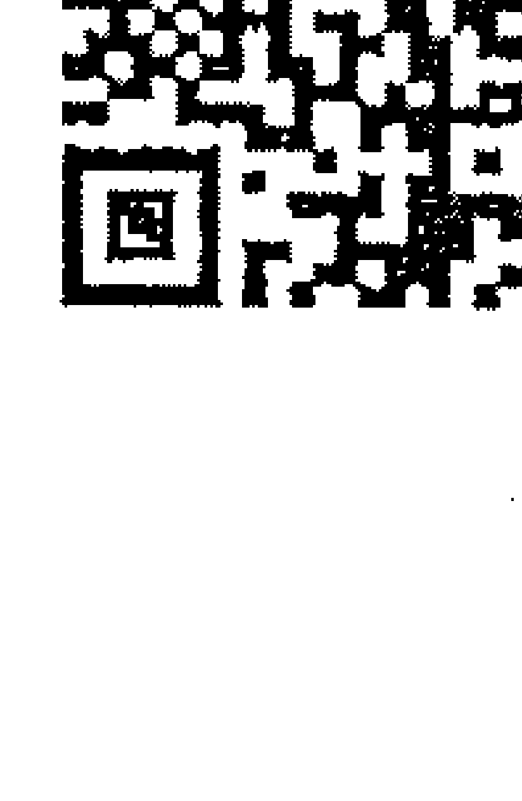
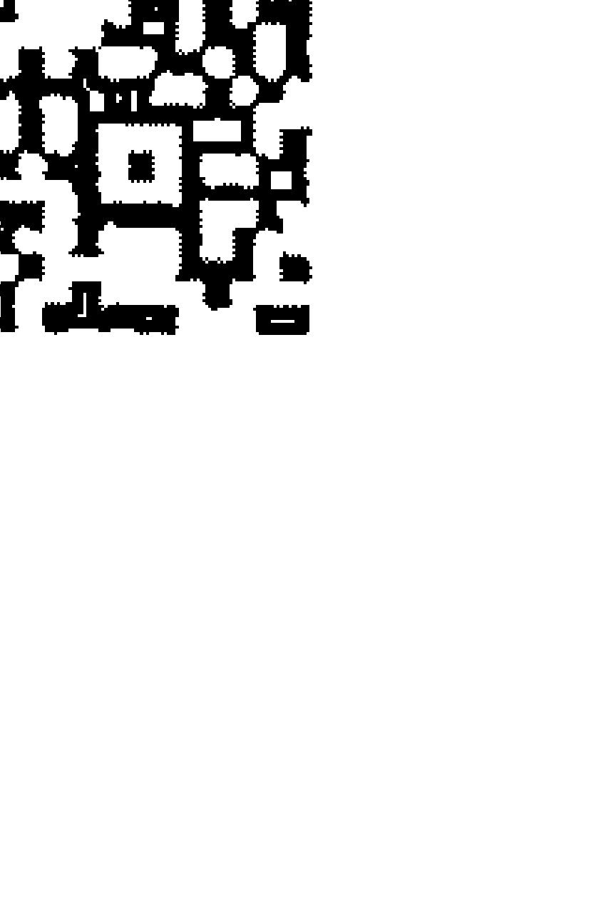
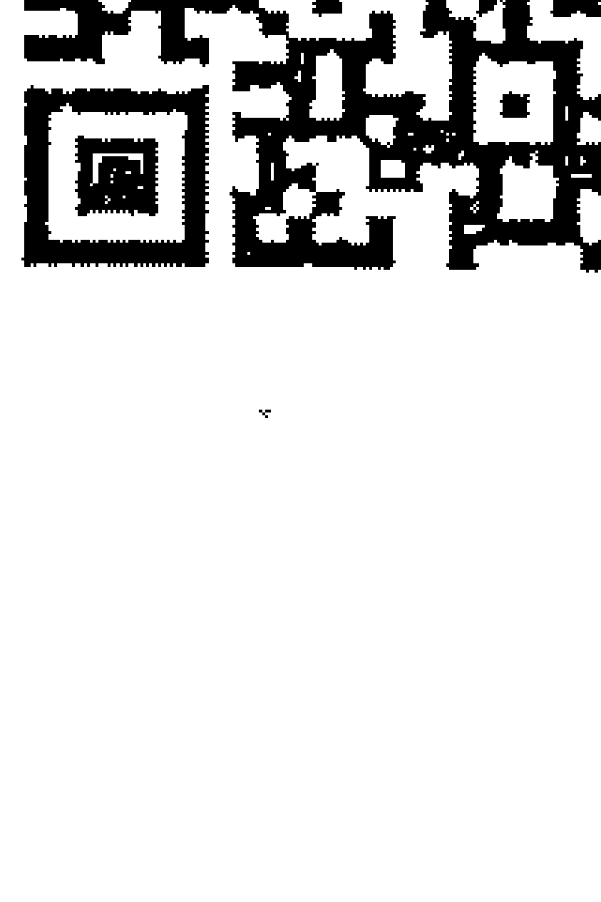
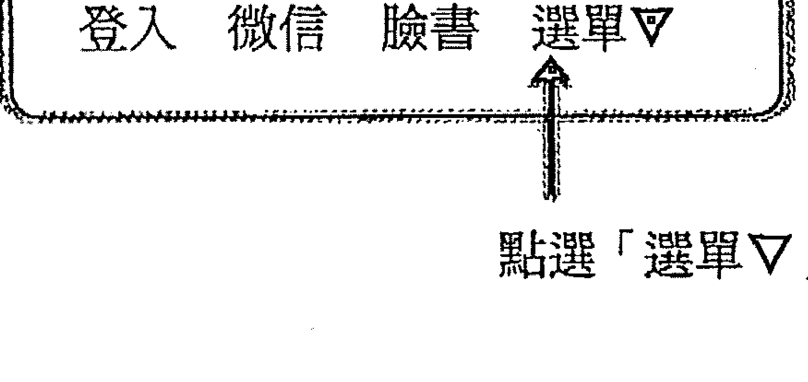
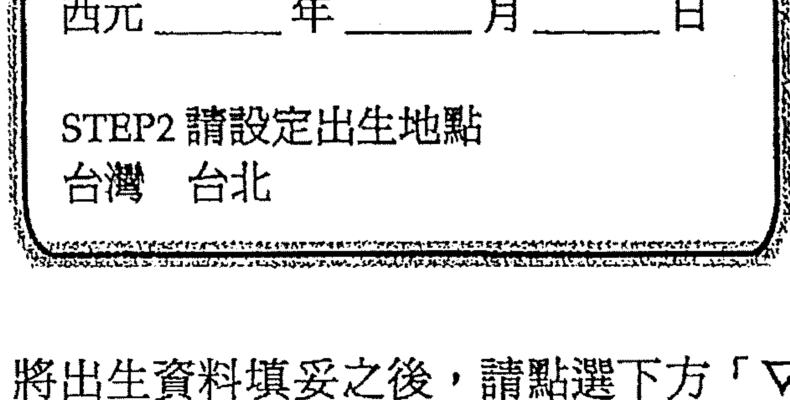
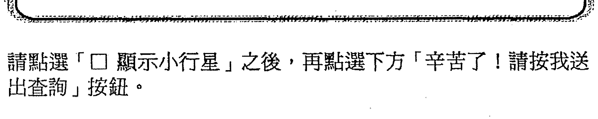
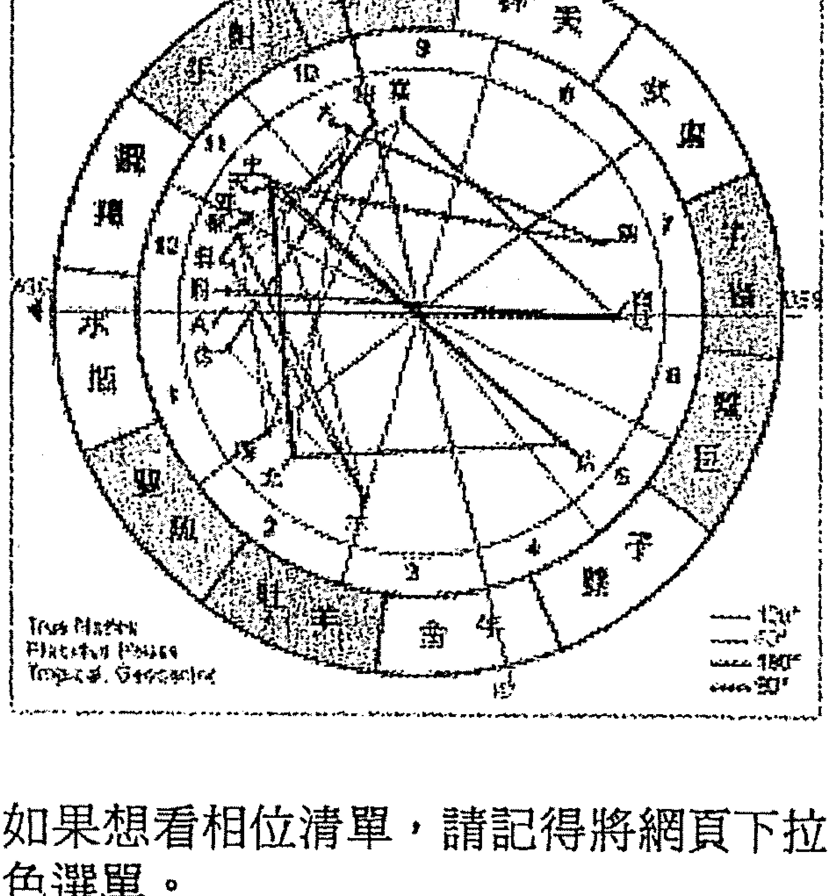
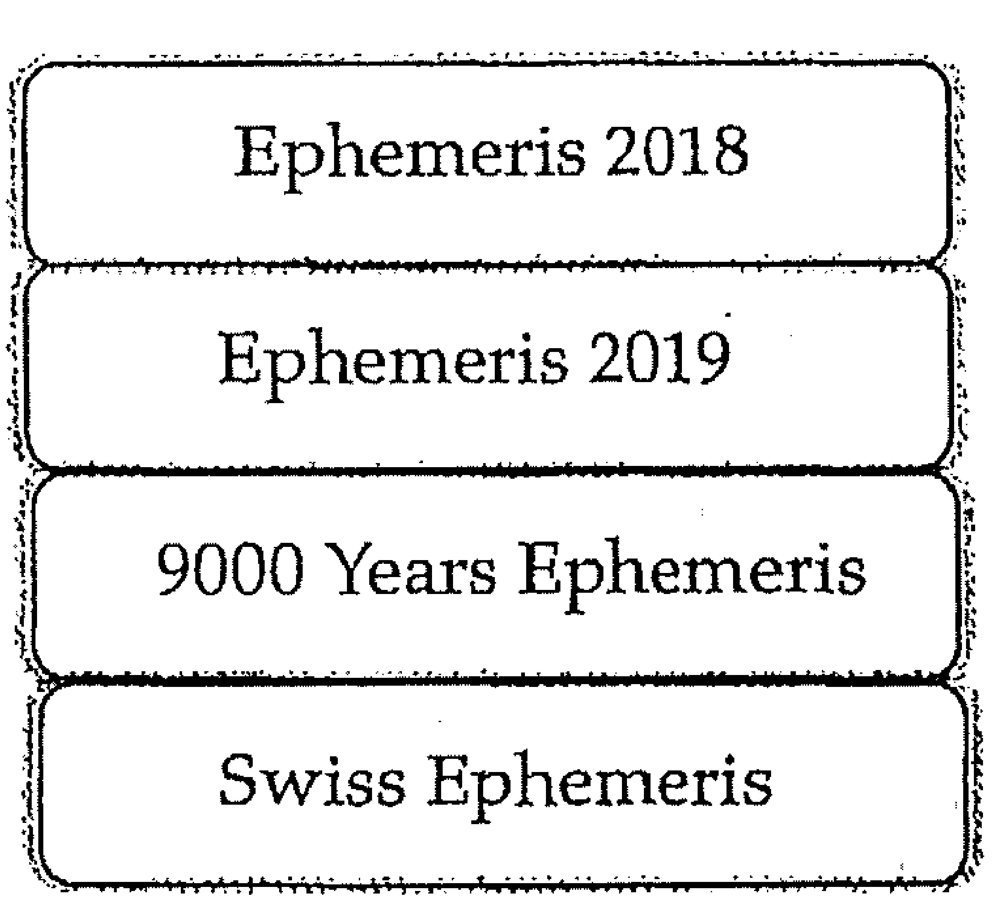

## 穀神星的養育天職

## 暗含餵養的親密關係

Ceres in Signs, Houses, Aspects

韓良露 著

生命占星學院

> 每個人都有一種想讓事物成長茁壯的責任感。

興趣廣泛、身分多元的知名文化人韓良露，除了大家熟知的作家、媒體人及文化推動者身分之外，她也是藝文圈中最受重視的占星學大師。

一九九三年起她在金石堂金石講堂（現龍顏講堂）開設占星課程，由於口耳相傳、好評不斷，課程一直持續到二○一○年才劃下休止符。在長達八年的四百多堂課中，她以歷史、哲學、心理學、社會學的角度，將占星的深層智慧化為生動的教學內容，讓大家在學習與命運對話的同時，獲得看待人生的更高視野。

這一系列課程不但架構了宇宙法則的邏輯，也融入她對人性與社會的觀察，但因資料整理工程浩大，成書計劃一直未能完成。為避免這些珍貴課程內容成為絕響，南瓜國際經過多年來數量龐大的上課錄音及相關資料，依據當時課程的規劃邏輯，整理成為系列書籍，期望能藉由文字重現精彩、動人且充滿智慧的上課盛況。

## 目錄

- 出版緣起 …… 3
- 序：他人即道場 …… 8

## 前篇

- Chapter 1 穀神星總論 …… 29
- Chapter 2 穀神星、灶神星與處女座 …… 35

## 穀神星與星座

- Chapter 1 穀神星牡羊：獨立自主的親密關係 …… 59
- Chapter 2 穀神星金牛：重視物質的親密關係 …… 63
- Chapter 3 穀神星雙子：重視溝通的親密關係 …… 67
- Chapter 4 穀神星巨蟹：重視情緒的親密關係 …… 71
- Chapter 5 穀神星獅子：重視自我的親密關係 …… 73
- Chapter 6 穀神星處女：重視服務的親密關係 …… 75
- Chapter 7 穀神星天秤：重視和諧的親密關係 …… 79
- Chapter 8 穀神星天蠍：重視激情的親密關係 …… 83
- Chapter 9 穀神星人馬：重視自由的親密關係 …… 89
- Chapter 10 穀神星摩羯：重視成就的親密關係 …… 95
- Chapter 11 穀神星寶瓶：走出尋常的親密關係 …… 99
- Chapter 12 穀神星雙魚：無邊界的親密關係 …… 101

## 穀神星相位

### 穀神星拱相位

- Chapter 1 穀神星與太陽的相位 …… 147

## 穀神星與人際緣分合盤

- Chapter 1 穀神星與第六宮的相位 …… 225
- Chapter 2 穀神星與第四宮的相位 …… 153
- Chapter 3 穀神星與水星的相位 …… 163
- Chapter 4 穀神星與金星的相位 …… 171
- Chapter 5 穀神星與火星的相位 …… 177
- Chapter 6 穀神星與木星的相位 …… 181
- Chapter 7 穀神星與土星的相位 …… 189
- Chapter 8 穀神星與天王星的相位 …… 195
- Chapter 9 穀神星與海王星的相位 …… 201
- Chapter 10 穀神星與第十宮的相位 …… 209
- Chapter 11 本命與合圖的六宮相位 …… 215

## Chapter 2

穀神星進入對方的宮位

- 附錄 1 查詢星圖網站 245
- 附錄 2 如何查詢小行星星座 248
- 附錄 3 穀神星簡表 250

## 他人即道場

小行星是占星學中比較難學的課程，許多占星書中提到小行星時，都會告訴大家這是一門跟演化有關的學問，這些學問都是要讓大家面對人生道場的課題。

在占星學中，太陽、月亮、水星、金星、火星這五顆星分別代表一個人的顯意識、情緒、溝通能力、審美觀與行動力，這些都屬於個人範疇；而木星、土星、天王星、海王星、冥王星則分別代表社會資源、社會制約、天外飛來的宇宙意識、沒有邊界的慈悲，以及宇宙意識的死亡與重生，這些都屬於社會、宇宙範疇。

在五顆個人行星的領域，很多時候我們都只是想想罷了，並不一定真的得去做，也未必需要跟別人發生關係；後五顆社會、宇宙行星的領域，它們都是一種集體意識的力量或社會組織，它們對我們產生的壓力，既不是即時的，也不是具象的，就算當事人不真的理解這些法則背後的意義，也會因為受到社會規範的制約而乖乖地跟著走。而小行星要探討的，則是介於個人範疇到社會、宇宙範疇之間的議題，也就是人際關係。我們跟他人會產生的所有問題，都在小行星的人間道場中。存在主義說「他人即地獄」，所有的人際關係之所以困難，在於它是每個人生命旅程中必須行經之處。當我們認為他人是地獄的同時，也代表我們是他人的地獄。

穀神星要探討的是我們為他人付出的養育責任。很多人會把月亮的生育與穀神星的養育混淆，簡單來說，月亮如果是母親，穀神星就像是奶媽。穀神星跟月亮的不同，在於穀神星的養育，必須同時具有提供者與被提供者，它一定跟他人有關，但月亮未必。從這個地方，我們也可以看出小行星與主要行星的差異。月亮是主要行星，月亮代表母親，一個女人一定是先身為女人，再成為母親，即使她沒有了小孩，她依然是一個女人。但小行星不同，穀神星是奶媽，如果沒有需要被照顧的小孩，奶媽就沒有存在的意義。

四小行星帶來的一定都是切身問題，不但得立即回應，而且往往還得要實際解決，躲都躲不掉。所以四小行星被認為是一種「人間道場」，「他人即地獄」，意義就在這裡。

小行星的功課之所以難學，在於人類本來就被設計成自我意識很強的生物，要跟他人產生關係當然很困難。小行星的功課是生命過程中意識轉化的里程碑，因為唯有面對他人時，人類的意識才被迫要轉化到更高的境界去看待自己。這其實是一件好事，因為若非如此，我們一定會陷在個人的主觀意識而無法超越我執。

大家小時候如果寫過日記的話就知道，整天在家做的白日夢很難寫到日記裡，因為這些白日夢並不構成一件「事」。小行星的重要性，在於小行星都是一些跟他人有關的事，所謂「跟他人有關」並不是「他人的事」，它們是自己的事，但跟他人產生關聯，所以一定會真的有所行動。

小行星功課是否做得好，差別就在於在這些跟他人有關、必須要有所行動的人際功課中，它除了要求我們去理解自己要做什麼、為什麼去做，以及如何去做之外，更要求我們去理解他人會如何回應；小行星的各種人際關係中，它要求大家不得不從更高的角度來審視生命的課題。

人生的功課好做，靈魂的功課難做。我並不贊成人生中遇到所有的問題，不分青紅皂白都用靈魂的方式來處理，這樣的人生會出大問題。不管在人生中遇到什麼事情，我們都應該要先用人世間的方法去解決，但如果能在務實處理問題的同時，保留一些靈魂思索的空間，這樣才能夠找到生命旅程的意義。人生的問題並不只侷限現實問題，遇到人的問題，不管是現實面或靈魂面都需要去面對，如果遇到的是靈魂的無奈，就需要藉由這樣的事情讓靈魂得到啟發，否則人生只不過是把所有該處理的事處理掉罷了。

星圖的設計如此複雜，每天都有不同的人事物變化，帶來各種不同的功課。到底要面對到什麼樣的程度，才算真的好好做了這些功課？到底怎麼樣才算是過關？一個人或許把生命當中的壞事都避開了，該做的好事也都做到了，在日常生活中是個好人，甚至稱得上是個小聖人，這樣是不是就代表這個人這輩子就算功德圓滿？恐怕沒這麼簡單。

好好地面對生命中的困境，會比一味地趨吉避凶更重要。就我的經驗來說，不管好事壞事，當我們面對這些處境，如果內心當中真正因此得到了了解、釋懷的感覺，這才叫做做到了功課。因為我們從中學到的，不是僅僅是知性上的理解，而是整個人真正感受到做完了這件事，這才是真正的功德圓滿。

註：本文由二○○七年「四小行星」相關課程內容整理編成。

## PART2

## 1

## 前言

大家學占星學時，一定會有一個疑問：為什麼有十二個星座、十二個宮位，卻只有十顆主星。隨著小行星被大量地發現與研究，這個問題終於有了解答。近年來占星學界傾向於將四小行星中的穀神星（Ceres）與灶神星（Vesta）劃歸掌管處女座，智神星（Pallas）掌管天秤座，婚神星（Juno）則與冥王星共同掌管天蠍座。

婚神星與冥王星共同掌管天蠍座，除了可以解決原先冥王星單獨掌管天蠍座時只與毀滅、死亡相關的問題之外，在神話裡面，朱諾就是木星朱庇特（Jupiter）的妻子，她不但是婚姻之神，而且也將朱庇特管得很嚴。以天文學來說，婚神星的位置就在木星旁邊，這個位置非常符合神話中朱諾在朱庇特身邊的妻子嚴管狀態。

整個占星學的星圖，就是逆時針與順時針並及結合的系統。如果從逆時針方向來看，每一個都轉化成了前一個；如果依順時針方向來看，每一個則都造成了下一個。在占星學裡面，每一個星座都具有一正一負、一陰一陽的週而復始，每一個星座要的東西都跟下一個星座要的東西不同，每一個行星要的也都各有不同，金星要的東西跟火星要的東西就不同，水星要的又跟金星不同，太陽要的跟月亮也不同。所以我們在思考占星學的時候，一定要回到整個星圖來看，你會發現，所有的占星學學理中，都有其綿綿的正反相位。

### 陰陽交錯的占星系統

將婚神星分配給天蠍座當主星，是十分恰當的安排。從神話中我們可以看到，朱諾制定了很多婚姻中的法則，想要讓朱庇特不要拈花惹草，可是木星想要做的就是突破所有的限制，並不想要改善。雖然婚神星朱諾管不了木星，但土星可以。畢竟土星薩頓是木星朱庇特的爸爸，天王星雖然被土星推翻，但是天王星烏拉諾斯依然是土星的爸爸。

整個占星學系統，就是由一陰一陽交錯組合而成的，它的邏輯與太極很相似。黃道的十二個星座從牡羊座開始，牡羊是陽性特質最強的陽性能量，而牡羊座的正對面天秤座，它則是所有陽性星座中陽性能量最弱的星座。天秤就有點像是太極中心點裡面的白點，或白裡面的黑點。在這個陰陽交錯的系統中，陰性能量最強的是第十二個星座雙魚，而陰性星座中陰性最弱的是雙魚座對面的處女。不管生理性別是男性或女性，我們每個人內在都有一個星盤圖，因為星圖的分配，我們身上都有著強且不同的陰陽屬性。

人有可能會顯現非常強烈的陰性特質，即使他是生理男性；一個人也有可能會顯現出非常強烈的陽性特質，即使她是生理女性。所以談論占星學的陰陽特質時，跟生理性別是無關的。

第一個星座牡羊座、第十二個星座雙魚座，它們分別是最強的陽性與最強的陰性能量；而第六個星座處女及第七個星座天秤，則分別是最弱的陽性與最弱的陰性能量。

第一個星座牡羊與第十二個星座雙魚，它們分別代表了人生旅程的開始與結束，牡羊與雙魚之間相隔的是命運業力的結束與重新開始。但第六個星座處女，以及第七個星座天秤，相隔兩者的並不是結束，相反地，它是個人與他人的連結——一個人如果想用最強的陽性能量或最強的陰性能量去跟別人結合，那是不可能的事。最強的陽與最弱的陰是整個占星圖中最容易達到陰陽和諧的地方，唯有用最弱的陽性能量與最弱的陰性能量相互連結，彼此之間才不會產生很大的衝突。

### 三個重要女神：金星、月亮、穀神星

在個人行星體系中，有三個重要女神。第一個是金星維納斯，也就是希臘神話中的阿芙蘿黛蒂（Aphrodite）；第二個是月亮女神，也就是希臘神話中的狄安娜／阿特彌斯（Artemis）；第三個就是穀神星德墨忒耳，也就是希臘神話中的狄米特（Demeter）。金星掌管的是金牛座，月亮掌管巨蟹座，而穀神星掌管的是處女座，這三個女神分別掌管了不同的領域。

月亮女神掌管的主要是跟女生身體有關的事物，對一個女性來說，月亮甚至跟懷孕以及月經有關——月經的經期其實也就是女性的排卵週期，這些都跟月亮息息相關。

## 金星的慾欲

懷孕這件事跟月亮有關，但交媾這件事卻還跟金星有關。金星可以說是一種慾體，它會產生讓人想要跟人交媾的荷爾蒙，讓人產生性慾的欲望，而且往往還需要火星的協助。

否則可能只會停留在想像，而不會產生行動。但火星的性行為也需要金星的配合，否則光是火星的性行為，缺乏了一個金星的配合，就會讓人感覺像是被強暴，或被獸性的發洩，就不像做愛了。

人類之所以能夠繁衍，靠的絕對不是火星性衝動，而是源自於金星想要交媾的欲望。但是阿芙蘿黛蒂跟母親無關，她掌管的只是個人的欲望，她只跟個人的享樂有關。金星本身具有很敏感的感受能力，因此可以在性愛中得到很多感官上的樂趣，這種感官樂趣也是促使金星想要不斷追求性愛的動力。

在個人星圖中，如果一個女性金星很強，但是月亮及穀神星很弱的話，這個女性可能會很喜歡談戀愛以及各種感官享受，但是她未必會想為人母，未必會喜歡照顧小孩。她跟一個男人發生關係是基於金星的愛，但是未必會想要跟這個人產生其他的連結。

金星的愛屬於滿足自我的感官需求。金星掌管的是金牛座，星圖中互成一百八十度兩兩相對的星座都會具有相同的本質，將金牛與天蠍做個比較，金牛很強的女性會比天蠍很強的女性來得獨立，因為她們在意的是自己擁有什麼，而不是別人擁有什麼。我們可以發現，很多天蠍很強的女星會利用演藝事業的知名度嫁入豪門，但金牛很強的女星，如果靠著自己就能賺到足夠的錢，她們多半不會想要嫁給那些有錢的小開。儘管演藝圈賺的錢再多，可能都遠遠不及嫁入豪門，但演藝事業如果經營得好，這是一個真的能夠獲取高報酬的產業。我就認識一些金牛座女星，如果演藝事業做得很好，自己有能力賺到很多錢，她們寧可找一個願意把她們照顧得很好的處女座對象，也不會跑去嫁給有錢的小開。因為嫁入豪門是很辛苦的事，嫁入豪門當媳婦，簡直是自找苦吃。

由此可見，金星是一個跟自我有關的能量，它跟「我們」無關，所以我們也常看到，一個金牛能量很強的女性如果離婚，她們不見得一定會爭取小孩。天蠍跟巨蟹則一定無論如何都要將小孩留在自己身邊。巨蟹座的母性很強，而對天蠍來說，小孩則是「我們」的一部分，即使離婚，她們也不可能將小孩割讓給對方，而且天蠍最重視血脈，基於小孩是自己血脈的理由，她們也不可能不去爭取小孩。由於掌管金牛座的是金星，所以很多金牛座的女星非常美貌，比如陳德容、胡因夢，但是她們並不會很性感。而天蠍座的女星，比如林青霞，她們未必像金牛座的女星這麼美麗，可是她們會讓人覺得很性感。

### 月亮的生育

以上所說的這些事情都跟生育無關。跟生育最有關係的星座是月亮掌管的巨蟹座，但是如果對巨蟹有所認識就會發現，巨蟹喜歡生育小孩，喜歡跟小孩之間有很深的情結與情感的連結，但是巨蟹不喜歡做家事。

舉凡煮飯做菜、幫小孩換尿布、餵小孩吃東西，這些事情其實巨蟹都不愛做，他們或許在實際生活中不得不做，但事實上巨蟹喜歡的是抱小孩、逗小孩玩，巨蟹喜歡的是寵愛小孩而非幫小孩服務。

從這個角度我們可以看出英國式家庭在這方面的聰明之處——他們將母職分開由母親跟保姆共同完成。不過如果過度發展當然也會出問題，例如有的母親會因為請了保姆，而忽略了母親擁抱小孩及寵愛小孩的工作。

在日常生活中我們也常會看到類似的狀況，很多母親因為請了外傭，就把小孩完全丟給外傭，每天忙著自己的事情，很少跟小孩玩，很少跟小孩親熱，於是外傭完全變成了母親的替代品。

### 穀神星的養育

如果說掌管巨蟹座的月亮並不真的喜歡服務，那麼到底誰才是真正的服務者？答案就是掌管處女座的穀神星。處女座的關鍵字是「服務」，掌管處女座的穀神星扮演的照顧服務不限於保姆，它涵蓋了所有生活中的勞務。

> 俗話說「久病床前無孝子」，這句話很有道理。如果家中有久病的病人，最好不要由家屬擔任全部的照顧工作。因為家屬不具備相關的專業能力，很容易就會失去耐心，也容易自以為是地指揮病人，讓病人反而更為痛苦。

家屬在照顧病人的過程中往往充滿愧疚，但病人從家屬那裡卻未必能夠得到很好的待遇。而護士與看護雖然對病人沒有感情，但是可以將病人的瑣事處理得更好。不過，這不意味著請了看護，家人就不需要出現了。因為看護提供的是處女座的服務，無法提供巨蟹的家人親情支持。

在占星學中，生育小孩是巨蟹的工作，養育小孩則屬於處女座，也就是穀神星負責的工作。但是處女座本身是土象星座，他們擅長實際的服務，卻不擅長付出感情。而且，處女座原初的意義在於淨化，也就是「精益求精」，淨化的對象正是跟小孩有關的獅子。

處女座的工作在於讓小孩行為端正、身體健康，這意味著很多對健康無益的東西是不准吃的，應該要學會上廁所的年紀還不能夠包尿布，該早睡早起的時候就不能賴床。

處女座的原型帶來很多對於獅子座自我的制約。它的正面意義，在於如果一個小孩受到的只有巨蟹式母愛的話，問題很大。我看過最無法無天的小孩都是巨蟹媽媽帶出來的。掌管巨蟹座的月亮對小孩沒有管教紀律的能力，如果一個母親只靠著月亮的話，她們的小孩往往會變成無法無天的小霸王。

代表小孩的獅子座剛好夾在處女跟巨蟹之間，這實在是占星學的一個極度巧妙的設計。我看過很多處女座能量很強的媽媽真的都把小孩管得非常好，但是這些小孩都顯得沒聲沒氣。他們一定都行為端正，對媽媽非常孝順，但是也都被管得奄奄一息。他們都非常努力工作，非常認真負責，但是你會從小因為被處女座的管教制約，感覺到他們屬於獅子原型的自我活力消失了。

對於跟小孩相關的獅子座原型來說，獅子座最想要的是自由自在地充分展現、表達自我，但是處女座原型最關心的卻是這個小孩將來出了社會要怎麼跟別人相處，兩者之間常常存在張力。

一個處女座過強，過分以穀神星投注於月亮的母親，她們對待小孩的時候就會缺少了情感的連結。所以如果一個人的本命星圖中的穀神星受剋，也就是穀神星如果跟其他行星有許多九十度或一百八十度的剋相的話，當事人跟母親之間的關係其實會有很大的問題。這些問題都會來自母親從小對他們的過度制約。如果要看一個人跟母親之間的關係，就必須同時檢視月亮與穀神星的位置與相位，才能夠全盤了解。從穀神星的位置與相位，格外能夠看得出一個人跟母親之間相處的課題。而如果一個人童年受母親壓抑，往往從穀神星的相位中會比月亮更能明顯顯示出相關的徵兆。

### 穀神星帶來的親子議題

月亮跟穀神星，一個像是生母，一個像是乳母，從月亮跟穀神星的差異當中，我們可以清楚地看到巨蟹座跟處女座區別對待愛的態度的不同。我認識很多處女座女生進入婚姻之後，只要她們認同這個婚姻，只要她們認同這個丈夫是一個值得嫁的男人，

她們對於婚姻願意提供的服務，與其說是乳母，更像是女僕。她們會打理好所有家庭生活中的實際事物，如果需要照顧公婆，她們幾乎去照顧公婆，如果先生的公司需要幫忙打點，她們就去打點。她們對於先生的工作絕對不會不聞不問，先生工作累了回到家，她們也願意幫先生按摩。簡直是集乳母、護士，甚至女僕於一身。我有一個處女座的老朋友就是這樣，她在婚姻中盡心盡力做好所有為人妻子該做的事情，沒想到結婚十幾年後，丈夫居然出軌愛上了跟他月亮有相位的外遇對象，於是跟處女座元配離婚，把新歡娶回家。處女座的元配簡直就像是照顧了這個丈夫十多年的養母，辛苦了十幾年之後，沒想到丈夫決定回到生母的懷抱。

穀神星帶來的親子議題跟月亮是不同的，每一個人都會跟母親之間有著各種問題，而這些問題主要來自兩個不同面向，一個是月亮的星座、宮位與相位，另一個來自穀神星的星座、宮位與相位。

穀神星代表的是「養育」。在希臘神話中，狄米特是拿著麥穗與罌粟花的農業女神，有時候我們會看到跟狄米特相關的作品裡面，狄米特身邊會有蛇的出沒，蛇的蛻皮代表著四季不斷的遞嬗，穀神星代表的就是地球上萬事萬物啟動的養育照顧。

穀神星很強（例如穀神星與太陽、月亮，或者與其他很多行星有緊密相位）的人就跟處女座很強的人一樣，他們對於種植物、養寵物特別在行。喜歡動物的人很多，比如獅子座、寶瓶座很強的人都非常喜歡動物，但這些人未必喜歡照顧寵物，因為照顧寵物是一種勞務，它完全是一種服務。很多養過寵物的人會知道，養寵物根本就等於是成了寵物的僕人，養植物也是同樣的道理，一旦開始種植物，就變成植物的僕人，沒有辦法提供服務當僕人的人，就沒有辦法照顧好植物與寵物。

所以星圖當中穀神星如果相位很好，或者處女座能量很強，代表當事人有養植物、養寵物的能力，他們也有能力照顧小孩與病人。因為他們具備服務他人的能力。不過，即使穀神星相位不好，或者有很多行星落在處女但相位不好，也代表他們具有服務他人的意願，只是做得不夠好。穀神星決定了一個人是否願意提供他人服務的意願，相位好壞影響的只是做得好不好，這跟服務的意願是無關的。

相較之下，一個雙魚座很強（有很多行星落在雙魚，或者太陽、月亮、上昇雙魚）的人就算落在雙魚座中的行星相位很好，他們會非常有愛心，但是如果要他們提供勞務，他們往往不見蹤跡。雙魚座讓人很開心，但是他們沒辦法提供實際服務；處女座往往會讓人掃興，但是他們能夠提供完善的服務。

穀神星所在的位置跟相位，顯示出來的是我們在童年吸取的是怎樣的養育，也代表了我們長大以後會用什麼方式養育別人。也因為穀神星與處女座具有養育他人的特質，他們特別擅長照顧動物、植物，所以穀神星或處女座很強的人往往會自然而然的出現照顧他人的命運，很多人會從事照顧別人小孩的工作。此外，食物是養育他人的重要途徑，因此很多從事餐飲相關領域的人，都是在展現穀神星的能量。

以我為例，我的穀神星在十宮事業宮，穀神星在十宮的人往往會將做食物給別人吃這件事情發展成事業。我從小就有很多人做各式各樣的食物給我吃，我從小也喜歡做食物給別人吃，成立了南村落以後，南村落也成為了一個讓我做食物給別人吃的舞台。雖然我不是專業廚師，但是我在南村落做幾次菜就搞得天下皆知，這就是穀神星十宮會有的生命情境。

### 穀神星與養育缺憾

我們從穀神星可以發現媽媽真的很難為。因為在被養育的過程中，每個人都會希望自己能更得到最完整的完美母愛。可是完美的母愛根本不存在。攤開每一個星座都可能會有的過與不及問題之外，每個人的穀神星必然只有可能落在一個星座。也就是說，一個人的穀神星如果落在人馬，就不可能落在牡羊、金牛等等其他十一個星座；但是對一個小孩來說，一個人的穀神星落在人馬，他的母親小時候在養育他的過程中給予了充分的自由，但同時也代表了他們在童年受到的養育缺少了牡羊、金牛等其他十一個星座的母愛。當穀神星呈現出當事人童年得到某一個星座的母愛的同時，也就意味著他沒有得到其他十一個星座的母愛。

所以當我們在思考自己跟穀神星相關的養育問題時，實在得先思索母愛本來就不可能完美，一味的想要得到完美的母愛是不可能的，如果能夠從這個角度來思考的話，大家會比較容易跟自己的童年和解。

### 穀神星總論

在占星學中，母愛跟月亮及穀神星這兩顆星有關。一個人本命星圖的月亮跟一個人情緒的滿足有關，而穀神星的母愛比較複雜，穀神星代表的是一個人誕生在這個世界上，你期待從世界的母親（宇宙之母）獲得的理想母愛。它描述了母親或養育你的人對待你的方式，也是你對待你想要養育的人事物的方式。

我們不能直接將穀神星等同於母愛，因為一個人想要的理想母愛，都不可能是任何一個母親可以提供的。所以一個人感到母愛的欠缺，並不能直接歸因於他的母親對他好不好。其實當母親的人都很可憐，只要做了媽媽，你的小孩就一定會對你失望，因為當母親不能滿足小孩想要的穀神星的需求時，即使客觀來說，她可能是一個還滿不錯的媽媽，小孩也不會覺得滿意。即使小孩很孝順，也只不過意味著這個小孩把對母親的失望隱藏得很深，但他內心深處還是失望的。這是因為任何一個母親只能提供她自己的月亮、金星、穀神星等能量，她只能夠提供她自己從她的母親學來的，以及她自己能力範圍所及的母愛。沒有一個母親有辦法能夠提供完整的，曼陀羅般的宇宙之母的母愛。

每一個人的誕生，靈魂都會感覺像是一個從宇宙中被丟到地球上的孤兒，他永遠不可能從任何單一的個人身上，得到宇宙母親的全部母愛。只要是人，就一定會不滿足，因為每個人都是宇宙的孤兒。透過了解自己的欠缺，了解自己對於母愛的不滿足並不在於自己的母親身上。因而可以理解到自己對於母愛不滿的真正原因，這種理解可以幫助我們去追求真正宇宙之愛，而不會因為遷連於你跟母親這個人的緣分，而陷在一種對於個人緣分的不滿狀態。

透過理解，才能夠真正放下。所有的人都會覺得自己得到的母愛是不完整的，是有所欠缺的，每個人也都會將這種欠缺用另一種方式表達出來。對於每個人來說，理想的母親應該具備怎樣的特質，其實代表的是，你的母親的不理想的狀態，也就是穀神星落在什麼星座。對於想要卻沒有得到的母愛，通常你就會透過去做穀神星所在的宮位領域的相關事情，補償自己在母愛上的欠缺，這些事情事實上跟真正的宇宙母愛無關，它們都是我們想要藉由一些人事物來做為母愛的替代品。也因此常會變成一種偏執。

穀神星也代表一個人想要養育別人的實際責任。每個人都會透過自己的穀神星去養育不同的人事物，這種責任會讓人覺得自己真的是把一件事情養育出來了。穀神星代表的是實際的責任，是每一個人展現母職的方式，所以它也經常跟一個人的工作、職業有關。它往往會反映出一個人在職業方面的傾向，但這裡說的職業並不是那麼簡單的只限於我們上班的工作，它代表的更是我們內心裡想承擔的責任感，如同志業近似於我們平時說的「天職」。穀神星反映出來的一定是我們內心想要做的事情和屬性，尤其是我們自己想要做的天職，而不是公司老闆丟下來要你去完成的工作。所以一個人如果選擇跟自己穀神星相關領域的工作是有利的，因為這份工作本身就是和你內心裡必須去完成的天職，相反的，如果你選擇的是完全不相干的工作，你的老闆就倒楣了，因為你根本不會覺得完成這些工作是一種責任。

### 穀神星與選擇伴侶

儘管每個人篩選伴侶的條件都不一樣，但可以確定的是，選擇伴侶其實是在選擇母愛的替代品，這會是一個滿重要的挑選伴侶的依據。如果一個人選擇伴侶的時候，伴侶的上昇、太陽、月亮的星座跟他的穀神星落在同一個星座，甚至合相，代表這個人跟伴侶之間的相處，會有一種類似於母嬰的關係。當事人想從戀愛伴侶關係中，得到一種自己從母愛中沒有被滿足的東西。

雖然並不是所有的人都會選擇穀神星所在的位置的人當伴侶，但選擇跟自己具有穀神星關係的人做伴侶的人很多。當你聽到一個人說他的男朋友或女朋友對他很好，很會照顧我，讓他很有安全感，相處的方式讓他很滿意，這些都很可能是在描述兩人之間的穀神星特質。

這跟月亮不同。一個人如果選擇了具有月亮關係的伴侶，這種伴侶關係會帶來情緒的滿足。但是一個人能夠為你帶來情緒的滿足，不見得他會照顧你。月亮帶來的伴侶關係，對方可能只是抱抱你，讓你感覺到情緒的滋潤，但不表示他們會為你做什麼實際的事。

穀神星給予的，一定是一種實質的母愛，他們可能會為你做家事、打點生活，為你做很多事情，這些都代表了你對於理想母愛的期待。當你尋找這樣的伴侶，其實就是在尋找一個母愛的分身。舉例來說，前總統馬英九的穀神星落在人馬座，而總統夫人周美青是太陽人馬。我妹夫的太陽，跟我妹妹的穀神星合相，而我的穀神星是天秤，我的先生則是上昇天秤。

伴侶關係有很多面向，不能光看穀神星就下定論，但是在很多的伴侶關係中透露著穀神星重要的影響力，原因在於這樣的伴侶會是一個能夠給你實質內務服務的人。

### 穀神星、灶神星與處女座

處女座希望個體完美，天秤座追求兩個個體和諧融合，這個邏輯在十二個星座的宇宙合唱中是合理的。可是這兩個星座缺了主星，於是許多占星學家回頭追溯古老神話，希望從神話中找出關聯。

星圖就像一個曼陀羅，它要描述的是身在太陽系的我們，每一個人內在太陽的自我完成之旅。第一個階段是內行星的自我完成，它的順序是從火星開始，經歷金星、水星、月亮而抵達太陽；第二段歷程則由海王星出發，經歷天王星、土星、木星，而後再度回到太陽。

第一段歷程由牡羊座開始，逆時針經歷金牛座、雙子座、巨蟹座，抵達太陽掌管的獅子座。第二段歷程則由雙魚座出發，順時針經歷寶瓶座、摩羯座⋯⋯這一逆一順的兩段歷程，有如雙螺旋一般，闡釋了每一個身在太陽系靈魂的演進之道。從牡羊座到獅子座，完成的是最基本的自我意識（ego），而能夠走過從雙魚座順時針迂迴回來的太陽，才能擁有更高等的靈性成長。兩股力量都能達到的太陽，就是一個更純粹發展的太陽，它不會是一個只注重自我的太陽，也才能藉由個體演化的雙螺旋歷程，尋找到真正的生命之金。

多年下來，占星學家找出了一些神話可能跟處女座有關。有一派的學者認為有可能是不曾被尋找到的祝融星（Vulcan）。祝融星的位置很特別，它是一顆早期被天文學家假設存在的行星，位置介於水星與太陽之間，不過隨著愛因斯坦提出廣義相對論之後，由於廣義相對論解釋了水星進動現象，天文學家也就不再尋找祝融星了。

根據數學家的推算，祝融星如果存在的話，它應該在太陽後面八度多。也就是說，如果一個人的太陽在牡羊座十度附近，這個人的祝融星就一定會在牡羊座十八度多。祝融星本意是工匠之神，他在神話中兢兢業業工作，就是不斷的在淬煉各種物質，不斷的追求完美。基於這個原因，有一些占星學者認為，處女座或許有可能歸祝融星管轄，而且祝融星很可能就在太陽後面，也符合處女座在獅子座後面的推斷。不過隨著廣義相對論對水星進動的解釋廣被接受，研究祝融星的人也就越來越少。

因此占星學界傾向從小行星來尋找處女座與天秤座的主管星。小行星數量極多，目前已經有幾十萬顆小行星被發現、命名。其中又以穀神星、灶神星、智神星、婚神星應用最廣，尤其受印度占星學的重視。有許多占星學家認為穀神星、灶神星與處女座有關，而智神星與天秤座有關。

認為穀神星、灶神星與處女座有關的原因，在於這兩顆小行星在神話中非常符合處女座特質。穀神星的相關神話非常多，從美索不達米亞文明的蘇美神話、巴比倫神話，到埃及神話與希臘、羅馬神話，處處可見穀神星神話的蹤跡。

十二個星座由一陰一陽交替組合而成，牡羊座為陽、金牛座為陰，依序下來，獅子座為陽，處女座為陰。穀神星是很古老的女神，符合處女座的陰性特質。

在太陽系行星中，最為人熟知的兩個女神是掌管金牛座的金星（維納斯，也就是希臘神話的阿芙羅黛蒂），另一個是掌管巨蟹座的月亮，這兩顆行星跟私人的愛有關，而掌管雙魚座的海王星，則跟私人的愛無關。雙魚愛世人，很多人因此對雙魚情人的愛很期待，可是雙魚的愛是一種廣泛的同情，如果有人的媽媽是太陽雙魚的話，就會很清楚這件事：你的雙魚媽媽可能很有愛心、很浪漫，她可能會去育幼院工作，但是她照顧小孩時不會很能幹，因為雙魚座的愛跟私人的照顧無關。

即使是月亮與金星，也各有各的問題。月亮掌管的巨蟹座給的是一種關懷，但是僅止於關懷，很多人期待從巨蟹座身上得到熱烈的愛情，這恐怕會失望。金星掌管金牛座，金星跟金牛座都很愛美，但是它們並不以忠實著稱。所以如果你有一個金牛情人的話，壓力會很大，他們希望自己美美的，也希望對方美美的，就算他們並不是在跟美人交往，他們內心當中還是有一塊地方希望對方是美的，所以想要跟金牛座交往，其實會是一件挺有壓力的事——這一點倒是雙魚勝出，跟雙魚座談戀愛時不需擔心自己美不美，因為不論美醜，雙魚一併都愛，甚至如果你是弱者的話，雙魚座還會對你更有同情心。

從月亮的家人般的關懷、金星情人般的愛戀，如果直接跳到海王星對世人的廣泛同情，中間顯然缺了一大塊。穀神星是希臘神話中的狄米特，在羅馬神話中是瑟瑞斯，她是大地與豐收的農業女神。這個特質跟處女座很相近。處女座管的不只是個人的生活規律運作，它也管社會秩序與環保。處女座與六宮管的是健康、工作、行政、養寵物、養植物，這些都是一天不去注意就無法運作的事。

在希臘神話中，土星與天王星的父子之爭是一個很有趣的故事。土星是天王星的兒子，土星推翻了天王星爬上王位，土星擔心自己也會重蹈天王星被子女推翻的覆轍，所以只要太太每生一個小孩，土星就會把剛出生的小孩吞下肚，直到最後一個小孩木星降生，土星的大太太騙過了土星，因此只有木星沒有被土星吞下。被吞下的第一個小孩就是穀神星，其次還有灶神星、婚神星與海王星——冥王星竟然是土星的小孩，而且竟然還被土星吞下肚，乍聽之下非常不合邏輯。但是如果把它放在占星學與天文學的脈絡來看，這件事忽然變得非常合理。

希臘神話的創世寓言，或許是古人利用當時人們可以理解的口語，口傳了宇宙創始的故事。土星之所以無法吞下木星，很可能因為木星是太陽系最大的行星。

被土星吞下肚子的小行星中，穀神星是第一個。穀神星、灶神星、智神星與婚神星，它們的位置都在火星與木星之間。

太陽系行星的排列，是以太陽為中心，而後水星、金星、地球（以及地球的衛星月亮）、火星。接下來是一大片小行星帶，小行星帶中最大的小行星，就是穀神星。有一派的假說認為小行星帶曾經有一顆行星，後來爆炸，這顆行星剩下來較大的一塊是現在的穀神星。其次是灶神星，灶神星雖然稍小，但是它是從地球上看到的最亮小行星。

小行星帶再過去依序是木星、土星、天王星、海王星，最後是一顆小得不得了，只有月球體積三分之一的冥王星——難怪後來它被國際天文總會除名，不被視為一顆行星。

如果我們把這個邏輯套回希臘神話，一切就說得通了：冥王星的地位跟穀神星、灶神星、婚神星一樣，都屬於小行星。而且如果再套回十二星座的天空大宮圖，這個邏輯同樣合理。從牡羊到獅子是小行星帶以內的個人行星，分別由火星、金星、水星、月亮、太陽掌管，小行星帶以外的社會、宇宙行星，木星掌管人馬，土星掌管魔羯，天王星掌管寶瓶、海王星掌管雙魚。

不管是行星爆炸假說，或者是重力拉扯假說（受到木星的牽引，木星與火星之間原本應該成型的行星無法聚攏，因而被拋出軌道之外），在木星與火星中間這一塊小行星帶，就是星圖中找不到處女座、天秤座，以及被位置怪異（有可能是因為爆炸而被彈射出去，或者受到重力拉扯，被甩離原先軌道）的冥王星所掌管的天蠍座。

就個人層面來說，金星、月亮、穀神星分別代表三個重要的陰性功能。金星代表的是完全不涉道德、不涉責任，純粹為了自己的歡愉而存在的一種本能，喜好；月亮代表的是懷孕生子的母性，穀神星則是最務實、必須負擔起實際養育功能的奶媽、保姆。

一般人可能會先入為主的認為母親跟養育是同一回事，其實不然。依古代貴族的習慣，生小孩是母親要做的事，但是生完小孩之後，煮東西給小孩吃、幫小孩換尿布，這些都是奶媽的職務，母親要做的是陪小孩玩，母親只需要給小孩情緒的撫慰，並不需要做這些照顧小孩的勞務。

很多男人會以為巨蟹能量很強的女人（太陽、月亮、上昇巨蟹，或有很多行星落在巨蟹）一定是賢妻良母，一定很會做菜、很會做家事。這其實是一種迷思。巨蟹座固然很有母性，但是未必喜歡做家事。我認識的不少巨蟹女生喜歡吃東西，但是並不特別喜歡煮東西，也不勤於做家事。在我認識的許多廚師中，巨蟹座的很少，處女座的卻很多。

穀神星代表了必須實際操作勞務的保姆工作。其中包括了養育、烹調、種植、作息、營養……這些全部都是處女座很關切的事情。

穀神星是農業與收穫的女神，她必須要做很多實際的事情，也必須要關心事情是不是能夠有效的得到應有的結果。我認識很多廚師都是處女座，原因在於處女座能夠日復一日的擔負起很多固定、重複的職責。提供食物給人類，不可能是一件隨興所至的工作，它是一件很實際的服務。就像廚師一樣，職業廚師不能像我在南村落做菜給大家吃，一個個月才做一次，更不能每次都做不同的東西。當一個職業廚師，要做什麼菜都列在菜單上，這是一個必須非常嚴謹、非常有紀律才能做的工作。穀神星肩負養育、滋養眾人，因此，在遠古時期，穀神星是一個備受尊崇的女神。

土星是時間之神，也是農業之神。土星代表世俗的規律，例如春耕、夏耘、秋收、冬藏，如果不按照季節行事，就無法得到收穫。不過土星就像中文的「社稷」一樣，它的著眼點在於社會利益。

大家熟知的穀神星神話，就是穀神星狄米特的女兒佩西鳳被冥王星擄走，以致於傷心又氣憤的狄米特不再讓穀物收成，並且離開奧林帕斯山，走遍全天下也要把女兒找回來。

神話到這邊出現了一個小插曲，狄米特化身為一名老婦，流浪到厄琉息斯時被王后收留，請她當保姆，照顧王后出生的幼子。狄米特非常疼愛這個幼子，想要讓這個小孩跟神一樣擁有不死之身，於是調製秘藥塗在王子身上，晚上將小王子放在火爐中烘烤，以燒盡小王子俗胎。不過有一天，正當她把王子放進火爐烘烤時，被王后撞見，王后大為驚嚇，狄米特只好表明自己的身分，並進一步授人以農耕的技術，當地人民也因此為她建立了神廟。從這個小故事中，我們也可以看出穀神星在神話中，曾經擔任過保姆的角色。

穀神星狄米特離開工作崗位的這段時間，萬物無法收成，人間處處都是饑荒，後來還是經過宙斯協調，讓佩西鳳一年有一半的時間得以從地府回到人間，因此人間半年萬物生長，半年萬物蕭條。

穀神星具有務實、滋養、養育的特質，善於做事、行政，但是穀神星並不善於溝通，因此將處女座跟雙子座一同歸於水星共管，在邏輯上並不合理。

不管是金星或月亮，都是一種很私人的愛，到了穀神星時，情況稍有不同。穀神星狄米特不管是當厄琉息斯小王子的保姆，或者是她的女兒佩西鳳成為冥王星的太太，穀神星的付出都有一種為人作嫁的意味，她只能跟人分享，卻無法將子女完全佔為己有。所以穀神星之愛是一種務實的勞務，但不是一種私人的愛。

從穀神星的神話中可以看出，穀神星雖然付出了很多勞務，但是穀神星不像月亮一樣能理直氣壯的全然掌控子女，因此穀神星在付出勞務的同時，會有一些哀傷，而且喜歡抱怨，這些也都是處女座的特質。從前面的神話可以看到，穀神星狄米特在女兒被擄走之後，上天下地跟眾神到處抱怨，但是在抱怨的同時，居然還能跑去厄琉息斯當保姆，而且把保姆的工作做得很好，由此可見處女座雖然很愛抱怨，但是無疑依然他們是最能幹的星座。

由於穀神星狄米特無法控制擁有自己的小孩，所以她會將自己的重心放在勞務上，而非「人」身上，因為穀神星無法控制人，可是可以控制能否將事情做好。很多處女座會是很稱職的護士，原因在於他們能將工作的重心擺在「照顧」這件事上，卻不是將重心擺在「我喜不喜歡這個病人」或「這個病人喜不喜歡我」上。

所有處女很強的人，他們在表達自己愛意時，都是透過很實際的事情。例如金星處女如果喜歡一個人，他們會替對方煮飯、洗衣服，這些是金星雙魚做不來的事。處女座喜歡用實際的方式來表達自己的愛意，他們也會希望別人用實際的方式來回應，所以處女座最大的問題，就是別人會覺得他們太現實。世人通常不只希望別人用很實際的方式愛自己，但是大部分的人都不喜歡對方要求自己用實際的付出來表達愛意——

不是每個星座都像處女座有這樣的問題，如果今天你是跟一個獅子座在一起，你只需要，

天天稱讚他們多可愛、多漂亮、多聰明，他們就會很開心。但如果你是跟一個處女座在一起，假如你每天只出一張嘴，什麼事情都不做的話，這樣是沒用的。

處女座衡量一個人的價值，永遠是根據對方做了什麼，而且不是說了什麼。在社會上我們常會發現，很多處女座很喜歡當幕僚、當秘書、當護士，他們很在乎組織運作，很關心身體是否能維持健康，也有很多處女座的人有潔癖，這些都跟穀神星務實的特性有關。由以上的種種特性，可以看出穀神星與處女座密不可分的關係。

我的穀神星在十宮的社會舞台，我雖然被大家視為美食家，很多人可能自然而然的認為我天天煮飯，事實上不然，我經常寫美食、說美食，每隔一段時間也會在鄉村落煮美食給大家吃，我的社會形象（十宮）是穀神星養育大眾的形象，但是我在家裡並不會天天煮飯。

另一顆跟處女座密不可分的小行星是灶神星（註）。我去希臘旅遊時，參觀過位於德爾菲（Delphi）的神廟，德爾菲自古被稱為「世界的肚臍」，它是被古人視為世界中心的聖地。德爾菲神廟中供奉著一塊炭，這塊炭就是灶神的象徵。

> 註　關於灶神星的相關內容，請見已經出版的《生命之火為誰燒：點燃灶神星的性能量》。

灶神在母系社會中的重要性遠大於近代。原因在於灶神是一種遠古母系社會的神聖性能量的服務。不管是生產或養育，都是母系社會最注重的價值，也因此，在遠古母系社會時女神當道，後來進入了父系社會之後，不管是希臘羅馬神話或基督教，全部都成了男神的天下。

灶神星（Vesta）的女祭司是神聖童貞女（Virgin），而童貞女跟處女座（Virgo）之間當然有很強的關聯。

灶神星的神聖女祭司是一群將自我奉獻給神的女子，她們終身不婚，不被婚姻制度約束，也不被任何男人擁有。這個制度延續到今日，就成了終身守貞的修女、尼姑。不過在遠古母系社會時，神聖童貞女的定位跟現在頗不相同，遠古時期的女祭司與一般女人最大的不同，在於女祭司的性只由自己與神決定，她們的性不屬於任何男人，也就是說，她們依然有性生活，但是她們的性生活不受婚姻約束。

從遠古到近代，君權神授可說古今中外最重要的王朝依據，而各個王朝都依賴血緣的傳承；從古至今，嫡長子可說是父系社會最重要的傳承依據。但是很多國王、皇后結婚之後不見得能順利生下小孩，如果出現這種狀況，既然國王是處女之子，神聖女祭司就必須像代理孕母一樣，傳承神的血脈。因此在固定的時間，女祭司們會舉辦神聖的祭典，祭典中會有數名貴族男子進入神廟，在完全的黑暗中與女祭司們性交，進而懷孕，產下王朝的繼承人。古代沒有 DNA 鑑定，運用這種方式，可以確保沒有人能聲稱自己是未來國王的父親。說得粗魯一點，這些男人充其量不過是代替神貢獻的精子罷了，也就是說，女祭司們懷孕產下的小孩，全部都是所謂的「神之子」。

一直到西元五世紀羅馬帝國時期，因為基督教的興起，這個制度才因為被視為異端邪說，而被全面撲滅。不過女祭司一年之中只有極少的時間會舉辦性交儀式（其實也就是一種古代的雜交派對），其他絕大部分的時間，女祭司們都必須嚴格守貞，處於無性狀態。女祭司們的性服務不是為了肉體歡愉，她們的性純粹是為了神聖血脈的傳承。

對於一般百姓來說，灶神星則是家庭傳承的象徵，在各地的古老傳統中，女兒出嫁時由家中的灶神開枝散葉，由娘家取得香火隨著自己嫁去新家，就是所謂的「傳香火」。與穀神星一樣，灶神星也提供餵養世人的功能，差別在於灶神星的餵養，主要是以神廟讓無家可歸的陌生人有一瓦可棲身，有一點食物可維生。簡單來說，灶神星的神廟提供類似現代「遊民收容所」的服務。

在希臘與羅馬早期，灶神星女祭司的身分雖然屬於僕役，但因為她們是神的僕役，所以地位甚至比許多貴族更高，例如她們可以擁有財產——羅馬時奴隸不能擁有財產，但是女祭司的地位很高，不但可以擁有財產，甚至死後可以葬在羅馬城內。灶神星女祭司擁有很多特權，看在占星學家的眼中，這些特權，也都形塑了處女座的樣貌。

很多人覺得處女座是一個勢利的星座，這不是沒有道理的事情。因為灶神星的女祭司們雖然做的是一種服務性質的工作，但是她們服務的對象是神，所以甚至連一般貴族都不入她們的法眼。

從日常生活中觀察，我們會發現，處女座很注重服務，不怕辛苦，但是他們無法為比他們低等的人服務。我認識很多在大企業上班的處女座，他們可以任勞任怨，薪水不高卻一天工作十幾個小時。愛錢的星座不少，處女座不在此列。處女座是少數愛做事勝於愛錢的人，不過他們雖然不愛錢，但是他們愛權貴。他們不在乎薪水少，工作時間長，但是他們的老闆一定得要很有料，一定要讓他們覺得在那邊工作是一件值得驕傲的事。

這也是處女座的好處：他們雖然大小眼，但是他們絕對不會有眼無珠，他們懂得挑選品質好的人事物。有的人可以為了錢在很爛的公司上班，或者老闆是出了名的蠻橫，這種事情處女座辦不到。

處女座的灶神星原型，一般來說是禁慾的女祭司，所以很多處女座的人大部分時間對性沒興趣。就算上床，她們也常把性當成一種責任在做。也因為處女座的原型是灶神星女祭司，所以我們可以發現，在十二星座的女性中，處女座很強的女生（太陽、月亮、上昇在處女，或者有很多重要行星在處女）選擇不婚的比例很高，即使她們結婚，她們很可能在內心深處，也不會真正覺得自己屬於她們的先生。她們具有神聖童貞的內在原型，自視很高，世俗的婚姻幸福並不是她們要心追求的人生目標。

處女座的灶神星原型中，永遠有一塊屬於神的純潔性，這種純潔性跟他們是不是跟人上床，是不是結婚無關。這種神聖童貞女神的純潔特質，使他們就算結婚，內心當中也不覺得自己屬於任何一個婚姻對象。

在灶神星的運轉下，性不會只是男歡女愛，性能量可以用來做各式各樣的服務工作。所以我們經常可以看到很多處女座儘管對上床興趣不大，但是他們會用一種內在的性能量，為他們的工作犧牲或奉獻。

在灶神星的原型中，女祭司們從女童開始，一直到年邁退休之前，幾十年的時間都與世隔絕的待在神廟中，所以她們具有專注、專精，但也因為重複而一成不變的特質。女祭司們對殿堂中每一件事情都瞭若指掌，但是對殿堂之外的事情卻很迂腐。灶神星女祭司不問世事的結果，可能會使她們只關心神聖律令，卻不關心世事，她們忘了她們活在現實世界。

處女座很強的人繼承了灶神星女祭司的特質，很多處女座可以對細節很專注，可是他們也可能會是很短視、見樹不見林的人。

處女座與雙魚座互為一百八十度，所以兩者會有完全相反的特質。處女座專精、集中，但是有可能視野狹窄；雙魚座有可能同時會對十幾件事情有興趣，但是他們可能對現實的領域很不能幹。

就像灶神星女祭司是為神而奉獻，很多處女座會為工作而犧牲。關於這一點，要特別注意到的是，處女座常常為「事」犧牲，但是他們並不是為「人」犧牲。當我們看到一個處女座一天到晚在工作，他們並不是在為老闆賣命，他們是在為工作這件事的義理而犧牲。也就是說，他們在這間公司有可能做得很拚命，但是如果他們遇到一個更值得付出的老闆時，他們有可能會捨棄原來的老闆，對新老闆同樣做得很拚命。也因為灶神星女祭司終身都在殿堂中工作，沒有個人生活，受到灶神星的影響，很多處女座也會具有工作狂的傾向——他們甚至比工作狂更嚴重，工作狂只是愛工作，但灶神星女祭司除了工作之外，根本沒有私人生活，所以如果不工作，就等於喪失了生存的意義。處女座關切的是個體的完美，所以處女座很強的人，這輩子都留有逃避一對一親密關係的問題。不管你有個處女爸爸、處女媽媽、處女丈夫或處女太太，你可能會發現，你很難跟他們達到真正親密的境界。

灶神星是一個終生未婚的女神，所以性對處女座來說，既不是一種男女歡愛的享受，也不是一件非要不可的事情。也因此，很多處女座可以一輩子不跟別人在一起，不需要很多親密關係。因為他們可以靠著工作，就能夠得到滿足。

一般人都認為處女座對別人很挑剔，但是他們對別人很挑剔，對自己更挑剔。在內心深處，沒有一個處女座對自己很滿意。也因此，處女座往往在親密關係上有問題，他們沒辦法在感情上對人親密，他們只能在實際的事物上做出承諾。

我有一個處女座的老朋友是一個標準的工作狂。我之前辦了一個派對，他也難得來參加。我還正在想，這傢伙難得放自己一個假，出來跟我們喝兩杯小酒，沒想到他也拿出一疊學生的作業，說閒著也是閒著，不如他趁現在來改個作業。這個朋友也是四十好幾依然未婚。

處女座很擅長把事做好，但是不擅長做好事（to do something nice）。這是兩件不同的事。很多處女座的母親很能夠將子女的營養、衛生、教育做得很完善，她們很熱衷討論事，但是她們很不擅長跟子女有溫柔的情感交流。

相較之下，巨蟹很強的母親雖然跟子女有很多情感交流，但巨蟹很會情緒勒索，處女不會。

被處女座媽媽帶大的小孩，長大以後其實都會很崇拜他們的母親，儘管他們的母親不溫暖，但是他們都會覺得媽媽像是完美的女神。我認識很多處女座的女人，除非本身具有很嚴重的剋相，不然她們即使到了五六十歲，依然看起來很尖銳，因為她們在生活的各種層面都很有紀律。

受到灶神星原型的影響，處女座的人做事很專注，甚至專注到有一點歇斯底里的程度。其實處女座對面的雙魚座也會歇斯底里，但處女座的歇斯底里是一種理性的歇斯底里。我認識一個處女座的剪接師，別人剪七十小時可以剪好的影片，他可能來回要剪七百小時才剪得好。

我的荷蘭妹夫也是個處女座，老實說我有點怕跟他一起旅行。他很喜歡對任何事情做很詳細的規畫，這固然是一件好事，但是很多時候計畫追不上變化，這個時候他就會很焦慮，連帶讓身邊所有人都跟著他焦慮起來。有一次我們去荷蘭找他玩，他很精確的租了三小時的車，第一個小時還沒有什麼問題，第二個小時他就開始緊張，第三個小時他已經緊張到吞胃藥了。結果最後退租時還是晚了五分鐘且罰了錢，其實罰錢也沒什麼大不了的，但是對追求完美的他來說是大事，隔天他還為此整整一天都開心不起來。

其實這也是處女座在生活上最常遇到的問題。他們了解事，卻不了解人。他們的盲點，在於他們忘了所有事情的成敗，其實都是由人所決定。他們全心全意在工作上，而且做好精細的規畫，但是他們是根據自己的狀況做出規畫，他們沒有考慮到別人跟他們是不同的。例如我的妹夫租了三小時車，沒想到遇到了散仙般的我們，我們一家人做事拖拖拉拉沒什麼效率，如果他事前沒做嚴謹的計畫，反而還不那麼容易出問題。

很多處女座在工作上很勤勞，但是有可能多做多錯；很多處女座很注重健康，可是他們有可能健康很差。追根究柢，原因都跟處女座的原型是終身在殿堂工作，不問世事的灶神星女祭司有關。如果處女座不能理解這個問題的話，他們就會永遠生活在焦慮中。

## PART 2

## 穀神星與星座

穀神星代表當事人生命早期受訓練與養育經驗，從穀神星的位置，可以看出當事人小時候母親在日常生活中提供給他們的服務，它包含了母親在家庭中怎麼做家事，以及對於子女的照顧模式，但不包含母親對當事人情緒與情感的交流。從穀神星的星座、宮位、相位中，我們可以看得出你的母親是怎麼扮演身為人母的角色，而非顯現出你的母親這個人的個性或者跟你相處的情緒。也就是說，我們想要知道一個人的母親是怎麼管這個小孩，要看的是穀神星，如果我們想知道一個人的母親會有怎麼樣的脾氣，就要看月亮。

如果一個人月亮在牡羊，代表當事人母親是一個脾氣很急躁的人，但脾氣急躁的人未必不做家事，可能有人的母親脾氣（歸月亮管）雖然急躁，但是管小孩（歸穀神星管）管得有條有理。一個人可能母親的個性溫柔，但是管小孩的時候控制慾很強，小孩被管到受不了。

以我為例，我的月亮在雙魚，所以我的母親個性非常感性，我的月亮又跟冥王星有一百八十度的剋相，所以我的母親對我會有一種情緒上的控制慾。而我的穀神星在天秤，代表我是被天秤座很公平的方式養育長大，我的母親在養育我的過程中，是以一種類似朋友的方式平等對待，對我不會頤指氣使或者高高在上。

綜合穀神星與月亮這兩個面向來看，我母親待我如朋友，可是在情緒上對我有一種依賴，她在情緒上會希望我可以成為一個孝順她的女兒。

### 穀神星牡羊：獨立自主的親密關係

當一個人的穀神星落在牡羊，代表當事人的母親並不擅長照顧小孩，但是喜歡干預小孩，她們常常會隨性將小孩呼來喝去，也可能用很自我中心或控制慾很強的方式來對待小孩，所以穀神星在牡羊的人多半很不喜歡母親養育她們的方式。

我有個穀神星牡羊的老朋友，從小到大我們只要碰面，她總是在抱怨自己的母親。她的母親是一個很忙碌的職業婦女，很多忙碌的媽媽雖然會忽略小孩的照顧，但同時也不會對小孩管太多，可是這個媽媽不是，她的媽媽雖然忙到沒什麼時間照顧小孩，但是很喜歡干預小孩，不管她做什麼事情，她的媽媽都很有意見，因此兩人常常起衝突。

對於穀神星在牡羊的人來說，他們都會覺得自己的母親在養育他們的時候很自我中心、很獨斷，很容易跟他們起衝突，很喜歡干預小孩。當他們長大要扮演養育者的角色時，如果他們的穀神星本身相位不錯，他們就會成為特別會鼓勵別人去做自己的人。因為他們相信理想的養育在於能夠提供別人獨立的能力，讓別人可以自給自足。穀神星的養育並不侷限於養育自己的小孩，穀神星掌管的處女座最長於組織運作，他們很擅長將事物整合起來，進而將事物養育出來。他養育的可以是一個小孩、一隻寵物、一座植物園，或者一間公司。

穀神星牡羊的人在跟別人的養育關係中都會是屬於老闆型、大哥型的人。當他們做老闆的時候，他們會比較欣賞有獨立自主能力的員工。越獨立就越會被他們欣賞，越依賴、越怕事、越低聲下氣就越會被他們歧視。穀神星牡羊發展得好的人如果當老闆養育一間公司的話，他們最希望自己的員工有獨立自主的能力，他們會給別人很多的空間，不會要求別人事事都聽他們的。他們會是一個比較願意放手讓員工做事的老闆。如果穀神星牡羊的發展不平衡，他們就有可能會成為霸王型的老闆。當他們不管你的時候，員工就會有很大的空間，但當他們想要管你的時候，他們就會變成霸王。

穀神星牡羊的人常會有穀神星陰性能量跟牡羊的陽性能量之間不能平衡的問題，牡羊的能量對穀神星而言，陽性能量過強，因此穀神星牡羊的人往往做事時很衝動，這在男性身上比較沒什麼大問題，穀神星牡羊的女性做事時會讓人感覺她們不像女生，但穀神星牡羊的男性就會讓別人覺得他們做事太過於強勢，像大哥一樣。他們做事時很衝動，常會訂很多計畫，但常會虎頭蛇尾，沒辦法把這些計畫完成。

穀神星也跟養寵物、養植物有關，穀神星牡羊的人適合養的，會是像仙人掌這類可以自給自足的植物或寵物，像蘭花這類很嬌嫩、很需要照顧的就不適合了。如果你的伴侶的穀神星在牡羊的話，你最好當一個獨立的小孩，因為她不會喜歡小孩太依賴。

穀神星的養育不限於個人，它可以養育一間公司，甚至可以養育一個世代。不要將養育的概念侷限在養小孩、養寵物，它可能是我們用什麼樣的方式去鼓舞、促使一個想法的誕生，這也可以是一種養育。六○年代的知名歌手珍妮絲賈普林（Janis Joplin）就是穀神星牡羊又落在一宮，她的歌曲都在鼓勵獨立自主與自我表達，她可以說是用她的歌聲養育了一個世代青年文化。

### 穀神星金牛：重視物質的親密關係

對穀神星金牛的人來說，養育這件事情如果沒有透過經常撫摸、擁抱等肢體上的接觸的話，他們就感覺不到情感的流通。

穀神星金牛的人也很重視物質上的照顧，對他們來說，如果媽媽都沒有準備早餐，光是嘴巴上說媽媽好愛你，他就不會覺得媽媽真的很愛他。他們很在乎養育他們的人能否提供物質的安全感，如果他們小時候家裡很窮，他們就不會覺得自己有被好好的養育。跟穀神星金牛的人交往，如果從來不送他們禮物，每天跟他講很愛他，他們也不會真的相信。

穀神星金牛的人很害怕物質安全感的缺乏。他們相信唯有擁有良好的物質基礎與物質安全感，才會有自我價值。他們長大以後養育小孩或照顧別人的時候，也一定會讓對方能夠得到良好的物質照顧與物質上的安全感。他們最初原生環境的不平衡在於對物質擁有的執著與佔有慾。

如果不談情感方面的議題，單純就穀神星金牛來說，這是一個非常適合餵養動物、植物的位置。有的人種植物一個月，植物就被養死；有的人愈種愈茂盛，除非有海王星之類的剋相，否則穀神星金牛都會顯示出他們對農業、土地很有興趣。諾貝爾文學獎得主賽珍珠（Pearl Sydenstricker Buck）的穀神星落在金牛，她的獲獎作品《大地》，內容描述的是農民與土地的偉大，她養育的觀念就是人跟土地的關係，這也是穀神星金牛的人最關心的事。

即使沒有庭院，穀神星金牛也都會是那種喜歡在陽台上種幾盆香草植物的人。而且他們很務實，如果他們把植物養得很好，他們就會想要藉此獲得實際利益，而不會純粹只是拿來欣賞。

穀神星金牛的人很注重健康，也相對健康，對食品與金錢這兩件事都很有興趣。在我身邊的穀神星金牛的人當中，就有兩個人是從事跟健康食品有關的工作。穀神星金牛的人最大的問題會出在過度的佔有慾。我認識一個住在美國的穀神星金牛的人，他想要住大房子，而且要有很大的院子供他種植物，但這些物質上的擁有物都靠他的媽媽提供，如果媽媽不願意，他就會藉由情緒勒索的方式，逼著媽媽用提供物質來證明自己的母愛。很多人成年之後就不太會跟父母要錢，他的年紀不輕，而且並不是沒有工作，但是他還是跟媽媽要求提供他想要的物質需求。

### 穀神星雙子：重視溝通的親密關係

穀神星雙子如果正向發展，當事人小時候得到的母愛主要來自於母親對他們的教育，以及與他們的談話與聆聽。但如果穀神星雙子的相位不好，則意謂著當事人跟母親的溝通被阻擋，或者出了問題。對於穀神星在雙子的人來說，溝通這件事情很重要。如果他們跟別人無法建立互相溝通的關係，他們就不會真正的覺得自己被接納、被欣賞。

穀神星雙子如果受剋，當事人小時候有可能會因為被母親過度糾正，或經常被罵，因而產生學習困難的問題。一個人跟母親的關係可以從月亮跟穀神星這兩個面向來觀察，冥王星跟月亮如果有一百八十度的剋相，當事人的母親容易在情緒上控制小孩，而冥王星跟穀神星的一百八十度相位，當事人的母親則會在語言上控制小孩。穀神星雙子的人如果相位不好，他們小時候常常受困於母親在語言上的操縱，長大以後他們就會常常覺得別人想要用語言來控制他們。

有很多孩子的穀神星落在雙子，這意味著他們小時候被養育的過程當中，可以交談的人很少，如果他們的母親剛好是忙碌的職業婦女，或者母親的年紀很大，他們就很可能會因此而產生養育過程中的溝通問題。

我認識一個穀神星雙子相位很好的朋友，他的母親從小就會帶著他讀故事書，從小他感受到的母親，是一個可以跟他不斷溝通的對象。因此長大以後，他跟別人也會有良好的溝通關係。穀神星雙子的人都會很樂於跟別人分享自己的想法，他們會把生活理論化，他們經常談論的也是生活的理論。穀神星跟健康有關，因此穀神星雙子的人尤其喜歡談論跟健康有關的議題。像我的朋友胡因夢就是穀神星雙子，每次跟她聊天，她最喜歡談的就是健康、養生。

每一個人的親子相處方式，都會隨穀神星落在不同的位置而有所不同。有的人特別注重的是行為舉止；有的人特別注重的是小孩快不快樂。穀神星雙子的人注重的是彼此之間的溝通，也因此，很多穀神星雙子的人有了小孩之後，要等到小孩稍微大一點，學會說話與溝通之後，親子關係才會比較好。

以胡因夢為例，做為一個穀神星雙子的母親，如果我問她最近跟女兒之間的相處狀況，她通常會說，我跟女兒最近聊得不錯。穀神星反映出當事人母親的教養方式，胡因夢的母親是喜歡溝通的上昇雙子，這也顯示出她的媽媽長於談話，但不吝於照顧小孩，因此胡因夢小時候是由家中僕人帶大的。

很多穀神星雙子的人都是天生的老師，他們很喜歡在心靈健康或身體健康的領域指導別人。二十世紀初知名的占星作家艾倫里奧（Alan Leo）就是穀神星雙子，身為占星名人，他的穀神星在雙子又落在十宮，他寫了很多占星學的書籍，他的占星書深入淺出，是早期很多學習占星者的入門書。

### 穀神星巨蟹：重視情緒的親密關係

穀神星巨蟹對於母愛的需求，在於必須能提供他們充分的情緒連結，他們在童年時會很需要被母親擁抱，必須要跟母親有一種情緒相通的感覺。如果他們童年得到了這樣的照顧，長大以後，他們就會有能力用情緒的滿足與情感連結來照顧別人。但如果穀神星巨蟹相位不好，有可能代表他們小時候被母親照顧、被母親愛的機會被剝奪，他們長大以後在這方面會有很大的心靈欠缺，以致於特別不願意生育小孩。穀神星在巨蟹的人通常都會很想要生育小孩，如果一個穀神星巨蟹的人對生育小孩沒興趣，他們小時候受到的母親照顧一定不夠充足。

很多小時候沒有受到良好照顧的穀神星巨蟹反而很特別喜歡寵物，他們喜歡親寵物、抱寵物，跟寵物一起睡覺，但他們未必會喜歡為寵物服務。比如我認識一個穀神星巨蟹的人養了九隻狗，但是替狗洗澡、餵狗、帶狗散步這一類的事情，都由傭人代勞，她只負責跟狗玩。穀神星巨蟹的人都會有擁抱的需要，如果沒有辦法從母親或小孩身上得到的話，他們就特別會藉由寵物來獲得。他們特別喜歡把寵物當成自己的小孩，跟寵物相處時常常會以寵物的父母自居，藉由這種方式來獲得自己欠缺的母愛。

在非洲從事慈善醫療工作的諾貝爾和平獎得主史懷哲的穀神星就在巨蟹，終身未婚的他，可以說是將他的病人視為延伸的家人。我們可以由此推測他在童年受到的母愛照顧有所欠缺，所以把人生的缺憾轉化成服務的動力──人之一生不可能樣樣完美毫無欠缺，像史懷哲就將人生的欠缺導向正面發展，可見人生的欠缺其實也不見得一定會發展成不好的結果。

### 穀神星獅子：重視自我的親密關係

對於獅子座來說，他們人生中最重要的事情，就是自我表達。穀神星獅子的人如果這輩子沒有機會可以自我表達的話，他們會覺得根本沒辦法愛自己。如果穀神星獅子的相位好，他們會遇到一個很能夠鼓勵他們，能夠讓他們充滿自信的母親，當他們長大以後，也會成為能夠鼓勵別人表達創造力的人；但如果穀神星獅子本身有很多剋相，當事人在童年的時候就會因為自我表達受到權威的限制，尤其來自於母親的打壓，而感到痛苦。他們會感覺到人生中有一個很大的欠缺，在自我養育方面會沒辦法感到幸福。如果想解決這個問題，他們必須提供別人獲得自我表達能力的機會，這樣才能夠彌補他們在童年時的欠缺。

穀神星跟手工藝品有關，穀神星獅子的人特別擅長一些能夠自我表達的遊戲或小手工藝，他們會長於做一些陶瓷、編織、木器之類的工作，他們也能夠藉由這些作品來表達自我。音樂人李宗盛的穀神星就在獅子，他是我的老同學，雖然以前書念得不怎麼樣，但是他從小學音樂，所以小時候他的穀神星獅子有受到鼓勵而朝正向發展。他在北京成立了「生活家的院子」來鼓勵創作，這也是穀神星獅子的能量展現。

穀神星獅子的人不分男女都會很愛孩子。李宗盛在兩次婚姻中生了三個女兒，三個女兒都跟他住在一起，之前我們碰面的時候聊到，他現在燒得一手好菜，因為這幾年除了他也在外地工作，否則每天都會回家煮飯給女兒吃。

此外，他還開了一間專門做手工木吉他的公司，原本我以為純粹只是因為他擅長彈吉他，但聊過之後才發現，原來他從小到大就很會做木工，但台灣木材的選擇不多，他到了北京之後發現了許多不同的木材來源，每一種木材做出來的手工吉他音色也各不相同，於是他結合了從小對木工的喜好，加上他對於吉他的技術，因而狂熱的投入手工吉他製作的領域。

影星李察波頓（Richard Burton）的穀神星在獅子合相海王星，海王星的藝術特質與夢幻形象結合了穀神星獅子以表演為工作，讓他成為了知名的電影明星。

### 穀神星處女：重視服務的親密關係

穀神星主管處女座，當穀神星落在處女，等於回到了本命星座，但這並不意謂著不會有問題。

穀神星處女的人通常都會很重視自己的健康狀況，他們很注重營養，會花很多精力去照顧身體。他們會去了解許多健康理論，並且身體力行。我認識的穀神星處女，有的人早在幾十年前台灣都還沒有什麼人會用牙線的時候就開始每天用牙線，也有不少人在從事跟健康食品有關的工作。

他們在工作上很有紀律，競爭心也很強。這些都來自童年的訓練。他們的母親可能非常負責，也可能因為健康因素而完全無法擔負母親的責任。比如我有個朋友穀神星處女受剋，他的母親在他小時候就因病過世，也就是說，他小時候的情況是有人生他，但是沒有人養他。

穀神星處女最希望的是自己能夠對別人有用。我有一個穀神星處女的朋友，不管原本她多沒有精神，只要別人有什麼問題要請她幫忙，她馬上就精神振奮了起來。有一陣子她婚姻出了問題，經濟也出了狀況，我們見面吃飯聊天時，她的心情非常低落，整頓飯吃得無精打采。吃到一半忽然她手機響了，原來有個朋友因為母親生病住院但手足無措，她立刻像變了一個人一樣充滿朝氣，不但安慰對方，還告訴對方她等一下就過去醫院幫她忙。以我這個旁觀者角度，對方的問題遠遠不如她的問題來得嚴重，但是她從接了那通電話之後，整個人的精神都來了，也不再抱怨自己的問題。穀神星處女的人常常會透過幫助別人來讓自己覺得比較好過，她幾乎有一點迫不及待的想要把飯局結束好趕去幫助那個人。

穀神星處女的人如果相位不好，他們小時候有可能沒有被好好照顧，也可能會被一個過度吹毛求疵的母親養大，因此過度缺乏自信，還會使得他們長大以後會喜歡過度批評別人的不完美，過度在乎別人是否把事情做得很完美，因而造成他們跟別人之間的緊張。

處女座跟健康有關，穀神星處女的人常常有可能因為過度照顧健康，反而造成了健康的缺陷。照顧健康這件事情其實不可以過度，過與不及都會造成問題。

穀神星處女的人如果需要照顧別人的話，他們通常都會是很負責的人。儘管如此，他們常會有過度嚴厲的問題。我認識一個穀神星處女的人，她很喜歡去幫助、照顧別人，但儘管她是在做好事，照顧的方式也是正確的，但是她往往會太過嚴厲，不准對方吃不該吃的東西，不准對方做任何不該做的事，以致於對方覺得好像被一個女教官照顧一樣。

如果我們生病住院，我們當然會希望照顧我們的護士能夠很負責、很能幹，但是不會希望她是個女教官。處女座與雙魚座互為一百八十度，從處女座與雙魚座的比較中，我們可以清楚的看出兩者的差異：如果我們遇到了一個很迷糊的雙魚座護士，她可能打針的時候插了三針都還找不到血管，穀神星處女的護士絕對不會出這種問題，但是她們可能一進門就開始罵人，這個時候大家就會懷念雖然不太能幹，但是總是和顏悅色，而且可以溫柔的坐在旁邊跟你聊一個小時的雙魚座護士了。

提出哀傷的五個階段：否認、憤怒、討價還價、抑鬱、接受的生死學大師伊麗莎白庫伯勒羅斯（Elisabeth Kübler-Ross），幾十年前大眾還沒有臨終照顧的概念，連個安寧病房的影子都沒有，是她大力推廣，才讓眾人接受。

### 穀神星天秤：重視和諧的親密關係

穀神星天秤的人童年被養育的經驗中，合作的關係很被強調。他們會從母親的教養中學到要對別人敏感。如果穀神星天秤的發展很正向，他們就容易跟他人擁有正向的關係。他們接受的養育通常會是很和諧的方式，如果他們跟周圍環境的關係和諧，他們就會覺得自己是有價值的，否則他們就會因為無法自我接納而感到痛苦。

穀神星天秤的人如果不能從養育他們的人或者被他們養育的人事物達成和諧的關係，他們就會出問題。由於他們太過注重別人，有可能會為別人而活，因而喪失了自我。

穀神星天秤的人喜歡在關係中分享利益，喜歡在關係中彼此依賴，他們喜歡互相支持、互相依賴的關係。他們通常會用和諧的方式去支持自己的配偶或小孩。

穀神星天秤的人也很重視環境的和諧，希望能夠跟大自然環境之間擁有和諧的關係，因此很多穀神星天秤的人會從事生態保護或維護動物權益的工作。穀神星往往代表某一種技藝，而天秤跟古典美學有關，印象派畫家塞尚的穀神星就在天秤，他的作品非常重視黃金比例的完美和諧。穀神星天秤追求的黃金比例不僅限於美術，還包含了人際關係、社會關係，以及跟物質世界之間的和諧狀態。我的穀神星在天秤落在十宮，由於我的上昇星座跟水星在人馬，火星在金牛逆行，雖然我的月亮雙魚讓我對別人的情緒很敏感，但本質上我並不是一個脾氣很好的人，也不太善體人意。

我的穀神星、灶神星跟婚神星都在天秤，除了這三顆小行星之外，我的本命星圖中並沒有其他行星落在天秤，可是我的生活過得很天秤，尤其是伴侶關係，我是一個沒辦法忍受不和諧伴侶關係的人——不只伴侶關係，我其實也不太能忍受不和諧的同事關係及不和諧的人際關係。

人際關係的和諧不見得對每個人都很重要，有的人可能跟整間辦公室的人都處不好，但是完全不會受到影響，穀神星天秤沒辦法。如果我真的很不喜歡占星課中的某一個同學的話，我可能會連課都沒辦法上。如果要參加一個活動，假如我跟其中一個人吵架，雖然不見得真的做得到，畢竟我沒有任何個人行星落在天秤，但我會盡量讓我自己不要跟別人吵架，因為如果跟別人處不好，對我來說很嚴重。有的人可能跟別人吵完架之後，隔天繼續嘻嘻哈哈彷彿沒事，這種事情我就絕對做不到，如果跟常常會碰面的人吵架，那一陣子我幾乎沒辦法出門過日子。因為我只要感覺到我可能會跟某個人處不好，就會趕緊躲得遠遠的，用這種方式來盡量保持人際關係的和諧。

### 穀神星天蠍：重視激情的親密關係

穀神星天蠍代表當事人的母親會透過一種很強烈的情感連結方式來養育他們。如果他們的母親小時候沒有教導他們如何自我控制的話，當事人長大以後在情感方面就容易遇到麻煩，因為只要他們在人際關係中沒有辦法得到強烈而深入的情感時，他們就不會覺得滿足。

如果穀神星天蠍受剋，意謂著當事人小時候可能無法從母親那邊得到他們想要的深刻強烈的母愛。因此當事人小時候就會覺得沒有被愛，長大以後可能也會覺得自己一輩子不會被別人愛。

穀神星天蠍的人常常沒辦法信任別人，跟人相處時非常缺乏安全感，尤其如果小時候受到的養育過程不夠正面的話，他們長大以後就會容易覺得自己被孤立，因而很自私、很容易嫉妒，很容易憤怒，也很容易報復心很重。他們必須透過對別人的信任，才能療癒他們童年養育過程受傷的情感。

穀神星天蠍的人都會覺得唯有透過很深的情感連結，他們才會感覺到自己的身心受到養育，才會讓他們得到愛的感受。穀神星天蠍的人長大以後，不管是要養育自己的配偶、小孩，或者想要養育各種人事物，甚至養育某一個觀念時，他們都會希望能夠透過這種比較強烈的方式來表達。

很多穀神星天蠍的人天生第六感很強，具有穿透別人祕密的能力。由於天蠍座是一種現實性很強的能量，他們通常都會有很明確的人生目標。在穀神星落入的各種星座中，穀神星天蠍是最不怕失敗的人之一，他們不怕遇到各種生活上的挫折。很多人遇到了一生中大大小小的失敗時都會被打倒，但穀神星天蠍的人如果身體狀況不好，他們都會想辦法尋求自我療癒，他們自我療癒的能力也特別強。

穀神星在天蠍的人喜歡的養育之愛一定要很深刻。它或許是一種很深刻的性的欲望，也可能是強烈、深刻、不能表達的情感。由於天蠍座隱藏的特質，這些情感也一定是一種隱藏的情感，它們就像火山一樣，熾熱卻埋藏得很深，它們不會奔放外顯，但一定要很激情、很親密而不為人知。

對於穀神星天蠍的人來說，如果他的母親或配偶的星圖中完全沒有任何天蠍的话，他們或許可以從月亮、金星獲得相關的情感滿足，但是他們在被照顧、養育的需求上，一定會感到欠缺。因此他們會把這種渴望，透過別的方式表達出來。他們可能透過養育他的植物、寵物，養育他的創作、事業，在這些地方放入最激情、最深刻的情感。

導演李安的穀神星就在天蠍。李安的媽媽是金牛座，太太是寶瓶座，所以這讓他在日常生活中的親密關係都不會很強烈，但是在他的電影，例如《斷背山》、《色，戒》中，都可以看到各種人與人之間的不信任、嫉妒、憤怒與報復這些強烈的情感。

穀神星代表的是一種養育的能量。穀神星天蠍的人在養育這件事上面，必須透過非常深刻的方式，例如性，才能產生連結。對他們來說，如果不是透過諸如性、金錢、權力這類深刻的糾葛，不管是他們不能給予對方這類性與金錢方面的滿足，或者對方不能提供他們性與金錢上的滿足，他們就無法感覺到雙方能夠達到一種很深的被母愛充滿的感覺。

李安的電影其實都在發揮他的穀神星能量，不管是《色，戒》、《斷背山》都是非常天蠍的電影，處理的都是天蠍主題。他很明顯的將他的母愛展現在跟他合作演戲的演員身上，因為他的演員演出的劇情都是他最在乎的天蠍領域。即使電影本身天蠍座色彩不那麼濃厚，他也會特別在乎戲中最能發揮天蠍特質的角色，例如在《臥虎藏龍》中，他最重視的角色就是由楊紫瓊演出的最為壓抑的俞秀蓮。

穀神星天蠍的人，追求情感巔峰經驗，這並不是說穀神星天蠍的人的情感一定都需要有巔峰經驗，但是他們會有一部分的情感需要靠非常巔峰的經驗來滿足。像李安就是透過養育一部電影的方式，來滿足這種情感巔峰經驗的需求。或許可以這麼說，如果李安天天都在過著穀神星天蠍的水深火熱情感生活的話，他可能也不會有力氣去拍電影了。

穀神星固然是一種跟養育有關的情感能量，但是不見得每個人都會遇到能量相對應的伴侶。一對夫妻有可能樣樣都很合，就只有穀神星不搭，他們並不見得會離婚，甚至搞不好他們的感情好得很，只是穀神星的部分沒有被滿足罷了。而穀神星如果本身能量很強的話，當它被轉移去做其他用途，它會為當事人帶來強大的動力。

月亮或金星的愛有可能只是嘴巴上講講而已，穀神星絕對不會只是嘴巴上講講，它一定會跟實際做了什麼有關。同樣以李安為例，他拍電影的時候，有記錄一年會有半年到八個月不在家，我們幾乎可以說，不管是對妻子或小孩，他一年之中有大半年都沒有在家盡到付出母愛的責任，可是他絕對對他的電影很有母愛。

所以我們不該把穀神星侷限在「母親」與「母愛」上，我們稍微想一下身邊的朋友，總會發現有的人把他的養育、照顧心發揮在工作上，有的人給了寵物，有的人可能是他的一部名貴的車子——有的人真的對名貴的車子寶貝得不得了，照顧名貴的寶貝車子比照顧自己的小孩還用心，這也是一種精神的母愛展現。

### 穀神星人馬：重視自由的親密關係

穀神星人馬的人，小時候他們的母親都會給他們很大的空間，他們的母親在養育他們的時候，經常會給他們鼓勵，而且不會常常把他們綁在身邊，這同時也意謂著他們的母親給予的母愛，都不會是很細膩的照顧。

雖然穀神星表達的母愛一定是透過很實際的方式來表達，但穀神星人馬的母愛最不個人化。穀神星人馬的人發揮母愛時絕對不會侷限在特定的個人身上，他們發揮母愛的對象可能是社會，可能是某一群人，也可能會是抽象的；他們有可能將母愛發揮在愛某一種價值觀或想法。他們會用實際的方式將自己的母愛發揮在宣揚某一種理念上，他們就像是傳教士，他們希望透過他們的實際服務，能夠看到社會上有一些觀念能被他們養育出來。

從穀神星牡羊到穀神星天蠍都可以跟個人有關，他們的養育對象可以是自己，也可以是別人。但穀神星如果落在人馬以後的星座，跟他們交往時，就沒辦法期待他們把他們的母愛放在個人身上。他們的母愛絕對不會是個人的母愛，他們養育照顧的事情也都不會是完全只跟個人有關的事物。

穀神星牡羊最愛的就是自己，而穀神星在天蠍的母愛可以發揮在家人或情人身上，如果剛好他的家人或情人符合他們穀神星天蠍的需求。相較之下，穀神星在人馬的人喜歡的不是性愛的或情緒上的餵養，他們也不需要從家庭中得到母愛的滿足。因此他們往往會是社會的母親，而不會是家庭的母親。他們信仰的母愛不但超乎家庭，甚至超乎愛人。

對於穀神星人馬的人來說，人生的長期目標、人生的社會目標，以及社會組織非常重要。心智與知識對他們很重要，穀神星人馬的人會希望透過高等教育來使得他們的母愛大愛獲得更好的發揮。因此我們常會看到穀神星人馬的人喜歡接受高等教育，也喜歡接觸異國文化。他們喜歡將計劃變大，也喜歡參與社會。有些人可以從家庭當中獲得他們內心深處最需要的母愛連結，例如穀神星巨蟹、穀神星獅子，但穀神星人馬要成為孕育者或養育者角色的話，通常要從社會獲得，而不能從家庭中獲得，他們最想做的是社會的母親。例如陳水扁、馬英九等人的穀神星都在人馬。

我認識一對夫妻，他們兩個人的穀神星都落在人馬，先生是太陽人馬，太太是上昇人馬，也就是說，這對夫妻在婚姻關係中，他們的伴侶滿足了他們的穀神星人馬不羈的需求，他們兩個人都給予對方極大的社會空間。

在我認識的人當中，如果要選一對最不像夫妻的夫妻，就是他們了。太陽人馬的先生一天到晚都在外頭遊晃，不到三更半夜不回家，而穀神星太太從來不知道這是什麼問題，先生不在家，意謂著她根本不需要做家事，她覺得這樣很輕鬆。這個太太小時候媽媽經常不在家，從小她的媽媽給她的空間很大，從這樣被養育的經驗，她認知到的母愛是不需要在家庭中做太多實質上的工作，也因此這對夫妻結婚了十多年，幾乎從來沒有在家開過伙。他們同住一個屋簷下，卻各住各的房間，各過各的生活，就像是室友一樣。

有一次這個先生跟我說，前兩天他剛好回家得比較晚，而那天剛好太太起床得比較早，他們還因此互道早安。

從這裡我們也可以再次看出穀神星跟月亮的不同。雖然穀神星人馬的太太不做家事，穀神星人馬的先生很少回家，但不代表他們沒有給予對方情感上的滿足。這對夫妻的金星跟月亮的相位很好，因此他們還是提供了對方的情感需求。穀神星人馬雖然不提供母愛的實際勞務，但是月亮的好相位提供了他們對於母愛安全感的需求。

有的人特別在乎另一半的實質上的照顧，如果另一半不幫他們做這些事情，他們會覺得對方不愛他們，穀神星人馬不同。穀神星人馬的人自己不提供母愛的實際勞務，也不會要求對方提供，他們對於母愛的實際勞務特別不在乎。如果夫妻雙方都有這樣的共識，婚姻其實並不會出什麼問題。

這個先生每天晚上不到快天亮絕不回家，但是他在外面並不是在搞七捻三，他非常喜歡交朋友，朋友不分男女，年齡層遍及二十歲到九十歲。由於他的穀神星在人馬，落在跟溝通、寫作有關的三宮，所以他天天在外頭鬼混、交朋友，其實也都是在孕育想法與寫作的題材——當初他居然會跟人談戀愛還結了婚，說起來已經很不可思議了。

這對夫妻有各自的社交圈，兩個人看起來根本就不像已婚。他們的婚姻與其說是兩個人結了婚，不如說是兩個社會結了婚。事實上對於他們來說，他們並沒有因為感情不好而必須走向離婚。很多人可能會納悶他們為什麼要維持這種互不相干的婚姻關係

這只能用他們的穀神星落在人馬才能夠解釋。穀神星人馬的人並不是不重視伴侶的安全感，他們需要的是一種能夠給他們很大的自由的母愛，讓他們可以愛做什麼就做什麼。穀神星人馬具有強烈的非個人化特質，親密關係並不是他們最想要的關係，所以他們的對象必須要能接受這樣的婚姻狀態，否則婚姻就容易出問題。對於很在乎親密關係的人，可能在尋找對象時，遇到穀神星落在人馬到雙魚的人時，就得考慮考慮了。

### 穀神星摩羯：重視成就的親密關係

穀神星落在摩羯的人，跟穀神星人馬的人一樣，他們都不會將母愛放在個人身上。穀神星摩羯的人從小的養育經驗中最大的特點，在於他們的母親都非常希望他們獲得被社會所認可的成功，都會希望他們能夠功成名就。

他們得到的母愛是有條件的，他們從小就會感受到母親望子成龍，望女成鳳的期待，如果他們不能完成這種期望，他們就會覺得自己不值得被愛。所以穀神星在摩羯的人養育自己或養育他人的方式會非常功利，非常目標導向，非常在乎能否因此得到他想要的世俗成就。世俗成就對他們來說，跟母愛是畫上等號的。

每個人都有想要被愛的需求，而穀神星摩羯的人如果不能得到世俗上的成就，他們就會覺得自己不值得被愛，穀神星摩羯的人因為有著對於世俗成就的強大驅策力，如果他們穀神星的相位不錯，他們就會比較容易成功。他們能夠透過很多實際的工作，去完成他們想要達成的目標。他們想要獲得的一定都會是被社會認可的成就，他們不會是夢想家。他們感興趣的是實際的營利，他們不像寶瓶會去追求空泛的理想。他們不會想要去成立紅十字會，但是他們對於開一間自己的公司很有興趣。

穀神星摩羯的人會非常努力的培育自己，目的在於讓自己能夠出人頭地。他們很擅長於做一些組織性的工作，因而很容易在大組織中升到很高的地位。穀神星摩羯的人不分男女在童年都有母愛過於功利的問題，努力追求世俗名利與社會地位雖然符合社會對於男性的主流價值，但是對女性特別不利。

這件事情很不公平，但無奈現實就是這樣，穀神星摩羯的男人雖然有重事業而輕家庭的問題，但這種男人反而往往會被很多女性視為理想的結婚對象，雖然他們童年得到的母愛並不溫暖，但他們不見得無法從妻子那邊得到充分的母愛。可是對於穀神星摩羯的女性來說，她們在提供母愛時也會用比較有條件的方式提供，很多男人對這種母愛不太喜歡。穀神星摩羯的女性常常具有女強人的傾向，因此也特別容易引發婚姻上的難題。

我們身處的父系社會其實對於男女是不公平的，穀神星摩羯的人往往會成為男強人、女強人，男強人的問題通常他們的太太會忍受，但同樣的問題發生在女強人身上時，她們的先生卻多半難以忍受。

穀神星在摩羯的女性不會喜歡去服務男人，她們對幫自己的男朋友或丈夫做飯做家事沒興趣，她們喜歡藉由自己的成就來表現自己的母愛。穀神星在摩羯的人不分男女，他們付出母愛的方式有點類似於高喊著「我好有成就、我賺好多錢，所以來愛我」，會愛上這種男人的女人很多，會愛上這種女人的男人很少。

我認識很多穀神星在摩羯女性的社會成就都很高，但是她們的婚姻路都走得很辛苦。她們遇到的問題比穀神星人馬的人更困難。穀神星人馬與穀神星摩羯都有不重視家庭的問題，不過兩個穀神星人馬的人結了婚，可以各過各的誰也不管誰，可能兩個人都很開心，但是穀神星摩羯的男人多半不會想要娶一個穀神星摩羯的女強人來當太太。

### 穀神星寶瓶：非比尋常的親密關係

穀神星寶瓶代表當事人小時候養育他們的不會是一個傳統典型的母親。他們的母親通常都很怪，都有點前衛，都有點不按牌理出牌。很多人的母親可能是忙碌的職業婦女，但她們可能很單純的就只是非常忙碌，這些都稱不上很怪。比如穀神星摩羯的人小時候可能他們的母親每天加班忙得不得了，但她們不是不見了，她們不在家是因為她們在公司裡忙著當老闆，不管再怎麼忙，加完了班還是會回家。相較之下，穀神星寶瓶的人小時候母親一定經常不在家，而且總是搞不清楚她們到底在忙什麼。此外，穀神星摩羯座的母親雖然母愛背後都有功利的期望，但她們不會不盡母職。穀神星寶瓶的人小時候母親不會一直在耳邊嘮叨要他們成功，他們的母親根本就不見了。

穀神星寶瓶的人小時候受到的養育經驗非常不傳統，所以他們長大以後也不會用傳統母親的方式去養育別人，他們養育別人的方式一定會給予別人很大的自由。在我認識的穀神星寶瓶的人當中，有的人會把小孩從小送出國念書，這種做法也可以說把他們在養育小孩的過程當中缺席，沒有真正盡到母職應該要做的事務工作。

穀神星寶瓶的人小時候受到的母愛照顧不夠，長大以後也會不太能勝任照顧小孩的實際工作。他們的母職大半不適合放在個人化的家庭或親密關係中，他們的能力不在於照顧別人，而在於養育一個組織，他們適合擔任的是某個組織、某個學會之母。

### 穀神星雙魚：無能為力的親密關係

穀神星雙魚座是一個比較困難的位置。穀神星要提供的是實際的服務，當它落在雙魚座，他們就不太有能力將實際的事情做好。穀神星雙魚意味著當事人的母親可能照顧小孩的能力不足或經常出問題，他們也可能會遇到一個在受苦的母親。

我認識一個穀神星雙魚的人，在他小時候父親就拋棄了他們一家人，所以他從小就經驗到母愛當中包含了母親的痛苦。他小時候還是有受到母親的照顧，但是被一個被拋棄而痛苦的母親照顧。從小餵養他的奶水當中彷彿含有淚水。

穀神星雙魚被受苦的母親養育長大，他們長大以後要養育的也會是一個受苦的對象。穀神星在雙魚是一個很特殊的位置，它往往代表了當事人這輩子必須透過成為母親，或者在人事物上盡母職，透過這件事情來真正了解別人的痛苦。

如果我們身邊的朋友生病，或許我們會感到難過，如果生病的是我們的父母，我們會感到悲傷，但我們不會真正對他們的痛苦感同身受。雙魚座跟業力有關，穀神星雙魚意謂著當事人跟母親的關係中帶有業力，當事人跟他們想要養育的人或養育的事之間也帶有業力。

穀神星雙魚可能代表部分當事人過去世有不了解他人痛苦的課題，因此這輩子必須透過母愛的痛苦來深入學習。穀神星雙魚最痛苦的地方，在於不管當事人再怎麼努力想要發揮自己的母愛，但是面對他們想要養育的人事物時，卻永遠感到無助與無能。他們有可能想要發揮母愛卻能力不足，他們也有可能要養育一個有問題的對象，即使盡了很多母職的照顧責任，對方的痛苦卻永不會因此改變。

我有一個穀神星在雙魚的朋友，他的母親剛好是太陽雙魚，經常會有情緒問題，也經常生病，因此給予母親照顧時會有一點無能。這個朋友偏偏又跟一個雙魚座結婚，這個雙魚座太太不管做為一個妻子或為人母親，也有能力不足的問題。

身邊的朋友都很怕請他們夫婦出來吃飯，因為如果他們帶小孩出門，就一定離不開外傭，這倒不是人數的問題，請外傭幫忙照顧小孩並不稀奇，但是我從來沒見過像他們這麼缺乏照顧小孩能力的父母。只要外傭稍微一離開，即使小孩只不過流了口水或臉上沾了東西，他們都一籌莫展。

幾年後他們又生了一個小孩，第二個小孩一生下來就帶有先天性的罕見疾病。外傭沒有能力照顧，因此生下小孩的七年來，這對夫妻從完全沒有照顧小孩能力的人，成為每天二十四小時隨時待命輪班照顧生病小孩的父母。小孩才不過七歲，就動過十幾次手術，他們因為身為病童的父母，而深刻體會到生病的痛苦。但即使他們從連帶小孩都不會的父母，變成了完全為小孩奉獻的偉大父母，盡了母職的一切努力，但是小孩的健康卻不可能因此改善。

我的母親穀神星也在雙魚，我的二妹良青，出生就有智力的問題，我的母親對此也是無能為力。我的母親月亮落在牡羊，月亮牡羊的人本來就對當媽媽的興趣不大，但是由於生了一個終生需要被人照顧的女兒，因此無法逃離母職的義務——儘管在照顧小孩的母職上面，我的月亮巨蟹父親做得比較好，我也的確比較喜歡月亮巨蟹的爸爸，勝過月亮牡羊的媽媽。

儘管穀神星雙魚的人未必都會遇到這麼困難的兒女，但穀神星雙魚都會跟業力有關。比如我有個穀神星雙魚的朋友是孤兒，小時候在孤兒院長大，她四十好幾都沒有結婚生子，也就不會遇到兒女的問題；另一個穀神星雙魚的朋友出生不久就有殘障問題，小時候不管去哪裡，他的母親都必須背著他出門，他的母親在照顧他的時候一定經驗了很大的痛苦。他自己生了兩個小孩，但因為行動不便，他可以抱小孩，陪小孩玩，但沒辦法幫小孩洗澡或餵小孩，他沒有體力擔任照顧小孩的實際工作。

## PART 3 穀神星宮位

近年來占星學界將處女座劃歸於穀神星主管，總算解決了處女座沒有主宰星的窘境。處女座由於缺乏主管星，以往占星學界常把處女座劃歸成跟雙子座一起共同受水星掌管，我們從這件事情上，也可以看到處女座在歷史上不斷被貶低的地位。

在母系社會中，穀神星是非常重要的女神。就處女座本身的特質來說，穀神星跟處女座的關聯遠比水星更深。處女座代表了母系社會與農業社會，但處女座後來在占星學界卻身分不明，地位也開始走樣。進入父系社會之後，孕育者的形象可由女性變成男性，舉例來說，我們會尊稱別人為國父，或者是某某理論之父，但其實不曾是孕育出一個國家或是誕生出一個理論，這些都是母親的工作。

穀神星在母系社會是一顆備受尊崇的重要行星。穀神星瑟利斯（Ceres）對應於希臘神話中的狄米特，而狄米特又源自於埃及神話中地位崇高的女神伊西斯（Isis），朝代可以繼續往前追溯自美索不達米亞的女神伊絲塔（Ishtar）。這些女神都是古代農業社會中的女王，她們比起獅子座要厲害多了。太陽掌管的獅子座可以說算是孩子王，而處女座往往會是整個社會系統中的女王。但進入父系社會後，處女座的地位就節節下墜，從地位最崇高的女神降為女祭司，後來又降為神聖處女，最後由女祭司變成了一女僕。處女座跟雙子座歸水星共同掌管，其實是一件很不合理的事，因為處女座是很強大的星座能量，從現實生活上來看，處女座往往可以到達很高的地位，不管是在商界或政界，很多大公司的老闆或者重要的政治人物都是處女座。例如嚴長壽、瓊瑤、連戰、惠普的執行長卡莉費奧莉娜（Carly Fiorina），雙子座擅長的是與水星相關的溝通，但處女座擅長的是組織與實際事務的執行，因此在真實生活中的社會舞台，雙子座往往比不上處女座。

宮位是實際發生的環境，從行星落在什麼宮位，可以看出當事人會在這個宮位的相關情境中，演正面或負面生命故事，十二個宮位跟十二個生命情境舞台，其中包含了…

- 一宮：自我形象
- 二宮：自己賺取的個人資產
- 三宮：兄弟姊妹、基礎教育、大眾媒體、近程溝通
- 四宮：內心之家，包括原生家庭、結婚以後的自組家庭，以及晚年生活
- 五宮：自我創造。包括了戀愛、小孩、賭博與創作
- 六宮：維繫日常生活運作的一切事物。包括工作、勞務與健康
- 七宮：合夥之宮。包含了婚姻伴侶與事業合作夥伴
- 八宮：他人的資產。跟性、金錢、權力有關的糾葛
- 九宮：遠程溝通。包含異國與高等教育
- 十宮：公眾可見的事業舞台
- 十一宮：志同道合的非營利團體
- 十二宮：將現實利益讓位給靈魂的業力、輪迴之宮

穀神星既能幹又務實，當穀神星落入不同的宮位無分高低，不管當事人是不是心甘情願地在做這些事，他們都會讓別人覺得這些事情簡直是他們的天職，他們會在這個宮位領域中顯得非常能幹。從穀神星落入的宮位可以特別明顯的看到，我們會不由自主的希望把某一件事情做出來，想要養育出來一件事情。

### 穀神星一宮

一宮是一個人對外界的投射，簡單來說，它是一個人跟外界互動的一種形象，穀神星一宮的人會讓別人覺得他們很有養育出某些事物的能力。他們很適合當老闆，如果他們開公司的話，他們會給別人一種天生就是老闆的感覺。

穀神星一宮的人天生就會讓別人覺得他們很能幹。因為穀神星代表的是實際的母職，母職的工作非常累人而且複雜，必須要是很能幹的人才能做得好。穀神星跟實際的事務有關，穀神星落在一宮的話，當事人看起來就會讓人覺得他們很會做事的感覺。穀神星一宮的人會讓人覺得他們有能力將事物養育出來，他們很會照顧人，也有能力照顧好一間公司。因此如果穀神星一宮相位好，當事人在往往有能力可以擔任執行長或者老闆的工作。

穀神星跟處女座有關，所以穀神星在一宮的人都會給人一種得體的感覺。穀神星在一宮意謂著當事人會把自己的樣貌打理得井井有條，他們看起來或許不夠有趣，但一定非常得體，一定看起來很練達。

穀神星一宮適合擔任提供者的角色，容易成為各種人事物之母，例如被美國人尊稱為國父喬治華盛頓。但與其說他是美國國父，深究起來，他根本就是美國的母親，因為美國是透過他的努力而誕生的。不管是一個國家或一間公司在某個人的手下誕生，其實這是母親而不是父親的工作。

### 穀神星二宮

穀神星二宮的人會很在乎他們從小是不是在物質方面得到很好的照顧，長大以後，他們在媽媽這件事情上——男人也有要盡的母職——會很重視物質方面的提供，他們會很在乎自己是不是提供了對方足夠的金錢。

我認識一個長輩就是這樣，這個長輩現在都已經七十多歲，由於以前擔任的是高階公務員，所以每個月都還領得到固定的退休俸。他的女兒是個收入不多的單親媽媽，所以他每個月都會貼補女兒不少錢，他的兒子雖然生活還過得去，但是這個長輩為了公平，所以每個月也會固定給兒子錢。對這個長輩來說，給子女實質的財務資助是很重要的，即使子女都已經長大，他自己也年事已高。穀神星二宮對他們所愛的人，會以實際財務提供者的方式來表達他們的母愛。穀神星二宮有幾個十分特殊的例子，遭綁架的美國報業大亨千金派蒂赫茲（Patty Hearst），儘管她的父母為此付出不少錢，但她後來跟綁匪一起犯下搶案，因而被視為斯德哥爾摩症候群的典型案例。派蒂赫茲的穀神星就在二宮，從這個例子我們可以清楚看到，當事人的確因為被綁架，而必須靠著實際的金錢贖回的生命情境。

穀神星二宮代表當事人接受母愛時重視實際物質照顧，也反映在當事人必須以這樣的方式提供母愛。例如穀神星在二宮的影星張艾嘉就屬於後者。她的小孩曾經在小學時被人綁架，她也為此付出了贖金。也就是說，她因為這個事件，不得不以金錢來表達母愛。

在希臘神話中，穀神星狄米特的女兒佩西鳳就因為被冥王星綁架，因此狄米特讓大地荒蕪。所以本命星圖中穀神星二宮如果受剋，尤其是跟冥王星的相位時，當事人必須格外小心可能會遇到這類「子女被人擄走」的問題，不管是子女被綁架，或者離婚後搶不到監護權，甚至子女早逝。

在星圖中二宮對面就是原欲之宮八宮，除非檢視穀神星二宮，否則像綁架這種事情，是不可能從只有十顆主要行星的星圖中看得出來的。小孩早逝或許一般星圖還能看出端倪，但小孩被綁架在一般星圖中是絕對無法呈現的，從這裡我們也可以看出神話的偉大之處。占星學中有許多很細微的細節跟神話關聯很大，從十顆主要行星中已經可以看得出人生中的命運主調，但很多人生中的特殊狀況，往往必須要從小行星才看得出來。這也是占星學有趣的地方，它永遠有更多值得探索之處。

### 穀神星三宮

穀神星三宮的人在提供母愛這件事情上，特別重視的是日常生活上的溝通。前面舉過的每天晚上都在外頭跟人聊天不回家的穀神星人馬，他的穀神星就在三宮。他每天從下午四五點到半夜三四點在外頭鬼混，都是在跟別人聊天。

我碰過全世界比我更愛講話的人就是他，連我這麼愛講話的人碰到了他都會閉上嘴，可見他有多會講。他有辦法隨口說出他認識的人的各種大小事，即使對方完全不是名人。他等於是活的 Google。他的工作是編輯，他最擅長的就是人際關係的網路，這種愛講話的能力對他的工作來說有很大的幫助。

人類學家瑪格麗特米德（Margaret Mead）的穀神星也在三宮，她的專長在於研究原始部落中的日常生活，尤其以新幾內亞典型原始部落中，母系社會裡面的女性在日常生活中扮演的角色，這也很符合穀神星三宮的特質。三宮本來講的是短距離日常生活中的溝通，而穀神星是母系社會中的女王，除非透過原始部落的觀察研究，否則現代社會中已經無法觀察到母系社會的生活行為。

### 穀神星四宮

穀神星四宮如果相位不好，是一個非常需要小心的位置。在占星學當中，四宮代表的是父系家庭，以及祖先。一般人常常產生混淆的地方在於：四宮又被稱為「巨蟹宮」，巨蟹座歸月亮掌管，月亮又跟母親有關，所以誤以為四宮跟母親有關，但實際上卻非如此。四宮代表的是家庭的功能，它跟父親有關，但是與太陽所指的父親不同。太陽代表父親這個人本身的特質，而四宮代表的是身為一家的主人的父親，在這個家庭中扮演的角色，以及當事人跟父親之間的關係。

一個人被撫育的舞台有很多可能性，假設當事人的母親非常注重教育，他受到的撫育可能會呈現為穀神星三宮的情境；一個人的母親如果注重的是子女的健康，這個人受到的養育可能會有穀神星六宮的情境。四宮代表的家庭，雖然是每一個人被撫育的最重要舞台，但因為四小行星都跟缺失、傷痛主題有關，所以除非穀神星四宮的相位極好——這並不常見——否則穀神星落在四宮的人，往往會有比一般人更為複雜的家庭議題，如果受剋嚴重，當事人更有可能會遇到許多穀神星在希臘神話中的困境，就像狄米特痛失愛女佩西鳳一樣，不管是父親的家庭、母親的家庭、祖父母與外祖父母的家庭，甚至當事人長大以後自己建立的家庭中，當事人容易不斷遇到跟至親的分離與重聚、失去與獲得、死亡與重生這類的生命主題。

我遇到過一個將穀神星四宮表現得淋漓盡致的實例。當事人除了穀神星四宮之外，穀神星還跟月亮與金星有九十度以及跟海王星一百八十度的剋相，所以他不但反映出穀神星四宮受剋的父親與家庭議題，同時又反映出穀神星跟月亮剋相的母親問題。

我們不妨仔細從這個實例中，分辨穀神星與月亮的不同。這個當事人出生在一個父親是酒鬼的家庭，穀神星在四宮受剋，意謂著這個家庭沒有辦法好好發揮穀神星應有的照顧、養育功能，穀神星與海王星的剋相，則顯示問題與父親酗酒有關。他的母親後來跟父親離婚，由於當時離婚的女性要爭取小孩的監護權很困難，因此她將監護權讓給了小孩的父親，離開台灣去了美國，這個部分顯示出穀神星跟月亮剋相的問題。母親離開之後，酗酒的父親根本沒有能力可以照顧小孩，於是小孩被送去祖父母家，讓祖父母負責養育的工作。這個小孩先經歷了母親的分離，這時又經歷了父親的分離。他的母親在美國花了兩年把生活安頓好之後，又決定把小孩要回來，這件事本來不太可能成功，但是由於當時祖父母的年紀很大，實在沒有能力照顧好一個小孩，於是祖父決定將小孩交給媽媽撫養——四宮之所以跟父親有關，關鍵在於它代表了父系社會中的家庭傳承，你姓什麼，就是這家的小孩，因此四宮代表的不是家庭與父親，還包括祖父與更久遠的祖先——這個當事人一開始因為父親酗酒，家庭無法發揮撫育功能，接下來母親離婚去美國，父親又把他送到祖父母家，等於父母都把他丟下，後來祖父母又把他送到美國，對他來說，等於是家族姓氏一脈相傳的祖先也遺棄了他。

這個小孩到了美國之後，雖然生活不算寬裕，但也還過得去。可是又過了幾年，又遇到了一母親再婚，也就是說，母親跟別人建立了新的家庭，原先他跟母親兩人相依為命的家庭，又再度消失了。

母親再婚後得要冠夫姓，母親婚後又跟他的繼父生了小孩，對他來說，這個家庭當中，只有他是不同姓的外人。由於他跟繼父處得很不好，母親只好再度把他送回台灣。問題是這個時候父親也已經再婚，而且也有了小孩，這個人回到台灣之後跟繼母也處得不好，於是父親只好把他送去給外祖父家，讓他的外祖父母來撫養。

這個人幾乎經歷到跟四宮有關的所有問題，不只是父親母親，還包括了祖父母、外祖父母，甚至還包括了父母再婚之後的家庭。由於四宮的複雜凶相，以致於無法正常發揮穀神星應有的養育功能。

後來這個人結婚以後，穀神星四宮受剋的情況，也反映在他自己建立的家庭中。這個人長大以後，從十八九歲就成了酒鬼，很早結了婚，也很快的就離了婚，當事人等於是重蹈了父親的覆轍，也重演了自己生命早期的情境。

當然不是每個穀神星四宮的人，都會遇到這麼複雜的情境，在我認識的實例當中，

### 穀神星五宮

穀神星養育的可能性很多，它可以是哺育、照顧，也包含了安慰的功能。它說明的是我們跟宇宙之間，我們受到陰性能量照顧的模式。這種關係並不限定於小孩與父母，它也可能會跟配偶之類的至親，甚至跟自己有關。穀神星如果跟天王星或冥王星有角度很接近的嚴重剋相，問題可能會很嚴重。相較之下，穀神星與海王星的剋相固然帶來失望，但情況不像天王星、冥王星這麼嚴重。

在穀神星的神話中，擄走狄米特女兒的就是冥王麒迪斯，因此在穀神星的剋相中，最嚴重的就是跟冥王星形成的剋相，這種剋相往往會帶來極大的傷痛。穀神星跟天王星的剋相固然也會造成失去母親的可能，例如可能會因為車禍而親人驟逝，但是天王星的剋相，不會像冥王星跟穀神星的剋相讓當事人痛苦這麼久。

穀神星與冥王星剋相帶來的傷痛，隨著穀神星在本命星圖中不同位置，它可以放在不同的角色身上。例如有的人新婚不久後喪失半個家庭，但，冥王星與穀神星的剋相有關，五宮代表子女，如果穀神星落在五宮又有剋相，當事人有可能會遇到穀神星神話的處境，經歷面臨失去小孩的傷痛。

英國浪漫主義詩人雪萊（Percy Bysshe Shelley）的穀神星在五宮，他就遇到這樣的課題。雪萊有兩個小孩，一個小孩早逝，另一個小孩則因為喪前妻離婚而被剝奪了監護權，因此無法擁有自己的小孩。

在我認識的人當中，穀神星五宮剋相可能會顯現在離婚後失去小孩的監護權，或者雖然生了小孩，卻因爲種種因素不能久留認這是他的小孩。此外，我還認識一個把小孩送到國外念書，但小孩在國外發生車禍過世。這些例子都說明了穀神星五宮受剋時，當事人會發生失落子女的傷痛。

穀神星在五宮也可能會反映在投資議題上，如果穀神星在五宮受剋，當事人也有可能會因爲投資，而在金錢上遇到很大的麻煩。

### 穀神星六宮

穀神星六宮跟健康有關，穀神星六宮如果相位很好，代表當事人會有治療的能力，穀神星六宮如果受剋，當事人則一定會經歷身體上的重大問題，他們必須從身體上的重大問題中學到教訓。

穀神星六宮的剋相，代表當事人從小在健康上沒有被好好對待，所以長大以後，也沒有在健康上好好對待自己。不管他看起來是不是一個很注重健康的人，但追根究底，他都沒有真的好好對待自己的身體。但身體沒有被好好對待，不代表一定不重視健康。

穀神星六宮有的人是忽略健康，有的人可能太在乎健康，也有的人是用了錯誤的方式來維持健康。但他們都會因為對待身體的方針不對，導致健康嚴重崩潰的事實。如果一個人穀神星在六宮，代表當事人都會比較重視健康，他們不會那種是生病不看醫生，把小病拖成大病的人。但往往會是看起來非常重視健康，結果卻適得其反的人。

穀神星落在六宮，意謂著當事人被養育的過程中通常不會受到忽略。不僅擔任照顧者角色的人是父親或母親，照顧當事人的人往往是一個工作狂，這個人一定很在乎工作與效率，所以會用一種很有效率的方式來照顧當事人，也可能會因為看了一些育兒書冊而完全照章行事。當事人可能從小就被規定什麼時間一定要做什麼，每天可能要吃一顆維他命。我看過一個例子，當事人的媽媽從小每天都規定他要吃維他命與一堆補品，結果身體弄得一塌糊塗，二十幾歲身體就崩壞了。另外一個例子是因為母親吃素，所以當事人從小到大也一直跟著吃素——吃素不見得會吃出問題，關鍵在於吃素的觀念是不是正確。

法國有名的旅遊景點盧爾德（Lourdes），是一個跟穀神星六宮有關的名勝。十九世紀當地有一個少女貝爾納黛特（Bernadette Soubirous），她曾經多次看到聖母瑪利亞在河畔山洞中顯靈，由於貝爾納黛特的身體常常生病，聖母告訴她可以去喝山上的泉水，並且用泉水洗淨身體，果然她的健康情形大大改善，當地也因此成為朝聖與療養聖地。最純無瑕的穀神星就在六宮。

從這個故事我們可以得到一個啟示，改善貝爾納黛特健康的聖水，其實代表的是信仰，它之所以奏效，依靠的是十二宮的靈性力量，也意謂著穀神星六宮的人身體出了問題，必須從十二宮的靈性領域中需求幫助。

穀神星六宮之所以會出問題，其實都是因為當事人做了太多六宮領域的事情，例如藥及健康食品吃得太多，或稍過度堅持不適合自己的保健方法。凱爾提到從小跟著母親吃素吃出問題的朋友，後來她調整了飲食習慣，儘管在家還是習慣吃素，但是中午跟別人在外面吃飯時，就跟著大家一起吃，不再堅持吃素。當她破壞了從小遵守的健康守則，不再嚴格遵守自己的飲食習慣之後，身體反而健康了起來。

### 穀神星七宮

穀神星落在七宮是一個很有意思的位置。穀神星代表的是養育，當它落在跟伴侶有關的七宮，代表當事人會想要尋找一個像是父母的人來當配偶。穀神星代表的是養育當事人的陰性能量，如果一個女性的穀神星落在七宮，她們戀愛情結的對象，不會是太陽型或是土星型的陽性形象，而是溫柔好幾型的對象。穀神星七宮的男性，他們會去尋找母親型的配偶，但不是像自己的母親，而是他們心目中的理想母親型的角色。雖然這是他們心中的期望，但未必就能找到這樣的對象。

穀神星七宮的人有戀父、戀母情結，但他們的對象年紀未必很大，他們有可能找的對象年紀很輕，但是在伴侶關係中可以扮演他們的父親或母親角色。例如我認識一個穀神星七宮的朋友，他本身就是一個非常依賴母親的太陽巨蟹，他的太太雖然比他小四歲，但是他在家裡完全扮演的是太太的大兒子角色。

穀神星往往代表了不足與缺失，穀神星七宮的人會有戀父、戀母情結，並不是因為他們太愛自己的父母，而是因為對於父母的失望。如果穀神星七宮女性如果父親過度嚴厲，她們就會去找一個理想中的溫柔父親型的對象；如果她們有個溫柔的父親，她們的父親可能小時候不在身邊，或者沒有能力照顧她們，所以她們要找的是溫柔，但同時有能力照顧她們的父親型對象。我有個穀神星七宮的女強人朋友，由於小時候父親不在身邊，她早年尋找的對象都是父親型，讓她可以像小女孩般撒嬌的對象。

### 穀神星八宮

穀神星落在八宮的人，他們通常會在生命中經歷喪生離死別，或者跟性、錢有關的重要伴侶關係。他們經歷的被人養育，或他們養育別人這件事，一定會面臨某種複雜的挑戰。我有個殺神星八宮的朋友，他的太太以前是一個股市大亨的祕書，但因為她的老闆涉及違約交割，她也受到牽連，不但財產全都被扣押，還可能有牢獄之災，於是她離了婚。

當事人的太太在股份有限公司上班，股份有限公司本來就屬於八宮，公司做的股票，以及金融違法交易，這些全部都跟八宮有關。八宮也跟共同財產有關，他們住的房子是夫妻倆一起名買的，因此遭到扣押，也就是說，因為太太的八宮是紛，使得他自己跟太太共有的財產遭受損失。

此外，他也因為太太潛逃出境，不得不辦理離婚，否則自己也得要負連帶責任，因而演出了「殺神星八宮的生離死別」。他們原本是朋友之間公認婚姻最沒有問題的夫妻，兩人感情好，有小孩，各自的工作又很穩定，但是因為殺神星八宮的兇相，在性與關係上遭遇性、金錢、權力等八宮領域的損害，以及伴侶的生離死別，完全反映出穀神星八宮的各個面向。

另一個例子也很荒唐。我認識一個已婚穀神星八宮的人，有一次他跟外遇對象上床前，打了通電話給太太，沒想到電話沒掛好，結果偷腥的過程全程透過手機被太太聽到。這種跟性有關造成的伴侶問題，就是穀神星八宮可能會出現的狀況。兩人離婚後，當事人的生意出了問題，但當初開公司時，所有的銀行貸款用的都是太太的名義，所以等於是他自己在金錢、性上面出了問題，卻因此連累了伴侶。

八宮也跟性有關，穀神星八宮的人往往會有性方面的問題。穀神星落在八宮，代表當事人在與他人的連結上，需要的是一種巔峰經驗。在他們生命的早期，這種與他人連結的巔峰經驗，通常會透過性來完成。跟他人有關的性有很多可能，例如男女朋友的性、婚姻伴侶的性、一夜情的性，或者買春的性。這些其實都是因為想要從中獲得一種被養育的巔峰經驗。

剛剛提到的兩個例子，他們的穀神星八宮都有跟月亮九十度的剋相，剛好這兩個人的媽媽，都是成功的職業婦女，現在職業婦女不稀奇，但是在五六十年前當職業婦女的媽媽，就很少見。**穀神星八宮跟月亮的剋相**，代表這兩個人童年受到的母親照顧都比較少，所以他們長大以後，都變成有一點在性上面的依賴——不過，不是每個對性有依賴的人，都起因於小時候媽媽的照顧或擁抱不夠。事實上，有時候小時候被擁抱得太多，也有可能會衍生出一些跟性有關的問題——從這裡再度證明了母親難為。

穀神星跟月亮的九十度剋相，不見得一定都會造成性上癮問題，但如果穀神星月亮的剋相，又落在跟性有關的八宮，就容易出現這種問題。對他們來說，性是他們生命撫育過程中的巔峰經驗，我們跟別人溝通的形式很多，對穀神星八宮的人來說，性是一種很重要的溝通模式。

穀神星八宮追求跟他人之間的極致顛峰經驗，往往不可能在平凡的婚姻生活中得到。我認識一個例子，他在經歷了不管是藥物、外遇，或是買春的各種性經驗之後，發現內在還是不能得到滿足，於是改從各種不同的靈修中找答案，果然被他找到了一種藉由按摩調整能量的靈修方式。他花了十幾年的時間，在各地學習、取得認證，成為小有名氣的治療師。現在他常常因為治療，跟他人有很多身體接觸的顛峰經驗，但是都跟性愛無關。例如他曾經幫人按摩不到十分鐘，對方就被帶動情緒而哭了起來，也有客戶在他的按摩的過程中，想起前世的記憶。為別人按摩的巔峰經驗，取代了以前的性上癮，成為他養育別人，同時又被別人養育的一種互動分享的深層經驗。這是平常在日常生活中，很難跟別人達到的深層溝通，以前他只能從跟別人做愛的過程中感覺得到，而現在他可以透過別的方式來獲得。

### 穀神星九宮

對於穀神星九宮的人來說，追求九宮領域中的異國經驗、宗教、真理、哲學，尤其是由國外傳來的高等知識，是他們養育自我與養育別人的重要方式。當穀神星落在九宮，意謂著九宮領域的知識就是哺育他們的母親，也因為穀神星是母系社會的女神，不管當事人是男是女，他們都會是知識的女兒，也都想要做別人知識的母親。

在四小行星中，穀神星九宮擔任的知識之母、知識之女，跟智神星九宮擔任的知識之父、知識之子，兩者情況並不相同。如果一個人擔任的是知識的女兒與知識之母，他們在傳遞知識的同時，也會傳遞很多的感性情緒，他們希望得到別人的支持與崇拜中，包含情緒與感情的滿足，如果當事人擔任的是知識之子與知識之父，他們傳遞的會是比較知性的知識，他們也不會藉由傳遞知識給予情感。

穀神星九宮的知識之母，跟智神星九宮的知識之父角色，這些都跟當事人的性別無關。我有個從事靈性教育工作的朋友，她的穀神星在九宮，而我的智神星在九宮，從我們兩個人的身上，可以清楚看出兩者差距。她就像是學員們靈性上的母親，她自己賦予知識有一種情感與心靈上的依賴，也常會吸引到有情緒問題的學生。但我的智神星在九宮，所以我扮演的都會是知識之子、知識之父的角色。儘管我跟她都是女性，但是我在知識的傳遞上不會具有她這樣的慈母特質，我扮演的知識之父，在知識的傳遞時，會是一種男性，頂多偏向中性的特質。

我在教學的時候特別會遇到有情緒問題的人，而她特別喜歡遇到這種學生。很多人不斷的在生活上發生問題，又不斷的回去找她哭訴。她就像是一種知識上的慈母，不斷苦口婆心開導建議，偶爾她也會因此感到挫折，因為這些人老是重蹈覆轍。我的智神星在九宮，所以我喜歡的是知識傳授的理性過程，我喜歡傳授知識的對象，也會是很能夠獨立自主，不依賴別人幫忙解決自己問題的人，而非很情緒化的人。

殺神星落在九宮，意謂著九宮領域的知識追求，具有代理母親或取代母職的功能。他們的母親小時候可能很喜歡傳授很多知識，他們可能會從母親那邊學到很多東西，但也可能從小就因為母親對小孩熱衷於知識的傳播，因此當事人被養育的過程中會遇到很多知識、信仰上的壓力。

殺神星往往跟養育經驗中的缺失、不滿足與悲傷有關，它的屬性不適合落在星圖的上半部分，也就是本命星圖的七宮到十二宮，這些跟公眾領域有關的宮位。雖然嚴格來說，殺神星落在一到六宮不見得比較好，例如殺神星一宮可能母親佔有欲太強，殺神星四宮可能家裡問題很多，但以功能而論，殺神星落在一到六宮，當事人的母親還是在扮演母親的角色，即使扮演得很不好。而殺神星落在七到十二宮，尤其殺神星落在九、十、十一宮，問題往往在於母親扮演的不只是母親的角色。

例如前面提到的殺神星九宮朋友，從小她的母親不會做菜給小孩吃，但是會講很多道理給她聽，顯然在養育小孩這件事情上，她的母親認為把很多知識傳遞給小孩，讓小孩變得聰明，比煮飯給小孩吃更重要。因此那個朋友小時候一直覺得她的母親不像母親，而像老師——而且傳遞的都是她不想聽的知識。

穀神星落在九、十、十一宮，當事人的母親或許還是在做母親該做的事，提供的卻是社會功能。儘管不見得不好，但穀神星九宮的人，往往覺得母親像教師，甚至像傳教士，而不像是母親。

### 穀神星十宮

九宮代表的是高等知識，十宮代表的是公眾領域，穀神星落在十宮，意謂著當事人會有一個喜歡公眾事務的媽媽。在他們小時候被養育的經驗中，擔任撫育者的母親，會是那種把心思放在外在世界，而不會放在家庭的人。這個母親很可能會是職業婦女，也可能雖然是家庭主婦，但因為熱衷於參加各種社會上的活動，所以經常不在家。

穀神星十宮的公眾母親，簡單來說，就是當事人小時候的養育經驗中，他們的母親在公眾領域中具有很強的母親形象，但實際生活中，他們的母親在家卻沒有盡很多母職。我的穀神星就在十宮，我的媽媽在育幼院上班，但她不太擅長家事，也不太喜歡在家照顧小孩。她是個很有愛心的太陽雙魚，她一輩子都很喜歡小孩，但是不太喜歡待在家，她很喜歡每天花很多時間在育幼院裡巡來巡去，每一年都會有一兩個育幼院裡的小孩跟她關係特別好，每天跟在她身邊繞來繞去。

我身邊有穀神星十宮的實例。例如我有個朋友，爸爸是醫生，媽媽是醫院裡的護士長，從小他認識的媽媽，都是在醫院裡擔任護士的媽媽，而不是在家照顧小孩的母親。另一個朋友的媽媽是復興小學的老師，比起其他小學，復興小學對於老師的投入有更多的要求，從小這個朋友都覺得他的母親每天不只是到學校教書，媽媽整個生命的重心都在學校。還有一個例子，當事人的母親雖然不是職業婦女，但是因為先生是黨政要員，所以他的媽媽等於是以黨為家，每天都在外頭忙許多相關的政治活動，從小他們家庭生活中充滿了跟黨政有關的活動，他的爸爸是幕前的黨政要員，他的媽媽是幕後的重要黨工。很多家庭照片都是跟將夫人，或其他官夫人的合照，小時候他最常去的地方就是婦聯協會。以上都是穀神星落在十宮會有的狀況。

由於母親熱衷於公眾事務的童年經驗，因此他們從小會跟母親在情感上比較疏離。穀神星十宮不分男女，當事人跟母親之間的關係都會比較困難，這個問題對於男性當事人來說，問題比較嚴重。因為對男性來說，母親對於事業的投入，常常會造成母親不是家裡的一家之主的混淆，母親形象不符合社會期望，常使他們長大以後，面對異性時會感到壓力。

對於女性當事人來說，問題比較單純。穀神星十宮的女性當事人長大以後，通常也會像自己的母親一樣，對生兒育女當母親沒興趣，這樣的女性，就會比較容易把重心放在社會舞台，而非家庭領域。穀神星十宮代表當事人小時候被養育時接受到的母職，會跟公共領域有關，而非侷限於私人領域。因此當事人從小就會發現所謂的母職，不會僅限於家庭範圍，還會有一種社會母親的形式。如果她們因為某些原因不認同在十宮社會舞台發展，而必須回到家庭，她們對於家庭領域的工作恐怕也沒辦法做得很好。

像我先生就常說，我每次在南村落做菜給大家吃，都做得興高采烈，在家煮飯的興致就沒這麼高，以致於後來他經常跑來南村落吃飯。對我來說，在南村落做菜給二十個人吃，當然比在家做給一個人吃成就高很多。雖然比較累，但完全不以為苦。每次都從早上八點開始要出門去濱江、南門、變風亭等，有一次還為了買筍瓜跟海鮮，一大早就先坐計程車，大老遠跑去士東市場買一輪。光是採買就要跑四個地方，挑選非常好的食材，買完食材從中午開始做菜，一直忙到晚上。

我做什麼事情都不會這麼有耐心，有一次做馬賽海鮮湯，台灣的餐廳實在很少有人像我這麼費工，它需要將三大鍋湯，不斷的濃縮成一鍋，還得加入各式各樣的海鮮，從下午一點多開始，熬到晚上十點多才完成。回到家後通常累得必須把腳墊高動彈不得，但是光是想到就興致勃勃。

穀神星代表一個人母親對他盡的母職，也代表當事人自己對別人盡母職的方式。穀神星十宮的女性，自己本身會跟她的母親有著同樣的問題。由於她們的母親擔任母職時，跟她們之間是一種公共的關係，她們自己在展現母職時，同樣也會有這樣的特質。如果我有小孩的話，小孩一定也會覺得我給予的母職，不是一種私人關係。

由於穀神星跟饕餮有關，如果不是因為穀神星落在十宮，從我的星圖中，實在找不出其他我喜歡在公眾領域做菜的原因。雖然我的火星落在金牛，代表我做的菜很有滋味，但火星金牛的人未必喜歡在外頭做菜。而且由於火星落在五宮，我做菜時喜歡變來變去，根本不辦法像餐廳一樣每天做同樣的菜。

## 殺神星十二宮

十二宮跟志同道合的團體有關，很多十二宮很強的人都在社交生活中很活躍。但是殺神星落在十二宮，卻不能解釋成當事人有個很會辦派對的媽媽，因為殺神星跟母職有關，當它落在十二宮，代表當事人的媽媽沒有辦法擔任母職的角色。

這跟殺神星十一宮的狀況不同。殺神星十一宮並不意味著當事人的媽媽不盡母職，只不過她們盡母職的舞台是公眾領域而非家庭。殺神星十一宮的媽媽不是沒有在做媽媽，但她們把媽媽當事業來做，她們做的是公眾的媽媽。

殺神星十二宮另一代表當事人的媽媽已經脫離了母親的形象，如果殺神星十一宮沒完，當事人的母親會有無法盡母職的狀況。

我認識一個殺神星十二宮的人，他的媽媽有精神疾病，情況嚴重時就會送醫療養護院，症狀減輕時就會回到家中，他的童年對於母親的認知，就是有的時候住療養院，有的時候在家。

佳住在家裡的人，這樣的媽媽，當然沒辦法勝任養育小孩的母職。由於他的爸爸在政大教書，上小學前，政大附設的幼稚園等於是他的第二個家。大學附設的幼稚園中都是教職員工的小孩，等於自成一個政大教職員工的生活圈，由於他的媽媽常常不在家，同學的媽媽們也會幫忙照顧。上了小學以後，就經常會由附近鄰居的媽媽們輪流照顧。也就是說，在他小時候照顧他的人，不是他親生的媽媽，而是這些生活圈中的小團體或鄰居的社區、社群媽媽，來擔任實際照顧的母職工作。

另外一個例子是當事人的媽媽本身就有土星與月亮九十度相位，情緒（月亮）本來就容易出現困擾（土星），再加上先生外遇，於是得了憂鬱症。也就是說，當事人的親生母親無法擔負起母職工作，後來由於媽媽的憂鬱症更為嚴重，爸爸決定乾脆把小孩送到澳洲念書，於是他就住在當地專門照顧小留學生的寄養家庭。不管是他在台灣遇到的媽媽無法擔任母職，或者到澳洲讓寄養家庭照顧，這些都反映出穀神星十一宮奇特的養育經驗。

穀神星十一宮遇到的母職無法正常運作的可能性很多，我認識一個當事人，她小時候父母交火，媽媽改嫁之後又生了四個小孩，因此他們是一家人，而且自己是寄人籬下，住在別人家。穀神星十一宮有可能會是跟繼父繼母住在一起的延伸家庭，或者童年在監護人家、兒童收容所長大，也可能是在一種十一宮集體社群的團體中長大。所以穀神星十一宮的人長大以後，尤其是對於女性而言，她們會對扮演傳統母親的角色沒興趣，她們可能會將母職發揮在很不一樣的領域。

我認識一個穀神星十一宮的人，她長大以後在協助受暴婦女的中途之家工作，她展現母職的對象，就是那些需要幫助的婦女。穀神星十一宮在展現母職的時候，都不會是一般的母職。與穀神星十一宮做個比較，大家就會知道穀神星十二宮的特殊之處。

穀神星十二宮的人雖然不喜歡在家照顧小孩，但是他們可以在十一宮的社會舞台上扮演好母親的角色，比如我媽媽照顧育幼院小孩的時候，做得很認真，但穀神星十二宮的人可能做的是十一宮領域公共之家的工作，他們也不會去做保姆之類的角色，他們比較會成為提供一個公共之家的發起人或執行長，但他們不會對單一對象提供母職的服務。

很多穀神星十二宮的人長大以後無法組成正常的家庭，我看過一個很特殊的例子，當事人組成的是同志家庭，而且家庭中常有需要幫助的同志加入或離開，他就像經營了一個同志的公共之家，他是這個同志之家的執行長，但也不是同志之家的媽媽。

### 穀神星十二宮

穀神星在十二宮的人會遇到一些跟業力有關的母職經驗，他們在一生中，常常都會必須去照顧一些生病或因為其他原因，而無法照顧自己的人。他們跟弱勢或長期生病的人很有緣分。

他們的媽媽在他們小時候，常常是沒有能力照顧他們的人。很多穀神星十二宮的人小時候都有大病一場的經驗，他們跟母親，或照顧他們的人，關係最緊密的時候，都是在他們生病的那段時間。很多穀神星十二宮的人會告訴你，小時候幾歲的時候生了一場大病，媽媽當時是怎麼照顧他。

穀神星十二宮的人，小時候只有在痛苦或有特殊狀況時，例如住院的時候，媽媽才會出現。否則平常他們的母親沒有能力來照顧他們。但是情況跟穀神星四宮或十二宮的狀況不同，穀神星十二宮的人，他們的母親都是因為一些跟業力有關的原因，例如母親可能自己也在受苦，或者因為生病，所以無法盡到母職。

前面在穀神星十二宮提到一個當事人，母親因為精神疾病而無法照顧小孩，兩者的差別，在於穀神星十二宮的母親雖然無法實質照顧小孩，但是她們有能力給予情緒上的安慰。例如她們可能臥病在床，沒辦法做家事，但是小孩到她們身邊時，她們可以抱抱小孩，跟小孩聊天，因此穀神星十二宮的人，他們都會跟母親非常親密。我有個穀神星十二宮的朋友，他小時候母親都在生病，但兩人的關係很親密；而穀神星十一宮的母親則會處於無法運作的失序狀態，例如母親有嚴重的精神病，不但不能照顧小孩，也不可能給小孩情緒慰藉。

穀神星十一宮童年遇到的母親失序狀況，會造成當事人跟母親無法在心理上溝通，更談不上親密；而穀神星十二宮相反，如果一個人小時候母親經常臥病在床，長年需要當事人去照顧，跟他們媽媽的關係，當然會比任何人更親密。

穀神星十二宮對面的穀神星六宮，當事人的母親在盡母職時過度務實，但是方法錯誤；而穀神星十二宮的情況相反，他們的母親往往沒辦法做好母職應該要做的工作。

穀神星十二宮的人長大以後，常會出現一個問題：他們只對需要幫助的人，也就是有問題的人有感情，對於沒問題的正常人不感興趣。只要有人生了大病，即使這個人十惡不赦，他們都對他們有感情，如果一個人很正常，即使對方是個好人，他們也沒興趣。很多時候一個人做的壞事跟他健康與否毫無關係，但穀神星十二宮的人永遠覺得生病的人不會做了什麼壞事，都可以饒恕。

他們在情感上會有一種真正的無條件的愛，他們只對弱者有興趣，對正常人沒興趣，他們對一般人都會有一些冷淡，甚至有點冷酷。我有個朋友的先生，穀神星就落在十二宮。她告訴我，平常她的先生對她都很冷淡，但如果她工作出問題或生病，先生就對她很好。

穀神星十二宮代表當事人小時候母親無法真正盡到母職該做的工作，他們的母親給他們的愛，並不能完全算是母愛，而是一種大愛，屬於人與人之間的相濡以沫，近似他們也喜歡給予別人這樣的大愛。他們對於受苦或襤褸的人特別有感情，因此特別容易愛上有問題的對象。但他們也特別容易被騙，因為只要對方有問題，就可以讓他們付出感情，甚至對方只要裝可憐，即使根本沒這回事，他們就會上當。穀神星不管落在什麼位置，都有轉化的可能。穀神星十二宮的人如果想要面對這個問題，他們應該把同情心放在組織感或更大的範圍，而非放在個人身上。

例如蒙特梭利教學法的創始人瑪麗亞·蒙特梭利（Maria Montessori），她的穀神星就在十二宮，蒙特梭利教學法其實原先是一種針對弱智兒童的特殊教導方法，從這個例子可以看到，當穀神星十二宮的人將關注的焦點放在需要幫助的群體，而非放在可憐的個人身上，他們就會為世界帶來很大的幫助。

## PART 4 穀神星相位

在星圖中，當兩顆行星之間出現某一些固定度數時，兩顆行星就會互相影響，形成生命的情節。

由於篇幅所限，除非某些特定內容，本章不一一細談合相、一百八十度、九十度與一百二十度這四種相位的差異，而將它們區分為「和諧相位」與「不和諧相位」來討論。

當兩顆行星之間形成誤差六度以內的一百二十度角度時，就是「和諧相」；當兩顆行星之間形成誤差六度以內的九十度或一百八十度角度時，就是「不和諧相位」。

當兩顆行星之間的度數差距在六度以內，而且落在同樣的星座時稱為「合相」，如果兩顆行星的合相並沒有與其他行星形成負面相位，可視為和諧相位；但如果合相的兩顆行星又跟其他行星形成負面相位時，就等於這兩顆行星同時跟其他行星形成了負面相位，所以必須要被視為不和諧相位。

### 穀神星與太陽的相位

穀神星說的母職，指的是各式各樣的家庭事務，它不見得一定由女性來提供。穀神星跟太陽的正面相位，代表當事人小時候父親很喜歡從事許多家庭事務，可能常常在家煮飯給家人吃，但並不意味著當事人的父親很女性化。

凡是穀神星與太陽之間的各種相位，都代表當事人是否能從陽性力量中獲得慰藉或支持，以及從陽性力量獲得慰藉的形式有關。如果一個人本命星圖中穀神星與太陽有剋相，代表當事人遇到的陽性慰藉與支持力量，會跟當事人產生衝突。當事人從小受到的養育與教育方式，並不適合當事人太陽自我意志的發展。因此當事人的太陽可能就會受到壓抑，甚至受到欺壓。他們遇到的陽性養育問題，有著不同的可能性：可能是欠缺或這個力量不夠陽性，但也可能過於強大，而造成衝突。我認識一個穀神星跟太陽有剋相的人，她很小的時候父親就過世了，長大結婚後，先生也很早去世。

穀神星跟太陽如果有正面的相位，代表當事人被養育的過程中，父親一定喜歡待在家裡，當一家之主——也可以說是一家之「母」。不管是零度合相或一百二十度和諧相，他們的父親一定對於養育子女有很大的熱情，經常待在家裡做很多的家庭活動，而且很樂觀、很正面。我有個朋友就是這樣，從小她的父親就很喜歡在家陪小孩玩，對小孩的教育很投入，即使她已經出嫁，她的父親還是跟她保持很多的互動，有很多情感的交流。父親提供的是一種陽性能量，穀神星跟太陽的正面相位，意謂著父親的陽性能量會放在提供家庭功能的穀神星事務上，他們的父親可能會常常帶家人出去吃飯，或者經常全家一起出去郊遊。

穀神星跟太陽的剋相，意謂著當事人會為了父親而犧牲自己的家庭，或個人的利益，他們的情感會因為父親的價值觀而被父親拒絕。父親給他們的往往是一種權威，而不是照顧。我有一個朋友太陽在獅子、穀神星在寶瓶，穀神星與太陽彼此對立，他最常感覺到的早期養育問題，就是父親經常不在家，常常覺得父親不存在。

英國的查理王子也有穀神星跟太陽的九十度剋相問題，這反映出他的父親菲利普親王從小對他的教養過於嚴厲，而且經常對他的個人意志過度干預。當年查理跟卡蜜拉戀愛時，反對得最厲害的就是他的父親。後來查理與黛安娜的相識、結婚，坦白說是由他的父親一手促成。

占星學中有幾顆行星都跟父母有關，但各有不同的意義。首先是分別代表父親的太陽與母親的月亮，其次是社會層次的陰性能量與陽性能量，木星代表「社會的陽性擴張力量」，土星則代表「社會的陰性緊縮的控制」；如果再擴大到社會階層，宇宙的陽性能量是天王星，集體的陰性能量是海王星。但如果要說到個人的陰性、陽性的支持、養育、撫育的力量，則分別來自於穀神星與智神星——穀神星是陰性的撫育，智神星是陽性的教導。

占星學中有幾個地方，跟當事人的父親及生命中的重要男性有關。土星跟太陽的剋相會反映出父親的嚴厲，天王星跟太陽有剋相會反映出父親的缺席，海王星跟太陽的剋相反映出父親會有身體或情緒問題。其中比較麻煩的是穀神星跟太陽合相或九十度、一百八十度時，如果又跟其他行星形成剋相，就有可能會造成父親或丈夫早逝的情境。這個相位的麻煩之處，在於穀神星特別跟撫育有關，如果是穀神星跟太陽的剋相造成丈夫早逝，當事人最為悲慟萬分，因為對他們來說，等於生命中最重要的支持，撫育他們的陽性力量瓦解了，他們往往終生哀痛，很難走出親人早逝的陰影。

約翰·藍儂的遺孀小野洋子，以及英國的維多利亞女王，她們的穀神星都跟太陽合相，但是都同時還有其他剋相，因此她們都會遇到接受陽性撫育能量上的問題。小野洋子出生前父親就去美國工作，讓她從小就失去父親的照顧，後來她與約翰·藍儂相戀，兩人成為樂壇最著名的愛侶，但約翰·藍儂卻被人槍殺，小野洋子的悲痛可想而知；維多利亞女王的父親在她一歲時便去世，後來她的先生也早逝，讓她哀痛逾恆，成為一個以終身悲傷出名的女王。相較之下，如果一個女生的太陽與天王星有嚴重剋相，她們也可能會遇到先生早逝的問題，喪夫的當下固然一定會很傷心，但未必會哀痛一輩子。

如果土星或海王星跟太陽形成相位，就算是剋相，也都帶有土星、海王星的能量，它們讓當事人體會到的本來就是無常的課題，當他們遇到生命中重要男性過世時，其實會比較容易接納、看開，而不會像穀神星與太陽剋相的人這麼悲傷，而且他們可能會一直到自己離開世界那一天，都走不出悲傷。

事實上穀神星的剋相，正是要教導當事人面對失去，面對悲傷。別忘了，神話裡穀神星的女兒被冥王星擄走之後，穀神星大為震怒，諸事不做，後來才接受女兒的往返人間。穀神星本身的議題，就是要讓當事人了解生命中的悲傷、失落，終究能夠學會面對獨自一個人的課程。

### 穀神星與月亮的相位

月亮代表一個子宮與卵巢狀態，從月亮可以看出一個女性的生育能力，與受孕時機。從穀神星則可以看出受孕之後的孕育與撫育過程，因此穀神星會跟墮胎、流產、難產等受孕中止狀況有關。

本命星圖中穀神星與月亮形成相位時，會因當事人的性別而有不同的情況。相對於月亮代表的生母，穀神星代表的就是奶媽、養母，以及育嬰護士之類的角色。如果一個女性的穀神星與月亮之間形成嚴重剋相，奶媽、養母等實質照顧角色，就會在她們生命中出現，也就是說，她們會很有可能因為各種不同的原因，因而無法親自照顧自己生的小孩。如果一個男性的穀神星與月亮之間有剋相，他們則容易成為父代母職的單親爸爸。

本命星圖中的月亮，顯示出母子關係的特質，但是母親用什麼方式來照顧當事人，則必須看穀神星。在月亮的母愛與穀神星的母職中，我們可以看出母親角色的多樣性。我們可以經由穀神星與月亮之間的相位，看到一個母親的角色，在母子情感與母職工作上的不同面向。

如果本命星圖中，月亮跟穀神星之間具有一百二十度的和諧相位，當事人在生命中，容易遇到在情感層面與實際對待上，都剛好讓當事人感到舒適的女性角色。而如果一個人的穀神星跟月亮形成九十度或一百八十度的不和諧相位，代表當事人年少的時候，一定有過很不好的母親經驗，不管當事人是男性或女性，當事人都一定會在養育這件事上，遇到一些跟女性有關的問題，這個女性有可能會是當事人的母親、女兒，如果當事人是男性，也可能會是他們的太太，隨著落入的不同宮位，它會顯現出不同生命情境的特質。

#### 穀神星與月亮負面相位的養育議題跟母親愛不愛他是兩回事

一個人如果月亮與穀神星之間有九十度或一百八十度剋相，當事人往往跟母親的關係很壞，但很有可能他的母親很愛這個小孩，只是無論如何都處不來。例如一個人的月亮在雙魚，但是穀神星在處女，穀神星跟月亮出現一百八十度剋相，很可能當事人的媽媽很溫柔，很有同情心，甚至很濫情，很依賴小孩，可是對小孩管教非常嚴。如果相反，當事人的月亮在處女，穀神星在雙魚的話，當事人的童年養育經驗，就很可能會是媽媽在管教上很嚴格，可是她很不會做媽媽。媽媽在情緒上很嚴，但是她對於所有媽媽應該做的母職都不太擅長。又假如一個人月亮在摩羯，穀神星在牡羊，月亮跟穀神星之間成九十度剋相，它顯示出的狀態很可能會是當事人的媽媽很自我中心，但是對待小孩時，情緒上很冷淡、封閉，不太會表達感情。這樣的主題很可能會出現在媽媽忙於事業的情境。

前面提到，一個穀神星與月亮有剋相的人，雖然小時候會有很掙扎的被養育經驗，但是不表示他們的母親不愛他們；而一個月亮跟穀神星相位很好的人，他們或許一輩子有很好的女性緣，卻也不代表他們就一定會忠於婚姻。我認識一個月亮跟穀神星成一百二十度和諧相位的人，他大學畢業沒多久，就跟大學時交往的女朋友結了婚。他的太太可說是他的貴人，由於女方娘家頗有家業，因此不需要太辛苦打拼，就躋身有錢又成功的企業家之列。但是他也開始有了婚外情，而且外遇的對象是公司裡面的人，搞得人盡皆知，這對太太來說，是很難堪的事。這個先生是太陽天秤，固然討人喜歡，但公司的成功，靠的是太太的能幹，在公司裡面，先生做的只是公關角色，公司真正的執行長是太太。這段令人痛苦的外遇持續了將近十年，第三者一直希望他跟太太離婚，雖然他跟太太提過幾次，但太陽天秤對離婚不可能太認真，他的太太也不打算跟先生翻臉，後來還是因為第三者一直等不到她想要的結果，主動求去，夫妻兩人又再重修舊好。

就這個例子來說，這個人的太太，等於不但在做當事人情緒的母親，同時也對當事人盡了母職的生活幫助——在兩性關係中，只有媽媽可以接納跟別的女人分享同一個男人，可以接受男方跑出去跟別人談戀愛的，恐怕只有媽媽做得到。如果這樣的外遇發生在一個月亮跟穀神星九十度的人身上，或許當事人的太太在情感上還是願意支持先生，但是可能就不會繼續為先生提供實際生活上的幫助，也可能會產生很大的紛爭。

所以本命星圖中月亮跟穀神星之間有剋相的男性，根本不可能享受齊人之福，最好不要對這件事抱持不切實際的幻想。我們當然不鼓勵凡是所有月亮與穀神星之間有和諧相的男人去外遇，不過一個男人如果月亮跟穀神星有好相位，他們的確比較容易遇到像媽媽一樣包容他們的太太。

月亮跟穀神星合相的情況比較複雜，因為如果月亮穀神星合相又跟別的行星出現剋相，就形同雙重的剋相，但這並不代表月亮與穀神星本身的特質會消失。例如民權領袖馬丁·路德·金恩（Martin Luther King），他的穀神星與月亮位在雙魚座合相，但又同時跟火星九十度。讀過他的傳記就會知道，儘管身為地位崇高的民權運動領袖，但他的婚外情不斷，月亮雙魚顯示出他的太太不斷地包容，而穀神星雙魚則顯現出他的太太並不需要實際負擔照顧他的工作，且穀神星同時與火星九十度，則顯現在他婚外情不斷的問題上。

不管當事人自己是男性或是女性，穀神星跟月亮呈現相位，提供當事人照顧、支持力量的人，不管是當事人的媽媽、太太或女兒，通常來自於跟當事人有重要關係的女性。從月亮落入的宮位，可以推測出擔任照顧當事人的女性是他的媽媽、太太或是女兒。此外，當事人也有可能從其他的女性獲得幫助。例如典型享齊人之福的那個例子，他的姊姊也同樣在工作、生活上提供了他很多實際的幫助，不但太太是貴人，姊姊也是貴人，只是影響力不像太太那麼大。除了宮位的影響力之外，行星與行星的相位本身也有其影響力。

瑞典植物學家卡爾·彼得·通貝里（Carl Peter Thunberg）的穀神星跟月亮有一百二十度的和諧相，穀神星落在摩羯，月亮在處女。穀神星的母職不限於養育子女，養育動物、植物也跟穀神星有關。穀神星落在摩羯，代表當事人展現母職會與事業有關，穀神星落在摩羯的人，通常在被養育的過程中，會強烈地感受到母親希望他能夠出人頭地，他們的母親會認為讓小孩成功是她應盡的母職。通貝里的月亮落在處女，代表他的母親對小孩非常要求紀律，而處女座本身也跟植物有關。後來他成為了一個非常重要的植物學家，全世界有八百多種植物，都是由他命名——這也意味著他就像是這些植物的母親，世人因為他的關係，認識了八百多種植物。

如果一個男人的穀神星跟月亮九十度剋相，當事人跟太太相處時，一定會遇到問題。至於會是什麼樣的問題與嚴重程度，則隨穀神星跟月亮落入的星座而不同。例如我認識一個穀神星在天蠍、月亮在寶瓶，穀神星跟月亮九十度的人。從月亮在寶瓶的這一個面向來看，他的媽媽跟太太都給他很大的情緒空間。寶瓶代表的是疏離而自由，他的媽媽並不是傳統婦女，在幾十年前還很少有職業婦女的年代，就已經在外拼自己的事業，她會給小孩很大的空間，但對小孩也有一點疏離；從穀神星天蠍來看，天蠍代表的是性、金錢、權力的控制。由於媽媽是家中經濟支柱，尤其在他念高中、大學時，媽媽是出錢的人。他的媽媽等於是透過給錢的方式來養育他，所以他跟媽媽之間一直有著金錢的議題，他常常覺得媽媽利用金錢來控制他，這個問題一直等到他出了社會，自己賺了錢以後，才脫離了這樣的主題。

但是後來問題轉移到太太身上。他的太太本來給他很大的金錢自由，幾乎不對他用錢有任何限制，但是問題在於，即使先生花錢時確有不妥當之處，太太也不能干涉，否則先生會覺得她在金錢上控制他，也就是說，先生還是被困在小時候被母親金錢控制的心結中走不出來。

穀神星跟月亮的剋相，代表當事人小時候被養育的過程中跟母親的衝突，這樣的衝突會延續到長大以後，變成太太、姊妹或女兒身上的衝突，如果當事人是女性，衝突也可能會延續到婆婆身上。

關於穀神星跟月亮的剋相，我認識一個實例，當事人從小一直覺得媽媽對她很不錯，但後來她跟母親的關係變得很差，則是因為父親過世後的遺產分配問題。她的父親意外身亡，沒有留下任何遺囑，因此財產分配由母親全權負責，她的母親決定立即分家。以她對父親的理解，她的爸爸是一個對子女一視同仁，不會重男輕女的人，但是她母親...

喪禮即要她填寫財產拋棄證明，讓她感到很受傷，為此跟媽媽吵了一架。由於媽媽堅持，後來她還是不得不簽名，拋棄了繼承遺產的權利，讓媽媽把遺產都分給了她的哥哥和弟弟。

媽媽這麼做的原因在於籠絡兩個兒子，免得自己年老沒人照顧。其實當事人最難以承受的地方，在於她的媽媽並不是一個壞媽媽，所有媽媽該做的事，媽媽都盡了應盡的責任，在這個事件發生之前，她從來沒想到媽媽也有這麼冷酷的一面。也就是說，她的媽媽在穀神星的面向是個沒話講的盡責母親，可是在這個事情上，她才理解到月亮這一面的問題。

但是她母親沒有料到，兩個兒子各自有太太，她的媳婦並不願意跟她一起生活——她跟自己的女兒都處不來，更不可能跟媳婦處得來。結果媽媽後來健康狀況不好之後，照顧母親的重責，還是落在了女兒身上。基於為人女兒的義務，她擔負起照顧母親的責任，但因為之前雙方的心結，關係變得很緊張。這件事情讓她很痛苦，覺得自己很不應該，因為如果父親過世時根本沒有留下遺產，她跟母親也不會產生心結，她同樣會做個照顧母親的女兒，可是她卻因為母親當年沒有分她錢而不想照顧她——

穀神星跟月亮剋相的主題再度出現，現在輪到她對母親盡母職，等於是由她擔任穀神星的照顧角色，但是她在月亮的情感面上不甘心。也就是說，她現在又重演月亮跟穀神星剋相的議題，只不過以前是媽媽在財產分配上讓她感到不公平，現在是她照顧媽媽時不甘心。

### 穀神星與水星的相位

穀神星跟水星的相位，說明了當事人的心智與母職之間的關係。如果穀神星跟水星之間相位不和諧，代表兩者之間的衝突，這種衝突最常表現在當事人跟家人之間溝通時，會出現障礙，尤其是跟母親的溝通障礙，當事人跟母親之間常有意見不合的現象，容易在思想上跟母親產生強烈的衝突。當事人可能一方面覺得母親雖然有在照顧他，但同時也一直在批評他，因此造成雙方關係上的危機與緊張。

我認識一個人，他的母親是基督徒，而且虔誠到有點基本教義派的地步，對他來說，這個母親並不是對他不好，更不是在母職上有所欠缺的人，可是他跟母親的關係，不管是見面或者打電話，都會遇到一個大問題：雙方根本無法溝通。因為他母親不出三分鐘就會開始傳教，讓他覺得兩個人的感情很差，讓他感到很困擾，而且困擾來自於想法不同。穀神星跟水星九十度的人，在家庭關係中，他們特別希望跟家人在情感溝通上，能夠得到家人在心智上的理解與包容。應該這麼說，如果一個人沒有穀神星跟水星的九十度剋相，即使跟母親或家人意見不合或吵架，他們不會將其視為沒有被母親好好照顧，因為對很多人來說，這是無關的兩件事，不管是跟父母、配偶、兄弟姊妹、子女意見不合，都不是什麼大事，但是如果一個人的穀神星跟水星九十度剋相，只要他們跟親密關係的對象之間意見不合，他們就會覺得問題很嚴重——其實問題出在這個相位，而不在於意見不合。否則豈不是每個家庭都要信一樣的宗教，支持一樣的政黨？很多家庭也常為了黨派而吵架，但並不會影響到家人之間互相支持、互相照顧、互相安慰的關係。

可是對於穀神星跟水星九十度的人來說，如果跟家人之間無法在心智上了解她，或者不能在溝通上意見一致，就等於彼此不夠親密。穀神星跟水星如果有九十度剋相，代表他們跟母親、妻子之間一定有意見不合、無法溝通的問題，他們未必敢表達出來，但是這是他們心中的痛。

另外一個例子也跟宗教有關。我有個朋友的母親是虔誠的天理教徒，從小她就規定子女哪些食物可以吃，哪些食物不能吃。也就是說，她的母親在養育子女的時候，特別受到宗教教義的影響。對這個女兒來說，在她跟母親的關係中，母親對於宗教的狂熱，是最讓她困擾、最讓她感到不快樂的地方。

穀神星本身跟營養特別有關，這個朋友的本命星圖中穀神星與水星的刑相，其實也暗示了她母親心智與營養的失調問題。後來她的母親越來越偏執，到了超乎常理的地步，後來竟然因為長期營養失衡，導致身體極度虛弱，不得不住進醫院治療。那段期間她不斷送各種食物到醫院，但是全部都被母親退回，不久後母親便離開人世。這件事情帶給她很大的痛苦，因此她對宗教極度反感。

沒想到母親過世還不到一年，她就去淡水信奉了一個同樣比較罕見的宗教，狂熱程度簡直跟她媽媽不相上下。她信了這個宗教，每次吃任何東西前，都有一套特殊的儀式，即使跟別人一起在外面吃飯，也不例外。而且不久之後，她就開始嚴格的管起女兒的飲食。儘管在外人眼中，她完全是她母親的翻版，但是她自己一點也不這麼覺得。在她心中，母親信的天理教一無可取，而她自己信的宗教則是真理。

從這個例子來看，她跟她媽媽之間衝突，始於水星掌管的思考領域，而穀神星則反映在母職提供的食物與營養有關的事情上。她媽媽沒辦法逼她去信教，但只要小孩在家，就得吃她提供的食物。她媽媽後來偏執到只有三四種食物可以吃，其他的食物都是壞東西。

穀神星跟水星如果有剋相，當事人也容易因為思想（水星）而引發營養失調（穀神星）的問題。我認識一個三餐都吃地瓜餐的朋友，她也有穀神星跟水星的剋相。從這些例子中，我們可以看出穀神星的剋相往往跟飲食失調有關，而背後的原因，還是來自於跟母親關係中的緊張，飲食只是這種緊張關係的延伸。一個飲食不正常的人，不可能跟母親的關係很好——應該這麼說，一個人如果飲食正常，不見得等於他跟母親的關係好，但是一個人如果飲食失調，他跟母親的關係一定不好。這是因為，飲食的問題通常跟穀神星有關，穀神星出問題，當事人跟母親相處一定有問題，但飲食即使正常，也不保證當事人跟母親之間沒有別的問題。

相較之下，月亮跟水星的九十度剋相，當事人容易跟母親發生情緒上的口角，可是穀神星跟水星的九十度剋相，代表的是母親從小在管教、對待當事人的方式，會特別引起關係中溝通上的衝突，而食物是養育過程與家庭中不可缺少的元素。

穀神星跟水星剋相，意謂著在當事人早年的時候，當事人對於母親是怎麼做母親的做法上，有很多不同意之處，雙方在思想上有很大的差別。例如我認識一個這樣的例子，他的月亮跟木星之間有好相位，代表母親對他有很大的資助，母子關係也不錯，但是他小時候由於一個特殊的原因，而被交由外婆撫養，他跟母親的這種作法恐怕不能贊同。他的母親是長女，當事人剛出生不久，母親的年紀最小的弟弟，也就是當事人的小舅舅，才一二十歲不到就意外身亡，外婆因此傷痛欲絕。由於剛出生的當事人是第三胎，媽媽一方面難以同時照顧三個小孩，一方面想讓自己的母親有事可忙，以免過度悲傷，所以將這個小孩送去外婆家，讓外婆照顧。當事人的月亮在處女，所以本來就容易感覺到母親太過實際而難以親近，自己被送到外婆家，這件事情就像是被媽媽拋棄，更是一種傷害，後來到了小學五年級的時候，甚至因此有些行為失常，還好被爸爸及時發現，把小孩接回來一起生活，才沒有真的出問題。

他的月亮其實跟木星有好相位，所以他跟母親的關係並不壞，母親一直透過木星給予資源的方式，不管是生活上的幫助，或者用金錢協助他開公司，對他非常支持。月亮處女代表母親對他的支持，一定是用很實際的方式，而不是透過情感上的表達。不管是是用實際的金錢幫助他開公司，甚至開了公司之後，多年來依然提供他很多經濟上的支持。因此他在情感上很能體認到母親對他很好，可是這個媽媽篤信基督教到了一個難受的地步，她一直希望兒子可以跟她一樣，成為虔誠的基督徒，問題是當事人的太太是虔誠的佛教徒，家裡掛滿了佛像，以致於媽媽根本不願意踏進他們家。以致於當事人一方面覺得自己不夠孝順而感到內疚，另一方面其實本來也就很不同意母親的做法。從這個地方我們也可以看出小行星在占星學中的可貴之處——因為如果單就十個主要行星來看，其實很難看出當事人會遇到這樣的困境。

我認識兩個穀神星跟水星相位很好的人，一個是台灣有名的詩人，一個是日本作家吉本芭娜娜，這兩個人的穀神星都跟水星合相，他們都是藉由水星的溝通，來盡他們對這個世界的母職。

在他們的人際關係中，語言、溝通是很重要的。對他們來說，溝通是他們跟別人建立親密關係最重要的工具。例如那個名詩人，他有跟任何人溝通的本領。他的語言能力比我還強，因為我只能跟我喜歡的人講話，而他可以跟任何人聊開，而且有辦法跟任何人談對方感興趣的話題，因此可以很快的跟對方熟稔起來。他既可以跟知識份子聊很高深的話題，當他遇到年紀差很多的年輕人時，他也有辦法用年輕人幼稚的口吻聊開。最令我佩服的是，他在這個過程中，靠著語言跟對方建立起親密感，這真是了不起的事。例如他有一次帶了幾個高中生來到村落，從下午聊到晚上。要是我的話，根本沒辦法跟年紀差這麼多的人聊天。那次讓我很感動的地方，在於他跟任何人都能溝通的熱情，正是一種知識母親的展現。

一個人有穀神星水星的正面相位當然比負面相位好，但他們跟世界的關係上，語言的表達，就會變得過分重要，造成他們對於語言之外的溝通，全部一概不會。以那個詩人朋友為例，他多年來在外開課，學生們也都跟他感情很好，而且完全建立在知識溝通上，這些學生有時候在他那邊聊天到半夜，但完全沒有任何曖昧成分。甚至有很多個學生有他家鑰匙。如果他的太太不在家，會請學生幫忙餵貓、幫植物澆水。也就是說，他有本事跟貓溝通，跟植物說話，可是完全無法處理餵貓、澆水這類事情。由於他穀神星同時還跟火星九十度剋相，因此他在照顧方面，根本沒有行動力。

穀神星落在什麼星座，代表當事人展現母職的特質。穀神星在雙子，代表當事人母職展現，具有雙子座愛溝通特質。而穀神星跟水星的好相位，代表的是當事人藉由世界孕育，以及養育這個世界時，使用了水星的力量。穀神星跟水星的好相位，跟穀神星落在雙子，兩者的差別，在於穀神星雙子代表當事人特別喜歡透過語言，跟別人建立起親密的連結。不過它特別會展現在當事人喜歡用語言來照顧、教育別人，但他們不像穀神星跟水星好相位的人這麼具有寫作才能。對於穀神星與水星之間有好相位的人來說，在養育世界這件事情上，寫作、溝通就是他們的天職。

## 穀神星和金星的相位

本命星圖中，穀神星跟金星如果形成九十或一百八十度剋相，代表當事人生命當中，在跟他人的情感關係上，一定會有遇到痛苦而不滿足的議題。這種困難的情感關係，來自於童年養育過程中的創傷。當事人小時候會從母親對待他的方式中，感覺到自己不討人喜歡。

不過這種情況不等於母親不愛他。例如我認識一個長得還滿好看的太陽天秤女生，媽媽從小都叫她醜小鴨。她從小就覺得自己不討人喜歡，不會有人對她有興趣，結果長大以後一被人追求，幾乎毫不考慮就趕快嫁人。

也有的人童年教養經驗中，母親特別排斥有魅力的事物，因此當事人從小就會覺得打扮出口，讓自己好看，是一件不好的事。因此長大以後，他們喜歡表現得比較不吸引人，不去表現自己討人喜歡的那一面。

穀神星與金星形成剋相的人，他們在感情上就會不討人喜歡。一個人如果不愛自己，別人要如何愛他？很多穀神星跟金星剋相的人，如果平心而論，她們長得並不醜，但他們沒有魅力。沒有魅力跟五官美醜無關，如果他們被別人好好打扮，拍個照片，照片也許看起來很有魅力，可是即使做了跟照片完全一樣的打扮，跟別人相處時，他們還是沒有魅力。因為人與人的相處不是光靠長相，態度與個性的影響力更大。

穀神星代表了一個人小時候被養育的經驗，也代表這個人長大以後展現母職的狀態。穀神星與金星剋相在情感上的問題，在於他們不敢用有魅力的方式來表現對別人的關心，他們或許很關心別人，但是只敢用最平板的方式表達。

此外，有的穀神星與金星有剋相的人會有另一種狀況：他們對可以照顧他們的人，都不感興趣；凡是他們喜歡的人，都不能照顧他們。在婚姻關係上，這會引起很大的問題。因為他們即使跟很好的對象結婚，但是家中的好先生、好太太吸引不了他們。在我認識的人中，很多這種人一直很有情感問題，結不了婚，結婚之後又離婚的比例也很高，即使仍在婚姻狀態，往往也處在一種不滿意的狀態。它跟金星與海王星的凶相不同。一個人如果金星與海王星凶相，當事人可能在婚姻或情感上有不切實際的嚮往，但他們不見得不滿足。他們有可能對自己的婚姻滿足的同時，內心依然對感情有很多幻想。如果金星落在比較保守的星座，更有可能考量到百鳥在林不如一鳥在手，想想就算了。而金星跟穀神星凶相，情感關係出問題、離婚比例比較高，原因就在於他們在一段關係中的不滿足程度很高。

例如我有個穀神星跟金星凶相的已婚朋友，由於工作因素，每年都要去歐洲出差，她常跟我們抱怨，十幾年來每年都去歐洲，可是從來都沒有豔遇，既沒有外國人來搭訕，也沒有男同事趁著出差半夜來敲門。這種「好像要有個豔遇」的心態，反映出她對於婚姻關係的不滿足，後來她果然瞞著先生跟別人發生了外遇。

前面提到外遇了十年才回到太太身邊的例子，他不但穀神星跟月亮一百二十度，穀神星跟金星也有一百二十度和諧相，所以他的太太不但提供了實際母職的照顧，而且太太很漂亮又很有錢。由於金星代表了一個人喜好的事物，他除了工作之外，每年還花不少錢積極推動某個球類運動，而這些錢也都由他太太提供。

他的穀神星、月亮、金星各自一百二十度形成的大三角，讓他這輩子享盡了人際關係中的各種好處，或許看在外人眼中很羨慕——但是坐擁這麼好的相位，怎麼還是跟別人外遇，讓太太跟情婦都傷透了心，誰知道他下輩子是不是因此得要做牛做馬才能償還？

穀神星如果跟金星有剋相，當事人在接受及付出母職的相關領域出問題，他們容易跟母親或配偶之間，因為金錢以及情感上的不豐盈，因而導致婚姻的問題。穀神星的剋相一定跟母親有關，同時又跟另一半有關。由於給與代表的是當事人的情感與價值觀，穀神星跟金星的剋相，往往不只反映在母親身上，也會反映在跟當事人有情感關係的人，包括先生或太太，以及男女朋友身上。一個人如果有穀神星與金星的剋相，代表當事人一定會遇到金錢方面，以及情欲、性上面的問題。他們在這兩個地方，一定永遠沒有滿足的時候。他們很容易跟母親、先生或太太，以及男女朋友之間發生金錢的困擾。

穀神星跟金星的剋相，代表當事人會有金錢的問題，以及情欲、性方面的問題。我的母親就有穀神星與金星的九十度剋相，她當初嫁給我父親，其實是為了藉此改善娘家經濟狀況，婚後她也一直幫我的外婆還錢。她跟我的父親之間也一直有金錢方面的問題。也因為這段婚姻從一開始就是以金錢為考量，因此她一直覺得自己並沒有那麼喜歡我的父親，儘管我的父親長相很好看——可見情欲跟長相，兩者並沒有直接關係。而我的父親同樣也有穀神星與金星的九十度剋相，這兩個人等於是穀神星金星剋相，碰上另一個穀神星金星剋相。這種狀況非常符合邏輯，畢竟一對夫妻如果其中一個人在婚姻中有情欲、性上面的問題，另一個人在這方面不可能完全沒問題。有不少穀神星跟金星剋相會反映在政治婚姻，或家族利益聯姻，這些因為金錢問題而導致情欲無法滿足的婚姻，如果當初逼使他們結婚的理由已經不存在，即使結婚多年又有小孩，甚至有可能都已經七老八十，還是會選擇離婚，不會想再繼續忍受。

穀神星跟金星的剋相，一定是必須實際面對的事情。這跟海王星與金星剋相的情況不同。一個人如果本命星圖中金星與海王星有相位，即使是剋相，也未必會造成什麼大問題。因為海王星完全可以只是內心戲，不見得非得付諸行動，有一些海王星、金星剋相的人，把這些能量拿來寫小說，成為了很好的小說家。即使真的付諸行動，由於海王星的虛幻特質，頂多帶來愛情的幻滅，其實也沒什麼了不起。

穀神星跟金星的剋相，情況也跟冥王星金星剋相不同。冥王星跟金星相位，比穀神星金星相位對婚姻的影響力更大。穀神星跟金星的相位，代表的是一個人的母職跟情欲、金錢之間的狀況，它並不一定跟婚姻有關。冥王星跟金星如果有相位，當事人一定會對婚姻的控制欲很強，但穀神星不具有這種強烈的控制性特質。穀神星與金星剋相的婚姻中，並沒有誰在控制誰，但是至少其中會有一個覺得對婚姻非常不滿足。兩者的本質不同。而且穀神星金星剋相的人不像冥王星金星剋相容易跟另一半產生衝突，所以別人不見得看得出來。

穀神星金星剋相的問題癥結在於情欲上的不滿足，它跟感情好不好是兩回事。而冥王星金星的剋相代表的是一種深沈的激情需要，而不是情欲是否滿足。他們要的是強烈的激情，即使搞得你死我活、玉石俱焚，搞得像是失去控制，非得離婚不可。但穀神星金星剋相的人，通常都是一直拖到實在走不下去才會離婚，如果當事人非常小心，甚至根本不會被另一半抓到，也不會因此而離婚。

穀神星金星剋相的不滿足，問題不在於他們的婚姻對象不好，事實上很多穀神星金星剋相的另一半條件很好，他們就像是愛吃川菜的人，卻走進了一間只能做台菜的餐廳，他們在情感上需要被哺育的部分，剛好是親密關係對象沒辦法提供的。

### 穀神星與火星的相位

在本命星圖中如果穀神星跟火星出現剋相，當事人小時候被養育的經驗可能會有兩種狀況：一種是照顧他們的人太過粗魯，不懂得怎麼對待小孩；也可能是照顧他們的人照顧得太過火，有事沒事就去指點、干涉小孩，導致這個小孩覺得自己很無能，覺得自己什麼都不會做。

穀神星跟火星、土星、冥王星形成的相位，特別容易展現出穀神星神話中的情境。從穀神星神話中，一開始我們看到了單親媽媽的主題，而這個主題特別容易在穀神星與火星的相位中出現。一個人如果穀神星跟火星有相位，不論相位好壞，小時候未必父母一定感情不好或離婚，但當事人一定小時候會有被單親父母帶大的實質狀態。有的人從小父母離婚或其中一人過世，因此在單親家庭中長大，也有的人父母並沒有離婚，也都健在，但其中一個人因為各種因素而無法擔任養育工作，因此當事人小時候很明顯的是由父母中的一個人養大。此外，也可能是當事人被養育的童年記憶中，父親或母親其中之一強烈的表現出火星的控制性，由於展現得過於強勢，以致於另一方即使還在，但是有等於無。

穀神星火星如果形成相位，即便是一百二十度的和諧相，當事人小時候也一定會遇到被單親父母帶大的養育經驗。差別在於，如果相位好，媽媽或爸爸會把當事人照顧得很好，當事人受到的養育經驗通常都很正面。因此當事人長大以後，也有能力憑一己之力，做好為人父母的角色。例如英國的查理王子，他的穀神星跟火星之間就有一百二十度和諧相。從這個實例中可以看出，由於母親擔任英國女王，他的爸爸菲利普親王在獨自負擔了養育小孩責任的同時，也顯現了火星控制性強烈的特質。例如查理本來求學時想要唸文學，但父親基於查理的王儲身分而強烈反對，因此不得不放棄。他跟卡蜜拉的戀情結束，以及跟黛安娜的婚姻，可說都由父親大力促成，查理的生活可說是受到了父親的強勢干預。

不過從查理穀神星跟火星的和諧相也可以看出，他的父親雖然強勢，但養育工作做得不錯，因此我們也可以看到，黛安娜的過世使查理也變成了單親爸爸，而他也把單親爸爸的工作做得很好。也因為查理穀神星火星一百二十度的和諧相，他的兩個兒子雖然會感受到查理在養育他們時強勢的一面，但也不會感到不滿。

我認識一個穀神星火星剋相的人，小時候他的父親幾乎從來不在家，由於他是家中老么，前面的哥哥比他大了快二十歲，他自己的穀神星落在不受拘束的人馬座，又娶了一個穀神星同樣也在人馬座的人當太太，所以他們的婚姻也非常自由，夫妻兩人聚少離多。這個人同時反映出穀神星人馬與穀神星火星的狀態，他的母親養育他的時候給他很多的資源，對他很好，可是同時也因為他跟哥哥差了十幾歲，媽媽等於把所有的注意力都放在他身上，讓他很受不了，所以長大以後會找一個不怎麼管人的穀神星人馬當對象。還好他們沒有生小孩，否則大概也必須面臨成為單親爸爸的處境。

穀神星凡是跟火星、土星、冥王星形成相位，不管相位好壞，當事人都會容易面臨穀神星神話的負面處境。例如查理雖然穀神星跟火星是一百二十度的和諧相，但後來還是成了單親爸爸。

### 穀神星與木星的相位

如果說月亮代表母愛，穀神星代表的就是母職。穀神星是處女座的主管星，它跟月亮的個人情緒不同，穀神星代表的就是工作、責任，它的本質並不感性，所以似乎與個人喜不喜歡無關，因為它代表的是，當一個人要超越個人面對他人時要扮演的角色。它跟太陽、月亮等個人行星不同之處，在於它的重點不在「我喜歡什麼」、「我想要什麼」，它的重點在於自我的淨化、結構化。

不管是養育自己的小孩、伴侶，或其他我們想要養育的人事物時，它是我們跟他人產生關係的理性化、社會化過程。穀神星跟太陽、月亮等個人行星的相位，代表的是個人在社會化過程的情緒、心理的種種狀態，這些還是與穀神星的社會化跟個人有關的部分，但穀神星的相位到了木星、土星以後，這些就都屬於社會化過程中超越個人領域、更為理性的部分了。

當穀神星跟木星產生相位，如果相位和諧，當事人會將超越個人的社會責任視為自己的天職。社會化制約來自於家庭的教養或環境的影響，儘管當事人未必能認知到這些行為來自於社會化的制約，但穀神星木星相位會帶來一種超越個人的欲望，讓當事人想要養育一種比較大的、比較長程的、比較具有發展性，或對社會上比較多的人、對整個社會產生比較大影響力的方式，他們會有撫育社會上比較多的人的一種需求。

我有個朋友就有穀神星木星一百二十度的和諧相，跟他聊天時會發現，他總是很關心一件事情長程的發展是什麼，對社會的影響是什麼。譬如他來參加南村落辦的活動，看到大家在活動中獲得很多樂趣，他就會很關心這樣的活動可以照顧到多少人，它的長期規畫與延續性是什麼。

在穀神星的養育功能上，他們對於社會性事務的興趣遠大於個人與家庭事務，例如他們可能會是熱衷於推動拯救飢餓或推動脫貧計畫的人，他們對大範圍的養育比較有興趣。以我的朋友為例，他這幾年在越南從事造林工作，但當他開始整地之後，就忍不住朝向更長遠的目標邁進，大家都開他玩笑，說他由科技業轉向農林漁牧業發展。

這其實反映出穀神星木星相位的特質。穀神星的養育，首先就是提供基本的溫飽需求；他在當地雇用了好幾千人造林，等於立刻讓這些人脫離貧窮，除了提供食物之外，同時也必須蓋工寮讓工人有地方可住，滿足了他們基本的生活需求。這些都是他無法從以前從事的高科技產業中得到的滿足。這種科技產業提供的工作可以讓少數的人變得有錢，但是不是沒了這些工作大家就會餓死。造林雇用的人數動輒就是五千人，而高科技公司員工上千就已經非常龐大。

不過當我們在新聞上看到企業家從事這麼龐大的社會性的養育工作時，不要理所當然地認定他們同時也能夠負起為身邊的人普遍養育之責。因為木星代表的是社會，社會化的養育對象是芸芸眾生，穀神星木星的好相位，當事人會對提供社會上舒適溫飽需求很有興趣，但如果穀神星同時又跟別的行星有凶相的話，也還是會引起相關問題。

例如我這個朋友穀神星同時跟代表血緣近親與控制的冥王星有九十度剋相，他會希望自己能夠跟很親近的家人之間，產生一種相濡以沫的撫育關係，但是會因為強烈的爭執與控制欲而無法完成。我常常看到他充滿熱情的做好計畫，打算花了整個月好好照顧自己的媽媽，但不到三五天又聽說他回到越南繼續工作，還是沒有辦法待在家裡面陪媽媽。以他來說，當他在工廠外面，遠遠看到這麼多人因為他提供的工作而得到溫飽，這件事讓他的穀神星木星和諧相得到滿足。也因為這些人跟他並沒有親近的血緣關係，所以不會讓他因為控制欲而緊張。

如果穀神星跟木星形成的是九十度或一百八十度剋相，當事人在跟社會產生穀神星的養育關係時，很難做到和諧的處境。他們對提供社會大眾的養育很有想法，說得好聽卻做不到，經常處於眼高手低的狀況。

有些穀神星跟木星剋相的人，因為他們基於一種罪惡感，結果變得過度濫情。例如他們可能會成立或加入某一些被他們認為可以養育大眾的組織，但是他們可能會在過程中被騙，也可能無法真正提供有益大眾的好方法，他們可能不經思索就把錢捐給某個慈善團體，卻沒有發現這個慈善組織根本沒有好好運用這些捐款，他們也可能在做這類工作時過度濫情，因此無法真正做好社會救助的工作。

我認識一個實例，她是一個很虔誠的基督徒，對於幫助別人有很高的意願，她也因此去念了心理諮商，但是一直無法順利接案，因為她的諮商簡直跟傳教沒兩樣，例如諮商對象是同志，她可能會跟對方說，聖經裡面說做同志不好，或者諮商對象被外遇所苦，她可能會說聖經說不應該外遇，所以不要外遇。雖然她的確憨厚善良，但是卻沒辦法完成幫助別人的目的。

也有些人會過度地把資源放在身邊某一個人身上，把照顧這個人視為發揮穀神星能量的唯一目標。舉例來說，一個穀神星木星剋相的人，有可能把自己的資源全部放在一個很敗家的兒子身上，當事人常會忽略了這些被家中不肖子敗光的資源，本來可以養育、幫助到許多其他需要幫助的人。會發生這種情況，通常除了穀神星木星剋相之外，或許是先生、太太，也可能是父母、小孩，當事人跟把資源放在身上的人之間，也會有重要的穀神星關係。穀神星木星剋相時，意謂著當事人會將原先本具有的社會功能完全放在跟他有穀神星關係的人身上，不但糟蹋了木星應有的價值，木星的資源也反而會壞了對方。

穀神星跟木星剋相代表當事人想要養育的事物，會因為跟社會產生衝突而很難達到目標。穀神星以及木星分別落入的星座、宮位中，往往可以看出產生衝突的原因。例如穀神星如果落在摩羯座，剋相的問題就比較不會反映在個人領域，而可能會跟政治有關。

導演李安的穀神星木星有一百二十度和諧相，所以我們常會發現他對台灣電影有著一種責任感，他在國外拍電影時，也很重視自己身為台灣電影人的身分。

我認識一個穀神星跟木星一百八十度剋相的人。他因為反對政府而絕食抗議，這也是非常符合穀神星木星一百八十度剋相的事情。穀神星本來就跟餵養有關，當事人為了凸顯木星的理念，使得穀神星的養育功能受到影響，餓到了自己。

由於穀神星與當事人童年受到的教育有很深的關聯，所以穀神星木星剋相的眼高手低，其實也反映出當事人的父母也有眼高手低的問題，也可能他們的父母同樣也把資源放在小孩身上，缺乏社會公益觀念。他們的父母對於好爸爸、好媽媽的定義中，資源就是得要傳給後代，他們可能一輩子都沒有存了很多錢，可是，什麼事都不做。

穀神星木星的和諧相，代表當事人穀神星養育功能與木星社會價值之間不會產生矛盾，可以相輔相成，而穀神星木星如果形成剋相，當事人在養育跟社會價值之間就會產生矛盾，對大部分人來說，選擇穀神星而犧牲社會價值當然比較容易。儘管如此，代表當事人還是擁有資源可以傳給小孩，否則就不是穀神星木星剋相，而是穀神星土星的剋相了。即使穀神星木星是九十度剋相，木星代表的資源還是會出現，只不過因為是剋相，所以木星應盡的責任沒辦法好好做到。

穀神星與木星、土星和諧相，代表當事人在養育方面與社會責任之間的和諧。他們常常會說一句話：「我只給小孩夠用的錢。」他們不會把所有的錢全部留給小孩，其他多餘的錢他們可能會捐出去，或挪用於其他社會用途。同樣有人會對此感到疑問：如果條件相同，為什麼穀神星木星剋相的人留的錢反而比穀神星木星和諧相的人更多？答案在於錢拿得多對小孩未必是好事，不能以錢多錢少來論斷好壞。

## 穀神星與土星相位

穀神星如果跟土星有相位，代表當事人從小到大會受到很大的環境壓制。如果相位不和諧的話，情況更為嚴重。他們在成長的階段，往往沒有被好好照顧。在我認識的穀神星土星剋相的人當中，有的人童年喪母，或者媽媽不在身邊。有的人媽媽並不是不在，但是卻對小孩嚴厲得不得了——媽媽一定認為這樣對小孩比較好。也有一些人小時候父母信奉棒下出孝子、不打不成材，從小一路被打大。

穀神星土星相位代表當事人的成長過程中，一定受到非常難受的養育經驗。養育他們的父母基本上並沒有給他們愛，即使父母在他們身邊，他們的父母也會壓抑感情，因為他們認為表達情感會使人軟弱。也可能父母根本就不在身邊，所以小孩必須靠自己努力成長。或者父母太有責任感，因此對小孩要求很高，對小孩很嚴格，而且很重視權威，一定要小孩聽話，這樣的人生缺口都會有一種欠缺與壓迫。

穀神星同時代表被人養育與養育別人，當事人小時候受到嚴厲的管教，他們長大以後也會用同樣的方式養育自己的小孩。由於土星同時也代表老人與責任，穀神星土星如果有剋相，當事人被養育的童年經驗中感受到的是壓力而不是愛，而他們往往長大以後也會面臨必須照顧父母的處境。照顧父母常常是他們甩不掉的責任，而他們給予的照顧也同樣是基於責任感而不是愛。他們往往照顧父母時很負責，但並無感情，對父母怨恨，等於重演小時候自己被養育的童年經驗。

穀神星土星的剋相，意謂著穀神星的養育充滿了土星的責任感——如果父母把養育小孩視為重責，被養育的小孩一定會過得很艱苦；如果一個人把照顧父母視為重責，當事人跟父母的關係也一定好不了。如果穀神星跟土星有好相位，當事人也一定會有照顧父母的責任。像我就有穀神星土星六十度的次和諧相，所以照顧父親以及弱智的二妹會是我的生命功課。

穀神星跟土星只要有相位，不管相位好壞，照顧父母或家人的責任，必然會是當事人的生命功課，否則也不會有這樣的相位。差別在於如果是一百二十度的和諧相或六十度次和諧相，當事人不會做得很痛苦，因為小時候他們被照顧時感受到的並不是壓力與痛苦。

從本命星圖中穀神星土星的位置，有時候也能判斷出當事人必須照顧的人是誰，這會視穀神星跟誰產生關係而定。一個人可能因為穀神星土星的相位而必須負起照顧父母的責任，但不見得同時得照顧父親與母親。因為當事人可能只跟父母中的一個人有穀神星緣分，跟另一個人沒有。

最常見到的原因是父母的其中一人比較早走，如果子女不只一人，也有可能父母雙方都健在，但雙方不想住在一起，或特別跟哪個子女處不好，他們就會各自選擇跟已經有穀神星緣分的人來照顧。如果是出於子女的主動選擇，當然子女會各自選擇各自喜歡的一方，如果父母雙方小時候都對小孩不好，子女是因為無法逃避的責任來撫養父母的話，他們撫養父母時也不可能對父母很好。

如果一個人有穀神星跟土星的一百二十度或六十度和諧相，有可能就要負起照顧年邁父親或母親的責任，尤其是跟當事人有穀神星相位的這一方，當事人小時候特別受這個人照顧，當他們長大以後，要照顧的通常也會是這個人。由於是和諧相位，意味著當事人在童年時有被這個人好好地對待，所以他們照顧這個人的時候，也同樣會好好照顧對方。這也就是所謂的「哺育之恩」。

大家需要釐清，穀神星並不代表「責任」，它代表的是「母職」。只有在穀神星跟土星形成相位的時候，穀神星的母職才會變成當事人必須肩負的責任。如果穀神星不是跟土星形成相位，例如穀神星跟天王星有相位，當事人根本不必盡這個責任。

不過前面剛提到，從穀神星有機會看出父母誰會先走，但有的家庭可能會由哥哥照顧媽媽，妹妹照顧爸爸，所以它只是可供參考的眾多線索之一，而非必然的結論。不過如果是分開奉養，子女當然會選擇跟自己處得來的那一方，萬一子女跟雙方都處不來卻又不得不負擔起責任，那他們一定也不會好好奉養，從這裡也看得出來，天網恢恢，善有善報。

一個人如果小時候根本沒有好好哺育小孩的話，老了以後就別妄想小孩會好好地哺育你。學占星學到了一個程度，就會知道凡事都有因果。有時候我們看到新聞上報導老人被子女棄養，他們往往以前就是拋棄小孩，沒有盡好養育之責的父母。即使是在福利制度非常好的國家，老人都能夠獲得安養機構的照顧，也會有的老人住進安養院被照顧得很好，有的老人被安養院虐待。

土星跟權力、老年，以及責任有關。如果一個人的穀神星跟土星有相位，代表這個人會在某個地方呈現出強烈需要撫育或孕育出某個事物的責任感。例如一個人的穀神星土星合相在八宮，這個人就會有很強烈的某種信仰與原則，他會認為自己必須用自己的能力去照顧很多人，並不只是照顧自己的父母。即使穀神星土星形成的是不和諧相位也一樣。

像我的穀神星跟土星之間有六十度的次和諧相，穀神星落在十宮，像我教占星學或做南村落的工作，這也是一種哺育。我會比較有緣分去做一些社會性的哺育工作，但因為六十度次和諧相的力量比零度合相的力量小得多，所以不可能因為做了哺育社會的工作，就不需要盡照顧父親的責任。而我先生的穀神星跟土星之間沒有相位，他的母親遠在國外，他就不會有需要照顧父母的責任。

我父親是三代單傳的獨子，而且由於大伯也沒有小孩，所以他也是他跟大伯家的共同傳人。他跟母親差了四十歲，我很難相信在那個年代，四十歲還有辦法生第一胎。此外，他跟父母或大伯家都非常無緣，他從二十幾歲時就跑來台灣，因此根本沒有可能奉養或照顧他們。我父親就是穀神星土星一百八十度的相位，意謂著當事人其實並不想做，但不得不做，而且做得很辛苦。而一百八十度的對立相位有時代表的是做不成。我父親當然會想要奉養父母，卻因政治與地緣關係而根本辦不到。如果是一百二十度的和諧相，代表當事人會有照顧父母的責任，而且一百二十度的和諧能量，會讓雙方的關係比較密切。

木星跟土星都是社會星，不過有的人的社會很大，有的人的社會很小。法國小說家、哲學家卡繆（Albert Camus）的穀神星與土星有一百八十度相位。我以前讀他的《異鄉人》時還不懂占星學，《異鄉人》描述一個人返鄉參加母親葬禮，卻絲毫不感覺哀傷，他對於一切事物無動於衷的態度，荒謬空靈地推往悲劇的結局。存在主義最為盛行的一九六○年代時，這本小說被認為已詮釋了存在主義探討的疏離狀態，但是多年後，從現在的角度來看，我不再認為天底下有什麼社會性的疏離，一個作家所寫的不外乎自己疏離，只是他個人的遭遇剛好符合了那個時代的某一個集體聲音。就占星學的角度來看也是如此，如果卡繆是一個穀神星土星合相的人，他一定不會想寫一個錯過母親葬禮的故事，也不會寫出母親葬禮有如陌生人的疏離感。

### 穀神星與天王星的相位

如果一個人本命星圖中穀神星與天王星形成相位，代表當事人的母職謀求與付出母職的狀態很不傳統。如果形成的是和諧相位，當事人父母的照顧方式一定比較開放，會讓當事人可以獨立去做自己。

從占星學中往往可以解讀出許多不同的生命面向。我有一個親戚是個很討人厭的小孩，她就有穀神星天王星的一百二十度相位。以前我一直不明白為什麼一個媽媽會教出這麼討人厭的小孩，於是連帶也很討厭她的媽媽，看了星圖之後就想通了，這是因為她的媽媽讓一個原本就很討人厭的小孩做自己的關係。

以前我一直認為是媽媽有問題，是媽媽把小孩教壞了，但仔細觀察後發現，小孩的舉止跟媽媽有很大的差別，可見不是被媽媽教壞了，而是因為媽媽不教。接下來又發現，既然母子之間的差距這麼大，如果媽媽真的很努力要把小孩教成自己這樣，小孩的天性勢必會受到很大的扭曲，但是不教的話，這個小孩的天性又不討人喜歡。

但後來我想通了，我不喜歡是我的事，我覺得這個小孩不討人喜歡，其實是我自己不喜歡，這並不代表所有人都不喜歡。我不喜歡的小孩，或許別人很喜歡。且可能被我認為討人厭的特質，長大以後變成很適合自我表達的潛能也說不定。

一個星圖中如果有穀神星天王星相位，都代表當事人小時候一定很少被管，因此可以做自己。不過還是得要再次釐清，一個穀神星天王星一百二十度的人也可能同時月亮跟冥王星九十度，穀神星天王星相位的不被管，專指穀神星的母職範圍，他們在日常生活中的細節不被管，但不代表他們在情緒上不被管。

一個人如果從小受到的管教方式比較開放，長大以後他們管教小孩時也會比較開明，他們不會是那種禁止小孩鎖上房門的父母。穀神星土星九十度的人絕對無法接受小孩一回房間就把房門上鎖，父母還得要先敲門才能進去。很多小孩會在房門上貼著「請先敲門才可進入」的告示，穀神星土星的父母根本不會理會這種告示，而穀神星天王星和諧相位的父母會真的進房前先敲門，他們教養小孩的時候會真的尊重小孩的隱私權。他們不像土星相位的父母這麼權威。

根據同樣的邏輯，如果一個父母從小教育小孩時態度就很開明，這樣的父母老了也不會要小孩負責照顧。不管是父母被別人接去照顧，或者父母自己把自己照顧得很好，或者是父母住在國外，總之，他們的父母老了之後都比較不需要讓人照顧，這跟孝順與否無關。因為天王星本身具有獨立疏離的特質，所以穀神星天王星和諧相位，父母老了以後不會讓人需要經常掛念著他們，也許情緒上偶爾會想念，但不會每天都要掛念分內必須要為他們做什麼。

本命星圖中如果穀神星與天王星形成九十度或一百八十度的不和諧相位，當事人從小家庭中就會有很多衝突與混亂，他們在家庭中雖然享有很大的自由，但是這些自由都伴隨著某一種程度的驚慌，他們可能在父母常常不在家的情況下，過早經驗到獨立的自由。不和諧相位意謂著他們的獨立需要付出一些代價，他們小時候往往都不會被好好地照顧長大，他們長大以後也不喜歡照顧別人，很難負起責任。穀神星的照顧並不限於父母、子女，也包含夫妻與男女朋友，本命星圖中如果穀神星跟天王星形成九十度相位，當事人往往在情感上也會有不容易穩定的問題，他們不容易跟別人形成穩定的互相照顧的親密關係。

天王星代表「異於尋常的事物」。穀神星與天王星如果形成相位，也常意謂著穀神星的照顧養育工作，會因為天王星而轉化為「創出較新奇的面向」。也有可能顯現在當事人的照顧方式很開放，很新奇古怪，或者他們所照顧的對象很奇怪。

穀神星天王星合相的人們可能會從事與領航、開發獨立人類的願景。例如印度獨立後的第一任總理尼赫魯（Pandit Jawaharlal Nehru），他的穀神星就跟天王星合相，他就因為長期提倡甘地倡導的獨立運動，而投身英屬印度獨立運動，成為他生命中很重要的任務。

失聰、失明的美國作家海倫凱勒（Helen Keller）的穀神星也跟天王星合相，她在童年時因為受到啟蒙導師安蘇利文（Anne Sullivan）的關心照料，因而後來投身於身障人士的教育推廣工作。海倫凱勒的穀神星跟天王星合相在處女座，處女座跟教師、服務、照顧有關。這也說明了海倫凱勒展現出非常強烈的特質。穀神星天王星相位代表當事人在養育這件事上，具有不喜歡過度保護安撫、很重視獨立能力的特點。從海倫凱勒身上我們可以明顯看到這個特點。

海倫凱勒的教育理念恐怕很多人無法接受。她的理念在於無論當事人殘障情況有多嚴重，她都會要求當事人必須盡其可能學會一些技能，並且在可能範圍內的日常生活中獨立。對很多人來說，不管重度身心殘障者再怎麼痛苦地學習這些技能，還是不可能真的有辦法獨立生活，就連海倫凱勒自己終其一生也都還是需要別人照料。但是海倫凱勒相信，即使如此，能夠多學會一點點自我獨立的能力，都會使當事人的生活得到改善。

穀神星天王星如果形成的是和諧相位，雖然不會造成跟別人相處上的困難，但當事人也不會喜歡跟別人太過親密——這就要看是從什麼角度來看這件事。人跟人之間的關係都是互相的，一個很依賴的人可能會很恨自己另一半太過獨立。對喜歡獨立的人來說，他們會覺得跟穀神星天王星的人在一起時很輕鬆，但對於喜歡依賴的人來說，他們會覺得有穀神星天王星相位的人很難相處。

### 穀神星與海王星的相位

本命星圖中如果穀神星跟海王星形成相位，代表當事人會對靈性及宇宙神祕事物的興趣很大。如果相位很好，當事人會很敏感，並且有可能會發展出例如手療之類療癒他人的能力。他們可以不透過語言，直接從宇宙獲取能量來幫助他人。穀神星海王星相位會使當事人具備一種廣泛的大愛，並且透過靈性的方式或溫柔、同情的方式表現出來。

這個世界上的苦難其實很多都沒有答案，也無從修改。對於很多生命中無可避免的悲哀，能夠做的有可能只有同情與接納。我曾經跟一個深陷憂鬱症困擾的朋友討論過這個問題。他告訴我，當他憂鬱症情況嚴重時，最討厭別人跑來勸他想開一點，因為誰不知道要想開一點？要是能夠想得開，他們也不叫憂鬱症了。此外，很多人特地前來安慰，但效果通常適得其反，真的有幫助的並不是安慰及勸導，而是完全不損及憂鬱症患者的感受，陪他聊一些輕鬆的事，甚至不需要聊天，安靜地陪他聽聽音樂，都會很有幫助。

有憂鬱症的人往往很怕騷擾，但他們有時候很需要別人的支持，當他們陷入情緒的低潮，如果有人願意安靜地坐在一旁陪他們聽聽音樂，會比他們自己聽音樂效果更好，如果陪伴他們的人本身能量很好的話，效果當然又更好。

也因此國外會將寵物陪伴視為治療憂鬱症的方法之一，畢竟貓狗的陪伴效果好，而且絕對不會訓人，牠們絕對不會像很多人一樣，陪著陪著忍不住就開始教訓別人，勸人要想開一點，結果反而讓人壓力更大。

本命星圖中有穀神星海王星的好相位，意謂著當事人特別有能力發展對他人同情的能力，他們也比較可以運用精神方式來孕育別人。但大家必須注意，穀神星海王星和諧相位可以提供精神方面的照顧，能夠提供的是了解與同情，但並不等於他們有辦法像護士一樣提供實質的照料。

穀神星海王星有相位的人，往往具有藝術、演戲方面的才華。因為演戲常常是將別人的痛苦表演出來，讓觀眾在欣賞的過程中獲得情緒的抒發。當人們看到別人跟自己有相同的痛苦時，痛苦的程度就會降低，當人們看到別人跟自己有同樣的焦慮時，自己也會不那麼焦慮。戲劇的療癒功能，在於當人們看到別人跟自己有相似的生命狀態時，往往會將自己的情緒向外投射到戲劇中的角色身上，瘋狂感就不會累積在心裡。

有些畫家的本命星圖中具有穀神星海王星的和諧相位，往往別人會因為看了他們的作品而感到愉快。就像我先生一直希望自己可以做一些幫助別人的工作，但他一直認為這類工作必須透過水星完成，其實不然。每一個人可以有的長才各有不同，如果要我用繪畫來輔育他人，這實在是不太可能的事，因為實在沒有人會因為看了我畫的巨蟹圖感到開心。

由於他的穀神星跟海王星合相，我一直很鼓勵他多畫畫，因為很多人都表示看了他的畫以後會感到很舒服，但是他經常會以自己沒有學過畫之類的理由迴避；對於畫畫這件事情有很多框架。每個人都有不同的天職，找出最適合自己的天職很重要。

本命星圖中如果穀神星跟海王星形成了不和諧相位，代表當事人會有很多想要養育他人的幻想，可是往往會自欺欺人而且混亂。穀神星海王星如果具有不和諧相位，意謂著當事人從小受到的養育過程也很混亂，他們從小沒有獲得良好的養育，因此長大以後缺乏好好養育別人的能力。像英國的黛安娜王妃（Diana, Princess of Wales），她的穀神星就跟海王星一百八十度。所以我們常在媒體上看到黛安娜是好媽媽的報導，其實是有待商榷的。黛安娜愛自己小孩這件事無庸置疑，但是她上媒體談自己的私生活，對小孩來說，其實是不太愉快的事。對她的小孩來說，這個媽媽一定是一個很有理想，但是沒有真正盡到母職的母親。也因為黛安娜的穀神星跟海王星有一百八十度剋相，她的小孩可能會覺得他們的母親是一個值得同情的母親。

我有個當精神科醫師的朋友也有穀神星海王星相位，我身邊有很多人去向他看診，有時候我聽他們講吃藥的副作用，往往感到很離譜。例如有一種安眠藥，吃完藥到睡著之間，會有一小段失去意識的時間，在這段時間內會不知道自己做了什麼。我有個當導演的朋友就遇到了這個狀況。他的朋友告訴他，前幾天接到他的電話，講了一些內容。事後他不但不記得自己打過電話，而電話裡講的事情，也不是他會跟別人說的事。此外，他還發現自己在筆記本裡面寫了一些東西，但是自己完全沒印象。後來他乾脆架起攝影機，看著自己半夜到底做了什麼事。結果發現，他竟然真的半夜會打電話給別人，講一些平常根本不可能告訴別人的事。他在這段失去意識的時間，潛意識的陰影會浮上檯面。

如果一個人本命星圖中有穀神星海王星的不和諧相位，他們絕對會有療癒別人的好意，但是他們的好意，未必能夠真正達到治療別人的效用。

穀神星海王星的不和諧相位，意謂著當事人從小的童年生活中，並沒有得到良好的母職照顧。他們長大以後因而常有逃避主義的傾向。穀神星海王星九十度，月亮海王星九十度，這兩個相位是最容易會有毒癮或酒癮的相位。我認識的朋友中，只要我發現這個人喝酒時容易超出正常酒量範圍時，我就會去向對方探詢，他們多半都會有穀神星海王星九十度或月亮海王星九十度的不和諧相位。而其中又以穀神星海王星九十度的酒癮情況比較嚴重。

從看人喝酒這件事情上，海王星相位是否和諧會有顯著差異。像我自己的月亮跟海王星有一百二十度的和諧相，所以我是會喝酒的人，但是我很少喝醉，而且很重視喝酒的愉快。我只在心情好時喝酒，心情不好時絕對不喝。一般狀況下，大概就是兩三杯威士忌，或者半瓶紅酒，頂多三分之一瓶烈酒，即使跟人拚酒，也一定會在喝醉前停手。絕對不會喝掉一整瓶威士忌，或者兩三瓶紅酒。如果一個晚上在 pub 裡喝掉七八杯啤酒或半瓶威士忌的人，很有可能就有酒癮傾向。沒有月亮海王星九十度與這類相位的人，通常不會這麼喝。

有酒癮的人通常都有逃避主義傾向，酒精也跟海王星有關。海王星是碎片的、夢幻的混沌大海，它就像是宇宙的子宮一樣，確實能夠提供穀神星海王星或月亮海王星的人精神上母愛與哺育的錯覺，但他們沒想到混沌大海也可能會讓人淹死。

在感情上，很多穀神星海王星九十度的人喜歡扮演幫助別人的角色，但他們卻容易經常自欺欺人，因而成為情感上的犧牲者。由於他們太過於需要愛，卻沒有得到應得的愛，所以容易在性慾上缺乏節制。穀神星海王星九十度逃避現實的方式，不光是藥品、酒精，也包含性愛，有些穀神星海王星九十度的人有性愛上癮的問題，不過，由於社會對女性在性愛方面的限制比較大，因此，我認識的穀神星海王星九十度的女性，在性愛上通常比較不敢像男性一樣放肆，她們多半只會藉由喝酒來宣洩穀神星海王星的不和諧能量。

影星瑪麗蓮夢露（Marilyn Monroe），就是穀神星海王星合相在獅子座，同時又跟木星一百八十度、土星九十度。從穀神星海王星的相位可以看出她的確很有演戲天分，而且她會把自己對於愛的渴求傳達出來，也因此得以成為世代巨星，即使是在她過世多年的現在，依然被人們當成愛神的象徵。

一個可以給別人很多愛的人或許會被視為神人，但不會被人當成愛神。一個沒有能力給別人愛，但一直需要別人給他們大量愛的人，才會被視為愛神。能讓大家覺得他也需要愛的人才是愛神，而非愛多到可以把愛製成棒棒糖一樣到處分送的慈祥老伯伯。

我們將一個明星視為愛神，連結的其實是我們自己的需求。一個人之所以能被封為愛神，原因在於大家覺得他們跟自己一樣，都很需要愛。

除了酒精、毒品、性慾之外，有的著作系列作者追求的是宗教或禪學。例如《唐望》系列的作者卡斯塔尼達（Carlos Castaneda）的穀神星就跟海王星合相，他追求的是宇宙之靈，這與瑪麗蓮夢露追求個人的愛不同。

## 穀神星與冥王星相位

穀神星跟冥王星如果形成相位，當事人未必會實際去做什麼，但如果穀神星是跟冥王星形成相位，當事人在越親密的關係中，他們會越有控制權。由於這是一種非常強的控制欲，當事人常常會對於親密關係感到恐懼。凡是有穀神星冥王星相位的人，面對生命中所有跟母職相關的事物上，通常都會有不能放手的問題。

如果穀神星跟冥王星形成的是剋相——當然得看剋相是否嚴重（例如形成剋相的度數是否非常接近，以及是在什麼星座形成剋相），當事人一生中就有可能會有喪失父親、母親、丈夫、妻子或小孩的問題。不過，如果只有穀神星冥王星的剋相並不會造成這種現象，通常還得要同時還有太陽、月亮的相關剋相，才會有這類問題。

穀神星跟冥王星形成相位的人，終生都會不斷尋找新生與轉化，原因在於他們經歷到的傷痛太大。大家在看穀神星冥王星相位時，千萬不能忘記，整個穀神星神話的喪失議題與重生、歸返，都跟冥王星直接相關。如果是不太嚴重的情況，可能意謂著經歷一段情感的喪失，對當事人的影響很大。

在所有穀神星的負面相位中，穀神星跟冥王星形成的不和諧相位為當事人帶來的壓力最為沈重，也經常會帶來生活上的重大危機。例如我有個穀神星冥王星一百八十度剋相的朋友，他在念大學時，因為父母在高速公路上開車時吵架出了車禍，導致父親過世。

他的父親是家中長子，經營家庭事業，由於過世時才四十歲上下，還非常年輕，根本沒有想到要立下遺囑，因此財產全部落入家族其他成員手中，讓他在金錢上失去了一原本由父親提供的穀神星養育，一夕之間從家境優渥變得生活拮据。從此以後他就對世界充滿恨意，性格也開始扭曲。這也意謂著他無法面對穀神星冥王星不和諧相位帶來的失落，嚴格來說，他的問題不過是失去遺產，這個世界上從一開始就毫無遺產的人大有人在，但是他們也並沒有像他這樣因為恨憾而性格扭曲。

能夠擁有遺產固然很好，但是沒有必要因為失去遺產而痛恨世界，穀神星冥王星的不和諧相位，就是要讓他在金錢方面學習放手，老天給了一個困難功課，讓原本應有的遺產一夕成空，如果他到死都無法想通，就會痛苦一輩子。

穀神星冥王星的不和諧相位，都意謂著當事人不論是在情愛上、金錢上，一定會被迫面對一個痛苦課題，目的都在於透過這個功課學習到昇華與釋懷，這正是冥王星最重要的工作。

穀神星與冥王星之間如果形成的是和諧相位，當事人的生命中還是會階段性地經歷類似的過程，只是情況不會那麼嚴重。他們在生命中會遇到一些變遷，讓他們從變遷中學習不執著。穀神星跟冥王星如果形成的是和諧相位，代表當事人有能力可以做很好的父母，對他們來說，生小孩會是一個很有利的選擇，原因在於能夠讓人生強烈執著的事物並不多，父母子女的親情是其中之一。

一個人如果有穀神星冥王星的好相位，意謂著當事人會很盡責地去撫養小孩長大，但不像穀神星土星或穀神星冥王星負面相位那麼過度。他們對小孩的付出會比穀神星天王星多，但小孩長大之後，他們就會放手。冥王星本身具有強烈的佔有欲，但穀神星冥王星一百二十度的人比較有能力從中學會不佔有。當小孩長大以後，小孩是否照顧他們是另一回事，但他們不會想要去佔有小孩，他們可以放手讓小孩做自己。穀神星冥王星的和諧相位，意謂著當小孩長大成人以後，他們跟小孩的關係會有一種本質的改變。

當一個人的穀神星與冥王星有相位，無論相位好壞，他們小時候一定會遇到很權威的父母，他們長大以後，也一定會成為有權威的父母。穀神星冥王星如果形成的是不和諧相位，他們的小孩從小會很怕父母；如果是和諧相位，他們的小孩小的時候會很尊敬父母，但是小孩長大以後，父母很可能不但不再需要小孩的尊敬，而且還能尊重小孩的獨立性。他們能夠放下小孩對自己原有的尊敬。他們不像穀神星天王星相位的人在小孩面前本來就沒權威，如果大家身邊有穀神星天王星和諧相位的人，不妨觀察一下，他們小孩沒大沒小的程度常常令人很受不了。

我認識一個穀神星冥王星一百二十度的人，他的母親非常盡責，不會過度權威，也不會讓小孩沒大沒小。從小被這種方式養育的小孩，或許長大以後也會繼續維持同樣的心態，對父母又敬又愛，但其實父母對小孩已經放手了，他們在小孩面前就不會再顯現出權威的一面。這就是冥王星帶來的轉化，對父母來說，當小孩長大成人，意謂著穀神星的母職工作已經結束，因此不需要再繼續干預小孩想做的事情。在教養小孩時，穀神星冥王星的人能夠從擁有權威中放手，比起穀神星天王星從頭到尾都很開放，其實更為不易。

如果回到穀神星的神話來看，狄米特接受了女兒佩西鳳離去後必須跟自己分離的事實，因此能夠隨著女兒每半年往返於地府與人間，帶來四季的遞嬗。神話中的春夏秋冬，是人生四季的隱喻，如果一個人願意接納所有的事情會有改變的可能，每個今天跟昨天都不一樣，這個人就開始懂得如何在冥王星的執著中學會放手。

穀神星是一種餵養關係，它包含了廚師、園丁、農夫、獸醫、婦產科醫師、護士、托兒所、育幼院等等與穀物、食物、寵物、植物有關的事物，也是一種與他人有關的基本餵養服務工作，它是一種極理性的能量，與分享、養育與社會運作有關。穀神星的養育服務也涵蓋了為死亡的服務，從軀體中獲得心靈的撫慰，從送終的儀式中讓人迎向新生。「死亡的服務」與「死亡」是不同的。死亡這件事歸冥王星管，冥王星帶來的毀滅與重生的力量，才能鎮住死亡。因此外科醫生歸冥王星管，而精神科醫生則歸海王星管。也因為穀神星與服務有關，冥王星與遺體有關，所以一個人如果星圖中有穀神星與冥王星相位時，會很適合從事跟殯葬業有關的工作。

### 本命星圖的小行星相位

穀神星關係對象的範圍較廣，婚神星關係的對象很特定，但都很重要，智神星則往往顯示出重要的工作關係。

在四顆小行星中，除了灶神星是為自己效忠的生命原欲之外，其他三顆小行星要探討的都是很深入的人際互動。穀神星是人與外界分享的最基本層面；婚神星是人與人的分享、結合與合作、交換的最複雜層面。

穀神星關係是一種施與受的關係，但是它並非建立在平等基礎上，也未達到合作的層級；它是一種養母、照顧者、給予同居者或重要親密關係的人，一個一起共享生活的機緣。我們跟他人之間重要的穀神星相位，代表雙方會有實質或無形的餵養關係，它可能會出現在金錢、性，更常會出現在食物的共食上，它不會是曖昧或對方不知道的關係，其中必有共享，而非單方。婚神星則是一種類似婚姻關係，或者關係很深，涉及金錢與權力操控的同居關係。相較之下，智神星跟他人的重要相位關係，則介於穀神星與婚神星之間，是一種人與他人奠基於平等基礎上的合作關係。

穀神星位在的星座、宮位會決定我們對「餵養」這件事情的態度，以及相應而來會有的缺失。例如穀神星摩羯的人會傾向於支持飢餓三十的社會運動更甚於在家中煮飯；穀神星雙魚的人會注重靈性的餵養，卻不願提供實質協助。

穀神星是人與人連結的最基本單元，這顆小行星讓我們把社會利益、公共目的置於自我利益之前，但還不到合作階段。穀神星是一種人類本能，它奠基於理性，藉由為他人奉獻來使自己更有價值，過得更好。

但穀神星對他人的奉獻，也可能會因為跟太陽、月亮、水星、金星、火星等個人行星產生刑相位，因而有所衝突。它可能會有的衝突包括不愛餵養他人，不喜歡被人餵養；或者只有知識層面的餵養而缺乏情感面的餵養，或只有情感面的餵養而缺乏知識層面的餵養，或者是只喜歡靈性的餵養而缺乏實質的餵養，或反之亦然。

### 婚神星與穀神星的相位

當這兩顆小行星之間出現和諧相位，代表當事人有很強的照顧配偶的驅策力，他們會把滋養人的動力放在配偶身上，容易把配偶當小孩，但不會把小孩當配偶。

當一個人的本命星圖中，如果婚神星與穀神星合相或成良相，當事人常把婚姻的本質（婚神星）與家庭養育功能（穀神星）混合在一起。這個相位容易造成當事人在重要關係上不平等，他們容易強力地給，而讓他們的另一半強力地取，這其實違反了婚神星本質應有的平等關係。對他們來說，伴侶是尋求滋養的出口，但是他們的伴侶可能會覺得很煩。

穀神星的養育並不限於養育子女，也包含了養育自己的另一半。如果一個人本命星圖中婚神星與穀神星形成了不和諧相位，代表當事人有可能會遇到結婚後沒飯吃的窘境，他們的伴侶容易不盡養育照顧的責任。婚神星與穀神星的不和諧相位，意謂著當事人常會有為了家庭責任而起衝突的婚姻關係。

### 智神星與穀神星的相位

智神星與職業最有關，它代表跟心智有關的合夥關係中的要求。由於智神星雅典娜是宙斯由頭部生出來的女兒，如果一個人本命星圖中智神星與穀神星形成和諧相位，往往特別意謂著當事人很受父親疼愛，很在乎子女的教育與心智成長，將它視為生活大事。他們看待家庭關係時，也會從理性出發，面對家庭關係比較不太感性。

智神星與穀神星如果形成相位，它會跟精神、文化、食物的滋養有關，將上述的這幾件事情加起來，簡而言之就是社會福利，因此智神星與穀神星有和諧相位的人，他們在心智上都會對集體福利有興趣。

穀神星的養育屬於一對一關係，但智神星關心的是跟集體有關的理性領域。當一個人的智神星與穀神星形成了不和諧相位，代表當事人從小就無法得到很好的公共照顧，也相對容易處於公共福利受限的環境，舉例來說，他們很容易會在學區不好、教育資源受限的環境中長大。

智神星雅典娜是沒有透過女性，而由宙斯單性生殖生出來的女神，如果一個女性的智神星與穀神星出現剋相，當事人會特別自覺自己生理、心理上都缺乏女性本能，而且過度認同父親。她們從小沒有獲得適當的母親照顧與父親疼愛，長大以後也會缺乏照顧他人的本能。

所有穀神星相位不佳的人，都難以勝任照顧他人的工作，例如護士。而智神星與穀神星剋相的人，則尤其應該避免跟公共照顧有關的事務，避免從事所有跟社會體制有關的工作。

如果一個人智神星與穀神星合相，當事人最大的特質，就是喜歡用心智（智神星）去養育（穀神星）他人，他們會很熱衷於用文化與藝術來為大眾提供精神食糧。我的智神星就跟穀神星合相，因此我在南村落做菜會比在家做菜更細、更挑剔。而且在南村落做菜是一種飲食文化的推廣，對我來說，當然會比在家煮飯給先生吃更有吸引力。

### 智神星與灶神星的相位

本命星圖中的智神星與灶神星合相是一個很特別的相位，它顯示著當事人極度獨立，很清楚自己要的是什麼。當智神星與灶神星形成了和諧相位，代表當事人能夠結合理智與性欲本能，他們能夠用極高的自我管理能力來展現本能性欲，他們的心智工作也與高層次的性欲能量有關。他們的灶神星本能性欲發展到智神星的轉化層昇華，它能組織原始的本能性欲，因而能夠強而有力的提升本能性欲，很多藝術家如影劇圈明星多有這樣的相位——藝術本來就是一種性能量的高超展現。

如果一個人的智神星與灶神星形成不和諧相位，當事人就會有心智阻礙、壓制生命原欲的情況，他們會在社會理性與身體趨升中產生衝突。他們往往在社會中犧牲灶神星的原欲來完成智神星的任務，因而成為政治狂熱者，或者是為了智神星的工作或社會形象而壓抑性欲，例如知名舞蹈家紐瑞耶夫（Rudolf Nureyev）。

## PART 5

## 穀神星人際緣分合盤

接下來要介紹穀神星在人際緣分合盤（synastry）（註）中的意義。所謂的人際緣分合盤，簡單來說，就是將兩個人的本命星圖疊在一起，看一下這兩個人的行星與對方的行星形成了什麼相位，以及兩個人的行星分別落入對方的什麼宮位，藉此看看這兩個人彼此之間會有什麼樣的緣分。

四小行星的人際課題，它們與月亮、金星、火星等個人行星最大的差別，在於月亮、金星、火星的本質都不是為了他人而存在，雖然也可以經由它們的感受表達出讓別人知曉，可以與人溝通，但是它們基本上都只是為了滿足當事人自己的感受。以火星為例，它是一種「我」想要得到的「我」的滿足，與「我們」或「他人」無關。

在穀神星與別人的行星形成人際合盤的相位，出發點來自於覺得應該與對方分享，並且從中獲得親密關係的肯定，例如說好話會讓對方開心，為了給予對方肉體溫暖而上床，穀神星相位讓我們成為有「他人意識」的人，讓我們因為他人需求而改變自己的行為、想法，生命因為有了照顧他人的責任，因此必須使自己變得更好。

> 註：關於人際緣分合盤的專書則將推出，敬請期待。

### 穀神星與對方行星形成的相位

當穀神星與對方行星形成了相位，代表你的穀神星的餵養能量，跟對方的行星產生了交互作用。當穀神星跟對方的不同行星發生作用，兩個人之間就會產生不同的緣分。

穀神星跟他人行星出現和諧的合盤相位，有助於雙方形成長期的餵養關係，而不和諧的合盤相位，則意謂著他們之間有緣分，但進行得不順利。

所有四小行星的人際合盤的相位，都代表了兩人之間會有的密切關係，即使形成的是剋相，也不意謂著他們沒有緣分或者會斷絕往來，而是會轉為發展非這顆小行星能量的其他關係。例如一對夫妻的穀神星如果跟對方火星的不和諧相位，它並不意謂著他們在性生活的不和諧，但是他們在肉體性欲的撫育關係上會很容易結束。

由於篇幅所限，文中將不會一一細講各式各樣的相位，僅介紹和諧相位與不和諧相位。當兩個人的星圖中出現了一百二十度相位，稱為和諧相，而在沒有其他剋相影響下，合相可以被視為好相位，九十度與一百八十度則為不和諧相位。

#### 穀神星與對方太陽的相位

當一個人的穀神星與對方太陽形成相位，如果形成的是和諧相位，代表雙方可以一起建立最基本的分享關係，它是一種常常有機會同桌共食、最親近的陌生人關係。

穀神星瑟瑞斯（也就是希臘神話中的狄米特）是人類文明中最早的神。在人類文明的宗教、祭祀儀式中，皆與食物的共享有關，這些儀式可說是藉由食物的分享，讓參與者形成一種結盟。在穀神星與對方太陽的人際相位中，穀神星會是希望跟對方建立關係的一方，穀神星會希望跟太陽一起完成餵養或者被餵養的關係，但是餵養者的角色，不見得一定是由太陽這一方或穀神星這一方來扮演。

穀神星跟對方太陽形成和諧相位，跟穀神星位在對方一宮不同。太陽是「自我意識」，一宮是「自我」，因此穀神星位在對方一宮時，代表他們之間會有一種包含肉體層面的餵養關係，它有可能會是親吻、擁抱等身體的接觸，或者是幫對方洗澡的身體照料，也可能是按摩這類提供身體撫慰的服務。如果穀神星是跟對方太陽形成和諧關係，穀神星這一方想要跟太陽形成養育關係，而太陽這一方也不會排斥擔任餵養者或被餵養者，他們會願意一起吃飯，或者願意為對方做飯。這個相位很容易建立起一種社交分享的關係，他們常有緣分碰在一起吃吃喝喝，很容易成為酒肉朋友。

當穀神星跟對方太陽形成剋相，雙方就可能會有緣分但覺得合不來，因而無法建立密切的關係。他們可能會事情沒談成，想約吃飯卻沒約成，他們會錯過彼此，也曾有過機會，但不會是完全的陌生人。

#### 穀神星與對方月亮的相位

月亮代表了同住一個屋簷下處不處得來的情境，穀神星與對方月亮出現和諧相位時，它會比穀神星與對方太陽的相位，更有同居、同住的更親密的緣分。

在穀神星與對方月亮的人際關係中，不只是食物的餵養，雙方會有更多情感、情緒的撫育與交流，因此可以達成更重要的親密關係。如果是在一般朋友關係中，穀神星與對方月亮形成相位，它意謂著彼此之間的食物餵養關係容易發生在家庭場域，而非發生在外面的餐廳。如果這個相位是發生在情侶關係中，尤其穀神星是落在五宮（戀愛宮）或七宮（伴侶宮）的話，雙方更容易會有恆久緣分。這個相位也會有更深層的情感聯繫，雙方也常會有家人與金錢方面的餵養往來。

如果形成的是不和諧相位，雙方還是會有緣分，但是因為相處起來並不舒服，因此容易漸行漸遠。

#### 穀神星與對方水星的相位

這個相位代表了一種跟知性（水星）有關的餵養、交換關係。它帶來的課題不只是談不談得來，它必然會在知性交流中產生滿足感或不滿足感，不管相位好壞，它都意謂著雙方會有深度溝通的緣分。

當穀神星與對方水星形成和諧相時，穀神星這一方會覺得跟水星談話之後，會有一種被餵養的滿足感，而水星這一方也不會因為談話而覺得緊張或不舒服。

如果穀神星與對方水星形成的是不和諧相位，雙方還是會有緣分當作心智溝通，但會覺得有欠缺，穀神星會覺得水星在溝通時不夠關懷，水星則會覺得穀神星溝通的頻率不對，因而無法放鬆地達到心智撫育的平衡，無法達到溝通的高潮。

#### 穀神星與對方金星的相位

在重要的男女朋友關係中，容易出現穀神星與對方金星的和諧相位，這是一種以情感餵養的關係，而穀神星與金星的不和諧則會讓戀愛無法長久。不過，大家要注意的是婚姻跟戀愛是兩回事，婚姻並不建立在穀神星與金星的關係上。

#### 穀神星與對方火星的相位

穀神星是以共享為基礎，而非從個人觀點看事情。相較於月亮、金星、火星這類個人行星，金星與對方火星不和諧、火星與對方月亮不和諧、金星與對方月亮不和諧，這些都是兩人在相處時各自的不和諧，它們並不意謂關係的不和諧。而如果是穀神星等四小行星的不和諧的話，雙方關係則會比較難以維持。

穀神星不管是與金星或火星的和諧相，都代表男女朋友相處時，在情感或在性方面必然和諧，例如當穀神星與對方火星相位和諧時，穀神星會覺得很能配合火星這一方的欲望，因此容易達到一致溝通，能夠在性欲的交流時啟發到一種受到餵養的喜悅。

穀神星與他人行星形成好相位的重要性，在於穀神星超越了個人，它很重視餵養與被餵養之間的分享，它是以兩人為一個單位，從兩人一體的角度來看事情。當穀神星與對方的火星形成了和諧相位，代表雙方可以藉由性愛的餵養，而這在他們的關係中是一件很重要的事。所以性不只是為了發洩、高潮，而是雙方在過程中享有施與受的互動，在長期的伴侶關係中，往往雙方會有穀神星的和諧相位，因為這個相位重視的是性的餵養，而不只是性交的各自高潮，也最具有分享的責任，因此關係能夠維持長久。

如果穀神星與對方火星形成的是不和諧相位，這個相位除了有可能會因為性愛與分享的關係上有所衝突，也往往代表雙方容易在家庭生活的細節上不協調、不愉悅，因而不容易長期維持性關係。

#### 穀神星與對方木星的相位

木星代表的是社會利益與社會的主流看法。在人際合盤中，穀神星與對方木星如果形成的是和諧相位，代表彼此之間可以建立和諧的社會關係，很利於雙方在社會領域上的發展。如果形成的是不和諧相位，由於彼此對於社會利益、社會地位的想法有衝突，所以很難建立起長期的合作關係。如果一對夫妻出現穀神星與對方的木星的不和諧相位，他們就容易出現社交圈不同、在婚姻中各行其是的問題。例如夫妻當中一個人是深藍，一個人是深綠，他們就會因為社會價值不和諧，而無法做社會共同體。不過這個問題不見得很嚴重，他們也不見得會因此分手。

#### 穀神星與對方土星的相位

這個相位特別會反映在跟社會有關的實際社會地位，或者是生意往來的關係。如果形成的是和諧相，代表雙方對於社會倫理、社會規範的看法一致；如果形成的是不和諧相位，由於雙方對於社會的保守價值看法不同，所以不適合共同做社會領域的事業。

#### 穀神星與對方天王星的相位

天王星代表無約束性的自由關係。如果穀神星與對方天王星形成了和諧相，代表雙方在以友誼或親情滋養對方的這件事情上，具有友善但無束縛的類似朋友般的自由關係。如果相位不和諧，雙方的關係中，就會有某些部分不合乎社會倫理，儘管不和諧相位有可能使關係難以維繫，但天王星不管相位好壞，本來就都不具有約束力，因此有時候穀神星與對方天王星的相位不好時，反而會造成很大的吸引力。在這樣的關係中，穀神星這一方感受到的壓力會比天王星大，對穀神星這一方來說，天王星是他們想要的對象，穀神星這一方常常會自知無法終結成眷屬，因而無法真的成為一對。但有時候這種自覺不能的感情，反而會變成一種長期刺激，以致於更強烈地感受到天王星的存在。

#### 穀神星與對方海王星的相位

如果形成的是和諧相位時，雙方必有深層的精神與情緒餵養的交流。海王星有一種前世緣，這個相位也意謂著雙方曾在前世有很深的分享、結盟經驗，例如他們可能前世曾經是夫妻、父母子女或手足。也因為他們前世已經有過穀神星的分享基礎，他們這輩子也容易由陌生人走向朝夕相處的關係。不過，由於海王星並不具有約束力，因此穀神星與對方海王星形成相位，雖然容易有深層的情感連結，但是未必會走一輩子。凡是有穀神星步入的人際緣分相位，由於穀神星具有一種必須分享的驅策力，因此在關係中，必然一開始就會有一種同盟感，會在一開始就會有一種基本的共同體的感覺。

簡單來說，穀神星的人際緣分不會是日久才慢慢生情的關係。除了本身不見得具備黏著度的土星之外，所有穀神星的和諧相位都會具有一定的黏著力，而穀神星的不和諧相位雖然一開始也會有吸引力，但是時間久了以後卻會有黏力不夠的問題。

當穀神星與對方海王星形成和諧相位，穀神星這一方會在一開始的時候感到立即有一種一見鍾情的感覺，他們會很想要跟海王星在一起，並且很自然地展開分享行為。但如果形成的是不和諧相位，他們就會因為靈性無法相通、合作時易有誤解，原本的期待很快就會破滅，因而互相保持距離，不會繼續發展出具有社會功能的分享關係。

#### 穀神星與對方冥王星的相位

冥王星跟宿世業報的關聯很深，當穀神星跟對方冥王星形成相位，這種關係必然會帶來很強的黏力。穀神星這一方會對冥王星有競爭心，覺得自己有什麼東西會被冥王星搶走。它是人際合盤中最有壓力的穀神星和諧相位，但也強而有力，這個相位會讓關係有點緊張，但是一個願打一個願挨。

如果穀神星跟對方冥王星形成的是不和諧相位，穀神星這一方一開始就會感覺被冥王星黏住，但他們會因為不想被黏而處於掙扎狀態。這個關係會比和諧相更緊張，而且穀神星會一直想要脫離這段關係。

### 穀神星進入對方的宮位

在人際合盤中，當我們的穀神星進入對方的宮位，就代表穀神星的養育功能，會在對方的宮位領域當中發揮作用。由於行星帶有能量，宮位只是情境，所以在人際合盤中的行星方通常會是主動的一方，而宮位方則提供一個情境，讓行星方可以展現他們的行星能量。

## 穀神星落入對方1宮

一宮代表的跟自我有關的情境。在穀神星落入對方一宮的人際緣分中，身體的接觸很重要。穀神星的餵養功能常常會反映在一宮這一方的肉體需求上，如果是情人關係的話，雙方可能會常有親吻、擁抱的肉體接觸，它也可能發生在 spa、按摩這類的服務關係中。

此外，穀神星落入對方一宮也可能發生在收養關係上，穀神星這一方可能會照顧或收養一宮的人。

#### 穀神星落入對方二宮

二宮跟金錢、擁有物有關。當穀神星落入對方二宮，穀神星的養育功能有可能會用來跟對方交換二宮領域的金錢或資源。如果是非情感關係時，這種關係常常會跟理財服務或者商業利益有關；如果是情感關係的話，則代表穀神星的餵養屬於買賣形式，它有可能會是情婦的包養，或者是買春之類的事情。

#### 穀神星落入對方三宮

三宮是手足宮，也代表了日常生活中的溝通。穀神星落入對方三宮會使彼此很有手足感，他們會常常一起吃飯，共食會是他們生活中的主要活動。穀神星與月亮不同，穀神星的餵養會反映在共食，但不會反映在家庭活動。因此穀神星落入對方三宮時，他們常常一起吃飯的活動與雙方家庭無關。

#### 穀神星落入對方四宮

四宮是家庭宮，穀神星落入對方四宮會是一種互相關懷、餵養的關係。在這樣的關係中，即使雙方不熟，他們還是會有緣分可以住到對方家中，在彼此家中一起生活、共食。

#### 穀神星落入對方五宮

五宮是戀愛宮，對夫妻或情侶關係來說，當穀神星落入對方五宮時，食物的分享在戀愛中對兩人很重要。他們的關係建立往往始於共食，而共食在交往過程中也會佔重要角色。

#### 穀神星落入對方六宮

六宮是健康與工作之宮，穀神星落入對方六宮，會是一種有大量工作、健康、心智交流的關係。穀神星這一方會視六宮人為重要的支持者與顧問，很著重兩人關係，也看重六宮人能夠提供的餵養關係。在這樣的關係中，六宮人是服務的提供者，而穀神星這一方則可得到心理、生理的餵養。

#### 穀神星落入對方七宮

七宮是伴侶宮。對於伴侶關係來說，穀神星落入對方七宮會形成重要的共同體與合作關係。相較之下，穀神星落入對方五宮只是會讓兩個人一起惡作劇，一起吃吃喝喝，但穀神星落入對方七宮時，雙方會共同合作做一些最重要的事。

#### 穀神星落入對方八宮

八宮是他人的財富，其中也包含了隱藏的智慧。當穀神星落入對方八宮時，八宮這一方會提供重要、神祕的隱藏知識，穀神星這一方會覺得八宮人可以帶來人生的協助。

#### 穀神星落入對方九宮

九宮是異國宮，九宮最重要的意義，在於行萬里路勝讀萬卷書。穀神星落入對方九宮，代表兩人有重要的高等知識餵養關係，而且有可能會與異國文化或外國有關。

#### 穀神星落入對方十宮

十宮是事業宮，穀神星落入對方十宮特別適合雙方一起去完成一些事業及社會目標。穀神星會視十宮這一方為達成社會目標、地位的協助者。

#### 穀神星落入對方十一宮

十一宮是志同道合的公益舞台。穀神星如果落入對方十一宮，代表雙方可以共同完成跟養社會的大計畫，他們會對可以協助社會的重大活動較有興趣。

#### 穀神星落入對方十二宮

十二宮跟靈療、藥物、醫院、孤兒院、照顧等相關事物有關，在穀神星落入對方十二宮的關係中，穀神星會覺得十二宮人可以為自己提供上述服務。不過，如果穀神星本身有剋相的話，他們就不適合一起從事跟靈異有關的活動，例如看前世、觀落陰。這個組合代表雙方會有很深的前世連結，靈性會是雙方關係的主題，十二宮這一方可提供穀神星靈性的安慰，例如靈療。但如果穀神星本身受剋的話，十二宮這一方提供的靈療反而會為穀神星這一方帶來困擾。

### 附錄1 查詢西洋星圖網站

- 1. Astrodienst: Horoscope and Astrology

網址：http://www.astro.com/

點選這個網頁上方的「My Astro」好導航列，輸入出生資料後就可以找到本命星圖。若需中文版，點向或點擊網頁右上方「中文」按鈕。

- 2. astrotheme.com

網址：http://www.astrotheme.com/

在首頁左側的「Free Astrology」點選「Horoscope, Sign, and Ascendant」進入，填寫出生資料欄位，輸入資料後點選「next」，再跳出來後再次點選「next」，就可以排出一張包含行星各項資訊的本命星圖。

- 3. 占星之門

http://astrodoor.cc/

全中文占星網站，進入網頁後直接點上方「選單」，並選取「點圖繪盤」，就可以輸入資料排出中文西洋星圖。

- 1. 請搜尋「占星之門」，或直接以網址「astrodoor.cc」進入首頁。在首頁右上角

點選「選單▽」

- 2. 進入輸入出生資料頁面

- 3. 將出生資料填妥之後，請點選下方「▽顯示進階選項」之後，就會出現以下選單：

請點選「□ 顯示小行星」之後，再點選下方「辛苦了！請按我送出查詢」按鈕。

- 4. 就會進入本命星圖頁面選單：
  - 星盤圖片
  - 行星位置
  - 上升星座
  - 星座比例

點開「星盤圖片」的藍色 bar，就可以看到包含小行星的本命星圖。

- 5. 如果想看相位清單，請記得將網頁下拉，在網頁下方，還有四個藍色選單：「法達運勢」、「進階資訊」、「十二宮位」、「相位列表」。點開「相位列表」後，就可以看到哪些行星彼此形成了什麼相位，以及容許誤差度數幾度的明細表。

### 附錄2 如何查詢小行星星座

- 1. 如果想知道小行星的即時位置，可以上「astrotheme」網站。可以直接搜尋「astrotheme」，或輸入網址：
https://www.astrotheme.com/
進入首頁後，網頁左方的「Transits and Ephemerides」有包含小行星的現在即時行星位置及即時星圖。

將滑鼠移到即時星圖點下去，就會進入即時星圖的大圖頁面。

- 2. 如果想要查詢特定時間的小行星位置天文曆，可上「astro.com」。可以直接搜尋「astro.com」，或輸入網址：
http://www.astro.com/

在網頁上方藍色底色處，有五個主選項：
「Home」、「Free Horoscopes」、「Astro Shop」、「All about Astrology」、「Contact」。
點選「All about Astrology」會出現許多選單，最右排選單「Ephemeris」中有以下選項：

- 3. 點選「9000 Years Ephemeris」，
進入「Extended Chart Selection - Create an Ephemeris」頁面

- 4. 在第二排選單：
Methods: Circular charts | Special charts | Ephemeris | Pullen / Astrolog

點選「Ephemeris」，
並且在下方的「Please select」旁的下拉選單中，
選擇「Ephemeris / Asteroids for a year, PDF」，
先別急著點旁邊的「Click here to show ephemeris」按鈕。

- 5. 先到下一欄的「Start date」輸入要查詢的年份，
再點「Click here to show ephemeris」按鈕，
就會出現該年度的小行星逐日天文曆。

### 附錄3 穀神星簡表

| 1941 | 1943 |
|---|---|
| 1/1~3/7 人馬 | 1/1~1/12 雙魚 |
| 3/8~6/30 摩羯 | 1/13~4/5 牡羊 |
| 6/31~9/27 人馬 | 4/6~6/19 金牛 |
| 9/28~12/29 摩羯 | 6/20~9/13 雙子 |
| 12/30~12/31 寶瓶 | 9/14~12/30 巨蟹 |
|  | 12/31~12/31 雙子 |

| 1942 | 1944 |
|---|---|
| 1/1~3/16 寶瓶 | 1/1~3/23 雙子 |
| 3/17~6/21 雙魚 | 3/24~6/15 巨蟹 |
| 6/22~9/5 牡羊 | 6/16~8/21 獅子 |
| 9/6~12/31 雙魚 | 8/22~10/26 處女 |
|  | 10/27~12/31 天秤 |

#### 1945

- 1/1~1/12 天秤
- 1/13~4/28 天蠍
- 4/29~7/21 天秤
- 7/22~10/20 天蠍
- 10/21~12/31 人馬

#### 1946

- 1/1~1/1 人馬
- 1/2~3/24 摩羯
- 3/25~9/1 寶瓶
- 9/2~10/7 摩羯
- 10/8~12/31 寶瓶

#### 1947

- 1/1~1/23 寶瓶
- 1/24~4/10 雙魚
- 4/11~7/7 牡羊
- 7/8~11/4 金牛
- 11/5~12/31 牡羊

#### 1948

- 1/1~1/25 牡羊
- 1/26~4/23 金牛
- 4/24~7/3 雙子
- 7/4~9/14 巨蟹
- 9/15~12/31 獅子

#### 1949

- 1/1~6/17 獅子
- 6/18~8/28 處女
- 8/29~11/3 天秤
- 11/4~12/31 天蠍

#### 1950

- 1/1~1/14 天蠍
- 1/15~11/8 人馬
- 11/9~12/31 摩羯

#### 1951

- 1/1~1/25 摩羯
- 1/26~4/16 寶瓶
- 4/17~12/31 雙魚

#### 1952

- 1/1~2/15 雙魚
- 2/16~5/1 牡羊
- 5/2~7/20 金牛
- 7/21~12/31 雙子

#### 1953

- 1/1~5/6 雙子
- 5/7~7/16 巨蟹
- 7/17~9/21 獅子
- 9/22~12/4 處女
- 12/5~12/31 天秤

#### 1954

- 1/1~9/8 天秤
- 9/9~11/19 天蠍
- 11/20~12/31 人馬

#### 1955

- 1/1~1/31 人馬
- 2/1~12/1 摩羯
- 12/2~12/31 寶瓶

#### 1956

- 1/1~2/19 寶瓶
- 2/20~5/9 雙魚
- 5/10~12/31 牡羊

#### 1957

- 1/1~3/7 牡羊
- 3/8~5/22 金牛
- 5/23~8/4 雙子
- 8/5~12/31 巨蟹

#### 1958

- 1/1~5/11 巨蟹
- 5/12~7/26 獅子
- 7/27~9/29 處女
- 9/30~12/6 天秤
- 12/7~12/31 天蠍

#### 1959

- 1/1~9/19 天蠍
- 9/20~12/8 人馬
- 12/9~12/31 摩羯

#### 1960

- 1/1~2/22 摩羯
- 2/23~12/24 寶瓶
- 12/25~12/31 雙魚

#### 1961

- 1/1~3/15 雙魚
- 3/16~5/31 牡羊
- 6/1~12/31 金牛

#### 1962

- 1/1~3/24 金牛
- 3/25~6/7 雙子
- 6/8~8/15 巨蟹
- 8/16~10/28 獅子
- 10/29~12/31 處女

#### 1963

- 1/1~7/29 處女
- 7/30~10/9 天秤
- 10/10~12/17 天蠍
- 12/18~12/31 人馬

#### 1964

- 1/1~3/11 人馬
- 3/12~6/21 摩羯
- 6/22~10/2 人馬
- 10/3~12/31 摩羯

#### 1965

- 1/1~3/18 寶瓶
- 3/19~6/26 雙魚
- 6/27~8/28 牡羊
- 8/29~12/31 雙魚

#### 1966

- 1/1~1/14 雙魚
- 1/15~4/7 牡羊
- 4/8~6/20 金牛
- 6/21~9/16 雙子
- 9/17~12/22 巨蟹
- 12/23~12/31 雙子

#### 1967

- 1/1~3/28 雙子
- 3/29~6/18 巨蟹
- 6/19~8/24 獅子
- 8/25~10/29 處女
- 10/30~12/31 天秤

#### 1968

- 1/1~1/18 天秤
- 1/19~4/16 天蠍
- 4/17~7/27 天秤
- 7/28~10/22 天蠍
- 10/23~12/31 人馬

#### 1969

- 1/1~1/4 人馬
- 1/5~3/27 摩羯
- 3/28~8/19 寶瓶
- 8/20~10/16 摩羯
- 10/17~12/31 寶瓶

#### 1970

- 1/1~1/24 寶瓶
- 1/25~4/11 雙魚
- 4/12~7/10 牡羊
- 7/11~10/27 金牛
- 10/28~12/31 牡羊

#### 1971

- 1/1~1/29 牡羊
- 1/30~4/26 金牛
- 4/27~7/6 雙子
- 7/7~9/18 巨蟹
- 9/19~12/31 獅子

#### 1972

- 1/1~6/20 獅子
- 6/21~8/31 處女
- 9/1~11/6 天秤
- 11/7~12/31 天蠍

#### 1973

- 1/1~1/18 天蠍
- 1/19~11/11 人馬
- 11/12~12/31 摩羯

#### 1974

- 1/1~1/27 摩羯
- 1/28~4/19 寶瓶
- 4/20~12/31 雙魚

#### 1975

- 1/1~2/17 雙魚
- 2/18~5/4 牡羊
- 5/5~7/25 金牛
- 7/26~12/31 雙子

#### 1976

- 1/1~5/9 雙子
- 5/10~7/18 巨蟹
- 7/19~9/24 獅子
- 9/25~12/10 處女
- 12/11~12/31 天秤

#### 1977

- 1/1~4/12 天秤
- 4/13~6/8 處女
- 6/9~9/10 天秤
- 9/11~11/21 天蠍
- 11/22~12/31 人馬

#### 1978

- 1/1~2/2 人馬
- 2/3~12/3 摩羯
- 12/4~12/31 寶瓶

#### 1979

- 1/1~2/20 寶瓶
- 2/21~5/12 雙魚
- 5/13~12/31 牡羊

#### 1980

- 1/1~3/10 牡羊
- 3/11~5/24 金牛
- 5/25~8/7 雙子
- 8/8~12/31 巨蟹

#### 1981

- 1/1~5/15 巨蟹
- 5/16~7/27 獅子
- 7/28~10/1 處女
- 10/2~12/9 天秤
- 12/10~12/31 天蠍

#### 1982

- 1/1~9/22 天蠍
- 9/23~12/10 人馬
- 12/11~12/31 摩羯

#### 1983

- 1/1~2/24 摩羯
- 2/25~12/27 寶瓶
- 12/28~12/31 雙魚

#### 1984

- 1/1~3/16 雙魚
- 3/17~6/2 牡羊
- 6/3~12/31 金牛

#### 1985

- 1/1~3/27 金牛
- 3/28~6/9 雙子
- 6/10~8/18 巨蟹
- 8/19~10/31 獅子
- 11/1~12/31 處女

#### 1986

- 1/1~8/1 處女
- 8/2~10/11 天秤
- 10/12~12/19 天蠍
- 12/20~12/31 人馬

#### 1987

- 1/1~3/16 人馬
- 3/17~6/14 摩羯
- 6/15~10/6 人馬
- 10/7~12/31 摩羯

#### 1988

- 1/1~1/2 摩羯
- 1/3~3/19 寶瓶
- 3/20~7/2 雙魚
- 7/3~8/19 牡羊
- 8/20~12/31 雙魚

#### 1989

- 1/1~1/16 雙魚
- 1/17~4/8 牡羊
- 4/9~6/22 金牛
- 6/23~9/21 雙子
- 9/22~12/13 巨蟹
- 12/14~12/31 雙子

#### 1990

- 1/1~4/1 雙子
- 4/2~6/20 巨蟹
- 6/21~8/26 獅子
- 8/27~11/1 處女
- 11/2~12/31 天秤

#### 1991

- 1/1~1/26 天秤
- 1/27~4/4 天蠍
- 4/5~8/3 天秤
- 8/4~10/26 天蠍
- 10/27~12/31 人馬

#### 1992

- 1/1~1/7 人馬
- 1/8~3/30 摩羯
- 3/31~8/10 寶瓶
- 8/11~10/22 摩羯
- 10/23~12/31 寶瓶

#### 1993

- 1/1~1/26 寶瓶
- 1/27~4/13 雙魚
- 4/14~7/13 牡羊
- 7/14~10/20 金牛
- 10/21~12/31 牡羊

#### 1994

- 1/1~2/2 牡羊
- 2/3~4/28 金牛
- 4/29~7/8 雙子
- 7/9~9/21 巨蟹
- 9/22~12/31 獅子

#### 1995

- 1/1~6/25 獅子
- 6/27~9/4 處女
- 9/5~11/9 天秤
- 11/10~12/31 天蠍

#### 1996

- 1/1~1/22 天蠍
- 1/23~11/13 人馬
- 11/14~12/31 摩羯

#### 1997

- 1/1~1/28 摩羯
- 1/29~4/21 寶瓶
- 4/22~10/11 雙魚
- 10/12~10/29 寶瓶
- 10/30~12/31 雙魚

#### 1998

- 1/1~2/19 雙魚
- 2/20~5/6 牡羊
- 5/7~7/28 金牛
- 7/29~12/31 雙子

#### 1999

- 1/1~5/13 雙子
- 5/14~7/22 巨蟹
- 7/23~9/27 獅子
- 9/28~12/15 處女
- 12/17~12/31 天秤

#### 2000

- 1/1~3/31 天秤
- 4/1~6/16 處女
- 6/17~9/12 天秤
- 9/13~11/22 天蠍
- 11/23~12/31 人馬

#### 2001

- 1/1~2/4 人馬
- 2/5~12/5 摩羯
- 12/6~12/31 寶瓶

#### 2002

- 1/1~2/22 寶瓶
- 2/23~5/14 雙魚
- 5/15~12/31 牡羊

#### 2003

- 1/1~3/13 牡羊
- 3/14~5/27 金牛
- 5/28~8/10 雙子
- 8/11~12/31 巨蟹

#### 2004

- 1/1~5/18 巨蟹
- 5/19~7/29 獅子
- 7/30~10/3 處女
- 10/4~12/10 天秤
- 12/11~12/31 天蠍

#### 2005

- 1/1~9/24 天蠍
- 9/25~12/11 人馬
- 12/12~12/31 摩羯

#### 2006

- 1/1~2/25 摩羯
- 2/26~12/29 寶瓶
- 12/30~12/31 雙魚

#### 2007

- 1/1~3/19 雙魚
- 3/20~6/5 牡羊
- 6/6~12/31 金牛

#### 2008

- 1/1~3/29 金牛
- 3/30~6/11 雙子
- 6/12~8/19 巨蟹
- 8/20~11/3 獅子
- 11/4~12/31 處女

#### 2009

- 1/1~8/3 處女
- 8/4~10/12 天秤
- 10/13~12/20 天蠍
- 12/21~12/31 人馬

#### 2010

- 1/1~3/19 人馬
- 3/20~6/7 摩羯
- 6/8~10/9 人馬
- 10/10~12/31 摩羯

#### 2011

- 1/1~1/3 摩羯
- 1/4~3/21 寶瓶
- 3/22~3/23 雙魚
- 3/24~8/10 牡羊
- 8/11~12/31 雙魚

#### 2012

- 1/1~1/19 雙魚
- 1/20~4/9 牡羊
- 4/10~6/23 金牛
- 6/24~9/26 雙子
- 9/27~12/4 巨蟹
- 12/5~12/31 雙子

#### 2013

- 1/1~4/4 雙子
- 4/5~6/22 巨蟹
- 6/23~8/28 獅子
- 8/29~11/3 處女
- 11/4~12/31 天秤

#### 2014

- 1/1~2/3 天秤
- 2/4~3/22 天蠍
- 3/23~8/7 天秤
- 8/8~10/27 天蠍
- 10/28~12/31 人馬

#### 2015

- 1/1~1/8 人馬
- 1/9~4/3 摩羯
- 4/4~8/3 寶瓶
- 8/4~10/27 摩羯
- 10/28~12/31 寶瓶

#### 2016

- 1/1~1/28 寶瓶
- 1/29~4/14 雙魚
- 4/15~7/17 牡羊
- 7/18~10/13 金牛
- 10/14~12/31 牡羊

#### 2017

- 1/1~2/5 牡羊
- 2/6~4/29 金牛
- 4/30~7/10 雙子
- 7/11~9/24 巨蟹
- 9/25~12/31 獅子

#### 2018

- 1/1~6/28 獅子
- 6/29~9/6 處女
- 9/7~11/11 天秤
- 11/12~12/31 天蠍

#### 2019

- 1/1~1/25 天蠍
- 1/26~11/16 人馬
- 11/17~12/31 摩羯

## 韓良露生命占星學院 14

# 哺育餵養的親密關係：穀神星的養育天職

作者／韓良露

撰述委員／宋偉祥、李幸宜、曾楚美、黎沛倫、韓沁林、羅美華

特約主編／黎沛倫

美術設計／蔡怡欣、Bear 工作室

創辦人／朱全斌

董事長／施俊宇

社長／許悔之

營運長／李長軒

編輯出版／南瓜國際有限公司

地址：106 台北市大安區忠孝東路四段 325 號 9 樓

客服電話：（02）2795-3656

傳真：（02）2795-4100

總經銷／紅螞蟻圖書有限公司

地址：114 台北市內湖區舊宗路二段 121 巷 19 號

電話：（02）2795-3656

傳真：（02）2795-4100

網址：www.redant.com

ISBN 978-986-95994-5-0

初版一刷 2019 年 4 月 3 日

定價／350 元

版權所有・翻印必究 Printed in Taiwan

（如有缺頁或毀損，請寄回更換）

韓良露生命占星學院 https://www.facebook.com/LuluAstrology

| 國家圖書館出版品預行編目（CIP）資料 |
|---|
| 哺育餵養的親密關係：穀神星的養育天職／韓良露著。 |
| -- 初版。-- 臺北市：南瓜國際，2019.04 |
| 面；公分。--（韓良露生命占星學院；14） |
| ISBN 978-986-95994-5-0（平裝） |
| 1.占星術 |
| 292.22 |
| 108003795 |